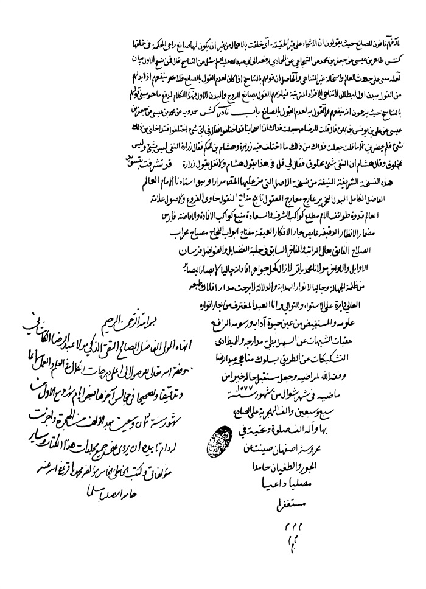

بحار الأنوار الجامعة لدرر أخبار الائمة الأطهار المجلد 4

هوية الكتاب
بطاقة تعريف: مجلسي محمد باقربن محمدتقي 1037 - 1111ق.
عنوان واسم المؤلف: بحار الأنوار الجامعة لدرر أخبار الأئمة الأطهار المجلد 4: تأليف محمد باقربن محمدتقي المجلسي.
عنوان واسم المؤلف: بيروت داراحياء التراث العربي [ -13].
مظهر: ج - عينة.
ملاحظة: عربي.
ملاحظة: فهرس الكتابة على أساس المجلد الرابع والعشرين، 1403ق. [1360].
ملاحظة: المجلد108،103،94،91،92،87،67،66،65،52،24(الطبعة الثالثة: 1403ق.=1983م.=[1361]).
ملاحظة: فهرس.
محتويات: ج.24.كتاب الامامة. ج.52.تاريخ الحجة. ج67،66،65.الإيمان والكفر. ج.87.كتاب الصلاة. ج.92،91.الذكر و الدعا. ج.94.كتاب السوم. ج.103.فهرست المصادر. ج.108.الفهرست.-
عنوان: أحاديث الشيعة — قرن 11ق
ترتيب الكونجرس: BP135/م3ب31300 ي ح
تصنيف ديوي: 297/212
رقم الببليوغرافيا الوطنية: 1680946
ص: 1

تتمة كتاب التوحید

أبواب تأویل الآیات و الأخبار الموهمة لخلاف ما سبق 

باب 1 تأویل قوله تعالی: «خَلَقْتُ بِیَدَیَّ و جَنْبِ اللَّهِ و وَجْهُ اللَّهِ و یَوْمَ یُكْشَفُ عَنْ ساقٍ» و أمثالها
«1»-فس، تفسیر القمی مُحَمَّدُ بْنُ أَحْمَدَ بْنِ ثَابِتٍ عَنِ الْقَاسِمِ بْنِ إِسْمَاعِیلَ الْهَاشِمِیِّ عَنْ مُحَمَّدِ بْنِ سَیَّارٍ عَنِ الْحُسَیْنِ بْنِ الْمُخْتَارِ عَنْ أَبِی بَصِیرٍ عَنْ أَبِی عَبْدِ اللَّهِ علیه السلام قَالَ: لَوْ أَنَّ اللَّهَ خَلَقَ الْخَلْقَ كُلَّهُمْ بِیَدِهِ لَمْ یَحْتَجَّ فِی آدَمَ أَنَّهُ خَلَقَهُ بِیَدِهِ فَیَقُولَ ما مَنَعَكَ أَنْ تَسْجُدَ لِما خَلَقْتُ بِیَدَیَّ أَ فَتَرَی اللَّهَ یَبْعَثُ الْأَشْیَاءَ بِیَدِهِ.
بیان: لعل المراد أنه لو كان اللّٰه تعالی جسما یزاول الأشیاء و یعالجها بیده لم یكن ذلك مختصا بآدم علیه السلام بل هو تعالی منزه عن ذلك و هو كنایة عن كمال العنایة بشأنه كما سیأتی.
«2»-ید، التوحید مع، معانی الأخبار ابْنُ عِصَامٍ عَنِ الْكُلَیْنِیِّ عَنِ الْعَلَّانِ عَنِ الْیَقْطِینِیِّ قَالَ: سَأَلْتُ أَبَا الْحَسَنِ عَلِیَّ بْنَ مُحَمَّدٍ الْعَسْكَرِیَّ علیه السلام عَنْ قَوْلِ اللَّهِ عَزَّ وَ جَلَّ وَ الْأَرْضُ جَمِیعاً قَبْضَتُهُ یَوْمَ الْقِیامَةِ وَ السَّماواتُ مَطْوِیَّاتٌ بِیَمِینِهِ فَقَالَ ذَلِكَ تَعْیِیرُ اللَّهِ تَبَارَكَ وَ تَعَالَی لِمَنْ شَبَّهَهُ بِخَلْقِهِ أَ لَا تَرَی أَنَّهُ قَالَ وَ ما قَدَرُوا اللَّهَ حَقَّ قَدْرِهِ وَ مَعْنَاهُ إِذْ قَالُوا إِنَّ الْأَرْضَ جَمِیعاً قَبْضَتُهُ یَوْمَ الْقِیامَةِ وَ السَّماواتُ مَطْوِیَّاتٌ بِیَمِینِهِ كَمَا قَالَ عَزَّ وَ جَلَّ وَ ما قَدَرُوا اللَّهَ حَقَّ قَدْرِهِ إِذْ قالُوا ما أَنْزَلَ اللَّهُ عَلی بَشَرٍ مِنْ شَیْ ءٍ ثُمَّ نَزَّهَ عَزَّ وَ جَلَّ نَفْسَهُ عَنِ الْقَبْضَةِ وَ الْیَمِینِ فَقَالَ سُبْحانَهُ وَ تَعالی عَمَّا یُشْرِكُونَ.

بیان: هذا وجه حسن لم یتعرض له المفسرون و قوله تعالی وَ ما قَدَرُوا اللَّهَ حَقَّ قَدْرِهِ متصل بقوله وَ الْأَرْضُ جَمِیعاً فیكون علی تأویله علیه السلام القول مقدرا أی ما عظموا اللّٰه حق تعظیمه و قد قالوا إن الأرض جمیعا و یؤیده
أَنَّ الْعَامَّةَ رَوَوْا أَنَّ یَهُودِیّاً أَتَی النَّبِیَّ صلی اللّٰه علیه و آله وَ ذَكَرَ نَحْواً مِنْ ذَلِكَ فَضَحِكَ ص
«3»-ید، التوحید أَحْمَدُ بْنُ الْهَیْثَمِ الْعِجْلِیُّ عَنِ ابْنِ زَكَرِیَّا الْقَطَّانِ عَنِ ابْنِ حَبِیبٍ عَنِ ابْنِ بُهْلُولٍ عَنْ أَبِیهِ عَنْ أَبِی الْحَسَنِ الْعَبْدِیِّ عَنْ سُلَیْمَانَ بْنِ مِهْرَانَ قَالَ: سَأَلْتُ أَبَا عَبْدِ اللَّهِ علیه السلام عَنْ قَوْلِ اللَّهِ عَزَّ وَ جَلَّ وَ الْأَرْضُ جَمِیعاً قَبْضَتُهُ یَوْمَ الْقِیامَةِ فَقَالَ یَعْنِی مِلْكَهُ لَا یَمْلِكُهَا مَعَهُ أَحَدٌ وَ الْقَبْضُ مِنَ اللَّهِ تَعَالَی فِی مَوْضِعٍ آخَرَ الْمَنْعُ وَ الْبَسْطُ مِنْهُ الْإِعْطَاءُ وَ التَّوْسِیعُ كَمَا قَالَ عَزَّ وَ جَلَّ وَ اللَّهُ یَقْبِضُ وَ یَبْصُطُ وَ إِلَیْهِ تُرْجَعُونَ یَعْنِی یُعْطِی وَ یُوَسِّعُ وَ یَمْنَعُ وَ یُضَیِّقُ وَ الْقَبْضُ مِنْهُ عَزَّ وَ جَلَّ فِی وَجْهٍ آخَرَ الْأَخْذُ فِی وَجْهِ الْقَبُولِ مِنْهُ كَمَا قَالَ وَ یَأْخُذُ الصَّدَقاتِ أَیْ یَقْبَلُهَا مِنْ أَهْلِهَا وَ یُثِیبُ عَلَیْهَا قُلْتُ فَقَوْلُهُ عَزَّ وَ جَلَّ وَ السَّماواتُ مَطْوِیَّاتٌ بِیَمِینِهِ قَالَ الْیَمِینُ الْیَدُ وَ الْیَدُ الْقُدْرَةُ وَ الْقُوَّةُ یَقُولُ عَزَّ وَ جَلَّ وَ السَّمَوَاتُ مَطْوِیَّاتٌ بِقُدْرَتِهِ وَ قُوَّتِهِ سُبْحانَهُ وَ تَعالی عَمَّا یُشْرِكُونَ.
بیان: قال الشیخ الطبرسی رحمه اللّٰه القبضة فی اللغة ما قبضت علیه بجمیع كفّك أخبر اللّٰه سبحانه عن كمال قدرته فذكر أن الأرض كلها مع عظمها فی مقدوره كالشی ء الذی یقبض علیه القابض بكفّه فیكون فی قبضته و هذا تفهیم لنا علی عادة التخاطب فیما بیننا لأنا نقول هذا فی قبضة فلان و فی ید فلان إذا هان علیه التصرف فیه و إن لم یقبض علیه و كذا قوله وَ السَّماواتُ مَطْوِیَّاتٌ بِیَمِینِهِ أی یطویها بقدرته كما یطوی أحد منا الشی ء المقدور له طیّه بیمینه و ذكر الیمین للمبالغة فی الاقتدار و التحقیق للملك كما قال أَوْ ما مَلَكَتْ أَیْمانُكُمْ أی ما كانت تحت قدرتكم إذ لیس الملك یختص بالیمین دون الشمال و سائر الجسد و قیل معناه أنها محفوظات مصونات بقوّته و الیمین القوّة (1).
ص: 2

> **پاورقی**: 1- قال الرضی رضوان اللّٰه علیه فی تلخیص البیان: و هاتان استعارتان، و معنی «قبضنا» هاهنا أی ملك له خالص قد ارتفعت عنه أیدی المالكین من بریته و المتصرفین فیه من خلیفته، و قد ورث تعالی عباده ما كان ملكهم فی دار الدنیا من ذلك، فلم یبق ملك إلّا انتقل، و لا مالك إلّا بطل. و قیل أیضا: معنی ذلك أن الأرض فی مقدوره كالذی یقبض علیه القابض و یستولی علیه كفه، و یحوزه ملكه، و لا یشاركه فیه غیره. و معنی قوله: «وَ السَّماواتُ مَطْوِیَّاتٌ بِیَمِینِهِ» أی مجموعات فی ملكه و مضمونات بقدرته، و الیمین هاهنا بمعنی الملك، یقول القائل: هذا ملك یمینی، و لیس یرید الیمین التی هی الجارحة، و قد یعبرون عن القوّة أیضا بالیمین، فیجوز علی هذا التأویل أن یكون معنی قوله: «مَطْوِیَّاتٌ بِیَمِینِهِ» أی یجمع أقطارها و یطوی انتشارها بقوته، كما قال سبحانه: «یَوْمَ نَطْوِی السَّماءَ كَطَیِّ السِّجِلِّ لِلْكُتُبِ» و قیل: للیمین هاهنا وجه آخر، و هو أن یكون بمعنی القسم، لانه تعالی لما قال فی سورة الأنبیاء: «یَوْمَ نَطْوِی السَّماءَ كَطَیِّ السِّجِلِّ لِلْكُتُبِ كَما بَدَأْنا أَوَّلَ خَلْقٍ نُعِیدُهُ وَعْداً عَلَیْنا إِنَّا كُنَّا فاعِلِینَ» كان التزامه تعالی فعل ما أوجبه علی نفسه بهذا الوعد، كأنّه قسم أقسم به لیفعلن ذلك، فأخبر سبحانه فی هذا الموضع من السورة الأخری «وَ السَّماواتُ مَطْوِیَّاتٌ بِیَمِینِهِ» أی بذلك الوعد الذی ألزمه نفسه تعالی و جری مجری القسم الذی لا بد أن یقع الوفاء به، و الخروج منه. و الاعتماد علی القولین المتقدمین أولی.

«4»-ید، التوحید ن، عیون أخبار الرضا علیه السلام الْهَمْدَانِیُّ عَنْ عَلِیٍّ عَنْ أَبِیهِ عَنِ الْهَرَوِیِّ قَالَ: قُلْتُ لِعَلِیِّ بْنِ مُوسَی الرِّضَا علیهما السلام یَا ابْنَ رَسُولِ اللَّهِ مَا تَقُولُ فِی الْحَدِیثِ الَّذِی یَرْوِیهِ أَهْلُ الْحَدِیثِ أَنَّ الْمُؤْمِنِینَ یَزُورُونَ رَبَّهُمْ مِنْ مَنَازِلِهِمْ فِی الْجَنَّةِ فَقَالَ علیه السلام یَا أَبَا الصَّلْتِ إِنَّ اللَّهَ تَبَارَكَ وَ تَعَالَی فَضَّلَ نَبِیَّهُ مُحَمَّداً صلی اللّٰه علیه و آله عَلَی جَمِیعِ خَلْقِهِ مِنَ النَّبِیِّینَ وَ الْمَلَائِكَةِ وَ جَعَلَ طَاعَتَهُ طَاعَتَهُ وَ مُبَایَعَتَهُ مُبَایَعَتَهُ وَ زِیَارَتَهُ فِی الدُّنْیَا وَ الْآخِرَةِ زِیَارَتَهُ فَقَالَ عَزَّ وَ جَلَّ مَنْ یُطِعِ الرَّسُولَ فَقَدْ أَطاعَ اللَّهَ وَ قَالَ إِنَّ الَّذِینَ یُبایِعُونَكَ إِنَّما یُبایِعُونَ اللَّهَ یَدُ اللَّهِ فَوْقَ أَیْدِیهِمْ وَ قَالَ النَّبِیُّ صلی اللّٰه علیه و آله مَنْ زَارَنِی فِی حَیَاتِی أَوْ بَعْدَ مَوْتِی فَقَدْ زَارَ اللَّهَ وَ دَرَجَةُ النَّبِیِّ صلی اللّٰه علیه و آله فِی الْجَنَّةِ أَرْفَعُ الدَّرَجَاتِ فَمَنْ زَارَهُ إِلَی دَرَجَتِهِ فِی الْجَنَّةِ مِنْ مَنْزِلِهِ فَقَدْ زَارَ اللَّهَ تَبَارَكَ وَ تَعَالَی قَالَ فَقُلْتُ لَهُ یَا ابْنَ رَسُولِ اللَّهِ فَمَا مَعْنَی الْخَبَرِ الَّذِی رَوَوْهُ أَنَّ ثَوَابَ لَا إِلَهَ إِلَّا اللَّهُ النَّظَرُ إِلَی وَجْهِ اللَّهِ فَقَالَ علیه السلام یَا أَبَا الصَّلْتِ مَنْ وَصَفَ اللَّهَ بِوَجْهٍ كَالْوُجُوهِ فَقَدْ كَفَرَ وَ لَكِنَّ وَجْهَ اللَّهِ أَنْبِیَاؤُهُ وَ رُسُلُهُ وَ حُجَجُهُ صَلَوَاتُ اللَّهِ عَلَیْهِمْ هُمُ الَّذِینَ بِهِمْ یُتَوَجَّهُ إِلَی اللَّهِ عَزَّ وَ جَلَّ وَ إِلَی دِینِهِ وَ مَعْرِفَتِهِ وَ قَالَ اللَّهُ عَزَّ وَ جَلَّ كُلُّ مَنْ عَلَیْها فانٍ وَ یَبْقی وَجْهُ رَبِّكَ وَ قَالَ عَزَّ وَ جَلَّ كُلُّ شَیْ ءٍ هالِكٌ إِلَّا وَجْهَهُ فَالنَّظَرُ إِلَی أَنْبِیَاءِ اللَّهِ وَ رُسُلِهِ وَ حُجَجِهِ علیهم السلام فِی دَرَجَاتِهِمْ ثَوَابٌ عَظِیمٌ لِلْمُؤْمِنِینَ یَوْمَ الْقِیَامَةِ وَ قَدْ قَالَ النَّبِیُّ صلی اللّٰه علیه و آله مَنْ أَبْغَضَ أَهْلَ بَیْتِی وَ عِتْرَتِی
ص: 3

لَمْ یَرَنِی وَ لَمْ أَرَهُ یَوْمَ الْقِیَامَةِ وَ قَالَ صلی اللّٰه علیه و آله إِنَّ فِیكُمْ مَنْ لَا یَرَانِی بَعْدَ أَنْ یُفَارِقَنِی یَا أَبَا الصَّلْتِ إِنَّ اللَّهَ تَبَارَكَ وَ تَعَالَی لَا یُوصَفُ بِمَكَانٍ وَ لَا یُدْرَكُ بِالْأَبْصَارِ وَ الْأَوْهَامِ قَالَ فَقُلْتُ لَهُ یَا ابْنَ رَسُولِ اللَّهِ فَأَخْبِرْنِی عَنِ الْجَنَّةِ وَ النَّارِ أَ هُمَا الْیَوْمَ مَخْلُوقَتَانِ فَقَالَ نَعَمْ وَ إِنَّ رَسُولَ اللَّهِ صلی اللّٰه علیه و آله قَدْ دَخَلَ الْجَنَّةَ وَ رَأَی النَّارَ لَمَّا عُرِجَ بِهِ إِلَی السَّمَاءِ قَالَ فَقُلْتُ لَهُ إِنَّ قَوْماً یَقُولُونَ إِنَّهُمَا الْیَوْمَ مُقَدَّرَتَانِ غَیْرُ مَخْلُوقَتَیْنِ فَقَالَ علیه السلام مَا أُولَئِكَ مِنَّا وَ لَا نَحْنُ مِنْهُمْ مَنْ أَنْكَرَ خَلْقَ الْجَنَّةِ وَ النَّارِ فَقَدْ كَذَّبَ النَّبِیَّ صلی اللّٰه علیه و آله وَ كَذَّبَنَا وَ لَیْسَ مِنْ وَلَایَتِنَا عَلَی شَیْ ءٍ وَ یُخَلَّدُ فِی نَارِ جَهَنَّمَ قَالَ اللَّهُ عَزَّ وَ جَلَّ هذِهِ جَهَنَّمُ الَّتِی یُكَذِّبُ بِهَا الْمُجْرِمُونَ یَطُوفُونَ بَیْنَها وَ بَیْنَ حَمِیمٍ آنٍ وَ قَالَ النَّبِیُّ صلی اللّٰه علیه و آله لَمَّا عُرِجَ بِی إِلَی السَّمَاءِ أَخَذَ بِیَدِی جَبْرَئِیلُ فَأَدْخَلَنِی الْجَنَّةَ فَنَاوَلَنِی مِنْ رُطَبِهَا فَأَكَلْتُهُ فَتَحَوَّلَ ذَلِكَ نُطْفَةً فِی صُلْبِی فَلَمَّا هَبَطْتُ إِلَی الْأَرْضِ وَاقَعْتُ خَدِیجَةَ فَحَمَلَتْ بِفَاطِمَةَ فَفَاطِمَةُ حَوْرَاءُ إِنْسِیَّةٌ فَكُلَّمَا اشْتَقْتُ إِلَی رَائِحَةِ الْجَنَّةِ شَمِمْتُ رَائِحَةَ ابْنَتِی فَاطِمَةَ (1).
«5»-ید، التوحید مع، معانی الأخبار الدَّقَّاقُ عَنِ الْأَسَدِیِّ عَنِ الْبَرْمَكِیِّ عَنِ الْحُسَیْنِ بْنِ الْحَسَنِ عَنْ بَكْرٍ عَنْ أَبِی عَبْدِ اللَّهِ الْبَرْقِیِّ عَنْ عَبْدِ اللَّهِ بْنِ یَحْیَی عَنْ أَبِی أَیُّوبَ الْخَزَّازِ عَنْ مُحَمَّدِ بْنِ مُسْلِمٍ قَالَ: سَأَلْتُ أَبَا جَعْفَرٍ علیه السلام فَقُلْتُ قَوْلُهُ عَزَّ وَ جَلَّ یا إِبْلِیسُ ما مَنَعَكَ أَنْ تَسْجُدَ لِما خَلَقْتُ بِیَدَیَّ فَقَالَ الْیَدُ فِی كَلَامِ الْعَرَبِ الْقُوَّةُ وَ النِّعْمَةُ قَالَ اللَّهُ وَ اذْكُرْ عَبْدَنا داوُدَ ذَا الْأَیْدِ وَ قَالَ وَ السَّماءَ بَنَیْناها بِأَیْدٍ أَیْ بِقُوَّةٍ وَ قَالَ وَ أَیَّدَهُمْ بِرُوحٍ مِنْهُ أَیْ قَوَّاهُمْ وَ یُقَالُ لِفُلَانٍ عِنْدِی أَیَادِی كَثِیرَةٌ أَیْ فَوَاضِلُ وَ إِحْسَانٌ وَ لَهُ عِنْدِی یَدٌ بَیْضَاءُ أَیْ نِعْمَةٌ.
بیان: یظهر منه أن التأیید مشتقّ من الید بمعنی القوّة كما یظهر من كلام الجوهریّ أیضا.
«6»-ید، التوحید مع، معانی الأخبار ابْنُ الْوَلِیدِ عَنِ الصَّفَّارِ عَنْ مُحَمَّدِ بْنِ عِیسَی عَنِ الْمَشْرِقِیِّ عَنْ عَبْدِ اللَّهِ بْنِ قَیْسٍ عَنْ أَبِی الْحَسَنِ الرِّضَا علیه السلام قَالَ سَمِعْتُهُ یَقُولُ بَلْ یَداهُ مَبْسُوطَتانِ فَقُلْتُ لَهُ یَدَانِ هَكَذَا وَ أَشَرْتُ بِیَدِی إِلَی یَدَیْهِ فَقَالَ لَا لَوْ كَانَ هَكَذَا لَكَانَ مَخْلُوقاً.
ص: 4

> **پاورقی**: 1- أخرج الحدیث مقطّعا عن التوحید و العیون و الأمالی و الاحتجاج فی باب نفی الرؤیة تحت رقم 6.

بیان: غلّ الید و بسطها كنایة عن البخل و الجود و ثنی الید مبالغة فی الردّ و نفی البخل عنه و إثبات لغایة الجود فإن غایة ما یبذله السخیّ من ماله أن یعطیه بیدیه أو للإشارة إلی منح الدنیا و الآخرة أو ما یعطی للاستدراج و ما یعطی للإكرام أو للإشارة إلی لطفه و قهره.
«7»-فس، تفسیر القمی كُلُّ مَنْ عَلَیْها فانٍ وَ یَبْقی وَجْهُ رَبِّكَ قَالَ دِینُ رَبِّكَ وَ قَالَ عَلِیُّ بْنُ الْحُسَیْنِ علیهما السلام نَحْنُ الْوَجْهُ الَّذِی یُؤْتَی اللَّهُ مِنْهُ.
«8»-ید، التوحید مع، معانی الأخبار أَبِی عَنْ سَعْدٍ عَنِ ابْنِ عِیسَی عَنِ ابْنِ بَزِیعٍ عَنْ مَنْصُورِ بْنِ یُونُسَ عَنْ جَلِیسٍ لِأَبِی حَمْزَةَ عَنْ أَبِی حَمْزَةَ قَالَ: قُلْتُ لِأَبِی جَعْفَرٍ علیه السلام قَوْلُ اللَّهِ عَزَّ وَ جَلَّ كُلُّ شَیْ ءٍ هالِكٌ إِلَّا وَجْهَهُ قَالَ فَیَهْلِكُ كُلُّ شَیْ ءٍ وَ یَبْقَی الْوَجْهُ إِنَّ اللَّهَ عَزَّ وَ جَلَّ أَعْظَمُ مِنْ أَنْ یُوصَفَ بِالْوَجْهِ وَ لَكِنَّ مَعْنَاهُ كُلُّ شَیْ ءٍ هَالِكٌ إِلَّا دِینَهُ وَ الْوَجْهُ الَّذِی یُؤْتَی مِنْهُ.
یر، بصائر الدرجات ابن یزید عن ابن أبی عمیر عن منصور مثله- یر، بصائر الدرجات أحمد بن محمد عن الحسین بن سعید عن محمد بن إسماعیل عن منصور عن أبی حمزة مثله.
«9»-یر، بصائر الدرجات أَحْمَدُ عَنِ الْحُسَیْنِ عَنْ بَعْضِ أَصْحَابِنَا عَنِ ابْنِ عَمِیرَةَ عَنِ ابْنِ الْمُغِیرَةِ قَالَ: كُنَّا عِنْدَ أَبِی عَبْدِ اللَّهِ علیه السلام فَسَأَلَهُ رَجُلٌ عَنْ قَوْلِ اللَّهِ كُلُّ شَیْ ءٍ هالِكٌ إِلَّا وَجْهَهُ قَالَ مَا یَقُولُونَ فِیهِ قُلْتُ یَقُولُونَ یَهْلِكُ كُلُّ شَیْ ءٍ إِلَّا وَجْهَهُ فَقَالَ یَهْلِكُ كُلُّ شَیْ ءٍ إِلَّا وَجْهَهُ الَّذِی یُؤْتَی مِنْهُ وَ نَحْنُ وَجْهُ اللَّهِ الَّذِی یُؤْتَی مِنْهُ.
«10»-ید، التوحید مع، معانی الأخبار ابْنُ الْمُتَوَكِّلِ عَنِ السَّعْدَآبَادِیِّ عَنِ الْبَرْقِیِّ عَنْ أَبِیهِ عَنْ رَبِیعٍ الْوَرَّاقِ عَنْ صَالِحِ بْنِ سَهْلٍ عَنْ أَبِی عَبْدِ اللَّهِ علیه السلام فِی قَوْلِ اللَّهِ عَزَّ وَ جَلَّ كُلُّ شَیْ ءٍ هالِكٌ إِلَّا وَجْهَهُ قَالَ نَحْنُ.
«11»- ید، التوحید مَاجِیلَوَیْهِ عَنْ مُحَمَّدٍ الْعَطَّارِ عَنْ سَهْلٍ عَنِ الْبَزَنْطِیِّ عَنْ صَفْوَانَ الْجَمَّالِ عَنْ أَبِی عَبْدِ اللَّهِ علیه السلام فِی قَوْلِ اللَّهِ عَزَّ وَ جَلَّ كُلُّ شَیْ ءٍ هالِكٌ إِلَّا وَجْهَهُ قَالَ مَنْ أَتَی اللَّهَ بِمَا أَمَرَ بِهِ مِنْ طَاعَةِ مُحَمَّدٍ وَ الْأَئِمَّةِ مِنْ بَعْدِهِ صَلَوَاتُ اللَّهِ عَلَیْهِمْ فَهُوَ الْوَجْهُ الَّذِی لَا یَهْلِكُ ثُمَّ قَرَأَ مَنْ یُطِعِ الرَّسُولَ فَقَدْ أَطاعَ اللَّهَ.
ص: 5

«12»-وَ بِهَذَا الْإِسْنَادِ قَالَ أَبُو عَبْدِ اللَّهِ علیه السلام نَحْنُ وَجْهُ اللَّهِ الَّذِی لَا یَهْلِكُ.
«13»-ید، التوحید ابْنُ الْوَلِیدِ عَنِ الصَّفَّارِ عَنِ ابْنِ یَزِیدَ عَنْ صَفْوَانَ بْنِ یَحْیَی عَنْ أَبِی سَعِیدٍ الْمُكَارِی (1)عَنْ أَبِی بَصِیرٍ عَنِ الْحَارِثِ بْنِ الْمُغِیرَةِ النَّصْرِیِّ (2)قَالَ: سَأَلْتُ أَبَا عَبْدِ اللَّهِ علیه السلام عَنْ قَوْلِ اللَّهِ عَزَّ وَ جَلَّ كُلُّ شَیْ ءٍ هالِكٌ إِلَّا وَجْهَهُ قَالَ كُلُّ شَیْ ءٍ هَالِكٌ إِلَّا مَنْ أَخَذَ طَرِیقَ الْحَقِّ.
بیان: ذكر المفسّرون فیه وجهین أحدهما أن المراد به إلا ذاته كما یقال وجه هذا الأمر أی حقیقته و ثانیهما أن المعنی ما أرید به وجه اللّٰه من العمل و اختلف علی الأول فی الهلاك هل هو الانعدام حقیقة أو أنه لإمكانه فی معرض الفناء و العدم و علی ما ورد فی تلك الأخبار یكون المراد بالوجه الجهة كما هو فی أصل اللغة فیمكن أن یراد به دین اللّٰه إذ به یتوسل إلی اللّٰه و یتوجه إلی رضوانه أو أئمة الدین فإنهم جهة اللّٰه و بهم یتوجه إلی اللّٰه و رضوانه و من أراد طاعة اللّٰه تعالی یتوجه إلیهم (3) .
ص: 6

> **پاورقی**: 1- قد وقع الخلاف فی اسمه فسماه النجاشیّ و العلامة هاشم بن حیان، و الشیخ هشام بن حیان، و الرجل كوفیّ مولی بنی عقیل، روی عن أبی عبد اللّٰه علیه السلام، و كان هو و ابنه الحسین وجهین فی الواقفة، نص علی ذلك النجاشیّ فی ترجمة ابنه.

> **پاورقی**: 2- النصری- بالنون المفتوحة و الصاد المهملة- من بنی نصر بن معاویة، یكنی أبا علی، بصری ثقة ثقة، روی عن الباقر و الصادق و موسی بن جعفر علیهم السلام و زید بن علیّ. و روی الكشّیّ و غیره روایات تدلّ علی مدحه و وثاقته.

> **پاورقی**: 3- قال السیّد الرضیّ ذیل قوله تعالی «كُلُّ شَیْ ءٍ هالِكٌ إِلَّا وَجْهَهُ»: و هذه استعارة و الوجه هاهنا عبارة عن ذات الشی ء و نفسه، و علی هذا قوله تعالی فی السورة التی فیها الرحمن سبحانه: «وَ یَبْقی وَجْهُ رَبِّكَ ذُو الْجَلالِ وَ الْإِكْرامِ» أی و یبقی ذات ربك، و من الدلیل علی ذلك الرفع فی قوله: «ذُو الْجَلالِ وَ الْإِكْرامِ» لانه صفة للوجه الذی هو الذات، و لو كان الوجه هاهنا بمعنی العضو المخصوص علی ما ظنه الجهال لكان «و یبقی وجه ربك ذی الجلال و الإكرام» فیكون «ذی» صفة للجملة لا صفة للوجه الذی هو التخاطیط المخصوص، كما یقول القائل: رأیت وجه الامیر ذی الطول و الانعام، و لا یقول: «ذا» لان الطول و الانعام من صفات جملته، لا من صفات وجهه، و یوضح ذلك قوله فی هذه السورة: «تَبارَكَ اسْمُ رَبِّكَ ذِی الْجَلالِ وَ الْإِكْرامِ» لما كان الاسم غیر المسمی وصف سبحانه المضاف إلیه، و لما كان الوجه فی الآیة المتقدمة هو النفس و الذات قال تعالی: «ذُو الْجَلالِ» و لم یقل: «ذِی الْجَلالِ وَ الْإِكْرامِ» و یقولون: عین الشی ء و نفس الشی ء علی هذا النحو. و قد قیل فی ذلك وجه آخر و هو أن یراد بالوجه هاهنا ما قصد اللّٰه به من العمل الصالح و المتجر الرابح علی طریق القربة و طلب الزلفة و علی ذلك قول الشاعر: «استغفر اللّٰه ذنبا لست محصیه رب العباد إلیه الوجه و العمل» أی إلیه تعالی قصد الفعل الذی یستنزل به فضله و درجات عفوه، فأعلمنا سبحانه أن كل شی ء هالك الا وجه دینه الذی یوصل إلیه منه، و یستزلف عنده به و یجعل وسیلة إلی رضوانه و سببا لغفرانه.

«14»-ید، التوحید أَبِی عَنْ سَعْدٍ عَنِ ابْنِ عِیسَی عَنْ عَلِیِّ بْنِ سَیْفٍ عَنْ أَخِیهِ الْحُسَیْنِ عَنْ أَبِیهِ سَیْفِ بْنِ عَمِیرَةَ النَّخَعِیِّ عَنْ خثیمة [خَیْثَمَةَ] قَالَ: سَأَلْتُ أَبَا عَبْدِ اللَّهِ علیه السلام عَنْ قَوْلِ اللَّهِ عَزَّ وَ جَلَّ كُلُّ شَیْ ءٍ هالِكٌ إِلَّا وَجْهَهُ قَالَ دِینَهُ وَ كَانَ رَسُولُ اللَّهِ صلی اللّٰه علیه و آله وَ أَمِیرُ الْمُؤْمِنِینَ علیه السلام دِینَ اللَّهِ وَ وَجْهَهُ وَ عَیْنَهُ فِی عِبَادِهِ وَ لِسَانَهُ الَّذِی یَنْطِقُ بِهِ وَ یَدَهُ عَلَی خَلْقِهِ وَ نَحْنُ وَجْهُ اللَّهِ الَّذِی یُؤْتَی مِنْهُ لَنْ نَزَالَ فِی عِبَادِهِ مَا دَامَتْ لِلَّهِ فِیهِمْ رَوِیَّةٌ قُلْتُ وَ مَا الرَّوِیَّةُ قَالَ الْحَاجَةُ فَإِذَا لَمْ یَكُنْ لِلَّهِ فِیهِمْ حَاجَةٌ رَفَعَنَا إِلَیْهِ فَصَنَعَ مَا أَحَبَّ.
بیان: قال الجوهری لنا قبلك رویّة أی حاجة انتهی و حاجة اللّٰه مجاز عن علم الخیر و الصلاح فیهم.
«15»-ید، التوحید أَبِی عَنْ سَعْدٍ عَنِ ابْنِ هَاشِمٍ عَنِ ابْنِ فَضَّالٍ عَنْ أَبِی جَمِیلَةَ عَنْ مُحَمَّدِ بْنِ عَلِیٍّ الْحَلَبِیِّ عَنْ أَبِی عَبْدِ اللَّهِ علیه السلام فِی قَوْلِهِ عَزَّ وَ جَلَّ یَوْمَ یُكْشَفُ عَنْ ساقٍ قَالَ تَبَارَكَ الْجَبَّارُ ثُمَّ أَشَارَ إِلَی سَاقِهِ فَكَشَفَ عَنْهَا الْإِزَارَ قَالَ وَ یُدْعَوْنَ إِلَی السُّجُودِ فَلا یَسْتَطِیعُونَ قَالَ أُفْحِمَ الْقَوْمُ وَ دَخَلَتْهُمُ الْهَیْبَةُ وَ شَخَصَتِ الْأَبْصَارُ وَ بَلَغَتِ الْقُلُوبُ الْحَناجِرَ شَاخِصَةً أَبْصَارُهُمْ تَرْهَقُهُمُ الذِّلَّةُ وَ قَدْ كانُوا یُدْعَوْنَ إِلَی السُّجُودِ وَ هُمْ سالِمُونَ قال الصدوق رحمه اللّٰه قوله علیه السلام تَبَارَكَ الْجَبَّارُ وَ أَشَارَ إِلَی سَاقِهِ فَكَشَفَ عَنْهَا الْإِزَارَ یعنی به تبارك الجبار أن یوصف بالساق الذی هذه صفته. بیان أفحمته أسكتته فی خصومة أو غیرها.
«16»-ید، التوحید ابْنُ الْوَلِیدِ عَنِ الصَّفَّارِ عَنِ ابْنِ عِیسَی عَنِ الْبَزَنْطِیِّ عَنِ الْحُسَیْنِ بْنِ مُوسَی عَنْ عُبَیْدِ بْنِ زُرَارَةَ عَنْ أَبِی عَبْدِ اللَّهِ علیه السلام قَالَ: سَأَلْتُهُ عَنْ قَوْلِ اللَّهِ عَزَّ وَ جَلَّ یَوْمَ یُكْشَفُ عَنْ ساقٍ قَالَ كَشَفَ إِزَارَهُ عَنْ سَاقِهِ وَ یَدُهُ الْأُخْرَی عَلَی رَأْسِهِ فَقَالَ سُبْحَانَ رَبِّیَ الْأَعْلَی.
قال الصدوق معنی قوله سبحان ربی الأعلی تنزیه لله عز و جل عن أن یكون له ساق.
«17»-ید، التوحید ن، عیون أخبار الرضا علیه السلام الْمُكَتِّبُ وَ الدَّقَّاقُ عَنِ الْأَسَدِیِّ عَنِ الْبَرْمَكِیِّ عَنِ الْحُسَیْنِ بْنِ الْحَسَنِ عَنْ بَكْرِ بْنِ صَالِحٍ عَنِ الْحَسَنِ بْنِ سَعِیدٍ (1)عَنْ أَبِی الْحَسَنِ علیه السلام فِی قَوْلِهِ عَزَّ
ص: 7

> **پاورقی**: 1- و فی نسخة: عن الحسین بن سعید.

وَ جَلَّ یَوْمَ یُكْشَفُ عَنْ ساقٍ قَالَ حِجَابٌ مِنْ نُورٍ یُكْشَفُ فَیَقَعُ الْمُؤْمِنُونَ سُجَّداً أو [وَ] تُدْمَجُ أَصْلَابُ الْمُنَافِقِینَ فَلَا یَسْتَطِیعُونَ السُّجُودَ.
ج، الإحتجاج عن الرضا علیه السلام مثله بیان دمج دموجا دخل فی الشی ء و استحكم فیه و الدامج المجتمع قوله یكشف أی عن شی ء من أنوار عظمته و آثار قدرته و اعلم أن المفسرین ذكروا فی تأویل هذه الآیة وجوها الأول أن المراد یوم یشتدّ الأمر و یصعب الخطب و كشف الساق مثل فی ذلك و أصله تشمیر المخدّرات عن سوقهن فی الهرب قال حاتم
إن عضّت به الحرب عضّها و إن شمّرت عن ساقها الحرب شمّرا.
الثانی أن المعنی یوم یكشف عن أصل الأمر و حقیقته بحیث یصیر عیانا مستعار من ساق الشجر و ساق الإنسان و تنكیره للتهویل أو للتعظیم. الثالث أن المعنی أنه یكشف عن ساق جهنم أو ساق العرش أو ساق ملك مهیب عظیم. قال الطبرسیّ رحمه اللّٰه وَ یُدْعَوْنَ إِلَی السُّجُودِ أی یقال لهم علی وجه التوبیخ اسجدوا فَلا یَسْتَطِیعُونَ و قیل معناه أن شدّة الأمر و صعوبة حال ذلك الیوم تدعوهم إلی السجود و إن كانوا لا ینتفعون به لیس أنهم یؤمرون به و هذا كما یفزع الإنسان إلی السجود إذا أصابه هول من أهوال الدنیا خاشِعَةً أَبْصارُهُمْ أی ذلیلة أبصارهم لا یرفعون نظرهم عن الأرض ذلّة و مهانة تَرْهَقُهُمْ ذِلَّةٌ أی تغشاهم ذلّة الندامة و الحسرة وَ قَدْ كانُوا یُدْعَوْنَ إِلَی السُّجُودِ وَ هُمْ سالِمُونَ أی أصحاء یمكنهم السجود فلا یسجدون یعنی أنهم كانوا یؤمرون بالصلاة فی الدنیا فلم یفعلوا
وَ رُوِیَ عَنْ أَبِی جَعْفَرٍ وَ أَبِی عَبْدِ اللَّهِ علیه السلام أَنَّهُمَا قَالا فِی هَذِهِ الْآیَةِ أُفْحِمَ الْقَوْمُ وَ دَخَلَتْهُمُ الْهَیْبَةُ وَ شَخَصَتِ الْأَبْصَارُ وَ بَلَغَتِ الْقُلُوبُ الْحَناجِرَ لِمَا رَهِقَهُمْ مِنَ النَّدَامَةِ وَ الْخِزْیِ وَ الْمَذَلَّةِ وَ قَدْ كانُوا یُدْعَوْنَ إِلَی السُّجُودِ وَ هُمْ سالِمُونَ أَیْ یَسْتَطِیعُونَ الْأَخْذَ بِمَا أُمِرُوا بِهِ وَ التَّرْكَ لِمَا نُهُوا عَنْهُ وَ لِذَلِكَ ابْتُلُوا
«18»- ید، التوحید ابْنُ الْوَلِیدِ عَنِ ابْنِ أَبَانٍ عَنِ الْحُسَیْنِ بْنِ سَعِیدٍ عَنِ النَّضْرِ عَنِ ابْنِ
ص: 8

سِنَانٍ عَنْ أَبِی بَصِیرٍ عَنْ أَبِی عَبْدِ اللَّهِ علیه السلام قَالَ قَالَ أَمِیرُ الْمُؤْمِنِینَ علیه السلام فِی خُطْبَةٍ أَنَا الْهَادِی وَ أَنَا الْمُهْتَدِی وَ أَنَا أَبُو الْیَتَامَی وَ الْمَسَاكِینِ وَ زَوْجُ الْأَرَامِلِ وَ أَنَا مَلْجَأُ كُلِّ ضَعِیفٍ وَ مَأْمَنُ كُلِّ خَائِفٍ وَ أَنَا قَائِدُ الْمُؤْمِنِینَ إِلَی الْجَنَّةِ وَ أَنَا حَبْلُ اللَّهِ الْمَتِینُ وَ أَنَا عُرْوَةُ اللَّهِ الْوُثْقَی وَ كَلِمَةُ التَّقْوَی وَ أَنَا عَیْنُ اللَّهِ وَ لِسَانُهُ الصَّادِقُ وَ یَدُهُ وَ أَنَا جَنْبُ اللَّهِ الَّذِی یَقُولُ أَنْ تَقُولَ نَفْسٌ یا حَسْرَتی عَلی ما فَرَّطْتُ فِی جَنْبِ اللَّهِ وَ أَنَا یَدُ اللَّهِ الْمَبْسُوطَةُ عَلَی عِبَادِهِ بِالرَّحْمَةِ وَ الْمَغْفِرَةِ وَ أَنَا بَابُ حِطَّةٍ مَنْ عَرَفَنِی وَ عَرَفَ حَقِّی فَقَدْ عَرَفَ رَبَّهُ لِأَنِّی وَصِیُّ نَبِیِّهِ فِی أَرْضِهِ وَ حُجَّتُهُ عَلَی خَلْقِهِ لَا یُنْكِرُ هَذَا إِلَّا رَادٌّ عَلَی اللَّهِ وَ رَسُولِهِ.
قال الصدوق الجنب الطاعة فی لغة العرب یقال هذا صغیر فی جنب اللّٰه أی فی طاعة اللّٰه عز و جل فمعنی قول أمیر المؤمنین علیه السلام أنا جنب اللّٰه أی أنا الذی ولایتی طاعة اللّٰه قال اللّٰه عز و جل أَنْ تَقُولَ نَفْسٌ یا حَسْرَتی عَلی ما فَرَّطْتُ فِی جَنْبِ اللَّهِ أی فی طاعة اللّٰه عز و جل. بیان
رُوِیَ عَنِ الْبَاقِرِ علیه السلام أَنَّهُ قَالَ: مَعْنَی جَنْبِ اللَّهِ أَنَّهُ لَیْسَ شَیْ ءٌ أَقْرَبَ إِلَی اللَّهِ مِنْ رَسُولِهِ وَ لَا أَقْرَبَ إِلَی رَسُولِهِ مِنْ وَصِیِّهِ فَهُوَ فِی الْقُرْبِ كَالْجَنْبِ وَ قَدْ بَیَّنَ اللَّهُ تَعَالَی ذَلِكَ فِی كِتَابِهِ بِقَوْلِهِ أَنْ تَقُولَ نَفْسٌ یا حَسْرَتی عَلی ما فَرَّطْتُ فِی جَنْبِ اللَّهِ یَعْنِی فِی وَلَایَةِ أَوْلِیَائِهِ.
و قال الطبرسیّ رحمه اللّٰه الجنب القرب أی یا حسرتی علی ما فرطت فی قرب اللّٰه و جواره و فلان فی جنب فلان أی فی قربه و جواره و منه قوله تعالی وَ الصَّاحِبِ بِالْجَنْبِ و هو الرفیق فی السفر و هو الذی یصحب الإنسان بأن یحصل بجنبه لكونه رفیقه قریبا منه ملاصقا له انتهی (1)و العین أیضا من المجازات الشائعة أی لمّا كان شاهدا علی عباده مطّلعا
ص: 9

> **پاورقی**: 1- قال السیّد الرضیّ رضی اللّٰه عنه: و هذه استعارة و قد اختلف فی المراد بالجنب هاهنا، فقال قوم: معناه فی ذات اللّٰه؛ و قال قوم: معناه فی طاعة اللّٰه و فی أمر اللّٰه، إلّا أنّه ذكر الجنب علی مجری العادة فی قولهم: هذا الامر صغیر فی جنب ذلك الامر أی فی جهته، لانه إذا عبر عنه بهذه العبارة دل علی اختصاصه به من وجه قریب من معنی صفته؛ و قال بعضهم: معنی «فی جنب اللّٰه» أی فی سبیل اللّٰه أو فی الجانب الأقرب الی مرضاته بالاوصل الی طاعاته، و لما كان الامر كله یتشعب الی طریقین: إحداهما هدی و رشاد، و الأخری غی و ضلال، و كل واحد منهما مجانب لصاحبه، أی هو فی جانب و الآخر فی جانب، و كان الجنب و الجانب بمعنی واحد حسنت العبارة هاهنا عن سبیل اللّٰه بجنب اللّٰه علی النحو الذی ذكرناه.

علیهم فكأنه عینه و كذا اللسان فإنه لمّا كان یخاطب الناس من قبل اللّٰه و یعبّر عنه فی بریّته فكأنه لسانه.
«19»-شی، تفسیر العیاشی عَنْ أَبِی مَعْمَرٍ السَّعْدِیِّ (1)قَالَ قَالَ عَلِیُّ بْنُ أَبِی طَالِبٍ علیهما السلام فِی قَوْلِهِ وَ لا یَنْظُرُ إِلَیْهِمْ یَعْنِی لَا یَنْظُرُ إِلَیْهِمْ بِخَیْرٍ لِمَنْ لَا یَرْحَمُهُمْ وَ قَدْ یَقُولُ الْعَرَبُ لِلرَّجُلِ السَّیِّدِ أَوْ لِلْمَلِكِ لَا تَنْظُرُ إِلَیْنَا یَعْنِی أَنَّكَ لَا تُصِیبُنَا بِخَیْرٍ وَ ذَلِكَ النَّظَرُ مِنَ اللَّهِ إِلَی خَلْقِهِ.
«20»-ید، التوحید ن، عیون أخبار الرضا علیه السلام ابْنُ عِصَامٍ عَنِ الْكُلَیْنِیِّ عَنْ أَحْمَدَ بْنِ إِدْرِیسَ عَنِ ابْنِ عِیسَی عَنْ عَلِیِّ بْنِ سَیْفٍ عَنْ مُحَمَّدِ بْنِ عُبَیْدَةَ قَالَ: سَأَلْتُ الرِّضَا علیه السلام عَنْ قَوْلِ اللَّهِ عَزَّ وَ جَلَّ لِإِبْلِیسَ ما مَنَعَكَ أَنْ تَسْجُدَ لِما خَلَقْتُ بِیَدَیَّ قَالَ یَعْنِی بِقُدْرَتِی وَ قُوَّتِی.
قال الصدوق رحمه اللّٰه سمعت بعض مشایخ الشیعة بنیسابور یذكر فی هذه الآیة أن الأئمة علیهم السلام كانوا یقفون علی قوله ما مَنَعَكَ أَنْ تَسْجُدَ لِما خَلَقْتُ ثم یبتدءون بقوله بِیَدَیَّ أَسْتَكْبَرْتَ أَمْ كُنْتَ مِنَ الْعالِینَ قال و هذا مثل قول القائل بسیفی تقاتلنی و برمحی تطاعننی كأنه یقول بنعمتی علیك و إحسانی إلیك قویت علی الاستكبار و العصیان. بیان ما ورد فی الخبر أظهر ما قیل فی تفسیر هذه الآیة و یمكن أن یقال فی توجیه التشبیه إنها لبیان أن فی خلقه كمال القدرة أو أن له روحا و بدنا أحدهما من عالم الخلق و الآخر من عالم الأمر أو لأنه مصدر لأفعال ملكیة و منشأ لأفعال بهیمیة و الثانیة كأنها أثر الشمال و كلتا یدیه یمین و أما حمل الید علی القدرة فهو شائع فی كلام العرب تقول ما لی لهذا الأمر من ید أی قوة و طاقة و قال تعالی أَوْ یَعْفُوَا الَّذِی بِیَدِهِ عُقْدَةُ النِّكاحِ و قد ذكر فی الآیة وجوه أخر أحدها أن الید عبارة عن النعمة یقال أیادی فلان فی حق فلان ظاهرة و المراد بالیدین النعم الظاهرة و الباطنة أو نعم الدین و الدنیا
ص: 10

> **پاورقی**: 1- یحتمل قویا أن یكون هو عبد اللّٰه بن سنجر الأزدیّ الذی عده الشیخ من أصحاب أمیر المؤمنین علیه السلام، و حكی عن ابن حجر أنّه قال: عبد اللّٰه بن سنجر- بفتح المهملة و سكون المعجمة و فتح الموحدة- الأزدیّ، أبو معمر الكوفیّ ثقة من الثانیة.

و ثانیها أن المراد خلقته بنفسی من غیر توسّط كأب و أمّ و ثالثها أنه كنایة عن غایة الاهتمام بخلقه فإن السلطان العظیم لا یعمل شیئا بیدیه إلا إذا كانت غایة عنایته مصروفة إلی ذلك العمل أقول سیأتی كثیر من الأخبار المناسبة لهذا الباب فی أبواب كتاب الإمامة و باب أسئلة الزندیق المدّعی للتناقض فی القرآن.

باب 2 تأویل قوله تعالی: «وَ نَفَخْتُ فِیهِ مِنْ رُوحِی» و «رُوحٌ مِنْهُ» و قوله صلی اللّٰه علیه و آله: خلق اللّٰه آدم علی صورته 
«1»-ید، التوحید ن، عیون أخبار الرضا علیه السلام الْهَمْدَانِیُّ عَنْ عَلِیٍّ عَنْ أَبِیهِ عَنْ عَلِیِّ بْنِ مَعْبَدٍ عَنِ الْحُسَیْنِ بْنِ خَالِدٍ قَالَ: قُلْتُ لِلرِّضَا علیه السلام یَا ابْنَ رَسُولِ اللَّهِ إِنَّ النَّاسَ یَرْوُونَ أَنَّ رَسُولَ اللَّهِ صلی اللّٰه علیه و آله قَالَ إِنَّ اللَّهَ خَلَقَ آدَمَ عَلَی صُورَتِهِ فَقَالَ قَاتَلَهُمُ اللَّهُ لَقَدْ حَذَفُوا أَوَّلَ الْحَدِیثِ إِنَّ رَسُولَ اللَّهِ صلی اللّٰه علیه و آله مَرَّ بِرَجُلَیْنِ یَتَسَابَّانِ فَسَمِعَ أَحَدَهُمَا یَقُولُ لِصَاحِبِهِ قَبَّحَ اللَّهُ وَجْهَكَ وَ وَجْهَ مَنْ یُشْبِهُكَ فَقَالَ علیه السلام یَا عَبْدَ اللَّهِ لَا تَقُلْ هَذَا لِأَخِیكَ فَإِنَّ اللَّهَ عَزَّ وَ جَلَّ خَلَقَ آدَمَ عَلَی صُورَتِهِ.
ج، الإحتجاج مرسلا عن الحسین مثله.
«2»- مع، معانی الأخبار أَبِی عَنْ عَلِیٍّ عَنْ أَبِیهِ عَنِ ابْنِ أَبِی عُمَیْرٍ عَنِ ابْنِ أُذَیْنَةَ عَنْ مُحَمَّدِ بْنِ مُسْلِمٍ قَالَ: سَأَلْتُ أَبَا جَعْفَرٍ علیه السلام عَنْ قَوْلِ اللَّهِ عَزَّ وَ جَلَّ وَ نَفَخْتُ فِیهِ مِنْ رُوحِی قَالَ رُوحٌ اخْتَارَهُ اللَّهُ وَ اصْطَفَاهُ وَ خَلَقَهُ وَ أَضَافَهُ إِلَی نَفْسِهِ وَ فَضَّلَهُ عَلَی جَمِیعِ الْأَرْوَاحِ فَأَمَرَ فَنُفِخَ مِنْهُ فِی آدَمَ علیه السلام.
ید، التوحید حمزة العلوی عن علی عن أبیه مثله.
«3»-ید، التوحید مع، معانی الأخبار غَیْرُ وَاحِدٍ مِنْ أَصْحَابِنَا عَنِ الْأَسَدِیِّ عَنِ الْبَرْمَكِیِّ عَنِ الْحُسَیْنِ بْنِ الْحَسَنِ عَنْ بَكْرٍ عَنِ لْقَاسِمِ بْنِ عُرْوَةَ عَنْ عَبْدِ الْحَمِیدِ الطَّائِیِّ عَنْ مُحَمَّدِ بْنِ مُسْلِمٍ قَالَ: سَأَلْتُ أَبَا جَعْفَرٍ علیه السلام عَنْ قَوْلِ اللَّهِ عَزَّ وَ جَلَّ وَ نَفَخْتُ فِیهِ مِنْ رُوحِی كَیْفَ هَذَا النَّفْخُ
ص: 11

فَقَالَ إِنَّ الرُّوحَ مُتَحَرِّكٌ كَالرِّیحِ وَ إِنَّمَا سُمِّیَ رُوحاً لِأَنَّهُ اشْتُقَّ اسْمُهُ مِنَ الرِّیحِ وَ إِنَّمَا أَخْرَجَهُ عَلَی لَفْظَةِ الرُّوحِ لِأَنَّ الرُّوحَ مُجَانِسٌ لِلرِّیحِ وَ إِنَّمَا أَضَافَهُ إِلَی نَفْسِهِ لِأَنَّهُ اصْطَفَاهُ عَلَی سَائِرِ الْأَرْوَاحِ كَمَا اصْطَفَی بَیْتاً مِنَ الْبُیُوتِ فَقَالَ بَیْتِی وَ قَالَ لِرَسُولٍ مِنَ الرُّسُلِ خَلِیلِی وَ أَشْبَاهِ ذَلِكَ وَ كُلُّ ذَلِكَ مَخْلُوقٌ مَصْنُوعٌ مُحْدَثٌ مَرْبُوبٌ مُدَبَّرٌ.
ج، الإحتجاج مرسلا عن محمد عنه علیه السلام.
«4»-ج، الإحتجاج حُمْرَانُ بْنُ أَعْیَنَ قَالَ: سَأَلْتُ أَبَا جَعْفَرٍ علیه السلام عَنْ قَوْلِ اللَّهِ عَزَّ وَ جَلَّ وَ رُوحٌ مِنْهُ قَالَ هِیَ مَخْلُوقَةٌ خَلَقَهَا اللَّهُ بِحِكْمَتِهِ فِی آدَمَ وَ فِی عِیسَی علیه السلام.
«5»-مع، معانی الأخبار غَیْرُ وَاحِدٍ عَنِ الْأَسَدِیِّ عَنِ الْبَرْمَكِیِّ عَنْ عَلِیِّ بْنِ الْعَبَّاسِ عَنْ عُبَیْسِ بْنِ هِشَامٍ عَنْ عَبْدِ الْكَرِیمِ بْنِ عَمْرٍو عَنْ أَبِی عَبْدِ اللَّهِ علیه السلام فِی قَوْلِهِ عَزَّ وَ جَلَّ فَإِذا سَوَّیْتُهُ وَ نَفَخْتُ فِیهِ مِنْ رُوحِی قَالَ مِنْ قُدْرَتِی.
ید، التوحید بالإسناد عن العباس عن ابن أسباط عن سیف بن عمیرة عن أبی بصیر عن أبی جعفر علیه السلام مثله.
«6»-ید، التوحید الْقَطَّانُ عَنِ السُّكَّرِیِّ عَنِ الْحَكَمِ بْنِ أَسْلَمَ عَنِ ابْنِ عُیَیْنَةَ عَنِ الْجَرِیرِیِّ عَنْ أَبِی الْوَرْدِ بْنِ ثُمَامَةَ (1)عَنْ عَلِیٍّ علیه السلام قَالَ: سَمِعَ النَّبِیُّ صلی اللّٰه علیه و آله رَجُلًا یَقُولُ لِرَجُلٍ قَبَّحَ اللَّهُ وَجْهَكَ وَ وَجْهَ مَنْ یُشْبِهُكَ فَقَالَ علیه السلام مَهْ لَا تَقُلْ هَذَا فَإِنَّ اللَّهَ خَلَقَ آدَمَ عَلَی صُورَتِهِ.
قال الصدوق رحمه اللّٰه: تركت المشبه من هذا الحدیث أوله و قالوا إن اللّٰه خلق آدم علی صورته فضلوا فی معناه و أضلوا.
«7»-ید، التوحید السِّنَانِیُّ وَ الْمُكَتِّبُ وَ الدَّقَّاقُ جَمِیعاً عَنِ الْأَسَدِیِّ عَنِ الْبَرْمَكِیِّ عَنْ عَلِیِّ بْنِ الْعَبَّاسِ عَنْ عُبَیْسِ بْنِ هِشَامٍ عَنْ عَبْدِ الْكَرِیمِ بْنِ عَمْرٍو عَنْ أَبِی عَبْدِ اللَّهِ علیه السلام فِی قَوْلِهِ عَزَّ وَ جَلَّ فَإِذا سَوَّیْتُهُ وَ نَفَخْتُ فِیهِ مِنْ رُوحِی قَالَ إِنَّ اللَّهَ عَزَّ وَ جَلَّ خَلَقَ خَلْقاً وَ خَلَقَ رُوحاً ثُمَّ أَمَرَ مَلَكاً فَنَفَخَ فِیهِ وَ لَیْسَتْ بِالَّتِی نَقَصَتْ مِنْ قُدْرَةِ اللَّهِ شَیْئاً هِیَ مِنْ قُدْرَتِهِ.
شی، تفسیر العیاشی عن أبی بصیر عن أبی عبد اللّٰه علیه السلام مثله.
ص: 12

> **پاورقی**: 1- هو أبو الورد بن ثمامة بن حزن القشیری البصری، قال ابن حجر فی تقریب التهذیب ص 617: مقبول من السادسة.

«8»- ید، التوحید ابْنُ الْمُتَوَكِّلِ عَنْ عَلِیٍّ عَنْ أَبِیهِ عَنِ ابْنِ أَبِی عُمَیْرٍ عَنِ ابْنِ أُذَیْنَةَ عَنْ أَبِی جَعْفَرٍ الْأَصَمِّ قَالَ: سَأَلْتُ أَبَا جَعْفَرٍ علیه السلام عَنِ الرُّوحِ الَّتِی فِی آدَمَ وَ الَّتِی فِی عِیسَی مَا هُمَا قَالَ رُوحَانِ مَخْلُوقَانِ اخْتَارَهُمَا وَ اصْطَفَاهُمَا رُوحُ آدَمَ وَ رُوحُ عِیسَی صَلَوَاتُ اللَّهِ عَلَیْهِمَا.
«9»-ید، التوحید أَبِی عَنْ سَعْدٍ عَنِ ابْنِ عِیسَی عَنِ ابْنِ فَضَّالٍ عَنِ الْحَلَبِیِّ وَ زُرَارَةَ عَنْ أَبِی عَبْدِ اللَّهِ علیه السلام قَالَ: إِنَّ اللَّهَ تَبَارَكَ وَ تَعَالَی أَحَدٌ صَمَدٌ لَیْسَ لَهُ جَوْفٌ وَ إِنَّمَا الرُّوحُ خَلْقٌ مِنْ خَلْقِهِ نَصْرٌ وَ تَأْیِیدٌ وَ قُوَّةٌ یَجْعَلُهُ اللَّهُ فِی قُلُوبِ الرُّسُلِ وَ الْمُؤْمِنِینَ.
«10»-شی، تفسیر العیاشی عَنْ زُرَارَةَ وَ حُمْرَانَ عَنْ أَبِی جَعْفَرٍ وَ أَبِی عَبْدِ اللَّهِ علیه السلام فِی قَوْلِهِ تَعَالَی یَسْئَلُونَكَ عَنِ الرُّوحِ قَالا إِنَّ اللَّهَ تَبَارَكَ وَ تَعَالَی وَ ذَكَرَ مِثْلَهُ.
«11»-شی، تفسیر العیاشی عَنْ مُحَمَّدِ بْنِ مُسْلِمٍ عَنْ أَبِی جَعْفَرٍ علیه السلام قَالَ: سَأَلْتُهُ عَنْ قَوْلِ اللَّهِ وَ نَفَخْتُ فِیهِ مِنْ رُوحِی فَقَعُوا لَهُ ساجِدِینَ قَالَ رُوحٌ خَلَقَهَا اللَّهُ فَنَفَخَ فِی آدَمَ مِنْهَا.
«12»-شی، تفسیر العیاشی عَنْ مُحَمَّدِ بْنِ أُورَمَةَ عَنْ أَبِی جَعْفَرٍ الْأَحْوَلِ عَنْ أَبِی عَبْدِ اللَّهِ علیه السلام قَالَ: سَأَلْتُهُ عَنِ الرُّوحِ الَّتِی فِی آدَمَ قَوْلِهِ فَإِذا سَوَّیْتُهُ وَ نَفَخْتُ فِیهِ مِنْ رُوحِی قَالَ هَذِهِ رُوحٌ مَخْلُوقَةٌ لِلَّهِ وَ الرُّوحُ الَّتِی فِی عِیسَی بْنِ مَرْیَمَ مَخْلُوقَةٌ لِلَّهِ.
«13»-شی، تفسیر العیاشی فِی رِوَایَةِ سَمَاعَةَ عَنْهُ علیه السلام خَلَقَ آدَمَ فَنَفَخَ فِیهِ وَ سَأَلْتُهُ عَنِ الرُّوحِ قَالَ هِیَ مِنْ قُدْرَتِهِ مِنَ الْمَلَكُوتِ.
«14»-ید، التوحید ابْنُ الْبَرْقِیِّ عَنْ أَبِیهِ عَنْ جَدِّهِ أَحْمَدَ عَنْ أَبِیهِ عَنْ عَبْدِ اللَّهِ بْنِ بَحْرٍ (1)عَنْ أَبِی أَیُّوبَ عَنْ مُحَمَّدِ بْنِ مُسْلِمٍ قَالَ: سَأَلْتُ أَبَا جَعْفَرٍ علیه السلام عَمَّا یَرْوُونَ أَنَّ اللَّهَ عَزَّ وَ جَلَّ خَلَقَ آدَمَ عَلَی صُورَتِهِ فَقَالَ هِیَ صُورَةٌ مُحْدَثَةٌ مَخْلُوقَةٌ اصْطَفَاهَا اللَّهُ وَ اخْتَارَهَا عَلَی سَائِرِ الصُّوَرِ الْمُخْتَلِفَةِ فَأَضَافَهَا إِلَی نَفْسِهِ كَمَا أَضَافَ الْكَعْبَةَ إِلَی نَفْسِهِ وَ الرُّوحَ إِلَی نَفْسِهِ فَقَالَ بَیْتِی وَ قَالَ نَفَخْتُ فِیهِ مِنْ رُوحِی.
ج، الإحتجاج عن محمد مثله
ص: 13

> **پاورقی**: 1- كوفیّ صیرفی، أورده العلامة فی القسم الثانی من الخلاصة قال: عبد اللّٰه بن بحر كوفیّ روی عن أبی بصیر و الرجال ضعیف مرتفع القول. قلت: و الحدیث لا یخلو عن غرابة، و قد تقدمت روایات اخری بطرق متعدّدة فی معنی الحدیث تحت رقم 1 و 7 تعرب عن تدلیس وقع فی نقل الحدیث عن النبیّ صلّی اللّٰه علیه و آله فارجعها.

بیان: هذا الخبر لا ینافی ما سبق لأنه تأویل علی تقدیر عدم ذكر أوله كما یرویه من حذف منه ما حذف. تذنیب قال السید المرتضی قدّس اللّٰه روحه فی كتاب تنزیه الأنبیاء فإن قیل ما معنی الخبر المرویّ
عَنِ النَّبِیِّ صلی اللّٰه علیه و آله أَنَّهُ قَالَ إِنَّ اللَّهَ خَلَقَ آدَمَ عَلَی صُورَتِهِ.
أ و لیس ظاهر هذا الخبر یقتضی التشبیه و أن له تعالی عن ذلك صورة قلنا قد قیل فی تأویل هذا الخبر أن الهاء فی صورته إذا صحّ هذا الخبر راجعة إلی آدم علیه السلام دون اللّٰه تعالی فكان المعنی أنه تعالی خلقه علی الصورة التی قبض علیها فإن حاله لم یتغیر فی الصورة بزیادة و لا نقصان كما یتغیر أحوال البشر و ذكر وجه ثان و هو علی أن تكون الهاء راجعة إلی اللّٰه تعالی و یكون المعنی أنه خلقه علی الصورة التی اختارها و اجتباها لأن الشی ء قد یضاف علی هذا الوجه إلی مختاره و مصطفاه و ذكر أیضا وجه ثالث و هو أن هذا الكلام خرج علی سبب معروف
لِأَنَّ الزُّهْرِیَّ رَوَی عَنِ الْحَسَنِ أَنَّهُ كَانَ یَقُولُ مَرَّ رَسُولُ اللَّهِ صلی اللّٰه علیه و آله بِرَجُلٍ مِنَ الْأَنْصَارِ وَ هُوَ یَضْرِبُ وَجْهَ غُلَامٍ لَهُ وَ یَقُولُ قَبَّحَ اللَّهُ وَجْهَكَ وَ وَجْهَ مَنْ تُشْبِهُهُ فَقَالَ النَّبِیُّ صلی اللّٰه علیه و آله بِئْسَ مَا قُلْتَ فَإِنَّ اللَّهَ خَلَقَ آدَمَ عَلَی صُورَتِهِ.
یعنی صورة المضروب و یمكن فی الخبر وجه رابع و هو أن یكون المراد أن اللّٰه تعالی خلق آدم و خلق صورته لینتفی بذلك الشك فی أن تألیفه من فعل غیره لأن التألیف من جنس مقدور البشر و الجواهر و ما شاكلها من الأجناس المخصوصة من الأعراض هی التی یتفرد القدیم تعالی بالقدرة علیها فیمكن قبل النظر أن یكون الجواهر من فعله و تألیفها من فعل غیره فكأنه علیه السلام أخبر بهذه الفائدة الجلیلة و هو أن جوهر آدم و تألیفه من فعل اللّٰه تعالی و یمكن وجه خامس و هو أن یكون المعنی أن اللّٰه أنشأه علی هذه الصورة التی شوهد علیها علی سبیل الابتداء و أنه لم ینتقل إلیها و یتدرج كما جرت العادة فی البشر و كل هذه الوجوه جائز فی معنی الخبر و اللّٰه تعالی و رسوله أعلم بالمراد. انتهی كلامه رفع اللّٰه مقامه.
أقول: و فیه وجه سادس ذكره جماعة من شرّاح الحدیث و هو أن المراد بالصورة
ص: 14

الصفة من كونه سمیعا بصیرا متكلّما و جعله قابلا للاتّصاف بصفاته الكمالیّة و الجلالیّة علی وجه لا یفضی إلی التشبیه و الأولی الاقتصار علی ما ورد فی النصوص عن الصادقین علیهما السلام و قد روت العامّة الوجه الأول المرویّ عن أمیر المؤمنین و عن الرضا صلوات اللّٰه علیهما بطرق متعدّدة فی كتبهم.

باب 3 تأویل آیة النور
«1»-ید، التوحید مع، معانی الأخبار أَبِی عَنْ سَعْدٍ عَنِ ابْنِ یَزِیدَ عَنِ الْعَبَّاسِ بْنِ هِلَالٍ قَالَ: سَأَلْتُ الرِّضَا علیه السلام عَنْ قَوْلِ اللَّهِ عَزَّ وَ جَلَّ اللَّهُ نُورُ السَّماواتِ وَ الْأَرْضِ فَقَالَ هَادٍ لِأَهْلِ السَّمَاءِ وَ هَادٍ لِأَهْلِ الْأَرْضِ.
«2»-وَ فِی رِوَایَةِ الْبَرْقِیِّ هُدَی مَنْ فِی السَّمَاوَاتِ وَ هُدَی مَنْ فِی الْأَرْضِ.
«3»-ج، الإحتجاج عَنِ الْعَبَّاسِ بْنِ هِلَالٍ قَالَ: سَأَلْتُ أَبَا الْحَسَنِ علیه السلام عَنْ قَوْلِ اللَّهِ عَزَّ وَ جَلَّ اللَّهُ نُورُ السَّماواتِ وَ الْأَرْضِ فَقَالَ علیه السلام هَادِی مَنْ فِی السَّمَاوَاتِ وَ هَادِی مَنْ فِی الْأَرْضِ (1).
«4»-ید، التوحید مع، معانی الأخبار إِبْرَاهِیمُ بْنُ هَارُونَ الهیستی [الْهِیتِیُ (2)عَنْ مُحَمَّدِ بْنِ أَحْمَدَ بْنِ أَبِی الثَّلْجِ عَنِ الْحُسَیْنِ بْنِ أَیُّوبَ عَنْ مُحَمَّدِ بْنِ غَالِبٍ عَنْ عَلِیِّ بْنِ الْحُسَیْنِ عَنِ الْحَسَنِ بْنِ أَیُّوبَ عَنِ الْحُسَیْنِ بْنِ سُلَیْمَانَ عَنْ مُحَمَّدِ بْنِ مَرْوَانَ الذُّهْلِیِّ عَنِ الْفُضَیْلِ بْنِ یَسَارٍ (3)قَالَ: قُلْتُ لِأَبِی عَبْدِ اللَّهِ الصَّادِقِ علیه السلام اللَّهُ نُورُ السَّماواتِ وَ الْأَرْضِ قَالَ كَذَلِكَ اللَّهُ عَزَّ وَ جَلَّ قَالَ قُلْتُ مَثَلُ نُورِهِ قَالَ لِی مُحَمَّدٌ صلی اللّٰه علیه و آله قُلْتُ كَمِشْكاةٍ قَالَ صَدْرُ مُحَمَّدٍ صلی اللّٰه علیه و آله قُلْتُ فِیها مِصْباحٌ قَالَ فِیهِ نُورُ الْعِلْمِ یَعْنِی النُّبُوَّةَ قُلْتُ الْمِصْباحُ فِی زُجاجَةٍ قَالَ عِلْمُ رَسُولِ اللَّهِ صلی اللّٰه علیه و آله صَدَرَ إِلَی قَلْبِ عَلِیٍّ علیه السلام (4)قُلْتُ كَأَنَّها قَالَ لِأَیِّ شَیْ ءٍ تَقْرَأُ كَأَنَّهَا قُلْتُ
ص: 15

> **پاورقی**: 1- الظاهر اتّحاده مع ما قبله.

> **پاورقی**: 2- لعل الصواب: الهیتی، قال الفیروزآبادی هیت بالكسر: بلدة بالعراق.

> **پاورقی**: 3- فی السند رجال لم نجد بیان أحوالهم فی التراجم مدحا أو ذما.

> **پاورقی**: 4- فی نسخة: صار الی قلب علیّ علیه السلام.

وَ كَیْفَ جُعِلْتُ فِدَاكَ قَالَ كَأَنَّهُ كَوْكَبٌ دُرِّیٌّ قُلْتُ یُوقَدُ مِنْ شَجَرَةٍ مُبارَكَةٍ زَیْتُونَةٍ لا شَرْقِیَّةٍ وَ لا غَرْبِیَّةٍ قَالَ ذَاكَ أَمِیرُ الْمُؤْمِنِینَ عَلِیُّ بْنُ أَبِی طَالِبٍ علیهما السلام لَا یَهُودِیٌّ وَ لَا نَصْرَانِیٌّ قُلْتُ یَكادُ زَیْتُها یُضِی ءُ وَ لَوْ لَمْ تَمْسَسْهُ نارٌ قَالَ یَكَادُ الْعِلْمُ یَخْرُجُ مِنْ فَمِ الْعَالِمِ مِنْ آلِ مُحَمَّدٍ مِنْ قَبْلِ أَنْ یَنْطِقَ بِهِ قُلْتُ نُورٌ عَلی نُورٍ قَالَ الْإِمَامُ عَلَی أَثَرِ الْإِمَامِ.
قال الصدوق رحمه اللّٰه إن المشبّهة تفسّر هذه الآیة علی أنه ضیاء السماوات و الأرض و لو كان لذلك لما جاز أن توجد الأرض مظلمة فی وقت من الأوقات لا باللیل و لا بالنهار لأن اللّٰه هو نورها و ضیاؤها علی تأویلهم و هو موجود غیر معدوم فوجود الأرض مظلمة باللیل و وجودنا داخلها أیضا مظلما بالنهار یدل علی أن تأویل قوله اللَّهُ نُورُ السَّماواتِ وَ الْأَرْضِ هو ما قاله الرضا علیه السلام دون تأویل المشبّه و أنه عز و جل هادی أهل السماوات و الأرض و المبین لأهل السماوات و الأرض أمور دینهم (1)و مصالحهم فلما كان باللّٰه و بهداه یهتدی أهل السماوات و الأرض إلی صلاحهم و أمور دینهم كما یهتدون بالنور الذی خلقه اللّٰه لهم فی السماوات و الأرض إلی إصلاح دنیاهم قال إنه نور السماوات و الأرض علی هذا المعنی و أجری علی نفسه هذا الاسم توسعا و مجازا لأن العقول دالة علی أن اللّٰه عز و جل لا یجوز أن یكون نورا و لا ضیاء و لا من جنس الأنوار و الضیاء لأنه خالق الأنوار و خالق جمیع أجناس الأشیاء و قد دل علی ذلك أیضا قوله مَثَلُ نُورِهِ و إنما أراد به صفة نوره و هذا النور هو غیره لأنه شبهه بالمصباح و ضوئه الذی ذكره و وصفه فی هذه الآیة و لا یجوز أن یشبه نفسه بالمصباح لأن اللّٰه لا شبه له و لا نظیر فصح أن نوره الذی شبهه بالمصباح إنما هو دلالته أهل السماوات و الأرض علی مصالح دینهم و علی توحید ربهم و حكمته و عدله ثم بین وضوح دلالته هذه و سماها نورا من حیث یهتدی بها عباده إلی دینهم و صلاحهم فقال مثله مثل كوّة و هی المشكاة فیها المصباح و المصباح هو السراج فی زجاجة صافیة شبیهة بالكوكب الذی هو الكوكب المشبّه بالدرّ فی لونه و هذا المصباح الذی فی هذه الزجاجة الصافیة یتوقّد (2)
ص: 16

> **پاورقی**: 1- فی نسخة: أمورهم. و كذا فیما یأتی بعد ذلك.

> **پاورقی**: 2- فی نسخة: توقد.

من زیت زیتونة مباركة و أراد به زیتون الشام لأنه یقال إنه بورك فیه لأهله و عنی عز و جل بقوله لا شَرْقِیَّةٍ وَ لا غَرْبِیَّةٍ أن هذه الزیتونة لیست بشرقیّة فلا تسقط الشمس علیها فی وقت الغروب و لا غربیّة و لا تسقط الشمس علیها فی وقت الطلوع بل هی فی أعلی شجرها و الشمس تسقط علیها فی طول نهارها فهو أجود لها و أضوأ لزیتها ثم أكّد وصفه لصفاء زیتها فقال یَكادُ زَیْتُها یُضِی ءُ وَ لَوْ لَمْ تَمْسَسْهُ نارٌ لما فیها من الصفاء فبین أن دلالات اللّٰه التی بها دل عباده فی السماوات و الأرض علی مصالحهم و علی أمور دینهم فی الوضوح و البیان بمنزلة هذا المصباح الذی فی هذه الزجاجة الصافیة و یتوقّد بها الزیت الصافی الذی وصفه فیجتمع فیه ضوء النار مع ضوء الزجاجة و ضوء الزیت هو معنی قوله نُورٌ عَلی نُورٍ و عنی بقوله عز و جل یَهْدِی اللَّهُ لِنُورِهِ مَنْ یَشاءُ یعنی من عباده و هم المكلّفون لیعرفوا بذلك و یهتدوا به و یستدلوا به علی توحید ربهم و سائر أمور دینهم و قد دل اللّٰه عز و جل بهذه الآیة و بما ذكره من وضوح دلالاته و آیاته التی دل بها عباده علی دینهم أن أحدا منهم لم یؤت فیما صار إلیه من الجهل و من تضییع الدین لشبهة و لبس دخلا علیه فی ذلك من قبل اللّٰه عز و جل إذ كان اللّٰه عز و جل قد بین لهم دلالاته و آیاته علی سبیل ما وصف و أنهم إنما أوتوا فی ذلك من قبل نفوسهم (1)بتركهم النظر فی دلالات اللّٰه و الاستدلال بها علی اللّٰه عز و جل و علی صلاحهم فی دینهم و بین أنه بكل شی ء من مصالح عباده و من غیر ذلك علیم
وَ قَدْ رُوِیَ عَنِ الصَّادِقِ علیه السلام أَنَّهُ سُئِلَ عَنْ قَوْلِ اللَّهِ عَزَّ وَ جَلَّ اللَّهُ نُورُ السَّماواتِ وَ الْأَرْضِ مَثَلُ نُورِهِ كَمِشْكاةٍ فِیها مِصْباحٌ فَقَالَ هُوَ مَثَلٌ ضَرَبَهُ اللَّهُ لَنَا.
فالنبی و الأئمة صلوات اللّٰه علیهم من دلالات اللّٰه و آیاته التی یهتدی بها إلی التوحید و مصالح الدین و شرائع الإسلام و السنن و الفرائض و لا قوة إلا باللّٰه العلی العظیم.
«5»-فس، تفسیر القمی حُمَیْدُ بْنُ زِیَادٍ عَنْ مُحَمَّدِ بْنِ الْحُسَیْنِ عَنْ مُحَمَّدِ بْنِ یَحْیَی عَنْ طَلْحَةَ بْنِ زَیْدٍ (2)
ص: 17

> **پاورقی**: 1- و فی نسخة: من قبل أنفسهم.

> **پاورقی**: 2- هو طلحة بن زید أبو الخزرج النهدی الشامیّ، و یقال: الخزرجی العامی، روی عن جعفر بن محمّد علیهما السلام له كتاب، قاله النجاشیّ. و وصفه الشیخ فی رجاله بالتبری، و فی فهرسه بأنّه عامی المذهب.

عَنْ جَعْفَرِ بْنِ مُحَمَّدٍ عَنْ أَبِیهِ علیه السلام فِی هَذِهِ الْآیَةِ اللَّهُ نُورُ السَّماواتِ وَ الْأَرْضِ قَالَ بَدَأَ بِنُورِ نَفْسِهِ تَعَالَی مَثَلُ نُورِهِ مَثَلُ هُدَاهُ فِی قَلْبِ الْمُؤْمِنِ قَوْلُهُ كَمِشْكاةٍ فِیها مِصْباحٌ الْمِشْكَاةُ جَوْفُ الْمُؤْمِنِ وَ الْقِنْدِیلُ قَلْبُهُ وَ الْمِصْبَاحُ النُّورُ الَّذِی جَعَلَهُ اللَّهُ فِیهِ یُوقَدُ مِنْ شَجَرَةٍ مُبارَكَةٍ قَالَ الشَّجَرَةُ الْمُؤْمِنُ زَیْتُونَةٍ لا شَرْقِیَّةٍ وَ لا غَرْبِیَّةٍ قَالَ عَلَی سَوَاءِ الْجَبَلِ لَا غَرْبِیَّةٍ أَیْ لَا شَرْقَ لَهَا وَ لَا شَرْقِیَّةٍ أَیْ لَا غَرْبَ لَهَا إِذَا طَلَعَتِ الشَّمْسُ طَلَعَتْ عَلَیْهَا وَ إِذَا غَرَبَتْ غَرَبَتْ عَلَیْهَا یَكادُ زَیْتُها یَعْنِی یَكَادُ النُّورُ الَّذِی جَعَلَهُ اللَّهُ فِی قَلْبِهِ یُضِی ءُ وَ إِنْ لَمْ یَتَكَلَّمْ نُورٌ عَلی نُورٍ فَرِیضَةٌ عَلَی فَرِیضَةٍ وَ سُنَّةٌ عَلَی سُنَّةٍ یَهْدِی اللَّهُ لِنُورِهِ مَنْ یَشاءُ یَهْدِی اللَّهُ لِفَرَائِضِهِ وَ سُنَنِهِ مَنْ یَشَاءُ وَ یَضْرِبُ اللَّهُ الْأَمْثالَ لِلنَّاسِ وَ هَذَا مَثَلٌ ضَرَبَهُ اللَّهُ لِلْمُؤْمِنِ ثُمَّ قَالَ فَالْمُؤْمِنُ مَنْ یَتَقَلَّبُ (1)فِی خَمْسَةٍ مِنَ النُّورِ مَدْخَلُهُ نُورٌ وَ مَخْرَجُهُ نُورٌ وَ عِلْمُهُ نُورٌ وَ كَلَامُهُ نُورٌ وَ مَصِیرُهُ یَوْمَ الْقِیَامَةِ إِلَی الْجَنَّةِ نُورٌ قُلْتُ لِجَعْفَرٍ علیه السلام جُعِلْتُ فِدَاكَ یَا سَیِّدِی إِنَّهُمْ یَقُولُونَ مَثَلُ نُورِ الرَّبِّ قَالَ سُبْحَانَ اللَّهِ لَیْسَ لِلَّهِ بِمَثَلٍ مَا قَالَ اللَّهُ فَلا تَضْرِبُوا لِلَّهِ الْأَمْثالَ.
بیان: قوله علیه السلام الشجرة المؤمن لعل المراد أن نور الإیمان الذی جعله اللّٰه فی قلب المؤمن یتقد من أعمال صالحة هی ثمرة شجرة مباركة هی المؤمن المهتدی و یحتمل أن یكون المراد بالمؤمن المؤمن الكامل و هو الإمام علیه السلام و لا یبعد أن یكون المؤمن تصحیف الإیمان أو القرآن أو نحن أو الإمام.
«6»-فس، تفسیر القمی مُحَمَّدُ بْنُ هَمَّامٍ عَنْ جَعْفَرِ بْنِ مُحَمَّدٍ عَنْ مُحَمَّدِ بْنِ الْحَسَنِ الصَّائِغِ (2)
ص: 18

> **پاورقی**: 1- و فی نسخة: فالمؤمن من ینقلب.

> **پاورقی**: 2- ضبط العلامة فی القسم الثانی من الخلاصة اسم أبیه مكبرا حیث قال: محمّد بن الحسن- بغیر یاء بعد السین- ابن سعید الصائغ- بالغین المعجمة- كوفیّ نزل فی بنی ذهل، أبو جعفر ضعیف جدا، قیل: إنّه غال لا یلتفت إلیه. انتهی. لكن النجاشیّ عنونه مصغرا، قال: محمّد بن الحسین بن سعید الصائغ كوفیّ نزل فی بنی ذهل، أبو جعفر ضعیف جدا، قیل: إنّه غال، له كتاب التباشیر و كتاب نوادر «الی أن قال»: و مات محمّد بن الحسین لاثنتی عشر بقین من رجب سنة تسع و ستین و مأتین، و صلی علیه جعفر المحدث المحمدی و دفن فی جعفی. انتهی. و تبعه الشیخ فی ذلك فی كتابیه الرجال و الفهرس.

عَنِ الْحَسَنِ بْنِ عَلِیٍّ (1)عَنْ صَالِحِ بْنِ سَهْلٍ الْهَمْدَانِیِّ (2)قَالَ سَمِعْتُ أَبَا عَبْدِ اللَّهِ علیه السلام یَقُولُ فِی قَوْلِ اللَّهِ عَزَّ وَ جَلَّ اللَّهُ نُورُ السَّماواتِ وَ الْأَرْضِ مَثَلُ نُورِهِ كَمِشْكاةٍ فَاطِمَةُ علیها السلام فِیها مِصْباحٌ الْحَسَنُ وَ الْمِصْباحُ الْحُسَیْنُ فِی زُجاجَةٍ الزُّجاجَةُ كَأَنَّها كَوْكَبٌ دُرِّیٌّ كَأَنَّ فَاطِمَةَ كَوْكَبٌ دُرِّیٌّ بَیْنَ نِسَاءِ أَهْلِ الدُّنْیَا یُوقَدُ مِنْ شَجَرَةٍ مُبارَكَةٍ یُوقَدُ مِنْ إِبْرَاهِیمَ علیه السلام لا شَرْقِیَّةٍ وَ لا غَرْبِیَّةٍ لَا یَهُودِیَّةٍ وَ لَا نَصْرَانِیَّةٍ یَكادُ زَیْتُها یَكَادُ الْعِلْمُ یَنْفَجِرُ مِنْهَا (3)وَ لَوْ لَمْ تَمْسَسْهُ نارٌ نُورٌ عَلی نُورٍ إِمَامٌ بَعْدَ إِمَامٍ یَهْدِی اللَّهُ لِنُورِهِ مَنْ یَشاءُ یَهْدِی اللَّهُ بِالْأَئِمَّةِ علیهم السلام مَنْ یَشَاءُ.
توضیح قوله علیه السلام و المصباح الحسین أی المصباح المذكور فی الآیة ثانیا و علی هذا الخبر تكون المشكاة و الزجاجة كنایتین عن فاطمة علیها السلام.
«7»-كا، الكافی عَلِیُّ بْنُ مُحَمَّدٍ عَنْ عَلِیِّ بْنِ الْعَبَّاسِ عَنْ عَلِیِّ بْنِ حَمَّادٍ عَنْ عَمْرِو بْنِ شِمْرٍ عَنْ جَابِرٍ عَنْ أَبِی جَعْفَرٍ علیه السلام قَالَ: إِنَّ اللَّهَ وَضَعَ الْعِلْمَ الَّذِی كَانَ عِنْدَهُ عِنْدَ الْوَصِیِّ وَ هُوَ قَوْلُ اللَّهِ اللَّهُ نُورُ السَّماواتِ وَ الْأَرْضِ یَقُولُ أَنَا هَادِی السَّمَاوَاتِ وَ الْأَرْضِ مَثَلُ الْعِلْمِ الَّذِی أَعْطَیْتُهُ وَ هُوَ نُورِیَ الَّذِی یُهْتَدَی بِهِ مَثَلُ الْمِشْكَاةِ فِیهَا الْمِصْبَاحُ فَالْمِشْكَاةُ قَلْبُ مُحَمَّدٍ صلی اللّٰه علیه و آله وَ الْمِصْبَاحُ النُّورُ الَّذِی فِیهِ الْعِلْمُ وَ قَوْلُهُ الْمِصْباحُ فِی زُجاجَةٍ یَقُولُ إِنِّی أُرِیدُ أَنْ أَقْبِضَكَ فَاجْعَلِ الَّذِی عِنْدَكَ عِنْدَ الْوَصِیِّ كَمَا یُجْعَلُ الْمِصْبَاحُ فِی الزُّجَاجَةِ كَأَنَّها كَوْكَبٌ دُرِّیٌّ فَأَعْلَمَهُمْ فَضْلَ الْوَصِیِّ یُوقَدُ مِنْ شَجَرَةٍ مُبارَكَةٍ فَأَصْلُ الشَّجَرَةِ الْمُبَارَكَةِ إِبْرَاهِیمُ صَلَّی اللَّهُ عَلَیْهِ وَ هُوَ قَوْلُ اللَّهِ عَزَّ وَ جَلَّ رَحْمَتُ اللَّهِ وَ بَرَكاتُهُ عَلَیْكُمْ أَهْلَ الْبَیْتِ إِنَّهُ حَمِیدٌ مَجِیدٌ وَ هُوَ قَوْلُ اللَّهِ عَزَّ وَ جَلَّ إِنَّ اللَّهَ اصْطَفی آدَمَ وَ نُوحاً وَ آلَ إِبْراهِیمَ وَ آلَ عِمْرانَ عَلَی الْعالَمِینَ ذُرِّیَّةً
ص: 19

> **پاورقی**: 1- هو الصیرفی.

> **پاورقی**: 2- حكی عن ابن الغضائری أنّه قال: صالح بن سهل الهمدانیّ كوفیّ غال كذاب، وضاع للحدیث روی عن أبی عبد اللّٰه علیه السلام، لا خیر فیه و لا فی سائر ما رواه. انتهی. و روی الكشّیّ فی صلی اللّٰه علیه و آله 218 من رجاله عن محمّد بن أحمد، عن محمّد بن الحسین، عن الحسن بن علیّ الصیرفی، عن صالح بن سهل قال: كنت أقول فی أبی عبد اللّٰه علیه السلام بالربوبیة فدخلت علیه، فلما نظر إلی قال: یا صالح أنا و اللّٰه عبد مخلوق، لنا ربّ نعبده، و ان لم نعبده عذبنا. انتهی. أقول: رواه الكلینی فی الكافی عن صالح بن سهل، و رواه أیضا بسند صحیح عن علیّ بن جعفر عن أخیه علیه السلام.

> **پاورقی**: 3- و فی نسخة: یكاد العلم یتفجر منها.

بَعْضُها مِنْ بَعْضٍ وَ اللَّهُ سَمِیعٌ عَلِیمٌ لا شَرْقِیَّةٍ وَ لا غَرْبِیَّةٍ یَقُولُ لَسْتُمْ بِیَهُودَ فَتُصَلُّوا قِبَلَ الْمَغْرِبِ وَ لَا نَصَارَی فَتُصَلُّوا قِبَلَ الْمَشْرِقِ وَ أَنْتُمْ عَلَی مِلَّةِ إِبْرَاهِیمَ صَلَوَاتُ اللَّهِ عَلَیْهِ وَ قَدْ قَالَ اللَّهُ عَزَّ وَ جَلَّ ما كانَ إِبْراهِیمُ یَهُودِیًّا وَ لا نَصْرانِیًّا وَ لكِنْ كانَ حَنِیفاً مُسْلِماً وَ ما كانَ مِنَ الْمُشْرِكِینَ وَ قَوْلُهُ عَزَّ وَ جَلَّ یَكادُ زَیْتُها یُضِی ءُ وَ لَوْ لَمْ تَمْسَسْهُ نارٌ نُورٌ عَلی نُورٍ یَهْدِی اللَّهُ لِنُورِهِ مَنْ یَشاءُ یَقُولُ مَثَلُ أَوْلَادِكُمُ الَّذِینَ یُولَدُونَ مِنْكُمْ كَمَثَلِ الزَّیْتِ الَّذِی یُعْصَرُ مِنَ الزَّیْتُونِ یَكادُ زَیْتُها یُضِی ءُ یَقُولُ یَكَادُونَ أَنْ یَتَكَلَّمُوا بِالنُّبُوَّةِ وَ لَوْ لَمْ یُنْزَلْ عَلَیْهِمْ مَلَكٌ (1).
أقول: سیأتی الأخبار الكثیرة فی تأویل تلك الآیة فی كتاب الإمامة فی باب أنهم أنوار اللّٰه. تنویر قال البیضاوی النور فی الأصل كیفیة تدركها الباصرة أولا و بواسطتها سائر المبصرات كالكیفیة الفائضة من النیرین علی الأجرام الكثیفة المحاذیة لهما و هو بهذا المعنی لا یصح إطلاقه علی اللّٰه تعالی إلا بتقدیر مضاف كقولك زید كرم بمعنی ذو كرم أو علی تجوز بمعنی منور السماوات و الأرض و قد قرئ به فإنه تعالی نورها بالكواكب و ما یفیض عنها من الأنوار و بالملائكة و الأنبیاء أو مدبرها من قولهم للرئیس الفائق فی التدبیر نور القوم لأنهم یهتدون به فی الأمور أو موجدها فإن النور ظاهر بذاته مظهر لغیره و أصل الظهور هو الوجود كما أن أصل الخفاء هو العدم و اللّٰه سبحانه موجود بذاته موجد لما عداه أو الذی به یدرك أو یدرك أهلها من حیث إنه یطلق علی الباصرة لتعلقها به أو لمشاركتها له فی توقف الإدراك علیه ثم علی البصیرة لأنها أقوی إدراكا فإنها تدرك نفسها و غیرها من الكلیات و الجزئیات الموجودات و المعدومات و یغوص فی بواطنها و یتصرف فیها بالتركیب و التحلیل ثم إن هذه الإدراكات لیست بذاتها و إلا لما فارقتها فهی إذن من سبب یفیضها علیها و هو اللّٰه تعالی ابتداء أو بتوسط من الملائكة و الأنبیاء و لذلك سموا أنوارا و یقرب منه قول
ص: 20

> **پاورقی**: 1- الحدیث ضعیف بعلی بن عبّاس و غیره.

ابن عباس معناه هادی من فیهما فهم بنوره یهتدون و إضافته إلیهما للدلالة علی سعة إشراقه و لاشتمالهما علی الأنوار الحسیة و العقلیة و قصور الإدراكات البشریة علیهما و علی المتعلق بهما و المدلول لهما. مَثَلُ نُورِهِ صفة نوره العجیبة الشأن و إضافته إلی ضمیره سبحانه دلیل علی أن إطلاقه علیه لم یكن علی ظاهر كَمِشْكاةٍ كصفة مشكاة و هی الكوة الغیر النافذة فِیها مِصْباحٌ سراج ضخم ثاقب و قیل المشكاة الأنبوبة فی وسط القندیل و المصباح الفتیلة المشتعلة الْمِصْباحُ فِی زُجاجَةٍ فی قندیل من الزجاج الزُّجاجَةُ كَأَنَّها كَوْكَبٌ دُرِّیٌّ مضی ء متلألئ كالزهرة فی صفائه و زهرته منسوب إلی الدر أو فعیل كبریق من الدرء فإنه یدفع الظلام بضوئه أو بعض ضوئه بعضا من لمعانه إلا أنه قلب همزته یاء و یدل علیه قراءة حمزة و أبی بكر علی الأصل و قراءة أبی عمرو و الكسائی دری ء كشریب و قد قرئ به مقلوبا یُوقَدُ مِنْ شَجَرَةٍ مُبارَكَةٍ زَیْتُونَةٍ أی ابتداء توقد المصباح من شجرة الزیتون المتكاثر نفعه بأن رویت زبالتها بزیتها و فی إبهام الشجرة و وصفه بالبركة ثم إبدال الزیتونة عنها تفخیم لشأنها و قرأ نافع و ابن عامر و حفص بالیاء و البناء للمفعول من أوقد و حمزة و الكسائی و أبو بكر بالتاء كذلك علی إسناده إلی الزجاجة بحذف المضاف و قرئ توقد بمعنی تتوقد و توقد بحذف التاء لاجتماع الزیادتین و هو غریب لا شَرْقِیَّةٍ وَ لا غَرْبِیَّةٍ یقع الشمس علیها حینا بعد حین بل بحیث یقع علیها طول النهار كالتی تكون علی قلة أو صحراء واسعة فإن ثمرتها تكون أنضج و زیتها أصفی أو لا ثابتة فی شرق المعمورة و غربها بل فی وسطها و هو الشام فإن زیتونه أجود الزیتون أو لا فی مضحی (1)تشرق الشمس علیها دائما فتحرقها و مقناة (2)تغیب عنها دائما فیتركها نیا و فی الحدیث لا خیر فی شجرة و لا فی نبات فی مقناة و لا خیر فیها فی مضحی یَكادُ زَیْتُها یُضِی ءُ وَ لَوْ لَمْ تَمْسَسْهُ نارٌ أی یكاد یضی ء بنفسه من غیر نار لتلألئه و فرط بیضه نُورٌ عَلی نُورٍ متضاعف فإن نور المصباح زاد فی إنارته صفاء الزیت و زهرة القندیل و ضبط المشكاة لأشعته.
ص: 21

> **پاورقی**: 1- أرض مضحاة: معرضة للشمس، أولا یكاد تغیب عنها الشمس.

> **پاورقی**: 2- المقناة و المقنوة: الموضع الذی لا تطلع علیه الشمس.

و قد ذكر فی معنی التمثیل وجوه الأول أنه تمثیل للهدی الذی دل علیه الآیات البینات فی جلاء مضمونها و ظهور ما تضمنته من الهدی بالمشكاة المنعوتة أو تشبیه للهدی من حیث إنه محفوظ من ظلمات أوهام الناس و خیالاتهم بالمصباح و إنما ولی الكاف المشكاة لاشتمالها علیها و تشبیهه به أوفق من تشبیهه بالشمس أو تمثیل لما نور اللّٰه به قلب المؤمن من المعارف و العلوم بنور المشكاة المثبت فیها من مصباحها و یؤیده قراءة أبی مثل نور المؤمن أو تمثیل لما منح اللّٰه عباده من القوی الدراكة الخمس المترتبة التی بها المعاش و المعاد و هی الحاسة التی تدرك المحسوسات بالحواس الخمس و الخیالیة التی تحفظ صورة تلك المحسوسات لتعرضها علی القوة العقلیة متی شاءت و العلمیة التی تدرك الحقائق الكلیة و المفكرة و هی التی تؤلف المعقولات لتستنتج منها علم ما لم تعلم و القوة القدسیة التی یتجلی فیها لوائح الغیب و أسرار الملكوت المختصة بالأنبیاء و الأولیاء المعنیة بقوله تعالی وَ لكِنْ جَعَلْناهُ نُوراً نَهْدِی بِهِ مَنْ نَشاءُ مِنْ عِبادِنا بالأشیاء الخمسة المذكورة فی الآیة و هی المشكاة و الزجاجة و المصباح و الشجرة و الزیت فإن الحاسة كالمشكاة لأن محلها كالكوة و وجهها إلی الظاهر لا یدرك ما وراءها و إضاءتها بالمعقولات لا بالذات و الخیالیة كالزجاجة فی قبول صور المدركات من الجوانب و ضبطها للأنوار العقلیة و إنارتها بما یشتمل علیها من المعقولات و العاقلة كالمصباح لإضاءتها بالإدراكات الكلیة و المعارف الإلهیة و المفكرة كالشجرة المباركة لتأدیتها إلی ثمرات لا نهایة لها و الزیتونة المثمرة بالزیت الذی هو مادة المصابیح التی لا تكون شرقیة و لا غربیة لتجردها عن اللواحق الجسمیة أو لوقوعها بین الصور و المعانی متصرفة فی القبیلتین منتفعة من الجانبین و القوة القدسیة كالزیت فإنها لصفائها و شدة ذكائها تكاد زیتها تضی ء بالمعارف من غیر تفكر و لا تعلیم. أو تمثیل للقوة العقلیة فی مراتبها بذلك فإنها فی بدء أمرها خالیة عن العلوم مستعدة لقبولها كالمشكاة ثم ینتقش بالعلوم الضروریة بتوسط إحساس الجزئیات بحیث یتمكن من تحصیل النظریات فتصیر كالزجاجة متلألئة فی نفسها قابلة للأنوار
ص: 22

و ذلك التمكن إن كان بفكر و اجتهاد فكالشجرة الزیتونة و إن كان بالحدس فكالزیت و إن كان بقوة قدسیة فكالذی یكاد زیتها یضی ء لأنها تكاد تعلم و إن لم تتصل بملك الوحی و الإلهام الذی مثله النار من حیث إن العقول تشتعل عنها ثم إذا حصلت لها العلوم بحیث یتمكن من استحضارها متی شاءت كان كالمصباح فإذا استحضرها كان نورا علی نور یَهْدِی اللَّهُ لِنُورِهِ الثاقب مَنْ یَشاءُ فإن الأسباب دون مشیئته لاغیة إذ بها تمامها وَ یَضْرِبُ اللَّهُ الْأَمْثالَ لِلنَّاسِ إدناء للمعقول من المحسوس توضیحا و بیانا وَ اللَّهُ بِكُلِّ شَیْ ءٍ عَلِیمٌ معقولا كان أو محسوسا ظاهرا أو خفیا و فیه وعد و وعید لمن تدبرها و لمن لم یكترث بها انتهی. و قال الطبرسی رحمه اللّٰه اختلف فی هذا التشبیه و المشبه به علی أقوال أحدها أنه مثل ضربه اللّٰه لنبیه محمد صلی اللّٰه علیه و آله فالمشكاة صدره و الزجاجة قلبه و المصباح فیه النبوة لا شَرْقِیَّةٍ وَ لا غَرْبِیَّةٍ أی لا یهودیة و لا نصرانیة یُوقَدُ مِنْ شَجَرَةٍ مُبارَكَةٍ یعنی شجرة النبوة و هی إبراهیم یكاد نور محمد یتبین و لو لم یتكلم به كما أن ذلك الزیت یكاد یضی ء وَ لَوْ لَمْ تَمْسَسْهُ نارٌ أی تصیبه النار و قیل إن المشكاة إبراهیم و الزجاجة إسماعیل و المصباح محمد كما سمی سراجا فی موضع آخر مِنْ شَجَرَةٍ مُبارَكَةٍ یعنی إبراهیم لأن أكثر الأنبیاء من صلبه لا شَرْقِیَّةٍ وَ لا غَرْبِیَّةٍ لا نصرانیة و لا یهودیة لأن النصاری تصلی إلی المشرق و الیهود تصلی إلی المغرب یَكادُ زَیْتُها یُضِی ءُ أی یكاد محاسن محمد تظهر قبل أن یوحی إلیه نُورٌ عَلی نُورٍ أی نبی من نسل نبی و قیل إن المشكاة عبد المطلب و الزجاجة عبد اللّٰه و المصباح هو النبی صلی اللّٰه علیه و آله لا شَرْقِیَّةٍ وَ لا غَرْبِیَّةٍ بل مكیة لأن مكة وسط الدنیا
وَ رُوِیَ عَنِ الرِّضَا علیه السلام أَنَّهُ قَالَ: نَحْنُ الْمِشْكَاةُ وَ الْمِصْبَاحُ مُحَمَّدٌ صلی اللّٰه علیه و آله یَهْدِی اللَّهُ لِوَلَایَتِنَا مَنْ أَحَبَّ.
و ثانیها أنها مثل ضربه اللّٰه للمؤمن المشكاة نفسه و الزجاجة صدره و المصباح الإیمان و القرآن فی قلبه یُوقَدُ مِنْ شَجَرَةٍ مُبارَكَةٍ هی الإخلاص لله وحده لا شریك له فهی خضراء ناعمة كشجرة التفت بها الشجر فلا یصیبها الشمس علی أی حال كانت لا إذا طلعت و لا إذا غربت و كذلك المؤمن قد احترز من أن یصیبه شی ء من الفتن فهو بین أربع
ص: 23

خلال إن أعطی شكر و إن ابتلی صبر و إن حكم عدل و إن قال صدق فهو فی سائر الناس كالرجل الحی یمشی بین قبور الأموات نُورٌ عَلی نُورٍ كلامه نور و عمله نور و مدخله نور و مخرجه نور و مصیره إلی نور یوم القیامة عن أبی بن كعب. و ثالثها أنه مثل القرآن فی قلب المؤمن فكما أن هذا المصباح یستضاء به و هو كما هو لا ینقص فكذلك القرآن یهتدی به و یعمل به فالمصباح هو القرآن و الزجاجة قلب المؤمن و المشكاة لسانه و فمه و الشجرة المباركة شجرة الوحی یَكادُ زَیْتُها یُضِی ءُ تكاد حجج القرآن تتضح و إن لم یقرأ و قیل تكاد حجج اللّٰه علی خلقه تضی ء لمن تفكر فیها و تدبرها و لو لم ینزل القرآن نُورٌ عَلی یعنی أن القرآن نور مع سائر الأدلة قبله فازدادوا به نورا علی نور انتهی كلامه رحمه اللّٰه.

باب 4 معنی حجزة اللّٰه عز و جل 
«1»-ید، التوحید مَاجِیلَوَیْهِ عَنْ عَمِّهِ عَنِ الْبَرْقِیِّ عَنْ أَبِیهِ عَنْ مُحَمَّدِ بْنِ سِنَانٍ عَنْ أَبِی الْجَارُودِ (1)عَنْ مُحَمَّدِ بْنِ بِشْرٍ الْهَمْدَانِیِّ (2)قَالَ سَمِعْتُ مُحَمَّدَ بْنَ الْحَنَفِیَّةِ یَقُولُ حَدَّثَنِی أَمِیرُ الْمُؤْمِنِینَ علیه السلام أَنَّ رَسُولَ اللَّهِ صلی اللّٰه علیه و آله یَوْمَ الْقِیَامَةِ آخِذٌ بِحُجْزَةِ اللَّهِ وَ نَحْنُ آخِذُونَ بِحُجْزَةِ نَبِیِّنَا وَ شِیعَتُنَا آخِذُونَ بِحُجْزَتِنَا قُلْتُ یَا أَمِیرَ الْمُؤْمِنِینَ وَ مَا الْحُجْزَةُ قَالَ اللَّهُ أَعْظَمُ مِنْ أَنْ یُوصَفَ بِحُجْزَةٍ أَوْ غَیْرِ ذَلِكَ وَ لَكِنَّ رَسُولَ اللَّهِ صلی اللّٰه علیه و آله آخِذٌ بِأَمْرِ اللَّهِ وَ نَحْنُ آلَ مُحَمَّدٍ آخِذُونَ بِأَمْرِ نَبِیِّنَا وَ شِیعَتُنَا آخِذُونَ بِأَمْرِنَا.
«2»-ید، التوحید ن، عیون أخبار الرضا علیه السلام أَبِی عَنْ سَعْدٍ عَنِ ابْنِ عِیسَی عَنِ الْحَسَنِ بْنِ عَلِیٍّ الْخَزَّازِ عَنْ أَبِی الْحَسَنِ الرِّضَا علیه السلام قَالَ: إِنَّ رَسُولَ اللَّهِ صلی اللّٰه علیه و آله یَوْمَ الْقِیَامَةِ آخِذٌ بِحُجْزَةِ اللَّهِ وَ نَحْنُ
ص: 24

> **پاورقی**: 1- هو زیاد بن المنذر الهمدانیّ الخارقی الاعمی، زیدی المذهب، و إلیه ینسب الجارودیة، ضعفه الشیخ و العلامة و غیرهما، و أورد الكشّیّ فی رجاله روایات تدلّ علی ذمه.

> **پاورقی**: 2- مجهول.

آخِذُونَ بِحُجْزَةِ نَبِیِّنَا وَ شِیعَتُنَا آخِذُونَ بِحُجْزَتِنَا ثُمَّ قَالَ الْحُجْزَةُ النُّورُ (1).
«3»-ن، عیون أخبار الرضا علیه السلام ید، التوحید الدَّقَّاقُ عَنِ الْأَسَدِیِّ عَنِ الْبَرْمَكِیِّ عَنْ عَلِیِّ بْنِ الْعَبَّاسِ (2)عَنِ الْحَسَنِ بْنِ یُوسُفَ (3)عَنْ عَبْدِ السَّلَامِ عَنْ عَمَّارٍ عَنْ أَبِی الْیَقْظَانِ (4)عَنْ أَبِی عَبْدِ اللَّهِ علیه السلام قَالَ: یَجِی ءُ رَسُولُ اللَّهِ صلی اللّٰه علیه و آله یَوْمَ الْقِیَامَةِ آخِذاً بِحُجْزَةِ رَبِّهِ وَ نَحْنُ آخِذُونَ بِحُجْزَةِ نَبِیِّنَا وَ شِیعَتُنَا آخِذُونَ بِحُجْزَتِنَا فَنَحْنُ وَ شِیعَتُنَا حِزْبُ اللَّهِ وَ حِزْبُ اللَّهِ هُمُ الْغالِبُونَ وَ اللَّهِ مَا نَزْعُمُ أَنَّهَا حُجْزَةُ الْإِزَارِ وَ لَكِنَّهَا أَعْظَمُ مِنْ ذَلِكَ یَجِی ءُ رَسُولُ اللَّهِ صلی اللّٰه علیه و آله آخِذاً بِدِینِ اللَّهِ وَ نَجِی ءُ نَحْنُ آخِذِینَ بِدِینِ نَبِیِّنَا وَ یَجِی ءُ شِیعَتُنَا آخِذِینَ بِدِینِنَا.
«4»-وَ قَدْ رُوِیَ عَنِ الصَّادِقِ علیه السلام أَنَّهُ قَالَ: الصَّلَاةُ حُجْزَةُ اللَّهِ وَ ذَلِكَ أَنَّهَا تَحْجُزُ الْمُصَلِّیَ عَنِ الْمَعَاصِی مَا دَامَ فِی صَلَاتِهِ قَالَ اللَّهُ عَزَّ وَ جَلَّ إِنَّ الصَّلاةَ تَنْهی عَنِ الْفَحْشاءِ وَ الْمُنْكَرِ بیان الأخذ بالحجزة كنایة عن التمسك بالسبب الذی جعلوه فی الدنیا بینهم و بین ربهم و نبیهم و حججهم أی الأخذ بدینهم و طاعتهم و متابعة أمرهم و تلك الأسباب الحسنة تتمثل فی الآخرة بالأنوار فإذا عرفت ذلك فاعلم أن مضامین تلك الأخبار ترجع إلی أمر واحد فقوله علیه السلام فی الخبر الأول و لكن رسول اللّٰه صلی اللّٰه علیه و آله آخذ بأمر اللّٰه أی بما عمل به من أوامر اللّٰه فیحتجّ فی ذلك الیوم و یتمسك بأنه عمل بما أمره اللّٰه به و كذا النور الذی ورد فی الخبر الثانی یرجع إلی ذلك إذ الأدیان و الأخلاق و الأعمال الحسنة أنوار معنویة تظهر للناس فی القیامة و الثالث ظاهر قال الجزری فیه إن الرحم أخذت بحجزة الرحمن أی اعتصمت به و التجأت إلیه مستجیرة و أصل الحجزة موضع شدّ الإزار ثم قیل للإزار حجزة للمجاورة و احتجز الرجل بالإزار إذا شدّه علی وسطه فاستعاره للاعتصام و الالتجاء و التمسك بالشی ء و التعلق به و منه الحدیث الآخر یا لیتنی آخذ بحجزة اللّٰه أی بسبب منه.
ص: 25

> **پاورقی**: 1- قال الصدوق- رحمه اللّٰه- فی كتاب العیون: و فی حدیث آخر: الحجزة: الدین.

> **پاورقی**: 2- لعله هو علیّ بن العباس الجراذینی الرازیّ الضعیف المرمی بالغلو، حكی عن جامع الرواة و روایة البرمكی عنه.

> **پاورقی**: 3- یحتمل كونه الحسن بن علیّ بن یوسف بن بقاح الأزدیّ الثقة، كما یحتمل كون عبد السلام الآتی بعده هو ابن سالم البجلیّ الثقة، نقل النجاشیّ روایة الحسن بن علیّ بن یوسف بن بقاح عنه.

> **پاورقی**: 4- كذا فی النسخ و الظاهر ان كلمة «عن» زائدة. و هو عمّار بن موسی الساباطی أبو الیقظان.

باب 5 نفی الرؤیة و تأویل الآیات فیها
الآیات؛ 
النساء: «یَسْئَلُكَ أَهْلُ الْكِتابِ أَنْ تُنَزِّلَ عَلَیْهِمْ كِتاباً مِنَ السَّماءِ فَقَدْ سَأَلُوا مُوسی أَكْبَرَ مِنْ ذلِكَ فَقالُوا أَرِنَا اللَّهَ جَهْرَةً فَأَخَذَتْهُمُ الصَّاعِقَةُ بِظُلْمِهِمْ»(152) 
الأنعام: «لا تُدْرِكُهُ الْأَبْصارُ وَ هُوَ یُدْرِكُ الْأَبْصارَ وَ هُوَ اللَّطِیفُ الْخَبِیرُ»(103)
«1»-لی، الأمالی للصدوق أَحْمَدُ بْنُ عَلِیِّ بْنِ إِبْرَاهِیمَ بْنِ هَاشِمٍ عَنْ عَلِیِّ بْنِ مَعْبَدٍ عَنْ وَاصِلٍ عَنْ عَبْدِ اللَّهِ بْنِ سِنَانٍ عَنْ أَبِیهِ قَالَ: حَضَرْتُ أَبَا جَعْفَرٍ مُحَمَّدَ بْنَ عَلِیٍّ الْبَاقِرَ علیه السلام وَ دَخَلَ عَلَیْهِ رَجُلٌ مِنَ الْخَوَارِجِ فَقَالَ یَا أَبَا جَعْفَرٍ أَیَّ شَیْ ءٍ تَعْبُدُ قَالَ اللَّهَ قَالَ رَأَیْتَهُ قَالَ لَمْ تَرَهُ الْعُیُونُ بِمُشَاهَدَةِ الْعِیَانِ وَ رَأَتْهُ الْقُلُوبُ بِحَقَائِقِ الْإِیمَانِ لَا یُعْرَفُ بِالْقِیَاسِ وَ لَا یُدْرَكُ بِالْحَوَاسِّ وَ لَا یُشَبَّهُ بِالنَّاسِ مَوْصُوفٌ بِالْآیَاتِ مَعْرُوفٌ بِالْعَلَامَاتِ لَا یَجُورُ فِی حُكْمِهِ ذَلِكَ اللَّهُ لَا إِلَهَ إِلَّا هُوَ قَالَ فَخَرَجَ الرَّجُلُ وَ هُوَ یَقُولُ اللَّهُ أَعْلَمُ حَیْثُ یَجْعَلُ رِسالَتَهُ (1)
ید، التوحید أبی عن علی عن أبیه عن علی بن معبد عن عبد اللّٰه بن سنان عن أبیه مثله- ج، الإحتجاج مرسلا عن عبد اللّٰه بن سنان عن أبیه مثله بیان قوله علیه السلام بحقائق الإیمان أی بالعقائد التی هی حقائق أی عقائد عقلیة ثابتة یقینیة لا یتطرق إلیها الزوال و التغیر هی أركان الإیمان أو بالأنوار و الآثار التی حصلت فی القلب من الإیمان أو بالتصدیقات و الإذعانات التی تحق أن تسمی إیمانا أو المراد بحقائق الإیمان ما ینتمی إلیه تلك العقائد من البراهین العقلیة فإن الحقیقة ما یصیر إلیه حق الأمر و وجوبه ذكره المطرزی فی الغریبین لا یعرف بالقیاس أی بالمقایسة بغیره و قوله علیه السلام و لا یشبه بالناس كالتعلیل لقوله لا یدرك بالحواس موصوف بالآیات أی إذا أرید أن یذكر و یوصف بأن له الآیات الصادرة عنه المنتمیة إلیه أو إنما یوصف بالصفات الكمالیة بما یشاهد من آیات قدرته و عظمته و ینزه
ص: 26

> **پاورقی**: 1- فی نسخة: حیث یجعل رسالاته.

عن مشابهتها لما یری من العجز و النقص فیها معروف بالعلامات أی یعرف وجوده و صفاته العینیة الكمالیة بالعلامات الدالة علیه لا بالكنه.
«2»-ید، التوحید لی، الأمالی للصدوق الْقَطَّانُ وَ الدَّقَّاقُ وَ السِّنَانِیُّ عَنِ ابْنِ زَكَرِیَّا الْقَطَّانِ عَنْ مُحَمَّدِ بْنِ الْعَبَّاسِ عَنْ مُحَمَّدِ بْنِ أَبِی السَّرِیِّ عَنْ أَحْمَدَ بْنِ عَبْدِ اللَّهِ بْنِ یُونُسَ عَنِ ابْنِ طَرِیفٍ عَنِ الْأَصْبَغِ فِی حَدِیثٍ قَالَ: قَامَ إِلَیْهِ رَجُلٌ یُقَالُ لَهُ ذِعْلِبٌ فَقَالَ یَا أَمِیرَ الْمُؤْمِنِینَ هَلْ رَأَیْتَ رَبَّكَ فَقَالَ وَیْلَكَ یَا ذِعْلِبُ لَمْ أَكُنْ بِالَّذِی أَعْبُدُ رَبّاً لَمْ أَرَهُ قَالَ فَكَیْفَ رَأَیْتَهُ صِفْهُ لَنَا قَالَ وَیْلَكَ لَمْ تَرَهُ الْعُیُونُ بِمُشَاهَدَةِ الْأَبْصَارِ وَ لَكِنْ رَأَتْهُ الْقُلُوبُ بِحَقَائِقِ الْإِیمَانِ وَیْلَكَ یَا ذِعْلِبُ إِنَّ رَبِّی لَا یُوصَفُ بِالْبُعْدِ وَ لَا بِالْحَرَكَةِ وَ لَا بِالسُّكُونِ وَ لَا بِالْقِیَامِ قِیَامِ انْتِصَابٍ وَ لَا بِجَیْئَةٍ وَ لَا بِذَهَابٍ لَطِیفُ اللَّطَافَةِ لَا یُوصَفُ بِاللُّطْفِ عَظِیمُ الْعَظَمَةِ لَا یُوصَفُ بِالْعِظَمِ كَبِیرُ الْكِبْرِیَاءِ لَا یُوصَفُ بِالْكِبَرِ جَلِیلُ الْجَلَالَةِ لَا یُوصَفُ بِالْغِلَظِ رَءُوفُ الرَّحْمَةِ لَا یُوصَفُ بِالرِّقَّةِ مُؤْمِنٌ لَا بِعِبَادَةٍ مُدْرِكٌ لَا بِمَجَسَّةٍ قَائِلٌ لَا بِلَفْظٍ هُوَ فِی الْأَشْیَاءِ عَلَی غَیْرِ مُمَازَجَةٍ خَارِجٌ مِنْهَا عَلَی غَیْرِ مُبَایَنَةٍ فَوْقَ كُلِّ شَیْ ءٍ وَ لَا یُقَالُ شَیْ ءٌ فَوْقَهُ أَمَامَ كُلِّ شَیْ ءٍ وَ لَا یُقَالُ لَهُ أَمَامٌ دَاخِلٌ فِی الْأَشْیَاءِ لَا كَشَیْ ءٍ فِی شَیْ ءٍ دَاخِلٍ وَ خَارِجٌ مِنْهَا لَا كَشَیْ ءٍ مِنْ شَیْ ءٍ خَارِجٍ فَخَرَّ ذِعْلِبٌ مَغْشِیّاً عَلَیْهِ الْخَبَرَ.
بیان: ذعلب بكسر الذال المعجمة و سكون العین المهملة و كسر اللام كما ضبطه الشهید رحمه اللّٰه و الأبصار بفتح الهمزة و یحتمل كسرها قوله علیه السلام لطیف اللطافة أی لطافته لطیفة عن أن تدرك بالعقول و الأفهام و لا یوصف باللطف المدرك لعباده فی دقائق الأشیاء و لطائفها و عظمته أعظم من أن یحیط به الأذهان و هو لا یوصف بالعظم الذی یدركه مدارك الخلق من عظائم الأشیاء و جلائلها و كبریاؤه أكبر من أن یوصف و یعبر عنه بالعبادة و البیان و هو لا یوصف بالكبر الذی یتصف به خلقه و جلالته أجل من أن یصل إلیه أفهام الخلق و هو لا یوصف بالغلظ كما یوصف الجلائل من الخلق به و المراد بالغلظ إما الغلظ فی الخلق أو الخشونة فی الخلق قوله علیه السلام لا یوصف بالرقّة أی رقة القلب لأنه من صفات الخلق بل المراد فیه تعالی غایته قوله علیه السلام مؤمن لا بعبادة أی یؤمن عباده من عذابه من غیر أن یستحقّوا ذلك بعباده أو یطلب علیه المؤمن
ص: 27

لا كما یطلق بمعنی الإیمان و الإذعان و التعبد قوله علیه السلام لا بلفظ أی من غیر تلفظ بلسان أو من غیر احتیاج إلی إظهار لفظ بل یلقی فی قلوب من یشاء من خلقه ما یشاء.
«3»-لی، الأمالی للصدوق عَلِیُّ بْنُ أَحْمَدَ بْنِ مُوسَی عَنِ الصُّوفِیِّ عَنِ الرُّویَانِیِّ عَنْ عَبْدِ الْعَظِیمِ الْحَسَنِیِّ عَنْ إِبْرَاهِیمَ بْنِ أَبِی مَحْمُودٍ قَالَ قَالَ عَلِیُّ بْنُ مُوسَی الرِّضَا علیهما السلام فِی قَوْلِ اللَّهِ عَزَّ وَ جَلَّ وُجُوهٌ یَوْمَئِذٍ ناضِرَةٌ إِلی رَبِّها ناظِرَةٌ قَالَ یَعْنِی مُشْرِقَةٌ تَنْتَظِرُ ثَوَابَ رَبِّهَا.
ید، التوحید ن، عیون أخبار الرضا علیه السلام الدقاق عن الصوفی مثله- ج، الإحتجاج مرسلا مثله بیان اعلم أن للفرقة المحقّة فی الجواب عن الاستدلال بتلك الآیة علی جواز الرؤیة وجوها الأول ما ذكره علیه السلام فی هذا الخبر من أن المراد بالناظرة المنتظرة كقوله تعالی فَناظِرَةٌ بِمَ یَرْجِعُ الْمُرْسَلُونَ روی ذلك عن مجاهد و الحسن و سعید بن جبیر و الضحاك و هو المروی عن علی علیه السلام (1)و اعترض علیه بأن النظر بمعنی الانتظار لا یتعدی بإلی و أجیب بأن تعدیته بهذا المعنی بإلی كثیرة كما قال الشاعر
إنی إلیك لما وعدت لناظر نظر الفقیر إلی الغنی الموسر.
و قال آخر
و یوم بذی قار رأیت وجوههم إلی الموت من وقع السیوف نواظر.
و الشواهد علیه كثیرة مذكورة فی مظانه و یحكی عن الخلیل أنه قال یقال نظرت إلی فلان بمعنی انتظرته و عن ابن عباس أنه قال العرب تقول إنما أنظر إلی اللّٰه ثم إلی فلان و هذا یعمّ الأعمی و البصیر فیقولون عینی شاخصة إلی فلان و طامحة إلیك و نظری إلی اللّٰه و إلیك و قال الرازی و تحقیق الكلام فیه أن قولهم فی الانتظار نظرته بغیر صلة فإنما ذلك فی الانتظار لمجی ء الإنسان بنفسه فأما إذا كان منتظرا لرفده و معونته فقد یقال فیه نظرت إلیه انتهی و أجیب أیضا بأنا لا نسلم أن لفظة إلی صلة للنظر بل هو واحد الآلاء و مفعول به للنظر بمعنی الانتظار و منه قال الشاعر
ص: 28

> **پاورقی**: 1- سیجی ء هذا المعنی عن أمیر المؤمنین علیه السلام تحت رقم 9.

أبیض لا یرهب الهزال و لا یقطع رحما و لا یخون إلی
أی لا یخون نعمة. الثانی أن یكون فیه حذف مضاف أی إلی ثواب ربها أی هی ناظرة إلی نعیم الجنّة حالا بعد حال فیزداد بذلك سرورها و ذكر الوجوه و المراد به أصحاب الوجوه روی ذلك عن جماعة من علماء المفسّرین من الصحابة و التابعین و غیرهم. الثالث أن یكون إلی بمعنی عند و هو معنی معروف عند النحاة و له شواهد كقول الشاعر
فهل لكم فیما إلی فإننی طبیب بما أعیا النطاسی حذیما
(1)أی فیما عندی و علی هذا یحتمل تعلق الظرف بناضرة و بناظرة و الأول أظهر. الرابع أن یكون النظر إلی الربّ كنایة عن حصول غایة المعرفة بكشف العلائق الجسمانیة فكأنها ناظرة إلیه تعالی
كقوله صلی اللّٰه علیه و آله اعْبُدِ اللَّهَ كَأَنَّكَ تَرَاهُ
«4»- لی، الأمالی للصدوق الْمُكَتِّبُ عَنْ مُحَمَّدٍ الْأَسَدِیِّ عَنِ ابْنِ بَزِیعٍ عَنِ الرِّضَا علیه السلام فِی قَوْلِ اللَّهِ عَزَّ وَ جَلَّ لا تُدْرِكُهُ الْأَبْصارُ وَ هُوَ یُدْرِكُ الْأَبْصارَ قَالَ لَا تُدْرِكُهُ أَوْهَامُ الْقُلُوبُ فَكَیْفَ تُدْرِكُهُ أَبْصَارُ الْعُیُونِ.
بیان: هذه الآیة إحدی الدلالات التی استدلّ بها النافون للرؤیة و قرّروها بوجهین أحدهما أن إدراك البصر عبارة شائعة فی الإدراك بالبصر إسنادا للفعل إلی الآلة و الإدراك بالبصر هو الرؤیة بمعنی اتّحاد المفهومین أو تلازمهما و الجمع المعرّف باللام عند عدم قرینة العهدیة و البعضیة للعموم و الاستغراق بإجماع أهل العربیة و الأصول و أئمة التفسیر و بشهادة استعمال الفصحاء و صحّة الاستثناء فاللّٰه سبحانه قد أخبر بأنه لا یراه أحد فی المستقبل فلو رآه المؤمنون فی الجنّة لزم كذبه تعالی و هو محال. و اعترض علیه بأن اللام فی الجمع لو كان للعموم و الاستغراق كما ذكرتم كان قوله تدركه الأبصار موجبة كلیة و قد دخل علیها النفی فرفعها هو رفع الإیجاب الكلی
ص: 29

> **پاورقی**: 1- النطاسی: الطبیب الحاذق، العالم. و الحذیم بالكسر فالسكون فالفتح من السیوف: القاطع.

و رفع الإیجاب الكلی سلب جزئی و لو لم یكن للعموم كان قوله لا تُدْرِكُهُ الْأَبْصارُ سالبة مهملة فی قوّة الجزئیة فكان المعنی لا تدركه بعض الأبصار و نحن نقول بموجبة حیث لا یراه الكافرون و لو سلم فلا نسلم عمومه فی الأحوال و الأوقات فیحمل علی نفی الرؤیة فی الدنیا جمعا بین الأدلّة. و الجواب أنه قد تقرّر فی موضعه أن الجمع المحلّی باللام عام نفیا و إثباتا فی المنفیّ و المثبت كقوله تعالی وَ مَا اللَّهُ یُرِیدُ ظُلْماً لِلْعِبادِ و ما عَلَی الْمُحْسِنِینَ مِنْ سَبِیلٍ حتی أنه لم یرد فی سیاق النفی فی شی ء من الكتاب الكریم إلا بمعنی عموم النفی و لم یرد لنفی العموم أصلا نعم قد اختلف فی النفی الداخل علی لفظة كلّ لكنه فی القرآن المجید أیضا بالمعنی الذی ذكرنا كقوله تعالی وَ اللَّهُ لا یُحِبُّ كُلَّ مُخْتالٍ فَخُورٍ إلی غیر ذلك و قد اعترف بما ذكرنا فی شرح المقاصد و بالغ فیه و أما منع عموم الأحوال و الأوقات فلا یخفی فساده فإن النفی المطلق الغیر المقید لا وجه لتخصیصه ببعض الأوقات إذ لا ترجیح لبعضها علی بعض و هو أحد الأدلة علی العموم عند علماء الأصول و أیضا صحّة الاستثناء دلیل علیه و هل یمنع أحد صحة قولنا ما كلمت زیدا إلا یوم الجمعة و لا أكلّمه إلا یوم العید و قال تعالی وَ لا تَعْضُلُوهُنَّ إلی قوله إِلَّا أَنْ یَأْتِینَ و قال لا تُخْرِجُوهُنَّ إلی قوله إِلَّا أَنْ یَأْتِینَ و أیضا كل نفی ورد فی القرآن بالنسبة إلی ذاته تعالی فهو للتأبید و عموم الأوقات لا سیما فیما قبل هذه الآیة و أیضا عدم إدراك الأبصار جمیعا لشی ء لا یختص بشی ء من الموجودات خصوصا مع اعتبار شمول الأحوال و الأوقات فلا یختصّ به تعالی فتعیّن أن یكون التمدّح بعدم إدراك شی ء من الأبصار له فی شی ء من الأوقات. و ثانیهما أنه تعالی تمدح بكونه لا یری فإنه ذكره فی أثناء المدائح و ما كان من الصفات عدمه مدحا كان وجوده نقصا یجب تنزیه اللّٰه تعالی عنه و إنما قلنا من الصفات احترازا عن الأفعال كالعفو و الانتقام فإن الأول تفضل و الثانی عدل و كلاهما كمال.
ص: 30

«5»-لی، الأمالی للصدوق الطَّالَقَانِیُّ عَنِ ابْنِ عُقْدَةَ عَنِ الْمُنْذِرِ بْنِ مُحَمَّدٍ (1)عَنْ عَلِیِّ بْنِ إِسْمَاعِیلَ الْمِیثَمِیِّ عَنْ إِسْمَاعِیلَ بْنِ الْفَضْلِ (2)قَالَ: سَأَلْتُ أَبَا عَبْدِ اللَّهِ جَعْفَرَ بْنَ مُحَمَّدٍ الصَّادِقَ علیه السلام عَنِ اللَّهِ تَبَارَكَ وَ تَعَالَی هَلْ یُرَی فِی الْمَعَادِ فَقَالَ سُبْحَانَ اللَّهِ وَ تَعَالَی عَنْ ذَلِكَ عُلُوّاً كَبِیراً یَا ابْنَ الْفَضْلِ إِنَّ الْأَبْصَارَ لَا تُدْرِكُ إِلَّا مَا لَهُ لَوْنٌ وَ كَیْفِیَّةٌ وَ اللَّهُ خَالِقُ الْأَلْوَانِ وَ الْكَیْفِیَّةِ.
«6»-ید، التوحید ن، عیون أخبار الرضا علیه السلام لی، الأمالی للصدوق الْهَمْدَانِیُّ عَنْ عَلِیٍّ عَنْ أَبِیهِ عَنِ الْهَرَوِیِّ قَالَ: قُلْتُ لِعَلِیِّ بْنِ مُوسَی الرِّضَا علیهما السلام یَا ابْنَ رَسُولِ اللَّهِ مَا تَقُولُ فِی الْحَدِیثِ الَّذِی یَرْوِیهِ أَهْلُ الْحَدِیثِ أَنَّ الْمُؤْمِنِینَ یَزُورُونَ رَبَّهُمْ مِنْ مَنَازِلِهِمْ فِی الْجَنَّةِ فَقَالَ علیه السلام یَا أَبَا الصَّلْتِ إِنَّ اللَّهَ تَبَارَكَ وَ تَعَالَی فَضَّلَ نَبِیَّهُ مُحَمَّداً صلی اللّٰه علیه و آله عَلَی جَمِیعِ خَلْقِهِ مِنَ النَّبِیِّینَ وَ الْمَلَائِكَةِ وَ جَعَلَ طَاعَتَهُ طَاعَتَهُ وَ مُبَایَعَتَهُ مُبَایَعَتَهُ وَ زِیَارَتَهُ فِی الدُّنْیَا وَ الْآخِرَةِ زِیَارَتَهُ فَقَالَ اللَّهُ عَزَّ وَ جَلَّ مَنْ یُطِعِ الرَّسُولَ فَقَدْ أَطاعَ اللَّهَ وَ قَالَ إِنَّ الَّذِینَ یُبایِعُونَكَ إِنَّما یُبایِعُونَ اللَّهَ یَدُ اللَّهِ فَوْقَ أَیْدِیهِمْ وَ قَالَ النَّبِیُّ صلی اللّٰه علیه و آله مَنْ زَارَنِی فِی حَیَاتِی أَوْ بَعْدَ مَوْتِی فَقَدْ زَارَ اللَّهَ جَلَّ جَلَالُهُ وَ دَرَجَةُ النَّبِیِّ صلی اللّٰه علیه و آله فِی الْجَنَّةِ أَرْفَعُ الدَّرَجَاتِ فَمَنْ زَارَهُ إِلَی دَرَجَتِهِ فِی الْجَنَّةِ مِنْ مَنْزِلِهِ فَقَدْ زَارَ اللَّهَ تَبَارَكَ وَ تَعَالَی قَالَ فَقُلْتُ لَهُ یَا ابْنَ رَسُولِ اللَّهِ فَمَا مَعْنَی الْخَبَرِ الَّذِی رَوَوْهُ أَنَّ ثَوَابَ لَا إِلَهَ إِلَّا اللَّهُ النَّظَرُ إِلَی وَجْهِ اللَّهِ فَقَالَ علیه السلام یَا أَبَا الصَّلْتِ مَنْ وَصَفَ اللَّهَ بِوَجْهٍ كَالْوُجُوهِ فَقَدْ كَفَرَ وَ لَكِنَّ وَجْهَ اللَّهِ أَنْبِیَاؤُهُ وَ رُسُلُهُ وَ حُجَجُهُ صَلَوَاتُ اللَّهِ عَلَیْهِمْ هُمُ الَّذِینَ بِهِمْ یُتَوَجَّهُ إِلَی اللَّهِ وَ إِلَی دِینِهِ وَ مَعْرِفَتِهِ وَ قَالَ اللَّهُ عَزَّ وَ جَلَّ كُلُّ مَنْ عَلَیْها فانٍ وَ یَبْقی وَجْهُ رَبِّكَ وَ قَالَ عَزَّ وَ جَلَّ كُلُّ شَیْ ءٍ هالِكٌ إِلَّا وَجْهَهُ فَالنَّظَرُ إِلَی أَنْبِیَاءِ اللَّهِ وَ رُسُلِهِ
ص: 31

> **پاورقی**: 1- هو منذر بن محمّد بن المنذر بن سعید بن أبی الجهم القابوسی أبو القاسم الثقة، یوجد ذكره مع بیان وثاقته فی رجال النجاشیّ ص 298 و فی القسم الأوّل من الخلاصة ص 84 و فی الكشّیّ ص 350 و فی غیرها من التراجم. و ذكر العلامة الطباطبائی قدس اللّٰه روحه فی فوائده «آل أبی الجهم القابوسی» و أطراهم بالثناء و ذكر الجمیل، و ذكر منهم منذر بن محمّد هذا.

> **پاورقی**: 2- هو إسماعیل بن الفضل بن یعقوب بن الفضل بن عبد اللّٰه بن الحارث نوفل بن الحارث بن عبد المطلب، من أصحاب أبی جعفر علیه السلام. ثقة من أهل البصرة یوجد ذكره فی رجال الشیخ فی باب رجال الباقر و رجال الصادق علیهما السلام، و فی الكشّیّ ص 143 و فی القسم الأوّل من الخلاصة ص 5 و فی غیرها من التراجم.

وَ حُجَجِهِ علیهم السلام فِی دَرَجَاتِهِمْ ثَوَابٌ عَظِیمٌ لِلْمُؤْمِنِینَ یَوْمَ الْقِیَامَةِ وَ قَدْ قَالَ النَّبِیُّ صلی اللّٰه علیه و آله مَنْ أَبْغَضَ أَهْلَ بَیْتِی وَ عِتْرَتِی لَمْ یَرَنِی وَ لَمْ أَرَهُ یَوْمَ الْقِیَامَةِ وَ قَالَ صلی اللّٰه علیه و آله إِنَّ فِیكُمْ مَنْ لَا یَرَانِی بَعْدَ أَنْ یُفَارِقَنِی یَا أَبَا الصَّلْتِ إِنَّ اللَّهَ تَبَارَكَ وَ تَعَالَی لَا یُوصَفُ بِمَكَانٍ وَ لَا یُدْرَكُ بِالْأَبْصَارِ وَ الْأَوْهَامِ الْخَبَرَ (1).
ج، الإحتجاج مرسلا مثله.
«7»-لی، الأمالی للصدوق ابْنُ نَاتَانَةَ عَنْ عَلِیٍّ عَنْ أَبِیهِ عَنِ ابْنِ أَبِی عُمَیْرٍ عَنْ إِبْرَاهِیمَ الْكَرْخِیِّ قَالَ: قُلْتُ لِلصَّادِقِ جَعْفَرِ بْنِ مُحَمَّدٍ علیهما السلام إِنَّ رَجُلًا رَأَی رَبَّهُ عَزَّ وَ جَلَّ فِی مَنَامِهِ فَمَا یَكُونُ ذَلِكَ فَقَالَ ذَلِكَ رَجُلٌ لَا دِینَ لَهُ إِنَّ اللَّهَ تَبَارَكَ وَ تَعَالَی لَا یُرَی فِی الْیَقَظَةِ وَ لَا فِی الْمَنَامِ وَ لَا فِی الدُّنْیَا وَ لَا فِی الْآخِرَةِ.
بیان: لعل المراد أنه كذب فی تلك الرؤیا أو أنه لما كان مجسما تخیل له ذلك أو أن هذه الرؤیا من الشیطان و ذكرها یدل علی كونه معتقدا للتجسّم.
«8»-شا، الإرشاد ج، الإحتجاج رَوَی أَهْلُ السِّیَرِ أَنَّ رَجُلًا جَاءَ إِلَی أَمِیرِ الْمُؤْمِنِینَ علیه السلام فَقَالَ یَا أَمِیرَ الْمُؤْمِنِینَ أَخْبِرْنِی عَنِ اللَّهِ أَ رَأَیْتَهُ حِینَ عَبَدْتَ اللَّهَ فَقَالَ لَهُ أَمِیرُ الْمُؤْمِنِینَ لَمْ أَكُ بِالَّذِی أَعْبُدُ مَنْ لَمْ أَرَهُ فَقَالَ كَیْفَ رَأَیْتَهُ یَا أَمِیرَ الْمُؤْمِنِینَ فَقَالَ لَهُ وَیْحَكَ لَمْ تَرَهُ الْعُیُونُ بِمُشَاهَدَةِ الْعِیَانِ وَ لَكِنْ رَأَتْهُ الْقُلُوبُ بِحَقَائِقِ الْإِیمَانِ مَعْرُوفٌ بِالدَّلَالاتِ مَنْعُوتٌ بِالْعَلَامَاتِ لَا یُقَاسُ بِالنَّاسِ وَ لَا یُدْرَكُ بِالْحَوَاسِّ فَانْصَرَفَ الرَّجُلُ وَ هُوَ یَقُولُ اللَّهُ أَعْلَمُ حَیْثُ یَجْعَلُ رِسالَتَهُ.
«9»-ج، الإحتجاج فِی خَبَرِ الزِّنْدِیقِ الَّذِی سَأَلَ أَمِیرَ الْمُؤْمِنِینَ علیه السلام عَمَّا تَوَهَّمَهُ مِنَ التَّنَاقُضِ فِی الْقُرْآنِ قَالَ علیه السلام وَ أَمَّا قَوْلُهُ تَعَالَی وُجُوهٌ یَوْمَئِذٍ ناضِرَةٌ إِلی رَبِّها ناظِرَةٌ ذَلِكَ فِی مَوْضِعٍ یَنْتَهِی فِیهِ أَوْلِیَاءُ اللَّهِ عَزَّ وَ جَلَّ بَعْدَ مَا یَفْرُغُ مِنَ الْحِسَابِ إِلَی نَهَرٍ یُسَمَّی الْحَیَوَانَ فَیَغْتَسِلُونَ فِیهِ وَ یَشْرَبُونَ مِنْ آخَرَ فَتَبْیَضُّ وُجُوهُهُمْ فَیَذْهَبُ عَنْهُمْ كُلُّ قَذًی وَ وَعْثٍ ثُمَّ یُؤْمَرُونَ بِدُخُولِ الْجَنَّةِ فَمِنْ هَذَا الْمَقَامِ یَنْظُرُونَ إِلَی رَبِّهِمْ كَیْفَ یُثِیبُهُمْ وَ مِنْهُ یَدْخُلُونَ الْجَنَّةَ فَذَلِكَ قَوْلُهُ عَزَّ وَ جَلَّ فِی تَسْلِیمِ الْمَلَائِكَةِ عَلَیْهِمْ سَلامٌ عَلَیْكُمْ طِبْتُمْ فَادْخُلُوها خالِدِینَ
ص: 32

> **پاورقی**: 1- أورد الحدیث بتمامه فی الباب الأوّل تحت رقم 4.

فَعِنْدَ ذَلِكَ أُثِیبُوا بِدُخُولِ الْجَنَّةِ وَ النَّظَرِ إِلَی مَا وَعَدَهُمُ اللَّهُ عَزَّ وَ جَلَّ فَذَلِكَ قَوْلُهُ إِلی رَبِّها ناظِرَةٌ وَ النَّاظِرَةُ فِی بَعْضِ اللُّغَةِ هِیَ الْمُنْتَظِرَةُ أَ لَمْ تَسْمَعْ إِلَی قَوْلِهِ تَعَالَی فَناظِرَةٌ بِمَ یَرْجِعُ الْمُرْسَلُونَ أَیْ مُنْتَظِرَةٌ بِمَ یَرْجِعُ الْمُرْسَلُونَ وَ أَمَّا قَوْلُهُ وَ لَقَدْ رَآهُ نَزْلَةً أُخْری عِنْدَ سِدْرَةِ الْمُنْتَهی یَعْنِی مُحَمَّداً صلی اللّٰه علیه و آله حِینَ كَانَ عِنْدَ سِدْرَةِ الْمُنْتَهَی حَیْثُ لَا یُجَاوِزُهَا خَلْقٌ مِنْ خَلْقِ اللَّهِ عَزَّ وَ جَلَّ وَ قَوْلُهُ فِی آخِرِ الْآیَةِ ما زاغَ الْبَصَرُ وَ ما طَغی لَقَدْ رَأی مِنْ آیاتِ رَبِّهِ الْكُبْری رَأَی جَبْرَئِیلَ علیه السلام فِی صُورَتِهِ مَرَّتَیْنِ هَذِهِ الْمَرَّةَ وَ مَرَّةً أُخْرَی وَ ذَلِكَ أَنَّ خَلْقَ جَبْرَئِیلَ عَظِیمٌ فَهُوَ مِنَ الرُّوحَانِیِّینَ الَّذِینَ لَا یُدْرِكُ خَلْقَهُمْ وَ صُورَتَهُمْ (1)إِلَّا رَبُّ الْعَالَمِینَ الْخَبَرَ.
بیان: الوعث و الوعثاء المشقّة قوله صلوات اللّٰه علیه و النظر إلی ما وعدهم اللّٰه یحتمل أن یكون المراد بالنظر الانتظار فیكون قوله و الناظرة فی بعض اللغة تتمة و تأییدا للتوجیه الأول و الأظهر أنه علیه السلام أشار إلی تأویلین الأول تقدیر مضاف فی الكلام أی ناظرة إلی ثواب ربها فیكون النظر بمعنی الإبصار و الثانی أن یكون النظر بمعنی الانتظار و یؤیده ما فی التوحید فی تتمة التوجیه الأول فذلك قوله إِلی رَبِّها ناظِرَةٌ و إنما یعنی بالنظر إلیه النظر إلی ثوابه تبارك و تعالی و أرجع علیه السلام الضمیر فی قوله تعالی وَ لَقَدْ رَآهُ نَزْلَةً أُخْری إلی جبرئیل علیه السلام و سیأتی القول فیه.
«10»-ج، الإحتجاج یُونُسُ بْنُ ظَبْیَانَ قَالَ: دَخَلَ رَجُلٌ عَلَی أَبِی عَبْدِ اللَّهِ علیه السلام قَالَ أَ رَأَیْتَ اللَّهَ حِینَ عَبَدْتَهُ قَالَ لَهُ مَا كُنْتُ أَعْبُدُ شَیْئاً لَمْ أَرَهُ قَالَ وَ كَیْفَ رَأَیْتَهُ قَالَ لَمْ تَرَهُ الْأَبْصَارُ بِمُشَاهَدَةِ الْعِیَانِ وَ لَكِنْ رَأَتْهُ الْقُلُوبُ بِحَقَائِقِ الْإِیمَانِ لَا یُدْرَكُ بِالْحَوَاسِّ وَ لَا یُقَاسُ بِالنَّاسِ مَعْرُوفٌ بِغَیْرِ تَشْبِیهٍ.
«11»-ج، الإحتجاج عَنْ عَبْدِ اللَّهِ بْنِ سِنَانٍ عَنْ أَبِی عَبْدِ اللَّهِ علیه السلام فِی قَوْلِهِ لا تُدْرِكُهُ الْأَبْصارُ قَالَ إِحَاطَةُ الْوَهْمِ أَ لَا تَرَی إِلَی قَوْلِهِ قَدْ جاءَكُمْ بَصائِرُ مِنْ رَبِّكُمْ لَیْسَ یَعْنِی بَصَرَ الْعُیُونِ فَمَنْ أَبْصَرَ فَلِنَفْسِهِ لَیْسَ یَعْنِی مِنَ الْبَصَرِ بِعَیْنِهِ وَ مَنْ عَمِیَ فَعَلَیْها لَیْسَ یَعْنِی عَمَی الْعُیُونِ إِنَّمَا عَنَی إِحَاطَةَ الْوَهْمِ كَمَا یُقَالُ فُلَانٌ بَصِیرٌ بِالشِّعْرِ وَ فُلَانٌ بَصِیرٌ بِالْفِقْهِ
ص: 33

> **پاورقی**: 1- و فی نسخة: لا یدرك خلقهم و صفتهم.

وَ فُلَانٌ بَصِیرٌ بِالدَّرَاهِمِ وَ فُلَانٌ بَصِیرٌ بِالثِّیَابِ اللَّهُ أَعْظَمُ مِنْ أَنْ یُرَی بِالْعَیْنِ.
ید، التوحید أبی عن محمد العطار عن ابن عیسی عن ابن أبی نجران عن عبد اللّٰه بن سنان مثله بیان قَوْلُهُ علیه السلام اللَّهُ أَعْظَمُ مِنْ أَنْ یُرَی بِالْعَیْنِ هذا تفریع علی ما سبق أی إذا لم یكن مدركا بالأوهام فیكون أعظم من أن یدرك بالعین و یحتمل أن یكون المعنی أنه أعظم من أن یشكّ أو یتوهم فیه أنه مدرك بالعین حتی یتعرض لنفیه فیكون دلیلا علی أن المراد بالأبصار الأوهام.
«12»- ج، الإحتجاج أَحْمَدُ بْنُ إِسْحَاقَ قَالَ: كَتَبْتُ إِلَی أَبِی الْحَسَنِ عَلِیِّ بْنِ مُحَمَّدٍ علیهما السلام أَسْأَلُهُ عَنِ الرُّؤْیَةِ وَ مَا فِیهِ الْخَلْقُ فَكَتَبَ علیه السلام لَا تَجُوزُ الرُّؤْیَةُ مَا لَمْ یَكُنْ بَیْنَ الرَّائِی وَ الْمَرْئِیِّ هَوَاءٌ یَنْفُذُهُ الْبَصَرُ فَمَتَی انْقَطَعَ الْهَوَاءُ وَ عُدِمَ الضِّیَاءُ لَمْ تَصِحَّ الرُّؤْیَةُ وَ فِی وُجُوبِ اتِّصَالِ الضِّیَاءِ بَیْنَ الرَّائِی وَ الْمَرْئِیِّ وُجُوبُ الِاشْتِبَاهِ وَ تَعَالَی اللَّهُ عَنِ الِاشْتِبَاهِ فَثَبَتَ أَنَّهُ لَا تَجُوزُ عَلَیْهِ سُبْحَانَهُ الرُّؤْیَةُ بِالْأَبْصَارِ لِأَنَّ الْأَسْبَابَ لَا بُدَّ مِنِ اتِّصَالِهَا بِالْمُسَبَّبَاتِ.
«13»-ید، التوحید ابْنُ إِدْرِیسَ عَنْ أَبِیهِ عَنْ أَحْمَدَ بْنِ إِسْحَاقَ (1)قَالَ: كَتَبْتُ إِلَی أَبِی الْحَسَنِ الثَّالِثِ علیه السلام أَسْأَلُهُ عَنِ الرُّؤْیَةِ وَ مَا فِیهِ النَّاسُ فَكَتَبَ لَا تَجُوزُ الرُّؤْیَةُ مَا لَمْ یَكُنْ بَیْنَ الرَّائِی وَ الْمَرْئِیِّ هَوَاءٌ یَنْفُذُهُ الْبَصَرُ فَإِذَا انْقَطَعَ الْهَوَاءُ وَ عُدِمَ الضِّیَاءُ عَنِ الرَّائِی وَ الْمَرْئِیِّ لَمْ تَصِحَّ الرُّؤْیَةُ وَ كَانَ فِی ذَلِكَ الِاشْتِبَاهُ لِأَنَّ الرَّائِیَ مَتَی سَاوَی الْمَرْئِیَّ فِی السَّبَبِ الْمُوجِبِ بَیْنَهُمَا فِی الرُّؤْیَةِ وَجَبَ الِاشْتِبَاهُ وَ كَانَ فِی ذَلِكَ التَّشْبِیهُ لِأَنَّ الْأَسْبَابَ لَا بُدَّ مِنِ اتِّصَالِهَا بِالْمُسَبَّبَاتِ.
بیان: استدل علیه السلام علی عدم جواز الرؤیة بأنها تستلزم كون المرئی جسمانیا ذا جهة و حیّز و بین ذلك بأنه لا بد أن یكون بین الرائی و المرئی هواء ینفذه البصر
ص: 34

> **پاورقی**: 1- هو أحمد بن إسحاق بن عبد اللّٰه بن سعد بن مالك الاحوص الأشعریّ أبو علیّ القمّیّ، كان وافد القمیین و شیخهم، روی عن أبی جعفر الثانی و أبی الحسن علیهما السلام و كان خاصّة أبی محمّد علیه السلام و كان ممن تشرف بلقاء صاحب الزمان عجل اللّٰه تعالی فرجه الشریف، توجد ترجمته مع الاطراء و التوثیق فی التراجم، و أورده الشیخ فی كتاب الغیبة فی عداد الموثقین الذین كان یرد علیهم التوقیعات من قبل المنسوبین للسفارة من الأصل.

و ظاهره كون الرؤیة بخروج الشعاع و إن أمكن أن یكون كنایة عن تحقق الإبصار بذلك و توقفه علیه فإذا لم یكن بینهما هواء و انقطع الهواء و عدم الضیاء الذی هو أیضا من شرائط الرؤیة عن الرائی و المرئی لم تصح الرؤیة بالبصر و كان فی ذلك أی فی كون الهواء بین الرائی و المرئیّ الاشتباه یعنی شبه كل منها بالآخر یقال اشتبها إذا أشبه كل منها الآخر لأن الرائی متی ساوی المرئیّ و ماثله فی النسبة إلی السبب الذی أوجب بینهما فی الرؤیة وجب الاشتباه و مشابهة أحدهما الآخر فی توسط الهواء بینهما و كان فی ذلك التشبیه أی كون الرائی و المرئیّ فی طرفی الهواء الواقع بینهما یستلزم الحكم بمشابهة المرئی بالرائی من الوقوع فی جهة لیصح كون الهواء بینهما فیكون متحیزا ذا صورة وضعیة فإن كون الشی ء فی طرف مخصوص من طرفی الهواء و توسط الهواء بینه و بین شی ء آخر سبب عقلی للحكم بكونه فی جهة و متحیزا و ذا وضع و هو المراد بقوله لأن الأسباب لا بد من اتصالها بالمسببات و یحتمل أن یكون ذلك تعلیلا لجمیع ما ذكر من كون الرؤیة متوقفة علی الهواء إلی آخر ما ذكر و حاصله یرجع إلی ما ادعاه جماعة من أهل الحق من العلم الضروری بأن الإدراك المخصوص المعلوم بالوجه الممتاز عن غیره لا یمكن أن یتعلق بما لیس فی جهة و إلا لم یكن للبصر مدخل فیه و لا كسب لرؤیته بل المدخل فی ذلك للعقل فلا وجه حینئذ لتسمیته إبصارا و الحاصل أن الإبصار بهذه الحاسة یستحیل أن یتعلق بما لیس فی جهة بدیهة و إلا لم یكن لها مدخل فیه و هم قد جوزوا الإدراك بهذه الجارحة الحساسة و أیضا هذا النوع من الإدراك یستحیل ضرورة أن یتعلق بما لیس فی جهة مع قطع النظر عن أن تعلق هذه الحاسة یستدعی الجهة و المقابلة و ما ذكره الفخر الرازی من أن الضروری لا یصیر محلا للخلاف و أن الحكم المذكور مما یقتضیه الوهم و یعین علیه و هو لیس مأمونا لظهور خطائه فی الحكم بتجسم الباری تعالی و تحیزه و ما ظهر خطؤه مرة فلا یؤمن بل یتهم ففاسد لأن خلاف بعض العقلاء فی الضروریات جائز كالسوفسطائیة و المعتزلة فی قولهم بانفكاك الشیئیة و الوجود و ثبوت الحال و أما قوله بأنه حكم الوهم الغیر المأمون فطریف جدا لأنه منقوض بجمیع أحكام العقل لأنه أیضا مما ظهر خطؤه مرارا و جمیع
ص: 35

الهندسیّات و الحسابیّات و أیضا مدخلیّة الوهم فی الحكم المذكور ممنوع و إنما هو عقلی صرف عندنا و كذلك لیس كون الباری تعالی متحیّزا مما یحكم به و یجزم بل هو تخیل یجری مجری سائر الأكاذیب فی أن الوهم و إن صوره و خیله إلینا لكن العقل لا یكاد یجوزه بل یحیله و یجزم ببطلانه و كون ظهور الخطإ مرة سببا لعدم ایتمان المخطئ و اتهامه ممنوع أیضا و إلا قدح فی الحسیات و سائر الضروریات و قد تقرّر بطلانه فی موضعه فی رد شبه القادحین فی الضروریات.
«14»-ید، التوحید الدَّقَّاقُ عَنِ الْكُلَیْنِیِّ عَنْ أَحْمَدَ بْنِ إِدْرِیسَ عَنْ مُحَمَّدِ بْنِ عَبْدِ الْجَبَّارِ عَنْ صَفْوَانَ بْنِ یَحْیَی قَالَ: سَأَلَنِی أَبُو قُرَّةَ الْمُحَدِّثُ أَنْ أُدْخِلَهُ إِلَی أَبِی الْحَسَنِ الرِّضَا علیه السلام فَاسْتَأْذَنْتُهُ فِی ذَلِكَ فَأَذِنَ لِی فَدَخَلَ عَلَیْهِ فَسَأَلَهُ عَنِ الْحَلَالِ وَ الْحَرَامِ وَ الْأَحْكَامِ حَتَّی بَلَغَ سُؤَالُهُ التَّوْحِیدَ فَقَالَ أَبُو قُرَّةَ إِنَّا رُوِّینَا أَنَّ اللَّهَ عَزَّ وَ جَلَّ قَسَمَ الرُّؤْیَةَ وَ الْكَلَامَ بَیْنَ اثْنَیْنِ فَقَسَمَ لِمُوسَی علیه السلام الْكَلَامَ وَ لِمُحَمَّدٍ صلی اللّٰه علیه و آله الرُّؤْیَةَ فَقَالَ أَبُو الْحَسَنِ علیه السلام فَمَنِ الْمُبَلِّغُ عَنِ اللَّهِ عَزَّ وَ جَلَّ إِلَی الثَّقَلَیْنِ الْجِنِّ وَ الْإِنْسِ لا تُدْرِكُهُ الْأَبْصارُ وَ هُوَ یُدْرِكُ الْأَبْصارَ وَ لا یُحِیطُونَ بِهِ عِلْماً وَ لَیْسَ كَمِثْلِهِ شَیْ ءٌ أَ لَیْسَ مُحَمَّدٌ صلی اللّٰه علیه و آله قَالَ بَلَی قَالَ فَكَیْفَ یَجِی ءُ رَجُلٌ إِلَی الْخَلْقِ جَمِیعاً فَیُخْبِرُهُمْ أَنَّهُ جَاءَ مِنْ عِنْدِ اللَّهِ وَ أَنَّهُ یَدْعُوهُمْ إِلَی اللَّهِ بِأَمْرِ اللَّهِ وَ یَقُولُ لا تُدْرِكُهُ الْأَبْصارُ وَ هُوَ یُدْرِكُ الْأَبْصارَ وَ لا یُحِیطُونَ بِهِ عِلْماً وَ لَیْسَ كَمِثْلِهِ شَیْ ءٌ ثُمَّ یَقُولُ أَنَا رَأَیْتُهُ بِعَیْنِی وَ أَحَطْتُ بِهِ عِلْماً وَ هُوَ عَلَی صُورَةِ الْبَشَرِ أَ مَا یَسْتَحْیُونَ مَا قَدَرَتِ الزَّنَادِقَةُ أَنْ تَرْمِیَهُ بِهَذَا أَنْ یَكُونَ یَأْتِی عَنِ اللَّهِ بِشَیْ ءٍ ثُمَّ یَأْتِی بِخِلَافِهِ مِنْ وَجْهٍ آخَرَ قَالَ أَبُو قُرَّةَ فَإِنَّهُ یَقُولُ وَ لَقَدْ رَآهُ نَزْلَةً أُخْری فَقَالَ أَبُو الْحَسَنِ علیه السلام إِنَّ بَعْدَ هَذِهِ الْآیَةِ مَا یَدُلُّ عَلَی مَا رَأَی حَیْثُ قَالَ ما كَذَبَ الْفُؤادُ ما رَأی یَقُولُ مَا كَذَبَ فُؤَادُ مُحَمَّدٍ صلی اللّٰه علیه و آله مَا رَأَتْ عَیْنَاهُ ثُمَّ أَخْبَرَ بِمَا رَأَی فَقَالَ لَقَدْ رَأی مِنْ آیاتِ رَبِّهِ الْكُبْری فَآیَاتُ اللَّهِ غَیْرُ اللَّهِ وَ قَدْ قَالَ وَ لا یُحِیطُونَ بِهِ عِلْماً فَإِذَا رَأَتْهُ الْأَبْصَارُ فَقَدْ أَحَاطَتْ بِهِ الْعِلْمَ وَ وَقَعَتِ الْمَعْرِفَةُ فَقَالَ أَبُو قُرَّةَ فَتُكَذِّبُ الرِّوَایَاتِ فَقَالَ أَبُو الْحَسَنِ علیه السلام إِذَا كَانَتِ الرِّوَایَاتُ مُخَالِفَةً لِلْقُرْآنِ كَذَّبْتُ بِهَا وَ مَا أَجْمَعَ الْمُسْلِمُونَ عَلَیْهِ (1)أَنَّهُ لَا یُحِیطُ بِهِ عِلْمٌ وَ لا تُدْرِكُهُ الْأَبْصارُ وَ لَیْسَ كَمِثْلِهِ شَیْ ءٌ.
ص: 36

> **پاورقی**: 1- و فی نسخة: و ما اجتمع المسلمون علیه.

بیان: اعلم أن المفسّرین اختلفوا فی تفسیر تلك الآیات قوله تعالی ما كَذَبَ الْفُؤادُ ما رَأی یحتمل كون ضمیر الفاعل فی رأی راجعا إلی النبی صلی اللّٰه علیه و آله و إلی الفؤاد قال البیضاوی ما كذب الفؤاد ما رأی ببصره من صورة جبرئیل أو اللّٰه أی ما كذب الفؤاد بصره بما حكاه له فإن الأمور القدسیة تدرك أولا بالقلب ثم ینتقل منه إلی البصر أو ما قال فؤاده لما رآه لم أعرفك و لو قال ذلك كان كاذبا لأنه عرفه بقلبه كما رآه بصره أو ما رآه بقلبه و المعنی لم یكن تخیلا كاذبا و یدل علیه أنه
سُئِلَ علیه السلام هَلْ رَأَیْتَ رَبَّكَ فَقَالَ رَأَیْتُهُ بِفُؤَادِی.
و قرئ ما كذب أی صدقه و لم یشكّ فیه أَ فَتُمارُونَهُ عَلی ما یَری أ فتجادلونه علیه من المراء و هو المجادلة انتهی قوله تعالی وَ لَقَدْ رَآهُ نَزْلَةً أُخْری قال الرازی یحتمل الكلام وجوها ثلاثة الأول الرب تعالی (1)و الثانی جبرئیل علیه السلام و الثالث الآیات العجیبة الإلهیة انتهی أی و لقد رآه نازلا نزلة أخری فیحتمل نزوله صلی اللّٰه علیه و آله و نزول مرئیه. فإذا عرفت محتملات تلك الآیات عرفت سخافة استدلالهم بها علی جواز الرؤیة و وقوعها بوجوه الأول أنه یحتمل أن یكون المرئی جبرئیل إذا المرئی غیر مذكور فی اللفظ و قد أشار أمیر المؤمنین علیه السلام إلی هذا الوجه فی الخبر السابق
وَ رَوَی مُسْلِمٌ فِی صَحِیحِهِ بِإِسْنَادِهِ عَنْ زُرْعَةَ (2)عَنْ عَبْدِ اللَّهِ ما كَذَبَ الْفُؤادُ ما رَأی قَالَ رَأَی جَبْرَئِیلَ علیه السلام لَهُ سِتُّمِائَةِ جَنَاحٍ.
وَ رَوَی أَیْضاً بِإِسْنَادِهِ عَنْ أَبِی هُرَیْرَةَ وَ لَقَدْ رَآهُ نَزْلَةً أُخْری قَالَ
ص: 37

> **پاورقی**: 1- قال البغوی فی معالم التنزیل: هو قول انس و الحسن و عكرمة، قالوا: رأی محمّد ربّه، و روی عكرمة عن ابن عبّاس قال: إن اللّٰه اصطفی إبراهیم بالخلة، و اصطفی موسی بالكلام، و اصطفی محمّدا صلّی اللّٰه علیه و آله بالرؤیة؛ و نسب القول الثانی إلی ابن مسعود و عائشة و روی بطریقه عن مسروق قیل: قلت لعائشة: یا اماه هل رأی محمّد صلّی اللّٰه ربّه؟ فقالت: لقد تكلمت بشی ء وقف له شعری ممّا قلت، أین أنت من ثلاث من حدثكهن فقد كذب: من حدثك أن محمّد رأی ربّه فقد كذب ثمّ قرأت: لا تدركه الابصار و هو اللطیف الخبیر و ما كان لبشر أن یكلمه اللّٰه وحیا أو من وراء حجاب» إلی أن قالت: و لكنه رأی جبرئیل فی صورته مرتین. أقول: أخرجه البخاری فی صحیحه ص 175 و المسلم فی ج 1 ص 110 من صحیحه و نسب القول الثانی الشیخ فی التبیان إلی مجاهد و الربیع أیضا.

> **پاورقی**: 2- الصحیح كما فی نسخة: عن زر «أی ابن حبیش» عن عبد اللّٰه. أخرجه المسلم فی ج 1 ص 109 و كذا حدیث أبی هریرة.

رَأَی جَبْرَئِیلَ علیه السلام بِصُورَتِهِ الَّتِی لَهُ فِی الْخِلْقَةِ الْأَصْلِیَّةِ.
الثانی ما ذكره علیه السلام فی هذا الخبر و هو قریب من الأول لكنه أعم منه الثالث أن یكون ضمیر الرؤیة راجعا إلی الفؤاد فعلی تقدیر إرجاع الضمیر إلی اللّٰه تعالی أیضا لا فساد فیه الرابع أن یكون علی تقدیر إرجاع الضمیر إلیه علیه السلام و كون المرئی هو اللّٰه تعالی المراد بالرؤیة غایة مرتبة المعرفة و نهایة الانكشاف. و أما استدلاله علیه السلام بقوله تعالی لَیْسَ كَمِثْلِهِ شَیْ ءٌ فهو إما لأن الرؤیة تستلزم الجهة و المكان و كونه جسما أو جسمانیا أو لأن الصورة التی تحصل منه فی المدركة تشبهه قوله علیه السلام حیث قال أی أولا قبل هذه الآیة و إنما ذكر علیه السلام ذلك لبیان أن المرئی قبل هذه الآیة غیر مفسر أیضا بل إنما یفسره ما سیأتی بعدها قوله علیه السلام و ما أجمع المسلمون علیه أی اتفق المسلمون علی حقیة مدلول ما فی الكتاب مجملا و الحاصل أن الكتاب قطعی السند متفق علیه بین جمیع الفرق فلا یعارضه الأخبار المختلفة المتخالفة التی تفردتم بروایتها. ثم اعلم أنه علیه السلام أشار فی هذا الخبر إلی دقیقة غفل عنها الأكثر و هی أن الأشاعرة وافقونا فی أن كنهه تعالی یستحیل أن یتمثل فی قوة عقلیة حتی أن المحقق الدوانی نسبه إلی الأشاعرة موهما اتفاقهم علیه و جوزوا ارتسامه و تمثله فی قوة جسمانیة و تجویز إدراك القوة الجسمانیة لها دون العقلیة بعید عن العقل مستغرب فأشار علیه السلام إلی أن كل ما ینفی العلم بكنهه تعالی من السمع ینفی الرؤیة أیضا فإن الكلام لیس فی رؤیة عرض من أعراضه تعالی بل فی رؤیة ذاته و هو نوع من العلم بكنهه تعالی (1).
«15»-ید، التوحید أَبِی عَنْ مُحَمَّدِ بْنِ الْعَطَّارِ عَنِ ابْنِ عِیسَی عَنِ الْبَزَنْطِیِّ عَنِ الرِّضَا علیه السلام قَالَ قَالَ رَسُولُ اللَّهِ صلی اللّٰه علیه و آله لَمَّا أُسْرِیَ بِی إِلَی السَّمَاءِ بَلَغَ بِی جَبْرَئِیلُ علیه السلام مَكَاناً لَمْ یَطَأْهُ
ص: 38

> **پاورقی**: 1- لا ملازمة بین الامرین فان حس البصر لا ینال إلّا الاضواء و الالوان، و أمّا جوهر الاجسام أعنی موضوع هذه الاعراض فلا یناله شی ء من الحواس لا البصر و لا غیره، و إنّما طریق نیله الفكر و القیاس و الروایة غیر متعرضة لشی ء من ذلك. ط.

جَبْرَئِیلُ قَطُّ فَكَشَفَ لِی فَأَرَانِیَ اللَّهُ عَزَّ وَ جَلَّ مِنْ نُورِ عَظَمَتِهِ مَا أَحَبَّ.
«16»-ید، التوحید ابْنُ الْوَلِیدِ عَنِ الصَّفَّارِ عَنْ أَحْمَدَ بْنِ مُحَمَّدٍ عَنْ أَبِی هَاشِمٍ الْجَعْفَرِیِّ عَنْ أَبِی الْحَسَنِ الرِّضَا علیه السلام قَالَ: سَأَلْتُهُ عَنِ اللَّهِ عَزَّ وَ جَلَّ هَلْ یُوصَفُ (1)فَقَالَ أَ مَا تَقْرَأُ الْقُرْآنَ قُلْتُ بَلَی قَالَ أَ مَا تَقْرَأُ قَوْلَهُ عَزَّ وَ جَلَّ لا تُدْرِكُهُ الْأَبْصارُ وَ هُوَ یُدْرِكُ الْأَبْصارَ قُلْتُ بَلَی قَالَ فَتَعْرِفُونَ الْأَبْصَارَ قُلْتُ بَلَی قَالَ وَ مَا هِیَ قُلْتُ أَبْصَارُ الْعُیُونِ فَقَالَ إِنَّ أَوْهَامَ الْقُلُوبِ أَكْثَرُ مِنْ أَبْصَارِ الْعُیُونِ فَهُوَ لَا تُدْرِكُهُ الْأَوْهَامُ وَ هُوَ یُدْرِكُ الْأَوْهَامَ.
بیان: أكثر أی أعمّ إدراكا فهو أولی بالتعرّض لنفیه.
«17»-ید، التوحید الدَّقَّاقُ عَنِ الْأَسَدِیِّ عَمَّنْ ذَكَرَهُ عَنْ مُحَمَّدِ بْنِ عِیسَی عَنْ أَبِی هَاشِمٍ الْجَعْفَرِیِّ قَالَ: قُلْتُ لِأَبِی جَعْفَرِ بْنِ عَلِیٍّ الرِّضَا علیه السلام لا تُدْرِكُهُ الْأَبْصارُ وَ هُوَ یُدْرِكُ الْأَبْصارَ فَقَالَ یَا أَبَا هَاشِمٍ أَوْهَامُ الْقُلُوبِ أَدَقُّ مِنْ أَبْصَارِ الْعُیُونِ أَنْتَ قَدْ تُدْرِكُ بِوَهْمِكَ السِّنْدَ وَ الْهِنْدَ وَ الْبُلْدَانَ الَّتِی لَمْ تَدْخُلْهَا وَ لَمْ تُدْرِكْهَا بِبَصَرِكَ (2)فَأَوْهَامُ الْقُلُوبِ لَا تُدْرِكُهُ فَكَیْفَ أَبْصَارُ الْعُیُونِ.
ج، الإحتجاج عن الجعفری مثله.
«18»-ید، التوحید الدَّقَّاقُ عَنِ الْأَسَدِیِّ عَنِ الْبَرْمَكِیِّ عَنِ ابْنِ أَبَانٍ عَنْ بَكْرِ بْنِ صَالِحٍ (3)عَنِ الْحَسَنِ بْنِ سَعِیدٍ عَنْ إِبْرَاهِیمَ بْنِ مُحَمَّدٍ الْخَزَّازِ وَ مُحَمَّدِ بْنِ الْحُسَیْنِ قَالا دَخَلْنَا عَلَی أَبِی الْحَسَنِ الرِّضَا علیه السلام فَحَكَیْنَا لَهُ مَا رُوِیَ أَنَّ مُحَمَّداً صلی اللّٰه علیه و آله رَأَی رَبَّهُ فِی هَیْئَةِ الشَّابِّ الْمُوفِقِ فِی سِنِّ أَبْنَاءِ ثَلَاثِینَ سَنَةً رِجْلَاهُ فِی خُضْرَةٍ وَ قُلْنَا إِنَّ هِشَامَ بْنَ سَالِمٍ (4)
ص: 39

> **پاورقی**: 1- أی هل یوصف بأنّه مرئی.

> **پاورقی**: 2- و فی نسخة: و لا تدركها ببصرك.

> **پاورقی**: 3- مشترك بین الضعیف و المجهول.

> **پاورقی**: 4- هو هشام بن سالم الجوالیقیّ الكوفیّ، مولی بشر بن مروان. أبو الحكم روی عن أبی عبد اللّٰه و أبی الحسن علیهما السلام، ثقة ثقة جلیل، مقرب عند الأئمّة، و كان متكلما جدلیا؛ أطراه الرجالیون كلهم بالوثاقة، و أبرءوا ساحته عما نسب إلیه من الأقوال الشنیعة و الاعتقادات الفاسدة.

وَ صَاحِبَ الطَّاقِ (1)وَ الْمِیثَمِیَّ (2)یَقُولُونَ إِنَّهُ أَجْوَفُ إِلَی السُّرَّةِ وَ الْبَاقِی صَمَدٌ فَخَرَّ سَاجِداً ثُمَّ قَالَ سُبْحَانَكَ مَا عَرَفُوكَ وَ لَا وَحَّدُوكَ فَمِنْ أَجْلِ ذَلِكَ وَصَفُوكَ سُبْحَانَكَ لَوْ عَرَفُوكَ لَوَصَفُوكَ بِمَا وَصَفْتَ بِهِ نَفْسَكَ سُبْحَانَكَ كَیْفَ طَاوَعَتْهُمْ أَنْفُسُهُمْ أَنْ شَبَّهُوكَ بِغَیْرِكَ إِلَهِی لَا أَصِفُكَ إِلَّا بِمَا وَصَفْتَ بِهِ نَفْسَكَ وَ لَا أُشَبِّهُكَ بِخَلْقِكَ أَنْتَ أَهْلٌ لِكُلِّ خَیْرٍ فَلَا تَجْعَلْنِی مِنَ الْقَوْمِ الظَّالِمِینَ (3)ثُمَّ الْتَفَتَ إِلَیْنَا فَقَالَ مَا تَوَهَّمْتُمْ مِنْ شَیْ ءٍ فَتَوَهَّمُوا اللَّهَ غَیْرَهُ ثُمَّ قَالَ نَحْنُ آلَ مُحَمَّدٍ النَّمَطُ الْوُسْطَی الَّذِی لَا یُدْرِكُنَا الْغَالِی وَ لَا یَسْبِقُنَا التَّالِی یَا مُحَمَّدُ إِنَّ رَسُولَ اللَّهِ صلی اللّٰه علیه و آله حِینَ نَظَرَ إِلَی عَظَمَةِ رَبِّهِ كَانَ فِی هَیْئَةِ الشَّابِّ الْمُوفِقِ وَ سِنِّ أَبْنَاءِ ثَلَاثِینَ سَنَةً یَا مُحَمَّدُ عَظُمَ رَبِّی وَ جَلَّ أَنْ یَكُونَ فِی صِفَةِ الْمَخْلُوقِینَ قَالَ قُلْتُ جُعِلْتُ فِدَاكَ مَنْ كَانَتْ رِجْلَاهُ فِی خُضْرَةٍ قَالَ ذَاكَ مُحَمَّدٌ صلی اللّٰه علیه و آله كَانَ إِذَا نَظَرَ إِلَی رَبِّهِ بِقَلْبِهِ جَعَلَهُ فِی نُورٍ مِثْلِ نُورِ الْحُجُبِ حَتَّی یَسْتَبِینَ لَهُ مَا فِی الْحُجُبِ إِنَّ نُورَ اللَّهِ
ص: 40

> **پاورقی**: 1- هو محمّد بن علیّ بن النعمان أبو جعفر، الملقب بمؤمن الطاق، و شاه الطاق، و یلقبه المخالفون بشیطان الطاق، كان ثقة متكلما حاذقا حاضر الجواب، له مناظرات مع أبی حنیفة و حكایات، قال النجاشیّ: أما منزلته فی العلم و حسن الخاطر فأشهر، و قد نسب إلیه أشیاء لم تثبت عندنا.

> **پاورقی**: 2- لقب لجماعة من الاصحاب: منهم أحمد بن الحسن بن إسماعیل، و علیّ بن إسماعیل، و علی ابن الحسن، و محمّد بن الحسن بن زیاد و غیرهم و حیث اطلق فلا بد فی تشخیصه من الرجوع إلی القرائن، و یحتمل قویا بقرینة موضوع الحدیث بل یتعین كون المیثمی الواقع فی الحدیث هو علی ابن إسماعیل الذی ترجمه النجاشیّ فی ص 176 من رجاله بقوله: علی بن إسماعیل بن شعیب بن میثم بن یحیی التمار، أبو الحسن مولی بنی أسد كوفیّ، سكن البصرة، و كان من وجوه المتكلّمین من أصحابنا كلم أبا الهذیل و النظام، له مجالس و كتب: منها كتاب الإمامة، كتاب الطلاق، كتاب النكاح، كتاب مجالس هشام بن الحكم، كتاب المتعة. انتهی. و قیل: كان فی زمان الكاظم علیه السلام من الفضلاء المعروفین و المتكلّمین المدققین و ربما یظهر أنّه كان من تلامذة هشام. قلت: توجد جملة من حجاجه و مناظراته مع أبی الهذیل العلّاف و ضرار فی مسألة الإمامة فی ص 5 و 9 و 52 من الطبعة الثانیة من الفصول المختارة، و مع رجل نصرانی و رجل ملحد و غیره فی ص 31 و 39 و 44، فما فی الوافی من أن المیثمی هذا هو أحمد بن الحسن ممّا لم نجد علیه دلیلا بل الشاهد قائم علی خلافه.

> **پاورقی**: 3- و فی نسخة: فلا تجعلنی مع القوم الظالمین.

مِنْهُ اخْضَرَّ مَا اخْضَرَّ (1)وَ مِنْهُ احْمَرَّ مَا احْمَرَّ وَ مِنْهُ ابْیَضَّ مَا ابْیَضَّ وَ مِنْهُ غَیْرُ ذَلِكَ یَا مُحَمَّدُ مَا شَهِدَ بِهِ الْكِتَابُ وَ السُّنَّةُ فَنَحْنُ الْقَائِلُونَ بِهِ.
بیان: قوله علیه السلام النمط الوسطی و فی الكافی الأوسط قال الجزری
فِی حَدِیثِ عَلِیٍّ علیه السلام خَیْرُ هَذِهِ الْأُمَّةِ النَّمَطُ الْأَوْسَطُ.
النمط الطریقة من الطرائق و الضروب یقال لیس هذا من ذلك النمط أی من ذلك الضرب و النمط الجماعة من الناس أمرهم واحد انتهی قوله علیه السلام لا یدركنا الغالی فی أكثر النسخ بالغین المعجمة و فی بعضها بالعین المهملة و علی التقدیرین المراد به من یتجاوز الحد فی الأمور أی لا یدركنا و لا یلحقنا فی سلوك طریق النجاة من یغلو فینا أو فی كل شی ء و التالی أی التابع لنا لا یصل إلی النجاة إلا بالأخذ عنا فلا یسبقنا بأن یصل إلی المطلوب لا بالتوصل بنا و فی الكافی أن نور اللّٰه منه أخضر و منه أحمر و منه أبیض و منه غیر ذلك و سیأتی فی باب العرش فی خبر أبی الطفیل أن اللّٰه خلق العرش من أنوار مختلفة فمن ذلك النور نور أخضر اخضرت منه الخضرة و نور أصفر اصفرت منه الصفرة و نور أحمر احمرت منه الحمرة و نور أبیض و هو نور الأنوار و منه ضوء النهار. ثم اعلم أنه یمكن إبقاء الحجب و الأنوار علی ظواهرها بأن یكون المراد بالحجب أجساما لطیفة مثل العرش و الكرسی یسكنها الملائكة الروحانیون كما یظهر من بعض الدعوات و الأخبار أی أفاض علیه شبیه نور الحجب لیمكن له رؤیة الحجب كنور الشمس بالنسبة إلی عالمنا و یحتمل التأویل أیضا بأن یكون المراد بها الوجوه التی یمكن الوصول إلیها فی معرفة ذاته تعالی و صفاته إذ لا سبیل لأحد إلی الكنه و هی تختلف باختلاف درجات العارفین قربا و بعدا فالمراد بنور الحجب قابلیة تلك المعارف و تسمیتها بالحجب إما لأنها وسائط بین العارف و الرب تعالی كالحجاب أو لأنها موانع عن أن یسند إلیه تعالی ما لا یلیق به أو لأنها لما لم تكن موصلة إلی الكنه فكأنها حجب إذ الناظر خلف الحجاب لا تتبین له حقیقة الشی ء كما هی. و قیل إن المراد بها العقول فإنها حجب نور الأنوار و وسائط النفوس الكاملة
ص: 41

> **پاورقی**: 1- كذا فی النسخ، و لعلّ الصحیح: إن نور اللّٰه منه أخضر اخضر منه ما اخضر؛ و كذا فیما بعده.

و النفس إذا استكملت ناسبت نوریتها نوریة تلك الأنوار فاستحقت الاتصال بها و الاستفادة منها فالمراد بجعله فی نور الحجب جعله فی نور العلم و الكمال مثل نور الحجب حتی یناسب جوهر ذاته جوهر ذاتهم فیستبین له ما فی ذواتهم و لا یخفی فساده علی أصولنا بوجوه شتی. و أما تأویل ألوان الأنوار فقد قیل فیه وجوه الأول أنها كنایة عن تفاوت مراتب تلك الأنوار بحسب القرب و البعد من نور الأنوار فالأبیض هو الأقرب و الأخضر هو الأبعد كأنه ممزج بضرب من الظلمة و الأحمر هو المتوسط بینهما ثم ما بین كل اثنین ألوان أخری كألوان الصبح و الشفق المختلفة فی الألوان لقربها و بعدها من نور الشمس. الثانی أنها كنایة عن صفاته المقدسة فالأخضر قدرته علی إیجاد الممكنات و إفاضته الأرواح التی هی عیون الحیاة و منابع الخضرة و الأحمر غضبه و قهره علی الجمیع بالإعدام و التعذیب و الأبیض رحمته و لطفه علی عباده كما قال تعالی وَ أَمَّا الَّذِینَ ابْیَضَّتْ وُجُوهُهُمْ فَفِی رَحْمَتِ اللَّهِ الثالث ما استفدته من الوالد العلامة قدس اللّٰه روحه و ذكر أنه مما أفیض علیه من أنوار الكشف و الیقین و بیانه یتوقف علی تمهید مقدمة و هی أن لكل شی ء مثالا فی عالم الرؤیا و المكاشفة و تظهر تلك الصور و الأمثال علی النفوس مختلفة باختلاف مراتبها فی النقص و الكمال فبعضها أقرب إلی ذی الصورة و بعضها أبعد و شأن المعبر أن ینتقل منها إلی ذواتها. فإذا عرفت هذا فالنور الأصفر عبارة عن العبادة و نورها كما هو المجرب فی الرؤیا فإنه كثیر ما یری الرائی الصفرة فی المنام فیتیسر له بعد ذلك عبادة یفرح بها و كما هو المعاین فی جباه المتهجدین و قد ورد فی الخبر فی شأنهم أنه ألبسهم اللّٰه من نوره لما خلوا به و النور الأبیض العلم لأنه منشأ للظهور و قد جرب فی المنام أیضا و النور الأحمر المحبة كما هو المشاهد فی وجوه المحبین عند طغیان المحبة و قد جرب فی الأحلام أیضا و النور الأخضر المعرفة كما تشهد به الرؤیا و یناسبه هذا الخبر
ص: 42

لأنه علیه السلام فی مقام غایة العرفان كانت رجلاه فی خضرة و لعلهم علیه السلام إنما عبروا عن تلك المعانی علی تقدیر كونها مرادة بهذه التعبیرات لقصور أفهامنا عن محض الحقیقة كما تعرض علی النفوس الناقصة فی الرؤیا هذه الصور و لأنا فی منام طویل من الغفلة عن الحقائق كما
قَالَ علیه السلام النَّاسُ نِیَامٌ فَإِذَا مَاتُوا انْتَبَهُوا.
و هذه التأویلات غایة ما یصل إلیه أفهامنا القاصرة و اللّٰه أعلم بمراد حججه و أولیائه علیهم السلام.
«19»-ید، التوحید ابْنُ الْوَلِیدِ عَنْ إِبْرَاهِیمَ بْنِ هَاشِمٍ عَنِ ابْنِ أَبِی عُمَیْرٍ عَنْ مُرَازِمٍ عَنْ أَبِی عَبْدِ اللَّهِ علیه السلام قَالَ سَمِعْتُهُ یَقُولُ رَأَی رَسُولُ اللَّهِ صلی اللّٰه علیه و آله رَبَّهُ عَزَّ وَ جَلَّ یَعْنِی بِقَلْبِهِ.
وَ تَصْدِیقُ ذَلِكَ مَا حَدَّثَنَا بِهِ ابْنُ الْوَلِیدِ عَنِ الصَّفَّارِ عَنِ ابْنِ أَبِی الْخَطَّابِ عَنْ مُحَمَّدِ بْنِ الْفُضَیْلِ قَالَ: سَأَلْتُ أَبَا الْحَسَنِ علیه السلام هَلْ رَأَی رَسُولُ اللَّهِ صلی اللّٰه علیه و آله رَبَّهُ عَزَّ وَ جَلَّ فَقَالَ نَعَمْ بِقَلْبِهِ رَآهُ أَ مَا سَمِعْتَ اللَّهَ عَزَّ وَ جَلَّ یَقُولُ ما كَذَبَ الْفُؤادُ ما رَأی لَمْ یَرَهُ بِالْبَصَرِ وَ لَكِنْ رَآهُ بِالْفُؤَادِ
«20»- ید، التوحید أَبِی عَنْ سَعْدٍ عَنِ الْأَصْفَهَانِیِّ عَنِ الْمِنْقَرِیِّ عَنْ حَفْصٍ أَوْ غَیْرِهِ قَالَ: سَأَلْتُ أَبَا عَبْدِ اللَّهِ علیه السلام عَنْ قَوْلِ اللَّهِ عَزَّ وَ جَلَّ لَقَدْ رَأی مِنْ آیاتِ رَبِّهِ الْكُبْری قَالَ رَأَی جَبْرَئِیلَ عَلَی سَاقِهِ الدُّرُّ مِثْلُ الْقَطْرِ عَلَی الْبَقْلِ لَهُ سِتُّمِائَةِ جَنَاحٍ قَدْ مَلَأَ مَا بَیْنَ السَّمَاءِ وَ الْأَرْضِ.
«21»-ید، التوحید الدَّقَّاقُ عَنِ الْأَسَدِیِّ عَنْ عَلِیِّ بْنِ أَبِی الْقَاسِمِ عَنْ یَعْقُوبَ بْنِ إِسْحَاقَ (1)قَالَ: كَتَبْتُ إِلَی أَبِی مُحَمَّدٍ علیه السلام أَسْأَلُهُ كَیْفَ یَعْبُدُ الْعَبْدُ رَبَّهُ وَ هُوَ لَا یَرَاهُ فَوَقَّعَ علیه السلام یَا أَبَا یُوسُفَ جَلَّ سَیِّدِی وَ مَوْلَایَ وَ الْمُنْعِمُ عَلَیَّ وَ عَلَی آبَائِی أَنْ یُرَی قَالَ وَ سَأَلْتُهُ هَلْ رَأَی رَسُولُ اللَّهِ صلی اللّٰه علیه و آله رَبَّهُ فَوَقَّعَ علیه السلام أَنَّ اللَّهَ تَبَارَكَ وَ تَعَالَی أَرَی رَسُولَهُ بِقَلْبِهِ مِنْ نُورِ عَظَمَتِهِ مَا أَحَبَّ.
ص: 43

> **پاورقی**: 1- قال المصنّف قدس اللّٰه روحه فی كتابه مرآة العقول ذیل الحدیث: ظن أصحاب الرجال أن یعقوب بن إسحاق هو ابن السكیت و الظاهر أنّه غیره لان ابن السكیت قتله المتوكل فی زمان الهادی علیه السلام و لم یلحق أبا محمّد علیه السلام انتهی. أقول: أدرك ابن السكیت من بدء عمر أبی محمّد علیه السلام اثنی عشر سنة أو أزید لان العسكریّ علیه السلام ولد فی سنة 330 أو 31 أو 32 علی اختلاف. و قتل المتوكل ابن السكیت فی سنة 244 كما فی تاریخ الخلفاء، و ابن خلّكان و غیرهما، فعلی ذلك لا یبعد روایته عنه علیه السلام، و لا یتوقف صحة روایته عنه علیه السلام علی زمان إمامته و فوت أبیه علیه السلام.

«22»-ید، التوحید ابْنُ إِدْرِیسَ عَنْ أَبِیهِ عَنْ مُحَمَّدِ بْنِ عَبْدِ الْجَبَّارِ عَنْ صَفْوَانَ عَنِ ابْنِ حُمَیْدٍ (1)قَالَ: ذَاكَرْتُ أَبَا عَبْدِ اللَّهِ علیه السلام فِیمَا یَرْوُونَ مِنَ الرُّؤْیَةِ فَقَالَ الشَّمْسُ جُزْءٌ مِنْ سَبْعِینَ جُزْءاً مِنْ نُورِ الْكُرْسِیِّ وَ الْكُرْسِیُّ جُزْءٌ مِنْ سَبْعِینَ جُزْءاً مِنْ نُورِ الْعَرْشِ وَ الْعَرْشُ جُزْءٌ مِنْ سَبْعِینَ جُزْءاً مِنْ نُورِ الْحِجَابِ وَ الْحِجَابُ جُزْءٌ مِنْ سَبْعِینَ جُزْءاً مِنْ نُورِ السِّرِّ فَإِنْ كَانُوا صَادِقِینَ فَلْیَمْلَئُوا أَعْیُنَهُمْ مِنَ الشَّمْسِ لَیْسَ دُونَهَا سَحَابٌ.
بیان: لعله تمثیل و تنبیه علی عجز القوی الجسمانیة و بیان لأن لإدراكها حدا لا تتجاوزه و یحتمل أن یكون تنبیها بضعف القوی الظاهرة علی ضعف القوی الباطنة أی كما لا یقدر بصرك فی رأسك علی تحدیق النظر إلی الشمس فكذلك لا یقدر عین قلبك علی مطالعة شمس ذاته و أنوار جلاله و الأول أظهر.
«23»-ید، التوحید أَبِی عَنْ سَعْدٍ عَنِ ابْنِ عِیسَی عَنِ الْبَزَنْطِیِّ عَنْ أَبِی الْحَسَنِ الْمَوْصِلِیِّ عَنْ أَبِی عَبْدِ اللَّهِ علیه السلام قَالَ: جَاءَ حِبْرٌ (2)إِلَی أَمِیرِ الْمُؤْمِنِینَ علیه السلام فَقَالَ یَا أَمِیرَ الْمُؤْمِنِینَ هَلْ رَأَیْتَ رَبَّكَ حِینَ عَبَدْتَهُ فَقَالَ وَیْلَكَ مَا كُنْتُ أَعْبُدُ رَبّاً لَمْ أَرَهُ قَالَ وَ كَیْفَ رَأَیْتَهُ قَالَ وَیْلَكَ لَا تُدْرِكُهُ الْعُیُونُ فِی مُشَاهَدَةِ الْأَبْصَارِ وَ لَكِنْ رَأَتْهُ الْقُلُوبُ بِحَقَائِقِ الْإِیمَانِ.
«24»-ید، التوحید الدَّقَّاقُ عَنِ الْأَسَدِیِّ عَنِ النَّخَعِیِّ عَنِ النَّوْفَلِیِّ عَنِ الْبَطَائِنِیِّ عَنْ أَبِی بَصِیرٍ عَنْ أَبِی عَبْدِ اللَّهِ علیه السلام قَالَ: قُلْتُ لَهُ أَخْبِرْنِی عَنِ اللَّهِ عَزَّ وَ جَلَّ هَلْ یَرَاهُ الْمُؤْمِنُونَ یَوْمَ الْقِیَامَةِ قَالَ نَعَمْ وَ قَدْ رَأَوْهُ قَبْلَ یَوْمِ الْقِیَامَةِ فَقُلْتُ مَتَی قَالَ حِینَ قَالَ لَهُمْ أَ لَسْتُ بِرَبِّكُمْ قالُوا بَلی ثُمَّ سَكَتَ سَاعَةً ثُمَّ قَالَ وَ إِنَّ الْمُؤْمِنِینَ لَیَرَوْنَهُ فِی الدُّنْیَا قَبْلَ یَوْمِ الْقِیَامَةِ (3)أَ لَسْتَ تَرَاهُ فِی وَقْتِكَ هَذَا
ص: 44

> **پاورقی**: 1- بضم الحاء المهملة و فتح المیم و سكون الیاء. هو عاصم بن حمید الحناط الحنفیّ أبو الفضل الكوفیّ، ثقة، عین، صدوق روی عن أبی عبد اللّٰه علیه السلام.

> **پاورقی**: 2- الحبر بفتح الحاء و كسره و سكون الباء: رئیس الكهنة عند الیهود و یطلق علی عالم من علمائهم أیضا.

> **پاورقی**: 3- لان فی القیامة یظهر آثار عظمته و كبریائه و ملكوته و سلطانه أشدّ الظهور، و یرتفع حجب الشكوك و الاوهام و أستار الجحد و العناد عن القلوب، فما من نفس إلّا و هی مذعنة لربوبیته و موقنة بالوهیته، و خاشعة لعظمته و كبریائه، و صعق من فی السماوات و الأرض، كل أتوه داخرین و عنت الوجوه للحی القیوم و قد خاب من حمل ظلما. و إلیه الإشارة بقوله تعالی: «لَقَدْ كُنْتَ فِی غَفْلَةٍ» من هذا و بصرك الیوم حدید» هذا حال غیر أولیائه و أصفیائه، و أمّا عباد اللّٰه الصالحون فلهم الدنیا و الآخرة سیان فما رأون شیئا إلّا و یرون اللّٰه قبله و بعده و معه بل لو كشف الغطاء ما ازدادوا یقینا و بالجملة ما یمنع عن رؤیته و ظهور براهین وجوده و شواهد قدرته هو التوغل و الانهماك فی المادیات و تعلق القلب بالدنیا و زخرفها و إلّا فهو ظاهر مشهور، لم یحتجب عن خلقه، و لم یمنعهم عن عرفان جماله، و لنعم ما قال زین العابدین علیه الصلاة و السلام: انك لا تحتجب عن خلقك إلّا أن تحجبهم الآمال دونك.

قَالَ أَبُو بَصِیرٍ فَقُلْتُ لَهُ جُعِلْتُ فِدَاكَ فَأُحَدِّثُ بِهَذَا عَنْكَ فَقَالَ لَا فَإِنَّكَ إِذَا حَدَّثْتَ بِهِ فَأَنْكَرَهُ مُنْكِرٌ جَاهِلٌ بِمَعْنَی مَا تَقُولُهُ ثُمَّ قَدَّرَ أَنَّ ذَلِكَ تَشْبِیهٌ وَ كَفْرٌ وَ لَیْسَتِ الرُّؤْیَةُ بِالْقَلْبِ كَالرُّؤْیَةِ بِالْعَیْنِ تَعَالَی اللَّهُ عَمَّا یَصِفُهُ الْمُشَبِّهُونَ وَ الْمُلْحِدُونَ.
«25»-لی، الأمالی للصدوق ید، التوحید ابْنُ الْمُتَوَكِّلِ عَنِ السَّعْدَآبَادِیِّ عَنِ الْبَرْقِیِّ عَنْ أَبِیهِ عَنْ أَحْمَدَ بْنِ النَّضْرِ عَنْ مُحَمَّدِ بْنِ مَرْوَانَ عَنْ مُحَمَّدِ بْنِ السَّائِبِ عَنْ أَبِی صَالِحٍ عَنْ عَبْدِ اللَّهِ بْنِ عَبَّاسٍ فِی قَوْلِهِ عَزَّ وَ جَلَّ فَلَمَّا أَفاقَ قالَ سُبْحانَكَ تُبْتُ إِلَیْكَ وَ أَنَا أَوَّلُ الْمُؤْمِنِینَ قَالَ یَقُولُ سُبْحَانَكَ تُبْتُ إِلَیْكَ مِنْ أَنْ أَسْأَلَكَ رُؤْیَةً وَ أَنَا أَوَّلُ الْمُؤْمِنِینَ بِأَنَّكَ لَا تُرَی قَالَ الصَّدُوقُ رَحِمَهُ اللَّهُ إِنَّ مُوسَی علیه السلام عَلِمَ أَنَّ اللَّهَ عَزَّ وَ جَلَّ لَا یَجُوزُ عَلَیْهِ الرُّؤْیَةُ وَ إِنَّمَا سَأَلَ اللَّهَ عَزَّ وَ جَلَّ أَنْ یُرِیَهُ یَنْظُرُ إِلَیْهِ عَنْ قَوْمِهِ حِینَ أَلَحُّوا عَلَیْهِ فِی ذَلِكَ فَسَأَلَ مُوسَی رَبَّهُ ذَلِكَ مِنْ غَیْرِ أَنْ یَسْتَأْذِنَهُ فَقَالَ رَبِّ أَرِنِی أَنْظُرْ إِلَیْكَ قالَ لَنْ تَرانِی وَ لكِنِ انْظُرْ إِلَی الْجَبَلِ فَإِنِ اسْتَقَرَّ مَكانَهُ فِی حَالِ تَدَكْدُكِهِ (1)فَسَوْفَ تَرانِی وَ مَعْنَاهُ أَنَّكَ لَا تَرَانِی أَبَداً لِأَنَّ الْجَبَلَ لَا یَكُونُ سَاكِناً مُتَحَرِّكاً فِی حَالٍ أَبَداً وَ هَذَا مِثْلُ قَوْلِهِ عَزَّ وَ جَلَّ وَ لا یَدْخُلُونَ الْجَنَّةَ حَتَّی یَلِجَ الْجَمَلُ فِی سَمِّ الْخِیاطِ وَ مَعْنَاهُ أَنَّهُمْ لَا یَدْخُلُونَ الْجَنَّةَ أَبَداً كَمَا لَا یَلِجُ الْجَمَلُ فِی سَمِّ الْخِیَاطِ أَبَداً فَلَمَّا تَجَلَّی رَبُّهُ لِلْجَبَلِ أَیْ ظَهَرَ بِآیَةٍ مِنْ آیَاتِهِ وَ تِلْكَ الْآیَةُ نُورٌ مِنَ الْأَنْوَارِ الَّتِی خَلَقَهَا أَلْقَی مِنْهَا عَلَی ذَلِكَ الْجَبَلِ فَ جَعَلَهُ دَكًّا وَ خَرَّ مُوسی صَعِقاً مِنْ هَوْلِ تَدَكْدُكِ ذَلِكَ الْجَبَلِ عَلَی عِظَمِهِ وَ كِبَرِهِ فَلَمَّا أَفاقَ قالَ سُبْحانَكَ تُبْتُ إِلَیْكَ أَیْ رَجَعْتُ إِلَی مَعْرِفَتِی بِكَ عَادِلًا عَمَّا حَمَلَنِی عَلَیْهِ قَوْمِی مِنْ سُؤَالِكَ الرُّؤْیَةَ وَ لَمْ تَكُنْ هَذِهِ التَّوْبَةُ مِنْ ذَنْبِهِ لِأَنَّ الْأَنْبِیَاءَ لَا یُذْنِبُونَ ذَنْباً صَغِیراً وَ لَا كَبِیراً وَ لَمْ یَكُنِ الِاسْتِئْذَانُ
ص: 45

> **پاورقی**: 1- فی التوحید المطبوع: فی حال تزلزله و تدكدكه.

قَبْلَ السُّؤَالِ بِوَاجِبٍ عَلَیْهِ لَكِنَّهُ كَانَ أَدَباً أَنْ یَسْتَعْمِلَهُ وَ یَأْخُذَ بِهِ نَفْسَهُ مَتَی أَرَادَ أَنْ یَسْأَلَهُ عَلَی أَنَّهُ قَدْ رَوَی قَوْمٌ أَنَّهُ قَدِ اسْتَأْذَنَ فِی ذَلِكَ فَأَذِنَ لَهُ لِیَعْلَمَ قَوْمُهُ بِذَلِكَ أَنَّ الرُّؤْیَةَ لَا تَجُوزُ عَلَی اللَّهِ عَزَّ وَ جَلَّ وَ قَوْلِهِ وَ أَنَا أَوَّلُ الْمُؤْمِنِینَ یَقُولُ أَنَا أَوَّلُ الْمُؤْمِنِینَ مِنَ الْقَوْمِ الَّذِینَ كَانُوا مَعَهُ وَ سَأَلُوهُ أَنْ یَسْأَلَ رَبَّهُ أَنْ یُرِیَهُ یَنْظُرُ إِلَیْهِ بِأَنَّكَ لَا تُرَی. وَ الْأَخْبَارُ الَّتِی رُوِیَتْ فِی هَذَا الْمَعْنَی وَ أَخْرَجَهَا مَشَایِخُنَا رَضِیَ اللَّهُ عَنْهُمْ فِی مُصَنَّفَاتِهِمْ عِنْدِی صَحِیحَةٌ وَ إِنَّمَا تَرَكْتُ إِیرَادَهَا فِی هَذَا الْبَابِ خَشْیَةَ أَنْ یَقْرَأَهَا جَاهِلٌ بِمَعَانِیهَا فَیُكَذِّبَ بِهَا فَیَكْفُرَ بِاللَّهِ عَزَّ وَ جَلَّ وَ هُوَ لَا یَعْلَمُ. وَ الْأَخْبَارُ الَّتِی ذَكَرَهَا أَحْمَدُ بْنُ مُحَمَّدِ بْنِ عِیسَی فِی نَوَادِرِهِ وَ الَّتِی أَوْرَدَهَا مُحَمَّدُ بْنُ أَحْمَدَ بْنِ یَحْیَی فِی جَامِعِهِ فِی مَعْنَی الرُّؤْیَةِ صَحِیحَةٌ لَا یَرُدُّهَا إِلَّا مُكَذِّبٌ بِالْحَقِّ أَوْ جَاهِلٌ بِهِ وَ أَلْفَاظُهَا أَلْفَاظُ الْقُرْآنِ وَ لِكُلِّ خَبَرٍ مَعْنًی یَنْفِی التَّشْبِیهَ وَ التَّعْطِیلَ وَ یُثْبِتُ التَّوْحِیدَ وَ قَدْ أَمَرَنَا الْأَئِمَّةُ صَلَوَاتُ اللَّهِ عَلَیْهِمْ أَنْ لَا نُكَلِّمَ النَّاسَ إِلَّا عَلَی قَدْرِ عُقُولِهِمْ وَ مَعْنَی الرُّؤْیَةِ هُنَا الْوَارِدَةِ فِی الْأَخْبَارِ الْعِلْمُ وَ ذَلِكَ أَنَّ الدُّنْیَا دَارُ شُكُوكٍ وَ ارْتِیَابٍ وَ خَطَرَاتٍ فَإِذَا كَانَ یَوْمُ الْقِیَامَةِ كُشِفَ لِلْعِبَادِ مِنْ آیَاتِ اللَّهِ وَ أُمُورِهِ فِی ثَوَابِهِ وَ عِقَابِهِ مَا تَزُولُ بِهِ الشُّكُوكُ وَ یُعْلَمُ حَقِیقَةُ قُدْرَةِ اللَّهِ عَزَّ وَ جَلَّ وَ تَصْدِیقُ ذَلِكَ فِی كِتَابِ اللَّهِ عَزَّ وَ جَلَّ لَقَدْ كُنْتَ فِی غَفْلَةٍ مِنْ هذا فَكَشَفْنا عَنْكَ غِطاءَكَ فَبَصَرُكَ الْیَوْمَ حَدِیدٌ فَمَعْنَی مَا رُوِیَ فِی الْحَدِیثِ أَنَّهُ عَزَّ وَ جَلَّ یُرَی أَیْ یُعْلَمُ عِلْماً یَقِینِیّاً كَقَوْلِهِ عَزَّ وَ جَلَّ أَ لَمْ تَرَ إِلی رَبِّكَ كَیْفَ مَدَّ الظِّلَّ وَ قَوْلِهِ أَ لَمْ تَرَ إِلَی الَّذِی حَاجَّ إِبْراهِیمَ فِی رَبِّهِ وَ قَوْلِهِ أَ لَمْ تَرَ إِلَی الَّذِینَ خَرَجُوا مِنْ دِیارِهِمْ وَ هُمْ أُلُوفٌ حَذَرَ الْمَوْتِ وَ قَوْلِهِ أَ لَمْ تَرَ كَیْفَ فَعَلَ رَبُّكَ بِأَصْحابِ الْفِیلِ وَ أَشْبَاهِ ذَلِكَ مِنْ رُؤْیَةِ الْقَلْبِ وَ لَیْسَتْ مِنْ رُؤْیَةِ الْعَیْنِ وَ أَمَّا قَوْلُ اللَّهِ عَزَّ وَ جَلَّ فَلَمَّا تَجَلَّی رَبُّهُ لِلْجَبَلِ (1)فَمَعْنَاهُ لَمَّا
ص: 46

> **پاورقی**: 1- قال الرضی فی تلخیصه: هذه استعارة علی أحد وجهی التأویل و هو أن یكون المعنی: فلما حقق تعالی بمعرفته لحاضری الجبل الآیات التی أحدثها فی العلم بحقیقته عوارض الشبه و خوالج الریب، و كأنّ معرفته سبحانه تجلت لهم من غطاء أو برزت لهم من حجاب. و أمّا التأویل الآخر و هو أن یقدر فی الكلام محذوف، هو سلطانه أو أمره سبحانه، و یكون تقدیر الكلام: فلما تجلی أمر ربه أو سلطان ربّه للجبل، و یكون ذلك مثل قوله: «وَ جاءَ رَبُّكَ» أی ملائكة ربك أو أمر ربك أو عقاب ربك، و هذه استعارة من وجه آخر و هو من حیث وصف الامر أو السلطان بالتجلی و إنّما المتجلی حاملهما و الوارد بهما.

ظَهَرَ عَزَّ وَ جَلَّ لِلْجَبَلِ بِآیَةٍ مِنْ آیَاتِ الْآخِرَةِ الَّتِی یَكُونُ بِهَا الْجِبَالُ سَرَاباً وَ الَّذِی یَنْسِفُ بِهَا الْجِبَالُ نَسْفاً تَدَكْدَكَ الْجَبَلُ فَصَارَ تُرَاباً لِأَنَّهُ لَمْ یُطِقْ حَمْلَ تِلْكَ الْآیَةِ وَ قَدْ قِیلَ إِنَّهُ بَدَا لَهُ نُورُ الْعَرْشِ. وَ تَصْدِیقُ مَا ذَكَرْتُهُ.
مَا حَدَّثَنَا بِهِ تَمِیمٌ الْقُرَشِیُّ عَنْ أَبِیهِ عَنْ حَمْدَانَ بْنِ سُلَیْمَانَ عَنْ عَلِیِّ بْنِ مُحَمَّدِ بْنِ الْجَهْمِ قَالَ: حَضَرْتُ مَجْلِسَ الْمَأْمُونِ وَ عِنْدَهُ الرِّضَا عَلِیُّ بْنُ مُوسَی علیهما السلام فَقَالَ لَهُ الْمَأْمُونُ یَا ابْنَ رَسُولِ اللَّهِ أَ لَیْسَ مِنْ قَوْلِكَ أَنَّ الْأَنْبِیَاءَ مَعْصُومُونَ قَالَ بَلَی فَسَأَلَهُ عَنْ آیَاتٍ مِنَ الْقُرْآنِ فَكَانَ فِیمَا سَأَلَ أَنْ قَالَ لَهُ فَمَا مَعْنَی قَوْلِ اللَّهِ عَزَّ وَ جَلَّ وَ لَمَّا جاءَ مُوسی لِمِیقاتِنا وَ كَلَّمَهُ رَبُّهُ قالَ رَبِّ أَرِنِی أَنْظُرْ إِلَیْكَ قالَ لَنْ تَرانِی الْآیَةَ كَیْفَ یَجُوزُ أَنْ یَكُونَ كَلِیمُ اللَّهِ مُوسَی بْنُ عِمْرَانَ علیه السلام لَا یَعْلَمُ أَنَّ اللَّهَ تَعَالَی ذِكْرُهُ لَا یَجُوزُ عَلَیْهِ الرُّؤْیَةُ حَتَّی یَسْأَلَهُ عَنْ هَذَا السُّؤَالِ فَقَالَ الرِّضَا علیه السلام إِنَّ كَلِیمَ اللَّهِ مُوسَی بْنَ عِمْرَانَ علیه السلام عَلِمَ أَنَّ اللَّهَ تَعَالَی عَنْ أَنْ یُرَی بِالْأَبْصَارِ وَ لَكِنَّهُ لَمَّا كَلَّمَهُ اللَّهُ عَزَّ وَ جَلَّ وَ قَرَّبَهُ نَجِیّاً رَجَعَ إِلَی قَوْمِهِ فَأَخْبَرَهُمْ أَنَّ اللَّهَ عَزَّ وَ جَلَّ كَلَّمَهُ وَ قَرَّبَهُ وَ نَاجَاهُ فَقَالُوا لَنْ نُؤْمِنَ لَكَ حَتَّی نَسْمَعَ كَلَامَهُ كَمَا سَمِعْتَ وَ كَانَ الْقَوْمُ سَبْعَمِائَةِ أَلْفِ رَجُلٍ فَاخْتَارَ مِنْهُمْ سَبْعِینَ أَلْفاً ثُمَّ اخْتَارَ مِنْهُمْ سَبْعَةَ آلَافٍ ثُمَّ اخْتَارَ مِنْهُمْ سَبْعَمِائَةٍ ثُمَّ اخْتَارَ مِنْهُمْ سَبْعِینَ رَجُلًا لِمِیقَاتِ رَبِّهِ فَخَرَجَ بِهِمْ إِلَی طُورِ سَیْنَاءَ فَأَقَامَهُمْ فِی سَفْحِ الْجَبَلِ (1)وَ صَعِدَ مُوسَی علیه السلام إِلَی الطُّورِ وَ سَأَلَ اللَّهَ تَبَارَكَ وَ تَعَالَی أَنْ یُكَلِّمَهُ وَ یُسْمِعَهُمْ كَلَامَهُ فَكَلَّمَهُ اللَّهُ تَعَالَی ذِكْرُهُ وَ سَمِعُوا كَلَامَهُ مِنْ فَوْقُ وَ أَسْفَلُ وَ یَمِینُ وَ شِمَالُ وَ وَرَاءُ وَ أَمَامُ لِأَنَّ اللَّهَ عَزَّ وَ جَلَّ أَحْدَثَهُ فِی الشَّجَرَةِ ثُمَّ جَعَلَهُ مُنْبَعِثاً مِنْهَا حَتَّی سَمِعُوهُ مِنْ جَمِیعِ الْوُجُوهِ فَقَالُوا لَنْ نُؤْمِنَ لَكَ بِأَنَّ هَذَا الَّذِی سَمِعْنَاهُ كَلَامُ اللَّهِ حَتَّی نَرَی اللَّهَ جَهْرَةً فَلَمَّا قَالُوا هَذَا الْقَوْلَ الْعَظِیمَ وَ اسْتَكْبَرُوا وَ عَتَوْا بَعَثَ اللَّهُ عَزَّ وَ جَلَّ عَلَیْهِمْ صَاعِقَةً فَأَخَذَتْهُمْ بِظُلْمِهِمْ فَمَاتُوا فَقَالَ مُوسَی یَا رَبِّ مَا أَقُولُ لِبَنِی إِسْرَائِیلَ إِذَا رَجَعْتُ إِلَیْهِمْ وَ قَالُوا إِنَّكَ ذَهَبْتَ بِهِمْ فَقَتَلْتَهُمْ لِأَنَّكَ لَمْ تَكُنْ صَادِقاً فِیمَا ادَّعَیْتَ مِنْ مُنَاجَاةِ اللَّهِ إِیَّاكَ فَأَحْیَاهُمُ اللَّهُ وَ بَعَثَهُمْ مَعَهُ فَقَالُوا إِنَّكَ لَوْ سَأَلْتَ اللَّهَ أَنْ یُرِیَكَ
ص: 47

> **پاورقی**: 1- سفح الجبل: أصله و أسفله، عرضه و مضطجعه الذی یسفح أی ینصب فیه الماء.

تَنْظُرُ إِلَیْهِ لَأَجَابَكَ وَ كُنْتَ تُخْبِرُنَا كَیْفَ هُوَ فَنَعْرِفُهُ حَقَّ مَعْرِفَتِهِ فَقَالَ مُوسَی علیه السلام یَا قَوْمِ إِنَّ اللَّهَ لَا یُرَی بِالْأَبْصَارِ وَ لَا كَیْفِیَّةَ لَهُ وَ إِنَّمَا یُعْرَفُ بِآیَاتِهِ وَ یُعْلَمُ بِأَعْلَامِهِ فَقَالُوا لَنْ نُؤْمِنَ لَكَ حَتَّی تَسْأَلَهُ فَقَالَ مُوسَی علیه السلام یَا رَبِّ إِنَّكَ قَدْ سَمِعْتَ مَقَالَةَ بَنِی إِسْرَائِیلَ وَ أَنْتَ أَعْلَمُ بِصَلَاحِهِمْ فَأَوْحَی اللَّهُ جَلَّ جَلَالُهُ إِلَیْهِ یَا مُوسَی اسْأَلْنِی مَا سَأَلُوكَ فَلَنْ أُؤَاخِذَكَ بِجَهْلِهِمْ فَعِنْدَ ذَلِكَ قَالَ مُوسَی علیه السلام رَبِّ أَرِنِی أَنْظُرْ إِلَیْكَ قالَ لَنْ تَرانِی وَ لكِنِ انْظُرْ إِلَی الْجَبَلِ فَإِنِ اسْتَقَرَّ مَكانَهُ وَ هُوَ یَهْوِی فَسَوْفَ تَرانِی فَلَمَّا تَجَلَّی رَبُّهُ لِلْجَبَلِ بِآیَاتِهِ جَعَلَهُ دَكًّا وَ خَرَّ مُوسی صَعِقاً فَلَمَّا أَفاقَ قالَ سُبْحانَكَ تُبْتُ إِلَیْكَ یَقُولُ رَجَعْتُ إِلَی مَعْرِفَتِی بِكَ عَنْ جَهْلِ قَوْمِی وَ أَنَا أَوَّلُ الْمُؤْمِنِینَ مِنْهُمْ بِأَنَّكَ لَا تُرَی فَقَالَ الْمَأْمُونُ لِلَّهِ دَرُّكَ (1)یَا أَبَا الْحَسَنِ الْخَبَرَ.
ن، عیون أخبار الرضا علیه السلام تمیم القرشی مثله. بیان اعلم أن المنكرین للرؤیة و المثبتین لها كلیهما استدلّوا بما ورد فی تلك القصّة علی مطلوبهم فأما المثبتون فاحتجوا بها بوجهین الأول أن موسی علیه السلام سأل الرؤیة و لو امتنع كونه تعالی مرئیا لما سأل لأنه حینئذ إما أن یعلم امتناعه أو یجهله فإن علمه فالعاقل لا یطلب المحال لأنه عبث و إن جهله فالجاهل بما لا یجوز علی اللّٰه تعالی و یمتنع لا یكون نبیا كلیما. و أجیب عنه بوجوه الأول ما ورد فی هذا الخبر من أن السؤال إنما كان بسبب قومه لا لنفسه لأنه كان عالما بامتناعها و هذا أظهر الوجوه و اختاره السید الأجل المرتضی فی كتابی تنزیه الأنبیاء و غرر الفوائد و أیده بوجوه منها حكایة طلب الرؤیة من بنی إسرائیل فی مواضع كقوله تعالی فَقَدْ سَأَلُوا مُوسی أَكْبَرَ مِنْ ذلِكَ فَقالُوا أَرِنَا اللَّهَ جَهْرَةً فَأَخَذَتْهُمُ الصَّاعِقَةُ بِظُلْمِهِمْ و قوله تعالی وَ إِذْ قُلْتُمْ یا مُوسی لَنْ نُؤْمِنَ لَكَ حَتَّی نَرَی اللَّهَ جَهْرَةً فَأَخَذَتْكُمُ الصَّاعِقَةُ وَ أَنْتُمْ تَنْظُرُونَ و منها أن موسی علیه السلام أضاف ذلك إلی السفهاء قال اللّٰه تعالی فَلَمَّا أَخَذَتْهُمُ الرَّجْفَةُ قالَ رَبِّ لَوْ شِئْتَ أَهْلَكْتَهُمْ مِنْ قَبْلُ وَ إِیَّایَ أَ تُهْلِكُنا بِما فَعَلَ السُّفَهاءُ مِنَّا و إضافة ذلك إلی السفهاء تدل علی أنه كان بسببهم و من أجلهم حیث سألوا ما لا یجوز علیه تعالی
ص: 48

> **پاورقی**: 1- أی للّٰه ما خرج منك من خیر.

فإن قیل فلم أضاف السؤال إلی نفسه و وقع الجواب مختصّا به قلنا لا یمتنع وقوع الإضافة علی هذا الوجه مع أن السؤال كان لأجل الغیر إذا كانت هناك دلالة تؤمن من اللبس فلهذا یقول أحدنا إذا شفع فی حاجة غیره للمشفوع إلیه أسألك أن تفعل بی كذا و تجیبنی إلی ذلك و یحسن أن یقول المشفوع إلیه قد أجبتك و شفعتك و ما جری مجری ذلك علی أنه قد ذكر فی الخبر ما یغنی عن هذا الجواب. و أما ما یورد فی هذا المقام من أن السؤال إذا كان للغیر فأی جرم كان لموسی حتی تاب منه فأجاب علیه السلام بحمل التوبة علی معناه اللغوی أی الرجوع أی كنت قطعت النظر عما كنت أعرفه من عدم جواز رؤیتك و سألت ذلك للقوم فلما انقضت المصلحة فی ذلك تركت هذا السؤال و رجعت إلی معرفتی بعدم جواز رؤیتك و ما تقتضیه من عدم السؤال. و أجاب السیّد قدّس اللّٰه روحه عنه بأنه یجوز أن یكون التوبة لأمر آخر غیر هذا الطلب أو یكون ما أظهره من التوبة علی سبیل الرجوع إلی اللّٰه تعالی و إظهار الانقطاع إلیه و التقرب منه و إن لم یكن هناك ذنب و الحاصل أن الغرض من ذلك إنشاء التذلّل و الخضوع و یجوز أن یضاف إلی ذلك تنبیه القوم المخطئین علی التوبة مما التمسوه من الرؤیة المستحیلة علیه بل أقول یحتمل أن تكون التوبة من قبلهم كما كان السؤال كذلك. الثانی أنه علیه السلام لم یسأل الرؤیة بل تجوز بها عن العلم الضروریّ لأنه لازمها و إطلاق اسم الملزوم علی اللازم شائع سیما استعمال رأی بمعنی علم و أری بمعنی أعلم و الحاصل أنه سأله أن یعلمه نفسه ضرورة بإظهار بعض أعلام الآخرة التی تضطرّه إلی المعرفة فتزول عنه الدواعی و الشكوك و یستغنی عن الاستدلال كما سأل إبراهیم علیه السلام رَبِّ أَرِنِی كَیْفَ تُحْیِ الْمَوْتی الثالث أن فی الكلام مضافا محذوفا أی أرنی آیة من آیاتك أنظر إلی آیتك و حاصله یرجع إلی الثانی. الرابع أنه علیه السلام سأل الرؤیة مع علمه بامتناعها لزیادة الطمأنینة بتعاضد دلیل
ص: 49

العقل و السمع كما فی طلب إبراهیم علیه السلام و حاصله یرجع إلی منع أن العاقل لا یطلب المحال الذی علم استحالته إذ یمكن أن یكون الطلب لغرض آخر غیر حصول المطلوب فلا یلزم العبث لجواز ترتب غرض آخر علیه و العبث ما لا فائدة فیه أصلا و لعل فی هذا السؤال فوائد عظیمة سوی ما ذكر أیضا و لا یلزمنا تعیین الفائدة بل علی المستدل أن یدل علی انتفائها مطلقا و نحن من وراء المنع و مما یستغرب من الأشاعرة أنهم أجمعوا علی أن الطلب غیر الإرادة و احتجوا علیه بأن الآمر ربما أمر عبده بأمر و هو لا یریده بل یرید نقیضه ثم یقولون هاهنا بأن طلب ما علم استحالته لا یتأتی من العاقل. الثانی من وجهی احتجاجهم هو أنه تعالی علق الرؤیة علی استقرار الجبل و هو أمر ممكن فی نفسه و المعلق علی الممكن ممكن لأن معنی التعلیق أن المعلق یقع علی تقدیر وقوع المعلق علیه و المحال لا یقع علی شی ء من التقادیر و یمكن الجواب عنه بوجوه أوجهها أن یقال التعلیق إما أن یكون الغرض منه بیان وقت المعلق و تحدید وقوعه بزمان و شرط و من البین أن ما نحن فیه لیس من هذا القبیل و إما أن یكون المطلوب فیه مجرد بیان تحقق الملازمة و علاقة الاستلزام بأن یكون لإفادة النسبة التی بین الشرط و الجزاء مع قطع النظر عن وقوع شی ء من الطرفین و عدم وقوعه و لا یخفی علی ذی لب أن لا علاقة بین استقرار الجبل و رؤیته تعالی فی نفس الأمر و لا ملازمة علی أن إفادة مثل هذا الحكم و هو تحقق علاقة اللزوم بین هاتین القضیتین لا یلیق بسیاق مقاصد القرآن الحكیم مع ما فیه من بعده عن مقام سؤال الكلیم فإن المناسب لما طلب من الرؤیة بیان وقوعه و لا وقوعه لا مجرد إفادة العلاقة بین الأمرین فالصواب حینئذ أن یقال المقصود من هذا التعلیق بیان أن الجزاء لا یقع أصلا بتعلیقه علی ما لا یقع ثم هذا التعلیق إن كان مستلزما للعلاقة بین الشرط و الجزاء فواجب أن یكون إمكان الجزاء مستتبعا لإمكان الشرط لأن ما له هذه العلاقة مع المحال لا یكون ممكنا علی ما هو المشهور من أن مستلزم المحال محال و إلا فلا وجه لوجوب إمكان الجزاء و الأول و إن كان شائع الإرادة من اللفظ إلا أن الثانی أیضا مذهب معروف للعرب كثیر الدوران بینهم و هو عمدة البلاغة و دعامتها و من ذلك قول الشاعر
ص: 50

إذا شاب الغراب أتیت أهلی و صار القار كاللبن الحلیب.
(1)و معلوم أن مشیب الغراب و صیرورة القار كالحلیب لا ملازمة بینهما و بین إتیان الشاعر أهله. و نظیره فی الكتاب الكریم كثیر كتعلیق خروج أهل النار منها علی ولوج الجمل فی سم الخیاط و بعید من العاقل أن یدعی علاقة بینهما و إذا كان ذلك التعلیق أمرا شائعا كثیر الوقوع فی كلامهم فلا ترجیح للاحتمال الأول بل الترجیح معنا فإن البلاغة فی ذلك و أما إذا تحقق العلاقة فی الواقع بینهما و علق علیه لمكان تلك العلاقة فلیس له ذلك الموقع من حسن القبول أ لا تری أن المتمنی لوصال حبیبه المیت لو قال إذا رجع الموتی إلی الدنیا أمكن لی زیارة الحبیب لم یكن كقول الصب المتحسر علی مفارقة الأحباء متی أقبل الأمس الدابر و حیی المیت الغابر طمعت فی اللقاء و أیضا لا یخفی علی ذی فطرة أن التزام تحقق علاقة لزوم بین استقرار الجبل فی تلك الحال و بین رؤیته تعالی بحیث لو فرض وقوع ذلك الاستقرار امتنع أن لا یقع رؤیته تعالی مستبعد جدا یكاد یجزم العقل ببطلانه فإذن المقصود من ذلك الكلام مجرد بیان انتفائه بتعلیقه علی أمر غیر واقع و یكفی فی ذلك عدم وقوع المعلق علیه و لا یستدعی امتناع المعلق امتناعه و لو سلم فنقول إن المعلق علیه هو الاستقرار لا مطلقا بل فی المستقبل و عقیب النظر بدلالة الفاء و إن و ذلك لأنه إذا دخل الفاء علی أن یفید اشتراط التعقیب لا تعقیب الاشتراط فالشرط هاهنا وقوع الاستقرار عقیب النظر و النظر ملزوم لوقوع حركة الجبل عقیبه فوقوع السكون عقیبه محال لاستحالة وقوع الشی ء عقیب ما یستعقب منافی ذلك الشی ء و یستلزم وقوعه عقیبه و أما أن النظر لا یستلزم اندكاك الجبل و تزلزله و لا علاقة بینه و بینه و إنما هو مصاحبة اتفاقیة فممنوع و لعل النظر ملزوم للحركة كما أن استقرار الجبل ملزوم لرؤیته تعالی و تحقق العلاقة بین النظر و الحركة لیس بأبعد من تحقق العلاقة بین الاستقرار و الرؤیة و لنقتصر علی ذلك فإن إطناب الكلام فی كل من الدلائل و الأجوبة یوجب الخروج عما هو المقصود من الكتاب. و أما المنكرون فاحتجوا بقوله تعالی لَنْ تَرانِی فإن كلمة لن تفید إما تأبید
ص: 51

> **پاورقی**: 1- القار: مادة سوداء تطلی بها السفن. و قیل: هو الزفت.

النفی فی المستقبل كما صرح به الزمخشری فی أنموذجه فیكون نصا فی أن موسی علیه السلام لا یراه أبدا أو تأكیده علی ما صرح به فی الكشاف فیكون ظاهرا فی ذلك لأن المتبادر فی مثله عموم الأوقات و إذا لم یره موسی لم یره غیره إجماعا و إن نوقش فی كونها للتأكید أو للتأبید فكفاك شاهدا استدلال أئمتنا علیهم السلام بها علی نفی الرؤیة مطلقا لأنهم أفصح الفصحاء طرا باتفاق الفریقین مع أنا لكثرة براهیننا لا نحتاج إلی الإكثار فی دلالة هذه الآیة علی المطلوب.
«26»-ید، التوحید الدَّقَّاقُ عَنِ الْأَسَدِیِّ عَنِ الْبَرْمَكِیِّ عَنِ الْحُسَیْنِ بْنِ الْحَسَنِ عَنْ عَبْدِ اللَّهِ بْنِ زَاهِرٍ عَنِ الْحُسَیْنِ بْنِ یَحْیَی الْكُوفِیِّ عَنْ قُثَمَ بْنِ قَتَادَةَ عَنْ عَبْدِ اللَّهِ بْنِ یُونُسَ عَنْ أَبِی عَبْدِ اللَّهِ علیه السلام قَالَ: بَیْنَا أَمِیرُ الْمُؤْمِنِینَ علیه السلام یَخْطُبُ عَلَی مِنْبَرِ الْكُوفَةِ إِذْ قَامَ إِلَیْهِ رَجُلٌ یُقَالُ لَهُ ذِعْلِبٌ ذَرِبُ اللِّسَانِ بَلِیغٌ فِی الْخِطَابِ شُجَاعُ الْقَلْبِ فَقَالَ یَا أَمِیرَ الْمُؤْمِنِینَ هَلْ رَأَیْتَ رَبَّكَ فَقَالَ وَیْلَكَ یَا ذِعْلِبُ مَا كُنْتُ أَعْبُدُ رَبّاً لَمْ أَرَهُ قَالَ یَا أَمِیرَ الْمُؤْمِنِینَ كَیْفَ رَأَیْتَهُ قَالَ یَا ذِعْلِبُ لَمْ تَرَهُ الْعُیُونُ بِمُشَاهَدَةِ الْأَبْصَارِ وَ لَكِنْ رَأَتْهُ الْقُلُوبُ بِحَقَائِقِ الْإِیمَانِ (1)أَقُولُ تَمَامُهُ فِی بَابِ جَوَامِعِ التَّوْحِیدِ.
«27»-نهج، نهج البلاغة مِنْ كَلَامٍ لَهُ علیه السلام وَ قَدْ سَأَلَهُ ذِعْلِبٌ الْیَمَانِیُّ فَقَالَ هَلْ رَأَیْتَ رَبَّكَ یَا أَمِیرَ الْمُؤْمِنِینَ فَقَالَ علیه السلام أَ فَأَعْبُدُ مَا لَا أَرَی (2)قَالَ وَ كَیْفَ تَرَاهُ قَالَ لَا تُدْرِكُهُ الْعُیُونُ بِمُشَاهَدَةِ الْعِیَانِ وَ لَكِنْ تُدْرِكُهُ الْقُلُوبُ بِحَقَائِقِ الْإِیمَانِ (3)قَرِیبٌ مِنَ الْأَشْیَاءِ غَیْرَ
ص: 52

> **پاورقی**: 1- تقدم الحدیث بإسناد آخر تحت رقم 2.

> **پاورقی**: 2- استفهام إنكاری لعبادة ما لا یدرك و فیه إزراء علی السائل.

> **پاورقی**: 3- قال ابن میثم: تنزیه له عن الرؤیة بحاسة البصر و شرح لكیفیة الرؤیة الممكنة، و لما كان تعالی منزها عن الجسمیة و لواحقها من الجهة و توجیه البصر إلیه و إدراكه به و انما یری و یدرك بحسب ما یمكن لبصیرة العقل لا جرم نزهه عن تلك و أثبت له هذه، فقال: لا تدركه العیون الی قوله: بحقائق الایمان، و أراد بحقائق الایمان أركانه، و هی التصدیق بوجود اللّٰه و وحدانیته و سائر صفاته، و اعتبارات أسمائه الحسنی، و عد من جملتها اعتبارات یدركه بها: أحدها كونه قریبا من الأشیاء، و لما كان المفهوم من القرب المطلق الملامسة و الالتصاق- و هما من عوارض الجسمیة- نزه قربه تعالی عنها، فقال: غیر ملامس فأخرجت هذه القرینة ذلك اللفظ عن حقیقته الی مجازه و هو اتصاله بالاشیاء و قربه منها بعلمه المحیط و قدرته التامة. الثانی: كونه بعیدا منها، و لما كان البعد یستلزم المباینة- و هی أیضا من لواحق الجسمیة- نزهه عنها بقوله: غیر مباین فكان بعده عنها إشارة الی مباینته بذاته الكاملة عن مشابهة شی ء منها. الثالث: و كذلك قوله: «متكلم بلا رویة» و كلامه یعود الی علمه بصور الاوامر و النواهی، و سائر أنواع الكلام عند قوم، و الی المعنی النفسانی عند الأشعریّ؛ و الی خلقه الكلام فی جسم النبیّ صلّی اللّٰه علیه و آله عند المعتزلة. و قوله: بلا رویة تنزیه له عن كلام الخلق لكونه تابعا للافكار و التروی. الرابع: و كذلك «مرید بلا همة» تنزیه لارادته عن مثلیة ارادتنا فی سبق العزم و الهمة لها. الخامس: «صانع بلا جارحة» و هو تنزیه لصنعه عن صنع المخلوقین لكونه بالجارحة التی من لواحق الجسمیة. السادس: و كذلك «لطیف لا یوصف بالخفاء» و اللطیف یطلق و یراد به رقیق القوام و صغیر الحجم المستلزمین للخفاء و عدیم اللون من الاجسام و المحكم من الصنعة، و هو منزه عن اطلاقه بأحد هذه المعانی لاستلزام الجسمیة و الإمكان، فبقی اطلاقها علیه باعتبارین: أحدهما تصرفه فی الذوات و الصفات تصرفا خفیا بفعل الأسباب المعدة لها لافاضاته كمالاتها. و الثانی جلالة ذاته و تنزیهها عن قبول الإدراك البصری. السابع: «رحیم لا یوصف بالرقة» تنزیه لرحمته عن رحمة أحدنا لاستلزامها رقة الطبع و الانفعال النفسانی. الثامن: كونه عظیما تخضع الوجوه لعظمته، اذ هو الاله المطلق لكل موجود و ممكن فهو العظیم المطلق الذی تفرد باستحقاق ذل الكل و خضوعه له و وجیب القلوب و اضطرابها من هیبته عند ملاحظة كل منها ما یمكن له من تلك العظمة.

مُلَامِسٍ بَعِیدٌ مِنْهَا غَیْرَ مُبَایِنٍ مُتَكَلِّمٌ لَا بِرَوِیَّةٍ وَ مَرِیدٌ بِلَا هِمَّةٍ صَانِعٌ لَا بِجَارِحَةٍ لَطِیفٌ لَا یُوصَفُ بِالْخَفَاءِ كَبِیرٌ لَا یُوصَفُ بِالْجَفَاءِ بَصِیرٌ لَا یُوصَفُ بِالْحَاسَّةِ رَحِیمٌ لَا یُوصَفُ بِالرِّقَّةِ تَعْنُو الْوُجُوهُ لِعَظَمَتِهِ وَ تَجِبُ الْقُلُوبُ مِنْ مَخَافَتِهِ.
«28»-سن، المحاسن الْبَزَنْطِیُّ عَنْ رَجُلٍ مِنْ أَهْلِ الْجَزِیرَةِ عَنْ أَبِی عَبْدِ اللَّهِ علیه السلام أَنَّ رَجُلًا مِنَ الْیَهُودِ أَتَی أَمِیرَ الْمُؤْمِنِینَ علیه السلام فَقَالَ یَا عَلِیُّ هَلْ رَأَیْتَ رَبَّكَ فَقَالَ مَا كُنْتُ بِالَّذِی أَعْبُدُ إِلَهاً لَمْ أَرَهُ ثُمَّ قَالَ لَمْ تَرَهُ الْعُیُونُ فِی مُشَاهَدَةِ الْأَبْصَارِ غَیْرَ أَنَّ الْإِیمَانَ بِالْغَیْبِ مِنْ عَقْدِ الْقُلُوبِ.
«29»-شی، تفسیر العیاشی عَنِ الْأَشْعَثِ بْنِ حَاتِمٍ قَالَ قَالَ ذُو الرِّئَاسَتَیْنِ قُلْتُ لِأَبِی الْحَسَنِ الرِّضَا علیه السلام جُعِلْتُ فِدَاكَ أَخْبِرْنِی عَمَّا اخْتَلَفَ فِیهِ النَّاسُ مِنَ الرُّؤْیَةِ فَقَالَ بَعْضُهُمْ لَا یُرَی فَقَالَ یَا أَبَا الْعَبَّاسِ مَنْ وَصَفَ اللَّهَ بِخِلَافِ مَا وَصَفَ بِهِ نَفْسَهُ فَقَدْ أَعْظَمَ الْفِرْیَةَ عَلَی
ص: 53

اللَّهِ قَالَ اللَّهُ لا تُدْرِكُهُ الْأَبْصارُ وَ هُوَ یُدْرِكُ الْأَبْصارَ وَ هُوَ اللَّطِیفُ الْخَبِیرُ هَذِهِ الْأَبْصَارُ لَیْسَتْ هِیَ الْأَعْیُنَ إِنَّمَا هِیَ الْأَبْصَارُ الَّتِی فِی الْقُلُوبِ لَا تَقَعُ عَلَیْهِ الْأَوْهَامُ وَ لَا یُدْرَكُ كَیْفَ هُوَ.
«30»-ضه، روضة الواعظین سَأَلَ مُحَمَّدٌ الْحَلَبِیُّ الصَّادِقَ علیه السلام فَقَالَ رَأَی رَسُولُ اللَّهِ صلی اللّٰه علیه و آله رَبَّهُ قَالَ نَعَمْ رَآهُ بِقَلْبِهِ فَأَمَّا رَبُّنَا جَلَّ جَلَالُهُ فَلَا تُدْرِكُهُ أَبْصَارُ حَدَقِ النَّاظِرِینَ وَ لَا یُحِیطُ بِهِ أَسْمَاعُ السَّامِعِینَ.
«31»-وَ سُئِلَ الصَّادِقُ علیه السلام هَلْ یُرَی اللَّهُ فِی الْمَعَادِ فَقَالَ سُبْحَانَهُ تَبَارَكَ وَ تَعَالَی عَنْ ذَلِكَ عُلُوّاً كَبِیراً إِنَّ الْأَبْصَارَ لَا تُدْرِكُ إِلَّا مَا لَهُ لَوْنٌ وَ كَیْفِیَّةٌ وَ اللَّهُ خَالِقُ الْأَلْوَانِ وَ الْكَیْفِیَّةِ.
«32»-نص، كفایة الأثر الْحُسَیْنُ بْنُ عَلِیٍّ عَنْ هَارُونَ بْنِ مُوسَی عَنْ مُحَمَّدِ بْنِ الْحَسَنِ عَنِ الصَّفَّارِ عَنْ یَعْقُوبَ بْنِ یَزِیدَ عَنِ ابْنِ أَبِی عُمَیْرٍ عَنْ هِشَامٍ قَالَ: كُنْتُ عِنْدَ الصَّادِقِ جَعْفَرِ بْنِ مُحَمَّدٍ علیهما السلام إِذْ دَخَلَ عَلَیْهِ مُعَاوِیَةُ بْنُ وَهْبٍ وَ عَبْدُ الْمَلِكِ بْنُ أَعْیَنَ فَقَالَ لَهُ مُعَاوِیَةُ بْنُ وَهْبٍ یَا ابْنَ رَسُولِ اللَّهِ مَا تَقُولُ فِی الْخَبَرِ الَّذِی رُوِیَ أَنَّ رَسُولَ اللَّهِ صلی اللّٰه علیه و آله رَأَی رَبَّهُ عَلَی أَیِّ صُورَةٍ رَآهُ وَ عَنِ الْحَدِیثِ الَّذِی رَوَوْهُ أَنَّ الْمُؤْمِنِینَ یَرَوْنَ رَبَّهُمْ فِی الْجَنَّةِ عَلَی أَیِّ صُورَةٍ یَرَوْنَهُ فَتَبَسَّمَ علیه السلام ثُمَّ قَالَ یَا مُعَاوِیَةُ مَا أَقْبَحَ بِالرَّجُلِ یَأْتِی عَلَیْهِ سَبْعُونَ سَنَةً أَوْ ثَمَانُونَ سَنَةً یَعِیشُ فِی مُلْكِ اللَّهِ وَ یَأْكُلُ مِنْ نِعَمِهِ ثُمَّ لَا یَعْرِفُ اللَّهَ حَقَّ مَعْرِفَتِهِ ثُمَّ قَالَ علیه السلام یَا مُعَاوِیَةُ إِنَّ مُحَمَّداً صلی اللّٰه علیه و آله لَمْ یَرَ الرَّبَّ تَبَارَكَ وَ تَعَالَی بِمُشَاهَدَةِ الْعِیَانِ وَ إِنَّ الرُّؤْیَةَ عَلَی وَجْهَیْنِ رُؤْیَةُ الْقَلْبِ وَ رُؤْیَةُ الْبَصَرِ فَمَنْ عَنَی بِرُؤْیَةِ الْقَلْبِ فَهُوَ مُصِیبٌ وَ مَنْ عَنَی بِرُؤْیَةِ الْبَصَرِ فَقَدْ كَفَرَ بِاللَّهِ وَ بِآیَاتِهِ لِقَوْلِ رَسُولِ اللَّهِ صلی اللّٰه علیه و آله مَنْ شَبَّهَ اللَّهَ بِخَلْقِهِ فَقَدْ كَفَرَ وَ لَقَدْ حَدَّثَنِی أَبِی عَنْ أَبِیهِ عَنِ الْحُسَیْنِ بْنِ عَلِیٍّ قَالَ سُئِلَ أَمِیرُ الْمُؤْمِنِینَ علیه السلام فَقِیلَ یَا أَخَا رَسُولِ اللَّهِ هَلْ رَأَیْتَ رَبَّكَ فَقَالَ وَ كَیْفَ أَعْبُدُ مَنْ لَمْ أَرَهُ لَمْ تَرَهُ الْعُیُونُ بِمُشَاهَدَةِ الْعِیَانِ وَ لَكِنْ رَأَتْهُ الْقُلُوبُ بِحَقَائِقِ الْإِیمَانِ فَإِذَا كَانَ الْمُؤْمِنُ یَرَی رَبَّهُ بِمُشَاهَدَةِ الْبَصَرِ فَإِنَّ كُلَّ مَنْ جَازَ عَلَیْهِ الْبَصَرُ وَ الرُّؤْیَةُ فَهُوَ مَخْلُوقٌ وَ لَا بُدَّ لِلْمَخْلُوقِ مِنَ الْخَالِقِ فَقَدْ جَعَلْتَهُ إِذاً مُحْدَثاً مَخْلُوقاً وَ مَنْ شَبَّهَهُ بِخَلْقِهِ فَقَدِ اتَّخَذَ مَعَ اللَّهِ شَرِیكاً
ص: 54

وَیْلَهُمْ أَ وَ لَمْ یَسْمَعُوا یَقُولُ اللَّهُ تَعَالَی لا تُدْرِكُهُ الْأَبْصارُ وَ هُوَ یُدْرِكُ الْأَبْصارَ وَ هُوَ اللَّطِیفُ الْخَبِیرُ وَ قَوْلُهُ لَنْ تَرانِی وَ لكِنِ انْظُرْ إِلَی الْجَبَلِ فَإِنِ اسْتَقَرَّ مَكانَهُ فَسَوْفَ تَرانِی فَلَمَّا تَجَلَّی رَبُّهُ لِلْجَبَلِ جَعَلَهُ دَكًّا وَ إِنَّمَا طَلَعَ مِنْ نُورِهِ عَلَی الْجَبَلِ كَضَوْءٍ یَخْرُجُ مِنْ سَمِّ الْخِیَاطِ فَدَكْدَكَتِ الْأَرْضُ وَ صَعِقَتِ الْجِبَالُ فَ خَرَّ مُوسی صَعِقاً أَیْ مَیِّتاً فَلَمَّا أَفاقَ وَ رُدَّ عَلَیْهِ رُوحُهُ قالَ سُبْحانَكَ تُبْتُ إِلَیْكَ مِنْ قَوْلِ مَنْ زَعَمَ أَنَّكَ تُرَی وَ رَجَعْتُ إِلَی مَعْرِفَتِی بِكَ أَنَّ الْأَبْصَارَ لَا تُدْرِكُكَ وَ أَنَا أَوَّلُ الْمُؤْمِنِینَ وَ أَوَّلُ الْمُقِرِّینَ بِأَنَّكَ تَرَی وَ لَا تُرَی وَ أَنْتَ بِالْمَنْظَرِ الْأَعْلَی ثُمَّ قَالَ علیه السلام إِنَّ أَفْضَلَ الْفَرَائِضِ وَ أَوْجَبَهَا عَلَی الْإِنْسَانِ مَعْرِفَةُ الرَّبِّ وَ الْإِقْرَارُ لَهُ بِالْعُبُودِیَّةِ وَ حَدُّ الْمَعْرِفَةِ أَنْ یَعْرِفَ أَنَّهُ لَا إِلَهَ غَیْرُهُ وَ لَا شَبِیهَ لَهُ وَ لَا نَظِیرَ وَ أَنْ یَعْرِفَ أَنَّهُ قَدِیمٌ مُثْبَتٌ مَوْجُودٌ غَیْرُ فَقِیدٍ مَوْصُوفٌ مِنْ غَیْرِ شَبِیهٍ وَ لَا مُبْطِلٍ لَیْسَ كَمِثْلِهِ شَیْ ءٌ وَ هُوَ السَّمِیعُ الْبَصِیرُ وَ بَعْدَهُ مَعْرِفَةُ الرَّسُولِ وَ الشَّهَادَةُ بِالنُّبُوَّةِ وَ أَدْنَی مَعْرِفَةِ الرَّسُولِ الْإِقْرَارُ بِنُبُوَّتِهِ وَ أَنَّ مَا أَتَی بِهِ مِنْ كِتَابٍ أَوْ أَمْرٍ أَوْ نَهْیٍ فَذَلِكَ مِنَ اللَّهِ عَزَّ وَ جَلَّ وَ بَعْدَهُ مَعْرِفَةُ الْإِمَامِ الَّذِی بِهِ تَأْتَمُّ بِنَعْتِهِ وَ صِفَتِهِ وَ اسْمِهِ فِی حَالِ الْعُسْرِ وَ الْیُسْرِ وَ أَدْنَی مَعْرِفَةِ الْإِمَامِ أَنَّهُ عِدْلُ النَّبِیِّ إِلَّا دَرَجَةَ النُّبُوَّةِ وَ وَارِثُهُ وَ أَنَّ طَاعَتَهُ طَاعَةُ اللَّهِ وَ طَاعَةُ رَسُولِ اللَّهِ وَ التَّسْلِیمُ لَهُ فِی كُلِّ أَمْرٍ وَ الرَّدُّ إِلَیْهِ وَ الْأَخْذُ بِقَوْلِهِ وَ یَعْلَمُ أَنَّ الْإِمَامَ بَعْدَ رَسُولِ اللَّهِ صلی اللّٰه علیه و آله عَلِیُّ بْنُ أَبِی طَالِبٍ وَ بَعْدَهُ الْحَسَنُ ثُمَّ الْحُسَیْنُ ثُمَّ عَلِیُّ بْنُ الْحُسَیْنِ ثُمَّ مُحَمَّدُ بْنُ عَلِیٍّ ثُمَّ أَنَا ثُمَّ بَعْدِی مُوسَی ابْنِی وَ بَعْدَهُ عَلِیٌّ ابْنُهُ وَ بَعْدَ عَلِیٍّ مُحَمَّدٌ ابْنُهُ وَ بَعْدَ مُحَمَّدٍ عَلِیٌّ ابْنُهُ وَ بَعْدَ عَلِیٍّ الْحَسَنُ ابْنُهُ وَ الْحُجَّةُ مِنْ وُلْدِ الْحَسَنِ ثُمَّ قَالَ یَا مُعَاوِیَةُ جَعَلْتُ لَكَ أَصْلًا فِی هَذَا فَاعْمَلْ عَلَیْهِ فَلَوْ كُنْتَ تَمُوتُ عَلَی مَا كُنْتَ عَلَیْهِ لَكَانَ حَالُكَ أَسْوَأَ الْأَحْوَالِ فَلَا یَغُرَّنَّكَ قَوْلُ مَنْ زَعَمَ أَنَّ اللَّهَ تَعَالَی یُرَی بِالْبَصَرِ قَالَ وَ قَدْ قَالُوا أَعْجَبَ مِنْ هَذَا أَ وَ لَمْ یَنْسُبُوا آدَمَ علیه السلام إِلَی الْمَكْرُوهِ أَ وَ لَمْ یَنْسُبُوا إِبْرَاهِیمَ علیه السلام إِلَی مَا نَسَبُوهُ أَ وَ لَمْ یَنْسُبُوا دَاوُدَ علیه السلام إِلَی مَا نَسَبُوهُ مِنْ حَدِیثِ الطَّیْرِ أَ وَ لَمْ یَنْسُبُوا یُوسُفَ الصِّدِّیقَ إِلَی مَا نَسَبُوهُ مِنْ حَدِیثِ زَلِیخَا أَ وَ لَمْ یَنْسُبُوا مُوسَی علیه السلام إِلَی مَا نَسَبُوهُ مِنَ الْقَتْلِ أَ وَ لَمْ یَنْسُبُوا رَسُولَ اللَّهِ صلی اللّٰه علیه و آله إِلَی مَا نَسَبُوهُ مِنْ حَدِیثِ زَیْدٍ أَ وَ لَمْ یَنْسُبُوا عَلِیَّ بْنَ أَبِی طَالِبٍ علیهما السلام إِلَی
ص: 55

مَا نَسَبُوهُ مِنْ حَدِیثِ الْقَطِیفَةِ أَنَّهُمْ أَرَادُوا بِذَلِكَ تَوْبِیخَ الْإِسْلَامِ لِیَرْجِعُوا عَلَی أَعْقَابِهِمْ أَعْمَی اللَّهُ أَبْصَارَهُمْ كَمَا أَعْمَی قُلُوبَهُمْ تَعَالَی اللَّهُ عَنْ ذَلِكَ عُلُوّاً كَبِیراً.
«33»-ید، التوحید الدَّقَّاقُ عَنِ الْكُلَیْنِیِّ عَنْ أَحْمَدَ بْنِ إِدْرِیسَ عَنِ ابْنِ عِیسَی عَنْ عَلِیِّ بْنِ سَیْفٍ عَنْ مُحَمَّدِ بْنِ عُبَیْدَةَ قَالَ: كَتَبْتُ إِلَی أَبِی الْحَسَنِ الرِّضَا علیه السلام أَسْأَلُهُ عَنِ الرُّؤْیَةِ وَ مَا تَرْوِیهِ الْعَامَّةُ وَ الْخَاصَّةُ وَ سَأَلْتُهُ أَنْ یَشْرَحَ لِی ذَلِكَ فَكَتَبَ علیه السلام بِخَطِّهِ اتَّفَقَ الْجَمِیعُ لَا تَمَانُعَ بَیْنَهُمْ أَنَّ الْمَعْرِفَةَ مِنْ جِهَةِ الرُّؤْیَةِ ضَرُورَةٌ فَإِذَا جَازَ أَنْ یُرَی اللَّهُ عَزَّ وَ جَلَّ بِالْعَیْنِ (1)وَقَعَتِ الْمَعْرِفَةُ ضَرُورَةً ثُمَّ لَمْ تَخْلُ تِلْكَ الْمَعْرِفَةُ مِنْ أَنْ تَكُونَ إِیمَاناً أَوْ لَیْسَتْ بِإِیمَانٍ فَإِنْ كَانَتْ تِلْكَ الْمَعْرِفَةُ مِنْ جِهَةِ الرُّؤْیَةِ إِیمَاناً فَالْمَعْرِفَةُ الَّتِی فِی دَارِ الدُّنْیَا مِنْ جِهَةِ الِاكْتِسَابِ لَیْسَتْ بِإِیمَانٍ لِأَنَّهَا ضِدُّهُ فَلَا یَكُونُ فِی الدُّنْیَا أَحَدٌ مُؤْمِناً لِأَنَّهُمْ لَمْ یَرَوُا اللَّهَ عَزَّ وَ جَلَّ وَ إِنْ لَمْ تَكُنْ تِلْكَ الْمَعْرِفَةُ الَّتِی مِنْ جِهَةِ الرُّؤْیَةِ إِیمَاناً لَمْ تَخْلُ هَذِهِ الْمَعْرِفَةُ الَّتِی مِنْ جِهَةِ الِاكْتِسَابِ أَنْ تَزُولَ أَوْ لَا تزال [تَزُولَ فِی الْمَعَادِ فَهَذَا دَلِیلٌ عَلَی أَنَّ اللَّهَ عَزَّ وَ جَلَّ لَا یُرَی بِالْعَیْنِ إِذِ الْعَیْنُ یُؤَدِّی إِلَی مَا وَصَفْنَاهُ.
إیضاح اعلم أن الناظرین فی هذا الخبر قد سلكوا مسالك شتّی فی حلها و لنذكر بعضها الأول و هو الأقرب إلی الأفهام و إن كان أبعد من سیاق الكلام و كان الوالد العلامة قدّس اللّٰه روحه یرویه عن المشایخ الأعلام و تقریره علی ما حرّره بعض الأفاضل الكرام هو أن المراد أنه اتفق الجمیع أی جمیع العقلاء من مجوزی الرؤیة و محیلیها لا تمانع و لا تنازع بینهم علی أن المعرفة من جهة الرؤیة ضرورة أی كل ما یری یعرف بأنه علی ما یری و أنه متصف بالصفات التی یری علیها ضرورة فحصول معرفة المرئی بالصفات التی یری علیها ضروری و هذا الكلام یحتمل وجهین أحدهما كون قوله من جهة الرؤیة خبرا أی إن المعرفة بالمرئی یحصل من جهة الرؤیة ضرورة و ثانیهما تعلق الظرف بالمعرفة و كون قوله ضرورة خبرا أی المعرفة الناشئة من جهة الرؤیة ضرورة أی ضروریة و الضرورة علی الاحتمالین تحتمل الوجوب و البداهة و تقریر الدلیل أن
ص: 56

> **پاورقی**: 1- و فی نسخة: فاذا جاز أن یری اللّٰه عزّ و جلّ بالعیون.

حصول المعرفة من جهة الرؤیة ضروری فلو جاز أن یری اللّٰه سبحانه بالعین وقعت المعرفة من جهة الرؤیة ضرورة فتلك المعرفة لا یخلو من أن یكون إیمانا أو لا یكون إیمانا و هما باطلان لأنه إن كانت إیمانا لم تكن المعرفة الحاصلة فی الدنیا من جهة الاكتساب إیمانا لأنهما متضادان فإن المعرفة الحاصلة بالاكتساب أنه لیس بجسم و لیس فی مكان و لیس بمتكمم و لا متكیف و الرؤیة بالعین لا یكون إلا بإدراك صورة متحیزة من شأنها الانطباع فی مادة جسمانیة و المعرفة الحاصلة من جهتها معرفة بالمرئی بأنه متصف بالصفات المدركة فی الصورة فهما متضادتان لا تجتمعان فی المطابقة للواقع فإن كانت هذه إیمانا لم تكن تلك إیمانا فلا یكون فی الدنیا مؤمن لأنهم لم یروا اللّٰه عز ذكره و لیس لهم إلا المعرفة من جهة الاكتساب فلو لم یكن إیمانا لم یكن فی الدنیا مؤمن و إن لم تكن تلك المعرفة التی من جهة الرؤیة إیمانا أی اعتقادا مطابقا للواقع و كانت المعرفة الاكتسابیة إیمانا لم تخل هذه المعرفة التی من جهة الاكتساب من أن تزول عند المعرفة من جهة الرؤیة لتضادهما أو لا تزول لامتناع زوال الإیمان فی الآخرة. و هذه العبارة تحتمل ثلاثة أوجه أحدها لم تخل هذه المعرفة من الزوال عند الرؤیة و المعرفة من جهتها لتضادهما و الزوال مستحیل لا یقع لامتناع زوال الإیمان فی الآخرة و ثانیها لم تخل هذه المعرفة من الزوال و عدم الزوال و یكون متصفا بكلیهما فی المعاد عند وقوع الرؤیة و المعرفة من جهتها لامتناع اجتماع الضدین و امتناع زوال الإیمان فی المعاد و المستلزم لاجتماع النقیضین مستحیل و ثالثها لم تخل هذه المعرفة من الزوال و عدم الزوال و لا بد من أحدهما و كل منهما محال. و أما بیان أن الإیمان لا یزول فی المعاد بعد الاتفاق و الاجتماع علیه أن الاعتقاد الثابت المطابق للواقع الحاصل بالبرهان مع معارضة الوساوس الحاصلة فی الدنیا یمتنع زوالها عند ارتفاع الوساوس و الموانع علی أن الرؤیة عند مجوزیها أنها تقع للخواص من المؤمنین و الكمل منهم فی الجنة فلو زال إیمانهم لزم كون غیر المؤمن أعلی درجة من المؤمن و كون الأحط مرتبة أكمل من الأعلی درجة و فساده ظاهر. أقول الاحتمالات الثلاثة إنما هی علی ما فی الكافی من الواو و أما علی ما فی التوحید من كلمة أو فالأخیر متعین.
ص: 57

ثم اعلم أنه یرد علی هذا الحل أن من لم یسلم امتناع الرؤیة كیف یسلم كون الإیمان المكتسب منافیا لها و إن ادعی الضرورة فی كون الرؤیة مستلزمة لما اتفقوا علی امتناعه فهو كاف فی إثبات المطلوب إلا أن یقال إنما أورد هكذا بیانا لكثرة الفساد و إیضاحا للمراد أو یقال لعله علیه السلام كان بین للسائل امتناع الرؤیة بالدلائل فلما ذكر السائل ما ترویه العامة فی ذلك بین امتناع وقوع ما ثبت لنا بالبراهین امتناعه و آمنا به بهذا الوجه. الثانی أن حاصل الدلیل أن المعرفة من جهة الرؤیة غیر متوقفة علی الكسب و النظر و المعرفة فی دار الدنیا متوقفة علیه ضعیفة بالنسبة إلی الأولی فتخالفتا مثل الحرارة القویة و الحرارة الضعیفة فإن كانت المعرفة من جهة الرؤیة إیمانا لم تكن المعرفة من جهة الكسب إیمانا كاملا لأن المعرفة من جهة الرؤیة أكمل منها و إن لم یكن إیمانا یلزم سلب الإیمان عن الرأیین لامتناع اجتماع المعرفتین فی زمان واحد فی قلب واحد یعنی قیام تصدیقین أحدهما أقوی من الآخر بذهن واحد و أحدهما حاصل من جهة الرؤیة و الآخر من جهة الدلیل كما یمتنع قیام حرارتین بماء واحد فی زمان واحد و یرد علیه النقض بكثیر من المعارف التی تعرف فی الدنیا بالدلیل و تصیر فی الآخرة بالمعاینة ضروریة و یمكن بیان الفرق بتكلف. الثالث ما حققه بعض الأفاضل بعد ما مهد من أن نور العلم و الإیمان یشتد حتی ینتهی إلی المشاهدة و العیان لكن العلم إذا صار عینا لم یصر عینا محسوسا و المعرفة إذا انقلبت مشاهدة لم تنقلب مشاهدة بصریة حسیة لأن الحس و المحسوس نوع مضاد للعقل و المعقول لیس نسبة أحدهما إلی الآخر نسبة النقص إلی الكمال و الضعف إلی الشدة بل لكل منهما فی حدود نوعه مراتب فی الكمال و النقص لا یمكن لشی ء من أفراد أحد النوعین المتضادین أن ینتهی فی مراتب استكمالاته و اشتداده إلی شی ء من أفراد النوع الآخر فالإبصار إذا اشتد لا یصیر تخیلا مثلا و لا التخیل إذا اشتد یصیر تعقلا و لا بالعكس نعم إذا اشتد التخیل تصیر مشاهدة و رؤیة بعین الخیال لا بعین الحس و كثیرا ما یقع الغلط من صاحبه أنه رأی بعین الخیال أم بعین الحس الظاهر كما یقع
ص: 58

للمبرسمین و المجانین و كذا التعقل إذا اشتد یصیر مشاهدة قلبیة و رؤیة عقلیة لا خیالیة و لا حسیة و بالجملة الإحساس و التخیل و التعقل أنواع متقابلة من المدارك كل منها فی عالم آخر من العوالم الثلاثة و یكون تأكد كل منها حجابا مانعا عن الوصول إلی الآخر فإذا تمهد هذا فنقول اتفق الجمیع أن المعرفة من جهة الرؤیة أمر ضروری و أن رؤیة الشی ء متضمنة لمعرفته بالضرورة بل الرؤیة بالحس نوع من المعرفة فإن من رأی شیئا فقد عرفه بالضرورة فإن كان الإیمان بعینه هو هذه المعرفة التی مرجعها الإدراك البصری و الرؤیة الحسیة فلم تكن المعرفة العلمیة التی حصلت للإنسان من جهة الاكتساب بطریق الفكر و النظر إیمانا لأنها ضده لأنك قد علمت أن الإحساس ضد التخیل و أن الصورة الحسیة ضد الصورة العقلیة فإذا لم یكن الإیمان بالحقیقة مشتركا بینهما و لا أمرا جامعا لهما لثبوت التضاد و غایة الخلاف بینهما و لا جنسا مبهما بینهما غیر تام الحقیقة المتحصلة كجنس المتضادین مثل اللونیة بین نوعی السواد و البیاض لأن الإیمان أمر محصل و حقیقة معینة فهو إما هذا و إما ذاك فإذا كان ذاك لم یكن هذا و إن كان هذا لم یكن ذاك ثم ساق الدلیل إلی آخره كما مر و لا یخفی أن شیئا من الوجوه لا یخلو من تكلفات إما لفظیة و إما معنویة و لعله علیه السلام بنی ذلك علی بعض المقدمات المقررة بین الخصوم فی ذلك الزمان إلزاما علیهم كما صدر عنهم كثیر من الأخبار كذلك و اللّٰه تعالی یعلم و حججه حقائق كلامهم علیهم السلام. 
تذییل: اعلم أن الأمة اختلفوا فی رؤیة اللّٰه تعالی علی أقوال فذهبت الإمامیة و المعتزلة (1)
ص: 59

> **پاورقی**: 1- و یسمون أصحاب العدل و التوحید، و افترقت المعتزلة عشرین فرقة: الواصلیة، و العمرویة، و الهذیلیة، و النظامیة، و الاسواریة، و المعمریة، و الاسكافیة، و الجعفریة- أصحاب جعفر بن حرب الثقفی المتوفّی سنة 234 ه و جعفر بن مبشر الهمدانیّ المتوفّی سنة 236 ه- و البشریة، و المرداریة و الهشامیة- اصحاب هشام بن عمر الفوطی- و الثمامیة، و الجاحظیة، و الخیاطیة، و أصحاب صالح بن قبة، و المریسیة، و الشحامیة، و الكعبیة، و الجبائیة، و البهشمیة- المنسوبة الی أبی هاشم الجبّائیّ و الذی یعم جمیع فرقهم من الاعتقاد القول: بأن اللّٰه قدیم، و القدم أخص وصف ذاته، و نفوا الصفات القدیمة أصلا فقالوا: هو عالم لذاته، قادر لذاته، حی لذاته، لا بعلم و قدرة و حیاة، هی صفات قدیمة و معان قائمة به. و بأن كلامه محدث مخلوق فی محل و هو حرف و صوت. كتب أمثاله فی المصاحف حكایات عنه و بأن الإرادة و السمع و البصر لیست بمعان قائمة بذاته، و اختلفوا فی وجوه وجودها و محامل معانیها. و بأن رؤیة اللّٰه تعالی مستحیلة فی الدنیا و الآخرة، و نفوا عنه التشبیه من كل جهة مكانا و صورة و جسما و تحیزا و انتقالا و زوالا و تغیرا و تأثرا، و بأن العبد قادر لافعاله خیرها و شرها، مستحق علی ما یفعله ثوابا و عقابا فی الآخرة؛ و الرب تعالی منزه من أن یضاف إلیه شر و ظلم. و بأنّه تعالی لا یفعل الا الصلاح و الخیر. و بأن أصول المعرفة و شكر النعمة واجبة قبل ورود السمع، و الحسن و القبیح یجب معرفتهما بالعقل و اعتناق الحسن و اجتناب القبیح واجب كذلك و ورود التكالیف ألطاف للباری تعالی. و غیر ذلك ممّا اتّفقوا علیه و اختلفوا كل واحد من فرقهم فی أمور ذكرت فی مظانها. و سموا بالمعتزلة لان واصل بن عطا لما قال بمقالة المنزلة بین المنزلتین و أن صاحب الكبیرة لا مؤمن و لا كافر و تفرد بهذه المقالة خلافا لاستاذه الحسن البصری و اعتزل عنه الی أسطوانة من اسطوانات المسجد یقرر ذلك علی جماعة من أصاب الحسن فقال الحسن: اعتزل عنا واصل فسمی هو و أصحابه معتزلة؛ و قیل فی وجه التسمیة غیر ذلك أیضا.

إلی امتناعها مطلقا و ذهبت المشبهة (1)و الكرامیة (2)إلی جواز رؤیته تعالی فی الجهة و المكان لكونه تعالی عندهم جسما و ذهبت الأشاعرة إلی جواز رؤیته تعالی منزها عن المقابلة و الجهة و المكان. قال الآبی فی كتاب إكمال الإكمال ناقلا عن بعض علمائهم أن رؤیة اللّٰه تعالی جائزة فی الدنیا عقلا و اختلف فی وقوعها و فی أنه هل رآه النبی صلی اللّٰه علیه و آله لیلة الإسراء أم لا
ص: 60

> **پاورقی**: 1- اعلم أن المشبهة صنفان: صنف شبهوا ذات الباری سبحانه بذات غیره وصف شبهوا صفاته بصفات غیره فمن الأول جماعة من أصحاب الحدیث الحشویة صرحوا بالتشبیه مثل مضر و كهمش و و أحمد الجهیمی و غیرهم من أهل السنة قالوا: معبودهم صورة ذات أعضاء و أبعاض اما روحانیة أو جسمانیة یجوز علیه الانتقال و النزول و الصعود و الاستقراء و التمكن و أجازوا علی ربهم الملامسة و المصافحة و أن المخلصین من المسلمین یعانقونه فی الدنیا و الآخرة إذا بلغوا فی الریاضة و الاجتهاد الی حدّ الإخلاص و الاتّحاد المحض و حكی عن داود الجواربی أنّه قال: اعفونی عن الفرج و اللحیة و اسألونی عما وراء ذلك، قاله الشهرستانی. و نسب الی الحنابلة أنهم مشاركون معهم فی بعض التشبیهات. أقول: و منهم الكرامیة و البیانیة و المغیریة و المنصوریة و الخطابیة و الحلولیة و الاتّحادیة و غیر ذلك، یطول ذكرهم و بیان معتقداتهم فمن شاء فلیطلب من المعاجم. و من الصنف الثانی المعتزلة البصریة و الكرامیة الذین زعموا أن ارادته تعالی من جنس ارادتنا و غیرهما ممن یعتقدون بأن صفاته كصفاتنا زائدة علی وجوده تعالی.

> **پاورقی**: 2- أصحاب أبی عبد اللّٰه محمّد بن الكرام المتوفّی سنة 255 و له و لاصحابه مقالات زائفة خرافیة فی التشبیه قال الشهرستانی: و هم طوائف یبلغ عددهم الی اثنی عشرة فرقة و اصولها ستة: العابدیة، و التونیة، و الزرینیة، و الاسحاقیة، و الواحدیة، و الهیصمیة.

فأنكرته عائشة (1)و جماعة من الصحابة و التابعین و المتكلمین و أثبت ذلك ابن عباس (2)و قال إن اللّٰه اختصه بالرؤیة و موسی بالكلام و إبراهیم بالخلة و أخذ به جماعة من السلف و الأشعری فی جماعة من أصحابه و ابن حنبل و كان الحسن یقسم لقد رآه و توقف فیه جماعة هذا حال رؤیته فی الدنیا و أما رؤیته فی الآخرة فجائزة عقلا و أجمع علی وقوعها أهل السنة و أحالها المعتزلة و المرجئة و الخوارج و الفرق بین الدنیا و الآخرة أن القوی و الإدراكات ضعیفة فی الدنیا حتی إذا كانوا فی الآخرة و خلقهم للبقاء قوی إدراكهم فأطاقوا رؤیته انتهی كلامه. و قد عرفت مما مر أن استحالة ذلك مطلقا هو المعلوم من مذهب أهل البیت علیهم السلام و علیه إجماع الشیعة باتفاق المخالف و المؤالف و قد دلت علیه الآیات الكریمة و أقیمت علیه البراهین الجلیة و قد أشرنا إلی بعضها و تمام الكلام فی ذلك موكول إلی الكتب الكلامیة.
ص: 61

> **پاورقی**: 1- أوردنا قبل ذلك روایتها التی تدلّ علی ذلك بل علی استحالة رؤیته سبحانه من صحاحهم فالصحیح أن عائشة أیضا تكون ممن قال بامتناع رؤیته سبحانه.

> **پاورقی**: 2- الصحیح من مذهب ابن عبّاس أنّه كان ممن یقول بعدم جواز رؤیته سبحانه بالبصر و كان یثبت الرؤیة بالفؤاد، یدل علی ذلك ما أخرجه مسلم فی صحیحه ج 1 ص 109 بطریقیه عن أبی العالیة عن ابن عبّاس قال: «ما كَذَبَ الْفُؤادُ ما رَأی وَ لَقَدْ رَآهُ نَزْلَةً أُخْری قال: رآه بفؤاده مرتین.

أبواب الصفات 

باب 1 نفی التركیب و اختلاف المعانی و الصفات و أنه لیس محلا للحوادث و التغییرات و تأویل الآیات فیها و الفرق بین صفات الذات و صفات الأفعال 
«1»-ن، عیون أخبار الرضا علیه السلام ید، التوحید لی، الأمالی للصدوق الدَّقَّاقُ عَنِ الْأَسَدِیِّ عَنِ الْبَرْمَكِیِّ عَنِ الْفَضْلِ بْنِ سُلَیْمَانَ الْكُوفِیِّ عَنِ الْحُسَیْنِ بْنِ خَالِدٍ قَالَ سَمِعْتُ الرِّضَا عَلِیَّ بْنَ مُوسَی علیهما السلام یَقُولُ لَمْ یَزَلِ اللَّهُ تَبَارَكَ وَ تَعَالَی عَالِماً قَادِراً حَیّاً قَدِیماً سَمِیعاً بَصِیراً فَقُلْتُ لَهُ یَا ابْنَ رَسُولِ اللَّهِ إِنَّ قَوْماً یَقُولُونَ إِنَّهُ عَزَّ وَ جَلَّ لَمْ یَزَلْ عَالِماً بِعِلْمٍ وَ قَادِراً بِقُدْرَةٍ وَ حَیّاً بِحَیَاةٍ وَ قَدِیماً بِقِدَمٍ وَ سَمِیعاً بِسَمْعٍ وَ بَصِیراً بِبَصَرٍ فَقَالَ علیه السلام مَنْ قَالَ بِذَلِكَ وَ دَانَ بِهِ فَقَدِ اتَّخَذَ مَعَ اللَّهِ آلِهَةً أُخْرَی وَ لَیْسَ مِنْ وَلَایَتِنَا عَلَی شَیْ ءٍ ثُمَّ قَالَ علیه السلام لَمْ یَزَلِ اللَّهُ عَزَّ وَ جَلَّ عَالِماً قَادِراً حَیّاً قَدِیماً سَمِیعاً بَصِیراً لِذَاتِهِ تَعَالَی عَمَّا یَقُولُ الْمُشْرِكُونَ وَ الْمُشَبِّهُونَ عُلُوّاً كَبِیراً.
ج، الإحتجاج مرسلا مثله بیان اعلم أن أكثر أخبار هذا الباب تدل علی نفی زیادة الصفات أی علی نفی صفات موجودة زائدة علی ذاته تعالی و أما كونها عین ذاته تعالی بمعنی أنها تصدق علیها أو أنها قائمة مقام الصفات الحاصلة فی غیره تعالی أو أنها أمور اعتباریة غیر موجودة فی الخارج واجبة الثبوت لذاته تعالی فلا نص (1)فیها علی شی ء منها و إن
ص: 62

> **پاورقی**: 1- و هذا من عجیب الكلام و دلالة الروایات علی عینیة الصفات للذات ممّا لا غبار علیها بمعنی أن للّٰه سبحانه مثلا علما حقیقة بالاشیاء لا مجازا و لا أثر العلم و نتیجته و هذا العلم بذاته لا بصفة غیر ذاته. ط.

كان الظاهر من بعضها أحد المعنیین الأولین و لتحقیق الكلام فی ذلك مقام آخر. قال المحقق الدوانی لا خلاف بین المتكلمین كلهم و الحكماء فی كونه تعالی عالما قدیرا مریدا متكلما و هكذا فی سائر الصفات و لكنهم یخالفوا فی أن الصفات عین ذاته أو غیر ذاته أو لا هو و لا غیره فذهبت المعتزلة و الفلاسفة إلی الأول و جمهور المتكلمین (1)إلی الثانی و الأشعری إلی الثالث و الفلاسفة حققوا عینیة الصفات بأن ذاته تعالی من حیث إنه مبدأ لانكشاف الأشیاء علیه علم و لما كان مبدأ الانكشاف عین ذاته كان عالما بذاته و كذا الحال فی القدرة و الإرادة و غیرهما من الصفات قالوا و هذه المرتبة أعلی من أن تكون تلك الصفات زائدة علیه فإنا نحتاج فی انكشاف الأشیاء علینا إلی صفة مغایرة لنا قائمة بنا و اللّٰه تعالی لا یحتاج إلیه بل بذاته ینكشف الأشیاء علیه و لذلك قیل محصول كلامهم نفی الصفات و إثبات نتائجها و غایاتها و أما المعتزلة فظاهر كلامهم أنها عندهم من الاعتبارات العقلیة التی لا وجود لها فی الخارج انتهی.
«2»-ید، التوحید لی، الأمالی للصدوق ابْنُ مَاجِیلَوَیْهِ عَنْ عَمِّهِ عَنِ الْكُوفِیِّ عَنْ مُحَمَّدِ بْنِ سِنَانٍ عَنْ أَبَانٍ الْأَحْمَرِ قَالَ: قُلْتُ لِلصَّادِقِ جَعْفَرِ بْنِ مُحَمَّدٍ علیهما السلام أَخْبِرْنِی عَنِ اللَّهِ تَبَارَكَ وَ تَعَالَی لَمْ یَزَلْ سَمِیعاً بَصِیراً عَلِیماً قَادِراً قَالَ نَعَمْ فَقُلْتُ لَهُ إِنَّ رَجُلًا یَنْتَحِلُ مُوَالاتَكُمْ أَهْلَ الْبَیْتِ یَقُولُ إِنَّ اللَّهَ تَبَارَكَ وَ تَعَالَی لَمْ یَزَلْ سَمِیعاً بِسَمْعٍ وَ بَصِیراً بِبَصَرٍ وَ عَلِیماً بِعِلْمٍ وَ قَادِراً بِقُدْرَةٍ قَالَ فَغَضِبَ علیه السلام ثُمَّ قَالَ مَنْ قَالَ ذَلِكَ وَ دَانَ بِهِ فَهُوَ مُشْرِكٌ وَ لَیْسَ مِنْ وَلَایَتِنَا عَلَی شَیْ ءٍ إِنَّ اللَّهَ تَبَارَكَ وَ تَعَالَی ذَاتٌ عَلَّامَةٌ سَمِیعَةٌ بَصِیرَةٌ قَادِرَةٌ.
«3»-ید، التوحید لی، الأمالی للصدوق الْقَطَّانُ عَنِ السُّكَّرِیِّ عَنِ الْجَوْهَرِیِّ عَنْ مُحَمَّدِ بْنِ عُمَارَةَ عَنْ أَبِیهِ قَالَ: سَأَلْتُ الصَّادِقَ جَعْفَرَ بْنَ مُحَمَّدٍ علیهما السلام فَقُلْتُ لَهُ یَا ابْنَ رَسُولِ اللَّهِ أَخْبِرْنِی عَنِ اللَّهِ هَلْ لَهُ رِضًی وَ سَخَطٌ فَقَالَ نَعَمْ وَ لَیْسَ ذَلِكَ عَلَی مَا یُوجَدُ مِنَ الْمَخْلُوقِینَ وَ لَكِنَّ غَضَبَ اللَّهِ عِقَابُهُ وَ رِضَاهُ ثَوَابُهُ.
«4»-ید، التوحید ن، عیون أخبار الرضا علیه السلام ابْنُ عِصَامٍ عَنِ الْكُلَیْنِیِّ عَنِ الْعَلَّانِ عَنْ عِمْرَانَ بْنِ مُوسَی عَنِ
ص: 63

> **پاورقی**: 1- من أهل السنة ط.

الْحَسَنِ بْنِ الْقَاسِمِ عَنِ الْقَاسِمِ بْنِ مُسْلِمٍ عَنْ أَخِیهِ عَبْدِ الْعَزِیزِ قَالَ: سَأَلْتُ الرِّضَا عَلِیَّ بْنَ مُوسَی علیهما السلام عَنْ قَوْلِ اللَّهِ عَزَّ وَ جَلَّ نَسُوا اللَّهَ فَنَسِیَهُمْ فَقَالَ إِنَّ اللَّهَ تَبَارَكَ وَ تَعَالَی لَا یَنْسَی وَ لَا یَسْهُو وَ إِنَّمَا یَنْسَی وَ یَسْهُو الْمَخْلُوقُ الْمُحْدَثُ أَ لَا تَسْمَعُهُ عَزَّ وَ جَلَّ یَقُولُ وَ ما كانَ رَبُّكَ نَسِیًّا وَ إِنَّمَا یُجَازِی مَنْ نَسِیَهُ وَ نَسِیَ لِقَاءَ یَوْمِهِ بِأَنْ یُنْسِیَهُمْ أَنْفُسَهُمْ كَمَا قَالَ اللَّهُ تَعَالَی لا تَكُونُوا كَالَّذِینَ نَسُوا اللَّهَ فَأَنْساهُمْ أَنْفُسَهُمْ أُولئِكَ هُمُ الْفاسِقُونَ وَ قَالَ تَعَالَی فَالْیَوْمَ نَنْساهُمْ كَما نَسُوا لِقاءَ یَوْمِهِمْ هذا أَیْ نَتْرُكُهُمْ كَمَا تَرَكُوا الِاسْتِعْدَادَ لِلِقَاءِ یَوْمِهِمْ هَذَا.
قال الصدوق رحمه اللّٰه قوله نتركهم أی لا نجعل لهم ثواب من كان یرجو لقاء یومه لأن الترك لا یجوز علی اللّٰه تعالی عز و جل و أما قول اللّٰه عز و جل وَ تَرَكَهُمْ فِی ظُلُماتٍ لا یُبْصِرُونَ أی لم یعاجلهم بالعقوبة و أمهلهم لیتوبوا. بیان أراد الصدوق رحمه اللّٰه أن ینبه علی أن الترك لا یعنی به الإهمال فإن ترك التكلیف فی الدنیا أو ترك الجزاء فی الآخرة لا یجوز علی اللّٰه تعالی بل المراد ترك الإثابة و الرحمة و تشدید العذاب علیهم. ثم إنه علیه السلام أشار إلی الوجهین الذین یمكن أن یئول بهما أمثال تلك الآیات الأول أن یكون اللّٰه تعالی عبر عن جزاء النسیان بالنسیان علی مجاز المشاكلة و الثانی أن یكون المراد بالنسیان الترك قال الجوهری النسیان الترك قال اللّٰه تعالی نَسُوا اللَّهَ فَنَسِیَهُمْ و قوله تعالی وَ لا تَنْسَوُا الْفَضْلَ بَیْنَكُمْ و قال البیضاوی نَسُوا اللَّهَ أغفلوا ذكر اللّٰه و تركوا طاعته فَنَسِیَهُمْ فتركهم من لطفه و فضله و قال وَ لا تَكُونُوا كَالَّذِینَ نَسُوا اللَّهَ نسوا حقه فَأَنْساهُمْ أَنْفُسَهُمْ فجعلهم ناسین لها حتی لم یسمعوا ما ینفعها و لم یفعلوا ما یخلصها أو أراهم یوم القیامة من الأهوال ما أنساهم أنفسهم.
«5»-ید، التوحید مع، معانی الأخبار أَبِی عَنْ أَحْمَدَ بْنِ إِدْرِیسَ عَنِ الْبَرْقِیِّ عَنِ الْیَقْطِینِیِّ عَنْ حَمْزَةَ بْنِ الرَّبِیعِ عَمَّنْ ذَكَرَهُ قَالَ: كُنْتُ فِی مَجْلِسِ أَبِی جَعْفَرٍ علیه السلام (1)إِذْ دَخَلَ عَلَیْهِ
ص: 64

> **پاورقی**: 1- أی محمّد بن علی الباقر.

عَمْرُو بْنُ عُبَیْدٍ (1)فَقَالَ لَهُ جُعِلْتُ فِدَاكَ قَوْلُ اللَّهِ عَزَّ وَ جَلَّ (2)وَ مَنْ یَحْلِلْ عَلَیْهِ غَضَبِی فَقَدْ هَوی مَا ذَلِكَ الْغَضَبُ فَقَالَ أَبُو جَعْفَرٍ علیه السلام هُوَ الْعِقَابُ یَا عَمْرُو إِنَّهُ مَنْ زَعَمَ أَنَّ اللَّهَ عَزَّ وَ جَلَّ قَدْ زَالَ مِنْ شَیْ ءٍ إِلَی شَیْ ءٍ فَقَدْ وَصَفَهُ صِفَةَ مَخْلُوقٍ إِنَّ اللَّهَ عَزَّ وَ جَلَّ لَا یَسْتَفِزُّهُ شَیْ ءٌ وَ لَا یُغَیِّرُهُ (3).
«6»-ید، التوحید مع، معانی الأخبار بِهَذَا الْإِسْنَادِ عَنِ الْبَرْقِیِّ عَنْ أَبِیهِ یَرْفَعُهُ إِلَی أَبِی عَبْدِ اللَّهِ علیه السلام فِی قَوْلِ اللَّهِ عَزَّ وَ جَلَّ فَلَمَّا آسَفُونا انْتَقَمْنا مِنْهُمْ قَالَ إِنَّ اللَّهَ تَبَارَكَ وَ تَعَالَی لَا یَأْسَفُ كَأَسَفِنَا وَ لَكِنَّهُ خَلَقَ أَوْلِیَاءَ لِنَفْسِهِ یَأْسَفُونَ وَ یَرْضَوْنَ وَ هُمْ مَخْلُوقُونَ مُدَبَّرُونَ فَجَعَلَ رِضَاهُمْ لِنَفْسِهِ رِضًی وَ سَخَطَهُمْ لِنَفْسِهِ سَخَطاً وَ ذَلِكَ لِأَنَّهُ جَعَلَهُمُ الدُّعَاةَ إِلَیْهِ وَ الْأَدِلَّاءَ عَلَیْهِ وَ لِذَلِكَ صَارُوا كَذَلِكَ وَ لَیْسَ أَنَّ ذَلِكَ یَصِلُ إِلَی اللَّهِ عَزَّ وَ جَلَّ كَمَا یَصِلُ إِلَی خَلْقِهِ وَ لَكِنَّ هَذَا مَعْنَی مَا قَالَ مِنْ ذَلِكَ وَ قَدْ قَالَ أَیْضاً مَنْ أَهَانَ لِی وَلِیّاً فَقَدْ بَارَزَنِی بِالْمُحَارَبَةِ وَ دَعَانِی إِلَیْهَا وَ قَالَ أَیْضاً مَنْ یُطِعِ الرَّسُولَ فَقَدْ أَطاعَ اللَّهَ وَ قَالَ أَیْضاً إِنَّ الَّذِینَ یُبایِعُونَكَ إِنَّما یُبایِعُونَ اللَّهَ وَ كُلُّ هَذَا وَ شِبْهُهُ عَلَی مَا ذَكَرْتُ لَكَ وَ هَكَذَا الرِّضَا وَ الْغَضَبُ وَ غَیْرُهُمَا مِنَ الْأَشْیَاءِ مِمَّا یُشَاكِلُ ذَلِكَ وَ لَوْ كَانَ یَصِلُ إِلَی الْمُكَوِّنِ الْأَسَفُ وَ الضَّجَرُ وَ هُوَ الَّذِی أَحْدَثَهُمَا وَ أَنْشَأَهُمَا لَجَازَ لِقَائِلٍ أَنْ یَقُولَ إِنَّ الْمُكَوِّنَ یَبِیدُ یَوْماً لِأَنَّهُ إِذَا دَخَلَهُ الضَّجَرُ
ص: 65

> **پاورقی**: 1- هو عمرو بن عبید بن باب المتكلم الزاهد المشهور شیخ المعتزلة فی وقته، مولی بنی عقیل آل عرادة بن یربوع بن مالك، كان جده باب من سبی كابل من جبال السند، و كان أبوه یخلف أصحاب الشرط بالبصرة و كان من تلامذة الحسن البصری، قیل لابیه عبید: ان ابنك یختلف الی الحسن البصری و لعله أن یكون خیرا، فقال: و أی خیر یكون من ابنی و قد أصبت أمه من غلول و أنا أبوه؟! و له مناظرة مع واصل بن عطا فی معنی مرتكب الكبیرة فكان یقول: هو منافق، و واصل یقول: فاسق لا مؤمن و لا منافق فألزمه واصل فی المناظرة، و لهشام بن الحكم فی أمر الإمامة معه مناظرة مفحمة، و كانت ولادته سنة ثمانین للهجرة، و توفّی سنة أربع و أربعین و مائة، و قیل: اثنین، و قیل: ثلاث، و قیل: ثمان، و كان یكنی أبا عثمان.

> **پاورقی**: 2- فی نسخة: قال اللّٰه عزّ و جلّ.

> **پاورقی**: 3- أی لا یستخفه و لا یزعجه، قال المصنّف فی المرآة: و قیل: أی لا یجد خالیا عما یكون قابلا له فیغیره للحصول تغیر الصفة لموصوفها.

وَ الْغَضَبُ دَخَلَهُ التَّغْیِیرُ وَ إِذَا دَخَلَهُ التَّغْیِیرُ لَمْ یُؤْمَنْ عَلَیْهِ الْإِبَادَةُ وَ لَوْ كَانَ ذَلِكَ كَذَلِكَ لَمْ یُعْرَفِ الْمُكَوِّنُ مِنَ الْمُكَوَّنِ وَ لَا الْقَادِرُ مِنَ الْمَقْدُورِ وَ لَا الْخَالِقُ مِنَ الْمَخْلُوقِ تَعَالَی اللَّهُ عَنْ هَذَا الْقَوْلِ عُلُوّاً كَبِیراً هُوَ الْخَالِقُ لِلْأَشْیَاءِ لَا لِحَاجَةٍ فَإِذَا كَانَ لَا لِحَاجَةٍ اسْتَحَالَ الْحَدُّ وَ الْكَیْفُ فِیهِ فَافْهَمْ ذَلِكَ إِنْ شَاءَ اللَّهُ.
بیان: قال الطبرسی رحمه اللّٰه فَلَمَّا آسَفُونا أی أغضبونا عن ابن عباس و مجاهد و غضب اللّٰه سبحانه علی العصاة إرادة عقابهم و رضاه عن المطیعین إرادة ثوابهم و قیل معناه آسفوا رسلنا لأن الأسف بمعنی الحزن لا یجوز علی اللّٰه تعالی انتهی. و قوله علیه السلام و هو الذی أحدثهما إشارة إلی وجه آخر لاستحالة ذلك كما مر فی بعض الأخبار أن اللّٰه لا یوصف بخلقه و أشار علیه السلام آخرا إلی أن الاحتیاج إلی الغیر ینافی الخالقیة و وجوب الوجود كما هو المشهور.
«7»-ید، التوحید مع، معانی الأخبار ابْنُ الْمُتَوَكِّلِ عَنْ عَلِیٍّ عَنْ أَبِیهِ عَنِ الْعَبَّاسِ بْنِ عَمْرٍو الْفُقَیْمِیِّ عَنْ هِشَامِ بْنِ الْحَكَمِ أَنَّ رَجُلًا سَأَلَ أَبَا عَبْدِ اللَّهِ علیه السلام عَنِ اللَّهِ تَبَارَكَ وَ تَعَالَی لَهُ رِضًی وَ سَخَطٌ قَالَ نَعَمْ وَ لَیْسَ ذَلِكَ عَلَی مَا یُوجَدُ مِنَ الْمَخْلُوقِینَ وَ ذَلِكَ لِأَنَّ الرِّضَا وَ الْغَضَبَ دِخَالٌ یَدْخُلُ عَلَیْهِ فَیَنْقُلُهُ مِنْ حَالٍ إِلَی حَالٍ مُعْتَمِلٌ مُرَكَّبٌ لِلْأَشْیَاءِ فِیهِ مَدْخَلٌ وَ خَالِقُنَا لَا مَدْخَلَ لِلْأَشْیَاءِ فِیهِ وَاحِدٌ أَحَدِیُّ الذَّاتِ وَ أَحَدِیُّ الْمَعْنَی فَرِضَاهُ ثَوَابُهُ وَ سَخَطُهُ عِقَابُهُ مِنْ غَیْرِ شَیْ ءٍ یَتَدَاخَلُهُ فَیُهَیِّجُهُ وَ یَنْقُلُهُ مِنْ حَالٍ إِلَی حَالٍ فَإِنَّ ذَلِكَ صِفَةُ الْمَخْلُوقِینَ الْعَاجِزِینَ الْمُحْتَاجِینَ وَ هُوَ تَبَارَكَ وَ تَعَالَی الْقَوِیُّ الْعَزِیزُ لَا حَاجَةَ بِهِ إِلَی شَیْ ءٍ مِمَّا خَلَقَ وَ خَلْقُهُ جَمِیعاً مُحْتَاجُونَ إِلَیْهِ إِنَّمَا خَلَقَ الْأَشْیَاءَ لَا مِنْ حَاجَةٍ (1)وَ لَا سَبَبٍ اخْتِرَاعاً وَ ابْتِدَاعاً.
بیان: فی الكافی هكذا فینقله من حال إلی حال لأن المخلوق أجوف معتمل و هو الظاهر و الحاصل أن عروض تلك الأحوال و التغیرات إنما یكون لمخلوق أجوف له قابلیة ما یحصل فیه و یدخله معتمل یعمل بأعمال صفاته و آلاته مركب من أمور مختلفة و جهات مختلفة للأشیاء من الصفات و الجهات و الآلات فیه مدخل و خالقنا تبارك
ص: 66

> **پاورقی**: 1- فی التوحید المطبوع: انما خلق الأشیاء من غیر حاجة.

اسمه لا مدخل للأشیاء فیه لاستحالة التركیب فی ذاته فإنه أحدی الذات و أحدی المعنی فإذن لا كثرة فیه لا فی ذاته و لا فی صفاته الحقیقیة و إنما الاختلاف فی الفعل فیثیب عند الرضا و یعاقب عند السخط قال السید الداماد رحمه اللّٰه المخلوق أجوف لما قد برهن و استبان فی حكمه ما فوق الطبیعة أن كل ممكن زوج تركیبی و كل مركب مزوج الحقیقة فإنه أجوف الذات لا محالة فما لا جوف لذاته علی الحقیقة هو الأحد الحق سبحانه لا غیر فإذن الصمد الحق لیس هو إلا الذات الأحدیة الحقة من كل جهة فقد تصحح من هذا الحدیث الشریف تأویل الصمد بما لا جوف له و ما لا مدخل لمفهوم من المفهومات و شی ء من الأشیاء فی ذاته أصلا.
«8»-ج، الإحتجاج عَنْ هِشَامِ بْنِ الْحَكَمِ أَنَّهُ سَأَلَ الزِّنْدِیقُ عَنِ الصَّادِقِ علیه السلام فَقَالَ فَلَمْ یَزَلْ صَانِعُ الْعَالَمِ عَالِماً بِالْأَحْدَاثِ الَّتِی أَحْدَثَهَا قَبْلَ أَنْ یُحْدِثَهَا قَالَ لَمْ یَزَلْ یَعْلَمُ فَخَلَقَ قَالَ أَ مُخْتَلِفٌ هُوَ أَمْ مُؤْتَلِفٌ قَالَ لَا یَلِیقُ بِهِ الِاخْتِلَافُ وَ لَا الایتِلَافُ إِنَّمَا یَخْتَلِفُ الْمُتَجَزِّی وَ یَأْتَلِفُ الْمُتَبَعِّضُ فَلَا یُقَالُ لَهُ مُؤْتَلِفٌ وَ لَا مُخْتَلِفٌ قَالَ فَكَیْفَ هُوَ اللَّهُ الْوَاحِدُ قَالَ وَاحِدٌ فِی ذَاتِهِ فَلَا وَاحِدَ كَوَاحِدٍ لِأَنَّ مَا سِوَاهُ مِنَ الْوَاحِدِ مُتَجَزِّئٌ وَ هُوَ تَبَارَكَ وَ تَعَالَی وَاحِدٌ لَا مُتَجَزِّئٌ وَ لَا یَقَعُ عَلَیْهِ الْعَدُّ.
«9»-ج، الإحتجاج رَوَی بَعْضُ أَصْحَابِنَا أَنَّ عَمْرَو بْنَ عُبَیْدٍ دَخَلَ عَلَی الْبَاقِرِ علیه السلام فَقَالَ لَهُ جُعِلْتُ فِدَاكَ قَالَ اللَّهُ عَزَّ وَ جَلَّ وَ مَنْ یَحْلِلْ عَلَیْهِ غَضَبِی فَقَدْ هَوی مَا ذَلِكَ الْغَضَبُ قَالَ الْعَذَابُ یَا عَمْرُو إِنَّمَا یَغْضَبُ الْمَخْلُوقُ الَّذِی یَأْتِیهِ الشَّیْ ءُ فَیَسْتَفِزُّهُ وَ یُغَیِّرُهُ عَنِ الْحَالِ الَّتِی هُوَ بِهَا إِلَی غَیْرِهَا فَمَنْ زَعَمَ أَنَّ اللَّهَ یُغَیِّرُهُ الْغَضَبُ وَ الرِّضَا وَ یَزُولُ عَنْهُ مِنْ هَذَا فَقَدْ وَصَفَهُ بِصِفَةِ الْمَخْلُوقِ (1).
«10»-ج، الإحتجاج رُوِیَ أَنَّ عَمْرَو بْنَ عُبَیْدٍ وَفَدَ عَلَی مُحَمَّدِ بْنِ عَلِیٍّ الْبَاقِرِ علیه السلام لِامْتِحَانِهِ بِالسُّؤَالِ عَنْهُ فَقَالَ لَهُ جُعِلْتُ فِدَاكَ مَا مَعْنَی قَوْلِهِ تَعَالَی أَ وَ لَمْ یَرَ الَّذِینَ كَفَرُوا أَنَّ السَّماواتِ وَ الْأَرْضَ كانَتا رَتْقاً فَفَتَقْناهُما مَا هَذَا الرَّتْقُ وَ الْفَتْقُ فَقَالَ أَبُو جَعْفَرٍ علیه السلام كَانَتِ السَّمَاءُ رَتْقاً لَا تُنْزِلُ الْقَطْرَ وَ كَانَتِ الْأَرْضُ رَتْقاً لَا تُخْرِجُ النَّبَاتَ فَفَتَقَ اللَّهُ السَّمَاءَ بِالْقَطْرِ وَ فَتَقَ الْأَرْضَ بِالنَّبَاتِ فَانْطَلَقَ عَمْرٌو وَ لَمْ یَجِدِ اعْتِرَاضاً وَ مَضَی ثُمَّ عَادَ إِلَیْهِ فَقَالَ
ص: 67

> **پاورقی**: 1- تقدم الحدیث مسندا تحت رقم 5.

أَخْبِرْنِی جُعِلْتُ فِدَاكَ عَنْ قَوْلِهِ تَعَالَی وَ مَنْ یَحْلِلْ عَلَیْهِ غَضَبِی فَقَدْ هَوی مَا غَضَبُ اللَّهِ فَقَالَ لَهُ أَبُو جَعْفَرٍ علیه السلام غَضَبُ اللَّهِ تَعَالَی عِقَابُهُ یَا عَمْرُو مَنْ ظَنَّ أَنَّ اللَّهَ یُغَیِّرُهُ شَیْ ءٌ فَقَدْ كَفَرَ.
«11»-ما، الأمالی للشیخ الطوسی شَیْخُ الطَّائِفَةِ عَنِ الْمُفِیدِ عَنِ ابْنِ قُولَوَیْهِ عَنِ الْكُلَیْنِیِّ عَنْ عَلِیِّ بْنِ إِبْرَاهِیمَ عَنِ الطَّیَالِسِیِّ عَنْ صَفْوَانَ بْنِ یَحْیَی عَنِ ابْنِ مُسْكَانَ عَنْ أَبِی بَصِیرٍ قَالَ سَمِعْتُ أَبَا عَبْدِ اللَّهِ جَعْفَرَ بْنَ مُحَمَّدٍ علیهما السلام یَقُولُ لَمْ یَزَلِ اللَّهُ جَلَّ اسْمُهُ عَالِماً بِذَاتِهِ وَ لَا مَعْلُومَ (1)وَ لَمْ یَزَلْ قَادِراً بِذَاتِهِ وَ لَا مَقْدُورَ قُلْتُ لَهُ جُعِلْتُ فِدَاكَ فَلَمْ یَزَلْ مُتَكَلِّماً قَالَ الْكَلَامُ مُحْدَثٌ كَانَ اللَّهُ عَزَّ وَ جَلَّ وَ لَیْسَ بِمُتَكَلِّمٍ ثُمَّ أَحْدَثَ الْكَلَامَ.
«12»-ید، التوحید الْهَمْدَانِیُّ عَنْ عَلِیٍّ عَنْ أَبِیهِ عَنِ ابْنِ أَبِی عُمَیْرٍ عَنْ هَارُونَ بْنِ عَبْدِ الْمَلِكِ قَالَ: سُئِلَ أَبُو عَبْدِ اللَّهِ علیه السلام عَنِ التَّوْحِیدِ فَقَالَ هُوَ عَزَّ وَ جَلَّ مُثْبَتٌ مَوْجُودٌ لَا مُبْطَلٌ وَ لَا مَعْدُودٌ وَ لَا فِی شَیْ ءٍ مِنْ صِفَةِ الْمَخْلُوقِینَ وَ لَهُ عَزَّ وَ جَلَّ نُعُوتٌ وَ صِفَاتٌ فَالصِّفَاتُ لَهُ وَ أَسْمَاؤُهَا جَارِیَةٌ عَلَی الْمَخْلُوقِینَ مِثْلُ السَّمِیعِ وَ الْبَصِیرِ وَ الرَّءُوفِ وَ الرَّحِیمِ وَ أَشْبَاهِ ذَلِكَ وَ النُّعُوتُ نُعُوتُ الذَّاتِ لَا یَلِیقُ إِلَّا بِاللَّهِ تَبَارَكَ وَ تَعَالَی وَ اللَّهُ نُورٌ لَا ظَلَامَ فِیهِ وَ حَیٌّ لَا مَوْتَ فِیهِ وَ عَالِمٌ لَا جَهْلَ فِیهِ وَ صَمَدٌ لَا مَدْخَلَ فِیهِ رَبُّنَا نُورِیُّ الذَّاتِ حَیُّ الذَّاتِ عَالِمُ الذَّاتِ صَمَدِیُّ الذَّاتِ.
بیان: قوله علیه السلام فالصفات له أی لا تجری صفاته بالمعنی الذی یطلق علیه تعالی علی المخلوقین بل إنما یطلب علیهم هذا الاسم بمعنی آخر و إن اشترك المعنیان بوجه من الوجوه و النور هو الوجود لأنه منشأ الظهور و الظلام الإمكان و قال الحكماء
ص: 68

> **پاورقی**: 1- فی الكافی: لم یزل اللّٰه عزّ و جلّ ربّنا و العلم ذاته و لا معلوم، و السمع ذاته و لا مسموع، و البصر ذاته و لا مبصر، و القدرة ذاته و لا مقدور، فلما أحدث الأشیاء و كان المعلوم وقع العلم منه علی المعلوم، و السمع علی المسموع، و البصر علی المبصر، و القدرة علی المقدور، قال: قلت: فلم یزل اللّٰه متحركا؟ قال: فقال: تعالی اللّٰه عن ذلك، إن الحركة صفة محدثة بالفعل، قال: قلت: فلم یزل اللّٰه متكلما؟ قال: فقال: إن الكلام صفة محدثة لیست بأزلیة، كان اللّٰه عزّ و جلّ و لا متكلم. أقول: لیس المراد بوقوع العلم علی المعلوم تعلقه به تعلقا لم یكن قبل الایجاد. بل المراد أن علمه قبل الایجاد هو بعینه علمه بعد الایجاد، و المعلوم قبله هو المعلوم بعینه بعده من غیر تفاوت و تغیر فی العلم أصلا و التفاوت لیس إلّا فی تحقّق المعلوم فی وقت و عدم تحققه قبله خلافا للعامة حیث یقولون بأن الشی ء سیوجد نفس العلم بذلك الشی ء إذا وجد. و یأتی الحدیث مثل ما فی الكافی تحت رقم 18 مع بیان من المصنّف.

الحی فی حقه تعالی هو الدراك الفعال و عند المتكلمین من المعتزلة و الشیعة هی كونه تعالی منشأ للعلم و الإرادة و بعبارة أخری كونه تعالی بحیث یصح أن یعلم و یقدر و ذهبت الأشاعرة المثبتون للصفات الزائدة أنها صفة توجب صحة العلم و القدرة و قد عرفت بطلانها.
«13»-ید، التوحید مَاجِیلَوَیْهِ عَنْ عَمِّهِ عَنِ الْبَرْقِیِّ عَنْ أَبِیهِ عَنْ أَحْمَدَ بْنِ النَّضْرِ عَنْ عَمْرِو بْنِ شِمْرٍ عَنْ جَابِرٍ عَنْ أَبِی جَعْفَرٍ علیه السلام قَالَ: إِنَّ اللَّهَ تَبَارَكَ وَ تَعَالَی كَانَ وَ لَا شَیْ ءَ غَیْرُهُ نُوراً لَا ظَلَامَ فِیهِ وَ صَادِقاً لَا كَذِبَ فِیهِ وَ عَالِماً لَا جَهْلَ فِیهِ وَ حَیّاً لَا مَوْتَ فِیهِ وَ كَذَلِكَ هُوَ الْیَوْمَ وَ كَذَلِكَ لَا یَزَالُ أَبَداً.
سن، المحاسن أبی مثله.
«14»-ید، التوحید حَمْزَةُ بْنُ مُحَمَّدٍ الْعَلَوِیُّ عَنْ عَلِیِّ بْنِ إِبْرَاهِیمَ عَنِ الْیَقْطِینِیِّ عَنْ حَمَّادٍ عَنْ حَرِیزٍ عَنْ مُحَمَّدِ بْنِ مُسْلِمٍ عَنْ أَبِی جَعْفَرٍ علیه السلام أَنَّهُ قَالَ فِی صِفَةِ الْقَدِیمِ إِنَّهُ وَاحِدٌ أَحَدٌ صَمَدٌ أَحَدِیُّ الْمَعْنَی لَیْسَ بِمَعَانٍ كَثِیرَةٍ مُخْتَلِفَةٍ قَالَ قُلْتُ جُعِلْتُ فِدَاكَ یَزْعُمُ قَوْمٌ مِنْ أَهْلِ الْعِرَاقِ أَنَّهُ یَسْمَعُ بِغَیْرِ الَّذِی یُبْصِرُ وَ یُبْصِرُ بِغَیْرِ الَّذِی یَسْمَعُ قَالَ فَقَالَ كَذَبُوا وَ أَلْحَدُوا وَ شَبَّهُوا تَعَالَی اللَّهُ عَنْ ذَلِكَ إِنَّهُ سَمِیعٌ بَصِیرٌ یَسْمَعُ بِمَا یُبْصِرُ وَ یُبْصِرُ بِمَا یَسْمَعُ قَالَ قُلْتُ یَزْعُمُونَ أَنَّهُ بَصِیرٌ عَلَی مَا یَعْقِلُونَهُ قَالَ فَقَالَ تَعَالَی اللَّهُ إِنَّمَا یَعْقِلُ مَا كَانَ بِصِفَةِ الْمَخْلُوقِ وَ لَیْسَ اللَّهُ كَذَلِكَ.
ج، الإحتجاج عن محمد بن مسلم مثله بیان قوله علیه السلام علی ما یعقلونه أی من الإبصار بآلة البصر فیكون نقلا لكلام المجسمة أو باعتبار صفة زائدة قائمة بالذات فیكون نقلا لكلام الأشاعرة و الجواب أنه إنما یعقل بهذا الوجه من كان بصفة المخلوق أو المراد تعالی اللّٰه أن یتصف بما یحصل و یرتسم فی العقول و الأذهان و الحاصل أنهم یثبتون لله تعالی ما یعقلون من صفاتهم و اللّٰه منزه عن مشابهتهم و مشاركتهم فی تلك الصفات الإمكانیة.
«15»-ید، التوحید ابْنُ الْمُتَوَكِّلِ عَنْ عَلِیٍّ عَنْ أَبِیهِ عَنِ الْعَبَّاسِ بْنِ عَمْرٍو عَنْ هِشَامِ بْنِ الْحَكَمِ قَالَ: فِی حَدِیثِ الزِّنْدِیقِ الَّذِی سَأَلَ أَبَا عَبْدِ اللَّهِ علیه السلام أَنَّهُ قَالَ لَهُ أَ تَقُولُ إِنَّهُ
ص: 69

سَمِیعٌ بَصِیرٌ فَقَالَ أَبُو عَبْدِ اللَّهِ علیه السلام هُوَ سَمِیعٌ بَصِیرٌ سَمِیعٌ بِغَیْرِ جَارِحَةٍ وَ بَصِیرٌ بِغَیْرِ آلَةٍ بَلْ یَسْمَعُ بِنَفْسِهِ وَ یُبْصِرُ بِنَفْسِهِ وَ لَیْسَ قَوْلِی إِنَّهُ یَسْمَعُ بِنَفْسِهِ أَنَّهُ شَیْ ءٌ وَ النَّفْسُ شَیْ ءٌ آخَرُ وَ لَكِنِّی أَرَدْتُ عِبَارَةً عَنْ نَفْسِی إِذْ كُنْتُ مَسْئُولًا وَ إِفْهَاماً لَكَ إِذْ كُنْتَ سَائِلًا فَأَقُولُ یَسْمَعُ بِكُلِّهِ لَا أَنَّ كُلَّهُ لَهُ بَعْضٌ وَ لَكِنِّی أَرَدْتُ إِفْهَامَكَ وَ التَّعْبِیرُ عَنْ نَفْسِی وَ لَیْسَ مَرْجِعِی فِی ذَلِكَ إِلَّا إِلَی أَنَّهُ السَّمِیعُ الْبَصِیرُ الْعَالِمُ الْخَبِیرُ بِلَا اخْتِلَافِ الذَّاتِ وَ لَا اخْتِلَافِ مَعْنًی.
«16»-ید، التوحید ابْنُ الْوَلِیدِ عَنِ الصَّفَّارِ وَ سَعْدٍ مَعاً عَنِ ابْنِ عِیسَی عَنْ أَبِیهِ وَ الْحُسَیْنِ بْنِ سَعِیدٍ وَ مُحَمَّدٍ الْبَرْقِیِّ (1)عَنِ ابْنِ أَبِی عُمَیْرٍ عَنْ هِشَامِ بْنِ سَالِمٍ قَالَ: دَخَلْتُ عَلَی أَبِی عَبْدِ اللَّهِ علیه السلام فَقَالَ لِی أَ تَنْعَتُ اللَّهَ قُلْتُ نَعَمْ قَالَ هَاتِ فَقُلْتُ هُوَ السَّمِیعُ الْبَصِیرُ قَالَ هَذِهِ صِفَةٌ یَشْتَرِكُ فِیهَا الْمَخْلُوقُونَ قُلْتُ فَكَیْفَ نَنْعَتُهُ فَقَالَ هُوَ نُورٌ لَا ظُلْمَةَ فِیهِ وَ حَیَاةٌ لَا مَوْتَ فِیهِ وَ عِلْمٌ لَا جَهْلَ فِیهِ وَ حَقٌّ لَا بَاطِلَ فِیهِ فَخَرَجْتُ مِنْ عِنْدِهِ وَ أَنَا أَعْلَمُ النَّاسِ بِالتَّوْحِیدِ.
قال الصدوق رحمه اللّٰه إذا وصفنا اللّٰه تبارك و تعالی بصفات الذات فإنما ننفی عنه بكل صفة منها ضدها فمتی قلنا إنه حی نفینا عنه ضد الحیاة و هو الموت و متی قلنا علیم نفینا عنه ضد العلم و هو الجهل و متی قلنا سمیع نفینا عنه ضد السمع و هو الصمم و متی قلنا بصیر نفینا عنه ضد البصر و هو العمی و متی قلنا عزیز نفینا عنه ضد العزة و هو الذلة و متی قلنا حكیم نفینا عنه ضد الحكمة و هو الخطاء و متی قلنا غنی نفینا عنه ضد الغنی و هو الفقر و متی قلنا عدل نفینا عنه الجور و هو الظلم و متی قلنا حلیم نفینا عنه العجلة و متی قلنا قادر نفینا عنه العجز و لو لم نفعل ذلك أثبتنا معه أشیاء لم تزل معه و متی قلنا لم یزل حیا سمیعا بصیرا عزیزا حكیما غنیا ملكا (2)فلما جعلنا معنی كل صفة من هذه الصفات التی هی صفات ذاته نفی ضدها أثبتنا أن اللّٰه لم یزل واحدا لا شی ء معه و لیست الإرادة و المشیئة و الرضا و الغضب و ما یشبه ذلك من صفات الأفعال بمثابة صفات الذات فإنه لا یجوز أن یقال لم یزل اللّٰه مریدا شائیا كما
ص: 70

> **پاورقی**: 1- فی بعض النسخ: عن أبیه عن ابن أبی عمیر.

> **پاورقی**: 2- فی التوحید المطبوع هكذا: لم یزل حیا علیما سمیعا ملكا حلیما عدلا كریما.

یجوز أن یقال لم یزل اللّٰه قادرا عالما. بیان حاصل كلامه أن كل ما یكون اتصاف ذاته تعالی به بنفی ضده عنه مطلقا فهی من صفات الذات و یمكن أن یكون عین ذاته و لا یلزم من قدمها تعدد فی ذاته و لا فی صفاته و أما الصفات التی قد یتصف بها بالنسبة إلی شی ء و قد یتصف بنقیضها بالنسبة إلی شی ء آخر فلا یمكن أن یكون النقیضان عین ذاته فلا بد من زیادتها فلا یكون من صفات الذات و أیضا یلزم من كونها من صفات الذات قدمها مع زیادتها فیلزم تعدد القدماء و أیضا لو كانت من صفات الذات یلزم زوالها عند طرو نقیضها فیلزم التغیر فی الصفات الذاتیة و قد أشار الكلینی إلی هذا الوجه الأخیر بعد ما ذكر فی وجه الفرق ما تقدم ذكره و سیأتی تحقیق الإرادة فی بابها. و قال الصدوق رحمه اللّٰه فی موضع آخر من التوحید و الدلیل علی أن اللّٰه عز و جل عالم قادر حی بنفسه لا بعلم و قدرة و حیاة هو غیره أنه لو كان عالما بعلم لم یخل علمه من أحد أمرین إما أن یكون قدیما أو حادثا فإن كان حادثا فهو جل ثناؤه قبل حدوث العلم غیر عالم و هذا من صفات النقص و كل منقوص محدث بما قدمناه و إن كان قدیما وجب أن یكون غیر اللّٰه عز و جل قدیما و هذا كفر بالإجماع و كذلك القول فی القادر و قدرته و الحی و حیاته و الدلیل علی أنه عز و جل لم یزل قادرا عالما حیا أنه قد ثبت أنه عالم قادر حی بنفسه و صح بالدلائل أنه عز و جل قدیم و إذا كان كذلك كان عالما لم یزل إذ نفسه التی لها علم لم تزل و نفس هذا یدل علی أنه قادر حی لم یزل.
«17»-ما، الأمالی للشیخ الطوسی بِإِسْنَادِ الْمُجَاشِعِیِّ عَنِ الصَّادِقِ عَنْ آبَائِهِ علیهم السلام أَنَّ النَّبِیَّ صلی اللّٰه علیه و آله قَالَ: اللَّهُ تَعَالَی كُلَّ یَوْمٍ هُوَ فِی شَأْنٍ فَإِنَّ مِنْ شَأْنِهِ أَنْ یَغْفِرَ ذَنْباً وَ یُفَرِّجَ كَرْباً وَ یَرْفَعَ قَوْماً وَ یَضَعَ آخَرِینَ.
«18»-ید، التوحید مَاجِیلَوَیْهِ عَنْ عَلِیِّ بْنِ إِبْرَاهِیمَ عَنِ الطَّیَالِسِیِّ عَنْ صَفْوَانَ عَنِ ابْنِ مُسْكَانَ عَنْ أَبِی بَصِیرٍ قَالَ سَمِعْتُ أَبَا عَبْدِ اللَّهِ علیه السلام یَقُولُ لَمْ یَزَلِ اللَّهُ جَلَّ وَ عَزَّ رَبَّنَا وَ الْعِلْمُ ذَاتُهُ وَ لَا مَعْلُومَ وَ السَّمْعُ ذَاتُهُ وَ لَا مَسْمُوعَ وَ الْبَصَرُ ذَاتُهُ وَ لَا مُبْصَرَ وَ الْقُدْرَةُ ذَاتُهُ وَ لَا مَقْدُورَ فَلَمَّا أَحْدَثَ الْأَشْیَاءَ وَ كَانَ الْمَعْلُومُ وَقَعَ الْعِلْمُ مِنْهُ عَلَی الْمَعْلُومِ (1)وَ السَّمْعُ عَلَی
ص: 71

> **پاورقی**: 1- تقدم ذیل الحدیث 11 شرح یناسب تلك الجملة.

الْمَسْمُوعِ وَ الْبَصَرُ عَلَی الْمُبْصَرِ وَ الْقُدْرَةُ عَلَی الْمَقْدُورِ قَالَ قُلْتُ فَلَمْ یَزَلِ اللَّهُ مُتَكَلِّماً قَالَ إِنَّ الْكَلَامَ صِفَةٌ مُحْدَثَةٌ لَیْسَتْ بِأَزَلِیَّةٍ كَانَ اللَّهُ عَزَّ وَ جَلَّ وَ لَا مُتَكَلِّمَ (1).
بیان: قوله علیه السلام وقع العلم منه علی المعلوم أی وقع علی ما كان معلوما فی الأزل و انطبق علیه و تحقق مصداقه و لیس المقصود تعلّقه به تعلّقا لم یكن قبل الإیجاد أو المراد بوقوع العلم علی المعلوم العلم به علی أنه حاضر موجود و كان قد تعلق العلم به قبل ذلك علی وجه الغیبة و أنه سیوجد و التغیر یرجع إلی المعلوم لا إلی العلم. و تحقیق المقام أن علمه تعالی بأن شیئا وجد هو عین العلم الذی كان له تعالی بأنه سیوجد فإن العلم بالقضیة إنما یتغیر بتغیرها و هو إما بتغیر موضوعها أو محمولها و المعلوم هاهنا هی القضیة القائلة بأن زیدا موجود فی الوقت الفلانی و لا یخفی أن زیدا لا یتغیر معناه بحضوره و غیبته نعم یمكن أن یشار إلیه إشارة خاصة بالموجود حین وجوده و لا یمكن فی غیره و تفاوت الإشارة إلی الموضوع لا یؤثر فی تفاوت العلم بالقضیة و نفس تفاوت الإشارة راجع إلی تغیر المعلوم لا العلم. (2)و أما الحكماء فذهب محققوهم إلی أن الزمان و الزمانیات كلها حاضرة عنده تعالی لخروجه عن الزمان كالخیط الممتد من غیر غیبة لبعضها دون بعض و علی هذا فلا إشكال لكن فیه إشكالات لا یسع المقام إیرادها.
«19»-ید، التوحید أَبِی عَنْ سَعْدٍ عَنْ مُحَمَّدِ بْنِ عِیسَی عَنْ إِسْمَاعِیلَ بْنِ سَهْلٍ (3)عَنْ حَمَّادِ بْنِ عِیسَی قَالَ: سَأَلْتُ أَبَا عَبْدِ اللَّهِ علیه السلام فَقُلْتُ لَمْ یَزَلِ اللَّهُ یَعْلَمُ قَالَ أَنَّی یَكُونُ یَعْلَمُ وَ لَا مَعْلُومَ قَالَ قُلْتُ فَلَمْ یَزَلِ اللَّهُ یَسْمَعُ قَالَ أَنَّی یَكُونُ ذَلِكَ وَ لَا مَسْمُوعَ قَالَ قُلْتُ فَلَمْ یَزَلْ یُبْصِرُ قَالَ أَنَّی یَكُونُ ذَلِكَ وَ لَا مُبْصَرَ قَالَ ثُمَّ قَالَ لَمْ یَزَلِ اللَّهُ عَلِیماً سَمِیعاً بَصِیراً ذَاتٌ عَلَّامَةٌ سَمِیعَةٌ بَصِیرَةٌ.
ص: 72

> **پاورقی**: 1- أورد الكلینی الحدیث مع زیادة فی كتابه الكافی، أوردناه ذیل الحدیث 11.

> **پاورقی**: 2- العلم الذی لا یتغیر حاله مع وجود المعلوم الخارجی و عدمه و قبله و بعده كما هو لازم هذا البیان علم كلی و سیأتی طعن المؤلّف علی من یقول به، و الحق أن علمه تعالی حضوری لا حصولی و تفصیل بیانه فی محله و علیه ینبغی أن یوجه الخبر لا علی العلم الحصولی. ط.

> **پاورقی**: 3- هو إسماعیل بن سهل الدهقان الضعیف عند أصحابنا.

بیان: لعل السائل إنما سأل عن العلم علی وجه الحضور بأن یكون المعلوم حاضرا موجودا فنفی علیه السلام ذلك ثم أثبت كونه تعالی أزلا متصفا بالعلم لكن لا مع وجود المعلوم و حضوره و كذا السمع و البصر ثم اعلم أن السمع و البصر قد یظن أنهما نوعان من الإدراك لا یتعلقان إلا بالموجود العینی فهما من توابع الفعل فیكونان حادثین بعد الوجود و مع قطع النظر عن المفاسد التی ترد علیه لا یوافق الأخبار الكثیرة الدالة صریحا علی قدمهما و كونهما من صفات الذات فهما إما راجعان إلی العلم بالمسموع و المبصر و إنما یمتازان عن سائر العلوم بالمتعلق أو أنهما ممتازان عن غیرهما من العلوم لا بمجرد المتعلق المعلوم بل بنفسهما لكنهما قدیمان یمكن تعلقهما لمعدوم كسائر العلوم و بعد وجود المسموع و المبصر یتعلقان بهما من حیث الوجود و الحضور و لا تفاوت بین حضورهما باعتبار الوجود و عدمه فیما یرجع إلی هاتین الصفتین كما مر فی العلم بالحوادث آنفا نعم لما كان هذان النوعان من الإدراك فی الإنسان مشروطین بشرائط لا یتصور فی المعدوم كالمقابلة و توسط الشفاف فی البصر لم یمكن تعلقه بالمعدوم و لا یشترط شی ء من ذلك فی إبصاره تعالی فلا یستحیل تعلقه بالمعدوم و كذا السمع و قیل یحتمل أن یكون المراد بكون السمع و البصر قدیما أن إمكان إبصار المبصرات الموجودة و سماع المسموعات الموجودة و ما یساوق هذا المعنی قدیم فإذا تحقق المبصر صار مبصرا بالفعل بخلاف العلم فإن تعلقه بجمیع المعلومات قدیم و یرد علیه أن الفرق بین العلم و السمع و البصر علی هذا الوجه بعید عن تلك الأخبار الكثیرة المتقدمة و اللّٰه تعالی یعلم و حججه علیهم السلام. 
أقول: سیأتی خبر سلیمان المروزی فی أبواب الاحتجاجات و هو یناسب هذا الباب.
ص: 73

باب 2 العلم و كیفیته و الآیات الواردة فیه 
الآیات؛ 
البقرة: «وَ هُوَ بِكُلِّ شَیْ ءٍ عَلِیمٌ»(29) (و قال تعالی): «وَ ما تَفْعَلُوا مِنْ خَیْرٍ یَعْلَمْهُ اللَّهُ»(197) (و قال تعالی): «وَ ما تَفْعَلُوا مِنْ خَیْرٍ فَإِنَّ اللَّهَ بِهِ عَلِیمٌ»(215) (و قال تعالی): «وَ اللَّهُ یَعْلَمُ وَ أَنْتُمْ لا تَعْلَمُونَ» (فی موضعین:216 و 232) (و قال تعالی): «وَ اللَّهُ یَعْلَمُ الْمُفْسِدَ مِنَ الْمُصْلِحِ»(220) (و قال تعالی): «وَ اللَّهُ سَمِیعٌ عَلِیمٌ»(224) (و قال تعالی): «فَإِنَّ اللَّهَ سَمِیعٌ عَلِیمٌ»(227) (و قال تعالی): «وَ اعْلَمُوا أَنَّ اللَّهَ بِكُلِّ شَیْ ءٍ عَلِیمٌ»(231) (و قال): «وَ اعْلَمُوا أَنَّ اللَّهَ بِما تَعْمَلُونَ بَصِیرٌ»(233) (و قال تعالی): «وَ اللَّهُ بِما تَعْمَلُونَ خَبِیرٌ»(234) (و قال تعالی): «وَ اعْلَمُوا أَنَّ اللَّهَ یَعْلَمُ ما فِی أَنْفُسِكُمْ فَاحْذَرُوهُ»(235) (و قال): «إِنَّ اللَّهَ بِما تَعْمَلُونَ بَصِیرٌ»(237) (و قال): «وَ اعْلَمُوا أَنَّ اللَّهَ سَمِیعٌ عَلِیمٌ»(244) (و قال): «وَ اللَّهُ واسِعٌ عَلِیمٌ»(247) (و قال): «یَعْلَمُ ما بَیْنَ أَیْدِیهِمْ وَ ما خَلْفَهُمْ وَ لا یُحِیطُونَ بِشَیْ ءٍ مِنْ عِلْمِهِ إِلَّا بِما شاءَ»(255) (و قال): «وَ اللَّهُ بِما تَعْمَلُونَ بَصِیرٌ»(265) (و قال تعالی): «وَ ما أَنْفَقْتُمْ مِنْ نَفَقَةٍ أَوْ نَذَرْتُمْ مِنْ نَذْرٍ فَإِنَّ اللَّهَ یَعْلَمُهُ»(270) (و قال): «وَ ما تُنْفِقُوا مِنْ خَیْرٍ فَإِنَّ اللَّهَ بِهِ عَلِیمٌ»(273) (و قال): «وَ اللَّهُ بِكُلِّ شَیْ ءٍ عَلِیمٌ»(282) (و قال): «وَ اللَّهُ بِما تَعْمَلُونَ عَلِیمٌ»(283) 
آل عمران: «وَ اللَّهُ بَصِیرٌ بِالْعِبادِ» (مرتین: 15 و 20) (و قال تعالی): «قُلْ إِنْ تُخْفُوا ما فِی صُدُورِكُمْ أَوْ تُبْدُوهُ یَعْلَمْهُ اللَّهُ وَ یَعْلَمُ ما فِی السَّماواتِ وَ ما فِی الْأَرْضِ»(29) (و قال): «وَ اللَّهُ سَمِیعٌ عَلِیمٌ»(34) (و قال): «إِنَّكَ أَنْتَ السَّمِیعُ الْعَلِیمُ»(35) (و قال): «وَ ما تُنْفِقُوا مِنْ شَیْ ءٍ فَإِنَّ اللَّهَ بِهِ عَلِیمٌ»(92) (و قال): «وَ اللَّهُ عَلِیمٌ بِالْمُتَّقِینَ»(115) (و قال): «إِنَّ اللَّهَ عَلِیمٌ بِذاتِ الصُّدُورِ»(119) (و قال): «إِنَّ اللَّهَ بِما یَعْمَلُونَ مُحِیطٌ»(120) (و قال): «وَ اللَّهُ سَمِیعٌ عَلِیمٌ»(121) (و قال): «وَ اللَّهُ خَبِیرٌ بِما تَعْمَلُونَ»(153) (و قال): «وَ لِیَعْلَمَ الْمُؤْمِنِینَ* وَ لِیَعْلَمَ الَّذِینَ نافَقُوا»(166-167) 
النساء: «إِنَّ اللَّهَ كانَ عَلِیماً حَكِیماً»(11 و 24) (و قال): «إِنَّ اللَّهَ كانَ بِكُلِّ شَیْ ءٍ عَلِیماً»(32) (و قال): «إِنَّ اللَّهَ كانَ عَلی كُلِّ شَیْ ءٍ شَهِیداً»(33) (و قال): «إِنَّ اللَّهَ كانَ عَلِیماً خَبِیراً»(35) (و قال): «وَ كانَ اللَّهُ بِهِمْ عَلِیماً»(39) (و قال): «إِنَّ اللَّهَ كانَ سَمِیعاً بَصِیراً»(58) (و قال): «وَ كَفی بِاللَّهِ عَلِیماً»(70)
ص: 74

(و قال): «یَسْتَخْفُونَ مِنَ النَّاسِ وَ لا یَسْتَخْفُونَ مِنَ اللَّهِ وَ هُوَ مَعَهُمْ إِذْ یُبَیِّتُونَ ما لا یَرْضی مِنَ الْقَوْلِ وَ كانَ اللَّهُ بِما یَعْمَلُونَ مُحِیطاً»(108) (و قال): «وَ اللَّهُ بِكُلِّ شَیْ ءٍ عَلِیمٌ»(176) 
المائدة: «ذلِكَ لِتَعْلَمُوا أَنَّ اللَّهَ یَعْلَمُ ما فِی السَّماواتِ وَ ما فِی الْأَرْضِ وَ أَنَّ اللَّهَ بِكُلِّ شَیْ ءٍ عَلِیمٌ»(97) (و قال تعالی): «وَ اللَّهُ یَعْلَمُ ما تُبْدُونَ وَ ما تَكْتُمُونَ»(99) 
الأنعام: «وَ عِنْدَهُ مَفاتِحُ الْغَیْبِ لا یَعْلَمُها إِلَّا هُوَ وَ یَعْلَمُ ما فِی الْبَرِّ وَ الْبَحْرِ وَ ما تَسْقُطُ مِنْ وَرَقَةٍ إِلَّا یَعْلَمُها وَ لا حَبَّةٍ فِی ظُلُماتِ الْأَرْضِ وَ لا رَطْبٍ وَ لا یابِسٍ إِلَّا فِی كِتابٍ مُبِینٍ* وَ هُوَ الَّذِی یَتَوَفَّاكُمْ بِاللَّیْلِ وَ یَعْلَمُ ما جَرَحْتُمْ بِالنَّهارِ»(59-60) (و قال): «إِنَّ رَبَّكَ هُوَ أَعْلَمُ مَنْ یَضِلُّ عَنْ سَبِیلِهِ وَ هُوَ أَعْلَمُ بِالْمُهْتَدِینَ»(117)
الأعراف: «وَسِعَ رَبُّنا كُلَّ شَیْ ءٍ عِلْماً»(89) 
الأنفال: «إِنَّهُ عَلِیمٌ بِذاتِ الصُّدُورِ»(42) (و قال): «وَ اللَّهُ بِما یَعْمَلُونَ مُحِیطٌ»(47) 
التوبة: «وَ اللَّهُ عَلِیمٌ بِالْمُتَّقِینَ»(44) (و قال): «وَ اللَّهُ عَلِیمٌ بِالظَّالِمِینَ»(47) (و قال تعالی): «أَ لَمْ یَعْلَمُوا أَنَّ اللَّهَ یَعْلَمُ سِرَّهُمْ وَ نَجْواهُمْ وَ أَنَّ اللَّهَ عَلَّامُ الْغُیُوبِ»(78) (و قال): «إِنَّ اللَّهَ بِكُلِّ شَیْ ءٍ عَلِیمٌ»(115)
یونس: «وَ ما تَكُونُ فِی شَأْنٍ وَ ما تَتْلُوا مِنْهُ مِنْ قُرْآنٍ وَ لا تَعْمَلُونَ مِنْ عَمَلٍ إِلَّا كُنَّا عَلَیْكُمْ شُهُوداً إِذْ تُفِیضُونَ فِیهِ وَ ما یَعْزُبُ عَنْ رَبِّكَ مِنْ مِثْقالِ ذَرَّةٍ فِی الْأَرْضِ وَ لا فِی السَّماءِ وَ لا أَصْغَرَ مِنْ ذلِكَ وَ لا أَكْبَرَ إِلَّا فِی كِتابٍ مُبِینٍ»(61) 
هود: «وَ یَعْلَمُ مُسْتَقَرَّها وَ مُسْتَوْدَعَها كُلٌّ فِی كِتابٍ مُبِینٍ»(6) (و قال): «إِنَّهُ بِما تَعْمَلُونَ بَصِیرٌ»(112) (و قال): «وَ لِلَّهِ غَیْبُ السَّماواتِ وَ الْأَرْضِ وَ إِلَیْهِ یُرْجَعُ الْأَمْرُ كُلُّهُ فَاعْبُدْهُ وَ تَوَكَّلْ عَلَیْهِ وَ ما رَبُّكَ بِغافِلٍ عَمَّا تَعْمَلُونَ»(123) 
الرعد: «اللَّهُ یَعْلَمُ ما تَحْمِلُ كُلُّ أُنْثی وَ ما تَغِیضُ الْأَرْحامُ وَ ما تَزْدادُ وَ كُلُّ شَیْ ءٍ عِنْدَهُ بِمِقْدارٍ* عالِمُ الْغَیْبِ وَ الشَّهادَةِ الْكَبِیرُ الْمُتَعالِ* سَواءٌ مِنْكُمْ مَنْ أَسَرَّ الْقَوْلَ وَ مَنْ جَهَرَ بِهِ وَ مَنْ هُوَ مُسْتَخْفٍ بِاللَّیْلِ وَ سارِبٌ بِالنَّهارِ»(8-10) (و قال): «یَعْلَمُ ما تَكْسِبُ كُلُّ نَفْسٍ»(42) 
الحجر: «وَ لَقَدْ عَلِمْنَا الْمُسْتَقْدِمِینَ مِنْكُمْ وَ لَقَدْ عَلِمْنَا الْمُسْتَأْخِرِینَ»(24) 
النحل: «وَ اللَّهُ یَعْلَمُ ما تُسِرُّونَ وَ ما تُعْلِنُونَ»(19) (و قال): «لا جَرَمَ أَنَّ اللَّهَ یَعْلَمُ 
ص: 75

ما یُسِرُّونَ وَ ما یُعْلِنُونَ»(23) (و قال تعالی): «إِنَّ رَبَّكَ هُوَ أَعْلَمُ بِمَنْ ضَلَّ عَنْ سَبِیلِهِ وَ هُوَ أَعْلَمُ بِالْمُهْتَدِینَ»(125) 
الإسراء: «وَ كَفی بِرَبِّكَ بِذُنُوبِ عِبادِهِ خَبِیراً بَصِیراً»(17) (و قال تعالی): «رَبُّكُمْ أَعْلَمُ بِما فِی نُفُوسِكُمْ إِنْ تَكُونُوا صالِحِینَ»(25) (و قال تعالی): «وَ رَبُّكَ أَعْلَمُ بِمَنْ فِی السَّماواتِ وَ الْأَرْضِ»(55) (و قال تعالی): «قُلْ كَفی بِاللَّهِ شَهِیداً بَیْنِی وَ بَیْنَكُمْ إِنَّهُ كانَ بِعِبادِهِ خَبِیراً بَصِیراً»(96) 
مریم: «لَقَدْ أَحْصاهُمْ وَ عَدَّهُمْ عَدًّا»(94) 
طه: «یَعْلَمُ ما بَیْنَ أَیْدِیهِمْ وَ ما خَلْفَهُمْ وَ لا یُحِیطُونَ بِهِ عِلْماً»(110) 
الأنبیاء: «قالَ رَبِّی یَعْلَمُ الْقَوْلَ فِی السَّماءِ وَ الْأَرْضِ وَ هُوَ السَّمِیعُ الْعَلِیمُ»(4) (و قال تعالی): «یَعْلَمُ ما بَیْنَ أَیْدِیهِمْ وَ ما خَلْفَهُمْ»(28) (و قال تعالی): «إِنَّهُ یَعْلَمُ الْجَهْرَ مِنَ الْقَوْلِ وَ یَعْلَمُ ما تَكْتُمُونَ»(110) 
الحج: «أَ لَمْ تَعْلَمْ أَنَّ اللَّهَ یَعْلَمُ ما فِی السَّماءِ وَ الْأَرْضِ إِنَّ ذلِكَ فِی كِتابٍ إِنَّ ذلِكَ عَلَی اللَّهِ یَسِیرٌ»(70)
المؤمنین: «عالِمِ الْغَیْبِ وَ الشَّهادَةِ»(92) 
النور: «وَ اللَّهُ یَعْلَمُ ما تُبْدُونَ وَ ما تَكْتُمُونَ»(29) (و قال تعالی): «إِنَّ اللَّهَ خَبِیرٌ بِما یَصْنَعُونَ»(30) (و قال): «وَ اللَّهُ بِكُلِّ شَیْ ءٍ عَلِیمٌ»(35 و 64) 
الفرقان: «قُلْ أَنْزَلَهُ الَّذِی یَعْلَمُ السِّرَّ فِی السَّماواتِ وَ الْأَرْضِ»(6) 
النمل: «وَ إِنَّ رَبَّكَ لَیَعْلَمُ ما تُكِنُّ صُدُورُهُمْ وَ ما یُعْلِنُونَ* وَ ما مِنْ غائِبَةٍ فِی السَّماءِ وَ الْأَرْضِ إِلَّا فِی كِتابٍ مُبِینٍ»(74-75) 
العنكبوت: «أَ وَ لَیْسَ اللَّهُ بِأَعْلَمَ بِما فِی صُدُورِ الْعالَمِینَ *وَ لَیَعْلَمَنَّ اللَّهُ الَّذِینَ آمَنُوا وَ لَیَعْلَمَنَّ الْمُنافِقِینَ»(10-11) (و قال تعالی): «قُلْ كَفی بِاللَّهِ بَیْنِی وَ بَیْنَكُمْ شَهِیداً یَعْلَمُ ما فِی السَّماواتِ وَ الْأَرْضِ»(52) 
لقمان: «إِنَّ اللَّهَ عِنْدَهُ عِلْمُ السَّاعَةِ وَ یُنَزِّلُ الْغَیْثَ وَ یَعْلَمُ ما فِی الْأَرْحامِ وَ ما تَدْرِی نَفْسٌ ما ذا تَكْسِبُ غَداً وَ ما تَدْرِی نَفْسٌ بِأَیِّ أَرْضٍ تَمُوتُ إِنَّ اللَّهَ عَلِیمٌ خَبِیرٌ»(34) 
أحزاب: «وَ اللَّهُ یَعْلَمُ ما فِی قُلُوبِكُمْ وَ كانَ اللَّهُ عَلِیماً حَلِیماً»(51) (و قال تعالی):
ص: 76

«وَ كانَ اللَّهُ عَلی كُلِّ شَیْ ءٍ رَقِیباً»(52) (و قال عز و جل): «إِنْ تُبْدُوا شَیْئاً أَوْ تُخْفُوهُ فَإِنَّ اللَّهَ كانَ بِكُلِّ شَیْ ءٍ عَلِیماً»(54) (و قال سبحانه): «إِنَّ اللَّهَ كانَ عَلی كُلِّ شَیْ ءٍ شَهِیداً»(55) 
سبأ: «یَعْلَمُ ما یَلِجُ فِی الْأَرْضِ وَ ما یَخْرُجُ مِنْها وَ ما یَنْزِلُ مِنَ السَّماءِ وَ ما یَعْرُجُ فِیها وَ هُوَ الرَّحِیمُ الْغَفُورُ»(2) (و قال عز و جل): «عالِمِ الْغَیْبِ لا یَعْزُبُ عَنْهُ مِثْقالُ ذَرَّةٍ فِی السَّماواتِ وَ لا فِی الْأَرْضِ وَ لا أَصْغَرُ مِنْ ذلِكَ وَ لا أَكْبَرُ إِلَّا فِی كِتابٍ مُبِینٍ»(3) (و قال تعالی): «إِنَّهُ سَمِیعٌ قَرِیبٌ»(50) 
فاطر: «إِنَّ اللَّهَ عَلِیمٌ بِما یَصْنَعُونَ»(8) (و قال تعالی): «إِنَّ اللَّهَ بِعِبادِهِ لَخَبِیرٌ بَصِیرٌ»(31) (و قال تعالی): «إِنَّ اللَّهَ عالِمُ غَیْبِ السَّماواتِ وَ الْأَرْضِ إِنَّهُ عَلِیمٌ بِذاتِ الصُّدُورِ»(38) 
یس: «وَ كُلَّ شَیْ ءٍ أَحْصَیْناهُ فِی إِمامٍ مُبِینٍ»(12) (و قال تعالی): «فَلا یَحْزُنْكَ قَوْلُهُمْ إِنَّا نَعْلَمُ ما یُسِرُّونَ وَ ما یُعْلِنُونَ»(76) 
المؤمن: «یَعْلَمُ خائِنَةَ الْأَعْیُنِ وَ ما تُخْفِی الصُّدُورُ»(19) 
السجدة: «إِنَّ الَّذِینَ یُلْحِدُونَ فِی آیاتِنا لا یَخْفَوْنَ عَلَیْنا» (و قال تعالی): «اعْمَلُوا ما شِئْتُمْ إِنَّهُ بِما تَعْمَلُونَ بَصِیرٌ»(40) (و قال سبحانه): «إِلَیْهِ یُرَدُّ عِلْمُ السَّاعَةِ وَ ما تَخْرُجُ مِنْ ثَمَراتٍ مِنْ أَكْمامِها وَ ما تَحْمِلُ مِنْ أُنْثی وَ لا تَضَعُ إِلَّا بِعِلْمِهِ»(47) 
الزخرف: «أَمْ یَحْسَبُونَ أَنَّا لا نَسْمَعُ سِرَّهُمْ وَ نَجْواهُمْ بَلی وَ رُسُلُنا لَدَیْهِمْ یَكْتُبُونَ»(80) 
محمد: «وَ اللَّهُ یَعْلَمُ مُتَقَلَّبَكُمْ وَ مَثْواكُمْ»(19) (و قال): «وَ اللَّهُ یَعْلَمُ إِسْرارَهُمْ»(26) 
الفتح: «فَعَلِمَ ما فِی قُلُوبِهِمْ»(18) (و قال تعالی): «وَ كانَ اللَّهُ بِما تَعْمَلُونَ بَصِیراً»(24) (و قال تعالی): «وَ كانَ اللَّهُ بِكُلِّ شَیْ ءٍ عَلِیماً»(26) (و قال تعالی): «وَ كَفی بِاللَّهِ شَهِیداً»(28) 
الحجرات: «وَ اللَّهُ عَلِیمٌ حَكِیمٌ»(8) (و قال تعالی): «إِنَّ اللَّهَ عَلِیمٌ خَبِیرٌ»(13) (و قال): «قُلْ أَ تُعَلِّمُونَ اللَّهَ بِدِینِكُمْ وَ اللَّهُ یَعْلَمُ ما فِی السَّماواتِ وَ ما فِی الْأَرْضِ وَ اللَّهُ بِكُلِّ شَیْ ءٍ عَلِیمٌ»(16) (و قال سبحانه): «إِنَّ اللَّهَ یَعْلَمُ غَیْبَ السَّماواتِ وَ الْأَرْضِ وَ اللَّهُ بَصِیرٌ بِما تَعْمَلُونَ»(18) 
ق: «وَ لَقَدْ خَلَقْنَا الْإِنْسانَ وَ نَعْلَمُ ما تُوَسْوِسُ بِهِ نَفْسُهُ وَ نَحْنُ أَقْرَبُ إِلَیْهِ مِنْ حَبْلِ الْوَرِیدِ»(16) (و قال تعالی): «نَحْنُ أَعْلَمُ بِما یَقُولُونَ»(45)
ص: 77

النجم: «إِنَّ رَبَّكَ هُوَ أَعْلَمُ بِمَنْ ضَلَّ عَنْ سَبِیلِهِ وَ هُوَ أَعْلَمُ بِمَنِ اهْتَدی»(30) (و قال تعالی): «هُوَ أَعْلَمُ بِكُمْ إِذْ أَنْشَأَكُمْ مِنَ الْأَرْضِ وَ إِذْ أَنْتُمْ أَجِنَّةٌ فِی بُطُونِ أُمَّهاتِكُمْ فَلا تُزَكُّوا أَنْفُسَكُمْ هُوَ أَعْلَمُ بِمَنِ اتَّقی»(32)
المجادلة: «وَ اللَّهُ یَسْمَعُ تَحاوُرَكُما إِنَّ اللَّهَ سَمِیعٌ بَصِیرٌ»(1) (و قال تعالی): «أَ لَمْ تَرَ أَنَّ اللَّهَ یَعْلَمُ ما فِی السَّماواتِ وَ ما فِی الْأَرْضِ ما یَكُونُ مِنْ نَجْوی ثَلاثَةٍ إِلَّا هُوَ رابِعُهُمْ وَ لا خَمْسَةٍ إِلَّا هُوَ سادِسُهُمْ وَ لا أَدْنی مِنْ ذلِكَ وَ لا أَكْثَرَ إِلَّا هُوَ مَعَهُمْ أَیْنَ ما كانُوا ثُمَّ یُنَبِّئُهُمْ بِما عَمِلُوا یَوْمَ الْقِیامَةِ إِنَّ اللَّهَ بِكُلِّ شَیْ ءٍ عَلِیمٌ»(7)
الممتحنة: «وَ أَنَا أَعْلَمُ بِما أَخْفَیْتُمْ وَ ما أَعْلَنْتُمْ»(1) (و قال تعالی): «اللَّهُ أَعْلَمُ بِإِیمانِهِنَّ»(10) 
الملك: «وَ أَسِرُّوا قَوْلَكُمْ أَوِ اجْهَرُوا بِهِ إِنَّهُ عَلِیمٌ بِذاتِ الصُّدُورِ* أَ لا یَعْلَمُ مَنْ خَلَقَ وَ هُوَ اللَّطِیفُ الْخَبِیرُ»(14) 
ن: «إِنَّ رَبَّكَ هُوَ أَعْلَمُ بِمَنْ ضَلَّ عَنْ سَبِیلِهِ وَ هُوَ أَعْلَمُ بِالْمُهْتَدِینَ»(7) 
الجن: «عالِمُ الْغَیْبِ فَلا یُظْهِرُ عَلی غَیْبِهِ أَحَداً* إِلَّا مَنِ ارْتَضی مِنْ رَسُولٍ»(26-27) (و قال): «وَ أَحاطَ بِما لَدَیْهِمْ وَ أَحْصی كُلَّ شَیْ ءٍ عَدَداً»(28) 
الأعلی: «إِنَّهُ یَعْلَمُ الْجَهْرَ وَ ما یَخْفی»(7) 
العلق: «أَ لَمْ یَعْلَمْ بِأَنَّ اللَّهَ یَری»(14)
«1»-ید، التوحید ن، عیون أخبار الرضا علیه السلام عَبْدُ اللَّهِ بْنُ مُحَمَّدِ بْنِ عَبْدِ الْوَهَّابِ الْقُرَشِیُّ عَنْ أَحْمَدَ بْنِ الْفَضْلِ بْنِ الْمُغِیرَةِ عَنْ مَنْصُورِ بْنِ عَبْدِ اللَّهِ بْنِ إِبْرَاهِیمَ الْأَصْفَهَانِیِّ عَنْ عَلِیِّ بْنِ عَبْدِ اللَّهِ عَنِ الْحُسَیْنِ بْنِ بَشَّارٍ عَنْ أَبِی الْحَسَنِ عَلِیِّ بْنِ مُوسَی الرِّضَا علیهما السلام قَالَ: سَأَلْتُهُ أَ یَعْلَمُ اللَّهُ الشَّیْ ءَ الَّذِی لَمْ یَكُنْ أَنْ لَوْ كَانَ كَیْفَ كَانَ یَكُونُ أَوْ لَا یَعْلَمُ إِلَّا مَا یَكُونُ فَقَالَ إِنَّ اللَّهَ تَعَالَی هُوَ الْعَالِمُ بِالْأَشْیَاءِ قَبْلَ كَوْنِ الْأَشْیَاءِ قَالَ عَزَّ وَ جَلَّ إِنَّا كُنَّا نَسْتَنْسِخُ ما كُنْتُمْ تَعْمَلُونَ وَ قَالَ لِأَهْلِ النَّارِ وَ لَوْ رُدُّوا لَعادُوا لِما نُهُوا عَنْهُ وَ إِنَّهُمْ لَكاذِبُونَ فَقَدْ عَلِمَ عَزَّ وَ جَلَّ أَنَّهُ لَوْ رَدَّهُمْ لَعَادُوا لِمَا نُهُوا عَنْهُ وَ قَالَ لِلْمَلَائِكَةِ لَمَّا قَالُوا أَ تَجْعَلُ فِیها مَنْ یُفْسِدُ فِیها وَ یَسْفِكُ
ص: 78

الدِّماءَ وَ نَحْنُ نُسَبِّحُ بِحَمْدِكَ وَ نُقَدِّسُ لَكَ قالَ إِنِّی أَعْلَمُ ما لا تَعْلَمُونَ فَلَمْ یَزَلِ اللَّهُ عَزَّ وَ جَلَّ عِلْمُهُ سَابِقاً لِلْأَشْیَاءِ قَدِیماً قَبْلَ أَنْ یَخْلُقَهَا فَتَبَارَكَ رَبُّنَا وَ تَعَالَی عُلُوّاً كَبِیراً خَلَقَ الْأَشْیَاءَ وَ عِلْمُهُ بِهَا سَابِقٌ لَهَا كَمَا شَاءَ كَذَلِكَ لَمْ یَزَلْ رَبُّنَا عَلِیماً سَمِیعاً بَصِیراً.
بیان: قال الطبرسی رحمه اللّٰه هذا كِتابُنا یعنی دیوان الحفظة یَنْطِقُ عَلَیْكُمْ بِالْحَقِّ أی یشهد علیكم بالحق إِنَّا كُنَّا نَسْتَنْسِخُ ما كُنْتُمْ تَعْمَلُونَ أی ستكتب الحفظة ما كنتم تعملون فی دار الدنیا (1)و قیل المراد بالكتاب اللوح المحفوظ یشهد بما قضی فیه من خیر و شرّ و علی هذا فیكون معنی نستنسخ أن الحفظة تستنسخ ما هو مدوّن عندها من أحوال العباد و هو قول ابن عباس انتهی أقول بناء استشهاده علیه السلام علی المعنی الثانی و إن كان المشهور بین المفسّرین هو المعنی الأول.
«2»-مع، معانی الأخبار مَاجِیلَوَیْهِ عَنْ عَمِّهِ عَنِ الْكُوفِیِّ عَنْ مُوسَی بْنِ سَعْدَانَ الْحَنَّاطِ عَنْ عَبْدِ اللَّهِ بْنِ الْقَاسِمِ عَنْ عَبْدِ اللَّهِ بْنِ مُسْكَانَ عَنْ مُحَمَّدِ بْنِ مُسْلِمٍ قَالَ: سَأَلْتُ أَبَا عَبْدِ اللَّهِ علیه السلام عَنْ قَوْلِ اللَّهِ عَزَّ وَ جَلَّ یَعْلَمُ السِّرَّ وَ أَخْفی قَالَ السِّرُّ مَا كَتَمْتَهُ فِی نَفْسِكَ وَ أَخْفَی مَا خَطَرَ بِبَالِكَ ثُمَّ أُنْسِیتَهُ.
بیان: قال الطبرسی رحمه اللّٰه السرّ ما حدث به العبد غیره فی خفیة و أخفی منه ما أضمره فی نفسه ما لم تحدث غیره عن ابن عباس و قیل السرّ ما أضمره العبد فی نفسه و أخفی منه ما لم یكن و لا أضمره أحد (2)و قیل السرّ ما تحدّث به نفسك و أخفی منه ما ترید أن تحدّث به نفسك فی ثانی الحال و قیل السرّ العمل الذی تستره عن الناس و أخفی منه الوسوسة (3)و قیل معناه یعلم أسرار الخلق و أخفی أی سرّ نفسه عن زید بن أسلم جعله فعلا ماضیا ثم روی هذا الخبر عن الباقر و الصادق علیه السلام (4).
«3»-مع، معانی الأخبار أَبِی عَنْ سَعْدٍ عَنْ أَحْمَدَ بْنِ عِیسَی عَنِ ابْنِ فَضَّالٍ عَنْ ثَعْلَبَةَ بْنِ مَیْمُونٍ
ص: 79

> **پاورقی**: 1- و قال بعد ذلك، و الاستنساخ: الامر بالنسخ مثل الاستكتاب: الامر بالكتابة.

> **پاورقی**: 2- عن قتادة و سعید بن جبیر و ابن زید.

> **پاورقی**: 3- عن مجاهد.

> **پاورقی**: 4- الا أنّه قال: السر: ما أخفیته فی نفسك.

عَنْ بَعْضِ أَصْحَابِنَا عَنْ أَبِی عَبْدِ اللَّهِ علیه السلام فِی قَوْلِهِ عَزَّ وَ جَلَّ عالِمُ الْغَیْبِ وَ الشَّهادَةِ فَقَالَ الْغَیْبُ مَا لَمْ یَكُنْ وَ الشَّهَادَةُ مَا قَدْ كَانَ.
بیان: قال الطبرسی رحمه اللّٰه أی عالم بما غاب عن حسّ العباد و بما تشاهده العباد و قیل عالم بالمعدوم و الموجود و قیل عالم السرّ و العلانیة و الأولی أن یحمل علی العموم.
«4»-مع، معانی الأخبار بِالْإِسْنَادِ الْمُتَقَدِّمِ عَنْ ثَعْلَبَةَ عَنْ عَبْدِ الرَّحْمَنِ بْنِ سَلَمَةَ الْحَرِیرِیِّ قَالَ: سَأَلْتُ أَبَا عَبْدِ اللَّهِ علیه السلام عَنْ قَوْلِهِ عَزَّ وَ جَلَّ یَعْلَمُ خائِنَةَ الْأَعْیُنِ فَقَالَ أَ لَمْ تَرَ إِلَی الرَّجُلِ یَنْظُرُ إِلَی الشَّیْ ءِ وَ كَأَنَّهُ لَا یَنْظُرُ إِلَیْهِ فَذَلِكَ خَائِنَةُ الْأَعْیُنِ.
بیان: قال الطبرسی رحمه اللّٰه خائِنَةَ الْأَعْیُنِ أی خیانتها و هی مسارقة النظر إلی ما لا یحل النظر إلیه و قیل تقدیره یعلم الأعین الخائنة و قیل هو الرمز بالعین و قیل هو قول الإنسان ما رأیت و قد رأی و رأیت ما رأی (1).
«5»-ید، التوحید ن، عیون أخبار الرضا علیه السلام تَمِیمٌ الْقُرَشِیُّ عَنْ أَبِیهِ عَنِ الْأَنْصَارِیِّ عَنِ الْهَرَوِیِّ قَالَ: قَالَ الْمَأْمُونُ الرِّضَا علیه السلام فِی خَبَرٍ طَوِیلٍ عَنْ قَوْلِهِ تَعَالَی لِیَبْلُوَكُمْ أَیُّكُمْ أَحْسَنُ عَمَلًا فَقَالَ علیه السلام إِنَّهُ عَزَّ وَ جَلَّ خَلَقَ خَلْقَهُ لِیَبْلُوَهُمْ بِتَكْلِیفِ طَاعَتِهِ وَ عِبَادَتِهِ لَا عَلَی سَبِیلِ الِامْتِحَانِ وَ التَّجْرِبَةِ لِأَنَّهُ لَمْ یَزَلْ عَلِیماً بِكُلِّ شَیْ ءٍ.
«6»-مع، معانی الأخبار مُحَمَّدُ بْنُ الْحَسَنِ عَنِ الْحُسَیْنِ بْنِ الْحَسَنِ بْنِ أَبَانٍ عَنِ الْحُسَیْنِ بْنِ سَعِیدٍ عَنِ النَّضْرِ بْنِ سُوَیْدٍ عَنْ یَحْیَی بْنِ عِمْرَانَ الْحَلَبِیِّ عَنْ أَبِی بَصِیرٍ قَالَ: سَأَلْتُهُ عَنْ قَوْلِهِ عَزَّ وَ جَلَّ وَ ما تَسْقُطُ مِنْ وَرَقَةٍ إِلَّا یَعْلَمُها وَ لا حَبَّةٍ فِی ظُلُماتِ الْأَرْضِ وَ لا رَطْبٍ وَ لا یابِسٍ إِلَّا فِی كِتابٍ مُبِینٍ قَالَ فَقَالَ الْوَرَقَةُ السِّقْطُ وَ الْحَبَّةُ الْوَلَدُ وَ ظُلُمَاتُ الْأَرْضِ الْأَرْحَامُ وَ الرَّطْبُ مَا یَحْیَا وَ الْیَابِسُ مَا یَغِیضُ (2)وَ كُلٌّ فِی كِتَابٍ مُبِینٍ.
ص: 80

> **پاورقی**: 1- قال الرضی رضوان اللّٰه تعالی علیه فی تلخیصه: هذه استعارة و المراد بخائنة الاعین- و اللّٰه أعلم- الریب فی كسر الجفون و مرامز العیون و سمی سبحانه ذلك خیانة لانه أمارة للریبة و مجانبة للعفة و قد یجوز أن تكون خائنة الاعین، هاهنا صفة لبعض الاعین بالمبالغة فی الخیانة، علی المعنی الذی أشرنا إلیه، كما یقال: علامة و نسابة.

> **پاورقی**: 2- فی نسخة: ما یقبض، و هو أظهر حیث لا یحتاج إلی التكلف.

شی، تفسیر العیاشی عَنْ أَبِی الرَّبِیعِ الشَّامِیِّ عَنْ أَبِی عَبْدِ اللَّهِ علیه السلام مثله بیان فی أكثر نسخ الكتابین یغیض بالغین المعجمة و الیاء المثناة من تحت من الغیض بمعنی النقص كما قال تعالی وَ ما تَغِیضُ الْأَرْحامُ و قال الفیروزآبادی الغیض السقط الذی لم یتم خلقه فیحتمل أن یكون المراد بالسقط ما یسقط قبل حلول الروح أو قبل تمام خلق البدن أیضا و بالحبة ما یكون فی علم اللّٰه أنه تحل فیه الروح و هو ینقسم إلی قسمین فإما أن ینزل فی أوانه و یعیش خارج الرحم فهو الرطب و إما أن ینزل قبل كماله فیموت إما فی الرحم أو فی خارجها و هو الیابس و فی بعض نسخ مع و الكافی یقیض بالقاف فیحتمل أن لا یكون ذلك تفصیلا لأحوال السقط بل یكون المراد أنه یعلم الحی من الناس و المیت منهم. ثم اعلم أن هذا التفسیر و ما سیأتی من بطون الآیة الكریمة لا ینافی كون ظاهرها أیضا مرادا قال الطبرسی قوله تعالی وَ ما تَسْقُطُ مِنْ وَرَقَةٍ إِلَّا یَعْلَمُها قال الزجاج المعنی أنه یعلمها ساقطة و ثابتة و قیل یعلم ما سقط من ورق الأشجار و ما بقی و یعلم كم انقلبت ظهر البطن عند سقوطها وَ لا حَبَّةٍ فِی ظُلُماتِ الْأَرْضِ معناه و ما تسقط من حبة فی باطن الأرض إلا یعلمها و كنی بالظلمة عن باطن الأرض لأنه لا یدرك كما لا یدرك ما حصل فی الظلمة و قال ابن عباس یعنی تحت الصخرة و أسفل الأرضین السبع أو تحت حجر أو شی ء وَ لا رَطْبٍ وَ لا یابِسٍ قد جمع الأشیاء كلها لأن الأجسام لا تخلو من أحد هذین و قیل أراد ما ینبت و ما لا ینبت عن ابن عباس و عنه أیضا أن الرطب الماء و الیابس البادیة و قیل الرطب الحی و الیابس المیت انتهی(1).
«7»-فس، تفسیر القمی قَوْلُهُ تَعَالَی اللَّهُ یَعْلَمُ ما تَحْمِلُ كُلُّ أُنْثی وَ ما تَغِیضُ الْأَرْحامُ وَ ما تَزْدادُ وَ كُلُّ شَیْ ءٍ عِنْدَهُ بِمِقْدارٍ (2)ما تَغِیضُ أَیْ مَا تَسْقُطُ قَبْلَ التَّمَامِ وَ ما تَزْدادُ
ص: 81

> **پاورقی**: 1- أقول: ثم روی الحدیث مرسلا عن أبی عبد اللّٰه علیه السلام.

> **پاورقی**: 2- قال السیّد الرضیّ: هذه استعارة عجیبة لان حقیقة الغیض إنّما یوصف بها الماء دون غیره، یقال: غاض الماء و غضته، و لكن النطفة لما كانت تسمی ماء جاز أن توصف الارحام بأنها تغیض فی قرارها و تشتمل علی بقاعاتها، فیكون ما غاضته من ذلك الماء سببا لزیادته بأن یصیر علقة ثمّ مضغة ثمّ خلقه مصورة، فذلك معنی قوله: و ما تزداد؛ و قیل أیضا: معنی ما تغیض الارحام أی ما تنقص باسقاط العلق و إخراج الخلق، و معنی ما تزداد أی ما تلده لتمام و تؤدی خلقه علی كمال فیكون الغیض هاهنا عبارة عن النقصان و الازدیاد عبارة عن التمام.

یَعْنِی عَلَی تِسْعَةِ أَشْهُرٍ كُلَّ مَا رَأَتِ الْمَرْأَةُ مِنْ حَیْضٍ فِی أَیَّامِ حَمْلِهَا زَادَ ذَلِكَ عَلَی حَمْلِهَا.
«8»-وَ فِی رِوَایَةِ أَبِی الْجَارُودِ عَنْ أَبِی جَعْفَرٍ علیه السلام فِی قَوْلِهِ سَواءٌ مِنْكُمْ مَنْ أَسَرَّ الْقَوْلَ وَ مَنْ جَهَرَ بِهِ السِّرُّ وَ الْعَلَانِیَةُ عِنْدَهُ سَوَاءٌ وَ قَوْلُهُ وَ مَنْ هُوَ مُسْتَخْفٍ بِاللَّیْلِ أَیْ مُسْتَخْفٍ فِی جَوْفِ بَیْتِهِ.
وَ قَالَ عَلِیُّ بْنُ إِبْرَاهِیمَ فِی قَوْلِهِ وَ سارِبٌ بِالنَّهارِ یَعْنِی تَحْتَ الْأَرْضِ فَذَلِكَ كُلُّهُ عِنْدَ اللَّهِ عَزَّ وَ جَلَّ وَاحِدٌ یَعْلَمُهُ.
بیان: قال الطبرسی أی من هو مستتر متوار باللیل و من هو سالك فی سربه أی فی مذهبه ماض فی حوائجه بالنهار و قال الحسن معناه و من هو مستتر فی اللیل و من هو مستتر فی النهار و صحح الزجاج هذا القول لأن العرب تقول انسرب الوحش إذا دخل فی كناسته (1).
«9»-فس، تفسیر القمی قَوْلُهُ إِنَّ اللَّهَ عِنْدَهُ عِلْمُ السَّاعَةِ وَ یُنَزِّلُ الْغَیْثَ وَ یَعْلَمُ ما فِی الْأَرْحامِ وَ ما تَدْرِی نَفْسٌ ما ذا تَكْسِبُ غَداً وَ ما تَدْرِی نَفْسٌ بِأَیِّ أَرْضٍ تَمُوتُ إِنَّ اللَّهَ عَلِیمٌ خَبِیرٌ قَالَ الصَّادِقُ علیه السلام هَذَا الْخَمْسَةُ أَشْیَاءَ لَمْ یَطَّلِعْ عَلَیْهَا مَلَكٌ مُقَرَّبٌ وَ لَا نَبِیٌّ مُرْسَلٌ وَ هِیَ مِنْ صِفَاتِ اللَّهِ عَزَّ وَ جَلَّ.
بیان: أی بدون تعلیم اللّٰه تعالی و وحیه.
«10»-ید، التوحید الدَّقَّاقُ عَنِ الْأَسَدِیِّ عَنِ الْبَرْمَكِیِّ عَنِ الْحُسَیْنِ بْنِ الْحَسَنِ بْنِ بُرْدَةَ عَنِ الْفُقَیْمِیِّ عَنْ إِبْرَاهِیمَ بْنِ مُحَمَّدٍ الْعَلَوِیِّ عَنْ فَتْحِ بْنِ یَزِیدَ الْجُرْجَانِیِّ عَنْ أَبِی الْحَسَنِ علیه السلام قَالَ: قُلْتُ لَهُ یَعْلَمُ الْقَدِیمُ الشَّیْ ءَ الَّذِی لَمْ یَكُنْ أَنْ لَوْ كَانَ كَیْفَ كَانَ یَكُونُ قَالَ وَیْحَكَ إِنَّ مَسْأَلَتَكَ لَصَعْبَةٌ أَ مَا سَمِعْتَ اللَّهَ یَقُولُ لَوْ كانَ فِیهِما آلِهَةٌ إِلَّا اللَّهُ لَفَسَدَتا وَ قَوْلَهُ وَ لَعَلا بَعْضُهُمْ عَلی بَعْضٍ وَ قَالَ یَحْكِی قَوْلَ أَهْلِ النَّارِ أَخْرِجْنا نَعْمَلْ صالِحاً
ص: 82

> **پاورقی**: 1- بكسر الكاف: بیت الظبی و الوحش.

غَیْرَ الَّذِی كُنَّا نَعْمَلُ وَ قَالَ وَ لَوْ رُدُّوا لَعادُوا لِما نُهُوا عَنْهُ فَقَدْ عَلِمَ الشَّیْ ءَ الَّذِی لَمْ یَكُنْ أَنْ لَوْ كَانَ كَیْفَ كَانَ یَكُونُ الْخَبَرَ.
«11»- ید، التوحید الدَّقَّاقُ عَنِ الْأَسَدِیِّ عَنِ النَّخَعِیِّ عَنْ عَمِّهِ النَّوْفَلِیِّ عَنْ سُلَیْمَانَ بْنِ سُفْیَانَ عَنْ أَبِی عَلِیٍّ الْقَصَّابِ قَالَ: كُنْتُ عِنْدَ أَبِی عَبْدِ اللَّهِ علیه السلام فَقُلْتُ الْحَمْدُ لِلَّهِ مُنْتَهَی عِلْمِهِ فَقَالَ لَا تَقُلْ ذَلِكَ فَإِنَّهُ لَیْسَ لِعِلْمِهِ مُنْتَهًی.
نوادر علی بن أسباط عن القصاب مثله.
«12»- ید، التوحید أَبِی وَ ابْنُ الْوَلِیدِ عَنْ مُحَمَّدٍ الْعَطَّارِ وَ أَحْمَدَ بْنِ إِدْرِیسَ مَعاً عَنِ الْأَشْعَرِیِّ عَنْ عَلِیِّ بْنِ إِسْمَاعِیلَ عَنْ صَفْوَانَ عَنِ الْكَاهِلِیِّ قَالَ: كَتَبْتُ إِلَی أَبِی الْحَسَنِ علیه السلام فِی دُعَاءٍ الْحَمْدُ لِلَّهِ مُنْتَهَی عِلْمِهِ فَكَتَبَ إِلَیَّ لَا تَقُولَنَّ مُنْتَهَی عِلْمِهِ وَ لَكِنْ قُلْ مُنْتَهَی رِضَاهُ.
«13»-ید، التوحید الدَّقَّاقُ عَنِ الْأَسَدِیِّ عَنِ النَّخَعِیِّ عَنِ النَّوْفَلِیِّ عَنِ ابْنِ أَبِی عُمَیْرٍ عَنْ هِشَامِ بْنِ الْحَكَمِ عَنْ أَبِی عَبْدِ اللَّهِ علیه السلام قَالَ: الْعِلْمُ هُوَ مِنْ كَمَالِهِ (1).
ید، التوحید أَبِی عَنْ سَعْدٍ عَنِ ابْنِ هَاشِمٍ عَنِ ابْنِ أَبِی عُمَیْرٍ عَنْ أَبِی الْحَسَنِ الصَّیْرَفِیِّ عَنْ بَكَّارٍ الْوَاسِطِیِّ عَنِ الثُّمَالِیِّ عَنْ حُمْرَانَ عَنْ أَبِی جَعْفَرٍ علیه السلام فِی الْعِلْمِ قَالَ هُوَ كَیَدِكَ.
قال الصدوق رحمه اللّٰه یعنی أن العلم لیس هو غیره و أنه من صفات ذاته لأن اللّٰه عز و جل ذات علّامة سمیعة بصیرة و إنما نرید بوصفنا إیاه بالعلم نفی الجهل عنه و لا نقول إن العلم غیره لأنا متی قلنا ذلك ثم قلنا إن اللّٰه لم یزل عالما أثبتنا معه شیئا قدیما لم یزل تعالی اللّٰه عن ذلك علوا كبیرا. أقول فی بعض نسخ التوحید زیادة فی هذا المقام و هی هذه فیه إلحاق بخطّ بعض المشایخ رحمه اللّٰه یقول هذا غلط من الراوی و الصحیح الخبر الأول و الإمام أجل من أن یبعّض اللّٰه سبحانه بعلمه منه ككون ید الإنسان منه و الحق فیه أحمد بن محمد الموصلیّ أن قال إن الإمام علیه السلام یخاطب الناس علی قدر فهمهم و كنه عقولهم و لیس فی هذه الروایة ما ینافی الروایة التی قبلها لأن قوله علیه السلام فی العلم هو كیدك
ص: 83

> **پاورقی**: 1- فی نسخة من التوحید هكذا: العلم هو من كماله كیدك.

منك أراد كما أن ید الإنسان من كماله كذلك اللّٰه سبحانه كونه عالما من كماله و لو لم یكن عالما لم یكن كاملا كما أن الإنسان لو لم یكن له ید لم یكن كاملا و علی هذا لا تنافی بینهما. بیان أقول یحتمل أن یكون التشبیه لبیان غایة ظهور معلوماته تعالی عنده فإن الید أظهر أعضاء الإنسان أی یعلم جمیع الأشیاء كما تعلم یدك و هذا مثل معروف بین العرب فلا حاجة إلی هذه التكلّفات.
«14»-ید، التوحید أَبِی عَنْ سَعْدٍ عَنِ ابْنِ هَاشِمٍ عَنِ ابْنِ أَبِی عُمَیْرٍ عَنِ ابْنِ حَازِمٍ عَنْ أَبِی عَبْدِ اللَّهِ علیه السلام قَالَ: قُلْتُ لَهُ أَ رَأَیْتَ مَا كَانَ وَ مَا هُوَ كَائِنٌ إِلَی یَوْمِ الْقِیَامَةِ أَ لَیْسَ كَانَ فِی عِلْمِ اللَّهِ تَعَالَی قَالَ فَقَالَ بَلَی قَبْلَ أَنْ یَخْلُقَ السَّمَاوَاتِ وَ الْأَرْضَ.
سن، المحاسن أبی عن ابن أبی عمیر مثله.
«15»-ید، التوحید ابْنُ إِدْرِیسَ عَنْ أَبِیهِ عَنِ الْأَشْعَرِیِّ عَنْ عَلِیِّ بْنِ إِسْمَاعِیلَ وَ ابْنِ إِبْرَاهِیمَ مَعاً عَنْ صَفْوَانَ عَنِ ابْنِ حَازِمٍ قَالَ: سَأَلْتُ أَبَا عَبْدِ اللَّهِ علیه السلام هَلْ یَكُونُ الْیَوْمَ شَیْ ءٌ لَمْ یَكُنْ فِی عِلْمِ اللَّهِ عَزَّ وَ جَلَّ قَالَ لَا بَلْ كَانَ فِی عِلْمِهِ قَبْلَ أَنْ یُنْشِئَ السَّمَاوَاتِ وَ الْأَرْضَ.
«16»-ید، التوحید أَبِی عَنْ سَعْدٍ عَنِ ابْنِ هَاشِمٍ عَنِ ابْنِ أَبِی عُمَیْرٍ عَنْ هِشَامِ بْنِ الْحَكَمِ عَنِ الصَّیْقَلِ (1)عَنْ أَبِی عَبْدِ اللَّهِ علیه السلام قَالَ: إِنَّ اللَّهَ عِلْمٌ لَا جَهْلَ فِیهِ حَیَاةٌ لَا مَوْتَ فِیهِ نُورٌ لَا ظُلْمَةَ فِیهِ.
«17»-ید، التوحید ابْنُ الْوَلِیدِ عَنِ الصَّفَّارِ عَنِ الْیَقْطِینِیِّ عَنْ یُونُسَ قَالَ: قُلْتُ لِأَبِی الْحَسَنِ الرِّضَا علیه السلام رُوِّینَا أَنَّ اللَّهَ عِلْمٌ لَا جَهْلَ فِیهِ حَیَاةٌ لَا مَوْتَ فِیهِ نُورٌ لَا ظُلْمَةَ فِیهِ قَالَ كَذَلِكَ هُوَ.
«18»-ید، التوحید ابْنُ الْوَلِیدِ عَنِ الصَّفَّارِ عَنِ الْیَقْطِینِیِّ عَنِ ابْنِ أَبِی عُمَیْرٍ عَنْ هِشَامِ بْنِ الْحَكَمِ عَنْ عِیسَی بْنِ أَبِی مَنْصُورٍ عَنْ جَابِرٍ الْجُعْفِیِّ (2)عَنْ أَبِی جَعْفَرٍ علیه السلام قَالَ
ص: 84

> **پاورقی**: 1- هو منصور الصیقل، و لم نجد فی التراجم ما یدلّ علی توثیقه و مدحه.

> **پاورقی**: 2- بضم الجیم المعجمة و سكون العین المهملة ثمّ الفاء و الیاء، علی وزن كرسی.

سَمِعْتُهُ یَقُولُ إِنَّ اللَّهَ نُورٌ لَا ظُلْمَةَ فِیهِ وَ عِلْمٌ لَا جَهْلَ فِیهِ وَ حَیَاةٌ لَا مَوْتَ فِیهِ.
«19»-ید، التوحید ابْنُ الْمُتَوَكِّلِ عَنِ الْحِمْیَرِیِّ عَنِ ابْنِ عِیسَی عَنِ ابْنِ مَحْبُوبٍ عَنِ ابْنِ سِنَانٍ عَنْ جَعْفَرِ بْنِ مُحَمَّدٍ عَنْ أَبِیهِ علیه السلام قَالَ: إِنَّ لِلَّهِ عِلْماً خَاصّاً وَ عِلْماً عَامّاً فَأَمَّا الْعِلْمُ الْخَاصُّ فَالْعِلْمُ الَّذِی لَمْ یُطْلِعْ عَلَیْهِ مَلَائِكَتَهُ الْمُقَرَّبِینَ وَ أَنْبِیَاءَهُ الْمُرْسَلِینَ وَ أَمَّا عِلْمُهُ الْعَامُّ فَإِنَّهُ عِلْمُهُ الَّذِی أَطْلَعَ عَلَیْهِ مَلَائِكَتَهُ الْمُقَرَّبِینَ وَ أَنْبِیَاءَهُ الْمُرْسَلِینَ وَ قَدْ وَقَعَ إِلَیْنَا مِنْ رَسُولِ اللَّهِ صلی اللّٰه علیه و آله.
«20»-ید، التوحید عَبْدُ اللَّهِ بْنُ مُحَمَّدِ بْنِ عَبْدِ الْوَهَّابِ عَنْ أَحْمَدَ بْنِ الْفَضْلِ عَنْ مَنْصُورِ بْنِ عَبْدِ اللَّهِ الْأَصْفَهَانِیِّ عَنْ صَفْوَانَ عَنِ ابْنِ مُسْكَانَ قَالَ: سَأَلْتُ أَبَا عَبْدِ اللَّهِ علیه السلام عَنِ اللَّهِ تَبَارَكَ وَ تَعَالَی أَ كَانَ یَعْلَمُ الْمَكَانَ قَبْلَ أَنْ یَخْلُقَ الْمَكَانَ أَمْ عَلِمَهُ عِنْدَ مَا خَلَقَهُ وَ بَعْدَ مَا خَلَقَهُ فَقَالَ تَعَالَی اللَّهُ بَلْ لَمْ یَزَلْ عَالِماً بِالْمَكَانِ قَبْلَ تَكْوِینِهِ كَعِلْمِهِ بِهِ بَعْدَ مَا كَوَّنَهُ وَ كَذَلِكَ عِلْمُهُ بِجَمِیعِ الْأَشْیَاءِ كَعِلْمِهِ بِالْمَكَانِ.
قال الصدوق رحمه اللّٰه من الدلیل علی أن اللّٰه تعالی عالم أن الأفعال المختلفة التقدیر المتضادة التدبیر المتفاوتة الصنعة لا یقع علی ما ینبغی أن تكون علیه من الحكمة ممن لا یعلمها و لا یستمر علی منهاج منتظم ممن یجهلها أ لا تری أنه لا یصوغ قرطا (1)یحكم صنعته و یضع كلا من دقیقة و جلیلة موضعه من لا یعرف الصیاغة و لا أن ینظم كتابة یتبع كل حرف منها ما قبله من لا یعلم الكتابة و العالم ألطف صنعة و أبدع تقدیرا مما وصفناه فوقوعه من غیر عالم بكیفیته قبل وجوده أبعد و أشد استحالة و تصدیق ذلك
مَا حَدَّثَنَا بِهِ ابْنُ عُبْدُوسٍ عَنِ ابْنِ قُتَیْبَةَ عَنِ الْفَضْلِ قَالَ: سَمِعْتُ الرِّضَا عَلِیَّ بْنَ مُوسَی علیهما السلام یَقُولُ فِی دُعَائِهِ سُبْحَانَ مَنْ خَلَقَ الْخَلْقَ بِقُدْرَتِهِ أَتْقَنَ مَا خَلَقَ بِحِكْمَتِهِ وَ وَضَعَ كُلَّ شَیْ ءٍ مِنْهُ مَوْضِعَهُ بِعِلْمِهِ سُبْحَانَ مَنْ یَعْلَمُ خائِنَةَ الْأَعْیُنِ وَ ما تُخْفِی الصُّدُورُ وَ لَیْسَ كَمِثْلِهِ شَیْ ءٌ وَ هُوَ السَّمِیعُ الْبَصِیرُ .
«21»- ید، التوحید الدَّقَّاقُ عَنِ الْأَسَدِیِّ عَنِ النَّخَعِیِّ عَنِ النَّوْفَلِیِّ عَنْ زَیْدِ بْنِ الْمُعَدِّلِ
ص: 85

> **پاورقی**: 1- بضم القاف و سكون الراء: ما یعلق فی شحمة الاذن من درة و نحوها، و یقال بالفارسیة: گوشواره.

النُّمَیْرِیِّ (1)وَ عَبْدِ اللَّهِ بْنِ سِنَانٍ عَنْ جَابِرٍ عَنْ أَبِی جَعْفَرٍ علیه السلام قَالَ: إِنَّ لِلَّهِ لَعِلْماً لَا یَعْلَمُهُ غَیْرُهُ وَ عِلْماً یَعْلَمُهُ مَلَائِكَتُهُ الْمُقَرَّبُونَ وَ أَنْبِیَاؤُهُ الْمُرْسَلُونَ وَ نَحْنُ نَعْلَمُهُ.
«22»-ید، التوحید بِهَذَا الْإِسْنَادِ عَنِ النَّوْفَلِیِّ عَنْ یَحْیَی بْنِ أَبِی یَحْیَی عَنْ عَبْدِ اللَّهِ بْنِ الصَّامِتِ عَنْ عَبْدِ الْأَعْلَی عَنِ الْعَبْدِ الصَّالِحِ مُوسَی بْنِ جَعْفَرٍ علیهما السلام قَالَ: عِلْمُ اللَّهِ لَا یُوصَفُ اللَّهُ مِنْهُ بِأَیْنٍ وَ لَا یُوصَفُ الْعِلْمُ مِنَ اللَّهِ بِكَیْفٍ وَ لَا یُفْرَدُ الْعِلْمُ مِنَ اللَّهِ وَ لَا یُبَانُ اللَّهُ مِنْهُ وَ لَیْسَ بَیْنَ اللَّهِ وَ بَیْنَ عِلْمِهِ حَدٌّ(2).
بیان: قوله لا یوصف اللّٰه منه بأین أی لیس علمه تعالی شیئا مباینا منه بحسب المكان بأن یكون هو تعالی فی مكان و علمه فی مكان آخر أو لا یوصف بسبب العلم بمكان بأن یقال علم ذلك الشی ء فی هذا المكان أی لا یحتاج فی العلم بالأشیاء إلی الدنو منها و الإحاطة الجسمیة بها و یحتمل أن یكون المراد أنه تعالی لیس مكانا للمعلوم بأن یحل و یحصل فیه صورته لكنه بعید و قوله علیه السلام و لا یوصف العلم من اللّٰه بكیف أی لیس علمه تعالی كیفیة كما فی المخلوقین أو لا یعلم كنه علمه تعالی و كیفیة تعلقه بالمعلومات قوله و لیس بین اللّٰه و بین علمه حد إما إشارة إلی عدم مغایرة العلم للذات أو إلی عدم حدوث علمه تعالی أی لم ینفك علمه تعالی عنه حتی یكون بین وجوده تعالی و علمه حد و أمد حتی یقال كان ثم حدث علمه فی وقت معین و حد معلوم.
«23»-ید، التوحید أَبِی عَنْ مُحَمَّدٍ الْعَطَّارِ عَنِ ابْنِ أَبِی الْخَطَّابِ عَنِ ابْنِ أَبِی عُمَیْرٍ عَنْ هِشَامِ بْنِ سَالِمٍ عَنْ مُحَمَّدِ بْنِ مُسْلِمٍ عَنْ أَبِی جَعْفَرٍ علیه السلام قَالَ سَمِعْتُهُ یَقُولُ كَانَ اللَّهُ وَ لَا شَیْ ءَ غَیْرُهُ وَ لَمْ یَزَلِ اللَّهُ عَالِماً بِمَا كَوَّنَ (3)فَعِلْمُهُ بِهِ قَبْلَ كَوْنِهِ كَعِلْمِهِ بِهِ بَعْدَ مَا كَوَّنَهُ.
«24»-ید، التوحید الْعَطَّارُ عَنْ أَبِیهِ عَنْ أَحْمَدَ بْنِ مُحَمَّدٍ عَنِ الْحُسَیْنِ بْنِ سَعِیدٍ عَنِ الْقَاسِمِ بْنِ مُحَمَّدٍ (4)
ص: 86

> **پاورقی**: 1- وزان الزبیری.

> **پاورقی**: 2- من الروایات الدالة علی عینیة العلم للذات صراحة. ط.

> **پاورقی**: 3- فی الكافی: و لم یزل عالما بما یكون.

> **پاورقی**: 4- الجوهریّ الكوفیّ، سكن بغداد روی عن موسی بن جعفر علیه السلام و له كتاب، و روی الكشّیّ عن نصر بن الصباح أنّه لم یلق أبا عبد اللّٰه علیه السلام و أنّه كان واقفیا.

عَنْ عَبْدِ الصَّمَدِ بْنِ بَشِیرٍ (1)عَنْ فُضَیْلِ بْنِ سُكَّرَةَ (2)قَالَ: قُلْتُ لِأَبِی جَعْفَرٍ علیه السلام جُعِلْتُ فِدَاكَ إِنْ رَأَیْتَ أَنْ تُعَلِّمَنِی هَلْ كَانَ اللَّهُ جَلَّ ذِكْرُهُ یَعْلَمُ قَبْلَ أَنْ یَخْلُقَ الْخَلْقَ أَنَّهُ وَحْدَهُ فَقَدِ اخْتَلَفَ مَوَالِیكَ فَقَالَ بَعْضُهُمْ قَدْ كَانَ یَعْلَمُ تَبَارَكَ وَ تَعَالَی أَنَّهُ وَحْدَهُ قَبْلَ أَنْ یَخْلُقَ شَیْئاً مِنْ خَلْقِهِ وَ قَالَ بَعْضُهُمْ إِنَّمَا مَعْنَی یَعْلَمُ یَفْعَلُ فَهُوَ الْیَوْمَ یَعْلَمُ أَنَّهُ لَا غَیْرُهُ قَبْلَ فِعْلِ الْأَشْیَاءِ وَ قَالُوا إِنْ أَثْبَتْنَا أَنَّهُ لَمْ یَزَلْ عَالِماً بِأَنَّهُ لَا غَیْرُهُ فَقَدْ أَثْبَتْنَا مَعَهُ غَیْرَهُ فِی أَزَلِیَّتِهِ فَإِنْ رَأَیْتَ یَا سَیِّدِی أَنْ تُعَلِّمَنِی مَا لَا أَعْدُوهُ إِلَی غَیْرِهِ فَكَتَبَ علیه السلام مَا زَالَ اللَّهُ عَالِماً تَبَارَكَ وَ تَعَالَی ذِكْرُهُ.
بیان: قوله علیه السلام إنما معنی یعلم یفعل أی إن تعلق علمه تعالی بشی ء یوجب وجود ذلك الشی ء و تحققه فلو كان لم یزل عالما كان لم یزل فاعلا فكان معه شی ء فی الأزل أو إن تعلق العلم بشی ء یستدعی انكشاف ذلك الشی ء و انكشاف الشی ء یستدعی نحو حصول له و كل حصول و وجود لغیره سبحانه مستند إلیه فیكون من فعله فیكون معه فی الأزل شی ء من فعله فأجاب علیه السلام بأنه لم یزل عالما و لم یلتفت إلی بیان فساد متمسك نافیه إما لظهوره أو لتعلیم أنه لا ینبغی الخوض فی تلك المسائل المتعلقة بذاته و صفاته تعالی فإنها مما تقصر عنه الأفهام و تزل فیه الأقدام. ثم اعلم أن من ضروریات المذهب كونه تعالی عالما أزلا و أبدا بجمیع الأشیاء كلیاتها و جزئیاتها من غیر تغیر فی علمه تعالی و خالف فی ذلك جمهور الحكماء فنفوا العلم بالجزئیات عنه تعالی (3)و لقدماء الفلاسفة فی العلم مذاهب غریبة منها أنه تعالی لا یعلم شیئا أصلا و منها أنه لا یعلم ما سواه و یعلم ذاته و ذهب بعضهم إلی العكس و منها أنه لا یعلم جمیع ما سواه و إن علم بعضه و منها أنه لا یعلم الأشیاء إلا بعد وقوعها و نسب الأخیر إلی أبی الحسین البصری و هشام بن الحكم كما
ص: 87

> **پاورقی**: 1- العرامی العبدی، مولاهم كوفیّ، ثقة ثقة، روی عن أبی عبد اللّٰه علیه السلام، له كتاب، قاله النجاشیّ.

> **پاورقی**: 2- بضم السین المهملة، و فتح الكاف المشددة، و الراء المهملة و الهاء، الأسدی الامامی، یظهر من بعض الروایات حسن حاله.

> **پاورقی**: 3- و هذا الذی سیطعن فیه فی ذیل كلامه بأنّه كفر صریح هو بعینه ما أورده فی بیان الخبر 18 من باب نفی التركیب و ارتضاه، و علی الجملة كل من صور علمه تعالی بنحو العلم الحصولی كالمتكلمین و بعض الحكماء لا مناص له من الالتزام بالعلم الكلی.

ورد فی الأخبار أیضا و لعله كان مذهبه قبل اختیار الحق أو اشتبه علی الناقلین بعض كلماته و جمیع هذه المذاهب الباطلة كفر صریح مخالف لضرورة العقل و الدین و قد دلت البراهین القاطعة علی نفیها و لهم فی ذلك شبه لیس هذا موضع ذكرها و بیان سخافتها.
«25»- ید، التوحید الْعَطَّارُ عَنْ سَعْدٍ (1)عَنْ أَیُّوبَ بْنِ نُوحٍ أَنَّهُ كَتَبَ إِلَی أَبِی الْحَسَنِ علیه السلام یَسْأَلُهُ عَنِ اللَّهِ عَزَّ وَ جَلَّ أَ كَانَ یَعْلَمُ الْأَشْیَاءَ قَبْلَ أَنْ یَخْلُقَ الْأَشْیَاءَ وَ كَوَّنَهَا أَوْ لَمْ یَعْلَمْ ذَلِكَ حَتَّی خَلَقَهَا وَ أَرَادَ خَلْقَهَا وَ تَكْوِینَهَا فَعَلِمَ مَا خَلَقَ عِنْدَ مَا خَلَقَ وَ مَا كَوَّنَ عِنْدَ مَا كَوَّنَ فَوَقَّعَ علیه السلام بِخَطِّهِ لَمْ یَزَلِ اللَّهُ عَالِماً بِالْأَشْیَاءِ قَبْلَ أَنْ یَخْلُقَ الْأَشْیَاءَ كَعِلْمِهِ بِالْأَشْیَاءِ بَعْدَ مَا خَلَقَ الْأَشْیَاءَ.
«26»-ید، التوحید مع، معانی الأخبار ن، عیون أخبار الرضا علیه السلام أَبِی عَنْ أَحْمَدَ بْنِ إِدْرِیسَ عَنِ الْحُسَیْنِ بْنِ عُبَیْدِ اللَّهِ (2)عَنْ مُحَمَّدِ بْنِ عَبْدِ اللَّهِ وَ مُوسَی بْنِ عَمْرٍو (3)وَ الْحَسَنِ بْنِ عَلِیِّ بْنِ أَبِی عُثْمَانَ (4)عَنْ مُحَمَّدِ بْنِ سِنَانٍ قَالَ: سَأَلْتُ أَبَا الْحَسَنِ الرِّضَا علیه السلام هَلْ كَانَ اللَّهُ عَارِفاً بِنَفْسِهِ قَبْلَ أَنْ یَخْلُقَ الْخَلْقَ قَالَ نَعَمْ قُلْتُ یَرَاهَا وَ یَسْمَعُهَا قَالَ مَا كَانَ مُحْتَاجاً إِلَی ذَلِكَ لِأَنَّهُ لَمْ یَكُنْ یَسْأَلُهَا وَ لَا یَطْلُبُ مِنْهَا هُوَ نَفْسُهُ وَ نَفْسُهُ هُوَ قُدْرَتُهُ نَافِذَةٌ فَلَیْسَ یَحْتَاجُ إِلَی أَنْ یُسَمِّیَ نَفْسَهُ وَ لَكِنَّهُ اخْتَارَ لِنَفْسِهِ أَسْمَاءً لِغَیْرِهِ یَدْعُوهُ بِهَا لِأَنَّهُ إِذَا لَمْ یُدْعَ بِاسْمِهِ لَمْ یُعْرَفْ فَأَوَّلُ مَا اخْتَارَ لِنَفْسِهِ الْعَلِیُّ الْعَظِیمُ لِأَنَّهُ أَعْلَی الْأَسْمَاءِ كُلِّهَا فَمَعْنَاهُ اللَّهُ وَ اسْمُهُ الْعَلِیُّ الْعَظِیمُ هُوَ أَوَّلُ أَسْمَائِهِ لِأَنَّهُ عَلِیٌّ عَلَا كُلَّ شَیْ ءٍ.
ص: 88

> **پاورقی**: 1- فی الكافی: سعد بن عبد اللّٰه، عن محمّد بن عیسی، عن أیوب بن نوح.

> **پاورقی**: 2- و فی نسخة: عن الحسین بن عبد اللّٰه.

> **پاورقی**: 3- قال المولی صالح المازندرانی: هو عمرو بن بزیع الكوفیّ و ابنه موسی ثقة.

> **پاورقی**: 4- الملقب بسجادة المكنی بأبی محمد، كوفیّ. قال النجاشیّ: ضعفه أصحابنا. و قال الكشّیّ: السجّادة لعنه اللّٰه و لعنه اللاعنون و الملائكة و الناس أجمعون فلقد كان من العلیائیة الذین یقعون فی رسول اللّٰه صلّی اللّٰه علیه و آله و لیس لهم فی الإسلام نصیب انتهی. و حكی عن نصر بن الصباح تفضیل السجّادة محمّد بن أبی زینب علی رسول اللّٰه صلّی اللّٰه علیه و آله.

بیان: قوله و یسمعها أی یسمی نفسه و یسمعها و یمكن أن یقرأ من باب الإفعال قوله فمعناه اللّٰه أی مدلول هذا اللفظ و یدل ظاهرا علی أن اللّٰه اسم للذات غیر صفة.
«27»-ید، التوحید أَبِی عَنْ سَعْدٍ عَنِ الْأَصْفَهَانِیِّ عَنِ الْمِنْقَرِیِّ عَنْ حَفْصٍ قَالَ: سَأَلْتُ أَبَا عَبْدِ اللَّهِ علیه السلام عَنْ قَوْلِ اللَّهِ عَزَّ وَ جَلَّ وَسِعَ كُرْسِیُّهُ السَّماواتِ وَ الْأَرْضَ قَالَ عِلْمُهُ.
«28»-ید، التوحید أَبِی عَنْ عَلِیٍّ عَنْ أَبِیهِ عَنِ ابْنِ أَبِی عُمَیْرٍ عَنْ عَبْدِ اللَّهِ بْنِ سِنَانٍ عَنْ أَبِی عَبْدِ اللَّهِ علیه السلام فِی قَوْلِ اللَّهِ عَزَّ وَ جَلَّ وَسِعَ كُرْسِیُّهُ السَّماواتِ وَ الْأَرْضَ فَقَالَ السَّمَاوَاتُ وَ الْأَرْضُ وَ مَا بَیْنَهُمَا فِی الْكُرْسِیِّ وَ الْعَرْشُ هُوَ الْعِلْمُ الَّذِی لَا یَقْدِرُ أَحَدٌ قَدْرَهُ.
بیان: هذا الخبر و الذی تقدمه یدلان علی أن العرش و الكرسی قد یطلق كل منهما علی علمه تعالی و سیأتی تحقیقه فی كتاب السماء و العالم.
«29»-ید، التوحید الدَّقَّاقُ عَنِ الْكُلَیْنِیِّ عَنْ عَلِیِّ بْنِ إِبْرَاهِیمَ عَنِ الْیَقْطِینِیِّ عَنْ یُونُسَ عَنِ ابْنِ حَازِمٍ قَالَ: سَأَلْتُ أَبَا عَبْدِ اللَّهِ علیه السلام هَلْ یَكُونُ الْیَوْمَ شَیْ ءٌ لَمْ یَكُنْ فِی عِلْمِ اللَّهِ بِالْأَمْسِ قَالَ لَا مَنْ قَالَ هَذَا فَأَخْزَاهُ اللَّهُ قُلْتُ أَ رَأَیْتَ مَا كَانَ وَ مَا هُوَ كَائِنٌ إِلَی یَوْمِ الْقِیَامَةِ أَ لَیْسَ فِی عِلْمِ اللَّهِ قَالَ بَلَی قَبْلَ أَنْ یَخْلُقَ الْخَلْقَ.
«30»-یر، بصائر الدرجات عَبْدُ اللَّهِ بْنُ عَامِرٍ عَنِ الرَّبِیعِ بْنِ أَبِی الْخَطَّابِ عَنْ جَعْفَرِ بْنِ بَشِیرٍ عَنْ ضُرَیْسٍ (1)عَنْ أَبِی جَعْفَرٍ علیه السلام قَالَ: إِنَّ لِلَّهِ عِلْمَیْنِ عِلْماً مَبْذُولًا وَ عِلْماً مَكْفُوفاً فَأَمَّا الْمَبْذُولُ فَإِنَّهُ لَیْسَ مِنْ شَیْ ءٍ یَعْلَمُهُ الْمَلَائِكَةُ وَ الرُّسُلُ إِلَّا نَحْنُ نَعْلَمُهُ وَ أَمَّا الْمَكْفُوفُ فَهُوَ الَّذِی عِنْدَ اللَّهِ فِی أُمِّ الْكِتَابِ.
«31»-یر، بصائر الدرجات عَبْدُ اللَّهِ بْنُ جَعْفَرٍ عَنْ مُحَمَّدِ بْنِ عِیسَی عَنِ ابْنِ أَبِی عُمَیْرٍ عَنْ رِبْعِیٍّ عَنِ الْفُضَیْلِ عَنْ أَبِی عَبْدِ اللَّهِ علیه السلام قَالَ: إِنَّ لِلَّهِ عِلْماً یَعْلَمُهُ مَلَائِكَتُهُ وَ أَنْبِیَاؤُهُ وَ رُسُلُهُ أَلَا وَ نَحْنُ نَعْلَمُهُ وَ لِلَّهِ عِلْمٌ لَا یَعْلَمُهُ مَلَائِكَتُهُ وَ أَنْبِیَاؤُهُ وَ رُسُلُهُ.
«32»-یر، بصائر الدرجات ابْنُ هَاشِمٍ عَنِ الْبَرْقِیِّ رَفَعَهُ قَالَ قَالَ أَبُو عَبْدِ اللَّهِ علیه السلام إِنَّ لِلَّهِ عِلْمَیْنِ عِلْمٌ تَعْلَمُهُ مَلَائِكَتُهُ وَ رُسُلُهُ وَ عِلْمٌ لَا یَعْلَمُهُ غَیْرُهُ فَمَا كَانَ مِمَّا یَعْلَمُهُ مَلَائِكَتُهُ وَ رُسُلُهُ فَنَحْنُ
ص: 89

> **پاورقی**: 1- وزان زبیر.

نَعْلَمُهُ وَ مَا خَرَجَ مِنَ الْعِلْمِ الَّذِی لَا یَعْلَمُ غَیْرُهُ فَإِلَیْنَا یَخْرُجُ.
«33»-یج، الخرائج و الجرائح قَالَ أَبُو هَاشِمٍ الْجَعْفَرِیُّ سَأَلَ مُحَمَّدُ بْنُ صَالِحٍ الْأَرْمَنِیُّ أَبَا مُحَمَّدٍ علیه السلام عَنْ قَوْلِهِ تَعَالَی یَمْحُوا اللَّهُ ما یَشاءُ وَ یُثْبِتُ وَ عِنْدَهُ أُمُّ الْكِتابِ فَقَالَ هَلْ یَمْحُو إِلَّا مَا كَانَ وَ هَلْ یُثْبِتُ إِلَّا مَا لَمْ یَكُنْ فَقُلْتُ فِی نَفْسِی هَذَا خِلَافُ قَوْلِ هِشَامِ بْنِ الْحَكَمِ إِنَّهُ لَا یَعْلَمُ بِالشَّیْ ءِ حَتَّی یَكُونَ (1)فَنَظَرَ إِلَیَّ فَقَالَ تَعَالَی الْجَبَّارُ الْحَاكِمُ الْعَالِمُ بِالْأَشْیَاءِ قَبْلَ كَوْنِهَا قُلْتُ أَشْهَدُ أَنَّكَ حُجَّةُ اللَّهِ.
«34»-كشف، كشف الغمة مِنْ دَلَائِلِ الْحِمْیَرِیِّ عَنِ الْجَعْفَرِیِّ مِثْلَهُ وَ فِی آخِرِهِ تَعَالَی الْجَبَّارُ الْعَالِمُ بِالْأَشْیَاءِ قَبْلَ كَوْنِهَا الْخَالِقُ إِذْ لَا مَخْلُوقٌ وَ الرَّبُّ إِذْ لَا مَرْبُوبٌ وَ الْقَادِرُ قَبْلَ الْمَقْدُورِ عَلَیْهِ (2)فَقُلْتُ أَشْهَدُ أَنَّكَ وَلِیُّ اللَّهِ وَ حُجَّتُهُ وَ الْقَائِمُ بِقِسْطِهِ وَ أَنَّكَ عَلَی مِنْهَاجِ أَمِیرِ الْمُؤْمِنِینَ وَ عِلْمِهِ.
«35»-شی، تفسیر العیاشی عَنْ دَاوُدَ الرَّقِّیِّ قَالَ: سَأَلْتُ أَبَا عَبْدِ اللَّهِ علیه السلام عَنْ قَوْلِ اللَّهِ أَمْ حَسِبْتُمْ أَنْ تَدْخُلُوا الْجَنَّةَ وَ لَمَّا یَعْلَمِ اللَّهُ الَّذِینَ جاهَدُوا مِنْكُمْ قَالَ إِنَّ اللَّهَ هُوَ أَعْلَمُ بِمَا هُوَ مُكَوِّنُهُ قَبْلَ أَنْ یُكَوِّنَهُ وَ هُمْ ذَرٌّ وَ عَلِمَ مَنْ یُجَاهِدُ مِمَّنْ لَا یُجَاهِدُ كَمَا عَلِمَ أَنَّهُ یُمِیتُ خَلْقَهُ قَبْلَ أَنْ یُمِیتَهُمْ وَ لَمْ یُرِهِمْ مَوْتَی وَ هُمْ أَحْیَاءٌ (3).
بیان: فالعلم كنایة عن الوقوع أو المراد العلم بعد الوقوع.
«36»-شی، تفسیر العیاشی عَنِ الْحُسَیْنِ بْنِ خَالِدٍ قَالَ: سَأَلْتُ أَبَا عَبْدِ اللَّهِ علیه السلام (4)عَنْ قَوْلِ اللَّهِ ما تَسْقُطُ مِنْ وَرَقَةٍ إِلَّا یَعْلَمُها وَ لا حَبَّةٍ فِی ظُلُماتِ الْأَرْضِ وَ لا رَطْبٍ وَ لا یابِسٍ إِلَّا فِی كِتابٍ مُبِینٍ فَقَالَ الْوَرَقُ السِّقْطُ یَسْقُطُ مِنْ بَطْنِ أُمِّهِ مِنْ قَبْلِ أَنْ یُهِلَّ الْوَلَدُ (5)قَالَ فَقُلْتُ وَ قَوْلُهُ وَ لا حَبَّةٍ قَالَ یَعْنِی الْوَلَدَ فِی بَطْنِ أُمِّهِ إِذَا أَهَلَّ وَ یَسْقُطُ مِنْ قَبْلِ الْوِلَادَةِ قَالَ
ص: 90

> **پاورقی**: 1- و فی نسخة: انه لا یعلم الشی ء حتّی یكون.

> **پاورقی**: 2- و فی نسخة القادر اذ لا مقدور.

> **پاورقی**: 3- یوجد الحدیث فی تفسیر البرهان و الصافی، و فیه. و لم یرهم موتهم و هم أحیاء.

> **پاورقی**: 4- فی نسخة: سألت أبا الحسن علیه السلام. فعلی هذا یكون المراد من الحسین بن خالد الصیرفی، و علی ما فی المتن یكون هو ابن طهمان.

> **پاورقی**: 5- أهل الصبی: رفع صوته بالبكاء حین الولادة.

قُلْتُ قَوْلُهُ وَ لا رَطْبٍ قَالَ یَعْنِی الْمُضْغَةَ إِذَا اسْتَكَنَّتْ فِی الرَّحِمِ قَبْلَ أَنْ یَتِمَّ خَلْقُهَا قَبْلَ أَنْ یَنْتَقِلَ قَالَ قَوْلُهُ وَ لا یابِسٍ قَالَ الْوَلَدُ التَّامُّ قَالَ قُلْتُ فِی كِتابٍ مُبِینٍ قَالَ فِی إِمَامٍ مُبِینٍ.
«37»-شی، تفسیر العیاشی عَنْ جَابِرٍ عَنْ أَبِی جَعْفَرٍ علیه السلام نَسُوا اللَّهَ قَالَ تَرَكُوا طَاعَةَ اللَّهِ فَنَسِیَهُمْ قَالَ فَتَرَكَهُمْ.
«38»-شی، تفسیر العیاشی عَنْ أَبِی مَعْمَرٍ السَّعْدِیِّ قَالَ: قَالَ عَلِیٌّ علیه السلام فِی قَوْلِ اللَّهِ نَسُوا اللَّهَ فَنَسِیَهُمْ فَإِنَّمَا یَعْنِی أَنَّهُمْ نَسُوا اللَّهَ فِی دَارِ الدُّنْیَا فَلَمْ یَعْمَلُوا لَهُ بِالطَّاعَةِ وَ لَمْ یُؤْمِنُوا بِهِ وَ بِرَسُولِهِ فَنَسِیَهُمْ فِی الْآخِرَةِ أَیْ لَمْ یَجْعَلْ لَهُمْ فِی ثَوَابِهِ نَصِیباً فَصَارُوا مَنْسِیِّینَ مِنَ الْخَیْرِ.
«39»-شی، تفسیر العیاشی عَنْ حَرِیزٍ رَفَعَهُ إِلَی أَحَدِهِمَا علیهما السلام فِی قَوْلِ اللَّهِ اللَّهُ یَعْلَمُ ما تَحْمِلُ كُلُّ أُنْثی وَ ما تَغِیضُ الْأَرْحامُ وَ ما تَزْدادُ قَالَ الْغَیْضُ كُلُّ حَمْلٍ دُونَ تِسْعَةِ أَشْهُرٍ وَ ما تَزْدادُ كُلُّ شَیْ ءٍ یَزْدَادُ عَلَی تِسْعَةِ أَشْهُرٍ وَ كُلَّمَا رَأَتِ الدَّمَ فِی حَمْلِهَا مِنَ الْحَیْضِ یَزْدَادُ بِعَدَدِ الْأَیَّامِ الَّتِی رَأَتْ فِی حَمْلِهَا مِنَ الدَّمِ.
«40»-شی، تفسیر العیاشی عَنْ زُرَارَةَ عَنْ أَبِی جَعْفَرٍ أَوْ أَبِی عَبْدِ اللَّهِ علیه السلام (1)فِی قَوْلِهِ تَعَالَی ما تَحْمِلُ كُلُّ أُنْثی یَعْنِی الذَّكَرَ وَ الْأُنْثَی وَ ما تَغِیضُ الْأَرْحامُ قَالَ الْغَیْضُ مَا كَانَ أَقَلَّ مِنَ الْحَمْلِ وَ ما تَزْدادُ مَا زَادَ عَلَی الْحَمْلِ فَهُوَ مَكَانَ مَا رَأَتْ مِنَ الدَّمِ فِی حَمْلِهَا.
«41»-شی، تفسیر العیاشی مُحَمَّدُ بْنُ مُسْلِمٍ وَ حُمْرَانُ وَ زُرَارَةُ عَنْهُمَا قَالَ: ما تَحْمِلُ كُلُّ أُنْثی أُنْثَی أَوْ ذَكَرٍ وَ ما تَغِیضُ الْأَرْحامُ الَّتِی لَا تَحْمِلُ وَ ما تَزْدادُ مِنْ أُنْثَی أَوْ ذَكَرٍ.
«42»-شی، تفسیر العیاشی عَنْ مُحَمَّدِ بْنِ مُسْلِمٍ قَالَ: سَأَلْتُ أَبَا عَبْدِ اللَّهِ علیه السلام عَنْ قَوْلِ اللَّهِ ما تَحْمِلُ كُلُّ أُنْثی وَ ما تَغِیضُ الْأَرْحامُ قَالَ مَا لَمْ یَكُنْ حَمْلًا وَ ما تَزْدادُ قَالَ الذَّكَرُ وَ الْأُنْثَی جَمِیعاً.
«43»-شی، تفسیر العیاشی عَنْ زُرَارَةَ عَنْ أَبِی عَبْدِ اللَّهِ علیه السلام فِی قَوْلِ اللَّهِ اللَّهُ یَعْلَمُ ما تَحْمِلُ كُلُّ أُنْثی قَالَ الذَّكَرُ وَ الْأُنْثَی وَ ما تَغِیضُ الْأَرْحامُ قَالَ مَا كَانَ دُونَ التِّسْعَةِ وَ هُوَ غَیْضٌ وَ ما تَزْدادُ قَالَ مَا رَأَتِ الدَّمَ فِی حَالِ حَمْلِهَا ازْدَادَ بِهِ عَلَی التِّسْعَةِ الْأَشْهُرِ إِنْ كَانَ رَأَتِ الدَّمَ خَمْسَةَ أَیَّامٍ أَوْ أَقَلَّ أَوْ أَكْثَرَ زَادَ ذَلِكَ عَلَی التِّسْعَةِ الْأَشْهُرِ.
ص: 91

> **پاورقی**: 1- فی نسخة: عن أبی جعفر و أبی عبد اللّٰه علیهما السلام.

بیان: قال الطبرسی رحمه اللّٰه اللَّهُ یَعْلَمُ ما تَحْمِلُ كُلُّ أُنْثی أی یعلم ما فی بطن كل حامل من ذكر أو أنثی تام أو غیر تام و یعلم لونه و صفاته ما تَغِیضُ الْأَرْحامُ أی یعلم الوقت الذی تنقصه الأرحام من المدة التی هی تسعة أشهر وَ ما تَزْدادُ علی ذلك عن أكثر المفسرین و قال الضحاك الغیض النقصان من الأجل و الزیادة ما یزداد علی الأجل و ذلك أن النساء لا یلدون لأجل واحد و قیل یعنی بقوله ما تَغِیضُ الْأَرْحامُ الولد الذی تأتی به المرأة لأقل من ستة أشهر وَ ما تَزْدادُ الولد الذی تأتی به لأقصی مدة الحمل و قیل معناه ما تنقص الأرحام من دم الحیض و هو انقطاع الحیض و ما تزداد بدم النفاس بعد الوضع عن ابن عباس بخلاف و ابن زید.
«44»-نهج، نهج البلاغة مِنْ خُطْبَةٍ لَهُ علیه السلام یَعْلَمُ عَجِیجَ الْوُحُوشِ فِی الْفَلَوَاتِ وَ مَعَاصِیَ الْعِبَادِ فِی الْخَلَوَاتِ وَ اخْتِلَافَ النِّینَانِ فِی الْبِحَارِ الْغَامِرَاتِ (1)وَ تَلَاطُمَ الْمَاءِ بِالرِّیَاحِ الْعَاصِفَاتِ.
أقول: سیأتی بعض الأخبار فی باب معانی الأسماء و باب جوامع التوحید و باب البداء و أبواب علوم الأئمة و قد سبق بعضها فی الباب السابق.

باب 3 البداء و النسخ
باب 3 البداء و النسخ (2)
الآیات؛ 
البقرة: «ما نَنْسَخْ مِنْ آیَةٍ أَوْ نُنْسِها نَأْتِ بِخَیْرٍ مِنْها أَوْ مِثْلِها أَ لَمْ تَعْلَمْ أَنَّ اللَّهَ عَلی كُلِّ شَیْ ءٍ قَدِیرٌ»(106) 
المائدة: «وَ قالَتِ الْیَهُودُ یَدُ اللَّهِ مَغْلُولَةٌ غُلَّتْ أَیْدِیهِمْ وَ لُعِنُوا بِما قالُوا بَلْ یَداهُ مَبْسُوطَتانِ یُنْفِقُ كَیْفَ یَشاءُ»(64)
ص: 92

> **پاورقی**: 1- النون: الحوت، و الجمع نینان و أنوان.

> **پاورقی**: 2- البداء بالفتح و المد فی اللغة ظهور الشی ء بعد الخفاء و حصول العلم به بعد الجهل و اتفقت الأمة علی امتناع ذلك علی اللّٰه سبحانه إلّا من لا یعتد به، و من افتری ذلك علی الإمامیّة فقد افتری كذبا عظیما، و الإمامیّة منه براء. و فی العرف- علی ما یستفاد من كلام العلماء و أئمة الحدیث- یطلق علی معان كلها صحیحة فی حقه تعالی: منها: إبداء شی ء و إحداثه و الحكم بوجوده بتقدیر حادث و تعلق إرادة حادثة بحسب الشروط و المصالح، و من هذا القبیل ایجاد الحوادث الیومیة، و یقرب منه قول ابن أثیر فی حدیث الاقرع و الابرص و الاعمی: بدا للّٰه عزّ و جلّ أن یبتلیهم، أی قضی بذلك، و هو معنی البداء هاهنا، لان القضاء سابق و البداء استصواب شی ء علم بعد أن لم یعلم، و ذلك علی اللّٰه عزّ و جلّ محال غیر جائز. انتهی. و لعله أراد بالقضاء الحكم بالوجود، و أراد بكونه سابقا أن العلم به سابق كما یرشد إلیه ظاهر التعلیل المذكور بعده. و منها ترجیح أحد المتقابلین و الحكم بوجوده بعد تعلق الإرادة بهما تعلقا غیر حتمی، لرجحان مصلحته و شروطه علی مصلحة الآخر و شروطه، و من هذا القبیل اجابة الداعی، و تحقیق مطالبه، و تطویل العمر بصلة الرحم، و إرادة ابقاء قوم بعد إرادة اهلاكهم. و منها: محو ما ثبت وجوده فی وقت محدود بشروط معلومة و مصلحة مخصوصة، و قطع استمراره بعد انقضاء ذلك الوقت و الشروط و المصالح، سواء اثبت بدله لتحقّق الشروط و المصالح فی إثباته أولا، و من هذا القبیل الاحیاء و الاماتة و القبض و البسط فی الامر التكوینی، و نسخ الاحكام بلا بدل أو معه فی الامر التكلیفی. و النسخ أیضا داخل فی البداء كما صرّح به الصدوق فی كتابی التوحید و الاعتقادات. و من أصحابنا من خص البداء بالامر التكوینی و أخرج النسخ عنه، و لیس لهذا التخصیص وجه یعتد به، و إنّما سمیت هذه المعانی بداء لأنّها مستلزمة لظهور شی ء علی الخلق بعد ما كان مخفیا عنهم، و من ثمّ عرف البداء بعض القوم بأنّه أثر لم یعلم أحد من خلقه قبل صدوره عنه أنّه یصدر عنه. و الیهود أنكروا البداء و قالوا: ید اللّٰه مغلولة- غلت أیدیهم و لعنوا بما قالوا- و هم یعنون بذلك أنّه تعالی فرغ من الامر فلیس یحدث شیئا، و نقل عنهم أیضا أنّه تعالی لا یقضی یوم السبت شیئا، و یقرب منه قول النظام من المعتزلة: إن اللّٰه تعالی خلق الموجودات دفعة واحدة علی ما هی علیه الآن: معادن و نباتات، و حیوانات و إنسانا، و لم یتقدم خلق آدم علیه السلام علی خلق أولاده و التقدّم و التاخر إنّما یقع فی ظهورها من مكانها دون حدوثها و وجودها، و كأنّه أخذ ذلك من الكمون و الظهور من مذهب الفلاسفة، و نقل صاحب الكشّاف عن الحسین بن الفضل ما یعود إلی هذا المذهب، و هو أن عبد اللّٰه بن طاهر دعا الحسین بن الفضل و ذكر أن من آیات اشكلت علیه قوله عز من قائل: «كُلَّ یَوْمٍ هُوَ فِی شَأْنٍ» و قد صح «أن القلم جف بما هو كان إلی یوم القیامة» قال الحسین: أما قوله: «كُلَّ یَوْمٍ هُوَ فِی شَأْنٍ» فانها شئون بیدیها لا شئون یبتدیها. و هذه المذاهب عندنا باطلة لانه تعالی یحدث بعد ما یشاء فی أی وقت یشاء علی وفق الحكمة و المصلحة، كما دلت علیه روایات هذا الباب، و دلت علیه أیضا قول أمیر المؤمنین علیه السلام: «الحمد للّٰه الذی لا یموت و لا ینقضی عجائبه، لانه كل یوم فی شأن من إحداث بدیع لم یكن» فانه صریح فی أنّه تعالی یحدث فی كل وقت ما أراد إحداثه من الاشخاص و الأحوال، و لعلّ الحسین كالسائل فهم أن ابتداءها و احداثها ینافی ما صح من جفاف القلم، و أنت تعلم أنّه لا منافاة بینهما، لان جفاف القلم دل علی أن كل ما هو كائن الی یوم القیامة فهو مكتوب فی اللوح المحفوظ أو فی التقدیر، و معلوم له بحیث لا یتغیر و لا یتبدل، و من المكتوب و المعلوم له تعالی أن یقدر كذا فی وقت كذا و یبتدئ بایجاده و احداثه علی وفق الحكمة و المصلحة، فالابتداء و الاحداث الذی هو البداء المراد هنا أیضا من المكتوبات فلیتامل. قاله بعض الأفاضل فی شرحه علی الكافی. أقول: سیأتی تحقیقات أخر حول البداء من المصنّف و غیره.

الأنعام: «هُوَ الَّذِی خَلَقَكُمْ مِنْ طِینٍ ثُمَّ قَضی أَجَلًا وَ أَجَلٌ مُسَمًّی عِنْدَهُ ثُمَّ أَنْتُمْ تَمْتَرُونَ»(2) 
الرعد: «لِكُلِّ أَجَلٍ كِتابٌ* یَمْحُوا اللَّهُ ما یَشاءُ وَ یُثْبِتُ وَ عِنْدَهُ أُمُّ الْكِتابِ»(38-39)
ص: 93

«1»-لی، الأمالی للصدوق عَلِیُّ بْنُ عِیسَی عَنْ مَاجِیلَوَیْهِ عَنِ الْبَرْقِیِّ عَنْ أَبِیهِ عَنْ مُحَمَّدِ بْنِ سِنَانٍ الْمُجَاوِرِ عَنْ أَحْمَدَ بْنِ نَصْرٍ الطَّحَّانِ عَنْ أَبِی بَصِیرٍ قَالَ سَمِعْتُ أَبَا عَبْدِ اللَّهِ الصَّادِقَ جَعْفَرَ بْنَ مُحَمَّدٍ علیهما السلام أَنَّ عِیسَی رُوحَ اللَّهِ مَرَّ بِقَوْمٍ مُجَلِّبِینَ فَقَالَ مَا لِهَؤُلَاءِ قِیلَ یَا رُوحَ اللَّهِ إِنَّ فُلَانَةَ بِنْتَ فُلَانٍ تُهْدَی إِلَی فُلَانِ بْنِ فُلَانٍ فِی لَیْلَتِهَا هَذِهِ قَالَ یُجَلِّبُونَ الْیَوْمَ وَ یَبْكُونَ غَداً فَقَالَ قَائِلٌ مِنْهُمْ وَ لِمَ یَا رَسُولَ اللَّهِ قَالَ لِأَنَّ صَاحِبَتَهُمْ مَیِّتَةٌ فِی لَیْلَتِهَا هَذِهِ فَقَالَ الْقَائِلُونَ بِمَقَالَتِهِ صَدَقَ اللَّهُ وَ صَدَقَ رَسُولُهُ وَ قَالَ أَهْلُ النِّفَاقِ مَا أَقْرَبَ غَداً فَلَمَّا أَصْبَحُوا جَاءُوا فَوَجَدُوهَا عَلَی حَالِهَا لَمْ یَحْدُثْ بِهَا شَیْ ءٌ فَقَالُوا یَا رُوحَ اللَّهِ إِنَّ الَّتِی أَخْبَرْتَنَا أَمْسِ أَنَّهَا مَیِّتَةٌ لَمْ تَمُتْ فَقَالَ عِیسَی عَلَی نَبِیِّنَا وَ آلِهِ وَ عَلَیْهِ السَّلَامُ یَفْعَلُ اللَّهُ مَا یَشَاءُ فَاذْهَبُوا بِنَا إِلَیْهَا فَذَهَبُوا یَتَسَابَقُونَ حَتَّی قَرَعُوا الْبَابَ فَخَرَجَ زَوْجُهَا فَقَالَ لَهُ عِیسَی علیه السلام اسْتَأْذِنْ لِی عَلَی صَاحِبَتِكَ قَالَ فَدَخَلَ عَلَیْهَا فَأَخْبَرَهَا أَنَّ رُوحَ اللَّهِ وَ كَلِمَتَهُ بِالْبَابِ مَعَ عِدَّةٍ قَالَ فَتَخَدَّرَتْ فَدَخَلَ عَلَیْهَا فَقَالَ لَهَا مَا صَنَعْتِ لَیْلَتَكِ هَذِهِ قَالَتْ لَمْ أَصْنَعْ شَیْئاً إِلَّا وَ قَدْ كُنْتُ أَصْنَعُهُ فِیمَا مَضَی إِنَّهُ كَانَ یَعْتَرِینَا سَائِلٌ فِی كُلِّ لَیْلَةِ جُمُعَةٍ فَنُنِیلُهُ مَا یَقُوتُهُ إِلَی مِثْلِهَا وَ إِنَّهُ جَاءَنِی فِی لَیْلَتِی هَذِهِ وَ أَنَا مَشْغُولَةٌ بِأَمْرِی وَ أَهْلِی فِی مَشَاغِلَ فَهَتَفَ فَلَمْ یُجِبْهُ أَحَدٌ ثُمَّ هَتَفَ فَلَمْ یُجَبْ حَتَّی هَتَفَ مِرَاراً فَلَمَّا سَمِعْتُ مَقَالَتَهُ قُمْتُ مُتَنَكِّرَةً حَتَّی نلته (أَنَلْتُهُ) كَمَا كُنَّا نُنِیلُهُ فَقَالَ لَهَا تَنَحَّیْ عَنْ مَجْلِسِكِ فَإِذَا تَحْتَ ثِیَابِهَا أَفْعًی مِثْلُ جِذْعَةٍ عَاضٌّ عَلَی ذَنَبِهِ فَقَالَ علیه السلام بِمَا صَنَعْتِ صُرِفَ عَنْكِ هَذَا.
بیان: قال الفیروزآبادی جلبه یجلبه و یجلبه و اجتلبه ساقه من موضع إلی موضع آخر و الجلب اختلاط الصوت كالجلبة جلبوا یجلبون و یجلبون و أجلبوا و جلبوا و جلب و أجلب جمع الجمع انتهی و تخدرت دخلت فی الخدر و هو ستر یمد للجاریة فی ناحیة البیت و یقال
ص: 94

عره و اعتره و اعتر به و عراه و اعتراه إذا أتاه یطلب معروفه و قولها متنكرة أی بحیث لا یعرفنی أحد و الجذع بالكسر ساق النخلة.
«2»-ن، عیون أخبار الرضا علیه السلام جَعْفَرُ بْنُ عَلِیِّ بْنِ أَحْمَدَ الْفَقِیهُ عَنْ حَسَنِ بْنِ مُحَمَّدِ بْنِ عَلِیِّ بْنِ صَدَقَةَ عَنْ مُحَمَّدِ بْنِ عُمَرَ بْنِ عَبْدِ الْعَزِیزِ عَمَّنْ سَمِعَ الْحَسَنَ بْنَ مُحَمَّدٍ النَّوْفَلِیَّ یَقُولُ قَالَ الرِّضَا علیه السلام لِسُلَیْمَانَ الْمَرْوَزِیِّ (1)مَا أَنْكَرْتَ مِنَ الْبَدَاءِ یَا سُلَیْمَانُ وَ اللَّهُ عَزَّ وَ جَلَّ یَقُولُ أَ وَ لا یَذْكُرُ الْإِنْسانُ أَنَّا خَلَقْناهُ مِنْ قَبْلُ وَ لَمْ یَكُ شَیْئاً وَ یَقُولُ عَزَّ وَ جَلَّ وَ هُوَ الَّذِی یَبْدَؤُا الْخَلْقَ ثُمَّ یُعِیدُهُ وَ یَقُولُ بَدِیعُ السَّماواتِ وَ الْأَرْضِ وَ یَقُولُ عَزَّ وَ جَلَّ یَزِیدُ فِی الْخَلْقِ ما یَشاءُ وَ یَقُولُ وَ بَدَأَ خَلْقَ الْإِنْسانِ مِنْ طِینٍ وَ یَقُولُ عَزَّ وَ جَلَّ وَ آخَرُونَ مُرْجَوْنَ لِأَمْرِ اللَّهِ إِمَّا یُعَذِّبُهُمْ وَ إِمَّا یَتُوبُ عَلَیْهِمْ وَ یَقُولُ عَزَّ وَ جَلَّ وَ ما یُعَمَّرُ مِنْ مُعَمَّرٍ وَ لا یُنْقَصُ مِنْ عُمُرِهِ إِلَّا فِی كِتابٍ قَالَ سُلَیْمَانُ هَلْ رُوِّیتَ فِیهِ عَنْ آبَائِكَ شَیْئاً قَالَ نَعَمْ رُوِّیتُ عَنْ أَبِی عَنْ أَبِی عَبْدِ اللَّهِ علیه السلام أَنَّهُ قَالَ إِنَّ لِلَّهِ عَزَّ وَ جَلَّ عِلْمَیْنِ عِلْماً مَخْزُوناً مَكْنُوناً لَا یَعْلَمُهُ إِلَّا هُوَ مِنْ ذَلِكَ یَكُونُ الْبَدَاءُ وَ عِلْماً عَلَّمَهُ مَلَائِكَتَهُ وَ رُسُلَهُ فَالْعُلَمَاءُ مِنْ أَهْلِ بَیْتِ نَبِیِّكَ یَعْلَمُونَهُ قَالَ سُلَیْمَانُ أُحِبُّ أَنْ تَنْزِعَهُ لِی مِنْ كِتَابِ اللَّهِ عَزَّ وَ جَلَّ قَالَ قَوْلُ اللَّهِ عَزَّ وَ جَلَّ لِنَبِیِّهِ فَتَوَلَّ عَنْهُمْ فَما أَنْتَ بِمَلُومٍ أَرَادَ إِهْلَاكَهُمْ ثُمَّ بَدَا فَقَالَ وَ ذَكِّرْ فَإِنَّ الذِّكْری تَنْفَعُ الْمُؤْمِنِینَ قَالَ سُلَیْمَانُ زِدْنِی جُعِلْتُ فِدَاكَ قَالَ الرِّضَا علیه السلام لَقَدْ أَخْبَرَنِی أَبِی عَنْ آبَائِهِ أَنَّ رَسُولَ اللَّهِ صلی اللّٰه علیه و آله قَالَ إِنَّ اللَّهَ عَزَّ وَ جَلَّ أَوْحَی إِلَی نَبِیٍّ مِنْ أَنْبِیَائِهِ أَنْ أَخْبِرْ فُلَانَ الْمَلِكِ أَنِّی مُتَوَفِّیهِ إِلَی كَذَا وَ كَذَا فَأَتَاهُ ذَلِكَ النَّبِیُّ فَأَخْبَرَهُ فَدَعَا اللَّهَ الْمَلِكُ وَ هُوَ عَلَی سَرِیرِهِ حَتَّی سَقَطَ مِنَ السَّرِیرِ وَ قَالَ یَا رَبِّ أَجِّلْنِی حَتَّی یَشِبَّ طِفْلِی وَ أَقْضِیَ أَمْرِی فَأَوْحَی اللَّهُ عَزَّ وَ جَلَّ إِلَی ذَلِكَ النَّبِیِّ أَنِ ائْتِ فُلَانَ الْمَلِكِ فَأَعْلِمْهُ أَنِّی قَدْ أَنْسَیْتُ أَجَلَهُ وَ زِدْتُ فِی عُمُرِهِ خَمْسَ عَشْرَةَ سَنَةً فَقَالَ ذَلِكَ النَّبِیُ
ص: 95

> **پاورقی**: 1- بفتح المیم و سكون الراء المهملة و فتح الواو بعده زای معجمة ثمّ یاء نسبة الی مرو مدینة من مدن خراسان، و زادوا فی النسبة إلیها الزای علی خلاف القیاس كما فعلوا فی الرازیّ و غیره.

یَا رَبِّ إِنَّكَ لَتَعْلَمُ أَنِّی لَمْ أَكْذِبْ قَطُّ فَأَوْحَی اللَّهُ عَزَّ وَ جَلَّ إِلَیْهِ إِنَّمَا أَنْتَ عَبْدٌ مَأْمُورٌ فَأَبْلِغْهُ ذَلِكَ وَ اللَّهُ لا یُسْئَلُ عَمَّا یَفْعَلُ (1)ثُمَّ الْتَفَتَ إِلَی سُلَیْمَانَ فَقَالَ لَهُ أَحْسَبُكَ ضَاهَیْتَ الْیَهُودَ فِی هَذَا الْبَابِ قَالَ أَعُوذُ بِاللَّهِ مِنْ ذَلِكَ وَ مَا قَالَتِ الْیَهُودُ قَالَ قالَتِ الْیَهُودُ یَدُ اللَّهِ مَغْلُولَةٌ یَعْنُونَ أَنَّ اللَّهَ قَدْ فَرَغَ مِنَ الْأَمْرِ فَلَیْسَ یُحْدِثُ شَیْئاً فَقَالَ اللَّهُ عَزَّ وَ جَلَّ غُلَّتْ أَیْدِیهِمْ وَ لُعِنُوا بِما قالُوا وَ لَقَدْ سَمِعْتُ قَوْماً سَأَلُوا أَبِی مُوسَی بْنَ جَعْفَرٍ علیهما السلام عَنِ الْبَدَاءِ فَقَالَ وَ مَا یُنْكِرُ النَّاسُ مِنَ الْبَدَاءِ وَ أَنْ یَقِفَ اللَّهُ قَوْماً یُرْجِئُهُمْ لِأَمْرِهِ قَالَ سُلَیْمَانُ أَ لَا تُخْبِرُنِی عَنْ إِنَّا أَنْزَلْناهُ فِی لَیْلَةِ الْقَدْرِ فِی أَیِّ شَیْ ءٍ أُنْزِلَتْ قَالَ یَا سُلَیْمَانُ لَیْلَةُ الْقَدْرِ یُقَدِّرُ اللَّهُ عَزَّ وَ جَلَّ فِیهَا مَا یَكُونُ مِنَ السَّنَةِ إِلَی السَّنَةِ مِنْ حَیَاةٍ أَوْ مَوْتٍ أَوْ خَیْرٍ أَوْ شَرٍّ أَوْ رِزْقٍ فَمَا قَدَّرَهُ فِی تِلْكَ اللَّیْلَةِ فَهُوَ مِنَ الْمَحْتُومِ قَالَ سُلَیْمَانُ الْآنَ قَدْ فَهِمْتُ جُعِلْتُ فِدَاكَ فَزِدْنِی قَالَ یَا سُلَیْمَانُ إِنَّ مِنَ الْأُمُورِ أُمُوراً مَوْقُوفَةً عِنْدَ اللَّهِ تَبَارَكَ وَ تَعَالَی یُقَدِّمُ مِنْهَا مَا یَشَاءُ وَ یُؤَخِّرُ مَا یَشَاءُ یَا سُلَیْمَانُ إِنَّ عَلِیّاً علیه السلام كَانَ یَقُولُ الْعِلْمُ عِلْمَانِ فَعِلْمٌ عَلَّمَهُ اللَّهُ مَلَائِكَتَهُ وَ رُسُلَهُ فَمَا عَلَّمَهُ مَلَائِكَتَهُ وَ رُسُلَهُ فَإِنَّهُ یَكُونُ وَ لَا یُكَذِّبُ نَفْسَهُ وَ لَا مَلَائِكَتَهُ وَ لَا رُسُلَهُ وَ عِلْمٌ عِنْدَهُ مَخْزُونٌ لَمْ یُطْلِعْ عَلَیْهِ أَحَداً مِنْ خَلْقِهِ یُقَدِّمُ مِنْهُ مَا یَشَاءُ وَ یُؤَخِّرُ مَا یَشَاءُ وَ یَمْحُو وَ یُثْبِتُ مَا یَشَاءُ قَالَ سُلَیْمَانُ لِلْمَأْمُونِ یَا أَمِیرَ الْمُؤْمِنِینَ لَا أُنْكِرُ بَعْدَ یَوْمِی هَذَا الْبَدَاءَ وَ لَا أُكَذِّبُ بِهِ إِنْ شَاءَ اللَّهُ.
بیان: لعل استدلاله علیه السلام أولا بالآیات لرفع الاستبعاد عما هو مبنی البداء من أن لله تعالی أن یحدث شیئا لم یكن و یغیر ما قد كان و لیس علی ما قالت الیهود و من یضاهیهم إن اللّٰه فعل ما فعل و قدر ما قدر فی أول الأمر فلا یغیر شیئا من خلقه و لا أحكامه و إن لله كتابا یمحو فیه ما قد ثبت و یثبت فیه ما لم یكن علی ما سیأتی تحقیقه و ذكر بعض ما یدل علی النسخ إما علی التنظیر و التمثیل لمشابهة البداء النسخ فی أن
ص: 96

> **پاورقی**: 1- سیأتی مثله تحت رقم 33 و فیه: أن النبیّ هو حزقیل و سیأتی مثله أیضا فی قصة شعیا علی نبیّنا و آله و علیهما السلام.

أحدهما تغییر فی الأمر التكلیفی و الآخر تغییر فی الأمر التكوینی أو لأن المراد هنا ما یعم النسخ أیضا.
«3»-ن، عیون أخبار الرضا علیه السلام الْهَمْدَانِیُّ عَنْ عَلِیِّ بْنِ إِبْرَاهِیمَ عَنِ الرَّیَّانِ بْنِ الصَّلْتِ قَالَ سَمِعْتُ الرِّضَا علیه السلام یَقُولُ مَا بَعَثَ اللَّهُ عَزَّ وَ جَلَّ نَبِیّاً إِلَّا بِتَحْرِیمِ الْخَمْرِ وَ أَنْ یُقِرَّ لَهُ بِأَنَّ اللَّهَ یَفْعَلُ مَا یَشَاءُ وَ أَنْ یَكُونَ فِی تُرَاثِهِ الْكُنْدُرُ.
غط، الغیبة للشیخ الطوسی الأسدی عن علی بن إبراهیم مثله.
«4»-ج، الإحتجاج عَنْ أَمِیرِ الْمُؤْمِنِینَ علیه السلام أَنَّهُ قَالَ: لَوْ لَا آیَةٌ فِی كِتَابِ اللَّهِ لَأَخْبَرْتُكُمْ بِمَا كَانَ وَ بِمَا یَكُونُ وَ بِمَا هُوَ كَائِنٌ إِلَی یَوْمِ الْقِیَامَةِ وَ هِیَ هَذِهِ الْآیَةُ یَمْحُوا اللَّهُ ما یَشاءُ وَ یُثْبِتُ وَ عِنْدَهُ أُمُّ الْكِتابِ لی، الأمالی للصدوق ید، التوحید القطان و الدقاق عن ابن زكریا القطان عن محمد بن العباس عن محمد بن أبی السری عن أحمد بن عبد اللّٰه بن یونس عن سعد عن الأصبغ مثله.
«5»-ب، قرب الإسناد أَحْمَدُ عَنِ الْبَزَنْطِیِّ قَالَ: قُلْتُ لِلرِّضَا علیه السلام إِنَّ رَجُلًا مِنْ أَصْحَابِنَا سَمِعَنِی وَ أَنَا أَقُولُ إِنَّ مَرْوَانَ بْنَ مُحَمَّدٍ لَوْ سُئِلَ عَنْهُ صَاحِبُ الْقَبْرِ مَا كَانَ عِنْدَهُ مِنْهُ عِلْمٌ فَقَالَ الرَّجُلُ إِنَّمَا عُنِیَ بِذَلِكَ أَبُو بَكْرٍ وَ عُمَرُ فَقَالَ لَقَدْ جَعَلَهُمَا فِی مَوْضِعِ صِدْقٍ قَالَ جَعْفَرُ بْنُ مُحَمَّدٍ إِنَّ مَرْوَانَ بْنَ مُحَمَّدٍ لَوْ سُئِلَ عَنْهُ مُحَمَّدٌ رَسُولُ اللَّهِ صلی اللّٰه علیه و آله مَا كَانَ عِنْدَهُ مِنْهُ عِلْمٌ لَمْ یَكُنْ مِنَ الْمُلُوكِ الَّذِینَ سُمُّوا لَهُ وَ إِنَّمَا كَانَ لَهُ أَمْرٌ طَرَأَ قَالَ أَبُو عَبْدِ اللَّهِ وَ أَبُو جَعْفَرٍ وَ عَلِیُّ بْنُ الْحُسَیْنِ وَ الْحُسَیْنُ بْنُ عَلِیٍّ وَ الْحَسَنُ بْنُ عَلِیٍّ وَ عَلِیُّ بْنُ أَبِی طَالِبٍ علیهما السلام وَ اللَّهِ لَوْ لَا آیَةٌ فِی كِتَابِ اللَّهِ لَحَدَّثْنَاكُمْ بِمَا یَكُونُ إِلَی أَنْ تَقُومَ السَّاعَةُ یَمْحُوا اللَّهُ ما یَشاءُ وَ یُثْبِتُ وَ عِنْدَهُ أُمُّ الْكِتابِ.
بیان: مروان بن محمد هو الذی من خلفاء بنی أمیة و كانت خلافته من الأمور الغریبة كما یظهر من السیر و المقصود أن خلافته كانت من الأمور البدائیة التی لم تصل إلی النبی صلی اللّٰه علیه و آله فی حیاته فلو كان صلی اللّٰه علیه و آله سئل فی حیاته عن هذا الأمر لم یكن له علم بذلك لأن مروان لم یكن من الملوك الذین سموا للنبی صلی اللّٰه علیه و آله فالمراد بصاحب القبر الرسول صلی اللّٰه علیه و آله و لما حمله السامع علی الشیخین قال علیه السلام قد جعل هذا الرجل هذین فی موضع صدق و أكرمهما حیث جعلهما جاهلین بهذا الأمر حسب و لیسا فی معرض
ص: 97

العلم بالأمور المغیبة حتی ینفی خصوص ذلك عنهما هكذا حقق هذا الخبر وَ كُنْ مِنَ الشَّاكِرِینَ
«6»-فس، تفسیر القمی قَوْلِهِ وَ قالَتِ الْیَهُودُ یَدُ اللَّهِ مَغْلُولَةٌ غُلَّتْ أَیْدِیهِمْ وَ لُعِنُوا بِما قالُوا بَلْ یَداهُ مَبْسُوطَتانِ قَالَ قَالُوا قَدْ فَرَغَ اللَّهُ مِنَ الْأَمْرِ لَا یُحْدِثُ اللَّهُ غَیْرَ مَا قَدَّرَهُ فِی التَّقْدِیرِ الْأَوَّلِ فَرَدَّ اللَّهُ عَلَیْهِمْ فَقَالَ بَلْ یَداهُ مَبْسُوطَتانِ یُنْفِقُ كَیْفَ یَشاءُ أَیْ یُقَدِّمُ وَ یُؤَخِّرُ وَ یَزِیدُ وَ یَنْقُصُ وَ لَهُ الْبَدَاءُ وَ الْمَشِیئَةُ (1).
بیان: ذكر الرازی فی الآیة وجوها من التأویل الأول أن القوم إنما قالوا ذلك علی الإلزام فإنهم لما سمعوا قوله تعالی مَنْ ذَا الَّذِی یُقْرِضُ اللَّهَ قَرْضاً حَسَناً قالوا لو احتاج إلی القرض لكان فقیرا عاجزا. الثانی أن القوم لما رأوا أصحاب الرسول صلی اللّٰه علیه و آله فی غایة الشدة و الفقر قالوا علی سبیل الاستهزاء إن إله محمد فقیر مغلول الید. الثالث قال المفسرون إن الیهود كانوا أكثر الناس مالا و ثروة فلما بعث اللّٰه محمدا صلی اللّٰه علیه و آله و كذبوا به ضیق اللّٰه علیهم المعیشة فعند ذلك قالت الیهود یَدُ اللَّهِ مَغْلُولَةٌ أی مقبوضة عن العطاء. الرابع لعله كان فیهم من كان علی مذهب الفلسفة و هو أن اللّٰه تعالی موجب لذاته و أن حدوث الحوادث عنه لا یمكن إلا علی نهج واحد و سنن واحد و أنه تعالی غیر قادر علی إحداث الحوادث غیر الوجوه التی علیها یقع (2)فعبروا عن عدم الاقتدار علی التغییر و التبدیل بغل الید. الخامس قال بعضهم المراد هو قول الیهود إن اللّٰه لا یعذبنا إلا قدر الأیام التی عبدنا فیها العجل فعبروا عنه بهذه العبارة.
ص: 98

> **پاورقی**: 1- قال السیّد الرضیّ فی تلخیص البیان: هذه استعارة و معناها أن الیهود أخرجوا هذا القول مخرج الاستبخال للّٰه سبحانه فكذبهم تعالی بقوله: «بَلْ یَداهُ مَبْسُوطَتانِ یُنْفِقُ كَیْفَ یَشاءُ» و لیس المراد بذكر الیدین هاهنا الاثنتین اللتین هما أكثر من الواحدة، و إنّما المراد به المبالغة فی وصف النعمة، كما یقول القائل: لیس لی بهذا الامر یدان. و لیس یرید به الجارحتین، و انما یرید به المبالغة فی نفی القوّة علی ذلك الامر؛ و ربما قیل: ان المراد بذلك نعمة الدنیا و نعمة الآخرة.

> **پاورقی**: 2- هذا من النسب التی یتبرأ منها أهل الفلسفة و انما هی ناشئة من سوء الفهم فی المقاصد البرهانیة. ط.

أقول: الوجه الرابع قریب مما ورد فی بعض الأخبار.
«7»-فس، تفسیر القمی قَوْلُهُ هُوَ الَّذِی خَلَقَكُمْ مِنْ طِینٍ ثُمَّ قَضی أَجَلًا وَ أَجَلٌ مُسَمًّی عِنْدَهُ فَإِنَّهُ حَدَّثَنِی أَبِی عَنِ النَّضْرِ بْنِ سُوَیْدٍ عَنِ الْحَلَبِیِّ عَنْ عَبْدِ اللَّهِ بْنِ مُسْكَانَ عَنْ أَبِی عَبْدِ اللَّهِ علیه السلام قَالَ الْأَجَلُ الْمَقْضِیُّ هُوَ الْمَحْتُومُ الَّذِی قَضَاهُ اللَّهُ وَ حَتَمَهُ وَ الْمُسَمَّی هُوَ الَّذِی فِیهِ الْبَدَاءُ یُقَدِّمُ مَا یَشَاءُ وَ یُؤَخِّرُ مَا یَشَاءُ وَ الْمَحْتُومُ لَیْسَ فِیهِ تَقْدِیمٌ وَ لَا تَأْخِیرٌ وَ حَدَّثَنِی یَاسِرٌ عَنِ الرِّضَا علیه السلام قَالَ مَا بَعَثَ اللَّهُ نَبِیّاً إِلَّا بِتَحْرِیمِ الْخَمْرِ وَ أَنْ یُقِرَّ لَهُ بِالْبَدَاءِ أَنْ یَفْعَلُ اللَّهُ ما یَشاءُ وَ أَنْ یَكُونَ فِی تُرَاثِهِ الْكُنْدُرُ.
«8»-فس، تفسیر القمی أَبِی عَنْ مُحَمَّدِ بْنِ الْفُضَیْلِ عَنْ أَبِیهِ عَنْ أَبِی جَعْفَرٍ علیه السلام قَالَ: قُلْتُ لَهُ جُعِلْتُ فِدَاكَ بَلَغَنَا أَنَّ لِآلِ جَعْفَرٍ رَایَةً وَ لِآلِ الْعَبَّاسِ رَایَتَیْنِ فَهَلِ انْتَهَی إِلَیْكَ مِنْ عِلْمِ ذَلِكَ شَیْ ءٌ قَالَ أَمَّا آلُ جَعْفَرٍ فَلَیْسَ بِشَیْ ءٍ وَ لَا إِلَی شَیْ ءٍ وَ أَمَّا آلُ الْعَبَّاسِ فَإِنَّ لَهُمْ مُلْكاً مُبْطِئاً یُقَرِّبُونَ فِیهِ الْبَعِیدَ وَ یُبَاعِدُونَ فِیهِ الْقَرِیبَ وَ سُلْطَانُهُمْ عُسْرٌ لَیْسَ فِیهِ یُسْرٌ حَتَّی إِذَا أَمِنُوا مَكْرَ اللَّهِ وَ أَمِنُوا عِقَابَهُ صِیحَ فِیهِمْ صَیْحَةٌ لَا یَبْقَی لَهُمْ مَالٌ یَجْمَعُهُمْ وَ لَا رِجَالٌ یَمْنَعُهُمْ وَ هُوَ قَوْلُ اللَّهِ حَتَّی إِذا أَخَذَتِ الْأَرْضُ زُخْرُفَها وَ ازَّیَّنَتْ الْآیَةَ قُلْتُ جُعِلْتُ فِدَاكَ فَمَتَی یَكُونُ ذَلِكَ قَالَ أَمَا إِنَّهُ لَمْ یُوَقَّتْ لَنَا فِیهِ وَقْتٌ وَ لَكِنْ إِذَا حَدَّثْنَاكُمْ بِشَیْ ءٍ فَكَانَ كَمَا نَقُولُ فَقُولُوا صَدَقَ اللَّهُ وَ رَسُولُهُ وَ إِنْ كَانَ بِخِلَافِ ذَلِكَ فَقُولُوا صَدَقَ اللَّهُ وَ رَسُولُهُ تُؤْجَرُوا مَرَّتَیْنِ وَ لَكِنْ إِذَا اشْتَدَّتِ الْحَاجَةُ وَ الْفَاقَةُ وَ أَنْكَرَ النَّاسُ بَعْضُهُمْ بَعْضاً فَعِنْدَ ذَلِكَ تَوَقَّعُوا هَذَا الْأَمْرَ صَبَاحاً وَ مَسَاءً قُلْتُ جُعِلْتُ فِدَاكَ الْحَاجَةُ وَ الْفَاقَةُ قَدْ عَرَفْنَاهُمَا فَمَا إِنْكَارُ النَّاسِ بَعْضُهُمْ بَعْضاً قَالَ یَأْتِی الرَّجُلُ أَخَاهُ فِی حَاجَةٍ فَیَلْقَاهُ بِغَیْرِ الْوَجْهِ الَّذِی كَانَ یَلْقَاهُ فِیهِ وَ یُكَلِّمُهُ بِغَیْرِ الْكَلَامِ الَّذِی كَانَ یُكَلِّمُهُ.
«9»-فس، تفسیر القمی قَالَ عَلِیُّ بْنُ إِبْرَاهِیمَ فِی قَوْلِهِ لِكُلِّ أَجَلٍ كِتابٌ یَمْحُوا اللَّهُ ما یَشاءُ وَ یُثْبِتُ وَ عِنْدَهُ أُمُّ الْكِتابِ فَإِنَّهُ حَدَّثَنِی أَبِی عَنِ النَّضْرِ بْنِ سُوَیْدٍ عَنْ یَحْیَی الْحَلَبِیِّ عَنْ عَبْدِ اللَّهِ بْنِ مُسْكَانَ عَنْ أَبِی عَبْدِ اللَّهِ علیه السلام قَالَ إِذَا كَانَ لَیْلَةُ الْقَدْرِ نَزَلَتِ الْمَلَائِكَةُ وَ الرُّوحُ وَ الْكَتَبَةُ إِلَی سَمَاءِ الدُّنْیَا فَیَكْتُبُونَ مَا یَكُونُ مِنْ قَضَاءِ اللَّهِ تَعَالَی فِی تِلْكَ السَّنَةِ فَإِذَا أَرَادَ اللَّهُ أَنْ یُقَدِّمَ شَیْئاً أَوْ یُؤَخِّرَهُ أَوْ یَنْقُصَ شَیْئاً أَمَرَ الْمَلَكَ أَنْ یَمْحُوَ مَا یَشَاءُ ثُمَّ أَثْبَتَ الَّذِی أَرَادَ
ص: 99

قُلْتُ وَ كُلُّ شَیْ ءٍ هُوَ عِنْدَ اللَّهِ مُثْبَتٌ فِی كِتَابٍ قَالَ نَعَمْ قُلْتُ فَأَیُّ شَیْ ءٍ یَكُونُ بَعْدَهُ قَالَ سُبْحَانَ اللَّهِ ثُمَّ یُحْدِثُ اللَّهُ أَیْضاً مَا یَشَاءُ تَبَارَكَ وَ تَعَالَی.
«10»-فس، تفسیر القمی الم غُلِبَتِ الرُّومُ فِی أَدْنَی الْأَرْضِ وَ هُمْ مِنْ بَعْدِ غَلَبِهِمْ سَیَغْلِبُونَ فِی بِضْعِ سِنِینَ فَإِنَّهُ حَدَّثَنِی أَبِی عَنْ مُحَمَّدِ بْنِ أَبِی عُمَیْرٍ عَنْ جَمِیلٍ عَنْ أَبِی عُبَیْدَةَ عَنْ أَبِی جَعْفَرٍ علیه السلام قَالَ سَأَلْتُهُ عَنْ قَوْلِ اللَّهِ الم غُلِبَتِ الرُّومُ فِی أَدْنَی الْأَرْضِ قَالَ یَا أَبَا عُبَیْدَةَ إِنَّ لِهَذَا تَأْوِیلًا لَا یَعْلَمُهُ إِلَّا اللَّهُ وَ الرَّاسِخُونَ فِی الْعِلْمِ مِنَ الْأَئِمَّةِ إِنَّ رَسُولَ اللَّهِ صلی اللّٰه علیه و آله لَمَّا هَاجَرَ إِلَی الْمَدِینَةِ وَ قَدْ ظَهَرَ الْإِسْلَامُ كَتَبَ إِلَی مَلِكِ الرُّومِ كِتَاباً وَ بَعَثَ إِلَیْهِ رَسُولًا یَدْعُوهُ إِلَی الْإِسْلَامِ وَ كَتَبَ إِلَی مَلِكِ فَارِسَ كِتَاباً وَ بَعَثَ إِلَیْهِ رَسُولًا یَدْعُوهُ إِلَی الْإِسْلَامِ فَأَمَّا مَلِكُ الرُّومِ فَإِنَّهُ عَظَّمَ كِتَابَ رَسُولِ اللَّهِ صلی اللّٰه علیه و آله وَ أَكْرَمَ رَسُولَهُ وَ أَمَّا مَلِكُ فَارِسَ فَإِنَّهُ مَزَّقَ كِتَابَهُ وَ اسْتَخَفَّ بِرَسُولِ رَسُولِ اللَّهِ صلی اللّٰه علیه و آله وَ كَانَ مَلِكُ فَارِسَ یَوْمَئِذٍ یُقَاتِلُ مَلِكَ الرُّومِ وَ كَانَ الْمُسْلِمُونَ یَهْوَوْنَ أَنْ یَغْلِبَ مَلِكُ الرُّومِ مَلِكَ فَارِسَ وَ كَانُوا لِنَاحِیَةِ مَلِكِ الرُّومِ أَرْجَی مِنْهُمْ لِمَلِكِ فَارِسَ فَلَمَّا غَلَبَ مَلِكُ فَارِسَ مَلِكَ الرُّومِ بَكَی لِذَلِكَ الْمُسْلِمُونَ وَ اغْتَمُّوا (1)فَأَنْزَلَ اللَّهُ الم غُلِبَتِ الرُّومُ فِی أَدْنَی الْأَرْضِ یَعْنِی غَلَبَتْهَا فَارِسُ فِی أَدْنَی الْأَرْضِ وَ هِیَ الشَّامَاتُ وَ مَا حَوْلَهَا ثُمَّ قَالَ وَ فَارِسُ مِنْ بَعْدِ غَلَبِهِمْ الرُّومَ سَیَغْلِبُونَ فِی بِضْعِ سِنِینَ قَوْلُهُ لِلَّهِ الْأَمْرُ مِنْ قَبْلُ أَنْ یَأْمُرَ وَ مِنْ بَعْدُ أَنْ یَقْضِیَ بِمَا یَشَاءُ قَوْلُهُ وَ یَوْمَئِذٍ یَفْرَحُ الْمُؤْمِنُونَ بِنَصْرِ اللَّهِ یَنْصُرُ مَنْ یَشاءُ قُلْتُ أَ لَیْسَ اللَّهُ یَقُولُ فِی بِضْعِ سِنِینَ وَ قَدْ مَضَی لِلْمُسْلِمِینَ سِنُونَ كَثِیرَةٌ مَعَ رَسُولِ اللَّهِ صلی اللّٰه علیه و آله وَ فِی إِمَارَةِ أَبِی بَكْرٍ وَ إِنَّمَا غَلَبَ الْمُؤْمِنُونَ فَارِسَ فِی إِمَارَةِ عُمَرَ فَقَالَ أَ لَمْ أَقُلْ لَكَ إِنَّ لِهَذَا تَأْوِیلًا وَ تَفْسِیراً وَ الْقُرْآنُ یَا أَبَا عُبَیْدَةَ نَاسِخٌ وَ مَنْسُوخٌ أَ مَا تَسْمَعُ قَوْلَهُ لِلَّهِ الْأَمْرُ مِنْ قَبْلُ وَ مِنْ بَعْدُ یَعْنِی إِلَیْهِ الْمَشِیئَةُ فِی الْقَوْلِ أَنْ یُؤَخِّرَ مَا قَدَّمَ وَ یُقَدِّمَ مَا أَخَّرَ إِلَی یَوْمٍ یَحْتِمُ الْقَضَاءَ بِنُزُولِ النَّصْرِ فِیهِ عَلَی الْمُؤْمِنِینَ وَ ذَلِكَ قَوْلُهُ وَ یَوْمَئِذٍ یَفْرَحُ الْمُؤْمِنُونَ بِنَصْرِ اللَّهِ یَنْصُرُ مَنْ یَشاءُ.
بیان: قد قرئ فی بعض الشواذّ غَلَبَتْ بالفتح و سَیُغْلَبُونَ بالضم قوله علیه السلام یعنی غلبتها فارس الظاهر أن إضافة الغلبة إلی الضمیر إضافة إلی المفعول أی مغلوبیة
ص: 100

> **پاورقی**: 1- فی التفسیر المطبوع: كره لذلك المسلمون و اغتموا به.

روم من فارس و یمكن أن یقرأ فعلا و قوله و فارس تفسیر لضمیر هم فالظاهر أنه كان فی قراءتهم علیهم السلام غُلِبَتْ و سَیُغْلَبُونَ كلاهما علی المجهول و هی مركبة من القراءتین و یحتمل أن یكون قراءتهم علیهم السلام علی وفق الشاذة بأن تكون إضافة الغلبة إلی الضمیر إضافة إلی الفاعل و إضافة غلبهم فی الآیة إضافة إلی المفعول أی بعد مغلوبیة فارس عن الروم سیغلبون عن المسلمین أیضا أو إلی الفاعل فیكون فی الآیة إشارة إلی غلبة فارس و مغلوبیتهم عن الروم و عن المسلمین جمیعا و لكنه یحتاج إلی تكلف. ثم إن البضع لما كان بحسب اللغة إنما یطلق علی ما بین الثلاث إلی التسع و كان تمام الغلبة علی فارس فی السابع عشر أو أواخر السادس عشر من الهجرة فعلی المشهور بین المفسرین من نزول الآیة بمكة قبل الهجرة لا بد من أن یكون بین نزول الآیة و بین الفتح ست عشرة سنة و علی ما هو الظاهر من الخبر من كون نزول الآیة بعد مراسلة قیصر و كسری و كانت علی الأشهر فی السنة السادسة فیزید علی البضع أیضا بقلیل فلذا اعترض السائل علیه علیه السلام بذلك فأجاب علیه السلام بأن الآیة مشعرة باحتمال وقوع البداء حیث قال لِلَّهِ الْأَمْرُ مِنْ قَبْلُ وَ مِنْ بَعْدُ أی لله أن یقدم الأمر قبل البضع و یؤخره بعده كما هو الظاهر من تفسیره علیه السلام و سیأتی تمام القول فی تفسیر تلك الآیة فی كتاب أحوال النبی صلی اللّٰه علیه و آله إن شاء اللّٰه تعالی.
«11»-فس، تفسیر القمی قَالَ عَلِیُّ بْنُ إِبْرَاهِیمَ فِی قَوْلِهِ وَ ما یُعَمَّرُ مِنْ مُعَمَّرٍ وَ لا یُنْقَصُ مِنْ عُمُرِهِ إِلَّا فِی كِتابٍ یَعْنِی یُكْتَبُ فِی كِتَابٍ وَ هُوَ رَدٌّ عَلَی مَنْ یُنْكِرُ الْبَدَاءَ.
«12»-فس، تفسیر القمی فِیها یُفْرَقُ فِی لَیْلَةِ الْقَدْرِ كُلُّ أَمْرٍ حَكِیمٍ أَیْ یُقَدِّرُ اللَّهُ كُلَّ أَمْرٍ مِنَ الْحَقِّ وَ مِنَ الْبَاطِلِ وَ مَا یَكُونُ فِی تِلْكَ السَّنَةِ وَ لَهُ فِیهِ الْبَدَاءُ وَ الْمَشِیئَةُ یُقَدِّمُ مَا یَشَاءُ وَ یُؤَخِّرُ مَا یَشَاءُ مِنَ الْآجَالِ وَ الْأَرْزَاقِ وَ الْبَلَایَا وَ الْأَعْرَاضِ وَ الْأَمْرَاضِ وَ یَزِیدُ فِیهَا مَا یَشَاءُ وَ یَنْقُصُ مَا یَشَاءُ وَ یُلْقِیهِ رَسُولُ اللَّهِ صلی اللّٰه علیه و آله إِلَی أَمِیرِ الْمُؤْمِنِینَ علیه السلام وَ یُلْقِیهِ أَمِیرُ الْمُؤْمِنِینَ علیه السلام إِلَی الْأَئِمَّةِ علیهم السلام حَتَّی یَنْتَهِیَ ذَلِكَ إِلَی صَاحِبِ الزَّمَانِ عَجَّلَ اللَّهُ فَرَجَهُ وَ یَشْتَرِطُ لَهُ فِیهِ الْبَدَاءَ وَ الْمَشِیئَةَ وَ التَّقْدِیمَ وَ التَّأْخِیرَ قَالَ حَدَّثَنِی بِذَلِكَ أَبِی عَنِ ابْنِ أَبِی عُمَیْرٍ عَنْ عَبْدِ اللَّهِ بْنِ مُسْكَانَ- عَنْ أَبِی جَعْفَرٍ وَ أَبِی عَبْدِ اللَّهِ وَ أَبِی الْحَسَنِ صَلَوَاتُ اللَّهِ عَلَیْهِمْ.
ص: 101

«13»-فس، تفسیر القمی أَحْمَدُ بْنُ إِدْرِیسَ عَنْ أَحْمَدَ بْنِ مُحَمَّدٍ عَنِ الْحُسَیْنِ بْنِ سَعِیدٍ عَنِ النَّضْرِ بْنِ سُوَیْدٍ عَنْ یَحْیَی الْحَلَبِیِّ عَنْ هَارُونَ بْنِ خَارِجَةَ عَنْ أَبِی بَصِیرٍ عَنْ أَبِی جَعْفَرٍ علیه السلام فِی قَوْلِ اللَّهِ وَ لَنْ یُؤَخِّرَ اللَّهُ نَفْساً إِذا جاءَ أَجَلُها قَالَ إِنَّ عِنْدَ اللَّهِ كُتُباً مَوْقُوتَةً (1)یُقَدِّمُ مِنْهَا مَا یَشَاءُ وَ یُؤَخِّرُ فَإِذَا كَانَ لَیْلَةُ الْقَدْرِ أَنْزَلَ اللَّهُ فِیهَا كُلَّ شَیْ ءٍ یَكُونُ إِلَی لَیْلَةٍ مِثْلِهَا وَ ذَلِكَ قَوْلُهُ لَنْ یُؤَخِّرَ اللَّهُ نَفْساً إِذا جاءَ أَجَلُها إِذَا أَنْزَلَ وَ كَتَبَهُ كُتَّابُ السَّمَاوَاتِ وَ هُوَ الَّذِی لَا یُؤَخِّرُهُ.
«14»-ما، الأمالی للشیخ الطوسی الْمُفِیدُ عَنْ أَحْمَدَ بْنِ الْوَلِیدِ عَنْ أَبِیهِ عَنِ الصَّفَّارِ عَنِ ابْنِ عِیسَی عَنِ ابْنِ مَحْبُوبٍ عَنِ الْعَلَاءِ عَنْ مُحَمَّدٍ قَالَ: سُئِلَ أَبُو جَعْفَرٍ علیه السلام عَنْ لَیْلَةِ الْقَدْرِ فَقَالَ تَنَزَّلُ فِیهَا الْمَلَائِكَةُ وَ الْكَتَبَةُ إِلَی سَمَاءِ الدُّنْیَا فَیَكْتُبُونَ مَا هُوَ كَائِنٌ فِی أَمْرِ السَّنَةِ وَ مَا یُصِیبُ الْعِبَادَ فِیهَا قَالَ وَ أَمْرٌ مَوْقُوفٌ لِلَّهِ تَعَالَی فِیهِ الْمَشِیئَةُ یُقَدِّمُ مِنْهُ مَا یَشَاءُ وَ یُؤَخِّرُ مَا یَشَاءُ وَ هُوَ قَوْلُهُ تَعَالَی یَمْحُوا اللَّهُ ما یَشاءُ وَ یُثْبِتُ وَ عِنْدَهُ أُمُّ الْكِتابِ.
شی، تفسیر العیاشی عن محمد مثله.
«15»-ع، علل الشرائع ابْنُ الْمُتَوَكِّلِ عَنِ الْحِمْیَرِیِّ عَنِ ابْنِ عِیسَی عَنِ ابْنِ مَحْبُوبٍ عَنْ مَالِكِ بْنِ عَطِیَّةَ عَنْ أَبِی حَمْزَةَ الثُّمَالِیِّ عَنْ أَبِی جَعْفَرٍ الْبَاقِرِ علیه السلام إِنَّ اللَّهَ عَزَّ وَ جَلَّ عَرَضَ عَلَی آدَمَ أَسْمَاءَ الْأَنْبِیَاءِ وَ أَعْمَارَهُمْ قَالَ فَمَرَّ بِآدَمَ اسْمُ دَاوُدَ النَّبِیِّ فَإِذَا عُمُرُهُ فِی الْعَالَمِ أَرْبَعُونَ سَنَةً فَقَالَ آدَمُ یَا رَبِّ مَا أَقَلَّ عُمُرَ دَاوُدَ وَ مَا أَكْثَرَ عُمُرِی یَا رَبِّ إِنْ أَنَا زِدْتُ دَاوُدَ مِنْ عُمُرِی ثَلَاثِینَ سَنَةً أَ تُثْبِتُ ذَلِكَ لَهُ قَالَ نَعَمْ یَا آدَمُ قَالَ فَإِنِّی قَدْ زِدْتُهُ مِنْ عُمُرِی ثَلَاثِینَ سَنَةً فَأَنْفِذْ ذَلِكَ لَهُ وَ أَثْبِتْهَا لَهُ عِنْدَكَ وَ اطْرَحْهَا مِنْ عُمُرِی قَالَ أَبُو جَعْفَرٍ علیه السلام فَأَثْبَتَ اللَّهُ عَزَّ وَ جَلَّ لِدَاوُدَ فِی عُمُرِهِ ثَلَاثِینَ سَنَةً وَ كَانَتْ لَهُ عِنْدَ اللَّهِ مُثْبَتَةٌ فَذَلِكَ قَوْلُ اللَّهِ عَزَّ وَ جَلَّ یَمْحُوا اللَّهُ ما یَشاءُ وَ یُثْبِتُ وَ عِنْدَهُ أُمُّ الْكِتابِ قَالَ فَمَحَا اللَّهُ مَا كَانَ عِنْدَهُ مُثْبَتاً لِآدَمَ وَ أَثْبَتَ لِدَاوُدَ مَا لَمْ یَكُنْ عِنْدَهُ مُثْبَتاً قَالَ فَمَضَی عُمُرُ آدَمَ فَهَبَطَ مَلَكُ الْمَوْتِ لِقَبْضِ رُوحِهِ فَقَالَ لَهُ آدَمُ یَا مَلَكَ الْمَوْتِ إِنَّهُ قَدْ بَقِیَ مِنْ عُمُرِی ثَلَاثُونَ سَنَةً فَقَالَ لَهُ مَلَكُ الْمَوْتِ یَا آدَمُ أَ لَمْ تَجْعَلْهَا لِابْنِكَ دَاوُدَ النَّبِیِّ وَ طَرَحْتَهَا مِنْ عُمُرِكَ حِینَ عُرِضَ
ص: 102

> **پاورقی**: 1- و فی نسخة: ان عند اللّٰه كتبا موقوفة.

عَلَیْكَ أَسْمَاءُ الْأَنْبِیَاءِ مِنْ ذُرِّیَّتِكَ وَ قَدْ عُرِضَتْ عَلَیْكَ أَعْمَارُهُمْ وَ أَنْتَ یَوْمَئِذٍ بِوَادِی الدَّخْیَاءِ قَالَ فَقَالَ لَهُ آدَمُ مَا أَذْكُرُ هَذَا قَالَ فَقَالَ لَهُ مَلَكُ الْمَوْتِ یَا آدَمُ لَا تَجْحَدْ أَ لَمْ تَسْأَلِ اللَّهَ عَزَّ وَ جَلَّ أَنْ یُثْبِتَهَا لِدَاوُدَ وَ یَمْحُوَهَا مِنْ عُمُرِكَ فَأَثْبَتَهَا لِدَاوُدَ فِی الزَّبُورِ وَ مَحَاهَا مِنْ عُمُرِكَ فِی الذِّكْرِ قَالَ آدَمُ حَتَّی أَعْلَمَ ذَلِكَ قَالَ أَبُو جَعْفَرٍ علیه السلام وَ كَانَ آدَمُ صَادِقاً لَمْ یَذْكُرْ وَ لَمْ یَجْحَدْ فَمِنْ ذَلِكَ الْیَوْمِ أَمَرَ اللَّهُ تَبَارَكَ وَ تَعَالَی الْعِبَادَ أَنْ یَكْتُبُوا بَیْنَهُمْ إِذَا تَدَایَنُوا وَ تَعَامَلُوا إِلَی أَجَلٍ مُسَمًّی لِنِسْیَانِ آدَمَ وَ جُحُودِهِ مَا جَعَلَ عَلَی نَفْسِهِ.
بیان: قد شرحناه فی كتب النبوة.
«16»-ع، علل الشرائع أَبِی عَنْ سَعْدٍ عَنِ ابْنِ عِیسَی عَنْ عُثْمَانَ بْنِ عِیسَی عَنْ أَبِی إِسْحَاقَ الْأَرَّجَانِیِّ (1)عَنْ أَبِی عَبْدِ اللَّهِ علیه السلام قَالَ: إِنَّ اللَّهَ عَزَّ وَ جَلَّ جَعَلَ لِمَنْ جَعَلَ لَهُ سُلْطَاناً مُدَّةً مِنْ لَیَالٍ وَ أَیَّامٍ وَ سِنِینَ وَ شُهُورٍ فَإِنْ عَدَلُوا فِی النَّاسِ أَمَرَ اللَّهُ عَزَّ وَ جَلَّ صَاحِبَ الْفَلَكِ أَنْ یُبْطِئَ بِإِدَارَتِهِ فَطَالَتْ أَیَّامُهُمْ وَ لَیَالِیهِمْ وَ سِنُوهُمْ وَ شُهُورُهُمْ وَ إِنْ هُمْ جَارُوا فِی النَّاسِ وَ لَمْ یَعْدِلُوا أَمَرَ اللَّهُ عَزَّ وَ جَلَّ صَاحِبَ الْفَلَكِ فَأَسْرَعَ إِدَارَتَهُ وَ أَسْرَعَ فَنَاءَ لَیَالِیهِمْ وَ أَیَّامِهِمْ وَ سِنِیهِمْ وَ شُهُورِهِمْ وَ قَدْ وَفَی تَبَارَكَ وَ تَعَالَی لَهُمْ بِعَدَدِ اللَّیَالِی وَ الْأَیَّامِ وَ الشُّهُورِ.
بیان: لعل المراد سرعة تسبب أسباب زوال ملكهم و انقراض دولتهم و بالعكس علی الاستعارة التمثیلیة فالمراد بالوفاء بعدد شهورهم و سنیهم أن تلك الشهور و السنین التی كانت مقدرة قبل ذلك كانت مشروطة بعدم الإتیان بتلك الأفعال و قد أخبر اللّٰه بنقصان ملكهم مع الإتیان بها فلم یخلف اللّٰه ما وعده لهم (2)و یحتمل أن یكون لكل دولة فلك سوی الأفلاك المعروفة الحركات و قد قدر لدولتهم عدد من الدورات فإذا أراد اللّٰه إطالة مدتهم أمر بإبطائه فی الحركة و إذا أراد سرعة فنائها أمر بإسراعه.
ص: 103

> **پاورقی**: 1- قال الفیروزآبادی: الارجان كهیبان: بلدة بفارس. و الرجل لم نقف علی اسمه و ترجمته.

> **پاورقی**: 2- هذا الاحتمال لعجیب و اعجب منه ما یلحق به من كون كل دولة ذات فلك علی حدة تدور فتسرع أو تبطئ من التمحلات، و الروایة لا تشیر الا الی أن اللّٰه یبارك فی أیّام العدل و ینزع البركة من أیّام الظلم فلا یلبث الإنسان دون أن یری أن الأیّام و الشهور و السنین یمر به مر السحاب، و ذلك لكثرة الابتلاءات و المشاغل الشاغلة فی أیّام الظلم، و وجود الراحة و الرفاهیة فی أیّام العدل.

«17»-ید، التوحید مع، معانی الأخبار أَبِی عَنْ سَعْدٍ عَنِ الْبَرْقِیِّ عَنْ أَبِیهِ عَنْ عَلِیِّ بْنِ النُّعْمَانِ عَنْ إِسْحَاقَ عَمَّنْ سَمِعَهُ عَنْ أَبِی عَبْدِ اللَّهِ علیه السلام أَنَّهُ قَالَ: فِی قَوْلِ اللَّهِ عَزَّ وَ جَلَّ وَ قالَتِ الْیَهُودُ یَدُ اللَّهِ مَغْلُولَةٌ لَمْ یَعْنُوا أَنَّهُ هَكَذَا وَ لَكِنَّهُمْ قَالُوا قَدْ فَرَغَ مِنَ الْأَمْرِ فَلَا یَزِیدُ وَ لَا یَنْقُصُ فَقَالَ اللَّهُ جَلَّ جَلَالُهُ تَكْذِیباً لِقَوْلِهِمْ غُلَّتْ أَیْدِیهِمْ وَ لُعِنُوا بِما قالُوا بَلْ یَداهُ مَبْسُوطَتانِ یُنْفِقُ كَیْفَ یَشاءُ أَ لَمْ تَسْمَعِ اللَّهَ عَزَّ وَ جَلَّ یَقُولُ یَمْحُوا اللَّهُ ما یَشاءُ وَ یُثْبِتُ وَ عِنْدَهُ أُمُّ الْكِتابِ 
«18»- م، تفسیر الإمام علیه السلام قَوْلُهُ عَزَّ وَ جَلَّ ما نَنْسَخْ مِنْ آیَةٍ أَوْ نُنْسِها نَأْتِ بِخَیْرٍ مِنْها أَوْ مِثْلِها أَ لَمْ تَعْلَمْ أَنَّ اللَّهَ عَلی كُلِّ شَیْ ءٍ قَدِیرٌ أَ لَمْ تَعْلَمْ أَنَّ اللَّهَ لَهُ مُلْكُ السَّماواتِ وَ الْأَرْضِ وَ ما لَكُمْ مِنْ دُونِ اللَّهِ مِنْ وَلِیٍّ وَ لا نَصِیرٍ قَالَ الْإِمَامُ علیه السلام قَالَ مُحَمَّدُ بْنُ عَلِیِّ بْنِ مُوسَی الرِّضَا علیهما السلام ما نَنْسَخْ مِنْ آیَةٍ بِأَنْ نَرْفَعَ حُكْمَهَا أَوْ نُنْسِها بِأَنْ نَرْفَعَ رَسْمَهَا وَ قَدْ تُلِیَ وَ عَنِ الْقُلُوبِ حِفْظَهَا وَ عَنْ قَلْبِكَ یَا مُحَمَّدُ كَمَا قَالَ سَنُقْرِئُكَ فَلا تَنْسی إِلَّا ما شاءَ اللَّهُ أَنْ یُنْسِیَكَ فَرَفَعَ عَنْ قَلْبِكَ ذِكْرَهُ نَأْتِ بِخَیْرٍ مِنْها یَعْنِی بِخَیْرٍ لَكُمْ فَهَذِهِ الثَّانِیَةُ أَعْظَمُ لِثَوَابِكُمْ وَ أَجَلُّ لِصَلَاحِكُمْ مِنَ الْآیَةِ الْأُولَی الْمَنْسُوخَةِ أَوْ مِثْلِها أَیْ مِثْلِهَا فِی الصَّلَاحِ لَكُمْ لِأَنَّا لَا نَنْسَخُ وَ لَا نُبَدِّلُ إِلَّا وَ غَرَضُنَا فِی ذَلِكَ مَصَالِحُكُمْ ثُمَّ قَالَ یَا مُحَمَّدُ أَ لَمْ تَعْلَمْ أَنَّ اللَّهَ عَلی كُلِّ شَیْ ءٍ قَدِیرٌ فَلِأَنَّهُ قَدِیرٌ یَقْدِرُ عَلَی النَّسْخِ وَ غَیْرِهِ أَ لَمْ تَعْلَمْ أَنَّ اللَّهَ لَهُ مُلْكُ السَّماواتِ وَ الْأَرْضِ وَ هُوَ الْعَالِمُ بِتَدْبِیرِهَا وَ مَصَالِحِهَا هُوَ یُدَبِّرُكُمْ بِعِلْمِهِ وَ ما لَكُمْ مِنْ دُونِ اللَّهِ مِنْ وَلِیٍّ بِإِصْلَاحِكُمْ إِذْ كَانَ الْعَالِمُ بِالْمَصَالِحِ هُوَ اللَّهَ عَزَّ وَ جَلَّ دُونَ غَیْرِهِ وَ لا نَصِیرٍ وَ مَا لَكُمْ نَاصِرٌ یَنْصُرُكُمْ مِنْ مَكْرِهِ إِنْ أَرَادَ اللَّهُ إِنْزَالَهُ بِكُمْ أَوْ عَذَابِهِ إِنْ أَرَادَ إِحْلَالَهُ لَكُمْ وَ قَالَ مُحَمَّدُ بْنُ عَلِیٍّ الْبَاقِرُ وَ مِمَّا قَدَّرَ اللَّهُ عَلَیْهِ النَّسْخُ وَ التَّنْزِیلُ لِمَصَالِحِكُمْ وَ مَنَافِعِكُمْ لِتُؤْمِنُوا وَ یَتَوَفَّرَ عَلَیْكُمُ الثَّوَابُ بِالتَّصْدِیقِ بِهَا فَهُوَ یَفْعَلُ مَا یَشَاءُ مِمَّا فِیهِ صَلَاحُكُمْ وَ الْخِیَرَةُ لَكُمْ ثُمَّ قَالَ أَ لَمْ تَعْلَمْ یَا مُحَمَّدُ أَنَّ اللَّهَ لَهُ مُلْكُ السَّماواتِ وَ الْأَرْضِ فَهُوَ یَمْلِكُهُمَا بِقُدْرَتِهِ وَ یَصْرِفُهُمَا تَحْتَ مَشِیئَتِهِ لَا مُقَدِّمَ لِمَا أَخَّرَ وَ لَا مُؤَخِّرَ لِمَا قَدَّمَ ثُمَّ قَالَ اللَّهُ تَعَالَی وَ ما لَكُمْ یَا مَعْشَرَ الْیَهُودِ وَ الْمُكَذِّبِینَ بِمُحَمَّدٍ صلی اللّٰه علیه و آله وَ الْجَاحِدِینَ نَسْخَ الشَّرَائِعِ مِنْ دُونِ اللَّهِ سِوَی اللَّهِ تَعَالَی مِنْ وَلِیٍّ یَلِی مَصَالِحَكُمْ إِنْ لَمْ یَدُلَّكُمْ رَبُّكُمْ لِلْمَصَالِحِ وَ لا نَصِیرٍ یَنْصُرُكُمْ مِنَ اللَّهِ یَدْفَعُ عَنْكُمْ عَذَابَهُ
ص: 104

قَالَ علیه السلام وَ ذَلِكَ أَنَّ رَسُولَ اللَّهِ صلی اللّٰه علیه و آله لَمَّا كَانَ بِمَكَّةَ أَمَرَهُ اللَّهُ تَعَالَی أَنْ یَتَوَجَّهَ نَحْوَ الْبَیْتِ الْمُقَدَّسِ (1)فِی صَلَاتِهِ وَ یَجْعَلَ الْكَعْبَةَ بَیْنَهُ وَ بَیْنَهَا إِذَا أَمْكَنَ وَ إِذَا لَمْ یَتَمَكَّنْ اسْتَقْبَلَ الْبَیْتَ الْمُقَدَّسَ كَیْفَ كَانَ فَكَانَ رَسُولُ اللَّهِ صلی اللّٰه علیه و آله یَفْعَلُ ذَلِكَ طُولَ مُقَامِهِ بِهَا ثَلَاثَ عَشْرَةَ سَنَةً فَلَمَّا كَانَ بِالْمَدِینَةِ وَ كَانَ مُتَعَبِّداً بِاسْتِقْبَالِ بَیْتِ الْمَقْدِسِ اسْتَقْبَلَهُ وَ انْحَرَفَ عَنِ الْكَعْبَةِ سَبْعَةَ عَشَرَ شَهْراً أَوْ سِتَّةَ عَشَرَ شَهْراً وَ جَعَلَ قَوْمٌ مِنْ مَرَدَةِ الْیَهُودِ (2)یَقُولُونَ وَ اللَّهِ مَا دَرَی مُحَمَّدٌ كَیْفَ صَلَّی حَتَّی صَارَ یَتَوَجَّهُ إِلَی قِبْلَتِنَا وَ یَأْخُذُ فِی صَلَاتِهِ بِهُدَانَا وَ نُسُكِنَا فَاشْتَدَّ ذَلِكَ عَلَی رَسُولِ اللَّهِ صلی اللّٰه علیه و آله لِمَا اتَّصَلَ بِهِ عَنْهُمْ وَ كَرِهَ قِبْلَتَهُمْ وَ أَحَبَّ الْكَعْبَةَ فَجَاءَهُ جَبْرَئِیلُ علیه السلام فَقَالَ لَهُ رَسُولُ اللَّهِ صلی اللّٰه علیه و آله یَا جَبْرَئِیلُ لَوَدِدْتُ لَوْ صَرَفَنِیَ اللَّهُ تَعَالَی عَنْ بَیْتِ الْمَقْدِسِ إِلَی الْكَعْبَةِ فَقَدْ تَأَذَّیْتُ بِمَا یَتَّصِلُ بِی مِنْ قِبَلِ الْیَهُودِ مِنْ قِبْلَتِهِمْ فَقَالَ جَبْرَئِیلُ فَاسْأَلْ رَبَّكَ أَنْ یُحَوِّلَكَ إِلَیْهَا فَإِنَّهُ لَا یَرُدُّكَ عَنْ طَلِبَتِكَ وَ لَا یُخَیِّبُكَ مِنْ بُغْیَتِكَ (3)فَلَمَّا اسْتَتَمَّ دُعَاؤُهُ صَعِدَ جَبْرَئِیلُ ثُمَّ عَادَ مِنْ سَاعَتِهِ فَقَالَ اقْرَأْ یَا مُحَمَّدُ قَدْ نَری تَقَلُّبَ وَجْهِكَ فِی السَّماءِ فَلَنُوَلِّیَنَّكَ قِبْلَةً تَرْضاها فَوَلِّ وَجْهَكَ شَطْرَ الْمَسْجِدِ الْحَرامِ وَ حَیْثُ ما كُنْتُمْ فَوَلُّوا وُجُوهَكُمْ شَطْرَهُ الْآیَاتِ فَقَالَتِ الْیَهُودُ عِنْدَ ذَلِكَ ما وَلَّاهُمْ عَنْ قِبْلَتِهِمُ الَّتِی كانُوا عَلَیْها فَأَجَابَهُمُ اللَّهُ أَحْسَنَ جَوَابٍ فَقَالَ قُلْ لِلَّهِ الْمَشْرِقُ وَ الْمَغْرِبُ وَ هُوَ یَمْلِكُهُمَا وَ تَكْلِیفُهُ التَّحَوُّلَ إِلَی جَانِبٍ كَتَحْوِیلِهِ لَكُمْ إِلَی جَانِبٍ آخَرَ یَهْدِی مَنْ یَشاءُ إِلی صِراطٍ مُسْتَقِیمٍ هُوَ مَصْلَحَتُهُمْ وَ تُؤَدِّیهِمْ طَاعَتُهُمْ إِلَی جَنَّاتِ النَّعِیمِ فَقَالَ أَبُو مُحَمَّدٍ علیه السلام وَ جَاءَ قَوْمٌ مِنَ الْیَهُودِ إِلَی رَسُولِ اللَّهِ صلی اللّٰه علیه و آله فَقَالُوا یَا مُحَمَّدُ هَذِهِ الْقِبْلَةُ بَیْتُ الْمَقْدِسِ قَدْ صَلَّیْتَ إِلَیْهَا أَرْبَعَ عَشْرَةَ سَنَةً ثُمَّ تَرَكْتَهَا الْآنَ أَ فَحَقّاً كَانَ مَا كُنْتَ عَلَیْهِ فَقَدْ تَرَكْتَهُ إِلَی بَاطِلٍ فَإِنَّمَا یُخَالِفُ الْحَقُّ الْبَاطِلَ أَوْ بَاطِلًا كَانَ ذَلِكَ فَقَدْ كُنْتَ عَلَیْهِ طُولَ هَذِهِ الْمُدَّةِ فَمَا یُؤْمِنُنَا أَنْ تَكُونَ الْآنَ عَلَی بَاطِلٍ فَقَالَ
ص: 105

> **پاورقی**: 1- وزان مسكن و یأتی أیضا علی اسم المفعول من باب التفعیل.

> **پاورقی**: 2- جمع المارد و هو العاصی العاتی.

> **پاورقی**: 3- فیه ثلاث لغات: البغیة بضم الباء و سكون الغین و فتح الیاء، و البغیة بكسر الباء، و البغیة بفتح الباء و كسر الغین و الیاء المشددة المفتوحة، و معناها ما یطلب و یرغب فیه.

رَسُولُ اللَّهِ صلی اللّٰه علیه و آله بَلْ ذَلِكَ كَانَ حَقّاً وَ هَذَا حَقٌّ یَقُولُ اللَّهُ قُلْ لِلَّهِ الْمَشْرِقُ وَ الْمَغْرِبُ یَهْدِی مَنْ یَشاءُ إِلی صِراطٍ مُسْتَقِیمٍ إِذَا عَرَفَ صَلَاحَكُمْ یَا أَیُّهَا الْعِبَادُ فِی اسْتِقْبَالِ الْمَشْرِقِ أَمَرَكُمْ بِهِ وَ إِذَا عَرَفَ صَلَاحَكُمْ فِی اسْتِقْبَالِ الْمَغْرِبِ أَمَرَكُمْ بِهِ وَ إِنْ عَرَفَ صَلَاحَكُمْ فِی غَیْرِهِمَا أَمَرَكُمْ بِهِ فَلَا تُنْكِرُوا تَدْبِیرَ اللَّهِ فِی عِبَادِهِ وَ قَصْدَهُ إِلَی مَصَالِحِكُمْ فَقَالَ رَسُولُ اللَّهِ صلی اللّٰه علیه و آله لَقَدْ تَرَكْتُمُ الْعَمَلَ فِی یَوْمِ السَّبْتِ ثُمَّ عَمِلْتُمْ بَعْدَهُ سَائِرَ الْأَیَّامِ ثُمَّ تَرَكْتُمُوهُ فِی السَّبْتِ ثُمَّ عَمِلْتُمْ بَعْدَهُ أَ فَتَرَكْتُمُ الْحَقَّ إِلَی بَاطِلٍ أَوِ الْبَاطِلَ إِلَی حَقٍّ أَوِ الْبَاطِلَ إِلَی بَاطِلٍ أَوِ الْحَقَّ إِلَی حَقٍّ قُولُوا كَیْفَ شِئْتُمْ فَهُوَ قَوْلُ مُحَمَّدٍ صلی اللّٰه علیه و آله وَ جَوَابُهُ لَكُمْ قَالُوا بَلْ تَرْكُ الْعَمَلِ فِی السَّبْتِ حَقٌّ وَ الْعَمَلُ بَعْدَهُ حَقٌّ فَقَالَ رَسُولُ اللَّهِ صلی اللّٰه علیه و آله فَكَذَلِكَ قِبْلَةُ بَیْتِ الْمَقْدِسِ فِی وَقْتِهِ حَقٌّ ثُمَّ قِبْلَةُ الْكَعْبَةِ فِی وَقْتِهِ حَقٌّ فَقَالُوا یَا مُحَمَّدُ أَ فَبَدَا لِرَبِّكَ فِیمَا كَانَ أَمَرَكَ بِهِ بِزَعْمِكَ مِنَ الصَّلَاةِ إِلَی بَیْتِ الْمَقْدِسِ حَتَّی نَقَلَكَ إِلَی الْكَعْبَةِ فَقَالَ رَسُولُ اللَّهِ صلی اللّٰه علیه و آله مَا بَدَا لَهُ عَنْ ذَلِكَ فَإِنَّهُ الْعَالِمُ بِالْعَوَاقِبِ وَ الْقَادِرُ عَلَی الْمَصَالِحِ لَا یَسْتَدْرِكُ عَلَی نَفْسِهِ غَلَطاً وَ لَا یَسْتَحْدِثُ رَأْیاً یُخَالِفُ الْمُتَقَدِّمَ جَلَّ عَنْ ذَلِكَ وَ لَا یَقَعُ عَلَیْهِ أَیْضاً مَانِعٌ یَمْنَعُهُ مِنْ مُرَادِهِ وَ لَیْسَ یَبْدُو إِلَّا لِمَا كَانَ هَذَا وَصْفَهُ وَ هُوَ عَزَّ وَ جَلَّ مُتَعَالٍ عَنْ هَذِهِ الصِّفَاتِ عُلُوّاً كَبِیراً ثُمَّ قَالَ لَهُمْ رَسُولُ اللَّهِ صلی اللّٰه علیه و آله أَیُّهَا الْیَهُودُ أَخْبِرُونِی عَنِ اللَّهِ أَ لَیْسَ یُمْرِضُ ثُمَّ یُصِحُّ وَ یُصِحُّ ثُمَّ یُمْرِضُ أَ بَدَا لَهُ فِی ذَلِكَ أَ لَیْسَ یُحْیِی وَ یُمِیتُ أَ بَدَا لَهُ فِی كُلِّ وَاحِدٍ مِنْ ذَلِكَ فَقَالُوا لَا قَالَ فَكَذَلِكَ اللَّهُ تَعَبَّدَ نَبِیَّهُ مُحَمَّداً بِالصَّلَاةِ إِلَی الْكَعْبَةِ بَعْدَ أَنْ تَعَبَّدَهُ بِالصَّلَاةِ إِلَی بَیْتِ الْمَقْدِسِ وَ مَا بَدَا لَهُ فِی الْأَوَّلِ ثُمَّ قَالَ أَ لَیْسَ اللَّهُ یَأْتِی بِالشِّتَاءِ فِی أَثَرِ الصَّیْفِ وَ الصَّیْفِ فِی أَثَرِ الشِّتَاءِ أَ بَدَا لَهُ فِی كُلِّ وَاحِدٍ مِنْ ذَلِكَ قَالُوا لَا قَالَ رَسُولُ اللَّهِ صلی اللّٰه علیه و آله فَكَذَلِكَ لَمْ یَبْدُ لَهُ فِی الْقِبْلَةِ قَالَ ثُمَّ قَالَ أَ لَیْسَ قَدْ أَلْزَمَكُمْ فِی الشِّتَاءِ أَنْ تَحْتَرِزُوا مِنَ الْبَرْدِ بِالثِّیَابِ الْغَلِیظَةِ وَ أَلْزَمَكُمْ فِی الصَّیْفِ أَنْ تَحْتَرِزُوا مِنَ الْحَرِّ فَبَدَا لَهُ فِی الصَّیْفِ حَتَّی أَمَرَكُمْ بِخِلَافِ مَا كَانَ أَمَرَكُمْ بِهِ فِی الشِّتَاءِ قَالُوا لَا قَالَ رَسُولُ اللَّهِ صلی اللّٰه علیه و آله فَكَذَلِكَ اللَّهُ تَعَبَّدَكُمْ فِی وَقْتٍ لِصَلَاحٍ یَعْلَمُهُ بِشَیْ ءٍ ثُمَّ تَعَبَّدَكُمْ فِی وَقْتٍ آخَرَ لِصَلَاحٍ آخَرَ یَعْلَمُهُ بِشَیْ ءٍ آخَرَ وَ إِذَا أَطَعْتُمُ اللَّهَ فِی الْحَالَتَیْنِ اسْتَحْقَقْتُمْ ثَوَابَهُ وَ أَنْزَلَ اللَّهُ وَ لِلَّهِ الْمَشْرِقُ وَ الْمَغْرِبُ فَأَیْنَما تُوَلُّوا فَثَمَّ وَجْهُ اللَّهِ یَعْنِی إِذَا تَوَجَّهْتُمْ بِأَمْرِهِ فَثَمَّ الْوَجْهُ الَّذِی
ص: 106

تَقْصِدُونَ مِنْهُ اللَّهَ وَ تَأْمُلُونَ ثَوَابَهُ ثُمَّ قَالَ رَسُولُ اللَّهِ صلی اللّٰه علیه و آله یَا عِبَادَ اللَّهِ أَنْتُمْ كَالْمَرْضَی وَ اللَّهُ رَبُّ الْعَالَمِینَ كَالطَّبِیبِ فَصَلَاحُ الْمَرْضَی فِیمَا یَعْلَمُهُ الطَّبِیبُ وَ یُدَبِّرُهُ بِهِ لَا فِیمَا یَشْتَهِیهِ الْمَرِیضُ وَ یَقْتَرِحُهُ (1)أَلَا فَسَلِّمُوا لِلَّهِ أَمْرَهُ تَكُونُوا مِنَ الْفَائِزِینَ فَقِیلَ یَا ابْنَ رَسُولِ اللَّهِ فَلِمَ أَمَرَ بِالْقِبْلَةِ الْأُولَی فَقَالَ لِمَا قَالَ اللَّهُ عَزَّ وَ جَلَّ وَ ما جَعَلْنَا الْقِبْلَةَ الَّتِی كُنْتَ عَلَیْها وَ هِیَ بَیْتُ الْمَقْدِسِ إِلَّا لِنَعْلَمَ مَنْ یَتَّبِعُ الرَّسُولَ مِمَّنْ یَنْقَلِبُ عَلی عَقِبَیْهِ إِلَّا لِنَعْلَمَ ذَلِكَ مِنْهُ وُجُوداً بَعْدَ أَنْ عَلِمْنَاهُ سَیُوجَدُ وَ ذَلِكَ أَنَّ هَوَی أَهْلِ مَكَّةَ كَانَ فِی الْكَعْبَةِ فَأَرَادَ اللَّهُ أَنْ یُبَیِّنَ مُتَّبِعَ مُحَمَّدٍ صلی اللّٰه علیه و آله مِنْ مُخَالِفِیهِ بِاتِّبَاعِ الْقِبْلَةِ الَّتِی كَرِهَهَا وَ مُحَمَّدٌ صلی اللّٰه علیه و آله یَأْمُرُ بِهَا وَ لَمَّا كَانَ هَوَی أَهْلِ الْمَدِینَةِ فِی بَیْتِ الْمَقْدِسِ أَمَرَهُمْ بِمُخَالَفَتِهَا وَ التَّوَجُّهِ إِلَی الْكَعْبَةِ لِیُبَیِّنَ مَنْ یُوَافِقُ مُحَمَّداً فِیمَا یَكْرَهُهُ فَهُوَ مُصَدِّقُهُ وَ مُوَافِقُهُ ثُمَّ قَالَ وَ إِنْ كانَتْ لَكَبِیرَةً إِلَّا عَلَی الَّذِینَ هَدَی اللَّهُ إِنَّمَا كَانَ التَّوَجُّهُ إِلَی بَیْتِ الْمَقْدِسِ فِی ذَلِكَ الْوَقْتِ كَبِیرَةً إِلَّا عَلَی مَنْ یَهْدِی اللَّهُ فَعَرَفَ أَنَّ اللَّهَ یُتَعَبَّدُ بِخِلَافِ مَا یُرِیدُهُ الْمَرْءُ لِیَبْتَلِیَ طَاعَتَهُ فِی مُخَالَفَةِ هَوَاهُ.
بیان: قوله أو ستة عشر شهرا التردید إما من الراوی أو منه علیه السلام لبیان الاختلاف بین المخالفین. أقول لما كان الكلام فی النسخ و تجویزه مثبتا فی الكتب الأصولیة لم نتعرض لذكره و بسط القول فیه مع أن هذا الخبر مشتمل علی رد شبه النافین له علی أبلغ الوجوه.
«19»-ید، التوحید أَبِی عَنْ مُحَمَّدٍ الْعَطَّارِ عَنِ ابْنِ عِیسَی عَنِ الْحَجَّالِ (2)عَنْ ثَعْلَبَةَ عَنْ زُرَارَةَ عَنْ أَحَدِهِمَا علیهما السلام قَالَ: مَا عُبِدَ اللَّهُ عَزَّ وَ جَلَّ بِشَیْ ءٍ مِثْلِ الْبَدَاءِ(3).
«20»-ید، التوحید ابْنُ الْوَلِیدِ عَنِ الصَّفَّارِ عَنْ أَیُّوبَ بْنِ نُوحٍ عَنِ ابْنِ أَبِی عُمَیْرٍ عَنْ هِشَامِ بْنِ سَالِمٍ عَنْ أَبِی عَبْدِ اللَّهِ علیه السلام قَالَ: مَا عُظِّمَ اللَّهُ عَزَّ وَ جَلَّ بِمِثْلِ الْبَدَاءِ.
ص: 107

> **پاورقی**: 1- أی یجتبیه و یختاره.

> **پاورقی**: 2- الحجال مشترك بین جماعة و الظاهر هنا بقرینة روایته عن ثعلبة بن میمون أنّه عبد اللّٰه بن محمّد المزخرف.

> **پاورقی**: 3- فی بعض النسخ: ما عبد اللّٰه عزّ و جلّ بشی ء أفضل من البداء. و قد أوعز المصنّف قدس اللّٰه أسراره فی خاتمة الباب الی معنی الحدیث و الحدیث الذی یأتی بعده و ما ضاهاهما.

«21»-ید، التوحید مَاجِیلَوَیْهِ عَنْ عَلِیٍّ عَنِ ابْنِ أَبِی عُمَیْرٍ عَنْ هِشَامِ بْنِ سَالِمٍ عَنْ مُحَمَّدِ بْنِ مُسْلِمٍ عَنْ أَبِی عَبْدِ اللَّهِ علیه السلام قَالَ: مَا بَعَثَ اللَّهُ عَزَّ وَ جَلَّ نَبِیّاً حَتَّی یَأْخُذَ عَلَیْهِ ثَلَاثَ خِصَالٍ الْإِقْرَارَ بِالْعُبُودِیَّةِ وَ خَلْعَ الْأَنْدَادِ وَ أَنَّ اللَّهَ یُقَدِّمُ مَا یَشَاءُ وَ یُؤَخِّرُ مَا یَشَاءُ.
شی، تفسیر العیاشی عن محمد مثله.
«22»-ید، التوحید بِهَذَا الْإِسْنَادِ عَنْ هِشَامِ بْنِ سَالِمٍ وَ حَفْصِ بْنِ الْبَخْتَرِیِّ وَ غَیْرِهِمَا عَنْ أَبِی عَبْدِ اللَّهِ علیه السلام فِی هَذِهِ الْآیَةِ یَمْحُوا اللَّهُ ما یَشاءُ وَ یُثْبِتُ قَالَ فَقَالَ وَ هَلْ یَمْحُو اللَّهُ مَا كَانَ وَ هَلْ یُثْبِتُ إِلَّا مَا لَمْ یَكُنْ.
«23»-ید، التوحید حَمْزَةُ الْعَلَوِیُّ عَنْ عَلِیٍّ عَنْ أَبِیهِ عَنِ ابْنِ أَبِی عُمَیْرٍ عَنْ مُرَازِمِ بْنِ حَكِیمٍ قَالَ سَمِعْتُ أَبَا عَبْدِ اللَّهِ علیه السلام یَقُولُ مَا تَنَبَّأَ نَبِیٌّ قَطُّ حَتَّی یُقِرَّ لِلَّهِ تَعَالَی بِخَمْسٍ بِالْبَدَاءِ وَ الْمَشِیئَةِ وَ السُّجُودِ وَ الْعُبُودِیَّةِ وَ الطَّاعَةِ.
سن، المحاسن بعض أصحابنا عن محمد بن عمر الكوفی أخی یحیی عن مرازم مثله.
«24»-سن، المحاسن أَبِی عَنِ ابْنِ أَبِی عُمَیْرٍ عَنْ هِشَامِ بْنِ سَالِمٍ عَنْ زُرَارَةَ وَ مُحَمَّدِ بْنِ مُسْلِمٍ عَنْ أَبِی عَبْدِ اللَّهِ علیه السلام قَالَ: مَا بَعَثَ اللَّهُ نَبِیّاً قَطُّ حَتَّی یَأْخُذَ عَلَیْهِ ثَلَاثاً الْإِقْرَارَ لِلَّهِ بِالْعُبُودِیَّةِ وَ خَلْعَ الْأَنْدَادِ وَ أَنَّ اللَّهَ یَمْحُو مَا یَشَاءُ وَ یُثْبِتُ مَا یَشَاءُ.
«25»-ید، التوحید حَمْزَةُ الْعَلَوِیُّ عَنْ عَلِیِّ بْنِ إِبْرَاهِیمَ عَنِ الرَّیَّانِ قَالَ سَمِعْتُ الرِّضَا علیه السلام یَقُولُ مَا بَعَثَ اللَّهُ نَبِیّاً قَطُّ إِلَّا بِتَحْرِیمِ الْخَمْرِ وَ أَنْ یُقِرَّ لَهُ بِالْبَدَاءِ.
«26»-ید، التوحید الدَّقَّاقُ عَنِ الْكُلَیْنِیِّ عَنْ عَلِیِّ بْنِ إِبْرَاهِیمَ عَنِ الْیَقْطِینِیِّ عَنْ یُونُسَ عَنْ مَالِكٍ الْجُهَنِیِّ قَالَ سَمِعْتُ أَبَا عَبْدِ اللَّهِ علیه السلام یَقُولُ لَوْ یَعْلَمُ النَّاسُ مَا فِی الْقَوْلِ بِالْبَدَاءِ مِنَ الْأَجْرِ مَا فَتَرُوا عَنِ الْكَلَامِ فِیهِ.
قال الصدوق رحمه اللّٰه فی التوحید لیس البداء كما تظنّه جهّال الناس بأنه بداء ندامة تعالی اللّٰه عن ذلك علوّا كبیرا و لكن یجب علینا أن نقرّ لله عز و جل بأن له البداء معناه أن له أن یبدأ بشی ء من خلقه فیخلقه قبل شی ء ثم یعدم ذلك الشی ء و یبدأ بخلق غیره أو یأمر بأمر ثم ینهی عن مثله أو ینهی عن شی ء ثم یأمر بمثل ما نهی عنه و ذلك مثل نسخ الشرائع و تحویل القبلة و عدة المتوفّی عنها زوجها و لا یأمر اللّٰه عباده بأمر
ص: 108

فی وقت ما إلا و هو یعلم أن الصلاح لهم فی ذلك الوقت فی أن یأمرهم بذلك و یعلم أن فی وقت آخر الصلاح لهم فی أن ینهاهم عن مثل ما أمرهم به فإذا كان ذلك الوقت أمرهم بما یصلحهم فمن أقرّ لله عز و جل بأن له أن یفعل ما یشاء و یؤخر ما یشاء و یخلق مكانه ما یشاء و یؤخر ما یشاء كیف فقد أقرّ بالبداء و ما عظم اللّٰه عز و جل بشی ء أفضل من الإقرار بأن له الخلق و الأمر و التقدیم و التأخیر و إثبات ما لم یكن و محو ما قد كان و البداء هو ردّ علی الیهود لأنهم قالوا إن اللّٰه قد فرغ من الأمر فقلنا إن اللّٰه كل یوم فی شأن یحیی و یمیت و یرزق و یفعل ما یشاء و البداء لیس من ندامة و إنما هو ظهور أمر تقول العرب بدا لی شخص فی طریقی أی ظهر و قال اللّٰه عز و جل وَ بَدا لَهُمْ مِنَ اللَّهِ ما لَمْ یَكُونُوا یَحْتَسِبُونَ أی ظهر لهم و متی ظهر لله تعالی ذكره من عبد صلة لرحمه زاد فی عمره و متی ظهر له قطیعة رحم نقص من عمره و متی ظهر له من عبد إتیان الزنا نقص من رزقه و عمره و متی ظهر له منه التعفف عن الزنا زاد فی رزقه و عمره و من ذلك
قَوْلُ الصَّادِقِ علیه السلام مَا بَدَا لِلَّهِ بَدَاءٌ كَمَا بَدَا لَهُ فِی إِسْمَاعِیلَ ابْنِی یَقُولُ مَا ظَهَرَ لِلَّهِ أَمْرٌ كَمَا ظَهَرَ لَهُ فِی إِسْمَاعِیلَ ابْنِی إِذِ اخْتَرَمَهُ (1)قَبْلِی لِیُعْلِمَ بِذَلِكَ أَنَّهُ لَیْسَ بِإِمَامٍ بَعْدِی.
و قد روی لی من طریق أبی الحسین الأسدی رضوان اللّٰه علیه فی ذلك شی ء غریب
وَ هُوَ أَنَّهُ رُوِیَ أَنَّ الصَّادِقَ علیه السلام قَالَ: مَا بَدَا لِلَّهِ بَدَاءٌ كَمَا بَدَا لَهُ فِی إِسْمَاعِیلَ أَبِی إِذَا أَمَرَ أَبَاهُ بِذَبْحِهِ ثُمَّ فَدَاهُ بِذِبْحٍ عَظِیمٍ.
و فی الحدیث علی الوجهین جمیعا عندی نظر إلا أنی أوردته لمعنی لفظ البداء و اللّٰه الموفق للصواب. بیان لیس غرضه رحمه اللّٰه من قوله إن له أن یبدأ بشی ء إن البداء مشتق من المهموز بل قد صرح آخرا بخلافه و إنما أراد أن هذا مما یتفرع علیه كما مر فی خبر المروزی و ستعرف أنه لا استبعاد فی صحة الخبرین الذین نفاهما.
«27»-یر، بصائر الدرجات أَحْمَدُ بْنُ مُحَمَّدٍ عَنِ ابْنِ أَبِی عُمَیْرٍ أَوْ عَمَّنْ رَوَاهُ عَنِ ابْنِ أَبِی عُمَیْرٍ عَنْ جَعْفَرِ بْنِ عُثْمَانَ عَنْ سَمَاعَةَ عَنْ أَبِی بَصِیرٍ وَ وَهْبٍ عَنْ أَبِی بَصِیرٍ عَنْ أَبِی عَبْدِ اللَّهِ علیه السلام قَالَ:
ص: 109

> **پاورقی**: 1- أی أهلكه.

إِنَّ لِلَّهِ عِلْمَیْنِ عِلْمٌ مَكْنُونٌ مَخْزُونٌ لَا یَعْلَمُهُ إِلَّا هُوَ مِنْ ذَلِكَ یَكُونُ الْبَدَاءُ وَ عِلْمٌ عَلَّمَهُ مَلَائِكَتَهُ وَ رُسُلَهُ وَ أَنْبِیَاءَهُ وَ نَحْنُ نَعْلَمُهُ.
«28»-یر، بصائر الدرجات أَحْمَدُ بْنُ مُحَمَّدٍ عَنِ الْأَهْوَازِیِّ عَنِ الْقَاسِمِ بْنِ مُحَمَّدٍ عَنْ أَبِی حَمْزَةَ عَنْ أَبِی بَصِیرٍ عَنْ أَبِی عَبْدِ اللَّهِ علیه السلام قَالَ: إِنَّ اللَّهَ تَبَارَكَ وَ تَعَالَی قَالَ لِنَبِیِّهِ فَتَوَلَّ عَنْهُمْ فَما أَنْتَ بِمَلُومٍ أَرَادَ أَنْ یُعَذِّبَ أَهْلَ الْأَرْضِ ثُمَّ بَدَا لِلَّهِ فَنَزَلَتِ الرَّحْمَةُ فَقَالَ ذَكِّرْ یَا مُحَمَّدُ فَإِنَّ الذِّكْرَی تَنْفَعُ الْمُؤْمِنِینَ فَرَجَعْتُ مِنْ قَابِلٍ فَقُلْتُ لِأَبِی عَبْدِ اللَّهِ علیه السلام جُعِلْتُ فِدَاكَ إِنِّی حَدَّثْتُ أَصْحَابَنَا (1)فَقَالُوا بَدَا لِلَّهِ مَا لَمْ یَكُنْ فِی عِلْمِهِ (2)قَالَ فَقَالَ أَبُو عَبْدِ اللَّهِ علیه السلام إِنَّ لِلَّهِ عِلْمَیْنِ عِلْمٌ عِنْدَهُ لَمْ یُطْلِعْ عَلَیْهِ أَحَداً مِنْ خَلْقِهِ وَ عِلْمٌ نَبَذَهُ إِلَی مَلَائِكَتِهِ وَ رُسُلِهِ فَمَا نَبَذَهُ إِلَی مَلَائِكَتِهِ فَقَدِ انْتَهَی إِلَیْنَا.
«29»-یر، بصائر الدرجات أَحْمَدُ بْنُ مُحَمَّدٍ عَنِ ابْنِ مَحْبُوبٍ عَنِ ابْنِ رِئَابٍ عَنْ سَدِیرٍ (3)قَالَ: سَأَلَ حُمْرَانُ أَبَا جَعْفَرٍ علیه السلام عَنْ قَوْلِهِ تَعَالَی عالِمُ الْغَیْبِ فَلا یُظْهِرُ عَلی غَیْبِهِ أَحَداً فَقَالَ لَهُ أَبُو جَعْفَرٍ علیه السلام إِلَّا مَنِ ارْتَضی مِنْ رَسُولٍ فَإِنَّهُ یَسْلُكُ مِنْ بَیْنِ یَدَیْهِ وَ مِنْ خَلْفِهِ رَصَداً وَ كَانَ وَ اللَّهِ مُحَمَّدٌ مِمَّنِ ارْتَضَاهُ وَ أَمَّا قَوْلُهُ عالِمُ الْغَیْبِ فَإِنَّ اللَّهَ تَبَارَكَ وَ تَعَالَی عَالِمٌ بِمَا غَابَ عَنْ خَلْقِهِ بِمَا یُقَدِّرُ مِنْ شَیْ ءٍ وَ یَقْضِیهِ فِی عِلْمِهِ فَذَلِكَ یَا حُمْرَانُ عِلْمٌ مَوْقُوفٌ عِنْدَهُ إِلَیْهِ فِیهِ الْمَشِیئَةُ فَیَقْضِیهِ إِذَا أَرَادَ وَ یَبْدُو لَهُ فِیهِ فَلَا یُمْضِیهِ فَأَمَّا الْعِلْمُ الَّذِی یُقَدِّرُهُ اللَّهُ وَ یَقْضِیهِ وَ یُمْضِیهِ فَهُوَ الْعِلْمُ الَّذِی انْتَهَی إِلَی رَسُولِ اللَّهِ صلی اللّٰه علیه و آله ثُمَّ إِلَیْنَا
ص: 110

> **پاورقی**: 1- أی بما حدثتنی فی العام الماضی من البداء.

> **پاورقی**: 2- لعلهم قالوه علی سبیل الاستفهام الإنكاری، أو قالوا: إن لازم ما حدثت من الآیتین أن بدا للّٰه ما لم یكن فی علمه، فهو خلاف ما علیه الشیعة؛ و لما رای أبو بصیر ذلك الإنكار و الإعجاب من أصحابه- و هم بطانته- عرض ذلك علیه، فأجاب علیه السلام بأنّه لا یلازم ذلك، لان للّٰه علمین: علم عنده مختص به، لم یطلع علیه أحدا ففیه البداء؛ یقدم ما یشاء، و یؤخر ما یشاء، و یثبت ما یشاء، و یمحو ما یشاء، علی ما تقتضیه مصالح الأشیاء و منافعها، مع علمه فی الازل بتقدیمه ذلك و تأخیره؛ و محوه و إثباته. أقول: الحدیث بضمیمة ما تقدم عن أبی بصیر تحت رقم 27 و ما یأتی عنه تحت رقم 30 یدلّ علی ما قلناه.

> **پاورقی**: 3- وزان شریف.

وَ حَدَّثَنَا عَبْدُ اللَّهِ بْنُ مُحَمَّدٍ عَنِ ابْنِ مَحْبُوبٍ بِهَذَا الْإِسْنَادِ وَ زَادَ فِیهِ فَمَا یُقَدِّرُ مِنْ شَیْ ءٍ وَ یَقْضِیهِ فِی عِلْمِهِ أَنْ یَخْلُقَهُ وَ قَبْلَ أَنْ یَقْضِیَهُ إِلَی مَلَائِكَتِهِ فَذَلِكَ یَا حُمْرَانُ عِلْمٌ مَوْقُوفٌ عِنْدَهُ غَیْرُ مَقْضِیٍّ لَا یَعْلَمُهُ غَیْرُهُ إِلَیْهِ فِیهِ الْمَشِیئَةُ فَیَقْضِیهِ إِذَا أَرَادَ إِلَی آخِرِ الْحَدِیثِ.
«30»-ك، إكمال الدین أَبِی عَنْ مُحَمَّدٍ الْعَطَّارِ عَنِ الْأَشْعَرِیِّ عَنِ الْجَامُورَانِیِّ عَنِ اللُّؤْلُؤِیِّ عَنْ مُحَمَّدِ بْنِ سِنَانٍ عَنْ عَمَّارٍ عَنْ أَبِی بَصِیرٍ وَ سَمَاعَةَ عَنْ أَبِی عَبْدِ اللَّهِ علیه السلام قَالَ: مَنْ زَعَمَ أَنَّ اللَّهَ عَزَّ وَ جَلَّ یَبْدُو لَهُ فِی شَیْ ءٍ لَمْ یَعْلَمْهُ أَمْسِ فَابْرَءُوا مِنْهُ (1).
«31»-ص، قصص الأنبیاء علیهم السلام بِالْإِسْنَادِ إِلَی الصَّدُوقِ عَنْ أَبِیهِ عَنْ سَعْدٍ عَنِ ابْنِ عِیسَی عَنِ الْوَشَّاءِ عَنْ عَلِیِّ بْنِ سُوقَةَ عَنْ عِیسَی الْفَرَّاءِ وَ أَبِی عَلِیٍّ الْعَطَّارِ عَنْ رَجُلٍ عَنِ الثُّمَالِیِّ عَنْ أَبِی جَعْفَرٍ علیه السلام قَالَ: بَیْنَا دَاوُدُ عَلَی نَبِیِّنَا وَ آلِهِ وَ عَلَیْهِ السَّلَامُ جَالِسٌ وَ عِنْدَهُ شَابٌّ رَثُّ الْهَیْئَةِ یُكْثِرُ الْجُلُوسَ عِنْدَهُ وَ یُطِیلُ الصَّمْتَ إِذْ أَتَاهُ مَلَكُ الْمَوْتِ فَسَلَّمَ عَلَیْهِ وَ أَحَدَّ مَلَكُ الْمَوْتِ النَّظَرَ إِلَی الشَّابِّ (2)فَقَالَ دَاوُدُ عَلَی نَبِیِّنَا وَ آلِهِ وَ عَلَیْهِ السَّلَامُ نَظَرْتَ إِلَی هَذَا فَقَالَ نَعَمْ إِنِّی أُمِرْتُ بِقَبْضِ رُوحِهِ إِلَی سَبْعَةِ أَیَّامٍ فِی هَذَا الْمَوْضِعِ فَرَحَّمَهُ دَاوُدُ فَقَالَ یَا شَابُّ هَلْ لَكَ امْرَأَةٌ قَالَ لَا وَ مَا تَزَوَّجْتُ قَطُّ قَالَ دَاوُدُ فَأْتِ فُلَاناً رَجُلًا كَانَ عَظِیمَ الْقَدْرِ فِی بَنِی إِسْرَائِیلَ فَقُلْ لَهُ إِنَّ دَاوُدَ یَأْمُرُكَ أَنْ تُزَوِّجَنِی ابْنَتَكَ وَ تُدْخِلَهَا اللَّیْلَةَ وَ خُذْ مِنَ النَّفَقَةِ مَا تَحْتَاجُ إِلَیْهِ وَ كُنْ عِنْدَهَا فَإِذَا مَضَتْ سَبْعَةُ أَیَّامٍ فَوَافِنِی فِی هَذَا الْمَوْضِعِ فَمَضَی الشَّابُّ بِرِسَالَةِ دَاوُدَ عَلَی نَبِیِّنَا وَ آلِهِ وَ عَلَیْهِ السَّلَامُ فَزَوَّجَهُ الرَّجُلُ ابْنَتَهُ وَ أَدْخَلُوهَا عَلَیْهِ وَ أَقَامَ عِنْدَهَا سَبْعَةَ أَیَّامٍ ثُمَّ وَافَی دَاوُدَ
ص: 111

> **پاورقی**: 1- أقول: هذا الحدیث و الحدیثان الإتیان تحت رقم 42 و 66 و أمثالها تشرح و تبین أن المراد من البداء لیس ما یحمله و یفتریه المخالفون علی الإمامیّة، من ظهور رأی للّٰه سبحانه لم یكن قبل، و أمر علیه السلام شیعته أن یبرءوا من قائله و حكم بكفره و خروجه عن التوحید. و روی فی الكافی عن محمّد بن یحیی، عن أحمد، عن الحسن بن علیّ بن فضال، عن داود بن فرقد، عن عمرو بن عثمان الجهنیّ، عن أبی عبد اللّٰه علیه السلام قال: إن اللّٰه لم یبد له من جهل. و عن علیّ بن إبراهیم، عن محمّد بن عیسی، عن یونس، عن منصور بن حازم قال: سألت أبا عبد اللّٰه علیه السلام هل یكون الیوم شی ء لم یكن فی علم اللّٰه بالامس؟ قال: لا، من قال: هذا فأخزاه اللّٰه. قلت: أ رأیت ما كان و ما هو كائن الی یوم القیامة أ لیس فی علم اللّٰه؟ قال: بلی قبل أن یخلق الخلق. أقول: تقدم ما یدلّ علی ذلك فی باب العلم و كیفیته.

> **پاورقی**: 2- أی بالغ فی النظر إلیه.

یَوْمَ الثَّامِنِ فَقَالَ لَهُ دَاوُدُ یَا شَابُّ كَیْفَ رَأَیْتَ مَا كُنْتَ فِیهِ قَالَ مَا كُنْتُ فِی نِعْمَةٍ وَ لَا سُرُورٍ قَطُّ أَعْظَمَ مِمَّا كُنْتُ فِیهِ قَالَ دَاوُدُ اجْلِسْ فَجَلَسَ وَ دَاوُدُ یَنْتَظِرُ أَنْ یُقْبَضَ رُوحُهُ فَلَمَّا طَالَ قَالَ انْصَرِفْ إِلَی مَنْزِلِكَ فَكُنْ مَعَ أَهْلِكَ فَإِذَا كَانَ یَوْمُ الثَّامِنِ فَوَافِنِی هَاهُنَا فَمَضَی الشَّابُّ ثُمَّ وَافَاهُ یَوْمَ الثَّامِنِ وَ جَلَسَ عِنْدَهُ ثُمَّ انْصَرَفَ أُسْبُوعاً آخَرَ ثُمَّ أَتَاهُ وَ جَلَسَ فَجَاءَ مَلَكُ الْمَوْتِ دَاوُدَ فَقَالَ دَاوُدُ صَلَوَاتُ اللَّهِ عَلَیْهِ أَ لَسْتَ حَدَّثْتَنِی بِأَنَّكَ أُمِرْتَ بِقَبْضِ رُوحِ هَذَا الشَّابِّ إِلَی سَبْعَةِ أَیَّامٍ قَالَ بَلَی فَقَالَ قَدْ مَضَتْ ثَمَانِیَةٌ وَ ثَمَانِیَةٌ وَ ثَمَانِیَةٌ قَالَ یَا دَاوُدُ إِنَّ اللَّهَ تَعَالَی رَحِمَهُ بِرَحْمَتِكَ لَهُ فَأَخَّرَ فِی أَجَلِهِ ثَلَاثِینَ سَنَةً.
«32»-كِتَابُ الْإِمَامَةِ وَ التَّبْصِرَةِ، لِعَلِیِّ بْنِ بَابَوَیْهِ عَنْ مُحَمَّدِ بْنِ یَحْیَی وَ أَحْمَدَ بْنِ إِدْرِیسَ عَنْ مُحَمَّدِ بْنِ أَحْمَدَ عَمَّنْ ذَكَرَهُ عَنْ مُحَمَّدِ بْنِ الْفُضَیْلِ عَنْ إِسْحَاقَ بْنِ عَمَّارٍ عَنْ أَبِی عَبْدِ اللَّهِ علیه السلام قَالَ: كَانَ فِی بَنِی إِسْرَائِیلَ نَبِیٌّ وَعَدَهُ اللَّهُ أَنْ یَنْصُرَهُ إِلَی خَمْسَ عَشْرَةَ لَیْلَةً فَأَخْبَرَ بِذَلِكَ قَوْمَهُ فَقَالُوا وَ اللَّهِ إِذَا كَانَ لَیَفْعَلَنَّ وَ لَیَفْعَلَنَّ فَأَخَّرَهُ اللَّهُ إِلَی خَمْسَ عَشْرَةَ سَنَةً وَ كَانَ فِیهِمْ مَنْ وَعَدَهُ اللَّهُ النُّصْرَةَ إِلَی خَمْسَ عَشْرَةَ سَنَةً فَأَخْبَرَ بِذَلِكَ النَّبِیُّ قَوْمَهُ فَقَالُوا مَا شَاءَ اللَّهُ فَعَجَّلَهُ اللَّهُ لَهُمْ فِی خَمْسَ عَشْرَةَ لَیْلَةً.
«33»-ص، قصص الأنبیاء علیهم السلام بِالْإِسْنَادِ إِلَی الصَّدُوقِ عَنْ أَبِیهِ عَنْ عَلِیٍّ عَنْ أَبِیهِ عَنِ ابْنِ أَبِی عُمَیْرٍ عَنْ هِشَامِ بْنِ سَالِمٍ قَالَ: سَأَلَ عَبْدُ الْأَعْلَی مَوْلَی بَنِی سَامٍ الصَّادِقَ علیه السلام وَ أَنَا عِنْدَهُ حَدِیثٌ یَرْوِیهِ النَّاسُ فَقَالَ وَ مَا هُوَ قَالَ یَرْوُونَ أَنَّ اللَّهَ عَزَّ وَ جَلَّ أَوْحَی إِلَی حِزْقِیلَ (1)النَّبِیِّ صَلَوَاتُ اللَّهِ عَلَیْهِ أَنْ أَخْبِرْ فُلَانَ الْمَلِكِ أَنِّی مُتَوَفِّیكَ یَوْمَ كَذَا فَأَتَی حِزْقِیلُ الْمَلِكَ فَأَخْبَرَهُ بِذَلِكَ قَالَ فَدَعَا اللَّهَ وَ هُوَ عَلَی سَرِیرِهِ حَتَّی سَقَطَ مَا بَیْنَ الْحَائِطِ وَ السَّرِیرِ فَقَالَ یَا رَبِّ أَخِّرْنِی حَتَّی یَشِبَّ طِفْلِی وَ أَقْضِیَ أَمْرِی فَأَوْحَی اللَّهُ إِلَی ذَلِكَ النَّبِیِ
ص: 112

> **پاورقی**: 1- بالحاء المهملة و الزای المعجمة، علی وزن زنبیل و زبرج هو حزقیل بن بوری، ثالث خلفاء بنی إسرائیل بعد موسی علیه السلام، و ذلك أن القیم بأمر بنی إسرائیل بعد موسی كان یوشع بن نون ثمّ كالب بن یوفنا، ثمّ حزقیل، قال الثعلبی فی العرائس: و یلقب بابن العجوز، لان أمه سألت عن اللّٰه تعالی ولدا و هی عجوز، و قد كبرت و عقمت عن الولد فوهبه اللّٰه تعالی لها. أقول: و یأتی ذكره و أخباره مفصلا فی كتاب الأنبیاء.

أَنِ ائْتِ فُلَاناً وَ قُلْ إِنِّی أَنْسَأْتُ فِی عُمُرِهِ خَمْسَ عَشْرَةَ سَنَةً فَقَالَ النَّبِیُّ یَا رَبِّ وَ عِزَّتِكَ إِنَّكَ تَعْلَمُ أَنِّی لَمْ أَكْذِبْ كَذِبَةً قَطُّ فَأَوْحَی اللَّهُ إِلَیْهِ إِنَّمَا أَنْتَ عَبْدٌ مَأْمُورٌ فَأَبْلِغْهُ.
أقول: سیأتی مثله فی قصة شعیا (1)علی نبینا و آله و علیه السلام.
«34»-یر، بصائر الدرجات عَبْدُ اللَّهِ بْنُ مُحَمَّدٍ عَنْ عَلِیِّ بْنِ مَهْزِیَارَ عَنِ ابْنِ مُسَافِرٍ قَالَ: قَالَ لِی أَبُو جَعْفَرٍ علیه السلام فِی الْعَشِیَّةِ الَّتِی اعْتَلَّ فِیهَا مِنْ لَیْلَتِهَا الْعِلَّةَ الَّتِی تُوُفِّیَ مِنْهَا یَا عَبْدَ اللَّهِ مَا أَرْسَلَ اللَّهُ نَبِیّاً مِنْ أَنْبِیَائِهِ إِلَی أَحَدٍ حَتَّی یَأْخُذَ عَلَیْهِ ثَلَاثَةَ أَشْیَاءَ قُلْتُ وَ أَیُّ شَیْ ءٍ هُوَ یَا سَیِّدِی قَالَ الْإِقْرَارُ بِاللَّهِ بِالْعُبُودِیَّةِ وَ الْوَحْدَانِیَّةِ وَ أَنَّ اللَّهَ یُقَدِّمُ مَا یَشَاءُ وَ نَحْنُ قَوْمٌ أَوْ نَحْنُ مَعْشَرٌ إِذَا لَمْ یَرْضَ اللَّهُ لِأَحَدِنَا الدُّنْیَا نَقَلَنَا إِلَیْهِ.
«35»-ما، الأمالی للشیخ الطوسی الْحُسَیْنُ بْنُ إِبْرَاهِیمَ الْقَزْوِینِیُّ عَنْ مُحَمَّدِ بْنِ وَهْبَانَ عَنْ أَحْمَدَ بْنِ إِبْرَاهِیمَ عَنِ الْحَسَنِ بْنِ عَلِیٍّ الزَّعْفَرَانِیِّ عَنْ أَحْمَدَ الْبَرْقِیِّ عَنْ أَبِیهِ مُحَمَّدٍ عَنِ ابْنِ أَبِی عُمَیْرٍ عَنْ هِشَامِ بْنِ سَالِمٍ عَنْ أَبِی عَبْدِ اللَّهِ علیه السلام فِی قَوْلِ اللَّهِ تَعَالَی وَ قالَتِ الْیَهُودُ یَدُ اللَّهِ مَغْلُولَةٌ فَقَالَ كَانُوا یَقُولُونَ قَدْ فَرَغَ مِنَ الْأَمْرِ.
«36»-سن، المحاسن أَبِی عَنْ حَمَّادٍ عَنْ رِبْعِیٍّ عَنِ الْفُضَیْلِ قَالَ سَمِعْتُ أَبَا جَعْفَرٍ علیه السلام یَقُولُ الْعِلْمُ عِلْمَانِ عِلْمٌ عِنْدَ اللَّهِ مَخْزُونٌ لَمْ یُطْلِعْ عَلَیْهِ أَحَداً مِنْ خَلْقِهِ وَ عِلْمٌ عَلَّمَهُ مَلَائِكَتَهُ وَ رُسُلَهُ فَأَمَّا مَا عَلَّمَ مَلَائِكَتَهُ وَ رُسُلَهُ فَإِنَّهُ سَیَكُونُ لَا یُكَذِّبُ نَفْسَهُ وَ لَا مَلَائِكَتَهُ وَ لَا رُسُلَهُ وَ عِلْمٌ عِنْدَهُ مَخْزُونٌ یُقَدِّمُ فِیهِ مَا یَشَاءُ وَ یُؤَخِّرُ مَا یَشَاءُ وَ یُثْبِتُ مَا یَشَاءُ.
شی، تفسیر العیاشی عن حماد بن عیسی مثله.
«37»-سن، المحاسن بِهَذَا الْإِسْنَادِ عَنْ فُضَیْلٍ قَالَ سَمِعْتُ أَبَا جَعْفَرٍ علیه السلام یَقُولُ مِنَ الْأُمُورِ أُمُورٌ مَوْقُوفَةٌ عِنْدَ اللَّهِ یُقَدِّمُ مِنْهَا مَا یَشَاءُ وَ یُؤَخِّرُ مِنْهَا مَا یَشَاءُ وَ یُثْبِتُ مِنْهَا مَا یَشَاءُ.
«38»-غط، الغیبة للشیخ الطوسی الْفَضْلُ بْنُ شَاذَانَ عَنْ مُحَمَّدِ بْنِ عَلِیٍّ عَنْ سَعْدَانَ بْنِ مُسْلِمٍ عَنْ أَبِی بَصِیرٍ قَالَ: قُلْتُ لَهُ أَ لِهَذَا الْأَمْرِ أَمَدٌ تُرِیحُ إِلَیْهِ أَبْدَانُنَا وَ نَنْتَهِی إِلَیْهِ قَالَ بَلَی وَ لَكِنَّكُمْ أَذَعْتُمْ فَزَادَ اللَّهُ فِیهِ.
ص: 113

> **پاورقی**: 1- هو شعیا بن امضیا، بعث قبل مبعث زكریا و یحیی و عیسی، و هو الذی بشر بیت المقدس- حین شكی إلیه الخراب- فقال: أبشر فانه یأتیك راكب الحمار، و من بعده صاحب البعیر قاله الثعلبی فی العرائس.

«39»-غط، الغیبة للشیخ الطوسی الْفَضْلُ عَنِ الْحَسَنِ بْنِ مَحْبُوبٍ عَنْ أَبِی حَمْزَةَ الثُّمَالِیِّ قَالَ: قُلْتُ لِأَبِی جَعْفَرٍ علیه السلام إِنَّ عَلِیّاً علیه السلام كَانَ یَقُولُ إِلَی السَّبْعِینَ بَلَاءٌ وَ كَانَ یَقُولُ بَعْدَ الْبَلَاءِ رَخَاءٌ وَ قَدْ مَضَتِ السَّبْعُونَ وَ لَمْ نَرَ رَخَاءً فَقَالَ أَبُو جَعْفَرٍ علیه السلام یَا ثَابِتُ إِنَّ اللَّهَ تَعَالَی كَانَ وَقَّتَ هَذَا الْأَمْرَ فِی السَّبْعِینَ فَلَمَّا قُتِلَ الْحُسَیْنُ اشْتَدَّ غَضَبُ اللَّهِ عَلَی أَهْلِ الْأَرْضِ فَأَخَّرَهُ إِلَی أَرْبَعِینَ وَ مِائَةِ سَنَةٍ فَحَدَّثْنَاكُمْ فَأَذَعْتُمُ الْحَدِیثَ وَ كَشَفْتُمْ قِنَاعَ السِّرِّ فَأَخَّرَهُ اللَّهُ وَ لَمْ یَجْعَلْ لَهُ بَعْدَ ذَلِكَ وَقْتاً عِنْدَنَا وَ یَمْحُوا اللَّهُ ما یَشاءُ وَ یُثْبِتُ وَ عِنْدَهُ أُمُّ الْكِتابِ قَالَ أَبُو حَمْزَةَ وَ قُلْتُ ذَلِكَ لِأَبِی عَبْدِ اللَّهِ علیه السلام فَقَالَ قَدْ كَانَ ذَلِكَ.
«40»-غط، الغیبة للشیخ الطوسی الْفَضْلُ عَنْ مُحَمَّدِ بْنِ إِسْمَاعِیلَ عَنْ مُحَمَّدِ بْنِ سِنَانٍ عَنْ أَبِی یَحْیَی التَّمْتَامِ (1)السُّلَمِیِّ عَنْ عُثْمَانَ النَّوَّاءِ (2)قَالَ سَمِعْتُ أَبَا عَبْدِ اللَّهِ علیه السلام یَقُولُ كَانَ هَذَا الْأَمْرُ فِیَّ فَأَخَّرَهُ اللَّهُ وَ یَفْعَلُ بَعْدُ فِی ذُرِّیَّتِی مَا یَشَاءُ.
أقول: قال الشیخ بعد نقل هذه الأخبار الوجه فی هذه الأخبار أن نقول إن صحت أنه لا یمتنع أن یكون اللّٰه تعالی قد وقّت هذا الأمر فی الأوقات التی ذكرت فلما تجدّد ما تجدّد تغیّرت المصلحة و اقتضت تأخیره إلی وقت آخر و كذلك فیما بعد و یكون الوقت الأول و كل وقت یجوز أن یؤخّر مشروطا بأن لا یتجدّد ما تقتضی المصلحة تأخیره إلی أن یجی ء الوقت الذی لا یغیّره شی ء فیكون محتوما و علی هذا یتأوّل ما روی فی تأخیر الأعمار عن أوقاتها و الزیادة فیها عند الدعاء و صلة الأرحام و ما روی فی تنقیص الأعمار عن أوقاتها إلی ما قبله عند فعل الظلم و قطع الرحم و غیر ذلك و هو تعالی و إن كان عالما بالأمرین (3)فلا یمتنع أن یكون أحدهما معلوما بشرط و الآخر بلا شرط و هذه الجملة لا خلاف فیها بین أهل العدل و علی هذا یتأوّل أیضا ما روی من أخبارنا المتضمّنة للفظ البداء و یبین أن معناها النسخ علی ما یریده جمیع أهل العدل فیما یجوز فیه النسخ أو تغیر شروطها إن كان طریقها الخبر عن الكائنات لأن البداء فی اللّغة هو الظهور فلا یمتنع أن یظهر لنا من أفعال اللّٰه تعالی ما كنا نظنّ خلافه أو نعلم و لا نعلم شرطه.
ص: 114

> **پاورقی**: 1- و فی نسخة: عن أبی یحیی القمقام.

> **پاورقی**: 2- مجهول كسابقه.

> **پاورقی**: 3- و فی نسخة: و هو أنّه و ان كان عالما بالامرین.

فمن ذلك
مَا رَوَاهُ سَعْدٌ عَنِ ابْنِ عِیسَی عَنِ الْبَزَنْطِیِّ عَنْ أَبِی الْحَسَنِ الرِّضَا علیه السلام قَالَ عَلِیُّ بْنُ الْحُسَیْنِ وَ عَلِیُّ بْنُ أَبِی طَالِبٍ قَبْلَهُ وَ مُحَمَّدُ بْنُ عَلِیٍّ وَ جَعْفَرُ بْنُ مُحَمَّدٍ علیهما السلام كَیْفَ لَنَا بِالْحَدِیثِ مَعَ هَذِهِ الْآیَةِ یَمْحُوا اللَّهُ ما یَشاءُ وَ یُثْبِتُ وَ عِنْدَهُ أُمُّ الْكِتابِ فَأَمَّا مَنْ قَالَ بِأَنَّ اللَّهَ تَعَالَی لَا یَعْلَمُ الشَّیْ ءَ إِلَّا بَعْدَ كَوْنِهِ فَقَدْ كَفَرَ وَ خَرَجَ عَنِ التَّوْحِیدِ.
وَ قَدْ رَوَی سَعْدُ بْنُ عَبْدِ اللَّهِ عَنْ أَبِی هَاشِمٍ الْجَعْفَرِیِّ قَالَ: سَأَلَ مُحَمَّدُ بْنُ صَالِحٍ الْأَرْمَنِیُّ أَبَا مُحَمَّدٍ الْعَسْكَرِیَّ علیه السلام عَنْ قَوْلِ اللَّهِ عَزَّ وَ جَلَّ یَمْحُوا اللَّهُ ما یَشاءُ وَ یُثْبِتُ وَ عِنْدَهُ أُمُّ الْكِتابِ فَقَالَ أَبُو مُحَمَّدٍ وَ هَلْ یَمْحُو إِلَّا مَا كَانَ وَ یُثْبِتُ إِلَّا مَا لَمْ یَكُنْ فَقُلْتُ فِی نَفْسِی هَذَا خِلَافُ مَا یَقُولُ هِشَامُ بْنُ الْحَكَمِ إِنَّهُ لَا یَعْلَمُ الشَّیْ ءَ حَتَّی یَكُونَ فَنَظَرَ إِلَیَّ أَبُو مُحَمَّدٍ فَقَالَ تَعَالَی الْجَبَّارُ الْعَالِمُ بِالْأَشْیَاءِ قَبْلَ كَوْنِهَا.
و الحدیث مختصر و الوجه فی هذه الأخبار ما قدّمنا ذكره من تغیّر المصلحة فیه و اقتضائها تأخیر الأمر إلی وقت آخر علی ما بیّنّاه دون ظهور الأمر له تعالی فإنا لا نقول به و لا نجوّزه تعالی اللّٰه عن ذلك علوا كبیرا. فإن قیل هذا یؤدی إلی أن لا نثق بشی ء من أخبار اللّٰه تعالی قلنا الأخبار علی ضربین ضرب لا یجوز فیه التغیّر فی مخبراته فإنا نقطع علیها لعلمنا بأنه لا یجوز أن یتغیّر المخبر فی نفسه كالإخبار عن صفات اللّٰه و عن الكائنات فیما مضی و كالإخبار بأنه یثیب المؤمنین و الضرب الآخر هو ما یجوز تغیّره فی نفسه لتغیّر المصلحة عند تغیّر شروطه فإنا نجوّز جمیع ذلك كالإخبار عن الحوادث فی المستقبل إلا أن یرد الخبر علی وجه یعلم أن مخبره لا یتغیّر فحینئذ نقطع بكونه و لأجل ذلك قرن الحتم بكثیر من المخبرات فأعلمنا أنه مما لا یتغیّر أصلا فعند ذلك نقطع به.
«41»-یج، الخرائج و الجرائح قَالَ أَبُو هَاشِمٍ سَأَلَ مُحَمَّدُ بْنُ صَالِحٍ أَبَا مُحَمَّدٍ علیه السلام عَنْ قَوْلِهِ تَعَالَی لِلَّهِ الْأَمْرُ مِنْ قَبْلُ وَ مِنْ بَعْدُ فَقَالَ لَهُ الْأَمْرُ مِنْ قَبْلِ أَنْ یَأْمُرَ بِهِ وَ لَهُ الْأَمْرُ مِنْ بَعْدِ أَنْ یَأْمُرَ بِهِ بِمَا یَشَاءُ فَقُلْتُ فِی نَفْسِی هَذَا قَوْلُ اللَّهِ أَلا لَهُ الْخَلْقُ وَ الْأَمْرُ تَبارَكَ اللَّهُ رَبُّ الْعالَمِینَ فَأَقْبَلَ عَلَیَّ فَقَالَ هُوَ كَمَا أَسْرَرْتَ فِی نَفْسِكَ أَلا لَهُ الْخَلْقُ وَ الْأَمْرُ تَبارَكَ اللَّهُ رَبُّ الْعالَمِینَ قُلْتُ أَشْهَدُ أَنَّكَ حُجَّةُ اللَّهِ وَ ابْنُ حُجَّتِهِ فِی خَلْقِهِ.
ص: 115

كشف، كشف الغمة من دلائل الحمیری عن الجعفری مثله.
«42»-شی، تفسیر العیاشی عَنْ مُحَمَّدِ بْنِ مُسْلِمٍ عَنْ أَبِی جَعْفَرٍ علیه السلام فِی قَوْلِهِ ما نَنْسَخْ مِنْ آیَةٍ أَوْ نُنْسِها نَأْتِ بِخَیْرٍ مِنْها أَوْ مِثْلِها قَالَ النَّاسِخُ مَا حُوِّلَ وَ مَا یُنْسِیهَا مِثْلُ الْغَیْبِ الَّذِی لَمْ یَكُنْ بَعْدُ كَقَوْلِهِ یَمْحُوا اللَّهُ ما یَشاءُ وَ یُثْبِتُ وَ عِنْدَهُ أُمُّ الْكِتابِ قَالَ فَیَفْعَلُ اللَّهُ مَا یَشَاءُ وَ یُحَوِّلُ مَا یَشَاءُ مِثْلُ قَوْمِ یُونُسَ إِذَا بَدَا لَهُ فَرَحِمَهُمْ وَ مِثْلُ قَوْلِهِ فَتَوَلَّ عَنْهُمْ فَما أَنْتَ بِمَلُومٍ قَالَ أَدْرَكَهُمْ رَحْمَتُهُ.
«43»-شی، تفسیر العیاشی عَنْ عُمَرَ بْنِ یَزِیدَ قَالَ: سَأَلْتُ أَبَا عَبْدِ اللَّهِ علیه السلام عَنْ قَوْلِ اللَّهِ ما نَنْسَخْ مِنْ آیَةٍ أَوْ نُنْسِها نَأْتِ بِخَیْرٍ مِنْها أَوْ مِثْلِها فَقَالَ كَذَبُوا مَا هَكَذَا هِیَ إِذَا كَانَ یُنْسِی وَ یَنْسَخُهَا وَ یَأْتِی بِمِثْلِهَا لَمْ یَنْسَخْهَا قُلْتُ هَكَذَا قَالَ اللَّهُ قَالَ لَیْسَ هَكَذَا قَالَ تَبَارَكَ وَ تَعَالَی قُلْتُ فَكَیْفَ قَالَ قَالَ لَیْسَ فِیهَا أَلِفٌ وَ لَا وَاوٌ قَالَ مَا نَنْسَخْ مِنْ آیَةٍ أَوْ نُنْسِهَا نَأْتِ بِخَیْرٍ مِنْهَا مِثْلِهَا یَقُولُ مَا نمیت [نُمِتْ مِنْ إِمَامٍ أَوْ نُنْسِ ذِكْرَهُ نَأْتِ بِخَیْرٍ مِنْهُ مِنْ صُلْبِهِ مِثْلِهِ.
بیان: لعل الخیریّة باعتبار أن الإمام المتأخّر أصلح لأهل عصره من المتقدّم و إن كانا متساویین فی الكمال كما یدل علیه قوله مثله.
«44»-شی، تفسیر العیاشی عَنْ مَسْعَدَةَ بْنِ صَدَقَةَ عَنْ أَبِی عَبْدِ اللَّهِ علیه السلام فِی قَوْلِهِ ثُمَّ قَضی أَجَلًا وَ أَجَلٌ مُسَمًّی عِنْدَهُ قَالَ الْأَجَلُ الَّذِی غَیْرُ مُسَمًّی مَوْقُوفٌ یُقَدِّمُ مِنْهُ مَا شَاءَ وَ یُؤَخِّرُ مِنْهُ مَا شَاءَ وَ أَمَّا الْأَجَلُ الْمُسَمَّی فَهُوَ الَّذِی یُنْزَلُ مِمَّا یُرِیدُ أَنْ یَكُونَ مِنْ لَیْلَةِ الْقَدْرِ إِلَی مِثْلِهَا مِنْ قَابِلٍ فَذَلِكَ قَوْلُ اللَّهِ فَإِذا جاءَ أَجَلُهُمْ لا یَسْتَأْخِرُونَ ساعَةً وَ لا یَسْتَقْدِمُونَ 
«45»- شی، تفسیر العیاشی عَنْ حُمْرَانَ عَنْ أَبِی عَبْدِ اللَّهِ علیه السلام قَالَ: سَأَلْتُهُ عَنْ قَوْلِ اللَّهِ ثُمَّ قَضی أَجَلًا وَ أَجَلٌ مُسَمًّی عِنْدَهُ قَالَ الْمُسَمَّی مَا سُمِّیَ لِمَلَكِ الْمَوْتِ فِی تِلْكَ اللَّیْلَةِ وَ هُوَ الَّذِی قَالَ اللَّهُ إِذا جاءَ أَجَلُهُمْ فَلا یَسْتَأْخِرُونَ ساعَةً وَ لا یَسْتَقْدِمُونَ وَ هُوَ الَّذِی سُمِّیَ لِمَلَكِ الْمَوْتِ فِی لَیْلَةِ الْقَدْرِ وَ الْآخَرُ لَهُ فِیهِ الْمَشِیئَةُ إِنْ شَاءَ قَدَّمَهُ وَ إِنْ شَاءَ أَخَّرَهُ.
«46»-شی، تفسیر العیاشی عَنْ حُمْرَانَ قَالَ: سَأَلْتُ أَبَا عَبْدِ اللَّهِ علیه السلام عَنْ قَوْلِ اللَّهِ ثُمَّ قَضی أَجَلًا وَ أَجَلٌ مُسَمًّی عِنْدَهُ قَالَ فَقَالَ هُمَا أَجَلَانِ أَجَلٌ مَوْقُوفٌ یَصْنَعُ اللَّهُ مَا یَشَاءُ وَ أَجَلٌ مَحْتُومٌ وَ فِی رِوَایَةِ حُمْرَانَ عَنْهُ أَمَّا الْأَجَلُ الَّذِی غَیْرُ مُسَمًّی عِنْدَهُ فَهُوَ أَجَلٌ مَوْقُوفٌ یُقَدِّمُ
ص: 116

فِیهِ مَا یَشَاءُ وَ یُؤَخِّرُ فِیهِ مَا یَشَاءُ وَ أَمَّا الْأَجَلُ الْمُسَمَّی هُوَ الَّذِی یُسَمَّی فِی لَیْلَةِ الْقَدْرِ.
«47»-شی، تفسیر العیاشی عَنْ حُصَیْنٍ (1)عَنْ أَبِی عَبْدِ اللَّهِ علیه السلام فِی قَوْلِهِ ثُمَّ قَضی أَجَلًا وَ أَجَلٌ مُسَمًّی عِنْدَهُ قَالَ ثُمَّ قَالَ أَبُو عَبْدِ اللَّهِ علیه السلام الْأَجَلُ الْأَوَّلُ هُوَ مَا نَبَذَهُ إِلَی الْمَلَائِكَةِ وَ الرُّسُلِ وَ الْأَنْبِیَاءِ وَ الْأَجَلُ الْمُسَمَّی عِنْدَهُ هُوَ الَّذِی سَتَرَهُ اللَّهُ عَنِ الْخَلَائِقِ.
بیان: هذا الخبر و خبر ابن مسكان یدلّان علی أن الأجل الذی فیه البداء هو المسمی و سائر الأخبار علی أنه هو المقضیّ و یشكل الجمع بینها إلا أن یقال صدر بعضها موافقة لبعض العامة أو أنه اشتبه علی بعض الرواة أو أن أحد التأویلین من بطون الآیة. قال الرازی اختلف المفسّرون فی تفسیر الأجلین علی وجوه الأول أن المقضیّ آجال الماضین و المسمّی عنده آجال الباقین الثانی أن الأول أجل الموت و الثانی أجل القیامة لأن مدة حیاتهم فی الآخرة لا آخر لها الثالث أن الأجل الأول ما بین أن یخلق إلی أن یموت و الثانی ما بین الموت و البعث الرابع أن الأول النوم و الثانی الموت الخامس أن الأول مقدار ما انقضی من عمر كل واحد و الثانی مقدار ما بقی من عمر كل أحد السادس و هو قول حكماء الإسلام أن لكل إنسان أجلین أحدهما الآجال الطبیعیة و الثانی الآجال الاخترامیة أما الآجال الطبیعیة فهی التی لو بقی ذلك المزاج مصونا عن العوارض الخارجیة لانتهت مدة بقائه إلی الوقت الفلانی و أما الآجال الاخترامیة فهی التی تحصل بالأسباب الخارجیة كالغرق و الحرق و غیرهما من الأمور المنفصلة انتهی ملخّص كلامه.
«48»-شی، تفسیر العیاشی عَنْ یَعْقُوبَ بْنِ شُعَیْبٍ قَالَ: سَأَلْتُ أَبَا عَبْدِ اللَّهِ علیه السلام عَنْ قَوْلِ اللَّهِ قالَتِ الْیَهُودُ یَدُ اللَّهِ مَغْلُولَةٌ غُلَّتْ أَیْدِیهِمْ قَالَ فَقَالَ لَیْسَ كَذَا وَ قَالَ بِیَدِهِ إِلَی عُنُقِهِ وَ لَكِنَّهُ قَالَ قَدْ فَرَغَ مِنَ الْأَشْیَاءِ وَ فِی رِوَایَةٍ أُخْرَی عَنْهُ قَوْلُهُمْ فَرَغَ مِنَ الْأَمْرِ.
«49»-شی، تفسیر العیاشی عَنْ حَمَّادٍ عَنْهُ فِی قَوْلِ اللَّهِ یَدُ اللَّهِ مَغْلُولَةٌ یَعْنُونَ قَدْ فَرَغَ مِمَّا هُوَ كَائِنٌ لُعِنُوا بِما قالُوا قَالَ اللَّهُ عَزَّ وَ جَلَّ بَلْ یَداهُ مَبْسُوطَتانِ.
ص: 117

> **پاورقی**: 1- كرجیل مشترك بین نفر حالهم مجهول.

«50»-شی، تفسیر العیاشی عَنِ الْفَضْلِ بْنِ أَبِی قُرَّةَ (1)قَالَ سَمِعْتُ أَبَا عَبْدِ اللَّهِ علیه السلام یَقُولُ أَوْحَی اللَّهُ إِلَی إِبْرَاهِیمَ أَنَّهُ سَیُولَدُ لَكَ فَقَالَ لِسَارَةَ فَقَالَتْ أَ أَلِدُ وَ أَنَا عَجُوزٌ فَأَوْحَی اللَّهُ إِلَیْهِ أَنَّهَا سَتَلِدُ وَ یُعَذَّبُ أَوْلَادُهَا أَرْبَعَمِائَةِ سَنَةٍ بِرَدِّهَا الْكَلَامَ عَلَیَّ قَالَ فَلَمَّا طَالَ عَلَی بَنِی إِسْرَائِیلَ الْعَذَابُ ضَجُّوا وَ بَكَوْا إِلَی اللَّهِ أَرْبَعِینَ صَبَاحاً فَأَوْحَی اللَّهُ إِلَی مُوسَی وَ هَارُونَ یُخَلِّصُهُمْ مِنْ فِرْعَوْنَ فَحَطَّ عَنْهُمْ سَبْعِینَ وَ مِائَةَ سَنَةٍ قَالَ وَ قَالَ أَبُو عَبْدِ اللَّهِ علیه السلام هَكَذَا أَنْتُمْ لَوْ فَعَلْتُمْ لَفَرَّجَ اللَّهُ عَنَّا فَأَمَّا إِذَا لَمْ تَكُونُوا فَإِنَّ الْأَمْرَ یَنْتَهِی إِلَی مُنْتَهَاهُ.
«51»-شی، تفسیر العیاشی عَنْ عَلِیِّ بْنِ عَبْدِ اللَّهِ بْنِ مَرْوَانَ عَنْ أَیُّوبَ بْنِ نُوحٍ قَالَ: قَالَ لِی أَبُو الْحَسَنِ الْعَسْكَرِیُّ علیه السلام وَ أَنَا وَاقِفٌ بَیْنَ یَدَیْهِ بِالْمَدِینَةِ ابْتِدَاءً مِنْ غَیْرِ مَسْأَلَةٍ یَا أَیُّوبُ إِنَّهُ مَا نَبَّأَ اللَّهُ مِنْ نَبِیٍّ إِلَّا بَعْدَ أَنْ یَأْخُذَ عَلَیْهِ ثَلَاثَ خِلَالٍ شَهَادَةَ أَنْ لَا إِلَهَ إِلَّا اللَّهُ وَ خَلْعَ الْأَنْدَادِ مِنْ دُونِ اللَّهِ وَ أَنَّ الْمَشِیئَةَ یُقَدِّمُ مَا یَشَاءُ وَ یُؤَخِّرُ مَا یَشَاءُ أَمَا إِنَّهُ إِذَا جَرَی الِاخْتِلَافُ بَیْنَهُمْ لَمْ یَزَلِ الِاخْتِلَافُ بَیْنَهُمْ إِلَی أَنْ یَقُومَ صَاحِبُ هَذَا الْأَمْرِ.
«52»-شی، تفسیر العیاشی عَنْ زُرَارَةَ عَنْ أَبِی جَعْفَرٍ علیه السلام قَالَ كَانَ عَلِیُّ بْنُ الْحُسَیْنِ علیهما السلام یَقُولُ لَوْ لَا آیَةٌ فِی كِتَابِ اللَّهِ لَحَدَّثْتُكُمْ بِمَا یَكُونُ إِلَی یَوْمِ الْقِیَامَةِ فَقُلْتُ أَیَّةُ آیَةٍ قَالَ قَوْلُ اللَّهِ یَمْحُوا اللَّهُ ما یَشاءُ وَ یُثْبِتُ وَ عِنْدَهُ أُمُّ الْكِتابِ.
«53»-شی، تفسیر العیاشی عَنْ جَمِیلِ بْنِ دَرَّاجٍ عَنْ أَبِی عَبْدِ اللَّهِ علیه السلام فِی قَوْلِهِ یَمْحُوا اللَّهُ ما یَشاءُ وَ یُثْبِتُ وَ عِنْدَهُ أُمُّ الْكِتابِ قَالَ هَلْ یُثْبِتُ إِلَّا مَا لَمْ یَكُنْ وَ هَلْ یَمْحُو إِلَّا مَا كَانَ.
«54»-شی، تفسیر العیاشی عَنِ الْفَضْلِ بْنِ بَشَّارٍ (2)عَنْ أَبِی جَعْفَرٍ علیه السلام قَالَ: إِنَّ اللَّهَ لَمْ یَدَعْ شَیْئاً كَانَ أَوْ یَكُونُ إِلَّا كَتَبَهُ فِی كِتَابٍ فَهُوَ مَوْضُوعٌ بَیْنَ یَدَیْهِ یَنْظُرُ إِلَیْهِ (3)فَمَا شَاءَ مِنْهُ قَدَّمَ
ص: 118

> **پاورقی**: 1- بالقاف المضمومة و الراء المشددة، قال النجاشیّ فی الفهرست ص 218: الفضل بن أبی قرة التمیمی السمندی- بلد من آذربیجان انتقل إلی أرمنیة- روی عن أبی عبد اللّٰه علیه السلام، لم یكن بذاك، له كتاب. اه.

> **پاورقی**: 2- و فی بعض النسخ: الفضل بن یسار، و الظاهر أنّه تصحیف «الفضیل بن یسار» و إلّا فلیس فی التراجم له ذكر، لا بعنوان الفضل بن بشار و لا الفضل بن یسار. و الظاهر اتّحاد الخبر مع ما یاتی تحت رقم 57.

> **پاورقی**: 3- لعله كنایة عن شدة الإحاطة العلمیة للّٰه تعالی.

وَ مَا شَاءَ مِنْهُ أَخَّرَ وَ مَا شَاءَ مِنْهُ مَحَا وَ مَا شَاءَ مِنْهُ كَانَ وَ مَا لَمْ یَشَأْ لَمْ یَكُنْ.
«55»-شی، تفسیر العیاشی عَنْ حُمْرَانَ قَالَ: سَأَلْتُ أَبَا عَبْدِ اللَّهِ علیه السلام یَمْحُوا اللَّهُ ما یَشاءُ وَ یُثْبِتُ وَ عِنْدَهُ أُمُّ الْكِتابِ فَقَالَ یَا حُمْرَانُ إِنَّهُ إِذَا كَانَ لَیْلَةُ الْقَدْرِ وَ نَزَلَتِ الْمَلَائِكَةُ الْكَتَبَةُ إِلَی السَّمَاءِ الدُّنْیَا فَیَكْتُبُونَ مَا یُقْضَی فِی تِلْكَ السَّنَةِ مِنْ أَمْرٍ فَإِذَا أَرَادَ اللَّهُ أَنْ یُقَدِّمَ شَیْئاً أَوْ یُؤَخِّرَهُ أَوْ یَنْقُصَ مِنْهُ أَوْ یَزِیدَ أَمَرَ الْمَلَكَ فَمَحَا مَا شَاءَ ثُمَّ أَثْبَتَ الَّذِی أَرَادَ قَالَ فَقُلْتُ لَهُ عِنْدَ ذَلِكَ فَكُلُّ شَیْ ءٍ یَكُونُ فَهُوَ عِنْدَ اللَّهِ فِی كِتَابٍ قَالَ نَعَمْ فَقُلْتُ فَیَكُونُ كَذَا وَ كَذَا ثُمَّ كَذَا وَ كَذَا حَتَّی یَنْتَهِیَ إِلَی آخِرِهِ قَالَ نَعَمْ قُلْتُ فَأَیَّ شَیْ ءٍ یَكُونُ بِیَدِهِ بَعْدَهُ قَالَ سُبْحَانَ اللَّهِ ثُمَّ یُحْدِثُ اللَّهُ أَیْضاً مَا شَاءَ تَبَارَكَ وَ تَعَالَی.
«56»-شی، تفسیر العیاشی عَنِ الْفُضَیْلِ قَالَ سَمِعْتُ أَبَا جَعْفَرٍ علیه السلام یَقُولُ الْعِلْمُ عِلْمَانِ عِلْمٌ عَلَّمَهُ مَلَائِكَتَهُ وَ رُسُلَهُ وَ أَنْبِیَاءَهُ وَ عِلْمٌ عِنْدَهُ مَخْزُونٌ لَمْ یُطْلِعْ عَلَیْهِ آخَرَ یُحْدِثُ فِیهِ مَا یَشَاءُ.
«57»-شی، تفسیر العیاشی عَنِ الْفُضَیْلِ بْنِ یَسَارٍ عَنْ أَبِی عَبْدِ اللَّهِ علیه السلام قَالَ: إِنَّ اللَّهَ كَتَبَ كِتَاباً فِیهِ مَا كَانَ وَ مَا هُوَ كَائِنٌ فَوَضَعَهُ بَیْنَ یَدَیْهِ فَمَا شَاءَ مِنْهُ قَدَّمَ وَ مَا شَاءَ مِنْهُ أَخَّرَ وَ مَا شَاءَ مِنْهُ مَحَا وَ مَا شَاءَ مِنْهُ أَثْبَتَ وَ مَا شَاءَ مِنْهُ كَانَ وَ مَا لَمْ یَشَأْ مِنْهُ لَمْ یَكُنْ.
«58»-شی، تفسیر العیاشی عَنِ الْفُضَیْلِ قَالَ سَمِعْتُ أَبَا جَعْفَرٍ علیه السلام یَقُولُ مِنَ الْأُمُورِ أُمُورٌ مَحْتُومَةٌ جَائِیَةٌ لَا مَحَالَةَ وَ مِنَ الْأُمُورِ أَمْرٌ مَوْقُوفَةٌ عِنْدَ اللَّهِ یُقَدِّمُ مِنْهَا مَا یَشَاءُ وَ یَمْحُو مِنْهَا مَا یَشَاءُ یُثْبِتُ مِنْهَا مَا یَشَاءُ لَمْ یُطْلِعْ عَلَی ذَلِكَ أَحَداً یَعْنِی الْمَوْقُوفَةَ فَأَمَّا مَا جَاءَتْ بِهِ الرُّسُلُ فَهِیَ كَائِنَةٌ لَا یُكَذِّبُ نَفْسَهُ وَ لَا نَبِیَّهُ وَ لَا مَلَائِكَتَهُ.
«59»-شی، تفسیر العیاشی عَنْ أَبِی حَمْزَةَ الثُّمَالِیِّ قَالَ قَالَ أَبُو جَعْفَرٍ وَ أَبُو عَبْدِ اللَّهِ علیه السلام یَا أَبَا حَمْزَةَ إِنْ حَدَّثْنَاكَ بِأَمْرٍ أَنَّهُ یَجِی ءُ مِنْ هَاهُنَا فَجَاءَ مِنْ هَاهُنَا فَإِنَّ اللَّهَ یَصْنَعُ مَا یَشَاءُ وَ إِنْ حَدَّثْنَاكَ الْیَوْمَ بِحَدِیثٍ وَ حَدَّثْنَاكَ غَداً بِخِلَافِهِ فَإِنَّ اللَّهَ یَمْحُو مَا یَشَاءُ وَ یُثْبِتُ.
«60»-شی، تفسیر العیاشی عَنْ عَمْرِو بْنِ الْحَمِقِ (1)قَالَ: دَخَلْتُ عَلَی أَمِیرِ الْمُؤْمِنِینَ علیه السلام حِینَ ضُرِبَ
ص: 119

> **پاورقی**: 1- بفتح المهملة و كسر المیم بعدها قاف ككتف، أورده الشیخ فی رجاله فی أصحاب أمیر المؤمنین و الحسن علیهما السلام، و عده الكشّیّ تارة فی ص 26 من السابقین الذین رجعوا إلی أمیر المؤمنین علیه السلام، و اخری فی ص 6 من حواری أمیر المؤمنین علیه السلام، و أورد فی ص 31 حدیثا طویلا تدلّ علی جلالة قدره و أنّه أدرك النبیّ صلّی اللّٰه علیه و آله و فیه و فی غیره من الكتب روایات تدل علی غایة جلالته. و أورد فی ص 33 كتابا من الحسین بن علیّ علیه السلام إلی معاویة و فیه: أ و لست قاتل عمرو بن الحمق صاحب رسول اللّٰه صلّی اللّٰه علیه و آله؟ العبد الصالح الذی أبلته العبادة فنحل جسمه و صفرت لونه بعد ما آمنته و أعطیته من عهود اللّٰه و مواثیقه ما لو أعطیة طائرا لنزل إلیك من رأس الجبل ثمّ قتلته جرأة علی ربك و استخفافا بذلك العهد اه. و قال ابن حجر فی ص 390 من التقریب: عمرو بن (س ق) الحمق- بفتح المهملة و كسر المیم بعدها قاف- ابن كاهل، و یقال: ابن الكاهن- بالنون- ابن حبیب الخزاعیّ صحابی، سكن الكوفة، ثمّ مصر، قتل فی خلافة معاویة انتهی. أقول: مراده من (س ق) أن النسائی و ابن ماجة رویا عنه.

عَلَی قَرْنِهِ فَقَالَ لِی یَا عَمْرُو إِنِّی مُفَارِقُكُمْ ثُمَّ قَالَ سَنَةُ السَّبْعِینَ فِیهَا بَلَاءٌ قَالَهَا ثَلَاثاً فَقُلْتُ فَهَلْ بَعْدَ الْبَلَاءِ رَخَاءٌ فَلَمْ یُجِبْنِی وَ أُغْمِیَ عَلَیْهِ فَبَكَتْ أُمُّ كُلْثُومٍ فَأَفَاقَ فَقَالَ یَا أُمَّ كُلْثُومٍ لَا تُؤْذِینِی فَإِنَّكِ لَوْ قَدْ تَرَیْنَ مَا أَرَی لَمْ تَبْكِی إِنَّ الْمَلَائِكَةَ فِی السَّمَاوَاتِ السَّبْعِ بَعْضُهُمْ خَلْفَ بَعْضٍ وَ النَّبِیُّونَ خَلْفَهُمْ وَ هَذَا مُحَمَّدٌ صلی اللّٰه علیه و آله آخِذٌ بِیَدِی یَقُولُ انْطَلِقْ یَا عَلِیُّ فَمَا أَمَامَكَ خَیْرٌ لَكَ مِمَّا أَنْتَ فِیهِ فَقُلْتُ بِأَبِی أَنْتَ وَ أُمِّی قُلْتَ إِلَی السَّبْعِینَ بَلَاءٌ فَهَلْ بَعْدَ السَّبْعِینَ رَخَاءٌ قَالَ نَعَمْ یَا عَمْرُو إِنَّ بَعْدَ الْبَلَاءِ رَخَاءٌ وَ یَمْحُوا اللَّهُ ما یَشاءُ وَ یُثْبِتُ وَ عِنْدَهُ أُمُّ الْكِتابِ.
«61»-قَالَ أَبُو حَمْزَةَ فَقُلْتُ لِأَبِی جَعْفَرٍ علیه السلام إِنَّ عَلِیّاً علیه السلام كَانَ یَقُولُ إِلَی السَّبْعِینَ بَلَاءٌ وَ بَعْدَ السَّبْعِینَ رَخَاءٌ فَقَدْ مَضَتِ السَّبْعُونَ وَ لَمْ یَرَوْا رَخَاءً فَقَالَ لِی أَبُو جَعْفَرٍ علیه السلام یَا ثَابِتُ إِنَّ اللَّهَ كَانَ قَدْ وَقَّتَ هَذَا الْأَمْرَ فِی السَّبْعِینَ فَلَمَّا قُتِلَ الْحُسَیْنُ علیه السلام اشْتَدَّ غَضَبُ اللَّهِ عَلَی أَهْلِ الْأَرْضِ فَأَخَّرَهُ إِلَی أَرْبَعِینَ وَ مِائَةِ سَنَةٍ فَحَدَّثْنَاكُمْ فَأَذَعْتُمُ الْحَدِیثَ وَ كَشَفْتُمْ قِنَاعَ السِّرِّ فَأَخَّرَهُ اللَّهُ وَ لَمْ یَجْعَلْ لِذَلِكَ عِنْدَنَا وَقْتاً ثُمَّ قَالَ یَمْحُوا اللَّهُ ما یَشاءُ وَ یُثْبِتُ وَ عِنْدَهُ أُمُّ الْكِتابِ.
«62»-شی، تفسیر العیاشی عَنْ أَبِی الْجَارُودِ (1)عَنْ أَبِی جَعْفَرٍ علیه السلام قَالَ: إِنَّ اللَّهَ إِذَا أَرَادَ فَنَاءَ قَوْمٍ أَمَرَ الْفَلَكَ فَأَسْرَعَ الدَّوْرُ بِهِمْ فَكَانَ مَا یُرِیدُ مِنَ النُّقْصَانِ فَإِذَا أَرَادَ اللَّهُ بَقَاءَ قَوْمٍ أَمَرَ الْفَلَكَ فَأَبْطَأَ الدَّوْرُ بِهِمْ فَكَانَ مَا یُرِیدُ مِنَ الزِّیَادَةِ فَلَا تُنْكِرُوا فَإِنَّ اللَّهَ یَمْحُو ما یَشاءُ وَ یُثْبِتُ وَ عِنْدَهُ أُمُّ الْكِتابِ
ص: 120

> **پاورقی**: 1- هو زیاد بن المنذر الضعیف، كوفیّ تابعی زیدی أعمی، إلیه ینسب الجارودیة منهم.

«63»-شی، تفسیر العیاشی عَنِ ابْنِ سِنَانٍ عَنْ أَبِی عَبْدِ اللَّهِ علیه السلام یَقُولُ إِنَّ اللَّهَ یُقَدِّمُ مَا یَشَاءُ وَ یُؤَخِّرُ مَا یَشَاءُ وَ یَمْحُو مَا یَشَاءُ وَ یُثْبِتُ مَا یَشَاءُ وَ عِنْدَهُ أُمُّ الْكِتابِ وَ قَالَ فَكُلُّ أَمْرٍ یُرِیدُهُ اللَّهُ فَهُوَ فِی عِلْمِهِ قَبْلَ أَنْ یَصْنَعَهُ لَیْسَ شَیْ ءٌ یَبْدُو لَهُ إِلَّا وَ قَدْ كَانَ فِی عِلْمِهِ إِنَّ اللَّهَ لَا یَبْدُو لَهُ مِنْ جَهْلٍ.
«64»-شی، تفسیر العیاشی عَنْ أَبِی مِیثَمِ بْنِ أَبِی یَحْیَی (1)عَنْ جَعْفَرِ بْنِ مُحَمَّدٍ علیهما السلام قَالَ: مَا مِنْ مَوْلُودٍ یُولَدُ إِلَّا وَ إِبْلِیسٌ مِنَ الْأَبَالِسَةِ بِحَضْرَتِهِ فَإِنْ عَلِمَ اللَّهُ أَنَّهُ مِنْ شِیعَتِنَا حَجَبَهُ مِنْ ذَلِكَ الشَّیْطَانِ وَ إِنْ لَمْ یَكُنْ مِنْ شِیعَتِنَا أَثْبَتَ الشَّیْطَانُ إِصْبَعَهُ السَّبَّابَةَ فِی دُبُرِهِ فَكَانَ مَأْبُوناً فَإِنْ كَانَ امْرَأَةً أَثْبَتَ فِی فَرْجِهَا فَكَانَتْ فَاجِرَةً فَعِنْدَ ذَلِكَ یَبْكِی الصَّبِیُّ بُكَاءً شَدِیداً إِذَا هُوَ خَرَجَ مِنْ بَطْنِ أُمِّهِ وَ اللَّهُ بَعْدَ ذَلِكَ یَمْحُو ما یَشاءُ وَ یُثْبِتُ وَ عِنْدَهُ أُمُّ الْكِتابِ 
«65»- شی، تفسیر العیاشی عَنْ عَمَّارِ بْنِ مُوسَی عَنْ أَبِی عَبْدِ اللَّهِ علیه السلام سُئِلَ عَنْ قَوْلِ اللَّهِ یَمْحُوا اللَّهُ ما یَشاءُ وَ یُثْبِتُ وَ عِنْدَهُ أُمُّ الْكِتابِ قَالَ إِنَّ ذَلِكَ الْكِتَابَ كِتَابٌ یَمْحُو اللَّهُ مَا یَشَاءُ وَ یُثْبِتُ فَمِنْ ذَلِكَ الَّذِی یَرُدُّ الدُّعَاءُ الْقَضَاءَ وَ ذَلِكَ الدُّعَاءُ مَكْتُوبٌ عَلَیْهِ الَّذِی یُرَدُّ بِهِ الْقَضَاءُ حَتَّی إِذَا صَارَ إِلَی أُمِّ الْكِتَابِ لَمْ یُغْنِ الدُّعَاءُ فِیهِ شَیْئاً.
«66»-شی، تفسیر العیاشی عَنِ الْحُسَیْنِ بْنِ زَیْدِ بْنِ عَلِیٍّ عَنْ جَعْفَرِ بْنِ مُحَمَّدٍ عَنْ أَبِیهِ قَالَ قَالَ رَسُولُ اللَّهِ صلی اللّٰه علیه و آله إِنَّ الْمَرْءَ لَیَصِلُ رَحِمَهُ وَ مَا بَقِیَ مِنْ عُمُرِهِ إِلَّا ثَلَاثُ سِنِینَ فَیَمُدُّهَا اللَّهُ إِلَی ثَلَاثٍ وَ ثَلَاثِینَ سَنَةً وَ إِنَّ الْمَرْءَ لَیَقْطَعُ رَحِمَهُ وَ قَدْ بَقِیَ مِنْ عُمُرِهِ ثَلَاثٌ وَ ثَلَاثُونَ سَنَةً فَیَقْصُرُهَا اللَّهُ إِلَی ثَلَاثِ سِنِینَ أَوْ أَدْنَی قَالَ الْحُسَیْنُ وَ كَانَ جَعْفَرٌ یَتْلُو هَذِهِ الْآیَةَ یَمْحُوا اللَّهُ ما یَشاءُ وَ یُثْبِتُ وَ عِنْدَهُ أُمُّ الْكِتابِ.
«67»-كا، الكافی عَلِیُّ بْنُ إِبْرَاهِیمَ عَنْ أَحْمَدَ بْنِ مُحَمَّدٍ عَنْ مُحَمَّدِ بْنِ عَلِیٍّ عَنْ عَبْدِ الرَّحْمَنِ بْنِ مُحَمَّدٍ الْأَسَدِیِّ عَنْ سَالِمِ بْنِ مُكْرَمٍ عَنْ أَبِی عَبْدِ اللَّهِ علیه السلام قَالَ: مَرَّ یَهُودِیٌّ بِالنَّبِیِّ صلی اللّٰه علیه و آله فَقَالَ السَّامُ عَلَیْكَ فَقَالَ النَّبِیُّ صلی اللّٰه علیه و آله عَلَیْكَ فَقَالَ أَصْحَابُهُ إِنَّمَا سَلَّمَ عَلَیْكَ بِالْمَوْتِ فَقَالَ الْمَوْتُ عَلَیْكَ فَقَالَ النَّبِیُّ صلی اللّٰه علیه و آله وَ كَذَلِكَ رَدَدْتُ ثُمَّ قَالَ النَّبِیُّ صلی اللّٰه علیه و آله إِنَّ هَذَا الْیَهُودِیَّ یَعَضُّهُ أَسْوَدُ فِی قَفَاهُ فَیَقْتُلُهُ قَالَ فَذَهَبَ الْیَهُودِیُّ فَاحْتَطَبَ حَطَباً كَثِیراً فَاحْتَمَلَهُ
ص: 121

> **پاورقی**: 1- مجهول.

ثُمَّ لَمْ یَلْبَثْ أَنِ انْصَرَفَ فَقَالَ لَهُ رَسُولُ اللَّهِ صلی اللّٰه علیه و آله ضَعْهُ فَوَضَعَ الْحَطَبَ فَإِذَا أَسْوَدُ فِی جَوْفِ الْحَطَبِ عَاضٌّ عَلَی عُودٍ فَقَالَ یَا یَهُودِیُّ مَا عَمِلْتَ الْیَوْمَ قَالَ مَا عَمِلْتُ عَمَلًا إِلَّا حَطَبِی هَذَا حَمَلْتُهُ فَجِئْتُ بِهِ وَ كَانَ مَعِی كَعْكَتَانِ (1)فَأَكَلْتُ وَاحِدَةً وَ تَصَدَّقْتُ بِوَاحِدَةٍ عَلَی مِسْكِینٍ فَقَالَ رَسُولُ اللَّهِ صلی اللّٰه علیه و آله بِهَا دَفَعَ اللَّهُ عَنْهُ وَ قَالَ إِنَّ الصَّدَقَةَ تَدْفَعُ مِیتَةَ السَّوْءِ عَنِ الْإِنْسَانِ.
«68»-كِتَابُ زَیْدٍ النَّرْسِیِّ، (2)عَنْ مُحَمَّدِ بْنِ عَلِیٍّ الْحَلَبِیِّ عَنْ أَبِی عَبْدِ اللَّهِ علیه السلام قَالَ: قُلْتُ لَهُ كَانَتِ الدُّنْیَا قَطُّ مُنْذُ كَانَتْ وَ لَیْسَ فِی الْأَرْضِ حُجَّةٌ قَالَ قَدْ كَانَتِ الْأَرْضُ وَ لَیْسَ فِیهَا رَسُولٌ وَ لَا نَبِیٌّ وَ لَا حُجَّةٌ وَ ذَلِكَ بَیْنَ آدَمَ وَ نُوحٍ فِی الْفَتْرَةِ وَ لَوْ سَأَلْتَ هَؤُلَاءِ عَنْ هَذَا لَقَالُوا لَنْ تَخْلُوَ الْأَرْضُ مِنَ الْحُجَّةِ وَ كَذَبُوا إِنَّمَا ذَلِكَ شَیْ ءٌ بَدَا لِلَّهِ عَزَّ وَ جَلَّ فِیهِ فَبَعَثَ اللَّهُ النَّبِیِّینَ مُبَشِّرِینَ وَ مُنْذِرِینَ وَ قَدْ كَانَ بَیْنَ عِیسَی وَ مُحَمَّدٍ صلی اللّٰه علیه و آله فَتْرَةٌ مِنَ الزَّمَانِ لَمْ یَكُنْ فِی الْأَرْضِ نَبِیٌّ وَ لَا رَسُولٌ وَ لَا عَالِمٌ فَبَعَثَ اللَّهُ مُحَمَّداً صلی اللّٰه علیه و آله بَشِیراً وَ نَذِیراً وَ دَاعِیاً إِلَیْهِ.
بیان: لعل المراد عدم الحجة و العالم الظاهرین لتظافر الأخبار بعدم خلو الأرض من حجة قط.
«69»-وَ مِنْ كِتَابِ الْمَذْكُورِ عَنْ عُبَیْدِ بْنِ زُرَارَةَ عَنْ أَبِی عَبْدِ اللَّهِ علیه السلام قَالَ: مَا بَدَا لِلَّهِ بَدَاءٌ أَعْظَمُ مِنْ بَدَاءٍ بَدَا لَهُ فِی إِسْمَاعِیلَ ابْنِی.
«70»- كِتَابُ حُسَیْنِ بْنِ عُثْمَانَ عَنْ سُلَیْمَانَ الطَّلْحِیِّ (3)قَالَ: قُلْتُ لِأَبِی جَعْفَرٍ علیه السلام أَخْبِرْنِی عَمَّا أَخْبَرَتْ بِهِ الرُّسُلُ عَنْ رَبِّهَا وَ أَنْهَتْ ذَلِكَ إِلَی قَوْمِهَا أَ یَكُونُ لِلَّهِ الْبَدَاءُ فِیهِ قَالَ أَمَا إِنِّی لَا أَقُولُ لَكَ إِنَّهُ یَفْعَلُ وَ لَكِنْ إِنْ شَاءَ فَعَلَ.
بسط كلام لرفع شكوك و أوهام اعلم أن البداء مما ظنّ أن الإمامیة قد تفرّدت به
ص: 122

> **پاورقی**: 1- الكعك: خبز یعمل مستدیرا من الدقیق و الحلیب و السكر أو غیر ذلك.

> **پاورقی**: 2- نسبة إلی «نرس» بفتح النون و سكون الراء المهملة و السین: نهر حفره نرس بن بهرام بنواحی الكوفة. و قیل: قریة من قری الكوفة تنسب إلیها الثیاب النرسیة و قیل: یمكن كون تسمیة القریة بذلك باعتبار وقوعها علی النهر المذكور. أقول: قد عرفت فی مقدّمة الكتاب حال زید النرسی و أنه لم یوثقه أصحاب الرجال.

> **پاورقی**: 3- هو سلیمان بن عبد اللّٰه الطلحی المجهول.

و قد شنع علیهم بذلك كثیر من المخالفین و الأخبار فی ثبوتها كثیرة مستفیضة من الجانبین كما عرفت و لنشر إلی بعض ما قیل فی تحقیق ذلك ثم إلی ما ظهر لی من الأخبار مما هو الحق فی المقام. اعلم أنه لما كان البداء ممدودا فی اللغة بمعنی ظهور رأی لم یكن یقال بدا الأمر بدوا ظهر و بدا له فی هذا الأمر بداء أی نشأ له فیه رأی كما ذكره الجوهری و غیره فلذلك یشكل القول بذلك فی جناب الحقّ تعالی لاستلزامه حدوث علمه تعالی بشی ء بعد جهله و هذا محال و لهذا شنع كثیر من المخالفین علی الإمامیة فی ذلك نظرا إلی ظاهر اللفظ من غیر تحقیق لمرامهم حتی أن الناصبی المتعصب الفخر الرازی ذكر فی خاتمة كتاب المحصل حاكیا عن سلیمان بن جریر أن الأئمة الرافضة وضعوا القول بالبداء لشیعتهم فإذا قالوا إنه سیكون لهم أمر و شوكة ثم لا یكون الأمر علی ما أخبروه قالوا بدا لله تعالی فیه و أعجب منه أنه أجاب المحقق الطوسی رحمه اللّٰه فی نقد المحصل عن ذلك لعدم إحاطته كثیرا بالأخبار بأنهم لا یقولون بالبداء و إنما القول به ما كان إلا فی روایة رووها عن جعفر الصادق علیه السلام أنه جعل إسماعیل القائم مقامه بعده فظهر من إسماعیل ما لم یرتضه منه فجعل القائم مقامه موسی علیه السلام فسئل عن ذلك فقال بدا لله فی إسماعیل و هذه روایة و عندهم أن خبر الواحد لا یوجب علما و لا عملا انتهی. فانظر إلی هذا المعاند كیف أعمت العصبیة عینه حیث نسب إلی أئمة الدین الذین لم یختلف مخالف و لا مؤالف فی فضلهم و علمهم و ورعهم و كونهم أتقی الناس و أعلاهم شأنا و رفعة الكذب و الحیلة و الخدیعة و لم یعلم أن مثل هذه الألفاظ المجازیة الموهمة لبعض المعانی الباطلة قد وردت فی القرآن الكریم و أخبار الطرفین كقوله تعالی اللَّهُ یَسْتَهْزِئُ بِهِمْ و مَكَرَ اللَّهُ و لِیَبْلُوَكُمْ و لِنَعْلَمَ و یَدُ اللَّهِ و وَجْهُ اللَّهِ و جَنْبِ اللَّهِ إلی غیر ذلك مما لا یحصی و قد ورد فی أخبارهم ما یدل علی البداء بالمعنی الذی قالت به الشیعة أكثر مما ورد فی أخبارنا كخبر دعاء النبی صلی اللّٰه علیه و آله علی الیهودی و أخبار عیسی علی نبینا و آله و علیه السلام و أن الصدقة و الدعاء یغیّران القضاء و غیر ذلك و قال ابن الأثیر فی النهایة
ص: 123

فی حدیث الأقرع و الأبرص و الأعمی بدا لله عز و جل أن یبتلیهم أی قضی بذلك و هو معنی البداء هاهنا لأن القضاء سابق و البداء استصواب شی ء علم بعد أن لم یعلم و ذلك علی اللّٰه غیر جائز انتهی. و قد دلّت الآیة علی الأجلین و فسّرهما أخیرا بما عرفت و قد قال تعالی یَمْحُوا اللَّهُ ما یَشاءُ وَ یُثْبِتُ وَ عِنْدَهُ أُمُّ الْكِتابِ و قال هذا الناصبی فی تفسیرها فی هذه الآیة قولان الأول أنها عامة فی كل شی ء كما یقتضیه ظاهر اللفظ قالوا إن اللّٰه یمحو من الرزق و یزید فیه و كذا القول فی الأجل و السعادة و الشقاوة و الإیمان و الكفر و هو مذهب عمرو بن مسعود و رواه جابر عن رسول اللّٰه صلی اللّٰه علیه و آله. 
و الثانی أنها خاصة فی بعض الأشیاء دون البعض ففیها وجوه الأول أن المراد من المحو و الإثبات نسخ الحكم المتقدم و إثبات حكم آخر بدلا عن الأول الثانی أنه تعالی یمحو من دیوان الحفظة ما لیس بحسنة و لا سیئة لأنهم مأمورون بكتبة كل قول و فعل و یثبت غیره الثالث أنه تعالی أراد بالمحو أن من أذنب أثبت ذلك الذنب فی دیوانه فإذا تاب عنه محا عن دیوانه الرابع یمحو اللّٰه ما یشاء و هو من جاء أجله و یدع من لم یجئ أجله و یثبته الخامس أنه تعالی یثبت فی أول السنة فإذا مضت السنة محیت و أثبت كتاب آخر للمستقبل السادس یمحو نور القمر و یثبت نور الشمس السابع یمحو الدنیا و یثبت الآخرة الثامن أنه فی الأرزاق و المحن و المصائب یثبتها فی الكتاب ثم یزیلها بالدعاء و الصدقة و فیه حث علی الانقطاع إلی اللّٰه تعالی التاسع تعیر أحوال العبد فما مضی منها فهو المحو و ما حضر و حصل فهو الإثبات العاشر یزیل ما یشاء من حكمه لا یطلع علی غیبه أحد فهو المتفرد بالحكم كما یشاء و هو المستقلّ بالإیجاد و الإعدام و الإحیاء و الإماتة و الإغناء و الإفقار بحیث لا یطّلع علی تلك الغیوب أحد من خلقه. و اعلم أن هذا الباب فیه مجال عظیم فإن قال قائل أ لستم تزعمون أن المقادیر سابقة قد جفّ بها القلم فكیف یستقیم مع هذا المعنی المحو و الإثبات قلنا ذلك المحو
ص: 124

و الإثبات أیضا مما قد جفّ به القلم فلا یمحو إلا ما سبق فی علمه و قضائه محوه ثم قال قالت الرافضة البداء جائز علی اللّٰه تعالی و هو أن یعتقد شیئا ثم یظهر له أن الأمر بخلاف ما اعتقده و تمسكوا فیه بقوله تعالی یَمْحُوا اللَّهُ ما یَشاءُ انتهی كلامه لعنه اللّٰه. و لا أدری من أین أخذ هذا القول الذی افتری علیهم مع أن كتب الإمامیة المتقدمین علیه كالصدوق و المفید و الشیخ و المرتضی و غیرهم رضوان اللّٰه علیهم مشحونة بالتبرّی عن ذلك و لا یقولون إلا ببعض ما ذكره سابقا أو بما هو أصوب منها كما ستعرف و العجب أنهم فی أكثر الموارد ینسبون إلی الربّ تعالی ما لا یلیق به و الإمامیة قدس اللّٰه أسرارهم یبالغون فی تنزیهه تعالی و یفحمونهم بالحجج البالغة و لما لم یظفروا فی عقائدهم بما یوجب نقصا یباهتونهم و یفترون علیهم بأمثال تلك الأقاویل الفاسدة و هل البهتان و الافتراء إلا دأب العاجزین و لو فرض أن بعضا من الجهلة المنتحلین للتشیع قال بذلك فالإمامیة یتبرّءون منه و من قوله كما یتبرءون من هذا الناصبی و أمثاله و أقاویلهم الفاسدة فأما ما قیل فی توجیه البداء فقد عرفت ما ذكره الصدوق و الشیخ قدس اللّٰه روحهما فی ذلك (1)
ص: 125

> **پاورقی**: 1- تقدم توجیه الصدوق بعد الخبر الواقع تحت رقم 26 و كلام الشیخ بعد رقم 41. و لهما و لغیرهما من أعلام الشیعة حول مسألة البداء مقالات اخری لا یخلو ذكرها عن فائدة. قال الصدوق فی كتاب العقائد: «باب الاعتقاد فی البداء» إن الیهود قالوا: إن اللّٰه تبارك و تعالی قد فرغ من الامر! قلنا: بل هو تعالی كل یوم هو فی شأن، لا یشغله شأن عن شأن، یحیی و یمیت، و یخلق و یرزق، و یفعل ما یشاء، و قلنا: «یَمْحُوا اللَّهُ ما یَشاءُ وَ یُثْبِتُ وَ عِنْدَهُ أُمُّ الْكِتابِ» و أنّه لا یمحو إلّا ما كان، و لا یثبت إلّا ما لم یكن، و هذا لیس ببداء كما قالت الیهود و اتباعهم فنسبنا فی ذلك إلی القول بالبداء، و تبعهم علی ذلك من خالفنا من أهل الاهواء المختلفة، و قال الصادق علیه السلام: «ما بعث اللّٰه نبیّا قط حتّی یأخذ علیه الإقرار للّٰه بالعبودیة و خلع الانداد، و ان اللّٰه یؤخر ما یشاء، و یقدم ما یشاء» و نسخ الشرائع و الاحكام بشریعة نبیّنا و أحكامه من ذلك، و نسخ الكتب بالقرآن من ذلك، و قال الصادق علیه السلام: «من زعم أن اللّٰه عزّ و جلّ بدا فی شی ء و لم یعلمه أمس فأبرأ منه» و قال: «من زعم أن اللّٰه بدا له من شی ء بداء ندامة فهو عندنا كافر باللّٰه العظیم» اه. و قال الشیخ الطوسیّ فی العدة: البداء حقیقة فی اللغة هو الظهور، و لذلك یقال: بدا لنا سور المدینة، و بدا لنا وجه الرأی، و قال اللّٰه تعالی: «وَ بَدا لَهُمْ سَیِّئاتُ ما عَمِلُوا، وَ بَدا لَهُمْ سَیِّئاتُ ما كَسَبُوا» و یراد بذلك كله «ظهر» و قد یستعمل ذلك فی العلم بالشی ء بعد أن لم یكن حاصلا، و كذلك فی الظنّ، فأما إذا اضیف هذه اللفظة إلی اللّٰه تعالی فمنه ما یجوز اطلاقه علیه و منه ما لا یجوز، فأما ما یجوز من ذلك فهو ما أفاد النسخ بعینه. و یكون اطلاق ذلك علیه علی ضرب من التوسع، و علی هذا الوجه یحمل جمیع ما ورد عن الصادقین علیهما السلام من الاخبار المتضمنة لإضافة البداء إلی اللّٰه تعالی، دون ما لا یجوز علیه من حصول العلم بعد أن لم یكن، و یكون وجه اطلاق ذلك فیه تعالی و التشبیه هو أنّه إذا كان ما یدل علی النسخ یظهر به للمكلفین ما لم یكن ظاهرا لهم و یحصل لهم العلم به بعد أن لم یكن حاصلا لهم اطلق علی ذلك لفظ البداء. و ذكر سیدنا الأجل المرتضی قدس اللّٰه روحه وجها آخر فی ذلك: و هو أن قال: یمكن حمل ذلك علی حقیقته بأن یقال: بدا له تعالی بمعنی أنّه ظهر له من الامر ما لم یكن ظاهرا له، و بدا له من النهی ما لم یكن ظاهرا له، لان قبل وجود الامر و النهی لا یكونان ظاهرین مدركین، و إنّما یعلم أنّه یامر أو ینهی فی المستقبل، فاما كونه آمرا أو ناهیا فلا یصحّ أن یعلمه الا إذا وجد الامر و النهی، و جری ذلك مجری أحد الوجهین المذكورین فی قوله تعالی: «وَ لَنَبْلُوَنَّكُمْ حَتَّی نَعْلَمَ الْمُجاهِدِینَ مِنْكُمْ بان نحمله علی أن المراد به حتّی نعلم جهادكم موجودا، لان قبل وجود الجهاد لا یعلم الجهاد موجودا، و انما یعلم كذلك بعد حصوله فكذلك القول فی البداء و هذا وجه حسن جدا اه. و قال الإمام العلامة، معلم الأمة الشیخ المفید محمّد بن النعمان فی كتاب تصحیح الاعتقاد فی شرح ما قدمنا من كلام الصدوق: قول الإمامیّة فی البداء طریقه السمع دون العقل و قد جاءت الاخبار به عن أئمة الهدی علیهم السلام، و الأصل فی البداء هو الظهور، قال اللّٰه تعالی «وَ بَدا لَهُمْ مِنَ اللَّهِ ما لَمْ یَكُونُوا یَحْتَسِبُونَ» یعنی به ظهر لهم من أفعال اللّٰه تعالی بهم ما لم یكن فی حسبانهم و تقدیرهم، و قال: «وَ بَدا لَهُمْ سَیِّئاتُ ما كَسَبُوا وَ حاقَ بِهِمْ» یعنی ظهر لهم جزاء كسبهم و بان لهم ذلك، و تقول العرب: «قد بدا لفلان عمل حسن، و بدا له كلام فصیح» كما یقولون: «بدا من فلان كذا» فیجعلون اللام قائمة مقامه، فالمعنی فی قول الإمامیّة: بدا للّٰه فی كذا أی ظهر له فیه، و معنی ظهر فیه أی ظهر منه، و لیس المراد منه تعقب الرای و وضوح أمر كان قد خفی عنه، و جمیع أفعاله تعالی الظاهرة فی خلقه بعد أن لم تكن فهی معلومة فیما لم یزل، و انما یوصف منها بالبداء ما لم یكن فی الاحتساب ظهوره، و لا فی غالب الظنّ وقوعه، فأما ما علم كونه و غلب فی الظنّ حصوله فلا یستعمل فیه لفظ البداء، و قول أبی عبد اللّٰه علیه السلام: «ما بدا للّٰه فی شی ء كما بدا له فی إسماعیل» فانما أراد به ما ظهر من اللّٰه تعالی فیه من دفاع القتل عنه و قد كان مخوفا علیه من ذلك، مظنونا به فلطف له فی دفعه عنه، و قد جاء الخبر بذلك عن الصادق علیه السلام فروی عنه علیه السلام أنّه قال: «ان القتل قد كتب علی إسماعیل مرتین فسألت اللّٰه فی دفعه عنه فدفعه» و قد یكون الشی ء مكتوبا بشرط فیتغیر الحال فیه، قال اللّٰه تعالی: «ثُمَّ قَضی أَجَلًا وَ أَجَلٌ مُسَمًّی عِنْدَهُ» فتبیّن أن الآجال علی ضربین: ضرب منها مشترط یصحّ فیه الزیادة و النقصان، ألا تری الی قوله تعالی: «وَ ما یُعَمَّرُ مِنْ مُعَمَّرٍ وَ لا یُنْقَصُ مِنْ عُمُرِهِ إِلَّا فِی كِتابٍ» و قوله تعالی: «وَ لَوْ أَنَّ أَهْلَ الْقُری آمَنُوا وَ اتَّقَوْا لَفَتَحْنا عَلَیْهِمْ بَرَكاتٍ مِنَ السَّماءِ وَ الْأَرْضِ» فبین أن آجالهم كانت مشترطة فی الامتداد بالبر و الانقطاع بالفسوق، و قال تعالی- فیما خبر به عن نوح علیه السلام فی خطابه لقومه-: «اسْتَغْفِرُوا رَبَّكُمْ إِنَّهُ كانَ غَفَّاراً یُرْسِلِ السَّماءَ عَلَیْكُمْ مِدْراراً» الی آخر الآیات، فاشترط لهم فی مد الأجل و سبوغ النعم الاستغفار، فلما لم یفعلوه قطع آجالهم و بتر أعمارهم و استأصلهم بالعذاب؛ فالبداء من اللّٰه تعالی یختص ما كان مشترطا فی التقدیر، و لیس هو الانتقال من عزیمة الی عزیمة، و لا من تعقب الرأی- تعالی اللّٰه عما یقول المبطلون علوا كبیرا-. و قد قال بعض أصحابنا: ان لفظ البداء اطلق فی أصل اللغة علی تعقب الرأی و الانتقال من عزیمة الی عزیمة، و انما اطلق علی اللّٰه تعالی علی وجه الاستعارة كما یطلق علیه الغضب و الرضا مجازا غیر حقیقة، و ان هذا القول لم یضر بالمذهب، اذ المجاز من القول یطلق علی اللّٰه تعالی فیما ورد به السمع، و قد ورد السمع بالبداء علی ما بینا. و الذی اعتمدناه فی معنی البداء انه الظهور علی ما قدمت القول فی معناه، فهو خاصّ فیما یظهر من الفعل الذی كان وقوعه یبعد فی النظر (الظنّ خ ل) دون المعتاد، اذ لو كان فی كل واقع من أفعال اللّٰه تعالی لكان اللّٰه تعالی موصوفا بالبداء فی كل أفعاله و ذلك باطل بالاتفاق. انتهی كلامه. أقول: انما أطلنا الكلام فی نقل الأقوال حتّی یتضح جلیة الحال فی هذه المرغمة و الفریة الشائنة، و تری الباحث أن أقوال الشیعة التی تعرب عن معتقداتهم قدیما و حدیثا تكذب ما عزاه المخالفون الینا، و أنهم لم یلتزموا بالصدق و الأمانة فیما یكتب عن الشیعة بل التزموا بضدها و لم یتركون قوس افكهم منزعا لم یرموا بها الشیعة، و سیعلم الذین ظلموا أی منقلب ینقلبون، یوم تجد كل نفس ما عملت من خیر محضرا و ما عملت من سوء تود لو أن بینها و بینه أمدا بعیدا و اللّٰه خبیر بما یعملون.

و قد قیل فیه وجوه أخر الأول ما ذكره السید الداماد قدس اللّٰه روحه فی نبراس الضیاء حیث قال البداء منزلته فی التكوین منزلة النسخ فی التشریع فما فی الأمر التشریعی و الأحكام التكلیفیة نسخ فهو فی الأمر التكوینی و المكونات الزمانیة بداء فالنسخ كأنه بداء تشریعی و البداء كأنه نسخ تكوینی و لا بداء فی القضاء و لا بالنسبة إلی جناب القدس 
ص: 126

الحق و المفارقات المحضة من ملائكته القدسیة و فی متن الدهر الذی هو ظرف مطلق الحصول القار و الثبات البات و وعاء عالم الوجود كله و إنما البداء فی القدر و فی امتداد الزمان الذی هو أفق التقضی و التجدد و ظرف التدریج و التعاقب و بالنسبة إلی الكائنات الزمانیة و من فی عالم الزمان و المكان و إقلیم المادة و الطبیعة و كما حقیقة النسخ عند التحقیق انتهاء الحكم التشریعی و انقطاع استمراره لا رفعه و ارتفاعه من وعاء الواقع فكذا حقیقة البداء عند الفحص البالغ انبتات استمرار الأمر التكوینی و انتهاء
ص: 127

اتصال الإفاضة و مرجعه إلی تحدید زمان الكون و تخصیص وقت الإفاضة لا أنه ارتفاع المعلول الكائن عن وقت كونه و بطلانه فی حد حصوله انتهی. الثانی ما ذكره بعض الأفاضل فی شرحه علی الكافی و تبعه غیره من معاصرینا و هو أن القوی المنطبعة الفلكیة لم تحط بتفاصیل ما سیقع من الأمور دفعة واحدة لعدم تناهی تلك الأمور بل إنما ینتقش فیها الحوادث شیئا فشیئا و جملة فجملة مع أسبابها و عللها علی نهج مستمر و نظام مستقرّ فإن ما یحدث فی عالم الكون و الفساد فإنما هو من لوازم حركات الأفلاك المسخرة لله تعالی و نتائج بركاتها فهی تعلم أنه كلما كان كذا كان كذا فمهما حصل لها العلم بأسباب حدوث أمر ما فی هذا العالم حكمت بوقوعه فیه فینتقش فیها ذلك الحكم و ربما تأخر بعض الأسباب الموجب لوقوع الحادث علی خلاف ما یوجبه بقیة الأسباب لو لا ذلك السبب (1)و لم یحصل لها العلم بذلك بعد لعدم اطلاعها علی سبب ذلك السبب (2)ثم لما جاء أوانه و اطلعت علیه حكمت بخلاف الحكم الأول فیمحی عنها نقش الحكم السابق و یثبت الحكم الآخر مثلا لما حصل لها العلم بموت زید بمرض كذا لأسباب تقتضی ذلك و لم یحصل لها العلم بتصدقه الذی سیأتی به قبل ذلك الوقت لعدم اطلاعها علی أسباب التصدق بعد ثم علمت به و كان موته بتلك الأسباب مشروطا بأن لا یتصدق فتحكم أولا بالموت و ثانیا بالبرء و إذا كانت الأسباب لوقوع أمر و لا وقوعه متكافئة و لم یحصل لها العلم برجحان أحدهما بعد لعدم مجی ء أوان سبب ذلك الرجحان بعد كان لها التردد فی وقوع ذلك الأمر و لا وقوعه فینتقش فیها الوقوع تارة و اللاوقوع أخری فهذا هو السبب فی البداء و المحو و الإثبات و التردد و أمثال ذلك فی أمور العالم فإذا اتصلت بتلك القوی نفس النبی أو الإمام علیهما الصلاة و السلام و قرأ فیها بعض تلك الأمور فله أن یخبر بما رآه بعین قلبه أو شاهده بنور بصیرته أو سمع بأذن قلبه و أما نسبة ذلك كله إلی اللّٰه تعالی فلأن كل ما یجری فی العالم الملكوتی إنما یجری بإرادة اللّٰه تعالی بل فعلهم بعینه فعل اللّٰه سبحانه حیث إنهم لا یَعْصُونَ اللَّهَ ما أَمَرَهُمْ وَ یَفْعَلُونَ ما یُؤْمَرُونَ إذ لا داعی لهم علی الفعل إلا إرادة اللّٰه عز و جل لاستهلاك
ص: 128

> **پاورقی**: 1- فی نسخة: ذلك الحادث.

> **پاورقی**: 2- فی نسخة: ذلك الحادث.

إرادتهم فی إرادته تعالی و مثلهم كمثل الحواس للإنسان كلما هم بأمر محسوس امتثلت الحواس لما هم به فكل كتابة تكون فی هذه الألواح و الصحف فهو أیضا مكتوب لله عز و جل بعد قضائه السابق المكتوب بقلمه الأول فیصح أن یوصف اللّٰه عز و جل نفسه بأمثال ذلك بهذا الاعتبار و إن كان مثل هذه الأمور یشعر بالتغیر و السنوح و هو سبحانه منزه عنه فإن كل ما وجد فهو غیر خارج عن عالم ربوبیته. الثالث ما ذكره بعض المحققین (1)حیث قال تحقیق القول فی البداء أن الأمور كلها عامها و خاصها و مطلقها و مقیدها و ناسخها و منسوخها و مفرداتها و مركباتها و إخباراتها و إنشاءاتها بحیث لا یشذ عنها شی ء منتقشة فی اللوح و الفائض منه علی الملائكة و النفوس العلویة و النفوس السفلیة قد یكون الأمر العام المطلق أو المنسوخ حسب ما تقتضیه الحكمة الكاملة من الفیضان فی ذلك الوقت و یتأخر المبین إلی وقت تقتضی الحكمة فیضانه فیه و هذه النفوس العلویة و ما یشبهها یعبر عنها بكتاب المحو و الإثبات و البداء عبارة عن هذا التغییر فی ذلك الكتاب. الرابع ما ذكره السید المرتضی رضوان اللّٰه علیه فی جواب مسائل أهل الری و هو و إنه قال المراد بالبداء النسخ و ادعی أنه لیس بخارج عن معناه اللغوی. (2)أقول هذا ما قیل فی هذا الباب و قد قیل فیه وجوه أخر لا طائل فی إیرادها و الوجوه التی أوردناها بعضها بمعزل عن معنی البداء و بینهما كما بین الأرض و السماء و بعضها مبنیة علی مقدمات لم تثبت فی الدین بل ادعی علی خلافها إجماع المسلمین و كلها یشتمل علی تأویل نصوص كثیرة بلا ضرورة تدعو إلیه و تفصیل القول فی كل منها یفضی إلی الإطناب و لنذكر ما ظهر لنا من الآیات و الأخبار بحیث تدل علیه النصوص الصریحة و تأبی عنه العقول الصحیحة. فنقول و باللّٰه التوفیق إنهم علیهم السلام إنما بالغوا فی البداء ردا علی الیهود الذین
ص: 129

> **پاورقی**: 1- و هو المیرزا رفیعا، قال ذلك فی شرحه علی الكافی.

> **پاورقی**: 2- ما عده رحمه اللّٰه من الوجوه العدیدة لیس الا وجها واحدا و هو الذی ذكر فی الروایة و محصله كون البداء نسبة حاصلة للشی ء إلی علله الناقصة و القضاء نسبة الی علته التامة و بیانه التفصیلی یحتاج الی محل آخر ولیته- رحمه اللّٰه- اقتصر علی ایراد نفس الروایات فان بیانها شاف كاف. ط.

یقولون إن اللّٰه قد فرغ من الأمر و علی النظام و بعض المعتزلة الذین یقولون إن اللّٰه خلق الموجودات دفعة واحدة علی ما هی علیه الآن معادن و نباتا و حیوانا و إنسانا و لم یتقدم خلق آدم علی خلق أولاده و التقدم إنما یقع فی ظهورها. لا فی حدوثها و وجودها و إنما أخذوا هذه المقالة من أصحاب الكمون و الظهور من الفلاسفة و علی بعض الفلاسفة القائلین بالعقول و النفوس الفلكیة و بأن اللّٰه تعالی لم یؤثر حقیقة إلا فی العقل الأول فهم یعزلونه تعالی عن ملكه و ینسبون الحوادث إلی هؤلاء فنفوا علیهم السلام ذلك و أثبتوا أنه تعالی كل یوم فی شأن من إعدام شی ء و إحداث آخر و إماتة شخص و إحیاء آخر إلی غیر ذلك لئلا یتركوا العباد التضرع إلی اللّٰه و مسألته و طاعته و التقرب إلیه بما یصلح أمور دنیاهم و عقباهم و لیرجوا عند التصدق علی الفقراء و صلة الأرحام و بر الوالدین و المعروف و الإحسان ما وعدوا علیها من طول العمر و زیادة الرزق و غیر ذلك. ثم اعلم أن الآیات و الأخبار تدل علی أن اللّٰه خلق لوحین أثبت فیهما ما یحدث من الكائنات أحدهما اللوح المحفوظ الذی لا تغیر فیه أصلا و هو مطابق لعلمه تعالی و الآخر لوح المحو و الإثبات فیثبت فیه شیئا ثم یمحوه لحكم كثیرة لا تخفی علی أولی الألباب مثلا یكتب فیه أن عمر زید خمسون سنة و معناه أن مقتضی الحكمة أن یكون عمره كذا إذا لم یفعل ما یقتضی طوله أو قصره فإذا وصل الرحم مثلا یمحی الخمسون و یكتب مكانه ستون و إذا قطعها یكتب مكانه أربعون و فی اللوح المحفوظ أنه یصل و عمره ستون كما أن الطبیب الحاذق إذا اطلع علی مزاج شخص یحكم بأن عمره بحسب هذا المزاج یكون ستین سنة فإذا شرب سما و مات أو قتله إنسان فنقص من ذلك أو استعمل دواء قوی مزاجه به فزاد علیه لم یخالف قول الطبیب و التغییر الواقع فی هذا اللوح مسمی بالبداء إما لأنه مشبه به كما فی سائر ما یطلق علیه تعالی من الابتلاء و الاستهزاء و السخریة و أمثالها أو لأنه یظهر للملائكة أو للخلق إذا أخبروا بالأول خلاف ما علموا أولا و أی استبعاد فی تحقق هذین اللوحین
ص: 130

و أیة استحالة فی هذا المحو و الإثبات حتی یحتاج إلی التأویل و التكلف و إن لم تظهر الحكمة فیه لنا لعجز عقولنا عن الإحاطة بها مع أن الحكم فیه ظاهرة. (1)منها أن یظهر للملائكة الكاتبین فی اللوح و المطلعین علیه لطفه تعالی بعباده و إیصالهم فی الدنیا إلی ما یستحقونه فیزدادوا به معرفة. و منها أن یعلم بإخبار الرسل و الحجج علیهم الصلاة و السلام أن لأعمالهم الحسنة مثل هذه التأثیرات فی صلاح أمورهم و لأعمالهم السیئة تأثیرا فی فسادها فیكون داعیا لهم إلی الخیرات صارفا لهم عن السیئات فظهر أن لهذا اللوح تقدما علی اللوح المحفوظ من جهة لصیرورته سببا لحصول بعض الأعمال فبذلك انتقش فی اللوح المحفوظ حصوله فلا یتوهم أنه بعد ما كتب فی هذا اللوح حصوله لا فائدة فی المحو و الإثبات. و منها أنه إذا أخبر الأنبیاء و الأوصیاء أحیانا من كتاب المحو و الإثبات ثم أخبروا بخلافه یلزمهم الإذعان به و یكون ذلك تشدیدا للتكلیف علیهم تسبیبا لمزید الأجر لهم كما فی سائر ما یبتلی اللّٰه عباده منه من التكالیف الشاقة و إیراد الأمور التی تعجز أكثر العقول عن الإحاطة بها و بها یمتاز المسلمون الذین فازوا بدرجات الیقین عن الضعفاء الذین لیس لهم قدم راسخ فی الدین. و منها أن یكون هذه الأخبار تسلیة من المؤمنین المنتظرین لفرج أولیاء اللّٰه و غلبة الحق و أهله كما روی فی قصة نوح علی نبینا و آله و علیه السلام حین أخبر بهلاك القوم ثم أخر ذلك مرارا و كما روی فی فرج أهل البیت علیهم السلام و غلبتهم لأنهم علیهم السلام لو كانوا أخبروا الشیعة فی أول ابتلائهم باستیلاء المخالفین و شدة محنتهم أنه لیس فرجهم إلا بعد ألف سنة لیئسوا و رجعوا عن الدین و لكنهم أخبروا شیعتهم بتعجیل الفرج و ربما أخبروهم بأنه یمكن أن یحصل الفرج فی بعض الأزمنة القریبة لیثبتوا علی الدین و یثابوا بانتظار الفرج كما مر فی خبر أمیر المؤمنین صلوات اللّٰه علیه
ص: 131

> **پاورقی**: 1- ان كنا بحثنا عن اللوح من جهة العقل فالبرهان یثبت فی الوجود أمرا نسبته الی الحوادث الكونیة نسبة الكتاب الی ما فیه من المكتوب، و من البدیهی أن لوحا جسمانیا لا یسع كتابة ما یستقبل نفسه و أجزاؤه من الحالات و القصص فی أزمنة غیر متناهیة و ان كبر ما كبر فضلا عن شرح حال كل شی ء فی الابد الغیر المتناهی؛ و ان كنا بحثنا من جهة النقل فالاخبار نفسها تؤول اللوح و القلم الی ملكین من ملائكة اللّٰه كما سیجی ء فی المجلد الرابع عشر من هذا الكتاب، و علی أی حال فلا وجه لما ذكره رحمه اللّٰه. ط.

وَ رَوَی الْكُلَیْنِیُّ عَنْ مُحَمَّدِ بْنِ یَحْیَی وَ أَحْمَدَ بْنِ إِدْرِیسَ عَنْ مُحَمَّدِ بْنِ أَحْمَدَ عَنِ السَّیَّارِیِّ عَنِ الْحَسَنِ بْنِ عَلِیِّ بْنِ یَقْطِینٍ عَنْ أَخِیهِ الْحُسَیْنِ عَنْ أَبِیهِ عَلِیِّ بْنِ یَقْطِینٍ قَالَ: قَالَ لِی أَبُو الْحَسَنِ علیه السلام الشِّیعَةُ تُرَبَّی بِالْأَمَانِیِّ مُنْذُ مِائَتَیْ سَنَةٍ.
قَالَ وَ قَالَ یَقْطِینٌ لِابْنِهِ عَلِیِّ بْنِ یَقْطِینٍ مَا بَالُنَا قِیلَ لَنَا فَكَانَ وَ قِیلَ لَكُمْ فَلَمْ یَكُنْ قَالَ فَقَالَ لَهُ عَلِیٌّ إِنَّ الَّذِی قِیلَ لَنَا وَ لَكُمْ كَانَ مِنْ مَخْرَجٍ وَاحِدٍ غَیْرَ أَنَّ أَمْرَكُمْ حَضَرَ فَأُعْطِیتُمْ مَحْضَةً فَكَانَ كَمَا قِیلَ لَكُمْ وَ أَنَّ أَمْرَنَا لَمْ یَحْضُرْ فَعُلِّلْنَا بِالْأَمَانِیِّ فَلَوْ قِیلَ لَنَا إِنَّ هَذَا الْأَمْرَ لَا یَكُونُ إِلَّا إِلَی مِائَتَیْ سَنَةٍ أَوْ ثَلَاثِمِائَةِ سَنَةٍ لَقَسَتِ الْقُلُوبُ وَ لَرَجَعَ عَامَّةُ النَّاسِ عَنِ الْإِسْلَامِ وَ لَكِنْ قَالُوا مَا أَسْرَعَهُ وَ مَا أَقْرَبَهُ تَأْلِیفاً لِقُلُوبِ النَّاسِ وَ تَقْرِیباً لِلْفَرَجِ و قوله قیل لنا أی فی خلافة العباسیة و كان من شیعتهم أو فی دولة آل یقطین و قیل لكم أی فی أمر القائم و ظهور فرج الشیعة.
وَ رُوِیَ أَیْضاً عَنِ الْحُسَیْنِ بْنِ مُحَمَّدٍ عَنْ مُعَلَّی بْنِ مُحَمَّدٍ عَنِ الْحَسَنِ بْنِ عَلِیٍّ الْخَزَّازِ عَنْ عَبْدِ الْكَرِیمِ بْنِ عَمْرٍو الْخَثْعَمِیِّ عَنِ الْفُضَیْلِ بْنِ یَسَارٍ عَنْ أَبِی جَعْفَرٍ علیه السلام قَالَ: قُلْتُ لِهَذَا الْأَمْرِ وَقْتٌ فَقَالَ كَذَبَ الْوَقَّاتُونَ كَذَبَ الْوَقَّاتُونَ كَذَبَ الْوَقَّاتُونَ إِنَّ مُوسَی عَلَی نَبِیِّنَا وَ آلِهِ وَ عَلَیْهِ السَّلَامُ لَمَّا خَرَجَ وَافِداً إِلَی رَبِّهِ وَاعَدَهُمْ ثَلَاثِینَ یَوْماً فَلَمَّا زَادَ اللَّهُ إِلَی الثَّلَاثِینَ عَشْراً قَالَ قَوْمُهُ قَدْ أَخْلَفَنَا مُوسَی فَصَنَعُوا مَا صَنَعُوا فَإِذَا حَدَّثْنَاكُمُ الْحَدِیثَ فَجَاءَ عَلَی مَا حَدَّثْنَاكُمْ فَقُولُوا صَدَقَ اللَّهُ وَ إِذَا حَدَّثْنَاكُمُ الْحَدِیثَ فَجَاءَ عَلَی خِلَافِ مَا حَدَّثْنَاكُمْ بِهِ فَقُولُوا صَدَقَ اللَّهُ تُؤْجَرُوا مَرَّتَیْنِ.
. و سیأتی كثیر من الأخبار فی ذلك فی كتاب النبوة لا سیما فی أبواب قصص نوح و موسی و شعیا علی نبینا و آله و علیهم السلام و سیأتی أیضا فی كتاب الغیبة فأخبارهم علیهم السلام بما یظهر خلافه ظاهرا من قبیل المجملات و المتشابهات التی تصدر عنهم بمقتضی الحكم ثم یصدر عنهم بعد ذلك تفسیرها و بیانها و قولهم یقع الأمر الفلانی فی وقت كذا معناه إن كان كذا أو إن لم یقع الأمر الفلانی الذی ینافیه و إن لم یذكروا الشرط كما قالوا فی النسخ قبل الفعل و قد أوضحناه فی باب ذبح إسماعیل علی نبینا و آله و علیه السلام فمعنی قولهم علیهم السلام ما عبد اللّٰه بمثل البداء أن الإیمان بالبداء من أعظم العبادات القلبیة
ص: 132

لصعوبته و معارضته الوساوس الشیطانیة فیه و لكونه إقرارا بأن لَهُ الْخَلْقُ وَ الْأَمْرُ و هذا كمال التوحید أو المعنی أنه من أعظم الأسباب و الدواعی لعبادة الرب تعالی كما عرفت و كذا قولهم علیهم السلام ما عظم اللّٰه بمثل البداء یحتمل الوجهین و إن كان الأول فیه أظهر و أما
قول الصادق علیه السلام لو علم الناس ما فی القول بالبداء من الأجر ما فتروا عن الكلام فیه.
فلما مر أیضا من أن أكثر مصالح العباد موقوفة علی القول بالبداء إذ لو اعتقدوا أن كل ما قدر فی الأزل فلا بد من وقوعه حتما لما دعوا اللّٰه فی شی ء من مطالبهم و ما تضرعوا إلیه و ما استكانوا لدیه و لا خافوا منه و لا رجعوا إلیه (1)إلی غیر ذلك مما قد أومأنا إلیه و أما إن هذه الأمور من جملة الأسباب المقدرة فی الأزل أن یقع الأمر بها لا بدونها فمما لا یصل إلیه عقول أكثر الخلق فظهر أن هذا اللوح و علمهم بما یقع فیه من المحو و الإثبات أصلح لهم من كل شی ء. بقی هاهنا إشكال آخر و هو أنه یظهر من كثیر من الأخبار المتقدمة أن البداء لا یقع فیما یصل علمه إلی الأنبیاء و الأئمة علیهم الصلاة و السلام و یظهر من كثیر منها وقوع البداء فیما وصل إلیهم أیضا و یمكن الجمع بینها بوجوه الأول أن یكون المراد بالأخبار الأولة عدم وقوع البداء فیما وصل إلیهم علی سبیل التبلیغ بأن یؤمروا بتبلیغه لیكون أخبارهم بها من قبل أنفسهم لا علی وجه التبلیغ. الثانی أن یكون المراد بالأولة الوحی و یكون و ما یخبرون به من جهة الإلهام و اطلاع نفوسهم علی الصحف السماویة و هذا قریب من الأول. الثالث أن تكون الأولة محمولة علی الغالب فلا ینافی ما وقع علی سبیل الندرة. الرابع ما أشار إلیه الشیخ قدس اللّٰه روحه من أن المراد بالأخبار الأولة عدم وصول الخبر إلیهم و أخبارهم علی سبیل الحتم فیكون أخبارهم علی قسمین أحدهما ما أوحی إلیهم أنه من الأمور المحتومة فهم یخبرون كذلك و لا بداء فیه و ثانیهما ما یوحی
ص: 133

> **پاورقی**: 1- و فی نسخة: و لارجوا إلیه.

إلیهم لا علی هذا الوجه فهم یخبرون كذلك و ربما أشعروا أیضا باحتمال وقوع البداء فیه كما قال أمیر المؤمنین علیه السلام بعد الإخبار بالسبعین و یَمْحُوا اللَّهُ ما یَشاءُ و هذا وجه قریب. الخامس أن یكون المراد بالأخبار الأولة أنهم لا یخبرون بشی ء لا یظهر وجه الحكمة فیه علی الخلق لئلا یوجب تكذیبهم بل لو أخبروا بشی ء من ذلك یظهر وجه الصدق فیما أخبروا به كخبر عیسی علی نبینا و آله و علیه السلام و النبی صلی اللّٰه علیه و آله حیث ظهرت الحیة دالة علی صدق مقالهما و سیأتی بعض القول فی ذلك فی باب لیلة القدر و سیأتی بعض أخبار البداء فی باب القضاء و إیفاء حق الكلام فی هذه المسألة یقتضی رسالة مفردة و اللّٰه الموفق.

باب 4 القدرة و الإرادة
الآیات؛ 
البقرة: «قالَ أَعْلَمُ أَنَّ اللَّهَ عَلی كُلِّ شَیْ ءٍ قَدِیرٌ»(259) 
آل عمران: «وَ اللَّهُ عَلی كُلِّ شَیْ ءٍ قَدِیرٌ»(29 و 189) (و قال): «إِنَّ اللَّهَ عَلی كُلِّ شَیْ ءٍ قَدِیرٌ»(165)
النساء: «إِنَّ اللَّهَ كانَ عَزِیزاً حَكِیماً»(56) (و قال تعالی): «إِنْ یَشَأْ یُذْهِبْكُمْ أَیُّهَا النَّاسُ وَ یَأْتِ بِآخَرِینَ وَ كانَ اللَّهُ عَلی ذلِكَ قَدِیراً»(133) (و قال تعالی): «فَإِنَّ اللَّهَ كانَ عَفُوًّا قَدِیراً»(149) 
المائدة: «إِنَّ اللَّهَ یَحْكُمُ ما یُرِیدُ»(1) 
التوبة: «فَلا تُعْجِبْكَ أَمْوالُهُمْ وَ لا أَوْلادُهُمْ إِنَّما یُرِیدُ اللَّهُ لِیُعَذِّبَهُمْ بِها فِی الْحَیاةِ الدُّنْیا وَ تَزْهَقَ أَنْفُسُهُمْ وَ هُمْ كافِرُونَ»(55) 
هود: «وَ هُوَ عَلی كُلِّ شَیْ ءٍ قَدِیرٌ»(4) 
إبراهیم: «أَ لَمْ تَرَ أَنَّ اللَّهَ خَلَقَ السَّماواتِ وَ الْأَرْضَ بِالْحَقِّ إِنْ یَشَأْ یُذْهِبْكُمْ وَ یَأْتِ بِخَلْقٍ جَدِیدٍ* وَ ما ذلِكَ عَلَی اللَّهِ بِعَزِیزٍ»(19-20)
ص: 134

النحل: «إِنَّما قَوْلُنا لِشَیْ ءٍ إِذا أَرَدْناهُ أَنْ نَقُولَ لَهُ كُنْ فَیَكُونُ»(40) 
الكهف: «وَ كانَ اللَّهُ عَلی كُلِّ شَیْ ءٍ مُقْتَدِراً»(45) 
الحج: «إِنَّ اللَّهَ یَفْعَلُ ما یُرِیدُ»(14) (و قال تعالی): «وَ أَنَّ اللَّهَ یَهْدِی مَنْ یُرِیدُ»(16) 
النور: «یَخْلُقُ اللَّهُ ما یَشاءُ إِنَّ اللَّهَ عَلی كُلِّ شَیْ ءٍ قَدِیرٌ»(45) 
الأحزاب: «قُلْ مَنْ ذَا الَّذِی یَعْصِمُكُمْ مِنَ اللَّهِ إِنْ أَرادَ بِكُمْ سُوءاً أَوْ أَرادَ بِكُمْ رَحْمَةً وَ لا یَجِدُونَ لَهُمْ مِنْ دُونِ اللَّهِ وَلِیًّا وَ لا نَصِیراً»(17) (و قال تعالی): «وَ كانَ اللَّهُ قَوِیًّا عَزِیزاً»(25) (و قال تعالی): «وَ كانَ اللَّهُ عَلی كُلِّ شَیْ ءٍ قَدِیراً»(27) 
فاطر: «إِنْ یَشَأْ یُذْهِبْكُمْ وَ یَأْتِ بِخَلْقٍ جَدِیدٍ* وَ ما ذلِكَ عَلَی اللَّهِ بِعَزِیزٍ»(16-17) (و قال تعالی): «وَ ما كانَ اللَّهُ لِیُعْجِزَهُ مِنْ شَیْ ءٍ فِی السَّماواتِ وَ لا فِی الْأَرْضِ إِنَّهُ كانَ عَلِیماً قَدِیراً»(44) 
یس: «أَ وَ لَیْسَ الَّذِی خَلَقَ السَّماواتِ وَ الْأَرْضَ بِقادِرٍ عَلی أَنْ یَخْلُقَ مِثْلَهُمْ بَلی وَ هُوَ الْخَلَّاقُ الْعَلِیمُ *إِنَّما أَمْرُهُ إِذا أَرادَ شَیْئاً أَنْ یَقُولَ لَهُ كُنْ فَیَكُونُ»(81-82) 
الفتح: «وَ أُخْری لَمْ تَقْدِرُوا عَلَیْها قَدْ أَحاطَ اللَّهُ بِها وَ كانَ اللَّهُ عَلی كُلِّ شَیْ ءٍ قَدِیراً»(2) 
القمر: «وَ ما أَمْرُنا إِلَّا واحِدَةٌ كَلَمْحٍ بِالْبَصَرِ»(50) 
المعارج: «إِنَّا خَلَقْناهُمْ مِمَّا یَعْلَمُونَ *فَلا أُقْسِمُ بِرَبِّ الْمَشارِقِ وَ الْمَغارِبِ إِنَّا لَقادِرُونَ* عَلی أَنْ نُبَدِّلَ خَیْراً مِنْهُمْ وَ ما نَحْنُ بِمَسْبُوقِینَ»(39-41) 
الجن: «وَ أَنَّا ظَنَنَّا أَنْ لَنْ نُعْجِزَ اللَّهَ فِی الْأَرْضِ وَ لَنْ نُعْجِزَهُ هَرَباً»(12)(1)
«1»-ید، التوحید لی، الأمالی للصدوق ابْنُ مَسْرُورٍ عَنِ ابْنِ عَامِرٍ عَنْ عَمِّهِ عَنِ ابْنِ مَحْبُوبٍ عَنْ مُقَاتِلِ بْنِ سُلَیْمَانَ (2)عَنْ أَبِی عَبْدِ اللَّهِ علیه السلام قَالَ: لَمَّا صَعِدَ مُوسَی عَلَی نَبِیِّنَا وَ آلِهِ وَ عَلَیْهِ السَّلَامُ إِلَی
ص: 135

> **پاورقی**: 1- الآیات فی ذلك كثیرة جدا.

> **پاورقی**: 2- أورده الشیخ فی رجاله فی أصحاب الباقر و الصادق علیهما السلام و قال: تبری. و قال الكشّیّ فی ص 247 من رجاله: مقاتل بن سلیمان البجلیّ و قیل: البلخیّ، تبری. انتهی. أقول: هو مقاتل ابن سلیمان بن بشر الأزدیّ الخراسانیّ، أبو الحسن البلخیّ المفسر و یقال له: ابن دوال دوز، كان من أهل بلخ، تحول الی مرو و خرج الی العراق و مات بها، أورده ابن حجر فی تقریبه ص 505 و قال: كذبوه و حجروه و رمی بالتجسیم، من السابعة، و مات سنة خمسین و مائة. و الخطیب فی تاریخ بغداد ج 13 ص 160- 169 و فصل فی ترجمته و بیان ما قیل فی حقه من الرمی بالكذب و وضع الحدیث و غیرهما.

الطُّورِ فَنَاجَی رَبَّهُ عَزَّ وَ جَلَّ قَالَ یَا رَبِّ أَرِنِی خَزَائِنَكَ قَالَ یَا مُوسَی إِنَّمَا خَزَائِنِی إِذَا أَرَدْتُ شَیْئاً أَنْ أَقُولَ لَهُ كُنْ فَیَكُونُ.
«2»-ل، الخصال مَاجِیلَوَیْهِ عَنْ مُحَمَّدٍ الْعَطَّارِ عَنِ الْأَشْعَرِیِّ عَنْ أَحْمَدَ بْنِ مُحَمَّدٍ عَنِ ابْنِ مَعْرُوفٍ عَنِ ابْنِ مَهْزِیَارَ عَنْ حَكَمِ بْنِ بُهْلُولٍ عَنْ إِسْمَاعِیلَ بْنِ هَمَّامٍ عَنِ ابْنِ أُذَیْنَةَ عَنْ أَبَانِ بْنِ أَبِی عَیَّاشٍ عَنْ سُلَیْمِ بْنِ قَیْسٍ الْهِلَالِیِّ قَالَ: سَمِعْتُ عَلِیّاً علیه السلام یَقُولُ لِأَبِی الطُّفَیْلِ عَامِرِ بْنِ وَاثِلَةَ الْكِنَانِیِّ یَا أَبَا الطُّفَیْلِ الْعِلْمُ عِلْمَانِ عِلْمٌ لَا یَسَعُ النَّاسَ إِلَّا النَّظَرُ فِیهِ وَ هُوَ صِبْغَةُ الْإِسْلَامِ وَ عِلْمٌ یَسَعُ النَّاسَ تَرْكُ النَّظَرِ فِیهِ وَ هُوَ قُدْرَةُ اللَّهِ عَزَّ وَ جَلَّ.
بیان: صبغة الإسلام هی العلوم التی یوجب العلم بها الدخول فی دین الإسلام و التلون بلونه من توحید الواجب تعالی و تنزیهه عن النقائص و سائر ما یعد من أصول المذهب و أما قوله و هو قدرة اللّٰه تعالی فلعل المراد بها التفكر فی قضاء اللّٰه و قدره كما نهی فی أخبار أخر عن التفكر فیها و یحتمل أن یكون المراد التفكر فی كیفیة القدرة و یشكل بأن التفكر فی كیفیة سائر الصفات منهی عنه فلا یختص بالقدرة.
«3»-ن، عیون أخبار الرضا علیه السلام السِّنَانِیُّ عَنْ مُحَمَّدٍ الْأَسَدِیِّ عَنِ الْبَرْمَكِیِّ عَنِ الْحُسَیْنِ بْنِ الْحَسَنِ عَنْ مُحَمَّدِ بْنِ عِیسَی عَنْ مُحَمَّدِ بْنِ عَرَفَةَ قَالَ: قُلْتُ لِلرِّضَا علیه السلام خَلَقَ اللَّهُ الْأَشْیَاءَ بِالْقُدْرَةِ أَمْ بِغَیْرِ الْقُدْرَةِ فَقَالَ علیه السلام لَا یَجُوزُ أَنْ یَكُونَ خَلَقَ الْأَشْیَاءَ بِالْقُدْرَةِ لِأَنَّكَ إِذَا قُلْتَ خَلَقَ الْأَشْیَاءَ بِالْقُدْرَةِ فَكَأَنَّكَ قَدْ جَعَلْتَ الْقُدْرَةَ شَیْئاً غَیْرَهُ وَ جَعَلْتَهَا آلَةً لَهُ بِهَا خَلَقَ الْأَشْیَاءَ وَ هَذَا شِرْكٌ وَ إِذَا قُلْتَ خَلَقَ الْأَشْیَاءَ بِقُدْرَةٍ (1)فَإِنَّمَا تَصِفُهُ أَنَّهُ جَعَلَهَا بِاقْتِدَارٍ عَلَیْهَا وَ قُدْرَةٍ (2)وَ لَكِنْ لَیْسَ هُوَ بِضَعِیفٍ وَ لَا عَاجِزٍ وَ لَا مُحْتَاجٍ إِلَی غَیْرِهِ بَلْ هُوَ سُبْحَانَهُ قَادِرٌ لِذَاتِهِ لَا بِالْقُدْرَةِ.
ید، التوحید الدَّقَّاقُ عَنْ أَبِی الْقَاسِمِ الْعَلَوِیِّ عَنِ الْبَرْمَكِیِّ مِثْلَهُ إِلَی قَوْلِهِ إِلَی غَیْرِهِ.
ثم قال الصدوق رحمه اللّٰه إذا قلنا إن اللّٰه لم یزل قادرا فإنما نرید بذلك نفی العجز عنه و لا نرید إثبات شی ء معه لأنه عز و جل لم یزل واحدا لا شی ء معه.
ص: 136

> **پاورقی**: 1- و فی نسخة: و إذا قلت: خلق الأشیاء بغیر قدرة.

> **پاورقی**: 2- فی العیون المطبوع: فانما تصفه بالاقتدار علیها و لا قدرة.

«4»-ید، التوحید ن، عیون أخبار الرضا علیه السلام ابْنُ إِدْرِیسَ عَنْ أَبِیهِ عَنْ مُحَمَّدِ بْنِ عَبْدِ الْجَبَّارِ عَنْ صَفْوَانَ بْنِ یَحْیَی قَالَ: قُلْتُ لِأَبِی الْحَسَنِ علیه السلام أَخْبِرْنِی عَنِ الْإِرَادَةِ مِنَ اللَّهِ عَزَّ وَ جَلَّ وَ مِنَ الْخَلْقِ (1)فَقَالَ الْإِرَادَةُ مِنَ الْمَخْلُوقِ الضَّمِیرُ وَ مَا یَبْدُو لَهُ بَعْدَ ذَلِكَ مِنَ الْفِعْلِ وَ أَمَّا مِنَ اللَّهِ عَزَّ وَ جَلَّ فَإِرَادَتُهُ إِحْدَاثُهُ لَا غَیْرُ ذَلِكَ لِأَنَّهُ لَا یُرَوِّی (2)وَ لَا یَهُمُّ وَ لَا یَتَفَكَّرُ وَ هَذِهِ الصِّفَاتُ مَنْفِیَّةٌ عَنْهُ وَ هِیَ مِنْ صِفَاتِ الْخَلْقِ فَإِرَادَةُ اللَّهِ هِیَ الْفِعْلُ لَا غَیْرُ ذَلِكَ یَقُولُ لَهُ كُنْ فَیَكُونُ بِلَا لَفْظٍ وَ لَا نُطْقٍ بِلِسَانٍ وَ لَا هِمَّةٍ وَ لَا تَفَكُّرٍ وَ لَا كَیْفَ لِذَلِكَ كَمَا أَنَّهُ بِلَا كَیْفٍ.
ما، الأمالی للشیخ الطوسی المفید عن ابن قولویه عن الكلینی عن أحمد بن إدریس مثله بیان اعلم أن إرادة اللّٰه تعالی كما ذهب إلیه أكثر متكلمی الإمامیة هی العلم بالخیر و النفع و ما هو الأصلح و لا یثبتون فیه تعالی وراء العلم شیئا (3)و لعل المراد بهذا الخبر و أمثاله من الأخبار الدالة علی حدوث الإرادة هو أنه یكون فی الإنسان قبل حدوث الفعل اعتقاد النفع فیه ثم الرویة ثم الهمة ثم انبعاث الشوق منه ثم تأكده إلی أن یصیر إجماعا باعثا علی الفعل و ذلك كله إرادة فینا متوسطة بین ذاتنا و بین الفعل و لیس فیه تعالی بعد العلم القدیم بالمصلحة من الأمور المقارنة للفعل سوی الإحداث و الإیجاد فالإحداث فی الوقت الذی تقتضی المصلحة صدور الفعل فیه قائم مقام ما یحدث من الأمور فی غیره تعالی فالمعنی أنه ذاته تعالی بصفاته الذاتیة الكمالیة كافیة فی حدوث الحادث من غیر حاجة إلی حدوث أمر فی ذاته عند حدوث الفعل. قال بعض المحققین فی شرح هذا الخبر الظاهر أن المراد بالإرادة مخصص أحد الطرفین و ما به یرجح القادر أحد مقدوریه علی الآخر لا ما یطلق فی مقابل الكراهة كما یقال یرید الصلاح و الطاعة و یكره الفساد و المعصیة و حاصل الجواب أن الإرادة من
ص: 137

> **پاورقی**: 1- و فی نسخة: و من المخلوق.

> **پاورقی**: 2- روی فی الامر: نظر فیه و تفكر، هم بالشی ء، أراده و أحبه، عزم علیه و قصده.

> **پاورقی**: 3- هذا الذی ذكروه تصویر للارادة الذاتیة التی هی عین الذات- ان صح تصویرهم- و أمّا الإرادة التی فی الاخبار فهی الإرادة التی هی من الصفات الفعلیة كالرزق و الخلق و هی نفس الموجود الخارجی من زید و عمرو و الأرض و السماء كما ذكره شیخنا المفید رحمه اللّٰه. ط.

الخلق الضمیر أی أمر یدخل خواطرهم و أذهانهم و یوجد فی نفوسهم و یحل فیها بعد ما لم یكن فیها و كانت هی خالیة عنه. و قوله و ما یبدو لهم بعد ذلك من الفعل یحتمل أن یكون جملة معطوفة علی الجملة السابقة و الظرف خبرا للموصول و یحتمل أن یكون الموصول معطوفا علی قوله الضمیر و یكون قوله من الفعل بیانا للموصول و المعنی علی الأول أن الإرادة من الخلق الضمیر و الذی یكون لهم بعد ذلك من الفعل لا من إرادتهم و علی الثانی أن إرادتهم مجموع ضمیر یحصل فی قلبهم و ما یكون لهم من الفعل المترتب علیه فالمقصود هنا من الفعل ما یشمل الشوق إلی المراد و ما یتبعه من التحریك إلیه و الحركة و أما الإرادة من اللّٰه فیستحیل أن یكون كذلك فإنه یتعالی أن یقبل شیئا زائدا علی ذاته بل إرادته المرجحة للمراد من مراتب الإحداث لا غیر ذلك إذ لیس فی الغائب إلا ذاته الأحدیة و لا یتصور هناك كثرة المعانی و لا له بعد ذاته و ما لذاته بذاته إلا ما ینسب إلی الفعل فإرادة اللّٰه سبحانه من مراتب الفعل المنسوب إلیه لا غیر ذلك. أقول و یحتمل علی الاحتمال الأول أن یكون المراد بالضمیر تصور الفعل و بما یبدو لهم بعد ذلك اعتقاد النفع و الشوق و غیر ذلك فقوله من الفعل أی من أسباب الفعل و قوله علیه السلام و لا كیف لذلك أی لا صفة حقیقة لقوله ذلك و إرادته كما أنه لا كیف لذاته و لا یعرف كیفیة إرادته علی الحقیقة كما لا یعرف كیفیة ذاته و صفاته بالكنه. و قال الشیخ المفید قدس اللّٰه روحه إن الإرادة من اللّٰه جل اسمه نفس الفعل و من الخلق الضمیر و أشباهه مما لا یجوز إلا علی ذوی الحاجة و النقص و ذلك لأن العقول شاهدة بأن القصد لا یكون إلا بقلب كما لا تكون الشهوة و المحبة إلا لذی قلب و لا تصح النیة و الضمیر و العزم إلا علی ذی خاطر یضطر معها فی الفعل الذی یغلب علیه إلی الإرادة له و النیة فیه و العزم و لما كان اللّٰه تعالی یجل عن الحاجات و یستحیل علیه الوصف بالجوارح و الأدوات و لا یجوز علیه الدواعی و الخطرات بطل أن یكون محتاجا فی الأفعال إلی القصود و العزمات و ثبت أن وصفه بالإرادة مخالف فی معناه لوصف
ص: 138

العباد و أنها نفس فعله الأشیاء و بذلك جاء الخبر عن أئمة الهدی ثم أورد هذه الروایة. ثم قال هذا نص علی اختیاری فی الإرادة و فیه نص علی مذهب لی آخر و هو أن إرادة العبد تكون قبل فعله و إلی هذا ذهب البلخی و القول فی تقدم الإرادة للمراد كالقول فی تقدم القدرة للفعل و قوله علیه السلام إن الإرادة من الخلق الضمیر و ما یبدو لهم بعد الفعل صریح فی وجوب تقدمها للفعل إذ كان الفعل یبدو من العبد بعدها و لو كان الأمر فیها علی مذهب الجبائی لكان الفعل بادئا فی حالها و لم یتأخر بدوه إلی الحال التی هی بعد حالها.
«5»-ید، التوحید فِی خَبَرِ الْفَتْحِ بْنِ یَزِیدَ عَنْ أَبِی الْحَسَنِ علیه السلام قَالَ: إِنَّ لِلَّهِ إِرَادَتَیْنِ وَ مَشِیئَتَیْنِ إِرَادَةَ حَتْمٍ (1)وَ إِرَادَةَ عَزْمٍ (2)یَنْهَی وَ هُوَ یَشَاءُ وَ یَأْمُرُ وَ هُوَ لَا یَشَاءُ أَ وَ مَا رَأَیْتَ اللَّهَ نَهَی آدَمَ وَ زَوْجَتَهُ أَنْ یَأْكُلَا مِنَ الشَّجَرَةِ وَ هُوَ شَاءَ ذَلِكَ إِذْ لَوْ لَمْ یَشَأْ لَمْ یَأْكُلَا وَ لَوْ أَكَلَا لَغَلَبَتْ مَشِیئَتُهُمَا مَشِیئَةَ اللَّهِ وَ أَمَرَ إِبْرَاهِیمَ بِذَبْحِ ابْنِهِ وَ شَاءَ أَنْ لَا یَذْبَحَهُ وَ لَوْ لَمْ یَشَأْ أَنْ لَا یَذْبَحَهُ لَغَلَبَتْ مَشِیئَةُ إِبْرَاهِیمَ مَشِیئَةَ اللَّهِ عَزَّ وَ جَلَّ وَ الْخَبَرُ بِإِسْنَادِهِ أَوْرَدْنَاهُ فِی بَابِ جَوَامِعِ التَّوْحِیدِ.
بیان: قوله علیه السلام و هو شاء ذلك قیل أی علم ذلك (3)و الأظهر أن یقال إنه لما لم یصرفهما عن إرادتهما وكلهما إلی اختیارهما للمصالح العظیمة فكأنه شاء
ص: 139

> **پاورقی**: 1- و لا یتخلف المراد عنها كما هو شأن إرادته بالنسبة إلی أفعال نفسه.

> **پاورقی**: 2- یمكن تخلف المراد عنها كما هو شأن إرادته تعالی بالنسبة إلی أفعال العباد.

> **پاورقی**: 3- و یؤید ذلك ما حكی عن الفقه الرضوی من أنّه قال علیه السلام: قد شاء اللّٰه من عباده المعصیة و ما أراد، و شاء الطاعة و أراد منهم لان المشیئة مشیئة الامر و مشیئة العلم، و إرادته إرادة الرضا و إرادة الامر، أمر بالطاعة و رضی بها، و شاء المعصیة- یعنی علم من عباده المعصیة- و لم یأمرهم بها. الخبر. و قال الصدوق- بعد إیراد هذا الخبر-: إن اللّٰه تبارك و تعالی نهی آدم و زوجته عن أن یاكلا من الشجرة و قد علم أنهما یأكلان منها، لكنه عزّ و جلّ شاء أن لا یحول بینهما و بین الاكل منها بالجبر و القدرة، كما منعهما من الاكل منهما بالنهی و الزجر، فهذا معنی مشیئته فیهما، و لو شاء عزّ و جلّ منعهما من الاكل بالجبر ثمّ أكلا منها لكانت مشیئتهما قد غلبت مشیئته كما قال الإمام علیه السلام، تعالی اللّٰه عن العجز علوا كبیرا. انتهی. أقول: و یمكن أن یوجه الخبر أیضا بأن إسناد مشیئة الاكل و عدم الذبح و نحوهما فی أمثال تلك الاخبار إلی اللّٰه تعالی اسناد للفعل الی علته البعیدة، فان العبد و قدرته لما كانت مخلوقة للّٰه تعالی فهو سبحانه علة بعیدة لافعاله، فصح نسبة ذلك إلیه بهذا الاعتبار، كما هو الشأن فی جمیع العلل الطولیة، فلذا تری صحة اسناد البناء الی البناء لانه كان یباشره، و الی الامر لانه أقدره علی ذلك و مكنه منه. و للحدیث توجیهات اخری لا یسعنا ذكرها هنا.

ذلك (1)و سیأتی القول فی ذلك فی كتاب العدل إن شاء اللّٰه.
«6»-ید، التوحید الْفَامِیُّ عَنْ مُحَمَّدٍ الْحِمْیَرِیِّ عَنْ أَبِیهِ عَنِ ابْنِ عِیسَی عَنْ أَبِیهِ عَنِ ابْنِ أَبِی عُمَیْرٍ عَنْ غَیْرِ وَاحِدٍ عَنْ أَبِی عَبْدِ اللَّهِ علیه السلام قَالَ: إِنَّ مَنْ شَبَّهَ اللَّهَ بِخَلْقِهِ فَهُوَ مُشْرِكٌ وَ مَنْ أَنْكَرَ قُدْرَتَهُ فَهُوَ كَافِرٌ.
«7»-ید، التوحید ابْنُ الْمُتَوَكِّلِ عَنْ عَلِیِّ بْنِ إِبْرَاهِیمَ عَنْ مُحَمَّدِ بْنِ أَبِی إِسْحَاقَ عَنْ عِدَّةٍ مِنْ أَصْحَابِنَا أَنَّ عَبْدَ اللَّهِ الدَّیَصَانِیَّ أَتَی هِشَامَ بْنَ الْحَكَمِ فَقَالَ لَهُ أَ لَكَ رَبٌّ فَقَالَ بَلَی قَالَ قَادِرٌ قَالَ نَعَمْ قَادِرٌ قَاهِرٌ قَالَ یَقْدِرُ أَنْ یُدْخِلَ الدُّنْیَا كُلَّهَا فِی الْبَیْضَةِ لَا تَكْبُرُ الْبَیْضَةُ وَ لَا تَصْغُرُ الدُّنْیَا فَقَالَ هِشَامٌ النَّظِرَةَ فَقَالَ لَهُ قَدْ أَنْظَرْتُكَ حَوْلًا ثُمَّ خَرَجَ عَنْهُ فَرَكِبَ هِشَامٌ إِلَی أَبِی عَبْدِ اللَّهِ علیه السلام فَاسْتَأْذَنَ عَلَیْهِ فَأَذِنَ لَهُ فَقَالَ یَا ابْنَ رَسُولِ اللَّهِ أَتَانِی عَبْدُ اللَّهِ الدَّیَصَانِیُّ بِمَسْأَلَةٍ لَیْسَ الْمُعَوَّلُ فِیهَا إِلَّا عَلَی اللَّهِ وَ عَلَیْكَ فَقَالَ لَهُ أَبُو عَبْدِ اللَّهِ علیه السلام عَمَّا ذَا سَأَلَكَ فَقَالَ قَالَ لِی كَیْتَ وَ كَیْتَ فَقَالَ أَبُو عَبْدِ اللَّهِ علیه السلام یَا هِشَامُ كَمْ حَوَاسُّكَ قَالَ خَمْسٌ فَقَالَ أَیُّهَا أَصْغَرُ فَقَالَ النَّاظِرُ قَالَ وَ كَمْ قَدْرُ النَّاظِرِ قَالَ مِثْلُ الْعَدَسَةِ أَوْ أَقَلُّ مِنْهَا فَقَالَ یَا هِشَامُ فَانْظُرْ أَمَامَكَ وَ فَوْقَكَ وَ أَخْبِرْنِی بِمَا تَرَی فَقَالَ أَرَی سَمَاءً وَ أَرْضاً وَ دُوراً وَ قُصُوراً وَ تُرَاباً وَ جِبَالًا وَ أَنْهَاراً فَقَالَ لَهُ أَبُو عَبْدِ اللَّهِ علیه السلام إِنَّ الَّذِی قَدَرَ أَنْ یُدْخِلَ الَّذِی تَرَاهُ الْعَدَسَةَ أَوْ أَقَلَّ مِنْهَا قَادِرٌ أَنْ یُدْخِلَ الدُّنْیَا كُلَّهَا الْبَیْضَةَ لَا تَصْغُرُ الدُّنْیَا وَ لَا تَكْبُرُ الْبَیْضَةُ فَانْكَبَّ هِشَامٌ عَلَیْهِ وَ قَبَّلَ یَدَیْهِ وَ رَأْسَهُ وَ رِجْلَیْهِ وَ قَالَ حَسْبِی یَا ابْنَ رَسُولِ اللَّهِ فَانْصَرَفَ إِلَی مَنْزِلِهِ وَ غَدَا عَلَیْهِ الدَّیَصَانِیُّ (2)فَقَالَ لَهُ یَا هِشَامُ إِنِّی جِئْتُكَ مُسَلِّماً
ص: 140

> **پاورقی**: 1- الذی فی الخبر هو تقسیم الإرادة إلی تشریعیة و تكوینیة و سیجی ء إن شاء اللّٰه؛ و أمّا ما استظهره المصنّف فهو انما یفید التشبیه دون الحقیقة. ط.

> **پاورقی**: 2- و فی نسخة: و غدا إلیه الدیصانی.

وَ لَمْ أَجِئْكَ مُتَقَاضِیاً لِلْجَوَابِ فَقَالَ لَهُ هِشَامٌ إِنْ كُنْتَ جِئْتَ مُتَقَاضِیاً فَهَاكَ الْجَوَابَ فَخَرَجَ عَنْهُ الدَّیَصَانِیُّ فَأُخْبِرَ أَنَّ هِشَاماً دَخَلَ عَلَی أَبِی عَبْدِ اللَّهِ علیه السلام فَعَلَّمَهُ الْجَوَابَ فَمَضَی عَبْدُ اللَّهِ الدَّیَصَانِیُّ حَتَّی أَتَی بَابَ أَبِی عَبْدِ اللَّهِ علیه السلام فَاسْتَأْذَنَ عَلَیْهِ فَأَذِنَ لَهُ فَلَمَّا قَعَدَ قَالَ لَهُ یَا جَعْفَرَ بْنَ مُحَمَّدٍ دُلَّنِی عَلَی مَعْبُودِی فَقَالَ لَهُ أَبُو عَبْدِ اللَّهِ علیه السلام مَا اسْمُكَ فَخَرَجَ عَنْهُ وَ لَمْ یُخْبِرْهُ بِاسْمِهِ فَقَالَ لَهُ أَصْحَابُهُ كَیْفَ لَمْ تُخْبِرْهُ بِاسْمِكَ قَالَ لَوْ كُنْتُ قُلْتُ لَهُ عَبْدُ اللَّهِ كَانَ یَقُولُ مَنْ هَذَا الَّذِی أَنْتَ لَهُ عَبْدٌ فَقَالُوا لَهُ عُدْ إِلَیْهِ فَقُلْ لَهُ یَدُلُّكَ عَلَی مَعْبُودِكَ وَ لَا یَسْأَلُكَ عَنِ اسْمِكَ فَرَجَعَ إِلَیْهِ فَقَالَ لَهُ یَا جَعْفَرُ دُلَّنِی عَلَی مَعْبُودِی وَ لَا تَسْأَلْنِی عَنِ اسْمِی فَقَالَ لَهُ أَبُو عَبْدِ اللَّهِ علیه السلام اجْلِسْ وَ إِذَا غُلَامٌ لَهُ صَغِیرٌ فِی كَفِّهِ بَیْضَةٌ یَلْعَبُ بِهَا فَقَالَ أَبُو عَبْدِ اللَّهِ علیه السلام نَاوِلْنِی یَا غُلَامُ الْبَیْضَةَ فَنَاوَلَهُ إِیَّاهَا فَقَالَ لَهُ أَبُو عَبْدِ اللَّهِ علیه السلام یَا دَیَصَانِیُّ هَذَا حِصْنٌ مَكْنُونٌ لَهُ جِلْدٌ غَلِیظٌ وَ تَحْتَ الْجِلْدِ الْغَلِیظِ جِلْدٌ رَقِیقٌ وَ تَحْتَ الْجِلْدِ الرَّقِیقِ ذَهَبَةٌ مَائِعَةٌ وَ فِضَّةٌ ذَائِبَةٌ فَلَا الذَّهَبَةُ الْمَائِعَةُ تَخْتَلِطُ بِالْفِضَّةِ الذَّائِبَةِ وَ لَا الْفِضَّةُ الذَّائِبَةُ تَخْتَلِطُ بِالذَّهَبِ الْمَائِعَةِ هِیَ عَلَی حَالِهَا لَمْ یَخْرُجْ مِنْهَا مُصْلِحٌ فَیُخْبِرَ عَنْ إِصْلَاحِهَا وَ لَا دَخَلَ فِیهَا مُفْسِدٌ فَیُخْبِرَ عَنْ فَسَادِهَا لَا تُدْرَی لِلذَّكَرِ خُلِقَتْ أَمْ لِلْأُنْثَی یَتَفَلَّقُ عَنْ مِثْلِ أَلْوَانِ الطَّوَاوِیسِ أَ تَرَی لَهَا مُدَبِّراً قَالَ فَأَطْرَقَ مَلِیّاً ثُمَّ قَالَ أَشْهَدُ أَنْ لَا إِلَهَ إِلَّا اللَّهُ وَحْدَهُ لَا شَرِیكَ لَهُ وَ أَنَّ مُحَمَّداً عَبْدُهُ وَ رَسُولُهُ وَ أَنَّكَ إِمَامٌ وَ حُجَّةٌ مِنَ اللَّهِ عَلَی خَلْقِهِ وَ أَنَا تَائِبٌ مِمَّا كُنْتُ فِیهِ.
بیان: یمكن أن یؤول هذا الخبر بوجوه الأول أن یكون غرض السائل أنه هل یجوز أن یحصل كبیر فی صغیر بنحو من أنحاء التحقق فأجاب علیه السلام بأن له نحوا من التحقق و هو دخول الصورة المحسوسة المتقدرة بالمقدار الكبیر بنحو الوجود الظلی فی الحاسة أی مادتها الموصوفة بالمقدار الصغیر و القرینة علی أنه كان مراده المعنی الأعم أنه قنع بالجواب و لم یراجع فیه باعتراض. الثانی أن یكون المعنی أن الذی یقدر علی أن یدخل ما تراه العدسة لا یصح أن ینسب إلی العجز و لا یتوهم فیه أنه غیر قادر علی شی ء أصلا و عدم قدرته علی ما ذكرت لیس من تلقاء قدرته لقصور فیها بل إنما ذلك من نقصان ما فرضته حیث إنه محال
ص: 141

لیس له حظ من الشیئیة و الإمكان فالغرض من ذكر ذلك بیان كمال قدرته تعالی حتی لا یتوهم فیه عجز. الثالث أن المعنی أن ما ذكرت محال و ما یتصور من ذلك إنما هو بحسب الوجود الانطباعی و قد فعله فما كان من السؤال له محمل ممكن فهو تعالی قادر علیه و ما أردت من ظاهره فهو محال لا یصلح لتعلق القدرة به. الرابع و هو الأظهر أن السائل لما كان قاصرا عن فهم ما هو الحق معاندا فلو أجاب علیه السلام صریحا بعدم تعلق القدرة به لتشبث بذلك و لج و عاند فأجاب علیه السلام بجواب متشابه له وجهان لعلمه علیه السلام بأنه لا یفرق بین الوجود العینی و الانطباعی و لذا قنع بذلك و رجع كما أنه علیه السلام لما علم أنه عاجز عن الجواب عن سؤال الاسم أورده علیه إفحاما له و إظهارا لعجزه عن فهم الأمور الظاهرة و لما كان السائلون فی الأخبار الأخر الآتیة قابلین لفهم الحق غیر معاندین أجابوهم بما هو الحق الصریح ثم اعلم أنه علی التقادیر كلها یدل علی أن الإبصار بالانطباع و إن كان فیما سوی الثانی أظهر و علی الرابع یحتمل أیضا أن یكون إقناعیا مبنیا علی المقدمة المشهورة لدی الجمهور أن الرؤیة بدخول المرئیات فی العضو البصری فلا ینافی كون الإبصار حقیقة بخروج الشعاع.
«8»-ید، التوحید أَبِی عَنْ سَعْدٍ عَنِ الْبَرْقِیِّ عَنِ ابْنِ یَزِیدَ عَنْ حَمَّادِ بْنِ عِیسَی عَنْ رِبْعِیِّ بْنِ عَبْدِ اللَّهِ عَنِ الْفُضَیْلِ بْنِ یَسَارٍ قَالَ سَمِعْتُ أَبَا عَبْدِ اللَّهِ علیه السلام یَقُولُ إِنَّ اللَّهَ عَزَّ وَ جَلَّ لَا یُوصَفُ قَالَ وَ قَالَ زُرَارَةُ قَالَ أَبُو جَعْفَرٍ علیه السلام إِنَّ اللَّهَ عَزَّ وَ جَلَّ لَا یُوصَفُ بِعَجْزٍ وَ كَیْفَ یُوصَفُ وَ قَدْ قَالَ فِی كِتَابِهِ وَ ما قَدَرُوا اللَّهَ حَقَّ قَدْرِهِ فَلَا یُوصَفُ بِقُدْرَةٍ إِلَّا كَانَ أَعْظَمَ مِنْ ذَلِكَ.
«9»-ید، التوحید الْعَطَّارُ عَنْ سَعْدٍ عَنِ ابْنِ یَزِیدَ عَنِ ابْنِ أَبِی عُمَیْرٍ عَمَّنْ ذَكَرَهُ عَنْ أَبِی عَبْدِ اللَّهِ علیه السلام قَالَ: إِنَّ إِبْلِیسَ قَالَ لِعِیسَی ابْنِ مَرْیَمَ أَ یَقْدِرُ رَبُّكَ عَلَی أَنْ یُدْخِلَ الْأَرْضَ بَیْضَةً لَا تَصْغُرُ الْأَرْضُ وَ لَا تَكْبُرُ الْبَیْضَةُ فَقَالَ عِیسَی عَلَی نَبِیِّنَا وَ آلِهِ وَ عَلَیْهِ السَّلَامُ وَیْلَكَ إِنَّ اللَّهَ لَا یُوصَفُ (1)بِعَجْزٍ وَ مَنْ أَقْدَرُ مِمَّنْ یُلَطِّفُ الْأَرْضَ وَ یُعَظِّمُ الْبَیْضَةَ.
ص: 142

> **پاورقی**: 1- و فی نسخة: ان اللّٰه لا یوصف بالعجز.

«10»-ید، التوحید مَاجِیلَوَیْهِ عَنْ عَمِّهِ عَنِ الْبَرْقِیِّ عَنْ عَلِیِّ بْنِ أَبِی أَیُّوبَ الْمَدَنِیِّ عَنِ ابْنِ أَبِی عُمَیْرٍ عَنِ ابْنِ أُذَیْنَةَ عَنْ أَبِی عَبْدِ اللَّهِ علیه السلام قَالَ: قِیلَ لِأَمِیرِ الْمُؤْمِنِینَ علیه السلام هَلْ یَقْدِرُ رَبُّكَ أَنْ یُدْخِلَ الدُّنْیَا فِی بَیْضَةٍ مِنْ غَیْرِ أَنْ تَصْغُرَ الدُّنْیَا أَوْ تَكْبُرَ الْبَیْضَةُ قَالَ إِنَّ اللَّهَ تَبَارَكَ وَ تَعَالَی لَا یُنْسَبُ إِلَی الْعَجْزِ وَ الَّذِی سَأَلْتَنِی لَا یَكُونُ (1).
«11»-ید، التوحید ابْنُ مَسْرُورٍ عَنِ ابْنِ عَامِرٍ عَنْ عَمِّهِ عَنِ ابْنِ أَبِی عُمَیْرٍ عَنْ أَبَانِ بْنِ عُثْمَانَ عَنْ أَبِی عَبْدِ اللَّهِ علیه السلام قَالَ: جَاءَ رَجُلٌ إِلَی أَمِیرِ الْمُؤْمِنِینَ علیه السلام فَقَالَ أَ یَقْدِرُ اللَّهُ أَنْ یُدْخِلَ الْأَرْضَ فِی بَیْضَةٍ وَ لَا تَصْغُرُ الْأَرْضُ وَ لَا تَكْبُرُ الْبَیْضَةُ فَقَالَ لَهُ وَیْلَكَ إِنَّ اللَّهَ لَا یُوصَفُ بِالْعَجْزِ وَ مَنْ أَقْدَرُ مِمَّنْ یُلَطِّفُ الْأَرْضَ وَ یُعَظِّمُ الْبَیْضَةَ.
«12»-ید، التوحید ابْنُ الْبَرْقِیِّ عَنْ أَبِیهِ عَنْ جَدِّهِ أَحْمَدَ عَنِ الْبَزَنْطِیِّ قَالَ: جَاءَ رَجُلٌ إِلَی الرِّضَا علیه السلام فَقَالَ هَلْ یَقْدِرُ رَبُّكَ أَنْ یَجْعَلَ السَّمَاوَاتِ وَ الْأَرْضَ وَ مَا بَیْنَهُمَا فِی بَیْضَةٍ قَالَ نَعَمْ وَ فِی أَصْغَرَ مِنَ الْبَیْضَةِ وَ قَدْ جَعَلَهَا فِی عَیْنِكَ وَ هِیَ أَقَلُّ مِنَ الْبَیْضَةِ لِأَنَّكَ إِذَا فَتَحْتَهَا عَایَنْتَ السَّمَاءَ وَ الْأَرْضَ وَ مَا بَیْنَهُمَا وَ لَوْ شَاءَ لَأَعْمَاكَ عَنْهَا.
«13»-ید، التوحید أَبِی عَنْ سَعْدٍ عَنِ ابْنِ أَبِی الْخَطَّابِ عَنِ الْبَزَنْطِیِّ قَالَ: جَاءَ قَوْمٌ مِنْ وَرَاءِ النَّهْرِ إِلَی أَبِی الْحَسَنِ علیه السلام فَقَالُوا لَهُ جِئْنَاكَ نَسْأَلُكَ عَنْ ثَلَاثِ مَسَائِلَ فَإِنْ أَجَبْتَنَا فِیهَا عَلِمْنَا أَنَّكَ عَالِمٌ فَقَالَ سَلُوا فَقَالُوا أَخْبِرْنَا عَنِ اللَّهِ أَیْنَ كَانَ وَ كَیْفَ كَانَ وَ عَلَی أَیِّ شَیْ ءٍ كَانَ اعْتِمَادُهُ فَقَالَ إِنَّ اللَّهَ عَزَّ وَ جَلَّ كَیَّفَ الْكَیْفَ فَهُوَ بِلَا كَیْفٍ وَ أَیَّنَ الْأَیْنَ فَهُوَ بِلَا أَیْنٍ وَ كَانَ اعْتِمَادُهُ عَلَی قُدْرَتِهِ فَقَالُوا نَشْهَدُ أَنَّكَ عَالِمٌ.
قال الصدوق رحمه اللّٰه یعنی بقوله و كان اعتماده علی قدرته أی علی ذاته لأن القدرة من صفات ذات اللّٰه عز و جل ثم قال الصدوق رحمه اللّٰه من الدلیل علی أن اللّٰه قادر أن العالم لما ثبت أنه صنع لصانع و لم نجد أن یصنع الشی ء من لیس بقادر علیه بدلالة أن المقعد لا یقع منه المشی و العاجز لا یتأتی له الفعل صح أن الذی صنعه قادر و لو جاز غیر ذلك لجاز منا الطیران مع فقد ما یكون به من الآلة و لصح لنا
ص: 143

> **پاورقی**: 1- لان القدرة تتعلق بما یصحّ حصوله و یمكن وجوده، فما هو ممتنع وجوده و متعذر حصوله لا تتعلق به القدرة، و لا یصحّ أن یسأل عنه بأن اللّٰه قادر ان یفعله أم لا؟ فاثبات عموم قدرته و تنزیه ساحته عن العجز و القصور لا ینافی عدم إمكان حصول تلك الأمور، و بالجملة فالنقص فی القابل، دون الفاعل.

الإدراك و إن عدمنا الحاسة فلما كان إجازة هذا خروجا عن المعقول كان الأول مثله.
«14»-ید، التوحید أَبِی عَنْ سَعْدٍ عَنِ الْبَرْقِیِّ عَنْ أَبِیهِ عَنِ ابْنِ أَبِی عُمَیْرٍ عَنِ ابْنِ أُذَیْنَةَ عَنْ مُحَمَّدِ بْنِ مُسْلِمٍ عَنْ أَبِی عَبْدِ اللَّهِ علیه السلام قَالَ: الْمَشِیئَةُ مُحْدَثَةٌ.
«15»-ید، التوحید الدَّقَّاقُ عَنِ الْأَسَدِیِّ عَنِ الْبَرْمَكِیِّ عَنِ ابْنِ أَبَانٍ عَنْ بَكْرِ بْنِ صَالِحٍ عَنِ ابْنِ أَسْبَاطٍ عَنِ الْحَسَنِ بْنِ الْجَهْمِ عَنْ بَكْرِ بْنِ أَعْیَنَ قَالَ: قُلْتُ لِأَبِی عَبْدِ اللَّهِ علیه السلام عِلْمُ اللَّهِ وَ مَشِیئَتُهُ هُمَا مُخْتَلِفَانِ أَمْ مُتَّفِقَانِ فَقَالَ الْعِلْمُ لَیْسَ هُوَ الْمَشِیئَةَ أَ لَا تَرَی أَنَّكَ تَقُولُ سَأَفْعَلُ كَذَا إِنْ شَاءَ اللَّهُ وَ لَا تَقُولُ سَأَفْعَلُ كَذَا إِنْ عَلِمَ اللَّهُ فَقَوْلُكَ إِنْ شَاءَ اللَّهُ دَلِیلٌ عَلَی أَنَّهُ لَمْ یَشَأْ فَإِذَا شَاءَ كَانَ الَّذِی شَاءَ كَمَا شَاءَ وَ عِلْمُ اللَّهِ سَابِقٌ لِلْمَشِیئَةِ.
بیان: لعل المراد المشیئة المتأخرة عن العلم الحادثة عند حدوث المعلوم و قد عرفت أنه فی اللّٰه تعالی لیس سوی الإیجاد و مغایرته للعلم ظاهر و یحتمل أن یكون المقصود بیان عدم اتحاد مفهومیهما إذ لیست الإرادة مطلق العلم إذ العلم یتعلق بكل شی ء بل هی العلم بكونه خیرا و صلاحا و نافعا و لا تتعلق إلا بما هو كذلك و فرق آخر بینهما و هو أن علمه تعالی بشی ء لا یستدعی حصوله بخلاف علمه به علی النحو الخاص فالسبق علی هذا یكون محمولا علی السبق الذاتی الذی یكون للعام علی الخاص و الأول أظهر كما عرفت (1).
«16»-ید، التوحید ابْنُ الْوَلِیدِ عَنِ ابْنِ أَبَانٍ عَنِ الْحُسَیْنِ بْنِ سَعِیدٍ عَنِ النَّضْرِ عَنِ ابْنِ حُمَیْدٍ (2)عَنْ أَبِی عَبْدِ اللَّهِ علیه السلام قَالَ: قُلْتُ لَهُ لَمْ یَزَلِ اللَّهُ مُرِیداً فَقَالَ إِنَّ الْمُرِیدَ لَا یَكُونُ إِلَّا لِمُرَادٍ مَعَهُ بَلْ لَمْ یَزَلْ عَالِماً قَادِراً ثُمَّ أَرَادَ.
بیان: لما عرفت أن الإرادة المقارنة للفعل لیس فیه تعالی إلا نفس الإیجاد فهی حادثة و العلم أزلی و قال بعض المحققین أی لا یكون المرید بحال إلا حال كون المراد
ص: 144

> **پاورقی**: 1- قد عرفت دلالة الاخبار علی أن المشیئة و الإرادة نفس المعلوم الخارجی و اصراره مع ذلك علی كونها العلم بالصلاح و الخیر عجیب. ط.

> **پاورقی**: 2- ضبطه العلامة فی القسم الأوّل من الخلاصة بضم الحاء قال: عاصم بن حمید «بضم الحاء» الحناط- بالنون- الحنفیّ أبو الفضل مولی، كوفیّ ثقة، عین صدوق، روی عن أبی عبد اللّٰه علیه السلام ص 62.

معه و لا یكون مفارقا من المراد و حاصله أن ذاته تعالی مناط لعلمه و قدرته أی صحة الصدور و اللاصدور بأن یرید فیفعل و أن لا یرید فیترك فهو بذاته مناط لصحة الإرادة و صحة عدمها فلا یكون بذاته مناطا للإرادة و عدمها بل المناط فیها الذات مع حال المراد فالإرادة أی المخصصة لأحد الطرفین لم یكن من صفات الذات فهو بذاته عالم قادر مناط لهما و لیس بذاته مریدا مناطا لها بل بمدخلیة مغایر متأخر عن الذات و هذا معنی قوله لم یزل عالما قادرا ثم أراد.
«17»-كِتَابُ زَیْدٍ النَّرْسِیِّ، قَالَ سَمِعْتُ أَبَا عَبْدِ اللَّهِ علیه السلام یَقُولُ كَانَ اللَّهُ وَ هُوَ لَا یُرِیدُ بِلَا عَدَدٍ أَكْثَرَ مِمَّا كَانَ مُرِیداً.
«18»-ید، التوحید ابْنُ الْوَلِیدِ عَنِ الصَّفَّارِ عَنِ الْیَقْطِینِیِّ عَنِ الْجَعْفَرِیِّ قَالَ قَالَ الرِّضَا علیه السلام الْمَشِیئَةُ مِنْ صِفَاتِ الْأَفْعَالِ فَمَنْ زَعَمَ أَنَّ اللَّهَ لَمْ یَزَلْ مُرِیداً شَائِیاً فَلَیْسَ بِمُوَحِّدٍ.
«19»-ید، التوحید مَاجِیلَوَیْهِ عَنْ مُحَمَّدٍ الْعَطَّارِ عَنِ الْأَشْعَرِیِّ عَنْ مُوسَی بْنِ عُمَرَ عَنِ ابْنِ سِنَانٍ عَنْ أَبِی سَعِیدٍ الْقَمَّاطِ قَالَ قَالَ أَبُو عَبْدِ اللَّهِ علیه السلام خَلَقَ اللَّهُ الْمَشِیئَةَ قَبْلَ الْأَشْیَاءِ ثُمَّ خَلَقَ الْأَشْیَاءَ بِالْمَشِیئَةِ.
«20»-ید، التوحید أَبِی عَنْ عَلِیٍّ عَنْ أَبِیهِ عَنِ ابْنِ أَبِی عُمَیْرٍ عَنِ ابْنِ أُذَیْنَةَ عَنْ أَبِی عَبْدِ اللَّهِ علیه السلام قَالَ: خَلَقَ اللَّهُ الْمَشِیئَةَ بِنَفْسِهَا ثُمَّ خَلَقَ الْأَشْیَاءَ بِالْمَشِیئَةِ.
بیان: هذا الخبر الذی هو من غوامض الأخبار یحتمل وجوها من التأویل الأول أن لا یكون المراد بالمشیئة الإرادة بل إحدی مراتب التقدیرات التی اقتضت الحكمة جعلها من أسباب وجود الشی ء كالتقدیر فی اللوح مثلا و الإثبات فیه فإن اللوح و ما أثبت فیه لم یحصل بتقدیر آخر فی لوح سوی ذلك اللوح و إنما وجد سائر الأشیاء بما قدر فی ذلك اللوح و ربما یلوح هذا المعنی من بعض الأخبار كما سیأتی فی كتاب العدل و علی هذا المعنی یحتمل أن یكون الخلق بمعنی التقدیر. الثانی أن یكون خلق المشیئة بنفسها كنایة عن كونها لازمة لذاته تعالی غیر متوقفة علی تعلق إرادة أخری بها فیكون نسبة الخلق إلیها مجازا عن تحققها بنفسها منتزعة عن ذاته تعالی بلا توقف علی مشیئة أخری أو أنه كنایة عن أنه اقتضی علمه الكامل و حكمته الشاملة كون جمیع
ص: 145

الأشیاء حاصلة بالعلم بالأصلح فالمعنی أنه لما اقتضی كمال ذاته أن لا یصدر عنه شی ء إلا علی الوجه الأصلح و الأكمل فلذا لا یصدر شی ء عنه تعالی إلا بإرادته المقتضیة لذلك. الثالث ما ذكره السید الداماد قدس اللّٰه روحه أن المراد بالمشیئة هنا مشیئة العباد لأفعالهم الاختیاریة لتقدسه سبحانه عن مشیئة مخلوقة زائدة علی ذاته عز و جل و بالأشیاء أفاعیلهم المترتب وجودها علی تلك المشیئة و بذلك تنحل شبهة ربما أوردت هاهنا و هی أنه لو كانت أفعال العباد مسبوقة بإرادتهم لكانت الإرادة مسبوقة بإرادة أخری و تسلسلت الإرادات لا إلی نهایة. الرابع ما ذكره بعض الأفاضل و هو أن للمشیئة معنیین أحدهما متعلق بالشائی و هی صفة كمالیة قدیمة هی نفس ذاته سبحانه بحیث یختار ما هو الخیر و الصلاح و الآخر یتعلق بالمشی ء و هو حادث بحدوث المخلوقات لا یتخلف المخلوقات عنه و هو إیجاده سبحانه إیاها بحسب اختیاره و لیست صفة زائدة علی ذاته عز و جل و علی المخلوقات بل هی نسبة بینهما تحدث بحدوث المخلوقات لفرعیتها المنتسبین معا. فنقول إنه لما كان هاهنا مظنة شبهة هی أنه إن كان اللّٰه عز و جل خلق الأشیاء بالمشیئة فبم خلق المشیئة أ بمشیئة أخری فیلزم أن تكون قبل كل مشیئة مشیئة إلی ما لا نهایة له فأفاد الإمام علیه السلام أن الأشیاء مخلوقة بالمشیئة و أما المشیئة نفسها فلا یحتاج خلقها إلی مشیئة أخری بل هی مخلوقة بنفسها لأنها نسبة و إضافة بین الشائی و المشی ء تتحصل بوجودیهما العینی و العلمی و لذا أضاف خلقها إلی اللّٰه سبحانه لأن كلا الوجودین له و فیه و منه و فی قوله علیه السلام بنفسها دون أن یقول بنفسه إشارة لطیفة إلی ذلك نظیر ذلك ما یقال إن الأشیاء إنما توجد بالوجود فأما الوجود نفسه فلا یفتقر إلی وجود آخر بل إنما یوجد بنفسه. الخامس ما ذكره بعض المحققین بعد ما حقق أن إرادة اللّٰه المتجددة هی نفس أفعاله المتجددة الكائنة الفاسدة فإرادته لكل حادث بالمعنی الإضافی یرجع إلی
ص: 146

إیجاده و بمعنی المرادیة ترجع إلی وجوده قال نحن إذا فعلنا شیئا بقدرتنا و اختیارنا فأردناه أولا ثم فعلناه بسبب الإرادة نشأت من أنفسنا بذاتها لا بإرادة أخری و إلا لتسلسل الأمر لا إلی نهایة فالإرادة مرادة لذاتها و الفعل مراد بالإرادة و كذا الشهوة فی الحیوان مشتهاة لذاتها لذیذة بنفسها و سائر الأشیاء مرعوبة بالشهوة فعلی هذا المثال حال مشیئة اللّٰه المخلوقة و هی نفس وجودات الأشیاء فإن الوجود خیر و مؤثر لذاته و مجعول بنفسه و الأشیاء بالوجود موجودة و الوجود مشی ء بالذات و الأشیاء مشیئة بالوجود و كما أن الوجود حقیقة واحدة متفاوتة بالشدة و الضعف و الكمال و النقص فكذا الخیریة و المشیئة و لیس الخیر المحض الذی لا یشوبه شر إلا الوجود البحت الذی لا یمازجه عدم و نقص و هو ذات البارئ جل مجده فهو المراد الحقیقی إلی آخر ما حققه. و الأوفق بأصولنا هو الوجه الأول كما سیظهر لك فی كتاب العدل و سیأتی بعض الأخبار المناسبة لهذا الباب هناك و خبر سلیمان المروزی فی باب احتجاجات الرضا علیه السلام و سنورد هناك بعض ما تركنا هاهنا إن شاء اللّٰه تعالی و قد مر بعضها فی باب نفی الجسم و الصورة و باب نفی الزمان و المكان.

باب 5 أنه تعالی خالق كل شی ء و لیس الموجد و المعدم إلا اللّٰه تعالی و أن ما سواه مخلوق 
الآیات؛ 
الرعد: «قُلِ اللَّهُ خالِقُ كُلِّ شَیْ ءٍ»(16) 
المؤمنین: «فَتَبارَكَ اللَّهُ أَحْسَنُ الْخالِقِینَ»(14) 
الزمر: «اللَّهُ خالِقُ كُلِّ شَیْ ءٍ وَ هُوَ عَلی كُلِّ شَیْ ءٍ وَكِیلٌ* لَهُ مَقالِیدُ السَّماواتِ وَ الْأَرْضِ»(62-63)
«1»-ید، التوحید فِی خَبَرِ الْفَتْحِ بْنِ یَزِیدَ الْجُرْجَانِیِّ قُلْتُ لِأَبِی الْحَسَنِ علیه السلام هَلْ غَیْرُ الْخَالِقِ الْجَلِیلِ خَالِقٌ قَالَ إِنَّ اللَّهَ تَبَارَكَ وَ تَعَالَی یَقُولُ فَتَبارَكَ اللَّهُ أَحْسَنُ الْخالِقِینَ فَقَدْ أَخْبَرَ
ص: 147

أَنَّ فِی عِبَادِهِ خَالِقِینَ وَ غَیْرَ خَالِقِینَ مِنْهُمْ عِیسَی صَلَّی اللَّهُ عَلَیْهِ خَلَقَ مِنَ الطِّینِ كَهَیْئَةِ الطَّیْرِ بِإِذْنِ اللَّهِ فَنَفَخَ فِیهِ فَصَارَ طَائِراً بِإِذْنِ اللَّهِ وَ السَّامِرِیُّ خَلَقَ لَهُمْ عِجْلًا جَسَداً لَهُ خُوَارٌ.
بیان: لا ریب فی أن خالق الأجسام لیس إلا اللّٰه تعالی و أما الأعراض فذهبت الأشاعرة إلی أنها جمیعا مخلوقة لله تعالی و ذهبت الإمامیة و المعتزلة إلی أن أفعال العباد و حركاتهم واقعة بقدرتهم و اختیارهم فهم خالقون لها. (1)و ما فی الآیات من أنه تعالی خالِقُ كُلِّ شَیْ ءٍ و أمثالها فإما مخصص بما سوی أفعال العباد أو مؤول بأن المعنی أنه خالق كل شی ء إما بلا واسطة أو بواسطة مخلوقاته و أما خلق عیسی علیه السلام فذهب الأكثر إلی أن المراد به التقدیر و التصویر و یظهر من الخبر أن تكون الهیئة العارضة للطیر من فعله علی نبینا و آله و علیه السلام و مخلوقا له و لا استبعاد فیه و إن أمكن أن یكون نسبة الخلق إلیه لكونه معدا لفیضان الهیئة و الصورة كما تقوله الحكماء و كذا السامری و سیأتی تمام القول فی ذلك فی كتاب العدل إن شاء اللّٰه تعالی.
«2»-ید، التوحید أَبِی عَنْ أَحْمَدَ بْنِ إِدْرِیسَ عَنْ مُحَمَّدِ بْنِ أَحْمَدَ عَنْ سَهْلِ بْنِ زِیَادٍ عَنْ أَحْمَدَ بْنِ بِشْرٍ (2)عَنْ مُحَمَّدِ بْنِ جُمْهُورٍ الْعَمِّیِّ (3)عَنْ مُحَمَّدِ بْنِ الْفُضَیْلِ بْنِ یَسَارٍ عَنْ عَبْدِ اللَّهِ بْنِ سِنَانٍ عَنْ أَبِی عَبْدِ اللَّهِ علیه السلام قَالَ: قَالَ فِی الرُّبُوبِیَّةِ الْعُظْمَی وَ الْإِلَهِیَّةِ الْكُبْرَی لَا یُكَوِّنُ الشَّیْ ءَ لَا مِنْ شَیْ ءٍ إِلَّا اللَّهُ وَ لَا یَنْقُلُ الشَّیْ ءَ مِنْ جَوْهَرِیَّتِهِ إِلَی جَوْهَرٍ آخَرَ إِلَّا اللَّهُ وَ لَا یَنْقُلُ الشَّیْ ءَ مِنَ الْوُجُودِ إِلَی الْعَدَمِ إِلَّا اللَّهُ.
ص: 148

> **پاورقی**: 1- أما المعتزلة فهم لا یبالون بامثال هذا الشرك الظاهر و أمّا الإمامیّة فهم تبعة أئمة أهل البیت علیهم السلام و حاشاهم عن القول بذلك و انك لا تجد حتّی فی خبر واحد صحیح منهم القول بأن مع اللّٰه الخالق لكل شی ء خالقا آخر لا لذات و لا لفعل بالمعنی المتنازع فیه و هو الایجاد؛ بل الاخبار المتكاثرة یصرح بخلافه. ط.

> **پاورقی**: 2- لعل صحیحه أحمد بن بشیر بقرینة روایة سهل عنه، فیكون أحمد بن بشیر البرقی، ذكر الشیخ فی رجاله تضعیفه عن ابن بابویه، و الا فمجهول.

> **پاورقی**: 3- بالعین المهملة، قال النجاشیّ فی ترجمة ابنه: ینسب الی بنی العم من تمیم، أطبق الرجالیون علی ضعفه و غلوه.

بیان: أی فی علم الربوبیة و الإلهیة و الكلام فیه كالكلام فیما سبق و ذهب بعض الحكماء إلی أن المؤثر فی عالم الوجود لیس إلا الرب تعالی و أما غیره فإنما هم شرائط معدّة لإفاضته قال بهمنیار فی التحصیل فإن سألت الحق فلا یصح أن یكون علة الوجود إلا ما هو بری ء من كل وجه عن معنی ما بالقوة و هذا هو صفة الأول لا غیر انتهی (1)و قد بیناه ما هو الحق عند الفرقة المحقة سابقا.
«3»-ید، التوحید ابْنُ الْوَلِیدِ عَنِ الصَّفَّارِ عَنِ الْبَرْقِیِّ عَنْ أَبِیهِ عَنِ النَّضْرِ عَنْ یَحْیَی الْحَلَبِیِّ عَنِ ابْنِ مُسْكَانَ عَنْ زُرَارَةَ قَالَ سَمِعْتُ أَبَا عَبْدِ اللَّهِ علیه السلام یَقُولُ إِنَّ اللَّهَ تَبَارَكَ وَ تَعَالَی خِلْوٌ (2)مِنْ خَلْقِهِ وَ خَلْقَهُ خِلْوٌ مِنْهُ وَ كُلُّ مَا وَقَعَ عَلَیْهِ اسْمُ شَیْ ءٍ مَا خَلَا اللَّهَ عَزَّ وَ جَلَّ فَهُوَ مَخْلُوقٌ وَ اللَّهُ خالِقُ كُلِّ شَیْ ءٍ تَبَارَكَ الَّذِی لَیْسَ كَمِثْلِهِ شَیْ ءٌ ید، التوحید حَمْزَةُ بْنُ مُحَمَّدٍ الْعَلَوِیُّ عَنْ عَلِیٍّ عَنْ أَبِیهِ عَنِ ابْنِ أَبِی عُمَیْرٍ عَنْ عَلِیِّ بْنِ عَطِیَّةَ عَنْ خَیْثَمَةَ (3)عَنْ أَبِی جَعْفَرٍ علیه السلام مِثْلَهُ إِلَی قَوْلِهِ خالِقُ كُلِّ شَیْ ءٍ «4»- ید، التوحید مَاجِیلَوَیْهِ عَنْ عَلِیِّ بْنِ إِبْرَاهِیمَ عَنْ مُحَمَّدِ بْنِ عِیسَی عَنْ یُونُسَ عَنْ أَبِی الْمَغْرَاءِ رَفَعَهُ عَنْ أَبِی جَعْفَرٍ علیه السلام قَالَ: إِنَّ اللَّهَ تَبَارَكَ وَ تَعَالَی خِلْوٌ مِنْ خَلْقِهِ وَ خَلْقَهُ خِلْوٌ مِنْهُ وَ كُلُّ مَا وَقَعَ عَلَیْهِ اسْمُ شَیْ ءٍ فَهُوَ مَخْلُوقٌ مَا خَلَا اللَّهَ عَزَّ وَ جَلَّ.
ص: 149

> **پاورقی**: 1- و مراده أن اللّٰه سبحانه خالق للذوات، و الإنسان خالق للافعال؛ و انما قال بذلك من قال فرارا عن محذور الجبر فوقع فی محذور التفویض و قد أشرنا فی الحاشیة السابقة أن مذهب أئمة أهل البیت خلاف ذلك؛ و أمّا محذور الجبر فسیجی ء فی أخبار الجبر و التفویض أن الذی قام علیه البرهان و أطبق علیه الكتاب و السنة و هو مذهب أئمة أهل البیت علیهم السلام خلاف القولین جمیعا ط.

> **پاورقی**: 2- الخلو بكسر الخاء: الخالی، یقال: فلان خلو من كذا أی حال بری ء منه، و المراد أن بینه و بین خلقه مباینة فی الذات و الصفات، لا یتصف واحد منهما بصفة الآخر، و لا یشركه فی ذاته، لانه تعالی وجود صرف لا ماهیة له، و لا یتصف بالعجز و النقص، و الخلق ماهیات ظلمانیة، مشوبات بالجهل و العجز و النقص. اقول: تقدم الحدیث فی باب النهی عن التفكر فی ذات اللّٰه تعالی «ج 3 ح 20» مع شرح من المصنّف.

> **پاورقی**: 3- بضم الخاء المعجمة و سكون الیاء المثناة و فتح المثلثة و المیم و الهاء. حكی عن جامع الرواة للفاضل الأردبیلیّ أن خیثمة هذا هو خیثمة بن عبد الرحمن الجعفی الكوفیّ؛ و حكی العلامة فی القسم الأوّل من الخلاصة عن علیّ بن أحمد العقیقی أنّه كان فاضلا، ثمّ قال: و هذا لا یقتضی التعدیل و ان كان من المرجحات.

«5»-ثو، ثواب الأعمال أَبِی عَنْ سَعْدٍ عَنِ الْبَرْقِیِّ عَنْ أَبِیهِ عَنْ مُحَمَّدِ بْنِ سِنَانٍ عَنْ أَبِی الْعَلَاءِ عَنْ أَبِی خَالِدٍ الصَّیْقَلِ عَنْ أَبِی جَعْفَرٍ علیه السلام قَالَ: إِنَّ اللَّهَ عَزَّ وَ جَلَّ فَوَّضَ الْأَمْرَ إِلَی مَلَكٍ مِنَ الْمَلَائِكَةِ فَخَلَقَ سَبْعَ سَمَاوَاتٍ وَ سَبْعَ أَرَضِینَ وَ أَشْیَاءَ فَلَمَّا رَأَی الْأَشْیَاءَ قَدِ انْقَادَتْ لَهُ قَالَ مَنْ مِثْلِی فَأَرْسَلَ اللَّهُ عَزَّ وَ جَلَّ نُوَیْرَةً مِنْ نَارٍ قُلْتُ وَ مَا نُوَیْرَةٌ مِنْ نَارٍ قَالَ نَارٌ بِمِثْلِ أَنْمُلَةٍ قَالَ فَاسْتَقْبَلَهَا بِجَمِیعِ مَا خَلَقَ فَتَحَلَّلَتْ لِذَلِكَ (1)حَتَّی وَصَلَتْ إِلَیْهِ لَمَّا أَنْ دَخَلَهُ الْعُجْبُ.
بیان: لعل المراد بخلق الملك أن اللّٰه تعالی خلقها عند إرادة الملك كما سنحقق فی المعجزة.

باب 6 كلامه تعالی و معنی قوله تعالی قُلْ لَوْ كانَ الْبَحْرُ مِداداً الآیة
«1»-ما، الأمالی للشیخ الطوسی الْمُفِیدُ عَنِ ابْنِ قُولَوَیْهِ عَنِ الْكُلَیْنِیِّ عَنْ عَلِیِّ بْنِ إِبْرَاهِیمَ عَنِ الطَّیَالِسِیِّ عَنْ صَفْوَانَ بْنِ یَحْیَی عَنِ ابْنِ مُسْكَانَ عَنْ أَبِی بَصِیرٍ قَالَ سَمِعْتُ أَبَا عَبْدِ اللَّهِ علیه السلام یَقُولُ لَمْ یَزَلِ اللَّهُ جَلَّ اسْمُهُ عَالِماً بِذَاتِهِ وَ لَا مَعْلُومَ وَ لَمْ یَزَلْ قَادِراً بِذَاتِهِ وَ لَا مَقْدُورَ قُلْتُ جُعِلْتُ فِدَاكَ فَلَمْ یَزَلْ مُتَكَلِّماً قَالَ الْكَلَامُ مُحْدَثٌ كَانَ اللَّهُ عَزَّ وَ جَلَّ وَ لَیْسَ بِمُتَكَلِّمٍ ثُمَّ أَحْدَثَ الْكَلَامَ.
بیان: اعلم أنه لا خلاف بین أهل الملل فی كونه تعالی متكلما لكن اختلفوا فی تحقیق كلامه و حدوثه و قدمه فالإمامیة قالوا بحدوث كلامه تعالی و أنه مؤلف من أصوات و حروف و هو قائم بغیره و معنی كونه تعالی متكلما عندهم أنه موجد تلك الحروف و الأصوات فی الجسم كاللوح المحفوظ أو جبرئیل أو النبی صلی اللّٰه علیه و آله أو غیرهم كشجرة موسی و به قالت المعتزلة أیضا و الحنابلة ذهبوا إلی أن كلامه تعالی حروف و أصوات و هی قدیمة بل قال بعضهم بقدم الجلد و الغلاف أیضا و الكرامیة ذهبوا
ص: 150

> **پاورقی**: 1- فی نسخة: فتخللت ذلك.

إلی أن كلامه تعالی صفة له مؤلفة من الحروف و الأصوات الحادثة القائمة بذاته تعالی و الأشاعرة أثبتوا الكلام النفسی و قالوا كلامه معنی واحد بسیط قائم بذاته تعالی قدیم و قد قامت البراهین علی إبطال ما سوی المذهب الأول و تشهد البدیهة ببطلان بعضها و قد دلت الأخبار الكثیرة علی بطلان كل منها و قد تقدم بعضها و سیأتی بعضها فی كتاب القرآن نعم القدرة علی إیجاد الكلام قدیمة غیر زائدة علی الذات و كذا العلم بمدلولاتها و ظاهر أن الكلام غیرهما.
«2»-فس، تفسیر القمی جَعْفَرُ بْنُ أَحْمَدَ عَنْ عُبَیْدِ اللَّهِ بْنِ مُوسَی عَنِ ابْنِ الْبَطَائِنِیِّ عَنْ أَبِیهِ عَنْ أَبِی بَصِیرٍ عَنْ أَبِی عَبْدِ اللَّهِ علیه السلام فِی قَوْلِهِ خالِدِینَ فِیها لا یَبْغُونَ عَنْها حِوَلًا قَالَ خالِدِینَ فِیها لَا یَخْرُجُونَ مِنْهَا وَ لا یَبْغُونَ عَنْها حِوَلًا قَالَ لَا یُرِیدُونَ بِهَا بَدَلًا قُلْتُ قَوْلُهُ قُلْ لَوْ كانَ الْبَحْرُ مِداداً لِكَلِماتِ رَبِّی لَنَفِدَ الْبَحْرُ قَبْلَ أَنْ تَنْفَدَ كَلِماتُ رَبِّی وَ لَوْ جِئْنا بِمِثْلِهِ مَدَداً قَالَ قَدْ أُخْبِرُكَ أَنَّ كَلَامَ اللَّهِ لَیْسَ لَهُ آخِرٌ وَ لَا غَایَةٌ وَ لَا یَنْقَطِعُ أَبَداً قُلْتُ قَوْلُهُ إِنَّ الَّذِینَ آمَنُوا وَ عَمِلُوا الصَّالِحاتِ كانَتْ لَهُمْ جَنَّاتُ الْفِرْدَوْسِ نُزُلًا قَالَ هَذِهِ نَزَلَتْ فِی أَبِی ذَرٍّ وَ الْمِقْدَادِ وَ سَلْمَانَ الْفَارِسِیِّ وَ عَمَّارِ بْنِ یَاسِرٍ جَعَلَ اللَّهُ لَهُمْ جَنَّاتُ الْفِرْدَوْسِ نُزُلًا مَأْوًی وَ مَنْزِلًا قَالَ ثُمَّ قَالَ قُلْ یَا مُحَمَّدُ إِنَّما أَنَا بَشَرٌ مِثْلُكُمْ یُوحی إِلَیَّ أَنَّما إِلهُكُمْ إِلهٌ واحِدٌ فَمَنْ كانَ یَرْجُوا لِقاءَ رَبِّهِ فَلْیَعْمَلْ عَمَلًا صالِحاً وَ لا یُشْرِكْ بِعِبادَةِ رَبِّهِ أَحَداً فَهَذَا الشِّرْكُ شِرْكُ رِیَاءٍ.
«3»-ج، الإحتجاج سَأَلَ یَحْیَی بْنُ أَكْثَمَ أَبَا الْحَسَنِ علیه السلام عَنْ قَوْلِهِ تَعَالَی سَبْعَةُ أَبْحُرٍ ما نَفِدَتْ كَلِماتُ اللَّهِ مَا هِیَ فَقَالَ هِیَ عَیْنُ الْكِبْرِیتِ وَ عَیْنُ الْیَمَنِ وَ عَیْنُ الْبَرَهُوتِ (1)وَ عَیْنُ الطَّبَرِیَّةِ وَ حَمَّةُ (2)ماسیدان [مَاسَبَذَانَ وَ حَمَّةُ إِفْرِیقِیَةَ وَ عَیْنُ بَاجُورَانَ (3)وَ نَحْنُ الْكَلِمَاتُ الَّتِی لَا تُدْرَكُ فَضَائِلُهَا (4)وَ لَا تُسْتَقْصَی.
ص: 151

> **پاورقی**: 1- قال الفیروزآبادی: البرهوت كحلزون: واد أو بئر بحضر موت.

> **پاورقی**: 2- الحمة بفتح الحاء و فتح المیم المشددة: العین الحارة، الماء الذی یستشفی بها الاعلاء.

> **پاورقی**: 3- فی نسخة باحروان، و فی أخری باحوران، و فی الاحتجاج المطبوع: باجروان. و المراد بأبی الحسن علیّ بن محمّد الهادی علیه السلام.

> **پاورقی**: 4- فی نسخة من الكتاب و فی الاحتجاج المطبوع: لا تدرك فضائلنا.

«4»-ج، الإحتجاج عَنْ صَفْوَانَ بْنِ یَحْیَی قَالَ: سَأَلَ أَبُو قُرَّةَ الْمُحَدِّثُ عَنِ الرِّضَا علیه السلام فَقَالَ أَخْبِرْنِی جَعَلَنِیَ اللَّهُ فِدَاكَ عَنْ كَلَامِ اللَّهِ لِمُوسَی فَقَالَ اللَّهُ أَعْلَمُ بِأَیِّ لِسَانٍ كَلَّمَهُ بِالسُّرْیَانِیَّةِ أَمْ بِالْعِبْرَانِیَّةِ فَأَخَذَ أَبُو قُرَّةَ بِلِسَانِهِ فَقَالَ إِنَّمَا أَسْأَلُكَ عَنْ هَذَا اللِّسَانِ فَقَالَ أَبُو الْحَسَنِ علیه السلام سُبْحَانَ اللَّهِ مِمَّا تَقُولُ وَ مَعَاذَ اللَّهِ أَنْ یُشْبِهَ خَلْقَهُ أَوْ یَتَكَلَّمَ بِمِثْلِ مَا هُمْ مُتَكَلِّمُونَ وَ لَكِنَّهُ تَبَارَكَ وَ تَعَالَی لَیْسَ كَمِثْلِهِ شَیْ ءٌ وَ لَا كَمِثْلِهِ قَائِلٌ فَاعِلٌ قَالَ كَیْفَ ذَلِكَ قَالَ كَلَامُ الْخَالِقِ لِمَخْلُوقٍ لَیْسَ كَكَلَامِ الْمَخْلُوقِ لِمَخْلُوقٍ وَ لَا یَلْفَظُ بِشَقِّ فَمٍ وَ لِسَانٍ وَ لَكِنْ یَقُولُ لَهُ كُنْ فَكَانَ بِمَشِیئَتِهِ مَا خَاطَبَ بِهِ مُوسَی مِنَ الْأَمْرِ وَ النَّهْیِ مِنْ غَیْرِ تَرَدُّدٍ فِی نَفَسٍ.
الْخَبَرَ أقول: قد أثبتنا بعض أخبار هذا الباب فی باب صفات الذات و الأفعال و باب نفی الجسم و الصورة و باب نفی الزمان و المكان.
ص: 152

أبواب أسمائه تعالی و حقائقها و صفاتها و معانیها

باب 1 المغایرة بین الاسم و المعنی و أن المعبود هو المعنی و الاسم حادث 
«1»-ج، الإحتجاج عَنْ أَبِی هَاشِمٍ الْجَعْفَرِیِّ قَالَ: كُنْتُ عِنْدَ أَبِی جَعْفَرٍ الثَّانِی علیه السلام فَسَأَلَهُ رَجُلٌ فَقَالَ أَخْبِرْنِی عَنِ الرَّبِّ تَبَارَكَ وَ تَعَالَی أَ لَهُ أَسْمَاءٌ وَ صِفَاتٌ فِی كِتَابِهِ وَ هَلْ أَسْمَاؤُهُ وَ صِفَاتُهُ هِیَ هُوَ فَقَالَ أَبُو جَعْفَرٍ علیه السلام إِنَّ لِهَذَا الْكَلَامِ وَجْهَیْنِ إِنْ كُنْتَ تَقُولُ هِیَ هُوَ أَنَّهُ ذُو عَدَدٍ وَ كَثْرَةٍ فَتَعَالَی اللَّهُ عَنْ ذَلِكَ وَ إِنْ كُنْتَ تَقُولُ هَذِهِ الْأَسْمَاءُ وَ الصِّفَاتُ لَمْ تَزَلْ فَإِنَّمَا لَمْ تَزَلْ مُحْتَمِلٌ مَعْنَیَیْنِ (1)فَإِنْ قُلْتَ لَمْ تَزَلْ عِنْدَهُ فِی عِلْمِهِ وَ هُوَ یَسْتَحِقُّهَا (2)فَنَعَمْ وَ إِنْ كُنْتَ تَقُولُ لَمْ یَزَلْ صُوَرُهَا وَ هِجَاؤُهَا (3)وَ تَقْطِیعُ حُرُوفِهَا فَمَعَاذَ اللَّهِ أَنْ یَكُونَ مَعَهُ شَیْ ءٌ غَیْرُهُ بَلْ كَانَ اللَّهُ تَعَالَی ذِكْرُهُ وَ لَا خَلْقَ ثُمَّ خَلَقَهَا وَسِیلَةً بَیْنَهُ وَ بَیْنَ خَلْقِهِ یَتَضَرَّعُونَ بِهَا إِلَیْهِ وَ یَعْبُدُونَهُ وَ هِیَ ذِكْرُهُ وَ كَانَ اللَّهُ سُبْحَانَهُ وَ لَا ذِكْرَ وَ الْمَذْكُورُ بِالذِّكْرِ هُوَ اللَّهُ الْقَدِیمُ الَّذِی لَمْ یَزَلْ وَ الْأَسْمَاءُ وَ الصِّفَاتُ مَخْلُوقَاتٌ (4)وَ الْمَعْنِیُّ بِهَا هُوَ اللَّهُ الَّذِی لَا یَلِیقُ بِهِ الِاخْتِلَافُ وَ لَا الِایتِلَافُ وَ إِنَّمَا یَخْتَلِفُ وَ یَأْتَلِفُ الْمُتَجَزِّی وَ لَا یُقَالُ لَهُ قَلِیلٌ وَ لَا كَثِیرٌ (5)وَ لَكِنَّهُ الْقَدِیمُ فِی ذَاتِهِ لِأَنَّ مَا سِوَی الْوَاحِدِ مُتَجَزِّئٌ وَ اللَّهُ وَاحِدٌ لَا مُتَجَزِّئٌ وَ لَا مُتَوَهَّمٌ بِالْقِلَّةِ وَ الْكَثْرَةِ وَ كُلُّ مُتَجَزِّئٍ أَوْ مُتَوَهَّمٍ بِالْقِلَّةِ وَ الْكَثْرَةِ فَهُوَ مَخْلُوقٌ دَالٌّ عَلَی خَالِقٍ لَهُ فَقَوْلُكَ إِنَّ اللَّهَ قَدِیرٌ خَبَّرْتَ أَنَّهُ لَا یُعْجِزُهُ شَیْ ءٌ فَنَفَیْتَ بِالْكَلِمَةِ الْعَجْزَ وَ جَعَلْتَ الْعَجْزَ
ص: 153

> **پاورقی**: 1- فی نسخة: فان لم تزل محتمل معنیین.

> **پاورقی**: 2- فی الكافی و التوحید: و هو مستحقها.

> **پاورقی**: 3- فی الكافی و التوحید: لم یزل تصویرها و هجاؤها.

> **پاورقی**: 4- فی التوحید: و الصفات مخلوقات المعانی. و فی الكافی، و الأسماء و الصفات مخلوقات و المعانی.

> **پاورقی**: 5- فی التوحید و الكافی: فلا یقال: اللّٰه مؤتلف، و لا اللّٰه كثیر، و لا قلیل.

سِوَاهُ وَ كَذَلِكَ قَوْلُكَ عَالِمٌ إِنَّمَا نَفَیْتَ بِالْكَلِمَةِ الْجَهْلَ وَ جَعَلْتَ الْجَهْلَ سِوَاهُ فَإِذَا أَفْنَی اللَّهُ الْأَشْیَاءَ أَفْنَی الصُّورَةَ وَ الْهِجَاءَ وَ التَّقْطِیعَ فَلَا یَزَالُ مَنْ لَمْ یَزَلْ عَالِماً فَقَالَ الرَّجُلُ فَكَیْفَ سَمَّیْنَا رَبَّنَا سَمِیعاً فَقَالَ لِأَنَّهُ لَا یَخْفَی عَلَیْهِ مَا یُدْرَكُ بِالْأَسْمَاعِ وَ لَمْ نَصِفْهُ بِالسَّمْعِ الْمَعْقُولِ فِی الرَّأْسِ وَ كَذَلِكَ سَمَّیْنَاهُ بَصِیراً لِأَنَّهُ لَا یَخْفَی عَلَیْهِ مَا یُدْرَكُ بِالْأَبْصَارِ مِنْ لَوْنٍ أَوْ شَخْصٍ أَوْ غَیْرِ ذَلِكَ وَ لَمْ نَصِفْهُ بِبَصَرِ طَرْفَةِ الْعَیْنِ (1)وَ كَذَلِكَ سَمَّیْنَاهُ لَطِیفاً لِعِلْمِهِ بِالشَّیْ ءِ اللَّطِیفِ مِثْلِ الْبَعُوضَةِ وَ مَا هُوَ أَخْفَی مِنْ ذَلِكَ وَ مَوْضِعِ الْمَشْیِ مِنْهَا (2)وَ الْعَقْلِ وَ الشَّهْوَةِ لِلسِّفَادِ وَ الْحَدَبِ عَلَی أَوْلَادِهَا (3)وَ إِقَامَةِ بَعْضِهَا عَلَی بَعْضٍ (4)وَ نَقْلِهَا الطَّعَامَ وَ الشَّرَابَ إِلَی أَوْلَادِهَا فِی الْجِبَالِ وَ الْمَفَاوِزِ وَ الْأَوْدِیَةِ وَ الْقِفَارِ فَعَلِمْنَا بِذَلِكَ أَنَّ خَالِقَهَا لَطِیفٌ بِلَا كَیْفٍ إِذِ الْكَیْفِیَّةُ لِلْمَخْلُوقِ الْمُكَیَّفِ وَ كَذَلِكَ سَمَّیْنَا رَبَّنَا قَوِیّاً بِلَا قُوَّةِ الْبَطْشِ الْمَعْرُوفِ مِنَ الْخَلْقِ وَ لَوْ كَانَ قُوَّتُهُ قُوَّةَ الْبَطْشِ الْمَعْرُوفِ مِنَ الْخَلْقِ لَوَقَعَ التَّشْبِیهُ وَ احْتَمَلَ الزِّیَادَةَ وَ مَا احْتَمَلَ الزِّیَادَةَ احْتَمَلَ النُّقْصَانَ وَ مَا كَانَ نَاقِصاً كَانَ غَیْرَ قَدِیمٍ وَ مَا كَانَ غَیْرَ قَدِیمٍ كَانَ عَاجِزاً فَرَبُّنَا تَبَارَكَ وَ تَعَالَی لَا شِبْهَ لَهُ وَ لَا ضِدَّ وَ لَا نِدَّ وَ لَا كَیْفِیَّةَ وَ لَا نِهَایَةَ وَ لَا تَصَارِیفَ (5)مُحَرَّمٌ عَلَی الْقُلُوبِ أَنْ تَحْتَمِلَهُ (6)وَ عَلَی الْأَوْهَامِ أَنْ تَحُدَّهُ وَ عَلَی الضَّمَائِرِ أَنْ تُصَوِّرَهُ (7)جَلَّ وَ عَزَّ عَنْ أَدَاةِ خَلْقِهِ وَ سِمَاتِ بَرِیَّتِهِ (8)وَ تَعَالَی عَنْ ذَلِكَ عُلُوّاً كَبِیراً (9).
ص: 154

> **پاورقی**: 1- فی التوحید: و لم نصفه بنظر لحظة العین. و فی الكافی: ببصر لحظة العین.

> **پاورقی**: 2- فی الكافی: و موضع النشوء منها. و فی التوحید: مثل البعوضة و أحقر من ذلك و موضع الشق منها.

> **پاورقی**: 3- فی الكافی و التوحید: علی نسلها. قلت: حدب علیه: تعطف. و السفاد بكسر السین: نزو الذكر علی الأنثی.

> **پاورقی**: 4- فی التوحید: و إفهام بعضها عن بعض.

> **پاورقی**: 5- فی الكافی: و لا تبصار بصر.

> **پاورقی**: 6- فی الكافی و التوحید: محرم علی القلوب أن تمثله.

> **پاورقی**: 7- فی الكافی: أن تكونه. و فی التوحید: أن تكیفه.

> **پاورقی**: 8- السمة كعدة: العلامة.

> **پاورقی**: 9- أورده الكلینی فی الكافی فی باب معانی الأسماء و اشتقاقها بإسناده عن محمّد بن أبی عبد اللّٰه رفعه إلی أبی هاشم الجعفری.

ید، التوحید الدقاق عن الأسدی عن محمد بن بشر عن الجعفری مثله إیضاح اعلم أن المتكلمین اختلفوا فی أن الاسم هل هو عین المسمی أو غیره فذهب أكثر الأشاعرة إلی الأول و الإمامیة و المعتزلة إلی الثانی و قد وردت هذه الأخبار ردا علی القائلین بالعینیة و أول بعض المتأخرین كلامهم لسخافته و إن كانت كلماتهم صریحة فیما نسب إلیهم قال شارح المقاصد الاسم هو اللفظ المفرد الموضوع للمعنی علی ما یعم أنواع الكلمة و قد یقید بالاستقبال و التجرد عن الزمان فیقابل الفعل و الحروف علی ما هو مصطلح النحاة و المسمی هو المعنی الذی وضع الاسم بإزائه و التسمیة هو وضع الاسم للمعنی و قد یراد بها ذكر الشی ء باسمه كما یقال یسمی زیدا و لم یسم عمرا فلا خفاء فی تغایر الأمور الثلاثة و إنما الخفاء فیما ذهب إلیه بعض أصحابنا من أن الاسم نفس المسمی و فیما ذكره الشیخ الأشعری من أن أسماء اللّٰه تعالی ثلاثة أقسام ما هو نفس المسمی مثل اللّٰه الدال علی الوجود أی الذات و ما هو غیره كالخالق و الرازق و نحو ذلك مما یدل علی فعل و ما لا یقال إنه هو و لا غیره كالعالم و القادر و كل ما یدل علی الصفات و أما التسمیة فغیر الاسم و المسمی و توضیحه أنهم یریدون بالتسمیة اللفظ و بالاسم مدلوله كما یریدون بالوصف قول الواصف و بالصفة مدلوله و كما یقولون إن القراءة حادثة و المقرو قدیم إلا أن الأصحاب اعتبروا المدلول المطابق فأطلقوا القول بأن الاسم نفس المسمی للقطع بأن مدلول الخالق شی ء ما له الخلق لا نفس الخلق و مدلول العالم شی ء ما له العلم لا نفس العلم و الشیخ أخذ المدلول أعم و اعتبر فی أسماء الصفات المعانی المقصودة فزعم أن مدلول الخالق الخلق و هو غیر الذات و مدلول العالم العلم و هو لا عین و لا غیر انتهی. فإذا عرفت هذا فاعلم أن الظاهر أن المراد بالأسماء الأسماء الدالة علی الذات من غیر ملاحظة صفة و بالصفات ما یدل علی الذات متصفا بصفة و استفسر علیه السلام مراد السائل و ذكر محتملاته و هی ثلاثة و ینقسم بالتقسیم الأول إلی احتمالین لأن المراد إما معناه الظاهر أو مؤول بمعنی مجازی لكون معناه الظاهر فی غایة السخافة. الأول أن یكون المراد كون كل من تلك الأسماء و الحروف المؤلفة المركبة عین
ص: 155

ذاته تعالی و حكم بأنه تعالی منزه عن ذلك لاستلزامه تركیبه و حدوثه و تعدده كما سیأتی تعالی اللّٰه عن ذلك. الثانی أن یكون قوله هی هو كنایة عن كونها دائما معه فی الأزل فكأنها عینه و هذا یحتمل معنیین الأول أن یكون المراد أنه تعالی كان فی الأزل مستحقا لإطلاق تلك الأسماء علیه و كون تلك الأسماء فی علمه تعالی من غیر تعدد فی ذاته تعالی و صفاته و من غیر أن یكون معه شی ء فی الأزل فهذا حق و الثانی أن یكون المراد كون تلك الأصوات و الحروف المؤلفة دائما معه فی الأزل فمعاذ اللّٰه أن یكون معه غیره فی الأزل و هذا صریح فی نفی تعدد القدماء و لا یقبل التأویل ثم أشار علیه السلام إلی حكمة خلق الأسماء و الصفات بأنها وسیلة بینه و بین خلقه یتضرعون بها إلیه و یعبدونه و هی ذكره بالضمیر أی یذكر بها و المذكور بالذكر قدیم و الذكر حادث و منهم من قرأ بالتاء قال الجوهری الذكر و الذكری نقیض النسیان و كذلك الذكرة انتهی. قوله علیه السلام و الأسماء و الصفات مخلوقات هاهنا النسخ مختلفة ففی التوحید مخلوقات المعانی أی معانیها اللغویة و مفهوماتها الكلیة مخلوقة و فی الإحتجاج لیس لفظ المعانی أصلا و فی الكافی و المعانی بالعطف فالمراد بها إما مصداق مدلولاتها و یكون قوله و المعنی بها عطف تفسیر له أو هی معطوفة علی الأسماء أی و المعانی و هی حقائق مفهومات الصفات مخلوقة أو المراد بالأسماء الألفاظ و بالصفات ما وضع ألفاظها له و قوله مخلوقات و المعانی خبران لقوله الأسماء و الصفات أی الأسماء مخلوقات و الصفات هی المعانی. و قوله و المعنی بها هو اللّٰه أی المقصود بها المذكور بالذكر و مصداق تلك المعانی المطلوب بها هو ذات اللّٰه و المراد بالاختلاف تكثر الأفراد أو تكثر الصفات أو الأحوال المتغیرة أو اختلاف الأجزاء و تباینها بحسب الحقیقة أو الانفكاك و التحلل و بالایتلاف التركب من الأجزاء أو الأجزاء المتفقة الحقائق. قوله علیه السلام فإذا أفنی اللّٰه الأشیاء استدلال علی مغایرته تعالی للأسماء و هجائها و تقطیعها و المعانی الحاصلة منها فی الأذهان من جهة النهایة كما أن المذكور سابقا كان
ص: 156

من جهة البدایة و الحاصل أن علمه تعالی لیس عین قولنا عالم و لیس اتصافه تعالی به متوقفا علی التكلم بذلك و كذا الصور الذهنیة لیست عین حقیقة ذاته و صفاته تعالی و لیس اتصافه تعالی بالصفات متوقفا علی حصول تلك الصور إذ بعد فناء الأشیاء تفنی تلك الأمور مع بقائه تعالی متصفا بجمیع الصفات الكمالیة كما أن قبل حدوثها كان متصفا بها. ثم اعلم أن المقصود مما ذكر فی هذا الخبر و غیره من أخبار البابین هو نفی تعقل كنه ذاته و صفاته تعالی و بیان أن صفات المخلوقات مشوبة بأنواع العجز و اللّٰه تعالی متصف بها معری من جهات النقص و العجز كالسمع فإنه فینا هو العلم بالمسموعات بالحاسة المخصوصة و لما كان توقف علمنا علی الحاسة لعجزنا و كان حصولها لنا من جهة تجسمنا و إمكاننا و نقصنا و أیضا لیس علمنا من ذاتنا لعجزنا و علمنا حادث لحدوثنا و لیس علمنا محیطا بحقائق ما نسمعه كما هی لقصورنا عن الإحاطة و كل هذه نقائص شابت ذلك الكمال فقد أثبتنا له تعالی ما هو الكمال و هو أصل العلم و نفینا عنه جمیع تلك الجهات التی هی من سمات النقص و العجز و لما كان علمه تعالی غیر متصور لنا بالكنه و إنا لما رأینا الجهل فینا نقصا نفیناه عنه فكأنما لم نتصور من علمه تعالی إلا عدم الجهل فإثباتنا العلم له تعالی إنما یرجع إلی نفی الجهل لأنا لم نتصور علمه تعالی إلا بهذا الوجه و إذا تدبرت فی ذلك حق التدبر وجدته نافیا لما یدعیه جماعة عن الاشتراك اللفظی فی الوجود و سائر الصفات لا مثبتا له و قد عرفت أن الأخبار الدالة علی نفی التعطیل ینفی هذا القول و قد سبق تفسیر بعض أجزاء الخبر فیما سبق فلا نعیده.
«2»-ج، الإحتجاج عَنْ هِشَامِ بْنِ الْحَكَمِ قَالَ: سَأَلْتُ أَبَا عَبْدِ اللَّهِ علیه السلام عَنْ أَسْمَاءِ اللَّهِ عَزَّ ذِكْرُهُ وَ اشْتِقَاقِهَا فَقُلْتُ اللَّهُ مِمَّا هُوَ مُشْتَقٌّ قَالَ یَا هِشَامُ اللَّهُ مُشْتَقٌّ مِنْ إِلَهٍ وَ إِلَهٌ یَقْتَضِی مَأْلُوهاً وَ الِاسْمُ غَیْرُ الْمُسَمَّی فَمَنْ عَبَدَ الِاسْمَ دُونَ الْمَعْنَی فَقَدْ كَفَرَ وَ لَمْ یَعْبُدْ شَیْئاً وَ مَنْ عَبَدَ الِاسْمَ وَ الْمَعْنَی فَقَدْ كَفَرَ (1)وَ عَبَدَ اثْنَیْنِ وَ مَنْ عَبَدَ الْمَعْنَی دُونَ الِاسْمِ فَذَلِكَ التَّوْحِیدُ
ص: 157

> **پاورقی**: 1- فی التوحید و الكافی: فقد أشرك.

أَ فَهِمْتَ یَا هِشَامُ قَالَ فَقُلْتُ زِدْنِی فَقَالَ إِنَّ لِلَّهِ تَبَارَكَ وَ تَعَالَی تِسْعَةً وَ تِسْعِینَ اسْماً فَلَوْ كَانَ الِاسْمُ هُوَ الْمُسَمَّی لَكَانَ كُلُّ اسْمٍ مِنْهَا إِلَهاً وَ لَكِنَّ اللَّهَ مَعْنًی یُدَلُّ عَلَیْهِ بِهَذِهِ الْأَسْمَاءِ وَ كُلُّهَا غَیْرُهُ یَا هِشَامُ الْخُبْزُ اسْمٌ لِلْمَأْكُولِ وَ الْمَاءُ اسْمٌ لِلْمَشْرُوبِ وَ الثَّوْبُ اسْمٌ لِلْمَلْبُوسِ وَ النَّارُ اسْمٌ لِلْمُحْرِقِ أَ فَهِمْتَ یَا هِشَامُ فَهْماً تَدْفَعُ بِهِ وَ تُنَاضِلُ أَعْدَاءَنَا (1)وَ الْمُتَّخِذِینَ مَعَ اللَّهِ عَزَّ وَ جَلَّ غَیْرَهُ قُلْتُ نَعَمْ قَالَ فَقَالَ نَفَعَكَ اللَّهُ بِهِ وَ ثَبَّتَكَ قَالَ هِشَامٌ فَوَ اللَّهِ مَا قَهَرَنِی أَحَدٌ فِی عِلْمِ التَّوْحِیدِ حَتَّی قُمْتُ مَقَامِی هَذَا.
ید، التوحید ابن عصام و الدقاق عن الكلینی عن علی عن أبیه عن النضر عن هشام مثله بیان هذا الخبر یدل علی أن لفظ الجلالة مشتق و قد سبق الكلام فیه فی باب التوحید و قوله اللّٰه مشتق من إله إما اسم علی فعال بمعنی المفعول أی المعبود أو غیره من المعانی التی تقدم ذكرها أو فعل بمعنی عبد أو نحوه و الظاهر أنه لیس المقصود أولا الاستدلال علی المغایرة بین الاسم و المسمی بل المعنی أن هذا اللفظ بجوهره یدل علی وجود معبود یعبد ثم بین أنه لا یجوز عبادة اللفظ بوجه ثم استدل علی المغایرة بین الاسم و المسمی و یحتمل أن یكون استدلالا بأن هذا اللفظ یدل علی معنی و الدال غیر المدلول بدیهة و علی هذا یحتمل أن یكون ما یذكر بعد ذلك تحقیقا آخر لبیان ما یجب أن یقصد بالعبادة و أن یكون تتمة لهذا الدلیل تكثیرا للإیراد و إیضاحا لما یلزمهم من الفساد بأن یكون المعنی أن العقل لما حكم بالمغایرة فمن توهم الاتحاد إن جعل هذه الحروف معبودا بتوهم أن الذات عینها فلم یعبد شیئا أصیلا إذ لیس لهذه الأسماء بقاء و استمرار وجود إلا بتبعیة النقوش فی الألواح أو الأذهان و إن جعل المعبود مجموع الاسم و المسمی فقد أشرك و عبد مع اللّٰه غیره و إن عبد الذات الخالص فهو
ص: 158

> **پاورقی**: 1- تناضل القوم: تباروا و تسابقوا فی النضال، و تراموا للسبق، و المراد هنا التسابق فی الحجاج و الجدل. و فی الكافی: تناقل أعداءنا. قلت: ناقلته الحدیث: حدثته و حدّثنی. و ناقل الشاعر الشاعر: ناقضه. و فی التوحید: تنافر أعداءنا و الملحدین فی اللّٰه و المشركین مع اللّٰه عزّ و جلّ غیره. قلت: نافره ای حاكمه، و یقال: نافرته إلی القاضی فنفرنی علیه: أی حاكمته إلی القاضی فقضی لی علیه بالغلبة.

التوحید و بطل الاتحاد بین الاسم و المسمی و الأول أظهر و یحتمل أن یكون المراد بالمألوه من له الإله كما یظهر من بعض الأخبار أنه یستعمل بهذا المعنی كقوله علیه السلام كان إلها إذ لا مألوه و عالما إذ لا معلوم فالمعنی أن الإله یقتضی نسبة إلی غیره و لا یتحقق بدون الغیر و المسمی لا حاجة له إلی غیره فالاسم غیر المسمی. ثم استدل علیه السلام علی المغایرة بوجهین آخرین الأول أن لله تعالی أسماء متعددة فلو كان الاسم عین المسمی لزم تعدد الآلهة لبداهة مغایرة تلك الأسماء بعضها لبعض قوله و لكن اللّٰه أی ذاته تعالی لا هذا الاسم الثانی أن الخبز اسم لشی ء یحكم علیه بأنه مأكول و معلوم أن هذا اللفظ غیر مأكول و كذا البواقی. و قیل إن المقصود من أول الخبر إلی آخره بیان المغایرة بین المفهومات العرضیة التی هی موضوعات تلك الأسماء و ذاته تعالی الذی هو مصداق تلك المفهومات فقوله علیه السلام و الإله یقتضی مألوها معناه أن هذا المعنی المصدری یقتضی أن یكون فی الخارج موجود هو ذات المعبود الحقیقی لیدل علی أن مفهوم الاسم غیر المسمی و الحق تعالی ذاته نفس الوجود الصرف بلا مهیة أخری فجمیع مفهومات الأسماء و الصفات خارجة عنه فصدقها و حملها علیه لیس كصدق الذاتیات علی الماهیة إذ الماهیة له كلیة و لا كصدق العرضیات إذ لا قیام لأفرادها بذاته تعالی و لكن ذاته تعالی بذاته الأحدیة البسیطة مما ینتزع منه هذه المفهومات و تحمل علیه فالمفهومات كثیرة و الجمیع غیره فیلزم من عینیة تلك المفهومات تعدد الآلهة و قوله علیه السلام الخبز اسم للمأكول حجة أخری علی ذلك فإن مفهوم المأكول اسم لما یصدق علیه كالخبز و مفهوم المشروب یصدق علی الماء و مفهوم الملبوس علی الثوب و المحرق علی النار ثم إذا نظرت إلی كل من هذه المعانی فی أنفسها وجدتها غیر محكوم علیها بأحكامها فإن معنی المأكول غیر مأكول إنما المأكول شی ء آخر كالخبز و كذا البواقی و لا یخفی ما فیه.
«3»-ید، التوحید مع، معانی الأخبار ن، عیون أخبار الرضا علیه السلام أَبِی عَنْ أَحْمَدَ بْنِ إِدْرِیسَ عَنِ الْحُسَیْنِ بْنِ عُبَیْدِ اللَّهِ عَنْ مُحَمَّدِ بْنِ عَبْدِ اللَّهِ وَ مُوسَی بْنِ عَمْرٍو وَ الْحَسَنِ بْنِ أَبِی عُثْمَانَ عَنْ مُحَمَّدِ بْنِ سِنَانٍ قَالَ: سَأَلْتُ الرِّضَا علیه السلام عَنِ الِاسْمِ مَا هُوَ قَالَ صِفَةٌ لِمَوْصُوفٍ.
ص: 159

بیان: أی سمة و علامة تدل علی ذات فهی غیر الذات أو المعنی أن أسماء اللّٰه تعالی تدل علی صفات تصدق علیه و یحتمل أن یكون المراد بالاسم هنا ما أشرنا إلیه سابقا أی المفهوم الكلی الذی هو موضوع اللفظ.
«4»-ج، الإحتجاج سُئِلَ أَبُو الْحَسَنِ عَلِیُّ بْنُ مُحَمَّدٍ علیهما السلام عَنِ التَّوْحِیدِ فَقِیلَ لَهُ لَمْ یَزَلِ اللَّهُ وَحْدَهُ لَا شَیْ ءَ مَعَهُ ثُمَّ خَلَقَ الْأَشْیَاءَ بَدِیعاً وَ اخْتَارَ لِنَفْسِهِ أَحْسَنَ الْأَسْمَاءِ أَ وَ لَمْ تَزَلِ الْأَسْمَاءُ وَ الْحُرُوفُ مَعَهُ قَدِیمَةً فَكَتَبَ لَمْ یَزَلِ اللَّهُ مَوْجُوداً ثُمَّ كَوَّنَ مَا أَرَادَ لَا رَادَّ لِقَضَائِهِ وَ لَا مُعَقِّبَ لِحُكْمِهِ تَاهَتْ أَوْهَامُ الْمُتَوَهِّمِینَ وَ قَصُرَ طَرَفُ الطَّارِفِینَ (1)وَ تَلَاشَتْ أَوْصَافُ الْوَاصِفِینَ وَ اضْمَحَلَّتْ أَقَاوِیلُ الْمُبْطِلِینَ عَنِ الدَّرْكِ لِعَجِیبِ شَأْنِهِ وَ الْوُقُوعِ بِالْبُلُوغِ عَلَی عُلُوِّ مَكَانِهِ فَهُوَ بِالْمَوْضِعِ الَّذِی لَا یَتَنَاهَی وَ بِالْمَكَانِ الَّذِی لَمْ تَقَعْ عَلَیْهِ النَّاعِتُونَ بِإِشَارَةٍ (2)وَ لَا عِبَارَةٍ هَیْهَاتَ هَیْهَاتَ.
«5»-ید، التوحید الدَّقَّاقُ عَنِ الْأَسَدِیِّ عَنِ الْبَرْمَكِیِّ عَنْ عَلِیِّ بْنِ الْعَبَّاسِ عَنْ یَزِیدَ بْنِ عَبْدِ اللَّهِ عَنِ الْحَسَنِ بْنِ سَعِیدٍ الْخَزَّازِ عَنْ رِجَالِهِ عَنْ أَبِی عَبْدِ اللَّهِ علیه السلام قَالَ: اللَّهُ غَایَةُ مَنْ غَیَّاهُ فَالْمُغَیَّا غَیْرُ الْغَایَةِ تَوَحَّدَ بِالرُّبُوبِیَّةِ وَ وَصَفَ نَفْسَهُ بِغَیْرِ مَحْدُودِیَّةٍ فَالذَّاكِرُ اللَّهَ غَیْرُ اللَّهِ وَ اللَّهُ غَیْرُ أَسْمَاءٍ وَ كُلُّ شَیْ ءٍ وَقَعَ عَلَیْهِ اسْمُ شَیْ ءٍ سِوَاهُ فَهُوَ مَخْلُوقٌ أَ لَا تَرَی قَوْلَهُ الْعِزَّةُ لِلَّهِ الْعَظَمَةُ لِلَّهِ وَ قَالَ وَ لِلَّهِ الْأَسْماءُ الْحُسْنی فَادْعُوهُ بِها وَ قَالَ قُلِ ادْعُوا اللَّهَ أَوِ ادْعُوا الرَّحْمنَ أَیًّا ما تَدْعُوا فَلَهُ الْأَسْماءُ الْحُسْنی فَالْأَسْمَاءُ مُضَافَةٌ إِلَیْهِ وَ هُوَ التَّوْحِیدُ الْخَالِصُ.
بیان: استدل علیه السلام علی المغایرة بین الاسم و المسمی بما أضیف إلیه من الأسماء فإن الإضافة تدل علی المغایرة بین الاسم و المسمی یقال المال لزید و لا یقال زید لنفسه و قوله العزة لله العظمة لله یومئ إلی أن المراد بالاسم المفهوم كما مر.
«6»-ید، التوحید ابْنُ الْمُتَوَكِّلِ عَنْ مُحَمَّدٍ الْعَطَّارِ عَنِ ابْنِ أَبَانٍ عَنِ ابْنِ أُورَمَةَ عَنْ عَلِیِّ بْنِ الْحُسَیْنِ بْنِ مُحَمَّدٍ عَنْ خَالِدِ بْنِ یَزِیدَ (3)عَنْ عَبْدِ الْأَعْلَی عَنْ أَبِی عَبْدِ اللَّهِ علیه السلام قَالَ: اسْمُ اللَّهِ غَیْرُ اللَّهِ
ص: 160

> **پاورقی**: 1- و فی نسخة: و قصر طرف العارفین.

> **پاورقی**: 2- فی الاحتجاج المطبوع: لم یقع علیه عیون بإشارة إه.

> **پاورقی**: 3- فی التوحید المطبوع عن جابر بن یزید.

وَ كُلُّ شَیْ ءٍ وَقَعَ عَلَیْهِ اسْمُ شَیْ ءٍ فَهُوَ مَخْلُوقٌ مَا خَلَا اللَّهَ فَأَمَّا مَا عَبَّرَتِ الْأَلْسُنُ عَنْهُ أَوْ عَمِلَتِ الْأَیْدِی فِیهِ فَهُوَ مَخْلُوقٌ وَ اللَّهُ غَایَةُ مَنْ غَایَاهُ وَ الْمُغَیَّا غَیْرُ الْغَایَةِ وَ الْغَایَةُ مَوْصُوفَةٌ وَ كُلُّ مَوْصُوفٍ مَصْنُوعٌ وَ صَانِعُ الْأَشْیَاءِ غَیْرُ مَوْصُوفٍ بِحَدٍّ مُسَمًّی لَمْ یَتَكَوَّنْ فَتُعْرَفَ كَیْنُونَتُهُ بِصُنْعِ غَیْرِهِ وَ لَمْ یَتَنَاهَ إِلَی غَایَةٍ إِلَّا كَانَتْ غَیْرَهُ لَا یَزِلُّ مَنْ فَهِمَ هَذَا الْحُكْمَ أَبَداً وَ هُوَ التَّوْحِیدُ الْخَالِصُ فَاعْتَقِدُوهُ وَ صَدِّقُوهُ وَ تَفَهَّمُوهُ بِإِذْنِ اللَّهِ عَزَّ وَ جَلَّ وَ مَنْ زَعَمَ أَنَّهُ یَعْرِفُ اللَّهَ بِحِجَابٍ أَوْ بِصُورَةٍ أَوْ بِمِثَالٍ فَهُوَ مُشْرِكٌ لِأَنَّ الْحِجَابَ وَ الْمِثَالَ وَ الصُّورَةَ غَیْرُهُ وَ إِنَّمَا هُوَ وَاحِدٌ مُوَحَّدٌ فَكَیْفَ یُوَحِّدُ مَنْ زَعَمَ أَنَّهُ عَرَفَهُ بِغَیْرِهِ إِنَّمَا عَرَفَ اللَّهَ مَنْ عَرَفَهُ بِاللَّهِ فَمَنْ لَمْ یَعْرِفْهُ بِهِ فَلَیْسَ یَعْرِفُهُ إِنَّمَا یَعْرِفُ غَیْرَهُ لَیْسَ بَیْنَ الْخَالِقِ وَ الْمَخْلُوقِ شَیْ ءٌ وَ اللَّهُ خَالِقُ الْأَشْیَاءِ لَا مِنْ شَیْ ءٍ یُسَمَّی بِأَسْمَائِهِ فَهُوَ غَیْرُ أَسْمَائِهِ وَ الْأَسْمَاءُ غَیْرُهُ وَ الْمَوْصُوفُ غَیْرُ الْوَاصِفِ فَمَنْ زَعَمَ أَنَّهُ یُؤْمِنُ بِمَا لَا یَعْرِفُ فَهُوَ ضَالٌّ عَنِ الْمَعْرِفَةِ لَا یُدْرِكُ مَخْلُوقٌ شَیْئاً إِلَّا بِاللَّهِ وَ لَا تُدْرَكُ مَعْرِفَةُ اللَّهِ إِلَّا بِاللَّهِ وَ اللَّهُ خِلْوٌ مِنْ خَلْقِهِ وَ خَلْقُهُ خِلْوٌ مِنْهُ وَ إِذَا أَرَادَ شَیْئاً كَانَ كَمَا أَرَادَ بِأَمْرِهِ مِنْ غَیْرِ نُطْقٍ لَا مَلْجَأَ لِعِبَادِهِ مِمَّا قَضَی وَ لَا حُجَّةَ لَهُمْ فِیمَا ارْتَضَی لَمْ یَقْدِرُوا عَلَی عَمَلٍ وَ لَا مُعَالَجَةٍ مِمَّا أَحْدَثَ فِی أَبْدَانِهِمُ الْمَخْلُوقَةِ إِلَّا بِرَبِّهِمْ فَمَنْ زَعَمَ أَنَّهُ یَقْوَی عَلَی عَمَلٍ لَمْ یُرِدْهُ اللَّهُ عَزَّ وَ جَلَّ فَقَدْ زَعَمَ أَنَّ إِرَادَتَهُ تَغْلِبُ إِرَادَةَ اللَّهِ تَبارَكَ اللَّهُ رَبُّ الْعالَمِینَ ید، التوحید الدَّقَّاقُ عَنِ الْأَسَدِیِّ عَنِ الْبَرْمَكِیِّ عَنْ بَعْضِ أَصْحَابِهِ عَنْ بَكْرِ بْنِ صَالِحٍ عَنْ عَلِیِّ بْنِ الْحَسَنِ بْنِ مُحَمَّدٍ (1)عَنْ خَالِدٍ عَنْ عَبْدِ الْأَعْلَی مِثْلَهُ إِلَی قَوْلِهِ وَ الْأَسْمَاءُ غَیْرُهُ.
قال الصدوق رحمه اللّٰه معنی ذلك أن من زعم أنه یقوی علی عمل لم یرد اللّٰه أن یقویه علیه فقد زعم أن إرادته تغلب إرادة اللّٰه تَبارَكَ اللَّهُ رَبُّ الْعالَمِینَ بیان قوله اسم شی ء أی لفظ الشی ء أو هذا المفهوم المركب و الأول أظهر
ص: 161

> **پاورقی**: 1- فی بعض النسخ: «عن علیّ بن الحسین بن محمّد» مثل ما فی الاسناد السابق، و الاسناد مجهول به و بخالد بن یزید. و فی الكافی بكر بن صالح، عن علیّ بن صالح، عن الحسن بن محمّد بن خالد بن یزید عن عبد الأعلی. و هذا أیضا لا یخلو عن جهالة و ضعف.

ثم بین المغایرة بأن اللفظ الذی یعبر به الألسن و الخط الذی تعمله الأیدی فظاهر أنه مخلوق قوله و اللّٰه غایة من غایاه اعلم أن الغایة تطلق علی المدی و النهایة و علی امتداد المسافة و علی الغرض و المقصود من الشی ء و علی الرایة و العلامة و هذه العبارة تحتمل وجوها الأول أن تكون الغایة بمعنی الغرض و المقصود أی كلمة الجلالة مقصود من جعله مقصودا و ذریعة من جعله ذریعة أی كل من كان له مطلب و عجز عن تحصیله بسعیه یتوسل إلیه باسم اللّٰه و المغیا بالغین المعجمة و الیاء المثناة المفتوحة أی المتوسل إلیه بتلك الغایة غیر الغایة أو بالیاء المكسورة أی الذی جعل لنا الغایة غایة هو غیرها و فی بعض النسخ و المعنی بالعین المهملة و النون أی المقصود بذلك التوسل أو المعنی المصطلح غیر تلك الغایة التی هی الوسیلة إلیه. الثانی أن یكون المراد بالغایة النهایة و باللّٰه الذات لا الاسم أی الرب تعالی غایة آمال الخلق یدعونه عند الشدائد بأسمائه العظام و المغیا بفتح الیاء المشددة المسافة ذات الغایة و المراد هنا الأسماء فكأنها طرق و مسالك توصل الخلق إلی اللّٰه فی حوائجهم و المعنی أن العقل یحكم بأن الوسیلة غیر المقصود بالحاجة و هذا لا یلائمه قوله و الغایة موصوفة إلا بتكلف تام. الثالث أن یكون المراد بالغایة العلامة و صحفت غایاه بغایاته أی علامة من علاماته و المعنی أی المقصود أو المغیا أی ذو العلامة غیرها. الرابع أن یكون المقصود أن الحق تعالی غایة أفكار من جعله غایة و تفكر فیه و المعنی المقصود أعنی ذات الحق غیر ما هو غایة أفكارهم و مصنوع عقولهم إذ غایة ما یصل إلیه أفكارهم و یحصل فی أذهانهم موصوف بالصفات الزائدة الإمكانیة و كل موصوف كذلك مصنوع. الخامس ما صحفه بعض الأفاضل حیث قرأ عانة من عاناه أی الاسم ملابس من لابسه قال فی النهایة معاناة الشی ء ملابسته و مباشرته أو مهم من اهتم به من قولهم عنیت به فأنا عان أی اهتممت به و اشتغلت أو أسیر من أسره و فی النهایة
ص: 162

العانی الأسیر و كل من ذل و استكان و خضع فقد عنا یعنو فهو عان أو محبوس من حبسه و فی النهایة و عنوا بالأصوات أی احبسوها و المعنی أی المقصود بالاسم غیر العانة أی غیر ما نتصوره و نعقله ثم اعلم أنه علی بعض التقادیر یمكن أن یقرأ و اللّٰه بالكسر بأن یكون الواو للقسم. قوله غیر موصوف بحد أی من الحدود الجسمانیة أو الصفات الإمكانیة أو الحدود العقلیة و قوله مسمی صفة لحد للتعمیم كقوله تعالی لَمْ یَكُنْ شَیْئاً مَذْكُوراً و یحتمل أن یكون المراد أنه غیر موصوف بالصفات التی هی مدلولات تلك الأسماء و قیل هو خبر بعد خبر أو خبر مبتدإ محذوف. قوله لم یتكون فیعرف كینونته بصنع غیره قیل المراد أنه لم یتكون فیكون محدثا بفعل غیره فتعرف كینونته و صفات حدوثه بصنع صانعه كما تعرف المعلولات بالعلل. أقول لعل المراد أنه غیر مصنوع حتی یعرف بالمقایسة إلی مصنوع آخر كما تعرف المصنوعات بمقایسة بعضها إلی بعض فیكون الصنع بمعنی المصنوع و غیره صفة له أو أنه لا یعرف بحصول صورة هی مصنوعة لغیره إذ كل صورة ذهنیة مصنوعة للمدرك معلولة له. قوله و لم یتناه أی هو تعالی فی المعرفة أو عرفانه أو العارف فی عرفانه إلی نهایة إلا كانت تلك النهایة غیره تعالی و مباینة له غیر محمولة علیه. قوله علیه السلام لا یزل فی بعض النسخ بالذال أی ذل الجهل و الضلال من فهم هذا الحكم و عرف سلب جمیع ما یغایره عنه و علم أن كل ما یصل إلیه أفهام الخلق فهو غیره تعالی. قوله علیه السلام و من زعم أنه یعرف اللّٰه بحجاب أی بالأسماء التی هی حجب بین اللّٰه و بین خلقه و وسائل بها یتوسلون إلیه بأن زعم أنه تعالی عین تلك الأسماء أو الأنبیاء و الأئمة علیهم السلام بأن زعم أن اللّٰه تعالی اتحد بهم أو بالصفات الزائدة فإنها حجب عن الوصول إلی حقیقة الذات الأحدیة أو بصورة أی بأنه ذو صورة كما قالت المشبهة أو بصورة عقلیة زعم أنها كنه ذاته و صفاته تعالی أو بمثال أی خیالی أو
ص: 163

بأن جعل له مماثلا و مشابها من خلقه فهو مشرك لما عرفت مرارا من لزوم تركبه تعالی و كونه ذا حقائق مختلفة و ذا أجزاء تعالی اللّٰه عن ذلك و یحتمل أن یكون إشارة إلی أنه لا یمكن الوصول إلی حقیقته تعالی بوجه من الوجوه لا بحجاب و رسول یبین ذلك و لا بصورة عقلیة و لا خیالیة إذ لا بد بین المعرف و المعرف من مماثلة و جهة اتحاد و إلا فلیس ذلك الشی ء معرفا أصلا و اللّٰه تعالی مجرد الذات عن كل ما سواه فحجابه و مثاله و صورته غیره من كل وجه إذ لا مشاركة بینه و بین غیره فی جنس أو فصل أو مادة أو موضوع أو عارض و إنما هو واحد موحد فرد عما سواه فإنما یعرف اللّٰه باللّٰه إذا نفی عنه جمیع ما سواه و كل ما وصل إلیه عقله كما مر أنه التوحید الخالص. و قال بعض المحققین من زعم أنه یعرف اللّٰه بحجاب أو بصورة أو بمثال أی بحقیقة من الحقائق الإمكانیة كالجسم و النور أو بصفة من صفاتها التی هی علیها كما أسند إلی القائلین بالصورة أو بصفة من صفاتها عند حصولها فی العقل كما فی قول الفلاسفة فی رؤیة العقول المفارقة فهو مشرك لأن الحجاب و الصورة و المثال كلها مغایرة له غیر محمولة علیه فمن عبد الموصوف بها عبد غیره فكیف یكون موحدا له عارفا به إنما عرف اللّٰه من عرفه بذاته و حقیقته المسلوب عنه جمیع ما یغایره فمن لم یعرفه به فلیس یعرفه إنما یكون یعرف غیره. أقول لا یخفی أن هذا الوجه و ما أوردته سابقا من الاحتمالات التی سمحت بها قریحتی القاصرة لا یخلو كل منها من تكلف (1)و قد قیل فیه وجوه أخر أعرضت
ص: 164

> **پاورقی**: 1- و لقد أنصف رحمه اللّٰه فی الاعتراف بأن الروایة لا تتضح بما أورده من الوجوه، و أمّا ما استظهره من أن المراد بها ما ورد فی الاخبار من أنّه لا صنع لغیره تعالی فی المعرفة فهو أهون من الوجوه السابقة فان مدلول تلك الاخبار بیان أن الفاعل للمعرفة هو اللّٰه سبحانه و أمّا نفی الواسطة و الوسیلة من البین فلا؛ كیف و القرآن صریح فی أن التقوی و الانابة و التدبر و التفكر و التعقل و كذا الأنبیاء و الملائكة و الأئمّة وسائل لمعرفة اللّٰه فی آیات كثیرة و قد قال فی خصوص القرآن «یَهْدِی بِهِ اللَّهُ مَنِ اتَّبَعَ رِضْوانَهُ» الآیة؛ فالروایات المذكورة لا تنفی الواسطة بهذا المعنی. و أمّا هذه الروایة فهی صریحة فی نفی الواسطة، و فی أنّه تعالی معروف بذاته و كل شی ء سواه معروف معلوم به علی خلاف ما اشتهر أن الأشیاء تعرف بذاتها أو صفاتها أو آثارها و أن اللّٰه یعرف بالاشیاء فالروایة تحتاج فی بیانها إلی اصول علمیة عالیة غیر الأصول الساذجة المعمولة المذكورة فی الكتاب، و لإیضاحها محل آخر. ط.

عنها صفحا لعدم موافقتها لأصولنا. و الأظهر عندی أن هذا الخبر موافق لما مر و سیأتی فی كتاب العدل أیضا من أن المعرفة من صنعه تعالی و لیس للعباد فیها صنع و أنه تعالی یهبها لمن طلبها و لم یقصر فیما یوجب استحقاق إفاضتها و القول بأن غیره تعالی یقدر علی ذلك نوع من الشرك فی ربوبیته و إلهیته فإن التوحید الخالص هو أن یعلم أنه تعالی مفیض جمیع العلوم و الخیرات و المعارف و السعادات كما قال تعالی ما أَصابَكَ مِنْ حَسَنَةٍ فَمِنَ اللَّهِ وَ ما أَصابَكَ مِنْ سَیِّئَةٍ فَمِنْ نَفْسِكَ فالمراد بالحجاب إما أئمة الضلال و علماء السوء الذین یدعون أنهم یعرفونه تعالی بعقولهم و لا یرجعون فی ذلك إلی حجج اللّٰه تعالی فإنهم حجب یحجبون الخلق عن معرفته و عبادته تعالی فالمعنی أنه تعالی إنما یعرف بما عرف به نفسه للناس لا بأفكار و عقولهم أو أئمة الحق للناس فأما إفاضة المعرفة و الإیصال إلی البغیة فلیس إلا من الحق تعالی كما قال سبحانه إِنَّكَ لا تَهْدِی مَنْ أَحْبَبْتَ و یجری فی الصورة و المثال ما مر من الاحتمالات. فقوله علیه السلام لیس بین الخالق و المخلوق شی ء أی لیس بینه تعالی و بین خلقه حقیقة أو مادة مشتركة حتی یمكنهم معرفته من تلك الجهة بل أوجدهم لا من شی ء كان قوله علیه السلام غیر الواصف یحتمل أن یكون المراد بالواصف الاسم الذی یصف الذات بمدلوله قوله علیه السلام فمن زعم أنه یؤمن بما لا یعرف أی لا یؤمن أحد باللّٰه إلا بعد معرفته و المعرفة لا یكون إلا منه تعالی فالتعریف من اللّٰه و الإیمان و الإذعان و عدم الإنكار من الخلق و یحتمل أن یكون المراد علی بعض الوجوه السابقة بیان أنه و إن لم یعرف بالكنه لكن لا یمكن الإیمان به إلا بعد معرفته بوجه من الوجوه فیكون المقصود نفی التعطیل و الأول أظهر و هذه الفقرات كلها مؤیدة للمعنی الأخیر كما لا یخفی لمن تأمل فیها ثم بیّن علیه السلام كون الأشیاء إنما یحصل بمشیئته تعالی و أن إرادة الخلق لا یغلب إرادته تعالی كما سیأتی تحقیقه فی كتاب العدل و اللّٰه الموفق.
«7»-ید، التوحید ابْنُ الْوَلِیدِ عَنِ الصَّفَّارِ عَنِ الْیَقْطِینِیِّ عَنِ ابْنِ مَحْبُوبٍ عَنِ ابْنِ رِئَابٍ
ص: 165

عَنْ غَیْرِ وَاحِدٍ عَنْ أَبِی عَبْدِ اللَّهِ علیه السلام قَالَ: مَنْ عَبَدَ اللَّهَ بِالتَّوَهُّمِ فَقَدْ كَفَرَ وَ مَنْ عَبَدَ الِاسْمَ وَ لَمْ یَعْبُدِ الْمَعْنَی فَقَدْ كَفَرَ وَ مَنْ عَبَدَ الِاسْمَ وَ الْمَعْنَی فَقَدْ أَشْرَكَ وَ مَنْ عَبَدَ الْمَعْنَی بِإِیقَاعِ الْأَسْمَاءِ عَلَیْهِ بِصِفَاتِهِ الَّتِی یَصِفُ بِهَا نَفْسَهُ (1)فَعَقَدَ عَلَیْهِ قَلْبَهُ وَ نَطَقَ بِهِ لِسَانُهُ فِی سِرِّ أَمْرِهِ وَ عَلَانِیَتِهِ فَأُولَئِكَ أَصْحَابُ أَمِیرِ الْمُؤْمِنِینَ علیه السلام وَ فِی حَدِیثٍ آخَرَ أُولئِكَ هُمُ الْمُؤْمِنُونَ حَقًّا إیضاح قوله من عبد اللّٰه بالتوهم أی من غیر أن یكون علی یقین فی وجوده تعالی و صفاته أو بأن یتوهمه محدودا مدركا بالوهم فقد كفر لأن الشك كفر و لأن كل محدود و مدرك بالوهم غیره سبحانه فمن عبده كان عابدا لغیره فهو كافر و قوله علیه السلام و من عبد الاسم أی الحروف أو المفهوم الوصفی له دون المعنی أی المعبر عنه بالاسم فقد كفر لأن الحروف و المفهوم غیر الواجب الخالق للكل تعالی شأنه.
«8»-ید، التوحید الدَّقَّاقُ عَنِ الْكُلَیْنِیِّ عَنْ عَلِیِّ بْنِ مُحَمَّدٍ عَنْ صَالِحِ بْنِ أَبِی حَمَّادٍ عَنِ الْحُسَیْنِ بْنِ یَزِیدَ عَنِ ابْنِ الْبَطَائِنِیِّ عَنْ إِبْرَاهِیمَ بْنِ عُمَرَ عَنْ أَبِی عَبْدِ اللَّهِ علیه السلام قَالَ: إِنَّ اللَّهَ تَبَارَكَ وَ تَعَالَی خَلَقَ اسْماً بِالْحُرُوفِ غَیْرَ مَنْعُوتٍ (2)وَ بِاللَّفْظِ غَیْرَ مُنْطَقٍ وَ بِالشَّخْصِ غَیْرَ مُجَسَّدٍ وَ بِالتَّشْبِیهِ غَیْرَ مَوْصُوفٍ وَ بِاللَّوْنِ غَیْرَ مَصْبُوغٍ مَنْفِیٌّ عَنْهُ الْأَقْطَارُ مُبَعَّدٌ عَنْهُ الْحُدُودُ مَحْجُوبٌ عَنْهُ حِسُّ كُلِّ مُتَوَهِّمٍ مُسْتَتِرٌ غَیْرُ مَسْتُورٍ فَجَعَلَهُ كَلِمَةً تَامَّةً عَلَی أَرْبَعَةِ أَجْزَاءٍ مَعاً لَیْسَ مِنْهَا وَاحِدٌ قَبْلَ الْآخَرِ فَأَظْهَرَ مِنْهَا ثَلَاثَةَ أَسْمَاءٍ لِفَاقَةِ الْخَلْقِ إِلَیْهَا وَ حَجَبَ وَاحِداً مِنْهَا وَ هُوَ الِاسْمُ الْمَكْنُونُ الْمَخْزُونُ بِهَذِهِ الْأَسْمَاءِ الثَّلَاثَةِ الَّتِی أُظْهِرَتْ (3)فَالظَّاهِرُ هُوَ اللَّهُ وَ تَبَارَكَ وَ سُبْحَانَ (4)لِكُلِّ اسْمٍ مِنْ هَذِهِ أَرْبَعَةُ أَرْكَانٍ فَذَلِكَ اثْنَا عَشَرَ رُكْناً ثُمَّ خَلَقَ لِكُلِّ رُكْنٍ مِنْهَا ثَلَاثِینَ اسْماً فِعْلًا مَنْسُوباً إِلَیْهَا فَهُوَ الرَّحْمنُ الرَّحِیمُ الْمَلِكُ الْقُدُّوسُ
ص: 166

> **پاورقی**: 1- و فی نسخة: بصفاته التی وصف بها نفسه.

> **پاورقی**: 2- الموجود فی الكافی: إن اللّٰه خلق اسما بالحروف غیر متصوت. و فی التوحید: إن اللّٰه تبارك و تعالی خلق اسما أو أسماء بالحروف، فهو عزّ و جلّ بالحروف غیر منعوت إه. و فی النسخة المقروة علی المصنّف «جعله» بدلا عما فی المتن.

> **پاورقی**: 3- فی الكافی: فهذه الأسماء التی ظهرت.

> **پاورقی**: 4- فی التوحید المطبوع و الكافی: هو اللّٰه تبارك و تعالی.

الْخالِقُ الْبارِئُ الْمُصَوِّرُ الْحَیُّ الْقَیُّومُ لا تَأْخُذُهُ سِنَةٌ وَ لا نَوْمٌ الْعَلِیمُ الْخَبِیرُ السَّمِیعُ الْبَصِیرُ الْحَكِیمُ الْعَزِیزُ الْجَبَّارُ الْمُتَكَبِّرُ الْعَلِیُّ الْعَظِیمُ الْمُقْتَدِرُ الْقادِرُ السَّلامُ الْمُؤْمِنُ الْمُهَیْمِنُ الْبارِئُ (1)الْمُنْشِئُ الْبَدِیعُ الرَّفِیعُ الْجَلِیلُ الْكَرِیمُ الرَّازِقُ الْمُحْیِی الْمُمِیتُ الْبَاعِثُ الْوَارِثُ (2)فَهَذِهِ الْأَسْمَاءُ وَ مَا كَانَ مِنَ الْأَسْمَاءِ الْحُسْنَی حَتَّی تَتِمَّ ثَلَاثَمِائَةٍ وَ سِتِّینَ اسْماً فَهِیَ نِسْبَةٌ لِهَذِهِ الْأَسْمَاءِ الثَّلَاثَةِ وَ هَذِهِ الْأَسْمَاءُ الثَّلَاثَةُ أَرْكَانٌ وَ حُجُبٌ لِلِاسْمِ الْوَاحِدِ الْمَكْنُونِ الْمَخْزُونِ بِهَذِهِ الْأَسْمَاءِ الثَّلَاثَةِ وَ ذَلِكَ قَوْلُهُ عَزَّ وَ جَلَّ قُلِ ادْعُوا اللَّهَ أَوِ ادْعُوا الرَّحْمنَ أَیًّا ما تَدْعُوا فَلَهُ الْأَسْماءُ الْحُسْنی بیان اعلم أن هذا الخبر من متشابهات الأخبار و غوامض الأسرار التی لا یعلم تأویلها إِلَّا اللَّهُ وَ الرَّاسِخُونَ فِی الْعِلْمِ و السكوت عن تفسیره و الإقرار بالعجز عن فهمه أصوب و أولی و أحوط و أحری و لنذكر وجها تبعا لمن تكلم فیه علی سبیل الاحتمال (3)فنقول أسماء فی بعض النسخ بصیغة الجمع و فی بعضها بصورة المفرد و الأخیر أظهر و الأول لعله مبنی علی أنه مجزی بأربعة أجزاء كل منها اسم فلذا أطلق علیه صیغة الجمع و قوله بالحروف غیر منعوت (4)و فی بعض النسخ كما فی الكافی غیر متصوت و كذا ما بعده من الفقرات تحتمل كونها حالا عن فاعل خلق و عن قوله اسما و یؤید الأول ما فی أكثر نسخ التوحید خلق اسما بالحروف و هو عز و جل بالحروف غیر منعوت
ص: 167

> **پاورقی**: 1- مكرر و لعله من النسّاخ.

> **پاورقی**: 2- یأتی شرح هذه الأسماء و غیرها مفصلا من الصدوق قدس اللّٰه روحه فی «باب عدد أسماء اللّٰه تعالی و فضل إحصائها و شرحها» و لغیره أیضا كالكفعمیّ فی المصباح، و ابن فهد فی عدّة الداعی. و لها شروح مستوفاة، كما أن جمعا من أصحابنا قدس اللّٰه أسرارهم أفردوا حول هذه الأسماء و شرحها كتبا مستقلة تبلغ عدتها عشرین أو أكثر، و أورد أسماءها العلامة الرازیّ فی كتابه الذریعة ج 2 ص 66 فراجعه.

> **پاورقی**: 3- المراد بالروایة أن ذاته تعالی أجل من أن یحیط به مفاهیم الأسماء، یسقط عنده كل اسم و رسم و أن لمعانی الأسماء نحو تأخر عنه عبر عنه بالخلق، و لها مراتب و درجات فیما بینها انفسها و قد شرحنا الروایة فی رسالة الصفات من الرسائل السبع بعض الشرح. ط.

> **پاورقی**: 4- هذا من قبیل النقل بالمعنی ارتكبه بعض الرواة إصلاحا للمعنی علی زعمه مع منافاته البینة لسائر فقرات الروایة. ط.

فیكون المقصود بیان المغایرة بین الاسم و المسمی بعدم جریان صفات الاسم بحسب ظهوراته النطقیة و الكتبیة فیه تعالی و أما علی الثانی فلعله إشارة إلی حصوله فی علمه تعالی فیكون الخلق بمعنی التقدیر و العلم و هذا الاسم عند حصوله فی العلم الأقدس لم یكن ذا صوت و لا ذا صورة و لا ذا شكل و لا ذا صبغ و یحتمل أن یكون إشارة إلی أن أول خلقه كان بالإفاضة علی روح النبی صلی اللّٰه علیه و آله و أرواح الأئمة علیهم السلام بغیر نطق و صبغ و لون و خط بقلم. و لنرجع إلی تفصیل كل من الفقرات و توضیحها فعلی الأول قوله غیر متصوت إما علی البناء للفاعل أی لم یكن خلقها بإیجاد حرف و صوت أو علی البناء للمفعول أی هو تعالی لیس من قبیل الأصوات و الحروف حتی یصلح كون الاسم عینه تعالی لكن الظاهر من كلام اللغویین أن تصوت لازم فیكون علی البناء للفاعل بالمعنی الثانی فیؤید الوجه الأول. و قوله علیه السلام و باللفظ غیر منطق بفتح الطاء أی ناطق أو أنه غیر منطوق باللفظ كالحروف لیكون من جنسها أو بالكسر أی لم یجعل الحروف ناطقة علی الإسناد المجازی كقوله تعالی هذا كِتابُنا یَنْطِقُ عَلَیْكُمْ بِالْحَقِّ و هذا التوجیه یجری فی الثانی من احتمالی الفتح و تطبیق تلك الفقرات علی الاحتمال الثانی و هو كونها حالا عن الاسم بعد ما ذكرنا ظاهر و كذا تطبیق الفقرات الآتیة علی الاحتمالین. قوله علیه السلام مستتر غیر مستور أی كنه حقیقته مستور عن الخلق مع أنه من حیث الآثار أظهر من كل شی ء أو مستتر بكمال ذاته من غیر ستر و حاجب أو أنه غیر مستور عن الخلق بل هو فی غایة الظهور و النقص إنما هو من قبلنا و یجری نظیر الاحتمالات فی الثانی و یحتمل علی الثانی أن یكون المراد أنه مستور عن الخلق غیر مستور عنه تعالی. و أما تفصیل الأجزاء و تشعب الأسماء فیمكن أن یقال إنه لما كان كنه ذاته تعالی مستورا عن عقول جمیع الخلق فالاسم الدال علیه ینبغی أن یكون مستورا عنهم فالاسم الجامع هو الاسم الذی یدل علی كنه الذات مع جمیع الصفات الكمالیة و لما
ص: 168

كانت أسماؤه تعالی ترجع إلی أربعة لأنها إما أن تدل علی الذات أو الصفات الثبوتیة الكمالیة أو السلبیة التنزیهیة أو صفات الأفعال فجزأ ذلك الاسم الجامع إلی أربعة أسماء جامعة واحدة منها للذات فقط فلما ذكرنا سابقا استبد تعالی به و لم یعطه خلقه و ثلاثة منها تتعلق بالأنواع الثلاثة من الصفات فأعطاها خلقه لیعرفوه بها بوجه من الوجوه فهذه الثلاثة حجب و وسائط بین الخلق و بین هذا الاسم المكنون إذ بها یتوسلون إلی الذات و إلی الاسم المختص بها و لما كانت تلك الأسماء الأربعة مطویة فی الاسم الجامع علی الإجمال لم یكن بینها تقدم و تأخر و لذا قال لیس منها واحد قبل الآخر و یمكن أن یقال علی بعض المحتملات السابقة أنه لما كان تحققها فی العلم الأقدس لم یكن بینها تقدم و تأخر فی الوجود (1)كما یكون فی تكلم الخلق و الأول أظهر. ثم بین الأسماء الثلاثة فأولها اللّٰه و هو الدال علی النوع الأول لكونه موضوعا للذات المستجمع للصفات الذاتیة الكمالیة و الثانی تبارك لأنه من البركة و النمو و هو إشارة إلی أنه معدن الفیوض و منبع الخیرات التی لا تتناهی و هو رئیس جمیع الصفات الفعلیة من الخالقیة و الرازقیة و المنعمیة و سائر ما هو منسوب إلی الفعل كما أن الأول رئیس الصفات الوجودیة من العلم و القدرة و غیرهما و لما كان المراد بالاسم كل ما یدل علی ذاته و صفاته تعالی أعم من أن یكون اسما أو فعلا أو جملة لا محذور فی عد تبارك من الأسماء و الثالث هو سبحان الدال علی تنزیهه تعالی عن جمیع النقائص فیندرج فیه و یتبعه جمیع الصفات السلبیة و التنزیهیة هذا علی نسخة التوحید و فی الكافی هو اللّٰه تبارك و تعالی و سخر لكل اسم فلعل المراد أن الظاهر بهذه الأسماء هو اللّٰه تعالی و هذه الأسماء إنما جعلها لیظهر بها علی الخلق فالمظهر هو الاسم و الظاهر به هو الرب سبحانه. ثم لما كان لكل من تلك الأسماء الثلاثة الجامعة شعب أربع ترجع إلیها جعل لكل منها أربعة أركان هی بمنزلة دعائمه فأما اللّٰه فلدلالته علی الصفات الكمالیة
ص: 169

> **پاورقی**: 1- أو یقال: إن إیجادها لما كان بالافاضة علی الأرواح المقدّسة و لم یكن بالتكلم لم یكن بینها و بین أجزائها تقدم و تأخر فی الوجود، كما یكون فی تكلم الخلق، و الأول أظهر. هكذا فی مرآة العقول، و لعله سقط هنا عن قلم النسّاخ.

الوجودیة له أربع دعائم و هی وجوب الوجود المعبر عنه بالصمدیة و القیومیة و العلم و القدرة و الحیاة أو مكان الحیاة اللطف أو الرحمة أو العزة و إنما جعلت هذه الأربعة أركان لأن سائر الصفات الكمالیة إنما ترجع إلیها كالسمیع و البصیر و الخبیر مثلا فإنها راجعة إلی العلم و العلم یشملها و هكذا. و أما تبارك فله أركان أربعة هی الإیجاد و التربیة فی الدارین و الهدایة فی الدنیا و المجازاة فی الآخرة أی الموجد أو الخالق و الرب و الهادی و الدیان و یمكن إدخال الهدایة فی التربیة و جعل المجازاة ركنین الإثابة و الانتقام و لكل منها شعب من أسماء اللّٰه الحسنی كما لا یخفی بعد التأمل و التتبع. و أما سبحانه فله أربعة أركان لأنه إما تنزیه الذات عن مشابهة الممكنات أو تنزیهه عن إدراك الحواس و الأوهام و العقول أو تنزیه صفاته عما یوجب النقص أو تنزیه أفعاله عما یوجب الظلم و العجز و النقص و یحتمل وجها آخر و هو تنزیهه عن الشریك و الأضداد و الأنداد و تنزیهه عن المشاكلة و المشابهة و تنزیهه عن إدراك العقول و الأوهام و تنزیهه عما یوجب النقص و العجز من التركب و الصاحبة و الولد و التغیرات و العوارض و الظلم و الجور و الجهل و غیر ذلك و ظاهر أن لكل منها شعبا كثیرة فجعل علیه السلام شعب كل منها ثلاثین و ذكر بعض أسمائه الحسنی علی التمثیل و أجمل الباقی و یحتمل علی ما فی الكافی أن تكون الأسماء الثلاثة ما یدل علی وجوب الوجود و العلم و القدرة و الاثنا عشر ما یدل علی الصفات الكمالیة و التنزیهیة التی تتبع تلك الصفات و المراد بالثلاثین صفات الأفعال التی هی آثار تلك الصفات الكمالیة و یؤیده قوله فعلا منسوبا إلیها و علی الأول یكون المعنی أنها من توابع تلك الصفات فكأنها من فعلها هذا ما خطر ببالی فی حل هذا الخبر و إنما أوردته علی سبیل الاحتمال من غیر تعیین لمراد المعصوم علیه السلام و لعله أظهر الاحتمالات التی أوردها أقوام علی وفق مذاهبهم المختلفة و طرائقهم المتشتتة و إنما هدانی إلی ذلك ما أورده ذریعتی إلی الدرجات العلی و وسیلتی إلی مسالك الهدی بعد أئمة الوری علیهم السلام أعنی والدی العلامة قدس اللّٰه روحه فی شرح هذا الخبر علی ما فی الكافی حیث قال الذی یخطر
ص: 170

بالبال فی تفسیر هذا الخبر علی الإجمال هو أن الاسم الأول كان اسما جامعا للدلالة علی الذات و الصفات و لما كان معرفة الذات محجوبة عن غیره تعالی جزأ ذلك الاسم علی أربعة أجزاء و جعل الاسم الدال علی الذات محجوبا عن الخلق و هو الاسم الأعظم باعتبار و الدال علی المجموع اسم أعظم باعتبار آخر و یشبه أن یكون الجامع هو اللّٰه و الدال علی الذات فقط هو و تكون المحجوبیة باعتبار عدم التعیین كما قیل إن الاسم الأعظم داخل فی جملة الأسماء المعروفة و لكنها غیر معینة لنا و یمكن أن یكون غیرها و الأسماء التی أظهرها اللّٰه للخلق علی ثلاثة أقسام. منها ما یدل علی التقدیس مثل العلی العظیم العزیز الجبار المتكبر و منها ما یدل علی علمه تعالی و منها ما یدل علی قدرته تعالی و انقسامه كل واحد منها إلی أربعة أقسام بأن یكون التنزیه إما مطلقا أو للذات أو الصفات أو الأفعال و یكون ما یدل علی العلم إما لمطلق العلم أو للعلم بالجزئیات كالسمیع و البصیر أو الظاهر أو الباطن و ما یدل علی القدرة إما للرحمة الظاهرة أو الباطنة أو الغضب ظاهرا أو باطنا أو ما یقرب من ذلك التقسیم و الأسماء المفردة علی ما ورد فی القرآن و الأخبار یقرب من ثلاثمائة و ستین اسما ذكرها الكفعمی فی مصباحه فعلیك جمعها و التدبر فی ربط كل منها بركن من تلك الأركان انتهی كلامه رفع اللّٰه مقامه. أقول بعض الناظرین فی هذا الخبر جعل الاثنی عشر كنایة عن البروج الفلكیة و الثلاثمائة و الستین عن درجاتها و لعمری لقد تكلف بأبعد مما بین السماء و الأرض و منهم من جعل الاسم كنایة عن مخلوقاته تعالی و الاسم الأول الجامع عن أول مخلوقاته و بزعم القائل هو العقل و جعل ما بعد ذلك كنایة عن كیفیة تشعب المخلوقات و تعدد العوالم و كفی ما أومأنا إلیه للاستغراب و ذكرها بطولها یوجب الإطناب. قوله و ذلك قوله عز و جل استشهاد بأن له تعالی أسماء حسنی و أنه إنما وضعها لیدعوه الخلق بها فقال تعالی قل ادعوه تعالی باللّٰه أو بالرحمن أو بغیرهما فالمقصود واحد و هو الرب و له أسماء حسنی كل منها یدل علی صفة من صفاته المقدسة فأیا ما تدعو فهو حسن قیل نزلت الآیة حین سمع المشركون رسول اللّٰه صلی اللّٰه علیه و آله یقول
ص: 171

یا اللّٰه یا رحمان فقالوا إنه ینهانا أن نعبد إلهین و هو یدعو إلها آخر و قالت الیهود إنك لتقل ذكر الرحمن و قد أكثره اللّٰه فی التوراة فنزلت الآیة ردا لما توهموا من التعدد أو عدم الإتیان بذكر الرحمن.

باب 2 معانی الأسماء و اشتقاقها و ما یجوز إطلاقه علیه تعالی و ما لا یجوز
«1»-ل، الخصال ن، عیون أخبار الرضا علیه السلام أَبِی عَنْ سَعْدٍ عَنْ إِبْرَاهِیمَ بْنِ هَاشِمٍ عَنْ أَحْمَدَ بْنِ سُلَیْمَانَ قَالَ: سَأَلَ رَجُلٌ أَبَا الْحَسَنِ علیه السلام وَ هُوَ فِی الطَّوَافِ فَقَالَ لَهُ أَخْبِرْنِی عَنِ الْجَوَادِ فَقَالَ إِنَّ لِكَلَامِكَ وَجْهَیْنِ فَإِنْ كُنْتَ تَسْأَلُ عَنِ الْمَخْلُوقِ فَإِنَّ الْجَوَادَ الَّذِی یُؤَدِّی مَا افْتَرَضَ اللَّهُ عَزَّ وَ جَلَّ عَلَیْهِ وَ الْبَخِیلَ مَنْ بَخِلَ بِمَا افْتَرَضَ اللَّهُ عَلَیْهِ وَ إِنْ كُنْتَ تَعْنِی الْخَالِقَ فَهُوَ الْجَوَادُ إِنْ أَعْطَی وَ هُوَ الْجَوَادُ إِنْ مَنَعَ لِأَنَّهُ إِنْ أَعْطَی عَبْداً أَعْطَاهُ مَا لَیْسَ لَهُ وَ إِنْ مَنَعَ مَنَعَ مَا لَیْسَ لَهُ.
مع، معانی الأخبار أَبِی عَنْ سَعْدٍ عَنِ الْبَرْقِیِّ عَنْ أَبِیهِ عَنْ أَبِی الْجَهْمِ (1)عَنْ مُوسَی بْنِ بَكْرٍ عَنْ أَحْمَدَ بْنِ سَلَمَةَ (2)
مِثْلَهُ إِلَّا أَنَّ فِیهِ مَا افْتَرَضَ اللَّهُ عَلَیْهِ وَ إِنْ كُنْتَ تَسْأَلُ عَنِ الْخَالِقِ لِأَنَّهُ إِنْ أَعْطَاكَ أَعْطَاكَ مَا لَیْسَ لَكَ وَ إِنْ مَنَعَكَ مَنَعَكَ مَا لَیْسَ لَكَ.
بیان: لعل المراد أن المخلوق إنما یوصف بالبخل إن منع لأنه لا یؤدی ما فرض اللّٰه علیه من حقوق الخلق و أما اللّٰه سبحانه فلا یوصف بالبخل إن منع لأنه لیس لأحد حق علی اللّٰه فالمراد بقوله إنه جواد إن منع أنه لیس ببخیل أو أنه جواد من حیث عطایاه الغیر المتناهیة الآخر و هذا المنع لا ینافی جوده لعدم لزومه علیه
ص: 172

> **پاورقی**: 1- ضبط الجهم فی تنقیح المقال بالجیم المفتوحة و الحاء المكسورة و المیم؛ و قال: و فی القاموس الجهم ككتف: الوجه الغلیظ المجتمع السمج انتهی. أقول: هی كنیة لبكیر بن أعین بن سنسن الشیبانی.

> **پاورقی**: 2- الظاهر أنّه تصحیف سلیمان الوارد فی السند السابق، بقرینة روایة موسی بن بكر عنه و بقرینة اتّحاد مضمون الحدیث مع سابقه.

و یحتمل أن یكون المراد بقوله ما لیس له أخیرا غیر ما هو المراد به أولا أی ما لا یستحق التفضل علیه به و لیس صلاحه فی إعطائه فجوده من جهة هذا المنع أیضا ثابت لأن إعطاء ما یضر السائل لیس بجود بل منعه عنه عین الجود.
«2»-ید، التوحید ن، عیون أخبار الرضا علیه السلام مَاجِیلَوَیْهِ عَنْ عَلِیِّ بْنِ إِبْرَاهِیمَ عَنِ الْمُخْتَارِ بْنِ مُحَمَّدِ بْنِ الْمُخْتَارِ الْهَمْدَانِیِّ عَنِ الْفَتْحِ بْنِ یَزِیدَ الْجُرْجَانِیِّ عَنْ أَبِی الْحَسَنِ علیه السلام قَالَ: سَمِعْتُهُ یَقُولُ فِی اللَّهِ عَزَّ وَ جَلَّ هُوَ اللَّطِیفُ الْخَبِیرُ السَّمِیعُ الْبَصِیرُ الْوَاحِدُ الْأَحَدُ الصَّمَدُ لَمْ یَلِدْ وَ لَمْ یُولَدْ وَ لَمْ یَكُنْ لَهُ كُفُواً أَحَدٌ مُنْشِئُ الْأَشْیَاءِ وَ مُجَسِّمُ الْأَجْسَامِ وَ مُصَوِّرُ الصُّوَرِ لَوْ كَانَ كَمَا یَقُولُونَ لَمْ یُعْرَفِ الْخَالِقُ مِنَ الْمَخْلُوقِ وَ لَا الْمُنْشِئُ مِنَ الْمُنْشَإِ فَرْقٌ بَیْنَ مَنْ جَسَّمَهُ وَ صَوَّرَهُ وَ أَنْشَأَهُ إِذْ كَانَ لَا یُشْبِهُهُ شَیْ ءٌ وَ لَا یُشْبِهُ هُوَ شَیْئاً قُلْتُ أَجَلْ جَعَلَنِیَ اللَّهُ فِدَاكَ لَكِنَّكَ قُلْتَ الْأَحَدُ الصَّمَدُ وَ قُلْتَ لَا یُشْبِهُ شَیْئاً وَ اللَّهُ وَاحِدٌ وَ الْإِنْسَانُ وَاحِدٌ أَ لَیْسَ قَدْ تَشَابَهَتِ الْوَحْدَانِیَّةُ قَالَ یَا فَتْحُ أَحَلْتَ ثَبَّتَكَ اللَّهُ إِنَّمَا التَّشْبِیهُ فِی الْمَعَانِی فَأَمَّا فِی الْأَسْمَاءِ فَهِیَ وَاحِدَةٌ وَ هِیَ دَلَالَةٌ عَلَی الْمُسَمَّی وَ ذَلِكَ أَنَّ الْإِنْسَانَ وَ إِنْ قِیلَ وَاحِدٌ فَإِنَّمَا یُخْبَرُ أَنَّهُ جُثَّةٌ وَاحِدَةٌ وَ لَیْسَ بِاثْنَیْنِ فَالْإِنْسَانُ نَفْسُهُ لَیْسَ بِوَاحِدٍ لِأَنَّ أَعْضَاءَهُ مُخْتَلِفَةٌ وَ أَلْوَانَهُ مُخْتَلِفَةٌ كَثِیرَةٌ غَیْرُ وَاحِدَةٍ (1)وَ هُوَ أَجْزَاءٌ مُجَزَّأٌ لَیْسَتْ بِسَوَاءٍ دَمُهُ غَیْرُ لَحْمِهِ وَ لَحْمُهُ غَیْرُ دَمِهِ وَ عَصَبُهُ غَیْرُ عُرُوقِهِ وَ شَعْرُهُ غَیْرُ بَشَرِهِ وَ سَوَادُهُ غَیْرُ بَیَاضِهِ وَ كَذَلِكَ سَائِرُ الْخَلْقِ (2)فَالْإِنْسَانُ وَاحِدٌ فِی الِاسْمِ لَا وَاحِدٌ فِی الْمَعْنَی وَ اللَّهُ جَلَّ جَلَالُهُ وَاحِدٌ لَا وَاحِدَ غَیْرُهُ لَا اخْتِلَافَ فِیهِ وَ لَا تَفَاوُتَ وَ لَا زِیَادَةَ وَ [لَا] نُقْصَانَ فَأَمَّا الْإِنْسَانُ الْمَخْلُوقُ الْمَصْنُوعُ الْمُؤَلَّفُ مِنْ أَجْزَاءٍ مُخْتَلِفَةٍ وَ جَوَاهِرَ شَتَّی غَیْرَ أَنَّهُ بِالاجْتِمَاعِ شَیْ ءٌ وَاحِدٌ قُلْتُ جُعِلْتُ فِدَاكَ فَرَّجْتَ عَنِّی فَرَّجَ اللَّهُ عَنْكَ فَقَوْلُكَ اللَّطِیفُ الْخَبِیرُ فَسِّرْهُ لِی كَمَا فَسَّرْتَ الْوَاحِدَ فَإِنِّی أَعْلَمُ أَنَّ لُطْفَهُ عَلَی خِلَافِ لُطْفِ خَلْقِهِ لِلْفَصْلِ غَیْرَ أَنِّی أُحِبُّ أَنْ تَشْرَحَ ذَلِكَ لِی فَقَالَ یَا فَتْحُ إِنَّمَا قُلْنَا اللَّطِیفُ لِلْخَلْقِ اللَّطِیفِ وَ لِعِلْمِهِ بِالشَّیْ ءِ اللَّطِیفِ (3)وَ
ص: 173

> **پاورقی**: 1- هكذا فی العیون: و فی التوحید و الكافی: و ألوانه مختلفة غیر واحدة اه.

> **پاورقی**: 2- فی العیون و الكافی: و كذلك سائر جمیع الخلق.

> **پاورقی**: 3- فی التوحید و العیون و الكافی المطبوعات: أ و لا تری وفقك اللّٰه و ثبتك إلی أثر صنعه فی النبات اللطیف و غیر اللطیف.

غَیْرِ اللَّطِیفِ وَ فِی الْخَلْقِ اللَّطِیفِ مِنَ الْحَیَوَانِ الصِّغَارِ مِنَ الْبَعُوضِ وَ الْجِرْجِسِ وَ مَا هُوَ أَصْغَرُ مِنْهُمَا مَا لَا یَكَادُ تَسْتَبِینُهُ الْعُیُونُ بَلْ لَا یَكَادُ یُسْتَبَانُ لِصِغَرِهِ الذَّكَرُ مِنَ الْأُنْثَی وَ الْحَدَثُ الْمَوْلُودُ مِنَ الْقَدِیمِ فَلَمَّا رَأَیْنَا صِغَرَ ذَلِكَ فِی لُطْفِهِ وَ اهْتِدَاءَهُ لِلسِّفَادِ وَ الْهَرَبَ مِنَ الْمَوْتِ وَ الْجَمْعَ لِمَا یُصْلِحُهُ مِمَّا فِی لُجَجِ الْبِحَارِ وَ مَا فِی لِحَاءِ الْأَشْجَارِ وَ الْمَفَاوِزِ وَ الْقِفَارِ وَ فَهْمَ بَعْضِهَا عَنْ بَعْضٍ مَنْطِقَهَا وَ مَا یَفْهَمُ بِهِ أَوْلَادُهَا عَنْهَا وَ نَقْلَهَا الْغِذَاءَ إِلَیْهَا ثُمَّ تَأْلِیفَ أَلْوَانِهَا حُمْرَةً مَعَ صُفْرَةٍ وَ بَیَاضاً مَعَ خُضْرَةٍ (1)وَ مَا لَا تَكَادُ عُیُونُنَا تَسْتَبِینُهُ بِتَمَامِ خَلْقِهَا (2)وَ لَا تَرَاهُ عُیُونُنَا وَ لَا تَلْمِسُهُ أَیْدِینَا عَلِمْنَا أَنَّ خَالِقَ هَذَا الْخَلْقِ لَطِیفٌ لَطُفَ فِی خَلْقِ مَا سَمَّیْنَاهُ بِلَا عِلَاجٍ وَ لَا أَدَاةٍ وَ لَا آلَةٍ وَ أَنَّ كُلَّ صَانِعِ شَیْ ءٍ فَمِنْ شَیْ ءٍ صَنَعَ وَ اللَّهُ الْخَالِقُ اللَّطِیفُ الْجَلِیلُ خَلَقَ وَ صَنَعَ لَا مِنْ شَیْ ءٍ.
ید، التوحید الدقاق عن محمد الأسدی عن البرمكی عن الحسین بن الحسن بن بردة عن العباس بن عمرو الفقیمی عن أبی القاسم إبراهیم بن محمد العلوی عن الفتح بن یزید الجرجانی مثله مع زیادات و تغییرات أوردناه فی باب جوامع التوحید توضیح أبو الحسن هو الرضا علیه السلام كما یظهر من الكلینی (3)و یحتمل الهادی علیه السلام حیث عد الشیخ رحمه اللّٰه الفتح من أصحابه و الأول أظهر قوله علیه السلام مجسم الأجسام أی خالقها أو معطی ماهیاتها علی القول بجعلها قوله فرق إما فعل أو اسم أی الفرق حاصل بینه و بین من جسمه قوله علیه السلام أحلت أی أتیت بالمحال قوله علیه السلام إنما التشبیه فی المعانی أی التشبیه الممنوع منه إنما هو تشبیه معنی حاصل فیه تعالی بمعنی حاصل للخلق لا محض إطلاق لفظ واحد علیه تعالی و علی الخلق بمعنیین متغایرین أو المعنی أنه لیس لتشبیه فی كنه الحقیقة و الذات و إنما التشبیه فی المفهومات الكلیة التی هی مدلولات الألفاظ و تصدق علیه تعالی كما مر تحقیقه.
ص: 174

> **پاورقی**: 1- فی العیون و الكافی: و بیاضا مع حمرة.

> **پاورقی**: 2- فی الكافی و بعض النسخ: لدمامة خلقها.

> **پاورقی**: 3- و من الصدوق، حیث إن ایراد الحدیث فی العیون یدلّ علی ذلك.

قوله علیه السلام فأما فی الأسماء فهی واحدة أی الأسماء التی تطلق علیه تعالی و علی الخلق واحدة لكنها لا توجب التشابه إذ الأسماء دالة علی المسمیات و لیست عینها حتی یلزم الاشتراك فی حقیقة الذات و الصفات ثم بیّن علیه السلام عدم كون التشابه فی المعنی فی اشتراك لفظ الواحد بأن الوحدة فی المخلوق هی الوحدة الشخصیة التی تجتمع مع أنواع التكثرات و لیست إلا تألف أجزاء و اجتماع أمور متكثرة و وحدته سبحانه هی نفی الكثرة و التجزؤ و التعدد عنه مطلقا. قوله علیه السلام فأما الإنسان یحتمل أن یكون كل من المخلوق و المصنوع و المؤلف و الظرف خبرا و إن كان الأول أظهر قوله للفصل أی للفرق الظاهر بینه و بین خلقه قوله فی لطفه أی مع لطف ذلك المخلوق أو بسبب لطفه تعالی قوله بتمام فی بعض النسخ لدمامة بالمهملة و هی الحقارة.
«3»-ید، التوحید مع، معانی الأخبار ن، عیون أخبار الرضا علیه السلام أَبِی عَنْ أَحْمَدَ بْنِ إِدْرِیسَ عَنِ الْحُسَیْنِ بْنِ عُبَیْدِ اللَّهِ (1)عَنْ مُحَمَّدِ بْنِ عَبْدِ اللَّهِ وَ مُوسَی بْنِ عَمْرٍو وَ الْحَسَنِ بْنِ عَلِیِّ بْنِ أَبِی عُثْمَانَ عَنْ مُحَمَّدِ بْنِ سِنَانٍ قَالَ: سَأَلْتُ أَبَا الْحَسَنِ الرِّضَا علیه السلام هَلْ كَانَ اللَّهُ عَارِفاً بِنَفْسِهِ قَبْلَ أَنْ یَخْلُقَ الْخَلْقَ قَالَ نَعَمْ قُلْتُ یَرَاهَا وَ یَسْمَعُهَا قَالَ مَا كَانَ مُحْتَاجاً إِلَی ذَلِكَ لِأَنَّهُ لَمْ یَكُنْ یَسْأَلُهَا وَ لَا یَطْلُبُ مِنْهَا هُوَ نَفْسُهُ وَ نَفْسُهُ هُوَ قُدْرَتُهُ نَافِذَةٌ فَلَیْسَ یَحْتَاجُ إِلَی أَنْ یُسَمِّیَ نَفْسَهُ وَ لَكِنَّهُ اخْتَارَ لِنَفْسِهِ أَسْمَاءً لِغَیْرِهِ یَدْعُوهُ بِهَا لِأَنَّهُ إِذَا لَمْ یُدْعَ بِاسْمِهِ لَمْ یُعْرَفْ فَأَوَّلُ مَا اخْتَارَ لِنَفْسِهِ الْعَلِیُّ الْعَظِیمُ لِأَنَّهُ أَعْلَی الْأَسْمَاءِ كُلِّهَا فَمَعْنَاهُ اللَّهُ وَ اسْمُهُ الْعَلِیُّ الْعَظِیمُ وَ هُوَ أَوَّلُ أَسْمَائِهِ لِأَنَّهُ عَلِیٌّ عَلَا كُلَّ شَیْ ءٍ (2).
ج، الإحتجاج مرسلا مثله.
«4»-ن، عیون أخبار الرضا علیه السلام مَاجِیلَوَیْهِ عَنْ عَمِّهِ عَنْ أَبِی سُمَیْنَةَ عَنْ مُحَمَّدِ بْنِ عَبْدِ اللَّهِ الْخُرَاسَانِیِّ قَالَ: دَخَلَ رَجُلٌ مِنَ الزَّنَادِقَةِ عَلَی الرِّضَا علیه السلام فَقَالَ فِی جُمْلَةِ مَا سَأَلَ فَأَخْبِرْنِی عَنْ قَوْلِكُمْ إِنَّهُ لَطِیفٌ وَ سَمِیعٌ وَ بَصِیرٌ وَ عَلِیمٌ وَ حَكِیمٌ أَ یَكُونُ السَّمِیعُ إِلَّا بِالْأُذُنِ وَ الْبَصِیرُ إِلَّا بِالْعَیْنِ
ص: 175

> **پاورقی**: 1- و فی نسخة: عن الحسن بن عبد اللّٰه.

> **پاورقی**: 2- تقدم الحدیث مع بیان من المصنّف فی باب العلم و كیفیته تحت رقم 26.

وَ اللَّطِیفُ إِلَّا بِعَمَلِ الْیَدَیْنِ وَ الْحَكِیمُ إِلَّا بِالصَّنْعَةِ فَقَالَ أَبُو الْحَسَنِ علیه السلام إِنَّ اللَّطِیفَ مِنَّا عَلَی حَدِّ اتِّخَاذِ الصَّنْعَةِ أَ وَ مَا رَأَیْتَ الرَّجُلَ یَتَّخِذُ شَیْئاً یَلْطُفُ فِی اتِّخَاذِهِ فَیُقَالُ مَا أَلْطَفَ فُلَاناً فَكَیْفَ لَا یُقَالُ لِلِخَالِقِ الْجَلِیلِ لَطِیفٌ إِذْ خَلَقَ خَلْقاً لَطِیفاً وَ جَلِیلًا وَ رَكَّبَ فِی الْحَیَوَانِ مِنْهُ أَرْوَاحَهَا وَ خَلَقَ كُلَّ جِنْسٍ مُتَبَایِناً مِنْ جِنْسِهِ فِی الصُّورَةِ وَ لَا یُشْبِهُ بَعْضُهُ بَعْضاً فَكُلٌّ لَهُ لُطْفٌ مِنَ الْخَالِقِ اللَّطِیفِ الْخَبِیرِ فِی تَرْكِیبِ صُورَتِهِ ثُمَّ نَظَرْنَا إِلَی الْأَشْجَارِ وَ حَمْلِهَا أَطَایِبَهَا الْمَأْكُولَةَ مِنْهَا وَ غَیْرَ الْمَأْكُولَةِ فَقُلْنَا عِنْدَ ذَلِكَ إِنَّ خَالِقَنَا لَطِیفٌ لَا كَلُطْفِ خَلْقِهِ فِی صَنْعَتِهِمْ وَ قُلْنَا إِنَّهُ سَمِیعٌ لَا یَخْفَی عَلَیْهِ أَصْوَاتُ خَلْقِهِ مَا بَیْنَ الْعَرْشِ إِلَی الثَّرَی مِنَ الذَّرَّةِ إِلَی أَكْبَرَ مِنْهَا فِی بَرِّهَا وَ بَحْرِهَا وَ لَا تَشْتَبِهُ عَلَیْهِ لُغَاتُهَا فَقُلْنَا عِنْدَ ذَلِكَ إِنَّهُ سَمِیعٌ لَا بِأُذُنٍ وَ قُلْنَا إِنَّهُ بَصِیرٌ لَا بِبَصَرٍ لِأَنَّهُ یَرَی أَثَرَ الذَّرَّةِ السَّحْمَاءِ (1)فِی اللَّیْلَةِ الظَّلْمَاءِ عَلَی الصَّخْرَةِ السَّوْدَاءِ وَ یَرَی دَبِیبَ النَّمْلِ فِی اللَّیْلَةِ الدُّجُنَّةِ (2)وَ یَرَی مَضَارَّهَا وَ مَنَافِعَهَا وَ أَثَرَ سِفَادِهَا وَ فِرَاخَهَا وَ نَسْلَهَا فَقُلْنَا عِنْدَ ذَلِكَ إِنَّهُ بَصِیرٌ لَا كَبَصَرِ خَلْقِهِ قَالَ فَمَا بَرِحَ حَتَّی أَسْلَمَ.
ج، الإحتجاج مرسلا مثله.
«5»-ید، التوحید ن، عیون أخبار الرضا علیه السلام الدَّقَّاقُ عَنِ الْكُلَیْنِیِّ عَنْ عَلَّانٍ عَنْ مُحَمَّدِ بْنِ عِیسَی عَنِ الْحُسَیْنِ بْنِ خَالِدٍ عَنْ أَبِی الْحَسَنِ الرِّضَا علیه السلام أَنَّهُ قَالَ: اعْلَمْ عَلَّمَكَ اللَّهُ الْخَیْرَ أَنَّ اللَّهَ تَبَارَكَ وَ تَعَالَی قَدِیمٌ وَ الْقِدَمَ صِفَةٌ دَلَّتِ الْعَاقِلَ (3)عَلَی أَنَّهُ لَا شَیْ ءَ قَبْلَهُ وَ لَا شَیْ ءَ مَعَهُ فِی دَیْمُومِیَّتِهِ (4)فَقَدْ بَانَ لَنَا بِإِقْرَارِ الْعَامَّةِ مُعْجِزَةَ الصِّفَةِ (5)أَنَّهُ لَا شَیْ ءَ قَبْلَ اللَّهِ وَ لَا شَیْ ءَ مَعَ اللَّهِ فِی بَقَائِهِ وَ بَطَلَ قَوْلُ مَنْ زَعَمَ أَنَّهُ كَانَ قَبْلَهُ شَیْ ءٌ أَوْ كَانَ مَعَهُ شَیْ ءٌ فِی بَقَائِهِ لَمْ یَجُزْ أَنْ یَكُونَ خَالِقاً لَهُ لِأَنَّهُ لَمْ یَزَلْ مَعَهُ فَكَیْفَ یَكُونُ خَالِقاً لِمَنْ لَمْ یَزَلْ مَعَهُ وَ لَوْ كَانَ قَبْلَهُ شَیْ ءٌ كَانَ
ص: 176

> **پاورقی**: 1- الذرة: صغار النمل. السحماء: السوداء.

> **پاورقی**: 2- الدبیب: المشی كالحیة، أو علی الیدین و الرجلین كالطفل. و الدجنة أی مظلمة.

> **پاورقی**: 3- فی الكافی: صفته التی دلت العاقل اه.

> **پاورقی**: 4- أی فی ثبوته و امتداده و استمراره.

> **پاورقی**: 5- فی التوحید و العیون المطبوعین: مع معجزة الصفة.

الْأَوَّلَ ذَلِكَ الشَّیْ ءُ لَا هَذَا وَ كَانَ الْأَوَّلُ أَوْلَی بِأَنْ یَكُونَ خَالِقاً لِلْأَوَّلِ الثَّانِی ثُمَّ وَصَفَ نَفْسَهُ تَبَارَكَ وَ تَعَالَی بِأَسْمَاءٍ دَعَا الْخَلْقَ إِذْ خَلَقَهُمْ وَ تَعَبَّدَهُمْ وَ ابْتَلَاهُمْ إِلَی أَنْ یَدْعُوهُ بِهَا فَسَمَّی نَفْسَهُ سَمِیعاً بَصِیراً قَادِراً قَاهِراً حَیّاً قَیُّوماً (1)ظَاهِراً بَاطِناً لَطِیفاً خَبِیراً قَوِیّاً عَزِیزاً حَكِیماً عَلِیماً وَ مَا أَشْبَهَ هَذِهِ الْأَسْمَاءَ فَلَمَّا رَأَی ذَلِكَ مِنْ أَسْمَائِهِ الْغَالُونَ الْمُكَذِّبُونَ وَ قَدْ سَمِعُونَا نُحَدِّثُ عَنِ اللَّهِ أَنَّهُ لَا شَیْ ءَ مِثْلُهُ وَ لَا شَیْ ءَ مِنَ الْخَلْقِ فِی حَالِهِ قَالُوا أَخْبِرُونَا إِذْ زَعَمْتُمْ أَنَّهُ لَا مِثْلَ لِلَّهِ وَ لَا شِبْهَ لَهُ كَیْفَ شَارَكْتُمُوهُ فِی أَسْمَائِهِ الْحُسْنَی فَتَسَمَّیْتُمْ بِجَمِیعِهَا فَإِنَّ فِی ذَلِكَ دَلِیلًا عَلَی أَنَّكُمْ مِثْلُهُ فِی حَالاتِهِ كُلِّهَا أَوْ فِی بَعْضِهَا دُونَ بَعْضٍ إِذْ قَدْ جَمَعَتْكُمُ الْأَسْمَاءُ الطَّیِّبَةُ قِیلَ لَهُمْ إِنَّ اللَّهَ تَبَارَكَ وَ تَعَالَی أَلْزَمَ الْعِبَادَ أَسْمَاءً مِنْ أَسْمَائِهِ عَلَی اخْتِلَافِ الْمَعَانِی وَ ذَلِكَ كَمَا یَجْمَعُ الِاسْمُ الْوَاحِدُ مَعْنَیَیْنِ مُخْتَلِفَیْنِ وَ الدَّلِیلُ عَلَی ذَلِكَ قَوْلُ النَّاسِ الْجَائِزُ عِنْدَهُمُ السَّائِغُ (2)وَ هُوَ الَّذِی خَاطَبَ اللَّهُ عَزَّ وَ جَلَّ بِهِ الْخَلْقَ فَكَلَّمَهُمْ بِمَا یَعْقِلُونَ لِیَكُونَ عَلَیْهِمْ حُجَّةً فِی تَضْیِیعِ مَا ضَیَّعُوا وَ قَدْ یُقَالُ لِلرَّجُلِ كَلْبٌ وَ حِمَارٌ وَ ثَوْرٌ وَ سُكَّرَةٌ وَ عَلْقَمَةٌ وَ أَسَدٌ كُلُّ ذَلِكَ عَلَی خِلَافِهِ لِأَنَّهُ لَمْ تَقَعِ (3)الْأَسْمَاءُ عَلَی مَعَانِیهَا الَّتِی كَانَتْ بُنِیَتْ عَلَیْهَا لِأَنَّ الْإِنْسَانَ لَیْسَ بِأَسَدٍ وَ لَا كَلْبٍ فَافْهَمْ ذَلِكَ رَحِمَكَ اللَّهُ وَ إِنَّمَا تَسَمَّی اللَّهُ بِالْعَالِمِ لِغَیْرِ عِلْمٍ حَادِثٍ عَلِمَ بِهِ الْأَشْیَاءَ وَ اسْتَعَانَ بِهِ عَلَی حِفْظِ مَا یُسْتَقْبَلُ مِنْ أَمْرِهِ وَ الرَّوِیَّةِ فِیمَا یَخْلُقُ مِنْ خَلْقِهِ وَ یُفْنِیهِ مِمَّا مَضَی (4)مِمَّا أَفْنَی مِنْ خَلْقِهِ مِمَّا لَوْ لَمْ یَحْضُرْهُ ذَلِكَ الْعِلْمُ وَ یَغِیبُهُ كَانَ جَاهِلًا ضَعِیفاً كَمَا أَنَّا رَأَیْنَا عُلَمَاءَ الْخَلْقِ إِنَّمَا سُمُّوا بِالْعِلْمِ لِعِلْمٍ حَادِثٍ إِذْ كَانُوا قَبْلَهُ جَهَلَةً وَ رُبَّمَا فَارَقَهُمُ الْعِلْمُ بِالْأَشْیَاءِ فَصَارُوا إِلَی الْجَهْلِ (5)وَ إِنَّمَا سُمِّیَ اللَّهُ عَالِماً لِأَنَّهُ لَا یَجْهَلُ شَیْئاً فَقَدْ جَمَعَ الْخَالِقَ وَ الْمَخْلُوقَ اسْمُ الْعِلْمِ وَ اخْتَلَفَ الْمَعْنَی عَلَی مَا رَأَیْتَ وَ سُمِّیَ رَبُّنَا سَمِیعاً لَا بِجُزْءٍ (6)فِیهِ یَسْمَعُ بِهِ
ص: 177

> **پاورقی**: 1- فی الكافی: قادرا قائما ناطقا ظاهرا.

> **پاورقی**: 2- فی الكافی و العیون: الشائع.

> **پاورقی**: 3- فی الكافی و التوحید المطبوعین: علی خلافه و حالاته لم یقع.

> **پاورقی**: 4- فی التوحید المطبوع: و یعینه ما مضی.

> **پاورقی**: 5- فی الكافی: فعادوا.

> **پاورقی**: 6- فی الكافی و نسخة من العیون: «لا بخرت» و كذا فیما بعده، و خرت الاذن- بضم الخاء و فتحها و سكون الراء-: ثقبها.

الصَّوْتَ لَا یُبْصِرُ بِهِ كَمَا أَنَّ جُزْءَنَا الَّذِی نَسْمَعُ بِهِ لَا نَقْوَی عَلَی النَّظَرِ بِهِ وَ لَكِنَّهُ عَزَّ وَ جَلَّ أَخْبَرَ أَنَّهُ لَا تَخْفَی عَلَیْهِ الْأَصْوَاتُ لَیْسَ عَلَی حَدِّ مَا سُمِّینَا بِهِ نَحْنُ فَقَدْ جَمَعَنَا الِاسْمُ بِالسَّمِیعِ وَ اخْتَلَفَ الْمَعْنَی وَ هَكَذَا الْبَصِیرُ لَا بِجُزْءٍ بِهِ أَبْصَرَ كَمَا أَنَّا نُبْصِرُ بِجُزْءٍ مِنَّا لَا نَنْتَفِعُ بِهِ فِی غَیْرِهِ وَ لَكِنَّ اللَّهَ بَصِیرٌ لَا یَجْهَلُ شَخْصاً مَنْظُوراً إِلَیْهِ فَقَدْ جَمَعَنَا الِاسْمُ وَ اخْتَلَفَ الْمَعْنَی وَ هُوَ قَائِمٌ لَیْسَ عَلَی مَعْنَی انْتِصَابٍ وَ قِیَامٍ عَلَی سَاقٍ فِی كَبَدٍ كَمَا قَامَتِ الْأَشْیَاءُ وَ لَكِنَّهُ أَخْبَرَ أَنَّهُ قَائِمٌ یُخْبِرُ أَنَّهُ حَافِظٌ كَقَوْلِ الرَّجُلِ الْقَائِمُ بِأَمْرِنَا فُلَانٌ وَ هُوَ عَزَّ وَ جَلَّ الْقَائِمُ عَلی كُلِّ نَفْسٍ بِما كَسَبَتْ وَ الْقَائِمُ أَیْضاً فِی كَلَامِ النَّاسِ الْبَاقِی وَ الْقَائِمُ أَیْضاً یُخْبِرُ عَنِ الْكِفَایَةِ كَقَوْلِكَ لِلرَّجُلِ قُمْ بِأَمْرِ فُلَانٍ أَیِ اكْفِهِ وَ الْقَائِمُ مِنَّا قَائِمٌ عَلَی سَاقٍ فَقَدْ جَمَعَنَا الِاسْمُ وَ لَمْ یَجْمَعْنَا الْمَعْنَی وَ أَمَّا اللَّطِیفُ فَلَیْسَ عَلَی قِلَّةٍ وَ قَضَافَةٍ وَ صِغَرٍ وَ لَكِنْ ذَلِكَ عَلَی النَّفَاذِ فِی الْأَشْیَاءِ وَ الِامْتِنَاعِ مِنْ أَنْ یُدْرَكَ كَقَوْلِكَ لَطُفَ عَنِّی هَذَا الْأَمْرُ وَ لَطُفَ فُلَانٌ فِی مَذْهَبِهِ وَ قَوْلِهِ یُخْبِرُكَ أَنَّهُ غَمَضَ فَبَهَرَ الْعَقْلَ وَ فَاتَ الطَّلَبُ وَ عَادَ مُتَعَمِّقاً مُتَلَطِّفاً لَا یُدْرِكُهُ الْوَهْمُ فَهَكَذَا لَطُفَ اللَّهُ تَبَارَكَ وَ تَعَالَی عَنْ أَنْ یُدْرَكَ بِحَدٍّ أَوْ یُحَدَّ بِوَصْفٍ وَ اللَّطَافَةُ مِنَّا الصِّغَرُ وَ الْقِلَّةُ فَقَدْ جَمَعَنَا الِاسْمُ وَ اخْتَلَفَ الْمَعْنَی وَ أَمَّا الْخَبِیرُ فَالَّذِی لَا یَعْزُبُ عَنْهُ شَیْ ءٌ وَ لَا یَفُوتُهُ (1)لَیْسَ لِلتَّجْرِبَةِ وَ لَا لِلِاعْتِبَارِ بِالْأَشْیَاءِ فَتُفِیدَهُ التَّجْرِبَةُ وَ الِاعْتِبَارُ عِلْماً لَوْلَاهُمَا مَا عَلِمَ لِأَنَّ مَنْ كَانَ كَذَلِكَ كَانَ جَاهِلًا وَ اللَّهُ لَمْ یَزَلْ خَبِیراً بِمَا یَخْلُقُ وَ الْخَبِیرُ مِنَ النَّاسِ الْمُسْتَخْبِرُ عَنْ جَهْلٍ الْمُتَعَلِّمُ وَ قَدْ جَمَعَنَا الِاسْمُ وَ اخْتَلَفَ الْمَعْنَی وَ أَمَّا الظَّاهِرُ فَلَیْسَ مِنْ أَجْلِ أَنَّهُ عَلَا الْأَشْیَاءَ بِرُكُوبٍ فَوْقَهَا وَ قُعُودٍ عَلَیْهَا وَ تَسَنُّمٍ لِذُرَاهَا وَ لَكِنَّ ذَلِكَ لِقَهْرِهِ وَ لِغَلَبَتِهِ الْأَشْیَاءَ وَ قُدْرَتِهِ عَلَیْهَا كَقَوْلِ الرَّجُلِ ظَهَرْتُ عَلَی أَعْدَائِی وَ أَظْهَرَنِیَ اللَّهُ عَلَی خَصْمِی یُخْبِرُ عَنِ الْفَلْجِ وَ الْغَلَبَةِ فَهَكَذَا ظُهُورُ اللَّهِ عَلَی الْأَشْیَاءِ (2)وَ وَجْهٌ آخَرُ أَنَّهُ الظَّاهِرُ لِمَنْ أَرَادَهُ لَا یَخْفَی عَلَیْهِ شَیْ ءٌ وَ أَنَّهُ مُدَبِّرٌ لِكُلِّ مَا یَرَی (3)فَأَیُّ ظَاهِرٍ أَظْهَرُ وَ أَوْضَحُ أَمْراً مِنَ اللَّهِ تَبَارَكَ وَ تَعَالَی فَإِنَّكَ لَا تَعْدَمُ صَنْعَتَهُ حَیْثُمَا تَوَجَّهْتَ وَ فِیكَ مِنْ آثَارِهِ مَا یُغْنِیكَ وَ الظَّاهِرُ مِنَّا
ص: 178

> **پاورقی**: 1- فی التوحید و العیون: و لا یفوته شی ء.

> **پاورقی**: 2- فی التوحید: فهكذا ظهور اللّٰه علی الاعداء.

> **پاورقی**: 3- فی التوحید و الكافی: و أنّه مدبر لكل ما بری ء.

الْبَارِزُ بِنَفْسِهِ وَ الْمَعْلُومُ بِحَدِّهِ فَقَدْ جَمَعَنَا الِاسْمُ وَ اخْتَلَفَ الْمَعْنَی (1)وَ أَمَّا الْبَاطِنُ فَلَیْسَ عَلَی مَعْنَی الِاسْتِبْطَانِ لِلْأَشْیَاءِ بِأَنْ یَغُورَ فِیهَا وَ لَكِنْ ذَلِكَ مِنْهُ عَلَی اسْتِبْطَانِهِ لِلْأَشْیَاءِ عِلْماً وَ حِفْظاً وَ تَدْبِیراً كَقَوْلِ الْقَائِلِ أَبْطَنْتُهُ یَعْنِی خَبَّرْتُهُ وَ عَلِمْتُ مَكْتُومَ سِرِّهِ وَ الْبَاطِنُ مِنَّا بِمَعْنَی الْغَائِرِ فِی الشَّیْ ءِ الْمُسْتَتِرِ فَقَدْ جَمَعَنَا الِاسْمُ وَ اخْتَلَفَ الْمَعْنَی وَ أَمَّا الْقَاهِرُ فَإِنَّهُ لَیْسَ عَلَی عِلَاجٍ وَ نَصَبٍ وَ احْتِیَالٍ وَ مُدَارَاةٍ وَ مَكْرٍ كَمَا یَقْهَرُ الْعِبَادُ بَعْضُهُمْ بَعْضاً فَالْمَقْهُورُ مِنْهُمْ یَعُودُ قَاهِراً وَ الْقَاهِرُ یَعُودُ مَقْهُوراً وَ لَكِنْ ذَلِكَ مِنَ اللَّهِ تَبَارَكَ وَ تَعَالَی عَلَی أَنَّ جَمِیعَ مَا خَلَقَ مُتَلَبِّسٌ بِهِ الذُّلُّ لِفَاعِلِهِ وَ قِلَّةُ الِامْتِنَاعِ لِمَا أَرَادَ بِهِ لَمْ یَخْرُجْ مِنْهُ طَرْفَةَ عَیْنٍ غَیْرَ أَنَّهُ یَقُولُ لَهُ كُنْ فَیَكُونُ فَالْقَاهِرُ مِنَّا عَلَی مَا ذَكَرْتُ وَ وَصَفْتُ فَقَدْ جَمَعَنَا الِاسْمُ وَ اخْتَلَفَ الْمَعْنَی وَ هَكَذَا جَمِیعُ الْأَسْمَاءِ وَ إِنْ كُنَّا لَمْ نُسَمِّهَا (2)كُلَّهَا فَقَدْ تَكْتَفِی لِلِاعْتِبَارِ (3)بِمَا أَلْقَیْنَا إِلَیْكَ وَ اللَّهُ عَوْنُنَا وَ عَوْنُكَ فِی إِرْشَادِنَا وَ تَوْفِیقِنَا.
ج، الإحتجاج مُرْسَلًا مِنْ قَوْلِهِ إِنَّمَا نُسَمِّی اللَّهَ تَعَالَی بِالْعَالِمِ إِلَی قَوْلِهِ وَ الْبَاطِنُ مِنَّا الْغَائِرُ فِی الشَّیْ ءِ الْمُسْتَتِرُ فِیهِ فَقَدْ جَمَعَنَا الِاسْمُ وَ اخْتَلَفَ الْمَعْنَی قَالَ وَ هَكَذَا جَمِیعُ الْأَسْمَاءِ وَ إِنْ كُنَّا لَمْ نُسَمِّهَا كُلَّهَا.
توضیح الإقرار إما من أقر بالحق إذا اعترف به أو من أقر الحق فی مكانه فاستقر هو فقوله علیه السلام معجزة الصفة علی الأول منصوب بنزع الخافض و علی الثانی منصوب علی المفعولیة و المعجزة اسم فاعل من أعجزته بمعنی وجدته عاجزا أو جعلته عاجزا أو من أعجزه الشی ء بمعنی فاته و إضافتها إلی الصفة و المراد بها القدم من إضافة الصفة إلی الموصوف و إنما وصفها بالإعجاز لأنها تجدهم أو تجعلهم لنباهة شأنها عاجزین عن إدراكهم كنهها أو عن اتصافهم بها أو عن إنكارهم لها أو لأنها تفوتهم و هم فاقدون لها و یحتمل أن تكون المعجزة مصدر عجز عن الشی ء عجزا أو معجزة بفتح المیم و كسر الجیم و فتحها أی إقرارهم بعجزهم عن الاتصاف بتلك الصفة و یمكن أن یقرأ علی بناء المفعول بأن یكون حالا عن العامة أو صفة لها أی بإقرارهم موصوفین بالعجز عن ترك الإقرار
ص: 179

> **پاورقی**: 1- فی الكافی و التوحید و العیون: فقد جمعنا الاسم و لم یجمعنا المعنی.

> **پاورقی**: 2- فی الكافی: و ان كنا لم نستجمعها.

> **پاورقی**: 3- فی الكافی و العیون: فقد یكتفی الاعتبار. و فی التوحید: فقد یكتفی للاعتبار.

أو الحال أن صفة القدم أعجزتهم و ألجأتهم إلی الإقرار فالمقر به و المبین شی ء واحد و هو قوله إنه لا شی ء قبل اللّٰه قال بعض الأفاضل المراد بقوله إقرار العامة إذعانهم أو الإثبات و علی الأول متعلق الإذعان إما معجزة الصفة بحذف الصلة أو محذوف أی إقرار العامة بأنه خالق كل شی ء و معجزة الصفة صفة للإقرار أو بدل عنه أی إقرار العامة بأنه خالق كل شی ء معجزة الصفة أی صفة الخالقیة لكل شی ء أو صفة القدم لا یسع أحدا أن ینكره و أما علی الثانی فمعجزة الصفة مفعول الإقرار أو صفة للإقرار أو بدل عنه و المفعول محذوف و علی تقدیر كونه مفعولا فمعجزة الصفة من إضافة الصفة إلی الموصوف أی الصفة التی هی معجزة لهم عن أن لا یثبتوا له خالقیة كل شی ء أو المعجزة بمعناه المتعارف و الإضافة لامیة أی إثباتهم الخالقیة للكل معجزة هذه الصفة حیث لا یسعهم أن ینكروها و إن أرادوا الإنكار و یحتمل أن یكون معجزة الصفة فاعل بأن و یكون قوله إنه لا شی ء قبل اللّٰه بیانا أو بدلا لمعجزة الصفة انتهی. أقول لا یخفی أنه یدل علی أنه لا قدیم سوی اللّٰه و علی أن التأثیر لا یعقل إلا فی الحادث و أن القدم مستلزم لوجوب الوجود. قوله علیه السلام ثم وصف أی سمی نفسه بأسماء بالتنوین دعاء الخلق بالنصب أی لدعائهم و یحتمل إضافة الأسماء إلی الدعاء و الأظهر أنه علی صیغة الفعل و قوله إلی أن یدعوه متعلق به أو بالابتلاء أیضا علی التنازع لكن فی أكثر نسخ الكلینی مهموز قوله علیه السلام و ابتلاهم أی بالمصائب و الحوائج و ألجأهم إلی أن یدعوه بتلك الأسماء قوله علیه السلام و الدلیل علی ذلك أی علی إطلاق اللفظ الواحد علی المعنیین المختلفین و القول السائغ هو ما فسّره علیه السلام بقوله و قد یقال و العلقم شجر مر و یقال للحنظل و لكل شی ء مر علقم قوله علیه السلام علی خلافه أی علی خلاف موضوعه الأصلی قوله علیه السلام و یفنیه مما مضی كذا فی بعض نسخ الكتابین فهو عطف علی یخلق و فی بعض نسخ ن تفیته ما مضی أی إفناؤها و فی بعض نسخ ید تقفیه ما مضی مما أفنی أی جعل بعض ما یفنی فی قفاء ما مضی أی یكون مستحضرا لما مضی مما أعدمه سابقا حتی یفنی ما یفنی بعده علی طریقته و علی التقدیرین معطوف علی الموصول قوله علیه السلام لا بجزء فی فی لا بخرت فی المواضع
ص: 180

و هو بالفتح و الضم الثقب فی الأذن و غیرها و الكبد بالتحریك المشقة و التعب و القضافة بالقاف و الضاد المعجمة ثم الفاء الدقة و النحافة. قوله علیه السلام فبهر العقل أی غلبه فلا یصل العقل إلیه و یمكن أن یقرأ علی البناء المجهول (1)و فی فی فیه العقل و فات الطلب أی و فات ذلك الشی ء عن الطلب فلا یدركه الطلب أو فات عن العقل الطلب فلا یمكنه طلبه و یحتمل علی هذا أن یكون الطلب بمعنی المطلوب و عاد أی العقل أو الوهم علی التنازع أو ذلك الشی ء فالمراد أنه صار ذا عمق و لطافة و دقة لا یدركه الوهم لبعد عمقه و غایة دقته و سنام كل شی ء أعلاه و منه تسنمه أی علاه و الذری بضم الذال المعجمة و كسرها جمع الذروة بهما و هی أیضا أعلی الشی ء. قوله علیه السلام لا یخفی علیه شی ء یحتمل إرجاع الضمیر المجرور إلی الموصول أی لا یخفی علی من أراد معرفة شی ء من أموره من وجوده و علمه و قدرته و حكمته و علی تقدیر إرجاعه إلیه تعالی لعله ذكر استطرادا أو إنما ذكر لأنه مؤید لكونه مدبرا لكل شی ء أو لأنه مسبب عن علیه كل شی ء أو لأن ظهوره لكل شی ء و ظهور كل شی ء له مسببان عن تجرده تعالی و یحتمل أن یكون وجها آخر لإطلاق الظاهر علیه تعالی لأن فی المخلوقین لما كان المطلع علی شی ء حاضرا عنده ظاهرا له جاز أن یعبر عن هذا المعنی بالظهور و العلاج العمل و المزاولة بالجوارح.
«6»-ید، التوحید مع، معانی الأخبار أَبِی عَنِ ابْنِ عِیسَی وَ سَلَمَةُ بْنُ الْخَطَّابِ عَنِ الْقَاسِمِ (2)عَنْ جَدِّهِ عَنْ أَبِی الْحَسَنِ مُوسَی علیه السلام قَالَ: سُئِلَ عَنْ مَعْنَی اللَّهِ عَزَّ وَ جَلَّ فَقَالَ اسْتَوْلَی عَلَی مَا دَقَّ وَ جَلَّ (3)
ص: 181

> **پاورقی**: 1- و فی نسخة: علی البناء للمفعول.

> **پاورقی**: 2- هو القاسم بن یحیی بن الحسن بن راشد.

> **پاورقی**: 3- أخرجه الكلینی أیضا فی الكافی فی باب «معانی الأسماء و اشتقاقها» عن عدة من أصحابنا عن أحمد بن محمّد البرقی، عن القاسم بن یحیی، عن جده الحسن بن راشد، عن أبی الحسن موسی ابن جعفر علیه السلام. و قد تقدم الحدیث فی باب «نفی الزمان و المكان» تحت رقم 44 «ج 3 ص 336» عن المحاسن بإسناده عن القاسم بن یحیی، عن جده الحسن، عن أبی الحسن علیه السلام مع زیادة فی المتن، و هو هكذا: و سئل عن معنی قول اللّٰه: «علی العرش استوی» فقال: استولی علی ما دق و جل انتهی. و عن الاحتجاج عن الحسن مثله. فالظاهر بقرینة السند و المتن و روایة الكلینی الحدیث عن أحمد بن محمّد البرقی صاحب المحاسن اتّحاده مع ما رواه الصدوق و الكلینی، و أن رواة الحدیث فی طریق الصدوق و الكلینی لم ینقلوا الحدیث بتمامه فسقط من الحدیث ما تری و وقع فیه الاخلال بحیث غیر معناه الی معنی آخر.

بیان: لعله من باب تفسیر الشی ء بلازمه فإن معنی الإلهیة یلزمه الاستیلاء علی جمیع الأشیاء دقیقها و جلیلها و قیل السؤال إنما كان عن مفهوم الاسم و مناطه فأجاب علیه السلام بأن الاستیلاء علی جمیع الأشیاء مناط المعبودیة بالحق لكل شی ء.
«7»-ید، التوحید مع، معانی الأخبار الْمُفَسِّرُ بِإِسْنَادِهِ إِلَی أَبِی مُحَمَّدٍ علیه السلام قَالَ: اللَّهُ هُوَ الَّذِی یَتَأَلَّهُ إِلَیْهِ عِنْدَ الْحَوَائِجِ وَ الشَّدَائِدِ كُلُّ مَخْلُوقٍ عِنْدَ انْقِطَاعِ الرَّجَاءِ مِنْ كُلِّ مَنْ دُونَهُ وَ تَقَطُّعِ الْأَسْبَابِ مِنْ جَمِیعِ مَنْ سِوَاهُ.
أقول: تمامه فی كتاب القرآن فی تفسیر سورة الفاتحة.
«8»-ید، التوحید مع، معانی الأخبار ابْنُ الْمُتَوَكِّلِ عَنْ عَلِیٍّ عَنْ أَبِیهِ عَنِ ابْنِ أَبِی عُمَیْرٍ عَنِ ابْنِ أُذَیْنَةَ عَنْ مُحَمَّدِ بْنِ حَكِیمٍ عَنْ مَیْمُونٍ الْبَانِ (1)قَالَ سَمِعْتُ أَبَا عَبْدِ اللَّهِ علیه السلام وَ قَدْ سُئِلَ عَنْ قَوْلِهِ جَلَّ وَ عَزَّ هُوَ الْأَوَّلُ وَ الْآخِرُ فَقَالَ الْأَوَّلُ لَا عَنْ أَوَّلٍ قَبْلَهُ وَ لَا عَنْ بَدْءٍ سَبَقَهُ وَ آخِرٌ لَا عَنْ نِهَایَةٍ كَمَا یُعْقَلُ مِنْ صِفَاتِ الْمَخْلُوقِینَ وَ لَكِنْ قَدِیمٌ أَوَّلٌ آخِرٌ لَمْ یَزَلْ وَ لَا یَزَالُ بِلَا بَدْءٍ وَ لَا نِهَایَةٍ لَا یَقَعُ عَلَیْهِ الْحُدُوثُ وَ لَا یَحُولُ مِنْ حَالٍ إِلَی حَالٍ خَالِقُ كُلِّ شَیْ ءٍ.
«9»-ید، التوحید ابْنُ إِدْرِیسَ عَنْ أَبِیهِ عَنْ مُحَمَّدِ بْنِ عَبْدِ الْجَبَّارِ عَنْ صَفْوَانَ بْنِ یَحْیَی عَنْ فُضَیْلِ بْنِ عُثْمَانَ عَنِ ابْنِ أَبِی یَعْفُورٍ قَالَ: سَأَلْتُ أَبَا عَبْدِ اللَّهِ علیه السلام عَنْ قَوْلِ اللَّهِ عَزَّ وَ جَلَّ هُوَ الْأَوَّلُ وَ الْآخِرُ وَ قُلْتُ أَمَّا الْأَوَّلُ فَقَدْ عَرَفْنَاهُ وَ أَمَّا الْآخِرُ فَبَیِّنْ لَنَا تَفْسِیرَهُ فَقَالَ إِنَّهُ لَیْسَ شَیْ ءٌ إِلَّا یَبِیدُ أَوْ یَتَغَیَّرُ أَوْ یَدْخُلُهُ التَّغَیُّرُ وَ الزَّوَالُ أَوْ یَنْتَقِلُ مِنْ لَوْنٍ إِلَی لَوْنٍ وَ مِنْ هَیْئَةٍ إِلَی هَیْئَةٍ وَ مِنْ صِفَةٍ إِلَی صِفَةٍ وَ مِنْ زِیَادَةٍ إِلَی نُقْصَانٍ وَ مِنْ نُقْصَانٍ إِلَی زِیَادَةٍ إِلَّا رَبَّ الْعَالَمِینَ فَإِنَّهُ لَمْ یَزَلْ وَ لَا یَزَالُ وَاحِداً (2)هُوَ الْأَوَّلُ قَبْلَ كُلِّ شَیْ ءٍ وَ هُوَ الْآخِرُ عَلَی مَا لَمْ یَزَلْ لَا تَخْتَلِفُ عَلَیْهِ الصِّفَاتُ وَ الْأَسْمَاءُ كَمَا تَخْتَلِفُ عَلَی غَیْرِهِ
ص: 182

> **پاورقی**: 1- بالباء الموحدة و الالف و النون المخففة.

> **پاورقی**: 2- فی الكافی: فانه لم یزل و لا یزال بحالة واحدة.

مِثْلُ الْإِنْسَانِ الَّذِی یَكُونُ تُرَاباً مَرَّةً وَ مَرَّةً لَحْماً وَ مَرَّةً دَماً وَ مَرَّةً رُفَاتاً وَ رَمِیماً وَ كَالتَّمْرِ الَّذِی یَكُونُ مَرَّةً بَلَحاً وَ مَرَّةً بُسْراً وَ مَرَّةً رُطَباً وَ مَرَّةً تَمْراً فَیَتَبَدَّلُ عَلَیْهِ الْأَسْمَاءُ وَ الصِّفَاتُ وَ اللَّهُ عَزَّ وَ جَلَّ بِخِلَافِ ذَلِكَ.
بیان: یبید أی یهلك و الرفات المتكسر من الأشیاء الیابسة و الرمیم ما بلی من العظام و البلح محركة ما بین الخلال و البسر قال الجوهری البلح قبل البسر لأن أول التمر طلع ثم خلال ثم بلح ثم رطب. أقول الغرض أن دوام الجنة و النار و أهلهما و غیرها لا ینافی آخریته تعالی و اختصاصها به فإن هذه الأشیاء دائما فی التغیر و التبدل و فی معرض الفناء و الزوال و هو تعالی باق من حیث الذات و الصفات أزلا و أبدا من حیث لا یلحقه تغیر أصلا فكل شی ء هالك و فان إلا وجهه تعالی.
«10»-م، تفسیر الإمام علیه السلام الرَّحْمنِ قَالَ الْإِمَامُ علیه السلام الرَّحْمَنُ الْعَاطِفُ عَلَی خَلْقِهِ بِالرِّزْقِ لَا یَقْطَعُ عَنْهُمْ مَوَادَّ رِزْقِهِ وَ إِنِ انْقَطَعُوا عَنْ إِطَاعَتِهِ الرَّحِیمُ بِعِبَادِهِ الْمُؤْمِنِینَ فِی تَخْفِیفِهِ عَلَیْهِمْ طَاعَاتِهِ وَ بِعِبَادِهِ الْكَافِرِینَ فِی الرِّزْقِ لَهُمْ وَ فِی دُعَائِهِمْ إِلَی مُوَافَقَتِهِ وَ قَالَ أَمِیرُ الْمُؤْمِنِینَ علیه السلام رَحِیمٌ بِعِبَادِهِ الْمُؤْمِنِینَ وَ مِنْ رَحْمَتِهِ أَنَّهُ خَلَقَ مِائَةَ رَحْمَةٍ جَعَلَ مِنْهَا رَحْمَةً وَاحِدَةً فِی الْخَلْقِ كُلِّهِمْ فَبِهَا یَتَرَاحَمُ النَّاسَ وَ تَرْحَمُ الْوَالِدَةُ وَلَدَهَا وَ تَحْنُو الْأُمَّهَاتِ مِنَ الْحَیَوَانَاتِ عَلَی أَوْلَادِهَا فَإِذَا كَانَ یَوْمُ الْقِیَامَةِ أَضَافَ هَذِهِ الرَّحْمَةَ الْوَاحِدَةَ إِلَی تِسْعٍ وَ تِسْعِینَ رَحْمَةً فَیَرْحَمُ بِهَا أُمَّةَ مُحَمَّدٍ صلی اللّٰه علیه و آله ثُمَّ یُشَفِّعُهُمْ فِیمَنْ یُحِبُّونَ لَهُ الشَّفَاعَةَ مِنْ أَهْلِ الْمِلَّةِ تَمَامَ الْخَبَرِ.
«11»-فس، تفسیر القمی قَوْلُهُ وَ أَنَّهُ تَعالی جَدُّ رَبِّنا قَالَ هُوَ شَیْ ءٌ قَالَتْهُ الْجِنُّ بِجَهَالَةٍ فَلَمْ یَرْضَهُ اللَّهُ تَعَالَی مِنْهُمْ وَ مَعْنَی جَدُّ رَبِّنَا أَیْ بَخْتُ رَبِّنَا.
«12»-ل، الخصال فِی خَبَرِ الْأَعْمَشِ عَنِ الصَّادِقِ علیه السلام یُقَالُ فِی افْتِتَاحِ الصَّلَاةِ تَعَالَی عَرْشُكَ وَ لَا یُقَالُ تَعَالَی جَدُّكَ.
أقول: قد مضی بعض الأخبار المناسبة للباب فی باب إثبات الصانع و سیأتی بعضها فی باب الجوامع.
ص: 183

باب 3 عدد أسماء اللّٰه تعالی و فضل إحصائها و شرحها
الآیات؛ 
الفاتحة:(1) (إلی) «مالِكِ یَوْمِ الدِّینِ»(4) 
البقرة: «وَ هُوَ بِكُلِّ شَیْ ءٍ عَلِیمٌ»(29) (و قال تعالی): «إِنَّ اللَّهَ غَفُورٌ رَحِیمٌ»(172 و 182 و 199 و 226) (و قال): «وَ اللَّهُ سَرِیعُ الْحِسابِ»(202) (و قال تعالی): «وَ اعْلَمُوا أَنَّ اللَّهَ شَدِیدُ الْعِقابِ»(196) (و قال تعالی): «وَ اللَّهُ رَؤُفٌ بِالْعِبادِ»(207) (و قال تعالی): «فَاعْلَمُوا أَنَّ اللَّهَ عَزِیزٌ حَكِیمٌ»(209) (و قال تعالی): «فَإِنَّ اللَّهَ شَدِیدُ الْعِقابِ»(211) (و قال تعالی): «وَ اللَّهُ غَفُورٌ رَحِیمٌ»(218) (و قال تعالی): «إِنَّ اللَّهَ عَزِیزٌ حَكِیمٌ»(220) (و قال تعالی): «وَ اللَّهُ سَمِیعٌ عَلِیمٌ»(224 و 256) (و قال تعالی): «وَ اللَّهُ غَفُورٌ حَلِیمٌ»(225) (و قال تعالی): «فَإِنَّ اللَّهَ غَفُورٌ رَحِیمٌ»(192) (و قال تعالی): «فَإِنَّ اللَّهَ سَمِیعٌ عَلِیمٌ»(227) (و قال تعالی): «وَ اللَّهُ عَزِیزٌ حَكِیمٌ»(228 و 240) (و قال تعالی): «وَ اعْلَمُوا أَنَّ اللَّهَ بِما تَعْمَلُونَ بَصِیرٌ»(233) (و قال): «وَ اللَّهُ بِما تَعْمَلُونَ خَبِیرٌ»(234 و 271) (و قال تعالی): «وَ اعْلَمُوا أَنَّ اللَّهَ غَفُورٌ حَلِیمٌ»(235) (و قال): «وَ اعْلَمُوا أَنَّ اللَّهَ سَمِیعٌ عَلِیمٌ»(244) (و قال): «وَ اللَّهُ واسِعٌ عَلِیمٌ» (فی مواضع: 247 و 256 و 261 و 268) (و قال): «وَ هُوَ الْعَلِیُّ الْعَظِیمُ»(255) (و قال): «رَبَّنا» (فی مواضع: 127 و 128 و 129 و 200 و 201 و 250 و 285) (و قال تعالی): «اللَّهُ لا إِلهَ إِلَّا هُوَ الْحَیُّ الْقَیُّومُ»(254) (و قال): «وَ اللَّهُ غَنِیٌّ حَلِیمٌ»(263) (و قال): «وَ اعْلَمُوا أَنَّ اللَّهَ غَنِیٌّ حَمِیدٌ»(267) (و قال): «وَ اللَّهُ عَلی كُلِّ شَیْ ءٍ قَدِیرٌ»(284) 
آل عمران: «إِنَّكَ أَنْتَ الْوَهَّابُ»(8) 
النساء: «إِنَّ اللَّهَ كانَ عَلَیْكُمْ رَقِیباً»(2) (و قال): «وَ كَفی بِاللَّهِ حَسِیباً»(6) (و قال): «إِنَّ اللَّهَ كانَ تَوَّاباً رَحِیماً»(16) (و قال): «إِنَّ اللَّهَ كانَ عَلِیًّا كَبِیراً»(34) (و قال): «إِنَّ اللَّهَ كانَ عَفُوًّا غَفُوراً»(43) (و قال): «وَ كَفی بِاللَّهِ وَلِیًّا وَ كَفی بِاللَّهِ نَصِیراً»(45) (و قال): «وَ كَفی بِاللَّهِ شَهِیداً»(79) (و قال): «وَ كَفی بِاللَّهِ وَكِیلًا»(81) (و قال): «وَ كانَ اللَّهُ عَلی كُلِّ شَیْ ءٍ مُقِیتاً»(85) (و قال): «إِنَّ اللَّهَ
ص: 184

كانَ عَلی كُلِّ شَیْ ءٍ حَسِیباً»(86) (و قال): «وَ كانَ اللَّهُ واسِعاً حَكِیماً»(130) (و قال): «وَ كانَ اللَّهُ شاكِراً عَلِیماً»(147) 
الأعراف: «وَ هُوَ خَیْرُ الْحاكِمِینَ»(87) (و قال): «وَ أَنْتَ خَیْرُ الْفاتِحِینَ»(89) (و قال تعالی): «وَ لِلَّهِ الْأَسْماءُ الْحُسْنی فَادْعُوهُ بِها وَ ذَرُوا الَّذِینَ یُلْحِدُونَ فِی أَسْمائِهِ سَیُجْزَوْنَ ما كانُوا یَعْمَلُونَ»(180) 
الأنفال: «فَإِنَّ اللَّهَ عَزِیزٌ حَكِیمٌ»(49) (و قال): «إِنَّ اللَّهَ قَوِیٌّ شَدِیدُ الْعِقابِ»(52) 
یونس: «وَ هُوَ خَیْرُ الْحاكِمِینَ»(109) 
هود: «مِنْ لَدُنْ حَكِیمٍ خَبِیرٍ»(1) 
یوسف: «الْواحِدُ الْقَهَّارُ»(39) (و قال): «فَاللَّهُ خَیْرٌ حافِظاً وَ هُوَ أَرْحَمُ الرَّاحِمِینَ»(64) 
الرعد: «وَ هُوَ شَدِیدُ الْمِحالِ»(13) 
الأسری: «قُلِ ادْعُوا اللَّهَ أَوِ ادْعُوا الرَّحْمنَ أَیًّا ما تَدْعُوا فَلَهُ الْأَسْماءُ الْحُسْنی»(110) 
طه: «فَتَعالَی اللَّهُ الْمَلِكُ الْحَقُّ»(114) 
الحج: «إِنَّ اللَّهَ لَقَوِیٌّ عَزِیزٌ»(40) 
النور: «وَ یَعْلَمُونَ أَنَّ اللَّهَ هُوَ الْحَقُّ الْمُبِینُ»(25) (و قال تعالی): «وَ اللَّهُ واسِعٌ عَلِیمٌ»(32) 
الأحزاب: «إِنَّ اللَّهَ كانَ لَطِیفاً خَبِیراً»(34) 
فاطر: «إِنَّهُ غَفُورٌ شَكُورٌ»(30) 
الفتح: «وَ كانَ اللَّهُ عَزِیزاً حَكِیماً»(7) 
الحجرات: «إِنَّ اللَّهَ تَوَّابٌ رَحِیمٌ»(12) 
الذاریات: «إِنَّ اللَّهَ هُوَ الرَّزَّاقُ ذُو الْقُوَّةِ الْمَتِینُ»(58) 
الرحمن: «ذُو الْجَلالِ وَ الْإِكْرامِ»(27) 
المجادلة: «وَ إِنَّ اللَّهَ لَعَفُوٌّ غَفُورٌ»(2) 
الحشر: «هُوَ اللَّهُ الَّذِی لا إِلهَ إِلَّا هُوَ عالِمُ الْغَیْبِ وَ الشَّهادَةِ هُوَ الرَّحْمنُ الرَّحِیمُ *هُوَ اللَّهُ الَّذِی لا إِلهَ إِلَّا هُوَ الْمَلِكُ الْقُدُّوسُ السَّلامُ الْمُؤْمِنُ الْمُهَیْمِنُ الْعَزِیزُ الْجَبَّارُ الْمُتَكَبِّرُ 
ص: 185

سُبْحانَ اللَّهِ عَمَّا یُشْرِكُونَ *هُوَ اللَّهُ الْخالِقُ الْبارِئُ الْمُصَوِّرُ لَهُ الْأَسْماءُ الْحُسْنی یُسَبِّحُ لَهُ ما فِی السَّماواتِ وَ الْأَرْضِ وَ هُوَ الْعَزِیزُ الْحَكِیمُ»(22-24)
الجمعة: «وَ اللَّهُ خَیْرُ الرَّازِقِینَ»(11)
«1»-ید، التوحید الْقَطَّانُ عَنِ ابْنِ زَكَرِیَّا الْقَطَّانِ عَنِ ابْنِ حَبِیبٍ عَنِ ابْنِ بُهْلُولٍ عَنْ أَبِیهِ عَنْ أَبِی الْحَسَنِ الْعَبْدِیِّ عَنْ سُلَیْمَانَ بْنِ مِهْرَانَ (1)عَنِ الصَّادِقِ جَعْفَرِ بْنِ مُحَمَّدٍ عَنْ أَبِیهِ مُحَمَّدِ بْنِ عَلِیٍّ عَنْ أَبِیهِ عَلِیِّ بْنِ الْحُسَیْنِ عَنْ أَبِیهِ الْحُسَیْنِ بْنِ عَلِیٍّ عَنْ أَبِیهِ عَلِیِّ بْنِ أَبِی طَالِبٍ علیهما السلام قَالَ قَالَ رَسُولُ اللَّهِ صلی اللّٰه علیه و آله إِنَّ لِلَّهِ تَبَارَكَ وَ تَعَالَی تِسْعَةً وَ تِسْعِینَ اسْماً مِائَةً إِلَّا وَاحِدَةً مَنْ أَحْصَاهَا دَخَلَ الْجَنَّةَ وَ هِیَ اللَّهُ الْإِلَهُ الْوَاحِدُ الْأَحَدُ الصَّمَدُ الْأَوَّلُ الْآخِرُ السَّمِیعُ الْبَصِیرُ الْقَدِیرُ الْقَاهِرُ الْعَلِیُّ الْأَعْلَی الْبَاقِی الْبَدِیعُ الْبَارِئُ الْأَكْرَمُ الظَّاهِرُ الْبَاطِنُ الْحَیُّ الْحَكِیمُ الْعَلِیمُ الْحَلِیمُ الْحَفِیظُ الْحَقُّ الْحَسِیبُ الْحَمِیدُ الْحَفِیُّ الرَّبُّ الرَّحْمَنُ الرَّحِیمُ الذَّارِئُ الرَّازِقُ الرَّقِیبُ الرَّءُوفُ الرَّائِی السَّلامُ الْمُؤْمِنُ الْمُهَیْمِنُ الْعَزِیزُ الْجَبَّارُ الْمُتَكَبِّرُ السَّیِّدُ السُّبُّوحُ الشَّهِیدُ الصَّادِقُ الصَّانِعُ الطَّاهِرُ الْعَدْلُ الْعَفُوُّ الْغَفُورُ الْغَنِیُّ الْغِیَاثُ الْفَاطِرُ الْفَرْدُ الْفَتَّاحُ الْفَالِقُ الْقَدِیمُ الْمَلِكُ الْقُدُّوسُ الْقَوِیُّ الْقَرِیبُ الْقَیُّومُ الْقَابِضُ الْبَاسِطُ قَاضِی الْحَاجَاتِ الْمَجِیدُ الْمَوْلَی الْمَنَّانُ الْمُحِیطُ الْمُبِینُ الْمُقِیتُ الْمُصَوِّرُ
ص: 186

> **پاورقی**: 1- هو سلیمان بن مهران أبو محمّد الأسدی مولاهم الأعمش الكوفیّ، أورد ترجمته العامّة و الخاصّة فی تراجمهم مع إطرائه و الثناء علیه، قال ابن حجر فی ص 210 من تقریبه: سلیمان بن مهران الأسدی الكاهلیّ، أبو محمّد الكوفیّ الأعمش ثقة، حافظ، عارف بالقراءة، لكنه یدلس، من الخامسة، مات سنة سبع و أربعین أو ثمان، و كان مولده أول احدی و ستین سنة. و قال المحقق الداماد قدس اللّٰه روحه فی ص 78 من رواشحه: الأعمش الكوفیّ المشهور؛ ذكره الشیخ فی كتاب الرجال فی أصحاب الصادق علیه السلام و هو أبو محمّد سلیمان بن مهران الأسدی مولاهم معروف بالفضل و الثقة و الجلالة و التشیع و الاستقامة. و العامّة أیضا مثنون علیه، مطبقون علی فضله و ثقته، مقرون بجلالته، مع اعترافهم بتشیعه، و من العجب أن أكثر أرباب الرجال قد تطابقوا علی الاغفال من أمره، و لقد كان حریا بالذكر و الثناء علیه، لاستقامته و ثقته و فضله، و الاتفاق علی علو قدره و عظم منزلته، له ألف و ثلاث مائة حدیث، مات سنة ثمان و أربعین و مائة عن ثمان و ثمانین سنة.

الْكَرِیمُ الْكَبِیرُ الْكَافِی كَاشِفُ الضُّرِّ الْوَتْرُ النُّورُ الْوَهَّابُ النَّاصِرُ الْوَاسِعُ الْوَدُودُ الْهَادِی الْوَفِیُّ الْوَكِیلُ الْوَارِثُ الْبَرُّ الْبَاعِثُ التَّوَّابُ الْجَلِیلُ الْجَوَادُ الْخَبِیرُ الْخَالِقُ خَیْرُ النَّاصِرِینَ الدَّیَّانُ الشَّكُورُ الْعَظِیمُ اللَّطِیفُ الشَّافِی.
ل، الخصال بالإسناد المذكور مثله و قال فیه و قد رویت هذا الخبر من طرق مختلفة و ألفاظ مختلفة.
«2»-ید، التوحید الْهَمْدَانِیُّ عَنْ عَلِیٍّ عَنْ أَبِیهِ عَنِ الْهَرَوِیِّ عَنْ عَلِیِّ بْنِ مُوسَی الرِّضَا عَنْ أَبِیهِ عَنْ آبَائِهِ عَنْ عَلِیٍّ علیه السلام قَالَ قَالَ رَسُولُ اللَّهِ صلی اللّٰه علیه و آله إِنَّ لِلَّهِ عَزَّ وَ جَلَّ تِسْعَةً وَ تِسْعِینَ اسْماً مَنْ دَعَا اللَّهَ بِهَا اسْتَجَابَ لَهُ وَ مَنْ أَحْصَاهَا دَخَلَ الْجَنَّةَ.
قال الصدوق رحمه اللّٰه معنی قول النبی صلی اللّٰه علیه و آله لله تبارك و تعالی تسعة و تسعون اسما من أحصاها دخل الجنة إحصاؤها هو الإحاطة بها و الوقوف علی معانیها و لیس معنی الإحصاء عدها و باللّٰه التوفیق.
«اللَّهُ وَ الْإِلَهُ» اللَّهُ وَ الْإِلَهُ الْمُسْتَحِقُّ لِلْعِبَادَةِ وَ لَا تَحِقُّ الْعِبَادَةُ إِلَّا لَهُ وَ تَقُولُ لَمْ یَزَلْ إِلَهاً بِمَعْنَی أَنَّهُ یَحِقُّ لَهُ الْعِبَادَةُ وَ لِهَذَا لَمَّا ضَلَّ الْمُشْرِكُونَ فَقَدَّرُوا أَنَّ الْعِبَادَةَ تَجِبُ لِلْأَصْنَامِ (1)سَمَّوْهَا آلِهَةً وَ أَصْلُهُ الألهة [الْإِلَاهَةُ] وَ هِیَ الْعِبَادَةُ وَ یُقَالُ أَصْلُهُ الْإِلَهُ یُقَالُ أَلِهَ الرَّجُلُ یَأْلَهُ إِلَیْهِ أَیْ فَزِعَ إِلَیْهِ مِنْ أَمْرٍ نَزَلَ بِهِ وَ أَلَهَهُ أَیْ أَجَارَهُ وَ مِثَالُهُ مِنَ الْكَلَامِ الْإِمَامُ فَاجْتَمَعَتْ هَمْزَتَانِ فِی كَلِمَةٍ كَثُرَ اسْتِعْمَالُهُمْ لَهَا فَاسْتَثْقَلُوهُمَا فَحَذَفُوا الْأَصْلِیَّةَ لِأَنَّهُمْ وَجَدُوا فِیمَا بَقِیَ دَلَالَةً عَلَیْهَا فَاجْتَمَعَتْ لَامَانِ أَوَّلُهُمَا سَاكِنَةٌ فَأَدْغَمُوهَا فِی الْأُخْرَی فَصَارَتْ لَاماً مُثَقَّلَةً فِی قَوْلِكَ اللَّهُ.
«الْأَحَدُ الْوَاحِدُ» الْأَحَدُ مَعْنَاهُ أَنَّهُ وَاحِدٌ فِی ذَاتِهِ لَیْسَ بِذِی أَبْعَاضٍ وَ لَا أَجْزَاءٍ وَ لَا أَعْضَاءٍ وَ لَا یَجُوزُ عَلَیْهِ الْأَعْدَادُ وَ الِاخْتِلَافُ لِأَنَّ اخْتِلَافَ الْأَشْیَاءِ مِنْ آیَاتِ وَحْدَانِیَّتِهِ مِمَّا دَلَّ بِهِ عَلَی نَفْسِهِ وَ یُقَالُ لَمْ یَزَلِ اللَّهُ وَاحِداً وَ مَعْنًی ثَانٍ أَنَّهُ وَاحِدٌ لَا نَظِیرَ لَهُ وَ لَا یُشَارِكُهُ فِی مَعْنَی الْوَحْدَانِیَّةِ غَیْرُهُ لِأَنَّ كُلَّ مَنْ كَانَ لَهُ نُظَرَاءُ أَوْ أَشْبَاهٌ لَمْ یَكُنْ وَاحِداً فِی
ص: 187

> **پاورقی**: 1- و فی نسخة: فقد رأوا أن العبادة تجب للاصنام.

الْحَقِیقَةِ وَ یُقَالُ فُلَانٌ وَاحِدُ النَّاسِ أَیْ لَا نَظِیرَ لَهُ فِیمَا یُوصَفُ بِهِ وَ اللَّهُ وَاحِدٌ لَا مِنْ عَدَدٍ لِأَنَّهُ عَزَّ وَ جَلَّ لَا یُعَدُّ فِی الْأَجْنَاسِ وَ لَكِنَّهُ وَاحِدٌ لَیْسَ لَهُ نَظِیرٌ وَ قَالَ بَعْضُ الْحُكَمَاءِ فِی الْوَاحِدِ وَ الْأَحَدِ إِنَّمَا قِیلَ الْوَاحِدُ لِأَنَّهُ مُتَوَحِّدٌ وَ الْأَوَّلُ لَا ثَانِیَ لَهُ (1)ثُمَّ ابْتَدَعَ الْخَلْقَ كُلَّهُمْ مُحْتَاجاً بَعْضُهُمْ إِلَی بَعْضٍ وَ الْوَاحِدُ مِنَ الْعَدَدِ فِی الْحِسَابِ لَیْسَ قَبْلَهُ شَیْ ءٌ بَلْ هُوَ قَبْلَ كُلِّ عَدَدٍ وَ الْوَاحِدُ كَیْفَ مَا أَرَدْتَهُ أَوْ جَزَّأْتَهُ لَمْ یَزِدْ فِیهِ شَیْ ءٌ وَ لَمْ یَنْقُصْ مِنْهُ شَیْ ءٌ تَقُولُ وَاحِدٌ فِی وَاحِدٍ فَلَمْ یَزِدْ عَلَیْهِ شَیْ ءٌ وَ لَمْ یَتَغَیَّرِ اللَّفْظُ عَنِ الْوَاحِدِ فَدَلَّ أَنَّهُ لَا شَیْ ءَ قَبْلَهُ وَ إِذَا دَلَّ أَنَّهُ لَا شَیْ ءَ قَبْلَهُ دَلَّ أَنَّهُ مُحْدِثُ الشَّیْ ءِ وَ إِذَا كَانَ هُوَ مُفْنِی الشَّیْ ءِ دَلَّ أَنَّهُ لَا شَیْ ءَ بَعْدَهُ فَإِذَا لَمْ یَكُنْ قَبْلَهُ شَیْ ءٌ وَ لَا بَعْدَهُ شَیْ ءٌ فَهُوَ الْمُتَوَحِّدُ بِالْأَزَلِ فَلِذَلِكَ قِیلَ وَاحِدٌ أَحَدٌ وَ فِی الْأَحَدِ خُصُوصِیَّةٌ لَیْسَتْ فِی الْوَاحِدِ تَقُولُ لَیْسَ فِی الدَّارِ وَاحِدٌ یَجُوزُ أَنَّ وَاحِداً مِنَ الدَّوَابِّ أَوِ الطَّیْرِ أَوِ الْوُحُوشِ أَوِ الْإِنْسِ لَا یَكُونُ فِی الدَّارِ وَ كَانَ الْوَاحِدُ بَعْضَ النَّاسِ وَ غَیْرَ النَّاسِ وَ إِذَا قُلْتَ لَیْسَ فِی الدَّارِ أَحَدٌ فَهُوَ مَخْصُوصٌ لِلْآدَمِیِّینَ دُونَ سَائِرِهِمْ وَ الْأَحَدُ مُمْتَنِعٌ مِنَ الدُّخُولِ فِی الضَّرْبِ وَ الْعَدَدِ وَ الْقِسْمَةِ وَ فِی شَیْ ءٍ مِنَ الْحِسَابِ وَ هُوَ مُتَفَرِّدٌ بِالْأَحَدِیَّةِ وَ الْوَاحِدُ مُنْقَادٌ لِلْعَدَدِ وَ الْقِسْمَةِ وَ غَیْرِهِمَا دَاخِلٌ فِی الْحِسَابِ تَقُولُ وَاحِدٌ وَ اثْنَانِ وَ ثَلَاثَةٌ فَهَذَا الْعَدَدُ وَ الْقِسْمَةُ وَ الْوَاحِدُ عِلَّةُ الْعَدَدِ وَ هُوَ خَارِجٌ مِنَ الْعَدَدِ وَ لَیْسَ بِعَدَدٍ وَ تَقُولُ وَاحِدٌ فِی اثْنَیْنِ أَوْ ثَلَاثَةٍ فَمَا فَوْقَهَا وَ تَقُولُ فِی الْقِسْمَةِ وَاحِدٌ بَیْنَ اثْنَیْنِ أَوْ ثَلَاثَةٍ لِكُلِّ وَاحِدٍ مِنَ الِاثْنَیْنِ وَاحِدٌ وَ نِصْفٌ وَ مَنِ الثَّلَاثَةِ ثُلُثٌ فَهَذِهِ الْقِسْمَةُ وَ الْأَحَدُ مُمْتَنِعٌ فِی هَذِهِ كُلِّهَا لَا یُقَالُ أَحَدٌ وَ اثْنَانِ وَ لَا أَحَدٌ فِی أَحَدٍ وَ لَا یُقَالُ أَحَدٌ بَیْنَ اثْنَیْنِ وَ الْأَحَدُ وَ الْوَاحِدُ وَ غَیْرُهُمَا مِنْ هَذِهِ الْأَلْفَاظِ كُلُّهَا مُشْتَقَّةٌ مِنَ الْوَحْدَةِ.
«الصَّمَدُ» مَعْنَاهُ السَّیِّدُ وَ مَنْ ذَهَبَ إِلَی هَذَا الْمَعْنَی جَازَ لَهُ أَنْ یَقُولَ لَهُ لَمْ یَزَلْ صَمَداً وَ یُقَالُ لِلسَّیِّدِ الْمُطَاعِ فِی قَوْمِهِ الَّذِی لَا یَقْضُونَ أَمْراً دُونَهُ صَمَدٌ وَ قَدْ قَالَ الشَّاعِرُ
عَلَوْتُهُ بِحُسَامٍ ثُمَّ قُلْتُ لَهُ. خُذْهَا حُذَیْفُ فَأَنْتَ السَّیِّدُ الصَّمَدُ
. وَ لِلصَّمَدِ مَعْنًی ثَانٍ وَ هُوَ أَنَّهُ الْمَصْمُودُ إِلَیْهِ فِی الْحَوَائِجِ یُقَالُ صَمَدْتُ صَمَدَ هَذَا الْأَمْرِ أَیْ قَصَدْتُ قَصْدَهُ وَ مَنْ ذَهَبَ إِلَی هَذَا الْمَعْنَی لَمْ یَجُزْ لَهُ أَنْ یَقُولَ لَمْ یَزَلْ صَمَداً
ص: 188

> **پاورقی**: 1- و فی نسخة: لا ثانی معه.

لِأَنَّهُ قَدْ وَصَفَهُ عَزَّ وَ جَلَّ بِصِفَةٍ مِنْ صِفَاتِ فِعْلِهِ وَ هُوَ مُصِیبٌ أَیْضاً وَ الصَّمَدُ الَّذِی لَیْسَ بِجِسْمٍ وَ لَا جَوْفَ لَهُ. أَقُولُ وَ قَدْ أَخْرَجْتُ فِی مَعْنَی «الصَّمَدِ» فِی تَفْسِیرِ قُلْ هُوَ اللَّهُ أَحَدٌ فِی هَذَا الْكِتَابِ مَعَانِیَ أُخْرَی لَمْ أُحِبَّ إِعَادَتَهَا فِی هَذَا الْبَابِ.
«الْأَوَّلُ وَ الْآخِرُ» الْأَوَّلُ وَ الْآخِرُ مَعْنَاهُمَا أَنَّهُ الْأَوَّلُ بِغَیْرِ ابْتِدَاءٍ وَ الْآخِرُ بِغَیْرِ انْتِهَاءٍ.
«السَّمِیعُ» السَّمِیعُ مَعْنَاهُ إِذَا وُجِدَ الْمَسْمُوعُ كَانَ لَهُ سَامِعاً وَ مَعْنًی ثَانٍ أَنَّهُ سَمِیعُ الدُّعَاءِ أَیْ مُجِیبُ الدُّعَاءِ وَ أَمَّا السَّامِعُ فَإِنَّهُ یَتَعَدَّی إِلَی مَسْمُوعٍ وَ یُوجِبُ وُجُودَهُ وَ لَا یَجُوزُ فِیهِ بِهَذَا الْمَعْنَی لَمْ یَزَلْ وَ الْبَارِئُ عَزَّ وَ جَلَّ سَمِیعٌ لِذَاتِهِ.
«الْبَصِیرُ» الْبَصِیرُ مَعْنَاهُ إِذَا كَانَتِ الْمُبْصَرَاتُ كَانَ لَهَا مُبْصِراً فَلِذَلِكَ جَازَ أَنْ یُقَالَ لَمْ یَزَلْ بَصِیراً وَ لَمْ یَجُزْ أَنْ یُقَالَ لَمْ یَزَلْ مُبْصِراً لِأَنَّهُ یَتَعَدَّی إِلَی مُبْصَرٍ وَ یُوجِبُ وُجُودَهُ وَ الْبَصَارَةُ فِی اللُّغَةِ مَصْدَرُ الْبَصِیرَةِ وَ بَصُرَ بَصَارَةً وَ اللَّهُ عَزَّ وَ جَلَّ بَصِیرٌ لِذَاتِهِ وَ لَیْسَ وَصْفُنَا لَهُ تَبَارَكَ وَ تَعَالَی بِأَنَّهُ سَمِیعٌ بَصِیرٌ وَصْفاً بِأَنَّهُ عَالِمٌ بَلْ مَعْنَاهُ مَا قَدَّمْنَاهُ مِنْ كَوْنِهِ مُدْرِكاً وَ هَذِهِ الصِّفَةُ صِفَةُ كُلِّ حَیٍّ لَا آفَةَ بِهِ.
بیان: أی لیس السمع و البصر مطلق العلم بل العلم بالجزئیات المخصوصة أو نوع خاص من العلم و قد مرّ تحقیقه «الْقَدِیرُ وَ الْقَاهِرُ» الْقَدِیرُ وَ الْقَاهِرُ مَعْنَاهُمَا أَنَّ الْأَشْیَاءَ لَا تُطِیقُ الِامْتِنَاعَ مِنْهُ وَ مِمَّا یُرِیدُ الْإِنْفَاذَ فِیهَا وَ قَدْ قِیلَ إِنَّ الْقَادِرَ مَنْ یَصِحُّ مِنْهُ الْفِعْلُ إِذَا لَمْ یَكُنْ فِی حُكْمِ الْمَمْنُوعِ وَ الْقَهْرُ الْغَلَبَةُ وَ الْقُدْرَةُ مَصْدَرُ قَوْلِكَ قَدَرَ قُدْرَةً أَیْ مَلَكَ فَهُوَ قَدِیرٌ قَادِرٌ مُقْتَدِرٌ وَ قُدْرَتُهُ عَلَی مَا لَمْ یُوجَدْ وَ اقْتِدَارُهُ عَلَی إِیجَادِهِ هُوَ قَهْرُهُ وَ مُلْكُهُ لَهَا وَ قَدْ قَالَ عَزَّ ذِكْرُهُ مالِكِ یَوْمِ الدِّینِ وَ یَوْمُ الدِّینِ لَمْ یُوجَدْ بَعْدُ وَ یُقَالُ إِنَّهُ عَزَّ وَ جَلَّ قَاهِرٌ لَمْ یَزَلْ وَ مَعْنَاهُ أَنَّ الْأَشْیَاءَ لَا تُطِیقُ الِامْتِنَاعَ مِنْهُ وَ مِمَّا یُرِیدُ إِنْفَاذَهُ فِیهَا وَ لَمْ یَزَلْ مُقْتَدِراً عَلَیْهَا وَ لَمْ تَكُنْ مَوْجُودَةً كَمَا یُقَالُ مالِكِ یَوْمِ الدِّینِ وَ یَوْمُ الدِّینِ لَمْ یُوجَدْ.
ص: 189

«الْعَلِیُّ» الْعَلِیُّ مَعْنَاهُ الْقَاهِرُ فَاللَّهُ الْعَلِیُّ ذُو الْعُلَی وَ التَّعَالِی أَیْ ذُو الْقُدْرَةِ وَ الْقَهْرِ وَ الِاقْتِدَارِ یُقَالُ عَلَا الْمَلِكُ عُلُوّاً وَ یُقَالُ لِكُلِّ شَیْ ءٍ عَلَا قَدْ عَلَا عُلُوّاً وَ علا [عَلِیَ یَعْلَی عَلَاءً وَ الْمَعْلَاةُ مَكْسَبُ الشَّرَفِ وَ هِیَ مِنَ الْمَعَالِی وَ عُلْوُ كُلِّ شَیْ ءٍ أَعْلَاهُ بِرَفْعِ الْعَیْنِ وَ خَفْضِهَا وَ فُلَانٌ مِنْ عِلْیَةِ النَّاسِ (1)وَ هُوَ اسْمٌ وَ مَعْنَی الِارْتِفَاعِ وَ الصُّعُودِ وَ الْهُبُوطِ عَنِ اللَّهِ تَبَارَكَ وَ تَعَالَی مَنْفِیٌّ وَ مَعْنًی ثَانٍ أَنَّهُ عَلِیٌّ تَعَالَی عَنِ الْأَشْبَاهِ وَ الْأَنْدَادِ وَ عَمَّا خَاضَتْ فِیهِ وَسَاوِسُ الْجُهَّالِ وَ تَرَامَتْ إِلَیْهِ فِكَرُ الضُّلَّالِ فَهُوَ عَلِیٌّ مُتَعَالٍ عَمَّا یَقُولُ الظَّالِمُونَ عُلُوّاً كَبِیراً.
وَ أَمَّا «الْأَعْلَی» فَمَعْنَاهُ الْعَلِیُّ الْقَاهِرُ وَ یُؤَیِّدُهُ قَوْلُهُ عَزَّ وَ جَلَّ لِمُوسَی عَلَی نَبِیِّنَا وَ آلِهِ وَ عَلَیْهِ السَّلَامُ لا تَخَفْ إِنَّكَ أَنْتَ الْأَعْلی (2)أَیِ الْغَالِبُ وَ قَوْلُهُ عَزَّ وَ جَلَّ فِی تَحْرِیصِ الْمُؤْمِنِینَ عَلَی الْقِتَالِ وَ لا تَهِنُوا وَ لا تَحْزَنُوا وَ أَنْتُمُ الْأَعْلَوْنَ إِنْ كُنْتُمْ مُؤْمِنِینَ (3)وَ قَوْلُهُ عَزَّ وَ جَلَّ إِنَّ فِرْعَوْنَ عَلا فِی الْأَرْضِ (4)أَیْ غَلَبَهُمْ وَ اسْتَوْلَی عَلَیْهِمْ وَ قَدْ قَالَ الشَّاعِرُ فِی هَذَا الْمَعْنَی
فَلَمَّا عَلَوْنَا وَ اسْتَوَیْنَا عَلَیْهِمْ . تَرَكْنَاهُمْ صَرْعَی لِنَسْرٍ وَ كَاسِرٍ.
وَ مَعْنًی ثَانٍ أَنَّهُ مُتَعَالٍ عَنِ الْأَشْبَاهِ وَ الْأَنْدَادِ أَیْ مُتَنَزِّهٌ كَمَا قَالَ تَعالی عَمَّا یُشْرِكُونَ (5)بیان الكاسر العقاب «الْبَاقِی» الْبَاقِی مَعْنَاهُ الْكَائِنُ بِغَیْرِ حُدُوثٍ وَ لَا فَنَاءٍ وَ الْبَقَاءُ ضِدُّ الْفَنَاءِ بَقِیَ الشَّیْ ءُ بَقَاءً وَ یُقَالُ مَا بَقِیَتْ مِنْهُمْ بَاقِیَةٌ وَ لَا وَقَتْهُمْ مِنَ اللَّهِ وَاقِیَةٌ وَ الدَّائِمُ فِی صِفَاتِهِ هُوَ الْبَاقِی أَیْضاً الَّذِی لَا یَبِیدُ وَ لَا یَفْنَی «الْبَدِیعُ» الْبَدِیعُ مُبْدِعُ الْبَدَائِعِ وَ مُحْدِثُ الْأَشْیَاءِ عَلَی غَیْرِ مِثَالٍ وَ احْتِذَاءٍ وَ هُوَ
ص: 190

> **پاورقی**: 1- یقال: فلان من علیه قومه- بضم العین و كسرها و كسر اللام و الیاء المشددة المفتوحة-: أی من أهل الرفعة و الشرف فیهم.

> **پاورقی**: 2- طه: 68.

> **پاورقی**: 3- آل عمران: 139.

> **پاورقی**: 4- القصص: 4.

> **پاورقی**: 5- یونس: 18.

فَعِیلٌ بِمَعْنَی مُفْعِلٍ كَقَوْلِهِ عَزَّ وَ جَلَّ عَذابٌ أَلِیمٌ وَ الْمَعْنَی مُؤْلِمٌ وَ تَقُولُ الْعَرَبُ ضَرْبٌ وَجِیعٌ وَ الْمَعْنَی مُوجِعٌ وَ قَالَ الشَّاعِرُ فِی هَذَا الْمَعْنَی
أَ مِنْ رَیْحَانَةَ الدَّاعِی السَّمِیعُ*** یُؤَرِّقُنِی وَ أَصْحَابِی هُجُوعٌ
فَالْمَعْنَی الدَّاعِی الْمُسْمِعُ وَ الْبِدْعُ الشَّیْ ءُ الَّذِی یَكُونُ أَوَّلًا فِی كُلِّ أَمْرٍ وَ مِنْهُ قَوْلُهُ عَزَّ وَ جَلَّ قُلْ ما كُنْتُ بِدْعاً مِنَ الرُّسُلِ (1)أَیْ لَسْتُ بِأَوَّلِ مُرْسَلٍ وَ الْبِدْعَةُ اسْمُ مَا ابْتُدِعَ مِنَ الدِّینِ وَ غَیْرِهِ وَ قَالَ الشَّاعِرُ فِی هَذَا الْمَعْنَی:
وَ كَفَّاكَ لَمْ تُخْلَقَا لِلنَّدَی***وَ لَمْ یَكُ بُخْلُهُمَا بِدْعَةً.
فَكَفٌّ عَنِ الْخَیْرِ مَقْبُوضَةٌ***كَمَا حُطَّ عَنْ مِائَةٍ سَبْعَةٌ.
وَ أُخْرَی ثَلَاثَةُ آلَافِهَا***وَ تِسْعُ مَائِیهَا لَهَا شِرْعَةٌ.
وَ یُقَالُ لَقَدْ جِئْتَ بِأَمْرٍ بَدِیعٍ أَیْ مُبْدِعٍ عَجِیبٍ.
بیان: ریحانة اسم المعشوقة و الأرق بالتحریك السهر و أرّقنی كذا تأریقا أی أسهرنی أی أذهب عنی النوم الداعی المسمع من قبل ریحانة و الحال أن أصحابی نیام و الأبیات الأخر هجو لرجل یوصفه بغایة البخل و الذی خطر بالبال أن هذا مبنی علی حساب العقود و غرضه أن كفیه مقبوضتان و قوله فكف یرید بها الیمنی و إذا حط عن مائة سبعة كان ثلاثة و تسعین و علامة الثلاثة فی العقود عقد الخنصر و البنصر و الوسطی من الیمنی و علامة التسعین وضع ظفر السبابة علی مفصل العقدة الثانیة من الإبهام منها فبهذا وصف كون جمیع أصابع كفه الیمنی معقودة و قوله و أخری إشارة إلی كفه الیسری و عقد الثلاثة المذكورة أولا من الیسری موضوعة لثلاثة آلاف و ما كان للتسعین فی الیمنی فهی بعینها لتسعمائة فی الیسری فبهذا بین كون أصابع كفه الیسری أیضا كلها معقودة و قوله لها شرعة أی طریقة و عادة فافهم و كن من الشاكرین.
«الْبَارِئُ» الْبَارِئُ مَعْنَاهُ أَنَّهُ بَارِئُ الْبَرَایَا أَیْ خَالِقُ الْخَلَائِقِ بَرَأَهُمْ یَبْرَؤُهُمْ أَیْ خَلَقَهُمْ یَخْلُقُهُمْ وَ الْبَرِیئَةُ الْخَلِیقَةُ وَ أَكْثَرُ الْعَرَبِ عَلَی تَرْكِ هَمْزِهَا وَ هِیَ فَعِیلَةٌ بِمَعْنَی
ص: 191

> **پاورقی**: 1- الأحقاف: 9.

مَفْعُولَةٍ وَ قَالَ بَعْضُهُمْ بَلْ هِیَ مَأْخُوذَةٌ مِنْ بَرَیْتُ الْعُودَ (1)وَ مِنْهُمْ مَنْ یَزْعُمُ أَنَّهُ مِنَ الْبَرَی وَ هُوَ التُّرَابُ أَیْ خَلَقَهُمْ مِنَ التُّرَابِ وَ قَالُوا لِذَلِكَ لَا یُهْمَزُ. «الْأَكْرَمُ» الْأَكْرَمُ مَعْنَاهُ الْكَرِیمُ وَ قَدْ یَجِی ءُ أَفْعَلُ فِی مَعْنَی الْفَعِیلِ مِثْلَ قَوْلِهِ عَزَّ وَ جَلَّ وَ هُوَ أَهْوَنُ عَلَیْهِ (2)أَیْ هَیِّنٌ عَلَیْهِ وَ مِثْلُ قَوْلِهِ تَعَالَی لا یَصْلاها إِلَّا الْأَشْقَی (3)وَ قَوْلُهُ وَ سَیُجَنَّبُهَا الْأَتْقَی (4)یَعْنِی بِالْأَشْقَی وَ الْأَتْقَی الشَّقِیَّ وَ التَّقِیَّ وَ قَدْ قَالَ الشَّاعِرُ فِی هَذَا الْمَعْنَی:
إِنَّ الَّذِی سَمَكَ السَّمَاءَ بَنَا لَنَا***بَیْتاً دَعَائِمُهُ أَعَزُّ وَ أَطْوَلُ
«الظَّاهِرُ» الظَّاهِرُ مَعْنَاهُ أَنَّهُ الظَّاهِرُ بِآیَاتِهِ الَّتِی أَظْهَرَهَا مِنْ شَوَاهِدِ قُدْرَتِهِ وَ آثَارِ حِكْمَتِهِ وَ بَیِّنَاتِ حُجَّتِهِ الَّتِی عَجَزَ الْخَلْقُ عَنْ إِبْدَاعِ أَصْغَرِهَا وَ إِنْشَاءِ أَیْسَرِهَا وَ أَحْقَرِهَا عِنْدَهُمْ كَمَا قَالَ اللَّهُ عَزَّ وَ جَلَّ إِنَّ الَّذِینَ تَدْعُونَ مِنْ دُونِ اللَّهِ لَنْ یَخْلُقُوا ذُباباً وَ لَوِ اجْتَمَعُوا لَهُ (5)فَلَیْسَ شَیْ ءٌ مِنْ خَلْقِهِ إِلَّا وَ هُوَ شَاهِدٌ لَهُ عَلَی وَحْدَانِیَّتِهِ مِنْ جَمِیعِ جِهَاتِهِ وَ أَعْرَضَ تَبَارَكَ وَ تَعَالَی عَنْ وَصْفِ ذَاتِهِ فَهُوَ ظَاهِرٌ بِآیَاتِهِ مُحْتَجِبٌ بِذَاتِهِ وَ مَعْنًی ثَانٍ أَنَّهُ ظَاهِرٌ غَالِبٌ قَادِرٌ عَلَی مَا یَشَاءُ وَ مِنْهُ قَوْلُهُ عَزَّ وَ جَلَّ فَأَصْبَحُوا ظاهِرِینَ (6)أَیْ غَالِبِینَ لَهُمْ. «الْبَاطِنُ» الْبَاطِنُ مَعْنَاهُ أَنَّهُ قَدْ بَطَنَ عَنِ الْأَوْهَامِ فَهُوَ بَاطِنٌ بِلَا إِحَاطَةٍ لَا یُحِیطُ بِهِ مُحِیطٌ لِأَنَّهُ قَدَمَ الْفِكَرَ فَخَبَتَ عَنْهُ (7)وَ سَبَقَ الْعُلُومَ فَلَمْ تُحِطْ بِهِ وَ فَاتَ الْأَوْهَامُ فَلَمْ تَكْتَنِهْهُ وَ حَارَتْ عَنْهُ الْأَبْصَارُ فَلَمْ تُدْرِكْهُ فَهُوَ بَاطِنُ كُلِّ بَاطِنٍ وَ مُحْتَجِبُ كُلِّ مُحْتَجِبٍ بَطَنَ بِالذَّاتِ وَ ظَهَرَ وَ عَلَا بِالْآیَاتِ فَهُوَ الْبَاطِنُ بِلَا حِجَابٍ وَ الظَّاهِرُ بِلَا اقْتِرَابٍ وَ مَعْنًی ثَانٍ أَنَّهُ بَاطِنُ كُلِّ شَیْ ءٍ أَیْ خَبِیرٌ بَصِیرٌ بِمَا یُسِرُّونَ وَ مَا یُعْلِنُونَ وَ بِكُلِّ مَا ذَرَأَ وَ بِطَانَةُ الرَّجُلِ وَلِیجَتُهُ مِنَ الْقَوْمِ الَّذِینَ یُدَاخِلُهُمْ وَ یُدَاخِلُونَهُ فِی دِخْلَةِ أَمْرِهِ وَ الْمَعْنَی أَنَّهُ عَزَّ وَ جَلَّ عَالِمٌ بِسَرَائِرِهِمْ لَا أَنَّهُ عَزَّ وَ جَلَّ یُبَطِّنُ فِی شَیْ ءٍ یُوَارِیهِ. «الْحَیُّ» الْحَیُّ مَعْنَاهُ أَنَّهُ الْفَعَّالُ الْمُدَبِّرُ وَ هُوَ حَیٌّ لِنَفْسِهِ لَا یَجُوزُ عَلَیْهِ الْمَوْتُ
ص: 192

> **پاورقی**: 1- ی من بری یبری بریا أی نحت.

> **پاورقی**: 2- الروم: 27.

> **پاورقی**: 3- اللیل: 15- 17.

> **پاورقی**: 4- اللیل: 15- 17.

> **پاورقی**: 5- الحجّ: 73.

> **پاورقی**: 6- الصف: 14.

> **پاورقی**: 7- أی خفی عنه.

وَ الْفَنَاءُ وَ لَیْسَ یَحْتَاجُ إِلَی حَیَاةٍ بِهَا یَحْیَا. «الْحَكِیمُ» الْحَكِیمُ مَعْنَاهُ أَنَّهُ عَالِمٌ وَ الْحِكْمَةُ فِی اللُّغَةِ الْعِلْمُ وَ مِنْهُ قَوْلُهُ عَزَّ وَ جَلَّ یُؤْتِی الْحِكْمَةَ مَنْ یَشاءُ (1)وَ مَعْنًی ثَانٍ أَنَّهُ مُحْكِمٌ وَ أَفْعَالُهُ مُحْكَمَةٌ مُتْقَنَةٌ مِنَ الْفَسَادِ وَ قَدْ حَكَمْتُهُ وَ أَحْكَمْتُهُ لُغَتَانِ وَ حَكَمَةُ اللِّجَامِ سُمِّیَتْ بِذَلِكَ لِأَنَّهَا تَمْنَعُهُ مِنَ الْجَرْیِ الشَّدِیدِ وَ هُوَ مَا أَحَاطَتْ بِحَنَكِهِ. «الْعَلِیمُ» الْعَلِیمُ مَعْنَاهُ أَنَّهُ عَلِیمٌ بِنَفْسِهِ عَالِمٌ بِالسَّرَائِرِ مُطَلِّعٌ عَلَی الضَّمَائِرِ لَا تَخْفَی عَلَیْهِ خَافِیَةٌ وَ لا یَعْزُبُ عَنْهُ مِثْقالُ ذَرَّةٍ عَلِمَ الْأَشْیَاءَ قَبْلَ حُدُوثِهِا وَ بَعْدَ مَا أَحْدَثَهَا سِرَّهَا وَ عَلَانِیَتَهَا ظَاهِرَهَا وَ بَاطِنَهَا وَ فِی عِلْمِهِ عَزَّ وَ جَلَّ بِالْأَشْیَاءِ عَلَی خِلَافِ عِلْمِ الْخَلْقِ دَلِیلٌ عَلَی أَنَّهُ تَبَارَكَ وَ تَعَالَی بِخِلَافِهِمْ فِی جَمِیعِ مَعَانِیهِمْ وَ اللَّهُ عَالِمٌ لِذَاتِهِ وَ الْعَالِمُ مَنْ یَصِحُّ مِنْهُ الْفِعْلُ الْمُحْكَمُ الْمُتْقَنُ فَلَا یُقَالُ إِنَّهُ یَعْلَمُ الْأَشْیَاءَ بِعِلْمٍ كَمَا لَا یَثْبُتُ مَعَهُ قَدِیمٌ غَیْرُهُ بَلْ یُقَالُ إِنَّهُ ذَاتٌ عَالِمَةٌ وَ هَكَذَا یُقَالُ فِی جَمِیعِ صِفَاتِ ذَاتِهِ. «الْحَلِیمُ» الْحَلِیمُ مَعْنَاهُ أَنَّهُ حَلِیمٌ عَمَّنْ عَصَاهُ لَا یَعْجَلُ عَلَیْهِمْ بِعُقُوبَةٍ. (2)«الْحَفِیظُ» الْحَفِیظُ مَعْنَاهُ الْحَافِظُ وَ هُوَ فَعِیلٌ بِمَعْنَی فَاعِلٍ وَ مَعْنَاهُ أَنَّهُ یَحْفَظُ الْأَشْیَاءَ وَ یَصْرِفُ عَنْهَا الْبَلَاءَ وَ لَا یُوصَفُ بِالْحِفْظِ عَلَی مَعْنَی الْعِلْمِ لِأَنَّا نُوصَفُ بِحِفْظِ الْقُرْآنِ وَ الْعُلُومِ عَلَی الْمَجَازِ وَ الْمُرَادُ بِذَلِكَ أَنَّا إِذَا عَلِمْنَاهُ لَمْ یَذْهَبْ عَنَّا كَمَا إِذَا حَفِظْنَا الشَّیْ ءَ لَمْ یَذْهَبْ عَنَّا. «الْحَقُّ» الْحَقُّ مَعْنَاهُ الْمُحِقُّ وَ یُوصَفُ بِهِ تَوَسُّعاً لِأَنَّهُ مَصْدَرٌ وَ هُوَ كَقَوْلِهِمْ غِیَاثُ الْمُسْتَغِیثِینَ وَ مَعْنًی ثَانٍ یُرَادُ بِهِ أَنَّ عِبَادَةَ اللَّهِ هِیَ الْحَقُّ وَ عِبَادَةُ غَیْرِهِ هِیَ الْبَاطِلُ وَ یُؤَیِّدُ ذَلِكَ قَوْلُهُ عَزَّ وَ جَلَّ ذلِكَ بِأَنَّ اللَّهَ هُوَ الْحَقُّ وَ أَنَّ ما یَدْعُونَ مِنْ دُونِهِ الْباطِلُ (3)أَیْ یَبْطُلُ وَ یَذْهَبُ وَ لَا یَمْلِكُ لِأَحَدٍ ثَوَاباً وَ لَا عِقَاباً. «الْحَسِیبُ» الْحَسِیبُ مَعْنَاهُ الْمُحْصِی لِكُلِّ شَیْ ءٍ الْعَالِمُ بِهِ لَا یَخْفَی عَلَیْهِ شَیْ ءٌ وَ
ص: 193

> **پاورقی**: 1- البقرة: 269.

> **پاورقی**: 2- و فی نسخة: لا یعجل علیهم بعقوبته.

> **پاورقی**: 3- الحجّ: 62.

مَعْنًی ثَانٍ أَنَّهُ الْمُحَاسِبُ لِعِبَادِهِ یُحَاسِبُهُمْ بِأَعْمَالِهِمْ وَ یُجَازِیهِمْ عَلَیْهَا وَ هُوَ فَعِیلٌ عَلَی مَعْنَی مُفَاعِلٍ مِثْلَ جَلِیسٍ وَ مُجَالِسٍ وَ مَعْنًی ثَالِثٌ أَنَّهُ الْكَافِی وَ اللَّهُ حَسْبِی وَ حَسْبُكَ أَیْ كَافَیْنَا وَ أَحْسَبَنِی هَذَا الشَّیْ ءُ أَیْ كَفَانِی وَ أَحْسَبْتُهُ أَیْ أَعْطَیْتُهُ حَتَّی قَالَ حَسْبِی وَ مِنْهُ قَوْلُهُ عَزَّ وَ جَلَّ جَزاءً مِنْ رَبِّكَ عَطاءً حِساباً (1)أَیْ كَافِیاً.
«الْحَمِیدُ» الْحَمِیدُ مَعْنَاهُ الْمَحْمُودُ وَ هُوَ فَعِیلٌ فِی مَعْنَی مَفْعُولٍ وَ الْحَمْدُ نَقِیضُ الذَّمِّ وَ یُقَالُ حَمِدْتَ فُلَاناً إِذَا رَضِیتَ فِعْلَهُ وَ نَشَرْتَهُ فِی النَّاسِ.
«الْحَفِیُّ» الْحَفِیُّ مَعْنَاهُ الْعَالِمُ وَ مِنْهُ قَوْلُهُ عَزَّ وَ جَلَّ یَسْئَلُونَكَ كَأَنَّكَ حَفِیٌّ عَنْها (2)أَیْ یَسْأَلُونَكَ عَنِ السَّاعَةِ كَأَنَّكَ عَالِمٌ بِوَقْتِ مَجِیئِهَا وَ مَعْنًی ثَانٍ أَنَّهُ اللَّطِیفُ وَ الْحِفَایَةُ مَصْدَرٌ الْحَفِیُّ اللَّطِیفُ الْمُحْتَفِی بِكَ بِبِرِّكَ وَ بِلُطْفِكَ.
«الرَّبُّ» الرَّبُّ الْمَالِكُ وَ كُلُّ مَنْ مَلَكَ شَیْئاً فَهُوَ رَبُّهُ وَ مِنْهُ قَوْلُهُ عَزَّ وَ جَلَّ ارْجِعْ إِلی رَبِّكَ (3)أَیْ إِلَی سَیِّدِكَ وَ مَلِیكِكَ وَ قَالَ قَائِلٌ یَوْمَ حُنَیْنٍ لَأَنْ یَرُبَّنِی رَجُلٌ مِنْ قُرَیْشٍ أَحَبُّ إِلَیَّ مِنْ أَنْ یَرُبَّنِی رَجُلٌ مِنْ هَوَازِنَ یُرِیدُ أَنْ یَمْلِكَنِی وَ یَصِیرَ لِی رَبّاً وَ مَالِكاً وَ لَا یُقَالُ لِمَخْلُوقٍ الرَّبُّ بِالْأَلِفِ وَ اللَّامِ لِأَنَّ الْأَلِفَ وَ اللَّامَ دَالَّتَانِ عَلَی الْعُمُومِ وَ إِنَّمَا یُقَالُ لِلْمَخْلُوقِ رَبُّ كَذَا فَیُعْرَفُ بِالْإِضَافَةِ لِأَنَّهُ لَا یَمْلِكُ غَیْرَهُ فَیُنْسَبَ إِلَی مِلْكِیَّتِهِ وَ الرَّبَّانِیُّونَ نُسِبُوا إِلَی التَّأَلُّهِ وَ الْعِبَادَةِ لِلرَّبِّ فِی مَعْنَی الرُّبُوبِیَّةِ لَهُ وَ الرِّبِّیُّونَ الَّذِینَ صَبَرُوا مَعَ الْأَنْبِیَاءِ عَلَیْهِمُ الصَّلَاةُ وَ السَّلَامُ.
«الرَّحْمَنُ» الرَّحْمَنُ مَعْنَاهُ الْوَاسِعُ الرَّحْمَةِ عَلَی عِبَادِهِ یَعُمُّهُمْ بِالرِّزْقِ وَ الْإِنْعَامِ عَلَیْهِمْ وَ یُقَالُ هُوَ اسْمٌ مِنْ أَسْمَاءِ اللَّهِ تَبَارَكَ وَ تَعَالَی فِی الْكُتُبِ لَا سَمِیَّ لَهُ فِیهِ وَ یُقَالُ لِلرَّجُلِ رَحِیمُ الْقَلْبِ وَ لَا یُقَالُ رَحْمَانُ لِأَنَّ الرَّحْمَنَ یَقْدِرُ عَلَی كَشْفِ الْبَلْوَی وَ لَا یَقْدِرُ الرَّحِیمُ مِنْ خَلْقِهِ عَلَی ذَلِكَ وَ قَدْ جَوَّزَ قَوْمٌ أَنْ یُقَالَ لِلرَّجُلِ رَحْمَانُ وَ أَرَادُوا بِهِ الْغَایَةَ فِی الرَّحْمَةِ وَ هَذَا خَطَأٌ وَ الرَّحْمَنُ هُوَ لِجَمِیعِ الْعَالَمِ وَ الرَّحِیمُ هُوَ لِلْمُؤْمِنِینَ خَاصَّةً.
«الرَّحِیمُ» الرَّحِیمُ مَعْنَاهُ أَنَّهُ رَحِیمٌ بِالْمُؤْمِنِینَ یَخُصُّهُمْ بِرَحْمَتِهِ فِی عَاقِبَةِ أَمْرِهِمْ
ص: 194

> **پاورقی**: 1- النبأ: 36.

> **پاورقی**: 2- الأعراف: 187.

> **پاورقی**: 3- یوسف: 50.

كَمَا قَالَ اللَّهُ عَزَّ وَ جَلَّ وَ كانَ بِالْمُؤْمِنِینَ رَحِیماً (1)وَ الرَّحْمَنُ وَ الرَّحِیمُ اسْمَانِ مُشْتَقَّانِ مِنَ الرَّحْمَةِ عَلَی وَزْنِ نَدْمَانٍ وَ نَدِیمٍ وَ مَعْنَی الرَّحْمَةِ النِّعْمَةُ وَ الرَّاحِمُ الْمُنْعِمُ كَمَا قَالَ عَزَّ وَ جَلَّ لِرَسُولِهِ وَ ما أَرْسَلْناكَ إِلَّا رَحْمَةً لِلْعالَمِینَ (2) یَعْنِی نِعْمَةً عَلَیْهِمْ وَ یُقَالُ لِلْقُرْآنِ هُدًی وَ رَحْمَةٌ وَ لِلْغَیْثِ رَحْمَةٌ یَعْنِی نِعْمَةً وَ لَیْسَ مَعْنَی الرَّحْمَةِ الرِّقَّةَ لِأَنَّ الرِّقَّةَ عَنِ اللَّهِ عَزَّ وَ جَلَّ مَنْفِیَّةٌ وَ إِنَّمَا سُمِّیَ رَقِیقُ الْقَلْبِ مِنَ النَّاسِ رَحِیماً لِكَثْرَةِ مَا یُوجَدُ الرَّحْمَةُ مِنْهُ وَ یُقَالُ مَا أَقْرَبَ رُحْمَ فُلَانٍ إِذَا كَانَ ذَا مَرْحَمَةٍ وَ بِرٍّ وَ الْمَرْحَمَةُ الرَّحْمَةُ وَ یُقَالُ رَحِمْتُهُ مَرْحَمَةً وَ رَحْمَةً.
«الذَّارِئُ» الذَّارِئُ مَعْنَاهُ الْخَالِقُ یُقَالُ ذَرَأَ اللَّهُ الْخَلْقَ وَ بَرَأَهُمْ أَیْ خَلَقَهُمْ وَ قَدْ قِیلَ إِنَّ الذُّرِّیَّةَ مِنْهُ اشْتُقَّ اسْمُهَا كَأَنَّهُمْ ذَهَبُوا إِلَی أَنَّهَا خَلْقُ اللَّهِ عَزَّ وَ جَلَّ خَلَقَهَا مِنَ الرَّجُلِ وَ أَكْثَرُ الْعَرَبِ عَلَی تَرْكِ هَمْزِهَا وَ إِنَّمَا تَرَكُوا الْهَمْزَ فِی هَذَا الْمَذْهَبِ لِكَثْرَةِ تَرَدُّدِهَا فِی أَفْوَاهِهِمْ كَمَا تَرَكُوا هَمْزَةَ الْبَرِیَّةِ وَ هَمْزَةَ بَرِیٍّ وَ أَشْبَاهِ ذَلِكَ وَ مِنْهُمْ مَنْ یَزْعُمُ أَنَّهَا مِنْ ذَرَوْتُ أَوْ ذَرَیْتُ مَعاً یُرِیدُ أَنَّهُ قَدْ كَثَّرَهُمْ وَ بَثَّهُمْ فِی الْأَرْضِ بَثّاً كَمَا قَالَ عَزَّ وَ جَلَّ وَ بَثَّ مِنْهُما رِجالًا كَثِیراً وَ نِساءً (3).
بیان: ذرو الریاح یكون بالواو و الیاء معا.
«الرَّازِقُ» الرَّازِقُ مَعْنَاهُ أَنَّهُ عَزَّ وَ جَلَّ یَرْزُقُ عِبَادَهُ بَرَّهُمْ وَ فَاجِرَهُمْ رَزْقاً بِفَتْحِ الرَّاءُ رِوَایَةً مِنَ الْعَرَبِ وَ لَوْ أَرَادُوا الْمَصْدَرَ لَقَالُوا رِزْقاً بِكَسْرِ الرَّاءِ وَ یُقَالُ ارْتَزَقَ الْجُنْدُ رِزْقَةً وَاحِدَةً أَیْ أَخَذُوهُ مَرَّةً وَاحِدَةً.
«الرَّقِیبُ» الرَّقِیبُ مَعْنَاهُ الْحَافِظُ وَ هُوَ فَعِیلٌ بِمَعْنَی فَاعِلٍ وَ رَقِیبُ الْقَوْمِ حَارِسُهُمْ.
«الرَّءُوفُ» الرَّءُوفُ مَعْنَاهُ الرَّحِیمُ وَ الرَّأْفَةُ الرَّحْمَةُ.
«الرَّائِی» الرَّائِی مَعْنَاهُ الْعَالِمُ وَ الرُّؤْیَةُ الْعِلْمُ وَ مَعْنًی ثَانٍ أَنَّهُ الْمُبْصِرُ وَ مَعْنَی الرُّؤْیَةِ الْإِبْصَارُ وَ یَجُوزُ فِی مَعْنَی الْعِلْمِ لَمْ یَزَلْ رَائِیاً وَ لَا یَجُوزُ ذَلِكَ فِی مَعْنَی الْإِبْصَارِ.
ص: 195

> **پاورقی**: 1- الأحزاب: 43.

> **پاورقی**: 2- الانبیاء : ١٠٧.

> **پاورقی**: 3- النساء: 2.

«السَّلَامُ» السَّلَامُ مَعْنَاهُ الْمُسَلِّمُ وَ هُوَ تَوَسُّعٌ لِأَنَّ السَّلَامَ مَصْدَرٌ وَ الْمُرَادُ بِهِ أَنَّ السَّلَامَةَ تُنَالُ مِنْ قِبَلِهِ وَ السَّلَامُ وَ السَّلَامَةُ مِثْلُ الرَّضَاعِ وَ الرَّضَاعَةِ وَ اللَّذَاذِ وَ اللَّذَاذَةِ وَ مَعْنَی ثَانٍ أَنَّهُ یُوصَفُ بِهَذِهِ الصِّفَةِ لِسَلَامَتِهِ مِمَّا یَلْحَقُ الْخَلْقَ مِنَ الْعَیْبِ وَ النَّقْصِ وَ الزَّوَالِ وَ الِانْتِقَالِ وَ الْفَنَاءِ وَ الْمَوْتِ وَ قَوْلُهُ عَزَّ وَ جَلَّ لَهُمْ دارُ السَّلامِ عِنْدَ رَبِّهِمْ (1)وَ السَّلَامُ هُوَ اللَّهُ عَزَّ وَ جَلَّ وَ دَارُهُ الْجَنَّةُ وَ یَجُوزُ أَنْ یَكُونَ سَمَّاهَا سَلَاماً لِأَنَّ الصَّائِرَ إِلَیْهَا یَسْلَمُ فِیهَا مِنْ كُلِّ مَا یَكُونُ فِی الدُّنْیَا مِنْ مَرَضٍ وَ وَصَبٍ وَ مَوْتٍ وَ هَرَمٍ وَ أَشْبَاهِ ذَلِكَ فَهِیَ دَارُ السَّلَامَةِ مِنَ الْآفَاتِ وَ الْعَاهَاتِ وَ قَوْلُهُ عَزَّ وَ جَلَّ فَسَلامٌ لَكَ مِنْ أَصْحابِ الْیَمِینِ (2)یَقُولُ فَسَلَامَةٌ لَكَ مِنْهُمْ أَیْ تُخْبِرُكَ عَنْهُمْ سَلَامَةً وَ السَّلَامَةُ فِی اللُّغَةِ الصَّوَابُ وَ السَّدَادُ أَیْضاً وَ مِنْهُ قَوْلُهُ عَزَّ وَ جَلَّ وَ إِذا خاطَبَهُمُ الْجاهِلُونَ قالُوا سَلاماً (3)أَیْ سَدَاداً وَ صَوَاباً وَ یُقَالُ سُمِّیَ الصَّوَابُ مِنَ الْقَوْلِ سَلَاماً لِأَنَّهُ یَسْلَمُ مِنَ الْعَیْبِ وَ الْإِثْمِ.
«الْمُؤْمِنُ» الْمُؤْمِنُ مَعْنَاهُ الْمُصَدِّقُ وَ الْإِیمَانُ التَّصْدِیقُ فِی اللُّغَةِ یَدُلُّ عَلَی ذَلِكَ قَوْلُهُ عَزَّ وَ جَلَّ حِكَایَةً عَنْ إِخْوَةِ یُوسُفَ عَلَی نَبِیِّنَا وَ آلِهِ وَ عَلَیْهِ السَّلَامُ وَ ما أَنْتَ بِمُؤْمِنٍ لَنا وَ لَوْ كُنَّا صادِقِینَ (4)فَالْعَبْدُ مُؤْمِنٌ مُصَدِّقٌ بِتَوْحِیدِ اللَّهِ وَ آیَاتِهِ وَ اللَّهُ مُؤْمِنٌ مُصَدِّقٌ لِمَا وَعَدَهُ وَ مُحَقِّقُهُ وَ مَعْنًی ثَانٍ أَنَّهُ مُحَقِّقٌ حَقَّقَ وَحْدَانِیَّتَهُ بِآیَاتِهِ عِنْدَ خَلْقِهِمْ وَ عَرَّفَهُمْ حَقِیقَتَهُ لِمَا أَبْدَی مِنْ عَلَامَاتِهِ وَ أَبَانَ مِنْ بَیِّنَاتِهِ وَ عَجَائِبِ تَدْبِیرِهِ وَ لَطَائِفِ تَقْدِیرِهِ وَ مَعْنًی ثَالِثٌ أَنَّهُ آمَنَهُمْ مِنَ الظُّلْمِ وَ الْجَوْرِ
وَ قَالَ الصَّادِقُ علیه السلام سُمِّیَ الْبَارِئُ عَزَّ وَ جَلَّ مُؤْمِناً لِأَنَّهُ یُؤْمِنُ مِنْ عَذَابِهِ مَنْ أَطَاعَهُ وَ سُمِّیَ الْعَبْدُ مُؤْمِناً لِأَنَّهُ یُؤْمِنُ عَلَی اللَّهِ فَیُجِیزُ اللَّهُ أَمَانَهُ.
وَ قَالَ علیه السلام الْمُؤْمِنُ مَنْ آمَنَ جَارَهُ بَوَائِقَهُ.
وَ قَالَ علیه السلام الْمُؤْمِنُ الَّذِی یَأْتَمِنُهُ الْمُسْلِمُونَ عَلَی أَمْوَالِهِمْ وَ دِمَائِهِمْ (5).
. «الْمُهَیْمِنُ» الْمُهَیْمِنُ مَعْنَاهُ الشَّاهِدُ وَ هُوَ كَقَوْلِهِ عَزَّ وَ جَلَّ وَ مُهَیْمِناً عَلَیْهِ (6)أَیْ
ص: 196

> **پاورقی**: 1- الأنعام: 127.

> **پاورقی**: 2- الواقعة: 91.

> **پاورقی**: 3- الفرقان: 63.

> **پاورقی**: 4- یوسف: 17.

> **پاورقی**: 5- و فی نسخة: علی أموالهم و انفسهم.

> **پاورقی**: 6- المائدة: 48.

شَاهِداً عَلَیْهِ وَ مَعْنًی ثَانٍ أَنَّهُ اسْمٌ مَبْنِیٌّ مِنَ الْأَمِینِ وَ الْأَمِینُ اسْمٌ مِنْ أَسْمَاءِ اللَّهِ عَزَّ وَ جَلَّ كَمَا بُنِیَ الْمُبَیْطِرُ مِنَ الْبَیْطَرِ وَ الْبَیْطَارِ وَ كَانَ الْأَصْلُ فِیهِ مُؤَیْمِناً فَقُلِبَتِ الْهَمْزَةُ هَاءً كَمَا قُلِبَتْ هَمْزَةُ أَرَقَتْ وَ أَیْهَاتَ فَقِیلَ هَرَقَتْ وَ هَیْهَاتَ وَ أَمِینٌ اسْمٌ مِنْ أَسْمَاءِ اللَّهِ عَزَّ وَ جَلَّ وَ مَنْ طَوَّلَ الْأَلِفَ أَرَادَ یَا أَمِینُ فَأَخْرَجَهُ مَخْرَجَ قَوْلِهِمْ أَ زَیْدُ عَلَی مَعْنَی یَا زَیْدُ وَ یُقَالُ الْمُهَیْمِنُ مِنْ أَسْمَاءِ اللَّهِ عَزَّ وَ جَلَّ فِی الْكُتُبِ السَّابِقَةِ.
«الْعَزِیزُ» الْعَزِیزُ مَعْنَاهُ أَنَّهُ لَا یُعْجِزُهُ شَیْ ءٌ وَ لَا یَمْتَنِعُ عَلَیْهِ شَیْ ءٌ أَرَادَهُ فَهُوَ قَاهِرٌ لِلْأَشْیَاءِ غَالِبٌ غَیْرُ مَغْلُوبٍ وَ قَدْ یُقَالُ فِی مَثَلٍ مَنْ عَزَّ بَزَّ أَیْ مَنْ غَلَبَ سَلَبَ وَ قَوْلُهُ عَزَّ وَ جَلَّ حِكَایَةً عَنِ الْخَصْمَیْنِ وَ عَزَّنِی فِی الْخِطابِ (1)أَیْ غَلَبَنِی فِی مُجَاوَبَةِ الْكَلَامِ وَ مَعْنًی ثَانٍ أَنَّهُ الْمَلِكُ وَ یُقَالُ لِلْمَلِكِ الْعَزِیزُ كَمَا قَالَ إِخْوَةُ یُوسُفَ لِیُوسُفَ عَلَی نَبِیِّنَا وَ آلِهِ وَ عَلَیْهِ السَّلَامُ یا أَیُّهَا الْعَزِیزُ (2)وَ الْمُرَادُ بِهِ یَا أَیُّهَا الْمَلِكُ.
«الْجَبَّارُ» الْجَبَّارُ مَعْنَاهُ الْقَاهِرُ الَّذِی لَا یُنَالُ وَ لَهُ التَّجَبُّرُ وَ الْجَبَرُوتُ أَیْ التَّعَظُّمُ وَ الْعَظَمَةُ وَ یُقَالُ لِلنَّخْلَةِ الَّتِی لَا تُنَالُ جَبَّارَةٌ وَ الْجَبْرُ أَنْ تَجْبُرَ إِنْسَاناً عَلَی مَا یَكْرَهُهُ قَهْراً تَقُولُ جَبَرْتُهُ عَلَی مَا لَیْسَ كَذَا وَ كَذَا
وَ قَالَ الصَّادِقُ علیه السلام لَا جَبْرَ وَ لَا تَفْوِیضَ بَلْ أَمْرٌ بَیْنَ أَمْرَیْنِ.
عَنَی بِذَلِكَ أَنَّ اللَّهَ تَبَارَكَ وَ تَعَالَی لَمْ یَجْبُرْ عِبَادَهُ عَلَی الْمَعَاصِی وَ لَمْ یُفَوِّضْ إِلَیْهِمْ أَمْرَ الدِّینِ حَتَّی یَقُولُوا بِآرَائِهِمْ وَ مَقَایِیسِهِمْ فَإِنَّهُ عَزَّ وَ جَلَّ قَدْ حَدَّ وَ وَظَّفَ وَ شَرَعَ وَ فَرَضَ وَ سَنَّ وَ أَكْمَلَ لَهُمُ الدِّینَ فَلَا تَفْوِیضَ مَعَ التَّحْدِیدِ وَ التَّوْظِیفِ وَ الشَّرْعِ وَ الْفَرْضِ وَ السُّنَّةِ وَ إِكْمَالِ الدِّینِ. (3)«الْمُتَكَبِّرُ» الْمُتَكَبِّرُ مَأْخُوذٌ مِنَ الْكِبْرِیَاءِ وَ هُوَ اسْمٌ لِلتَّكَبُّرِ وَ التَّعَظُّمِ. «السَّیِّدُ» السَّیِّدُ مَعْنَاهُ الْمَلِكُ وَ یُقَالُ لِمَلِكِ الْقَوْمِ وَ عَظِیمِهِمْ سَیِّدٌ وَ قَدْ سَادَهُمْ یَسُودُهُمْ وَ قِیلَ لِقَیْسِ بْنِ عَاصِمٍ بِمَ سُدْتَ قَوْمَكَ قَالَ بِبَذْلِ النَّدَی وَ كَفِّ الْأَذَی
ص: 197

> **پاورقی**: 1- ص: 23.

> **پاورقی**: 2- یوسف: 78.

> **پاورقی**: 3- سیجی ء فی باب الجبر و التفویض من المجلد الثالث أن معنی الروایة نفی الجبر و التفویض فی الافعال و إثبات الواسطة لا نفی الجبر فی الافعال و التفویض فی الاحكام. ط.

وَ نَصْرِ الْمَوْلَی
وَ قَالَ النَّبِیُّ صلی اللّٰه علیه و آله عَلِیٌّ سَیِّدُ الْعَرَبِ فَقَالَتْ عَائِشَةُ یَا رَسُولَ اللَّهِ أَ لَسْتَ سَیِّدَ الْعَرَبِ قَالَ أَنَا سَیِّدُ وُلْدِ آدَمَ وَ عَلِیٌّ سَیِّدُ الْعَرَبِ فَقَالَتْ عَائِشَةُ یَا رَسُولَ اللَّهِ وَ مَا السَّیِّدُ قَالَ مَنِ افْتُرِضَتْ طَاعَتُهُ كَمَا افْتُرِضَتْ طَاعَتِی.
وَ قَدْ أَخْرَجْتُ هَذَا الْحَدِیثَ مُسْنَداً فِی كِتَابِ مَعَانِی الْأَخْبَارِ فَعَلَی مَعْنَی هَذَا الْحَدِیثِ السَّیِّدُ هُوَ الْمَلِكُ الْوَاجِبُ الطَّاعَةِ.
«سُبُّوحٌ» سُبُّوحٌ هُوَ حرف [اسْمٌ مَبْنِیٌّ عَلَی فُعُّولٍ وَ لَیْسَ فِی كَلَامِ الْعَرَبِ فُعُّولٌ إِلَّا سُبُّوحٌ قُدُّوسٌ وَ مَعْنَاهُمَا وَاحِدٌ وَ سُبْحَانَ اللَّهِ تَنْزِیهاً لَهُ عَنْ كُلِّ مَا لَا یَنْبَغِی أَنْ یُوصَفَ بِهِ وَ نَصْبُهُ لِأَنَّهُ فِی مَوْضِعِ فِعْلٍ عَلَی مَعْنَی تَسْبِیحاً لِلَّهِ یُرِیدُ سَبَّحْتُ تَسْبِیحاً وَ یَجُوزُ أَنْ یَكُونَ نَصْباً عَلَی الظَّرْفِ وَ مَعْنَاهُ نُسَبِّحُ لِلَّهِ وَ سَبَّحُوا لِلَّهِ.
بیان: الواو فی قوله و سبّحوا لله للحال و هو بیان لحاصل معنی الظرفیة أی أسبح اللّٰه عند تسبیح كل مسبّح لله.
«الشَّهِیدُ» الشَّهِیدُ مَعْنَاهُ الشَّاهِدُ بِكُلِّ مَكَانٍ صَانِعاً وَ مُدَبِّراً عَلَی أَنَّ الْمَكَانَ مَكَانٌ لِصُنْعِهِ وَ تَدْبِیرِهِ لَا عَلَی أَنَّ الْمَكَانَ مَكَانٌ لَهُ لِأَنَّهُ عَزَّ وَ جَلَّ كَانَ وَ لَا مَكَانَ.
«الصَّادِقُ» الصَّادِقُ مَعْنَاهُ أَنَّهُ صَادِقٌ فِی وَعْدِهِ وَ لَا یَبْخَسُ (1)ثَوَابَ مَنْ یَفِی بِعَهْدِهِ.
«الصَّانِعُ» الصَّانِعُ مَعْنَاهُ أَنَّهُ صَانِعُ كُلِّ مَصْنُوعٍ أَیْ خَالِقُ كُلِّ مَخْلُوقٍ وَ مُبْدِعُ جَمِیعِ الْبَدَائِعِ وَ كُلُّ ذَلِكَ دَالٌّ عَلَی أَنَّهُ لَا یُشْبِهُ شَیْئاً مِنْ خَلْقِهِ لِأَنَّا لَمْ نَجِدْ فِیمَا شَاهَدْنَا فِعْلًا یُشْبِهُ فَاعِلَهُ لِأَنَّهُمْ أَجْسَامٌ وَ أَفْعَالَهُمْ غَیْرُ أَجْسَامٍ وَ اللَّهُ تَعَالَی عَنْ أَنْ یُشْبِهَ أَفْعَالَهُ وَ أَفْعَالُهُ لَحْمٌ وَ دَمٌ وَ عَظْمٌ وَ شَعْرٌ وَ عَصَبٌ وَ عُرُوقٌ وَ أَعْضَاءٌ وَ جَوَارِحُ وَ أَجْزَاءٌ وَ نُورٌ وَ ظُلْمَةٌ وَ أَرْضٌ وَ سَمَاءٌ وَ شَجَرٌ وَ حَجَرٌ وَ غَیْرُ ذَلِكَ مِنْ صُنُوفِ الْخَلْقِ وَ كُلُّ ذَلِكَ فِعْلُهُ وَ صُنْعُهُ عَزَّ وَ جَلَّ وَ جَمِیعُ ذَلِكَ دَلِیلٌ عَلَی وَحْدَانِیَّتِهِ شَاهِدٌ عَلَی انْفِرَادِهِ وَ عَلَی أَنَّهُ بِخِلَافِ خَلْقِهِ وَ أَنَّهُ لَا شَرِیكَ لَهُ وَ قَالَ بَعْضُ الْحُكَمَاءِ فِی هَذَا الْمَعْنَی وَ هُوَ یَصِفُ النَّرْجِسَ
عُیُونٌ فِی جُفُونٍ فِی فُنُونِ*** بَدَتْ فَأَجَادَ صَنَعْتَهَا الْمَلِیكُ.
بِأَبْصَارِ التَّغَنُّجِ طَامِحَاتُ***كَأَنَّ حِدَاقَهَا ذَهَبٌ سَبِیكُ.
عَلَی غُصْنٍ الزُّمُرُّدِ مُخْبِرَاتُ***بِأَنَّ اللَّهَ لَیْسَ لَهُ شَرِیكُ.
ص: 198

> **پاورقی**: 1- أی لا ینقص و لا یظلم.

«الطَّاهِرُ» الطَّاهِرُ مَعْنَاهُ أَنَّهُ مُتَنَزِّهٌ عَنِ الْأَشْبَاهِ وَ الْأَنْدَادِ وَ الْأَضْدَادِ وَ الْأَمْثَالِ وَ الْحُدُودِ وَ الزَّوَالِ وَ الِانْتِقَالِ وَ مَعَانِی الْخَلْقِ مِنَ الْعَرْضِ وَ الطُّولِ وَ الْأَقْطَارِ وَ الثِّقْلِ وَ الْخِفَّةِ وَ الدِّقَّةِ وَ الْغِلَظِ وَ الدُّخُولِ وَ الْخُرُوجِ وَ الْمُلَازَقَةِ وَ الْمُبَایَنَةِ وَ الرَّائِحَةِ وَ الطَّعْمِ وَ اللَّوْنِ وَ الْمَجَسَّةِ وَ الْخُشُونَةِ وَ اللِّینِ وَ الْحَرَارَةِ وَ الْبُرُودَةِ وَ الْحَرَكَةِ وَ السُّكُونِ وَ الِاجْتِمَاعِ وَ الِافْتِرَاقِ وَ التَّمَكُّنِ فِی مَكَانٍ دُونَ مَكَانٍ لِأَنَّ جَمِیعَ ذَلِكَ مُحْدَثٌ مَخْلُوقٌ وَ عَاجِزٌ ضَعِیفٌ مِنْ جَمِیعِ الْجِهَاتِ دَلِیلٌ عَلَی مُحْدِثٍ أَحْدَثَهُ وَ صَانِعٍ صَنَعَهُ قَادِرٍ قَوِیٍّ طَاهِرٍ عَنْ مَعَانِیهَا لَا یُشْبِهُ شَیْئاً مِنْهَا لِأَنَّهَا دَلَّتْ مِنْ جَمِیعِ جِهَاتِهَا عَلَی صَانِعٍ صَنَعَهَا وَ مُحْدِثٍ أَحْدَثَهَا وَ أَوْجَبَتْ عَلَی جَمِیعِ مَا غَابَ عَنْهَا مِنْ أَشْبَاهِهَا وَ أَمْثَالِهَا أَنْ یَكُونَ دَالَّةً عَلَی صَانِعٍ صَنَعَهَا تَعَالَی اللَّهُ عَنْ ذَلِكَ عُلُوّاً كَبِیراً.
«الْعَدْلُ» الْعَدْلُ مَعْنَاهُ الْحُكْمُ بِالْعَدْلِ وَ الْحَقِّ وَ سُمِّیَ بِهِ تَوَسُّعاً لِأَنَّهُ مَصْدَرٌ وَ الْمُرَادُ بِهِ الْعَادِلُ وَ الْعَدْلُ مِنَ النَّاسِ الْمَرْضِیُّ قَوْلُهُ وَ فِعْلُهُ وَ حُكْمُهُ.
«الْعَفُوُّ» الْعَفُوُّ اسْمٌ مُشْتَقٌّ مِنَ الْعَفْوِ عَلَی وَزْنِ فَعُولٍ وَ الْعَفْوُ الْمَحْوُ یُقَالُ عَفَا الشَّیْ ءُ إِذَا امْتُحِیَ وَ ذَهَبَ وَ دَرَسَ وَ عَفَوْتُهُ أَنَا إِذَا مَحَوْتُهُ وَ مِنْهُ قَوْلُهُ عَزَّ وَ جَلَّ عَفَا اللَّهُ عَنْكَ (1)أَیْ مَحَا اللَّهُ عَنْكَ إِذْنَكَ لَهُمْ.
«الْغَفُورُ» الْغَفُورُ اسْمٌ مُشْتَقٌّ مِنَ الْمَغْفِرَةِ وَ هُوَ الْغَافِرُ الْغَفَّارُ وَ أَصْلُهُ فِی اللُّغَةِ التَّغْطِیَةُ وَ السَّتْرُ تَقُولُ غَفَرْتُ الشَّیْ ءَ إِذَا غَطَّیْتَهُ وَ یُقَالُ هَذَا أَغْفَرُ مِنْ هَذَا أَیْ أَسْتَرُ وَ غَفْرُ الْخَزِّ وَ الصُّوفِ مَا عَلَا فَوْقَ الثَّوْبِ مِنْهُمَا كَالزِّئْبَرِ یُسَمَّی غَفْراً لِأَنَّهُ سَتَرَ الثَّوْبَ وَ یُقَالُ لِجُنَّةِ الرَّأْسِ مِغْفَرٌ لِأَنَّهَا تَسْتُرُ الرَّأْسَ وَ الْغَفُورُ السَّاتِرُ لِعَبْدِهِ بِرَحْمَتِهِ.
بیان: الغفر بالتحریك الزئبر بكسر الزاء فالهمزة الساكنة فالباء الموحدة المكسورة و هو ما یعلو الثوب الجدید مثل ما یعلو الخز.
«الْغَنِیُّ» الْغَنِیُّ مَعْنَاهُ أَنَّهُ الْغَنِیُّ بِنَفْسِهِ عَنْ غَیْرِهِ وَ عَنِ الِاسْتِعَانَةِ بِالْآلَاتِ وَ الْأَدَوَاتِ وَ غَیْرِهَا وَ الْأَشْیَاءُ كُلُّهَا سِوَی اللَّهِ عَزَّ وَ جَلَّ مُتَشَابِهَةٌ فِی الضَّعْفِ وَ الْحَاجَةِ فَلَا یَقُومُ بَعْضُهَا إِلَّا بِبَعْضٍ وَ لَا یَسْتَغْنِی بَعْضُهَا عَنْ بَعْضٍ.
«الْغِیَاثُ» الْغِیَاثُ مَعْنَاهُ الْمُغِیثُ سُمِّیَ بِهِ تَوَسُّعاً لِأَنَّهُ مَصْدَرٌ.
ص: 199

> **پاورقی**: 1- التوبة: 43.

«الْفَاطِرُ» الْفَاطِرُ مَعْنَاهُ الْخَالِقُ فَطَرَ الْخَلْقَ أَیْ خَلَقَهُمْ وَ ابْتَدَأَ صَنْعَةَ الْأَشْیَاءِ وَ ابْتَدَعَهَا فَهُوَ فَاطِرُهَا أَیْ خَالِقُهَا وَ مُبْدِعُهَا.
«الْفَرْدُ» الْفَرْدُ مَعْنَاهُ أَنَّهُ الْمُتَفَرِّدُ بِالرُّبُوبِیَّةِ وَ الْأَمْرِ دُونَ الْخَلْقِ وَ مَعْنًی ثَانٍ أَنَّهُ مَوْجُودٌ وَحْدَهُ لَا مَوْجُودَ مَعَهُ.
«الْفَتَّاحُ» الْفَتَّاحُ مَعْنَاهُ أَنَّهُ الْحَاكِمُ وَ مِنْهُ قَوْلُهُ عَزَّ وَ جَلَّ وَ أَنْتَ خَیْرُ الْفاتِحِینَ (1)وَ قَوْلُهُ عَزَّ وَ جَلَّ وَ هُوَ الْفَتَّاحُ الْعَلِیمُ (2)«الْفَالِقُ» الْفَالِقُ اسْمٌ مُشْتَقٌّ مِنَ الْفَلْقِ وَ مَعْنَاهُ فِی أَصْلِ اللُّغَةِ الشَّقُّ یُقَالُ سَمِعْتُ هَذَا مِنْ فَلْقِ فِیهِ وَ فَلَقْتُ الْفُسْتَقَةَ فَانْفَلَقَتْ وَ خَلَقَ اللَّهُ تَبَارَكَ وَ تَعَالَی كُلَّ شَیْ ءٍ فَانْفَلَقَ عَنْ جَمِیعِ مَا خَلَقَ فَلَقَ الْأَرْحَامَ فَانْفَلَقَتْ عَنِ الْحَیَوَانِ وَ فَلَقَ الْحَبَّ وَ النَّوَی فَانْفَلَقَا عَنِ النَّبَاتِ وَ فَلَقَ الْأَرْضَ فَانْفَلَقَتْ عَنْ كُلِّ مَا أُخْرِجَ مِنْهَا هُوَ كَقَوْلِهِ عَزَّ وَ جَلَّ وَ الْأَرْضِ ذاتِ الصَّدْعِ (3)صَدَعَهَا فَانْصَدَعَتْ وَ فَلَقَ الظَّلَامَ فَانْفَلَقَ عَنِ الْإِصْبَاحِ وَ فَلَقَ السَّمَاءَ فَانْفَلَقَتْ عَنِ الْقَطْرِ وَ فَلَقَ الْبَحْرَ لِمُوسَی عَلَی نَبِیِّنَا وَ آلِهِ وَ عَلَیْهِ السَّلَامُ فَانْفَلَقَ فَكانَ كُلُّ فِرْقٍ مِنْهُ كَالطَّوْدِ الْعَظِیمِ «الْقَدِیمُ» الْقَدِیمُ مَعْنَاهُ الْمُتَقَدِّمُ لِلْأَشْیَاءِ كُلِّهَا وَ كُلُّ مُتَقَدِّمٍ لِشَیْ ءٍ یُسَمَّی قَدِیماً إِذَا بُولِغَ فِی الْوَصْفِ وَ لَكِنَّهُ سُبْحَانَهُ قَدِیمٌ لِنَفْسِهِ بِلَا أَوَّلٍ وَ لَا نِهَایَةٍ وَ سَائِرُ الْأَشْیَاءِ لَهَا أَوَّلٌ وَ نِهَایَةٌ وَ لَمْ یَكُنْ لَهَا هَذَا الِاسْمُ فِی بَدْئِهَا فَهِیَ قَدِیمَةٌ مِنْ وَجْهٍ وَ مُحْدَثَةٌ مِنْ وَجْهٍ وَ قَدْ قِیلَ إِنَّ الْقَدِیمَ مَعْنَاهُ أَنَّهُ الْمَوْجُودُ لَمْ یَزَلْ وَ إِذَا قِیلَ لِغَیْرِهِ إِنَّهُ قَدِیمٌ كَانَ عَلَی الْمَجَازِ لِأَنَّ غَیْرَهُ مُحْدَثٌ لَیْسَ بِقَدِیمٍ.
«الْمَلِكُ» الْمَلِكُ هُوَ مَالِكُ الْمُلْكِ قَدْ مَلَكَ كُلَّ شَیْ ءٍ وَ الْمَلَكُوتُ مُلْكُ اللَّهِ عَزَّ وَ جَلَّ زِیدَتْ فِیهِ التَّاءُ كَمَا زِیدَتْ فِی رَهَبُوتٍ وَ رَحَمُوتٍ تَقُولُ الْعَرَبُ رَهَبُوتٌ خَیْرٌ مِنْ رَحَمُوتٍ أَیْ لَأَنْ تَرْهَبَ خَیْرٌ مِنْ أَنْ تَرْحَمَ.
«الْقُدُّوسُ» الْقُدُّوسُ مَعْنَاهُ الطَّاهِرُ وَ التَّقْدِیسُ التَّطْهِیرُ وَ التَّنْزِیهُ وَ قَوْلُهُ عَزَّ وَ جَلَّ حِكَایَةً عَنِ الْمَلَائِكَةِ وَ نَحْنُ نُسَبِّحُ بِحَمْدِكَ وَ نُقَدِّسُ لَكَ (4)أَیْ نَنْسُبُكَ إِلَی
ص: 200

> **پاورقی**: 1- الأعراف: 89.

> **پاورقی**: 2- سباء:26

> **پاورقی**: 3- الطارق: 12.

> **پاورقی**: 4- البقرة: 30.

الطَّهَارَةِ وَ نُسَبِّحُكَ وَ نُسَبِّحُ بِحَمْدِكَ وَ نُقَدِّسُ لَكَ بِمَعْنًی وَاحِدٍ وَ حَظِیرَةُ الْقُدْسِ مَوْضِعُ الْقُدْسِ مِنَ الْأَدْنَاسِ الَّتِی تَكُونُ فِی الدُّنْیَا وَ الْأَوْصَابُ (1)وَ الْأَوْجَاعِ وَ أَشْبَاهِ ذَلِكَ وَ قَدْ قِیلَ إِنَّ الْقُدُّوسَ مِنْ أَسْمَاءِ اللَّهِ عَزَّ وَ جَلَّ فِی الْكُتُبِ.
«الْقَوِیُّ» الْقَوِیُّ مَعْنَاهُ مَعْرُوفٌ وَ هُوَ الْقَوِیُّ بِلَا مُعَانَاةٍ وَ لَا اسْتِعَانَةٍ «الْقَرِیبُ» الْقَرِیبُ مَعْنَاهُ الْمُجِیبُ وَ یُؤَیِّدُ ذَلِكَ قَوْلُهُ عَزَّ وَ جَلَّ فَإِنِّی قَرِیبٌ أُجِیبُ دَعْوَةَ الدَّاعِ إِذا دَعانِ (2)وَ مَعْنًی ثَانٍ أَنَّهُ عَالِمٌ بِوَسَاوِسِ الْقُلُوبِ لَا حِجَابَ بَیْنَهُ وَ بَیْنَهَا وَ لَا مَسَافَةَ وَ یُؤَیِّدُ هَذَا الْمَعْنَی قَوْلُهُ عَزَّ وَ جَلَّ وَ لَقَدْ خَلَقْنَا الْإِنْسانَ وَ نَعْلَمُ ما تُوَسْوِسُ بِهِ نَفْسُهُ وَ نَحْنُ أَقْرَبُ إِلَیْهِ مِنْ حَبْلِ الْوَرِیدِ (3)فَهُوَ قَرِیبٌ مِنْ غَیْرِ مُمَاسَّةٍ بَائِنٌ مِنْ خَلْقِهِ بِغَیْرِ طَرِیقٍ وَ لَا مَسَافَةٍ بَلْ هُوَ عَلَی الْمُفَارَقَةِ لَهُمْ فِی الْمُخَالَطَةِ وَ الْمُخَالَفَةِ لَهُمْ فِی الْمُشَابَهَةِ وَ كَذَلِكَ التَّقْرِیبُ إِلَی اللَّهِ لَیْسَ مِنْ جِهَةِ الطُّرُقِ وَ الْمَسَایِفِ (4)إِنَّمَا هُوَ مِنْ جِهَةِ الطَّاعَةِ وَ حُسْنِ الْعِبَادَةِ فَاللَّهُ تَبَارَكَ وَ تَعَالَی قَرِیبٌ دَانٍ دُنُوُّهُ مِنْ غَیْرِ تَنَقُّلٍ لِأَنَّهُ لَیْسَ بِاقْتِطَاعِ الْمَسَایِفِ یَدْنُو وَ لَا بِاجْتِیَازِ الْهَوَاءِ یَعْلُو كَیْفَ وَ قَدْ كَانَ قَبْلَ السُّفْلِ وَ الْعُلْوِ وَ قَبْلَ أَنْ یُوصَفَ بِالْعُلُوِّ وَ الدُّنُوِّ.
«الْقَیُّومُ» الْقَیُّومُ وَ الْقَیَّامُ هُمَا فَیْعُولٌ وَ فَیْعَالٌ مِنْ قُمْتَ بِالشَّیْ ءِ إِذَا وَلِیتَهُ بِنَفْسِكَ وَ تَوَلَّیْتَ حِفْظَهُ وَ إِصْلَاحَهُ وَ تَقْدِیرَهُ قَوْلُهُمْ مَا فِیهَا مِنْ دَیُّورٍ وَ لَا دَیَّارٍ.
«الْقَابِضُ» اسْمٌ مُشْتَقٌّ مِنَ الْقَبْضِ وَ لِلْقَبْضِ مَعَانٍ مِنْهَا الْمُلْكُ یُقَالُ فُلَانٌ فِی قَبْضِی وَ هَذَا الضَّیْعَةُ فِی قَبْضِی وَ مِنْهُ قَوْلُهُ عَزَّ وَ جَلَّ وَ الْأَرْضُ جَمِیعاً قَبْضَتُهُ یَوْمَ الْقِیامَةِ (5)وَ هَذَا كَقَوْلِ اللَّهِ عَزَّ وَ جَلَّ وَ لَهُ الْمُلْكُ یَوْمَ یُنْفَخُ فِی الصُّورِ (6)وَ قَوْلُهُ الْأَمْرُ یَوْمَئِذٍ لِلَّهِ (7)وَ قَوْلُهُ مالِكِ یَوْمِ الدِّینِ (8)وَ مِنْهَا إِفْنَاءُ الشَّیْ ءِ وَ مِنْ ذَلِكَ قَوْلُهُمْ
ص: 201

> **پاورقی**: 1- جمع الوصب، و هو المرض و الوجع الدائم و نحول الجسم، و قد یطلق علی التعب و الفتور فی البدن.

> **پاورقی**: 2- البقرة: 186.

> **پاورقی**: 3- ق: 16.

> **پاورقی**: 4- المساوف جمع المسافة.

> **پاورقی**: 5- الزمر: 67.

> **پاورقی**: 6- الأنعام: 73.

> **پاورقی**: 7- الانفطار: 19.

> **پاورقی**: 8- الحمد: 4.

لِلْمَیِّتِ قَبَضَهُ اللَّهُ إِلَیْهِ وَ مِنْهُ قَوْلُهُ عَزَّ وَ جَلَّ ثُمَّ جَعَلْنَا الشَّمْسَ عَلَیْهِ دَلِیلًا ثُمَّ قَبَضْناهُ إِلَیْنا قَبْضاً یَسِیراً (1)فَالشَّمْسُ لَا یُقْبَضُ بِالْبَرَاجِمِ وَ اللَّهُ تَبَارَكَ وَ تَعَالَی قَابِضُهَا وَ مُطْلِقُهَا وَ مِنْ هَذَا قَوْلُهُ عَزَّ وَ جَلَّ وَ اللَّهُ یَقْبِضُ وَ یَبْصُطُ وَ إِلَیْهِ تُرْجَعُونَ (2)فَهُوَ بَاسِطٌ عَلَی عِبَادِهِ فَضْلَهُ وَ قَابِضٌ مَا یَشَاءُ مِنْ عَائِدَتِهِ وَ أَیَادِیهِ وَ الْقَبْضُ قَبْضُ الْبَرَاجِمِ أَیْضاً وَ هُوَ عَنِ اللَّهِ تَعَالَی ذِكْرُهُ مَنْفِیٌّ وَ لَوْ كَانَ الْقَبْضُ وَ الْبَسْطُ الَّذِی ذَكَرَهُ اللَّهُ عَزَّ وَ جَلَّ مِنْ قِبَلِ الْبَرَاجِمِ لَمَا جَازَ أَنْ یَكُونَ فِی وَقْتٍ وَاحِدٍ قَابِضاً وَ بَاسِطاً لِاسْتِحَالَةِ ذَلِكَ وَ اللَّهُ تَعَالَی ذِكْرُهُ فِی كُلِّ سَاعَةٍ یَقْبِضُ الْأَنْفُسَ وَ یَبْسُطُ الرِّزْقَ وَ یَفْعَلُ مَا یُرِیدُ.
بیان: البراجم مفاصل الأصابع التی بین الأشاجع (3)و الرواجب (4)و هی رءوس السلامیات (5)من ظهر الكف إذا قبض القابض كفّه ارتفعت.
«الْبَاسِطُ» الْبَاسِطُ مَعْنَاهُ الْمُنْعِمُ الْمُفْضِلُ قَدْ بَسَطَ عَلَی عِبَادِهِ فَضْلَهُ وَ إِحْسَانَهُ وَ أَسْبَغَ عَلَیْهِمْ نِعَمَهُ.
«الْقَاضِی» الْقَاضِی اسْمٌ مُشْتَقٌّ مِنَ الْقَضَاءِ وَ مَعْنَی الْقَضَاءِ مِنَ اللَّهِ عَزَّ وَ جَلَّ ثَلَاثَةُ أَوْجُهٍ فَوَجْهٌ مِنْهَا هُوَ الْحُكْمُ وَ الْإِلْزَامُ یُقَالُ قَضَی الْقَاضِی عَلَی فُلَانٍ بِكَذَا أَیْ حَكَمَ عَلَیْهِ بِهِ وَ أَلْزَمَهُ إِیَّاهُ وَ مِنْهُ قَوْلُهُ عَزَّ وَ جَلَّ وَ قَضی رَبُّكَ أَلَّا تَعْبُدُوا إِلَّا إِیَّاهُ (6)وَ وَجْهٌ مِنْهَا هُوَ الْخَبَرُ وَ مِنْهُ قَوْلُهُ عَزَّ وَ جَلَّ وَ قَضَیْنا إِلی بَنِی إِسْرائِیلَ فِی الْكِتابِ (7)أَیْ أَخْبَرْنَاهُمْ بِذَلِكَ عَلَی لِسَانِ النَّبِیِّ وَ وَجْهٌ مِنْهَا هُوَ الْإِتْمَامُ وَ مِنْهُ قَوْلُهُ عَزَّ وَ جَلَّ فَقَضاهُنَّ سَبْعَ سَماواتٍ فِی یَوْمَیْنِ (8)وَ مِنْهُ قَوْلُ النَّاسِ قَضَی فُلَانٌ حَاجَتِی یُرِیدُ أَنَّهُ أَتَمَّ حَاجَتِی عَلَی مَا سَأَلْتُهُ.
ص: 202

> **پاورقی**: 1- الفرقان 45.

> **پاورقی**: 2- البقرة: 245.

> **پاورقی**: 3- الاشاجع: اصول الأصابع التی تتصل بعصب ظاهر الكف، أو هی عروق ظاهر الكف. مفردها الاشجع بفتح الهمزة و كسرها.

> **پاورقی**: 4- الرواجب: مفاصل أصول الأصابع، واحدتها الراجبة.

> **پاورقی**: 5- جمع السلامی: كل عظم مجوف من صغار العظام، مثل عظام الأصابع.

> **پاورقی**: 6- اسری: 23.

> **پاورقی**: 7- اسری: 4.

> **پاورقی**: 8- حم السجدة: 12.

«الْمَجِیدُ» الْمَجِیدُ مَعْنَاهُ الْكَرِیمُ الْعَزِیزُ وَ مِنْهُ قَوْلُهُ عَزَّ وَ جَلَّ بَلْ هُوَ قُرْآنٌ مَجِیدٌ (1)أَیْ كَرِیمٌ عَزِیزٌ وَ الْمَجْدُ فِی اللُّغَةِ نَیْلُ الشَّرَفِ وَ مَجَّدَ الرَّجُلَ وَ أَمْجَدَ لُغَتَانِ وَ أَمْجَدَهُ كَرَّمَ فِعَالَهُ وَ مَعْنًی ثَانٍ أَنَّهُ مَجِیدٌ مُمَجَّدٌ مَجَّدَهُ خَلْقُهُ أَیْ عَظَّمُوهُ.
«الْمَوْلَی» الْمَوْلَی مَعْنَاهُ النَّاصِرُ یَنْصُرُ الْمُؤْمِنِینَ وَ یَتَوَلَّی نَصْرَهُمْ عَلَی عَدُوِّهِمْ وَ یَتَوَلَّی ثَوَابَهُمْ وَ كَرَامَتَهُمْ وَ وَلِیُّ الطِّفْلِ هُوَ الَّذِی یَتَوَلَّی إِصْلَاحَ شَأْنِهِ وَ اللَّهُ وَلِیُّ الْمُؤْمِنِینَ وَ هُوَ مَوْلَاهُمْ وَ نَاصِرُهُمْ وَ الْمَوْلَی فِی وَجْهٍ آخَرَ هُوَ الْأَوْلَی وَ مِنْهُ
قَوْلُ النَّبِیِّ صلی اللّٰه علیه و آله مَنْ كُنْتُ مَوْلَاهُ فَعَلِیٌّ مَوْلَاهُ.
وَ ذَلِكَ عَلَی أَثَرِ كَلَامٍ قَدْ تَقَدَّمَهُ وَ هُوَ أَنْ قَالَ أَوْلَی بِكُمْ مِنْ أَنْفُسِكُمْ قَالُوا بَلَی یَا رَسُولَ اللَّهِ قَالَ فَمَنْ كُنْتُ مَوْلَاهُ إِلَی مَنْ كُنْتُ أَوْلَی بِهِ مِنْهُ بِنَفْسِهِ فَعَلِیٌّ مَوْلَاهُ أَیْ أَوْلَی بِهِ مِنْهُ بِنَفْسِهِ.
«الْمَنَّانُ» الْمَنَّانُ مَعْنَاهُ الْمُعْطِی الْمُنْعِمُ وَ مِنْهُ قَوْلُهُ عَزَّ وَ جَلَّ فَامْنُنْ أَوْ أَمْسِكْ بِغَیْرِ حِسابٍ (2)وَ قَوْلُهُ عَزَّ وَ جَلَّ وَ لا تَمْنُنْ تَسْتَكْثِرُ (3). «الْمُحِیطُ» الْمُحِیطُ مَعْنَاهُ أَنَّهُ مُحِیطٌ بِالْأَشْیَاءِ عَالِمٌ بِهَا كُلِّهَا وَ كُلُّ مَنْ أَخَذَ شَیْئاً كُلَّهُ أَوْ بَلَغَ عِلْمُهُ أَقْصَاهُ فَقَدْ أَحَاطَ بِهِ وَ هَذَا عَلَی التَّوَسُّعِ لِأَنَّ الْإِحَاطَةَ فِی الْحَقِیقَةِ إِحَاطَةُ الْجِسْمِ الْكَبِیرِ بِالْجِسْمِ الصَّغِیرِ مِنْ جَوَانِبِهِ كَإِحَاطَةِ الْبَیْتِ بِمَا فِیهِ وَ إِحَاطَةُ السُّورِ بِالْمُدُنِ وَ لِهَذَا الْمَعْنَی سُمِّیَ الْحَائِطُ حَائِطاً وَ مَعْنًی ثَانٍ یَحْتَمِلُ أَنْ یَكُونَ نَصْباً عَلَی الظَّرْفِ مَعْنَاهُ مُسْتَوْلِیاً مُقْتَدِراً كَقَوْلِهِ عَزَّ وَ جَلَّ وَ ظَنُّوا أَنَّهُمْ أُحِیطَ بِهِمْ (4)فَسَمَّاهُ إِحَاطَةً لَهُمْ لِأَنَّ الْقَوْمَ إِذَا أَحَاطُوا بِعَدُوِّهِمْ لَمْ یَقْدِرِ الْعَدُوُّ عَلَی التَّخَلُّصِ مِنْهُمْ.
«الْمُبِینُ» الْمُبِینُ مَعْنَاهُ الظَّاهِرُ الْبَیِّنُ حِكْمَتُهُ الْمُظْهِرُ لَهَا بِمَا أَبَانَ مِنْ بَیِّنَاتِهِ وَ آثَارِ قُدْرَتِهِ وَ یُقَالُ بَانَ الشَّیْ ءُ وَ أَبَانَ وَ اسْتَبَانَ بِمَعْنًی وَاحِدٍ.
«الْمُقِیتُ» الْمُقِیتُ مَعْنَاهُ الْحَافِظُ الرَّقِیبُ وَ یُقَالُ بَلْ هُوَ الْقَدِیرُ.
«الْمُصَوِّرُ» الْمُصَوِّرُ هُوَ اسْمٌ مُشْتَقٌّ مِنَ التَّصْوِیرِ یُصَوِّرُ الصُّوَرَ فِی الْأَرْحَامِ كَیْفَ یَشَاءُ فَهُوَ مُصَوِّرُ كُلِّ صُورَةٍ وَ خَالِقُ كُلِّ مُصَوَّرٍ فِی رَحِمٍ وَ مُدْرَكٍ بِبَصَرٍ وَ مُتَمَثَّلٍ فِی نَفْسٍ وَ لَیْسَ اللَّهُ تَبَارَكَ وَ تَعَالَی بِالصُّورَةِ وَ الْجَوَارِحِ یُوصَفُ وَ لَا بِالْحُدُودِ وَ الْأَبْعَاضِ
ص: 203

> **پاورقی**: 1- البروج: 21.

> **پاورقی**: 2- ص: 39.

> **پاورقی**: 3- المدّثّر: 6.

> **پاورقی**: 4- یونس: 22.

یُعْرَفُ وَ لَا فِی سَعَةِ الْهَوَاءِ بِالْأَوْهَامِ یُطْلَبُ وَ لَكِنْ بِالْآیَاتِ یُعْرَفُ وَ بِالْعَلَامَاتِ وَ الدَّلَالاتِ یُحَقَّقُ وَ بِهَا یُوقَنُ وَ بِالْقُدْرَةِ وَ الْعَظَمَةِ وَ الْجَلَالِ وَ الْكِبْرِیَاءِ یُوصَفُ لِأَنَّهُ لَیْسَ لَهُ فِی خَلْقِهِ شَبِیهٌ وَ لَا فِی بَرِیَّتِهِ عَدِیلٌ.
«الْكَرِیمُ» الْكَرِیمُ مَعْنَاهُ الْعَزِیزُ یُقَالُ فُلَانٌ أَكْرَمُ عَلَیَّ مِنْ فُلَانٍ أَیْ أَعَزُّ مِنْهُ وَ مِنْهُ قَوْلُهُ عَزَّ وَ جَلَّ إِنَّهُ لَقُرْآنٌ كَرِیمٌ (1)وَ كَذَلِكَ قَوْلُهُ عَزَّ وَ جَلَّ ذُقْ إِنَّكَ أَنْتَ الْعَزِیزُ الْكَرِیمُ (2)وَ مَعْنًی ثَانٍ أَنَّهُ الْجَوَادُ الْمُفْضِلُ یُقَالُ رَجُلٌ كَرِیمٌ أَیْ جَوَادٌ وَ قَوْمٌ كِرَامٌ أَیْ أَجْوَادٌ وَ كَرِیمٌ وَ كَرَمٌ مِثْلُ أَدِیمٍ وَ أَدَمٍ.
«الْكَبِیرُ» الْكَبِیرُ السَّیِّدُ یُقَالُ لِسَیِّدِ الْقَوْمِ كَبِیرُهُمْ وَ الْكِبْرِیَاءُ اسْمٌ لِلتَّكَبُّرِ وَ التَّعَظِّمِ.
«الْكَافِی» الْكَافِی اسْمٌ مُشْتَقٌّ مِنَ الْكِفَایَةِ وَ كُلُّ مَنْ تَوَكَّلَ عَلَیْهِ كَفَاهُ وَ لَا یُلْجِئُهُ إِلَی غَیْرِهِ.
«الْكَاشِفُ» الْكَاشِفُ مَعْنَاهُ الْمُفَرِّجُ یُجِیبُ الْمُضْطَرَّ إِذا دَعاهُ وَ یَكْشِفُ السُّوءَ وَ الْكَشْفُ فِی اللُّغَةِ رَفْعُكَ شَیْئاً عَمَّا یُوَارِیهِ وَ یُغَطِّیهِ.
«الْوَتْرُ» الْوَتْرُ مَعْنَاهُ الْفَرْدُ وَ كُلُّ شَیْ ءٍ كَانَ فَرْداً قِیلَ وَتْرٌ.
«النُّورُ» النُّورُ مَعْنَاهُ الْمُنِیرُ وَ مِنْهُ قَوْلُهُ عَزَّ وَ جَلَّ اللَّهُ نُورُ السَّماواتِ وَ الْأَرْضِ (3)أَیْ مُنِیرٌ لَهُمْ وَ آمِرُهُمْ وَ هَادِیهِمْ فَهُمْ یَهْتَدُونَ بِهِ فِی مَصَالِحِهِمْ كَمَا یَهْتَدُونَ فِی النُّورِ وَ الضِّیَاءِ وَ هَذَا تَوَسُّعٌ وَ النُّورُ الضِّیَاءُ وَ اللَّهُ عَزَّ وَ جَلَّ مُتَعَالٍ عَنْ ذَلِكَ عُلُوّاً كَبِیراً لِأَنَّ الْأَنْوَارَ مُحْدَثَةٌ وَ مُحْدِثُهَا قَدِیمٌ لَا یُشْبِهُهُ شَیْ ءٌ وَ عَلَی سَبِیلِ التَّوَسُّعِ قِیلَ إِنَّ الْقُرْآنَ نُورٌ لِأَنَّ النَّاسَ یَهْتَدُونَ بِهِ فِی دِینِهِمْ كَمَا یَهْتَدُونَ بِالضِّیَاءِ فِی مَسَالِكِهِمْ وَ لِهَذَا الْمَعْنَی كَانَ النَّبِیُّ صلی اللّٰه علیه و آله مُنِیراً.
«الْوَهَّابُ» الْوَهَّابُ مَعْرُوفٌ وَ هُوَ مِنَ الْهِبَةِ یَهَبُ لِعِبَادِهِ مَا یَشَاءُ وَ یَمُنُّ عَلَیْهِمْ بِمَا یَشَاءُ وَ مِنْهُ قَوْلُهُ عَزَّ وَ جَلَّ یَهَبُ لِمَنْ یَشاءُ إِناثاً وَ یَهَبُ لِمَنْ یَشاءُ الذُّكُورَ (4)
ص: 204

> **پاورقی**: 1- الواقعة: 77.

> **پاورقی**: 2- الدخان: 49.

> **پاورقی**: 3- النور: 35.

> **پاورقی**: 4- الشوری: 49.

«النَّاصِرُ» النَّاصِرُ وَ النَّصِیرُ بِمَعْنًی وَاحِدٍ وَ النُّصْرَةُ حُسْنُ الْمَعُونَةِ.
«الْوَاسِعُ» الْوَاسِعُ الْغَنِیُّ وَ السَّعَةُ الْغِنَی یُقَالُ فُلَانٌ یُعْطِی مِنْ سَعَةٍ أَیْ مِنْ غِنًی وَ الْوُسْعُ جِدَةُ الرَّجُلِ وَ قُدْرَةُ ذَاتِ یَدِهِ وَ یُقَالُ أَنْفِقْ عَلَی قَدْرِ وُسْعِكَ.
«الْوَدُودُ» الْوَدُودُ فَعُولٍ بِمَعْنَی مَفْعُولٍ كَمَا یُقَالُ هَیُوبٌ بِمَعْنَی مَهِیبٍ یُرَادُ بِهِ أَنَّهُ مَوْدُودٌ مَحْبُوبٌ وَ یُقَالُ بَلْ فَعُولٌ بِمَعْنَی فَاعِلٍ كَقَوْلِكَ غَفُورٌ بِمَعْنَی غَافِرٍ أَیْ یَوَدُّ عِبَادَهُ الصَّالِحِینَ وَ یُحِبُّهُمْ وَ الْوُدُّ وَ الْوِدَادُ مَصْدَرُ الْمَوَدَّةِ وَ فُلَانٌ وُدُّكَ وَ وَدِیدُكَ أَیْ حُبُّكَ وَ حَبِیبُكَ.
«الْهَادِی» الْهَادِی مَعْنَاهُ أَنَّهُ عَزَّ اسْمُهُ یَهْدِیهِمْ لِلْحَقِّ وَ الْهُدَی مِنَ اللَّهِ عَزَّ وَ جَلَّ عَلَی ثَلَاثَةِ أَوْجُهٍ فَوَجْهٌ هُوَ الدَّلَالَةُ قَدْ دَلَّهُمْ جَمِیعاً عَلَی الدِّینِ وَ الثَّانِی هُوَ الْإِیمَانُ وَ الْإِیمَانُ هُدًی مِنَ اللَّهِ عَزَّ وَ جَلَّ كَمَا أَنَّهُ نِعْمَةٌ مِنَ اللَّهِ وَ الثَّالِثُ هُوَ النَّجَاةُ وَ قَدْ بَیَّنَ اللَّهُ عَزَّ وَ جَلَّ أَنَّهُ سَیَهْدِی الْمُؤْمِنِینَ بَعْدَ وَفَاتِهِمْ فَقَالَ وَ الَّذِینَ قُتِلُوا فِی سَبِیلِ اللَّهِ فَلَنْ یُضِلَّ أَعْمالَهُمْ سَیَهْدِیهِمْ وَ یُصْلِحُ بالَهُمْ (1)وَ لَا یَكُونُ الْهُدَی بَعْدَ الْمَوْتِ وَ الْقَتْلِ إِلَّا الثَّوَابَ وَ النَّجَاةَ وَ كَذَلِكَ قَوْلُهُ عَزَّ وَ جَلَّ إِنَّ الَّذِینَ آمَنُوا وَ عَمِلُوا الصَّالِحاتِ یَهْدِیهِمْ رَبُّهُمْ بِإِیمانِهِمْ (2)وَ هُوَ ضِدُّ الضَّلَالِ الَّذِی هُوَ عُقُوبَةُ الْكَافِرِ وَ قَالَ اللَّهُ عَزَّ وَ جَلَّ وَ یُضِلُّ اللَّهُ الظَّالِمِینَ (3)أَیْ یُهْلِكُهُمْ وَ یُعَاقِبُهُمْ وَ هُوَ كَقَوْلِهِ عَزَّ وَ جَلَّ أَضَلَّ أَعْمالَهُمْ (4)أَیْ أَهْلَكَ أَعْمَالَهُمْ وَ أَحْبَطَهَا بِكُفْرِهِمْ.
«الْوَفِیُّ» الْوَفِیُّ مَعْنَاهُ یَفِی بِعَهْدِهِمْ وَ یُوفِی بِعَهْدِهِ وَ یُقَالُ رَجُلٌ وَفِیٌّ وَ مُوفٍ وَ قَدْ وَفَیْتَ بِعَهْدِكَ وَ أَوْفَیْتَ لُغَتَانِ.
«الْوَكِیلُ» الْوَكِیلُ مَعْنَاهُ الْمُتَوَلِّی أَیْ الْقَائِمُ بِحِفْظِنَا وَ هَذَا هُوَ مَعْنَی الْوَكِیلِ عَلَی الْمَالِ مِنَّا وَ مَعْنًی ثَانٍ أَنَّهُ الْمُعْتَمَدُ وَ الْمَلْجَأُ وَ التَّوَكُّلُ الِاعْتِمَادُ عَلَیْهِ وَ الِالْتِجَاءُ إِلَیْهِ.
«الْوَارِثُ» الْوَارِثُ مَعْنَاهُ أَنَّ كُلَّ مَنْ مَلَّكَهُ اللَّهُ شَیْئاً یَمُوتُ وَ یَبْقَی مَا كَانَ فِی مِلْكِهِ وَ لَا یَمْلِكُهُ إِلَّا اللَّهُ تَبَارَكَ وَ تَعَالَی.
ص: 205

> **پاورقی**: 1- محمّد: 4.

> **پاورقی**: 2- یونس: 9.

> **پاورقی**: 3- إبراهیم: 27.

> **پاورقی**: 4- محمّد: 2.

«الْبَرُّ» الْبَرُّ مَعْنَاهُ الصَّادِقُ یُقَالُ صَدَقَ فُلَانٌ وَ بَرَّ وَ یُقَالُ بَرَّتْ یَمِینُ فُلَانٍ إِذَا صَدَقَتْ وَ أَبَرَّهَا اللَّهُ أَیْ أَمْضَاهَا عَلَی الصِّدْقِ.
«الْبَاعِثُ» الْبَاعِثُ مَعْنَاهُ أَنَّهُ یَبْعَثُ مَنْ فِی الْقُبُورِ وَ یُحْیِیهِمْ وَ یَنْشُرُهُمْ لِلْجَزَاءِ وَ الْبَقَاءِ.
«التَّوَّابُ» التَّوَّابُ مَعْنَاهُ أَنَّهُ یَقْبَلُ التَّوْبَةَ وَ یَعْفُو عَنِ الْحَوْبَةِ إِذَا تَابَ مِنْهَا الْعَبْدُ یُقَالُ تَابَ الْعَبْدُ إِلَی اللَّهِ عَزَّ وَ جَلَّ فَهُوَ تَائِبٌ تَوَّابٌ إِلَیْهِ وَ تَابَ اللَّهُ عَلَیْهِ أَیْ قَبِلَ تَوْبَتَهُ فَهُوَ تَوَّابٌ عَلَیْهِ وَ التَّوْبُ التَّوْبَةُ وَ یُقَالُ اتَّأَبَ فُلَانٌ مِنْ كَذَا مَهْمُوزاً إِذَا اسْتَحْیَا مِنْهُ وَ یُقَالُ مَا طَعَامُكَ بِطَعَامِ تُؤَبَةٍ أَیْ لَا یُحْتَشَمُ مِنْهُ وَ لَا یُسْتَحْیَا مِنْهُ.
بیان: لعل مراده بقوله مهموز الهمز الأول أی بوزن باب الإفعال (1)و لم أعثر علی ما ذكره من المعنی الأخیر فیما عندنا من كتب اللغة.
«الْجَلِیلُ» الْجَلِیلُ مَعْنَاهُ السَّیِّدُ یُقَالُ لِسَیِّدِ الْقَوْمِ جَلِیلُهُمْ وَ عَظِیمُهُمْ وَ جَلَّ جَلَالُ اللَّهِ فَهُوَ الْجَلِیلُ ذُو الْجَلَالِ وَ الْإِكْرَامِ وَ یُقَالُ جَلَّ فُلَانٌ فِی عَیْنِی أَیْ عَظُمَ وَ أَجْلَلْتُهُ أَیْ عَظَّمْتُهُ.
«الْجَوَادُ» الْجَوَادُ مَعْنَاهُ الْمُحْسِنُ الْمُنْعِمُ الْكَثِیرُ الْإِنْعَامِ وَ الْإِحْسَانِ یُقَالُ جَادَ السَّخِیُّ مِنَ النَّاسِ یَجُودُ جُوداً وَ رَجُلٌ جَوَادٌ وَ قَوْمٌ أَجْوَادٌ وَ جُودٌ أَیْ أَسْخِیَاءٌ وَ لَا یُقَالُ لِلَّهِ عَزَّ وَ جَلَّ سَخِیٌّ لِأَنَّ أَصْلَ السَّخَاوَةِ رَاجِعٌ إِلَی اللِّینِ یُقَالُ أَرْضٌ سَخَاوِیَّةٌ وَ قِرْطَاسٌ سَخَاوِیٌّ إِذَا كَانَ لَیِّناً وَ سُمِّیَ السَّخِیُّ سَخِیّاً لِلِینِهِ عِنْدَ الْحَوَائِجِ إِلَیْهِ.
«الْخَبِیرُ» الْخَبِیرُ مَعْنَاهُ الْعَالِمُ وَ الْخَبِرُ وَ الْخَبِیرُ فِی اللُّغَةِ وَاحِدٌ وَ الْخُبْرُ عِلْمُكَ بِالشَّیْ ءِ یُقَالُ لِی بِهِ خُبْرٌ أَیْ عِلْمٌ.
بیان: قال الفیروزآبادی رجل خابر و خبیر و خبر ككتف و حجر [جُحْرٍ] عالم به (2)
ص: 206

> **پاورقی**: 1- بل أراد قدس اللّٰه روحه أنّه من باب الافتعال، و هو من وأب یئب وأبا و إبة، من فلان: استحیی منه و انقبض، و اتاب منه: استحیی منه، و الإبة و التؤبة و الموئبة: الحیاء. الخزی. العار.

> **پاورقی**: 2- فی النسخة المقروة علی المصنّف هكذا: بیان: لعل مراده ان الخبر و الخبیر مادتهما واحدة، و الخبیر مشتق من الخبر، و إلّا فالخبر بالضم بمعنی العلم، و الخبیر بمعنی العالم، و قد صرّح بهما. قلت، لعله أفاده أولا ثمّ عدل إلی ما فی المتن.

«الْخَالِقُ» الْخَالِقُ مَعْنَاهُ الْخَلَّاقُ خَلَقَ الْخَلَائِقَ خَلْقاً وَ خَلِیقَةً وَ الْخَلِیقَةُ الْخَلْقُ وَ الْجَمْعُ الْخَلَائِقُ وَ الْخَلْقُ فِی اللُّغَةِ تَقْدِیرُكَ الشَّیْ ءَ یُقَالُ فِی مِثْلِ إِنِّی إِذَا خَلَقْتُ فَرَیْتُ لَا كَمَنْ یَخْلُقُ وَ لَا یَفْرِی وَ فِی قَوْلِ أَئِمَّتِنَا علیهم السلام إِنَّ أَفْعَالَ الْعِبَادِ مَخْلُوقَةٌ خَلْقَ تَقْدِیرٍ لَا خَلْقَ تَكْوِینٍ وَ خَلْقُ عِیسَی عَلَی نَبِیِّنَا وَ آلِهِ وَ عَلَیْهِ السَّلَامُ مِنَ الطِّینِ كَهَیْئَةِ الطَّیْرِ هُوَ خَلْقُ تَقْدِیرٍ أَیْضاً وَ مُكَوِّنُ الطَّیْرِ وَ خَالِقُهُ فِی الْحَقِیقَةِ اللَّهُ عَزَّ وَ جَلَّ.
بیان: قال الجوهری الخلق التقدیر یقال خلقت الأدیم إذا قدرته قبل القطع و قال الحجاج ما خلقت إلا فریت و لا وعدت إلا وفیت انتهی و الفری القطع.
خَیْرُ النَّاصِرِینَ خَیْرُ النَّاصِرِینَ وَ خَیْرُ الرَّاحِمِینَ مَعْنَاهُ أَنَّهُ فَاعِلُ الْخَیْرِ إِذَا كَثُرَ ذَلِكَ مِنْهُ سُمِّیَ خَیْراً تَوَسُّعاً.
بیان: الظاهر أن الخیر بمعنی التفضیل أی الأخیر و هو صفة و لا حاجة إلی ما تكلفه.
«الدَّیَّانُ» الدَّیَّانُ هُوَ الَّذِی یَدِینُ الْعِبَادَ وَ یَجْزِیهِمْ بِأَعْمَالِهِمْ وَ الدِّینُ الْجَزَاءُ وَ لَا تُجْمَعُ لِأَنَّهُ مَصْدَرٌ یُقَالُ دَانَ یَدِینُ دِیناً وَ یُقَالُ فِی الْمَثَلٍ كَمَا تَدِینُ تُدَانُ أَیْ كَمَا تَجْزِی تُجْزَی قَالَ الشَّاعِرُ
كَمَا یَدِینُ الْفَتَی یَوْماً یُدَانِ بِهِ. مَنْ یَزْرَعِ الثَّوْمَ لَا یَقْلَعْهُ رَیْحَاناً. «الشَّكُورُ» الشَّكُورُ وَ الشَّاكِرُ مَعْنَاهُمَا أَنَّهُ یَشْكُرُ لِلْعَبْدِ عَمَلَهُ وَ هُوَ تَوَسُّعٌ لِأَنَّ الشُّكْرَ فِی اللُّغَةِ عِرْفَانُ الْإِحْسَانِ وَ هُوَ الْمُحْسِنُ إِلَی عِبَادِهِ الْمُنْعِمُ عَلَیْهِمْ لَكِنَّهُ سُبْحَانَهُ لَمَّا كَانَ مُجَازِیاً لِلْمُطِیعِینَ عَلَی طَاعَتِهِمْ جَعَلَ مُجَازَاتَهُ شُكْراً لَهُمْ عَلَی الْمَجَازِ كَمَا سُمِّیَتْ مُكَافَاةُ الْمُنْعِمِ شُكْراً. (1)«الْعَظِیمُ» الْعَظِیمُ مَعْنَاهُ السَّیِّدُ وَ سَیِّدُ الْقَوْمِ عَظِیمُهُمْ وَ جَلِیلُهُمْ وَ مَعْنًی ثَانٍ أَنَّهُ یُوصَفُ بِالْعَظَمَةِ لِغَلَبَتِهِ عَلَی الْأَشْیَاءِ وَ قُدْرَتِهِ عَلَیْهَا وَ لِذَلِكَ كَانَ الْوَاصِفُ بِذَلِكَ مُعَظِّماً وَ مَعْنًی ثَالِثٌ أَنَّهُ عَظِیمٌ لِأَنَّ مَا سِوَاهُ كُلَّهُ ذَلِیلٌ خَاضِعٌ فَهُوَ عَظِیمُ السُّلْطَانِ عَظِیمُ
ص: 207

> **پاورقی**: 1- الشكور: الكثیر الشكر، و اطلق بصفة المبالغة علیه تعالی لانه یعطی الثواب الجزیل عن العمل القلیل.

الشَّأْنِ وَ مَعْنًی رَابِعٌ أَنَّهُ الْمَجِیدُ یُقَالُ عَظُمَ فُلَانٌ فِی الْمَجْدِ عِظَامَةً وَ الْعِظَامَةُ مَصْدَرٌ الْأَمْرُ الْعَظِیمُ وَ الْعَظَمَةُ مِنَ التَّجَبُّرِ وَ لَیْسَ مَعْنَی الْعَظِیمِ ضَخْمٌ طَوِیلٌ عَرِیضٌ ثَقِیلٌ لِأَنَّ هَذِهِ الْمَعَانِیَ مَعَانِی الْخَلْقِ وَ آیَاتُ الصُّنْعِ وَ الْحَدَثِ وَ هِیَ عَنِ اللَّهِ تَبَارَكَ وَ تَعَالَی مَنْفِیَّةٌ وَ قَدْ رُوِیَ فِی الْخَبَرِ أَنَّهُ سُمِّیَ الْعَظِیمُ لِأَنَّهُ خَالِقُ الْخَلْقِ الْعَظِیمِ وَ رَبُّ الْعَرْشِ الْعَظِیمِ وَ خَالِقُهُ. «اللَّطِیفُ» اللَّطِیفُ مَعْنَاهُ أَنَّهُ لَطِیفٌ بِعِبادِهِ فَهُوَ لَطِیفٌ بِهِمْ بَارٌّ بِهِمْ مُنْعِمٌ عَلَیْهِمْ وَ اللُّطْفُ الْبِرُّ وَ التَّكْرِمَةُ یُقَالُ فُلَانٌ لَطِیفٌ بِالنَّاسِ بَارٌّ بِهِمْ یَبِرُّهُمْ وَ یُلْطِفُهُمْ إِلْطَافاً وَ مَعْنًی ثَانٍ أَنَّهُ لَطِیفٌ فِی تَدْبِیرِهِ وَ فِعْلِهِ یُقَالُ فُلَانٌ لَطِیفُ الْعَمَلِ وَ قَدْ رُوِیَ أَنَّ مَعْنَی اللَّطِیفِ هُوَ أَنَّهُ الْخَالِقُ لِلْخَلْقِ اللَّطِیفِ كَمَا أَنَّهُ سُمِّیَ الْعَظِیمُ لِأَنَّهُ الْخَالِقُ لِلْخَلْقِ الْعَظِیمِ.
«الشَّافِی» الشَّافِی مَعْنَاهُ مَعْرُوفٌ وَ هُوَ مِنَ الشِّفَاءِ كَمَا قَالَ اللَّهُ عَزَّ وَ جَلَّ حِكَایَةً عَنْ إِبْرَاهِیمَ علیه السلام وَ إِذا مَرِضْتُ فَهُوَ یَشْفِینِ (1)فَجُمْلَةُ هَذِهِ الْأَسْمَاءِ الْحُسْنَی تِسْعَةٌ وَ تِسْعُونَ اسْماً وَ أَمَّا تَبَارَكَ فَهُوَ مِنَ الْبَرَكَةِ وَ هُوَ عَزَّ وَ جَلَّ ذُو بَرَكَةٍ وَ هُوَ فَاعِلُ الْبَرَكَةِ وَ خَالِقُهَا وَ جَاعِلُهَا فِی خَلْقِهِ وَ تَبَارَكَ وَ تَعَالَی عَنِ الْوَلَدِ وَ الصَّاحِبَةُ وَ الشَّرِیكُ وَ عَمَّا یَقُولُ الظَّالِمُونَ عُلُوّاً كَبِیراً وَ قَدْ قِیلَ إِنَّ مَعْنَی قَوْلِ اللَّهِ عَزَّ وَ جَلَّ تَبارَكَ الَّذِی نَزَّلَ الْفُرْقانَ عَلی عَبْدِهِ لِیَكُونَ لِلْعالَمِینَ نَذِیراً (2)إِنَّمَا عَنَی بِهِ أَنَّ اللَّهَ الَّذِی یَدُومُ بَقَاؤُهُ وَ یَبْقَی نِعَمُهُ وَ یَصِیرُ ذِكْرُهُ بَرَكَةً عَلَی عِبَادِهِ وَ اسْتِدَامَةً لِنِعَمِ اللَّهِ عِنْدَهُمْ هُوَ الَّذِی أَنْزَلَ الْفُرْقَانَ عَلَی عَبْدِهِ لِیَكُونَ لِلْعَالَمِینَ نَذِیراً وَ الْفُرْقَانُ هُوَ الْقُرْآنُ وَ إِنَّمَا سَمَّاهُ فُرْقَاناً لِأَنَّ اللَّهَ عَزَّ وَ جَلَّ فَرَّقَ بِهِ بَیْنَ الْحَقِّ وَ الْبَاطِلِ وَ عَبْدُهُ الَّذِی نَزَلَ عَلَیْهِ بِذَلِكَ هُوَ مُحَمَّدٌ صَلَّی اللَّهُ عَلَیْهِ وَ آلِهِ وَ سَمَّاهُ عَبْداً لِئَلَّا یُتَّخَذَ رَبّاً مَعْبُوداً وَ هَذَا رَدٌّ عَلَی مَنْ یَغْلُو فِیهِ وَ بَیَّنَ عَزَّ وَ جَلَّ أَنَّهُ نَزَّلَ عَلَیْهِ ذَلِكَ لِیُنْذِرَ بِهِ الْعَالَمِینَ وَ لِیُخَوِّفَهُمْ بِهِ مِنْ مَعَاصِی اللَّهِ وَ أَلِیمِ عِقَابِهِ وَ الْعَالَمُونَ النَّاسُ الَّذِی لَهُ مُلْكُ السَّماواتِ وَ الْأَرْضِ وَ لَمْ یَتَّخِذْ وَلَداً (3)كَمَا قَالَتِ النَّصَارَی إِذْ
ص: 208

> **پاورقی**: 1- الشعراء: 80.

> **پاورقی**: 2- الفرقان: 2.

> **پاورقی**: 3- الفرقان: 3.

أَضَافُوا إِلَیْهِ الْوَلَدَ كَذِباً عَلَیْهِ وَ خُرُوجاً مِنْ تَوْحِیدِهِ وَ لَمْ یَكُنْ لَهُ شَرِیكٌ فِی الْمُلْكِ وَ خَلَقَ كُلَّ شَیْ ءٍ فَقَدَّرَهُ تَقْدِیراً (1)یَعْنِی أَنَّهُ خَلَقَ الْأَشْیَاءَ كُلَّهَا عَلَی مِقْدَارٍ یَعْرِفُهُ وَ أَنَّهُ لَمْ یَخْلُقْ شَیْئاً مِنْ ذَلِكَ عَلَی سَبِیلِ سَهْوٍ وَ لَا عَلَی غَفْلَةٍ وَ لَا عَلَی تَنْحِیبٍ وَ لَا عَلَی مُجَازَفَةٍ بَلْ عَلَی الْمِقْدَارِ الَّذِی یُعْلَمُ أَنَّهُ صَوَابٌ مِنْ تَدْبِیرِهِ وَ أَنَّهُ اسْتِصْلَاحٌ لِعِبَادِهِ فِی أَمْرِ دِینِهِمْ وَ أَنَّهُ عَدْلٌ مِنْهُ عَلَی خَلْقِهِ لِأَنَّهُ لَوْ لَمْ یَخْلُقْ ذَلِكَ عَلَی مِقْدَارٍ یَعْرِفُهُ عَلَی سَبِیلِ مَا وَصَفْنَاهُ لَوُجِدَ ذَلِكَ التَّفَاوُتُ وَ الظُّلْمُ وَ الْخُرُوجُ عَنِ الْحُكْمِ وَ صَوَابِ التَّدْبِیرِ إِلَی الْعَبَثِ وَ إِلَی الظُّلْمِ وَ الْفَسَادِ كَمَا یُوجَدُ مِثْلُ ذَلِكَ فِی فِعْلِ خَلْقِهِ الَّذِینَ یُنَحِّبُونَ فِی أَفْعَالِهِمْ وَ یَفْعَلُونَ فِی ذَلِكَ مَا لَا یَعْرِفُونَ مِقْدَارَهُ وَ لَمْ یَعْنِ بِذَلِكَ أَنَّهُ خَلَقَ لِذَلِكَ تَقْدِیراً فَعَرَفَ بِهِ مِقْدَارَ مَا یَفْعَلُهُ ثُمَّ فَعَلَ أَفْعَالَهُ بَعْدَ ذَلِكَ لِأَنَّ ذَلِكَ إِنَّمَا یُوجَدُ فِی فِعْلِ مَنْ لَا یَعْلَمُ مِقْدَارَ مَا یَفْعَلُهُ إِلَّا بِهَذَا التَّقْدِیرِ وَ هَذَا التَّدْبِیرِ وَ اللَّهُ سُبْحَانَهُ لَمْ یَزَلْ عَالِماً بِكُلِّ شَیْ ءٍ وَ إِنَّمَا عَنَی بِقَوْلِهِ فَقَدَّرَهُ تَقْدِیراً أَیْ فَعَلَ ذَلِكَ عَلَی مِقْدَارٍ یَعْرِفُهُ عَلَی مَا بَیَّنَّاهُ وَ عَلَی أَنْ یُقَدِّرَ أَفْعَالَهُ لِعِبَادِهِ بِأَنْ یُعَرِّفَهُمْ مِقْدَارَهَا وَ وَقْتَ كَوْنِهَا وَ مَكَانَهَا الَّذِی یُحْدَثُ فِیهِ لِیَعْرِفُوا ذَلِكَ وَ هَذَا التَّقْدِیرُ مِنَ اللَّهِ عَزَّ وَ جَلَّ كِتَابٌ وَ خَبَرٌ كَتَبَهُ لِمَلَائِكَتِهِ وَ أَخْبَرَهُمْ بِهِ لِیَعْرِفُوهُ فَلَمَّا كَانَ كَلَامُهُ لَمْ یُوجَدْ إِلَّا عَلَی مِقْدَارٍ یُعَرِّفُهُ لِئَلَّا یَخْرُجَ عَنْ حَدِّ الصِّدْقِ إِلَی الْكَذِبِ وَ عَنْ حَدِّ الصَّوَابِ إِلَی الْخَطَاءِ وَ عَنْ حَدِّ الْبَیَانِ إِلَی التَّلْبِیسِ كَانَ ذَلِكَ دَلَالَةً عَلَی أَنَّ اللَّهَ قَدْ قَدَّرَهُ عَلَی مَا هُوَ بِهِ وَ أَحْكَمَهُ وَ أُحَدِّثُهُ فَلِهَذَا صَارَ مُحْكَماً لَا خَلَلَ فِیهِ وَ لَا تَفَاوُتَ وَ لَا فَسَادَ.
بیان: یقال نحّبوا تنحیبا أی جدّوا فی عملهم و لعله كنایة عن عدم رعایة الحكم فیها لأن من یجدّ فی عمله لا یقع علی ما ینبغی و لا یمكنه رعایة الدقائق فیه. أقول إنما اقتصرنا هاهنا فی شرح الأسماء علی ما ذكره الصدوق رحمه اللّٰه و لم نزد علیه شیئا و لم نتعرض لما ذكره أیضا إلا بما یوضح كلامه لئلا یطول الكلام فی هذا المقام و سنشرحها فی كتاب الدعاء إن شاء اللّٰه تعالی.
«3»-ید، التوحید عَلِیُّ بْنُ عَبْدِ اللَّهِ بْنِ أَحْمَدَ الْأَسْوَارِیُّ عَنْ مَكِّیِّ بْنِ أَحْمَدَ عَنْ إِبْرَاهِیمَ بْنِ عَبْدِ الرَّحْمَنِ عَنْ مُوسَی بْنِ عَامِرٍ عَنِ الْوَلِیدِ بْنِ مُسْلِمٍ عَنْ زُهَیْرِ بْنِ مُحَمَّدٍ عَنْ مُوسَی بْنِ عُقْبَةَ
ص: 209

> **پاورقی**: 1- الفرقان: 3.

عَنِ الْأَعْرَجِ عَنْ أَبِی هُرَیْرَةَ أَنَّ رَسُولَ اللَّهِ صلی اللّٰه علیه و آله قَالَ: إِنَّ لِلَّهِ تَبَارَكَ وَ تَعَالَی تِسْعَةً وَ تِسْعِینَ اسْماً مِائَةً إِلَّا وَاحِداً إِنَّهُ وَتْرٌ یُحِبُّ الْوَتْرَ مَنْ أَحْصَاهَا دَخَلَ الْجَنَّةَ فَبَلَغَنَا أَنَّ غَیْرَ وَاحِدٍ مِنْ أَهْلِ الْعِلْمِ قَالَ إِنَّ أَوَّلَهَا یُفْتَتَحُ بِ لا إِلهَ إِلَّا اللَّهُ وَحْدَهُ لا شَرِیكَ لَهُ لَهُ الْمُلْكُ وَ لَهُ الْحَمْدُ بِیَدِهِ الْخَیْرُ وَ هُوَ عَلی كُلِّ شَیْ ءٍ قَدِیرٌ- لا إِلهَ إِلَّا اللَّهُ لَهُ الْأَسْماءُ الْحُسْنی اللَّهُ الْواحِدُ الصَّمَدُ الْأَوَّلُ الْآخِرُ الظَّاهِرُ الْباطِنُ الْخالِقُ الْبارِئُ الْمُصَوِّرُ الْمَلِكُ الْقُدُّوسُ السَّلامُ الْمُؤْمِنُ الْمُهَیْمِنُ الْعَزِیزُ الْجَبَّارُ الْمُتَكَبِّرُ الرَّحْمنُ الرَّحِیمُ اللَّطِیفُ الْخَبِیرُ السَّمِیعُ الْبَصِیرُ الْعَلِیُّ الْعَظِیمُ الْبَارُّ الْمُتَعَالِی الْجَلِیلُ الْجَمِیلُ الْحَیُّ الْقَیُّومُ الْقادِرُ الْقاهِرُ الْحَكِیمُ الْقَرِیبُ الْمُجِیبُ الْغَنِیُّ الْوَهَّابُ الْوَدُودُ الشَّكُورُ الْمَاجِدُ الْأَحَدُ الْوَلِیُّ الرَّشِیدُ الْغَفُورُ الْكَرِیمُ الْحَلِیمُ التَّوَّابُ الرَّبُّ الْمَجِیدُ الْحَمِیدُ الْوَفِیُّ الشَّهِیدُ الْمُبِینُ الْبُرْهَانُ الرَّءُوفُ الْمُبْدِئُ الْمُعِیدُ الْبَاعِثُ الْوَارِثُ الْقَوِیُّ الشَّدِیدُ الضَّارُّ النَّافِعُ الْوَافِی الْحَافِظُ الرَّافِعُ الْقَابِضُ الْبَاسِطُ الْمُعِزُّ الْمُذِلُّ الرَّازِقُ ذُو الْقُوَّةِ الْمَتِینُ الْقَائِمُ الْوَكِیلُ الْعَادِلُ الْجَامِعُ الْمُعْطِی الْمُجْتَبِی الْمُحْیِی الْمُمِیتُ الْكَافِی الْهَادِی الْأَبَدُ الصَّادِقُ النُّورُ الْقَدِیمُ الْحَقُّ الْفَرْدُ الْوَتْرُ الْوَاسِعُ الْمُحْصِی الْمُقْتَدِرُ الْمُقَدِّمُ الْمُؤَخِّرُ الْمُنْتَقِمُ الْبَدِیعُ.
«4»-یر، بصائر الدرجات أَحْمَدُ بْنُ مُحَمَّدٍ عَنْ عَلِیِّ بْنِ الْحَكَمِ عَنْ مُحَمَّدِ بْنِ الْفُضَیْلِ عَنْ ضُرَیْسٍ الْوَابِشِیِّ (1)عَنْ جَابِرٍ عَنْ أَبِی جَعْفَرٍ علیه السلام قَالَ: إِنَّ اسْمَ اللَّهِ الْأَعْظَمَ عَلَی ثَلَاثَةٍ وَ سَبْعِینَ حَرْفاً وَ إِنَّمَا عِنْدَ آصَفَ مِنْهَا حَرْفٌ وَاحِدٌ فَتَكَلَّمَ بِهِ فَخُسِفَ بِالْأَرْضِ مَا بَیْنَهُ وَ بَیْنَ سَرِیرِ بِلْقِیسَ ثُمَّ تَنَاوَلَ السَّرِیرَ بِیَدِهِ ثُمَّ عَادَتِ الْأَرْضُ كَمَا كَانَتْ أَسْرَعَ مِنْ طَرْفَةِ عَیْنٍ وَ عِنْدَنَا نَحْنُ مِنَ الِاسْمِ اثْنَانِ وَ سَبْعُونَ حَرْفاً وَ حَرْفٌ عِنْدَ اللَّهِ اسْتَأْثَرَ بِهِ فِی عِلْمِ الْغَیْبِ عِنْدَهُ وَ لَا حَوْلَ وَ لَا قُوَّةَ إِلَّا بِاللَّهِ الْعَلِیِّ الْعَظِیمِ.
ص: 210

> **پاورقی**: 1- ضریس وزان زبیر، و الوابشی نسبة إلی قبیلة بنی وابش، بطن من قیس عیلان، تنسب إلی وابش بن زید بن عدوان بن الحارث بن قیس عیلان بطن من مضر. هكذا فی تنقیح المقال، و لكن الموجود فی سبائك الذهب للسویدی فی صلی اللّٰه علیه و آله 33: وابش بن زید بن عدوان بن عمرو بن قیس عیلان.

«5»-یر، بصائر الدرجات أَحْمَدُ بْنُ مُحَمَّدٍ عَنْ أَبِی عَبْدِ اللَّهِ الْبَرْقِیِّ یَرْفَعُهُ إِلَی أَبِی عَبْدِ اللَّهِ علیه السلام قَالَ: إِنَّ اللَّهَ عَزَّ وَ جَلَّ جَعَلَ اسْمَهُ الْأَعْظَمَ عَلَی ثَلَاثَةٍ وَ سَبْعِینَ حَرْفاً فَأَعْطَی آدَمَ مِنْهَا خَمْسَةً وَ عِشْرِینَ حَرْفاً وَ أَعْطَی نُوحاً مِنْهَا خَمْسَةً وَ عِشْرِینَ حَرْفاً وَ أَعْطَی مِنْهَا إِبْرَاهِیمَ ثَمَانِیَةَ أَحْرُفٍ وَ أَعْطَی مُوسَی مِنْهَا أَرْبَعَةَ أَحْرُفٍ وَ أَعْطَی عِیسَی مِنْهَا حَرْفَیْنِ وَ كَانَ یُحْیِی بِهِمَا الْمَوْتَی وَ یُبْرِئُ بِهِمَا الْأَكْمَهَ وَ الْأَبْرَصَ وَ أَعْطَی مُحَمَّداً اثْنَیْنِ وَ سَبْعِینَ حَرْفاً وَ احْتَجَبَ حَرْفاً لِئَلَّا یُعْلَمَ مَا فِی نَفْسِهِ وَ یَعْلَمَ مَا فِی نَفْسِ الْعِبَادِ.
أقول: قد أوردنا كثیرا من تلك الأخبار فی أبواب الإمامة و باب قصة بلقیس.
«6»-غو، غوالی اللئالی رُوِیَ عَنِ النَّبِیِّ صلی اللّٰه علیه و آله أَنَّهُ قَالَ: إِنَّ لِلَّهِ أَرْبَعَةَ آلَافِ اسْمٍ أَلْفٌ لَا یَعْلَمُهَا إِلَّا اللَّهُ وَ أَلْفٌ لَا یَعْلَمُهَا إِلَّا اللَّهُ وَ الْمَلَائِكَةُ وَ أَلْفٌ لَا یَعْلَمُهَا إِلَّا اللَّهُ وَ الْمَلَائِكَةُ وَ النَّبِیُّونَ أَمَّا الْأَلْفُ الرَّابِعُ فَالْمُؤْمِنُونَ یَعْلَمُونَهُ ثَلَاثُمِائَةٍ مِنْهَا فِی التَّوْرَاةِ وَ ثَلَاثُمِائَةٍ فِی الْإِنْجِیلِ وَ ثَلَاثُمِائَةٍ فِی الزَّبُورِ وَ مِائَةٌ فِی الْقُرْآنِ تِسْعَةٌ وَ تِسْعُونَ ظَاهِرَةٌ وَ وَاحِدٌ مِنْهَا مَكْتُومٌ مَنْ أَحْصَاهَا دَخَلَ الْجَنَّةَ.
ص: 211

باب 4 جوامع التوحید
الآیات؛ 
البقرة: «اللَّهُ لا إِلهَ إِلَّا هُوَ الْحَیُّ الْقَیُّومُ لا تَأْخُذُهُ سِنَةٌ وَ لا نَوْمٌ لَهُ ما فِی السَّماواتِ وَ ما فِی الْأَرْضِ» (إلی آخر الآیات-255-257) (و قال تعالی): «وَ اعْلَمْ أَنَّ اللَّهَ عَزِیزٌ حَكِیمٌ»(260) (و قال): «وَ اللَّهُ واسِعٌ عَلِیمٌ»(261) (و قال): «وَ اعْلَمُوا أَنَّ اللَّهَ غَنِیٌّ حَمِیدٌ»(267) 
آل عمران: «الم* اللَّهُ لا إِلهَ إِلَّا هُوَ الْحَیُّ الْقَیُّومُ *نَزَّلَ عَلَیْكَ الْكِتابَ بِالْحَقِّ مُصَدِّقاً لِما بَیْنَ یَدَیْهِ وَ أَنْزَلَ التَّوْراةَ وَ الْإِنْجِیلَ* مِنْ قَبْلُ هُدیً لِلنَّاسِ وَ أَنْزَلَ الْفُرْقانَ إِنَّ الَّذِینَ كَفَرُوا بِآیاتِ اللَّهِ لَهُمْ عَذابٌ شَدِیدٌ وَ اللَّهُ عَزِیزٌ ذُو انْتِقامٍ* إِنَّ اللَّهَ لا یَخْفی عَلَیْهِ شَیْ ءٌ فِی الْأَرْضِ وَ لا فِی السَّماءِ *هُوَ الَّذِی یُصَوِّرُكُمْ فِی الْأَرْحامِ كَیْفَ یَشاءُ لا إِلهَ إِلَّا هُوَ الْعَزِیزُ الْحَكِیمُ»(2-6) (و قال تعالی): «شَهِدَ اللَّهُ أَنَّهُ لا إِلهَ إِلَّا هُوَ وَ الْمَلائِكَةُ وَ أُولُوا الْعِلْمِ قائِماً بِالْقِسْطِ لا إِلهَ إِلَّا هُوَ الْعَزِیزُ الْحَكِیمُ»(18) (و قال تعالی): «قُلِ اللَّهُمَّ مالِكَ الْمُلْكِ تُؤْتِی الْمُلْكَ مَنْ تَشاءُ وَ تَنْزِعُ الْمُلْكَ مِمَّنْ تَشاءُ وَ تُعِزُّ مَنْ تَشاءُ وَ تُذِلُّ مَنْ تَشاءُ بِیَدِكَ الْخَیْرُ إِنَّكَ عَلی كُلِّ شَیْ ءٍ قَدِیرٌ* تُولِجُ اللَّیْلَ فِی النَّهارِ وَ تُولِجُ النَّهارَ فِی اللَّیْلِ وَ تُخْرِجُ الْحَیَّ مِنَ الْمَیِّتِ وَ تُخْرِجُ الْمَیِّتَ مِنَ الْحَیِّ وَ تَرْزُقُ مَنْ تَشاءُ بِغَیْرِ حِسابٍ»(26-27) (و قال): «وَ إِنَّ اللَّهَ لَهُوَ الْعَزِیزُ الْحَكِیمُ»(62) (و قال): «وَ اللَّهُ واسِعٌ عَلِیمٌ»(73) (و قال تعالی): «وَ لَهُ أَسْلَمَ مَنْ فِی السَّماواتِ وَ الْأَرْضِ طَوْعاً وَ كَرْهاً وَ إِلَیْهِ یُرْجَعُونَ»(83) (و قال): «وَ لِلَّهِ ما فِی السَّماواتِ وَ ما فِی الْأَرْضِ وَ إِلَی اللَّهِ تُرْجَعُ الْأُمُورُ»(109) (و قال): «وَ اللَّهُ عَلِیمٌ بِذاتِ الصُّدُورِ»(154) (و قال): «وَ اللَّهُ یُحْیِی وَ یُمِیتُ وَ اللَّهُ بِما تَعْمَلُونَ بَصِیرٌ»(156) (و قال): «وَ اللَّهُ بِما تَعْمَلُونَ خَبِیرٌ»(80) 
النساء: «وَ اللَّهُ عَلِیمٌ حَكِیمٌ »(26) (و قال): «وَ كانَ اللَّهُ عَلِیماً حَكِیماً»(17 و 111) (و قال): «وَ اللَّهُ أَشَدُّ بَأْساً وَ أَشَدُّ تَنْكِیلًا»(84) (و قال): «اللَّهُ لا إِلهَ إِلَّا هُوَ لَیَجْمَعَنَّكُمْ إِلی یَوْمِ الْقِیامَةِ لا رَیْبَ فِیهِ وَ مَنْ أَصْدَقُ مِنَ اللَّهِ حَدِیثاً»(87) (و قال): «إِنَّ اللَّهَ كانَ بِما تَعْمَلُونَ خَبِیراً»(94) (و قال): «وَ كانَ اللَّهُ غَفُوراً رَحِیماً»(96) (و قال): «وَ لِلَّهِ ما فِی السَّماواتِ وَ ما فِی الْأَرْضِ وَ كانَ اللَّهُ بِكُلِّ شَیْ ءٍ 
ص: 212

مُحِیطاً»(126) (و قال): «وَ ما تَفْعَلُوا مِنْ خَیْرٍ فَإِنَّ اللَّهَ كانَ بِهِ عَلِیماً»(127) (و قال): «وَ كانَ اللَّهُ غَنِیًّا حَمِیداً»(131) 
المائدة: «إِنَّ اللَّهَ شَدِیدُ الْعِقابِ»(2) (و قال): «إِنَّ اللَّهَ سَرِیعُ الْحِسابِ»(4) (و قال): «إِنَّ اللَّهَ عَلِیمٌ بِذاتِ الصُّدُورِ»(7) (و قال): «وَ اللَّهُ عَزِیزٌ ذُو انْتِقامٍ»(95) (و قال): «اعْلَمُوا أَنَّ اللَّهَ شَدِیدُ الْعِقابِ وَ أَنَّ اللَّهَ غَفُورٌ رَحِیمٌ»(98) (و قال): «لِلَّهِ مُلْكُ السَّماواتِ وَ الْأَرْضِ وَ ما فِیهِنَّ وَ هُوَ عَلی كُلِّ شَیْ ءٍ قَدِیرٌ»(120) 
الأنعام: «الْحَمْدُ لِلَّهِ الَّذِی خَلَقَ السَّماواتِ وَ الْأَرْضَ وَ جَعَلَ الظُّلُماتِ وَ النُّورَ ثُمَّ الَّذِینَ كَفَرُوا بِرَبِّهِمْ یَعْدِلُونَ* هُوَ الَّذِی خَلَقَكُمْ مِنْ طِینٍ ثُمَّ قَضی أَجَلًا وَ أَجَلٌ مُسَمًّی عِنْدَهُ ثُمَّ أَنْتُمْ تَمْتَرُونَ* وَ هُوَ اللَّهُ فِی السَّماواتِ وَ فِی الْأَرْضِ یَعْلَمُ سِرَّكُمْ وَ جَهْرَكُمْ وَ یَعْلَمُ ما تَكْسِبُونَ»(1-3) (و قال تعالی): «قُلْ لِمَنْ ما فِی السَّماواتِ وَ الْأَرْضِ قُلْ لِلَّهِ كَتَبَ عَلی نَفْسِهِ الرَّحْمَةَ لَیَجْمَعَنَّكُمْ إِلی یَوْمِ الْقِیامَةِ لا رَیْبَ فِیهِ الَّذِینَ خَسِرُوا أَنْفُسَهُمْ فَهُمْ لا یُؤْمِنُونَ *وَ لَهُ ما سَكَنَ فِی اللَّیْلِ وَ النَّهارِ وَ هُوَ السَّمِیعُ الْعَلِیمُ* قُلْ أَ غَیْرَ اللَّهِ أَتَّخِذُ وَلِیًّا فاطِرِ السَّماواتِ وَ الْأَرْضِ وَ هُوَ یُطْعِمُ وَ لا یُطْعَمُ قُلْ إِنِّی أُمِرْتُ أَنْ أَكُونَ أَوَّلَ مَنْ أَسْلَمَ وَ لا تَكُونَنَّ مِنَ الْمُشْرِكِینَ»(12-14) (و قال تعالی): «وَ إِنْ یَمْسَسْكَ اللَّهُ بِضُرٍّ فَلا كاشِفَ لَهُ إِلَّا هُوَ وَ إِنْ یَمْسَسْكَ بِخَیْرٍ فَهُوَ عَلی كُلِّ شَیْ ءٍ قَدِیرٌ* وَ هُوَ الْقاهِرُ فَوْقَ عِبادِهِ وَ هُوَ الْحَكِیمُ الْخَبِیرُ»(17-18) (و قال تعالی): «وَ هُوَ الَّذِی خَلَقَ السَّماواتِ وَ الْأَرْضَ بِالْحَقِّ وَ یَوْمَ یَقُولُ كُنْ فَیَكُونُ قَوْلُهُ الْحَقُّ وَ لَهُ الْمُلْكُ یَوْمَ یُنْفَخُ فِی الصُّورِ عالِمُ الْغَیْبِ وَ الشَّهادَةِ وَ هُوَ الْحَكِیمُ الْخَبِیرُ»(73) (و قال تعالی): «إِنَّ اللَّهَ فالِقُ الْحَبِّ وَ النَّوی یُخْرِجُ الْحَیَّ مِنَ الْمَیِّتِ وَ مُخْرِجُ الْمَیِّتِ مِنَ الْحَیِّ ذلِكُمُ اللَّهُ فَأَنَّی تُؤْفَكُونَ* فالِقُ الْإِصْباحِ وَ جَعَلَ اللَّیْلَ سَكَناً وَ الشَّمْسَ وَ الْقَمَرَ حُسْباناً ذلِكَ تَقْدِیرُ الْعَزِیزِ الْعَلِیمِ* وَ هُوَ الَّذِی جَعَلَ لَكُمُ النُّجُومَ لِتَهْتَدُوا بِها فِی ظُلُماتِ الْبَرِّ وَ الْبَحْرِ قَدْ فَصَّلْنَا الْآیاتِ لِقَوْمٍ یَعْلَمُونَ *وَ هُوَ الَّذِی أَنْشَأَكُمْ مِنْ نَفْسٍ واحِدَةٍ فَمُسْتَقَرٌّ وَ مُسْتَوْدَعٌ قَدْ فَصَّلْنَا الْآیاتِ لِقَوْمٍ یَفْقَهُونَ* وَ هُوَ الَّذِی أَنْزَلَ مِنَ السَّماءِ ماءً فَأَخْرَجْنا بِهِ نَباتَ كُلِّ شَیْ ءٍ فَأَخْرَجْنا مِنْهُ خَضِراً نُخْرِجُ مِنْهُ حَبًّا مُتَراكِباً وَ مِنَ النَّخْلِ مِنْ طَلْعِها قِنْوانٌ دانِیَةٌ وَ جَنَّاتٍ مِنْ أَعْنابٍ وَ الزَّیْتُونَ وَ الرُّمَّانَ مُشْتَبِهاً وَ غَیْرَ مُتَشابِهٍ انْظُرُوا إِلی ثَمَرِهِ إِذا أَثْمَرَ وَ یَنْعِهِ إِنَّ فِی ذلِكُمْ لَآیاتٍ 
ص: 213

لِقَوْمٍ یُؤْمِنُونَ* وَ جَعَلُوا لِلَّهِ شُرَكاءَ الْجِنَّ وَ خَلَقَهُمْ وَ خَرَقُوا لَهُ بَنِینَ وَ بَناتٍ بِغَیْرِ عِلْمٍ سُبْحانَهُ وَ تَعالی عَمَّا یَصِفُونَ* بَدِیعُ السَّماواتِ وَ الْأَرْضِ أَنَّی یَكُونُ لَهُ وَلَدٌ وَ لَمْ تَكُنْ لَهُ صاحِبَةٌ وَ خَلَقَ كُلَّ شَیْ ءٍ وَ هُوَ بِكُلِّ شَیْ ءٍ عَلِیمٌ* ذلِكُمُ اللَّهُ رَبُّكُمْ لا إِلهَ إِلَّا هُوَ خالِقُ كُلِّ شَیْ ءٍ فَاعْبُدُوهُ وَ هُوَ عَلی كُلِّ شَیْ ءٍ وَكِیلٌ *لا تُدْرِكُهُ الْأَبْصارُ وَ هُوَ یُدْرِكُ الْأَبْصارَ وَ هُوَ اللَّطِیفُ الْخَبِیرُ»(95-103) (و قال تعالی): «وَ تَمَّتْ كَلِمَةُ رَبِّكَ صِدْقاً وَ عَدْلًا لا مُبَدِّلَ لِكَلِماتِهِ وَ هُوَ السَّمِیعُ الْعَلِیمُ»(115) (و قال): «وَ رَبُّكَ الْغَنِیُّ ذُو الرَّحْمَةِ»(133) (و قال تعالی): «أَ غَیْرَ اللَّهِ أَبْغِی رَبًّا وَ هُوَ رَبُّ كُلِّ شَیْ ءٍ»(164) (و قال): «وَ هُوَ الَّذِی جَعَلَكُمْ خَلائِفَ الْأَرْضِ وَ رَفَعَ بَعْضَكُمْ فَوْقَ بَعْضٍ دَرَجاتٍ لِیَبْلُوَكُمْ فِی ما آتاكُمْ إِنَّ رَبَّكَ سَرِیعُ الْعِقابِ وَ إِنَّهُ لَغَفُورٌ رَحِیمٌ»(165) 
الأعراف: «إِنَّ رَبَّكُمُ اللَّهُ الَّذِی خَلَقَ السَّماواتِ وَ الْأَرْضَ فِی سِتَّةِ أَیَّامٍ ثُمَّ اسْتَوی عَلَی الْعَرْشِ یُغْشِی اللَّیْلَ النَّهارَ یَطْلُبُهُ حَثِیثاً وَ الشَّمْسَ وَ الْقَمَرَ وَ النُّجُومَ مُسَخَّراتٍ بِأَمْرِهِ أَلا لَهُ الْخَلْقُ وَ الْأَمْرُ تَبارَكَ اللَّهُ رَبُّ الْعالَمِینَ»(54) (إلی قوله تعالی): «إِنَّ رَحْمَتَ اللَّهِ قَرِیبٌ مِنَ الْمُحْسِنِینَ* وَ هُوَ الَّذِی یُرْسِلُ الرِّیاحَ بُشْراً بَیْنَ یَدَیْ رَحْمَتِهِ»(56-57) 
الأنفال: «وَ اعْلَمُوا أَنَّ اللَّهَ یَحُولُ بَیْنَ الْمَرْءِ وَ قَلْبِهِ وَ أَنَّهُ إِلَیْهِ تُحْشَرُونَ»(24) (و قال): «وَ إِنْ تَوَلَّوْا فَاعْلَمُوا أَنَّ اللَّهَ مَوْلاكُمْ نِعْمَ الْمَوْلی وَ نِعْمَ النَّصِیرُ»(40) (و قال): «وَ إِلَی اللَّهِ تُرْجَعُ الْأُمُورُ»(44) 
التوبة: «إِنَّ اللَّهَ لَهُ مُلْكُ السَّماواتِ وَ الْأَرْضِ یُحْیِی وَ یُمِیتُ وَ ما لَكُمْ مِنْ دُونِ اللَّهِ مِنْ وَلِیٍّ وَ لا نَصِیرٍ»(116) (و قال): «حَسْبِیَ اللَّهُ لا إِلهَ إِلَّا هُوَ عَلَیْهِ تَوَكَّلْتُ وَ هُوَ رَبُّ الْعَرْشِ الْعَظِیمِ»(129) 
یونس: «إِنَّ رَبَّكُمُ اللَّهُ الَّذِی خَلَقَ السَّماواتِ وَ الْأَرْضَ فِی سِتَّةِ أَیَّامٍ ثُمَّ اسْتَوی عَلَی الْعَرْشِ یُدَبِّرُ الْأَمْرَ ما مِنْ شَفِیعٍ إِلَّا مِنْ بَعْدِ إِذْنِهِ ذلِكُمُ اللَّهُ رَبُّكُمْ فَاعْبُدُوهُ أَ فَلا تَذَكَّرُونَ»(3) (و قال تعالی): «هُوَ الَّذِی جَعَلَ الشَّمْسَ ضِیاءً وَ الْقَمَرَ نُوراً وَ قَدَّرَهُ مَنازِلَ لِتَعْلَمُوا عَدَدَ السِّنِینَ وَ الْحِسابَ ما خَلَقَ اللَّهُ ذلِكَ إِلَّا بِالْحَقِّ یُفَصِّلُ الْآیاتِ لِقَوْمٍ یَعْلَمُونَ»(6) (و قال تعالی): «قُلْ مَنْ یَرْزُقُكُمْ مِنَ السَّماءِ وَ الْأَرْضِ أَمَّنْ یَمْلِكُ السَّمْعَ وَ الْأَبْصارَ وَ مَنْ یُخْرِجُ الْحَیَّ مِنَ الْمَیِّتِ وَ یُخْرِجُ الْمَیِّتَ مِنَ الْحَیِّ وَ مَنْ یُدَبِّرُ الْأَمْرَ فَسَیَقُولُونَ
ص: 214

اللَّهُ فَقُلْ أَ فَلا تَتَّقُونَ *فَذلِكُمُ اللَّهُ رَبُّكُمُ الْحَقُّ فَما ذا بَعْدَ الْحَقِّ إِلَّا الضَّلالُ فَأَنَّی تُصْرَفُونَ»(31-32) (و قال): «لا تَبْدِیلَ لِكَلِماتِ اللَّهِ»(64) (و قال): «إِنَّ الْعِزَّةَ لِلَّهِ جَمِیعاً هُوَ السَّمِیعُ الْعَلِیمُ»(65) (و قال): «هُوَ الَّذِی جَعَلَ لَكُمُ اللَّیْلَ لِتَسْكُنُوا فِیهِ وَ النَّهارَ مُبْصِراً إِنَّ فِی ذلِكَ لَآیاتٍ لِقَوْمٍ یَسْمَعُونَ»(67) (و قال تعالی): «وَ إِنْ یَمْسَسْكَ اللَّهُ بِضُرٍّ فَلا كاشِفَ لَهُ إِلَّا هُوَ وَ إِنْ یُرِدْكَ بِخَیْرٍ فَلا رَادَّ لِفَضْلِهِ یُصِیبُ بِهِ مَنْ یَشاءُ مِنْ عِبادِهِ وَ هُوَ الْغَفُورُ الرَّحِیمُ»(107) 
هود: «وَ هُوَ الَّذِی خَلَقَ السَّماواتِ وَ الْأَرْضَ فِی سِتَّةِ أَیَّامٍ وَ كانَ عَرْشُهُ عَلَی الْماءِ لِیَبْلُوَكُمْ أَیُّكُمْ أَحْسَنُ عَمَلًا»(7) (و قال): «وَ اللَّهُ عَلی كُلِّ شَیْ ءٍ وَكِیلٌ»(12) (و قال): «ما مِنْ دَابَّةٍ إِلَّا هُوَ آخِذٌ بِناصِیَتِها إِنَّ رَبِّی عَلی صِراطٍ مُسْتَقِیمٍ»(56) (و قال): «إِنَّ رَبِّی عَلی كُلِّ شَیْ ءٍ حَفِیظٌ»(57) 
یوسف: «فاطِرَ السَّماواتِ وَ الْأَرْضِ أَنْتَ وَلِیِّی فِی الدُّنْیا وَ الْآخِرَةِ»(101) 
الرعد: «إِنَّ اللَّهَ لا یُغَیِّرُ ما بِقَوْمٍ حَتَّی یُغَیِّرُوا ما بِأَنْفُسِهِمْ وَ إِذا أَرادَ اللَّهُ بِقَوْمٍ سُوْءاً فَلا مَرَدَّ لَهُ وَ ما لَهُمْ مِنْ دُونِهِ مِنْ والٍ* هُوَ الَّذِی یُرِیكُمُ الْبَرْقَ خَوْفاً وَ طَمَعاً وَ یُنْشِئُ السَّحابَ الثِّقالَ* وَ یُسَبِّحُ الرَّعْدُ بِحَمْدِهِ وَ الْمَلائِكَةُ مِنْ خِیفَتِهِ وَ یُرْسِلُ الصَّواعِقَ فَیُصِیبُ بِها مَنْ یَشاءُ وَ هُمْ یُجادِلُونَ فِی اللَّهِ وَ هُوَ شَدِیدُ الْمِحالِ»(11-13) (و قال): «وَ اللَّهُ یَحْكُمُ لا مُعَقِّبَ لِحُكْمِهِ وَ هُوَ سَرِیعُ الْحِسابِ»(41) 
إبراهیم: «إِلی صِراطِ الْعَزِیزِ الْحَمِیدِ* اللَّهِ الَّذِی لَهُ ما فِی السَّماواتِ وَ ما فِی الْأَرْضِ»(1-2) 
النحل: «أَ وَ لَمْ یَرَوْا إِلی ما خَلَقَ اللَّهُ مِنْ شَیْ ءٍ یَتَفَیَّؤُا ظِلالُهُ عَنِ الْیَمِینِ وَ الشَّمائِلِ سُجَّداً لِلَّهِ وَ هُمْ داخِرُونَ* وَ لِلَّهِ یَسْجُدُ ما فِی السَّماواتِ وَ ما فِی الْأَرْضِ مِنْ دابَّةٍ وَ الْمَلائِكَةُ وَ هُمْ لا یَسْتَكْبِرُونَ* یَخافُونَ رَبَّهُمْ مِنْ فَوْقِهِمْ وَ یَفْعَلُونَ ما یُؤْمَرُونَ»(48-50) (و قال تعالی): «وَ لِلَّهِ الْمَثَلُ الْأَعْلی وَ هُوَ الْعَزِیزُ الْحَكِیمُ»(60) (و قال تعالی): «وَ لِلَّهِ غَیْبُ السَّماواتِ وَ الْأَرْضِ»(77) 
الإسراء: «وَ قُلِ الْحَمْدُ لِلَّهِ الَّذِی لَمْ یَتَّخِذْ وَلَداً وَ لَمْ یَكُنْ لَهُ شَرِیكٌ فِی الْمُلْكِ وَ لَمْ یَكُنْ لَهُ وَلِیٌّ مِنَ الذُّلِّ وَ كَبِّرْهُ تَكْبِیراً»(111)
ص: 215

مریم: «وَ ما نَتَنَزَّلُ إِلَّا بِأَمْرِ رَبِّكَ لَهُ ما بَیْنَ أَیْدِینا وَ ما خَلْفَنا وَ ما بَیْنَ ذلِكَ وَ ما كانَ رَبُّكَ نَسِیًّا* رَبُّ السَّماواتِ وَ الْأَرْضِ وَ ما بَیْنَهُما فَاعْبُدْهُ وَ اصْطَبِرْ لِعِبادَتِهِ هَلْ تَعْلَمُ لَهُ سَمِیًّا»(64-65) 
طه: «تَنْزِیلًا مِمَّنْ خَلَقَ الْأَرْضَ وَ السَّماواتِ الْعُلی* الرَّحْمنُ عَلَی الْعَرْشِ اسْتَوی* لَهُ ما فِی السَّماواتِ وَ ما فِی الْأَرْضِ وَ ما بَیْنَهُما وَ ما تَحْتَ الثَّری *وَ إِنْ تَجْهَرْ بِالْقَوْلِ فَإِنَّهُ یَعْلَمُ السِّرَّ وَ أَخْفی* اللَّهُ لا إِلهَ إِلَّا هُوَ لَهُ الْأَسْماءُ الْحُسْنی»(4-8) (و قال): «إِنَّما إِلهُكُمُ اللَّهُ الَّذِی لا إِلهَ إِلَّا هُوَ وَسِعَ كُلَّ شَیْ ءٍ عِلْماً»(98) (و قال تعالی): «وَ عَنَتِ الْوُجُوهُ لِلْحَیِّ الْقَیُّومِ وَ قَدْ خابَ مَنْ حَمَلَ ظُلْماً»(111) 
الأنبیاء: «وَ رَبُّنَا الرَّحْمنُ الْمُسْتَعانُ عَلی ما تَصِفُونَ»(112) 
الحج: «أَ لَمْ تَرَ أَنَّ اللَّهَ یَسْجُدُ لَهُ مَنْ فِی السَّماواتِ وَ مَنْ فِی الْأَرْضِ وَ الشَّمْسُ وَ الْقَمَرُ وَ النُّجُومُ وَ الْجِبالُ وَ الشَّجَرُ وَ الدَّوَابُّ وَ كَثِیرٌ مِنَ النَّاسِ وَ كَثِیرٌ حَقَّ عَلَیْهِ الْعَذابُ وَ مَنْ یُهِنِ اللَّهُ فَما لَهُ مِنْ مُكْرِمٍ إِنَّ اللَّهَ یَفْعَلُ ما یَشاءُ»(18) (و قال تعالی): «وَ لِلَّهِ عاقِبَةُ الْأُمُورِ»(41) (و قال تعالی): «إِنَّ اللَّهَ لَعَفُوٌّ غَفُورٌ*ذلِكَ بِأَنَّ اللَّهَ یُولِجُ اللَّیْلَ فِی النَّهارِ وَ یُولِجُ النَّهارَ فِی اللَّیْلِ وَ أَنَّ اللَّهَ سَمِیعٌ بَصِیرٌ* ذلِكَ بِأَنَّ اللَّهَ هُوَ الْحَقُّ وَ أَنَّ ما یَدْعُونَ مِنْ دُونِهِ هُوَ الْباطِلُ وَ أَنَّ اللَّهَ هُوَ الْعَلِیُّ الْكَبِیرُ* أَ لَمْ تَرَ أَنَّ اللَّهَ أَنْزَلَ مِنَ السَّماءِ ماءً فَتُصْبِحُ الْأَرْضُ مُخْضَرَّةً إِنَّ اللَّهَ لَطِیفٌ خَبِیرٌ *لَهُ ما فِی السَّماواتِ وَ ما فِی الْأَرْضِ وَ إِنَّ اللَّهَ لَهُوَ الْغَنِیُّ الْحَمِیدُ* أَ لَمْ تَرَ أَنَّ اللَّهَ سَخَّرَ لَكُمْ ما فِی الْأَرْضِ وَ الْفُلْكَ تَجْرِی فِی الْبَحْرِ بِأَمْرِهِ وَ یُمْسِكُ السَّماءَ أَنْ تَقَعَ عَلَی الْأَرْضِ إِلَّا بِإِذْنِهِ إِنَّ اللَّهَ بِالنَّاسِ لَرَؤُفٌ رَحِیمٌ* وَ هُوَ الَّذِی أَحْیاكُمْ ثُمَّ یُمِیتُكُمْ ثُمَّ یُحْیِیكُمْ إِنَّ الْإِنْسانَ لَكَفُورٌ»(60-66) (و قال تعالی): «یَعْلَمُ ما بَیْنَ أَیْدِیهِمْ وَ ما خَلْفَهُمْ وَ إِلَی اللَّهِ تُرْجَعُ الْأُمُورُ»(76) 
النور: «أَلا إِنَّ لِلَّهِ ما فِی السَّماواتِ وَ الْأَرْضِ قَدْ یَعْلَمُ ما أَنْتُمْ عَلَیْهِ وَ یَوْمَ یُرْجَعُونَ إِلَیْهِ فَیُنَبِّئُهُمْ بِما عَمِلُوا وَ اللَّهُ بِكُلِّ شَیْ ءٍ عَلِیمٌ»(64) 
الفرقان: «تَبارَكَ الَّذِی نَزَّلَ الْفُرْقانَ عَلی عَبْدِهِ لِیَكُونَ لِلْعالَمِینَ نَذِیراً* الَّذِی لَهُ مُلْكُ السَّماواتِ وَ الْأَرْضِ وَ لَمْ یَتَّخِذْ وَلَداً وَ لَمْ یَكُنْ لَهُ شَرِیكٌ فِی الْمُلْكِ وَ خَلَقَ كُلَّ شَیْ ءٍ فَقَدَّرَهُ تَقْدِیراً و قال تعالی وَ تَوَكَّلْ عَلَی الْحَیِّ الَّذِی لا یَمُوتُ وَ سَبِّحْ
ص: 216

بِحَمْدِهِ وَ كَفی بِهِ بِذُنُوبِ عِبادِهِ خَبِیراً* الَّذِی خَلَقَ السَّماواتِ وَ الْأَرْضَ وَ ما بَیْنَهُما فِی سِتَّةِ أَیَّامٍ ثُمَّ اسْتَوی عَلَی الْعَرْشِ الرَّحْمنُ فَسْئَلْ بِهِ خَبِیراً»(58-59) 
الشعراء: «وَ إِنَّ رَبَّكَ لَهُوَ الْعَزِیزُ الرَّحِیمُ»(191) (و قال تعالی): «وَ تَوَكَّلْ عَلَی الْعَزِیزِ الرَّحِیمِ* الَّذِی یَراكَ حِینَ تَقُومُ *وَ تَقَلُّبَكَ فِی السَّاجِدِینَ* إِنَّهُ هُوَ السَّمِیعُ الْعَلِیمُ»(217-220) 
القصص: «وَ رَبُّكَ یَخْلُقُ ما یَشاءُ وَ یَخْتارُ ما كانَ لَهُمُ الْخِیَرَةُ سُبْحانَ اللَّهِ وَ تَعالی عَمَّا یُشْرِكُونَ* وَ رَبُّكَ یَعْلَمُ ما تُكِنُّ صُدُورُهُمْ وَ ما یُعْلِنُونَ *وَ هُوَ اللَّهُ لا إِلهَ إِلَّا هُوَ لَهُ الْحَمْدُ فِی الْأُولی وَ الْآخِرَةِ وَ لَهُ الْحُكْمُ وَ إِلَیْهِ تُرْجَعُونَ»(68-70) (و قال تعالی): «وَ لا تَدْعُ مَعَ اللَّهِ إِلهاً آخَرَ لا إِلهَ إِلَّا هُوَ كُلُّ شَیْ ءٍ هالِكٌ إِلَّا وَجْهَهُ لَهُ الْحُكْمُ وَ إِلَیْهِ تُرْجَعُونَ»(88) 
العنكبوت: «إِنَّ اللَّهَ لَغَنِیٌّ عَنِ الْعالَمِینَ»(6) (و قال): «یُعَذِّبُ مَنْ یَشاءُ وَ یَرْحَمُ مَنْ یَشاءُ وَ إِلَیْهِ تُقْلَبُونَ* وَ ما أَنْتُمْ بِمُعْجِزِینَ فِی الْأَرْضِ وَ لا فِی السَّماءِ وَ ما لَكُمْ مِنْ دُونِ اللَّهِ مِنْ وَلِیٍّ وَ لا نَصِیرٍ»(21-22) 
الروم: «یَنْصُرُ مَنْ یَشاءُ وَ هُوَ الْعَزِیزُ الرَّحِیمُ»(5) (و قال تعالی): «فَسُبْحانَ اللَّهِ حِینَ تُمْسُونَ وَ حِینَ تُصْبِحُونَ* وَ لَهُ الْحَمْدُ فِی السَّماواتِ وَ الْأَرْضِ وَ عَشِیًّا وَ حِینَ تُظْهِرُونَ* یُخْرِجُ الْحَیَّ مِنَ الْمَیِّتِ وَ یُخْرِجُ الْمَیِّتَ مِنَ الْحَیِّ وَ یُحْیِ الْأَرْضَ بَعْدَ مَوْتِها وَ كَذلِكَ تُخْرَجُونَ»(17-19) (و قال عز و جل): «وَ لَهُ مَنْ فِی السَّماواتِ وَ الْأَرْضِ كُلٌّ لَهُ قانِتُونَ»(26) (و قال تعالی): «وَ لَهُ الْمَثَلُ الْأَعْلی فِی السَّماواتِ وَ الْأَرْضِ وَ هُوَ الْعَزِیزُ الْحَكِیمُ»(27) 
لقمان: «لِلَّهِ ما فِی السَّماواتِ وَ الْأَرْضِ إِنَّ اللَّهَ هُوَ الْغَنِیُّ الْحَمِیدُ»(26) 
التنزیل: «اللَّهُ الَّذِی خَلَقَ السَّماواتِ وَ الْأَرْضَ وَ ما بَیْنَهُما فِی سِتَّةِ أَیَّامٍ ثُمَّ اسْتَوی عَلَی الْعَرْشِ ما لَكُمْ مِنْ دُونِهِ مِنْ وَلِیٍّ وَ لا شَفِیعٍ أَ فَلا تَتَذَكَّرُونَ«(4) (و قال سبحانه): «ذلِكَ عالِمُ الْغَیْبِ وَ الشَّهادَةِ الْعَزِیزُ الرَّحِیمُ* الَّذِی أَحْسَنَ كُلَّ شَیْ ءٍ خَلَقَهُ وَ بَدَأَ خَلْقَ الْإِنْسانِ مِنْ طِینٍ»(6-7) 
الأحزاب: «وَ اللَّهُ یَقُولُ الْحَقَّ وَ هُوَ یَهْدِی السَّبِیلَ»(4) (و قال تعالی): «وَ كَفی 
ص: 217

بِاللَّهِ حَسِیباً»(39) (و قال): «وَ كانَ اللَّهُ بِكُلِّ شَیْ ءٍ عَلِیماً»(40) (و قال): «وَ كانَ بِالْمُؤْمِنِینَ رَحِیماً»(43) (و قال): «وَ كَفی بِاللَّهِ وَكِیلًا»(48) (و قال): «وَ لَنْ تَجِدَ لِسُنَّةِ اللَّهِ تَبْدِیلًا»(62) 
سبأ: «الْحَمْدُ لِلَّهِ الَّذِی لَهُ ما فِی السَّماواتِ وَ ما فِی الْأَرْضِ وَ لَهُ الْحَمْدُ فِی الْآخِرَةِ وَ هُوَ الْحَكِیمُ الْخَبِیرُ»(1) (و قال تعالی): «وَ رَبُّكَ عَلی كُلِّ شَیْ ءٍ حَفِیظٌ»(21) 
فاطر: «مَنْ كانَ یُرِیدُ الْعِزَّةَ فَلِلَّهِ الْعِزَّةُ جَمِیعاً إِلَیْهِ یَصْعَدُ الْكَلِمُ الطَّیِّبُ وَ الْعَمَلُ الصَّالِحُ یَرْفَعُهُ»(10) (و قال تعالی): «یا أَیُّهَا النَّاسُ أَنْتُمُ الْفُقَراءُ إِلَی اللَّهِ وَ اللَّهُ هُوَ الْغَنِیُّ الْحَمِیدُ»(15) (و قال تعالی): «فَلَنْ تَجِدَ لِسُنَّتِ اللَّهِ تَبْدِیلًا وَ لَنْ تَجِدَ لِسُنَّتِ اللَّهِ تَحْوِیلًا»(43) 
یس: «فَسُبْحانَ الَّذِی بِیَدِهِ مَلَكُوتُ كُلِّ شَیْ ءٍ وَ إِلَیْهِ تُرْجَعُونَ»(83) 
الصافات: «سُبْحانَ رَبِّكَ رَبِّ الْعِزَّةِ عَمَّا یَصِفُونَ»(180) 
الزمر: «أَ لَیْسَ اللَّهُ بِكافٍ عَبْدَهُ وَ یُخَوِّفُونَكَ بِالَّذِینَ مِنْ دُونِهِ وَ مَنْ یُضْلِلِ اللَّهُ فَما لَهُ مِنْ هادٍ* وَ مَنْ یَهْدِ اللَّهُ فَما لَهُ مِنْ مُضِلٍّ أَ لَیْسَ اللَّهُ بِعَزِیزٍ ذِی انْتِقامٍ»(36-37) 
المؤمن: «تَنْزِیلُ الْكِتابِ مِنَ اللَّهِ الْعَزِیزِ الْعَلِیمِ* غافِرِ الذَّنْبِ وَ قابِلِ التَّوْبِ شَدِیدِ الْعِقابِ ذِی الطَّوْلِ لا إِلهَ إِلَّا هُوَ إِلَیْهِ الْمَصِیرُ»(2-3) 
السجدة: «تَنْزِیلٌ مِنْ حَكِیمٍ حَمِیدٍ»(42) (و قال تعالی): «إِنَّ رَبَّكَ لَذُو مَغْفِرَةٍ وَ ذُو عِقابٍ أَلِیمٍ»(43) 
حمعسق: «كَذلِكَ یُوحِی إِلَیْكَ وَ إِلَی الَّذِینَ مِنْ قَبْلِكَ اللَّهُ الْعَزِیزُ الْحَكِیمُ* لَهُ ما فِی السَّماواتِ وَ ما فِی الْأَرْضِ وَ هُوَ الْعَلِیُّ الْعَظِیمُ* تَكادُ السَّماواتُ یَتَفَطَّرْنَ مِنْ فَوْقِهِنَّ وَ الْمَلائِكَةُ یُسَبِّحُونَ بِحَمْدِ رَبِّهِمْ وَ یَسْتَغْفِرُونَ لِمَنْ فِی الْأَرْضِ أَلا إِنَّ اللَّهَ هُوَ الْغَفُورُ الرَّحِیمُ* وَ الَّذِینَ اتَّخَذُوا مِنْ دُونِهِ أَوْلِیاءَ اللَّهُ حَفِیظٌ عَلَیْهِمْ وَ ما أَنْتَ عَلَیْهِمْ بِوَكِیلٍ»(2-6) (و قال تعالی): «اللَّهُ لَطِیفٌ بِعِبادِهِ یَرْزُقُ مَنْ یَشاءُ وَ هُوَ الْقَوِیُّ الْعَزِیزُ»(19) (و قال عز و جل): «فَإِنْ یَشَإِ اللَّهُ یَخْتِمْ عَلی قَلْبِكَ وَ یَمْحُ اللَّهُ الْباطِلَ وَ یُحِقُّ الْحَقَّ بِكَلِماتِهِ إِنَّهُ عَلِیمٌ بِذاتِ الصُّدُورِ* وَ هُوَ الَّذِی یَقْبَلُ التَّوْبَةَ عَنْ عِبادِهِ وَ یَعْفُوا عَنِ السَّیِّئاتِ وَ یَعْلَمُ ما تَفْعَلُونَ* وَ یَسْتَجِیبُ الَّذِینَ آمَنُوا وَ عَمِلُوا الصَّالِحاتِ وَ یَزِیدُهُمْ مِنْ فَضْلِهِ وَ الْكافِرُونَ لَهُمْ عَذابٌ شَدِیدٌ* وَ لَوْ بَسَطَ اللَّهُ الرِّزْقَ لِعِبادِهِ لَبَغَوْا فِی الْأَرْضِ وَ لكِنْ یُنَزِّلُ بِقَدَرٍ ما یَشاءُ إِنَّهُ بِعِبادِهِ خَبِیرٌ بَصِیرٌ* وَ هُوَ الَّذِی 
ص: 218

یُنَزِّلُ الْغَیْثَ مِنْ بَعْدِ ما قَنَطُوا وَ یَنْشُرُ رَحْمَتَهُ وَ هُوَ الْوَلِیُّ الْحَمِیدُ»(24-28) (و قال سبحانه): «لِلَّهِ مُلْكُ السَّماواتِ وَ الْأَرْضِ یَخْلُقُ ما یَشاءُ یَهَبُ لِمَنْ یَشاءُ إِناثاً وَ یَهَبُ لِمَنْ یَشاءُ الذُّكُورَ* أَوْ یُزَوِّجُهُمْ ذُكْراناً وَ إِناثاً وَ یَجْعَلُ مَنْ یَشاءُ عَقِیماً إِنَّهُ عَلِیمٌ قَدِیرٌ»(49-50) (و قال تعالی): «صِراطِ اللَّهِ الَّذِی لَهُ ما فِی السَّماواتِ وَ ما فِی الْأَرْضِ أَلا إِلَی اللَّهِ تَصِیرُ الْأُمُورُ»(53) 
الزخرف: «وَ هُوَ الَّذِی فِی السَّماءِ إِلهٌ وَ فِی الْأَرْضِ إِلهٌ وَ هُوَ الْحَكِیمُ الْعَلِیمُ* وَ تَبارَكَ الَّذِی لَهُ مُلْكُ السَّماواتِ وَ الْأَرْضِ وَ ما بَیْنَهُما وَ عِنْدَهُ عِلْمُ السَّاعَةِ وَ إِلَیْهِ تُرْجَعُونَ»(84-85) 
الدخان: «رَبِّ السَّماواتِ وَ الْأَرْضِ وَ ما بَیْنَهُما إِنْ كُنْتُمْ مُوقِنِینَ* لا إِلهَ إِلَّا هُوَ یُحْیِی وَ یُمِیتُ رَبُّكُمْ وَ رَبُّ آبائِكُمُ الْأَوَّلِینَ»(7-8) 
الجاثیة: «فَلِلَّهِ الْحَمْدُ رَبِّ السَّماواتِ وَ رَبِّ الْأَرْضِ رَبِّ الْعالَمِینَ *وَ لَهُ الْكِبْرِیاءُ فِی السَّماواتِ وَ الْأَرْضِ وَ هُوَ الْعَزِیزُ الْحَكِیمُ»(36-37) 
الأحقاف: «حم* تَنْزِیلُ الْكِتابِ مِنَ اللَّهِ الْعَزِیزِ الْحَكِیمِ *ما خَلَقْنَا السَّماواتِ وَ الْأَرْضَ وَ ما بَیْنَهُما إِلَّا بِالْحَقِّ وَ أَجَلٍ مُسَمًّی»(1-3) (و قال سبحانه): «قُلْ إِنِ افْتَرَیْتُهُ فَلا تَمْلِكُونَ لِی مِنَ اللَّهِ شَیْئاً هُوَ أَعْلَمُ بِما تُفِیضُونَ فِیهِ كَفی بِهِ شَهِیداً بَیْنِی وَ بَیْنَكُمْ وَ هُوَ الْغَفُورُ الرَّحِیمُ»(8) 
الفتح: «وَ لِلَّهِ جُنُودُ السَّماواتِ وَ الْأَرْضِ وَ كانَ اللَّهُ عَلِیماً حَكِیماً»(4) (و قال تعالی): «وَ لِلَّهِ جُنُودُ السَّماواتِ وَ الْأَرْضِ وَ كانَ اللَّهُ عَزِیزاً حَكِیماً»(7) (و قال سبحانه): «وَ لِلَّهِ مُلْكُ السَّماواتِ وَ الْأَرْضِ یَغْفِرُ لِمَنْ یَشاءُ وَ یُعَذِّبُ مَنْ یَشاءُ وَ كانَ اللَّهُ غَفُوراً رَحِیماً»(14) 
النجم: «وَ أَنَّ إِلی رَبِّكَ الْمُنْتَهی* وَ أَنَّهُ هُوَ أَضْحَكَ وَ أَبْكی *وَ أَنَّهُ هُوَ أَماتَ وَ أَحْیا *وَ أَنَّهُ خَلَقَ الزَّوْجَیْنِ الذَّكَرَ وَ الْأُنْثی* مِنْ نُطْفَةٍ إِذا تُمْنی* وَ أَنَّ عَلَیْهِ النَّشْأَةَ الْأُخْری* وَ أَنَّهُ هُوَ أَغْنی وَ أَقْنی* وَ أَنَّهُ هُوَ رَبُّ الشِّعْری»(42-49) 
الرحمن: «یَسْئَلُهُ مَنْ فِی السَّماواتِ وَ الْأَرْضِ كُلَّ یَوْمٍ هُوَ فِی شَأْنٍ»(29) (و قال): «تَبارَكَ اسْمُ رَبِّكَ ذِی الْجَلالِ وَ الْإِكْرامِ»(78) 
الحدید: «سَبَّحَ لِلَّهِ ما فِی السَّماواتِ وَ الْأَرْضِ وَ هُوَ الْعَزِیزُ الْحَكِیمُ *لَهُ مُلْكُ السَّماواتِ وَ الْأَرْضِ یُحْیِی وَ یُمِیتُ وَ هُوَ عَلی كُلِّ شَیْ ءٍ قَدِیرٌ* هُوَ الْأَوَّلُ وَ الْآخِرُ وَ الظَّاهِرُ
ص: 219

وَ الْباطِنُ وَ هُوَ بِكُلِّ شَیْ ءٍ عَلِیمٌ *هُوَ الَّذِی خَلَقَ السَّماواتِ وَ الْأَرْضَ فِی سِتَّةِ أَیَّامٍ ثُمَّ اسْتَوی عَلَی الْعَرْشِ یَعْلَمُ ما یَلِجُ فِی الْأَرْضِ وَ ما یَخْرُجُ مِنْها وَ ما یَنْزِلُ مِنَ السَّماءِ وَ ما یَعْرُجُ فِیها وَ هُوَ مَعَكُمْ أَیْنَ ما كُنْتُمْ وَ اللَّهُ بِما تَعْمَلُونَ بَصِیرٌ* لَهُ مُلْكُ السَّماواتِ وَ الْأَرْضِ وَ إِلَی اللَّهِ تُرْجَعُ الْأُمُورُ یُولِجُ اللَّیْلَ فِی النَّهارِ وَ یُولِجُ النَّهارَ فِی اللَّیْلِ وَ هُوَ عَلِیمٌ بِذاتِ الصُّدُورِ»(2-7) (و قال تعالی): «لِئَلَّا یَعْلَمَ أَهْلُ الْكِتابِ أَلَّا یَقْدِرُونَ عَلی شَیْ ءٍ مِنْ فَضْلِ اللَّهِ وَ أَنَّ الْفَضْلَ بِیَدِ اللَّهِ یُؤْتِیهِ مَنْ یَشاءُ وَ اللَّهُ ذُو الْفَضْلِ الْعَظِیمِ»(29) 
الحشر و الصف: «سَبَّحَ لِلَّهِ ما فِی السَّماواتِ وَ ما فِی الْأَرْضِ وَ هُوَ الْعَزِیزُ الْحَكِیمُ»(1) 
الجمعة: «یُسَبِّحُ لِلَّهِ ما فِی السَّماواتِ وَ ما فِی الْأَرْضِ الْمَلِكِ الْقُدُّوسِ الْعَزِیزِ الْحَكِیمِ»(2) 
المنافقین: «وَ لِلَّهِ خَزائِنُ السَّماواتِ وَ الْأَرْضِ»(7) (و قال تعالی): «وَ لِلَّهِ الْعِزَّةُ وَ لِرَسُولِهِ وَ لِلْمُؤْمِنِینَ»(8)
التغابن: «یُسَبِّحُ لِلَّهِ ما فِی السَّماواتِ وَ ما فِی الْأَرْضِ لَهُ الْمُلْكُ وَ لَهُ الْحَمْدُ وَ هُوَ عَلی كُلِّ شَیْ ءٍ قَدِیرٌ *هُوَ الَّذِی خَلَقَكُمْ فَمِنْكُمْ كافِرٌ وَ مِنْكُمْ مُؤْمِنٌ وَ اللَّهُ بِما تَعْمَلُونَ بَصِیرٌ* خَلَقَ السَّماواتِ وَ الْأَرْضَ بِالْحَقِّ وَ صَوَّرَكُمْ فَأَحْسَنَ صُوَرَكُمْ وَ إِلَیْهِ الْمَصِیرُ* یَعْلَمُ ما فِی السَّماواتِ وَ الْأَرْضِ وَ یَعْلَمُ ما تُسِرُّونَ وَ ما تُعْلِنُونَ وَ اللَّهُ عَلِیمٌ بِذاتِ الصُّدُورِ»(1-4) (و قال تعالی): «وَ اللَّهُ غَنِیٌّ حَمِیدٌ»(6) (و قال عز و جل): «إِنْ تُقْرِضُوا اللَّهَ قَرْضاً حَسَناً یُضاعِفْهُ لَكُمْ وَ یَغْفِرْ لَكُمْ وَ اللَّهُ شَكُورٌ حَلِیمٌ*عالِمُ الْغَیْبِ وَ الشَّهادَةِ الْعَزِیزُ الْحَكِیمُ»(17-18) 
الطلاق: «إِنَّ اللَّهَ بالِغُ أَمْرِهِ قَدْ جَعَلَ اللَّهُ لِكُلِّ شَیْ ءٍ قَدْراً»(3) 
التحریم: «وَ اللَّهُ مَوْلاكُمْ وَ هُوَ الْعَلِیمُ الْحَكِیمُ»(2) 
الملك: «تَبارَكَ الَّذِی بِیَدِهِ الْمُلْكُ وَ هُوَ عَلی كُلِّ شَیْ ءٍ قَدِیرٌ* الَّذِی خَلَقَ الْمَوْتَ وَ الْحَیاةَ لِیَبْلُوَكُمْ أَیُّكُمْ أَحْسَنُ عَمَلًا وَ هُوَ الْعَزِیزُ الْغَفُورُ»(1-2) 
البروج: «وَ ما نَقَمُوا مِنْهُمْ إِلَّا أَنْ یُؤْمِنُوا بِاللَّهِ الْعَزِیزِ الْحَمِیدِ* الَّذِی لَهُ مُلْكُ السَّماواتِ وَ الْأَرْضِ وَ اللَّهُ عَلی كُلِّ شَیْ ءٍ شَهِیدٌ»(8-9) (و قال تعالی): «إِنَّ بَطْشَ رَبِّكَ لَشَدِیدٌ*
ص: 220

إِنَّهُ هُوَ یُبْدِئُ وَ یُعِیدُ* وَ هُوَ الْغَفُورُ الْوَدُودُ *ذُو الْعَرْشِ الْمَجِیدُ* فَعَّالٌ لِما یُرِیدُ»(12-16) (و قال تعالی): «وَ اللَّهُ مِنْ وَرائِهِمْ مُحِیطٌ»(20) 
الأعلی: «سَبِّحِ اسْمَ رَبِّكَ الْأَعْلَی* الَّذِی خَلَقَ فَسَوَّی* وَ الَّذِی قَدَّرَ فَهَدی* وَ الَّذِی أَخْرَجَ الْمَرْعی* فَجَعَلَهُ غُثاءً أَحْوی»(2-6) 
الناس: «قُلْ أَعُوذُ بِرَبِّ النَّاسِ* مَلِكِ النَّاسِ* إِلهِ النَّاسِ»(2-4)
«1»-ید، التوحید لی، الأمالی للصدوق ابْنُ عِصَامٍ عَنِ الْكُلَیْنِیِّ عَنْ مُحَمَّدِ بْنِ عَلِیِّ بْنِ مَعْنٍ عَنْ مُحَمَّدِ بْنِ عَلِیِّ بْنِ عَاتِكَةَ عَنِ الْحُسَیْنِ بْنِ النَّضْرِ الْفِهْرِیِّ عَنْ عَمْرٍو الْأَوْزَاعِیِّ عَنْ عَمْرِو بْنِ شِمْرٍ عَنْ جَابِرِ بْنِ یَزِیدَ الْجُعْفِیِّ عَنْ أَبِی جَعْفَرٍ مُحَمَّدِ بْنِ عَلِیٍّ الْبَاقِرِ عَنْ أَبِیهِ عَنْ جَدِّهِ علیه السلام قَالَ: قَالَ أَمِیرُ الْمُؤْمِنِینَ علیه السلام فِی خُطْبَةٍ خَطَبَهَا بَعْدَ مَوْتِ النَّبِیِّ صلی اللّٰه علیه و آله بِتِسْعَةِ أَیَّامٍ وَ ذَلِكَ حِینَ فَرَغَ مِنْ جَمْعِ الْقُرْآنِ فَقَالَ الْحَمْدُ لِلَّهِ الَّذِی أَعْجَزَ الْأَوْهَامَ أَنْ تَنَالَ إِلَّا وُجُودَهُ وَ حَجَبَ الْعُقُولَ عَنْ أَنْ تَتَخَیَّلَ ذَاتَهُ فِی امْتِنَاعِهَا مِنَ الشَّبَهِ وَ الشَّكْلِ بَلْ هُوَ الَّذِی لَمْ یَتَفَاوَتْ فِی ذَاتِهِ وَ لَمْ یَتَبَعَّضْ بِتَجْزِیَةِ الْعَدَدِ فِی كَمَالِهِ فَارَقَ الْأَشْیَاءَ لَا عَلَی اخْتِلَافِ الْأَمَاكِنِ وَ تَمَكَّنَ مِنْهَا لَا عَلَی الْمُمَازَجَةِ وَ عَلِمَهَا لَا بِأَدَاةٍ لَا یَكُونُ الْعِلْمُ إِلَّا بِهَا وَ لَیْسَ بَیْنَهُ وَ بَیْنَ مَعْلُومِهِ عِلْمٌ غَیْرُهُ إِنْ قِیلَ كَانَ فَعَلَی تَأْوِیلِ أَزَلِیَّةِ الْوُجُودِ وَ إِنْ قِیلَ لَمْ یَزَلْ فَعَلَی تَأْوِیلِ نَفْیِ الْعَدَمِ فَسُبْحَانَهُ وَ تَعَالَی عَنْ قَوْلِ مَنْ عَبَدَ سِوَاهُ وَ اتَّخَذَ إِلَهاً غَیْرَهُ عُلُوّاً كَبِیراً.
ف، تحف العقول الْخُطْبَةُ الْمَعْرُوفَةُ بِالْوَسِیلَةِ الْحَمْدُ لِلَّهِ الَّذِی أَعْدَمَ الْأَوْهَامَ أَنْ تَنَالَ إِلَی وُجُودِهِ إِلَی آخِرِ مَا مَرَّ.
أَقُولُ سَیَأْتِی الْخُطْبَةُ بِتَمَامِهَا فِی أَبْوَابِ الْمَوَاعِظِ مَعَ شَرْحِهَا.
«2»-ید، التوحید ن، عیون أخبار الرضا عِلیه السلام حَدَّثَنَا أَبُو الْعَبَّاسِ مُحَمَّدُ بْنُ إِبْرَاهِیمَ بْنِ إِسْحَاقَ الطَّالَقَانِیُّ رِضْوَانُ اللَّهِ عَلَیْهِ قَالَ حَدَّثَنَا أَبُو سَعِیدٍ الْحَسَنُ بْنُ عَلِیٍّ الْعَدَوِیُّ قَالَ حَدَّثَنَا الْهَیْثَمُ بْنُ عَبْدِ اللَّهِ الرُّمَّانِیُّ قَالَ حَدَّثَنِی عَلِیُّ بْنُ مُوسَی الرِّضَا عَنْ أَبِیهِ مُوسَی بْنِ جَعْفَرٍ عَنْ أَبِیهِ جَعْفَرِ بْنِ مُحَمَّدٍ عَنْ أَبِیهِ مُحَمَّدِ بْنِ عَلِیٍّ عَنْ أَبِیهِ عَلِیِّ بْنِ الْحُسَیْنِ عَنْ أَبِیهِ الْحُسَیْنِ بْنِ عَلِیٍّ علیهما السلام قَالَ: خَطَبَ أَمِیرُ الْمُؤْمِنِینَ علیه السلام النَّاسَ فِی مَسْجِدِ الْكُوفَةِ فَقَالَ الْحَمْدُ لِلَّهِ الَّذِی لَا مِنْ شَیْ ءٍ كَانَ وَ لَا مِنْ شَیْ ءٍ كَوَّنَ مَا قَدْ كَانَ الْمُسْتَشْهِدِ بِحُدُوثِ الْأَشْیَاءِ عَلَی أَزَلِیَّتِهِ وَ بِمَا
ص: 221

وَسَمَهَا بِهِ مِنَ الْعَجْزِ عَلَی قُدْرَتِهِ وَ بِمَا اضْطَرَّهَا إِلَیْهِ مِنَ الْفَنَاءِ عَلَی دَوَامِهِ لَمْ یَخْلُ مِنْهُ مَكَانٌ فَیُدْرَكَ بِأَیْنِیَّةٍ وَ لَا لَهُ شَبَحُ مِثَالٍ فَیُوصَفَ بِكَیْفِیَّةٍ وَ لَمْ یَغِبْ عَنْ شَیْ ءٍ فَیُعْلَمَ بِحَیْثِیَّةٍ مُبَایِنٌ لِجَمِیعِ مَا أَحْدَثَ فِی الصِّفَاتِ وَ مُمْتَنِعٌ عَنِ الْإِدْرَاكِ بِمَا ابْتَدَعَ مِنْ تَصْرِیفِ الذَّوَاتِ وَ خَارِجٌ بِالْكِبْرِیَاءِ وَ الْعَظَمَةِ مِنْ جَمِیعِ تَصَرُّفِ الْحَالاتِ مُحَرَّمٌ عَلَی بَوَارِعِ نَاقِبَاتِ الْفِطَنِ تَحْدِیدُهُ وَ عَلَی عَوَامِقِ ثَاقِبَاتِ الْفِكَرِ تَكْیِیفُهُ وَ عَلَی غَوَائِصِ سَابِحَاتِ النَّظَرِ تَصْوِیرُهُ لَا تَحْوِیهِ الْأَمَاكِنُ لِعَظَمَتِهِ وَ لَا تَذْرَعُهُ الْمَقَادِیرُ لِجَلَالِهِ وَ لَا تَقْطَعُهُ الْمَقَایِیسُ لِكِبْرِیَائِهِ مُمْتَنِعٌ عَنِ الْأَوْهَامِ أَنْ تَكْتَنِهَهُ وَ عَنِ الْأَفْهَامِ أَنْ تَسْتَغْرِقَهُ وَ عَنِ الْأَذْهَانِ أَنْ تَمْتَثِلَهُ قَدْ یَئِسَتْ مِنِ اسْتِنْبَاطِ الْإِحَاطَةِ بِهِ طَوَامِحُ الْعُقُولِ وَ نَضَبَتْ عَنِ الْإِشَارَةِ إِلَیْهِ بِالاكْتِنَاهِ بِحَارُ الْعُلُومِ وَ رَجَعَتْ بِالصِّغَرِ عَنِ السُّمُوِّ إِلَی وَصْفِ قُدْرَتِهِ لَطَائِفُ الْخُصُومِ وَاحِدٌ لَا مِنْ عَدَدٍ وَ دَائِمٌ لَا بِأَمَدٍ وَ قَائِمٌ لَا بِعَمَدٍ وَ لَیْسَ بِجِنْسٍ فَتُعَادِلَهُ الْأَجْنَاسُ وَ لَا بِشَبَحٍ فَتُضَارِعَهُ الْأَشْبَاحُ وَ لَا كَالْأَشْیَاءِ فَتَقَعَ عَلَیْهِ الصِّفَاتُ قَدْ ضَلَّتِ الْعُقُولُ فِی أَمْوَاجِ تَیَّارِ إِدْرَاكِهِ وَ تَحَیَّرَتِ الْأَوْهَامُ عَنْ إِحَاطَةِ ذِكْرِ أَزَلِیَّتِهِ وَ حَصِرَتِ الْأَفْهَامُ عَنِ اسْتِشْعَارِ وَصْفِ قُدْرَتِهِ وَ غَرِقَتِ الْأَذْهَانُ فِی لُجَجِ أَفْلَاكِ مَلَكُوتِهِ مُقْتَدِرٌ بِالْآلَاءِ وَ مُمْتَنِعٌ بِالْكِبْرِیَاءِ وَ مُتَمَلِّكٌ عَلَی الْأَشْیَاءِ فَلَا دَهْرٌ یُخْلِقُهُ وَ لَا وَصْفٌ یُحِیطُ بِهِ قَدْ خَضَعَتْ لَهُ رَوَاتِبُ الصِّعَابِ فِی مَحَلِّ تُخُومِ قَرَارِهَا وَ أَذْعَنَتْ لَهُ رَوَاصِنُ الْأَسْبَابِ فِی مُنْتَهَی شَوَاهِقِ أَقْطَارِهَا مُسْتَشْهِدٌ بِكُلِّیَّةِ الْأَجْنَاسِ عَلَی رُبُوبِیَّتِهِ وَ بِعَجْزِهَا عَلَی قُدْرَتِهِ وَ بِفُطُورِهَا عَلَی قِدْمَتِهِ وَ بِزَوَالِهَا عَلَی بَقَائِهِ فَلَا لَهَا مَحِیصٌ عَنْ إِدْرَاكِهِ إِیَّاهَا وَ لَا خُرُوجٌ مِنْ إِحَاطَتِهِ بِهَا وَ لَا احْتِجَابٌ عَنْ إِحْصَائِهِ لَهَا وَ لَا امْتِنَاعٌ مِنْ قُدْرَتِهِ عَلَیْهَا كَفَی بِإِتْقَانِ الصُّنْعِ لَهَا آیَةً وَ بِمَرْكَبِ الطَّبْعِ عَلَیْهَا دَلَالَةً وَ بِحُدُوثِ الْفَطْرِ عَلَیْهَا قِدْمَةً وَ بِإِحْكَامِ الصَّنْعَةِ لَهَا عِبْرَةً فَلَا إِلَیْهِ حَدٌّ مَنْسُوبٌ وَ لَا لَهُ مَثَلٌ مَضْرُوبٌ وَ لَا شَیْ ءٌ عَنْهُ بِمَحْجُوبٍ تَعَالَی عَنْ ضَرْبِ الْأَمْثَالِ وَ الصِّفَاتِ الْمَخْلُوقَةِ عُلُوّاً كَبِیراً وَ أَشْهَدُ أَنْ لَا إِلَهَ إِلَّا هُوَ إِیمَاناً بِرُبُوبِیَّتِهِ وَ خِلَافاً عَلَی مَنْ أَنْكَرَهُ وَ أَشْهَدُ أَنَّ مُحَمَّداً عَبْدُهُ وَ رَسُولُهُ الْمُقَرُّ فِی خَیْرِ مُسْتَقَرٍّ الْمُتَنَاسَخُ مِنْ أَكَارِمِ الْأَصْلَابِ وَ مُطَهَّرَاتِ الْأَرْحَامِ الْمُخْرَجُ مِنْ أَكْرَمِ الْمَعَادِنِ مَحْتِداً وَ أَفْضَلِ الْمَنَابِتِ مَنْبِتاً مِنْ أَمْنَعِ ذِرْوَةٍ (1)وَ
ص: 222

> **پاورقی**: 1- «أمنع» من منع جاره أی حامی عنه و صانه من أن یضام، أو من منع الحصن أی تعسر الوصول إلیه، یقال: مكان منیع، و یقال: امرأة منیعة كنایة عن العفیفة. و الذروة بضم الذال و كسرها و سكون الراء: العلو و المكان المرتفع و أعلی الشی ء، و لعله إشارة إلی شرف والدته صلّی اللّٰه علیه و آله و سلم و مجدها و علو نسبها و حسبها و قداستها و شدة عفتها.

أَعَزِّ أَرُومَةٍ مِنَ الشَّجَرَةِ الَّتِی صَاغَ اللَّهُ مِنْهَا أَنْبِیَاءَهُ (1)وَ انْتَجَبَ مِنْهَا أُمَنَاءَهُ الطَّیِّبَةِ الْعُودِ الْمُعْتَدِلَةِ الْعَمُودِ الْبَاسِقَةِ الْفُرُوعِ النَّاضِرَةِ الْغُصُونِ (2)الْیَانِعَةِ الثِّمَارِ الْكَرِیمَةِ الْحَشَا (3)فِی كَرَمٍ غُرِسَتْ (4)وَ فِی حَرَمٍ أُنْبِتَتْ (5)وَ فِیهِ تَشَعَّبَتْ وَ أَثْمَرَتْ وَ عَزَّتْ وَ امْتَنَعَتْ فَسَمَتْ بِهِ وَ شَمَخَتْ حَتَّی أَكْرَمَهُ اللَّهُ عَزَّ وَ جَلَّ بِالرُّوحِ الْأَمِینِ وَ النُّورِ الْمُنِیرِ وَ الْكِتَابِ الْمُسْتَبِینِ وَ سَخَّرَ لَهُ الْبُرَاقَ وَ صَافَحَتْهُ الْمَلَائِكَةُ وَ أَرْعَبَ بِهِ الْأَبَالِسَ وَ هَدَمَ بِهِ الْأَصْنَامَ وَ الْآلِهَةَ الْمَعْبُودَةَ دُونَهُ سُنَّتُهُ الرُّشْدُ وَ سِیرَتُهُ الْعَدْلُ وَ حُكْمُهُ الْحَقُّ صَدَعَ بِمَا أَمَرَهُ رَبُّهُ وَ بَلَّغَ مَا حَمَّلَهُ حَتَّی أَفْصَحَ بِالتَّوْحِیدِ دَعْوَتَهُ وَ أَظْهَرَ فِی الْخَلْقِ أَنْ لَا إِلَهَ إِلَّا اللَّهُ وَحْدَهُ لَا شَرِیكَ لَهُ حَتَّی خَلَصَتِ الْوَحْدَانِیَّةُ وَ صَفَتِ الرُّبُوبِیَّةُ (6)وَ أَظْهَرَ اللَّهُ بِالتَّوْحِیدِ حُجَّتَهُ وَ أَعْلَی بِالْإِسْلَامِ دَرَجَتَهُ وَ اخْتَارَ اللَّهُ عَزَّ وَ جَلَّ لِنَبِیِّهِ مَا عِنْدَهُ مِنَ الرَّوْحِ وَ الدَّرَجَةِ وَ الْوَسِیلَةِ صَلَّی اللَّهُ عَلَیْهِ وَ عَلَی آلِهِ الطَّاهِرِینَ.
بیان: قوله علیه السلام و لا من شی ء كون ما قد كان رد علی من یقول بأن كل حادث مسبوق بالمادة المستشهد بحدوث الأشیاء علی أزلیته الاستشهاد طلب الشهادة أی طلب من العقول بما بین لها من حدوث الأشیاء الشهادة علی أزلیته أو من الأشیاء أنفسها بأن جعلها حادثة فهی بلسان حدوثها تشهد علی أزلیته و المعنی علی
ص: 223

> **پاورقی**: 1- صاغ الشی ء: هیأه علی مثال مستقیم.

> **پاورقی**: 2- نضر الشجر: اخضر و حسن و كان جمیلا.

> **پاورقی**: 3- الحشا: ما انضمت علیه الضلوع. ما فی البطن. و الجمع: الاحشاء. و یقال: فلان فی حشا فلان أی فی كنفه. و فلان حیزهم حشا أی رعایة.

> **پاورقی**: 4- الكرم بفتح الكاف و الراء صفة بمعنی الكریم و الطیب، یستوی فیه المذكر و المؤنث و المفرد و الجمع یقال: رجل كرم و نساء كرم و أرض كرم. و بسكون الراء یأتی بمعنی أرض منقاة من الحجارة.

> **پاورقی**: 5- الحرم بفتح الحاء و الراء مصدر بمعنی ما یحمیه الرجل و یدافع عنه، و بالضمتین جمع الحریم: كل موضع تجب حمایته، و حریم الرجل: ما یدافع عنه و یحمیه، و منه سمیت نساء الرجل بالحریم.

> **پاورقی**: 6- أی خلصت و نقیت.

التقدیرین أن العقل یحكم بأن كل حادث یحتاج إلی موجد و أنه لا بد من أن تنتهی سلسلة الاحتیاج إلی من لا یحتاج إلی موجد فیحكم بأن علة العلل لا بد أن یكون أزلیا و إلا لكان محتاجا إلی موجد آخر بحكم المقدمة الأولی. و بما وسمها به من العجز علی قدرته الوسم الكیّ شبّه علیه السلام ما أظهر علیها من آثار العجز و الإمكان و الاحتیاج بالسمة التی تكون علی العبید و النعم و تدل علی كونها مقهورة مملوكة و بما اضطرّها إلیه من الفناء علی دوامه إذ فناؤها یدل علی إمكانها و حدوثها فیدل علی احتیاجها إلی صانع لیس كذلك. لم یخل منه مكان فیدرك بأینیة أی لیس ذا مكان حتی یكون فی مكان دون مكان كما هو من لوازم المتمكنات فیدرك بأنه ذو أین و مكان بل نسبة المجرد إلی جمیع الأمكنة علی السواء و لم یخل منه مكان من حیث الإحاطة العلمیة و العلیة و الحفظ و التربیة أو أنه لم یخل منه مكان حتی یكون إدراكه بالوصول إلی مكانه بل آثاره ظاهرة فی كل شی ء و لا له شبح مثال فیوصف بكیفیة إضافة الشبح بیانیة أی لیس له شبح مماثل له لا فی الخارج و لا فی الأذهان فیوصف بأنه ذو كیفیة من الكیفیات الجسمانیة أو الإمكانیة و یحتمل أن یكون المراد بالكیفیة الصورة العلمیة. و لم یغب عن شی ء فیعلم بحیثیة أی لم یغب عن شی ء من حیث العلم حتی یعلم أنه ذو حیث و مكان إذ شأن المكانیات أن یغیبوا عن شی ء فلا یحیطوا به علما فیكون كالتأكید للفقرة السابقة و یحتمل أن یكون حیث هنا للزمان قال ابن هشام قال الأخفش و قد ترد حیث للزمان أی لم یغب عن شی ء بالعدم لیكون وجوده مخصوصا بزمان دون زمان و یحتمل علی هذا أن یكون إشارة إلی ما قیل من أنه تعالی لما كان خارجا عن الزمان فجمیع الأزمنة حاضرة عنده كخیط مع ما فیه من الزمانیات و إنما یغیب شی ء عما لم یأت إذا كان داخلا فی الزمان و یحتمل أن تكون الحیثیة تعلیلیة أی لم یجهل شیئا فیكون علمه به معللا بعلة و علی هذا یمكن أن یقرأ یعلم علی بناء المعلوم و فی التوحید لم یغب عن علمه شی ء. و ممتنع عن الإدراك بما ابتدع من تصریف الذوات أی أظهر بما أبدع من الذوات
ص: 224

المتغیرة المنتقلة من حال إلی حال أنه یمتنع إدراكه إما لوجوب وجود المانع من حصول حقیقته فی الأذهان لما مر أو لأن حصوله فیها یستلزم كونه كسائر الذوات الممكنة محلا للصفات المتغیرة فیحتاج إلی صانع أو لأن العقل یحكم بمباینة الصانع للمصنوع فی الصفات فلا یدرك كما تدرك تلك الذوات و یحتمل أن یكون الظرف متعلقا بالإدراك أی یمتنع عن أن یدرك بخلقه أی بمشابهتها أو بالصور العلمیة التی هی مخلوقة له. من جمیع تصرف الحالات أی الصفات الحادثة المتغیرة محرم علی بوارع ناقبات الفطن تحدیده البوارع جمع البارعة و هی الفائقة و النقب الثقب و لعل المراد بالتحدید العقلی و یحتمل الأعم و الثاقبات النافذات أو المضیئات و التكییف إثبات الكیف له أو الإحاطة بكیفیة ذاته و صفاته أی كنهها و كذا التصویر إثبات الصورة أو تصوره بالكنه و الأخیر فیهما أظهر. قوله لعظمته أی لكونه أعظم شأنا من أن یكون محتاجا إلی المكان قوله علیه السلام لجلاله أی لكونه أجل قدرا عن أن یكون ذا مقدار قوله علیه السلام و لا تقطعه من قطعه كسمعه أی أبانه أو من قطع الوادی و قطع المسافة و المقاییس أعم من المقاییس الجسمانیة و العقلانیة و الكنه بالضم جوهر الشی ء و غایته و قدره و وقته و وجهه و اكتنهه و أكنهه بلغ كنهه ذكره الفیروزآبادی. قوله علیه السلام أن تستغرقه قال الفیروزآبادی استغرق استوعب و فی التوحید أن تستعرفه أی تطلب معرفته قوله علیه السلام أن تمتثله قال الفیروزآبادی امتثله تصوره و فی التوحید تمثله قوله من استنباط أی استخراج الإحاطة به و بكنهه طوامح العقول أی العقول الطامحة الرفیعة و كل مرتفع طامح. قوله علیه السلام و نضبت یقال نضب الماء نضوبا أی غار أی یبست بحار العلوم قبل أن تشیر إلی كنه ذاته أو تبین غایة صفاته قوله بالصغر بالضم أی مع الذل و السمو الارتفاع و العلو و لعل إضافة اللطائف إلی الخصوم لیست من قبیل إضافة الصفة إلی الموصوف بل المراد المناظرات اللطیفة بینهم أو فكرهم الدقیقة أو عقولهم و نفوسهم اللطیفة.
ص: 225

قوله علیه السلام واحد لا من عدد أی من غیر أن یكون فیه تعدد أو من غیر أن یكون معه ثان من جنسه و الأمد الغایة و العمد بالتحریك جمع العمود أی لیس قیامه قیاما جسمانیا یكون بالعمد البدنیة أو بالاعتماد علی الساقین أو أنه قائم باق من غیر استناد إلی سبب یعتمد علیه و یقیمه كسائر الموجودات الممكنة قوله علیه السلام لیس بجنس أی ذا جنس فیكون ممكنا معادلا لسائر الممكنات الداخلة تحت جنسه أو أجناسها و الشبح بالتحریك الشخص و جمعه أشباح و المضارعة المشابهة و قال الجزری التیار موج البحر و لجته انتهی و حصر الرجل كعلم تعب و حصرت صدورهم ضاقت و كل من امتنع من شی ء لم یقدر علیه فقد حصر عنه ذكرها الجوهری و الاستشعار لبس الشعار و الثوب الذی یلی الجسد كنایة عن ملازمة الوصف و یحتمل أن یكون المراد به هنا طلب العلم و الشعور و الملكوت الملك و العزة و السلطان قوله علیه السلام بالآلاء أی علیها و التملك الملك قهرا و ضمن معنی التسلط و الاستیلاء و فی بعض نسخ التوحید مستملك. قوله یخلقه من باب الإفعال من الخلق ضد الجدید و الراتب الثابت و الصعب نقیض الذلول و التخم منتهی الشی ء و الجمع التخوم بالضم و الرصین المحكم الثابت و أسباب السماء مراقیها أو نواحیها أو أبوابها و الشاهق المرتفع من الجبال و الأبنیة و غیرها فرواتب الصعاب إشارة إلی الجبال الشاهقة التی تشبه الإبل الصعاب حیث أثبتها بعروقها إلی منتهی الأرض و یحتمل أن تكون إشارة إلی جمیع الأسباب الأرضیة من الأرض و الجبال و الماء و الثور و السمكة و الصخرة و غیرها حیث أثبت كلا منها فی مقرها بحیث لا یزول عنه و لا یتزلزل و لا یضطرب و إنما عبر عنها بالصعاب إشارة إلی أن من شأنها أن تضطرب و تزلزل لو لا أن اللّٰه أثبتها بقدرته و رواصن الأسباب إشارة إلی الأسباب السماویة من الأفلاك و الكواكب حیث رتبها علی نظام لا یختل و لا یتبدل و لا یختلف و لذا أورد علیه السلام فی الأول التخوم و فی الثانی الشواهق و ما بعد ذلك من الفقرات مؤكدة لما مر و الإدراك و الإحاطة و الإحصاء
ص: 226

كل منها یحتمل أن یكون بالعلم أو بالقدرة و العلیة و القهر و الغلبة أو بالمعنی الأعم أو بالتوزیع. قوله علیه السلام كفی بإتقان الصنع الباء زائدة أی كفی إحكام صنعه تعالی للأشیاء لكونها آیة لوجوده و صفاته الكمالیة و المركب مصدر میمی بمعنی الركوب أی كفی ركوب الطبائع و غلبتها علی الأشیاء للدلالة علی من جعل الطبائع فیها و جعلها مسخرة لها و یحتمل أن یكون اسم مفعول من التركیب كما یقال ركبت الفص فی الخاتم أو علیه أی كفی الطبع الذی ركب علی الأشیاء دلالة علی مركبها و علی التقدیرین رد علی الطبیعیین المنكرین للصانع بإسناد الأشیاء إلی الطبائع و الفطر الخلق و الابتداء و الاختراع و یحتمل أن یكون هنا الفطر بكسر الفاء و فتح الطاء علی صیغة الجمع أی كفی حدوث الخلق علی الأشیاء دلالة علی قدمه. قوله علیه السلام فلا إلیه حد أی لیس له حد ینسب إلیه قوله إیمانا حال أو مفعول لأجله و كذا قوله خلافا قوله علیه السلام المقر علی صیغة المفعول و خیر مستقر المراد به إما عالم الأرواح أو الأصلاب الطاهرة أو أعلی علیین بعد الوفاة. قوله المتناسخ أی المتزایل و المنتقل و المحتد بكسر التاء الأصل یقال فلان فی محتد صدق ذكره الجوهری و المنبت بكسر الباء موضع النبات و الأرومة بفتح الهمزة و ضم الراء أصل الشجرة و بسق النخل بسوقا طال و منه قوله تعالی وَ النَّخْلَ باسِقاتٍ (1)و الیانع النضیج و الحشا واحد أحشاء البطن و المراد هنا داخل الشجرة و یحتمل أن یكون من قولهم أنا فی حشاه أی فی كنفه و ناحیته و سمت و شمخت كلاهما بمعنی ارتفعت و الباء فی قوله به لتعدیتهما و المراد بالشجرة الإبراهیمیة ثم القرشیة ثم الهاشمیة و صدع بالحق تكلم به جهارا و الإفصاح البیان بفصاحة أی أظهر دعوته متلبسا بالتوحید و یمكن أن تقرأ دعوته بالرفع لیكون فاعل الإفصاح و الضمیر فی قوله حجته و درجته راجع إلی الرسول.
«3»-ید، التوحید ن، عیون أخبار الرضا علیه السلام حَدَّثَنَا مُحَمَّدُ بْنُ الْحَسَنِ بْنِ أَحْمَدَ بْنِ الْوَلِیدِ رَضِیَ اللَّهُ عَنْهُ قَالَ حَدَّثَنَا مُحَمَّدُ بْنُ عَمْرٍو
ص: 227

> **پاورقی**: 1- ق: 10.

الْكَاتِبُ عَنْ مُحَمَّدِ بْنِ أَبِی زِیَادٍ الْقُلْزُمِیِّ عَنْ مُحَمَّدِ بْنِ أَبِی زِیَادٍ الْجُدِّیِّ صَاحِبِ الصَّلَاةِ بِجُدَّةَ قَالَ حَدَّثَنِی مُحَمَّدُ بْنُ یَحْیَی بْنِ عُمَرَ بْنِ عَلِیِّ بْنِ أَبِی طَالِبٍ قَالَ سَمِعْتُ أَبَا الْحَسَنِ الرِّضَا علیه السلام یَتَكَلَّمُ بِهَذَا الْكَلَامِ عِنْدَ الْمَأْمُونِ فِی التَّوْحِیدِ قَالَ ابْنُ أَبِی زِیَادٍ وَ رَوَاهُ لِی أَیْضاً أَحْمَدُ بْنُ عَبْدِ اللَّهِ الْعَلَوِیُّ مَوْلًی لَهُمْ وَ خَالًا لِبَعْضِهِمْ عَنِ الْقَاسِمِ بْنِ أَیُّوبَ الْعَلَوِیِّ أَنَّ الْمَأْمُونَ لَمَّا أَرَادَ أَنْ یَسْتَعْمِلَ الرِّضَا علیه السلام جَمَعَ بَنِی هَاشِمٍ فَقَالَ إِنِّی أُرِیدُ أَنْ أَسْتَعْمِلَ الرِّضَا عَلَی هَذَا الْأَمْرِ مِنْ بَعْدِی فَحَسَدَهُ بَنُو هَاشِمٍ وَ قَالُوا تُوَلِّی رَجُلًا جَاهِلًا لَیْسَ لَهُ بَصَرٌ بِتَدْبِیرِ الْخِلَافَةِ فَابْعَثْ إِلَیْهِ یَأْتِنَا فَتَرَی مِنْ جَهْلِهِ مَا تُسْتَدَلُّ بِهِ عَلَیْهِ فَبَعَثَ إِلَیْهِ فَأَتَاهُ فَقَالَ لَهُ بَنُو هَاشِمٍ یَا أَبَا الْحَسَنِ اصْعَدِ الْمِنْبَرَ وَ انْصِبْ لَنَا عَلَماً نَعْبُدُ اللَّهَ عَلَیْهِ فَصَعِدَ علیه السلام الْمِنْبَرَ فَقَعَدَ مَلِیّاً لَا یَتَكَلَّمُ مُطْرِقاً ثُمَّ انْتَفَضَ انْتِفَاضَةً وَ اسْتَوَی قَائِماً وَ حَمِدَ اللَّهَ وَ أَثْنَی عَلَیْهِ وَ صَلَّی عَلَی نَبِیِّهِ وَ أَهْلِ بَیْتِهِ ثُمَّ قَالَ أَوَّلُ عِبَادَةِ اللَّهِ مَعْرِفَتُهُ وَ أَصْلُ مَعْرِفَةِ اللَّهِ تَوْحِیدُهُ وَ نِظَامُ تَوْحِیدِ اللَّهِ نَفْیُ الصِّفَاتِ عَنْهُ لِشَهَادَةِ الْعُقُولِ أَنَّ كُلَّ صِفَةٍ وَ مَوْصُوفٍ مَخْلُوقٌ وَ شَهَادَةِ كُلِّ مَوْصُوفٍ أَنَّ لَهُ خَالِقاً لَیْسَ بِصِفَةٍ وَ لَا مَوْصُوفٍ وَ شَهَادَةِ كُلِّ صِفَةٍ وَ مَوْصُوفٍ بِالاقْتِرَانِ وَ شَهَادَةِ الِاقْتِرَانِ بِالْحَدَثِ وَ شَهَادَةِ الْحَدَثِ بِالامْتِنَاعِ مِنَ الْأَزَلِ الْمُمْتَنِعِ مِنَ الْحَدَثِ فَلَیْسَ اللَّهَ [عَرَفَ مَنْ عَرَفَ بِالتَّشْبِیهِ ذَاتَهُ (1)وَ لَا إِیَّاهُ وَحَّدَ مَنِ اكْتَنَهَهُ وَ لَا حَقِیقَتَهُ أَصَابَ مَنْ مَثَّلَهُ وَ لَا بِهِ صَدَّقَ مَنْ نَهَّاهُ وَ لَا صَمَدَ صَمْدَهُ مَنْ أَشَارَ إِلَیْهِ وَ لَا إِیَّاهُ عَنَی مَنْ شَبَّهَهُ وَ لَا لَهُ تَذَلَّلَ مَنْ بَعَّضَهُ وَ لَا إِیَّاهُ أَرَادَ مَنْ تَوَهَّمَهُ كُلُّ مَعْرُوفٍ بِنَفْسِهِ مَصْنُوعٌ وَ كُلُّ قَائِمٍ فِی سِوَاهُ مَعْلُولٌ بِصُنْعِ اللَّهِ یُسْتَدَلُّ عَلَیْهِ وَ بِالْعُقُولِ تُعْتَقَدُ مَعْرِفَتُهُ وَ بِالْفِطْرَةِ تَثْبُتُ حُجَّتُهُ خِلْقَةُ اللَّهِ الْخَلْقَ حِجَابٌ بَیْنَهُ وَ بَیْنَهُمْ (2)وَ مُبَایَنَتُهُ إِیَّاهُمْ مُفَارَقَتُهُ أَیْنِیَّتَهُمْ وَ ابْتِدَاؤُهُ إِیَّاهُمْ دَلِیلُهُمْ عَلَی أَنْ لَا ابْتِدَاءَ لَهُ لِعَجْزِ كُلِّ مُبْتَدَإٍ عَنِ ابْتِدَاءِ غَیْرِهِ وَ أَدْوُهُ إِیَّاهُمْ (3)دَلِیلٌ عَلَی أَنْ لَا أَدَاةَ فِیهِ لِشَهَادَةِ الْأَدَوَاتِ بِفَاقَةِ المادّین [الْمُؤَدِّینَ فَأَسْمَاؤُهُ تَعْبِیرٌ وَ أَفْعَالُهُ تَفْهِیمٌ وَ ذَاتُهُ حَقِیقَةٌ وَ كُنْهُهُ تَفْرِیقٌ بَیْنَهُ وَ بَیْنَ خَلْقِهِ وَ غَیُورُهُ تَحْدِیدٌ لِمَا سِوَاهُ فَقَدْ جَهِلَ اللَّهَ مَنِ
ص: 228

> **پاورقی**: 1- فی التوحید و العیون المطبوعین: فلیس اللّٰه عرف من عرف بالتشبیه ذاته.

> **پاورقی**: 2- و فی نسخة: خلق اله الخلق حجاب بینه و بینهم.

> **پاورقی**: 3- فی التوحید و العیون: و إدواؤه إیاهم، و هو الصحیح.

اسْتَوْصَفَهُ وَ قَدْ تَعَدَّاهُ مَنِ اشْتَمَلَهُ (1)وَ قَدْ أَخْطَأَهُ مَنِ اكْتَنَهَهُ وَ مَنْ قَالَ كَیْفَ فَقَدْ شَبَّهَهُ وَ مَنْ قَالَ لِمَ فَقَدْ عَلَّهُ وَ مَنْ قَالَ مَتَی فَقَدْ وَقَّتَهُ وَ مَنْ قَالَ فِیمَ فَقَدْ ضَمَّنَهُ وَ مَنْ قَالَ إِلَامَ فَقَدْ نَهَّاهُ وَ مَنْ قَالَ حَتَّامَ فَقَدْ غَیَّاهُ وَ مَنْ غَیَّاهُ فَقَدْ غَایَاهُ وَ مَنْ غَایَاهُ فَقَدْ جَزَّأَهُ وَ مَنْ جَزَّأَهُ فَقَدْ وَصَفَهُ وَ مَنْ وَصَفَهُ فَقَدْ أَلْحَدَ فِیهِ لَا یَتَغَیَّرُ اللَّهُ بِانْغِیَارِ الْمَخْلُوقِ (2)كَمَا لَا یَنْحَدُّ بِتَحْدِیدِ الْمَحْدُودِ (3)أَحَدٌ لَا بِتَأْوِیلِ عَدَدٍ ظَاهِرٌ لَا بِتَأْوِیلِ الْمُبَاشَرَةِ مُتَجَلٍّ لَا بِاسْتِهْلَالِ رُؤْیَةٍ بَاطِنٌ لَا بِمُزَایَلَةٍ مُبَایِنٌ لَا بِمَسَافَةٍ قَرِیبٌ لَا بِمُدَانَاةٍ لَطِیفٌ لَا بِتَجَسُّمٍ مَوْجُودٌ لَا بَعْدَ عَدَمٍ فَاعِلٌ لَا بِاضْطِرَارٍ مُقَدِّرٌ لَا بِجَوْلِ فِكْرَةٍ مُدَبِّرٌ لَا بِحَرَكَةٍ مُرِیدٌ لَا بِهَمَامَةٍ شَاءٍ لَا بِهِمَّةٍ مُدْرِكٌ لَا بِمَجَسَّةٍ سَمِیعٌ لَا بِآلَةٍ بَصِیرٌ لَا بِأَدَاةٍ لَا تَصْحَبُهُ الْأَوْقَاتُ وَ لَا تَضَمَّنُهُ الْأَمَاكِنُ وَ لَا تَأْخُذُهُ السِّنَاتُ وَ لَا تَحُدُّهُ الصِّفَاتُ وَ لَا تُفِیدُهُ الْأَدَوَاتُ سَبَقَ الْأَوْقَاتَ كَوْنُهُ وَ الْعَدَمَ وُجُودُهُ وَ الِابْتِدَاءَ أَزَلُهُ بِتَشْعِیرِهِ الْمَشَاعِرَ عُرِفَ أَنْ لَا مَشْعَرَ لَهُ وَ بِتَجْهِیرِهِ الْجَوَاهِرَ عُرِفَ أَنْ لَا جَوْهَرَ لَهُ وَ بِمُضَادَّتِهِ بَیْنَ الْأَشْیَاءِ عُرِفَ أَنْ لَا ضِدَّ لَهُ وَ بِمُقَارَنَتِهِ بَیْنَ الْأُمُورِ عُرِفَ أَنْ لَا قَرِینَ لَهُ ضَادَّ النُّورَ بِالظُّلْمَةِ وَ الْجَلَایَةَ بِالْبُهَمِ وَ الجُسُوءَ بِالْبَلَلِ (4)وَ الصَّرْدَ بِالْحَرُورِ مُؤَلِّفٌ بَیْنَ مُتَعَادِیَاتِهَا مُفَرِّقٌ بَیْنَ مُتَدَانِیَاتِهَا دَالَّةً بِتَفْرِیقِهَا عَلَی مُفَرِّقِهَا وَ بِتَأْلِیفِهَا عَلَی مُؤَلِّفِهَا ذَلِكَ قَوْلُهُ جَلَّ وَ عَزَّ وَ مِنْ كُلِّ شَیْ ءٍ خَلَقْنا زَوْجَیْنِ لَعَلَّكُمْ تَذَكَّرُونَ فَفَرَّقَ بِهَا بَیْنَ قَبْلٍ وَ بَعْدٍ لِیُعْلَمَ أَلَّا قَبْلَ لَهُ وَ لَا بَعْدَ شَاهِدَةً بِغَرَائِزِهَا أَلَّا غَرِیزَةَ لِمُغَرِّزِهَا دَالَّةً بِتَفَاوُتِهَا أَلَّا تَفَاوُتَ لِمُفَاوِتِهَا مُخْبِرَةً بِتَوْقِیتِهَا أَلَّا وَقْتَ لِمُوَقِّتِهَا حَجَبَ بَعْضَهَا عَنْ بَعْضٍ لِیُعْلَمَ أَلَّا حِجَابَ بَیْنَهُ وَ بَیْنَهَا مِنْ غَیْرِهَا لَهُ مَعْنَی الرُّبُوبِیَّةِ إِذْ لَا مَرْبُوبٌ وَ حَقِیقَةُ الْإِلَهِیَّةِ إِذْ لَا مَأْلُوهٌ وَ مَعْنَی الْعَالِمِ وَ لَا مَعْلُومٌ وَ مَعْنَی الْخَالِقِ وَ لَا مَخْلُوقٌ وَ تَأْوِیلُ السَّمْعِ وَ لَا مَسْمُوعٌ لَیْسَ مُذْ خَلَقَ اسْتَحَقَّ مَعْنَی الْخَالِقِ وَ لَا بِإِحْدَاثِهِ الْبَرَایَا اسْتَفَادَ مَعْنَی الْبَارِئِیَّةِ كَیْفَ وَ لَا تُغَیِّبُهُ مُذْ وَ لَا تُدْنِیهِ قَدْ وَ لَا یَحْجُبُهُ لَعَلَّ وَ لَا یُوَقِّتُهُ مَتَی وَ لَا یَشْتَمِلُهُ حِینٌ وَ لَا
ص: 229

> **پاورقی**: 1- فی نسخة من العیون: و قد تعداه من استمثله.

> **پاورقی**: 2- فی نسخة من العیون: لا یتغیر بتغییر المخلوق.

> **پاورقی**: 3- فی التوحید و العیون: لا یتحدد بتحدید المحدود.

> **پاورقی**: 4- جسا جسوءا أو جسوا كلاهما بمعنی واحد و فی بعض نسخ العیون: و الجف بالبلل.

تُقَارِنُهُ مَعَ إِنَّمَا تَحُدُّ الْأَدَوَاتُ أَنْفُسَهَا وَ تُشِیرُ الْآلَةُ إِلَی نَظَائِرِهَا وَ فِی الْأَشْیَاءِ یُوجَدُ أَفْعَالُهَا مَنَعَتْهَا مُذُ الْقِدْمَةَ وَ حَمَتْهَا قَدُ الْأَزَلِیَّةَ وَ جَنَّبَتْهَا لَوْلَا التَّكْمِلَةَ افْتَرَقَتْ فَدَلَّتْ عَلَی مُفَرِّقِهَا وَ تَبَایَنَتْ فَأَعْرَبَتْ عَنْ مُبَایِنِهَا بِهَا تَجَلَّی صَانِعُهَا لِلْعُقُولِ (1)وَ بِهَا احْتَجَبَ عَنِ الرُّؤْیَةِ وَ إِلَیْهَا تَحَاكَمَ الْأَوْهَامُ وَ فِیهَا أُثْبِتَ غَیْرُهُ وَ مِنْهَا أُنِیطَ الدَّلِیلُ وَ بِهَا عَرَّفَهَا الْإِقْرَارَ بِالْعُقُولِ یُعْتَقَدُ التَّصْدِیقُ بِاللَّهِ وَ بِالْإِقْرَارِ یَكْمُلُ الْإِیمَانُ بِهِ لَا دِیَانَةَ إِلَّا بَعْدَ مَعْرِفَةٍ وَ لَا مَعْرِفَةَ إِلَّا بِإِخْلَاصٍ وَ لَا إِخْلَاصَ مَعَ التَّشْبِیهِ وَ لَا نَفْیَ مَعَ إِثْبَاتِ الصِّفَاتِ لِلتَّشْبِیهِ فَكُلُّ مَا فِی الْخَلْقِ لَا یُوجَدُ فِی خَالِقِهِ وَ كُلُّ مَا یُمْكِنُ فِیهِ یَمْتَنِعُ فِی صَانِعِهِ لَا تَجْرِی عَلَیْهِ الْحَرَكَةُ وَ السُّكُونُ وَ كَیْفَ یَجْرِی عَلَیْهِ مَا هُوَ أَجْرَاهُ أَوْ یَعُودُ فِیهِ مَا هُوَ ابْتَدَأَهُ إِذاً لَتَفَاوَتَتْ ذَاتُهُ وَ لَتَجَزَّأَ كُنْهُهُ وَ لَامْتَنَعَ مِنَ الْأَزَلِ مَعْنَاهُ وَ لَمَا كَانَ لِلْبَارِئِ مَعْنًی غَیْرُ الْمَبْرُوءِ وَ لَوْ حُدَّ لَهُ وَرَاءٌ إِذاً حُدَّ لَهُ أَمَامٌ وَ لَوِ الْتُمِسَ لَهُ التَّمَامُ إِذاً لَزِمَهُ النُّقْصَانُ كَیْفَ یَسْتَحِقُّ الْأَزَلَ مَنْ لَا یَمْتَنِعُ مِنَ الْحَدَثِ وَ كَیْفَ یُنْشِئُ الْأَشْیَاءَ مَنْ لَا یَمْتَنِعُ مِنَ الإِنْشَاءِ إِذاً لَقَامَتْ فِیهِ آیَةُ الْمَصْنُوعِ وَ لَتَحَوَّلَ دَلِیلًا بَعْدَ مَا كَانَ مَدْلُولًا عَلَیْهِ لَیْسَ فِی مُحَالِ الْقَوْلِ حُجَّةٌ وَ لَا فِی الْمَسْأَلَةِ عَنْهُ جَوَابٌ وَ لَا فِی مَعْنَاهُ لَهُ تَعْظِیمٌ وَ لَا فِی إِبَانَتِهِ عَنِ الْخَلْقِ ضَیْمٌ إِلَّا بِامْتِنَاعِ الْأَزَلِیِّ أَنْ یُثَنَّی وَ مَا لَا بَدْأَ لَهُ أَنْ یُبْدَأَ لَا إِلَهَ إِلَّا اللَّهُ الْعَلِیُّ الْعَظِیمُ كَذَبَ الْعَادِلُونَ بِاللَّهِ وَ ضَلُّوا ضَلالًا بَعِیداً وَ خَسِرُوا خُسْرَاناً مُبِیناً وَ صَلَّی اللَّهُ عَلَی مُحَمَّدٍ وَ آلِهِ الطَّاهِرِینَ.
ج، الإحتجاج رواه مرسلا من قوله و كان المأمون لما أراد أن یستعمل الرضا علیه السلام إلی آخر الخبر.
«4»-ما، الأمالی للشیخ الطوسی الْمُفِیدُ عَنِ الْحَسَنِ بْنِ حَمْزَةَ الْعَلَوِیِّ عَنْ مُحَمَّدِ بْنِ الْحِمْیَرِیِّ عَنْ أَبِیهِ عَنِ ابْنِ عِیسَی عَنْ مَرْوَكِ بْنِ عُبَیْدٍ (2)عَنْ مُحَمَّدِ بْنِ زَیْدٍ الطُّوسِیِّ (3)قَالَ: سَمِعْتُ الرِّضَا ع
ص: 230

> **پاورقی**: 1- و فی نسخة: لما تجلی صانعها للعقول.

> **پاورقی**: 2- مروك: بفتح المیم و سكون الراء المهملة و فتح الواو بعدها كاف هو مروك بن عبید بن سالم بن أبی حفصة مولی بنی عجل، و اسم مروك صالح، و اسم أبی حفصة زیاد، روی الكشّیّ عن محمّد بن مسعود قال: سألت علیّ بن الحسن عن مروك بن عبید بن سالم بن أبی حفصة، فقال: ثقة، شیخ، صدوق.

> **پاورقی**: 3- و فی نسخة: عن محمّد بن زید الطبریّ.

یَتَكَلَّمُ فِی تَوْحِیدِ اللَّهِ فَقَالَ أَوَّلُ عِبَادَةِ اللَّهِ مَعْرِفَتُهُ إِلَی آخِرِ الْخُطْبَةِ (1).
جا، المجالس للمفید عن الحسن بن حمزة مثله بتغییر ما بیان ملیّا أی طویلا و الانتفاض شبه الارتعاد و الاقشعرار قوله علیه السلام أول عبادة اللّٰه أی أشرفها و أقدمها زمانا و رتبة لاشتراط قبول سائر الطاعات بها و أصل المعرفة التوحید إذ مع إثبات الشریك أو القول بتركب الذات أو زیادة الصفات یلزم القول بالإمكان فلم یعرف المشرك الواجب و لم یثبته و نظام التوحید و تمامه نفی الصفات الزائدة الموجودة عنه إذ أول التوحید نفی الشریك ثم نفی التركّب ثم نفی الصفات الزائدة فهذا كماله و نظامه ثم استدل علیه السلام علی نفی زیادة الصفات و یمكن تقریره بوجوه الأول أن یكون إشارة إلی دلیلین الأول أن كل صفة و موصوف لا بد من أن یكونا مخلوقین إذ الصفة محتاجة إلی الموصوف لقیامها به و هو ظاهر و الموصوف محتاج إلی الصفة فی كماله و الصفة غیره و كل محتاج إلی الغیر ممكن فلا یكون شی ء منهما واجبا و لا المركب منهما فثبت احتیاجهما إلی علة ثالثة لیس بموصوف و لا صفة و إلا لعاد المحذور. الثانی أن الصانع لا بد أن یكون كاملا أزلا و أبدا لشهادة جمیع العقول به فلا بد من أن تكون الصفات الزائدة مقارنة له غیر منفكة عنه و یجوز قدم الجمیع لبطلان تعدد القدماء فیلزم حدوث الذات و الصفات معا فلا یكون شی ء منها واجبا فالمراد بقوله شهادة كل موصوف و صفة شهادة كل موصوف فرض كونه صانعا و صفته أو الصفات اللازمة للذوات. الوجه الثانی أن یكون إشارة إلی دلیلین علی وجه آخر الأول أنه لو كانت له تعالی صفات زائدة لكانت ممكنة لامتناع تعدد الواجب و لا یجوز أن یكون الواجب موجدا لها إما لامتناع كون الشی ء قابلا و فاعلا لشی ء واحد أو لأن تأثیر الواجب فیها یتوقف علی اتصافه بتلك الصفات إذ لو لم یتوقف
ص: 231

> **پاورقی**: 1- یوجد فی ص 149 من أمالی المفید المطبوع فی النجف مع اختلافات و إسقاطات كثیرة.

التأثیر فی تلك الصفات التی هی منشأ صدور جمیع الممكنات علیها لم یتوقف التأثیر فی شی ء علیها فلا یثبت له تعالی شی ء من الصفات فتكون معلولة لغیره تعالی و من كانت جمیع صفاته الكمالیة من غیره لا یكون واجبا صانعا لجمیع الموجودات بالضرورة. الثانی أن التوصیف اقتران خاص یوجب الاحتیاج من الجانبین كما مر و الاحتیاج موجب للحدوث المنافی للأزلیة. الوجه الثالث أن یكون راجعا إلی دلیل واحد و تقریره أنه لو كانت الصفات زائدة لكانت الذات و الصفات مخلوقة و هذا خلف و بین الملازمة بقوله و شهادة كل صفة و موصوف بالاقتران بنحو ما مر من الاحتیاج المستلزم للإمكان. قوله علیه السلام فلیس اللّٰه من عرف بالتشبیه ذاته أی لیس من عرف ذاته بالتشبیه بالممكنات واجبا لأنه یكون ممكنا مثلها و یمكن أن یقرأ اللّٰه بالرفع و النصب و الأول أظهر قوله من اكتنهه أی بین كنه ذاته أو طلب الوصول إلی كنهه إذ لو كان یعرف كنهه لكان شریكا مع الممكنات فی التركب و الصفات الإمكانیة فهو ینافی التوحید أو لأن حصول الكنه فی الذهن یستلزم تعدد أفراد الواجب كما قیل. قوله علیه السلام من مثله أی جعل له شخصا و مثالا أو مثله فی ذهنه و جعل الصورة الذهنیة مثالا له أو المراد أثبت له مثلا و شبهه بغیره قال الفیروزآبادی مثله له تمثیلا صوره له حتی كأنه ینظر إلیه و مثل فلانا فلانا و به شبهه به انتهی و علی ما ذكره یمكن أن یقرأ بالتخفیف أیضا قوله علیه السلام من نهاه بالتشدید أی جعل له حدا و نهایة من النهایات الجسمانیة و من جعله كذلك فلم یصدق بوجوده بل بممكن غیره و یحتمل أن یكون المعنی جعله نهایة لفكره و زعم أنه وصل إلی كنهه قوله علیه السلام و لا صمد صمده أی لا قصد نحوه من أشار إلیه إشارة حسیة أو الأعم منها و من الوهمیة و العقلیة و فی جا من أشار إلیه بشی ء من الحواس قوله علیه السلام من بعضه أی حكم بأن له أجزاء و أبعاضا فهو فی عبادته لم یتذلل لله بل لمن عرفه و هو غیره تعالی قوله علیه السلام من توهمه أی من تخیل له فی نفسه صورة أو هیئة و شكلا أو المعنی أن كل ما یصل إلیه عقول العارفین فهو غیر كنهه تعالی.
ص: 232

قوله علیه السلام كل معروف بنفسه مصنوع أی كل ما یعلم وجوده ضرورة بالحواس من غیر أن یستدل علیه بالآثار فهو مصنوع أو كل ما هو معلوم بكنه الحقیقة إما بالحواس أو الأوهام أو العقول فهو مصنوع مخلوق إما لما ذكر أن كنه الشی ء إنما یعلم من جهة أجزائه و كل ذی جزء فهو مركب ممكن أو لما مر من أن الصورة العقلیة تكون فردا لتلك الحقیقة فیلزم التعدد و هو یستلزم التركب و یحتمل أن یكون المعنی أن الأشیاء إنما تعلم بصورها الذهنیة و المعروف بنفسه هو نفس تلك الصورة و هو حال فی محل حادث ممكن محتاج فكیف یكون كنه حقیقة البارئ تعالی شأنه فیكون قوله علیه السلام و كل قائم فی سواه معلول كالدلیل علیها و علی الأولین یكون نفیا لحلوله تعالی فی الأشیاء و قیامه بها و یؤید المعنی الأول قوله علیه السلام بصنع اللّٰه یستدل علیه. قوله علیه السلام بالفطرة تثبت حجته أی بأن فطرهم و خلقهم خلقة قابلة للتصدیق و الإذعان و المعرفة و الاستدلال أو بتعریفهم فی المیثاق و فطرهم علی ذلك التعریف و قد مر بیانه فی باب الدین الحنیف و یحتمل أن یكون المراد هنا أن حجته تمام علی الخلق بما فطر و ابتدع من خلقه قوله خلقة اللّٰه الخلق أی كونه خالقا و أن الخالق لا یكون بصفة المخلوق و یكون مباینا له فی الصفات صار سببا لاحتجابه عن الخلق فلا یدركونه بحواسهم و لا عقولهم و الحاصل أن كماله و نقص مخلوقیه حجاب بینه و بینهم. قوله علیه السلام و مباینته إیاهم أی مباینته تعالی إیاهم لیس بحسب المكان حتی یكون فی مكان و غیره فی مكان آخر بل إنما هی بأن فارق أینیّتهم فلیس له أین و مكان و هم محبوسون فی مطمورة المكان (1)أو المعنی أن مباینته لمخلوقیه فی الصفات صار سببا لأن لیس له مكان. قوله علیه السلام و أدوه إیاهم (2)أی جعلهم ذوی أدوات یحتاجون إلیها فی الأعمال
ص: 233

> **پاورقی**: 1- المطمورة: الحفیرة التی تحت الأرض تخبأ فیها الحبوب و نحوها. الحبس.

> **پاورقی**: 2- و فی نسخة من التوحید و العیون: و إدواؤه إیاهم. أی إعطاؤه تعالی إیاهم الادوات یدل علی أن لا أداة له، و إلّا یلزم الاحتیاج إلیها و إلی من یعطیها، مضافا الی لزوم التسلسل.

من الأعضاء و الجوارح و القوی و سائر الآلات دلیل علی أنه لیس فیه شی ء منها لشهادة الأدوات فیما یشاهد فی المادّین [المؤدّین بفاقتهم و احتیاجهم إلیها و هو منزّه عن الاحتیاج أو المعنی أن الأدوات التی هی أجزاء للمادّین [للمؤدّین تشهد بفاقتهم إلی موجد لكون كل ذی جزء محتاجا ممكنا فكیف تكون فیه تعالی. قوله فأسماؤه تعبیر أی لیست عین ذاته و صفاته بل هی معبّرات عنها و أفعاله تفهیم لیعرفوه و یستدلّوا بها علی وجوده و علمه و قدرته و حكمته و رحمته قوله علیه السلام و ذاته حقیقة أی حقیقة مكنونة عالیة لا تصل إلیها عقول الخلق بأن یكون التنوین للتعظیم و التبهیم أو خلیقة بأن تتصف بالكمالات دون غیرها أو ثابتة واجبة لا یعتریها التغیر و الزوال فإن الحقیقة ترد بتلك المعانی كلها و فی بعض نسخ التوحید حقاقة أی مثبتة موجدة لسائر الحقائق. قوله علیه السلام و كنهه تفریق بینه و بین خلقه لعل الغرض بیان أنه لا یشترك فی ذاتیّ مع الممكنات بأبلغ وجه أی كنهه یفرق بینه و بینهم لعدم اشتراكه معهم فی شی ء و یحتمل أن یكون المعنی أن غایة توحید الموحدین و معرفتهم نفی الصفات الممكنات عنه و الحاصل عدم إمكان معرفة كنهه بل إنما یعرف بالوجوه التی ترجع إلی نفی النقائص عنه كما مر تحقیقه و یؤید الأول قوله علیه السلام و غیوره تحدید لما سواه فالغیور إما مصدر أو جمع غیر أی كونه مغایرا له تحدید لما سواه فكل ما سواه مغایر له فی الكنه و یحتمل أن یكون المراد بالمغایرة المباینة بحیث لا یكون من توابعه أصلا لا جزءا له و لا صفة أی كل ما هو غیر ذاته فهو سواه فلیس جزءا له و لا صفة (1)قوله علیه السلام من استوصفه أی من طلب وصف كنهه أو سأل عن الأوصاف و الكیفیات الجسمانیة له فقد جهل عظمته و تنزهه. قوله علیه السلام و قد تعدّاه أی تجاوزه و لم یعرفه من اشتمله أی توهمه شاملا لنفسه محیطا به من قولهم اشتمل الثوب إذا تلفّف به فیكون ردا علی القائلین بالحلول
ص: 234

> **پاورقی**: 1- فی النسخة المقروة علی المصنّف كذا: و یحتمل أن یكون المراد بقوله: ما سواه ما لم یكن من توابعه أصلا، لا جزءا له و لا صفة أی كل ما هو غیر ذاته فهو سواه، فلیس له جزء و لا صفة زائدة.

و الاتحاد أو من توهم أنه تعالی محیط بكل شی ء إحاطة جسمانیة و یحتمل أن یكون كنایة عن نهایة المعرفة به و الوصول إلی كنهه و فی بعض نسخ ید أشمله (1)أی جعل شیئا شاملا له بأن توهمه محاطا بمكان و مثله قوله علیه السلام من اكتنهه أی توهم أنه أصاب كنهه. قوله علیه السلام و من قال كیف (2)أی سأل عن الكیفیات الجسمانیة فقد شبهه بخلقه و من قال لم صار موجودا أو لم صار عالما أو قادرا فقد علله بعلة و لیس لذاته و صفاته علة و فی جا و أكثر نسخ ید علله و هو أظهر و من قال متی وجد فقد وقت أول وجوده و لیس له أول و من قال فیم أی فی أی شی ء هو فقد جعله فی ضمن شی ء و جعل شیئا متضمنا له و هو من خواص الجسمانیات و من قال إلام أی إلی أی شی ء ینتهی شخصه فقد نهاه أی جعل له حدودا و نهایات جسمانیة و هو تعالی منزه عنها و من قال حتام یكون وجوده فقد غیاه أی جعل لبقائه غایة و نهایة و من جعل له غایة فقد غایاه أی حكم باشتراكه مع المخلوقین فی الفناء فیصح أن یقال غایته قبل غایة فلان أو بعده و من قال به فقد حكم باشتراكه معهم فی الماهیة فی الجملة فقد حكم بأنه ذو أجزاء و من قال به فقد وصفه بالإمكان و العجز و سائر نقائص الممكنات و من حكم به فقد ألحد فی ذاته تعالی و یحتمل أن یكون المعنی أن من جعل لبقائه غایة فقد جعل لذاته أیضا غایات و حدودا جسمانیة بناء علی عدم ثبوت مجرد سوی اللّٰه تعالی و تفرع التجزؤ و ما بعده علی ذلك ظاهر و یمكن أن یقال الغایة فی الثانی بمعنی العلة الغائیة كما هو المعروف أو الفاعلیة و قد تطلق علیها أیضا بناء علی أن المعلول ینتهی إلیها فهی غایة له فعلی الأول المعنی أنه من حكم بانتهائه فقد علق وجوده علی غایة و مصلحة كالممكنات التی عند انتهاء المصلحة ینتهی بقاؤهم و علی الثانی المراد أنه لو كان وجوده واجبا لما تطرق إلیه الفناء فیكون مستندا إلی علة و علی الوجهین فیكون وجوده زائدا علی ذاته فاتصف حینئذ بالصفات الزائدة
ص: 235

> **پاورقی**: 1- و فی بعض نسخ العیون: استمثله؛ أی تجاوز حقه و لم یعرفه من طلب له مثالا من خلقه.

> **پاورقی**: 2- لان «كیف» یسأل بها عن كیفیات الاجسام، یقال: كیف زید صحیح أم سقیم؟ و اللّٰه تعالی متعال عن وقوعه محلا للعوارض، و اتصافه بما یتصف به خلقه.

و هذا قول بتعدد الواجب و هو إلحاد فیه و فی جا و من قال حتّام فقد غیّاه و من غیّاه فقد حواه و من حواه فقد ألحد فیه. قوله علیه السلام لا یتغیّر اللّٰه بانغیار المخلوق أی لیس التغیرات التی تكون فی مخلوقاته موجبة للتغیر فی ذاته و صفاته الحقیقیة بل إنما التغیر فی الإضافات الاعتباریة كما أن خلقه للمحدودین حدودا لا یوجب كونه متحددا بحدود مثلهم و یحتمل أن یكون المراد أنه لا یتغیر كتغیر المخلوقین و لا یتحدد كتحدد المحدودین و فی جا لا یتغیر اللّٰه بتغیر المخلوق و لا یتحدد بتحدد المحدود. قوله علیه السلام أحد لا بتأویل عدد أی بأن یكون معه ثان من جنسه أو بأن یكون واحدا مشتملا علی أعداد (1)و قد مر تحقیقه مرارا قوله علیه السلام ظاهر لا بتأویل المباشرة أی لیس ظهوره بأن یباشره حاسة من الحواس أو لیس ظهوره بأن یكون فوق جسم یباشره كما یقال ظهر علی السطح بل هو ظاهر بآثاره غالب علی كل شی ء بقدرته قوله علیه السلام متجل التجلی الانكشاف و الظهور و یقال استهل الهلال علی المجهول و المعلوم أی ظهر و تبین (2)أی ظاهر لا بظهور من جهة الرؤیة. قوله علیه السلام لا بمزایلة أی لا بمفارقة مكان بأن انتقل عن مكان إلی مكان حتی خفی عنهم أو بأن دخل فی بواطنهم حتی عرفها بل لخفاء كنهه عن عقولهم و علمه ببواطنهم و أسرارهم قوله علیه السلام لا بمسافة أی لیس مباینته لبعده بحسب المسافة عنهم بل لغایة كماله و نقصهم باینهم فی الذات و الصفات قوله علیه السلام لا بمداناة أی لیس قربه قربا مكانیا بالدنو من الأشیاء بل بالعلم و العلیة و التربیة و الرحمة قوله علیه السلام لا بتجسم أی لطیف لا بكونه جسما له قوام رقیق أو حجم صغیر أو تركیب غریب و صنع عجیب أو لا لون له بل لخلقه الأشیاء اللطیفة و علمه بها كما
ص: 236

> **پاورقی**: 1- بل بمعنی أنّه لا شبیه و لا نظیر له فی الوجود، و لا یشاركه شی ء فی الصفات و النعوت، و لیس فی ذاته كثرة و لا تركیب.

> **پاورقی**: 2- و یقال استهل القوم الهلال ای نظروا إلیه أی منكشف و ظاهر لخلقه، لا بالانكشاف الحاصل من جهة الابصار الذی هو الرؤیة، لتنزهه عن ذلك، بل بما ظهر لهم من آثار ملكه و سلطانه، و دقائق لطفه و تدبیره فما یری شی ء الا و هو مرآة لظهوره، و دلیل علی وجوده و وحدانیته.

مر أو تجرده قوله علیه السلام فاعل لا باضطرار أی هو فاعل مختار لیس بموجب و فی النهج لا باضطراب آلة أی لا بتحریك الآلات و الأدوات (1)قوله لا بجول فكرة أی لیس فی تقدیره للأشیاء محتاجا إلی جولان الفكر و حركته و فی النهج بعد ذلك غنی لا باستفادة قوله علیه السلام لا بحركة أی حركة ذهنیة أو بدنیة. قوله علیه السلام لا بهمامة أی عزم و اهتمام و تردد قوله شاء أی ذو مشیة لا بهمة و قصد و عزم حادث و الجس المس بالید و موضعه المجسة قوله علیه السلام لا تصحبه الأوقات أی دائما لحدوثها و قدمه أو لیس بزمانی أصلا قوله علیه السلام و لا تضمنه بحذف إحدی التاءین و السنة مبدأ النوم قوله و لا تحده الصفات أی لا تحیط به صفات زائدة أو لا تحده توصیفات الخلق قوله علیه السلام و لا تفیده الأدوات أی لا ینتفع و لا یستفید منها و فی بعض نسخ ید و لا تقیده بالقاف لیس فعله مقیدا مقصورا علی الأدوات لیحتاج إلیها و فی خطبة أمیر المؤمنین علیه السلام و لا ترفده من قولهم رفدت فلانا إذا أعنته. قوله كونه بالرفع أی كان وجوده سابقا علی الأزمنة و الأوقات بحسب الزمان الوهمی أو التقدیری و كان علة لها أو غلبها فلم یقید بها قوله علیه السلام و العدم وجوده بنصف العدم و رفع الوجود أی وجوده لوجوبه سبق و غلب العدم فلا یعتریه عدم أصلا و قیل المراد عدم الممكنات لأن عدم العالم قبل وجوده كان مستندا إلی عدم الداعی إلی إیجاده المستند إلی وجوده فوجوده سبق عدم الممكنات أیضا و قیل أرید به إعدام الممكنات المقارنة لابتداء وجوداتها فیكون كنایة عن أزلیته و عدم ابتداء لوجوده و فیه بعد قوله و الابتداء أزله أی سبق وجوده الأزلی كل ابتداء فلیس لوجوده و لا شی ء من صفاته ابتداء أو أن أزلیته سبق بالعلیة كل ابتداء و مبتدأ. قوله بتشعیره المشاعر عرف أن لا مشعر له أی بخلقه المشاعر الإدراكیة و إفاضتها علی الخلق عرف أن لا مشعر له إما لما مر من أنه تعالی لا یتصف بخلقه أو
ص: 237

> **پاورقی**: 1- بل بمجرد الإرادة و المشیئة.

لأنا بعد إفاضة المشاعر علمنا احتیاجنا فی الإدراك إلیها فحكمنا بتنزهه تعالی عنها لاستحالة احتیاجه تعالی إلی شی ء أو لما یحكم العقل به من المباینة بین الخالق و المخلوق فی الصفات. و قال ابن میثم لأنه لو كان له مشاعر لكان وجودها له إما من غیره و هو محال أما أولا فلأنه مشعر المشاعر و أما ثانیا فلأنه یكون محتاجا فی كماله إلی غیره فهو ناقص بذاته و هذا محال و إما منه و هو أیضا محال لأنها إن كانت من كمالات ألوهیته كان موجدا لها من حیث هو فاقد كمالا فكان ناقصا بذاته و هذا محال و إن لم تكن كمالا كان إثباتها له نقصا لأن الزیادة علی الكمال نقصان فكان إیجاده لها مستلزما لنقصانه و هو محال. و اعترض علیه بعض الأفاضل بوجوه أحدها بالنقض لأنه لو تم ما ذكره یلزم أن لا یثبت له تعالی علی الإطلاق صفة كمالیة كالعلم و القدرة و نحوهما و ثانیها بالحل باختیار شق آخر و هو أن یكون ذلك المشعر عین ذاته سبحانه كالعلم و القدرة و ثالثها بأن هذا الكلام علی تقدیر تمامه استدلال برأسه لم یظهر فیه مدخلیة قوله علیه السلام بتشعیره المشاعر فی نفی المشعر عنه تعالی و إنما استعمله فی إثبات مقدمة لم تثبت به و قد ثبت بغیره. ثم قال فالأولی أن یقال قد تقرر أن الطبیعة الواحدة لا یمكن أن یكون بعض أفرادها علة لبعض آخر لذاته فإنه لو فرض كون نار مثلا علة لنار فعلیة هذه و معلولیة تلك إما لنفس كونهما نارا فلا رجحان لإحداهما فی العلیة و للأخری فی المعلولیة بل یلزم أن یكون كل نار علة للأخری بل علة لذاتها و معلولة لذاتها و هو محال و إن كانت العلیة لانضمام شی ء آخر فلم یكن ما فرضناه علة علة بل العلة حینئذ ذلك الشی ء فقط لعدم الرجحان فی إحداهما للشرطیة و الجزئیة أیضا لاتحادهما من جهة المعنی المشترك و كذلك لو فرض المعلولیة لأجل ضمیمة فقد تبین أن جاعل الشی ء یستحیل أن یكون مشاركا لمجعوله و به یعرف أن كل كمال و كل أمر وجودی یتحقق فی الموجودات الإمكانیة فنوعه و جنسه مسلوب عنه تعالی و لكن یوجد له ما هو أعلی و أشرف منه أما الأول فلتعالیه
ص: 238

عن النقص و كل مجعول ناقص و إلا لم یكن مفتقرا إلی جاعل و كذا ما یساویه فی المرتبة كآحاد نوعه و أفراد جنسه و أما الثانی فلأن معطی كل كمال لیس بفاقد له بل هو منبعه و معدنه و ما فی المجعول رشحة و ظلة انتهی و قال ابن أبی الحدید و ذلك لأن الجسم لا یصح منه فعل الأجسام و هذا هو الدلیل الذی یعول علیه المتكلمون فی أنه تعالی لیس بجسم. قوله و بتجهیره الجواهر أی بتحقیق حقائقها و إیجاد ماهیاتها عرف أنها ممكنة و كل ممكن محتاج إلی مبدإ فمبدأ المبادی لا یكون حقیقة من هذه الحقائق قوله و بمضادته بین الأشیاء عرف أن لا ضد له المراد بالضد إما المعنی المصطلح أی موجودان متعاقبان علی موضوع أو محل واحد أو المعنی العرفی الذی هو المساوی للشی ء فی القوة فعلی الأول نقول لما خلق الأضداد فی محالها و وجدناها محتاجة إلیها علمنا عدم كونه ضد الشی ء للزوم الحاجة إلی المحل المنافیة لوجوب الوجود أو لأنها لما رأینا كلا من الضدین یمنع وجود الآخر و یدفعه و یفنیه فعلمنا أنه تعالی منزه عن ذلك أو لأن التضاد إنما یكون للتحدد بحدود معینة لا تجامع غیرها كمراتب الألوان و الكیفیات و هو تعالی منزه عن الحدود و أیضا كیف یضاد الخالق مخلوقه و الفائض مفیضه و أما علی الثانی فلأن المساوی فی القوة للواجب یجب أن یكون واجبا فیلزم تعدد الواجب و قد مر بطلانه. قوله علیه السلام و بمقارنته بین الأمور أی بجعل بعضها مقارنا لبعض كالأعراض و محالها و المتمكنات و أمكنتها و الملزومات و لوازمها عرف أنه لیس له قرین مثلها لدلالة كل نوع منها علی أنواع النقص و العجز و الافتقار و قیل أی جعلها متحددة بتحددات متناسبة موجبة للمقارنة عرف أن لا قرین له و كیف یناسب المتحدد بتحدد خاص دون المتحدد بتحدد آخر من لا تحدد له فإن نسبة اللامتحدد مطلقا إلی المتحددات كلها سواء قوله علیه السلام ضاد النور بالظلمة یدل علی أن الظلمة أمر وجودی كما هو المشهور إن كان التضاد محمولا علی المعنی المصطلح و الجلایة الوضوح و الظهور و البهم الخفاء و فی النهج و الوضوح بالبهمة و فسرهما الشراح بالبیاض و السواد
ص: 239

و لا یخفی بعده و قال الفیروزآبادی جسأ جسوءا صلب و جسأت الأرض بالضم فهی مجسوءة من الجساء و هو الجلد الخشن و الماء الجامد و الصرد بفتح الراء و سكونها البرد فارسی معرب و الحرور بالفتح الریح الحارّة. قوله علیه السلام مؤلف بین متعادیاتها كما ألف بین العناصر المختلفة الكیفیات و بین الروح و البدن و بین القلوب المتشتتة الأهواء و غیر ذلك قوله مفرق بین متدانیاتها كما یفرق بین أجزاء العناصر و كلیاتها للتركیب و كما یفرق بین الروح و البدن و بین أجزاء المركبات عند انحلالها و الأبدان بعد موتها و بین القلوب المتناسبة لحكم لا تحصی فدل التألیف و التفریق المذكوران الواقعان علی خلاف مقتضی الطبائع علی قاسر یقسرها علیهما و كونهما علی غایة الحكمة و نهایة الإحكام علی علم القاسر و قدرته و كماله. قوله علیه السلام ذلك قوله جل و عز یحتمل أن یكون استشهادا لكون المضادة و المقارنة دلیلین علی عدم اتصافه بهما كما فسر بعض المفسرین الآیة بأن اللّٰه تعالی خلق كل جنس من أجناس الموجودات نوعین متقابلین و هما زوجان لأن كل واحد منها مزدوج بالآخر كالذكر و الأنثی و السواد و البیاض و السماء و الأرض و النور و الظلمة و اللیل و النهار و الحار و البارد و الرطب و الیابس و الشمس و القمر و الثوابت و السیارات و السهل و الجبل و البحر و البر و الصیف و الشتاء و الجن و الإنس و العلم و الجهل و الشجاعة و الجبن و الجود و البخل و الإیمان و الكفر و السعادة و الشقاوة و الحلاوة و المرارة و الصحة و السقم و الغناء و الفقر و الضحك و البكاء و الفرح و الحزن و الحیاة و الموت إلی غیر ذلك مما لا یحصی خلقهم كذلك لیتذكّروا أن لهم موجدا لیس هو كذلك و یحتمل أن یكون استشهادا لكون التألیف و التفریق دالّین علی الصانع لدلالة خلق الزوجین علی المفرق و المؤلف لهما لأنه خلق الزوجین من واحد بالنوع فیحتاج إلی مفرق یجعلهما متفرقین و جعلهما مزاوجین مؤتلفین ألفة بخصوصهما فیحتاج إلی مؤلف یجعلهما مؤتلفین و قیل كل موجود دون اللّٰه ففیه زوجان اثنان كالماهیة و الوجود و الوجوب و الإمكان و المادة
ص: 240

و الصورة و الجنس و الفصل و أیضا كل ما عداه یوصف بالمتضایفین كالعلیة و المعلولیة و القرب و البعد و المقارنة و المباینة و التألف و التفرق و المعاداة و الموافقة و غیرها من الأمور الإضافیة و قال بعض المفسرین المراد بالشی ء الجنس و أقل ما یكون تحت الجنس نوعان فمن كل جنس نوعان كالجوهر منه المادی و المجرد و من المادی الجماد و النامی و من النامی النبات و المدرك و من المدرك الصامت و الناطق و كل ذلك یدل علی أنه واحد لا كثرة فیه فقوله لَعَلَّكُمْ تَذَكَّرُونَ أی تعرفون من اتصاف كل مخلوق بصفة التركیب و الزوجیة و التضایف أن خالقها واحد أحد لا یوصف بصفاتها. قوله لیعلم أن لا قبل له و لا بعد یدل علی عدم كونه تعالی زمانیا و یحتمل أن یكون المعنی عرفهم معنی القبلیة و البعدیة لیحكموا أن لیس شی ء قبله و لا بعده و یعلم الفقرات التالیة بما قدمنا فی الكلمات السابقة و الغرائز الطبائع و مغرزها موجد غرائزها و مفیضها علیها و یمكن حملها و أمثالها علی الجعل البسیط إن كان واقعا و المفاوت علی صیغة اسم الفاعل من جعل بینها التفاوت و توقیتها تخصیص حدوث كل منها بوقت و بقائها إلی وقت. قوله علیه السلام حجب بعضها عن بعض أی بالحجب الجسمانیة أو الأعم لیعلم أن ذلك نقص و عجز و هو منزه عن ذلك بل لیس لهم حجاب عن الرب إلا أنفسهم لإمكانهم و نقصهم قوله له معنی الربوبیة أی القدرة علی التربیة إذ هی الكمال قوله إذ لا مألوه أی من له الإله أی كان مستحقا للمعبودیة إذ لا عابد و إنما قال و تأویل السمع لأنه لیس فیه تعالی حقیقة بل مؤول بعلمه بالمسموعات قوله علیه السلام لیس مذ خلق استحق معنی الخالق إذ الخالقیة التی هی كماله هی القدرة علی خلق كل ما علم أنه أصلح و نفس الخلق من آثار تلك الصفة الكمالیة و لا یتوقف كماله علیه و البرائیة بالتشدید الخلاقیة. قوله علیه السلام كیف و لا تغیبه مذ أی كیف لا یكون مستحقا لهذه الأسماء فی الأزل و الحال أنه لا یصیر مذ الذی هو لأول الزمان سببا لأن یغیب عنه شی ء فإن الممكن إذا كان قبل ذلك المبدإ أو بعده یغیب هذا عنه و اللّٰه تعالی جمیع الأشیاء مع أزمنتها
ص: 241

حاضرة فی علمه فی الأزل أو أنه لیس لوجوده زمان حتی یغیب عن غیره فیقال مذ كان موجودا كان كذا و لما لم یكن زمانیا لا تدانیه كلمة قد التی هی لتقریب الماضی إلی الحال أو لیس فی علمه شدة و ضعف حتی تقربه كلمة قد التی للتحقیق إلی العلم بحصول شی ء و لا تحجبه كلمة لعل التی هی لترجی أمر فی المستقبل أی لا یخفی علیه الأمور المستقبلة أو لیس له شك فی أمر حتی یمكن أن یقول لعل و لیس له وقت أول حتی یقال له متی وجد أو متی علم أو متی قدر و هكذا أو مطلق الوقت كما مر مرارا و لا یشتمله حین و زمان و علی الاحتمال الثانی تأكید فیؤید الأول و لا تقارنه مع بأن یقال كان شی ء معه أزلا أو مطلق المعیة بناء علی نفی الزمان أو الأعم من المعیة الزمانیة أیضا فمن كان كذلك فلیس تخلف الخلق عنه عجزا له و نقصا فی كماله بل هو عین كماله حیث راعی المصلحة فی ذلك و یمكن أن تطبق بعض الفقرات علی ما قیل إنه لخروجه عن الزمان كان جمیع الزمانیات حاضرة عنده فی الأزل كل فی وقته و بذلك وجهوا نفی التخلف مع الحدوث لكن فی هذا القول إشكالات لیس المقام موضع ذكرها و لیس فی جا و ج كیف و فیهما لا تغیبه مذ فلا یحتاج إلی تكلف. قوله علیه السلام إنما تحدّ الأدوات أنفسها الأدوات و الآلات الجوارح البدنیة و القوی الجسمانیة أی هذه الأعضاء و القوی إنما تحدّ و تشیر إلی جسمانی مثلها فالمراد بقوله أنفسها أنواعها و أجناسها و قیل یعنی ذوی الأدوات و الآلات. أقول لا یبعد أن یكون المراد بالأدوات هذه الحروف و الكلمات التی نفاها عنه تعالی سابقا فیكون كالتعلیل لما سبق و فی الأشیاء الممكنة توجد فعال تلك الآلات و الأدوات و آثارها لا فیه تعالی. قوله علیه السلام منعتها فی النهج منعتها منذ القدمة و حمتها قد الأزلیة و جنبتها لولا التكملة بها تجلّی صانعها للعقول و بها امتنع عن نظر العیون و قد روی القدمة و الأزلیة و التكملة بالنصب و قیل كذا كانت فی نسخة الرضی رضی اللّٰه عنه بخطّه فتكون مفعولات ثانیة و المفعولات الأُوَل الضمائر المتصلة بالأفعال و تكون منذ و قد و لولا فی موضع الرفع
ص: 242

بالفاعلیة و المعنی حینئذ أن إطلاق لفظ منذ و قد و لو لا علی الآلات تمنعها عن كونها أزلیة قدیمة كاملة فلا تكون الآلات محددة له سبحانه مشیرة إلیه جل شأنه إذ هی لحدوثها و نقصها بعیدة المناسبة عن الكامل المطلق القدیم فی ذاته أما الأولی فلأنها لابتداء الزمان و لا ریب أن منذ وجدت الآلة تنافی قدمها و أما الثانیة فلأنها لتقریب الماضی من الحال فقولك قد وجدت هذه الآلة تحكم بقربها من الحال و عدم أزلیتها و قوله حمتها أی منعتها و أما لولا فلأن قولك إلی المستحسنة منها و المتوقد من الأذهان ما أحسنها لو لا أن فیها كذا فیدل علی نقص فیها فیجنبها عن الكمال المطلق و یروی أیضا برفع القدمة و الأزلیة و التكملة علی الفاعلیة فتكون الضمائر المتصلة مفعولات أُوَل و قد و منذ و لولا مفعولات ثانیة و یكون المعنی أن قدم الباری سبحانه و أزلیته و كماله المطلق منعت الآلات و الأدوات عن إطلاق لفظ قد و منذ و لولا علیه سبحانه لأنه تعالی قدیم كامل و قد و منذ لا یطلقان إلا علی محدث و لولا لا تطلق إلا علی ناقص. أقول و یحتمل أن یكون المراد القدمة التقدیریة أی لو كانت قدیمة لمنعت عن إطلاق مذ علیها و كذا فی نظیریها. قوله علیه السلام بها تجلی أی بمشاعرنا و خلقه إیاها و تصویره لها تجلی لعقولنا بالوجود و العلم و القدرة قوله علیه السلام و بها امتنع أی بمشاعرنا استنبطنا استحالة كونه تعالی مرئیا بالعیون لأنا بالمشاعر و الحواس كملت عقولنا و بعقولنا استخرجنا الدلالة علی أنه لا تصح رؤیته أو بإیجاد المشاعر مدركة بحاسة البصر ظهر امتناعه عن نظر العیون لأن المشاعر إنما تدرك بالبصر لأنها ذات وضع و لون و غیره من شرائط الرؤیة فیها علمنا أنه یمتنع أن یكون محلا لنظر العیون أو لما رأینا المشاعر إنما تدرك ما كان ذا وضع بالنسبة إلیها علمنا أنه لا یدرك بها لاستحالة الوضع فیه. ثم اعلم أنه علی ما فی تلك النسخ الفقرتان الأولیان مشتركتان إلا أنه یحتمل إرجاع الضمیرین البارزین فی منعتها و حمتها إلی الأشیاء لا سیما إذا حملنا الأدوات و الآلات علی الحروف و أما الثالثة فالمعنی أنه لو لا أن الكلمة أی اللغات و الأصوات أو الآراء و العزائم
ص: 243

أو المخلوقات فإنها كلم الرب لدلالتها علی وجوده و سائر كمالاته افترقت و اختلفت فدلت علی مفرق فرقها و تباینت فأعربت و أظهرت عن مباینها أی من جعلها متبائنة أو عن صانع هو مباین لها فی الصفات لما تجلی و ظهر صانعها للعقول كما قال تعالی وَ مِنْ آیاتِهِ ... اخْتِلافُ أَلْسِنَتِكُمْ وَ أَلْوانِكُمْ (1)و بها أی بالعقول احتجب عن الرؤیة لأن الحاكم بامتناع رؤیته هو العقل و إلی العقل تتحاكم الأوهام عند اختلافها. قوله علیه السلام و فیها أثبت غیره أی كل ما یثبت و یرتسم فی العقل فهو غیره تعالی و یحتمل أن یكون غیره مصدرا بمعنی المغایرة أی بها یثبت مغایرته الممكنات و یمكن إرجاع الضمیر إلی الأوهام أی القول بالشریك له تعالی فعل الوهم لا العقل لكن فیه تفكیك و من العقول یستنبط الدلیل علی الأشیاء و بالعقول عرف اللّٰه العقول أو ذویها الإقرار به تعالی و یمكن إرجاع الضمیرین أیضا إلی الأوهام أی الأوهام معینة للعقل و آلات فی استنباط الدلیل و بالأوهام عرف اللّٰه العقول الإقرار بأنه لیس من جنسها و من جنس مدركاتها و بما ذكرنا یظهر جواز إرجاع الضمیرین فی النهج إلی العقول كما أنه یجوز إرجاع جمیع الضمائر هنا إلی الآلات و الأدوات و لكنهما بعیدان و الأخیر أبعد. قوله و لا دیانة الدیانة مصدر دان یدین و فی المصادر الدیانة دیندار گشتن أی لا تدین بدین اللّٰه أو من دان بمعنی أطاع و عبد أی لا عبادة إلا بعد معرفة اللّٰه و الإخلاص هو جعل المعرفة خالصة عما لا یناسب ذاته المقدسة من الجسمیة و العرضیة و الصفات الزائدة و العوارض الحادثة و حمله علی الإخلاص فی العبادة لا یستقیم إلا بتكلف و لا یتحقق الإخلاص مع تشبیهه تعالی بخلقه فی الذات و الصفات و فی بعض النسخ كما فی ج و لا نفی مع إثبات الصفات للتشبیه و قوله للتشبیه متعلق بالنفی أی لم ینف التشبیه من أثبت له الصفات الزائدة. و فی أكثر النسخ للتنبیه و لعل المراد به الإشارة إلی ما مر من أنه یجب إخراجه تعالی عن حد النفی و حد التشبیه أی إذا نفینا عنه التشبیه لا یلزم النفی المطلق مع أنا
ص: 244

> **پاورقی**: 1- وَ مِنْ آیاتِهِ خَلْقُ السَّماواتِ وَ الْأَرْضِ وَ اخْتِلافُ أَلْسِنَتِكُمْ وَ أَلْوانِكُمْ «الروم: 22».

نثبت الصفات لتنبیه الخلق علی اتصافه بها علی وجه لا یستلزم النقص كما تقول عالم لا كعلم العلماء قادر لا كقدرة القادرین و إنما قال للتنبیه إشارة إلی أنه لا یمكن تعقل كنه صفاته تعالی ثم بیّن علیه السلام ذلك بقوله فكلّ ما فی الخلق إلخ. ثم استدل علیه السلام بعدم جریان الحركة و السكون علیه بوجوه الأول أنه تعالی أجراهما علی خلقه و أحدثهما فیهم فكیف یجریان فیه بناء علی ما مر مرارا من أنه تعالی لا یتصف بخلقه و لا یستكمل به و استدل علیه بعضهم بأن المؤثر واجب التقدم بالوجود علی الأثر فذلك الأثر إما أن یكون معتبرا فی صفات الكمال فیلزم أن یكون تعالی باعتبار ما هو موجد له و مؤثر فیه ناقصا بذاته مستكملا بذلك الأثر و النقص علیه محال و إن لم یكن معتبرا فی صفات كماله فله الكمال المطلق بدون ذلك الأثر فكان إثباته له نقصا فی حقه لأن الزیادة علی الكمال المطلق نقصان و هو علیه تعالی محال أو لأنه لو جریا علیه لم ینفك أحدهما عنه فیدل علی حدوثه كما استدل المتكلمون علی حدوث الأجسام بذلك و الأول أظهر لفظا و معنی. الثانی أنه یلزم أن تكون ذاته متفاوتة متغیرة بأن یكون تارة متحركا و أخری ساكنا و الواجب لا یكون محلا للحوادث و التغیرات لرجوع التغیر فیها إلی الذات. الثالث أنه یلزم أن یكون ذاته و كنهه متجزیا إما لأن الحركة من لوازم الجسم أو لأن الحركة بأنواعها إنما تكون فی شی ء یكون فیه ما بالقوة و ما بالفعل أو لأنه یستلزم شركته مع الممكنات فیلزم تركبه مما به الاشتراك و ما به الامتیاز و أما قوله علیه السلام و لامتنع إلی قوله غیر المبروء كالتعلیل لما سبق. قوله علیه السلام و لو حد له وراء أی لو قیل إن له وراء و خلفا فیكون له أمام أیضا فیكون منقسما إلی شیئین و لو وهما فیلزم التجزؤ كما مر ثم بیّن علیه السلام أنه لا یجوز أن یكون اللّٰه مستكملا بغیره أو یحدث فیه كمال لم یكن فیه و إلا لكان فی ذاته ناقصا و النقص منفی عنه تعالی بإجماع جمیع العقلاء و أیضا یستلزم الاحتیاج إلی الغیر فی الكمال
ص: 245

المنافی لوجوب الوجود كما مر ثم أشار علیه السلام إلی أن الأزلی لا یكون إلا من كان واجبا بالذات ممتنعا عن الحدوث و إلا كان ممكنا محتاجا إلی صانع فلا یكون أزلیا إذ كل مصنوع حادث و یحتمل أن یكون المراد بامتناع الحدوث امتناع أن یحدث فیه الحوادث و كونه محلا لها و بیانه بأنه ینافی الأزلیة و الوجوب. قوله علیه السلام و كیف ینشئ الأشیاء أی جمیعها من لا یمتنع من كونه منشئا إذ هو نفسه و من أنشأه لا یكونان من منشئاته فكیف یكون منشئا للجمیع أو أن منشئ كل شی ء و مبدعه لا یكون إلا واجبا كما مر فی باب أنه تعالی خالق كل شی ء و یحتمل أن یكون المراد عدم الامتناع من إنشاء شی ء فیه إذ لا یجوز أن یكون منشئ تلك الصفة نفسه و لا غیره ثم استدل علی جمیع ما تقدم بأنه لو كان فیه تلك الحوادث و التغیرات و إمكان الحدوث لقامت فیه علامة المصنوع و لكان دلیلا علی وجود صانع آخر غیره كسائر الممكنات لاشتراكه معهم فی صفات الإمكان و ما یوجب الاحتیاج إلی العلة لا مدلولا علیه بأنه صانع. قوله علیه السلام لیس فی محال القول حجة أی لیس فی هذا القول المحال أی إثبات الحوادث و الصفات الزائدة له حجة و لا فی السؤال عن هذا القول لظهور خطئه جواب و لیس فی إثبات معنی هذا القول له تعالی تعظیم بل هو نقص له كما عرفت و لیس فی إبانته تعالی عن الخلق فی الاتصاف بتلك الصفات حیث نفیت عنه تعالی و أثبتت فیهم ضیم أی ظلم علی اللّٰه تعالی أو علی المخلوقین إلا بأن الأزلی یمتنع من الاثنینیة و إثبات الصفات الزائدة یوجب الاثنینیة فی الأزلی و بأن ما لا بدأ له علی المصدر أو بدی ء له علی فعیل بمعنی مفعل یمتنع من أن یبدأ و یكون له مبدأ و ما نسبوا إلیه تعالی مما مر مستلزم لكونه تعالی ذا مبدإ و علة فالمعنی أنه لا یتوهم ظلم إلا بهذا الوجه و هذا لیس بظلم كما فی قول الشاعر
و لا عیب فیهم غیر أن سیوفهم. بهن فلول من قراع الكتائب.
و العادلون باللّٰه هم الذین یجعلون غیره تعالی معادلا و متشابها له.
ص: 246

أقول: قد روی فی ف و النهج مثل هذه الخطبة مع زیادات عن أمیر المؤمنین علیه السلام و قد أوردتها فی أبواب خطبه علیه السلام.
«5»-نهج، نهج البلاغة ج، الإحتجاج عَنْ أَمِیرِ الْمُؤْمِنِینَ علیه السلام الْحَمْدُ لِلَّهِ الَّذِی لَا یَبْلُغُ مِدْحَتَهُ الْقَائِلُونَ وَ لَا یُحْصِی نِعَمَهُ الْعَادُّونَ وَ لَا یُؤَدِّی حَقَّهُ الْمُجْتَهِدُونَ الَّذِی لَا یُدْرِكُهُ بُعْدُ الْهِمَمِ وَ لَا یَنَالُهُ غَوْصُ الْفِطَنِ (1)الَّذِی لَیْسَ لِصِفَتِهِ حَدٌّ مَحْدُودٌ وَ لَا نَعْتٌ مَوْجُودٌ وَ لَا وَقْتٌ مَعْدُودٌ وَ لَا أَجَلٌ مَمْدُودٌ فَطَرَ الْخَلَائِقَ بِقُدْرَتِهِ وَ نَشَرَ الرِّیَاحَ بِرَحْمَتِهِ وَ وَتَّدَ بِالصُّخُورِ مَیَدَانَ أَرْضِهِ أَوَّلُ الدِّینِ مَعْرِفَتُهُ وَ كَمَالُ مَعْرِفَتِهِ التَّصْدِیقُ بِهِ وَ كَمَالُ التَّصْدِیقِ بِهِ تَوْحِیدُهُ وَ كَمَالُ تَوْحِیدِهِ الْإِخْلَاصُ لَهُ وَ كَمَالُ الْإِخْلَاصِ لَهُ نَفْیُ الصِّفَاتِ عَنْهُ لِشَهَادَةِ كُلِّ صِفَةٍ أَنَّهَا غَیْرُ الْمَوْصُوفِ وَ شَهَادَةِ كُلِّ مَوْصُوفٍ أَنَّهُ غَیْرُ الصِّفَةِ فَمَنْ وَصَفَ اللَّهَ سُبْحَانَهُ فَقَدْ قَرَنَهُ وَ مَنْ قَرَنَهُ فَقَدْ ثَنَّاهُ وَ مَنْ ثَنَّاهُ فَقَدْ جَزَّأَهُ وَ مَنْ جَزَّأَهُ فَقَدْ جَهِلَهُ وَ مَنْ أَشَارَ إِلَیْهِ فَقَدْ حَدَّهُ وَ مَنْ حَدَّهُ فَقَدْ عَدَّهُ وَ مَنْ قَالَ فِیمَ فَقَدْ ضَمَّنَهُ وَ مَنْ قَالَ عَلَامَ فَقَدْ أَخْلَی مِنْهُ كَائِنٌ لَا عَنْ حَدَثٍ مَوْجُودٌ لَا عَنْ عَدَمٍ مَعَ كُلِّ شَیْ ءٍ لَا بِمُقَارَنَةٍ وَ غَیْرُ كُلِّ شَیْ ءٍ لَا بِمُزَایَلَةٍ فَاعِلٌ لَا بِمَعْنَی الْحَرَكَاتِ وَ الْآلَةِ بَصِیرٌ إِذْ لَا مَنْظُورَ إِلَیْهِ مِنْ خَلْقِهِ مُتَوَحِّدٌ إِذْ لَا سَكَنَ یَسْتَأْنِسُ بِهِ
ص: 247

> **پاورقی**: 1- و غوصها: استغراقها فی بحر المعقولات لتلتقط درر الحقیقة، و هی و إن بعدت فی الغوص لا تنال حقیقة الذات الاقدس قال ابن میثم: إسناد الغوص هاهنا إلی الفطن علی سبیل الاستعارة، إذ الحقیقة إسناده الی الحیوان بالنسبة الی الماء، و هو مستلزم لتشبیه المعقولات بالماء، و وجه الاستعارة هاهنا أن صفات الجلال و نعوت الكمال لما كانت فی عدم تناهیها و الوقوف علی حقائقها و أغوارها تشبه البحر الخضم الذی لا یصل السائح له الی ساحل، و لا ینتهی الغائص فیه الی قرار، و كان السائح لذلك البحر و الخائض فی تیاره هی الفطن الثاقبة لا جرم كانت الفطنة شبیهة بالغائص فی البحر فاسند الغوص إلیها، و فی معناه الغوص الی الفكر، و یقرب منه اسناد الإدراك الی بعد الهمم، اذ كان الإدراك حقیقة فی لحوق الجسم لجسم آخر. و إضافة الغوص الی الفطن و البعد الی الهمم إضافة لمعنی الصفة بلفظ المصدر الی الموصوف، و التقدیر: لا تناله الفطن الغائصة، و لا تدركه الهمم البعیدة. و وجه الحسن فی هذه الإضافة و تقدیم الصفة أن المقصود لما كان هو المبالغة فی عدم اصابة ذاته تعالی بالفطنة من حیث هی ذات غوص و بالهمة من حیث هی بعیدة كانت تلك الحیثیة مقصودة بالقصد الأول، و البلاغة تقتضی تقدیم الأهمّ.

وَ لَا یَسْتَوْحِشُ لِفَقْدِهِ أَنْشَأَ الْخَلْقَ إِنْشَاءً (1)وَ ابْتَدَأَهُ ابْتِدَاءً بِلَا رَوِیَّةٍ أَجَالَهَا وَ لَا تَجْرِبَةٍ اسْتَفَادَهَا وَ لَا حَرَكَةٍ أَحْدَثَهَا وَ لَا هَمَامَةِ نَفْسٍ اضْطَرَبَ فِیهَا أَجَّلَ الْأَشْیَاءَ لِأَوْقَاتِهَا (2)وَ لَاءَمَ بَیْنَ مُخْتَلِفَاتِهَا وَ غَرَّزَ غَرَائِزَهَا وَ أَلْزَمَهَا أَشْبَاحَهَا عَالِماً بِهَا قَبْلَ ابْتِدَائِهَا مُحِیطاً بِحُدُودِهَا وَ انْتِهَائِهَا عَارِفاً بِقَرَائِنِهَا وَ أَحْنَائِهَا.
بیان: الفقرة الأولی إقرار بالعجز عن الحمد باللسان كما أن الثانیة اعتراف بالقصور عن الشكر بالجنان و الثالثة عن العمل بالأركان و الهمة القصد و الإرادة و بعدها علوها و تعلقها بالأمور العالیة أی لا تدركه الهمم العالیة المتعرضة لصعاب الأمور الطائرة إلی إدراك عوالی الأمور و الفطن بكسر الفاء و فتح الطاء جمع فطنة بالكسر الحذق وجوده استعداد الذهن لتصور ما یرد علیه أی لا یصل إلی كنه حقیقته الفطن الغائصة فی بحار الأفكار. قوله علیه السلام الذی لیس لصفته أی لا یدخل فی صفاته الحقیقیة حد محدود من الحدود و النهایات الجسمانیة و یحتمل أن یكون الصفة بمعنی التوصیف أی لا یمكن توصیفه بحد و وصف الحد بالمحدود إما لأن كل حد من الحدود الجسمانیة فله حد أیضا كالسطح ینتهی إلی الخطو مثلا أو علی المبالغة كقولهم شعر شاعر و یمكن أن یقرأ علی الإضافة و إن كان خلاف ما هو المضبوط و یمكن أن یكون المعنی أنه لیس لتوصیفه تعالی بصفات كماله حد ینتهی إلیه بل محامده أكثر من أن تحصی (3)و لا یوصف أیضا بنعت موجود أی بالصفات الزائدة ردا علی الأشعری و إنما قید بقوله موجود إذ لا ضیر فی توصیفه بالصفات الاعتباریة و الإضافیة و یحتمل أن یكون
ص: 248

> **پاورقی**: 1- و فی نسخة: أنشأ الخلق إنشاء واحدا.

> **پاورقی**: 2- فی النهج: آجال الأشیاء لاوقاتها.

> **پاورقی**: 3- أو كان المعنی- كما حكی عن أبی الحسن الكندری- بأن یؤول حدّ محدود علی ما یؤول به كلام العرب: و لا یری الضب بها ینحجر، أی لیس بها ضب فینحجر؛ حتی یكون المراد أنّه لیس له صفة فتحد، اذ هو تعالی واحد من كل وجه، منزه عن الكثرة بوجه ما فیمتنع أن یكون له صفة تزید علی ذاته، كما فی سائر الممكنات، و صفاته المعلومة لیست من ذلك فی شی ء، انما هی نسب و اضافات لا یوجب وصفه بها كثرة فی ذاته، قال: و ممّا یؤكد هذا التأویل قوله بعد ذلك: فمن وصف اللّٰه سبحانه فقد قرنه.

المراد نعت موجود فی المخلوقین أو یكون الموجود من الوجدان أی نعت یحیط به العقل و احتمال الإضافة فیها و فی قرینتیها باق مع بعده و لا یمكن وصفه أیضا بالوقت و الأجل و الفرق بینهما باعتبار الابتداء و انتهاء أی لیس له وقت معدود من جهة الأزل و لا أجل مؤجل ممدود من جهة الأبد و قال ابن أبی الحدید یعنی بصفته هاهنا كنهه و حقیقته یقول لیس لكنهه حد فیعرف بذلك الحد قیاسا علی الأشیاء المحدودة لأنه لیس بمركب و كل محدود مركب. ثم قال و لا نعت موجود أی لا یدرك بالرسم كما یدرك الأشیاء برسومها و هو أن یعرف بلازم من لوازمها و صفة من صفاتها ثم قال و لا وقت معدود و لا أجل ممدود و فیه إشارة إلی الرد علی من قال إنا نعلم كنه الباری تعالی لا فی هذه الدنیا بل فی الآخرة و قال ابن میثم المراد أنه لیس لمطلق ما یعتبره عقولنا له من الصفات السلبیة و الإضافیة نهایة معقولة تقف عندها فیكون حدا له و لیس لمطلق ما یوصف به أیضا وصف موجود بجمعه فیكون نعتا له و منحصرا فیه ثم قال لیس لصفته حد أی لیس لها غایة بالنسبة إلی متعلقاتها كالعلم بالنسبة إلی المعلومات و القدرة إلی المقدورات انتهی و لا یخفی بعد تلك الوجوه. و الفطر الابتداع و الخلائق جمع خلیقة بمعنی المخلوق أو الطبیعة و الأول أظهر و نشر الریاح (1)أی بسطها برحمته أی بسبب المطر أو الأعم و یؤید الأول قوله تعالی وَ هُوَ الَّذِی یُرْسِلُ الرِّیاحَ بُشْراً بَیْنَ یَدَیْ رَحْمَتِهِ (2)وتد بالصخور یقال وتد أی ضرب الوتد فی حائط أو غیره و الصخور الحجارة العظام و المیدان بالتحریك الحركة بتمایل هو الاسم من ماد یمید میدا و هو من إضافة الصفة إلی موصوفها و التقدیر وتد
ص: 249

> **پاورقی**: 1- قال ابن میثم: ان نشر الریاح و بسطها لما كان سببا عظیما من أسباب بقاء أنواع الحیوان و النبات و استعدادات الامزجة للصحة و النمو و غیرها حتّی قال كثیر من الاطباء: انها تستحیل روحا حیوانیا، و كانت عنایة اللّٰه سبحانه و تعالی و عموم رحمته شاملة لهذا العالم و هی مستند كل موجود لا جرم كان نشرها برحمته، و من أظهر آثار الرحمة الإلهیّة بنشر الریاح حملها للسحاب المقرع بالماء و إثارتها له علی وفق الحكمة لتصیب الأرض المیتة فینبت بها الزرع و یملأ الضرع.

> **پاورقی**: 2- الأعراف: 57.

بالصخور أرضه المائدة و إنما أسند إلی الصفة لأنها العلة فی إیجاد الجبال كما قال تعالی وَ أَلْقی فِی الْأَرْضِ رَواسِیَ أَنْ تَمِیدَ بِكُمْ (1)و قال وَ الْجِبالَ أَوْتاداً (2)ثم اعلم أنهم اختلفوا فی أنه لم صارت الجبال سببا لسكون الأرض علی أقوال الأول أنه السفینة إذا ألقیت علی وجه الماء فإنها تمیل فإذا وضعت فیها أجرام ثقیلة استقرت و لعل غرضهم أن الأرض إذا لم توتّد بالجبال لأمكن أن تتحرك بتموّج الهواء و نحوه حركة قسریة. الثانی ما ذكره الفخر الرازی حیث قال قد ثبت أن الأرض كرة و أن هذه الجبال بمنزلة خشونات و تضریسات (3)علی وجه الكرة فلو فرضنا أن الأرض كانت كرة حقیقة لتحركت بالاستدارة بأدنی سبب لأن الجرم البسیط المستدیر یجب كونه متحركا علی نفسه بأدنی سبب و إن لم تجب حركته بنفسه عقلا أما إذا حصل علی سطحها هذه الجبال فكل واحد إنما یتوجه بطبعه إلی المركز فیكون بمنزلة الأوتاد و لا یخفی ما فیه من التشویش و الفساد. الثالث ما یخطر بالبال و هو أن یكون مدخلیة الجبال لعدم اضطراب الأرض بسبب اشتباكها و اتصال بعضها ببعض فی أعماق الأرض بحیث تمنعها عن تفتت أجزائها و تفرقها فهی بمنزلة الأوتاد المغروزة المثبتة فی الأبواب المركبة من قطع الخشب الكثیرة بحیث تصیر سببا لالتصاق بعضها ببعض و عدم تفرقها و هذا معلوم ظاهر لمن حفر الآبار فی الأرض فإنها تنتهی عند المبالغة فی حفرها إلی الأحجار الصلبة الرابع ما أول بعضهم الآیة به و هو أن المراد بالأوتاد الأنبیاء و العلماء و بالأرض الدنیا فإنهم سبب استقرار الدنیا و لا یخفی أنه لو استقام هذا الوجه فی الآیة لا یجری فی كلامه علیه السلام إلا بتكلف لا یرتضیه عاقل. الخامس أن یقال المراد بالأرض قطعاتها و بقاعها لا مجموع كرة الأرض و
ص: 250

> **پاورقی**: 1- النحل: 14.

> **پاورقی**: 2- النبأ: 7.

> **پاورقی**: 3- تضاریس الأرض: ما برز علیها كالاضراس.

یكون الجبال أوتادا لها أنها حافظة لها عن المیدان و الاضطراب بالزلزلة و نحوها إما لحركة البخارات المحتقنة فی داخلها بإذن اللّٰه تعالی أو لغیر ذلك من الأسباب التی یعلمها مبدعها و منشؤها و یؤیده ما سیأتی من خبر ذی القرنین و سیأتی تمام القول فی ذلك فی كتاب السماء و العالم. قوله علیه السلام و كمال معرفته التصدیق به الفرق بینهما إما بحمل المعرفة علی الإذعان بثبوت صانع فی الجملة و التصدیق علی الإذعان بكونه واجب الوجود أو مع سائر الصفات الكمالیة أو بحمل الأول علی المعرفة الفطریة و الثانی علی الإذعان الحاصل بالدلیل أو الأول علی المعرفة الناقصة و الثانی علی التامة التی وصلت حدّ الیقین و إنما قال علیه السلام و كمال التصدیق به توحیده لأن من لم یوحده و أثبت له شریكا فقد حكم بما یستلزم إمكانه فلم یصدق به بل بممكن غیره (1)فمن وصف اللّٰه
ص: 251

> **پاورقی**: 1- قوله: و كمال توحیده الإخلاص له أی و كمال توحیده جعله مختارا خالصا من الدنس، و تنزیهه عن شوائب العجز و النقص، و تقدیسه عما یلحق الممكنات و یعرضها من التجسم و التركب و غیرهما من الصفات السلبیة. و أمّا قوله: و كمال الإخلاص له نفی الصفات له یحتمل أن یكون المراد به نفی المعانی و الأحوال قال ابن میثم: و كمال توحیده الإخلاص له ففیها إشارة الی أن التوحید المطلق للعارف انما یتم بالاخلاص له و هو الزهد الحقیقی الذی هو عبارة عن تنحیة كل ما سوی الحق الأول عن سنن الایثار، و بیان ذلك أنّه ثبت فی علم السلوك أن العارف ما دام یلتفت مع ملاحظة جلال اللّٰه و عظمته إلی شی ء سواه فهو بعد واقف دون مقام الوصول، جاعل مع اللّٰه غیرا، حتی أن أهل الإخلاص لیعدون ذلك شركا خفیا، كما قال بعضهم: من كان فی قلبه مثقال خردلة سوی جلالك فاعلم أنّه مرض أقول: ما قلناه أظهر و أنسب، و سیاق الكلام تشهد بذلك. و قال فی شرح قوله: نفی الصفات عنه بعد احتماله ما ذكرنا: قلت: قد تقرر فی مباحث القوم بیان أن كل ما یوصف به تعالی من الصفات الحقیقیة و السلبیة و الاضافیة اعتبارات تحدثها عقولنا عند مقایسة ذاته سبحانه الی غیرها، و لا یلزم تركیب فی ذاته و لا كثرة، فیكون وصفه تعالی بها أمرا معلوما من الدین لیعم التوحید و التنزیه كل طبقة من الناس، و لما كانت عقول الخلق علی مراتب من التفاوت كان الإخلاص الذی ذكره علیه السلام أقصی ما تنتهی إلیه القوی البشریة عند غرقها فی أنوار كبریاء اللّٰه، و هو أن تعتبره فقط من غیر ملاحظة شی ء آخر، و كان اثباته علیه السلام الصفة فی موضع آخر وصفه فی الكتاب العزیز و سنن النبویّة اشارة الی الاعتبارات التی ذكرناها، اذ كان من هو دون درجة الإخلاص یمكن أن یعرف اللّٰه سبحانه بدونها انتهی. و قال صدر المتألهین فی شرح قوله علیه السلام ذلك: أراد به نفی الصفات التی وجودها غیره وجود الذات، و إلّا فذاته بذاته مصدق لجمیع النعوت الكمالیة و الأوصاف الإلهیّة من دون قیام أمر زائد بذاته تعالی فرض انه صفة كمالیة له، فعلمه و قدرته و ارادته و حیاته و سمعه و بصره كلها موجودة بوجود ذاته الاحدیة، مع أنّه مفهوماتها متغایرة و معانیها متخالفة فان كمال الحقیقة الوجودیة فی جامعیتها للمعانی الكثیرة الكمالیة مع وحدة الوجود.

أی بالصفات الزائدة فقد قرنه أی جعل له شیئا یقارنه دائما و من حكم بذلك فقد ثناه أی حكم باثنینیة الواجب إذ القدیم لا یكون ممكنا و من حكم بذلك فقد حكم بأنه ذو أجزاء لتركّبه مما به الاشتراك و ما به الامتیاز أو لأن التوصیف بالأوصاف الزائدة الموجودة المتغایرة لا یكون إلا بسبب الأجزاء المتغایرة المختلفة أو لأن إله العالم و مبدعه إما أن یكون ذاته تعالی فقط مع قطع النظر عن هذه الصفات أو ذاته معها و الأول باطل لأن الذات الخالیة عنها لا تصلح للإلهیة و كذا الثانی لأن واجب الوجود إذا یصیر عبارة عن كثرة مجتمعة من أمور موجودة فكان مركبا فكان ممكنا. قوله علیه السلام و من أشار إلیه أی بالإشارة الحسیة فقد حده بالحدود الجسمانیة أو بالإشارة العقلیة فقد حده بالحدود العقلانیة و من حدّه فقد عدّه أی جعله ذا عدد و أجزاء و قیل عده من الممكنات و لا یخفی بعده. قوله علیه السلام و لا یستوحش كأن كلمة لا تأكید للنفی السابق أی و لا سكن یستوحش لفقده (1)أو زائدة كما فی قوله تعالی ما مَنَعَكَ أَلَّا تَسْجُدَ (2)و یحتمل كون الجملة حالیة. قوله علیه السلام و ألزمها أشباحها الضمیر المنصوب فی قوله ألزمها إما راجع إلی الغرائز أو إلی الأشیاء فعلی الأول المراد بالأشباح الأشخاص أی جعل الغرائز و الطبائع لازمة لها و علی الثانی فالمراد بها إما الأشخاص أی ألزم الأشیاء بعد كونها كلیة أشخاصها أو الأرواح إذ یطلق علی عالمها فی الأخبار عالم الأشباح و فی بعض
ص: 252

> **پاورقی**: 1- أراد علیه السلام أنّه تعالی متوحد بذاته و متفرد بوحدانیته، لا أنّه انفرد عن مثل له، اذا المتعارف من استعمال لفظة «متوحد» اطلاقها علی من كان له من یستأنس بقربه، و یستوحش لبعده.

> **پاورقی**: 2- الأعراف: 11.

النسخ أسناخها أی أصولها قوله علیه السلام بقرائنها أی بما یقترن بها و الأحناء جمع حنو و هو الجانب و الناحیة (1).
«6»-ج، الإحتجاج فِی خُطْبَةٍ أُخْرَی لَهُ علیه السلام أَوَّلُ عِبَادَةِ اللَّهِ مَعْرِفَتُهُ وَ أَصْلُ مَعْرِفَتِهِ تَوْحِیدُهُ وَ نِظَامُ تَوْحِیدِهِ نَفْیُ الصِّفَاتِ عَنْهُ جَلَّ أَنْ تَحُلَّهُ الصِّفَاتُ لِشَهَادَةِ الْعُقُولِ أَنَّ كُلَّ مَنْ حَلَّتْهُ الصِّفَاتُ مَصْنُوعٌ وَ شَهَادَةِ الْعُقُولِ أَنَّهُ جَلَّ جَلَالُهُ صَانِعٌ لَیْسَ بِمَصْنُوعٍ فصنع [بِصُنْعِ اللَّهِ یُسْتَدَلُّ عَلَیْهِ وَ بِالْعُقُولِ یُعْقَدُ مَعْرِفَتُهُ وَ بِالْفِكْرِ تَثْبُتُ حُجَّتُهُ جَعَلَ الْخَلْقَ دَلِیلًا عَلَیْهِ فَكَشَفَ بِهِ عَنْ رُبُوبِیَّتِهِ هُوَ الْوَاحِدُ الْفَرْدُ فِی أَزَلِیَّتِهِ لَا شَرِیكَ لَهُ فِی إِلَهِیَّتِهِ وَ لَا نِدَّ لَهُ فِی رُبُوبِیَّتِهِ بِمُضَادَّتِهِ بَیْنَ الْأَشْیَاءِ الْمُتَضَادَّةِ عُلِمَ أَنْ لَا ضِدَّ لَهُ وَ بِمُقَارَنَتِهِ بَیْنَ الْأُمُورِ الْمُقْتَرِنَةِ عُلِمَ أَنْ لَا قَرِینَ لَهُ.
شا، الإرشاد أَبُو الْحَسَنِ الْهُزَلِیُّ عَنِ الزُّهْرِیِّ وَ عِیسَی بْنِ زَیْدٍ عَنْ صَالِحِ بْنِ كَیْسَانَ أَنَّ أَمِیرَ الْمُؤْمِنِینَ علیه السلام قَالَ فِی الْحَثِّ عَلَی مَعْرِفَةِ اللَّهِ سُبْحَانَهُ وَ التَّوْحِیدِ لَهُ أَوَّلُ عِبَادَةِ اللَّهِ مَعْرِفَتُهُ إِلَی آخِرِ الْخَبَرِ
«7»- ج، الإحتجاج وَ قَالَ علیه السلام فِی خُطْبَةٍ أُخْرَی دَلِیلُهُ آیَاتُهُ وَ وُجُودُهُ إِثْبَاتُهُ وَ مَعْرِفَتُهُ تَوْحِیدُهُ وَ تَوْحِیدُهُ تَمْیِیزُهُ مِنْ خَلْقِهِ وَ حُكْمُ التَّمْیِیزِ بَیْنُونَةُ صِفَةٍ لَا بَیْنُونَةُ عُزْلَةٍ إِنَّهُ رَبٌّ خَالِقٌ غَیْرُ مَرْبُوبٍ مَخْلُوقٍ مَا تُصُوِّرَ فَهُوَ بِخِلَافِهِ ثُمَّ قَالَ بَعْدَ ذَلِكَ لَیْسَ بِإِلَهٍ مَنْ عَرَفَ بِنَفْسِهِ هُوَ الدَّالُّ بِالدَّلِیلِ عَلَیْهِ وَ الْمُؤَدِّی بِالْمَعْرِفَةِ إِلَیْهِ.
إیضاح: قوله علیه السلام و وجوده إثباته لعل الوجود مصدر بمعنی الوجدان یقال وجده وجودا و وجدانا أی أدركه أی لیس یمكن من وجدان كنه ذاته إلا إثباته و یحتمل أن یكون الحمل علی المبالغة أی وجوده ظاهر مستلزم للإثبات. قوله علیه السلام بینونة صفة أی تمیزه عن الخلق بمباینته لهم فی الصفات لا باعتزاله عنهم فی المكان و المؤدی علی اسم الفاعل و یحتمل اسم المفعول.
ص: 253

> **پاورقی**: 1- و كل ما فیه اعوجاج من البدن كالضلع، أو من غیر البدن و هو كنایة عما خفی، أو من قولهم أحناء الأمور أی مشتبهاتها. و القرائن: ما یقترن بها علی وجه التركیب أو المجاورة او العروض أو ما یصدر عنها من الافعال. و قال ابن أبی الحدید: القرائن جمع قرونة و هی النفس.

«8»-ج، الإحتجاج وَ قَالَ علیه السلام فِی خُطْبَةٍ أُخْرَی لَا یُشْمَلُ بِحَدٍّ وَ لَا یُحْسَبُ بِعَدٍّ وَ إِنَّمَا تَحُدُّ الْأَدَوَاتُ أَنْفُسَهَا وَ تُشِیرُ الْآلَاتُ إِلَی نَظَائِرِهَا مَنَعَتْهَا مُنْذُ الْقِدْمَةَ وَ حَمَتْهَا قَدُ الْأَزَلِیَّةَ وَ جَنَّبَتْهَا لَوْلَا التَّكْمِلَةَ بِهَا تَجَلَّی صَانِعُهَا لِلْعُقُولِ (1)وَ بِهَا امْتَنَعَ مِنْ نَظَرِ الْعُیُونِ (2)لَا تَجْرِی عَلَیْهِ الْحَرَكَةُ وَ السُّكُونُ وَ كَیْفَ یَجْرِی عَلَیْهِ مَا هُوَ أَجْرَاهُ وَ یَعُودُ فِیهِ مَا هُوَ أَبْدَاهُ وَ یَحْدُثُ فِیهِ مَا هُوَ أَحْدَثَهُ إِذاً لَتَفَاوَتَتْ ذَاتُهُ وَ لجزأ [لَتَجَزَّأَ] كُنْهُهُ وَ لَامْتَنَعَ مِنَ الْأَزَلِ مَعْنَاهُ وَ لَكَانَ لَهُ وَرَاءٌ إِذَا وُجِدَ لَهُ أَمَامٌ وَ لَالْتَمَسَ التَّمَامَ إِذَا لَزِمَهُ النُّقْصَانُ وَ إِذاً لَقَامَتْ آیَةُ الْمَصْنُوعِ فِیهِ وَ لَتَحَوَّلَ دَلِیلًا بَعْدَ أَنْ كَانَ مَدْلُولًا عَلَیْهِ وَ خَرَجَ بِسُلْطَانِ الِامْتِنَاعِ (3)مِنْ أَنْ یُؤَثِّرَ فِیهِ مَا فِی غَیْرِهِ الَّذِی لَا یَحُولُ وَ لَا یَزُولُ وَ لَا یَجُوزُ عَلَیْهِ الْأُفُولُ (4)لَمْ یَلِدْ فَیَكُونَ مَوْلُوداً وَ لَمْ یُولَدْ فَیَصِیرَ مَحْدُوداً جَلَّ عَنِ اتِّخَاذِ الْأَبْنَاءِ وَ طَهُرَ عَنْ مُلَامَسَةِ النِّسَاءِ لَا تَنَالُهُ الْأَوْهَامُ فَتُقَدِّرَهُ وَ لَا تَتَوَهَّمُهُ الْفِطَنُ فَتُصَوِّرَهُ وَ لَا تُدْرِكُهُ الْحَوَاسُّ فَتُحِسَّهُ وَ لَا تَلْمِسُهُ الْأَیْدِی فَتَمَسَّهُ وَ لَا یَتَغَیَّرُ بِحَالٍ وَ لَا یَتَبَدَّلُ بِالْأَحْوَالِ وَ لَا تُبْلِیهِ اللَّیَالِی وَ الْأَیَّامُ وَ لَا یُغَیِّرُهُ الضِّیَاءُ وَ الظَّلَامُ وَ لَا یُوصَفُ بِشَیْ ءٍ مِنَ الْأَجْزَاءِ وَ لَا بِالْجَوَارِحِ وَ الْأَعْضَاءِ وَ لَا بِعَرَضٍ مِنَ الْأَعْرَاضِ وَ لَا بِالْغَیْرِیَّةِ وَ الْأَبْعَاضِ وَ لَا یُقَالُ لَهُ حَدٌّ وَ لَا نِهَایَةٌ وَ لَا انْقِطَاعٌ وَ لَا غَایَةٌ وَ لَا أَنَّ الْأَشْیَاءَ تَحْوِیهِ فَتُقِلَّهُ أَوْ تُهْوِیَهُ وَ لَا أَنَّ الْأَشْیَاءَ تَحْمِلُهُ فَیُمِیلَهُ أَوْ یُعَدِّلَهُ لَیْسَ فِی الْأَشْیَاءِ بِوَالِجٍ (5)وَ لَا عَنْهَا بِخَارِجٍ یُخْبِرُ لَا بِلِسَانٍ وَ لَهَوَاتٍ وَ یَسْمَعُ لَا بِخُرُوقٍ وَ أَدَوَاتٍ یَقُولُ وَ لَا یَلْفِظُ وَ یَحْفَظُ وَ لَا یَتَحَفَّظُ وَ یُرِیدُ وَ لَا یُضْمِرُ یُحِبُّ وَ یَرْضَی مِنْ غَیْرِ رِقَّةٍ وَ یُبْغِضُ وَ یَغْضَبُ مِنْ غَیْرِ مَشَقَّةٍ یَقُولُ لِمَا أَرَادَ كَوْنَهُ
ص: 254

> **پاورقی**: 1- أی بوجود هذه الآلات ظهر وجوده تعالی للعقول، لاستلزام وجودها لوجود صانعها بالضرورة، و شهادة إحكامها و إتقانها بعلمه و حكمته و ارادته، فیكون ما شهد به وجود هذه الآلات من وجود صانعها أجلی و أوضح من أن یقع فیه شك أو یلحقه شبهة.

> **پاورقی**: 2- یمكن رجوع الضمیر الی الآلات و الی العقول.

> **پاورقی**: 3- أی سلطان العزة الازلیة الممتنعة عن لوازم الإمكان و سمات الحدوث. و قوله: و خرج عطف علی قوله: لا یجری علیه السكون.

> **پاورقی**: 4- أفل القمر: إذا غاب.

> **پاورقی**: 5- الوالج: الداخل.

كُنْ فَیَكُونُ لَا بِصَوْتٍ یَقْرَعُ وَ لَا نِدَاءٍ یُسْمَعُ وَ إِنَّمَا كَلَامُهُ سُبْحَانَهُ فِعْلٌ مِنْهُ أَنْشَأَهُ وَ مَثَّلَهُ لَمْ یَكُنْ مِنْ قَبْلِ ذَلِكَ كَائِناً وَ لَوْ كَانَ قَدِیماً لَكَانَ إِلَهاً ثَانِیاً لَا یُقَالُ لَهُ كَانَ بَعْدَ أَنْ لَمْ یَكُنْ فَتَجْرِیَ عَلَیْهِ الصِّفَاتُ الْمُحْدَثَاتُ وَ لَا یَكُونُ بَیْنَهَا وَ بَیْنَهُ فَصْلٌ (1)وَ لَا لَهُ عَلَیْهَا فَضْلٌ فَیَسْتَوِیَ الصَّانِعُ وَ الْمَصْنُوعُ وَ یَتَكَافَأَ الْمُبْتَدَعُ وَ الْبَدِیعُ خَلَقَ الْخَلَائِقَ مِنْ غَیْرِ مِثَالٍ (2)خَلَا مِنْ غَیْرِهِ وَ لَمْ یَسْتَعِنْ عَلَی خَلْقِهَا بِأَحَدٍ مِنْ خَلْقِهِ وَ أَنْشَأَ الْأَرْضَ فَأَمْسَكَهَا مِنْ غَیْرِ اشْتِغَالٍ وَ أَرْسَاهَا عَلَی غَیْرِ قَرَارٍ وَ أَقَامَهَا بِغَیْرِ قَوَائِمَ وَ رَفَعَهَا بِغَیْرِ دَعَائِمَ وَ حَصَّنَهَا مِنَ الْأَوَدِ وَ الِاعْوِجَاجِ وَ مَنَعَهَا مِنَ التَّهَافُتِ وَ الِانْفِرَاجِ أَرْسَی أَوْتَادَهَا وَ ضَرَبَ أَسْدَادَهَا وَ اسْتَفَاضَ عُیُونَهَا وَ خَدَّ أَوْدِیَتَهَا فَلَمْ یَهِنْ مَا بَنَاهُ (3)وَ لَا ضَعُفَ مَا قَوَّاهُ وَ هُوَ الظَّاهِرُ عَلَیْهَا بِسُلْطَانِهِ وَ عَظَمَتِهِ وَ الْبَاطِنُ لَهَا بِعِلْمِهِ وَ مَعْرِفَتِهِ (4)وَ الْعَالِی عَلَی كُلِّ شَیْ ءٍ مِنْهَا بِجَلَالِهِ وَ عِزَّتِهِ لَا یُعْجِزُهُ شَیْ ءٌ مِنْهَا طَلَبَهُ وَ لَا یَمْتَنِعُ عَلَیْهِ فَیَغْلِبَهُ وَ لَا یَفُوتُهُ السَّرِیعُ مِنْهَا فَیَسْبِقَهُ وَ لَا یَحْتَاجُ إِلَی ذِی مَالٍ فَیَرْزُقَهُ خَضَعَتِ الْأَشْیَاءُ لَهُ فَذَلَّتْ مُسْتَكِینَةً لِعَظَمَتِهِ لَا تَسْتَطِیعُ الْهَرَبَ مِنْ سُلْطَانِهِ إِلَی غَیْرِهِ فَتَمْتَنِعَ مِنْ نَفْعِهِ وَ ضَرِّهِ وَ لَا كُفْ ءَ لَهُ فَیُكَافِئَهُ وَ لَا نَظِیرَ لَهُ فَیُسَاوِیَهُ هُوَ الْمُفْنِی لَهَا بَعْدَ وُجُودِهَا حَتَّی یَصِیرَ مَوْجُودُهَا كَمَفْقُودِهَا وَ لَیْسَ فَنَاءُ الدُّنْیَا بَعْدَ ابْتِدَاعِهَا بِأَعْجَبَ مِنْ إِنْشَائِهَا وَ اخْتِرَاعِهَا كَیْفَ وَ لَوِ اجْتَمَعَ جَمِیعُ حَیَوَانِهَا مِنْ طَیْرِهَا وَ بَهَائِمِهَا وَ مَا كَانَ مِنْ مُرَاحِهَا وَ سَائِمِهَا وَ أَصْنَافِ أَسْنَاخِهَا (5)وَ أَجْنَاسِهَا وَ مُتَبَلِّدَةِ أُمَمِهَا وَ أَكْیَاسِهَا عَلَی إِحْدَاثِ بَعُوضَةٍ مَا قَدَرَتْ عَلَی إِحْدَاثِهَا وَ لَا عَرَفَتْ كَیْفَ السَّبِیلُ إِلَی إِیجَادِهَا وَ لَتَحَیَّرَتْ عُقُولُهَا فِی عِلْمِ ذَلِكَ وَ تَاهَتْ (6)وَ عَجَزَتْ قُوَاهَا وَ تَنَاهَتْ وَ رَجَعَتْ خَاسِئَةً حَسِیرَةً عَارِفَةً بِأَنَّهَا مَقْهُورَةٌ مُقِرَّةً بِالْعَجْزِ عَنْ إِنْشَائِهَا مُذْعِنَةً بِالضَّعْفِ عَنْ إِفْنَائِهَا وَ إِنَّهُ یَعُودُ سُبْحَانَهُ بَعْدَ فَنَاءِ الدُّنْیَا وَحْدَهُ لَا شَیْ ءَ مَعَهُ كَمَا كَانَ قَبْلَ ابْتِدَائِهَا كَذَلِكَ یَكُونُ بَعْدَ فَنَائِهَا بِلَا وَقْتٍ
ص: 255

> **پاورقی**: 1- عطف علی قوله: فتجری.

> **پاورقی**: 2- و فی نسخة: علی غیر مثال.

> **پاورقی**: 3- أی فلم یضعف.

> **پاورقی**: 4- قید الظهور بالسلطان و العظمة احترازا من الظهور الحسی الامكانی، و كذا البطون بالعلم و المعرفة تنزیها عن خفائه كذلك.

> **پاورقی**: 5- فی نسخة: أشباحها.

> **پاورقی**: 6- أی و ضلت.

وَ لَا مَكَانٍ وَ لَا حِینٍ وَ لَا زَمَانٍ عُدِمَتْ عِنْدَ ذَلِكَ الْآجَالُ وَ الْأَوْقَاتُ وَ زَالَتِ السِّنُونَ وَ السَّاعَاتُ فَلَا شَیْ ءَ إِلَّا الْوَاحِدُ الْقَهَّارُ الَّذِی إِلَیْهِ مَصِیرُ جَمِیعِ الْأُمُورِ بِلَا قُدْرَةٍ مِنْهَا كَانَ ابْتِدَاءُ خَلْقِهَا وَ بِغَیْرِ امْتِنَاعٍ مِنْهَا كَانَ فَنَاؤُهَا وَ لَوْ قَدَرَتْ عَلَی الِامْتِنَاعِ لَدَامَ بَقَاؤُهَا لَمْ یَتَكَاءَدْهُ صُنْعُ شَیْ ءٍ مِنْهَا إِذْ صَنَعَهُ وَ لَمْ یَؤُدْهُ مِنْهَا خَلْقُ مَا بَرَأَهُ وَ خَلَقَهُ وَ لَمْ یُكَوِّنْهَا لِتَشْدِیدِ سُلْطَانٍ وَ لَا لِخَوْفٍ مِنْ زَوَالٍ وَ نُقْصَانٍ وَ لَا لِلِاسْتِعَانَةِ بِهَا عَلَی نِدٍّ مُكَاثِرٍ وَ لَا لِلِاحْتِرَازِ بِهَا مِنْ ضِدٍّ مُشَاوِرٍ وَ لَا لِلِازْدِیَادِ بِهَا فِی مُلْكِهِ وَ لَا لِمُكَاثَرَةِ شَرِیكٍ فِی شِرْكِهِ وَ لَا لِوَحْشَةٍ كَانَتْ مِنْهُ فَأَرَادَ أَنْ یَسْتَأْنِسَ إِلَیْهَا ثُمَّ هُوَ یُفْنِیهَا بَعْدَ تَكْوِینِهَا لَا لِسَأَمٍ (1)دَخَلَ عَلَیْهِ فِی تَصْرِیفِهَا وَ تَدْبِیرِهَا وَ لَا لِرَاحَةٍ وَاصِلَةٍ إِلَیْهِ وَ لَا لِثِقَلِ شَیْ ءٍ مِنْهَا عَلَیْهِ لَا یُمِلُّهُ طُولُ بَقَائِهَا فَیَدْعُوَهُ إِلَی سُرْعَةِ إِفْنَائِهَا لَكِنَّهُ سُبْحَانَهُ دَبَّرَهَا بِلُطْفِهِ وَ أَمْسَكَهَا بِأَمْرِهِ وَ أَتْقَنَهَا بِقُدْرَتِهِ ثُمَّ یُعِیدُهَا بَعْدَ الْفَنَاءِ مِنْ غَیْرِ حَاجَةٍ مِنْهُ إِلَیْهَا وَ لَا اسْتِعَانَةٍ بِشَیْ ءٍ مِنْهَا عَلَیْهَا وَ لَا لِانْصِرَافٍ مِنْ حَالِ وَحْشَةٍ إِلَی حَالِ اسْتِینَاسٍ وَ لَا مِنْ حَالِ جَهْلٍ وَ عَمًی إِلَی حَالِ عِلْمٍ وَ الْتِمَاسٍ وَ لَا مِنْ فَقْرٍ وَ حَاجَةٍ إِلَی غِنًی وَ كَثْرَةٍ وَ لَا مِنْ ذُلٍّ وَ ضَعَةٍ إِلَی عِزٍّ وَ قُدْرَةٍ.
تبیان: لا یشمل بحد أی بالحدود و النهایات الجسمانیة أو بالحد العقلی المركب من الجنس و الفصل و لا یحسب بعد أی بالأجزاء و الصفات الزائدة المعدودة و قال ابن أبی الحدید یحتمل أن یرید لا یحسب أزلیته بعد أی لا یقال له منذ وجد كذا و كذا كما یقال للأشیاء المتقدمة العهد و یحتمل أن یرید به أنه لیس بمماثل للأشیاء فیدخل تحت العدد كما تعد الجواهر و كما تعد الأمور المحسوسة أقول و قد مر تفسیر كثیر من الفقرات. قوله علیه السلام إذا وجد له أمام أی لو جرت علیه الحركة لكان له أمام یتحرك إلیه و حینئذ یستلزم أن یكون له وراء لأنهما إضافتان لا تنفك إحداهما عن الأخری و ذلك محال لأن كل ذی وجهین فهو منقسم و كل منقسم ممكن و یحتمل أن یكونا كنایتین عما بالقوة و ما بالفعل لیشمل سائر أنواع الحركة كما أومأنا إلیه سابقا قوله علیه السلام و لالتمس التمام أی الحركة إنما تكون لتحصیل أمر بالقوة فمع عدمه ناقص و النقص علیه محال.
ص: 256

> **پاورقی**: 1- أی لا لملالة.

قوله علیه السلام و خرج بسلطان الامتناع قیل هو معطوف علی كان مدلولا علیه و سلطان الامتناع وجوب الوجود و التجرد و كونه لیس بمتحیز و لا حال فی المتحیز و قیل هو معطوف علی قوله بها امتنع عن نظر العیون یعنی بها امتنع عن نظر العیون و خرج بسلطان ذلك الامتناع أی امتناع أن یكون مثلها فی كونها مرئیة للعیون عن أن یؤثر فیه ما یؤثر فی غیره من المرئیات و هی الأجسام و الجسمانیات و قیل إنه معطوف علی قوله بها تجلی أی بها تجلی للعقول و خرج بسلطان امتناع كونه مثلا لها أی بكونه واجب الوجود ممتنع العدم عن أن یكون ممكنا فیقبل أثرا كما یقبل الممكنات. أقول الأظهر عطفه علی قوله لا یجری علیه الحركة و السكون لكون ما بعدها من الفقرات دلیلا علیها و من توابعها و سلطان الامتناع وجوب الوجود المقتضی للامتناع عن الاشتراك مع الممكنات و أما العطف علی الفقرات السابقة مع تخلل الفقرات الأجنبیة فلا یخفی بعده. قوله علیه السلام لا یحول أی لا یتغیر و قال الفیروزآبادی كل ما تحرك أو تغیر من الاستواء إلی العوج فقد حال و الأفول الغیبة قوله علیه السلام فیكون مولودا أی من جنسه و نوعه لأن الوالد و الولد یتشاركان فی النوع و الصنف و العوارض فیكون جسما مركبا محتاجا و یحتمل أن یكون المراد بالمولود المخلوق أی فیكون مخلوقا. و قال ابن أبی الحدید المراد أنه یلزم من فرض صحة كونه والدا صحة كونه مولودا علی التفسیر المفهوم من الوالدیة و هو أن یتصور من بعض أجزائه حی آخر من نوعه علی سبیل الاستحالة لذلك الجزء كما فی النطفة فصح أن یكون مولودا من والد آخر لأن الأجسام متماثلة فی الجسمیة و قد ثبت ذلك فی موضعه و أما أنه لا یصح كونه مولودا فلأن كل مولود متأخر عن والده بالزمان فیكون محدثا. و قال ابن میثم یمكن أن یكون خطابیا غایته الإقناع و یمكن أن یكون المراد بالوالدیة و المولودیة ما هو أعم من المعنی المشهور فإن الملازمة علی المعنی المشهور غیر واجب كما فی أصول الحیوان الحادثة و حینئذ فبیانها أن مفهوم الولد هو الذی
ص: 257

یتولد و ینفصل عن آخر مثله من نوعه لكن أشخاص النوع الواحد لا تتعین إلا بواسطة المادة و علائقها كما علم فی مظانه من الحكمة و كل ما كان مادیا فهو متولد عن مادته و صورته و أسباب وجوده و تركیبه و لو كان مولودا بذلك المعنی لكان منتهیا إلی حدوده و هی أجزاؤه التی تقف عندها و تنتهی فی التحلیل إلیها و لكان محاطا و محدودا بالمحل الذی تولد منه انتهی. قوله علیه السلام فتقدره أی بمقدار و شكل و كیف و الفطنة سرعة الفهم قوله علیه السلام فتصوره أی بصورة خیالیة أو عقلیة قوله علیه السلام فتحسه أی تدركه بنحو الإحساس الموقوف علی مباشرة و وضع خاص ردا علی من زعم أنه یمكن أن یدرك بالحواس بدون مقارنة و محاذاة كذا ینبغی أن یفهم لا كما ذكره الفاضل البحرانی حیث قال أی لو أدركته الحواس لصدق أنها أحسته أی لصدق هذا الاسم فیلزم أن یصدق علیه تعالی كونه محسوسا و إنما ألزم علیه السلام ذلك لكون الإحساس أشهر و أبین فی استحالته علی اللّٰه سبحانه و قال فی الفقرة التالیة أی لو صدق أنها تلمسه لصدق أنها تمسه و هو ظاهر إذ كان المس أعم من اللمس و كلاهما ممتنعان علیه لاستلزامهما الجسمیة انتهی. أقول فی الأعمیة نظر و الأظهر أن یقال علی نحو ما سبق أن المراد باللمس الإحساس بحاسة اللمس و بالمس المماسة و المقارنة المخصوصة. قوله بحال أی أبدا أو بسبب حدوث حال قوله علیه السلام بالغیریة و الأبعاض أی لیس له أبعاض یغایر بعضها بعضا و النهایة تأكید للحد كما أن الغایة تأكید للانقطاع أو المراد بالحد الحدود العارضة و بالنهایة نهایة المكان الذی هو تعالی فیه و بالانقطاع ما هو من جانب الأزل و بالغایة ما هو من جانب الأبد أو یقال المراد بالانقطاع انقطاع وجوده و بالغایة الزمان الذی ینقطع فیه فیكون كالتأكید له. قوله فتقله بالنصب بإضمار أن فی جواب النفی أو بالرفع علی العطف أی لیس بذی مكان یحویه فیرتفع بارتفاعه و ینخفض بانخفاضه و كذا لیس محمولا علی شی ء فیمیله إلی جانب أو یعدله علی ظهره من غیر میل قوله و لا عنها بخارج خروجا مكانیا
ص: 258

بأن یكون فی مكان آخر سوی أمكنتها أو لیس عنها بخارج علما و قدرة و تربیة و اللّٰهوات هی اللحمات فی سقف أقصی الفم. قوله علیه السلام و لا یلفظ یدل علی أن التلفظ صریح فی إخراج الحروف من آلة النطق بخلاف القول و الكلام قوله علیه السلام یحفظ أی یعلم الأشیاء و یحصیها و لا یتحفظ أی لا یتكلف ذلك كالواحد منا بتحفظ الدرس لیحفظه و یحتمل أن یكون المراد بالتحفظ الانتقاش فی الحافظة و قیل أی یحفظ العباد و یحرسهم و لا یحرز و لا یشفق علی نفسه خوفا من أن یبدره بادرة و لا یخفی بعده عن السیاق قوله علیه السلام من غیر مشقة أی البغض و الغضب فی المخلوق یستلزمان ثوران دم القلب و اضطرابه و انزعاجه و كل ذلك مشقة و اللّٰه منزه عنها. و قوله علیه السلام یقول لما أراد لعل غرضه بیان معنی الآیة و أنه لیس مراده تعالی التكلم الحقیقی بأن یكون له صوت یقرع الأسماع و نداء یسمعه الآذان بل لیس له إلا تعلق إرادته تعالی و إنما هذا الكلام الذی عبر عن الإرادة به فعله تعالی و خلقه للأشیاء و تمثیلها و تصویرها و لیست الإرادة قدیمة و إلا لكان إلها ثانیا فیكون موافقا للأخبار الدالة علی حدوث الإرادة و قد مر شرحها و یحتمل أن یكون إنما كلامه إشارة إلی الكلام الحقیقی و بیانا لكیفیة صدوره و كونه حادثا لا قدیما و قال ابن میثم لا بصوت یقرع أی لیس بذی حاسة للسمع فیقرعها الصوت و لا نداء یسمع أی لا یخرج منه الصوت و قوله أنشأه أی أوجده فی لسان النبی صلی اللّٰه علیه و آله و مثله أی سوی مثاله فی ذهنه و قیل المعنی مثله لجبرئیل علیه السلام فی اللوح. أقول علی التقادیر یدل علی أن القدم ینافی الإمكان و أن القول بقدم العالم شرك. قوله علیه السلام الصفات المحدثات فی أكثر نسخ ج و النهج الصفات معرفة باللام و فی بعضها بدونها و هو أظهر لیعود الضمیر فی قوله علیه السلام بینها إلی ذوات المحدثات لا صفاتها و علی التقدیر الآخر یمكن أن یرتكب فیه شبه استخدام قوله علیه السلام خلا من غیره أی مضی و سبق و المعنی أنه لم یحتذ فی صنعته حذو غیره كالواحد منا قوله
ص: 259

علیه السلام من غیر اشتغال أی بإمساكها عن غیره من الأمور. قوله علیه السلام و أرساها أی أثبتها علی غیر قرار أی مقر یتمكن علیه بل قامت بأمره و الاعوجاج عطف تفسیری للأود بالتحریك و التهافت التساقط قطعة قطعة و الأسداد إما جمع السد بمعنی الجبل أو بمعنی الحاجز أی التی تحجز بین بقاعها و بلادها و السد بالضم أیضا السحاب الأسود و استفاض بمعنی أفاض و خد أی شق و الاستكانة الخضوع قوله من نفعه أی أنفة و استغناء بالغیر و یمكن أن یكون ذكره علی الاستطراد و الاستتباع قوله علیه السلام فیكافئه أی یساویه فی وجوب الوجود و سائر الكمالات أو یقابله و یفعل مثل فعله و یعارضه. قوله علیه السلام من مراحها قال ابن أبی الحدید المراح بالضم النعم تردّ إلی المراح بالضم أیضا و هو الموضع الذی تأوی إلیه النعم و لیس المراح ضد السائم علی ما یظنه بعضهم و یقول إنه من عطف المختلف أو المتضاد بل أحدهما هو الآخر و ضدهما المعلوفة و مثل هذا العطف كثیر انتهی. أقول كونه من قبیل عطف الضدین لیس ببعید إما باعتبار الوصفین و الحالتین أو بأن یكون المراد بسائمها ما لا ترجع إلی مراح و أسناخها أصولها (1)و فی بعض النسخ أشباحها أی أشخاصها و المتبلدة ذو البلادة ضد الأكیاس (2)و الخاسئ الذلیل الصاغر و الحسیر الكال المعیی. قوله علیه السلام عن إفنائها أی إعدامها بالمرة و قال ابن میثم فإن قلت كیف تقر العقول بالعجز عن إفناء البعوضة مع سهولته قلت العبد إذا نظر إلی نفسه وجدها عاجزة عن كل شی ء إلا بأقدار إلهی و أنه لیس له إلا الإعداد لحدوث ما ینسب إلیه من الآثار و أیضا فإن اللّٰه سبحانه كما أقدر العبد كذلك أقدر البعوضة علی الهرب و الامتناع بالطیران و غیره بل علی أن تؤذیه و لا یتمكن من دفعها عن نفسه انتهی. ثم إن كلامه علیه السلام یدل علی أنه تعالی یفنی جمیع الأشیاء حتی النفوس و الأرواح و الملائكة و سیأتی القول فیه فی كتاب العدل و المعاد.
ص: 260

> **پاورقی**: 1- و المراد منها الانواع، أی أصناف الداخلة فی أنواعها.

> **پاورقی**: 2- جمع الكیس بالتشدید: الفطن؛ الحسن الفهم و الأدب.

قوله علیه السلام لم یتكاده بالمد أی لم یشق علیه و یجوز یتكأده بالتشدید و الهمزة و لم یؤده أی لم یثقله و الند المثل و النظیر و المكاثرة المغالبة بالكثرة و المشاورة المواثبة.
«9»-ج، الإحتجاج وَ مِنْ خُطْبَةٍ لَهُ علیه السلام الْحَمْدُ لِلَّهِ الَّذِی لَا تُدْرِكُهُ الشَّوَاهِدُ وَ لَا تَحْوِیهِ الْمَشَاهِدُ وَ لَا تَرَاهُ النَّوَاظِرُ وَ لَا تَحْجُبُهُ السَّوَاتِرُ الدَّالِّ عَلَی قِدَمِهِ بِحُدُوثِ خَلْقِهِ وَ بِحُدُوثِ خَلْقِهِ عَلَی وُجُودِهِ وَ بِاشْتِبَاهِهِمْ عَلَی أَنْ لَا شَبَهَ لَهُ الَّذِی صَدَقَ فِی مِیعَادِهِ وَ ارْتَفَعَ عَنْ ظُلْمِ عِبَادِهِ وَ قَامَ بِالْقِسْطِ فِی خَلْقِهِ وَ عَدَلَ عَلَیْهِمْ فِی حُكْمِهِ مُسْتَشْهِدٌ بِحُدُوثِ الْأَشْیَاءِ عَلَی أَزَلِیَّتِهِ وَ بِمَا وَسَمَهَا بِهِ مِنَ الْعَجْزِ عَلَی قُدْرَتِهِ وَ بِمَا اضْطَرَّهَا إِلَیْهِ مِنَ الْفَنَاءِ عَلَی دَوَامِهِ وَاحِدٌ لَا بِعَدَدٍ وَ دَائِمٌ لَا بِأَمَدٍ وَ قَائِمٌ لَا بِعَمَدٍ تَتَلَقَّاهُ الْأَذْهَانُ لَا بِمُشَاعَرَةٍ وَ تَشْهَدُ لَهُ الْمَرَائِی لَا بِمُحَاضَرَةٍ لَمْ تُحِطْ بِهِ الْأَوْهَامُ بَلْ تَجَلَّی لَهَا بِهَا وَ بِهَا امْتَنَعَ مِنْهَا وَ إِلَیْهَا حَاكَمَهَا لَیْسَ بِذِی كِبَرٍ امْتَدَّتْ بِهِ النِّهَایَاتُ فَكَبَّرَتْهُ تَجْسِیماً وَ لَا بِذِی عِظَمٍ تَنَاهَتْ بِهِ الْغَایَاتُ فَعَظَّمَتْهُ تَجْسِیداً بَلْ كَبُرَ شَأْناً وَ عَظُمَ سُلْطَاناً.
إیضاح: الشواهد: الحواسّ من قولهم شهد فلان كذا إذا حضره أو لأنها تشهد علی ما تدركه و تثبته عند العقل و المشاهد المجالس قوله علیه السلام لا بمشاعرة أی لا من طریق المشاعر و الحواس و المرائی جمع مرآة بفتح المیم من قولهم هو حسن فی مرآة عینی یعنی أن الرؤیة تشهد بوجوده تعالی من غیر محاضرة منه للحواس و یحتمل أن یكون جمع مرئی أی المرئیات تشهد بوجوده و صفاته الكمالیة من غیر أن یكون حاضرا عندها محسوسا معها. قوله علیه السلام لم تحط به الأوهام قیل الأوهام هاهنا هی العقول أی أنه سبحانه لم تحط به العقول و لم تتصور كنه ذاته و لكنه تجلی للعقول بالعقول و تجلیه هاهنا هو كشف ما یمكن أن تصل إلیه العقول من صفاته الإضافیة و السلبیة و ما یمكن الوصول إلیه من أسرار مخلوقاته و قوله علیه السلام و بالعقول امتنع من العقول أی بالعقول و بالنظر علمنا أنه تعالی یمتنع أن تدركه العقول.
ص: 261

و قوله علیه السلام و إلی العقول حاكم العقول أی جعل العقول المدّعیة أنها أحاطت به و أدركته كالخصم له سبحانه ثم حاكمها إلی العقول السلیمة الصحیحة فحكمت له سبحانه علی العقول بأنها لیست أهلا لذلك و قیل الأوهام بمعناها و لما كانت اعتبارها لأحوال أنفسها من وجوداتها و التغیرات اللاحقة لها شاهدة لحاجتها إلی موجد و مقیم و مساعدة للعقول علی ذلك و كان إدراكها لذلك فی أنفسها علی وجه جزئی مخالف لإدراك العقول فكانت مشاهدة له بحسب ما طبعت علیه و بقدر إمكانها و هو متجل لها كذلك و الباء فی بها للسببیة إذ وجودها هو السبب المادی فی تجلیه لها و یحتمل أن تكون بمعنی فی أی تجلی لها فی وجودها و بل للإضراب عن الإحاطة به. و قوله و بها امتنع منها أی لما خلقت قاصرة عن إدراك المعانی الكلیة و عن التعلق بالمجردات كانت بذلك مبدأ لامتناعه عن إدراكها له و إن كانت لذلك الامتناع أسباب أخر و یحتمل أن یكون المراد أنه تعالی باعترافها امتنع منها لأنها عند طلبها لمعرفته تعالی بالكنه اعترفت بالعجز عن إدراكها له. قوله علیه السلام و إلیها حاكمها أی جعلها حكما بینها و بینه عند رجوعها من طلبه خاسئة حسیرة معترفة بأنه لا ینال كنه معرفته و إسناد المحاكمة إلیها مجاز و قیل یحتمل أن یكون أحد الضمیرین فی كل من الفقرات الثلاث راجعا إلی الأوهام و الآخر إلی الأذهان فیكون المعنی أن بالأوهام و خلقه تعالی لها و إحكامها أو بإدراك الأوهام آثار صنعته و حكمته تجلی للعقول و بالعقول و حكمها بأنه تعالی لا یدرك بالأوهام امتنع من الأوهام و إلی العقول حاكم الأوهام لو ادعت معرفته حتی تحكم العقول بعجزها عن إدراك جلاله و یؤیده ما مر فی الخطبة الكبیرة من بعض الفقرات علی بعض الوجوه. أقول و یحتمل أن یكون الأوهام أعم منها و من العقول و هذا الإطلاق شائع فالمراد تجلی اللّٰه لبعض الأوهام أی العقول ببعض الحواس و هكذا علی سیاق ما مر قوله النهایات أی السطوح المحیطة به.
«10»-ن، عیون أخبار الرضا علیه السلام وَجَدْتُ فِی بَعْضِ الْكُتُبِ نُسْخَةَ كِتَابِ الْحِبَاءِ وَ الشَّرْطِ مِنَ الرِّضَا ع
ص: 262

إِلَی الْعُمَّالِ فِی شَأْنِ الْفَضْلِ بْنِ سَهْلٍ وَ أَخِیهِ وَ لَمْ أُرَوَّ ذَلِكَ عَنْ أَحَدٍ أَمَّا بَعْدُ فَالْحَمْدُ لِلَّهِ الْبَدِی ءِ الْبَدِیعِ الْقَادِرِ الْقَاهِرِ الرَّقِیبِ عَلَی عِبَادِهِ الْمُقِیتِ عَلَی خَلْقِهِ (1)الَّذِی خَضَعَ كُلُّ شَیْ ءٍ لِمَلَكَتِهِ وَ ذَلَّ كُلُّ شَیْ ءٍ لِعِزَّتِهِ وَ اسْتَسْلَمَ كُلُّ شَیْ ءٍ لِقُدْرَتِهِ وَ تَوَاضَعَ كُلُّ شَیْ ءٍ لِسُلْطَانِهِ وَ عَظَمَتِهِ وَ أَحَاطَ بِكُلِّ شَیْ ءٍ عِلْمُهُ وَ أَحْصَی عَدَدَهُ فَلَا یَئُودُهُ كَبِیرٌ وَ لَا یَعْزُبُ عَنْهُ صَغِیرٌ الَّذِی لَا تُدْرِكُهُ أَبْصَارُ النَّاظِرِینَ وَ لَا تُحِیطُ بِهِ صِفَةُ الْوَاصِفِینَ لَهُ الْخَلْقُ وَ الْأَمْرُ وَ الْمَثَلُ الْأَعْلی فِی السَّماواتِ وَ الْأَرْضِ وَ هُوَ الْعَزِیزُ الْحَكِیمُ الْخَبِیرُ.
بیان: المثل بالتحریك: الحجة أو الصفة و ما یتمثّل به و یضرب من الأمثال أی له تعالی الحجة الأعلی و الصفة العلیا و هی الوجوب الذاتیّ و الغنی المطلق و النزاهة عن صفات المخلوقین أو الأمثال الحسنة التی یضربها لأفهام الخلق و لا ینافی ذلك النهی عن ضرب الأمثال لغیره تعالی فی قوله فَلا تَضْرِبُوا لِلَّهِ الْأَمْثالَ (2)لأن عقولهم قاصرة عن ذكر ما یناسب علو ذاته تعالی علی أنه یحتمل أن یكون المراد بالأمثال الأشباه.
«11»-ع، علل الشرائع مَاجِیلَوَیْهِ عَنْ مُحَمَّدٍ الْعَطَّارِ عَنْ سَهْلٍ عَنِ ابْنِ بَزِیعٍ عَنْ مُحَمَّدِ بْنِ زَیْدٍ قَالَ: جِئْتُ إِلَی الرِّضَا علیه السلام أَسْأَلُهُ عَنِ التَّوْحِیدِ فَأَمْلَی عَلَیَّ (3)الْحَمْدُ لِلَّهِ فَاطِرِ الْأَشْیَاءِ إِنْشَاءً وَ مُبْتَدِعِهَا ابْتِدَاءً بِقُدْرَتِهِ وَ حِكْمَتِهِ لَا مِنْ شَیْ ءٍ فَیَبْطُلَ الِاخْتِرَاعُ وَ لَا لِعِلَّةٍ فَلَا یَصِحَّ الِابْتِدَاعُ خَلَقَ مَا شَاءَ كَیْفَ شَاءَ مُتَوَحِّداً بِذَلِكَ لِإِظْهَارِ حِكْمَتِهِ وَ حَقِیقَةِ رُبُوبِیَّتِهِ تَضْبِطُهُ الْعُقُولُ وَ لَا تَبْلُغُهُ الْأَوْهَامُ وَ لَا تُدْرِكُهُ الْأَبْصَارُ وَ لَا یُحِیطُ بِهِ مِقْدَارٌ عَجَزَتْ دُونَهُ الْعِبَارَةُ وَ كَلَّتْ دُونَهُ الْأَبْصَارُ وَ ضَلَّ فِیهِ تَصَارِیفُ الصِّفَاتِ احْتَجَبَ بِغَیْرِ حِجَابٍ مَحْجُوبٍ وَ اسْتَتَرَ بِغَیْرِ سِتْرٍ مَسْتُورٍ عُرِفَ بِغَیْرِ رُؤْیَةٍ وَ وُصِفَ بِغَیْرِ صُورَةٍ وَ نُعِتَ بِغَیْرِ جِسْمٍ لَا إِلَهَ إِلَّا هُوَ الْكَبِیرُ الْمُتَعالِ.
ید، التوحید ابن الولید عن الصفار عن سهل مثله.
«12»-مع، معانی الأخبار حَدَّثَنَا أَبُو الْحَسَنِ أَحْمَدُ بْنُ مُحَمَّدِ بْنِ عِیسَی بْنِ أَحْمَدَ بْنِ عِیسَی بْنِ عَلِیِّ بْنِ
ص: 263

> **پاورقی**: 1- المقیت: المقتدر. الحافظ للشی ء و الشاهد له.

> **پاورقی**: 2- النحل: 74.

> **پاورقی**: 3- أی قاله لی فكتبت عنه.

الْحُسَیْنِ بْنِ عَلِیِّ بْنِ الْحُسَیْنِ بْنِ عَلِیِّ بْنِ أَبِی طَالِبٍ عَنْ مُحَمَّدِ بْنِ إِبْرَاهِیمَ بْنِ أَسْبَاطٍ عَنْ أَحْمَدَ بْنِ مُحَمَّدِ بْنِ زِیَادٍ الْقَطَّانِ عَنْ أَحْمَدَ بْنِ مُحَمَّدِ بْنِ عَبْدِ اللَّهِ عَنْ عِیسَی بْنِ جَعْفَرِ بْنِ مُحَمَّدِ بْنِ عَبْدِ اللَّهِ بْنِ مُحَمَّدِ بْنِ عُمَرَ بْنِ عَلِیِّ بْنِ أَبِی طَالِبٍ عَنْ آبَائِهِ عَنْ عُمَرَ بْنِ عَلِیٍّ عَنْ أَبِیهِ عَلِیِّ بْنِ أَبِی طَالِبٍ علیهما السلام قَالَ قَالَ رَسُولُ اللَّهِ صلی اللّٰه علیه و آله التَّوْحِیدُ ظَاهِرُهُ فِی بَاطِنِهِ وَ بَاطِنُهُ فِی ظَاهِرِهِ ظَاهِرُهُ مَوْصُوفٌ لَا یُرَی وَ بَاطِنُهُ مَوْجُودٌ لَا یَخْفَی یُطْلَبُ بِكُلِّ مَكَانٍ وَ لَمْ یَخْلُ عَنْهُ مَكَانٌ طَرْفَةَ عَیْنٍ حَاضِرٌ غَیْرُ مَحْدُودٍ وَ غَائِبٌ غَیْرُ مَفْقُودٍ.
بیان: لعل المراد به أن كل ما یتعلق بالتوحید من وجود البارئ تعالی و صفاته ظاهره مقرون بباطنه أی كل ما كان ظاهرا منه بوجه فهو باطن و مخفی بوجه آخر و كذا العكس ثم بیّن علیه السلام ذلك بأن ظاهره أنه موصوف بالوجود و سائر الكمالات بما أظهر من الآثار فی الممكنات و لكنه لا یری فهو باطن عن الحواس و باطنه أنه موجود خاص لا كالموجودات و لكنه لا یخفی من حیث الآثار و یمكن أن یقال فسّر علیه السلام كلا منهما بما یناسب ضده لبیان تلازمهما و یحتمل أیضا أن یكون المراد بالظاهر مجمل التوحید أو ما یكتفی به العوام و بالباطن مفصله أو ما یجب أن یعرفه الخواص فالمقصود بقوله ظاهره فی باطنه أن كلا منهما لا ینافی الآخر و إنما الفرق بینهما بالإجمال و التفصیل و ما ذكر بعد قوله و باطنه إلی آخر الخبر تفسیر لباطن التوحید و علی الأولین قوله علیه السلام یطلب إلی آخره توضیح لما ادعی أولا من التلازم و اللّٰه یعلم.
«13»-ید، التوحید مع، معانی الأخبار مُحْتَمِلُ بْنُ سَعِیدِ بْنِ عَزِیزٍ السَّمَرْقَنْدِیُّ (1)عَنْ مُحَمَّدِ بْنِ أَحْمَدَ الزَّاهِدِ السَّمَرْقَنْدِیِّ بِإِسْنَادٍ رَفَعَهُ إِلَی الصَّادِقِ علیه السلام أَنَّهُ سَأَلَهُ رَجُلٌ فَقَالَ لَهُ إِنَّ أَسَاسَ الدِّینِ التَّوْحِیدُ وَ الْعَدْلُ وَ عِلْمُهُ كَثِیرٌ وَ لَا بُدَّ لِعَاقِلٍ مِنْهُ فَاذْكُرْ مَا یَسْهُلُ الْوُقُوفُ عَلَیْهِ وَ یَتَهَیَّأُ حِفْظُهُ فَقَالَ أَمَّا التَّوْحِیدُ فَأَنْ لَا تُجَوِّزَ عَلَی رَبِّكَ مَا جَازَ عَلَیْكَ وَ أَمَّا الْعَدْلُ فَأَنْ لَا تَنْسُبَ إِلَی خَالِقِكَ مَا لَامَكَ عَلَیْهِ.
«14»-ید، التوحید أَبِی عَنْ سَعْدٍ عَنِ الْبَرْقِیِّ عَنْ أَبِیهِ عَنْ أَحْمَدَ بْنِ النَّضْرِ وَ غَیْرِهِ (2)
ص: 264

> **پاورقی**: 1- كذا فی النسخ و لم نعثر علیه فی كتب الرجال.

> **پاورقی**: 2- فی الكافی: أحمد بن النضر و غیره عمن ذكره، عن عمرو بن ثابت.

عَنْ عَمْرِو بْنِ ثَابِتٍ عَنْ رَجُلٍ سَمَّاهُ عَنْ أَبِی إِسْحَاقَ السَّبِیعِیِّ (1)عَنِ الْحَارِثِ الْأَعْوَرِ قَالَ: خَطَبَ أَمِیرُ الْمُؤْمِنِینَ عَلِیُّ بْنُ أَبِی طَالِبٍ علیهما السلام یَوْماً خُطْبَةً بَعْدَ الْعَصْرِ فَعَجِبَ النَّاسُ مَنْ حُسْنِ صِفَتِهِ وَ مَا ذَكَرَ مِنْ تَعْظِیمِ اللَّهِ جَلَّ جَلَالُهُ قَالَ أَبُو إِسْحَاقَ فَقُلْتُ لِلْحَارِثِ أَ وَ مَا حَفِظْتَهَا قَالَ قَدْ كَتَبْتُهَا فَأَمْلَاهَا عَلَیْنَا مِنْ كِتَابِهِ الْحَمْدُ لِلَّهِ الَّذِی لَا یَمُوتُ وَ لَا تَنْقَضِی عَجَائِبُهُ لِأَنَّهُ كُلَّ یَوْمٍ فِی شَأْنٍ مِنْ إِحْدَاثِ بَدِیعٍ لَمْ یَكُنِ الَّذِی لَمْ یُولَدْ فَیَكُونَ فِی الْعِزِّ مُشَارَكاً وَ لَمْ یَلِدْ فَیَكُونَ مَوْرُوثاً هَالِكاً (2)وَ لَمْ تَقَعْ عَلَیْهِ الْأَوْهَامُ فَتُقَدِّرَهُ شَبَحاً مَاثِلًا وَ لَمْ تُدْرِكْهُ الْأَبْصَارُ فَیَكُونَ بَعْدَ انْتِقَالِهَا حَائِلًا الَّذِی لَیْسَتْ لَهُ فِی أَوَّلِیَّتِهِ نِهَایَةٌ وَ لَا فِی آخِرِیَّتِهِ حَدُّ وَ لَا غَایَةٌ الَّذِی لَمْ یَسْبِقْهُ وَقْتٌ وَ لَمْ یَتَقَدَّمْهُ زَمَانٌ وَ لَمْ یَتَعَاوَرْهُ زِیَادَةٌ وَ لَا نُقْصَانٌ وَ لَمْ یُوصَفْ بِأَیْنٍ وَ لَا بِمَا وَ لَا بِمَكَانٍ (3)الَّذِی بَطَنَ مِنْ خَفِیَّاتِ الْأُمُورِ وَ ظَهَرَ فِی الْعُقُولِ بِمَا یُرَی فِی خَلْقِهِ مِنْ عَلَامَاتِ التَّدْبِیرِ الَّذِی سُئِلَتِ الْأَنْبِیَاءُ عَنْهُ فَلَمْ تَصِفْهُ بِحَدٍّ وَ لَا بِبَعْضٍ (4)بَلْ وَصَفَتْهُ بِأَفْعَالِهِ وَ دَلَّتْ عَلَیْهِ بِآیَاتِهِ لَا تَسْتَطِیعُ عُقُولُ
ص: 265

> **پاورقی**: 1- نسبة إلی السبیع، قال السویدی فی ص 79 من سبائك الذهب: السبیع بطن من همدان و النسبة الی السبیع سبعی بفتح الباء و حذف الیاء، و من بنی السبیع أبو إسحاق السبعی الفقیه المشهور و اسمه عمرو بن عبد اللّٰه انتهی. أقول: ترجم له الخاصّة و العامّة فی تراجمهم، أورده الشیخ فی رجاله فی عداد أصحاب أمیر المؤمنین و الحسن و الصادق علیهم السلام: و حكی عن اختصاص المفید أنّه صلی أربعین سنة صلاة الغداة بوضوء العتمة، و كان یختم القرآن فی كل لیلة، و لم یكن فی زمانه أعبد منه و لا أوثق فی الحدیث عند الخاص و العام، و كان من ثقات علیّ بن الحسین علیهما السلام، ولد فی اللیلة التی قتل فیها أمیر المؤمنین علیه السلام، و قبض و له تسعون سنة، و هو من همدان، اسمه عمرو بن عبد اللّٰه بن علیّ بن ذی حمیر بن السبیع الهمدانیّ انتهی. و أورده ابن حجر فی تقریبه و قال: مكثر، ثقة، عابد، من الثالثة، اختلط بآخره، مات سنة 29، و قیل: قبل ذلك. و حكی عن المقدسی انه قال: قال: شریك سمعت أبا إسحاق یقول: ولدت فی سنتین من امارة عثمان، و قلل أبو بكر بن عیّاش: دفنا أبا إسحاق سنة ست أو سبع و عشرین و مائة انتهی. و عن ابن خلّكان: أنه من أعیان التابعین رای علیّا علیه السلام، و كان یقول: رفعنی أبی حتی رأیت علیّ بن أبی طالب علیهما السلام یخطب و هو أبیض الرأس و اللحیة، و كان كثیر الروایة، ولد لثلاث سنین بقین من خلافة عثمان، و توفّی سنة 129 و قیل: 127 و قیل: 128 و قال یحیی بن معین: مات سنة 132.

> **پاورقی**: 2- فی الكافی: لم یلد فیكون فی العز مشاركا، و لم یولد فیكون موروثا. و ما هنا أبلغ.

> **پاورقی**: 3- فی التوحید: و لا یوصف باین و لا بم و لا بمكان.

> **پاورقی**: 4- فی نسخة: و لا بنقص. و فی أخری: و لا بنقض.

الْمُتَفَكِّرِینَ جَحْدَهُ لِأَنَّ مَنْ كَانَتِ السَّمَاوَاتُ وَ الْأَرْضُ فِطْرَتَهُ وَ مَا فِیهِنَّ وَ مَا بَیْنَهُنَّ وَ هُوَ الصَّانِعُ لَهُنَّ فَلَا مَدْفَعَ لِقُدْرَتِهِ الَّذِی بَانَ مِنَ الْخَلْقِ فَلَا شَیْ ءَ كَمِثْلِهِ (1)الَّذِی خَلَقَ الْخَلْقَ لِعِبَادَتِهِ وَ أَقْدَرَهُمْ عَلَی طَاعَتِهِ بِمَا جَعَلَ فِیهِمْ وَ قَطَعَ عُذْرَهُمْ بِالْحُجَجِ فَعَنْ بَیِّنَةٍ هَلَكَ مَنْ هَلَكَ وَ عَنْ بَیِّنَةٍ نَجَا مَنْ نَجَا وَ لِلَّهِ الْفَضْلُ مُبْدِئاً وَ مُعِیداً ثُمَّ إِنَّ اللَّهَ وَ لَهُ الْحَمْدُ افْتَتَحَ الْكِتَابَ بِالْحَمْدِ لِنَفْسِهِ وَ خَتَمَ أَمْرَ الدُّنْیَا وَ مَجِی ءَ الْآخِرَةِ (2)بِالْحَمْدِ لِنَفْسِهِ فَقَالَ وَ قُضِیَ بَیْنَهُمْ بِالْحَقِّ وَ قِیلَ الْحَمْدُ لِلَّهِ رَبِّ الْعالَمِینَ الْحَمْدُ لِلَّهِ اللَّابِسِ الْكِبْرِیَاءِ بِلَا تَجَسُّدٍ وَ الْمُرْتَدِی بِالْجَلَالِ بِلَا تَمْثِیلٍ وَ الْمُسْتَوِی عَلَی الْعَرْشِ بِلَا زَوَالٍ وَ الْمُتَعَالِی عَنِ الْخَلْقِ بِلَا تَبَاعُدٍ الْقَرِیبِ مِنْهُمْ بِلَا مُلَامَسَةٍ مِنْهُ لَهُمْ وَ لَیْسَ لَهُ حَدٌّ یُنْتَهَی إِلَی حَدِّهِ وَ لَا لَهُ مِثْلٌ فَیُعْرَفَ بِمِثْلِهِ ذَلَّ مَنْ تَجَبَّرَ عَنْهُ وَ صَغُرَ مَنْ تَكَبَّرَ دُونَهُ وَ تَوَاضَعَتِ الْأَشْیَاءُ لِعَظَمَتِهِ وَ انْقَادَتْ لِسُلْطَانِهِ وَ عِزَّتِهِ وَ كَلَّتْ عَنْ إِدْرَاكِهِ طُرُوفُ الْعُیُونِ وَ قَصُرَتْ دُونَ بُلُوغِ صِفَتِهِ أَوْهَامُ الْخَلَائِقِ الْأَوَّلِ قَبْلَ كُلِّ شَیْ ءٍ وَ الْآخِرِ بَعْدَ كُلِّ شَیْ ءٍ وَ لَا یَعْدِلُهُ شَیْ ءٌ (3)الظَّاهِرِ عَلَی كُلِّ شَیْ ءٍ بِالْقَهْرِ لَهُ وَ الْمُشَاهِدِ لِجَمِیعِ الْأَمَاكِنِ بِلَا انْتِقَالٍ إِلَیْهَا وَ لَا تَلْمِسُهُ لَامِسَةٌ وَ لَا تُحِسُّهُ حَاسَّةٌ وَ هُوَ الَّذِی فِی السَّماءِ إِلهٌ وَ فِی الْأَرْضِ إِلهٌ وَ هُوَ الْحَكِیمُ الْعَلِیمُ أَتْقَنَ مَا أَرَادَ خَلْقَهُ مِنَ الْأَشْیَاءِ كُلِّهَا بِلَا مِثَالٍ سَبَقَ إِلَیْهِ (4)وَ لَا لُغُوبٍ دَخَلَ عَلَیْهِ فِی خَلْقِ مَا خَلَقَ لَدَیْهِ ابْتَدَأَ مَا أَرَادَ ابْتِدَاءَهُ وَ أَنْشَأَ مَا أَرَادَ إِنْشَاءَهُ عَلَی مَا أَرَادَ مِنَ الثَّقَلَیْنِ الْجِنِّ وَ الْإِنْسِ لِتُعْرَفَ بِذَلِكَ رُبُوبِیَّتُهُ وَ یُمَكَّنَ فِیهِمْ طَوَاعِیَتُهُ نَحْمَدُهُ بِجَمِیعِ مَحَامِدِهِ كُلِّهَا عَلَی جَمِیعِ نَعْمَائِهِ كُلِّهَا وَ نَسْتَهْدِیهِ لِمَرَاشِدِ أُمُورِنَا وَ نَعُوذُ بِهِ مِنْ سَیِّئَاتِ أَعْمَالِنَا وَ نَسْتَغْفِرُهُ لِلذُّنُوبِ الَّتِی سَلَفَتْ مِنَّا وَ نَشْهَدُ أَنْ لَا إِلَهَ إِلَّا اللَّهُ وَ أَنَّ مُحَمَّداً عَبْدُهُ وَ رَسُولُهُ بَعَثَهُ بِالْحَقِّ دَالًّا عَلَیْهِ وَ هَادِیاً إِلَیْهِ فَهَدَانَا بِهِ مِنَ الضَّلَالَةِ وَ اسْتَنْقَذَنَا بِهِ مِنَ الْجَهَالَةِ مَنْ یُطِعِ اللَّهَ وَ رَسُولَهُ فَقَدْ فازَ فَوْزاً عَظِیماً وَ نَالَ
ص: 266

> **پاورقی**: 1- فی الكافی: الذی نأی من الخلق فلا شی ء كمثله.

> **پاورقی**: 2- فی الكافی: و محل الآخرة.

> **پاورقی**: 3- فی الكافی: الأول قبل كل شی ء و لا قبل له؛ و الآخر بعد كل شی ء و لا بعد له. و لعله أظهر.

> **پاورقی**: 4- فی الكافی: اتقن ما أراد خلقه من الاشباح كلها لا بمثال سبق إلیه.

ثَوَاباً كَرِیماً وَ مَنْ یَعْصِ اللَّهَ وَ رَسُولَهُ فَقَدْ خَسِرَ خُسْرَاناً مُبِیناً وَ اسْتَحَقَّ عَذَاباً أَلِیماً فَأَنْجِعُوا بِمَا یَحِقُّ عَلَیْكُمْ مِنَ السَّمْعِ وَ الطَّاعَةِ وَ إِخْلَاصِ النَّصِیحَةِ وَ حُسْنِ الْمُوَازَرَةِ وَ أَعِینُوا أَنْفُسَكُمْ بِلُزُومِ الطَّرِیقَةِ الْمُسْتَقِیمَةِ وَ هَجْرِ الْأُمُورِ الْمَكْرُوهَةِ وَ تَعَاطَوُا الْحَقَّ بَیْنَكُمْ وَ تَعَاوَنُوا عَلَیْهِ (1)وَ خُذُوا عَلَی یَدَیِ الظَّالِمِ السَّفِیهِ مُرُوا بِالْمَعْرُوفِ وَ انْهَوْا عَنِ الْمُنْكَرِ وَ اعْرِفُوا لِذَوِی الْفَضْلِ فَضْلَهُمْ عَصَمَنَا اللَّهُ وَ إِیَّاكُمْ بِالْهُدَی وَ ثَبَّتَنَا وَ إِیَّاكُمْ عَلَی التَّقْوَی وَ أَسْتَغْفِرُ اللَّهَ لِی وَ لَكُمْ.
بیان: قوله علیه السلام و لا تنقضی عجائبه أی كلما تأمل الإنسان یجد من آثار قدرته و عجائب صنعته ما لم یكن وجده قبل ذلك و لا ینتهی إلی حد و أنه كل یوم یظهر من آثار صنعه خلق عجیب و طور غریب یحار فیه العقول و الأفهام. قوله علیه السلام فیكون فی العز مشاركا كمشاركة الولد لوالده فی العز و استحقاق التعظیم قوله موروثا أی یرثه ولده بعد موته كما هو شأن كل والد و الحاصل أن كل والد حادث هالك مورث قوله علیه السلام شبحا ماثلا أی قائما أو مماثلا و مشابها للممكنات. قوله علیه السلام حائلا أی متغیرا من حال الشی ء یحول إذا تغیر أی لا تدركه الأبصار و إلا لكان بعد انتقالها عنه متغیرا و منقلبا عن الحالة التی كانت له عند الأبصار من المقابلة و المحاذاة و الوضع الخاص و غیر ذلك أو عن حلوله فی الباصرة بزوال صورته الموافقة له فی الحقیقة عنها و بعض الأفاضل قرأ بعد مضمومة الباء مرفوعة الإعراب علی أن یكون اسم كان و الحائل بمعنی الحاجز أی كان بعد انتقال الأبصار إلیه حائلا من رؤیته و منهم من قرأه خائلا بالخاء المعجمة أی ذا خیال و صورة متمثلة فی المدرك و التعاور الورود علی التناوب. قوله علیه السلام و لا بما إذ لیست له ماهیة یمكن أن تعرف حتی یسأل عنها بما هو قوله علیه السلام بطن من خفیات الأمور أی أدرك الباطن من خفیات الأمور و نفذ علمه فی بواطنها أو المراد أن كنهه تعالی أبطن و أخفی من خفیات الأمور.
ص: 267

> **پاورقی**: 1- فی الكافی: و تعاونوا به دونی.

قوله علیه السلام بما جعل فیهم أی من الأعضاء و الجوارح و القوة و الاستطاعة قوله بالحجج أی الباطنة و هی العقول و الظاهرة و هی الأنبیاء و الأوصیاء قوله فعن بینة أی بسبب بینة واضحة أو معرضا و مجاوزا عنها أو عز بمعنی بعد أی بعد وضوح بینة و الثانی لا یجری فی الثانی و فی الكافی و بمنه نجا من نجا. قوله علیه السلام مبدئا و معیدا أی حال إبداء الخلق و إیجاده فی الدنیا و حال إرجاعهم و إعادتهم بعد الفناء أو مبدئا حیث بدأ العباد مفطورین علی معرفته قادرین علی طاعته و معیدا حیث لطف بهم و من علیهم بالرسل و الأئمة الهداة قوله علیه السلام و له الحمد الجملة اعتراضیة. قوله افتتح الكتاب فی فی افتتح الحمد لنفسه أی فی التنزیل الكریم أو فی بدء الإیجاد بإیجاد الحمد أو ما یستحق الحمد علیه و ما هنا یؤید الأول قوله علیه السلام و مجی ء الآخرة أی ختم أول أحوال الآخرة و هو الحشر و الحساب و یمكن أن یقدر فعل آخر یناسبه أی بدأ مجی ء الآخرة قوله علیه السلام و قضی بینهم أی بإدخال بعضهم الجنة و بعضهم النار و یظهر من الخبر أن القائل هو اللّٰه و یحتمل أن یكون الملائكة بأمره تعالی. قوله علیه السلام بلا تمثیل أی بمثال جسمانی قوله بلا زوال أی بغیر استواء جسمانی یلزمه إمكان الزوال أو لا یزول اقتداره و استیلاؤه أبدا قوله من تجبر عنه فی الكافی مكان عنه غیره فهو حال عن الفاعل و كذا قوله دونه قوله لعظمته أی عند عظمته أو عنده بسبب عظمته و الاحتمالان جاریان فیما بعده قوله علیه السلام بلا مثال أی لا فی الخارج و لا فی الذهن. قوله و لا لغوب أی تعب و یمكن إرجاع ضمیر لدیه إلیه تعالی و إلی الخلق فالظرف علی الأول متعلق بخلق و علی الثانی بدخل قوله و یمكن علی التفعیل و الطواعیة الطاعة و فی فی طاعته و قال الفیروزآبادی المراشد مقاصد الطرق قوله علیه السلام فأنجعوا فی بعض النسخ بالنون و الجیم من قولهم أنجع أی أفلح أی أفلحوا بما یجب علیكم من الأخذ سمعا و طاعة أو من النجعة بالضم و هی طلب الكلإ
ص: 268

من موضعه و فی بعضها بالباء الموحدة فالخاء المعجمة قال الجزری فیه أتاكم أهل الیمن هم أرق قلوبا و أبخع طاعة أی أبلغ و أنصح فی الطاعة من غیرهم كأنهم بالغوا فی بخع أنفسهم أی قهرها و إذلالها بالطاعة و قال الزمخشری فی الفائق أی أبلغ طاعة من بخع الذبیحة إذا بالغ فی ذبحها و هو یقطع عظم رقبتها هذا أصله ثم كثر حتی استعمل فی كل مبالغة فقیل بخعت له نصحی و جهدی و طاعتی. قوله علیه السلام و إخلاص النصیحة أی لله و لكتابه و لرسوله و للأئمة و لعامة المسلمین و الموازرة المعاونة قوله علیه السلام و أعینوا أنفسكم أی علی الشیطان و فی فی علی أنفسكم أی النفس الأمارة بالسوء قوله علیه السلام و تعاطوا الحق أی تناولوه بأن یأخذه بعضكم من بعض لیظهر و لا یضیع.
«15»-ید، التوحید الدَّقَّاقُ عَنْ مُحَمَّدٍ الْأَسَدِیِّ وَ ابْنِ زَكَرِیَّا الْقَطَّانِ عَنِ ابْنِ حَبِیبٍ عَنِ ابْنِ بُهْلُولٍ عَنْ أَبِیهِ عَنْ أَبِی مُعَاوِیَةَ عَنِ الْحُصَیْنِ بْنِ عَبْدِ الرَّحْمَنِ عَنْ أَبِیهِ وَ حَدَّثَنَا أَحْمَدُ بْنُ مُحَمَّدِ بْنِ الصَّقْرِ الصَّائِغُ عَنْ مُحَمَّدِ بْنِ الْعَبَّاسِ بْنِ بَسَّامٍ عَنْ سَعِیدِ بْنِ مُحَمَّدٍ الْبَصْرِیِّ عَنْ عَمْرَةَ بِنْتِ أَوْسٍ قَالَتْ حَدَّثَنِی جَدِّی الْحُصَیْنُ بْنُ عَبْدِ الرَّحْمَنِ عَنْ أَبِیهِ عَنْ أَبِی عَبْدِ اللَّهِ الصَّادِقِ عَنْ أَبِیهِ عَنْ جَدِّهِ علیه السلام أَنَّ أَمِیرَ الْمُؤْمِنِینَ علیه السلام اسْتَنْهَضَ النَّاسَ فِی حَرْبِ مُعَاوِیَةَ فِی الْمَرَّةِ الثَّانِیَةِ فَلَمَّا حَشَدَ النَّاسُ قَامَ خَطِیباً فَقَالَ الْحَمْدُ لِلَّهِ الْوَاحِدِ الْأَحَدِ الصَّمَدِ الْمُتَفَرِّدِ الَّذِی لَا مِنْ شَیْ ءٍ كَانَ وَ لَا مِنْ شَیْ ءٍ خَلَقَ مَا كَانَ قُدْرَتُهُ بَانَ بِهَا مِنَ الْأَشْیَاءِ وَ بَانَتِ الْأَشْیَاءُ مِنْهُ فَلَیْسَتْ لَهُ صِفَةٌ تُنَالُ وَ لَا حَدٌّ یُضْرَبُ لَهُ فِیهِ الْأَمْثَالُ كَلَّ دُونَ صِفَاتِهِ تَحْبِیرُ اللُّغَاتِ وَ ضَلَّ هُنَالِكَ تَصَارِیفُ الصِّفَاتِ وَ حَارَ فِی مَلَكُوتِهِ عَمِیقَاتُ مَذَاهِبِ التَّفْكِیرِ وَ انْقَطَعَ دُونَ الرُّسُوخِ فِی عِلْمِهِ جَوَامِعُ التَّفْسِیرِ وَ حَالَ دُونَ غَیْبِهِ الْمَكْنُونِ حُجُبٌ مِنَ الْغُیُوبِ وَ تَاهَتْ فِی أَدْنَی أَدَانِیهَا طَامِحَاتُ الْعُقُولِ فِی لَطِیفَاتِ الْأُمُورِ فَتَبَارَكَ اللَّهُ الَّذِی لَا یَبْلُغُهُ بُعْدُ الْهِمَمِ وَ لَا یَنَالُهُ غَوْصُ الْفِطَنِ وَ تَعَالَی الَّذِی لَیْسَ لَهُ وَقْتٌ مَعْدُودٌ وَ لَا أَجَلٌ مَمْدُودٌ وَ لَا نَعْتٌ مَحْدُودٌ وَ سُبْحَانَ الَّذِی لَیْسَ لَهُ أَوَّلٌ مُبْتَدَأٌ وَ لَا غَایَةٌ مُنْتَهًی وَ لَا آخِرٌ یَفْنَی سُبْحَانَهُ هُوَ كَمَا وَصَفَ نَفْسَهُ وَ الْوَاصِفُونَ لَا یَبْلُغُونَ نَعْتَهُ حَدَّ الْأَشْیَاءَ كُلَّهَا عِنْدَ خَلْقِهِ إِیَّاهَا إِبَانَةً لَهَا مِنْ شَبَهِهِ وَ إِبَانَةً لَهُ مِنْ شَبَهِهَا فَلَمْ یَحْلُلْ فِیهَا فَیُقَالَ هُوَ
ص: 269

فِیهَا كَائِنٌ وَ لَمْ یَنْأَ عَنْهَا فَیُقَالَ هُوَ مِنْهَا بَائِنٌ وَ لَمْ یَخْلُ مِنْهَا فَیُقَالَ لَهُ أَیْنَ لَكِنَّهُ سُبْحَانَهُ أَحَاطَ بِهَا عِلْمُهُ وَ أَتْقَنَهَا صُنْعُهُ وَ أَحْصَاهَا حِفْظُهُ لَمْ یَعْزُبْ عَنْهُ خَفِیَّاتُ غُیُوبِ الْهَوَاءِ وَ لَا غَوَامِضُ مَكْنُونِ ظُلَمِ الدُّجَی وَ لَا مَا فِی السَّمَاوَاتِ الْعُلَی وَ الْأَرَضِینَ السُّفْلَی لِكُلِّ شَیْ ءٍ مِنْهَا حَافِظٌ وَ رَقِیبٌ وَ كُلُّ شَیْ ءٍ مِنْهَا بِشَیْ ءٍ مُحِیطٌ وَ الْمُحِیطُ بِمَا أَحَاطَ مِنْهَا اللَّهُ الْوَاحِدُ الْأَحَدُ الصَّمَدُ الَّذِی لَمْ تُغَیِّرْهُ صُرُوفُ الْأَزْمَانِ وَ لَمْ یَتَكَأَّدْهُ صُنْعُ شَیْ ءٍ كَانَ إِنَّمَا قَالَ لِمَا شَاءَ أَنْ یَكُونَ كُنْ فَكَانَ ابْتَدَعَ مَا خَلَقَ بِلَا مِثَالٍ سَبَقَ وَ لَا تَعَبٍ وَ لَا نَصَبٍ وَ كُلُّ صَانِعِ شَیْ ءٍ فَمِنْ شَیْ ءٍ صَنَعَ وَ اللَّهُ لَا مِنْ شَیْ ءٍ صَنَعَ مَا خَلَقَ وَ كُلُّ عَالِمٍ فَمِنْ بَعْدِ جَهْلٍ تَعَلَّمَ وَ اللَّهُ لَمْ یَجْهَلْ وَ لَمْ یَتَعَلَّمْ أَحَاطَ بِالْأَشْیَاءِ عِلْماً قَبْلَ كَوْنِهَا فَلَمْ یَزْدَدْ بِكَوْنِهَا عِلْماً عِلْمُهُ بِهَا قَبْلَ أَنْ یُكَوِّنَهَا كَعِلْمِهِ بَعْدَ تَكْوِینِهَا لَمْ یُكَوِّنْهَا لِشِدَّةِ سُلْطَانٍ وَ لَا خَوْفٍ مِنْ زَوَالٍ وَ لَا نُقْصَانٍ وَ لَا اسْتِعَانَةٍ عَلَی ضِدٍّ مُسَاوِرٍ (1)وَ لَا نِدٍّ مُكَاثِرٍ (2)وَ لَا شَرِیكٍ مُكَایِدٍ (3)لَكِنْ خَلَائِقُ مَرْبُوبُونَ وَ عِبَادٌ دَاخِرُونَ فَسُبْحَانَ الَّذِی لَا یَئُودُهُ خَلْقُ مَا ابْتَدَأَ وَ لَا تَدْبِیرُ مَا بَرَأَ وَ لَا مِنْ عَجْزٍ وَ لَا مِنْ فَتْرَةٍ بِمَا خَلَقَ اكْتَفَی عَلِمَ مَا خَلَقَ وَ خَلَقَ مَا عَلِمَ لَا بِالتَّفْكِیرِ وَ لَا بِعِلْمٍ حَادِثٍ أَصَابَ مَا خَلَقَ (4)وَ لَا شُبْهَةٍ دَخَلَتْ عَلَیْهِ فِیمَا لَمْ یَخْلُقْ لَكِنْ قَضَاءٌ مُبْرَمٌ وَ عِلْمٌ مُحْكَمٌ وَ أَمْرٌ مُتْقَنٌ تَوَحَّدَ بِالرُّبُوبِیَّةِ وَ خَصَّ نَفْسَهُ بِالْوَحْدَانِیَّةِ وَ اسْتَخْلَصَ الْمَجْدَ وَ الثَّنَاءَ فَتَحَمَّدَ بِالتَّحْمِیدِ (5)وَ تَمَجَّدَ بِالتَّمْجِیدِ وَ عَلَا عَنِ اتِّخَاذِ الْأَبْنَاءِ وَ تَطَهَّرَ وَ تَقَدَّسَ عَنْ مُلَامَسَةِ النِّسَاءِ وَ عَزَّ وَ جَلَّ عَنْ مُجَاوَرَةِ الشُّرَكَاءِ فَلَیْسَ لَهُ فِیمَا خَلَقَ ضِدٌّ وَ لَا فِیمَا مَلَكَ نِدٌّ وَ لَمْ یَشْرَكْ فِی مُلْكِهِ أَحَدٌ الْوَاحِدُ الْأَحَدُ الصَّمَدُ الْمُبِیدُ لِلْأَبَدِ(6)
ص: 270

> **پاورقی**: 1- ساوره: واثبه أو وثب علیه، و المساور: المواثب. و فی التوحید المطبوع: و لا استعانة علی ضد مشاور و لعله تصحیف المثاور أی المواثب. و فی الكافی و نسخة من الكتاب: ضد مناو أی ضد معاد، و فی المرآة: ضد مناف.

> **پاورقی**: 2- أی یغالبه بالكثرة، أو من كاثر الماء: أراد لنفسه منه كثیرا.

> **پاورقی**: 3- أی یمكر به و یخدعه فی أموره و صنعه، و فی الكافی: و لا شریك مكابر أی یعارضه بالكبر، أو یعانده فی حقه.

> **پاورقی**: 4- فی الكافی: لا بالتفكیر فی علم حادث أصاب ما خلق.

> **پاورقی**: 5- فی الكافی: و استخلص المجد و الثناء و تفرد بالتوحید و المجد و الثناء، و توحد بالتحمید.

> **پاورقی**: 6- فی نسخة: المبدأ للابد

وَ الْوَارِثُ لِلْأَمَدِ الَّذِی لَمْ یَزَلْ وَ لَا یَزَالُ وَحْدَانِیّاً أَزَلِیّاً قَبْلَ بَدْءِ الدُّهُورِ وَ بَعْدَ صَرْفِ الْأُمُورِ الَّذِی لَا یَبِیدُ وَ لَا یُفْقَدُ (1)بِذَلِكَ أَصِفُ رَبِّی فَلَا إِلَهَ إِلَّا اللَّهُ مِنْ عَظِیمٍ مَا أَعْظَمَهُ وَ جَلِیلٍ مَا أَجَلَّهُ وَ عَزِیزٍ مَا أَعَزَّهُ وَ تَعَالَی عَمَّا یَقُولُ الظَّالِمُونَ عُلُوّاً كَبِیراً.
توضیح: قوله حشد أی جمع قوله علیه السلام المتفرد أی فی الخلق و التدبیر أو بسائر الكمالات قوله علیه السلام قدرته مبتدأ و بان بها خبره أو خبره كافیة فكانت جملة استئنافیة فكأن سائلا سأل و قال فكیف خلق لا من شی ء فأجاب بأن قدرته كافیة و فی «فی» قدرة أی له قدرة أو هو عین القدرة بناء علی عینیة الصفات و قیل نصب علی التمییز أو علی أنه منزوع الخافض أی و لكن خلق الأشیاء قدرة أو بقدرة. قوله و لا حد أی جسمانی أو عقلی أو لیس لمعرفة ذاته و صفاته تعالی حد و نهایة حتی یضرب له فیه الأمثال إذ الأمثال إنما تصح إذا كان له مشابهة بالممكنات بأحد هذه الوجوه و الكلال العجز و الإعیاء و التحبیر التحسین أی أعیا قبل الوصول إلی بیان صفاته أو عند تزیین الكلام باللغات البدیعة الغریبة. قوله علیه السلام و ضل هنالك أی فی ذاته تعالی أو فی توصیفه بصفاته تصاریف صفات الواصفین و أنحاء تعبیرات العارفین أو ضل و ضاع فی ذاته الصفات المتغیرة الحادثة فیكون نفیا للصفات الحادثة عنه تعالی أو مطلق الصفات أی لیس فی ذاته التغیرات الحاصلة من عروض الصفات المتغایرة فیكون نفیا لزیادة الصفات مطلقا كل ذلك أفاده الوالد العلامة قدس اللّٰه روحه. قوله علیه السلام فی ملكوته فعلوت من الملك و قد یخص بعالم الغیب و عالم المجردات و الملك بعالم الشهادة و عالم المادیات و أفكر فی الشی ء و فكر فیه و تفكر بمعنی أی تحیر فی إدراك حقائق ملكوته و خواصها و آثارها و كیفیة نظامها و صدورها عنه تعالی الأفكار العمیقة الواقعة فی مذاهب التفكیر أو مذاهب التفكیر العمیقة فیكون إسناد الحیرة إلیها إسنادا مجازیا. قوله علیه السلام دون الرسوخ فی علمه الرسوخ الثبوت أی انقطع جوامع تفسیرات
ص: 271

> **پاورقی**: 1- فی الكافی: الذی لا یبید و لا ینفد.

المفسرین قبل الثبوت فی علمه أو عنده إشارة إلی قوله تعالی وَ الرَّاسِخُونَ فِی الْعِلْمِ یَقُولُونَ آمَنَّا بِهِ (1)و قد مرت الإشارة إلی توجیهه فی باب النهی عن التفكر فی ذاته تعالی. قوله علیه السلام و حال دون غیبه المكنون المكنون المستور و المراد به معرفة ذاته و صفاته فالمراد بالحجب الحجب النورانیة و الظلمانیة المعنویة من كماله تعالی و نقص مخلوقاته أو الأعم منها و من سائر العلوم المغیبة فالحجب أیضا أعم أو المراد أسرار الملكوت الأعلی من العرش و الكرسی و الملائكة الحافین بهما و سائر ما هو مستور عن حواسنا بالحجب الجسمانیة و التیه التحیر و الأدنی الأقرب و الأدانی جمع الدنی و هو القریب و الإضافة فی طامحات العقول و لطیفات الأمور من إضافة الصفة إلی الموصوف و الطامح المرتفع و الظرف فی قوله فی لطیفات متعلق بالطامحات بأن یكون فی بمعنی إلی أو حال منه. قوله علیه السلام فتبارك إما مشتق من البروك بمعنی الثبات و البقاء أو من البركة و هی الزیادة و الهمة العزم و یقال فلان بعید الهمة إذا كانت إرادته تتعلق بالأمور العالیة قوله و لا نعت محدود أی الحدود الجسمانیة أو العقلانیة بأن یحاط بنعته قوله علیه السلام و لا آخر یفنی أی بعده قوله علیه السلام كما وصف نفسه أی فی كتبه و علی ألسنة رسله و حججه و بقلم صنعه علی دفاتر الآفاق و الأنفس. قوله علیه السلام حد الأشیاء كلها أی جعل للأشیاء حدودا و نهایات أو أجزاء و ذاتیات لیعلم بها أنها من صفات المخلوقین و الخالق منزه عن صفاتهم أو خلق الممكنات التی من شأنها المحدودیة لیعلم بذلك أنه لیس كذلك كما قال تعالی فخلقت الخلق لأعرف أو خلقها محدودة لأنها لم یكن یمكن أن تكون غیر محدودة لامتناع مشابهة الممكن الواجب فی تلك الصفات التی هی من لوازم وجوب الوجود و لعل الأوسط أظهر قوله علیه السلام و لم یخل منها أی بالخلو الذی هو بمعنی عدم الملكة بقرینة التفریع أی كخلو المحل عن الحال و المكان عن المتمكن و الدجی جمع دجیة بالضم و هی الظلمة
ص: 272

> **پاورقی**: 1- آل عمران: 7.

قوله علیه السلام لكل شی ء منها حافظ و رقیب الظرف خبر لقوله حافظ و رقیب أو متعلق بكل منهما و المبتدأ محذوف أی هو لكل شی ء منها حافظ و رقیب و الأول أظهر فیكون إشارة إلی الملائكة الموكلین بالعرش و الكرسی و السماوات و الأرضین و البحار و الجبال و سائر الخلق. قوله و كل شی ء منها أی من السماوات و الأرض و ما بینهما محیط بشی ء منها إحاطة علم و تدبیر فیكون مؤكدا للسابق علی أحد الوجهین أو إحاطة جسمیة و المحیط بكل من تلك المحیطات علما و قدرة و تدبیرا هو اللّٰه الواحد و الدخور الصغار و الذل قوله علیه السلام و لا من عجز أی لم یكتف بخلق ما خلق لعجز و لا فتور بل لعدم كون الحكمة فی أزید من ذلك ثم أكّد علیه السلام ذلك بقوله علم ما خلق و خلق ما علم أی ما علم أن الصلاح فی خلقه و یقال استخلصه لنفسه أی استخصه. قوله فتحمد بالتحمید یقال هو یتحمد علی أی یمتن أی أنعم علینا و استحق الحمد و الثناء بأن رخص لنا فی تحمیده أو بأن حمد نفسه و لم یكل حمده إلینا و فی فی توحد بالتوحید فالتوحید یحتمل الوجهین أیضا و التمجد إظهار المجد و العظمة و التمجید یحتمل الوجهین أیضا قوله المبید للأبد أی الملك المفنی للدهر و الزمان الزمانیات و الوارث للأمد أی الباقی بعد فناء الأمد أی الغایة و النهایة أو امتداد الزمان. قوله علیه السلام و بعد صرف الأمور أی تغیرها و فنائها و هذا ناظر إلی قوله لا یزال كما أن ما قبله ناظر إلی قوله لم یزل و فی فی صروف الأمور.
أَقُولُ: رَوَاهُ إِبْرَاهِیمُ بْنُ مُحَمَّدٍ الثَّقَفِیُّ فِی كِتَابِ الْغَارَاتِ بِإِسْنَادِهِ عَنْ إِبْرَاهِیمَ بْنِ إِسْمَاعِیلَ الْیَشْكُرِیِّ قَالَ وَ كَانَ ثِقَةً أَنَّ عَلِیّاً علیه السلام سُئِلَ عَنْ صِفَةِ الرَّبِّ سُبْحَانَهُ وَ تَعَالَی فَقَالَ وَ ذَكَرَ نَحْوَ مَا مَرَّ بِأَدْنَی تَغْیِیرٍ إِلَی قَوْلِهِ كَذَلِكَ اللَّهُ الْوَاحِدُ الْأَحَدُ الصَّمَدُ الْمُبِیدُ لِلْأَمَدِ وَ الْوَارِثُ لِلْأَبَدِ الَّذِی لَا یَبِیدُ وَ لَا یَنْفَدُ فَتَعَالَی اللَّهُ الْعَلِیُّ الْأَعْلَی عَالِمُ كُلِّ خَفِیَّةٍ وَ شَاهِدُ كُلِّ نَجْوَی لَا كَمُشَاهَدَةِ شَیْ ءٍ مِنَ الْأَشْیَاءِ مَلَأَ السَّمَاوَاتِ الْعُلَی إِلَی الْأَرَضِینَ السُّفْلَی وَ أَحَاطَ بِجَمِیعِ الْأَشْیَاءِ عِلْماً فَعَلَا الَّذِی دَنَا وَ دَنَا الَّذِی عَلَا لَهُ الْمَثَلُ الْأَعْلی وَ الْأَسْماءُ الْحُسْنی تَبَارَكَ وَ تَعَالَی .
ص: 273

«16»-ید، (1)التوحید الدَّقَّاقُ عَنِ الْأَسَدِیِّ عَنِ الْبَرْمَكِیِّ عَنْ عَلِیِّ بْنِ الْعَبَّاسِ عَنْ إِسْمَاعِیلَ بْنِ مِهْرَانَ عَنْ إِسْمَاعِیلَ بْنِ إِسْحَاقَ الْجُهَنِیِّ عَنْ فَرَجِ بْنِ فَرْوَةَ عَنْ مَسْعَدَةَ بْنِ صَدَقَةَ قَالَ سَمِعْتُ أَبَا عَبْدِ اللَّهِ علیه السلام یَقُولُ بَیْنَمَا أَمِیرُ الْمُؤْمِنِینَ علیه السلام یَخْطُبُ عَلَی الْمِنْبَرِ بِالْكُوفَةِ إِذْ قَامَ إِلَیْهِ رَجُلٌ فَقَالَ یَا أَمِیرَ الْمُؤْمِنِینَ صِفْ لَنَا رَبَّكَ تَبَارَكَ وَ تَعَالَی لِنَزْدَادَ لَهُ حُبّاً وَ بِهِ مَعْرِفَةً فَغَضِبَ أَمِیرُ الْمُؤْمِنِینَ علیه السلام وَ نَادَی الصَّلَاةَ جَامِعَةً فَاجْتَمَعَ النَّاسُ حَتَّی غَصَّ الْمَسْجِدُ بِأَهْلِهِ ثُمَّ قَامَ مُتَغَیِّرَ اللَّوْنِ فَقَالَ الْحَمْدُ لِلَّهِ الَّذِی لَا یَفِرُهُ الْمَنْعُ وَ لَا یُكْدِیهِ الْإِعْطَاءُ إِذْ كُلُّ مُعْطٍ مُنْتَقِصٌ سِوَاهُ الْمَلِی ءِ بِفَوَائِدِ النِّعَمِ وَ عَوَائِدِ الْمَزِیدِ وَ بِجُودِهِ ضَمِنَ عِیَالَةَ الْخَلْقِ فَأَنْهَجَ سَبِیلَ الطَّلَبِ لِلرَّاغِبِینَ إِلَیْهِ فَلَیْسَ بِمَا سُئِلَ أَجْوَدَ مِنْهُ بِمَا لَمْ یُسْأَلْ وَ مَا اخْتَلَفَ عَلَیْهِ دَهْرٌ فَتَخْتَلِفَ مِنْهُ الْحَالُ وَ لَوْ وَهَبَ مَا تَنَفَّسَتْ عَنْهُ مَعَادِنُ الْجِبَالِ وَ ضَحِكَتْ عَنْهُ أَصْدَافُ الْبِحَارِ مِنْ فِلِزِّ اللُّجَیْنِ وَ سَبَائِكِ الْعِقْیَانِ وَ نَضَائِدِ الْمَرْجَانِ لِبَعْضِ عَبِیدِهِ لَمَا أَثَّرَ ذَلِكَ فِی جُودِهِ (2)وَ لَا أَنْفَدَ سَعَةَ مَا عِنْدَهُ وَ لَكَانَ عِنْدَهُ مِنْ ذَخَائِرِ الْإِفْضَالِ مَا لَا یَنْفَدُهُ مَطَالِبُ السُّؤَّالِ وَ لَا یَخْطُرُ لِكَثْرَتِهِ عَلَی بَالٍ لِأَنَّهُ الْجَوَادُ الَّذِی لَا تَنْقُصُهُ الْمَوَاهِبُ (3)وَ لَا یُبْخِلُهُ إِلْحَاحُ الْمُلِحِّینَ وَ إِنَّمَا أَمْرُهُ إِذَا أَرَادَ شَیْئاً أَنْ یَقُولَ لَهُ كُنْ فَیَكُونُ الَّذِی عَجَزَتِ الْمَلَائِكَةُ عَلَی قُرْبِهِمْ مِنْ كُرْسِیِّ كَرَامَتِهِ وَ طُولِ وَلَهِهِمْ إِلَیْهِ وَ تَعْظِیمِ جَلَالِ عِزِّهِ وَ قُرْبِهِمْ مِنْ غَیْبِ مَلَكُوتِهِ أَنْ یَعْلَمُوا مِنْ أَمْرِهِ إِلَّا مَا أَعْلَمَهُمْ وَ هُمْ مِنْ مَلَكُوتِ الْقُدْسِ بِحَیْثُ هُمْ وَ مِنْ مَعْرِفَتِهِ عَلَی مَافَطَرَهُمْ عَلَیْهِ أَنْ قَالُوا سُبْحانَكَ لا عِلْمَ لَنا إِلَّا ما عَلَّمْتَنا إِنَّكَ أَنْتَ الْعَلِیمُ الْحَكِیمُ
ص: 274

> **پاورقی**: 1- الظاهر من اتّحاد بعض فقرات الحدیث و تشابه مضمونه مع ما فی نهج البلاغة أنّه جملة من خطبة الاشباح التی هی من جلائل خطبه علیه السلام، و لكنه یخالفها بكثیر من التقدیم و التاخیر و الاسقاط و الزیادة، و لا یسعنا ضبط موارد اختلافهما، لافضاء ذلك إلی الخروج من وضع التعلیقة، فعلی الباحث أن یراجعه.

> **پاورقی**: 2- فی النهج: من فلز اللجین و العقیان، و نثارة الدر و حصید المرجان ما أثر ذلك فی جوده. أقول: حصید المرجان: محصوده، و فیه إشارة إلی ما حققته كاشفات الفنون جدیدها و قدیمها من أن المرجان نبات.

> **پاورقی**: 3- فی النهج: لانه الجواد الذی لا یغیضه سؤال السائلین؛ أقول: لا یغیضه أی لا ینقصه.

فَمَا ظَنُّكَ أَیُّهَا السَّائِلُ بِمَنْ هُوَ هَكَذَا سُبْحَانَهُ وَ بِحَمْدِهِ لَمْ یُحْدَثْ فَیُمْكِنَ فِیهِ التَّغْیِیرُ وَ الِانْتِقَالُ وَ لَمْ یُتَصَرَّفْ فِی ذَاتِهِ بِكُرُورِ الْأَحْوَالِ وَ لَمْ یَخْتَلِفْ عَلَیْهِ حُقْبُ اللَّیَالِی وَ الْأَیَّامِ الَّذِی ابْتَدَعَ الْخَلْقَ عَلَی غَیْرِ مِثَالٍ امْتَثَلَهُ وَ لَا مِقْدَارٍ احْتَذَی عَلَیْهِ (1)مِنْ مَعْبُودٍ كَانَ قَبْلَهُ وَ لَمْ تُحِطْ بِهِ الصِّفَاتُ فَیَكُونَ بِإِدْرَاكِهَا إِیَّاهُ بِالْحُدُودِ مُتَنَاهِیاً وَ مَا زَالَ لَیْسَ كَمِثْلِهِ شَیْ ءٌ عَنْ صِفَةِ الْمَخْلُوقِینَ مُتَعَالِیاً وَ انْحَسَرَتِ الْأَبْصَارُ عَنْ أَنْ تَنَالَهُ فَیَكُونَ بِالْعِیَانِ مَوْصُوفاً وَ بِالذَّاتِ الَّتِی لَا یَعْلَمُهَا إِلَّا هُوَ عِنْدَ خَلْقِهِ مَعْرُوفاً وَ فَاتَ لِعُلُوِّهِ عَلَی الْأَشْیَاءِ مَوَاقِعُ رَجْمِ الْمُتَوَهِّمِینَ وَ ارْتَفَعَ عَنْ أَنْ تَحْوِیَ كُنْهَ عَظَمَتِهِ فَهَاهَةُ رَوِیَّاتِ الْمُتَفَكِّرِینَ فَلَیْسَ لَهُ مِثْلٌ فَیَكُونَ مَا یَخْلُقُ مُشْبِهاً بِهِ وَ مَا زَالَ عِنْدَ أَهْلِ الْمَعْرِفَةِ بِهِ عَنِ الْأَشْبَاهِ وَ الْأَضْدَادِ مُنَزَّهاً كَذَبَ الْعَادِلُونَ بِاللَّهِ إِذْ شَبَّهُوهُ بِمِثْلِ أَصْنَافِهِمْ (2)وَ حَلَّوْهُ حِلْیَةَ الْمَخْلُوقِینَ بِأَوْهَامِهِمْ وَ جَزُّوهُ بِتَقْدِیرٍ مُنْتَجٍ مِنْ خَوَاطِرِ هِمَمِهِمْ (3)وَ قَدَّرُوهُ عَلَی الْخَلْقِ الْمُخْتَلِفَةِ الْقُوَی بِقَرَائِحِ عُقُولِهِمْ وَ كَیْفَ یَكُونُ مَنْ لَا یُقَدَّرُ قَدْرُهُ مُقَدَّراً فِی رَوِیَّاتِ الْأَوْهَامِ وَ قَدْ ضَلَّتْ فِی إِدْرَاكِ كُنْهِهِ هَوَاجِسُ الْأَحْلَامِ (4)لِأَنَّهُ أَجَلُّ مِنْ أَنْ تَحُدَّهُ أَلْبَابُ الْبَشَرِ بِالتَّفْكِیرِ أَوْ تُحِیطَ بِهِ الْمَلَائِكَةُ عَلَی قُرْبِهِمْ مِنْ مَلَكُوتِ عِزَّتِهِ بِتَقْدِیرٍ تَعَالَی عَنْ أَنْ یَكُونَ لَهُ كُفْوٌ فَیُشَبَّهَ بِهِ لِأَنَّهُ اللَّطِیفُ الَّذِی إِذَا أَرَادَتِ الْأَوْهَامُ أَنْ تَقَعَ عَلَیْهِ فِی عَمِیقَاتِ غُیُوبِ مُلْكِهِ وَ حَاوَلَتِ الْفِكَرُ الْمُبَرَّاتُ مِنْ خَطَرِ الْوَسْوَاسِ إِدْرَاكَ عِلْمِ ذَاتِهِ وَ تَوَلَّهَتِ الْقُلُوبُ إِلَیْهِ لِتَحْوِیَ مِنْهُ مُكَیَّفاً فِی صِفَاتِهِ وَ غَمَضَتْ مَدَاخِلُ الْعُقُولِ مِنْ حَیْثُ لَا تَبْلُغُهُ الصِّفَاتُ لِتَنَالَ عِلْمَ إِلَهِیَّتِهِ رُدِعَتْ خَاسِئَةً وَ هِیَ تَجُوبُ مَهَاوِیَ سَدَفِ الْغُیُوبِ مُتَخَلِّصَةً إِلَیْهِ سُبْحَانَهُ رَجَعَتْ إِذْ جُبِهَتْ مُعْتَرِفَةً بِأَنَّهُ لَا یُنَالُ بِجَوْرِ الِاعْتِسَافِ كُنْهُ مَعْرِفَتِهِ (5)وَ لَا یَخْطُرُ بِبَالِ أُولِی الرَّوِیَّاتِ خَاطِرَةٌ مِنْ تَقْدِیرِ جَلَالِ عِزَّتِهِ لِبُعْدِهِ مِنْ أَنْ یَكُونَ فِی قُوَی الْمَحْدُودِینَ لِأَنَّهُ
ص: 275

> **پاورقی**: 1- احتذا علیه أی قاس و طبق علیه، و كان ذلك المثال أو المقدار من معبود قد سبقه بالخلقة، و الحاصل أنّه لم یقتد بخالق آخر فی صنعه و خلقته، إذ لا خالق سواء.

> **پاورقی**: 2- فی النهج: إذ شبهوك بأصنامهم.

> **پاورقی**: 3- فی التوحید المطبوع و نسخة من الكتاب: و خواطرهم.

> **پاورقی**: 4- الاحلام جمع الحلم: العقل، و یأتی بمعنی الامانی أیضا یقال: أحلام نائم أی أمانی كاذبة.

> **پاورقی**: 5- فی التوحید المطبوع: لا ینال بجوب الاعتساف كنه معرفته.

خِلَافُ خَلْقِهِ فَلَا شِبْهَ لَهُ مِنَ الْمَخْلُوقِینَ وَ إِنَّمَا یُشَبَّهُ الشَّیْ ءُ بِعَدِیلِهِ فَأَمَّا مَا لَا عَدِیلَ لَهُ فَكَیْفَ یُشَبَّهُ بِغَیْرِ مِثَالِهِ وَ هُوَ الْبَدِی ءُ الَّذِی لَمْ یَكُنْ شَیْ ءٌ قَبْلَهُ وَ الْآخِرُ الَّذِی لَیْسَ شَیْ ءٌ بَعْدَهُ لَا تَنَالُهُ الْأَبْصَارُ فِی مَجْدِ جَبَرُوتِهِ (1)إِذْ حَجَبَهَا بِحُجُبٍ لَا تَنْفُذُ فِی ثِخَنِ كَثَافَتِهِ وَ لَا تَخْرِقُ إِلَی ذِی الْعَرْشِ مَتَانَةَ خَصَائِصِ سُتُرَاتِهِ الَّذِی صَدَرَتِ الْأُمُورُ عَنْ مَشِیَّتِهِ وَ تَصَاغَرَتْ عِزَّةُ الْمُتَجَبِّرِینَ دُونَ جَلَالِ عَظَمَتِهِ وَ خَضَعَتْ لَهُ الرِّقَابُ وَ عَنَتْ لَهُ الْوُجُوهُ مِنْ مَخَافَتِهِ وَ ظَهَرَتْ فِی بَدَائِعِ الَّذِی أَحْدَثَهَا آثَارُ حِكْمَتِهِ وَ صَارَ كُلُّ شَیْ ءٍ خَلَقَ حُجَّةً لَهُ وَ مُنْتَسَباً إِلَیْهِ فَإِنْ كَانَ خَلْقاً صَامِتاً فَحُجَّتُهُ بِالتَّدْبِیرِ نَاطِقَةٌ فِیهِ فَقَدَّرَ مَا خَلَقَ فَأَحْكَمَ تَقْدِیرَهُ وَ وَضَعَ كُلَّ شَیْ ءٍ بِلُطْفِ تَدْبِیرِهِ مَوْضِعَهُ وَ وَجَّهَهُ بِجِهَةٍ فَلَمْ یَبْلُغْ مِنْهُ شَیْ ءٌ مَحْدُودٌ مَنْزِلَتَهُ (2)وَ لَمْ یَقْصُرْ دُونَ الِانْتِهَاءِ إِلَی مَشِیَّتِهِ وَ لَمْ یَسْتَصْعِبْ إِذْ أُمِرَ (3)بِالْمُضِیِّ إِلَی إِرَادَتِهِ بِلَا مُعَانَاةٍ لِلُغُوبٍ مَسَّهُ وَ لَا مُكَاءَدَةٍ (4)لِمُخَالِفٍ لَهُ عَلَی أَمْرِهِ فَتَمَّ خَلْقُهُ وَ أَذْعَنَ لِطَاعَتِهِ وَ وَافَی الْوَقْتَ الَّذِی أَخْرَجَهُ إِلَیْهِ إِجَابَةً لَمْ یَعْتَرِضْ دُونَهَا رَیْثُ الْمُبْطِئِ وَ لَا أَنَاةُ الْمُتَلَكِّئِ (5)فَأَقَامَ مِنَ الْأَشْیَاءِ أَوَدَهَا وَ نَهَّی مَعَالِمَ حُدُودِهَا وَ لَاءَمَ بِقُدْرَتِهِ بَیْنَ مُتَضَادَّاتِهَا وَ وَصَلَ أَسْبَابَ قَرَائِنِهَا وَ خَالَفَ بَیْنَ أَلْوَانِهَا وَ فَرَّقَهَا أَجْنَاساً مُخْتَلِفَاتٍ فِی الْأَقْدَارِ وَ الْغَرَائِزِ (6)وَ الْهَیْئَاتِ بَدَایَا خَلَائِقَ أَحْكَمَ صُنْعَهَا وَ فَطَرَهَا عَلَی مَا أَرَادَ وَ ابْتَدَعَهَا (7)انْتَظَمَ عِلْمُهُ صُنُوفَ ذَرْئِهَا وَ أَدْرَكَ تَدْبِیرُهُ حُسْنَ تَقْدِیرِهَا أَیُّهَا السَّائِلُ اعْلَمْ أَنَّ مَنْ شَبَّهَ رَبَّنَا الْجَلِیلَ بِتَبَایُنِ أَعْضَاءِ خَلْقِهِ وَ بِتَلَاحُمِ أَحْقَاقِ (8)مَفَاصِلِهِمُ الْمُحْتَجِبَةِ بِتَدْبِیرِ حِكْمَتِهِ (9)أَنَّهُ لَمْ یَعْقِدْ غَیْبَ ضَمِیرِهِ عَلَی مَعْرِفَتِهِ وَ لَمْ
ص: 276

> **پاورقی**: 1- و فی نسخة: من مجد جبروته. و الجبروت صیغة مبالغة بمعنی القدرة و السلطة و العظمة.

> **پاورقی**: 2- فی التوحید المطبوع: فلم یبلغ منه شی ء حدود منزلته.

> **پاورقی**: 3- فی التوحید المطبوع: و لم یستصعب أوامره بالمضی إلی إرادته.

> **پاورقی**: 4- فی بعض النسخ: المكابدة، و فی التوحید المطبوع: المكابرة.

> **پاورقی**: 5- تلكأ علیه: اعتل. عن الامر: أبطأ و توقف. و المتلكئ: المتعلل و المبطئ و المتوقف.

> **پاورقی**: 6- الغرائز: الطبائع.

> **پاورقی**: 7- فی نسخة: و فطرها علی ما أراد إذ ابتدعها.

> **پاورقی**: 8- و فی نسخة: حقاق.

> **پاورقی**: 9- قال ابن میثم: و الذی یقال من وجه الحكمة فی احتجاب المفاصل: هو أنّها لو خلقت ظاهرة عریة عن الاغشیة لیبست رطوباتها و قست فیتعذر تصرف الحیوان بها كما هو الآن، و أنّها كانت معرضة للآفات المفسدة لها و غیر ذلك من خفی تدبیره و لطیف حكمته.

یُشَاهِدْ قَلْبُهُ الْیَقِینَ بِأَنَّهُ لَا نِدَّ لَهُ وَ كَأَنَّهُ لَمْ یَسْمَعْ بِتَبَرِّی التَّابِعِینَ مِنَ الْمَتْبُوعِینَ وَ هُمْ یَقُولُونَ تَاللَّهِ إِنْ كُنَّا لَفِی ضَلالٍ مُبِینٍ إِذْ نُسَوِّیكُمْ بِرَبِّ الْعالَمِینَ فَمَنْ سَاوَی رَبَّنَا بِشَیْ ءٍ فَقَدْ عَدَلَ بِهِ وَ الْعَادِلُ بِهِ كَافِرٌ بِمَا نَزَلَتْ بِهِ مُحْكَمَاتُ آیَاتِهِ وَ نَطَقَتْ بِهِ شَوَاهِدُ حُجَجِ بَیِّنَاتِهِ لِأَنَّهُ اللَّهُ الَّذِی لَمْ یَتَنَاهَ فِی الْعُقُولِ فَیَكُونَ فِی مَهَبِّ فِكْرِهَا مُكَیَّفاً وَ فِی حَوَاصِلِ رَوِیَّاتِ هِمَمِ النُّفُوسِ مَحْدُوداً مُصَرَّفاً (1)الْمُنْشِئُ أَصْنَافَ الْأَشْیَاءِ بِلَا رَوِیَّةٍ احْتَاجَ إِلَیْهَا وَ لَا قَرِیحَةِ غَرِیزَةٍ أَضْمَرَ عَلَیْهَا (2)وَ لَا تَجْرِبَةٍ أَفَادَهَا مِنْ مَرِّ حَوَادِثِ الدُّهُورِ وَ لَا شَرِیكٍ أَعَانَهُ عَلَی ابْتِدَاعِ عَجَائِبِ الْأُمُورِ الَّذِی لَمَّا شَبَّهَهُ الْعَادِلُونَ بِالْخَلْقِ الْمُبَعَّضِ الْمَحْدُودِ فِی صِفَاتِهِ ذِی الْأَقْطَارِ وَ النَّوَاحِی الْمُخْتَلِفَةِ فِی طَبَقَاتِهِ وَ كَانَ عَزَّ وَ جَلَّ الْمَوْجُودَ بِنَفْسِهِ لَا بِأَدَاتِهِ انْتَفَی أَنْ یَكُونَ قَدَرُوهُ حَقَّ قَدْرِهِ فَقَالَ تَنْزِیهاً لِنَفْسِهِ عَنْ مُشَارَكَةِ الْأَنْدَادِ وَ ارْتِفَاعاً عَنْ قِیَاسِ الْمُقَدِّرِینَ لَهُ بِالْحُدُودِ مِنْ كَفَرَةِ الْعِبَادِ وَ ما قَدَرُوا اللَّهَ حَقَّ قَدْرِهِ وَ الْأَرْضُ جَمِیعاً قَبْضَتُهُ یَوْمَ الْقِیامَةِ وَ السَّماواتُ مَطْوِیَّاتٌ بِیَمِینِهِ سُبْحانَهُ وَ تَعالی عَمَّا یُشْرِكُونَ فَمَا دَلَّكَ الْقُرْآنُ عَلَیْهِ مِنْ صِفَتِهِ فَاتَّبِعْهُ لِیُوصِلَ بَیْنَكَ وَ بَیْنَ مَعْرِفَتِهِ وَ ائْتَمَّ بِهِ وَ اسْتَضِئْ بِنُورِ هِدَایَتِهِ فَإِنَّهَا نِعْمَةٌ وَ حِكْمَةٌ أُوتِیتَهُمَا فَخُذْ مَا أُوتِیتَ وَ كُنْ مِنَ الشَّاكِرِینَ وَ مَا دَلَّكَ الشَّیْطَانُ عَلَیْهِ مِمَّا لَیْسَ فِی الْقُرْآنِ عَلَیْكَ فَرْضُهُ وَ لَا فِی سُنَّةِ الرَّسُولِ وَ أَئِمَّةِ الْهُدَی أَثَرُهُ فَكِلْ عِلْمَهُ إِلَی اللَّهِ عَزَّ وَ جَلَّ فَإِنَّ ذَلِكَ مُنْتَهَی حَقِّ اللَّهِ عَلَیْكَ وَ اعْلَمْ أَنَّ الرَّاسِخِینَ فِی الْعِلْمِ هُمُ الَّذِینَ أَغْنَاهُمُ اللَّهُ عَنِ الِاقْتِحَامِ (3)فِی السُّدَدِ الْمَضْرُوبَةِ دُونَ الْغُیُوبِ فَلَزِمُوا الْإِقْرَارَ بِجُمْلَةِ مَا جَهِلُوا تَفْسِیرَهُ مِنَ الْغَیْبِ الْمَحْجُوبِ فَقَالُوا آمَنَّا بِهِ كُلٌّ مِنْ عِنْدِ رَبِّنا فَمَدَحَ اللَّهُ عَزَّ وَ جَلَّ اعْتِرَافَهُمْ بِالْعَجْزِ عَنْ تَنَاوُلِ مَا لَمْ یُحِیطُوا بِهِ عِلْماً وَ سَمَّی تَرْكَهُمُ التَّعَمُّقَ فِیمَا لَمْ یُكَلِّفْهُمُ الْبَحْثَ عَنْهُ مِنْهُمْ رُسُوخاً
ص: 277

> **پاورقی**: 1- الحواصل جمع الحوصلة، هی من الطائر بمنزلة المعدة من الإنسان؛ و الروایات جمع الرویة: النظر و التفكر فی الأمور؛ و الهمم جمع الهمة: العزم القوی.

> **پاورقی**: 2- القریحة: الطبع. و ملكة یقتدر بها علی الاجادة فی نظم الشعر و إنشاء الخطب و نحوه؛ الغریزة: الطبیعة؛ و أضمر الامر: أخفاه، و أضمر فی نفسه شیئا: عزم علیه.

> **پاورقی**: 3- اقتحم المنزل: هجمه، الامر: رمی نفسه فیه بشدة و مشقة.

فَاقْتَصِرْ عَلَی ذَلِكَ وَ لَا تُقَدِّرْ عَظَمَةَ اللَّهِ سُبْحَانَهُ عَلَی قَدْرِ عَقْلِكَ فَتَكُونَ مِنَ الْهَالِكِینَ(1).
تبیان قوله فغضب لعلّ غضبه علیه السلام لأن السائل سأل عن الصفات الجسمانیة و السمات الإمكانیة أو لأنه ظن أنه یمكن الوصول إلی كنه صفته و قوله الصلاة منصوب بفعل مقدر أی احضروا الصلاة أو أقیموها و جامعة منصوب علی الحال من الصلاة و یحتمل رفعهما بالابتدائیة و الخبریة و غصّ المسجد بفتح الغین أی امتلأ قوله علیه السلام لا یفره أی لا یزیده فی ماله یقال وفرت الشی ء وفرا و وفر الشی ء نفسه وفورا یتعدی و لا یتعدی قوله و لا یكدیه أی لا یفقره قوله منتقص علی صیغة المفعول أی منقوص و یكون الانتقاص متعدیا و لازما كالنقص و قال الجزری الملی ء بالهمزة الثقة الغنی و العائدة المعروف. قوله علیه السلام عیالة الخلق أی كونهم عیاله یعولهم و یرزقهم و من قولهم عال الرجل عیالة أی كثر عیاله و فی النهج عیاله الخلائق ضمن أرزاقهم قوله علیه السلام فلیس بما سئل فإن جوده لا یتوقف علی شی ء سوی الاستحقاق و الاستعداد و هذا لا ینافی الحث علی الدعاء و الأمر بالسؤال فإن الدعاء من متممات الاستعداد و فیه تنزیه له تعالی عن صفة المخلوقین لأن السؤال محرك لجودهم و اللّٰه تعالی منزه عن أن یكون فیه تغیر أو اختلاف و إنما التغیر فی الممكن القابل للفیض و الجود بحسب استعداده و استیهاله. قوله علیه السلام و ما اختلف علیه دهر إشارة إلی ما قالوا من أن الزمان ظرف المتغیرات و لما لم یكن فیه تعالی تغیر لا تختلف علیه الدهور و الأزمان و یحتمل أن یكون المراد نفی اختلاف الأزمنة بالنسبة إلیه بأن یكون موجودا فی زمان معدوما فی زمان آخر أو عالما فی زمان جاهلا فی زمان آخر و هكذا و الأول أظهر. قوله ما تنفّست عنه لا یخفی مناسبته لما قیل من أن المعادن تتولد من بخارات الأرض و لا یخفی أیضا لطف تشبیه الصدف بالفم و الدرّ بالسنّ و اللحمة التی فی
ص: 278

> **پاورقی**: 1- روی العیّاشیّ ذیل الحدیث عن مسعدة بن صدقة باختلاف فی ألفاظه، و أخرجه المصنّف فی أول باب النهی عن التفكر فی ذات اللّٰه سابقا مع بیان فراجعه.

الصدف فی رقّة طرفها و لطافتها باللسان و الفلزّ اسم الأجسام الذائبة كالذهب و الفضة و الرصاص و اللجین مصغرا اسم الفضة و العقیان الذهب الخالص و النضد وضع الأشیاء بعضها فوق بعض و لا یبعد أن یكون المراد بالمرجان هنا صغار اللؤلؤ كما فسّر به فی قوله تعالی یَخْرُجُ مِنْهُمَا اللُّؤْلُؤُ وَ الْمَرْجانُ (1)قوله لا یبخله علی بناء التفعیل أی لا یصیره بخیلا أو علی بناء الإفعال من قولهم أبخله إذا وجده بخیلا. (2)قوله علیه السلام أن قالوا كلمة أن إما مفسرة لبیان كیفیة عجزهم أو مقدر قبلها كلمة إلی أی إلی أن قالوا أو اللام التعلیلیة أی لأنهم قالوا أو هی بمعنی إذ كما قیل فی قوله تعالی بَلْ عَجِبُوا أَنْ جاءَهُمْ مُنْذِرٌ مِنْهُمْ (3)و الحقب بالضم و بضمتین ثمانون سنة أو أكثر و الدهر و السنة أو السنون. قوله علیه السلام علی غیر مثال امتثله أی لم یمثل لنفسه مثالا قبل خلق العالم لیخلقها علی هیئة ذلك المثال كما هو دأب المخلوقین فی أبنیتهم و صنائعهم أو لم یمثل له فاعل آخر قبله مثالا اتبعه أو المراد بالمثال ما یرتسم فی الخیال كما مر. قوله علیه السلام و لم تحط به الصفات أی الصفات الجسمانیة فیكون بإدراك الصفات له أی بلحوقها و عروضها له متناهیا بالحدود أو لم تحط به توصیفات الواصفین فیكون بإدراكها إیاه متناهیا محدودا بالحدود العقلانیة و تنتهی العقول إلی غایة معرفته قوله متعالیا خبر بعد خبر و قوله عن صفة متعلق به. قوله علیه السلام رجم المتوهمین الرجم الظن و كلام مرجم كمعظم لا یوقف علی حقیقته أی فات عن مواقع ظنون المتوهمین فلم تدركه فی كل ما وقعت علیه لكونه أعلی من كل ما توهمت الأوهام و أنه أعلی الأشیاء قدرا و رتبة و كمالا و رفعة و لا یبعد أن یكون فات تصحیف فاق و الفهاهة العی و هی إما كنایة عن غایة رویاتهم
ص: 279

> **پاورقی**: 1- الرحمن: 22.

> **پاورقی**: 2- الأظهر الثانی، لان التبخیل معناه النسبة الی البخل و هو لا یناسب المقام.

> **پاورقی**: 3- ص: 3. أقول: و یحتمل أن یكون جملة أن قالوا مبتدأ مؤخرا و قوله: من معرفته خبرا مقدما.

و أفكارهم بحیث انتهت أفكارهم و عرض لهم الإعیاء أو إشارة إلی ضعف رویاتهم و قصورها أی رویاتهم الفهة الكالة (1)و قال الجزری قد عدلنا باللّٰه أی أشركنا به و جعلنا له مثلا و منه
قول علی علیه السلام كذب العادلون بك إذ شبهوك بأصنامهم.
قوله علیه السلام خواطر هممهم الهمة العزم أی قدروه تعالی بتقدیر هو نتیجة العزمات الباطلة التی خطرت ببالهم من التصدی لمعرفته تعالی بعقولهم فلزمهم كونه تعالی ذا أجزاء و فی بعض النسخ بخواطرهم (2)و القرائح جمع قریحة و هی القوة التی یستنبط بها المعقولات قوله علیه السلام من لا یقدر قدره إشارة إلی قوله تعالی وَ ما قَدَرُوا اللَّهَ حَقَّ قَدْرِهِ (3)أی ما عرفوا اللّٰه حق معرفته أو ما عظموا اللّٰه حق تعظیمه و الهواجس الخواطر و الوساوس. قوله علیه السلام فی عمیقات غیوب ملكه أی إذا أرادت الأوهام أن تثبته فی منتهی ملكه المغیب عن الأبصار كفوق العرش مثلا أو إذا أرادت أن تصل إلی حقیقته بسبب التفكرات العمیقة فی أسرار ملكه أی خلقه أو سلطنته (4)و خطر الوساوس بتسكین الطاء مصدر خطر له خاطر أی عرض فی قلبه و تولهت إلیه أی اشتد عشقها حتی أصابه الوله و هو الحیرة. قوله علیه السلام و غمضت مداخل العقول أی غمض دخولها و دق فی الأقطار العمیقة التی لا تبلغها التوصیفات (5)و الردع الكف و المنع و ردعت علی بناء المجهول أی كل من الأوهام و الفكر و القلوب و الخاسئ المبعد و الصاغر و قوله تجوب أی تقطع و المهاوی المهالك الواحدة مهواة و هی ما بین حبلین أو حائطین أو نحو ذلك و السدف جمع سدفة و هی الظلمة و القطعة من اللیل المظلم و جبهت أی ردت من جبهته أی صككت جبهته و الجور العدول عن الطریق و الاعتساف قطع
ص: 280

> **پاورقی**: 1- الفهة مؤنث الفه: العی؛ الغفلة و السقطة.

> **پاورقی**: 2- و فی التوحید المطبوع: و جزوه بتقدیر منتج خواطرهم.

> **پاورقی**: 3- الأنعام: 91.

> **پاورقی**: 4- و فی نسخة: أو سلطانه.

> **پاورقی**: 5- أو المعنی: خفیت طرق الفكر و دقت، و بلغت فی الخفاء و الدقة الی حدّ لا یبلغه الوصف.

المسافة علی غیر جادة معلومة و قوله و هی تجوب فی موضع الحال و العامل ردعت و متخلصة أیضا حال و العامل إما تجوب أو ردعت و تخلصها إلیه توجهها بكلیتها فی طلب إدراكه سبحانه و الحاصل أن جلاله تعالی یردع تلك العقول و الأوهام فی حال قطعها مهالك ظلم الجهالات و المغیبات و تخلصها و توجهها التام إلی معرفته فترجع بعد ذلك معترفة بأنه لا ینال كنه معرفته بالعقل الذی شأنه الجور و الاعتساف و بأنه لا یخطر ببال أولی الرویات أی أصحاب الفكر خاطرة أی صورة مطابقة من تقدیر جلال عزته لما قد مر مرارا أنه منزه من أن یكون فی قوی المحدودین كنه ذاته و صفاته لأن تلك الصورة مخلوقة له و هو لا یشابه خلقه فكیف یوافقه فی الحقیقة أو یشبهه و إنما یشبه الشی ء بعدیله فیلزم أن تكون تلك الصورة عدیلا له أو المراد أن العقل و الوهم و الخیال إنما تحیط بما جانسها و شابهها و بما شاهد أمثاله من الممكنات و هو تعالی لیس له شبیه و لا عدیل فكیف تحیط به. قوله علیه السلام فی مجد جبروته أی بسببه أو كائنا فیه و الحاصل أن عظمة جبروته و جلاله تمنع عن نفوذ الأبصار فیه قوله علیه السلام إذ حجبها أی الأبصار و إرجاع الضمیر إلی الجبروت بعید أی حجب الأبصار عنه بحجب لا تنفذ الأبصار فی ثخن كثافته أی غلظته و الأظهر كثافتها لرجوع الضمیر إلی الحجب و لعل الإفراد لأخذ الحجب كلها بمنزلة حجاب واحد أو یقال إن الضمیر راجع إلی الحجاب المذكور فی ضمن الحجب أی لا تنفذ فی واحد منها فكیف فی جمیعها و المراد بالحجب الحجب المعنویة الراجعة إلی تقدسه تعالی و نقص الممكنات. قوله و لا تخرق أی الأبصار متوجها إلی ذی العرش متانة ستراته الخصیصة به تعالی و المتانة الاستحكام و إنما نسب الخرق إلیها مجازا أی ستراته المتینة و یمكن أن یقرأ تخرق علی بناء المجهول و متانة بالنصب بنزع الخافض أی لمتانة و فی بعض النسخ مباثة بالباء الموحدة ثم الثاء المثلثة من باث الشی ء یبوث بوثا أی بحث عنه فیكون فاعلا للخرق أی لا تخرق الحجب إلی ذی العرش البحث عن خصائص ستراته و یقال تصاغرت إلیه نفسه أی تحاقرت و عنت الوجوه أی خضعت و ذلت.
ص: 281

قوله علیه السلام فوجهه بجهة أی وجه كل شی ء إلی جهة و غایة خلقه لها كالخیل للركوب و الفلك للدوران و أصناف الإنسان للعلم و المعرفة و سائر الصنائع و الحرف كما قال تعالی لِكُلٍّ وِجْهَةٌ هُوَ مُوَلِّیها (1)و
«14»-قَالَ النَّبِیُّ صلی اللّٰه علیه و آله: كُلٌّ مُیَسَّرٌ لِمَا خُلِقَ لَهُ.
قوله علیه السلام فلم یبلغ منه شی ء محدود منزلته أی منزلة الرب تعالی أو أن كلا منهم فی مرتبة التقصیر عما خلق له و عما هیئ له من الكمال و الأظهر فلم یتعد و لعله صحف أی لا یمكن لأحد التعدی و التجاوز عما قدر له من الكمال و الاستعداد و یؤیده ما فی النهج قدر ما خلق فأحكم تقدیره و دبره فألطف تدبیره و وجهه لوجهته فلم یتعد حدود منزلته و لم یقصر دون الانتهاء إلی غایته. قوله علیه السلام و لم یستصعب أی لم یمتنع قوله علیه السلام بلا معاناة أی مقاساة شدة و اللغوب التعب و الإعیاء أی لم یكن له تعالی فی خلق الأشیاء و تدبیرها علی ما ذكر معاناة و لا لغوب كما قال تعالی وَ ما مَسَّنا مِنْ لُغُوبٍ (2)و المكایدة فی بعض النسخ بالباء الموحدة من قولهم كابدت الأمر إذا قاسیت شدته و فی بعضها بالیاء المثناة من تحت من الكید. قوله و وافی الوقت أی لم یتأخر عن الوقت الذی أراد وجوده فیه و إجابة مفعول لأجله قوله علیه السلام لم یعترض (3)أی لم یعرض للأشیاء فی إجابة دعوته سبحانه بطء و لا تأخیر أو لم یعرض له تعالی من جهة ما هو فاعل شی ء من تلك الكیفیات و الریث البطء و الأناة التأنی و المتلكئ المتأخر و المتوقف و الأود بالتحریك الاعوجاج. قوله علیه السلام و نهی أی أنهی و أعلم و بین المعالم التی وضع علی الحدود التی لا ینبغی لها التجاوز عنها فی غایاتها التی مرت الإشارة إلیها أو من النهایة أی وضع
ص: 282

> **پاورقی**: 1- البقرة: 148.

> **پاورقی**: 2- ص: 38.

> **پاورقی**: 3- اعترض دون الشی ء: حال دونه، أی لم یحل دون اجابته بطؤ المبطئ و تثاقله، و لا تأنی المتعلل و اناته، بل أجابوا كلهم ربهم طائعین مقهورین بلا تأخیر و لا توقف.

معالم الحدود فی نهایة ما قرر لهم من امتدادات المسافات المعنویة التی لا ینبغی لهم أن یخرجوا عنها و یقال لائم بین كذا و كذا أی جمع قوله علیه السلام و وصل أسباب قرائنها إشارة إلی أن الموجودات لا تنفك عن أشیاء تقترن بها من الهیئات و الأشكال و الغرائز و غیرها و اقتران الشیئین مستلزم لاقتران أسبابهما و اتصالها و ذلك الوصل مستند إلیه تعالی لأنه مسبب الأسباب و قیل المراد بالقرائن النفوس المقرونة بالأبدان و اعتدال المزاج سبب بقاء الروح أی وصل أسباب أنفسها بتعدیل أمزجتها و قیل المراد هدایتها لما هو الألیق بها فی معاشها و معادها من قول القائل وصل الملك أسباب فلان إذا علقه علیه و وصله ببره و إنعامه ثم المراد بالأجناس أعم مما هو مصطلح المنطقیین و قوله علیه السلام بدایا خبر مبتدأ محذوف أی هی بدایا مخلوقات و بدایا هاهنا جمع بدیئة و هی الحالة العجیبة یقال أبدی الرجل إذا جاء بالأمر المعجب البدی ء و البدیئة أیضا الحالة المبتدأة المبتكرة و منه قولهم فعله بادئ بدی ء علی فعیل أی أول كل شی ء. قوله علیه السلام انتظم علمه لعله بمعنی نظم و إن لم یرد فیما عندنا من كتب اللغة أو علمه منصوب بنزع الخافض أی بعلمه أو فی علمه أی انتظم فی علمه تعالی جمیع أصناف الخلق و أحوالها فكأن علمه تعالی سلك نظم جمیع الأشیاء فیه و یحتمل أن یكون من قولهم انتظمه بالرمح إذا اختله و جعله فیه كما مر قوله و بتلاحم التلاحم الالتیام و الالتصاق و الحقة بالضم رأس الورك الذی فیها عظم الفخذ و رأس العضد الذی فیه الوابلة و الجمع أحقاق و حقاق بالكسر أی من شبهه بخلقه فی ربط مفاصلهم و دخول بعضها فی بعض و شدة ارتباطها و استحكامها و كون المفاصل محتجبة بما یسترها و یكتنفها من اللحم و الجلد و كل ذلك بتدبیر حكمته فمن حكم بهذا التشبیه فإنه لم یعقد غیب ضمیره أی ما غیب فی ضمیره أو ضمیره المغیب عن الخلق علی معرفته تعالی و یمكن أن یقرأ یعقد علی المعلوم و غیب بالنصب و علی المجهول و غیب بالرفع. قوله لم یتناه فی العقول أی لم تصل العقول إلی نهایة معرفته بالوصول إلی كنه
ص: 283

ذاته و صفته أو لیس فی العقول ذا نهایات و كونه فی مهب الفكر أی محلها مكیفا علی الوجهین ظاهر بنحو ما مر تقریره مرارا و كذا كونه محدودا بالحدود الجسمانیة أو العقلانیة و كونه مصرفا أی متغیرا و لا یخفی ما فی تشبیه الرویات أو محلها بالحواصل من اللطف و إضافة الرویات إلی الهمم لامیة أی الرویات نشأت من همم النفوس و عزماتها و یحتمل أن تكون بیانیة بأن یكون المراد بهمم النفوس خواطرها. قوله أضمر علیها الضمیر راجع إلی القریحة و لعل علی تعلیلیة و یحتمل أن یراد بالقریحة نفس الفكر مجازا قوله أفادها أی استفادها و السدد جمع السدة و هی الباب المغلق و قد مر الكلام فی آخر الخطبة فی باب النهی عن التفكر.
«17»-ید، (1)التوحید الدَّقَّاقُ عَنِ الْأَسَدِیِّ عَنِ الْبَرْمَكِیِّ عَنْ عَلِیِّ بْنِ عَبَّاسٍ عَنْ جَعْفَرِ بْنِ مُحَمَّدٍ الْأَشْعَرِیِّ عَنْ فَتْحِ بْنِ یَزِیدَ الْجُرْجَانِیِّ قَالَ: كَتَبْتُ إِلَی أَبِی الْحَسَنِ الرِّضَا علیه السلام أَسْأَلُهُ عَنْ شَیْ ءٍ مِنَ التَّوْحِیدِ فَكَتَبَ إِلَیَّ بِخَطِّهِ قَالَ جَعْفَرٌ وَ إِنَّ فَتْحاً أَخْرَجَ إِلَیَّ الْكِتَابَ فَقَرَأْتُهُ بِخَطِّ أَبِی الْحَسَنِ علیه السلام بِسْمِ اللَّهِ الرَّحْمنِ الرَّحِیمِ الْحَمْدُ لِلَّهِ الْمُلْهِمِ عِبَادَهُ الْحَمْدَ وَ فَاطِرِهِمْ عَلَی مَعْرِفَةِ رُبُوبِیَّتِهِ الدَّالِّ عَلَی وُجُودِهِ بِخَلْقِهِ وَ بِحُدُوثِ خَلْقِهِ عَلَی أَزَلِیَّتِهِ وَ بِاشْتِبَاهِهِمْ عَلَی أَنْ لَا شِبْهَ لَهُ (2)الْمُسْتَشْهِدِ بِآیَاتِهِ عَلَی قُدْرَتِهِ الْمُمْتَنِعِ مِنَ الصِّفَاتِ ذَاتُهُ وَ مِنَ الْأَبْصَارِ رُؤْیَتُهُ وَ مِنَ الْأَوْهَامِ الْإِحَاطَةُ بِهِ لَا أَمَدَ لِكَوْنِهِ وَ لَا غَایَةَ لِبَقَائِهِ لَا تَشْمَلُهُ الْمَشَاعِرُ (3)وَ لَا تَحْجُبُهُ
ص: 284

> **پاورقی**: 1- أخرجه الكلینی فی الكافی عن محمّد بن الحسین، عن صالح بن حمزة، عن فتح بن عبد اللّٰه مولی بن هاشم قال: كتبت إلی أبی إبراهیم علیه السلام أسأله عن شی ء من التوحید- إلی آخر الحدیث و عن علیّ بن محمّد، عن سهل بن زیاد، عن شباب الصیرفی و اسمه محمّد بن الولید، عن علیّ بن سیف بن عمیرة، قال: حدّثنی إسماعیل بن قتیبة قال: دخلت أنا و عیسی بن شلقان علی أبی عبد اللّٰه علیه السلام فابتدأنا فقال: عجبا لاقوام یدعون علی أمیر المؤمنین علیه السلام ما لا یتكلم به قط: خطب أمیر المؤمنین علیه السلام الناس بالكوفة فقال: الحمد للّٰه الملهم. ثم ذكر مثل الحدیث إلّا أن فی آخره اختلافا و اختصارا، و رواه الرضی رحمه اللّٰه فی النهج باختلاف فی صدره و ذیله.

> **پاورقی**: 2- فی نسخة: و بأشباههم علی ان لا شبه له.

> **پاورقی**: 3- فی النهج: لا تستلمه المشاعر. أی لا تصل إلیه الحواس.

الْحِجَابُ (1)فَالْحِجَابُ بَیْنَهُ وَ بَیْنَ خَلْقِهِ لِامْتِنَاعِهِ مِمَّا یُمْكِنُ فِی ذَوَاتِهِمْ وَ لِإِمْكَانِ ذَوَاتِهِمْ مِمَّا یَمْتَنِعُ مِنْهُ ذَاتُهُ وَ لِافْتِرَاقِ الصَّانِعِ وَ الْمَصْنُوعِ (2)وَ الرَّبِّ وَ الْمَرْبُوبِ وَ الْحَادِّ وَ الْمَحْدُودِ أَحَدٍ لَا بِتَأْوِیلِ عَدَدٍ (3)الْخَالِقِ لَا بمنی [بِمَعْنَی حَرَكَةٍ السَّمِیعِ لَا بِأَدَاةٍ الْبَصِیرِ لَا بِتَفْرِیقِ آلَةٍ الشَّاهِدِ لَا بِمُمَاسَّةٍ الْبَائِنِ لَا بِبَرَاحِ مَسَافَةٍ (4)الْبَاطِنِ لَا بِاجْتِنَانٍ الظَّاهِرِ لَا بِمُحَاذٍ الَّذِی قَدْ حَسَرَتْ دُونَ كُنْهِهِ نَوَافِذُ الْأَبْصَارِ وَ أَقْمَعَ وُجُودُهُ جَوَائِلَ الْأَوْهَامِ (5)أَوَّلُ الدِّیَانَةِ مَعْرِفَتُهُ وَ كَمَالُ الْمَعْرِفَةِ تَوْحِیدُهُ وَ كَمَالُ التَّوْحِیدِ نَفْیُ الصِّفَاتِ عَنْهُ لِشَهَادَةِ كُلِّ صِفَةٍ أَنَّهَا غَیْرُ الْمَوْصُوفِ وَ شَهَادَةِ الْمَوْصُوفِ أَنَّهُ غَیْرُ الصِّفَةِ وَ شَهَادَتِهِمَا جَمِیعاً عَلَی أَنْفُسِهِمَا بِالْبَیْنَةِ الْمُمْتَنِعِ مِنْهَا الْأَزَلُ (6)فَمَنْ وَصَفَ اللَّهَ فَقَدْ حَدَّهُ وَ مَنْ حَدَّهُ فَقَدْ عَدَّهُ وَ مَنْ عَدَّهُ فَقَدْ أَبْطَلَ أَزَلَهُ وَ مَنْ قَالَ كَیْفَ فَقَدِ اسْتَوْصَفَهُ وَ مَنْ قَالَ عَلَامَ فَقَدْ حَمَلَهُ وَ مَنْ قَالَ أَیْنَ فَقَدْ أَخْلَی مِنْهُ وَ مَنْ قَالَ إِلَامَ فَقَدْ وَقَّتَهُ عَالِمٌ إِذْ لَا مَعْلُومَ وَ خَالِقٌ إِذْ لَا مَخْلُوقَ وَ رَبٌّ إِذْ لَا مَرْبُوبَ وَ إِلَهٌ إِذْ لَا مَأْلُوهَ وَ كَذَلِكَ یُوصَفُ رَبُّنَا وَ هُوَ فَوْقَ مَا یَصِفُهُ الْوَاصِفُونَ.
توضیح لا أمد أی أزلا و لا غایة أی أبدا قوله و بین خلقه و فی فی بعد ذلك خلقه إیاهم لامتناعه و هو أظهر و المعنی علی ما فی الكتاب أن لیس احتجابه إلا لهذه الوجوه و قد مر تحقیقها مرارا (7)قوله مما یمتنع كلمة من صلة أو تبعیضیة. قوله علیه السلام لا بتفریق آلة أی بفتح العین أو بعث الأشعة و توزیعها علی المبصرات علی القول بالشعاع أو تقلیب الحدقة و توجیهها مرة إلی هذا المبصر و مرة إلی ذاك كما یقال
ص: 285

> **پاورقی**: 1- فی الكافی: لا تحجبه الحجب، و الحجاب بینه و بین خلقه خلقه ایاهم. و فی النهج: لا تحجبه السواتر.

> **پاورقی**: 2- فی الكافی: من المصنوع. و كذا فی الجملتین اللتین بعده.

> **پاورقی**: 3- فی الكافی: الواحد بلا تأویل عدد.

> **پاورقی**: 4- فی الكافی: و الظاهر البائن لا بتراخی مسافة، أزله نهیه لمجاول الأفكار، و دوامه ردعه لطامحات العقول، قد حسر كنهه نوافذ الابصار، و قمع وجوده جوائل الاوهام.

> **پاورقی**: 5- فی التوحید المطبوع: و امتنع وجوده.

> **پاورقی**: 6- فی التوحید المطبوع: الممتنع فیها الازل.

> **پاورقی**: 7- بأنه خالق بری ء عن الإمكان و لوازمه و أنهم مخلوقة ممكنة، قاصرة عن نیل الوصول الی ذاته و صفاته فالحجاب بینه و بین خلقه قصورهم و كماله.

فلان مفرق الهمة و الخاطر إذا وزع فكره علی حفظ أشیاء متباینة و مراعاتها و البراح الزوال عن المكان و فی النهج و الكافی لا بتراخی مسافة. قوله علیه السلام لا باجتنان الاجتنان الاستتار أی إنه باطن بمعنی أن العقول و الأفهام لا تصل إلی كنهه لا باستتاره بستر و حجاب أو علم البواطن لا بالدخول فیها و الاستتار بها قوله لا بمحاذ أی لا بأن یحاذیه شی ء فیراه و لیست هذه الكلمة فی بعض النسخ و فیها الظاهر الذی قد حسرت و قمعه كمنعه ضربه بالمقمعة (1)و قهره و ذلله كأقمعه (2)و أقمعته طلع علی فرددته و الوجود یحتمل أن یكون هنا بمعنی الوجدان و جوائل الأوهام الأوهام الجائلة المترددة فی أنواع دقائق المعانی قوله بالبینة أی المباینة للآخر و فی الكافی بالتثنیة و هی أظهر و قد مر شرح سائر الفقرات.
«18»-ید، التوحید الدَّقَّاقُ عَنِ الْأَسَدِیِّ عَنِ الْبَرْمَكِیِّ عَنْ عَلِیِّ بْنِ الْعَبَّاسِ عَنِ ابْنِ مَحْبُوبٍ عَنْ حَمَّادِ بْنِ عَمْرٍو النَّصِیبِیِّ قَالَ: سَأَلْتُ جَعْفَرَ بْنَ مُحَمَّدٍ علیهما السلام عَنِ التَّوْحِیدِ فَقَالَ وَاحِدٌ صَمَدٌ أَزَلِیٌّ صَمَدِیٌّ لَا ظِلَّ لَهُ یُمْسِكُهُ وَ هُوَ یُمْسِكُ الْأَشْیَاءَ بِأَظِلَّتِهَا عَارِفٌ بِالْمَجْهُولِ مَعْرُوفٌ عِنْدَ كُلِّ جَاهِلٍ فَرْدَانِیٌّ لَا خَلْقُهُ فِیهِ وَ لَا هُوَ فِی خَلْقِهِ غَیْرُ مَحْسُوسٍ وَ لَا مَجْسُوسٍ لا تُدْرِكُهُ الْأَبْصارُ عَلَا فَقَرُبَ وَ دَنَا فَبَعُدَ وَ عُصِیَ فَغَفَرَ وَ أُطِیعَ فَشَكَرَ لَا تَحْوِیهِ أَرْضُهُ وَ لَا تُقِلُّهُ سَمَاوَاتُهُ وَ إِنَّهُ حَامِلُ الْأَشْیَاءِ بِقُدْرَتِهِ دَیْمُومِیٌّ أَزَلِیٌّ لَا یَنْسَی وَ لَا یَلْهُو وَ لَا یَغْلَطُ وَ لَا یَلْعَبُ وَ لَا لِإِرَادَتِهِ فَصْلٌ وَ فَصْلُهُ جَزَاءٌ وَ أَمْرُهُ وَاقِعٌ لَمْ یَلِدْ فَیُورَثَ وَ لَمْ یُولَدْ فَیُشَارَكَ وَ لَمْ یَكُنْ لَهُ كُفُواً أَحَدٌ.
بیان: صمدی النسبة للمبالغة كالأحمری قوله علیه السلام لا ظل له الظل من كل شی ء شخصه أو وقاؤه أو ستره أی لا شخص و لا شبح له یمسكه كالبدن للنفس و الفرد المادی للحصّة أو لا واقی له یقیه و منهم من حمل الظلال علی المثل الأفلاطونیة و قیل المراد بالظل الكنف یقال فلان فی ظل فلان أی كنفه.
ص: 286

> **پاورقی**: 1- المقمعة: خشبة أو حدیدة یضرب بها الإنسان لیذل.

> **پاورقی**: 2- و صرفه عما یرید. و أقمعه: قهره و ذلّله و رده.

أقول: و یحتمل أن یكون المراد بالظل الروح إذ كثیرا ما یطلق عالم الظلال علی عالم الأرواح أو الأبنیة التی یكون الخلق علیها أو تحتها و هو یمسك الأشیاء بأظلتها أی بأشخاصها و أشباحها أو بوقایاتها أو بمثلها أو أرواحها أو بالأبنیة التی تقلها و تظلها و الباء للسببیة أو بمعنی مع. قوله علیه السلام و لا لإرادته فصل أی لا فصل بینها و بین المراد أی لا یتأخر و لا ینفصل مراده عن إرادته أو لا تنقطع إرادته بل هو كل یوم فی شأن أبد الدهر أو لا قاطع لإرادته یمنعها عن تعلقها بالمراد و قیل أی لیست إرادته فاصلة بین شی ء و شی ء بل تتعلق بكل شی ء و قیل لیس لإرادته فصل أی شی ء یداخله فیكون به راضیا أو ساخطا إنما كونه راضیا أو ساخطا بالإثابة و العقاب كما قال و فصله جزاء أو المعنی أنه لا یكون لإرادته فی فعل العبد قطع بالمراد فیتعین وقوعه إنما قطعه فی المراد من العبد الجزاء. أقول علی الوجوه الأولة المراد بقوله و فصله جزاء أن فصله بین عباده المشار إلیه بقوله سبحانه یَفْصِلُ بَیْنَهُمْ یَوْمَ الْقِیامَةِ (1)جزاء لهم و هو غیر جائر فیه و یحتمل أن یكون الفصل فی الأول القضاء بالحق بین الحق و الباطل أی لا یقضی فی إرادته أحد بل هو الفاصل بینهم فی الآخرة بمجازاتهم و فی بعض النسخ و فضله بالضاد المعجمة أی سمی ما یتفضل به علیهم جزاء و لا یستحق أحد علیه شیئا.
«19»-ید، التوحید ابْنُ الْوَلِیدِ عَنِ الصَّفَّارِ وَ سَعْدٍ مَعاً عَنِ ابْنِ عِیسَی وَ النَّهْدِیِّ وَ ابْنِ أَبِی الْخَطَّابِ كُلِّهِمْ عَنِ ابْنِ مَحْبُوبٍ عَنْ عَمْرِو بْنِ أَبِی الْمِقْدَامِ عَنْ إِسْحَاقَ بْنِ غَالِبٍ عَنْ أَبِی عَبْدِ اللَّهِ علیه السلام عَنْ آبَائِهِ علیهما السلام قَالَ قَالَ رَسُولُ اللَّهِ صلی اللّٰه علیه و آله فِی بَعْضِ خُطَبِهِ الْحَمْدُ لِلَّهِ الَّذِی كَانَ فِی أَوَّلِیَّتِهِ وَحْدَانِیّاً وَ فِی أَزَلِیَّتِهِ مُتَعَظِّماً بِالْإِلَهِیَّةِ مُتَكَبِّراً بِكِبْرِیَائِهِ وَ جَبَرُوتِهِ ابْتَدَأَ مَا ابْتَدَعَ وَ أَنْشَأَ مَا خَلَقَ عَلَی غَیْرِ مِثَالٍ كَانَ سَبَقَ لِشَیْ ءٍ مِمَّا خَلَقَ رَبُّنَا الْقَدِیمُ بِلُطْفِ رُبُوبِیَّتِهِ وَ بِعِلْمِ خُبْرِهِ فَتَقَ وَ بِإِحْكَامِ قُدْرَتِهِ خَلَقَ جَمِیعَ مَا خَلَقَ وَ بِنُورِ الْإِصْبَاحِ فَلَقَ فَلَا مُبَدِّلَ لِخَلْقِهِ وَ لَا مُغَیِّرَ لِصُنْعِهِ وَ لا مُعَقِّبَ لِحُكْمِهِ (2)وَ لَا رَادَّ لِأَمْرِهِ
ص: 287

> **پاورقی**: 1- الحجّ: 17.

> **پاورقی**: 2- قال الراغب: لا معقب لحكمه أی لا أحد یتعقبه و یبحث عن فعله، من قولهم: عقب الحاكم علی حكم من قبله: إذا تتبعه، و یجوز أن یكون ذلك نهیا للناس أن یخوضوا فی البحث عن حكمه و حكمته إذا خفیت علیهم، و یكون ذلك من نحو النهی عن الخوض فی سر القدر.

وَ لَا مُسْتَرَاحَ عَنْ دَعْوَتِهِ وَ لَا زَوَالَ لِمُلْكِهِ وَ لَا انْقِطَاعَ لِمُدَّتِهِ وَ هُوَ الْكَیْنُونُ أَوَّلًا (1)وَ الدَّیْمُومُ أَبَداً الْمُحْتَجِبُ بِنُورِهِ دُونَ خَلْقِهِ فِی الْأُفُقِ الطَّامِحِ وَ الْعِزِّ الشَّامِخِ وَ الْمُلْكِ الْبَاذِخِ فَوْقَ كُلِّ شَیْ ءٍ عَلَا وَ مِنْ كُلِّ شَیْ ءٍ دَنَا فَتَجَلَّی لِخَلْقِهِ مِنْ غَیْرِ أَنْ یَكُونَ یُرَی وَ هُوَ بِالْمَنْظَرِ الْأَعْلَی فَأَحَبَّ الِاخْتِصَاصَ بِالتَّوْحِیدِ إِذَا احْتَجَبَ بِنُورِهِ وَ سَمَا فِی عُلُوِّهِ وَ اسْتَتَرَ عَنْ خَلْقِهِ وَ بَعَثَ إِلَیْهِمُ الرُّسُلَ لِتَكُونَ لَهُ الْحُجَّةُ الْبَالِغَةُ عَلَی خَلْقِهِ وَ یَكُونَ رُسُلُهُ إِلَیْهِمْ شُهَدَاءَ عَلَیْهِمْ وَ ابْتَعَثَ فِیهِمُ النَّبِیِّینَ مُبَشِّرِینَ وَ مُنْذِرِینَ لِیَهْلِكَ مَنْ هَلَكَ عَنْ بَیِّنَةٍ وَ یَحْیی مَنْ حَیَّ عَنْ بَیِّنَةٍ وَ لِیَعْقِلَ الْعِبَادُ عَنْ رَبِّهِمْ مَا جَهِلُوهُ فَیَعْرِفُوهُ بِرُبُوبِیَّتِهِ بَعْدَ مَا أَنْكَرُوا وَ یُوَحِّدُوهُ بِالْإِلَهِیَّةِ بَعْدَ مَا عَنَدُوا.
بیان: قوله متعظما أی مستحقا للتعظیم أو عظیما فی غایة العظمة و كذا قوله متكبرا و الغرض أنه لم یكن عظمته و كبریاؤه و إلهیته متوقفة علی إیجاد خلقه و قوله ربنا مبتدأ و فتق خبره و الظرفان متعلقان بفتق و إضافة العلم إلی الخبر للتأكید و فی بعض النسخ بالجیم قوله فلق أی ظلمة اللیل و هو إشارة إلی قوله تعالی فالِقُ الْإِصْباحِ (2)قوله لا مُعَقِّبَ لِحُكْمِهِ أی لا راد له و حقیقته الذی یعقب الشی ء بالإبطال و المستراح محل الاستراحة أی لا مفر عن دعوته و الكینون و الدیموم مبالغتان فی الكائن و الدائم قوله المحتجب بنوره أی لیس حجابه إلا نوریته أی تجرده و كماله و رفعته و جلاله و الطامح المرتفع كالشامخ و الباذخ یقال جبل شامخ أی شاهق و شرف باذخ أی عال. قوله و هو بالمنظر الأعلی المنظر الموضع المرتفع الذی ینظر إلیه أی موضعه أرفع من أن ینظر إلیه بالأبصار و الأوهام و العقول أو المراد بالمنظر المدارك و المشاعر أی هو أعلی و أرفع من أن یكون فی مشاعر الخلق و یحتمل أن یكون كنایة عن علمه بكل شی ء
ص: 288

> **پاورقی**: 1- فی التوحید المطبوع: و هو الكینون أزلا.

> **پاورقی**: 2- الأنعام: 96.

أی الموضع الذی ینظر فیه (1)أعلی من كل شی ء إذ الأعلی ینظر إلی الأسفل غالبا بسهولة. قوله فأحب الاختصاص بالتوحید أی بكونه موحدا أی لا یوحده و لا یعرفه غیره كما هو إذ هو محتجب عنهم أو أحب أن یوحدوه فقط دون غیره إذ لو كان ظاهرا للعقول و الحواس كان مشاركا للممكنات فی الوحدة الاعتباریة فلا تكون الوحدة الصادقة علیه مختصة به و علی هذا فالمحبة مؤولة باقتضاء ذاته تعالی من حیث كماله ذلك و كذا علی الأول إلا أن یقال إن المراد أنه حجب عنهم أولا ما یمكنهم من معرفته ثم أفاض معرفته علیهم بتوسط الأنبیاء و الرسل و بما یحصل لهم من القربات بالطاعات لیعلموا أن لیس توحیدهم له إلا بتوفیقه و هدایته تعالی و یؤیده ما بعده لا سیما قوله و لیعقل العباد.
«20»-ید، التوحید ابْنُ الْوَلِیدِ عَنْ مُحَمَّدٍ الْعَطَّارِ وَ أَحْمَدَ بْنِ إِدْرِیسَ عَنِ الْأَشْعَرِیِّ عَنْ بَعْضِ أَصْحَابِهِ رَفَعَهُ قَالَ: جَاءَ رَجُلٌ إِلَی الْحَسَنِ بْنِ عَلِیٍّ علیهما السلام فَقَالَ لَهُ یَا ابْنَ رَسُولِ اللَّهِ صِفْ لِی رَبَّكَ حَتَّی كَأَنِّی أَنْظُرُ إِلَیْهِ فَأَطْرَقَ الْحَسَنُ بْنُ عَلِیٍّ علیهما السلام مَلِیّاً ثُمَّ رَفَعَ رَأْسَهُ فَقَالَ الْحَمْدُ لِلَّهِ الَّذِی لَمْ یَكُنْ لَهُ أَوَّلٌ مَعْلُومٌ وَ لَا آخِرٌ مُتَنَاهٍ وَ لَا قَبْلٌ مُدْرَكٌ وَ لَا بَعْدٌ مَحْدُودٌ وَ لَا أَمَدٌ بِحَتَّی وَ لَا شَخْصٌ فَیَتَجَزَّأَ وَ لَا اخْتِلَافُ صِفَةٍ فَیَتَنَاهَی فَلَا تُدْرِكُ الْعُقُولُ وَ أَوْهَامُهَا وَ لَا الْفِكَرُ وَ خَطَرَاتُهَا وَ لَا الْأَلْبَابُ وَ أَذْهَانُهَا صِفَتَهُ فَیَقُولَ مَتَی وَ لَا بُدِئَ مِمَّا وَ لَا ظَاهِرٌ عَلَی مَا وَ لَا بَاطِنٌ فِیمَا وَ لَا تَارِكٌ فَهَلَّا خَلَقَ الْخَلْقَ فَكَانَ بَدِیئاً بَدِیعاً ابْتَدَأَ مَا ابْتَدَعَ وَ ابْتَدَعَ مَا ابْتَدَأَ وَ فَعَلَ مَا أَرَادَ وَ أَرَادَ مَا اسْتَزَادَ ذَلِكُمُ اللَّهُ رَبُّ الْعَالَمِینَ (2).
بیان: قوله معلوم هذه الصفة و الصفات التی بعدها موضحات مؤكدات إذ لو كان له أول لكان معلوما و هكذا قوله علیه السلام فیتناهی أی اختلاف الصفات ینافی الأزلیة و الأبدیة كما مر مرارا قوله علیه السلام فتقول متی أی لو كانت العقول تبلغ صفته لكان كسائر الممكنات فكان یصح أن یقال متی وجد و من أی شی ء بدئ علی
ص: 289

> **پاورقی**: 1- و فی نسخة: ینظر منه.

> **پاورقی**: 2- و فی نسخة: ذلكم اللّٰه ربی ربّ العالمین.

المجهول أو بدأ الأشیاء بأن یقرأ علی الفعل المعلوم أو علی فعیل و علی أی شی ء علا فهو ظاهر و فی أی شی ء بطن حتی یقال إنه باطن أو یقال لشی ء ترك هلا فعل تحضیضا و تحریصا علی الفعل أو توبیخا علی تركه و الابتداع إیجاد بلا مادة أو بلا مثال.
«21»-ید، التوحید الدَّقَّاقُ عَنِ الْأَسَدِیِّ عَنِ الْبَرْمَكِیِّ عَنِ الْحُسَیْنِ بْنِ الْحَسَنِ بْنِ بُرْدَةَ عَنِ الْعَبَّاسِ بْنِ عَمْرٍو الْفُقَیْمِیِّ عَنْ أَبِی الْقَاسِمِ إِبْرَاهِیمَ بْنِ مُحَمَّدٍ الْعَلَوِیِّ عَنْ فَتْحِ بْنِ یَزِیدَ الْجُرْجَانِیِّ قَالَ: لَقِیتُهُ علیهما السلام (1)عَلَی الطَّرِیقِ عِنْدَ مُنْصَرَفِی عَنْ مَكَّةَ إِلَی خُرَاسَانَ وَ هُوَ سَائِرٌ إِلَی الْعِرَاقِ فَسَمِعْتُهُ یَقُولُ مَنِ اتَّقَی اللَّهَ یُتَّقَی وَ مَنْ أَطَاعَ اللَّهَ یُطَاعُ فَتَلَطَّفْتُ فِی الْوُصُولِ إِلَیْهِ (2)فَوَصَلْتُ فَسَلَّمْتُ فَرَدَّ عَلَیَّ السَّلَامَ ثُمَّ قَالَ یَا فَتْحُ مَنْ أَرْضَی الْخَالِقَ لَمْ یُبَالِ بِسَخَطِ الْمَخْلُوقِ وَ مَنْ أَسْخَطَ الْخَالِقَ فَقَمَنٌ أَنْ یُسَلِّطَ عَلَیْهِ سَخَطَ الْمَخْلُوقِ وَ إِنَّ الْخَالِقَ لَا یُوصَفُ إِلَّا بِمَا وَصَفَ بِهِ نَفْسَهُ وَ أَنَّی یُوصَفُ الَّذِی تَعْجِزُ الْحَوَاسُّ أَنْ تُدْرِكَهُ وَ الْأَوْهَامُ أَنْ تَنَالَهُ وَ الْخَطَرَاتُ أَنْ تَحُدَّهُ وَ الْأَبْصَارُ عَنِ الْإِحَاطَةِ بِهِ جَلَّ عَمَّا وَصَفَهُ الْوَاصِفُونَ وَ تَعَالَی عَمَّا یَنْعَتُهُ النَّاعِتُونَ نَأَی فِی قُرْبِهِ وَ قَرُبَ فِی نَأْیِهِ فَهُوَ فِی نَأْیِهِ قَرِیبٌ وَ فِی قُرْبِهِ بَعِیدٌ (3)كَیَّفَ الْكَیْفَ فَلَا یُقَالُ لَهُ كَیْفَ وَ أَیَّنَ الْأَیْنَ فَلَا یُقَالُ لَهُ أَیْنَ إِذْ هُوَ مُبْدِعُ الْكَیْفُوفِیَّةِ وَ الْأَیْنُونِیَّةِ (4)
ص: 290

> **پاورقی**: 1- أقول: الضمیر یرجع الی أبی الحسن علیه السلام كما فی الكافی حیث قال فی صدر الحدیث بعد ذكر اسناده: الفتح بن یزید الجرجانی قال: ضمنی و أبا الحسن علیه السلام الطریق فی منصرفی من مكّة الی خراسان اه و المراد من أبی الحسن هو أبو الحسن الثانی الرضا علیه السلام كما تقدم قبل ذلك، أو أبو الحسن الثالث علیه السلام كما حكی عن كشف الغمّة، و لعلّ الطبقة لا یأبی صلاحیته للروایة عنهما علیهما السلام، فحیث اطلق أبا الحسن و لم یقیده بالثانی أو الثالث فیحتاج تعیینه الی قرینة، و الامر سهل.

> **پاورقی**: 2- تلطف الامر و فی الامر: ترفق فیه.

> **پاورقی**: 3- إشارة الی أن قربه بالاشیاء و بعده عنها لیس بالالتصاق و الافتراق، اذ لو كان كذلك لامتنع أن یكون قریبا فی حال بعده، و بعیدا فی حال قربه، بل یكون قریبا باعتبار احاطته علما بالاشیاء، و قهره قدرة علیها، و بعیدا عنهم باعتبار عدم مجانسته و مشابهته عنهم، و عن عقولهم و ادراكاتهم باعتبار أنّها لا یمكنها أن تحوم حول حمی ذاته و صفاته.

> **پاورقی**: 4- أخرجه الكلینی فی الكافی إلی هنا.

یَا فَتْحُ كُلُّ جِسْمٍ مُغَذًّی بِغِذَاءٍ إِلَّا الْخَالِقَ الرَّازِقَ فَإِنَّهُ جَسَّمَ الْأَجْسَامَ وَ هُوَ لَیْسَ بِجِسْمٍ وَ لَا صُورَةٍ لَمْ یَتَجَزَّأْ وَ لَمْ یَتَنَاهَ وَ لَمْ یَتَزَایَدْ وَ لَمْ یَتَنَاقَصْ مُبَرَّأٌ مِنْ ذَاتِ مَا رَكَّبَ فِی ذَاتِ مَنْ جَسَّمَهُ وَ هُوَ اللَّطِیفُ الْخَبِیرُ السَّمِیعُ الْبَصِیرُ الْوَاحِدُ الْأَحَدُ الصَّمَدُ لَمْ یَلِدْ وَ لَمْ یُولَدْ وَ لَمْ یَكُنْ لَهُ كُفُواً أَحَدٌ مُنْشِئُ الْأَشْیَاءِ وَ مُجَسِّمُ الْأَجْسَامِ وَ مُصَوِّرُ الصُّوَرِ لَوْ كَانَ كَمَا تَقُولُ الْمُشَبِّهَةُ لَمْ یُعْرَفِ الْخَالِقُ مِنَ الْمَخْلُوقِ وَ لَا الرَّازِقُ مِنَ الْمَرْزُوقِ وَ لَا الْمُنْشِئُ مِنَ الْمُنْشَإِ لَكِنَّهُ الْمُنْشِئُ فَرْقٌ بَیْنَ مَنْ جَسَّمَهُ وَ صَوَّرَهُ وَ شَیَّأَهُ وَ بَیْنَهُ إِذْ كَانَ لَا یُشْبِهُهُ شَیْ ءٌ قُلْتُ فَاللَّهُ وَاحِدٌ وَ الْإِنْسَانُ وَاحِدٌ فَلَیْسَ قَدْ تَشَابَهَتِ الْوَحْدَانِیَّةُ قَالَ أَحَلْتَ ثَبَّتَكَ اللَّهُ إِنَّمَا التَّشْبِیهُ فِی الْمَعَانِی وَ أَمَّا فِی الْأَسْمَاءِ فَهِیَ وَاحِدَةٌ وَ هِیَ دَلَالَةٌ عَلَی الْمُسَمَّی وَ ذَلِكَ أَنَّ الْإِنْسَانَ وَ إِنْ قِیلَ وَاحِدٌ فَإِنَّهُ یُخْبَرُ أَنَّهُ جُثَّةٌ وَاحِدَةٌ وَ لَیْسَ بِاثْنَیْنِ وَ الْإِنْسَانُ نَفْسُهُ لَیْسَ بِوَاحِدٍ لِأَنَّ أَعْضَاءَهُ مُخْتَلِفَةٌ وَ أَلْوَانَهُ مُخْتَلِفَةٌ غَیْرُ وَاحِدَةٍ وَ هُوَ أَجْزَاءٌ مُجَزًّی لَیْسَ سَوَاءً (1)دَمُهُ غَیْرُ لَحْمِهِ وَ لَحْمُهُ غَیْرُ دَمِهِ وَ عَصَبُهُ غَیْرُ عُرُوقِهِ وَ شَعْرُهُ غَیْرُ بَشَرِهِ وَ سَوَادُهُ غَیْرُ بَیَاضِهِ وَ كَذَلِكَ سَائِرُ جَمِیعِ الْخَلْقِ فَالْإِنْسَانُ وَاحِدٌ فِی الِاسْمِ لَا وَاحِدٌ فِی الْمَعْنَی (2)وَ اللَّهُ جَلَّ جَلَالُهُ وَاحِدٌ لَا وَاحِدَ غَیْرُهُ وَ لَا اخْتِلَافَ فِیهِ وَ لَا تَفَاوُتَ وَ لَا زِیَادَةَ وَ لَا نُقْصَانَ فَأَمَّا الْإِنْسَانُ الْمَخْلُوقُ الْمَصْنُوعُ الْمُؤَلَّفُ فَمِنْ أَجْزَاءٍ مُخْتَلِفَةٍ وَ جَوَاهِرَ شَتَّی غَیْرَ أَنَّهُ بِالاجْتِمَاعِ شَیْ ءٌ وَاحِدٌ قُلْتُ فَقَوْلُكَ اللَّطِیفُ فَسِّرْهُ لِی فَإِنِّی أَعْلَمُ أَنَّ لُطْفَهُ خِلَافُ لُطْفِ غَیْرِهِ لِلْفَصْلِ غَیْرَ أَنِّی أُحِبُّ أَنْ تَشْرَحَ لِی فَقَالَ یَا فَتْحُ إِنَّمَا قُلْتُ اللَّطِیفُ لِلْخَلْقِ اللَّطِیفِ وَ لِعِلْمِهِ بِالشَّیْ ءِ اللَّطِیفِ أَ لَا تَرَی إِلَی أَثَرِ صُنْعِهِ فِی النَّبَاتِ اللَّطِیفِ وَ غَیْرِ اللَّطِیفِ وَ فِی الْخَلْقِ اللَّطِیفِ مِنْ أَجْسَامِ الْحَیَوَانِ مِنَ الْجِرْجِسِ وَ الْبَعُوضِ وَ مَا هُوَ أَصْغَرُ مِنْهُمَا مِمَّا لَا یَكَادُ تَسْتَبِینُهُ الْعُیُونُ بَلْ لَا یَكَادُ یُسْتَبَانُ لِصِغَرِهِ الذَّكَرُ مِنَ الْأُنْثَی وَ الْمَوْلُودُ مِنَ الْقَدِیمِ فَلَمَّا رَأَیْنَا صِغَرَ ذَلِكَ فِی لُطْفِهِ وَ اهْتِدَاءَهُ لِلسِّفَادِ وَ الْهَرَبَ مِنَ الْمَوْتِ وَ الْجَمْعَ لِمَا یُصْلِحُهُ مِمَّا فِی لُجَجِ
ص: 291

> **پاورقی**: 1- فی نسخة من التوحید: لیست بسواء.

> **پاورقی**: 2- فی التوحید المطبوع: فالانسان واحد بالاسم لا واحد بالمعنی.

الْبِحَارِ وَ مَا فِی لِحَاءِ الْأَشْجَارِ وَ الْمَفَاوِزِ وَ الْقِفَارِ وَ إِفْهَامَ بَعْضِهَا عَنْ بَعْضٍ مَنْطِقَهَا وَ مَا تَفْهَمُ بِهِ أَوْلَادُهَا عَنْهَا وَ نَقْلَهَا الْغِذَاءَ إِلَیْهَا ثُمَّ تَأْلِیفَ أَلْوَانِهَا حُمْرَةً مَعَ صُفْرَةٍ وَ بَیَاضاً مَعَ حُمْرَةٍ عَلِمْنَا أَنَّ خَالِقَ هَذَا الْخَلْقِ لَطِیفٌ وَ أَنَّ كُلَّ صَانِعِ شَیْ ءٍ فَمِنْ شَیْ ءٍ صَنَعَ وَ اللَّهُ الْخَالِقُ اللَّطِیفُ الْجَلِیلُ خَلَقَ وَ صَنَعَ لَا مِنْ شَیْ ءٍ قُلْتُ جُعِلْتُ فِدَاكَ وَ غَیْرُ الْخَالِقِ الْجَلِیلِ خَالِقٌ قَالَ إِنَّ اللَّهَ تَبَارَكَ وَ تَعَالَی یَقُولُ فَتَبارَكَ اللَّهُ أَحْسَنُ الْخالِقِینَ فَقَدْ أَخْبَرَ أَنَّ فِی عِبَادِهِ خَالِقِینَ وَ غَیْرَ خَالِقِینَ مِنْهُمْ عِیسَی خَلَقَ مِنَ الطِّینِ كَهَیْئَةِ الطَّیْرِ بِإِذْنِ اللَّهِ فَنَفَخَ فِیهِ فَصَارَ طَائِراً بِإِذْنِ اللَّهِ وَ السَّامِرِیُّ خَلَقَ لَهُمْ عِجْلًا جَسَداً لَهُ خُوارٌ قُلْتُ إِنَّ عِیسَی خَلَقَ مِنَ الطِّینِ طَیْراً دَلِیلًا عَلَی نُبُوَّتِهِ وَ السَّامِرِیَّ خَلَقَ عِجْلًا جَسَداً لِنَقْضِ نُبُوَّةِ مُوسَی وَ شَاءَ اللَّهُ أَنْ یَكُونَ ذَلِكَ كَذَلِكَ إِنَّ هَذَا لَهُوَ الْعَجَبُ فَقَالَ وَیْحَكَ یَا فَتْحُ إِنَّ لِلَّهِ إِرَادَتَیْنِ وَ مَشِیَّتَیْنِ إِرَادَةَ حَتْمٍ وَ إِرَادَةَ عَزْمٍ یَنْهَی وَ هُوَ یَشَاءُ وَ یَأْمُرُ وَ هُوَ لَا یَشَاءُ أَ وَ مَا رَأَیْتَ أَنَّهُ نَهَی آدَمَ وَ زَوْجَتَهُ عَنْ أَنْ یَأْكُلَا مِنَ الشَّجَرَةِ وَ هُوَ شَاءَ ذَلِكَ وَ لَوْ لَمْ یَشَأْ لَمْ یَأْكُلَا وَ لَوْ أَكَلَا لَغَلَبَتْ مَشِیَّتُهُمَا مَشِیَّةَ اللَّهِ (1)وَ أَمَرَ إِبْرَاهِیمَ بِذَبْحِ ابْنِهِ إِسْمَاعِیلَ وَ شَاءَ أَنْ لَا یَذْبَحَهُ وَ لَوْ لَمْ یَشَأْ أَنْ لَا یَذْبَحَهُ لَغَلَبَتْ مَشِیَّةُ إِبْرَاهِیمَ مَشِیَّةَ اللَّهِ عَزَّ وَ جَلَّ قُلْتُ فَرَّجْتَ عَنِّی فَرَّجَ اللَّهُ عَنْكَ غَیْرَ أَنَّكَ قُلْتَ السَّمِیعُ الْبَصِیرُ سَمِیعٌ بِأُذُنٍ وَ بَصِیرٌ بِالْعَیْنِ فَقَالَ إِنَّهُ یَسْمَعُ بِمَا یُبْصِرُ وَ یَرَی بِمَا یَسْمَعُ بَصِیرٌ لَا بِعَیْنٍ مِثْلِ عَیْنِ الْمَخْلُوقِینَ وَ سَمِیعٌ لَا بِمِثْلِ سَمْعِ السَّامِعِینَ لَكِنْ لَمَّا لَا تَخْفَی عَلَیْهِ خَافِیَةٌ (2)مِنْ أَثَرِ الذَّرَّةِ السَّوْدَاءِ عَلَی الصَّخْرَةِ الصَّمَّاءِ فِی اللَّیْلَةِ الظَّلْمَاءِ تَحْتَ الثَّرَی وَ الْبِحَارِ قُلْنَا بَصِیرٌ لَا بِمِثْلِ عَیْنِ الْمَخْلُوقِینَ وَ سَمِیعٌ بِمَا لَمْ تَشْتَبِهْ عَلَیْهِ ضُرُوبُ اللُّغَاتِ (3)وَ لَمْ یَشْغَلْهُ سَمْعٌ عَنْ سَمْعٍ قُلْنَا سَمِیعٌ لَا بِمِثْلِ السَّامِعِینَ قُلْتُ جُعِلْتُ فِدَاكَ قَدْ بَقِیَتْ مَسْأَلَةٌ قَالَ هَاتِ لِلَّهِ أَبُوكَ قُلْتُ یَعْلَمُ الْقَدِیمُ الشَّیْ ءَ الَّذِی لَمْ یَكُنْ أَنْ لَوْ كَانَ كَیْفَ كَانَ یَكُونُ قَالَ وَیْحَكَ إِنَّ مَسَائِلَكَ لَصَعْبَةٌ أَ مَا سَمِعْتَ
ص: 292

> **پاورقی**: 1- و فی نسخة: و لو لم یشأ أن یأكلا لغلبت مشیتهما مشیة اللّٰه.

> **پاورقی**: 2- فی التوحید المطبوع: لكن لما لم یخف علیه خافیة.

> **پاورقی**: 3- فی التوحید المطبوع: و لما لم یشتبه علیه ضروب اللغات إه.

اللَّهَ یَقُولُ لَوْ كانَ فِیهِما آلِهَةٌ إِلَّا اللَّهُ لَفَسَدَتا وَ قَوْلَهُ وَ لَعَلا بَعْضُهُمْ عَلی بَعْضٍ وَ قَالَ یَحْكِی قَوْلَ أَهْلِ النَّارِ أَخْرِجْنا نَعْمَلْ صالِحاً غَیْرَ الَّذِی كُنَّا نَعْمَلُ وَ قَالَ وَ لَوْ رُدُّوا لَعادُوا لِما نُهُوا عَنْهُ فَقَدْ عَلِمَ الشَّیْ ءَ الَّذِی لَمْ یَكُنْ أَنْ لَوْ كَانَ كَیْفَ كَانَ یَكُونُ فَقُمْتُ لِأُقَبِّلَ یَدَهُ وَ رِجْلَهُ فَأَدْنَی رَأْسَهُ فَقَبَّلْتُ وَجْهَهُ وَ رَأْسَهُ فَخَرَجْتُ وَ بِی مِنَ السُّرُورِ وَ الْفَرَحِ مَا أَعْجِزُ عَنْ وَصْفِهِ لِمَا تَبَیَّنْتُ مِنَ الْخَیْرِ وَ الْحَظِّ.
بیان: قمن بالتحریك و كسر المیم أیضا أی خلیق و جدیر قوله مغذی بغذاء أی كل جسم ذی روح له غذاء یقویه و لو كان التسبیح و التقدیس و یحتمل أن یكون الغذاء شاملا لكل شی ء یقوی الجسم و یربیه و یبقیه فلا حاجة إلی تخصیص الجسم قوله علیه السلام من ذات ما ركب أی هو مبرأ من كل حقیقة و ماهیة و عارض ركب فی ذوات الأجسام. قوله و بینه یحتمل التشدید و التخفیف فلا تغفل (1)و اللحاء بكسر اللام ممدودا قشر الشجر قوله علیه السلام لله أبوك قال الجزری إذا أضیف الشی ء إلی عظیم شریف اكتسی عظما و شرفا كما قیل بیت اللّٰه و ناقة اللّٰه فإذا وجد من الولد ما یحسن موقعه و یحمد قیل لله أبوك فی معرض المدح و التعجب أی أبوك لله خالصا حیث أنجب بك و أتی بمثلك انتهی و قد مضی شرح أكثر أجزاء الخبر و سیأتی شرح بعضها فی كتاب العدل إن شاء اللّٰه تعالی.
«22»-ید، التوحید أَخْبَرَنِی أَبُو الْعَبَّاسِ الْفَضْلُ بْنُ الْعَبَّاسِ الْكِنْدِیُّ فِیمَا أَجَازَهُ لِی بِهَمَدَانَ سَنَةَ أَرْبَعٍ وَ خَمْسِینَ وَ ثَلَاثِمِائَةٍ قَالَ حَدَّثَنَا مُحَمَّدُ بْنُ سَهْلٍ یَعْنِی الْعَطَّارَ الْبَغْدَادِیَّ لَفْظاً مِنْ كِتَابِهِ سَنَةَ خَمْسٍ وَ ثَلَاثِمِائَةٍ قَالَ حَدَّثَنَا عَبْدُ اللَّهِ بْنُ مُحَمَّدٍ الْبَلَوِیُّ (2)قَالَ حَدَّثَنَا
ص: 293

> **پاورقی**: 1- فعلی التخفیف یكون مصدر بان یبین ای انقطع، و مبتدأ لقوله: إذا كان لا یشبهه شی ء. ای انقطاعه عن الخلق و بینونته عنهم یثبت إذا لم یكن یشبهه شی ء.

> **پاورقی**: 2- البلوی كعلوی نسبة الی بلی كرضی قبیلة من أهل مصر، و هو عبد اللّٰه بن محمّد بن عمیر بن محفوظ البلوی أبو محمّد المصری، ضعفه النجاشیّ فی ترجمة محمّد بن الحسن الجعفری، قال: روی عند البلوی، و البلوی رجل ضعیف مطعون علیه، و ذكر بعض أصحابنا أنّه رأی له روایة رواه عنه علیّ بن محمّد البردعی صاحب الزنج و هذا أیضا ممّا یضعفه انتهی. و نص بعد ذلك علی اسمه، و قال الغضائری: كذاب: وضاع للحدیث، لا یلتفت إلی حدیثه و لا یعبأ به.

عُمَارَةُ بْنُ زَیْدٍ (1)قَالَ حَدَّثَنِی عُبَیْدُ اللَّهِ بْنُ الْعَلَاءِ قَالَ حَدَّثَنِی صَالِحُ بْنُ سُبَیْعٍ عَنْ عَمْرِو بْنِ مُحَمَّدِ بْنِ صَعْصَعَةَ بْنِ صُوحَانَ قَالَ حَدَّثَنِی أَبِی عَنْ أَبِی الْمُعْتَمِرِ مُسْلِمِ بْنِ أَوْسٍ قَالَ: حَضَرْتُ مَجْلِسَ عَلِیٍّ علیهما السلام فِی جَامِعِ الْكُوفَةِ فَقَامَ إِلَیْهِ رَجُلٌ مُصْفَرُّ اللَّوْنِ كَأَنَّهُ مِنْ مُتَهَوِّدَةِ الْیَمَنِ فَقَالَ یَا أَمِیرَ الْمُؤْمِنِینَ صِفْ لَنَا خَالِقَكَ وَ انْعَتْهُ لَنَا كَأَنَّا نَرَاهُ وَ نَنْظُرُ إِلَیْهِ فَسَبَّحَ عَلِیٌّ علیهما السلام رَبَّهُ وَ عَظَّمَهُ عَزَّ وَ جَلَّ وَ قَالَ الْحَمْدُ لِلَّهِ الَّذِی هُوَ أَوَّلٌ لَا بَدِی ءٌ مِمَّا وَ لَا بَاطِنٌ فِیمَا وَ لَا یَزَالُ مَهْمَا وَ لَا مُمَازِجٌ مَعَ مَا وَ لَا خَیَالٌ وَهْماً لَیْسَ بِشَبَحٍ فَیُرَی وَ لَا بِجِسْمٍ فَیَتَجَزَّأَ وَ لَا بِذِی غَایَةٍ فَیَتَنَاهَی وَ لَا بِمُحْدَثٍ فَیُبْصَرَ وَ لَا بِمُسْتَتِرٍ فَیُكْشَفَ وَ لَا بِذِی حُجُبٍ فَیُحْوَی كَانَ وَ لَا أَمَاكِنٌ تَحْمِلُهُ أَكْنَافُهَا وَ لَا حَمَلَةٌ تَرْفَعُهُ بِقُوَّتِهَا (2)وَ لَا كَانَ بَعْدَ أَنْ لَمْ یَكُنْ بَلْ حَارَتِ الْأَوْهَامُ أَنْ یُكَیِّفَ الْمُكَیِّفَ لِلْأَشْیَاءِ وَ مَنْ لَمْ یَزَلْ بِلَا مَكَانٍ وَ لَا یَزُولُ بِاخْتِلَافِ الْأَزْمَانِ وَ لَا یَنْقَلِبُ شَأْناً بَعْدَ شَأْنٍ الْبَعِیدُ مِنْ حَدْسِ الْقُلُوبِ الْمُتَعَالِی عَنِ الْأَشْبَاهِ وَ الضُّرُوبِ الْوَتْرُ عَلَّامُ الْغُیُوبِ فَمَعَانِی الْخَلْقِ عَنْهُ مَنْفِیَّةٌ وَ سَرَائِرُهُمْ عَلَیْهِ غَیْرُ خَفِیَّةٍ الْمَعْرُوفُ بِغَیْرِ كَیْفِیَّةٍ لَا یُدْرَكُ بِالْحَوَاسِّ وَ لَا یُقَاسُ بِالنَّاسِ وَ لا تُدْرِكُهُ الْأَبْصارُ وَ لَا تُحِیطُهُ الْأَفْكَارُ (3)وَ لَا تُقَدِّرُهُ الْعُقُولُ وَ لَا تَقَعُ عَلَیْهِ الْأَوْهَامُ فَكُلُّ مَا قَدَّرَهُ عَقْلٌ أَوْ عُرِفَ لَهُ مِثْلٌ فَهُوَ مَحْدُودٌ وَ كَیْفَ یُوصَفُ بِالْأَشْبَاحِ وَ یُنْعَتُ بِالْأَلْسُنِ الْفِصَاحِ مَنْ لَمْ یَحْلُلْ فِی الْأَشْیَاءِ فَیُقَالَ هُوَ فِیهَا كَائِنٌ وَ لَمْ یَنْأَ عَنْهَا فَیُقَالَ هُوَ عَنْهَا بَائِنٌ
ص: 294

> **پاورقی**: 1- هو عمارة بن زید أبو زید الخیوانی، لا یعرف الا من جهة البلوی، حكی عن رجال النجاشیّ أنه قال: عمارة بن زید أبو زید الخیوانی الهمدانیّ، لا یعرف من أمره غیر هذا، ذكر الحسین بن عبید اللّٰه أنّه سمع بعض أصحابنا یقول: سئل عبد اللّٰه بن محمّد البلوی عن عمارة بن زید: هذا الذی حدثك؟ قال: رجل نزل من السماء حدّثنی ثمّ عرج! و ینسب إلیه كتب منها: كتاب المغازی، كتاب حروب أمیر المؤمنین علیه السلام، كتاب مقتل الحسین بن علیّ علیه السلام و أشیاء كثیرة تنسب إلیه انتهی و قال ابن الغضائری: و أصحابنا یقولون: انه اسم ما تحته أحد، و كل ما یرویه كذب و الكذب بین فی وجه حدیثه. أقول: و باقی رجال السند مثله فی الجهالة.

> **پاورقی**: 2- إیعاز إلی بطلان مقالة التجسیم و التشبیه، و أنّه سبحانه مقدس عن ذلك، و أن قوله تعالی «الرَّحْمنُ عَلَی الْعَرْشِ اسْتَوی و قوله: «وَ یَحْمِلُ عَرْشَ رَبِّكَ فَوْقَهُمْ یَوْمَئِذٍ ثَمانِیَةٌ» لیسا محمولین علی ظاهرهما.

> **پاورقی**: 3- فی التوحید المطبوع: و لا یحیط به الأفكار.

وَ لَمْ یَخْلُ مِنْهَا فَیُقَالَ أَیْنَ وَ لَمْ یَقْرُبْ مِنْهَا بِالالْتِزَاقِ وَ لَمْ یَبْعُدْ عَنْهَا بِالافْتِرَاقِ بَلْ هُوَ فِی الْأَشْیَاءِ بِلَا كَیْفِیَّةٍ وَ هُوَ أَقْرَبُ إِلَیْنَا مِنْ حَبْلِ الْوَرِیدِ وَ أَبْعَدُ مِنَ الشُّبْهَةِ (1)مِنْ كُلِّ بَعِیدٍ لَمْ یَخْلُقِ الْأَشْیَاءَ مِنْ أُصُولٍ أَزَلِیَّةٍ وَ لَا مِنْ أَوَائِلَ كَانَتْ قَبْلَهُ بَدِیَّةٍ بَلْ خَلَقَ مَا خَلَقَ وَ أَتْقَنَ خَلْقَهُ وَ صَوَّرَ مَا صَوَّرَ فَأَحْسَنَ صُورَتَهُ فَسُبْحَانَ مَنْ تَوَحَّدَ فِی عُلُوِّهِ فَلَیْسَ لِشَیْ ءٍ مِنْهُ امْتِنَاعٌ وَ لَا لَهُ بِطَاعَةِ أَحَدٍ مِنْ خَلْقِهِ انْتِقَامٌ (2)إِجَابَتُهُ لِلدَّاعِینَ سَرِیعَةٌ وَ الْمَلَائِكَةُ لَهُ فِی السَّمَاوَاتِ وَ الْأَرْضِ مُطِیعَةٌ كَلَّمَ مُوسَی تَكْلِیماً بِلَا جَوَارِحَ وَ أَدَوَاتٍ وَ لَا شَفَةٍ وَ لَا لَهَوَاتٍ (3)سُبْحَانَهُ وَ تَعَالَی عَنِ الصِّفَاتِ فَمَنْ زَعَمَ أَنَّ إِلَهَ الْخَلْقِ مَحْدُودٌ فَقَدْ جَهِلَ الْخَالِقَ الْمَعْبُودَ وَ الْخُطْبَةُ طَوِیلَةٌ أَخَذْنَا مِنْهَا مَوْضِعَ الْحَاجَةِ.
بیان: قوله علیه السلام لا بدی ء علی فعیل أی لا یقال بدأ الأشیاء مما إذ لم یخلقها من شی ء و كونه فعیلا بمعنی المفعول أو فعلا علی بناء المجهول بعید قوله علیه السلام و لا یزال مهما كلمة مهما هنا ظرف زمان جی ء بها لتعمیم الأزمان أی لا یزول أبدا و یحتمل أن یكون حرف نفی آخر مقدرا أو یكون معطوفا علی المنفی سابقا أی لیس لا یزال مقیدا بمهما یكن كذا و یمكن أن یكون سقوط أحدهما من النساخ لتوهم التكرار و لا ممازج مع ما أی لا یمكن أن یقال مع أی شی ء ممازج. قوله علیه السلام و لا خیال وهما أی غیر متخیل بالوهم قوله علیه السلام لیس بشبح أی شخص قوله علیه السلام و لا بمحدث فیبصر أی لو كان مبصرا لكان محدثا فلا یتوهم منه أن كل محدث مبصر قوله فیحوی أن تكون الحجب حاویة له أو یكون جسما محویا بالحدود و النهایات قوله علیه السلام و الضروب و هی جمع الضرب بمعنی المثل (4)أو المراد ضرب الأمثال قوله علیه السلام بالأشباح أی الصور الخیالیة و العقلیة أو بصفات الأشخاص.
ص: 295

> **پاورقی**: 1- فی التوحید المطبوع: و أبعد من الشبه.

> **پاورقی**: 2- فی التوحید المطبوع: و لا له بطاعة أحد من خلقه انتفاع. و هو الصحیح.

> **پاورقی**: 3- جمع اللّٰهاة، و هو اللحمة المشرفة علی الحلق فی أقصی سقف الفم.

> **پاورقی**: 4- أو الشكل.

قوله علیه السلام من أصول أزلیة رد علی الفلاسفة القائلین بالعقول و الهیولی القدیمة (1)قوله كانت قبله أی قبل خلق هذا العالم أی لم یكن خلق هذا العالم علی مثال علم آخر كانت بدیة أی مبتدأة مخلوقة قبله أو مبتدأة بنفسه من غیر علة بل خلق ما خلق ابتداء من غیر أصل مع غایة الإتقان و الإحكام و صوّر ما صوّر بعلمه من غیر مثال علی نهایة الحسن. قوله انتقام أی لا یحتاج فی الانتقام عن العاصین إلی طاعة أحد من خلقه بل قدرته كافیة أو لا ینتقم مع الطاعة فیكون ظالما و الأظهر أنه تصحیف انتفاع كما سیأتی مما سننقله من النهج.
«23»-ید، التوحید أَبِی وَ ابْنُ عُبْدُوسٍ عَنِ ابْنِ قُتَیْبَةَ عَنِ الْفَضْلِ بْنِ شَاذَانَ عَنِ ابْنِ أَبِی عُمَیْرٍ قَالَ: دَخَلْتُ عَلَی سَیِّدِی مُوسَی بْنِ جَعْفَرٍ علیهما السلام فَقُلْتُ لَهُ یَا ابْنَ رَسُولِ اللَّهِ عَلِّمْنِی التَّوْحِیدَ فَقَالَ یَا أَبَا أَحْمَدَ لَا تَتَجَاوَزْ فِی التَّوْحِیدِ (2)مَا ذَكَرَهُ اللَّهُ تَعَالَی ذِكْرُهُ فِی كِتَابِهِ فَتَهْلِكَ وَ اعْلَمْ أَنَّ اللَّهَ تَبَارَكَ وَ تَعَالَی وَاحِدٌ أَحَدٌ صَمَدٌ لَمْ یَلِدْ فَیُورَثَ وَ لَمْ یُولَدْ فَیُشَارَكَ وَ لَمْ یَتَّخِذْ صَاحِبَةً وَ لَا وَلَداً وَ لَا شَرِیكاً وَ أَنَّهُ الْحَیُّ الَّذِی لَا یَمُوتُ وَ الْقَادِرُ الَّذِی لَا یَعْجِزُ وَ الْقَاهِرُ الَّذِی لَا یُغْلَبُ وَ الْحَلِیمُ الَّذِی لَا یَعْجَلُ وَ الدَّائِمُ الَّذِی لَا یَبِیدُ وَ الْبَاقِی الَّذِی لَا یَفْنَی وَ الثَّابِتُ الَّذِی لَا یَزُولُ وَ الْغَنِیُّ الَّذِی لَا یَفْتَقِرُ وَ الْعَزِیزُ الَّذِی لَا یَذِلُّ وَ الْعَالِمُ الَّذِی لَا یَجْهَلُ وَ الْعَدْلُ الَّذِی لَا یَجُورُ وَ الْجَوَادُ الَّذِی لَا یَبْخَلُ وَ أَنَّهُ لَا تُقَدِّرُهُ الْعُقُولُ وَ لَا تَقَعُ عَلَیْهِ الْأَوْهَامُ وَ لَا تُحِیطُ بِهِ الْأَقْطَارُ وَ لَا یَحْوِیهِ مَكَانٌ وَ لا تُدْرِكُهُ الْأَبْصارُ وَ هُوَ یُدْرِكُ الْأَبْصارَ وَ هُوَ اللَّطِیفُ الْخَبِیرُ وَ لَیْسَ كَمِثْلِهِ شَیْ ءٌ وَ هُوَ السَّمِیعُ الْبَصِیرُ ما یَكُونُ مِنْ نَجْوی ثَلاثَةٍ إِلَّا هُوَ رابِعُهُمْ وَ لا خَمْسَةٍ إِلَّا هُوَ سادِسُهُمْ وَ لا أَدْنی مِنْ ذلِكَ وَ لا أَكْثَرَ إِلَّا هُوَ مَعَهُمْ أَیْنَ ما كانُوا وَ هُوَ الْأَوَّلُ الَّذِی لَا شَیْ ءَ قَبْلَهُ وَ الْآخِرُ الَّذِی لَا شَیْ ءَ بَعْدَهُ وَ هُوَ الْقَدِیمُ وَ مَا سِوَاهُ مَخْلُوقٌ مُحْدَثٌ تَعَالَی عَنْ صِفَاتِ الْمَخْلُوقِینَ عُلُوّاً كَبِیراً.
ص: 296

> **پاورقی**: 1- الكلام یصلح ردأ علی المادة الثابتة القدیمة و علی القائلین بتركب الخلقة من النور و الظلمة و أمثال ذلك و أمّا العقول المجردة التی قیل بها فلا یشملها لان كلمة «من» نشوئیة تدلّ علی المادیة، و لا یقال: إن الأشیاء خلقت من العقول. و اما التوسط فی السببیة فالكلام لا یشمل نفی الأسباب من الوجود بلا شبهة. ط.

> **پاورقی**: 2- و فی نسخة لا تجاوز فی التوحید.

«24»-ید، التوحید الطَّالَقَانِیُّ عَنِ الْجَلُودِیِّ عَنِ الْجَوْهَرِیِّ عَنِ الضَّبِّیِّ عَنْ أَبِی بَكْرٍ الْهُذَلِیِّ عَنْ عِكْرِمَةَ قَالَ: بَیْنَمَا ابْنُ عَبَّاسٍ یُحَدِّثُ النَّاسَ إِذْ قَامَ إِلَیْهِ نَافِعُ بْنُ الْأَزْرَقِ فَقَالَ یَا ابْنَ عَبَّاسٍ تُفْتِی فِی النَّمْلَةِ وَ الْقَمْلَةِ صِفْ لَنَا إِلَهَكَ الَّذِی تَعْبُدُهُ فَأَطْرَقَ ابْنُ عَبَّاسٍ إِعْظَاماً لِلَّهِ عَزَّ وَ جَلَّ وَ كَانَ الْحُسَیْنُ بْنُ عَلِیٍّ علیهما السلام جَالِساً نَاحِیَةً فَقَالَ إِلَیَّ یَا ابْنَ الْأَزْرَقِ فَقَالَ لَسْتُ إِیَّاكَ أَسْأَلُ فَقَالَ ابْنُ عَبَّاسٍ یَا ابْنَ الْأَزْرَقِ إِنَّهُ مِنْ أَهْلِ بَیْتِ النُّبُوَّةِ وَ هُمْ وَرَثَةُ الْعِلْمِ فَأَقْبَلَ نَافِعُ بْنُ أَزْرَقَ نَحْوَ الْحُسَیْنِ علیهما السلام فَقَالَ لَهُ الْحُسَیْنُ علیهما السلام یَا نَافِعُ إِنَّ مَنْ وَضَعَ دِینَهُ عَلَی الْقِیَاسِ لَمْ یَزَلِ الدَّهْرَ فِی الِارْتِمَاسِ مَائِلًا عَنِ الْمِنْهَاجِ ظَاعِناً فِی الِاعْوِجَاجِ ضَالًّا عَنِ السَّبِیلِ قَائِلًا غَیْرَ الْجَمِیلِ یَا ابْنَ الْأَزْرَقِ أَصِفُ إِلَهِی بِمَا وَصَفَ بِهِ نَفْسَهُ وَ أُعَرِّفُهُ بِمَا عَرَّفَ بِهِ نَفْسَهُ لَا یُدْرَكُ بِالْحَوَاسِّ وَ لَا یُقَاسُ بِالنَّاسِ فَهُوَ غَرِیبٌ غَیْرُ مُلْتَصِقٍ وَ بَعِیدٌ غَیْرُ مُتَقَصٍّ یُوَحَّدُ وَ لَا یُبَعَّضُ مَعْرُوفٌ بِالْآیَاتِ مَوْصُوفٌ بِالْعَلَامَاتِ لَا إِلَهَ إِلَّا هُوَ الْكَبِیرُ الْمُتَعالِ.
بیان: علی القیاس أی مقایسة الرب تعالی بالخلق أو الأعم أی الحكم بالعقل فی اللّٰه تعالی و دینه و التقصی غایة البعد.
«25»-ید، التوحید ابْنُ الْوَلِیدِ عَنِ الصَّفَّارِ عَنِ ابْنِ عِیسَی عَنْ عَلِیِّ بْنِ سَیْفِ بْنِ عَمِیرَةَ عَنْ مُحَمَّدِ بْنِ عُبَیْدٍ قَالَ: دَخَلْتُ عَلَی الرِّضَا علیهما السلام فَقَالَ لِی قُلْ لِلْعَبَّاسِیِّ یَكُفُّ عَنِ الْكَلَامِ فِی التَّوْحِیدِ وَ غَیْرِهِ وَ یُكَلِّمُ النَّاسَ بِمَا یَعْرِفُونَ وَ یَكُفُّ عَمَّا یُنْكِرُونَ وَ إِذَا سَأَلُوكَ عَنِ التَّوْحِیدِ فَقُلْ كَمَا قَالَ اللَّهُ عَزَّ وَ جَلَّ قُلْ هُوَ اللَّهُ أَحَدٌ اللَّهُ الصَّمَدُ لَمْ یَلِدْ وَ لَمْ یُولَدْ وَ لَمْ یَكُنْ لَهُ كُفُواً أَحَدٌ وَ إِذَا سَأَلُوكَ عَنِ الْكَیْفِیَّةِ فَقُلْ كَمَا قَالَ اللَّهُ عَزَّ وَ جَلَّ لَیْسَ كَمِثْلِهِ شَیْ ءٌ وَ إِذَا سَأَلُوكَ عَنِ السَّمْعِ فَقُلْ كَمَا قَالَ اللَّهُ عَزَّ وَ جَلَّ هُوَ السَّمِیعُ الْعَلِیمُ كَلِّمِ النَّاسَ بِمَا یَعْرِفُونَ (1).
«26»-ید، التوحید ابْنُ عِصَامٍ عَنِ الْكُلَیْنِیِّ عَنْ عَلَّانٍ عَنْ سَهْلٍ وَ غَیْرِهِ عَنْ مُحَمَّدِ بْنِ سُلَیْمَانَ عَنْ عَلِیِّ بْنِ إِبْرَاهِیمَ الْجَعْفَرِیِّ عَنْ عَبْدِ اللَّهِ بْنِ سِنَانٍ عَنْ أَبِی عَبْدِ اللَّهِ علیه السلام قَالَ قَالَ: إِنَّ اللَّهَ عَظِیمٌ رَفِیعٌ لَا یَقْدِرُ الْعِبَادُ عَلَی صِفَتِهِ وَ لَا یَبْلُغُونَ كُنْهَ عَظَمَتِهِ لا تُدْرِكُهُ الْأَبْصارُ
ص: 297

> **پاورقی**: 1- أورده أیضا فی باب التوحید و نفی الشریك.

وَ هُوَ یُدْرِكُ الْأَبْصارَ وَ هُوَ اللَّطِیفُ الْخَبِیرُ وَ لَا یُوصَفُ بِكَیْفٍ وَ لَا أَیْنٍ وَ لَا حَیْثٍ وَ كَیْفَ أَصِفُهُ بِكَیْفٍ وَ هُوَ الَّذِی كَیَّفَ الْكَیْفَ حَتَّی صَارَ كَیْفاً فَعَرَفْتُ الْكَیْفَ بِمَا كَیَّفَ لَنَا مِنَ الْكَیْفِ أَمْ كَیْفَ أَصِفُهُ بِأَیْنٍ وَ هُوَ الَّذِی أَیَّنَ الْأَیْنَ حَتَّی صَارَ أَیْنَ فَعَرَفْتُ الْأَیْنَ بِمَا أَیَّنَ لَنَا مِنَ الْأَیْنِ أَمْ كَیْفَ أَصِفُهُ بِحَیْثٍ وَ هُوَ الَّذِی حَیَّثَ الْحَیْثَ حَتَّی صَارَ الْحَیْثَ فَعَرَفْتُ الْحَیْثَ بِمَا حَیَّثَ لَنَا مِنَ الْحَیْثِ فَاللَّهُ تَبَارَكَ وَ تَعَالَی دَاخِلٌ فِی كُلِّ مَكَانٍ وَ خَارِجٌ مِنْ كُلِّ شَیْ ءٍ لا تُدْرِكُهُ الْأَبْصارُ وَ هُوَ یُدْرِكُ الْأَبْصارَ لَا إِلَهَ إِلَّا هُوَ الْعَلِیُّ الْعَظِیمُ وَ هُوَ اللَّطِیفُ الْخَبِیرُ بیان الحیث تأكید للأین أو هو بمعنی الجهة أو الزمان كما مر سابقا.
«27»-ید، التوحید ابْنُ الْوَلِیدِ عَنْ مُحَمَّدٍ الْعَطَّارِ عَنِ ابْنِ أَبَانٍ عَنِ ابْنِ أُورَمَةَ عَنْ یَحْیَی بْنِ یَحْیَی عَنْ عَبْدِ اللَّهِ بْنِ الصَّامِتِ عَنْ عَبْدِ الْأَعْلَی عَنِ الْعَبْدِ الصَّالِحِ یَعْنِی مُوسَی بْنَ جَعْفَرٍ علیهما السلام قَالَ: إِنَّ اللَّهَ لَا إِلَهَ إِلَّا هُوَ كَانَ حَیّاً بِلَا كَیْفٍ وَ لَا أَیْنٍ وَ لَا كَانَ فِی شَیْ ءٍ وَ لَا كَانَ عَلَی شَیْ ءٍ وَ لَا ابْتَدَعَ لِمَكَانِهِ مَكَاناً (1)وَ لَا قَوِیَ بَعْدَ مَا كَوَّنَ الْأَشْیَاءَ وَ لَا یُشْبِهُهُ شَیْ ءٌ مُكَوَّنٌ وَ لَا كَانَ خِلْواً مِنَ الْقُدْرَةِ عَلَی الْمُلْكِ قَبْلَ إِنْشَائِهِ وَ لَا یَكُونُ خِلْواً مِنَ الْقُدْرَةِ بَعْدَ ذَهَابِهِ كَانَ عَزَّ وَ جَلَّ إِلَهاً حَیّاً بِلَا حَیَاةٍ حَادِثَةٍ مَلِكاً قَبْلَ أَنْ یُنْشِئَ شَیْئاً وَ مَالِكاً بَعْدَ إِنْشَائِهِ وَ لَیْسَ لِلَّهِ حَدٌّ وَ لَا یُعْرَفُ بِشَیْ ءٍ یُشْبِهُهُ وَ لَا یَهْرَمُ لِلْبَقَاءِ وَ لَا یَصْعَقُ لِذُعْرَةِ شَیْ ءٍ وَ لِخَوْفِهِ تَصْعَقُ الْأَشْیَاءُ كُلُّهَا فَكَانَ اللَّهُ حَیّاً بِلَا حَیَاةٍ حَادِثَةٍ وَ لَا كَوْنٍ مَوْصُوفٍ وَ لَا كَیْفٍ مَحْدُودٍ وَ لَا أَیْنٍ مَوْقُوفٍ وَ لَا مَكَانٍ سَاكِنٍ بَلْ حَیٌّ لِنَفْسِهِ وَ مَالِكٌ لَمْ تَزَلْ لَهُ الْقُدْرَةُ أَنْشَأَ مَا شَاءَ حِینَ شَاءَ بِمَشِیَّتِهِ وَ قُدْرَتِهِ كَانَ أَوَّلًا بِلَا كَیْفٍ وَ یَكُونُ آخِراً بِلَا أَیْنٍ وَ كُلُّ شَیْ ءٍ هالِكٌ إِلَّا وَجْهَهُ لَهُ الْخَلْقُ وَ الْأَمْرُ تَبارَكَ اللَّهُ رَبُّ الْعالَمِینَ 
بیان: الذعر بالضم: الخوف، قوله علیه السلام: و لا أین موقوف أی موقوف علیه كما فی الكافی أی أین استقر الرب تعالی علیه أو المعنی أنه لو كان له أین لكان وجوده متوقفا علیه محتاجا إلیه و یحتمل علی ما فی الكتاب أن یكون الموقوف بمعنی الساكن و تقیید المكان بالساكن مبنی علی المتعارف الغالب من كون المكان المستقر علیه ساكنا
ص: 298

> **پاورقی**: 1- فی نسخة: و لا ابتدع لكانه مكانا. و سیأتی ذیل الخبر الآتی بیان من المصنّف یناسب ذلك.

قوله علیه السلام له الخلق أی خلق الممكنات مطلقا و الأمر أی الأمر التكلیفیّ و قیل المراد بالخلق عالم الأجسام و المادیات أو الموجودات العینیة و بالأمر عالم المجردات أو الموجودات العلمیة.
«28»-ید، التوحید الْعَطَّارُ عَنْ أَبِیهِ عَنِ ابْنِ عِیسَی عَنِ الْحُسَیْنِ بْنِ سَعِیدٍ عَنِ الْقَاسِمِ بْنِ مُحَمَّدٍ عَنْ عَلِیِّ بْنِ أَبِی حَمْزَةَ عَنْ أَبِی بَصِیرٍ قَالَ: جَاءَ رَجُلٌ إِلَی أَبِی جَعْفَرٍ علیهما السلام فَقَالَ لَهُ یَا أَبَا جَعْفَرٍ أَخْبِرْنِی عَنْ رَبِّكَ مَتَی كَانَ فَقَالَ وَیْلَكَ إِنَّمَا یُقَالُ لِشَیْ ءٍ لَمْ یَكُنْ فَكَانَ مَتَی كَانَ إِنَّ رَبِّی تَبَارَكَ وَ تَعَالَی كَانَ لَمْ یَزَلْ حَیّاً بِلَا كَیْفٍ وَ لَمْ یَكُنْ لَهُ كَانَ وَ لَا كَانَ لِكَوْنِهِ كَیْفٌ وَ لَا كَانَ لَهُ أَیْنٌ وَ لَا كَانَ فِی شَیْ ءٍ وَ لَا كَانَ عَلَی شَیْ ءٍ وَ لَا ابْتَدَعَ لِكَانِهِ مَكَاناً وَ لَا قَوِیَ بَعْدَ مَا كَوَّنَ شَیْئاً وَ لَا كَانَ ضَعِیفاً قَبْلَ أَنْ یُكَوِّنَ شَیْئاً وَ لَا كَانَ مُسْتَوْحِشاً قَبْلَ أَنْ یُبْدِعَ شَیْئاً وَ لَا یُشْبِهُ شَیْئاً مُكَوَّناً (1)وَ لَا كَانَ خِلْواً مِنَ الْقُدْرَةِ عَلَی الْمُلْكِ قَبْلَ إِنْشَائِهِ (2)وَ [لَا] یَكُونُ مِنْهُ خِلْواً بَعْدَ ذَهَابِهِ لَمْ یَزَلْ حَیّاً بِلَا حَیَاةٍ وَ مَلِكاً قَادِراً قَبْلَ أَنْ یُنْشِئَ شَیْئاً (3)وَ مَلِكاً جَبَّاراً بَعْدَ إِنْشَائِهِ لِلْكَوْنِ فَلَیْسَ لِكَوْنِهِ كَیْفٌ وَ لَا لَهُ أَیْنٌ وَ لَا لَهُ حَدٌّ وَ لَا یُعْرَفُ بِشَیْ ءٍ یُشْبِهُهُ وَ لَا یَهْرَمُ لِطُولِ الْبَقَاءِ وَ لَا یَصْعَقُ لِشَیْ ءٍ وَ لَا یُخَوِّفُهُ شَیْ ءٌ تَصْعَقُ الْأَشْیَاءُ كُلُّهَا مِنْ خِیفَتِهِ كَانَ حَیّاً بِلَا حَیَاةٍ حَادِثَةٍ (4)وَ لَا كَوْنٍ مَوْصُوفٍ وَ لَا كَیْفٍ مَحْدُودٍ وَ لَا أَثَرٍ مَقْفُوٍّ (5)وَ لَا مَكَانٍ جَاوَرَ شَیْئاً بَلْ حَیٌّ یُعْرَفُ وَ مَلِكٌ لَمْ یَزَلْ لَهُ الْقُدْرَةُ وَ الْمُلْكُ أَنْشَأَ مَا شَاءَ بِمَشِیئَتِهِ (6)لَا یُحَدُّ وَ لَا یُبَعَّضُ وَ لَا یَفْنَی كَانَ أَوَّلًا بِلَا كَیْفٍ وَ یَكُونُ آخِراً بِلَا أَیْنٍ وَ كُلُّ شَیْ ءٍ هالِكٌ إِلَّا وَجْهَهُ لَهُ الْخَلْقُ وَ الْأَمْرُ تَبارَكَ اللَّهُ رَبُّ الْعالَمِینَ وَیْلَكَ أَیُّهَا السَّائِلُ إِنَّ رَبِّی لَا تَغْشَاهُ الْأَوْهَامُ وَ لَا تَنْزِلُ بِهِ الشُّبُهَاتُ
ص: 299

> **پاورقی**: 1- فی الكافی: و لا یشبه شیئا مذكورا.

> **پاورقی**: 2- فی الكافی: و لا كان خلوا من الملك قبل انشائه.

> **پاورقی**: 3- أی ملكا قاهرا مسلطا علی منشآته، قادرا علی ابقائها و إفنائها.

> **پاورقی**: 4- فی التوحید المطبوع: بلا حیاة عاریة.

> **پاورقی**: 5- قفی اثره ای تبعه، و فی الكافی: «و لا این موقوف علیه» بدل ما فی التوحید.

> **پاورقی**: 6- فی التوحید المطبوع: انشأ ما شاء كیف شاء بمشیته. و فی الكافی: حین شاء بمشیته.

وَ لَا یُجَارُ مِنْ شَیْ ءٍ (1)وَ لَا یُجَاوِرُهُ شَیْ ءٌ (2)وَ لَا تَنْزِلُ بِهِ الْأَحْدَاثُ (3)وَ لَا یُسْأَلُ عَنْ شَیْ ءٍ یَفْعَلُهُ وَ لَا یَقَعُ عَلَی شَیْ ءٍ (4)وَ لا تَأْخُذُهُ سِنَةٌ وَ لا نَوْمٌ لَهُ ما فِی السَّماواتِ وَ ما فِی الْأَرْضِ وَ ما بَیْنَهُما وَ ما تَحْتَ الثَّری
بیان: قوله بلا كیف أی بلا حیاة زائدة و لا كیفیات تعد من لوازم الحیاة فی الممكنات قوله علیه السلام لم یكن له كان الظاهر أن كان اسم لم یكن لأنه علیه السلام لما قال كان أوهمت العبارة أن له زمانا فنفی علیه السلام ذلك بأنه كان بلا زمان و التعبیر بكان لضیق العبارة و قیل كان اسم بمعنی الكون أی لیس له وجود زائد و لم نظفر به فی اللغة لكن نقل عن بعض أهل العربیة قلب الواو و الیاء ألفا مع انفتاح ما قبلهما مطلقا و قیل أی لم یتحقق كون شی ء له من الصفات الزائدة. و قوله و لا كان لكونه كیف أی لم یكن وجوده زائدا لیكون اتصافه به مكیفا بكیف أو لم یكن وجوده مقرونا بالكیفیات و منهم من فصل و لم یكن له عن كان أی لم یكن الكیف ثابتا له بأن یكون الواو للعطف التفسیری أو للحال و كان ابتداء كلام و هی تامة و التی بعدها ناقصة حالا عن اسم كان أی كان أزلا و الحال أنه لیس له كیف قوله و لا ابتدع لكانه لعل إضافته إلی الضمیر بتأویل أو أنه اسم بمعنی الكون و فی بعض النسخ لمكانه كما فی الكافی أی لیكون مكانا له. قوله علیه السلام و لا یصعق أی لا یفزع أو لا یغشی علیه للخوف من شی ء قوله كون موصوف أی یمكن أن یوصف أو زائد أو موصوف بكونه فی زمان أو مكان و قیل المراد بالكون الموصوف الوجود المتصف بالتغیر أو عدمه عما من شأنه التغیر المعبر عنهما بالحركة و السكون قوله یعرف أی أنه حی بإدراك آثار یعد من آثار الحیاة قوله و لا یحار بالحاء المهملة من الحیرة أو بالجیم علی بناء المجهول أی لا یجیره أحد من شی ء.
ص: 300

> **پاورقی**: 1- فی نسخة من التوحید: و لا یحاذر. و فی نسخة من الكتاب: لا یحار من شی ء و لا یحاوره شی ء.

> **پاورقی**: 2- فی التوحید المطبوع و نسخة من الكافی: لا یجاوزه ای لا یخرج من حكمه و مشیئته شی ء.

> **پاورقی**: 3- أحداث الدهر: نوائبه.

> **پاورقی**: 4- فی الكافی: و لا یندم علی شی ء.

«29»-ف، تحف العقول عَنِ الْحُسَیْنِ بْنِ عَلِیٍّ صَلَوَاتُ اللَّهِ عَلَیْهِمَا أَیُّهَا النَّاسُ اتَّقُوا هَؤُلَاءِ الْمَارِقَةَ (1)الَّذِینَ یُشَبِّهُونَ اللَّهَ بِأَنْفُسِهِمْ یُضاهِؤُنَ قَوْلَ الَّذِینَ كَفَرُوا مِنْ أَهْلِ الْكِتَابِ بَلْ هُوَ اللَّهُ لَیْسَ كَمِثْلِهِ شَیْ ءٌ وَ هُوَ السَّمِیعُ الْبَصِیرُ لا تُدْرِكُهُ الْأَبْصارُ وَ هُوَ یُدْرِكُ الْأَبْصارَ وَ هُوَ اللَّطِیفُ الْخَبِیرُ اسْتَخْلَصَ الْوَحْدَانِیَّةَ وَ الْجَبَرُوتَ وَ أَمْضَی الْمَشِیَّةَ وَ الْإِرَادَةَ وَ الْقُدْرَةَ وَ الْعِلْمَ بِمَا هُوَ كَائِنٌ لَا مُنَازِعَ لَهُ فِی شَیْ ءٍ مِنْ أَمْرِهِ وَ لَا كُفْوَ لَهُ یُعَادِلُهُ وَ لَا ضِدَّ لَهُ یُنَازِعُهُ وَ لَا سَمِیَّ لَهُ یُشَابِهُهُ وَ لَا مِثْلَ لَهُ یُشَاكِلُهُ لَا تَتَدَاوَلُهُ الْأُمُورُ وَ لَا تَجْرِی عَلَیْهِ الْأَحْوَالُ وَ لَا تَنْزِلُ عَلَیْهِ الْأَحْدَاثُ وَ لَا یَقْدِرُ الْوَاصِفُونَ كُنْهَ عَظَمَتِهِ وَ لَا یَخْطُرُ عَلَی الْقُلُوبِ مَبْلَغُ جَبَرُوتِهِ لِأَنَّهُ لَیْسَ لَهُ فِی الْأَشْیَاءِ عَدِیلٌ وَ لَا تُدْرِكُهُ الْعُلَمَاءُ بِأَلْبَابِهَا وَ لَا أَهْلُ التَّفْكِیرِ بِتَفْكِیرِهِمْ إِلَّا بِالتَّحْقِیقِ إِیقَاناً بِالْغَیْبِ لِأَنَّهُ لَا یُوصَفُ بِشَیْ ءٍ مِنْ صِفَاتِ الْمَخْلُوقِینَ وَ هُوَ الْوَاحِدُ الصَّمَدُ مَا تُصُوِّرَ فِی الْأَوْهَامِ فَهُوَ خِلَافُهُ لَیْسَ بِرَبٍّ مَنْ طُرِحَ تَحْتَ الْبَلَاغِ (2)وَ مَعْبُودٍ مَنْ وُجِدَ فِی هَوَاءٍ أَوْ غَیْرِ هَوَاءٍ هُوَ فِی الْأَشْیَاءِ كَائِنٌ لَا كَیْنُونَةَ مَحْظُورٍ بِهَا عَلَیْهِ وَ مِنَ الْأَشْیَاءِ بَائِنٌ لَا بَیْنُونَةَ غَائِبٍ عَنْهَا لَیْسَ بِقَادِرٍ مَنْ قَارَنَهُ ضِدٌّ أَوْ سَاوَاهُ نِدٌّ لَیْسَ عَنِ الدَّهْرِ قِدَمُهُ وَ لَا بِالنَّاحِیَةِ أَمَمُهُ احْتَجَبَ عَنِ الْعُقُولِ كَمَا احْتَجَبَ عَنِ الْأَبْصَارِ وَ عَمَّنْ فِی السَّمَاءِ احْتِجَابَهُ عَمَّنْ فِی الْأَرْضِ قُرْبُهُ كَرَامَتُهُ وَ بُعْدُهُ إِهَانَتُهُ لَا یُحِلُّهُ فِی وَ لَا تُوَقِّتُهُ إِذْ وَ لَا تُؤَامِرُهُ إِنْ عُلُوُّهُ مِنْ غَیْرِ نَوْقَلٍ (3)وَ مَجِیؤُهُ مِنْ غَیْرِ تَنَقُّلٍ یُوجِدُ الْمَفْقُودَ وَ یُفْقِدُ الْمَوْجُودَ وَ لَا تَجْتَمِعُ لِغَیْرِهِ الصِّفَتَانِ فِی وَقْتٍ یُصِیبُ الْفِكْرُ مِنْهُ الْإِیمَانَ بِهِ مَوْجُوداً وَ وُجُودَ الْإِیمَانِ لَا وُجُودَ صِفَةٍ بِهِ تُوصَفُ الصِّفَاتُ لَا بِهَا یُوصَفُ وَ بِهِ تُعْرَفُ الْمَعَارِفُ لَا بِهَا یُعْرَفُ فَذَلِكَ اللَّهُ لَا سَمِیَّ لَهُ سُبْحَانَهُ لَیْسَ كَمِثْلِهِ شَیْ ءٌ وَ هُوَ السَّمِیعُ الْبَصِیرُ 
بیان: استخلص الوحدانیّة: أی جعلها خالصة لنفسه لا یشاركه فیها غیره
ص: 301

> **پاورقی**: 1- مرق من الدین: خرج منه بضلالة او بدعة، و المارقة مؤنث المارق و هو من مرق من الدین و یطلق المارقة علی الخوارج أیضا لمروقهم من الدین.

> **پاورقی**: 2- البلاغ بفتح الباء: ما یبلغ. الوصول الی الشی ء، و لعلّ المعنی: لیس برب من طرح تحت بلوغ الأفكار، و رمی تحت وصول الاوهام.

> **پاورقی**: 3- فی التحف المطبوع: علوه من غیر توقل. و هو الصحیح، من قولهم: توقل فی الجبل: صعد فیه.

و لتحقیق التصدیق و الاستثناء منقطع أی و لكن یدرك بالتصدیق بما أخبر عنه الأنبیاء و الحجج إیمانا بالغیب قوله علیه السلام تحت البلاغ لعل المعنی أنه یكون محتاجا إلی أن یبلغ إلیه الأمور أو یكون تحت ثوب یكون قدر كفایته محیطا به و یحتمل أن یكون تصحیف التلاع جمع التلعة فإن الأصنام تنحت من الأحجار المطروحة تحتها أو الیراع و هو شی ء كالبعوض یغشی الوجه أو النقاع جمع النقع بالكسر و هو الغبار أو السماء أو البلاء أو البناء بقرینة قرینتها و هی الهواء. قوله علیه السلام محظور بها علیه أی بأن یكون داخلا فیها فتحیط الأشیاء به كالحظیرة و هی ما تحیط بالشی ء خشبا أو قصبا قوله علیه السلام لیس عن الدهر قدمه أی لیس قدمه قدما زمانیا یقارنه الزمان دائما (1)و الأمم بالتحریك القصد أی لیس قصده بأن یتوجه إلی ناحیة مخصوصة فیوجد فیه بل فَأَیْنَما تُوَلُّوا فَثَمَّ وَجْهُ اللَّهِ قوله علیه السلام و لا تؤامره إن أی لیست كلمة إن التی یستعملها المخلوقون عند ترددهم بقولهم إن كان كذا فأی شی ء یكون سببا لمشاورته و مؤامرته فی الأمور و نوقل فوعل من النقل و لم أجده فیما حضر عندی من كتب اللغة (2)قوله علیه السلام فی وقت أی فی وقت من الأوقات و التقیید بالاجتماع لعله وقع تنزلا لما یتوهم من أن الأعدام یتأتی من غیره تعالی. قوله علیه السلام یصیب الفكر أی لا یصیب منه تعالی التفكر فیه إلا أن یؤمن بأنه موجود و أن یجد صفة الإیمان و یتصف به لا أن ینال منه وجود صفة أی كنه صفة أو صفة موجودة زائدة فقوله و وجود معطوف علی الإیمان و قوله لا وجود أی لا یصیب وجود و الأصوب أن العاطف فی قوله و وجود زائد فیستقیم الكلام قوله به توصف
ص: 302

> **پاورقی**: 1- الجملة من جوامع الكلم بها یفسر موارد كثیرة من الخطب و الروایات الدالة علی تقدمه تعالی علی الكل و تأخره عن الكل و احاطته بالكل و ان لیس معه فی أزلیة ذاته قدیم آخر و الا كان الها مثله- تعالی عن ذلك- و انه أزلیّ أبدی كل ذلك من غیر تطبیق علی امتداد غیر متناه زمانی و الا لكان زمانیا فهو محیط بالجمیع بعین احاطته بكل جزء منه فلو فرض قدیم زمانی كنفس الزمان كان تعالی قبله و متقدما علیه بعین تقدمه علی أجزائه فتأمل و تبصر فی موارد كثیرة تكر علیك. ط.

> **پاورقی**: 2- قد عرفت صحیحه و هو التوقل.

الصفات أی هو موجد للصفات و جاعل الأشیاء متصفة بها فكیف یوصف نفسه بها و بإفاضته تعرف المعارف فلا یعرف هو بها إذ لا یعرف اللّٰه بمخلوقه كما مر.
«30»-ف، تحف العقول عَنْ أَبِی الْحَسَنِ الثَّالِثِ علیه السلام قَالَ: إِنَّ اللَّهَ لَا یُوصَفُ إِلَّا بِمَا وَصَفَ بِهِ نَفْسَهُ وَ أَنَّی یُوصَفُ الَّذِی تَعْجِزُ الْحَوَاسُّ أَنْ تُدْرِكَهُ وَ الْأَوْهَامُ أَنْ تَنَالَهُ وَ الْخَطَرَاتُ أَنْ تَحُدَّهُ وَ الْأَبْصَارُ عَنِ الْإِحَاطَةِ بِهِ نَأَی فِی قُرْبِهِ وَ قَرُبَ فِی نَأْیِهِ كَیَّفَ الْكَیْفَ بِغَیْرِ أَنْ یُقَالَ كَیْفَ وَ أَیَّنَ الْأَیْنَ بِلَا أَنْ یُقَالَ أَیْنَ هُوَ مُنْقَطِعُ الْكَیْفِیَّةِ وَ الْأَیْنِیَّةِ الْوَاحِدُ الْأَحَدُ جَلَّ جَلَالُهُ وَ تَقَدَّسَتْ أَسْمَاؤُهُ.
«31»-م، تفسیر الإمام علیه السلام عَنْ أَبِی مُحَمَّدٍ عَنْ آبَائِهِ علیهم السلام قَالَ قَالَ أَمِیرُ الْمُؤْمِنِینَ علیه السلام لَا تَتَجَاوَزُوا بِنَا الْعُبُودِیَّةَ ثُمَّ قُولُوا مَا شِئْتُمْ وَ لَا تَغُلُّوا وَ إِیَّاكُمْ وَ الْغُلُوَّ كَغُلُوِّ النَّصَارَی فَإِنِّی بَرِی ءٌ مِنَ الْغَالِینَ قَالَ فَقَامَ إِلَیْهِ رَجُلٌ فَقَالَ لَهُ یَا ابْنَ رَسُولِ اللَّهِ صِفْ لَنَا رَبَّكَ فَإِنَّ مَنْ قِبَلَنَا قَدِ اخْتَلَفُوا عَلَیْنَا فَقَالَ الرِّضَا علیه السلام إِنَّهُ مَنْ یَصِفُ رَبَّهُ بِالْقِیَاسِ لَا یَزَالُ الدَّهْرَ فِی الِالْتِبَاسِ مَائِلًا عَنِ الْمِنْهَاجِ ظَاعِناً فِی الِاعْوِجَاجِ (1)ضَالًّا عَنِ السَّبِیلِ قَائِلًا غَیْرَ الْجَمِیلِ ثُمَّ قَالَ أُعَرِّفُهُ بِمَا عَرَّفَ بِهِ نَفْسَهُ أُعَرِّفُهُ مِنْ غَیْرِ رُؤْیَةٍ وَ أَصِفُهُ بِمَا وَصَفَ بِهِ نَفْسَهُ مِنْ غَیْرِ صُورَةٍ لَا یُدْرَكُ بِالْحَوَاسِّ وَ لَا یُقَاسُ بِالنَّاسِ مَعْرُوفٌ بِالْآیَاتِ بَعِیدٌ بِغَیْرِ تَشْبِیهٍ وَ مُتَدَانٍ فِی بُعْدِهِ لَا بِنَظِیرٍ لَا یُتَوَهَّمُ دَیْمُومَتُهُ وَ لَا یُمَثَّلُ بِخَلْقِهِ وَ لَا یَجُوزُ فِی قَضِیَّتِهِ الْخَلْقُ لِمَا عَلِمَ مِنْهُ مُنْقَادُونَ وَ عَلَی مَا سُطِرَ فِی الْمَكْنُونِ مِنْ كِتَابِهِ مَاضُونَ لَا یَعْلَمُونَ بِخِلَافِ مَا عَلِمَ مِنْهُمْ وَ لَا غَیْرَهُ یُرِیدُونَ فَهُوَ قَرِیبٌ غَیْرُ مُلْتَزِقٍ وَ بَعِیدٌ غَیْرُ مُتَقَصٍّ یُحَقَّقُ وَ لَا یُمَثَّلُ (2)وَ یُوَحَّدُ وَ لَا یُبَعَّضُ یُعْرَفُ بِالْآیَاتِ وَ یُثْبَتُ بِالْعَلَامَاتِ فَلَا إِلَهَ غَیْرُهُ الْكَبِیرُ الْمُتَعَالِ ثُمَّ قَالَ الْإِمَامُ علیه السلام حَدَّثَنِی أَبِی عَنْ جَدِّی عَنْ رَسُولِ اللَّهِ أَنَّهُ قَالَ مَا عَرَفَ اللَّهَ مَنْ شَبَّهَهُ بِخَلْقِهِ وَ لَا عَدَّلَهُ مَنْ نَسَبَ إِلَیْهِ ذُنُوبَ عِبَادِهِ.
«32»-جع، جامع الأخبار سُئِلَ أَمِیرُ الْمُؤْمِنِینَ علیه السلام بِمَ عَرَفْتَ رَبَّكَ قَالَ بِمَا عَرَّفَنِی نَفْسَهُ لَا یُشْبِهُهُ صُورَةٌ وَ لَا یُقَاسُ بِالنَّاسِ قَرِیبٌ فِی بُعْدِهِ بَعِیدٌ فِی قُرْبِهِ فَوْقَ كُلِّ شَیْ ءٍ وَ لَا یُقَالُ
ص: 303

> **پاورقی**: 1- أی سائر او راحلا.

> **پاورقی**: 2- أی یحقق و یثبت وجوده و لكن لا یشبه بمخلوقاته، أو لا یعتمل مثاله فی الحاسة، و لا یتصور له مثالا وهمیا فی الواهمة.

شَیْ ءٌ تَحْتَهُ وَ تَحْتَ كُلِّ شَیْ ءٍ وَ لَا یُقَالُ شَیْ ءٌ فَوْقَهُ أَمَامَ كُلِّ شَیْ ءٍ وَ لَا یُقَالُ شَیْ ءٌ خَلْفَهُ وَ خَلْفَ كُلٍّ وَ لَا یُقَالُ شَیْ ءٌ أَمَامَهُ دَاخِلٌ فِی الْأَشْیَاءِ لَا كَشَیْ ءٍ فِی شَیْ ءٍ سُبْحَانَ مَنْ هُوَ هَكَذَا لَا هَكَذَا غَیْرُهُ.
«33»-جع، جامع الأخبار دَخَلَ عَلِیُّ بْنُ الْحُسَیْنِ علیهما السلام مَسْجِدَ الْمَدِینَةِ فَرَأَی قَوْماً یَخْتَصِمُونَ فَقَالَ لَهُمْ فِیمَا تَخْتَصِمُونَ قَالُوا فِی التَّوْحِیدِ قَالَ اعْرِضُوا عَلَیَّ مَقَالَتَكُمْ قَالَ بَعْضُ الْقَوْمِ إِنَّ اللَّهَ یُعْرَفُ بِخَلْقِهِ سَمَاوَاتِهِ وَ أَرْضِهِ وَ هُوَ فِی كُلِّ مَكَانٍ قَالَ عَلِیُّ بْنُ الْحُسَیْنِ علیهما السلام قُولُوا نُورٌ لَا ظَلَامَ فِیهِ وَ حَیَاةٌ لَا مَوْتَ فِیهِ وَ صَمَدٌ لَا مَدْخَلَ فِیهِ ثُمَّ قَالَ مَنْ كَانَ لَیْسَ كَمِثْلِهِ شَیْ ءٌ وَ هُوَ السَّمِیعُ الْبَصِیرُ كَانَ نَعْتُهُ لَا یُشْبِهُ نَعْتَ شَیْ ءٍ فَهُوَ ذَاكَ.
«34»-ید، التوحید الدَّقَّاقُ عَنِ الْأَسَدِیِّ عَنِ الْبَرْمَكِیِّ عَنِ الْحُسَیْنِ بْنِ الْحَسَنِ عَنْ عَبْدِ اللَّهِ بْنِ دَاهِرٍ عَنِ الْحُسَیْنِ بْنِ یَحْیَی الْكُوفِیِّ عَنْ قُثَمَ بْنِ قَتَادَةَ عَنْ عَبْدِ اللَّهِ بْنِ یُونُسَ عَنْ أَبِی عَبْدِ اللَّهِ علیه السلام قَالَ: بَیْنَا أَمِیرُ الْمُؤْمِنِینَ علیه السلام یَخْطُبُ عَلَی مِنْبَرِ الْكُوفَةِ إِذْ قَامَ إِلَیْهِ رَجُلٌ یُقَالُ لَهُ ذِعْلِبٌ (1)ذَرِبُ اللِّسَانِ بَلِیغٌ فِی الْخِطَابِ شُجَاعُ الْقَلْبِ فَقَالَ یَا أَمِیرَ الْمُؤْمِنِینَ هَلْ رَأَیْتَ رَبَّكَ فَقَالَ وَیْلَكَ یَا ذِعْلِبُ مَا كُنْتُ أَعْبُدُ رَبّاً لَمْ أَرَهُ قَالَ یَا أَمِیرَ الْمُؤْمِنِینَ كَیْفَ رَأَیْتَهُ قَالَ یَا ذِعْلِبُ لَمْ تَرَهُ الْعُیُونُ بِمُشَاهَدَةِ الْأَبْصَارِ وَ لَكِنْ رَأَتْهُ الْقُلُوبُ بِحَقَائِقِ الْإِیمَانِ وَیْلَكَ یَا ذِعْلِبُ إِنَّ رَبِّی لَطِیفُ اللَّطَافَةِ فَلَا یُوصَفُ بِاللُّطْفِ عَظِیمُ الْعَظَمَةِ لَا یُوصَفُ بِالْعِظَمِ كَبِیرُ الْكِبْرِیَاءِ لَا یُوصَفُ بِالْكِبَرِ جَلِیلُ الْجَلَالَةِ لَا یُوصَفُ بِالغِلَظِ قَبْلَ كُلِّ شَیْ ءٍ لَا یُقَالُ شَیْ ءٌ قَبْلَهُ وَ بَعْدَ كُلِّ شَیْ ءٍ لَا یُقَالُ لَهُ بَعْدٌ (2)شَاءَ الْأَشْیَاءَ لَا بِهِمَّتِهِ دَرَّاكٌ لَا بِخَدِیعَةٍ (3)هُوَ فِی الْأَشْیَاءِ كُلِّهَا غَیْرُ مُتَمَازِجٍ بِهَا وَ لَا بَائِنٌ عَنْهَا ظَاهِرٌ لَا بِتَأْوِیلِ الْمُبَاشَرَةِ مُتَجَلٍّ لَا بِاسْتِهْلَالِ رُؤْیَةٍ بَائِنٌ لَا بِمَسَافَةٍ (4)قَرِیبٌ لَا بِمُدَانَاةٍ لَطِیفٌ لَا بِتَجَسُّمٍ مَوْجُودٌ لَا بَعْدَ عَدَمٍ فَاعِلٌ لَا بِاضْطِرَارٍ مُقَدِّرٌ لَا بِحَرَكَةٍ مُرِیدٌ لَا بِهَمَامَةٍ
ص: 304

> **پاورقی**: 1- بكسر الذال المعجمة و سكون العین المهملة و اللام المفتوحة او المكسورة علی ما حكی عن قواعد الشهید، بعدها باء.

> **پاورقی**: 2- فی التوحید المطبوع: فلا یقال شی ء بعده.

> **پاورقی**: 3- لا بمكر و حیلة یتوسل بهما إلی مدركاته كما هو شأن بعض الناس، بل یعلم و إحاطة علی عالم الوجود و النفوس.

> **پاورقی**: 4- فی الكافی: ناء لا بمسافة و هو أظهر.

سَمِیعٌ لَا بِآلَةٍ بَصِیرٌ لَا بِأَدَاةٍ لَا تَحْوِیهِ الْأَمَاكِنُ وَ لَا تَصْحَبُهُ الْأَوْقَاتُ (1)وَ لَا تَحُدُّهُ الصِّفَاتُ وَ لَا تَأْخُذُهُ السِّنَاتُ (2)سَبَقَ الْأَوْقَاتَ كَوْنُهُ وَ الْعَدَمَ وُجُودُهُ وَ الِابْتِدَاءَ أَزَلُهُ بِتَشْعِیرِهِ الْمَشَاعِرَ عُرِفَ أَنْ لَا مَشْعَرَ لَهُ وَ بِتَجْهِیرِهِ الْجَوَاهِرَ عُرِفَ أَنْ لَا جَوْهَرَ لَهُ وَ بِمُضَادَّتِهِ بَیْنَ الْأَشْیَاءِ عُرِفَ أَنْ لَا ضِدَّ لَهُ وَ بِمُقَارَنَتِهِ بَیْنَ الْأَشْیَاءِ عُرِفَ أَنْ لَا قَرِینَ لَهُ ضَادَّ النُّورَ بِالظُّلْمَةِ وَ الْجُسُوءَ بِالْبَلَلِ (3)وَ الصَّرْدَ بِالْحَرُورِ مُؤَلِّفٌ بَیْنَ مُعْتَادِیَاتِهَا مُفَرِّقٌ بَیْنَ مُتَدَانِیَاتِهَا دَالَّةً بِتَفْرِیقِهَا عَلَی مُفَرِّقِهَا وَ بِتَأْلِیفِهَا عَلَی مُؤَلِّفِهَا وَ ذَلِكَ قَوْلُهُ عَزَّ وَ جَلَّ وَ مِنْ كُلِّ شَیْ ءٍ خَلَقْنا زَوْجَیْنِ لَعَلَّكُمْ تَذَكَّرُونَ فَفَرَّقَ بِهَا بَیْنَ قَبْلٍ وَ بَعْدٍ لِیُعْلَمَ أَنْ لَا قَبْلَ لَهُ وَ لَا بَعْدَ شَاهِدَةً بِغَرَائِزِهَا أَنْ لَا غَرِیزَةَ لِمُغَرِّزِهَا مُخْبِرَةً بِتَوْقِیتِهَا أَنْ لَا وَقْتَ لِمُوَقِّتِهَا حَجَبَ بَعْضَهَا عَنْ بَعْضٍ لِیُعْلَمَ أَنْ لَا حِجَابَ بَیْنَهُ وَ بَیْنَ خَلْقِهِ غَیْرُ خَلْقِهِ كَانَ رَبّاً وَ لَا مَرْبُوبٌ وَ إِلَهاً وَ لَا مَأْلُوهٌ وَ عَالِماً إِذْ لَا مَعْلُومٌ وَ سَمِیعاً إِذْ لَا مَسْمُوعٌ ثُمَّ أَنْشَأَ یَقُولُ (4)
وَ لَمْ یَزَلْ سَیِّدِی بِالْحَمْدِ مَعْرُوفاً*** وَ لَمْ یَزَلْ سَیِّدِی بِالْجُودِ مَوْصُوفاً-
وَ كَانَ إِذْ لَیْسَ نُورٌ یُسْتَضَاءُ بِهِ*** وَ لَا ظَلَامٌ عَلَی الْآفَاقِ مَعْكُوفاً
فَرَبُّنَا بِخِلَافِ الْخَلْقِ كُلِّهِمْ ***وَ كُلِّ مَا كَانَ فِی الْأَوْهَامِ مَوْصُوفاً
وَ مَنْ یُرِدْهُ عَلَی التَّشْبِیهِ مُمْتَثِلًا ***یَرْجِعْ أَخَا حَصْرٍ بِالْعَجْزِ مَكْتُوفاً
وَ فِی الْمَعَارِجِ یَلْقَی مَوْجُ قُدْرَتِهِ*** مَوْجاً یُعَارِضُ طَرْفَ الرُّوحِ مَكْفُوفاً
فَاتْرُكْ أَخَا جَدَلٍ فِی الدِّینِ مُنْعَمِقاً*** قَدْ بَاشَرَ الشَّكُّ فِیهِ الرَّأْیَ مَأْوُوفاً
وَ اصْحَبْ أَخَا ثِقَةٍ حُبّاً لِسَیِّدِهِ ***وَ بِالْكَرَامَاتِ مِنْ مَوْلَاهُ مَحْفُوفاً
أَمْسَی دَلِیلُ الْهُدَی فِی الْأَرْضِ مُبْتَسِماً*** (5)وَ فِی السَّمَاءِ جَمِیلَ الْحَالِ مَعْرُوفاً
ص: 305

> **پاورقی**: 1- أی لا یلازمه الأوقات و لا تكون معه سبحانه. و فی الكافی: لا تضمنه الأوقات أی لا تشتمل علیه.

> **پاورقی**: 2- جمع السنة بكسر السین: فتور یتقدم النوم.

> **پاورقی**: 3- فی الكافی: و الیبس بالبلل و الخشن باللین و الصرد بالحرور. و الجسوء و الجس ء: الماء الجامد.

> **پاورقی**: 4- الاشعار من أحسن الدلیل علی ان الخلقة غیر منقطعة من حیث أولها كما أنّها كذلك من حیث آخرها. ط.

> **پاورقی**: 5- فی نسخة من الكتاب و التوحید المطبوع: فی الأرض منتشرا.

قَالَ فَخَرَّ ذِعْلِبٌ مَغْشِیّاً عَلَیْهِ ثُمَّ أَفَاقَ وَ قَالَ مَا سَمِعْتُ بِهَذَا الْكَلَامِ وَ لَا أَعُودُ إِلَی شَیْ ءٍ مِنْ ذَلِكَ.
قال الصدوق رحمه اللّٰه فی هذا الخبر ألفاظ قد ذكرها الرضا علیه السلام فی خطبته و هذا تصدیق قولنا فی الأئمة علیهما السلام إن علم كل واحد منهم مأخوذ عن أبیه حتی یتصل ذلك بالنبی صلی اللّٰه علیه و آله.
بیان: ذرب اللسان حدّته قوله علیه السلام معكوفا أی محبوسا أخا حصر أی مصاحبا للعی و العجز و كتفت الرجل أی شددت یدیه إلی خلفه بالكتاف و هو حبل و الطرف العین و مكفوفا حال منه أی یجعل عین الروح عمیاء قوله علیه السلام مأووفا حال عن الرأی و یمكن أن یقرأ علی الأصل بالواوین لضرورة الشعر أو بإشباع فتحة المیم. قوله علیه السلام حبّا لسیّده الحبّ بالكسر المحبوب و یمكن أن یقرأ بالضم أیضا بأن یكون مصدرا مؤوّلا بمعنی المفعول و یمكن أن یكون مفعولا لأجله لكن عطف قوله و بالكرامات یحتاج إلی تكلف أی و لكونه محفوفا و قوله دلیل الهدی بالرفع و یحتمل النصب بالخبریة فیكون الاسم ضمیرا راجعا إلی الأخ و لعله نظرا إلی المصرع الثانی أظهر.
«35»-نهج، نهج البلاغة وَ مِنْ خُطْبَةٍ لَهُ علیه السلام الْحَمْدُ لِلَّهِ خَالِقِ الْعِبَادِ وَ سَاطِحِ الْمِهَادِ وَ مُسِیلِ الْوِهَادِ وَ مُخْصِبِ النِّجَادِ لَیْسَ لِأَوَّلِیَّتِهِ ابْتِدَاءٌ وَ لَا لِأَزَلِیَّتِهِ انْقِضَاءٌ هُوَ الْأَوَّلُ لَمْ یَزَلْ وَ الْبَاقِی بِلَا أَجَلٍ خَرَّتْ لَهُ الْجِبَاهُ وَ وَحَّدَتْهُ الشِّفَاهُ حَدَّ الْأَشْیَاءَ عِنْدَ خَلْقِهِ لَهَا إِبَانَةً لَهُ مِنْ شَبَهِهَا (1)لَا تُقَدِّرُهُ الْأَوْهَامُ بِالْحُدُودِ وَ الْحَرَكَاتِ وَ لَا بِالْجَوَارِحِ وَ الْأَدَوَاتِ لَا یُقَالُ لَهُ مَتَی وَ لَا یُضْرَبُ لَهُ أَمَدٌ بِحَتَّی الظَّاهِرُ لَا یُقَالُ مِمَّا وَ الْبَاطِنُ لَا یُقَالُ فِیمَا لَا شَبَحٌ فَیَتَقَضَّی (2)وَ لَا مَحْجُوبٌ فَیُحْوَی لَمْ یَقْرُبْ مِنَ الْأَشْیَاءِ بِالْتِصَاقٍ وَ لَمْ یَبْعُدْ عَنْهَا بِافْتِرَاقٍ لَا یَخْفَی عَلَیْهِ مِنْ عِبَادِهِ شُخُوصُ لَحْظَةٍ وَ لَا كُرُورُ لَفْظَةٍ وَ لَا ازْدِلَافُ رَبْوَةٍ وَ
ص: 306

> **پاورقی**: 1- أی حدّ الأشیاء تنزیها لذاته عن مماثلتها، و تمییزا له عن مشابهتها.

> **پاورقی**: 2- أی لیس بجسم فیفنی بالانحلال.

لَا انْبِسَاطُ خُطْوَةٍ فِی لَیْلٍ دَاجٍ وَ لَا غَسَقٍ سَاجٍ یَتَفَیَّأُ عَلَیْهِ الْقَمَرُ الْمُنِیرُ وَ تَعَقَّبُهُ الشَّمْسُ ذَاتُ النُّورِ فِی الْأُفُولِ وَ الْكُرُورِ (1)وَ تَقْلِیبِ الْأَزْمِنَةِ وَ الدُّهُورِ مِنْ إِقْبَالِ لَیْلٍ مُقْبِلٍ وَ إِدْبَارِ نَهَارٍ مُدْبِرٍ قَبْلَ كُلِّ غَایَةٍ وَ مُدَّةٍ وَ كُلِّ إِحْصَاءٍ وَ عِدَّةٍ تَعَالَی عَمَّا یَنْحَلُهُ الْمُحَدِّدُونَ مِنْ صِفَاتِ الْأَقْدَارِ وَ نِهَایَاتِ الْأَقْطَارِ وَ تَأَثُّلِ الْمَسَاكِنِ وَ تَمَكُّنِ الْأَمَاكِنِ فَالْحَدُّ لِخَلْقِهِ مَضْرُوبٌ وَ إِلَی غَیْرِهِ مَنْسُوبٌ لَمْ یَخْلُقِ الْأَشْیَاءَ مِنْ أُصُولٍ أَزَلِیَّةٍ وَ لَا مِنْ أَوَائِلَ أَبَدِیَّةٍ بَلْ خَلَقَ مَا خَلَقَ فَأَقَامَ حَدَّهُ وَ صَوَّرَ مَا صَوَّرَ فَأَحْسَنَ صُورَتَهُ لَیْسَ لِشَیْ ءٍ مِنْهُ امْتِنَاعٌ وَ لَا لَهُ بِطَاعَةِ شَیْ ءٍ انْتِفَاعٌ عِلْمُهُ بِالْأَمْوَاتِ الْمَاضِینَ كَعِلْمِهِ بِالْأَحْیَاءِ الْبَاقِینَ وَ عِلْمُهُ بِمَا فِی السَّمَاوَاتِ الْعُلَی كَعِلْمِهِ بِمَا فِی الْأَرَضِینَ السُّفْلَی.
إیضاح: ساطح المهاد أی باسط الأرض التی هی بمنزلة الفراش للخلق و الوهد المكان المنخفض و النجاد ما ارتفع من الأرض أی مجری السیول فی الوهاد و منبت العشب و النبات و الأشجار فی النجاد قوله انقضاء أی فی طرف الأبد و یحتمل أن یكون المراد بالأولیة العلیة أی لیست له علة و لیس لوجوده فی الأزل انقضاء و الأول أوفق بالفقرتین الآتیتین لفا و نشرا و شخوص اللحظة مد البصر بلا حركة جفن و كرور اللفظة رجوعها و قیل ازدلاف الربوة صعود إنسان أو حیوان ربوة من الأرض و هی الموضع المرتفع و قیل ازدلاف الربوة تقدمها فی النظر فإن الربوة أول ما یقع فی العین من الأرض عند مد البصر من الزلف بمعنی القرب. قوله علیه السلام داج أی مظلم و الغسق محركة ظلمة أول اللیل و قوله ساج أی ساكن كما قال تعالی وَ اللَّیْلِ إِذا سَجی (2)أی سكن أهله أو ركد ظلامه من سجی البحر سجوا إذا سكنت أمواجه قوله علیه السلام یتفیأ هذا من صفات الغسق و من تتمة نعته و معنی یتفیأ علیه یتقلب ذاهبا و جائیا فی حالتی أخذه فی الضوء إلی التبادر و أخذه فی النقص إلی المحاق و الضمیر فی علیه للغسق. و قوله و تعقبه أی تتعقبه فحذف إحدی التاءین و الضمیر فیه للقمر و قوله
ص: 307

> **پاورقی**: 1- الافول: المغیب، و الكرور: الرجوع بالشروق.

> **پاورقی**: 2- الضحی: 3.

من إقبال لیل متعلق بتقلیب و المعنی أن الشمس تعاقب القمر فتطلع عند أفوله و یطلع عند أفولها قوله علیه السلام قبل كل غایة أی هو سبحانه قبل كل غایة قوله عما ینحله أی ینسبه إلیه. قوله علیه السلام و تأثّل المساكن یقال مجد مؤثّل أی أصیل و بیت مؤثّل أی معمور و أثّل ملكه عظمه و تأثّل عظم و تمكن الأماكن ثبوتها و استقرارها أقول یحتمل أن یكون المعنی التأثل فی المساكن و التمكن فی الأماكن قوله علیه السلام و لا من أوائل أبدیة أقول علی هذه النسخة الأصول الأزلیة هی الأوائل الأبدیة إذ ما ثبت قدمه امتنع عدمه قوله علیه السلام فأقام حده أی أتقن حدود الأشیاء علی وفق الحكمة الإلهیة من المقادیر و الأشكال و النهایات و الآجال.
«36»-نهج، نهج البلاغة مِنْ خُطْبَةٍ لَهُ علیه السلام الْحَمْدُ لِلَّهِ الَّذِی بَطَنَ خَفِیَّاتِ الْأُمُورِ وَ دَلَّتْ عَلَیْهِ أَعْلَامُ الظُّهُورِ (1)وَ امْتَنَعَ عَلَی عَیْنِ الْبَصِیرِ فَلَا عَیْنُ مَنْ لَمْ یَرَهُ تُنْكِرُهُ وَ لَا قَلْبُ مَنْ أَثْبَتَهُ یُبْصِرُهُ سَبَقَ فِی الْعُلُوِّ فَلَا شَیْ ءَ أَعْلَی مِنْهُ وَ قَرُبَ فِی الدُّنُوِّ فَلَا شَیْ ءَ أَقْرَبُ مِنْهُ فَلَا اسْتِعْلَاؤُهُ بَاعَدَهُ عَنْ شَیْ ءٍ مِنْ خَلْقِهِ وَ لَا قُرْبُهُ سَاوَاهُمْ فِی الْمَكَانِ بِهِ لَمْ یُطْلِعِ الْعُقُولَ عَلَی تَحْدِیدِ صِفَتِهِ وَ لَمْ یَحْجُبْهَا عَنْ وَاجِبِ مَعْرِفَتِهِ فَهُوَ الَّذِی تَشْهَدُ لَهُ أَعْلَامُ الْوُجُودِ عَلَی إِقْرَارِ قَلْبِ ذِی الْجُحُودِ تَعَالَی اللَّهُ عَمَّا یَقُولُ الْمُشَبِّهُونَ بِهِ وَ الْجَاحِدُونَ لَهُ عُلُوّاً كَبِیراً.
بیان: بطن خفیات الأمور أی علم بواطنها و قیل أی دخل بواطن الأمور الخفیة أی هو أمسی عند العقول منها قوله علیه السلام فلا عین من لم یره أی لا تنكر وجوده عین من لم یره لشهادة فطرته علی ظهور وجوده أو أنه لا سبیل من جهة عدم إبصاره إلی إنكاره إذ كان حظ العین إدراك ما صح إدراكه بها لا مطلقا. قوله علیه السلام یبصره أی یحیط بكنهه قوله علیه السلام علی إقرار أی تشهد أعلام وجوده لغایة ظهورها و وضوحها علی أن الجاحد إنما یجحد بلسانه لا بقلبه كما مر مرارا.
«37»-نهج، نهج البلاغة مِنْ خُطْبَةٍ لَهُ علیه السلام الْحَمْدُ لِلَّهِ الَّذِی لَمْ تَسْبِقْ لَهُ حَالٌ حَالًا فَیَكُونَ
ص: 308

> **پاورقی**: 1- الاعلام جمع علم بالتحریك و هو ما یهتدی به و كل ما یدلّ علی شی ء، و أعلام الظهور: الأدلة لظاهرة التی بها تهتدی إلیه.

أَوَّلًا قَبْلَ أَنْ یَكُونَ آخِراً وَ یَكُونَ ظَاهِراً قَبْلَ أَنْ یَكُونَ بَاطِناً كُلُّ مُسَمًّی بِالْوَحْدَةِ غَیْرُهُ قَلِیلٌ وَ كُلُّ عَزِیزٍ غَیْرُهُ ذَلِیلٌ وَ كُلُّ قَوِیٍّ غَیْرُهُ ضَعِیفٌ وَ كُلُّ مَالِكٍ غَیْرُهُ مَمْلُوكٌ وَ كُلُّ عَالِمٍ غَیْرُهُ مُتَعَلِّمٌ وَ كُلُّ قَادِرٍ غَیْرُهُ یَقْدِرُ وَ یَعْجِزُ وَ كُلُّ سَمِیعٍ غَیْرُهُ یَصَمُّ عَنْ لَطِیفِ الْأَصْوَاتِ وَ یُصِمُّهُ كَبِیرُهَا وَ یَذْهَبُ عَنْهُ مَا بَعُدَ مِنْهَا وَ كُلُّ بَصِیرٍ غَیْرُهُ یَعْمَی عَنْ خَفِیِّ الْأَلْوَانِ وَ لَطِیفِ الْأَجْسَامِ وَ كُلُّ ظَاهِرٍ غَیْرُهُ غَیْرُ بَاطِنٍ وَ كُلُّ بَاطِنٍ غَیْرُهُ غَیْرُ ظَاهِرٍ لَمْ یَخْلُقْ مَا خَلَقَهُ لِتَشْدِیدِ سُلْطَانٍ وَ لَا تَخَوُّفٍ مِنْ عَوَاقِبِ زَمَانٍ وَ لَا اسْتِعَانَةٍ عَلَی نِدٍّ مُثَاوِرٍ وَ لَا شَرِیكٍ مُكَاثِرٍ وَ لَا ضِدٍّ مُنَافِرٍ وَ لَكِنْ خَلَائِقُ مَرْبُوبُونَ وَ عِبَادٌ دَاخِرُونَ لَمْ یَحْلُلْ فِی الْأَشْیَاءِ فَیُقَالَ هُوَ فِیهَا كَائِنٌ وَ لَمْ یَنْأَ عَنْهَا فَیُقَالَ هُوَ مِنْهَا بَائِنٌ لَمْ یَؤُدْهُ خَلْقُ مَا ابْتَدَأَ وَ لَا تَدْبِیرُ مَا ذَرَأَ وَ لَا وَقَفَ بِهِ عَجْزٌ عَمَّا خَلَقَ وَ لَا وَلَجَتْ عَلَیْهِ شُبْهَةٌ فِیمَا قَضَی وَ قَدَّرَ بَلْ قَضَاءٌ مُتْقَنٌ وَ عِلْمٌ مُحْكَمٌ وَ أَمْرٌ مُبْرَمٌ الْمَأْمُولُ مَعَ النِّقَمِ الْمَرْهُوبُ مَعَ النِّعَمِ.
بیان: قوله علیه السلام لم تسبق له حال حالا إما مبنی علی ما مر من عدم كونه تعالی زمانیا فإن السبق و التقدم و التأخر إنما تلحق الزمانیات المتغیرات و هو تعالی خارج عن الزمان أو المعنی أنه لیس فیه تبدل حال و تغیر صفة بل كل ما یستحقه من الصفات الذاتیة الكمالیة یستحقها أزلا و أبدا فلا یمكن أن یقال كان استحقاقه للأولیة قبل استحقاقه للآخریة أو كان ظاهرا ثم صار باطنا بل كان أزلا متصفا بجمیع ما یستحقه من الكمالات و لیس محلا للحوادث و التغیرات أو أنه لا یتوقف اتصافه بصفة علی اتصافه بأخری بل كلها ثابتة لذاته بذاته من غیر ترتیب بینها و لعل الأوسط أظهر. قوله علیه السلام كل مسمی بالوحدة غیره قلیل قیل المعنی أنه تعالی لا یوصف بالقلة و إن كان واحدا إذ المشهور من معنی الواحد كون الشی ء مبدأ لكثرة یكون عادا لها و مكیالا و هو الذی تلحقه القلة و الكثرة الإضافیتان فإن كل واحد بهذا المعنی هو قلیل بالنسبة إلی الكثرة التی تصلح أن تكون مبدأ لها و لما كان تعالی منزها عن الوصف بالقلة و الكثرة لما یستلزمانه من الحاجة و النقصان اللازمین لطبیعة الإمكان أثبت القلة لكل ما سواه فاستلزم إثباتها لغیره فی معرض المدح له نفیها عنه و قیل
ص: 309

إن المراد بالقلیل الحقیر لأن أهل العرف یحقرون القلیل و یستعظمون الكثیر. أقول الأظهر أن المراد أن الوحدة الحقیقیة مخصوصة به تعالی و إنما یطلق علی غیره بمعنی مجازی مؤول بقلة معانی الكثرة فإن للكثرة معانی مختلفة الكثرة بحسب الأجناس أو الأنواع أو الأصناف أو الأفراد و الأشخاص أو الأعضاء أو الأجزاء الخارجیة أو العقلیة أو الصفات العارضة فیقال للجنس جنس واحد مع اشتماله علی جمیع أنواع التكثرات لكون كثرته أقل مما اشتمل علی التكثر الجنسی أیضا و هكذا فظهر أن معنی الواحد فی غیره تعالی یرجع إلی القلیل و لذا قال علیه السلام كل مسمی بالوحدة إشارة إلی أن غیره تعالی لیس بواحد حقیقة هذا ما خطر بالبال و اللّٰه یعلم و قد مر تفسیر سائر الفقرات و نظائرها مرارا.
«38»-نهج، نهج البلاغة مِنْ خُطْبَةٍ لَهُ علیه السلام [الْحَمْدُ لِلَّهِ الْمَعْرُوفِ مِنْ غَیْرِ رُؤْیَةٍ (1)وَ الْخَالِقِ مِنْ غَیْرِ رَوِیَّةٍ الَّذِی لَمْ یَزَلْ قَائِماً دَائِماً إِذْ لَا سَمَاءٌ ذَاتُ أَبْرَاجٍ وَ لَا حُجُبٌ ذَاتُ إِرْتَاجٍ وَ لَا لَیْلٌ دَاجٍ وَ لَا بَحْرٌ سَاجٍ وَ لَا جَبَلٌ ذُو فِجَاجٍ وَ لَا فَجٌّ ذُو اعْوِجَاجٍ وَ لَا أَرْضٌ ذَاتُ مِهَادٍ وَ لَا خَلْقٌ ذُو اعْتِمَادٍ ذَلِكَ مُبْتَدِعُ الْخَلْقِ وَ وَارِثُهُ وَ إِلَهُ الْخَلْقِ وَ رَازِقُهُ وَ الشَّمْسُ وَ الْقَمَرُ دَائِبَانِ فِی مَرْضَاتِهِ یُبْلِیَانِ كُلَّ جَدِیدٍ وَ یُقَرِّبَانِ كُلَّ بَعِیدٍ قَسَمَ أَرْزَاقَهُمْ وَ أَحْصَی آثَارَهُمْ وَ أَعْمَالَهُمْ وَ عَدَدَ أَنْفَاسِهِمْ وَ خَائِنَةَ أَعْیُنِهِمْ وَ مَا تُخْفِی صُدُورُهُمْ مِنَ الضَّمِیرِ وَ مُسْتَقَرَّهُمْ وَ مُسْتَوْدَعَهُمْ مِنَ الْأَرْحَامِ وَ الظُّهُورِ إِلَی أَنْ تَتَنَاهَی بِهِمُ الْغَایَاتُ هُوَ الَّذِی اشْتَدَّتْ نِقْمَتُهُ عَلَی أَعْدَائِهِ فِی سَعَةِ رَحْمَتِهِ وَ اتَّسَعَتْ رَحْمَتُهُ لِأَوْلِیَائِهِ فِی شِدَّةِ نِقْمَتِهِ قَاهِرُ مَنْ عَازَّهُ (2)وَ مُدَمِّرُ مَنْ شَاقَّهُ وَ مُذِلُّ مَنْ نَاوَاهُ وَ غَالِبُ مَنْ عَادَاهُ مَنْ تَوَكَّلَ عَلَیْهِ كَفَاهُ وَ مَنْ سَأَلَهُ أَعْطَاهُ وَ مَنْ أَقْرَضَهُ قَضَاهُ وَ مَنْ شَكَرَهُ جَزَاهُ عِبَادَ اللَّهِ زِنُوا أَنْفُسَكُمْ مِنْ قَبْلِ أَنْ تُوزَنُوا وَ حَاسِبُوهَا مِنْ قَبْلِ أَنْ تُحَاسَبُوا وَ تَنَفَّسُوا قَبْلَ ضِیقِ الْخِنَاقِ وَ انْقَادُوا قَبْلَ عُنْفِ السِّیَاقِ وَ اعْلَمُوا أَنَّهُ مَنْ لَمْ یُعَنْ عَلَی نَفْسِهِ حَتَّی یَكُونَ لَهُ مِنْهَا وَاعِظٌ وَ زَاجِرٌ لَمْ یَكُنْ لَهُ مِنْ غَیْرِهَا زَاجِرٌ وَ لَا وَاعِظٌ.
ص: 310

> **پاورقی**: 1- فی نسخ من النهج: الحمد للّٰه المعروف من غیر رؤیة.

> **پاورقی**: 2- عازه: عارضه فی العزة.

بیان: الرویّة التفكّر و القائم فی صفاته تعالی بمعنی الدائم الثابت الذی لا یزول أو العالم بالخلق الضابط لأحوالهم أینما كانوا أو قیامه توكیله الحفظة علیهم أو حفظه للخلق و تدبیره لأمورهم أو مجازاته بالأعمال أو قهره لعباده و اقتداره علیهم و الأبراج قیل هو جمع البرج بالضم بمعنی الركن و أركانها أجزاؤها و تداویرها و خوارجها و متمماتها أو البرج بالمعنی المصطلح أی البروج الاثنی عشر و الأظهر عندی أنه جمع البرج بالتحریك أی الكواكب قال الفیروزآبادی البرج الجمیل الحسن الوجه أو المضی ء البین المعلوم و الجمع أبراج. قوله علیه السلام ذات إرتاج إما بالكسر مصدر أرتج أی أغلق أو بالفتح جمع الرتاج و هو الباب المغلق (1)و فیه أنه قلما یجمع فعال علی أفعال و روی ذات رتاج علی المفرد و الداجی المظلم و الساجی الساكن و الفجاج بالكسر جمع فج بالفتح و هو الطریق الواسع بین الجبلین و المهاد الفراش أی أرض مبسوطة ممكنة للتعیش علیها كالمهاد. قوله علیه السلام ذو اعتماد أی ذو قوة و بطش أو یسعی برجلین فیعتمد علیهما و دأب فی عمله أی جد و تعب و الشمس و القمر دائبان لتعاقبهما علی حالة واحدة لا یفتران و لا یسكنان و روی دائبین بالنصب علی الحال و یكون خبر المبتدإ یبلیان. قوله علیه السلام و أحصی آثارهم أی آثار أقدامهم و وطئهم فی الأرض أو حركاتهم و تصرفاتهم أو ما یبقی بعدهم من سنة حسنة أو سیئة كما فسر به قوله تعالی وَ نَكْتُبُ ما قَدَّمُوا وَ آثارَهُمْ (2)و روی عدد أنفاسهم علی الإضافة و خائنة الأعین ما یسارق من النظر إلی ما لا یحل أو أن ینظر نظرة بریبة. قوله علیه السلام من الأرحام متعلقة بمستقرهم و مستودعهم بیانا لهما علی اللف و النشر و لما كان تحقق الغرض و كمال الذات و حلول الروح فی الرحم عبر عنه بالمستقر و عن الظهر بالمستودع و یكون الظرف أعنی قوله إلی أن تتناهی متعلقا بالأفعال
ص: 311

> **پاورقی**: 1- و الباب العظیم.

> **پاورقی**: 2- یس: 12.

السابقة أی قسم و أحصی و عدد و تكون تناهی الغایة بهم كنایة عن موتهم و یحتمل أن یكون المراد مستقرهم و مأواهم علی ظهر الأرض و مستودعهم فی بطنها بعد الموت و یكون من بمعنی مذ أی مذ زمان كونهم فی الأرحام و الظهور إلی أن تناهی الغایة أی إلی أن یحشروا فی القیامة و صاروا إلی النعیم أو إلی الجحیم و یحتمل أن یكون المراد بالمستقر و المستودع من استقر فیه الإیمان و من استودع الإیمان ثم یسلب كما دلت علیه الأخبار الكثیرة و توجیه الظرفین بعد ما مر غیر خفی. قوله علیه السلام فی سعة رحمته أی فی حال سعة رحمته علی أولیائه و اتسعت رحمته لأولیائه فی حال شدة نقمته علی أعدائه فالمراد تنزیهه تعالی عن صفة المخلوقین فإن رحمتهم لا تكون فی حال غضبهم و بالعكس أو اشتدت نقمته علی أعدائه فی حال سعة رحمته علیهم فإن رحمته تعالی شاملة لهم فی دنیاهم و هم فیها یستعدون للنقمة الشدیدة و لا یخفی بعده و المعازة المغالبة و المدمر المهلك و المشاقة المعاداة و المنازعة. قوله علیه السلام و تنفسوا قبل ضیق الخناق استعار لفظ التنفس لتحصیل الراحة و البهجة فی الجنة بالأعمال الصالحة فی الدنیا و استعار لفظ الخناق من الحبل المخصوص للموت أی انتهزوا الفرصة للعمل قبل تعذره بزوال وقته قوله علیه السلام قبل عنف السیاق أی السوق العنیف عند قبض الروح أو فی القیامة إلی الحساب. قوله علیه السلام من لم یعن علی بناء المجهول أی لم یعنه اللّٰه علی نفسه حتی یجعل له منها واعظا و زاجرا لم یمنعه المنع و الزجر من غیرها أو علی بناء المعلوم كما روی أیضا أی من لم یعن الواعظین له و المنذرین علی نفسه لم ینتفع بالوعظ و الزجر لأن هوی نفسه یغلب وعظ كل واعظ.
«39»-نهج، نهج البلاغة وَ مِنْ خُطْبَةٍ لَهُ علیه السلام لَا یَشْغَلُهُ شَأْنٌ وَ لَا یُغَیِّرُهُ زَمَانٌ وَ لَا یَحْوِیهِ مَكَانٌ وَ لَا یَصِفُهُ لِسَانٌ وَ لَا یَعْزُبُ عَنْهُ قَطْرُ الْمَاءِ وَ لَا نُجُومُ السَّمَاءِ وَ لَا سَوَافِی الرِّیحِ فِی الْهَوَاءِ (1)وَ لَا دَبِیبُ النَّمْلِ عَلَی الصَّفَا وَ لَا مَقِیلُ الذَّرِّ فِی اللَّیْلَةِ الظَّلْمَاءِ یَعْلَمُ مَسَاقِطَ الْأَوْرَاقِ وَ خَفِیَّ طَرْفِ الْأَحْدَاقِ.
ص: 312

> **پاورقی**: 1- السوافی جمع سافیة، یقال سفت الریح التراب و الورق أی حملته.

بیان: مقیل الذر أی نومها أو محل نومها.
«40»-نهج، نهج البلاغة رُوِیَ عَنْ نَوْفٍ الْبِكَالِیِّ (1)قَالَ: خَطَبَنَا بِهَذِهِ الْخُطْبَةِ أَمِیرُ الْمُؤْمِنِینَ علیه السلام وَ هُوَ قَائِمٌ عَلَی حِجَارَةٍ نَصَبَهَا لَهُ جَعْدَةُ بْنُ هُبَیْرَةَ الْمَخْزُومِیُّ (2)وَ عَلَیْهِ مِدْرَعَةٌ مِنْ صُوفٍ (3)وَ حَمَائِلُ سَیْفِهِ لِیفٌ وَ فِی رِجْلَیْهِ نَعْلَانِ مِنْ لِیفٍ وَ كَأَنَّ جَبِینَهُ ثَفِنَةُ بَعِیرٍ فَقَالَ علیهما السلام الْحَمْدُ لِلَّهِ الَّذِی إِلَیْهِ مَصَایِرُ الْخَلْقِ وَ عَوَاقِبُ الْأَمْرِ نَحْمَدُهُ عَلَی عَظِیمِ إِحْسَانِهِ وَ نَیِّرِ بُرْهَانِهِ وَ نَوَامِی (4)فَضْلِهِ وَ امْتِنَانِهِ حَمْداً یَكُونُ لِحَقِّهِ قَضَاءً وَ لِشُكْرِهِ أَدَاءً وَ إِلَی ثَوَابِهِ مُقَرِّباً
ص: 313

> **پاورقی**: 1- بفتح النون و المعروف ضمها و سكون الواو بعده فاء، هكذا فی تنقیح المقال، و هو نوف ابن فضالة البكالی، كان من أصحاب أمیر المؤمنین علیه السلام و خواصه، ترجم له ابن حجر فی ص 527 من تقریبه قال: نوف- بفتح النون و سكون الواو- ابن فضالة: بفتح الفاء و المعجمة البكالی- بكسر الموحدة و تخفیف الكاف- ابن امرأة كعب، شامی مستور، و إنّما كذب ابن عبّاس ما رواه عن أهل الكتاب، من الثالثة، مات بعد التسعین.

> **پاورقی**: 2- ابن اخت أمیر المؤمنین علیه السلام، أمه أم هانی بنت أبی طالب، اورد ترجمته الشیخ فی رجاله فی أصحاب النبیّ صلّی اللّٰه علیه و آله و فی أصحاب أمیر المؤمنین علیه السلام و قال: و یقال: إنّه ولد علی عهد النبیّ صلّی اللّٰه علیه و آله، و لیست له صحبة نزل الكوفة. انتهی. و أورده ابن عبد البر فی الاستیعاب و قال: ولاه خاله علیّ بن أبی طالب علیهما السلام علی خراسان، قالوا: كان فقیها. و ترجم له أیضا ابن حجر فی الإصابة، و أثبت ولادته علی عهد النبیّ صلّی اللّٰه علیه و آله و نقل رؤیته النبیّ صلّی اللّٰه علیه و آله و سلم عن الحاكم و قال: قال ابن مندة: مختلف فی صحبته. و قال البخاری: له صحبة، ذكره الأزدیّ و غیره فیمن لم یرو عنه غیر واحد من الصحابة. و قال ابن حبان: لا اعلم بصحبته شیئا صحیحا أعتمد علیه. و قال البغوی: ولد علی عهد النبیّ صلّی اللّٰه علیه و آله و سلم و لیست له صحبة، و قال ابن السكن نحوه إه. و فی التقریب: صحابی صغیر، له رؤیة. و قال العجلیّ: تابعی ثقة. أقول: و كان فی حرب صفّین مع خاله علیه السلام، و ضبط هبیرة بالهاء المضمومة و الباء الموحدة المفتوحة و الیاء المثناة من تحت و الراء المهملة و الهاء.

> **پاورقی**: 3- المدرعة بالكسر فالسكون: ثوب یعرف عند بعض العامّة بالدراعیة: قمیص ضیق الاكمام، قال فی القاموس: و لا یكون الا من صوف، و فی المنجد: جبة مشقوق المقدم.

> **پاورقی**: 4- نوامی جمع نام بمعنی الزائد.

وَ لِحُسْنِ مَزِیدِهِ مُوجِباً وَ نَسْتَعِینُ بِهِ اسْتِعَانَةَ رَاجٍ لِفَضْلِهِ مُؤَمِّلٍ لِنَفْعِهِ وَاثِقٍ بِدَفْعِهِ مُعْتَرِفٍ لَهُ بِالطَّوْلِ (1)مُذْعِنٍ لَهُ بِالْعَمَلِ وَ الْقَوْلِ وَ نُؤْمِنُ بِهِ إِیمَانَ مَنْ رَجَاهُ مُوقِناً وَ أَنَابَ إِلَیْهِ مُؤْمِناً وَ خَنَعَ لَهُ مُذْعِناً وَ أَخْلَصَ لَهُ مُوَحِّداً وَ عَظَّمَهُ مُمَجِّداً وَ لَاذَ بِهِ رَاغِباً مُجْتَهِداً لَمْ یُولَدْ سُبْحَانَهُ فَیَكُونَ فِی الْعِزِّ مُشَارَكاً وَ لَمْ یَلِدْ فَیَكُونَ مَوْرُوثاً هَالِكاً وَ لَمْ یَتَقَدَّمْهُ وَقْتٌ وَ لَا زَمَانٌ وَ لَمْ یَتَعَاوَرْهُ زِیَادَةٌ وَ لَا نُقْصَانٌ بَلْ ظَهَرَ لِلْعُقُولِ بِمَا أَرَانَا مِنْ عَلَامَاتِ التَّدْبِیرِ الْمُتْقَنِ وَ الْقَضَاءِ الْمُبْرَمِ فَمِنْ شَوَاهِدِ خَلْقِهِ خَلْقُ السَّمَاوَاتِ مُوَطَّدَاتٍ بِلَا عَمَدٍ قَائِمَاتٍ بِلَا سَنَدٍ دَعَاهُنَّ فَأَجَبْنَ طَائِعَاتٍ مُذْعِنَاتٍ غَیْرَ مُتَلَكِّئَاتٍ وَ لَا مُبْطِئَاتٍ (2)وَ لَوْ لَا إِقْرَارُهُنَّ لَهُ بِالرُّبُوبِیَّةِ وَ إِذْعَانُهُنَّ بِالطَّوَاعِیَةِ لَمَا جَعَلَهُنَّ مَوْضِعاً لِعَرْشِهِ وَ لَا مَسْكَناً لِمَلَائِكَتِهِ وَ لَا مَصْعَداً لِلْكَلِمِ الطَّیِّبِ وَ الْعَمَلِ الصَّالِحِ مِنْ خَلْقِهِ جَعَلَ نُجُومَهَا أَعْلَاماً یَسْتَدِلُّ بِهَا الْحَیْرَانُ فِی مُخْتَلِفِ فِجَاجِ الْأَقْطَارِ لَمْ یَمْنَعْ ضَوْءَ نُورِهَا ادْلِهْمَامُ سَجْفِ اللَّیْلِ الْمُظْلِمِ وَ لَا اسْتَطَاعَتْ جَلَابِیبُ (3)سَوَادِ الْحَنَادِسِ أَنْ تَرُدَّ مَا شَاعَ فِی السَّمَاوَاتِ مِنْ تَلَأْلُؤِ نُورِ الْقَمَرِ فَسُبْحَانَ مَنْ لَا یَخْفَی عَلَیْهِ سَوَادُ غَسَقٍ دَاجٍ وَ لَا لَیْلٍ سَاجٍ فِی بِقَاعِ الْأَرَضِینَ الْمُتَطَأْطِئَاتِ وَ لَا فِی یَفَاعِ السُّفْعِ الْمُتَجَاوِرَاتِ وَ مَا یَتَجَلْجَلُ بِهِ الرَّعْدُ فِی أُفُقِ السَّمَاءِ وَ مَا تَلَاشَتْ عَنْهُ بُرُوقُ الْغَمَامِ وَ مَا تَسْقُطُ مِنْ وَرَقَةٍ تُزِیلُهَا عَنْ مَسْقَطِهَا عَوَاصِفُ الْأَنْوَاءِ وَ انْهِطَالُ السَّمَاءِ وَ یَعْلَمُ مَسْقَطَ الْقَطْرَةِ وَ مَقَرَّهَا وَ مَسْحَبَ الذَّرَّةِ وَ مَجَرَّهَا وَ مَا یَكْفِی الْبَعُوضَةَ مِنْ قُوتِهَا وَ مَا تَحْمِلُ الْأُنْثَی فِی بَطْنِهَا وَ الْحَمْدُ لِلَّهِ الْكَائِنِ قَبْلَ أَنْ یَكُونَ كُرْسِیٌّ أَوْ عَرْشٌ أَوْ سَمَاءٌ أَوْ أَرْضٌ أَوْ جَانٌّ أَوْ إِنْسٌ لَا یُدْرَكُ بِوَهْمٍ وَ لَا یُقَدَّرُ بِفَهْمٍ وَ لَا یَشْغَلُهُ سَائِلٌ وَ لَا یَنْقُصُهُ نَائِلٌ وَ لَا یَنْظُرُ بِعَیْنٍ وَ لَا یُحَدُّ بِأَیْنٍ وَ لَا یُوصَفُ بِالْأَزْوَاجِ وَ لَا یَخْلُقُ بِعِلَاجٍ وَ لَا یُدْرَكُ بِالْحَوَاسِّ وَ لَا یُقَاسُ بِالنَّاسِ الَّذِی كَلَّمَ مُوسَی تَكْلِیماً وَ أَرَاهُ مِنْ آیَاتِهِ عَظِیماً بِلَا جَوَارِحَ وَ لَا أَدَوَاتٍ وَ لَا نُطْقٍ وَ لَا لَهَوَاتٍ بَلْ إِنْ كُنْتَ صَادِقاً أَیُّهَا الْمُتَكَلِّفُ لِوَصْفِ رَبِّكَ فَصِفْ جَبْرَئِیلَ وَ مِیكَائِیلَ وَ جُنُودَ الْمَلَائِكَةِ الْمُقَرَّبِینَ فِی حُجُرَاتِ الْقُدُسِ مُرْجَحِنِّینَ مُتَوَلِّهَةً عُقُولُهُمْ أَنْ یَحُدُّوا حسن [أَحْسَنَ الْخَالِقِینَ وَ
ص: 314

> **پاورقی**: 1- الطول بفتح الطاء: الفضل.

> **پاورقی**: 2- التلكؤ الاعتلال. و عن الامر: التباطؤ و التوقف.

> **پاورقی**: 3- الجلابیب: القمیص او الثواب الواسع. و فی المغرب: ثوب أوسع من الخمار و دون الرداء.

إِنَّمَا یُدْرَكُ بِالصِّفَاتِ ذَوُو الْهَیْئَاتِ وَ الْأَدَوَاتِ وَ مَنْ یَنْقَضِی إِذَا بَلَغَ أَمَدَ حَدِّهِ بِالْفَنَاءِ فَلَا إِلَهَ إِلَّا هُوَ أَضَاءَ بِنُورِهِ كُلَّ ظَلَامٍ وَ أَظْلَمَ بِظُلْمَتِهِ كُلَّ نُورٍ.
بیان: البكالی بفتح الباء و تخفیف الكاف منسوب إلی بكال قبیلة كذا ذكره الجوهری و قال الراوندی رحمه اللّٰه منسوب إلی بكالة و هو اسم حی من همدان و قال ابن أبی الحدید إنما هو بكال بكسر الباء اسم حی من حمیر (1)و الثفنة بكسر الفاء من البعیر الركبة المصایر جمع المصیر و هو مصدر صار إلی كذا و معناه المرجع قال تعالی وَ إِلَی اللَّهِ الْمَصِیرُ (2)قوله علیه السلام مذعن له من أذعن له أی خضع و ذل و الخنوع أیضا الخضوع و الذل قوله علیه السلام و لا زمان تأكید للوقت و قیل الوقت جزء الزمان و یمكن حمل أحدهما علی الموجود و الآخر علی الموهوم و التعاور التناوب و یقال أبرم الأمر أی أحكمه قوله علیه السلام موطلات [موطّدات أی مثبتات. (3)قوله علیه السلام و لو لا إقرارهن قیل إقرارهن له بالربوبیة راجع إلی شهادة حالهن بالإمكان و الحاجة إلی الرب و الانقیاد لحكم قدرته و ظاهر أنه لو لا إمكانها و انفعالها عن قدرته و تدبیره لم یكن فیها عرش و لم یكن أهلا لسكنی الملائكة و صعود الكلم الطیب و الأعمال الصالحة و لفظ الدعاء و الإقرار و الإذعان مستعارة و ربما یقال إنها محمولة علی الحقیقة نظرا إلی أن لها أرواحا و الادلهمام شدة ظلمة اللیل و السجف الستر و الحندس من اللیل الشدید الظلمة و المتطأطئ المنخفض و الیفاع ما ارتفع من الأرض و السفع الجبال و سماها سفعا لأن السفعة سواد مشرب حمرة و كذلك لونها فی الأكثر و التجلجل صوت الرعد. قوله علیه السلام و ما تلاشت عنه قال ابن أبی الحدید قال ابن الأعرابی لشأ الرجل إذا اتضع و خسّ بعد رفعه و إذا صح أصلها صح استعمال الناس تلاشی بمعنی اضمحل و قال القطب الراوندی تلاشی مركّب من لا شی ء و لم یقف علی أصل الكلمة
ص: 315

> **پاورقی**: 1- و فی القاموس بنی بكال ككتاب: بطن من حمیر منهم نوف بن فضالة التابعی.

> **پاورقی**: 2- آل عمران: 28، نور: 42، فاطر: 18.

> **پاورقی**: 3- فی مداراتها علی ثقل أجرامها.

أی یعلم ما یصوت به الرعد و یعلم ما یضمحلّ عنه البرق فإن قلت هو سبحانه عالم بما یضیئه البرق و بما لا یضیئه فلم خص علیهما السلام ما یتلاشی عنه البرق قلت لأن علمه بما لیس یضی ء أعجب و أغرب لأن ما یضیئه البرق یمكن أن یعلمه أولو الأبصار الصحیحة. قوله علیه السلام عواصف الأنواء (1)الأنواء جمع نوء و هو سقوط نجم من منازل القمر الثمانیة و العشرین فی المغرب مع الفجر و طلوع رقیبه من المشرق مقابلا له من ساعته و مدة النوء ثلاثة عشر یوما إلا الجبهة فإن لها أربعة عشر یوما و إنما سمی نوءا لأنه إذا سقط الساقط منها بالمغرب ناء الطالع بالمشرق أی نهض و طلع و قیل أراد بالنوء الغروب و هو من الأضداد قال أبو عبیدة و لم یسمع فی النوء أنه السقوط إلا فی هذا الموضع و إنما أضاف العواصف إلیها لأن العرب تضیف الریاح و الأمطار و الحر و البرد إلی الساقط منها أو لأن أكثر ما یكون عصفا فیها و الانهطال الانصباب و سحبه كمنعه جره علی وجه الأرض و أكل و شرب أكلا و شربا شدیدا. قوله علیه السلام و لا یشغله سائل أی عن سائل آخر و النائل العطاء أی لا ینقص خزائنه عطاء قوله علیه السلام لا یوصف بالأزواج أی بالأمثال أو الأضداد أو بصفات الأزواج أو لیس فیه تركب و ازدواج أمرین كما مر تحقیقه أو بأن له صاحبة. قوله علیه السلام تكلیما مصدر للتأكید لإزالة توهم السامع التجوز فی كلامه تعالی و المراد بالآیات إما الآیات التسع أو الآیات التی ظهرت عند التكلیم من سماع الصوت من الجهات الست و غیره و یؤید الثانی قوله علیه السلام بلا جوارح إلی قوله و لا لهوات إذ الظاهر تعلقه بالتكلیم و یحتمل تعلقه بالجمیع علی اللف و النشر غیر المرتب. قوله علیه السلام مرجحنین (2)أی مائلین إلی جهة التحت خضوعا لجلال البارئ عز سلطانه و یحتمل أن یكون كنایة عن عظمة شأنهم و رزانة قدرهم أو عن نزولهم وقتا بعد وقت بأمره تعالی قال الجزری ارجحن الشی ء إذا مال من ثقله و تحرك قوله علیه السلام أمد حده الإضافة بیانیة و حمل الحد علی النهایات و الأطراف بعید جدا.
ص: 316

> **پاورقی**: 1- العواصف: الریاح الشدیدة.

> **پاورقی**: 2- بتقدیم الجیم المعجمة علی الحاء المهملة كمقشعرین.

قوله علیه السلام أضاء بنوره كل ظلام الظلام إما محسوس فإضاءته بأنوار الكواكب و النیرین أو معقول و هو ظلام الجهل فإضاءته بأنوار العلم و الشرائع قوله و أظلم بظلمته كل نور إذ جمیع الأنوار المحسوسة أو المعقولة مضمحلة فی نور علمه و ظلام بالنسبة إلی نور براهینه فی جمیع مخلوقاته الكاشفة عن وجوده و قال ابن أبی الحدید تحت قوله علیه السلام معنی دقیق و سر خفی و هو أن كل رذیلة فی الخلق البشری غیر مخرج عن حد الإیمان مع معرفته بالأدلة البرهانیة غیر مؤثرة نحو أن یكون العارف بخیلا أو جبانا و كل فضیلة مع الجهل به سبحانه لیست بفضیلة فی الحقیقة لأن الجهل به یكشف تلك الأنوار نحو أن یكون الجاهل به جوادا أو شجاعا و یمكن أن یكون الظلام و النور كنایتین عن الوجود و العدم و یحتمل علی بعد أن یكون الضمیر فی قوله بظلمته راجعا إلی كل نور لتقدمه رتبة فیرجع حاصل الفقرتین حینئذ إلی أن النور هو ما ینسب إلیه تعالی فبتلك الجهة نور و أما الجهات الراجعة إلی الممكنات فكلها ظلمة.
«41»-نهج، نهج البلاغة فِی وَصِیَّتِهِ لِلْحَسَنِ الْمُجْتَبَی صَلَوَاتُ اللَّهِ عَلَیْهِمَا وَ اعْلَمْ یَا بُنَیَّ أَنَّهُ لَوْ كَانَ لِرَبِّكَ شَرِیكٌ لَأَتَتْكَ رُسُلُهُ وَ لَرَأَیْتَ آثَارَ مُلْكِهِ وَ سُلْطَانِهِ وَ لَعَرَفْتَ أَفْعَالَهُ وَ صِفَاتِهِ وَ لَكِنَّهُ إِلَهٌ وَاحِدٌ كَمَا وَصَفَ نَفْسَهُ لَا یُضَادُّهُ فِی مُلْكِهِ أَحَدٌ وَ لَا یَزُولُ أَبَداً وَ لَمْ یَزَلْ أَوَّلًا قَبْلَ الْأَشْیَاءِ بِلَا أَوَّلِیَّةٍ وَ آخِراً بَعْدَ الْأَشْیَاءِ بِلَا نِهَایَةٍ (1)عَظُمَ عَنْ أَنْ تَثْبُتَ رُبُوبِیَّتُهُ بِإِحَاطَةِ قَلْبٍ أَوْ بَصَرٍ.
«42»-نهج، نهج البلاغة مِنْ خُطْبَةٍ لَهُ علیه السلام الْحَمْدُ لِلَّهِ الَّذِی انْحَسَرَتِ الْأَوْصَافُ عَنْ كُنْهِ مَعْرِفَتِهِ وَ رَدَعَتْ عَظَمَتُهُ الْعُقُولَ فَلَمْ تَجِدْ مَسَاغاً إِلَی بُلُوغِ غَایَةِ مَلَكُوتِهِ هُوَ اللَّهُ الْحَقُّ الْمُبِینُ أَحَقُّ وَ أَبْیَنُ مِمَّا تَرَاهُ الْعُیُونُ لَمْ تَبْلُغْهُ الْعُقُولُ بِتَحْدِیدٍ فَیَكُونَ مُشَبَّهاً وَ لَمْ تَقْدِرْ عَلَیْهِ الْأَوْهَامُ بِتَقْدِیرٍ فَیَكُونَ مُمَثَّلًا خَلَقَ الْخَلْقَ عَلَی غَیْرِ تَمْثِیلٍ وَ لَا مَشُورَةِ مُشِیرٍ وَ مَعُونَةِ مُعِینٍ فَتَمَّ خَلْقُهُ بِأَمْرِهِ وَ أَذْعَنَ لِطَاعَتِهِ فَأَجَابَ وَ لَمْ یُدَافِعْ وَ انْقَادَ وَ لَمْ یُنَازِعْ.
«43»-نهج، نهج البلاغة مِنْ خُطْبَةٍ لَهُ علیه السلام كُلُّ شَیْ ءٍ خَاشِعٌ لَهُ وَ كُلُّ شَیْ ءٍ قَائِمٌ بِهِ غِنَی
ص: 317

> **پاورقی**: 1- فی نسخة: أول قبل الأشیاء بلا أولیة، و آخر بعد الأشیاء بلا نهایة.

كُلِّ فَقِیرٍ وَ عِزُّ كُلِّ ذَلِیلٍ وَ قُوَّةُ كُلِّ ضَعِیفٍ وَ مَفْزَعُ كُلِّ مَلْهُوفٍ (1)مَنْ تَكَلَّمَ سَمِعَ نُطْقَهُ وَ مَنْ سَكَتَ عَلِمَ سِرَّهُ وَ مَنْ عَاشَ فَعَلَیْهِ رِزْقُهُ وَ مَنْ مَاتَ فَإِلَیْهِ مُنْقَلَبُهُ لَمْ تَرَكَ الْعُیُونُ فَتُخْبِرَ عَنْكَ بَلْ كُنْتَ قَبْلَ الْوَاصِفِینَ مِنْ خَلْقِكَ لَمْ تَخْلُقِ الْخَلْقَ لِوَحْشَةٍ وَ لَا اسْتَعْمَلْتَهُمْ لِمَنْفَعَةٍ وَ لَا یَسْبِقُكَ مَنْ طَلَبْتَ وَ لَا یُفْلِتُكَ مَنْ أَخَذْتَ (2)وَ لَا یَنْقُصُ سُلْطَانَكَ مَنْ عَصَاكَ وَ لَا یَزِیدُ فِی مُلْكِكَ مَنْ أَطَاعَكَ وَ لَا یَرُدُّ أَمْرَكَ مَنْ سَخِطَ قَضَاءَكَ وَ لَا یَسْتَغْنِی عَنْكَ مَنْ تَوَلَّی عَنْ أَمْرِكَ كُلُّ سِرٍّ عِنْدَكَ عَلَانِیَةٌ وَ كُلُّ غَیْبٍ عِنْدَكَ شَهَادَةٌ أَنْتَ الْأَبَدُ لَا أَمَدَ لَكَ وَ أَنْتَ الْمُنْتَهَی لَا مَحِیصَ عَنْكَ (3)وَ أَنْتَ الْمَوْعِدُ لَا مَنْجَی مِنْكَ إِلَّا إِلَیْكَ بِیَدِكَ نَاصِیَةُ كُلِّ دَابَّةٍ وَ إِلَیْكَ مَصِیرُ كُلِّ نَسَمَةٍ سُبْحَانَكَ مَا أَعْظَمَ مَا نَرَی مِنْ خَلْقِكَ وَ مَا أَصْغَرَ عَظَمَةً فِی جَنْبِ قُدْرَتِكَ وَ مَا أَهْوَلَ مَا نَرَی مِنْ مَلَكُوتِكَ وَ مَا أَحْقَرَ ذَلِكَ فِیمَا غَابَ عَنَّا مِنْ سُلْطَانِكَ وَ مَا أَسْبَغَ نِعْمَتَكَ فِی الدُّنْیَا وَ مَا أَصْغَرَهَا فِی نِعَمِ الْآخِرَةِ.
بیان: قوله فإلیه منقلبه أی انقلابه قوله علیه السلام بل كنت قبل الواصفین قیل أی لما كان سبحانه قبل الموجودات قدیما أزلیا لم یكن جسما و لا جسمانیا فاستحال رؤیته و قال بعض الأفاضل یحتمل أن یكون المراد أن العلم بوجودك لیس من جهة إخبار العیون بل من جهة أنك قبل الأشیاء و مبدأ الممكنات أقول یمكن أن یكون المعنی أنه لو كان العلم بوجودك من جهة الرؤیة لما علم تقدمك علی الواصفین إذ الرؤیة إنما تفید العلم بوجود المرئی حین الرؤیة فلا تفید للراءین الواصفین العلم بكونه موجودا قبلهم. قوله علیه السلام و لا یسبقك أی لا یفوتك هربا قوله علیه السلام و لا یفلتك أی لا یفلت منك فإن أفلت لازم قوله علیه السلام أمرك أی قدرك الذی قدرت قوله علیه السلام عن أمرك أی الأمر التكلیفی قوله علیه السلام و أنت المنتهی أی فی العلیة أو ینتهی إلیك أخبارهم و أعمالهم أو ینتهون إلیك بعد الحشر و قال الجزری كل دابة فیها روح فهی نسمة و قد یراد بها الإنسان.
ص: 318

> **پاورقی**: 1- الملهوف: الحزین ذهب له مال أو فجع بحمیم. المظلوم یعادی و یستغیث.

> **پاورقی**: 2- أی لا یتخلص منك من أخذته.

> **پاورقی**: 3- أی لا مهرب منك.

«44»-ما، الأمالی للشیخ الطوسی أَحْمَدُ بْنُ مُحَمَّدِ بْنِ الصَّلْتِ عَنِ ابْنِ عُقْدَةَ عَنْ مُحَمَّدِ بْنِ عِیسَی بْنِ هَارُونَ الضَّرِیرِ عَنْ مُحَمَّدِ بْنِ زَكَرِیَّا الْمَكِّیِّ (1)عَنْ كَثِیرِ بْنِ طَارِقٍ (2)عَنْ زَیْدِ بْنِ عَلِیِّ بْنِ الْحُسَیْنِ علیهما السلام عَنْ أَبِیهِ علیهما السلام قَالَ: خَطَبَ عَلِیُّ بْنُ أَبِی طَالِبٍ علیهما السلام بِهَذِهِ الْخُطْبَةِ فِی یَوْمِ الْجُمُعَةِ فَقَالَ الْحَمْدُ لِلَّهِ الْمُتَوَحِّدِ بِالْقِدَمِ وَ الْأَوَّلِیَّةِ الَّذِی لَیْسَ لَهُ غَایَةٌ فِی دَوَامِهِ وَ لَا لَهُ أَوَّلِیَّةٌ أَنْشَأَ صُنُوفَ الْبَرِیَّةِ لَا مِنْ أُصُولٍ كَانَتْ بَدِیَّةً وَ ارْتَفَعَ عَنْ مُشَارَكَةِ الْأَنْدَادِ وَ تَعَالَی عَنِ اتِّخَاذِ صَاحِبَةٍ وَ أَوْلَادٍ هُوَ الْبَاقِی بِغَیْرِ مُدَّةٍ وَ الْمُنْشِئُ لَا بِأَعْوَانٍ وَ لَا بِآلَةٍ فَطَنَ وَ لَا بِجَوَارِحَ صَرَفَ مَا خَلَقَ لَا یَحْتَاجُ إِلَی مُحَاوَلَةِ التَّفْكِیرِ وَ لَا مُزَاوَلَةِ مِثَالٍ وَ لَا تَقْدِیرٍ أَحْدَثَهُمْ عَلَی صُنُوفٍ مِنَ التَّخْطِیطِ وَ التَّصْوِیرِ لَا بِرُؤْیَةٍ وَ لَا ضَمِیرٍ سَبَقَ عِلْمُهُ فِی كُلِّ الْأُمُورِ وَ نَفَذَتْ مَشِیئَتُهُ فِی كُلِّ مَا یُرِیدُ مِنَ الْأَزْمِنَةِ وَ الدُّهُورِ انْفَرَدَ بِصَنْعَةِ الْأَشْیَاءِ فَأَتْقَنَهَا بِلَطَائِفِ التَّدْبِیرِ سُبْحَانَهُ مِنْ لَطِیفٍ خَبِیرٍ لَیْسَ كَمِثْلِهِ شَیْ ءٌ وَ هُوَ السَّمِیعُ الْبَصِیرُ 
«45»- نهج، نهج البلاغة مِنْ خُطْبَةٍ لَهُ علیه السلام وَ أَشْهَدُ أَنْ لَا إِلَهَ إِلَّا اللَّهُ وَحْدَهُ لَا شَرِیكَ لَهُ الْأَوَّلُ لَا شَیْ ءَ قَبْلَهُ وَ الْآخِرُ لَا غَایَةَ لَهُ لَا تَقَعُ الْأَوْهَامُ لَهُ عَلَی صِفَةٍ وَ لَا تُعْقَدُ الْقُلُوبُ مِنْهُ عَلَی كَیْفِیَّةٍ وَ لَا تَنَالُهُ التَّجْزِئَةُ وَ التَّبْعِیضُ وَ لَا تُحِیطُ بِهِ الْأَبْصَارُ وَ الْقُلُوبُ وَ قَالَ علیه السلام قَدْ عَلِمَ السَّرَائِرَ وَ خَبَرَ الضَّمَائِرَ لَهُ الْإِحَاطَةُ بِكُلِّ شَیْ ءٍ وَ الْغَلَبَةُ لِكُلِّ شَیْ ءٍ وَ الْقُوَّةُ عَلَی كُلِّ شَیْ ءٍ وَ قَالَ علیه السلام الْحَمْدُ لِلَّهِ الْعَلِیِّ عَنْ شَبَهِ الْمَخْلُوقِینَ الْغَالِبِ لِمَقَالِ الْوَاصِفِینَ الظَّاهِرِ بِعَجَائِبِ تَدْبِیرِهِ لِلنَّاظِرِینَ وَ الْبَاطِنِ بِجَلَالِ عِزَّتِهِ عَنْ فِكْرِ الْمُتَوَهِّمِینَ الْعَالِمِ بِلَا اكْتِسَابٍ وَ لَا ازْدِیَادٍ وَ لَا عِلْمٍ مُسْتَفَادٍ الْمُقَدِّرِ لِجَمِیعِ الْأُمُورِ بِلَا رَوِیَّةٍ وَ لَا ضَمِیرٍ الَّذِی لَا تَغْشَاهُ الظُّلَمُ وَ لَا یَسْتَضِی ءُ بِالْأَنْوَارِ وَ لَا یُرْهِقُهُ لَیْلٌ (3)وَ لَا یَجْرِی عَلَیْهِ نَهَارٌ لَیْسَ إِدْرَاكُهُ بِالْإِبْصَارِ وَ لَا عِلْمُهُ بِالْإِخْبَارِ.
ص: 319

> **پاورقی**: 1- و لعلّ الصحیح المالكی كما یأتی عن النجاشیّ.

> **پاورقی**: 2- ترجم له النجاشیّ فی ص 224 من رجاله قال كثیر بن طارق أبو طارق القنبری من ولد قنبر مولی علیّ بن أبی طالب علیهما السلام، روی عن زید و غیره، له كتاب، أخبرنا محمّد بن جعفر المؤدّب قال: حدّثنا أحمد بن محمّد بن سعید قال: حدّثنا أبو بكر محمّد بن عیسی بن هارون بن سلام الضریر، قال: حدّثنا محمّد بن زكریا المالكی قال: حدّثنی كثیر بن طارق أبو طارق بكتابه.

> **پاورقی**: 3- أی لا یلحقه و لا یغشاه لیل.

باب 5 إبطال التناسخ
باب 5 إبطال التناسخ (1)
- ن، عیون أخبار الرضا علیه السلام تَمِیمٌ الْقُرَشِیُّ عَنْ أَبِیهِ عَنْ أَحْمَدَ بْنِ عَلِیٍّ الْأَنْصَارِیِّ عَنِ الْحَسَنِ بْنِ الْجَهْمِ قَالَ: قَالَ الْمَأْمُونُ لِلرِّضَا علیهما السلام یَا أَبَا الْحَسَنِ مَا تَقُولُ فِی الْقَائِلِینَ بِالتَّنَاسُخِ فَقَالَ الرِّضَا علیه السلام مَنْ قَالَ بِالتَّنَاسُخِ فَهُوَ كَافِرٌ بِاللَّهِ الْعَظِیمِ یُكَذِّبُ بِالْجَنَّةِ وَ النَّارِ.
«2»-ن، عیون أخبار الرضا علیه السلام ابْنُ الْمُتَوَكِّلِ عَنْ عَلِیٍّ عَنْ أَبِیهِ عَنْ عَلِیِّ بْنِ مَعْبَدٍ عَنِ الْحُسَیْنِ بْنِ خَالِدٍ قَالَ قَالَ أَبُو الْحَسَنِ علیه السلام (2)مَنْ قَالَ بِالتَّنَاسُخِ فَهُوَ كَافِرٌ.
«3»-ج، الإحتجاج عَنْ هِشَامِ بْنِ الْحَكَمِ أَنَّهُ سَأَلَ الزِّنْدِیقُ أَبَا عَبْدِ اللَّهِ علیه السلام فَقَالَ أَخْبِرْنِی عَمَّنْ قَالَ بِتَنَاسُخِ الْأَرْوَاحِ مِنْ أَیِّ شَیْ ءٍ قَالُوا ذَلِكَ وَ بِأَیِّ حُجَّةٍ قَامُوا عَلَی مَذَاهِبِهِمْ قَالَ إِنَّ أَصْحَابَ التَّنَاسُخِ قَدْ خَلَّفُوا وَرَاءَهُمْ مِنْهَاجَ الدِّینِ وَ زَیَّنُوا لِأَنْفُسِهِمُ الضَّلَالاتِ وَ أَمْرَجُوا (3)أَنْفُسَهُمْ فِی الشَّهَوَاتِ وَ زَعَمُوا أَنَّ السَّمَاءَ خَاوِیَةٌ (4)مَا فِیهَا شَیْ ءٌ مِمَّا یُوصَفُ وَ أَنَّ مُدَبِّرَ هَذَا الْعَالَمِ فِی صُورَةِ الْمَخْلُوقِینَ بِحُجَّةِ مَنْ رَوَی أَنَّ اللَّهَ عَزَّ وَ جَلَّ خَلَقَ آدَمَ عَلَی صُورَتِهِ وَ أَنَّهُ لَا جَنَّةَ وَ لَا نَارَ وَ لَا بَعْثَ وَ لَا نُشُورَ وَ الْقِیَامَةُ عِنْدَهُمْ خُرُوجُ الرُّوحِ مِنْ قَالَبِهِ وَ وُلُوجُهُ فِی قَالَبٍ آخَرَ إِنْ كَانَ مُحْسِناً فِی القَالَبِ الْأَوَّلِ أُعِیدَ فِی قَالَبٍ أَفْضَلَ مِنْهُ حُسْناً فِی أَعْلَی دَرَجَةِ الدُّنْیَا وَ إِنْ كَانَ مُسِیئاً أَوْ غَیْرَ عَارِفٍ صَارَ فِی بَعْضِ الدَّوَابِّ الْمُتْعَبَةِ فِی الدُّنْیَا أَوْ هَوَامَّ مُشَوَّهَةِ الْخِلْقَةِ (5)وَ لَیْسَ عَلَیْهِمْ صَوْمٌ وَ لَا صَلَاةٌ وَ لَا شَیْ ءٌ مِنَ الْعِبَادَةِ أَكْثَرَ مِنْ مَعْرِفَةِ مَنْ تَجِبُ عَلَیْهِمْ مَعْرِفَتُهُ وَ كُلُّ شَیْ ءٍ مِنْ شَهَوَاتِ الدُّنْیَا مُبَاحٌ لَهُمْ مِنْ فُرُوجِ النِّسَاءِ وَ غَیْرِ ذَلِكَ مِنْ نِكَاحِ الْأَخَوَاتِ وَ الْبَنَاتِ وَ الْخَالاتِ وَ ذَوَاتِ الْبُعُولَةِ وَ كَذَلِكَ الْمَیْتَةُ وَ الْخَمْرُ
ص: 320

> **پاورقی**: 1- التناسخ: انتقال النفس الناطقة من بدن إلی بدن آخر، و الذین یعتقدون ذلك یسمون التناسخیة.

> **پاورقی**: 2- الظاهر أنّه الرضا علیه السلام.

> **پاورقی**: 3- من قولهم: أمرجوا الدابّة أی أرسلوها ترعی فی المرج أی الأرض الواسعة فیها نبت كثیر، تمرج فیها الدوابّ.

> **پاورقی**: 4- خوی البیت: سقط و تهدم. فرغ و خلا. و فی نسخة: خالیة.

> **پاورقی**: 5- أی مقبحة الخلقة.

وَ الدَّمُ فَاسْتَقْبَحَ مَقَالَتَهُمْ كُلُّ الْفِرَقِ وَ لَعَنَهُمْ كُلُّ الْأُمَمِ فَلَمَّا سُئِلُوا الْحُجَّةَ زَاغُوا وَ حَادُوا فَكَذَّبَ مَقَالَتَهُمُ التَّوْرَاةُ وَ لَعَنَهُمُ الْفُرْقَانُ وَ زَعَمُوا مَعَ ذَلِكَ أَنَّ إِلَهَهُمْ یَنْتَقِلُ مِنْ قَالَبٍ إِلَی قَالَبٍ وَ أَنَّ الْأَرْوَاحَ الْأَزَلِیَّةَ هِیَ الَّتِی كَانَتْ فِی آدَمَ ثُمَّ هَلُمَّ جَرّاً تَجْرِی إِلَی یَوْمِنَا هَذَا فِی وَاحِدٍ بَعْدَ آخَرَ فَإِذَا كَانَ الْخَالِقُ فِی صُورَةِ الْمَخْلُوقِ فَبِمَا یُسْتَدَلُّ عَلَی أَنَّ أَحَدَهُمَا خَالِقُ صَاحِبِهِ وَ قَالُوا إِنَّ الْمَلَائِكَةَ مِنْ وُلْدِ آدَمَ كُلُّ مَنْ صَارَ فِی أَعْلَی دَرَجَةٍ مِنْ دِینِهِمْ خَرَجَ مِنْ مَنْزِلَةِ الِامْتِحَانِ وَ التَّصْفِیَةِ فَهُوَ مَلَكٌ فَطَوْراً تَخَالُهُمْ نَصَارَی فِی أَشْیَاءَ وَ طَوْراً دَهْرِیَّةً یَقُولُونَ إِنَّ الْأَشْیَاءَ عَلَی غَیْرِ الْحَقِیقَةِ فَقَدْ كَانَ یَجِبُ عَلَیْهِمْ أَنْ لَا یَأْكُلُوا شَیْئاً مِنَ اللُّحْمَانِ لِأَنَّ الدَّوَابَّ عِنْدَهُمْ كُلَّهَا مِنْ وُلْدِ آدَمَ حُوِّلُوا فِی صُوَرِهِمْ فَلَا یَجُوزُ أَكْلُ لُحُومِ الْقُرُبَاتِ.
بیان: قوله علیه السلام إن إلههم ینتقل أی الطبیعة و لذا قال علیه السلام فطورا تخالهم نصاری للقول بحلول إلههم فی المخلوق و طورا دهریة لأن الطبیعة لیست بآله فهم نافون للصانع حیث یقولون إن الأشیاء علی غیر الحقیقة أی خلقت بالإهمال من غیر أن یكون لها صانع راعی الحكمة فی خلقها.
«4»-كش، رجال الكشی طَاهِرُ بْنُ عِیسَی عَنْ جَعْفَرِ بْنِ مُحَمَّدٍ عَنِ الشُّجَاعِیِّ عَنِ الْحَمَّادِیِّ رَفَعَهُ إِلَی أَبِی عَبْدِ اللَّهِ علیه السلام سُئِلَ عَنِ التَّنَاسُخِ قَالَ فَمَنْ نَسَخَ الْأَوَّلَ.
بیان: لعله مبنی علی حدوث العالم و استحالة غیر المتناهی و الحاصل أن قولهم بالتناسخ إذا كان لعدم القول بالصانع فلا ینفعهم إذ لا بد لهم من القول ببدن أول لبطلان لا تناهی الأفراد المترتبة فیلزمهم القول بصانع للروح و البدن الأول فهذا الكلام لدفع ما هو مبنی قولهم بالتناسخ حیث یزعمون أنه ینفعهم القول به لعدم القول بالصانع. و قال السید الداماد قدس اللّٰه روحه هذا إشارة إلی برهان إبطال التناسخ علی القوانین الحكمیة و الأصول البرهانیة تقریره أن القول بالتناسخ إنما یستطب لو قیل بأزلیة النفس المدبرة للأجساد المختلفة المتعاقبة علی التناقل و التناسخ و بلا تناهی تلك الأجساد المتناسخة بالعدد فی جهة الأزل كما هو المشهور من مذهب الذاهبین إلیه و البراهین الناهضة علی استحالة اللانهایة العددیة بالفعل مع تحقق الترتب و الاجتماع فی الوجود قائمة هناك بالقسط بحسب متن الواقع المعبر عنه بوعاء الزمان
ص: 321

أعنی الدهر و إن لم یتصحح إلا الحصول التعاقبی بحسب ظرف السیلان و التدریج و الفوت و اللحوق أعنی الزمان و قد استبان ذلك فی الأفق المبین و الصراط المستقیم و تقویم الإیمان و قبسات حق الیقین و غیرها من كتبنا و صحفنا فإذن لا محیص لسلسلة الأجساد المترتبة من مبدإ متعین هو الجسد الأول فی جهة الأزل یستحق باستعداده المزاجی أن تتعلق به نفس مجردة تعلق التدبیر و التصرف فیكون ذلك مناط حدوث فیضانها عن وجود المفیض الفیاض الحق جل سلطانه و إذا انكشف ذلك فقد انصرح أن كل جسد هیولانی بخصوصیة مزاجه الجسمانی و استحقاقه الاستعدادی یكون مستحقا لجوهر مجرد بخصوصه یدبره و یتعلق به و یتصرف فیه و یتسلط علیه فلیتثبت.

باب 6 نادر
«1»-كش، رجال الكشی حَمْدَوَیْهِ عَنْ مُحَمَّدِ بْنِ عِیسَی عَنْ جَعْفَرِ بْنِ عِیسَی عَنْ عَلِیِّ بْنِ یُونُسَ بْنِ بَهْمَنَ قَالَ: قُلْتُ لِلرِّضَا علیه السلام جُعِلْتُ فِدَاكَ إِنَّ أَصْحَابَنَا قَدِ اخْتَلَفُوا فَقَالَ فِی أَیِّ شَیْ ءٍ اخْتَلَفُوا فَتَدَاخَلَنِی مِنْ ذَلِكَ شَیْ ءٌ فَلَمْ یَحْضُرْنِی إِلَّا مَا قُلْتُ جُعِلْتُ فِدَاكَ مِنْ ذَلِكَ مَا اخْتَلَفَ فِیهِ زُرَارَةُ وَ هِشَامُ بْنُ الْحَكَمِ فَقَالَ زُرَارَةُ النَّفْیُ لَیْسَ بِشَیْ ءٍ وَ لَیْسَ بِمَخْلُوقٍ وَ قَالَ هِشَامٌ إِنَّ النَّفْیَ شَیْ ءٌ مَخْلُوقٌ فَقَالَ لِی قُلْ فِی هَذَا بِقَوْلِ هِشَامٍ وَ لَا تَقُلْ بِقَوْلِ زُرَارَةَ.
قد تم المجلد الثانی من كتاب بحار الأنوار علی ید مؤلفه ختم اللّٰه له بالحسنی فی غرة شهر ربیع الثانی من شهور سنة سبع و سبعین بعد الألف من الهجرة المقدسة النبویة علی هاجرها و آله الطاهرین ألف ألف صلاة و تحیة.
إلی هنا تمّ الجزء الرابع من هذه الطبعة المزدانة بتعالیق نفیسة قیّمة و فوائد جمّة ثمینة؛ و به یتمُّ المجلّد الثانی حسب تجزئة المصنّف. و یحوی هذا الجزء 316 حدیثاً و 17 باباً، و یتلوه الجزء الخامس و هو كتاب العدل و المعاد، و اللّٰه الموفّق للخیر و الرشاد.
رمضان البارك 1376 ه
ص: 322

فهرست ما فی هذا الجزء
الموضوع/ الصفحه
أبواب تأویل الآیات و الأخبار الموهمة لخلاف ماسبق
باب 1 تأویل قوله تعالی خَلَقْتُ بِیَدَیَّ و جَنْبِ اللَّهِ و وَجْهِ اللَّهِ* و یَوْمَ یُكْشَفُ عَنْ ساقٍ و أمثالها؛ و فیه 20 حدیثاً. 1
باب 2 تأویل قوله تعالی وَ نَفَخْتُ فِیهِ مِنْ رُوحِی*. وَ رُوحٌ مِنْهُ و قوله صلی اللّٰه علیه و آله: خلق اللّٰه آدم علی صورته و فیه 14 حدیثاً. 11
باب 3 تأویل آیة النور؛ و فیه سبعة أحادیث. 15
باب 4 معنی حجزة اللّٰه عزّ و جلّ؛ و أربعة أحادیث. 24
باب 5 نفی الرؤیة و تأویل الآیات فیها؛ و فیه 33 حدیثاً. 26
أبواب الصفات
باب 1 نفی التركیب و اختلاف المعانی و الصفات، و أنّه لیس محلَّا للحوادث و التغییرات، و تأویل الآیات فیها، و الفرق بین صفات الذات و صفات الأفعال؛ و فیه 19 حدیثاً. 62
باب 2 العلم و كیفیّته و الآیات الئاردة فیه؛ و فیه 44 حدیثاً. 74
باب 3 البداء و النسخ؛ و فیه 70 حدیثاً. 92 باب 4 القدرة و الإرادة؛ و فیه 20 حدیثاً. 134 باب 5 أنه تعالی خالق كلّشی ء و لیس الموجد و المعدم إلّا اللّٰه تعالی و أنّ ما سواه مخلوق؛ و فیه خمسة أحادیث. 147
باب 6 كلامه تعالی و معنی قوله تعلی قُلْ لَوْ كانَ الْبَحْرُ مِداداً و فیه أربعة أحادیث. 150
أبواب أسمائه تعالی و حقائقها و صفاتها و معانیها
باب 1 المغایرة بین الاسم و المعنی و أنّ المعبود هو المعنی و الاسم حادث؛ و فیه ثمانیة أحادیث. 153
ص: 323

الموضوع/ الصفحة
باب 2 معانی الأسماء و اشتقاقها و ما یجوز إطلاقه علیه تعالی و ما لایجوز؛ و فیه 12 حدیثا. 172
باب 3 عدد أسماء اللّٰه تعالی و فضل إحصائها؛ و فیه ستة أحادیث. 184
باب 4 جوامع التوحید؛ و فیه 45 حدیثا. 212
باب 5 إبطال التناسخ؛ و فیه أربة أحادیث. 320
باب 6 نادر؛ و فیه حدیث. 322
ص: 324

قدقوبل هذا الجزء والجزء الثالث من هذا الكتاب القیم بعدة نسخ مخطوطة ومطبوعة ، ومنها نسخة ثمینة نفیسة مصحّحة مقروة علی مؤلّفة العلّامة ، وفی ختامها إجازة بخطّه الشریف إلی كاتب النسخة : العالم النحریر المولی عبدالرضا القاسانی. وإلی القاریء صورة الفتوغرافیّة لآخر صفحة منها ، والنسخة لخرانة كتب سماحة الحجة مولانا العلامة السید شهاب الدین النجفی المرعشی فتفضل علینا بإعطاء نسخة الفریدة وذلك منه حریّة بالثناء ونعمة جدیرة بالشكر.
یحیی عابدی
ص: 325

تصویر

ص: 326

رموز الكتاب
ب: لقرب الإسناد.
بشا: لبشارة المصطفی.
تم: لفلاح السائل.
ثو: لثواب الأعمال.
ج: للإحتجاج.
جا: لمجالس المفید.
جش: لفهرست النجاشیّ.
جع: لجامع الأخبار.
جم: لجمال الأسبوع.
جُنة: للجُنة.
حة: لفرحة الغریّ.
ختص: لكتاب الإختصاص.
خص: لمنتخب البصائر.
د: للعَدَد.
سر: للسرائر.
سن: للمحاسن.
شا: للإرشاد.
شف: لكشف الیقین.
شی: لتفسیر العیاشیّ
ص: لقصص الأنبیاء.
صا: للإستبصار.
صبا: لمصباح الزائر.
صح: لصحیفة الرضا (ع).
ضا: لفقه الرضا (ع).
ضوء: لضوء الشهاب.
ضه: لروضة الواعظین.
ط: للصراط المستقیم.
طا: لأمان الأخطار.
طب: لطبّ الأئمة.
ع: لعلل الشرائع.
عا: لدعائم الإسلام.
عد: للعقائد.
عدة: للعُدة.
عم: لإعلام الوری.
عین: للعیون و المحاسن.
غر: للغرر و الدرر.
غط: لغیبة الشیخ.
غو: لغوالی اللئالی.
ف: لتحف العقول.
فتح: لفتح الأبواب.
فر: لتفسیر فرات بن إبراهیم.
فس: لتفسیر علیّ بن إبراهیم.
فض: لكتاب الروضة.
ق: للكتاب العتیق الغرویّ
قب: لمناقب ابن شهر آشوب.
قبس: لقبس المصباح.
قضا: لقضاء الحقوق.
قل: لإقبال الأعمال.
قیة: للدُروع.
ك: لإكمال الدین.
كا: للكافی.
كش: لرجال الكشیّ.
كشف: لكشف الغمّة.
كف: لمصباح الكفعمیّ.
كنز: لكنز جامع الفوائد و تأویل الآیات الظاهرة معا.
ل: للخصال.
لد: للبلد الأمین.
لی: لأمالی الصدوق.
م: لتفسیر الإمام العسكریّ (ع).
ما: لأمالی الطوسیّ.
محص: للتمحیص.
مد: للعُمدة.
مص: لمصباح الشریعة.
مصبا: للمصباحین.
مع: لمعانی الأخبار.
مكا: لمكارم الأخلاق.
مل: لكامل الزیارة.
منها: للمنهاج.
مهج: لمهج الدعوات.
ن: لعیون أخبار الرضا (ع).
نبه: لتنبیه الخاطر.
نجم: لكتاب النجوم.
نص: للكفایة.
نهج: لنهج البلاغة.
نی: لغیبة النعمانیّ.
هد: للهدایة.
یب: للتهذیب.
یج: للخرائج.
ید: للتوحید.
یر: لبصائر الدرجات.
یف: للطرائف.
یل: للفضائل.
ین: لكتابی الحسین بن سعید او لكتابه و النوادر.
یه: لمن لا یحضره الفقیه.
ص: 327