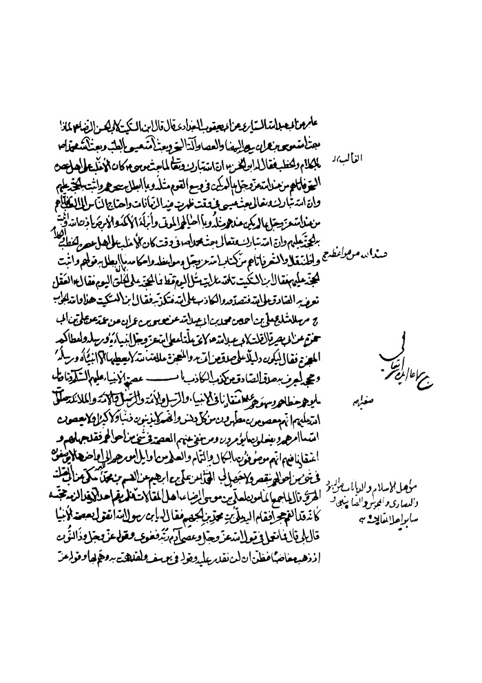

بحار الأنوار الجامعة لدرر أخبار الائمة الأطهار المجلد 11

هوية الكتاب
بطاقة تعريف: مجلسي محمد باقربن محمدتقي 1037 - 1111ق.
عنوان واسم المؤلف: بحار الأنوار الجامعة لدرر أخبار الأئمة الأطهار المجلد 11: تأليف محمد باقربن محمدتقي المجلسي.
عنوان واسم المؤلف: بيروت داراحياء التراث العربي [ -13].
مظهر: ج - عينة.
ملاحظة: عربي.
ملاحظة: فهرس الكتابة على أساس المجلد الرابع والعشرين، 1403ق. [1360].
ملاحظة: المجلد108،103،94،91،92،87،67،66،65،52،24(الطبعة الثالثة: 1403ق.=1983م.=[1361]).
ملاحظة: فهرس.
محتويات: ج.24.كتاب الامامة. ج.52.تاريخ الحجة. ج67،66،65.الإيمان والكفر. ج.87.كتاب الصلاة. ج.92،91.الذكر و الدعا. ج.94.كتاب السوم. ج.103.فهرست المصادر. ج.108.الفهرست.-
عنوان: أحاديث الشيعة — قرن 11ق
ترتيب الكونجرس: BP135/م3ب31300 ي ح
تصنيف ديوي: 297/212
رقم الببليوغرافيا الوطنية: 1680946
ص: 1

اشارة
بِسْمِ اللَّهِ الرَّحْمنِ الرَّحِیمِ الحمد لله الذی اصطفی من عباده رسلا فبعثهم مبشرین و منذرین و اختار منهم خیرة من خلقه محمدا فجعله سید المرسلین و خاتم النبیین فصلوات اللّٰه علیه و علی أهل بیته المنتجبین و علی كل من ابتعثه لإقامة شرائع الدین.
أما بعد فهذا هو المجلد الخامس من كتاب بحار الأنوار تألیف الخاطئ الخاسر القاصر عن نیل المفاخر و المآثر محمد المدعو بباقر بن الشیخ العالم الزاهد البارع الرضی محمد الملقب بالتقی غفر اللّٰه لهما و حشرهما مع موالیهما.

كتاب النبوة

أبواب النبوّة العامّة

باب 1 معنی النبوة و علة بعثة الأنبیاء و بیان عددهم و أصنافهم و جمل أحوالهم و جوامعها صلوات اللّٰه علیهم أجمعین 
الآیات؛ 
البقرة: «وَ قالُوا كُونُوا هُوداً أَوْ نَصاری تَهْتَدُوا قُلْ بَلْ مِلَّةَ إِبْراهِیمَ حَنِیفاً (1)وَ ما كانَ مِنَ الْمُشْرِكِینَ* قُولُوا آمَنَّا بِاللَّهِ وَ ما أُنْزِلَ إِلَیْنا وَ ما أُنْزِلَ إِلی إِبْراهِیمَ وَ إِسْماعِیلَ وَ إِسْحاقَ وَ یَعْقُوبَ وَ الْأَسْباطِ وَ ما أُوتِیَ مُوسی وَ عِیسی وَ ما أُوتِیَ النَّبِیُّونَ مِنْ رَبِّهِمْ لا نُفَرِّقُ بَیْنَ أَحَدٍ مِنْهُمْ وَ نَحْنُ لَهُ مُسْلِمُونَ *فَإِنْ آمَنُوا بِمِثْلِ ما آمَنْتُمْ بِهِ فَقَدِ اهْتَدَوْا وَ إِنْ تَوَلَّوْا فَإِنَّما هُمْ فِی شِقاقٍ (2)فَسَیَكْفِیكَهُمُ اللَّهُ وَ هُوَ السَّمِیعُ الْعَلِیمُ»(135-137) 
(و قال تعالی): «أَمْ تَقُولُونَ إِنَّ إِبْراهِیمَ وَ إِسْماعِیلَ وَ إِسْحاقَ وَ یَعْقُوبَ وَ الْأَسْباطَ
ص: 1

> **پاورقی**: 1- الملّة: اسم لما شرع اللّٰه تعالی علی لسان الأنبیاء، و الفرق بینها و بین الدین أنّها لا تضاف الا الی النبیّ الذی اتی بها، بخلاف الدین فانه یضاف للّٰه و للنبی و لآحاد الأمة، و الشریعة تضاف إلی اللّٰه و الی النبیّ و الأمة دون الآحاد. و الحنف: المیل عن الضلال الی الاستقامة، و عن الشرك الی التوحید، و الحنیف: المائل الی ذلك.

> **پاورقی**: 2- الشقاق: المخالفة و المعاداة و المباینة، و كونك فی شق غیر شق صاحبك، یعنی انهم صاروا فی غیر شق النبیّ و أولیائه.

كانُوا هُوداً أَوْ نَصاری قُلْ أَ أَنْتُمْ أَعْلَمُ أَمِ اللَّهُ وَ مَنْ أَظْلَمُ مِمَّنْ كَتَمَ شَهادَةً عِنْدَهُ مِنَ اللَّهِ وَ مَا اللَّهُ بِغافِلٍ عَمَّا تَعْمَلُونَ»(140) (و قال تعالی): «كانَ النَّاسُ أُمَّةً واحِدَةً فَبَعَثَ اللَّهُ النَّبِیِّینَ مُبَشِّرِینَ وَ مُنْذِرِینَ وَ أَنْزَلَ مَعَهُمُ الْكِتابَ بِالْحَقِّ لِیَحْكُمَ بَیْنَ النَّاسِ فِیمَا اخْتَلَفُوا فِیهِ وَ مَا اخْتَلَفَ فِیهِ إِلَّا الَّذِینَ أُوتُوهُ مِنْ بَعْدِ ما جاءَتْهُمُ الْبَیِّناتُ بَغْیاً بَیْنَهُمْ فَهَدَی اللَّهُ الَّذِینَ آمَنُوا لِمَا اخْتَلَفُوا فِیهِ مِنَ الْحَقِّ بِإِذْنِهِ وَ اللَّهُ یَهْدِی مَنْ یَشاءُ إِلی صِراطٍ مُسْتَقِیمٍ»(213) 
(و قال تعالی): «تِلْكَ الرُّسُلُ فَضَّلْنا بَعْضَهُمْ عَلی بَعْضٍ مِنْهُمْ مَنْ كَلَّمَ اللَّهُ وَ رَفَعَ بَعْضَهُمْ دَرَجاتٍ وَ آتَیْنا عِیسَی ابْنَ مَرْیَمَ الْبَیِّناتِ وَ أَیَّدْناهُ بِرُوحِ الْقُدُسِ وَ لَوْ شاءَ اللَّهُ مَا اقْتَتَلَ الَّذِینَ مِنْ بَعْدِهِمْ مِنْ بَعْدِ ما جاءَتْهُمُ الْبَیِّناتُ وَ لكِنِ اخْتَلَفُوا فَمِنْهُمْ مَنْ آمَنَ وَ مِنْهُمْ مَنْ كَفَرَ وَ لَوْ شاءَ اللَّهُ مَا اقْتَتَلُوا وَ لكِنَّ اللَّهَ یَفْعَلُ ما یُرِیدُ»(253) 
آل عمران: «إِنَّ اللَّهَ اصْطَفی آدَمَ وَ نُوحاً وَ آلَ إِبْراهِیمَ وَ آلَ عِمْرانَ عَلَی الْعالَمِینَ* ذُرِّیَّةً بَعْضُها مِنْ بَعْضٍ وَ اللَّهُ سَمِیعٌ عَلِیمٌ»(33-34) 
(و قال تعالی): «قُلْ آمَنَّا بِاللَّهِ وَ ما أُنْزِلَ عَلَیْنا وَ ما أُنْزِلَ عَلی إِبْراهِیمَ وَ إِسْماعِیلَ وَ إِسْحاقَ وَ یَعْقُوبَ وَ الْأَسْباطِ وَ ما أُوتِیَ مُوسی وَ عِیسی وَ النَّبِیُّونَ مِنْ رَبِّهِمْ لا نُفَرِّقُ بَیْنَ أَحَدٍ مِنْهُمْ وَ نَحْنُ لَهُ مُسْلِمُونَ»(84) (1)(و قال تعالی): «ما كانَ لِبَشَرٍ أَنْ یُؤْتِیَهُ اللَّهُ الْكِتابَ وَ الْحُكْمَ وَ النُّبُوَّةَ ثُمَّ یَقُولَ لِلنَّاسِ كُونُوا عِباداً لِی مِنْ دُونِ اللَّهِ وَ لكِنْ كُونُوا رَبَّانِیِّینَ بِما كُنْتُمْ تُعَلِّمُونَ الْكِتابَ وَ بِما كُنْتُمْ تَدْرُسُونَ *وَ لا یَأْمُرَكُمْ أَنْ تَتَّخِذُوا الْمَلائِكَةَ وَ النَّبِیِّینَ أَرْباباً أَ یَأْمُرُكُمْ بِالْكُفْرِ بَعْدَ إِذْ أَنْتُمْ مُسْلِمُونَ* وَ إِذْ أَخَذَ اللَّهُ مِیثاقَ النَّبِیِّینَ لَما آتَیْتُكُمْ مِنْ كِتابٍ وَ حِكْمَةٍ ثُمَّ جاءَكُمْ رَسُولٌ مُصَدِّقٌ لِما مَعَكُمْ لَتُؤْمِنُنَّ بِهِ وَ لَتَنْصُرُنَّهُ قالَ أَ أَقْرَرْتُمْ وَ أَخَذْتُمْ عَلی ذلِكُمْ إِصْرِی (2)قالُوا أَقْرَرْنا قالَ فَاشْهَدُوا وَ أَنَا مَعَكُمْ مِنَ الشَّاهِدِینَ* فَمَنْ تَوَلَّی بَعْدَ ذلِكَ فَأُولئِكَ هُمُ الْفاسِقُونَ»(79-82)
النساء: «إِنَّا أَوْحَیْنا إِلَیْكَ كَما أَوْحَیْنا إِلی نُوحٍ وَ النَّبِیِّینَ مِنْ بَعْدِهِ وَ أَوْحَیْنا إِلی إِبْراهِیمَ وَ إِسْماعِیلَ وَ إِسْحاقَ وَ یَعْقُوبَ وَ الْأَسْباطِ وَ عِیسی وَ أَیُّوبَ وَ یُونُسَ وَ هارُونَ وَ سُلَیْمانَ
ص: 2

> **پاورقی**: 1- هكذا فی النسخ، و الآیة متأخرة فی المصحف الشریف عن الآیتین، فتقدیمها سهو منه قدس سره أو من النسّاخ.

> **پاورقی**: 2- الاصر: العهد المؤكد الذی یثبط ناقضه عن الثواب و الخیرات.

وَ آتَیْنا داوُدَ زَبُوراً *وَ رُسُلًا قَدْ قَصَصْناهُمْ عَلَیْكَ مِنْ قَبْلُ وَ رُسُلًا لَمْ نَقْصُصْهُمْ عَلَیْكَ وَ كَلَّمَ اللَّهُ مُوسی تَكْلِیماً* رُسُلًا مُبَشِّرِینَ وَ مُنْذِرِینَ لِئَلَّا یَكُونَ لِلنَّاسِ عَلَی اللَّهِ حُجَّةٌ بَعْدَ الرُّسُلِ وَ كانَ اللَّهُ عَزِیزاً حَكِیماً»(163-165) 
الأنعام: «وَ وَهَبْنا لَهُ إِسْحاقَ وَ یَعْقُوبَ كُلًّا هَدَیْنا وَ نُوحاً هَدَیْنا مِنْ قَبْلُ وَ مِنْ ذُرِّیَّتِهِ داوُدَ وَ سُلَیْمانَ وَ أَیُّوبَ وَ یُوسُفَ وَ مُوسی وَ هارُونَ وَ كَذلِكَ نَجْزِی الْمُحْسِنِینَ *وَ زَكَرِیَّا وَ یَحْیی وَ عِیسی وَ إِلْیاسَ كُلٌّ مِنَ الصَّالِحِینَ* وَ إِسْماعِیلَ وَ الْیَسَعَ وَ یُونُسَ وَ لُوطاً وَ كلًّا فَضَّلْنا عَلَی الْعالَمِینَ* وَ مِنْ آبائِهِمْ وَ ذُرِّیَّاتِهِمْ وَ إِخْوانِهِمْ وَ اجْتَبَیْناهُمْ وَ هَدَیْناهُمْ إِلی صِراطٍ مُسْتَقِیمٍ *ذلِكَ هُدَی اللَّهِ یَهْدِی بِهِ مَنْ یَشاءُ مِنْ عِبادِهِ وَ لَوْ أَشْرَكُوا لَحَبِطَ عَنْهُمْ ما كانُوا یَعْمَلُونَ* أُولئِكَ الَّذِینَ آتَیْناهُمُ الْكِتابَ وَ الْحُكْمَ وَ النُّبُوَّةَ فَإِنْ یَكْفُرْ بِها هؤُلاءِ فَقَدْ وَكَّلْنا بِها قَوْماً لَیْسُوا بِها بِكافِرِینَ* أُولئِكَ الَّذِینَ هَدَی اللَّهُ فَبِهُداهُمُ اقْتَدِهْ قُلْ لا أَسْئَلُكُمْ عَلَیْهِ أَجْراً إِنْ هُوَ إِلَّا ذِكْری لِلْعالَمِینَ»(84-90) 
التوبة: «أَ لَمْ یَأْتِهِمْ نَبَأُ الَّذِینَ مِنْ قَبْلِهِمْ قَوْمِ نُوحٍ وَ عادٍ وَ ثَمُودَ وَ قَوْمِ إِبْراهِیمَ وَ أَصْحابِ مَدْیَنَ وَ الْمُؤْتَفِكاتِ أَتَتْهُمْ رُسُلُهُمْ بِالْبَیِّناتِ فَما كانَ اللَّهُ لِیَظْلِمَهُمْ وَ لكِنْ كانُوا أَنْفُسَهُمْ یَظْلِمُونَ»(70) 
یوسف: «حَتَّی إِذَا اسْتَیْأَسَ الرُّسُلُ وَ ظَنُّوا أَنَّهُمْ قَدْ كُذِبُوا جاءَهُمْ نَصْرُنا فَنُجِّیَ مَنْ نَشاءُ وَ لا یُرَدُّ بَأْسُنا عَنِ الْقَوْمِ الْمُجْرِمِینَ»(110) 
الرعد: «وَ لَقَدْ أَرْسَلْنا رُسُلًا مِنْ قَبْلِكَ وَ جَعَلْنا لَهُمْ أَزْواجاً وَ ذُرِّیَّةً وَ ما كانَ لِرَسُولٍ أَنْ یَأْتِیَ بِآیَةٍ إِلَّا بِإِذْنِ اللَّهِ»(38) 
إبراهیم: «وَ ما أَرْسَلْنا مِنْ رَسُولٍ إِلَّا بِلِسانِ قَوْمِهِ لِیُبَیِّنَ لَهُمْ فَیُضِلُّ اللَّهُ مَنْ یَشاءُ وَ یَهْدِی مَنْ یَشاءُ وَ هُوَ الْعَزِیزُ الْحَكِیمُ»(4) (و قال تعالی): «أَ لَمْ یَأْتِكُمْ نَبَؤُا الَّذِینَ مِنْ قَبْلِكُمْ قَوْمِ نُوحٍ وَ عادٍ وَ ثَمُودَ وَ الَّذِینَ مِنْ بَعْدِهِمْ لا یَعْلَمُهُمْ إِلَّا اللَّهُ جاءَتْهُمْ رُسُلُهُمْ بِالْبَیِّناتِ فَرَدُّوا أَیْدِیَهُمْ فِی أَفْواهِهِمْ وَ قالُوا إِنَّا كَفَرْنا بِما أُرْسِلْتُمْ بِهِ وَ إِنَّا لَفِی شَكٍّ مِمَّا تَدْعُونَنا إِلَیْهِ مُرِیبٍ* قالَتْ رُسُلُهُمْ أَ فِی اللَّهِ شَكٌّ فاطِرِ السَّماواتِ وَ الْأَرْضِ یَدْعُوكُمْ لِیَغْفِرَ لَكُمْ مِنْ ذُنُوبِكُمْ وَ یُؤَخِّرَكُمْ إِلی أَجَلٍ مُسَمًّی قالُوا إِنْ أَنْتُمْ إِلَّا بَشَرٌ مِثْلُنا تُرِیدُونَ أَنْ تَصُدُّونا عَمَّا كانَ یَعْبُدُ آباؤُنا
ص: 3

فَأْتُونا بِسُلْطانٍ مُبِینٍ *قالَتْ لَهُمْ رُسُلُهُمْ إِنْ نَحْنُ إِلَّا بَشَرٌ مِثْلُكُمْ وَ لكِنَّ اللَّهَ یَمُنُّ عَلی مَنْ یَشاءُ مِنْ عِبادِهِ وَ ما كانَ لَنا أَنْ نَأْتِیَكُمْ بِسُلْطانٍ إِلَّا بِإِذْنِ اللَّهِ وَ عَلَی اللَّهِ فَلْیَتَوَكَّلِ الْمُؤْمِنُونَ* وَ ما لَنا أَلَّا نَتَوَكَّلَ عَلَی اللَّهِ وَ قَدْ هَدانا سُبُلَنا وَ لَنَصْبِرَنَّ عَلی ما آذَیْتُمُونا وَ عَلَی اللَّهِ فَلْیَتَوَكَّلِ الْمُتَوَكِّلُونَ* وَ قالَ الَّذِینَ كَفَرُوا لِرُسُلِهِمْ لَنُخْرِجَنَّكُمْ مِنْ أَرْضِنا أَوْ لَتَعُودُنَّ فِی مِلَّتِنا فَأَوْحی إِلَیْهِمْ رَبُّهُمْ لَنُهْلِكَنَّ الظَّالِمِینَ* وَ لَنُسْكِنَنَّكُمُ الْأَرْضَ مِنْ بَعْدِهِمْ ذلِكَ لِمَنْ خافَ مَقامِی وَ خافَ وَعِیدِ* وَ اسْتَفْتَحُوا وَ خابَ كُلُّ جَبَّارٍ عَنِیدٍ»(9-15) 
الحجر: «وَ ما أَهْلَكْنا مِنْ قَرْیَةٍ إِلَّا وَ لَها كِتابٌ مَعْلُومٌ* ما تَسْبِقُ مِنْ أُمَّةٍ أَجَلَها وَ ما یَسْتَأْخِرُونَ»(4-5) (و قال تعالی): «وَ لَقَدْ أَرْسَلْنا مِنْ قَبْلِكَ فِی شِیَعِ الْأَوَّلِینَ* وَ ما یَأْتِیهِمْ مِنْ رَسُولٍ إِلَّا كانُوا بِهِ یَسْتَهْزِؤُنَ»(10-11) 
النحل: «وَ ما أَرْسَلْنا مِنْ قَبْلِكَ إِلَّا رِجالًا نُوحِی إِلَیْهِمْ فَسْئَلُوا أَهْلَ الذِّكْرِ إِنْ كُنْتُمْ لا تَعْلَمُونَ* بِالْبَیِّناتِ وَ الزُّبُرِ»(43-44) (1)
الإسراء: «وَ لَقَدْ فَضَّلْنا بَعْضَ النَّبِیِّینَ عَلی بَعْضٍ»(55) 
الكهف: «وَ ما نُرْسِلُ الْمُرْسَلِینَ إِلَّا مُبَشِّرِینَ وَ مُنْذِرِینَ»(56) 
مریم: «أُولئِكَ الَّذِینَ أَنْعَمَ اللَّهُ عَلَیْهِمْ مِنَ النَّبِیِّینَ مِنْ ذُرِّیَّةِ آدَمَ وَ مِمَّنْ حَمَلْنا مَعَ نُوحٍ وَ مِنْ ذُرِّیَّةِ إِبْراهِیمَ وَ إِسْرائِیلَ وَ مِمَّنْ هَدَیْنا وَ اجْتَبَیْنا إِذا تُتْلی عَلَیْهِمْ آیاتُ الرَّحْمنِ خَرُّوا سُجَّداً وَ بُكِیًّا* فَخَلَفَ مِنْ بَعْدِهِمْ خَلْفٌ أَضاعُوا الصَّلاةَ وَ اتَّبَعُوا الشَّهَواتِ فَسَوْفَ یَلْقَوْنَ غَیًّا»(58-59) 
الأنبیاء: «ما آمَنَتْ قَبْلَهُمْ مِنْ قَرْیَةٍ أَهْلَكْناها أَ فَهُمْ یُؤْمِنُونَ* وَ ما أَرْسَلْنا قَبْلَكَ إِلَّا رِجالًا نُوحِی إِلَیْهِمْ فَسْئَلُوا أَهْلَ الذِّكْرِ إِنْ كُنْتُمْ لا تَعْلَمُونَ* وَ ما جَعَلْناهُمْ جَسَداً لا یَأْكُلُونَ الطَّعامَ وَ ما كانُوا خالِدِینَ* ثُمَّ صَدَقْناهُمُ الْوَعْدَ فَأَنْجَیْناهُمْ وَ مَنْ نَشاءُ وَ أَهْلَكْنَا الْمُسْرِفِینَ»(6-9) 
الحج: «وَ إِنْ یُكَذِّبُوكَ فَقَدْ كَذَّبَتْ قَبْلَهُمْ قَوْمُ نُوحٍ وَ عادٌ وَ ثَمُودُ* وَ قَوْمُ إِبْراهِیمَ
ص: 4

> **پاورقی**: 1- جمع زبر و هو كتاب غلیظ الكتابة، و قیل: الزبور كل كتاب صعب الوقوف علیه من الكتب الإلهیّة، و قیل: اسم لكل كتاب لا یتضمن شیئا من الاحكام الشرعیة، و لذا سمی كتاب داود النبیّ به لانه لا یتضمن شیئا من الاحكام الشرعیة.

وَ قَوْمُ لُوطٍ* وَ أَصْحابُ مَدْیَنَ وَ كُذِّبَ مُوسی فَأَمْلَیْتُ لِلْكافِرِینَ ثُمَّ أَخَذْتُهُمْ فَكَیْفَ كانَ نَكِیرِ* فَكَأَیِّنْ مِنْ قَرْیَةٍ أَهْلَكْناها وَ هِیَ ظالِمَةٌ فَهِیَ خاوِیَةٌ عَلی عُرُوشِها وَ بِئْرٍ مُعَطَّلَةٍ وَ قَصْرٍ مَشِیدٍ»(42-45) 
المؤمنین: «یا أَیُّهَا الرُّسُلُ كُلُوا مِنَ الطَّیِّباتِ وَ اعْمَلُوا صالِحاً إِنِّی بِما تَعْمَلُونَ عَلِیمٌ *وَ إِنَّ هذِهِ أُمَّتُكُمْ أُمَّةً واحِدَةً وَ أَنَا رَبُّكُمْ فَاتَّقُونِ *فَتَقَطَّعُوا أَمْرَهُمْ بَیْنَهُمْ زُبُراً كُلُّ حِزْبٍ بِما لَدَیْهِمْ فَرِحُونَ»(51-53) 
الفرقان: «وَ ما أَرْسَلْنا قَبْلَكَ مِنَ الْمُرْسَلِینَ إِلَّا إِنَّهُمْ لَیَأْكُلُونَ الطَّعامَ وَ یَمْشُونَ فِی الْأَسْواقِ»(20) (و قال تعالی): «وَ لَقَدْ آتَیْنا مُوسَی الْكِتابَ وَ جَعَلْنا مَعَهُ أَخاهُ هارُونَ وَزِیراً* فَقُلْنَا اذْهَبا إِلَی الْقَوْمِ الَّذِینَ كَذَّبُوا بِآیاتِنا فَدَمَّرْناهُمْ تَدْمِیراً* وَ قَوْمَ نُوحٍ لَمَّا كَذَّبُوا الرُّسُلَ أَغْرَقْناهُمْ وَ جَعَلْناهُمْ لِلنَّاسِ آیَةً وَ أَعْتَدْنا لِلظَّالِمِینَ عَذاباً أَلِیماً* وَ عاداً وَ ثَمُودَ وَ أَصْحابَ الرَّسِّ وَ قُرُوناً بَیْنَ ذلِكَ كَثِیراً* وَ كُلًّا ضَرَبْنا لَهُ الْأَمْثالَ وَ كُلًّا تَبَّرْنا تَتْبِیراً *وَ لَقَدْ أَتَوْا عَلَی الْقَرْیَةِ الَّتِی أُمْطِرَتْ مَطَرَ السَّوْءِ أَ فَلَمْ یَكُونُوا یَرَوْنَها بَلْ كانُوا لا یَرْجُونَ نُشُوراً»(35-40) 
العنكبوت: «وَ إِنْ تُكَذِّبُوا فَقَدْ كَذَّبَ أُمَمٌ مِنْ قَبْلِكُمْ وَ ما عَلَی الرَّسُولِ إِلَّا الْبَلاغُ الْمُبِینُ»(18) (و قال تعالی): «وَ عاداً وَ ثَمُودَ وَ قَدْ تَبَیَّنَ لَكُمْ مِنْ مَساكِنِهِمْ وَ زَیَّنَ لَهُمُ الشَّیْطانُ أَعْمالَهُمْ فَصَدَّهُمْ عَنِ السَّبِیلِ وَ كانُوا مُسْتَبْصِرِینَ* وَ قارُونَ وَ فِرْعَوْنَ وَ هامانَ وَ لَقَدْ جاءَهُمْ مُوسی بِالْبَیِّناتِ فَاسْتَكْبَرُوا فِی الْأَرْضِ وَ ما كانُوا سابِقِینَ* فَكُلًّا أَخَذْنا بِذَنْبِهِ فَمِنْهُمْ مَنْ أَرْسَلْنا عَلَیْهِ حاصِباً وَ مِنْهُمْ مَنْ أَخَذَتْهُ الصَّیْحَةُ وَ مِنْهُمْ مَنْ خَسَفْنا بِهِ الْأَرْضَ وَ مِنْهُمْ مَنْ أَغْرَقْنا وَ ما كانَ اللَّهُ لِیَظْلِمَهُمْ وَ لكِنْ كانُوا أَنْفُسَهُمْ یَظْلِمُونَ»(38-40) 
الروم: «أَ وَ لَمْ یَسِیرُوا فِی الْأَرْضِ فَیَنْظُرُوا كَیْفَ كانَ عاقِبَةُ الَّذِینَ مِنْ قَبْلِهِمْ كانُوا أَشَدَّ مِنْهُمْ قُوَّةً وَ أَثارُوا الْأَرْضَ وَ عَمَرُوها أَكْثَرَ مِمَّا عَمَرُوها وَ جاءَتْهُمْ رُسُلُهُمْ بِالْبَیِّناتِ فَما كانَ اللَّهُ لِیَظْلِمَهُمْ وَ لكِنْ كانُوا أَنْفُسَهُمْ یَظْلِمُونَ *ثُمَّ كانَ عاقِبَةَ الَّذِینَ أَساؤُا السُّوای أَنْ كَذَّبُوا بِآیاتِ اللَّهِ وَ كانُوا بِها یَسْتَهْزِؤُنَ»(9-10) (و قال تعالی): «وَ لَقَدْ أَرْسَلْنا مِنْ قَبْلِكَ رُسُلًا إِلی قَوْمِهِمْ فَجاؤُهُمْ بِالْبَیِّناتِ فَانْتَقَمْنا مِنَ الَّذِینَ أَجْرَمُوا وَ كانَ حَقًّا عَلَیْنا نَصْرُ الْمُؤْمِنِینَ»(47)
ص: 5

الأحزاب: «وَ إِذْ أَخَذْنا مِنَ النَّبِیِّینَ مِیثاقَهُمْ وَ مِنْكَ وَ مِنْ نُوحٍ وَ إِبْراهِیمَ وَ مُوسی وَ عِیسَی ابْنِ مَرْیَمَ وَ أَخَذْنا مِنْهُمْ مِیثاقاً غَلِیظاً»(7) 
الفاطر: «وَ إِنْ یُكَذِّبُوكَ فَقَدْ كُذِّبَتْ رُسُلٌ مِنْ قَبْلِكَ وَ إِلَی اللَّهِ تُرْجَعُ الْأُمُورُ»(4) (و قال تعالی): «وَ إِنْ مِنْ أُمَّةٍ إِلَّا خَلا فِیها نَذِیرٌ* وَ إِنْ یُكَذِّبُوكَ فَقَدْ كَذَّبَ الَّذِینَ مِنْ قَبْلِهِمْ جاءَتْهُمْ رُسُلُهُمْ بِالْبَیِّناتِ وَ بِالزُّبُرِ وَ بِالْكِتابِ الْمُنِیرِ* ثُمَّ أَخَذْتُ الَّذِینَ كَفَرُوا فَكَیْفَ كانَ نَكِیرِ»(24-26) 
یس: «یا حَسْرَةً عَلَی الْعِبادِ ما یَأْتِیهِمْ مِنْ رَسُولٍ إِلَّا كانُوا بِهِ یَسْتَهْزِؤُنَ* أَ لَمْ یَرَوْا كَمْ أَهْلَكْنا قَبْلَهُمْ مِنَ الْقُرُونِ أَنَّهُمْ إِلَیْهِمْ لا یَرْجِعُونَ»(30-31) 
الصافات: «وَ لَقَدْ ضَلَّ قَبْلَهُمْ أَكْثَرُ الْأَوَّلِینَ *وَ لَقَدْ أَرْسَلْنا فِیهِمْ مُنْذِرِینَ* فَانْظُرْ كَیْفَ كانَ عاقِبَةُ الْمُنْذَرِینَ* إِلَّا عِبادَ اللَّهِ الْمُخْلَصِینَ»(71-74) (و قال تعالی): «وَ لَقَدْ سَبَقَتْ كَلِمَتُنا لِعِبادِنَا الْمُرْسَلِینَ* إِنَّهُمْ لَهُمُ الْمَنْصُورُونَ* وَ إِنَّ جُنْدَنا لَهُمُ الْغالِبُونَ»(171-173) (و قال تعالی): «وَ سَلامٌ عَلَی الْمُرْسَلِینَ»(181) 
ص: «كَمْ أَهْلَكْنا مِنْ قَبْلِهِمْ مِنْ قَرْنٍ فَنادَوْا وَ لاتَ حِینَ مَناصٍ»(3) (و قال تعالی): «كَذَّبَتْ قَبْلَهُمْ قَوْمُ نُوحٍ وَ عادٌ وَ فِرْعَوْنُ ذُو الْأَوْتادِ* (1)وَ ثَمُودُ وَ قَوْمُ لُوطٍ وَ أَصْحابُ الْأَیْكَةِ (2)
ص: 6

> **پاورقی**: 1- قیل فی معناه اقوال: أحدها: أنه كانت له ملاعب من أوتاد یلعب له علیها. ثانیها: أنه كان یعذب الناس بالاوتاد، و ذلك أنّه إذا غضب علی أحد وتد یدیه و رجلیه و رأسه علی الأرض. ثالثها: أن معناه ذو البنیان، و البنیان: الاوتاد. رابعها: ذو الجنود و الجموع الكثیرة، بمعنی أنهم یشدون ملكه و یقوون أمره كما یقوی الوتد الشی ء. خامسها: انه سمی بذلك لكثرة جیوشه فی الأرض و كثرة أوتاد خیامهم، فعبر بكثرة الاوتاد عن كثرة الاجناد. قاله الطبرسیّ فی مجمع البیان. و قال السیّد الرضیّ قدّس سرّه: هذا استعارة علی بعض الأقوال: و یكون معنی ذی الاوتاد ذا الملك الثابت و الامر الواطد و الأسباب التی بها السلطان كما یثبت الخباء بأوتاده و یقوم علی أعماده، و قد یجوز أن یكون معنی ذی الاوتاد ذا الابنیة المشیدة و القواعد الممهدة التی تشبه بالجبال فی ارتفاع الرءوس و رسوخ الأصول، لان الجبال قد تسمی أوتاد الأرض، قال اللّٰه سبحانه: «وَ الْجِبالَ أَوْتاداً»

> **پاورقی**: 2- الایكة: الغیضة و هی الاجمة. مجتمع الشجر فی مغیض الماء، نسبوا أصحاب شعیب إلیها لانهم كانوا یسكنون غیضة قرب مدین. و قیل: هی اسم بلد.

أُولئِكَ الْأَحْزابُ* إِنْ كُلٌّ إِلَّا كَذَّبَ الرُّسُلَ فَحَقَّ عِقابِ»(12-14) 
المؤمن: «كَذَّبَتْ قَبْلَهُمْ قَوْمُ نُوحٍ وَ الْأَحْزابُ مِنْ بَعْدِهِمْ وَ هَمَّتْ كُلُّ أُمَّةٍ بِرَسُولِهِمْ لِیَأْخُذُوهُ وَ جادَلُوا بِالْباطِلِ لِیُدْحِضُوا بِهِ الْحَقَّ (1)فَأَخَذْتُهُمْ فَكَیْفَ كانَ عِقابِ»(5) (و قال تعالی): «أَ وَ لَمْ یَسِیرُوا فِی الْأَرْضِ فَیَنْظُرُوا كَیْفَ كانَ عاقِبَةُ الَّذِینَ كانُوا مِنْ قَبْلِهِمْ كانُوا هُمْ أَشَدَّ مِنْهُمْ قُوَّةً وَ آثاراً فِی الْأَرْضِ فَأَخَذَهُمُ اللَّهُ بِذُنُوبِهِمْ وَ ما كانَ لَهُمْ مِنَ اللَّهِ مِنْ واقٍ* ذلِكَ بِأَنَّهُمْ كانَتْ تَأْتِیهِمْ رُسُلُهُمْ بِالْبَیِّناتِ فَكَفَرُوا فَأَخَذَهُمُ اللَّهُ إِنَّهُ قَوِیٌّ شَدِیدُ الْعِقابِ»(21-22) (و قال تعالی): «إِنَّا لَنَنْصُرُ رُسُلَنا وَ الَّذِینَ آمَنُوا فِی الْحَیاةِ الدُّنْیا وَ یَوْمَ یَقُومُ الْأَشْهادُ»(51) (و قال تعالی): «وَ لَقَدْ أَرْسَلْنا رُسُلًا مِنْ قَبْلِكَ مِنْهُمْ مَنْ قَصَصْنا عَلَیْكَ وَ مِنْهُمْ مَنْ لَمْ نَقْصُصْ عَلَیْكَ وَ ما كانَ لِرَسُولٍ أَنْ یَأْتِیَ بِآیَةٍ إِلَّا بِإِذْنِ اللَّهِ فَإِذا جاءَ أَمْرُ اللَّهِ قُضِیَ بِالْحَقِّ وَ خَسِرَ هُنالِكَ الْمُبْطِلُونَ»(78) (و قال تعالی): «أَ فَلَمْ یَسِیرُوا فِی الْأَرْضِ فَیَنْظُرُوا كَیْفَ كانَ عاقِبَةُ الَّذِینَ مِنْ قَبْلِهِمْ كانُوا أَكْثَرَ مِنْهُمْ وَ أَشَدَّ قُوَّةً وَ آثاراً فِی الْأَرْضِ فَما أَغْنی عَنْهُمْ ما كانُوا یَكْسِبُونَ* فَلَمَّا جاءَتْهُمْ رُسُلُهُمْ بِالْبَیِّناتِ فَرِحُوا بِما عِنْدَهُمْ مِنَ الْعِلْمِ وَ حاقَ بِهِمْ ما كانُوا بِهِ یَسْتَهْزِؤُنَ* فَلَمَّا رَأَوْا بَأْسَنا قالُوا آمَنَّا بِاللَّهِ وَحْدَهُ وَ كَفَرْنا بِما كُنَّا بِهِ مُشْرِكِینَ* فَلَمْ یَكُ یَنْفَعُهُمْ إِیمانُهُمْ لَمَّا رَأَوْا بَأْسَنا سُنَّتَ اللَّهِ الَّتِی قَدْ خَلَتْ فِی عِبادِهِ وَ خَسِرَ هُنالِكَ الْكافِرُونَ»(82-85) 
حمعسق: «شَرَعَ لَكُمْ مِنَ الدِّینِ ما وَصَّی بِهِ نُوحاً وَ الَّذِی أَوْحَیْنا إِلَیْكَ وَ ما وَصَّیْنا بِهِ إِبْراهِیمَ وَ مُوسی وَ عِیسی أَنْ أَقِیمُوا الدِّینَ وَ لا تَتَفَرَّقُوا فِیهِ»(13) (و قال عز و جل): «وَ ما كانَ لِبَشَرٍ أَنْ یُكَلِّمَهُ اللَّهُ إِلَّا وَحْیاً أَوْ مِنْ وَراءِ حِجابٍ أَوْ یُرْسِلَ رَسُولًا فَیُوحِیَ بِإِذْنِهِ ما یَشاءُ إِنَّهُ عَلِیٌّ حَكِیمٌ»(51) 
ق: «كَذَّبَتْ قَبْلَهُمْ قَوْمُ نُوحٍ وَ أَصْحابُ الرَّسِّ (2)وَ ثَمُودُ وَ عادٌ وَ فِرْعَوْنُ وَ
ص: 7

> **پاورقی**: 1- أی لیبطلوا به الحق.

> **پاورقی**: 2- الرس: البئر التی لم تبن بالحجارة، و أصحاب الرس هم أصحاب البئر التی رسوا نبیهم فیها.

إِخْوانُ لُوطٍ وَ أَصْحابُ الْأَیْكَةِ وَ قَوْمُ تُبَّعٍ (1)كُلٌّ كَذَّبَ الرُّسُلَ فَحَقَّ وَعِیدِ»(12-14) 
النجم: «وَ أَنَّهُ أَهْلَكَ عاداً الْأُولی* وَ ثَمُودَ فَما أَبْقی* وَ قَوْمَ نُوحٍ مِنْ قَبْلُ إِنَّهُمْ كانُوا هُمْ أَظْلَمَ وَ أَطْغی* وَ الْمُؤْتَفِكَةَ أَهْوی* فَغَشَّاها ما غَشَّی»(50-54) 
الحدید: «لَقَدْ أَرْسَلْنا رُسُلَنا بِالْبَیِّناتِ وَ أَنْزَلْنا مَعَهُمُ الْكِتابَ وَ الْمِیزانَ لِیَقُومَ النَّاسُ بِالْقِسْطِ»(25) (و قال تعالی): «وَ لَقَدْ أَرْسَلْنا نُوحاً وَ إِبْراهِیمَ وَ جَعَلْنا فِی ذُرِّیَّتِهِمَا النُّبُوَّةَ وَ الْكِتابَ فَمِنْهُمْ مُهْتَدٍ وَ كَثِیرٌ مِنْهُمْ فاسِقُونَ* ثُمَّ قَفَّیْنا عَلی آثارِهِمْ بِرُسُلِنا وَ قَفَّیْنا (2)بِعِیسَی ابْنِ مَرْیَمَ»(26-27) 
المجادلة: «كَتَبَ اللَّهُ لَأَغْلِبَنَّ أَنَا وَ رُسُلِی إِنَّ اللَّهَ قَوِیٌّ عَزِیزٌ»(21) 
الحاقة: «وَ جاءَ فِرْعَوْنُ وَ مَنْ قَبْلَهُ وَ الْمُؤْتَفِكاتُ بِالْخاطِئَةِ *فَعَصَوْا رَسُولَ رَبِّهِمْ فَأَخَذَهُمْ أَخْذَةً رابِیَةً»(9-10) 
الجن: «عالِمُ الْغَیْبِ فَلا یُظْهِرُ عَلی غَیْبِهِ أَحَداً* إِلَّا مَنِ ارْتَضی مِنْ رَسُولٍ فَإِنَّهُ یَسْلُكُ مِنْ بَیْنِ یَدَیْهِ وَ مِنْ خَلْفِهِ رَصَداً* لِیَعْلَمَ أَنْ قَدْ أَبْلَغُوا رِسالاتِ رَبِّهِمْ وَ أَحاطَ بِما لَدَیْهِمْ وَ أَحْصی كُلَّ شَیْ ءٍ عَدَداً»(26-28) 
البروج: «هَلْ أَتاكَ حَدِیثُ الْجُنُودِ* فِرْعَوْنَ وَ ثَمُودَ»(17-18) 
الفجر: «أَ لَمْ تَرَ كَیْفَ فَعَلَ رَبُّكَ بِعادٍ* إِرَمَ ذاتِ الْعِمادِ* الَّتِی لَمْ یُخْلَقْ مِثْلُها فِی الْبِلادِ* وَ ثَمُودَ الَّذِینَ جابُوا الصَّخْرَ بِالْوادِ* وَ فِرْعَوْنَ ذِی الْأَوْتادِ* الَّذِینَ طَغَوْا فِی الْبِلادِ* فَأَكْثَرُوا فِیهَا الْفَسادَ* فَصَبَّ عَلَیْهِمْ رَبُّكَ سَوْطَ عَذابٍ»(6-13) 
تفسیر: قال الطبرسی رحمه اللّٰه فی قوله تعالی: وَ قالُوا كُونُوا هُوداً أی قالت الیهود كونوا هودا و قالت النصاری كونوا نصاری بَلْ مِلَّةَ إِبْراهِیمَ أی بل نتبع دین إبراهیم وَ الْأَسْباطِ أی یوسف (3)و إخوته بنو یعقوب ولد كل واحد منهم أمة من
ص: 8

> **پاورقی**: 1- قال الطبرسیّ: التبایعة: اسم ملوك الیمن فتبع لقب له، كما یقال: خاقان لملك الترك و قیصر لملك الروم، و تبع الحمیری الذی سار بالجیوش حتّی حیر الحیرة ثمّ اتی سمرقند فهدمها ثمّ بناها، و اسمه اسعد أبو كرب. قلت: سیأتی ذكره فی محله.

> **پاورقی**: 2- من قفوت اثره: إذا اتبعته. أی أتبعنا و أرسلنا.

> **پاورقی**: 3- فی المصدر: قال قتادة: هم یوسف اه.

الناس فسموا بالأسباط و ذكروا أسماء الاثنی عشر یوسف و بنیامین و روبیل و یهودا و شمعون و لاوی و دون (1)و قهاب و یشجر و تفتالی و حاد (2)و أسر. (3)قال كثیر من المفسرین إنهم كانوا أنبیاء و الذی یقتضی (4)مذهبنا أنهم لم یكونوا أنبیاء بأجمعهم لعدم عصمتهم لما فعلوا بیوسف (5)و قوله وَ ما أُنْزِلَ إِلَیْهِمْ لا یدل علی أنهم كانوا أنبیاء لأن الإنزال یجوز أن یكون علی بعضهم و یحتمل أن یكون مثل قوله وَ ما أُنْزِلَ إِلَیْنا و إن كان المنزل علی النبی صلی اللّٰه علیه و آله خاصة لكن المسلمین لما كانوا مأمورین بما فیه أضیف الإنزال إلیهم.
وَ قَدْ رَوَی الْعَیَّاشِیُّ عَنْ حَنَانِ بْنِ سَدِیرٍ عَنْ أَبِیهِ عَنْ أَبِی جَعْفَرٍ علیه السلام قَالَ: قُلْتُ لَهُ أَ وَ كَانَ وُلْدُ یَعْقُوبَ أَنْبِیَاءَ قَالَ لَا وَ لَكِنَّهُمْ كَانُوا أَسْبَاطاً أَوْلَادَ الْأَنْبِیَاءِ وَ لَمْ یَكُونُوا فَارَقُوا الدُّنْیَا إِلَّا سُعَدَاءَ تَابُوا وَ تَذَكَّرُوا مَا صَنَعُوا.
لا نُفَرِّقُ بَیْنَ أَحَدٍ مِنْهُمْ أی بأن نؤمن ببعضهم و نكفر ببعض كما فعله الیهود و النصاری وَ نَحْنُ لَهُ أی لما تقدم ذكره أو لله مُسْلِمُونَ خاضعون بالطاعة مذعنون بالعبودیة فِی شِقاقٍ أی فی خلاف و قریب منه
ما رُوِیَ عَنِ الصَّادِقِ علیه السلام أَنَّهُ قَالَ: فِی كُفْرٍ.
و قیل فی منازعة و محاربة فَسَیَكْفِیكَهُمُ اللَّهُ وعد بالنصر و هو من معجزات نبینا صلی اللّٰه علیه و آله. (6)كانَ النَّاسُ أُمَّةً واحِدَةً أی ذوی أمة واحدة أی أهل ملة واحدة و اختلف فی أنهم علی أی دین كانوا فقیل إنهم كانوا علی الكفر فقال الحسن كانوا كفارا بین آدم و نوح و قیل بعد نوح إلی أن بعث اللّٰه إبراهیم و النبیین بعده و قیل قبل مبعث كل نبی و هذا غیر صحیح.
فإن قیل كیف یجوز أن یكون الناس كلهم كفارا و لا یجوز أن یخلو الأرض من حجة قلنا یجوز أن یكون الحق هناك فی واحد أو جماعة قلیلة لم یمكنهم إظهار
ص: 9

> **پاورقی**: 1- فی نسخة: دان.

> **پاورقی**: 2- فی نسخة: جاد.

> **پاورقی**: 3- فی نسخة: أشر. و فی المصدر هكذا: یوسف و بنیامین و زابالون و روبیل و یهوذا و شمعون و لاوی و قهاب و یشجر و نفتالی و جاد و اشر. م.

> **پاورقی**: 4- فی المصدر: و الذی یقتضیه. م.

> **پاورقی**: 5- منقول بالمعنی. م.

> **پاورقی**: 6- مجمع البیان 1: 216 و 217 و 218 و بعضها منقول بالمعنی. م.

الدین خوفا و تقیة فلم یعتد بهم و قال آخرون إنهم كانوا علی الحق فقال ابن عباس كانوا بین آدم و نوح علی شریعة من الحق فاختلفوا بعد ذلك و قیل هم أهل سفینة نوح علیه السلام فالتقدیر حینئذ كانوا أمة واحدة فاختلفوا و بعث اللّٰه النبیین و قال المجاهد المراد به آدم كان علی الحق إماما لذریته فبعث اللّٰه النبیین فی ولده
وَ رَوَی أَصْحَابُنَا عَنِ الْبَاقِرِ علیه السلام أَنَّهُ قَالَ: إِنَّهُ كَانُوا قَبْلَ نُوحٍ أُمَّةً وَاحِدَةً عَلَی فِطْرَةِ اللَّهِ لَا مُهْتَدِینَ وَ لَا ضُلَّالًا فَبَعَثَ اللَّهُ النَّبِیِّینَ.
و علی هذا فالمعنی أنهم كانوا متعبدین بما فی عقولهم غیر مهتدین إلی نبوة و لا شریعة. (1)فَبَعَثَ اللَّهُ النَّبِیِّینَ بالشرائع لما علم أن مصالحهم فیها مُبَشِّرِینَ لمن أطاعهم بالجنة وَ مُنْذِرِینَ لمن عصاهم بالنار وَ أَنْزَلَ مَعَهُمُ الْكِتابَ أی مع بعضهم لِیَحْكُمَ أی الرب تعالی أو الكتاب إِلَّا الَّذِینَ أُوتُوهُ أی أعطوا العلم بالكتاب مِنْ بَعْدِ ما جاءَتْهُمُ الْبَیِّناتُ أی الحجج الواضحة و قیل التوراة و الإنجیل و قیل معجزات محمد صلی اللّٰه علیه و آله بَغْیاً أی ظلما و حسدا لِمَا اخْتَلَفُوا فِیهِ أی للحق الذی اختلف فیه من اختلف بِإِذْنِهِ أی بعلمه أو بلطفه. (2)مِنْهُمْ مَنْ كَلَّمَ اللَّهُ و هو موسی علیه السلام أو موسی و محمد صلی اللّٰه علیه و آله وَ رَفَعَ بَعْضَهُمْ دَرَجاتٍ
ص: 10

> **پاورقی**: 1- و قیل: ان لفظة كان یحتمل أن تكون للثبوت دون المضی، و المراد الاخبار عن الناس انهم امة واحدة فی خلوهم عن الشرائع و جهلهم بالحقائق لو لا أن اللّٰه من علیهم بارسال الرسل و انزال الكتب تفضلا منه. و قیل: ان المراد من وحدة الأمة لیس وحدة العقیدة و العمل بل المراد أن اللّٰه خلق الإنسان بطبیعته و فطرته امة واحدة مدنیا بالطبع یرتبط بعضه ببعض فی المعاش، و یحتاج فی توفیة جمیع ما یحتاج إلیه الی مشاركة غیره و معاضدة افراد بنی نوعه، لا یستغنی بعضه عن بعض، و كانوا مع ذلك ینحون فی أعمالهم نحو المنافع التی یرونها لازمة لقوام معیشتهم، و لم یمنحوا من قوة الالهام ما یعرف كلا منهم وجه المصلحة فی حفظ حقّ غیره لیتوفر المنفعة بذلك لنفسه، فكان لا بد لهم من الاختلاف فی أمور معاشهم، فأرسل اللّٰه من رحمته بهم الرسل مبشرین و منذرین، یبشرونهم بالخیر و السعادة فی الدنیا و الآخرة إذا لزم كل واحد منهم ما حدد له و اكتفی بما له من الحق و لم یعتد علی غیره، و ینذرونهم بخیبة الامل و حبوط العمل و عذاب الآخرة إذا اتبعوا شهواتهم الحاضرة و لم ینظروا العاقبة.

> **پاورقی**: 2- مجمع البیان 2: 306 و 307 مع حذف و نقل بعضها بالمعنی. م.

قال مجاهد أراد به محمدا صلی اللّٰه علیه و آله فإنه فضله علی أنبیائه بأن بعثه إلی جمیع المكلفین من الجن و الإنس بأن أعطاه جمیع الآیات التی أعطاها من قبله من الأنبیاء و بأن خصه بالقرآن و هو المعجزة القائمة إلی یوم القیامة و بأن جعله خاتم النبیین الْبَیِّناتِ أی المعجزات وَ لَوْ شاءَ اللَّهُ مَا اقْتَتَلَ الَّذِینَ مِنْ بَعْدِهِمْ أی من بعد الرسل بأن كان یلجئهم إلی الإیمان لكنه ینافی التكلیف و قیل معناه لو شاء اللّٰه ما أمرهم بالقتال مِنْ بَعْدِ ما جاءَتْهُمُ الْبَیِّناتُ من بعد وضوح الحجة فإن المقصود من بعثة الرسل قد حصل بإیمان من آمن قبل القتال وَ لَوْ شاءَ اللَّهُ مَا اقْتَتَلُوا كرر تأكیدا و قیل الأول مشیة الإكراه و الثانی الأمر للمؤمنین بالكف عن قتالهم ما یُرِیدُ أی ما تقتضیه المصلحة. (1)إِنَّ اللَّهَ اصْطَفی أی اختار و اجتبی آدَمَ وَ نُوحاً لنبوته وَ آلَ إِبْراهِیمَ وَ آلَ عِمْرانَ عَلَی الْعالَمِینَ أی علی عالمی زمانهم بأن جعل الأنبیاء منهم و قیل اختار دینهم و قیل اختارهم بالتفضیل علی غیرهم بالنبوة و غیرها من الأمور الجلیلة لمصالح الخلق و قوله وَ آلَ إِبْراهِیمَ وَ آلَ عِمْرانَ قیل أراد نفسهما و قیل آل إبراهیم أولاده و فیهم من فیهم من الأنبیاء و فیهم نبینا صلی اللّٰه علیه و آله و قیل هم المتمسكون بدینه و أما آل عمران فقیل هم من آل إبراهیم أیضا فهم موسی و هارون ابنا عمران و هو عمران بن یصهر بن ماهث (2)بن لاوی بن یعقوب و قیل یعنی بآل عمران مریم و عیسی و هو عمران بن أشهم (3)بن أمون من ولد سلیمان علیه السلام و هو أبو مریم و فی قراءة أهل البیت علیهم السلام و آل محمد علی العالمین و قالوا أیضا إن آل إبراهیم هم آل محمد الذین هم أهله و یجب أن یكون الذین اصطفاهم اللّٰه مطهرین معصومین عن القبائح لأنه سبحانه لا یختار و لا یصطفی إلا من كان كذلك و یكون ظاهره مثل باطنه فی الطهارة و العصمة فعلی هذا یختص الاصطفاء بمن كان معصوما من آل إبراهیم و آل عمران سواء كان نبیا أو إماما و یقال الاصطفاء علی وجهین أحدهما أنه اصطفاه لنفسه أی جعله خالصا له یختص به و الثانی أنه پ
ص: 11

> **پاورقی**: 1- مجمع البیان 2: 359. م.

> **پاورقی**: 2- الصحیح كما فی المصدر و فی العرائس للثعلبی: یصهر بن قاهث.

> **پاورقی**: 3- فی المصدر: الهشم؛ و فی العرائس: عمران بن ساهم بن أمور بن میشا، و حكی فیه عن ابن عبّاس أنّه عمران بن ماثان، و بنو ماثان رءوس بنی إسرائیل و احبارهم و ملوكهم.

اصطفاه علی غیره أی اختصه بالتفضیل علی غیره و علی هذا الوجه معنی الآیة و فیها دلالة علی تفضیل الأنبیاء علی الملائكة ذُرِّیَّةً أی أولادا و أعقابا بَعْضُها مِنْ بَعْضٍ أی فی التناصر فی الدین أو فی التناسل و التوالد و الأخیر هو المروی عن أبی عبد اللّٰه علیه السلام لأنه قال الذین اصطفاهم اللّٰه بعضهم من نسل بعض. (1)ما كانَ لِبَشَرٍ أی لا یجوز و لا یحل له أَنْ یُؤْتِیَهُ اللَّهُ أی یعطیه الْكِتابَ وَ الْحُكْمَ وَ النُّبُوَّةَ أی العلم و الرسالة إلی الخلق ثُمَّ یَقُولَ لِلنَّاسِ كُونُوا عِباداً لِی مِنْ دُونِ اللَّهِ أی اعبدونی من دونه و اعبدونی (2)معه رَبَّانِیِّینَ أی حكماء أتقیاء أو معلمین الناس من علمكم و قیل الربانی العالم (3)بالحلال و الحرام و الأمر و النهی و ما كان و ما یكون. (4)بِما كُنْتُمْ تُعَلِّمُونَ الْكِتابَ قال البیضاوی أی بسبب كونكم معلمین الكتاب و بسبب كونكم دارسین له فإن فائدة التعلیم و التعلم معرفة الحق و الخیر للاعتقاد و العمل. (5)وَ إِذْ أَخَذَ اللَّهُ مِیثاقَ النَّبِیِّینَ قال الطبرسی روی عن أمیر المؤمنین و ابن عباس و قتادة أن اللّٰه تعالی أخذ المیثاق علی الأنبیاء قبل نبینا صلی اللّٰه علیه و آله أن یخبروا أممهم بمبعثه و نعته و یبشروهم به و یأمروهم بتصدیقه و قال طاوس أخذ اللّٰه المیثاق علی الأنبیاء علی الأول و الآخر فأخذ میثاق الأول لتؤمنن بما جاء به الآخر
و قال الصَّادق علیه السلام تقدیره و إذ أخذ اللّٰه میثاق أمم النبیین بتصدیق نبیها و العمل بما جاءهم به و أنهم خالفوه بعد ما جاءوا و ما وفوا به و تركوا كثیرا من شریعته و حرفوا كثیرا منها.
وَ لَتَنْصُرُنَّهُ أی بالتصدیق و الحجة أو أن المیثاق أخذ علی الأنبیاء لیأخذوه علی
ص: 12

> **پاورقی**: 1- مجمع البیان 2: 433. م.

> **پاورقی**: 2- فی المصدر: او اعبدونی. م.

> **پاورقی**: 3- منسوب الی الرب بزیادة الالف و النون للمبالغة، و قیل: هو من الرب بمعنی التربیة یربی المتعلمین بصغائر العلوم قبل كبارها، و قیل: الربانی العالم الكامل الراسخ فی العلم و الدین المستدیم عملا بما علم، أو الذی یطلب بعلمه وجه اللّٰه، و قیل: هو المتأله العارف باللّٰه.

> **پاورقی**: 4- مجمع البیان 2: 466.

> **پاورقی**: 5- أنوار التنزیل 1: 79. م.

أممهم بتصدیق محمد إذا بعث و یأمرهم بنصره علی أعدائه إن أدركوه و هو المروی عن علی علیه السلام.
أقول: سیأتی عن أئمتنا علیهم السلام أن النصرة فی الرجعة.
و قال فی قوله وَ أَخَذْتُمْ عَلی ذلِكُمْ إِصْرِی أی قبلتم علی ذلك عهدی و قیل معناه و أخذتم العهد بذلك علی أممكم قالُوا أی قال أممهم (1)قالَ اللّٰه فَاشْهَدُوا بذلك علی أممكم وَ أَنَا مَعَكُمْ مِنَ الشَّاهِدِینَ علیكم و علی أممكم عن علی علیه السلام و قیل فَاشْهَدُوا أی فاعلموا ذلك وَ أَنَا مَعَكُمْ أعلم و قیل معناه لیشهد بعضكم علی بعض و قیل قال اللّٰه للملائكة اشهدوا علیهم
وَ قَدْ رُوِیَ عَنْ عَلِیٍّ علیه السلام أَنَّهُ قَالَ: لَمْ یَبْعَثِ اللَّهُ نَبِیّاً آدَمَ وَ مَنْ بَعْدَهُ إِلَّا أَخَذَ عَلَیْهِ الْعَهْدَ عَلَی أَنْ بَعَثَ اللَّهُ مُحَمَّداً وَ هُوَ حَیٌّ لَیُؤْمِنَنَّ بِهِ وَ لَیَنْصُرَنَّهُ وَ أَمَرَهُ بِأَنْ یَأْخُذَ الْعَهْدَ بِذَلِكَ عَلَی قَوْمِهِ (2).
كَما أَوْحَیْنا إِلی نُوحٍ قدم نوحا لأنه أبو البشر و قیل لأنه كان أطول الأنبیاء عمرا و كانت معجزته فی نفسه لبث فی قومه أَلْفَ سَنَةٍ إِلَّا خَمْسِینَ عاماً لم یسقط له سن و لم تنقص قوته و لم یشب شعره و قیل لأنه لم یبالغ أحد منهم فی الدعوة مثل ما بالغ فیها و لم یقاس أحد من قومه ما قاساه و هو أول من عذبت أمته بسبب أن ردت دعوته. (3)وَ رُسُلًا أی قصصنا رسلا أو أرسلنا رسلا قَدْ قَصَصْناهُمْ عَلَیْكَ مِنْ قَبْلُ بالوحی فی غیر القرآن أو فی القرآن وَ رُسُلًا لَمْ نَقْصُصْهُمْ عَلَیْكَ هذا یدل علی أن لله رسلا كثیرا لم یذكرهم فی القرآن.
حُجَّةٌ بَعْدَ الرُّسُلِ بأن یقولوا لو أرسلت إلینا رسولا آمنا بك وَ كانَ اللَّهُ عَزِیزاً أی مقتدرا علی الانتقام ممن یعصیه حَكِیماً فیما أمر به عباده. (4)وَ مِنْ ذُرِّیَّتِهِ قال البیضاوی الضمیر لإبراهیم و قیل لنوح لأنه أقرب و لأن یونس و لوطا لیسا من ذریة إبراهیم فلو كان لإبراهیم اختص البیان بالمعدودین فی تلك
ص: 13

> **پاورقی**: 1- فی المصدر: ای قال الأنبیاء و اممهم. م.

> **پاورقی**: 2- مجمع البیان 2: 468. م.

> **پاورقی**: 3- مجمع البیان 3: 140. م.

> **پاورقی**: 4- مجمع البیان 3: 141- 142. م.

الآیة و التی بعدها و المذكورون فی الآیة الثالثة عطف علی نُوحاً و من آبائهم عطف علی كلّا أو نوحا و من للتبعیض فإن منهم من لم یكن نبیا و لا مهدیا ذلِكَ هُدَی اللَّهِ إشارة إلی ما دانوا به وَ لَوْ أَشْرَكُوا أی هؤلاء الأنبیاء مع علو شأنهم فكیف غیرهم و الْحُكْمَ الحكمة أو فصل الأمر علی ما یقتضیه الحق فَإِنْ یَكْفُرْ بِها أی بهذه الثلاثة هؤُلاءِ یعنی قریشا فَقَدْ وَكَّلْنا بِها أی بمراعاتها قَوْماً لَیْسُوا بِها بِكافِرِینَ و هم الأنبیاء المذكورون و متابعوهم و قیل هم الأنصار أو أصحاب النبی صلی اللّٰه علیه و آله أو كل من آمن به أو الفرس و قیل الملائكة فَبِهُداهُمُ اقْتَدِهْ أی ما توافقوا علیه من التوحید و أصول الدین. (1)وَ الْمُؤْتَفِكاتِ قال الطبرسی أی المنقلبات و هی ثلاثة قری كان فیها قوم لوط بِالْبَیِّناتِ أی بالبراهین و المعجزات. (2)وَ جَعَلْنا لَهُمْ أَزْواجاً وَ ذُرِّیَّةً أی نساء و أولادا أكثر من نسائك و أولادك و كان لسلیمان ثلاث مائة امرأة مهیرة و سبعمائة سریة و لداود مائة امرأة عن ابن عباس أی فلا ینبغی أن یستنكر منك أن تتزوج و یولد لك
وَ رُوِیَ أَنَّ أَبَا عَبْدِ اللَّهِ علیه السلام قَرَأَ هَذِهِ الْآیَةَ ثُمَّ أَوْمَأَ إِلَی صَدْرِهِ وَ قَالَ نَحْنُ وَ اللَّهِ ذُرِّیَّةُ رَسُولِ اللَّهِ صلی اللّٰه علیه و آله.
وَ ما كانَ لِرَسُولٍ أَنْ یَأْتِیَ بِآیَةٍ أی دلالة إِلَّا بِإِذْنِ اللَّهِ أی إلا بعد أن یأذن اللّٰه فی ذلك و یطلق له فیه. (3)إِلَّا بِلِسانِ قَوْمِهِ أی لم یرسل فیما مضی من الأزمان رسولا إلا بلغة قومه حتی إذا بین لهم فهموا عنه و لا یحتاجون إلی مترجم و قد أرسل اللّٰه نبینا صلی اللّٰه علیه و آله إلی الخلق كافة بلسان قومه قال الحسن امتن اللّٰه علی نبیه صلی اللّٰه علیه و آله أنه لم یبعث رسولا إلا إلی قومه و بعثه خاصة إلی جمیع الخلق و قیل إن معناه كما أرسلناك إلی العرب بلغتهم لتبین لهم الدین ثم إنهم یبینونه للناس كذلك أرسلنا كل رسول بلغة قومه لیظهر لهم الدین. (4)لا یَعْلَمُهُمْ إِلَّا اللَّهُ أی لا یعلم تفاصیل أحوالهم و عددهم و ما فعلوه و فعل بهم من
ص: 14

> **پاورقی**: 1- أنوار التنزیل 1: 150. م.

> **پاورقی**: 2- مجمع البیان 5: 49.

> **پاورقی**: 3- مجمع البیان 6: 297. م.

> **پاورقی**: 4- مجمع البیان 6: 303. م.

العقوبات إلا اللّٰه قال ابن الأنباری إن اللّٰه أهلك أمما من العرب و غیرها فانقطعت أخبارهم و عفت آثارهم فلیس یعرفهم أحد إلا اللّٰه و كان ابن مسعود إذا قرأ هذه الآیة قال كذب النسابون فعلی هذا یكون قوله وَ الَّذِینَ مِنْ بَعْدِهِمْ لا یَعْلَمُهُمْ إِلَّا اللَّهُ مبتدأ و خبرا فَرَدُّوا أَیْدِیَهُمْ فِی أَفْواهِهِمْ أی عضوا علی أصابعهم من شدة الغیظ أو جعلوا أیدیهم فی أفواه الأنبیاء تكذیبا لهم أی أشاروا بأیدیهم إلی أفواه الرسل تسكیتا لهم أو وضعوا أیدیهم علی أفواههم مومئین بذلك إلی رسل أن اسكتوا أو الضمیران كلاهما للرسل أی أخذوا أیدی الرسل فوضعوها علی أفواههم لیسكتوا فسكتوا عنهم لما یئسوا منهم هذا كله إذا حمل معنی الأیدی و الأفواه علی الحقیقة و من حملها علی المجاز فقیل المراد بالید ما نطقت به الرسل من الحجج أی فردوا حججهم فی حیث جاءت (1)لأنها تخرج من الأفواه أو مثله من الوجوه. (2)مُرِیبٍ أی یوقعنا فی الریب بكم أنكم تطلبون الرئاسة و تفترون الكذب مِنْ ذُنُوبِكُمْ أی بعضها لأنه لا یغفر الشرك و قیل وضع البعض موضع الجمیع توسعا
ص: 15

> **پاورقی**: 1- فی نسخة: من حیث جاءت.

> **پاورقی**: 2- أضاف السیّد الرضیّ فی تلخیص البیان: 95 علی هذه الوجوه وجهین آخرین: أحدهما ما نقل عن بعض أن المراد بذلك ضرب من الهزء یفعله المجان و السفهاء إذا أرادوا الاستهزاء ببعض الناس و قصدوا الوضع منه و الازراء علیه یجعلون أصابعهم فی أفواههم و یتبعون هذا الفعل بأصوات تشبه و تجانسه، یستدل بها علی قصد السخف و تعمد الفحش. ثم قال: و هذا القول عندی بعید من الصواب. ثانیهما: أن یكون المراد بذلك أن الكفّار كانوا إذا بدأ الرسل بكلامهم سددوا بأیدیهم أسماعهم دفعة و أفواههم دفعة، اظهارا منهم لقلة الرغبة فی سماع كلامهم و جواب مقالهم لیدلوهم بذلك الفعل علی أنهم لا یصغون لهم الی مقال و لا یجیبونهم عن سؤال، اذ قد أبهموا طریقی السماع و الجواب و هما الاذان و الافواه، و شاهد ذلك قوله سبحانه حاكیا عن نوح علیه السلام و یعنی قومه: «وَ إِنِّی كُلَّما دَعَوْتُهُمْ لِتَغْفِرَ لَهُمْ جَعَلُوا أَصابِعَهُمْ فِی آذانِهِمْ وَ اسْتَغْشَوْا ثِیابَهُمْ وَ أَصَرُّوا وَ اسْتَكْبَرُوا اسْتِكْباراً» فیكون معنی ردّ أیدیهم فی أفواههم أن یمسكوا أفواههم بأكفهم كما یفعل المظهر للامتناع من الكلام، و یكون انما ذكر تعالی ردّ الأیدی هاهنا و هو یفید فعل الشی ء ثانیا بعد أن فعل أولا لانهم كانوا یكثرون هذا الفعل عند كلام الرسل علیهم السلام، فوصفوا فی هذه الآیة بما قد سبق لهم مثله و ألف منهم فعله اه. قلت: و یمكن أن یكون المراد أنهم عضوا علی أناملهم تعجبا أو اظهارا للتعجب ممّا یدعو إلیه الأنبیاء و الرسل.

إِلی أَجَلٍ مُسَمًّی أی إلی الوقت الذی ضربه اللّٰه لكم أن یمیتكم فیه و لا یؤاخذكم بعاجل العقاب بِسُلْطانٍ مُبِینٍ أی بحجة واضحة و إنما قالوا ذلك لأنهم اعتقدوا أن ما جاءت به الرسل من المعجزات لیست بمعجزة و لا دلالة و قیل إنهم طلبوا معجزات مقترحات سوی ما ظهرت فیما بینهم.
وَ لكِنَّ اللَّهَ یَمُنُّ أی ینعم علیهم بالنبوة و المعجزات وَ قَدْ هَدانا سُبُلَنا أی عرفنا طریق التوكل أو هدانا إلی معرفته و توجیه العبادة إلیه ذلِكَ لِمَنْ خافَ أی ذلك الفوز لمن خاف وقوفه للحساب بین یدی وَ خافَ وَعِیدِ (1)أی عقابی و إنما قالوا أَوْ لَتَعُودُنَّ و هم لم یكونوا علی ملتهم قط إما لأنهم توهموا علی غیر حقیقة أنهم كانوا علی ملتهم و إما لأنهم ظنوا بالنشو بینهم أنهم كانوا علیها.
وَ اسْتَفْتَحُوا أی طلب الرسل الفتح و النصر من اللّٰه و قیل هو سؤالهم أن یحكم اللّٰه بینهم و بین أممهم لأن الفتح الحكم و قیل معناه و استفتح الكفار العذاب وَ خابَ كُلُّ جَبَّارٍ عَنِیدٍ أی خسر كل متكبر معاند مجانب للحق دافع له. (2)وَ ما أَهْلَكْنا أی لم نهلك أهل قریة فیما مضی علی وجه العقوبة إلا و كان لهم أجل معلوم مكتوب لا بد أن سیبلغونه فلا یغرن هؤلاء الكفار إمهالی إیاهم ما
ص: 16

> **پاورقی**: 1- قال السیّد الرضیّ قدّس سرّه فی تلخیص البیان: قوله: «ذلِكَ لِمَنْ خافَ مَقامِی» هذه استعارة، لان المقام لا یضاف الا الی من یجوز علیه القیام، و ذلك مستحیل علی اللّٰه سبحانه، فإذا المراد به یوم القیامة، لان الناس یقومون فیه للحساب و عرض الاعمال علی الثواب و العقاب، فقال سبحانه فی صفة ذلك الیوم: «یَوْمَ یَقُومُ النَّاسُ لِرَبِّ الْعالَمِینَ» و انما أضاف تعالی هذا المقام الی نفسه فی هذا الموضع و فی قوله: «وَ لِمَنْ خافَ مَقامَ رَبِّهِ جَنَّتانِ» لان الحكم فی ذلك الیوم له خالصا لا یشاركه فیه حكم حاكم و لا یحاده أمر آمر، و قد یجوز أن یكون المقام هنا بمعنی آخر و هو أن العرب تسمی المجامع التی تجتمع فیها لتدارس مفاخرها و تذاكر مآثرها مقامات و مقاوم، فیجوز أن یكون المراد بالمقام هنا الموضع الذی یحصی اللّٰه تعالی فیه علی بریته محاسن أعمالهم و مقابح أفعالهم لاستحقاق ثوابه و عقابه و استیجاب رحمته و عذابه، و قد یقولون: هذا مقام فلان و مقامته علی هذا الوجه و ان لم یكن الإنسان المذكور فی ذلك المكان قائما، بل كان قاعدا أو مضطجعا.

> **پاورقی**: 2- مجمع البیان 6: 305- 308. م.

تَسْبِقُ مِنْ أُمَّةٍ أی لم تكن أمة فیما مضی تسبق أجلها فتهلك قبل ذلك و لا تتأخر عن أجلها (1)فِی شِیَعِ الْأَوَّلِینَ الشیع الفرق و الأمم. (2)إِلَّا رِجالًا نُوحِی إِلَیْهِمْ و ذلك أن كفار قریش كانوا ینكرون أن یرسل إلیهم بشر مثلهم فبین سبحانه أنه لا یصلح أن یكون الرسل إلی الناس إلا من یشاهدونه و یخاطبونه و یفهمون عنه و أنه لا وجه لاقتراحهم إرسال الملك فَسْئَلُوا أَهْلَ الذِّكْرِ أی أهل العلم بأخبار من مضی من الأمم أو أهل الكتاب أو أهل القرآن لأن الذكر القرآن (3)
وَ یَقْرُبُ مِنْهُ مَا رَوَاهُ جَابِرٌ وَ مُحَمَّدُ بْنُ مُسْلِمٍ عَنْ أَبِی جَعْفَرٍ علیه السلام أَنَّهُ قَالَ: نَحْنُ أَهْلُ الذِّكْرِ.
و قد سمی اللّٰه رسوله فی قوله ذِكْراً رَسُولًا علی أحد الوجهین و قوله بِالْبَیِّناتِ وَ الزُّبُرِ العامل فیه قوله أَرْسَلْنا و التقدیر و ما أرسلنا بالبینات (4)و الزبر أی البراهین و الكتب إلا رجالا و قیل فی الكلام إضمار و التقدیر أرسلناهم بالبینات.
أُولئِكَ أی الذین تقدم ذكرهم الَّذِینَ أَنْعَمَ اللَّهُ عَلَیْهِمْ بالنبوة و غیرها مِنَ النَّبِیِّینَ مِنْ ذُرِّیَّةِ آدَمَ إنما فرق سبحانه ذكر نسبهم مع أن كلهم كانوا من ذریة آدم لتبیان مراتبهم فی شرف النسب فكان لإدریس شرف القرب من آدم و كان إبراهیم من ذریة من حمل مع نوح و كان إسماعیل و إسحاق و یعقوب من ذریة إبراهیم لما تباعدوا من آدم حصل لهم شرف إبراهیم و كان موسی و هارون و زكریا و یحیی و عیسی من ذریة إسرائیل وَ مِمَّنْ هَدَیْنا قیل إنه تم الكلام عند قوله وَ إِسْرائِیلَ ثم ابتدأ و قال مِمَّنْ هَدَیْنا وَ اجْتَبَیْنا من الأمم قوم إِذا تُتْلی عَلَیْهِمْ آیاتُ الرَّحْمنِ
و رُوِیَ عَنْ عَلِیِّ بْنِ الْحُسَیْنِ علیهما السلام أَنَّهُ قَالَ: نَحْنُ عُنِینَا بِهَا.
و قیل بل المراد به الأنبیاء الذین تقدم ذكرهم خَرُّوا سُجَّداً لله وَ بُكِیًّا أی باكین فَخَلَفَ مِنْ بَعْدِهِمْ خَلْفٌ الخلف البدل السیئ
ص: 17

> **پاورقی**: 1- مجمع البیان 6: 329. م.

> **پاورقی**: 2- مجمع البیان 6: 331. م.

> **پاورقی**: 3- قد استعمل الذكر بهذا المعنی فی مواضع كثیرة من القرآن منها فی آل عمران آیة 58 و 63 و 69، و سورة الحجر آیة 5 و 9 و یس آیة 69 و فصلت آیة 40 و القمر آیة 25 و الطلاق آیة 10 و القلم آیة 51.

> **پاورقی**: 4- مجمع البیان 6: 361- 362. م.

أی بقی بعد النبیین المذكورین قوم سوء من الیهود و من تبعهم أَضاعُوا الصَّلاةَ أی تركوها أو أخروها عن مواقیتها و هو المروی عن أبی عبد اللّٰه علیه السلام وَ اتَّبَعُوا الشَّهَواتِ فیما حرم علیهم فَسَوْفَ یَلْقَوْنَ غَیًّا أی مجازاة الغی و قیل أی شرا و خیبة. (1)ما آمَنَتْ قَبْلَهُمْ أی لم یؤمن قبل هؤلاء الكفار مِنْ أهل قَرْیَةٍ جاءتهم الآیات التی طلبوها فأهلكناهم مصرین علی الكفر أَ فَهُمْ یُؤْمِنُونَ عند مجیئها هذا إخبار عن حالهم و أن سبیلهم سبیل من تقدم من الأمم طلبوا الآیات فلم یؤمنوا بها و أهلكوا فهؤلاء أیضا لو أتاهم ما اقترحوا لم یؤمنوا و استحقوا عذاب الاستیصال و قد حكم اللّٰه فی هذه الأمة أن لا یعذبهم عذاب الاستیصال (2)فلذلك لم یجبهم فی ذلك و قیل ما حكم اللّٰه سبحانه بهلاك قریة إلا و فی المعلوم أنهم لا یؤمنون فلذلك لم یأت هؤلاء بالآیات المقترحة.
وَ ما جَعَلْناهُمْ جَسَداً الجسد المجسد الذی فیه الروح و یأكل و یشرب و قیل ما لا یأكل و لا یشرب ثُمَّ صَدَقْناهُمُ الْوَعْدَ أی أنجزنا ما وعدناهم به من النصر و النجاة و الظهور علی الأعداء و ما وعدناهم به من الثواب فَأَنْجَیْناهُمْ وَ مَنْ نَشاءُ أی من المؤمنین بهم وَ أَهْلَكْنَا الْمُسْرِفِینَ علی أنفسهم بتكذیبهم الأنبیاء. (3)فَأَمْلَیْتُ لِلْكافِرِینَ أی أخرت عقوبتهم و أمهلتهم ثُمَّ أَخَذْتُهُمْ أی بالعذاب فَكَیْفَ كانَ نَكِیرِ استفهام للتقریر أی فكیف أنكرت علیهم ما فعلوا من التكذیب فأبدلتهم بالنعمة نقمة و بالحیاة هلاكا فَكَأَیِّنْ مِنْ قَرْیَةٍ أی و كم من قری أَهْلَكْناها وَ هِیَ ظالِمَةٌ أی و أهلها ظالمون بالتكذیب و الكفر فَهِیَ خاوِیَةٌ عَلی عُرُوشِها أی خالیة من أهلها ساقطة علی سقوفها وَ بِئْرٍ مُعَطَّلَةٍ أی و كم من بئر باد أهلها و غار ماؤها و تعطلت من دلائها وَ قَصْرٍ مَشِیدٍ أی و كم من قصر رفیع مجصص تداعی للخراب بهلاك أهله
ص: 18

> **پاورقی**: 1- مجمع البیان 6: 519. م.

> **پاورقی**: 2- حكم اللّٰه بذلك فی قوله: «وَ ما كانَ اللَّهُ لِیُعَذِّبَهُمْ وَ أَنْتَ فِیهِمْ وَ ما كانَ اللَّهُ مُعَذِّبَهُمْ وَ هُمْ یَسْتَغْفِرُونَ» الأنفال: 33.

> **پاورقی**: 3- مجمع البیان 7: 39- 40. م.

و أصحاب الآبار ملوك البدو و أصحاب القصور ملوك الحضر و فی تفسیر أهل البیت علیهم السلام كم من بئر معطلة أی عالم لا یرجع إلیه و لا ینتفع بعلمه (1).
كُلُوا مِنَ الطَّیِّباتِ خطاب للرسل كلهم أمرهم أن یأكلوا من الحلال وَ إِنَّ هذِهِ أُمَّتُكُمْ أُمَّةً واحِدَةً أی دینكم دین واحد و قیل هذه جماعتكم و جماعة من قبلكم واحدة كلكم عباد اللّٰه فَتَقَطَّعُوا أَمْرَهُمْ بَیْنَهُمْ زُبُراً أی تفرقوا فی دینهم و جعلوه كتبا دانوا بها و كفروا بما سواها كالیهود كفروا بالإنجیل و القرآن و النصاری بالقرآن و قیل أحدثوا كتبا یحتجون بها لمذاهبهم كُلُّ حِزْبٍ بِما لَدَیْهِمْ فَرِحُونَ أی كل فریق بما عندهم من الدین راضون یرون أنهم علی الحق. (2)وَزِیراً أی معینا علی تبلیغ الرسالة فَدَمَّرْناهُمْ تَدْمِیراً أی أهلكناهم إهلاكا بأمر فیه أعجوبة وَ كُلًّا ضَرَبْنا لَهُ الْأَمْثالَ أی بینا لهم أن العذاب نازل بهم إن لم یؤمنوا و قیل بینا لهم الأحكام فی الدین و الدنیا وَ كُلًّا تَبَّرْنا تَتْبِیراً أی أهلكنا إهلاكا علی تكذیبهم وَ لَقَدْ أَتَوْا عَلَی الْقَرْیَةِ الَّتِی أُمْطِرَتْ یعنی قوم لوط أمطروا بالحجارة أَ فَلَمْ یَكُونُوا یَرَوْنَها فی أسفارهم إذا مروا بهم فیعتبروا بَلْ كانُوا لا یَرْجُونَ نُشُوراً أی بل رأوها و إنما لم یعتبروا لأنهم لا یخافون البعث (3)وَ كانُوا مُسْتَبْصِرِینَ أی كانوا عقلاء یمكنهم التمییز بین الحق و الباطل بالنظر أو یحسبون أنهم علی هدی.
وَ ما كانُوا سابِقِینَ أی فائتین اللّٰه كما یفوت السابق حاصِباً أی حجارة و قیل ریحا فیها حصباء و هم قوم لوط و قیل هم عاد وَ مِنْهُمْ مَنْ أَخَذَتْهُ الصَّیْحَةُ و هم قوم شعیب وَ مِنْهُمْ مَنْ خَسَفْنا و هم قوم قارون. (4)وَ مِنْهُمْ مَنْ أَغْرَقْنا قوم نوح و فرعون و قومه (5)وَ أَثارُوا الْأَرْضَ أی قلبوها و حرثوها لعمارتها ثُمَّ كانَ عاقِبَةَ الَّذِینَ أَساؤُا إلی نفوسهم بالكفر باللّٰه و تكذیب رسله السُّوای أی الخلة التی تسوء صاحبها إذا أدركها و هی عذاب النار أَنْ كَذَّبُوا
ص: 19

> **پاورقی**: 1- مجمع البیان 7: 88. م.

> **پاورقی**: 2- مجمع البیان 7: 109. م.

> **پاورقی**: 3- مجمع البیان 7: 170. م.

> **پاورقی**: 4- هكذا فی النسخ، و الصحیح كما فی المصدر: و هو قارون.

> **پاورقی**: 5- مجمع البیان 8: 283. م.

أی لتكذیبهم وَ كانَ حَقًّا عَلَیْنا نَصْرُ الْمُؤْمِنِینَ أی دفعنا السوء و العذاب عن المؤمنین و كان واجبا علینا نصرهم بإعلاء الحجة و دفع الأعداء عنهم. (1)وَ إِذْ أَخَذْنا أی و اذكر یا محمد حین أخذ اللّٰه المیثاق مِنَ النَّبِیِّینَ خصوصا بأن یصدق بعضهم بعضا و یتبع بعضهم بعضا و قیل أخذ میثاقهم علی أن یعبدوا اللّٰه و یدعوا إلی عبادة اللّٰه و أن یصدق بعضهم بعضا و أن ینصحوا لقومهم وَ مِنْكَ وَ مِنْ نُوحٍ خص هؤلاء بالذكر لأنهم أصحاب الشرائع وَ أَخَذْنا مِنْهُمْ مِیثاقاً غَلِیظاً أی عهدا شدیدا علی الوفاء بما حملوا من إعباء الرسالة و قیل علی أن یعلنوا أن محمدا رسول اللّٰه صلی اللّٰه علیه و آله و یعلن محمد صلی اللّٰه علیه و آله أن لا نبی بعده. (2)وَ إِلَی اللَّهِ تُرْجَعُ الْأُمُورُ فیجازی من كذب رسله و ینصر من كذب من رسله. (3)وَ إِنْ مِنْ أُمَّةٍ أی و ما من أمة من الأمم الماضیة إِلَّا خَلا فِیها نَذِیرٌ أی إلا مضی فیها مخوف یخوفهم و فی هذا دلالة علی أنه لا أحد من المكلفین إلا و قد بعث إلیه الرسول و أنه سبحانه أقام الحجة علی جمیع الأمم بالبینات (4)قال البیضاوی بالمعجزات الشاهدة علی نبوتهم وَ بِالزُّبُرِ كصحف إبراهیم وَ بِالْكِتابِ الْمُنِیرِ كالتوراة و الإنجیل علی إرادة التفصیل دون الجمع و یجوز أن یراد بهما واحد و العطف لتغایر الوصفین فَكَیْفَ كانَ نَكِیرِ أی إنكاری بالعقوبة. (5)یا حَسْرَةً قال الطبرسی أی یا ندامة عَلَی الْعِبادِ فی الآخرة باستهزائهم بالرسل فی الدنیا أَنَّهُمْ إِلَیْهِمْ لا یَرْجِعُونَ أی أ لم یروا أن القرون التی أهلكناهم لا یرجعون إلی الدنیا (6)وَ لَقَدْ سَبَقَتْ كَلِمَتُنا أی سبق الوعد منا إِنَّهُمْ لَهُمُ الْمَنْصُورُونَ فی الدنیا و الآخرة علی الأعداء بالقهر و الغلبة و بالحجة الظاهرة و قیل معناه سبقت كلمتنا لهم بالسعادة ثم ابتدأ فقال إِنَّهُمْ أی إن المرسلین لَهُمُ الْمَنْصُورُونَ و قیل عنی بالكلمة قوله لَأَغْلِبَنَّ أَنَا وَ رُسُلِی (7)قال الحسن المراد بالآیة نصرتهم فی الحرب فإنه لم یقتل
ص: 20

> **پاورقی**: 1- مجمع البیان 8: 309. م.

> **پاورقی**: 2- مجمع البیان 8: 339. م.

> **پاورقی**: 3- مجمع البیان 8: 400. م.

> **پاورقی**: 4- مجمع البیان 8: 405. م.

> **پاورقی**: 5- أنوار التنزیل 2: 123.

> **پاورقی**: 6- مجمع البیان 8: 422 و 423. م.

> **پاورقی**: 7- المجادلة: 21.

نبی قط فی الحرب و إن مات نبی أو قتل قبل النصرة فقد أجری اللّٰه تعالی العادة بأن ینصر قومه من بعده فیكون فی نصرة قومه نصرة له و قال السدی المراد النصرة بالحجة وَ إِنَّ جُنْدَنا أی المؤمنین أو المرسلین لَهُمُ الْغالِبُونَ بالقهر أو بالحجة وَ سَلامٌ عَلَی الْمُرْسَلِینَ أی سلام و أمان لهم من أن ینصر علیهم أعداءهم و قیل هو خبر و معناه أمر أی سلموا علیهم كلهم لا تفرقوا بینهم (1).
وَ لاتَ حِینَ مَناصٍ قال البیضاوی أی لیس الحین حین مناص زیدت علیها تاء التأنیث للتأكید أُولئِكَ الْأَحْزابُ یعنی المتحزبین علی الرسل الذین جعل الجند المهزوم منهم فَحَقَّ عِقابِ أی فوجب علیهم عقابی. (2)وَ الْأَحْزابُ مِنْ بَعْدِهِمْ و الذین تحزبوا علی الرسل و ناصبوهم بعد قوم نوح وَ هَمَّتْ كُلُّ أُمَّةٍ من هؤلاء لِیَأْخُذُوهُ لیتمكنوا من إصابته بما أرادوا من تعذیب و قتل من الأخذ بمعنی الأسر لِیُدْحِضُوا بِهِ الْحَقَّ لیزیلوه به فَكَیْفَ كانَ عِقابِ فإنكم تمرون علی دیارهم و هو تقریر فیه تعجیب. (3)وَ مِنْهُمْ مَنْ لَمْ نَقْصُصْ عَلَیْكَ
قال الطبرسی رحمه اللّٰه روی عن علی علیه السلام أنه قال بعث اللّٰه نبیا أسود لم یقص علینا قصته.
و اختلف الأخبار فی عدد الأنبیاء فروی فی بعضها أن عددهم مائة ألف و أربعة و عشرون ألفا و فی بعضها أن عددهم ثمانیة آلاف نبی أربعة آلاف من بنی إسرائیل و أربعة آلاف من غیرهم بِآیَةٍ أی بمعجزة و دلالة (4).
فَإِذا جاءَ أَمْرُ اللَّهِ قال البیضاوی أی بالعذاب فی الدنیا و الآخرة قُضِیَ بِالْحَقِّ بإنجاء المحق و تعذیب المبطل(5).
فَرِحُوا بِما عِنْدَهُمْ و استحقروا علم الرسل و المراد بالعلم عقائدهم الزائغة و شبههم الداحضة أو علم الأنبیاء و فرحهم به ضحكهم منه و استهزاؤهم به و یؤیده وَ حاقَ بِهِمْ ما
ص: 21

> **پاورقی**: 1- مجمع البیان 8: 462. م.

> **پاورقی**: 2- أنوار التنزیل 2: 137 و 138. و لم نجد الجملة الأخیرة فیه. م.

> **پاورقی**: 3- أنوار التنزیل 2: 149. م.

> **پاورقی**: 4- مجمع البیان 8: 533. م.

> **پاورقی**: 5- أنوار التنزیل 2: 156. م.

كانُوا بِهِ یَسْتَهْزِؤُنَ و قیل الفرح أیضا للرسل شكرا لله علی ما أوتوا من العلم بَأْسَنا أی شدة عذابنا فَلَمْ یَكُ یَنْفَعُهُمْ لامتناع قبوله حینئذ سُنَّتَ اللَّهِ أی سن اللّٰه ذلك سنة ماضیة فی العباد (1)شَرَعَ لَكُمْ مِنَ الدِّینِ ما وَصَّی أی شرع لكم من الدین دین نوح و محمد صلی اللّٰه علیه و آله و من بینهما من أرباب الشرائع و هو الأصل المشترك فیما بینهما المفسر بقوله أَنْ أَقِیمُوا الدِّینَ و هو الإیمان بما یجب تصدیقه و الطاعة فی أحكام اللّٰه وَ لا تَتَفَرَّقُوا فِیهِ و لا تختلفوا فی هذا الأصل أما فروع الشرائع فمختلفة وَ ما كانَ لِبَشَرٍ و ما صح له أَنْ یُكَلِّمَهُ اللَّهُ إِلَّا وَحْیاً كلاما خفیا یدركه بسرعة لأنه تمثل (2)لیس فی ذاته مركبا من حروف مقطعة تتوقف علی تموجات متعاقبة و هو ما یعم المشافهة به كما روی فی حدیث المعراج و المهتف به كما اتفق لموسی فی طوی و الطور لكن عطف قوله أَوْ مِنْ وَراءِ حِجابٍ علیه یخصه بالأول و قیل المراد به الإلهام و الإلقاء فی الروع و الوحی المنزل به إلی الرسل (3)فیكون المراد بقوله أَوْ یُرْسِلَ رَسُولًا فَیُوحِیَ بِإِذْنِهِ ما یَشاءُ أو یرسل إلیه نبیا فیبلغ إلیه وحیه كما أمره و علی الأول المراد بالرسول الملك الموحی إلی الرسول. (4)وَ إِخْوانُ لُوطٍ أی قومه لأنهم كانوا أصهاره (5)فَحَقَّ وَعِیدِ فوجب و حل علیه وعیدی (6)عاداً الْأُولی القدماء لأنهم أولی الأمم هلاكا بعد نوح و قیل عاد الأولی قوم هود و عاد الأخری إرم فَما أَبْقی الفریقین أَظْلَمَ وَ أَطْغی أی من الفریقین لأنهم كانوا یؤذونه و ینفرون عنه و یضربونه حتی لا یكون به حراك وَ الْمُؤْتَفِكَةَ قری قوم لوط (7)أَهْوی بعد أن رفعها فقلبها فَغَشَّاها ما غَشَّی فیه تهویل و تعمیم لما أصابهم (8)
ص: 22

> **پاورقی**: 1- أنوار التنزیل 2: 382. م.

> **پاورقی**: 2- كذا فی الكتاب، و فی المصدر: لانه تمثیل. م.

> **پاورقی**: 3- فی المصدر: أو الوحی المنزل به علی الرسل. م.

> **پاورقی**: 4- أنوار التنزیل 2: 402. م.

> **پاورقی**: 5- قال الطبرسیّ: سماهم إخوانه لكونهم من نسبه. م.

> **پاورقی**: 6- أنوار التنزیل 2: 465. م.

> **پاورقی**: 7- فی المصدر: و القری التی ائتفكت بأهلها ای انقلبت و هی قری قوم لوط. م.

> **پاورقی**: 8- أنوار التنزیل 2: 447. م.

لَقَدْ أَرْسَلْنا رُسُلَنا أی الملائكة إلی الأنبیاء أو الأنبیاء إلی الأمم بِالْبَیِّناتِ بالحجج و المعجزات وَ أَنْزَلْنا مَعَهُمُ الْكِتابَ لیبین الحق و یمیز صواب العمل وَ الْمِیزانَ لیسوی به الحقوق و یقام به العدل كما قال لِیَقُومَ النَّاسُ بِالْقِسْطِ و إنزاله إنزال أسبابه و الأمر بإعداده و قیل أنزل المیزان إلی نوح و یجوز أن یراد به العدل لیقام به السیاسة و یدفع به الأعداء.
وَ جَعَلْنا فِی ذُرِّیَّتِهِمَا النُّبُوَّةَ وَ الْكِتابَ بأن استنبأناهم و أوحینا إلیهم الكتاب و قیل المراد بالكتاب الخط فَمِنْهُمْ أی من الذریة أو من المرسل إلیهم (1).
كَتَبَ اللَّهُ (2)فی اللوح لَأَغْلِبَنَّ أی بالحجة (3).
بِالْخاطِئَةِ أی الخطاء أو بالفعلة أو الأفعال ذات الخطاء أَخْذَةً رابِیَةً (4)زائدة فی الشدة زیادة أعمالهم فی القبح. (5)فَلا یُظْهِرُ عَلی غَیْبِهِ أَحَداً قال الطبرسی أی لا یطلع علی الغیب أحدا من عباده إِلَّا مَنِ ارْتَضی مِنْ رَسُولٍ یعنی الرسل فإنه یستدل علی نبوتهم بأن یخبروا بالغیب لیكون آیة معجزة لهم و معناه إلا من ارتضاه و اختاره للنبوة و الرسالة فإنه یطلعه علی ما شاء من غیبه فَإِنَّهُ یَسْلُكُ مِنْ بَیْنِ یَدَیْهِ وَ مِنْ خَلْفِهِ رَصَداً و الرصد الطریق أو جمع راصد بمعنی الحافظ أی یجعل له إلی علم من كان قبله من الأنبیاء و السلف و علم ما یكون بعده طریقا أو یحفظ الذی یطلع علیه الرسول فیجعل بین یدیه و خلفه رصدا من الملائكة یحفظون الوحی من أن تسترقه الشیطان فتلقیه إلی الكهنة و قیل رصدا من بین یدی الرسول و من خلفه و هم الحفظة من الملائكة یحرسونه عن شر الأعداء و كیدهم و قیل المراد به جبرئیل علیه السلام أی یجعل من بین یدیه و من خلفه رصدا كالحجاب تعظیما لما یتحمله
ص: 23

> **پاورقی**: 1- أنوار التنزیل 2: 212. م.

> **پاورقی**: 2- قال السیّد الرضیّ قدّس سرّه فی التلخیص: المراد بالكتابة هاهنا الحكم و القضاء و انما كنی تعالی عن ذلك بالكتابة مبالغة فی وصف ذلك الحكم بالثبات، و أن بقاءه كبقاء المكتوبات.

> **پاورقی**: 3- أنوار التنزیل 2: 215. م.

> **پاورقی**: 4- قال السیّد قدّس سرّه: المراد بالرابیة هاهنا الغالبة القاهرة من قولهم: ربا الشی ء: اذا زاد، و الرباء مأخوذ من هذا، فكأن تلك الآخذة كانت قاهرة لهم و غالبة علیهم.

> **پاورقی**: 5- أنوار التنزیل 2: 235. م.

من الرسالة كما جرت عادة الملوك بأن یضموا إلی الرسول جماعة من خواصهم تشریفا له و هذا كما
روی أن سورة الأنعام نزلت و معها سبعون ألف ملك.
لِیَعْلَمَ الرَّسُولُ أَنْ قَدْ أَبْلَغُوا یعنی الملائكة قال سعید بن جبیر ما نزل جبرئیل بشی ء من الوحی إلا و معه أربعة من الملائكة حفظة فیعلم الرسول أن قد أبلغ الرسالة علی الوجه الذی قد أمر به و قیل لیعلم من كذب الرسل أن الرسل قد أبلغوا رسالات اللّٰه و قیل لیعلم محمد أن الرسل قبله قد أبلغوا رسالات ربهم كما أبلغ هو إذ كانوا محروسین محفوظین بحفظ اللّٰه و قیل لیعلم اللّٰه أن قد أبلغوا و معناه لیظهر المعلوم علی ما كان سبحانه عالما به و قیل أراد لیبلغوا فجعل بدل ذلك قوله لیعلم إبلاغهم توسعا كما یقول الإنسان ما علم اللّٰه ذلك منی أی ما كان ذلك أصلا لأنه لو كان لعلم اللّٰه وَ أَحاطَ بِما لَدَیْهِمْ أی أحاط اللّٰه علما بما لدی الأنبیاء و الخلائق وَ أَحْصی كُلَّ شَیْ ءٍ عَدَداً أی أحصی ما خلق اللّٰه و عرف عددهم لم یفته علم شی ء حتی مثاقیل الذر و الخردل. (1)هَلْ أَتاكَ حَدِیثُ الْجُنُودِ أی هل بلغك أخبار الجنود الذین تجندوا علی أنبیاء اللّٰه و قیل أراد قد أتاك. (2)سَوْطَ عَذابٍ أی فجعل سوطه الذی ضربهم به العذاب أو قسط عذاب كالعذاب بالسوط الذی یعرف مقدار ما عذبوا به و قیل أجری علی العذاب اسم السوط مجازا شبه اللّٰه العذاب الذی أحله بهم بانصباب السوط و تواتره علی المضروب (3).
«1»-فس، تفسیر القمی كانَ النَّاسُ أُمَّةً واحِدَةً قَالَ قَبْلَ نُوحٍ عَلَی مَذْهَبٍ وَاحِدٍ فَاخْتَلَفُوا فَبَعَثَ اللَّهُ النَّبِیِّینَ مُبَشِّرِینَ وَ مُنْذِرِینَ (4)
«2»-فس، تفسیر القمی إِنَّ اللَّهَ اصْطَفی الْآیَةَ لَفْظُ الْآیَةِ عَامٌّ وَ مَعْنَاهُ خَاصٌّ وَ إِنَّمَا فَضَّلَهُمْ عَلَی عَالَمِی زَمَانِهِمْ وَ قَالَ الْعَالِمُ علیه السلام نَزَلَ وَ آلَ إِبْرَاهِیمَ وَ آلَ عِمْرَانَ وَ آلَ مُحَمَّدٍ عَلَی الْعَالَمِینَ (5)
ص: 24

> **پاورقی**: 1- مجمع البیان 10: 374. م.

> **پاورقی**: 2- مجمع البیان 10: 469. م.

> **پاورقی**: 3- مجمع البیان 10: 487. م.

> **پاورقی**: 4- تفسیر علیّ بن إبراهیم ص 61. م.

> **پاورقی**: 5- هذه الروایة و أمثالها ممّا ورد فی تحریف القرآن من الاخبار الشواذ التی لا تقاوم ما اجتمع علیه الشیعة الإمامیّة و غیرهم من عدم تحریف القرآن، و أن ما بأیدینا الیوم هو المنزل علی نبیّنا محمّد صلّی اللّٰه علیه و آله و سلم، مع أن جلها مراسیل و ضعاف.

فَأَسْقَطُوا آلَ مُحَمَّدٍ مِنَ الْكِتَابِ (1).
«3»-فس، تفسیر القمی ثُمَّ یَقُولَ لِلنَّاسِ كُونُوا عِباداً لِی أَیْ إِنَّ عِیسَی علیه السلام لَمْ یَقُلْ لِلنَّاسِ إِنِّی خَلَقْتُكُمْ فَكُونُوا عِبَاداً لِی مِنْ دُونِ اللَّهِ وَ لكِنْ قَالَ لَهُمْ كُونُوا رَبَّانِیِّینَ أَیْ عُلَمَاءَ قَوْلُهُ وَ لا یَأْمُرَكُمْ قَالَ كَانَ قَوْمٌ یَعْبُدُونَ الْمَلَائِكَةَ وَ قَوْمٌ مِنَ النَّصَارَی زَعَمُوا أَنَّ عِیسَی رَبٌّ وَ الْیَهُودُ قَالُوا عُزَیْرٌ ابْنُ اللَّهِ فَقَالَ اللَّهُ: «لا یَأْمُرَكُمْ أَنْ تَتَّخِذُوا الْمَلائِكَةَ وَ النَّبِیِّینَ أَرْباباً» (2)
«4»-فس، تفسیر القمی وَ إِذْ أَخَذَ اللَّهُ الْآیَةَ فَإِنَّ اللَّهَ أَخَذَ مِیثَاقَ نَبِیِّهِ صلی اللّٰه علیه و آله عَلَی الْأَنْبِیَاءِ أَنْ یُؤْمِنُوا بِهِ وَ یَنْصُرُوهُ وَ یُخْبِرُوا أُمَمَهُمْ بِخَبَرِهِ.
حَدَّثَنِی أَبِی عَنِ ابْنِ أَبِی عُمَیْرٍ عَنِ ابْنِ مُسْكَانَ عَنْ أَبِی عَبْدِ اللَّهِ علیه السلام قَالَ: مَا بَعَثَ اللَّهُ نَبِیّاً مِنْ لَدُنْ آدَمَ فَهَلُمَّ جَرّاً إِلَّا وَ یَرْجِعُ إِلَی الدُّنْیَا وَ یَنْصُرُ أَمِیرَ الْمُؤْمِنِینَ علیه السلام وَ هُوَ قَوْلُهُ لَتُؤْمِنُنَّ بِهِ یَعْنِی بِرَسُولِ اللَّهِ وَ لَتَنْصُرُنَّ أَمِیرَ الْمُؤْمِنِینَ علیه السلام ثُمَّ قَالَ لَهُمْ فِی الذَّرِّ: «أَ أَقْرَرْتُمْ وَ أَخَذْتُمْ عَلی ذلِكُمْ إِصْرِی أَیْ عَهْدِی قالُوا أَقْرَرْنا قالَ اللَّهُ لِلْمَلَائِكَةِ فَاشْهَدُوا وَ أَنَا مَعَكُمْ مِنَ الشَّاهِدِینَ» وَ هَذِهِ مَعَ الْآیَةِ الَّتِی فِی سُورَةِ الْأَحْزَابِ فِی قَوْلِهِ وَ إِذْ أَخَذْنا مِنَ النَّبِیِّینَ مِیثاقَهُمْ وَ مِنْكَ وَ مِنْ نُوحٍ وَ الْآیَةُ الَّتِی فِی سُورَةِ الْأَعْرَافِ قَوْلُهُ وَ إِذْ أَخَذَ رَبُّكَ مِنْ بَنِی آدَمَ مِنْ ظُهُورِهِمْ ذُرِّیَّتَهُمْ قَدْ كُتِبَتْ هَذِهِ الثَّلَاثُ آیَاتٍ فِی ثَلَاثِ سُوَرٍ (3).
«5»-فس، تفسیر القمی وَ لَوْ أَشْرَكُوا یَعْنِی الْأَنْبِیَاءَ الَّذِینَ قَدْ تَقَدَّمَ ذِكْرُهُمْ- فَإِنْ یَكْفُرْ بِها هؤُلاءِ یَعْنِی أَصْحَابَهُ وَ قُرَیْشاً وَ الَّذِینَ أَنْكَرُوا بَیْعَةَ أَمِیرِ الْمُؤْمِنِینَ علیه السلام «فَقَدْ وَكَّلْنا بِها قَوْماً» (4)یَعْنِی شِیعَةَ أَمِیرِ الْمُؤْمِنِینَ (5).
«6»-فس، تفسیر القمی فَرَدُّوا أَیْدِیَهُمْ فِی أَفْواهِهِمْ یَعْنِی فِی أَفْوَاهِ الْأَنْبِیَاءِ.
وَ حَدَّثَنِی أَبِی رَفَعَهُ إِلَی النَّبِیِّ صلی اللّٰه علیه و آله قَالَ: مَنْ آذَی جَارَهُ طَمَعاً فِی مَسْكَنِهِ وَرَّثَهُ اللَّهُ دَارَهُ وَ هُوَ قَوْلُهُ وَ قالَ الَّذِینَ
ص: 25

> **پاورقی**: 1- تفسیر علیّ بن إبراهیم: 90- 91. م.

> **پاورقی**: 2- تفسیر علیّ بن إبراهیم: 96. م.

> **پاورقی**: 3- تفسیر علیّ بن إبراهیم: 96. م.

> **پاورقی**: 4- فی المصدر: قوما لیسوا بها بكافرین.

> **پاورقی**: 5- تفسیر علیّ بن إبراهیم: 197. م.

كَفَرُوا إِلَی قَوْلِهِ فَأَوْحی إِلَیْهِمْ رَبُّهُمْ لَنُهْلِكَنَّ الظَّالِمِینَ وَ لَنُسْكِنَنَّكُمُ الْأَرْضَ مِنْ بَعْدِهِمْ قَوْلُهُ وَ اسْتَفْتَحُوا أَیْ دَعَوْا، «وَ خابَ كُلُّ جَبَّارٍ عَنِیدٍ» أَیْ خَسِرَ.
وَ فِی رِوَایَةِ أَبِی الْجَارُودِ عَنْ أَبِی جَعْفَرٍ علیه السلام قَالَ: الْعَنِیدُ الْمُعْرِضُ عَنِ الْحَقِّ (1).
«7»-فس، تفسیر القمی إِلَّا وَ لَها كِتابٌ مَعْلُومٌ أَیْ أَجَلٌ مَكْتُوبٌ (2).
«8»-فس، تفسیر القمی فَخَلَفَ مِنْ بَعْدِهِمْ خَلْفٌ وَ هُوَ الرَّدِی ءُ وَ الدَّلِیلُ عَلَی ذَلِكَ قَوْلُهُ أَضاعُوا الصَّلاةَ (3)
«9»-فس، تفسیر القمی أَ فَهُمْ یُؤْمِنُونَ أَیْ كَیْفَ یُؤْمِنُونَ وَ لَمْ یُؤْمِنْ مَنْ كَانَ قَبْلَهُمْ بِالْآیَاتِ حَتَّی هَلَكُوا- فَسْئَلُوا أَهْلَ الذِّكْرِ قَالَ آلَ مُحَمَّدٍ (4).
«10»-فس، تفسیر القمی أَحْمَدُ بْنُ إِدْرِیسَ عَنْ أَحْمَدَ بْنِ مُحَمَّدِ بْنِ عِیسَی عَنْ مُحَمَّدِ بْنِ خَالِدٍ عَنْ جَعْفَرٍ عَنْ غِیَاثٍ (5)عَنْ أَبِی عَبْدِ اللَّهِ علیه السلام فِی قَوْلِهِ وَ كُلًّا تَبَّرْنا تَتْبِیراً یَعْنِی كَسَّرْنَا تَكْسِیراً قَالَ هِیَ بِالْقِبْطِیَّةِ (6).
«11»-فس، تفسیر القمی فَمِنْهُمْ مَنْ أَرْسَلْنا عَلَیْهِ حاصِباً وَ هُمْ قَوْمُ لُوطٍ- وَ مِنْهُمْ مَنْ أَخَذَتْهُ الصَّیْحَةُ وَ هُمْ قَوْمُ شُعَیْبٍ وَ صَالِحٍ- وَ مِنْهُمْ مَنْ خَسَفْنا بِهِ الْأَرْضَ وَ هُمْ قَوْمُ هُودٍ- وَ مِنْهُمْ مَنْ أَغْرَقْنا فِرْعَوْنُ وَ أَصْحَابُهُ ثُمَّ قَالَ عَزَّ وَ جَلَّ تَأْكِیداً وَ رَدّاً عَلَی الْمُجَبِّرَةِ- وَ ما كانَ اللَّهُ لِیَظْلِمَهُمْ وَ لكِنْ كانُوا أَنْفُسَهُمْ یَظْلِمُونَ (7)
«12»-فس، تفسیر القمی وَ إِذْ أَخَذْنا مِنَ النَّبِیِّینَ مِیثاقَهُمْ وَ مِنْكَ قَالَ هَذِهِ الْوَاوُ زِیَادَةٌ فِی قَوْلِهِ وَ مِنْكَ وَ إِنَّمَا هُوَ مِنْكَ وَ مِنْ نُوحٍ فَأَخَذَ اللَّهُ الْمِیثَاقَ لِنَفْسِهِ عَلَی الْأَنْبِیَاءِ ثُمَّ أَخَذَ لِنَبِیِّهِ
ص: 26

> **پاورقی**: 1- تفسیر علیّ بن إبراهیم: 344. م.

> **پاورقی**: 2- تفسیر علیّ بن إبراهیم: 349. م.

> **پاورقی**: 3- تفسیر علیّ بن إبراهیم: 412. م.

> **پاورقی**: 4- تفسیر علیّ بن إبراهیم: 426. و فیه: آل محمّد هم أهل الذكر. م.

> **پاورقی**: 5- فی الهامش استظهر أن الصحیح حفص بن غیاث، و فی المصدر: جعفر بن غیاث.

> **پاورقی**: 6- تفسیر علیّ بن إبراهیم: 466. و فی نسخة: هی بالنبطیة. م.

> **پاورقی**: 7- تفسیر علیّ بن إبراهیم: 496. م.

عَلَی الْأَنْبِیَاءِ وَ الْأَئِمَّةِ علیهم السلام ثُمَّ أَخَذَ لِلْأَنْبِیَاءِ عَلَی رَسُولِ اللَّهِ ص(1).
«13»-فس، تفسیر القمی وَ لاتَ حِینَ مَناصٍ أَیْ لَیْسَ هُوَ وَقْتَ مَفَرٍّ (2).
«14»-فس، تفسیر القمی وَ الْأَحْزابُ مِنْ بَعْدِهِمْ هُمْ أَصْحَابُ الْأَنْبِیَاءِ الَّذِینَ تَحَزَّبُوا- وَ هَمَّتْ كُلُّ أُمَّةٍ بِرَسُولِهِمْ لِیَأْخُذُوهُ یَعْنِی یَقْتُلُوهُ- وَ جادَلُوا بِالْباطِلِ أَیْ خَاصَمُوا- لِیُدْحِضُوا بِهِ الْحَقَّ أَیْ یُبْطِلُوهُ وَ یَدْفَعُوهُ (3)قَوْلُهُ مِنْ واقٍ أَیْ مِنْ دَافِعٍ (4).
«15»-فس، تفسیر القمی إِنَّا لَنَنْصُرُ رُسُلَنا وَ الَّذِینَ آمَنُوا فِی الْحَیاةِ الدُّنْیا وَ هُوَ فِی الرَّجْعَةِ إِذَا رَجَعَ رَسُولُ اللَّهِ وَ الْأَئِمَّةُ علیهم السلام.
أَخْبَرَنَا أَحْمَدُ بْنُ إِدْرِیسَ عَنْ أَحْمَدَ بْنِ مُحَمَّدٍ عَنْ عُمَرَ بْنِ عَبْدِ الْعَزِیزِ عَنْ جَمِیلٍ عَنْ أَبِی عَبْدِ اللَّهِ علیه السلام قَالَ: قُلْتُ قَوْلُ اللَّهِ تَبَارَكَ وَ تَعَالَی إِنَّا لَنَنْصُرُ رُسُلَنا وَ الَّذِینَ آمَنُوا فِی الْحَیاةِ الدُّنْیا وَ یَوْمَ یَقُومُ الْأَشْهادُ قَالَ ذَاكَ وَ اللَّهِ فِی الرَّجْعَةِ أَ مَا عَلِمْتَ أَنَّ أَنْبِیَاءَ كَثِیرَةً (5)لَمْ یُنْصَرُوا فِی الدُّنْیَا وَ قُتِلُوا وَ الْأَئِمَّةَ مِنْ بَعْدِهِمْ قُتِلُوا وَ لَمْ یُنْصَرُوا فِی الدُّنْیَا وَ ذَلِكَ فِی الرَّجْعَةِ وَ قَالَ عَلِیُّ بْنُ إِبْرَاهِیمَ الْأَشْهَادُ الْأَئِمَّةُ (6)قَوْلُهُ وَ آثاراً فِی الْأَرْضِ یَقُولُ أَعْمَالًا فِی الْأَرْضِ (7).
«16»-فس، تفسیر القمی شَرَعَ لَكُمْ مِنَ الدِّینِ مُخَاطَبَةٌ لِمُحَمَّدٍ ص- أَنْ أَقِیمُوا الدِّینَ أَیْ تَعَلَّمُوا الدِّینَ یَعْنِی التَّوْحِیدَ وَ إِقَامَ الصَّلَاةِ وَ إِیتَاءَ الزَّكَاةِ وَ صَوْمَ شَهْرِ رَمَضَانَ وَ حِجَّ الْبَیْتِ وَ السُّنَنَ وَ الْأَحْكَامَ الَّتِی فِی الْكُتُبِ وَ الْإِقْرَارَ بِوَلَایَةِ أَمِیرِ الْمُؤْمِنِینَ علیه السلام وَ لا تَتَفَرَّقُوا فِیهِ أَیْ لَا تَخْتَلِفُوا فِیهِ (8)قَوْلُهُ وَ ما كانَ لِبَشَرٍ أَنْ یُكَلِّمَهُ اللَّهُ إِلَّا وَحْیاً قَالَ وَحْیَ مُشَافَهَةٍ وَ وَحْیَ إِلْهَامٍ وَ هُوَ الَّذِی یَقَعُ فِی الْقَلْبِ أَوْ مِنْ وَراءِ حِجابٍ كَمَا كَلَّمَ اللَّهُ نَبِیَّهُ صلی اللّٰه علیه و آله وَ كَمَا كَلَّمَ اللَّهُ مُوسَی مِنَ النَّارِ
ص: 27

> **پاورقی**: 1- تفسیر علیّ بن إبراهیم: 516. م.

> **پاورقی**: 2- تفسیر علیّ بن إبراهیم: 561. م.

> **پاورقی**: 3- تفسیر علیّ بن إبراهیم: 582. م.

> **پاورقی**: 4- تفسیر علیّ بن إبراهیم: 342. م.

> **پاورقی**: 5- فی نسخة: اما علمت أن أنبیاء اللّٰه كثیرة؟.

> **پاورقی**: 6- تفسیر علیّ بن إبراهیم: 586. م.

> **پاورقی**: 7- تفسیر علیّ بن إبراهیم: 588. م.

> **پاورقی**: 8- تفسیر علیّ بن إبراهیم: 600. م.

أَوْ یُرْسِلَ رَسُولًا فَیُوحِیَ بِإِذْنِهِ ما یَشاءُ قَالَ وَحْیَ مُشَافَهَةٍ (1)یَعْنِی إِلَی النَّاسِ (2).
بیان: یمكن إرجاع ما ذكره إلی بعض ما مر فی كلام المفسرین بأن یكون قوله و وحی إلهام عطف تفسیر لقوله وحی مشافهة و قوله آخرا وحی مشافهة المراد به وحی الملك فإن النبی یشافه الملك أو وحی اللّٰه إلی الملك فیكون المشافهة بالمعنی الأول أو المراد وحی النبی إلی الناس فإن سماع الناس الوحی إنما یكون مشافهة من النبی و یؤیده قوله یعنی إلی الناس فعلی هذا یحتمل أن یكون المراد بوحی المشافهة فی الأول وحی الملك مشافهة إلی النبی و لعل هذا أظهر المحتملات و إرجاع الضمیر المستتر فی قوله فَیُوحِیَ علی التقادیر غیر خفی علی المتأمل.
«17»-فس، تفسیر القمی وَ الْمُؤْتَفِكَةَ أَهْوی قَالَ الْمُؤْتَفِكَةُ الْبَصْرَةُ وَ الدَّلِیلُ عَلَی ذَلِكَ قَوْلُ أَمِیرِ الْمُؤْمِنِینَ علیه السلام یَا أَهْلَ الْبَصْرَةِ وَ یَا أَهْلَ الْمُؤْتَفِكَةِ إِلَی قَوْلِهِ علیه السلام ائْتَفَكَتْ (3)بِأَهْلِهَا مَرَّتَیْنِ وَ عَلَی اللَّهِ تَمَامُ الثَّالِثَةِ وَ تَمَامُ الثَّالِثَةِ فِی الرَّجْعَةِ (4).
«18»-فس، تفسیر القمی وَ الْمِیزانَ قَالَ الْمِیزَانُ الْإِمَامُ (5).
عد، العقائد اعتقادنا فی عدد الأنبیاء أنهم مائة ألف نبی و أربعة و عشرون ألف نبی و مائة ألف وصی و أربعة و عشرون ألف وصی لكل نبی منهم وصی أوصی إلیه بأمر اللّٰه تعالی و نعتقد فیهم أنهم جاءوا بالحق من عند الحق و أن قولهم قول اللّٰه تعالی و أمرهم أمر اللّٰه تعالی و طاعتهم طاعة اللّٰه و معصیتهم معصیة اللّٰه و أنهم علیهم السلام لم ینطقوا إلا عن اللّٰه تعالی عن وحیه و أن سادة الأنبیاء خمسة الذین علیهم دارت الرحی و هم أصحاب الشرائع من أتی بشریعة مستأنفة نسخت شریعة من تقدمه و هم خمسة نوح و إبراهیم و موسی و عیسی و محمد و هم أولو العزم صلوات اللّٰه علیهم إن محمدا سیدهم و أفضلهم جاءَ بِالْحَقِّ وَ صَدَّقَ الْمُرْسَلِینَ (6)
ص: 28

> **پاورقی**: 1- قوله: مشافهة یتعلق بیوحی، و الی الناس یتعلق بیرسل؛ و لعلّ المعنی: فیرسل رسولا الی الناس فیخبر مشافهة باذن اللّٰه ما یشاء.

> **پاورقی**: 2- تفسیر علیّ بن إبراهیم ص 605. م.

> **پاورقی**: 3- ائتفك البلد باهله: انقلب.

> **پاورقی**: 4- تفسیر علیّ بن إبراهیم ص 655. م.

> **پاورقی**: 5- تفسیر علیّ بن إبراهیم ص 666. م.

> **پاورقی**: 6- اعتقادات الصدوق ص 96- 97. م.

أقول: سیأتی الكلام فی تفضیلهم علی الملائكة فی كتاب السماء و العالم.
«19»-مع، معانی الأخبار ابْنُ عُبْدُوسٍ عَنِ ابْنِ قُتَیْبَةَ عَنْ حَمْدَانَ بْنِ سُلَیْمَانَ عَنْ أَحْمَدَ بْنِ فَضْلَانَ عَنْ سُلَیْمَانَ بْنِ جَعْفَرٍ الْمَرْوَزِیِّ عَنْ ثَابِتِ بْنِ أَبِی صَفِیَّةَ عَنْ سَعِیدِ بْنِ جُبَیْرٍ عَنِ ابْنِ عَبَّاسٍ قَالَ: قَالَ أَعْرَابِیٌّ لِرَسُولِ اللَّهِ صلی اللّٰه علیه و آله السَّلَامُ عَلَیْكَ یَا نَبِی ءَ اللَّهِ قَالَ لَسْتُ نَبِی ءَ اللَّهِ وَ لَكِنِّی نَبِیُّ اللَّهِ.
النبوة لفظ مأخوذ من النبوة و هو ما ارتفع من الأرض فمعنی النبوة الرفعة و معنی النبی الرفیع سمعت ذلك من أبی بشر اللغوی بمدینة السلام. (1)بیان قال الجزری فیه أن رجلا قال له یا نبی ء اللّٰه فقال لا تنبر اسمی (2)فإنما أنا نبی اللّٰه النبی فعیل بمعنی فاعل للمبالغة من النبإ الخبر لأنه أنبأ عن اللّٰه أی أخبر و یجوز فیه تحقیق الهمزة و تخفیفه یقال نبأ و نبّأ و أنبأ قال سیبویه لیس أحد من العرب إلا و یقول تنبأ مسیلمة بالهمز غیر أنهم تركوا الهمز فی النبی كما تركوه فی الذریة و البریة و الخابیة إلا أهل مكة فإنهم یهمزون هذه الأحرف الثلاثة و لا یهمزون غیرها و یخالفون العرب فی ذلك.
قال الجوهری یقال نبأت علی القوم إذا طلعت علیهم و نبأت من أرض إلی أرض إذا خرجت من هذه إلی هذه قال و هذا المعنی أراد الأعرابی بقوله یا نبی ء اللّٰه لأنه خرج من مكة إلی المدینة فأنكر علیه الهمز لأنه لیس من لغة قریش و قیل إن النبی مشتق من النباوة و هی الشی ء المرتفع.
و قال الجزری فی النبر بالراء المهملة فیه قیل له یا نبی اللّٰه فقال إنا معشرَ قریش لا نَنْبِرُ و فی روایة لا تنبر باسمی النبر همز الحروف و لم تكن قریش تهمز فی كلامها.
«20»- ید، التوحید الدَّقَّاقُ عَنْ أَبِی الْقَاسِمِ الْعَلَوِیِّ عَنِ الْبَرْمَكِیِّ عَنِ الْحُسَیْنِ بْنِ الْحَسَنِ عَنْ إِبْرَاهِیمَ بْنِ هَاشِمٍ الْقُمِّیِّ عَنِ الْفُقَیْمِیِّ عَنْ هِشَامِ بْنِ الْحَكَمِ قَالَ: سَأَلَ الزِّنْدِیقُ الَّذِی أَتَی أَبَا عَبْدِ اللَّهِ علیه السلام فَقَالَ مِنْ أَیْنَ أَثْبَتَّ أَنْبِیَاءَ وَ رُسُلًا قَالَ أَبُو عَبْدِ اللَّهِ علیه السلام إِنَّا لَمَّا أَثْبَتْنَا أَنَ
ص: 29

> **پاورقی**: 1- معانی الأخبار ص 39. م.

> **پاورقی**: 2- أی لا تهمز اسمی، من نبر الحرف: همزه.

لَنَا خَالِقاً صَانِعاً مُتَعَالِیاً عَنَّا وَ عَنْ جَمِیعِ مَا خَلَقَ وَ كَانَ ذَلِكَ الصَّانِعُ حَكِیماً لَمْ یَجُزْ أَنْ یُشَاهِدَهُ خَلْقُهُ وَ لَا یُلَامِسُوهُ وَ لَا یُبَاشِرَهُمْ وَ لَا یُبَاشِرُوهُ وَ یُحَاجَّهُمْ وَ یُحَاجُّوهُ فَثَبَتَ أَنَّ لَهُ سُفَرَاءَ فِی خَلْقِهِ (1)یَدُلُّونَهُمْ عَلَی مَصَالِحِهِمْ وَ مَنَافِعِهِمْ وَ مَا بِهِ بَقَاؤُهُمْ وَ فِی تَرْكِهِ فَنَاؤُهُمْ فَثَبَتَ الْآمِرُونَ وَ النَّاهُونَ عَنِ الْحَكِیمِ الْعَلِیمِ فِی خَلْقِهِ وَ ثَبَتَ عِنْدَ ذَلِكَ أنه (أَنَ) لَهُ مُعَبِّرِینَ (2)وَ هُمُ الْأَنْبِیَاءُ وَ صَفْوَتُهُ مِنْ خَلْقِهِ حُكَمَاءَ مُؤَدَّبِینَ بِالْحِكْمَةِ مَبْعُوثِینَ بِهَا غَیْرَ مُشَارِكِینَ لِلنَّاسِ فِی أَحْوَالِهِمْ عَلَی مُشَارَكَتِهِمْ لَهُمْ فِی الْخَلْقِ وَ التَّرْكِیبِ مُؤَیَّدِینَ مِنْ عِنْدِ الْحَكِیمِ الْعَلِیمِ بِالْحِكْمَةِ- (3)وَ الدَّلَائِلِ وَ الْبَرَاهِینِ وَ الشَّوَاهِدِ مِنْ إِحْیَاءِ الْمَوْتَی وَ إِبْرَاءِ الْأَكْمَهِ وَ الْأَبْرَصِ فَلَا تَخْلُو أَرْضُ اللَّهِ مِنْ حُجَّةٍ یَكُونُ مَعَهُ عِلْمٌ یَدُلُّ عَلَی صِدْقِ مَقَالِ الرَّسُولِ وَ وُجُوبِ عَدَالَتِهِ (4).
ع، علل الشرائع حمزة بن محمد العلوی عن علی عن أبیه عن العباس بن عمر الفقیمی مثله (5).
ج، الإحتجاج مرسلا مثله (6).
«21»-ل، الخصال لی، الأمالی للصدوق بِالْإِسْنَادِ إِلَی دَارِمٍ (7)عَنِ الرِّضَا عَنْ آبَائِهِ علیهم السلام قَالَ قَالَ النَّبِیُّ صلی اللّٰه علیه و آله خَلَقَ اللَّهُ عَزَّ وَ جَلَّ مِائَةَ أَلْفِ نَبِیٍّ وَ أَرْبَعَةً وَ عِشْرِینَ أَلْفَ نَبِیٍّ أَنَا أَكْرَمُهُمْ عَلَی اللَّهِ وَ لَا فَخْرَ وَ خَلَقَ اللَّهُ عَزَّ وَ جَلَّ مِائَةَ أَلْفِ وَصِیٍّ وَ أَرْبَعَةً وَ عِشْرِینَ أَلْفَ وَصِیٍّ فَعَلِیٌّ أَكْرَمُهُمْ عَلَی اللَّهِ وَ أَفْضَلُهُمْ.
قَالَ دَارِمٌ وَ حَدَّثَنِی بِذَلِكَ عَبْدُ اللَّهِ (8)بْنُ مُحَمَّدِ بْنِ سُلَیْمَانَ بْنِ عَبْدِ اللَّهِ بْنِ الْحَسَنِ
ص: 30

> **پاورقی**: 1- فی العلل: فثبت أن له سفراء فی خلقه، یعبرون عنه الی خلقه و عباده، و یدلونهم.

> **پاورقی**: 2- فی المصدر: أن له معبرین.

> **پاورقی**: 3- الحدیث فی العلل هكذا: ثم ثبت ذلك فی كل دهر و زمان ما أتت به الرسل و الأنبیاء من الدلائل و البراهین لكیلا تخلو أرض اللّٰه من حجة یكون معه علم یدلّ علی صدق مقالته و جواز عدالته.

> **پاورقی**: 4- توحید الصدوق: 253. و قد تقدم الایعاز الی أن للحدیث قطعات اخری و بینا مواضعها فی كتاب الاحتجاجات.

> **پاورقی**: 5- علل الشرائع : ٥١. م

> **پاورقی**: 6- الاحتجاج: 183 مع اختلاف یسیر. م.

> **پاورقی**: 7- تقدم السند بتمامه فی مقدّمة الكتاب. راجع ج 1 ص 52.

> **پاورقی**: 8- فی المصدر: قال الشیخ: و حدّثنی بهذا الحدیث محمّد بن أحمد البغدادیّ الوراق قال: حدّثنا علیّ بن محمّد مولی الرشید قال: حدّثنی دارم بن قبیصة قال: حدّثنی عبد اللّٰه اه.

عَنْ أَبِیهِ عَنْ جَدِّهِ عَنْ زَیْدِ بْنِ عَلِیٍّ عَنْ أَبِیهِ عَلِیِّ بْنِ الْحُسَیْنِ عَنْ أَبِیهِ عَنْ أَمِیرِ الْمُؤْمِنِینَ علیه السلام (1).
«22»-ما، الأمالی للشیخ الطوسی ابْنُ بُسْرَانَ (2)(بُشْرَانَ) عَنْ عُثْمَانَ بْنِ أَحْمَدَ بْنِ الدَّقَّاقِ عَنِ الْحَسَنِ بْنِ سَلَّامٍ السَّوَّاقِ عَنْ زَكَرِیَّا بْنِ عَدِیٍّ عَنْ مُسْلِمِ بْنِ خَالِدٍ عَنْ زِیَادِ بْنِ سَعْدٍ عَنْ مُحَمَّدِ بْنِ الْمُنْكَدِرِ عَنْ صَفْوَانَ بْنِ سُلَیْمٍ عَنْ أَنَسِ بْنِ مَالِكٍ قَالَ قَالَ رَسُولُ اللَّهِ صلی اللّٰه علیه و آله بُعِثْتُ عَلَی أَثَرِ ثَمَانِیَةِ آلَافِ نَبِیٍّ مِنْهُمْ أَرْبَعَةُ آلَافٍ مِنْ بَنِی إِسْرَائِیلَ (3).
بیان: لعل المراد هنا عظماء الأنبیاء علیهم السلام لئلا ینافی الخبر السابق و اللاحق.
«23»-شی، تفسیر العیاشی عَنْ عَبْدِ اللَّهِ بْنِ سِنَانٍ قَالَ: سُئِلَ أَبُو عَبْدِ اللَّهِ علیه السلام عَنْ قَوْلِ اللَّهِ- وَ لَوْ شاءَ رَبُّكَ لَجَعَلَ النَّاسَ أُمَّةً واحِدَةً وَ لا یَزالُونَ مُخْتَلِفِینَ إِلَّا مَنْ رَحِمَ رَبُّكَ قَالَ كَانُوا أُمَّةً واحِدَةً فَبَعَثَ اللَّهُ النَّبِیِّینَ لِیَتَّخِذَ عَلَیْهِمُ الْحُجَّةَ.
بیان: ذكر المفسرون أن المراد بجعلهم أمة واحدة جبرهم علی الإسلام لیكونوا جمیعا مسلمین و قوله علیه السلام كانوا أمة واحدة لعله إشارة إلی قوله تعالی كانَ النَّاسُ أُمَّةً واحِدَةً فَبَعَثَ اللَّهُ النَّبِیِّینَ الآیة و ظاهره أن المراد أنهم كانوا جمیعا علی الشرك و الضلالة و لو شاء لتركهم كذلك و لكن بعث اللّٰه النبیین لیتخذ علیهم الحجة فأسلم بعضهم فلذا صاروا مختلفین و إن احتمل أن یكون المراد أنهم كانوا فی زمن آدم علیه السلام فی بدو التكلیف كلهم مؤمنین
ع، علل الشرائع ابن الولید عن الصفار عن ابن عیسی عن الأهوازی عن النضر عن ابن سنان مثله (4)
ص: 31

> **پاورقی**: 1- الخصال ج 2: 172- 173؛ أمالی الصدوق: 142- 143 و فی المصدرین: عن أمیر المؤمنین علیّ بن أبی طالب علیه السلام عن النبیّ صلی اللّٰه علیه و آله. م.

> **پاورقی**: 2- هكذا فی نسخ، و الصحیح: ابن بشران، و هو أبو الحسین علیّ بن محمّد بن عبد اللّٰه بن بشران المعدل، راجع ترجمة الطوسیّ: المقدّمة ص 56.

> **پاورقی**: 3- أمالی الطوسیّ: 253. م.

> **پاورقی**: 4- علل الشرائع: 51. م.

«24»-مع، معانی الأخبار ل، الخصال عَلِیُّ بْنُ عَبْدِ اللَّهِ الْأَسْوَارِیُّ (1)عَنْ أَحْمَدَ بْنِ مُحَمَّدِ بْنِ قَیْسٍ عَنْ عَمْرِو بْنِ حَفْصٍ عَنْ عَبْدِ اللَّهِ بْنِ مُحَمَّدِ بْنِ أَسَدٍ عَنِ الْحُسَیْنِ بْنِ إِبْرَاهِیمَ عَنْ یَحْیَی بْنِ سَعِیدٍ الْبَصْرِیِّ عَنِ ابْنِ جَرِیحٍ عَنْ عَطَاءٍ عَنْ عُتْبَةَ اللَّیْثِیِّ عَنْ أَبِی ذَرٍّ رَحِمَهُ اللَّهُ قَالَ: قُلْتُ یَا رَسُولَ اللَّهِ كَمِ النَّبِیُّونَ قَالَ مِائَةُ أَلْفٍ وَ أَرْبَعَةٌ وَ عِشْرُونَ أَلْفَ نَبِیٍّ قُلْتُ كَمِ الْمُرْسَلُونَ مِنْهُمْ قَالَ ثَلَاثُ مِائَةٍ وَ ثَلَاثَةَ عَشَرَ جَمّاً غَفِیراً قُلْتُ مَنْ كَانَ أَوَّلَ الْأَنْبِیَاءِ قَالَ آدَمُ قُلْتُ وَ كَانَ مِنَ الْأَنْبِیَاءِ مُرْسَلًا قَالَ نَعَمْ خَلَقَهُ اللَّهُ بِیَدِهِ وَ نَفَخَ فِیهِ مِنْ رُوحِهِ ثُمَّ قَالَ یَا أَبَا ذَرٍّ أَرْبَعَةٌ مِنَ الْأَنْبِیَاءِ سُرْیَانِیُّونَ آدَمُ وَ شَیْثٌ وَ أَخْنُوخُ وَ هُوَ إِدْرِیسُ وَ هُوَ أَوَّلُ مَنْ خَطَّ بِالْقَلَمِ وَ نُوحٌ- وَ أَرْبَعَةٌ مِنَ الْعَرَبِ هُودٌ وَ صَالِحٌ وَ شُعَیْبٌ وَ نَبِیُّكَ مُحَمَّدٌ صلی اللّٰه علیه و آله وَ أَوَّلُ نَبِیٍّ مِنْ بَنِی إِسْرَائِیلَ مُوسَی وَ آخِرُهُمْ عِیسَی وَ سِتُّمِائَةِ نَبِیٍّ قُلْتُ یَا رَسُولَ اللَّهِ كَمْ أَنْزَلَ اللَّهُ تَعَالَی مِنْ كِتَابٍ قَالَ مِائَةَ كِتَابٍ وَ أَرْبَعَةَ كُتُبٍ أَنْزَلَ اللَّهُ تَعَالَی عَلَی شَیْثٍ علیه السلام خَمْسِینَ صَحِیفَةً وَ عَلَی إِدْرِیسَ ثَلَاثِینَ صَحِیفَةً وَ عَلَی إِبْرَاهِیمَ عِشْرِینَ صَحِیفَةً وَ أَنْزَلَ التَّوْرَاةَ وَ الْإِنْجِیلَ وَ الزَّبُورَ وَ الْفُرْقَانَ الْخَبَرَ (2).
بیان: قال الجزری
فی حدیث أبی ذر قلت یا رسول اللّٰه كم الرسل قال ثلاث مائة و خمسة عشر و فی روایة ثلاثة عشر جم الغفیر.
هكذا جاءت الروایة قالوا و الصواب جما غفیرا و الجماء الغفیر و جماء غفیرا أی مجتمعین كثیرین ثم قال و أصل الكلمة من الجموم و الجمة و هو الاجتماع و الكثرة و الغفیر من الغفر و هو التغطیة و الستر فجعلت الكلمتان فی موضع الشمول و الإحاطة.
و قوله صلی اللّٰه علیه و آله و ستمائة نبی یحتمل أن یكون معطوفا علی عیسی أی ستمائة نبی بعد عیسی و یمكن أن یكون المراد أنه كان غیر موسی و عیسی من أنبیاء بنی إسرائیل ستمائة نبی فالمراد عظماؤهم لئلا ینافی الخبر السابق.
«25»-مل، كامل الزیارات أَبِی وَ جَمَاعَةُ مَشَایِخِی عَنْ سَعْدٍ عَنِ الْحَسَنِ بْنِ عَلِیٍّ الزَّیْتُونِیِّ وَ غَیْرِهِ عَنْ أَحْمَدَ بْنِ هِلَالٍ عَنِ ابْنِ أَبِی عُمَیْرٍ عَنْ حَمَّادِ بْنِ عُثْمَانَ عَنْ أَبِی بَصِیرٍ عَنْ أَبِی عَبْدِ اللَّهِ علیه السلام وَ الْحَسَنِ بْنِ مَحْبُوبٍ عَنْ أَبِی حَمْزَةَ عَنْ عَلِیِّ بْنِ الْحُسَیْنِ علیهما السلام قَالا
ص: 32

> **پاورقی**: 1- بفتح الالف و یضم نسبة الی أسواریة: قریة من قری أصفهان خرج منها جماعة من العلماء.

> **پاورقی**: 2- معانی الأخبار: 95. الخصال ج 2: 104. م.

مَنْ أَحَبَّ أَنْ یُصَافِحَهُ مِائَةُ أَلْفِ نَبِیٍّ وَ أَرْبَعَةٌ وَ عِشْرُونَ أَلْفَ نَبِیٍّ فَلْیَزُرْ قَبْرَ أَبِی عَبْدِ اللَّهِ الْحُسَیْنِ بْنِ عَلِیٍّ علیهما السلام فِی النِّصْفِ مِنْ شَعْبَانَ فَإِنَّ أَرْوَاحَ النَّبِیِّینَ علیهم السلام یَسْتَأْذِنُونَ اللَّهَ فِی زِیَارَتِهِ فَیُؤْذَنُ لَهُمْ مِنْهُمْ خَمْسَةٌ أُولُوا الْعَزْمِ مِنَ الرُّسُلِ قُلْنَا مَنْ هُمْ قَالَ نُوحٌ وَ إِبْرَاهِیمُ وَ مُوسَی وَ عِیسَی وَ مُحَمَّدٌ صَلَّی اللَّهُ عَلَیْهِمْ قُلْنَا لَهُ مَا مَعْنَی أُولُو الْعَزْمِ قَالَ بُعِثُوا إِلَی شَرْقِ الْأَرْضِ وَ غَرْبِهَا جِنِّهَا وَ إِنْسِهَا (1).
بیان: یدل علی أن موسی و عیسی علیهما السلام كانا مبعوثین إلی كافة الخلق و ینافیه بعض الأخبار (2).
«26»-ل، الخصال ابْنُ الْوَلِیدِ عَنْ مُحَمَّدٍ الْعَطَّارِ عَنِ ابْنِ أَبَانٍ عَنِ ابْنِ أُورَمَةَ عَنْ مُحَمَّدِ بْنِ عَلِیٍّ الْكُوفِیِّ عَنِ الْبَزَنْطِیِّ عَنْ أَبَانٍ عَنْ إِسْمَاعِیلَ الْجُعْفِیِّ عَنْ أَبِی جَعْفَرٍ علیه السلام قَالَ: أُولُو الْعَزْمِ مِنَ الرُّسُلِ خَمْسَةٌ- نُوحٌ وَ إِبْرَاهِیمُ وَ مُوسَی وَ عِیسَی وَ مُحَمَّدٌ صَلَّی اللَّهُ عَلَیْهِمْ أَجْمَعِینَ (3).
«27»-الْبُرْسِیُّ فِی مَشَارِقِ الْأَنْوَارِ عَنْ عَلِیِّ بْنِ عَاصِمٍ الْكُوفِیِّ قَالَ: دَخَلْتُ عَلَی أَبِی مُحَمَّدٍ الْعَسْكَرِیِّ علیه السلام فَقَالَ لِی یَا عَلِیُّ انْظُرْ إِلَی مَا تَحْتَ قَدَمَیْكَ فَإِنَّكَ عَلَی بِسَاطٍ قَدْ جَلَسَ عَلَیْهِ كَثِیرٌ مِنَ النَّبِیِّینَ وَ الْمُرْسَلِینَ وَ الْأَئِمَّةِ الرَّاشِدِینَ ثُمَّ قَالَ ادْنُ مِنِّی فَدَنَوْتُ مِنْهُ فَمَسَحَ یَدَهُ عَلَی وَجْهِی فَصِرْتُ بَصِیراً قَالَ فَرَأَیْتُ فِی الْبِسَاطِ أَقْدَاماً وَ صُوَراً فَقَالَ هَذَا أَثَرُ قَدَمِ آدَمَ علیه السلام وَ مَوْضِعُ جُلُوسِهِ وَ هَذَا أَثَرُ هَابِیلَ وَ هَذَا أَثَرُ شَیْثٍ وَ هَذَا أَثَرُ نُوحٍ وَ هَذَا أَثَرُ قَیْدَارَ (4)وَ هَذَا أَثَرُ مَهْلَائِیلَ (5)وَ هَذَا أَثَرُ یَارَةَ (6)وَ هَذَا أَثَرُ خَنُوخَ (7)وَ هَذَا أَثَرُ إِدْرِیسَ
ص: 33

> **پاورقی**: 1- كامل الزیارة: 179- 180. م.

> **پاورقی**: 2- راجع الخبر الآتی تحت رقم 28 و 49 و 55.

> **پاورقی**: 3- الخصال ج 1: 144. م.

> **پاورقی**: 4- لعل الصحیح قینان، و هو قینان بن أنوش بن شیث بن آدم، و فی اثبات الوصیة للمسعودیّ أن اسمه أیضا محوق. راجع تاریخ الیعقوبی 1: 4 و المحبر ص 3.

> **پاورقی**: 5- هو ابن قینان. و فی المحبر: مهلالیل، خلافا للیعقوبی فأثبته: مهلائیل.

> **پاورقی**: 6- هكذا فی النسخ: و فی تاریخ الیعقوبی 1: 3 و المحبر ص 4: «یرد» و هو یرد بن مهلائیل.

> **پاورقی**: 7- فی تاریخ الیعقوبی و اثبات الوصیة: اخنوخ، و فی المحبر احنوخ، و هو اخنوخ بن یرد. و یسمی إدریس أیضا، و فی اثبات الوصیة ان اسمه إدریس و هرمس أیضا. و سیأتی ذلك فی باب قصة إدریس.

وَ هَذَا أَثَرُ مُتَوَشْلِخُ (1)وَ هَذَا أَثَرُ سَامٍ (2)وَ هَذَا أَثَرُ أَرْفَخْشَدَ (3)وَ هَذَا أَثَرُ هُودٍ (4)وَ هَذَا أَثَرُ صَالِحٍ وَ هَذَا أَثَرُ لُقْمَانَ وَ هَذَا أَثَرُ إِبْرَاهِیمَ وَ هَذَا أَثَرُ لُوطٍ وَ هَذَا أَثَرُ إِسْمَاعِیلَ وَ هَذَا أَثَرُ إِلْیَاسَ وَ هَذَا أَثَرُ إِسْحَاقَ وَ هَذَا أَثَرُ یَعْقُوبَ وَ هَذَا أَثَرُ یُوسُفَ وَ هَذَا أَثَرُ شُعَیْبٍ وَ هَذَا أَثَرُ مُوسَی وَ هَذَا أَثَرُ یُوشَعَ بْنِ نُونٍ وَ هَذَا أَثَرُ طَالُوتَ وَ هَذَا أَثَرُ دَاوُدَ وَ هَذَا أَثَرُ سُلَیْمَانَ وَ هَذَا أَثَرُ الْخَضِرِ وَ هَذَا أَثَرُ دَانِیَالَ وَ هَذَا أَثَرُ الْیَسَعِ وَ هَذَا أَثَرُ ذِی الْقَرْنَیْنِ الْإِسْكَنْدَرِ (5)وَ هَذَا أَثَرُ شَابُورَ بْنِ أَرْدَشِیرَ (6)وَ هَذَا أَثَرُ لُوَیٍّ وَ هَذَا أَثَرُ كِلَابٍ وَ هَذَا أَثَرُ قُصَیٍّ وَ هَذَا أَثَرُ عَدْنَانَ (7)وَ هَذَا أَثَرُ عَبْدِ الْمَنَافِ وَ هَذَا أَثَرُ عَبْدِ الْمُطَّلِبِ وَ هَذَا أَثَرُ عَبْدِ اللَّهِ (8)وَ هَذَا أَثَرُ سَیِّدِنَا رَسُولِ اللَّهِ صلی اللّٰه علیه و آله (9)وَ هَذَا أَثَرُ أَمِیرِ الْمُؤْمِنِینَ علیه السلام وَ هَذَا أَثَرُ الْأَوْصِیَاءِ مِنْ بَعْدِهِ إِلَی الْمَهْدِیِّ علیه السلام لِأَنَّهُ قَدْ وَطِئَ وَ جَلَسَ عَلَیْهِ ثُمَّ قَالَ انْظُرْ إِلَی الْآثَارِ وَ اعْلَمْ أَنَّهَا آثَارُ دِیْنِ اللَّهِ وَ أَنَّ الشَّاكَّ فِیهِمْ كَالشَّاكِّ فِی اللَّهِ وَ مَنْ جَحَدَ فِیهِمْ كَمَنْ جَحَدَ اللَّهَ ثُمَّ قَالَ اخْفِضْ طَرْفَكَ یَا عَلِیُّ فَرَجَعْتُ مَحْجُوباً كَمَا كُنْتُ (10).
«28»-ن، عیون أخبار الرضا علیه السلام الطَّالَقَانِیُّ عَنْ أَحْمَدَ الْهَمْدَانِیِّ عَنْ عَلِیِّ بْنِ الْحَسَنِ بْنِ فَضَّالٍ عَنْ أَبِیهِ عَنْ أَبِی الْحَسَنِ الرِّضَا علیه السلام قَالَ: إِنَّمَا سُمِّیَ أُولُو الْعَزْمِ أُوْلِی الْعَزْمِ لِأَنَّهُمْ كَانُوا أَصْحَابَ الْعَزَائِمِ وَ الشَّرَائِعِ وَ ذَلِكَ أَنَّ كُلَّ نَبِیٍّ كَانَ بَعْدَ نُوحٍ علیه السلام كَانَ عَلَی شَرِیعَتِهِ وَ مِنْهَاجِهِ وَ تَابِعاً لِكِتَابِهِ إِلَی زَمَنِ إِبْرَاهِیمَ الْخَلِیلِ وَ كُلَّ نَبِیٍّ كَانَ فِی أَیَّامِ إِبْرَاهِیمَ وَ بَعْدَهُ كَانَ عَلَی شَرِیعَةِ إِبْرَاهِیمَ وَ مِنْهَاجِهِ وَ
ص: 34

> **پاورقی**: 1- هكذا فی نسخ من الكتاب و المحبر و اثبات الوصیة، و فی تاریخ الیعقوبی: «متوشلح» بالحاء، و هو متوشلح بن اخنوخ.

> **پاورقی**: 2- هو سام بن نوح، و لعلّ نوح سقط عن البین.

> **پاورقی**: 3- هو ابن سام.

> **پاورقی**: 4- فی اثبات الوصیة: هو هود بن شالخ بن ارفخشد، و یأتی نسبه فی بابه.

> **پاورقی**: 5- یأتی ذكرهم فی أبوابهم.

> **پاورقی**: 6- ذكره فی عدادهم غریب جدا، و لعله من إضافة الراوی أو الناسخ.

> **پاورقی**: 7- هو عدنان بن ادد بن الهمیسع من ولد إبراهیم و الترتیب یقتضی ذكره قبلا.

> **پاورقی**: 8- سیأتی ذكرهم فی باب آباء النبیّ صلّی اللّٰه علیه و آله و سلم.

> **پاورقی**: 9- فی نسخة: سیدنا محمّد رسول اللّٰه صلی اللّٰه علیه و آله.

> **پاورقی**: 10- مشارق الأنوار: 128- 130. م.

تَابِعاً لِكِتَابِهِ إِلَی زَمَنِ مُوسَی وَ كُلَّ نَبِیٍّ كَانَ فِی زَمَنِ مُوسَی وَ بَعْدَهُ كَانَ عَلَی شَرِیعَةِ مُوسَی (1)وَ مِنْهَاجِهِ وَ تَابِعاً لِكِتَابِهِ إِلَی أَیَّامِ عِیسَی وَ كُلَّ نَبِیٍّ كَانَ فِی أَیَّامِ عِیسَی وَ بَعْدَهُ كَانَ عَلَی مِنْهَاجِ عِیسَی وَ شَرِیعَتِهِ وَ تَابِعاً لِكِتَابِهِ إِلَی زَمَنِ نَبِیِّنَا مُحَمَّدٍ صلی اللّٰه علیه و آله فَهَؤُلَاءِ الْخَمْسَةُ أُولُو الْعَزْمِ وَ هُمْ أَفْضَلُ الْأَنْبِیَاءِ وَ الرُّسُلِ علیه السلام وَ شَرِیعَةُ مُحَمَّدٍ لَا تُنْسَخُ إِلَی یَوْمِ الْقِیَامَةِ وَ لَا نَبِیَّ بَعْدَهُ إِلَی یَوْمِ الْقِیَامَةِ فَمَنِ ادَّعَی بَعْدَهُ نُبُوَّةً أَوْ أَتَی بَعْدَ الْقُرْآنِ بِكِتَابٍ فَدَمُهُ مُبَاحٌ لِكُلِّ مَنْ سَمِعَ ذَلِكَ مِنْهُ (2).
«29»-ص، قصص الأنبیاء علیهم السلام فِی رِوَایَةِ سَمَاعَةَ قَالَ: قُلْتُ لِأَبِی عَبْدِ اللَّهِ علیه السلام قَوْلُهُ تَعَالَی- فَاصْبِرْ كَما صَبَرَ أُولُوا الْعَزْمِ مِنَ الرُّسُلِ قَالَ هُمْ أَصْحَابُ الْكُتُبِ إِنَّ نُوحاً جَاءَ بِشَرِیعَةٍ وَ ذَكَرَ مِثْلَ مَا مَرَّ (3).
بیان: كون هؤلاء الخمسة علیهم السلام أولی العزم هو المروی فی أخبارنا المستفیضة و
- روی المخالفون أیضا عن ابن عباس و قتادة و ذهب بعضهم إلی أنهم ستة نوح و إبراهیم و إسحاق و یعقوب و یوسف و أیوب و قیل هم الذین أمروا بالجهاد و القتال و أظهروا المكاشفة و جاهدوا فی الدین و قیل هم أربعة إبراهیم و نوح و هود و رابعهم محمد صلی اللّٰه علیه و آله و لا عبرة بأقوالهم بعد ورود النصوص المعتبرة عن أهل البیت علیهم السلام
«30»- فس، تفسیر القمی فَاصْبِرْ كَما صَبَرَ أُولُوا الْعَزْمِ مِنَ الرُّسُلِ وَ هُمْ نُوحٌ وَ إِبْرَاهِیمُ وَ مُوسَی وَ عِیسَی ابْنُ مَرْیَمَ علیهم السلام وَ مَعْنَی أُولُو الْعَزْمِ أَنَّهُمْ سَبَقُوا الْأَنْبِیَاءَ إِلَی الْإِقْرَارِ بِاللَّهِ وَ أَقَرُّوا بِكُلِّ نَبِیٍّ كَانَ قَبْلَهُمْ وَ بَعْدَهُمْ وَ عَزَمُوا عَلَی الصَّبْرِ مَعَ التَّكْذِیبِ لَهُمْ وَ الْأَذَی (4).
«31»-ع، علل الشرائع أَبِی عَنْ سَعْدٍ عَنِ ابْنِ عِیسَی عَنْ عَلِیِّ بْنِ الْحَكَمِ عَنِ الْمُفَضَّلِ بْنِ صَالِحٍ عَنْ جَابِرِ بْنِ یَزِیدَ عَنْ أَبِی جَعْفَرٍ علیه السلام فِی قَوْلِ اللَّهِ عَزَّ وَ جَلَّ- وَ لَقَدْ عَهِدْنا إِلی آدَمَ مِنْ قَبْلُ فَنَسِیَ وَ لَمْ نَجِدْ لَهُ عَزْماً قَالَ عَهِدَ إِلَیْهِ فِی مُحَمَّدٍ وَ الْأَئِمَّةِ مِنْ بَعْدِهِ فَتَرَكَ وَ لَمْ یَكُنْ لَهُ عَزْمٌ فِیهِمْ أَنَّهُمْ هَكَذَا وَ إِنَّمَا سُمِّیَ أُولُو الْعَزْمِ لِأَنَّهُمْ عُهِدَ إِلَیْهِمْ فِی مُحَمَّدٍ وَ الْأَوْصِیَاءِ مِنْ بَعْدِهِ وَ الْمَهْدِیِّ وَ سِیرَتِهِ فَأَجْمَعَ عَزْمُهُمْ أَنَّ ذَلِكَ كَذَلِكَ وَ الْإِقْرَارُ بِهِ (5)
ص: 35

> **پاورقی**: 1- فی نسخة: علی شریعته و منهاجه.

> **پاورقی**: 2- عیون الأخبار: 234- 235. م.

> **پاورقی**: 3- قصص الأنبیاء مخطوط. م.

> **پاورقی**: 4- تفسیر علیّ بن إبراهیم: 624. م.

> **پاورقی**: 5- علل الشرائع: 52. م.

فس، تفسیر القمی أبی عن ابن عیسی مثله (1).
بیان: لعل المراد عدم الاهتمام و العزم التام الذی كان مندوبا إلیه فی مثل ذلك (2).
«32»-ل، الخصال ن، عیون أخبار الرضا علیه السلام ع، علل الشرائع سَأَلَ الشَّامِیُّ (3)أَمِیرَ الْمُؤْمِنِینَ علیه السلام عَنْ خَمْسَةٍ مِنَ الْأَنْبِیَاءِ تَكَلَّمُوا بِالْعَرَبِیَّةِ فَقَالَ هُودٌ وَ صَالِحٌ وَ شُعَیْبٌ وَ إِسْمَاعِیلُ وَ مُحَمَّدٌ صَلَوَاتُ اللَّهِ عَلَیْهِمْ وَ سَأَلَهُ مَنْ وُلِدَ مِنَ الْأَنْبِیَاءِ مَخْتُوناً فَقَالَ خَلَقَ اللَّهُ آدَمَ مَخْتُوناً وَ وُلِدَ شَیْثٌ مَخْتُوناً وَ إِدْرِیسُ وَ نُوحٌ وَ سَامُ بْنُ نُوحٍ وَ إِبْرَاهِیمُ وَ دَاوُدُ وَ سُلَیْمَانُ وَ لُوطٌ وَ إِسْمَاعِیلُ وَ مُوسَی وَ عِیسَی وَ مُحَمَّدٌ صَلَوَاتُ اللَّهِ عَلَیْهِمْ وَ سَأَلَهُ عَنْ سِتَّةٍ لَمْ یُرْكَضُوا فِی رَحِمٍ فَقَالَ آدَمُ وَ حَوَّاءُ وَ كَبْشُ إِبْرَاهِیمَ وَ عَصَا مُوسَی وَ نَاقَةُ صَالِحٍ وَ الْخُفَّاشُ الَّذِی عَمِلَهُ عِیسَی ابْنُ مَرْیَمَ وَ طَارَ بِإِذْنِ اللَّهِ عَزَّ وَ جَلَّ وَ سَأَلَهُ عَنْ سِتَّةٍ مِنَ الْأَنْبِیَاءِ لَهُمُ اسْمَانِ فَقَالَ یُوشَعُ بْنُ نُونٍ وَ هُوَ ذُو الْكِفْلِ وَ یَعْقُوبُ وَ هُوَ إِسْرَائِیلُ وَ الْخَضِرُ وَ هُوَ تَالِیَا وَ یُونُسُ وَ هُوَ ذُو النُّونِ وَ عِیسَی وَ هُوَ الْمَسِیحُ وَ مُحَمَّدٌ وَ هُوَ أَحْمَدُ صَلَوَاتُ اللَّهِ عَلَیْهِمْ (4).
بیان: كون ذی الكفل هو یوشع علیه السلام خلاف المشهور و لكنه أحد الأقوال فیه و سیأتی فی باب ذكر أحواله علیه السلام تحقیق ذلك قال الرازی فی تفسیره الكبیر قیل إن ذا الكفل زكریا و قیل یوشع و قیل إلیاس ثم قالوا خمسة من الأنبیاء علیهم السلام سماهم اللّٰه باسمین إسرائیل و یعقوب إلیاس و ذو الكفل عیسی و المسیح یونس و ذو النون محمد و أحمد صلی اللّٰه علیه و آله انتهی.
و قال بعض المؤرخین إنه حزقیل و قیل إنه وصی الیسع بن أخطوب.
«33»-ل، الخصال مَاجِیلَوَیْهِ عَنْ عَلِیِّ بْنِ إِبْرَاهِیمَ عَنِ الْیَشْكُرِیِّ عَنْ مُحَمَّدِ بْنِ زِیَادٍ الْأَزْدِیِّ عَنْ أَبَانِ بْنِ عُثْمَانَ عَنْ أَبَانِ بْنِ تَغْلِبَ عَنْ سُفْیَانَ بْنِ أَبِی لَیْلَی عَنِ الْحَسَنِ بْنِ عَلِیٍّ علیهما السلام
ص: 36

> **پاورقی**: 1- تفسیر علیّ بن إبراهیم: 424 مع اختلاف یسیر. م.

> **پاورقی**: 2- مع ان فی الاسناد ضعفا بالمفضل بن صالح.

> **پاورقی**: 3- الحدیث طویل تقدم مسندا بتمامه فی كتاب الاحتجاجات فی باب أسئلة الشامیّ عن أمیر المؤمنین علیه السلام.

> **پاورقی**: 4- الخصال ج 1: 154 و 156 و لم نجد فیه خبر من ولد من الأنبیاء مختونا، عیون الاخبار: 135- 136، علل الشرائع: 198. م.

فِی حَدِیثٍ طَوِیلٍ (1)أَنَّ مَلِكَ الرُّومِ سَأَلَهُ عَنْ سَبْعَةِ أَشْیَاءَ خَلَقَهَا اللَّهُ عَزَّ وَ جَلَّ لَمْ تَخْرُجْ مِنْ رَحِمٍ فَقَالَ آدَمُ وَ حَوَّاءُ وَ كَبْشُ إِبْرَاهِیمَ وَ نَاقَةُ صَالِحٍ وَ حَیَّةُ الْجَنَّةِ وَ الْغُرَابُ الَّذِی بَعَثَهُ اللَّهُ عَزَّ وَ جَلَّ یَبْحَثُ فِی الْأَرْضِ وَ إِبْلِیسُ لَعَنَهُ اللَّهُ (2).
فس، تفسیر القمی الحسین بن عبد اللّٰه السكینی عن أبی سعید البجلی عن عبد الملك بن هارون عن أبی عبد اللّٰه عن آبائه صلوات اللّٰه علیهم مثله (3).
«34»-مص، مصباح الشریعة قَالَ الصَّادِقُ علیه السلام إِنَّ اللَّهَ عَزَّ وَ جَلَّ مَكَّنَ أَنْبِیَاءَهُ مِنْ خَزَائِنِ لُطْفِهِ وَ كَرَمِهِ وَ رَحْمَتِهِ وَ عَلَّمَهُمْ مِنْ مَخْزُونِ عِلْمِهِ وَ أَفْرَدَهُمْ مِنْ جَمِیعِ الْخَلَائِقِ لِنَفْسِهِ فَلَا یُشْبِهُ أَخْلَاقَهُمْ وَ أَحْوَالَهُمْ أَحَدٌ مِنَ الْخَلَائِقِ أَجْمَعِینَ إِذْ جَعَلَهُمْ وَسَائِلَ سَائِرِ الْخَلْقِ إِلَیْهِ وَ جَعَلَ حُبَّهُمْ وَ طَاعَتَهُمْ سَبَبَ رِضَاهُ وَ خِلَافَهُمْ وَ إِنْكَارَهُمْ سَبَبَ سَخَطِهِمْ وَ أَمَرَ كُلَّ قَوْمٍ بِاتِّبَاعِ مِلَّةِ رَسُولِهِمْ ثُمَّ أَبَی أَنْ یَقْبَلَ طَاعَةَ أَحَدٍ إِلَّا بِطَاعَتِهِمْ وَ مَعْرِفَةِ حَقِّهِمْ وَ حُرْمَتِهِمْ وَ وَقَارِهِمْ وَ تَعْظِیمِهِمْ وَ جَاهِهِمْ عِنْدَ اللَّهِ فَعَظِّمْ جَمِیعَ أَنْبِیَاءِ اللَّهِ وَ لَا تُنَزِّلْهُمْ بِمَنْزِلَةِ أَحَدٍ مِنْ دُونِهِمْ وَ لَا تَتَصَرَّفْ بِعَقْلِكَ فِی مَقَامَاتِهِمْ وَ أَحْوَالِهِمْ وَ أَخْلَاقِهِمْ إِلَّا بِبَیَانٍ مُحْكَمٍ مِنْ عِنْدِ اللَّهِ وَ إِجْمَاعِ أَهْلِ الْبَصَائِرِ بِدَلَائِلَ تَتَحَقَّقُ بِهَا فَضَائِلُهُمْ وَ مَرَاتِبُهُمْ وَ أَنَّی بِالْوُصُولِ إِلَی حَقِیقَةِ مَا لَهُمْ عِنْدَ اللَّهِ وَ إِنْ قَابَلْتَ أَقْوَالَهُمْ وَ أَفْعَالَهُمْ بِمَنْ دُونَهُمْ مِنَ النَّاسِ أَجْمَعِینَ فَقَدْ أَسَأْتَ صُحْبَتَهُمْ وَ أَنْكَرْتَ مَعْرِفَتَهُمْ وَ جَهِلْتَ خُصُوصِیَّتَهُمْ بِاللَّهِ وَ سَقَطْتَ عَنْ دَرَجَةِ حَقِیقَةِ الْإِیمَانِ وَ الْمَعْرِفَةِ فَإِیَّاكَ ثُمَّ إِیَّاكَ (4).
«35»-ع، علل الشرائع ابْنُ الْوَلِیدِ عَنِ الصَّفَّارِ عَنِ ابْنِ عِیسَی عَنِ الْحُسَیْنِ بْنِ عَلِیٍّ عَنْ عَمْرِو بْنِ أَبِی الْمِقْدَامِ عَنْ إِسْحَاقَ بْنِ غَالِبٍ (5)عَنْ أَبِی عَبْدِ اللَّهِ علیه السلام فِی كَلَامٍ لَهُ یَقُولُ فِیهِ
ص: 37

> **پاورقی**: 1- تقدم الحدیث بطوله فی كتاب الاحتجاجات فی باب مناظرات الحسن و الحسین علیهما السلام.

> **پاورقی**: 2- الخصال ج 2: 8. م.

> **پاورقی**: 3- تفسیر علیّ بن إبراهیم: 598 مع اختلاف فی الألفاظ. م.

> **پاورقی**: 4- مصباح الشریعة مخطوط. م.

> **پاورقی**: 5- أخرجه الصدوق فی كتابه التوحید ص 31 أیضا ضمن خطبة لرسول اللّٰه صلّی اللّٰه علیه و آله و سلم، و الاسناد هكذا: محمّد بن الحسن بن أحمد بن الولید، عن محمّد بن الحسن الصفار و سعد بن عبد اللّٰه، جمیعا عن أحمد بن محمّد بن عیسی، و الهیثم بن أبی مسروق النهدی، و محمّد بن الحسین بن أبی الخطاب، كلهم عن الحسن بن محبوب، عن عمرو بن أبی المقدام، عن إسحاق بن غالب.

الْحَمْدُ لِلَّهِ الْمُحْتَجِبِ بِالنُّورِ (1)دُونَ خَلْقِهِ فِی الْأُفُقِ الطَّامِحِ وَ الْعِزِّ الشَّامِخِ وَ الْمُلْكِ الْبَاذِخِ فَوْقَ كُلِّ شَیْ ءٍ عَلَا وَ مِنْ كُلِّ شَیْ ءٍ دَنَا فَتَجَلَّی لِخَلْقِهِ مِنْ غَیْرِ أَنْ یَكُونَ یُرَی وَ هُوَ یَرَی وَ هُوَ بِالْمَنْظَرِ الْأَعْلَی فَأَحَبَّ الِاخْتِصَاصَ بِالتَّوْحِیدِ إِذَا احْتَجَبَ بِنُورِهِ وَ سَمَا فِی عُلُوِّهِ وَ اسْتَتَرَ عَنْ خَلْقِهِ (2)لِتَكُونَ لَهُ الْحُجَّةُ الْبَالِغَةُ وَ انْبَعَثَ (ابْتَعَثَ) فِیهِمُ (3)النَّبِیِّینَ مُبَشِّرِینَ وَ مُنْذِرِینَ- لِیَهْلِكَ مَنْ هَلَكَ عَنْ بَیِّنَةٍ وَ یَحْیی مَنْ حَیَّ عَنْ بَیِّنَةٍ وَ لِیَعْقِلَ الْعِبَادُ عَنْ رَبِّهِمْ مَا جَهِلُوا وَ عَرَفُوهُ بِرُبُوبِیَّتِهِ بَعْدَ مَا أَنْكَرُوا وَ یُوَحِّدُوهُ بِالْإِلَهِیَّةِ بَعْدَ مَا أَضَدُّوهُ (4).
بیان: المحتجب بالنور أی بكونه نورا أی مجردا لا تدركه الحواس و العقول فلیس حجابه إلا تقدسه و كماله و الطامح و الشامخ المرتفع و الباذخ العالی و الفقرات الثلاث كنایات عن أنه تعالی أرفع من أن یدرك بالحواس و الأوهام و العقول.
فوق كل شی ء علا أی قدرة و شرفا و من كل شی ء دنا أی لطفا و جودا و رحمة و تربیة فتجلی أی ظهر لخلقه بإظهار جوده و قدرته و علمه فی كل شی ء و المنظر الموضع المرتفع الذی ینظر إلیه أی هو بمحل من الرفعة و العلو هو أعلی من أن یدركه أبصار العقول فأحب و اقتضی حكمته البالغة أن یعرفه خلقه بالتوحید و یخصوه به و لم یكن ذلك ممكنا إلا بإرسال الرسل لما قد تمهد من كمال علوه و نهایة سموه و انحطاط درجة المكلفین و جهلهم و عجزهم فلذا جعل بینه و بین خلقه سفراء یفیض علیهم من جهة كمالهم و یفیضوا علی الخلق من جهة بشریتهم و مجانستهم لهم و قد أوردنا تحقیق ذلك علی وجه أبسط فی الفوائد الطریفة.
«36»-شی، تفسیر العیاشی عَنِ الثُّمَالِیِّ عَنْ أَبِی جَعْفَرٍ علیه السلام قَالَ: كَانَ مَا بَیْنَ نُوحٍ مِنَ الْأَتْقِیَاءِ
ص: 38

> **پاورقی**: 1- شبهه تعالی بالشمس حیث لا یكاد یری لشدة نوره.

> **پاورقی**: 2- الحدیث فی التوحید هكذا: و استتر عن خلقه، و بعث الیهم الرسل لیكون له الحجة البالغة علی خلقه، و یكون رسله الیهم شهداء علیهم، و انبعث فیهم النبیین. و فیه: فیعرفوه بربوبیته بعد ما أنكروا، و یوحدوه بالالهیة بعد ما عندوا.

> **پاورقی**: 3- فی نسخة: و ابتعث فیهم.

> **پاورقی**: 4- علل الشرائع: 51. و فیه: و یوحدوه بالالهیة بعد ما عضدوا. و فی نسخة من الكتاب: بعد ما أضدوا. م.

مُسْتَخْفِینَ وَ لِذَلِكَ خَفِیَ ذِكْرُهُمْ فِی الْقُرْآنِ فَلَمْ یُسَمَّوْا كَمَا سُمِّیَ مَنِ اسْتَعْلَنَ مِنَ الْأَنْبِیَاءِ وَ هُوَ قَوْلُ اللَّهِ وَ رُسُلًا لَمْ نَقْصُصْهُمْ عَلَیْكَ وَ كَلَّمَ اللَّهُ مُوسی تَكْلِیماً یَعْنِی لَمْ أُسَمِّ الْمُسْتَخْفِینَ كَمَا سَمَّیْتُ الْمُسْتَعْلِنِینَ مِنَ الْأَنْبِیَاءِ (1).
«37»-ع، علل الشرائع الدَّقَّاقُ عَنِ الْأَسَدِیِّ عَنِ النَّخَعِیِّ عَنْ عَمِّهِ النَّوْفَلِیِّ عَنْ عَلِیِّ بْنِ أَبِی حَمْزَةَ عَنْ أَبِی بَصِیرٍ عَنْ أَبِی عَبْدِ اللَّهِ علیه السلام أَنَّهُ سَأَلَهُ رَجُلٌ فَقَالَ لِأَیِّ شَیْ ءٍ بَعَثَ اللَّهُ الْأَنْبِیَاءَ وَ الرُّسُلَ إِلَی النَّاسِ فَقَالَ لِئَلَّا یَكُونَ لِلنَّاسِ عَلَی اللَّهِ حُجَّةٌ مِنْ بَعْدِ الرُّسُلِ وَ لِئَلَّا یَقُولُوا ما جاءَنا مِنْ بَشِیرٍ وَ لا نَذِیرٍ وَ لِتَكُونَ حُجَّةُ اللَّهِ عَلَیْهِمْ أَ لَا تَسْمَعُ اللَّهَ عَزَّ وَ جَلَّ یَقُولُ حِكَایَةً عَنْ خَزَنَةِ جَهَنَّمَ وَ احْتِجَاجِهِمْ عَلَی أَهْلِ النَّارِ بِالْأَنْبِیَاءِ وَ الرُّسُلِ- أَ لَمْ یَأْتِكُمْ نَذِیرٌ قالُوا بَلی قَدْ جاءَنا نَذِیرٌ فَكَذَّبْنا وَ قُلْنا ما نَزَّلَ اللَّهُ مِنْ شَیْ ءٍ إِنْ أَنْتُمْ إِلَّا فِی ضَلالٍ كَبِیرٍ(2).
«38»-یه، من لا یحضر الفقیه عَنْ یُونُسَ بْنِ عَبْدِ الرَّحْمَنِ عَنِ ابْنِ حُمَیْدٍ عَنِ ابْنِ قَیْسٍ عَنْ أَبِی جَعْفَرٍ علیه السلام قَالَ: إِنَّ اسْمَ النَّبِیِّ علیه السلام فِی صُحُفِ إِبْرَاهِیمَ الْمَاحِی وَ فِی تَوْرَاةِ مُوسَی الْحَادُّ وَ فِی إِنْجِیلِ عِیسَی أَحْمَدُ وَ فِی الْفُرْقَانِ مُحَمَّدٌ قِیلَ فَمَا تَأْوِیلُ الْمَاحِی فَقَالَ الْمَاحِی صُورَةَ الْأَصْنَامِ وَ مَاحِی الْأَوْثَانِ وَ الْأَزْلَامِ وَ كُلِّ مَعْبُودٍ دُونَ الرَّحْمَنِ قِیلَ فَمَا تَأْوِیلُ الْحَادِّ قَالَ یُحَادُّ مَنْ حَادَّ اللَّهَ وَ دِینَهُ قَرِیباً كَانَ أَوْ بَعِیداً قِیلَ فَمَا تَأْوِیلُ أَحْمَدَ قَالَ حَسُنَ ثَنَاءُ اللَّهِ عَلَیْهِ فِی الْكِتَابِ بِمَا حُمِدَ مِنْ أَفْعَالِهِ قِیلَ فَمَا تَأْوِیلُ مُحَمَّدٍ قَالَ إِنَّ اللَّهَ وَ مَلَائِكَتَهُ وَ جَمِیعَ أَنْبِیَائِهِ وَ رُسُلِهِ وَ جَمِیعَ أُمَمِهِمْ یَحْمَدُونَهُ وَ یُصَلُّونَ عَلَیْهِ وَ إِنَّ اسْمَهُ الْمَكْتُوبَ عَلَی الْعَرْشِ مُحَمَّدٌ رَسُولُ اللَّهِ الْحَدِیثَ(3).
«39»-ع، علل الشرائع أَبِی عَنْ سَعْدٍ عَنِ الْبَرْقِیِّ عَنْ أَبِیهِ عَنْ غَیْرِ وَاحِدٍ عَنِ الْحُسَیْنِ بْنِ نُعَیْمٍ الصَّحَّافِ قُلْتُ لِأَبِی عَبْدِ اللَّهِ علیه السلام- أَ یَكُونُ الرَّجُلُ مُؤْمِناً قَدْ ثَبَتَ لَهُ الْإِیمَانُ ثُمَ
ص: 39

> **پاورقی**: 1- تفسیر العیّاشیّ مخطوط. م.

> **پاورقی**: 2- علل الشرائع: 51. م.

> **پاورقی**: 3- الفقیه: ج 2 ص 246 باب الوصیة من لدن آدم و الحدیث طویل أخرجه المصنّف عنه و عن الأمالی فی المجلد السادس فی باب اسمه صلّی اللّٰه علیه و آله و سلم فی الكتب الأربعة.

یَنْقُلُهُ اللَّهُ بَعْدَ الْإِیمَانِ إِلَی الْكُفْرِ قَالَ إِنَّ اللَّهَ هُوَ الْعَدْلُ وَ إِنَّمَا بَعَثَ الرُّسُلَ لِیَدْعُوا النَّاسَ إِلَی الْإِیمَانِ بِاللَّهِ وَ لَا یَدْعُوا أَحَداً إِلَی الْكُفْرِ قُلْتُ فَیَكُونُ الرَّجُلُ كَافِراً قَدْ ثَبَتَ لَهُ الْكُفْرُ عِنْدَ اللَّهِ فَیَنْقُلُهُ اللَّهُ بَعْدَ ذَلِكَ مِنَ الْكُفْرِ إِلَی الْإِیمَانِ قَالَ اللَّهُ عَزَّ وَ جَلَّ خَلَقَ النَّاسَ عَلَی الْفِطْرَةِ الَّتِی فَطَرَهُمُ اللَّهُ عَلَیْهَا لَا یَعْرِفُونَ إِیمَاناً بِشَرِیعَةٍ وَ لَا كُفْراً بِجُحُودٍ ثُمَّ ابْتَعَثَ اللَّهُ (1)الرُّسُلَ إِلَیْهِمْ یَدْعُونَهُمْ إِلَی الْإِیمَانِ بِاللَّهِ حُجَّةً لِلَّهِ عَلَیْهِمْ فَمِنْهُمْ مَنْ هَدَاهُ اللَّهُ وَ مِنْهُمْ مَنْ لَمْ یَهْدِهِ (2).
«40»-ع، (3)علل الشرائع ن، عیون أخبار الرضا علیه السلام فِی عِلَلِ الْفَضْلِ عَنِ الرِّضَا علیه السلام فَإِنْ قَالَ فَلِمَ وَجَبَ عَلَیْهِمْ مَعْرِفَةُ الرُّسُلِ وَ الْإِقْرَارُ بِهِمْ وَ الْإِذْعَانُ لَهُمْ بِالطَّاعَةِ قِیلَ لِأَنَّهُ لَمَّا لَمْ یَكُنْ فِی خَلْقِهِمْ وَ قُوَاهُمْ مَا یكملوا (4)(یَكْمُلُونَ) لِمَصَالِحِهِمْ وَ كَانَ الصَّانِعُ مُتَعَالِیاً عَنْ أَنْ یُرَی وَ كَانَ ضَعْفُهُمْ وَ عَجْزُهُمْ عَنْ إِدْرَاكِهِ ظَاهِراً لَمْ یَكُنْ بُدٌّ (5)مِنْ رَسُولٍ بَیْنَهُ وَ بَیْنَهُمْ مَعْصُومٍ یُؤَدِّی إِلَیْهِمْ أَمْرَهُ وَ نَهْیَهُ وَ أَدَبَهُ وَ یَقِفُهُمْ (6)عَلَی مَا یَكُونُ بِهِ إِحْرَازُ مَنَافِعِهِمْ (7)وَ دَفْعُ مَضَارِّهِمْ إِذْ لَمْ یَكُنْ فِی خَلْقِهِمْ مَا یَعْرِفُونَ بِهِ مَا یَحْتَاجُونَ إِلَیْهِ (مِنْ) مَنَافِعِهِمْ وَ مَضَارِّهِمْ فَلَوْ لَمْ یَجِبْ عَلَیْهِمْ مَعْرِفَتُهُ وَ طَاعَتُهُ لَمْ یَكُنْ لَهُمْ فِی مَجِی ءِ الرَّسُولِ مَنْفَعَةٌ وَ لَا سَدُّ حَاجَةٍ وَ لَكَانَ إِتْیَانُهُ عَبَثاً لِغَیْرِ مَنْفَعَةٍ وَ لَا صَلَاحٍ وَ لَیْسَ هَذَا مِنْ صِفَةِ الْحَكِیمِ الَّذِی أَتْقَنَ كُلَّ شَیْ ءٍ (8)
ص: 40

> **پاورقی**: 1- فی نسخة: ثم بعث اللّٰه.

> **پاورقی**: 2- علل الشرائع: 51- 52. م.

> **پاورقی**: 3- الحدیث طویل جدا من ص 248 الی ص 264 من العیون لما سمع ابن قتیبة النیسابوریّ هذه العلل من الفضل بن شاذان سأل عنه: اخبرنی عن هذه العلل أ هی من الاستنباط و الاستخراج و من نتائج العقل او سمعتها و رویتها؟ قال: لا اعلل من ذات نفسی بل سمعتها من مولای ابی الحسن الرضا علیه السلام. م.

> **پاورقی**: 4- فی العلل: لما لم یكتف فی خلقهم و قواهم ما یثبتون به لمباشرة الصانع عزّ و جلّ حتّی یكلمهم و یشافههم. و كان الصانع اه. و فی الخصال: ما یكلمون به مصالحهم. م.

> **پاورقی**: 5- فی العلل: لم یكن بدلهم. و فی الخصال: لم یكن لهم بد. م.

> **پاورقی**: 6- فی نسخة: یوفقهم.

> **پاورقی**: 7- فی العلل: اجتلاب منافعهم.

> **پاورقی**: 8- علل الشرائع: 95. عیون الأخبار: 249. م.

«41»-كا، الكافی عِدَّةٌ مِنْ أَصْحَابِنَا عَنْ أَحْمَدَ بْنِ مُحَمَّدٍ عَنِ الْبَزَنْطِیِّ عَنْ ثَعْلَبَةَ عَنْ زُرَارَةَ قَالَ: سَأَلْتُ أَبَا جَعْفَرٍ علیه السلام عَنْ قَوْلِ اللَّهِ عَزَّ وَ جَلَّ وَ كانَ رَسُولًا نَبِیًّا مَا الرَّسُولُ وَ مَا النَّبِیُّ قَالَ النَّبِیُّ الَّذِی یَرَی فِی مَنَامِهِ وَ یَسْمَعُ الصَّوْتَ وَ لَا یُعَایِنُ الْمَلَكَ وَ الرَّسُولُ الَّذِی یَسْمَعُ الصَّوْتَ وَ یَرَی الْمَنَامَ وَ یُعَایِنُ الْمَلَكَ قُلْتُ الْإِمَامُ مَا مَنْزِلَتُهُ قَالَ یَسْمَعُ الصَّوْتَ وَ لَا یَرَی وَ لَا یُعَایِنُ الْمَلَكَ ثُمَّ تَلَا هَذِهِ الْآیَةَ- وَ مَا أَرْسَلْنَا مِنْ قَبْلِكَ مِنْ رَسُولٍ وَ لَا نَبِیٍّ وَ لَا مُحَدَّثٍ (1).
«42»-كا، الكافی عَلِیُّ بْنُ إِبْرَاهِیمَ عَنْ أَبِیهِ عَنْ إِسْمَاعِیلَ بْنِ مَرَّارٍ قَالَ: كَتَبَ الْحَسَنُ بْنُ الْعَبَّاسِ الْمَعْرُوفِیُّ إِلَی الرِّضَا علیه السلام جُعِلْتُ فِدَاكَ أَخْبِرْنِی مَا الْفَرْقُ بَیْنَ الرَّسُولِ وَ النَّبِیِّ وَ الْإِمَامِ قَالَ فَكَتَبَ أَوْ قَالَ الْفَرْقُ بَیْنَ الرَّسُولِ وَ النَّبِیِّ وَ الْإِمَامِ أَنَّ الرَّسُولَ الَّذِی یَنْزِلُ عَلَیْهِ جَبْرَئِیلُ فَیَرَاهُ وَ یَسْمَعُ كَلَامَهُ (2)وَ یَنْزِلُ عَلَیْهِ الْوَحْیُ وَ رُبَّمَا رَأَی فِی مَنَامِهِ نَحْوَ رُؤْیَا إِبْرَاهِیمَ علیه السلام وَ النَّبِیُّ رُبَّمَا یَسْمَعُ الْكَلَامَ وَ رُبَّمَا رَأَی الشَّخْصَ وَ لَمْ یَسْمَعْ وَ الْإِمَامُ هُوَ الَّذِی یَسْمَعُ الْكَلَامَ وَ لَا یَرَی الشَّخْصَ (3).
«43»-یر، بصائر الدرجات أَحْمَدُ بْنُ مُحَمَّدٍ عَنْ عَلِیِّ بْنِ الْحَكَمِ عَنْ عَبْدِ الرَّحْمَنِ بْنِ بُكَیْرٍ الْهَجَرِیِّ عَنْ أَبِی جَعْفَرٍ علیه السلام قَالَ قَالَ رَسُولُ اللَّهِ صلی اللّٰه علیه و آله إِنَّ أَوَّلَ وَصِیٍّ كَانَ عَلَی وَجْهِ الْأَرْضِ هِبَةُ اللَّهِ بْنُ آدَمَ- وَ مَا مِنْ نَبِیٍّ مَضَی إِلَّا وَ لَهُ وَصِیٌّ كَانَ عَدَدُ جَمِیعِ الْأَنْبِیَاءِ مِائَةَ أَلْفِ نَبِیٍّ وَ أَرْبَعَةً وَ عِشْرِینَ أَلْفَ نَبِیٍّ خَمْسَةٌ مِنْهُمْ أُولُو الْعَزْمِ- نُوحٌ وَ إِبْرَاهِیمُ وَ مُوسَی وَ عِیسَی وَ مُحَمَّدٌ صلی اللّٰه علیه و آله وَ إِنَّ عَلِیَّ بْنَ أَبِی طَالِبٍ كَانَ هِبَةَ اللَّهِ لِمُحَمَّدٍ وَرِثَ عِلْمَ الْأَوْصِیَاءِ وَ عِلْمَ مَنْ كَانَ قَبْلَهُ أَمَا إِنَّ مُحَمَّداً وَرِثَ عِلْمَ مَنْ كَانَ قَبْلَهُ مِنَ الْأَنْبِیَاءِ وَ الْمُرْسَلِینَ (4).
بیان: أی كان بمنزلة هبة اللّٰه بالنسبة إلی محمد صلی اللّٰه علیه و آله أو كان علیه السلام هبة و عطیة وهبه اللّٰه له.
ص: 41

> **پاورقی**: 1- أصول الكافی ج 1: 176. و روی فیه فی حدیث أن أبا جعفر و أبا عبد اللّٰه علیهما السلام قرءا «المحدث» بفتح الدال و تشدیده.

> **پاورقی**: 2- فی نسخة: و یسمع كلماته.

> **پاورقی**: 3- أصول الكافی: 1: 176.

> **پاورقی**: 4- بصائر الدرجات: 33. م.

«44»-ص، قصص الأنبیاء علیهم السلام بِالْإِسْنَادِ إِلَی الصَّدُوقِ عَنْ مَاجِیلَوَیْهِ عَنْ مُحَمَّدٍ الْعَطَّارِ عَنِ ابْنِ أَبَانٍ عَنِ ابْنِ أُورَمَةَ عَمَّنْ ذَكَرَهُ عَنِ الْعَلَاءِ عَنِ الْفُضَیْلِ قَالَ قَالَ أَبُو عَبْدِ اللَّهِ علیه السلام لَمْ یَبْعَثِ اللَّهُ عَزَّ وَ جَلَّ مِنَ الْعَرَبِ إِلَّا خَمْسَةَ أَنْبِیَاءَ- هُوداً وَ صَالِحاً وَ إِسْمَاعِیلَ وَ شُعَیْباً وَ مُحَمَّداً خَاتَمَ النَّبِیِّینَ صلی اللّٰه علیه و آله (1).
بیان: هذا الخبر و خبر الشامی (2)یدلان علی كون إسماعیل من العرب و یظهر من خبر أبی ذر (3)أنه لیس منهم و هذان أقوی سندا منه لكون أكثر رجاله من العامة لكن سیأتی خبر آخر عن الفضیل علی وفق خبر أبی ذر و یمكن الجمع بینهما بأن یكون إسماعیل قد یتكلم بغیر العربیة أیضا أو یكون علم قومه العربیة و لم یكونوا قبل ذلك عارفین بها و اللّٰه تعالی یعلم.
«45»-ك، إكمال الدین أَبِی عَنْ سَعْدٍ عَنِ الْبَرْقِیِّ عَنْ أَبِیهِ عَنْ مُحَمَّدِ بْنِ سِنَانٍ عَنْ إِسْحَاقَ بْنِ جَرِیرٍ عَنِ ابْنِ أَبِی الدَّیْلَمِ قَالَ قَالَ الصَّادِقُ علیه السلام یَا عَبْدَ الْحَمِیدِ إِنَّ لِلَّهِ رُسُلًا مُسْتَعْلِنِینَ وَ رُسُلًا مُسْتَخْفِینَ فَإِذَا سَأَلْتَهُ بِحَقِّ الْمُسْتَعْلِنِینَ فَسَلْهُ بِحَقِّ الْمُسْتَخْفِینَ (4).
ك، إكمال الدین أبی و ابن الولید معا عن سعد عن ابن عیسی و علی بن إسماعیل عن محمد بن عمرو بن سعید عن الجریری عن ابن أبی الدیلم مثله (5).
«46»-ص، قصص الأنبیاء علیهم السلام الصَّدُوقُ بِإِسْنَادِهِ عَنِ ابْنِ عِیسَی عَنْ جَمَاعَةٍ عَنِ الْعَلَاءِ عَنِ الْفَضْلِ عَنِ الصَّادِقِ علیه السلام قَالَ: لَمْ یَبْعَثِ اللَّهُ مِنَ الْعَرَبِ إِلَّا أَرْبَعَةً- هُوداً وَ صَالِحاً وَ شُعَیْباً وَ مُحَمَّداً صَلَوَاتُ اللَّهِ عَلَیْهِمْ (6).
«47»-وَ رُوِیَ أَنَّهُمْ خَمْسَةٌ وَ إِسْمَاعِیلُ بْنُ إِبْرَاهِیمَ مِنْهُمْ وَ قَالَ إِنَّ الْوَحْیَ یَنْزِلُ مِنْ عِنْدِ اللَّهِ عَزَّ وَ جَلَّ بِالْعَرَبِیَّةِ فَإِذَا أَتَی نَبِیّاً مِنَ الْأَنْبِیَاءِ أَتَاهُ بِلِسَانِ قَوْمِهِ (7).
ص: 42

> **پاورقی**: 1- قصص الأنبیاء مخطوط. م.

> **پاورقی**: 2- و كذا ما یأتی تحت رقم 47 و 48.

> **پاورقی**: 3- و كذا ما یأتی تحت رقم 46.

> **پاورقی**: 4- كمال الدین: 14. و فیه: فاسأله. و كذا فی الحدیث الذی بعده. م.

> **پاورقی**: 5- كمال الدین: 197. م.

> **پاورقی**: 6- قصص الأنبیاء مخطوط. م.

> **پاورقی**: 7- قصص الأنبیاء مخطوط. م.

«48»-ختص، الإختصاص رُوِیَ عَنِ ابْنِ عَبَّاسٍ أَنَّهُ قَالَ: أَوَّلُ الْمُرْسَلِینَ آدَمُ وَ آخِرُهُمْ مُحَمَّدٌ صَلَّی اللَّهُ عَلَیْهِ وَ آلِهِ وَ عَلَیْهِمْ (1)وَ كَانَتِ الْأَنْبِیَاءُ مِائَةَ أَلْفٍ وَ أَرْبَعَةً وَ عِشْرِینَ أَلْفَ نَبِیٍّ الرُّسُلُ مِنْهُمْ ثَلَاثُ مِائَةٍ وَ خَمْسَةٌ مِنْهُمْ أُولُو الْعَزْمِ- نُوحٌ وَ إِبْرَاهِیمُ وَ مُوسَی وَ عِیسَی وَ مُحَمَّدٌ صَلَّی اللَّهُ عَلَیْهِمْ وَ خَمْسَةٌ مِنَ الْعَرَبِ وَ هُودٌ وَ صَالِحٌ وَ شُعَیْبٌ وَ إِسْمَاعِیلُ وَ مُحَمَّدٌ صَلَّی اللَّهُ عَلَیْهِمْ وَ خَمْسَةٌ سُرْیَانِیُّونَ آدَمُ وَ شَیْثٌ وَ إِدْرِیسُ وَ نُوحٌ وَ إِبْرَاهِیمُ علیهم السلام وَ أَوَّلُ أَنْبِیَاءِ بَنِی إِسْرَائِیلَ مُوسَی وَ آخِرُهُمْ عِیسَی- وَ الْكُتُبُ الَّتِی أُنْزِلَتْ عَلَی الْأَنْبِیَاءِ علیهم السلام مِائَةُ كِتَابٍ وَ أَرْبَعَةُ كُتُبٍ مِنْهَا عَلَی آدَمَ خَمْسُونَ صَحِیفَةً وَ عَلَی إِدْرِیسَ ثَلَاثُونَ وَ عَلَی إِبْرَاهِیمَ عِشْرُونَ وَ عَلَی مُوسَی التَّوْرَاةُ وَ عَلَی دَاوُدَ الزَّبُورُ وَ عَلَی عِیسَی الْإِنْجِیلُ وَ عَلَی مُحَمَّدٍ الْفُرْقَانُ صَلَّی اللَّهُ عَلَیْهِمْ (2).
«49»-ك، (3)إكمال الدین الطَّالَقَانِیُّ عَنْ أَحْمَدَ بْنِ مُحَمَّدٍ الْهَمَدَانِیِّ عَنْ عَلِیِّ بْنِ الْحَسَنِ بْنِ فَضَّالٍ عَنْ أَبِیهِ عَنْ مُحَمَّدِ بْنِ الْفُضَیْلِ عَنِ الثُّمَالِیِّ عَنْ أَبِی جَعْفَرٍ علیه السلام قَالَ: إِنَّ اللَّهَ عَزَّ وَ جَلَّ عَهِدَ إِلَی آدَمَ علیه السلام أَنْ لَا یَقْرَبَ الشَّجَرَةَ فَلَمَّا بَلَغَ الْوَقْتُ الَّذِی كَانَ فِی عِلْمِ اللَّهِ تَبَارَكَ وَ تَعَالَی أَنْ یَأْكُلَ مِنْهَا نَسِیَ فَأَكَلَ مِنْهَا وَ هُوَ قَوْلُ اللَّهِ تَبَارَكَ وَ تَعَالَی- وَ لَقَدْ عَهِدْنا إِلی آدَمَ مِنْ قَبْلُ فَنَسِیَ وَ لَمْ نَجِدْ لَهُ عَزْماً فَلَمَّا أَكَلَ آدَمُ مِنَ الشَّجَرَةِ أُهْبِطَ إِلَی الْأَرْضِ فَوُلِدَ لَهُ هَابِیلُ وَ أُخْتُهُ تَوْأَمٌ وَ وُلِدَ لَهُ قَابِیلُ وَ أُخْتُهُ تَوْأَمٌ ثُمَّ إِنَّ آدَمَ أَمَرَ هَابِیلَ وَ قَابِیلَ أَنْ یُقَرِّبَا قُرْبَاناً وَ كَانَ هَابِیلُ صَاحِبَ غَنَمٍ وَ كَانَ قَابِیلُ صَاحِبَ زَرْعٍ فَقَرَّبَ هَابِیلُ كَبْشاً وَ قَرَّبَ قَابِیلُ مِنْ زَرْعِهِ مَا لَمْ یُنَقَّ وَ كَانَ كَبْشُ هَابِیلَ مِنْ أَفْضَلِ غَنَمِهِ وَ كَانَ زَرْعُ قَابِیلَ غَیْرَ مُنَقًّی فَتُقُبِّلَ قُرْبَانُ هَابِیلَ وَ لَمْ یُتَقَبَّلْ قُرْبَانُ قَابِیلَ وَ هُوَ قَوْلُهُ عَزَّ وَ جَلَّ- وَ اتْلُ عَلَیْهِمْ نَبَأَ ابْنَیْ آدَمَ بِالْحَقِّ إِذْ قَرَّبا قُرْباناً فَتُقُبِّلَ مِنْ أَحَدِهِما وَ لَمْ یُتَقَبَّلْ مِنَ الْآخَرِ الْآیَةَ وَ كَانَ الْقُرْبَانُ إِذَا قُبِلَ تَأْكُلُهُ النَّارُ فَعَمَدَ قَابِیلُ (4)فَبَنَی لَهَا بَیْتاً وَ كَانَ أَوَّلَ مَنْ بَنَی لِلنَّارِ الْبُیُوتَ وَ قَالَ
ص: 43

> **پاورقی**: 1- هكذا فی نسخ من الكتاب، و لعلّ لفظة «و علیهم» زائدة.

> **پاورقی**: 2- الاختصاص مخطوط. م.

> **پاورقی**: 3- رواه الكلینی فی روضة الكافی بإسناده عن علیّ بن إبراهیم، عن أبیه، عن الحسن بن محبوب، عن محمّد بن الفضیل، عن أبی حمزة، و ألفاظه تختلف، و نحن نشیر الی بعض الاختلافات حیث یحتاج فهم الحدیث إلیها.

> **پاورقی**: 4- فی الكافی و فی نسخة: فعمد قابیل الی النار.

لَأَعْبُدَنَّ هَذِهِ النَّارَ حَتَّی تُقُبِّلَ قُرْبَانِی ثُمَّ إِنَّ عَدُوَّ اللَّهِ إِبْلِیسَ قَالَ لِقَابِیلَ إِنَّهُ تُقُبِّلَ (1)قُرْبَانُ هَابِیلَ وَ لَمْ یُتَقَبَّلْ قُرْبَانُكَ وَ إِنْ تَرَكْتَهُ یَكُونُ لَهُ عَقِبٌ یَفْتَخِرُونَ عَلَی عَقِبِكَ (2)فَقَتَلَهُ قَابِیلُ فَلَمَّا رَجَعَ إِلَی آدَمَ قَالَ لَهُ یَا قَابِیلُ أَیْنَ هَابِیلُ فَقَالَ مَا أَدْرِی وَ مَا بَعَثْتَنِی لَهُ رَاعِیاً فَانْطَلَقَ آدَمُ فَوَجَدَ هَابِیلَ مَقْتُولًا (3)فَقَالَ لُعِنْتِ مِنْ أَرْضٍ كَمَا قَبِلْتِ دَمَ هَابِیلَ فَبَكَی آدَمُ عَلَی هَابِیلَ أَرْبَعِینَ لَیْلَةً ثُمَّ إِنَّ آدَمَ سَأَلَ رَبَّهُ عَزَّ وَ جَلَّ أَنْ یَهَبَ لَهُ وَلَداً فَوُلِدَ لَهُ غُلَامٌ فَسَمَّاهُ هِبَةَ اللَّهِ لِأَنَّ اللَّهَ عَزَّ وَ جَلَّ وَهَبَهُ لَهُ فَأَحَبَّهُ آدَمُ حُبّاً شَدِیداً فَلَمَّا انْقَضَتْ نُبُوَّةُ آدَمَ علیه السلام وَ اسْتَكْمَلَ أَیَّامَهُ أَوْحَی اللَّهُ تَبَارَكَ وَ تَعَالَی إِلَیْهِ أَنْ یَا آدَمُ إِنَّهُ قَدِ انْقَضَتْ نُبُوَّتُكَ وَ اسْتَكْمَلْتَ أَیَّامَكَ فَاجْعَلِ الْعِلْمَ الَّذِی عِنْدَكَ وَ الْإِیمَانَ وَ الِاسْمَ الْأَكْبَرَ وَ مِیرَاثَ الْعِلْمِ وَ آثَارَ النُّبُوَّةِ فِی الْعَقِبِ مِنْ ذُرِّیَّتِكَ عِنْدَ ابْنِكَ هِبَةِ اللَّهِ فَإِنِّی لَنْ أَقْطَعَ الْعِلْمَ (4)وَ الْإِیمَانَ وَ الِاسْمَ الْأَكْبَرَ وَ مِیرَاثَ الْعِلْمِ وَ آثَارَ النُّبُوَّةِ مِنَ الْعَقِبِ مِنْ ذُرِّیَّتِكَ إِلَی یَوْمِ الْقِیَامَةِ وَ لَنْ أَدَعَ الْأَرْضَ إِلَّا وَ فِیهَا عَالِمٌ یُعْرَفُ بِهِ دِینِی وَ تُعْرَفُ بِهِ طَاعَتِی فَیَكُونُ نَجَاةً لِمَنْ یُولَدُ فِیمَا بَیْنَكَ وَ بَیْنَ نُوحٍ وَ ذَكَرَ آدَمُ نُوحاً وَ قَالَ (5)إِنَّ اللَّهَ تَبَارَكَ وَ تَعَالَی بَاعِثٌ نَبِیّاً اسْمُهُ نُوحٌ وَ إِنَّهُ یَدْعُو إِلَی اللَّهِ فَیُكَذِّبُونَهُ (6)فَیَقْتُلُهُمُ اللَّهُ بِالطُّوفَانِ وَ كَانَ بَیْنَ آدَمَ وَ نُوحٍ عَشَرَةُ آبَاءٍ كُلُّهُمْ أَنْبِیَاءُ اللَّهِ (7)وَ أَوْصَی آدَمُ إِلَی هِبَةِ اللَّهِ أَنَّ مَنْ أَدْرَكَهُ مِنْكُمْ فَلْیُؤْمِنْ بِهِ وَ لْیَتَّبِعْهُ وَ لْیُصَدِّقْ بِهِ فَإِنَّهُ یَنْجُو مِنَ الْغَرَقِ
ص: 44

> **پاورقی**: 1- فی الكافی: ثم ان إبلیس لعنه اللّٰه أتاه- و هو یجری من ابن آدم مجری الدم فی العروق- فقال له: یا قابیل قد تقبل.

> **پاورقی**: 2- فی الكافی: و انك ان تركته یكون له عقب یفتخرون علی عقبك، و یقولون: نحن أبناء الذی تقبل قربانه، فاقتله كیلا یكون له عقب یفتخرون علی عقبك، فقتله.

> **پاورقی**: 3- فی الكافی: أین هابیل؟ فقال: اطلبه حیث قربنا القربان، فانطلق آدم فوجد هابیل قتیلا.

> **پاورقی**: 4- فی نسخة: فانی لم أقطع العلم.

> **پاورقی**: 5- فی الكافی: و بشر آدم بنوح فقال.

> **پاورقی**: 6- فی الكافی: فیكذبه قومه فیقتلهم اللّٰه.

> **پاورقی**: 7- فی الكافی: عشرة آباء أنبیاء و أوصیاء كلهم انبیاء اللّٰه.

ثُمَّ إِنَّ آدَمَ مَرِضَ (1)الْمَرْضَةَ الَّتِی قُبِضَ فِیهَا فَأَرْسَلَ إِلَی هِبَةِ اللَّهِ (2)فَقَالَ لَهُ إِنْ لَقِیتَ جَبْرَئِیلَ أَوْ مَنْ لَقِیتَ مِنَ الْمَلَائِكَةِ فَأَقْرِئْهُ السَّلَامَ وَ قُلْ لَهُ إِنَّ أَبِی یَسْتَهْدِیكَ مِنْ ثِمَارِ الْجَنَّةِ فَفَعَلَ فَقَالَ لَهُ جَبْرَئِیلُ یَا هِبَةَ اللَّهِ إِنَّ أَبَاكَ قَدْ قُبِضَ وَ مَا نَزَلْتُ إِلَّا لِلصَّلَاةِ عَلَیْهِ فَارْجِعْ فَرَجَعَ فَوَجَدَ أَبَاهُ قَدْ قُبِضَ فَأَرَاهُ جَبْرَئِیلُ كَیْفَ یُغَسِّلُهُ فَغَسَّلَهُ حَتَّی إِذَا بَلَغَ الصَّلَاةَ عَلَیْهِ قَالَ هِبَةُ اللَّهِ یَا جَبْرَئِیلُ تَقَدَّمْ فَصَلِّ عَلَی آدَمَ- فَقَالَ لَهُ جَبْرَئِیلُ یَا هِبَةَ اللَّهِ إِنَّ اللَّهَ تَبَارَكَ وَ تَعَالَی أَمَرَنَا أَنْ نَسْجُدَ لِأَبِیكَ فِی الْجَنَّةِ وَ لَیْسَ لَنَا أَنْ نَؤُمَّ أَحَداً مِنْ وُلْدِهِ فَتَقَدَّمَ هِبَةُ اللَّهِ فَصَلَّی عَلَی آدَمَ- وَ جَبْرَئِیلُ علیه السلام خَلْفَهُ وَ حِزْبٌ مِنَ الْمَلَائِكَةِ (3)وَ كَبَّرَ عَلَیْهِ ثَلَاثِینَ تَكْبِیرَةً فَأَمَرَ جَبْرَئِیلُ فَرُفِعَ مِنْ ذَلِكَ خَمْسٌ وَ عِشْرُونَ تَكْبِیرَةً (4)فَالسُّنَّةُ الْیَوْمَ فِینَا خَمْسُ تَكْبِیرَاتٍ وَ قَدْ كَانَ یُكَبَّرُ عَلَی أَهْلِ بَدْرٍ سَبْعٌ وَ تِسْعٌ (5)ثُمَّ إِنَّ هِبَةَ اللَّهِ لَمَّا دَفَنَ آدَمَ أَتَاهُ قَابِیلُ فَقَالَ لَهُ یَا هِبَةَ اللَّهِ إِنِّی قَدْ رَأَیْتُ آدَمَ أَبِی قَدْ خَصَّكَ مِنَ الْعِلْمِ بِمَا لَمْ أُخَصَّ بِهِ وَ هُوَ الْعِلْمُ الَّذِی دَعَا بِهِ أَخُوكَ هَابِیلُ فَتُقُبِّلَ قُرْبَانُهُ وَ إِنَّمَا قَتَلْتُهُ لِكَیْلَا یَكُونَ لَهُ عَقِبٌ فَیَفْتَخِرُونَ عَلَی عَقِبِی فَیَقُولُونَ نَحْنُ أَبْنَاءُ الَّذِی تُقُبِّلَ قُرْبَانُهُ وَ أَنْتُمْ أَبْنَاءُ الَّذِی لَمْ یُتَقَبَّلْ قُرْبَانُهُ وَ إِنَّكَ إِنْ أَظْهَرْتَ مِنَ الْعِلْمِ الَّذِی اخْتَصَّكَ بِهِ أَبُوكَ شَیْئاً قَتَلْتُكَ كَمَا قَتَلْتُ أَخَاكَ هَابِیلَ فَلَبِثَ هِبَةُ اللَّهِ وَ الْعَقِبُ مِنْهُ مُسْتَخْفِینَ بِمَا عِنْدَهُمْ مِنَ الْعِلْمِ وَ الْإِیمَانِ وَ الِاسْمِ الْأَكْبَرِ وَ مِیرَاثِ الْعِلْمِ وَ آثَارِ عِلْمِ النُّبُوَّةِ حَتَّی بُعِثَ نُوحٌ علیه السلام وَ ظَهَرَتْ وَصِیَّةُ هِبَةِ اللَّهِ حِینَ نَظَرُوا فِی وَصِیَّةِ آدَمَ- فَوَجَدُوا نُوحاً قَدْ بَشَّرَ (6)بِهِ أَبُوهُمْ آدَمُ علیه السلام- فَآمَنُوا بِهِ وَ اتَّبَعُوهُ وَ صَدَّقُوهُ وَ قَدْ كَانَ آدَمُ أَوْصَی (7)هِبَةَ اللَّهِ أَنْ یَتَعَاهَدَ هَذِهِ الْوَصِیَّةَ عِنْدَ رَأْسِ كُلِّ سَنَةٍ فَیَكُونَ یَوْمَ عِیدٍ لَهُمْ فَیَتَعَاهَدُونَ بَعْثَ نُوحٍ فِی زَمَانِهِ الَّذِی بُعِثَ
ص: 45

> **پاورقی**: 1- فی المصدر: لما مرض. م.

> **پاورقی**: 2- فی الكافی: فارسل هبة اللّٰه.

> **پاورقی**: 3- فی الكافی: و جنود الملائكة.

> **پاورقی**: 4- هكذا فی نسخ من الكتاب، و فی المصدر: خمسة و عشرین، و فی الكافی: فرفع خمسة و عشرین تكبیرة.

> **پاورقی**: 5- هكذا فی نسخ، و فی المصدر: سبعا و تسعا، و فی الكافی: تسعا و سبعا.

> **پاورقی**: 6- فی الكافی: فوجدوا نوحا علیه السلام نبیّا قد بشر.

> **پاورقی**: 7- فی الكافی: وصی.

فِیهِ (1)وَ كَذَلِكَ جَرَی فِی وَصِیَّةِ كُلِّ نَبِیٍّ حَتَّی بَعَثَ اللَّهُ تَبَارَكَ وَ تَعَالَی مُحَمَّداً صلی اللّٰه علیه و آله وَ إِنَّمَا عَرَفُوا نُوحاً بِالْعِلْمِ الَّذِی عِنْدَهُمْ وَ هُوَ قَوْلُ اللَّهِ تَعَالَی وَ لَقَدْ أَرْسَلْنا نُوحاً إِلَی آخِرِ الْآیَةِ وَ كَانَ مَا بَیْنَ آدَمَ وَ نُوحٍ مِنَ الْأَنْبِیَاءِ مُسْتَخْفِینَ وَ مُسْتَعْلِنِینَ وَ لِذَلِكَ خَفِیَ ذِكْرُهُمْ فِی الْقُرْآنِ فَلَمْ یُسَمَّوْا كَمَا سُمِّیَ مَنِ اسْتَعْلَنَ مِنَ الْأَنْبِیَاءِ وَ هُوَ قَوْلُ اللَّهِ تَعَالَی- وَ رُسُلًا قَدْ قَصَصْناهُمْ عَلَیْكَ مِنْ قَبْلُ وَ رُسُلًا لَمْ نَقْصُصْهُمْ عَلَیْكَ یَعْنِی مَنْ لَمْ یُسَمِّهِمْ مِنَ الْمُسْتَخْفِینَ كَمَا سَمَّی الْمُسْتَعْلِنِینَ مِنَ الْأَنْبِیَاءِ (2)فَمَكَثَ نُوحٌ فِی قَوْمِهِ أَلْفَ سَنَةٍ إِلَّا خَمْسِینَ عاماً لَمْ یُشَارِكْهُ فِی نُبُوَّتِهِ أَحَدٌ وَ لَكِنَّهُ قَدِمَ عَلَی قَوْمٍ مُكَذِّبِینَ لِلْأَنْبِیَاءِ الَّذِینَ كَانُوا بَیْنَهُ وَ بَیْنَ آدَمَ وَ ذَلِكَ قَوْلُهُ كَذَّبَتْ قَوْمُ نُوحٍ الْمُرْسَلِینَ یَعْنِی مَنْ كَانَ بَیْنَهُ وَ بَیْنَ آدَمَ إِلَی أَنِ انْتَهَی إِلَی قَوْلِهِ وَ إِنَّ رَبَّكَ لَهُوَ الْعَزِیزُ الرَّحِیمُ ثُمَّ إِنَّ نُوحاً لَمَّا انْقَضَتْ نُبُوَّتُهُ وَ اسْتُكْمِلَتْ أَیَّامُهُ أَوْحَی اللَّهُ عَزَّ وَ جَلَّ إِلَیْهِ یَا نُوحُ قَدِ انْقَضَتْ نُبُوَّتُكَ وَ اسْتَكْمَلْتَ أَیَّامَكَ فَاجْعَلِ الْعِلْمَ الَّذِی عِنْدَكَ وَ الْإِیمَانَ وَ الِاسْمَ الْأَكْبَرَ وَ مِیرَاثَ الْعِلْمِ وَ آثَارَ عِلْمِ النُّبُوَّةِ (3)فِی الْعَقِبِ مِنْ ذُرِّیَّتِكَ عِنْدَ سَامٍ كَمَا لَمْ أَقْطَعْهَا مِنْ بُیُوتَاتِ الْأَنْبِیَاءِ الَّذِینَ بَیْنَكَ وَ بَیْنَ آدَمَ- (4)وَ لَنْ أَدَعَ الْأَرْضَ إِلَّا وَ عَلَیْهَا عَالِمٌ یُعْرَفُ بِهِ دِینِی وَ تُعْرَفُ بِهِ طَاعَتِی وَ یَكُونُ نَجَاةً لِمَنْ یُولَدُ فِیمَا بَیْنَ قَبْضِ النَّبِیِّ إِلَی خُرُوجِ النَّبِیِّ الْآخَرِ وَ لَیْسَ بَعْدَ سَامٍ إِلَّا هُودٌ فَكَانَ بَیْنَ نُوحٍ وَ هُودٍ مِنَ الْأَنْبِیَاءِ (5)مُسْتَخْفِینَ وَ مُسْتَعْلِنِینَ وَ قَالَ نُوحٌ إِنَّ اللَّهَ تَبَارَكَ وَ تَعَالَی بَاعِثٌ نَبِیّاً یُقَالُ لَهُ هُودٌ وَ إِنَّهُ یَدْعُو قَوْمَهُ إِلَی اللَّهِ تَبَارَكَ وَ تَعَالَی فَیُكَذِّبُونَهُ وَ إِنَّ اللَّهَ عَزَّ وَ جَلَّ مُهْلِكُهُمْ فَمَنْ أَدْرَكَهُ مِنْكُمْ فَلْیُؤْمِنْ بِهِ وَ لْیَتَّبِعْهُ فَإِنَّ اللَّهَ عَزَّ ذِكْرُهُ یُنْجِیهِ مِنْ عَذَابِ الرِّیحِ وَ أَمَرَ نُوحٌ ابْنَهُ سَاماً أَنْ
ص: 46

> **پاورقی**: 1- فی الكافی: فیتعاهدون نوحا و زمانه الذی یخرج فیه و كذلك جاء فی وصیة كلّ نبیّ.

> **پاورقی**: 2- فی الكافی: یعنی لم اسم المستخفین كما سمیت المستعلنین من الأنبیاء.

> **پاورقی**: 3- فی المصدر: و آثار النبوّة.

> **پاورقی**: 4- فی المصدر: فانی لم اقطعها من بیوتات الأنبیاء الذی بینك و بین آدم. و فی الكافی فانی لم اقطعها كما لم اقطعها من بیوتات الأنبیاء التی بینك و بین آدم.

> **پاورقی**: 5- فی الكافی: و بشر نوح ساما بهود علیه السلام، و كان اه. و هو یخلو عن قوله: مستخفین و مستعلنین.

یَتَعَاهَدَ هَذِهِ الْوَصِیَّةَ عِنْدَ رَأْسِ كُلِّ سَنَةٍ وَ یَكُونَ یَوْمَ عِیدٍ لَهُمْ فَیَتَعَاهَدُونَ فِیهِ بَعْثَ هُودٍ وَ زَمَانَهُ الَّذِی یَخْرُجُ فِیهِ فَلَمَّا بَعَثَ اللَّهُ تَبَارَكَ وَ تَعَالَی هُوداً نَظَرُوا فِیمَا عِنْدَهُمْ مِنَ الْعِلْمِ وَ الْإِیمَانِ وَ مِیرَاثِ الْعِلْمِ وَ الِاسْمِ الْأَكْبَرِ وَ آثَارِ عِلْمِ النُّبُوَّةِ فَوَجَدُوا هُوداً نَبِیّاً قَدْ بَشَّرَهُمْ بِهِ أَبُوهُمْ- نُوحٌ- فَآمَنُوا بِهِ وَ صَدَّقُوهُ وَ اتَّبَعُوهُ فَنَجَوْا مِنْ عَذَابِ الرِّیحِ وَ هُوَ قَوْلُ اللَّهِ وَ إِلی عادٍ أَخاهُمْ هُوداً وَ قَوْلُهُ كَذَّبَتْ عادٌ الْمُرْسَلِینَ إِذْ قالَ لَهُمْ أَخُوهُمْ هُودٌ أَ لا تَتَّقُونَ وَ قَالَ اللَّهُ عَزَّ وَ جَلَّ وَ وَصَّی بِها إِبْراهِیمُ بَنِیهِ وَ یَعْقُوبُ وَ قَوْلُهُ وَ وَهَبْنا لَهُ إِسْحاقَ وَ یَعْقُوبَ كُلًّا هَدَیْنا لِنَجْعَلَهَا فِی أَهْلِ بَیْتِهِ- وَ نُوحاً هَدَیْنا مِنْ قَبْلُ لِنَجْعَلَهَا فِی أَهْلِ بَیْتِهِ فَآمَنَ الْعَقِبُ مِنْ ذُرِّیَّةِ الْأَنْبِیَاءِ مَنْ كَانَ قَبْلَ إِبْرَاهِیمَ لِإِبْرَاهِیمَ وَ كَانَ بَیْنَ هُودٍ وَ إِبْرَاهِیمَ مِنَ الْأَنْبِیَاءِ عَشَرَةُ أَنْبِیَاءَ (1)وَ هُوَ قَوْلُهُ عَزَّ وَ جَلَّ وَ ما قَوْمُ لُوطٍ مِنْكُمْ بِبَعِیدٍ وَ قَوْلُهُ فَآمَنَ لَهُ لُوطٌ وَ قالَ إِنِّی مُهاجِرٌ إِلی رَبِّی إِنَّهُ هُوَ الْعَزِیزُ الْحَكِیمُ وَ قَوْلُهُ تَعَالَی- وَ إِبْراهِیمَ إِذْ قالَ لِقَوْمِهِ اعْبُدُوا اللَّهَ وَ اتَّقُوهُ ذلِكُمْ خَیْرٌ لَكُمْ فَجَرَی بَیْنَ كُلِّ نَبِیٍّ وَ نَبِیٍّ عَشَرَةُ آبَاءٍ (2)وَ تِسْعَةُ آبَاءٍ وَ ثَمَانِیَةُ آبَاءٍ كُلُّهُمْ أَنْبِیَاءُ وَ جَرَی لِكُلِّ نَبِیٍّ مَا جَرَی لِنُوحٍ وَ كَمَا جَرَی لآِدَمَ وَ هُودٍ وَ صَالِحٍ وَ شُعَیْبٍ وَ إِبْرَاهِیمَ صَلَوَاتُ اللَّهِ عَلَیْهِمْ حَتَّی انْتَهَی إِلَی یُوسُفَ بْنِ یَعْقُوبَ بْنِ إِسْحَاقَ بْنِ إِبْرَاهِیمَ ثُمَّ صَارَتْ بَعْدَ یُوسُفَ فِی الْأَسْبَاطِ إِخْوَتِهِ (3)حَتَّی انْتَهَتْ إِلَی مُوسَی بْنِ عِمْرَانَ وَ كَانَ بَیْنَ یُوسُفَ وَ مُوسَی بْنِ عِمْرَانَ عَشَرَةٌ مِنَ الْأَنْبِیَاءِ (4)فَأَرْسَلَ اللَّهُ عَزَّ وَ جَلَّ- مُوسَی وَ هَارُونَ إِلَی فِرْعَوْنَ وَ هَامَانَ وَ قَارُونَ ثُمَّ أَرْسَلَ اللَّهُ الرُّسُلَ تَتْرَی- كُلَّ ما جاءَ أُمَّةً رَسُولُها كَذَّبُوهُ فَأَتْبَعْنا بَعْضَهُمْ بَعْضاً وَ جَعَلْناهُمْ أَحادِیثَ فَكَانَتْ بَنُو إِسْرَائِیلَ تَقْتُلُ فِی الْیَوْمِ نَبِیَّیْنِ وَ ثَلَاثَةً وَ أَرْبَعَةً حَتَّی إِنَّهُ كَانَ یُقْتَلُ فِی الْیَوْمِ الْوَاحِدِ سَبْعُونَ نَبِیّاً وَ یَقُومُ سُوقُ بَقْلِهِمْ فِی آخِرِ النَّهَارِ- (5)
ص: 47

> **پاورقی**: 1- الكافی یخلو عن قوله: عشرة.

> **پاورقی**: 2- فی الكافی: عشرة أنبیاء.

> **پاورقی**: 3- فی نسخة: فی أسباط اخوته.

> **پاورقی**: 4- الكافی یخلو عن قوله: عشرة.

> **پاورقی**: 5- أی كانوا یشتغلون بقتلهم و لا یبالون أن یقوم أسواقهم حتّی سوق بقلهم آخر النهار. و فی المصدر: و یقوم فی سوق من فی ح آخر النهار. م.

فَلَمَّا أُنْزِلَتِ التَّوْرَاةُ عَلَی مُوسَی بْنِ عِمْرَانَ تُبَشِّرُ بِمُحَمَّدٍ صلی اللّٰه علیه و آله (1)وَ كَانَ بَیْنَ یُوسُفَ وَ مُوسَی مِنَ الْأَنْبِیَاءِ عَشَرَةٌ (2)وَ كَانَ وَصِیُّ مُوسَی بْنِ عِمْرَانَ یُوشَعَ بْنَ نُونٍ وَ هُوَ فَتَاةٌ الَّذِی قَالَ فِیهِ عَزَّ وَ جَلَّ (3)فَلَمْ تَزَلِ الْأَنْبِیَاءُ تُبَشِّرُ بِمُحَمَّدٍ صلی اللّٰه علیه و آله (4)وَ ذَلِكَ قَوْلُهُ یَجِدُونَهُ یَعْنِی الْیَهُودَ وَ النَّصَارَی یَعْنِی صِفَةَ مُحَمَّدٍ وَ اسْمَهُ- مَكْتُوباً عِنْدَهُمْ فِی التَّوْراةِ وَ الْإِنْجِیلِ یَأْمُرُهُمْ بِالْمَعْرُوفِ وَ یَنْهاهُمْ عَنِ الْمُنْكَرِ وَ هُوَ قَوْلُ اللَّهِ تَعَالَی یَحْكِی عَنْ عِیسَی ابْنِ مَرْیَمَ- وَ مُبَشِّراً بِرَسُولٍ یَأْتِی مِنْ بَعْدِی اسْمُهُ أَحْمَدُ فَبَشَّرَ مُوسَی وَ عِیسَی بِمُحَمَّدٍ صَلَّی اللَّهُ عَلَیْهِمْ أَجْمَعِینَ كَمَا بَشَّرَتِ الْأَنْبِیَاءُ بَعْضُهُمْ بَعْضاً حَتَّی بَلَغَتْ مُحَمَّداً صلی اللّٰه علیه و آله فَلَمَّا قَضَی مُحَمَّدٌ صلی اللّٰه علیه و آله نُبُوَّتَهُ وَ اسْتَكْمَلَ أَیَّامَهُ أَوْحَی اللَّهُ تَبَارَكَ وَ تَعَالَی إِلَیْهِ أَنْ یَا مُحَمَّدُ قَدْ قَضَیْتَ نُبُوَّتَكَ وَ اسْتَكْمَلْتَ أَیَّامَكَ فَاجْعَلِ الْعِلْمَ الَّذِی عِنْدَكَ وَ الْإِیمَانَ وَ الِاسْمَ الْأَكْبَرَ وَ مِیرَاثَ الْعِلْمِ وَ آثَارَ عِلْمِ النُّبُوَّةِ عِنْدَ عَلِیِّ بْنِ أَبِی طَالِبٍ علیهما السلام فَإِنِّی لَنْ أَقْطَعَ الْعِلْمَ (5)وَ الْإِیمَانَ وَ الِاسْمَ الْأَكْبَرَ وَ مِیرَاثَ الْعِلْمِ وَ آثَارَ عِلْمِ النُّبُوَّةِ مِنَ الْعَقِبِ مِنْ ذُرِّیَّتِكَ كَمَا لَمْ أَقْطَعْهَا مِنْ بُیُوتَاتِ الْأَنْبِیَاءِ الَّذِینَ كَانُوا بَیْنَكَ وَ بَیْنَ أَبِیكَ آدَمَ وَ ذَلِكَ قَوْلُهُ تَعَالَی إِنَّ اللَّهَ اصْطَفی آدَمَ وَ نُوحاً وَ آلَ إِبْراهِیمَ وَ آلَ عِمْرانَ عَلَی الْعالَمِینَ ذُرِّیَّةً بَعْضُها مِنْ بَعْضٍ وَ اللَّهُ سَمِیعٌ عَلِیمٌ فَإِنَّ اللَّهَ تَبَارَكَ وَ تَعَالَی لَمْ یَجْعَلِ الْعِلْمَ جَهْلًا وَ لَمْ یَكِلْ أَمْرَهُ إِلَی مَلَكٍ مُقَرَّبٍ (6)وَ لَا إِلَی نَبِیٍّ مُرْسَلٍ وَ لَكِنَّهُ أَرْسَلَ رَسُولًا مِنْ مَلَائِكَتِهِ إِلَی نَبِیِّهِ فَقَالَ لَهُ كَذَا وَ كَذَا (7)فَأَمَرَهُ بِمَا یُحِبُّ وَ نَهَاهُ عَمَّا یُنْكِرُ فَقَصَّ عَلَیْهِ مَا قَبْلَهُ وَ مَا بَعْدَهُ بِعِلْمٍ
ص: 48

> **پاورقی**: 1- فی نسخة: بشر بمحمّد صلی اللّٰه علیه و آله.

> **پاورقی**: 2- المصدر و الكافی یخلو عن قوله: عشرة.

> **پاورقی**: 3- فی الكافی: و هو فتاة الذی ذكره اللّٰه عزّ و جلّ فی كتابه. قلت: فی قوله: «فَلَمَّا جاوَزا قالَ لِفَتاهُ آتِنا غَداءَنا لَقَدْ لَقِینا مِنْ سَفَرِنا هذا نَصَباً» الكهف: 62.

> **پاورقی**: 4- فی الكافی تبشر بمحمّد ص: حتی بعث اللّٰه تبارك و تعالی المسیح عیسی بن مریم فبشر بمحمّد صلی اللّٰه علیه و آله و ذلك قوله.

> **پاورقی**: 5- فی نسخة: فانی لم اقطع العلم.

> **پاورقی**: 6- فی الكافی: و لم یكل امره الی أحد من خلقه، لا الی ملك مقرب.

> **پاورقی**: 7- فی الكافی: فقال له: قل: كذا و كذا.

فَعَلَّمَ ذَلِكَ الْعِلْمَ (1)أَنْبِیَاءَهُ وَ أَصْفِیَاءَهُ مِنَ الْآبَاءِ وَ الْإِخْوَانِ بِالذُّرِّیَّةِ (2)الَّتِی بَعْضُهَا مِنْ بَعْضٍ فَذَلِكَ قَوْلُهُ فَقَدْ آتَیْنا آلَ إِبْراهِیمَ الْكِتابَ وَ الْحِكْمَةَ وَ آتَیْناهُمْ مُلْكاً عَظِیماً (3)فَأَمَّا الْكِتَابُ فَالنُّبُوَّةُ وَ أَمَّا الْحِكْمَةُ فَهُمُ الْحُكَمَاءُ مِنَ الْأَنْبِیَاءِ وَ الْأَصْفِیَاءِ مِنَ الصَّفْوَةِ (4)وَ كُلُّ هَؤُلَاءِ مِنَ الذُّرِّیَّةِ الَّتِی بَعْضُهَا مِنْ بَعْضٍ الَّذِینَ جَعَلَ اللَّهُ تَبَارَكَ وَ تَعَالَی فِیهِمُ النُّبُوَّةَ- (5)وَ فِیهِمُ الْعَاقِبَةَ وَ حِفْظَ الْمِیثَاقِ حَتَّی یَنْقَضِیَ الدُّنْیَا فَهُمُ الْعُلَمَاءُ وُلَاةُ الْأَمْرِ (6)وَ اسْتِنْبَاطِ الْعِلْمِ وَ الْهُدَاةُ فَهَذَا بَیَانُ الْفَضْلِ فِی الرُّسُلِ وَ الْأَنْبِیَاءِ وَ الْحُكَمَاءِ وَ أَئِمَّةِ الْهُدَی وَ الْخُلَفَاءِ الَّذِینَ هُمْ وُلَاةُ أَمْرِ اللَّهِ وَ أَهْلُ اسْتِنْبَاطِ عِلْمِ اللَّهِ وَ أَهْلُ آثَارِ عِلْمِ اللَّهِ عَزَّ وَ جَلَّ مِنَ الذُّرِّیَّةِ الَّتِی بَعْضُهَا مِنْ بَعْضٍ مِنَ الصَّفْوَةِ بَعْدَ الْأَنْبِیَاءِ مِنَ الْآلِ وَ الْإِخْوَانِ وَ الذُّرِّیَّةِ مِنْ بُیُوتَاتِ الْأَنْبِیَاءِ فَمَنْ عَمِلَ بِعِلْمِهِمْ انْتَهَی إِلَی إِبْرَاهِیمَ فَجَاءَ بِنَصْرِهِمْ (7)وَ مَنْ وَضَعَ وَلَایَةَ اللَّهِ (8)وَ أَهْلِ اسْتِنْبَاطِ عِلْمِهِ فِی غَیْرِ أَهْلِ الصَّفْوَةِ مِنْ بُیُوتَاتِ الْأَنْبِیَاءِ فَقَدْ خَالَفَ أَمْرَ اللَّهِ وَ جَعَلَ الْجُهَّالَ وُلَاةَ أَمْرِ اللَّهِ وَ الْمُتَكَلِّفِینَ بِغَیْرِ هُدًی (9)وَ زَعَمُوا أَنَّهُمْ أَهْلُ اسْتِنْبَاطِ عِلْمِ اللَّهِ فَقَدْ كَذَبُوا عَلَی اللَّهِ وَ زَاغُوا عَنْ وَصِیَّةِ اللَّهِ وَ طَاعَتِهِ (10)فَلَمْ یَضَعُوا فَضْلَ اللَّهِ حَیْثُ وَضَعَهُ اللَّهُ تَبَارَكَ وَ تَعَالَی فَضَلُّوا وَ أَضَلُّوا أَتْبَاعَهُمْ وَ لَمْ یَكُنْ لَهُمْ یَوْمَ الْقِیَامَةِ حُجَّةٌ إِنَّمَا الْحُجَّةُ فِی آلِ إِبْرَاهِیمَ لِقَوْلِ اللَّهِ تَبَارَكَ وَ تَعَالَی- فَقَدْ آتَیْنا آلَ إِبْراهِیمَ الْكِتابَ وَ الْحِكْمَةَ وَ آتَیْناهُمْ مُلْكاً عَظِیماً (11)
ص: 49

> **پاورقی**: 1- فی الكافی: عما یكره، لقص الیهم أمر خلقه بعلم فعلم ذلك العلم و علم انبیاؤه اه.

> **پاورقی**: 2- فی الكافی: و الذرّیة.

> **پاورقی**: 3- هكذا فی الكتاب و المصدر، و فی المصحف الشریف: «فَقَدْ آتَیْنا». و لعله سهو من النسّاخ.

> **پاورقی**: 4- فی الكافی زیادة و هی: و أمّا الملك العظیم فهم الأئمّة الهداة من الصفوة.

> **پاورقی**: 5- فی الكافی: و العلماء الذین جعل اللّٰه فیهم البقیة و فیهم العاقبة و حفظ المیثاق حتّی تنقضی الدنیا و العلماء.

> **پاورقی**: 6- فی المصدر: و ولاة الأمر. و فی الكافی: و لولاة الأمر استنباط العلم و للهداة، فهذا شأن الفضل من الصفوة و الرسل اه.

> **پاورقی**: 7- فی المصدر: و انتهی الی امرهم فجزا فجری خ ل فجاء خ ل بنصرهم. م.

> **پاورقی**: 8- فی الكافی: من الآباء و الاخوان و الذرّیة من الأنبیاء، فمن اعتصم بالفضل انتهی بعلمهم و نجا بنصرتهم، و من وضع ولاة أمر اللّٰه اه.

> **پاورقی**: 9- فی الكافی: و المتكلفین بغیر هدی من اللّٰه. قلت: أی جعل الذین یتكلفون فی أمور الناس بغیر هدی منسوبا من اللّٰه تعالی.

> **پاورقی**: 10- فی الكافی: و رغبوا عن وصیه و طاعته.

> **پاورقی**: 11- قد عرفت ان الآیة فی المصحف الشریف: «فَقَدْ آتَیْنا»

فَالْحُجَّةُ لِلْأَنْبِیَاءِ وَ أَهْلِ بُیُوتَاتِ الْأَنْبِیَاءِ حَتَّی تَقُومَ السَّاعَةُ لِأَنَّ كِتَابَ اللَّهِ عَزَّ وَ جَلَّ یَنْطِقُ بِذَلِكَ وَ وَصِیَّةَ اللَّهِ خَبَّرَتْ بِذَلِكَ (1)فِی الْعَقِبِ مِنَ الْبُیُوتِ الَّتِی رَفَعَهَا اللَّهُ تَبَارَكَ وَ تَعَالَی عَلَی النَّاسِ فَقَالَ فِی بُیُوتٍ أَذِنَ اللَّهُ أَنْ تُرْفَعَ وَ یُذْكَرَ فِیهَا اسْمُهُ وَ هِیَ بُیُوتُ الْأَنْبِیَاءِ وَ الرُّسُلِ وَ الْحُكَمَاءِ وَ أَئِمَّةِ الْهُدَی فَهَذَا بَیَانُ عُرْوَةِ الْإِیمَانِ الَّتِی نَجَا بِهَا مَنْ نَجَا قَبْلَكُمْ وَ بِهَا یَنْجُو مَنِ اتَّبَعَ الْهُدَی قَبْلَكُمْ (2)وَ قَدْ قَالَ اللَّهُ تَبَارَكَ وَ تَعَالَی فِی كِتَابِهِ (3)- وَ نُوحاً هَدَیْنا مِنْ قَبْلُ وَ مِنْ ذُرِّیَّتِهِ داوُدَ وَ سُلَیْمانَ وَ أَیُّوبَ وَ یُوسُفَ وَ مُوسی وَ هارُونَ وَ كَذلِكَ نَجْزِی الْمُحْسِنِینَ وَ زَكَرِیَّا وَ یَحْیی وَ عِیسی وَ إِلْیاسَ كُلٌّ مِنَ الصَّالِحِینَ وَ إِسْماعِیلَ وَ الْیَسَعَ وَ یُونُسَ وَ لُوطاً وَ كلًّا فَضَّلْنا عَلَی الْعالَمِینَ وَ مِنْ آبائِهِمْ وَ ذُرِّیَّاتِهِمْ وَ إِخْوانِهِمْ وَ اجْتَبَیْناهُمْ وَ هَدَیْناهُمْ إِلی صِراطٍ مُسْتَقِیمٍ- أُولئِكَ الَّذِینَ آتَیْناهُمُ الْكِتابَ وَ الْحُكْمَ وَ النُّبُوَّةَ فَإِنْ یَكْفُرْ بِها هؤُلاءِ فَقَدْ وَكَّلْنا بِها قَوْماً لَیْسُوا بِها بِكافِرِینَ فَإِنَّهُ وَكَّلَ بِالْفُضَّلِ مِنْ أَهْلِ بَیْتِهِ مِنَ الْأَنْبِیَاءِ- (4)وَ الْإِخْوَانِ وَ الذُّرِّیَّةِ وَ هُوَ قَوْلُ اللَّهِ عَزَّ وَ جَلَّ فِی كِتَابِهِ فَإِنْ یَكْفُرْ بِهَا أُمَّتُكَ (5)یَقُولُ فَقَدْ وَكَّلْنَا أَهْلَ بَیْتِكَ بِالْإِیمَانِ الَّذِی أَرْسَلْتُكَ بِهِ فَلَا یَكْفُرُونَ بِهَا أَبَداً وَ لَا أُضِیعُ الْإِیمَانَ الَّذِی أَرْسَلْتُكَ بِهِ وَ جَعَلْتُ أَهْلَ بَیْتِكَ بَعْدَكَ عَلَماً عَنْكَ وَ وُلَاةً مِنْ بَعْدِكَ (6)وَ أَهْلَ اسْتِنْبَاطِ عِلْمِیَ الَّذِی لَیْسَ فِیهِ كَذِبٌ وَ لَا إِثْمٌ وَ لَا وِزْرٌ (7)وَ لَا بَطَرٌ وَ لَا رِئَاءٌ هَذَا تِبْیَانُ (8)مَا بَیَّنَهُ اللَّهُ عَزَّ وَ جَلَّ مِنْ أَمْرِ هَذِهِ الْأُمَّةِ بَعْدَ نَبِیِّهَا إِنَّ اللَّهَ تَبَارَكَ وَ تَعَالَی طَهَّرَ أَهْلَ بَیْتِ نَبِیِّهِ وَ جَعَلَ لَهُمْ أَجْرَ الْمَوَدَّةِ وَ أَجْرَی لَهُمُ الْوَلَایَةَ وَ جَعَلَهُمْ أَوْصِیَاءَهُ وَ أَحِبَّاءَهُ وَ أَئِمَّتَهُ فِی
ص: 50

> **پاورقی**: 1- خبره الشی ء و بالشی ء: اعلمه إیّاه و انبأه به. و الظاهر أنّه مصحف جرت كما فی المصدر.

> **پاورقی**: 2- فی الكافی: و بها ینجو من یتبع الأئمّة.

> **پاورقی**: 3- فی المصدر: و بها ینجو من اتبع الأئمّة و قد ذكر اللّٰه تعالی فی كتابه اه. م.

> **پاورقی**: 4- الكافی خال عن قوله: الأنبیاء، و فی المصدر: الآباء.

> **پاورقی**: 5- تفسیر لقوله تعالی له قبل ذلك: «فَإِنْ یَكْفُرْ بِها هؤُلاءِ فَقَدْ وَكَّلْنا بِها قَوْماً لَیْسُوا بِها بِكافِرِینَ»

> **پاورقی**: 6- فی نسخة: و ولاة الأمر من بعدك، و فی أخری: و جعلت أهل بیتك بعدك علم امتك و ولاة الامر خ من بعدك، و فی المصدر: و جعلت أهل بیتك بعدك علی امتك ولاة من بعدك.

> **پاورقی**: 7- فی المصدر و فی الكافی: و لا زور.

> **پاورقی**: 8- فی المصدر: فهذا تبیان. و فی الكافی: فهذا بیان ما ینتهی إلیه أمر هذه الأمة.

أُمَّتِهِ مِنْ بَعْدِهِ (1)فَاعْتَبِرُوا أَیُّهَا النَّاسُ وَ تَفَكَّرُوا فِیمَا قُلْتُ حَیْثُ وَضَعَ اللَّهُ (2)عَزَّ وَ جَلَّ وَلَایَتَهُ وَ طَاعَتَهُ وَ مَوَدَّتَهُ وَ اسْتِنْبَاطَ عِلْمِهِ وَ حُجَّتَهُ فَإِیَّاهُ فَتَعَلَّمُوا (3)وَ بِهِ فَاسْتَمْسِكُوا تَنْجُوا وَ یَكُونُ لَكُمْ بِهِ حُجَّةٌ یَوْمَ الْقِیَامَةِ وَ الْفَوْزُ فَإِنَّهُمْ صِلَةُ بَیْنِكُمْ وَ بَیْنِ رَبِّكُمْ وَ لَا تَصِلُ الْوَلَایَةُ إِلَی اللَّهِ عَزَّ وَ جَلَّ إِلَّا بِهِمْ فَمَنْ فَعَلَ (4)ذَلِكَ كَانَ حَقّاً عَلَی اللَّهِ أَنْ یُكْرِمَهُ وَ لَا یُعَذِّبَهُ وَ مَنْ یَأْتِ بِغَیْرِ مَا أَمَرَهُ كَانَ حَقّاً عَلَی اللَّهِ أَنْ یُذِلَّهُ وَ یُعَذِّبَهُ- (5)وَ إِنَّ الْأَنْبِیَاءَ بُعِثُوا خَاصَّةً وَ عَامَّةً فَأَمَّا نُوحٌ فَإِنَّهُ أُرْسِلَ إِلَی مَنْ فِی الْأَرْضِ بِنُبُوَّةٍ عَامَّةٍ وَ رِسَالَةٍ عَامَّةٍ وَ أَمَّا هُودٌ فَإِنَّهُ أُرْسِلَ إِلَی عَادٍ بِنُبُوَّةٍ خَاصَّةٍ وَ أَمَّا صَالِحٌ فَإِنَّهُ أُرْسِلَ إِلَی ثَمُودَ قَرْیَةٍ وَاحِدَةٍ وَ هِیَ لَا تَكْمُلُ أَرْبَعِینَ بَیْتاً عَلَی سَاحِلِ الْبَحْرِ صَغِیرَةٍ وَ أَمَّا شُعَیْبٌ فَإِنَّهُ أُرْسِلَ إِلَی مَدْیَنَ وَ هِیَ لَا تَكْمُلُ أَرْبَعِینَ بَیْتاً وَ أَمَّا إِبْرَاهِیمُ نُبُوَّتُهُ بكونی ویا (بِكُوثَی رَبَّی) وَ هِیَ (6)قَرْیَةٌ مِنْ قُرَی السَّوَادِ فِیهَا مَبْدَأُ أَوَّلِ أَمْرِهِ ثُمَّ هَاجَرَ مِنْهَا وَ لَیْسَتْ بِهِجْرَةِ قِتَالٍ وَ ذَلِكَ قَوْلُهُ تَعَالَی- وَ قالَ إِنِّی مُهاجِرٌ إِلی رَبِّی فَكَانَتْ هِجْرَةُ إِبْرَاهِیمَ علیه السلام بِغَیْرِ قِتَالٍ وَ أَمَّا إِسْحَاقُ فَكَانَتْ نُبُوَّتُهُ بَعْدَ إِبْرَاهِیمَ وَ أَمَّا یَعْقُوبُ فَكَانَتْ نُبُوَّتُهُ فِی أَرْضِ كَنْعَانَ- ثُمَّ هَبَطَ إِلَی أَرْضِ مِصْرَ فَتُوُفِّیَ فِیهَا ثُمَّ حُمِلَ بَعْدَ ذَلِكَ جَسَدُهُ حَتَّی دُفِنَ بِأَرْضِ كَنْعَانَ- وَ الرُّؤْیَا الَّتِی رَأَی یُوسُفُ الْأَحَدَ عَشَرَ كَوْكَباً وَ الشَّمْسَ وَ الْقَمَرَ لَهُ سَاجِدِینَ فَكَانَتْ نُبُوَّتُهُ فِی أَرْضِ مِصْرَ بَدْؤُهَا ثُمَّ كَانَتِ الْأَسْبَاطُ اثْنَیْ عَشَرَ بَعْدَ یُوسُفَ ثُمَّ مُوسَی وَ هَارُونَ إِلَی فِرْعَوْنَ وَ مَلَئِهِ إِلَی مِصْرَ وَحْدَهَا ثُمَّ إِنَّ اللَّهَ تَعَالَی أَرْسَلَ یُوشَعَ بْنَ نُونٍ إِلَی بَنِی إِسْرَائِیلَ مِنْ بَعْدِ مُوسَی نُبُوَّتُهُ بَدْؤُهَا (7)فِی الْبَرِّیَّةِ الَّتِی تَاهَ فِیهَا (8)بَنُو إِسْرَائِیلَ
ص: 51

> **پاورقی**: 1- فی المصدر: فاثبته بعده فی امته من بعده. م.

> **پاورقی**: 2- فی المصدر: فاعتبروا ایها الناس فیما قلت و تفكروا حیث وضع اللّٰه اه.

> **پاورقی**: 3- فی نسخة و فی الكافی: فایاه فتقبلوه.

> **پاورقی**: 4- فی نسخة: فمن یقل یفعل خ ذلك. م.

> **پاورقی**: 5- إلی هنا انتهی الحدیث فی الكافی.

> **پاورقی**: 6- لعله مصحف بكوثی ربی، و المصدر خلی عن قوله: «ویا» و هی بالضم فالسكون بلدة بسواد العراق فی أرض بابل، تسمی «كوثی ربی» بها مولد إبراهیم الخلیل علیه السلام و بها مشهده و بها طرح فی النار. راجع معجم البلدان 4: 487.

> **پاورقی**: 7- فی المصدر: فنبوّته بدؤها.

> **پاورقی**: 8- أی ضلوا و ذهبوا فیها متحیرا.

ثُمَّ كَانَتْ أَنْبِیَاءُ كَثِیرُونَ مِنْهُمْ مَنْ قَصَّهُ اللَّهُ عَزَّ وَ جَلَّ عَلَی مُحَمَّدٍ صلی اللّٰه علیه و آله وَ مِنْهُمْ مَنْ لَمْ یَقُصَّهُ عَلَیْهِ ثُمَّ إِنَّ اللَّهَ عَزَّ وَ جَلَّ أَرْسَلَ عِیسَی ابْنَ مَرْیَمَ إِلَی بَنِی إِسْرَائِیلَ خَاصَّةً فَكَانَتْ نُبُوَّتُهُ بِبَیْتِ الْمَقْدِسِ وَ كَانَ مِنْ بَعْدِهِ الْحَوَارِیُّونَ اثْنَیْ عَشَرَ فَلَمْ یَزَلِ الْإِیمَانُ یُسْتَسَرُّ فِی بَقِیَّةِ أَهْلِهِ (1)مُنْذُ رَفَعَ اللَّهُ عِیسَی علیه السلام وَ أَرْسَلَ اللَّهُ تَبَارَكَ وَ تَعَالَی مُحَمَّداً صلی اللّٰه علیه و آله إِلَی الْجِنِّ وَ الْإِنْسِ عَامَّةً وَ كَانَ خَاتَمَ الْأَنْبِیَاءِ وَ كَانَ مِنْ بَعْدِهِ الِاثْنَا عَشَرَ الْأَوْصِیَاءَ مِنْهُمْ مَنْ أَدْرَكْنَا وَ مِنْهُمْ مَنْ سَبَقَنَا وَ مِنْهُمْ مَنْ بَقِیَ فَهَذَا أَمْرُ النُّبُوَّةِ وَ الرِّسَالَةِ وَ كُلُّ نَبِیٍّ أُرْسِلَ إِلَی بَنِی إِسْرَائِیلَ خَاصٍّ أَوْ عَامٍّ لَهُ وَصِیٌّ جَرَتْ بِهِ السُّنَّةُ وَ كَانَ الْأَوْصِیَاءُ الَّذِینَ بَعْدَ مُحَمَّدٍ صلی اللّٰه علیه و آله عَلَی سُنَّةِ أَوْصِیَاءِ عِیسَی وَ كَانَ أَمِیرُ الْمُؤْمِنِینَ علیه السلام عَلَی سُنَّةِ الْمَسِیحِ- وَ هَذَا تِبْیَانُ السُّنَّةِ وَ أَمْثَالِ الْأَوْصِیَاءِ بَعْدَ الْأَنْبِیَاءِ (2).
شی، تفسیر العیاشی عن الثمالی بعض الخبر مع اختصار (3)و رواه فی الكافی (4)عن علی عن أبیه عن ابن محبوب عن محمد بن فضیل عن الثمالی.
بیان: قوله و الاسم الأكبر أی الاسم الأعظم أو كتب الأنبیاء و علومهم كما فسر به فی خبر أورده فی الكافی قوله علیه السلام و هو قوله عز و جل وَ ما قَوْمُ لُوطٍ لعل المراد الإشارة إلی الآیات الدالة علی بعثة إبراهیم علیه السلام و من آمن به من الأنبیاء لأن لوطا علیه السلام كان بعثته بعد بعثة إبراهیم علیه السلام و كان معاصرا له لا متقدما علیه قوله علیه السلام و جری لكل نبی ما جری لنوح أی الوصیة و الأمر بتعاهدها و كتمانها.
قوله علیه السلام تتری أی متواترین واحدا بعد واحد من الوتر و هو الفرد و التاء بدل من الواو و الألف للتأنیث لأن الرسل جماعة فأتبعنا بعضهم بعضا أی فی الإهلاك وَ جَعَلْناهُمْ أَحادِیثَ أی لم یبق منهم إلا حكایات یسمر بها.
ص: 52

> **پاورقی**: 1- فی المصدر: یستتر فی بقیة أهله. م.

> **پاورقی**: 2- كمال الدین: 122- 127. م.

> **پاورقی**: 3- تفسیر العیّاشیّ: مخطوط. م.

> **پاورقی**: 4- أشرنا إلی موضعه قبلا.

قوله علیه السلام و یقوم سوق بقلهم أی كانوا لا یبالون بذلك بحیث كان یقوم بعد قتل سبعین نبیا جمیع أسواقهم حتی سوق بقلهم إلی آخر النهار قوله علیه السلام حتی بلغت أی سلسلة الأنبیاء أو النبوة أو البشارة.
قوله علیه السلام قد قضیت علی بناء الخطاب المعلوم أو الغیبة المجهول قوله علیه السلام و ذلك قوله تعالی أی آل إبراهیم هم آل محمد علیهم السلام و هم الذریة التی بعضها من بعض قوله علیه السلام لم یجعل العلم جهلا أی لم یجعل العلم مبنیا علی الجهل بأن یكون أمر الحجة مجهولا أو لم یجعل العلم مخلوطا بالجهل بل لا بد أن یكون العالم عالما بجمیع ما یحتاج إلیه الخلق.
قوله علیه السلام و فیهم العاقبة إشارة إلی قوله تعالی وَ الْعاقِبَةُ لِلْمُتَّقِینَ قوله علیه السلام فهذا بیان الفضل و فی الكافی شأن الفضل فیمكن أن یقرأ بضم الفاء و تشدید الضاد المفتوحة جمع فاضل.
قوله علیه السلام و المتكلفین عطف علی الجهال قوله علیه السلام و زاغوا أی مالوا و انحرفوا قوله علیه السلام فإنه وكل بالفضل یمكن أن یقرأ وكل بالتخفیف و یكون الباء بمعنی إلی و الفضل علی صیغة الجمع أی وكل الإیمان و العلم إلی الأفاضل من أهل بیته و بالتشدید علی سبیل القلب أو بتخفیف الفضل فیكون قوله من أهل بیته مفعولا لقوله وكل أی وكل جماعة عن أهل بیته بالفضل و هو العلم و الإیمان قوله علیه السلام علی سنة المسیح أی بسبب افتراق الأمة فیه ثلاث فرق.
«50»-یر، بصائر الدرجات ابْنُ یَزِیدَ عَنْ مُحَمَّدِ بْنِ الْحُسَیْنِ عَنْ حَمَّادٍ عَنْ حَرِیزٍ عَنْ زُرَارَةَ عَنْ أَبِی جَعْفَرٍ علیه السلام قَالَ: الْأَنْبِیَاءُ عَلَی خَمْسَةِ (1)أَنْوَاعٍ مِنْهُمْ مَنْ یَسْمَعُ الصَّوْتَ مِثْلَ صَوْتِ السِّلْسِلَةِ فَیَعْلَمُ مَا عُنِیَ بِهِ وَ مِنْهُمْ مَنْ یُنَبَّأُ فِی مَنَامِهِ مِثْلُ یُوسُفَ وَ إِبْرَاهِیمَ علیهما السلام وَ مِنْهُمْ مَنْ یُعَایِنُ وَ مِنْهُمْ مَنْ یُنْكَتُ فِی قَلْبِهِ وَ یُوقَرُ (2)فِی أُذُنِهِ (3).
ص: 53

> **پاورقی**: 1- استظهر فی الهامش أنّه أربعة.

> **پاورقی**: 2- هكذا فی الكتاب و المصدر، و لعله مصحف: ینقر، و استظهره: فی هامش الكتاب.

> **پاورقی**: 3- بصائر الدرجات: 107. م.

شی، تفسیر العیاشی عن زرارة مثله (1).
بیان: لعله كان مكان خمسة أربعة أو النقر فی الأذن هو الخامس.
«51»-یر، بصائر الدرجات أَحْمَدُ بْنُ مُحَمَّدٍ عَنِ الْحَسَنِ بْنِ مَحْبُوبٍ عَنِ الْأَحْوَلِ قَالَ: سَمِعْتُ زُرَارَةَ یَسْأَلُ أَبَا جَعْفَرٍ علیه السلام قَالَ أَخْبِرْنِی عَنِ الرَّسُولِ وَ النَّبِیِّ وَ الْمُحَدَّثِ فَقَالَ أَبُو جَعْفَرٍ علیه السلام الرَّسُولُ الَّذِی یَأْتِیهِ جَبْرَئِیلُ قُبُلًا فَیَرَاهُ وَ یُكَلِّمُهُ فَهَذَا الرَّسُولُ وَ أَمَّا النَّبِیُّ فَإِنَّهُ یَرَی فِی مَنَامِهِ (2)عَلَی نَحْوِ مَا رَأَی إِبْرَاهِیمُ- وَ نَحْوِ مَا كَانَ رَأَی رَسُولُ اللَّهِ مِنْ أَسْبَابِ النُّبُوَّةِ قَبْلَ الْوَحْیِ حَتَّی أَتَاهُ جَبْرَئِیلُ مِنْ عِنْدِ اللَّهِ بِالرِّسَالَةِ وَ كَانَ مُحَمَّدٌ صلی اللّٰه علیه و آله حِینَ جُمِعَ لَهُ النُّبُوَّةُ وَ جَاءَتْهُ الرِّسَالَةُ مِنْ عِنْدِ اللَّهِ یَجِیئُهُ بِهَا جَبْرَئِیلُ وَ یُكَلِّمُهُ بِهَا قُبُلًا (3)وَ مِنَ الْأَنْبِیَاءِ مَنْ جُمِعَ لَهُ النُّبُوَّةُ وَ یَرَی فِی مَنَامِهِ یَأْتِیهِ الرُّوحُ فَیُكَلِّمُهُ وَ یُحَدِّثُهُ مِنْ غَیْرِ أَنْ یَكُونَ رَآهُ فِی الْیَقَظَةِ وَ أَمَّا الْمُحَدَّثُ فَهُوَ الَّذِی یُحَدَّثُ فَیَسْمَعُ وَ لَا یُعَایِنُ وَ لَا یَرَی فِی مَنَامِهِ (4).
بیان: اعلم أن العلماء اختلفوا فی الفرق بین الرسول و النبی فمنهم من قال لا فرق بینهما و أما من قال بالفرق فمنهم من قال إن الرسول من جمع إلی المعجزة الكتاب المنزل علیه و النبی غیر الرسول من لم ینزل علیه كتاب و إنما یدعو إلی كتاب من قبله و منهم من قال إن من كان صاحب المعجز و صاحب الكتاب و نسخ شرع من قبله فهو الرسول و من لم یكن مستجمعا لهذه الخصال فهو النبی غیر الرسول و منهم من قال إن من جاءه الملك ظاهرا و أمره بدعوة الخلق فهو الرسول و من لم یكن كذلك بل رأی فی النوم فهو النبی كذا ذكره الرازی و غیره و قد ظهر لك من الأخبار فساد ما سوی القول الأخیر لما قد ورد من عدد المرسلین و الكتب و كون من نسخ شرعه لیس إلا خمسة
ص: 54

> **پاورقی**: 1- تفسیر العیّاشیّ مخطوط. م.

> **پاورقی**: 2- فی نسخة: فانه یؤتی فی منامه.

> **پاورقی**: 3- أی عیانا و مقابلة.

> **پاورقی**: 4- بصائر الدرجات: 107- 108 و رواه الكلینی أیضا فی الكافی فی باب الفرق بین الرسول و النبیّ و المحدث بإسناده عن محمّد بن یحیی، عن أحمد بن محمّد، عن الحسن بن محبوب، عن الاحول قال: سألت أبا جعفر علیه السلام.

فالمعول علی هذا الخبر المؤید بأخبار كثیرة مذكورة فی الكافی (1).
«52»-یر، بصائر الدرجات مُحَمَّدُ بْنُ هَارُونَ عَنْ أَبِی یَحْیَی الْوَاسِطِیِّ (2)عَنْ هِشَامِ بْنِ سَالِمٍ وَ دُرُسْتَ بْنِ أَبِی مَنْصُورٍ الْوَاسِطِیِّ عَنْهُمَا علیهم السلام قَالا الْأَنْبِیَاءُ وَ الْمُرْسَلُونَ عَلَی أَرْبَعِ طَبَقَاتٍ فَنَبِیٌّ مُنَبَّأٌ فِی نَفْسِهِ لَا یَعْدُو غَیْرَهَا وَ نَبِیٌّ یَرَی فِی النَّوْمِ وَ یَسْمَعُ الصَّوْتَ وَ لَا یُعَایِنُ فِی الْیَقَظَةِ وَ لَمْ یُبْعَثْ إِلَی أَحَدٍ وَ عَلَیْهِ إِمَامٌ مِثْلُ مَا كَانَ إِبْرَاهِیمُ عَلَی لُوطٍ وَ نَبِیٌّ یَرَی فِی مَنَامِهِ وَ یَسْمَعُ الصَّوْتَ وَ یُعَایِنُ الْمَلَكَ وَ قَدْ أُرْسِلَ إِلَی طَائِفَةٍ قَلُّوا أَوْ كَثُرُوا كَمَا قَالَ اللَّهُ (3)وَ أَرْسَلْناهُ إِلی مِائَةِ أَلْفٍ أَوْ یَزِیدُونَ قَالَ یَزِیدُونَ ثَلَاثِینَ أَلْفاً (4)وَ نَبِیٌّ یَرَی فِی نَوْمِهِ وَ یَسْمَعُ الصَّوْتَ وَ یُعَایِنُ فِی الْیَقَظَةِ وَ هُوَ إِمَامٌ مِثْلُ أُولِی الْعَزْمِ وَ قَدْ كَانَ إِبْرَاهِیمُ علیه السلام نَبِیّاً وَ لَیْسَ بِإِمَامٍ حَتَّی قَالَ إِنِّی جاعِلُكَ لِلنَّاسِ إِماماً قالَ وَ مِنْ ذُرِّیَّتِی بِأَنَّهُ یَكُونُ فِی وُلْدِهِ كُلِّهِمْ- قالَ لا یَنالُ عَهْدِی الظَّالِمِینَ أَیْ مَنْ عَبَدَ صَنَماً أَوْ وَثَناً (5).
بیان: لعل التشبیه بلوط علیه السلام فی محض كون الإمام علیه فإنه علیه السلام قد عاین الملك و بعث إلی قومه قوله علیه السلام فی ولده كلهم أی فی كل صنف و قبیلة منهم و یحتمل كون من فی الآیة ابتدائیة.
«53»-یر، بصائر الدرجات الْحَسَنُ بْنُ عَلِیِّ بْنِ النُّعْمَانِ عَنْ یَحْیَی بْنِ عُمَرَ عَنْ أَبَانٍ الْأَحْمَرِ عَنْ زُرَارَةَ عَنْ أَبِی جَعْفَرٍ علیه السلام قَالَ قَالَ رَسُولُ اللَّهِ إِنَّا مَعَاشِرَ الْأَنْبِیَاءِ تَنَامُ عُیُونُنَا وَ لَا تَنَامُ قُلُوبُنَا وَ نَرَی مِنْ خَلْفِنَا كَمَا نَرَی مِنْ بَیْنِ أَیْدِینَا (6).
«54»-سن، المحاسن مُحَمَّدُ بْنُ عِیسَی الْیَقْطِینِیُّ عَنْ عُبَیْدِ اللَّهِ بْنِ عَبْدِ اللَّهِ الدِّهْقَانِ عَنْ دُرُسْتَ عَنْ
ص: 55

> **پاورقی**: 1- راجع اصول كافی بابطبقاتالانبیاوباب الفرق بین الرسول والنبی والمحدث

> **پاورقی**: 2- أخرجه الكلینی فی الأصول من الكافی فی باب طبقات الأنبیاء بإسناده عن محمّد بن یحیی عن أحمد بن محمّد، عن أبی یحیی الواسطی.

> **پاورقی**: 3- فی الكافی قلوا أو كثروا كیونس، قال اللّٰه لیونس اه.

> **پاورقی**: 4- زاد فی الكافی: و علیه امام.

> **پاورقی**: 5- بصائر الدرجات: 108- 109. و فی الكافی: من عبد صنما أو وثنا لا یكون اماما.

> **پاورقی**: 6- بصائر الدرجات: 124. م.

إِبْرَاهِیمَ بْنِ عَبْدِ الْحَمِیدِ عَنْ أَبِی الْحَسَنِ مُوسَی بْنِ جَعْفَرٍ علیهما السلام قَالَ: مَا بَعَثَ اللَّهُ نَبِیّاً قَطُّ إِلَّا عَاقِلًا وَ بَعْضُ النَّبِیِّینَ أَرْجَحُ مِنْ بَعْضٍ وَ مَا اسْتَخْلَفَ دَاوُدُ سُلَیْمَانَ حَتَّی اخْتَبَرَ عَقْلَهُ وَ اسْتَخْلَفَ دَاوُدُ سُلَیْمَانَ وَ هُوَ ابْنُ ثَلَاثَ عَشْرَةَ سَنَةً وَ مَكَثَ فِی مُلْكِهِ أَرْبَعِینَ سَنَةً وَ مَلِكَ ذُو الْقَرْنَیْنِ وَ هُوَ ابْنُ اثْنَیْ عَشَرَ وَ مَكَثَ فِی مُلْكِهِ ثَلَاثِینَ سَنَةً (1).
«55»-سن، المحاسن عُثْمَانُ بْنُ عِیسَی عَنْ سَمَاعَةَ قَالَ: قُلْتُ لِأَبِی عَبْدِ اللَّهِ علیه السلام قَوْلُ اللَّهِ فَاصْبِرْ كَما صَبَرَ أُولُوا الْعَزْمِ مِنَ الرُّسُلِ فَقَالَ نُوحٌ وَ إِبْرَاهِیمُ وَ مُوسَی وَ عِیسَی وَ مُحَمَّدٌ صَلَوَاتُ اللَّهِ عَلَیْهِمْ وَ عَلَی جَمِیعِ أَنْبِیَاءِ اللَّهِ وَ رُسُلِهِ قُلْتُ كَیْفَ صَارُوا أُولِی الْعَزْمِ قَالَ لِأَنَّ نُوحاً بُعِثَ بِكِتَابٍ وَ شَرِیعَةٍ فَكُلُّ مَنْ جَاءَ بَعْدَ نُوحٍ أَخَذَ بِكِتَابِ نُوحٍ وَ شَرِیعَتِهِ وَ مِنْهَاجِهِ حَتَّی جَاءَ إِبْرَاهِیمُ علیه السلام بِالصُّحُفِ وَ بِعَزِیمَةِ تَرْكِ كِتَابِ نُوحٍ لَا كُفْراً بِهِ فَكُلُّ نَبِیٍّ جَاءَ بَعْدَ إِبْرَاهِیمَ جَاءَ بِشَرِیعَتِهِ وَ مِنْهَاجِهِ وَ بِالصُّحُفِ حَتَّی جَاءَ مُوسَی بِالتَّوْرَاةِ وَ بِعَزِیمَةِ تَرْكِ الصُّحُفِ- فَكُلُّ نَبِیٍّ جَاءَ بَعْدَ مُوسَی أَخَذَ بِالتَّوْرَاةِ وَ شَرِیعَتِهِ وَ مِنْهَاجِهِ حَتَّی جَاءَ الْمَسِیحُ بِالْإِنْجِیلِ وَ بِعَزِیمَةِ تَرْكِ شَرِیعَةِ مُوسَی وَ مِنْهَاجِهِ (2)فَكُلُّ نَبِیٍّ جَاءَ بَعْدَ الْمَسِیحِ أَخَذَ بِشَرِیعَتِهِ وَ مِنْهَاجِهِ حَتَّی جَاءَ مُحَمَّدٌ صلی اللّٰه علیه و آله فَجَاءَ بِالْقُرْآنِ وَ شَرِیعَتِهِ وَ مِنْهَاجِهِ فَحَلَالُهُ حَلَالٌ إِلَی یَوْمِ الْقِیَامَةِ وَ حَرَامُهُ حَرَامٌ إِلَی یَوْمِ الْقِیَامَةِ فَهَؤُلَاءِ أُولُوا الْعَزْمِ مِنَ الرُّسُلِ (3)
«56»-سن، المحاسن أَبِی عَنْ مُحَمَّدِ بْنِ سِنَانٍ عَمَّنْ ذَكَرَهُ عَنْ أَبِی عَبْدِ اللَّهِ علیه السلام قَالَ: قُلْتُ لَهُ كَیْفَ عَلِمَتِ الرُّسُلُ أَنَّهَا رُسُلٌ قَالَ كُشِفَ عَنْهَا الْغِطَاءُ الْخَبَرَ.
«57»-ختص، الإختصاص مُحَمَّدُ بْنُ جَعْفَرٍ الْمُؤَدِّبُ عَنِ الْبَرْقِیِّ عَنْ أَبِیهِ عَنِ ابْنِ فَضَّالٍ عَنْ عُمَرَ بْنِ أَبَانٍ عَنْ بَعْضِهِمْ قَالَ: كَانَ خَمْسَةٌ مِنَ الْأَنْبِیَاءِ سُرْیَانِیُّونَ- آدَمُ وَ شَیْثٌ وَ إِدْرِیسُ وَ نُوحٌ وَ إِبْرَاهِیمُ وَ كَانَ لِسَانُ آدَمَ الْعَرَبِیَّةَ وَ هُوَ لِسَانُ أَهْلِ الْجَنَّةِ فَلَمَّا عَصَی رَبَّهُ أَبْدَلَهُ بِالْجَنَّةِ وَ نَعِیمِهَا الْأَرْضَ وَ الْحَرْثَ وَ بِلِسَانِ الْعَرَبِیَّةِ السُّرْیَانِیَّةَ قَالَ وَ كَانَ خَمْسَةٌ عِبْرَانِیُّونَ إِسْحَاقُ وَ یَعْقُوبُ وَ مُوسَی وَ دَاوُدُ وَ عِیسَی وَ خَمْسَةٌ مِنَ الْعَرَبِ- هُودٌ وَ صَالِحٌ وَ شُعَیْبٌ وَ إِسْمَاعِیلُ
ص: 56

> **پاورقی**: 1- المحاسن: 193.

> **پاورقی**: 2- أی ترك بعض الفروع من شریعته، لان المسیح علیه السلام كان تابعا لموسی علیه السلام فی الفروع.

> **پاورقی**: 3- المحاسن: 269- 270. م.

وَ مُحَمَّدٌ علیهم السلام وَ خَمْسَةٌ بُعِثُوا فِی زَمَنٍ وَاحِدٍ- إِبْرَاهِیمُ وَ إِسْحَاقُ وَ یَعْقُوبُ وَ لُوطٌ- (1)بَعَثَ اللَّهُ إِبْرَاهِیمَ وَ إِسْحَاقَ إِلَی الْأَرْضِ الْمُقَدَّسَةِ وَ بَعَثَ یَعْقُوبَ إِلَی أَرْضِ مِصْرَ وَ إِسْمَاعِیلَ إِلَی أَرْضِ جُرْهُمَ وَ كَانَتْ جُرْهُمُ حَوْلَ الْكَعْبَةِ سَكَنَتْ بَعْدَ عَمَالِیقَ وَ سُمُّوا عَمَالِیقَ لِأَنَّ أَبَاهُمْ كَانَ عِمْلَاقَ بْنَ لَوْدِ بْنِ (2)سَامِ بْنِ نُوحٍ علیه السلام وَ بُعِثَ لُوطٌ إِلَی أَرْبَعِ مَدَائِنَ- سَدُومَ وَ عَامُورَ وَ صَنْعَا وَ دَارُومَا وَ ثَلَاثَةٌ مِنَ الْأَنْبِیَاءِ مُلُوكٌ- یُوسُفُ وَ دَاوُدُ وَ سُلَیْمَانُ وَ مَلِكَ الدُّنْیَا مُؤْمِنَانِ وَ كَافِرَانِ فَالْمُؤْمِنَانِ ذُو الْقَرْنَیْنِ وَ سُلَیْمَانُ علیه السلام وَ أَمَّا الْكَافِرَانِ فَنُمْرُودُ بْنُ كُوشِ بْنِ كَنْعَانَ (3)وَ بُخْتُ نَصَّرَ (4).
«58»-كا، الكافی الْعِدَّةُ عَنْ أَحْمَدَ بْنِ مُحَمَّدٍ عَنْ أَحْمَدَ بْنِ أَبِی دَاوُدَ عَنْ عَبْدِ اللَّهِ بْنِ أَبَانٍ قَالَ: دَخَلْنَا عَلَی أَبِی عَبْدِ اللَّهِ علیه السلام فَسَأَلَنَا أَ فِیكُمْ أَحَدٌ عِنْدَهُ عِلْمُ عَمِّی زَیْدِ بْنِ عَلِیٍّ فَقَالَ رَجُلٌ مِنَ الْقَوْمِ أَنَا عِنْدِی عِلْمٌ مِنْ عِلْمِ عَمِّكَ كُنَّا عِنْدَهُ ذَاتَ لَیْلَةٍ فِی دَارِ مُعَاوِیَةَ بْنِ إِسْحَاقَ الْأَنْصَارِیِّ إِذْ قَالَ انْطَلِقُوا بِنَا نُصَلِّی فِی مَسْجِدِ السَّهْلَةِ فَقَالَ أَبُو عَبْدِ اللَّهِ علیه السلام وَ فَعَلَ فَقَالَ لَا جَاءَهُ أَمْرٌ فَشَغَلَهُ عَنِ الذَّهَابِ فَقَالَ أَمَا وَ اللَّهِ لَوِ أعاذ (اسْتَعَاذَ) اللَّهَ (5)بِهِ (لَهُ خ ل) حَوْلًا لَأَعَاذَهُ أَ مَا عَلِمْتَ أَنَّهُ مَوْضِعُ بَیْتِ إِدْرِیسَ النَّبِیِّ الَّذِی كَانَ یَخِیطُ فِیهِ وَ مِنْهُ سَارَ إِبْرَاهِیمُ عَلَیْهِ السَّلَامُ إِلَی الْیَمَنِ بِالْعَمَالِقَةِ وَ مِنْهُ سَارَ دَاوُدُ إِلَی جَالُوتَ وَ إِنَّ فِیهِ لَصَخْرَةً خَضْرَاءَ فِیهَا مِثَالُ كُلِّ نَبِیٍّ وَ مِنْ تَحْتِ تِلْكَ الصَّخْرَةِ أُخِذَتْ طِینَةُ كُلِّ نَبِیٍّ وَ إِنَّهُ لَمُنَاخُ الرَّاكِبِ قِیلَ مَنِ الرَّاكِبُ قَالَ الْخَضِرُ علیه السلام (6).
«59»-یب، تهذیب الأحكام أَحْمَدُ بْنُ مُحَمَّدٍ عَنْ یَعْقُوبَ بْنِ عَبْدِ اللَّهِ عَنْ إِسْمَاعِیلَ بْنِ زَیْدٍ عَنِ الْكَاهِلِیِ
ص: 57

> **پاورقی**: 1- هكذا فی النسخ، و استظهر المصنّف أن الصحیح أربعة. قلت: و الظاهر أن الخامسة هو إسماعیل.

> **پاورقی**: 2- الصحیح: عملاق بن لاود بن سام. و یقال لعملاق: عملیق ایضا.

> **پاورقی**: 3- فی تاریخ الطبریّ: نمرود بن كوش بن كنعان بن حام بن نوح. و فی العرائس: نمرود بن كنعان بن سنجاریب بن كوش بن حام بن نوح. روی الثعلبی فی العرائس ذیل الحدیث فقال: و فی الحدیث: ملل الأرض الأربعة اه.

> **پاورقی**: 4- الاختصاص مخطوط. م.

> **پاورقی**: 5- فی المصدر لو استعاذ اللّٰه. م.

> **پاورقی**: 6- فروع الكافی ج 1: 139. م.

عَنْ أَبِی عَبْدِ اللَّهِ علیه السلام قَالَ قَالَ أَمِیرُ الْمُؤْمِنِینَ علیه السلام مَسْجِدُ الْكُوفَةِ صَلَّی فِیهِ سَبْعُونَ نَبِیّاً وَ سَبْعُونَ وَصِیّاً أَنَا أَحَدُهُمْ (1).
«60»-یب، تهذیب الأحكام عَلِیُّ بْنُ إِبْرَاهِیمَ عَنْ صَالِحِ بْنِ السِّنْدِیِّ عَنْ جَعْفَرِ بْنِ بَشِیرٍ عَنْ أَبِی عَبْدِ الرَّحْمَنِ الْحَذَّاءِ عَنْ أَبِی أُسَامَةَ عَنْ أَبِی عُبَیْدَةَ عَنْ أَبِی جَعْفَرٍ علیه السلام قَالَ: مَسْجِدُ كُوفَانَ صَلَّی فِیهِ أَلْفُ نَبِیٍّ وَ سَبْعُونَ نَبِیّاً وَ فِیهِ عَصَا مُوسَی وَ شَجَرَةُ یَقْطِینٍ وَ خَاتَمُ سُلَیْمَانَ وَ مِنْهُ فارَ التَّنُّورُ وَ نُجِرَتِ السَّفِینَةُ (2)وَ هِیَ سُرَّةُ بَابِلَ وَ مَجْمَعُ الْأَنْبِیَاءِ (3).
«61»-قل، إقبال الأعمال بِالْإِسْنَادِ إِلَی مُحَمَّدِ بْنِ أَحْمَدَ بْنِ دَاوُدَ الْقُمِّیِّ بِإِسْنَادِهِ إِلَی الْحَسَنِ بْنِ مَحْبُوبٍ عَنِ الثُّمَالِیِّ قَالَ سَمِعْتُ عَلِیَّ بْنَ الْحُسَیْنِ علیهما السلام یَقُولُ مَنْ أَحَبَّ أَنْ یُصَافِحَهُ مِائَةُ أَلْفِ نَبِیٍّ وَ أَرْبَعَةٌ وَ عِشْرُونَ أَلْفَ نَبِیٍّ فَلْیَزُرِ الْحُسَیْنَ علیه السلام لَیْلَةَ النِّصْفِ مِنْ شَعْبَانَ فَإِنَّ أَرْوَاحَ النَّبِیِّینَ (4)یَسْتَأْذِنُونَ اللَّهَ فِی زِیَارَتِهِ فَیَأْذَنُ لَهُمْ فَطُوبَی لِمَنْ صَافَحَهُمْ وَ صَافَحُوهُ مِنْهُمْ خَمْسَةٌ أُولُو الْعَزْمِ مِنَ الْمُرْسَلِینَ- نُوحٌ وَ إِبْرَاهِیمُ وَ مُوسَی وَ عِیسَی وَ مُحَمَّدٌ صَلَّی اللَّهُ عَلَیْهِ وَ عَلَیْهِمْ أَجْمَعِینَ قُلْتُ وَ لِمَ سُمُّوا أُولِی الْعَزْمِ قَالَ لِأَنَّهُمْ بُعِثُوا إِلَی شَرْقِهَا وَ غَرْبِهَا وَ جِنِّهَا وَ إِنْسِهَا (5).
«62»-فر، تفسیر فرات بن إبراهیم جَعْفَرُ بْنُ مُحَمَّدِ بْنِ سَعِیدٍ مُعَنْعَناً عَنْ أَبِی مَرْیَمَ قَالَ سَمِعْتُ أَبَانَ بْنَ تَغْلِبَ قَالَ: سَأَلْتُ جَعْفَرَ بْنَ مُحَمَّدٍ علیهما السلام عَنْ قَوْلِ اللَّهِ تَعَالَی- یا أَیُّهَا الرُّسُلُ كُلُوا مِنَ الطَّیِّباتِ قَالَ الرِّزْقُ الْحَلَالُ (6).
«63»-ما، الأمالی للشیخ الطوسی ابْنُ عُبْدُونٍ عَنِ ابْنِ الزُّبَیْرِ عَنْ عَلِیِّ بْنِ فَضَّالٍ عَنِ الْعَبَّاسِ بْنِ عَامِرٍ عَنْ عَلِیِّ بْنِ مَعْمَرٍ عَنْ رَجُلٍ مِنْ جُعْفِیٍّ قَالَ: كُنَّا عِنْدَ أَبِی عَبْدِ اللَّهِ علیه السلام فَقَالَ رَجُلٌ اللَّهُمَّ إِنِّی أَسْأَلُكَ رِزْقاً طَیِّباً قَالَ فَقَالَ أَبُو عَبْدِ اللَّهِ علیه السلام هَیْهَاتَ هَیْهَاتَ هَذَا قُوتُ الْأَنْبِیَاءِ
ص: 58

> **پاورقی**: 1- التهذیب ج 1: 193. م.

> **پاورقی**: 2- فی نسخة: جرت السفینة. قلت: نجرت السفینة أی نحتت و صنعت.

> **پاورقی**: 3- التهذیب ج 1: 193. م.

> **پاورقی**: 4- فی المصدر: فان الملائكة و ارواح النبیین. م.

> **پاورقی**: 5- اقبال الاعمال: 710. م.

> **پاورقی**: 6- تفسیر فرات: 101. م.

وَ لَكِنْ سَلْ رَبَّكَ رِزْقاً لَا یُعَذِّبُكَ عَلَیْهِ یَوْمَ الْقِیَامَةِ هَیْهَاتَ إِنَّ اللَّهَ یَقُولُ یا أَیُّهَا الرُّسُلُ كُلُوا مِنَ الطَّیِّباتِ وَ اعْمَلُوا صالِحاً (1).
«64»-كا، الكافی مُحَمَّدُ بْنُ یَحْیَی عَنْ أَحْمَدَ بْنِ مُحَمَّدٍ عَنِ الْحُسَیْنِ بْنِ سَعِیدٍ عَنِ الْقَاسِمِ بْنِ مُحَمَّدٍ عَنْ عَلِیِّ بْنِ أَبِی حَمْزَةَ عَنْ أَبِی بَصِیرٍ عَنْ أَبِی عَبْدِ اللَّهِ علیه السلام قَالَ: نَزَلَتِ التَّوْرَاةُ فِی سِتٍّ مَضَتْ مِنْ شَهْرِ رَمَضَانَ وَ نَزَلَ الْإِنْجِیلُ فِی اثْنَتَیْ عَشْرَةَ لَیْلَةً مَضَتْ مِنْ شَهْرِ رَمَضَانَ وَ نَزَلَ الزَّبُورُ فِی لَیْلَةِ ثَمَانِیَ عَشْرَةَ مَضَتْ مِنْ شَهْرِ رَمَضَانَ وَ نَزَلَ الْقُرْآنُ فِی لَیْلَةِ الْقَدْرِ (2).
«65»-أَقُولُ فِی الْمِصْبَاحِ وَ الْإِقْبَالِ فِی دُعَاءِ أُمِّ دَاوُدَ اللَّهُمَّ صَلِّ عَلَی هَابِیلَ وَ شَیْثٍ وَ إِدْرِیسَ وَ نُوحٍ وَ هُودٍ وَ صَالِحٍ وَ إِبْرَاهِیمَ وَ إِسْمَاعِیلَ وَ إِسْحَاقَ وَ یَعْقُوبَ وَ یُوسُفَ وَ الْأَسْبَاطِ وَ لُوطٍ وَ شُعَیْبٍ وَ أَیُّوبَ وَ مُوسَی وَ هَارُونَ وَ یُوشَعَ وَ مِیشَا وَ الْخَضِرِ وَ ذِی الْقَرْنَیْنِ وَ یُونُسَ وَ إِلْیَاسَ وَ الْیَسَعِ وَ ذِی الْكِفْلِ وَ طَالُوتَ وَ دَاوُدَ وَ سُلَیْمَانَ وَ زَكَرِیَّا وَ شَعْیَا وَ یَحْیَی وَ تُورَخَ وَ مَتَّی وَ أَرْمِیَا وَ حَیْقُوقَ وَ دَانِیَالَ وَ عُزَیْرٍ وَ عِیسَی وَ شَمْعُونَ وَ جِرْجِیسَ وَ الْحَوَارِیِّینَ وَ الْأَتْبَاعِ وَ خَالِدٍ وَ حَنْظَلَةَ وَ لُقْمَانَ (3).
«66»-ختص، الإختصاص مُحَمَّدُ بْنُ عَلِیٍّ عَنْ أَبِیهِ عَنْ سَعْدٍ عَنِ الْحَسَنِ بْنِ مُوسَی عَنْ إِسْمَاعِیلَ بْنِ مِهْرَانَ عَنْ عَلِیِّ بْنِ عُثْمَانَ عَنْ أَبِی الْحَسَنِ مُوسَی علیه السلام قَالَ: إِنَّ الْأَنْبِیَاءَ وَ أَوْلَادَ الْأَنْبِیَاءِ وَ أَتْبَاعَ الْأَنْبِیَاءِ خُصُّوا بِثَلَاثِ خِصَالٍ السُّقْمِ فِی الْأَبْدَانِ وَ خَوْفِ السُّلْطَانِ وَ الْفَقْرِ (4).
«67»-ختص، الإختصاص جَمَاعَةٌ مِنْ أَصْحَابِنَا عَنْ مُحَمَّدِ بْنِ جَعْفَرٍ الْمُؤَدِّبِ عَنْ عِدَّةٍ مِنْ أَصْحَابِهِ عَنِ ابْنِ أَبِی الْخَطَّابِ عَنِ ابْنِ أَسْبَاطٍ عَنِ الْحَسَنِ بْنِ زِیَادٍ عَنْ صَفْوَانَ الْجَمَّالِ عَنْ أَبِی عَبْدِ اللَّهِ علیه السلام قَالَ: قَالَ لِی یَا صَفْوَانَ هَلْ تَدْرِی كَمْ بَعَثَ اللَّهُ مِنْ نَبِیٍّ قَالَ قُلْتُ مَا أَدْرِی قَالَ بَعَثَ اللَّهُ مِائَةَ أَلْفِ نَبِیٍّ وَ أَرْبَعَةً وَ أَرْبَعِینَ أَلْفَ نَبِیٍّ وَ مِثْلَهُمْ أَوْصِیَاءَ بِصِدْقِ الْحَدِیثِ وَ أَدَاءِ
ص: 59

> **پاورقی**: 1- أمالی ابن الشیخ: 67. م.

> **پاورقی**: 2- فروع الكافی ج 1: 206. م.

> **پاورقی**: 3- مصباح المتهجد: 563، الاقبال: 660.

> **پاورقی**: 4- الاختصاص مخطوط. م.

الْأَمَانَةِ وَ الزُّهْدِ فِی الدُّنْیَا وَ مَا بَعَثَ اللَّهُ نَبِیّاً خَیْراً مِنْ مُحَمَّدٍ صلی اللّٰه علیه و آله وَ لَا وَصِیّاً خَیْراً مِنْ وَصِیِّهِ (1).
«68»-ختص، الإختصاص أَحْمَدُ بْنُ مُحَمَّدِ بْنِ یَحْیَی عَنْ أَبِیهِ عَنِ ابْنِ أَبَانٍ عَنِ ابْنِ أُورَمَةَ عَنْ عَلِیِّ بْنِ مُطَهَّرٍ عَنِ الْحَسَنِ بْنِ الْمِیثَمِیِّ عَنْ رَجُلٍ عَنْ أَبِی عَبْدِ اللَّهِ علیه السلام قَالَ: قَالَ أَبُو ذَرٍّ یَا رَسُولَ اللَّهِ كَمْ بَعَثَ اللَّهُ مِنْ نَبِیٍّ فَقَالَ ثَلَاثَ مِائَةِ أَلْفِ نَبِیٍّ وَ عِشْرِینَ أَلْفَ نَبِیٍّ قَالَ یَا رَسُولَ اللَّهِ فَكَمِ الْمُرْسَلُونَ فَقَالَ ثَلَاثُ مِائَةٍ وَ بِضْعَةَ عَشَرَ قَالَ یَا رَسُولَ اللَّهِ فَكَمْ أَنْزَلَ اللَّهُ مِنْ كِتَابٍ فَقَالَ مِائَةَ كِتَابٍ وَ أَرْبَعَةً وَ عِشْرِینَ كِتَاباً أَنْزَلَ عَلَی إِدْرِیسَ خَمْسِینَ صَحِیفَةً وَ هُوَ أَخْنُوخُ وَ هُوَ أَوَّلُ مَنْ خَطَّ بِالْقَلَمِ وَ أَنْزَلَ عَلَی نُوحٍ (2)وَ أَنْزَلَ عَلَی إِبْرَاهِیمَ عَشْراً وَ أَنْزَلَ التَّوْرَاةَ عَلَی مُوسَی وَ الزَّبُورَ عَلَی دَاوُدَ وَ الْإِنْجِیلَ عَلَی عِیسَی وَ الْقُرْآنَ عَلَی مُحَمَّدٍ صلی اللّٰه علیه و آله(3).
«69»-ختص، الإختصاص ابْنُ عِیسَی عَنِ ابْنِ مَعْرُوفٍ عَنِ ابْنِ الْمُغِیرَةِ عَنْ أَبِی حَفْصٍ الْعَبْدِیِّ عَنْ أَبِی هَارُونَ الْعَبْدِیِّ عَنْ أَبِی سَعِیدٍ الْخُدْرِیِّ قَالَ: رَأَیْتُ رَسُولَ اللَّهِ صلی اللّٰه علیه و آله وَ سَمِعْتُهُ یَقُولُ یَا عَلِیُّ مَا بَعَثَ اللَّهُ نَبِیّاً إِلَّا وَ قَدْ دَعَاهُ إِلَی وَلَایَتِكَ طَائِعاً أَوْ كَارِهاً (4).
«70»-نهج، نهج البلاغة قَالَ أَمِیرُ الْمُؤْمِنِینَ علیه السلام فِی خُطْبَةٍ طَوِیلَةٍ یَذْكُرُ فِیهَا آدَمَ علیه السلام فَأَهْبَطَهُ إِلَی دَارِ الْبَلِیَّةِ وَ تَنَاسُلِ الذُّرِّیَّةِ وَ اصْطَفَی سُبْحَانَهُ مِنْ وُلْدِهِ أَنْبِیَاءَ أَخَذَ عَلَی الْوَحْیِ مِیثَاقَهُمْ وَ عَلَی تَبْلِیغِ الرِّسَالَةِ أَمَانَتَهُمْ (5)لَمَّا بَدَّلَ أَكْثَرُ خَلْقِهِ عَهْدَ اللَّهِ إِلَیْهِمْ فَجَهِلُوا حَقَّهُ وَ اتَّخَذُوا الْأَنْدَادَ مَعَهُ وَ اجْتَالَتْهُمُ (6)الشَّیَاطِینُ عَنْ مَعْرِفَتِهِ وَ اقْتَطَعَتْهُمْ عَنْ عِبَادَتِهِ فَبَعَثَ فِیهِمْ رُسُلَهُ وَ وَاتَرَ إِلَیْهِمْ أَنْبِیَاءَهُ لِیَسْتَأْدُوهُمْ مِیثَاقَ فِطْرَتِهِ (7)وَ یُذَكِّرُوهُمْ مَنْسِیَّ نِعْمَتِهِ وَ یَحْتَجُّوا عَلَیْهِمْ بِالتَّبْلِیغِ وَ یُثِیرُوا لَهُمْ دَفَائِنَ الْعُقُولِ وَ یُرُوهُمْ آیَاتِ الْمَقْدِرَةِ مِنْ سَقْفٍ فَوْقَهُمْ مَرْفُوعٍ
ص: 60

> **پاورقی**: 1- الاختصاص مخطوط. م.

> **پاورقی**: 2- كذا فی النسخ، و تقدم عن ابن عبّاس ان اللّٰه انزل علی آدم و إدریس و إبراهیم و موسی و داود و عیسی و محمّد علیه السلام و علیهم مائة كتاب و أربعة كتب، و علیه فیكون لنوح عشرون كتابا.

> **پاورقی**: 3- الاختصاص مخطوط. م.

> **پاورقی**: 4- الاختصاص مخطوط. م.

> **پاورقی**: 5- بأن لا یشرعوا للناس الا ما یوحی الیهم.

> **پاورقی**: 6- بالجیم أی حولهم عن قصدهم و عن مقتضی فطرتهم و هو الإقرار بربوبیته و وحدانیته، و أصله من الدوران كان الصارف یصرفك تارة هكذا؛ و اخری هكذا؛ و فی بعض النسخ بالحاء.

> **پاورقی**: 7- أی لیطالبوهم أداء میثاق فطرته، أی ما تقتضی فطرته أن یصرف ما آتاه اللّٰه فیما خلق له، و یشكره فیما أنعم به علیه.

وَ مِهَادٍ تَحْتَهُمْ مَوْضُوعٍ وَ مَعَایِشَ تُحْیِیهِمْ وَ آجَالٍ تُفْنِیهِمْ وَ أَوْصَابٍ تُهْرِمُهُمْ وَ أَحْدَاثٍ تَتَتَابَعُ عَلَیْهِمْ وَ لَمْ یُخْلِ اللَّهُ سُبْحَانَهُ خَلْقَهُ مِنْ نَبِیٍّ مُرْسَلٍ أَوْ كِتَابٍ مُنْزَلٍ أَوْ حُجَّةٍ لَازِمَةٍ أَوْ مَحَجَّةٍ قَائِمَةٍ رُسُلٌ لَا یُقَصِّرُ بِهِمْ قِلَّةُ عَدَدِهِمْ وَ لَا كَثْرَةُ الْمُكَذِّبِینَ لَهُمْ مِنْ سَابِقٍ سُمِّیَ لَهُ مَنْ بَعْدَهُ أَوْ غَابِرٍ عَرَّفَهُ مَنْ قَبْلَهُ عَلَی ذَلِكَ نَسَلَتِ الْقُرُونُ (1)وَ مَضَتِ الدُّهُورُ وَ سَلَفَتِ الْآبَاءُ وَ خَلَفَتِ الْأَبْنَاءُ إِلَی أَنْ بَعَثَ اللَّهُ سُبْحَانَهُ مُحَمَّداً لِإِنْجَازِ عِدَتِهِ وَ تَمَامِ نُبُوَّتِهِ إِلَی آخِرِ الْخُطْبَةِ (2).
بیان: علی الوحی أی علی أدائه و اجتالتهم أی أدارتهم تارة هكذا و تارة هكذا و واتر إلیهم أی أرسلهم وترا بعد وتر و الإضافة فی دفائن العقول بتقدیر فی أی العلوم الكامنة فی العقول أو بیانیة أی العقول المغمورة فی الجهالات و الأوصاب الأمراض و الأحداث المصائب علی ذلك نسلت أی درجت و مضت.
ص: 61

> **پاورقی**: 1- أی مضت متتابعة.

> **پاورقی**: 2- نهج البلاغة: القسم الأوّل الخطبة الأولی، و هی طویلة یأتی قطعة منها فی باب مبعث الرسول صلّی اللّٰه علیه و آله و سلم، و تمامه فی باب الخطب.

باب 2 نقش خواتیمهم و أشغالهم و أمزجتهم و أحوالهم فی حیاتهم و بعد موتهم صلوات اللّٰه علیهم 
«1»-ن، عیون أخبار الرضا علیه السلام لی، الأمالی للصدوق أَبِی عَنْ سَعْدٍ عَنِ الْبَرْقِیِّ عَنْ مُحَمَّدِ بْنِ عَلِیٍّ الْكُوفِیِّ عَنِ الْحَسَنِ بْنِ أَبِی الْعُقْبَةِ عَنِ الْحُسَیْنِ بْنِ خَالِدٍ الصَّیْرَفِیِّ قَالَ: قُلْتُ لِأَبِی الْحَسَنِ عَلِیِّ بْنِ مُوسَی الرِّضَا علیهما السلام الرَّجُلُ یَسْتَنْجِی وَ خَاتَمُهُ فِی إِصْبَعِهِ وَ نَقْشُهُ لَا إِلَهَ إِلَّا اللَّهُ فَقَالَ أَكْرَهُ ذَلِكَ لَهُ فَقُلْتُ جُعِلْتُ فِدَاكَ أَ وَ لَیْسَ كَانَ رَسُولُ اللَّهِ صلی اللّٰه علیه و آله وَ كُلُّ وَاحِدٍ مِنْ آبَائِكَ علیهم السلام یَفْعَلُ ذَلِكَ وَ خَاتَمُهُ فِی إِصْبَعِهِ قَالَ بَلَی وَ لَكِنْ أُولَئِكَ كَانُوا (1)یَتَخَتَّمُونَ فِی الْیَدِ الْیُمْنَی فَاتَّقُوا اللَّهَ وَ انْظُرُوا لِأَنْفُسِكُمْ قُلْتُ مَا كَانَ نَقْشُ خَاتَمِ أَمِیرِ الْمُؤْمِنِینَ علیه السلام- فَقَالَ وَ لِمَ لَا تَسْأَلُنِی عَمَّنْ كَانَ قَبْلَهُ قُلْتُ فَإِنِّی أَسْأَلُكَ قَالَ كَانَ نَقْشُ خَاتَمِ آدَمَ لَا إِلَهَ إِلَّا اللَّهُ مُحَمَّدٌ رَسُولُ اللَّهِ هَبَطَ بِهِ مَعَهُ وَ إِنَّ نُوحاً لَمَّا رَكِبَ السَّفِینَةَ أَوْحَی اللَّهُ عَزَّ وَ جَلَّ إِلَیْهِ یَا نُوحُ إِنْ خِفْتَ الْغَرَقَ فَهَلِّلْنِی أَلْفاً ثُمَّ سَلْنِی النَّجَاةَ أُنَجِّكَ مِنَ الْغَرَقِ وَ مَنْ آمَنَ مَعَكَ قَالَ فَلَمَّا اسْتَوَی نُوحٌ وَ مَنْ مَعَهُ فِی السَّفِینَةِ وَ رَفَعَ الْقَلْسَ عَصَفَتِ الرِّیحُ عَلَیْهِمْ فَلَمْ یَأْمَنْ نُوحٌ الْغَرَقَ فَأَعْجَلَتْهُ الرِّیحُ فَلَمْ یُدْرِكْ أَنْ یُهَلِّلَ أَلْفَ مَرَّةٍ فَقَالَ بِالسُّرْیَانِیَّةِ هلولیا أَلْفاً أَلْفاً یَا ماریا أتقن- (2)قَالَ فَاسْتَوَی الْقَلْسُ وَ اسْتَمَرَّتِ السَّفِینَةُ (3)فَقَالَ نُوحٌ علیه السلام إِنَّ كَلَاماً نَجَّانِیَ اللَّهُ بِهِ مِنَ الْغَرَقِ لَحَقِیقٌ أَنْ لَا یُفَارِقَنِی قَالَ فَنَقَشَ فِی خَاتَمِهِ لَا إِلَهَ إِلَّا اللَّهُ أَلْفَ مَرَّةٍ یَا رَبِّ أَصْلِحْنِی
ص: 62

> **پاورقی**: 1- فی العیون: و لكن كانوا. م.

> **پاورقی**: 2- فی العیون: یا ماریا یا ماریا اتقن. م.

> **پاورقی**: 3- فی نسخة و فی العیون: فاستقرت السفینة. م.

قَالَ وَ إِنَّ إِبْرَاهِیمَ علیه السلام لَمَّا وُضِعَ فِی كِفَّةِ الْمَنْجَنِیقِ غَضِبَ جَبْرَئِیلُ علیه السلام- فَأَوْحَی اللَّهُ عَزَّ وَ جَلَّ إِلَیْهِ مَا یُغْضِبُكَ یَا جَبْرَئِیلُ قَالَ یَا رَبِّ خَلِیلُكَ لَیْسَ مَنْ یَعْبُدُكَ عَلَی وَجْهِ الْأَرْضِ غَیْرُهُ سَلَّطْتَ عَلَیْهِ عَدُوَّكَ وَ عَدُوَّهُ فَأَوْحَی اللَّهُ إِلَیْهِ عَزَّ وَ جَلَّ اسْكُتْ إِنَّمَا یَعْجَلُ الْعَبْدُ الَّذِی یَخَافُ الْفَوْتَ مِثْلَكَ فَأَمَّا أَنَا فَإِنَّهُ عَبْدِی آخُذُهُ إِذَا شِئْتُ قَالَ فَطَابَتْ نَفْسُ جَبْرَئِیلَ علیه السلام فَالْتَفَتَ إِلَی إِبْرَاهِیمَ علیه السلام فَقَالَ هَلْ لَكَ مِنْ حَاجَةٍ فَقَالَ أَمَّا إِلَیْكَ فَلَا فَأَهْبَطَ اللَّهُ عَزَّ وَ جَلَّ عِنْدَهَا خَاتَماً (1)فِیهِ سِتَّةُ أَحْرُفٍ لَا إِلَهَ إِلَّا اللَّهُ مُحَمَّدٌ رَسُولُ اللَّهِ لَا حَوْلَ وَ لَا قُوَّةَ إِلَّا بِاللَّهِ فَوَّضْتُ أَمْرِی إِلَی اللَّهِ أَسْنَدْتُ ظَهْرِی إِلَی اللَّهِ حَسْبِیَ اللَّهُ فَأَوْحَی اللَّهُ جَلَّ جَلَالُهُ إِلَیْهِ أَنْ تَخَتَّمْ بِهَذَا الْخَاتَمِ فَإِنِّی أَجْعَلُ النَّارَ عَلَیْكَ بَرْداً وَ سَلَاماً قَالَ وَ كَانَ نَقْشُ خَاتَمِ مُوسَی علیه السلام حَرْفَیْنِ اشْتَقَّهُمَا مِنَ التَّوْرَاةِ اصْبِرْ تُؤْجَرْ اصْدُقْ تَنْجُ قَالَ وَ كَانَ نَقْشُ خَاتَمِ سُلَیْمَانَ علیه السلام سُبْحَانَ مَنْ أَلْجَمَ الْجِنَّ بِكَلِمَاتِهِ وَ كَانَ نَقْشُ خَاتَمِ عِیسَی علیه السلام حَرْفَیْنِ اشْتَقَّهُمَا مِنَ الْإِنْجِیلِ- طُوبَی لِعَبْدٍ ذُكِرَ اللَّهُ مِنْ أَجْلِهِ وَ وَیْلٌ لِعَبْدٍ نُسِیَ اللَّهُ مِنْ أَجْلِهِ وَ كَانَ نَقْشُ خَاتَمِ مُحَمَّدٍ صلی اللّٰه علیه و آله لَا إِلَهَ إِلَّا اللَّهُ مُحَمَّدٌ رَسُولُ اللَّهِ وَ كَانَ نَقْشُ خَاتَمِ أَمِیرِ الْمُؤْمِنِینَ علیه السلام الْمُلْكُ لِلَّهِ وَ كَانَ نَقْشُ خَاتَمِ الْحَسَنِ علیه السلام الْعِزَّةُ لِلَّهِ وَ كَانَ نَقْشُ خَاتَمِ الْحُسَیْنِ علیه السلام إِنَّ اللَّهَ بَالِغُ أَمْرِهِ وَ كَانَ عَلِیُّ بْنُ الْحُسَیْنِ علیهما السلام یَتَخَتَّمُ بِخَاتَمِ أَبِیهِ الْحُسَیْنِ علیه السلام وَ كَانَ مُحَمَّدُ بْنُ عَلِیٍّ علیهما السلام یَتَخَتَّمُ بِخَاتَمِ الْحُسَیْنِ علیه السلام وَ كَانَ نَقْشُ خَاتَمِ جَعْفَرِ بْنِ مُحَمَّدٍ علیهما السلام اللَّهُ وَلِیِّی (2)وَ عِصْمَتِی مِنْ خَلْقِهِ وَ كَانَ نَقْشُ خَاتَمِ أَبِی الْحَسَنِ مُوسَی بْنِ جَعْفَرٍ علیهما السلام حَسْبِیَ اللَّهُ قَالَ الْحُسَیْنُ بْنُ خَالِدٍ وَ بَسَطَ أَبُو الْحَسَنِ الرِّضَا عَلَیْهِ السَّلَامُ كَفَّهُ وَ خَاتَمُ أَبِیهِ علیه السلام فِی إِصْبَعِهِ حَتَّی أَرَانِیَ النَّقْشَ (3).
«2»-ل، الخصال أَبِی عَنْ أَحْمَدَ بْنِ إِدْرِیسَ عَنِ الْأَشْعَرِیِّ عَنْ عَبْدِ اللَّهِ بْنِ أَحْمَدَ عَنْ مُحَمَّدِ بْنِ عَلِیٍّ الصَّیْرَفِیِّ عَنِ الْحُسَیْنِ بْنِ خَالِدٍ قَالَ: قُلْتُ لِأَبِی الْحَسَنِ مُوسَی بْنِ جَعْفَرٍ علیهما السلام مَا كَانَ نَقْشُ خَاتَمِ آدَمَ علیه السلام فَقَالَ لَا إِلَهَ إِلَّا اللَّهُ مُحَمَّدٌ رَسُولُ اللَّهِ صلی اللّٰه علیه و آله هَبَطَ بِهِ آدَمُ مَعَهُ مِنَ الْجَنَّةِ وَ سَاقَ الْحَدِیثَ إِلَی قَوْلِهِ بَرْداً وَ سَلَاماً (4).
ص: 63

> **پاورقی**: 1- فی العیون: عنده خاتما. م.

> **پاورقی**: 2- فی العیون: انه ولیی. م.

> **پاورقی**: 3- عیون الأخبار: 217- 218، أمالی الصدوق: 273- 274. م.

> **پاورقی**: 4- الخصال ج 1: 162- 163 مع اختلاف یسیر. م.

بیان: قال الفیروزآبادی القلس حبل ضخم من لیك أو خوص أو غیرهما من قلوس سفن البحر و ما خرج من الحلق مل ء الفم أو دونه و غیثان النفس و قذف الكأس و البحر امتلاء انتهی.
أقول: الظاهر أن المراد هنا الأول أی تسویة شراع السفینة و إن احتمل الأخیر علی بعد و ضمیر من أجله فی الموضعین راجع إلی العبد و یحتمل إرجاعه فی الأول إلی اللّٰه إن قرئ علی بناء المعلوم و لا یخفی بعده.
«3»-فس، تفسیر القمی یَاسِرٌ عَنْ أَبِی الْحَسَنِ علیه السلام قَالَ: مَا بَعَثَ اللَّهُ نَبِیّاً إِلَّا صَاحِبَ مِرَّةٍ سَوْدَاءَ صَافِیَةٍ (1).
بیان: لما كان صاحب هذه المرة فی غایة الحذق و الفطانة و الحفظ لكن قد یجامعها الخیالات الفاسدة و الجبن و الغضب و الطیش فلذا وصفها علیه السلام بالصافیة أی صافیة عن هذه الأمور التی تكون فی غالب من استولی علیه هذه المرة من الأخلاق الردیئة.
«4»-ما، الأمالی للشیخ الطوسی ابْنُ الصَّلْتِ عَنِ ابْنِ عُقْدَةَ عَنْ عَلِیِّ بْنِ مُحَمَّدٍ الْحَسَنِیِّ عَنْ جَعْفَرِ بْنِ مُحَمَّدِ بْنِ عِیسَی عَنْ عُبَیْدِ اللَّهِ بْنِ عَلِیٍّ عَنِ الرِّضَا عَنْ آبَائِهِ عَنْ عَلِیٍّ علیه السلام قَالَ: رُؤْیَا الْأَنْبِیَاءِ وَحْیٌ (2).
«5»-مع، معانی الأخبار أَبِی عَنْ سَعْدٍ عَنِ ابْنِ عِیسَی عَنْ مُحَمَّدٍ الْبَرْقِیِّ عَمَّنْ ذَكَرَهُ عَنْ حَفْصِ بْنِ غِیَاثٍ عَنْ أَبِی عَبْدِ اللَّهِ علیه السلام فِی قَوْلِ اللَّهِ عَزَّ وَ جَلَّ وَ كُلًّا تَبَّرْنا تَتْبِیراً قَالَ یَعْنِی كَسَّرْنَا تَكْسِیراً قَالَ وَ هِیَ بِالنَّبَطِیَّةِ (3).
«6»-ع، علل الشرائع أَبِی عَنْ سَعْدٍ عَنِ ابْنِ أَبِی الْخَطَّابِ عَنْ مُحَمَّدِ بْنِ سِنَانٍ عَنْ مُحَمَّدِ بْنِ عَطِیَّةَ قَالَ سَمِعْتُ أَبَا عَبْدِ اللَّهِ علیه السلام یَقُولُ إِنَّ اللَّهَ عَزَّ وَ جَلَّ أَحَبَّ لِأَنْبِیَائِهِ علیهم السلام مِنَ الْأَعْمَالِ الْحَرْثَ وَ الرَّعْیَ لِئَلَّا یَكْرَهُوا شَیْئاً مِنْ قَطْرِ السَّمَاءِ (4).
«7»-ع، علل الشرائع أَبِی عَنْ سَعْدٍ عَنِ ابْنِ فَضَّالٍ عَنْ مَرْوَانَ بْنِ مُسْلِمٍ عَنْ عُقْبَةَ عَنْ أَبِی
ص: 64

> **پاورقی**: 1- تفسیر علیّ بن إبراهیم: 651. م.

> **پاورقی**: 2- أمالی الطوسیّ: 215. م.

> **پاورقی**: 3- معانی الأخبار: 66. م.

> **پاورقی**: 4- علل الشرائع: 23. م.

عَبْدِ اللَّهِ علیه السلام قَالَ: مَا بَعَثَ اللَّهُ نَبِیّاً قَطُّ حَتَّی یَسْتَرْعِیَهُ الْغَنَمَ یُعَلِّمُهُ بِذَلِكَ رِعْیَةَ النَّاسِ (1).
«8»-ع، علل الشرائع بِالْإِسْنَادِ إِلَی وَهْبٍ فِی قِصَّةِ زَكَرِیَّا علیه السلام ثُمَّ بَعَثَ اللَّهُ الْمَلَائِكَةَ فَغَسَّلُوا زَكَرِیَّا وَ صَلَّوْا عَلَیْهِ ثَلَاثَةَ أَیَّامٍ مِنْ قَبْلِ أَنْ یُدْفَنَ وَ كَذَلِكَ الْأَنْبِیَاءُ لَا یَتَغَیَّرُونَ وَ لَا یَأْكُلُهُمُ التُّرَابُ وَ یُصَلَّی عَلَیْهِمْ ثَلَاثَةَ أَیَّامٍ ثُمَّ یُدْفَنُونَ (2).
«9»-فس، تفسیر القمی فِی رِوَایَةِ أَبِی الْجَارُودِ عَنْ أَبِی جَعْفَرٍ علیه السلام فِی قَوْلِهِ فَإِنْ كَذَّبُوكَ فَقَدْ كُذِّبَ رُسُلٌ مِنْ قَبْلِكَ جاؤُ بِالْبَیِّناتِ الْآیَاتِ وَ الزُّبُرِ هُوَ كُتُبُ الْأَنْبِیَاءِ بِالنُّبُوَّةِ- وَ الْكِتابِ الْمُنِیرِ الْحَلَالِ وَ الْحَرَامِ (3).
«10»-ك، إكمال الدین أَبِی عَنْ أَحْمَدَ بْنِ إِدْرِیسَ وَ مُحَمَّدٍ الْعَطَّارِ مَعاً عَنِ الْأَشْعَرِیِّ عَنْ مُحَمَّدِ بْنِ یُوسُفَ التَّمِیمِیِّ (4)عَنْ جَعْفَرِ بْنِ مُحَمَّدٍ عَنْ أَبِیهِ عَنْ جَدِّهِ علیه السلام عَنْ رَسُولِ اللَّهِ قَالَ: عَاشَ آدَمُ أَبُو الْبَشَرِ تِسْعَمِائَةٍ (5)وَ ثَلَاثِینَ سَنَةً وَ عَاشَ نُوحٌ أَلْفَیْ سَنَةٍ وَ أَرْبَعَ مِائَةِ سَنَةٍ وَ خَمْسِینَ سَنَةً وَ عَاشَ إِبْرَاهِیمُ علیه السلام مِائَةً وَ خَمْساً وَ سَبْعِینَ سَنَةً وَ عَاشَ إِسْمَاعِیلُ بْنُ إِبْرَاهِیمَ عَلَیْهِ السَّلَامُ مِائَةً وَ عِشْرِینَ سَنَةً وَ عَاشَ إِسْحَاقُ بْنُ إِبْرَاهِیمَ علیه السلام مِائَةً وَ ثَمَانِینَ سَنَةً وَ عَاشَ یَعْقُوبُ مِائَةَ سَنَةٍ وَ عِشْرِینَ سَنَةً وَ عَاشَ یُوسُفُ مِائَةً وَ عِشْرِینَ سَنَةً وَ عَاشَ مُوسَی علیه السلام مِائَةً وَ ست (سِتّاً) وَ عِشْرِینَ سَنَةً وَ عَاشَ هَارُونُ مِائَةً وَ ثَلَاثِینَ سَنَةً وَ عَاشَ دَاوُدُ علیه السلام مِائَةَ سَنَةٍ مِنْهَا أَرْبَعُونَ سَنَةً مَلِكاً وَ عَاشَ سُلَیْمَانُ بْنُ دَاوُدَ سَبْعَمِائَةِ سَنَةٍ وَ اثْنَتَیْ عَشْرَةَ سَنَةً (6)
«11»-جا، المجالس للمفید مُحَمَّدُ بْنُ مُحَمَّدِ بْنِ طَاهِرٍ الْمُوسَوِیُّ عَنِ ابْنِ عُقْدَةَ عَنْ یَحْیَی بْنِ زَكَرِیَّا عَنْ مُحَمَّدِ بْنِ سِنَانٍ عَنْ أَحْمَدَ بْنِ سُلَیْمَانَ الْقُمِّیِّ قَالَ سَمِعْتُ أَبَا عَبْدِ اللَّهِ علیه السلام یَقُولُ إِنْ كَانَ النَّبِیُ
ص: 65

> **پاورقی**: 1- علل الشرائع: 23. م.

> **پاورقی**: 2- علل الشرائع: 38. م.

> **پاورقی**: 3- تفسیر علیّ بن إبراهیم: 116. م.

> **پاورقی**: 4- لم نظفر بترجمته.

> **پاورقی**: 5- فی المصدر: سبعمائة و ثلاثین سنة و هو مصحف، قال الیعقوبی: و كانت حیاة آدم تسعمائة سنة و ثلاثین سنة اتفاقا. و أرخه ابی حبیب فی المحبر أیضا بذلك، و فی العرائس: ان اللّٰه تعالی اكمل لآدم الف سنة.

> **پاورقی**: 6- كمال الدین: 289. و سیأتی ذكر الخلاف فی مدة اعمارهم فی باب أحوالهم علیهم السلام.

مِنَ الْأَنْبِیَاءِ لَیُبْتَلَی بِالْجُوعِ حَتَّی یَمُوتَ جُوعاً وَ إِنْ كَانَ النَّبِیُّ مِنَ الْأَنْبِیَاءِ لَیُبْتَلَی بِالْعَطَشِ حَتَّی یَمُوتَ عَطَشاً وَ إِنْ كَانَ النَّبِیُّ مِنَ الْأَنْبِیَاءِ لَیُبْتَلَی بِالْعَرَاءِ حَتَّی یَمُوتَ عُرْیَاناً وَ إِنْ كَانَ النَّبِیُّ مِنَ الْأَنْبِیَاءِ لَیُبْتَلَی بِالسُّقْمِ وَ الْأَمْرَاضِ حَتَّی تُتْلِفَهُ وَ إِنْ كَانَ النَّبِیُّ لَیَأْتِی قَوْمَهُ فَیَقُومُ فِیهِمْ یَأْمُرُهُمْ بِطَاعَةِ اللَّهِ وَ یَدْعُوهُمْ إِلَی تَوْحِیدِ اللَّهِ وَ مَا مَعَهُ مَبِیتُ لَیْلَةٍ فَمَا یَتْرُكُونَهُ یَفْرَغُ مِنْ كَلَامِهِ وَ لَا یَسْتَمِعُونَ إِلَیْهِ حَتَّی یَقْتُلُوهُ وَ إِنَّمَا یَبْتَلِی اللَّهُ تَبَارَكَ وَ تَعَالَی عِبَادَهُ عَلَی قَدْرِ مَنَازِلِهِمْ عِنْدَهُ (1).
«12»-كا، الكافی عِدَّةٌ مِنْ أَصْحَابِنَا عَنْ سَهْلِ بْنِ زِیَادٍ عَنْ مُوسَی بْنِ عُمَرَ الصَّیْقَلِ عَنْ مُحَمَّدِ بْنِ عِیسَی عَنِ السَّكُونِیِّ عَنْ عَلِیِّ بْنِ إِسْمَاعِیلَ الْمِیثَمِیِّ عَنْ رَجُلٍ عَنْ أَبِی عَبْدِ اللَّهِ علیه السلام قَالَ: مَا بَعَثَ اللَّهُ عَزَّ وَ جَلَّ نَبِیّاً إِلَّا حَسَنَ الصَّوْتِ (2).
«13»-كا، الكافی عِدَّةٌ مِنْ أَصْحَابِنَا عَنْ أَحْمَدَ بْنِ مُحَمَّدِ بْنِ خَالِدٍ عَنْ أَبِیهِ أَوْ غَیْرِهِ عَنْ سَعْدِ بْنِ سَعْدٍ عَنِ الْحَسَنِ بْنِ الْجَهْمِ عَنْ أَبِی الْحَسَنِ علیه السلام قَالَ: مِنْ أَخْلَاقِ الْأَنْبِیَاءِ التَّنَظُّفُ وَ التَّطَیُّبُ وَ حَلْقُ الشَّعْرِ وَ كَثْرَةُ الطَّرُوقَةِ (3).
«14»-كا، الكافی عِدَّةٌ مِنْ أَصْحَابِنَا عَنْ أَحْمَدَ بْنِ مُحَمَّدٍ عَنِ الْقَاسِمِ بْنِ یَحْیَی عَنْ جَدِّهِ الْحَسَنِ بْنِ رَاشِدٍ عَنْ مُحَمَّدِ بْنِ مُسْلِمٍ عَنْ أَبِی عَبْدِ اللَّهِ علیه السلام قَالَ قَالَ أَمِیرُ الْمُؤْمِنِینَ علیه السلام عَشَاءُ الْأَنْبِیَاءِ بَعْدَ الْعَتَمَةِ (4).
«15»-كا، الكافی عَلِیُّ بْنُ إِبْرَاهِیمَ عَنْ مُحَمَّدِ بْنِ عِیسَی عَنْ یُونُسَ عَنْ أَبِی الْحَسَنِ الرِّضَا علیه السلام قَالَ: مَا مِنْ نَبِیٍّ إِلَّا وَ قَدْ دَعَا لِأَكْلِ الشَّعِیرِ وَ بَارَكَ عَلَیْهِ وَ مَا دَخَلَ جَوْفاً إِلَّا وَ أَخْرَجَ كُلَّ دَاءٍ فِیهِ وَ هُوَ قُوتُ الْأَنْبِیَاءِ وَ طَعَامُ الْأَبْرَارِ أَبَی اللَّهُ تَعَالَی أَنْ یَجْعَلَ قُوتَ أَنْبِیَائِهِ إِلَّا شَعِیراً (5).
ص: 66

> **پاورقی**: 1- مجالس المفید: 24. م.

> **پاورقی**: 2- أصول الكافی: ج 2: 616. م.

> **پاورقی**: 3- فروع الكافی ج 1: 78. م.

> **پاورقی**: 4- فروع الكافی ج 2: 162. م.

> **پاورقی**: 5- فروع الكافی ج 2: 166. م.

«16»-كا، الكافی عَلِیُّ بْنُ مُحَمَّدِ بْنِ بُنْدَارَ عَنْ أَحْمَدَ بْنِ أَبِی عَبْدِ اللَّهِ عَنْ عُثْمَانَ بْنِ عِیسَی عَنْ خَالِدِ بْنِ نَجِیحٍ عَنْ أَبِی عَبْدِ اللَّهِ علیه السلام قَالَ: السَّوِیقُ طَعَامُ الْمُرْسَلِینَ أَوْ قَالَ النَّبِیِّینَ (1).
«17»-كا، الكافی عَلِیٌّ عَنْ أَبِیهِ عَنِ ابْنِ أَبِی عُمَیْرٍ عَنْ هِشَامِ بْنِ سَالِمٍ عَنْ أَبِی عَبْدِ اللَّهِ علیه السلام قَالَ: اللَّحْمُ بِاللَّبَنِ مَرَقُ الْأَنْبِیَاءِ علیهم السلام (2).
«18»-كا، الكافی عَلِیٌّ عَنْ أَبِیهِ عَنِ النَّوْفَلِیِّ عَنِ السَّكُونِیِّ عَنْ أَبِی عَبْدِ اللَّهِ علیه السلام قَالَ: كَانَ أَحَبَّ الْأَصْبَاغِ (3)إِلَی رَسُولِ اللَّهِ الْخَلُّ وَ الزَّیْتُ وَ قَالَ هُوَ طَعَامُ الْأَنْبِیَاءِ (4).
«19»-وَ بِهَذَا الْإِسْنَادِ قَالَ قَالَ أَمِیرُ الْمُؤْمِنِینَ علیه السلام مَا افْتَقَرَ أَهْلُ بَیْتٍ یَأْتَدِمُونَ بِالْخَلِّ وَ الزَّیْتِ وَ ذَلِكَ أُدْمُ الْأَنْبِیَاءِ (5).
«20»-كا، الكافی مُحَمَّدُ بْنُ یَحْیَی عَنْ أَحْمَدَ بْنِ مُحَمَّدِ بْنِ عِیسَی عَنْ مُحَمَّدِ بْنِ خَالِدٍ وَ الْحُسَیْنِ بْنِ سَعِیدٍ جَمِیعاً عَنِ الْقَاسِمِ بْنِ عُرْوَةَ عَنْ إِسْحَاقَ بْنِ عَمَّارٍ عَنْ أَبِی عَبْدِ اللَّهِ علیه السلام قَالَ: السِّوَاكُ مِنْ سُنَنِ الْمُرْسَلِینَ(6).
«21»-كا، الكافی مُحَمَّدٌ عَنْ أَحْمَدَ عَنْ عَلِیِّ بْنِ الْحَكَمِ عَنِ الْحُسَیْنِ بْنِ أَبِی الْعَلَاءِ عَنْ أَبِی عَبْدِ اللَّهِ علیه السلام قَالَ: إِنَّ اللَّهَ عَزَّ وَ جَلَّ لَمْ یَبْعَثْ نَبِیّاً إِلَّا بِصِدْقِ الْحَدِیثِ وَ أَدَاءِ الْأَمَانَةِ إِلَی الْبَرِّ وَ الْفَاجِرِ (7).
«22»-كا، الكافی عِدَّةٌ مِنْ أَصْحَابِنَا عَنْ أَحْمَدَ بْنِ مُحَمَّدٍ عَنْ عَلِیِّ بْنِ الْحَكَمِ عَنْ زِیَادِ بْنِ أَبِی الْحَلَّالِ عَنْ أَبِی عَبْدِ اللَّهِ علیه السلام قَالَ: مَا مِنْ نَبِیٍّ وَ لَا وَصِیِّ نَبِیٍّ یَبْقَی فِی الْأَرْضِ أَكْثَرَ مِنْ ثَلَاثَةِ أَیَّامٍ حَتَّی یُرْفَعَ رُوحُهُ وَ عَظْمُهُ وَ لَحْمُهُ إِلَی السَّمَاءِ وَ إِنَّمَا یُؤْتَی مَوَاضِعُ آثَارِهِمْ وَ یُبَلِّغُونَهُمْ مِنْ بَعِیدٍ السَّلَامَ وَ یُسْمِعُونَهُمْ فِی مَوَاضِعِ آثَارِهِمْ مِنْ قَرِیبٍ(8)
ص: 67

> **پاورقی**: 1- فروع الكافی: ج 2: 166.

> **پاورقی**: 2- فروع الكافی ج 2: 169.

> **پاورقی**: 3- جمع الصبغ بالكسر: الادام، و هو بالفارسیة: خورش.

> **پاورقی**: 4- فروع الكافی ج 2: 172. م.

> **پاورقی**: 5- فروع الكافی ج 2: 172. م.

> **پاورقی**: 6- فروع الكافی ج 2: 218. م.

> **پاورقی**: 7- أصول الكافی ج 2: 104. م.

> **پاورقی**: 8- فروع الكافی ج 1: 320. م.

«23»-كا، الكافی مُحَمَّدُ بْنُ یَحْیَی عَنِ ابْنِ عِیسَی عَنْ مُعَمَّرٍ وَ عَلِیِّ بْنِ مُحَمَّدِ بْنِ بُنْدَارَ عَنِ الْبَرْقِیِّ عَنْ مُحَمَّدِ بْنِ عِیسَی عَنْ مُعَمَّرِ بْنِ خَلَّادٍ عَنْ أَبِی الْحَسَنِ علیه السلام قَالَ: نَظَرَ أَبُو جَعْفَرٍ علیه السلام إِلَی رَجُلٍ وَ هُوَ یَقُولُ اللَّهُمَّ إِنِّی أَسْأَلُكَ مِنْ رِزْقِكَ الْحَلَالِ فَقَالَ أَبُو جَعْفَرٍ علیه السلام سَأَلْتَ قُوتَ النَّبِیِّینَ قُلِ اللَّهُمَّ إِنِّی أَسْأَلُكَ رِزْقاً وَاسِعاً طَیِّباً مِنْ رِزْقِكَ (1).
«24»-كا، الكافی عَلِیُّ بْنُ مُحَمَّدٍ عَنْ سَهْلٍ رَفَعَهُ قَالَ قَالَ أَبُو عَبْدِ اللَّهِ علیه السلام إِنَّ اللَّهَ جَعَلَ أَرْزَاقَ أَنْبِیَائِهِ فِی الزَّرْعِ وَ الضَّرْعِ لِئَلَّا یَكْرَهُوا شَیْئاً مِنْ قَطْرِ السَّمَاءِ (2).
«25»-یر، بصائر الدرجات أَحْمَدُ بْنُ مُحَمَّدٍ عَنْ أَبِی عَبْدِ اللَّهِ الْبَرْقِیِّ یَرْفَعُهُ إِلَی أَبِی عَبْدِ اللَّهِ علیه السلام قَالَ: إِنَّ اللَّهَ عَزَّ وَ جَلَّ جَعَلَ اسْمَهُ الْأَعْظَمَ عَلَی ثَلَاثَةٍ وَ سَبْعِینَ حَرْفاً فَأَعْطَی آدَمَ مِنْهَا خَمْسَةً وَ عِشْرِینَ حَرْفاً وَ أَعْطَی نُوحاً مِنْهَا خَمْسَةً وَ عِشْرِینَ حَرْفاً وَ أَعْطَی مِنْهَا إِبْرَاهِیمَ علیه السلام ثَمَانِیَةَ أَحْرُفٍ (3)وَ أَعْطَی مُوسَی مِنْهَا أَرْبَعَةَ أَحْرُفٍ وَ أَعْطَی عِیسَی مِنْهَا حَرْفَیْنِ وَ كَانَ یُحْیِی بِهِمَا الْمَوْتَی وَ یُبْرِئُ بِهِمَا الْأَكْمَهَ وَ الْأَبْرَصَ وَ أَعْطَی مُحَمَّداً اثْنَیْنِ وَ سَبْعِینَ حَرْفاً وَ احْتَجَبَ حَرْفاً لِئَلَّا یُعْلَمَ مَا فِی نَفْسِهِ وَ یَعْلَمَ مَا فِی نَفْسِ الْعِبَادِ (4).
«26»-یر، بصائر الدرجات مُحَمَّدُ بْنُ عَبْدِ الْجَبَّارِ عَنْ أَبِی عَبْدِ اللَّهِ الْبَرْقِیِّ عَنْ فَضَالَةَ عَنْ عَبْدِ الصَّمَدِ بْنِ بَشِیرٍ عَنْ أَبِی عَبْدِ اللَّهِ علیه السلام قَالَ: كَانَ مَعَ عِیسَی ابْنِ مَرْیَمَ حَرْفَانِ یَعْمَلُ بِهِمَا وَ كَانَ مَعَ
ص: 68

> **پاورقی**: 1- أصول الكافی ج 2: 552. م.

> **پاورقی**: 2- فروع الكافی ج 1: 403.

> **پاورقی**: 3- قال المحدث الجزائریّ رحمه اللّٰه: أما آدم أعطی من الاسم الأعظم أزید من إبراهیم، و كذلك أعطی نوح علیه السلام فلا یلزم منه فضلهما و شرفهما علی إبراهیم علیه السلام، لان الأفضلیّة لا یلزم أن یكون بكل فرد فرد و شخص شخص من أنواع التكامل فی التفاضل بین أولی العزم الأربعة و الذی یظهر من إشارات الاخبار انه الخلیل لأمور سیأتی التنبیه علیها فی مواضعها. قلت: كما ان أسماء اللّٰه الحسنی مظاهر و مجال لنعوت كمالیة و صفات جمالیة له تعالی فكذلك هذه الحروف و كما ان بعض تلك الأسماء أعظم من غیره لجامعیته و شدة اقتضائه و منشئیته للآثار فكذلك حال هذه الحروف، فالتفاضل لا یكون بحسب وجدان كثرة افراد الحروف و قلتها، بل یكون بحسب وجدان ما هو الأجمع و الأبسط و الأقوی للاقتضاء و التأثیر، فلعل ما أعطاه اللّٰه إبراهیم علیه السلام كان من هذه الحروف الجامعة، أو كان إعطاء الازید غیره لأمور خارجة من خصیصة زمانیة او مكانیة اوجبت ذلك.

> **پاورقی**: 4- بصائر الدرجات: 56. م.

مُوسَی علیه السلام أَرْبَعَةُ أَحْرُفٍ وَ كَانَ مَعَ إِبْرَاهِیمَ سِتَّةُ أَحْرُفٍ وَ كَانَ مَعَ آدَمَ خَمْسَةٌ وَ عِشْرُونَ حَرْفاً وَ كَانَ مَعَ نُوحٍ ثَمَانِیَةٌ وَ جُمِعَ ذَلِكَ كُلُّهُ لِرَسُولِ اللَّهِ صلی اللّٰه علیه و آله إِنَّ اسْمَ اللَّهِ ثَلَاثَةٌ وَ سَبْعُونَ حَرْفاً وَ حُجِبَ عَنْهُ وَاحِدٌ (1).
«27»-ص، قصص الأنبیاء علیهم السلام بِإِسْنَادِهِ عَنِ ابْنِ فَضَّالٍ عَنِ الرِّضَا علیه السلام قَالَ: لَمَّا أَشْرَفَ نُوحٌ عَلَی الْغَرَقِ دَعَا اللَّهَ بِحَقِّنَا فَدَفَعَ اللَّهُ عَنْهُ الْغَرَقَ وَ لَمَّا رُمِیَ إِبْرَاهِیمُ فِی النَّارِ دَعَا اللَّهَ بِحَقِّنَا فَجَعَلَ اللَّهُ النَّارَ عَلَیْهِ بَرْداً وَ سَلَاماً وَ إِنَّ مُوسَی علیه السلام لَمَّا ضَرَبَ طَرِیقاً فِی الْبَحْرِ دَعَا اللَّهَ بِحَقِّنَا فَجَعَلَهُ یَبَساً وَ إِنَّ عِیسَی علیه السلام لَمَّا أَرَادَ الْیَهُودُ قَتْلَهُ دَعَا اللَّهَ بِحَقِّنَا فَنَجَّاهُ مِنَ الْقَتْلِ وَ رَفَعَهُ إِلَیْهِ (2).
«28»-نی، الغیبة للنعمانی عَنْ أَبَانِ بْنِ تَغْلِبَ (3)عَنْ أَبِی عَبْدِ اللَّهِ علیه السلام فِی وَصْفِ الْقَائِمِ علیه السلام قَالَ فَإِذَا نَشَرَ رَایَةَ رَسُولِ اللَّهِ صلی اللّٰه علیه و آله هَبَطَ لَهَا تِسْعَةُ آلَافِ مَلَكٍ وَ ثَلَاثُ مِائَةٍ وَ ثَلَاثَةَ عَشَرَ مَلَكاً وَ هُمُ الَّذِینَ كَانُوا مَعَ نُوحٍ فِی السَّفِینَةِ وَ الَّذِینَ كَانُوا مَعَ إِبْرَاهِیمَ حِینَ أُلْقِیَ فِی النَّارِ وَ هُمُ الَّذِینَ كَانُوا مَعَ مُوسَی لَمَّا فَلَقَ الْبَحْرَ وَ الَّذِینَ كَانُوا مَعَ عِیسَی لَمَّا رَفَعَهُ اللَّهُ إِلَیْهِ الْخَبَرَ(4).
وَ فِی خَبَرٍ آخَرَ عَنْهُ علیه السلام مِثْلَهُ وَ فِیهِ ثَلَاثَةَ عَشَرَ أَلْفاً وَ ثَلَاثُ مِائَةٍ وَ ثَلَاثَةَ عَشَرَ مَلَكاً (5).
«29»-ما، الأمالی للشیخ الطوسی الْحُسَیْنُ بْنُ إِبْرَاهِیمَ الْقَزْوِینِیُّ عَنْ مُحَمَّدِ بْنِ وَهْبَانَ عَنْ أَحْمَدَ بْنِ إِبْرَاهِیمَ عَنِ الْحَسَنِ بْنِ عَلِیٍّ الزَّعْفَرَانِیِّ عَنِ الْبَرْقِیِّ عَنْ أَبِیهِ عَنِ ابْنِ أَبِی عُمَیْرٍ عَنْ هِشَامِ بْنِ سَالِمٍ عَنْ أَبِی عَبْدِ اللَّهِ علیه السلام قَالَ: إِنَّ أَشَدَّ النَّاسِ بَلَاءً الْأَنْبِیَاءُ صَلَوَاتُ اللَّهِ عَلَیْهِمْ ثُمَّ الَّذِینَ یَلُونَهُمْ ثُمَّ الْأَمْثَلُ فَالْأَمْثَلُ (6).
ص: 69

> **پاورقی**: 1- بصائر الدرجات: 56.

> **پاورقی**: 2- قصص الأنبیاء: مخطوط.

> **پاورقی**: 3- رواه النعمانیّ بإسناده عن أحمد بن محمّد بن سعید، عن علیّ بن الحسین التیمی، عن الحسن و محمّد ابنی علیّ بن یوسف، عن سعدان بن مسلم، عن أبان بن تغلب.

> **پاورقی**: 4- غیبة النعمانیّ: 169، و یأتی تمام الحدیث فی أحوال القائم علیه السلام.

> **پاورقی**: 5- غیبة النعمانیّ: 169، و قد رواه النعمانیّ بإسناده عن عبد الواحد بن عبد اللّٰه بن یونس، عن محمّد بن جعفر القرشیّ، عن ابی جعفر الهمدانیّ، عن موسی بن سعدان، عن عبد اللّٰه بن القاسم الحضرمی، عن عمر بن ابان الكلبی، عن أبان بن تغلب.

> **پاورقی**: 6- أمالی ابن الشیخ: 58. م.

باب 3 علة المعجزة و أنه لم خص اللّٰه كل نبی بمعجزة خاصة
«1»-ع، علل الشرائع ن، عیون أخبار الرضا علیه السلام ابْنُ مَسْرُورٍ عَنِ ابْنِ عَامِرٍ عَنْ أَبِی عَبْدِ اللَّهِ السَّیَّارِیِّ (1)عَنْ أَبِی یَعْقُوبَ الْبَغْدَادِیِّ (2)قَالَ: قَالَ ابْنُ السِّكِّیتِ (3)لِأَبِی الْحَسَنِ الرِّضَا علیه السلام لِمَا ذَا بَعَثَ اللَّهُ مُوسَی بْنَ عِمْرَانَ بِیَدِهِ الْبَیْضَاءِ وَ الْعَصَا وَ آلَةِ السِّحْرِ وَ بَعَثَ عِیسَی بِالطِّبِّ وَ بَعَثَ مُحَمَّداً صلی اللّٰه علیه و آله بِالْكَلَامِ وَ الْخُطَبِ فَقَالَ لَهُ أَبُو الْحَسَنِ علیه السلام إِنَّ اللَّهَ تَبَارَكَ وَ تَعَالَی لَمَّا بَعَثَ مُوسَی علیه السلام كَانَ الْأَغْلَبُ عَلَی أَهْلِ عَصْرِهِ السِّحْرَ فَأَتَاهُمْ مِنْ عِنْدِ اللَّهِ عَزَّ وَ جَلَّ بِمَا لَمْ یَكُنْ فِی وُسْعِ الْقَوْمِ مِثْلُهُ- (4)وَ بِمَا أَبْطَلَ بِهِ سِحْرَهُمْ وَ أَثْبَتَ بِهِ الْحُجَّةَ عَلَیْهِمْ وَ إِنَّ اللَّهَ تَبَارَكَ وَ تَعَالَی بَعَثَ عِیسَی فِی وَقْتٍ ظَهَرَتْ فِیهِ الزَّمَانَاتُ وَ احْتَاجَ النَّاسُ إِلَی الطِّبِّ فَأَتَاهُمْ مِنْ عِنْدِ اللَّهِ عَزَّ وَ جَلَّ بِمَا لَمْ یَكُنْ عِنْدَهُمْ مِثْلُهُ وَ بِمَا أَحْیَا لَهُمُ الْمَوْتَی وَ أَبْرَأَ الْأَكْمَهَ وَ الْأَبْرَصَ بِإِذْنِ اللَّهِ وَ أَثْبَتَ بِهِ الْحُجَّةَ عَلَیْهِمْ وَ إِنَّ اللَّهَ تَبَارَكَ وَ تَعَالَی بَعَثَ مُحَمَّداً فِی وَقْتٍ كَانَ الْأَغْلَبُ عَلَی أَهْلِ عَصْرِهِ الْخُطَبَ وَ الْكَلَامَ وَ أَظُنُّهُ قَالَ وَ الشِّعْرَ فَأَتَاهُمْ مِنْ كِتَابِ اللَّهِ عَزَّ وَ جَلَّ وَ مَوَاعِظِهِ وَ أَحْكَامِهِ مَا أَبْطَلَ (5)بِهِ قَوْلَهُمْ وَ أَثْبَتَ الْحُجَّةَ عَلَیْهِمْ فَقَالَ ابْنُ السِّكِّیتِ تَاللَّهِ مَا رَأَیْتُ مِثْلَ الْیَوْمِ قَطُّ- (6)فَمَا
ص: 70

> **پاورقی**: 1- هو أحمد بن محمّد بن سیار أبو عبد اللّٰه الكاتب البصری، تقدم ترجمته فی ج 1: 162.

> **پاورقی**: 2- هو یزید بن حماد الأنباری السلمی تقدم ترجمته فی ج 1 ص 105.

> **پاورقی**: 3- هو یعقوب بن إسحاق السكیت أبو یوسف الامامی الثقة الثبت، كان وجیها فی علم العربیة و اللغة، ثقة مصدق لا یطعن علیه، و كان مقدما عند ابی جعفر الثانی و ابی الحسن علیهما السلام له كتب كثیرة فی اللغة و الأدب و غیرهما، قتل رحمه اللّٰه فی سادس شهر رجب سنة 244، قتله المتوكل لاجل تشیعه و قصته مشهور.

> **پاورقی**: 4- فی العیون: بما لم یكن عند القوم و فی وسعتهم. م.

> **پاورقی**: 5- فی نسخة: بما ابطل به، و فی الاحتجاج: فاتاهم من عند اللّٰه من مواعظه و احكامه ما ابطل. م.

> **پاورقی**: 6- فی العیون: مثلك الیوم قط. م.

الْحُجَّةُ عَلَی الْخَلْقِ الْیَوْمَ فَقَالَ علیه السلام الْعَقْلُ تَعْرِفُ بِهِ الصَّادِقَ عَلَی اللَّهِ فَتُصَدِّقُهُ وَ الْكَاذِبَ عَلَی اللَّهِ فَتُكَذِّبُهُ فَقَالَ ابْنُ السِّكِّیتِ هَذَا وَ اللَّهِ الْجَوَابُ (1).
ج، الإحتجاج مرسلا مثله (2).
«2»-ع، علل الشرائع عَلِیُّ بْنُ أَحْمَدَ عَنْ مُحَمَّدِ بْنِ أَبِی عَبْدِ اللَّهِ عَنْ مُوسَی بْنِ عِمْرَانَ عَنْ عَمِّهِ عَنْ عَلِیِّ بْنِ أَبِی حَمْزَةَ عَنْ أَبِی بَصِیرٍ قَالَ: قُلْتُ لِأَبِی عَبْدِ اللَّهِ علیه السلام لِأَیِّ عِلَّةٍ أَعْطَی اللَّهُ عَزَّ وَ جَلَّ أَنْبِیَاءَهُ وَ رُسُلَهُ وَ أَعْطَاكُمُ الْمُعْجِزَةَ فَقَالَ لِیَكُونَ دَلِیلًا عَلَی صِدْقِ مَنْ أَتَی بِهِ وَ الْمُعْجِزَةُ عَلَامَةٌ لِلَّهِ لَا یُعْطِیهَا إِلَّا أَنْبِیَاءَهُ وَ رُسُلَهُ وَ حُجَجَهُ لِیُعْرَفَ بِهِ صِدْقُ الصَّادِقِ مِنْ كَذِبِ الْكَاذِبِ (3).
ص: 71

> **پاورقی**: 1- علل الشرائع: 52. عیون الأخبار: 234. م.

> **پاورقی**: 2- الاحتجاج: 237 مع اختلاف. و قال الطبرسیّ فی آخر الحدیث: قد ضمن الرضا علیه السلام فی كلامه هذا ان العالم لا یخلو فی زمان التكلیف من صادق من قبل اللّٰه یلتجئ إلیه المكلف فیما اشتبه علیه من امر الشریعة صاحب دلالة تدلّ علی صدقه علیه تعالی یتوصل المكلف الی معرفته بالعقل، و لولاه لما عرف الصادق من الكاذب فهو حجة اللّٰه علی الخلق اولا. قلت: قد اخرج الحدیث الكلینی أیضا فی الكافی فی كتاب العقل و الجهل.

> **پاورقی**: 3- علل الشرائع: 52. م.

باب 4 عصمة الأنبیاء علیهم السلام و تأویل ما یوهم خطأهم و سهوهم 
عد، العقائد اعتقادنا فی الأنبیاء و الرسل و الأئمة و الملائكة صلوات اللّٰه علیهم أنهم معصومون مطهرون من كل دنس و أنهم لا یذنبون ذنبا صغیرا و لا كبیرا و لا یَعْصُونَ اللَّهَ ما أَمَرَهُمْ وَ یَفْعَلُونَ ما یُؤْمَرُونَ و من نفی عنهم العصمة فی شی ء من أحوالهم فقد جهلهم و اعتقادنا فیهم أنهم موصوفون بالكمال و التمام و العلم من أوائل أمورهم إلی أواخرها لا یوصفون فی شی ء من أحوالهم بنقص و لا جهل (1).
«1»-لی، الأمالی للصدوق الْهَمْدَانِیُّ عَنْ عَلِیِّ بْنِ إِبْرَاهِیمَ عَنِ الْقَاسِمِ بْنِ مُحَمَّدٍ الْبَرْمَكِیِّ عَنْ أَبِی الصَّلْتِ الْهَرَوِیِّ قَالَ: لَمَّا جَمَعَ الْمَأْمُونُ لِعَلِیِّ بْنِ مُوسَی الرِّضَا علیهما السلام أَهْلَ الْمَقَالاتِ مِنْ أَهْلِ الْإِسْلَامِ وَ الدِّیَانَاتِ مِنَ الْیَهُودِ وَ النَّصَارَی وَ الْمَجُوسِ وَ الصَّابِئِینَ وَ سَائِرِ أَهْلِ الْمَقَالاتِ فَلَمْ یَقُمْ أَحَدٌ إِلَّا وَ قَدْ أُلْزِمَ حُجَّتَهُ كَأَنَّهُ قَدْ أُلْقِمَ حَجَراً فَقَامَ إِلَیْهِ عَلِیُّ بْنُ مُحَمَّدِ بْنِ الْجَهْمِ فَقَالَ لَهُ یَا ابْنَ رَسُولِ اللَّهِ أَ تَقُولُ بِعِصْمَةِ الْأَنْبِیَاءِ قَالَ بَلَی قَالَ فَمَا تَعْمَلُ فِی قَوْلِ اللَّهِ عَزَّ وَ جَلَّ وَ عَصی آدَمُ رَبَّهُ فَغَوی وَ قَوْلِهِ عَزَّ وَ جَلَّ- وَ ذَا النُّونِ إِذْ ذَهَبَ مُغاضِباً فَظَنَّ أَنْ لَنْ نَقْدِرَ عَلَیْهِ وَ قَوْلِهِ فِی یُوسُفَ وَ لَقَدْ هَمَّتْ بِهِ وَ هَمَّ بِها وَ قَوْلِهِ عَزَّ وَ جَلَّ فِی دَاوُدَ وَ ظَنَّ داوُدُ أَنَّما فَتَنَّاهُ وَ قَوْلِهِ فِی نَبِیِّهِ مُحَمَّدٍ صلی اللّٰه علیه و آله وَ تُخْفِی فِی نَفْسِكَ مَا اللَّهُ مُبْدِیهِ وَ تَخْشَی النَّاسَ وَ اللَّهُ أَحَقُّ أَنْ تَخْشاهُ فَقَالَ مَوْلَانَا الرِّضَا علیه السلام وَیْحَكَ یَا عَلِیُّ اتَّقِ اللَّهَ وَ لَا تَنْسُبْ إِلَی أَنْبِیَاءِ اللَّهِ الْفَوَاحِشَ وَ لَا تَتَأَوَّلْ كِتَابَ اللَّهِ بِرَأْیِكَ فَإِنَّ اللَّهَ عَزَّ وَ جَلَّ یَقُولُ- وَ ما یَعْلَمُ تَأْوِیلَهُ إِلَّا اللَّهُ وَ الرَّاسِخُونَ فِی الْعِلْمِ أَمَّا قَوْلُهُ عَزَّ وَ جَلَّ فِی آدَمَ علیه السلام وَ عَصی آدَمُ رَبَّهُ فَغَوی فَإِنَّ اللَّهَ عَزَّ وَ جَلَّ خَلَقَ آدَمَ حُجَّةً فِی أَرْضِهِ وَ خَلِیفَتَهُ فِی بِلَادِهِ لَمْ یَخْلُقْهُ لِلْجَنَّةِ وَ كَانَتِ الْمَعْصِیَةُ مِنْ آدَمَ فِی الْجَنَّةِ لَا فِی الْأَرْضِ لِتَتِمَّ مَقَادِیرُ أَمْرِ اللَّهِ عَزَّ وَ جَلَّ فَلَمَّا أُهْبِطَ إِلَی الْأَرْضِ وَ جُعِلَ حُجَّةً وَ خَلِیفَةً عُصِمَ بِقَوْلِهِ عَزَّ وَ جَلَّ إِنَّ اللَّهَ اصْطَفی آدَمَ وَ نُوحاً وَ آلَ إِبْراهِیمَ وَ آلَ عِمْرانَ عَلَی الْعالَمِینَ
ص: 72

> **پاورقی**: 1- اعتقادات الصدوق: 99.

وَ أَمَّا قَوْلُهُ عَزَّ وَ جَلَّ- وَ ذَا النُّونِ إِذْ ذَهَبَ مُغاضِباً فَظَنَّ أَنْ لَنْ نَقْدِرَ عَلَیْهِ إِنَّمَا ظَنَّ أَنَّ اللَّهَ عَزَّ وَ جَلَّ لَا یُضَیِّقُ عَلَیْهِ رِزْقَهُ أَ لَا تَسْمَعُ قَوْلَ اللَّهِ عَزَّ وَ جَلَّ- وَ أَمَّا إِذا مَا ابْتَلاهُ فَقَدَرَ عَلَیْهِ رِزْقَهُ أَیْ ضَیَّقَ عَلَیْهِ وَ لَوْ ظَنَّ أَنَّ اللَّهَ لَا یَقْدِرُ عَلَیْهِ لَكَانَ قَدْ كَفَرَ وَ أَمَّا قَوْلُهُ عَزَّ وَ جَلَّ فِی یُوسُفَ- وَ لَقَدْ هَمَّتْ بِهِ وَ هَمَّ بِها فَإِنَّهَا هَمَّتْ بِالْمَعْصِیَةِ وَ هَمَّ یُوسُفُ بِقَتْلِهَا إِنْ أَجْبَرَتْهُ لِعِظَمِ مَا دَاخَلَهُ فَصَرَفَ اللَّهُ عَنْهُ قَتْلَهَا وَ الْفَاحِشَةَ وَ هُوَ قَوْلُهُ كَذلِكَ لِنَصْرِفَ عَنْهُ السُّوءَ یَعْنِی الْقَتْلَ- وَ الْفَحْشاءَ یَعْنِی الزِّنَا وَ أَمَّا دَاوُدُ فَمَا یَقُولُ مَنْ قِبَلَكُمْ فِیهِ فَقَالَ عَلِیُّ بْنُ الْجَهْمِ یَقُولُونَ إِنَّ دَاوُدَ كَانَ فِی مِحْرَابِهِ یُصَلِّی إِذْ تَصَوَّرَ لَهُ إِبْلِیسُ عَلَی صُورَةِ طَیْرٍ أَحْسَنَ مَا یَكُونُ مِنَ الطُّیُورِ فَقَطَعَ صَلَاتَهُ وَ قَامَ لِیَأْخُذَ الطَّیْرَ فَخَرَجَ إِلَی الدَّارِ فَخَرَجَ فِی أَثَرِهِ فَطَارَ الطَّیْرُ إِلَی السَّطْحِ فَصَعِدَ فِی طَلَبِهِ فَسَقَطَ الطَّیْرُ فِی دَارِ أُورِیَا بْنِ حَنَانٍ فَأَطْلَعَ دَاوُدُ فِی أَثَرِ الطَّیْرِ فَإِذَا بِامْرَأَةِ أُورِیَا تَغْتَسِلُ فَلَمَّا نَظَرَ إِلَیْهَا هَوَاهَا وَ كَانَ أُورِیَا قَدْ أَخْرَجَهُ فِی بَعْضِ غَزَوَاتِهِ فَكَتَبَ إِلَی صَاحِبِهِ أَنْ قَدِّمْ أُورِیَا أَمَامَ الْحَرْبِ فَقَدَّمَ فَظَفِرَ أُورِیَا بِالْمُشْرِكِینَ فَصَعُبَ ذَلِكَ عَلَی دَاوُدَ فَكَتَبَ الثَّانِیَةَ أَنْ قَدِّمْهُ أَمَامَ التَّابُوتِ فَقُتِلَ أُورِیَا رَحِمَهُ اللَّهُ وَ تَزَوَّجَ دَاوُدُ بِامْرَأَتِهِ فَضَرَبَ الرِّضَا علیه السلام بِیَدِهِ عَلَی جَبْهَتِهِ وَ قَالَ إِنَّا لِلَّهِ وَ إِنَّا إِلَیْهِ راجِعُونَ لَقَدْ نَسَبْتُمْ نَبِیّاً مِنْ أَنْبِیَاءِ اللَّهِ إِلَی التَّهَاوُنِ بِصَلَاتِهِ حَتَّی خَرَجَ فِی أَثَرِ الطَّیْرِ ثُمَّ بِالْفَاحِشَةِ ثُمَّ بِالْقَتْلِ فَقَالَ یَا ابْنَ رَسُولِ اللَّهِ فَمَا كَانَتْ خَطِیئَتُهُ فَقَالَ وَیْحَكَ إِنَّ دَاوُدَ إِنَّمَا ظَنَّ أَنْ مَا خَلَقَ اللَّهُ عَزَّ وَ جَلَّ خَلْقاً هُوَ أَعْلَمُ مِنْهُ فَبَعَثَ اللَّهُ عَزَّ وَ جَلَّ إِلَیْهِ الْمَلَكَیْنِ فَتَسَوَّرَا الْمِحْرَابَ فَقَالا خَصْمانِ بَغی بَعْضُنا عَلی بَعْضٍ فَاحْكُمْ بَیْنَنا بِالْحَقِّ وَ لا تُشْطِطْ وَ اهْدِنا إِلی سَواءِ الصِّراطِ إِنَّ هذا أَخِی لَهُ تِسْعٌ وَ تِسْعُونَ نَعْجَةً وَ لِیَ نَعْجَةٌ واحِدَةٌ فَقالَ أَكْفِلْنِیها وَ عَزَّنِی فِی الْخِطابِ فَعَجَّلَ دَاوُدُ علیه السلام عَلَی الْمُدَّعَی عَلَیْهِ فَقَالَ لَقَدْ ظَلَمَكَ بِسُؤالِ نَعْجَتِكَ إِلی نِعاجِهِ فَلَمْ یَسْأَلِ الْمُدَّعِیَ الْبَیِّنَةَ عَلَی ذَلِكَ وَ لَمْ یُقْبِلْ عَلَی الْمُدَّعَی عَلَیْهِ فَیَقُولَ مَا تَقُولُ فَكَانَ هَذَا خَطِیئَةَ حُكْمِهِ لَا مَا ذَهَبْتُمْ إِلَیْهِ أَ لَا تَسْمَعُ قَوْلَ اللَّهِ عَزَّ وَ جَلَّ یَقُولُ یا داوُدُ إِنَّا جَعَلْناكَ خَلِیفَةًفِی الْأَرْضِ فَاحْكُمْ بَیْنَ النَّاسِ بِالْحَقِّ إِلَی آخِرِ الْآیَةِ فَقُلْتُ یَا ابْنَ رَسُولِ اللَّهِ فَمَا قِصَّتُهُ مَعَ أُورِیَا فَقَالَ الرِّضَا علیه السلام إِنَّ الْمَرْأَةَ
ص: 73

فِی أَیَّامِ دَاوُدَ كَانَتْ إِذَا مَاتَ بَعْلُهَا أَوْ قُتِلَ لَا تَتَزَوَّجُ بَعْدَهُ أَبَداً وَ أَوَّلُ مَنْ أَبَاحَ اللَّهُ عَزَّ وَ جَلَّ لَهُ أَنْ یَتَزَوَّجَ بِامْرَأَةٍ قُتِلَ بَعْلُهَا دَاوُدُ فَذَلِكَ الَّذِی شَقَّ عَلَی أُورِیَا وَ أَمَّا مُحَمَّدٌ نَبِیُّهُ صلی اللّٰه علیه و آله وَ قَوْلُ اللَّهِ عَزَّ وَ جَلَّ لَهُ وَ تُخْفِی فِی نَفْسِكَ مَا اللَّهُ مُبْدِیهِ وَ تَخْشَی النَّاسَ وَ اللَّهُ أَحَقُّ أَنْ تَخْشاهُ فَإِنَّ اللَّهَ عَزَّ وَ جَلَّ عَرَّفَ نَبِیَّهُ أَسْمَاءَ أَزْوَاجِهِ فِی دَارِ الدُّنْیَا وَ أَسْمَاءَ أَزْوَاجِهِ فِی الْآخِرَةِ وَ أَنَّهُنَّ أُمَّهَاتُ الْمُؤْمِنِینَ وَ أَحَدُ مَنْ سَمَّی لَهُ زَیْنَبُ بِنْتُ جَحْشٍ وَ هِیَ یَوْمَئِذٍ تَحْتَ زَیْدِ بْنِ حَارِثَةَ فَأَخْفَی صلی اللّٰه علیه و آله اسْمَهَا فِی نَفْسِهِ وَ لَمْ یُبْدِ لَهُ لِكَیْلَا یَقُولَ أَحَدٌ مِنَ الْمُنَافِقِینَ إِنَّهُ قَالَ فِی امْرَأَةٍ فِی بَیْتِ رَجُلٍ إِنَّهَا أَحَدُ أَزْوَاجِهِ مِنْ أُمَّهَاتِ الْمُؤْمِنِینَ وَ خَشِیَ قَوْلَ الْمُنَافِقِینَ قَالَ اللَّهُ عَزَّ وَ جَلَّ وَ اللَّهُ أَحَقُّ أَنْ تَخْشاهُ فِی نَفْسِكَ وَ إِنَّ اللَّهَ عَزَّ وَ جَلَّ مَا تَوَلَّی تَزْوِیجَ أَحَدٍ مِنْ خَلْقِهِ إِلَّا تَزْوِیجَ حَوَّاءَ مِنْ آدَمَ وَ زَیْنَبَ مِنْ رَسُولِ اللَّهِ صلی اللّٰه علیه و آله وَ فَاطِمَةَ مِنْ عَلِیٍّ علیه السلام قَالَ فَبَكَی عَلِیُّ بْنُ الْجَهْمِ وَ قَالَ یَا ابْنَ رَسُولِ اللَّهِ أَنَا تَائِبٌ إِلَی اللَّهِ عَزَّ وَ جَلَّ أَنْ أَنْطِقَ فِی أَنْبِیَاءِ اللَّهِ عَزَّ وَ جَلَّ بَعْدَ یَوْمِی هَذَا إِلَّا بِمَا ذَكَرْتَهُ (1).
ن، عیون أخبار الرضا علیه السلام الهمدانی و المكتب و الوراق جمیعا عن علی بن إبراهیم إلی آخر الخبر (2).
بیان: قوله علیه السلام و كانت المعصیة من آدم فی الجنة ظاهره یوهم تجویز الخطیئة علیه علی بعض الجهات إما لأنها كانت فی الجنة و إنما تجب عصمتهم فی الدنیا أو لأنها كانت قبل البعثة و إنما تجب عصمتهم بعد النبوة و كلاهما خلاف ما أجمعت علیه الإمامیة رضوان اللّٰه علیهم من وجوب عصمتهم علی جمیع الأحوال و دلت علیه الأخبار المستفیضة علی ما سیأتی فی هذا الكتاب و كتاب الإمامة و غیرهما فیمكن أن یحمل كلامه علیه السلام علی أن المراد بالخطیئة ارتكاب المكروه و یكونون بعد البعثة معصومین عن مثلها أیضا و یكون ذكر الجنة لبیان كون النهی تنزیهیا و إرشادیا إذ لم تكن دار تكلیف حتی یتصور فیها النهی التحریمی.
و یحتمل أن یكون إیراد الكلام علی هذا النحو لنوع من التقیة مماشاة مع العامة لموافقة بعض أقوالهم كما سنشیر إلیه أو علی سبیل التنزل و الاستظهار ردا علی من جوز
ص: 74

> **پاورقی**: 1- أمالی الصدوق: 55- 57. م.

> **پاورقی**: 2- عیون الأخبار: 107- 108. و بینهما اختلافات یسیرة. م.

الذنب مطلقا علیهم صلوات اللّٰه علیهم و فی تنزیه یونس علیه السلام فی العیون زیادة و هی قوله إنما ظن بمعنی استیقن أن اللّٰه لن یضیق علیه رزقه ففی تفسیر الظن بالیقین فائدتان إحداهما أنه لو لم یستیقن ذلك لما خرج من بین القوم و إن كان مغاضبا لهم الثانیة أن لا یتوهم فیه نسبة خطاء و منقصة علی هذا التفسیر أیضا بأنه لم یستیقن رزاقیته تعالی لا سیما بالنسبة إلی أولیائه و أما ظن داود علیه السلام فیحتمل أن یكون علیه السلام ظن أنه أعلم أهل زمانه و هذا و إن كان صادقا إلا أنه لما كان مصادفا لنوع من العجب نبهه اللّٰه تعالی بإرسال الملكین و علی تقدیر أن یكون المراد ظن أنه أعلم من السابقین أیضا فیحتمل أن یكون المراد التجویز و الاحتمال بأن یقال لم یكن ظهر علیه بعد أعلمیتهم بالنسبة إلیه أو یخص بعلم المحاكمة أو یكون ذلك الظن كنایة عن نهایة الإعجاب بعلمه و أما تعجیله علیه السلام فی حال الترافع فلیس المراد أنه حكم بظلم المدعی علیه قبل البینة إذ المراد بقوله لَقَدْ ظَلَمَكَ أنه لو كان كما تقول فقد ظلمك بل كان الأصوب و الأولی أن لا یقول ذلك أیضا إلا بعد وضوح الحكم.
«2»-ل، الخصال أَبِی عَنْ أَحْمَدَ بْنِ إِدْرِیسَ وَ مُحَمَّدٍ الْعَطَّارِ مَعاً عَنِ الْأَشْعَرِیِّ رَفَعَهُ إِلَی أَبِی عَبْدِ اللَّهِ علیه السلام قَالَ: ثَلَاثٌ لَمْ یَعْرَ مِنْهَا نَبِیٌّ فَمَنْ دُونَهُ الطِّیَرَةُ وَ الْحَسَدُ وَ التَّفَكُّرُ فِی الْوَسْوَسَةِ فِی الْخَلْقِ.
قال الصدوق رحمه اللّٰه معنی الطیرة فی هذا الموضع هو أن یتطیر منهم قومهم فأما هم علیه السلام فلا یتطیرون و ذلك كما قال عز و جل عن قوم صالح قالُوا اطَّیَّرْنا بِكَ وَ بِمَنْ مَعَكَ قالَ طائِرُكُمْ عِنْدَ اللَّهِ (1)و كما قال آخرون لأنبیائهم إِنَّا تَطَیَّرْنا بِكُمْ لَئِنْ لَمْ تَنْتَهُوا لَنَرْجُمَنَّكُمْ (2)الآیة و أما الحسد فی هذا الموضع هو أن یحسدوا لا أنهم یحسدون غیرهم و ذلك كما قال اللّٰه عز و جل أَمْ یَحْسُدُونَ النَّاسَ عَلی ما آتاهُمُ اللَّهُ مِنْ فَضْلِهِ فَقَدْ آتَیْنا آلَ إِبْراهِیمَ الْكِتابَ وَ الْحِكْمَةَ وَ آتَیْناهُمْ مُلْكاً عَظِیماً (3)و أما التفكر فی الوسوسة فی الخلق فهو بلواهم علیهم السلام بأهل الوسوسة لا غیر ذلك و ذلك كما حكی اللّٰه عن
ص: 75

> **پاورقی**: 1- النمل: 47.

> **پاورقی**: 2- یس: 18.

> **پاورقی**: 3- النساء: 54.

الولید بن المغیرة المخزومی إِنَّهُ فَكَّرَ وَ قَدَّرَ فَقُتِلَ كَیْفَ قَدَّرَ (1)یعنی قال للقرآن إِنْ هذا إِلَّا سِحْرٌ یُؤْثَرُ إِنْ هذا إِلَّا قَوْلُ الْبَشَرِ (2)بیان ما ذكره رحمه اللّٰه توجیه وجیه لكن فی الكافی و غیره ورد فیه تتمة تأبی عنه و هی لَكِنَّ الْمُؤْمِنَ لَا یَظْهَرُ الْحَسَدَ و یمكن أن یكون المراد بالحسد أعم من الغبطة أو یقال القلیل منه مع عدم إظهاره لیس بمعصیة و الطیرة هی التشؤم بالشی ء و انفعال النفس بما یراه أو یسمعه مما یتشأم به و لا دلیل علی أنه لا یجوز ذلك علی الأنبیاء و المراد بالتفكر فی الوسوسة فی الخلق التفكر فیما یحصل فی نفس الإنسان من الوساوس فی خالق الأشیاء و كیفیة خلقها و خلق أعمال العباد و التفكر فی الحكمة فی خلق بعض الشرور فی العالم من غیر استقرار فی النفس و حصول شك بسببها و یحتمل أن یكون المراد بالخلق المخلوقات و بالتفكر فی الوساوس التفكر و حدیث النفس بعیوبهم و تفتیش أحوالهم و یؤید كلّا من الوجهین بعض الأخبار كما سیأتی فی أبواب المكارم و بعض أفراد هذا الأخیر أیضا علی الوجهین لا یستبعد عروضها لهم علیهم السلام.
«3»-ن، عیون أخبار الرضا علیه السلام (3)
فِیمَا كَتَبَ الرِّضَا علیه السلام لِلْمَأْمُونِ مِنْ دِیْنِ الْإِمَامِیَّةِ لَا یَفْرِضُ اللَّهُ طَاعَةَ مَنْ یَعْلَمُ أَنَّهُ یُضِلُّهُمْ وَ یُغْوِیهِمْ وَ لَا یَخْتَارُ لِرِسَالَتِهِ وَ لَا یَصْطَفِی مِنْ عِبَادِهِ مَنْ یَعْلَمُ أَنَّهُ یَكْفُرُ بِهِ وَ بِعِبَادَتِهِ وَ یَعْبُدُ الشَّیْطَانَ دُونَهُ (4).
«4»-مع، معانی الأخبار أَبِی عَنْ مُحَمَّدٍ الْعَطَّارِ عَنِ الْأَشْعَرِیِّ عَنْ إِبْرَاهِیمَ بْنِ هَاشِمٍ عَنْ صَالِحِ بْنِ سَعِیدٍ عَنْ رَجُلٍ مِنْ أَصْحَابِنَا عَنْ أَبِی عَبْدِ اللَّهِ علیه السلام قَالَ: سَأَلْتُهُ عَنْ قَوْلِ اللَّهِ عَزَّ وَ جَلَّ فِی قِصَّةِ إِبْرَاهِیمَ علیه السلام- قالَ بَلْ فَعَلَهُ كَبِیرُهُمْ هذا فَسْئَلُوهُمْ إِنْ كانُوا یَنْطِقُونَ قَالَ مَا فَعَلَهُ كَبِیرُهُمْ وَ مَا كَذَبَ إِبْرَاهِیمُ علیه السلام فَقُلْتُ وَ كَیْفَ ذَاكَ؟ قَالَ: إِنَّمَا قَالَ إِبْرَاهِیمُ علیه السلام فَسْئَلُوهُمْ إِنْ كانُوا یَنْطِقُونَ إِنْ نَطَقُوا فَكَبِیرُهُمْ فَعَلَ وَ إِنْ لَمْ یَنْطِقُوا فَلَمْ یَفْعَلْ كَبِیرُهُمْ شَیْئاً فَمَا نَطَقُوا وَ مَا كَذَبَ إِبْرَاهِیمُ علیه السلام فَقُلْتُ قَوْلُهُ عَزَّ وَ جَلَّ فِی یُوسُفَ- أَیَّتُهَا الْعِیرُ إِنَّكُمْ لَسارِقُونَ
ص: 76

> **پاورقی**: 1- المدّثّر: 18 و 19.

> **پاورقی**: 2- الخصال ج 1: 44. م.

> **پاورقی**: 3- تقدم الحدیث بتمامه فی كتاب الاحتجاجات فی أبواب احتجاج الرضا علیه السلام.

> **پاورقی**: 4- عیون الأخبار: 267- 268. م.

قَالَ إِنَّهُمْ سَرَقُوا یُوسُفَ مِنْ أَبِیهِ أَ لَا تَرَی أَنَّهُ قَالَ لَهُمْ حِینَ قَالَ- (1)ما ذا تَفْقِدُونَ قالُوا نَفْقِدُ صُواعَ الْمَلِكِ وَ لَمْ یَقُلْ سَرَقْتُمْ صُوَاعَ الْمَلِكِ إِنَّمَا عَنَی سَرَقْتُمْ یُوسُفَ مِنْ أَبِیهِ فَقُلْتُ قَوْلُهُ إِنِّی سَقِیمٌ قَالَ مَا كَانَ إِبْرَاهِیمُ سَقِیماً وَ مَا كَذَبَ إِنَّمَا عَنَی سَقِیماً فِی دِینِهِ (2)مُرْتَاداً وَ قَدْ رُوِیَ أَنَّهُ عَنَی بِقَوْلِهِ إِنِّی سَقِیمٌ أَیْ سَأَسْقُمُ وَ كُلُّ مَیِّتٍ سَقِیمٌ وَ قَدْ قَالَ اللَّهُ عَزَّ وَ جَلَّ لِنَبِیِّهِ صلی اللّٰه علیه و آله إِنَّكَ مَیِّتٌ أَیْ سَتَمُوتُ- (3)وَ قَدْ رُوِیَ أَنَّهُ عَنَی أَنِّی سَقِیمٌ بِمَا یُفْعَلُ بِالْحُسَیْنِ بْنِ عَلِیٍّ علیهما السلام (4).
ج، الإحتجاج مرسلا مثله إلی قوله مرتادا (5).
بیان: قوله و كل میت سقیم لعل المراد أنه عند الإشراف علی الموت یعرض السقم لا محالة بوجه إما بمرض أو بجرح.
«5»-فس، تفسیر القمی سُئِلَ أَبُو عَبْدِ اللَّهِ علیه السلام عَنْ قَوْلِ إِبْرَاهِیمَ هذا رَبِّی لِغَیْرِ اللَّهِ هَلْ أَشْرَكَ فِی قَوْلِهِ هذا رَبِّی (6)فَقَالَ مَنْ قَالَ هَذَا الْیَوْمَ فَهُوَ مُشْرِكٌ وَ لَمْ یَكُنْ مِنْ إِبْرَاهِیمَ شِرْكٌ وَ إِنَّمَا كَانَ فِی طَلَبِ رَبِّهِ وَ هُوَ مِنْ غَیْرِهِ شِرْكٌ (7).
«6»-فس، تفسیر القمی وَ ما كانَ اسْتِغْفارُ إِبْراهِیمَ لِأَبِیهِ إِلَّا عَنْ مَوْعِدَةٍ وَعَدَها إِیَّاهُ قَالَ إِبْرَاهِیمُ لِأَبِیهِ إِنْ لَمْ تَعْبُدِ الْأَصْنَامَ اسْتَغْفَرْتُ لَكَ فَلَمَّا لَمْ یَدَعِ الْأَصْنَامَ تَبَرَّأَ مِنْهُ (8).
«7»-فس، تفسیر القمی فَنَظَرَ نَظْرَةً فِی النُّجُومِ فَقالَ إِنِّی سَقِیمٌ فَقَالَ أَبُو عَبْدِ اللَّهِ علیه السلام وَ اللَّهِ مَا كَانَ سَقِیماً وَ مَا كَذَبَ وَ إِنَّمَا عَنَی سَقِیماً فِی دِینِهِ مُرْتَاداً (9).
ص: 77

> **پاورقی**: 1- الظاهر أنّه مصحف «قالوا».

> **پاورقی**: 2- أی سقیما فی دین یظنون انه علیه و هو دینهم، طالبا للحق و دینه.

> **پاورقی**: 3- فی نسخة: إنك ستموت.

> **پاورقی**: 4- معانی الأخبار: 63- 64. م.

> **پاورقی**: 5- الاحتجاج: 194 مع اختلاف فی الألفاظ. م.

> **پاورقی**: 6- یأتی توجیه لذلك عن الرضا علیه السلام فی الخبر الآتی تحت رقم 10.

> **پاورقی**: 7- تفسیر علیّ بن إبراهیم: 195. و فیه: فقال: لا بل من قال هذا الیوم اه. م.

> **پاورقی**: 8- تفسیر علیّ بن إبراهیم: 282. م.

> **پاورقی**: 9- تفسیر علیّ بن إبراهیم: 557. م.

«8»-ن، عیون أخبار الرضا علیه السلام تَمِیمٌ الْقُرَشِیُّ عَنْ أَبِیهِ عَنْ حَمْدَانَ بْنِ سُلَیْمَانَ عَنْ عَلِیِّ بْنِ مُحَمَّدِ بْنِ الْجَهْمِ قَالَ: حَضَرْتُ مَجْلِسَ الْمَأْمُونِ وَ عِنْدَهُ الرِّضَا عَلِیُّ بْنُ مُوسَی علیهما السلام فَقَالَ لَهُ الْمَأْمُونُ یَا ابْنَ رَسُولِ اللَّهِ أَ لَیْسَ مِنْ قَوْلِكَ أَنَّ الْأَنْبِیَاءَ مَعْصُومُونَ قَالَ بَلَی قَالَ فَمَا مَعْنَی قَوْلِ اللَّهِ عَزَّ وَ جَلَّ وَ عَصی آدَمُ رَبَّهُ فَغَوی فَقَالَ علیه السلام إِنَّ اللَّهَ تَبَارَكَ وَ تَعَالَی قَالَ لآِدَمَ- اسْكُنْ أَنْتَ وَ زَوْجُكَ الْجَنَّةَ وَ كُلا مِنْها رَغَداً حَیْثُ شِئْتُما وَ لا تَقْرَبا هذِهِ الشَّجَرَةَ وَ أَشَارَ لَهُمَا إِلَی شَجَرَةِ الْحِنْطَةِ- فَتَكُونا مِنَ الظَّالِمِینَ وَ لَمْ یَقُلْ لَهُمَا لَا تَأْكُلَا مِنْ هَذِهِ الشَّجَرَةِ وَ لَا مِمَّا كَانَ مِنْ جِنْسِهَا فَلَمْ یَقْرَبَا تِلْكَ الشَّجَرَةَ وَ إِنَّمَا أَكَلَا مِنْ غَیْرِهَا لَمَّا أَنْ وَسْوَسَ الشَّیْطَانُ إِلَیْهِمَا وَ قالَ ما نَهاكُما رَبُّكُما عَنْ هذِهِ الشَّجَرَةِ وَ إِنَّمَا نَهَاكُمَا أَنْ تَقْرَبَا غَیْرَهَا وَ لَمْ یَنْهَكُمَا عَنِ الْأَكْلِ مِنْهَا- إِلَّا أَنْ تَكُونا مَلَكَیْنِ أَوْ تَكُونا مِنَ الْخالِدِینَ وَ قاسَمَهُما إِنِّی لَكُما لَمِنَ النَّاصِحِینَ وَ لَمْ یَكُنْ آدَمُ وَ حَوَّاءُ شَاهَدَا قَبْلَ ذَلِكَ مَنْ یَحْلِفُ بِاللَّهِ كَاذِباً- فَدَلَّاهُما بِغُرُورٍ فَأَكَلَا مِنْهَا ثِقَةً بِیَمِینِهِ بِاللَّهِ وَ كَانَ ذَلِكَ مِنْ آدَمَ قَبْلَ النُّبُوَّةِ وَ لَمْ یَكُنْ ذَلِكَ بِذَنْبٍ كَبِیرٍ اسْتَحَقَّ بِهِ دُخُولَ النَّارِ وَ إِنَّمَا كَانَ مِنَ الصَّغَائِرِ الْمَوْهُوبَةِ الَّتِی تَجُوزُ عَلَی الْأَنْبِیَاءِ قَبْلَ نُزُولِ الْوَحْیِ عَلَیْهِمْ (1)فَلَمَّا اجْتَبَاهُ اللَّهُ وَ جَعَلَهُ نَبِیّاً كَانَ مَعْصُوماً لَا یُذْنِبُ صَغِیرَةً وَ لَا كَبِیرَةً قَالَ اللَّهُ عَزَّ وَ جَلَّ وَ عَصی آدَمُ رَبَّهُ فَغَوی ثُمَّ اجْتَباهُ رَبُّهُ فَتابَ عَلَیْهِ وَ هَدی وَ قَالَ عَزَّ وَ جَلَّ إِنَّ اللَّهَ اصْطَفی آدَمَ وَ نُوحاً وَ آلَ إِبْراهِیمَ وَ آلَ عِمْرانَ عَلَی الْعالَمِینَ فَقَالَ لَهُ الْمَأْمُونُ فَمَا مَعْنَی قَوْلِ اللَّهِ عَزَّ وَ جَلَّ- فَلَمَّا آتاهُما صالِحاً جَعَلا لَهُ شُرَكاءَ فِیما آتاهُما فَقَالَ الرِّضَا علیه السلام إِنَّ حَوَّاءَ وَلَدَتْ لآِدَمَ خَمْسَمِائَةِ بَطْنٍ فِی كُلِّ بَطْنٍ ذَكَراً وَ أُنْثَی وَ إِنَّ آدَمَ وَ حَوَّاءَ عَاهَدَا اللَّهَ عَزَّ وَ جَلَّ وَ دَعَوَاهُ وَ قَالا لَئِنْ آتَیْتَنا صالِحاً لَنَكُونَنَّ مِنَ الشَّاكِرِینَ فَلَمَّا آتَاهُمَا صَالِحاً مِنَ النَّسْلِ خَلْقاً سَوِیّاً بَرِیئاً مِنَ الزَّمَانَةِ وَ الْعَاهَةِ كَانَ مَا آتَاهُمَا صِنْفَیْنِ صِنْفاً ذُكْرَاناً وَ صِنْفاً إِنَاثاً فَجَعَلَ الصِّنْفَانِ لِلَّهِ تَعَالَی ذِكْرُهُ شُرَكَاءَ فِیمَا آتَاهُمَا وَ لَمْ یَشْكُرَاهُ كَشُكْرِ أَبَوَیْهِمَا لَهُ عَزَّ وَ جَلَّ قَالَ اللَّهُ عَزَّ وَ جَلَّ فَتَعالَی اللَّهُ عَمَّا یُشْرِكُونَ (2)فَقَالَ الْمَأْمُونُ أَشْهَدُ أَنَّكَ ابْنُ رَسُولِ اللَّهِ حَقّاً فَأَخْبِرْنِی عَنْ قَوْلِ اللَّهِ عَزَّ وَ جَلَّ فِی
ص: 78

> **پاورقی**: 1- راجع بیان المصنّف بعد الخبر الأوّل.

> **پاورقی**: 2- و لو كان الضمیر راجعا إلی آدم و حواء لقال: تعالی اللّٰه عما یشركان.

اِبْرَاهِیمَ علیه السلام- فَلَمَّا جَنَّ عَلَیْهِ اللَّیْلُ رَأی كَوْكَباً قالَ هذا رَبِّی فَقَالَ الرِّضَا علیه السلام إِنَّ إِبْرَاهِیمَ علیه السلام وَقَعَ إِلَی ثَلَاثَةِ أَصْنَافٍ صِنْفٍ یَعْبُدُ الزُّهَرَةَ وَ صِنْفٍ یَعْبُدُ الْقَمَرَ وَ صِنْفٍ یَعْبُدُ الشَّمْسَ وَ ذَلِكَ حِینَ خَرَجَ مِنَ السَّرَبِ (1)الَّذِی أُخْفِیَ فِیهِ فَلَمَّا جَنَّ عَلَیْهِ اللَّیْلُ فَرَأَی الزُّهَرَةَ فَقَالَ هَذَا رَبِّی عَلَی الْإِنْكَارِ وَ الِاسْتِخْبَارِ- فَلَمَّا أَفَلَ الْكَوْكَبُ قالَ لا أُحِبُّ الْآفِلِینَ لِأَنَّ الْأُفُولَ مِنْ صِفَاتِ الْحَدَثِ لَا مِنْ صِفَاتِ الْقِدَمِ (2)- فَلَمَّا رَأَی الْقَمَرَ بازِغاً قالَ هذا رَبِّی عَلَی الْإِنْكَارِ وَ الِاسْتِخْبَارِ- فَلَمَّا أَفَلَ قالَ لَئِنْ لَمْ یَهْدِنِی رَبِّی لَأَكُونَنَّ مِنَ الْقَوْمِ الضَّالِّینَ یَقُولُ لَوْ لَمْ یَهْدِنِی رَبِّی لَكُنْتُ مِنَ الْقَوْمِ الضَّالِّینَ- فَلَمَّا أَصْبَحَ وَ رَأَی الشَّمْسَ بازِغَةً قالَ هذا رَبِّی هذا أَكْبَرُ مِنَ الزُّهَرَةِ وَ الْقَمَرِ عَلَی الْإِنْكَارِ وَ الِاسْتِخْبَارِ لَا عَلَی الْإِخْبَارِ وَ الْإِقْرَارِ- فَلَمَّا أَفَلَتْ قالَ لِلْأَصْنَافِ الثَّلَاثَةِ مِنْ عَبَدَةِ الزُّهَرَةِ وَ الْقَمَرِ وَ الشَّمْسِ- یا قَوْمِ إِنِّی بَرِی ءٌ مِمَّا تُشْرِكُونَ إِنِّی وَجَّهْتُ وَجْهِیَ لِلَّذِی فَطَرَ السَّماواتِ وَ الْأَرْضَ حَنِیفاً وَ ما أَنَا مِنَ الْمُشْرِكِینَ وَ إِنَّمَا أَرَادَ إِبْرَاهِیمُ بِمَا قَالَ أَنْ یُبَیِّنَ لَهُمْ بُطْلَانَ دِینِهِمْ وَ یُثْبِتَ عِنْدَهُمْ أَنَّ الْعِبَادَةَ لَا تَحِقُّ لِمَا كَانَ بِصِفَةِ الزُّهَرَةِ وَ الْقَمَرِ وَ الشَّمْسِ وَ إِنَّمَا تَحِقُّ الْعِبَادَةُ لِخَالِقِهَا وَ خَالِقِ السَّمَاوَاتِ وَ الْأَرْضِ وَ كَانَ مَا احْتَجَّ بِهِ عَلَی قَوْمِهِ بِمَا أَلْهَمَهُ اللَّهُ عَزَّ وَ جَلَّ وَ آتَاهُ كَمَا قَالَ عَزَّ وَ جَلَّ- وَ تِلْكَ حُجَّتُنا آتَیْناها إِبْراهِیمَ عَلی قَوْمِهِ فَقَالَ الْمَأْمُونُ لِلَّهِ دَرُّكَ یَا ابْنَ رَسُولِ اللَّهِ فَأَخْبِرْنِی عَنْ قَوْلِ إِبْرَاهِیمَ رَبِّ أَرِنِی كَیْفَ تُحْیِ الْمَوْتی قالَ أَ وَ لَمْ تُؤْمِنْ قالَ بَلی وَ لكِنْ لِیَطْمَئِنَّ قَلْبِی قَالَ الرِّضَا علیه السلام إِنَّ اللَّهَ تَبَارَكَ وَ تَعَالَی كَانَ أَوْحَی إِلَی إِبْرَاهِیمَ علیه السلام أَنِّی مُتَّخِذٌ مِنْ عِبَادِی خَلِیلًا إِنْ سَأَلَنِی إِحْیَاءَ الْمَوْتَی أَجَبْتُهُ فَوَقَعَ فِی نَفْسِ إِبْرَاهِیمَ علیه السلام أَنَّهُ ذَلِكَ الْخَلِیلُ فَقَالَ رَبِّ أَرِنِی كَیْفَ تُحْیِ الْمَوْتی قالَ أَ وَ لَمْ تُؤْمِنْ قالَ بَلی وَ لكِنْ لِیَطْمَئِنَّ قَلْبِی عَلَی الْخُلَّةِ- قالَ فَخُذْ أَرْبَعَةً مِنَ الطَّیْرِ فَصُرْهُنَّ إِلَیْكَ ثُمَّ اجْعَلْ عَلی كُلِّ جَبَلٍ مِنْهُنَّ جُزْءاً ثُمَّ ادْعُهُنَّ یَأْتِینَكَ سَعْیاً وَ اعْلَمْ أَنَّ اللَّهَ عَزِیزٌ حَكِیمٌ فَأَخَذَ إِبْرَاهِیمُ علیه السلام نَسْراً وَ بَطّاً وَ طَاوُساً وَ دِیكاً فَقَطَّعَهُنَّ وَ خَلَطَهُنَ ثُمَّ جَعَلَ عَلَی كُلِّ جَبَلٍ مِنَ الْجِبَالِ الَّتِی حَوْلَهُ وَ كَانَتْ عَشَرَةً مِنْهُنَّ جُزْءاً وَ جَعَلَ
ص: 79

> **پاورقی**: 1- السرب بفتح السین و الراء: الحفیر تحت الأرض.

> **پاورقی**: 2- فی نسخة: من صفات الحدیث لا من صفات القدیم، و فی المصدر: من صفات المحدث لا من صفات القدیم.

مَنَاقِیرَهُنَّ بَیْنَ أَصَابِعِهِ ثُمَّ دَعَاهُنَّ بِأَسْمَائِهِنَّ وَ وَضَعَ عِنْدَهُ حَبّاً وَ مَاءً فَتَطَایَرَتْ تِلْكَ الْأَجْزَاءُ بَعْضُهَا إِلَی بَعْضٍ حَتَّی اسْتَوَتِ الْأَبْدَانُ وَ جَاءَ كُلُّ بَدَنٍ حَتَّی انْضَمَّ إِلَی رَقَبَتِهِ وَ رَأْسِهِ فَخَلَّی إِبْرَاهِیمُ علیه السلام عَنْ مَنَاقِیرِهِنَّ فَطِرْنَ ثُمَّ وَقَعْنَ فَشَرِبْنَ مِنْ ذَلِكَ الْمَاءِ وَ الْتَقَطْنَ مِنْ ذَلِكَ الْحَبِّ وَ قُلْنَ یَا نَبِیَّ اللَّهِ أَحْیَیْتَنَا أَحْیَاكَ اللَّهُ فَقَالَ إِبْرَاهِیمُ علیه السلام بَلِ اللَّهُ یُحْیِی وَ یُمِیتُ وَ هُوَ عَلی كُلِّ شَیْ ءٍ قَدِیرٌ قَالَ الْمَأْمُونُ بَارَكَ اللَّهُ فِیكَ یَا أَبَا الْحَسَنِ فَأَخْبِرْنِی عَنْ قَوْلِ اللَّهِ عَزَّ وَ جَلَّ فَوَكَزَهُ مُوسی فَقَضی عَلَیْهِ قالَ هذا مِنْ عَمَلِ الشَّیْطانِ قَالَ الرِّضَا علیه السلام إِنَّ مُوسَی علیه السلام دَخَلَ مَدِینَةً مِنْ مَدَائِنِ فِرْعَوْنَ عَلَی حِینِ غَفْلَةٍ مِنْ أَهْلِهَا وَ ذَلِكَ بَیْنَ الْمَغْرِبِ وَ الْعِشَاءِ فَوَجَدَ فِیها رَجُلَیْنِ یَقْتَتِلانِ هذا مِنْ شِیعَتِهِ وَ هذا مِنْ عَدُوِّهِ فَاسْتَغاثَهُ الَّذِی مِنْ شِیعَتِهِ عَلَی الَّذِی مِنْ عَدُوِّهِ فَقَضَی مُوسَی علیه السلام عَلَی الْعَدُوِّ بِحُكْمِ اللَّهِ تَعَالَی ذِكْرُهُ- فَوَكَزَهُ فَمَاتَ- قالَ هذا مِنْ عَمَلِ الشَّیْطانِ یَعْنِی الِاقْتِتَالَ الَّذِی كَانَ وَقَعَ بَیْنَ الرَّجُلَیْنِ لَا مَا فَعَلَهُ مُوسَی علیه السلام مِنْ قَتْلِهِ- إِنَّهُ یَعْنِی الشَّیْطَانَ عَدُوٌّ مُضِلٌّ قَالَ الْمَأْمُونُ فَمَا مَعْنَی قَوْلِ مُوسَی- رَبِّ إِنِّی ظَلَمْتُ نَفْسِی فَاغْفِرْ لِی قَالَ یَقُولُ إِنِّی وَضَعْتُ نَفْسِی غَیْرَ مَوْضِعِهَا بِدُخُولِی هَذِهِ الْمَدِینَةَ فَاغْفِرْ لِی أَیِ اسْتُرْنِی مِنْ أَعْدَائِكَ لِئَلَّا یَظْفَرُوا بِی فَقَتَلُونِی- فَغَفَرَ لَهُ إِنَّهُ هُوَ الْغَفُورُ الرَّحِیمُ قالَ مُوسَی رَبِّ بِما أَنْعَمْتَ عَلَیَّ مِنَ الْقُوَّةِ حَتَّی قَتَلْتُ رَجُلًا بِوَكْزَةٍ- فَلَنْ أَكُونَ ظَهِیراً لِلْمُجْرِمِینَ بَلْ أُجَاهِدُ فِی سَبِیلِكَ بِهَذِهِ الْقُوَّةِ حَتَّی تَرْضَی- فَأَصْبَحَ مُوسَی فِی الْمَدِینَةِ خائِفاً یَتَرَقَّبُ فَإِذَا الَّذِی اسْتَنْصَرَهُ بِالْأَمْسِ یَسْتَصْرِخُهُ عَلَی آخَرَ- قالَ لَهُ مُوسی إِنَّكَ لَغَوِیٌّ مُبِینٌ قَاتَلْتَ رَجُلًا بِالْأَمْسِ وَ تُقَاتِلُ هَذَا الْیَوْمَ لَأُؤَدِّبَنَّكَ- (1) وَ أَرَادَ أَنْ یَبْطِشَ بِهِ- فَلَمَّا أَنْ أَرادَ أَنْ یَبْطِشَ بِالَّذِی هُوَ عَدُوٌّ لَهُما وَ هُوَ مِنْ شِیعَتِهِ- قالَ یا مُوسی أَ تُرِیدُ أَنْ تَقْتُلَنِی كَما قَتَلْتَ نَفْساً بِالْأَمْسِ إِنْ تُرِیدُ إِلَّا أَنْ تَكُونَ جَبَّاراً فِی الْأَرْضِ وَ ما تُرِیدُ أَنْ تَكُونَ مِنَ الْمُصْلِحِینَ قَالَ الْمَأْمُونُ جَزَاكَ اللَّهُ خَیْراً یَا أَبَا الْحَسَنِ فَمَا مَعْنَی قَوْلِ مُوسَی لِفِرْعَوْنَ- فَعَلْتُها إِذاً وَ أَنَا مِنَ الضَّالِّینَ قَالَ الرِّضَا علیه السلام إِنَّ فِرْعَوْنَ قَالَ لِمُوسَی لَمَّا أَتَاهُ- وَ فَعَلْتَ فَعْلَتَكَ
ص: 80

> **پاورقی**: 1- فی المصدر: لاوذینك لاؤدبنك خ ل. م.

الَّتِی فَعَلْتَ وَ أَنْتَ مِنَ الْكافِرِینَ لِی- قالَ مُوسَی فَعَلْتُها إِذاً وَ أَنَا مِنَ الضَّالِّینَ عَنِ الطَّرِیقِ بِوُقُوعِی إِلَی مَدِینَةٍ مِنْ مَدَائِنِكَ- فَفَرَرْتُ مِنْكُمْ لَمَّا خِفْتُكُمْ فَوَهَبَ لِی رَبِّی حُكْماً وَ جَعَلَنِی مِنَ الْمُرْسَلِینَ وَ قَدْ قَالَ اللَّهُ عَزَّ وَ جَلَّ لِنَبِیِّهِ مُحَمَّدٍ ص- أَ لَمْ یَجِدْكَ یَتِیماً فَآوی یَقُولُ أَ لَمْ یَجِدْكَ وَحِیداً فَآوَی إِلَیْكَ النَّاسَ- وَ وَجَدَكَ ضَالًّا یَعْنِی عِنْدَ قَوْمِكَ- فَهَدی أَیْ هَدَاهُمْ إِلَی مَعْرِفَتِكَ- وَ وَجَدَكَ عائِلًا فَأَغْنی یَقُولُ أَغْنَاكَ بِأَنْ جَعَلَ دُعَاءَكَ مُسْتَجَاباً قَالَ الْمَأْمُونُ بَارَكَ اللَّهُ فِیكَ یَا ابْنَ رَسُولِ اللَّهِ فَمَا مَعْنَی قَوْلِ اللَّهِ عَزَّ وَ جَلَّ- وَ لَمَّا جاءَ مُوسی لِمِیقاتِنا وَ كَلَّمَهُ رَبُّهُ قالَ رَبِّ أَرِنِی أَنْظُرْ إِلَیْكَ قالَ لَنْ تَرانِی الْآیَةَ كَیْفَ یَجُوزُ أَنْ یَكُونَ كَلِیمُ اللَّهِ مُوسَی بْنُ عِمْرَانَ لَا یَعْلَمُ أَنَّ اللَّهَ تَعَالَی ذِكْرُهُ لَا تَجُوزُ عَلَیْهِ الرُّؤْیَةُ حَتَّی یَسْأَلَهُ هَذَا السُّؤَالَ فَقَالَ الرِّضَا علیه السلام إِنَّ كَلِیمَ اللَّهِ مُوسَی بْنَ عِمْرَانَ علیه السلام عَلِمَ أَنَّ اللَّهَ تَعَالَی أَعَزُّ (1)مِنْ أَنْ یُرَی بِالْأَبْصَارِ وَ لَكِنَّهُ لَمَّا كَلَّمَهُ اللَّهُ عَزَّ وَ جَلَّ وَ قَرَّبَهُ نَجِیّاً رَجَعَ إِلَی قَوْمِهِ فَأَخْبَرَهُمْ أَنَّ اللَّهَ عَزَّ وَ جَلَّ كَلَّمَهُ وَ قَرَّبَهُ وَ نَاجَاهُ فَقَالُوا لَنْ نُؤْمِنَ لَكَ حَتَّی نَسْمَعَ كَلَامَهُ كَمَا سَمِعْتَ وَ كَانَ الْقَوْمُ سَبْعَمِائَةِ أَلْفِ رَجُلٍ فَاخْتَارَ مِنْهُمْ سَبْعِینَ أَلْفاً ثُمَّ اخْتَارَ مِنْهُمْ سَبْعَةَ آلَافٍ ثُمَّ اخْتَارَ مِنْهُمْ سَبْعَمِائَةٍ ثُمَّ اخْتَارَ مِنْهُمْ سَبْعِینَ رَجُلًا لِمِیقَاتِ رَبِّهِ فَخَرَجَ بِهِمْ إِلَی طُورِ سَیْنَاءَ فَأَقَامَهُمْ فِی سَفْحِ الْجَبَلِ (2)وَ صَعِدَ مُوسَی علیه السلام إِلَی الطُّورِ وَ سَأَلَ اللَّهَ تَبَارَكَ وَ تَعَالَی أَنْ یُكَلِّمَهُ وَ یُسْمِعَهُمْ كَلَامَهُ فَكَلَّمَهُ اللَّهُ تَعَالَی ذِكْرُهُ وَ سَمِعُوا كَلَامَهُ مِنْ فَوْقُ وَ أَسْفَلُ وَ یَمِینُ وَ شِمَالُ وَ وَرَاءُ وَ أَمَامُ لِأَنَّ اللَّهَ عَزَّ وَ جَلَّ أَحْدَثَهُ فِی الشَّجَرَةِ وَ جَعَلَهُ مُنْبَعِثاً مِنْهَا حَتَّی سَمِعُوهُ مِنْ جَمِیعِ الْوُجُوهِ فَقَالُوا لَنْ نُؤْمِنَ لَكَ بِأَنَّ هَذَا الَّذِی سَمِعْنَاهُ كَلَامُ اللَّهِ- حَتَّی نَرَی اللَّهَ جَهْرَةً فَلَمَّا قَالُوا هَذَا الْقَوْلَ الْعَظِیمَ وَ اسْتَكْبَرُوا وَ عَتَوْا بَعَثَ اللَّهُ عَزَّ وَ جَلَّ عَلَیْهِمْ صَاعِقَةً فَأَخَذَتْهُمْ بِظُلْمِهِمْ فَمَاتُوا فَقَالَ مُوسَی یَا رَبِّ مَا أَقُولُ لِبَنِی إِسْرَائِیلَ إِذَا رَجَعْتُ إِلَیْهِمْ وَ قَالُوا إِنَّكَ ذَهَبْتَ بِهِمْ فَقَتَلْتَهُمْ لِأَنَّكَ لَمْ تَكُنْ صَادِقاً فِیمَا ادَّعَیْتَ مِنْ مُنَاجَاةِ اللَّهِ إِیَّاكَ فَأَحْیَاهُمُ اللَّهُ وَ بَعَثَهُمْ مَعَهُ فَقَالُوا إِنَّكَ لَوْ سَأَلْتَ اللَّهَ أَنْ یُرِیَكَ تَنْظُرُ إِلَیْهِ لَأَجَابَكَ وَ كُنْتَ تُخْبِرُنَا كَیْفَ هُوَ نَعْرِفُهُ حَقَّ مَعْرِفَتِهِ فَقَالَ مُوسَی علیه السلام یَا قَوْمِ إِنَّ اللَّهَ لَا یُرَی بِالْأَبْصَارِ
ص: 81

> **پاورقی**: 1- فی المصدر: منزه اعز خ ل عن ان یری. م.

> **پاورقی**: 2- سفح الجبل: اصله و أسفله. عرضه و مضجعه الذی یسفح ای ینصب فیه الماء.

وَ لَا كَیْفِیَّةَ لَهُ وَ إِنَّمَا یُعْرَفُ بِآیَاتِهِ وَ یُعْلَمُ بِأَعْلَامِهِ فَقَالُوا لَنْ نُؤْمِنَ لَكَ حَتَّی تَسْأَلَهُ فَقَالَ مُوسَی علیه السلام یَا رَبِّ إِنَّكَ قَدْ سَمِعْتَ مَقَالَةَ بَنِی إِسْرَائِیلَ- وَ أَنْتَ أَعْلَمُ بِصَلَاحِهِمْ فَأَوْحَی اللَّهُ جَلَّ جَلَالُهُ إِلَیْهِ یَا مُوسَی سَلْنِی مَا سَأَلُوكَ فَلَنْ أُؤَاخِذَكَ بِجَهْلِهِمْ فَعِنْدَ ذَلِكَ قَالَ مُوسَی- رَبِّ أَرِنِی أَنْظُرْ إِلَیْكَ قالَ لَنْ تَرانِی وَ لكِنِ انْظُرْ إِلَی الْجَبَلِ فَإِنِ اسْتَقَرَّ مَكانَهُ وَ هُوَ یَهْوِی فَسَوْفَ تَرانِی فَلَمَّا تَجَلَّی رَبُّهُ لِلْجَبَلِ بِآیَةٍ مِنْ آیَاتِهِ- جَعَلَهُ دَكًّا وَ خَرَّ مُوسی صَعِقاً فَلَمَّا أَفاقَ قالَ سُبْحانَكَ تُبْتُ إِلَیْكَ یَقُولُ رَجَعْتُ إِلَی مَعْرِفَتِی بِكَ عَنْ جَهْلِ قَوْمِی- وَ أَنَا أَوَّلُ الْمُؤْمِنِینَ مِنْهُمْ بِأَنَّكَ لَا تُرَی فَقَالَ الْمَأْمُونُ لِلَّهِ دَرُّكَ یَا أَبَا الْحَسَنِ فَأَخْبِرْنِی عَنْ قَوْلِ اللَّهِ عَزَّ وَ جَلَّ- وَ لَقَدْ هَمَّتْ بِهِ وَ هَمَّ بِها لَوْ لا أَنْ رَأی بُرْهانَ رَبِّهِ فَقَالَ الرِّضَا علیه السلام لَقَدْ هَمَّتْ بِهِ وَ لَوْ لَا أَنْ رَأَی بُرْهَانَ رَبِّهِ لَهَمَّ بِهَا كَمَا هَمَّتْ لَكِنَّهُ كَانَ مَعْصُوماً (1)وَ الْمَعْصُومُ لَا یَهُمُّ بِذَنْبٍ وَ لَا یَأْتِیهِ وَ لَقَدْ حَدَّثَنِی أَبِی عَنْ أَبِیهِ الصَّادِقِ علیه السلام أَنَّهُ قَالَ هَمَّتْ بِأَنْ تَفْعَلَ وَ هَمَّ بِأَنْ لَا یَفْعَلَ فَقَالَ الْمَأْمُونُ لِلَّهِ دَرُّكَ یَا أَبَا الْحَسَنِ فَأَخْبِرْنِی عَنْ قَوْلِ اللَّهِ عَزَّ وَ جَلَّ- وَ ذَا النُّونِ إِذْ ذَهَبَ مُغاضِباً فَظَنَّ أَنْ لَنْ نَقْدِرَ عَلَیْهِ قَالَ الرِّضَا علیه السلام ذَاكَ یُونُسُ بْنُ مَتَّی ع- ذَهَبَ مُغاضِباً لِقَوْمِهِ فَظَنَّ بِمَعْنَی اسْتَیْقَنَ- أَنْ لَنْ نَقْدِرَ عَلَیْهِ أَنْ لَنْ نُضَیِّقَ عَلَیْهِ رِزْقَهُ وَ مِنْهُ قَوْلُ اللَّهِ عَزَّ وَ جَلَّ- وَ أَمَّا إِذا مَا ابْتَلاهُ فَقَدَرَ عَلَیْهِ رِزْقَهُ أَیْ ضَیَّقَ وَ قَتَرَ- فَنادی فِی الظُّلُماتِ ظُلْمَةِ اللَّیْلِ وَ ظُلْمَةِ الْبَحْرِ وَ ظُلْمَةِ بَطْنِ الْحُوتِ- أَنْ لا إِلهَ إِلَّا أَنْتَ سُبْحانَكَ إِنِّی كُنْتُ مِنَ الظَّالِمِینَ بِتَرْكِی مِثْلَ هَذِهِ الْعِبَادَةِ الَّتِی قَدْ فَرَّغْتَنِی لَهَا فِی بَطْنِ الْحُوتِ فَاسْتَجَابَ اللَّهُ لَهُ وَ قَالَ عَزَّ وَ جَلَّ فَلَوْ لا أَنَّهُ كانَ مِنَ الْمُسَبِّحِینَ لَلَبِثَ فِی بَطْنِهِ إِلی یَوْمِ یُبْعَثُونَ فَقَالَ الْمَأْمُونُ لِلَّهِ دَرُّكَ یَا أَبَا الْحَسَنِ فَأَخْبِرْنِی عَنْ قَوْلِ اللَّهِ عَزَّ وَ جَلَّ- حَتَّی إِذَا اسْتَیْأَسَ الرُّسُلُ وَ ظَنُّوا أَنَّهُمْ قَدْ كُذِبُوا جاءَهُمْ نَصْرُنا قَالَ الرِّضَا علیه السلام یَقُولُ عَزَّ وَ جَلَّ حَتَّی إِذَا اسْتَیْأَسَ الرُّسُلُ مِنْ قَوْمِهِمْ وَ ظَنَّ قَوْمُهُمْ أَنَّ الرُّسُلَ قَدْ كُذِبُوا جَاءَ الرُّسُلَ نَصْرُنَا
ص: 82

> **پاورقی**: 1- تقدم فی الخبر الأوّل عنه علیه السلام: انها همت بالمعصیة، و هم یوسف علیه السلام بالقتل إن اجبرته لعظم ما داخله.

فَقَالَ الْمَأْمُونُ لِلَّهِ دَرُّكَ یَا أَبَا الْحَسَنِ فَأَخْبِرْنِی عَنْ قَوْلِ اللَّهِ عَزَّ وَ جَلَّ- لِیَغْفِرَ لَكَ اللَّهُ ما تَقَدَّمَ مِنْ ذَنْبِكَ وَ ما تَأَخَّرَ قَالَ الرِّضَا علیه السلام لَمْ یَكُنْ أَحَدٌ عِنْدَ مُشْرِكِی أَهْلِ مَكَّةَ أَعْظَمَ ذَنْباً مِنْ رَسُولِ اللَّهِ صلی اللّٰه علیه و آله لِأَنَّهُمْ كَانُوا یَعْبُدُونَ مِنْ دُونِ اللَّهِ ثَلَاثَمِائَةٍ وَ سِتِّینَ صَنَماً فَلَمَّا جَاءَهُمْ صلی اللّٰه علیه و آله بِالدَّعْوَةِ إِلَی كَلِمَةِ الْإِخْلَاصِ كَبُرَ ذَلِكَ عَلَیْهِمْ وَ عَظُمَ وَ قَالُوا أَ جَعَلَ الْآلِهَةَ إِلهاً واحِداً إِنَّ هذا لَشَیْ ءٌ عُجابٌ وَ انْطَلَقَ الْمَلَأُ مِنْهُمْ أَنِ امْشُوا وَ اصْبِرُوا عَلی آلِهَتِكُمْ إِنَّ هذا لَشَیْ ءٌ یُرادُ ما سَمِعْنا بِهذا فِی الْمِلَّةِ الْآخِرَةِ إِنْ هذا إِلَّا اخْتِلاقٌ فَلَمَّا فَتَحَ اللَّهُ عَزَّ وَ جَلَّ عَلَی نَبِیِّهِ مَكَّةَ قَالَ لَهُ یَا مُحَمَّدُ- إِنَّا فَتَحْنا لَكَ مَكَّةَ فَتْحاً مُبِیناً لِیَغْفِرَ لَكَ اللَّهُ ما تَقَدَّمَ مِنْ ذَنْبِكَ وَ ما تَأَخَّرَ عِنْدَ مُشْرِكِی أَهْلِ مَكَّةَ بِدُعَائِكَ إِلَی تَوْحِیدِ اللَّهِ فِیمَا تَقَدَّمَ وَ مَا تَأَخَّرَ لِأَنَّ مُشْرِكِی مَكَّةَ أَسْلَمَ بَعْضُهُمْ وَ خَرَجَ بَعْضُهُمْ عَنْ مَكَّةَ وَ مَنْ بَقِیَ مِنْهُمْ لَمْ یَقْدِرْ عَلَی إِنْكَارِ التَّوْحِیدِ عَلَیْهِ إِذَا دَعَا النَّاسَ إِلَیْهِ فَصَارَ ذَنْبُهُ عِنْدَهُمْ فِی ذَلِكَ مَغْفُوراً بِظُهُورِهِ عَلَیْهِمْ فَقَالَ الْمَأْمُونُ لِلَّهِ دَرُّكَ یَا أَبَا الْحَسَنِ فَأَخْبِرْنِی عَنْ قَوْلِ اللَّهِ عَزَّ وَ جَلَّ عَفَا اللَّهُ عَنْكَ لِمَ أَذِنْتَ لَهُمْ قَالَ الرِّضَا علیه السلام هَذَا مِمَّا نَزَلَ بِإِیَّاكِ أَعْنِی وَ اسْمَعِی یَا جَارَةِ خَاطَبَ اللَّهُ عَزَّ وَ جَلَّ بِذَلِكَ نَبِیَّهُ صلی اللّٰه علیه و آله وَ أَرَادَ بِهِ أُمَّتَهُ فَكَذَلِكَ قَوْلُهُ عَزَّ وَ جَلَّ- لَئِنْ أَشْرَكْتَ لَیَحْبَطَنَّ عَمَلُكَ وَ لَتَكُونَنَّ مِنَ الْخاسِرِینَ وَ قَوْلُهُ عَزَّ وَ جَلَّ- وَ لَوْ لا أَنْ ثَبَّتْناكَ لَقَدْ كِدْتَ تَرْكَنُ إِلَیْهِمْ شَیْئاً قَلِیلًا قَالَ صَدَقْتَ یَا ابْنَ رَسُولِ اللَّهِ فَأَخْبِرْنِی عَنْ قَوْلِ اللَّهِ عَزَّ وَ جَلَّ- وَ إِذْ تَقُولُ لِلَّذِی أَنْعَمَ اللَّهُ عَلَیْهِ وَ أَنْعَمْتَ عَلَیْهِ أَمْسِكْ عَلَیْكَ زَوْجَكَ وَ اتَّقِ اللَّهَ وَ تُخْفِی فِی نَفْسِكَ مَا اللَّهُ مُبْدِیهِ وَ تَخْشَی النَّاسَ وَ اللَّهُ أَحَقُّ أَنْ تَخْشاهُ قَالَ الرِّضَا علیه السلام إِنَّ رَسُولَ اللَّهِ- صلی اللّٰه علیه و آله قَصَدَ دَارَ زَیْدِ بْنِ حَارِثَةَ بْنِ شَرَاجِیلَ الْكَلْبِیِّ فِی أَمْرٍ أَرَادَهُ فَرَأَی امْرَأَتَهُ تَغْتَسِلُ فَقَالَ لَهَا سُبْحَانَ الَّذِی خَلَقَكِ وَ إِنَّمَا أَرَادَ بِذَلِكَ تَنْزِیهَ اللَّهِ تَبَارَكَ وَ تَعَالَی عَنْ قَوْلِ مَنْ زَعَمَ أَنَّ الْمَلَائِكَةَ بَنَاتُ اللَّهِ فَقَالَ اللَّهُ عَزَّ وَ جَلَّ- أَ فَأَصْفاكُمْ رَبُّكُمْ بِالْبَنِینَ وَ اتَّخَذَ مِنَ الْمَلائِكَةِ إِناثاً إِنَّكُمْ لَتَقُولُونَ قَوْلًا عَظِیماً فَقَالَ النَّبِیُّ صلی اللّٰه علیه و آله لَمَّا رَآهَا تَغْتَسِلُ سُبْحَانَ الَّذِی خَلَقَكِ أَنْ یَتَّخِذْ وَلَداً یَحْتَاجُ إِلَی هَذَا التَّطْهِیرِ وَ الِاغْتِسَالِ فَلَمَّا عَادَ زَیْدٌ إِلَی مَنْزِلِهِ أَخْبَرَتْهُ امْرَأَتُهُ بِمَجِی ءِ رَسُولِ اللَّهِ صلی اللّٰه علیه و آله وَ قَوْلِهِ لَهَا سُبْحَانَ الَّذِی خَلَقَكِ فَلَمْ یَعْلَمْ زَیْدٌ مَا أَرَادَ بِذَلِكَ وَ ظَنَ
ص: 83

أَنَّهُ قَالَ ذَلِكَ لِمَا أَعْجَبَهُ مِنْ حُسْنِهَا فَجَاءَ إِلَی النَّبِیِّ صلی اللّٰه علیه و آله فَقَالَ لَهُ یَا رَسُولَ اللَّهِ إِنَّ امْرَأَتِی فِی خُلُقِهَا سُوءٌ وَ إِنِّی أُرِیدُ طَلَاقَهَا فَقَالَ لَهُ النَّبِیُّ صلی اللّٰه علیه و آله أَمْسِكْ عَلَیْكَ زَوْجَكَ وَ اتَّقِ اللَّهَ وَ قَدْ كَانَ اللَّهُ عَزَّ وَ جَلَّ عَرَّفَهُ عَدَدَ أَزْوَاجِهِ وَ أَنَّ تِلْكَ الْمَرْأَةَ مِنْهُنَّ فَأَخْفَی ذَلِكَ فِی نَفْسِهِ وَ لَمْ یُبْدِهِ لِزَیْدٍ وَ خَشِیَ النَّاسَ أَنْ یَقُولُوا إِنَّ مُحَمَّداً یَقُولُ لِمَوْلَاهُ إِنَّ امْرَأَتَكَ سَتَكُونُ لِی زَوْجَةً فَیَعِیبُونَهُ بِذَلِكَ فَأَنْزَلَ اللَّهُ عَزَّ وَ جَلَّ وَ إِذْ تَقُولُ لِلَّذِی أَنْعَمَ اللَّهُ عَلَیْهِ یَعْنِی بِالْإِسْلَامِ- وَ أَنْعَمْتَ عَلَیْهِ یَعْنِی بِالْعِتْقِ- أَمْسِكْ عَلَیْكَ زَوْجَكَ وَ اتَّقِ اللَّهَ وَ تُخْفِی فِی نَفْسِكَ مَا اللَّهُ مُبْدِیهِ وَ تَخْشَی النَّاسَ وَ اللَّهُ أَحَقُّ أَنْ تَخْشاهُ ثُمَّ إِنَّ زَیْدَ بْنَ حَارِثَةَ طَلَّقَهَا وَ اعْتَدَّتْ مِنْهُ فَزَوَّجَهَا اللَّهُ عَزَّ وَ جَلَّ مِنْ نَبِیِّهِ مُحَمَّدٍ صلی اللّٰه علیه و آله وَ أَنْزَلَ بِذَلِكَ قُرْآناً فَقَالَ عَزَّ وَ جَلَّ فَلَمَّا قَضی زَیْدٌ مِنْها وَطَراً زَوَّجْناكَها لِكَیْ لا یَكُونَ عَلَی الْمُؤْمِنِینَ حَرَجٌ فِی أَزْواجِ أَدْعِیائِهِمْ إِذا قَضَوْا مِنْهُنَّ وَطَراً وَ كانَ أَمْرُ اللَّهِ مَفْعُولًا ثُمَّ عَلِمَ عَزَّ وَ جَلَّ أَنْ الْمُنَافِقِینَ سَیَعِیبُونَهُ بِتَزْوِیجِهَا فَأَنْزَلَ ما كانَ عَلَی النَّبِیِّ مِنْ حَرَجٍ فِیما فَرَضَ اللَّهُ لَهُ فَقَالَ الْمَأْمُونُ لَقَدْ شَفَیْتَ صَدْرِی یَا ابْنَ رَسُولِ اللَّهِ وَ أَوْضَحْتَ لِی مَا كَانَ مُلْتَبِساً عَلَیَّ فَجَزَاكَ اللَّهُ عَنْ أَنْبِیَائِهِ وَ عَنِ الْإِسْلَامِ خَیْراً قَالَ عَلِیُّ بْنُ مُحَمَّدِ بْنِ الْجَهْمِ فَقَامَ الْمَأْمُونُ إِلَی الصَّلَاةِ وَ أَخَذَ بِیَدِ مُحَمَّدِ بْنِ جَعْفَرِ بْنِ مُحَمَّدٍ وَ كَانَ حَاضِرَ الْمَجْلِسِ وَ تَبِعْتُهُمَا فَقَالَ لَهُ الْمَأْمُونُ كَیْفَ رَأَیْتَ ابْنَ أَخِیكَ فَقَالَ عَالِمٌ وَ لَمْ نَرَهُ یَخْتَلِفُ إِلَی أَحَدٍ مِنْ أَهْلِ الْعِلْمِ فَقَالَ الْمَأْمُونُ إِنَّ ابْنَ أَخِیكَ مِنْ أَهْلِ بَیْتِ النَّبِیِّ الَّذِینَ قَالَ صلی اللّٰه علیه و آله فِیهِمْ أَلَا إِنَّ أَبْرَارَ عِتْرَتِی وَ أَطَایِبَ أَرُومَتِی (1)أَحْلَمُ النَّاسِ صِغَاراً وَ أَعْلَمُ النَّاسِ كِبَاراً لَا تُعَلِّمُوهُمْ فَإِنَّهُمْ أَعْلَمُ مِنْكُمْ لَا یُخْرِجُونَكُمْ مِنْ بَابِ هُدًی وَ لَا یُدْخِلُونَكُمْ فِی بَابِ ضَلَالٍ وَ انْصَرَفَ الرِّضَا علیه السلام إِلَی مَنْزِلِهِ فَلَمَّا كَانَ مِنَ الْغَدِ غَدَوْتُ عَلَیْهِ وَ أَعْلَمْتُهُ مَا كَانَ مِنْ قَوْلِ الْمَأْمُونِ وَ جَوَابِ عَمِّهِ مُحَمَّدِ بْنِ جَعْفَرٍ لَهُ فَضَحِكَ علیه السلام ثُمَّ قَالَ یَا ابْنَ الْجَهْمِ لَا یَغُرَّنَّكَ مَا سَمِعْتَهُ مِنْهُ فَإِنَّهُ سَیَغْتَالُنِی (2)وَ اللَّهُ یَنْتَقِمُ لِی مِنْهُ.
ص: 84

> **پاورقی**: 1- فی المصدر: اطائب ذرّیتی و اطهار ارومتی. م.

> **پاورقی**: 2- فی المصدر: سیقتلنی سیفتالنی خ ل و فی الاحتجاج: سیغتالنی. م.

قال الصدوق رحمه اللّٰه هذا الحدیث عجیب من طریق علی بن محمد بن الجهم مع نصبه و بغضه و عداوته لأهل البیت علیهم السلام (1)- ج، الإحتجاج مرسلا مثله (2)بیان أقول ما ذكره فی خطیئة آدم علیه السلام قریب مما ذكره بعض العامة من أنه تعالی أشار لهما حین نهاهما إلی شجرة واحدة و كان المراد نوع تلك الشجرة فوسوس إلیهما الشیطان أن المراد كان ذلك الشخص من الشجرة فقبلا ذلك منه و هذا مثل ما ورد فی الخبر السابق فی مخالفة الأصول و التوجیه مشترك و لعل ذكر هذا الوجه لبیان علة ارتكاب ترك الأولی لا أن یكون جوابا مستقلا و الضمیر فی قوله عن الأكل منها راجع إلی غیرها و یحتمل أن یكون راجعا إلی هذه الشجرة بأن یكون الاستثناء منقطعا أی لیست هذه الشجرة منهیة بل هی سبب لكونكما ملكین أو خالدین إذا أكلتما منها و قال الجوهری یقال فی المدح لله دره أی عمله و قال الشیخ الرضی رضی اللّٰه عنه الدر فی الأصل ما یدر أی ینزل من الضرع من اللبن و من الغیم من المطر و هو هاهنا كنایة عن فعل الممدوح الصادر عنه و إنما نسب فعله إلیه تعالی قصدا للتعجب و إن اللّٰه منشئ العجائب فكل شی ء عظیم یریدون التعجب منه ینسبونه إلیه تعالی نحو قولهم لله أنت و لله أبوك فمعنی لله دره ما عجب فعله.
قوله تعالی وَ ظَنُّوا أَنَّهُمْ قَدْ كُذِبُوا قال الشیخ أمین الدین الطبرسی قرأ أهل الكوفة و أبو جعفر كُذِبُوا بالتخفیف و هی قراءة علی و زین العابدین و محمد بن علی و جعفر بن محمد علیهم السلام و زید بن علی و ابن عباس و ابن مسعود و سعید بن جبیر و عكرمة و الضحاك و الأعمش و قرأ الباقون كذبوا بالتشدید و هی قراءة عائشة و الحسن و عطاء و الزهری و قتادة ثم قال و المعنی أنا أخرنا العقاب عن الأمم السالفة المكذبة لرسلنا كما أخرناه عن أمتك یا محمد حتی إذا بلغوا إلی حالة یأس الرسل عن إیمانهم و تحقق یأسهم بإخبار اللّٰه تعالی إیاهم و ظنوا أنهم قد كذبوا أی تیقن الرسل أن
ص: 85

> **پاورقی**: 1- عیون الأخبار: 108- 114. م.

> **پاورقی**: 2- الاحتجاج: 233- 237 مع اختلاف بینهما. م.

قومهم قد كذبوهم تكذیبا عاما حتی أنه لا یصلح واحد منهم عن عائشة و الحسن و قتادة و أبی علی الجبائی و من خفف فمعناه ظن الأمم أن الرسل كذبوهم فیما أخبروهم به من نصر اللّٰه تعالی إیاهم و إهلاك أعدائهم عن ابن عباس و ابن مسعود و ابن جبیر و مجاهد و ابن زید و الضحاك و أبی مسلم و قیل یجوز أن یكون الضمیر فی ظنوا راجعا إلی الرسل أیضا و یكون معناه و علم الرسل أن الذین وعدوهم الإیمان من قومهم أخلفوهم أو كذبوا فیما أظهروه من الإیمان و روی أن سعید بن جبیر و الضحاك اجتمعا فی دعوة فسئل سعید بن جبیر عن هذه الآیة كیف تقرؤها فقال وَ ظَنُّوا أَنَّهُمْ قَدْ كُذِبُوا بالتخفیف بمعنی و ظن المرسل إلیهم أن الرسل كذبوهم فقال الضحاك ما رأیت كالیوم قط لو رحلت فی هذه إلی الیمن كان قلیلا.
و روی ابن أبی ملیكة عن ابن عباس قال كانوا بشرا فضعفوا و یئسوا و ظنوا أنهم أخلفوا ثم أخلفوا ثم تلا قوله تعالی حَتَّی یَقُولَ الرَّسُولُ وَ الَّذِینَ آمَنُوا مَعَهُ مَتی نَصْرُ اللَّهِ الآیة و هذا باطل لا یجوز أن ینسب مثله إلی الأنبیاء انتهی.
أقول: ما ذكره علیه السلام غیر تلك الوجوه و توجیهه واضح و یمكن إرجاعه إلی أول وجهی التخفیف كما روی عن ابن عباس بأن یقرأ كذبوا علی المعلوم فیكون بیانا لحاصل المعنی لكنه بعید.
و أما ما ذكره علیه السلام فی قوله تعالی لِیَغْفِرَ لَكَ اللَّهُ فالظاهر أن الغفر فیه بمعنی الستر كما هو معناه فی أصل اللغة و سیأتی الكلام فیه و فی غیره فی مواضعها مفصلا إن شاء اللّٰه تعالی و سیجی ء بعض أخبار هذا الباب فی ذكر أحوال الأنبیاء علیهم السلام و سیجی ء خبر آدم و أنه وهب عمره لداود فی خبر الثمالی و یدل علی جواز السهو علی بعض الأنبیاء علیهم السلام و سنتكلم علیه.
«9»-فس، تفسیر القمی قَوْلُهُ حَتَّی إِذَا اسْتَیْأَسَ الرُّسُلُ وَ ظَنُّوا أَنَّهُمْ قَدْ كُذِبُوا جاءَهُمْ نَصْرُنا- فَإِنَّهُ حَدَّثَنِی أَبِی عَنِ ابْنِ أَبِی عُمَیْرٍ عَنْ أَبِی بَصِیرٍ عَنْ أَبِی عَبْدِ اللَّهِ علیه السلام قَالَ: وَكَلَهُمْ اللَّهُ إِلَی أَنْفُسِهِمْ فَظَنُّوا أَنَّ الشَّیْطَانَ قَدْ تَمَثَّلَ لَهُمْ فِی صُورَةِ الْمَلَائِكَةِ (1).
ص: 86

> **پاورقی**: 1- تفسیر القمّیّ: 335. و فیه: ان الشیاطین قد تمثلت. م.

بیان: لعل هذا الخبر محمول علی التقیة كما عرفت أو المراد بالظن محض خطور البال أو المراد أن النصر تأخر عنهم حتی كان مظنة أن یتوهموا ذلك و إرجاع الضمیر المنصوب فی وكلهم و المرفوع فی فظنوا إلی الأمم بعید جدا (1).
«10»-شی، تفسیر العیاشی عَنْ مُحَمَّدِ بْنِ مُسْلِمٍ عَنْ أَحَدِهِمَا علیهما السلام قَالَ فِی إِبْرَاهِیمَ علیه السلام إِذْ رَأَی كَوْكَباً قَالَ إِنَّمَا كَانَ طَالِباً لِرَبِّهِ وَ لَمْ یَبْلُغْ كُفْراً وَ إِنَّهُ مَنْ فَكَّرَ مِنَ النَّاسِ فِی مِثْلِ ذَلِكَ فَإِنَّهُ بِمَنْزِلَتِهِ(2).
«11»-شی، تفسیر العیاشی عَنْ أَبَانِ بْنِ عُثْمَانَ عَمَّنْ ذَكَرَهُ عَنْهُمْ أَنَّهُ كَانَ مِنْ حَدِیثِ إِبْرَاهِیمَ علیه السلام أَنَّهُ وُلِدَ وَلَدٌ فِی زَمَانِ نُمْرُودَ بْنِ كَنْعَانَ وَ كَانَ قَدْ مَلَكَ الْأَرْضَ أَرْبَعَةٌ مُؤْمِنَانِ وَ كَافِرَانِ سُلَیْمَانُ بْنُ دَاوُدَ وَ ذُو الْقَرْنَیْنِ وَ نُمْرُودُ بْنُ كَنْعَانَ وَ بُخْتُ نَصَّرَ وَ أَنَّهُ قِیلَ لِنُمْرُودَ إِنَّهُ یُولَدُ الْعَامَ غُلَامٌ یَكُونُ هَلَاكُكَ وَ هَلَاكُ دِینِكَ وَ هَلَاكُ أَصْنَامِكَ عَلَی یَدَیْهِ وَ أَنَّهُ وَضَعَ الْقَوَابِلَ عَلَی النِّسَاءِ وَ أَمَرَ أَنْ لَا یُولَدَ هَذِهِ السَّنَّةَ ذَكَرٌ إِلَّا قَتَلُوهُ وَ أَنَّ إِبْرَاهِیمَ علیه السلام حَمَلَتْهُ أُمُّهُ فِی ظَهْرِهَا وَ لَمْ تَحْمِلْهُ فِی بَطْنِهَا وَ أَنَّهُ لَمَّا وَضَعَتْهُ أَدْخَلَتْهُ سَرَباً وَ وَضَعَتْ عَلَیْهِ غِطَاءً إِنَّهُ كَانَ یَشِبُّ شَبّاً لَا یُشْبِهُ الصِّبْیَانَ وَ كَانَتْ تُعَاهِدُهُ فَخَرَجَ إِبْرَاهِیمُ علیه السلام مِنَ السَّرَبِ فَرَأَی الزُّهَرَةَ فَلَمْ یَرَ كَوْكَباً أَحْسَنَ مِنْهَا فَقَالَ هذا رَبِّی فَلَمْ یَلْبَثْ أَنْ طَلَعَ الْقَمَرُ فَلَمَّا رَآهُ قَالَ هَذَا أَعْظَمُ هذا رَبِّی فَلَمَّا أَفَلَ قالَ لا أُحِبُّ الْآفِلِینَ فَلَمَّا رَأَی النَّهَارَ وَ طَلَعَتِ الشَّمْسُ- قالَ هذا رَبِّی هذا أَكْبَرُ مِمَّا رَأَیْتُ- فَلَمَّا أَفَلَ قالَ لَئِنْ لَمْ یَهْدِنِی رَبِّی لَأَكُونَنَّ مِنَ الْقَوْمِ الضَّالِّینَ- إِنِّی وَجَّهْتُ وَجْهِیَ لِلَّذِی فَطَرَ السَّماواتِ وَ الْأَرْضَ حَنِیفاً مُسْلِماً- وَ ما أَنَا مِنَ الْمُشْرِكِینَ (3)
«12»-شی، تفسیر العیاشی عَنْ حُجْرٍ قَالَ: أَرْسَلَ الْعَلَاءُ بْنُ سَیَابَةَ یَسْأَلُ أَبَا عَبْدِ اللَّهِ علیه السلام عَنْ قَوْلِ إِبْرَاهِیمَ علیه السلام هذا رَبِّی وَ قَالَ إِنَّهُ مَنْ قَالَ هَذَا الْیَوْمَ فَهُوَ عِنْدَنَا مُشْرِكٌ قَالَ علیه السلام لَمْ یَكُنْ مِنْ إِبْرَاهِیمَ شِرْكٌ إِنَّمَا كَانَ فِی طَلَبِ رَبِّهِ وَ هُوَ مِنْ غَیْرِهِ شِرْكٌ(4).
ص: 87

> **پاورقی**: 1- هكذا فی المطبوع، و فی النسخة المخطوطة: و یمكن أن یكون ضمیر المنصوب فی وكلهم و المرفوع فی ظنوا راجعا إلی الأمة، و المعنی ان اللّٰه وكل الأمة إلی انفسهم فظنوا ان إخبار الرسل بمجی ء الفتح و النصرة لیس من اللّٰه باعلام الملائكة بل من الشیطان.

> **پاورقی**: 2- مخطوط. م.

> **پاورقی**: 3- مخطوط. م.

> **پاورقی**: 4- مخطوط. م.

«13»-شی، تفسیر العیاشی عَنْ مُحَمَّدِ بْنِ حُمْرَانَ قَالَ: سَأَلْتُ أَبَا عَبْدِ اللَّهِ علیه السلام عَنْ قَوْلِ اللَّهِ فِیمَا أَخْبَرَ عَنْ إِبْرَاهِیمَ- هذا رَبِّی قَالَ لَمْ یَبْلُغْ بِهِ شَیْئاً أَرَادَ غَیْرَ الَّذِی قَالَ(1).
بیان: لم یبلغ به شیئا أی لا كفرا و لا فسقا بل أراد غیر الذی كان ظاهر كلامه إما بأنه كان فی مقام النظر و التفكر و إنما قال ذلك علی سبیل الفرض لیتفكر فی أنه هل یصلح لذلك أم لا أو قال ذلك علی سبیل الإنكار أو علی سبیل الاستفهام (2)و سیأتی تمام القول فیه.
«14»-شی، تفسیر العیاشی عَنْ إِبْرَاهِیمَ بْنِ أَبِی الْبِلَادِ عَنْ بَعْضِ أَصْحَابِهِ قَالَ قَالَ أَبُو عَبْدِ اللَّهِ علیه السلام مَا یَقُولُ النَّاسُ فِی قَوْلِ اللَّهِ- وَ ما كانَ اسْتِغْفارُ إِبْراهِیمَ لِأَبِیهِ إِلَّا عَنْ مَوْعِدَةٍ وَعَدَها إِیَّاهُ قُلْتُ یَقُولُونَ إِبْرَاهِیمُ وَعَدَ أَبَاهُ لِیَسْتَغْفِرَ لَهُ قَالَ لَیْسَ هُوَ هَكَذَا وَ إِنَّ إِبْرَاهِیمَ وَعَدَهُ أَنْ یُسْلِمَ فَاسْتَغْفَرَ لَهُ- فَلَمَّا تَبَیَّنَ لَهُ أَنَّهُ عَدُوٌّ لِلَّهِ تَبَرَّأَ مِنْهُ (3)
«15»-شی، تفسیر العیاشی عَنْ أَبِی إِسْحَاقَ الْهَمَذَانِیِّ عَنْ رَجُلٍ قَالَ: صَلَّی رَجُلٌ إِلَی جَنْبِی فَاسْتَغْفَرَ لِأَبَوَیْهِ وَ كَانَا مَاتَا فِی الْجَاهِلِیَّةِ فَقُلْتُ تَسْتَغْفِرُ لِأَبَوَیْكَ وَ قَدْ مَاتَا فِی الْجَاهِلِیَّةِ فَقَالَ قَدِ اسْتَغْفَرَ إِبْرَاهِیمُ لِأَبِیهِ فَلَمْ أَدْرِ مَا أَرُدُّ عَلَیْهِ فَذَكَرْتُ ذَلِكَ لِلنَّبِیِّ صلی اللّٰه علیه و آله فَأَنْزَلَ اللَّهُ وَ ما كانَ اسْتِغْفارُ إِبْراهِیمَ لِأَبِیهِ إِلَّا عَنْ مَوْعِدَةٍ وَعَدَها إِیَّاهُ فَلَمَّا تَبَیَّنَ لَهُ أَنَّهُ عَدُوٌّ لِلَّهِ تَبَرَّأَ مِنْهُ قَالَ لَمَّا مَاتَ تَبَیَّنَ أَنَّهُ عَدُوٌّ لِلَّهِ فَلَمْ یَسْتَغْفِرْ لَهُ (4).
بیان: قال الشیخ الطبرسی رضی اللّٰه عنه أی لم یكن استغفاره له إلا صادرا عن موعدة وعدها إیاه و اختلف فی صاحب هذه الموعدة هل هو إبراهیم أو أبوه فقیل إن الموعدة كانت من الأب وعد إبراهیم أنه یؤمن إن یستغفر له فاستغفر له لذلك فلما تبین له أنه عدو اللّٰه و لا یفی بما وعد تبرأ منه و ترك الدعاء له و هو المروی عن ابن عباس و مجاهد و قتادة إلا أنهم قالوا إنما تبین عداوته لما مات علی كفره و قیل إن الموعدة كانت من إبراهیم قال لأبیه إنی لأستغفر لك ما دمت حیا و كان یستغفر له مقیدا
ص: 88

> **پاورقی**: 1- مخطوط.

> **پاورقی**: 2- او علی سبیل المناظرة و الاحتجاج علی الخصم بأن یوافق معهم اولا و یسلم ما یسلمون، ثمّ یرد علیهم بما فیه إبطال ما كان مسلما عندهم.

> **پاورقی**: 3- مخطوط. م.

> **پاورقی**: 4- مخطوط. م.

بشرط الإیمان فلما أیس من إیمانه تبرأ منه و هذا یوافق قراءة الحسن إلا عن موعدة وعدها أباه بالباء و یقویه قوله إِلَّا قَوْلَ إِبْراهِیمَ لِأَبِیهِ لَأَسْتَغْفِرَنَّ لَكَ(1)
«16»-شی، تفسیر العیاشی عَنْ سَلْمَانَ بْنِ عَبْدِ اللَّهِ الطَّلْحِیِّ (2)قَالَ: قُلْتُ لِأَبِی عَبْدِ اللَّهِ علیه السلام مَا حَالُ بَنِی یَعْقُوبَ فَهَلْ خَرَجُوا مِنَ الْإِیمَانِ قَالَ نَعَمْ قُلْتُ لَهُ فَمَا تَقُولُ فِی آدَمَ قَالَ دَعْ آدَمَ (3)
بیان: أقول لما أوردنا بعض الأخبار الدالة علی عصمة الأنبیاء المتضمنة لتأویل ما یوهم صدور الذنب و الخطاء عنهم فلنتكلم علیها جملة إذ تفصیل القول فی ذلك یوجب الإطناب و یكثر حجم الكتاب.
اعلم أن الاختلاف الواقع فی هذا الباب بین علماء الفریقین یرجع إلی أقسام أربعة أحدها ما یقع فی باب العقائد و ثانیها ما یقع فی التبلیغ و ثالثها ما یقع فی الأحكام و الفتیا و رابعها فی أفعالهم و سیرهم علیهم السلام و أما الكفر و الضلال فی الاعتقاد فقد أجمعت الأمة علی عصمتهم عنهما قبل النبوة و بعدها غیر أن الأزارقة (4)من الخوارج جوزوا علیهم الذنب و كل ذنب عندهم كفر فلزمهم تجویز الكفر علیهم بل یحكی عنهم أنهم قالوا یجوز أن یبعث اللّٰه نبیا علم أنه یكفر بعد نبوته.
و أما النوع الثانی و هو ما یتعلق بالتبلیغ فقد اتفقت الأمة بل جمیع أرباب الملل و الشرائع علی وجوب عصمتهم عن الكذب و التحریف فیما یتعلق بالتبلیغ عمدا و سهوا إلا القاضی أبو بكر (5)فإنه جوز ما كان من ذلك علی سبیل النسیان و فلتات
ص: 89

> **پاورقی**: 1- مجمع البیان ج 4: 77.

> **پاورقی**: 2- الصحیح سلیمان مكبرا، عده الشیخ فی رجاله من أصحاب الصادق علیه السلام، و لكنه مجهول الحال.

> **پاورقی**: 3- مخطوط. م.

> **پاورقی**: 4- الازارقة أصحاب ابی راشد نافع بن الأزرق الحروریّ من رءوس الخوارج، خرج هو و أصحابه من البصرة إلی الأهواز فغلبوا علیها و علی كورها و ما ورائها من بلدان فارس و كرمان فی أیّام عبد اللّٰه بن زبیر و قتلوا عماله بهذه النواحی، له مقالات رائقة أوردها الشهرستانی فی الملل و النحل 1: 179.

> **پاورقی**: 5- هو القاضی أبو بكر محمّد بن الطیب الباقلانیّ البصری المتكلم علی مذهب الأشعریّ سكن بغداد، و له تصانیف مشهورة، و توفی فی 403، یحكی انه ناظر الشیخ المفید قدس اللّٰه روحه فغلبه المفید، فقال للشیخ: أ لك فی كل قدر معرفة؟ فقال الشیخ: نعم ما تمثلت بأدوات ابیك.

اللسان و أما النوع الثالث و هو ما یتعلق بالفتیا فأجمعوا علی أنه لا یجوز خطاؤهم فیه عمدا و سهوا إلا شرذمة قلیلة من العامة و أما النوع الرابع و هو الذی یقع فی أفعالهم فقد اختلفوا فیه علی خمسة أقوال.
الأول مذهب أصحابنا الإمامیة و هو أنه لا یصدر عنهم الذنب لا صغیرة و لا كبیرة و لا عمدا و لا نسیانا و لا لخطاء فی التأویل و لا للإسهاء من اللّٰه سبحانه و لم یخالف فیه إلا الصدوق (1)و شیخه محمد بن الحسن بن الولید رحمهما اللّٰه فإنهما جوزا الإسهاء لا السهو الذی یكون من الشیطان و كذا القول فی الأئمة الطاهرین علیهم السلام.
الثانی أنه لا یجوز علیهم الكبائر و یجوز علیهم الصغائر إلا الصغائر الخسیسة المنفرة كسرقة حبة أو لقمة و كل ما ینسب فاعله إلی الدناءة و الضعة و هذا قول أكثر المعتزلة.
الثالث أنه لا یجوز أن یأتوا بصغیرة و لا كبیرة علی جهة العمد لكن یجوز علی جهة التأویل أو السهو و هو قول أبی علی الجبائی.
الرابع أنه لا یقع منهم الذنب إلا علی جهة السهو و الخطاء لكنهم مأخوذون بما یقع منهم سهوا و إن كان موضوعا عن أممهم لقوة معرفتهم و علو رتبتهم و كثرة دلائلهم و أنهم یقدرون من التحفظ علی ما لا یقدر علیه غیرهم و هو قول النظام و جعفر بن مبشر و من تبعهما.
الخامس أنه یجوز علیهم الكبائر و الصغائر عمدا و سهوا و خطأ و هو قول الحشویة و كثیر من أصحاب الحدیث من العامة.
ثم اختلفوا فی وقت العصمة علی ثلاثة أقوال.
الأول أنه من وقت ولادتهم إلی أن یلقوا اللّٰه سبحانه و هو مذهب أصحابنا الإمامیة.
ص: 90

> **پاورقی**: 1- قال شیخنا الصدوق قدس اللّٰه روحه فی كتاب من لا یحضره الفقیه: و لیس سهو النبیّ صلّی اللّٰه علیه و آله و سلم كسهونا لان سهوه من اللّٰه عزّ و جلّ، و انما هو إسهاء لیعلم انه بشر مخلوق فلا یتخذ ربا و معبودا دونه، و لیعلم الناس بسهوه حكم السهو متی یسهوا، و سهونا عن الشیطان، و لیس للشیطان علی النبیّ صلّی اللّٰه علیه و سلم و الأئمّة صلوات اللّٰه علیهم سلطان، انما سلطانه علی الذین یتولونه و الذین هم به مشركون و علی من تبعه من الغاوین.

الثانی أنه من حین بلوغهم و لا یجوز علیهم الكفر و الكبیرة قبل النبوة و هو مذهب كثیر من المعتزلة.
الثالث أنه وقت النبوة و أما قبله فیجوز صدور المعصیة عنهم و هو قول أكثر الأشاعرة و منهم الفخر الرازی و به قال أبو هذیل و أبو علی الجبائی من المعتزلة.
إذا عرفت هذا فاعلم أن العمدة فیما اختاره أصحابنا من تنزیه الأنبیاء و الأئمة علیهم السلام من كل ذنب و دناءة و منقصة قبل النبوة و بعدها قول أئمتنا سلام اللّٰه علیهم بذلك المعلوم لنا قطعا بإجماع أصحابنا رضوان اللّٰه علیهم مع تأیده بالنصوص المتظافرة حتی صار ذلك من قبیل الضروریات فی مذهب الإمامیة.
و قد استدل علیه أصحابنا بالدلائل العقلیة و قد أوردنا بعضها فی شرح كتاب الحجة و من أراد تفصیل القول فی ذلك فلیراجع إلی كتاب الشافی و تنزیه الأنبیاء و غیرهما من كتب أصحابنا و الجواب مجملا عما استدل به المخطئون من إطلاق لفظ العصیان و الذنب فیما صدر عن آدم علیه السلام هو أنه لما قام الدلیل علی عصمتهم نحمل هذه الألفاظ علی ترك المستحب و الأولی أو فعل المكروه مجازا و النكتة فیه كون ترك الأولی و مخالفة الأمر الندبی و ارتكاب النهی التنزیهی منهم مما یعظم موقعه لعلو درجتهم و ارتفاع شأنهم و لنذكر بعض ما احتج به المنزهون من الفریقین علی سبیل الإجمال و لهم فی ذلك مسالك.
الأول ما أورده السید المرتضی قدس اللّٰه سره فی كتاب تنزیه الأنبیاء حیث قال اعلم أن جمیع ما ننزه الأنبیاء علیهم السلام عنه و نمنع من وقوعه منهم یستند إلی دلالة العلم المعجز إما بنفسه أو بواسطة و تفسیر هذه الجملة أن العلم المعجز إذا كان واقعا موقع التصدیق لمدعی النبوة و الرسالة و جاریا مجری قوله تعالی له صدقت فی أنك رسولی و مؤد عنی فلا بد من أن یكون هذا المعجز مانعا من كذبه علی اللّٰه تعالی فیما یؤدیه لأنه تعالی لا یجوز أن یصدق الكذاب لأن تصدیق الكذاب قبیح كما أن الكذب قبیح فأما الكذب فی غیر ما یؤدیه و سائر الكبائر فإنما دل المعجز علی نفیها من حیث كان دالا
ص: 91

علی وجوب اتباع الرسول و تصدیقه فیما یؤدیه و قبوله منه لأن الغرض فی بعثة الأنبیاء علیهم السلام و تصدیقهم بالأعلام المعجزة هو أن یمتثل بما یأتون به فما قدح فی الامتثال و القبول و أثر فیهما یجب أن یمنع المعجز منه فلهذا قلنا إنه یدل علی نفی الكذب و الكبائر عنهم فی غیر ما یؤدونه بواسطة و فی الأول یدل بنفسه.
فإن قیل لم یبق إلا أن یدلوا (1)علی أن تجویز الكبائر یقدح فیما هو الغرض بالبعثة من القبول و الامتثال قلنا لا شبهة فی أن من نجوز علیه كبائر المعاصی و لا نأمن منه الإقدام علی الذنوب لا تكون أنفسنا ساكنة إلی قبول قوله و استماع وعظه سكونها إلی من نجوز علیه شیئا من ذلك و هذا هو معنی قولنا إن وقوع الكبائر ینفر عن القبول و المرجع فیما ینفر و لا ینفر إلی العادات و اعتبار ما یقتضیه و لیس ذلك مما یستخرج بالأدلة و المقاییس و من رجع إلی العادة علم ما ذكرناه و أنه من أقوی ما ینفر عن قبول القول و أن حظ الكبائر فی هذا الباب إن لم یزد عن حظ السخف و المجون و الخلاعة (2)لم ینقص منه.
فإن قیل أ لیس قد جوز كثیر من الناس علی الأنبیاء علیهم السلام الكبائر مع أنهم لم ینفروا عن قبول أقوالهم و العمل بما شرعوه من الشرائع و هذا ینقض قولكم إن الكبائر منفرة قلنا هذا سؤال من لم یفهم ما أوردنا لأنا لم نرد بالتنفیر ارتفاع التصدیق و أن لا یقع امتثال الأمر جملة و إنما أردنا ما فسرناه من أن سكون النفس إلی قبول قول من یجوز ذلك علیه لا یكون علی حد سكونها إلی من لا نجوز ذلك علیه و إنا مع تجویز الكبائر نكون أبعد من قبول القول كما أنا مع الأمان من الكبائر نكون أقرب إلی القبول و قد یقرب من الشی ء ما لا یحصل الشی ء عنده كما یبعد عنه ما لا یرتفع عنده. أ لا تری أن عبوس الداعی للناس إلی طعامه و تضجره و تبرمه (3)منفر فی العادة
ص: 92

> **پاورقی**: 1- فی المصدر: تدلوا. م.

> **پاورقی**: 2- السخف: رقة العقل و نقصانه. مجن مجونا: مزح و قل حیاؤه كانه صلب وجهه، فهو ماجن. خلع خلاعة: انقاد لهواه و تهتك. استخف.

> **پاورقی**: 3- التبرم: التضجر و السأمة.

عن حضور دعوته و تناول طعامه و قد یقع مع ما ذكرناه الحضور و التناول و لا یخرجه من أن یكون منفرا و كذلك طلاقة وجهه و استبشاره و تبسمه یقرب من حضور دعوته و تناول طعامه و قد یرتفع الحضور مع ما ذكرناه و لا یخرجه من أن یكون مقربا فدل علی أن المعتبر فی باب المنفر و المقرب ما ذكرناه دون وقوع الفعل المنفر عنه أو ارتفاعه.
فإن قیل فهذا یقتضی أن الكبائر لا تقع منهم فی حال النبوة فمن أین أنها لا تقع منهم قبل النبوة و قد زال حكمها بالنبوة المسقطة للعقاب و الذم و لم یبق وجه یقتضی التنفیر قلنا الطریقة فی الأمرین واحدة لأنا نعلم أن من نجوز علیه الكفر و الكبائر فی حال من الأحوال و إن تاب منه و خرج من استحقاق العقاب به لا نسكن إلی قبول قوله مثل سكوننا إلی من لا نجوز ذلك علیه فی حال من الأحوال و لا علی وجه من الوجوه و لهذا لا یكون حال الواعظ لنا الداعی إلی اللّٰه تعالی و نحن نعرفه مقارفا للكبائر مرتكبا لعظیم الذنوب و إن كان قد فارق جمیع ذلك و تاب منه عندنا و فی نفوسنا كحال من لم یعهد منه إلا النزاهة و الطهارة و معلوم ضرورة الفرق بین هذین الرجلین فیما یقتضی السكون و النفور و لهذا كثیرا ما یعیر الناس من یعهدون منه القبائح المتقدمة بها و إن وقعت التوبة منها و یجعلون ذلك عیبا و نقصا و قادحا و مؤثرا و لیس إذا كان تجویز الكبائر قبل النبوة منخفضا عن تجویزها فی حال النبوة و ناقصا عن رتبته فی باب التنفیر وجب أن لا یكون فیه شی ء من التنفیر لأن الشیئین قد یشتركان فی التنفیر و إن كان أحدهما أقوی من صاحبه أ لا تری أن كثیر السخف و المجون و الاستمرار علیه و الانهماك فیه منفر لا محالة و أن القلیل من السخف الذی لا یقع إلا فی الأحیان و الأوقات المتباعدة منفر أیضا و إن فارق الأول فی قوة التنفیر و لم یخرجه نقصانه فی هذا الباب عن الأول من أن یكون منفرا فی نفسه.
فإن قیل فمن أین أن الصغائر لا تجوز علی الأنبیاء علیهم السلام فی حال النبوة و قبلها قلنا الطریقة فی نفی الصغائر فی الحالین هی الطریقة فی نفی الكبائر فی الحالین عند التأمل لأنا كما نعلم أن من نجوز كونه فاعلا لكبیرة متقدمة قد تاب منها و أقلع عنها و لم یبق معه شی ء من استحقاق عقابها و ذمها لا یكون سكوننا إلیه سكوننا (1)إلی من لا نجوز ذلك
ص: 93

> **پاورقی**: 1- فی المصدر: كسكوننا إلی من لا یجوز علیه ذلك، كذلك نعلم ان من یجوز علیه اه. م.

علیه فكذلك أن من نجوز علیه من الأنبیاء علیهم السلام أن یكون مقدما علی القبائح مرتكبا للمعاصی فی حال نبوته أو قبلها و إن وقعت مكفرة لا یكون سكوننا إلیه سكوننا (1)إلی من نأمن منه كل القبائح و لا نجوز علیه فعل شی ء منها انتهی ما أردنا إیراده من كلامه قدس اللّٰه روحه. (2)أقول لا یخفی علیك أن من جوز صدور الصغائر عن الأنبیاء و لو نفی صدور الخسیسة منها یلزمه تجویز أكثر الذنوب و عظائمها علیهم بل لا فرق كثیرا بینه و بین من یجوّز جمیعها إذ الكبائر علی ما رووه عن النبی صلی اللّٰه علیه و آله سبع و رووا عن ابن عمر أنه زاد فیها اثنتین و عن ابن مسعود أنه زاد علی قول ابن عمر ثلاثة و لا شك أن كثیرا من عظائم الذنوب التی سوی ما ذكروه لیست من الصغائر الخسیسة كسرقة درهم و التطفیف بحبة فیلزمهم تجویز ما لم یكن من الصنفین المذكورین كالاشتغال بأنواع المعازف و الملاهی و ترك الصلاة و أصناف المعاصی التی تقارفها ملوك الجور علی رءوس الأشهاد و فی الخلوات فهؤلاء أیضا مخطئون للأنبیاء و لكن فی لباس التنزیه و لا یرتاب عاقل فی أن من هذا شأنه لا یصلح لرئاسة الدین و الدنیا و أن النفوس تتنفر عنه بل لا یجوز أحد أن یكون مثله صالحا لأن یكون واعظا و هادیا للخلق فی أدنی قریة فكیف یجوز أن یكون ممن قال تعالی فیهم اللَّهُ یَصْطَفِی مِنَ الْمَلائِكَةِ رُسُلًا وَ مِنَ النَّاسِ (3)و إذا ثبت بطلان هذا النوع من التنزیه أمكن التمسك فی إثبات ما ذهب إلیه أصحابنا من تنزههم صلوات اللّٰه علیهم عن كل منقصة و لو علی سبیل السهو و النسیان من حین الولادة إلی الوفاة بالإجماع المركب و لا یضر خروج شاذ من المعروفین من أصحابنا بعد تحقیق الإجماع.
الثانی أنه لو صدر عن النبی ذنب لزم اجتماع الضدین و هما وجوب متابعته و مخالفته أما الأول فللإجماع و لقوله تعالی قُلْ إِنْ كُنْتُمْ تُحِبُّونَ اللَّهَ فَاتَّبِعُونِی یُحْبِبْكُمُ اللَّهُ (4)و إذا ثبت فی حق نبینا صلی اللّٰه علیه و آله ثبت فی حق باقی الأنبیاء لعدم
ص: 94

> **پاورقی**: 1- فی المصدر: كسكوننا. م.

> **پاورقی**: 2- تنزیه الأنبیاء: 4- 6. م.

> **پاورقی**: 3- الحجّ: 75.

> **پاورقی**: 4- آل عمران: 31.

القائل بالفرق و أما الثانی فلأن متابعة المذنب حرام الثالث أنه لو صدر عنه ذنب لوجب منعه و زجره و الإنكار علیه لعموم أدلة الأمر بالمعروف و النهی عن المنكر و لكنه حرام لاستلزام إیذائه المحرم بالإجماع و لقوله تعالی إِنَّ الَّذِینَ یُؤْذُونَ اللَّهَ وَ رَسُولَهُ لَعَنَهُمُ اللَّهُ فِی الدُّنْیا وَ الْآخِرَةِ (1)الرابع أنه لو أقدم علی الفسق لزم أن یكون مردود الشهادة لقوله تعالی إِنْ جاءَكُمْ فاسِقٌ بِنَبَإٍ فَتَبَیَّنُوا (2)و للإجماع علی عدم قبول شهادة الفاسق فیلزم أن یكون أدون حالا من آحاد الأمة مع أن شهادته تقبل فی الدین القویم و هو شاهد علی الكل یوم القیامة قال اللّٰه تعالی لِتَكُونُوا شُهَداءَ عَلَی النَّاسِ وَ یَكُونَ الرَّسُولُ عَلَیْكُمْ شَهِیداً (3)الخامس أنه یلزم أن یكونوا أقل درجة من عصاة الأمة فإن درجاتهم فی غایة الرفعة و الجلالة و نعم اللّٰه سبحانه بالاصطفاء علی الناس و جعلهم أمناء علی وحیه و خلفاء فی عباده و بلاده و غیر ذلك علیهم أتم و أبلغ فارتكابهم المعاصی و الإعراض عن أوامر ربهم و نواهیه للذة فانیة أفحش و أشنع من عصیان هؤلاء و لا یلتزمه عاقل.
السادس أنه یلزم استحقاقه العذاب و اللعن و استیجابه التوبیخ و اللوم لعموم قوله تعالی وَ مَنْ یَعْصِ اللَّهَ وَ رَسُولَهُ وَ یَتَعَدَّ حُدُودَهُ یُدْخِلْهُ ناراً خالِداً فِیها وَ لَهُ عَذابٌ مُهِینٌ (4)و قوله تعالی أَلا لَعْنَةُ اللَّهِ عَلَی الظَّالِمِینَ (5)و هو باطل بالضرورة و الإجماع.
السابع أنهم كانوا یأمرون الناس بطاعة اللّٰه فهم لو لم یطیعوا لدخلوا تحت قوله تعالی أَ تَأْمُرُونَ النَّاسَ بِالْبِرِّ وَ تَنْسَوْنَ أَنْفُسَكُمْ وَ أَنْتُمْ تَتْلُونَ الْكِتابَ أَ فَلا تَعْقِلُونَ (6)و اللازم باطل بالإجماع و لكونه من أعظم المنفرات فإن كل واعظ لم یعمل بما یعظ الناس به لا یرغب الناس فی الاستماع منه و حضور مجلسه و لا یعبئون بقوله.
الثامن أنه تعالی حكی عن إبلیس قوله فَبِعِزَّتِكَ لَأُغْوِیَنَّهُمْ أَجْمَعِینَ إِلَّا
ص: 95

> **پاورقی**: 1- الأحزاب: 57.

> **پاورقی**: 2- الحجرات: 6.

> **پاورقی**: 3- البقرة: 143.

> **پاورقی**: 4- النساء: 14.

> **پاورقی**: 5- هود: 18.

> **پاورقی**: 6- البقرة: 44.

عِبادَكَ مِنْهُمُ الْمُخْلَصِینَ (1)فلو عصی نبی لكان ممن أغواه الشیطان و لم یكن من المخلصین مع أن الأنبیاء من المخلصین للإجماع و لأنه تعالی قال وَ اذْكُرْ عِبادَنا إِبْراهِیمَ وَ إِسْحاقَ وَ یَعْقُوبَ أُولِی الْأَیْدِی وَ الْأَبْصارِ إِنَّا أَخْلَصْناهُمْ بِخالِصَةٍ ذِكْرَی الدَّارِ وَ إِنَّهُمْ عِنْدَنا لَمِنَ الْمُصْطَفَیْنَ الْأَخْیارِ (2)و إذا ثبت وجوب العصمة فی البعض ثبت فی الكل لعدم القائل بالفرق.
التاسع أنه یلزم أن یكون من حزب الشیطان و قال اللّٰه تعالی أَلا إِنَّ حِزْبَ الشَّیْطانِ هُمُ الْخاسِرُونَ (3)و لا یقول به إلا الخاسرون.
العاشر أن الرسول أفضل من الملك لقوله تعالی إِنَّ اللَّهَ اصْطَفی آدَمَ وَ نُوحاً وَ آلَ إِبْراهِیمَ وَ آلَ عِمْرانَ عَلَی الْعالَمِینَ (4)و أفضلیة البعض یدل علی أفضلیة الكل للإجماع المركب و لو صدرت المعصیة عنه لامتنع كونه أفضل لقوله تعالی أَمْ نَجْعَلُ الْمُتَّقِینَ كَالْفُجَّارِ (5)الحادی عشر النبی لو كان غاصبا لكان من الظالمین و قد قال اللّٰه تعالی لا یَنالُ عَهْدِی الظَّالِمِینَ (6)قال الرازی فی تفسیره المراد بهذا العهد إما عهد النبوة أو عهد الإمامة فإن كان المراد عهد النبوة ثبت المطلوب و إن كان المراد عهد الإمامة فكذلك لأن كل نبی لا بد أن یكون إماما یؤتم به و یقتدی به فالآیة علی جمیع التقدیرات تدل علی أن النبی لا یكون مذنبا.
الثانی عشر أنه تعالی قال وَ لَقَدْ صَدَّقَ عَلَیْهِمْ إِبْلِیسُ ظَنَّهُ فَاتَّبَعُوهُ إِلَّا فَرِیقاً مِنَ الْمُؤْمِنِینَ (7)و الأنبیاء من ذلك الفریق بالاتفاق و قد ذكروا وجوها أخر و فیما ذكرناه كفایة لِمَنْ كانَ لَهُ قَلْبٌ أَوْ أَلْقَی السَّمْعَ وَ هُوَ شَهِیدٌ و أما الجواب عن حجج المخطئة فسنذكر فی كل باب ما یناسبه إن شاء اللّٰه تعالی.
ص: 96

> **پاورقی**: 1- ص: 82 و 83.

> **پاورقی**: 2- ص: 45- 47.

> **پاورقی**: 3- المجادلة: 19.

> **پاورقی**: 4- آل عمران: 33.

> **پاورقی**: 5- ص: 28.

> **پاورقی**: 6- البقرة: 124.

> **پاورقی**: 7- سبا: 20.

أبواب قصص آدم و حواء و أولادهما صلوات اللّٰه علیهما

باب 1 فضل آدم و حواء و علل تسمیتهما و بعض أحوالهما و بدء خلقهما و سؤال الملائكة فی ذلك 
الآیات؛ 
البقرة: «وَ إِذْ قالَ رَبُّكَ لِلْمَلائِكَةِ إِنِّی جاعِلٌ فِی الْأَرْضِ خَلِیفَةً قالُوا أَ تَجْعَلُ فِیها مَنْ یُفْسِدُ فِیها وَ یَسْفِكُ الدِّماءَ وَ نَحْنُ نُسَبِّحُ بِحَمْدِكَ وَ نُقَدِّسُ لَكَ قالَ إِنِّی أَعْلَمُ ما لا تَعْلَمُونَ* وَ عَلَّمَ آدَمَ الْأَسْماءَ كُلَّها ثُمَّ عَرَضَهُمْ عَلَی الْمَلائِكَةِ فَقالَ أَنْبِئُونِی بِأَسْماءِ هؤُلاءِ إِنْ كُنْتُمْ صادِقِینَ* قالُوا سُبْحانَكَ لا عِلْمَ لَنا إِلَّا ما عَلَّمْتَنا إِنَّكَ أَنْتَ الْعَلِیمُ الْحَكِیمُ* قالَ یا آدَمُ أَنْبِئْهُمْ بِأَسْمائِهِمْ فَلَمَّا أَنْبَأَهُمْ بِأَسْمائِهِمْ قالَ أَ لَمْ أَقُلْ لَكُمْ إِنِّی أَعْلَمُ غَیْبَ السَّماواتِ وَ الْأَرْضِ وَ أَعْلَمُ ما تُبْدُونَ وَ ما كُنْتُمْ تَكْتُمُونَ»(30-33) 
النساء: «یا أَیُّهَا النَّاسُ اتَّقُوا رَبَّكُمُ الَّذِی خَلَقَكُمْ مِنْ نَفْسٍ واحِدَةٍ وَ خَلَقَ مِنْها زَوْجَها وَ بَثَّ مِنْهُما رِجالًا كَثِیراً وَ نِساءً»(1) 
الرحمن: «خَلَقَ الْإِنْسانَ مِنْ صَلْصالٍ كَالْفَخَّارِ»(14) 
تفسیر: إِنِّی جاعِلٌ فِی الْأَرْضِ خَلِیفَةً قال البیضاوی الخلیفة من یخلف غیره و ینوب منابه و التاء للمبالغة قالُوا أَ تَجْعَلُ فِیها تعجب من أن یستخلف لعمارة الأرض و إصلاحها مَنْ یُفْسِدُ فِیها أو یستخلف مكان أهل الطاعة أهل المعصیة و استكشاف عما خفی علیهم من الحكمة التی بهرت تلك المفاسد (1)و استخبار عما یرشدهم و یزیح شبهتهم (2)و لیس باعتراض علی اللّٰه و لا طعن فی بنی آدم علی وجه الغیبة فإنهم أعلی من أن یظن بهم ذلك و إنما عرفوا ذلك بإخبار من اللّٰه أو تلق من اللوح المحفوظ أو استنباط عما ركز فی عقولهم أن العصمة من خواصهم أو قیاس لأحد الثقلین علی الآخر (3)وَ نَحْنُ
ص: 97

> **پاورقی**: 1- أی غلبت تلك المفاسد.

> **پاورقی**: 2- أی یزیل شبهتهم.

> **پاورقی**: 3- او لما عرفوا من حال من كان قبلهم من نوع الإنسان علی احتمال.

نُسَبِّحُ بِحَمْدِكَ وَ نُقَدِّسُ لَكَ حال مقررة لجهة الإشكال و كأنهم علموا أن المجعول خلیفة ذو ثلاث قوی علیها مدار أمره شهویة و غضبیة تؤدیان به إلی الفساد و سفك الدماء و عقلیة تدعوه إلی المعرفة و الطاعة و نظروا إلیها مفردة و قالوا ما الحكمة فی استخلافه و هو باعتبار تینك القوتین لا تقتضی الحكمة إیجاده فضلا عن استخلافه و أما باعتبار القوة العقلیة فنحن نقیم بما یتوقع منها سلیما عن معارضة تلك المفاسد و غفلوا عن فضیلة كل واحدة من القوتین إذا صارت مهذبة مطواعة للعقل متمرنة علی الخیر كالعفة و الشجاعة و مجاهدة الهوی و الإنصاف و لم یعلموا أن التركیب یفید ما یقصر عنه الآحاد كالإحاطة بالجزئیات و استنباط الصناعات و استخراج منافع الكائنات من القوة إلی الفعل الذی هو المقصود من الاستخلاف و إلیه أشار تعالی إجمالا بقوله قالَ إِنِّی أَعْلَمُ ما لا تَعْلَمُونَ و التسبیح تبعید اللّٰه عن السوء و كذلك التقدیس و بِحَمْدِكَ فی موضع الحال أی متلبسین بحمدك علی ما ألهمتنا معرفتك و وفقتنا لتسبیحك وَ عَلَّمَ آدَمَ الْأَسْماءَ كُلَّها إما بخلق علم ضروری بها فیه أو إلقاء فی روحه و لا یفتقر إلی سابقة اصطلاح لیتسلسل و الاسم ما یكون علامة للشی ء و دلیلا یرفعه إلی الذهن من الألفاظ و الصفات و الأفعال و استعماله عرفا فی اللفظ الموضوع لمعنی سواء كان مركبا أو مفردا مخبرا عنه أو خبرا أو رابطة بینهما و اصطلاحا فی المعنی المعروف و المراد فی الآیة إما الأول أو الثانی و هو یستلزم الأول لأن العلم بالألفاظ من حیث الدلالة متوقف علی العلم بالمعانی و المعنی أنه تعالی خلقه من أجزاء مختلفة و قوی متباینة مستعدا لإدراك أنواع المدركات من المعقولات و المحسوسات و المتخیلات و الموهومات و ألهمه معرفة ذوات الأشیاء و خواصها و أسمائها و أصول العلم و قوانین الصناعات و كیفیة آلاتها ثُمَّ عَرَضَهُمْ عَلَی الْمَلائِكَةِ الضمیر للمسمیات المدلول علیها ضمنا فَقالَ أَنْبِئُونِی بِأَسْماءِ هؤُلاءِ تبكیت لهم (1)و تنبیه علی عجزهم عن أمر الخلافة فإن التصرف و التدبیر و إقامة المعدلة قبل تحقق المعرفة و الوقوف علی مراتب الاستعدادات و قدر الحقوق محال و لیس بتكلیف لیكون من باب التكلیف بالمحال إِنْ كُنْتُمْ صادِقِینَ فی زعمكم أنكم أحقاء بالخلافة لعصمتكم أو أن خلقهم و استخلافهم و هذه صفتهم لا یلیق
ص: 98

> **پاورقی**: 1- التبكیت: الغلبة بالحجة. التعنیف و التقریع.

بالحكیم قالُوا سُبْحانَكَ لا عِلْمَ لَنا إِلَّا ما عَلَّمْتَنا اعتراف بالعجز و القصور و إشعار بأن سؤالهم كان استفسارا قالَ أَ لَمْ أَقُلْ لَكُمْ استحضار لقوله أَعْلَمُ ما لا تَعْلَمُونَ لكنه جاء به علی وجه أبسط لیكون كالحجة علیه فإنه تعالی لما علم ما خفی علیهم من أمور السماوات و الأرض و ما ظهر لهم من الأحوال الظاهرة و الباطنة علم ما لا یعلمون و فیه تعریض بمعاتبتهم علی ترك الأولی و هو أن یتوقفوا مترصدین لأن یبین لهم و قیل ما تُبْدُونَ قولهم أَ تَجْعَلُ فِیها و ما تكتمون استیطانهم أحقاء بالخلافة و إنه تعالی لا یخلق خلقا أفضل منهم و قیل ما أظهروا من الطاعة و أسر منهم إبلیس من المعصیة (1). أقول سیأتی تمام الكلام فی تفسیر تلك الآیات و سائر الآیات الواردة فی ذلك و دفع الشبه الواردة علیها فی كتاب السماء و العالم.
قوله مِنْ نَفْسٍ واحِدَةٍ قال الطبرسی رحمه اللّٰه المراد بالنفس هنا آدم وَ خَلَقَ مِنْها زَوْجَها ذهب أكثر المفسرین إلی أنها خلقت من ضلع من أضلاع آدم
وَ رَوَوْا عَنِ النَّبِیِّ صلی اللّٰه علیه و آله أَنَّهُ قَالَ: خُلِقَتِ الْمَرْأَةُ مِنْ ضِلْعٍ إِنْ أَقَمْتَهَا كَسَرْتَهَا وَ إِنْ تَرَكْتَهَا وَ فِیهَا عِوَجٌ اسْتَمْتَعْتَ بِهَا.
وَ رُوِیَ عَنْ أَبِی جَعْفَرٍ الْبَاقِرِ علیهما السلام أَنَّ اللَّهَ خَلَقَ حَوَّاءَ مِنْ فَضْلِ الطِّینَةِ الَّتِی خَلَقَ مِنْهَا آدَمَ.
و
فی تفسیر علی بن إبراهیم أنها خلقت من أسفل أضلاعه (2).
خَلَقَ الْإِنْسانَ مِنْ صَلْصالٍ قال البیضاوی الصلصال الطین الیابس الذی له صلصلة و الفخار الخزف و قد خلق اللّٰه آدم من تراب جعله طینا ثم حمأ مسنونا (3)ثم صلصالا (4)فلا یخالف ذلك قوله خَلَقَهُ مِنْ تُرابٍ و نحوه(5).
«1»-فس، تفسیر القمی فَقَالَ اللَّهُ یا آدَمُ أَنْبِئْهُمْ بِأَسْمائِهِمْ فَأَقْبَلَ آدَمُ یُخْبِرُهُمْ فَقَالَ اللَّهُ أَ لَمْ أَقُلْ لَكُمْ الْآیَةَ فَجَعَلَ آدَمَ حُجَّةً عَلَیْهِمْ (6).
ص: 99

> **پاورقی**: 1- أنوار التنزیل ج 1: 18 و 19 و 20. م.

> **پاورقی**: 2- مجمع البیان 2: 204. م.

> **پاورقی**: 3- أی طین اسود متغیر منتن.

> **پاورقی**: 4- الصلصال: طین یابس سمّی بذلك لأنّه یصل ای یسمع له صلصلة إذا نقربه.

> **پاورقی**: 5- أنوار التنزیل ج 2: 204. م.

> **پاورقی**: 6- تفسیر القمّیّ: 38. م.

«2»-فس، تفسیر القمی خَلَقَكُمْ مِنْ نَفْسٍ واحِدَةٍ یَعْنِی آدَمَ- وَ خَلَقَ مِنْها زَوْجَها یَعْنِی حَوَّاءَ بَرَأَهَا (1)مِنْ أَسْفَلِ أَضْلَاعِهِ(2)
«3»-ج، الإحتجاج عَنْ أَبِی بَصِیرٍ قَالَ: سَأَلَ طَاوُسٌ الْیَمَانِیُّ أَبَا جَعْفَرٍ علیه السلام لِمَ سُمِّیَ آدَمُ آدَمَ قَالَ لِأَنَّهُ رُفِعَتْ طِینَتُهُ مِنْ أَدِیمِ الْأَرْضِ السُّفْلَی قَالَ فَلِمَ سُمِّیَتْ حَوَّاءُ حَوَّاءَ قَالَ لِأَنَّهَا خُلِقَتْ مِنْ ضِلْعِ حَیٍّ یَعْنِی ضِلْعَ آدَمَ (3).
«4»-ع، علل الشرائع أَبِی عَنِ الْحِمْیَرِیِّ عَنِ ابْنِ عِیسَی عَنِ الْبَزَنْطِیِّ عَنْ أَبَانٍ عَنْ مُحَمَّدٍ الْحَلَبِیِّ عَنْ أَبِی عَبْدِ اللَّهِ علیه السلام قَالَ: إِنَّمَا سُمِّیَ آدَمُ آدَمَ لِأَنَّهُ خُلِقَ مِنْ أَدِیمِ الْأَرْضِ.
قال الصدوق رحمه اللّٰه اسم الأرض الرابعة أدیم و خلق آدم منها فلذلك قیل خلق من أدیم الأرض (4)
«5»-ع، علل الشرائع الدَّقَّاقُ عَنِ الْأَسَدِیِّ عَنِ النَّخَعِیِّ عَنِ النَّوْفَلِیِّ عَنْ عَلِیِّ بْنِ أَبِی حَمْزَةَ عَنْ أَبِی بَصِیرٍ عَنْ أَبِی عَبْدِ اللَّهِ علیه السلام قَالَ: سُمِّیَتْ حَوَّاءُ حَوَّاءَ لِأَنَّهَا خُلِقَتْ مِنْ حَیٍّ قَالَ اللَّهُ عَزَّ وَ جَلَّ خَلَقَكُمْ مِنْ نَفْسٍ واحِدَةٍ وَ خَلَقَ مِنْها زَوْجَها (5)
بیان: اختلف فی اشتقاق اسم آدم فقیل اسم أعجمی لا اشتقاق له كآذر و قیل اشتق من الأدمة بمعنی السمرة لأنه علیه السلام كان أسمر اللون و قیل من الأدمة بالفتح بمعنی الأسوة و قیل من أدیم الأرض أی وجهها و قد روی هذا فی أخبار العامة أیضا و قیل من الإدام بمعنی ما یؤتدم به و قیل من الأدم بمعنی الألفة و الاتفاق و ما ورد فی الخبر هو المتبع (6)و أما ما ذكره الصدوق رحمه اللّٰه من كون الأدیم اسما للأرض الرابعة فلم نجد له أثرا فی كتب اللغة و لعله وصل إلیه بذلك خبر.
و أما اشتقاق حواء من الحی أو الحیوان لكون الأولی (7)واویا و الأخریان من الیائی یخالف القیاس و یمكن أن یكون مبنیا علی قیاس لغة آدم علیه السلام أو یكون مشتقا من لفظ
ص: 100

> **پاورقی**: 1- أی خلقها.

> **پاورقی**: 2- تفسیر القمّیّ: 118. م.

> **پاورقی**: 3- الاحتجاج: 179. م.

> **پاورقی**: 4- علل الشرائع: 16. م.

> **پاورقی**: 5- علل الشرائع: 17. م.

> **پاورقی**: 6- قال الجزریّ فی النهایة: ادمة الأرض: هو لونها و به سمی آدم علیه السلام.

> **پاورقی**: 7- فی النسخة المخطوطة: أن یكون الأولی واویا.

یكون فی لغتهم بمعنی الحیاة مع أنه كثیرا ما یرد الاشتقاق فی لغة العرب علی خلاف قیاسهم فیسمونه سماعیا و شاذا فلیكن هذا منها.
«6»-ع، علل الشرائع فِی خَبَرِ ابْنِ سَلَّامٍ (1)أَنَّهُ سَأَلَ النَّبِیَّ صلی اللّٰه علیه و آله عَنْ آدَمَ لِمَ سُمِّیَ آدَمَ قَالَ لِأَنَّهُ خُلِقَ مِنْ طِینِ الْأَرْضِ وَ أَدِیمِهَا قَالَ فَآدَمُ خُلِقَ مِنَ الطِّینِ كُلِّهِ أَوْ مِنْ طِینٍ وَاحِدٍ قَالَ بَلْ مِنَ الطِّینِ كُلِّهِ وَ لَوْ خُلِقَ مِنْ طِینٍ وَاحِدٍ لَمَا عَرَفَ النَّاسُ بَعْضُهُمْ بَعْضاً وَ كَانُوا عَلَی صُورَةٍ وَاحِدَةٍ قَالَ فَلَهُمْ فِی الدُّنْیَا مَثَلٌ قَالَ التُّرَابُ فِیهِ أَبْیَضُ وَ فِیهِ أَخْضَرُ وَ فِیهِ أَشْقَرُ وَ فِیهِ أَغْبَرُ وَ فِیهِ أَحْمَرُ وَ فِیهِ أَزْرَقُ وَ فِیهِ عَذْبٌ وَ فِیهِ مِلْحٌ وَ فِیهِ خَشِنٌ وَ فِیهِ لَیِّنٌ وَ فِیهِ أَصْهَبُ فَلِذَلِكَ صَارَ النَّاسُ فِیهِمْ لَیِّنٌ وَ فِیهِمْ خَشِنٌ وَ فِیهِمْ أَبْیَضُ وَ فِیهِمْ أَصْفَرُ وَ أَحْمَرُ وَ أَصْهَبُ وَ أَسْوَدُ عَلَی أَلْوَانِ التُّرَابِ قَالَ فَأَخْبِرْنِی عَنْ آدَمَ خُلِقَ مِنْ حَوَّاءَ أَوْ خُلِقَتْ حَوَّاءُ مِنْ آدَمَ (2)قَالَ بَلْ حَوَّاءُ خُلِقَتْ مِنْ آدَمَ وَ لَوْ كَانَ آدَمُ خُلِقَ مِنْ حَوَّاءَ لَكَانَ الطَّلَاقُ بِیَدِ النِّسَاءِ وَ لَمْ یَكُنْ بِیَدِ الرِّجَالِ قَالَ فَمِنْ كُلِّهِ خُلِقَتْ أَمْ مِنْ بَعْضِهِ قَالَ بَلْ مِنْ بَعْضِهِ وَ لَوْ خُلِقَتْ مِنْ كُلِّهِ لَجَازَ الْقِصَاصُ فِی النِّسَاءِ كَمَا یَجُوزُ فِی الرِّجَالِ قَالَ فَمِنْ ظَاهِرِهِ أَوْ بَاطِنِهِ قَالَ بَلْ مِنْ بَاطِنِهِ وَ لَوْ خُلِقَتْ مِنْ ظَاهِرِهِ لَانْكَشَفْنَ النِّسَاءُ كَمَا یَنْكَشِفُ الرِّجَالُ فَلِذَلِكَ صَارَ النِّسَاءُ مُسْتَتِرَاتٍ قَالَ فَمِنْ یَمِینِهِ أَوْ مِنْ شِمَالِهِ قَالَ بَلْ مِنْ شِمَالِهِ وَ لَوْ خُلِقَتْ مِنْ یَمِینِهِ لَكَانَ لِلْأُنْثَی كَحَظِّ الذَّكَرِ مِنَ الْمِیرَاثِ فَلِذَلِكَ صَارَ لِلْأُنْثَی سَهْمٌ وَ لِلذَّكَرِ سَهْمَانِ وَ شَهَادَةُ امْرَأَتَیْنِ مِثْلَ شَهَادَةِ رَجُلٍ وَاحِدٍ قَالَ فَمِنْ أَیْنَ خُلِقَتْ قَالَ مِنَ الطِّینَةِ الَّتِی فَضَلَتْ مِنْ ضِلْعِهِ الْأَیْسَرِ (3)
بیان: الأشقر الشدیدة الحمرة و قال الفیروزآبادی الصهب محركة حمرة أو شقرة فی الشعر كالصهبة و الأصهب بعیر لیس بشدید البیاض و الصیهب كصیقل الصخرة الصلبة و الموضع الشدید و الأرض المستویة و الحجارة.
ص: 101

> **پاورقی**: 1- و الخبر طویل أخرجه مسندا فی كتاب الاحتجاجات فی باب احتجاج النبیّ صلّی اللّٰه علیه و آله علی الیهود فی مسائل شتّی.

> **پاورقی**: 2- فی نسخة: ام خلقت حواء من آدم؟.

> **پاورقی**: 3- علل الشرائع: 161. م.

«7»-ع، (1)علل الشرائع الدَّقَّاقُ عَنِ الْكُلَیْنِیِّ عَنْ عَلَّانَ رَفَعَهُ قَالَ: أَتَی أَمِیرَ الْمُؤْمِنِینَ یَهُودِیٌّ فَقَالَ لِمَ سُمِّیَ آدَمُ آدَمَ وَ حَوَّاءُ حَوَّاءَ قَالَ إِنَّمَا سُمِّیَ آدَمُ آدَمَ لِأَنَّهُ خُلِقَ مِنْ أَدِیمِ الْأَرْضِ وَ ذَلِكَ أَنَّ اللَّهَ تَبَارَكَ وَ تَعَالَی بَعَثَ جَبْرَئِیلَ علیه السلام وَ أَمَرَهُ أَنْ یَأْتِیَهُ مِنْ أَدِیمِ الْأَرْضِ بِأَرْبَعِ طِینَاتٍ طِینَةٍ بَیْضَاءَ وَ طِینَةٍ حَمْرَاءَ وَ طِینَةٍ غَبْرَاءَ وَ طِینَةٍ سَوْدَاءَ وَ ذَلِكَ مِنْ سَهْلِهَا وَ حَزْنِهَا ثُمَّ أَمَرَهُ أَنْ یَأْتِیَهُ بِأَرْبَعِ مِیَاهٍ مَاءٍ عَذْبٍ وَ مَاءٍ مِلْحٍ وَ مَاءٍ مُرٍّ وَ مَاءٍ مُنْتِنٍ ثُمَّ أَمَرَهُ أَنْ یُفْرِغَ الْمَاءَ فِی الطِّینِ وَ أَدَمَهُ اللَّهُ بِیَدِهِ فَلَمْ یَفْضُلْ شَیْ ءٌ مِنَ الطِّینِ یَحْتَاجُ إِلَی الْمَاءِ وَ لَا مِنَ الْمَاءِ شَیْ ءٌ یَحْتَاجُ إِلَی الطِّینِ فَجَعَلَ الْمَاءَ الْعَذْبَ فِی حَلْقِهِ وَ جَعَلَ الْمَاءَ الْمَالِحَ فِی عَیْنَیْهِ وَ جَعَلَ الْمَاءَ الْمُرَّ فِی أُذُنَیْهِ وَ جَعَلَ الْمَاءَ الْمُنْتِنَ فِی أَنْفِهِ وَ إِنَّمَا سُمِّیَتْ حَوَّاءُ حَوَّاءَ لِأَنَّهَا خُلِقَتْ مِنَ الْحَیَوَانِ الْخَبَرَ (2).
بیان: قال الجوهری الأدم الألفة و الاتفاق یقال آدم اللّٰه بینهما أی أصلح و ألف و كذلك أدم اللّٰه بینهما فعل و أفعل بمعنی انتهی و الید هنا بمعنی القدرة.
«8»-ختص، الإختصاص الْمُعَلَّی بْنُ مُحَمَّدٍ عَنْ بَعْضِ أَصْحَابِنَا رَفَعَهُ إِلَی أَبِی عَبْدِ اللَّهِ علیه السلام قَالَ: إِنَّ أَوَّلَ مَنْ قَاسَ إِبْلِیسُ فَقَالَ خَلَقْتَنِی مِنْ نارٍ وَ خَلَقْتَهُ مِنْ طِینٍ وَ لَوْ عَلِمَ إِبْلِیسُ مَا جَعَلَ اللَّهُ فِی آدَمَ لَمْ یَفْتَخِرْ عَلَیْهِ ثُمَّ قَالَ إِنَّ اللَّهَ عَزَّ وَ جَلَّ خَلَقَ الْمَلَائِكَةَ مِنْ نُورٍ وَ خَلَقَ الْجَانَّ مِنَ النَّارِ وَ خَلَقَ الْجِنَّ صِنْفاً مِنَ الْجَانِّ مِنَ الرِّیحِ وَ خَلَقَ الْجِنَّ صِنْفاً مِنَ الْجِنِّ (3)مِنَ الْمَاءِ وَ خَلَقَ آدَمَ مِنْ صَفْحَةِ الطِّینِ (4)ثُمَّ أَجْرَی فِی آدَمَ النُّورَ وَ النَّارَ وَ الرِّیحَ وَ الْمَاءَ فَبِالنُّورِ أَبْصَرَ وَ عَقَلَ وَ فَهِمَ وَ بِالنَّارِ أَكَلَ وَ شَرِبَ وَ لَوْ لَا أَنَّ النَّارَ فِی الْمَعِدَةِ لَمْ یَطْحَنْ الْمَعِدَةُ الطَّعَامَ وَ لَوْ لَا أَنَّ الرِّیحَ فِی جَوْفِ ابْنِ آدَمَ تُلَهِّبُ النَّارَ الْمَعِدَةُ لَمْ تَلْتَهِبْ وَ لَوْ لَا أَنَّ الْمَاءَ فِی جَوْفِ ابْنِ آدَمَ یُطْفِئُ حَرَّ نَارِ الْمَعِدَةِ لَأَحْرَقَتِ النَّارُ جَوْفَ ابْنِ آدَمَ فَجَمَعَ اللَّهُ ذَلِكَ فِی آدَمَ الْخَمْسَ خِصَالٍ وَ كَانَتْ فِی إِبْلِیسَ خَصْلَةٌ فَافْتَخَرَ بِهَا (5).
ص: 102

> **پاورقی**: 1- تقدم الخبر بطوله فی كتاب الاحتجاجات فی باب احتجاج أمیر المؤمنین علیه السلام علی الیهود.

> **پاورقی**: 2- علل الشرائع: 12. م.

> **پاورقی**: 3- استظهر فی الهامش ان الصحیح: الجان.

> **پاورقی**: 4- الصفحة من الشی ء: جانبه و وجهه، و هو یؤید ما تقدم فی معانی آدم انه اشتق من ادیم الأرض بمعنی وجهها.

> **پاورقی**: 5- مخطوط. م.

«9»-ع، علل الشرائع أَبِی عَنِ الْحِمْیَرِیِّ عَنْ أَحْمَدَ بْنِ مُحَمَّدٍ عَنِ الْبَزَنْطِیِّ عَنْ أَبَانٍ عَنْ مُحَمَّدٍ الْحَلَبِیِّ عَنْ أَبِی عَبْدِ اللَّهِ علیه السلام قَالَ: إِنَّ الْقَبْضَةَ الَّتِی قَبَضَهَا اللَّهُ عَزَّ وَ جَلَّ مِنَ الطِّینِ الَّذِی خَلَقَ مِنْهُ آدَمَ علیه السلام أَرْسَلَ إِلَیْهَا جَبْرَئِیلَ علیه السلام أَنْ یَقْبِضَهَا فَقَالَتِ الْأَرْضُ أَعُوذُ بِاللَّهِ أَنْ تَأْخُذَ مِنِّی شَیْئاً فَرَجَعَ إِلَی رَبِّهِ فَقَالَ یَا رَبِّ تَعَوَّذَتْ بِكَ مِنِّی فَأَرْسِلْ إِلَیْهَا إِسْرَافِیلَ فَقَالَتْ مِثْلَ ذَلِكَ فَأَرْسَلَ إِلَیْهَا مِیكَائِیلَ فَقَالَتْ مِثْلَ ذَلِكَ فَأَرْسَلَ إِلَیْهَا مَلَكَ الْمَوْتِ فَتَعَوَّذَتْ بِاللَّهِ أَنْ یَأْخُذَ مِنْهَا شَیْئاً (1)فَقَالَ مَلَكُ الْمَوْتِ وَ أَنَا أَعُوذُ بِاللَّهِ أَنْ أَرْجِعَ إِلَیْهِ حَتَّی أَقْبِضَ مِنْكِ قَالَ وَ إِنَّمَا سُمِّیَ آدَمُ آدَمَ لِأَنَّهُ خُلِقَ مِنْ أَدِیمِ الْأَرْضِ (2).
«10»-فس، تفسیر القمی أَبِی عَنِ ابْنِ مَحْبُوبٍ عَنْ عَمْرِو بْنِ أَبِی الْمِقْدَامِ عَنْ ثَابِتٍ الْحَذَّاءِ عَنْ جَابِرٍ الْجُعْفِیِّ عَنْ أَبِی جَعْفَرٍ الْبَاقِرِ عَنْ آبَائِهِ عَنْ عَلِیٍّ علیه السلام قَالَ: إِنَّ اللَّهَ تَبَارَكَ وَ تَعَالَی أَرَادَ أَنْ یَخْلُقَ (3)خَلْقاً بِیَدِهِ وَ ذَلِكَ بَعْدَ مَا مَضَی مِنَ الْجِنِّ وَ النَّسْنَاسِ فِی الْأَرْضِ سَبْعَةُ آلَافِ سَنَةٍ وَ كَانَ مِنْ شَأْنِهِ خَلْقُ آدَمَ كَشَطَ (4)عَنْ أَطْبَاقِ السَّمَاوَاتِ وَ قَالَ لِلْمَلَائِكَةِ انْظُرُوا إِلَی أَهْلِ الْأَرْضِ مِنْ خَلْقِی مِنَ الْجِنِّ وَ النَّسْنَاسِ فَلَمَّا رَأَوْا مَا یَعْمَلُونَ مِنَ الْمَعَاصِی وَ سَفْكِ الدِّمَاءِ وَ الْفَسَادِ فِی الْأَرْضِ بِغَیْرِ الْحَقِّ عَظُمَ ذَلِكَ عَلَیْهِمْ وَ غَضِبُوا لِلَّهِ وَ تَأَسَّفُوا عَلَی أَهْلِ الْأَرْضِ وَ لَمْ یَمْلِكُوا غَضَبَهُمْ فَقَالُوا رَبَّنَا (5)أَنْتَ الْعَزِیزُ الْقَادِرُ الْجَبَّارُ الْقَاهِرُ الْعَظِیمُ الشَّأْنِ وَ هَذَا خَلْقُكَ الضَّعِیفُ الذَّلِیلُ یَتَقَلَّبُونَ فِی قَبْضَتِكَ وَ یَعِیشُونَ بِرِزْقِكَ وَ یَسْتَمْتِعُونَ بِعَافِیَتِكَ وَ هُمْ یَعْصُونَكَ بِمِثْلِ هَذِهِ الذُّنُوبِ الْعِظَامِ لَا تَأْسَفْ عَلَیْهِمْ (6)وَ لَا تَغْضَبْ وَ لَا تَنْتَقِمْ لِنَفْسِكَ لِمَا تَسْمَعُ مِنْهُمْ وَ تَرَی وَ قَدْ عَظُمَ ذَلِكَ عَلَیْنَا وَ أَكْبَرْنَاهُ
فِیكَ قَالَ فَلَمَّا سَمِعَ ذَلِكَ مِنَ الْمَلَائِكَةِ قَالَ إِنِّی جاعِلٌ فِی الْأَرْضِ خَلِیفَةً یَكُونُ حُجَّةً فِی أَرْضِی
ص: 103

> **پاورقی**: 1- فی المصدر: فتعوذت باللّٰه منه ان یستثنی یأخذ خ ل منها اه. م.

> **پاورقی**: 2- علل الشرائع: 193. م.

> **پاورقی**: 3- فی العلل: احب ان یخلق. م.

> **پاورقی**: 4- فی العلل: و لما كان من شأن اللّٰه ان یخلق آدم علیه السلام للذی أراد من التدبیر و التقدیر لما هو مكنونه فی السماوات و الأرض و علمه لما أراد من ذلك كله كشط اه. و كشط الشی ء: نزعه و كشف عنه. م.

> **پاورقی**: 5- فی العلل. و لم یملكوا غضبهم ان قالوا: یا ربّ اه. م.

> **پاورقی**: 6- فی نسخة: و لا تأسف علیهم. ای فلا تحزن و لا تلهف.

عَلَی خَلْقِی فَقَالَتِ الْمَلَائِكَةُ سُبْحَانَكَ- أَ تَجْعَلُ فِیها مَنْ یُفْسِدُ فِیها كَمَا أَفْسَدَ بَنُو الْجَانِّ (1)وَ یَسْفِكُونَ الدِّمَاءَ كَمَا سَفَكَتْ بَنُو الْجَانِّ وَ یَتَحَاسَدُونَ وَ یَتَبَاغَضُونَ فَاجْعَلْ ذَلِكَ الْخَلِیفَةَ مِنَّا فَإِنَّا لَا نَتَحَاسَدُ وَ لَا نَتَبَاغَضُ وَ لَا نَسْفِكُ الدِّمَاءَ وَ نُسَبِّحُ بِحَمْدِكَ وَ نُقَدِّسُ لَكَ فَقَالَ جَلَّ وَ عَزَّ إِنِّی أَعْلَمُ ما لا تَعْلَمُونَ إِنِّی أُرِیدُ أَنْ أَخْلُقَ خَلْقاً بِیَدِی وَ أَجْعَلَ مِنْ ذُرِّیَّتِهِ أَنْبِیَاءَ وَ مُرْسَلِینَ وَ عِبَاداً صَالِحِینَ وَ أَئِمَّةً مُهْتَدِینَ أَجْعَلُهُمْ خُلَفَاءَ عَلَی خَلْقِی فِی أَرْضِی یَنْهَوْنَهُمْ عَنْ مَعْصِیَتِی وَ یُنْذِرُونَهُنَّ مِنْ عَذَابِی وَ یَهْدُونَهُمْ إِلَی طَاعَتِی وَ یَسْلُكُونَ بِهِمْ سَبِیلِی (2)وَ أَجْعَلُهُمْ لِی حُجَّةً عَلَیْهِمْ وَ عُذْراً وَ نُذْراً وَ أُبِینُ النَّسْنَاسَ عَنْ أَرْضِی (3)وَ أُطَهِّرُهَا مِنْهُمْ وَ أَنْقُلُ مَرَدَةَ الْجِنِّ الْعُصَاةَ عَنْ بَرِیَّتِی وَ خَلْقِی وَ خِیَرَتِی وَ أُسْكِنُهُمْ فِی الْهَوَاءِ وَ فِی أَقْطَارِ الْأَرْضِ فَلَا یُجَاوِرُونَ نَسْلَ خَلْقِی وَ أَجْعَلُ بَیْنَ الْجِنِّ وَ بَیْنَ خَلْقِی حِجَاباً فَلَا یَرَی نَسْلُ خَلْقِیَ الْجِنَّ وَ لَا یُجَالِسُونَهُمْ وَ لَا یُخَالِطُونَهُمْ فَمَنْ عَصَانِی مِنْ نَسْلِ خَلْقِیَ الَّذِینَ اصْطَفَیْتُهُمْ أُسْكِنُهُمْ مَسَاكِنَ الْعُصَاةِ وَ أَوْرَدْتُهُمْ مَوَارِدَهُمْ وَ لَا أُبَالِی قَالَ فَقَالَتِ الْمَلَائِكَةُ یَا رَبَّنَا افْعَلْ مَا شِئْتَ- لا عِلْمَ لَنا إِلَّا ما عَلَّمْتَنا إِنَّكَ أَنْتَ الْعَلِیمُ الْحَكِیمُ قَالَ فَبَاعَدَهُمُ اللَّهُ مِنَ الْعَرْشِ مَسِیرَةَ خَمْسِمِائَةِ عَامٍ قَالَ فَلَاذُوا بِالْعَرْشِ فَأَشَارُوا بِالْأَصَابِعِ فَنَظَرَ الرَّبُّ جَلَّ جَلَالُهُ إِلَیْهِمْ وَ نَزَلَتِ الرَّحْمَةُ فَوَضَعَ لَهُمُ الْبَیْتَ الْمَعْمُورَ فَقَالَ طُوفُوا بِهِ وَ دَعُوا الْعَرْشَ فَإِنَّهُ لِی رِضًا فَطَافُوا بِهِ وَ هُوَ الْبَیْتُ الَّذِی یَدْخُلُهُ كُلَّ یَوْمٍ سَبْعُونَ أَلْفَ مَلَكٍ لَا یَعُودُونَ إِلَیْهِ أَبَداً فَوَضَعَ اللَّهُ الْبَیْتَ الْمَعْمُورَ تَوْبَةً لِأَهْلِ السَّمَاءِ وَ وَضَعَ الْكَعْبَةَ تَوْبَةً لِأَهْلِ الْأَرْضِ فَقَالَ اللَّهُ تَبَارَكَ وَ تَعَالَی- إِنِّی خالِقٌ بَشَراً مِنْ صَلْصالٍ مِنْ حَمَإٍ مَسْنُونٍ فَإِذا سَوَّیْتُهُ وَ نَفَخْتُ فِیهِ مِنْ رُوحِی فَقَعُوا لَهُ ساجِدِینَ قَالَ وَ كَانَ ذَلِكَ مِنَ اللَّهِ تَقْدِمَةً فِی آدَمَ قَبْلَ أَنْ یَخْلُقَهُ وَ احْتِجَاجاً مِنْهُ عَلَیْهِمْ قَالَ فَاغْتَرَفَ رَبُّنَا تَبَارَكَ وَ تَعَالَی غُرْفَةً بِیَمِینِهِ مِنَ الْمَاءِ الْعَذْبِ الْفُرَاتِ وَ كِلْتَا یَدَیْهِ یَمِینٌ فَصَلْصَلَهَا فِی كَفِّهِ حَتَّی جَمَدَتْ- (4)فَقَالَ لَهَا مِنْكِ أَخْلُقُ النَّبِیِّینَ وَ الْمُرْسَلِینَ وَ عِبَادِیَ الصَّالِحِینَ وَ الْأَئِمَّةَ الْمُهْتَدِینَ
ص: 104

> **پاورقی**: 1- فی نسخة: كما افسدت بنو الجان.

> **پاورقی**: 2- فی نسخة: و یسلكون بهم طریق سبیلی.

> **پاورقی**: 3- أی افصل النسناس من ارضی. و فی نسخة: ابیر. و فی أخری و المصدر: ابید ای اهلكهم.

> **پاورقی**: 4- فی نسخة: فجمدت.

وَ الدُّعَاةَ إِلَی الْجَنَّةِ وَ أَتْبَاعَهُمْ إِلَی یَوْمِ الْقِیَامَةِ (1)وَ لَا أُبَالِی وَ لَا أُسْأَلُ عَمَّا أَفْعَلُ وَ هُمْ یُسْأَلُونَ ثُمَّ اغْتَرَفَ غُرْفَةً أُخْرَی مِنَ الْمَاءِ الْمَالِحِ الْأُجَاجِ فَصَلْصَلَهَا فِی كَفِّهِ فَجَمَدَتْ ثُمَّ قَالَ لَهَا مِنْكِ أَخْلُقُ الْجَبَّارِینَ وَ الْفَرَاعِنَةَ وَ الْعُتَاةَ وَ إِخْوَانَ الشَّیَاطِینِ وَ الدُّعَاةَ إِلَی النَّارِ إِلَی یَوْمِ الْقِیَامَةِ وَ أَشْیَاعَهُمْ وَ لَا أُبَالِی وَ لَا أُسْأَلُ عَمَّا أَفْعَلُ وَ هُمْ یُسْئَلُونَ قَالَ وَ شَرَطَ فِی ذَلِكَ الْبَدَاءَ فِیهِمْ وَ لَمْ یَشْتَرِطْ فِی أَصْحَابِ الْیَمِینِ الْبَدَاءَ (2)ثُمَّ خَلَطَ الْمَاءَیْنِ جَمِیعاً فِی كَفِّهِ فَصَلْصَلَهُمَا ثُمَّ كَفَأَهُمَا قُدَّامَ عَرْشِهِ وَ هُمَا سُلَالَةٌ مِنْ طِینٍ ثُمَّ أَمَرَ الْمَلَائِكَةَ الْأَرْبَعَةَ الشَّمَالَ وَ الْجَنُوبَ وَ الصَّبَا وَ الدَّبُورَ (3)أَنْ یَجُولُوا عَلَی هَذِهِ السُّلَالَةِ الطِّینِ فَأَبْدَوْهَا (4)وَ أَنْشَئُوهَا ثُمَّ أَبْرَوْهَا (5)وَ جَزُّوهَا وَ فَصَّلُوهَا وَ أَجْرَوْا فِیهَا الطَّبَائِعَ الْأَرْبَعَةَ الرِّیحَ وَ الدَّمَ وَ الْمِرَّةَ وَ الْبَلْغَمَ فَجَالَتِ الْمَلَائِكَةُ عَلَیْهَا وَ هِیَ الشَّمَالُ وَ الْجَنُوبُ وَ الصَّبَا وَ الدَّبُورُ وَ أَجْرَوْا فِیهَا الطَّبَائِعَ الْأَرْبَعَةَ فَالرِّیحُ مِنَ الطَّبَائِعِ الْأَرْبَعَةِ مِنَ الْبَدَنِ مِنْ نَاحِیَةِ الشَّمَالِ وَ الْبَلْغَمُ فِی الطَّبَائِعِ الْأَرْبَعَةِ مِنْ نَاحِیَةِ الصَّبَا وَ الْمِرَّةُ فِی الطَّبَائِعِ الْأَرْبَعَةِ مِنْ نَاحِیَةِ الدَّبُورِ وَ الدَّمُ فِی الطَّبَائِعِ الْأَرْبَعَةِ مِنْ نَاحِیَةِ الْجَنُوبِ قَالَ فَاسْتَقَلَّتِ (6)النَّسَمَةُ وَ كَمُلَ الْبَدَنُ فَلَزِمَهُ مِنْ نَاحِیَةِ الرِّیحِ حُبُّ النِّسَاءِ وَ طُولُ الْأَمَلِ وَ الْحِرْصُ وَ لَزِمَهُ مِنْ نَاحِیَةِ الْبَلْغَمِ حُبُّ الطَّعَامِ وَ الشَّرَابِ وَ الْبِرِّ وَ الْحِلْمُ وَ الرِّفْقُ وَ لَزِمَهُ مِنْ نَاحِیَةِ الْمِرَّةِ الْغَضَبُ وَ السَّفَهُ وَ الشَّیْطَنَةُ وَ التَّجَبُّرُ وَ التَّمَرُّدُ وَ الْعَجَلَةُ وَ لَزِمَهُ مِنْ نَاحِیَةِ الدَّمِ حُبُّ النِّسَاءِ (7)وَ اللَّذَّاتِ وَ رُكُوبُ الْمَحَارِمِ وَ الشَّهَوَاتِ قَالَ أَبُو جَعْفَرٍ علیه السلام وَجَدْنَا هَذَا فِی كِتَابِ أَمِیرِ الْمُؤْمِنِینَ علیه السلام (8).
-ع، علل الشرائع ابن الولید عن الصفار عن ابن عیسی عن ابن محبوب عن عمرو بن أبی
ص: 105

> **پاورقی**: 1- فی نسخة: إلی یوم الدین.

> **پاورقی**: 2- تقدم معنی البداء فی بابه، راجع.

> **پاورقی**: 3- قد اطلق هنا لفظه الملائكة علی الشمال و غیره، فانها من ملائكة اللّٰه و جنوده، او اراد الملائكة الموكلین بهذه الجوانب، و الأول اظهر.

> **پاورقی**: 4- فی نسخة: فأبردها.

> **پاورقی**: 5- فی نسخة: فأبدءوها.

> **پاورقی**: 6- استقل الشی ء: حمله و رفعه.

> **پاورقی**: 7- فی نسخة: حب الفساد.

> **پاورقی**: 8- تفسیر القمّیّ: 32- 34. م.

المقدام عن جابر مثله (1)و قد أوردناه بلفظه فی باب قوام بدن الإنسان.
«11»-فس، تفسیر القمی ذَكَرَ بَعْدَ الْخَبَرِ الْمُتَقَدِّمِ فَخَلَقَ اللَّهُ آدَمَ فَبَقِیَ أَرْبَعِینَ سَنَةً مُصَوَّراً وَ كَانَ یَمُرُّ بِهِ (2)إِبْلِیسُ اللَّعِینُ فَیَقُولُ لِأَمْرٍ مَا خُلِقْتَ فَقَالَ الْعَالِمُ علیه السلام فَقَالَ إِبْلِیسُ لَئِنْ أَمَرَنِیَ اللَّهُ بِالسُّجُودِ لِهَذَا لَعَصَیْتُهُ قَالَ ثُمَّ نَفَخَ فِیهِ فَلَمَّا بَلَغَتْ فِیهِ الرُّوحُ إِلَی دِمَاغِهِ عَطَسَ فَقَالَ الْحَمْدُ لِلَّهِ فَقَالَ اللَّهُ لَهُ یَرْحَمُكَ اللَّهُ قَالَ الصَّادِقُ علیه السلام فَسَبَقَتْ لَهُ مِنَ اللَّهِ الرَّحْمَةُ (3).
بیان: سیأتی تمام الخبر فی الباب الآتی و یقال كشطت الغطاء عن الشی ء أی كشفته عنه و النسناس حیوان شبیه بالإنسان (4)یقال إنه یوجد فی بعض بلاد الهند و قال الجوهری جنس من الخلق یثب أحدهم علی رجل واحدة و أسف غضب وزنا و معنی و الصلصال قیل إنه المتغیر و قیل الطین الحر خلط بالرمل و قیل و الطین الیابس یصلصل أی یصوت إذا نقر أو لأنه كانت الریح إذا مرت به سمعت له صلصلة و صوت و الحمأ الطین الأسود و المسنون المتغیر المنتن.
قوله علیه السلام و كلتا یدیه یمین قال الجزری أی إن یدیه تبارك و تعالی بصفة الكمال لا نقص فی واحدة منهما لأن الشمال تنقص عن الیمن و إطلاق هذه الأسماء أنما هو علی سبیل المجاز و الاستعارة و اللّٰه منزه عن التشبه و التجسم انتهی أقول یمكن توجیهه بوجوه ثلاثة.
الأول أن یكون المراد بالید القدرة و الیمین كنایة عن قدرته علی اللطف و الإحسان و الرحمة و الشمال كنایة عن قدرته علی القهر و البلایا و النقمات و المراد
ص: 106

> **پاورقی**: 1- علل الشرائع: 46: و بینهما اختلافات أشرنا إلی بعضها. م.

> **پاورقی**: 2- فی نسخة: و كان مر به إبلیس.

> **پاورقی**: 3- تفسیر القمّیّ: 34. م.

> **پاورقی**: 4- قال الجزریّ فی النهایة: فی حدیث أبی هریرة: ذهب الناس و بقی النسناس. قیل: هم یأجوج و مأجوج، و قیل: خلق علی صورة الناس أشبهوهم فی شی ء و خالفوهم فی شی ء و لیسوا من بنی آدم، و منه الحدیث: ان عادا عصوا رسولهم فمسخهم اللّٰه نسناسا لكل رجل منهم ید و رجل من شق واحد ینقرون كما ینقر الطائر و یرعون كما ترعی البهائم. و نونها مكسورة و قد تفتح. قلت: و یمكن أن یكون المراد بهم من كان قبل آدم علیه السلام من الإنسان الوحشی الغیر المتمدن.

بكون كل منهما یمینا كون قهره و نقمته و بلائه أیضا لطفا و خیرا و رحمة.
و الثانی أن یكون المراد علی هذا التأویل أیضا أن كلا منهما كامل فی ذاته لا نقص فی شی ء منهما.
و الثالث أن یكون المراد بیمینه یمین الملك الذی أمره بذلك و بكون كلتا یدیه یمینا مساواة قوة یدیه و كمالهما (1).
و سلالة الشی ء ما انسل منه و استخرج بجذب و نزع قوله علیه السلام فأبروها یمكن أن یكون مهموزا من برأه اللّٰه أی خلقه و جاء غیر المهموز أیضا بهذا المعنی فیكون مجازا أی اجعلوها مستعدة للخلق كما فی قوله أنشئوها و یحتمل أن یكون من البری بمعنی النحت كنایة عن التفریق أو من التأبیر من قولهم أبر النخل أی أصلحه و المراد بالریح السوداء و بالمرة الصفراء أو بالعكس أو المراد بالریح الروح الحیوانی و بالمرة الصفراء و السوداء معا إذ تطلق علیها و تكرار حب النساء لمدخلیتهما معا فیه و لیس فی بعض النسخ الأخیر و فی بعضها حب الفساد و هو أصوب و قد مر بیان الطینة و معناها فی كتاب العدل و سیأتی توضیح سائر ما یستشكل منه عن قریب إن شاء اللّٰه تعالی.
«12»-ع، علل الشرائع ن، عیون أخبار الرضا علیه السلام سَأَلَ الشَّامِیُّ أَمِیرَ الْمُؤْمِنِینَ علیه السلام لِمَ سُمِّیَ آدَمُ آدَمَ قَالَ لِأَنَّهُ خُلِقَ مِنْ أَدِیمِ الْأَرْضِ (2).
«13»-ن، عیون أخبار الرضا علیه السلام لی، الأمالی للصدوق قَدْ مَرَّ فِی خَبَرِ الْحُسَیْنِ بْنِ خَالِدٍ (3)عَنِ الرِّضَا علیه السلام قَالَ: كَانَ نَقْشُ خَاتَمِ آدَمَ علیه السلام لَا إِلَهَ إِلَّا اللَّهُ مُحَمَّدٌ رَسُولُ اللَّهِ هَبَطَ بِهِ مَعَهُ مِنَ الْجَنَّةِ (4).
«14»-نَوَادِرُ الرَّاوَنْدِیِّ، بِإِسْنَادِهِ عَنْ جَعْفَرِ بْنِ مُحَمَّدٍ عَنْ آبَائِهِ علیهم السلام قَالَ قَالَ رَسُولُ اللَّهِ صلی اللّٰه علیه و آله أَهْلُ الْجَنَّةِ لَیْسَتْ لَهُمْ كُنًی إِلَّا آدَمَ علیه السلام فَإِنَّهُ یُكَنَّی بِأَبِی مُحَمَّدٍ تَوْقِیراً وَ تَعْظِیماً (5).
ص: 107

> **پاورقی**: 1- فی المطبوع: و یكون كلتا یدیه یمینا لمساواة قوة یدیه و كمالهما.

> **پاورقی**: 2- علل الشرائع: 198. عیون الأخبار: 134. م.

> **پاورقی**: 3- فی الحدیث الأول من الباب الثانی.

> **پاورقی**: 4- عیون الأخبار: 217. أمالی الصدوق: 274 و لیس فیه كلمة «من الجنة».

> **پاورقی**: 5- النوادر: 9.

«15»-ب، قرب الإسناد هَارُونُ عَنِ ابْنِ زِیَادٍ عَنْ جَعْفَرٍ عَنْ أَبِیهِ علیه السلام أَنَّ رُوحَ آدَمَ علیه السلام لَمَّا أُمِرَتْ أَنْ تَدْخُلَ فِیهِ فَكَرِهَتْهُ فَأَمَرَهَا أَنْ تَدْخُلَ كُرْهاً وَ تَخْرُجَ كُرْهاً.
«16»-ع، علل الشرائع الدَّقَّاقُ عَنِ الْأَسَدِیِّ عَنِ النَّخَعِیِّ عَنِ النَّوْفَلِیِّ عَنْ عَلِیِّ بْنِ سَالِمٍ عَنْ أَبِیهِ عَنْ أَبِی بَصِیرٍ قَالَ: قُلْتُ لِأَبِی عَبْدِ اللَّهِ علیه السلام لِأَیِّ عِلَّةٍ خَلَقَ اللَّهُ عَزَّ وَ جَلَّ آدَمَ مِنْ غَیْرِ أَبٍ وَ أُمٍّ وَ خَلَقَ عِیسَی مِنْ غَیْرِ أَبٍ وَ خَلَقَ سَائِرَ النَّاسِ مِنَ الْآبَاءِ وَ الْأُمَّهَاتِ فَقَالَ لِیَعْلَمَ النَّاسُ تَمَامَ قُدْرَتِهِ وَ كَمَالَهَا وَ یَعْلَمُوا أَنَّهُ قَادِرٌ عَلَی أَنْ یَخْلُقَ خَلْقاً مِنْ أُنْثَی مِنْ غَیْرِ ذَكَرٍ كَمَا هُوَ قَادِرٌ عَلَی أَنْ یَخْلُقَهُ مِنْ غَیْرِ ذَكَرٍ وَ لَا أُنْثَی وَ إِنَّهُ عَزَّ وَ جَلَّ فَعَلَ ذَلِكَ لِیُعْلَمَ أَنَّهُ عَلَی كُلِّ شَیْ ءٍ قَدِیرٌ (1).
«17»-ع، علل الشرائع عَلِیُّ بْنُ حَبَشِیِّ بْنِ قُونِیٍّ عَنْ حُمَیْدِ بْنِ زِیَادٍ عَنِ الْقَاسِمِ بْنِ إِسْمَاعِیلَ عَنْ مُحَمَّدِ بْنِ سَلَمَةَ عَنْ یَحْیَی بْنِ أَبِی الْعَلَاءِ الرَّازِیِّ أَنَّ رَجُلًا دَخَلَ عَلَی أَبِی عَبْدِ اللَّهِ علیه السلام فَقَالَ جُعِلْتُ فِدَاكَ أَخْبِرْنِی عَنْ قَوْلِ اللَّهِ عَزَّ وَ جَلَّ- ن وَ الْقَلَمِ وَ ما یَسْطُرُونَ وَ أَخْبِرْنِی عَنْ قَوْلِ اللَّهِ عَزَّ وَ جَلَّ لِإِبْلِیسَ- فَإِنَّكَ مِنَ الْمُنْظَرِینَ إِلی یَوْمِ الْوَقْتِ الْمَعْلُومِ وَ أَخْبِرْنِی عَنْ هَذَا الْبَیْتِ كَیْفَ صَارَ فَرِیضَةً عَلَی الْخَلْقِ أَنْ یَأْتُوهُ قَالَ فَالْتَفَتَ أَبُو عَبْدِ اللَّهِ علیه السلام إِلَیْهِ وَ قَالَ مَا سَأَلَنِی عَنْ مَسْأَلَتِكَ أَحَدٌ قَطُّ قَبْلَكَ إِنَّ اللَّهَ عَزَّ وَ جَلَّ لَمَّا قَالَ لِلْمَلَائِكَةِ- إِنِّی جاعِلٌ فِی الْأَرْضِ خَلِیفَةً ضَجَّتِ الْمَلَائِكَةُ (2)مِنْ ذَلِكَ وَ قَالُوا یَا رَبِّ إِنْ كُنْتَ لَا بُدَّ جَاعِلًا فِی أَرْضِكَ خَلِیفَةً فَاجْعَلْهُ مِنَّا مَنْ یَعْمَلُ فِی خَلْقِكَ بِطَاعَتِكَ فَرَدَّ عَلَیْهِمْ إِنِّی أَعْلَمُ ما لا تَعْلَمُونَ فَظَنَّتِ الْمَلَائِكَةُ أَنَّ ذَلِكَ سَخَطٌ مِنَ اللَّهِ عَزَّ وَ جَلَّ عَلَیْهِمْ فَلَاذُوا بِالْعَرْشِ یَطُوفُونَ بِهِ فَأَمَرَ اللَّهُ عَزَّ وَ جَلَّ لَهُمْ بِبَیْتٍ مِنْ مَرْمَرٍ سَقْفُهُ یَاقُوتَةٌ حَمْرَاءُ وَ أَسَاطِینُهُ الزَّبَرْجَدُ یَدْخُلُهُ كُلَّ یَوْمٍ سَبْعُونَ أَلْفَ مَلَكٍ لَا یَدْخُلُونَهُ بَعْدَ ذَلِكَ إِلی یَوْمِ الْوَقْتِ الْمَعْلُومِ قَالَ وَ یَوْمَ الْوَقْتِ الْمَعْلُومِ یَوْمَ یُنْفَخُ فِی الصُّورِ نَفْخَةٌ واحِدَةٌ فَیَمُوتُ إِبْلِیسُ مَا بَیْنَ النَّفْخَةِ الْأُولَی وَ الثَّانِیَةِ وَ أَمَّا نُونٌ فَكَانَ نَهَراً فِی الْجَنَّةِ أَشَدَّ بَیَاضاً مِنَ الثَّلْجِ وَ أَحْلَی مِنَ الْعَسَلِ قَالَ اللَّهُ عَزَّ وَ جَلَّ لَهُ كُنْ مِدَاداً فَكَانَ مِدَاداً ثُمَّ أَخَذَ شَجَرَةً فَغَرَسَهَا بِیَدِهِ ثُمَّ قَالَ وَ الْیَدُ الْقُوَّةُ وَ لَیْسَ
ص: 108

> **پاورقی**: 1- علل الشرائع: 17. م.

> **پاورقی**: 2- فی المصدر: فضجت. م.

بِحَیْثُ تَذْهَبُ إِلَیْهِ الْمُشَبِّهَةُ ثُمَّ قَالَ لَهَا كُونِی قَلَماً ثُمَّ قَالَ لَهُ اكْتُبْ فَقَالَ یَا رَبِّ وَ مَا أَكْتُبُ قَالَ مَا هُوَ كَائِنٌ إِلَی یَوْمِ الْقِیَامَةِ فَفَعَلَ ذَلِكَ ثُمَّ خَتَمَ عَلَیْهِ وَ قَالَ لَا تَنْطِقَنَّ إِلَی یَوْمَ الْوَقْتِ الْمَعْلُومِ (1).
«18»-فس، تفسیر القمی خُلِقَ الْإِنْسانُ مِنْ عَجَلٍ (2)قَالَ لَمَّا أَجْرَی اللَّهُ الرُّوحَ مِنْ قَدَمَیْهِ فَبَلَغَتْ إِلَی رُكْبَتَیْهِ أَرَادَ أَنْ یَقُومَ فَلَمْ یَقْدِرْ فَقَالَ اللَّهُ عَزَّ وَ جَلَّ خُلِقَ الْإِنْسانُ مِنْ عَجَلٍ
«19»-ع، علل الشرائع الدَّقَّاقُ عَنِ الْأَسَدِیِّ عَنِ النَّخَعِیِّ عَنْ عَمِّهِ النَّوْفَلِیِّ عَنْ عَلِیِّ بْنِ أَبِی حَمْزَةَ عَنْ أَبِی بَصِیرٍ عَنْ أَبِی عَبْدِ اللَّهِ علیه السلام قَالَ: سُمِّیَتِ الْمَرْأَةُ مَرْأَةً لِأَنَّهَا خُلِقَتْ مِنَ الْمَرْءِ یَعْنِی خُلِقَتْ حَوَّاءُ مِنْ آدَمَ (3).
«20»-ع، علل الشرائع أَبِی عَنْ سَعْدٍ عَنِ الْبَرْقِیِّ عَنْ أَبِیهِ عَنْ مُحَمَّدِ بْنِ سِنَانٍ عَنْ إِسْمَاعِیلَ بْنِ جَابِرٍ وَ عَبْدِ الْكَرِیمِ بْنِ عَمْرٍو عَنْ عَبْدِ الْحَمِیدِ بْنِ أَبِی الدَّیْلَمِ عَنْ أَبِی عَبْدِ اللَّهِ علیه السلام فِی حَدِیثٍ طَوِیلٍ قَالَ: سُمِّیَ النِّسَاءُ نِسَاءً لِأَنَّهُ لَمْ یَكُنْ لآِدَمَ أُنْسٌ غَیْرُ حَوَّاءَ (4).
بیان: كأنه مبنی علی القلب أو علی الاشتقاق الكبیر.
«21»-ل، الخصال عَنْ أَبِی لُبَابَةَ عَنِ النَّبِیِّ صلی اللّٰه علیه و آله قَالَ: خَلَقَ اللَّهُ آدَمَ فِی یَوْمِ الْجُمُعَةِ.
أقول: سیجی ء الخبر بتمامه فی فضائل الجمعة.
«22»-ع، علل الشرائع الدَّقَّاقُ عَنِ الْأَسَدِیِّ عَنْ سَهْلٍ عَنْ عَبْدِ الْعَظِیمِ الْحَسَنِیِّ قَالَ: كَتَبْتُ إِلَی أَبِی جَعْفَرٍ الثَّانِی علیه السلام أَسْأَلُهُ عَنْ عِلَّةِ الْغَائِطِ وَ نَتْنِهِ قَالَ إِنَّ اللَّهَ عَزَّ وَ جَلَّ خَلَقَ آدَمَ علیه السلام وَ كَانَ جَسَدُهُ طَیِّباً وَ بَقِیَ أَرْبَعِینَ سَنَةً مُلْقًی تَمُرُّ بِهِ الْمَلَائِكَةُ فَتَقُولُ لِأَمْرٍ مَا خُلِقْتَ وَ كَانَ إِبْلِیسُ یَدْخُلُ فِی فِیهِ (5)وَ یَخْرُجُ مِنْ دُبُرِهِ فَلِذَلِكَ صَارَ مَا فِی جَوْفِ آدَمَ علیه السلام مُنْتِناً خَبِیثاً غَیْرَ طَیِّبٍ (6).
«23»-ع، علل الشرائع أَبِی عَنْ سَعْدٍ عَنِ ابْنِ عِیسَی عَنْ عَلِیِّ بْنِ حَدِیدٍ عَنِ ابْنِ أَبِی عُمَیْرٍ عَنْ بَعْضِ أَصْحَابِنَا عَنْ أَحَدِهِمَا علیهما السلام أَنَّهُ سُئِلَ عَنِ ابْتِدَاءِ الطَّوَافِ فَقَالَ إِنَّ اللَّهَ تَبَارَكَ
ص: 109

> **پاورقی**: 1- علل الشرائع: 140. م.

> **پاورقی**: 2- تفسیر القمّیّ: 429. م.

> **پاورقی**: 3- علل الشرائع: 17. و یأتی عن قریب أنّها خلقت من فاضل طینته، و سیأتی بعد الخبر 46 بیان من المصنّف حول روایات تدلّ علی انها خلقت من ضلعه الایسر.

> **پاورقی**: 4- علل الشرائع: 17. و الانس: من تأنس به.

> **پاورقی**: 5- فی نسخة: یدخل من فیه.

> **پاورقی**: 6- علل الشرائع: 101. م.

وَ تَعَالَی لَمَّا أَرَادَ خَلْقَ آدَمَ علیه السلام قَالَ- لِلْمَلائِكَةِ إِنِّی جاعِلٌ فِی الْأَرْضِ خَلِیفَةً فَقَالَ مَلَكَانِ مِنَ الْمَلَائِكَةِ- أَ تَجْعَلُ فِیها مَنْ یُفْسِدُ فِیها وَ یَسْفِكُ الدِّماءَ فَوَقَعَتِ الْحُجُبُ فِیمَا بَیْنَهُمَا وَ بَیْنَ اللَّهِ عَزَّ وَ جَلَّ وَ كَانَ تَبَارَكَ وَ تَعَالَی نُورُهُ ظَاهِراً لِلْمَلَائِكَةِ فَلَمَّا وَقَعَتِ الْحُجُبُ بَیْنَهُ وَ بَیْنَهُمَا عَلِمَا أَنَّهُ سَخِطَ قَوْلَهُمَا فَقَالا لِلْمَلَائِكَةِ مَا حِیلَتُنَا وَ مَا وَجْهُ تَوْبَتِنَا فَقَالُوا مَا نَعْرِفُ لَكُمَا مِنَ التَّوْبَةِ إِلَّا أَنْ تَلُوذَا بِالْعَرْشِ قَالَ فَلَاذَا بِالْعَرْشِ حَتَّی أَنْزَلَ اللَّهُ عَزَّ وَ جَلَّ تَوْبَتَهُمَا وَ رَفَعَتِ الْحُجُبُ فِیمَا بَیْنَهُ وَ بَیْنَهُمَا وَ أَحَبَّ اللَّهُ تَبَارَكَ وَ تَعَالَی أَنْ یُعْبَدَ بِتِلْكَ الْعِبَادَةِ فَخَلَقَ اللَّهُ الْبَیْتَ فِی الْأَرْضِ وَ جَعَلَ عَلَی الْعِبَادِ الطَّوَافَ حَوْلَهُ وَ خَلَقَ الْبَیْتَ الْمَعْمُورَ فِی السَّمَاءِ یَدْخُلُهُ كُلَّ یَوْمٍ سَبْعُونَ أَلْفَ مَلَكٍ لَا یَعُودُونَ إِلَیْهِ إِلَی یَوْمِ الْقِیَامَةِ (1).
بیان: المراد بنوره تعالی إما الأنوار المخلوقة فی عرشه أو أنوار الأئمة صلوات اللّٰه علیهم أو أنوار معرفته و فیضه و فضله فالمراد بالحجب علی الأخیر الحجب المعنویة.
«24»-ع، علل الشرائع ن، عیون أخبار الرضا علیه السلام فِی عِلَلِ مُحَمَّدِ بْنِ سِنَانٍ قَالَ: كَتَبَ الرِّضَا علیه السلام إِلَیْهِ عِلَّةُ الطَّوَافِ بِالْبَیْتِ أَنَّ اللَّهَ تَبَارَكَ وَ تَعَالَی قَالَ لِلْمَلَائِكَةِ- إِنِّی جاعِلٌ فِی الْأَرْضِ خَلِیفَةً قالُوا أَ تَجْعَلُ فِیها مَنْ یُفْسِدُ فِیها وَ یَسْفِكُ الدِّماءَ فَرَدُّوا عَلَی اللَّهِ تَبَارَكَ وَ تَعَالَی هَذَا الْجَوَابَ فَعَلِمُوا أَنَّهُمْ أَذْنَبُوا فَنَدِمُوا فَلَاذُوا بِالْعَرْشِ وَ اسْتَغْفَرُوا فَأَحَبَّ اللَّهُ عَزَّ وَ جَلَّ أَنْ یُتَعَبَّدَ بِمِثْلِ ذَلِكَ الْعِبَادِ فَوَضَعَ فِی السَّمَاءِ الرَّابِعَةِ بَیْتاً بِحِذَاءِ الْعَرْشِ یُسَمَّی الضُّرَاحَ ثُمَّ وَضَعَ فِی السَّمَاءِ الدُّنْیَا بَیْتاً یُسَمَّی الْمَعْمُورَ بِحِذَاءِ الضُّرَاحِ ثُمَّ وَضَعَ الْبَیْتَ بِحِذَاءِ الْبَیْتِ الْمَعْمُورِ ثُمَّ أَمَرَ آدَمَ علیه السلام فَطَافَ بِهِ فَتَابَ اللَّهُ عَلَیْهِ وَ جَرَی ذَلِكَ فِی وُلْدِهِ إِلَی یَوْمِ الْقِیَامَةِ (2).
«25»-ع، علل الشرائع عَلِیُّ بْنُ حَاتِمٍ عَنِ الْقَاسِمِ بْنِ مُحَمَّدٍ عَنْ حَمْدَانَ بْنِ الْحُسَیْنِ عَنِ الْحُسَیْنِ بْنِ الْوَلِیدِ عَنْ حَنَانِ بْنِ سَدِیرٍ عَنِ الثُّمَالِیِّ عَنْ عَلِیِّ بْنِ الْحُسَیْنِ علیهما السلام قَالَ: قُلْتُ لِأَبِی لِمَ صَارَ الطَّوَافُ سَبْعَةَ أَشْوَاطٍ قَالَ لِأَنَّ اللَّهَ تَبَارَكَ وَ تَعَالَی قَالَ لِلْمَلَائِكَةِ- إِنِّی جاعِلٌ فِی الْأَرْضِ خَلِیفَةً فَرَدُّوا عَلَی اللَّهِ تَبَارَكَ وَ تَعَالَی وَ قالُوا أَ تَجْعَلُ فِیها مَنْ یُفْسِدُ فِیها وَ یَسْفِكُ الدِّماءَ قَالَ اللَّهُ إِنِّی أَعْلَمُ ما لا تَعْلَمُونَ وَ كَانَ لَا یَحْجُبُهُمْ عَنْ نُورِهِ فَحَجَبَهُمْ عَنْ نُورِهِ سَبْعَةَ آلَافِ عَامٍ فَلَاذُوا بِالْعَرْشِ سَبْعَةَ آلَافِ سَنَةٍ فَرَحِمَهُمْ وَ تَابَ عَلَیْهِمْ وَ جَعَلَ لَهُمُ الْبَیْتَ
ص: 110

> **پاورقی**: 1- علل الشرائع: 140. م.

> **پاورقی**: 2- علل الشرائع: 141، عیون الأخبار: 242. م.

الْمَعْمُورَ الَّذِی فِی السَّمَاءِ الرَّابِعَةِ فَجَعَلَهُ مَثَابَةً وَ أَمْناً وَ وَضَعَ الْبَیْتَ الْحَرَامَ تَحْتَ الْبَیْتِ الْمَعْمُورِ فَجَعَلَهُ مَثَابَةً لِلنَّاسِ وَ أَمْناً فَصَارَ الطَّوَافُ سَبْعَةَ أَشْوَاطٍ وَاجِباً عَلَی الْعِبَادِ لِكُلِّ أَلْفِ سَنَةٍ شَوْطاً وَاحِداً (1).
بیان: مثابة أی مرجعا أو محلا لحصول الثواب.
أقول: سیأتی بعض الأخبار المناسبة لهذا الباب فی باب قوام بدن الإنسان و قد مر معنی قوله تعالی نَفَخْتُ فِیهِ مِنْ رُوحِی و
قَوْلُ النَّبِیِّ صلی اللّٰه علیه و آله خَلَقَ اللَّهُ آدَمَ عَلَی صُورَتِهِ.
فی كتاب التوحید (2)لأنها كانت أنسب بتلك الأبواب و كذا أوردنا بعض الأخبار المناسبة لهذا الباب فی باب العوالم و ما خلق اللّٰه قبل آدم.
«26»-ل، الخصال ابْنُ الْوَلِیدِ عَنِ الصَّفَّارِ عَنِ ابْنِ عِیسَی عَنْ مُحَمَّدِ بْنِ إِسْمَاعِیلَ عَنِ الْحَسَنِ بْنِ ظَرِیفٍ عَنْ أَبِی عَبْدِ الرَّحْمَنِ عَنْ مُعَاوِیَةَ بْنِ عَمَّارٍ عَنْ أَبِی عَبْدِ اللَّهِ علیه السلام قَالَ: الْآبَاءُ ثَلَاثَةٌ آدَمُ وَلَدَ مُؤْمِناً وَ الْجَانُّ وَلَدَ كَافِراً وَ إِبْلِیسُ وَلَدَ كَافِراً وَ لَیْسَ فِیهِمْ نِتَاجٌ إِنَّمَا یَبِیضُ وَ یُفْرِخُ وَ وُلْدُهُ ذُكُورٌ لَیْسَ فِیهِمْ إِنَاثٌ (3).
«27»-ل، الخصال أَبِی عَنْ أَحْمَدَ بْنِ إِدْرِیسَ عَنِ الْأَشْعَرِیِّ عَنْ إِبْرَاهِیمَ بْنِ إِسْحَاقَ عَنِ الْحَسَنِ بْنِ زِیَادٍ (4)عَنْ دَاوُدَ الرَّقِّیِّ عَنْ أَبِی عَبْدِ اللَّهِ علیه السلام قَالَ: الصُّرَدُ كَانَ دَلِیلَ آدَمَ علیه السلام مِنْ بِلَادِ سَرَانْدِیبَ إِلَی بِلَادِ جُدَّةَ شَهْراً الْخَبَرَ (5).
«28»-ع، علل الشرائع بِإِسْنَادِ الْعَلَوِیِّ عَنْ أَمِیرِ الْمُؤْمِنِینَ علیه السلام أَنَّ النَّبِیَّ صلی اللّٰه علیه و آله سُئِلَ كَیْفَ صَارَتِ الْأَشْجَارُ بَعْضُهَا مَعَ أَحْمَالٍ وَ بَعْضُهَا بِغَیْرِ أَحْمَالٍ فَقَالَ كُلَّمَا سَبَّحَ اللَّهَ آدَمُ تَسْبِیحَةً صَارَتْ لَهُ فِی الدُّنْیَا شَجَرَةً مَعَ حِمْلٍ وَ كُلَّمَا سَبَّحَتْ حَوَّاءُ تَسْبِیحَةً صَارَتْ فِی الدُّنْیَا شَجَرَةً مِنْ غَیْرِ حِمْلٍ (6).
«29»-وَ سُئِلَ مِمَّا خَلَقَ اللَّهُ الشَّعِیرَ فَقَالَ إِنَّ اللَّهَ تَبَارَكَ وَ تَعَالَی أَمَرَ آدَمَ علیه السلام أَنِ
ص: 111

> **پاورقی**: 1- علل الشرائع: 141. م.

> **پاورقی**: 2- تقدم فی الباب الثانی من أبواب تأویل الآیات راجع ج 3 ص 11- 15.

> **پاورقی**: 3- الخصال ج 1: 73. م.

> **پاورقی**: 4- فی نسخة و فی المصدر: الحسین بن زیاد.

> **پاورقی**: 5- الخصال ج 1: 159.

> **پاورقی**: 6- علل الشرائع: 191. م.

ازْرَعْ مِمَّا اخْتَرْتَ لِنَفْسِكَ وَ جَاءَهُ جَبْرَئِیلُ بِقَبْضَةٍ مِنَ الْحِنْطَةِ فَقَبَضَ آدَمُ عَلَی قَبْضَةٍ وَ قَبَضَتْ حَوَّاءُ عَلَی أُخْرَی فَقَالَ آدَمُ لِحَوَّاءَ لَا تَزْرَعِی أَنْتِ فَلَمْ تَقْبَلْ أَمْرَ آدَمَ فَكُلُّ مَا زَرَعَ آدَمُ جَاءَ حِنْطَةً وَ كُلُّ مَا زَرَعَتْ حَوَّاءُ جَاءَ شَعِیراً (1).
«30»-فس، تفسیر القمی أَبِی عَنْ أَحْمَدَ بْنِ مُحَمَّدٍ عَنْ عَلِیِّ بْنِ الْحَكَمِ عَنِ الْمُفَضَّلِ بْنِ صَالِحٍ عَنْ جَابِرٍ عَنْ أَبِی جَعْفَرٍ علیه السلام فِی قَوْلِ اللَّهِ- وَ لَقَدْ عَهِدْنا إِلی آدَمَ مِنْ قَبْلُ فَنَسِیَ وَ لَمْ نَجِدْ لَهُ عَزْماً قَالَ عَهِدَ إِلَیْهِ فِی مُحَمَّدٍ صلی اللّٰه علیه و آله وَ الْأَئِمَّةِ مِنْ بَعْدِهِ فَتَرَكَ وَ لَمْ یَكُنْ لَهُ عَزْمٌ فِیهِمْ أَنَّهُمْ هَكَذَا وَ إِنَّمَا سُمُّوا أولو (أُولِی) الْعَزْمِ لِأَنَّهُ عُهِدَ إِلَیْهِمْ فِی مُحَمَّدٍ صلی اللّٰه علیه و آله وَ أَوْصِیَائِهِ علیهم السلام مِنْ بَعْدِهِ (2)وَ الْقَائِمِ علیه السلام وَ سِیرَتِهِ فَأَجْمَعَ عَزْمُهُمْ (3)أَنَّ ذَلِكَ كَذَلِكَ وَ الْإِقْرَارُ بِهِ (4).
-ع، علل الشرائع أبی عن سعد عن ابن عیسی عن علی بن الحكم مثله (5).
«31»-فس، تفسیر القمی أَبِی عَنِ ابْنِ مَحْبُوبٍ عَنْ هِشَامِ بْنِ سَالِمٍ عَنْ بُرَیْدٍ الْعِجْلِیِّ عَنْ أَبِی عَبْدِ اللَّهِ علیه السلام قَالَ: سَأَلْتُهُ عَنْ قَوْلِ اللَّهِ تَبَارَكَ وَ تَعَالَی- وَ هُوَ الَّذِی خَلَقَ مِنَ الْماءِ بَشَراً فَجَعَلَهُ نَسَباً وَ صِهْراً قَالَ إِنَّ اللَّهَ تَبَارَكَ وَ تَعَالَی خَلَقَ آدَمَ مِنَ الْمَاءِ الْعَذْبِ وَ خَلَقَ زَوْجَتَهُ مِنْ سِنْخِهِ فَبَرَأَهَا مِنْ أَسْفَلِ أَضْلَاعِهِ (6)فَجَرَی بِذَلِكَ الضِّلْعِ بَیْنَهُمَا سَبَبُ نَسَبٍ ثُمَّ زَوَّجَهَا إِیَّاهُ فَجَرَی بِسَبَبِ ذَلِكَ بَیْنَهُمَا صِهْرٌ فَذَلِكَ قَوْلُكَ نَسَباً وَ صِهْراً فَالنَّسَبُ یَا أَخَا بَنِی عِجْلٍ مَا كَانَ مِنْ نَسَبِ الرِّجَالِ وَ الصِّهْرُ مَا كَانَ مِنْ سَبَبِ النِّسَاءِ (7).
«32»-ص، قصص الأنبیاء علیهم السلام الصَّدُوقُ عَنِ ابْنِ الْمُتَوَكِّلِ وَ مَاجِیلَوَیْهِ مَعاً عَنْ مُحَمَّدٍ الْعَطَّارِ عَنِ ابْنِ أَبَانٍ عَنِ ابْنِ أُورَمَةَ عَنْ عَمْرِو بْنِ عُثْمَانَ عَنِ الْعَبْقَرِیِّ عَنْ عُمَرَ بْنِ ثَابِتٍ عَنْ أَبِیهِ عَنْ حَبَّةَ الْعُرَنِیِّ عَنْ أَمِیرِ الْمُؤْمِنِینَ عَلِیِّ بْنِ أَبِی طَالِبٍ علیهما السلام قَالَ: إِنَّ اللَّهَ تَعَالَی خَلَقَ آدَمَ علیه السلام مِنْ أَدِیمِ الْأَرْضِ فَمِنْهُ السِّبَاخُ وَ الْمَالِحُ وَ الطِّیِّبُ وَ مِنْ ذُرِّیَّتِهِ الصَّالِحُ وَ الطَّالِحُ
ص: 112

> **پاورقی**: 1- علل الشرائع: 191. و فی نسخة: فكل ما زرعه آدم جاء حنطة، و كل ما زرعته حواء جاء شعیرا.

> **پاورقی**: 2- فی نسخة: و الأوصیاء من بعده.

> **پاورقی**: 3- فی نسخة: فأجمعوا عزمهم.

> **پاورقی**: 4- تفسیر القمّیّ: 424. م.

> **پاورقی**: 5- علل الشرائع: 52. م.

> **پاورقی**: 6- راجع بیان المصنّف بعد الخبر 46.

> **پاورقی**: 7- تفسیر القمّیّ: 664. و فیه: بسبب نسب النساء.

وَ قَالَ إِنَّ اللَّهَ تَعَالَی لَمَّا خَلَقَ آدَمَ وَ نَفَخَ فِیهِ مِنْ رُوحِهِ نَهَضَ لِیَقُومَ فَقَالَ اللَّهُ وَ خُلِقَ الْإِنْسَانُ عَجُولًا.
و هذا علامة (1)للملائكة أن من أولاد آدم علیه السلام یكون من یصیر بفعله صالحا و منهم من یكون طالحا بفعله لا أن من خلق من الطیب لا یقدر علی القبیح و لا أن من خلق من السبخة لا یقدر علی الفعل الحسن. (2)بیان قوله و هذا علامة كلام الراوندی ذكره لتأویل الخبر.
«33»-ص، قصص الأنبیاء علیهم السلام بِالْإِسْنَادِ عَنِ الصَّدُوقِ عَنْ أَبِیهِ عَنْ سَعْدٍ عَنِ ابْنِ یَزِیدَ عَنِ ابْنِ أَبِی عُمَیْرٍ عَنْ هِشَامِ بْنِ سَالِمٍ عَنْ أَبِی عَبْدِ اللَّهِ علیه السلام قَالَ: كَانَتِ الْمَلَائِكَةُ تَمُرُّ بِآدَمَ علیه السلام أَیْ بِصُورَتِهِ وَ هُوَ مُلْقًی فِی الْجَنَّةِ مِنْ طِینٍ فَتَقُولُ لِأَمْرٍ مَا خُلِقْتَ (3).
«34»-ص، قصص الأنبیاء علیهم السلام بِالْإِسْنَادِ عَنِ ابْنِ أَبِی عُمَیْرٍ عَنْ أَبَانٍ عَنْ مُحَمَّدٍ الْحَلَبِیِّ عَنْ أَبِی عَبْدِ اللَّهِ علیه السلام قَالَ: إِنَّ الْقَبْضَةَ الَّتِی قَبَضَهَا اللَّهُ تَعَالَی مِنَ الطِّینِ الَّذِی خَلَقَ آدَمَ علیه السلام مِنْهُ أَرْسَلَ اللَّهُ إِلَیْهَا جَبْرَئِیلَ أَنْ یَأْخُذَ مِنْهَا إِنْ شَاءَ فَقَالَتِ الْأَرْضُ أَعُوذُ بِاللَّهِ أَنْ تَأْخُذَ مِنِّی شَیْئاً فَرَجَعَ فَقَالَ یَا رَبِّ تَعَوَّذَتْ بِكَ فَأَرْسَلَ اللَّهُ تَعَالَی إِلَیْهَا إِسْرَافِیلَ وَ خَیَّرَهُ فَقَالَتْ مِثْلَ ذَلِكَ فَرَجَعَ فَأَرْسَلَ اللَّهُ إِلَیْهَا مِیكَائِیلَ وَ خَیَّرَهُ أَیْضاً فَقَالَتْ مِثْلَ ذَلِكَ فَرَجَعَ فَأَرْسَلَ اللَّهُ إِلَیْهَا مَلَكَ الْمَوْتِ فَأَمَرَهُ عَلَی الْحَتْمِ فَتَعَوَّذَتْ بِاللَّهِ أَنْ یَأْخُذَ مِنْهَا فَقَالَ مَلَكُ الْمَوْتِ وَ أَنَا أَعُوذُ بِاللَّهِ أَنْ أَرْجِعَ إِلَیْهِ حَتَّی آخُذَ مِنْكِ قَبْضَةً وَ إِنَّمَا سُمِّیَ آدَمَ لِأَنَّهُ أُخِذَ مِنْ أَدِیمِ الْأَرْضِ (4).
«35»-وَ قَالَ: إِنَّ اللَّهَ تَعَالَی خَلَقَ آدَمَ مِنَ الطِّینِ وَ خَلَقَ حَوَّاءَ مِنْ آدَمَ فَهِمَّةُ الرِّجَالِ الْأَرْضُ وَ هِمَّةُ النِّسَاءِ الرِّجَالُ.
و قیل أدیم الأرض أدنی الرابعة إلی اعتدال لأنه خلق وسط بین الملائكة و البهائم (5).
«36»-ص، قصص الأنبیاء علیهم السلام بِالْإِسْنَادِ عَنِ الصَّدُوقِ بِإِسْنَادِهِ عَنِ ابْنِ أَبِی عُمَیْرٍ عَنْ هِشَامِ بْنِ سَالِمٍ عَنْ أَبِی عَبْدِ اللَّهِ الصَّادِقِ علیه السلام قَالَ: لَمَّا بَكَی آدَمُ علیه السلام عَلَی الْجَنَّةِ وَ كَانَ رَأْسُهُ فِی بَابٍ مِنْ أَبْوَابِ السَّمَاءِ وَ كَانَ یَتَأَذَّی بِالشَّمْسِ فَحَطَّ مِنْ قَامَتِهِ (6).
ص: 113

> **پاورقی**: 1- أی خلقه من السباخ و المالح و الطیب علامة.

> **پاورقی**: 2- قصص الأنبیاء مخطوط. م.

> **پاورقی**: 3- قصص الأنبیاء مخطوط. م.

> **پاورقی**: 4- قصص الأنبیاء مخطوط. م.

> **پاورقی**: 5- قصص الأنبیاء مخطوط. م.

> **پاورقی**: 6- قصص الأنبیاء مخطوط. م.

«37»-وَ قَالَ: إِنَّ آدَمَ علیه السلام لَمَّا أُهْبِطَ مِنَ الْجَنَّةِ وَ أَكَلَ مِنَ الطَّعَامِ وَجَدَ فِی بَطْنِهِ ثِقْلًا فَشَكَا ذَلِكَ إِلَی جَبْرَئِیلَ علیه السلام فَقَالَ یَا آدَمُ فَتَنَحَّ فَنَحَّاهُ فَأَحْدَثَ وَ خَرَجَ مِنْهُ الثِّقْلُ (1).
«38»-ص، قصص الأنبیاء علیهم السلام بِالْإِسْنَادِ عَنِ الصَّدُوقِ عَنِ ابْنِ الْمُتَوَكِّلِ عَنِ الْحِمْیَرِیِّ عَنِ ابْنِ عِیسَی عَنِ ابْنِ مَحْبُوبٍ عَنْ عَبْدِ الرَّحْمَنِ بْنِ الْحَجَّاجِ عَنِ الْقَاسِمِ بْنِ مُحَمَّدٍ عَنْ أَبِی جَعْفَرٍ علیه السلام قَالَ: أَتَی آدَمُ هَذَا الْبَیْتَ أَلْفَ أَتْیَةٍ عَلَی قَدَمَیْنِ (2)مِنْهَا سَبْعُمِائَةِ حَجَّةٍ وَ ثَلَاثُمِائَةِ عُمْرَةٍ (3).
«39»-ص، قصص الأنبیاء علیهم السلام الْمُرْتَضَی بْنُ الدَّاعِی عَنْ جَعْفَرٍ الدُّورْیَسْتِیِّ عَنْ أَبِیهِ عَنِ الصَّدُوقِ عَنِ الْحُسَیْنِ بْنِ مُحَمَّدِ بْنِ سَعِیدٍ عَنْ فُرَاتِ بْنِ إِبْرَاهِیمَ عَنِ الْحَسَنِ بْنِ الْحُسَیْنِ عَنْ إِبْرَاهِیمَ بْنِ الْفَضْلِ عَنِ الْحَسَنِ بْنِ عَلِیٍّ الزَّعْفَرَانِیِّ عَنْ سَهْلِ بْنِ سِنَانٍ عَنْ أَبِی جَعْفَرِ بْنِ مُحَمَّدٍ الطَّائِفِیِّ عَنْ مُحَمَّدِ بْنِ عَبْدِ اللَّهِ عَنْ مُحَمَّدِ بْنِ إِسْحَاقَ عَنِ الْوَاقِدِیِّ عَنِ الْهُذَیْلِ عَنْ مَكْحُولٍ عَنْ طَاوُسٍ عَنِ ابْنِ عَبَّاسٍ رَضِیَ اللَّهُ عَنْهُ قَالَ قَالَ رَسُولُ اللَّهِ صلی اللّٰه علیه و آله لَمَّا أَنْ خَلَقَ اللَّهُ تَعَالَی آدَمَ وَقَفَهُ بَیْنَ یَدَیْهِ فَعَطَسَ فَأَلْهَمَهُ اللَّهُ أَنْ حَمِدَهُ فَقَالَ یَا آدَمُ أَ حَمِدْتَنِی فَوَ عِزَّتِی وَ جَلَالِی لَوْ لَا عَبْدَانِ أُرِیدُ أَنْ أَخْلُقَهُمَا فِی آخِرِ الزَّمَانِ مَا خَلَقْتُكَ قَالَ آدَمُ یَا رَبِّ بِقَدْرِهِمْ عِنْدَكَ مَا اسْمُهُمْ (4)فَقَالَ تَعَالَی یَا آدَمُ انْظُرْ نَحْوَ الْعَرْشِ فَإِذَا بِسَطْرَیْنِ مِنْ نُورٍ أَوَّلُ السَّطْرِ لَا إِلَهَ إِلَّا اللَّهُ مُحَمَّدٌ نَبِیُّ الرَّحْمَةِ وَ عَلِیٌّ مِفْتَاحُ الْجَنَّةِ وَ السَّطْرُ الثَّانِی آلَیْتُ عَلَی نَفْسِی أَنْ أَرْحَمَ مَنْ وَالاهُمَا وَ أُعَذِّبَ مَنْ عَادَاهُمَا (5).
«40»-ص، قصص الأنبیاء علیهم السلام بِالْإِسْنَادِ عَنِ الصَّدُوقِ عَنْ أَبِیهِ عَنْ مُحَمَّدٍ الْعَطَّارِ عَنِ الْفَزَارِیِّ عَنْ مُحَمَّدِ بْنِ عِمْرَانَ عَنِ اللُّؤْلُؤِیِّ عَنِ ابْنِ بَزِیعٍ عَنِ ابْنِ ظَبْیَانَ قَالَ قَالَ أَبُو عَبْدِ اللَّهِ علیه السلام اجْتَمَعَ وُلْدُ آدَمَ فِی بَیْتٍ فَتَشَاجَرُوا فَقَالَ بَعْضُهُمْ خَیْرُ خَلْقِ اللَّهِ أَبُونَا آدَمُ- وَ قَالَ بَعْضُهُمْ الْمَلَائِكَةُ الْمُقَرَّبُونَ وَ قَالَ بَعْضُهُمْ حَمَلَةُ الْعَرْشِ إِذْ دَخَلَ عَلَیْهِمْ هِبَةُ اللَّهِ فَقَالَ بَعْضُهُمْ لَقَدْ جَاءَكُمْ مَنْ یُفَرِّجُ عَنْكُمْ
ص: 114

> **پاورقی**: 1- قصص الأنبیاء مخطوط. م.

> **پاورقی**: 2- فی نسخة: علی قدمیه.

> **پاورقی**: 3- قصص الأنبیاء مخطوط. م.

> **پاورقی**: 4- فی النسخة المخطوطة: بقدرهما عندك ما اسمهما. ظ.

> **پاورقی**: 5- قصص الأنبیاء مخطوط. م.

فَسَلَّمَ ثُمَّ جَلَسَ فَقَالَ فِی أَیِّ شَیْ ءٍ كُنْتُمْ فَقَالُوا كُنَّا نُفَكِّرُ فِی خَیْرِ خَلْقِ اللَّهِ فَأَخْبَرُوهُ فَقَالَ اصْبِرُوا لِی قَلِیلًا حَتَّی أَرْجِعَ إِلَیْكُمْ فَأَتَی أَبَاهُ فَقَالَ یَا أَبَتِ إِنِّی دَخَلْتُ عَلَی إِخْوَتِی وَ هُمْ یَتَشَاجَرُونَ فِی خَیْرِ خَلْقِ اللَّهِ فَسَأَلُونِی فَلَمْ یَكُنْ عِنْدِی مَا أُخْبِرُهُمْ فَقُلْتُ اصْبِرُوا حَتَّی أَرْجِعَ إِلَیْكُمْ فَقَالَ آدَمُ علیه السلام یَا بُنَیَّ وَقَفْتُ بَیْنَ یَدَیِ اللَّهِ جَلَّ جَلَالُهُ فَنَظَرْتُ إِلَی سَطْرٍ عَلَی وَجْهِ الْعَرْشِ مَكْتُوبٍ- بِسْمِ اللَّهِ الرَّحْمنِ الرَّحِیمِ- مُحَمَّدٌ وَ آلُ مُحَمَّدٍ خَیْرُ مَنْ بَرَأَ اللَّهُ (1).
«41»-ص، قصص الأنبیاء علیهم السلام بِالْإِسْنَادِ إِلَی الصَّدُوقِ عَنْ عَلِیِّ بْنِ عَبْدِ اللَّهِ الْأَسْوَارِیِّ عَنْ عَلِیِّ بْنِ أَحْمَدَ عَنْ مُحَمَّدٍ عَنْ مُحَمَّدِ بْنِ مَیْمُونٍ عَنِ الْحَسَنِ عَنْ أُبَیِّ بْنِ كَعْبٍ قَالَ قَالَ رَسُولُ اللَّهِ صلی اللّٰه علیه و آله إِنَّ أَبَاكُمْ كَانَ طُوَالًا كَالنَّخْلَةِ السَّحُوقِ سِتِّینَ ذِرَاعاً (2).
بیان: قال الجوهری الطوال بالضم الطویل فإذا أفرط فی الطول قیل طوال بالتشدید و قال السحوق من النخل الطویلة انتهی.
أقول: هذا الخبر عامی و علی تقدیر صحته یمكن الجمع بینه و بین ما سیأتی باختلاف الأذرع و سیظهر لك عند إیراد ذلك الخبر بعض الوجوه و أما ما قیل إن ستین ذراعا صفة للنخلة و التشبیه فی أصل الطول لا فی مقداره فلا یخفی بعده.
«42»-ص، قصص الأنبیاء علیهم السلام بِالْإِسْنَادِ إِلَی الصَّدُوقِ بِإِسْنَادِهِ إِلَی وَهْبٍ قَالَ: إِنَّ اللَّهَ تَعَالَی خَلَقَ حَوَّاءَ مِنْ فَضْلِ طِینَةِ آدَمَ عَلَی صُورَتِهِ وَ كَانَ أَلْقَی عَلَیْهِ النُّعَاسَ وَ أَرَاهُ ذَلِكَ فِی مَنَامِهِ وَ هِیَ أَوَّلُ رُؤْیَا كَانَتْ فِی الْأَرْضِ فَانْتَبَهَ وَ هِیَ جَالِسَةٌ عِنْدَ رَأْسِهِ فَقَالَ عَزَّ وَ جَلَّ یَا آدَمُ مَا هَذِهِ الْجَالِسَةُ قَالَ الرُّؤْیَا الَّتِی أَرَیْتَنِی فِی مَنَامِی فَأَنِسَ وَ حَمِدَ اللَّهَ فَأَوْحَی اللَّهُ تَعَالَی إِلَی آدَمَ أَنِّی أَجْمَعُ لَكَ الْعِلْمَ كُلَّهُ فِی أَرْبَعِ كَلِمَاتٍ وَاحِدَةٌ لِی وَ وَاحِدَةٌ لَكَ وَ وَاحِدَةٌ فِیمَا بَیْنِی وَ بَیْنَكَ وَ وَاحِدَةٌ فِیمَا بَیْنَكَ وَ بَیْنَ النَّاسِ فَأَمَّا الَّتِی لِی فَتَعْبُدُنِی لَا تُشْرِكُ بِی شَیْئاً وَ أَمَّا الَّتِی لَكَ فَأَجْزِیكَ بِعَمَلِكَ أَحْوَجَ مَا تَكُونُ إِلَیْهِ وَ أَمَّا الَّتِی فِیمَا بَیْنِی وَ بَیْنَكَ فَعَلَیْكَ الدُّعَاءُ وَ عَلَیَّ الْإِجَابَةُ وَ أَمَّا الَّتِی فِیمَا بَیْنَكَ وَ بَیْنَ النَّاسِ فَتَرْضَی لِلنَّاسِ مَا تَرْضَی لِنَفْسِكَ (3)
«43»-شی، تفسیر العیاشی عَنْ مُحَمَّدِ بْنِ عِیسَی الْعَلَوِیِّ عَنْ أَبِیهِ عَنْ جَدِّهِ عَنْ أَمِیرِ الْمُؤْمِنِینَ ع
ص: 115

> **پاورقی**: 1- قصص الأنبیاء مخطوط. م.

> **پاورقی**: 2- قصص الأنبیاء مخطوط. م.

> **پاورقی**: 3- قصص الأنبیاء مخطوط. م.

قَالَ: خُلِقَتْ حَوَّاءُ مِنْ قُصَیْرَا جَنْبِ آدَمَ وَ الْقُصَیْرَا هُوَ الضِّلْعُ الْأَصْغَرُ وَ أَبْدَلَ اللَّهُ مَكَانَهُ لَحْماً (1).
«44»-وَ بِإِسْنَادِهِ عَنْ أَبِیهِ عَنْ آبَائِهِ علیهم السلام قَالَ: خُلِقَتْ حَوَّاءُ مِنْ جَنْبِ آدَمَ وَ هُوَ رَاقِدٌ (2).
«45»-شی، تفسیر العیاشی عَنْ أَبِی عَلِیٍّ الْوَاسِطِیِّ قَالَ قَالَ أَبُو عَبْدِ اللَّهِ علیه السلام إِنَّ اللَّهَ خَلَقَ آدَمَ مِنَ الْمَاءِ وَ الطِّینِ فَهِمَّةُ آدَمَ فِی الْمَاءِ وَ الطِّینِ وَ إِنَّ اللَّهَ خَلَقَ حَوَّاءَ مِنْ آدَمَ فَهِمَّةُ النِّسَاءِ فِی الرِّجَالِ فَحَصِّنُوهُنَّ فِی الْبُیُوتِ (3).
«46»-شی، تفسیر العیاشی عَنْ عَمْرِو بْنِ أَبِی الْمِقْدَامِ عَنْ أَبِیهِ قَالَ: سَأَلْتُ أَبَا جَعْفَرٍ علیه السلام مِنْ أَیِّ شَیْ ءٍ خَلَقَ اللَّهُ حَوَّاءَ فَقَالَ أَیُّ شَیْ ءٍ یَقُولُ هَذَا الْخَلْقُ قُلْتُ یَقُولُونَ إِنَّ اللَّهَ خَلَقَهَا مِنْ ضِلْعٍ مِنْ أَضْلَاعِ آدَمَ فَقَالَ كَذَبُوا كَانَ یُعْجِزُهُ أَنْ یَخْلُقَهَا مِنْ غَیْرِ ضِلْعِهِ فَقُلْتُ جُعِلْتُ فِدَاكَ یَا ابْنَ رَسُولِ اللَّهِ مِنْ أَیِّ شَیْ ءٍ خَلَقَهَا فَقَالَ أَخْبَرَنِی أَبِی عَنْ آبَائِهِ علیهم السلام قَالَ قَالَ رَسُولُ اللَّهِ إِنَّ اللَّهَ تَبَارَكَ وَ تَعَالَی قَبَضَ قَبْضَةً مِنْ طِینٍ فَخَلَطَهَا بِیَمِینِهِ وَ كِلْتَا یَدَیْهِ یَمِینٌ فَخَلَقَ مِنْهَا آدَمَ وَ فَضَلَتْ فَضْلَةٌ مِنَ الطِّینِ فَخَلَقَ مِنْهَا حَوَّاءَ (4).
بیان: فالأخبار السابقة إما محمولة علی التقیة أو علی أنها خلقت من طینة ضلع من أضلاعه (5)و قال بعض أصحاب الأرثماطیق إن عدد التسعة بمنزلة آدم فإن للآحاد نسبة الأبوة إلی سائر الأعداد و الخمسة بمنزلة حواء فإنها التی یتولد منها فإن كل عدد فیه خمسة إذا ضرب فیما فیه الخمسة فلا بد من وجود الخمسة بنفسها فی حال الضرب البتة و قالوا فی قوله تعالی طه إشارة إلی آدم و حواء و كل من هذین العددین إذا جمع من الواحد إلیه علی النظم الطبیعی اجتمع ما یساوی عدد الاسم المختص له فإذا جمعنا من الواحد إلی التسعة كان خمسة و أربعین و هو عدد آدم و إذا جمعنا من الواحد إلی الخمسة كان خمسة عشر و هی عدد حواء و قد تقرر فی الحساب أنه إذا ضرب عدد فی عدد یقال لكل من المضروبین ضلعا و للحاصل مربعا و إذا ضربنا الخمسة و التسعة حصل خمسة و أربعون و هی عدد آدم و ضلعاه الخمسة و التسعة قالوا و ما ورد فی لسان الشارع صلی اللّٰه علیه و آله
ص: 116

> **پاورقی**: 1- تفسیر العیّاشیّ مخطوط. م.

> **پاورقی**: 2- تفسیر العیّاشیّ مخطوط. م.

> **پاورقی**: 3- تفسیر العیّاشیّ مخطوط. م.

> **پاورقی**: 4- تفسیر العیّاشیّ مخطوط. م.

> **پاورقی**: 5- النسخة المخطوطة خلت من قوله: «و قال بعض» إلی الخبر الآتی.

من قوله خلقت من الضلع الأیسر لآدم إنما ینكشف سره بما ذكرناه فإن الخمسة هی الضلع الأیسر للخمسة و الأربعین و التسعة الضلع الأكبر و الأیسر من الیسر و هو القلیل لا من الیسار.
«47»-شی، تفسیر العیاشی عَنْ هِشَامِ بْنِ سَالِمٍ قَالَ قَالَ أَبُو عَبْدِ اللَّهِ علیه السلام وَ مَا عَلِمَ الْمَلَائِكَةُ بِقَوْلِهِمْ أَ تَجْعَلُ فِیها مَنْ یُفْسِدُ فِیها وَ یَسْفِكُ الدِّماءَ لَوْ لَا أَنَّهُمْ قَدْ كَانُوا رَأَوْا مَنْ یُفْسِدُ فِیهَا وَ یَسْفِكُ الدِّمَاءَ (1).
«48»-م، تفسیر الإمام علیه السلام قَوْلُهُ عَزَّ وَ جَلَّ- وَ إِذْ قالَ رَبُّكَ لِلْمَلائِكَةِ إِنِّی جاعِلٌ فِی الْأَرْضِ خَلِیفَةً قالُوا أَ تَجْعَلُ فِیها مَنْ یُفْسِدُ فِیها وَ یَسْفِكُ الدِّماءَ وَ نَحْنُ نُسَبِّحُ بِحَمْدِكَ وَ نُقَدِّسُ لَكَ قالَ إِنِّی أَعْلَمُ ما لا تَعْلَمُونَ وَ عَلَّمَ آدَمَ الْأَسْماءَ كُلَّها ثُمَّ عَرَضَهُمْ عَلَی الْمَلائِكَةِ فَقالَ أَنْبِئُونِی بِأَسْماءِ هؤُلاءِ إِنْ كُنْتُمْ صادِقِینَ قالُوا سُبْحانَكَ لا عِلْمَ لَنا إِلَّا ما عَلَّمْتَنا إِنَّكَ أَنْتَ الْعَلِیمُ الْحَكِیمُ قالَ یا آدَمُ أَنْبِئْهُمْ بِأَسْمائِهِمْ فَلَمَّا أَنْبَأَهُمْ بِأَسْمائِهِمْ قالَ أَ لَمْ أَقُلْ لَكُمْ إِنِّی أَعْلَمُ غَیْبَ السَّماواتِ وَ الْأَرْضِ وَ أَعْلَمُ ما تُبْدُونَ وَ ما كُنْتُمْ تَكْتُمُونَ قَالَ الْإِمَامُ لَمَّا قِیلَ لَهُمْ هُوَ الَّذِی خَلَقَ لَكُمْ ما فِی الْأَرْضِ جَمِیعاً الْآیَةَ قَالُوا مَتَی كَانَ هَذَا فَقَالَ اللَّهُ عَزَّ وَ جَلَّ وَ إِذْ قالَ رَبُّكَ ابْتِدَائِی هَذَا الْخَلْقَ أَیْ مَا فِی الْأَرْضِ جَمِیعاً لَكُمْ حِینَ قَالَ رَبُّكَ لِلْمَلائِكَةِ الَّذِینَ كَانُوا فِی الْأَرْضِ مَعَ إِبْلِیسَ وَ قَدْ طَرَدُوا عَنْهَا الْجِنَّ بَنِی الْجَانِّ وَ حَقَّتِ الْعِبَادَةُ- إِنِّی جاعِلٌ فِی الْأَرْضِ خَلِیفَةً بَدَلًا مِنْكُمْ وَ رَافِعُكُمْ مِنْهَا فَاشْتَدَّ ذَلِكَ عَلَیْهِمْ لِأَنَّ الْعِبَادَةَ عِنْدَ رُجُوعِهِمْ إِلَی السَّمَاءِ تَكُونُ أَثْقَلَ عَلَیْهِمْ فَ قالُوا رَبَّنَا أَ تَجْعَلُ فِیها مَنْ یُفْسِدُ فِیها وَ یَسْفِكُ الدِّماءَ كَمَا فَعَلَتْهُ الْجِنُّ بَنُو الْجَانِّ الَّذِینَ قَدْ طَرَدْنَاهُمْ عَنْ هَذِهِ الْأَرْضِ- وَ نَحْنُ نُسَبِّحُ بِحَمْدِكَ نُنَزِّهُكَ عَمَّا لَا یَلِیقُ بِكَ مِنَ الصِّفَاتِ وَ نُقَدِّسُ لَكَ نُطَهِّرُ أَرْضَكَ مِمَّنْ یَعْصِیكَ- قالَ اللَّهُ تَعَالَی إِنِّی أَعْلَمُ ما لا تَعْلَمُونَ إِنِّی أَعْلَمُ مِنَ الصَّلَاحِ الْكَائِنِ فِیمَنْ أَجْعَلُهُمْ بَدَلًا مِنْكُمْ مَا لَا تَعْلَمُونَ وَ أَعْلَمُ أَیْضاً أَنَّ فِیكُمْ مَنْ هُوَ كَافِرٌ فِی بَاطِنِهِ مَا لَا تَعْلَمُونَهُ وَ هُوَ إِبْلِیسُ لَعَنَهُ اللَّهُ ثُمَّ قَالَ وَ عَلَّمَ آدَمَ الْأَسْماءَ كُلَّها أَسْمَاءَ أَنْبِیَاءِ اللَّهِ وَ أَسْمَاءَ مُحَمَّدٍ وَ عَلِیٍّ وَ فَاطِمَةَ وَ الْحَسَنِ وَ الْحُسَیْنِ وَ الطَّیِّبِینَ مِنْ آلِهِمَا وَ أَسْمَاءَ رِجَالٍ مِنْ خِیَارِ شِیعَتِهِمْ وَ عُصَاةِ أَعْدَائِهِمْ- ثُمَّ عَرَضَهُمْ عَرَضَ مُحَمَّداً وَ عَلِیّاً وَ الْأَئِمَّةَ- عَلَی الْمَلائِكَةِ
ص: 117

> **پاورقی**: 1- تفسیر العیّاشیّ مخطوط. م.

أَیْ عَرَضَ أَشْبَاحَهُمْ وَ هُمْ أَنْوَارٌ فِی الْأَظِلَّةِ (1)- فَقالَ أَنْبِئُونِی بِأَسْماءِ هؤُلاءِ إِنْ كُنْتُمْ صادِقِینَ أَنَّ جَمِیعَكُمْ تُسَبِّحُونَ وَ تُقَدِّسُونَ وَ أَنَّ تَرْكَكُمْ هَاهُنَا أَصْلَحُ مِنْ إِیرَادِ مَنْ بَعْدَكُمْ أَیْ فَكَمَا لَمْ تَعْرِفُوا غَیْبَ مَنْ فِی خِلَالِكُمْ فَبِالْحَرِیِّ أَنْ لَا تَعْرِفُوا الْغَیْبَ الَّذِی لَمْ یَكُنْ كَمَا لَا تَعْرِفُونَ أَسْمَاءَ أَشْخَاصٍ تَرَوْنَهَا قَالَتِ الْمَلَائِكَةُ سُبْحانَكَ لا عِلْمَ لَنا إِلَّا ما عَلَّمْتَنا إِنَّكَ أَنْتَ الْعَلِیمُ الْحَكِیمُ الْعَلِیمُ بِكُلِّ شَیْ ءٍ الْحَكِیمُ الْمُصِیبُ فِی كُلِّ فِعْلٍ فَقَالَ اللَّهُ تَعَالَی- یا آدَمُ أَنْبِئْ هَؤُلَاءِ الْمَلَائِكَةَ بِأَسْمائِهِمْ أَسْمَاءِ الْأَنْبِیَاءِ وَ الْأَئِمَّةِ ع- فَلَمَّا أَنْبَأَهُمْ عَرَفُوهَا أَخَذَ عَلَیْهِمُ الْعَهْدَ وَ الْمِیثَاقَ (2)بِالْإِیمَانِ بِهِمْ وَ التَّفْضِیلِ لَهُمْ- قالَ اللَّهُ تَعَالَی عِنْدَ ذَلِكَ- أَ لَمْ أَقُلْ لَكُمْ إِنِّی أَعْلَمُ غَیْبَ السَّماواتِ وَ الْأَرْضِ سِرَّهُمَا- وَ أَعْلَمُ ما تُبْدُونَ وَ ما كُنْتُمْ تَكْتُمُونَ مَا كَانَ یَعْتَقِدُهُ إِبْلِیسُ مِنَ الْإِبَاءِ عَلَی آدَمَ إِذْ أُمِرَ بِطَاعَتِهِ وَ إِهْلَاكِهِ إِنْ سُلِّطَ عَلَیْهِ وَ مِنِ اعْتِقَادِكُمْ أَنَّهُ لَا أَحَدٌ یَأْتِی بَعْدَكُمْ إِلَّا وَ أَنْتُمْ أَفْضَلُ مِنْهُ بَلْ مُحَمَّدٌ وَ آلُهُ الطَّیِّبُونَ أَفْضَلُ مِنْكُمُ الَّذِینَ أَنْبَأَكُمْ آدَمُ بِأَسْمَائِهِمْ.
بیان: قوله علیه السلام ابتدائی هذا الخلق یدل علی أن هذا غیر ما خلقه اللّٰه فی بدء الخلق عند خلق السماء و الأرض و ینافیه ظاهرا قوله تعالی ثُمَّ اسْتَوی إِلَی السَّماءِ و توجیهه أنه یمكن أن یكون هذا المراد بتسویة السماوات تعمیرها و تدبیرها و إسكان الملائكة فیها بعد رفعهم عن الأرض و به یظهر وجه لرفع ما یتوهم من التنافی بین هذه الآیة و بین قوله تعالی وَ الْأَرْضَ بَعْدَ ذلِكَ دَحاها و سیأتی تحقیقه فی كتاب السماء و العالم.
«49»-شی، تفسیر العیاشی عَنْ سَلْمَانَ الْفَارِسِیِّ رَضِیَ اللَّهُ عَنْهُ قَالَ: إِنَّ اللَّهَ لَمَّا خَلَقَ آدَمَ فَكَانَ أَوَّلَ مَا خَلَقَ عَیْنَاهُ فَجَعَلَ یَنْظُرُ إِلَی جَسَدِهِ كَیْفَ یُخْلَقُ فَلَمَّا حَانَتْ (3)وَ لَمْ یَتَبَالَغِ الْخَلْقُ فِی رِجْلَیْهِ (4)أَرَادَ الْقِیَامَ فَلَمْ یَقْدِرْ وَ هُوَ قَوْلُ اللَّهِ خُلِقَ الْإِنْسَانُ عَجُولًا وَ إِنَّ اللَّهَ لَمَّا خَلَقَ
ص: 118

> **پاورقی**: 1- فی نسخة: و هی أنوار فی الاظلة.

> **پاورقی**: 2- فی نسخة: فعرفوها. و فی نسخة: أخذ لهم العهد و المیثاق. و فی المصدر: أخذ علیهم لهم العهد و المیثاق.

> **پاورقی**: 3- حان الشی ء: قرب وقته.

> **پاورقی**: 4- فی نسخة: و إن لم یتبالغ الخلق فی رجلیه.

آدَمَ وَ نَفَخَ فِیهِ لَمْ یَلْبَثْ أَنْ تَنَاوَلَ عُنْقُوداً فَأَكَلَهُ(1).
«50»-شی، تفسیر العیاشی عَنْ هِشَامِ بْنِ سَالِمٍ عَنْ أَبِی عَبْدِ اللَّهِ علیه السلام قَالَ: لَمَّا خَلَقَ اللَّهُ آدَمَ نَفَخَ فِیهِ مِنْ رُوحِهِ وَثَبَ لِیَقُومَ قَبْلَ أَنْ یُسْتَتَمَّ خَلْقُهُ فَسَقَطَ فَقَالَ اللَّهُ عَزَّ وَ جَلَّ خُلِقَ الْإِنْسَانُ عَجُولًا (2).
ما، الأمالی للشیخ الطوسی الْحُسَیْنُ بْنُ إِبْرَاهِیمَ الْقَزْوِینِیُّ عَنْ مُحَمَّدِ بْنِ وَهْبَانَ عَنْ أَحْمَدَ بْنِ إِبْرَاهِیمَ عَنِ الْحَسَنِ بْنِ عَلِیٍّ الزَّعْفَرَانِیِّ عَنِ الْبَرْقِیِّ عَنْ أَبِیهِ عَنِ ابْنِ أَبِی عُمَیْرٍ عَنْ هِشَامٍ مِثْلَهُ إِلَّا أَنَّ فِیهِ قَبْلَ أَنْ تُسْتَتَمَّ فِیهِ الرُّوحُ (3).
«51»-شی، تفسیر العیاشی عَنْ جَمِیلِ بْنِ دَرَّاجٍ عَنْ أَبِی عَبْدِ اللَّهِ علیه السلام قَالَ: سَأَلْتُهُ عَنْ إِبْلِیسَ أَ كَانَ مِنَ الْمَلَائِكَةِ وَ هَلْ كَانَ یَلِی مِنْ أَمْرِ السَّمَاءِ شَیْئاً قَالَ لَمْ یَكُنْ مِنَ الْمَلَائِكَةِ وَ لَمْ یَكُنْ یَلِی مِنَ السَّمَاءِ شَیْئاً كَانَ مِنَ الْجِنِّ وَ كَانَ مَعَ الْمَلَائِكَةِ وَ كَانَتِ الْمَلَائِكَةُ تَرَاهُ أَنَّهُ مِنْهَا وَ كَانَ اللَّهُ یَعْلَمُ أَنَّهُ لَیْسَ مِنْهَا فَلَمَّا أُمِرَ بِالسُّجُودِ كَانَ مِنْهُ الَّذِی كَانَ (4).
«52»-شی، تفسیر العیاشی عَنْ هِشَامِ بْنِ سَالِمٍ عَنْ أَبِی عَبْدِ اللَّهِ علیه السلام قَالَ: أَمَرَ اللَّهُ إِبْلِیسَ بِالسُّجُودِ لآِدَمَ مُشَافَهَةً فَقَالَ وَ عِزَّتِكَ لَئِنْ أَعْفَیْتَنِی مِنَ السُّجُودِ لآِدَمَ لَأَعْبُدَنَّكَ عِبَادَةً مَا عَبَدَهَا خَلْقٌ مِنْ خَلْقِكَ (5).
«53»-وَ فِی رِوَایَةٍ أُخْرَی عَنْ هِشَامٍ عَنْهُ علیه السلام وَ لَمَّا خَلَقَ اللَّهُ آدَمَ قَبْلَ أَنْ یَنْفُخَ فِیهِ الرُّوحَ كَانَ إِبْلِیسُ یَمُرُّ بِهِ فَیَضْرِبُهُ بِرِجْلِهِ فَیَدِبُّ فَیَقُولُ إِبْلِیسُ لِأَمْرٍ مَا خُلِقْتَ (6).
«54»-كا، الكافی عِدَّةٌ مِنْ أَصْحَابِنَا عَنْ أَحْمَدَ بْنِ مُحَمَّدٍ عَنْ مُحَمَّدِ بْنِ سِنَانٍ عَنْ أَبِی عَبَّادٍ عِمْرَانَ بْنِ عَطِیَّةَ عَنْ أَبِی عَبْدِ اللَّهِ علیه السلام قَالَ: بَیْنَا أَبِی علیه السلام وَ أَنَا فِی الطَّوَافِ إِذْ أَقْبَلَ رَجُلٌ سَرْحَبٌ (7)مِنَ الرِّجَالِ فَقُلْتُ وَ مَا السَّرْحَبُ (8)أَصْلَحَكَ اللَّهُ فَقَالَ الطَّوِیلُ فَقَالَ السَّلَامُ عَلَیْكُمْ وَ أَدْخَلَ رَأْسَهُ بَیْنِی وَ بَیْنَ أَبِی قَالَ فَالْتَفَتَ إِلَیْهِ أَبِی وَ أَنَا فَرَدَدْنَا عَلَیْهِ السَّلَامَ ثُمَّ قَالَ أَسْأَلُكَ
ص: 119

> **پاورقی**: 1- تفسیر العیّاشیّ: مخطوط. م.

> **پاورقی**: 2- تفسیر العیّاشیّ: مخطوط. م.

> **پاورقی**: 3- أمالی ابن الشیخ: 58. و فیه: قبل ان یتم فیه الروح. م.

> **پاورقی**: 4- تفسیر العیّاشیّ مخطوط. م.

> **پاورقی**: 5- تفسیر العیّاشیّ مخطوط. م.

> **پاورقی**: 6- تفسیر العیّاشیّ مخطوط. م.

> **پاورقی**: 7- السرحوب: الطویل المتناسب الأعضاء.

> **پاورقی**: 8- فی المصدر: شرحب من الرجال فقلت و ما الشرحب اه. قال الفیروزآبادی: الشرحب: الطویل. م.

رَحِمَكَ اللَّهُ فَقَالَ لَهُ أَبِی نَقْضِی طَوَافَنَا ثُمَّ تَسْأَلُنِی فَلَمَّا قَضَی أَبِی الطَّوَافَ دَخَلْنَا الْحِجْرَ فَصَلَّیْنَا الرَّكَعَاتِ ثُمَّ الْتَفَتَ فَقَالَ أَیْنَ الرَّجُلُ یَا بُنَیَّ فَإِذَا هُوَ وَرَاءَهُ قَدْ صَلَّی فَقَالَ مِمَّنِ الرَّجُلُ فَقَالَ مِنْ أَهْلِ الشَّامِ فَقَالَ وَ مِنْ أَیِّ أَهْلِ الشَّامِ فَقَالَ مِمَّنْ یَسْكُنُ بَیْتَ الْمَقْدِسِ فَقَالَ قَرَأْتَ الْكِتَابَیْنِ قَالَ نَعَمْ قَالَ سَلْ عَمَّا بَدَا لَكَ فَقَالَ أَسْأَلُكَ عَنْ بَدْءِ هَذَا الْبَیْتِ وَ عَنْ قَوْلِهِ ن وَ الْقَلَمِ وَ ما یَسْطُرُونَ وَ عَنْ قَوْلِهِ- وَ الَّذِینَ فِی أَمْوالِهِمْ حَقٌّ مَعْلُومٌ لِلسَّائِلِ وَ الْمَحْرُومِ فَقَالَ یَا أَخَا أَهْلِ الشَّامِ اسْمَعْ حَدِیثَنَا وَ لَا تَكْذِبْ عَلَیْنَا فَإِنْ مَنْ كَذَبَ عَلَیْنَا فِی شَیْ ءٍ فَإِنَّهُ كَذَبَ عَلَی رَسُولِ اللَّهِ صلی اللّٰه علیه و آله (1)وَ مَنْ كَذَبَ عَلَی رَسُولِ اللَّهِ فَقَدْ كَذَبَ عَلَی اللَّهِ وَ مَنْ كَذَبَ عَلَی اللَّهِ عَذَّبَهُ اللَّهُ عَزَّ وَ جَلَّ أَمَّا بَدْءُ هَذَا الْبَیْتِ فَإِنَّ اللَّهَ تَبَارَكَ وَ تَعَالَی قَالَ لِلْمَلَائِكَةِ- إِنِّی جاعِلٌ فِی الْأَرْضِ خَلِیفَةً فَرَدَّتِ الْمَلَائِكَةُ عَلَی اللَّهِ عَزَّ وَ جَلَّ فَقَالَتْ أَ تَجْعَلُ فِیها مَنْ یُفْسِدُ فِیها وَ یَسْفِكُ الدِّماءَ فَأَعْرَضَ عَنْهَا فَرَأَتْ أَنَّ ذَلِكَ مِنْ سَخَطِهِ فَلَاذَتْ بِعَرْشِهِ فَأَمَرَ اللَّهُ مَلَكاً مِنَ الْمَلَائِكَةِ أَنْ یَجْعَلَ لَهُ بَیْتاً فِی السَّمَاءِ السَّادِسَةِ (2)یُسَمَّی الضُّرَاحَ بِإِزَاءِ عَرْشِهِ فَصَیَّرَهُ لِأَهْلِ السَّمَاءِ یَطُوفُونَ بِهِ یَطُوفُ بِهِ سَبْعُونَ أَلْفَ مَلَكٍ فِی كُلِّ یَوْمٍ لَا یَعُودُونَ وَ یَسْتَغْفِرُونَ فَلَمَّا أَنْ هَبَطَ آدَمُ إِلَی الدُّنْیَا أَمَرَهُ بِمَرَمَّةِ هَذَا الْبَیْتِ وَ هُوَ بِإِزَاءِ ذَلِكَ فَصَیَّرَهُ لآِدَمَ وَ ذُرِّیَّتِهِ كَمَا صَیَّرَ ذَلِكَ لِأَهْلِ السَّمَاءِ قَالَ صَدَقْتَ یَا ابْنَ رَسُولِ اللَّهِ(3).
«55»-أَقُولُ قَالَ السَّیِّدُ بْنُ طَاوُسٍ فِی كِتَابِ سَعْدِ السُّعُودِ، مِنْ صَحَائِفِ إِدْرِیسَ النَّبِیِّ علیه السلام قَالَ: فِی صِفَةِ خَلْقِ آدَمَ إِنَّ الْأَرْضَ عَرَّفَهَا اللَّهُ جَلَّ جَلَالُهُ (4)أَنَّهُ یَخْلُقُ مِنْهَا خَلْقاً فَمِنْهُمْ مَنْ یُطِیعُهُ وَ مَنْ یَعْصِیهِ فَاقْشَعَرَّتِ الْأَرْضُ وَ اسْتَعْطَفَتِ اللَّهَ وَ سَأَلَتْهُ لَا یَأْخُذُ عَنْهَا مَنْ یَعْصِیهِ وَ یَدْخُلُ النَّارَ وَ إِنَّ جَبْرَئِیلَ أَتَاهَا لِیَأْخُذَ مِنْهَا طِینَةَ آدَمَ علیه السلام
ص: 120

> **پاورقی**: 1- فی نسخة: فقد كذب علی رسول اللّٰه صلّی اللّٰه علیه و آله.

> **پاورقی**: 2- تقدم فی الخبر 23 و 24: أنه فی السماء الرابعة.

> **پاورقی**: 3- فروع الكافی ج 1: 215- 216. و تقدم الحدیث مشروحا بطریق آخر تحت رقم 16 و لعله أضبط من هذا.

> **پاورقی**: 4- فی المصدر بعد ذلك: «و لعله بلسان الحال» و الظاهر أنّه من كلام السیّد و لهذا لم یذكره المصنّف. م.

فَسَأَلَتْهُ بِعِزَّةِ اللَّهِ أَنْ لَا یَأْخُذَ مِنْهَا شَیْئاً حَتَّی تَتَضَرَّعَ إِلَی اللَّهِ تَعَالَی وَ تَضَرَّعَتْ فَأَمَرَهُ اللَّهُ تَعَالَی بِالانْصِرَافِ عَنْهَا فَأَمَرَ اللَّهُ مِیكَائِیلَ فَاقْشَعَرَّتْ وَ تَضَرَّعَتْ وَ سَأَلَتْ فَأَمَرَهُ اللَّهُ تَعَالَی بِالانْصِرَافِ عَنْهَا فَأَمَرَ اللَّهُ تَعَالَی إِسْرَافِیلَ بِذَلِكَ فَاقْشَعَرَّتْ وَ سَأَلَتْ وَ تَضَرَّعَتْ فَأَمَرَهُ اللَّهُ بِالانْصِرَافِ عَنْهَا فَأَمَرَ عِزْرَائِیلَ فَاقْشَعَرَّتْ وَ تَضَرَّعَتْ فَقَالَ قَدْ أَمَرَنِی رَبِّی بِأَمْرٍ أَنَا مَاضٍ لَهُ سَرَّكِ ذَاكِ أَمْ سَاءَكِ فَقَبَضَ مِنْهَا كَمَا أَمَرَ اللَّهُ ثُمَّ صَعِدَ بِهَا إِلَی مَوْقِفِهِ فَقَالَ اللَّهُ لَهُ كَمَا وُلِّیتَ قَبْضَهَا مِنَ الْأَرْضِ وَ هِیَ كَارِهَةٌ كَذَلِكَ تَلِی قَبْضَ أَرْوَاحِ كُلِّ مَنْ عَلَیْهَا وَ كُلِّ مَا قَضَیْتُ عَلَیْهِ الْمَوْتَ مِنَ الْیَوْمِ إِلَی یَوْمِ الْقِیَامَةِ فَلَمَّا كَانَ صَبَاحُ یَوْمِ الْأَحَدِ الثَّانِی الْیَوْمَ الثَّامِنَ مِنْ خَلْقِ الدُّنْیَا فَأَمَرَ اللَّهُ مَلَكاً فَعَجَنَ طِینَةَ آدَمَ فَخَلَطَ بَعْضَهَا بِبَعْضٍ ثُمَّ خَمَّرَهَا أَرْبَعِینَ سَنَةً ثُمَّ جَعَلَهَا لَازِباً (1)ثُمَّ جَعَلَهَا حَمَأً مَسْنُوناً أَرْبَعِینَ سَنَةً ثُمَّ جَعَلَهَا صَلْصَالًا (2)كَالْفَخَّارِ أَرْبَعِینَ سَنَةً ثُمَّ قَالَ لِلْمَلَائِكَةِ بَعْدَ عِشْرِینَ وَ مِائَةِ سَنَةٍ مُذْ خُمِّرَ طِینَةُ آدَمَ- إِنِّی خالِقٌ بَشَراً مِنْ طِینٍ فَإِذا سَوَّیْتُهُ وَ نَفَخْتُ فِیهِ مِنْ رُوحِی فَقَعُوا لَهُ ساجِدِینَ فَقَالُوا نَعَمْ فَقَالَ فِی الصُّحُفِ مَا هَذَا لَفْظُهُ فَخَلَقَ اللَّهُ آدَمَ عَلَی صُورَتِهِ الَّتِی صَوَّرَهَا فِی اللَّوْحِ الْمَحْفُوظِ یقول علی بن طاوس فأسقط بعض المسلمین بعض هذا الكلام و قال إن اللّٰه خلق آدم علی صورته فاعتقد الجسم فاحتاج المسلمون إلی تأویلات الحدیث وَ قَالَ فِی الصُّحُفِ ثُمَّ جَعَلَهَا جَسَداً مُلْقًی عَلَی طَرِیقِ الْمَلَائِكَةِ الَّتِی (الَّذِی خ ل) تَصْعَدُ فِیهِ إِلَی السَّمَاءِ أَرْبَعِینَ سَنَةً ثُمَّ ذَكَرَ تَنَاسُلَ الْجِنِّ وَ فَسَادَهُمْ وَ هَرَبَ إِبْلِیسَ مِنْهُمْ إِلَی اللَّهِ وَ سُؤَالَهُ أَنْ یَكُونَ مَعَ الْمَلَائِكَةِ وَ إِجَابَةَ سُؤَالِهِ وَ مَا وَقَعَ مِنَ الْجِنِّ حَتَّی أَمَرَ اللَّهُ إِبْلِیسَ أَنْ یَنْزِلَ مَعَ الْمَلَائِكَةِ لِطَرْدِ الْجِنِّ فَنَزَلَ وَ طَرَدَهُمْ عَنِ الْأَرْضِ الَّتِی أَفْسَدُوا فِیهَا وَ شَرَحَ كَیْفِیَّةَ خَلْقِ الرُّوحِ فِی أَعْضَاءِ آدَمَ وَ اسْتِوَائِهِ جَالِساً وَ أَمَرَ اللَّهُ الْمَلَائِكَةَ بِالسُّجُودِ فَسَجَدُوا لَهُ إِلَّا إِبْلِیسَ كَانَ مِنَ الْجِنِّ فَلَمْ یَسْجُدْ لَهُ فَعَطَسَ آدَمُ فَقَالَ اللَّهُ یَا آدَمُ قُلِ الْحَمْدُ لِلَّهِ رَبِّ الْعَالَمِینَ فَقَالَ الْحَمْدُ لِلَّهِ رَبِّ الْعَالَمِینَ قَالَ اللَّهُ رَحِمَكَ اللَّهُ لِهَذَا خَلَقْتُكَ لِتُوَحِّدَنِی وَ تَعْبُدَنِی وَ تَحْمَدَنِی وَ تُؤْمِنَ بِی وَ لَا تَكْفُرَ بِی وَ لَا تُشْرِكَ بِی شَیْئاً (3).
أقول: تمامه فی كتاب السماء و العالم.
ص: 121

> **پاورقی**: 1- اللازب: اللاصق ای الطین الملتزج المتماسك الذی یلزم بعضه بعضا.

> **پاورقی**: 2- تقدم قریبا معنی الصلصال و غیره.

> **پاورقی**: 3- سعد السعود: 33- 34.

«56»-نهج، نهج البلاغة فِی صِفَةِ خَلْقِ آدَمَ ثُمَّ جَمَعَ سُبْحَانَهُ مِنْ حَزْنِ الْأَرْضِ وَ سَهْلِهَا وَ عَذْبِهَا وَ سَبَخِهَا تُرْبَةً سَنَّهَا بِالْمَاءِ حَتَّی خَلَصَتْ (1)وَ لَاطَهَا بِالْبِلَّةِ حَتَّی لَزَبَتْ فَجَبَلَ مِنْهَا صُورَةً ذَاتَ أَحْنَاءٍ وَ وُصُولٍ وَ أَعْضَاءٍ وَ فُضُولٍ- أَجْمَدَهَا حَتَّی اسْتَمْسَكَتْ وَ أَصْلَدَهَا حَتَّی صَلْصَلَتْ لِوَقْتٍ مَعْدُودٍ وَ أَجَلٍ مَعْلُومٍ (2)ثُمَّ نَفَخَ فِیهَا مِنْ رُوحِهِ فَمَثُلَتْ إِنْسَاناً ذَا أَذْهَانٍ یُجِیلُهَا (3)وَ فِكَرٍ یَتَصَرَّفُ بِهَا (4)وَ جَوَارِحَ یَخْتَدِمُهَا وَ أَدَوَاتٍ یُقَلِّبُهَا (5)وَ مَعْرِفَةٍ یَفْرُقُ بِهَا بَیْنَ الْحَقِّ وَ الْبَاطِلِ وَ الْأَذْوَاقِ وَ الْمَشَامِّ وَ الْأَلْوَانِ وَ الْأَجْنَاسِ مَعْجُوناً بِطِینَةِ الْأَلْوَانِ الْمُخْتَلِفَةِ وَ الْأَشْبَاهِ الْمُؤْتَلِفَةِ وَ الْأَضْدَادِ الْمُتَعَادِیَةِ وَ الْأَخْلَاطِ الْمُتَبَایِنَةِ مِنَ الْحَرِّ وَ الْبَرْدِ وَ الْبِلَّةِ وَ الْجُمُودِ وَ الْمَسَاءَةِ وَ السُّرُورِ وَ اسْتَأْدَی اللَّهُ سُبْحَانَهُ وَ تَعَالَی الْمَلَائِكَةَ وَدِیعَتَهُ لَدَیْهِمْ (6)وَ عَهْدَ وَصِیَّتِهِ إِلَیْهِمْ فِی الْإِذْعَانِ بِالسُّجُودِ لَهُ وَ الْخُنُوعِ لِتَكْرِمَتِهِ (7)فَقَالَ سُبْحَانَهُ وَ تَعَالَی اسْجُدُوا لآِدَمَ فَسَجَدُوا إِلَّا إِبْلِیسَ وَ قَبِیلَهُ اعْتَرَتْهُمُ الْحَمِیَّةُ وَ غَلَبَتْ عَلَیْهِمُ الشِّقْوَةُ وَ تَعَزَّزُوا بِخِلْقَةِ النَّارِ وَ اسْتَوْهَنُوا خَلْقَ الصَّلْصَالِ فَأَعْطَاهُ اللَّهُ النَّظِرَةَ اسْتِحْقَاقاً لِلسُّخْطَةِ وَ اسْتِتْمَاماً لِلْبَلِیَّةِ وَ إِنْجَازاً لِلْعِدَةِ فَقَالَ فَإِنَّكَ مِنَ الْمُنْظَرِینَ إِلی یَوْمِ الْوَقْتِ الْمَعْلُومِ ثُمَّ أَسْكَنَ سُبْحَانَهُ آدَمَ دَاراً أَرْغَدَ فِیهَا عَیْشَهُ (8)وَ آمَنَ فِیهَا مَحَلَّتَهُ وَ حَذَّرَهُ إِبْلِیسَ وَ عَدَاوَتَهُ فَاغْتَرَّهُ عَدُوُّهُ نَفَاسَةً عَلَیْهِ بِدَارِ الْمُقَامِ وَ مُرَافَقَةِ الْأَبْرَارِ فَبَاعَ الْیَقِینَ بِشَكِّهِ وَ الْعَزِیمَةَ بِوَهْنِهِ وَ اسْتَبْدَلَ بِالْجَدَلِ وَجَلًا وَ بِالاغْتِرَارِ نَدَماً ثُمَّ بَسَطَ اللَّهُ سُبْحَانَهُ لَهُ فِی تَوْبَتِهِ وَ لَقَّاهُ كَلِمَةَ رَحْمَتِهِ (9)وَ
ص: 122

> **پاورقی**: 1- فی نسخة: حتی خضلت.

> **پاورقی**: 2- فی المصدر: و أمد معلوم.

> **پاورقی**: 3- أی یتحركها فی المعقولات.

> **پاورقی**: 4- فی نسخة: و فكر یتصرف فیها.

> **پاورقی**: 5- الادوات: الآلات. و تقلیبها: تحریكها و تصرفها فی العمل بها فیما احتاج إلیه.

> **پاورقی**: 6- أی طلب منهم أداءها، و الودیعة هی عهده إلیهم بقوله: «إِنِّی خالِقٌ بَشَراً مِنْ طِینٍ فَإِذا سَوَّیْتُهُ وَ نَفَخْتُ فِیهِ مِنْ رُوحِی فَقَعُوا لَهُ ساجِدِینَ»

> **پاورقی**: 7- فی نسخة: و الخشوع لتكرمته.

> **پاورقی**: 8- فی نسخة: أرغد فیها عیشته.

> **پاورقی**: 9- قال ابن میثم: قال القفال: أصل التلقی فی قوله تعالی: «فَتَلَقَّی آدَمُ مِنْ رَبِّهِ كَلِماتٍ» و قوله: «و لقاء كلمة رحمته» هو التعرض للقادم، وضع موضع الاستقبال للمسی ء و الجانی ثمّ وضع موضع القبول و الاخذ، قال تعالی: «وَ إِنَّكَ لَتُلَقَّی الْقُرْآنَ» أی تلقنه، و یقال: تلقینا الحاجّ أی استقبلناهم: و تلقیت هذه الكلمة من فلان أی اخذتها منه، و إذا كان هذا أصل الكلمة و كان من تلقی رجلا فتلاقیا لقی كل واحد منهما صاحبه و اضیف بالاجتماع إلیهما معا فصلح أن یشتركا فی الوصف بذلك فكل ما تلقیته فقد تلقاك فجاز أن یقال: تلقی آدم من ربّه كلمات أی أخذها و رعاها و استقبلها بالقبول و لقاء اللّٰه ایاها أی ارسلها إلیه و واجهه بها.

وَعَدَهُ الْمَرَدَّ إِلَی جَنَّتِهِ فَأَهْبَطَهُ إِلَی دَارِ الْبَلِیَّةِ وَ تَنَاسُلِ الذُّرِّیَّةِ إِلَی آخِرِ الْخُطْبَةِ (1).
بیان: الحزن بالفتح المكان الغلیظ الخشن و السهل ضده و سن الماء صبه من غیر تفریق و خلصت أی صارت طینة خالصة و فی بعض النسخ خضلت بالخاء المعجمة و الضاد المعجمة المكسورة أی ابتلت و لاطها بالبلة أی جعلها ملتصقا بعضها ببعض بسبب البلة و لزبت بالفتح أی لصقت كما قال تعالی إِنَّا خَلَقْناهُمْ مِنْ طِینٍ لازِبٍ و جبل بالفتح أی خلق و الأحناء الأطراف جمع حنو بالكسر (2)و الوصول هی الفصول و الاعتبار مختلف و أجمدها أی جعلها جامدة و أصلدها أی صیرها صلبة و صلصلت أی صارت صلصالا و اللام فی قوله علیه السلام لوقت إما متعلق بجبل أی خلقها لوقت نفخ الصور أو لیوم القیامة أو بمحذوف أی كائنة لوقت فینفخ حینئذ روحه فیه و یحتمل أن یكون الوقت مدة الحیاة و الأجل منتهاها أو یوم القیامة و مثلت بضم الثاء و فتحها أی قامت منتصبا و إنسانا منصوب بالحالیة و یختدمها أی یستخدمها و قوله علیه السلام معجونا صفة لقوله إنسانا أو حال عنه و طینة الإنسان خلقته و جبلته و لعل المراد بالألوان الأنواع و استأدی ودیعته أی طلب أداءها و الخنوع الذل و الخضوع و المراد بقوله علیه السلام و قبیله إما ذریته بأن یكون له فی السماء نسل و ذریة و هو خلاف ظواهر الآثار أو طائفة خلقها اللّٰه فی السماء غیر الملائكة أو یكون الإسناد إلی القبیل مجازیا لرضاهم بعد ذلك بفعله و اعترتهم أی غشیتهم و الشقوة بالكسر نقیض السعادة و التعزز التكبر و النظرة بكسر الظاء التأخیر و الإمهال و البلیة الابتلاء و إنجاز عدته إعطاؤه ما وعده من الثواب علی عبادته و قیل قد وعده اللّٰه الإبقاء و أرغد عیشته أی جعلها رغدا و الرغد من العیش الواسع الطیب و المحلة مصدر قولك حل بالمكان و الإسناد مجازی و اغتره أی طلب غفلته و أتاه علی غرة و غفلة منه و نفست علیه الشی ء و بالشی ء بالكسر نفاسة إذا لم تره له أهلا و نفست به بالكسر أیضا
ص: 123

> **پاورقی**: 1- نهج البلاغة: القسم الأوّل: 22- 25.

> **پاورقی**: 2- أو كل ما فیه اعوجاج من البدن كالضلع.

أی بخلت به و المقام بالضم الإقامة و قیل فی بیع الیقین بالشك وجوه.
الأول أن معیشة آدم فی الجنة كانت علی حال یعلمها یقینا و ما كان یعلم كیف یكون معاشه بعد مفارقتها.
الثانی أن ما أخبره اللّٰه من عداوة إبلیس بقوله إِنَّ هذا عَدُوٌّ لَكَ وَ لِزَوْجِكَ كان یقینا فباعه بالشك فی نصح إبلیس إذ قال إِنِّی لَكُما لَمِنَ النَّاصِحِینَ الثالث أن هذا مثل قدیم للعرب لمن عمل عملا لا ینفعه و ترك ما ینبغی له أن یفعله.
الرابع أن كونه فی الجنة كان یقینا فباعه بأن أكل من الشجرة فأهبط إلی دار التكلیف التی من شأنها الشك فی أن المصیر منها إلی الجنة أو إلی النار.
و جذل كفرح لفظا و معنی و سیتضح لك ما تضمنته الخطبة فی الأبواب الآتیة.
بسط مقال لرفع شبهة و إشكال.
اعلم أنه أجمعت الفرقة المحقة و أكثر المخالفین علی عصمة الملائكة صلوات اللّٰه علیهم أجمعین من صغائر الذنوب و كبائرها و سیأتی الكلام فی ذلك فی كتاب السماء و العالم و طعن فیهم بعض الحشویة بأنهم قالوا أَ تَجْعَلُ و الاعتراض علی اللّٰه من أعظم الذنوب و أیضا نسبوا بنی آدم إلی القتل و الفساد و هذا غیبة و هی من الكبائر و مدحوا أنفسهم بقولهم وَ نَحْنُ نُسَبِّحُ بِحَمْدِكَ و هو عجب و أیضا قولهم لا عِلْمَ لَنا إِلَّا ما عَلَّمْتَنا اعتذار و العذر دلیل الذنب و أیضا قوله إِنْ كُنْتُمْ صادِقِینَ دل علی أنهم كانوا كاذبین فیما قالوه و أیضا قوله أَ لَمْ أَقُلْ لَكُمْ یدل علی أنهم كانوا مرتابین فی علمه تعالی بكل المعلومات و أیضا علمهم بالإفساد و سفك الدماء إما بالوحی و هو بعید و إلا لم یكن لإعادة الكلام فائدة و إما بالاستنباط و الظن و هو منهی عنه.
و أجیب عن اعتراضهم علی اللّٰه بأن غرضهم من ذلك السؤال لم یكن هو الإنكار و لا تنبیه اللّٰه علی شی ء لا یعلمه و إنما المقصود من ذلك أمور.
منها أن الإنسان إذا كان قاطعا بحكمة غیره ثم رآه یفعل فعلا لا یهتدی ذلك الإنسان إلی وجه الحكمة فیه استفهم عن ذلك متعجبا فكأنهم قالوا إعطاء هذا النعم
ص: 124

العظام من یفسد و یسفك لا تفعله إلا لوجه دقیق و سر غامض فما أبلغ حكمتك.
و منها أن إبداء الإشكال طلبا للجواب غیر محظور فكأنه قیل إلهنا أنت الحكیم الذی لا تفعل السفه البتة و تمكین السفیه من السفه قبیح من الحكیم فكیف یمكن الجمع بین الأمرین أو أن الخیرات فی هذا العالم غالبة علی شرورها و ترك الخیر الكثیر لأجل الشر القلیل شر كثیر فالملائكة نظروا إلی الشرور فأجابهم اللّٰه تعالی بقوله إِنِّی أَعْلَمُ ما لا تَعْلَمُونَ أی من الخیرات الكثیرة التی لا یتركها الحكیم لأجل الشرور القلیلة.
و منها أن سؤالهم كان علی وجه المبالغة فی إعظام اللّٰه تعالی فإن العبد المخلص لشدة حبه لمولاه یكره أن یكون له عبد یعصیه.
و منها أن قولهم أَ تَجْعَلُ مسألة منهم أن یجعل الأرض أو بعضها لهم إن كان ذلك صلاحا نحو قول موسی أَ تُهْلِكُنا بِما فَعَلَ السُّفَهاءُ مِنَّا أی لا تهلك فقال تعالی إِنِّی أَعْلَمُ ما لا تَعْلَمُونَ من صلاحكم و صلاح هؤلاء فبین أنه اختار لهم السماء و لهؤلاء الأرض لیرضی كل فریق بما اختار اللّٰه له.
و منها أن هذا الاستفهام خارج مخرج الإیجاب كقول جریر
أ لستم خیر من ركب المطایا
أی أنتم كذلك و إلا لم یكن مدحا فكأنهم قالوا إنك تفعل ذلك و نحن مع هذا نسبح بحمدك لأنا نعلم فی الجملة أنك لا تفعل إلا الصواب و الحكمة فقال تعالی إِنِّی أَعْلَمُ ما لا تَعْلَمُونَ فأنتم علمتم ظاهرهم و هو الفساد و القتل و أنا أعلم ظاهرهم و ما فی باطنهم من الأسرار الخفیة التی یقتضی اتخاذهم.
و الجواب عن الغیبة أن من أراد إیراد السؤال وجب أن یتعرض لمحل الإشكال فلذلك ذكروا الفساد و السفك مع أن المراد أن مثل تلك الأفعال یصدر عن بعضهم و مثل هذا لا یعد غیبة و لو سلم فلا نسلم ذلك فی حق من لم یوجد بعد و لو سلم فیكون غیبة للفساق و هی مجوزة و لو سلم فلا نسلم أن ذكر مثل ذلك لعلام الغیوب یكون محرما لا سیما من الملائكة الذین جماعة منهم مأمورون بتفتیش أحوال الخلائق و إثباتها فی الصحف و عرضها علی الباری جل اسمه.
ص: 125

و عن العجب بأن مدح النفس غیر ممنوع منه مطلقا كما قال تعالی وَ أَمَّا بِنِعْمَةِ رَبِّكَ فَحَدِّثْ علی أنهم إنما ذكروه لتتمة تقریر الشبهة.
و عن الاعتذار بأنه لا یستلزم الذنب بل قد یكون لترك الأولی.
ثم إن العلماء ذكروا فی أخبار الملائكة عن الفساد و السفك وجوها.
منها أنهم قالوا ذلك ظنا لما رأوا من حال الجن الذین كانوا قبل آدم علیه السلام فی الأرض و هو المروی عن ابن عباس و الكلبی و یؤیده ما رویناه عن تفسیر الإمام علیه السلام سابقا أو أنهم عرفوا خلقته و علموا أنه مركب من الأركان المتخالفة و الأخلاط المتنافیة الموجبة للشهوة التی منها الفساد و الغضب الذی منه سفك الدماء.
و منها أنهم قالوا ذلك علی الیقین لما یروی عن ابن مسعود و غیره أنه تعالی لما قال للملائكة إِنِّی جاعِلٌ فِی الْأَرْضِ خَلِیفَةً قالوا ربنا و ما یكون الخلیفة قال تكون له ذریة یفسدون فی الأرض و یتحاسدون و یقتل بعضهم بعضا فعند ذلك قالوا ربنا أ تجعل فیها أو أنه تعالی كان قد أعلم الملائكة أنه إذا كان فی الأرض خلق عظیم أفسدوا فیها و یسفك الدماء (1)أو أنه لما كتب القلم فی اللوح ما هو كائن إلی یوم القیامة فلعلهم طالعوا اللوح فعرفوا ذلك أو لأن معنی الخلیفة إذا كان النائب عن اللّٰه فی الحكم و القضاء و الاحتیاج (2)أنما یكون عند التنازع و التظالم كأن الإخبار عن وجود الخلیفة إخبار عن وقوع الفساد و الشر بطریق الالتزام و قیل لما خلق اللّٰه النار خافت الملائكة خوفا شدیدا فقالوا لم خلقت هذه النار قال لمن عصانی من خلقی و لم یكن یومئذ لله خلق إلا الملائكة فلما قال إِنِّی جاعِلٌ فِی الْأَرْضِ خَلِیفَةً عرفوا أن المعصیة منهم و جملة القول فی ذلك أنه لما ثبت بالنصوص و إجماع الفرقة المحقة عصمة الملائكة لا بد من تأویل ما یوهم صدور المعصیة منهم علی نحو ما مر فی عصمة الأنبیاء علیهم السلام.
«57»-ص، قصص الأنبیاء علیهم السلام بِالْإِسْنَادِ إِلَی الصَّدُوقِ بِإِسْنَادِهِ عَنِ ابْنِ مَحْبُوبٍ عَنْ مُقَاتِلِ بْنِ سُلَیْمَانَ (3)
ص: 126

> **پاورقی**: 1- فی المطبوع: و أسفكوا الدماء.

> **پاورقی**: 2- أی و الاحتیاج بوجود الخلیفة.

> **پاورقی**: 3- الحدیث ضعیف بمقاتل بن سلیمان، و الرجل هو مقاتل بن سلیمان بن بشیر الأزدیّ الخراسانیّ أبو الحسن البلخیّ المفسر نزیل مرو، یقال له ابن دوال دوز، عدوه أصحابنا فی كتبهم الرجالیة من البتریة و من العامّة، و رماه العامّة بالكذب و التجسیم، راجع تقریب ابن حجر ص 505.

قَالَ: سَأَلْتُ أَبَا عَبْدِ اللَّهِ علیه السلام كَمْ كَانَ طُولُ آدَمَ عَلَی نَبِیِّنَا وَ آلِهِ وَ عَلَیْهِ السَّلَامُ حِینَ هُبِطَ بِهِ إِلَی الْأَرْضِ وَ كَمْ كَانَتْ طُولُ حَوَّاءَ قَالَ وَجَدْنَا فِی كِتَابِ عَلِیٍّ علیه السلام أَنَّ اللَّهَ عَزَّ وَ جَلَّ لَمَّا أَهْبَطَ آدَمَ وَ زَوْجَتَهُ حَوَّاءَ عَلَی الْأَرْضِ كَانَتْ رِجْلَاهُ عَلَی ثَنِیَّةِ الصَّفَا (1)وَ رَأْسُهُ دُونَ أُفُقِ السَّمَاءِ وَ أَنَّهُ شَكَا إِلَی اللَّهِ مَا یُصِیبُهُ مِنْ حَرِّ الشَّمْسِ فَصَیَّرَ طُولَهُ سَبْعِینَ ذِرَاعاً بِذِرَاعِهِ وَ جَعَلَ طُولَ حَوَّاءَ خَمْسَةً وَ ثَلَاثِینَ ذِرَاعاً بِذِرَاعِهَا (2).
كا، الكافی عَلِیُّ بْنُ إِبْرَاهِیمَ عَنْ أَبِیهِ عَنِ ابْنِ مَحْبُوبٍ مِثْلَهُ إِلَی قَوْلِهِ مِنْ حَرِّ الشَّمْسِ فَأَوْحَی اللَّهُ عَزَّ وَ جَلَّ إِلَی جَبْرَئِیلَ علیه السلام أَنَّ آدَمَ قَدْ شَكَا مَا یُصِیبُهُ مِنْ حَرِّ الشَّمْسِ فَاغْمِزْهُ غَمْزَةً (3)وَ صَیِّرْ طُولَهُ سَبْعِینَ ذِرَاعاً بِذِرَاعِهِ وَ اغْمِزْ حَوَّاءَ غَمْزَةً فَصَیِّرْ طُولَهَا خَمْسَةً وَ ثَلَاثِینَ ذِرَاعاً بِذِرَاعِهَا (4).
إیضاح: اعلم أن هذا الخبر من مشكلات الأخبار و معضلات الآثار و الإعضال فیه من وجهین (5)
أحدهما أن طول القامة كیف یصیر سببا للتأذی بحر الشمس و الثانی أن كونه علیه السلام سبعین ذراعا بذراعه یستلزم عدم استواء خلقته علی نبینا و آله و علیه السلام و أن یتعسر بل یتعذر علیه كثیر من الأعمال الضروریة.
و الجواب عن الأول بوجهین الأول أنه یمكن أن یكون للشمس حرارة من غیر جهة الانعكاس أیضا و یكون قامته طویلة جدا بحیث تتجاوز الطبقة الزمهریریة و یتأذی من تلك الحرارة و یؤیده ما اشتهر من قصة عوج بن عناق أنه كان یرفع السمك إلی عین الشمس لیشویه بحرارتها.
و الثانی أنه لطول قامته كان لا یمكنه الاستظلال ببناء و لا جبل و لا شجر فكان یتأذی من حرارة الشمس لذلك.
و أما الثانی فقد أجیب عنه بوجوه الأول ما ذكره بعض الأفاضل أن استواء
ص: 127

> **پاورقی**: 1- أی منعطفه، و هو منحناه و منعرجه.

> **پاورقی**: 2- قصص الأنبیاء مخطوط. م.

> **پاورقی**: 3- غمزه: جسه و كبسه بیده أی مسه بیده و لینه.

> **پاورقی**: 4- الروضة: 233. م.

> **پاورقی**: 5- بل من ثلاثة أوجه، و الوجه الثالث أن قامته كیف صار قصیرا و ما كان غمز جبرئیل.

الخلقة لیس منحصرا فیما هو معهود الآن فإن اللّٰه تعالی قادر علی خلق الإنسان علی هیئات أخر كل منها فیه استواء الخلقة و ذراع آدم علی نبینا و آله و علیه السلام یمكن أن یكون قصیرا مع طول العضد و جعله ذا مفاصل أو لینا بحیث یحصل الارتفاق به و الحركة كیف شاء.
الثانی ما ذكره أیضا و هو أن یكون المراد بالسبعین سبعین قدما أو شبرا و ترك ذكرهما لشیوعهما و المراد الأقدام و الأشبار المعهودة فی ذلك الزمان فیكون قوله ذراعا بدلا من السبعین بمعنی أن طوله الآن و هو السبعون بقدر ذراعه قبل ذلك و فائدته معرفة طوله أولا فیصیر أشد مطابقة للسؤال كما لا یخفی و أما ما ورد فی حواء علیه السلام فالمعنی أنه جعل طولها خمسة و ثلاثین قدما بالأقدام المعهودة و هی ذراع بذراعها الأول فیظهر أنها كانت علی النصف من آدم.
الثالث ما ذكره أیضا و هو أن یكون سبعین بضم السین تثنیة سبع أی صیر طوله بحیث صار سبعی الطول الأول و السبعان ذراع فیكون الذراع بدلا أو مفعولا بتقدیر أعنی و كذا فی حواء جعل طولها خمسه بضم الخاء أی خمس ذلك الطول و ثلثین تثنیة ثلث أی ثلثی الخمس فصارت خمسا و ثلثی خمس و حینئذ التفاوت بینهما قلیل إن كان الطولان الأولان متساویین و إلا فقد لا یحصل تفاوت و یحتمل بعیدا عود ضمیر خمسه و ثلثیه إلی آدم و المعنی أنها صارت خمس آدم الأول و ثلثیه فتكون أطول منه أو بعد القصر فتكون أقصر و فیه أن الخمس و ثلثی الخمس یرجع إلی الثلث و نسبة التعبیر عن الثلث بتلك العبارة إلی أفصح الفصحاء بعید عن العلماء.
الرابع ما یروی عن شیخنا البهائی قدس اللّٰه روحه من أن فی الكلام استخداما بأن یكون المراد بآدم حین إرجاع الضمیر إلیه آدم ذلك الزمان من أولاده و لا یخفی بعده عن استعمالات العرب و محاوراتهم مع أنه لا یجری فی حواء إلا بتكلف ركیك و لعل الروایة غیر صحیحة.
الخامس ما خطر بالبال بأن تكون إضافة الذراع إلیهما علی التوسعة و المجاز بأن نسب ذراع صنف آدم علیه السلام إلیه و صنف حواء إلیها أو یكون الضمیران راجعین إلی الرجل و المرأة بقرینة المقام.
ص: 128

السادس ما حل ببالی أیضا و هو أن یكون المراد الذراع الذی وضعه علیه السلام لمساحة الأشیاء و هذا یحتمل وجهین أحدهما أن یكون الذراع الذی عمله آدم علی نبینا و آله و علیه السلام للرجال غیر الذی وضعته حواء للنساء و ثانیهما أن یكون الذراع واحدا لكن نسب فی بیان طول كل منهما إلیه لقرب المرجع.
السابع ما سمحت به قریحتی أیضا و إن أتت ببعید عن الأفهام و هو أن یكون المعنی اجعل طول قامته بحیث یكون بعد تناسب الأعضاء طوله الأول سبعین ذراعا بالذراع الذی حصل له بعد الغمز فیكون المراد بطوله طوله الأول و نسبة التسییر إلیه باعتبار أن كونه سبعین ذراعا أنما یكون بعد حصول ذلك الذراع فیكون فی الكلام شبه قلب أی اجعل ذراعه بحیث یصیر جزءا من سبعین جزءا من قامته قبل الغمز و مثل هذا قد یكون فی المحاورات و لیس تكلفه أكثر من بعض الوجوه التی تقدم ذكرها و به تظهر النسبة بین القامتین إذ طول قامة مستوی الخلقة ثلاثة أذرع و نصف تقریبا فإذا كان طول قامته الأولی سبعین بذلك الذراع تكون النسبة بینهما نصف العشر و ینطبق الجواب علی السؤال إذ الظاهر منه أن غرض السائل استعلام قامته الأولی فلعله كان یعرف طول القامة الثانیة بما اشتهر بین أهل الكتاب أو بما روت العامة من ستین ذراعا.
الثامن أن یكون الباء فی قوله بذراعه للملابسة أی كما قصر من طوله قصر من ذراعه لتناسب أعضائه و إنما خص بذراعه لأن جمیع الأعضاء داخلة فی الطول بخلاف الذراع و المراد حینئذ بالذراع فی قوله علیه السلام سبعین ذراعا إما ذراع من كان فی زمن آدم علی نبینا و آله علیه السلام أو من كان فی زمان من صدر عنه الخبر و هذا وجه قریب.
التاسع أن یكون الضمیر فی قوله بذراعه راجعا إلی جبرئیل علیه السلام و لا یخفی بعده و ركاكته من وجوه شتی لا سیما بالنظر إلی ما فی الكافی ثم اعلم أن الغمز یمكن أن یكون باندماج الأجزاء و تكاثفها أو بالزیادة فی العرض أو بتحلل بعض الأجزاء بإذنه تعالی أو بالجمیع و قد بسطنا الكلام فی ذلك فی المجلد الآخر من كتاب مرآة العقول.
ص: 129

باب 2 سجود الملائكة و معناه و مدة مكثه علیه السلام فی الجنة و أنها أیة جنة كانت و معنی تعلیمه الأسماء
الآیات؛ 
البقرة: «وَ إِذْ قُلْنا لِلْمَلائِكَةِ اسْجُدُوا لِآدَمَ فَسَجَدُوا إِلَّا إِبْلِیسَ أَبی وَ اسْتَكْبَرَ وَ كانَ مِنَ الْكافِرِینَ»(34) 
الأعراف: «وَ لَقَدْ خَلَقْناكُمْ ثُمَّ صَوَّرْناكُمْ ثُمَّ قُلْنا لِلْمَلائِكَةِ اسْجُدُوا لِآدَمَ فَسَجَدُوا إِلَّا إِبْلِیسَ لَمْ یَكُنْ مِنَ السَّاجِدِینَ* قالَ ما مَنَعَكَ أَلَّا تَسْجُدَ إِذْ أَمَرْتُكَ قالَ أَنَا خَیْرٌ مِنْهُ خَلَقْتَنِی مِنْ نارٍ وَ خَلَقْتَهُ مِنْ طِینٍ* قالَ فَاهْبِطْ مِنْها فَما یَكُونُ لَكَ أَنْ تَتَكَبَّرَ فِیها فَاخْرُجْ إِنَّكَ مِنَ الصَّاغِرِینَ* قالَ أَنْظِرْنِی إِلی یَوْمِ یُبْعَثُونَ *قالَ إِنَّكَ مِنَ الْمُنْظَرِینَ* قالَ فَبِما أَغْوَیْتَنِی لَأَقْعُدَنَّ لَهُمْ صِراطَكَ الْمُسْتَقِیمَ* ثُمَّ لَآتِیَنَّهُمْ مِنْ بَیْنِ أَیْدِیهِمْ وَ مِنْ خَلْفِهِمْ وَ عَنْ أَیْمانِهِمْ وَ عَنْ شَمائِلِهِمْ وَ لا تَجِدُ أَكْثَرَهُمْ شاكِرِینَ* قالَ اخْرُجْ مِنْها مَذْؤُماً مَدْحُوراً لَمَنْ تَبِعَكَ مِنْهُمْ لَأَمْلَأَنَّ جَهَنَّمَ مِنْكُمْ أَجْمَعِینَ»(11-18) 
الحجر: «وَ لَقَدْ خَلَقْنَا الْإِنْسانَ مِنْ صَلْصالٍ مِنْ حَمَإٍ مَسْنُونٍ* وَ الْجَانَّ خَلَقْناهُ مِنْ قَبْلُ مِنْ نارِ السَّمُومِ* وَ إِذْ قالَ رَبُّكَ لِلْمَلائِكَةِ إِنِّی خالِقٌ بَشَراً مِنْ صَلْصالٍ مِنْ حَمَإٍ مَسْنُونٍ فَإِذا سَوَّیْتُهُ وَ نَفَخْتُ فِیهِ مِنْ رُوحِی فَقَعُوا لَهُ ساجِدِینَ *فَسَجَدَ الْمَلائِكَةُ كُلُّهُمْ أَجْمَعُونَ* إِلَّا إِبْلِیسَ أَبی أَنْ یَكُونَ مَعَ السَّاجِدِینَ*قالَ یا إِبْلِیسُ ما لَكَ أَلَّا تَكُونَ مَعَ السَّاجِدِینَ *قالَ لَمْ أَكُنْ لِأَسْجُدَ لِبَشَرٍ خَلَقْتَهُ مِنْ صَلْصالٍ مِنْ حَمَإٍ مَسْنُونٍ* قالَ فَاخْرُجْ مِنْها فَإِنَّكَ رَجِیمٌ *وَ إِنَّ عَلَیْكَ اللَّعْنَةَ إِلی یَوْمِ الدِّینِ* قالَ رَبِّ فَأَنْظِرْنِی إِلی یَوْمِ یُبْعَثُونَ* قالَ فَإِنَّكَ مِنَ الْمُنْظَرِینَ* إِلی یَوْمِ الْوَقْتِ الْمَعْلُومِ*قالَ رَبِّ بِما أَغْوَیْتَنِی لَأُزَیِّنَنَّ لَهُمْ فِی الْأَرْضِ وَ لَأُغْوِیَنَّهُمْ أَجْمَعِینَ* إِلَّا عِبادَكَ مِنْهُمُ الْمُخْلَصِینَ* قالَ هذا صِراطٌ عَلَیَّ مُسْتَقِیمٌ *إِنَّ عِبادِی لَیْسَ لَكَ عَلَیْهِمْ سُلْطانٌ إِلَّا مَنِ اتَّبَعَكَ مِنَ الْغاوِینَ»(26-42)
ص: 130

الأسری: «وَ إِذْ قُلْنا لِلْمَلائِكَةِ اسْجُدُوا لِآدَمَ فَسَجَدُوا إِلَّا إِبْلِیسَ قالَ أَ أَسْجُدُ لِمَنْ خَلَقْتَ طِیناً *قالَ أَ رَأَیْتَكَ هذَا الَّذِی كَرَّمْتَ عَلَیَّ لَئِنْ أَخَّرْتَنِ إِلی یَوْمِ الْقِیامَةِ لَأَحْتَنِكَنَّ ذُرِّیَّتَهُ إِلَّا قَلِیلًا* قالَ اذْهَبْ فَمَنْ تَبِعَكَ مِنْهُمْ فَإِنَّ جَهَنَّمَ جَزاؤُكُمْ جَزاءً مَوْفُوراً* وَ اسْتَفْزِزْ مَنِ اسْتَطَعْتَ مِنْهُمْ بِصَوْتِكَ وَ أَجْلِبْ عَلَیْهِمْ بِخَیْلِكَ وَ رَجِلِكَ وَ شارِكْهُمْ فِی الْأَمْوالِ وَ الْأَوْلادِ وَ عِدْهُمْ وَ ما یَعِدُهُمُ الشَّیْطانُ إِلَّا غُرُوراً *إِنَّ عِبادِی لَیْسَ لَكَ عَلَیْهِمْ سُلْطانٌ وَ كَفی بِرَبِّكَ وَكِیلًا»(61-65) 
الكهف: «وَ إِذْ قُلْنا لِلْمَلائِكَةِ اسْجُدُوا لِآدَمَ فَسَجَدُوا إِلَّا إِبْلِیسَ كانَ مِنَ الْجِنِّ فَفَسَقَ عَنْ أَمْرِ رَبِّهِ»(5) 
ص: «إِذْ قالَ رَبُّكَ لِلْمَلائِكَةِ إِنِّی خالِقٌ بَشَراً مِنْ طِینٍ فَإِذا سَوَّیْتُهُ وَ نَفَخْتُ فِیهِ مِنْ رُوحِی فَقَعُوا لَهُ ساجِدِینَ* فَسَجَدَ الْمَلائِكَةُ كُلُّهُمْ أَجْمَعُونَ* إِلَّا إِبْلِیسَ اسْتَكْبَرَ وَ كانَ مِنَ الْكافِرِینَ* قالَ یا إِبْلِیسُ ما مَنَعَكَ أَنْ تَسْجُدَ لِما خَلَقْتُ بِیَدَیَّ أَسْتَكْبَرْتَ أَمْ كُنْتَ مِنَ الْعالِینَ* قالَ أَنَا خَیْرٌ مِنْهُ خَلَقْتَنِی مِنْ نارٍ وَ خَلَقْتَهُ مِنْ طِینٍ* قالَ فَاخْرُجْ مِنْها فَإِنَّكَ رَجِیمٌ* وَ إِنَّ عَلَیْكَ لَعْنَتِی إِلی یَوْمِ الدِّینِ* قالَ رَبِّ فَأَنْظِرْنِی إِلی یَوْمِ یُبْعَثُونَ* قالَ فَإِنَّكَ مِنَ الْمُنْظَرِینَ *إِلی یَوْمِ الْوَقْتِ الْمَعْلُومِ* قالَ فَبِعِزَّتِكَ لَأُغْوِیَنَّهُمْ أَجْمَعِینَ *إِلَّا عِبادَكَ مِنْهُمُ الْمُخْلَصِینَ *قالَ فَالْحَقُّ وَ الْحَقَّ أَقُولُ* لَأَمْلَأَنَّ جَهَنَّمَ مِنْكَ وَ مِمَّنْ تَبِعَكَ مِنْهُمْ أَجْمَعِینَ»(71-85) 
تفسیر: قال الطبرسی رحمه اللّٰه فی قوله تعالی: وَ إِذْ قُلْنا لِلْمَلائِكَةِ بعد ذكر ما سیأتی من الخلاف فی معنی السجود و حقیقة إبلیس و أن المأمورین هل كانوا كل الملائكة أو بعضهم و اختار الأول
رُوِیَ عَنِ ابْنِ عَبَّاسٍ أَنَّ الْمَلَائِكَةَ كَانَتْ تُقَاتِلُ الْجِنَّ فَسُبِیَ إِبْلِیسُ وَ كَانَ صَغِیراً وَ كَانَ مَعَ الْمَلَائِكَةِ فَتُعُبِّدَ مَعَهَا بِالْأَمْرِ بِالسُّجُودِ لِآدَمَ فَسَجَدُوا وَ أَبَی إِبْلِیسُ فَلِذَلِكَ قَالَ اللَّهُ إِلَّا إِبْلِیسَ كانَ مِنَ الْجِنِ
و روی مجاهد و طاوس عنه أیضا أنه كان إبلیس قبل أن یرتكب المعصیة ملكا من الملائكة اسمه عزازیل و كان من سكان الأرض و كان سكان الأرض من الملائكة یسمون الجن و لم یكن من الملائكة أشد اجتهادا و أكثر علما منه فلما تكبر علی اللّٰه و أبی
ص: 131

للسجود لآدم و عصاه لعنه و جعله شیطانا و سماه إبلیس (1)و كان من الكافرین أی كان كافرا فی الأصل أو كان فی علمه تعالی منهم أو صار منهم(2).
وَ لَقَدْ خَلَقْناكُمْ ثُمَّ صَوَّرْناكُمْ أی خلقنا أباكم و صورناه و قیل خلقنا آدم ثم صورناكم فی ظهره و قیل إن الترتیب وقع فی الأخبار أی ثم نخبركم أنا قلنا للملائكة اسجدوا ما مَنَعَكَ أَلَّا تَسْجُدَ لا زائد أو المعنی ما دعاك إلی أن لا تسجد خَلَقْتَنِی مِنْ نارٍ قال ابن عباس أول من قاس إبلیس فأخطأ القیاس فمن قاس الدین بشی ء من رأیه قرنه اللّٰه بإبلیس و وجه دخول الشبهة علی إبلیس أنه ظن أن النار إذا كانت أشرف من الطین لم یجز أن یسجد الأشرف للأدون و هذا خطأ (3)لأن ذلك تابع لما یعلم اللّٰه سبحانه من مصالح العباد و قد قیل أیضا إن الطین خیر من النار لأنه أكثر منافع للخلق من حیث إن الأرض مستقر الخلق و فیها معایشهم و منها تخرج أنواع أرزاقهم و الخیریة إنما یراد بها كثرة المنافع فَاهْبِطْ أی انزل و انحدر مِنْها أی من السماء و قیل من الجنة و قیل انزل عما أنت علیه من الدرجة الرفیعة إلی الدرجة الدنیة التی هی درجة العاصین فَما یَكُونُ لَكَ أَنْ تَتَكَبَّرَ عن أمر اللّٰه فِیها أی الجنة أو فی السماء فإنها لیست بموضع المتكبرین فَاخْرُجْ من المكان الذی أنت فیه أو المنزلة التی أنت علیها إِنَّكَ مِنَ الصَّاغِرِینَ أی من الأذلاء بالمعصیة و هذا الكلام أنما صدر من اللّٰه سبحانه علی لسان بعض الملائكة و قیل إن إبلیس رأی معجزة تدله علی أن ذلك كلام اللّٰه قالَ أَنْظِرْنِی أی أخرنی فی الأجل إِلی یَوْمِ یُبْعَثُونَ أی من قبورهم للجزاء قال الكلبی أراد الخبیث أن لا یذوق الموت فی النفخة الأولی و أجیب بالإنظار إلی یوم الوقت المعلوم و هی النفخة الأولی (4)لیذوق
ص: 132

> **پاورقی**: 1- قال الراغب: الابلاس: الحزن المعترض من شدة الیأس، یقال: أبلس، و منه اشتق إبلیس فیما قیل.

> **پاورقی**: 2- مجمع البیان 1: 83. م.

> **پاورقی**: 3- و أخطأ أیضا حیث ظنّ أن الفضیلة تكون بواسطة المادة فقال: خلقتنی من نار و خلقته من طین، مع أن الفضیلة تكون بما هو منشأ للآثار و مصدر الأمور و الافعال، و إلیه أشار اللّٰه تعالی بقوله: فَإِذا سَوَّیْتُهُ وَ نَفَخْتُ فِیهِ مِنْ رُوحِی فَقَعُوا لَهُ ساجِدِینَ أضاف الروح إلی نفسه تشریفا و تعظیما له، و إیعازا إلی أنّه الموجب لاستحقاق السجود و التعظیم.

> **پاورقی**: 4- أو ظهور المهدی علیه السلام علی ما روی.

الموت بین النفختین و هو أربعون سنة فَبِما أَغْوَیْتَنِی أی بما خیبتنی من رحمتك و جنتك أو امتحنتنی بالسجود لآدم فغویت عنده أو حكمت بغوایتی أو أهلكتنی بلعنك إیای و لا یبعد أن یكون إبلیس اعتقد أن اللّٰه یغوی الخلق و یكون ذلك من جملة ما كان اعتقده من الشر لَأَقْعُدَنَّ لَهُمْ أی لأولاد آدم صِراطَكَ الْمُسْتَقِیمَ أی علی طریقك المستوی لأصدهم عنه بالإغواء.
ثُمَّ لَآتِیَنَّهُمْ مِنْ بَیْنِ أَیْدِیهِمْ الآیة فیه أقوال أحدها أن المعنی من قبل دنیاهم و آخرتهم و من جهة حسناتهم و سیئاتهم أی أزین لهم الدنیا و أشككهم فی الآخرة و أثبطهم عن الحسنات (1)و أحبب إلیهم السیئات.
و ثانیها أن معنی مِنْ بَیْنِ أَیْدِیهِمْ وَ عَنْ أَیْمانِهِمْ من حیث یبصرون و مِنْ خَلْفِهِمْ وَ عَنْ شَمائِلِهِمْ من حیث لا یبصرون.
و ثالثها ما
روی عن أبی جعفر علیه السلام قال ثُمَّ لَآتِیَنَّهُمْ مِنْ بَیْنِ أَیْدِیهِمْ معناه أهون علیهم أمر الآخرة.
وَ مِنْ خَلْفِهِمْ آمرهم بجمع الأموال و البخل بها عن الحقوق لتبقی لورثتهم وَ عَنْ أَیْمانِهِمْ أفسد علیهم أمر دینهم بتزیین الضلالة و تحسین الشبهة وَ عَنْ شَمائِلِهِمْ بتحبیب اللذات إلیهم و تغلیب الشهوات علی قلوبهم وَ لا تَجِدُ أَكْثَرَهُمْ شاكِرِینَ إما أن یكون قال ذلك من جهة الملائكة بإخبار اللّٰه إیاهم و إما عن ظن منه كما قال سبحانه وَ لَقَدْ صَدَّقَ عَلَیْهِمْ إِبْلِیسُ ظَنَّهُ (2)فإنه لما استزل آدم ظن أن ذریته أیضا سیجیبونه لكونهم أضعف منه مَذْؤُماً أی مذموما أو معیبا أو مهانا لعینا مَدْحُوراً أی مطرودا لَأَمْلَأَنَّ جَهَنَّمَ مِنْكُمْ أی منك و من ذریتك و كفار بنی آدم أَجْمَعِینَ (3)وَ لَقَدْ خَلَقْنَا الْإِنْسانَ یعنی آدم مِنْ صَلْصالٍ أی من طین یابس تسمع له عند النقر صلصلة أی صوت و قیل طین صلب یخالطه الكثیب و قیل منتن مِنْ حَمَإٍ أی
ص: 133

> **پاورقی**: 1- أی أحبسهم و أمنعهم عن الحسنات، یقال: ثبطه المرض و أثبطه: إذا منعه و لم یكد یفارقه.

> **پاورقی**: 2- سباء: 20.

> **پاورقی**: 3- مجمع البیان 4: 400- 405. م.

من طین متغیر مَسْنُونٍ أی مصبوب كأنه أفرغ حتی صار صورة كما یصب الذهب و الفضة و قیل إنه الرطب و قیل مصور عن سیبویه قال أخذ منه سنة الوجه وَ الْجَانَّ أی إبلیس أو هو أب الجن و قیل هم الجن نسل إبلیس مِنْ قَبْلُ خلق آدم مِنْ نارِ السَّمُومِ أی من نار لها ریح حارة تقتل و قیل نار لا دخان لها و الصواعق تكون منها و قیل السموم النار الملتهبة و أصل آدم كان من تراب و ذلك قوله خَلَقَهُ مِنْ تُرابٍ ثم جعل التراب طینا و ذلك قوله وَ خَلَقْتَهُ مِنْ طِینٍ ثم ترك ذلك الطین حتی تغیر و استرخی و ذلك قوله مِنْ حَمَإٍ مَسْنُونٍ ثم ترك حتی جف و ذلك قوله مِنْ صَلْصالٍ فهذه الأقوال لا تناقض فیها إذ هی إخبار عن حالاته المختلفة بَشَراً یعنی آدم و سمی بشرا لأنه ظاهر الجلد لا یواریه شعر و لا صوف فَإِذا سَوَّیْتُهُ بإكمال خلقه (1).
وَ نَفَخْتُ فِیهِ مِنْ رُوحِی قال البیضاوی أصل النفخ إجراء الریح فی تجویف جسم آخر و لما كان الروح یتعلق أولا بالبخار اللطیف المنبعث من القلب و یفیض علیه القوة الحیوانیة فیسری حاملا لها فی تجاویف الشرایین إلی أعماق البدن جعل تعلیقه بالبدن نفخا و إضافة الروح إلی نفسه للتشریف فَاخْرُجْ مِنْها أی من الجنة أو من السماء أو زمر الملائكة فَإِنَّكَ رَجِیمٌ مطرود من الخیر و الكرامة أو شیطان یرجم بالشهب وَ إِنَّ عَلَیْكَ اللَّعْنَةَ هذا الطرد و الإبعاد إِلی یَوْمِ الدِّینِ فإنه منتهی أمد اللعن لأنه یناسب أیام التكلیف و قیل إنما حد اللعن به لأنه أبعد غایة تضربها الناس أو لأنه یعذب فیه بما ینسی اللعن معه فیصیر كالزائل إِلی یَوْمِ الْوَقْتِ الْمَعْلُومِ المسمی فیه أجلك عند اللّٰه أو انقراض الناس كلهم و هو النفخة الأولی أو یوم القیامة رَبِّ بِما أَغْوَیْتَنِی الباء للقسم و ما مصدریة و جوابه لَأُزَیِّنَنَّ لَهُمْ فِی الْأَرْضِ و المعنی أقسم بإغوائك إیای لأزینن لهم المعاصی فی الدنیا التی هی دار الغرور و قیل للسببیة و المعتزلة أولو الإغواء بالنسبة إلی الغی أو التسبب له بأمره إیاه بالسجود أو بالإضلال عن طریق الجنة و اعتذروا عن إمهال اللّٰه تعالی له و هو سبب لزیادة غیه و تسلیطه له علی بنی آدم بأن اللّٰه علم منه و ممن تبعه أنهم یموتون علی الكفر أمهل أو لم یمهل و أن فی إمهاله
ص: 134

> **پاورقی**: 1- مجمع البیان ج 6: 335- 343.

تعریضا لمن خالفه لاستحقاق مزید الثواب(1).
هذا صِراطٌ عَلَیَّ مُسْتَقِیمٌ قال الطبرسی فیه وجوه أحدها أنه علی جهة التهدید له كما تقول لغیرك افعل ما شئت و طریقك علی أی لا تفوتنی و ثانیها معناه أن ما تذكره من أمر المخلصین و الغاوین طریق ممره علی أی ممر من سلكه مستقیم لا عدول فیه عنی و أجازی كلا من الفریقین بما عمل و ثالثها هذا دین مستقیم علی بیانه و الهدایة إلیه لَیْسَ لَكَ عَلَیْهِمْ سُلْطانٌ أی قدرة علی إكراههم علی المعصیة.
إِلَّا مَنِ اتَّبَعَكَ لأنه إذا قبل منه صار علیه سلطان بعدوله عن الهدی إلی ما یدعوه إلیه و قیل استثناء منقطع و المراد و لكن من اتبعك من الغاوین جعل لك علی نفسه سلطانا (2).
أَ أَسْجُدُ لِمَنْ خَلَقْتَ طِیناً استفهام إنكار هذَا الَّذِی كَرَّمْتَ أی فضلته عَلَیَّ یعنی آدم علی نبینا و آله و علیه السلام لَأَحْتَنِكَنَّ أی لأغوین ذُرِّیَّتَهُ و أقودنهم معی إلی المعاصی كما یقاد الدابة بحنكها إذا شد فیه حبل تجر به إِلَّا قَلِیلًا و هم المخلصون و قیل لأحتنكنهم أی لأستولین علیهم و قیل لأستأصلنهم بالإغواء من احتناك الجراد الزرع و هو أن یأكله و یستأصله (3)وَ اسْتَفْزِزْ الاستفزاز الإزعاج و الاستنهاض علی خفة و إسراع بِصَوْتِكَ أی أضلهم بدعائك و وسوستك من قولهم صوت فلان بفلان إذا دعاه و هذا تهدید فی صورة الأمر و قیل بصوتك أی بالغناء و المزامیر و الملاهی و قیل كل صوت یدعی به إلی الفساد فهو من صوت الشیاطین وَ أَجْلِبْ عَلَیْهِمْ بِخَیْلِكَ وَ رَجِلِكَ الإجلاب السوق بجلبة و هی شدة الصوت أی أجمع علیهم ما قدرت علیه من مكایدك و أتباعك و ذریتك و أعوانك فالباء مزیدة و كل راكب أو ماش فی معصیة اللّٰه من الإنس و الجن
ص: 135

> **پاورقی**: 1- أنوار التنزیل: ج 1: 25.

> **پاورقی**: 2- مجمع البیان 6: 537 و 538.

> **پاورقی**: 3- أضاف الرضی قدّس سرّه فی كتابه تلخیص البیان علی هذه الوجوه وجوها أخر منها: أن المعنی: لالقین فی أحناكهم حلاوة المعاصی حتّی یستلذوها و یرغبوا فیها و یطلبوها. و منها: أن المراد بذلك: لاضیقن علیهم مجاری الانفاس من أحناكهم بابطال الوسوسة لهم و تضاعف الإغواء علیهم، یقال: احتنك فلان فلانا: إذا أخذ مجری النفس من حنكه، فكان كالشبا فی مقتله و الشجا فی مسعله. و اختار من الوجوه الوجه الأوّل المذكور فی المتن.

فهو من خیل إبلیس و رجله و قیل هو من أجلب القوم و جلبوا أی صاحوا أی صح بخیلك و رجلك فاحشرهم علیهم بالإغواء وَ شارِكْهُمْ فِی الْأَمْوالِ وَ الْأَوْلادِ و هو كل مال أصیب من حرام و كل ولد زنا عن ابن عباس و قیل مشاركته فی الأموال أنه أمرهم أن یجعلوها سائبة و بحیرة و نحو ذلك و فی الأولاد أنه هودهم و نصرهم و مجسهم و قیل إن المراد بالأولاد تسمیتهم عبد شمس و عبد الحارث و نحوهما و قیل قتل الموءودة من أولادهم وَ عِدْهُمْ و منهم البقاء (1)و طول الأمل و أنهم لا یبعثون و كل هذا زجر و تهدید فی صورة الأمر وَ كَفی بِرَبِّكَ وَكِیلًا أی حافظا لعباده من الشرك. (2)كانَ مِنَ الْجِنِّ هذا دلیل من قال إنه لیس من الملائكة و قال الآخرون أی كان من الذین یستترون عن الأبصار من الجن و هو الستر (3)
لِما خَلَقْتُ بِیَدَیَّ أی تولیت خلقه بنفسی من غیر واسطة و ذكر الیدین لتحقیق الإضافة لخلقه إلی نفسه و قیل أی خلقته بقدرتی أَسْتَكْبَرْتَ أَمْ كُنْتَ مِنَ الْعالِینَ أی أ رفعت نفسك فوق قدرك و تعظمت عن امتثال أمری أم كنت من الذین تعلو أقدارهم عن السجود فتعالیت عنه (4).
«1»-م، تفسیر الإمام علیه السلام ج، الإحتجاج بِالْإِسْنَادِ إِلَی أَبِی مُحَمَّدٍ الْعَسْكَرِیِّ علیه السلام فِی خَبَرٍ طَوِیلٍ یَذْكُرُ فِیهِ أَمْرَ الْعَقَبَةِ أَنَّ الْمُنَافِقِینَ قَالُوا لِرَسُولِ اللَّهِ صلی اللّٰه علیه و آله أَخْبِرْنَا عَنْ عَلِیٍّ علیه السلام أَ هُوَ أَفْضَلُ أَمْ مَلَائِكَةُ اللَّهِ الْمُقَرَّبُونَ فَقَالَ رَسُولُ اللَّهِ صلی اللّٰه علیه و آله وَ هَلْ شُرِّفَتْ مَلَائِكَةُ اللَّهِ إِلَّا بِحُبِّهَا لِمُحَمَّدٍ وَ عَلِیٍّ وَ قَبُولِهَا لِوَلَایَتِهِمَا إِنَّهُ لَا أَحَدَ مِنْ مُحِبِّی عَلِیٍّ علیه السلام نَظَّفَ قَلْبَهُ مِنْ قَذَرِ الْغِشِّ وَ الدَّغَلِ وَ الْغِلِّ وَ نَجَاسَةِ الذُّنُوبِ إِلَّا لَكَانَ أَطْهَرَ وَ أَفْضَلَ مِنَ الْمَلَائِكَةِ وَ هَلْ أَمَرَ اللَّهُ الْمَلَائِكَةَ بِالسُّجُودِ لآِدَمَ إِلَّا لِمَا كَانُوا قَدْ وَضَعُوهُ فِی نُفُوسِهِمْ أَنَّهُ لَا یَصِیرُ فِی الدُّنْیَا خَلْقٌ بَعْدَهُمْ إِذَا رُفِعُوا عَنْهَا (5)إِلَّا وَ هُمْ یَعْنُونَ أَنْفُسَهُمْ أَفْضَلُ مِنْهُمْ فِی الدِّینِ فَضْلًا وَ أَعْلَمُ بِاللَّهِ وَ بِدِینِهِ عِلْماً (6)
ص: 136

> **پاورقی**: 1- من منی الرجل الشی ء و بالشی ء: جعله یتمناه.

> **پاورقی**: 2- مجمع البیان ج 6: 425- 426. م.

> **پاورقی**: 3- مجمع البیان ج 6: ص 475. م.

> **پاورقی**: 4- مجمع البیان ج 8: 485. م.

> **پاورقی**: 5- فی نسخة: إذا رفعوهم عنها.

> **پاورقی**: 6- فی نسخة : وأعلم باللّٰه وبنیه علما.

فَأَرَادَ اللَّهُ أَنْ یُعَرِّفَهُمْ أَنَّهُمْ قَدْ أَخْطَئُوا فِی ظُنُونِهِمْ وَ اعْتِقَادَاتِهِمْ فَخَلَقَ آدَمَ وَ عَلَّمَهُ الْأَسْمَاءَ كُلَّهَا ثُمَّ عَرَضَهَا عَلَیْهِمْ فَعَجَزُوا عَنْ مَعْرِفَتِهَا فَأَمَرَ آدَمَ أَنْ یُنَبِّئَهُمْ بِهَا وَ عَرَّفَهُمْ فَضْلَهُ فِی الْعِلْمِ عَلَیْهِمْ ثُمَّ أَخْرَجَ مِنْ صُلْبِ آدَمَ ذُرِّیَّةً (1)مِنْهُمُ الْأَنْبِیَاءُ وَ الرُّسُلُ وَ الْخِیَارُ مِنْ عِبَادِ اللَّهِ أَفْضَلُهُمْ مُحَمَّدٌ ثُمَّ آلُ مُحَمَّدٍ وَ مِنَ الْخِیَارِ الْفَاضِلِینَ مِنْهُمْ أَصْحَابُ مُحَمَّدٍ وَ خِیَارُ أُمَّةِ مُحَمَّدٍ وَ عَرَّفَ الْمَلَائِكَةَ بِذَلِكَ أَنَّهُمْ أَفْضَلُ مِنَ الْمَلَائِكَةِ إِذَا احْتَمَلُوا مَا حُمِّلُوهُ مِنَ الْأَثْقَالِ (2)وَ قَاسُوا مَا هُمْ فِیهِ مِنْ تَعَرُّضِ أَعْوَانِ الشَّیَاطِینِ (3)وَ مُجَاهَدَةِ النُّفُوسِ وَ احْتِمَالِ أَذَی ثِقْلِ الْعِیَالِ وَ الِاجْتِهَادِ فِی طَلَبِ الْحَلَالِ وَ مُعَانَاةِ مُخَاطَرَةِ الْخَوْفِ مِنَ الْأَعْدَاءِ (4)مِنْ لُصُوصٍ مُخَوِّفِینَ وَ مِنْ سَلَاطِینَ جَوَرَةٍ قَاهِرِینَ وَ صُعُوبَةٍ فِی الْمَسَالِكِ فِی الْمَضَایِقِ وَ الْمَخَاوِفِ وَ الْأَجْزَاعِ وَ الْجِبَالِ وَ التِّلَالِ لِتَحْصِیلِ أَقْوَاتِ الْأَنْفُسِ وَ الْعِیَالِ مِنَ الطَّیِّبِ الْحَلَالِ عَرَّفَهُمُ اللَّهُ عَزَّ وَ جَلَّ أَنَّ خِیَارَ الْمُؤْمِنِینَ یَحْتَمِلُونَ هَذِهِ الْبَلَایَا وَ یَتَخَلَّصُونَ مِنْهَا وَ یَتَحَارَبُونَ الشَّیَاطِینَ وَ یَهْزِمُونَهُمْ (5)وَ یُجَاهِدُونَ أَنْفُسَهُمْ بِدَفْعِهَا عَنْ شَهَوَاتِهَا وَ یَغْلِبُونَهَا مَعَ مَا رَكِبَ فِیهِمْ مِنْ شَهْوَةِ الْفُحُولَةِ وَ حُبِّ اللِّبَاسِ وَ الطَّعَامِ وَ الْعِزِّ وَ الرِّئَاسَةِ وَ الْفَخْرِ وَ الْخُیَلَاءِ وَ مُقَاسَاةِ الْعَنَاءِ وَ الْبَلَاءِ مِنْ إِبْلِیسَ لَعَنَهُ اللَّهُ وَ عَفَارِیتِهِ وَ خَوَاطِرِهِمْ وَ إِغْوَائِهِمْ وَ اسْتِهْوَائِهِمْ وَ دَفْعِ مَا یَكِیدُونَهُ (6)مِنْ أَلَمِ الصَّبْرِ عَلَی سَمَاعِ الطَّعْنِ مِنْ أَعْدَاءِ اللَّهِ وَ سَمَاعِ الْمَلَاهِی وَ الشَّتْمِ لِأَوْلِیَاءِ اللَّهِ وَ مَعَ مَا یُقَاسُونَهُ فِی أَسْفَارِهِمْ لِطَلَبِ أَقْوَاتِهِمْ وَ الْهَرَبِ مِنْ أَعْدَاءِ دِینِهِمْ أَوِ الطَّلَبِ لِمَا یألمون (یَأْمُلُونَ) مُعَامَلَتَهُ (7)مِنْ مُخَالِفِیهِمْ فِی دِینِهِمْ قَالَ اللَّهُ عَزَّ وَ جَلَّ یَا مَلَائِكَتِی وَ أَنْتُمْ مِنْ جَمِیعِ ذَلِكَ بِمَعْزِلٍ لَا شَهَوَاتُ الْفُحُولَةِ تُزْعِجُكُمْ (8)وَ لَا
ص: 137

> **پاورقی**: 1- فی نسخة: ثم أخرج من صلب آدم ذریته.

> **پاورقی**: 2- فی نسخة: إذا احتملوا ما حملوا من الاثقال.

> **پاورقی**: 3- فی الاحتجاج: و قاسوا ما هم فیه یعرض یعرض من أعوان الشیاطین.

> **پاورقی**: 4- فی نسخة: و معاناة مقامات الخوف من الاعداء.

> **پاورقی**: 5- فی نسخة: و یحاربون الشیاطین و یعرفونهم، و فی النسخة المخطوطة و یحزمونهم بالحاء و لعله- لو لم یكن مصحفا- من حزم الفرس: شد حزامه، و الحزام: ما یشد به وسط الدابّة.

> **پاورقی**: 6- فی نسخة و فی الاحتجاج: ما یكابدونه أی ما یقاسونه و یتحملون من المشاق.

> **پاورقی**: 7- فی نسخة و فی الاحتجاج: لمن یأملون معاملته. و فی نسخة: معاملتهم.

> **پاورقی**: 8- زعجه: أقلقه و قلعه من مكانه.

شَهْوَةُ الطَّعَامِ تَحْفِزُكُمْ وَ لَا خَوْفٌ مِنْ أَعْدَاءِ دِینِكُمْ وَ دُنْیَاكُمْ یُنْخَبُ فِی قُلُوبِكُمْ وَ لَا لِإِبْلِیسَ فِی مَلَكُوتِ سَمَاوَاتِی وَ أَرْضِی شُغُلٌ عَلَی إِغْوَاءِ مَلَائِكَتِیَ الَّذِینَ قَدْ عَصَمْتُهُمْ مِنْهُمْ یَا مَلَائِكَتِی فَمَنْ أَطَاعَنِی مِنْهُمْ وَ سَلَّمَ دِینَهُ مِنْ هَذِهِ الْآفَاتِ وَ النَّكَبَاتِ فَقَدِ احْتَمَلَ فِی جَنْبِ مَحَبَّتِی مَا لَمْ تَحْتَمِلُوا وَ اكْتَسَبَ مِنَ الْقُرُبَاتِ إِلَی مَا لَمْ تَكْتَسِبُوا فَلَمَّا عَرَّفَ اللَّهُ مَلَائِكَتَهُ فَضْلَ خِیَارِ أُمَّةِ مُحَمَّدٍ صلی اللّٰه علیه و آله وَ شِیعَةِ عَلِیٍّ وَ خُلَفَائِهِ علیهم السلام عَلَیْهِمْ وَ احْتِمَالَهُمْ فِی جَنْبِ مَحَبَّةِ رَبِّهِمْ مَا لَا یَحْتَمِلُهُ الْمَلَائِكَةُ أَبَانَ بَنِی آدَمَ الْخِیَارَ الْمُتَّقِینَ بِالْفَضْلِ عَلَیْهِمْ ثُمَّ قَالَ فَلِذَلِكَ فَاسْجُدُوا لآِدَمَ- (1)لِمَا كَانَ مُشْتَمِلًا عَلَی أَنْوَارِ هَذِهِ الْخَلَائِقِ الْأَفْضَلِینَ وَ لَمْ یَكُنْ سُجُودُهُمْ لآِدَمَ إِنَّمَا كَانَ آدَمُ قِبْلَةً لَهُمْ یَسْجُدُونَ نَحْوَهُ لِلَّهِ عَزَّ وَ جَلَّ وَ كَانَ بِذَلِكَ مُعَظِّماً مُبَجِّلًا لَهُ وَ لَا یَنْبَغِی لِأَحَدٍ أَنْ یَسْجُدَ لِأَحَدٍ مِنْ دُونِ اللَّهِ یَخْضَعَ لَهُ خُضُوعَهُ لِلَّهِ وَ یُعَظِّمَهُ بِالسُّجُودِ لَهُ كَتَعْظِیمِهِ لِلَّهِ وَ لَوْ أَمَرْتُ أَحَداً أَنْ یَسْجُدَ هَكَذَا لِغَیْرِ اللَّهِ لَأَمَرْتُ ضُعَفَاءَ شِیعَتِنَا وَ سَائِرَ الْمُكَلَّفِینَ مِنْ شِیعَتِنَا- (2)أَنْ یَسْجُدُوا لِمَنْ تَوَسَّطَ فِی عُلُومِ رَسُولِ اللَّهِ صلی اللّٰه علیه و آله وَ مَحَّضَ وِدَادَ خَیْرِ خَلْقِ اللَّهِ عَلَیَّ بَعْدَ مُحَمَّدٍ رَسُولِ اللَّهِ وَ احْتَمَلَ الْمَكَارِهَ وَ الْبَلَایَا فِی التَّصْرِیحِ بِإِظْهَارِ حُقُوقِ اللَّهِ وَ لَمْ یُنْكِرْ عَلَیَّ حَقّاً أَرْقُبُهُ عَلَیْهِ قَدْ كَانَ جَهِلَهُ أَوْ أَغْفَلَهُ (3)الْخَبَرَ.
بیان: المقاساة المكابدة و تحمل الشدة فی الأمر و الأجزاع جمع الجزع بالكسر و قد یفتح و هو منعطف الوادی و وسطه أو مفتتحه أو مكان بالوادی لا شجر فیه و ربما كان رملا و العفریت الخبیث المنكر و النافذ فی الأمر المبالغ فیه مع دهاء و حفزه أی دفعه من خلفه و النخب النزع و رجل نخب بكسر الخاء أی جبان لا فؤاد له ذكره الجوهری و قوله علیه السلام أرقبه علیه أی أرصده له و أنتظر رعایته منه أو من قولهم رقبه أی جعل الحبل فی رقبته.
«2»-ج، الإحتجاج فِی جَوَابِ مَسَائِلِ الزِّنْدِیقِ عَنْ أَبِی عَبْدِ اللَّهِ علیه السلام أَنَّهُ سَأَلَ أَ یَصْلُحُ السُّجُودُ لِغَیْرِ اللَّهِ قَالَ لَا قَالَ فَكَیْفَ أَمَرَ اللَّهُ الْمَلَائِكَةَ بِالسُّجُودِ فَقَالَ إِنَّ مَنْ سَجَدَ بِأَمْرِ اللَّهِ فَقَدْ سَجَدَ لِلَّهِ فَكَانَ سُجُودُهُ لِلَّهِ إِذْ كَانَ عَنْ أَمْرِ اللَّهِ ثُمَّ قَالَ علیه السلام فَأَمَّا إِبْلِیسُ فَعَبْدٌ خَلَقَهُ
ص: 138

> **پاورقی**: 1- فی نسخة: فلذلك قال فاسجدوا لآدم.

> **پاورقی**: 2- فی نسخة: و سائر المكلفین من متبعینا.

> **پاورقی**: 3- الاحتجاج: 31- 32. و فیه: «جهلة او غفلة». م.

لِیَعْبُدَهُ وَ یُوَحِّدَهُ وَ قَدْ عَلِمَ حِینَ خَلَقَهُ مَا هُوَ وَ إِلَی مَا یَصِیرُ فَلَمْ یَزَلْ یَعْبُدُهُ مَعَ مَلَائِكَتِهِ حَتَّی امْتَحَنَهُ بِسُجُودِ آدَمَ فَامْتَنَعَ مِنْ ذَلِكَ حَسَداً وَ شَقَاوَةً غَلَبَتْ عَلَیْهِ فَلَعَنَهُ عِنْدَ ذَلِكَ وَ أَخْرَجَهُ عَنْ صُفُوفِ الْمَلَائِكَةِ وَ أَنْزَلَهُ إِلَی الْأَرْضِ مَدْحُوراً فَصَارَ عَدُوَّ آدَمَ وَ وُلْدِهِ بِذَلِكَ السَّبَبِ وَ مَا لَهُ مِنَ السَّلْطَنَةِ عَلَی وُلْدِهِ إِلَّا الْوَسْوَسَةُ وَ الدُّعَاءُ إِلَی غَیْرِ السَّبِیلِ وَ قَدْ أَقَرَّ مَعَ مَعْصِیَتِهِ لِرَبِّهِ بِرُبُوبِیَّتِهِ (1).
«3»-ص، قصص الأنبیاء علیهم السلام بِالْإِسْنَادِ عَنِ الصَّدُوقِ عَنِ ابْنِ الْمُتَوَكِّلِ وَ مَاجِیلَوَیْهِ مَعاً عَنْ مُحَمَّدٍ الْعَطَّارِ عَنْ أَحْمَدَ بْنِ مُحَمَّدٍ عَنِ الْحُسَیْنِ بْنِ سَیْفٍ عَنْ أَخِیهِ عَنْ أَبِیهِ عَنْ أَبِی بَصِیرٍ قَالَ: قُلْتُ لِأَبِی عَبْدِ اللَّهِ علیه السلام سَجَدَتِ الْمَلَائِكَةُ لآِدَمَ علیه السلام وَ وَضَعُوا جِبَاهَهُمْ عَلَی الْأَرْضِ قَالَ نَعَمْ تَكْرِمَةً مِنَ اللَّهِ تَعَالَی (2).
«4»-ف، تحف العقول عَنْ أَبِی الْحَسَنِ الثَّالِثِ علیه السلام قَالَ: إِنَّ السُّجُودَ مِنَ الْمَلَائِكَةِ لآِدَمَ لَمْ یَكُنْ لآِدَمَ وَ إِنَّمَا كَانَ ذَلِكَ طَاعَةً لِلَّهِ وَ مَحَبَّةً مِنْهُمْ لآِدَمَ (3).
«5»-ج، الإحتجاج عَنْ مُوسَی بْنِ جَعْفَرٍ عَنْ آبَائِهِ علیهم السلام أَنَّ یَهُودِیّاً سَأَلَ أَمِیرَ الْمُؤْمِنِینَ علیه السلام- عَنْ مُعْجِزَاتِ النَّبِیِّ فِی مُقَابَلَةِ مُعْجِزَاتِ الْأَنْبِیَاءِ فَقَالَ هَذَا آدَمُ أَسْجَدَ اللَّهُ لَهُ مَلَائِكَتَهُ فَهَلْ فَعَلَ بِمُحَمَّدٍ شَیْئاً مِنْ هَذَا فَقَالَ عَلِیٌّ علیه السلام لَقَدْ كَانَ ذَلِكَ وَ لَكِنْ أَسْجَدَ اللَّهُ لآِدَمَ مَلَائِكَتَهُ فَإِنَّ سُجُودَهُمْ لَمْ یَكُنْ سُجُودَ طَاعَةٍ أَنَّهُمْ عَبَدُوا آدَمَ مِنْ دُونِ اللَّهِ عَزَّ وَ جَلَّ وَ لَكِنِ اعْتِرَافاً لآِدَمَ بِالْفَضِیلَةِ وَ رَحْمَةً مِنَ اللَّهِ لَهُ وَ مُحَمَّدٌ صلی اللّٰه علیه و آله أُعْطِیَ مَا هُوَ أَفْضَلُ مِنْ هَذَا إِنَّ اللَّهَ جَلَّ وَ عَلَا صَلَّی عَلَیْهِ فِی جَبَرُوتِهِ وَ الْمَلَائِكَةَ بِأَجْمَعِهَا وَ تَعَبَّدَ الْمُؤْمِنُونَ بِالصَّلَاةِ عَلَیْهِ فَهَذِهِ زِیَادَةٌ لَهُ یَا یَهُودِیُّ(4).
«6»-ن، عیون أخبار الرضا علیه السلام الْحَسَنُ بْنُ مُحَمَّدِ بْنِ سَعِیدٍ الْهَاشِمِیُّ عَنْ فُرَاتِ بْنِ إِبْرَاهِیمَ عَنْ مُحَمَّدِ بْنِ أَحْمَدَ بْنِ عَلِیٍّ الْهَمْدَانِیِّ عَنِ الْعَبَّاسِ بْنِ عَبْدِ اللَّهِ الْبُخَارِیِّ عَنْ مُحَمَّدِ بْنِ الْقَاسِمِ بْنِ إِبْرَاهِیمَ عَنْ أَبِی الصَّلْتِ الْهَرَوِیِّ عَنِ الرِّضَا عَنْ آبَائِهِ عَنْ أَمِیرِ الْمُؤْمِنِینَ علیه السلام قَالَ قَالَ رَسُولُ اللَّهِ صلی اللّٰه علیه وآله
ص: 139

> **پاورقی**: 1- الاحتجاج: 184- 185. و السؤال عن إبلیس واقع قبل السؤال عن السجود. م.

> **پاورقی**: 2- قصص الأنبیاء مخطوط. م.

> **پاورقی**: 3- تحف العقول: 478. م.

> **پاورقی**: 4- الاحتجاج: 111. م.

إِنَّ اللَّهَ فَضَّلَ أَنْبِیَاءَهُ الْمُرْسَلِینَ عَلَی مَلَائِكَتِهِ الْمُقَرَّبِینَ وَ فَضَّلَنِی عَلَی جَمِیعِ النَّبِیِّینَ وَ الْمُرْسَلِینَ وَ الْفَضْلُ بَعْدِی لَكَ یَا عَلِیُّ وَ لِلْأَئِمَّةِ مِنْ بَعْدِكَ وَ سَاقَ الْحَدِیثَ إِلَی أَنْ قَالَ ثُمَّ إِنَّ اللَّهَ تَبَارَكَ وَ تَعَالَی خَلَقَ آدَمَ فَأَوْدَعَنَا صُلْبَهُ وَ أَمَرَ الْمَلَائِكَةَ بِالسُّجُودِ لَهُ تَعْظِیماً لَنَا وَ إِكْرَاماً وَ كَانَ سُجُودُهُمْ لِلَّهِ عَزَّ وَ جَلَّ عُبُودِیَّةً وَ لآِدَمَ إِكْرَاماً وَ طَاعَةً لِكَوْنِنَا فِی صُلْبِهِ فَكَیْفَ لَا نَكُونُ أَفْضَلَ مِنَ الْمَلَائِكَةِ وَ قَدْ سَجَدُوا لآِدَمَ كُلُّهُمْ أَجْمَعُونَ الْخَبَرَ (1).
تحقیق: اعلم أن المسلمین قد أجمعوا علی أن ذلك السجود لم یكن سجود عبادة لأنها لغیر اللّٰه تعالی توجب الشرك ثم اختلفوا علی ثلاثة أقوال.
الأول أن ذلك السجود كان لله تعالی و آدم علی نبینا و آله و علیه السلام كان قبلة و هو قول أبی علی الجبائی و أبی القاسم البلخی و جماعة.
و الثانی أن السجود فی أصل اللغة هو الانقیاد و الخضوع قال الشاعر:
تری الأُكم فیها سُجَّدا للحوافر
أی الجبال الصغار و التِلال كانت مذللة لحوافر الخیول و منه قوله تعالی وَ النَّجْمُ وَ الشَّجَرُ یَسْجُدانِ (2)و أورد علیه بأن المتبادر من السجود وضع الجبهة علی الأرض فیجب الحمل علیه ما لم یدل دلیل علی خلافه و یؤیده قوله تعالی فَقَعُوا لَهُ ساجِدِینَ (3)و یدل علیه صریحا بعض الأخبار المتقدمة.
و الثالث أن السجود كان تعظیما لآدم علی نبینا و آله و علیه السلام و تكرمة له و هو فی الحقیقة عبادة لله تعالی لكونه بأمره و هو مختار جماعة من المفسرین و هو الأظهر من مجموع الأخبار التی أوردناها و إن كان الخبر الأول یؤید الوجه الأول (4).
ثم اعلم أنه قد ظهر مما أوردنا من الأخبار أن السجود لا یجوز لغیر اللّٰه ما لم یكن عن أمره و أن المسجود له لا یكون معبودا مطلقا بل قد یكون السجود تحیة لا عبادة و إن لم یجز إیقاعه إلا بأمره تعالی و أن أمره سبحانه للملائكة بالسجود لآدم علی
ص: 140

> **پاورقی**: 1- عیون الأخبار: 145. م.

> **پاورقی**: 2- الرحمن: 6.

> **پاورقی**: 3- الحجر: 29 و ص: 72.

> **پاورقی**: 4- بل فیه جمع بین القول الأوّل و الثالث حیث قال علیه السلام: و لم یكن سجودهم لآدم، انما كان آدم قبلة لهم یسجدون نحوه للّٰه عزّ و جلّ و كان بذلك معظما مبجلا له أی لآدم.

نبینا و آله و علیه السلام یدل علی أفضلیته و تقدمه علیهم لا كما زعمه الجبائی و غیره من أنه لا یدل علی أفضلیة آدم علیه السلام.
«7»-فس، تفسیر القمی خَلَقَ اللَّهُ آدَمَ فَبَقِیَ أَرْبَعِینَ سَنَةً مُصَوَّراً وَ كَانَ یَمُرُّ بِهِ إِبْلِیسُ اللَّعِینُ (1)فَیَقُولُ لِأَمْرٍ مَا خُلِقْتَ فَقَالَ الْعَالِمُ علیه السلام فَقَالَ إِبْلِیسُ لَئِنْ أَمَرَنِیَ اللَّهُ بِالسُّجُودِ لِهَذَا لَعَصَیْتُهُ (2)قَالَ ثُمَّ نَفَخَ فِیهِ فَلَمَّا بَلَغَتْ فِیهِ الرُّوحُ إِلَی دِمَاغِهِ عَطَسَ فَقَالَ الْحَمْدُ لِلَّهِ فَقَالَ اللَّهُ لَهُ یَرْحَمُكَ اللَّهُ قَالَ الصَّادِقُ عَلَیْهِ السَّلَامُ فَسَبَقَتْ لَهُ مِنَ اللَّهِ الرَّحْمَةُ ثُمَّ قَالَ اللَّهُ تَبَارَكَ وَ تَعَالَی لِلْمَلَائِكَةِ- اسْجُدُوا لِآدَمَ فَسَجَدُوا لَهُ فَأَخْرَجَ إِبْلِیسُ مَا كَانَ فِی قَلْبِهِ مِنَ الْحَسَدِ فَأَبَی أَنْ یَسْجُدَ فَقَالَ اللَّهُ عَزَّ وَ جَلَّ ما مَنَعَكَ أَلَّا تَسْجُدَ إِذْ أَمَرْتُكَ فَ قالَ أَنَا خَیْرٌ مِنْهُ خَلَقْتَنِی مِنْ نارٍ وَ خَلَقْتَهُ مِنْ طِینٍ قَالَ الصَّادِقُ علیه السلام فَأَوَّلُ مَنْ قَاسَ إِبْلِیسُ وَ اسْتَكْبَرَ وَ الِاسْتِكْبَارُ هُوَ أَوَّلُ مَعْصِیَةٍ عُصِیَ اللَّهُ بِهَا قَالَ فَقَالَ إِبْلِیسُ یَا رَبِّ أَعْفِنِی مِنَ السُّجُودِ لآِدَمَ وَ أَنَا أَعْبُدُكَ عِبَادَةً لَمْ یَعْبُدْكَهَا مَلَكٌ مُقَرَّبٌ وَ لَا نَبِیٌّ مُرْسَلٌ فَقَالَ اللَّهُ لَا حَاجَةَ لِی إِلَی عِبَادَتِكَ إِنَّمَا أُرِیدُ أَنْ أُعْبَدَ مِنْ حَیْثُ أُرِیدُ لَا مِنْ حَیْثُ تُرِیدُ فَأَبَی أَنْ یَسْجُدَ فَقَالَ اللَّهُ تَبَارَكَ وَ تَعَالَی فَاخْرُجْ مِنْها فَإِنَّكَ رَجِیمٌ وَ إِنَّ عَلَیْكَ لَعْنَتِی إِلی یَوْمِ الدِّینِ قَالَ إِبْلِیسُ یَا رَبِّ فَكَیْفَ وَ أَنْتَ الْعَدْلُ الَّذِی لَا تَجُورُ فَثَوَابُ عَمَلِی بَطَلَ قَالَ لَا وَ لَكِنْ سَلْنِی مِنْ أَمْرِ الدُّنْیَا مَا شِئْتَ ثَوَاباً لِعَمَلِكَ أُعْطِكَ فَأَوَّلُ مَا سَأَلَ الْبَقَاءُ إِلَی یَوْمِ الدِّینِ فَقَالَ اللَّهُ قَدْ أَعْطَیْتُكَ قَالَ سَلِّطْنِی عَلَی وُلْدِ آدَمَ قَالَ سَلَّطْتُكَ قَالَ أَجْرِنِی فِیهِمْ (3)مَجْرَی الدَّمِ فِی الْعُرُوقِ قَالَ قَدْ أَجْرَیْتُكَ قَالَ لَا یُولَدُ لَهُمْ وَاحِدٌ (4)إِلَّا وُلِدَ لِیَ اثْنَانِ وَ أَرَاهُمْ وَ لَا یَرَوْنِی وَ أَتَصَوَّرُ لَهُمْ فِی كُلِّ صُورَةٍ شِئْتُ فَقَالَ قَدْ أَعْطَیْتُكَ قَالَ یَا رَبِّ زِدْنِی قَالَ قَدْ جَعَلْتُ لَكَ وَ لِذُرِّیَّتِكَ صُدُورَهُمْ أَوْطَاناً قَالَ رَبِّ حَسْبِی قَالَ إِبْلِیسُ (5)عِنْدَ ذَلِكَ- فَبِعِزَّتِكَ لَأُغْوِیَنَّهُمْ أَجْمَعِینَ إِلَّا عِبادَكَ مِنْهُمُ الْمُخْلَصِینَ- ثُمَّ لَآتِیَنَّهُمْ مِنْ بَیْنِ أَیْدِیهِمْ وَ مِنْ خَلْفِهِمْ وَ عَنْ أَیْمانِهِمْ وَ عَنْ شَمائِلِهِمْ وَ لا تَجِدُ أَكْثَرَهُمْ شاكِرِینَ (6)
ص: 141

> **پاورقی**: 1- فی نسخة: و كان مر به إبلیس اللعین.

> **پاورقی**: 2- فی المصدر: لاعصینه. م.

> **پاورقی**: 3- فی نسخة: أجری فیهم اه.

> **پاورقی**: 4- فی نسخة: لا یولد لهم ولد واحد.

> **پاورقی**: 5- فی نسخة: فقال إبلیس.

> **پاورقی**: 6- تفسیر القمّیّ: 34- 35. م.

«8»-فس، تفسیر القمی أَبِی عَنِ ابْنِ أَبِی عُمَیْرٍ عَنْ جَمِیلٍ عَنْ زُرَارَةَ عَنْ أَبِی عَبْدِ اللَّهِ علیه السلام قَالَ: لَمَّا أَعْطَی اللَّهُ تَبَارَكَ وَ تَعَالَی إِبْلِیسَ مَا أَعْطَاهُ مِنَ الْقُوَّةِ قَالَ آدَمُ یَا رَبِّ سَلَّطْتَ إِبْلِیسَ عَلَی وُلْدِی وَ أَجْرَیْتَهُ فِیهِمْ مَجْرَی الدَّمِ فِی الْعُرُوقِ وَ أَعْطَیْتَهُ مَا أَعْطَیْتَهُ فَمَا لِی وَ لِوُلْدِی فَقَالَ لَكَ وَ لِوُلْدِكَ السَّیِّئَةُ بِوَاحِدَةٍ وَ الْحَسَنَةُ بِعَشَرَةِ أَمْثَالِهَا قَالَ یَا رَبِّ زِدْنِی قَالَ التَّوْبَةُ مَبْسُوطَةٌ إِلَی أَنْ تَبْلُغَ النَّفَسُ الْحُلْقُومَ قَالَ یَا رَبِّ زِدْنِی قَالَ أَغْفِرُ وَ لَا أُبَالِی قَالَ حَسْبِی قَالَ قُلْتُ جُعِلْتُ فِدَاكَ بِمَا ذَا اسْتَوْجَبَ إِبْلِیسُ مِنَ اللَّهِ أَنْ أَعْطَاهُ مَا أَعْطَاهُ فَقَالَ بِشَیْ ءٍ كَانَ مِنْهُ شَكَرَهُ اللَّهُ عَلَیْهِ قُلْتُ وَ مَا كَانَ مِنْهُ جُعِلْتُ فِدَاكَ قَالَ رَكْعَتَیْنِ رَكَعَهُمَا فِی السَّمَاءِ فِی أَرْبَعَةِ آلَافِ سَنَةٍ (1).
«9»-كِتَابُ فَضَائِلِ الشِّیعَةِ لِلصَّدُوقِ رَحِمَهُ اللَّهُ بِإِسْنَادِهِ عَنْ أَبِی سَعِیدٍ الْخُدْرِیِّ قَالَ: كُنَّا جُلُوساً مَعَ رَسُولِ اللَّهِ صلی اللّٰه علیه و آله إِذْ أَقْبَلَ إِلَیْهِ رَجُلٌ فَقَالَ یَا رَسُولَ اللَّهِ أَخْبِرْنِی عَنْ قَوْلِ اللَّهِ عَزَّ وَ جَلَّ لِإِبْلِیسَ- أَسْتَكْبَرْتَ أَمْ كُنْتَ مِنَ الْعالِینَ فَمَنْ هُمْ یَا رَسُولَ اللَّهِ الَّذِینَ هُمْ أَعْلَی مِنَ الْمَلَائِكَةِ فَقَالَ رَسُولُ اللَّهِ صلی اللّٰه علیه و آله أَنَا وَ عَلِیٌّ وَ فَاطِمَةُ وَ الْحَسَنُ وَ الْحُسَیْنُ كُنَّا فِی سُرَادِقِ الْعَرْشِ نُسَبِّحُ اللَّهَ وَ تُسَبِّحُ الْمَلَائِكَةُ بِتَسْبِیحِنَا قَبْلَ أَنْ خَلَقَ اللَّهُ عَزَّ وَ جَلَّ آدَمَ بِأَلْفَیْ عَامٍ فَلَمَّا خَلَقَ اللَّهُ عَزَّ وَ جَلَّ آدَمَ أَمَرَ الْمَلَائِكَةَ أَنْ یَسْجُدُوا لَهُ وَ لَمْ یَأْمُرْنَا بِالسُّجُودِ فَسَجَدَتِ الْمَلائِكَةُ كُلُّهُمْ أَجْمَعُونَ إِلَّا إِبْلِیسَ فَإِنَّهُ أَبَی أَنْ یَسْجُدَ فَقَالَ اللَّهُ تَبَارَكَ وَ تَعَالَی أَسْتَكْبَرْتَ أَمْ كُنْتَ مِنَ الْعالِینَ أَیْ مِنْ هَؤُلَاءِ الْخَمْسِ الْمَكْتُوبِ أَسْمَاؤُهُمْ فِی سُرَادِقِ الْعَرْشِ الْخَبَرَ (2).
«10»-ل، الخصال أَبِی وَ ابْنُ الْوَلِیدِ مَعاً عَنْ سَعْدٍ وَ الْحِمْیَرِیِّ مَعاً عَنِ ابْنِ عِیسَی وَ الْبَرْقِیِّ وَ ابْنِ أَبِی الْخَطَّابِ جَمِیعاً عَنِ ابْنِ مَحْبُوبٍ عَنْ مُحَمَّدِ بْنِ إِسْحَاقَ عَنْ أَبِی جَعْفَرٍ مُحَمَّدِ بْنِ عَلِیٍّ عَنْ آبَائِهِ عَنْ عَلِیٍّ علیه السلام عَنْ رَسُولِ اللَّهِ صلی اللّٰه علیه و آله قَالَ: إِنَّمَا كَانَ لَبْثُ آدَمَ وَ حَوَّاءَ فِی الْجَنَّةِ حَتَّی أُخْرِجَا مِنْهَا سَبْعَ سَاعَاتٍ مِنْ أَیَّامِ الدُّنْیَا حَتَّی أَهْبَطَهُمَا اللَّهُ مِنْ یَوْمِهِمَا ذَلِكَ (3).
«11»-ع، علل الشرائع بِالْإِسْنَادِ إِلَی وَهْبٍ قَالَ: لَمَّا أَسْجَدَ اللَّهُ عَزَّ وَ جَلَّ الْمَلَائِكَةَ لآِدَمَ علیه السلام وَ أَبَی إِبْلِیسُ أَنْ یَسْجُدَ قَالَ لَهُ رَبُّهُ عَزَّ وَ جَلَّ فَاخْرُجْ مِنْها فَإِنَّكَ رَجِیمٌ وَ إِنَ
ص: 142

> **پاورقی**: 1- تفسیر القمّیّ: 35. م.

> **پاورقی**: 2- مخطوط.

> **پاورقی**: 3- الخصال ج 2: 33. م.

عَلَیْكَ لَعْنَتِی إِلی یَوْمِ الدِّینِ ثُمَّ قَالَ عَزَّ وَ جَلَّ لآِدَمَ یَا آدَمُ انْطَلِقْ إِلَی هَؤُلَاءِ مِنَ الْمَلَائِكَةِ فَقُلْ السَّلَامُ عَلَیْكُمْ وَ رَحْمَةُ اللَّهِ وَ بَرَكَاتُهُ فَسَلَّمَ عَلَیْهِمْ فَقَالُوا وَ عَلَیْكَ السَّلَامُ وَ رَحْمَةُ اللَّهِ وَ بَرَكَاتُهُ فَلَمَّا رَجَعَ إِلَی رَبِّهِ عَزَّ وَ جَلَّ قَالَ لَهُ رَبُّهُ تَبَارَكَ وَ تَعَالَی هَذِهِ تَحِیَّتُكَ وَ تَحِیَّةُ ذُرِّیَّتِكَ مِنْ بَعْدِكَ فِیمَا بَیْنَهُمْ إِلَی یَوْمِ الْقِیَامَةِ (1).
«12»-ع، علل الشرائع ابْنُ الْوَلِیدِ عَنِ الصَّفَّارِ عَنْ إِبْرَاهِیمَ بْنِ هَاشِمٍ عَنْ عُثْمَانَ عَنِ الْحَسَنِ بْنِ بَشَّارٍ عَنْ أَبِی عَبْدِ اللَّهِ علیه السلام قَالَ: سَأَلْتُهُ عَنْ جَنَّةِ آدَمَ فَقَالَ جَنَّةٌ مِنْ جِنَانِ الدُّنْیَا یَطْلُعُ عَلَیْهَا الشَّمْسُ وَ الْقَمَرُ وَ لَوْ كَانَتْ مِنْ جِنَانِ الْخُلْدِ مَا خَرَجَ مِنْهَا أَبَداً (2).
«13»-فس، تفسیر القمی أَبِی رَفَعَهُ قَالَ: سُئِلَ الصَّادِقُ علیه السلام عَنْ جَنَّةِ آدَمَ أَ مِنْ جِنَانِ الدُّنْیَا كَانَتْ أَمْ مِنْ جِنَانِ الْآخِرَةِ فَقَالَ كَانَتْ مِنْ جِنَانِ الدُّنْیَا تَطْلُعُ فِیهَا الشَّمْسُ وَ الْقَمَرُ وَ لَوْ كَانَتْ مِنْ جِنَانِ الْآخِرَةِ مَا خَرَجَ مِنْهَا أَبَداً (3).
تبیان اختلف فی جنة آدم علیه السلام هل كانت فی الأرض أم فی السماء و علی الثانی هل هی الجنة التی هی دار الثواب أم غیرها فذهب أكثر المفسرین و أكثر المعتزلة إلی أنها جنة الخلد و قال أبو هاشم هی جنة من جنان السماء غیر جنة الخلد و قال أبو مسلم الأصفهانی و أبو القاسم البلخی و طائفة هی بستان من بساتین الدنیا فی الأرض كما یدل علیه هذان الخبران و إن أمكن اتحادهما و احتج الأولون بأن الظاهر أن الألف و اللام للعهد و المعهود المعلوم بین المسلمین هی جنة الخلد و بأن المتبادر منها جنة الخلد حتی صار كالعلم لها فوجب الحمل علیها و جوابهما ظاهر و احتجت الطائفة الثانیة بأن قوله تعالی اهْبِطُوا یدل علی الإهباط من السماء إلی الأرض و لیست بجنة الخلد كما سیذكر فلزم المطلوب و أجیب بأن الانتقال من أرض إلی أخری قد یسمی هبوطا كما فی قوله تعالی اهْبِطُوا مِصْراً لكن الظاهر من آخر الآیة كون الهبوط من غیر الأرض
وَ یُؤَیِّدُهُ مَا سَیَأْتِی فِی حَدِیثِ الشَّامِیِّ أَنَّهُ سَأَلَ أَمِیرَ الْمُؤْمِنِینَ علیه السلام عَنْ أَكْرَمِ وَادٍ عَلَی وَجْهِ الْأَرْضِ فَقَالَ لَهُ وَادٍ یُقَالُ لَهُ سَرَنْدِیبُ سَقَطَ فِیهِ آدَمُ مِنَ السَّمَاءِ.
ص: 143

> **پاورقی**: 1- علل الشرائع: 45. م.

> **پاورقی**: 2- علل الشرائع: 200. م.

> **پاورقی**: 3- تفسیر القمّیّ: 35- 36. م.

و احتج القائلون بأنها من بساتین الأرض بوجوه.
الأول أنها لو كانت دار الخلد لما خرج آدم منها لقوله وَ ما هُمْ مِنْها بِمُخْرَجِینَ (1)الثانی أن جنة الخلد لا یفنی نعیمها لقوله تعالی أُكُلُها دائِمٌ وَ ظِلُّها (2)و لقوله تعالی وَ أَمَّا الَّذِینَ سُعِدُوا فَفِی الْجَنَّةِ خالِدِینَ فِیها (3)الآیة.
و أجیب عنهما بأن عدم الخروج إنما یكون إذا استقروا فیها للثواب و قد ذكروا وجوها أخر ذكروها فی التفاسیر و الكتب الكلامیة و لا نطیل الكلام بذكرها و هذان الخبران و إن كانا یدلان علی المذهب الأخیر لكن یعارضهما ظواهر بعض الأخبار كقول أمیر المؤمنین علیه السلام فیما أوردنا فی الباب السابق و وعده المرد إلی جنته و خبر الشامی و غیرهما مما سیأتی فالجزم بأحد المذاهب لا یخلو من إشكال و اللّٰه تعالی یعلم.
«14»-ص، قصص الأنبیاء علیهم السلام بِالْإِسْنَادِ إِلَی الصَّدُوقِ عَنْ أَبِیهِ عَنْ سَعْدٍ عَنِ ابْنِ یَزِیدَ عَنِ ابْنِ أَبِی عُمَیْرٍ عَنْ جَمِیلِ بْنِ دَرَّاجٍ قَالَ: سَأَلْتُ أَبَا عَبْدِ اللَّهِ علیه السلام أَ كَانَ إِبْلِیسُ مِنَ الْمَلَائِكَةِ أَمْ مِنَ الْجِنِّ قَالَ كَانَتِ الْمَلَائِكَةُ تَرَی أَنَّهُ مِنْهَا وَ كَانَ اللَّهُ یَعْلَمُ أَنَّهُ لَیْسَ مِنْهَا فَلَمَّا أُمِرَ بِالسُّجُودِ كَانَ مِنْهُ الَّذِی كَانَ (4).
إیضاح: اعلم أن العلماء اختلفوا فی أنه هل كان إبلیس من الملائكة أم لا فذهب أكثر المتكلمین لا سیما المعتزلة و كثیر من أصحابنا كالشیخ المفید قدس سره إلی أنه لم یكن من الملائكة بل كان من الجن قال و قد جاءت الأخبار به متواترة عن أئمة الهدی سلام اللّٰه علیهم و هو مذهب الإمامیة و ذهب جماعة من المتكلمین و كثیر من فقهاء الجمهور إلی أنه منهم و اختاره شیخ الطائفة رحمه اللّٰه فی التبیان قال و هو المروی عن أبی عبد اللّٰه علیه السلام و الظاهر فی تفاسیرنا ثم اختلفت الطائفة الأخیرة فقیل إنه كان خازنا للجنان و قیل كان له سلطان سماء الدنیا و سلطان الأرض (5)و قیل كان یسوس ما بین السماء
ص: 144

> **پاورقی**: 1- الحجر: 48.

> **پاورقی**: 2- الرعد: 35.

> **پاورقی**: 3- هود: 108.

> **پاورقی**: 4- قصص الأنبیاء: مخطوط، و أخرجه مفصلا عن العیّاشیّ و سیأتی تحت رقم 23.

> **پاورقی**: 5- سیأتی ابطال ذلك فی الخبر الآتی تحت رقم 23.

و الأرض و الحق ما اختاره المفید رحمه اللّٰه و سنورد الأخبار فی ذلك فی كتاب السماء و العالم.
«14»-ص، قصص الأنبیاء علیهم السلام بِالْإِسْنَادِ عَنِ ابْنِ أَبِی عُمَیْرٍ عَنْ هِشَامِ بْنِ سَالِمٍ عَنِ الصَّادِقِ علیه السلام قَالَ: أُمِرَ إِبْلِیسُ بِالسُّجُودِ لِآدَمَ فَقَالَ یَا رَبِّ وَ عِزَّتِكَ إِنْ أَعْفَیْتَنِی مِنَ السُّجُودِ لآِدَمَ لَأَعْبُدَنَّكَ عِبَادَةً مَا عَبَدَكَ أَحَدٌ قَطُّ مِثْلَهَا قَالَ اللَّهُ جَلَّ جَلَالُهُ إِنِّی أُحِبُّ أَنْ أُطَاعَ مِنْ حَیْثُ أُرِیدُ وَ قَالَ إِنَّ إِبْلِیسَ رَنَّ أَرْبَعَ رَنَّاتٍ أَوَّلُهُنَّ یَوْمَ لُعِنَ وَ یَوْمَ أُهْبِطَ إِلَی الْأَرْضِ وَ حَیْثُ بُعِثَ (1)مُحَمَّدٌ صلی اللّٰه علیه و آله عَلَی فَتْرَةٍ مِنَ الرُّسُلِ وَ حِینَ أُنْزِلَتْ أُمُّ الْكِتَابِ وَ نَخَرَ نَخْرَتَیْنِ حِینَ أَكَلَ آدَمُ مِنَ الشَّجَرَةِ وَ حِینَ أُهْبِطَ مِنَ الْجَنَّةِ وَ قَالَ فِی قَوْلِهِ تَعَالَی فَبَدَتْ لَهُما سَوْآتُهُما كَانَتْ سَوْآتُهُمَا لَا تُرَی فَصَارَتْ تُرَی بَارِزَةً وَ قَالَ الشَّجَرَةُ الَّتِی نُهِیَ عَنْهَا آدَمُ هِیَ السُّنْبُلَةُ (2)
توضیح الرنة الصوت یقال رنت المرأة ترن رنینا و أرنت أیضا أی صاحت و النخیر صوت بالأنف.
«15»-ك، إكمال الدین ابْنُ الْمُتَوَكِّلِ عَنِ الْأَسَدِیِّ عَنِ الْبَرْمَكِیِّ عَنْ جَعْفَرِ بْنِ عَبْدِ اللَّهِ عَنِ الْحَسَنِ بْنِ سَعِیدٍ عَنْ مُحَمَّدِ بْنِ زِیَادٍ عَنْ أَیْمَنَ بْنِ مُحْرِزٍ عَنِ الصَّادِقِ علیه السلام إِنَّ اللَّهَ تَبَارَكَ وَ تَعَالَی عَلَّمَ آدَمَ علیه السلام أَسْمَاءَ حُجَجِ اللَّهِ كُلَّهَا ثُمَّ عَرَضَهُمْ وَ هُمْ أَرْوَاحٌ عَلَی الْمَلَائِكَةِ- فَقالَ أَنْبِئُونِی بِأَسْماءِ هؤُلاءِ إِنْ كُنْتُمْ صادِقِینَ أَنَّكُمْ أَحَقُّ بِالْخِلَافَةِ فِی الْأَرْضِ لِتَسْبِیحِكُمْ وَ تَقْدِیسِكُمْ مِنْ آدَمَ- قالُوا سُبْحانَكَ لا عِلْمَ لَنا إِلَّا ما عَلَّمْتَنا إِنَّكَ أَنْتَ الْعَلِیمُ الْحَكِیمُ قالَ اللَّهُ تَبَارَكَ وَ تَعَالَی- یا آدَمُ أَنْبِئْهُمْ بِأَسْمائِهِمْ فَلَمَّا أَنْبَأَهُمْ بِأَسْمائِهِمْ وَقَفُوا عَلَی عَظِیمِ مَنْزِلَتِهِمْ (3)عِنْدَ اللَّهِ تَعَالَی ذِكْرُهُ فَعَلِمُوا أَنَّهُمْ أَحَقُّ بِأَنْ یَكُونُوا خُلَفَاءَ اللَّهِ فِی أَرْضِهِ وَ حُجَجَهُ عَلَی بَرِیَّتِهِ ثُمَّ غَیَّبَهُمْ عَنْ أَبْصَارِهِمْ وَ اسْتَعْبَدَهُمْ بِوَلَایَتِهِمْ وَ مَحَبَّتِهِمْ وَ قالَ لَهُمْ أَ لَمْ أَقُلْ لَكُمْ إِنِّی أَعْلَمُ غَیْبَ السَّماواتِ وَ الْأَرْضِ وَ أَعْلَمُ ما تُبْدُونَ وَ ما كُنْتُمْ تَكْتُمُونَ.
وَ حَدَّثَنَا بِذَلِكَ الْقَطَّانُ عَنِ السُّكَّرِیِّ عَنِ الْجَوْهَرِیِّ عَنِ ابْنِ عُمَارَةَ عَنْ أَبِیهِ عَنِ الصَّادِقِ علیه السلام (4)
ص: 145

> **پاورقی**: 1- فی نسخة: و یوم بعث.

> **پاورقی**: 2- قصص الأنبیاء: مخطوط.

> **پاورقی**: 3- أی منزلة حجج اللّٰه.

> **پاورقی**: 4- كمال الدین: 9- 10. م.

«16»-فس، تفسیر القمی وَ عَلَّمَ آدَمَ الْأَسْماءَ كُلَّها قَالَ أَسْمَاءَ الْجِبَالِ وَ الْبِحَارِ وَ الْأَوْدِیَةِ وَ النَّبَاتِ وَ الْحَیَوَانِ (1).
بیان: قال الشیخ أمین الدین الطبرسی رحمه اللّٰه وَ عَلَّمَ آدَمَ الْأَسْماءَ أی علمه معانی الأسماء إذ الأسماء بلا معان لا فائدة فیها و لا وجه لإشادة (2)الفضیلة بها و قد نبه اللّٰه الملائكة علی ما فیها من لطیف الحكمة فأقروا عند ما سئلوا عن ذكرها و الإخبار عنها أنه لا علم لهم بها قال اللّٰه تعالی یا آدَمُ أَنْبِئْهُمْ بِأَسْمائِهِمْ عن قتادة و قیل إنه سبحانه علمه جمیع الأسماء و الصناعات و عمارة الأرضین و الأطعمة و الأودیة و استخراج المعادن و غرس الأشجار و منافعها و جمیع ما یتعلق بعمارة الدین و الدنیا عن ابن عباس و مجاهد و سعید بن جبیر و عن أكثر المتأخرین و قیل إنه علمه أسماء الأشیاء كلها ما خلق و ما لم یخلق بجمیع اللغات التی یتكلم بها ولده بعده عن أبی علی الجبائی و علی بن عیسی و غیرهما قالوا فأخذ عنه ولده اللغات فلما تفرقوا تكلم كل قوم بلسان ألفوه و اعتادوه و تطاول الزمان علی ما خالف ذلك فنسوه و یجوز أن یكونوا عالمین بجمیع تلك اللغات إلی زمن نوح علی نبینا و آله و علیه السلام فلما أهلك اللّٰه الناس إلا نوحا و من تبعه كانوا هم العارفین بتلك اللغات فلما كثروا و تفرقوا اختار كل قوم منهم لغة تكلموا بها و تركوا ما سواه و نسوه و قد
روی عن الصادق علیه السلام أنه سئل عن هذه الآیة فقال الأرضین و الجبال و الشعاب و الأودیة ثم نظر إلی بساط تحته فقال و هذا البساط مما علمه.
و قیل إنه علمه أسماء الملائكة و أسماء ذریته عن الربیع و قیل إنه علمه ألقاب الأشیاء و معانیها و خواصها و هو أن الفرس یصلح لما ذا و الحمار یصلح لما ذا و هذا أبلغ لأن معانی الأشیاء و خواصها لا تتغیر بتغیر الأزمنة و الأوقات و ألقاب الأشیاء تتغیر علی طول الزمان انتهی (3).
أقول: الأظهر الحمل علی المعنی الأعم و ما ذكر فی خبر ابن محرز بیان لبعض
ص: 146

> **پاورقی**: 1- تفسیر القمّیّ: 38. م.

> **پاورقی**: 2- أشار بذكره: رفعه بالثناء علیه. و فی المخطوط بالراء، و لعله مصحف.

> **پاورقی**: 3- مجمع البیان 1: 76. م.

أفراد المسمیات و أشرفها و أرفعها (1).
«17»-سن، المحاسن الْحَسَنُ بْنُ عَلِیِّ بْنِ یَقْطِینٍ عَنِ الْحُسَیْنِ بْنِ مَیَّاحٍ (2)عَنْ أَبِیهِ عَنْ أَبِی عَبْدِ اللَّهِ علیه السلام قَالَ: إِنَّ إِبْلِیسَ قَاسَ نَفْسَهُ بِآدَمَ فَقَالَ خَلَقْتَنِی مِنْ نارٍ وَ خَلَقْتَهُ مِنْ طِینٍ فَلَوْ قَاسَ الْجَوْهَرَ الَّذِی خَلَقَ اللَّهُ مِنْهُ آدَمَ بِالنَّارِ كَانَ ذَلِكَ أَكْثَرَ نُوراً وَ ضِیَاءً مِنَ النَّارِ(3).
«18»-شی، تفسیر العیاشی عَنْ أَبِی الْعَبَّاسِ عَنْ أَبِی عَبْدِ اللَّهِ علیه السلام قَالَ: سَأَلْتُهُ عَنْ قَوْلِ اللَّهِ وَ عَلَّمَ آدَمَ الْأَسْماءَ كُلَّها مَا ذَا عَلَّمَهُ قَالَ الْأَرَضِینَ وَ الْجِبَالَ وَ الشِّعَابَ (4)وَ الْأَوْدِیَةَ ثُمَّ نَظَرَ إِلَی بِسَاطٍ تَحْتَهُ فَقَالَ وَ هَذَا الْبِسَاطُ مِمَّا عَلَّمَهُ (5).
«19»-شی، تفسیر العیاشی عَنِ الْفَضْلِ بْنِ عَبَّاسٍ عَنْ أَبِی عَبْدِ اللَّهِ علیه السلام قَالَ: سَأَلْتُهُ عَنْ قَوْلِ اللَّهِ عَزَّ وَ جَلَّ وَ عَلَّمَ آدَمَ الْأَسْماءَ كُلَّها مَا هِیَ قَالَ أَسْمَاءُ الْأَوْدِیَةِ وَ النَّبَاتِ وَ الشَّجَرِ وَ الْجِبَالِ مِنَ الْأَرْضِ (6).
«20»-شی، تفسیر العیاشی عَنْ دَاوُدَ بْنِ سِرْحَانَ الْعَطَّارِ قَالَ: كُنْتُ عِنْدَ أَبِی عَبْدِ اللَّهِ علیه السلام فَدَعَا بِالْخِوَانِ فَتَغَدَّیْنَا (7)ثُمَّ جَاءُوا بِالطَّشْتِ وَ الدَّسْتِ سنانه (8)فَقُلْتُ جُعِلْتُ فِدَاكَ قَوْلُهُ وَ عَلَّمَ آدَمَ الْأَسْماءَ كُلَّها الطَّسْتُ وَ الدَّسْتُ سنانه مِنْهُ فَقَالَ الْفِجَاجُ (9)وَ الْأَوْدِیَةُ وَ أَهْوَی بِیَدِهِ كَذَا وَ كَذَا (10)
ص: 147

> **پاورقی**: 1- قلت: أما الآیات فالظاهر منها أنّه علمه نفس الأسماء و اللغات، و أن المسمیات كانت مشهودة لآدم و للملائكة و معروفة لهم، و أمّا الاخبار فأكثرها تدلّ علی ذلك، و بعضها تدلّ علی أنه المسمیات، فتجمع بینهما اما بالحمل علی الأعمّ كما قال المصنّف، أو علی تقدیر مضاف أی أسماء تلك المسمیات.

> **پاورقی**: 2- میاح بفتح المیم و تشدید الیاء.

> **پاورقی**: 3- المحاسن: 211. م.

> **پاورقی**: 4- الشعاب جمع الشعب: الطریق فی الجبل. مسیل الماء فی بطن الأرض. ما انفرج بین الجبلین. و یمكن أن یكون مصحف النبات كما یأتی بعد ذلك، بل یحتمل قویا اتّحاد الخبرین و أن الفضل بن عبّاس مصحف الفضل أبو العباس و هو الفضل بن عبد الملك البقباق الكوفیّ الثقة من أصحاب أبی عبد اللّٰه علیه السلام.

> **پاورقی**: 5- مخطوط.

> **پاورقی**: 6- مخطوط.

> **پاورقی**: 7- تغدی: أكل أول النهار. الغداء بالمد: الطعام الذی یؤكل اول النهار و هو خلاف العشاء.

> **پاورقی**: 8- هكذا فی النسخ، و فی هامشها استظهر أن الصحیح «ثم جاءوا بالطشت و الدست شویه» و هكذا فیما یأتی، و علیه فیكون الكلمة فارسیة أی جاءوا بالطشت و الاناء الذی یغسل فیه الأیدی أو یغسل به و هو الابریق.

> **پاورقی**: 9- الفجاج جمع الفج: الطریق الواسع الواضح بین الجبلین.

> **پاورقی**: 10- مخطوط.

«21»-شی، تفسیر العیاشی عَنْ حَرِیزٍ عَمَّنْ أَخْبَرَهُ عَنْ أَبِی عَبْدِ اللَّهِ علیه السلام قَالَ: لَمَّا أَنْ خَلَقَ اللَّهُ آدَمَ أَمَرَ الْمَلَائِكَةَ أَنْ یَسْجُدُوا لَهُ فَقَالَتِ الْمَلَائِكَةُ فِی أَنْفُسِهَا مَا كُنَّا نَظُنُّ أَنَّ اللَّهَ خَلَقَ خَلْقاً أَكْرَمَ عَلَیْهِ مِنَّا فَنَحْنُ جِیرَانُهُ وَ نَحْنُ أَقْرَبُ خَلْقِهِ إِلَیْهِ فَقَالَ اللَّهُ أَ لَمْ أَقُلْ لَكُمْ إِنِّی أَعْلَمُ ما تُبْدُونَ وَ ما كُنْتُمْ تَكْتُمُونَ فِیمَا أَبْدَوْا مِنْ أَمْرِ بَنِی الْجَانِّ وَ كَتَمُوا مَا فِی أَنْفُسِهِمْ فَلَاذَتِ الْمَلَائِكَةُ الَّذِینَ قَالُوا مَا قَالُوا بِالْعَرْشِ(1).
«22»-شی، تفسیر العیاشی عَنْ جَمِیلِ بْنِ دَرَّاجٍ قَالَ: سَأَلْتُ أَبَا عَبْدِ اللَّهِ علیه السلام عَنْ إِبْلِیسَ أَ كَانَ مِنَ الْمَلَائِكَةِ أَوْ كَانَ یَلِی شَیْئاً مِنْ أَمْرِ السَّمَاءِ فَقَالَ لَمْ یَكُنْ مِنَ الْمَلَائِكَةِ وَ كَانَتِ الْمَلَائِكَةُ تَرَی أَنَّهُ مِنْهَا وَ كَانَ اللَّهُ یَعْلَمُ أَنَّهُ لَیْسَ مِنْهَا وَ لَمْ یَكُنْ یَلِی شَیْئاً مِنْ أَمْرِ السَّمَاءِ وَ لَا كَرَامَةَ فَأَتَیْتُ الطَّیَّارَ فَأَخْبَرْتُهُ بِمَا سَمِعْتُ فَأَنْكَرَ وَ قَالَ كَیْفَ لَا یَكُونُ مِنَ الْمَلَائِكَةِ وَ اللَّهُ یَقُولُ لِلْمَلَائِكَةِ- اسْجُدُوا لِآدَمَ فَسَجَدُوا إِلَّا إِبْلِیسَ فَدَخَلَ عَلَیْهِ الطَّیَّارُ (2)فَسَأَلَهُ وَ أَنَا عِنْدَهُ فَقَالَ لَهُ جُعِلْتُ فِدَاكَ قَوْلُ اللَّهِ عَزَّ وَ جَلَّ یا أَیُّهَا الَّذِینَ آمَنُوا فِی غَیْرِ مَكَانٍ فِی مُخَاطَبَةِ الْمُؤْمِنِینَ أَ یَدْخُلُ فِی هَذِهِ الْمُنَافِقُونَ فَقَالَ نَعَمْ یَدْخُلُونَ فِی هَذِهِ الْمُنَافِقُونَ وَ الضُّلَّالُ وَ كُلُّ مَنْ أَقَرَّ بِالدَّعْوَةِ الظَّاهِرَةِ (3).
بیان: حاصله أن اللّٰه تعالی إنما أدخله فی لفظ الملائكة لأنه كان مخلوطا بهم و كونه ظاهرا منهم و إنما وجه الخطاب فی الأمر بالسجود إلی هؤلاء الحاضرین و كان من بینهم فشمله الأمر أو المراد أنه خاطبهم بیا أیها الملائكة مثلا و كان إبلیس أیضا مأمورا لكونه ظاهرا منهم و مظهرا لصفاتهم كما أن خطاب یا أَیُّهَا الَّذِینَ آمَنُوا یشمل المنافقین لكونهم ظاهرا من المؤمنین و أما ظن الملائكة فیحتمل أن یكون المراد أنهم ظنوا أنه منهم فی الطاعة و عدم العصیان لأنه یبعد أن لا یعلم الملائكة أنه لیس منهم
ص: 148

> **پاورقی**: 1- تفسیر العیّاشیّ مخطوط. م.

> **پاورقی**: 2- المشهور بهذا اللقب محمّد بن عبد اللّٰه، و قد یطلق علی ابنه حمزة أیضا و لعله المراد هنا بقرینة، و الحدیث مذكور فی روضة الكافی ص 274 باسناد الكلینی، عن أبی علی الأشعریّ، عن محمّد بن عبد الجبار، عن علیّ بن حدید، عن جمیل بن دراج. و فیه: و كیف لا یكون من الملائكة و اللّٰه عزّ و جلّ یقول: «وَ إِذْ قُلْنا لِلْمَلائِكَةِ»

> **پاورقی**: 3- تفسیر العیّاشیّ مخطوط. م.

مع أنهم رفعوه إلی السماء و أهلكوا قومه فیكون من قبیل
قولهم علیهم السلام: سلمان منا أهل البیت.
علی أنه یحتمل أن یكون الملائكة ظنوا أنه كان ملكا جعله اللّٰه حاكما علی الجان و یحتمل أن یكون هذا الظن من بعض الملائكة الذین لم یكونوا بین جماعة منهم قتلوا الجان و رفعوا إبلیس.
«23»-شی، تفسیر العیاشی عَنْ أَبِی بَصِیرٍ قَالَ قَالَ أَبُو عَبْدِ اللَّهِ علیه السلام إِنَّ أَوَّلَ كُفْرٍ كَفَرَ بِاللَّهِ حَیْثُ خَلَقَ اللَّهُ آدَمَ كُفْرُ إِبْلِیسَ حَیْثُ رَدَّ عَلَی اللَّهِ أَمْرَهُ وَ أَوَّلَ الْحَسَدِ (1)حَیْثُ حَسَدَ ابْنُ آدَمَ أَخَاهُ وَ أَوَّلَ الْحِرْصِ حِرْصُ آدَمَ نُهِیَ عَنِ الشَّجَرَةِ فَأَكَلَ مِنْهَا فَأَخْرَجَهُ حِرْصُهُ مِنَ الْجَنَّةِ (2).
«24»-شی، تفسیر العیاشی عَنْ بَدْرِ بْنِ خَلِیلٍ الْأَسَدِیِّ عَنْ رَجُلٍ مِنْ أَهْلِ الشَّامِ قَالَ قَالَ أَمِیرُ الْمُؤْمِنِینَ علیه السلام أَوَّلُ بُقْعَةٍ عُبِدَ اللَّهُ عَلَیْهَا ظَهْرُ الْكُوفَةِ لَمَّا أَمَرَ اللَّهُ الْمَلَائِكَةَ أَنْ یَسْجُدُوا لآِدَمَ سَجَدُوا عَلَی ظَهْرِ الْكُوفَةِ (3).
«25»-م، تفسیر الإمام علیه السلام قَوْلُهُ عَزَّ وَ جَلَّ وَ إِذْ قُلْنا لِلْمَلائِكَةِ اسْجُدُوا لِآدَمَ فَسَجَدُوا إِلَّا إِبْلِیسَ أَبی وَ اسْتَكْبَرَ وَ كانَ مِنَ الْكافِرِینَ قَالَ الْإِمَامُ علیه السلام قَالَ اللَّهُ تَعَالَی كَانَ خَلَقَ اللَّهُ لَكُمْ مَا فِی الْأَرْضِ جَمِیعاً إِذْ قُلْنَا لِلْمَلَائِكَةِ اسْجُدُوا لآِدَمَ فِی ذَلِكَ الْوَقْتِ خَلَقَ لَكُمْ قَالَ علیه السلام وَ لَمَّا امْتُحِنَ الْحُسَیْنُ علیه السلام وَ مَنْ مَعَهُ بِالْعَسْكَرِ الَّذِینَ قَتَلُوهُ وَ حَمَلُوا رَأْسَهُ قَالَ لِعَسْكَرِهِ أَنْتُمْ فِی حِلٍّ مِنْ بَیْعَتِی فَالْحَقُوا بِعَشَائِرِكُمْ وَ مَوَالِیكُمْ وَ قَالَ لِأَهْلِ بَیْتِهِ قَدْ جَعَلْتُكُمْ فِی حِلٍّ مِنْ مُفَارَقَتِی- (4)فَإِنَّكُمْ لَا تُطِیقُونَهُمْ لِتَضَاعُفِ أَعْدَادِهِمْ وَ قُوَاهُمْ وَ مَا الْمَقْصُودُ غَیْرِی فَدَعُونِی وَ الْقَوْمَ فَإِنَّ اللَّهَ عَزَّ وَ جَلَّ یُعِینُنِی وَ لَا یُخَلِّینِی مِنْ حُسْنِ نَظَرِهِ كَعَادَاتِهِ فِی أَسْلَافِنَا الطَّیِّبِینَ فَأَمَّا عَسْكَرُهُ فَفَارَقُوهُ وَ أَمَّا أَهْلُهُ الْأَدْنَوْنَ مِنْ أَقْرِبَائِهِ فَأَبَوْا وَ قَالُوا لَا نُفَارِقُكَ وَ یَحْزُنُنَا مَا یَحْزُنُكَ وَ یُصِیبُنَا مَا یُصِیبُكَ وَ إِنَّا أَقْرَبَ مَا نَكُونُ إِلَی اللَّهِ إِذَا كُنَّا
ص: 149

> **پاورقی**: 1- هكذا فی النسخ و فی تفسیر البرهان و لعلّ فیه سقطا و صحیحه: و أول الحسد حسد بنی آدم اه.

> **پاورقی**: 2- مخطوط. م.

> **پاورقی**: 3- مخطوط. م.

> **پاورقی**: 4- فی نسخة: من مرافقتی.

مَعَكَ فَقَالَ لَهُمْ فَإِنْ كُنْتُمْ قَدْ وَطَّنْتُمْ أَنْفُسَكُمْ عَلَی مَا وَطَّنْتُ نَفْسِی عَلَیْهِ (1)فَاعْلَمُوا أَنَّ اللَّهَ إِنَّمَا یَهَبُ الْمَنَازِلَ الشَّرِیفَةَ لِعِبَادِهِ بِاحْتِمَالِ الْمَكَارِهِ وَ أَنَّ اللَّهَ وَ إِنْ كَانَ خَصَّنِی مَعَ مَنْ مَضَی مِنْ أَهْلِیَ الَّذِینَ أَنَا آخِرُهُمْ بَقَاءً فِی الدُّنْیَا مِنَ الْكَرَامَاتِ بِمَا یُسَهِّلُ عَلَیَّ مَعَهَا احْتِمَالَ الْمَكْرُوهَاتِ فَإِنَّ لَكُمْ شَطْرَ ذَلِكَ مِنْ كَرَامَاتِ اللَّهِ تَعَالَی وَ اعْلَمُوا أَنَّ الدُّنْیَا حُلْوَهَا وَ مُرَّهَا حُلُمٌ- (2)وَ الِانْتِبَاهَ فِی الْآخِرَةِ وَ الْفَائِزَ مَنْ فَازَ فِیهَا وَ الشَّقِیَّ مَنْ شَقِیَ فِیهَا أَ وَ لَا أُحَدِّثُكُمْ بِأَوَّلِ أَمْرِنَا وَ أَمْرِكُمْ مَعَاشِرَ أَوْلِیَائِنَا وَ مُحِبِّینَا وَ الْمُتَعَصِّبِینَ لَنَا لِیُسَهِّلَ عَلَیْكُمُ احْتِمَالَ مَا أَنْتُمْ لَهُ مُقِرُّونَ قَالُوا بَلَی یَا ابْنَ رَسُولِ اللَّهِ قَالَ إِنَّ اللَّهَ تَعَالَی لَمَّا خَلَقَ آدَمَ وَ سَوَّاهُ وَ عَلَّمَهُ أَسْمَاءَ كُلِّ شَیْ ءٍ وَ عَرَضَهُمْ عَلَی الْمَلَائِكَةِ جَعَلَ مُحَمَّداً وَ عَلِیّاً وَ فَاطِمَةَ وَ الْحَسَنَ وَ الْحُسَیْنَ أَشْبَاحاً خَمْسَةً فِی ظَهْرِ آدَمَ وَ كَانَتْ أَنْوَارُهُمْ تُضِی ءُ فِی الْآفَاقِ مِنَ السَّمَاوَاتِ وَ الْحُجُبِ وَ الْجِنَانِ وَ الْكُرْسِیِّ وَ الْعَرْشِ فَأَمَرَ اللَّهُ الْمَلَائِكَةَ بِالسَّجْدَةِ لآِدَمَ تَعْظِیماً لَهُ إِنَّهُ قَدْ فَضَّلَهُ بِأَنْ جَعَلَهُ وِعَاءً لِتِلْكَ الْأَشْبَاحِ الَّتِی قَدْ عَمَّ أَنْوَارُهَا فِی الْآفَاقِ فَسَجَدُوا إِلَّا إِبْلِیسَ أَبَی أَنْ یَتَوَاضَعَ لِجَلَالِ عَظَمَةِ اللَّهِ وَ أَنْ یَتَوَاضَعَ لِأَنْوَارِنَا أَهْلَ الْبَیْتِ وَ قَدْ تَوَاضَعَتْ لَهَا الْمَلَائِكَةُ كُلُّهَا فَاسْتَكْبَرَ وَ تَرَفَّعَ وَ كَانَ بِإِبَائِهِ ذَلِكَ وَ تَكَبُّرِهِ مِنَ الْكَافِرِینَ.
-قَالَ عَلِیُّ بْنُ الْحُسَیْنِ صَلَوَاتُ اللَّهِ عَلَیْهِمَا حَدَّثَنِی أَبِی عَنْ أَبِیهِ عَنْ رَسُولِ اللَّهِ صلی اللّٰه علیه و آله قَالَ: قَالَ یَا عِبَادَ اللَّهِ إِنَّ آدَمَ لَمَّا رَأَی النُّورَ سَاطِعاً مِنْ صُلْبِهِ إِذْ كَانَ اللَّهُ قَدْ نَقَلَ أَشْبَاحَنَا (3)مِنْ ذِرْوَةِ الْعَرْشِ إِلَی ظَهْرِهِ رَأَی النُّورَ وَ لَمْ یَتَبَیَّنِ الْأَشْبَاحَ فَقَالَ یَا رَبِّ مَا هَذِهِ الْأَنْوَارُ قَالَ اللَّهُ عَزَّ وَ جَلَّ أَنْوَارُ أَشْبَاحٍ نَقَلْتُهُمْ مِنْ أَشْرَفِ بِقَاعِ عَرْشِی إِلَی ظَهْرِكَ وَ لِذَلِكَ أَمَرْتُ الْمَلَائِكَةَ بِالسُّجُودِ لَكَ إِذْ كُنْتَ وِعَاءً لِتِلْكَ الْأَشْبَاحِ فَقَالَ آدَمُ یَا رَبِّ لَوْ
ص: 150

> **پاورقی**: 1- وطن نفسه علی الامر و للامر: هیأها لفعله و حملها علیه.

> **پاورقی**: 2- الحلم: ما یراه النائم فی نومه.

> **پاورقی**: 3- قال الطریحی فی مجمع البحرین: فی الحدیث: خلق اللّٰه محمّدا و عترته أشباح نور بین یدی اللّٰه، قلت: و ما الاشباح؟ قال: ظل النور، أبدان نورانیة بل أرواح. فالاشباح جمع الشبح بالتحریك و قد یسكن و هو الشخص. و سئل الشیخ الجلیل محمّد بن النعمان ما معنی الاشباح؟ فأجاب: الصحیح من حدیث الاشباح الروایة التی جاءت عن الثقات بأن آدم علیه السلام رأی علی العرش أشباحا یلمع نورها، فسأل اللّٰه تعالی عنها فأوحی اللّٰه إلیه: أنها أشباح رسول اللّٰه صلّی اللّٰه علیه و آله و أمیر المؤمنین و الحسن و الحسین و فاطمة علیهم السلام، و أعلمه لو لا الاشباح التی رآها ما خلقه اللّٰه و لا خلق سماء و لا أرضا، ثمّ قال: و الوجه فیما أظهره اللّٰه من الاشباح و الصور لآدم علیه السلام أن دله علی تعظیمهم و تقبیلهم و جعل ذلك اجلالا لهم و مقدّمة لما یعرضه من طاعتهم و دلیلا علی أن مصالح الدین و الدنیا لا تتم إلّا بهم، و لم یكونوا فی تلك الحال صورا مجسمة و لا أرواحا ناطقة و لكنها كانت علی صورهم فی البشریة تدلّ علی ما یكونون علیه فی المستقبل. و لقد روی أن آدم لما تاب إلی اللّٰه و ناجاه بقبول توبته سأله بحقهم علیه و محلهم عنده فأجابه، قال: و هذا غیر منكر من القول و لا مضاد للشرع، و قد رواه الثقات الصالحون المأمونون و سلم لروایته طائفة الحق فلا طریق إلی إنكاره انتهی. قلت: و القول بكونهم علیهم السلام أرواحا ناطقة كما وردت علیه أخبار لا یكون أیضا منكرا من القول و لا مضادا للشرع و العقل.

بَیَّنْتَهَا لِی فَقَالَ اللَّهُ تَعَالَی انْظُرْ یَا آدَمُ إِلَی ذِرْوَةِ الْعَرْشِ (1)فَنَظَرَ آدَمُ وَ وَقَعَ نُورُ أَشْبَاحِنَا مِنْ ظَهْرِ آدَمَ عَلَی ذِرْوَةِ الْعَرْشِ فَانْطَبَعَ فِیهِ صُوَرُ أَنْوَارِ أَشْبَاحِنَا كَمَا یَنْطَبِعُ وَجْهُ الْإِنْسَانِ فِی الْمِرْآةِ الصَّافِیَةِ فَرَأَی أَشْبَاحَنَا فَقَالَ مَا هَذِهِ الْأَشْبَاحُ یَا رَبِّ فَقَالَ اللَّهُ یَا آدَمُ هَذِهِ الْأَشْبَاحُ أَفْضَلُ خَلَائِقِی وَ بَرِیَّاتِی هَذَا مُحَمَّدٌ وَ أَنَا الْحَمِیدُ وَ الْمَحْمُودُ فِی أَفْعَالِی شَقَقْتُ لَهُ اسْماً مِنِ اسْمِی وَ هَذَا عَلِیٌّ وَ أَنَا الْعَلِیُّ الْعَظِیمُ شَقَقْتُ لَهُ اسْماً مِنِ اسْمِی وَ هَذِهِ فَاطِمَةُ وَ أَنَا فَاطِرُ السَّمَاوَاتِ وَ الْأَرْضِ فَاطِمُ أَعْدَائِی عَنْ رَحْمَتِی (2)یَوْمَ فَصْلِ قَضَائِی وَ فَاطِمُ أَوْلِیَائِی عَمَّا یَعْتَرِیهِمْ وَ یَشِینُهُمْ فَشَقَقْتُ لَهَا اسْماً مِنِ اسْمِی وَ هَذَا الْحَسَنُ وَ هَذَا الْحُسَیْنُ وَ أَنَا الْمُحْسِنُ الْمُجْمِلُ شَقَقْتُ لَهُمَا اسْماً مِنِ اسْمِی هَؤُلَاءِ خِیَارُ خَلِیقَتِی وَ كِرَامُ بَرِیَّتِی بِهِمْ آخُذُ وَ بِهِمْ أُعْطِی وَ بِهِمْ أُعَاقِبُ وَ بِهِمْ أُثِیبُ فَتَوَّسَلْ إِلَیَّ بِهِمْ یَا آدَمُ وَ إِذَا دَهَتْكَ دَاهِیَةٌ (3)فَاجْعَلْهُمْ إِلَیَّ شُفَعَاءَكَ فَإِنِّی آلَیْتُ عَلَی نَفْسِی قَسَماً حَقّاً لَا أُخَیِّبُ بِهِمْ آمِلًا وَ لَا أَرُدُّ بِهِمْ سَائِلًا فَلِذَلِكَ حِینَ نَزَلَتْ مِنْهُ الْخَطِیئَةُ دَعَا اللَّهَ عَزَّ وَ جَلَّ بِهِمْ فَتَابَ عَلَیْهِ وَ غَفَرَ لَهُ.
«26»-أَقُولُ قَالَ السَّیِّدُ بْنُ طَاوُسٍ فِی سَعْدِ السُّعُودِ رَأَیْتُ فِی صُحُفِ إِدْرِیسَ عَلَی نَبِیِّنَا وَ آلِهِ وَ عَلَیْهِ السَّلَامُ فِی ذِكْرِ سُؤَالِ إِبْلِیسَ وَ جَوَابِ اللَّهِ لَهُ قالَ رَبِّ فَأَنْظِرْنِی إِلی یَوْمِ یُبْعَثُونَ قَالَ لَا وَ لَكِنَّكَ مِنَ الْمُنْظَرِینَ إِلَی یَوْمِ الْوَقْتِ الْمَعْلُومِ فَإِنَّهُ یَوْمٌ قَضَیْتُ وَ حَتَمْتُ أَنْ أُطَهِّرَ الْأَرْضَ ذَلِكَ الْیَوْمَ مِنَ الْكُفْرِ وَ الشِّرْكِ وَ الْمَعَاصِی وَ أَنْتَخِبَ لِذَلِكَ الْوَقْتِ عِبَاداً لِی امْتَحَنْتُ قُلُوبَهُمْ لِلْإِیمَانِ وَ حَشَوْتُهَا بِالْوَرَعِ وَ الْإِخْلَاصِ وَ الْیَقِینِ وَ التَّقْوَی وَ الْخُشُوعِ وَ الصِّدْقِ وَ الْحِلْمِ وَ الصَّبْرِ وَ الْوَقَارِ وَ الزُّهْدِ فِی الدُّنْیَا وَ الرَّغْبَةِ فِیمَا عِنْدِی یَدِینُونَ بِالْحَقِّ وَ بِهِ یَعْدِلُونَ أُولَئِكَ
ص: 151

> **پاورقی**: 1- ذروة العرش: أعلاه.

> **پاورقی**: 2- أی قاطعهم عن رحمتی.

> **پاورقی**: 3- أی أصابتك داهیة.

أَوْلِیَائِی حَقّاً اخْتَرْتُ لَهُمْ نَبِیّاً مُصْطَفَی وَ أَمِیناً مُرْتَضَی فَجَعَلْتُهُ لَهُمْ نَبِیّاً وَ رَسُولًا وَ جَعَلْتُهُمْ لَهُ أَوْلِیَاءَ وَ أَنْصَاراً تِلْكَ أُمَّةٌ اخْتَرْتُهَا لِلنَّبِیِّ الْمُصْطَفَی وَ أَمِینِیَ الْمُرْتَضَی ذَلِكَ وَقْتٌ حَجَبْتُهُ فِی عِلْمِ غَیْبِی وَ لَا بُدَّ أَنَّهُ وَاقِعٌ أُبِیدُكَ (1)یَوْمَئِذٍ وَ خَیْلَكَ وَ رَجِلَكَ وَ جُنُودَكَ أَجْمَعِینَ فَاذْهَبْ فَإِنَّكَ مِنَ الْمُنْظَرِینَ إِلَی یَوْمِ الْوَقْتِ الْمَعْلُومِ ثُمَّ قَالَ اللَّهُ لِآدَمَ قُمْ فَانْظُرْ إِلَی هَؤُلَاءِ الْمَلَائِكَةِ الَّذِینَ قِبَالَكَ فَإِنَّهُمْ مِنَ الَّذِینَ سَجَدُوا لَكَ فَقُلْ السَّلَامُ عَلَیْكُمْ وَ رَحْمَةُ اللَّهِ وَ بَرَكَاتُهُ فَأَتَاهُمْ فَسَلَّمَ عَلَیْهِمْ كَمَا أَمَرَهُ اللَّهُ فَقَالُوا وَ عَلَیْكَ السَّلَامُ یَا آدَمُ وَ رَحْمَةُ اللَّهِ وَ بَرَكَاتُهُ فَقَالَ اللَّهُ هَذِهِ تَحِیَّتُكَ یَا آدَمُ وَ تَحِیَّةُ ذُرِّیَّتِكَ فِیمَا بَیْنَهُمْ إِلَی یَوْمِ الْقِیَامَةِ ثُمَّ ذَكَرَ شَرْحَ خَلْقِ ذُرِّیَّةِ آدَمَ وَ شَهَادَةِ مَنْ تَكَلَّفَ مِنْهُمْ بِالرُّبُوبِیَّةِ وَ الْوَحْدَانِیَّةِ لِلَّهِ جَلَّ جَلَالُهُ ثُمَّ قَالَ وَ نَظَرَ آدَمُ إِلَی طَائِفَةٍ مِنْ ذُرِّیَّتِهِ یَتَلَأْلَأُ نُورُهُمْ یَسْعَی قَالَ آدَمُ مَا هَؤُلَاءِ قَالَ هَؤُلَاءِ الْأَنْبِیَاءُ مِنْ ذُرِّیَّتِكَ قَالَ كَمْ هُمْ یَا رَبِّ قَالَ هُمْ مِائَةُ أَلْفِ نَبِیٍّ وَ أَرْبَعَةٌ وَ عِشْرُونَ أَلْفَ نَبِیٍّ الْمُرْسَلُونَ مِنْهُمْ ثَلَاثُمِائَةٍ وَ خَمْسَةَ عَشَرَ نَبِیّاً مُرْسَلًا قَالَ یَا رَبِّ فَمَا بَالُ نُورِ هَذَا الْأَخِیرِ سَاطِعاً عَلَی نُورِهِمْ جَمِیعاً قَالَ لِفَضْلِهِ عَلَیْهِمْ جَمِیعاً قَالَ وَ مَنْ هَذَا النَّبِیُّ یَا رَبِّ وَ مَا اسْمُهُ قَالَ هَذَا مُحَمَّدٌ نَبِیِّی وَ رَسُولِی وَ أَمِینِی وَ نَجِیبِی وَ نَجِیِّی وَ خِیَرَتِی وَ صَفْوَتِی وَ خَالِصَتِی وَ حَبِیبِی وَ خَلِیلِی وَ أَكْرَمُ خَلْقِی عَلَیَّ وَ أَحَبُّهُمْ إِلَیَّ وَ آثَرُهُمْ عِنْدِی وَ أَقْرَبُهُمْ مِنِّی وَ أَعْرَفُهُمْ لِی وَ أَرْجَحُهُمْ حِلْماً وَ عِلْماً وَ إِیمَاناً وَ یَقِیناً وَ صِدْقاً وَ بِرّاً وَ عَفَافاً وَ عِبَادَةً وَ خُشُوعاً وَ وَرَعاً وَ سِلْماً وَ إِسْلَاماً أَخَذْتُ لَهُ مِیثَاقَ حَمَلَةِ عَرْشِی فَمَا دُونَهُمْ مِنْ خَلَائِقِی فِی السَّمَاوَاتِ وَ الْأَرْضِ بِالْإِیمَانِ بِهِ وَ الْإِقْرَارِ بِنُبُوَّتِهِ فَآمِنْ بِهِ یَا آدَمُ تَزِدْ مِنِّی قُرْبَةً وَ مَنْزِلَةً وَ فَضْلًا وَ نُوراً وَ وَقَاراً قَالَ آدَمُ آمَنْتُ بِاللَّهِ وَ بِرَسُولِهِ مُحَمَّدٍ قَالَ اللَّهُ قَدْ أَوْجَبْتُ لَكَ یَا آدَمُ وَ قَدْ زِدْتُكَ فَضْلًا وَ كَرَامَةً أَنْتَ یَا آدَمُ أَوَّلُ الْأَنْبِیَاءِ وَ الْمُرْسَلِینَ وَ ابْنُكَ مُحَمَّدٌ خَاتَمُ الْأَنْبِیَاءِ وَ الرُّسُلِ وَ أَوَّلُ مَنْ تَنْشَقُّ الْأَرْضُ عَنْهُ یَوْمَ الْقِیَامَةِ وَ أَوَّلُ مَنْ یُكْسَی وَ یُحْمَلُ إِلَی الْمَوْقِفِ وَ أَوَّلُ شَافِعٍ وَ أَوَّلُ مُشَفَّعٍ وَ أَوَّلُ قَارِعٍ لِأَبْوَابِ الْجِنَانِ وَ أَوَّلُ مَنْ یُفْتَحُ لَهُ وَ أَوَّلُ مَنْ یَدْخُلُ الْجَنَّةَ قَدْ كَنَّیْتُكَ بِهِ فَأَنْتَ أَبُو مُحَمَّدٍ فَقَالَ آدَمُ الْحَمْدُ لِلَّهِ الَّذِی جَعَلَ مِنْ ذُرِّیَّتِی مَنْ فَضَّلَهُ بِهَذِهِ الْفَضَائِلِ وَ سَبَقَنِی إِلَی الْجَنَّةِ وَ لَا أَحْسُدُهُ ثُمَّ ذَكَرَ مُشَاهَدَةَ آدَمَ لِمَنْ أَخْرَجَ اللَّهُ جَلَّ جَلَالُهُ مِنْ ظَهْرِهِ مِنْ جَوْهَرِ ذُرِّیَّتِهِ إِلَی
ص: 152

> **پاورقی**: 1- أی اهلكك.

یَوْمِ الْقِیَامَةِ وَ اخْتِیَارِهِ لِلْمُطِیعِینَ وَ إِعْرَاضِهِ علیه السلام عَنِ الْعُصَاةِ لَهُ سُبْحَانَهُ وَ ذَكَرَ خَلْقَ حَوَّاءَ مِنْ ضِلْعِ آدَمَ علیه السلام (1).
«27»-فس، تفسیر القمی ثُمَّ لَآتِیَنَّهُمْ مِنْ بَیْنِ أَیْدِیهِمْ الْآیَةَ أَمَّا بَیْنَ أَیْدِیهِمْ فَهُوَ مِنْ قِبَلِ الْآخِرَةِ لَأُخْبِرَنَّهُمْ أَنَّهُ لَا جَنَّةَ وَ لَا نَارَ وَ لَا نُشُورَ وَ أَمَّا خَلْفَهُمْ یَقُولُ مِنْ قِبَلِ دُنْیَاهُمْ آمُرُهُمْ بِجَمْعِ الْأَمْوَالِ وَ آمُرُهُمْ أَنْ لَا یَصِلُوا فِی أَمْوَالِهِمْ رَحِماً وَ لَا یُعْطُوا مِنْهُ حَقّاً وَ آمُرُهُمْ أَنْ لَا یُنْفِقُوا عَلَی ذَرَارِیِّهِمْ (2)وَ أُخَوِّفُهُمْ عَلَی الضَّیْعَةِ (3)وَ أَمَّا عَنْ أَیْمَانِهِمْ یَقُولُ مِنْ قِبَلِ دِینِهِمْ فَإِنْ كَانُوا عَلَی ضَلَالَةٍ زَیَّنْتُهَا لَهُمْ وَ إِنْ كَانُوا عَلَی الْهُدَی أُخْرِجُهُمْ مِنْهُ- (4)وَ أَمَّا عَنْ شَمَائِلِهِمْ یَقُولُ مِنْ قِبَلِ اللَّذَّاتِ وَ الشَّهَوَاتِ یَقُولُ اللَّهُ وَ لَقَدْ صَدَّقَ عَلَیْهِمْ إِبْلِیسُ ظَنَّهُ قَوْلُهُ اخْرُجْ مِنْها مَذْؤُماً مَدْحُوراً فَالْمَذْءُومُ الْمَعِیبُ وَ الْمَدْحُورُ الْمُقْصَی أَیْ مُلْقًی فِی جَهَنَّمَ (5).
«28»-فس، تفسیر القمی مِنْ صَلْصالٍ قَالَ الْمَاءِ الْمُتَصَلْصِلِ بِالطِّینِ- مِنْ حَمَإٍ مَسْنُونٍ قَالَ حَمَإٍ مُتَغَیِّرٍ- وَ الْجَانَّ قَالَ أَبُو إِبْلِیسَ (6).
«29»-فس، تفسیر القمی مُحَمَّدُ بْنُ أَحْمَدَ بْنِ ثَابِتٍ عَنِ الْقَاسِمِ بْنِ إِسْمَاعِیلَ الْهَاشِمِیِّ عَنْ مُحَمَّدِ بْنِ سَیَّارٍ عَنِ الْحُسَیْنِ بْنِ الْمُخْتَارِ عَنْ أَبِی بَصِیرٍ عَنْ أَبِی عَبْدِ اللَّهِ علیه السلام قَالَ: لَوْ أَنَّ اللَّهَ خَلَقَ الْخَلْقَ كُلَّهُمْ بِیَدِهِ لَمْ یَحْتَجَّ فِی آدَمَ أَنَّهُ خَلَقَهُ بِیَدِهِ فَیَقُولَ ما مَنَعَكَ أَنْ تَسْجُدَ لِما خَلَقْتُ بِیَدَیَّ أَ فَتَرَی اللَّهَ یَبْعَثُ الْأَشْیَاءَ بِیَدِهِ (7).
بیان: أ فتری اللّٰه أنما ذكر ذلك لئلا یحمل الید علی الحقیقة أو المعنی أنه لو كان خلقه تعالی الأشیاء بالجوارح لكان خلق الجمیع بها فلا وجه للاختصاص.
ص: 153

> **پاورقی**: 1- سعد السعود: 34- 36.

> **پاورقی**: 2- فی المصدر: ذراریهم و اخوانهم، و اخوفهم اه. م.

> **پاورقی**: 3- فی نسخة: و اخوفهم الضیقة. أی سوء الحال و الفقر.

> **پاورقی**: 4- فی نسخة: و ان كانوا علی الهدی جهدت علیهم حتّی اخرجهم منه. م.

> **پاورقی**: 5- تفسیر القمّیّ: 212. م.

> **پاورقی**: 6- تفسیر القمّیّ: 351. م.

> **پاورقی**: 7- تفسیر القمّیّ: 573. و فی نسخة: أ فتری ینعت الأشیاء بیده.

«30»-فس، تفسیر القمی أَبِی عَنْ سَعِیدِ بْنِ أَبِی سَعِیدٍ (1)عَنْ إِسْحَاقَ بْنِ جَرِیرٍ قَالَ قَالَ أَبُو عَبْدِ اللَّهِ علیه السلام أَیَّ شَیْ ءٍ یَقُولُ أَصْحَابُكَ فِی قَوْلِ إِبْلِیسَ- خَلَقْتَنِی مِنْ نارٍ وَ خَلَقْتَهُ مِنْ طِینٍ قُلْتُ جُعِلْتُ فِدَاكَ قَدْ قَالَ ذَلِكَ وَ ذَكَرَهُ اللَّهُ فِی كِتَابِهِ قَالَ كَذَبَ یَا إِسْحَاقُ مَا خَلَقَهُ اللَّهُ إِلَّا مِنْ طِینٍ ثُمَّ قَالَ قَالَ اللَّهُ الَّذِی جَعَلَ لَكُمْ مِنَ الشَّجَرِ الْأَخْضَرِ ناراً فَإِذا أَنْتُمْ مِنْهُ تُوقِدُونَ خَلَقَهُ اللَّهُ مِنْ ذَلِكَ النَّارِ مِنْ تِلْكَ الشَّجَرَةِ وَ الشَّجَرَةُ أَصْلُهَا مِنْ طِینٍ(2).
«31»-فس، تفسیر القمی أَحْمَدُ بْنُ إِدْرِیسَ عَنْ أَحْمَدَ بْنِ مُحَمَّدٍ عَنْ مُحَمَّدِ بْنِ یُونُسَ عَنْ رَجُلٍ عَنْ أَبِی عَبْدِ اللَّهِ علیه السلام فِی قَوْلِ اللَّهِ تَبَارَكَ وَ تَعَالَی إِلی یَوْمِ الْوَقْتِ الْمَعْلُومِ قَالَ یَوْمُ الْوَقْتِ الْمَعْلُومِ یَوْمٌ یَذْبَحُهُ رَسُولُ اللَّهِ صلی اللّٰه علیه و آله عَلَی الصَّخْرَةِ الَّتِی فِی بَیْتِ الْمَقْدِسِ (3)
-قَالَ عَلِیُّ بْنُ إِبْرَاهِیمَ فَقَالَ اللَّهُ الْحَقَّ أَیْ إِنَّكَ تَفْعَلُ ذَلِكَ وَ الْحَقَّ أَقُولُهُ لَأَمْلَأَنَّ جَهَنَّمَ مِنْكَ وَ مِمَّنْ تَبِعَكَ مِنْهُمْ أَجْمَعِینَ (4)
بیان: قال البیضاوی فی قوله تعالی فَالْحَقُّ وَ الْحَقَّ أَقُولُ أی فأحق الحق و أقوله و قیل إن الحق اسم اللّٰه و نصبه بحذف حرف القسم و جوابه لَأَمْلَأَنَّ و ما بینهما اعتراض و قرأ عاصم و حمزة برفع الأول علی الابتداء أی الحق یمینی أو قسمی أو الخبر أی أنا الحق انتهی (5).
أقول: ما ذكره علی بن إبراهیم یصح علی القراءتین فلا تغفل.
ص: 154

> **پاورقی**: 1- الحدیث مجهول بسعد بن أبی سعید.

> **پاورقی**: 2- تفسیر القمّیّ: ص 573. م.

> **پاورقی**: 3- و هو عند ظهور المهدی علیه السلام.

> **پاورقی**: 4- تفسیر القمّیّ: ص 573. م.

> **پاورقی**: 5- أنوار التنزیل ج 2: 142.

باب 3 ارتكاب ترك الأولی و معناه و كیفیته و كیفیة قبول توبته و الكلمات التی تلقاها من ربه 
الآیات؛ 
البقرة: «وَ قُلْنا یا آدَمُ اسْكُنْ أَنْتَ وَ زَوْجُكَ الْجَنَّةَ وَ كُلا مِنْها رَغَداً حَیْثُ شِئْتُما وَ لا تَقْرَبا هذِهِ الشَّجَرَةَ فَتَكُونا مِنَ الظَّالِمِینَ* فَأَزَلَّهُمَا الشَّیْطانُ عَنْها فَأَخْرَجَهُما مِمَّا كانا فِیهِ وَ قُلْنَا اهْبِطُوا بَعْضُكُمْ لِبَعْضٍ عَدُوٌّ وَ لَكُمْ فِی الْأَرْضِ مُسْتَقَرٌّ وَ مَتاعٌ إِلی حِینٍ* فَتَلَقَّی آدَمُ مِنْ رَبِّهِ كَلِماتٍ فَتابَ عَلَیْهِ إِنَّهُ هُوَ التَّوَّابُ الرَّحِیمُ *قُلْنَا اهْبِطُوا مِنْها جَمِیعاً فَإِمَّا یَأْتِیَنَّكُمْ مِنِّی هُدیً فَمَنْ تَبِعَ هُدایَ فَلا خَوْفٌ عَلَیْهِمْ وَ لا هُمْ یَحْزَنُونَ»(35-38) 
الأعراف: «وَ یا آدَمُ اسْكُنْ أَنْتَ وَ زَوْجُكَ الْجَنَّةَ فَكُلا مِنْ حَیْثُ شِئْتُما وَ لا تَقْرَبا هذِهِ الشَّجَرَةَ فَتَكُونا مِنَ الظَّالِمِینَ* فَوَسْوَسَ لَهُمَا الشَّیْطانُ لِیُبْدِیَ لَهُما ما وُورِیَ عَنْهُما مِنْ سَوْآتِهِما وَ قالَ ما نَهاكُما رَبُّكُما عَنْ هذِهِ الشَّجَرَةِ إِلَّا أَنْ تَكُونا مَلَكَیْنِ أَوْ تَكُونا مِنَ الْخالِدِینَ *وَ قاسَمَهُما إِنِّی لَكُما لَمِنَ النَّاصِحِینَ* فَدَلَّاهُما بِغُرُورٍ فَلَمَّا ذاقَا الشَّجَرَةَ بَدَتْ لَهُما سَوْآتُهُما وَ طَفِقا یَخْصِفانِ عَلَیْهِما مِنْ وَرَقِ الْجَنَّةِ وَ ناداهُما رَبُّهُما أَ لَمْ أَنْهَكُما عَنْ تِلْكُمَا الشَّجَرَةِ وَ أَقُلْ لَكُما إِنَّ الشَّیْطانَ لَكُما عَدُوٌّ مُبِینٌ* قالا رَبَّنا ظَلَمْنا أَنْفُسَنا وَ إِنْ لَمْ تَغْفِرْ لَنا وَ تَرْحَمْنا لَنَكُونَنَّ مِنَ الْخاسِرِینَ* قالَ اهْبِطُوا بَعْضُكُمْ لِبَعْضٍ عَدُوٌّ وَ لَكُمْ فِی الْأَرْضِ مُسْتَقَرٌّ وَ مَتاعٌ إِلی حِینٍ *قالَ فِیها تَحْیَوْنَ وَ فِیها تَمُوتُونَ وَ مِنْها تُخْرَجُونَ»(19-25) 
(و قال تعالی): «یا بَنِی آدَمَ لا یَفْتِنَنَّكُمُ الشَّیْطانُ كَما أَخْرَجَ أَبَوَیْكُمْ مِنَ الْجَنَّةِ یَنْزِعُ عَنْهُما لِباسَهُما لِیُرِیَهُما سَوْآتِهِما»(27) 
طه: «وَ لَقَدْ عَهِدْنا إِلی آدَمَ مِنْ قَبْلُ فَنَسِیَ وَ لَمْ نَجِدْ لَهُ عَزْماً *وَ إِذْ قُلْنا لِلْمَلائِكَةِ اسْجُدُوا لِآدَمَ فَسَجَدُوا إِلَّا إِبْلِیسَ أَبی* فَقُلْنا یا آدَمُ إِنَّ هذا عَدُوٌّ لَكَ وَ لِزَوْجِكَ فَلا یُخْرِجَنَّكُما مِنَ الْجَنَّةِ فَتَشْقی* إِنَّ لَكَ أَلَّا تَجُوعَ فِیها وَ لا تَعْری* وَ أَنَّكَ لا تَظْمَؤُا فِیها وَ لا تَضْحی* فَوَسْوَسَ إِلَیْهِ الشَّیْطانُ قالَ یا آدَمُ هَلْ أَدُلُّكَ عَلی شَجَرَةِ الْخُلْدِ وَ مُلْكٍ لا یَبْلی*
ص: 155

فَأَكَلا مِنْها فَبَدَتْ لَهُما سَوْآتُهُما وَ طَفِقا یَخْصِفانِ عَلَیْهِما مِنْ وَرَقِ الْجَنَّةِ وَ عَصی آدَمُ رَبَّهُ فَغَوی* ثُمَّ اجْتَباهُ رَبُّهُ فَتابَ عَلَیْهِ وَ هَدی* قالَ اهْبِطا مِنْها جَمِیعاً بَعْضُكُمْ لِبَعْضٍ عَدُوٌّ فَإِمَّا یَأْتِیَنَّكُمْ مِنِّی هُدیً فَمَنِ اتَّبَعَ هُدایَ فَلا یَضِلُّ وَ لا یَشْقی* وَ مَنْ أَعْرَضَ عَنْ ذِكْرِی فَإِنَّ لَهُ مَعِیشَةً ضَنْكاً»(115-124) 
تفسیر: قال الطبرسی رحمه اللّٰه: اسْكُنْ أَنْتَ وَ زَوْجُكَ الْجَنَّةَ أی اتخذاها مسكنا و
روی عن ابن عباس و ابن مسعود أنه لما أخرج إبلیس من الجنة و لعن بقی آدم وحده فاستوحش إذ لیس معه من یسكن إلیه فخلقت حواء لیسكن إلیها.
و روی أن اللّٰه تعالی ألقی علی آدم النوم و أخذ منه ضلعا فخلق منه حواء فاستیقظ آدم فإذا عند رأسه امرأة فسألها من أنت قالت امرأة قال لم خلقت قال لتسكن إلی فقالت الملائكة ما اسمها یا آدم فقال حواء قالوا و لم سمیت حواء قال لأنها خلقت من حی فعندها قال اللّٰه اسْكُنْ أَنْتَ وَ زَوْجُكَ الْجَنَّةَ و قیل إنها خلقت قبل أن یسكن آدم الجنة ثم أدخلا معا الجنة..
و فی كتاب النبوة أن اللّٰه تعالی خلق آدم من الطین و خلق حواء من آدم فهمة الرجال الماء و الطین و همة النساء الرجال.
قال أهل التحقیق لیس یمتنع أن یخلق اللّٰه حواء من جملة جسد آدم بعد أن لا یكون مما لا یتم الحی حیا إلا معه لأن ما هذه صفته لا یجوز أن ینقل إلی غیره أو یخلق منه حی آخر من حیث یؤدی إلی أن لا یمكن إیصال الثواب إلی مستحقه (1)رَغَداً أی كثیرا واسعا لا عناء فیه وَ لا تَقْرَبا هذِهِ الشَّجَرَةَ أی لا تأكلا منها و هو المروی عن الباقر علیه السلام و كان هذا نهی تنزیه فَتَكُونا مِنَ الظَّالِمِینَ یجوز أن یقال لمن یبخس نفسه الثواب (2)إنه ظالم لنفسه فَأَزَلَّهُمَا أی حملهما علی الزلة عَنْها أی عن الجنة فَأَخْرَجَهُما مِمَّا كانا فِیهِ من النعمة و الدعة أو من الجنة أو من الطاعة و إنما
ص: 156

> **پاورقی**: 1- و لكن قد عرفت قبل ذلك أن التحقیق أن حواه خلقت من فاضل طینة آدم علیه السلام.

> **پاورقی**: 2- أو یترك الراحة و یختار المشقة.

أخرج من الجنة لا علی وجه العقوبة بل لأن المصلحة قد تغیرت بتناوله من الشجرة فاقتضت الحكمة إهباطه إلی الأرض و ابتلاءه و التكلیف بالمشقة و سلبه ما ألبسه من ثیاب الجنة لأن إنعامه بذلك كان علی وجه التفضل و الامتنان فله أن یمنع ذلك تشدیدا للبلوی و الامتحان كما له أن یفقر بعد الإغناء و یمیت بعد الإحیاء و یسقم بعد الصحة وَ قُلْنَا اهْبِطُوا الخطاب لآدم و حواء و إبلیس و إن كان إبلیس قد أخرج قبل ذلك لأنهم قد اجتمعوا فی الهبوط و إن كانت أوقاتهم متفرقة و قیل أراد آدم و حواء و الحیة و قیل أراد آدم و حواء و ذریتهما و قیل خاطب الاثنین خطاب الجمع بَعْضُكُمْ لِبَعْضٍ عَدُوٌّ یعنی آدم و ذریته و إبلیس و ذریته مُسْتَقَرٌّ أی مقر و مقام و ثبوت وَ مَتاعٌ أی استمتاع إِلی حِینٍ أی إلی الموت أو إلی القیامة فَتَلَقَّی أی قبل و أخذ مِنْ رَبِّهِ كَلِماتٍ و أغنی قوله فَتَلَقَّی عن أن یقول فرغب إلی اللّٰه بهن أو سأله بحقهن لأن التلقی یفید ذلك و اختلف فی الكلمات فقیل هی قوله رَبَّنا ظَلَمْنا أَنْفُسَنا الآیة و قیل هی قوله اللّٰهم لا إله إلا أنت سبحانك و بحمدك رَبِّ إِنِّی ظَلَمْتُ نَفْسِی فَاغْفِرْ لِی إنك خیر الغافرین اللّٰهم لا إله إلا أنت سبحانك و بحمدك رب إنی ظلمت نفسی فتب علی إِنَّكَ أَنْتَ التَّوَّابُ الرَّحِیمُ و هو المروی عن الباقر علیه السلام و قیل بل هی سبحان اللّٰه و الحمد لله و لا إله إلا اللّٰه و اللّٰه أكبر و قیل و هی روایة تختص بأهل البیت علیهم السلام إن آدم رأی مكتوبا علی العرش أسماء مكرمة معظمة فسأل عنها فقیل له هذه أسماء أجلة الخلق عند اللّٰه منزلة و الأسماء محمد و علی و فاطمة و الحسن و الحسین علیهم السلام فتوسل آدم إلی ربه بهم فی قبول توبته و رفع منزلته فَتابَ عَلَیْهِ أی تاب آدم فتاب اللّٰه علیه أی قبل توبته و قیل أی وفقه للتوبة و هداه إلیها إِنَّهُ هُوَ التَّوَّابُ أی كثیر القبول للتوبة و إنما قال فَتابَ عَلَیْهِ و لم یقل علیهما لأنه اختصر و حذف للإیجاز و التغلیب و قال الحسن لم یخلق اللّٰه آدم إلا للأرض (1)و لو لم یعص لأخرجه إلی الأرض علی غیر تلك الحال و قال غیره یجوز أن یكون خلقه للأرض إن عصی و لغیرها إن لم یعص و هو الأقوی
ص: 157

> **پاورقی**: 1- یدل علی ذلك قوله تعالی: «وَ إِذْ قالَ رَبُّكَ لِلْمَلائِكَةِ إِنِّی جاعِلٌ فِی الْأَرْضِ خَلِیفَةً» و علی الثانی قوله تعالی: «فَلا یُخْرِجَنَّكُما مِنَ الْجَنَّةِ فَتَشْقی

قُلْنَا اهْبِطُوا قیل الهبوط الأول من الجنة إلی السماء و هذا من السماء إلی الأرض و قیل إنما كرر للتأكید و قیل لاختلاف الحالین فقد بین بالأول أن الإهباط إنما كان حال عداوة بعضهم لبعض و بهذا أن الإهباط للابتلاء و التكلیف فَإِمَّا یَأْتِیَنَّكُمْ مِنِّی هُدیً أی بیان و دلالة و قیل أنبیاء و رسل و علی الأخیر یكون الخطاب فی اهبطوا لآدم و حواء و ذریتهما فَمَنْ تَبِعَ هُدایَ أی اقتدی برسلی فَلا خَوْفٌ عَلَیْهِمْ فی القیامة من العقاب وَ لا هُمْ یَحْزَنُونَ علی فوات الثواب (1).
لِیُبْدِیَ لَهُما قال البیضاوی أی لیظهر لهما و اللام للعاقبة أو للغرض علی أنه أراد أیضا بوسوسته أن یسوأهما بانكشاف عورتهما و لذلك عبر عنها بالسوءة ما وُورِیَ عَنْهُما مِنْ سَوْآتِهِما أی ما غطی عنهما من عوراتهما و كانا لا یریانها من أنفسهما و لا أحدهما من الآخر إِلَّا أَنْ تَكُونا إلا كراهة أن تكونا مَلَكَیْنِ أَوْ تَكُونا مِنَ الْخالِدِینَ الذین لا یموتون أو یخلدون فی الجنة و استدل به علی فضل الملائكة علی الأنبیاء و جوابه أنه كان من المعلوم أن الحقائق لا تنقلب و إنما كان رغبتهما فی أن یحصل لهما أیضا ما للملائكة من الكمالات الفطریة و الاستغناء عن الأطعمة و الأشربة و ذلك لا یدل علی فضلهم مطلقا وَ قاسَمَهُما أی أقسم لهما و أخرجه علی زنة المفاعلة للمبالغة و قیل أقسم لهما بالقبول و قیل أقسما علیه باللّٰه إنه لَمِنَ النَّاصِحِینَ و أقسم لهما فجعل ذلك مقاسمة فَدَلَّاهُما فنزلهما إلی الأكل من الشجرة نبه به علی أنه أهبطهما بذلك من درجة عالیة إلی رتبة سافلة فإن التدلیة و الإدلاء إرسال الشی ء من أعلی إلی أسفل بِغُرُورٍ بما غرهما به من القسم فإنهما ظنا أن أحدا لا یحلف باللّٰه كاذبا أو متلبسین بغرور (2).
فَلَمَّا ذاقَا الشَّجَرَةَ قال الطبرسی أی ابتدءا بالأكل و نالا منها شیئا یسیرا علی خوف شدید بَدَتْ لَهُما سَوْآتُهُما قال الكلبی فلما أكلا منها تهافت لباسهما عنهما فأبصر كل منهما سوءة صاحبه فاستحیا وَ طَفِقا یَخْصِفانِ عَلَیْهِما مِنْ وَرَقِ الْجَنَّةِ أی أخذا
ص: 158

> **پاورقی**: 1- مجمع البیان ج 1: 84- 91. م.

> **پاورقی**: 2- أنوار التنزیل ج 1: 161. م.

یجعلان ورقة علی ورقة لیسترا سوآتهما و قیل جعلا یرقعان و یصلان علیهما من ورق الجنة و هو ورق التین حتی صار كهیئة الثوب و الخصف أصله الضم و الجمع و منه خصف النعل ظَلَمْنا أَنْفُسَنا أی بخسناها الثواب (1)بترك المندوب إلیه و قیل ظلمنا أنفسنا بالنزول إلی الأرض و مفارقة العیش الرغد وَ إِنْ لَمْ تَغْفِرْ لَنا أی و إن تستر علینا وَ تَرْحَمْنا أی و لم تتفضل علینا بنعمتك التی تتم بها ما فوتناه نفوسنا من الثواب لَنَكُونَنَّ مِنَ الْخاسِرِینَ أی ممن خسر و لم یربح (2).
كَما أَخْرَجَ أَبَوَیْكُمْ نسب الإخراج إلیه لما كان بإغوائه لِباسَهُما قیل كان لباسهما الظفر (3)عن ابن عباس أی كان شبه الظفر و علی خلقته و قیل كان نورا عن وهب. (4)وَ لَقَدْ عَهِدْنا إِلی آدَمَ مِنْ قَبْلُ أی أمرناه و أوصینا إلیه أن لا یقرب الشجرة فَنَسِیَ أی فترك الأمر وَ لَمْ نَجِدْ لَهُ عَزْماً ثابتا و قیل فنسی من النسیان وَ لَمْ نَجِدْ لَهُ عَزْماً علی الذنب لأنه لم یتعمد فَتَشْقی أی فتقع فی تعب العمل و كد الاكتساب و النفقة علی زوجتك و لذلك قال فَتَشْقی و لم یقل فتشقیا و قیل لأن أمرهما فی السبب واحد فاستوی حكمهما و قیل لیستقیم رءوس الآی قال ابن جبیر أهبط علی آدم ثور أحمر فكان یحرث علیه و یرشح العرق عن جبینه فذلك هو الشقاوة إِنَّ لَكَ أَلَّا تَجُوعَ فِیها وَ لا تَعْری أی فی الجنة لسعة طعامها و ثیابها وَ أَنَّكَ لا تَظْمَؤُا فِیها وَ لا تَضْحی أی لا تعطش و لا یصیبك حر الشمس فإنه لیس فی الجنة شمس و إنما فیها ضیاء و نور و ظل ممدود عَلی شَجَرَةِ الْخُلْدِ أی من أكل منها لم یمت وَ مُلْكٍ لا یَبْلی جدید لا ینفی وَ عَصی آدَمُ رَبَّهُ فَغَوی أی خالف ما أمره به ربه فخاب من ثوابه ثُمَّ اجْتَباهُ رَبُّهُ أی اختاره للرسالة فَتابَ عَلَیْهِ وَ هَدی أی قبل توبته و هداه إلی ذكره أو إلی الكلمات التی تلقاها منه قالَ اهْبِطا یعنی آدم و حواء فَلا یَضِلُّ أی فی الدنیا وَ لا یَشْقی أی فی الآخرة
ص: 159

> **پاورقی**: 1- أی نقصناها.

> **پاورقی**: 2- مجمع البیان ج 4: 407. م.

> **پاورقی**: 3- فی النهایة: كان لباس آدم من ظفر أی شی ء یشبه الظفر فی بیاضه و صفائه و كثافته.

> **پاورقی**: 4- مجمع البیان ج 4: 409. م.

فَإِنَّ لَهُ مَعِیشَةً ضَنْكاً أی عیشا ضیقا فی الدنیا أو هو عذاب القبر أو طعام الضریع و الزقوم فی جهنم (1).
«1»-فس، تفسیر القمی أَحْمَدُ بْنُ إِدْرِیسَ عَنْ أَحْمَدَ بْنِ مُحَمَّدٍ عَنِ ابْنِ أَبِی عُمَیْرٍ عَنْ بَعْضِ أَصْحَابِهِ عَنْ أَبِی عَبْدِ اللَّهِ علیه السلام فِی قَوْلِ اللَّهِ فَبَدَتْ لَهُما سَوْآتُهُما قَالَ كَانَتْ سَوْآتُهُمَا لَا تَبْدُو لَهُمَا فَبَدَتْ یَعْنِی كَانَتْ مِنْ دَاخِلٍ (2).
«2»-فس، تفسیر القمی اهْبِطُوا بَعْضُكُمْ لِبَعْضٍ عَدُوٌّ یَعْنِی آدَمَ وَ إِبْلِیسَ إِلی حِینٍ یَعْنِی إِلَی الْقِیَامَةِ (3).
«3»-فس، تفسیر القمی فَإِنَّ لَهُ مَعِیشَةً ضَنْكاً أَیْ ضَیِّقَةً (4).
«4»-ع، علل الشرائع لی، الأمالی للصدوق مَاجِیلَوَیْهِ عَنْ عَمِّهِ عَنِ الْبَرْقِیِّ عَنْ عَلِیِّ بْنِ الْحُسَیْنِ الْبَرْقِیِّ عَنْ عَبْدِ اللَّهِ بْنِ جَبَلَةَ عَنْ مُعَاوِیَةَ بْنِ عَمَّارٍ عَنِ الْحَسَنِ بْنِ عَبْدِ اللَّهِ عَنْ أَبِیهِ عَنْ جَدِّهِ الْحَسَنِ بْنِ عَلِیِّ بْنِ أَبِی طَالِبٍ علیهما السلام قَالَ: جَاءَ نَفَرٌ مِنَ الْیَهُودِ إِلَی رَسُولِ اللَّهِ صلی اللّٰه علیه و آله فَسَأَلُوهُ عَنْ مَسَائِلَ فَكَانَ فِیمَا سَأَلُوهُ أَخْبِرْنِی عَنِ اللَّهِ لِأَیِّ شَیْ ءٍ وَقَّتَ هَذِهِ الصَّلَوَاتِ الْخَمْسَ فِی خَمْسِ مَوَاقِیتَ عَلَی أُمَّتِكَ فِی سَاعَاتِ اللَّیْلِ وَ النَّهَارِ فَأَجَابَ علیه السلام إِلَی أَنْ قَالَ وَ أَمَّا صَلَاةُ الْعَصْرِ فَهِیَ السَّاعَةُ الَّتِی أَكَلَ فِیهَا آدَمُ مِنَ الشَّجَرَةِ فَأَخْرَجَهُ اللَّهُ مِنَ الْجَنَّةِ فَأَمَرَ اللَّهُ ذُرِّیَّتَهُ بِهَذِهِ الصَّلَاةِ إِلَی یَوْمِ الْقِیَامَةِ وَ اخْتَارَهَا لِأُمَّتِی فَهِیَ مِنْ أَحَبِّ الصَّلَوَاتِ (5)إِلَی اللَّهِ عَزَّ وَ جَلَّ وَ أَوْصَانِی أَنْ أَحْفَظَهَا مِنْ بَیْنِ الصَّلَوَاتِ وَ أَمَّا صَلَاةُ الْمَغْرِبِ فَهِیَ السَّاعَةُ الَّتِی تَابَ اللَّهُ فِیهَا عَلَی آدَمَ- وَ كَانَ بَیْنَ مَا أَكَلَ مِنَ الشَّجَرَةِ وَ بَیْنَ مَا تَابَ اللَّهُ عَلَیْهِ ثَلَاثُمِائَةِ سَنَةٍ مِنْ أَیَّامِ الدُّنْیَا وَ فِی أَیَّامِ الْآخِرَةِ یَوْمٌ كَأَلْفِ سَنَةٍ مِنْ وَقْتِ صَلَاةِ الْعَصْرِ إِلَی الْعِشَاءِ فَصَلَّی آدَمُ ثَلَاثَ رَكَعَاتٍ رَكْعَةً لِخَطِیئَتِهِ رَكْعَةً لِخَطِیئَةِ حَوَّاءَ وَ رَكْعَةً لِتَوْبَتِهِ فَافْتَرَضَ اللَّهُ عَزَّ وَ جَلَّ هَذِهِ الثَّلَاثَ الرَّكَعَاتِ عَلَی أُمَّتِی
ص: 160

> **پاورقی**: 1- مجمع البیان 7: 34. م.

> **پاورقی**: 2- تفسیر القمّیّ: 213. و فیه: بدت لهما سوآتهما: و فی نسخة من الكتاب: یعنی كانت داخلة. قلت: الحدیث لا یخلو عن غرابة. و یأتی مثله عن العیّاشیّ تحت رقم 45.

> **پاورقی**: 3- تفسیر القمّیّ: 213. م.

> **پاورقی**: 4- تفسیر القمّیّ: 424. م.

> **پاورقی**: 5- فی المصدرین: من أحبّ الصلاة. م.

ثُمَّ قَالَ فَأَخْبِرْنِی لِأَیِّ شَیْ ءٍ تُوَضَّأُ هَذِهِ الْجَوَارِحُ الْأَرْبَعُ وَ هِیَ أَنْظَفُ الْمَوَاضِعِ فِی الْجَسَدِ قَالَ النَّبِیُّ صلی اللّٰه علیه و آله لَمَّا أَنْ وَسْوَسَ الشَّیْطَانُ إِلَی آدَمَ وَ دَنَا آدَمُ مِنَ الشَّجَرَةِ وَ نَظَرَ إِلَیْهَا ذَهَبَ مَاءُ وَجْهِهِ ثُمَّ قَامَ وَ هُوَ أَوَّلُ قَدَمٍ مَشَتْ إِلَی الْخَطِیئَةِ ثُمَّ تَنَاوَلَ بِیَدِهِ ثُمَّ مَسَّهَا فَأَكَلَ مِنْهَا فَطَارَ الْحُلِیُّ وَ الْحُلَلُ عَنْ جَسَدِهِ ثُمَّ وَضَعَ یَدَهُ عَلَی أُمِّ رَأْسِهِ وَ بَكَی فَلَمَّا تَابَ اللَّهُ عَزَّ وَ جَلَّ عَلَیْهِ فَرَضَ اللَّهُ عَزَّ وَ جَلَّ عَلَیْهِ وَ عَلَی ذُرِّیَّتِهِ الْوُضُوءَ عَلَی هَذِهِ الْجَوَارِحِ الْأَرْبَعِ وَ أَمَرَهُ أَنْ یَغْسِلَ الْوَجْهَ لِمَا نَظَرَ إِلَی الشَّجَرَةِ وَ أَمَرَهُ بِغَسْلِ السَّاعِدَیْنِ إِلَی الْمِرْفَقَیْنِ لِمَا تَنَاوَلَ مِنْهَا وَ أَمَرَهُ بِمَسْحِ الرَّأْسِ لِمَا وَضَعَ یَدَهُ عَلَی رَأْسِهِ وَ أَمَرَهُ بِمَسْحِ الْقَدَمَیْنِ لِمَا مَشَی إِلَی الْخَطِیئَةِ ثُمَّ قَالَ أَخْبِرْنِی لِأَیِّ شَیْ ءٍ فَرَضَ اللَّهُ عَزَّ وَ جَلَّ الصَّوْمَ عَلَی أُمَّتِكَ بِالنَّهَارِ ثَلَاثِینَ یَوْماً وَ فَرَضَ عَلَی الْأُمَمِ أَكْثَرَ مِنْ ذَلِكَ قَالَ النَّبِیُّ صلی اللّٰه علیه و آله إِنَّ آدَمَ لَمَّا أَكَلَ مِنَ الشَّجَرَةِ بَقِیَ فِی بَطْنِهِ ثَلَاثِینَ یَوْماً وَ فَرَضَ اللَّهُ عَلَی ذُرِّیَّتِهِ ثَلَاثِینَ یَوْماً الْجُوعَ وَ الْعَطَشَ وَ الَّذِی یَأْكُلُونَهُ تَفَضُّلٌ مِنَ اللَّهِ عَزَّ وَ جَلَّ عَلَیْهِمْ وَ كَذَلِكَ كَانَ عَلَی آدَمَ فَفَرَضَ اللَّهُ عَزَّ وَ جَلَّ عَلَی أُمَّتِی ذَلِكَ ثُمَّ تَلَا رَسُولُ اللَّهِ صلی اللّٰه علیه و آله هَذِهِ الْآیَةَ- كُتِبَ عَلَیْكُمُ الصِّیامُ كَما كُتِبَ عَلَی الَّذِینَ مِنْ قَبْلِكُمْ لَعَلَّكُمْ تَتَّقُونَ أَیَّاماً مَعْدُوداتٍ (1).
«5»-فس، تفسیر القمی أَبِی رَفَعَهُ قَالَ: سُئِلَ الصَّادِقُ علیه السلام عَنْ جَنَّةِ آدَمَ أَ مِنْ جِنَانِ الدُّنْیَا كَانَتْ أَمْ مِنْ جِنَانِ الْآخِرَةِ فَقَالَ كَانَتْ مِنْ جِنَانِ (2)الدُّنْیَا تَطْلُعُ فِیهَا الشَّمْسُ وَ الْقَمَرُ وَ لَوْ كَانَتْ مِنْ جِنَانِ الْآخِرَةِ مَا خَرَجَ (3)مِنْهَا أَبَداً قَالَ فَلَمَّا أَسْكَنَهُ اللَّهُ الْجَنَّةَ أَتَی جَهَالَةً إِلَی الشَّجَرَةِ (4)لِأَنَّهُ خُلِقَ خَلْقُهُ لَا تَبْقَی إِلَّا بِالْأَمْرِ وَ النَّهْیِ وَ الْغِذَاءِ وَ اللِّبَاسِ وَ الْأَكْنَانِ (5)وَ التَّنَاكُحِ وَ لَا یُدْرِكُ مَا یَنْفَعُهُ مِمَّا یَضُرُّهُ إِلَّا بِالتَّوْقِیفِ فَجَاءَهُ إِبْلِیسُ فَقَالَ لَهُ إِنَّكُمَا إِنْ أَكَلْتُمَا مِنْ هَذِهِ الشَّجَرَةِ الَّتِی نَهَاكُمَا اللَّهُ عَنْهَا صِرْتُمَا مَلَكَیْنِ وَ بَقِیتُمَا فِی الْجَنَّةِ أَبَداً وَ إِنْ لَمْ
ص: 161

> **پاورقی**: 1- علل الشرائع: 120 و 103 و 132، الأمالی: 114- 116. م.

> **پاورقی**: 2- فی نسخة: «جنات» فی المواضع.

> **پاورقی**: 3- فی المصدر: ما اخرج. م.

> **پاورقی**: 4- فی نسخة: و أم جهالة من الشجرة.

> **پاورقی**: 5- الاكنان جمع الكن: البیت. وقاء كل شی ء و ستره. و فی المصدر: و الإكثار و النكاح.

تَأْكُلَا مِنْهَا أَخْرَجَكُمَا اللَّهُ مِنَ الْجَنَّةِ وَ حَلَفَ لَهُمَا أَنَّهُ لَهُمَا نَاصِحٌ كَمَا قَالَ اللَّهُ تَعَالَی حِكَایَةً عَنْهُ ما نَهاكُما رَبُّكُما عَنْ هذِهِ الشَّجَرَةِ إِلَّا أَنْ تَكُونا مَلَكَیْنِ أَوْ تَكُونا مِنَ الْخالِدِینَ وَ قاسَمَهُما إِنِّی لَكُما لَمِنَ النَّاصِحِینَ فَقَبِلَ آدَمُ قَوْلَهُ فَأَكَلَا مِنَ الشَّجَرَةِ وَ كَانَ كَمَا حَكَی اللَّهُ بَدَتْ لَهُما سَوْآتُهُما وَ سَقَطَ عَنْهُمَا مَا أَلْبَسَهُمَا اللَّهُ تَعَالَی مِنْ لِبَاسِ الْجَنَّةِ وَ أَقْبَلَا یَسْتَتِرَانِ مِنْ وَرَقِ الْجَنَّةِ (1)- وَ ناداهُما رَبُّهُما أَ لَمْ أَنْهَكُما عَنْ تِلْكُمَا الشَّجَرَةِ وَ أَقُلْ لَكُما إِنَّ الشَّیْطانَ لَكُما عَدُوٌّ مُبِینٌ فَقَالا كَمَا حَكَی اللَّهُ عَزَّ وَ جَلَّ عَنْهُمَا- رَبَّنا ظَلَمْنا أَنْفُسَنا وَ إِنْ لَمْ تَغْفِرْ لَنا وَ تَرْحَمْنا لَنَكُونَنَّ مِنَ الْخاسِرِینَ فَقَالَ اللَّهُ لَهُمَا اهْبِطُوا بَعْضُكُمْ لِبَعْضٍ عَدُوٌّ وَ لَكُمْ فِی الْأَرْضِ مُسْتَقَرٌّ وَ مَتاعٌ إِلی حِینٍ قَالَ إِلَی یَوْمِ الْقِیَامَةِ قَوْلُهُ فَأَزَلَّهُمَا الشَّیْطانُ عَنْها فَأَخْرَجَهُما مِمَّا كانا فِیهِ وَ قُلْنَا اهْبِطُوا بَعْضُكُمْ لِبَعْضٍ عَدُوٌّ وَ لَكُمْ فِی الْأَرْضِ مُسْتَقَرٌّ وَ مَتاعٌ إِلی حِینٍ (2)قَالَ فَهَبَطَ آدَمُ عَلَی الصَّفَا وَ إِنَّمَا سُمِّیَتِ الصَّفَا لِأَنَّ صَفْوَةَ اللَّهِ نَزَلَ عَلَیْهَا وَ نَزَلَتْ حَوَّاءُ عَلَی الْمَرْوَةِ وَ إِنَّمَا سُمِّیَتِ الْمَرْوَةَ لِأَنَّ الْمَرْأَةَ نَزَلَتْ عَلَیْهَا فَبَقِیَ آدَمُ أَرْبَعِینَ صَبَاحاً سَاجِداً یَبْكِی عَلَی الْجَنَّةِ فَنَزَلَ عَلَیْهِ جَبْرَئِیلُ علیه السلام فَقَالَ یَا آدَمُ أَ لَمْ یَخْلُقْكَ اللَّهُ بِیَدِهِ وَ نَفَخَ فِیكَ مِنْ رُوحِهِ وَ أَسْجَدَ لَكَ مَلَائِكَتَهُ قَالَ بَلَی قَالَ وَ أَمَرَكَ أَنْ لَا تَأْكُلَ مِنَ الشَّجَرَةِ فَلِمَ عَصَیْتَهُ قَالَ یَا جَبْرَئِیلُ إِنَّ إِبْلِیسَ حَلَفَ لِی بِاللَّهِ أَنَّهُ لِی نَاصِحٍ وَ مَا ظَنَنْتُ أَنَّ خَلْقاً یَخْلُقُهُ اللَّهُ یَحْلِفُ بِاللَّهِ كَاذِباً (3).
بیان: قوله علیه السلام لأنه خلق إما تعلیل لأنه وكله اللّٰه تعالی إلی نفسه حتی قصد الشجرة أی كان خلق للدنیا لا للجنة أو لقبول وسوسة الشیطان أو للمرور جهالة إلی الشجرة حتی وسوس إلیه الشیطان.
قوله تعالی إِلَّا أَنْ تَكُونا مَلَكَیْنِ قال الشیخ الطبرسی و المعنی أنه أوهمهما أنهما إذا أكلا من هذه الشجرة تغیرت صورتهما إلی صورة الملك و أن اللّٰه تعالی قد حكم بذلك و بأن لا تبید حیاتهما إذا أكلا منها و روی عن یحیی بن أبی كثیر أنه قرأ مَلِكَیْنِ
ص: 162

> **پاورقی**: 1- فی نسخة: و فی المصدر من بورق الجنة.

> **پاورقی**: 2- المصدر خال عن قوله: فازلهما إلی هنا. م.

> **پاورقی**: 3- تفسیر القمّیّ: 35- 36. م.

بكسر اللام قال الزجاج قوله هَلْ أَدُلُّكَ عَلی شَجَرَةِ الْخُلْدِ وَ مُلْكٍ لا یَبْلی یدل علی ملكین و أحسبه قد قرئ به و یحتمل أن یكون المراد بقوله إِلَّا أَنْ تَكُونا مَلَكَیْنِ أنه أوهمهما أن المنهی عن تناول الشجرة الملائكة خاصة و الخالدین دونهما فتكون كما یقول أحدنا لغیره ما نهیت عن كذا إلا أن تكون فلانا و إنما یرید أن المنهی إنما هو فلان دونك ذكره المرتضی قدس اللّٰه سره و روحه انتهی (1)و الخبر یؤید الأول.
«6»-فس، تفسیر القمی أَبِی عَنِ ابْنِ أَبِی عُمَیْرٍ عَنِ ابْنِ مُسْكَانَ عَنْ أَبِی عَبْدِ اللَّهِ علیه السلام قَالَ: إِنَّ مُوسَی سَأَلَ رَبَّهُ أَنْ یَجْمَعَ بَیْنَهُ وَ بَیْنَ آدَمَ علیه السلام فَجَمَعَ فَقَالَ لَهُ مُوسَی یَا أَبَهْ أَ لَمْ یَخْلُقْكَ اللَّهُ بِیَدِهِ وَ نَفَخَ فِیكَ مِنْ رُوحِهِ وَ أَسْجَدَ لَكَ مَلَائِكَتَهُ وَ أَمَرَكَ أَنْ لَا تَأْكُلَ مِنَ الشَّجَرَةِ فَلِمَ عَصَیْتَهُ قَالَ یَا مُوسَی بِكَمْ وَجَدْتَ خَطِیئَتِی قَبْلَ خَلْقِی فِی التَّوْرَاةِ قَالَ بِثَلَاثِینَ سَنَةً (2)قَالَ فَهُوَ ذَلِكَ قَالَ الصَّادِقُ علیه السلام فَحَجَّ آدَمُ مُوسَی علیه السلام (3).
بیان: وجدان الخطیئة قبل الخلق إما فی عالم الأرواح بأن یكون روح موسی علیه السلام اطلع علی ذلك فی اللوح أو المراد أنه وجد فی التوراة أن تقدیر خطیئة آدم علیه السلام كان قبل خلقه بثلاثین سنة و یدل علی الأخیر ما سیأتی فی خبر مسعدة (4)و قوله علیه السلام فحج أی غلب علیه فی الحجة و هذا یرجع إلی القضاء و القدر و قد مر تحقیقهما.
«7»-فس، تفسیر القمی رُوِیَ عَنْ أَبِی عَبْدِ اللَّهِ علیه السلام قَالَ: لَمَّا أُخْرِجَ آدَمُ مِنَ الْجَنَّةِ نَزَلَ عَلَیْهِ جَبْرَئِیلُ علیه السلام فَقَالَ یَا آدَمُ أَ لَیْسَ اللَّهُ خَلَقَكَ بِیَدِهِ وَ نَفَخَ فِیكَ مِنْ رُوحِهِ وَ أَسْجَدَ لَكَ مَلَائِكَتَهُ وَ زَوَّجَكَ حَوَّاءَ أَمَتَهُ وَ أَسْكَنَكَ الْجَنَّةَ وَ أَبَاحَهَا لَكَ وَ نَهَاكَ مُشَافَهَةً أَنْ لَا تَأْكُلْ مِنْ هَذِهِ الشَّجَرَةِ فَأَكَلْتَ مِنْهَا وَ عَصَیْتَ اللَّهَ فَقَالَ آدَمُ علیه السلام یَا جَبْرَئِیلُ إِنَّ إِبْلِیسَ حَلَفَ لِی بِاللَّهِ أَنَّهُ لِی نَاصِحٌ فَمَا ظَنَنْتُ أَنَّ أَحَداً مِنْ خَلْقِ اللَّهِ یَحْلِفُ بِاللَّهِ كَاذِباً (5).
ص: 163

> **پاورقی**: 1- مجمع البیان 4: 406. م.

> **پاورقی**: 2- فی المصدر: بثلاثین الف سنة. م.

> **پاورقی**: 3- تفسیر القمّیّ: 36- 37. م.

> **پاورقی**: 4- راجع ما یأتی تحت رقم 43.

> **پاورقی**: 5- تفسیر القمّیّ: 213. م.

«8»-ن، عیون أخبار الرضا علیه السلام تَمِیمٌ الْقُرَشِیُّ عَنْ أَبِیهِ عَنْ حَمْدَانَ بْنِ سُلَیْمَانَ عَنْ عَلِیِّ بْنِ مُحَمَّدِ بْنِ الْجَهْمِ (1)قَالَ: حَضَرْتُ مَجْلِسَ الْمَأْمُونِ وَ عِنْدَهُ الرِّضَا عَلِیُّ بْنُ مُوسَی علیهما السلام فَقَالَ لَهُ الْمَأْمُونُ یَا ابْنَ رَسُولِ اللَّهِ أَ لَیْسَ مِنْ قَوْلِكَ أَنَّ الْأَنْبِیَاءَ مَعْصُومُونَ قَالَ بَلَی قَالَ فَمَا مَعْنَی قَوْلِ اللَّهِ عَزَّ وَ جَلَّ وَ عَصی آدَمُ رَبَّهُ فَغَوی فَقَالَ علیه السلام إِنَّ اللَّهَ تَبَارَكَ وَ تَعَالَی قَالَ لآِدَمَ علیه السلام- اسْكُنْ أَنْتَ وَ زَوْجُكَ الْجَنَّةَ وَ كُلا مِنْها رَغَداً حَیْثُ شِئْتُما وَ لا تَقْرَبا هذِهِ الشَّجَرَةَ وَ أَشَارَ لَهُمَا إِلَی شَجَرَةِ الْحِنْطَةِ- فَتَكُونا مِنَ الظَّالِمِینَ وَ لَمْ یَقُلْ لَهُمَا لَا تَأْكُلَا مِنْ هَذِهِ الشَّجَرَةِ وَ لَا مِمَّا كَانَ مِنْ جِنْسِهَا فَلَمْ یَقْرَبَا تِلْكَ الشَّجَرَةَ وَ إِنَّمَا أَكَلَا مِنْ غَیْرِهَا لَمَّا أَنْ وَسْوَسَ الشَّیْطَانُ إِلَیْهِمَا- وَ قالَ ما نَهاكُما رَبُّكُما عَنْ هذِهِ الشَّجَرَةِ وَ إِنَّمَا نَهَاكُمَا أَنْ تَقْرَبَا غَیْرَهَا وَ لَمْ یَنْهَكُمَا عَنِ الْأَكْلِ مِنْهَا- إِلَّا أَنْ تَكُونا مَلَكَیْنِ أَوْ تَكُونا مِنَ الْخالِدِینَ وَ قاسَمَهُما إِنِّی لَكُما لَمِنَ النَّاصِحِینَ وَ لَمْ یَكُنْ آدَمُ وَ حَوَّاءُ شَاهَدَا قَبْلَ ذَلِكَ مَنْ یَحْلِفُ بِاللَّهِ كَاذِباً- فَدَلَّاهُما بِغُرُورٍ فَأَكَلَا مِنْهَا ثِقَةً بِیَمِینِهِ بِاللَّهِ وَ كَانَ ذَلِكَ مِنْ آدَمَ قَبْلَ النُّبُوَّةِ وَ لَمْ یَكُنْ ذَلِكَ بِذَنْبٍ كَبِیرٍ اسْتَحَقَّ بِهِ دُخُولَ النَّارِ وَ إِنَّمَا كَانَ مِنَ الصَّغَائِرِ الْمَوْهُوبَةِ الَّتِی تَجُوزُ عَلَی الْأَنْبِیَاءِ قَبْلَ نُزُولِ الْوَحْیِ عَلَیْهِمْ فَلَمَّا اجْتَبَاهُ اللَّهُ تَعَالَی وَ جَعَلَهُ نَبِیّاً كَانَ مَعْصُوماً لَا یُذْنِبُ صَغِیرَةً وَ لَا كَبِیرَةً قَالَ اللَّهُ عَزَّ وَ جَلَّ وَ عَصی آدَمُ رَبَّهُ فَغَوی ثُمَّ اجْتَباهُ رَبُّهُ فَتابَ عَلَیْهِ وَ هَدی وَ قَالَ اللَّهُ عَزَّ وَ جَلَّ إِنَّ اللَّهَ اصْطَفی آدَمَ وَ نُوحاً وَ آلَ إِبْراهِیمَ وَ آلَ عِمْرانَ عَلَی الْعالَمِینَ(2).
«9»-مع، معانی الأخبار ن، عیون أخبار الرضا علیه السلام ابْنُ عُبْدُوسٍ عَنِ ابْنِ قُتَیْبَةَ عَنْ حَمْدَانَ بْنِ سُلَیْمَانَ عَنِ الْهَرَوِیِّ قَالَ: قُلْتُ لِلرِّضَا علیه السلام یَا ابْنَ رَسُولِ اللَّهِ أَخْبِرْنِی عَنِ الشَّجَرَةِ الَّتِی أَكَلَ مِنْهَا آدَمُ وَ حَوَّاءُ مَا كَانَتْ فَقَدِ اخْتَلَفَ النَّاسُ فِیهَا فَمِنْهُمْ مَنْ یَرْوِی أَنَّهَا الْحِنْطَةُ وَ مِنْهُمْ مَنْ یَرْوِی أَنَّهَا الْعِنَبُ وَ مِنْهُمْ مَنْ یَرْوِی أَنَّهَا شَجَرَةُ الْحَسَدِ فَقَالَ كُلُّ ذَلِكَ حَقٌّ قُلْتُ فَمَا مَعْنَی هَذِهِ الْوُجُوهِ عَلَی اخْتِلَافِهَا فَقَالَ یَا أَبَا الصَّلْتِ إِنَّ شَجَرَ الْجَنَّةِ تَحْمِلُ أَنْوَاعاً فَكَانَتْ شَجَرَةَ
ص: 164

> **پاورقی**: 1- تقدم الحدیث بتفصیله فی باب عصمة الأنبیاء، و بین المصنّف هناك أن الأنبیاء معصومون لا یصدر عنهم كبیرة و لا صغیرة قبل نزول الوحی علیهم و بعده و أن الأحادیث المشعرة بصدور الصغیرة عنهم محمولة علی التقیة أو غیرها من المحامل، و سیأتی منه الكلام حول ذلك.

> **پاورقی**: 2- عیون الأخبار: 108- 109. م.

الْحِنْطَةِ وَ فِیهَا عِنَبٌ وَ لَیْسَتْ كَشَجَرِ الدُّنْیَا وَ إِنَّ آدَمَ علیه السلام لَمَّا أَكْرَمَهُ اللَّهُ تَعَالَی ذِكْرُهُ بِإِسْجَادِ مَلَائِكَتِهِ لَهُ وَ بِإِدْخَالِهِ الْجَنَّةَ قَالَ فِی نَفْسِهِ هَلْ خَلَقَ اللَّهُ بَشَراً أَفْضَلَ مِنِّی فَعَلِمَ اللَّهُ عَزَّ وَ جَلَّ مَا وَقَعَ فِی نَفْسِهِ فَنَادَاهُ ارْفَعْ رَأْسَكَ یَا آدَمُ فَانْظُرْ إِلَی سَاقِ عَرْشِی فَرَفَعَ آدَمُ رَأْسَهُ فَنَظَرَ إِلَی سَاقِ الْعَرْشِ فَوَجَدَ عَلَیْهِ مَكْتُوباً لَا إِلَهَ إِلَّا اللَّهُ- مُحَمَّدٌ رَسُولُ اللَّهِ عَلِیُّ بْنُ أَبِی طَالِبٍ أَمِیرُ الْمُؤْمِنِینَ وَ زَوْجُهُ فَاطِمَةُ سَیِّدَةُ نِسَاءِ الْعَالَمِینَ وَ الْحَسَنُ وَ الْحُسَیْنُ سَیِّدَا شَبَابِ أَهْلِ الْجَنَّةِ فَقَالَ آدَمُ علیه السلام یَا رَبِّ مَنْ هَؤُلَاءِ فَقَالَ عَزَّ وَ جَلَّ مِنْ ذُرِّیَّتِكَ وَ هُمْ خَیْرٌ مِنْكَ وَ مِنْ جَمِیعِ خَلْقِی وَ لَوْلَاهُمْ مَا خَلَقْتُكَ وَ لَا خَلَقْتُ الْجَنَّةَ وَ النَّارَ وَ لَا السَّمَاءَ وَ الْأَرْضَ فَإِیَّاكَ أَنْ تَنْظُرَ إِلَیْهِمْ بِعَیْنِ الْحَسَدِ فَأُخْرِجَكَ عَنْ جِوَارِی فَنَظَرَ إِلَیْهِمْ بِعَیْنِ الْحَسَدِ وَ تَمَنَّی مَنْزِلَتَهُمْ فَتَسَلَّطَ الشَّیْطَانُ عَلَیْهِ حَتَّی أَكَلَ مِنَ الشَّجَرَةِ الَّتِی نُهِیَ عَنْهَا وَ تَسَلَّطَ عَلَی حَوَّاءَ لِنَظَرِهَا إِلَی فَاطِمَةَ علیها السلام بِعَیْنِ الْحَسَدِ حَتَّی أَكَلَتْ مِنَ الشَّجَرَةِ كَمَا أَكَلَ آدَمُ فَأَخْرَجَهُمَا اللَّهُ عَزَّ وَ جَلَّ عَنْ جَنَّتِهِ وَ أَهْبَطَهُمَا عَنْ جِوَارِهِ إِلَی الْأَرْضِ (1).
-ص، قصص الأنبیاء علیهم السلام بِالْإِسْنَادِ إِلَی الصَّدُوقِ عَنِ ابْنِ عُبْدُوسٍ إِلَی قَوْلِهِ وَ لَیْسَتْ كَشَجَرِ الدُّنْیَا (2).
بیان: اعلم أنهم اختلفوا فی الشجرة المنهیة فقیل كانت السنبلة رووه عن ابن عباس و یدل علیه ما سیأتی و روایة ابن الجهم و قیل هی الكرمة رووه عن ابن مسعود و السدی و سیأتی ما یدل علیه و قیل هی شجرة الكافور
و قال الشیخ فی التبیان روی عن علی علیه السلام أنه قال شجرة الكافور (3).
و قیل هی التینة و قیل شجرة العلم علم الخیر و الشر و قیل هی شجرة الخلد التی كانت تأكل منها الملائكة و هذه الروایة تجمع بین الروایات و أكثر الأقوال و سیأتی خبر آخر هو أجمع و أصرح فی الجمع و المراد بالحسد الغبطة التی لم تكن تنبغی له علیه السلام و یؤیده قوله علیه السلام و تمنی منزلتهم.
«10»-ع، علل الشرائع أَبِی عَنْ سَعْدٍ عَنْ عَبْدِ اللَّهِ بْنِ مُحَمَّدٍ عَنْ أَبِیهِ عَنْ أَحْمَدَ بْنِ النَّضْرِ عَنْ عُمَرَ بْنِ مُصْعَبٍ عَنْ فُرَاتِ بْنِ أَحْنَفَ عَنْ أَبِی جَعْفَرٍ الْبَاقِرِ علیهما السلام قَالَ: لَوْ لَا أَنَّ آدَمَ أَذْنَبَ مَا أَذْنَبَ مُؤْمِنٌ أَبَداً وَ لَوْ لَا أَنَّ اللَّهَ عَزَّ وَ جَلَّ تَابَ عَلَی آدَمَ مَا تَابَ عَلَی مُذْنِبٍ أَبَداً (4).
ص: 165

> **پاورقی**: 1- معانی الأخبار: 42. عیون الأخبار: 170. م.

> **پاورقی**: 2- مخطوط. م.

> **پاورقی**: 3- التبیان ج 1: 58. م.

> **پاورقی**: 4- علل الشرائع: 39. م.

«11»-ع، علل الشرائع ابْنُ الْمُتَوَكِّلِ عَنِ السَّعْدَآبَادِیِّ عَنِ الْبَرْقِیِّ عَنْ فَضَالَةَ عَنِ الْحُسَیْنِ بْنِ أَبِی الْعَلَاءِ عَنْ أَبِی عَبْدِ اللَّهِ علیه السلام قَالَ: لَمَّا هَبَطَ آدَمُ مِنَ الْجَنَّةِ ظَهَرَتْ فِیهِ شَامَةٌ (1)سَوْدَاءُ فِی وَجْهِهِ مِنْ قَرْنِهِ إِلَی قَدَمِهِ فَطَالَ حُزْنُهُ وَ بُكَاؤُهُ عَلَی مَا ظَهَرَ بِهِ فَأَتَاهُ جَبْرَئِیلُ علیه السلام فَقَالَ لَهُ مَا یُبْكِیكَ یَا آدَمُ قَالَ لِهَذِهِ الشَّامَةِ الَّتِی ظَهَرَتْ بِی قَالَ قُمْ فَصَلِّ فَهَذَا وَقْتُ الْأُولَی (2)فَقَامَ فَصَلَّی فَانْحَطَّتِ الشَّامَةُ إِلَی صَدْرِهِ فَجَاءَهُ فِی الصَّلَاةِ الثَّانِیَةِ (3)فَقَالَ یَا آدَمُ قُمْ فَصَلِّ فَهَذِهِ وَقْتُ الصَّلَاةِ الثَّانِیَةِ فَقَامَ فَصَلَّی فَانْحَطَّتِ الشَّامَةُ إِلَی سُرَّتِهِ فَجَاءَ فِی الصَّلَاةِ الثَّالِثَةِ (4)فَقَالَ یَا آدَمُ قُمْ فَصَلِّ فَهَذِهِ وَقْتُ الصَّلَاةِ الثَّالِثَةِ فَقَامَ فَصَلَّی فَانْحَطَّتِ الشَّامَةُ إِلَی رُكْبَتَیْهِ فَجَاءَهُ فِی الصَّلَاةِ الرَّابِعَةِ فَقَالَ یَا آدَمُ قُمْ فَصَلِّ فَهَذِهِ وَقْتُ الصَّلَاةِ الرَّابِعَةِ فَقَامَ فَصَلَّی فَانْحَطَّتِ الشَّامَةُ إِلَی رِجْلَیْهِ فَجَاءَهُ فِی الصَّلَاةِ الْخَامِسَةِ فَقَالَ یَا آدَمُ قُمْ فَصَلِّ فَهَذَا وَقْتُ الصَّلَاةِ الْخَامِسَةِ فَقَامَ فَصَلَّی فَخَرَجَ مِنْهَا فَحَمِدَ اللَّهَ وَ أَثْنَی عَلَیْهِ فَقَالَ جَبْرَئِیلُ یَا آدَمُ مَثَلُ وُلْدِكَ فِی هَذِهِ الصَّلَوَاتِ كَمَثَلِكَ فِی هَذِهِ الشَّامَةِ مَنْ صَلَّی مِنْ وُلْدِكَ فِی كُلِّ یَوْمٍ وَ لَیْلَةٍ خَمْسَ صَلَوَاتٍ خَرَجَ مِنْ ذُنُوبِهِ كَمَا خَرَجْتَ مِنْ هَذِهِ الشَّامَةِ (5).
«12»-ع، علل الشرائع أَبِی عَنْ سَعْدٍ عَنِ الْبَرْقِیِّ عَنْ أَبِیهِ عَنْ مُحَمَّدِ بْنِ سِنَانٍ عَنْ إِسْمَاعِیلَ بْنِ جَابِرٍ وَ عَبْدِ الْكَرِیمِ بْنِ عَمْرٍو عَنْ عَبْدِ الْحَمِیدِ بْنِ أَبِی الدَّیْلَمِ- عَنْ أَبِی عَبْدِ اللَّهِ علیه السلام قَالَ: سُمِّیَ الْأَبْطَحُ أَبْطَحَ لِأَنَّ آدَمَ أُمِرَ أَنْ یَنْبَطِحَ (6)فِی بَطْحَاءِ جَمْعٍ فَتَبَطَّحَ (7)حَتَّی انْفَجَرَ الصُّبْحُ ثُمَّ أُمِرَ أَنْ یَصْعَدَ جَبَلَ جَمْعٍ وَ أُمِرَ إِذَا طَلَعَتِ الشَّمْسُ أَنْ یَعْتَرِفَ بِذَنْبِهِ فَفَعَلَ ذَلِكَ آدَمُ
ص: 166

> **پاورقی**: 1- الشامة: الخال أی بثرة سوداء فی البدن حولها شعر.

> **پاورقی**: 2- فی المصدر: فهذا وقت للصلاة الأولی. م.

> **پاورقی**: 3- فی المصدر: فی وقت الصلاة الثانیة. م.

> **پاورقی**: 4- فی المصدر: فجاءه وقت الصلاة الثالثة. م.

> **پاورقی**: 5- علل الشرائع: 120. م.

> **پاورقی**: 6- انبطح الرجل: انطرح علی وجهه. و الجمع بالفتح فالسكون قال الجزریّ فی النهایة: جمع علم للمزدلفة سمیت به لان آدم و حواء لما اهبطا اجتمعا بها. قلت: و یأتی فی الخبر 15 وجه آخر لتسمیته بذلك.

> **پاورقی**: 7- فی نسخة: فانبطح.

فَأَرْسَلَ اللَّهُ عَزَّ وَ جَلَّ نَاراً مِنَ السَّمَاءِ فَقَبَضَتْ قُرْبَانَ آدَمَ صَلَّی اللَّهُ عَلَیْهِ (1).
«13»-ع، علل الشرائع ن، عیون أخبار الرضا علیه السلام سَأَلَ الشَّامِیُّ أَمِیرَ الْمُؤْمِنِینَ علیه السلام لِمَ صَارَ الْمِیرَاثُ لِلذَّكَرِ مِثْلُ حَظِّ الْأُنْثَیَیْنِ قَالَ مِنْ قِبَلِ السُّنْبُلَةِ كَانَ عَلَیْهَا ثَلَاثُ حَبَّاتٍ فَبَادَرَتْ إِلَیْهَا حَوَّاءُ فَأَكَلَتْ مِنْهَا حَبَّةً وَ أَطْعَمَتْ آدَمَ حَبَّتَیْنِ فَمِنْ أَجْلِ ذَلِكَ وَرِثَ الذَّكَرُ مِثْلَ حَظِّ الْأُنْثَیَیْنِ (2).
«14»-ع، علل الشرائع الدَّقَّاقُ عَنِ الْأَسَدِیِّ عَنِ النَّخَعِیِّ عَنِ النَّوْفَلِیِّ عَنْ عَلِیِّ بْنِ سَالِمٍ عَنْ أَبِیهِ قَالَ: سَأَلْتُ أَبَا عَبْدِ اللَّهِ علیه السلام كَیْفَ صَارَ الْمِیرَاثُ لِلذَّكَرِ مِثْلُ حَظِّ الْأُنْثَیَیْنِ فَقَالَ لِأَنَّ الْحَبَّاتِ الَّتِی أَكَلَهَا آدَمُ وَ حَوَّاءُ فِی الْجَنَّةِ كَانَتْ ثَمَانِیَةَ عَشَرَ أَكَلَ آدَمُ مِنْهَا اثْنَتَیْ عَشْرَةَ حَبَّةً وَ أَكَلَتْ حَوَّاءُ سِتّاً فَلِذَلِكَ صَارَ الْمِیرَاثُ لِلذَّكَرِ مِثْلُ حَظِّ الْأُنْثَیَیْنِ (3).
بیان: یمكن الجمع بینه و بین ما سبق بحمل ما تقدم علی أول سنبلة أخذاه ثم أخذا كذلك حتی صارت ثمانیة عشر أو المراد أنها كانت علی كل شعبة منها ثلاث حبات و كانت الشعب ستة.
«15»-ع، علل الشرائع أَبِی عَنْ عَلِیِّ بْنِ سُلَیْمَانَ الرَّازِیِّ عَنِ ابْنِ أَبِی الْخَطَّابِ عَنْ مُحَمَّدِ بْنِ سِنَانٍ عَنْ إِسْمَاعِیلَ بْنِ جَابِرٍ وَ عَبْدِ الْكَرِیمِ بْنِ عَمْرٍو عَنْ عَبْدِ الْحَمِیدِ بْنِ أَبِی الدَّیْلَمِ عَنْ أَبِی عَبْدِ اللَّهِ علیه السلام قَالَ: إِنَّ اللَّهَ تَبَارَكَ وَ تَعَالَی لَمَّا أَرَادَ أَنْ یَتُوبَ عَلَی آدَمَ علیه السلام أَرْسَلَ إِلَیْهِ جَبْرَئِیلَ فَقَالَ لَهُ السَّلَامُ عَلَیْكَ یَا آدَمُ الصَّابِرُ عَلَی بَلِیَّتِهِ التَّائِبُ عَنْ خَطِیئَتِهِ إِنَّ اللَّهَ تَبَارَكَ وَ تَعَالَی بَعَثَنِی إِلَیْكَ لِأُعَلِّمَكَ الْمَنَاسِكَ الَّتِی یُرِیدُ أَنْ یَتُوبَ عَلَیْكَ بِهَا وَ أَخَذَ جَبْرَئِیلُ بِیَدِهِ وَ انْطَلَقَ بِهِ حَتَّی أَتَی الْبَیْتَ فَنَزَلَ عَلَیْهِ غَمَامَةٌ مِنَ السَّمَاءِ فَقَالَ لَهُ جَبْرَئِیلُ علیه السلام خُطَّ بِرِجْلِكَ حَیْثُ أَظَلَّكَ هَذَا الْغَمَامُ ثُمَّ انْطَلَقَ بِهِ حَتَّی أَتَی بِهِ مِنًی فَأَرَاهُ مَوْضِعَ مَسْجِدِ مِنًی فَخَطَّهُ وَ خَطَّ الْحَرَمَ بَعْدَ مَا خَطَّ مَكَانَ الْبَیْتِ ثُمَّ انْطَلَقَ بِهِ إِلَی عَرَفَاتٍ فَأَقَامَهُ عَلَی الْعُرْفِ (4)وَ قَالَ لَهُ إِذَا غَرَبَتِ الشَّمْسُ فَاعْتَرِفْ بِذَنْبِكَ سَبْعَ مَرَّاتٍ فَفَعَلَ ذَلِكَ آدَمُ وَ لِذَلِكَ سُمِّیَ
ص: 167

> **پاورقی**: 1- علل الشرائع: 153. و ذكر الحدیث مفصلا تحت رقم 15 بإسناد آخر عن عبد الحمید.

> **پاورقی**: 2- علل الشرائع: 198. عیون الأخبار: 134. م.

> **پاورقی**: 3- علل الشرائع: 190. م.

> **پاورقی**: 4- فی نسخة: فأقامه علی العرفة.

الْمُعَرَّفَ لِأَنَّ آدَمَ اعْتَرَفَ عَلَیْهِ بِذَنْبِهِ فَجُعِلَ ذَلِكَ سُنَّةً فِی وُلْدِهِ یَعْتَرِفُونَ بِذُنُوبِهِمْ كَمَا اعْتَرَفَ أَبُوهُمْ وَ یَسْأَلُونَ اللَّهَ عَزَّ وَ جَلَّ التَّوْبَةَ كَمَا سَأَلَهَا أَبُوهُمْ آدَمُ علیه السلام ثُمَّ أَمَرَهُ جَبْرَئِیلُ فَأَفَاضَ مِنْ عَرَفَاتٍ فَمَرَّ عَلَی الْجِبَالِ السَّبْعَةِ فَأَمَرَهُ أَنْ یُكَبِّرَ عَلَی كُلِّ جَبَلٍ أَرْبَعَ تَكْبِیرَاتٍ فَفَعَلَ ذَلِكَ آدَمُ ثُمَّ انْتَهَی بِهِ إِلَی جَمْعٍ ثُلُثَ اللَّیْلِ فَجَمَعَ فِیهَا بَیْنَ الْمَغْرِبِ وَ بَیْنَ صَلَاةِ الْعِشَاءِ الْآخِرَةِ فَلِذَلِكَ سُمِّیَتْ جَمْعاً لِأَنَّ آدَمَ جَمَعَ فِیهَا بَیْنَ الصَّلَاتَیْنِ فَهُوَ وَقْتُ الْعَتَمَةِ تِلْكَ اللَّیْلَ ثُلُثُ اللَّیْلِ (1)فِی ذَلِكَ الْمَوْضِعِ ثُمَّ أَمَرَهُ أَنْ یَنْبَطِحَ فِی بَطْحَاءِ جَمْعٍ فَتَبَطَّحَ حَتَّی انْفَجَرَ الصُّبْحُ ثُمَّ أَمَرَهُ أَنْ یَصْعَدَ عَلَی الْجَبَلِ جَبَلِ جَمْعٍ وَ أَمَرَهُ إِذَا طَلَعَتِ الشَّمْسُ أَنْ یَعْتَرِفَ بِذَنْبِهِ سَبْعَ مَرَّاتٍ وَ یَسْأَلَ اللَّهَ عَزَّ وَ جَلَّ التَّوْبَةَ وَ الْمَغْفِرَةَ سَبْعَ مَرَّاتٍ فَفَعَلَ ذَلِكَ آدَمُ كَمَا أَمَرَهُ جَبْرَئِیلُ وَ إِنَّمَا جُعِلَ اعْتِرَافَیْنِ لِیَكُونَ سُنَّةً فِی وُلْدِهِ فَمَنْ لَمْ یُدْرِكْ عَرَفَاتٍ وَ أَدْرَكَ جَمْعاً فَقَدْ وَفَی بِحَجِّهِ فَأَفَاضَ آدَمُ مِنْ جَمْعٍ إِلَی مِنًی فَبَلَغَ مِنًی ضُحًی فَأَمَرَهُ أَنْ یُصَلِّیَ رَكْعَتَیْنِ فِی مَسْجِدِ مِنًی ثُمَّ أَمَرَهُ أَنْ یُقَرِّبَ إِلَی اللَّهِ عَزَّ وَ جَلَّ قُرْبَاناً لِیَقْبَلَ اللَّهُ مِنْهُ وَ یَعْلَمَ أَنَّ اللَّهَ قَدْ تَابَ عَلَیْهِ وَ یَكُونَ سُنَّةً فِی وُلْدِهِ بِالْقُرْبَانِ فَقَرَّبَ آدَمُ علیه السلام قُرْبَاناً فَقَبِلَ اللَّهُ مِنْهُ قُرْبَانَهُ وَ أَرْسَلَ اللَّهُ عَزَّ وَ جَلَّ نَاراً مِنَ السَّمَاءِ فَقَبَضَتْ قُرْبَانَ آدَمَ فَقَالَ لَهُ جَبْرَئِیلُ إِنَّ اللَّهَ تَبَارَكَ وَ تَعَالَی قَدْ أَحْسَنَ إِلَیْكَ إِذْ عَلَّمَكَ الْمَنَاسِكَ الَّتِی تَابَ عَلَیْكَ بِهَا وَ قَبِلَ قُرْبَانَكَ فَاحْلِقْ رَأْسَكَ تَوَاضُعاً لِلَّهِ عَزَّ وَ جَلَّ إِذْ قَبِلَ قُرْبَانَكَ فَحَلَقَ آدَمُ رَأْسَهُ تَوَاضُعاً لِلَّهِ تَبَارَكَ وَ تَعَالَی ثُمَّ أَخَذَ جَبْرَئِیلُ بِیَدِ آدَمَ فَانْطَلَقَ بِهِ إِلَی الْبَیْتِ فَعَرَضَ لَهُ إِبْلِیسُ عِنْدَ الْجَمْرَةِ فَقَالَ لَهُ یَا آدَمُ أَیْنَ تُرِیدُ قَالَ جَبْرَئِیلُ یَا آدَمُ ارْمِهِ بِسَبْعِ حَصَیَاتٍ وَ كَبِّرْ مَعَ كُلِّ حَصَاةٍ تَكْبِیرَةً فَفَعَلَ آدَمُ ذَلِكَ كَمَا أَمَرَهُ جَبْرَئِیلُ فَذَهَبَ إِبْلِیسُ ثُمَّ أَخَذَ بِیَدِهِ فِی الْیَوْمِ الثَّانِی فَانْطَلَقَ بِهِ إِلَی الْجَمْرَةِ فَعَرَضَ لَهُ إِبْلِیسُ فَقَالَ لَهُ جَبْرَئِیلُ ارْمِهِ بِسَبْعِ حَصَیَاتٍ وَ كَبِّرْ مَعَ كُلِّ حَصَاةٍ تَكْبِیرَةً فَفَعَلَ آدَمُ ذَلِكَ فَذَهَبَ إِبْلِیسُ ثُمَّ عَرَضَ لَهُ عِنْدَ الْجَمْرَةِ الثَّانِیَةِ فَقَالَ لَهُ یَا آدَمُ أَیْنَ تُرِیدُ فَقَالَ لَهُ جَبْرَئِیلُ ارْمِهِ بِسَبْعِ حَصَیَاتٍ وَ كَبِّرْ مَعَ كُلِّ حَصَاةٍ تَكْبِیرَةً فَفَعَلَ ذَلِكَ آدَمُ فَذَهَبَ إِبْلِیسُ ثُمَّ عَرَضَ لَهُ عِنْدَ الْجَمْرَةِ الثَّالِثَةِ فَقَالَ لَهُ یَا آدَمُ أَیْنَ تُرِیدُ فَقَالَ لَهُ جَبْرَئِیلُ ارْمِهِ بِسَبْعِ حَصَیَاتٍ وَ كَبِّرْ مَعَ كُلِّ حَصَاةٍ تَكْبِیرَةً فَفَعَلَ ذَلِكَ آدَمُ فَذَهَبَ
ص: 168

> **پاورقی**: 1- فی نسخة: فوقت العتمة تلك اللیل ثلث اللیل.

إِبْلِیسُ ثُمَّ فَعَلَ ذَلِكَ بِهِ فِی الْیَوْمِ الثَّالِثِ وَ الرَّابِعِ فَذَهَبَ إِبْلِیسُ فَقَالَ لَهُ جَبْرَئِیلُ إِنَّكَ لَنْ تَرَاهُ بَعْدَ مَقَامِكَ هَذَا أَبَداً ثُمَّ انْطَلَقَ بِهِ إِلَی الْبَیْتِ فَأَمَرَهُ أَنْ یَطُوفَ بِالْبَیْتِ سَبْعَ مَرَّاتٍ فَفَعَلَ ذَلِكَ آدَمُ فَقَالَ لَهُ جَبْرَئِیلُ إِنَّ اللَّهَ تَبَارَكَ وَ تَعَالَی قَدْ غَفَرَ لَكَ وَ قَبِلَ تَوْبَتَكَ وَ حَلَّتْ لَكَ زَوْجَتُكَ (1).
«16»-ص، قصص الأنبیاء علیهم السلام بِالْإِسْنَادِ عَنِ الصَّدُوقِ عَنْ أَبِیهِ عَنْ سَعْدٍ عَنِ ابْنِ عِیسَی عَنْ مُحَمَّدِ بْنِ سِنَانٍ عَنْ إِسْمَاعِیلَ بْنِ جَابِرٍ عَنْ عَبْدِ الْحَمِیدِ بْنِ أَبِی الدَّیْلَمِ عَنْ أَبِی عَبْدِ اللَّهِ علیه السلام قَالَ: هَبَطَ آدَمُ علیه السلام عَلَی الصَّفَا وَ لِذَلِكَ سُمِّیَ الصَّفَا لِأَنَّ الْمُصْطَفَی هَبَطَ عَلَیْهِ قَالَ اللَّهُ تَعَالَی إِنَّ اللَّهَ اصْطَفی آدَمَ وَ نُوحاً وَ هَبَطَتْ حَوَّاءُ عَلَی الْمَرْوَةِ وَ إِنَّمَا سُمِّیَتِ الْمَرْوَةَ لِأَنَّ الْمَرْأَةَ هَبَطَتْ عَلَیْهَا وَ هُمَا جَبَلَانِ عَنْ یَمِینِ الْكَعْبَةِ وَ شِمَالِهَا فَاعْتَزَلَهَا آدَمُ حِینَ فُرِّقَ بَیْنَهُمَا فَكَانَ یَأْتِیهَا بِالنَّهَارِ فَیَتَحَدَّثُ عِنْدَهَا فَإِذَا كَانَ اللَّیْلُ خَشِیَ أَنْ تَغْلِبَهُ نَفْسُهُ فَیَرْجِعُ فَمَكَثَ بِذَلِكَ مَا شَاءَ اللَّهُ ثُمَّ أُرْسِلَ إِلَیْهِ جَبْرَئِیلُ علیه السلام فَقَالَ السَّلَامُ عَلَیْكَ یَا آدَمُ وَ سَاقَ الْحَدِیثَ كَمَا مَرَّ (2).
بیان: بطحه كمنعه ألقاه علی وجهه فانبطح و لعل المراد به هنا الاستلقاء و المراد بالبطحاء أرض المشعر لا الأبطح المشهور و سیأتی الكلام فیه.
«17»-ع، علل الشرائع عَنْ عَلِیِّ بْنِ الْحَاتِمِ عَنْ حُمَیْدِ بْنِ زِیَادٍ عَنْ عُبَیْدِ اللَّهِ بْنِ أَحْمَدَ عَنْ عَلِیِّ بْنِ الْحَسَنِ الطَّاهِرِیِّ عَنْ مُحَمَّدِ بْنِ زِیَادٍ عَنْ أَبِی خَدِیجَةَ (3)قَالَ سَمِعْتُ أَبَا عَبْدِ اللَّهِ علیه السلام یَقُولُ مَرَّ بِأَبِی علیه السلام رَجُلٌ وَ هُوَ یَطُوفُ فَضَرَبَ بِیَدِهِ عَلَی مَنْكِبِهِ ثُمَّ قَالَ أَسْأَلُكَ عَنْ خِصَالٍ ثَلَاثٍ لَا یَعْرِفُهُنَّ غَیْرُكَ وَ غَیْرُ رَجُلٍ آخَرَ فَسَكَتَ عَنْهُ حَتَّی فَرَغَ مِنْ طَوَافِهِ ثُمَّ دَخَلَ 
ص: 169

> **پاورقی**: 1- علل الشرائع: 139- 140. م.

> **پاورقی**: 2- مخطوط. م.

> **پاورقی**: 3- هو سالم بن مكرم بن عبد اللّٰه الجمال الكوفیّ مولی بنی أسد. یقال: كنیته كانت أبا خدیجة و كناه أبو عبد اللّٰه علیه السلام أبا سلمة، كان من أصحاب الإمام الصّادق علیه السلام، و كان أولا من أصحاب أبی الخطاب ثمّ تاب و صلح، وثقه النجاشیّ فی الفهرست و الشیخ فی أحد قولیه، و ضعفه فی قوله الآخر.

الْحِجْرَ فَصَلَّی رَكْعَتَیْنِ وَ أَنَا مَعَهُ فَلَمَّا فَرَغَ نَادَی أَیْنَ هَذَا السَّائِلُ فَجَاءَ وَ جَلَسَ بَیْنَ یَدَیْهِ فَقَالَ لَهُ سَلْ فَسَأَلَهُ عَنْ ن وَ الْقَلَمِ وَ ما یَسْطُرُونَ فَأَجَابَهُ ثُمَّ قَالَ حَدِّثْنِی عَنِ الْمَلَائِكَةِ حِینَ رَدُّوا عَلَی الرَّبِّ حَیْثُ غَضِبَ عَلَیْهِمْ كَیْفَ رَضِیَ عَنْهُمْ فَقَالَ إِنَّ الْمَلَائِكَةَ طَافُوا بِالْعَرْشِ سَبْعَ سِنِینَ یَدْعُونَهُ وَ یَسْتَغْفِرُونَهُ وَ یَسْأَلُونَهُ أَنْ یَرْضَی عَنْهُمْ فَرَضِیَ عَنْهُمْ بَعْدَ سَبْعِ سِنِینَ فَقَالَ صَدَقْتَ ثُمَّ قَالَ حَدِّثْنِی عَنْ رِضَی الرَّبِّ عَنْ آدَمَ فَقَالَ إِنَّ آدَمَ أُنْزِلَ فَنَزَلَ فِی الْهِنْدِ وَ سَأَلَ رَبَّهُ عَزَّ وَ جَلَّ هَذَا الْبَیْتَ فَأَمَرَهُ أَنْ یَأْتِیَهُ فَیَطُوفَ بِهِ أُسْبُوعاً وَ یَأْتِیَ مِنًی وَ عَرَفَاتٍ فَیَقْضِیَ مَنَاسِكَهُ كُلَّهَا فَجَاءَ مِنَ الْهِنْدِ وَ كَانَ مَوْضِعَ قَدَمَیْهِ حَیْثُ یَطَأُ عَلَیْهِ عُمْرَانٌ وَ مَا بَیْنَ الْقَدَمِ إِلَی الْقَدَمِ صَحَارَی لَیْسَ فِیهَا شَیْ ءٌ ثُمَّ جَاءَ إِلَی الْبَیْتِ فَطَافَ أُسْبُوعاً وَ أَتَی مَنَاسِكَهُ فَقَضَاهَا كَمَا أَمَرَهُ اللَّهُ فَقَبِلَ اللَّهُ مِنْهُ التَّوْبَةَ وَ غَفَرَ لَهُ قَالَ فَجَعَلَ طَوَافَ آدَمَ لَمَّا طَافَتِ (1)الْمَلَائِكَةُ بِالْعَرْشِ سَبْعَ سِنِینَ فَقَالَ جَبْرَئِیلُ هَنِیئاً لَكَ یَا آدَمُ قَدْ غُفِرَ لَكَ لَقَدْ طُفْتُ بِهَذَا الْبَیْتِ قَبْلَكَ بِثَلَاثِ آلَافِ سَنَةٍ فَقَالَ آدَمُ یَا رَبِّ اغْفِرْ لِی وَ لِذُرِّیَّتِی مِنْ بَعْدِی فَقَالَ نَعَمْ مَنْ آمَنَ مِنْهُمْ بِی وَ بِرُسُلِی فَقَالَ صَدَقْتَ وَ مَضَی فَقَالَ أَبِی علیه السلام هَذَا جَبْرَئِیلُ أَتَاكُمْ یُعَلِّمُكُمْ مَعَالِمَ دِینِكُمْ(2).
بیان: لعل المراد بالرجل الآخر الصادق علیه السلام و قوله علیه السلام فجعل طواف آدم لما طافت الملائكة أی كانت العلة فی جعل طواف آدم وسیلة لقبول توبته طواف الملائكة قبل ذلك و توسلهم بذلك إلی قبول التوبة و فیه إیماء إلی علة عدد السبع أیضا كما سیأتی و یمكن الجمع بین ما ورد فی هذا الخبر من كون قبول توبتهم بعد سبع سنین و ما ورد فی خبر الثمالی فی الباب الأول من سبعة آلاف سنة بحمل هذا علی أصل القبول و حمل ذلك علی كماله ثم إن هذا الخبر یدل علی أن الملائكة كانوا یظهرون لأئمتنا علیهم السلام و ینافیه بعض الأخبار و سیأتی الجمع بینهما فی كتاب الإمامة.
«18»-ع، علل الشرائع عَلِیُّ بْنُ عَبْدِ اللَّهِ بْنِ أَحْمَدَ الْأَسْوَارِیُّ (3)عَنْ مَكِّیِّ بْنِ أَحْمَدَ بْنِ سَعْدَوَیْهِ
ص: 170

> **پاورقی**: 1- فی المصدر: بما طافت. م.

> **پاورقی**: 2- علل الشرائع: 140- 141. م.

> **پاورقی**: 3- ینسب إلی أسواریة بفتح أوله- و بضم- و سكون ثانیه: قریة من قری أصبهان، ینسب إلیها عدة كثیرة من المحدثین.

الْبَرْدَعِیِّ (1)عَنْ نُوحِ بْنِ الْحَسَنِ عَنْ جَمِیلِ بْنِ سَعْدٍ عَنْ أَحْمَدَ بْنِ عَبْدِ الْوَاحِدِ بْنِ سُلَیْمَانَ الْعَسْقَلَانِیِّ عَنِ الْقَاسِمِ بْنِ جَمِیلٍ عَنْ حَمَّادِ بْنِ سَلَمَةَ عَنْ عَاصِمِ بْنِ أَبِی النَّجُودِ (2)عَنْ زِرِّ بْنِ حُبَیْشٍ قَالَ: سَأَلْتُ ابْنَ مَسْعُودٍ عَنْ أَیَّامِ الْبِیضِ مَا سَبَبُهَا وَ كَیْفَ سَمِعْتَ قَالَ سَمِعْتُ النَّبِیَّ صلی اللّٰه علیه و آله یَقُولُ إِنَّ آدَمَ لَمَّا عَصَی رَبَّهُ عَزَّ وَ جَلَّ نَادَاهُ مُنَادٍ مِنْ لَدُنِ الْعَرْشِ یَا آدَمُ اخْرُجْ مِنْ جِوَارِی فَإِنَّهُ لَا یُجَاوِرُنِی أَحَدٌ عَصَانِی فَبَكَی وَ بَكَتِ الْمَلَائِكَةُ فَبَعَثَ اللَّهُ عَزَّ وَ جَلَّ إِلَیْهِ جَبْرَئِیلَ فَأَهْبَطَهُ إِلَی الْأَرْضِ مُسْوَدّاً (3)فَلَمَّا رَأَتْهُ الْمَلَائِكَةُ ضَجَّتْ وَ بَكَتْ وَ انْتَحَبَتْ وَ قَالَتْ یَا رَبِّ خَلْقاً خَلَقْتَهُ (4)وَ نَفَخْتَ فِیهِ مِنْ رُوْحِكَ وَ أَسْجَدْتَ لَهُ مَلَائِكَتَكَ بِذَنْبٍ وَاحِدٍ حَوَّلْتَ بَیَاضَهُ سَوَاداً فَنَادَی مُنَادٍ مِنَ السَّمَاءِ صُمْ لِرَبِّكَ الْیَوْمَ فَصَامَ فَوَافَقَ یَوْمَ الثَّالِثَ عَشَرَ مِنَ الشَّهْرِ فَذَهَبَ ثُلُثُ السَّوَادِ ثُمَّ نُودِیَ یَوْمَ الرَّابِعَ عَشَرَ أَنْ صُمْ لِرَبِّكَ الْیَوْمَ فَصَامَ فَذَهَبَ ثُلُثُ السَّوَادِ ثُمَّ نُودِیَ فِی یَوْمِ خَمْسَةَ عَشَرَ بِالصِّیَامِ فَصَامَ وَ قَدْ ذَهَبَ السَّوَادُ كُلُّهُ فَسُمِّیَتْ أَیَّامَ الْبِیضِ لِلَّذِی رَدَّ اللَّهُ عَزَّ وَ جَلَّ فِیهِ عَلَی آدَمَ مِنْ بَیَاضِهِ ثُمَّ نَادَی مُنَادٍ مِنَ السَّمَاءِ یَا آدَمُ هَذِهِ الثَّلَاثَةُ أَیَّامٍ جَعَلْتُهَا لَكَ وَ لِوُلْدِكَ مَنْ صَامَهَا فِی كُلِّ شَهْرٍ فَإِنَّمَا صَامَ الدَّهْرَ.
- قَالَ جَمِیلٌ قَالَ أَحْمَدُ بْنُ عَبْدِ الْوَاحِدِ وَ سَمِعْتُ أَحْمَدَ بْنَ شَیْبَانَ الْبَرْمَكِیَّ یَقُولُ وَ زَادَ الْحُمَیْدِیُّ فِی الْحَدِیثِ فَجَلَسَ آدَمُ علیه السلام جِلْسَةَ الْقُرْفُصَاءِ وَ رَأْسُهُ بَیْنَ رُكْبَتَیْهِ كَئِیباً حَزِیناً فَبَعَثَ تَبَارَكَ وَ تَعَالَی جَبْرَئِیلَ فَقَالَ یَا آدَمُ مَا لِی أَرَاكَ كَئِیباً حَزِیناً فَقَالَ لَا أَزَالُ كَئِیباً
ص: 171

> **پاورقی**: 1- ینسب إلی بردعة بالفتح فالسكون و فتح الدال المهملة و یروی بالمعجمة، بلد فی اقصی آذربایجان یقال انه معرب برده داری دار، و معناه بالفارسیة موضع السبی، و یقال ایضا: أنه مدینة أران، و كان أول من أنشأ عمارتها قباذ الملك، ینسب إلیه جماعة من المحدثین منهم: مكی بن أحمد بن سعدویه البرذعی أحد المحدثین المكثرین و الرجالیین المحصلین. نزل نیسابور سنة 330 فأقام بها ثمّ خرج إلی ما وراء النهر سنة 350 و كتب بخراسان ما یتحیر فیه الإنسان كثرة و توفی بالشاش سنة 354، ترجمه یاقوت فی معجم البلدان.

> **پاورقی**: 2- بالنون ثمّ الجیم هو عاصم بن بهدلة الأسدی مولاهم الكوفیّ أبو بكر المقری، قال ابن حجر: صدوق له أوهام، حجة فی القراءة، مات سنة 128.

> **پاورقی**: 3- لعل المراد منه ما تقدم فی الخبر 11 من أنّه لما هبط ظهرت فیه شامة سوداء فی وجهه من قرنه إلی قدمه.

> **پاورقی**: 4- فی المصدر: هذا خلقته. م.

حَزِیناً حَتَّی یَأْتِیَ أَمْرُ اللَّهِ فَقَالَ إِنِّی رَسُولُ اللَّهِ إِلَیْكَ وَ هُوَ یُقْرِئُكَ السَّلَامَ وَ یَقُولُ یَا آدَمُ حَیَّاكَ اللَّهُ وَ بَیَّاكَ قَالَ أَمَّا حَیَّاكَ اللَّهُ فَأَعْرِفُهُ فَمَا بَیَّاكَ قَالَ أَضْحَكَكَ قَالَ فَسَجَدَ آدَمُ فَرَفَعَ رَأْسَهُ إِلَی السَّمَاءِ وَ قَالَ یَا رَبِّ زِدْنِی جَمَالًا فَأَصْبَحَ وَ لَهُ لِحْیَةٌ سَوْدَاءُ كَالْحُمَمِ فَضَرَبَ بِیَدِهِ إِلَیْهَا فَقَالَ یَا رَبِّ مَا هَذِهِ فَقَالَ هَذِهِ اللِّحْیَةُ زَیَّنْتُكَ بِهَا أَنْتَ وَ ذُكُورَ وُلْدِكَ إِلَی یَوْمِ الْقِیَامَةِ (1).
بیان: قال الجوهری القرفصاء ضرب من القعود و یمد و یقصر و هو أن یجلس علی ركبتیه منكبا و یلصق بطنه بفخذیه و یتأبط كفیه و هی جلسة الأعراب و قال الجزری هی جلسة المحتبی بیدیه و قال فیه إن الملائكة قالت لآدم علی نبینا و آله و علیه السلام حیاك اللّٰه و بیاك معنی حیاك أبقاك من الحیاة و قیل هو من استقبال المحیا و هو الوجه و قیل ملكك و فرحك و قیل سلام علیك و هو من التحیة السلام و قال بیاك قیل هو اتباع لحیاك و قیل معناه أضحكك و قیل أجل لك ما تحب و قیل اعتمدك بالملك و قیل تعمدك بالتحیة (2)و قیل أصله بواء مهموزا فخفف و قلب أی أسكنك منزلا فی الجنة و هیأك له انتهی و الحمم كصرد الفحم.
«19»-مع، معانی الأخبار أَحْمَدُ بْنُ الْهَیْثَمِ عَنِ ابْنِ زَكَرِیَّا الْقَطَّانِ عَنِ ابْنِ حَبِیبٍ عَنِ ابْنِ بُهْلُولٍ عَنْ أَبِیهِ عَنْ مُحَمَّدِ بْنِ سِنَانٍ عَنِ الْمُفَضَّلِ قَالَ قَالَ أَبُو عَبْدِ اللَّهِ علیه السلام إِنَّ اللَّهَ تَبَارَكَ وَ تَعَالَی خَلَقَ الْأَرْوَاحَ قَبْلَ الْأَجْسَادِ بِأَلْفَیْ عَامٍ فَجَعَلَ أَعْلَاهَا وَ أَشْرَفَهَا أَرْوَاحَ مُحَمَّدٍ وَ عَلِیٍّ وَ فَاطِمَةَ وَ الْحَسَنِ وَ الْحُسَیْنِ- وَ الْأَئِمَّةِ بَعْدَهُمْ صَلَوَاتُ اللَّهِ عَلَیْهِمْ فَعَرَضَهَا عَلَی السَّمَاوَاتِ وَ الْأَرْضِ وَ الْجِبَالِ فَغَشِیَهَا نُورُهُمْ فَقَالَ اللَّهُ تَبَارَكَ وَ تَعَالَی لِلسَّمَاوَاتِ وَ الْأَرْضِ وَ الْجِبَالِ هَؤُلَاءِ أَحِبَّائِی وَ أَوْلِیَائِی وَ حُجَجِی عَلَی خَلْقِی وَ أَئِمَّةُ بَرِیَّتِی مَا خَلَقْتُ خَلْقاً هُوَ أَحَبُّ إِلَیَّ مِنْهُمْ لَهُمْ وَ لِمَنْ تَوَلَّاهُمْ خَلَقْتُ جَنَّتِی وَ لِمَنْ خَالَفَهُمْ وَ عَادَاهُمْ خَلَقْتُ نَارِی فَمَنِ ادَّعَی مَنْزِلَتَهُمْ مِنِّی وَ مَحَلَّهُمْ مِنْ عَظَمَتِی عَذَّبْتُهُ عَذَاباً لَا أُعَذِّبُهُ أَحَداً مِنَ الْعَالَمِینَ وَ جَعَلْتُهُ وَ الْمُشْرِكِینَ (3)فِی أَسْفَلِ دَرْكٍ
ص: 172

> **پاورقی**: 1- علل الشرائع: 133. م.

> **پاورقی**: 2- فی النهایة: تغمدك بالتحیة.

> **پاورقی**: 3- فی نسخة: و جعلته من المشركین.

مِنْ نَارِی وَ مَنْ أَقَرَّ بِوَلَایَتِهِمْ وَ لَمْ یَدَّعِ مَنْزِلَتَهُمْ مِنِّی وَ مَكَانَهُمْ مِنْ عَظَمَتِی جَعَلْتُهُ مَعَهُمْ فِی رَوْضَاتِ جَنَّاتِی وَ كَانَ لَهُمْ فِیهَا مَا یَشَاءُونَ عِنْدِی وَ أَبَحْتُهُمْ كَرَامَتِی وَ أَحْلَلْتُهُمْ جِوَارِی وَ شَفَّعْتُهُمْ فِی الْمُذْنِبِینَ مِنْ عِبَادِی وَ إِمَائِی فَوَلَایَتُهُمْ أَمَانَةٌ عِنْدَ خَلْقِی فَأَیُّكُمْ یَحْمِلُهَا بِأَثْقَالِهَا وَ یَدَّعِیهَا لِنَفْسِهِ دُونَ خَیْرَاتِی فَأَبَتِ السَّمَاوَاتُ وَ الْأَرْضُ وَ الْجِبَالُ أَنْ یَحْمِلْنَهَا وَ أَشْفَقْنَ مِنِ ادِّعَاءِ مَنْزِلَتِهَا وَ تَمَنِّی مَحَلِّهَا مِنْ عَظَمَةِ رَبِّهَا فَلَمَّا أَسْكَنَ اللَّهُ عَزَّ وَ جَلَّ آدَمَ وَ زَوْجَتَهُ الْجَنَّةَ قَالَ لَهُمَا- كُلا مِنْها رَغَداً حَیْثُ شِئْتُما وَ لا تَقْرَبا هذِهِ الشَّجَرَةَ یَعْنِی شَجَرَةَ الْحِنْطَةِ- فَتَكُونا مِنَ الظَّالِمِینَ فَنَظَرَ إِلَی مَنْزِلَةِ مُحَمَّدٍ وَ عَلِیٍّ وَ فَاطِمَةَ وَ الْحَسَنِ وَ الْحُسَیْنِ وَ الْأَئِمَّةِ بَعْدَهُمْ فَوَجَدَاهَا أَشْرَفَ مَنَازِلِ أَهْلِ الْجَنَّةِ فَقَالا یَا رَبَّنَا لِمَنْ هَذِهِ الْمَنْزِلَةُ فَقَالَ اللَّهُ جَلَّ جَلَالُهُ ارْفَعَا رُءُوسَكُمَا إِلَی سَاقِ عَرْشِی فَرَفَعَا رُءُوسَهُمَا فَوَجَدَا اسْمَ مُحَمَّدٍ (1)وَ عَلِیٍّ وَ فَاطِمَةَ وَ الْحَسَنِ وَ الْحُسَیْنِ علیهم السلام وَ الْأَئِمَّةِ (2)صَلَوَاتُ اللَّهِ عَلَیْهِمْ مَكْتُوبَةً عَلَی سَاقِ الْعَرْشِ بِنُورٍ مِنْ نُورِ الْجَبَّارِ جَلَّ جَلَالُهُ فَقَالا یَا رَبَّنَا مَا أَكْرَمَ أَهْلَ هَذِهِ الْمَنْزِلَةِ عَلَیْكَ وَ مَا أَحَبَّهُمْ إِلَیْكَ وَ مَا أَشْرَفَهُمْ لَدَیْكَ فَقَالَ اللَّهُ جَلَّ جَلَالُهُ لَوْلَاهُمْ مَا خَلَقْتُكُمَا هَؤُلَاءِ (3)خَزَنَةُ عِلْمِی وَ أُمَنَائِی عَلَی سِرِّی إِیَّاكُمَا أَنْ تَنْظُرَا إِلَیْهِمْ بِعَیْنِ الْحَسَدِ وَ تَتَمَنَّیَا مَنْزِلَتَهُمْ عِنْدِی وَ مَحَلَّهُمْ مِنْ كَرَامَتِی فَتَدْخُلَا بِذَلِكَ فِی نَهْیِی وَ عِصْیَانِی فَتَكُونا مِنَ الظَّالِمِینَ قَالا رَبَّنَا وَ مَنِ الظَّالِمُونَ قَالَ الْمُدَّعُونَ لِمَنْزِلَتِهِمْ بِغَیْرِ حَقٍّ قَالا رَبَّنَا فَأَرِنَا مَنَازِلَ ظَالِمِیهِمْ فِی نَارِكَ حَتَّی نَرَاهَا كَمَا رَأَیْنَا مَنْزِلَتَهُمْ فِی جَنَّتِكَ فَأَمَرَ اللَّهُ تَبَارَكَ وَ تَعَالَی النَّارَ فَأَبْرَزَتْ جَمِیعَ مَا فِیهَا مِنْ أَلْوَانِ النَّكَالِ وَ الْعَذَابِ وَ قَالَ اللَّهُ عَزَّ وَ جَلَّ مَكَانُ الظَّالِمِینَ لَهُمُ الْمُدَّعِینَ لِمَنْزِلَتِهِمْ فِی أَسْفَلِ دَرْكٍ مِنْهَا- كُلَّما أَرادُوا أَنْ یَخْرُجُوا مِنْها أُعِیدُوا فِیها وَ كُلَّمَا نَضِجَتْ جُلُودُهُمْ بَدَّلُوا سِوَاهَا لِیَذُوقُوا الْعَذابَ یَا آدَمُ وَ یَا حَوَّاءُ لَا تَنْظُرَا إِلَی أَنْوَارِی (4)وَ حُجَجِی بِعَیْنِ الْحَسَدِ فَأُهْبِطَكُمَا عَنْ جِوَارِی وَ أُحِلَّ بِكُمَا هَوَانِی- فَوَسْوَسَ لَهُمَا الشَّیْطانُ لِیُبْدِیَ لَهُما ما وُورِیَ عَنْهُما مِنْ سَوْآتِهِما وَ قالَ ما نَهاكُما رَبُّكُما عَنْ هذِهِ الشَّجَرَةِ إِلَّا أَنْ تَكُونا مَلَكَیْنِ أَوْ تَكُونا مِنَ الْخالِدِینَ وَ قاسَمَهُما إِنِّی لَكُما لَمِنَ النَّاصِحِینَ فَدَلَّاهُما
ص: 173

> **پاورقی**: 1- فی نسخة: فوجدا أسماء محمّد اه.

> **پاورقی**: 2- فی نسخة: و الأئمّة بعدهم.

> **پاورقی**: 3- فی المصدر: لهؤلاء. م.

> **پاورقی**: 4- لا تنظرا إلی أبراری.

بِغُرُورٍ وَ حَمَلَهُمَا عَلَی تَمَنِّی مَنْزِلَتِهِمْ فَنَظَرَا إِلَیْهِمْ بِعَیْنِ الْحَسَدِ (1)فَخُذِلَا حَتَّی أَكَلَا مِنْ شَجَرَةِ الْحِنْطَةِ فَعَادَ مَكَانَ مَا أَكَلَا شَعِیراً فَأَصْلُ الْحِنْطَةِ كُلِّهَا مِمَّا لَمْ یَأْكُلَاهُ وَ أَصْلُ الشَّعِیرِ كُلِّهِ مِمَّا عَادَ مَكَانَ مَا أَكَلَاهُ فَلَمَّا أَكَلَا مِنَ الشَّجَرَةِ طَارَ الْحُلِیُّ وَ الْحُلَلُ عَنْ أَجْسَادِهِمَا وَ بَقِیَا عُرْیَانَیْنِ- وَ طَفِقا یَخْصِفانِ عَلَیْهِما مِنْ وَرَقِ الْجَنَّةِ وَ ناداهُما رَبُّهُما أَ لَمْ أَنْهَكُما عَنْ تِلْكُمَا الشَّجَرَةِ وَ أَقُلْ لَكُما إِنَّ الشَّیْطانَ لَكُما عَدُوٌّ مُبِینٌ فَ قالا رَبَّنا ظَلَمْنا أَنْفُسَنا وَ إِنْ لَمْ تَغْفِرْ لَنا وَ تَرْحَمْنا لَنَكُونَنَّ مِنَ الْخاسِرِینَ قَالَ اهْبِطَا مِنْ جِوَارِی فَلَا یُجَاوِرُنِی فِی جَنَّتِی مَنْ یَعْصِینِی فَهَبَطَا مَوْكُولَیْنِ إِلَی أَنْفُسِهِمَا فِی طَلَبِ الْمَعَاشِ فَلَمَّا أَرَادَ اللَّهُ عَزَّ وَ جَلَّ أَنْ یَتُوبَ عَلَیْهِمَا جَاءَهُمَا جَبْرَئِیلُ- فَقَالَ لَهُمَا إِنَّكُمَا إِنَّمَا ظَلَمْتُمَا أَنْفُسَكُمَا بِتَمَنِّی مَنْزِلَةِ مَنْ فُضِّلَ عَلَیْكُمَا فَجَزَاؤُكُمَا مَا قَدْ عُوقِبْتُمَا بِهِ مِنَ الْهُبُوطِ مِنْ جِوَارِ اللَّهِ عَزَّ وَ جَلَّ إِلَی أَرْضِهِ فَسَلَا رَبَّكُمَا بِحَقِّ الْأَسْمَاءِ الَّتِی رَأَیْتُمُوهَا عَلَی سَاقِ الْعَرْشِ حَتَّی یَتُوبَ عَلَیْكُمَا فَقَالا اللَّهُمَّ إِنَّا نَسْأَلُكَ بِحَقِّ الْأَكْرَمِینَ عَلَیْكَ- مُحَمَّدٍ وَ عَلِیٍّ وَ فَاطِمَةَ وَ الْحَسَنِ وَ الْحُسَیْنِ وَ الْأَئِمَّةِ إِلَّا تُبْتَ عَلَیْنَا وَ رَحِمْتَنَا فَتَابَ اللَّهُ عَلَیْهِمَا إِنَّهُ هُوَ التَّوَّابُ الرَّحِیمُ فَلَمْ تَزَلْ أَنْبِیَاءُ اللَّهِ بَعْدَ ذَلِكَ یَحْفَظُونَ هَذِهِ الْأَمَانَةَ وَ یُخْبِرُونَ بِهَا أَوْصِیَاءَهُمْ وَ الْمُخْلَصِینَ مِنْ أُمَمِهِمْ فَیَأْبَوْنَ حَمْلَهَا وَ یُشْفِقُونَ مِنِ ادِّعَائِهَا وَ حَمَلَهَا الْإِنْسَانُ الَّذِی قَدْ عُرِفَ فَأَصْلُ كُلِّ ظُلْمٍ مِنْهُ إِلَی یَوْمِ الْقِیَامَةِ وَ ذَلِكَ قَوْلُ اللَّهِ عَزَّ وَ جَلَّ- إِنَّا عَرَضْنَا الْأَمانَةَ عَلَی السَّماواتِ وَ الْأَرْضِ وَ الْجِبالِ فَأَبَیْنَ أَنْ یَحْمِلْنَها وَ أَشْفَقْنَ مِنْها وَ حَمَلَهَا الْإِنْسانُ إِنَّهُ كانَ ظَلُوماً جَهُولًا (2)
بیان: لا یتوهم أن آدم علیه السلام صار بتمنی منزلتهم من الظالمین المدعین لمنزلتهم علی الحقیقة حتی یستحق بذلك ألیم النكال فإن فی عده من الظالمین فی هذا الخبر نوعا من التجوز فإن من تشبه بقوم فهو منهم و تشبهه علیه السلام بهم فی التمنی و مخالفة الأمر
ص: 174

> **پاورقی**: 1- قد عرفت قبل ذلك أن الأنبیاء معصومون فی جمیع أدوار حیاتهم، و لا یصدر عنهم صغیرة و لا كبیرة من الذنب، فعلیه لا بد أن یحمل قوله ذلك علی غیر ظاهره فیكون المراد من الحسد الغبطة كما یشیر إلیه قوله بعد ذلك: إنكما إنّما ظلمتما انفسكما بتمنی منزلة من فضل علیكما، و یأتی فی الخبر الآتی أن آدم لما اطلع علی منزلتهم فرح بذلك و هو ینافی الحسد لو قلنا بظاهره، أضف إلی ذلك ان اسناد الحدیث لضعفه و جهالة بعض رواته لا یقاوم ما برهن علیه فی محله من عصمة الأنبیاء علیهم السلام، و كل ما ورد فی قصص الأنبیاء علیهم السلام ممّا ینافی ظاهره عصمتهم فسبیله سبیل ذلك.

> **پاورقی**: 2- معانی الأخبار: 38- 39. م.

الندبی لا فی ادعاء المنزلة و یظهر منها أن حمل الأمانة غیر حفظها یرشدك إلیه قوله علیه السلام فلم تزل أنبیاء اللّٰه یحفظون هذه الأمانة إلی قوله فیأبون حملها فالمراد بحملها ادعاؤها بغیر حق قال الزجاج كل من خان الأمانة فقد حملها و من لم یحمل الأمانة فقد أداها فآدم علیه السلام لم یكن من الحاملین للأمانة علی ما ذهب إلیه بعض المفسرین و فسروا الإنسان بآدم علیه السلام و المراد بالإنسان الذی عرف هو أبو بكر كما تدل علیه أخبار كثیرة و سیأتی تمام القول فی ذلك مع الأخبار الواردة فیه فی كتاب الإمامة إن شاء اللّٰه.
«20»-شف، كشف الیقین مُحَمَّدُ بْنُ عَلِیٍّ الْكَاتِبُ الْأَصْفَهَانِیُّ عَنْ عَلِیِّ بْنِ إِبْرَاهِیمَ الْقَاضِی عَنْ أَبِیهِ عَنْ جَدِّهِ عَنْ أَبِی أَحْمَدَ الْجُرْجَانِیِّ عَنْ عَبْدِ اللَّهِ بْنِ مُحَمَّدٍ الدِّهْقَانِ عَنْ إِسْحَاقَ بْنِ إِسْرَائِیلَ عَنْ حَجَّاجٍ عَنِ ابْنِ أَبِی نَجِیحٍ عَنْ مُجَاهِدٍ عَنِ ابْنِ عَبَّاسٍ رَضِیَ اللَّهُ عَنْهُ قَالَ: لَمَّا خَلَقَ اللَّهُ تَعَالَی آدَمَ وَ نَفَخَ فِیهِ مِنْ رُوحِهِ عَطَسَ فَأَلْهَمَهُ اللَّهُ الْحَمْدُ لِلَّهِ رَبِّ الْعَالَمِینَ فَقَالَ لَهُ رَبُّهُ یَرْحَمُكَ رَبُّكَ فَلَمَّا أَسْجَدَ لَهُ الْمَلَائِكَةَ تَدَاخَلَهُ الْعُجْبُ فَقَالَ یَا رَبِّ خَلَقْتَ خَلْقاً أَحَبَّ إِلَیْكَ مِنِّی فَلَمْ یُجِبْ ثُمَّ قَالَ الثَّانِیَةَ فَلَمْ یُجِبْ ثُمَّ قَالَ الثَّالِثَةَ فَلَمْ یُجِبْ ثُمَّ قَالَ اللَّهُ عَزَّ وَ جَلَّ لَهُ نَعَمْ وَ لَوْلَاهُمْ مَا خَلَقْتُكَ فَقَالَ یَا رَبِّ فَأَرِنِیهِمْ فَأَوْحَی اللَّهُ عَزَّ وَ جَلَّ إِلَی مَلَائِكَةِ الْحُجُبِ أَنِ ارْفَعُوا الْحُجُبَ فَلَمَّا رُفِعَتْ إِذاً آدَمُ بِخَمْسَةِ أَشْبَاحٍ قُدَّامَ الْعَرْشِ فَقَالَ یَا رَبِّ مَنْ هَؤُلَاءِ قَالَ یَا آدَمُ هَذَا مُحَمَّدٌ نَبِیِّی وَ هَذَا عَلِیٌّ أَمِیرُ الْمُؤْمِنِینَ ابْنُ عَمِّ نَبِیِّی وَ وَصِیُّهُ وَ هَذِهِ فَاطِمَةُ ابْنَةُ نَبِیِّی وَ هَذَانِ الْحَسَنُ وَ الْحُسَیْنُ ابْنَا عَلِیٍّ وَ وَلَدَا نَبِیِّی ثُمَّ قَالَ یَا آدَمُ هُمْ وُلْدُكَ فَفَرِحَ بِذَلِكَ فَلَمَّا اقْتَرَفَ الْخَطِیئَةَ قَالَ یَا رَبِّ أَسْأَلُكَ بِحَقِّ مُحَمَّدٍ وَ عَلِیٍّ وَ فَاطِمَةَ وَ الْحَسَنِ وَ الْحُسَیْنِ لَمَّا غَفَرْتَ لِی فَغَفَرَ اللَّهُ لَهُ بِهَذَا فَهَذَا الَّذِی قَالَ اللَّهُ عَزَّ وَ جَلَّ- فَتَلَقَّی آدَمُ مِنْ رَبِّهِ كَلِماتٍ فَتابَ عَلَیْهِ فَلَمَّا هَبَطَ إِلَی الْأَرْضِ صَاغَ خَاتَماً فَنَقَشَ عَلَیْهِ مُحَمَّدٌ رَسُولُ اللَّهِ وَ عَلِیٌّ أَمِیرُ الْمُؤْمِنِینَ وَ یُكَنَّی آدَمُ بِأَبِی مُحَمَّدٍ (1).
«21»-مع، معانی الأخبار مَاجِیلَوَیْهِ عَنْ عَمِّهِ عَنِ الْبَرْقِیِّ عَنِ الْبَزَنْطِیِّ عَنْ أَبَانٍ عَنِ ابْنِ سَیَابَةَ عَنْ أَبِی عَبْدِ اللَّهِ علیه السلام قَالَ: لَقَدْ طَافَ آدَمُ علیه السلام بِالْبَیْتِ مِائَةَ عَامٍ مَا یَنْظُرُ إِلَی حَوَّاءَ
ص: 175

> **پاورقی**: 1- لم نجد الراویة فیما عندنا من نسخة المصدر.

وَ لَقَدْ بَكَی عَلَی الْجَنَّةِ حَتَّی صَارَ عَلَی خَدَّیْهِ مِثْلُ النَّهْرَیْنِ الْعَجَّاجَینِ الْعَظِیمَیْنِ مِنَ الدُّمُوعِ ثُمَّ أَتَاهُ جَبْرَئِیلُ علیه السلام فَقَالَ حَیَّاكَ اللَّهُ وَ بَیَّاكَ فَلَمَّا أَنْ قَالَ لَهُ حَیَّاكَ اللَّهُ تَبَلَّجَ وَجْهُهُ فَرَحاً وَ عَلِمَ أَنَّ اللَّهَ قَدْ رَضِیَ عَنْهُ قَالَ وَ بَیَّاكَ فَضَحِكَ وَ بَیَّاكَ أَضْحَكَكَ قَالَ وَ لَقَدْ قَامَ عَلَی بَابِ الْكَعْبَةِ ثِیَابُهُ جُلُودُ الْإِبِلِ وَ الْبَقَرِ فَقَالَ اللَّهُمَّ أَقِلْنِی عَثْرَتِی وَ اغْفِرْ لِی ذَنْبِی وَ أَعِدْنِی إِلَی الدَّارِ الَّتِی أَخْرَجْتَنِی مِنْهَا فَقَالَ اللَّهُ عَزَّ وَ جَلَّ قَدْ أَقَلْتُكَ عَثْرَتَكَ وَ غَفَرْتُ لَكَ ذَنْبَكَ وَ سَأُعِیدُكَ إِلَی الدَّارِ الَّتِی أَخْرَجْتُكَ مِنْهَا (1).
بیان: قال الجزری فی حدیث الخیل إن مرت بنهر عجاج أی كثیر الماء كأنه یعج من كثرته و صوت تدفقه.
أقول: لا یخفی أن هذا الخبر مما یدل علی أن جنة آدم هی جنة الخلد و كذا خبر المفضل حیث قال فنظر إلی منزلة محمد و علی (2)إذ الظاهر أنه رأی منازلهم فی جنة الخلد إلا أن یقال كان جنته فی الأرض الجنة التی تأوی إلیها أرواح المؤمنین فی البرزخ كما تدل علیه الأخبار و المراد بالعود العود إلیها فی البرزخ و كذا المراد برؤیة المنازل رؤیة منازلهم فی تلك الجنة (3).
«22»-مع، معانی الأخبار ل، الخصال حَدَّثَنَا أَبُو الْحَسَنِ عَلِیُّ بْنُ الْفَضْلِ بْنِ الْعَبَّاسِ الْبَغْدَادِیُّ قَالَ قَرَأْتُ عَلَی أَحْمَدَ بْنِ مُحَمَّدِ بْنِ مُحَمَّدِ بْنِ سُلَیْمَانَ بْنِ الْحَارِثِ قُلْتُ حَدَّثَكُمْ مُحَمَّدُ بْنُ عَلِیِّ بْنِ خَلَفٍ الْعَطَّارُ قَالَ حَدَّثَنَا الْحُسَیْنُ بْنُ الْأَشْقَرِ (4)قَالَ حَدَّثَنَا عَمْرُو بْنُ أَبِی الْمِقْدَامِ عَنْ أَبِیهِ عَنْ سَعِیدِ بْنِ جُبَیْرٍ عَنِ ابْنِ عَبَّاسٍ قَالَ: سَأَلْتُ النَّبِیَّ صلی اللّٰه علیه و آله عَنِ الْكَلِمَاتِ الَّتِی تَلَقَّی آدَمُ مِنْ رَبِّهِ فَتَابَ عَلَیْهِ قَالَ سَأَلَهُ بِحَقِّ مُحَمَّدٍ وَ عَلِیٍّ وَ فَاطِمَةَ وَ الْحَسَنِ وَ الْحُسَیْنِ إِلَّا تُبْتَ عَلَیَّ فَتَابَ عَلَیْهِ (5).
ص: 176

> **پاورقی**: 1- معانی الأخبار: 78.

> **پاورقی**: 2- و كذا خبر الهروی حیث قال فی وصف الشجرة: إن شجر الجنة تحمل أنواعا و لیست كشجر الدنیا. و كذا أخبار فیها: «اهبط إلی الأرض» و كذا خبر المفضل الآتی حیث قال: أ راجعی انت إلی الجنة؟.

> **پاورقی**: 3- و لا یخفی بعد هذه الوجوه.

> **پاورقی**: 4- و فی نسخة: الحسین الاشقر، و لعله هو الحسین بن الحسن الاشقر الفزاری الكوفیّ المترجم فی التقریب ص 111 بقوله: صدوق یهم و یغلو فی التشیع من العاشرة مات سنة 208.

> **پاورقی**: 5- معانی الأخبار: 42. الخصال ج 1: 146.

«23»-مع، معانی الأخبار ابْنُ الْمُتَوَكِّلِ عَنْ مُحَمَّدٍ الْعَطَّارِ عَنِ الْأَشْعَرِیِّ عَنِ ابْنِ مَعْرُوفٍ عَنْ بَكْرِ بْنِ مُحَمَّدٍ عَنْ أَبِی سَعِیدٍ الْمَدَائِنِیِّ یَرْفَعُهُ فِی قَوْلِ اللَّهِ عَزَّ وَ جَلَّ- فَتَلَقَّی آدَمُ مِنْ رَبِّهِ كَلِماتٍ قَالَ سَأَلَهُ بِحَقِّ مُحَمَّدٍ وَ عَلِیٍّ وَ فَاطِمَةَ وَ الْحَسَنِ وَ الْحُسَیْنِ علیهم السلام (1).
-ص، قصص الأنبیاء علیهم السلام مرسلا مثله (2).
«24»-مع، (3)معانی الأخبار الدَّقَّاقُ عَنْ حَمْزَةَ الْعَلَوِیِّ عَنِ الْفَزَارِیِّ عَنْ مُحَمَّدِ بْنِ الْحُسَیْنِ الزَّیَّاتِ عَنِ الْأَزْدِیِّ عَنِ الْمُفَضَّلِ عَنِ الصَّادِقِ جَعْفَرِ بْنِ مُحَمَّدٍ علیهما السلام قَالَ: سَأَلْتُهُ عَنْ قَوْلِ اللَّهِ عَزَّ وَ جَلَّ- وَ إِذِ ابْتَلی إِبْراهِیمَ رَبُّهُ بِكَلِماتٍ مَا هَذِهِ الْكَلِمَاتُ قَالَ هِیَ الْكَلِمَاتُ الَّتِی تَلَقَّاهَا آدَمُ مِنْ رَبِّهِ فَتَابَ عَلَیْهِ وَ هُوَ أَنَّهُ قَالَ یَا رَبِّ أَسْأَلُكَ بِحَقِّ مُحَمَّدٍ وَ عَلِیٍّ وَ فَاطِمَةَ وَ الْحَسَنِ وَ الْحُسَیْنِ إِلَّا تُبْتَ عَلَیَّ فَتَابَ اللَّهُ عَلَیْهِ إِنَّهُ هُوَ التَّوَّابُ الرَّحِیمُ فَقُلْتُ لَهُ یَا ابْنَ رَسُولِ اللَّهِ فَمَا یَعْنِی عَزَّ وَ جَلَّ بِقَوْلِهِ فَأَتَمَّهُنَّ قَالَ یَعْنِی أَتَمَّهُنَّ إِلَی الْقَائِمِ علیه السلام اثْنَا عَشَرَ إِمَاماً تِسْعَةٌ مِنْ وُلْدِ الْحُسَیْنِ علیهم السلام الْخَبَرَ (4).
بیان: قال البیضاوی فی قوله تعالی فَتَلَقَّی آدَمُ مِنْ رَبِّهِ كَلِماتٍ استقبلها بالأخذ و القبول و العمل بها حین علمها و قرأ ابن كثیر بنصب آدم و رفع الكلمات علی أنها استقبلته و بلغته و هی قوله رَبَّنا ظَلَمْنا أَنْفُسَنا الآیة و قیل سبحانك اللّٰهم و بحمدك و تبارك اسمك و تعالی جدك لا إله إلا أنت ظلمت نفسی فاغفر لی إنه لا یغفر الذنوب إلا أنت و عن ابن عباس قال یا رب أ لم تخلقنی بیدك قال بلی قال یا رب أ لم تنفخ فی الروح من روحك قال بلی قال أ لم تسكنی جنتك قال بلی قال یا رب إن تبت و أصلحت أ راجعی أنت إلی الجنة قال نعم انتهی. (5)أقول المعتمد ما ورد فی الأخبار المعتبرة التی أوردتها فی هذا الباب و الجمع بینها بالحمل علی الجمع بینها و إن كانت العمدة ما دل علیه أكثرها و هو التوسل بأنوار الأئمة علیهم السلام.
ص: 177

> **پاورقی**: 1- معانی الأخبار: 42.

> **پاورقی**: 2- مخطوط.

> **پاورقی**: 3- رواه الصدوق أیضا فی الخصال فی أبواب الخمسة بالاسناد.

> **پاورقی**: 4- معانی الأخبار: 42.

> **پاورقی**: 5- أنوار التنزیل ج 1: 21. م.

«25»-فس، تفسیر القمی أَبِی عَنِ ابْنِ أَبِی عُمَیْرٍ عَنْ أَبَانِ بْنِ عُثْمَانَ عَنْ أَبِی عَبْدِ اللَّهِ علیه السلام قَالَ: إِنَّ آدَمَ علیه السلام بَقِیَ عَلَی الصَّفَا أَرْبَعِینَ صَبَاحاً سَاجِداً یَبْكِی عَلَی الْجَنَّةِ وَ عَلَی خُرُوجِهِ مِنْ جِوَارِ اللَّهِ عَزَّ وَ جَلَّ فَنَزَلَ عَلَیْهِ جَبْرَئِیلُ علیه السلام فَقَالَ یَا آدَمُ مَا لَكَ تَبْكِی قَالَ یَا جَبْرَئِیلُ مَا لِی لَا أَبْكِی وَ قَدْ أَخْرَجَنِیَ اللَّهُ مِنْ جِوَارِهِ وَ أَهْبَطَنِی إِلَی الدُّنْیَا قَالَ یَا آدَمُ تُبْ إِلَیْهِ قَالَ وَ كَیْفَ أَتُوبُ فَأَنْزَلَ اللَّهُ عَلَیْهِ قُبَّةً مِنْ نُورٍ فِی مَوْضِعِ الْبَیْتِ- فَسَطَعَ نُورُهَا فِی جِبَالِ مَكَّةَ فَهُوَ الْحَرَمُ فَأَمَرَ اللَّهُ جَبْرَئِیلَ أَنْ یَضَعَ عَلَیْهِ الْأَعْلَامَ قَالَ قُمْ یَا آدَمُ فَخَرَجَ بِهِ یَوْمَ التَّرْوِیَةِ وَ أَمَرَهُ أَنْ یَغْتَسِلَ وَ یُحْرِمَ وَ أُخْرِجَ مِنَ الْجَنَّةِ أَوَّلَ یَوْمٍ مِنْ ذِی الْقَعْدَةِ فَلَمَّا كَانَ یَوْمُ الثَّامِنِ مِنْ ذِی الْحَجَّةِ أَخْرَجَهُ جَبْرَئِیلُ علیه السلام إِلَی مِنًی فَبَاتَ بِهَا فَلَمَّا أَصْبَحَ أَخْرَجَهُ إِلَی عَرَفَاتٍ وَ قَدْ كَانَ عَلَّمَهُ حِینَ أَخْرَجَهُ مِنْ مَكَّةَ الْإِحْرَامَ وَ أَمَرَهُ بِالتَّلْبِیَةِ فَلَمَّا زَالَتِ الشَّمْسُ یَوْمَ الْعَرَفَةِ قَطَعَ التَّلْبِیَةَ وَ أَمَرَهُ أَنْ یَغْتَسِلَ فَلَمَّا صَلَّی الْعَصْرَ وَقَفَهُ بِعَرَفَاتٍ وَ عَلَّمَهُ الْكَلِمَاتِ الَّتِی تَلَقَّی بِهَا رَبَّهُ وَ هُوَ سُبْحَانَكَ اللَّهُمَّ وَ بِحَمْدِكَ لَا إِلَهَ إِلَّا أَنْتَ عَمِلْتُ سُوءاً وَ ظَلَمْتُ نَفْسِی وَ اعْتَرَفْتُ بِذَنْبِی فَاغْفِرْ لِی إِنَّكَ أَنْتَ الْغَفُورُ الرَّحِیمُ سُبْحَانَكَ اللَّهُمَّ وَ بِحَمْدِكَ لَا إِلَهَ إِلَّا أَنْتَ عَمِلْتُ سُوءاً وَ ظَلَمْتُ نَفْسِی وَ اعْتَرَفْتُ بِذَنْبِی فَاغْفِرْ لِی إِنَّكَ أَنْتَ خَیْرُ الْغَافِرِینَ سُبْحَانَكَ اللَّهُمَّ وَ بِحَمْدِكَ لَا إِلَهَ إِلَّا أَنْتَ عَمِلْتُ سُوءاً وَ ظَلَمْتُ نَفْسِی وَ اعْتَرَفْتُ بِذَنْبِی فَاغْفِرْ لِی إِنَّكَ التَّوَّابُ الرَّحِیمُ- فَبَقِیَ إِلَی أَنْ غَابَتِ الشَّمْسُ رَافِعاً یَدَیْهِ إِلَی السَّمَاءِ یَتَضَرَّعُ وَ یَبْكِی إِلَی اللَّهِ فَلَمَّا غَابَتِ الشَّمْسُ رَدَّهُ إِلَی الْمَشْعَرِ (1)فَبَاتَ بِهَا فَلَمَّا أَصْبَحَ قَامَ عَلَی الْمَشْعَرِ الْحَرَامِ فَدَعَا اللَّهَ تَعَالَی بِكَلِمَاتٍ (2)وَ تَابَ عَلَیْهِ ثُمَّ أَفْضَی إِلَی مِنًی وَ أَمَرَهُ جَبْرَئِیلُ علیه السلام أَنْ یَحْلِقَ الشَّعْرَ الَّذِی عَلَیْهِ فَحَلَقَهُ ثُمَّ رَدَّهُ إِلَی مَكَّةَ فَأَتَی بِهِ عِنْدَ الْجَمْرَةِ الْأُولَی فَعَرَضَ إِبْلِیسُ لَهُ عِنْدَهَا فَقَالَ یَا آدَمُ أَیْنَ تُرِیدُ فَأَمَرَهُ جَبْرَئِیلُ أَنْ یَرْمِیَهُ بِسَبْعِ حَصَیَاتٍ وَ أَنْ یُكَبِّرَ مَعَ كُلِّ حَصَاةٍ تَكْبِیرَةً فَفَعَلَ ثُمَّ ذَهَبَ فَعَرَضَ لَهُ إِبْلِیسُ عِنْدَ الْجَمْرَةِ الثَّانِیَةِ فَأَمَرَهُ أَنْ یَرْمِیَهُ بِسَبْعِ حَصَیَاتٍ فَرَمَی وَ كَبَّرَ مَعَ كُلِّ حَصَاةٍ تَكْبِیرَةً ثُمَّ مَضَی بِهِ فَعَرَضَ لَهُ
ص: 178

> **پاورقی**: 1- فی المصدر: فبقی الی ان غابت الشمس فرده الی المشعر اه. و لیس بین الجملتین شی ء. م.

> **پاورقی**: 2- الظاهر من تنكیر كلمات أنّها غیر ما تقدم من قوله: سبحانك اللّٰهمّ إه و لعلها ما تقدم فی اخبار اخری من قوله: اللّٰهمّ إنّی أسألك بحق محمّد إه. ففی الحدیث دلالة لما ذكره المصنّف قبل ذلك.

إِبْلِیسُ عِنْدَ الْجَمْرَةِ الثَّالِثَةِ وَ أَمَرَهُ أَنْ یَرْمِیَهُ بِسَبْعِ حَصَیَاتٍ فَرَمَی وَ كَبَّرَ مَعَ كُلِّ حَصَاةٍ تَكْبِیرَةً فَذَهَبَ إِبْلِیسُ وَ قَالَ لَهُ جَبْرَئِیلُ علیه السلام إِنَّكَ لَنْ تَرَاهُ بَعْدَ هَذَا (1)أَبَداً فَانْطَلَقَ بِهِ إِلَی الْبَیْتِ الْحَرَامِ وَ أَمَرَهُ أَنْ یَطُوفَ بِهِ سَبْعَ مَرَّاتٍ فَفَعَلَ فَقَالَ لَهُ إِنَّ اللَّهَ قَدْ قَبِلَ تَوْبَتَكَ وَ حَلَّتْ لَكَ زَوْجَتُكَ فَقَالَ فَلَمَّا قَضَی آدَمُ حَجَّهُ لَقِیَتْهُ الْمَلَائِكَةُ بِالْأَبْطَحِ فَقَالُوا یَا آدَمُ بُرَّ حَجُّكَ (2)أَمَا إِنَّا قَدْ حَجَجْنَا قَبْلَكَ هَذَا الْبَیْتَ بِأَلْفَیْ عَامٍ (3).
بیان: لعل المراد بالأربعین ما یقرب منه تجوزا لئلا ینافی ما بعده.
«26»-ص، قصص الأنبیاء علیهم السلام الصَّدُوقُ عَنْ أَبِیهِ عَنْ سَعْدٍ عَنِ ابْنِ یَزِیدَ عَنِ ابْنِ أَبِی عُمَیْرٍ عَنْ هِشَامٍ عَنِ الصَّادِقِ علیه السلام أَنَّهُ قَالَ: فِی قَوْلِهِ تَعَالَی فَبَدَتْ لَهُما سَوْآتُهُما كَانَتْ سَوْآتُهُمَا لَا تُرَی فَصَارَتْ تُرَی بَارِزَةً وَ قَالَ الشَّجَرَةُ الَّتِی نُهِیَ عَنْهَا آدَمُ هِیَ السُّنْبُلَةُ (4).
«27»-وَ فِی رِوَایَةٍ أُخْرَی عَنْهُ علیه السلام أَنَّهُ قَالَ: إِنَّ الشَّجَرَةَ الَّتِی نُهِیَ عَنْهَا آدَمُ هِیَ شَجَرَةُ الْعِنَبِ (5).
«28»-ص، قصص الأنبیاء علیهم السلام بِالْإِسْنَادِ إِلَی الصَّدُوقِ عَنِ ابْنِ الْمُتَوَكِّلِ عَنِ الْحِمْیَرِیِّ عَنِ ابْنِ عِیسَی عَنِ ابْنِ مَحْبُوبٍ عَنِ الْعَلَاءِ عَنْ مُحَمَّدٍ عَنِ الْبَاقِرِ علیه السلام قَالَ: إِنَّ آدَمَ لَمَّا بَنَی الْكَعْبَةَ وَ طَافَ بِهَا فَقَالَ اللَّهُمَّ إِنَّ لِكُلِّ عَامِلٍ أَجْراً اللَّهُمَّ وَ إِنِّی قَدْ عَمِلْتُ- فَقِیلَ لَهُ سَلْ یَا آدَمُ فَقَالَ اللَّهُمَّ اغْفِرْ لِی ذَنْبِی- فَقِیلَ لَهُ قَدْ غُفِرَ لَكَ یَا آدَمُ فَقَالَ وَ لِذُرِّیَّتِی مِنْ بَعْدِی فَقِیلَ لَهُ یَا آدَمُ مَنْ بَاءَ مِنْهُمْ بِذَنْبِهِ هَاهُنَا كَمَا بُؤْتَ غَفَرْتُ لَهُ (6).
بیان: باء بذنبه اعترف به.
«29»-ص، قصص الأنبیاء علیهم السلام بِالْإِسْنَادِ عَنِ الصَّدُوقِ عَنْ عَلِیٍّ عَنْ أَبِیهِ عَنِ ابْنِ أَبِی عُمَیْرٍ عَنْ جَمِیلِ بْنِ صَالِحٍ عَنْ أَبِی عَبْدِ اللَّهِ الصَّادِقِ علیه السلام قَالَ: إِنَّ آدَمَ لَمَّا طَافَ بِالْبَیْتِ فَانْتَهَی إِلَی الْمُلْتَزَمِ فَقَالَ جَبْرَئِیلُ علیه السلام أَقِرَّ لِرَبِّكَ بِذُنُوبِكَ فِی هَذَا الْمَكَانِ فَوَقَفَ آدَمُ فَقَالَ یَا رَبِّ إِنَّ لِكُلِ
ص: 179

> **پاورقی**: 1- فی المصدر: بعد هذا الیوم. م.

> **پاورقی**: 2- أی قبل حجك.

> **پاورقی**: 3- تفسیر القمّیّ: 37- 38. م.

> **پاورقی**: 4- مخطوط. م.

> **پاورقی**: 5- مخطوط. م.

> **پاورقی**: 6- مخطوط. م.

عَامِلٍ أَجْراً وَ لَقَدْ عَمِلْتُ فَمَا أَجْرِی فَأَوْحَی اللَّهُ تَعَالَی إِلَیْهِ یَا آدَمُ مَنْ جَاءَ مِنْ ذُرِّیَّتِكَ إِلَی هَذَا الْمَكَانِ فَأَقَرَّ فِیهِ بِذُنُوبِهِ غَفَرْتُ لَهُ (1).
«30»-ص، قصص الأنبیاء علیهم السلام بِهَذَا الْإِسْنَادِ عَنِ ابْنِ أَبِی عُمَیْرٍ عَنْ مُعَاوِیَةَ بْنِ عَمَّارٍ عَنْ أَبِی عَبْدِ اللَّهِ علیه السلام قَالَ: لَمَّا أَفَاضَ آدَمُ (2)مِنْ عَرَفَاتٍ تَلَقَّتْهُ الْمَلَائِكَةُ علیهم السلام فَقَالُوا لَهُ بُرَّ حَجُّكَ یَا آدَمُ أَمَا إِنَّا قَدْ حَجَجْنَا هَذَا الْبَیْتَ قَبْلَكَ بِأَلْفَیْ عَامٍ (3).
«31»-ص، قصص الأنبیاء علیهم السلام إِنَّ آدَمَ علیه السلام لَمَّا كَثُرَ وُلْدُهُ وَ وُلْدُ وُلْدِهِ كَانُوا یَتَحَدَّثُونَ عِنْدَهُ وَ هُوَ سَاكِتٌ فَقَالُوا یَا أَبَهْ مَا لَكَ لَا تَتَكَلَّمُ فَقَالَ یَا بُنَیَّ إِنَّ اللَّهَ جَلَّ جَلَالُهُ لَمَّا أَخْرَجَنِی مِنْ جِوَارِهِ عَهِدَ إِلَیَّ وَ قَالَ أَقِلَّ كَلَامَكَ تَرْجِعْ إِلَی جِوَارِی (4).
«32»-ص، قصص الأنبیاء علیهم السلام بِالْإِسْنَادِ عَنِ الصَّدُوقِ بِإِسْنَادِهِ- عَنْ إِبْرَاهِیمَ بْنِ مُحْرِزٍ عَنْ أَبِی حَمْزَةَ عَنْ أَبِی جَعْفَرٍ عَلَیْهِ الصَّلَاةُ وَ السَّلَامُ قَالَ: إِنَّ آدَمَ علیه السلام نَزَلَ بِالْهِنْدِ فَبَنَی اللَّهُ تَعَالَی لَهُ الْبَیْتَ وَ أَمَرَهُ أَنْ یَأْتِیَهُ فَیَطُوفَ بِهِ أُسْبُوعاً (5)فَیَأْتِیَ مِنًی وَ عَرَفَاتٍ وَ یَقْضِیَ مَنَاسِكَهُ كَمَا أَمَرَ اللَّهُ ثُمَّ خَطَا مِنَ الْهِنْدِ (6)فَكَانَ مَوْضِعَ قَدَمَیْهِ حَیْثُ خَطَا عُمْرَانٌ وَ مَا بَیْنَ الْقَدَمِ وَ الْقَدَمِ صَحَارَی لَیْسَ فِیهَا شَیْ ءٌ ثُمَّ جَاءَ إِلَی الْبَیْتِ فَطَافَ بِهِ أُسْبُوعاً وَ قَضَی مَنَاسِكَهُ فَقَضَاهَا كَمَا أَمَرَ اللَّهُ فَقَبِلَ اللَّهُ مِنْهُ تَوْبَتَهُ وَ غَفَرَ لَهُ فَقَالَ آدَمُ علیه السلام یَا رَبِّ وَ لِذُرِّیَّتِی مِنْ بَعْدِی فَقَالَ نَعَمْ مَنْ آمَنَ بِی وَ بِرُسُلِی (7).
بیان: المشهور فی أخبار أهل البیت علیهم السلام أن نزول آدم علیه السلام كان علی الصفا و نزول حواء علی المروة و هذا الخبر و أمثاله یخالفها و یمكن حملها علی التقیة إذ المشهور بین العامة أن آدم علیه السلام هبط علی جبل فی سرندیب یقال له نوذ (8)و حواء
ص: 180

> **پاورقی**: 1- مخطوط.

> **پاورقی**: 2- أفاض القوم من المكان: اندفعوا منه و تفرقوا.

> **پاورقی**: 3- مخطوط.

> **پاورقی**: 4- مخطوط.

> **پاورقی**: 5- أی سبع مرّات.

> **پاورقی**: 6- خطا یخطو خطوا: فتح ما بین قدمیه و مشی.

> **پاورقی**: 7- مخطوط.

> **پاورقی**: 8- ضبطه یاقوت فی معجم البلدان بالفتح ثمّ السكون و ذال معجمة، قال: هو جبل بسرندیب عنده مهبط آدم علیه السلام، و هو أخصب جبل فی الأرض، و یقال: أمرع من نوذ و أجدب من برهوت. و یأتی فی الحدیث 57 هنا و فی الحدیث 5 و 17 من الباب الآتی ان هبوطه كان بالهند و یأتی أیضا ما یخالفه.

هبطت فی جدة و یمكن الجمع أیضا بأن یكون هبوطهما علی الصفا و المروة بعد دخولهما مكة من قبیل اهْبِطُوا مِصْراً
«33»-ص، قصص الأنبیاء علیهم السلام بِالْإِسْنَادِ إِلَی الصَّدُوقِ عَنْ هَانِی بْنِ مُحَمَّدٍ عَنْ أَبِیهِ عَنْ مُحَمَّدِ بْنِ أَحْمَدَ بْنِ بُطَّةَ عَنْ أَبِیهِ عَنْ مُحَمَّدِ بْنِ عَبْدِ الْوَهَّابِ عَنْ أَبِی الْحَارِثِ الْفِهْرِیِّ عَنْ عَبْدِ اللَّهِ بْنِ إِسْمَاعِیلَ عَنْ عَبْدِ الرَّحْمَنِ بْنِ أَبِی زَیْدِ بْنِ أَسْلَمَ (1)عَنْ أَبِیهِ عَنْ جَدِّهِ عَنْ عُمَرَ بْنِ الْخَطَّابِ قَالَ قَالَ رَسُولُ اللَّهِ صلی اللّٰه علیه و آله لَمَّا أَكَلَ آدَمُ مِنَ الشَّجَرَةِ رَفَعَ رَأْسَهُ إِلَی السَّمَاءِ فَقَالَ أَسْأَلُكَ بِحَقِّ مُحَمَّدٍ إِلَّا رَحِمْتَنِی فَأَوْحَی اللَّهُ إِلَیْهِ وَ مَنْ مُحَمَّدٌ فَقَالَ تَبَارَكَ اسْمُكَ لَمَّا خَلَقْتَنِی رَفَعْتُ رَأْسِی إِلَی عَرْشِكَ فَإِذَا فِیهِ مَكْتُوبٌ لَا إِلَهَ إِلَّا اللَّهُ مُحَمَّدٌ رَسُولُ اللَّهِ فَعَلِمْتُ أَنَّهُ لَیْسَ أَحَدٌ أَعْظَمَ عِنْدَكَ قَدْراً مِمَّنْ جَعَلْتَ اسْمَهُ مَعَ اسْمِكَ فَأَوْحَی اللَّهُ إِلَیْهِ یَا آدَمُ إِنَّهُ لَآخِرُ النَّبِیِّینَ مِنْ ذُرِّیَّتِكَ فَلَوْ لَا مُحَمَّدٌ مَا خَلَقْتُكَ (2).
«34»-ص، قصص الأنبیاء علیهم السلام بِالْإِسْنَادِ عَنِ الصَّدُوقِ عَنْ أَبِیهِ عَنْ سَعْدٍ عَنْ أَحْمَدَ بْنِ مُحَمَّدٍ عَنِ الْحَسَنِ بْنِ عَلِیٍّ الْخَزَّازِ عَنْ عَبْدِ اللَّهِ بْنِ سِنَانٍ عَنْ أَبِی عَبْدِ اللَّهِ علیه السلام قَالَ: قَالَ آدَمُ علیه السلام یَا رَبِّ بِحَقِّ مُحَمَّدٍ وَ عَلِیٍّ وَ فَاطِمَةَ وَ الْحَسَنِ وَ الْحُسَیْنِ إِلَّا تُبْتَ عَلَیَّ فَأَوْحَی اللَّهُ تَعَالَی إِلَیْهِ یَا آدَمُ وَ مَا عِلْمُكَ بِمُحَمَّدٍ فَقَالَ حِینَ خَلَقْتَنِی رَفَعْتُ رَأْسِی فَرَأَیْتُ فِی الْعَرْشِ مَكْتُوباً مُحَمَّدٌ رَسُولُ اللَّهِ عَلِیٌّ أَمِیرُ الْمُؤْمِنِینَ علیه السلام (3).
«35»-ص، قصص الأنبیاء علیهم السلام بِالْإِسْنَادِ إِلَی الصَّدُوقِ عَنِ ابْنِ الْوَلِیدِ عَنِ الصَّفَّارِ عَنِ ابْنِ عِیسَی عَنِ الْبَزَنْطِیِّ عَنْ أَبَانِ بْنِ عُثْمَانَ عَنْ مُحَمَّدِ بْنِ مُسْلِمٍ عَنْ أَبِی جَعْفَرٍ علیه السلام قَالَ: الْكَلِمَاتُ الَّتِی تَلَقَّی بِهِنَّ آدَمُ رَبَّهُ فَتَابَ عَلَیْهِ قَالَ اللَّهُمَّ لَا إِلَهَ إِلَّا أَنْتَ سُبْحَانَكَ وَ بِحَمْدِكَ إِنِّی عَمِلْتُ سُوءاً وَ ظَلَمْتُ نَفْسِی فَاغْفِرْ لِی إِنَّكَ أَنْتَ التَّوَّابُ الرَّحِیمُ لَا إِلَهَ إِلَّا أَنْتَ سُبْحَانَكَ وَ بِحَمْدِكَ عَمِلْتُ سُوءاً وَ ظَلَمْتُ نَفْسِی فَاغْفِرْ لِی إِنَّكَ أَنْتَ خَیْرُ الْغافِرِینَ(4).
ص: 181

> **پاورقی**: 1- هكذا فی النسخ، و الظاهر أن لفظة «ابی» زائدة، عنونه ابن حجر فی التقریب فقال: عبد الرحمن بن زید بن الخطّاب العدوی ولد فی حیاة النبیّ صلّی اللّٰه علیه و آله و سلم و استشهد أبوه بالیمامة، و ولی إمرة مكّة لیزید بن معاویة و مات سنة بضع و ستین، و قیل: كان اسمه محمّدا فغیره عمر انتهی و أبو الحارث الفهری اسمه عبد اللّٰه بن مسلم، ذكره ابن حجر فی لسان المیزان قال: عبد اللّٰه بن مسلم أبو الحارث الفهری، روی عن إسماعیل بن مسلمة بن قعنب، عن عبد الرحمن بن زید بن أسلم خبرا باطلا فیه: یا آدم لو لا محمّد ما خلقتك؛ رواه البیهقیّ فی دلائل النبوّة.

> **پاورقی**: 2- مخطوط. م.

> **پاورقی**: 3- مخطوط. م.

> **پاورقی**: 4- مخطوط. م.

«36»-شی، (1)تفسیر العیاشی عَنْ عَطَاءٍ عَنْ أَبِی جَعْفَرٍ علیه السلام عَنْ أَبِیهِ عَنْ آبَائِهِ عَنْ عَلِیٍّ علیه السلام عَنْ رَسُولِ اللَّهِ صلی اللّٰه علیه و آله قَالَ: إِنَّمَا كَانَ لَبِثَ آدَمُ وَ حَوَّاءُ فِی الْجَنَّةِ حَتَّی خَرَجَ مِنْهَا سَبْعَ سَاعَاتٍ مِنْ أَیَّامِ الدُّنْیَا حَتَّی أَكَلَا مِنَ الشَّجَرَةِ فَأَهْبَطَهُمَا اللَّهُ إِلَی الْأَرْضِ مِنْ یَوْمِهِمَا ذَلِكَ قَالَ فَحَاجَّ آدَمُ رَبَّهُ فَقَالَ یَا رَبِّ أَ رَأَیْتَكَ قَبْلَ أَنْ تَخْلُقَنِی كُنْتَ قَدَّرْتَ عَلَیَّ هَذَا الذَّنْبَ وَ كُلَّ مَا صِرْتُ وَ أَنَا صَائِرٌ إِلَیْهِ أَوْ هَذَا شَیْ ءٌ فَعَلْتُهُ أَنَا مِنْ قَبْلُ لَمْ تُقَدِّرْهُ عَلَیَّ غَلَبَتْ عَلَیَّ شِقْوَتِی (2)فَكَانَ ذَلِكَ مِنِّی وَ فِعْلِی لَا مِنْكَ وَ لَا مِنْ فِعْلِكَ قَالَ لَهُ یَا آدَمُ أَنَا خَلَقْتُكَ وَ عَلَّمْتُكَ أَنِّی أُسْكِنُكَ وَ زَوْجَتَكَ الْجَنَّةَ وَ بِنِعْمَتِی وَ مَا جَعَلْتُ فِیكَ مِنْ قُوَّتِی قَوِیتَ بِجَوَارِحِكَ عَلَی مَعْصِیَتِی وَ لَمْ تَغِبْ عَنْ عَیْنِی وَ لَمْ یَخْلُ عِلْمِی مِنْ فِعْلِكَ وَ لَا مِمَّا أَنْتَ فَاعِلُهُ قَالَ آدَمُ یَا رَبِّ الْحُجَّةُ لَكَ عَلَیَّ یَا رَبِّ فَحِینَ خَلَقْتَنِی وَ صَوَّرْتَنِی وَ نَفَخْتَ فِیَّ مِنْ رُوحِی (3)وَ (قَالَ) اللَّهُ تَعَالَی یَا آدَمُ أَسْجَدْتُ لَكَ مَلَائِكَتِی وَ نَوَّهْتُ بِاسْمِكَ فِی سَمَاوَاتِی وَ ابْتَدَأْتُكَ بِكَرَامَتِی وَ أَسْكَنْتُكَ جَنَّتِی وَ لَمْ أَفْعَلْ ذَلِكَ إِلَّا بِرِضًی مِنِّی عَلَیْكَ- (4)أَبْلُوكَ بِذَلِكَ مِنْ غَیْرِ أَنْ تَكُونَ عَمِلْتَ لِی عَمَلًا تَسْتَوْجِبُ بِهِ عِنْدِی مَا فَعَلْتُ بِكَ قَالَ آدَمُ یَا رَبِّ الْخَیْرُ مِنْكَ وَ الشَّرُّ مِنِّی قَالَ اللَّهُ یَا آدَمُ أَنَا اللَّهُ الْكَرِیمُ خَلَقْتُ الْخَیْرَ قَبْلَ الشَّرِّ وَ خَلَقْتُ رَحْمَتِی قَبْلَ غَضَبِی وَ قَدَّمْتُ بِكَرَامَتِی قَبْلَ هَوَانِی وَ قَدَّمْتُ بِاحْتِجَاجِی قَبْلَ عَذَابِی یَا آدَمُ أَ لَمْ أَنْهَكَ عَنِ الشَّجَرَةِ وَ أُخْبِرْكَ أَنَّ الشَّیْطَانَ عَدُوٌّ لَكَ وَ لِزَوْجَتِكَ وَ أُحَذِّرْكُمَا قَبْلَ أَنْ تَصِیرَا إِلَی الْجَنَّةِ وَ أُعَلِّمْكُمَا أَنَّكُمَا إِنْ أَكَلْتُمَا مِنَ الشَّجَرَةِ كُنْتُمَا ظَالِمَیْنِ لِأَنْفُسِكُمَا عَاصِیَیْنِ لِی یَا آدَمُ لَا یُجَاوِرُنِی فِی جَنَّتِی ظَالِمٌ عَاصٍ لِی قَالَ فَقَالَ بَلَی یَا رَبِّ الْحُجَّةُ لَكَ عَلَیْنَا ظَلَمْنَا أَنْفُسَنَا وَ عَصَیْنَا وَ إِلَّا تَغْفِرْ لَنَا وَ تَرْحَمْنَا نَكُنْ مِنَ الْخَاسِرِینَ قَالَ فَلَمَّا أَقَرَّا لِرَبِّهِمَا بِذَنْبِهِمَا وَ أَنَّ الْحُجَّةَ مِنَ اللَّهِ لَهُمَا تَدَارَكَهُمَا رَحْمَةُ الرَّحْمَنِ الرَّحِیمِ فَتَابَ عَلَیْهِمَا رَبُّهُمَا إِنَّهُ هُوَ التَّوَّابُ الرَّحِیمُ قَالَ اللَّهُ یَا آدَمُ اهْبِطْ أَنْتَ وَ زَوْجُكَ إِلَی الْأَرْضِ فَإِذَا أَصْلَحْتُمَا أَصْلَحْتُكُمَا وَ إِنْ
ص: 182

> **پاورقی**: 1- أخرجه البحرانیّ عن تفسیر العیّاشیّ فی تفسیره البرهان و فیه اختلافات نشیر إلی بعضها.

> **پاورقی**: 2- فی تفسیر البرهان: أو هذا شی ء فعلته انا من قبل أن تقدره علی غلبتنی شقوتی.

> **پاورقی**: 3- الصحیح كما فی البرهان: و نفخت فی من روحك، قال اللّٰه تعالی: یا آدم أسجدت لك ملائكتی اه.

> **پاورقی**: 4- فی نسخة: بنعمة منی علیك.

عَمِلْتُمَا لِی قَوَّیْتُكُمَا وَ إِنْ تَعَرَّضْتُمَا لِرِضَایَ تَسَارَعْتُ إِلَی رِضَاكُمَا وَ إِنْ خِفْتُمَا مِنِّی آمَنْتُكُمَا مِنْ سَخَطِی قَالَ فَبَكَیَا عِنْدَ ذَلِكَ وَ قَالا رَبَّنَا فَأَعِنَّا عَلَی صَلَاحِ أَنْفُسِنَا وَ عَلَی الْعَمَلِ بِمَا یُرْضِیكَ عَنَّا قَالَ اللَّهُ لَهُمَا إِذَا عَمِلْتُمَا سُوءاً فَتُوبَا إِلَیَّ مِنْهُ أَتُبْ عَلَیْكُمَا وَ أَنَا اللَّهُ التَّوَّابُ الرَّحِیمُ قَالَ فَأَهْبِطْنَا بِرَحْمَتِكَ إِلَی أَحَبِّ الْبِقَاعِ إِلَیْكَ قَالَ فَأَوْحَی اللَّهُ إِلَی جَبْرَئِیلَ أَنْ أَهْبِطْهُمَا إِلَی الْبَلْدَةِ الْمُبَارَكَةِ مَكَّةَ قَالَ فَهَبَطَ بِهِمَا جَبْرَئِیلُ فَأَلْقَی آدَمَ عَلَی الصَّفَا وَ أَلْقَی حَوَّاءَ عَلَی الْمَرْوَةِ قَالَ فَلَمَّا أُلْقِیَا قَامَا عَلَی أَرْجُلِهِمَا وَ رَفَعَا رُءُوسَهُمَا إِلَی السَّمَاءِ وَ ضَجَّا بِأَصْوَاتِهِمَا بِالْبُكَاءِ إِلَی اللَّهِ تَعَالَی وَ خَضَعَا بِأَعْنَاقِهِمَا قَالَ فَهَتَفَ اللَّهُ بِهِمَا مَا یُبْكِیكُمَا بَعْدَ رِضَایَ عَنْكُمَا قَالَ فَقَالا رَبَّنَا أَبْكَتْنَا خَطِیئَتُنَا وَ هِیَ أَخْرَجَتْنَا عَنْ جِوَارِ رَبِّنَا وَ قَدْ خَفِیَ عَنَّا تَقْدِیسُ مَلَائِكَتِكَ لَكَ رَبَّنَا وَ بَدَتْ لَنَا عَوْرَاتُنَا وَ اضْطَرَّنَا ذَنْبُنَا إِلَی حَرْثِ الدُّنْیَا وَ مَطْعَمِهَا وَ مَشْرَبِهَا وَ دَخَلَتْنَا وَحْشَةٌ شَدِیدَةٌ لِتَفْرِیقِكَ بَیْنَنَا قَالَ فَرَحِمَهُمَا الرَّحْمَنُ الرَّحِیمُ عِنْدَ ذَلِكَ وَ أَوْحَی إِلَی جَبْرَئِیلَ أَنَا اللَّهُ الرَّحْمَنُ الرَّحِیمُ وَ أَنِّی قَدْ رَحِمْتُ آدَمَ وَ حَوَّاءَ لِمَا شَكَیَا إِلَیَّ فَاهْبِطْ عَلَیْهِمَا بِخَیْمَةٍ مِنْ خِیَامِ الْجَنَّةِ وَ عَزِّهِمَا (1)عَنِّی بِفِرَاقِ الْجَنَّةِ وَ اجْمَعْ بَیْنَهُمَا فِی الْخَیْمَةِ فَإِنِّی قَدْ رَحِمْتُهُمَا لِبُكَائِهِمَا وَ وَحْشَتِهِمَا وَ وَحْدَتِهِمَا وَ انْصِبْ لَهُمَا الْخَیْمَةَ عَلَی التُّرْعَةِ الَّتِی بَیْنَ جِبَالِ مَكَّةَ قَالَ وَ التُّرْعَةُ مَكَانُ الْبَیْتِ وَ قَوَاعِدِهِ الَّتِی رَفَعَتْهَا الْمَلَائِكَةُ قَبْلَ ذَلِكَ فَهَبَطَ جَبْرَئِیلُ عَلَی آدَمَ بِالْخَیْمَةِ عَلَی مِقْدَارِ أَرْكَانِ الْبَیْتِ (2)وَ قَوَاعِدِهِ فَنَصَبَهَا قَالَ وَ أَنْزَلَ جَبْرَئِیلُ آدَمَ مِنَ الصَّفَا وَ أَنْزَلَ حَوَّاءَ مِنَ الْمَرْوَةِ وَ جَمَعَ بَیْنَهُمَا فِی الْخَیْمَةِ قَالَ وَ كَانَ عَمُودُ الْخَیْمَةِ قَضِیبَ یَاقُوتٍ أَحْمَرَ فَأَضَاءَ نُورُهُ وَ ضَوْؤُهُ جِبَالَ مَكَّةَ وَ مَا حَوْلَهَا قَالَ وَ امْتَدَّ ضَوْءُ الْعَمُودِ (3)فَجَعَلَهُ اللَّهُ حَرَماً فَهُوَ مَوَاضِعُ الْحَرَمِ الْیَوْمَ كُلُّ نَاحِیَةٍ مِنْ حَیْثُ بَلَغَ ضَوْءُ الْعَمُودِ فَجَعَلَهُ اللَّهُ حَرَماً لِحُرْمَةِ الْخَیْمَةِ وَ الْعَمُودِ لِأَنَّهُمَا مِنَ الْجَنَّةِ (4)قَالَ وَ لِذَلِكَ جَعَلَ اللَّهُ الْحَسَنَاتِ فِی الْحَرَمِ مُضَاعَفَةً وَ السَّیِّئَاتِ فِیهِ مُضَاعَفَةً قَالَ وَ مُدَّتْ أَطْنَابُ الْخَیْمَةِ حَوْلَهَا
ص: 183

> **پاورقی**: 1- عزی الرجل: سلاه.

> **پاورقی**: 2- فی البرهان: علی مكان أركان البیت.

> **پاورقی**: 3- فی البرهان: و كلما امتد ضوء العمود اه.

> **پاورقی**: 4- فی نسخة و فی البرهان: لانهن من الجنة.

فَمُنْتَهَی أَوْتَادِهَا مَا حَوْلَ الْمَسْجِدِ الْحَرَامِ قَالَ وَ كَانَتْ أَوْتَادُهَا مِنْ غُصُونِ الْجَنَّةِ وَ أَطْنَابُهَا مِنْ ظَفَائِرِ (1)الْأُرْجُوَانِ قَالَ فَأَوْحَی اللَّهُ إِلَی جَبْرَئِیلَ أَهْبِطْ عَلَی الْخَیْمَةِ سَبْعِینَ أَلْفَ مَلَكٍ یَحْرُسُونَهَا مِنْ مَرَدَةِ الْجِنِّ وَ یُؤْنِسُونَ آدَمَ وَ حَوَّاءَ وَ یَطُوفُونَ حَوْلَ الْخَیْمَةِ تَعْظِیماً لِلْبَیْتِ وَ الْخَیْمَةِ قَالَ فَهَبَطَتِ الْمَلَائِكَةُ فَكَانُوا بِحَضْرَةِ (2)الْخَیْمَةِ یَحْرُسُونَهَا مِنْ مَرَدَةِ الشَّیَاطِینِ وَ الْعُتَاةِ وَ یَطُوفُونَ حَوْلَ أَرْكَانِ الْبَیْتِ وَ الْخَیْمَةِ كُلَّ یَوْمٍ وَ لَیْلَةٍ كَمَا كَانُوا یَطُوفُونَ فِی السَّمَاءِ حَوْلَ الْبَیْتِ الْمَعْمُورِ قَالَ وَ أَرْكَانُ الْبَیْتِ الْحَرَامِ فِی الْأَرْضِ حِیَالَ الْبَیْتِ الْمَعْمُورِ الَّذِی فِی السَّمَاءِ قَالَ ثُمَّ إِنَّ اللَّهَ أَوْحَی إِلَی جَبْرَئِیلَ بَعْدَ ذَلِكَ أَنِ اهْبِطْ إِلَی آدَمَ وَ حَوَّاءَ فَنَحِّهِمَا عَنْ مَوَاضِعِ قَوَاعِدِ بَیْتِی فَإِنِّی أُرِیدُ أَنْ أَهْبِطَ فِی ظِلَالٍ مِنْ مَلَائِكَتِی إِلَی أَرْضِی فَأَرْفَعَ أَرْكَانَ بَیْتِی لِمَلَائِكَتِی وَ لِخَلْقِی مِنْ وُلْدِ آدَمَ قَالَ فَهَبَطَ جَبْرَئِیلُ عَلَی آدَمَ وَ حَوَّاءَ فَأَخْرَجَهُمَا مِنَ الْخَیْمَةِ وَ نَحَّاهُمَا عَنْ تُرْعَةِ الْبَیْتِ الْحَرَامِ وَ نَحَّی الْخَیْمَةَ عَنْ مَوْضِعِ التُّرْعَةِ قَالَ وَ وَضَعَ آدَمَ عَلَی الصَّفَا وَ وَضَعَ حَوَّاءَ عَلَی الْمَرْوَةِ وَ رَفَعَ الْخَیْمَةَ إِلَی السَّمَاءِ فَقَالَ آدَمُ وَ حَوَّاءُ یَا جَبْرَئِیلُ بِسَخَطٍ مِنَ اللَّهِ حَوَّلْتَنَا وَ فَرَّقْتَ بَیْنَنَا أَمْ بِرِضًی تَقْدِیراً مِنَ اللَّهِ عَلَیْنَا فَقَالَ لَهُمَا لَمْ یَكُنْ ذَلِكَ سَخَطاً مِنَ اللَّهِ عَلَیْكُمَا وَ لَكِنَّ اللَّهَ لا یُسْئَلُ عَمَّا یَفْعَلُ یَا آدَمُ إِنَّ السَّبْعِینَ أَلْفَ مَلَكٍ الَّذِینَ أَنْزَلَهُمُ اللَّهُ إِلَی الْأَرْضِ لِیُؤْنِسُوكَ وَ یَطُوفُونَ حَوْلَ أَرْكَانِ الْبَیْتِ وَ الْخَیْمَةِ سَأَلُوا اللَّهَ أَنْ یَبْنِیَ لَهُمْ مَكَانَ الْخَیْمَةِ بَیْتاً عَلَی مَوْضِعِ التُّرْعَةِ الْمُبَارَكَةِ (3)حِیَالَ الْبَیْتِ الْمَعْمُورِ فَیَطُوفُونَ حَوْلَهُ كَمَا كَانُوا یَطُوفُونَ فِی السَّمَاءِ حَوْلَ الْبَیْتِ الْمَعْمُورِ فَأَوْحَی اللَّهُ إِلَیَّ أَنْ أُنَحِّیَكَ وَ حَوَّاءَ وَ أَرْفَعَ الْخَیْمَةَ إِلَی السَّمَاءِ فَقَالَ آدَمُ رَضِینَا بِتَقْدِیرِ اللَّهِ وَ نَافِذِ أَمْرِهِ فِینَا فَكَانَ آدَمُ عَلَی الصَّفَا وَ حَوَّاءُ عَلَی الْمَرْوَةِ قَالَ فَدَخَلَ آدَمَ لِفِرَاقِ حَوَّاءَ وَحْشَةٌ شَدِیدَةٌ وَ حُزْنٌ قَالَ فَهَبَطَ مِنَ الصَّفَا یُرِیدُ الْمَرْوَةَ شَوْقاً إِلَی حَوَّاءَ وَ لِیُسَلِّمَ عَلَیْهَا وَ كَانَ فِیمَا بَیْنَ الصَّفَا وَ الْمَرْوَةِ وَادٍ وَ كَانَ آدَمُ یَرَی الْمَرْوَةَ مِنْ فَوْقِ الصَّفَا فَلَمَّا انْتَهَی إِلَی مَوْضِعِ الْوَادِی غَابَتْ عَنْهُ الْمَرْوَةُ فَسَعَی فِی الْوَادِی حَذَراً لِمَا لَمْ یَرَ الْمَرْوَةَ مَخَافَةَ أَنْ یَكُونَ قَدْ ضَلَّ عَنْ طَرِیقِهِ فَلَمَّا أَنْ جَازَ الْوَادِیَ
ص: 184

> **پاورقی**: 1- هكذا فی النسخ و فی البرهان و لعله مصحف «ضفائر». راجع بیان المصنّف.

> **پاورقی**: 2- الحضرة بالتثلیث: الجنب. القرب. الفناء.

> **پاورقی**: 3- فی البرهان: علی طول مواضع الترعة المباركة.

وَ ارْتَفَعَ عَنْهُ نَظَرَ إِلَی الْمَرْوَةِ فَمَشَی حَتَّی انْتَهَی إِلَی الْمَرْوَةِ فَصَعِدَ عَلَیْهَا فَسَلَّمَ عَلَی حَوَّاءَ ثُمَّ أَقْبَلَا بِوَجْهِهِمَا نَحْوَ مَوْضِعِ التُّرْعَةِ یَنْظُرَانِ هَلْ رُفِعَ قَوَاعِدُ الْبَیْتِ وَ یَسْأَلَانِ اللَّهَ أَنْ یَرُدَّهُمَا إِلَی مَكَانِهِمَا حَتَّی هَبَطَ مِنَ الْمَرْوَةِ فَرَجَعَ إِلَی الصَّفَا فَقَامَ عَلَیْهِ وَ أَقْبَلَ بِوَجْهِهِ نَحْوَ مَوْضِعِ التُّرْعَةِ فَدَعَا اللَّهَ ثُمَّ إِنَّهُ اشْتَاقَ إِلَی حَوَّاءَ فَهَبَطَ مِنَ الصَّفَا یُرِیدُ الْمَرْوَةَ فَفَعَلَ مِثْلَ مَا فَعَلَهُ فِی الْمَرَّةِ الْأُولَی ثُمَّ رَجَعَ إِلَی الصَّفَا فَفَعَلَ عَلَیْهِ مِثْلَ مَا فَعَلَ فِی الْمَرَّةِ الْأُولَی ثُمَّ إِنَّهُ هَبَطَ مِنَ الصَّفَا إِلَی الْمَرْوَةِ فَفَعَلَ مِثْلَ مَا فَعَلَ فِی الْمَرَّتَیْنِ الْأُولَیَیْنِ (1)ثُمَّ رَجَعَ إِلَی الصَّفَا فَقَامَ عَلَیْهِ وَ دَعَا اللَّهَ أَنْ یَجْمَعَ بَیْنَهُ وَ بَیْنَ زَوْجَتِهِ حَوَّاءَ قَالَ فَكَانَ ذَهَابُ آدَمَ مِنَ الصَّفَا إِلَی الْمَرْوَةِ ثَلَاثَ مَرَّاتٍ وَ رُجُوعُهُ ثَلَاثَ مَرَّاتٍ فَذَلِكَ سِتَّةُ أَشْوَاطٍ فَلَمَّا أَنْ دَعَیَا اللَّهَ وَ بَكَیَا إِلَیْهِ وَ سَأَلَاهُ أَنْ یَجْمَعَ بَیْنَهُمَا اسْتَجَابَ اللَّهُ لَهُمَا مِنْ سَاعَتِهِمَا مِنْ یَوْمِهِمَا ذَلِكَ مَعَ زَوَالِ الشَّمْسِ فَأَتَاهُ جَبْرَئِیلُ وَ هُوَ عَلَی الصَّفَا وَاقِفٌ یَدْعُو اللَّهَ مُقْبِلًا بِوَجْهِهِ نَحْوَ التُّرْعَةِ فَقَالَ لَهُ جَبْرَئِیلُ علیه السلام انْزِلْ یَا آدَمُ مِنَ الصَّفَا فَالْحَقْ بِحَوَّاءَ فَنَزَلَ آدَمُ مِنَ الصَّفَا إِلَی الْمَرْوَةِ فَفَعَلَ مِثْلَ مَا فَعَلَ فِی الثَّلَاثِ الْمَرَّاتِ حَتَّی انْتَهَی إِلَی الْمَرْوَةِ فَصَعِدَ عَلَیْهَا وَ أَخْبَرَ حَوَّاءَ بِمَا أَخْبَرَهُ جَبْرَئِیلُ علیه السلام فَفَرِحَا بِذَلِكَ فَرَحاً شَدِیداً وَ حَمِدَا اللَّهَ وَ شَكَرَاهُ فَلِذَلِكَ جَرَتِ السُّنَّةُ بِالسَّعْیِ بَیْنَ الصَّفَا وَ الْمَرْوَةِ وَ لِذَلِكَ قَالَ اللَّهُ إِنَّ الصَّفا وَ الْمَرْوَةَ مِنْ شَعائِرِ اللَّهِ فَمَنْ حَجَّ الْبَیْتَ أَوِ اعْتَمَرَ فَلا جُناحَ عَلَیْهِ أَنْ یَطَّوَّفَ بِهِما قَالَ ثُمَّ إِنَّ جَبْرَئِیلَ أَتَاهُمَا فَأَنْزَلَهُمَا مِنَ الْمَرْوَةِ وَ أَخْبَرَهُمَا أَنَّ الْجَبَّارَ تَبَارَكَ وَ تَعَالَی قَدْ هَبَطَ إِلَی الْأَرْضِ فَرَفَعَ قَوَاعِدَ الْبَیْتِ الْحَرَامِ بِحَجَرٍ مِنَ الصَّفَا وَ حَجَرٍ مِنَ الْمَرْوَةِ وَ حَجَرٍ مِنْ طُورِ سَیْنَاءَ وَ حَجَرٍ مِنْ جَبَلِ السَّلَامِ وَ هُوَ ظَهْرُ الْكُوفَةِ فَأَوْحَی اللَّهُ إِلَی جَبْرَئِیلَ أَنِ ابْنِهِ وَ أَتِمَّهُ قَالَ فَاقْتَلَعَ جَبْرَئِیلُ الْأَحْجَارَ الْأَرْبَعَةَ بِأَمْرِ اللَّهِ مِنْ مَوَاضِعِهِنَّ بِجَنَاحَیْهِ فَوَضَعَهُمَا حَیْثُ أَمَرَهُ اللَّهُ فِی أَرْكَانِ الْبَیْتِ عَلَی قَوَاعِدِهِ الَّتِی قَدَّرَهَا الْجَبَّارُ وَ نَصَبَ أَعْلَامَهَا ثُمَّ أَوْحَی اللَّهُ إِلَی جَبْرَئِیلَ أَنِ ابْنِهِ وَ أَتْمِمْهُ بِحِجَارَةٍ مِنْ أَبِی قُبَیْسٍ وَ اجْعَلْ لَهُ بَابَیْنِ بَابَ شَرْقیٍّ وَ بَابَ غَرْبِیٍّ قَالَ فَأَتَمَّهُ جَبْرَئِیلُ فَلَمَّا انْفَرَغَ مِنْهُ طَافَتِ الْمَلَائِكَةُ حَوْلَهُ
ص: 185

> **پاورقی**: 1- فی البرهان: و أقبل بوجهه نحو موضع الترعة فدعا، ثمّ انه اشتاق إلی حواء فهبط من الصفا یرید المروة ففعل مثل ما فعل فی المرتین الأولیین. و لم یزد علی ذلك.

فَلَمَّا نَظَرَ آدَمُ وَ حَوَّاءُ إِلَی الْمَلَائِكَةِ یَطُوفُونَ حَوْلَ الْبَیْتِ انْطَلَقَا فَطَافَا بِالْبَیْتِ سَبْعَةَ أَشْوَاطٍ ثُمَّ خَرَجَا یَطْلُبَانِ مَا یَأْكُلَانِ وَ ذَلِكَ مِنْ یَوْمِهِمَا الَّذِی هَبَطَ بِهِمَا فِیهِ (1).
بیان: الترعة بالتاء المثناة من فوق و الراء المهملة الدرجة و الروضة فی مكان مرتفع و لعل المراد هنا الدرجة لكون قواعد البیت مرتفعة و فی بعض النسخ بالنون و الزای المعجمة أی المكان الخالی عن الأشجار و الجبال تشبیها بنزعة الرأس و ظفائر الأرجوان فی أكثر نسخ الحدیث بالظاء و لعله تصحیف الضاد قال الجزری الضفر النسج و الضفائر الذوائب المضفورة و الضفیر حبل مفتول من شعر انتهی و الأرجوان صبغ أحمر شدید الحمرة و كأنه معرب أرغوان و هبوطه تعالی كنایة عن توجه أمره و اهتمامه بصدور ذلك الأمر (2)كما قال تعالی هَلْ یَنْظُرُونَ إِلَّا أَنْ یَأْتِیَهُمُ اللَّهُ فِی ظُلَلٍ مِنَ الْغَمامِ وَ الْمَلائِكَةُ (3)و الظلال ما أظلك من شی ء و هاهنا كنایة عن كثرة الملائكة و اجتماعهم أی أهبط أمری مع جم غفیر من الملائكة و الیوم المذكور فی آخر الخبر لعل المراد به الیوم من أیام الآخرة كما مر و قد سقط فیما عندنا من نسخ العیاشی من أول الخبر شی ء تركناه كما وجدناه.
«37»-شی، تفسیر العیاشی عَنْ مُحَمَّدِ بْنِ مُسْلِمٍ عَنْ أَبِی جَعْفَرٍ علیه السلام قَالَ قَالَ: الْكَلِمَاتُ الَّتِی تَلَقَّاهُنَّ آدَمُ مِنْ رَبِّهِ فَتَابَ عَلَیْهِ وَ هَدَی قَالَ سُبْحَانَكَ اللَّهُمَّ وَ بِحَمْدِكَ إِنِّی عَمِلْتُ سُوءاً وَ ظَلَمْتُ نَفْسِی فَاغْفِرْ لِی إِنَّكَ أَنْتَ الْغَفُورُ الرَّحِیمُ اللَّهُمَّ إِنَّهُ لَا إِلَهَ إِلَّا أَنْتَ سُبْحَانَكَ وَ بِحَمْدِكَ إِنِّی عَمِلْتُ سُوءاً وَ ظَلَمْتُ نَفْسِی وَ اغْفِرْ لِی إِنَّكَ أَنْتَ خَیْرُ الْغافِرِینَ اللَّهُمَّ إِنَّهُ لَا إِلَهَ إِلَّا أَنْتَ سُبْحَانَكَ وَ بِحَمْدِكَ إِنِّی عَمِلْتُ سُوءاً وَ ظَلَمْتُ نَفْسِی فَاغْفِرْ لِی إِنَّكَ أَنْتَ الْغَفُورُ الرَّحِیمُ (4).
«38»-و قال الحسن بن راشد إذا استیقظت من منامك فقل الكلمات التی تلقی
ص: 186

> **پاورقی**: 1- تفسیر العیّاشیّ مخطوط. م.

> **پاورقی**: 2- و لذلك تری أن جبرئیل یقول لآدم- و هو یفسر وحیه تعالی إلیه-: أوحی اللّٰه إلیّ أن أنجیك و حواء و أرفع الخیمة إلی السماء، فلو كان معنی الهبوط علی ظاهره لم یكن احتیاج إلی رفعها إلی السماء، و كان فعل جبرئیل ما لم یكن به مأمورا.

> **پاورقی**: 3- البقرة: 210.

> **پاورقی**: 4- تفسیر العیّاشیّ مخطوط. م.

بها آدم من ربه سبوح قدوس رب الملائكة و الروح سبقت رحمتك غضبك لا إله إلا أنت إنی ظَلَمْتُ نَفْسِی فَاغْفِرْ لِی و ارحمنی- إِنَّكَ أَنْتَ التَّوَّابُ الرَّحِیمُ الغفور (1)
«39»- شی، تفسیر العیاشی عَنْ عَبْدِ الرَّحْمَنِ بْنِ كَثِیرٍ عَنْ أَبِی عَبْدِ اللَّهِ علیه السلام قَالَ: إِنَّ اللَّهَ تَبَارَكَ وَ تَعَالَی عَرَضَ عَلَی آدَمَ فِی الْمِیثَاقِ ذُرِّیَّتَهُ فَمَرَّ بِهِ النَّبِیُّ صلی اللّٰه علیه و آله وَ هُوَ مُتَّكِئٌ عَلَی عَلِیٍّ علیه السلام- وَ فَاطِمَةُ صَلَوَاتُ اللَّهِ عَلَیْهَا تَتْلُوهُمَا وَ الْحَسَنُ وَ الْحُسَیْنُ علیهما السلام یَتْلُوَانِ فَاطِمَةَ فَقَالَ اللَّهُ یَا آدَمُ إِیَّاكَ أَنْ تَنْظُرَ إِلَیْهِ بِحَسَدٍ أُهْبِطْكَ مِنْ جِوَارِی فَلَمَّا أَسْكَنَهُ اللَّهُ الْجَنَّةَ مُثِّلَ لَهُ النَّبِیُّ وَ عَلِیٌّ وَ- فَاطِمَةُ وَ الْحَسَنُ وَ الْحُسَیْنُ صَلَوَاتُ اللَّهِ عَلَیْهِمْ فَنَظَرَ إِلَیْهِمْ بِحَسَدٍ ثُمَّ عُرِضَتْ عَلَیْهِ الْوَلَایَةُ فَأَنْكَرَهَا فَرَمَتْهُ الْجَنَّةُ بِأَوْرَاقِهَا فَلَمَّا تَابَ إِلَی اللَّهِ مِنْ حَسَدِهِ وَ أَقَرَّ بِالْوَلَایَةِ وَ دَعَا بِحَقِّ الْخَمْسَةِ مُحَمَّدٍ وَ عَلِیٍّ وَ فَاطِمَةَ وَ الْحَسَنِ وَ الْحُسَیْنِ صَلَوَاتُ اللَّهِ عَلَیْهِمْ غَفَرَ اللَّهُ لَهُ وَ ذَلِكَ قَوْلُهُ- فَتَلَقَّی آدَمُ مِنْ رَبِّهِ كَلِماتٍ الْآیَةَ (2).
«40»-شی، تفسیر العیاشی عَنْ مُحَمَّدِ بْنِ عِیسَی بْنِ عَبْدِ اللَّهِ الْعَلَوِیِّ عَنْ أَبِیهِ عَنْ جَدِّهِ عَنْ عَلِیٍّ علیه السلام قَالَ: الْكَلِمَاتُ الَّتِی تَلَقَّاهَا آدَمُ مِنْ رَبِّهِ قَالَ یَا رَبِّ أَسْأَلُكَ بِحَقِّ مُحَمَّدٍ لَمَّا تُبْتَ عَلَیَّ- قَالَ وَ مَا عِلْمُكَ بِمُحَمَّدٍ قَالَ رَأَیْتُهُ فِی سُرَادِقِكَ الْأَعْظَمِ مَكْتُوباً وَ أَنَا فِی الْجَنَّةِ (3).
«41»-شی، تفسیر العیاشی عَنْ سَلَّامِ بْنِ الْمُسْتَنِیرِ عَنْ أَبِی جَعْفَرٍ علیه السلام فِی قَوْلِهِ وَ لا تَقْرَبا هذِهِ الشَّجَرَةَ یَعْنِی لَا تَأْكُلَا مِنْهَا (4)
«42»-شی، تفسیر العیاشی عَنْ مُوسَی بْنِ مُحَمَّدِ بْنِ عَلِیٍّ عَنْ أَخِیهِ أَبِی الْحَسَنِ الثَّالِثِ علیه السلام قَالَ: الشَّجَرَةُ الَّتِی نَهَی اللَّهُ آدَمَ وَ زَوْجَتَهُ أَنْ یَأْكُلَا مِنْهَا شَجَرَةُ الْحَسَدِ عَهِدَ إِلَیْهِمَا أَنْ لَا یَنْظُرَا إِلَی مَنْ فَضَّلَ اللَّهُ عَلَیْهِ وَ عَلَی خَلَائِقِهِ بِعَیْنِ الْحَسَدِ وَ لَمْ یَجِدِ اللَّهُ لَهُ عَزْماً (5).
«43»-شی، تفسیر العیاشی عَنْ جَمِیلِ بْنِ دَرَّاجٍ عَنْ بَعْضِ أَصْحَابِنَا عَنْ أَحَدِهِمَا قَالَ: سَأَلْتُهُ كَیْفَ أَخَذَ اللَّهُ آدَمَ بِالنِّسْیَانِ فَقَالَ إِنَّهُ لَمْ یَنْسَ وَ كَیْفَ یَنْسَی وَ هُوَ یَذْكُرُهُ وَ یَقُولُ لَهُ إِبْلِیسُ ما نَهاكُما رَبُّكُما عَنْ هذِهِ الشَّجَرَةِ إِلَّا أَنْ تَكُونا مَلَكَیْنِ أَوْ تَكُونا مِنَ الْخالِدِینَ(6)
بیان: فالنسیان بمعنی الترك كما ورد فی اللغة (7).
ص: 187

> **پاورقی**: 1- مخطوط. م.

> **پاورقی**: 2- مخطوط. م.

> **پاورقی**: 3- مخطوط. م.

> **پاورقی**: 4- مخطوط. م.

> **پاورقی**: 5- مخطوط. م.

> **پاورقی**: 6- مخطوط. م.

> **پاورقی**: 7- بل الظاهر أن النسیان هنا بمعناه. و لم نعرف ما أراد قدّس سرّه من ذلك، و لعله أراد أن النسیان فی قوله تعالی: «وَ لَقَدْ عَهِدْنا إِلی آدَمَ مِنْ قَبْلُ فَنَسِیَ» بمعنی الترك حتّی لا ینافی قوله علیه السلام: إنّه لم ینس.

«44»-شی، تفسیر العیاشی عَنْ مَسْعَدَةَ بْنِ صَدَقَةَ عَنْ أَبِی عَبْدِ اللَّهِ علیه السلام رَفَعَهُ إِلَی النَّبِیِّ صلی اللّٰه علیه و آله أَنَّ مُوسَی سَأَلَ رَبَّهُ أَنْ یَجْمَعَ بَیْنَهُ وَ بَیْنَ أَبِیهِ آدَمَ حَیْثُ عَرَجَ إِلَی السَّمَاءِ فِی أَمْرِ الصَّلَاةِ فَفَعَلَ فَقَالَ لَهُ مُوسَی یَا آدَمُ أَنْتَ الَّذِی خَلَقَكَ اللَّهُ بِیَدِهِ وَ نَفَخَ فِیكَ مِنْ رُوحِهِ وَ أَسْجَدَ لَكَ مَلَائِكَتَهُ وَ أَبَاحَ لَكَ جَنَّتَهُ وَ أَسْكَنَكَ جِوَارَهُ وَ كَلَّمَكَ قُبُلًا ثُمَّ نَهَاكَ عَنْ شَجَرَةٍ وَاحِدَةٍ فَلَمْ تَصْبِرْ عَنْهَا حَتَّی أُهْبِطْتَ إِلَی الْأَرْضِ بِسَبَبِهَا فَلَمْ تَسْتَطِعْ أَنْ تَضْبِطَ نَفْسَكَ عَنْهَا حَتَّی أَغْرَاكَ إِبْلِیسُ فَأَطَعْتَهُ فَأَنْتَ الَّذِی أَخْرَجْتَنَا مِنَ الْجَنَّةِ بِمَعْصِیَتِكَ فَقَالَ لَهُ آدَمُ ارْفُقْ بِأَبِیكَ أَیْ بُنَیَّ فِیمَا لَقِیَ فِی أَمْرِ هَذِهِ الشَّجَرَةِ (1)یَا بُنَیَّ إِنَّ عَدُوِّی أَتَانِی مِنْ وَجْهِ الْمَكْرِ وَ الْخَدِیعَةِ فَحَلَفَ لِی بِاللَّهِ أَنَّهُ فِی مَشُورَتِهِ عَلَیَّ إِنَّهُ لَمِنَ النَّاصِحِینَ وَ ذَلِكَ أَنَّهُ قَالَ لِی مُنْتَصِحاً إِنِّی لِشَأْنِكَ یَا آدَمُ لَمَغْمُومٌ قُلْتُ وَ كَیْفَ قَالَ قَدْ كُنْتُ أَنِسْتُ بِكَ وَ بِقُرْبِكَ مِنِّی وَ أَنْتَ تَخْرُجُ مِمَّا أَنْتَ فِیهِ إِلَی مَا سَتَكْرَهُهُ فَقُلْتُ لَهُ وَ مَا الْحِیلَةُ فَقَالَ إِنَّ الْحِیلَةَ هُوَ ذَا هُوَ مَعَكَ أَ فَلَا أَدُلُّكَ عَلی شَجَرَةِ الْخُلْدِ وَ مُلْكٍ لا یَبْلی فَكُلَا مِنْهَا أَنْتَ وَ زَوْجُكَ فَتَصِیرَا مَعِی فِی الْجَنَّةِ أَبَداً مِنَ الْخَالِدِینَ وَ حَلَفَ لِی بِاللَّهِ كَاذِباً إِنَّهُ لَمِنَ النَّاصِحِینَ وَ لَمْ أَظُنَّ یَا مُوسَی أَنَّ أَحَداً یَحْلِفُ بِاللَّهِ كَاذِباً فَوَثِقْتُ بِیَمِینِهِ فَهَذَا عُذْرِی فَأَخْبِرْنِی یَا بُنَیَّ هَلْ تَجِدُ فِیمَا أَنْزَلَ اللَّهُ إِلَیْكَ أَنَّ خَطِیئَتِی كَائِنَةٌ مِنْ قَبْلِ أَنْ أُخْلَقَ قَالَ لَهُ مُوسَی بِدَهْرٍ طَوِیلٍ قَالَ رَسُولُ اللَّهِ صلی اللّٰه علیه و آله فَحَجَّ آدَمُ مُوسَی (2)قَالَ ذَلِكَ ثَلَاثاً (3).
«45»-شی، تفسیر العیاشی عَنْ عَبْدِ اللَّهِ بْنِ سِنَانٍ قَالَ: سُئِلَ أَبُو عَبْدِ اللَّهِ علیه السلام وَ أَنَا حَاضِرٌ كَمْ لَبِثَ آدَمُ وَ زَوْجُهُ فِی الْجَنَّةِ حَتَّی أَخْرَجَهُمَا مِنْهَا خَطِیئَتُهُمَا فَقَالَ إِنَّ اللَّهَ تَبَارَكَ وَ تَعَالَی نَفَخَ فِی آدَمَ رُوحَهُ بَعْدَ زَوَالِ الشَّمْسِ مِنْ یَوْمِ الْجُمُعَةِ ثُمَّ بَرَأَ زَوْجَتَهُ مِنْ أَسْفَلِ أَضْلَاعِهِ ثُمَّ أَسْجَدَ لَهُ مَلَائِكَتَهُ وَ أَسْكَنَهُ جَنَّتَهُ مِنْ یَوْمِهِ ذَلِكَ فَوَ اللَّهِ مَا اسْتَقَرَّ فِیهَا إِلَّا سِتَّ سَاعَاتٍ فِی یَوْمِهِ ذَلِكَ حَتَّی عَصَی اللَّهَ فَأَخْرَجَهُمَا اللَّهُ مِنْهَا بَعْدَ غُرُوبِ الشَّمْسِ وَ مَا بَاتَا فِیهَا وَ صُیِّرَا بِفِنَاءِ الْجَنَّةِ حَتَّی أَصْبَحَا فَ بَدَتْ لَهُما سَوْآتُهُما- وَ ناداهُما رَبُّهُما أَ لَمْ أَنْهَكُما عَنْ تِلْكُمَا الشَّجَرَةِ فَاسْتَحْیَا آدَمُ مِنْ رَبِّهِ وَ خَضَعَ وَ قَالَ رَبَّنا ظَلَمْنا أَنْفُسَنا وَ اعْتَرَفْنَا بِذُنُوبِنَا فَاغْفِرْ لَنَا قَالَ اللَّهُ لَهُمَا اهْبِطَا مِنْ
ص: 188

> **پاورقی**: 1- فی نسخة: فما لقی فی أمر هذه الشجرة؟.

> **پاورقی**: 2- راجع ما تقدم من المصنّف ذیل الخبر السادس.

> **پاورقی**: 3- مخطوط. م.

سَمَاوَاتِی إِلَی الْأَرْضِ فَإِنَّهُ لَا یُجَاوِرُنِی فِی جَنَّتِی عَاصٍ وَ لَا فِی سَمَاوَاتِی ثُمَّ قَالَ أَبُو عَبْدِ اللَّهِ علیه السلام إِنَّ آدَمَ لَمَّا أَكَلَ مِنَ الشَّجَرَةِ ذَكَرَ مَا نَهَاهُ اللَّهُ عَنْهَا فَنَدِمَ فَذَهَبَ لِیَتَنَحَّی مِنَ الشَّجَرَةِ فَأَخَذَتِ الشَّجَرَةُ بِرَأْسِهِ فَجَرَّتْهُ إِلَیْهَا وَ قَالَتْ لَهُ أَ فَلَا كَانَ فِرَارٌ مِنْ قَبْلِ أَنْ تَأْكُلَ مِنِّی (1).
بیان: هذا الخبر مصرح بكون جنتهما فی السماء (2).
«46»-شی، تفسیر العیاشی عَنْ بَعْضِ أَصْحَابِنَا عَنْ أَبِی عَبْدِ اللَّهِ علیه السلام فِی قَوْلِ اللَّهِ فَبَدَتْ لَهُما سَوْآتُهُما قَالَ كَانَتْ سَوْآتُهُمَا لَا تَبْدُو لَهُمَا فَبَدَتْ یَعْنِی كَانَتْ مِنْ دَاخِلٍ (3).
«47»-م، تفسیر الإمام علیه السلام قَوْلُهُ عَزَّ وَ جَلَّ- وَ قُلْنا یا آدَمُ اسْكُنْ أَنْتَ وَ زَوْجُكَ الْجَنَّةَ وَ كُلا مِنْها رَغَداً حَیْثُ شِئْتُما وَ لا تَقْرَبا هذِهِ الشَّجَرَةَ فَتَكُونا مِنَ الظَّالِمِینَ فَأَزَلَّهُمَا الشَّیْطانُ عَنْها فَأَخْرَجَهُما مِمَّا كانا فِیهِ وَ قُلْنَا اهْبِطُوا بَعْضُكُمْ لِبَعْضٍ عَدُوٌّ وَ لَكُمْ فِی الْأَرْضِ مُسْتَقَرٌّ وَ مَتاعٌ إِلی حِینٍ فَتَلَقَّی آدَمُ مِنْ رَبِّهِ كَلِماتٍ فَتابَ عَلَیْهِ إِنَّهُ هُوَ التَّوَّابُ الرَّحِیمُ قُلْنَا اهْبِطُوا مِنْها جَمِیعاً فَإِمَّا یَأْتِیَنَّكُمْ مِنِّی هُدیً فَمَنْ تَبِعَ هُدایَ فَلا خَوْفٌ عَلَیْهِمْ وَ لا هُمْ یَحْزَنُونَ وَ الَّذِینَ كَفَرُوا وَ كَذَّبُوا بِآیاتِنا أُولئِكَ أَصْحابُ النَّارِ هُمْ فِیها خالِدُونَ قَالَ الْإِمَامُ علیه السلام وَ إِنَّ اللَّهَ عَزَّ وَ جَلَّ لَمَّا لَعَنَ إِبْلِیسَ بِإِبَائِهِ وَ أَكْرَمَ الْمَلَائِكَةَ لِسُجُودِهَا لآِدَمَ وَ طَاعَتِهِمْ لِلَّهِ عَزَّ وَ جَلَّ أَمَرَ بِآدَمَ وَ حَوَّاءَ إِلَی الْجَنَّةِ وَ قَالَ یا آدَمُ اسْكُنْ أَنْتَ وَ زَوْجُكَ الْجَنَّةَ وَ كُلا مِنَ الْجَنَّةِ رَغَداً وَاسِعاً- حَیْثُ شِئْتُما بِلَا تَعَبٍ- وَ لا تَقْرَبا هذِهِ الشَّجَرَةَ شَجَرَةَ الْعِلْمِ شَجَرَةَ عِلْمِ مُحَمَّدٍ وَ آلِ مُحَمَّدٍ آثَرَهُمُ اللَّهُ تَعَالَی بِهِ دُونَ سَائِرِ خَلْقِهِ فَقَالَ اللَّهُ تَعَالَی- وَ لا تَقْرَبا هذِهِ الشَّجَرَةَ شَجَرَةَ الْعِلْمِ فَإِنَّهَا لِمُحَمَّدٍ وَ آلِهِ خَاصَّةً دُونَ غَیْرِهِمْ لَا یَتَنَاوَلُ مِنْهَا بِأَمْرِ اللَّهِ إِلَّا هُمْ وَ مِنْهَا مَا كَانَ یَتَنَاوَلُهُ النَّبِیٌّ صلی اللّٰه علیه و آله (4)وَ عَلِیٌّ- وَ فَاطِمَةُ وَ الْحَسَنُ وَ الْحُسَیْنُ صَلَوَاتُ اللَّهِ عَلَیْهِمْ أَجْمَعِینَ بَعْدَ إِطْعَامِهِمُ الْمِسْكِینَ وَ الْیَتِیمَ وَ الْأَسِیرَ حَتَّی لَمْ یُحِسُّوا بَعْدُ بِجُوعٍ وَ لَا عَطَشٍ وَ لَا تَعَبٍ وَ لَا
ص: 189

> **پاورقی**: 1- مخطوط. م.

> **پاورقی**: 2- أقول: الاختلافات الواردة فی تلك الاخبار فی مدة مكث آدم علی نبیّنا و آله و علیه السلام فی الجنة بالسبع و الست و الخمس ساعات علی تقدیر صحة الجمیع یمكن حملها علی اختلاف الاصطلاح فیها من المستویة و المعوجة و العرفیة، أو حمل بعضها علی التقیة. و اللّٰه یعلم. منه طاب اللّٰه ثراه.

> **پاورقی**: 3- تفسیر العیّاشیّ مخطوط. و قد تقدم مثله عن القمّیّ تحت رقم 1.

> **پاورقی**: 4- فی نسخة: و منها ما كان تناوله النبیّ صلّی اللّٰه علیه و آله.

نَصَبٍ وَ هِیَ شَجَرَةٌ تَمَیَّزَتْ مِنْ بَیْنِ أَشْجَارِ الْجَنَّةِ أَنَّ سَائِرَ أَشْجَارِ الْجَنَّةِ كَانَ كُلُّ نَوْعٍ مِنْهَا یَحْمِلُ نَوْعاً مِنَ الثِّمَارِ وَ الْمَأْكُولِ وَ كَانَتْ هَذِهِ الشَّجَرَةُ وَ جِنْسُهَا تَحْمِلُ الْبُرَّ وَ الْعِنَبَ وَ التِّینَ وَ الْعُنَّابَ وَ سَائِرَ أَنْوَاعِ الثِّمَارِ وَ الْفَوَاكِهِ وَ الْأَطْعِمَةِ فَلِذَلِكَ اخْتَلَفَ الْحَاكُونَ بِذِكْرِ الشَّجَرَةِ (1)فَقَالَ بَعْضُهُمْ هِیَ بُرَّةٌ وَ قَالَ آخَرُونَ هِیَ عِنَبَةٌ وَ قَالَ آخَرُونَ هِیَ تِینَةٌ وَ قَالَ آخَرُونَ هِیَ عُنَّابَةٌ وَ قَالَ اللَّهُ وَ لا تَقْرَبا هذِهِ الشَّجَرَةَ تَلْتَمِسَانِ بِذَلِكَ دَرَجَةَ مُحَمَّدٍ وَ آلِ مُحَمَّدٍ فِی فَضْلِهِمْ فَإِنَّ اللَّهَ عَزَّ وَ جَلَّ خَصَّهُمْ بِهَذِهِ الدَّرَجَةِ دُونَ غَیْرِهِمْ وَ هِیَ الشَّجَرَةُ الَّتِی مَنْ تَنَاوَلَ مِنْهَا بِإِذْنِ اللَّهِ أُلْهِمَ عِلْمَ الْأَوَّلِینَ وَ الْآخِرِینَ مِنْ غَیْرِ تَعَلُّمٍ وَ مَنْ تَنَاوَلَ مِنْهَا بِغَیْرِ إِذْنِ اللَّهِ خَابَ مِنْ مُرَادِهِ وَ عَصَی رَبَّهُ- فَتَكُونا مِنَ الظَّالِمِینَ بِمَعْصِیَتِكُمَا وَ الْتِمَاسِكُمَا دَرَجَةً قَدْ أُوثِرَ بِهَا غَیْرُكُمَا إِذَا رُمْتُمَا (2)بِغَیْرِ حُكْمِ اللَّهِ قَالَ اللَّهُ تَعَالَی فَأَزَلَّهُمَا الشَّیْطانُ عَنْها عَنِ الْجَنَّةِ بِوَسْوَسَتِهِ وَ خَدِیعَتِهِ وَ إِیهَامِهِ (3)وَ غُرُورِهِ بِأَنْ بَدَأَ بِآدَمَ فَقَالَ- ما نَهاكُما رَبُّكُما عَنْ هذِهِ الشَّجَرَةِ إِلَّا أَنْ تَكُونا مَلَكَیْنِ إِنْ تَنَاوَلْتُمَا مِنْهَا تَعْلَمَانِ الْغَیْبَ وَ تَقْدِرَانِ عَلَی مَا یَقْدِرُ عَلَیْهِ مَنْ خَصَّهُ اللَّهُ تَعَالَی بِالْقُدْرَةِ- أَوْ تَكُونا مِنَ الْخالِدِینَ لَا تَمُوتَانِ أَبَداً- وَ قاسَمَهُما حَلَفَ لَهُمَا إِنِّی لَكُما لَمِنَ النَّاصِحِینَ وَ كَانَ إِبْلِیسُ بَیْنَ لَحْیَیِ (4)الْحَیَّةِ أَدْخَلَتْهُ الْجَنَّةَ وَ كَانَ آدَمُ یَظُنُّ أَنَّ الْحَیَّةَ هِیَ الَّتِی تُخَاطِبُهُ وَ لَمْ یَعْلَمْ أَنَّ إِبْلِیسَ قَدِ اخْتَبَأَ بَیْنَ لَحْیَیْهَا فَرَدَّ آدَمُ عَلَی الْحَیَّةِ أَیَّتُهَا الْحَیَّةُ هَذَا مِنْ غُرُورِ إِبْلِیسَ كَیْفَ یَخُونُنَا رَبُّنَا أَمْ كَیْفَ تُعَظِّمِینَ اللَّهَ بِالْقَسَمِ بِهِ وَ أَنْتِ تَنْسُبِینَهُ إِلَی الْخِیَانَةِ وَ سُوءِ النَّظَرِ وَ هُوَ أَكْرَمُ الْأَكْرَمِینَ أَمْ كَیْفَ أَرُومُ التَّوَصُّلَ إِلَی مَا مَنَعَنِی مِنْهُ رَبِّی وَ أَتَعَاطَاهُ (5)بِغَیْرِ حِكْمَةٍ فَلَمَّا أَیِسَ إِبْلِیسُ مِنْ قَبُولِ آدَمَ مِنْهُ عَادَ ثَانِیَةً بَیْنَ لَحْیَیِ الْحَیَّةِ فَخَاطَبَ حَوَّاءَ مِنْ حَیْثُ یُوهِمُهَا أَنَّ الْحَیَّةَ هِیَ الَّتِی تُخَاطِبُهَا وَ قَالَ یَا حَوَّاءُ أَ رَأَیْتِ هَذِهِ الشَّجَرَةَ الَّتِی كَانَ اللَّهُ عَزَّ وَ جَلَّ حَرَّمَهَا عَلَیْكُمَا قَدْ أَحَلَّهَا لَكُمَا بَعْدَ تَحْرِیمِهَا لِمَا عَرَفَ مِنْ حُسْنِ طَاعَتِكُمَا لَهُ وَ تَوْقِیرِكُمَا إِیَّاهُ وَ ذَلِكَ أَنَّ الْمَلَائِكَةَ الْمُوَكَّلِینَ
ص: 190

> **پاورقی**: 1- فی نسخة: فكذلك اختلف الحاكون لذكر الشجرة.

> **پاورقی**: 2- رام الشی ء: أراده.

> **پاورقی**: 3- أوهمه: أوقعه فی الوهم.

> **پاورقی**: 4- اللحی: عظم الحنك الذی علیه الأسنان.

> **پاورقی**: 5- تعاطی الشی ء: تناوله. الامر: قام به أو خاض فیه.

بِالشَّجَرَةِ الَّتِی مَعَهَا الْحِرَابُ یَدْفَعُونَ عَنْهَا سَائِرَ حَیَوَانَاتِ الْجَنَّةِ لَا یَدْفَعُونَكُمَا عَنْهَا إِنْ رُمْتُمَا فَاعْلَمَا بِذَلِكِ (1)أَنَّهُ قَدْ أُحِلَّ لَكِ وَ أَبْشِرِی بِأَنَّكِ إِنْ تَنَاوَلْتِهَا قَبْلَ آدَمَ كُنْتِ أَنْتِ الْمُسَلَّطَةَ عَلَیْهِ الْآمِرَةَ النَّاهِیَةَ فَوْقَهُ فَقَالَتْ حَوَّاءُ سَوْفَ أُجَرِّبُ هَذَا فَرَامَتِ الشَّجَرَةَ فَأَرَادَتِ الْمَلَائِكَةُ أَنْ یَدْفَعُوهَا عَنْهَا بِحِرَابِهَا فَأَوْحَی اللَّهُ إِلَیْهَا أَنَّمَا تَدْفَعُونَ بِحِرَابِكُمْ مَا لَا عَقْلَ لَهُ یَزْجُرُ وَ أَمَّا مَا جَعَلْتُهُ مُمَكَّناً مُمَیِّزاً مُخْتَاراً فَكِلُوهُ إِلَی عَقْلِهِ الَّذِی جَعَلْتُهُ حُجَّةً عَلَیْهِ فَإِنْ أَطَاعَ اسْتَحَقَّ ثَوَابِی وَ إِنْ عَصَی وَ خَالَفَ أَمْرِی اسْتَحَقَّ عِقَابِی وَ جَزَائِی فَتَرَكُوهَا وَ لَمْ یَتَعَرَّضُوا لَهَا (2)بَعْدَ مَا هَمُّوا بِمَنْعِهَا بِحِرَابِهِمْ فَظَنَّتْ أَنَّ اللَّهَ نَهَاهُمْ عَنْ مَنْعِهَا لِأَنَّهُ قَدْ أَحَلَّهَا بَعْدَ مَا حَرَّمَهَا فَقَالَتْ صَدَقَتِ الْحَیَّةُ وَ ظَنَّتْ أَنَّ الْمُخَاطِبَ لَهَا هِیَ الْحَیَّةُ فَتَنَاوَلَتْ مِنْهَا وَ لَمْ تُنْكِرْ مِنْ نَفْسِهَا شَیْئاً فَقَالَتْ لآِدَمَ أَ لَمْ تَعْلَمْ أَنَّ الشَّجَرَةَ الْمُحَرَّمَةَ عَلَیْنَا قَدْ أُبِیحَتْ لَنَا تَنَاوَلْتُ مِنْهَا وَ لَمْ تَمْنَعِی أَمْلَاكُهَا (3)وَ لَمْ أُنْكِرْ شَیْئاً مِنْ حَالِی فَلِذَلِكَ اغْتَرَّ آدَمُ (4)وَ غَلِطَ فَتَنَاوَلَ فَأَصَابَهُمَا مَا قَالَ اللَّهُ تَعَالَی فِی كِتَابِهِ- فَأَزَلَّهُمَا الشَّیْطانُ عَنْها بِوَسْوَسَتِهِ وَ غُرُورِهِ- فَأَخْرَجَهُما مِمَّا كانا فِیهِ مِنَ النَّعِیمِ وَ قُلْنَا یَا آدَمُ وَ یَا حَوَّاءُ وَ یَا أَیُّهَا الْحَیَّةُ وَ یَا إِبْلِیسُ- اهْبِطُوا بَعْضُكُمْ لِبَعْضٍ عَدُوٌّ آدَمُ وَ حَوَّاءُ وَ وُلْدُهُمَا عَدُوٌّ لِلْحَیَّةِ وَ إِبْلِیسَ وَ الْحَیَّةُ وَ أَوْلَادُهُمَا أَعْدَاؤُكُمْ- وَ لَكُمْ فِی الْأَرْضِ مُسْتَقَرٌّ مَنْزِلٌ وَ مَقَرٌّ لِلْمَعَاشِ- وَ مَتاعٌ مَنْفَعَةٌ إِلی حِینٍ الْمَوْتِ قَالَ اللَّهُ تَعَالَی- فَتَلَقَّی آدَمُ مِنْ رَبِّهِ كَلِماتٍ یَقُولُهَا فَقَالَهَا- فَتابَ اللَّهُ عَلَیْهِ بِهَا إِنَّهُ هُوَ التَّوَّابُ الرَّحِیمُ التَّوَّابُ الْقَابِلُ التَّوْبَاتِ الرَّحِیمُ بِالتَّائِبِینَ- قُلْنَا اهْبِطُوا مِنْها جَمِیعاً كَانَ أَمَرَ فِی الْأَوَّلِ أَنْ یَهْبِطَا (5)وَ فِی الثَّانِی أَمَرَهُمْ أَنْ یَهْبِطُوا جَمِیعاً لَا یَتَقَدَّمْ أَحَدُهُمُ الْآخَرَ وَ الْهُبُوطُ إِنَّمَا هُوَ هُبُوطُ آدَمَ وَ حَوَّاءَ مِنَ الْجَنَّةِ وَ هُبُوطُ الْحَیَّةِ أَیْضاً مِنْهَا فَإِنَّهَا كَانَتْ مِنْ أَحْسَنِ دَوَابِّهَا وَ هُبُوطُ إِبْلِیسَ مِنْ حَوَالَیْهَا فَإِنَّهُ كَانَ مُحَرَّماً عَلَیْهِ دُخُولُ الْجَنَّةِ- فَإِمَّا یَأْتِیَنَّكُمْ مِنِّی هُدیً یَأْتِیكُمْ وَ أَوْلَادَكُمْ مِنْ بَعْدِكُمْ مِنِّی هُدًی یَا آدَمُ وَ یَا إِبْلِیسُ- فَمَنْ تَبِعَ هُدایَ
ص: 191

> **پاورقی**: 1- فی نسخة: یدفعون عنها سائر حیوان الجنة لا یدفعك عنها إن رمتها فاعلمی بذلك.

> **پاورقی**: 2- فی نسخة: و لم یعرضوا لها.

> **پاورقی**: 3- فی نسخة: فلم تمنعنی أملاكها.

> **پاورقی**: 4- فی نسخة: فذلك حین اغتر آدم.

> **پاورقی**: 5- فی نسخة: أن یهبطوا.

فَلا خَوْفٌ عَلَیْهِمْ وَ لا هُمْ یَحْزَنُونَ لَا خَوْفٌ عَلَیْهِمْ حِینَ یَخَافُ الْمُخَالِفُونَ وَ لَا یَحْزَنُونَ إِذَا یَحْزَنُونَ قَالَ فَلَمَّا زَالَتْ مِنْ آدَمَ الْخَطِیئَةُ اعْتَذَرَ إِلَی رَبِّهِ عَزَّ وَ جَلَّ وَ قَالَ رَبِّ تُبْ عَلَیَّ وَ اقْبَلْ مَعْذِرَتِی وَ أَعِدْنِی إِلَی مَرْتَبَتِی وَ ارْفَعْ لَدَیْكَ دَرَجَتِی فَلَقَدْ تَبَیَّنَ نَقْصُ الْخَطِیئَةِ وَ ذُلُّهَا فِی أَعْضَائِی (1)وَ سَائِرِ بَدَنِی قَالَ اللَّهُ تَعَالَی یَا آدَمُ أَ مَا تَذْكُرُ أَمْرِی إِیَّاكَ أَنْ تَدْعُوَنِی (2)بِمُحَمَّدٍ وَ آلِهِ الطَّیِّبِینَ عِنْدَ شَدَائِدِكَ وَ دَوَاهِیكَ وَ فِی النَّوَازِلِ تَبْهَظُكَ قَالَ آدَمُ یَا رَبِّ بَلَی قَالَ اللَّهُ عَزَّ وَ جَلَّ فَبِهِمْ وَ بِمُحَمَّدٍ وَ عَلِیٍّ (3)وَ فَاطِمَةَ وَ الْحَسَنِ وَ الْحُسَیْنِ صَلَوَاتُ اللَّهِ عَلَیْهِمْ خُصُوصاً فَادْعُنِی أُجِبْكَ إِلَی مُلْتَمَسِكَ وَ أَزِدْكَ فَوْقَ مُرَادِكَ فَقَالَ آدَمُ یَا رَبِّ یَا إِلَهِی وَ قَدْ بَلَغَ عِنْدَكَ مِنْ مَحَلِّهِمْ أَنَّكَ بِالتَّوَسُّلِ إِلَیْكَ بِهِمْ تَقْبَلُ تَوْبَتِی وَ تَغْفِرُ خَطِیئَتِی وَ أَنَا الَّذِی أَسْجَدْتَ لَهُ مَلَائِكَتَكَ وَ أَبَحْتَهُ جَنَّتَكَ وَ زَوَّجْتَهُ حَوَّاءَ أَمَتَكَ وَ أَخْدَمْتَهُ كِرَامَ مَلَائِكَتِكَ قَالَ اللَّهُ تَعَالَی یَا آدَمُ إِنَّمَا أَمَرْتُ الْمَلَائِكَةَ بِتَعْظِیمِكَ بِالسُّجُودِ لَكَ إِذْ كُنْتَ وِعَاءً لِهَذِهِ الْأَنْوَارِ وَ لَوْ كُنْتَ سَأَلْتَنِی بِهِمْ قَبْلَ خَطِیئَتِكَ أَنْ أَعْصِمَكَ مِنْهَا وَ أَنْ أُفَطِّنَكَ لِدَوَاعِی عَدُوِّكَ إِبْلِیسَ حَتَّی تَحْتَرِزَ مِنْهَا لَكُنْتُ قَدْ جَعَلْتُ لَكَ وَ لَكِنَّ الْمَعْلُومَ فِی سَابِقِ عِلْمِی یَجْرِی مُوَافِقاً لِعِلْمِی فَالْآنَ فَادْعُنِی بِهِمْ (4)لِأُجِیبَكَ فَعِنْدَ ذَلِكَ قَالَ آدَمُ اللَّهُمَّ بِجَاهِ مُحَمَّدٍ وَ آلِهِ الطَّیِّبِینَ بِجَاهِ مُحَمَّدٍ وَ عَلِیٍّ وَ فَاطِمَةَ وَ الْحَسَنِ وَ الْحُسَیْنِ وَ الطَّیِّبِینَ مِنْ آلِهِمْ لَمَّا تَفَضَّلْتَ بِقَبُولِ تَوْبَتِی وَ غُفْرَانِ زَلَّتِی وَ إِعَادَتِی مِنْ كَرَامَتِكَ إِلَی مَرْتَبَتِی (5)قَالَ اللَّهُ عَزَّ وَ جَلَّ قَدْ قَبِلْتُ تَوْبَتَكَ وَ أَقْبَلْتُ بِرِضْوَانِی عَلَیْكَ وَ صَرَفْتُ آلَائِی وَ نَعْمَائِی إِلَیْكَ وَ أَعَدْتُكَ إِلَی مَرْتَبَتِكَ مِنْ كَرَامَاتِی وَ وَفَّرْتُ نَصِیبَكَ مِنْ رَحَمَاتِی فَذَلِكَ قَوْلُهُ عَزَّ وَ جَلَّ فَتَلَقَّی آدَمُ مِنْ رَبِّهِ كَلِماتٍ فَتابَ عَلَیْهِ إِنَّهُ هُوَ التَّوَّابُ الرَّحِیمُ ثُمَّ قَالَ اللَّهُ تَعَالَی لِلَّذِینَ أَهْبَطَهُمْ مِنْ آدَمَ وَ حَوَّاءَ وَ إِبْلِیسَ وَ الْحَیَّةِ- وَ لَكُمْ فِی الْأَرْضِ مُسْتَقَرٌّ مُقَامٌ فِیهَا تَعِیشُونَ وَ تَحُثُّكُمْ لَیَالِیهَا وَ أَیَّامُهَا إِلَی السَّعْیِ لِلْآخِرَةِ (6)فَطُوبَی
ص: 192

> **پاورقی**: 1- فی نسخة: و ذلها بأعضائی.

> **پاورقی**: 2- فی نسخة: بأن تدعونی.

> **پاورقی**: 3- فی المصدر و فی البرهان: قال اللّٰه عزّ و جلّ: فتوسل بمحمّد و علی إه.

> **پاورقی**: 4- فی نسخة: فالآن فبهم فادعنی.

> **پاورقی**: 5- فی نسخة: و إعادتی من كراماتك الی مرتبتی.

> **پاورقی**: 6- فی نسخة: الی السعی فی الآخرة، و فی البرهان: الی الآخرة.

لِمَنْ یَرُوضُهَا لِدَارِ الْبَقَاءِ- وَ مَتاعٌ إِلی حِینٍ لَكُمْ فِی الْأَرْضِ مَنْفَعَةٌ إِلَی حِینِ مَوْتِكُمْ لِأَنَّ اللَّهَ تَعَالَی مِنْهَا یُخْرِجُ زُرُوعَكُمْ وَ ثِمَارَكُمْ وَ بِهَا یُنَزِّهُكُمْ وَ یُنْعِمُكُمْ وَ فِیهَا أَیْضاً بِالْبَلَایَا یَمْتَحِنُكُمْ یُلَذِّذُكُمْ بِنَعِیمِ الدُّنْیَا تَارَةً لِتَذْكُرُوا نَعِیْمَ الْأُخْرَی الْخَالِصَ مِمَّا یُنَغِّصُ نَعِیْمَ الدُّنْیَا وَ یُبْطِلُهُ وَ یُزَهِّدُ فِیهِ وَ یُصَغِّرُهُ وَ یُحَقِّرُهُ وَ یَمْتَحِنُكُمْ تَارَةً بِبَلَایَا الدُّنْیَا الَّتِی قَدْ تَكُونُ فِی خِلَالِهَا الرَّحَمَاتُ وَ فِی تَضَاعِیفِهَا النِّعَمُ (1)الَّتِی تَدْفَعُ عَنِ الْمُبْتَلَی بِهَا مَكَارِهَ (2)لِیُحَذِّرَكُمْ بِذَلِكَ عَذَابَ الْأَبَدِ الَّذِی لَا یَشُوبُهُ عَافِیَةٌ وَ لَا یَقَعُ فِی تَضَاعِیفِهِ رَاحَةٌ وَ لَا رَحْمَةٌ- وَ قُلْنَا اهْبِطُوا قَدْ فُسِّرَ ثُمَّ قَالَ اللَّهُ عَزَّ وَ جَلَّ وَ الَّذِینَ كَفَرُوا وَ كَذَّبُوا بِآیاتِنا الدَّالَّاتِ عَلَی صِدْقِ مُحَمَّدٍ عَلَی مَا جَاءَ بِهِ مِنْ أَخْبَارِ الْقُرُونِ السَّالِفَةِ (3)وَ عَلَی مَا أَدَّاهُ إِلَی عِبَادِ اللَّهِ مِنْ ذِكْرِ تَفْضِیلِهِ لِعَلِیٍّ علیه السلام وَ آلِهِ الطَّیِّبِینَ خَیْرِ الْفَاضِلِینَ وَ الْفَاضِلَاتِ بَعْدَ مُحَمَّدٍ سَیِّدِ الْبَرِیَّاتِ- أُولئِكَ الدَّافِعُونَ لِصِدْقِ مُحَمَّدٍ فِی أَنْبَائِهِ وَ الْمُكَذِّبُونَ لَهُ فِی تَصْدِیقِهِ لِأَوْلِیَائِهِ (4)- عَلِیٍّ سَیِّدِ الْأَوْصِیَاءِ وَ الْمُنْتَجَبِینَ مِنْ ذُرِّیَّتِهِ الطَّیِّبِینَ الطَّاهِرِینَ (5).
بیان: تبهظك أی تثقل علیك من قولهم بهظه الحمل یبهظه بهظا أی أثقله و عجز عنه قوله علیه السلام یروضها من راض الدابة أی علمها و ذللها و لما شبه علیه السلام الأیام و اللیالی بالمركب الذی یسرع بنا إلی الأجل نسب إلیها الروض ترشیحا فمن سعی للآخرة فكأنما راض هذه الدابة للتوجه إلی الآخرة و تحصیل سعاداتها و نغص عیشه كدره.
ثم اعلم أنه اختلف فی كیفیة وصول إبلیس إلی آدم و حواء حتی وسوس إلیهما و إبلیس كان قد أخرج من الجنة حین أبی السجود و هما فی الجنة فقیل إن آدم كان یخرج إلی باب الجنة و إبلیس لم یكن ممنوعا من الدنو منه فكان یكلمه و كان هذا قبل أن یهبط إلی الأرض و بعد أن أخرج من الجنة و قیل إنه كلمهما من الأرض بكلام عرفاه و فهماه منه و قیل إنه دخل فی فقم الحیة و خاطبهما من فقمها و الفقم جانب
ص: 193

> **پاورقی**: 1- فی نسخة: و فی تضاعیفها النغمات المحجفة.

> **پاورقی**: 2- فی نسخة: تدفع عن المبتلی بها مكارهه. و فی أخری: مكارهها.

> **پاورقی**: 3- فی نسخة: من أخبار القرون السالفات.

> **پاورقی**: 4- فی نسخة: و المكذبون له فی نصبه لاولیائه.

> **پاورقی**: 5- تفسیر الإمام: 90- 91. م.

الشدق قال صاحب الكامل إن إبلیس أراد دخول الجنة فمنعته الخزنة فأتی كل دابة من دواب الأرض و عرض نفسه علیها أن تحمله حتی یدخل الجنة لیكلم آدم و زوجه فكل الدواب أبی علیه ذلك حتی أتی الحیة و قال لها أمنعك من ابن آدم فأنت فی ذمتی إن أنت أدخلتنی فجعلته ما بین نابین من أنیابها ثم دخلت به و كانت كاسیة علی أربع قوائم من أحسن دابة خلقها اللّٰه تعالی كأنها بختیة فأعراها اللّٰه و جعلها تمشی علی بطنها انتهی و قیل راسلهما بالخطاب و ظاهر القرآن یدل علی المشافهة و هذا الخبر یدل علی الثالث.
«48»-كا، الكافی عَلِیُّ بْنُ مُحَمَّدٍ عَنْ صَالِحِ بْنِ أَبِی حَمَّادٍ عَنِ الْحُسَیْنِ بْنِ یَزِیدَ عَنِ الْحَسَنِ بْنِ عَلِیِّ بْنِ أَبِی حَمْزَةَ عَنْ أَبِی إِبْرَاهِیمَ عَنْ أَبِی عَبْدِ اللَّهِ علیه السلام قَالَ: إِنَّ اللَّهَ عَزَّ وَ جَلَّ لَمَّا أَصَابَ آدَمُ وَ زَوْجَتُهُ الْحِنْطَةَ (1)أَخْرَجَهُمَا مِنَ الْجَنَّةِ وَ أَهْبَطَهُمَا إِلَی الْأَرْضِ فَأُهْبِطَ آدَمُ عَلَی الصَّفَا وَ أُهْبِطَتْ حَوَّاءُ عَلَی الْمَرْوَةِ وَ إِنَّمَا سُمِّیَ صَفَا لِأَنَّهُ شُقَّ لَهُ مِنِ اسْمِ آدَمَ الْمُصْطَفَی وَ ذَلِكَ لِقَوْلِ اللَّهِ عَزَّ وَ جَلَّ إِنَّ اللَّهَ اصْطَفی آدَمَ وَ نُوحاً وَ سُمِّیَتِ الْمَرْوَةُ مَرْوَةً لِأَنَّهُ شُقَّ لَهَا مِنِ اسْمِ الْمَرْأَةِ فَقَالَ آدَمُ مَا فُرِّقَ بَیْنِی وَ بَیْنَهَا إِلَّا لِأَنَّهَا لَا تَحِلُّ لِی وَ لَوْ كَانَتْ تَحِلُّ لِی هَبَطَتْ مَعِی عَلَی الصَّفَا وَ لَكِنَّهَا حُرِّمَتْ عَلَیَّ مِنْ أَجْلِ ذَلِكَ وَ فُرِّقَ بَیْنِی وَ بَیْنَهَا فَمَكَثَ آدَمُ مُعْتَزِلًا حَوَّاءَ فَكَانَ یَأْتِیهَا نَهَاراً فَیَتَحَدَّثُ عِنْدَهَا عَلَی الْمَرْوَةِ فَإِذَا كَانَ اللَّیْلُ وَ خَافَ أَنْ تَغْلِبَهُ نَفْسُهُ یَرْجِعُ إِلَی الصَّفَا فَیَبِیتُ عَلَیْهِ وَ لَمْ یَكُنْ لآِدَمَ أُنْسٌ (2)غَیْرَهَا وَ لِذَلِكَ سُمِّینَ النِّسَاءَ مِنْ أَجْلِ أَنَّ حَوَّاءَ كَانَتْ أُنْساً لآِدَمَ لَا یُكَلِّمُهُ اللَّهُ وَ لَا یُرْسِلُ إِلَیْهِ (3)رَسُولًا ثُمَّ إِنَّ اللَّهَ عَزَّ وَ جَلَّ مَنَّ عَلَیْهِ بِالتَّوْبَةِ وَ تَلَقَّاهُ بِكَلِمَاتٍ فَلَمَّا تَكَلَّمَ بِهَا تَابَ اللَّهُ عَلَیْهِ وَ بَعَثَ إِلَیْهِ جَبْرَئِیلَ علیه السلام فَقَالَ السَّلَامُ عَلَیْكَ یَا آدَمُ التَّائِبُ مِنْ خَطِیئَتِهِ الصَّابِرُ لِبَلِیَّتِهِ إِنَّ اللَّهَ عَزَّ وَ جَلَّ أَرْسَلَنِی إِلَیْكَ لِأُعَلِّمَكَ الْمَنَاسِكَ الَّتِی تَطْهُرُ بِهَا فَأَخَذَ بِیَدِهِ فَانْطَلَقَ بِهِ إِلَی مَكَانِ الْبَیْتِ وَ أَنْزَلَ اللَّهُ عَلَیْهِ غَمَامَةً فَأَظَلَّتْ مَكَانَ الْبَیْتِ وَ كَانَتِ الْغَمَامَةُ بِحِیَالِ الْبَیْتِ الْمَعْمُورِ فَقَالَ یَا
ص: 194

> **پاورقی**: 1- فی نسخة: لما أصاب آدم و زوجته الخطیئة.

> **پاورقی**: 2- الانس بفتح الأولیین: من تأنس به.

> **پاورقی**: 3- فی نسخة: و لا یرسل له.

آدَمُ خُطَّ بِرِجْلِكَ حَیْثُ أَظَلَّتْ عَلَیْكَ هَذِهِ الْغَمَامَةُ (1)فَإِنَّهُ سَیُخْرِجُ لَكَ بَیْتاً (2)مِنْ مَهَاةٍ (3)یَكُونُ قِبْلَتَكَ وَ قِبْلَةَ عَقِبِكَ مِنْ بَعْدِكَ فَفَعَلَ آدَمُ علیه السلام وَ أَخْرَجَ اللَّهُ لَهُ تَحْتَ الْغَمَامَةِ بَیْتاً مِنْ مَهَاةٍ وَ أَنْزَلَ اللَّهُ الْحَجَرَ الْأَسْوَدَ فَكَانَ (4)أَشَدَّ بَیَاضاً مِنَ اللَّبَنِ وَ أَضْوَأَ مِنَ الشَّمْسِ وَ إِنَّمَا اسْوَدَّ لِأَنَّ الْمُشْرِكِینَ تَمَسَّحُوا بِهِ فَمِنْ نَجَسِ الْمُشْرِكِینَ اسْوَدَّ الْحَجَرُ وَ أَمَرَهُ جَبْرَئِیلُ علیه السلام أَنْ یَسْتَغْفِرَ اللَّهَ مِنْ ذَنْبِهِ عِنْدَ جَمِیعِ الْمَشَاعِرِ وَ یُخْبِرَهُ أَنَّ اللَّهَ (5)عَزَّ وَ جَلَّ قَدْ غَفَرَ لَهُ وَ أَمَرَهُ أَنْ یَحْمِلَ حَصَیَاتِ الْجِمَارِ مِنَ الْمُزْدَلِفَةِ فَلَمَّا بَلَغَ مَوْضِعَ الْجِمَارِ تَعَرَّضَ لَهُ إِبْلِیسُ فَقَالَ لَهُ یَا آدَمُ أَیْنَ تُرِیدُ فَقَالَ لَهُ جَبْرَئِیلُ لَا تُكَلِّمْهُ وَ ارْمِهِ بِسَبْعِ حَصَیَاتٍ وَ كَبِّرْ مَعَ كُلِّ حَصَاةٍ فَفَعَلَ آدَمُ حَتَّی فَرَغَ مِنْ رَمْیِ الْجِمَارِ وَ أَمَرَهُ أَنْ یُقَرِّبَ الْقُرْبَانَ وَ هُوَ الْهَدْیُ قَبْلَ رَمْیِ الْجِمَارِ وَ أَمَرَهُ أَنْ یَحْلِقَ رَأْسَهُ تَوَاضُعاً لِلَّهِ عَزَّ وَ جَلَّ فَفَعَلَ آدَمُ ذَلِكَ ثُمَّ أَمَرَهُ بِزِیَارَةِ الْبَیْتِ وَ أَنْ یَطُوفَ بِهِ سَبْعاً وَ أَنْ یَسْعَی بَیْنَ الصَّفَا وَ الْمَرْوَةِ أُسْبُوعاً یَبْدَأُ بِالصَّفَا وَ یَخْتِمُ بِالْمَرْوَةِ ثُمَّ یَطُوفُ بَعْدَ ذَلِكَ أُسْبُوعاً بِالْبَیْتِ وَ هُوَ طَوَافُ النِّسَاءِ لَا یَحِلُّ لِمُحْرِمٍ أَنْ یُبَاضِعَ حَتَّی یَطُوفَ طَوَافَ النِّسَاءِ فَفَعَلَ آدَمُ فَقَالَ لَهُ جَبْرَئِیلُ إِنَّ اللَّهَ عَزَّ وَ جَلَّ قَدْ غَفَرَ ذَنْبَكَ وَ قَبِلَ تَوْبَتَكَ وَ أَحَلَّ لَكَ زَوْجَتَكَ فَانْطَلَقَ آدَمُ وَ قَدْ غُفِرَ لَهُ ذَنْبُهُ وَ قُبِلَتْ مِنْهُ تَوْبَتُهُ وَ حَلَّتْ لَهُ زَوْجَتُهُ (6).
«49»-كا، الكافی الْحُسَیْنُ بْنُ مُحَمَّدٍ عَنِ الْمُعَلَّی عَنْ جَعْفَرِ بْنِ مُحَمَّدِ بْنِ عُبَیْدِ اللَّهِ عَنْ مُحَمَّدِ بْنِ عِیسَی الْقُمِّیِّ عَنْ مُحَمَّدِ بْنِ سُلَیْمَانَ (7)عَنْ عَبْدِ اللَّهِ بْنِ سِنَانٍ عَنْ أَبِی عَبْدِ اللَّهِ علیه السلام فِی قَوْلِهِ
ص: 195

> **پاورقی**: 1- فی نسخة: حیث أظلتك هذه الغمامة.

> **پاورقی**: 2- فی نسخة: سیخرج لك بیت.

> **پاورقی**: 3- قال الطریحی فی المجمع: فی الحدیث: «موضع البیت مهاة بیضاء» یعنی درة بیضاء؛ و فی القاموس: المهاة بالفتح: البلورة و تجمع علی مهیات و مهوات، و منه حدیث آدم: و نزل جبرئیل بمهاة من الجنة و حلق رأسه بها.

> **پاورقی**: 4- فی نسخة: و كان.

> **پاورقی**: 5- فی نسخة: و أخبره أن اللّٰه.

> **پاورقی**: 6- فروع الكافی ج 1: 216- 217. م.

> **پاورقی**: 7- هو محمّد بن سلیمان الدیلمیّ ضعفه النجاشیّ و غیره، و الحدیث ضعیف به و بغیره، و مع ذلك فیحتمل أن یكون الزائد من باب التفسیر دون التحریف، و الا فالحدیث مخالف لما أجمع علیه الإمامیّة من عدم وقوع تحریف فی القرآن.

وَ لَقَدْ عَهِدْنَا إِلَی آدَمَ مِنْ قَبْلُ كَلِمَاتٍ فِی مُحَمَّدٍ وَ عَلِیٍّ وَ فَاطِمَةَ وَ الْحَسَنِ وَ الْحُسَیْنِ وَ الْأَئِمَّةِ مِنْ ذُرِّیَّتِهِمْ فَنَسِیَ هَكَذَا وَ اللَّهِ أُنْزِلَتْ عَلَی مُحَمَّدٍ صلی اللّٰه علیه و آله (1).
«50»-كا، الكافی مُحَمَّدُ بْنُ یَحْیَی وَ غَیْرُهُ عَنْ أَحْمَدَ بْنِ مُحَمَّدٍ عَنِ الْعَبَّاسِ بْنِ مَعْرُوفٍ عَنْ عَلِیِّ بْنِ مَهْزِیَارَ عَنِ الْحُسَیْنِ بْنِ سَعِیدٍ عَنْ إِبْرَاهِیمَ بْنِ أَبِی الْبِلَادِ قَالَ حَدَّثَنِی أَبُو بِلَالٍ الْمَكِّیُّ قَالَ: رَأَیْتُ أَبَا عَبْدِ اللَّهِ علیه السلام طَافَ بِالْبَیْتِ- ثُمَّ صَلَّی فِیمَا بَیْنَ الْبَابِ وَ الْحَجَرِ الْأَسْوَدِ رَكْعَتَیْنِ فَقُلْتُ لَهُ مَا رَأَیْتُ أَحَداً مِنْكُمْ صَلَّی فِی هَذَا الْمَوْضِعِ فَقَالَ هَذَا الْمَكَانُ الَّذِی تِیبَ عَلَی آدَمَ فِیهِ (2).
«51»-كا، الكافی مُحَمَّدُ بْنُ یَحْیَی عَنْ أَحْمَدَ بْنِ مُحَمَّدٍ عَنْ عَلِیِّ بْنِ مُحَمَّدٍ الْعَلَوِیِّ قَالَ: سَأَلْتُ أَبَا جَعْفَرٍ علیه السلام عَنْ آدَمَ حَیْثُ حَجَّ مِمَّا حَلَقَ رَأْسَهُ فَقَالَ نَزَلَ عَلَیْهِ جَبْرَئِیلُ علیه السلام بِیَاقُوتَةٍ مِنَ الْجَنَّةِ فَأَمَرَّهَا عَلَی رَأْسِهِ فَتَنَاثَرَ شَعْرُهُ (3).
«52»-أَقُولُ رَوَی السَّیِّدُ فِی كِتَابِ سَعْدِ السُّعُودِ أَنَّهُ رَأَی فِی صُحُفِ إِدْرِیسَ علیه السلام أَمَرَ اللَّهُ الْمَلَائِكَةَ فَحَمَلَتْ آدَمَ وَ زَوْجَتَهُ حَوَّاءَ عَلَی كُرْسِیٍّ مِنْ نُورٍ وَ أَدْخَلُوهُمَا الْجَنَّةَ- فَوُضِعَا فِی وَسَطِ الْفِرْدَوْسِ مِنْ نَاحِیَةِ الْمَشْرِقِ (4)ثُمَّ ذَكَرَ حَدِیثَ إِقَامَةِ آدَمَ ع- خَمْسَ سَاعَاتٍ مِنْ نَهَارِ ذَلِكَ الْیَوْمِ فِی الْجَنَّةِ وَ أَكْلِهِ مِنَ الشَّجَرَةِ وَ ذَكَرَ حَدِیثَ إِخْرَاجِهِ مِنَ الْجَنَّةِ وَ هُبُوطِ آدَمَ بِأَرْضِ الْهِنْدِ عَلَی جَبَلٍ اسْمُهُ بَاسِمٌ (5)عَلَی وَادٍ اسْمُهُ نَهِیلٌ بَیْنَ الدَّهْنَجِ وَ الْمَنْدَلِ بَلَدَیِ الْهِنْدِ وَ هَبَطَتْ حَوَّاءُ بِجُدَّةَ وَ مُعَایَنَةِ اللَّهِ جَلَّ جَلَالُهُ لَهُمَا (6)ثُمَّ قَالَ اللَّهُ لَهُمَا قَدْ بِتُّمَا لَیْلَتَكُمَا هَذِهِ لَا یَعْرِفُ أَحَدُكُمَا مَكَانَ صَاحِبِهِ وَ أَنْتُمَا بِعَیْنِی وَ حِفْظِی أَنَا جَامِعٌ بَیْنَكُمَا فِی عَافِیَةٍ وَ إِنَّ أَفْضَلَ أَوْقَاتِ الْعِبَادِ (7)الْوَقْتُ
ص: 196

> **پاورقی**: 1- لم نجد الروایة فیما عندنا من نسخ المصدر. م.

> **پاورقی**: 2- فروع الكافی ج 1: 218. م.

> **پاورقی**: 3- فروع الكافی ج 1: 218. م.

> **پاورقی**: 4- هذا أیضا ممّا تدلّ علی أن الجنة التی اخرج منها آدم هی جنة الخلد.

> **پاورقی**: 5- فی نسخة: بابم، و فی المصدر: و هبوط آدم بأرض الهند علی جبل اسمه نهیل بین الذبیح و المندل فی بلدی الهند. و لم نجد فی المعاجم غیر المندل، قال یاقوت فی معجم البلدان: مندل بالفتح بلد بالهند منه یجلب العود الفائق الذی یقال له المندلی. و تقدم ذیل الحدیث 32 أنّه هبط علی جبل فی سرندیب یقال له نوذ.

> **پاورقی**: 6- فی المصدر: و معاتبة اللّٰه لهما.

> **پاورقی**: 7- فی المصدر: و ان أفضل أوقات الصلاة للعباد.

الَّذِی أَدْخَلْتُكَ وَ زَوْجَتَكَ الْجَنَّةَ عِنْدَ زَوَالِ الشَّمْسِ فَسَبَّحْتُمَانِی فِیهَا فَكَتَبْتُهَا صَلَاةً وَ سَمَّیْتُهَا لِذَلِكَ الْأُولَی وَ كَانَتْ فِی أَفْضَلِ الْأَیَّامِ یَوْمَ الْجُمُعَةِ (1)ثُمَّ أَهْبَطْتُكُمَا إِلَی الْأَرْضِ وَقْتَ الْعَصْرِ فَسَبَّحْتُمَانِی فِیهَا فَكَتَبْتُهَا لَكُمَا أَیْضاً صَلَاةً وَ سَمَّیْتُهَا لِذَلِكَ بِصَلَاةِ الْعَصْرِ ثُمَّ غَابَتِ الشَّمْسُ فَصَلَّیْتَ لِی فِیهَا فَسَمَّیْتُهَا صَلَاةَ الْمَغْرِبِ ثُمَّ جَلَسْتَ لِی حِینَ غَابَ الشَّفَقُ فَسَمَّیْتُهَا صَلَاةَ الْعِشَاءِ وَ قَدْ فَرَضْتُ عَلَیْكَ وَ عَلَی نَسْلِكَ فِی كُلِّ یَوْمٍ وَ لَیْلَةٍ خَمْسِینَ رَكْعَةً فِیهَا مِائَةُ سَجْدَةٍ فَصَلِّهَا یَا آدَمُ أَكْتُبْ لَكَ وَ لِمَنْ صَلَّاهَا مِنْ نَسْلِكَ أَلْفَیْنِ وَ خَمْسَمِائَةِ صَلَاةٍ وَ هَذَا شَهْرُ نَیْسَانَ الْمُبَارَكُ فَصُمْهُ لِی فَصَامَ آدَمُ ثَلَاثَةَ أَیَّامٍ مِنْ شَهْرِ نَیْسَانَ وَ ذَكَرَ حَدِیثَ فُطُورِهِ وَ حَدِیثَ حَجِّ آدَمَ علیه السلام إِلَی الْكَعْبَةِ وَ مَا أَمَرَهُ اللَّهُ بِهِ مِنْ بِنَاءِ الْكَعْبَةِ وَ سُؤَالِ الْمَلَائِكَةِ أَنْ یُشْرِكَهَا مَعَهُ وَ أَنَّهُ قَالَ الْأَمْرُ إِلَی اللَّهِ فَشَرَّكَهَا اللَّهُ جَلَّ جَلَالُهُ مَعَهُ ثُمَّ قَالَ وَ نَادَتِ الْجِبَالُ یَا آدَمُ اجْعَلْ لَنَا فِی بِنَاءِ قَوَاعِدِ بَیْتِ اللَّهِ نَصِیباً فَقَالَ مَا لِی فِیهِ مِنْ أَمْرٍ الْأَمْرُ إِلَی رَبِّ الْبَیْتِ یُشْرِكُ فِیهِ مَنْ أَحَبَّ فَأَذِنَ اللَّهُ لِلْجِبَالِ بِذَلِكَ فَابْتَدَرَ (2)كُلُّ جَبَلٍ مِنْهَا بِحِجَارَةٍ مِنْهُ وَ كَانَ أَوَّلَ جَبَلٍ شَقَّ بِحِجَارَةٍ مِنْهُ أَبُو قُبَیْسٍ لِقُرْبِهِ مِنْهُ ثُمَّ حِرَاءُ ثُمَّ ثَوْرٌ ثُمَّ ثَبِیرٌ ثُمَّ وَرِقَانُ ثُمَّ حَمُّونُ ثُمَّ صَبْرَارُ ثُمَّ أُحُدٌ ثُمَّ طُورُ سَیْنَاءَ ثُمَّ طُورُ دَیْنَا ثُمَّ لُبْنَانُ ثُمَّ جُودِیُّ (3)وَ أَمَرَ اللَّهُ آدَمَ أَنْ یَأْخُذَ مِنْ كُلِّ جَبَلٍ حَجَراً فَیَضَعَهُ فِی الْأَسَاسِ فَفَعَلَ ثُمَّ ذَكَرَ شَرْحَ حَجِّ آدَمَ علیه السلام وَ اجْتِمَاعِهِ بِحَوَّاءَ وَ قَبُولِ تَوْبَتِهِمَا وَ حَدِیثِ هَابِیلَ وَ قَابِیلَ وَ أَوْلَادِ آدَمَ وَ أَوْلَادُهُمْ مِائَةٌ وَ عِشْرُونَ بَطْناً فِی سَبْعِمِائَةِ سَنَةٍ مِنْ عُمُرِهِ وَ حَدِیثِ وَصِیَّتِهِ إِلَی شَیْثٍ بَعْدَ قَتْلِ هَابِیلَ (4).
ص: 197

> **پاورقی**: 1- فی المصدر: و كانت لی أفضل الأیّام یوم الجمعة.

> **پاورقی**: 2- ابتدر القوم أمرا: بادر بعضهم بعضا إلیه أیهم یسبق إلیه.

> **پاورقی**: 3- أبو قبیس: اسم الجبل المشرف علی مكّة. حراء بالكسر و التخفیف و المد: جبل من جبال مكّة علی ثلاثة أمیال. الثور: جبل بمكّة فیه الغار الذی اختفی فیه النبیّ صلّی اللّٰه علیه و آله. ثبیر بالفتح: جبل شامخ یقابل حراء. ورقان بالفتح ثمّ الكسر: جبل أسود بین العرج و الرویثة علی یمین المصعد من المدینة الی مكّة. احد: اسم الجبل الذی كانت عنده غزوة احد، و بینه و بین المدینة قرابة میل فی شمالیها. سیناء بكسر أوله و یفتح: اسم موضع بالشام یضاف إلیه الطور، و هو الجبل الذی كلم اللّٰه تعالی علیه موسی بن عمران. لبنان: جبل مطل علی حمص یجی ء من العرج الذی بین مكّة و المدینة حتّی یتصل بالشام؛ و جبلان قرب مكّة یقال لهما لبن الأعلی و لبن الاسفل. الجودی: جبل مطل علی جزیرة ابن عمر فی الجانب الشرقی من دجلة من أعمال الموصل علیه استوت سفینة نوح علیه السلام.

> **پاورقی**: 4- سعد السعود 1: 36- 37. م.

تذنیب: اعلم أن أعظم شُبَهِ المخطئة للأنبیاء علیهم السلام التی تمسكوا بها قصة آدم علیه السلام و استدلوا بما ورد فیها بوجوه.
الأول أنه كان عاصیا لقوله تعالی وَ عَصی آدَمُ رَبَّهُ و العاصی لا بد أن یكون صاحب كبیرة لقوله تعالی وَ مَنْ یَعْصِ اللَّهَ وَ رَسُولَهُ فَإِنَّ لَهُ نارَ جَهَنَّمَ و لأن العاصی اسم ذم فوجب أن لا یتناول إلا صاحب الكبیرة.
و أجاب عنه السید علم الهدی رضی اللّٰه عنه (1)بأن المعصیة مخالفة الأمر و الأمر من الحكیم تعالی یكون بالواجب و بالندب و لیس یمتنع أن یسمی تارك النفل عاصیا كما یسمی بذلك تارك الواجب و لهذا یقولون أمرت فلانا بكذا و كذا من الخیر فعصانی و خالفنی و إن لم یكن ما أمر به واجبا و اعترض علیه بأنه مجاز و الأصل فی الإطلاق الحقیقة و أجیب بمنع كونه مجازا فیه و الأظهر أن یقال علی تقدیر تسلیم كونه مجازا لا بد من أن یصار إلیه عند معارضة الأدلة القطعیة بل قد یرتكب المجاز عند معارضة دلیل ظنی أیضا.
و أجاب المجوزون للذنب علیهم علیهم السلام قبل النبوة بأن آدم علیه السلام لم یكن نبیا حین صدرت المعصیة عنه ثم بعد ذلك صار نبیا و لا محذور فیه و أجیب أیضا بأن المعصیة كانت عن آدم علیه السلام فی الجنة لا فی الأرض التی هی دار التكلیف فلا یلزم صدور المعصیة عنهم علیهم السلام قبل النبوة و لا بعدها فی دار التكلیف و قد عرفت مما أوردنا فی باب العصمة ضعفهما و عدم استقامتهما علی أصول الإمامیة مع أن الأخیر لا ینطبق علی شی ء من المذاهب و قد ذكرنا هاهنا تأویل الخبرین اللذین یوهمانهما و أجیب أیضا بأن معصیته كانت من الصغائر المكفرة دون الكبائر و هو جواب أكثر المعتزلة و قد عرفت ضعفه.
و أجیب أیضا بأنه لما نهی عن الأكل من الشجرة ظن أن النهی عن عین الشجرة لا عن نوعها و كان اللّٰه سبحانه أراد نهیه عن نوعها و لكنه لم یقل لهما لا تقربا هذه الشجرة و لا ما كان من جنسها و اللفظة قد یراد بها النوع
كَمَا رُوِیَ عَنِ النَّبِیِّ صلی اللّٰه علیه و آله أَنَّهُ أَشَارَ إِلَی حَرِیرٍ وَ ذَهَبَ وَ قَالَ: هَذَانِ حَرَامَانِ عَلَی رِجَالِ أُمَّتِی.
و كان ظنه ذلك لأن إبلیس حلف لهما باللّٰه كاذبا إنه لهما لمن الناصحین و لم یكن شاهد قبل ذلك من یحلف باللّٰه كذلك
ص: 198

> **پاورقی**: 1- راجع تنزیه الأنبیاء ص 9- 14. م.

فأكل من شجرة أخری من نوعها و كان ذلك من قبیل الخطاء فی الاجتهاد و لیس من كبائر الذنوب التی یستحق بها دخول النار.
و اعترض علیه بوجوه.
أولها أن اسم الإشارة موضوع للأشخاص و الإشارة به إلی النوع مجاز فإذا حمل آدم علی نبینا و آله و علیه السلام اللفظ علی حقیقته فأی خطاء یلحقه و لما ذا أخرج من الجنة و أجیب عنه بأن اللفظ و إن كان موضوعا للشخص إلا أنه كان قد قرنه بما یدل علی أن المراد به النوع.
و ثانیها أنه سبحانه لو كلفه علی الوجه المذكور من دون قرینة تدل علی المراد لزم تكلیف ما لا یطاق و مع القرینة یلزمه الإخلال بالنظر و التقصیر فی المعرفة و یلزمه الخطأ قصدا فلم یفد هذا الجواب إلا تغییر الخطیئة و كون الخطیئة علی تقدیر صغیرة أو ارتكابا لخلاف الأولی و علی غیره كبیرة تعسف و أجیب بأنه علیه السلام لعله عرف القرینة فی وقت الخطاب ثم غفل عنها و نسی لطول المدة أو غیره كما قال تعالی وَ لَقَدْ عَهِدْنا إِلی آدَمَ مِنْ قَبْلُ فَنَسِیَ (1)و هذا مبنی علی سهوهم و هو منفی عنهم و قد وردت الأخبار بأن المراد بالنسیان الترك.
و ثالثها أن الأنبیاء علیهم السلام لا یجوز علیهم الاجتهاد و العمل بالظن لتمكنهم من العلم و العمل بالظن مع التمكن من تحصیل العلم غیر جائز عقلا و شرعا و یمكن الجواب بأنا لا نسلم أن آدم علی نبینا و آله و علیهم السلام كان وقت الخطاب نبیا كما یدل علیه الروایة فلا محذور فی عمله بالظن حینئذ فإن تمكنه من العلم و الیقین ممنوع و فیه إشكال.
الوجه الثانی أنه تعالی سماه غاویا بقوله فَغَوی و الغی خلاف الرشد لقوله تعالی قَدْ تَبَیَّنَ الرُّشْدُ مِنَ الْغَیِّ (2)و الغاوی یكون صاحب كبیرة خصوصا إذا وقع تأكیدا للعاصی و أجاب السید رحمه اللّٰه بأن معنی غوی أنه خاب لأنا نعلم أنه لو فعل ما ندب إلیه من ترك التناول من الشجرة لاستحق الثواب العظیم فإذا خالف الأمر و لم یصر إلی ما ندب إلیه فقد خاب لا محالة من حیث لم یصر إلی الثواب الذی كان یستحق بالامتناع و لا شبهة فی أن لفظ غوی یحتمل الخیبة قال الشاعر:
فمن یلق خیرا یحمد الناس أمره *** و من یغو لا یعدم علی الغی لائما
ص: 199

> **پاورقی**: 1- طه: 115.

> **پاورقی**: 2- البقرة: 256.

انتهی و قال الجوهری الغی الضلال و الخیبة و قال خاب الرجل یخیب خیبة إذا لم ینل ما طلب و فی المثل الهیبة خیبة و قال الجزری فی حدیث موسی و آدم علی نبینا و آله و علیهما السلام لأغویت الناس أی خیبتهم یقال غوی الرجل إذا خاب و أغواه غیره و حینئذ لا یكون قوله تعالی فَغَوی تأكیدا للعصیان بل یكون المعنی ترك ما أمر به ندبا فحرم من الثواب الذی كان یستحقه لو فعله.
و یمكن أن یجاب علی تقدیر كون الغوایة بمعنی الضلال و ضد الرشاد بأن الرشد هو التوصل بشی ء إلی شی ء و سلوك طریقة موصلة إلی المطلوب فمن ارتكب ما یبعده عن مطلوبه كان ضالا غاویا و لو كان بمخالفة أمر ندبی أو ارتكاب نهی تنزیهی و لذا یقال لكل من بعد عن الطریق أنه ضل و لو سلم أن الغوایة لا یستعمل حقیقة إلا فیما زعمه المستدل نقول لا بد من حمله فی الآیة علی ما ذكرناه و لو علی سبیل المجاز لدلائل العصمة و أجیب أیضا بأن غوی هاهنا بمعنی بشم (1)من كثرة الأكل أی اتخم.
و قال السید رضی اللّٰه عنه فی جواب المسائل التی وردت علیه من الری فإن قالوا ما المانع من أن یرید و عصی أی لم یفعل الواجب من الكف عن الشجرة و الواجب یستحق بالإخلال به حرمان الثواب كالفعل المندوب إلیه فكیف رجحتم ما ذهبتم إلیه علی ما ذهبنا نحن قلنا الترجیح لقولنا ظاهر إذ الظاهر من قوله تعالی عَصی ... فَغَوی أن الذی دخلته الفاء جزاء علی المعصیة و أنه كل الجزاء المستحق بالمعصیة لأن الظاهر من قول القائل سرق فقطع و قذف فجلد ثمانین أن ذلك جمیع الجزاء لا بعضه و كذلك إذا قال القائل من دخل داری فله درهم حملناه علی أن الدرهم جمیع جزائه و لا یستحق بالدخول سواه و من لم یفعل الواجب استحق الذم و العقاب و حرمان الثواب و من لم یفعل المندوب إلیه فهو غیر مستحق لشی ء كان تركه للندب سببا فیه إلا حرمان الثواب فقط و بینا أن من لم یفعل الواجب لیس كذلك و إذا كان الظاهر یقتضی أن ما دخلته الفاء جمیع الجزاء علی ذلك السبب لم یلق إلا بما قلناه دون ما ذهبوا إلیه و هذا واضح لمن تدبره
ص: 200

> **پاورقی**: 1- قال الفیروزآبادی فی القاموس: غوی الفصیل كرضی و رمی: بشم من اللبن او منع الرضاع فهزل فكاد یهلك.

الوجه الثالث أنه علیه السلام تاب و التائب مذنب أما أنه تائب فلقوله تعالی فَتَلَقَّی آدَمُ مِنْ رَبِّهِ كَلِماتٍ فَتابَ عَلَیْهِ و أما أن التائب مذنب فلأن التائب هو النادم علی فعل الذنب و النادم علی فعل الذنب مخبر عن كونه فاعلا للذنب فإن كذب فی ذلك الأخبار فهو مذنب بالكذب و إن صدق فیه فهو المطلوب و أجاب عنه السید رضی اللّٰه عنه بأن التوبة عندنا و علی أصولها غیر موجبة لإسقاط العقاب و إنما یسقط اللّٰه تعالی العقاب عندنا تفضیلا و الذی توجبه التوبة هو استحقاق الثواب فقبولها علی هذا الوجه هو ضمان الثواب علیها فمعنی قوله فَتابَ عَلَیْهِ أنه ضمن ثوابها و لا بد لمن ذهب إلی أن معصیة آدم علی نبینا و آله و علیه السلام صغیرة من هذا الوجه لأنه إذا قیل له كیف تقبل توبته و یغفر له و معصیته فی الأصل وقعت مكفرة لا یستحق علیها شیئا من العقاب لم یكن له بد من الرجوع إلی ما ذكرناه و التوبة قد یحسن أن یقع ممن لم یعهد من نفسه قبیحا علی سبیل الانقطاع إلی اللّٰه و الرجوع إلیه و یكون وجه حسنها فی هذا الموضع استحقاق الثواب بها أو كونها لطفا كما یحسن أن یقع ممن یقطع علی أنه غیر مستحق للعقاب و أن التوبة لا تؤثر فی إسقاط شی ء یستحقه من العقاب و لهذا جوزوا التوبة من الصغائر و إن لم تكن مؤثرة فی إسقاط ذم و لا عقاب انتهی.
و یدل علی أن التوبة لا توجب إسقاط العقاب كثیر من عبارات الأدعیة المأثورة ثم إنا لو سلمنا أن التوبة مما یوجب إسقاط العقاب نحمل التوبة هاهنا علی المجاز لما عرفت سابقا.
الوجه الرابع أنه تعالی سماه ظالما بقوله فَتَكُونا مِنَ الظَّالِمِینَ و هو سمی نفسه ظالما فی قوله رَبَّنا ظَلَمْنا أَنْفُسَنا و الظالم ملعون لقوله أَلا لَعْنَةُ اللَّهِ عَلَی الظَّالِمِینَ (1)و من استحق اللعن فهو صاحب الكبیرة.
و أجاب السید رحمه اللّٰه بأن معنی قولهما رَبَّنا ظَلَمْنا أَنْفُسَنا (2)أنا نقصنا أنفسنا و بخسناها ما كنا نستحقه من الثواب بفعل ما أرید منا و حرمنا تلك الفائدة الجلیلة من التعظیم و ذلك الثواب و إن لم یكن مستحقا قبل أن یفعل الطاعة التی یستحق بها فهو فی حكم المستحق فیجوز أن یوصف من فوته نفسه بأنه ظالم لها كما یوصف بذلك
ص: 201

> **پاورقی**: 1- هود: 18.

> **پاورقی**: 2- الكهف: 33.

من فوت نفسه المنافع المستحقة و هذا هو معنی قوله تعالی فَتَكُونا مِنَ الظَّالِمِینَ انتهی.
و الظلم فی الأصل وضع الشی ء غیر موضعه قال الجوهری و یقال من أشبه أباه فما ظلم و قیل أصل الظلم انتقاص الحق قال اللّٰه تعالی كِلْتَا الْجَنَّتَیْنِ آتَتْ أُكُلَها وَ لَمْ تَظْلِمْ مِنْهُ شَیْئاً أی لم تنقص و قال الجزری فی
حدیث ابن زمل لزموا الطریق فلم یظلموه.
أی لم یعدلوا عنه یقال أخذ فی طریق فما ظلم یمینا و شمالا فظهر أن الوصف بالظلم لا یستلزم ما ادعاه المستدل إذ لا شك فی أن مخالفة أمره سبحانه وضع للشی ء فی غیر موضعه و موجب لنقص الثواب و عدول عن الطریق المؤدی إلی المراد و أما ما استدل به علی أن الظالم ملعون فباطل إذ وقع هذا فی موضعین من القرآن أحدهما فی الأعراف أَنْ لَعْنَةُ اللَّهِ عَلَی الظَّالِمِینَ الَّذِینَ یَصُدُّونَ عَنْ سَبِیلِ اللَّهِ وَ یَبْغُونَها عِوَجاً وَ هُمْ بِالْآخِرَةِ كافِرُونَ (1)و ثانیهما فی هود و فیها كما ذكر إلا أن آخر الآیة فیها هكذا وَ هُمْ بِالْآخِرَةِ هُمْ كافِرُونَ (2)و علی أی حال لا یدل علی لعن مطلق الظالمین بل لا یدل علی لعن صاحب الكبیرة أیضا من المسلمین علی أن اللعن أیضا لا یدل علی كون الفعل كبیرة لورود الأخبار بلعن صاحب الصغیرة بل من ارتكب النهی التنزیهی أیضا إذ اللعن الطرد و الإبعاد عن الرحمة و البعد عنها یحصل بترك المندوب و فعل المكروه أیضا لكن لما غلب استعماله فی المشركین و الكفار لا یجوز استعماله فی صلحاء المؤمنین قطعا و فی فساقهم إشكال و الأولی الترك.
الوجه الخامس أنه ارتكب المنهی عنه فی قوله تعالی وَ لا تَقْرَبا هذِهِ الشَّجَرَةَ و قوله تعالی أَ لَمْ أَنْهَكُما و ارتكاب المنهی عنه كبیرة.
و الجواب أن النهی كما یكون للتحریم یكون للتنزیه و لو ثبت أنه حقیقة فی التحریم حملناه علی المجاز لدلائل العصمة علی أن شیوع استعماله فی التنزیه یمنع من حمله علی المعنی الحقیقی بلا قرینة و أما ما ادعاه من كون ارتكاب المنهی عنه كبیرة مطلقا فلا یخفی فساده.
ص: 202

> **پاورقی**: 1- الآیة: 44 و 45.

> **پاورقی**: 2- الآیة: 18.

الوجه السادس أنه أخرج من الجنة بسبب وسوسة الشیطان و إزلاله جزاء علی ما أقدم علیه و ذلك یدل علی كونه فاعلا للكبیرة و أجیب بأن ما ذكر إنما یكون عقوبة إذا كان علی سبیل الاستخفاف و الإهانة و لعله كان علی وجه المصلحة بأن یكون اللّٰه تعالی علم أن المصلحة تقتضی تبقیة آدم فی الجنة ما لم یتناول من الشجرة فإذا تناول منها تغیرت المصلحة و صار إخراجه عنها و تكلیفه فی دار غیرها هو المصلحة و كذا القول فی سلب اللباس.
الوجه السابع أنه لو لا مغفرة اللّٰه إیاه لكان من الخاسرین لقوله وَ إِنْ لَمْ تَغْفِرْ لَنا وَ تَرْحَمْنا لَنَكُونَنَّ مِنَ الْخاسِرِینَ و ذلك یقتضی كونه صاحب كبیرة و الجواب أن الخسران ضد الربح و لا شك أن من نقص ثوابه فقد خسر فالخسران الذی كان یستعیذ منه هو نقص الثواب علی تقدیر عدم قبول التوبة.
و إنما بسطنا الكلام فی هذا المقام و نسینا ما عهدنا من العزم علی الاختصار التام لأن شبهات المخالفین فی هذا الباب قد تعلقت بقلوب الخاص و العام و عمدة ما تمسكوا به هو خطیئة آدم علی نبینا و آله و علیه السلام و أیضا ما ذكرنا هاهنا أكثره یجری فیما نسبوا إلی سائر الأنبیاء لهم التحیة و الإكرام و علی نبینا و آله و علیهم صلوات اللّٰه الملك العلام.
ص: 203

باب 4 كیفیة نزول آدم علیه السلام من الجنة و حزنه علی فراقها و ما جری بینه و بین إبلیس لعنه اللّٰه 
«1»-ل، الخصال أَبِی عَنْ سَعْدٍ عَنِ ابْنِ عِیسَی عَنِ ابْنِ فَضَّالٍ عَنْ عَلِیِّ بْنِ عُقْبَةَ عَنْ بَعْضِ أَصْحَابِنَا عَنْ أَبِی عَبْدِ اللَّهِ علیه السلام قَالَ: رَنَّ إِبْلِیسُ أَرْبَعَ رَنَّاتٍ أَوَّلُهُنَّ یَوْمَ لُعِنَ وَ حِینَ أُهْبِطَ إِلَی الْأَرْضِ وَ حِینَ بُعِثَ مُحَمَّدٌ صلی اللّٰه علیه و آله عَلَی حِینِ فَتْرَةٍ مِنَ الرُّسُلِ وَ حِینَ أُنْزِلَتْ أُمُّ الْكِتَابِ وَ نَخَرَ نَخْرَتَیْنِ حِینَ أَكَلَ آدَمُ مِنَ الشَّجَرَةِ وَ حِینَ أُهْبِطَ مِنَ الْجَنَّةِ (1).
بیان: رن أی صاح و النخیر صوت بالأنف و الأول للحزن و الثانی لشدة الفرح.
«2»-ع، علل الشرائع ابْنُ الْوَلِیدِ عَنِ الْحَفَّارِ عَنِ ابْنِ مَعْرُوفٍ عَنْ مُحَمَّدِ بْنِ سَهْلٍ الْبَحْرَانِیِّ یَرْفَعُهُ إِلَی أَبِی عَبْدِ اللَّهِ علیه السلام قَالَ: الْبَكَّاءُونَ خَمْسَةٌ- آدَمُ وَ یَعْقُوبُ وَ یُوسُفُ وَ فَاطِمَةُ بِنْتُ مُحَمَّدٍ وَ عَلِیُّ بْنُ الْحُسَیْنِ علیهم السلام فَأَمَّا آدَمُ فَبَكَی عَلَی الْجَنَّةِ حَتَّی صَارَ فِی خَدَّیْهِ أَمْثَالُ الْأَوْدِیَةِ الْخَبَرَ (2)
«3»-ع، علل الشرائع قَالَ رَسُولُ اللَّهِ صلی اللّٰه علیه و آله أَهْبَطَ اللَّهُ آدَمَ إِلَی الْأَرْضِ یَوْمَ الْجُمُعَةِ وَ سَیَجِی ءُ بِإِسْنَادِهِ فِی فَضَائِلِ الْجُمُعَةِ (3).
«4»-ع، علل الشرائع أَبِی وَ ابْنُ الْوَلِیدِ عَنْ سَعْدٍ وَ الْحِمْیَرِیِّ مَعاً عَنِ ابْنِ عِیسَی عَنِ ابْنِ أَبِی عُمَیْرٍ عَمَّنْ ذَكَرَهُ عَنْ أَبِی عَبْدِ اللَّهِ علیه السلام قَالَ: لَمَّا أَهْبَطَ اللَّهُ عَزَّ وَ جَلَّ آدَمَ علیه السلام مِنَ الْجَنَّةِ أُهْبِطَ مَعَهُ عِشْرُونَ وَ مِائَةُ قَضِیبٍ مِنْهَا أَرْبَعُونَ مَا یُؤْكَلُ دَاخِلُهَا وَ خَارِجُهَا وَ أَرْبَعُونَ مِنْهَا مَا یُؤْكَلُ دَاخِلُهَا وَ یُرْمَی بِخَارِجِهَا وَ أَرْبَعُونَ مِنْهَا مَا یُؤْكَلُ خَارِجُهَا وَ یُرْمَی بِدَاخِلِهَا وَ غِرَارَةٌ (4)فِیهَا بَذْرُ كُلِّ شَیْ ءٍ (5).
ص: 204

> **پاورقی**: 1- الخصال ج 1: 126. م.

> **پاورقی**: 2- لم نجد الروایات فیما عندنا من نسخ المصدر. م.

> **پاورقی**: 3- لم نجد الروایات فیما عندنا من نسخ المصدر. م.

> **پاورقی**: 4- الغرارة بالكسر: الجوالق. أی و اهبط مع آدم من الجنة جوالق فیه بذر كل شی ء.

> **پاورقی**: 5- لم نجد الروایات فیما عندنا من نسخ المصدر. م.

بیان: قال الجوهری الغرارة واحدة الغرائر التی للتبن.
«5»-ع، علل الشرائع ن، عیون أخبار الرضا علیه السلام أَبِی عَنْ عَلِیِّ بْنِ سُلَیْمَانَ الزُّرَارِیِّ (1)عَنِ ابْنِ أَبِی الْخَطَّابِ عَنِ الْبَزَنْطِیِّ عَنِ الرِّضَا علیه السلام قَالَ: قُلْتُ كَیْفَ كَانَ أَوَّلُ الطِّیبِ فَقَالَ لِی مَا یَقُولُ مَنْ قِبَلَكُمْ فِیهِ قُلْتُ یَقُولُونَ إِنَّ آدَمَ لَمَّا هَبَطَ بِأَرْضِ الْهِنْدِ فَبَكَی عَلَی الْجَنَّةِ سَالَتْ دُمُوعُهُ فَصَارَتْ عُرُوقاً فِی الْأَرْضِ فَصَارَتْ طِیباً فَقَالَ علیه السلام لَیْسَ كَمَا یَقُولُونَ وَ لَكِنْ حَوَّاءُ كَانَتْ تُغَلِّفُ قُرُونَهَا مِنْ أَطْرَافِ شَجَرَةِ الْجَنَّةِ فَلَمَّا هَبَطَتْ إِلَی الْأَرْضِ وَ بُلِیَتْ بِالْمَعْصِیَةِ رَأَتِ الْحَیْضَ فَأُمِرَتْ بِالْغُسْلِ فَنَقَضَتْ قُرُونَهَا فَبَعَثَ اللَّهُ عَزَّ وَ جَلَّ رِیحاً طَارَتْ بِهِ وَ خَفَضَتْهُ فَذَرَتْ حَیْثُ شَاءَ اللَّهُ عَزَّ وَ جَلَّ فَمِنْ ذَلِكَ الطِّیبُ (2).
بیان: قال الجزری فیه كنت أغلف لحیة رسول اللّٰه بالغالیة أی ألطخها بها و أكثر ما یقال غلف بها لحیته غلفا و غلفها تغلیفا انتهی و القرن القطعة الملتفة من الشعر.
«6»-ع، علل الشرائع أَبِی عَنْ سَعْدٍ عَنِ الْبَرْقِیِّ عَنْ أَبِیهِ عَنْ مُحَمَّدِ بْنِ سِنَانٍ عَنْ إِسْمَاعِیلَ بْنِ جَابِرٍ وَ عَبْدِ الْكَرِیمِ بْنِ عَمْرٍو عَنْ عَبْدِ الْحَمِیدِ بْنِ أَبِی الدَّیْلَمِ عَنْ أَبِی عَبْدِ اللَّهِ علیه السلام قَالَ: سُمِّیَ الصَّفَا صَفَا لِأَنَّ الْمُصْطَفَی آدَمَ هَبَطَ عَلَیْهِ فَقُطِعَ لِلْجَبَلِ اسْمٌ مِنِ اسْمِ آدَمَ عَلَی نَبِیِّنَا وَ آلِهِ وَ عَلَیْهِ السَّلَامُ یَقُولُ اللَّهُ عَزَّ وَ جَلَّ إِنَّ اللَّهَ اصْطَفی آدَمَ وَ نُوحاً وَ هَبَطَتْ حَوَّاءُ عَلَی الْمَرْوَةِ وَ إِنَّمَا سُمِّیَتِ الْمَرْوَةُ مَرْوَةً لِأَنَّ الْمَرْأَةَ هَبَطَتْ عَلَیْهَا فَقُطِعَ لِلْجَبَلِ اسْمٌ مِنِ اسْمِ الْمَرْأَةِ (3).
«7»-ع، علل الشرائع أَبِی عَنْ مُحَمَّدٍ الْعَطَّارِ عَنِ الْأَشْعَرِیِّ عَنْ مُوسَی بْنِ عُمَرَ عَنِ ابْنِ سِنَانٍ عَنْ أَبِی سَعِیدٍ الْقَمَّاطِ عَنْ بُكَیْرِ بْنِ أَعْیَنَ قَالَ: قَالَ لِی أَبُو عَبْدِ اللَّهِ علیه السلام (4)هَلْ تَدْرِی مَا
ص: 205

> **پاورقی**: 1- فی نسخة و فی المصدر: الرازیّ و هو الموافق للخلاصة، و الصحیح ما فی المتن، ینسب إلی زرارة بن أعین، و الرجل هو علیّ بن سلیمان بن الحسن بن الجهم بن بكیر بن أعین أبو الحسن الزراری، قال النجاشیّ: كان له اتصال بصاحب الامر علیه السلام و خرجت إلیه توقیعات، و كانت له منزلة فی أصحابنا، و كان ورعا ثقة فقیها لا یطعن علیه فی شی ء، له كتاب النوادر.

> **پاورقی**: 2- علل الشرائع : ١٦٧ _ ١٦٨. عیون الاخبار : ١٥٩. م

> **پاورقی**: 3- علل الشرائع: 149. م.

> **پاورقی**: 4- للحدیث فیه و فی الكافی صدر و ذیل ترك ذكرهما، و لعله یخرجه بتمامه فی كتاب الحجّ.

كَانَ الْحَجَرُ قَالَ قُلْتُ لَا قَالَ كَانَ مَلَكاً عَظِیماً مِنْ عُظَمَاءِ الْمَلَائِكَةِ عِنْدَ اللَّهِ عَزَّ وَ جَلَّ فَلَمَّا أَخَذَ اللَّهُ مِنَ الْمَلَائِكَةِ الْمِیثَاقَ كَانَ أَوَّلَ مَنْ آمَنَ بِهِ وَ أَقَرَّ ذَلِكَ الْمَلَكُ فَاتَّخَذَهُ اللَّهُ أَمِیناً عَلَی جَمِیعِ خَلْقِهِ فَأَلْقَمَهُ الْمِیثَاقَ وَ أَوْدَعَهُ عِنْدَهُ وَ اسْتَعْبَدَ الْخَلْقَ أَنْ یُجَدِّدُوا عِنْدَهُ فِی كُلِّ سَنَةٍ الْإِقْرَارَ بِالْمِیثَاقِ وَ الْعَهْدِ الَّذِی أَخَذَهُ اللَّهُ عَلَیْهِمْ ثُمَّ جَعَلَهُ اللَّهُ مَعَ آدَمَ فِی الْجَنَّةِ یَذْكُرُ الْمِیثَاقَ (1)وَ یُجَدِّدُ عِنْدَهُ الْإِقْرَارَ فِی كُلِّ سَنَةٍ فَلَمَّا عَصَی آدَمُ فَأُخْرِجَ مِنَ الْجَنَّةِ أَنْسَاهُ اللَّهُ الْعَهْدَ وَ الْمِیثَاقَ الَّذِی أَخَذَ اللَّهُ عَلَیْهِ وَ عَلَی وُلْدِهِ لِمُحَمَّدٍ وَ وَصِیِّهِ وَ جَعَلَهُ بَاهِتاً حَیْرَاناً (2)فَلَمَّا تَابَ عَلَی آدَمَ حَوَّلَ ذَلِكَ الْمَلَكَ فِی صُورَةِ دُرَّةٍ بَیْضَاءَ فَرَمَاهُ مِنَ الْجَنَّةِ إِلَی آدَمَ وَ هُوَ بِأَرْضِ الْهِنْدِ (3)فَلَمَّا رَآهُ أَنِسَ إِلَیْهِ وَ هُوَ لَا یَعْرِفُهُ بِأَكْثَرَ مِنْ أَنَّهُ جَوْهَرَةٌ فَأَنْطَقَهُ اللَّهُ عَزَّ وَ جَلَّ فَقَالَ یَا آدَمُ أَ تَعْرِفُنِی قَالَ لَا قَالَ أَجَلْ اسْتَحْوَذَ عَلَیْكَ الشَّیْطَانُ فَأَنْسَاكَ ذِكْرَ رَبِّكَ وَ تَحَوَّلَ إِلَی الصُّورَةِ الَّتِی كَانَ بِهَا فِی الْجَنَّةِ مَعَ آدَمَ فَقَالَ لآِدَمَ أَیْنَ الْعَهْدُ وَ الْمِیثَاقُ فَوَثَبَ إِلَیْهِ آدَمُ وَ ذَكَرَ الْمِیثَاقَ وَ بَكَی وَ خَضَعَ لَهُ وَ قَبَّلَهُ وَ جَدَّدَ الْإِقْرَارَ بِالْعَهْدِ وَ الْمِیثَاقِ ثُمَّ حَوَّلَ اللَّهُ عَزَّ وَ جَلَّ جَوْهَرَ الْحَجَرِ دُرَّةً بَیْضَاءَ صَافِیَةً تُضِی ءُ فَحَمَلَهُ آدَمُ عَلَی عَاتِقِهِ إِجْلَالًا لَهُ وَ تَعْظِیماً فَكَانَ إِذَا أَعْیَا حَمَلَهُ عَنْهُ جَبْرَئِیلُ حَتَّی وَافَی بِهِ مَكَّةَ فَمَا زَالَ یَأْنَسُ بِهِ بِمَكَّةَ وَ یُجَدِّدُ الْإِقْرَارَ لَهُ كُلَّ یَوْمٍ وَ لَیْلَةٍ ثُمَّ إِنَّ اللَّهَ عَزَّ وَ جَلَّ لَمَّا أَهْبَطَ جَبْرَئِیلَ إِلَی أَرْضِهِ وَ بَنَی الْكَعْبَةَ (4)هَبَطَ إِلَی ذَلِكَ الْمَكَانِ بَیْنَ الرُّكْنِ وَ الْبَابِ وَ فِی ذَلِكَ الْمَوْضِعِ تَرَاءَی لآِدَمَ حِینَ أَخَذَ الْمِیثَاقَ (5)وَ فِی ذَلِكَ الْمَوْضِعِ أَلْقَمَ الْمَلَكَ الْمِیثَاقَ فَلِتِلْكَ الْعِلَّةِ وُضِعَ فِی ذَلِكَ الرُّكْنِ وَ نَحَّی آدَمَ مِنْ مَكَانِ الْبَیْتِ إِلَی الصَّفَا وَ حَوَّاءَ إِلَی الْمَرْوَةِ وَ جَعَلَ الْحَجَرَ فِی الرُّكْنِ فَكَبَّرَ اللَّهَ
ص: 206

> **پاورقی**: 1- فی العلل و الكافی: یذكره المیثاق.

> **پاورقی**: 2- فی الكافی: تائها حیرانا.

> **پاورقی**: 3- راجع ما تقدم من المصنّف فی الباب السابق بعد الخبر 32.

> **پاورقی**: 4- الموجود فی الكافی هكذا: ثم ان اللّٰه لما بنی الكعبة وضع الحجر فی ذلك المكان لانه تبارك و تعالی حین أخذ المیثاق من ولد آدم أخذه فی ذلك المكان، و فی ذلك المكان القم الملك المیثاق، و لذلك وضع فی ذلك الركن.

> **پاورقی**: 5- المصدر خال عن قوله: «و فی ذلك الموضع» إلی هنا. م.

وَ هَلَّلَهُ وَ مَجَّدَهُ (1)فَلِذَلِكَ جَرَتِ السُّنَّةُ بِالتَّكْبِیرِ فِی اسْتِقْبَالِ الرُّكْنِ الَّذِی فِیهِ الْحَجَرُ مِنَ الصَّفَا الْخَبَرَ (2):.
كا، الكافی محمد بن یحیی و غیره عن الأشعری مثله (3)بیان تراءی أی جبرءیل أو الحجر فكبر اللّٰه أی جبرءیل أو الحجر و یحتمل آدم علیه السلام (4).
«8»-ع، علل الشرائع ابْنُ الْوَلِیدِ عَنِ الصَّفَّارِ عَنْ عَلِیِّ بْنِ حَسَّانَ الْوَاسِطِیِّ عَنْ بَعْضِ أَصْحَابِهِ عَنْ أَبِی عَبْدِ اللَّهِ علیه السلام قَالَ: أُهْبِطَ آدَمُ مِنَ الْجَنَّةِ عَلَی الصَّفَا وَ حَوَّاءُ عَلَی الْمَرْوَةِ وَ قَدْ كَانَ امْتَشَطَتْ فِی الْجَنَّةِ فَلَمَّا صَارَتْ فِی الْأَرْضِ قَالَتْ مَا أَرْجُو مِنَ الْمُشْطِ وَ أَنَا مَسْخُوطٌ عَلَیَّ فَحَلَّتْ مُشْطَتَهَا فَانْتَشَرَ مِنْ مُشْطَتِهَا الْعِطْرُ الَّذِی كَانَ امْتَشَطَتْ بِهِ فِی الْجَنَّةِ فَطَارَتْ بِهِ الرِّیحُ فَأَلْقَتْ أَثَرَهُ فِی الْهِنْدِ فَلِذَلِكَ صَارَ الْعِطْرُ بِالْهِنْدِ (5).
«9»-وَ فِی حَدِیثٍ آخَرَ أَنَّهَا حَلَّتْ عَقِیصَتَهَا فَأَرْسَلَ اللَّهُ عَزَّ وَ جَلَّ عَلَی مَا كَانَ فِیهَا مِنْ ذَلِكَ الطِّیبِ رِیحاً فَهَبَّتْ بِهِ فِی الْمَشْرِقِ وَ الْمَغْرِبِ (6).
بیان: العقیصة المنسوجة من شعر الرأس.
«10»-ع، علل الشرائع بِإِسْنَادِ الْعَلَوِیِّ عَنْ أَمِیرِ الْمُؤْمِنِینَ علیه السلام أَنَّ النَّبِیَّ صلی اللّٰه علیه و آله سُئِلَ مِمَّا خَلَقَ اللَّهُ عَزَّ وَ جَلَّ الْكَلْبَ قَالَ خَلَقَهُ مِنْ بُزَاقِ إِبْلِیسَ قِیلَ وَ كَیْفَ ذَلِكَ یَا رَسُولَ اللَّهِ قَالَ لَمَّا أَهْبَطَ اللَّهُ عَزَّ وَ جَلَّ آدَمَ وَ حَوَّاءَ إِلَی الْأَرْضِ أَهْبَطَهُمَا كَالْفَرْخَیْنِ الْمُرْتَعِشَیْنِ فَعَدَا إِبْلِیسُ الْمَلْعُونُ إِلَی السِّبَاعِ وَ كَانُوا قَبْلَ آدَمَ فِی الْأَرْضِ فَقَالَ لَهُمْ إِنَّ طَیْرَیْنِ قَدْ وَقَعَا مِنَ السَّمَاءِ لَمْ یَرَ الرَّاءُونَ أَعْظَمَ مِنْهُمَا تَعَالَوْا فَكُلُوهُمَا فَتَعَادَتِ السِّبَاعُ مَعَهُ وَ جَعَلَ إِبْلِیسُ یَحُثُّهُمْ وَ یَصِیحُ وَ یَعِدُهُمْ بِقُرْبِ الْمَسَافَةِ فَوَقَعَ مِنْ فِیهِ مِنْ عَجَلَةِ كَلَامِهِ بُزَاقٌ فَخَلَقَ اللَّهُ عَزَّ وَ جَلَّ مِنْ ذَلِكَ الْبُزَاقِ كَلْبَیْنِ أَحَدُهُمَا ذَكَرٌ وَ الْآخَرُ أُنْثَی فَقَامَا حَوْلَ آدَمَ وَ حَوَّاءَ الْكَلْبَةُ بِجُدَّةَ وَ
ص: 207

> **پاورقی**: 1- فی الكافی: فلما نظر آدم من الصفا و قد وضع الحجر فی الركن كبر اللّٰه و هلله و مجده.

> **پاورقی**: 2- علل الشرائع: 148- 149. م.

> **پاورقی**: 3- فروع الكافی ج 1: 215 و اوله و آخره مقطوع. م.

> **پاورقی**: 4- هو المتعین علی ما فی الكافی.

> **پاورقی**: 5- علل الشرائع: 167. م.

> **پاورقی**: 6- علل الشرائع: 167. م.

الْكَلْبُ بِالْهِنْدِ فَلَمْ یَتْرُكُوا (1)السِّبَاعَ أَنْ یَقْرَبُوهُمَا وَ مِنْ ذَلِكَ الْیَوْمِ الْكَلْبُ عَدُوُّ السَّبُعِ وَ السَّبُعُ عَدُوُّ الْكَلْبِ (2).
«11»-ع، علل الشرائع ابْنُ الْمُتَوَكِّلِ عَنِ الْحِمْیَرِیِّ عَنِ ابْنِ عِیسَی عَنِ ابْنِ مَحْبُوبٍ عَنْ مُحَمَّدِ بْنِ إِسْحَاقَ عَنْ أَبِی جَعْفَرٍ علیه السلام عَنْ آبَائِهِ علیهم السلام إِنَّ اللَّهَ عَزَّ وَ جَلَّ أَوْحَی إِلَی جَبْرَئِیلَ علیه السلام أَنَا اللَّهُ الرَّحْمَنُ الرَّحِیمُ إِنِّی قَدْ رَحِمْتُ آدَمَ وَ حَوَّاءَ لَمَّا اشْتَكَیَا إِلَیَّ مَا شَكَیَا فَاهْبِطْ عَلَیْهِمَا بِخَیْمَةٍ مِنْ خِیَمِ الْجَنَّةِ فَإِنِّی قَدْ رَحِمْتُهُمَا لِبُكَائِهِمَا وَ وَحْشَتِهِمَا وَ وَحْدَتِهِمَا فَاضْرِبِ الْخَیْمَةَ عَلَی النَّزَعَةِ (3)بَیْنَ جِبَالِ مَكَّةَ قَالَ وَ النَّزَعَةُ مَكَانُ الْبَیْتِ وَ قَوَاعِدِهِ الَّتِی رَفَعَتْهَا الْمَلَائِكَةُ قَبْلَ آدَمَ فَهَبَطَ جَبْرَئِیلُ عَلَی آدَمَ علیه السلام بِالْخَیْمَةِ عَلَی مِقْدَارِ أَرْكَانِ الْبَیْتِ وَ قَوَاعِدِهِ فَنَصَبَهَا قَالَ وَ أَنْزَلَ جَبْرَئِیلُ علیه السلام آدَمَ مِنَ الصَّفَا وَ أَنْزَلَ حَوَّاءَ مِنَ الْمَرْوَةِ وَ جَمَعَ بَیْنَهُمَا فِی الْخَیْمَةِ قَالَ وَ كَانَ عَمُودُ الْخَیْمَةِ قَضِیباً مِنْ یَاقُوتٍ أَحْمَرَ فَأَضَاءَ نُورُهُ وَ ضَوْؤُهُ جِبَالَ مَكَّةَ وَ مَا حَوْلَهَا قَالَ فَامْتَدَّ ضَوْءُ الْعَمُودِ فَهُوَ مَوَاضِعُ الْحَرَمِ الْیَوْمَ مِنْ كُلِّ نَاحِیَةٍ مِنْ حَیْثُ بَلَغَ ضَوْؤُهُ قَالَ فَجَعَلَهُ اللَّهُ عَزَّ وَ جَلَّ حَرَماً لِحُرْمَةِ الْخَیْمَةِ وَ الْعَمُودِ لِأَنَّهُمَا مِنَ الْجَنَّةِ قَالَ وَ لِذَلِكَ جَعَلَ اللَّهُ عَزَّ وَ جَلَّ الْحَسَنَاتِ فِی الْحَرَمِ مُضَاعَفَاتٍ (4)وَ السَّیِّئَاتِ مُضَاعَفَةً قَالَ وَ مُدَّتْ أَطْنَابُ الْخَیْمَةِ حَوْلَهَا فَمُنْتَهَی أَوْتَادِهَا مَا حَوْلَ الْمَسْجِدِ الْحَرَامِ قَالَ وَ كَانَتْ أَوْتَادُهَا صَخْراً مِنْ عِقْیَانِ الْجَنَّةِ وَ أَطْنَابُهَا مِنْ ظَفَائِرِ الْأُرْجُوَانِ (5)قَالَ وَ أَوْحَی اللَّهُ عَزَّ وَ جَلَّ إِلَی جَبْرَئِیلَ علیه السلام اهْبِطْ عَلَی الْخَیْمَةِ بِسَبْعِینَ أَلْفَ مَلَكٍ یَحْرُسُونَهَا مِنْ مَرَدَةِ الشَّیْطَانِ وَ یُؤْنِسُونَ آدَمَ وَ یَطُوفُونَ حَوْلَ الْخَیْمَةِ تَعْظِیماً لِلْبَیْتِ وَ الْخَیْمَةِ قَالَ فَهَبَطَ بِالْمَلَائِكَةِ فَكَانُوا بِحَضْرَةِ الْخَیْمَةِ یَحْرُسُونَهَا مِنْ مَرَدَةِ الشَّیْطَانِ وَ یَطُوفُونَ حَوْلَ أَرْكَانِ الْبَیْتِ وَ الْخَیْمَةِ كُلَّ یَوْمٍ وَ لَیْلَةٍ كَمَا كَانُوا یَطُوفُونَ فِی السَّمَاءِ حَوْلَ الْبَیْتِ
ص: 208

> **پاورقی**: 1- فلم یتركا ظ.

> **پاورقی**: 2- علل الشرائع: 169. م.

> **پاورقی**: 3- فی نسخة: الترعة و كذا فیما یأتی راجع ما تقدم من المصنّف بعد الخبر 36 من الباب السابق.

> **پاورقی**: 4- فی نسخة: مضاعفة.

> **پاورقی**: 5- راجع ما تقدم من المصنّف فی الباب السابق بعد الخبر 36.

الْمَعْمُورِ قَالَ وَ أَرْكَانُ الْبَیْتِ الْحَرَامِ فِی الْأَرْضِ حِیَالَ الْبَیْتِ الْمَعْمُورِ الَّذِی فِی السَّمَاءِ قَالَ ثُمَّ إِنَّ اللَّهَ تَبَارَكَ وَ تَعَالَی أَوْحَی إِلَی جَبْرَئِیلَ علیه السلام بَعْدَ ذَلِكَ أَنِ اهْبِطْ إِلَی آدَمَ وَ حَوَّاءَ فَنَحِّهِمَا عَنْ مَوْضِعِ قَوَاعِدِ بَیْتِی وَ ارْفَعْ قَوَاعِدَ بَیْتِی لِمَلَائِكَتِی وَ لِخَلْقِی مِنْ وُلْدِ آدَمَ فَهَبَطَ جَبْرَئِیلُ علیه السلام عَلَی آدَمَ وَ حَوَّاءَ فَأَخْرَجَهُمَا مِنَ الْخَیْمَةِ وَ نَحَّاهُمَا عَنْ نَزَعَةِ (1)الْبَیْتِ وَ نَحَّی الْخَیْمَةَ عَنْ مَوْضِعِ النَّزَعَةِ قَالَ وَ وَضَعَ آدَمَ عَلَی الصَّفَا وَ حَوَّاءَ عَلَی الْمَرْوَةِ فَقَالَ آدَمُ عَلَی نَبِیِّنَا وَ آلِهِ وَ عَلَیْهِ السَّلَامُ یَا جَبْرَئِیلُ أَ بِسَخَطٍ مِنَ اللَّهِ تَعَالَی جَلَّ ذِكْرُهُ حَوَّلْتَنَا وَ فَرَّقْتَ بَیْنَنَا أَمْ بِرِضًی تَقْدِیراً عَلَیْنَا فَقَالَ لَهُمَا لَمْ یَكُنْ بِسَخَطٍ مِنَ اللَّهِ تَعَالَی ذِكْرُهُ عَلَیْكُمَا وَ لَكِنَّ اللَّهَ عَزَّ وَ جَلَّ لَا یُسْأَلُ عَمَّا یَفْعَلُ یَا آدَمُ إِنَّ السَّبْعِینَ أَلْفَ مَلَكٍ الَّذِینَ أَنْزَلَهُمُ اللَّهُ عَزَّ وَ جَلَّ إِلَی الْأَرْضِ لِیُؤْنِسُوكَ وَ یَطُوفُوا حَوْلَ أَرْكَانِ الْبَیْتِ وَ الْخَیْمَةِ سَأَلُوا اللَّهَ عَزَّ وَ جَلَّ أَنْ یَبْنِیَ لَهُمْ مَكَانَ الْخَیْمَةِ بَیْتاً عَلَی مَوَاضِعِ النَّزَعَةِ الْمُبَارَكَةِ حِیَالَ الْبَیْتِ الْمَعْمُورِ فَیَطُوفُونَ حَوْلَهُ كَمَا كَانُوا یَطُوفُونَ فِی السَّمَاءِ حَوْلَ الْبَیْتِ الْمَعْمُورِ فَأَوْحَی اللَّهُ تَبَارَكَ وَ تَعَالَی إِلَیَّ أَنْ أُنَحِّیَكَ وَ أَرْفَعَ الْخَیْمَةَ فَقَالَ آدَمُ علیه السلام رَضِینَا بِتَقْدِیرِ اللَّهِ عَزَّ وَ جَلَّ وَ نَافِذِ أَمْرِهِ فِینَا فَرَفَعَ قَوَاعِدَ الْبَیْتِ بِحَجَرٍ مِنَ الصَّفَا وَ حَجَرٍ مِنَ الْمَرْوَةِ وَ حَجَرٍ مِنْ طُورِ سَیْنَاءَ وَ حَجَرٍ مِنْ جَبَلِ السَّلَامِ وَ هُوَ ظَهْرُ الْكُوفَةِ فَأَوْحَی اللَّهُ عَزَّ وَ جَلَّ إِلَی جَبْرَئِیلَ علیه السلام أَنِ ابْنِهِ وَ أَتِمَّهُ فَاقْتَلَعَ جَبْرَئِیلُ علیه السلام الْأَحْجَارَ الْأَرْبَعَةَ بِأَمْرِ اللَّهِ عَزَّ وَ جَلَّ مِنْ مَوَاضِعِهَا بِجَنَاحِهِ فَوَضَعَهَا حَیْثُ أَمَرَهُ اللَّهُ تَعَالَی فِی أَرْكَانِ الْبَیْتِ- عَلَی قَوَاعِدِهِ الَّتِی قَدَّرَهَا الْجَبَّارُ جَلَّ جَلَالُهُ وَ نَصَبَ أَعْلَامَهَا ثُمَّ أَوْحَی اللَّهُ إِلَی جَبْرَئِیلَ ابْنِهِ وَ أَتِمَّهُ مِنْ حِجَارَةٍ مِنْ أَبِی قُبَیْسٍ وَ اجْعَلْ لَهُ بَابَیْنِ بَاباً شَرْقاً وَ بَاباً غَرْباً قَالَ فَأَتَمَّهُ جَبْرَئِیلُ علیه السلام فَلَمَّا فَرَغَ طَافَتِ الْمَلَائِكَةُ حَوْلَهُ فَلَمَّا نَظَرَ آدَمُ وَ حَوَّاءُ إِلَی الْمَلَائِكَةِ یَطُوفُونَ حَوْلَ الْبَیْتِ انْطَلَقَا فَطَافَا سَبْعَةَ أَشْوَاطٍ ثُمَّ خَرَجَا یَطْلُبَانِ مَا یَأْكُلَانِ (2).
ص: 209

> **پاورقی**: 1- فی نسخة: «الترعة» و كذا فیما یأتی بعده، و تقدم قبل ذلك من المصنّف أن الترعة بالتاء المثناة من فوق و الراء المهملة: الدرجة، و الروضة فی مكان مرتفع، و لعلّ المراد هنا الدرجة لكون قواعد البیت مرتفعة؛ و بالنون و الزای المعجمة: المكان الخالی عن الاشجار و الجبال تشبیها بنزعة الرأس.

> **پاورقی**: 2- علل الشرائع: 146. م.

بیان: قال الجوهری العقیان من الذهب الخالص و یقال هو ما ینبت نباتا و لیس مما یحصل من الحجارة.
«12»-ن، عیون أخبار الرضا علیه السلام ع، علل الشرائع سَأَلَ الشَّامِیُّ أَمِیرَ الْمُؤْمِنِینَ علیه السلام عَنْ أَكْرَمِ وَادٍ عَلَی وَجْهِ الْأَرْضِ فَقَالَ لَهُ وَادٍ یُقَالُ لَهُ سَرَنْدِیبُ سَقَطَ فِیهِ آدَمُ مِنَ السَّمَاءِ (1).
«13»-ع، علل الشرائع أَبِی عَنْ مُحَمَّدٍ الْعَطَّارِ عَنْ سَهْلٍ عَنِ ابْنِ مَحْبُوبٍ عَنْ خَالِدِ بْنِ جَرِیرٍ عَنْ أَبِی الرَّبِیعِ الشَّامِیِّ عَنْ أَبِی عَبْدِ اللَّهِ علیه السلام قَالَ: إِنَّ آدَمَ علیه السلام لَمَّا هَبَطَ مِنَ الْجَنَّةِ اشْتَهَی مِنْ ثِمَارِهَا فَأَنْزَلَ اللَّهُ تَبَارَكَ وَ تَعَالَی عَلَیْهِ قَضِیبَیْنِ مِنْ عِنَبٍ فَغَرَسَهُمَا فَلَمَّا أَوْرَقَا وَ أَثْمَرَا وَ بَلَغَا جَاءَ إِبْلِیسُ فَحَاطَ عَلَیْهِمَا حَائِطاً فَقَالَ لَهُ آدَمُ مَا لَكَ یَا مَلْعُونُ فَقَالَ إِبْلِیسُ إِنَّهُمَا لِی فَقَالَ كَذَبْتَ فَرَضِیَا بَیْنَهُمَا بِرُوحِ الْقُدُسِ فَلَمَّا انْتَهَیَا إِلَیْهِ قَصَّ عَلَیْهِ آدَمُ قِصَّتَهُ فَأَخَذَ رُوحُ الْقُدُسِ شَیْئاً مِنْ نَارٍ فَرَمَی بِهَا عَلَیْهِمَا فَالْتَهَبَتْ فِی أَغْصَانِهِمَا حَتَّی ظَنَّ آدَمُ أَنَّهُ لَمْ یَبْقَ مِنْهُمَا شَیْ ءٌ إِلَّا احْتَرَقَ وَ ظَنَّ إِبْلِیسُ مِثْلَ ذَلِكَ قَالَ فَدَخَلَتِ النَّارُ حَیْثُ دَخَلَتْ وَ قَدْ ذَهَبَ مِنْهُمَا ثُلُثَاهُمَا وَ بَقِیَ الثُّلُثُ فَقَالَ الرُّوحُ أَمَّا مَا ذَهَبَ مِنْهُمَا فَحَظُّ إِبْلِیسَ لَعَنَهُ اللَّهُ وَ مَا بَقِیَ فَلَكَ یَا آدَمُ (2).
«14»-ص، قصص الأنبیاء علیهم السلام بِالْإِسْنَادِ عَنِ الصَّدُوقِ عَنْ مَاجِیلَوَیْهِ عَنْ عَمِّهِ عَنِ الْبَرْقِیِّ عَنِ الْبَزَنْطِیِّ عَنْ أَبَانٍ عَنْ أَبِی عَبْدِ اللَّهِ علیه السلام قَالَ: إِنَّ آدَمَ علیه السلام لَمَّا هَبَطَ هَبَطَ بِالْهِنْدِ ثُمَّ رُمِیَ إِلَیْهِ بِالْحَجَرِ الْأَسْوَدِ وَ كَانَ یَاقُوتَةً حَمْرَاءَ بِفِنَاءِ الْعَرْشِ فَلَمَّا رَأَی عَرَفَهُ فَأَكَبَّ عَلَیْهِ وَ قَبَّلَهُ ثُمَّ أَقْبَلَ بِهِ فَحَمَلَهُ إِلَی مَكَّةَ فَرُبَّمَا أَعْیَا مِنْ ثِقَلِهِ فَحَمَلَهُ جَبْرَئِیلُ عَنْهُ وَ كَانَ إِذَا لَمْ یَأْتِهِ جَبْرَئِیلُ علیه السلام اغْتَمَّ وَ حَزِنَ فَشَكَا ذَلِكَ إِلَی جَبْرَئِیلَ فَقَالَ إِذَا وَجَدْتَ شَیْئاً مِنَ الْحُزْنِ فَقُلْ لَا حَوْلَ وَ لَا قُوَّةَ إِلَّا بِاللَّهِ (3).
«15»-ص، قصص الأنبیاء علیهم السلام بِالْإِسْنَادِ عَنِ الصَّدُوقِ عَنِ ابْنِ الْوَلِیدِ عَنِ الصَّفَّارِ عَنْ إِبْرَاهِیمَ بْنِ هَاشِمٍ عَنْ عَمْرِو بْنِ عُثْمَانَ عَنْ أَبِی جَمِیلَةَ عَنْ عَامِرٍ عَنْ أَبِی جَعْفَرٍ علیه السلام قَالَ قَالَ رَسُولُ
ص: 210

> **پاورقی**: 1- العیون: ص 135 و فیه: «سراندیب» علل الشرائع: 198.

> **پاورقی**: 2- علل الشرائع: 163. م.

> **پاورقی**: 3- مخطوط. م.

اللَّهِ صلی اللّٰه علیه و آله إِنَّ اللَّهَ عَزَّ وَ جَلَّ حِینَ أَهْبَطَ آدَمَ علیه السلام مِنَ الْجَنَّةِ أَمَرَهُ أَنْ یَحْرُثَ بِیَدِهِ فَیَأْكُلَ مِنْ كَدِّهَا بَعْدَ نَعِیمِ الْجَنَّةِ فَجَعَلَ یَجْأَرُ (1)وَ یَبْكِی عَلَی الْجَنَّةِ مِائَتَیْ سَنَةٍ ثُمَّ إِنَّهُ سَجَدَ لِلَّهِ سَجْدَةً فَلَمْ یَرْفَعْ رَأْسَهُ ثَلَاثَةَ أَیَّامٍ وَ لَیَالِیَهَا (2).
«16»-ص، قصص الأنبیاء علیهم السلام بِالْإِسْنَادِ عَنِ الصَّدُوقِ عَنِ ابْنِ الْوَلِیدِ عَنِ الصَّفَّارِ عَنْ عَلِیِّ بْنِ حَسَّانَ عَنْ عَلِیِّ بْنِ عَطِیَّةَ عَنْ بَعْضِ مَنْ سَأَلَ أَبَا عَبْدِ اللَّهِ علیه السلام مِنَ الطِّیبِ قَالَ إِنَّ آدَمَ وَ حَوَّاءَ حِینَ أُهْبِطَا مِنَ الْجَنَّةِ نَزَلَ آدَمُ عَلَی الصَّفَا وَ حَوَّاءُ عَلَی الْمَرْوَةِ وَ إِنَّ حَوَّاءَ حَلَّتْ قَرْناً (3)مِنْ قُرُونِ رَأْسِهَا فَهَبَّتْ بِهِ الرِّیحُ فَصَارَ بِالْهِنْدِ أَكْثَرُ الطِّیبِ (4).
«17»-ص، قصص الأنبیاء علیهم السلام بِالْإِسْنَادِ إِلَی الصَّدُوقِ بِإِسْنَادِهِ إِلَی وَهْبٍ قَالَ: مَهْبِطُ آدَمَ عَلَی جَبَلٍ فِی شَرْقِیِّ أَرْضِ الْهِنْدِ یُقَالُ لَهُ بَاسِمٌ ثُمَّ أَمَرَهُ أَنْ یَسِیرَ إِلَی مَكَّةَ فَطَوَی لَهُ الْأَرْضَ فَصَارَ عَلَی كُلِّ مَفَازَةٍ یَمُرُّ بِهِ خُطْوَةً وَ لَمْ یَقَعْ قَدَمُهُ فِی شَیْ ءٍ مِنَ الْأَرْضِ إِلَّا صَارَ عُمْرَاناً وَ بَكَی عَلَی الْجَنَّةِ مِائَتَیْ سَنَةٍ فَعَزَّاهُ اللَّهُ بِخَیْمَةٍ مِنْ خِیَامِ الْجَنَّةِ فَوَضَعَهَا لَهُ بِمَكَّةَ فِی مَوْضِعِ الْكَعْبَةِ وَ تِلْكَ الْخَیْمَةُ مِنْ یَاقُوتَةٍ حَمْرَاءَ لَهَا بَابَانِ شَرْقِیٌّ وَ غَرْبِیٌّ مِنْ ذَهَبٍ مَنْظُومَانِ مُعَلَّقٌ فِیهَا ثَلَاثُ قَنَادِیلَ مِنْ تِبْرِ الْجَنَّةِ (5)تَلْتَهِبُ نُوراً وَ نَزَلَ الرُّكْنُ وَ هُوَ یَاقُوتَةٌ بَیْضَاءُ مِنْ یَاقُوتِ الْجَنَّةِ وَ كَانَ كُرْسِیّاً لآِدَمَ علیه السلام یَجْلِسُ عَلَیْهِ وَ إِنَّ خَیْمَةَ آدَمَ لَمْ تَزَلْ فِی مَكَانِهَا حَتَّی قَبَضَهُ اللَّهُ تَعَالَی ثُمَّ رَفَعَهَا اللَّهُ إِلَیْهِ وَ بَنَی بَنُو آدَمَ فِی مَوْضِعِهَا بَیْتاً مِنَ الطِّینِ وَ الْحِجَارَةِ وَ لَمْ یَزَلْ مَعْمُوراً وَ أُعْتِقَ مِنَ الْغَرَقِ وَ لَمْ یَخِرَّ بِهِ الْمَاءُ حَتَّی ابْتَعَثَ اللَّهُ تَعَالَی إِبْرَاهِیمَ ع(6)
«18»-شی، تفسیر العیاشی عَنْ زُرَارَةَ عَنْ أَبِی عَبْدِ اللَّهِ علیه السلام قَالَ: إِنَّ آدَمَ علیه السلام كَانَ لَهُ فِی السَّمَاءِ خَلِیلٌ مِنَ الْمَلَائِكَةِ فَلَمَّا هَبَطَ آدَمُ مِنَ السَّمَاءِ إِلَی الْأَرْضِ اسْتَوْحَشَ الْمَلَكُ وَ شَكَا إِلَی اللَّهِ تَعَالَی وَ سَأَلَهُ أَنْ یَأْذَنَ لَهُ فَیَهْبِطَ عَلَیْهِ فَأَذِنَ لَهُ فَهَبَطَ عَلَیْهِ فَوَجَدَهُ قَاعِداً فِی قَفْرَةٍ مِنَ الْأَرْضِ
ص: 211

> **پاورقی**: 1- جأر إلی اللّٰه: رفع صوته بالدعاء. تضرع.

> **پاورقی**: 2- قصص الأنبیاء مخطوط. م.

> **پاورقی**: 3- القرن: ذؤابة المرأة.

> **پاورقی**: 4- قصص الأنبیاء مخطوط. م.

> **پاورقی**: 5- التبر: ما كان من الذهب غیر مضروب أو غیر مصوغ أو فی تراب معدنه.

> **پاورقی**: 6- قصص الأنبیاء مخطوط. م.

فَلَمَّا رَآهُ آدَمُ وَضَعَ یَدَهُ عَلَی رَأْسِهِ وَ صَاحَ صَیْحَةً قَالَ أَبُو عَبْدِ اللَّهِ علیه السلام یَرْوُونَ أَنَّهُ أَسْمَعَ عَامَّةَ الْخَلْقِ فَقَالَ لَهُ الْمَلَكُ یَا آدَمُ مَا أَرَاكَ إِلَّا قَدْ عَصَیْتَ رَبَّكَ وَ حَمَلْتَ عَلَی نَفْسِكَ مَا لَا تُطِیقُ أَ تَدْرِی مَا قَالَ اللَّهُ لَنَا فِیكَ فَرَدَدْنَا عَلَیْهِ قَالَ لَا قَالَ قَالَ إِنِّی جاعِلٌ فِی الْأَرْضِ خَلِیفَةً قُلْنَا أَ تَجْعَلُ فِیها مَنْ یُفْسِدُ فِیها وَ یَسْفِكُ الدِّماءَ فَهُوَ خَلَقَكَ أَنْ تَكُونَ فِی الْأَرْضِ یَسْتَقِیمُ أَنْ تَكُونَ فِی السَّمَاءِ فَقَالَ أَبُو عَبْدِ اللَّهِ علیه السلام وَ اللَّهُ عَزَّی بِهَا آدَمَ ثَلَاثاً (1).
«19»-شی، تفسیر العیاشی عَنْ جَابِرٍ عَنْ أَبِی جَعْفَرٍ علیه السلام قَالَ قَالَ رَسُولُ اللَّهِ صلی اللّٰه علیه و آله إِنَّ اللَّهَ حِینَ أَهْبَطَ آدَمَ إِلَی الْأَرْضِ أَمَرَهُ أَنْ یَحْرُثَ بِیَدِهِ فَیَأْكُلَ مِنْ كَدِّهِ بَعْدَ الْجَنَّةِ وَ نَعِیمِهَا فَلَبِثَ یَجْأَرُ وَ یَبْكِی عَلَی الْجَنَّةِ مِائَتَیْ سَنَةٍ ثُمَّ إِنَّهُ سَجَدَ لِلَّهِ سَجْدَةً فَلَمْ یَرْفَعْ رَأْسَهُ ثَلَاثَةَ أَیَّامٍ وَ لَیَالِیَهَا ثُمَّ قَالَ أَیْ رَبِّ أَ لَمْ تَخْلُقْنِی فَقَالَ اللَّهُ قَدْ فَعَلْتُ فَقَالَ أَ لَمْ تَنْفُخْ فِیَّ مِنْ رُوحِكَ قَالَ قَدْ فَعَلْتُ قَالَ أَ لَمْ تُسْكِنِّی جَنَّتَكَ قَالَ قَدْ فَعَلْتُ قَالَ أَ لَمْ تَسْبِقْ لِی رَحْمَتُكَ غَضَبَكَ قَالَ اللَّهُ قَدْ فَعَلْتُ فَهَلْ صَبَرْتَ أَوْ شَكَرْتَ قَالَ آدَمُ لا إِلهَ إِلَّا أَنْتَ سُبْحانَكَ إِنِّی ظَلَمْتُ نَفْسِی فَاغْفِرْ لِی إِنَّكَ أَنْتَ الْغَفُورُ الرَّحِیمُ فَرَحِمَهُ اللَّهُ بِذَاكَ وَ تَابَ عَلَیْهِ إِنَّهُ هُوَ التَّوَّابُ الرَّحِیمُ (2)
«20»-شی، تفسیر العیاشی عَنْ جَابِرٍ عَنِ النَّبِیِّ صلی اللّٰه علیه و آله قَالَ: كَانَ إِبْلِیسُ أَوَّلَ مَنْ نَاحَ وَ أَوَّلَ مَنْ تَغَنَّی وَ أَوَّلَ مَنْ حَدَا قَالَ لَمَّا أَكَلَ آدَمُ مِنَ الشَّجَرَةِ تَغَنَّی قَالَ فَلَمَّا أُهْبِطَ حَدَا بِهِ فَلَمَّا اسْتَقَرَّ عَلَی الْأَرْضِ نَاحَ فَأَذْكَرَهُ مَا فِی الْجَنَّةِ فَقَالَ آدَمُ رَبِّ هَذَا الَّذِی جَعَلْتَ بَیْنِی وَ بَیْنَهُ الْعَدَاوَةَ لَمْ أَقْوَ عَلَیْهِ وَ أَنَا فِی الْجَنَّةِ وَ إِنْ لَمْ تُعِنِّی عَلَیْهِ لَمْ أَقْوَ عَلَیْهِ فَقَالَ اللَّهُ السَّیِّئَةُ بِالسَّیِّئَةِ وَ الْحَسَنَةُ بِعَشْرِ أَمْثَالِهَا إِلَی سَبْعِ مِائَةٍ قَالَ رَبِّ زِدْنِی قَالَ لَا یُولَدُ لَكَ وَلَدٌ إِلَّا جَعَلْتُ مَعَهُ مَلَكاً أَوْ مَلَكَیْنِ یَحْفَظَانِهِ قَالَ رَبِّ زِدْنِی قَالَ التَّوْبَةُ مَفْرُوضَةٌ فِی الْجَسَدِ مَا دَامَ فِیهَا الرُّوحُ قَالَ رَبِّ زِدْنِی قَالَ أَغْفِرُ الذُّنُوبَ وَ لَا أُبَالِی قَالَ حَسْبِی قَالَ فَقَالَ إِبْلِیسُ رَبِّ هَذَا الَّذِی كَرَّمْتَ عَلَیَّ وَ فَضَّلْتَهُ وَ إِنْ لَمْ تَفَضَّلْ عَلَیَّ لَمْ أَقْوَ عَلَیْهِ قَالَ لَا یُولَدُ لَهُ وَلَدٌ إِلَّا وُلِدَ لَكَ وَلَدَانِ قَالَ رَبِّ زِدْنِی قَالَ تَجْرِی مِنْهُ مَجْرَی الدَّمِ فِی الْعُرُوقِ قَالَ رَبِّ زِدْنِی قَالَ تَتَّخِذُ أَنْتَ وَ ذُرِّیَّتُكَ فِی صُدُورِهِمْ مَسَاكِنَ قَالَ رَبِّ زِدْنِی قَالَ تَعِدُهُمْ وَ تُمَنِّیهِمْ وَ ما یَعِدُهُمُ الشَّیْطانُ إِلَّا غُرُوراً (3)
ص: 212

> **پاورقی**: 1- تفسیر العیّاشیّ مخطوط.

> **پاورقی**: 2- تفسیر العیّاشیّ مخطوط.

> **پاورقی**: 3- تفسیر العیّاشیّ مخطوط.

«21»-شی، تفسیر العیاشی عَنْ هِشَامِ بْنِ سَالِمٍ عَنْ أَبِی عَبْدِ اللَّهِ علیه السلام قَالَ: مَا بَكَی أَحَدٌ بُكَاءَ ثَلَاثَةٍ آدَمَ وَ یُوسُفَ وَ دَاوُدَ فَقُلْتُ مَا بَلَغَ مِنْ بُكَائِهِمْ فَقَالَ أَمَّا آدَمُ فَبَكَی حِینَ أُخْرِجَ مِنَ الْجَنَّةِ وَ كَانَ رَأْسُهُ فِی بَابٍ مِنْ أَبْوَابِ السَّمَاءِ فَبَكَی حَتَّی تَأَذَّی بِهِ أَهْلُ السَّمَاءِ فَشَكَوْا ذَلِكَ إِلَی اللَّهِ فَحَطَّ مِنْ قَامَتِهِ وَ أَمَّا دَاوُدُ فَإِنَّهُ بَكَی حَتَّی هَاجَ الْعُشْبُ مِنْ دُمُوعِهِ وَ إِنْ كَانَ لَیَزْفِرُ الزَّفْرَةَ فَیُحْرِقُ مَا نَبَتَ مِنْ دُمُوعِهِ وَ أَمَّا یُوسُفُ فَإِنَّهُ كَانَ یَبْكِی عَلَی أَبِیهِ یَعْقُوبَ وَ هُوَ فِی السِّجْنِ فَتَأَذَّی بِهِ أَهْلُ السِّجْنِ فَصَالَحَهُمْ عَلَی أَنْ یَبْكِیَ یَوْماً وَ یَسْكُتَ یَوْماً (1).
«22»-قب، المناقب لابن شهرآشوب عَنْ عَلِیِّ بْنِ الْحُسَیْنِ علیهما السلام قَالَ: كَانَ آدَمُ لَمَّا أَرَادَ أَنْ یَغْشَی حَوَّاءَ خَرَجَ بِهَا مِنَ الْحَرَمِ ثُمَّ كَانَا یَغْتَسِلَانِ وَ یَرْجِعَانِ إِلَی الْحَرَمِ (2).
«23»-ع، علل الشرائع ن، عیون أخبار الرضا علیه السلام ابْنُ الْوَلِیدِ عَنِ الصَّفَّارِ عَنِ ابْنِ مَعْرُوفٍ عَنْ صَفْوَانَ بْنِ یَحْیَی قَالَ: سُئِلَ أَبُو الْحَسَنِ علیه السلام عَنِ الْحَرَمِ وَ أَعْلَامِهِ فَقَالَ إِنَّ آدَمَ علیه السلام لَمَّا هَبَطَ مِنَ الْجَنَّةِ هَبَطَ عَلَی أَبِی قُبَیْسٍ وَ النَّاسُ یَقُولُونَ بِالْهِنْدِ فَشَكَا إِلَی رَبِّهِ عَزَّ وَ جَلَّ الْوَحْشَةَ وَ أَنَّهُ لَا یَسْمَعُ مَا كَانَ یَسْمَعُ فِی الْجَنَّةِ فَأَهْبَطَ اللَّهُ عَزَّ وَ جَلَّ عَلَیْهِ یَاقُوتَةً حَمْرَاءَ فَوُضِعَتْ فِی مَوْضِعِ الْبَیْتِ فَكَانَ یَطُوفُ بِهَا آدَمُ علیه السلام وَ كَانَ یَبْلُغُ ضَوْؤُهَا الْأَعْلَامَ (3)فَعُلِّمَتِ الْأَعْلَامُ (4)عَلَی ضَوْئِهَا فَجَعَلَهُ اللَّهُ عَزَّ وَ جَلَّ حَرَماً (5).
: أبی عن علی عن أبیه عنه علیه السلام مثله (6).
ابن الولید عن الصفار عن ابن عیسی عن إسماعیل بن همام عنه علیه السلام (7)
مثله.
بیان: یدل علی ما ذكرنا سابقا من أن أخبار نزولهما بالهند محمولة علی التقیة و أما الجمع بین ما ورد فی هذا الخبر من نزول الیاقوتة و ما ورد فی الخبرین السابقین من نزول
ص: 213

> **پاورقی**: 1- تفسیر العیّاشیّ مخطوط. م.

> **پاورقی**: 2- المناقب 2: ص 258- 259. م.

> **پاورقی**: 3- فی المصدر: و كان ضوؤها یبلغ موضع الاعلام. و فی الكافی أیضا كذلك. م.

> **پاورقی**: 4- علم له علامة: جعلها له أمارة یعرفها.

> **پاورقی**: 5- علل الشرائع: 146، العیون: 158 و أسنده فیه الی البزنطی و عطف علیه روایتی إسماعیل و صفوان. م.

> **پاورقی**: 6- علل الشرائع: 145، العیون: 158. م.

> **پاورقی**: 7- علل الشرائع: 145، العیون: 158. م.

الخیمة فبأنهما نزلتا متعاقبتین أو مقارنتین أو تكون الخیمة من الیاقوت (1).
«24»-كا، الكافی عِدَّةٌ مِنْ أَصْحَابِنَا عَنْ أَحْمَدَ بْنِ مُحَمَّدٍ عَنْ جَعْفَرِ بْنِ یَحْیَی عَنْ عَلِیٍّ الْقَصِیرِ عَنْ رَجُلٍ عَنْ أَبِی عَبْدِ اللَّهِ علیه السلام قَالَ: سَأَلْتُهُ عَنْ أَصْلِ الطِّیبِ مِنْ أَیِّ شَیْ ءٍ هُوَ فَقَالَ أَیُّ شَیْ ءٍ یَقُولُ النَّاسُ (2)قُلْتُ یَزْعُمُونَ أَنَّ آدَمَ هَبَطَ مِنَ الْجَنَّةِ وَ عَلَی رَأْسِهِ إِكْلِیلٌ فَقَالَ قَدْ كَانَ وَ اللَّهِ أَشْغَلَ مِنْ أَنْ یَكُونَ عَلَی رَأْسِهِ إِكْلِیلٌ ثُمَّ قَالَ لِی إِنَّ حَوَّاءَ امْتَشَطَتْ فِی الْجَنَّةِ بِطِیبٍ مِنْ طِیبِ الْجَنَّةِ قَبْلَ أَنْ یُوَاقِعَا الْخَطِیئَةَ فَلَمَّا هَبَطَتْ إِلَی الْأَرْضِ حَلَّتْ عِقَصَهَا (عَقِیصَتَهَا خ ل) فَأَرْسَلَ اللَّهُ عَزَّ وَ جَلَّ عَلَی مَا كَانَ فِیهَا رِیحاً فَهَبَّتْ بِهِ فِی الْمَشْرِقِ وَ الْمَغْرِبِ فَأَصْلُ الطِّیبِ مِنْ ذَلِكَ (3).
بیان: قال الجوهری الإكلیل شبه عصابة تزین بالجوهر و یسمی التاج إكلیلا.
«25»-كا، الكافی عَلِیُّ بْنُ مُحَمَّدٍ عَنْ صَالِحِ بْنِ أَبِی حَمَّادٍ عَنِ الْحُسَیْنِ بْنِ یَزِیدَ عَنِ الْحَسَنِ بْنِ عَلِیِّ بْنِ أَبِی حَمْزَةَ عَنْ إِبْرَاهِیمَ عَنْ أَبِی عَبْدِ اللَّهِ علیه السلام قَالَ: إِنَّ اللَّهَ تَبَارَكَ وَ تَعَالَی لَمَّا أَهْبَطَ آدَمَ علیه السلام طَفِقَ یَخْصِفُ مِنْ وَرَقِ الْجَنَّةِ وَ طَارَ عَنْهُ لِبَاسُهُ الَّذِی كَانَ عَلَیْهِ مِنْ حَالِ الْجَنَّةِ فَالْتَقَطَ وَرَقَةً فَسَتَرَ بِهَا عَوْرَتَهُ فَلَمَّا هَبَطَ عَبِقَتْ رَائِحَةُ تِلْكَ الْوَرَقَةِ بِالْهِنْدِ بِالنَّبْتِ فَصَارَ فِی الْأَرْضِ (4)مِنْ سَبَبِ تِلْكَ الْوَرَقَةِ الَّتِی عَبِقَتْ بِهَا رَائِحَةُ الْجَنَّةِ فَمِنْ هُنَاكَ الطِّیبُ بِالْهِنْدِ لِأَنَّ الْوَرَقَةَ هَبَّتْ عَلَیْهَا رِیحُ الْجَنُوبِ فَأَدَّتْ رَائِحَتَهَا إِلَی الْمَغْرِبِ لِأَنَّهَا احْتَمَلَتْ رَائِحَةَ الْوَرَقَةِ فِی الْجَوِّ فَلَمَّا رَكَدَتِ الرِّیحُ بِالْهِنْدِ عَبِقَ (عَلِقَ خ ل) بِأَشْجَارِهِمْ وَ نَبْتِهِمْ
ص: 214

> **پاورقی**: 1- یدل علی الأخیر حدیث وهب من أن الخیمة كانت من یاقوته حمراء، و تقدم فی خبر محمّد ابن إسحاق ان عمود الخیمة كان من یاقوت أحمر و یمكن أن یكون الیاقوت هو الحجر الأسود كما تقدم فی خبر ابان، فالمستفاد من الاخبار ان النازل علیه ثلاثة: الخیمة و هی من یاقوتة حمراء كما فی خبر وهب، أو عمود من یاقوتة كما فی خبر محمّد بن إسحاق، و الحجر الأسود، و هو من یاقوت أحمر كما فی خبر أبان، أو من درة بیضاء كما فی خبر بكیر بن أعین، و الركن و هو من یاقوتة بیضاء، فالمتعارض حقیقة هو حدیث أبان و بكیر بن أعین.

> **پاورقی**: 2- فی المصدر: یقوله الناس. م.

> **پاورقی**: 3- فروع الكافی 2: 223. م.

> **پاورقی**: 4- فی المصدر: فصار الطیب فی الأرض. م.

فَكَانَ أَوَّلُ بَهِیمَةٍ أُرْتِعَتْ مِنْ تِلْكَ الْوَرَقَةِ ظَبْیُ الْمِسْكِ فَمِنْ هُنَاكَ صَارَ الْمِسْكُ فِی سُرَّةِ الظَّبْیِ (1)لِأَنَّهُ جَرَی رَائِحَةُ النَّبْتِ فِی جَسَدِهِ وَ فِی دَمِهِ حَتَّی اجْتَمَعَتْ فِی سُرَّةِ الظَّبْیِ.
بیان: قال الجوهری عبق به الطیب بالكسر أی لزق به قوله إلی المغرب أی إلی غربی الهند أو المعنی أن الریح حملت بعضها فأدتها إلی بلاد المغرب أیضا فلذا قد یحصل بعض الطیب فیها أیضا لكن لما ركدت الریح و بقی أكثرها فی الهند فهو فیه أكثر أو أراد أن الریح حملت الرائحة و ذهبت إلی المغرب ثم رجعت بها إلی المشرق و ركدت به.
«26»-كا، الكافی بِالْإِسْنَادِ الْمُتَقَدِّمِ عَنْ إِبْرَاهِیمَ عَنْ أَبِی عَبْدِ اللَّهِ علیه السلام قَالَ: إِنَّ اللَّهَ تَعَالَی لَمَّا أَهْبَطَ آدَمَ علیه السلام (2)أَمَرَهُ بِالْحَرْثِ وَ الزَّرْعِ وَ طَرَحَ إِلَیْهِ غَرْساً مِنْ غُرُوسِ الْجَنَّةِ فَأَعْطَاهُ النَّخْلَ وَ الْعِنَبَ وَ الزَّیْتُونَ وَ الرُّمَّانَ فَغَرَسَهَا لِتَكُونَ لِعَقِبِهِ وَ ذُرِّیَّتِهِ فَأَكَلَ هُوَ مِنْ ثِمَارِهَا فَقَالَ لَهُ إِبْلِیسُ لَعَنَهُ اللَّهُ یَا آدَمُ مَا هَذَا الْغَرْسُ الَّذِی لَمْ أَكُنْ أَعْرِفُهُ فِی الْأَرْضِ وَ قَدْ كُنْتُ بِهَا (3)قَبْلَكَ ائْذَنْ لِی آكُلْ مِنْهَا شَیْئاً فَأَبَی أَنْ یُطْعِمَهُ فَجَاءَ (4)عِنْدَ آخِرِ عُمُرِ آدَمَ فَقَالَ لِحَوَّاءَ إِنَّهُ قَدْ أَجْهَدَنِی الْجُوعُ وَ الْعَطَشُ فَقَالَتْ لَهُ حَوَّاءُ (5)إِنَّ آدَمَ عَهِدَ إِلَیَّ أَنْ لَا أُطْعِمَكَ شَیْئاً مِنْ هَذَا الْغَرْسِ لِأَنَّهُ مِنَ الْجَنَّةِ وَ لَا یَنْبَغِی لَكَ أَنْ تَأْكُلَ مِنْهُ (6)فَقَالَ لَهَا فَاعْصِرِی فِی كَفِّی مِنْهُ شَیْئاً فَأَبَتْ عَلَیْهِ فَقَالَ ذَرِینِی أَمَصَّهُ وَ لَا آكُلُهُ فَأَخَذَتْ عُنْقُوداً مِنْ عِنَبٍ فَأَعْطَتْهُ فَمَصَّهُ (7)وَ لَمْ یَأْكُلْ مِنْهُ شَیْئاً لِمَا كَانَتْ حَوَّاءُ قَدْ أَكَّدَتْ عَلَیْهِ فَلَمَّا ذَهَبَ بَعْضُهُ جَذَبَتْهُ حَوَّاءُ مِنْ فِیهِ فَأَوْحَی اللَّهُ عَزَّ وَ جَلَّ إِلَی آدَمَ علیه السلام أَنَّ الْعِنَبَ قَدْ مَصَّهُ عَدُوِّی وَ عَدُوُّكَ إِبْلِیسُ لَعَنَهُ اللَّهُ وَ قَدْ حَرَّمْتُ عَلَیْكَ مِنْ عَصِیرَةِ الْخَمْرِ مَا خَالَطَهُ نَفَسُ
ص: 215

> **پاورقی**: 1- فروع الكافی 2: 223. م.

> **پاورقی**: 2- فی المصدر: لما اهبط آدم من الجنة. م.

> **پاورقی**: 3- فی المصدر: فیها. م.

> **پاورقی**: 4- فی المصدر: فجاء إبلیس. م.

> **پاورقی**: 5- فی المصدر: فقالت له حواء فما الذی ترید؟ قال: أرید أن تذیقنی من هذه الثمار فقالت له حواء: ان آدم اه. م.

> **پاورقی**: 6- فی المصدر: منها شیئا.

> **پاورقی**: 7- مص الشی ء: رشفه، أی شربه شربا رفیقا مع جذب نفس.

إِبْلِیسَ فَحُرِّمَتِ الْخَمْرُ لِأَنَّ عَدُوَّ اللَّهِ إِبْلِیسَ مَكَرَ بِحَوَّاءَ حَتَّی مَصَّ الْعِنَبَةَ وَ لَوْ أَكَلَهَا لَحَرُمَتِ الْكَرْمَةُ مِنْ أَوَّلِهَا إِلَی آخِرِهَا وَ جَمِیعُ ثِمَارِهَا (1)وَ مَا یَخْرُجُ مِنْهَا ثُمَّ إِنَّهُ قَالَ لِحَوَّاءَ فَلَوْ أَمْصَصْتِنِی شَیْئاً مِنْ هَذَا التَّمْرِ كَمَا أَمْصَصْتِنِی مِنَ الْعِنَبِ فَأَعْطَتْهُ تَمْرَةً فَمَصَّهَا وَ كَانَتِ الْعِنَبَةُ وَ التَّمْرُ (2)أَشَدَّ رَائِحَةً وَ أَزْكَی مِنَ الْمِسْكِ الْأَذْفَرِ وَ أَحْلَی مِنَ الْعَسَلِ فَلَمَّا مَصَّهُمَا عَدُوُّ اللَّهِ ذَهَبَتْ رَائِحَتُهُمَا وَ انْتَقَصَتْ حَلَاوَتُهُمَا قَالَ أَبُو عَبْدِ اللَّهِ علیه السلام ثُمَّ إِنَّ إِبْلِیسَ الْمَلْعُونَ (3)ذَهَبَ بَعْدَ وَفَاةِ آدَمَ علیه السلام فَبَالَ فِی أَصْلِ الْكَرْمَةِ وَ النَّخْلَةِ فَجَرَی الْمَاءُ فِی عُودِهِمَا (4)بِبَوْلِ (5)عَدُوِّ اللَّهِ فَمِنْ ثَمَّ یَخْتَمِرُ الْعِنَبُ وَ التَّمْرُ فَحَرَّمَ اللَّهُ عَزَّ وَ جَلَّ عَلَی ذُرِّیَّةِ آدَمَ كُلَّ مُسْكِرٍ لِأَنَّ الْمَاءَ جَرَی بِبَوْلِ عَدُوِّ اللَّهِ فِی النَّخْلِ وَ الْعِنَبِ وَ صَارَ كُلُّ مُخْتَمِرٍ خَمْراً لِأَنَّ الْمَاءَ اخْتَمَرَ فِی النَّخْلَةِ وَ الْكَرْمَةِ مِنْ رَائِحَةِ بَوْلِ عَدُوِّ اللَّهِ إِبْلِیسَ لَعَنَهُ اللَّهُ (6).
بیان: و صار كل مختمر أی متغیر الریح قال ابن الأعرابی سمیت الخمر خمرا لأنها تركت فاختمرت و اختمارها تغیر ریحها انتهی و الحاصل أنه بیان لعلة كون كل خمر منتنا.
«27»-كا، الكافی مُحَمَّدُ بْنُ یَحْیَی عَنْ مُحَمَّدِ بْنِ الْحُسَیْنِ عَنْ عَبْدِ الرَّحْمَنِ بْنِ أَبِی هَاشِمٍ عَنْ أَبِی خَدِیجَةَ عَنْ أَبِی عَبْدِ اللَّهِ علیه السلام قَالَ: الْعَجْوَةُ أُمُّ التَّمْرِ (7)وَ هِیَ الَّتِی أَنْزَلَهَا اللَّهُ تَعَالَی لآِدَمَ مِنَ الْجَنَّةِ (8)
-كا، الكافی الحسین بن محمد عن المعلی عن الوشاء عن أحمد بن عائذ عن أبی خدیجة مثله (9)
ص: 216

> **پاورقی**: 1- فی المصدر: و جمیع ثمرها. م.

> **پاورقی**: 2- فی المصدر: العنب و التمرة. م.

> **پاورقی**: 3- فی المصدر إبلیس لعنه اللّٰه. م.

> **پاورقی**: 4- فی نسخة: فجری الماء فی عروقهما.

> **پاورقی**: 5- فی المصدر من بول. م.

> **پاورقی**: 6- فروع الكافی 2: 189. م.

> **پاورقی**: 7- فی المصدر: هی أم التمر التی. م.

> **پاورقی**: 8- فروع الكافی 2: 177. م.

> **پاورقی**: 9- فروع الكافی 2: 177. بزیادة هذه الجملة: و هو قول اللّٰه عزّ و جلّ: «ما قَطَعْتُمْ مِنْ لِینَةٍ أَوْ تَرَكْتُمُوها قائِمَةً عَلی أُصُولِها» قال: یعنی العجوة. م.

«28»-كا، الكافی مُحَمَّدُ بْنُ یَحْیَی عَنْ أَحْمَدَ بْنِ مُحَمَّدٍ عَنْ مُعَمَّرِ بْنِ خَلَّادٍ عَنْ أَبِی الْحَسَنِ الرِّضَا علیه السلام قَالَ: كَانَتْ نَخْلَةُ مَرْیَمَ علیها السلام الْعَجْوَةَ وَ نَزَلَتْ فِی كَانُونَ وَ نَزَلَ مَعَ آدَمَ علیه السلام الْعَتِیقُ (1)وَ الْعَجْوَةُ وَ مِنْهَا تَفَرَّقَ أَنْوَاعُ النَّخْلِ (2).
«29»-كا، الكافی الْعِدَّةُ عَنْ سَهْلٍ عَنْ یُوسُفَ بْنِ السُّخْتِ (3)عَنْ حَمْدَانَ بْنِ النَّضْرِ عَنْ مُحَمَّدِ بْنِ عَبْدِ اللَّهِ الصَّیْقَلِ عَنِ الرِّضَا علیه السلام قَالَ قَالَ: فِی خَمْسَةٍ وَ عِشْرِینَ مِنْ ذِی الْقَعْدَةِ نُشِرَتِ الرَّحْمَةُ وَ دُحِیَتْ فِیهِ الْأَرْضُ وَ نُصِبَتْ فِیهِ الْكَعْبَةُ وَ هَبَطَ فِیهِ آدَمُ (4).
«30»-كا، الكافی مُحَمَّدُ بْنُ یَحْیَی عَنْ مُحَمَّدِ بْنِ أَحْمَدَ عَنْ أَحْمَدَ بْنِ هِلَالٍ عَنْ عِیسَی بْنِ عَبْدِ اللَّهِ الْهَاشِمِیِّ عَنْ أَبِیهِ عَنْ أَبِی عَبْدِ اللَّهِ علیه السلام قَالَ: كَانَ مَوْضِعُ الْكَعْبَةِ رَبْوَةً مِنَ الْأَرْضِ بَیْضَاءَ تُضِی ءُ كَضَوْءِ الشَّمْسِ وَ الْقَمَرِ حَتَّی قَتَلَ ابْنَا آدَمَ أَحَدُهُمَا صَاحِبَهُ فَاسْوَدَّتْ فَلَمَّا نَزَلَ آدَمُ رَفَعَ اللَّهُ لَهُ الْأَرْضَ كُلَّهَا حَتَّی رَآهَا ثُمَّ قَالَ هَذِهِ لَكَ كُلُّهَا قَالَ یَا رَبِّ مَا هَذِهِ الْأَرْضُ الْبَیْضَاءُ الْمُنِیرَةُ قَالَ هِیَ أَرْضِی (5)وَ قَدْ جَعَلْتُ عَلَیْكَ أَنْ تَطُوفَ بِهَا كُلَّ یَوْمٍ سَبْعَمِائَةِ طَوَافٍ (6).
«31»-كا، الكافی الْعِدَّةُ عَنْ سَهْلٍ عَنِ ابْنِ مَحْبُوبٍ عَنِ الْحَسَنِ بْنِ عُمَارَةَ عَنْ مِسْمَعٍ عَنْ أَبِی عَبْدِ اللَّهِ علیه السلام قَالَ: لَمَّا هُبِطَ بِآدَمَ إِلَی الْأَرْضِ احْتَاجَ إِلَی الطَّعَامِ وَ الشَّرَابِ فَشَكَا ذَلِكَ إِلَی جَبْرَئِیلَ فَقَالَ لَهُ جَبْرَئِیلُ یَا آدَمُ كُنْ حَرَّاثاً قَالَ فَعَلِّمْنِی دُعَاءً قَالَ قُلِ اللَّهُمَّ اكْفِنِی مَئُونَةَ الدُّنْیَا وَ كُلِّ هَوْلٍ دُونَ الْجَنَّةِ وَ أَلْبِسْنِی الْعَافِیَةَ حَتَّی تُهَنِّئَنِی الْمَعِیشَةَ (7).
ص: 217

> **پاورقی**: 1- العتیق: فحل من النخل لا تنفض نخلته. و العجوة التمر المحشی.

> **پاورقی**: 2- فروع الكافی 2: 177. م.

> **پاورقی**: 3- بضم السین و اسكان الخاء هو یوسف بن السخت أبو یعقوب البصری بیاع الأرز، عده الشیخ فی رجاله تارة من أصحاب العسكریّ علیه السلام و اخری ممن لم یرو عنهم، و استثناه القمیون من نوادر الحكمة.

> **پاورقی**: 4- لم نجدهما فیما عندنا من نسخة المصدر. م.

> **پاورقی**: 5- فی نسخة: هی فی أرضی. و فی المصدر: من أرضی. م.

> **پاورقی**: 6- فروع الكافی 2: 216.

> **پاورقی**: 7- لم نجدهما فیما عندنا من نسخة المصدر. م.

باب 5 تزویج آدم حواء و كیفیة بدء النسل منهما و قصة قابیل و هابیل و سائر أولادهما
الآیات؛ 
المائدة: «وَ اتْلُ عَلَیْهِمْ نَبَأَ ابْنَیْ آدَمَ بِالْحَقِّ إِذْ قَرَّبا قُرْباناً فَتُقُبِّلَ مِنْ أَحَدِهِما وَ لَمْ یُتَقَبَّلْ مِنَ الْآخَرِ قالَ لَأَقْتُلَنَّكَ قالَ إِنَّما یَتَقَبَّلُ اللَّهُ مِنَ الْمُتَّقِینَ* لَئِنْ بَسَطْتَ إِلَیَّ یَدَكَ لِتَقْتُلَنِی ما أَنَا بِباسِطٍ یَدِیَ إِلَیْكَ لِأَقْتُلَكَ إِنِّی أَخافُ اللَّهَ رَبَّ الْعالَمِینَ* إِنِّی أُرِیدُ أَنْ تَبُوءَ بِإِثْمِی وَ إِثْمِكَ فَتَكُونَ مِنْ أَصْحابِ النَّارِ وَ ذلِكَ جَزاءُ الظَّالِمِینَ *فَطَوَّعَتْ لَهُ نَفْسُهُ قَتْلَ أَخِیهِ فَقَتَلَهُ فَأَصْبَحَ مِنَ الْخاسِرِینَ* فَبَعَثَ اللَّهُ غُراباً یَبْحَثُ فِی الْأَرْضِ لِیُرِیَهُ كَیْفَ یُوارِی سَوْأَةَ أَخِیهِ قالَ یا وَیْلَتی أَ عَجَزْتُ أَنْ أَكُونَ مِثْلَ هذَا الْغُرابِ فَأُوارِیَ سَوْأَةَ أَخِی فَأَصْبَحَ مِنَ النَّادِمِینَ»(27-31) 
تفسیر: إِذْ قَرَّبا قُرْباناً قال الطبرسی رحمه اللّٰه: أی فعلا فعلا یتقرب به إلی اللّٰه فَتُقُبِّلَ مِنْ أَحَدِهِما قالوا كانت علامة القبول فی ذلك الزمان نارا تأتی فتأكل المتقبل و لا تأكل المردود و قیل تأكل المردود و الأول أظهر قالَ أی الذی لم یتقبل منه للذی تقبل منه لَأَقْتُلَنَّكَ فقال له لم تقتلنی قال لأنه تقبل قربانك و لم یتقبل قربانی قالَ الآخر و ما ذنبی إِنَّما یَتَقَبَّلُ اللَّهُ مِنَ الْمُتَّقِینَ (1)
قالوا إن حواء كانت تلد فی كل بطن غلاما و جاریة فولدت أول بطن قابیل بن آدم و قیل قابین و توأمته إقلیما و البطن الثانی هابیل و توأمته لبوذا (2)فلما أدركوا جمیعا أمر اللّٰه آدم أن ینكح قابیل أخت هابیل و هابیل أخت قابیل فرضی هابیل و أبی قابیل لأن أخته كانت أحسنهما و قال ما أمر اللّٰه بهذا و لكن هذا من رأیك فأمرهما آدم أن یقربا قربانا
ص: 218

> **پاورقی**: 1- نقل شیخنا الطبرسیّ ما قاله ابن عبّاس استظهارا عن هذه الآیة الكریمة و ردّ علیه، و لم یذكرهما المصنّف، و هو ان ابن عبّاس قال: اراد انما یتقبل اللّٰه ممن كان زاكی القلب و ردّ علیك لانك لست بزاكی القلب، و استدلّ بهذا علی ان طاعة الفاسق غیر مقبولة لكنها تسقط عقاب تركها. قال الطبرسیّ: و هذا لا یصلح لان المعنی ان الثواب انما یستحقه من یوقع الطاعة لكونها طاعة فاما إذا فعلها لغیر ذلك فلا یستحق علیها ثوابا و لا یمتنع علی هذا ان یقع من الفاسق طاعة یوقعها علی الوجه الذی یستحق علیه الثواب فیستحقه. انتهی. م.

> **پاورقی**: 2- فی تاریخ الیعقوبی: «لوبذا» و یأتی فی الخبر الرابع أن اسمه «لوزا».

فرضیا بذلك فغدا هابیل و كان صاحب ماشیة فأخذ من خیر غنمه زبدا و لبنا و كان قابیل صاحب زرع فأخذ من شر زرعه ثم صعدا فوضعا القربان علی الجبل فأتت نار فأكلت قربان هابیل و تجنبت قربان قابیل و كان آدم غائبا عنهم بمكة خرج إلیها لیزور البیت بأمر ربه فقال قابیل لا عشت یا هابیل فی الدنیا و قد تقبل قربانك و لم یتقبل قربانی و ترید أن تأخذ أختی الحسناء و آخذ أختك القبیحة فقال له هابیل ما حكاه اللّٰه فشدخه (1)بحجر فقتله روی ذلك عن أبی جعفر علیه السلام (2).
و غیره من المفسرین فَطَوَّعَتْ لَهُ نَفْسُهُ أی شجعته نفسه علی قتل أخیه أو زینت له أو ساعدته نفسه و طاوعته علی قتله أخاه قال مجاهد لم یدر كیف یقتله حتی ظهر له إبلیس فی صورة طیر فأخذ طیرا آخر و ترك رأسه بین حجرین فشدخه ففعل قابیل مثله فَبَعَثَ اللَّهُ غُراباً
روت العامة عن جعفر الصادق علیه السلام أنه قال قتل قابیل هابیل و تركه بالعراء (3)لا یدری ما یصنع به فقصده السباع فحمله فی جراب علی ظهره حتی أروح و عكفت علیه الطیر و السباع تنتظر متی یرمی به فتأكله فبعث اللّٰه غرابین فاقتتلا فقتل أحدهما صاحبه ثم حفر له بمنقاره و برجله ثم ألقاه فی الحفیرة و واراه و قابیل ینظر إلیه فدفن أخاه.
و عن ابن عباس قال لما قتل قابیل هابیل أشاك الشجر و تغیرت الأطعمة و حمضت الفواكه و أمر الماء و اغبرت الأرض فقال آدم قد حدث فی الأرض حدث فأتی الهند فإذا قابیل قد قتل هابیل فأنشأ یقول:
تغیرت البلاد و من علیها*** فوجه الأرض مغبر قبیح
تغیر كل ذی لون و طعم*** و قل بشاشة الوجه الصبیح
(4).
ص: 219

> **پاورقی**: 1- شدخ الرجل: أصاب مشدخه و هو مقطع العنق.

> **پاورقی**: 2- سیبین المصنّف أن الروایة وردت تقیة موافقة لاقوال العامّة، و أن الصحیح انهما تزوجا بغیر اختهما، قال الیعقوبی فی تاریخه ج 1 ص 2: روی بعضهم أن اللّٰه عزّ و جلّ أنزل لها بیل حوراء من الجنة فزوجه بها، و أخرج لقابیل جنیة فزوجه بها فحسد قابیل أخاه علی الحوراء؛ فقال لهما آدم: قربا قربانا فقرب قابیل من تبن زرعه و قرب هابیل أفضل كبش فی غنمه للّٰه، فقبل اللّٰه قربان هابیل و لم یقبل قربان قابیل فازداد حسدا فزین له الشیطان قتل أخیه فشدخه بالحجارة حتّی قتل. و صرّح المسعودیّ أیضا بذلك فی اثبات الوصیة.

> **پاورقی**: 3- العراء بالمد: الفضاء لا یستتر فیه بشی ء.

> **پاورقی**: 4- سیأتی تمام الاشعار فی خبر الشامیّ عن أمیر المؤمنین علیه السلام. و تقدمت أیضا قبل ذلك فی كتاب الاحتجاجات فی باب أسئلة الشامیّ عن أمیر المؤمنین علیه السلام.

و قال سالم بن أبی الجعد لما قتل هابیل علیه السلام مكث آدم سنة حزینا لا یضحك ثم أتی فقیل حیاك اللّٰه و بیاك أی أضحكك قالوا و لما مضی من عمر آدم مائة و ثلاثون سنة و ذلك بعد قتل هابیل بخمس سنین ولدت له حواء شیثا و تفسیره هبة اللّٰه یعنی أنه خلف من هابیل و كان وصی آدم و ولی عهده و أما قابیل فقیل له اذهب طریدا شریدا فزعا مذعورا لا یأمن من یراه و ذهب إلی عدن من الیمن فأتاه إبلیس فقال إنما أكلت النار قربان هابیل لأنه كان یعبدها فانصب أنت أیضا نارا تكون لك و لعقبك فبنی بیت نار و هو أول من نصب النار و عبدها و اتخذ أولاده آلات اللّٰهو من الیراع و الطنبور و المزامیر و العیدان (1)و انهمكوا فی اللّٰهو و شرب الخمر و عبادة النار و الزنا و الفواحش حتی غرقهم اللّٰه أیام نوح بالطوفان و بقی نسل شیث سَوْأَةَ أَخِیهِ أی عورته أو جیفته فَأَصْبَحَ مِنَ النَّادِمِینَ علی قتله و لكن لم یندم علی الوجه الذی یكون توبة و قیل من النادمین علی حمله لا علی قتله و قیل علی موت أخیه لا علی ارتكاب الذنب (2).
«1»-ع، علل الشرائع ابْنُ الْوَلِیدِ عَنْ أَحْمَدَ بْنِ إِدْرِیسَ وَ مُحَمَّدٍ الْعَطَّارِ مَعاً عَنِ الْأَشْعَرِیِّ عَنْ أَحْمَدَ بْنِ الْحَسَنِ بْنِ فَضَّالٍ عَنْ أَحْمَدَ بْنِ إِبْرَاهِیمَ بْنِ عَمَّارٍ (3)عَنِ ابْنِ نویه (تَوْبَةَ) عَنْ زُرَارَةَ قَالَ: سُئِلَ أَبُو عَبْدِ اللَّهِ علیه السلام كَیْفَ بَدَأَ النَّسْلُ مِنْ ذُرِّیَّةِ آدَمَ علیه السلام فَإِنَّ عِنْدَنَا أُنَاساً یَقُولُونَ إِنَّ اللَّهَ تَبَارَكَ وَ تَعَالَی أَوْحَی إِلَی آدَمَ علیه السلام أَنْ یُزَوِّجَ بَنَاتِهِ مِنْ بَنِیهِ وَ إِنَّ هَذِهِ الْخَلْقَ كُلَّهُمْ (4)أَصْلُهُ مِنَ الْإِخْوَةِ وَ الْأَخَوَاتِ قَالَ أَبُو عَبْدِ اللَّهِ علیه السلام سُبْحَانَ اللَّهِ وَ تَعَالَی عَنْ ذَلِكَ عُلُوّاً كَبِیراً یَقُولُ مَنْ یَقُولُ هَذَا إِنَّ اللَّهَ عَزَّ وَ جَلَّ جَعَلَ أَصْلَ صَفْوَةِ خَلْقِهِ وَ أَحِبَّائِهِ وَ أَنْبِیَائِهِ وَ رُسُلِهِ وَ الْمُؤْمِنِینَ وَ الْمُؤْمِنَاتِ وَ الْمُسْلِمِینَ وَ الْمُسْلِمَاتِ مِنْ حَرَامٍ وَ لَمْ یَكُنْ لَهُ مِنَ الْقُدْرَةِ مَا یَخْلُقُهُمْ مِنَ الْحَلَالِ وَ قَدْ أَخَذَ مِیثَاقَهُمْ عَلَی الْحَلَالِ وَ الطُّهْرِ الطَّیِّبِ (5)وَ اللَّهِ لَقَدْ تَبَیَّنْتُ (6)
ص: 220

> **پاورقی**: 1- الیراع: القصب الذی یزمر به. و العیدان جمع العود: آلة من المعازف یضرب بها.

> **پاورقی**: 2- مجمع البیان 3: 172- 175. م.

> **پاورقی**: 3- فی نسخة: أحمد بن إبراهیم عن عمار. و لم نعرفهما و لا ابن نویه.

> **پاورقی**: 4- فی نسخة: و ان هذا الخلق كله.

> **پاورقی**: 5- فی نسخة: علی الحلال و الطاهر الطیب، و فی المصدر: علی الحلال و الطهر الطاهر الطیب.

> **پاورقی**: 6- فی نسخة: و اللّٰه لقد نبئت.

أَنَّ بَعْضَ الْبَهَائِمِ تَنَكَّرَتْ لَهُ أُخْتُهُ فَلَمَّا نَزَا عَلَیْهَا (1)وَ نَزَلَ كُشِفَ لَهُ عَنْهَا وَ عَلِمَ أَنَّهَا أُخْتُهُ أَخْرَجَ غُرْمُولَهُ ثُمَّ قَبَضَ عَلَیْهِ بِأَسْنَانِهِ ثُمَّ قَلَعَهُ ثُمَّ خَرَّ مَیِّتاً قَالَ زُرَارَةُ ثُمَّ سُئِلَ علیه السلام عَنْ خَلْقِ حَوَّاءَ وَ قِیلَ لَهُ إِنَّ أُنَاساً عِنْدَنَا یَقُولُونَ إِنَّ اللَّهَ عَزَّ وَ جَلَّ خَلَقَ حَوَّاءَ مِنْ ضِلْعِ آدَمَ الْأَیْسَرِ الْأَقْصَی قَالَ سُبْحَانَ اللَّهِ وَ تَعَالَی عَنْ ذَلِكَ عُلُوّاً كَبِیراً یَقُولُ مَنْ یَقُولُ هَذَا إِنَّ اللَّهَ تَبَارَكَ وَ تَعَالَی لَمْ یَكُنْ لَهُ مِنَ الْقُدْرَةِ مَا یَخْلُقُ لآِدَمَ زَوْجَةً مِنْ غَیْرِ ضِلْعِهِ وَ جَعَلَ (2)لِمُتَكَلِّمٍ مِنْ أَهْلِ التَّشْنِیعِ سَبِیلًا إِلَی الْكَلَامِ یَقُولُ إِنَّ آدَمَ كَانَ یَنْكِحُ بَعْضُهُ بَعْضاً إِذَا كَانَتْ مِنْ ضِلْعِهِ مَا لِهَؤُلَاءِ حَكَمَ اللَّهُ بَیْنَنَا وَ بَیْنَهُمْ ثُمَّ قَالَ إِنَّ اللَّهَ تَبَارَكَ وَ تَعَالَی لَمَّا خَلَقَ آدَمَ مِنْ طِینٍ أَمَرَ الْمَلَائِكَةَ فَسَجَدُوا لَهُ وَ أَلْقَی عَلَیْهِ السُّبَاتَ ثُمَّ ابْتَدَعَ لَهُ خَلْقاً ثُمَّ جَعَلَهَا فِی مَوْضِعِ النُّقْرَةِ الَّتِی بَیْنَ رُكْبَتَیْهِ (3)وَ ذَلِكَ لِكَیْ تَكُونَ الْمَرْأَةُ تَبَعاً لِلرَّجُلِ فَأَقْبَلَتْ تَتَحَرَّكُ فَانْتَبَهَ لِتَحَرُّكِهَا فَلَمَّا انْتَبَهَ نُودِیَتْ أَنْ تَنَحَّیْ عَنْهُ فَلَمَّا نَظَرَ إِلَیْهَا نَظَرَ إِلَی خَلْقٍ حَسَنٍ یُشْبِهُ صُورَتَهُ غَیْرَ أَنَّهَا أُنْثَی فَكَلَّمَهَا فَكَلَّمَتْهُ بِلُغَتِهِ فَقَالَ لَهَا مَنْ أَنْتِ فَقَالَتْ خَلْقٌ خَلَقَنِیَ اللَّهُ كَمَا تَرَی فَقَالَ آدَمُ عِنْدَ ذَلِكَ یَا رَبِّ مَنْ هَذَا الْخَلْقُ الْحَسَنُ الَّذِی قَدْ آنَسَنِی قُرْبُهُ وَ النَّظَرُ إِلَیْهِ فَقَالَ اللَّهُ هَذِهِ أَمَتِی حَوَّاءُ أَ فَتُحِبُّ أَنْ تَكُونَ مَعَكَ فَتُؤْنِسَكَ وَ تُحَدِّثَكَ وَ تَأْتَمِرَ لِأَمْرِكَ قَالَ نَعَمْ یَا رَبِّ وَ لَكَ بِذَلِكَ الشُّكْرُ وَ الْحَمْدُ مَا بَقِیتُ فَقَالَ تَبَارَكَ وَ تَعَالَی فَاخْطُبْهَا إِلَیَّ فَإِنَّهَا أَمَتِی (4)وَ قَدْ تَصْلُحُ أَیْضاً لِلشَّهْوَةِ وَ أَلْقَی اللَّهُ عَلَیْهِ الشَّهْوَةَ وَ قَدْ عُلِّمَ قَبْلَ ذَلِكَ الْمَعْرِفَةَ- (5)فَقَالَ یَا رَبِّ فَإِنِّی أَخْطُبُهَا إِلَیْكَ فَمَا رِضَاكَ لِذَلِكَ قَالَ رِضَایَ أَنْ تُعَلِّمَهَا مَعَالِمَ دِینِی فَقَالَ ذَلِكَ لَكَ یَا رَبِّ (6)إِنْ شِئْتَ ذَلِكَ فَقَالَ عَزَّ وَ جَلَّ قَدْ شِئْتُ ذَلِكَ وَ قَدْ زَوَّجْتُكَهَا فَضُمَّهَا إِلَیْكَ فَقَالَ أَقْبِلِی فَقَالَتْ بَلْ أَنْتَ فَأَقْبِلْ إِلَیَّ فَأَمَرَ اللَّهُ عَزَّ وَ جَلَّ لآِدَمَ أَنْ یَقُومَ إِلَیْهَا فَقَامَ وَ لَوْ لَا ذَلِكَ لَكُنَّ النِّسَاءُ هُنَّ یَذْهَبْنَ إِلَی الرِّجَالِ حِینَ خَطَبْنَ عَلَی أَنْفُسِهِنَّ- (7)
ص: 221

> **پاورقی**: 1- أی وقع علیها و وطئها.

> **پاورقی**: 2- فی نسخة: «و لا یجعل» أی لم یكن له من القدرة ما لا یجعل.

> **پاورقی**: 3- فی نسخة: بین وركیه. و النقرة: ثقب فی وسط الورك.

> **پاورقی**: 4- فی المصدر: فانها انثی. م.

> **پاورقی**: 5- فی نسخة: و قد علمه قبل ذلك المعرفة.

> **پاورقی**: 6- فی نسخة: ذلك لك یا ربّ علی.

> **پاورقی**: 7- فی نسخة: و لو لا ذلك لكانت النساء هن یذهبن إلی الرجال حتّی خطبن علی انفسهن.

فَهَذِهِ قِصَّةُ حَوَّاءَ صَلَوَاتُ اللَّهِ عَلَیْهَا (1).
بیان: الغرمول بالضم الذكر و السبات كغراب النوم.
اعلم أن المشهور بین العامة مؤرخیهم و مفسریهم أن حواء خلقت من ضلع آدم علیه السلام و یدل علیه بعض أخبارنا أیضا و یدل هذا الخبر و غیره من الأخبار علی نفی ذلك فالأخبار الواردة موافقة للعامة إما محمولة علی التقیة أو علی أنها خلقت من فضلة طینة أضلاعه قال الرازی فی تفسیر قوله تعالی یا أَیُّهَا النَّاسُ اتَّقُوا رَبَّكُمُ الَّذِی خَلَقَكُمْ مِنْ نَفْسٍ واحِدَةٍ وَ خَلَقَ مِنْها زَوْجَها (2)المراد من هذا الزوج هو حواء و فی كون حواء مخلوقة من آدم قولان الأول و هو الذی علیه الأكثرون أنه لما خلق اللّٰه آدم ألقی علیه النوم ثم خلق حواء من ضلع من أضلاعه الیسری فلما استیقظ رآها و مال إلیها و ألفها لأنها كانت مخلوقة من جزء من أجزائه و احتجوا علیه بقول
النبی صلی اللّٰه علیه و آله إن المرأة خلقت من ضلع فإن ذهبت تقیمها كسرتها و إن تركتها و فیها عوج استمتعت بها.
و القول الثانی و هو اختیار أبی مسلم الأصفهانی أن المراد من قوله وَ خَلَقَ مِنْها زَوْجَها أی من جنسها و هو كقوله تعالی وَ اللَّهُ جَعَلَ لَكُمْ مِنْ أَنْفُسِكُمْ أَزْواجاً (3)و كقوله إِذْ بَعَثَ فِیهِمْ رَسُولًا مِنْهُمْ (4)و قوله لَقَدْ جاءَكُمْ رَسُولٌ مِنْ أَنْفُسِكُمْ (5)قال القاضی و القول الأول أقوی لكی یصح قوله خَلَقَكُمْ مِنْ نَفْسٍ واحِدَةٍ إذ لو كان حواء مخلوقة ابتداء لكان الناس مخلوقین من نفسین لا من نفس واحدة و یمكن أن یجاب عنه بأن كلمة من لابتداء الغایة فلما كان ابتداء التخلیق و الإیجاد وقع بآدم علیه السلام صح أن یقال خَلَقَكُمْ مِنْ نَفْسٍ واحِدَةٍ و أیضا فلما ثبت أنه تعالی قادر علی خلق آدم من التراب كان قادرا علی خلق حواء من التراب و إذا كان الأمر كذلك فأی فائدة فی خلقها من ضلع من أضلاع آدم علیه السلام انتهی. (6)
ص: 222

> **پاورقی**: 1- علل الشرائع: 17- 18. م.

> **پاورقی**: 2- النساء: 2.

> **پاورقی**: 3- النحل: 72.

> **پاورقی**: 4- التوبة: 128.

> **پاورقی**: 5- آل عمران: 164.

> **پاورقی**: 6- مفاتیح الغیب ج 3: 191- 192. م.

أقول: یمكن أن یقال المراد بالخلق من نفس واحدة الخلق من أب واحد كما یقال بنو تمیم كلهم نشئوا من تمیم و لا ینافیه شركة الأم كما لا ینافیه اشتراط سائر الشرائط و اشتراك غیرها من العلل ثم اعلم أنه یحتمل أن تكون من فی قوله مِنْها تعلیلیة أی لأجلها.
«2»-ع، علل الشرائع أَبِی عَنْ مُحَمَّدٍ الْعَطَّارِ عَنِ ابْنِ أَبَانٍ عَنِ ابْنِ أُورَمَةَ عَنِ النَّوْفَلِیِّ عَنْ عَلِیِّ بْنِ دَاوُدَ الْیَعْقُوبِیِّ عَنِ الْحَسَنِ بْنِ مُقَاتِلٍ عَمَّنْ سَمِعَ زُرَارَةَ یَقُولُ سُئِلَ أَبُو عَبْدِ اللَّهِ علیه السلام عَنْ بَدْءِ النَّسْلِ مِنْ آدَمَ عَلَی نَبِیِّنَا وَ آلِهِ وَ عَلَیْهِ السَّلَامُ كَیْفَ كَانَ وَ عَنْ بَدْءِ النَّسْلِ مِنْ ذُرِّیَّةِ آدَمَ فَإِنَّ أُنَاساً عِنْدَنَا یَقُولُونَ إِنَّ اللَّهَ تَعَالَی أَوْحَی إِلَی آدَمَ أَنْ یُزَوِّجَ بَنَاتِهِ بَنِیهِ وَ إِنَّ هَذَا الْخَلْقَ كُلَّهُ أَصْلُهُ مِنَ الْإِخْوَةِ وَ الْأَخَوَاتِ فَقَالَ أَبُو عَبْدِ اللَّهِ علیه السلام تَعَالَی اللَّهُ عَنْ ذَلِكَ عُلُوّاً كَبِیراً یَقُولُ مَنْ قَالَ هَذَا بِأَنَّ اللَّهَ عَزَّ وَ جَلَّ خَلَقَ صَفْوَةَ خَلْقِهِ وَ أَحِبَّاءَهُ وَ أَنْبِیَاءَهُ وَ رُسُلَهُ وَ الْمُؤْمِنِینَ وَ الْمُؤْمِنَاتِ وَ الْمُسْلِمِینَ وَ الْمُسْلِمَاتِ مِنْ حَرَامٍ وَ لَمْ یَكُنْ لَهُ مِنَ الْقُدْرَةِ مَا یَخْلُقُهُمْ مِنْ حَلَالٍ وَ قَدْ أَخَذَ مِیثَاقَهُمْ عَلَی الْحَلَالِ الطُّهْرِ الطَّاهِرِ الطَّیِّبِ فَوَ اللَّهِ لَقَدْ تَبَیَّنْتُ (1)أَنَّ بَعْضَ الْبَهَائِمِ تَنَكَّرَتْ لَهُ أُخْتُهُ فَلَمَّا نَزَا عَلَیْهَا وَ نَزَلَ كُشِفَ لَهُ عَنْهَا فَلَمَّا عَلِمَ أَنَّهَا أُخْتُهُ أَخْرَجَ غُرْمُولَهُ ثُمَّ قَبَضَ عَلَیْهِ بِأَسْنَانِهِ حَتَّی قَطَعَهُ فَخَرَّ مَیِّتاً وَ آخَرَ تَنَكَّرَتْ لَهُ أُمُّهُ فَفَعَلَ هَذَا بِعَیْنِهِ فَكَیْفَ الْإِنْسَانُ فِی إِنْسِیَّتِهِ وَ فَضْلِهِ وَ عِلْمِهِ غَیْرَ أَنَّ جِیلًا مِنْ هَذَا الْخَلْقِ الَّذِی تَرَوْنَ رَغِبُوا عَنْ عِلْمِ أَهْلِ بُیُوتَاتِ أَنْبِیَائِهِمْ وَ أَخَذُوا مِنْ حَیْثُ لَمْ یُؤْمَرُوا بِأَخْذِهِ فَصَارُوا إِلَی مَا قَدْ تَرَوْنَ مِنَ الضَّلَالِ وَ الْجَهْلِ بِالْعِلْمِ كَیْفَ كَانَتِ الْأَشْیَاءُ الْمَاضِیَةُ مِنْ بَدْءِ أَنْ خَلَقَ اللَّهُ مَا خَلَقَ وَ مَا هُوَ كَائِنٌ أَبَداً ثُمَّ قَالَ وَیْحَ هَؤُلَاءِ أَیْنَ هُمْ عَمَّا لَمْ یَخْتَلِفْ فِیهِ فُقَهَاءُ أَهْلِ الْحِجَازِ وَ لَا فُقَهَاءُ أَهْلِ الْعِرَاقِ أَنَّ اللَّهَ عَزَّ وَ جَلَّ أَمَرَ الْقَلَمَ فَجَرَی عَلَی اللَّوْحِ الْمَحْفُوظِ بِمَا هُوَ كَائِنٌ إِلَی یَوْمِ الْقِیَامَةِ قَبْلَ خَلْقِ آدَمَ بِأَلْفَیْ عَامٍ وَ أَنَّ كُتُبَ اللَّهِ كُلَّهَا فِیمَا جَرَی فِیهِ الْقَلَمُ فِی كُلِّهَا تَحْرِیمُ الْإِخْوَةِ مَعَ مَا حُرِّمَ وَ هَذَا نَحْنُ قَدْ نَرَی مِنْهَا هَذِهِ الْكُتُبَ الْأَرْبَعَةَ الْمَشْهُورَةَ فِی هَذَا الْعَالَمِ- التَّوْرَاةَ وَ الْإِنْجِیلَ وَ الزَّبُورَ وَ الْقُرْآنَ (2)أَنْزَلَهَا اللَّهُ مِنَ اللَّوْحِ (3)الْمَحْفُوظِ
ص: 223

> **پاورقی**: 1- فی نسخة: نبئت.

> **پاورقی**: 2- فی المصدر: الفرقان. م.

> **پاورقی**: 3- فی المصدر: عن اللوح. م.

عَلَی رُسُلِهِ صَلَوَاتُ اللَّهِ عَلَیْهِمْ أَجْمَعِینَ مِنْهَا التَّوْرَاةُ عَلَی مُوسَی وَ الزَّبُورُ عَلَی دَاوُدَ وَ الْإِنْجِیلُ عَلَی عِیسَی وَ الْقُرْآنُ عَلَی مُحَمَّدٍ صلی اللّٰه علیه و آله وَ عَلَی النَّبِیِّینَ لَیْسَ فِیهَا تَحْلِیلُ شَیْ ءٍ مِنْ ذَلِكَ حَقّاً أَقُولُ مَا أَرَادَ مَنْ یَقُولُ هَذَا وَ شِبْهَهُ إِلَّا تَقْوِیَةَ حُجَجِ الْمَجُوسِ فَمَا لَهُمْ قَتَلَهُمْ اللَّهُ ثُمَّ أَنْشَأَ یُحَدِّثُنَا كَیْفَ كَانَ بَدْءُ النَّسْلِ مِنْ آدَمَ وَ كَیْفَ كَانَ بَدْءُ النَّسْلِ مِنْ ذُرِّیَّتِهِ فَقَالَ إِنَّ آدَمَ علیه السلام وُلِدَ لَهُ سَبْعُونَ بَطْناً فِی كُلِّ بَطْنٍ غُلَامٌ وَ جَارِیَةٌ إِلَی أَنْ قُتِلَ هَابِیلُ فَلَمَّا قَتَلَ قَابِیلُ هَابِیلَ جَزِعَ آدَمُ عَلَی هَابِیلَ جَزَعاً قَطَعَهُ عَنْ إِتْیَانِ النِّسَاءِ فَبَقِیَ لَا یَسْتَطِیعُ أَنْ یَغْشَی حَوَّاءَ خَمْسَمِائَةِ عَامٍ (1)ثُمَّ تَخَلَّی مَا بِهِ مِنَ الْجَزَعِ عَلَیْهِ فَغَشِیَ حَوَّاءَ فَوَهَبَ اللَّهُ لَهُ شَیْثاً وَحْدَهُ لَیْسَ مَعَهُ ثَانٍ وَ اسْمُ شَیْثٍ هِبَةُ اللَّهِ وَ هُوَ أَوَّلُ وَصِیٍّ أُوصِیَ إِلَیْهِ مِنَ الْآدَمِیِّینَ فِی الْأَرْضِ ثُمَّ وُلِدَ لَهُ مِنْ بَعْدِ شَیْثٍ یَافِثُ لَیْسَ مَعَهُ ثَانٍ (2)فَلَمَّا أَدْرَكَا وَ أَرَادَ اللَّهُ عَزَّ وَ جَلَّ أَنْ یُبْلِغَ بِالنَّسْلِ مَا تَرَوْنَ وَ أَنْ یَكُونَ مَا قَدْ جَرَی بِهِ الْقَلَمُ مِنْ تَحْرِیمِ مَا حَرَّمَ اللَّهُ عَزَّ وَ جَلَّ مِنَ الْأَخَوَاتِ عَلَی الْإِخْوَةِ أَنْزَلَ بَعْدَ الْعَصْرِ فِی یَوْمِ الْخَمِیسِ حَوْرَاءَ مِنَ الْجَنَّةِ اسْمُهَا بَرَكَةُ فَأَمَرَ اللَّهُ عَزَّ وَ جَلَّ آدَمَ أَنْ یُزَوِّجَهَا مِنْ شَیْثٍ فَزَوَّجَهَا مِنْهُ ثُمَّ نَزَّلَ بَعْدَ الْعَصْرِ مِنَ الْغَدِ حَوْرَاءَ مِنَ الْجَنَّةِ اسْمُهَا مَنْزِلَةُ (3)فَأَمَرَ اللَّهُ عَزَّ وَ جَلَّ آدَمَ أَنْ یُزَوِّجَهَا مِنْ یَافِثَ فَزَوَّجَهَا مِنْهُ فَوُلِدَ لِشَیْثٍ غُلَامٌ وَ وُلِدَ لِیَافِثَ جَارِیَةٌ فَأَمَرَ اللَّهُ عَزَّ وَ جَلَّ آدَمَ حِینَ أَدْرَكَا أَنْ یُزَوِّجَ بِنْتَ یَافِثَ مِنِ ابْنِ شَیْثٍ فَفَعَلَ ذَلِكَ فَوُلِدَ الصَّفْوَةُ مِنَ النَّبِیِّینَ وَ الْمُرْسَلِینَ مِنْ نَسْلِهِمَا وَ مَعَاذَ اللَّهِ أَنَّ ذَلِكَ عَلَی مَا قَالُوا (4)مِنَ الْإِخْوَةِ وَ الْأَخَوَاتِ (5).
بیان: قوله علیه السلام و إن كتب اللّٰه كلها فیما جری فیه القلم لعل وجه الاستدلال أن اتفاق تلك الكتب السماویة المعروفة علی التحریم مع اختلاف الشرائع دلیل علی
ص: 224

> **پاورقی**: 1- هكذا فی النسخ و هو لا یخلو عن غرابة، و یأتی فی الخبر الخامس انه علیه السلام بكی أربعین صباحا و كذلك فی الخبر السابع و عشرین، و فی الخبر السابع: أنه بكی أربعین یوما و لیلة، فلما جزع علیه شكا ذلك إلی اللّٰه فأوحی اللّٰه إلیه: أنی واهب لك ذكرا. و به قال المسعودیّ فی اثبات الوصیة ص 7.

> **پاورقی**: 2- فی نسخة: و لیس معه ثانی.

> **پاورقی**: 3- فی نسخة: اسمها نزلة. و یؤید ذلك ما یأتی فی الخبر الثالث أن اسمها نزلة، و صرّح بذلك المسعودیّ فی اثبات الوصیة ص 9 و یأتی الفاظه بعد ذلك.

> **پاورقی**: 4- فی المصدر: و معاذ اللّٰه أن یكون علی ما قالوا. قلت: و أخرج الحدیث فی الباب الآتی من كتاب القصص مفصلا.

> **پاورقی**: 5- علل الشرائع: 18. م.

أنه مما لا یختلف باختلاف الأزمان و الأحوال و یكون ذكر ثبت جمیع الأمور فی اللوح لبیان ظهور فظاعة هذا القول لاستلزامه أن یكون ثابتا فی اللوح فی صحف آدم حرمة ذلك و فی ذكر تقدیر خلق أولاد آدم كونهم من الإخوة و الأخوات فیلزم إثبات المناقضین فیه و یحتمل أن یكونوا قائلین بكون ذلك حراما فی جمیع الشرائع و مع ذلك قالوا بهذا ذاهلین عما یلزمهم فی ذلك من التناقض لكنه بعید جدا.
«3»-لی، الأمالی للصدوق ابْنُ الْمُتَوَكِّلِ عَنِ الْحِمْیَرِیِّ عَنِ ابْنِ عِیسَی عَنِ ابْنِ مَحْبُوبٍ عَنْ مُقَاتِلِ بْنِ سُلَیْمَانَ عَنِ الصَّادِقِ علیه السلام عَنِ النَّبِیِّ صلی اللّٰه علیه و آله قَالَ: أَوْصَی آدَمُ إِلَی شَیْثٍ وَ هُوَ هِبَةُ اللَّهِ بْنُ آدَمَ وَ أَوْصَی شَیْثٌ إِلَی ابْنِهِ شَبَّانَ (1)وَ هُوَ ابْنُ نَزْلَةَ الْحَوْرَاءِ الَّتِی أَنْزَلَهَا اللَّهُ عَلَی آدَمَ مِنَ الْجَنَّةِ فَزَوَّجَهَا ابْنَهُ شَیْثاً الْخَبَرَ (2).
«4»-ج، الإحتجاج عَنِ الثُّمَالِیِّ قَالَ: سَمِعْتُ عَلِیَّ بْنَ الْحُسَیْنِ علیهما السلام یُحَدِّثُ رَجُلًا مِنْ قُرَیْشٍ قَالَ لَمَّا تَابَ اللَّهُ عَلَی آدَمَ وَاقَعَ حَوَّاءَ وَ لَمْ یَكُنْ غَشِیَهَا مُنْذُ خُلِقَ وَ خُلِقَتْ إِلَّا فِی الْأَرْضِ وَ ذَلِكَ بَعْدَ مَا تَابَ اللَّهُ عَلَیْهِ قَالَ وَ كَانَ آدَمُ یُعَظِّمُ الْبَیْتَ وَ مَا حَوْلَهُ مِنْ حُرْمَةِ الْبَیْتِ وَ كَانَ إِذَا أَرَادَ أَنْ یَغْشَی حَوَّاءَ خَرَجَ مِنَ الْحَرَمِ وَ أَخْرَجَهَا مَعَهُ فَإِذَا جَازَ الْحَرَمَ غَشِیَهَا فِی الْحِلِّ ثُمَّ یَغْتَسِلَانِ إِعْظَاماً مِنْهُ لِلْحَرَمِ ثُمَّ یَرْجِعُ إِلَی فِنَاءِ الْبَیْتِ قَالَ فَوُلِدَ لآِدَمَ مِنْ حَوَّاءَ عِشْرُونَ وَلَداً ذَكَراً وَ عِشْرُونَ أُنْثَی فَوُلِدَ لَهُ فِی كُلِّ بَطْنٍ ذَكَرٌ وَ أُنْثَی فَأَوَّلَ بَطْنٍ وَلَدَتْ حَوَّاءُ هَابِیلَ وَ مَعَهُ جَارِیَةً یُقَالُ لَهَا إِقْلِیمَا قَالَ وَ وَلَدَتْ فِی الْبَطْنِ الثَّانِی قَابِیلَ وَ مَعَهُ جَارِیَةً یُقَالُ لَهَا لَوْزَا (3)وَ كَانَتْ لَوْزَا أَجْمَلَ بَنَاتِ آدَمَ قَالَ فَلَمَّا أَدْرَكُوا خَافَ عَلَیْهِمْ آدَمُ الْفِتْنَةَ فَدَعَاهُمْ إِلَیْهِ وَ قَالَ أُرِیدُ أَنْ أُنْكِحَكَ یَا هَابِیلُ لَوْزَا وَ أُنْكِحَكَ یَا قَابِیلُ إِقْلِیمَا قَالَ قَابِیلُ مَا أَرْضَی بِهَذَا أَ تُنْكِحُنِی أُخْتَ هَابِیلَ الْقَبِیحَةَ وَ تُنْكِحُ هَابِیلَ أُخْتِیَ الْجَمِیلَةَ قَالَ آدَمُ فَأَنَا أُقْرِعُ بَیْنَكُمَا فَإِنْ خَرَجَ سَهْمُكَ یَا قَابِیلُ عَلَی لَوْزَا وَ خَرَجَ سَهْمُكَ یَا هَابِیلُ عَلَی إِقْلِیمَا زَوَّجْتُ كُلَّ وَاحِدٍ مِنْكُمَا الَّتِی خَرَجَ
ص: 225

> **پاورقی**: 1- سماه المسعودیّ ریسان، قال فی اثبات الوصیة ص 9: فلما حضرت وفاته أوحی اللّٰه إلیه أن یستودع التابوت و الاسم الأعظم ابنه ریسان بن نزلة و هی الحوریة التی اهبطت له من الجنة اسمها نزلة، روی أن اسم ریسان أنوش.

> **پاورقی**: 2- أمالی الصدوق: 242.

> **پاورقی**: 3- تقدم عن الطبرسیّ أن اسمها لبوذا، و عن الیعقوبی أن اسمه لوبذا.

سَهْمُهُ عَلَیْهَا قَالَ فَرَضِیَا بِذَلِكَ فَاقْتَرَعَا قَالَ فَخَرَجَ سَهْمُ هَابِیلَ عَلَی لَوْزَا أُخْتِ قَابِیلَ وَ خَرَجَ سَهْمُ قَابِیلَ عَلَی إِقْلِیمَا أُخْتِ هَابِیلَ قَالَ فَزَوَّجَهُمَا عَلَی مَا خَرَجَ لَهُمَا مِنْ عِنْدِ اللَّهِ قَالَ ثُمَّ حَرَّمَ اللَّهُ نِكَاحَ الْأَخَوَاتِ بَعْدَ ذَلِكَ قَالَ فَقَالَ لَهُ الْقُرَشِیُّ فَأَوْلَدَاهُمَا قَالَ نَعَمْ قَالَ فَقَالَ الْقُرَشِیُّ فَهَذَا فِعْلُ الْمَجُوسِ الْیَوْمَ قَالَ فَقَالَ عَلِیُّ بْنُ الْحُسَیْنِ علیهما السلام إِنَّ الْمَجُوسَ إِنَّمَا فَعَلُوا ذَلِكَ بَعْدَ التَّحْرِیمِ مِنَ اللَّهِ ثُمَّ قَالَ عَلِیُّ بْنُ الْحُسَیْنِ علیهما السلام لَا تُنْكِرْ هَذَا أَ لَیْسَ اللَّهُ قَدْ خَلَقَ زَوْجَةَ آدَمَ مِنْهُ ثُمَّ أَحَلَّهَا لَهُ فَكَانَ ذَلِكَ شَرِیعَةً مِنْ شَرَائِعِهِمْ ثُمَّ أَنْزَلَ اللَّهُ التَّحْرِیمَ بَعْدَ ذَلِكَ (1).
«5»-ب، قرب الإسناد ابْنُ عِیسَی عَنِ الْبَزَنْطِیِّ قَالَ: سَأَلْتُ الرِّضَا علیه السلام عَنِ النَّاسِ كَیْفَ تَنَاسَلُوا مِنْ آدَمَ علیه السلام فَقَالَ حَمَلَتْ حَوَّاءُ هَابِیلَ وَ أُخْتاً لَهُ فِی بَطْنٍ ثُمَّ حَمَلَتْ فِی الْبَطْنِ الثَّانِی قَابِیلَ وَ أُخْتاً لَهُ فِی بَطْنٍ فَزَوَّجَ هَابِیلَ الَّتِی مَعَ قَابِیلَ وَ تَزَوَّجَ قَابِیلُ الَّتِی مَعَ هَابِیلَ ثُمَّ حَدَثَ التَّحْرِیمُ بَعْدَ ذَلِكَ(2).
بیان: هذان الخبران محمولان علی التقیة لاشتهار ذلك بین العامة (3).
«6»-كِتَابُ الْمُحْتَضَرِ، لِلْحَسَنِ بْنِ سُلَیْمَانَ نَقْلًا مِنْ كِتَابِ الشِّفَاءِ وَ الْجِلَاءِ بِإِسْنَادِهِ عَنْ مُعَاوِیَةَ بْنِ عَمَّارٍ قَالَ: سَأَلْتُ أَبَا عَبْدِ اللَّهِ علیه السلام عَنْ آدَمَ أَبِی الْبَشَرِ أَ كَانَ زَوَّجَ ابْنَتَهُ مِنِ ابْنِهِ فَقَالَ مَعَاذَ اللَّهِ وَ اللَّهِ لَوْ فَعَلَ ذَلِكَ آدَمُ علیه السلام لَمَا رَغِبَ عَنْهُ رَسُولُ اللَّهِ صلی اللّٰه علیه و آله وَ مَا كَانَ آدَمُ إِلَّا عَلَی دِینِ رَسُولِ اللَّهِ صلی اللّٰه علیه و آله فَقُلْتُ وَ هَذَا الْخَلْقُ مِنْ وُلْدِ مَنْ هُمْ وَ لَمْ یَكُنْ إِلَّا آدَمُ وَ حَوَّاءُ لِأَنَّ اللَّهَ تَعَالَی یَقُولُ یا أَیُّهَا النَّاسُ اتَّقُوا رَبَّكُمُ الَّذِی خَلَقَكُمْ مِنْ نَفْسٍ واحِدَةٍ وَ خَلَقَ مِنْها زَوْجَها وَ بَثَّ مِنْهُما رِجالًا كَثِیراً وَ نِساءً فَأَخْبَرَنَا أَنَّ هَذَا الْخَلْقَ مِنْ آدَمَ وَ حَوَّاءَ علیهما السلام فَقَالَ علیه السلام صَدَقَ اللَّهُ وَ بَلَّغَتْ رُسُلُهُ وَ أَنَا عَلَی ذَلِكَ مِنَ الشَّاهِدِینَ فَقُلْتُ فَفَسِّرْ لِی یَا ابْنَ رَسُولِ اللَّهِ فَقَالَ إِنَّ اللَّهَ تَبَارَكَ وَ تَعَالَی لَمَّا أَهْبَطَ آدَمَ وَ حَوَّاءَ إِلَی الْأَرْضِ وَ جَمَعَ بَیْنَهُمَا وَلَدَتْ حَوَّاءُ بِنْتاً فَسَمَّاهَا عَنَاقاً فَكَانَتْ أَوَّلَ مَنْ بَغَی عَلَی وَجْهِ الْأَرْضِ فَسَلَّطَ اللَّهُ عَلَیْهَا ذِئْباً
ص: 226

> **پاورقی**: 1- الاحتجاج: 171. م.

> **پاورقی**: 2- قرب الإسناد: 161. م.

> **پاورقی**: 3- قلت: و هما لا یخلوان عن اشكال آخر حیث ان الظاهر من كلامهم أن هابیل قتل قبل أن یزوج لوزا، و الحدیثان یخالف ذلك.

كَالْفِیلِ وَ نَسْراً كَالْحِمَارِ فَقَتَلَاهَا ثُمَّ وُلِدَ لَهُ أَثَرَ عَنَاقَ قَابِیلُ بْنُ آدَمَ فَلَمَّا أَدْرَكَ قَابِیلُ مَا یُدْرِكُ الرَّجُلُ (1)أَظْهَرَ اللَّهُ عَزَّ وَ جَلَّ جِنِّیَّةً مِنْ وُلْدِ الْجَانِّ یُقَالُ لَهَا جُهَانَةُ فِی صُورَةِ إِنْسِیَّةٍ فَلَمَّا رَآهَا قَابِیلُ وَمِقَهَا فَأَوْحَی اللَّهُ إِلَی آدَمَ أَنْ زَوِّجْ جُهَانَةَ مِنْ قَابِیلَ فَزَوَّجَهَا مِنْ قَابِیلَ ثُمَّ وُلِدَ لآِدَمَ هَابِیلُ فَلَمَّا أَدْرَكَ هَابِیلُ مَا یُدْرِكُ الرَّجُلُ (2)أَهْبَطَ اللَّهُ إِلَی آدَمَ حَوْرَاءَ وَ اسْمُهَا تُرْكُ (3)الْحَوْرَاءِ فَلَمَّا رَآهَا هَابِیلُ وَمِقَهَا فَأَوْحَی اللَّهُ إِلَی آدَمَ أَنْ زَوِّجْ تُرْكاً (4)مِنْ هَابِیلَ فَفَعَلَ ذَلِكَ فَكَانَتْ تُرْكُ (5)الْحَوْرَاءِ زَوْجَةَ هَابِیلَ بْنِ آدَمَ ثُمَّ أَوْحَی اللَّهُ عَزَّ وَ جَلَّ إِلَی آدَمَ سَبَقَ عِلْمِی أَنْ لَا أَتْرُكَ الْأَرْضَ مِنْ عَالِمٍ یُعْرَفُ بِهِ دِیْنِی وَ أَنْ أُخْرِجَ ذَلِكَ مِنْ ذُرِّیَّتِكَ فَانْظُرْ إِلَی اسْمِیَ الْأَعْظَمِ وَ إِلَی مِیرَاثِ النُّبُوَّةِ وَ مَا عَلَّمْتُكَ مِنَ الْأَسْمَاءِ كُلِّهَا وَ مَا یَحْتَاجُ إِلَیْهِ الْخَلْقُ مِنَ الْأُثْرَةِ عَنِّی فَادْفَعْهُ إِلَی هَابِیلَ قَالَ فَفَعَلَ ذَلِكَ آدَمُ بِهَابِیلَ فَلَمَّا عَلِمَ قَابِیلُ ذَلِكَ مِنْ فِعْلِ آدَمَ غَضِبَ فَأَتَی آدَمَ فَقَالَ لَهُ یَا أَبَتِ أَ لَسْتُ أَكْبَرَ مِنْ أَخِی وَ أَحَقَّ بِمَا فَعَلْتَ بِهِ فَقَالَ آدَمُ یَا بُنَیَّ إِنَّمَا الْأَمْرُ بِیَدِ اللَّهِ یُؤْتِیهِ مَنْ یَشَاءُ وَ إِنْ كُنْتَ أَكْبَرَ وُلْدِی فَإِنَّ اللَّهَ خَصَّهُ بِمَا لَمْ یَزَلْ لَهُ أَهْلًا فَإِنْ كُنْتَ تَعْلَمُ أَنَّهُ خِلَافُ مَا قُلْتُ وَ لَمْ تُصَدِّقْنِی فَقَرِّبَا قُرْبَاناً فَأَیُّكُمَا قُبِلَ قُرْبَانُهُ فَهُوَ أَوْلَی بِالْفَضْلِ مِنْ صَاحِبِهِ قَالَ وَ كَانَ الْقُرْبَانُ فِی ذَلِكَ الْوَقْتِ تَنْزِلُ نَارٌ فَتَأْكُلُهُ فَخَرَجَا فَقَرَّبَا قُرْبَاناً كَمَا ذَكَرَ اللَّهُ فِی كِتَابِهِ- وَ اتْلُ عَلَیْهِمْ نَبَأَ ابْنَیْ آدَمَ بِالْحَقِّ إِذْ قَرَّبا قُرْباناً فَتُقُبِّلَ مِنْ أَحَدِهِما وَ لَمْ یُتَقَبَّلْ مِنَ الْآخَرِ قَالَ وَ كَانَ قَابِیلُ صَاحِبَ زَرْعٍ فَقَرَّبَ قَمْحاً نَسْیاً (6)رَدِیئاً وَ كَانَ هَابِیلُ صَاحِبَ غَنَمٍ فَقَرَّبَ كَبْشاً سَمِیناً مِنْ خِیَارِ غَنَمِهِ فَأَكَلَتِ النَّارُ قُرْبَانَ هَابِیلَ وَ لَمْ تَأْكُلْ قُرْبَانَ قَابِیلَ فَأَتَاهُ إِبْلِیسُ لَعَنَهُ اللَّهُ فَقَالَ یَا قَابِیلُ إِنَّ هَذَا الْأَمْرَ الَّذِی أَنْتَ فِیهِ لَیْسَ بِشَیْ ءٍ لِأَنَّهُ إِنَّمَا أَنْتَ وَ أَخُوكَ فَلَوْ وُلِدَ لَكُمَا وَلَدٌ وَ كَثُرَ نَسْلُكُمَا افْتَخَرَ نَسْلُهُ عَلَی نَسْلِكَ بِمَا خَصَّهُ بِهِ أَبُوكَ وَ لِقَبُولِ النَّارِ قُرْبَانَهُ وَ تَرْكِهَا قُرْبَانَكَ وَ إِنَّكَ إِنْ قَتَلْتَهُ لَمْ یَجِدْ أَبُوكَ بُدّاً مِنْ أَنْ یَخُصَّكَ بِمَا دَفَعَهُ إِلَیْهِ قَالَ فَوَثَبَ قَابِیلُ إِلَی هَابِیلَ فَقَتَلَهُ
ص: 227

> **پاورقی**: 1- فی نسخة: ما یدرك الرجال.

> **پاورقی**: 2- فی نسخة: ما یدرك الرجال.

> **پاورقی**: 3- هكذا فی المطبوع و المخطوط، و الظاهر أنّها مصحف «نزل» كما حكاها الجزائریّ فی قصص الأنبیاء.

> **پاورقی**: 4- هكذا فی المطبوع و المخطوط، و الظاهر أنّها مصحف «نزل» كما حكاها الجزائریّ فی قصص الأنبیاء.

> **پاورقی**: 5- هكذا فی المطبوع و المخطوط، و الظاهر أنّها مصحف «نزل» كما حكاها الجزائریّ فی قصص الأنبیاء.

> **پاورقی**: 6- القمح بالفتح فالسكون: الحنطة. النسی بفتح النون و یكسر فسكون: ما یترك المرتحلون من زوال متاعهم.

ثُمَّ قَالَ إِبْلِیسُ إِنَّ النَّارَ الَّتِی قَبِلَتِ الْقُرْبَانَ هِیَ الْمُعَظَّمَةُ فَعَظِّمْهَا وَ اتَّخِذْ لَهَا بَیْتاً وَ اجْعَلْ لَهَا أَهْلًا وَ أَحْسِنْ عِبَادَتَهَا وَ الْقِیَامَ عَلَیْهَا فَتَقْبَلَ قُرْبَانَكَ إِذَا أَرَدْتَ ذَلِكَ قَالَ فَفَعَلَ قَابِیلُ ذَلِكَ فَكَانَ أَوَّلَ مَنْ عَبَدَ النَّارَ وَ اتَّخَذَ بُیُوتَ النِّیرَانِ وَ إِنَّ آدَمَ أَتَی الْمَوْضِعَ الَّذِی قَتَلَ فِیهِ قَابِیلُ أَخَاهُ فَبَكَی هُنَاكَ أَرْبَعِینَ صَبَاحاً یَلْعَنُ تِلْكَ الْأَرْضَ حَیْثُ قَبِلَتْ دَمَ ابْنِهِ وَ هُوَ الَّذِی فِیهِ قِبْلَةُ الْمَسْجِدِ الْجَامِعِ بِالْبَصْرَةِ قَالَ وَ إِنَّ هَابِیلَ یَوْمَ قُتِلَ كَانَتِ امْرَأَتُهُ تُرْكُ (1)الْحَوْرَاءِ حُبْلَی فَوَلَدَتْ غُلَاماً فَسَمَّاهُ آدَمُ بِسْمِ ابْنِهِ هَابِیلَ وَ إِنَّ اللَّهَ عَزَّ وَ جَلَّ وَهَبَ لآِدَمَ بَعْدَ هَابِیلَ ابْناً فَسَمَّاهُ شَیْثاً ثُمَّ قَالَ ابْنِی هَذَا هِبَةُ اللَّهِ فَلَمَّا أَدْرَكَ شَیْثٌ مَا یُدْرِكُ الرِّجَالُ أَهْبَطَ اللَّهُ عَلَی آدَمَ حَوْرَاءَ یُقَالُ لَهَا نَاعِمَةُ فِی صُورَةِ إِنْسِیَّةٍ فَلَمَّا رَآهَا شَیْثٌ وَمِقَهَا فَأَوْحَی اللَّهُ إِلَی آدَمَ أَنْ زَوِّجْ نَاعِمَةَ مِنْ شَیْثٍ فَفَعَلَ ذَلِكَ آدَمُ فَكَانَتْ نَاعِمَةُ الْحَوْرَاءُ زَوْجَةَ شَیْثٍ فَوَلَدَتْ لَهُ جَارِیَةً فَسَمَّاهَا آدَمُ حُورِیَّةَ فَلَمَّا أَدْرَكَتْ أَوْحَی اللَّهُ إِلَی آدَمَ أَنْ زَوِّجْ حُورِیَّةَ مِنْ هَابِیلَ بْنِ هَابِیلَ فَفَعَلَ ذَلِكَ آدَمُ فَهَذَا الْخَلْقُ الَّذِی تَرَی مِنْ هَذَا النَّسْلِ وَ هُوَ قَوْلُهُ تَعَالَی یا أَیُّهَا النَّاسُ اتَّقُوا رَبَّكُمُ الَّذِی خَلَقَكُمْ مِنْ نَفْسٍ واحِدَةٍ وَ خَلَقَ مِنْها زَوْجَها وَ بَثَّ مِنْهُما رِجالًا كَثِیراً وَ نِساءً وَ قَوْلُهُ وَ خَلَقَ مِنْها زَوْجَها أَیْ مِنَ الطِّینَةِ الَّتِی خَلَقَ مِنْهَا آدَمَ قَالَ فَلَمَّا انْقَضَتْ نُبُوَّةُ آدَمَ وَ فَنِیَ أَجَلُهُ أَوْحَی اللَّهُ إِلَیْهِ قَدِ انْقَضَتْ نُبُوَّتُكَ وَ فَنِیَتْ أَیَّامُكَ فَانْظُرْ إِلَی اسْمِ اللَّهِ الْأَعْظَمِ وَ مَا عَلَّمْتُكَ مِنَ الْأَسْمَاءِ كُلِّهَا وَ أُثْرَةِ النُّبُوَّةِ وَ مَا یَحْتَاجُ النَّاسُ إِلَیْهِ فَادْفَعْهُ إِلَی شَیْثٍ وَ أْمُرْهُ أَنْ یَقْبَلَهُ بِكِتْمَانٍ وَ تَقِیَّةٍ مِنْ أَخِیهِ لِئَلَّا یَقْتُلَهُ كَمَا قَتَلَ هَابِیلَ فَإِنَّهُ قَدْ سَبَقَ فِی عِلْمِی أَنْ لَا أُخْلِیَ الْأَرْضَ مِنْ عَالِمٍ یُعْرَفُ بِهِ دِینِی وَ یَكُونُ فِیهِ نَجَاةٌ لِمَنْ تَوَلَّاهُ فِیمَا بَیْنَهُ وَ بَیْنَ الْعَالِمِ الَّذِی آمُرُهُ بِإِظْهَارِ دِینِی وَ أُخْرِجُ ذَلِكَ مِنْ ذُرِّیَّةِ شَیْثٍ وَ عَقِبِه فَدَعَا آدَمُ شَیْثاً وَ قَالَ یَا بُنَیَّ اخْرُجْ وَ تَعَرَّضْ لِجَبْرَئِیلَ أَوْ لِمَنْ لَقِیتَ مِنَ الْمَلَائِكَةِ وَ أَخْبِرْهُ بِوَجَعِی وَ اسْأَلْهُ أَنْ یُهْدِیَ إِلَیَّ مِنْ فَاكِهَةِ الْجَنَّةِ قَبْلَ أَنْ أَمُوتَ وَ قَدْ كَانَ سَبَقَ فِی عِلْمِ اللَّهِ تَعَالَی أَنْ لَا یَأْكُلَ آدَمُ مِنْ ثِمَارِ الْجَنَّةِ حَتَّی یَعُودَ إِلَیْهَا (2)فَخَرَجَ شَیْثٌ فَلَقِیَ جَمَاعَةً مِنَ الْمَلَائِكَةِ فَأَبْلَغَهُمْ مَا أَمَرَهُ آدَمُ فَقَالَ جَبْرَئِیلُ یَا شَیْثُ آجَرَكَ اللَّهُ فِی أَبِیكَ فَقَدْ قَضَی نَحْبَهُ- (3)فَأُهْبِطْنَا لِنَحْضُرَ الصَّلَاةَ عَلَی أَبِیكَ فَانْصَرَفَ
ص: 228

> **پاورقی**: 1- الظاهر أنّه مصحف «نزل» كما أشرنا.

> **پاورقی**: 2- هذا أیضا یدلّ علی أن الجنة التی اخرج منها آدم علیه السلام هی جنة الخلد.

> **پاورقی**: 3- قضی فلان نحبه ای مات كانما الموت نذر فی عنقه.

مَعَ الْمَلَائِكَةِ فَوَجَدَ أَبَاهُ قَدْ مَاتَ فَغَسَّلَهُ شَیْثٌ مَعَ جَبْرَئِیلَ علیه السلام فَلَمَّا فَرَغَ شَیْثٌ مِنْ غُسْلِهِ قَالَ لِجَبْرَئِیلَ تَقَدَّمْ فَصَلِّ عَلَی آدَمَ فَقَالَ لَهُ جَبْرَئِیلُ إِنَّا مَعَاشِرَ الْمَلَائِكَةِ أُمِرْنَا بِالسُّجُودِ لِأَبِیكَ وَ لَیْسَ لِأَحَدٍ مِنَّا أَنْ یَتَقَدَّمَ بَیْنَ یَدَیِ الْأَوْصِیَاءِ مِنْ ذُرِّیَّتِهِ قَالَ فَتَقَدَّمَ شَیْثٌ فَصَلَّی عَلَی آدَمَ فَكَبَّرَ عَلَیْهِ ثَلَاثِینَ تَكْبِیرَةً بِأَمْرِ جَبْرَئِیلَ فَأَقْبَلَ قَابِیلُ عَلَی شَیْثٍ فَقَالَ لَهُ أَیْنَ الَّذِی دَفَعَهُ إِلَیْكَ أَبُوكَ مِمَّا كَانَ دَفَعَهُ إِلَی هَابِیلَ فَأَنْكَرَ ذَلِكَ وَ عَلِمَ أَنَّهُ إِنْ أَقَرَّ قَتَلَهُ فَلَمْ یَزَلْ شَیْثٌ یُخْبِرُ الْعَقِبَ مِنْ ذُرِّیَّتِهِ وَ یُبَشِّرُهُمْ بِبِعْثَةِ نُوحٍ وَ یَأْمُرُهُمْ بِالْكِتْمَانِ وَ إِنَّ آدَمَ أَخْبَرَهُ أَنَّ اللَّهَ بَشَّرَهُ بِأَنَّهُ بَاعِثٌ مِنْ ذُرِّیَّتِهِ نَبِیّاً یُقَالُ لَهُ نُوحٌ یَدْعُو قَوْمَهُ إِلَی اللَّهِ فَیُكَذِّبُونَهُ فَیُهْلِكُهُمْ بِالْغَرَقِ وَ كَانَ بَیْنَ آدَمَ وَ نُوحٍ عَشَرَةُ آبَاءٍ (1).
بیان: ومقه كورثه أحبه و الأثرة بالضم نقل الحدیث و بقیة العلم و المكرمة المتوارثة قوله نسیا أی متروكا فاسدا.
«7»-ج، الإحتجاج عَنْ أَبَانِ بْنِ تَغْلِبَ قَالَ: دَخَلَ طَاوُسٌ الْیَمَانِیُّ إِلَی الطَّوَافِ وَ مَعَهُ صَاحِبٌ لَهُ فَإِذَا هُوَ بِأَبِی جَعْفَرٍ علیه السلام یَطُوفُ أَمَامَهُ وَ هُوَ شَابٌّ حَدَثٌ فَقَالَ طَاوُسٌ لِصَاحِبِهِ إِنَّ هَذَا الْفَتَی لَعَالِمٌ فَلَمَّا فَرَغَ مِنْ طَوَافِهِ صَلَّی رَكْعَتَیْنِ ثُمَّ جَلَسَ فَأَتَاهُ النَّاسُ فَقَالَ طَاوُسٌ لِصَاحِبِهِ نَذْهَبُ إِلَی أَبِی جَعْفَرٍ علیه السلام نَسْأَلُهُ عَنْ مَسْأَلَةٍ لَا أَدْرِی عِنْدَهُ فِیهَا شَیْ ءٌ فَأَتَیَاهُ فَسَلَّمَا عَلَیْهِ ثُمَّ قَالَ لَهُ طَاوُسٌ یَا أَبَا جَعْفَرٍ هَلْ تَعْلَمُ أَیَّ یَوْمٍ مَاتَ ثُلُثُ النَّاسِ فَقَالَ یَا أَبَا عَبْدِ الرَّحْمَنِ لَمْ یَمُتْ ثُلُثُ النَّاسِ قَطُّ بَلْ إِنَّمَا أَرَدْتَ رُبُعَ النَّاسِ قَالَ وَ كَیْفَ ذَلِكَ قَالَ كَانَ آدَمُ وَ حَوَّاءُ وَ قَابِیلُ وَ هَابِیلُ فَقَتَلَ قَابِیلُ هَابِیلَ فَذَلِكَ رُبُعُ النَّاسِ قَالَ صَدَقْتَ قَالَ أَبُو جَعْفَرٍ علیه السلام هَلْ تَدْرِی مَا صُنِعَ بِقَابِیلَ قَالَ لَا قَالَ عُلِّقَ بِالشَّمْسِ یُنْضَحُ (2)بِالْمَاءِ الْحَارِّ إِلَی أَنْ تَقُومَ السَّاعَةُ (3).
ص: 229

> **پاورقی**: 1- ذكرهم المسعودیّ فی اثبات الوصیة و ذكر أسماءهم هكذا: 1- شیث 2- ریسان اسمه أنوش 3- قینان 4- آحیلث 5- غنمیشا 6- إدریس و هو أخنوخ و هرمس 7- یرد 8- اخنوخ ابن یرد 9- متوشلخ 10- لمك و هو ارفخشد. و عدهم الیعقوبی و ابن حبیب فی المحبر ثمانیة فهو نوح بن لمك بن متوشلخ بن اخنوخ بن یرد بن مهلائیل بن قینان بن أنوش بن شیث بن آدم علیهم السلام.

> **پاورقی**: 2- أی یرش بالماء. و فی نسخة ینضج بالماء الحار.

> **پاورقی**: 3- الاحتجاج: 177. م.

بیان: لعله كان ماتت أختا قابیل و هابیل قبل شهادة هابیل و لم یحضر قابیل دفنهما أو كان ذكر أختیهما (1)محمولا علی التقیة أو كان هذا الجواب علی وفق علم السائل للمصلحة (2)و سیأتی ما یؤید الأخیر.
«8»-فس، تفسیر القمی عَنِ ابْنِ مَحْبُوبٍ عَنْ هِشَامِ بْنِ سَالِمٍ عَنِ الثُّمَالِیِّ عَنْ ثُوَیْرِ بْنِ أَبِی فَاخِتَةَ قَالَ: سَمِعْتُ عَلِیَّ بْنَ الْحُسَیْنِ علیهما السلام یُحَدِّثُ رَجُلًا مِنْ قُرَیْشٍ قَالَ لَمَّا قَرَّبَ أَبْنَاءُ آدَمَ الْقُرْبَانَ قَرَّبَ أَحَدُهُمَا أَسْمَنَ كَبْشٍ كَانَ فِی ضَأْنِهِ وَ قَرَّبَ الْآخَرُ ضِغْثاً مِنْ (3)سُنْبُلٍ فَتُقُبِّلَ مِنْ صَاحِبِ الْكَبْشِ وَ هُوَ هَابِیلُ وَ لَمْ یُتَقَبَّلْ مِنَ الْآخَرِ فَغَضِبَ قَابِیلُ- فَقَالَ لِهَابِیلَ وَ اللَّهِ لَأَقْتُلَنَّكَ فَقَالَ هَابِیلُ إِنَّما یَتَقَبَّلُ اللَّهُ مِنَ الْمُتَّقِینَ لَئِنْ بَسَطْتَ إِلَیَّ یَدَكَ لِتَقْتُلَنِی ما أَنَا بِباسِطٍ یَدِیَ إِلَیْكَ لِأَقْتُلَكَ إِنِّی أَخافُ اللَّهَ رَبَّ الْعالَمِینَ إِنِّی أُرِیدُ أَنْ تَبُوءَ بِإِثْمِی وَ إِثْمِكَ فَتَكُونَ مِنْ أَصْحابِ النَّارِ وَ ذلِكَ جَزاءُ الظَّالِمِینَ فَطَوَّعَتْ لَهُ نَفْسُهُ قَتْلَ أَخِیهِ فَلَمْ یَدْرِ كَیْفَ یَقْتُلُهُ حَتَّی جَاءَ إِبْلِیسُ فَعَلَّمَهُ فَقَالَ ضَعْ رَأْسَهُ بَیْنَ حَجَرَیْنِ ثُمَّ اشْدَخْهُ فَلَمَّا قَتَلَهُ لَمْ یَدْرِ مَا یَصْنَعُ بِهِ فَجَاءَ غُرَابَانِ فَأَقْبَلَا یَتَضَارَبَانِ حَتَّی اقْتَتَلَا فَقَتَلَ أَحَدُهُمَا صَاحِبَهُ ثُمَّ حَفَرَ الَّذِی بَقِیَ الْأَرْضَ بِمَخَالِبِهِ وَ دَفَنَ فِیهِ صَاحِبَهُ قَالَ قَابِیلُ یا وَیْلَتی أَ عَجَزْتُ أَنْ أَكُونَ مِثْلَ هذَا الْغُرابِ فَأُوارِیَ سَوْأَةَ أَخِی فَأَصْبَحَ مِنَ النَّادِمِینَ فَحَفَرَ لَهُ حَفِیرَةً وَ دَفَنَ فِیهَا فَصَارَتْ سُنَّةً یَدْفِنُونَ الْمَوْتَی فَرَجَعَ قَابِیلُ إِلَی أَبِیهِ فَلَمْ یَرَ مَعَهُ هَابِیلَ فَقَالَ لَهُ آدَمُ أَیْنَ تَرَكْتَ ابْنِی قَالَ لَهُ قَابِیلُ أَرْسَلْتَنِی عَلَیْهِ رَاعِیاً فَقَالَ آدَمُ انْطَلِقْ مَعِی إِلَی مَكَانِ الْقُرْبَانِ وَ أَحَسَّ قَلْبُ آدَمَ (4)بِالَّذِی فَعَلَ قَابِیلُ فَلَمَّا بَلَغَ مَكَانَ الْقُرْبَانِ اسْتَبَانَ قَتْلُهُ فَلَعَنَ آدَمُ الْأَرْضَ الَّتِی قَبِلَتْ دَمَ هَابِیلَ وَ أُمِرَ آدَمُ أَنْ یَلْعَنَ قَابِیلَ وَ نُودِیَ قَابِیلُ مِنَ السَّمَاءِ لُعِنْتَ كَمَا قَتَلْتَ أَخَاكَ وَ لِذَلِكَ لَا تَشْرَبُ الْأَرْضُ الدَّمَ فَانْصَرَفَ آدَمُ فَبَكَی عَلَی هَابِیلَ أَرْبَعِینَ یَوْماً وَ لَیْلَةً فَلَمَّا جَزِعَ عَلَیْهِ شَكَا ذَلِكَ إِلَی اللَّهِ فَأَوْحَی اللَّهُ إِلَیْهِ أَنِّی وَاهِبٌ لَكَ ذَكَراً یَكُونُ
ص: 230

> **پاورقی**: 1- لعله سقط لفظة عدم فكانت العبارة: أو كان عدم ذكر اختیهما.

> **پاورقی**: 2- أو أنّه سأل عن الناس، و هما كانتا حوریة و جنیة علی ما تقدم فی الاخبار.

> **پاورقی**: 3- الضغث: مل ء الید من الشی ء المختلط، و المراد هنا قبضة من سنبل.

> **پاورقی**: 4- فی نسخة و فی المصدر: «و أوجس قلب آدم» أی أحس و أضمر.

خَلَفاً مِنْ هَابِیلَ فَوَلَدَتْ حَوَّاءُ غُلَاماً زَكِیّاً مُبَارَكاً فَلَمَّا كَانَ یَوْمُ السَّابِعِ أَوْحَی اللَّهُ إِلَیْهِ یَا آدَمُ إِنَّ هَذَا الْغُلَامَ هِبَةٌ مِنِّی لَكَ فَسَمِّهِ هِبَةَ اللَّهِ فَسَمَّاهُ آدَمُ هِبَةَ اللَّهِ (1).
تفسیر ما أَنَا بِباسِطٍ قیل إن القتل علی سبیل المدافعة لم یكن مباحا فی ذلك الوقت و قیل إن المعنی لئن بسطت إلی یدك علی سبیل الظلم و الابتداء لتقتلنی ما أنا بباسط إلیك یدی علی وجه الظلم و الابتداء.
و قال السید المرتضی قدس سره المعنی أنی لا أبسط یدی إلیك للقتل لأن المدافع إنما یحسن منه المدافعة للظالم طلبا للتخلص من غیر أن یقصد إلی قتله إِنِّی أُرِیدُ أَنْ تَبُوءَ بِإِثْمِی وَ إِثْمِكَ أی إثمی لو بسطت إلیك یدی و إثمك ببسطك یدك إلی أو بإثم قتلی و بإثمك الذی من أجله لم یتقبل قربانك قیل لم یرد معصیة أخیه و شقاوته بل قصده بهذا الكلام إلی أن ذلك إن كان لا محالة واقعا فأرید أن یكون لك لا لی فالمقصود بالذات أن لا یكون له لا أن یكون لأخیه و یجوز أن یكون المراد بالإثم عقوبته و إرادة عقاب العاصی جائزة (2)و قال الجوهری الشدخ كسر الشی ء الأجوف تقول شدخت رأسه فانشدخ.
«9»-فس، تفسیر القمی أَبِی عَنْ عُثْمَانَ بْنِ عِیسَی عَنْ أَبِی أَیُّوبَ عَنْ مُحَمَّدِ بْنِ مُسْلِمٍ عَنْ أَبِی جَعْفَرٍ علیه السلام قَالَ: كُنْتُ جَالِساً مَعَهُ فِی الْمَسْجِدِ الْحَرَامِ فَإِذَا طَاوُسٌ فِی جَانِبٍ یُحَدِّثُ أَصْحَابَهُ حَتَّی قَالَ أَ تَدْرِی أَیَّ یَوْمٍ قُتِلَ نِصْفُ النَّاسِ فَأَجَابَهُ أَبُو جَعْفَرٍ علیه السلام فَقَالَ أَوْ رُبُعُ النَّاسِ یَا طَاوُسُ- فَقَالَ أَوْ رُبُعُ النَّاسِ فَقَالَ أَ تَدْرِی (3)مَا صُنِعَ بِالْقَاتِلِ فَقُلْتُ إِنَّ هَذِهِ لَمَسْأَلَةٌ فَلَمَّا كَانَ مِنَ الْغَدِ غَدَوْتُ عَلَی أَبِی جَعْفَرٍ علیه السلام فَوَجَدْتُهُ قَدْ لَبِسَ ثِیَابَهُ وَ هُوَ قَاعِدٌ عَلَی الْبَابِ یَنْتَظِرُ الْغُلَامَ أَنْ یُسْرِجَ لَهُ فَاسْتَقْبَلَنِی بِالْحَدِیثِ قَبْلَ أَنْ أَسْأَلَهُ فَقَالَ إِنَّ بِالْهِنْدِ أَوْ مِنْ وَرَاءِ الْهِنْدِ- (4)رجل معقول (5)(رَجُلًا مَعْقُولًا) بِرِجْلٍ یَلْبَسُ الْمِسْحَ (6)مُوَكَّلٌ بِهِ عَشْرَةُ نَفَرٍ كُلَّمَا مَاتَ
ص: 231

> **پاورقی**: 1- تفسیر القمّیّ: 153- 154. م.

> **پاورقی**: 2- مجمع البیان 3: 184. م.

> **پاورقی**: 3- فی المصدر: تدری. م.

> **پاورقی**: 4- التردید من الراوی.

> **پاورقی**: 5- فی نسخة: معقود.

> **پاورقی**: 6- المسح: البلاس ما یلبس من نسیج الشعر علی البدن تقشفا و قهرا للجسد.

رَجُلٌ مِنْهُمْ أَخْرَجَ أَهْلُ الْقَرْیَةِ بَدَلَهُ فَالنَّاسُ یَمُوتُونَ وَ الْعَشْرَةُ لَا یَنْقُصُونَ وَ یَسْتَقْبِلُونَ بِوَجْهِهِ الشَّمْسَ حِینَ تَطْلُعُ یُدِیرُونَهُ مَعَهَا حَتَّی تَغِیبَ ثُمَّ یَصُبُّونَ عَلَیْهِ فِی الْبَرْدِ الْمَاءَ الْبَارِدَ وَ فِی الْحَرِّ الْمَاءَ الْحَارَّ قَالَ فَمَرَّ عَلَیْهِ (1)رَجُلٌ مِنَ النَّاسِ فَقَالَ لَهُ مَنْ أَنْتَ یَا عَبْدَ اللَّهِ فَرَفَعَ رَأْسَهُ وَ نَظَرَ إِلَیْهِ ثُمَّ قَالَ (2)إِمَّا أَنْ تَكُونَ أَحْمَقَ النَّاسِ وَ إِمَّا أَنْ تَكُونَ أَعْقَلَ النَّاسِ إِنِّی لَقَائِمٌ هَاهُنَا مُنْذُ قَامَتِ الدُّنْیَا مَا سَأَلَنِی أَحَدٌ غَیْرُكَ مَنْ أَنْتَ ثُمَّ قَالَ یَزْعُمُونَ أَنَّهُ ابْنُ آدَمَ- (3)قَالَ اللَّهُ عَزَّ وَ جَلَّ مِنْ أَجْلِ ذلِكَ كَتَبْنا عَلی بَنِی إِسْرائِیلَ أَنَّهُ مَنْ قَتَلَ نَفْساً بِغَیْرِ نَفْسٍ أَوْ فَسادٍ فِی الْأَرْضِ فَكَأَنَّما قَتَلَ النَّاسَ جَمِیعاً وَ لَفْظُ الْآیَةِ خَاصٌّ مِنْ بَنِی إِسْرَائِیلَ وَ مَعْنَاهَا عَامٌّ جَارٍ فِی النَّاسِ كُلِّهِمْ (4).
«10»-فس، تفسیر القمی أَبِی عَنْ أَحْمَدَ بْنِ النَّضْرِ عَنْ عَمْرِو بْنِ شَمِرٍ عَنْ جَابِرٍ عَنْ أَبِی جَعْفَرٍ علیه السلام قَالَ: جَاءَ رَجُلٌ إِلَی النَّبِیِّ صلی اللّٰه علیه و آله- فَقَالَ یَا رَسُولَ اللَّهِ رَأَیْتُ أَمْراً عَظِیماً فَقَالَ وَ مَا رَأَیْتَ قَالَ كَانَ لِی مَرِیضٌ وَ نُعِتَ لَهُ مَاءٌ مِنْ بِئْرِ الْأَحْقَافِ یُسْتَشْفَی بِهِ فِی بَرَهُوتَ (5)قَالَ فَتَهَیَّأْتُ وَ مَعِی قِرْبَةٌ وَ قَدَحٌ لِآخُذَ مِنْ مَائِهَا وَ أَصُبَّ فِی الْقِرْبَةِ إِذَا شَیْ ءٌ (6)قَدْ هَبَطَ مِنْ جَوِّ السَّمَاءِ كَهَیْئَةِ السِّلْسِلَةِ وَ هُوَ یَقُولُ یَا هَذَا اسْقِنِی السَّاعَةَ أَمُوتُ فَرَفَعْتُ رَأْسِی وَ رَفَعْتُ إِلَیْهِ الْقَدَحَ لِأَسْقِیَهُ فَإِذَا رَجُلٌ فِی عُنُقِهِ سِلْسِلَةٌ فَلَمَّا ذَهَبْتُ أُنَاوِلُهُ الْقَدَحَ اجْتُذِبَ حَتَّی عُلِّقَ بِالشَّمْسِ ثُمَّ أَقْبَلْتُ عَلَی الْمَاءِ أَغْرِفُ إِذْ أَقْبَلَ الثَّانِیَةَ وَ هُوَ یَقُولُ الْعَطَشَ الْعَطَشَ یَا هَذَا اسْقِنِی السَّاعَةَ أَمُوتُ فَرَفَعْتُ الْقَدَحَ لِأَسْقِیَهُ فَاجْتُذِبَ حَتَّی عُلِّقَ بِالشَّمْسِ حَتَّی فَعَلَ ذَلِكَ الثَّالِثَةَ فَشَدَدْتُ قِرْبَتِی وَ لَمْ أَسْقِهِ فَقَالَ رَسُولُ اللَّهِ صلی اللّٰه علیه و آله ذَاكَ قَابِیلُ بْنُ آدَمَ قَتَلَ أَخَاهُ وَ هُوَ قَوْلُهُ عَزَّ وَ جَلَّ- وَ الَّذِینَ یَدْعُونَ مِنْ دُونِهِ لا یَسْتَجِیبُونَ لَهُمْ بِشَیْ ءٍ إِلَّا كَباسِطِ كَفَّیْهِ إِلَی الْماءِ إِلَی قَوْلِهِ إِلَّا فِی ضَلالٍ (7)
ص: 232

> **پاورقی**: 1- فی المصدر: فمر به. م.

> **پاورقی**: 2- فی المصدر: ثم قال له. م.

> **پاورقی**: 3- الظاهر بقرینة قوله: «یزعمون» أن الحدیث من مرویات العامّة و قصاصهم.

> **پاورقی**: 4- تفسیر القمّیّ: 154- 155. و فی نسخة: و لفظ الآیة خاصّ فی بنی إسرائیل و معناها العام جاء فی الناس كلهم.

> **پاورقی**: 5- فی المصدر: نستسقی فی برهوت. م.

> **پاورقی**: 6- تفسیر القمّیّ: 338. م.

> **پاورقی**: 7- فی المصدر: و إذا بشی ء. م.

«11»-ع، علل الشرائع ل، الخصال ن، عیون أخبار الرضا علیه السلام سَأَلَ الشَّامِیُّ أَمِیرَ الْمُؤْمِنِینَ علیه السلام عَنْ قَوْلِ اللَّهِ عَزَّ وَ جَلَّ یَوْمَ یَفِرُّ الْمَرْءُ مِنْ أَخِیهِ فَقَالَ علیه السلام قَابِیلُ یَفِرُّ مِنْ هَابِیلَ وَ سَأَلَهُ علیه السلام عَنْ یَوْمِ الْأَرْبِعَاءِ وَ التَّطَیُّرِ مِنْهُ فَقَالَ علیه السلام هُوَ آخِرُ أَرْبِعَاءَ وَ هُوَ الْمُحَاقُ وَ فِیهِ قَتَلَ قَابِیلُ هَابِیلَ أَخَاهُ (1).
«12»-ل، الخصال ابْنُ الْوَلِیدِ عَنِ الصَّفَّارِ عَنِ ابْنِ مَعْرُوفٍ عَنِ ابْنِ مَحْبُوبٍ عَنْ حَنَانِ بْنِ سَدِیرٍ عَنْ رَجُلٍ مِنْ أَصْحَابِ أَبِی عَبْدِ اللَّهِ علیه السلام قَالَ سَمِعْتُهُ یَقُولُ إِنَّ أَشَدَّ النَّاسِ عَذَاباً یَوْمَ الْقِیَامَةِ لَسَبْعَةُ نَفَرٍ أَوَّلُهُمُ ابْنُ آدَمَ الَّذِی قَتَلَ أَخَاهُ وَ نُمْرُودُ الَّذِی حَاجَّ إِبْرَاهِیمَ فِی رَبِّهِ وَ اثْنَانِ فِی بَنِی إِسْرَائِیلَ (2)هَوَّدَا قَوْمَهُمْ وَ نَصَّرَاهُمْ وَ فِرْعَوْنُ الَّذِی قَالَ أَنَا رَبُّكُمُ الْأَعْلی وَ اثْنَانِ فِی هَذِهِ الْأُمَّةِ (3).
بیان: الاثنان من هذه الأمة أبو بكر و عمر.
«13»-ل، الخصال الدَّقَّاقُ عَنِ ابْنِ زَكَرِیَّا الْقَطَّانِ عَنِ ابْنِ حَبِیبٍ عَنْ نُصَیْرِ بْنِ عُبَیْدٍ عَنْ نَصْرِ بْنِ مُزَاحِمٍ عَنْ یَحْیَی بْنِ یَعْلَی عَنْ یَحْیَی بْنِ سَلَمَةَ بْنِ كُهَیْلٍ عَنْ أَبِیهِ عَنْ سَالِمِ بْنِ أَبِی الْجَعْدِ عَنْ أَبِی حَرْبِ بْنِ أَبِی الْأَسْوَدِ عَنْ رَجُلٍ مِنْ أَهْلِ الشَّامِ عَنْ أَبِیهِ قَالَ سَمِعْتُ النَّبِیَّ صَلَّی اللَّهُ عَلَیْهِ وَ آلِهِ یَقُولُ مِنْ شَرِّ خَلْقِ اللَّهِ خَمْسَةٌ- إِبْلِیسُ وَ ابْنُ آدَمَ الَّذِی قَتَلَ أَخَاهُ وَ فِرْعَوْنُ ذُو الْأَوْتَادِ وَ رَجُلٌ مِنْ بَنِی إِسْرَائِیلَ رَدَّهُمْ عَنْ دِینِهِمْ وَ رَجُلٌ مِنْ هَذِهِ الْأُمَّةِ یُبَایَعُ عَلَی كُفْرٍ عِنْدَ بَابِ لُدٍّ قَالَ ثُمَّ قَالَ إِنِّی لَمَّا رَأَیْتُ مُعَاوِیَةَ یُبَایَعُ عِنْدَ بَابِ لُدٍّ ذَكَرْتُ قَوْلَ رَسُولِ اللَّهِ صلی اللّٰه علیه و آله فَلَحِقْتُ بِعَلِیٍّ علیه السلام فَكُنْتُ مَعَهُ (4).
بیان: قال الجزری فی حدیث الدجال فیقتله المسیح بباب اللدّ لدّ موضع بالشام و قیل بفلسطین.
«14»-ع، علل الشرائع ن، عیون أخبار الرضا علیه السلام ل، الخصال سَأَلَ الشَّامِیُّ (5)أَمِیرَ الْمُؤْمِنِینَ علیه السلام عَنْ أَوَّلِ مَنْ قَالَ الشِّعْرَ
ص: 233

> **پاورقی**: 1- علل الشرائع: 199، عیون الأخبار: 136، الخصال ج 2: 28. م.

> **پاورقی**: 2- فی نسخة: و اثنان من بنی إسرائیل.

> **پاورقی**: 3- الخصال ج 2: 4. و فی نسخة: و اثنان من هذه الأمة.

> **پاورقی**: 4- الخصال ج 1: 155. م.

> **پاورقی**: 5- و الحدیث طویل ذكره فی باب أسئلة الشامیّ عن أمیر المؤمنین علیه السلام فی كتاب الاحتجاجات.

قَالَ آدَمُ فَقَالَ وَ مَا كَانَ شِعْرُهُ قَالَ لَمَّا أُنْزِلَ إِلَی الْأَرْضِ مِنَ السَّمَاءِ فَرَأَی تُرْبَتَهَا وَ سِعَتَهَا وَ هَوَاهَا وَ قَتَلَ قَابِیلُ هَابِیلَ فَقَالَ آدَمُ علیه السلام:
تَغَیَّرَتِ الْبِلَادُ وَ مَنْ عَلَیْهَا*** فَوَجْهُ الْأَرْضِ مُغْبَرٌّ قَبِیحٌ
تَغَیَّرَ كُلُّ ذِی لَوْنٍ وَ طَعْمٍ*** وَ قَلَّ بَشَاشَةُ الْوَجْهِ الْمَلِیحِ- (1)
فَأَجَابَهُ إِبْلِیسُ
تَنَحَّ عَنِ الْبِلَادِ وَ سَاكِنِیهَا*** فَبِی بِالْخُلْدِ ضَاقَ بِكَ الْفَسِیحُ- (2)
وَ كُنْتَ بِهَا وَ زَوْجُكَ فِی قَرَارٍ*** وَ قَلْبُكَ مِنْ أَذَی الدُّنْیَا مَرِیحٌ
فَلَمْ تَنْفَكَّ مِنْ كَیْدِی وَ مَكْرِی ***إِلَی أَنْ فَاتَكَ الثَّمَنُ الرَّبِیحُ (3)
فَلَوْ لَا رَحْمَةُ الْجَبَّارِ أَضْحَتْ*** بِكَفِّكَ مِنْ جِنَانِ الْخُلْدِ رِیحٌ (4)
تتمیم أقول زاد المسعودی فی مروج الذهب فی شعر آدم علیه السلام بعد قوله و قل بشاشة الوجه الصبیح
وَ بَدَّلَ أَهْلُهَا أَثْلًا وَ خَمْطاً*** بِجَنَّاتٍ مِنَ الْفِرْدَوْسِ قَیْحٍ
وَ جَاوَرْنَا عَدُوّاً لَیْسَ یَنْسَی*** لِعَیْنٍ مَا یَمُوتُ فَنَسْتَرِیحُ
وَ یَقْتُلُ قَایِنُ هَابِیلَ ظُلْماً*** فَوَا أَسَفَا عَلَی الْوَجْهِ الْمَلِیحِ
فَمَا لِی لَا أَجْوُدُ بِسَكْبِ دَمْعِی*** وَ هَابِیلُ تَضَمَّنَهُ الضَّرِیحُ
أَرَی طُولَ الْحَیَاةِ عَلَیَّ غَمّاً*** وَ مَا أَنَا مِنْ حَیَاتِی مُسْتَرِیحٌ (5)
أقول: قوله قیح إما بالقاف جمع القاحة بمعنی الساحة أو بالفاء من الفیح بمعنی السعة و قاین أحد ما قیل فی اسم الولد القاتل و فی أكثر نسخ التفاسیر و التواریخ
ص: 234

> **پاورقی**: 1- زاد فی العیون: أری طول الحیاة علی غما*** و ما انا من حیاتی مستریح و ما لی لا أجود بسكب دمع*** و هابیل تضمنه الضریح قتل قابیل هابیل أخاه*** فوا حزنا لقد فقد الملیح

> **پاورقی**: 2- فی العلل: ففی الفردوس، و فی الخصال: ففیها الخلد.

> **پاورقی**: 3- فی العیون بعد هذا: و بدل أهلها أثلا و خمطا بجنات و أبواب اه. م.

> **پاورقی**: 4- علل الشرائع: 197، عیون الأخبار: 134، الخصال ج 1: 98. م.

> **پاورقی**: 5- مروج الذهب ج 1: 16. م.

بالباء الموحدة و فی مروج الذهب بالمثناة من تحت و قیل قابین بالموحدة ثم المثناة و المشهور قابیل باللام.
«15»-ع، علل الشرائع الدَّقَّاقُ عَنِ الْكُلَیْنِیِّ عَنْ عَلَّانَ رَفَعَهُ (1)قَالَ: سَأَلَ یَهُودِیٌّ أَمِیرَ الْمُؤْمِنِینَ علیه السلام لِمَ قِیلَ لِلْفَرَسِ إِجِدْ وَ لِمَ قِیلَ لِلْبَغْلِ عَدْ وَ لِمَ قِیلَ لِلْحِمَارِ حَرِّ فَقَالَ علیه السلام إِنَّمَا قِیلَ لِلْفَرَسِ إِجِدْ لِأَنَّ أَوَّلَ مَنْ رَكِبَ الْخَیْلَ قَابِیلُ یَوْمَ قَتَلَ أَخَاهُ هَابِیلَ وَ أَنْشَأَ یَقُولُ
إِجِدِ الْیَوْمَ وَ مَا*** تَرَكَ النَّاسُ دَماً
فَقِیلَ لِلْفَرَسِ إِجِدْ لِذَلِكَ وَ إِنَّمَا قِیلَ لِلْبَغْلِ عَدْ لِأَنَّ أَوَّلَ مَنْ رَكِبَ الْبَغْلَ آدَمُ علیه السلام وَ ذَلِكَ أَنَّهُ كَانَ لَهُ ابْنٌ یُقَالُ لَهُ مَعَدُ وَ كَانَ عَشُوقاً لِلدَّوَابِّ وَ كَانَ یَسُوقُ بِآدَمَ علیه السلام فَإِذَا تَقَاعَسَ الْبَغْلُ نَادَی یَا مَعَدُ سُقْهَا فَأُلْقِبَتِ (2)الْبَغْلَةُ اسْمَ مَعَدٍ- فَتَرَكَ النَّاسُ مَعَدَ وَ قَالُوا عَدْ وَ إِنَّمَا قِیلَ لِلْحِمَارِ حَرِّ لِأَنَّ أَوَّلَ مَنْ رَكِبَ الْحِمَارَ حَوَّاءُ وَ ذَلِكَ أَنَّهُ كَانَ لَهَا حِمَارَةٌ وَ كَانَتْ تَرْكَبُهَا لِزِیَارَةِ قَبْرِ وَلَدِهَا هَابِیلَ فَكَانَتْ تَقُولُ فِی مَسِیرِهَا وَا حَرَّاهْ- (3)فَإِذَا قَالَتْ هَذِهِ الْكَلِمَاتِ سَارَتِ الْحِمَارَةُ وَ إِذَا أَمْسَكَتْ تَقَاعَسَتْ فَتَرَكَ النَّاسُ (4)ذَلِكَ وَ قَالُوا حَرِّ الْخَبَرَ (5).
بیان: الظاهر أن هذه الكلمات إنما كانت تقال لتلك الدواب عند إرادة زجرها قال الفیروزآبادی إجد بكسرتین ساكنة الدال زجر للإبل و قال عد عد زجر للبغل و قال الحر زجر للبعیر.
أقول: لعل الأولی و الثالثة كانتا لزجر الدابتین فاستعملتا للإبل و یحتمل أن تكون من أسامی تلك الدواب فتركت فلذا لم یذكرها اللغویون.
و قوله أجد الیوم إما أمر من الإجادة أو من أجد بمعنی اجتهد فی الأمر أی أجد السعی أو جد فیه فإن الناس لا یتركون الدم بل یطلبونه أو علی صیغة التكلم
ص: 235

> **پاورقی**: 1- تقدم الحدیث بتمامه فی الباب الأوّل من احتجاجات أمیر المؤمنین علیه السلام راجعه.

> **پاورقی**: 2- فی نسخة فألفت.

> **پاورقی**: 3- فی نسخة: وا حرة.

> **پاورقی**: 4- فی نسخة: فتبرك.

> **پاورقی**: 5- علل الشرائع: 12. م.

بالتشدید فیرجع إلی ما مر أو بالتخفیف من الوجدان أی أجد الناس الیوم لا یتركون الدم قولها وا حراه ندبة علی ولدها و فی بعض النسخ وا حرة خطابا للحمارة و الأول أظهر.
«16»-ع، علل الشرائع أَبِی عَنْ سَعْدٍ عَنِ ابْنِ أَبِی الْخَطَّابِ وَ ابْنِ عِیسَی مَعاً عَنْ مُحَمَّدِ بْنِ سِنَانٍ عَنْ إِسْمَاعِیلَ بْنِ جَابِرٍ وَ كَرَّامِ بْنِ عَمْرٍو عَنْ عَبْدِ الْحَمِیدِ بْنِ أَبِی الدَّیْلَمِ عَنْ أَبِی عَبْدِ اللَّهِ علیه السلام قَالَ: إِنَّ قَابِیلَ لَمَّا رَأَی النَّارَ قَدْ قَبِلَتْ قُرْبَانَ هَابِیلَ قَالَ لَهُ إِبْلِیسُ إِنَّ هَابِیلَ كَانَ یَعْبُدُ تِلْكَ النَّارَ فَقَالَ قَابِیلُ لَا أَعْبُدُ النَّارَ الَّتِی عَبَدَهَا هَابِیلُ وَ لَكِنْ أَعْبُدُ نَاراً أُخْرَی وَ أُقَرِّبُ قُرْبَاناً لَهَا فَتَقْبَلُ قُرْبَانِی فَبَنَی بُیُوتَ النَّارِ فَقَرَّبَ وَ لَمْ یَكُنْ لَهُ عِلْمٌ بِرَبِّهِ عَزَّ وَ جَلَّ وَ لَمْ یَرِثْ مِنْهُ وُلْدُهُ إِلَّا عِبَادَةَ النِّیرَانِ(1).
«17»-ع، علل الشرائع ابْنُ الْمُتَوَكِّلِ عَنْ مُحَمَّدٍ الْعَطَّارِ عَنِ ابْنِ أَبَانٍ عَنِ ابْنِ أُورَمَةَ عَنْ عَبْدِ اللَّهِ بْنِ مُحَمَّدٍ عَنْ حَمَّادِ بْنِ عُثْمَانَ عَنْ أَبِی عَبْدِ اللَّهِ علیه السلام قَالَ: كَانَتِ الْوُحُوشُ وَ الطَّیْرُ وَ السِّبَاعُ وَ كُلُّ شَیْ ءٍ خَلَقَ اللَّهُ عَزَّ وَ جَلَّ مُخْتَلِطاً بَعْضُهُ بِبَعْضٍ فَلَمَّا قَتَلَ ابْنُ آدَمَ أَخَاهُ نَفَرَتْ وَ فَزِعَتْ فَذَهَبَ (2)كُلُّ شَیْ ءٍ إِلَی شَكْلِهِ (3).
-ص، قصص الأنبیاء علیهم السلام بالإسناد عن الصدوق مثله(4).
«18»-ع، علل الشرائع عَلِیُّ بْنُ حَاتِمٍ عَنْ أَبِی عَبْدِ اللَّهِ بْنِ ثَابِتٍ عَنْ عَبْدِ اللَّهِ بْنِ أَحْمَدَ عَنِ الْقَاسِمِ بْنِ عُرْوَةَ عَنْ بُرَیْدٍ الْعِجْلِیِّ عَنْ أَبِی جَعْفَرٍ علیه السلام قَالَ: إِنَّ اللَّهَ عَزَّ وَ جَلَّ أَنْزَلَ حَوْرَاءَ مِنَ الْجَنَّةِ إِلَی آدَمَ فَزَوَّجَهَا أَحَدَ ابْنَیْهِ وَ تَزَوَّجَ الْآخَرُ الْجِنَّ (5)فَوَلَدَتَا جَمِیعاً فَمَا كَانَ مِنَ النَّاسِ مِنْ جَمَالٍ وَ حُسْنِ خَلْقٍ فَهُوَ مِنَ الْحَوْرَاءِ وَ مَا كَانَ فِیهِمْ مِنْ سُوءِ الْخَلْقِ فَمِنْ بِنْتِ الْجَانِّ وَ أَنْكَرَ أَنْ یَكُونَ زَوَّجَ بَنِیهِ مِنْ بَنَاتِهِ (6).
ص: 236

> **پاورقی**: 1- علل الشرائع: 13. م.

> **پاورقی**: 2- فی نسخة: و ذهب.

> **پاورقی**: 3- علل الشرائع: 13. م.

> **پاورقی**: 4- مخطوط. م.

> **پاورقی**: 5- فی نسخة: و تزوج الآخر إلی الجن.

> **پاورقی**: 6- علل الشرائع: 45. م.

بیان: لعل وجه الجمع بینه و بین ما سبق إما بالتجوز فی الخبر السابق (1)بأن یكون المراد بالحوراء الشبیهة بها فی الجمال أو فی هذا الخبر بأن یكون المراد بكونها من الجن كونها شبیهة بهم فی الخلق و یمكن القول بالجمع بینهما فی أحد ابنیه و سیأتی ما یؤید الأخیر.
«19»-ع، علل الشرائع أَبِی عَنْ مُحَمَّدٍ الْعَطَّارِ عَنِ الْأَشْعَرِیِّ عَنْ أَبِی جَعْفَرٍ عَنْ أَبِی الْجَوْزَاءِ عَنِ الْحُسَیْنِ بْنِ عُلْوَانَ عَنْ عَمْرِو بْنِ خَالِدٍ عَنْ زَیْدِ بْنِ عَلِیٍّ عَنْ آبَائِهِ عَنْ عَلِیٍّ علیه السلام قَالَ قَالَ رَسُولُ اللَّهِ صلی اللّٰه علیه و آله إِنَّ اللَّهَ عَزَّ وَ جَلَّ حِینَ أَمَرَ آدَمَ أَنْ یَهْبِطَ هَبَطَ آدَمُ وَ زَوْجَتُهُ وَ هَبَطَ إِبْلِیسُ وَ لَا زَوْجَةَ لَهُ وَ هَبَطَتِ الْحَیَّةُ وَ لَا زَوْجَ لَهَا فَكَانَ أَوَّلَ مَنْ یَلُوطُ بِنَفْسِهِ إِبْلِیسُ- فَكَانَتْ ذُرِّیَّتُهُ مِنْ نَفْسِهِ وَ كَذَلِكَ الْحَیَّةُ وَ كَانَتْ ذُرِّیَّةُ آدَمَ مِنْ زَوْجَتِهِ فَأَخْبَرَهُمَا أَنَّهُمَا عَدُوَّانِ لَهُمَا (2).
بیان: یمكن الجمع بینه و بین ما مر منه أنه یبیض و یفرخ بأن یكون لواطه بنفسه سببا لأن یبیض فیفرخ أو بأن یكون حصول الولد له علی الوجهین.
«20»-ع، علل الشرائع أَبِی عَنْ مُحَمَّدٍ الْعَطَّارِ عَنِ الْأَشْعَرِیِّ عَنْ مُوسَی بْنِ جَعْفَرٍ الْبَغْدَادِیِّ عَنْ عَلِیِّ بْنِ مَعْبَدٍ عَنِ الدِّهْقَانِ عَنْ دُرُسْتَ عَنْ أَبِی خَالِدٍ قَالَ: سُئِلَ أَبُو عَبْدِ اللَّهِ علیه السلام النَّاسُ أَكْثَرُ أَمْ بَنُو آدَمَ فَقَالَ النَّاسُ قِیلَ وَ كَیْفَ ذَلِكَ قَالَ لِأَنَّكَ إِذَا قُلْتَ النَّاسُ دَخَلَ آدَمُ فِیهِمْ وَ إِذَا قُلْتَ بَنُو آدَمَ فَقَدْ تَرَكْتَ آدَمَ لَمْ تُدْخِلْهُ مَعَ بَنِیهِ فَلِذَلِكَ صَارَ النَّاسُ أَكْثَرَ مِنْ بَنِی آدَمَ وَ إِدْخَالِكَ إِیَّاهُ مَعَهُمْ (3)وَ لَمَّا قُلْتَ بَنُو آدَمَ نَقَصَ آدَمُ مِنَ النَّاسِ (4).
«21»-فس، تفسیر القمی قَالَ أَمِیرُ الْمُؤْمِنِینَ علیه السلام أَیُّهَا النَّاسُ إِنَّ أَوَّلَ مَنْ بَغَی عَلَی اللَّهِ عَزَّ وَ جَلَّ عَلَی وَجْهِ الْأَرْضِ- عَنَاقُ بِنْتُ آدَمَ خَلَقَ اللَّهُ لَهَا عِشْرِینَ إِصْبَعاً فِی كُلِّ إِصْبَعٍ مِنْهَا ظُفُرَانِ
ص: 237

> **پاورقی**: 1- و هو الخبر الثانی لان فیه: انزل بعد العصر فی یوم الخمیس حوراء من الجنة اسمها بركة فزوجها من شیث، ثمّ نزل بعد العصر من الغد حوراء من الجنة اسمها منزلة فزوجها من یافث و هما متعارضان لو كان بدء نسل البشر من شیث و یافث فقط، و أمّا لو كان من هابیل و قابیل أو منهما و من شیث و یافث كما تقدم فلا منافاة بینهما، لانه یحمل هذا الخبر علی ما سبق فی أخبار ان حوریة نزلت لهابیل و جنیة لقابیل.

> **پاورقی**: 2- علل الشرائع: 183. م.

> **پاورقی**: 3- و استظهر فی هامش الكتاب ان الصحیح: و لادخالك.

> **پاورقی**: 4- علل الشرائع: 37- 38. م.

طَوِیلَانِ كَالْمِنْجَلَیْنِ (1)الْعَظِیمَیْنِ وَ كَانَ مَجْلِسُهَا فِی الْأَرْضِ مَوْضِعَ جَرِیبٍ فَلَمَّا بَغَتْ بَعَثَ اللَّهُ لَهَا أَسَداً كَالْفِیلِ وَ ذِئْباً كَالْبَعِیرِ وَ نَسْراً كَالْحِمَارِ وَ كَانَ ذَلِكَ فِی الْخَلْقِ الْأَوَّلِ فَسَلَّطَهُمُ اللَّهُ عَلَیْهَا فَقَتَلُوهَا (2).
بیان: أی كانت جثة تلك السباع هكذا عظیمة فی الخلق الأول (3)
«22»-مع، معانی الأخبار أَبِی عَنْ سَعْدٍ عَنِ الْقَاسِمِ بْنِ مُحَمَّدٍ عَنْ سُلَیْمَانَ بْنِ دَاوُدَ یَرْفَعُ الْحَدِیثَ قَالَ قَالَ رَسُولُ اللَّهِ صلی اللّٰه علیه و آله أَخَذْتُمُوهُنَّ بِأَمَانَةِ اللَّهِ وَ اسْتَحْلَلْتُمْ فُرُوجَهُنَّ بِكَلِمَاتِ اللَّهِ فَأَمَّا الْأَمَانَةُ فَهِیَ الَّتِی أَخَذَ اللَّهُ عَزَّ وَ جَلَّ عَلَی آدَمَ حِینَ زَوَّجَهُ حَوَّاءَ وَ أَمَّا الْكَلِمَاتُ فَهُنَّ الْكَلِمَاتُ الَّتِی شَرَطَ اللَّهُ عَزَّ وَ جَلَّ بِهَا عَلَی آدَمَ أَنْ یَعْبُدَهُ وَ لَا یُشْرِكَ بِهِ شَیْئاً وَ لَا یَزْنِیَ وَ لَا یَتَّخِذَ مِنْ دُونِهِ وَلِیّاً (4).
«23»-ص، قصص الأنبیاء علیهم السلام بِالْإِسْنَادِ إِلَی الصَّدُوقِ عَنْ أَبِیهِ عَنْ سَعْدٍ عَنِ ابْنِ أَبِی عُمَیْرٍ عَنِ الْبَطَائِنِیِّ عَنْ أَبِی بَصِیرٍ عَنْ أَبِی عَبْدِ اللَّهِ علیه السلام قَالَ: إِنَّ ابْنَ آدَمَ حِینَ قَتَلَ أَخَاهُ لَمْ یَدْرِ كَیْفَ یَقْتُلُهُ حَتَّی جَاءَ إِبْلِیسُ فَعَلَّمَهُ قَالَ ضَعْ رَأْسَهُ بَیْنَ حَجَرَیْنِ ثُمَّ اشْدَخْهُ (5).
«24»-ص، قصص الأنبیاء علیهم السلام بِالْإِسْنَادِ عَنِ الصَّدُوقِ عَنْ مَاجِیلَوَیْهِ عَنْ مُحَمَّدٍ الْعَطَّارِ عَنِ ابْنِ أَبَانٍ عَنِ ابْنِ أُورَمَةَ عَنْ عُمَرَ بْنِ عُثْمَانَ عَنِ الْعَبْقَرِیِّ عَنْ أَسْبَاطٍ عَنْ رَجُلٍ حَدَّثَهُ عَلِیُّ بْنُ الْحُسَیْنِ صَلَوَاتُ اللَّهِ عَلَیْهِمَا أَنَّ طَاوُساً قَالَ فِی مَسْجِدِ الْحَرَامِ أَوَّلُ دَمٍ وَقَعَ عَلَی الْأَرْضِ دَمُ هَابِیلَ حِینَ قَتَلَهُ قَابِیلُ وَ هُوَ یَوْمَئِذٍ قَتَلَ رُبُعَ النَّاسِ فَقَالَ لَهُ زَیْنُ الْعَابِدِینَ علیه السلام لَیْسَ كَمَا قَالَ إِنَّ أَوَّلَ دَمٍ وَقَعَ عَلَی الْأَرْضِ دَمُ حَوَّاءَ حِینَ حَاضَتْ یَوْمَئِذٍ قُتِلَ سُدُسُ النَّاسِ كَانَ یَوْمَئِذٍ آدَمُ وَ حَوَّاءُ وَ قَابِیلُ وَ هَابِیلُ وَ أُخْتَاهُمَا بِنْتَیْنِ كَانَتَا ثُمَّ قَالَ علیه السلام هَلْ تَدْرِی مَا صُنِعَ بِقَابِیلَ فَقَالَ الْقَوْمُ لَا نَدْرِی فَقَالَ وَكَّلَ اللَّهُ بِهِ مَلَكَیْنِ یَطْلُعَانِ بِهِ مَعَ الشَّمْسِ إِذَا طَلَعَتْ وَ یَغْرُبَانِ بِهِ مَعَ الشَّمْسِ إِذَا غَرَبَتْ وَ یُنْضِجَانِهِ بِالْمَاءِ الْحَارِّ مَعَ حَرِّ الشَّمْسِ حَتَّی تَقُومَ السَّاعَةُ (6).
ص: 238

> **پاورقی**: 1- منجل كمنبر: آلة من حدید عكفاء یقضب به الزرع.

> **پاورقی**: 2- لم نجدهما. م.

> **پاورقی**: 3- أو كانت جثة عناق أو الجمیع كذلك فی الخلق الأوّل.

> **پاورقی**: 4- لم نجدهما. م.

> **پاورقی**: 5- مخطوط. م.

> **پاورقی**: 6- مخطوط. م.

بیان: یظهر منه أن ما أجاب علیه السلام به سابقا (1)من تفسیر الربع كان علی زعم السائل(2).
«25»-ص، قصص الأنبیاء علیهم السلام بِهَذَا الْإِسْنَادِ عَنِ ابْنِ أُورَمَةَ عَنِ الْحَسَنِ بْنِ عَلِیٍّ عَنِ ابْنِ بُكَیْرٍ عَنْ أَبِی جَعْفَرٍ علیه السلام قَالَ: إِنَّ بِالْمَدِینَةِ لَرَجُلًا أَتَی الْمَكَانَ الَّذِی فِیهِ ابْنُ آدَمَ فَرَآهُ مَعْقُولًا مَعَهُ عَشْرَةٌ مُوَكَّلُونَ بِهِ یَسْتَقْبِلُونَ بِوَجْهِهِ الشَّمْسَ حَیْثُمَا دَارَتْ فِی الصَّیْفِ وَ یُوقِدُونَ حَوْلَهُ النَّارَ فَإِذَا كَانَ الشِّتَاءُ یَصُبُّونَ (3)عَلَیْهِ الْمَاءَ الْبَارِدَ وَ كُلَّمَا هَلَكَ رَجُلٌ مِنَ الْعَشْرَةِ أَخْرَجَ أَهْلُ الْقَرْیَةِ رَجُلًا فَقَالَ لَهُ رَجُلٌ یَا عَبْدَ اللَّهِ مَا قِصَّتُكَ لِأَیِّ شَیْ ءٍ ابْتُلِیتَ بِهَذَا فَقَالَ لَقَدْ سَأَلْتَنِی عَنْ مَسْأَلَةٍ مَا سَأَلَنِی أَحَدٌ عَنْهَا قَبْلَكَ إِنَّكَ أَكْیَسُ النَّاسِ وَ إِنَّكَ لَأَحْمَقُ النَّاسِ (4).
«26»-یر، بصائر الدرجات أَحْمَدُ بْنُ مُحَمَّدٍ عَنِ الْحَسَنِ بْنِ عَلِیِّ بْنِ فَضَّالٍ عَنْ أَبِیهِ عَنِ ابْنِ بُكَیْرٍ عَنْ زُرَارَةَ عَنْ أَبِی جَعْفَرٍ علیه السلام مِثْلَهُ وَ فِیهِ وَ إِنَّكَ لَأَحْمَقُ النَّاسِ أَوْ أَكْیَسُ النَّاسِ وَ زَادَ فِی آخِرِهِ قَالَ فَقُلْتُ لِأَبِی جَعْفَرٍ علیه السلام أَ یُعَذَّبُ فِی الْآخِرَةِ قَالَ فَقَالَ وَ یَجْمَعُ اللَّهُ عَلَیْهِ عَذَابَ الدُّنْیَا وَ الْآخِرَةِ(5).
بیان: كونه أكیس الناس لأنه سأل عما لم یسأل عنه أحد و كونه أحمق الناس لأنه سأل ذلك رجلا لم یؤمر ببیانه و علی ما فی البصائر المراد أن السؤال عن غرائب الأمور قد یكون لغایة الكیاسة و قد یكون لنهایة الحمق.
«28»-ص، قصص الأنبیاء علیهم السلام بِالْإِسْنَادِ إِلَی الصَّدُوقِ عَنِ ابْنِ الْوَلِیدِ عَنِ الصَّفَّارِ عَنِ ابْنِ أَبِی الْخَطَّابِ عَنْ مُحَمَّدٍ عَنْ إِسْمَاعِیلَ بْنِ جَابِرٍ وَ عَبْدِ الْكَرِیمِ مَعاً عَنْ عَبْدِ الْحَمِیدِ بْنِ أَبِی الدَّیْلَمِ عَنْ أَبِی عَبْدِ اللَّهِ علیه السلام قَالَ: كَانَ هَابِیلُ رَاعِیَ الْغَنَمِ وَ كَانَ قَابِیلُ حَرَّاثاً فَلَمَّا بَلَغَا قَالَ لَهُمَا آدَمُ علیه السلام إِنِّی أُحِبُّ أَنْ تُقَرِّبَا إِلَی اللَّهِ قُرْبَاناً لَعَلَّ اللَّهَ یَتَقَبَّلُ مِنْكُمَا فَانْطَلَقَ هَابِیلُ إِلَی أَفْضَلِ كَبْشٍ فِی غَنَمِهِ فَقَرَّبَهُ الْتِمَاساً لِوَجْهِ اللَّهِ وَ مَرْضَاةِ أَبِیهِ فَأَمَّا قَابِیلُ فَإِنَّهُ قَرَّبَ
ص: 239

> **پاورقی**: 1- فی الخبر السابع.

> **پاورقی**: 2- ذكرنا هناك توجیها آخر له. راجع.

> **پاورقی**: 3- فی نسخة: صبوا.

> **پاورقی**: 4- مخطوط.

> **پاورقی**: 5- بصائر الدرجات: 116. م.

الزُّوَانَ الَّذِی یَبْقَی فِی الْبَیْدَرِ الَّذِی لَا یَسْتَطِیعُ الْبَقَرُ أَنْ تَدُوسَهُ فَقَرَّبَ ضِغْثاً مِنْهُ لَا یُرِیدُ بِهِ وَجْهَ اللَّهِ تَعَالَی وَ لَا رِضَی أَبِیهِ فَقَبِلَ اللَّهُ قُرْبَانَ هَابِیلَ وَ رَدَّ عَلَی قَابِیلَ قُرْبَانَهُ فَقَالَ إِبْلِیسُ لِقَابِیلَ إِنَّهُ یَكُونُ لِهَذَا عَقِبٌ یَفْتَخِرُونَ عَلَی عَقِبِكَ بِأَنْ قُبِلَ قُرْبَانُ أَبِیهِمْ فَاقْتُلْهُ حَتَّی لَا یَكُونَ لَهُ عَقِبٌ فَقَتَلَهُ فَبَعَثَ اللَّهُ تَعَالَی جَبْرَئِیلَ فَأَجَنَّهُ (1)فَقَالَ قَابِیلُ یا وَیْلَتی أَ عَجَزْتُ أَنْ أَكُونَ مِثْلَ هذَا الْغُرابِ یَعْنِی بِهِ مِثْلَ هَذَا الْغَرِیبِ الَّذِی لَا أَعْرِفُهُ جَاءَ وَ دَفَنَ أَخِی وَ لَمْ أَهْتَدِ لِذَلِكَ وَ نُودِیَ قَابِیلُ مِنَ السَّمَاءِ لُعِنْتَ لِمَا قَتَلْتَ أَخَاكَ وَ بَكَی آدَمُ عَلَی هَابِیلَ أَرْبَعِینَ یَوْماً وَ لَیْلَةً (2).
بیان: قال الجوهری الزوان حب یخالط البر انتهی و الخبر یدل علی أن الغراب یطلق بمعنی الغریب و لم نظفر علیه فیما عندنا من كتب اللغة.
قال الشیخ الطبرسی قدس اللّٰه روحه قالوا كان هابیل أول میت من الناس فلذلك لم یدر قابیل كیف یواریه و كیف یدفنه حتی بعث اللّٰه غرابین أحدهما حی و الآخر میت و قیل كانا حیین فقتل أحدهما صاحبه ثم بحث الأرض و دفنه فیه ففعل قابیل مثل ذلك عن ابن عباس و ابن مسعود و جماعة و قیل معناه بعث اللّٰه غرابا یبحث التراب علی القتیل فلما رأی قابیل ما أكرم اللّٰه به هابیل و أن بعث طیرا لیواریه و تقبل قربانه قال یا وَیْلَتی عن الأصم و قیل كان ملكا فی صورة الغراب (3).
«29»-ص، قصص الأنبیاء علیهم السلام بِالْإِسْنَادِ عَنِ الصَّدُوقِ عَنْ أَبِیهِ عَنْ عَلِیٍّ عَنْ أَبِیهِ عَنِ ابْنِ أَبِی عُمَیْرٍ عَنْ هِشَامِ بْنِ الْحَكَمِ عَنْ أَبِی عَبْدِ اللَّهِ عَلَیْهِ الصَّلَاةُ وَ السَّلَامُ قَالَ: لَمَّا أَوْصَی آدَمُ علیه السلام إِلَی هَابِیلَ حَسَدَهُ قَابِیلُ فَقَتَلَهُ فَوَهَبَ اللَّهُ تَعَالَی لآِدَمَ هِبَةَ اللَّهِ وَ أَمَرَهُ أَنْ یُوصِیَ إِلَیْهِ وَ أَمَرَهُ أَنْ یَكْتُمَ ذَلِكَ قَالَ فَجَرَتِ السُّنَّةُ بِالْكِتْمَانِ فِی الْوَصِیَّةِ فَقَالَ قَابِیلُ لِهِبَةِ اللَّهِ قَدْ عَلِمْتُ أَنَّ أَبَاكَ قَدْ أَوْصَی إِلَیْكَ فَإِنْ أَظْهَرْتَ ذَلِكَ أَوْ نَطَقْتَ بِشَیْ ءٍ مِنْهُ لَأَقْتُلَنَّكَ كَمَا قَتَلْتُ أَخَاكَ (4).
«30»-ص، قصص الأنبیاء علیهم السلام بِالْإِسْنَادِ إِلَی الصَّدُوقِ عَنِ ابْنِ الْمُتَوَكِّلِ عَنِ الْحِمْیَرِیِّ عَنِ ابْنِ
ص: 240

> **پاورقی**: 1- أی دفنه.

> **پاورقی**: 2- قصص الأنبیاء مخطوط. م.

> **پاورقی**: 3- مجمع البیان 3: 185. م.

> **پاورقی**: 4- قصص الأنبیاء مخطوط. م.

عِیسَی عَنِ ابْنِ مَحْبُوبٍ عَنْ هِشَامِ بْنِ سَالِمٍ عَنْ حَبِیبٍ السِّجِسْتَانِیِّ عَنْ أَبِی جَعْفَرٍ علیه السلام قَالَ: لَمَّا قَرَّبَ ابْنَا آدَمَ علیه السلام الْقُرْبَانَ فَتُقُبِّلَ مِنْ هَابِیلَ وَ لَمْ یُتَقَبَّلْ مِنْ قَابِیلَ دَخَلَ قَابِیلَ مِنْ ذَلِكَ حَسَدٌ شَدِیدٌ وَ بَغَی قَابِیلُ عَلَی هَابِیلَ فَلَمْ یَزَلْ یَرْصُدُهُ وَ یَتْبَعُ خَلَوَاتِهِ حَتَّی خَلَا بِهِ مُتَنَحِّیاً عَنْ آدَمَ علیه السلام فَوَثَبَ عَلَیْهِ فَقَتَلَهُ وَ كَانَ مِنْ قِصَّتِهِمَا مَا قَدْ بَیَّنَهُ اللَّهُ فِی كِتَابِهِ مِنَ الْمُحَاوَرَةِ قَبْلَ أَنْ یَقْتُلَهُ (1).
«31»-ص، قصص الأنبیاء علیهم السلام بِالْإِسْنَادِ عَنِ الصَّدُوقِ عَنِ ابْنِ الْوَلِیدِ عَنِ الصَّفَّارِ عَنِ ابْنِ أَبِی الْخَطَّابِ عَنْ مُحَمَّدِ بْنِ سِنَانٍ عَنْ إِسْمَاعِیلَ بْنِ جَابِرٍ عَنِ ابْنِ أَبِی الدَّیْلَمِ عَنْ أَبِی عَبْدِ اللَّهِ علیه السلام قَالَ: إِنَّ قَابِیلَ أَتَی هِبَةَ اللَّهِ علیه السلام فَقَالَ إِنَّ أَبِی قَدْ أَعْطَاكَ الْعِلْمَ الَّذِی كَانَ عِنْدَهُ وَ أَنَا كُنْتُ أَكْبَرَ مِنْكَ وَ أَحَقَّ بِهِ مِنْكَ وَ لَكِنْ قَتَلْتُ ابْنَهُ فَغَضِبَ عَلَیَّ فَآثَرَكَ بِذَلِكَ الْعِلْمِ عَلَیَّ وَ إِنَّكَ وَ اللَّهِ إِنْ ذَكَرْتَ شَیْئاً مِمَّا عِنْدَكَ مِنَ الْعِلْمِ الَّذِی وَرَّثَكَ أَبُوكَ لِتَتَكَبَّرَ بِهِ عَلَیَّ وَ تَفْتَخِرَ عَلَیَّ لَأَقْتُلَنَّكَ كَمَا قَتَلْتُ أَخَاكَ وَ اسْتَخْفَی هِبَةُ اللَّهِ بِمَا عِنْدَهُ مِنَ الْعِلْمِ لِیَنْقَضِیَ دَوْلَةُ قَابِیلَ وَ لِذَلِكَ یَسَعُنَا فِی قَوْمِنَا التَّقِیَّةُ لِأَنَّ لَنَا فِی ابْنِ آدَمَ أُسْوَةً قَالَ فَحَدَّثَ هِبَةُ اللَّهِ وُلْدَهُ بِالْمِیثَاقِ سِرّاً فَجَرَتْ وَ اللَّهِ السُّنَّةُ بِالْوَصِیَّةِ مِنْ هِبَةِ اللَّهِ فِی وُلْدِهِ یَتَوَارَثُونَهَا عَالِمٌ بَعْدَ عَالِمٌ فَكَانُوا یَفْتَحُونَ الْوَصِیَّةَ كُلَّ سَنَةٍ یَوْماً فَیُحَدِّثُونَ أَنَّ أَبَاهُمْ قَدْ بَشَّرَهُمْ بِنُوحٍ علیه السلام قَالَ وَ إِنَّ قَابِیلَ لَمَّا رَأَی النَّارَ الَّتِی قَبِلَتْ قُرْبَانَ هَابِیلَ ظَنَّ قَابِیلُ أَنَّ هَابِیلَ كَانَ یَعْبُدُ تِلْكَ النَّارَ وَ لَمْ یَكُنْ لَهُ عِلْمٌ بِرَبِّهِ فَقَالَ قَابِیلُ لَا أَعْبُدُ النَّارَ الَّتِی عَبَدَهَا هَابِیلُ وَ لَكِنْ أَعْبُدُ نَاراً وَ أُقَرِّبُ قُرْبَاناً لَهَا فَبَنَی بُیُوتَ النِّیرَانِ (2).
«32»-ص، قصص الأنبیاء علیهم السلام بِالْإِسْنَادِ عَنِ الصَّدُوقِ عَنِ ابْنِ الْمُتَوَكِّلِ عَنِ الْأَسَدِیِّ عَنِ النَّخَعِیِّ عَنِ النَّوْفَلِیِّ عَنْ عَلِیِّ بْنِ سَالِمٍ عَنْ أَبِیهِ عَنْ أَبِی بَصِیرٍ قَالَ: كَانَ أَبُو جَعْفَرٍ الْبَاقِرُ عَلَیْهِ الصَّلَاةُ وَ السَّلَامُ جَالِساً فِی الْحَرَمِ وَ حَوْلَهُ عِصَابَةٌ مِنْ أَوْلِیَائِهِ إِذْ أَقْبَلَ طَاوُسٌ الْیَمَانِیُّ فِی جَمَاعَةٍ فَقَالَ مَنْ صَاحِبُ الْحَلْقَةِ قِیلَ مُحَمَّدُ بْنُ عَلِیِّ بْنِ الْحُسَیْنِ بْنِ عَلِیِّ بْنِ أَبِی طَالِبٍ عَلَیْهِمُ الصَّلَاةُ وَ السَّلَامُ قَالَ إِیَّاهُ أَرَدْتُ فَوَقَفَ بِحِیَالِهِ وَ سَلَّمَ وَ جَلَسَ ثُمَّ قَالَ أَ تَأْذَنُ لِی فِی السُّؤَالِ فَقَالَ الْبَاقِرُ علیه السلام قَدْ آذَنَّاكَ فَسَلْ قَالَ أَخْبِرْنِی بِیَوْمٍ هَلَكَ ثُلُثُ النَّاسِ فَقَالَ وَهِمْتَ
ص: 241

> **پاورقی**: 1- مخطوط. م.

> **پاورقی**: 2- مخطوط. م.

یَا شَیْخُ أَرَدْتَ أَنْ تَقُولَ رُبُعُ النَّاسِ (1)وَ ذَلِكَ یَوْمَ قُتِلَ هَابِیلُ كَانُوا أَرْبَعَةً- قَابِیلَ وَ هَابِیلَ وَ آدَمَ وَ حَوَّاءَ علیهما السلام فَهَلَكَ رُبُعُهُمْ فَقَالَ أَصَبْتَ وَ وَهِمْتُ أَنَا فَأَیُّهُمَا كَانَ الْأَبَ لِلنَّاسِ الْقَاتِلُ أَوِ الْمَقْتُولُ قَالَ لَا وَاحِدٌ مِنْهُمَا بَلْ أَبُوهُمْ شَیْثُ بْنُ آدَمَ علیهما السلام (2).
بیان: لعل المراد الناس الموجودون فی ذلك الزمان لئلا ینافی ما مر فی خبر ابن أبی الدیلم (3)أنه لم یرث منه ولده إلا عبادة النیران بأن تكون أولاده قد انقرضوا فی زمن نوح علیه السلام أو قبله لكن الجمع بین ذلك الخبر و الخبر الثانی من الباب لا یخلو من إشكال إلا أن یتجوز فی الأولاد أو یقال لعله وقع له أیضا تزویج من جنیة أو غیرها أو یقال یمكن أن یكون أولاده من الزنا و یؤید الأوسط ما مر من كتاب المحتضر و ما سیأتی من خبر الحضرمی و خبر سلیمان بن خالد و قال ابن الأثیر فی الكامل ثم انقرض ولد قابیل و لم یتركوا عقبا إلا قلیلا و ذریة آدم كلهم جهلت أنسابهم و انقطع نسلهم إلا ما كان من شیث فمنه كان النسل و أنساب الناس الیوم كلهم إلیه دون أبیه آدم علیه السلام (4).
«33»-ص، قصص الأنبیاء علیهم السلام بِالْإِسْنَادِ إِلَی الصَّدُوقِ بِإِسْنَادِهِ إِلَی وَهْبٍ قَالَ: لَمَّا أَرَادَ قَابِیلُ أَنْ یَقْتُلَ أَخَاهُ وَ لَمْ یَدْرِ كَیْفَ یَصْنَعُ عَمَدَ إِبْلِیسُ إِلَی طَائِرٍ فَرَضَحَ رَأْسَهُ بِحَجَرٍ (5)فَقَتَلَهُ فَتَعَلَّمَ قَابِیلُ فَسَاعَةَ قَتْلِهِ أُرْعِشَ جَسَدُهُ وَ لَمْ یَعْلَمْ مَا یَصْنَعُ أَقْبَلَ غُرَابٌ یَهْوِی عَلَی الْحَجَرِ الَّذِی دَمَغَ أَخَاهُ (6)فَجَعَلَ یَمْسَحُ الدَّمَ بِمِنْقَارِهِ وَ أَقْبَلَ غُرَابٌ آخَرُ حَتَّی وَقَعَ بَیْنَ یَدَیْهِ فَوَثَبَ الْأَوَّلُ عَلَی الثَّانِی فَقَتَلَهُ ثُمَّ هَزَّ بِمِنْقَارِهِ فَوَارَاهُ فَتَعَلَّمَ قَابِیلُ (7).
«34»-وَ رُوِیَ أَنَّهُ لَمْ یُوَارِ سَوْأَهَ أَخِیهِ وَ انْطَلَقَ هَارِباً حَتَّی أَتَی وَادِیاً مِنْ أَوْدِیَةِ الْیَمَنِ فِی شَرْقِیِّ عَدَنَ فَكَمَنَ فِیهِ زَمَاناً وَ بَلَغَ آدَمَ علیه السلام مَا صَنَعَ قَابِیلُ بِهَابِیلَ فَأَقْبَلَ فَوَجَدَهُ قَتِیلًا ثُمَّ دَفَنَهُ وَ فِیهِ وَ فِی إِبْلِیسَ نَزَلَتْ- رَبَّنا أَرِنَا الَّذَیْنِ أَضَلَّانا مِنَ الْجِنِّ وَ الْإِنْسِ نَجْعَلْهُما
ص: 242

> **پاورقی**: 1- راجع ما تقدم بعد الخبر السابع و ذیله.

> **پاورقی**: 2- قصص الأنبیاء مخطوط. م.

> **پاورقی**: 3- المتقدم تحت رقم 16.

> **پاورقی**: 4- كامل التواریخ ج 1: 23. م.

> **پاورقی**: 5- أی دق رأسه. و فی نسخة: و رضخ بالخاء المعجمة و معناهما واحد.

> **پاورقی**: 6- دمغه: شجه حتّی بلغت الشجّة دماغه فهلكه.

> **پاورقی**: 7- قصص الأنبیاء مخطوط. م.

تَحْتَ أَقْدامِنا لِیَكُونا مِنَ الْأَسْفَلِینَ لِأَنَّ قَابِیلَ أَوَّلُ مَنْ سَنَّ الْقَتْلَ وَ لَا یُقْتَلُ مَقْتُولٌ إِلَی یَوْمِ الْقِیَامَةِ إِلَّا كَانَ فِیهِ لَهُ شِرْكَةٌ (1).
«35»-وَ سُئِلَ الصَّادِقُ علیه السلام عَنْ قَوْلِهِ تَعَالَی- وَ قالَ الَّذِینَ كَفَرُوا رَبَّنا أَرِنَا الَّذَیْنِ أَضَلَّانا مِنَ الْجِنِّ وَ الْإِنْسِ قَالَ هُمَا هُمَا (2).
«36»-ص، قصص الأنبیاء علیهم السلام بِالْإِسْنَادِ إِلَی وَهْبٍ (3)قَالَ: إِنَّ عَوْجَ بْنَ عَنَاقَ كَانَ جَبَّاراً عَدُوّاً لِلَّهِ وَ لِلْإِسْلَامِ وَ لَهُ بَسْطَةٌ فِی الْجِسْمِ وَ الْخَلْقِ وَ كَانَ یَضْرِبُ یَدَهُ فَیَأْخُذُ الْحُوتَ مِنْ أَسْفَلِ الْبَحْرِ ثُمَّ یَرْفَعُ إِلَی السَّمَاءِ فَیَشْوِیهِ فِی حَرِّ الشَّمْسِ فَیَأْكُلُهُ وَ كَانَ عُمُرُهُ ثَلَاثَةَ آلَافٍ وَ سِتَّمِائَةِ سَنَةٍ (4).
«37»-وَ رُوِیَ أَنَّهُ لَمَّا أَرَادَ نُوحٌ علیه السلام أَنْ یَرْكَبَ السَّفِینَةَ جَاءَ إِلَیْهِ عَوْجٌ فَقَالَ لَهُ احْمِلْنِی مَعَكَ فَقَالَ نُوحٌ إِنِّی لَمْ أُومَرْ بِذَلِكَ فَبَلَغَ الْمَاءُ إِلَیْهِ وَ مَا جَاوَزَ رُكْبَتَیْهِ وَ بَقِیَ إِلَی أَیَّامِ مُوسَی علیه السلام فَقَتَلَهُ مُوسَی علیه السلام (5).
«38»-یر، بصائر الدرجات عَلِیُّ بْنُ إِسْمَاعِیلَ عَنْ مُحَمَّدِ بْنِ عَمْرٍو الزَّیَّاتِ عَنْ أَبِیهِ عَنِ ابْنِ مُسْكَانَ عَنْ سَدِیرٍ الصَّیْرَفِیِّ قَالَ سَمِعْتُ أَبَا جَعْفَرٍ علیه السلام یَقُولُ إِنِّی لَأَعْرِفُ رَجُلًا مِنْ أَهْلِ الْمَدِینَةِ أَخَذَ قَبْلَ انْطِبَاقِ الْأَرْضِ إِلَی الْفِئَةِ الَّتِی قَالَ اللَّهُ تَعَالَی فِی كِتَابِهِ- وَ مِنْ قَوْمِ مُوسی أُمَّةٌ یَهْدُونَ بِالْحَقِّ وَ بِهِ یَعْدِلُونَ لِمُشَاجَرَةٍ كَانَتْ فِیمَا بَیْنَهُمْ وَ أَصْلَحَ بَیْنَهُمْ وَ رَجَعَ وَ لَمْ یَقْعُدْ فَمَرَّ بِنُطَفِكُمْ (6)فَشَرِبَ مِنْهَا یَعْنِی الْفُرَاتَ ثُمَّ مَرَّ عَلَیْكَ یَا أَبَا الْفَضْلِ یَقْرَعُ عَلَیْكَ بَابَكَ وَ مَرَّ بِرَجُلٍ عَلَیْهِ مُسُوحٌ مُعَقَّلٍ بِهِ عَشَرَةٌ مُوَكَّلُونَ یُسْتَقْبَلُ (بِهِ) فِی الصَّیْفِ عَیْنَ الشَّمْسِ وَ یُوقَدُ حَوْلَهُ النِّیرَانُ وَ یَدُورُونَ بِهِ حِذَاءَ الشَّمْسِ حَیْثُ دَارَتْ كُلَّمَا مَاتَ مِنَ الْعَشْرَةِ وَاحِدٌ أَضَافَ إِلَیْهِ أَهْلُ الْقَرْیَةِ وَاحِداً النَّاسُ یَمُوتُونَ وَ الْعَشَرَةُ لَا یَنْقُصُونَ فَمَرَّ بِهِ رَجُلٌ فَقَالَ مَا قِصَّتُكَ
ص: 243

> **پاورقی**: 1- مخطوط.

> **پاورقی**: 2- مخطوط.

> **پاورقی**: 3- هو وهب بن منبه بن كامل الیمانیّ أبو عبد اللّٰه الابناوی الصنعانی الاخباری من رجال العامّة و قصاصهم، له كتاب قصص الأنبیاء جمع فیه من الغث و السمین و ما یخالف مذهب الإمامیّة فی الأنبیاء، و العامّة و ان وثقوه و اعتمدوا علیه الا أن أصحابنا لم یعتمدوا علی منقولاته و استثناه القمیون من رجال نوادر الحكمة. راجع فهرستی النجاشیّ و الشیخ فی ترجمة محمّد بن أحمد بن یحیی الأشعریّ القمّیّ.

> **پاورقی**: 4- مخطوط.

> **پاورقی**: 5- مخطوط.

> **پاورقی**: 6- النطفة: الماء الصافی قل أو كثر.

قَالَ لَهُ الرَّجُلُ إِنْ كُنْتَ عَالِماً فَمَا أَعْرَفَكَ بِأَمْرِی وَ یُقَالُ إِنَّهُ ابْنُ آدَمَ الْقَاتِلُ وَ قَالَ مُحَمَّدُ بْنُ مُسْلِمٍ وَ كَانَ الرَّجُلُ مُحَمَّدَ بْنَ عَلِیٍّ علیهما السلام (1).
توضیح قبل انطباق أی عند انطباق بعض طبقات الأرض و أجزائها علی بعض لیسرع السیر أو نحو ذلك أو بذلك السبب.
«39»-شی، تفسیر العیاشی عَنْ أَبِی بَكْرٍ الْحَضْرَمِیِّ عَنْ أَبِی جَعْفَرٍ علیه السلام قَالَ: إِنَّ آدَمَ وُلِدَ لَهُ أَرْبَعَةُ ذُكُورٍ فَأَهْبَطَ اللَّهُ إِلَیْهِمْ أَرْبَعَةً مِنَ الْحُورِ الْعِیْنِ فَزَوَّجَ كُلَّ وَاحِدٍ مِنْهُمْ وَاحِدَةً فَتَوَالَدُوا ثُمَّ إِنَّ اللَّهَ رَفَعَهُنَّ وَ زَوَّجَ هَؤُلَاءِ الْأَرْبَعَةَ أَرْبَعَةً مِنَ الْجِنِّ فَصَارَ النَّسْلُ فِیهِمْ فَمَا كَانَ مِنْ حِلْمٍ فَمِنْ آدَمَ وَ مَا كَانَ مِنْ جَمَالٍ فَمِنْ قِبَلِ الْحُورِ الْعِینِ وَ مَا كَانَ مِنْ قُبْحٍ أَوْ سُوءِ خُلُقٍ فَمِنَ الْجِنِّ (2).
«40»-شی، تفسیر العیاشی عَنْ أَبِی بَكْرٍ الْحَضْرَمِیِّ عَنْ أَبِی جَعْفَرٍ علیه السلام قَالَ: قَالَ لِی مَا یَقُولُ النَّاسُ فِی تَزْوِیجِ آدَمَ وُلْدَهُ قَالَ قُلْتُ یَقُولُونَ إِنَّ حَوَّاءَ كَانَتْ تَلِدُ لآِدَمَ فِی كُلِّ بَطْنٍ غُلَاماً وَ جَارِیَةً فَتَزَوَّجَ الْغُلَامُ الْجَارِیَةَ الَّتِی مِنَ الْبَطْنِ الْآخَرِ الثَّانِی وَ تَزَوَّجَ الْجَارِیَةَ الْغُلَامُ الَّذِی مِنَ الْبَطْنِ الْآخَرِ الثَّانِی حَتَّی تَوَالَدُوا فَقَالَ أَبُو جَعْفَرٍ علیه السلام لَیْسَ هَذَا كَذَاكَ وَ لَكِنَّهُ لَمَّا وَلَدَ آدَمُ هِبَةَ اللَّهِ وَ كَبُرَ سَأَلَ اللَّهَ أَنْ یُزَوِّجَهُ فَأَنْزَلَ اللَّهُ لَهُ حَوْرَاءَ مِنَ الْجَنَّةِ فَزَوَّجَهَا إِیَّاهُ فَوُلِدَ لَهُ أَرْبَعَةُ بَنِینَ ثُمَّ وُلِدَ لآِدَمَ ابْنٌ آخَرُ (3)فَلَمَّا كَبُرَ أَمَرَهُ فَتَزَوَّجَ إِلَی الْجَانِّ فَوُلِدَ لَهُ أَرْبَعُ بَنَاتٍ فَتَزَوَّجَ بَنُو هَذَا بَنَاتِ هَذَا فَمَا كَانَ مِنْ جَمَالٍ فَمِنْ قِبَلِ الْحَوْرَاءِ وَ مَا كَانَ مِنْ حِلْمٍ فَمِنْ قِبَلِ آدَمَ وَ مَا كَانَ مِنْ خِفَّةٍ فَمِنْ قِبَلِ الْجَانِّ فَلَمَّا تَوَالَدُوا صَعِدَتِ الْحَوْرَاءُ إِلَی السَّمَاءِ (4).
«41»-شی، تفسیر العیاشی عَنْ جَابِرٍ عَنْ أَبِی جَعْفَرٍ علیه السلام قَالَ: إِنَّ قَابِیلَ بْنَ آدَمَ مُعَلَّقٌ بِقُرُونِهِ فِی عَیْنِ الشَّمْسِ تَدُورُ بِهِ حَیْثُ دَارَتْ فِی زَمْهَرِیرِهَا وَ حَمِیمِهَا إِلَی یَوْمِ الْقِیَامَةِ فَإِذَا كَانَ یَوْمُ الْقِیَامَةِ صَیَّرَهُ اللَّهُ إِلَی النَّارِ (5).
ص: 244

> **پاورقی**: 1- بصائر الدرجات: 117. م.

> **پاورقی**: 2- تفسیر العیّاشیّ مخطوط.

> **پاورقی**: 3- تقدم فی الخبر الثانی أن اسمه یافث.

> **پاورقی**: 4- تفسیر العیّاشیّ مخطوط.

> **پاورقی**: 5- تفسیر العیّاشیّ مخطوط.

«42»-شی، تفسیر العیاشی عَنْ زُرَارَةَ عَنْ أَبِی جَعْفَرٍ علیه السلام قَالَ: ذُكِرَ ابْنُ آدَمَ الْقَاتِلُ قَالَ فَقُلْتُ لَهُ مَا حَالُهُ أَمْ مِنْ أَهْلِ النَّارِ هُوَ فَقَالَ سُبْحَانَ اللَّهِ اللَّهُ أَعْدَلُ مِنْ ذَلِكَ أَنْ یَجْمَعَ عَلَیْهِ عُقُوبَةَ الدُّنْیَا وَ عُقُوبَةَ الْآخِرَةِ (1).
بیان: هذا الخبر مناف لما مر من خبر جابر و الأخبار الدالة علی سوء حاله فی القیامة و علی كفره و لظاهر خبر زرارة الذی تقدم حیث قال فیه و یجمع اللّٰه علیه عذاب الدنیا و الآخرة و إن أمكن أن یكون استفهاما إنكاریا و یمكن أن یؤول هذا الخبر بأن المراد أن عذاب الدنیا یصیر سببا لتخفیف عذابه فی الآخرة أو أن عذاب الدنیا لشی ء و عذاب الآخرة لشی ء آخر فلا یجتمعان علی فعل واحد بأن یكون عذاب الدنیا للقتل و الآخرة للكفر فالمراد أنه لا یجمعهما اللّٰه علیه فی القتل.
«43»-شی، تفسیر العیاشی عَنْ عِیسَی بْنِ عَبْدِ اللَّهِ الْعَلَوِیِّ عَنْ أَبِیهِ عَنْ آبَائِهِ عَنْ عَلِیٍّ علیه السلام قَالَ: إِنَّ ابْنَ آدَمَ الَّذِی قَتَلَ أَخَاهُ كَانَ الْقَابِیلَ الَّذِی وُلِدَ فِی الْجَنَّةِ (2).
بیان: هذا موافق لما ذكره بعض العامة من كون ولادة قابیل و أخته فی الجنة و ظاهر بعض الأخبار أنه لم یولد له إلا فی الدنیا.
«44»-شی، تفسیر العیاشی عَنْ سُلَیْمَانَ بْنِ خَالِدٍ قَالَ: قُلْتُ لِأَبِی عَبْدِ اللَّهِ علیه السلام جُعِلْتُ فِدَاكَ إِنَّ النَّاسَ یَزْعُمُونَ أَنَّ آدَمَ زَوَّجَ ابْنَتَهُ مِنِ ابْنِهِ فَقَالَ أَبُو عَبْدِ اللَّهِ علیه السلام قَدْ قَالَ النَّاسُ ذَلِكَ وَ لَكِنْ یَا سُلَیْمَانُ أَ مَا عَلِمْتَ أَنَّ رَسُولَ اللَّهِ صلی اللّٰه علیه و آله قَالَ لَوْ عَلِمْتُ أَنَّ آدَمَ زَوَّجَ ابْنَتَهُ مِنِ ابْنِهِ لَزَوَّجْتُ زَیْنَبَ مِنَ الْقَاسِمِ وَ مَا كُنْتُ لِأَرْغَبَ عَنْ دِیْنِ آدَمَ فَقُلْتُ جُعِلْتُ فِدَاكَ إِنَّهُمْ یَزْعُمُونَ أَنَّ قَابِیلَ إِنَّمَا قَتَلَ هَابِیلَ لِأَنَّهُمَا تَغَایَرَا عَلَی أُخْتِهِمَا فَقَالَ لَهُ یَا سُلَیْمَانُ تَقُولُ هَذَا أَ مَا تَسْتَحْیِی أَنْ تَرْوِیَ هَذَا عَلَی نَبِیِّ اللَّهِ آدَمَ فَقُلْتُ جُعِلْتُ فِدَاكَ فَفِیمَ قَتَلَ قَابِیلُ هَابِیلَ فَقَالَ فِی الْوَصِیَّةِ ثُمَّ قَالَ لِی یَا سُلَیْمَانُ إِنَّ اللَّهَ تَبَارَكَ وَ تَعَالَی أَوْحَی إِلَی آدَمَ أَنْ یَدْفَعَ الْوَصِیَّةَ وَ اسْمَ اللَّهِ الْأَعْظَمَ إِلَی هَابِیلَ وَ كَانَ قَابِیلُ أَكْبَرَ مِنْهُ فَبَلَغَ ذَلِكَ قَابِیلَ فَغَضِبَ فَقَالَ أَنَا أَوْلَی بِالْكَرَامَةِ وَ الْوَصِیَّةِ فَأَمَرَهُمَا أَنْ یُقَرِّبَا قُرْبَاناً بِوَحْیٍ مِنَ اللَّهِ إِلَیْهِ فَفَعَلَا فَقَبِلَ اللَّهُ قُرْبَانَ هَابِیلَ فَحَسَدَهُ قَابِیلُ فَقَتَلَهُ فَقُلْتُ لَهُ جُعِلْتُ فِدَاكَ فَمِمَّنْ تَنَاسَلَ وُلْدُ آدَمَ
ص: 245

> **پاورقی**: 1- تفسیر العیّاشیّ مخطوط. م.

> **پاورقی**: 2- تفسیر العیّاشیّ مخطوط. م.

هَلْ كَانَتْ أُنْثَی غَیْرُ حَوَّاءَ وَ هَلْ كَانَ ذَكَرٌ غَیْرَ آدَمَ فَقَالَ یَا سُلَیْمَانُ إِنَّ اللَّهَ تَبَارَكَ وَ تَعَالَی رَزَقَ آدَمَ مِنْ حَوَّاءَ قَابِیلَ وَ كَانَ ذَكَرُ وُلْدِهِ مِنْ بَعْدِهِ هَابِیلَ فَلَمَّا أَدْرَكَ قَابِیلُ مَا یُدْرِكُ الرِّجَالُ أَظْهَرَ اللَّهُ لَهُ جِنِّیَّةً وَ أَوْحَی إِلَی آدَمَ أَنْ یُزَوِّجَهَا قَابِیلَ فَفَعَلَ ذَلِكَ آدَمُ وَ رَضِیَ بِهَا قَابِیلُ وَ قَنِعَ فَلَمَّا أَدْرَكَ هَابِیلُ مَا یُدْرِكُ الرِّجَالُ أَظْهَرَ اللَّهُ لَهُ حَوْرَاءَ وَ أَوْحَی اللَّهُ إِلَی آدَمَ أَنْ یُزَوِّجَهَا مِنْ هَابِیلَ فَفَعَلَ ذَلِكَ فَقُتِلَ هَابِیلُ وَ الْحَوْرَاءُ حَامِلٌ فَوَلَدَتْ حَوْرَاءُ غُلَاماً فَسَمَّاهُ آدَمُ هِبَةَ اللَّهِ فَأَوْحَی اللَّهُ إِلَی آدَمَ أَنِ ادْفَعْ إِلَیْهِ الْوَصِیَّةَ وَ اسْمَ اللَّهِ الْأَعْظَمَ وَ وَلَدَتْ حَوَّاءُ غُلَاماً فَسَمَّاهُ آدَمُ شَیْثَ بْنَ آدَمَ فَلَمَّا أَدْرَكَ مَا یُدْرِكُ الرِّجَالُ أَهْبَطَ اللَّهُ لَهُ حَوْرَاءَ وَ أَوْحَی إِلَی آدَمَ أَنْ یُزَوِّجَهَا مِنْ شَیْثِ بْنِ آدَمَ فَفَعَلَ فَوَلَدَتِ الْحَوْرَاءُ جَارِیَةً فَسَمَّاهَا آدَمُ حُورَةَ فَلَمَّا أَدْرَكَتِ الْجَارِیَةُ زَوَّجَ آدَمُ حُورَةَ بِنْتَ شَیْثٍ مِنْ هِبَةِ اللَّهِ بْنِ هَابِیلَ فَنَسْلُ آدَمَ مِنْهُمَا فَمَاتَ هِبَةُ اللَّهِ بْنُ هَابِیلَ فَأَوْحَی اللَّهُ إِلَی آدَمَ أَنِ ادْفَعِ الْوَصِیَّةَ وَ اسْمَ اللَّهِ الْأَعْظَمَ وَ مَا أَظْهَرْتُكَ عَلَیْهِ مِنْ عِلْمِ النُّبُوَّةِ وَ مَا عَلَّمْتُكَ مِنَ الْأَسْمَاءِ إِلَی شَیْثِ بْنِ آدَمَ فَهَذَا حَدِیثُهُمْ یَا سُلَیْمَانُ (1).
بیان: لا ینافی كون ولد هابیل مسمی بهبة اللّٰه كون شیث ملقبا بها كما مر و قال المسعودی فی كتاب مروج الذهب لما قتل هابیل جزع آدم فأوحی اللّٰه إلیه أنی مخرج منك نوری الذی أرید به السلوك فی القنوات الظاهرة و الأرومات (2)الشریفة و أباهی فیه بالأنوار و أجعله خاتم الأنبیاء (3)و أجعل له خیار الأئمة الخلفاء حتی أختم الزمان بمدتهم و أغص الأرض بدعوتهم (4)و أنیرها بشیعتهم (5)فشمر و تطهر و قدس و سبح ثم اغش زوجتك علی طهارة منها فإن ودیعتی تنتقل منكما إلی الولد الكائن بینكما فواقع آدم حواء فحملت لوقتها و أشرقت حسنها و تلألأ النور فی مخایلها و لمع من محاجرها حتی انتهی حملها و وضعت شیثا و كان كأسوی (6)ما یكون من الذكران
ص: 246

> **پاورقی**: 1- مخطوط. م.

> **پاورقی**: 2- الارومة: أصل الشجرة.

> **پاورقی**: 3- فی نسخة: خاتم النبیین.

> **پاورقی**: 4- أی أمتلئ الأرض بدعوتهم.

> **پاورقی**: 5- فی المصدر: و أنشرها بشیعتهم. م.

> **پاورقی**: 6- فی المصدر: وضعت نسمة كأسر ما یكون اه. م.

و أتمهم وقارا و أحسنهم صورة و أكملهم هیبة و أعدلهم خلقا مجللا بالنور و الهیبة موشحا بالجلال و السكینة فانتقل النور من حواء إلیه حتی لمع فی أساریر (1)جبینه و سبق (2)فی غرة طلعته فسماه آدم شیثا و قیل إنه إنما سماه هبة اللّٰه حتی إذا ترعرع و أنیع و كمل (3)و استبصر أذاع إلیه (4)آدم وصیته و عرفه بمحل ما استودعه و أعلمه أنه حجة اللّٰه بعده و الخلیفة فی الأرض و المؤدی حق اللّٰه إلی أوصیائه و أنه ثانی انتقال الذریة الطاهرة و الجرثومة الظاهرة (5)و إن آدم حین أدی الوصیة إلی شیث علیه السلام اجتنبها (6)و احتفظ بمكنونها و أتت وفاة آدم و قرب انتقاله فتوفی یوم الجمعة لست خلون من نیسان فی الساعة التی كان فیها خلقه و كان عمر آدم علیه السلام تسع مائة و ثلاثین سنة و كان شیث وصی أبیه علی ولده و یقال إن آدم مات عن أربعین ألفا من ولده و ولد ولده فتنازع الناس فی قبره فمنهم من قال إن قبره بمنی (7)فی مسجد الخیف و منهم من رأی أنه فی كهف فی جبل أبی قبیس و قیل غیر ذلك و اللّٰه أعلم بحقیقة الأمر و إن شیثا حكم فی الناس و استشرع فی صحف أبیه و ما أنزل علیه فی خاصة من الأسفار و الأشراع و إن شیثا واقع امرأته فحملت بأنوش فانتقل النور إلیها حتی إذا وضعته ساخ النور علیه (8)فلما بلغ الوصایة أوعز إلیه شیث شأن الودیعة و عرفه شأنها و أنها شرفهم و أوعز إلیه أن ینبه ولده علی حقیقة هذا الشرف و كبر محله و أن ینبهوا أولادهم علیه و یجعل ذلك وصیة فیهم منتقلة ما دام النسل فكانت الوصیة جاریة تنتقل من قرن إلی قرن إلی أن أدی اللّٰه النور إلی عبد المطلب و ولده عبد اللّٰه إلی رسول اللّٰه صلی اللّٰه علیه و آله و إن
ص: 247

> **پاورقی**: 1- الاساریر: خطوط فی الجبهة، واحدها السر، و الجمع أسرار، و جمع الجمع أساریر.

> **پاورقی**: 2- فی المصدر: و بسق. م.

> **پاورقی**: 3- فی المصدر: ترعرع و یفع و كهل. ترعرع الصبی: نشأ و شب. و أنیع لعله من ناع الغصن أی مال. أو مصحف «أینع» بتقدیم الیاء من اینع الشجر أی أدرك و طاب و حان قطافه؛ أو «یفع» كما فی المصدر أی ترعرع و ناهض البلوغ.

> **پاورقی**: 4- فی المصدر: و عزّ إلیه. م.

> **پاورقی**: 5- فی المصدر: الزاهرة. م.

> **پاورقی**: 6- فی المصدر: احتقبها. و فی نسخة: اختبیها.

> **پاورقی**: 7- فی المصدر: ان قبره بنی اه. م.

> **پاورقی**: 8- و استظهر فی الهامش أن الصحیح: لاح النور علیه.

أنوش لبث فی الأرض یعمرها و قد قیل و اللّٰه أعلم إن شیثا أصل النسل من آدم دون سائر ولده و قیل غیر ذلك (1)و فی زمن أنوش قتل قاین بن آدم قاتل أخیه هابیل و لمقتله خبر عجیب قد أوردناه فی كتاب أخبار الزمان و فی الكتاب الأوسط و كانت وفاة أنوش لثلاث خلون من تشرین الأول (2)فكانت مدته تسعمائة سنة و ستین سنة و كان قد ولد له قینان و لاح النور فی وجهه و أخذ علیه العهد فعمر البلاد حتی مات و كانت مدته تسعمائة سنة و عشرین سنة و قد قیل إن موته كان فی تموز بعد ما ولد له مهلائیل فكانت مدة مهلائیل ثمان مائة سنة (3)و قد ولد له لود (4)و النور متوارث و العهد مأخوذ و الحق قائم.
و یقال إن كثیرا من الملاهی أحدثت فی زمانه أحدثها ولد قاین قاتل أخیه و لولد قاین و لولد لود حروب و أقاصیص قد أتینا علی ذكرها فی كتابنا أخبار الزمان و وقع التحرب بین ولد شیث و بین ولد غیرهم من ولد قاین فنوع من الهند ممن یقر بآدم ینسبون إلی هذا الشعب من ولد قاین و أرض هذا النوع بأرض قمار من أرض الهند إلی بلدهم یضاف العود القماری فكانت حیاة لود تسعمائة و اثنتین و ستین سنة و كانت وفاته فی آذار و قام بعده ولده أخنوخ و هو إدریس النبی صلی اللّٰه علیه و آله و الصابئة تزعم أنه هرمس و معنی هرمس عطارد و هو الذی أخبر اللّٰه فی كتابه أنه رفعه مَكاناً عَلِیًّا (5)و قام بعده ابنه متوشلخ بن أخنوخ یعمر البلاد و النور فی جبینه و ولد له أولاد و قد تكلم الناس فی كثیر من ولده و إن البربر و الروس و الصقالبة من ولده
ص: 248

> **پاورقی**: 1- قال الیعقوبی: و توفی شیث یوم الثلثاء لسبع و عشر من لیلة خلت من آب علی ثلاث ساعات من النهار و كانت حیاته تسعمائة و اثنتا عشرة سنة.

> **پاورقی**: 2- زاد الیعقوبی: حین غابت الشمس.

> **پاورقی**: 3- قال الیعقوبی: و كانت حیاته ثمانمائة سنة و خمسا و تسعین سنة.

> **پاورقی**: 4- هكذا فی النسخ و الظاهر أنّه مصحف یرد. راجع تاریخ الیعقوبی 1: 5.

> **پاورقی**: 5- قال الیعقوبی: رفعه اللّٰه إلیه بعد أن أتت له ثلاثمائة سنة.

و كانت حیاته تسعمائة و ستین سنة و مات فی أیلول (1)و قام بعده ملك و كانت فی أیامه كوائن و اختلاط فی النسل و توفی (2)و كانت حیاته تسعمائة و تسع و تسعون سنة (3).
بیان: القنوات جمع قناة و قناة الظهر هی التی تنتظم الفقار و مخایلها مواضع الخال منها أو ما یتخیل فیه الحسن منها و محجر العین ما یبدأ من النقاب.

باب 6 تأویل قوله تعالی جَعَلا لَهُ شُرَكاءَ فِیما آتاهُما
قال اللّٰه تعالی فی سورة الأعراف هُوَ الَّذِی خَلَقَكُمْ مِنْ نَفْسٍ واحِدَةٍ وَ جَعَلَ مِنْها زَوْجَها لِیَسْكُنَ إِلَیْها فَلَمَّا تَغَشَّاها حَمَلَتْ حَمْلًا خَفِیفاً فَمَرَّتْ بِهِ فَلَمَّا أَثْقَلَتْ دَعَوَا اللَّهَ رَبَّهُما لَئِنْ آتَیْتَنا صالِحاً لَنَكُونَنَّ مِنَ الشَّاكِرِینَ فَلَمَّا آتاهُما صالِحاً جَعَلا لَهُ شُرَكاءَ فِیما آتاهُما فَتَعالَی اللَّهُ عَمَّا یُشْرِكُونَ تفسیر قال البیضاوی مِنْ نَفْسٍ واحِدَةٍ هو آدم وَ جَعَلَ مِنْها أی من جسدها أو من جنسها زَوْجَها حواء لِیَسْكُنَ إِلَیْها لیأنس بها فَلَمَّا تَغَشَّاها أی جامعها حَمَلَتْ حَمْلًا خَفِیفاً خف علیها و لم تلق منه ما تلقی الحوامل غالبا من الأذی أو محمولا خفیفا هو النطفة فَمَرَّتْ بِهِ فاستمرت به أو قامت و قعدت فَلَمَّا أَثْقَلَتْ صارت ذا ثقل بكبر الولد صالِحاً أی ولدا سویا قد صلح بدنه جَعَلا لَهُ أی جعل أولادهما شُرَكاءَ فیما آتی أولادهما فسموه عبد العزی و عبد مناف علی حذف المضاف و إقامة المضاف إلیه مقامه و یدل علیه قوله تعالی فَتَعالَی اللَّهُ عَمَّا یُشْرِكُونَ (4)
«1»-فس، تفسیر القمی أَبِی عَنِ ابْنِ مَحْبُوبٍ عَنْ مُحَمَّدِ بْنِ النُّعْمَانِ الْأَحْوَلِ عَنْ بُرَیْدٍ الْعِجْلِیِ
ص: 249

> **پاورقی**: 1- قال الیعقوبی: توفی متوشلخ فی احدی و عشرین من ایلول یوم الخمیس، و كانت حیاته 960 سنة.

> **پاورقی**: 2- قال الیعقوبی: توفی لسبع عشرة لیلة خلت من آذار یوم الاحد علی تسع ساعات من النهار، و كانت حیاته 777 سنة راجع ما أوردنا من اثبات الوصیة ذیل الخبر الخامس.

> **پاورقی**: 3- مروج الذهب ج 1: 17- 18 و بین المتن و المصدر اختلافات جزئیة آخر لم نرمز إلیها. م.

> **پاورقی**: 4- أنوار التنزیل ج 1: 178. م.

عَنْ أَبِی جَعْفَرٍ علیه السلام قَالَ: لَمَّا عَلِقَتْ حَوَّاءُ مِنْ آدَمَ وَ تَحَرَّكَ وَلَدُهَا فِی بَطْنِهَا قَالَتْ لآِدَمَ إِنَّ فِی بَطْنِی شَیْئَاً یَتَحَرَّكُ فَقَالَ لَهَا آدَمُ الَّذِی فِی بَطْنِكِ نُطْفَةٌ مِنِّی اسْتَقَرَّتْ فِی رَحِمِكِ یَخْلُقُ اللَّهُ مِنْهَا خَلْقاً لِیَبْلُوَنَا فِیهِ فَأَتَاهَا إِبْلِیسُ فَقَالَ لَهَا كَیْفَ أَنْتِ- (1)فَقَالَتْ لَهُ أَمَا إِنِّی عَلِقْتُ (2)وَ فِی بَطْنِی مِنْ آدَمَ وَلَدٌ قَدْ تَحَرَّكَ فَقَالَ لَهَا إِبْلِیسُ أَمَا إِنَّكِ إِنْ نَوَیْتِ أَنْ تُسَمِّیهِ عَبْدَ الْحَارِثِ وَلَدْتِیهِ غُلَاماً وَ بَقِیَ وَ عَاشَ وَ إِنْ لَمْ تَنْوِ أَنْ تُسَمِّیهِ عَبْدَ الْحَارِثِ مَاتَ بَعْدَ مَا تَلِدِینَهُ بِسِتَّةِ أَیَّامٍ فَوَقَعَ فِی نَفْسِهَا مِمَّا قَالَ لَهَا شَیْ ءٌ فَأَخْبَرَتْ آدَمَ بِمَا قَالَ لَهَا إِبْلِیسُ (3)فَقَالَ لَهَا آدَمُ قَدْ جَاءَكِ الْخَبِیثُ لَا تَقْبَلِینَ مِنْهُ (4)فَإِنِّی أَرْجُو أَنْ یَبْقَی لَنَا وَ یَكُونَ بِخِلَافِ مَا قَالَ لَكِ وَ وَقَعَ فِی نَفْسِ آدَمَ مِثْلُ مَا وَقَعَ فِی نَفْسِ حَوَّاءَ مِنْ مَقَالَةِ الْخَبِیثِ فَلَمَّا وَضَعَتْهُ غُلَاماً لَمْ یَعِشْ إِلَّا سِتَّةَ أَیَّامٍ حَتَّی مَاتَ فَقَالَتْ لآِدَمَ قَدْ جَاءَكَ الَّذِی قَالَ لَنَا الْحَارِثُ فِیهِ وَ دَخَلَهُمَا مِنْ قَوْلِ الْخَبِیثِ مَا شَكَّكَهُمَا فَلَمْ تَلْبَثْ أَنْ عَلِقَتْ مِنْ آدَمَ حَمْلًا آخَرَ فَأَتَاهَا إِبْلِیسُ فَقَالَ لَهَا كَیْفَ أَنْتِ- (5)فَقَالَتْ لَهُ قَدْ وَلَدْتُ غُلَاماً وَ لَكِنَّهُ مَاتَ یَوْمَ السَّادِسِ فَقَالَ لَهَا الْخَبِیثُ أَمَا إِنَّكِ لَوْ كُنْتِ نَوَیْتِ أَنْ تُسَمِّیهِ عَبْدَ الْحَارِثِ لَعَاشَ وَ بَقِیَ وَ إِنَّ مَا هُوَ فِی بَطْنَكِ (6)كَبَعْضِ مَا فِی بُطُونِ هَذِهِ الْأَنْعَامِ الَّتِی بِحَضْرَتِكُمْ إِمَّا نَاقَةٌ وَ إِمَّا بَقَرَةٌ وَ إِمَّا ضَأْنٌ وَ إِمَّا مَعْزٌ فَدَخَلَهَا مِنْ قَوْلِ الْخَبِیثِ مَا اسْتَمَالَهَا إِلَی تَصْدِیقِهِ وَ الرُّكُونِ إِلَی مَا أَخْبَرَهَا لِلَّذِی كَانَ تَقَدَّمَ إِلَیْهَا فِی الْحَمْلِ الْأَوَّلِ فَأَخْبَرَتْ بِمَقَالَتِهِ آدَمَ فَوَقَعَ فِی قَلْبِهِ مِنْ قَوْلِ الْخَبِیثِ مِثْلُ مَا وَقَعَ فِی قَلْبِ حَوَّاءَ- فَلَمَّا أَثْقَلَتْ دَعَوَا اللَّهَ رَبَّهُما لَئِنْ آتَیْتَنا صالِحاً لَنَكُونَنَّ مِنَ الشَّاكِرِینَ فَلَمَّا آتاهُما صالِحاً أَیْ لَمْ یَلِدْ نَاقَةً أَوْ بَقَرَةً أَوْ ضَأْناً أَوْ مَعْزاً فَأَتَاهَا الْخَبِیثُ فَقَالَ لَهَا كَیْفَ أَنْتُمْ فَقَالَتْ لَهُ قَدْ أَثْقَلْتُ وَ قَرُبَتْ وِلَادَتِی فَقَالَ أَمَا إِنَّكِ سَتَنْدَمِینَ وَ تَرَیْنَ مِنَ الَّذِی فِی بَطْنِكِ مَا تَكْرَهِینَ وَ یَدْخُلُ آدَمَ مِنْكِ وَ مِنْ وَلَدِكِ شَیْ ءٌ لَوْ قَدْ وَلَدْتِیهِ نَاقَةً أَوْ بَقَرَةً أَوْ ضَأْناً أَوْ مَعْزاً فَاسْتَمَالَهَا إِلَی طَاعَتِهِ وَ الْقَبُولِ لِقَوْلِهِ ثُمَّ قَالَ لَهَا اعْلَمِی إِنْ أَنْتِ
ص: 250

> **پاورقی**: 1- فی نسخة: كیف أنتم.

> **پاورقی**: 2- أی قد حبلت.

> **پاورقی**: 3- فی نسخة: فأخبرت بما قال آدم.

> **پاورقی**: 4- فی المصدر: فلا تقبلی منه. م.

> **پاورقی**: 5- فی نسخة: كیف أنتم.

> **پاورقی**: 6- فی نسخة: و ان هذا الذی فی بطنك. و فی المصدر: و انما هو الذی فی بطنك.

نَوَیْتِ أَنْ تُسَمِّیهِ عَبْدَ الْحَارِثِ وَ جَعَلْتُمْ لِی فِیهِ نَصِیباً وَلَدْتِیهِ غُلَاماً سَوِیّاً وَ عَاشَ وَ بَقِیَ لَكُمْ فَقَالَتْ إِنِّی قَدْ نَوَیْتُ أَنْ أَجْعَلَ لَكَ فِیهِ نَصِیباً فَقَالَ لَهَا الْخَبِیثُ لَا تَدَعِینَ (1)آدَمَ حَتَّی یَنْوِیَ مِثْلَ مَا نَوَیْتِ وَ یَجْعَلَ لِی فِیهِ نَصِیباً وَ یُسَمِّیَهُ عَبْدَ الْحَارِثِ فَقَالَتْ لَهُ نَعَمْ فَأَقْبَلَتْ عَلَی آدَمَ فَأَخْبَرَتْهُ بِمَقَالَةِ الْحَارِثِ (2)وَ بِمَا قَالَ لَهَا فَوَقَعَ فِی قَلْبِ آدَمَ مِنْ مَقَالَةِ إِبْلِیسَ مَا خَافَهُ فَرَكَنَ إِلَی مَقَالَةِ إِبْلِیسَ وَ قَالَتْ حَوَّاءُ لآِدَمَ لَئِنْ أَنْتَ لَمْ تَنْوِ أَنْ تُسَمِّیَهُ عَبْدَ الْحَارِثِ وَ تَجْعَلَ لِلْحَارِثِ فِیهِ نَصِیباً لَمْ أَدَعْكَ تَقْرَبُنِی وَ لَا تَغْشَانِی وَ لَمْ یَكُنْ بَیْنِی وَ بَیْنَكَ مَوَدَّةٌ فَلَمَّا سَمِعَ ذَلِكَ مِنْهَا آدَمُ قَالَ لَهَا أَمَا إِنَّكِ سَبَبُ الْمَعْصِیَةِ الْأُولَی (3)وَ سَیُدَلِّیكِ بِغَرُورٍ قَدْ تَابَعْتُكِ وَ أَجَبْتُ إِلَی أَنْ أَجْعَلَ لِلْحَارِثِ فِیهِ نَصِیباً أَوْ أَنْ أُسَمِّیَهُ عَبْدَ الْحَارِثِ فَأَسَرَّا النِّیَّةَ بَیْنَهُمَا بِذَلِكَ- (4)فَلَمَّا وَضَعَتْهُ سَوِیّاً فَرِحَا بِذَلِكَ وَ أَمِنَا مَا كَانَا خَافَا مِنْ أَنْ یَكُونَ نَاقَةً أَوْ بَقَرَةً أَوْ ضَأْناً أَوْ مَعْزاً وَ أَمَّلَا أَنْ یَعِیشَ لَهُمَا وَ یَبْقَی وَ لَا یَمُوتَ یَوْمَ السَّادِسِ فَلَمَّا كَانَ یَوْمُ السَّابِعِ سَمَّیَاهُ عَبْدَ الْحَارِثِ (5).
«2»-فس، تفسیر القمی أَحْمَدُ بْنُ إِدْرِیسَ عَنْ أَحْمَدَ بْنِ مُحَمَّدٍ عَنْ عَلِیِّ بْنِ الْحَكَمِ عَنْ مُوسَی بْنِ بَكْرٍ عَنِ الْفُضَیْلِ عَنْ أَبِی جَعْفَرٍ علیه السلام فِی قَوْلِ اللَّهِ- فَلَمَّا آتاهُما صالِحاً جَعَلا لَهُ شُرَكاءَ فِیما آتاهُما فَقَالَ هُوَ آدَمُ وَ حَوَّاءُ وَ إِنَّمَا كَانَ شِرْكُهُمَا شِرْكَ طَاعَةٍ وَ لَمْ یَكُنْ شِرْكَ عِبَادَةٍ فَأَنْزَلَ اللَّهُ عَلَی رَسُولِ اللَّهِ صلی اللّٰه علیه و آله- هُوَ الَّذِی خَلَقَكُمْ مِنْ نَفْسٍ واحِدَةٍ إِلَی قَوْلِهِ فَتَعالَی اللَّهُ عَمَّا یُشْرِكُونَ قَالَ جَعَلَا لِلْحَارِثِ نَصِیباً فِی خَلْقِ اللَّهِ وَ لَمْ یَكُونَا أَشْرَكَا إِبْلِیسَ فِی عِبَادَةِ اللَّهِ (6).
ص: 251

> **پاورقی**: 1- فی المصدر: لا تدعی. م.

> **پاورقی**: 2- فی نسخة: فأخبرته بمقالة الخبیث الحارث.

> **پاورقی**: 3- فی نسخة: أما انه سبب المعصیة الأولی.

> **پاورقی**: 4- أن المعروف بیننا قدیما و حدیثا من مذهب أئمتنا علیهم السلام أنهم كانوا یبالغون فی عصمة الأنبیاء، و ینزهونهم عن سمات المعاصی و ما ینسب إلیهم العامّة من اثبات ما یشین ساحتهم من الهفوات و الزلات، فبعد ذلك لا یرتاب العارف الواقف بمذهبهم ذلك أن ما روی عنهم من خلاف ذلك- بعد فرض صحة صدوره عنهم- صدر موافقا للقائلین بذلك تقیة و حقنا لدماء شیعتهم و تحفظا عن مخالفة الاكثرین.

> **پاورقی**: 5- تفسیر القمّیّ: 232- 233. م.

> **پاورقی**: 6- تفسیر القمّیّ: 233- 234. م.

«3»-ن، عیون أخبار الرضا علیه السلام قَدْ مَرَّ فِی خَبَرِ ابْنِ الْجَهْمِ أَنَّهُ سَأَلَ الْمَأْمُونُ الرِّضَا علیه السلام عَنْ مَعْنَی قَوْلِ اللَّهِ تَعَالَی- فَلَمَّا آتاهُما صالِحاً جَعَلا لَهُ شُرَكاءَ فِیما آتاهُما فَقَالَ الرِّضَا علیه السلام إِنَّ حَوَّاءَ وَلَدَتْ لآِدَمَ خَمْسَمِائَةِ بَطْنٍ فِی كُلِّ بَطْنِ ذَكَراً وَ أُنْثَی وَ إِنَّ آدَمَ وَ حَوَّاءَ عَاهَدَا اللَّهَ عَزَّ وَ جَلَّ وَ دَعَوَاهُ وَ قَالا لَئِنْ آتَیْتَنا صالِحاً لَنَكُونَنَّ مِنَ الشَّاكِرِینَ فَلَمَّا آتاهُما صالِحاً مِنَ النَّسْلِ خَلْقاً سَوِیّاً بَرِیئاً مِنَ الزَّمَانَةِ وَ الْعَاهَةِ (1)كَانَ مَا آتَاهُمَا صِنْفَیْنِ صِنْفاً ذُكْرَاناً وَ صِنْفاً إِنَاثاً فَجَعَلَ الصِّنْفَانِ لِلَّهِ تَعَالَی ذِكْرُهُ شُرَكاءَ فِیما آتاهُما وَ لَمْ یَشْكُرَاهُ كَشُكْرِ أَبَوَیْهِمَا لَهُ عَزَّ وَ جَلَّ قَالَ اللَّهُ تَعَالَی فَتَعالَی اللَّهُ عَمَّا یُشْرِكُونَ (2).
«4»-شی، تفسیر العیاشی عَنْ زُرَارَةَ عَنْ أَبِی جَعْفَرٍ علیه السلام قَالَ سَمِعْتُهُ یَقُولُ فَلَمَّا آتاهُما صالِحاً جَعَلا لَهُ شُرَكاءَ فِیما آتاهُما قَالَ هُوَ آدَمُ وَ حَوَّاءُ إِنَّهُ كَانَ شِرْكُهُمَا شِرْكَ طَاعَةٍ وَ لَیْسَ شِرْكَ عِبَادَةٍ (3).
وَ فِی رِوَایَةٍ أُخْرَی وَ لَمْ یَكُنْ شِرْكَ عِبَادَةٍ.
تحقیق مقام لرفع إبهام (4)اعلم أن الخبر الأول لعله صدر علی وجه التقیة لاشتهار تلك القصة بین المخالفین و كذا الخبر الثانی و الرابع و إن أمكن توجیههما بوجه و الخبر الثالث هو المعول علیه و اختاره أكثر المفسرین من الفریقین.
قال الرازی المروی عن ابن عباس هُوَ الَّذِی خَلَقَكُمْ مِنْ نَفْسٍ واحِدَةٍ و هی نفس آدم وَ جَعَلَ مِنْها زَوْجَها أی حواء خلقها اللّٰه من ضلع آدم من غیر أذی فَلَمَّا تَغَشَّاها آدم حَمَلَتْ حَمْلًا (5)فَلَمَّا أَثْقَلَتْ أی ثقل الولد فی بطنها أتاها إبلیس فی صورة رجل و قال ما هذا یا حواء إنی أخاف أن یكون كلبا أو بهیمة و ما یدریك من أین یخرج أ من دبرك فیقتلك أو ینشق بطنك فخافت حواء و ذكرت ذلك لآدم علیه السلام فلم یزالا من هم (6)
ص: 252

> **پاورقی**: 1- فی المصدر: و كان ما آتاهما. م.

> **پاورقی**: 2- العیون: 109. م.

> **پاورقی**: 3- مخطوط. م.

> **پاورقی**: 4- فی نسخة: لرفع ایهام. م.

> **پاورقی**: 5- فی المصدر: «حَمَلَتْ حَمْلًا خَفِیفاً». م.

> **پاورقی**: 6- فی المصدر: فی هم. م.

من ذلك ثم أتاها و قال إن سألت اللّٰه أن یجعله صالحا سویا مثلك و یسهل خروجه من بطنك و تسمیه (1)عبد الحارث و كان إبلیس فی الملائكة الحارث فذلك قوله فَلَمَّا آتاهُما صالِحاً جَعَلا لَهُ شُرَكاءَ فِیما آتاهُما أی لما آتاهما اللّٰه ولدا سویا صالحا جعلا له شریكا أی جعل آدم و حواء له شریكا و المراد به عبد الحارث (2)هذا تمام القصة و اعلم أن هذا التأویل فاسد و یدل علیه وجوه.
الأول أنه تعالی قال فَتَعالَی اللَّهُ عَمَّا یُشْرِكُونَ و ذلك یدل علی أن الذین أتوا بالشرك جماعة.
الثانی أنه تعالی قال بعده أَ یُشْرِكُونَ ما لا یَخْلُقُ شَیْئاً وَ هُمْ یُخْلَقُونَ و هذا یدل علی أن المقصود من هذه الآیة الرد علی من جعل الأصنام شركاء لله تعالی و ما جری لإبلیس اللعین فی هذه الآیة ذكر.
الثالث لو كان المراد إبلیس لقال أ تشركون من لا یخلق شیئا و لم یقل ما لا یخلق شیئا لأن العاقل إنما یذكر بصیغة من.
الرابع أن آدم علیه السلام كان من أشد الناس معرفة بإبلیس و كان عالما بجمیع الأسماء كما قال تعالی وَ عَلَّمَ آدَمَ الْأَسْماءَ كُلَّها فكان لا بد و أن یكون قد علم أن اسم إبلیس هو الحارث فمع العداوة الشدیدة التی بینه و بین آدم و مع علمه بأن اسمه هو الحارث كیف سمی ولد نفسه بعبد الحارث و كیف ضاقت علیه الأسماء حتی أنه لم یجد سوی هذا الاسم.
الخامس أن الواحد منا لو حصل له ولد یرجو منه الخیر و الصلاح فجاء إنسان و دعاه إلی أن یسمیه بمثل هذه الأسماء لزجره و أنكر علیه أشد الإنكار فآدم علیه السلام مع نبوته و علمه الكثیر الذی حصل من قوله وَ عَلَّمَ آدَمَ الْأَسْماءَ كُلَّها و تجاربه الكثیرة التی حصلت له بسبب الزلة التی وقع فیها لأجل وسوسة إبلیس كیف لم یتنبه لهذا الغدر و كیف لم یعرف أن ذلك من الأفعال المنكرة التی یجب علی العاقل الاحتراز منها.
ص: 253

> **پاورقی**: 1- فی المصدر: تسمیه- بدون الواو-. م.

> **پاورقی**: 2- فی المصدر: و المراد به الحارث. م.

السادس أن بتقدیر أن آدم علیه السلام سماه بعبد الحارث فلا یخلو إما أن یقال إنه جعل هذا اللفظ اسم علم له أو جعله صفة له بمعنی أنه أخبر بهذا اللفظ أنه عبد الحارث و مخلوق من قبله فإن كان الأول لم یكن هذا شركا باللّٰه لأن أسماء الأعلام و الألقاب لا یفید فی المسمیات فائدة فلم یلزم من التسمیة بهذا اللفظ حصول الإشراك و إن كان الثانی كان هذا قولا بأن آدم علیه السلام اعتقد أن لله شریكا فی الخلق و الإیجاد و التكوین و ذلك یوجب الجزم بتكفیر آدم علیه السلام و ذلك لا یقوله عاقل فثبت بهذه الوجوه أن هذا القول فاسد و یجب علی المسلم العاقل أن لا یلتفت إلیه.
إذا عرفت هذا فنقول فی تأویل الآیة وجوه صحیحة سلیمة خالیة عن هذه المفاسد.
التأویل الأول ما ذكره القفال فقال إنه تعالی ذكر هذه القصة علی سبیل ضرب المثل و بیان أن هذه الحالة صورة حالة هؤلاء المشركین فی جهلهم و قولهم بالشرك و تقدیر هذا الكلام كأنه تعالی یقول هو الذی خلق كل واحد منكم من نفس واحدة و جعل من جنسها زوجها إنسانا یساویه فی الإنسانیة فلما تغشی الزوج الزوجة و ظهر الحمل دعا الزوج و الزوجة أنهما إن آتیتنا (1)ولدا صالحا سویا لنكونن من الشاكرین لآلائك و نعمائك فلما آتاهما اللّٰه ولدا صالحا سویا جعل الزوج و الزوجة لله شركاء فیما آتاهما لأنهم تارة ینسبون هذا الولد إلی الطبائع كما هو قول الطبائعیین و تارة إلی الكواكب كما هو قول المنجمین و تارة إلی الأصنام و الأوثان كما هو قول عبدة الأصنام ثم قال فَتَعالَی اللَّهُ عَمَّا یُشْرِكُونَ أی تبرأ اللّٰه (2)عن ذلك الشرك و هذا جواب فی غایة الصحة و السداد. التأویل الثانی أن یكون الخطاب لقریش الذین كانوا فی عهد رسول اللّٰه و هم القصی (3)و المراد من قوله هو الذی خلقكم من نفس قصی و جعل من جنسها زوجها عربیة
ص: 254

> **پاورقی**: 1- فی المصدر: دعا الزوج و الزوجة ربهما ان اتیتنا اه. م.

> **پاورقی**: 2- فی المصدر: تنزّه اللّٰه. م.

> **پاورقی**: 3- فی المصدر: آل قصی. م.

قرشیة لیسكن إلیها فلما آتاهما ما طالبا (1)من الولد الصالح السوی جعلا له شركاء فیما آتاهما حیث سمیا أولادهما الأربعة بعبد مناف و عبد العزی و عبد قصی و عبد اللات و جعل الضمیر فی یشركون لهما و لأعقابهما الذین اقتدوا بهما فی الشرك.
التأویل الثالث أن نسلم أن هذه الآیة وردت فی شرح قصة آدم علیه السلام و علی هذا التقدیر ففی دفع هذا الإشكال وجوه.
الأول أن المشركین كانوا یقولون إن آدم علیه السلام كان یعبد الأصنام و یرجع فی طلب الخیر و الشر إلیها فذكر تعالی قصة آدم و حواء و حكی عنهما أنهما قالا لَئِنْ آتَیْتَنا صالِحاً لَنَكُونَنَّ مِنَ الشَّاكِرِینَ أی ذكرا أنه تعالی لو آتاهما ولدا صالحا سویا لاشتغلوا بشكر تلك النعمة ثم قال فَلَمَّا آتاهُما صالِحاً جَعَلا لَهُ شُرَكاءَ فقوله جَعَلا لَهُ شُرَكاءَ ورد بمعنی الاستفهام علی سبیل الإنكار و التبعید و التقدیر فلما آتاهما صالحا جعلا له شركاء فیما آتاهما ثم قال فَتَعالَی اللَّهُ عَمَّا یُشْرِكُونَ أی تعالی اللّٰه عن شرك هؤلاء المشركین الذین یقولون بالشرك و ینسبونه إلی آدم علیه السلام و نظیره أن ینعم رجل علی رجل بوجوه كثیرة من الإنعام ثم یقال لذلك المنعم أن ذلك المنعم علیه یقصد إساءتك و إیصال الشر إلیك فیقول ذلك المنعم فعلت فی حق فلان كذا و أحسنت إلیه بكذا و كذا ثم إنه یقابلنی بالشر و الإساءة علی سبیل النفی و التبعید فكذا هاهنا.
الوجه الثانی فی الجواب أن نقول إن هذه القصة من أولها إلی آخرها فی حق آدم و حواء و لا إشكال فی شی ء من ألفاظها إلا قوله فَلَمَّا آتاهُما صالِحاً جَعَلا لَهُ شُرَكاءَ فِیما آتاهُما فنقول التقدیر فلما آتاهما ولدا صالحا سویا جعلا له شركاء أی جعل أولادهما له شركاء علی حذف المضاف و إقامة المضاف إلیه مقامه و كذا فیما آتاهما أولادهما و نظیره قوله وَ سْئَلِ الْقَرْیَةَ أی و اسأل أهل القریة.
فإن قیل فعلی هذا التأویل ما الفائدة فی التثنیة فی قوله جَعَلا لَهُ شُرَكاءَ قلنا لأن ولده قسمان ذكر و أنثی فقوله جعلا المراد الذكر و الأنثی مرة عبر عنهما
ص: 255

> **پاورقی**: 1- فی المصدر: طلبا. م.

بلفظ التثنیة لكونهما صنفین و نوعین و مرة عبر عنهم بلفظ الجمع و هو قوله فَتَعالَی اللَّهُ عَمَّا یُشْرِكُونَ (1)الوجه الثالث فی الجواب سلمنا أن الضمیر فی قوله جَعَلا لَهُ شُرَكاءَ فِیما آتاهُما عائد إلی آدم و حواء إلا أنه تعالی لما آتاهما ذلك الولد الصالح عزما علی أن یجعلاه وقفا علی خدمة اللّٰه و طاعته و عبودیته علی الإطلاق ثم بدا لهما فی ذلك فتارة كانوا ینتفعون به فی مصالح الدنیا و منافعها و تارة كانوا یأمرونه بخدمة اللّٰه و طاعته و هذا العمل و إن كان منا قربة و طاعة إلا أن حسنات الأبرار سیئات المقربین فلهذا قال اللّٰه تعالی فَتَعالَی اللَّهُ عَمَّا یُشْرِكُونَ و المراد من هذه الآیة ما نقل عنه علیه السلام أنه قال حاكیا عن اللّٰه سبحانه أنا أغنی الأغنیاء عن الشرك من عمل عملا أشرك فیه غیری تركته و شركته و علی هذا التقدیر فالإشكال زائل.
الوجه الرابع فی التأویل (2)أن نقول سلمنا صحة تلك القصة المذكورة إلا أنا نقول أنهم سموا بعبد الحارث لأجل أنهم اعتقدوا أنه إنما سلم من الآفة و المرض بسبب دعاء ذلك الشخص المسمی بالحارث و قد سمی المنعم علیه عبیدا للمنعم یقال فی المثل أنا عبد من تعلمت منه حرفا فآدم و حواء سمیا ذلك الولد تنبیها علی أنه إنما سلم عن الآفات ببركة دعائه و هذا لا یقدح فی كونه عبدا لله من جهة أنه مملوكه و مخلوقه إلا أنا قد ذكرنا أن حسنات الأبرار سیئات المقربین فلما حصل الاشتراك فی لفظ العبد لا جرم صار آدم علیه السلام معاتبا فی هذا العمل انتهی (3).
و قد ذكر الشیخ الطبرسی رحمه اللّٰه فی تفسیره (4)و السید المرتضی قدس اللّٰه روحه فی كتاب الغرر و الدرر (5)و كتاب تنزیه الأنبیاء (6)وجوها أخر و فیما ذكرناه كفایة.
ص: 256

> **پاورقی**: 1- و هذا التأویل هو الذی تقدم فی الخبر الثالث.

> **پاورقی**: 2- و هو أبعد الوجوه، فكیف اعتقد آدم علیه السلام أن ابنه سلم من الآفة بدعاء إبلیس و هو مطرود عن رحمة اللّٰه؟ هذا إن كان المراد بالحارث الشیطان، و ان كان غیره فمن هو؟ و أیضا فكیف لم یدع اللّٰه آدم و هو خلیفته فی الأرض، و استدعی من غیره ذلك حتّی ابتلی بعتابه تعالی.

> **پاورقی**: 3- مفاتیح الغیب ج 4: 341- 343.

> **پاورقی**: 4- ج 4 ص 508- 510. م.

> **پاورقی**: 5- ص 137- 143. م.

> **پاورقی**: 6- ص 14- 18. م.

باب 7 ما أوحی إلی آدم علیه السلام
«1»-لی، الأمالی للصدوق أَبِی عَنِ الْكُمَیْدَانِیِّ عَنِ ابْنِ عِیسَی عَنِ ابْنِ أَبِی نَجْرَانَ عَنْ عَاصِمِ بْنِ حُمَیْدٍ عَنْ مُحَمَّدِ بْنِ قَیْسٍ عَنْ أَبِی جَعْفَرٍ علیه السلام قَالَ: أَوْحَی اللَّهُ تَبَارَكَ وَ تَعَالَی إِلَی آدَمَ علیه السلام یَا آدَمُ إِنِّی أَجْمَعُ لَكَ الْخَیْرَ كُلَّهُ فِی أَرْبَعِ كَلِمَاتٍ وَاحِدَةٌ مِنْهُنَّ لِی وَ وَاحِدَةٌ لَكَ وَ وَاحِدَةٌ فِیمَا بَیْنِی وَ بَیْنَكَ وَ وَاحِدَةٌ فِیمَا بَیْنَكَ وَ بَیْنَ النَّاسِ فَأَمَّا الَّتِی لِی فَتَعْبُدُنِی وَ لَا تُشْرِكُ بِی شَیْئاً وَ أَمَّا الَّتِی لَكَ فَأُجَازِیكَ بِعَمَلِكَ أَحْوَجَ مَا تَكُونُ إِلَیْهِ وَ أَمَّا الَّتِی بَیْنِی وَ بَیْنَكَ فَعَلَیْكَ الدُّعَاءُ وَ عَلَیَّ الْإِجَابَةُ وَ أَمَّا الَّتِی فِیمَا بَیْنَكَ وَ بَیْنَ النَّاسِ فَتَرْضَی لِلنَّاسِ مَا تَرْضَی لِنَفْسِكَ (1).
«2»-ل، الخصال أَبِی عَنْ مُحَمَّدِ بْنِ أَحْمَدَ بْنِ عَلِیِّ بْنِ الصَّلْتِ عَنِ الْبَرْقِیِّ عَنْ أَبِیهِ عَنْ مُحَمَّدِ بْنِ سِنَانٍ عَنْ یُوسُفَ بْنِ عِمْرَانَ عَنْ مِیثَمٍ عَنْ یَعْقُوبَ بْنِ شُعَیْبٍ عَنْ أَبِی عَبْدِ اللَّهِ علیه السلام قَالَ: أَوْحَی اللَّهُ عَزَّ وَ جَلَّ إِلَی آدَمَ علیه السلام أَنِّی سَأَجْمَعُ لَكَ الْكَلَامَ فِی أَرْبَعِ كَلِمَاتٍ فَقَالَ یَا رَبِّ وَ مَا هُنَّ قَالَ وَاحِدَةٌ لِی وَ وَاحِدَةٌ لَكَ وَ وَاحِدَةٌ فِیمَا بَیْنِی وَ بَیْنَكَ وَ وَاحِدَةٌ فِیمَا بَیْنَكَ وَ بَیْنَ النَّاسِ فَقَالَ یَا رَبِّ بَیِّنْهُنَّ لِی حَتَّی أَعْلَمَهُنَّ فَقَالَ أَمَّا الَّتِی لِی فَتَعْبُدُنِی وَ لَا تُشْرِكُ بِی شَیْئاً وَ أَمَّا الَّتِی لَكَ فَأَجْزِیكَ (2)بِعَمَلِكَ أَحْوَجَ مَا تَكُونُ إِلَیْهِ وَ أَمَّا الَّتِی بَیْنِی وَ بَیْنَكَ فَعَلَیْكَ الدُّعَاءُ وَ عَلَیَّ الْإِجَابَةُ وَ أَمَّا الَّتِی بَیْنَكَ وَ بَیْنَ النَّاسِ فَتَرْضَی لِلنَّاسِ مَا تَرْضَاهُ لِنَفْسِكَ (3).
«3»-أَقُولُ قَالَ السَّیِّدُ فِی سَعْدِ السُّعُودِ وَجَدْتُ فِی صُحُفِ إِدْرِیسَ النَّبِیِّ علیه السلام عِنْدَ ذِكْرِ أَحْوَالِ آدَمَ عَلَی نَبِیِّنَا وَ آلِهِ وَ عَلَیْهِ السَّلَامُ مَا هَذَا لَفْظُهُ حَتَّی إِذَا كَانَ الثُّلُثُ الْأَخِیرُ مِنَ اللَّیْلِ لَیْلَةَ الْجُمُعَةِ لِسَبْعٍ وَ عِشْرِینَ خَلَتْ مِنْ شَهْرِ رَمَضَانَ أَنْزَلَ اللَّهُ عَلَیْهِ كِتَاباً بِالسُّرْیَانِیَّةِ وَ قَطْعِ الْحُرُوفِ فِی إِحْدَی وَ عِشْرِینَ وَرَقَةً وَ هُوَ أَوَّلُ كِتَابٍ أَنْزَلَ اللَّهُ فِی الدُّنْیَا أَنْزَلَ اللَّهُ عَلَیْهِ الْأَلْسُنَ كُلَّهَا فَكَانَ فِیهِ أَلْفُ أَلْفِ لِسَانٍ لَا یَفْهَمُ فِیهِ أَهْلُ لِسَانٍ عَنْ أَهْلِ لِسَانٍ حَرْفاً وَاحِداً بِغَیْرِ تَعْلِیمٍ فِیهِ دَلَائِلُ اللَّهِ وَ فُرُوضُهُ وَ أَحْكَامُهُ وَ شَرَائِعُهُ وَ سُنَنُهُ وَ حُدُودُهُ (4).
ص: 257

> **پاورقی**: 1- أمالی الصدوق: 362. م.

> **پاورقی**: 2- فی نسخة: فاجازیك.

> **پاورقی**: 3- الخصال ج 1: 116. م.

> **پاورقی**: 4- سعد السعود: 37. و فیه انزله اللّٰه علیه اه. م.

باب 8 عمر آدم و وفاته و وصیته إلی شیث و قصصه ع 
«1»-كا، الكافی الْعِدَّةُ عَنِ الْبَرْقِیِّ عَنْ أَبِیهِ عَنْ خَلَفِ بْنِ حَمَّادٍ عَنْ عَبْدِ اللَّهِ بْنِ سِنَانٍ قَالَ: لَمَّا قَدِمَ أَبُو عَبْدِ اللَّهِ علیه السلام عَلَی أَبِی الْعَبَّاسِ وَ هُوَ بِالْحِیرَةِ خَرَجَ یَوْماً یُرِیدُ عِیسَی بْنَ مُوسَی فَاسْتَقْبَلَهُ بَیْنَ الْحِیرَةِ وَ الْكُوفَةِ وَ مَعَهُ ابْنُ شُبْرُمَةَ الْقَاضِی فَقَالَ أَیْنَ یَا أَبَا عَبْدِ اللَّهِ فَقَالَ أَرَدْتُكَ فَقَالَ قَصَّرَ اللَّهُ خَطْوَكَ قَالَ فَمَضَی مَعَهُ فَقَالَ لَهُ ابْنُ شُبْرُمَةَ مَا تَقُولُ یَا أَبَا عَبْدِ اللَّهِ فِی شَیْ ءٍ سَأَلَنِی عَنْهُ الْأَمِیرُ فَلَمْ یَكُنْ عِنْدِی فِیهِ شَیْ ءٌ فَقَالَ وَ مَا هُوَ قَالَ سَأَلَنِی عَنْ أَوَّلِ كِتَابٍ كُتِبَ فِی الْأَرْضِ قَالَ نَعَمْ إِنَّ اللَّهَ عَزَّ وَ جَلَّ عَرَضَ عَلَی آدَمَ ذُرِّیَّتَهُ عَرْضَ الْعَیْنِ فِی صُوَرِ الذَّرِّ نَبِیّاً فَنَبِیّاً وَ مَلِكاً فَمَلِكاً وَ مُؤْمِناً فَمُؤْمِناً وَ كَافِراً فَكَافِراً فَلَمَّا انْتَهَی إِلَی دَاوُدَ علیه السلام قَالَ مَنْ هَذَا الَّذِی نَبَّأْتَهُ وَ كَرَّمْتَهُ وَ قَصَّرْتَ عُمُرَهُ قَالَ فَأَوْحَی اللَّهُ عَزَّ وَ جَلَّ إِلَیْهِ هَذَا ابْنُكَ دَاوُدُ عُمُرُهُ أَرْبَعُونَ سَنَةً وَ أَنِّی قَدْ كَتَبْتُ الْآجَالَ وَ قَسَمْتُ الْأَرْزَاقَ وَ أَنَا أَمْحُو مَا أَشَاءُ وَ أُثْبِتُ وَ عِنْدِی أُمُّ الْكِتَابِ فَإِنْ جَعَلْتَ لَهُ شَیْئاً مِنْ عُمُرِكَ أَلْحَقْتُهُ لَهُ قَالَ یَا رَبِّ قَدْ جَعَلْتُ لَهُ مِنْ عُمُرِی سِتِّینَ سَنَةً تَمَامَ الْمِائَةِ قَالَ فَقَالَ اللَّهُ عَزَّ وَ جَلَّ لِجَبْرَئِیلَ وَ مِیكَائِیلَ وَ مَلَكِ الْمَوْتِ اكْتُبُوا عَلَیْهِ كِتَاباً فَإِنَّهُ سَیَنْسَی قَالَ فَكَتَبُوا عَلَیْهِ كِتَاباً وَ خَتَمُوهُ بِأَجْنِحَتِهِمْ مِنْ طِینَةِ عِلِّیِّینَ قَالَ فَلَمَّا حَضَرَتْ آدَمَ علیه السلام الْوَفَاةُ أَتَاهُ مَلَكُ الْمَوْتِ فَقَالَ آدَمُ یَا مَلَكَ الْمَوْتِ مَا جَاءَ بِكَ قَالَ جِئْتُ لِأَقْبِضَ رُوحَكَ قَالَ قَدْ بَقِیَ مِنْ عُمُرِی سِتُّونَ سَنَةً فَقَالَ إِنَّكَ جَعَلْتَهَا لِابْنِكَ دَاوُدَ قَالَ وَ نَزَلَ عَلَیْهِ جَبْرَئِیلُ وَ أَخْرَجَ لَهُ الْكِتَابَ فَقَالَ أَبُو عَبْدِ اللَّهِ علیه السلام فَمِنْ أَجْلِ ذَلِكَ إِذَا أُخْرِجَ الصَّكُّ (1)عَلَی الْمَدْیُونِ ذَلَّ الْمَدْیُونُ فَقَبَضَ رُوحَهُ (2).
«2»-ع، علل الشرائع ابْنُ الْمُتَوَكِّلِ عَنِ الْحِمْیَرِیِّ عَنِ ابْنِ عِیسَی عَنِ ابْنِ مَحْبُوبٍ عَنْ مَالِكِ بْنِ عَطِیَّةَ عَنْ أَبِی حَمْزَةَ الثُّمَالِیِّ عَنْ أَبِی جَعْفَرٍ الْبَاقِرِ علیهما السلام أَنَّ اللَّهَ عَزَّ وَ جَلَّ عَرَضَ عَلَی
ص: 258

> **پاورقی**: 1- الصك: كتاب الإقرار بالمال أو غیر ذلك.

> **پاورقی**: 2- فروع الكافی 2: 348. م.

آدَمَ أَسْمَاءَ الْأَنْبِیَاءِ وَ أَعْمَارَهُمْ قَالَ فَمَرَّ بِآدَمَ اسْمُ دَاوُدَ النَّبِیِّ علیه السلام فَإِذَا عُمُرُهُ فِی الْعَالَمِ أَرْبَعُونَ سَنَةً فَقَالَ آدَمُ علیه السلام یَا رَبِّ مَا أَقَلَّ عُمُرَ دَاوُدَ وَ مَا أَكْثَرَ عُمُرِی یَا رَبِّ إِنْ أَنَا زِدْتُ دَاوُدَ مِنْ عُمُرِی ثَلَاثِینَ سَنَةً أَ تُثْبِتُ لَهُ ذَلِكَ قَالَ نَعَمْ یَا آدَمُ قَالَ فَإِنِّی قَدْ زِدْتُهُ مِنْ عُمُرِی ثَلَاثِینَ سَنَةً فَأَنْفِذْ ذَلِكَ لَهُ وَ أَثْبِتْهَا لَهُ عِنْدَكَ وَ اطْرَحْهَا مِنْ عُمُرِی قَالَ أَبُو جَعْفَرٍ علیه السلام فَأَثْبَتَ اللَّهُ عَزَّ وَ جَلَّ لِدَاوُدَ فِی عُمُرِهِ ثَلَاثِینَ سَنَةً وَ كَانَتْ لَهُ عِنْدَ اللَّهِ مُثْبَتَةً فَذَلِكَ قَوْلُ اللَّهِ عَزَّ وَ جَلَّ یَمْحُوا اللَّهُ ما یَشاءُ وَ یُثْبِتُ وَ عِنْدَهُ أُمُّ الْكِتابِ قَالَ فَمَحَا اللَّهُ مَا كَانَ عِنْدَهُ مُثْبَتاً لِآدَمَ وَ أَثْبَتَ لِدَاوُدَ مَا لَمْ یَكُنْ عِنْدَهُ مُثْبَتاً قَالَ فَمَضَی عُمُرُ آدَمَ علیه السلام فَهَبَطَ مَلَكُ الْمَوْتِ لِقَبْضِ رُوحِهِ فَقَالَ لَهُ آدَمُ یَا مَلَكَ الْمَوْتِ إِنَّهُ قَدْ بَقِیَ مِنْ عُمُرِی ثَلَاثُونَ سَنَةً فَقَالَ لَهُ مَلَكُ الْمَوْتِ یَا آدَمُ أَ لَمْ تَجْعَلْهَا لِابْنِكَ دَاوُدَ النَّبِیِّ علیه السلام وَ طَرَحْتَهَا مِنْ عُمُرِكَ حِینَ عُرِضَ عَلَیْكَ أَسْمَاءُ الْأَنْبِیَاءِ مِنْ ذُرِّیَّتِكَ وَ عُرِضَتْ عَلَیْكَ أَعْمَارُهُمْ وَ أَنْتَ یَوْمَئِذٍ بِوَادِی الدَّخْیَاءِ (1)قَالَ فَقَالَ لَهُ آدَمُ علیه السلام مَا أَذْكُرُ هَذَا قَالَ فَقَالَ لَهُ مَلَكُ الْمَوْتِ یَا آدَمُ لَا تَجْحَدْ أَ لَمْ تَسْأَلِ اللَّهَ عَزَّ وَ جَلَّ أَنْ یُثْبِتَهَا لِدَاوُدَ وَ یَمْحُوَهَا مِنْ عُمُرِكَ فَأَثْبَتَهَا لِدَاوُدَ فِی الزَّبُورِ وَ مَحَاهَا مِنْ عُمُرِكَ فِی الذِّكْرِ قَالَ آدَمُ علیه السلام حَتَّی أَعْلَمُ ذَلِكَ قَالَ أَبُو جَعْفَرٍ علیه السلام وَ كَانَ آدَمُ صَادِقاً لَمْ یَذْكُرْ وَ لَمْ یَجْحَدْ فَمِنْ ذَلِكَ الْیَوْمِ أَمَرَ اللَّهُ تَبَارَكَ وَ تَعَالَی الْعِبَادَ أَنْ یَكْتُبُوا بَیْنَهُمْ إِذَا تَدَایَنُوا وَ تَعَامَلُوا إِلَی أَجَلٍ مُسَمَّی لِنِسْیَانِ آدَمَ وَ جُحُودِهِ مَا جَعَلَ عَلَی نَفْسِهِ (2).
بیان: هذان الخبران مع اختلافهما مخالفان لما هو المشهور عند متكلمی الإمامیة من نفی السهو عنهم علیهم السلام مطلقا بل أجمعوا علیه و المخالف كالصدوق رحمه اللّٰه حیث جوز الإسهاء معروف كما عرفت و لا یبعد حملهما علی التقیة (3)لأنهم رووه بطرق متعددة.
ص: 259

> **پاورقی**: 1- و فی نسخة من الكتاب و المصدر: الدجناء. و فی أخری الدحیا، و لعلّ الكل مصحف دحنا، قال یاقوت فی المعجم ج 2 ص 444: دحنا بفتح اوله و سكون ثانیه و نون و الفه یروی فیها القصر و المد، و هی أرض خلق اللّٰه تعالی منها آدم، قال ابن إسحاق: ثم خرج رسول اللّٰه صلّی اللّٰه علیه و آله و سلم حین انصرف عن الطائف الی دحنا حتّی نزل الجعرانة فیمن معه من الناس فقسم الفی ء و اعتمر ثمّ رجع إلی المدینة و هی من مخالیف الطائف اه و فی النهایة: و فی روایة ابن عبّاس: خلق اللّٰه آدم من دحناء و مسح ظهره بنعمان السحاب، دحناء اسم أرض، و یروی بالجیم.

> **پاورقی**: 2- علل الشرائع: 185. م.

> **پاورقی**: 3- و أمارات التقیة فی الخبر الأوّل لائحة، مع أنهما یتعارضان حیث إن الخبر الأوّل یدل علی ان آدم أعطی من عمره ستین، و الثانی ینافیه و یثبت ذلك ثلاثین، هذا لو لم نقل بأن الثانی مصحف.

«3»-یب، تهذیب الأحكام أَحْمَدُ بْنُ مُحَمَّدِ بْنِ عِیسَی عَنْ مُحَمَّدِ بْنِ خَالِدٍ عَنْ خَلَفِ بْنِ حَمَّادٍ عَنْ عَبْدِ اللَّهِ بْنِ سِنَانٍ عَنْ أَبِی عَبْدِ اللَّهِ علیه السلام قَالَ: لَمَّا مَاتَ آدَمُ علیه السلام فَبَلَغَ إِلَی الصَّلَاةِ عَلَیْهِ قَالَ هِبَةُ اللَّهِ لِجَبْرَئِیلَ تَقَدَّمْ یَا رَسُولَ اللَّهِ فَصَلِّ عَلَی نَبِیِّ اللَّهِ فَقَالَ جَبْرَئِیلُ علیه السلام إِنَّ اللَّهَ أَمَرَنَا بِالسُّجُودِ لِأَبِیكَ فَلَسْنَا نَتَقَدَّمُ أَبْرَارَ وُلْدِهِ وَ أَنْتَ مِنْ أَبَرِّهِمْ فَتَقَدَّمَ فَكَبَّرَ عَلَیْهِ خَمْساً عِدَّةَ الصَّلَوَاتِ الَّتِی فَرَضَهَا اللَّهُ عَلَی أُمَّةِ مُحَمَّدٍ صلی اللّٰه علیه و آله وَ هِیَ السُّنَّةُ الْجَارِیَةُ فِی وُلْدِهِ إِلَی یَوْمِ الْقِیَامَةِ (1).
«4»-كا، الكافی الْعِدَّةُ عَنِ ابْنِ أَحْمَدَ عَنْ أَبِی نَجْرَانَ عَنِ الْمُفَضَّلِ عَنْ جَابِرٍ عَنْ أَبِی جَعْفَرٍ علیه السلام قَالَ: إِنَّ مَا بَیْنَ الرُّكْنِ وَ الْمَقَامِ لَمَشْحُونٌ مِنْ قُبُورِ الْأَنْبِیَاءِ وَ إِنَّ آدَمَ لَفِی حَرَمِ اللَّهِ عَزَّ وَ جَلَّ (2).
«5»-ل، الخصال أَبِی عَنْ سَعْدٍ عَنْ أَبِی عِیسَی وَ الْبَرْقِیِّ مَعاً عَنِ ابْنِ فَضَّالٍ عَنْ یُونُسَ بْنِ یَعْقُوبَ عَنْ سُفْیَانَ بْنِ السِّمْطِ عَنْ أَبِی عَبْدِ اللَّهِ علیه السلام قَالَ: إِنَّ آدَمَ علیه السلام اشْتَكَی فَاشْتَهَی فَاكِهَةً فَانْطَلَقَ هِبَةُ اللَّهِ یَطْلُبُ لَهُ فَاكِهَةً فَاسْتَقْبَلَ جَبْرَئِیلُ فَقَالَ لَهُ أَیْنَ تَذْهَبُ یَا هِبَةَ اللَّهِ فَقَالَ إِنَّ آدَمَ یَشْتَكِی وَ إِنَّهُ اشْتَهَی فَاكِهَةً قَالَ لَهُ فَارْجِعْ فَإِنَّ اللَّهَ عَزَّ وَ جَلَّ قَدْ قَبَضَ رُوحَهُ قَالَ فَرَجَعَ فَوَجَدَهُ قَدْ قَبَضَهُ اللَّهُ فَغَسَّلَتْهُ الْمَلَائِكَةُ ثُمَّ وُضِعَ وَ أُمِرَ هِبَةُ اللَّهِ أَنْ یَتَقَدَّمَ وَ یُصَلِّیَ عَلَیْهِ فَتَقَدَّمَ فَصَلَّی عَلَیْهِ وَ الْمَلَائِكَةُ خَلْفَهُ وَ أَوْحَی اللَّهُ عَزَّ وَ جَلَّ إِلَیْهِ أَنْ یُكَبِّرَ عَلَیْهِ خَمْساً وَ أَنْ یَسُلَّهُ (3)وَ أَنْ یُسَوِّیَ قَبْرَهُ ثُمَّ قَالَ هَكَذَا فَاصْنَعُوا بِمَوْتَاكُمْ (4).
«6»-كا، الكافی عِدَّةٌ مِنْ أَصْحَابِنَا عَنْ سَهْلِ بْنِ زِیَادٍ عَنْ مُحَمَّدِ بْنِ سُلَیْمَانَ بْنِ سَمَاعَةَ عَنْ عَبْدِ اللَّهِ بْنِ الْقَاسِمِ عَنْ سَمَاعَةَ قَالَ قَالَ أَبُو عَبْدِ اللَّهِ علیه السلام لَمَّا مَاتَ آدَمُ وَ شَمِتَ بِهِ (5)إِبْلِیسُ وَ قَابِیلُ فَاجْتَمَعَا فِی الْأَرْضِ فَجَعَلَ إِبْلِیسُ وَ قَابِیلُ الْمَعَازِفَ وَ الْمَلَاهِیَ شَمَاتَةً بِآدَمَ علیه السلام
ص: 260

> **پاورقی**: 1- التهذیب 1: 214. و فیه: فقال هبة اللّٰه لجبرئیل. م.

> **پاورقی**: 2- فروع الكافی 1: 224. و فی صدره: صلی فی مسجد الخیف سبعمائة نبی، ان اه. م.

> **پاورقی**: 3- سل الشی من الشی ء: انتزعه و أخرجه برفق.

> **پاورقی**: 4- الخصال ج 1: 135. م.

> **پاورقی**: 5- فی المصدر: «شمت به» بدون الواو. م.

فَكُلُّ مَا كَانَ فِی الْأَرْضِ مِنْ هَذَا الضَّرْبِ الَّذِی یَتَلَذَّذُ بِهِ النَّاسُ فَإِنَّمَا هُوَ مِنْ ذَاكَ (1).
«7»-یب، تهذیب الأحكام سَمِعْتُ مُرْسَلًا مِنَ الشُّیُوخِ وَ مُذَاكَرَةً وَ لَمْ یَحْضُرْنِی الْآنَ إِسْنَادُهُ أَنَّ آدَمَ علیه السلام لَمَّا أَهْبَطَهُ اللَّهُ مِنْ جَنَّةِ الْمَأْوَی (2)إِلَی الْأَرْضِ اسْتَوْحَشَ فَسَأَلَ اللَّهَ تَعَالَی أَنْ یُؤْنِسَهُ بِشَیْ ءٍ مِنْ أَشْجَارِ الْجَنَّةِ فَأَنْزَلَ اللَّهُ تَعَالَی إِلَیْهِ النَّخْلَةَ فَكَانَ یَأْنَسُ بِهَا فِی حَیَاتِهِ فَلَمَّا حَضَرَتْهُ الْوَفَاةُ قَالَ لِوُلْدِهِ إِنِّی كُنْتُ آنَسُ بِهَا فِی حَیَاتِی وَ أَرْجُو الْأُنْسَ بِهَا بَعْدَ وَفَاتِی فَإِذَا مِتُّ فَخُذُوا مِنْهَا جَرِیداً وَ شُقُّوهُ بِنِصْفَیْنِ وَ ضَعُوهُمَا مَعِی فِی أَكْفَانِی فَفَعَلَ وُلْدُهُ ذَلِكَ وَ فَعَلَتْهُ الْأَنْبِیَاءُ بَعْدَهُ ثُمَّ انْدَرَسَ ذَلِكَ فِی الْجَاهِلِیَّةِ فَأَحْیَاهُ النَّبِیُّ صلی اللّٰه علیه و آله وَ فَعَلَهُ فَصَارَتْ سُنَّةً مُتَّبَعَةً (3).
«8»-ل، الخصال سَیَجِی ءُ فِی أَخْبَارِ فَضْلِ یَوْمِ الْجُمُعَةِ عَنْ أَبِی لُبَابَةَ عَنِ النَّبِیِّ صلی اللّٰه علیه و آله أَنَّ آدَمَ علیه السلام تُوُفِّیَ یَوْمَ الْجُمُعَةِ (4).
«9»-فس، تفسیر القمی الْحُسَیْنُ بْنُ عَبْدِ اللَّهِ السُّكَیْنِیُّ عَنْ أَبِی سَعِیدٍ الْبَجَلِیِّ عَنْ عَبْدِ الْمَلِكِ بْنِ هَارُونَ عَنْ أَبِی عَبْدِ اللَّهِ عَنْ آبَائِهِ علیهم السلام فِی خَبَرٍ طَوِیلٍ (5)
أَنَّهُ عَرَضَ مَلِكُ الرُّومِ عَلَی الْحَسَنِ بْنِ عَلِیٍّ علیهما السلام صُوَرَ الْأَنْبِیَاءِ فَعَرَضَ عَلَیْهِ صَنَماً فِی صِفَةٍ حَسَنَةٍ فَقَالَ الْحَسَنُ علیه السلام هَذِهِ صِفَةُ شَیْثِ بْنِ آدَمَ علیه السلام وَ كَانَ أَوَّلَ مَنْ بُعِثَ وَ بَلَغَ عُمُرُهُ فِی الدُّنْیَا أَلْفَ سَنَةٍ وَ أَرْبَعِینَ یَوْماً (6)
بیان: أول من بعث أی بعد آدم علیه السلام أو من ذریته قال فی الكامل قیل إن شیثا كان لم یزل مقیما بمكة یحج و یعتمر إلی أن مات و إنه كان قد جمع ما أنزل علیه و علی أبیه آدم من الصحف و عمل بما فیها و إنه بنی الكعبة بالحجارة و الطین و قیل
ص: 261

> **پاورقی**: 1- فروع الكافی 2: 200. م.

> **پاورقی**: 2- هذا الحدیث أیضا یدلّ علی أن الجنة التی أخرجت عنه آدم علیه السلام هو جنة الخلد.

> **پاورقی**: 3- التهذیب 1: 93. م.

> **پاورقی**: 4- الخصال 1: 152. م.

> **پاورقی**: 5- تقدم فی كتاب الاحتجاجات فی باب احتجاج الحسن بن علیّ علیه السلام.

> **پاورقی**: 6- تفسیر القمّیّ: 597 و فیه: و بلغ عمره الف سنة و أربعین عاما. و سنده یغایر ما فی المتن. م

إنه لما مرض أوصی إلی ابنه أنوش و مات فدفن مع أبویه بغار أبی قیس و كان مولده لمضی مائتی سنة و خمس و ثلاثین سنة من عمر آدم و قیل غیر ذلك و كانت وفاته و قد أتت له تسعمائة سنة و اثنتا عشرة سنة (1).
«10»-مع، معانی الأخبار ل، الخصال فِی خَبَرِ أَبِی ذَرٍّ (2)عَنِ النَّبِیِّ صلی اللّٰه علیه و آله أَنَّ أَرْبَعَةً مِنَ الْأَنْبِیَاءِ سُرْیَانِیُّونَ- آدَمُ وَ شَیْثٌ وَ إِدْرِیسُ وَ نُوحٌ وَ أَنَّ اللَّهَ تَعَالَی أَنْزَلَ عَلَی شَیْثٍ خَمْسِینَ صَحِیفَةً (3).
«11»-ص، قصص الأنبیاء علیهم السلام بِالْإِسْنَادِ عَنِ الصَّدُوقِ عَنْ أَبِیهِ عَنْ مُحَمَّدٍ الْعَطَّارِ عَنِ ابْنِ أَبَانٍ عَنِ ابْنِ أُورَمَةَ عَنِ النَّوْفَلِیِّ عَنْ عَلِیِّ بْنِ دَاوُدَ الْیَعْقُوبِیِّ عَنْ مُقَاتِلِ بْنِ مُقَاتِلٍ عَمَّنْ سَمِعَ زُرَارَةَ یَقُولُ سُئِلَ أَبُو عَبْدِ اللَّهِ علیه السلام- عَنْ بَدْءِ النَّسْلِ مِنْ آدَمَ علیه السلام كَیْفَ كَانَ وَ عَنْ بَدْءِ النَّسْلِ مِنْ ذُرِّیَّةِ آدَمَ وَ سَاقَ الْحَدِیثَ إِلَی آخِرِ مَا أَوْرَدْنَا فِی بَابِ تَزْوِیجِ آدَمَ ثُمَّ قَالَ فَلَمْ یَلْبَثْ آدَمُ علیه السلام بَعْدَ ذَلِكَ إِلَّا یَسِیراً حَتَّی مَرِضَ فَدَعَا شَیْثاً وَ قَالَ یَا بُنَیَّ إِنَّ أَجَلِی قَدْ حَضَرَ وَ أَنَا مَرِیضٌ وَ إِنَّ رَبِّی قَدْ أَنْزَلَ مِنْ سُلْطَانِهِ مَا قَدْ تَرَی وَ قَدْ عَهِدَ إِلَیَّ فِیمَا قَدْ عَهِدَ أَنْ أَجْعَلَكَ وَصِیِّی وَ خَازِنَ مَا اسْتَوْدَعَنِی وَ هَذَا كِتَابُ الْوَصِیَّةِ تَحْتَ رَأْسِی وَ فِیهِ أَثَرُ الْعِلْمِ وَ اسْمُ اللَّهِ الْأَكْبَرُ فَإِذَا أَنَا مِتُّ فَخُذِ الصَّحِیفَةَ وَ إِیَّاكَ أَنْ یَطَّلِعَ عَلَیْهَا أَحَدٌ وَ أَنْ تَنْظُرَ فِیهَا إِلَی قَابِلٍ فِی مِثْلِ هَذَا الْیَوْمِ الَّذِی یَصِیرُ إِلَیْكَ فِیهِ وَ فِیهَا جَمِیعُ مَا تَحْتَاجُ إِلَیْهِ مِنْ أُمُورِ دِینِكَ وَ دُنْیَاكَ وَ كَانَ آدَمُ علیه السلام نَزَلَ بِالصَّحِیفَةِ الَّتِی فِیهَا الْوَصِیَّةُ مِنَ الْجَنَّةِ ثُمَّ قَالَ آدَمُ علیه السلام لِشَیْثٍ یَا بُنَیَّ إِنِّی قَدِ اشْتَهَیْتُ ثَمَرَةً مِنْ ثِمَارِ الْجَنَّةِ فَاصْعَدْ إِلَی جَبَلِ الْحَدِیدِ فَانْظُرْ مَنْ لَقِیتَهُ مِنَ الْمَلَائِكَةِ فَأَقْرِئْهُ مِنِّی السَّلَامَ وَ قُلْ لَهُ إِنَّ أَبِی مَرِیضٌ وَ هُوَ یَسْتَهْدِیكُمْ مِنْ ثِمَارِ الْجَنَّةِ قَالَ فَمَضَی حَتَّی صَعِدَ إِلَی الْجَبَلِ فَإِذَا هُوَ بِجَبْرَئِیلَ فِی قَبَائِلَ مِنَ الْمَلَائِكَةِ فَبَدَأَهُ جَبْرَئِیلُ بِالسَّلَامِ ثُمَّ قَالَ إِلَی أَیْنَ یَا شَیْثُ فَقَالَ لَهُ شَیْثٌ وَ مَنْ أَنْتَ یَا عَبْدَ اللَّهِ قَالَ أَنَا الرُّوحُ الْأَمِینُ جَبْرَئِیلُ فَقَالَ إِنَّ أَبِی مَرِیضٌ وَ قَدْ أَرْسَلَنِی إِلَیْكُمْ وَ هُوَ یُقْرِئُكُمُ السَّلَامَ وَ یَسْتَهْدِیكُمْ مِنْ ثِمَارِ الْجَنَّةِ فَقَالَ لَهُ جَبْرَئِیلُ علیه السلام وَ عَلَی
ص: 262

> **پاورقی**: 1- كامل التواریخ 1: 22. و به قال الیعقوبی و قد تقدم قبل ذلك.

> **پاورقی**: 2- تقدم فی الباب الأوّل.

> **پاورقی**: 3- معانی الأخبار. 95، الخصال 2: 104. م.

أَبِیكَ السَّلَامُ یَا شَیْثُ أَمَا إِنَّهُ قَدْ قُبِضَ وَ إِنَّمَا نَزَلْتُ لِشَأْنِهِ فَعَظَّمَ اللَّهُ عَلَی مُصِیبَتِكَ فِیهِ أَجْرَكَ وَ أَحْسَنَ عَلَی الْعَزَاءِ مِنْهُ صَبْرَكَ وَ آنَسَ بِمَكَانِهِ مِنْكَ عَظِیمَ وَحْشَتِكَ ارْجِعْ فَرَجَعَ مَعَهُمْ وَ مَعَهُمْ كُلُّ مَا یَصْلُحُ بِهِ أَمْرُ آدَمَ علیه السلام قَدْ جَاءُوا بِهِ مِنَ الْجَنَّةِ فَلَمَّا صَارُوا إِلَی آدَمَ علیه السلام كَانَ أَوَّلَ مَا صَنَعَ شَیْثٌ أَنْ أَخَذَ صَحِیفَةَ الْوَصِیَّةِ مِنْ تَحْتِ رَأْسِ آدَمَ علیه السلام فَشَدَّهَا عَلَی بَطْنِهِ فَقَالَ جَبْرَئِیلُ علیه السلام مَنْ مِثْلُكَ یَا شَیْثُ قَدْ أَعْطَاكَ اللَّهُ سُرُورَ كَرَامَتِهِ وَ أَلْبَسَكَ لِبَاسَ عَافِیَتِهِ فَلَعَمْرِی لَقَدْ خَصَّكَ اللَّهُ مِنْهُ بِأَمْرٍ جَلِیلٍ ثُمَّ إِنَّ جَبْرَئِیلَ علیه السلام وَ شَیْثاً أَخَذَا فِی غُسْلِهِ وَ أَرَاهُ جَبْرَئِیلُ كَیْفَ یُغَسِّلُهُ حَتَّی فَرَغَ ثُمَّ أَرَاهُ كَیْفَ یُكَفِّنُهُ وَ یُحَنِّطُهُ حَتَّی فَرَغَ ثُمَّ أَرَاهُ كَیْفَ یَحْفِرُ لَهُ ثُمَّ إِنَّ جَبْرَئِیلَ أَخَذَ بِیَدِ شَیْثٍ فَأَقَامَهُ لِلصَّلَاةِ عَلَیْهِ كَمَا نَقُومُ الْیَوْمَ نَحْنُ ثُمَّ قَالَ كَبِّرْ عَلَی أَبِیكَ سَبْعِینَ تَكْبِیرَةً وَ عَلَّمَهُ كَیْفَ یَصْنَعُ ثُمَّ إِنَّ جَبْرَئِیلَ علیه السلام أَمَرَ الْمَلَائِكَةَ أَنْ یَصْطَفُّوا قِیَاماً خَلْفَ شَیْثٍ كَمَا یُصْطَفُّ الْیَوْمَ خَلْفَ الْمُصَلِّی عَلَی الْمَیِّتِ فَقَالَ شَیْثٌ علیه السلام یَا جَبْرَئِیلُ وَ یَسْتَقِیمُ هَذَا لِی وَ أَنْتَ مِنَ اللَّهِ بِالْمَكَانِ الَّذِی أَنْتَ وَ مَعَكَ عُظَمَاءُ الْمَلَائِكَةِ فَقَالَ جَبْرَئِیلُ یَا شَیْثُ أَ لَمْ تَعْلَمْ أَنَّ اللَّهَ تَعَالَی لَمَّا خَلَقَ أَبَاكَ آدَمَ أَوْقَفَهُ بَیْنَ الْمَلَائِكَةِ وَ أَمَرَنَا بِالسُّجُودِ لَهُ فَكَانَ إِمَامَنَا لِیَكُونَ ذَلِكَ سُنَّةً فِی ذُرِّیَّتِهِ وَ قَدْ قَبَضَهُ الْیَوْمَ وَ أَنْتَ وَصِیُّهُ وَ وَارِثُ عِلْمِهِ وَ أَنْتَ تَقُومُ مَقَامَهُ فَكَیْفَ نَتَقَدَّمُكَ وَ أَنْتَ إِمَامُنَا فَصَلَّی بِهِمْ عَلَیْهِ كَمَا أَمَرَهُ ثُمَّ أَرَاهُ كَیْفَ یَدْفِنُهُ فَلَمَّا فَرَغَ مِنْ دَفْنِهِ وَ ذَهَبَ جَبْرَئِیلُ علیه السلام وَ مَنْ مَعَهُ لِیَصْعَدُوا مِنْ حَیْثُ جَاءُوا بَكَی شَیْثٌ وَ نَادَی یَا وَحْشَتَاهْ فَقَالَ لَهُ جَبْرَئِیلُ لَا وَحْشَةَ عَلَیْكَ مَعَ اللَّهِ تَعَالَی یَا شَیْثُ بَلْ نَحْنُ نَازِلُونَ عَلَیْكَ بِأَمْرِ رَبِّكَ وَ هُوَ یُؤْنِسُكَ فَلَا تَحْزَنْ وَ أَحْسِنْ ظَنَّكَ بِرَبِّكَ فَإِنَّهُ بِكَ لَطِیفٌ وَ عَلَیْكَ شَفِیقٌ ثُمَّ صَعِدَ جَبْرَئِیلُ وَ مَنْ مَعَهُ وَ هَبَطَ قَابِیلُ مِنَ الْجَبَلِ وَ كَانَ عَلَی الْجَبَلِ هَارِباً مِنْ أَبِیهِ آدَمَ علیه السلام أَیَّامَ حَیَاتِهِ لَا یَقْدِرُ أَنْ یَنْظُرَ إِلَیْهِ فَلَقِیَ شَیْثاً فَقَالَ یَا شَیْثُ إِنِّی إِنَّمَا قَتَلْتُ هَابِیلَ أَخِی لِأَنَّ قُرْبَانَهُ تُقُبِّلَ وَ لَمْ یُتَقَبَّلْ قُرْبَانِی وَ خِفْتُ أَنْ یَصِیرَ بِالْمَكَانِ الَّذِی قَدْ صِرْتَ أَنْتَ الْیَوْمَ فِیهِ وَ قَدْ صِرْتَ بِحَیْثُ أَكْرَهُ وَ إِنْ تَكَلَّمْتَ بِشَیْ ءٍ مِمَّا عَهِدَ إِلَیْكَ بِهِ أَبِی لَأَقْتُلَنَّكَ كَمَا قَتَلْتُ هَابِیلَ قَالَ زُرَارَةُ ثُمَّ قَالَ أَبُو عَبْدِ اللَّهِ علیه السلام بِیَدِهِ إِلَی فَمِهِ فَأَمْسَكَهُ یُعَلِّمُنَا أَیْ هَكَذَا أَنَا سَاكِتٌ فَلَا تُلْقُوْا بِأَیْدِیكُمْ إِلَی التَّهْلُكَةِ مَعْشَرَ شِیعَتِنَا فَتُمَكِّنُوا عَدُوَّكُمْ مِنْ رِقَابِكُمْ-
ص: 263

فَتَكُونُوا عَبِیداً لَهُمْ بَعْدَ إِذْ أَنْتُمْ أَرْبَابُهُمْ وَ سَادَاتُهُمْ فَإِنَّ فِی التَّقِیَّةِ مِنْهُمْ لَكُمْ رَدّاً عَمَّا قَدْ أَصْبَحُوا فِیهِ مِنَ الْفَضَائِحِ بِأَعْمَالِهِمُ الْخَبِیثَةِ عَلَانِیَةً وَ مَا یَرَوْنَ مِنْكُمْ مِنْ تَوَرُّعِكُمْ عَنِ الْمَحَارِمِ وَ تَنَزُّهِكُمْ عَنِ الْأَشْرِبَةِ السَّوْءِ وَ الْمَعَاصِی وَ كَثْرَةِ الْحَجِّ وَ الصَّلَاةِ وَ تَرْكِ كَلَامِهِمْ (1).
«12»-ص، قصص الأنبیاء علیهم السلام بِالْإِسْنَادِ إِلَی الصَّدُوقِ عَنْ أَبِیهِ عَنْ سَعْدٍ عَنِ ابْنِ أَبِی عُمَیْرٍ عَنْ عَلِیِّ بْنِ أَبِی حَمْزَةَ عَنْ عَلِیِّ بْنِ الْحُسَیْنِ علیهما السلام قَالَ: إِنَّ ابْنَ آدَمَ حِینَ قَتَلَ أَخَاهُ قَتَلَ شَرُّهُمَا خَیْرَهُمَا فَوَهَبَ اللَّهُ لآِدَمَ وَلَداً فَسَمَّاهُ هِبَةَ اللَّهِ وَ كَانَ وَصِیَّهُ فَلَمَّا حَضَرَ آدَمَ علیه السلام وَفَاتُهُ قَالَ یَا هِبَةَ اللَّهِ قَالَ لَبَّیْكَ قَالَ انْطَلِقْ إِلَی جَبْرَئِیلَ فَقُلْ إِنَّ أَبِی آدَمَ یُقْرِئُكَ السَّلَامَ وَ یَسْتَطْعِمُكَ مِنْ طَعَامِ الْجَنَّةِ وَ قَدِ اشْتَاقَ إِلَی ذَلِكَ فَخَرَجَ هِبَةُ اللَّهِ فَاسْتَقْبَلَهُ جَبْرَئِیلُ فَأَبْلَغَهُ مَا أَرْسَلَهُ بِهِ أَبُوهُ إِلَیْهِ فَقَالَ لَهُ جَبْرَئِیلُ رَحِمَ اللَّهُ أَبَاكَ فَرَجَعَ هِبَةُ اللَّهِ وَ قَدْ قَبَضَ اللَّهُ تَعَالَی آدَمَ علیه السلام فَخَرَجَ بِهِ هِبَةُ اللَّهِ وَ صَلَّی عَلَیْهِ وَ كَبَّرَ عَلَیْهِ خَمْساً وَ سَبْعِینَ تَكْبِیرَةً سَبْعِینَ لآِدَمَ وَ خَمْسَةً لِأَوْلَادِهِ مِنْ بَعْدِهِ (2).
بیان: یمكن الجمع بین تلك الأخبار بأنه أمر بالتكبیر علیه خمسا و سبعین خمسا وجوبا لیجری فی أولاده و سبعین استحبابا لخصوصه علیه السلام فخبر ابن السمط محمول علی ما أمر به وجوبا و خبر زرارة علی ما خص آدم علیه السلام به.
«13»-ص، قصص الأنبیاء علیهم السلام بِالْإِسْنَادِ عَنِ الصَّدُوقِ عَنِ ابْنِ الْوَلِیدِ عَنِ الصَّفَّارِ عَنِ ابْنِ مَتِّیلٍ عَنْ مُحَمَّدِ بْنِ الْحُسَیْنِ عَنْ مُحَمَّدِ بْنِ سِنَانٍ عَنْ إِسْمَاعِیلَ بْنِ جَابِرٍ وَ كَرَّامِ بْنِ عَمْرٍو عَنْ عَبْدِ الْحَمِیدِ بْنِ أَبِی الدَّیْلَمِ عَنِ الصَّادِقِ علیه السلام قَالَ: أَوْحَی اللَّهُ إِلَی آدَمَ علیه السلام أَنَّ قَابِیلَ عَدُوَّ اللَّهِ قَتَلَ أَخَاهُ وَ أَنِّی أُعْقِبُكَ مِنْهُ غُلَاماً یَكُونُ خَلِیفَتَكَ وَ یَرِثُ عِلْمَكَ وَ یَكُونُ عَالِمَ الْأَرْضِ وَ رَبَّانِیَّهَا بَعْدَكَ وَ هُوَ الَّذِی یُدْعَی فِی الْكُتُبِ شَیْثاً وَ سَمَّاهُ أَبَا مُحَمَّدٍ هِبَةَ اللَّهِ وَ هُوَ اسْمُهُ بِالْعَرَبِیَّةِ وَ كَانَ آدَمُ بَشَّرَ بِنُوحٍ علیه السلام وَ قَالَ إِنَّهُ سَیَأْتِی نَبِیٌّ مِنْ بَعْدِیَ اسْمُهُ نُوحٌ فَمَنْ بَلَغَهُ مِنْكُمْ فَلْیُسَلِّمْ لَهُ فَإِنَّ قَوْمَهُ یَهْلِكُونَ بِالْغَرَقِ إِلَّا مَنْ آمَنَ بِهِ وَ صَدَّقَهُ فِیمَا قِیلَ لَهُمْ وَ مَا أُمِرُوا بِهِ (3).
«14»-ص، قصص الأنبیاء علیهم السلام بِالْإِسْنَادِ عَنِ الصَّدُوقِ عَنِ ابْنِ الْمُتَوَكِّلِ عَنِ الْحِمْیَرِیِّ عَنِ ابْنِ عِیسَی عَنِ ابْنِ مَحْبُوبٍ عَنْ هِشَامِ بْنِ سَالِمٍ عَنْ حَبِیبٍ السِّجِسْتَانِیِّ عَنْ أَبِی جَعْفَرٍ علیه السلام قَالَ: لَمَّا عَلِمَ آدَمُ علیه السلام بِقَتْلِ هَابِیلَ جَزِعَ عَلَیْهِ جَزَعاً شَدِیداً فَشَكَا ذَلِكَ إِلَی اللَّهِ تَعَالَی فَأَوْحَی اللَّهُ تَعَالَی إِلَیْهِ
ص: 264

> **پاورقی**: 1- مخطوط.

> **پاورقی**: 2- مخطوط.

> **پاورقی**: 3- مخطوط.

أَنِّی وَاهِبٌ لَكَ ذَكَراً یَكُونُ خَلَفاً مِنْ هَابِیلَ فَوَلَدَتْهُ حَوَّاءُ فَلَمَّا كَانَ یَوْمُ السَّابِعِ سَمَّاهُ آدَمُ علیه السلام شَیْثاً فَأَوْحَی اللَّهُ تَعَالَی إِلَیْهِ یَا آدَمُ إِنَّمَا هَذَا الْغُلَامُ هِبَةٌ مِنِّی إِلَیْكَ فَسَمِّهِ هِبَةَ اللَّهِ فَسَمَّاهُ آدَمُ بِهِ فَلَمَّا جَاءَ وَقْتُ وَفَاةِ آدَمَ علیه السلام أَوْحَی اللَّهُ تَعَالَی إِلَیْهِ أَنِّی مُتَوَفِّیكَ فَأَوْصِ إِلَی خَیْرِ وُلْدِكَ وَ هُوَ هِبَتِیَ الَّذِی وَهَبْتُهُ لَكَ فَأَوْصِ إِلَیْهِ وَ سَلِّمْ إِلَیْهِ مَا عَلَّمْتُكَ مِنَ الْأَسْمَاءِ فَإِنِّی أُحِبُّ أَنْ لَا یَخْلُوَ الْأَرْضُ مِنْ عَالِمٍ یَعْلَمُ عِلْمِی وَ یَقْضِی بِحُكْمِی أَجْعَلُهُ حُجَّةً لِی عَلَی خَلْقِی فَجَمَعَ آدَمُ علیه السلام وُلْدَهُ جَمِیعاً مِنَ الرِّجَالِ وَ النِّسَاءِ ثُمَّ قَالَ لَهُمْ یَا وُلْدِی إِنَّ اللَّهَ تَعَالَی أَوْحَی إِلَیَّ أَنِّی مُتَوَفِّیكَ وَ أَمَرَنِی أَنْ أُوصِیَ إِلَی خَیْرِ وُلْدِی وَ إِنَّهُ هِبَةُ اللَّهِ وَ إِنَّ اللَّهَ اخْتَارَهُ لِی وَ لَكُمْ مِنْ بَعْدِی فَاسْمَعُوا لَهُ وَ أَطِیعُوا أَمْرَهُ فَإِنَّهُ وَصِیِّی وَ خَلِیفَتِی عَلَیْكُمْ فَقَالُوا جَمِیعاً نَسْمَعُ لَهُ وَ نُطِیعُ أَمْرَهُ وَ لَا نُخَالِفُهُ قَالَ وَ أَمَرَ آدَمُ علیه السلام بِتَابُوتٍ ثُمَّ جَعَلَ فِیهِ عِلْمَهُ وَ الْأَسْمَاءَ وَ الْوَصِیَّةَ ثُمَّ دَفَعَهُ إِلَی هِبَةِ اللَّهِ فَقَالَ لَهُ انْظُرْ إِذَا أَنَا مِتُّ یَا هِبَةَ اللَّهِ فَاغْسِلْنِی وَ كَفِّنِّی وَ صَلِّ عَلَیَّ وَ أَدْخِلْنِی حُفْرَتِی وَ إِذَا حَضَرَتْ وَفَاتُكَ وَ أَحْسَسْتَ بِذَلِكَ مِنْ نَفْسِكَ فَالْتَمِسْ خَیْرَ وُلْدِكَ وَ أَكْثَرَهُمْ لَكَ صُحْبَةً وَ أَفْضَلَهُمْ فَأَوْصِ إِلَیْهِ بِمَا أَوْصَیْتُ بِهِ إِلَیْكَ وَ لَا تَدَعِ الْأَرْضَ بِغَیْرِ عَالِمٍ مِنَّا أَهْلَ الْبَیْتِ یَا بُنَیَّ إِنَّ اللَّهَ تَعَالَی أَهْبَطَنِی إِلَی الْأَرْضِ وَ جَعَلَنِی خَلِیفَةً فِیهَا وَ حُجَّةً لَهُ عَلَی خَلْقِهِ وَ جَعَلْتُكَ حُجَّةَ اللَّهِ فِی أَرْضِهِ مِنْ بَعْدِی فَلَا تَخْرُجَنَّ مِنَ الدُّنْیَا حَتَّی تَجْعَلَ لِلَّهِ حُجَّةً عَلَی خَلْقِهِ وَ وَصِیّاً مِنْ بَعْدِكَ وَ سَلِّمْ إِلَیْهِ التَّابُوتَ وَ مَا فِیهِ كَمَا سَلَّمْتُ إِلَیْكَ وَ أَعْلِمْهُ أَنَّهُ سَیَكُونُ مِنْ ذُرِّیَّتِی رَجُلٌ نَبِیٌّ اسْمُهُ نُوحٌ یَكُونُ فِی نُبُوَّتِهِ الطُّوفَانُ وَ الْغَرَقُ فَأَوْصِ وَصِیَّكَ أَنْ یَحْتَفِظَ بِالتَّابُوتِ وَ بِمَا فِیهِ فَإِذَا حَضَرَتْهُ وَفَاتُهُ فَمُرْهُ أَنْ یُوصِیَ إِلَی خَیْرِ وُلْدِهِ وَ لْیَضَعْ كُلُّ وَصِیٍّ وَصِیَّتَهُ فِی التَّابُوتِ وَ لْیُوصِ بِذَلِكَ بَعْضُهُمْ إِلَی بَعْضٍ فَمَنْ أَدْرَكَ مِنْهُمْ نُبُوَّةَ نُوحٍ فَلْیَرْكَبْ مَعَهُ وَ لْیَحْمِلِ التَّابُوتَ وَ مَا فِیهِ إِلَی فُلْكِهِ وَ لَا یَتَخَلَّفْ عَنْهُ وَاحِدٌ وَ احْذَرْ یَا هِبَةَ اللَّهِ وَ أَنْتُمْ یَا وُلْدِیَ الْمَلْعُونَ قَابِیلَ فَلَمَّا كَانَ الْیَوْمُ الَّذِی أَخْبَرَهُ اللَّهُ أَنَّهُ مُتَوَفِّیهِ تَهَیَّأَ آدَمُ علیه السلام لِلْمَوْتِ وَ أَذْعَنَ بِهِ فَهَبَطَ مَلَكُ الْمَوْتِ فَقَالَ آدَمُ أَشْهَدُ أَنْ لَا إِلَهَ إِلَّا اللَّهُ وَحْدَهُ لَا شَرِیكَ لَهُ وَ أَشْهَدُ أَنِّی عَبْدُ اللَّهِ وَ خَلِیفَتُهُ فِی أَرْضِهِ ابْتَدَأَنِی بِإِحْسَانِهِ وَ أَسْجَدَ لِی مَلَائِكَتَهُ وَ عَلَّمَنِی الْأَسْمَاءَ كُلَّهَا ثُمَّ أَسْكَنَنِی جَنَّتَهُ وَ لَمْ یَكُنْ جَعَلَهَا لِی دَارَ قَرَارٍ وَ لَا مَنْزِلَ اسْتِیطَانٍ وَ إِنَّمَا خَلَقَنِی لِأَسْكُنَ الْأَرْضَ لِلَّذِی أَرَادَ مِنَ التَّقْدِیرِ وَ التَّدْبِیرِ وَ قَدْ كَانَ نَزَلَ جَبْرَئِیلُ علیه السلام بِكَفَنِ آدَمَ مِنَ الْجَنَّةِ وَ الْحَنُوطِ وَ الْمِسْحَاةِ مَعَهُ قَالَ
ص: 265

وَ نَزَلَ مَعَ جَبْرَئِیلَ سَبْعُونَ أَلْفَ مَلَكٍ لِیَحْضُرُوا جِنَازَةَ آدَمَ فَغَسَّلَهُ هِبَةُ اللَّهِ وَ جَبْرَئِیلُ وَ كَفَّنَهُ وَ حَنَّطَهُ ثُمَّ قَالَ جَبْرَئِیلُ لِهِبَةِ اللَّهِ تَقَدَّمْ فَصَلِّ عَلَی أَبِیكَ وَ كَبِّرْ عَلَیْهِ خَمْساً وَ سَبْعِینَ تَكْبِیرَةً فَحَفَرَتِ الْمَلَائِكَةُ ثُمَّ أَدْخَلُوهُ حُفْرَتَهُ فَقَامَ هِبَةُ اللَّهِ فِی وُلْدِ أَبِیهِ بِطَاعَةِ اللَّهِ تَعَالَی فَلَمَّا حَضَرَتْهُ وَفَاتُهُ أَوْصَی إِلَی ابْنِهِ قَیْنَانَ (1)وَ سَلَّمَ إِلَیْهِ التَّابُوتَ فَقَامَ قَیْنَانُ فِی إِخْوَتِهِ وَ وُلْدِ أَبِیهِ بِطَاعَةِ اللَّهِ تَعَالَی وَ تَقَدَّسَ فَلَمَّا حَضَرَتْهُ الْوَفَاةُ أَوْصَی إِلَی ابْنِهِ- یَرْدَ (2)وَ سَلَّمَ إِلَیْهِ التَّابُوتَ وَ جَمِیعَ مَا فِیهِ وَ تَقَدَّمَ إِلَیْهِ فِی نُبُوَّةِ نُوحٍ علیه السلام فَلَمَّا حَضَرَتْ وَفَاةُ یَرْدَ أَوْصَی إِلَی ابْنِهِ أَخْنُوخَ وَ هُوَ إِدْرِیسُ وَ سَلَّمَ إِلَیْهِ التَّابُوتَ وَ جَمِیعَ مَا فِیهِ وَ الْوَصِیَّةَ فَقَامَ أَخْنُوخُ بِهِ فَلَمَّا قَرُبَ أَجَلُهُ أَوْحَی اللَّهُ تَعَالَی إِلَیْهِ أَنِّی رَافِعُكَ إِلَی السَّمَاءِ فَأَوْصِ إِلَی ابْنِكَ خَرْقَاسِیلَ (3)فَفَعَلَ فَقَامَ خَرْقَاسِیلُ بِوَصِیَّةِ أَخْنُوخَ فَلَمَّا حَضَرَتْهُ الْوَفَاةُ أَوْصَی إِلَی ابْنِهِ نُوحٍ علیه السلام وَ سَلَّمَ إِلَیْهِ التَّابُوتَ فَلَمْ یَزَلِ التَّابُوتُ عِنْدَ نُوحٍ حَتَّی حَمَلَهُ مَعَهُ فِی سَفِینَتِهِ فَلَمَّا حَضَرَتْهُ الْوَفَاةُ أَوْصَی إِلَی ابْنِهِ سَامٍ وَ سَلَّمَ إِلَیْهِ التَّابُوتَ وَ جَمِیعَ مَا فِیهِ (4).
: شی، تفسیر العیاشی عَنْ هِشَامٍ عَنْ حَبِیبٍ مِثْلَهُ مَعَ زِیَادَاتٍ أَوْرَدْنَاهَا فِی بَابِ ذِكْرِ الْأَوْصِیَاءِ مِنْ لَدُنْ آدَمَ فِی كِتَابِ الْإِمَامَةِ(5).
«15»-ص، قصص الأنبیاء علیهم السلام بِالْإِسْنَادِ عَنِ الصَّدُوقِ عَنِ ابْنِ الْوَلِیدِ عَنْ سَعْدٍ عَنِ ابْنِ عِیسَی عَنِ الْحَسَنِ بْنِ عَلِیٍّ عَنْ عُمَرَ عَنْ أَبَانِ بْنِ عُثْمَانَ عَنْ فُضَیْلِ بْنِ یَسَارٍ عَنْ أَبِی جَعْفَرٍ علیه السلام قَالَ: أَرْسَلَ آدَمُ ابْنَهُ إِلَی جَبْرَئِیلَ علیه السلام فَقَالَ قُلْ لَهُ یَقُولُ لَكَ أَبِی أَطْعِمْنِی مِنْ زَیْتِ الزَّیْتُونِ الَّتِی فِی مَوْضِعِ كَذَا وَ كَذَا مِنَ الْجَنَّةِ فَلَقَّاهُ جَبْرَئِیلُ فَقَالَ لَهُ ارْجِعْ إِلَی أَبِیكَ
ص: 266

> **پاورقی**: 1- الظاهر أن هاهنا سقطا او اختصارا من النسّاخ أو الراوی، لان الوصی بعد هبة اللّٰه ابنه أنوش، فبعده قینان بن أنوش.

> **پاورقی**: 2- الصحیح كما فی روایة العیّاشیّ: فلما حضرت قینان الوفاة أوصی إلی مهلائیل و سلم إلیه التابوت و ما فیه و الوصیة فقام مهلائیل بوصیة قینان و سار بسیرته، فلما حضرت مهلائیل الوفاة أوصی إلی ابنه یرد.

> **پاورقی**: 3- قد صرّح الیعقوبی فی تاریخه و المسعودیّ فی اثبات الوصیة و غیرهما أن وصی اخنوخ ابنه متوشلخ و وصی متوشلخ ابنه لمك و هو ارفخشد، و وصیه ابنه نوح، فعلیه وقع هنا أیضا سقط، و لعل خرقاسیل اسم آخر للمك، و سیأتی فی كتاب الإمامة فی باب الأوصیاء من لدن آدم روایة فیها ذكر أوصیاء آدم بأسامی أخر.

> **پاورقی**: 4- قصص الأنبیاء مخطوط. م.

> **پاورقی**: 5- تفسیر العیّاشیّ مخطوط. م.

فَقَدْ قُبِضَ وَ أُمِرْنَا بِإِجْهَازِهِ وَ الصَّلَاةِ عَلَیْهِ قَالَ فَلَمَّا جَهَّزُوهُ قَالَ جَبْرَئِیلُ تَقَدَّمْ یَا هِبَةَ اللَّهِ فَصَلِّ عَلَی أَبِیكَ فَتَقَدَّمَ وَ كَبَّرَ عَلَیْهِ خَمْساً وَ سَبْعِینَ تَكْبِیرَةً سَبْعِینَ تَفْضِیلًا لِآدَمَ علیه السلام وَ خَمْساً لِلسُّنَّةِ قَالَ وَ آدَمُ علیه السلام لَمْ یَزَلْ یَعْبُدُ اللَّهَ بِمَكَّةَ حَتَّی إِذَا أَرَادَ أَنْ یَقْبِضَهُ بَعَثَ إِلَیْهِ الْمَلَائِكَةَ مَعَهُمْ سَرِیرٌ وَ حَنُوطٌ وَ كَفَنٌ مِنَ الْجَنَّةِ فَلَمَّا رَأَتْ حَوَّاءُ علیها السلام الْمَلَائِكَةَ ذَهَبَتْ لِتَدْخُلَ بَیْنَهُ وَ بَیْنَهُمْ فَقَالَ لَهَا آدَمُ خَلِّی بَیْنِی وَ بَیْنَ رُسُلِ رَبِّی فَقُبِضَ فَغَسَّلُوهُ بِالسِّدْرِ وَ الْمَاءِ ثُمَّ لَحَدُوا قَبْرَهُ وَ قَالَ هَذَا سُنَّةُ وُلْدِهِ مِنْ بَعْدِهِ فَكَانَ عُمُرُهُ مُنْذُ خَلَقَهُ اللَّهُ إِلَی أَنْ قَبَضَهُ تِسْعَمِائَةٍ وَ سِتّاً وَ ثَلَاثِینَ سَنَةً وَ دُفِنَ بِمَكَّةَ وَ كَانَ بَیْنَ آدَمَ وَ نُوحٍ علیهما السلام أَلْفٌ وَ خَمْسُمِائَةِ سَنَةٍ (1).
«16»-ص، قصص الأنبیاء علیهم السلام بِالْإِسْنَادِ عَنِ الصَّدُوقِ عَنِ ابْنِ الْوَلِیدِ عَنِ الصَّفَّارِ عَنِ ابْنِ أَبِی الْخَطَّابِ عَنْ مُحَمَّدِ بْنِ سِنَانٍ عَنْ إِسْمَاعِیلَ بْنِ جَابِرٍ عَنْ عَبْدِ الْحَمِیدِ بْنِ أَبِی الدَّیْلَمِ عَنْ أَبِی عَبْدِ اللَّهِ علیه السلام قَالَ: قُبِضَ آدَمُ علیه السلام وَ كُبِّرَ عَلَیْهِ ثَلَاثِینَ تَكْبِیرَةً فَرُفِعَ خَمْسٌ وَ عِشْرُونَ بَقِیَ السُّنَّةُ عَلَیْنَا خَمْساً وَ كَانَ رَسُولُ اللَّهِ یُكَبِّرُ عَلَی أَهْلِ بَدْرٍ سَبْعاً وَ تِسْعاً (2).
بیان: لعل ذكر الثلاثین فی هذا الخبر للتقیة لأنهم رووا ذلك عن ابن عباس كما ذكره صاحب الكامل و غیره (3).
«17»-ص، قصص الأنبیاء علیهم السلام بِالْإِسْنَادِ إِلَی الصَّدُوقِ بِإِسْنَادِهِ إِلَی وَهْبٍ قَالَ: لَمَّا حَضَرَ آدَمَ الْوَفَاةُ أَوْصَی إِلَی شَیْثٍ وَ حَفَرَ لآِدَمَ فِی غَارٍ فِی أَبِی قَیْسٍ یُقَالُ لَهُ غَارُ الْكَنْزِ فَلَمْ یَزَلْ آدَمُ علیه السلام فِی ذَلِكَ الْغَارِ حَتَّی كَانَ زَمَنُ الْغَرَقِ اسْتَخْرَجَهُ نُوحٌ علیه السلام فِی تَابُوتٍ وَ جَعَلَهُ مَعَهُ فِی السَّفِینَةِ (4).
ص: 267

> **پاورقی**: 1- مخطوط. م.

> **پاورقی**: 2- مخطوط. م.

> **پاورقی**: 3- كامل التواریخ ج 1: 22. م.

> **پاورقی**: 4- قصص الأنبیاء مخطوط. قال الیعقوبی فی تاریخه 1: 8 فلما فرغ نوح من عمل السفینة صعد هو و ولده إلی مغارة الكنز فاحتملوا جسد آدم فوضعوه فی وسط البیت الأعلی من السفینة یوم الجمعة لسبع عشرة لیلة خلت من آذار، ثمّ ذكر أن ساما و ملكیزدق بن لمك بن سام دفنا بمسجد منی عند المنارة، قال و یقول: أهل الكتاب: بالشام فی الأرض المقدّسة انتهی. قلت: المشهور انه دفن فی الغریّ كما یدلّ علیه خبر المفضل. و قال المسعودیّ فی اثبات الوصیة: دفن بمكّة فی جبل ابی قبیس ثمّ ان نوحا حمل بعد الطوفان عظامه فدفنه فی ظاهر الكوفة.

أقول: سیأتی خبر طویل فی كتاب الإمامة فی باب اتصال الوصیة من لدن آدم علیه السلام.
«18»-مل، كامل الزیارات مُحَمَّدُ بْنُ یَعْقُوبَ عَنْ أَبِی عَلِیٍّ الْأَشْعَرِیِّ عَمَّنْ ذَكَرَهُ عَنْ مُحَمَّدِ بْنِ سِنَانٍ وَ حَدَّثَنِی مُحَمَّدٌ الْحِمْیَرِیُّ عَنْ أَبِیهِ عَنِ ابْنِ أَبِی الْخَطَّابِ عَنْ مُحَمَّدِ بْنِ سِنَانٍ عَنِ الْمُفَضَّلِ عَنْ أَبِی عَبْدِ اللَّهِ علیه السلام قَالَ: إِنَّ اللَّهَ تَبَارَكَ وَ تَعَالَی أَوْحَی إِلَی نُوحٍ علیه السلام وَ هُوَ فِی السَّفِینَةِ أَنْ یَطُوفَ بِالْبَیْتِ أُسْبُوعاً فَطَافَ (1)بِالْبَیْتِ أُسْبُوعاً كَمَا أَوْحَی اللَّهُ إِلَیْهِ ثُمَّ نَزَلَ فِی الْمَاءِ إِلَی رُكْبَتَیْهِ فَاسْتَخْرَجَ تَابُوتاً فِیهِ عِظَامُ آدَمَ علیه السلام فَحَمَلَ التَّابُوتَ فِی جَوْفِ السَّفِینَةِ حَتَّی طَافَ بِالْبَیْتِ مَا شَاءَ اللَّهُ أَنْ یَطُوفَ ثُمَّ وَرَدَ إِلَی بَابِ الْكُوفَةِ فِی وَسَطِ مَسْجِدِهَا فَفِیهَا قَالَ اللَّهُ لِلْأَرْضِ ابْلَعِی ماءَكِ فَبَلَعَتْ مَاءَهَا مِنْ مَسْجِدِ الْكُوفَةِ كَمَا بَدَأَ الْمَاءُ مِنْ مَسْجِدِهَا وَ تَفَرَّقَ الْجَمْعُ (2)الَّذِی كَانَ مَعَ نُوحٍ فِی السَّفِینَةِ فَأَخَذَ نُوحٌ التَّابُوتَ فَدَفَنَهُ فِی الْغَرِیِّ (3).
«19»-مل، كامل الزیارات أَبِی عَنْ أَحْمَدَ بْنِ إِدْرِیسَ وَ مُحَمَّدِ بْنِ یَحْیَی مَعاً عَنِ الْأَشْعَرِیِّ عَنْ مُحَمَّدِ بْنِ یُوسُفَ التَّمِیمِیِّ عَنِ الصَّادِقِ عَنْ آبَائِهِ علیهم السلام قَالَ قَالَ النَّبِیُّ صلی اللّٰه علیه و آله عَاشَ آدَمُ أَبُو الْبَشَرِ تِسْعَمِائَةٍ وَ ثَلَاثِینَ سَنَةً (4).
بیان: اعلم أن الناس اختلفوا فی عمر آدم علیه السلام
فَرَوَی الْعَامَّةُ عَنْ أَبِی هُرَیْرَةَ عَنِ النَّبِیِّ صَلَّی اللَّهُ عَلَیْهِ وَ آلِهِ أَنَّهُ كَانَ كُتِبَ لَهُ أَلْفُ سَنَةٍ فَوَهَبَ سِتِّینَ لِدَاوُدَ علیه السلام ثُمَّ رَجَعَ.
و رووا عن ابن عباس أنه وهب من الألف أربعین فجحد فأكمل اللّٰه لآدم ألف سنة و لداود علیه السلام مائة سنة و رووا مثل ذلك عن جماعة منهم سعید بن جبیر و رووا أنه قال ابن عباس كان عمره تسعمائة و ستا و ثلاثین سنة.
و أهل التوراة یزعمون أن عمره تسعمائة و ثلاثون سنة و قال ابن الأثیر فی الكامل علی روایة أبی هریرة لم یكن كثیر اختلاف بین الحدیثین و ما فی التوراة فلعل اللّٰه ذكر عمره فی التوراة سوی ما وهبه لداود انتهی. (5)
ص: 268

> **پاورقی**: 1- فی المصدر: فطاف كما أوحی اللّٰه إلیه. م.

> **پاورقی**: 2- فی نسخة: و تفرق الجمیع.

> **پاورقی**: 3- كامل الزیارة ص 38- 39.

> **پاورقی**: 4- لم نجده فیما عندنا من نسخة المصدر. م.

> **پاورقی**: 5- كامل التواریخ ج 1: 21. م.

و قال المسعودی توفی یوم الجمعة لست خلون من نیسان فی الساعة التی كان فیها خلقه و كان عمره تسعمائة و ثلاثین سنة انتهی (1).
و ذكر السید فی سعد السعود من صحف إدریس علیه السلام مرضه عشرة أیام بالحمی و وفاته (2)یوم الجمعة لأحد عشر یوما خلت من المحرم و دفنه فی غار فی جبل أبی قبیس و وجهه إلی الكعبة و إن عمره علیه السلام من وقت نفخ فیه الروح إلی وفاته ألف سنة و ثلاثین و إن حواء علیها السلام ما بقیت بعده إلا سنة ثم مرضت خمسة عشر یوما ثم توفیت و دفنت إلی جنب آدم علیه السلام ثم قال و نبأ اللّٰه شیثا و أنزل علیه خمسین صحیفة فیها دلائل اللّٰه و فرائضه و أحكامه و سننه و شرائعه و حدوده فأقام بمكة یتلو تلك الصحف علی بنی آدم و یعلمها و یعبد اللّٰه و یعمر الكعبة فیعتمر فی كل شهر و یحج فی أوان الحج حتی تم له تسعمائة سنة و اثنتا عشرة سنة فمرض فدعا ابنه أیوس (3)فأوصی به إلیه و أمره بتقوی اللّٰه ثم توفی فغسله أیوس ابنه و قینان بن أیوس و مهلائیل بن قینان فتقدم أیوس فصلی علیه و دفنوه عن یمین آدم فی غار أبی قبیس. (4)ثم قال السید رضی اللّٰه عنه وجدت فی السفر الثالث من التوراة أن حیاة آدم كانت تسعمائة و ثلاثین سنة
و قال محمد بن خالد البرقی رحمه اللّٰه إن عمر آدم علیه السلام كان تسع مائة و ستا و ثلاثین سنة ذكر ذلك فی كتاب البداء عن الصادق علیه السلام.(5).
أقول: یمكن رفع التنافی بین خبری الفضیل و التمیمی بأن یكون علیه السلام أسقط النیف فی الخبر الأخیر بأن یكون الغرض ذكر أصل العقود سوی الكسور علی أنه یحتمل أن یكون الإسقاط من الرواة.
ص: 269

> **پاورقی**: 1- مروج الذهب ج 1: 17. و به قال الیعقوبی فی التاریخ، و قال المسعودیّ فی اثبات الوصیة: و كان عمره الف سنة وهب لداود منها سبعین سنة فصار عمره بعد ذلك تسعمائة و ثلاثین سنة.

> **پاورقی**: 2- فی المصدر: و صفة غسله و تكفینه و دفنه. م.

> **پاورقی**: 3- هكذا فی النسخ و الصحیح: أنوش كما فی المصدر، و كذا الكلام فیما بعده.

> **پاورقی**: 4- سعد السعود: 37- 38. م.

> **پاورقی**: 5- سعد السعود: 40. و فیه: تسعمائة و ست و ثلاثون. م.

باب 9 قصص إدریس 
الآیات؛ 
مریم: «وَ اذْكُرْ فِی الْكِتابِ إِدْرِیسَ إِنَّهُ كانَ صِدِّیقاً نَبِیًّا* وَ رَفَعْناهُ مَكاناً عَلِیًّا»(56-57) 
الأنبیاء: «وَ إِسْماعِیلَ وَ إِدْرِیسَ وَ ذَا الْكِفْلِ كُلٌّ مِنَ الصَّابِرِینَ* وَ أَدْخَلْناهُمْ فِی رَحْمَتِنا إِنَّهُمْ مِنَ الصَّالِحِینَ»(85-86) 
تفسیر: قال الطبرسی رحمه اللّٰه: وَ اذْكُرْ فِی الْكِتابِ أی القرآن إِدْرِیسَ هو جد أب نوح علیه السلام و اسمه فی التوراة أخنوخ و قیل إنه سمی إدریس لكثرة درسه الكتب و هو أول من خط بالقلم و كان خیاطا و أول من خاط الثیاب و قیل إن اللّٰه سبحانه علمه النجوم و الحساب و علم الهیئة و كان ذلك معجزة له إِنَّهُ كانَ صِدِّیقاً أی كثیر التصدیق فی أمور الدین و قیل صادقا مبالغا فی الصدق فیما یخبر عن اللّٰه تعالی نَبِیًّا أی علیا رفیع الشأن برسالات اللّٰه تعالی وَ رَفَعْناهُ مَكاناً عَلِیًّا أی عالیا رفیعا و قیل إنه رفع إلی السماء السادسة عن ابن عباس و الضحاك و قال مجاهد رفع إدریس كما رفع عیسی و هو حی لم یمت
و قال آخرون إنه قبض روحه بین السماء الرابعة و الخامسة و روی ذلك عن أبی جعفر علیه السلام.
و قیل إن معناه و رفعناه محله و مرتبته بالرسالة و لم یرد رفعة المكان (1).
«1»-ع، علل الشرائع بِالْإِسْنَادِ إِلَی وَهْبٍ أَنَّ إِدْرِیسَ علیه السلام كَانَ رَجُلًا ضَخْمَ الْبَطْنِ عَرِیضَ الصَّدْرِ قَلِیلًا شَعْرُ الْجَسَدِ كَثِیراً شَعْرُ الرَّأْسِ وَ كَانَتْ إِحْدَی أُذُنَیْهِ أَعْظَمَ مِنَ الْأُخْرَی وَ كَانَ دَقِیقَ الصَّدْرِ دَقِیقَ الْمَنْطِقِ قَرِیبَ الْخِطَاءِ إِذَا مَشَی وَ إِنَّمَا سُمِّیَ إِدْرِیسَ لِكَثْرَةِ مَا كَانَ یَدْرُسُ مِنْ حُكْمِ اللَّهِ عَزَّ وَ جَلَّ وَ سُنَنِ الْإِسْلَامِ وَ هُوَ بَیْنَ أَظْهُرِ قَوْمِهِ ثُمَّ إِنَّهُ فَكَّرَ فِی عَظَمَةِ اللَّهِ وَ جَلَالِهِ فَقَالَ إِنَّ لِهَذِهِ السَّمَاوَاتِ وَ لِهَذِهِ الْأَرَضِینَ وَ لِهَذَا الْخَلْقِ الْعَظِیمِ وَ الشَّمْسِ وَ الْقَمَرِ وَ النُّجُومِ وَ السَّحَابِ وَ الْمَطَرِ وَ هَذِهِ الْأَشْیَاءِ الَّتِی تَكُونُ لَرَبّاً یُدَبِّرُهَا وَ یُصْلِحُهَا بِقُدْرَتِهِ
ص: 270

> **پاورقی**: 1- مجمع البیان 6: 519.

فَكَیْفَ لِی بِهَذَا الرَّبِّ فَأَعْبُدَهُ حَقَّ عِبَادَتِهِ فَجَلَا بِطَائِفَةٍ مِنْ قَوْمِهِ (1)فَجَعَلَ یَعِظُهُمْ وَ یُذَكِّرُهُمْ وَ یُخَوِّفُهُمْ وَ یَدْعُوهُمْ إِلَی عِبَادَةِ خَالِقِ هَذِهِ الْأَشْیَاءِ فَلَا یَزَالُ یُجِیبُهُ وَاحِدٌ بَعْدَ وَاحِدٍ حَتَّی صَارُوا سَبْعَةً ثُمَّ سَبْعِینَ إِلَی أَنْ صَارُوا سَبْعَمِائَةٍ ثُمَّ بَلَغُوا أَلْفاً فَلَمَّا بَلَغُوا أَلْفاً قَالَ لَهُمْ تَعَالَوْا نَخْتَرْ مِنْ خِیَارِنَا (2)مِائَةَ رَجُلٍ فَاخْتَارُوا مِنْ خِیَارِهِمْ مِائَةَ رَجُلٍ وَ اخْتَارُوا مِنَ الْمِائَةِ سَبْعِینَ رَجُلًا ثُمَّ اخْتَارُوا مِنَ السَّبْعِینَ عَشْرَةً ثُمَّ اخْتَارُوا مِنَ الْعَشْرَةِ سَبْعَةً ثُمَّ قَالَ لَهُمْ تَعَالَوْا فَلْیَدْعُ هَؤُلَاءِ السَّبْعَةُ وَ لْیُؤَمِّنْ بَقِیَّتُنَا فَلَعَلَّ هَذَا الرَّبَّ جَلَّ جَلَالُهُ یَدُلُّنَا عَلَی عِبَادَتِهِ فَوَضَعُوا أَیْدِیَهُمْ عَلَی الْأَرْضِ وَ دَعَوْا طَوِیلًا فَلَمْ یَتَبَیَّنْ لَهُمْ شَیْ ءٌ ثُمَّ رَفَعُوا أَیْدِیَهُمْ إِلَی السَّمَاءِ فَأَوْحَی اللَّهُ عَزَّ وَ جَلَّ إِلَی إِدْرِیسَ علیه السلام وَ نَبَّأَهُ وَ دَلَّهُ عَلَی عِبَادَتِهِ وَ مَنْ آمَنَ مَعَهُ فَلَمْ یَزَالُوا یَعْبُدُونَ اللَّهَ عَزَّ وَ جَلَّ لَا یُشْرِكُونَ بِهِ شَیْئاً حَتَّی رَفَعَ اللَّهُ عَزَّ وَ جَلَّ إِدْرِیسَ إِلَی السَّمَاءِ وَ انْقَرَضَ مَنْ تَابَعَهُ عَلَی دِینِهِ إِلَّا قَلِیلًا ثُمَّ إِنَّهُمُ اخْتَلَفُوا بَعْدَ ذَلِكَ وَ أَحْدَثُوا الْأَحْدَاثَ وَ أَبْدَعُوا الْبِدَعَ حَتَّی كَانَ زَمَانُ نُوحٍ علیه السلام (3).
«2»-ك، إكمال الدین أَبِی وَ ابْنُ الْوَلِیدِ وَ ابْنُ الْمُتَوَكِّلِ جَمِیعاً عَنْ سَعْدٍ وَ الْحِمْیَرِیِّ وَ مُحَمَّدٍ الْعَطَّارِ عَنِ ابْنِ عِیسَی وَ ابْنِ هَاشِمٍ جَمِیعاً عَنِ ابْنِ مَحْبُوبٍ عَنْ إِبْرَاهِیمَ بْنِ أَبِی الْبِلَادِ عَنْ أَبِیهِ عَنْ أَبِی جَعْفَرٍ مُحَمَّدِ بْنِ عَلِیٍّ الْبَاقِرِ علیهما السلام قَالَ: كَانَ بَدْءُ نُبُوَّةِ إِدْرِیسَ علیه السلام أَنَّهُ كَانَ فِی زَمَانِهِ مَلِكٌ جَبَّارٌ (4)وَ أَنَّهُ رَكِبَ ذَاتَ یَوْمٍ فِی بَعْضِ نُزَهِهِ فَمَرَّ بِأَرْضٍ خَضِرَةٍ نَضِرَةٍ لِعَبْدٍ مُؤْمِنٍ مِنَ الرَّافِضَةِ (5)فَأَعْجَبَتْهُ فَسَأَلَ وُزَرَاءَهُ لِمَنْ هَذِهِ الْأَرْضُ قَالُوا لِعَبْدٍ مِنْ عَبِیْدِ الْمَلِكِ فُلَانٍ الرَّافِضِیِّ فَدَعَا بِهِ فَقَالَ لَهُ أَمْتِعْنِی بِأَرْضِكَ هَذِهِ- (6)فَقَالَ لَهُ عِیَالِی أَحْوَجُ إِلَیْهَا مِنْكَ قَالَ فَسُمْنِی بِهَا
ص: 271

> **پاورقی**: 1- فی نسخة: فخلا بطائفة من قومه.

> **پاورقی**: 2- فی نسخة: تعالوا نختار من خیارنا.

> **پاورقی**: 3- علل الشرائع: 21. م.

> **پاورقی**: 4- قال المسعودیّ فی اثبات الوصیة: إنّه «بیوراسب».

> **پاورقی**: 5- أی من الذین رفضوا الشرك و المعاصی و تركوا مذهب السلطان، و عبر علیه السلام بذلك لئلا یهتم أصحابه ممّا ینابزهم العامّة بهذا اللقب و یعلموا أن ذلك كان دیدن أهل الدنیا سلفا و خلفا و عادتهم، رواه المسعودیّ فی اثبات الوصیة و قال: فقیل: إنّها لرجل من الرافضة كان لا یتبعه علی كفره و یرفضه یسمی رافضیا فدعی به.

> **پاورقی**: 6- أی صیرنی انتفع و ألتذ به.

أُثْمِنْ لَكَ قَالَ لَا أُمْتِعُكَ وَ لَا أَسُومُكَ دَعْ عَنْكَ ذِكْرَهَا فَغَضِبَ الْمَلِكُ عِنْدَ ذَلِكَ وَ أَسِفَ وَ انْصَرَفَ إِلَی أَهْلِهِ وَ هُوَ مَغْمُومٌ مُفَكِّرٌ فِی أَمْرِهِ وَ كَانَتْ لَهُ امْرَأَةٌ مِنَ الْأَزَارِقَةِ (1)وَ كَانَ بِهَا مُعْجَباً یُشَاوِرُهَا فِی الْأَمْرِ إِذَا نَزَلَ بِهِ فَلَمَّا اسْتَقَرَّ فِی مَجْلِسِهِ بَعَثَ إِلَیْهَا لِیُشَاوِرَهَا فِی أَمْرِ صَاحِبِ الْأَرْضِ فَخَرَجَتْ إِلَیْهِ فَرَأَتْ فِی وَجْهِهِ الْغَضَبَ فَقَالَتْ لَهُ أَیُّهَا الْمَلِكُ مَا الَّذِی دَهَاكَ- (2)حَتَّی بَدَا الْغَضَبُ فِی وَجْهِكَ قَبْلَ فِعْلِكَ- (3)فَأَخْبَرَهَا بِخَبَرِ الْأَرْضِ وَ مَا كَانَ مِنْ قَوْلِهِ لِصَاحِبِهَا وَ مِنْ قَوْلِ صَاحِبِهَا لَهُ فَقَالَتْ أَیُّهَا الْمَلِكُ إِنَّمَا یَغْتَمُّ وَ یَأْسَفُ (4) مَنْ لَا یَقْدِرُ عَلَی التَّغْیِیرِ وَ الِانْتِقَامِ وَ إِنْ كُنْتَ تَكْرَهُ أَنْ تَقْتُلَهُ بِغَیْرِ حُجَّةٍ فَأَنَا أَكْفِیكَ أَمْرَهُ وَ أُصَیِّرُ أَرْضَهُ بِیَدِكَ بِحُجَّةٍ لَكَ فِیهَا الْعُذْرُ عِنْدَ أَهْلِ مَمْلَكَتِكَ قَالَ وَ مَا هِیَ قَالَتْ أَبْعَثُ إِلَیْهِ أَقْوَاماً مِنْ أَصْحَابِی أَزَارِقَةَ حَتَّی یَأْتُوكَ بِهِ فَیَشْهَدُوا عَلَیْهِ عِنْدَكَ أَنَّهُ قَدْ بَرِئَ مِنْ دِینِكَ فَیَجُوزُ لَكَ قَتْلُهُ وَ أَخْذُ أَرْضِهِ قَالَ فَافْعَلِی ذَلِكِ قَالَ فَكَانَ لَهَا أَصْحَابٌ مِنَ الْأَزَارِقَةِ عَلَی دِینِهَا یَرَوْنَ قَتْلَ الرَّافِضَةِ مِنَ الْمُؤْمِنِینَ فَبَعَثَتْ إِلَی قَوْمٍ مِنْهُمْ فَأَتَوْهُمْ فَأَمَرَتْهُمْ أَنْ یَشْهَدُوا عَلَی فُلَانٍ الرَّافِضِیِّ عِنْدَ الْمَلِكِ أَنَّهُ قَدْ بَرِئَ مِنْ دِینِ الْمَلِكِ فَشَهِدُوا عَلَیْهِ أَنَّهُ قَدْ بَرِئَ مِنْ دِینِ الْمَلِكِ فَقَتَلَهُ وَ اسْتَخْلَصَ أَرْضَهُ فَغَضِبَ اللَّهُ لِلْمُؤْمِنِ عِنْدَ ذَلِكَ فَأَوْحَی اللَّهُ إِلَی إِدْرِیسَ علیه السلام أَنِ ائْتِ عَبْدِی هَذَا الْجَبَّارَ فَقُلْ لَهُ أَ مَا رَضِیتَ أَنْ قَتَلْتَ عَبْدِیَ الْمُؤْمِنَ ظُلْماً حَتَّی اسْتَخْلَصْتَ أَرْضَهُ خَالِصَةً لَكَ فَأَحْوَجْتَ عِیَالَهُ مِنْ بَعْدِهِ وَ أَجَعْتَهُمْ أَمَا وَ عِزَّتِی لَأَنْتَقِمَنَّ لَهُ مِنْكَ فِی الْآجِلِ وَ لَأَسْلُبَنَّكَ مُلْكَكَ فِی الْعَاجِلِ وَ لَأُخَرِّبَنَّ مَدِینَتَكَ وَ لَأُذِلَّنَّ عِزَّكَ وَ لَأُطْعِمَنَّ الْكِلَابَ لَحْمَ امْرَأَتِكَ فَقَدْ غَرَّكَ یَا مُبْتَلَی حِلْمِی عَنْكَ فَأَتَاهُ إِدْرِیسُ علیه السلام بِرِسَالَةِ رَبِّهِ وَ هُوَ فِی مَجْلِسِهِ وَ حَوْلَهُ أَصْحَابُهُ فَقَالَ أَیُّهَا الْجَبَّارُ إِنِّی رَسُولُ اللَّهِ إِلَیْكُمْ- (5)وَ هُوَ یَقُولُ لَكَ أَ مَا رَضِیتَ أَنْ قَتَلْتَ عَبْدِیَ الْمُؤْمِنَ ظُلْماً حَتَّی اسْتَخْلَصْتَ أَرْضَهُ خَالِصَةً لَكَ وَ أَحْوَجْتَ عِیَالَهُ مِنْ بَعْدِهِ وَ أَجَعْتَهُمْ أَمَا وَ عِزَّتِی لَأَنْتَقِمَنَّ لَهُ مِنْكَ فِی الْآجِلِ وَ لَأَسْلُبَنَّكَ مُلْكَكَ فِی الْعَاجِلِ وَ لَأُخَرِّبَنَّ مَدِینَتَكَ وَ لَأُذِلَّنَّ عِزَّكَ وَ لَأُطْعِمَنَ
ص: 272

> **پاورقی**: 1- أی كانت بصفة الازارقة، فكما أن الازارقة یرون غیر أهل نحلتهم مشركا و یستحلون دمه و أمواله فكذلك هذه المرأة، و الازارقة فرقة من الخوارج.

> **پاورقی**: 2- دهی فلانا: أصابه بداهیة. و الداهیة: الامر العظیم.

> **پاورقی**: 3- فی نسخة: قبل ایقاعك.

> **پاورقی**: 4- فی المصدر : یغتم ویهتم به « ویأسف خ ). م

> **پاورقی**: 5- فی نسخة: انی رسول اللّٰه إلیك.

الْكِلَابَ لَحْمَ امْرَأَتِكَ فَقَالَ الْجَبَّارُ اخْرُجْ عَنِّی یَا إِدْرِیسُ فَلَنْ تَسْبِقَنِی بِنَفْسِكَ ثُمَّ أَرْسَلَ إِلَی امْرَأَتِهِ فَأَخْبَرَهَا بِمَا جَاءَ بِهِ إِدْرِیسُ فَقَالَتْ لَا یَهُولَنَّكَ رِسَالَةُ إِلَهِ إِدْرِیسَ- أَنَا أُرْسِلُ إِلَیْهِ مَنْ یَقْتُلُهُ فَتَبْطُلُ رِسَالَةُ إِلَهِهِ وَ كُلُّ مَا جَاءَكَ بِهِ قَالَ فَافْعَلِی وَ كَانَ لِإِدْرِیسَ أَصْحَابٌ مِنَ الرَّافِضَةِ مُؤْمِنُونَ یَجْتَمِعُونَ إِلَیْهِ فِی مَجْلِسٍ لَهُ فَیَأْنَسُونَ بِهِ وَ یَأْنَسُ بِهِمْ فَأَخْبَرَهُمْ إِدْرِیسُ بِمَا كَانَ مِنْ وَحْیِ اللَّهِ عَزَّ وَ جَلَّ إِلَیْهِ وَ رِسَالَتِهِ إِلَی الْجَبَّارِ وَ مَا كَانَ مِنْ تَبْلِیغِ رِسَالَةِ اللَّهِ إِلَی الْجَبَّارِ فَأَشْفَقُوا عَلَی إِدْرِیسَ وَ أَصْحَابِهِ وَ خَافُوا عَلَیْهِ الْقَتْلَ وَ بَعَثَتْ امْرَأَةُ الْجَبَّارِ إِلَی إِدْرِیسَ أَرْبَعِینَ رَجُلًا مِنَ الْأَزَارِقَةِ لِیَقْتُلُوهُ فَأَتَوْهُ فِی مَجْلِسِهِ الَّذِی كَانَ یَجْتَمِعُ إِلَیْهِ فِیهِ أَصْحَابُهُ فَلَمْ یَجِدُوهُ فَانْصَرَفُوا وَ قَدْ رَآهُمْ أَصْحَابُ إِدْرِیسَ فَحَسُّوا أَنَّهُمْ أَتَوْا إِدْرِیسَ لِیَقْتُلُوهُ فَتَفَرَّقُوا فِی طَلَبِهِ فلقوا (فَلَقُوهُ) فَقَالُوا لَهُ خُذْ حِذْرَكَ یَا إِدْرِیسُ فَإِنَّ الْجَبَّارَ قَاتِلُكَ قَدْ بَعَثَ الْیَوْمَ أَرْبَعِینَ رَجُلًا مِنَ الْأَزَارِقَةِ لِیَقْتُلُوكَ فَاخْرُجْ مِنْ هَذِهِ الْقَرْیَةِ فَتَنَحَّی إِدْرِیسُ عَنِ الْقَرْیَةِ مِنْ یَوْمِهِ ذَلِكَ وَ مَعَهُ نَفَرٌ مِنْ أَصْحَابِهِ فَلَمَّا كَانَ فِی السَّحَرِ نَاجَی إِدْرِیسُ رَبَّهُ فَقَالَ یَا رَبِّ بَعَثْتَنِی إِلَی جَبَّارٍ فَبَلَّغْتُ رِسَالَتَكَ وَ قَدْ تَوَعَّدَنِی هَذَا الْجَبَّارُ بِالْقَتْلِ بَلْ هُوَ قَاتِلِی إِنْ ظَفِرَ بِی فَأَوْحَی اللَّهُ إِلَیْهِ أَنْ تَنَحَّ عَنْهُ وَ اخْرُجْ مِنْ قَرْیَتِهِ وَ خَلِّنِی وَ إِیَّاهُ فَوَ عِزَّتِی لَأُنْفِذَنَّ فِیهِ أَمْرِی وَ لَأُصَدِّقَنَّ قَوْلَكَ فِیهِ وَ مَا أَرْسَلْتُكَ بِهِ إِلَیْهِ فَقَالَ إِدْرِیسُ یَا رَبِّ إِنْ لِی حَاجَةً قَالَ اللَّهُ سَلْهَا تُعْطَهَا قَالَ أَسْأَلُكَ أَنْ لَا تُمْطِرَ السَّمَاءَ عَلَی أَهْلِ هَذِهِ الْقَرْیَةِ وَ مَا حَوْلَهَا وَ مَا حَوَتْ عَلَیْهِ حَتَّی أَسْأَلَكَ ذَلِكَ قَالَ اللَّهُ عَزَّ وَ جَلَّ یَا إِدْرِیسُ إِذاً تَخْرَبُ الْقَرْیَةُ وَ یَشْتَدُّ جَهْدُ أَهْلِهَا وَ یَجُوعُونَ فَقَالَ إِدْرِیسُ وَ إِنْ خَرِبَتْ وَ جَهَدُوا وَ جَاعُوا قَالَ اللَّهُ فَإِنِّی قَدْ أَعْطَیْتُكَ مَا سَأَلْتَ وَ لَنْ أُمْطِرَ السَّمَاءَ عَلَیْهِمْ حَتَّی تَسْأَلَنِی ذَلِكَ وَ أَنَا أَحَقُّ مَنْ وَفَی بِعَهْدِهِ فَأَخْبَرَ إِدْرِیسُ أَصْحَابَهُ بِمَا سَأَلَ اللَّهَ عَزَّ وَ جَلَّ مِنْ حَبْسِ الْمَطَرِ عَنْهُمْ وَ بِمَا أَوْحَی اللَّهُ إِلَیْهِ وَ وَعَدَهُ أَنْ لَا یُمْطِرَ السَّمَاءَ عَلَیْهِمْ حَتَّی أَسْأَلَهُ ذَلِكَ فَاخْرُجُوا أَیُّهَا الْمُؤْمِنُونَ مِنْ هَذِهِ الْقَرْیَةِ إِلَی غَیْرِهَا مِنَ الْقُرَی فَخَرَجُوا مِنْهَا وَ عِدَّتُهُمْ یَوْمَئِذٍ عِشْرُونَ رَجُلًا فَتَفَرَّقُوا فِی الْقُرَی وَ شَاعَ خَبَرُ إِدْرِیسَ فِی الْقُرَی بِمَا سَأَلَ اللَّهَ تَعَالَی وَ تَنَحَّی إِدْرِیسُ إِلَی كَهْفٍ فِی الْجَبَلِ شَاهِقٍ فَلَجَأَ إِلَیْهِ وَ وَكَّلَ اللَّهُ عَزَّ وَ جَلَّ بِهِ مَلَكاً یَأْتِیهِ بِطَعَامِهِ عِنْدَ كُلِّ مَسَاءٍ وَ كَانَ یَصُومُ النَّهَارَ فَیَأْتِیهِ الْمَلَكُ بِطَعَامِهِ عِنْدَ كُلِّ مَسَاءٍ وَ سَلَبَ اللَّهُ عَزَّ وَ جَلَّ عِنْدَ ذَلِكَ مُلْكَ
ص: 273

الْجَبَّارِ وَ قَتَلَهُ وَ أَخْرَبَ مَدِینَتَهُ وَ أَطْعَمَ الْكِلَابَ لَحْمَ امْرَأَتِهِ غَضَباً لِلْمُؤْمِنِ وَ ظَهَرَ فِی الْمَدِینَةِ جَبَّارٌ آخَرُ عَاصٍ فَمَكَثُوا بِذَلِكَ بَعْدَ خُرُوجِ إِدْرِیسَ مِنَ الْقَرْیَةِ عِشْرِینَ سَنَةً لَمْ تُمْطِرِ السَّمَاءُ قَطْرَةً مِنْ مَائِهَا عَلَیْهِمْ فَجَهَدَ الْقَوْمُ وَ اشْتَدَّتْ حَالُهُمْ وَ صَارُوا یَمْتَارُونَ الْأَطْعِمَةَ (1)مِنَ الْقُرَی مِنْ بَعْدُ فَلَمَّا جَهَدُوا مَشَی بَعْضُهُمْ إِلَی بَعْضٍ فَقَالُوا إِنَّ الَّذِی نَزَلَ بِنَا مِمَّا تَرَوْنَ بِسُؤَالِ إِدْرِیسَ رَبَّهُ أَنْ لَا یُمْطِرَ السَّمَاءَ عَلَیْنَا حَتَّی یَسْأَلَهُ هُوَ وَ قَدْ خَفِیَ إِدْرِیسُ عَنَّا وَ لَا عِلْمَ لَنَا بِمَوْضِعِهِ وَ اللَّهُ أَرْحَمُ بِنَا مِنْهُ فَأَجْمَعَ أَمْرُهُمْ عَلَی أَنْ یَتُوبُوا إِلَی اللَّهِ وَ یَدْعُوهُ وَ یَفْزَعُوا إِلَیْهِ وَ یَسْأَلُوهُ أَنْ یُمْطِرَ السَّمَاءَ عَلَیْهِمْ وَ عَلَی مَا حَوَتْ قَرْیَتُهُمْ فَقَامُوا عَلَی الرَّمَادِ وَ لَبِسُوا الْمُسُوحَ وَ حَثَوْا عَلَی رُءُوسِهِمُ التُّرَابَ- (2)وَ رَجَعُوا إِلَی اللَّهِ عَزَّ وَ جَلَّ بِالتَّوْبَةِ وَ الِاسْتِغْفَارِ وَ الْبُكَاءِ وَ التَّضَرُّعِ إِلَیْهِ وَ أَوْحَی اللَّهُ عَزَّ وَ جَلَّ إِلَیْهِ یَا إِدْرِیسُ أَهْلُ قَرْیَتِكَ (3)قَدْ عَجُّوا إِلَیَّ بِالتَّوْبَةِ وَ الِاسْتِغْفَارِ وَ الْبُكَاءِ وَ التَّضَرُّعِ وَ أَنَا اللَّهُ الرَّحْمَنُ الرَّحِیمُ أَقْبَلُ التَّوْبَةَ وَ أَعْفُو عَنِ السَّیِّئَةِ وَ قَدْ رَحِمْتُهُمْ وَ لَمْ یَمْنَعْنِی إِجَابَتَهُمْ إِلَی مَا سَأَلُونِی مِنَ الْمَطَرِ إِلَّا مُنَاظَرَتُكَ فِیمَا سَأَلْتَنِی أَنْ لَا أُمْطِرَ السَّمَاءَ عَلَیْهِمْ حَتَّی تَسْأَلَنِی فَاسْأَلْنِی یَا إِدْرِیسُ حَتَّی أُغِیثَهُمْ وَ أُمْطِرَ السَّمَاءَ عَلَیْهِمْ قَالَ إِدْرِیسُ اللَّهُمَّ إِنِّی لَا أَسْأَلُكَ ذَلِكَ قَالَ اللَّهُ عَزَّ وَ جَلَّ أَ لَمْ تَسْأَلْنِی یَا إِدْرِیسُ فَسَلْنِی (4)قَالَ إِدْرِیسُ اللَّهُمَّ إِنِّی لَا أَسْأَلُكَ فَأَوْحَی اللَّهُ عَزَّ وَ جَلَّ إِلَی الْمَلَكِ الَّذِی أَمَرَهُ أَنْ یَأْتِی إِدْرِیسَ بِطَعَامِهِ كُلَّ مَسَاءٍ أَنِ احْبِسْ عَنْ إِدْرِیسَ طَعَامَهُ وَ لَا تَأْتِهِ بِهِ فَلَمَّا أَمْسَی إِدْرِیسُ فِی لَیْلَةِ ذَلِكَ الْیَوْمِ فَلَمْ یُؤْتَ بِطَعَامِهِ حَزِنَ وَ جَاعَ فَصَبَرَ فَلَمَّا كَانَ فِی الْیَوْمِ الثَّانِی فَلَمْ یُؤْتَ بِطَعَامِهِ اشْتَدَّ حُزْنُهُ وَ جُوعُهُ فَلَمَّا كَانَتِ اللَّیْلَةُ مِنَ الْیَوْمِ الثَّالِثِ فَلَمْ یُؤْتَ بِطَعَامِهِ اشْتَدَّ جُهْدُهُ وَ جُوعُهُ وَ حُزْنُهُ وَ قَلَّ صَبْرُهُ فَنَادَی رَبَّهُ یَا رَبِّ حَبَسْتَ عَنِّی رِزْقِی مِنْ قَبْلِ أَنْ تَقْبِضَ رُوحِی فَأَوْحَی اللَّهُ عَزَّ وَ جَلَّ إِلَیْهِ یَا إِدْرِیسُ جَزِعْتَ أَنْ حَبَسْتُ عَنْكَ طَعَامَكَ ثَلَاثَةَ أَیَّامٍ وَ لَیَالِیَهَا وَ لَمْ تَجْزَعْ وَ لَمْ تُنْكِرْ جُوعَ أَهْلِ قَرْیَتِكَ وَ جُهْدَهُمْ مُنْذُ عِشْرِینَ سَنَةً ثُمَّ سَأَلْتُكَ عَنْ جُهْدِهِمْ
ص: 274

> **پاورقی**: 1- أی یجمعون الاطعمة.

> **پاورقی**: 2- حثا التراب: صبه.

> **پاورقی**: 3- فی المصدر: فاوحی اللّٰه عزّ و جلّ الی إدریس ان أهل قریتك اه. م.

> **پاورقی**: 4- فی المصدر: أ لم تسألنی یا إدریس فاجبتك الی ما سألت، و انا اسألك ان لم تسألنی فلم لا تجیب مسألتی. قال إدریس اه. م.

وَ رَحْمَتِی إِیَّاهُمْ أَنْ تَسْأَلَنِی أَنْ أُمْطِرَ السَّمَاءَ عَلَیْهِمْ فَلَمْ تَسْأَلْنِی وَ بَخِلْتَ عَلَیْهِمْ بِمَسْأَلَتِكَ إِیَّایَ فَأَذَقْتُكَ الْجُوعَ (1)فَقَلَّ عِنْدَ ذَلِكَ صَبْرُكَ وَ ظَهَرَ جَزَعُكَ فَاهْبِطْ مِنْ مَوْضِعِكَ فَاطْلُبِ الْمَعَاشَ لِنَفْسِكَ فَقَدْ وَكَلْتُكَ فِی طَلَبِهِ إِلَی حِیَلِكَ فَهَبَطَ إِدْرِیسُ مِنْ مَوْضِعِهِ إِلَی غَیْرِهِ یَطْلُبُ أُكْلَةً مِنْ جُوعٍ فَلَمَّا دَخَلَ الْقَرْیَةَ نَظَرَ إِلَی دُخَانٍ فِی بَعْضِ مَنَازِلِهَا فَأَقْبَلَ نَحْوَهُ فَهَجَمَ عَلَی عَجُوزٍ كَبِیرَةٍ وَ هِیَ تُرَقِّقُ قُرْصَتَیْنِ لَهَا عَلَی مِقْلَاةٍ (2)فَقَالَ لَهَا أَیَّتُهَا الْمَرْأَةُ أَطْعِمِینِی فَإِنِّی مَجْهُودٌ مِنَ الْجُوعِ فَقَالَتْ لَهُ یَا عَبْدَ اللَّهِ مَا تَرَكَتْ لَنَا دَعْوَةُ إِدْرِیسَ فَضْلًا نُطْعِمُهُ أَحَداً وَ حَلَفَتْ أَنَّهَا مَا تَمْلِكُ شَیْئاً غَیْرَهُ فَاطْلُبِ الْمَعَاشَ مِنْ غَیْرِ أَهْلِ هَذِهِ الْقَرْیَةِ قَالَ لَهَا أَطْعِمِینِی مَا أُمْسِكُ بِهِ رُوحِی وَ تَحْمِلُنِی بِهِ رِجْلِی إِلَی أَنْ أَطْلُبَ قَالَتْ إِنَّهُمَا قُرْصَتَانِ وَاحِدَةٌ لِی وَ الْأُخْرَی لِابْنِی فَإِنْ أَطْعَمْتُكَ قُوتِی مِتُّ وَ إِنْ أَطْعَمْتُكَ قُوتَ ابْنِی مَاتَ وَ مَا هُنَا فَضْلٌ أُطْعِمُكَاهُ فَقَالَ لَهَا إِنَّ ابْنَكِ صَغِیرٌ یُجْزِیهِ نِصْفُ قُرْصَةٍ فَیَحْیَا بِهَا وَ یُجْزِینِی النِّصْفُ الْآخَرُ فَأَحْیَا بِهِ وَ فِی ذَلِكِ بُلْغَةٌ لِی وَ لَهُ فَأَكَلَتِ الْمَرْأَةُ قُرْصَهَا وَ كَسَرَتِ الْقُرْصَ الْآخَرَ بَیْنَ إِدْرِیسَ وَ بَیْنَ ابْنِهَا فَلَمَّا رَأَی ابْنُهَا إِدْرِیسَ یَأْكُلُ مِنْ قُرْصِهِ اضْطَرَبَ حَتَّی مَاتَ قَالَتْ أُمُّهُ یَا عَبْدَ اللَّهِ قَتَلْتَ عَلَیَّ ابْنِی جَزَعاً عَلَی قُوتِهِ قَالَ إِدْرِیسُ فَأَنَا أُحْیِیهِ بِإِذْنِ اللَّهِ تَعَالَی فَلَا تَجْزَعِی ثُمَّ أَخَذَ إِدْرِیسُ بِعَضُدَیِ الصَّبِیِّ ثُمَّ قَالَ أَیَّتُهَا الرُّوحُ الْخَارِجَةُ مِنْ بَدَنِ هَذَا الْغُلَامِ بِإِذْنِ اللَّهِ ارْجِعِی إِلَی بَدَنِهِ بِإِذْنِ اللَّهِ وَ أَنَا إِدْرِیسُ النَّبِیُّ فَرَجَعَتْ رُوحُ الْغُلَامِ إِلَیْهِ بِإِذْنِ اللَّهِ فَلَمَّا سَمِعَتِ الْمَرْأَةُ كَلَامَ إِدْرِیسَ وَ قَوْلَهُ أَنَا إِدْرِیسُ وَ نَظَرَتْ إِلَی ابْنِهَا قَدْ عَاشَ بَعْدَ الْمَوْتِ قَالَتْ أَشْهَدُ أَنَّكَ إِدْرِیسُ النَّبِیُّ وَ خَرَجَتْ تُنَادِی بِأَعْلَی صَوْتِهَا فِی الْقَرْیَةِ أَبْشِرُوا بِالْفَرَجِ فَقَدْ دَخَلَ إِدْرِیسُ قَرْیَتَكُمْ وَ مَضَی إِدْرِیسُ حَتَّی جَلَسَ عَلَی مَوْضِعِ مَدِینَةِ الْجَبَّارِ الْأَوَّلِ وَ هِیَ عَلَی تَلٍّ فَاجْتَمَعَ إِلَیْهِ أُنَاسٌ مِنْ أَهْلِ قَرْیَتِهِ فَقَالُوا لَهُ یَا إِدْرِیسُ أَ مَا رَحِمْتَنَا فِی هَذِهِ الْعِشْرِینَ سَنَةً الَّتِی جُهِدْنَا فِیهَا وَ مَسَّنَا الْجُوعُ وَ الْجُهْدُ فِیهَا فَادْعُ اللَّهَ لَنَا أَنْ یُمْطِرَ السَّمَاءَ عَلَیْنَا قَالَ لَا حَتَّی یَأْتِیَنِی جَبَّارُكُمْ هَذَا وَ جَمِیعُ أَهْلِ قَرْیَتِكُمْ مُشَاةً حُفَاةً فَیَسْأَلُونِی ذَلِكَ فَبَلَغَ الْجَبَّارَ قَوْلُهُ فَبَعَثَ إِلَیْهِ أَرْبَعِینَ رَجُلًا یَأْتُوهُ بِإِدْرِیسَ فَأَتَوْهُ فَقَالُوا لَهُ إِنَّ الْجَبَّارَ بَعَثَ إِلَیْكَ
ص: 275

> **پاورقی**: 1- فی المصدر: فادبتك بالجوع. م.

> **پاورقی**: 2- المقلاة: وعاء یقلی فیه الطعام.

لِتَذْهَبَ إِلَیْهِ فَدَعَا عَلَیْهِمْ فَمَاتُوا فَبَلَغَ الْجَبَّارَ ذَلِكَ فَبَعَثَ إِلَیْهِ خَمْسَمِائَةِ رَجُلٍ لِیَأْتُوهُ بِهِ فَقَالُوا لَهُ یَا إِدْرِیسُ إِنَّ الْجَبَّارَ بَعَثَنَا إِلَیْكَ لِنَذْهَبَ بِكَ إِلَیْهِ فَقَالَ لَهُمْ إِدْرِیسُ انْظُرُوا إِلَی مَصَارِعِ أَصْحَابِكُمْ فَقَالُوا لَهُ یَا إِدْرِیسُ قَتَلْتَنَا بِالْجُوعِ مُنْذُ عِشْرِینَ سَنَةً ثُمَّ تُرِیدُ أَنْ تَدْعُوَ عَلَیْنَا بِالْمَوْتِ أَ مَا لَكَ رَحْمَةٌ فَقَالَ مَا أَنَا بِذَاهِبٍ إِلَیْهِ وَ لَا أَنَا بِسَائِلٍ اللَّهَ أَنْ یُمْطِرَ السَّمَاءَ عَلَیْكُمْ حَتَّی یَأْتِیَنِی جَبَّارُكُمْ مَاشِیاً حَافِیاً وَ أَهْلُ قَرْیَتِكُمْ فَانْطَلَقُوا إِلَی الْجَبَّارِ فَأَخْبَرُوهُ بِقَوْلِ إِدْرِیسَ وَ سَأَلُوهُ أَنْ یَمْضِیَ مَعَهُمْ وَ جَمِیعَ أَهْلِ قَرْیَتِهِمْ إِلَی إِدْرِیسَ حُفَاةً مُشَاةً فَأَتَوْهُ حَتَّی وَقَفُوا بَیْنَ یَدَیْهِ خَاضِعِینَ لَهُ طَالِبِینَ إِلَیْهِ أَنْ یَسْأَلَ اللَّهَ لَهُمْ أَنْ یُمْطِرَ السَّمَاءَ عَلَیْهِمْ فَقَالَ لَهُمْ إِدْرِیسُ أَمَّا الْآنَ فَنَعَمْ فَسَأَلَ اللَّهَ تَعَالَی إِدْرِیسُ عِنْدَ ذَلِكَ أَنْ یُمْطِرَ السَّمَاءَ عَلَیْهِمْ وَ عَلَی قَرْیَتِهِمْ وَ نَوَاحِیهَا فَأَظَلَّتْهُمْ سَحَابَةٌ مِنَ السَّمَاءِ وَ أَرْعَدَتْ وَ أَبْرَقَتْ وَ هَطَلَتْ (1)عَلَیْهِمْ مِنْ سَاعَتِهِمْ حَتَّی ظَنُّوا أَنَّهَا الْغَرَقُ فَمَا رَجَعُوا إِلَی مَنَازِلِهِمْ حَتَّی أَهَمَّتْهُمْ أَنْفُسُهُمْ مِنَ الْمَاءِ (2).
ص، قصص الأنبیاء علیهم السلام بإسناده إلی الصدوق مثله (3).
بیان: فسمنی أی بعنی أثمن لك أعطیك الثمن قبل فعلك أی إتیانك بما غضبت له فلن تسبقنی بنفسك هو تهدید بالقتل أی لا یمكنك الفرار بنفسك و التقدم بحیث لا یمكننی اللحوق بك لإهلاكها أو لا تغلبنی فی أمر نفسك بأن تتخلصها منی و یحتمل أن یكون المراد لا تغلبنی متفردا بنفسك من غیر معاون فلم تتعرض لی حتی أهمتهم أنفسهم أی خوف أنفسهم أوقعهم فی الهموم أو لم یهتمهم إلا هم أنفسهم و طلب خلاصها.
ثم اعلم أن الظاهر أن أمره تعالی إدریس علیه السلام بالدعاء لهم لم یكن علی سبیل الحتم و الوجوب بل علی الندب و الاستحباب و كان غرضه علیه السلام فی التأخیر و فی طلب القوم أن یأتوه متذللین تنبیههم و زجرهم عن الطغیان و الفساد و لئلا یخالفوا ربهم بعد دخوله بینهم (4)و أن أولیاء اللّٰه یغضبون لربهم أكثر من سخطه تعالی لنفسه لسعة رحمته و عظم حلمه تعالی شأنه.
ص: 276

> **پاورقی**: 1- هطل المطر: نزل متتابعا متفرقا عظیم القطر.

> **پاورقی**: 2- كمال الدین: 76- 78. م.

> **پاورقی**: 3- مخطوط. م.

> **پاورقی**: 4- و لیكون ذلك تنبیها للملك الجبار و أتباعه و رجوعهم إلی اللّٰه مسلمین، و لو كان یدعو قبل أن یسلموا و یتوبوا لكانوا یجبرون الناس علی الضلال بعد أن رفهوا.

«3»-فس أَبِی عَنِ ابْنِ أَبِی عُمَیْرٍ عَمَّنْ حَدَّثَهُ عَنْ أَبِی عَبْدِ اللَّهِ علیه السلام قَالَ: إِنَّ اللَّهَ تَبَارَكَ وَ تَعَالَی غَضِبَ عَلَی مَلَكٍ مِنَ الْمَلَائِكَةِ فَقَطَعَ جَنَاحَهُ وَ أَلْقَاهُ فِی جَزِیرَةٍ مِنْ جَزَائِرِ الْبَحْرِ فَبَقِیَ مَا شَاءَ اللَّهُ فِی ذَلِكَ الْبَحْرِ فَلَمَّا بَعَثَ اللَّهُ إِدْرِیسَ علیه السلام جَاءَ ذَلِكَ الْمَلَكُ إِلَیْهِ فَقَالَ یَا نَبِیَّ اللَّهِ ادْعُ اللَّهَ أَنْ یَرْضَی عَنِّی وَ یَرُدَّ عَلَیَّ جَنَاحِی (1)قَالَ نَعَمْ فَدَعَا إِدْرِیسُ رَبَّهُ فَرَدَّ اللَّهُ عَلَیْهِ جَنَاحَهُ (2)وَ رَضِیَ عَنْهُ قَالَ الْمَلَكُ لِإِدْرِیسَ أَ لَكَ إِلَیَّ حَاجَةٌ قَالَ نَعَمْ أُحِبُّ أَنْ تَرْفَعَنِی إِلَی السَّمَاءِ حَتَّی أَنْظُرَ إِلَی مَلَكِ الْمَوْتِ فَإِنَّهُ لَا تَعَیُّشَ لِی مَعَ ذِكْرِهِ فَأَخَذَهُ الْمَلَكُ إِلَی جَنَاحِهِ حَتَّی انْتَهَی بِهِ إِلَی السَّمَاءِ الرَّابِعَةِ فَإِذَا مَلَكُ الْمَوْتِ جَالِسٌ یُحَرِّكُ رَأْسَهُ تَعَجُّباً فَسَلَّمَ إِدْرِیسُ عَلَی مَلَكِ الْمَوْتِ وَ قَالَ لَهُ مَا لَكَ تُحَرِّكُ رَأْسَكَ قَالَ إِنَّ رَبَّ الْعِزَّةِ أَمَرَنِی أَنْ أَقْبِضَ رُوحَكَ بَیْنَ السَّمَاءِ الرَّابِعَةِ وَ الْخَامِسَةِ فَقُلْتُ رَبِّ (3)كَیْفَ یَكُونُ هَذَا وَ غِلَظُ السَّمَاءِ الرَّابِعَةِ مَسِیرَةُ خَمْسِمِائَةِ عَامٍ وَ مِنَ السَّمَاءِ الرَّابِعَةِ إِلَی السَّمَاءِ الثَّالِثَةِ مَسِیرَةُ خَمْسِمِائَةِ عَامٍ وَ مِنَ السَّمَاءِ الثَّالِثَةِ إِلَی الثَّانِیَةِ مَسِیرَةُ خَمْسِمِائَةِ عَامٍ وَ كُلُّ سَمَاءٍ وَ مَا بَیْنَهُمَا كَذَلِكَ فَكَیْفَ یَكُونُ هَذَا ثُمَّ قَبَضَ رُوحَهُ بَیْنَ السَّمَاءِ الرَّابِعَةِ وَ الْخَامِسَةِ وَ هُوَ قَوْلُهُ وَ رَفَعْناهُ مَكاناً عَلِیًّا قَالَ وَ سُمِّیَ إِدْرِیسَ لِكَثْرَةِ دِرَاسَةِ الْكُتُبِ (4).
«4»-مع، معانی الأخبار مَعْنَی إِدْرِیسَ أَنَّهُ كَانَ یُكْثِرُ الدَّرْسَ بِحُكْمِ اللَّهِ عَزَّ وَ جَلَّ وَ سُنَنِ الْإِسْلَامِ(5).
«5»-ل، الخصال مع، معانی الأخبار فِی خَبَرِ أَبِی ذَرٍّ قَالَ رَسُولُ اللَّهِ صلی اللّٰه علیه و آله أَنْزَلَ اللَّهُ عَلَی إِدْرِیسَ ثَلَاثِینَ صَحِیفَةً (6).
«6»-ج، الإحتجاج فِیمَا احْتَجَّ بِهِ أَمِیرُ الْمُؤْمِنِینَ علیه السلام عَلَی یَهُودِیِّ الشَّامِ أَنَّ إِدْرِیسَ علیه السلام رَفَعَهُ اللَّهُ مَكاناً عَلِیًّا وَ أُطْعِمَ مِنْ تُحَفِ الْجَنَّةِ بَعْدَ وَفَاتِهِ (7).
«7»-ص، قصص الأنبیاء علیهم السلام بِالْإِسْنَادِ إِلَی الصَّدُوقِ عَنْ أَبِیهِ عَنْ مُحَمَّدٍ الْعَطَّارِ عَنِ ابْنِ أَبَانٍ عَنِ ابْنِ
ص: 277

> **پاورقی**: 1- فی نسخة: و یرد لی جناحی.

> **پاورقی**: 2- فی المصدر: علی جناحه. م.

> **پاورقی**: 3- فی المصدر: یا ربّ. م.

> **پاورقی**: 4- تفسیر القمّیّ: 411- 412. و فی نسخة: لكثرة دراسته للكتب.

> **پاورقی**: 5- معانی الأخبار: 18. م.

> **پاورقی**: 6- الخصال ج 2: 104، معانی الأخبار: 95. م.

> **پاورقی**: 7- الاحتجاج: 111. م.

أُورَمَةَ عَنْ مُحَمَّدِ بْنِ عُثْمَانَ عَنْ أَبِی جَمِیلَةَ عَنْ جَابِرٍ الْجُعْفِیِّ عَنْ أَبِی جَعْفَرٍ علیه السلام قَالَ قَالَ رَسُولُ اللَّهِ صلی اللّٰه علیه و آله إِنَّ مَلَكاً مِنَ الْمَلَائِكَةِ كَانَتْ لَهُ مَنْزِلَةٌ فَأَهْبَطَهُ اللَّهُ مِنَ السَّمَاءِ إِلَی الْأَرْضِ فَأَتَی إِدْرِیسَ النَّبِیَّ علیه السلام فَقَالَ لَهُ اشْفَعْ لِی عِنْدَ رَبِّكَ فَصَلَّی ثَلَاثَ لَیَالٍ لَا یَفْتُرُ وَ صَامَ أَیَّامَهَا لَا یُفْطِرُ ثُمَّ طَلَبَ إِلَی اللَّهِ فِی السَّحَرِ لِلْمَلَكِ فَأَذِنَ لَهُ فِی الصُّعُودِ إِلَی السَّمَاءِ فَقَالَ لَهُ الْمَلَكُ أُحِبُّ أَنْ أُكَافِیَكَ فَاطْلُبْ إِلَیَّ حَاجَةً فَقَالَ تُرِینِی مَلَكَ الْمَوْتِ لَعَلِّی آنَسُ بِهِ فَإِنَّهُ لَیْسَ یَهْنَؤُنِی مَعَ ذِكْرِهِ شَیْ ءٌ فَبَسَطَ جَنَاحَیْهِ ثُمَّ قَالَ ارْكَبْ فَصَعِدَ بِهِ فَطَلَبَ مَلَكَ الْمَوْتِ فِی سَمَاءِ الدُّنْیَا فَقِیلَ إِنَّهُ قَدْ صَعِدَ فَاسْتَقْبَلَهُ بَیْنَ السَّمَاءِ الرَّابِعَةِ وَ الْخَامِسَةِ فَقَالَ الْمَلَكُ لِمَلَكِ الْمَوْتِ مَا لِی أَرَاكَ قَاطِباً (1)قَالَ أَتَعَجَّبُ أَنِّی كُنْتُ تَحْتَ ظِلِّ الْعَرْشِ حَتَّی أُمِرْتُ أَنْ أَقْبِضَ رُوحَ إِدْرِیسَ بَیْنَ السَّمَاءِ الرَّابِعَةِ وَ الْخَامِسَةِ فَسَمِعَ إِدْرِیسُ ذَلِكَ فَانْتَفَضَ مِنْ جَنَاحِ الْمَلَكِ (2)وَ قَبَضَ مَلَكُ الْمَوْتِ رُوحَهُ مَكَانَهُ وَ ذَلِكَ قَوْلُهُ تَعَالَی- وَ اذْكُرْ فِی الْكِتابِ إِدْرِیسَ إِنَّهُ كانَ صِدِّیقاً نَبِیًّا وَ رَفَعْناهُ مَكاناً عَلِیًّا (3)
«8»-ص، قصص الأنبیاء علیهم السلام بِهَذَا الْإِسْنَادِ عَنِ ابْنِ أُورَمَةَ عَنْ عَبْدِ اللَّهِ بْنِ الْمُغِیرَةِ عَنْ مُحَمَّدِ بْنِ مَرْوَانَ عَنْ أَبِی صَالِحٍ عَنِ ابْنِ عَبَّاسٍ قَالَ: كَانَ إِدْرِیسُ النَّبِیُّ علیه السلام یَسِیحُ النَّهَارَ (4)وَ یَصُومُهُ وَ یَبِیتُ حَیْثُ مَا جَنَّهُ اللَّیْلُ وَ یَأْتِیهِ رِزْقُهُ حَیْثُ مَا أَفْطَرَ وَ كَانَ یَصْعَدُ لَهُ مِنَ الْعَمَلِ الصَّالِحِ مِثْلُ مَا یَصْعَدُ لِأَهْلِ الْأَرْضِ كُلِّهِمْ فَسَأَلَ مَلَكُ الْمَوْتِ رَبَّهُ فِی زِیَارَةِ إِدْرِیسَ علیه السلام وَ أَنْ یُسَلِّمَ عَلَیْهِ فَأَذِنَ لَهُ فَنَزَلَ وَ أَتَاهُ فَقَالَ إِنِّی أُرِیدُ أَنْ أَصْحَبَكَ فَأَكُونَ مَعَكَ فَصَحِبَهُ وَ كَانَا یَسِیحَانِ النَّهَارَ وَ یَصُومَانِهِ فَإِذَا جَنَّهُمَا اللَّیْلُ أُتِیَ إِدْرِیسُ فِطْرَهُ فَیَأْكُلُ وَ یَدْعُو مَلَكَ الْمَوْتِ إِلَیْهِ فَیَقُولُ لَا حَاجَةَ لِی فِیهِ ثُمَّ یَقُومَانِ یُصَلِّیَانِ وَ إِدْرِیسُ یُصَلِّی وَ یَفْتُرُ وَ یَنَامُ وَ مَلَكُ الْمَوْتِ یُصَلِّی وَ لَا یَنَامُ وَ لَا یَفْتُرُ فَمَكَثَا بِذَلِكَ أَیَّاماً ثُمَّ إِنَّهُمَا مَرَّا بِقَطِیعِ غَنَمٍ وَ كَرْمٍ قَدْ أَیْنَعَ فَقَالَ مَلَكُ الْمَوْتِ هَلْ لَكَ أَنْ تَأْخُذَ مِنْ ذَلِكَ حَمَلًا أَوْ مِنْ هَذَا عَنَاقِیدَ فَنُفْطِرَ عَلَیْهِ فَقَالَ سُبْحَانَ اللَّهِ أَدْعُوكَ إِلَی مَالِی فَتَأْبَی فَكَیْفَ تَدْعُونِی إِلَی مَالِ الْغَیْرِ ثُمَّ قَالَ إِدْرِیسُ علیه السلام قَدْ صَحِبْتَنِی وَ أَحْسَنْتَ
ص: 278

> **پاورقی**: 1- قطب الرجل: جمع ما بین عینیه و كلح.

> **پاورقی**: 2- فی نسخة: فانتقض من جناح الملك.

> **پاورقی**: 3- مخطوط. م.

> **پاورقی**: 4- أی یذهب فی الأرض للعبادة و الترهب.

فِیمَا بَیْنِی وَ بَیْنَكَ مَنْ أَنْتَ قَالَ أَنَا مَلَكُ الْمَوْتِ قَالَ إِدْرِیسُ لِی إِلَیْكَ حَاجَةٌ فَقَالَ وَ مَا هِیَ قَالَ تَصْعَدُ بِی إِلَی السَّمَاءِ فَاسْتَأْذَنَ مَلَكُ الْمَوْتِ رَبَّهُ فِی ذَلِكَ فَأَذِنَ لَهُ فَحَمَلَهُ عَلَی جَنَاحِهِ فَصَعِدَ بِهِ إِلَی السَّمَاءِ ثُمَّ قَالَ لَهُ إِدْرِیسُ علیه السلام إِنَّ لِی إِلَیْكَ حَاجَةً أُخْرَی قَالَ وَ مَا هِیَ قَالَ بَلَغَنِی مِنَ الْمَوْتِ شِدَّةٌ فَأُحِبُّ أَنْ تُذِیقَنِی مِنْهُ طَرَفاً فَأَنْظُرَ هُوَ كَمَا بَلَغَنِی فَاسْتَأْذَنَ رَبَّهُ لَهُ فَأَذِنَ فَأَخَذَ بِنَفْسِهِ سَاعَةً ثُمَّ خَلَّی عَنْهُ فَقَالَ لَهُ كَیْفَ رَأَیْتَ قَالَ بَلَغَنِی عَنْهُ شِدَّةٌ وَ إِنَّهُ لَأَشَدُّ مِمَّا بَلَغَنِی وَ لِی إِلَیْكَ حَاجَةٌ أُخْرَی تُرِینِیَ النَّارَ فَاسْتَأْذَنَ مَلَكُ الْمَوْتِ صَاحِبَ النَّارِ فَفَتَحَ لَهُ فَلَمَّا رَآهَا إِدْرِیسُ علیه السلام سَقَطَ مَغْشِیّاً عَلَیْهِ ثُمَّ قَالَ لِی إِلَیْكَ حَاجَةٌ أُخْرَی تُرِینِیَ الْجَنَّةَ فَاسْتَأْذَنَ مَلَكُ الْمَوْتِ خَازِنَ الْجَنَّةِ فَدَخَلَهَا فَلَمَّا نَظَرَ إِلَیْهَا قَالَ یَا مَلَكَ الْمَوْتِ مَا كُنْتُ لِأَخْرُجَ مِنْهَا إِنَّ اللَّهَ تَعَالَی یَقُولُ كُلُّ نَفْسٍ ذائِقَةُ الْمَوْتِ وَ قَدْ ذُقْتُهُ وَ یَقُولُ وَ إِنْ مِنْكُمْ إِلَّا وارِدُها وَ قَدْ وَرَدْتُهَا وَ یَقُولُ فِی الْجَنَّةِ وَ ما هُمْ بِخارِجِینَ مِنْها (1)
بیان: الخبران السابقان أقوی و أصح سندا كما لا یخفی فالمعول علیهما و هذا أوفق بروایات العامة.
«9»-ص، قصص الأنبیاء علیهم السلام بِالْإِسْنَادِ إِلَی الصَّدُوقِ بِإِسْنَادِهِ إِلَی وَهْبِ بْنِ الْمُنَبِّهِ قَالَ: إِنَّ إِدْرِیسَ كَانَ رَجُلًا طَوِیلًا ضَخْمَ الْبَطْنِ عَظِیمَ الصَّدْرِ قَلِیلَ الصَّوْتِ رَقِیقَ الْمَنْطِقِ قَرِیبَ الْخُطَی إِذَا مَشَی وَ سَاقَ الْحَدِیثَ إِلَی آخِرِ مَا مَرَّ فِی صَدْرِ الْبَابِ ثُمَّ قَالَ وَ أَنْزَلَ اللَّهُ عَلَی إِدْرِیسَ علیه السلام ثَلَاثِینَ صَحِیفَةً وَ هُوَ أَوَّلُ مَنْ خَطَّ بِالْقَلَمِ وَ أَوَّلُ مَنْ خَاطَ الثِّیَابَ وَ لَبِسَهَا وَ كَانَ مَنْ كَانَ قَبْلَهُ یَلْبَسُونَ الْجُلُودَ وَ كَانَ كُلَّمَا خَاطَ سَبَّحَ اللَّهَ وَ هَلَّلَهُ وَ كَبَّرَهُ وَ وَحَّدَهُ وَ مَجَّدَهُ وَ كَانَ یَصْعَدُ إِلَی السَّمَاءِ مِنْ عَمَلِهِ فِی كُلِّ یَوْمٍ مِثْلُ أَعْمَالِ أَهْلِ زَمَانِهِ كُلِّهِمْ قَالَ وَ كَانَتِ الْمَلَائِكَةُ فِی زَمَانِ إِدْرِیسَ علیه السلام یُصَافِحُونَ النَّاسَ وَ یُسَلِّمُونَ عَلَیْهِمْ وَ یُكَلِّمُونَهُمْ وَ یُجَالِسُونَهُمْ وَ ذَلِكَ لِصَلَاحِ الزَّمَانِ وَ أَهْلِهِ فَلَمْ یَزَلِ النَّاسُ عَلَی ذَلِكَ حَتَّی كَانَ زَمَنُ نُوحٍ علیه السلام وَ قَوْمِهِ ثُمَّ انْقَطَعَ ذَلِكَ وَ كَانَ مِنْ أَمْرِهِ مَعَ مَلَكِ الْمَوْتِ مَا كَانَ حَتَّی دَخَلَ الْجَنَّةَ فَقَالَ لَهُ رَبُّهُ إِنَّ إِدْرِیسَ إِنَّمَا حَاجَّكَ فَحَجَّكَ بِوَحْیِی وَ أَنَا الَّذِی هَیَّأْتُ لَهُ تَعْجِیلَ دُخُولِ
ص: 279

> **پاورقی**: 1- مخطوط. م.

الْجَنَّةِ فَإِنَّهُ كَانَ یُنْصِبُ نَفْسَهُ (1)وَ جَسَدَهُ یُتْعِبُهُمَا لِی فَكَانَ حَقّاً عَلَیَّ أَنْ أُعَوِّضَهُ مِنْ ذَلِكَ الرَّاحَةَ وَ الطُّمَأْنِینَةَ وَ أَنْ أُبَوِّئَهُ بِتَوَاضُعِهِ لِی وَ بِصَالِحِ عِبَادَتِی مِنَ الْجَنَّةِ مَقْعَداً وَ مَكَاناً عَلِیّاً (2).
«10»-ص، قصص الأنبیاء علیهم السلام بِالْإِسْنَادِ إِلَی الصَّدُوقِ عَنِ الصَّائِغِ عَنِ ابْنِ زَكَرِیَّا الْقَطَّانِ عَنِ ابْنِ حَبِیبٍ عَنِ ابْنِ بُهْلُولٍ عَنْ أَبِیهِ عَنِ ابْنِ مِهْرَانَ عَنِ الصَّادِقِ علیه السلام قَالَ: إِذَا دَخَلْتَ الْكُوفَةَ فَأْتِ مَسْجِدَ السَّهْلَةِ فَصَلِّ فِیهِ وَ اسْأَلِ اللَّهَ حَاجَتَكَ لِدِینِكَ وَ دُنْیَاكَ فَإِنَّ مَسْجِدَ السَّهْلَةِ بَیْتُ إِدْرِیسَ النَّبِیِّ علیه السلام الَّذِی كَانَ یَخِیطُ فِیهِ وَ یُصَلِّی فِیهِ وَ مَنْ دَعَا اللَّهَ فِیهِ بِمَا أَحَبَّ قَضَی لَهُ حَوَائِجَهُ وَ رَفَعَهُ یَوْمَ الْقِیَامَةِ مَكَاناً عَلِیّاً إِلَی دَرَجَةِ إِدْرِیسَ علیه السلام وَ أُجِیرَ مِنْ مَكْرُوهِ الدُّنْیَا وَ مَكَایِدِ أَعْدَائِهِ (3).
أقول: قد أوردنا مثله بأسانید فی باب مسجد السهلة و قال المسعودی أخنوخ هو إدریس النبی علیه السلام و الصابئة تزعم أنه هرمس و معنی هرمس عطارد و هو الذی أخبر اللّٰه فی كتابه أنه رفعه مَكاناً عَلِیًّا و كان عالما بالنجوم و كانت حیاته فی الأرض ثلاثمائة سنة (4)و قیل أكثر من ذلك (5)و هو أول من طرز الطرز (6)و خاط بالإبرة و أنزل علیه ثلاثون صحیفة و كان نزل قبل ذلك علی آدم إحدی و عشرون صحیفة و نزل علی شیث تسع و عشرون صحیفة فیها تهلیل و تسبیح (7).
و قال الطبرسی رحمه اللّٰه و الرازی إنه جد أبی نوح علیه السلام و اسمه أخنوخ و هو أول من خاط الثیاب و لبسها و كانوا یلبسون الجلود (8).
و قال ابن الأثیر فی الكامل قام أنوش بن شیث بعد موت أبیه بسیاسة الملك و تدبیر
ص: 280

> **پاورقی**: 1- أی یتعبه و یزجره، و فی نسخة: كان ینصب نفسه و جسده بتعبهما.

> **پاورقی**: 2- مخطوط. م.

> **پاورقی**: 3- مخطوط. م.

> **پاورقی**: 4- و به قال الیعقوبی فی تاریخه.

> **پاورقی**: 5- لیس فی المصدر بین قوله: «مَكاناً عَلِیًّا» و قوله: «و هو اول» شی ء. م.

> **پاورقی**: 6- فی المصدر: من درز الدروز. م.

> **پاورقی**: 7- مروج الذهب ج 1: 18. و قد فصل ترجمته فی اثبات الوصیة: ص 11 و قال: و فی أیامه ملك بیوراسب من ولد قابیل ألف سنة، ثمّ ذكر ما تقدم فی الخبر الثانی، و قال: كان منزله مسجد السهلة بظاهر الكوفة، و قال: و كانت سنه فی الوقت الذی رفع فیه ثلاث مائة و ستا و خمسین سنة.

> **پاورقی**: 8- مجمع البیان 6: 519، مفاتیح الغیب 5: 566. م.

من تحت یدیه من رعیته مقام أبیه لا یوقف منه علی تغییر و لا تبدیل و كان جمیع عمر أنوش سبعمائة و خمس سنین (1)و كان مولده بعد أن مضی من عمر أبیه شیث ستمائة و خمس سنین هذا قول أهل التوراة و قال ابن عباس ولد شیث أنوش و معه نفرا كثیرا و إلیه أوصی شیث ثم ولد لأنوش ابنه قینان بعد مضی تسعین سنة من عمر أنوش (2)و ولد معه نفرا كثیرا و إلیه الوصیة و ولد قینان مهلائیل و ولدا كثیرا معه و إلیه الوصیة و ولد مهلائیل یرد (3)و قیل یارد و نفرا معه و إلیه الوصیة فولد یرد أخنوخ و هو إدریس النبی علیه السلام و نفرا معه و إلیه الوصیة. (4)
ص: 281

> **پاورقی**: 1- قال الیعقوبی: و توفی لثلاث خلون من تشرین الأول حین غابت الشمس، و كانت حیاته تسعمائة و خمسا و ستین سنة انتهی. و قال ابن حبیب فی المحبر: و عمر انوش تسعمائة و خمس سنین، و قال ابن الكلبی: و سبعا و خمسین سنة.

> **پاورقی**: 2- و به قال الیعقوبی أیضا فی تاریخه، و قال: و مات قینان و كانت حیاته تسعمائة سنة و عشرین سنة.

> **پاورقی**: 3- قال الیعقوبی: و قد كان قد ولد لمهلائیل یرد بعد أن أتت علیه خمس و ستون سنة، ثم توفی مهلائیل للیلتین خلتا من نیسان یوم الاحد علی ثلاث ساعات من النهار، و كانت حیاته ثمانمائة سنة و خمسا و تسعین سنة قلت: فی المحبر: مهلالیل ثم قال: ثم قام بعد مهلائیل یرد، و كان رجلا مؤمنا كامل العمل للّٰه سبحانه و العبادة له كثیر الصلاة باللیل و النهار فزاد اللّٰه فی حیاته، و كان قد ولد له اخنوخ بعد أن أتت علیه اثنتان و ستون سنة، و فی الأربعین لیرد تمّ الالف الأول. و فصل ترجمته إلی أن قال: ثم توفی یوم الجمعة للیلة خلت من آذار حین غابت الشمس، و كانت حیاته تسعمائة سنة و اثنین و ستین سنة. ثمّ قام من بعد یرد اخنوخ بن یرد، فقام بعبادة اللّٰه سبحانه، و لما اتت له خمس و ستون سنة ولد متوشلح، و كان اخنوخ أول من خطّ بالقلم و هو إدریس النبیّ ثمّ رفعه اللّٰه بعد أن أتت له ثلاثمائة سنة. ثمّ قام من بعده متوشلخ بعبادة اللّٰه تعالی و طاعته، و كان لما اتت علیه مائة و سبعون و ثمانون سنة ولد له لمك، و توفی متوشلح فی احدی و عشرین من أیلول یوم الخمیس، و كانت حیاته تسعمائة و ستین سنة. قلت: و فی المحبر: تسعا و ستین، و قال ابن الكلبی: ألفا و مائة و سبعین انتهی فقام لمك بعد أبیه بعبادة اللّٰه و طاعته، و كان قد ولد له بعد أن أتت علیه مائة و اثنتان و ثمانون سنة، و توفی لمك لسبع عشرة لیلة خلت من آذار یوم الاحد علی تسع ساعات من النهار، و كانت حیاته سبعمائة و سبعا و سبعین سنة. انتهی. و فی اثبات الوصیة: اسم لمك ارفخشد. و فصل ترجمتهم الیعقوبی فی التاریخ و المسعودیّ فی اثبات الوصیة، و فیهما فوائد كثیرة تركناها رعایة لعدم الإكثار و الملال فمن شاء فلیراجعهما.

> **پاورقی**: 4- كامل التواریخ ج 1: 22. م.

ثم قال و الحكماء الیونانیون یسمونه هرمس الحكیم فعاش یرد بعد مولد إدریس ثمانمائة سنة و ولد له بنون و بنات فكان عمره تسعمائة سنة و اثنتین و ستین سنة و توفی آدم علیه السلام بعد أن مضی من عمر إدریس ثلاثمائة سنة و ثمان و ستون قال و فی التوراة أن اللّٰه رفع إدریس بعد ثلاثمائة سنة و خمس و ستین سنة من عمره و بعد أن مضی من عمر أبیه خمسمائة سنة و سبع و عشرون سنة فعاش أبوه بعد ارتفاعه أربعمائة و خمسا و ثلاثین سنة تمام تسعمائة و اثنتین و ستین سنة (1).
ثم قال ولد لأخنوخ متوشلخ فعاش بعد ما ولد متوشلخ ثلاثمائة سنة ثم رفع و استخلفه أخنوخ علی أمر ولده فعاش تسعمائة و تسع عشرة سنة (2)ثم مات و أوصی إلی ابنه لمك و هو أبو نوح علیه السلام (3).
و قال السید بن طاوس فی كتاب سعد السعود وجدت فی صحف إدریس علیه السلام فكأنك بالموت قد نزل فاشتد أنینك و عرق جبینك و تقلصت شفتاك و انكسر لسانك و یبس ریقك و علا سواد عینیك بیاض و أزبد فوك و اهتز جمیع بدنك و عالجت غصة الموت و سكرته و مرارته و زعقته (4)و نودیت فلم تسمع ثم خرجت نفسك و صرت جیفة بین أهلك إن فیك لعبرة لغیرك فاعتبر فی معانی الموت إن الذی نزل نازل بك لا محالة و كل عمر و إن طال فعن قلیل یفنی (5)لأن كل ما هو آت قریب لوقت معلوم فاعتبر بالموت یا من یموت (6)و اعلم أیها الإنسان أن أشد الموت ما قبله و الموت أهون مما بعده من شدة أهوال یوم القیامة ثم ذكر من أحوال الصیحة و الفناء و یوم القیامة و مواقف الحساب و الجزاء ما یعجز (7)عن سماعه قوة الأقویاء(8).
ص: 282

> **پاورقی**: 1- كامل التواریخ 1: 24. م.

> **پاورقی**: 2- فی المصدر: تسعمائة سنة و سبع و عشرین سنة. م.

> **پاورقی**: 3- كامل التواریخ 1: 25. م.

> **پاورقی**: 4- تقلص: انضم و انزوی. أزبد الفم: أخرج الزبد و قذف به. و الزبد: ما یعلو الماء و نحوه من الرغوة. الزعقة: الصیحة.

> **پاورقی**: 5- فی المصدر: و إن طال العمر فعن قلیل یفنی. م.

> **پاورقی**: 6- فی المصدر: بالموت یا ابن آدم. م.

> **پاورقی**: 7- فی المصدر: الحساب و الخوف ما یعجز اه. م.

> **پاورقی**: 8- سعد السعود: 38. م.

«11»-أَقُولُ ثُمَّ نَقَلَ السَّیِّدُ عَنِ الصُّحُفِ مَا یُخَاطِبُ اللَّهُ نَبِیَّنَا صلی اللّٰه علیه و آله یَوْمَ الْقِیَامَةِ وَ سَیَأْتِی فِی بَابِ الْبَشَائِرِ مِنْ كِتَابِ أَحْوَالِهِ صلی اللّٰه علیه و آله ثُمَّ قَالَ رَحِمَهُ اللَّهُ وَجَدْتُ فِی كِتَابٍ مُفْرَدٍ فِی وَقْفِ الْمَشْهَدِ الْمُسَمَّی بِالطَّاهِرِ بِالْكُوفَةِ عَلَیْهِ مَكْتُوبٌ سُنَنُ إِدْرِیسَ علیه السلام وَ هُوَ بِخَطِّ عِیسَی نَقَلَهُ مِنَ السُّرْیَانِیِّ إِلَی الْعَرَبِیِّ- عَنْ إِبْرَاهِیمَ بْنِ هِلَالٍ الصَّابِئِ الْكَاتِبِ وَ كَانَ فِیهِ اعْلَمُوا وَ اسْتَیْقِنُوا أَنَّ تَقْوَی اللَّهِ هِیَ الْحِكْمَةُ الْكُبْرَی وَ النِّعْمَةُ الْعُظْمَی وَ السَّبَبُ الدَّاعِی إِلَی الْخَیْرِ وَ الْفَاتِحُ لِأَبْوَابِ الْخَیْرِ وَ الْفَهْمِ وَ الْعَقْلِ لِأَنَّ اللَّهَ لَمَّا أَحَبَّ عِبَادَهُ وَهَبَ لَهُمُ الْعَقْلَ وَ اخْتَصَّ أَنْبِیَاءَهُ وَ أَوْلِیَاءَهُ بِرُوحِ الْقُدُسِ فَكَشَفُوا لَهُمْ عَنْ سَرَائِرِ الدِّیَانَةِ وَ حَقَائِقِ الْحِكْمَةِ لِیَنْتَهُوا عَنِ الضَّلَالِ وَ یَتَّبِعُوا الرَّشَادَ لِیَتَقَرَّرَ فِی نُفُوسِهِمْ أَنَّ اللَّهَ أَعْظَمُ مِنْ أَنْ تُحِیطَ بِهِ الْأَفْكَارُ أَوْ تُدْرِكَهُ الْأَبْصَارُ أَوْ تُحَصِّلَهُ الْأَوْهَامُ أَوْ تَحُدَّهُ الْأَحْوَالُ وَ أَنَّهُ الْمُحِیطُ بِكُلِّ شَیْ ءٍ وَ الْمُدَبِّرُ لَهُ كَمَا شَاءَ لَا یُتَعَقَّبُ أَفْعَالُهُ وَ لَا تُدْرَكُ غَایَاتُهُ وَ لَا یَقَعُ عَلَیْهِ تَحْدِیدٌ وَ لَا تَحْصِیلٌ وَ لَا مُشَارٌ وَ لَا اعْتِبَارٌ وَ لَا فَطْنٌ وَ لَا تَفْسِیرٌ وَ لَا تَنْتَهِی اسْتِطَاعَةُ الْمَخْلُوقِینَ إِلَی مَعْرِفَةِ ذَاتِهِ وَ لَا عِلْمِ كُنْهِهِ وَ فِی مَوْضِعٍ آخَرَ مِنَ الْكِتَابِ الْمَذْكُورِ ادْعُوا اللَّهَ فِی أَكْثَرِ أَوْقَاتِكُمْ مُتَعَاضِدِینَ مُتَأَلِّهِینَ فِی دُعَائِكُمْ فَإِنَّهُ إِنْ یَعْلَمْ مِنْكُمُ التَّظَافُرَ وَ التَّوَازُرَ یُجِبْ دُعَاءَكُمْ وَ یَقْضِ حَاجَاتِكُمْ وَ یُبَلِّغْكُمْ آمَالَكُمْ وَ یُفِضْ عَطَایَاهُ عَلَیْكُمْ مِنْ خَزَائِنِهِ الَّتِی لَا تَفْنَی وَ فِی مَوْضِعٍ آخَرَ إِذَا دَخَلْتُمْ فِی الصِّیَامِ فَطَهِّرُوا نُفُوسَكُمْ مِنْ كُلِّ دَنَسٍ وَ نَجَسٍ وَ صُومُوا لِلَّهِ بِقُلُوبٍ خَالِصَةٍ صَافِیَةٍ مُنَزَّهَةٍ عَنِ الْأَفْكَارِ السَّیِّئَةِ وَ الْهَوَاجِسِ الْمُنْكَرَةِ فَإِنَّ اللَّهَ سَیَحْبِسُ الْقُلُوبَ اللَّطِخَةَ وَ النِّیَّاتِ الْمَدْخُولَةَ (1)وَ مَعَ صِیَامِ أَفْوَاهِكُمْ مِنَ الْمَآكِلِ فَلْتَصُمْ جَوَارِحُكُمْ مِنَ الْمَآثِمِ فَإِنَّ اللَّهَ لَا یَرْضَی مِنْكُمْ أَنْ تَصُومُوا مِنَ الْمَطَاعِمِ فَقَطْ لَكِنْ مِنَ الْمَنَاكِیرِ كُلِّهَا وَ الْفَوَاحِشِ بِأَسْرِهَا وَ إِذَا دَخَلْتُمْ فِی الصَّلَاةِ فَاصْرِفُوا لَهَا خَوَاطِرَكُمْ وَ أَفْكَارَكُمْ وَ ادْعُوا اللَّهَ دُعَاءً طَاهِراً مُتَفَرِّغاً وَ سَلُوهُ مَصَالِحَكُمْ وَ مَنَافِعَكُمْ بِخُضُوعٍ وَ خُشُوعٍ وَ طَاعَةٍ وَ اسْتِكَانَةٍ وَ إِذَا بَرَكْتُمْ (2)وَ سَجَدْتُمْ فَأَبْعِدُوا عَنْ نُفُوسِكُمْ أَفْكَارَ الدُّنْیَا وَ هَوَاجِسَ السُّوءِ (3)وَ أَفْعَالَ
ص: 283

> **پاورقی**: 1- أی و النیات التی دخلتها الفساد من الریاء و العجب و غیرهما.

> **پاورقی**: 2- برك البعیر: استناخ و هو أن یلصق صدره بالارض.

> **پاورقی**: 3- الهواجس جمع الهاجس: ما وقع فی خلدك.

الشَّرِّ وَ اعْتِقَادَ الْمَكْرِ وَ مَآكِلَ السُّحْتِ وَ الْعُدْوَانَ وَ الْأَحْقَادَ وَ اطْرَحُوا بَیْنَكُمْ ذَلِكَ كُلَّهُ وَ قَالَ فِی مَوْضِعٍ آخَرَ أَدُّوا فَرَائِضَ صَلَوَاتِ كُلِّ یَوْمٍ وَ هِیَ ثَلَاثٌ الْغَدَاةُ وَ عَدَدُهَا ثَمَانُ سُوَرٍ وَ كُلُّ سُورَتَیْنِ ثَلَاثُ سَجَدَاتٍ بِثَلَاثِ تَسْبِیحَاتٍ وَ عِنْدَ انْتِصَافِ النَّهَارِ خَمْسُ سُوَرٍ وَ عِنْدَ غُرُوبِ الشَّمْسِ خَمْسُ سُوَرٍ بِسُجُودِهِنَّ هَذِهِ الْمَكْتُوبَةُ عَلَیْكُمْ وَ مَنْ زَادَ عَلَیْهَا مُتَنَفِّلًا فَلَهُ عَلَی اللَّهِ الْمَزِیدُ فِی الثَّوَابِ (1).
«12»-كا، الكافی الْعِدَّةُ عَنْ أَحْمَدَ بْنِ مُحَمَّدٍ عَنْ أَحْمَدَ بْنِ أَبِی دَاوُدَ عَنْ عَبْدِ اللَّهِ بْنِ أَبَانٍ عَنْ أَبِی عَبْدِ اللَّهِ علیه السلام قَالَ: مَسْجِدُ السَّهْلَةِ مَوْضِعُ بَیْتِ إِدْرِیسَ النَّبِیِّ علیه السلام الَّذِی كَانَ یَخِیطُ فِیهِ (2).
«13»-كا، الكافی مُحَمَّدُ بْنُ یَحْیَی عَنْ عَمْرِو بْنِ عُثْمَانَ عَنْ حُسَیْنِ بْنِ بَكْرٍ عَنْ عَبْدِ الرَّحْمَنِ بْنِ سَعِیدٍ عَنْهُ علیه السلام مِثْلَهُ (3).
ص: 284

> **پاورقی**: 1- سعد السعود ص 39- 40. م.

> **پاورقی**: 2- فروع الكافی 1: 139. م.

> **پاورقی**: 3- فروع الكافی 1: 139. م.

أبواب قصص نوح علی نبینا و آله و علیه السلام 

باب 1 مدة عمره و ولادته و وفاته و علل تسمیته و نقش خاتمه و جمل أحواله ع 
«1»-ن، عیون أخبار الرضا علیه السلام لی، الأمالی للصدوق أَبِی عَنْ سَعْدٍ عَنِ الْبَرْقِیِّ عَنْ مُحَمَّدِ بْنِ عَلِیٍّ الْكُوفِیِّ عَنِ الْحَسَنِ بْنِ عَلِیِّ بْنِ أَبِی الْعُقْبَةِ- (الْعَقِبِ خ) عَنِ الْحُسَیْنِ بْنِ خَالِدٍ عَنِ الرِّضَا علیه السلام قَالَ: إِنَّ نُوحاً علیه السلام لَمَّا رَكِبَ السَّفِینَةَ أَوْحَی اللَّهُ عَزَّ وَ جَلَّ إِلَیْهِ یَا نُوحُ إِنْ خِفْتَ الْغَرَقَ فَهَلِّلْنِی أَلْفاً ثُمَّ سَلْنِی النَّجَاةَ أُنْجِكَ مِنَ الْغَرَقِ وَ مَنْ آمَنَ مَعَكَ قَالَ فَلَمَّا اسْتَوَی نُوحٌ وَ مَنْ مَعَهُ فِی السَّفِینَةِ وَ رَفَعَ الْقَلْسَ (1)عَصَفَتِ الرِّیحُ عَلَیْهِمْ فَلَمْ یَأْمَنْ نُوحٌ الْغَرَقَ فَأَعْجَلَتْهُ الرِّیحُ فَلَمْ یُدْرِكْ أَنْ یُهَلِّلَ أَلْفَ مَرَّةٍ فَقَالَ بِالسُّرْیَانِیَّةِ هلولیا أَلْفاً أَلْفاً یَا ماریا أتقن قَالَ فَاسْتَوَی الْقَلْسُ وَ اسْتَمَرَّتِ السَّفِینَةُ فَقَالَ نُوحٌ علیه السلام إِنَّ كَلَاماً نَجَّانِیَ اللَّهُ بِهِ مِنَ الْغَرَقِ لَحَقِیقٌ أَنْ لَا یُفَارِقَنِی قَالَ فَنَقَشَ فِی خَاتَمِهِ لَا إِلَهَ إِلَّا اللَّهُ أَلْفَ مَرَّةٍ یَا رَبِّ أَصْلِحْنِی الْخَبَرَ (2).
ل، الخصال أبی عن أحمد بن إدریس عن الأشعری عن عبد اللّٰه بن الحكم عن محمد بن علی الصیرفی عن الحسین بن خالد مثله (3)
«2»- لی، الأمالی للصدوق الْهَمْدَانِیُّ عَنْ عَلِیٍّ عَنْ أَبِیهِ عَنْ عَلِیِّ بْنِ الْحَكَمِ عَنْ هِشَامِ بْنِ سَالِمٍ عَنِ الصَّادِقِ جَعْفَرِ بْنِ مُحَمَّدٍ علیهما السلام قَالَ: عَاشَ نُوحٌ علیه السلام أَلْفَیْ سَنَةٍ وَ خَمْسَمِائَةِ سَنَةٍ مِنْهَا ثَمَانُمِائَةِ سَنَةٍ وَ خَمْسُونَ سَنَةً قَبْلَ أَنْ یُبْعَثَ وَ أَلْفُ سَنَةٍ إِلَّا خَمْسِینَ عَاماً وَ هُوَ فِی قَوْمِهِ یَدْعُوهُمْ وَ مِائَتَا عَامٍ فِی عَمَلِ السَّفِینَةِ وَ خَمْسُمِائَةِ عَامٍ بَعْدَ مَا نَزَلَ مِنَ السَّفِینَةِ وَ نَضَبَ الْمَاءُ فَمَصَّرَ الْأَمْصَارَ (4)
ص: 285

> **پاورقی**: 1- القلس: حبل للسفینة ضخم.

> **پاورقی**: 2- العیون: 217، أمالی الصدوق: 274. م.

> **پاورقی**: 3- الخصال ج 1: 162. م.

> **پاورقی**: 4- نضب الماء: غار فی الأرض. مصروا المكان: جعلوه مصرا.

وَ أَسْكَنَ وُلْدَهُ الْبُلْدَانَ ثُمَّ إِنَّ مَلَكَ الْمَوْتِ جَاءَهُ وَ هُوَ فِی الشَّمْسِ فَقَالَ السَّلَامُ عَلَیْكَ فَرَدَّ عَلَیْهِ نُوحٌ علیه السلام وَ قَالَ لَهُ مَا حَاجَتُكَ (1) یَا مَلَكَ الْمَوْتِ فَقَالَ جِئْتُ لِأَقْبِضَ رُوحَكَ فَقَالَ لَهُ تَدَعُنِی أَدْخُلُ مِنَ الشَّمْسِ إِلَی الظِّلِّ (2)فَقَالَ لَهُ نَعَمْ فَتَحَوَّلَ نُوحٌ علیه السلام ثُمَّ قَالَ یَا مَلَكَ الْمَوْتِ فَكَأَنَّ مَا مَرَّ بِی فِی الدُّنْیَا مِثْلُ تَحَوُّلِی مِنَ الشَّمْسِ إِلَی الظِّلِّ فَامْضِ لِمَا أُمِرْتَ بِهِ قَالَ فَقَبَضَ رُوحَهُ علیه السلام (3)
ص: 287
«3»-ع، علل الشرائع ن، عیون أخبار الرضا علیه السلام سَأَلَ الشَّامِیُّ أَمِیرَ الْمُؤْمِنِینَ علیه السلام عَنِ اسْمِ نُوحٍ علیه السلام مَا كَانَ فَقَالَ اسْمُهُ السَّكَنُ وَ إِنَّمَا سُمِّیَ نُوحاً لِأَنَّهُ نَاحَ عَلَی قَوْمِهِ أَلْفَ سَنَةٍ إِلَّا خَمْسِینَ عاماً (4).
«4»-ع، علل الشرائع أَبِی عَنْ سَعْدٍ عَنِ ابْنِ عِیسَی عَنِ ابْنِ مَعْرُوفٍ عَنْ عَلِیِّ بْنِ مَهْزِیَارَ عَنْ أَحْمَدَ بْنِ الْحَسَنِ الْمِیثَمِیِّ عَمَّنْ ذَكَرَهُ عَنْ أَبِی عَبْدِ اللَّهِ علیه السلام قَالَ: كَانَ اسْمُ نُوحٍ علیه السلام عَبْدَ الْغَفَّارِ وَ إِنَّمَا سُمِّیَ نُوحاً لِأَنَّهُ كَانَ یَنُوحُ عَلَی نَفْسِهِ (5).
فس، تفسیر القمی مرسلا مثله (6).
«5»-ع، علل الشرائع ابْنُ الْوَلِیدِ عَنِ الصَّفَّارِ عَنِ ابْنِ عِیسَی عَنِ ابْنِ أَبِی نَجْرَانَ عَنْ سَعِیدِ بْنِ
ص: 286

> **پاورقی**: 1- فی نسخة : ما جاءبك.

> **پاورقی**: 2- فی نسخة: تدعنی اتحول من الشمس إلی الظل؟.

> **پاورقی**: 3- أمالی الصدوق: 306. م.

> **پاورقی**: 4- علل الشرائع: 198، العیون: 135. و فیه: فقال: كان اه. م.

> **پاورقی**: 5- علل الشرائع: 21. م.

> **پاورقی**: 6- تفسیر القمّیّ: 304. م.

جَنَاحٍ عَنْ بَعْضِ أَصْحَابِنَا عَنْ أَبِی عَبْدِ اللَّهِ علیه السلام قَالَ: كَانَ اسْمُ نُوحٍ عَبْدَ الْمَلِكِ وَ إِنَّمَا سُمِّیَ نُوحاً لِأَنَّهُ بَكَی خَمْسَ مِائَةِ سَنَةٍ (1).
«6»-ع، علل الشرائع أَبِی عَنْ مُحَمَّدٍ الْعَطَّارِ عَنِ ابْنِ أَبَانٍ عَنِ ابْنِ أُورَمَةَ عَمَّنْ ذَكَرَهُ عَنْ سَعِیدِ بْنِ جَنَاحٍ عَنْ رَجُلٍ عَنْ أَبِی عَبْدِ اللَّهِ علیه السلام قَالَ: كَانَ اسْمُ نُوحٍ عَبْدَ الْأَعْلَی وَ إِنَّمَا سُمِّیَ نُوحاً لِأَنَّهُ بَكَی خَمْسَمِائَةِ عَامٍ.
قال الصدوق رحمه اللّٰه الأخبار فی اسم نوح كلها متفقة غیر مختلفة تثبت له التسمیة بالعبودیة و هو عبد الغفار و الملك و الأعلی(2).
«7»-مع، معانی الأخبار مَعْنَی نُوحٍ أَنَّهُ كَانَ یَنُوحُ عَلَی نَفْسِهِ وَ بَكَی خَمْسَمِائَةِ عَامٍ وَ نَحَّی نَفْسَهُ عَمَّا كَانَ فِیهِ قَوْمُهُ مِنَ الضَّلَالَةِ (3).
«8»-ص، قصص الأنبیاء علیهم السلام كَانَ نُوحٌ ابْنَ لَمَكِ بْنِ مَتُوشَلَخَ بْنِ أَخْنُوخَ وَ هُوَ إِدْرِیسُ بْنُ یَرْدَ (4)بْنِ مَهْلَائِیلَ بْنِ قینان بْنِ أَنُوشَ بْنِ شَیْثِ بْنِ آدَمَ علیه السلام (5).
«9»-ص، قصص الأنبیاء علیهم السلام بِالْإِسْنَادِ إِلَی الصَّدُوقِ بِإِسْنَادِهِ إِلَی وَهْبٍ قَالَ: إِنَّ نُوحاً علیه السلام كَانَ نَجَّاراً وَ كَانَ إِلَی الْأُدْمَةِ مَا هُوَ دَقِیقَ الْوَجْهِ فِی رَأْسِهِ طُولٌ عَظِیمَ الْعَیْنَیْنِ دَقِیقَ السَّاقَیْنِ كَثِیراً لَحْمُ الْفَخِذَیْنِ ضَخْمَ السُّرَّةِ طَوِیلَ اللِّحْیَةِ عَرِیضاً طَوِیلًا جَسِیماً وَ كَانَ فِی غَضَبِهِ وَ انْتِهَارِهِ شِدَّةٌ فَبَعَثَهُ اللَّهُ وَ هُوَ ابْنُ ثَمَانِمِائَةٍ وَ خَمْسِینَ سَنَةً- فَلَبِثَ فِیهِمْ أَلْفَ سَنَةٍ إِلَّا خَمْسِینَ عاماً یَدْعُوهُمْ إِلَی اللَّهِ تَعَالَی فَلَا یَزْدَادُونَ إِلَّا طُغْیَاناً وَ مَضَی ثَلَاثَةُ قُرُونٍ مِنْ قَوْمِهِ وَ كَانَ الرَّجُلُ مِنْهُمْ یَأْتِی بِابْنِهِ وَ هُوَ صَغِیرٌ فَیَقِفُهُ عَلَی رَأْسِ نُوحٍ علیه السلام فَیَقُولُ یَا بُنَیَّ إِنْ بَقِیتَ بَعْدِی فَلَا تُطِیعَنَّ هَذَا الْمَجْنُونَ (6).
بیان: إلی الأدمة ما هو أی كان مائلا إلی الأدمة و ما هو بآدم.
«10»-ص، قصص الأنبیاء علیهم السلام بِالْإِسْنَادِ عَنِ الصَّدُوقِ عَنْ عَلِیِّ بْنِ أَحْمَدَ عَنِ الْأَسَدِیِّ عَنْ سَهْلٍ عَنْ عَبْدِ الْعَظِیمِ الْحَسَنِیِّ قَالَ سَمِعْتُ عَلِیَّ بْنَ مُحَمَّدٍ الْعَسْكَرِیَّ علیهما السلام یَقُولُ عَاشَ نُوحٌ علیه السلام
ص: 287

> **پاورقی**: 1- علل الشرائع: ص 21. م.

> **پاورقی**: 2- علل الشرائع: ص 21. م.

> **پاورقی**: 3- معانی الأخبار: 18. م.

> **پاورقی**: 4- الصواب: یرد بالیاء.

> **پاورقی**: 5- مخطوط. م.

> **پاورقی**: 6- مخطوط. م.

أَلْفَیْنِ وَ خَمْسَمِائَةِ سَنَةٍ وَ كَانَ یَوْماً فِی السَّفِینَةِ نَائِماً فَهَبَّتْ رِیحٌ فَكَشَفَتْ عَوْرَتَهُ فَضَحِكَ حَامٌ وَ یَافِثُ فَزَجَرَهُمَا سَامٌ وَ نَهَاهُمَا عَنِ الضَّحِكِ فَانْتَبَهَ نُوحٌ علیه السلام وَ قَالَ لَهُمَا جَعَلَ اللَّهُ عَزَّ وَ جَلَّ ذُرِّیَّتَكُمَا خَوَلًا (1)لِذُرِّیَةِ سَامٍ إِلَی یَوْمِ الْقِیَامَةِ لِأَنَّهُ بَرَّ بِی وَ عَقَقْتُمَانِی فَلَا زَالَتْ سِمَةُ عُقُوقِكُمَا فِی ذُرِّیَّتِكُمَا ظَاهِرَةً وَ سِمَةُ الْبِرِّ فِی ذُرِّیَّةِ سَامٍ ظَاهِرَةً مَا بَقِیَتِ الدُّنْیَا فَجَمِیعُ السُّودَانِ حَیْثُ كَانُوا مِنْ وُلْدِ حَامٍ وَ جَمِیعُ التُّرْكِ وَ الصَّقَالِبَةِ وَ یَأْجُوجَ وَ مَأْجُوجَ وَ الصِّینِ مِنْ یَافِثَ حَیْثُ كَانُوا وَ جَمِیعُ الْبِیضِ سِوَاهُمْ مِنْ وُلْدِ سَامٍ وَ أَوْحَی اللَّهُ تَعَالَی إِلَی نُوحٍ علیه السلام أَنِّی قَدْ جَعَلْتُ قَوْسِی أَمَاناً لِعِبَادِیَ وَ بِلَادِی وَ مَوْثِقاً مِنِّی بَیْنِی وَ بَیْنَ خَلْقِی یَأْمَنُونَ بِهِ إِلَی یَوْمِ الْقِیَامَةِ مِنَ الْغَرَقِ وَ مَنْ أَوْفَی بِعَهْدِهِ مِنِّی فَفَرِحَ نُوحٌ علیه السلام وَ تَبَاشَرَ وَ كَانَ الْقَوْسُ فِیهَا وَتَرٌ وَ سَهْمٌ فَنَزَعَ مِنْهَا السَّهْمَ وَ الْوَتَرَ وَ جُعِلَتْ أَمَاناً مِنَ الْغَرَقِ وَ جَاءَ إِبْلِیسُ إِلَی نُوحٍ علیه السلام فَقَالَ إِنَّ لَكَ عِنْدِی یَداً عَظِیمَةً فَانْتَصِحْنِی فَإِنِّی لَا أَخُونُكَ فَتَأَثَّمَ نُوحٌ علیه السلام بِكَلَامِهِ وَ مُسَاءَلَتِهِ فَأَوْحَی اللَّهُ إِلَیْهِ أَنْ كَلِّمْهُ وَ سَلْهُ فَإِنِّی سَأُنْطِقُهُ بِحُجَّةٍ عَلَیْهِ فَقَالَ نُوحٌ علیه السلام تَكَلَّمْ فَقَالَ إِبْلِیسُ إِذَا وَجَدْنَا ابْنَ آدَمَ شَحِیحاً أَوْ حَرِیصاً أَوْ حَسُوداً أَوْ جَبَّاراً أَوْ عَجُولًا تَلَقَّفْنَاهُ (2)تَلَقُّفَ الْكُرَةِ فَإِنِ اجْتَمَعَتْ لَنَا هَذِهِ الْأَخْلَاقُ سَمَّیْنَاهُ شَیْطَاناً مَرِیداً فَقَالَ نُوحٌ مَا الْیَدُ الْعَظِیمَةُ الَّتِی صَنَعْتُ قَالَ إِنَّكَ دَعَوْتَ اللَّهَ عَلَی أَهْلِ الْأَرْضِ فَأَلْحَقْتَهُمْ فِی سَاعَةٍ بِالنَّارِ فَصِرْتُ فَارِغاً وَ لَوْ لَا دَعْوَتُكَ لَشُغِلْتُ بِهِمْ دَهْراً طَوِیلًا (3).
«11»-ك، إكمال الدین مَاجِیلَوَیْهِ وَ ابْنُ الْمُتَوَكِّلِ وَ الْعَطَّارُ جَمِیعاً عَنْ مُحَمَّدٍ الْعَطَّارِ عَنِ ابْنِ أَبَانٍ عَنِ ابْنِ أُورَمَةَ عَنْ مُحَمَّدِ بْنِ سِنَانٍ عَنْ إِسْمَاعِیلَ بْنِ جَابِرٍ وَ عَبْدِ الْكَرِیمِ بْنِ عَمْرٍو مَعاً عَنْ عَبْدِ الْحَمِیدِ بْنِ أَبِی الدَّیْلَمِ عَنْ أَبِی عَبْدِ اللَّهِ علیه السلام قَالَ: عَاشَ نُوحٌ علیه السلام بَعْدَ النُّزُولِ مِنَ السَّفِینَةِ خَمْسِینَ سَنَةً ثُمَّ أَتَاهُ جَبْرَئِیلُ علیه السلام فَقَالَ یَا نُوحُ إِنَّهُ قَدِ انْقَضَتْ نُبُوَّتُكَ وَ اسْتَكْمَلْتَ أَیَّامَكَ فَانْظُرِ الِاسْمَ الْأَكْبَرَ وَ مِیرَاثَ الْعِلْمِ وَ آثَارَ عِلْمِ النُّبُوَّةِ الَّتِی مَعَكَ فَادْفَعْهَا إِلَی ابْنِكَ سَامٍ فَإِنِّی لَا أَتْرُكُ الْأَرْضَ إِلَّا وَ فِیهَا عَالِمٌ یُعْرَفُ بِهِ طَاعَتِی وَ یَكُونُ نَجَاةً فِیمَا بَیْنَ قَبْضِ
ص: 288

> **پاورقی**: 1- الخول بالتحریك: العبید و الإماء.

> **پاورقی**: 2- تلقف الشی ء: تناوله بسرعة.

> **پاورقی**: 3- مخطوط. م.

النَّبِیِّ وَ بَعْثِ النَّبِیِّ الْآخَرِ وَ لَمْ أَكُنْ أَتْرُكُ النَّاسَ (1)بِغَیْرِ حُجَّةٍ وَ دَاعٍ إِلَیَّ وَ هَادٍ إِلَی سَبِیلِی وَ عَارِفٍ بِأَمْرِی فَإِنِّی قَدْ قَضَیْتُ أَنْ أَجْعَلَ لِكُلِّ قَوْمٍ هَادِیاً أَهْدِی بِهِ السُّعَدَاءَ وَ یَكُونُ حَجَّةً عَلَی الْأَشْقِیَاءِ قَالَ فَدَفَعَ نُوحٌ علیه السلام الِاسْمَ الْأَكْبَرَ وَ مِیرَاثَ الْعِلْمِ وَ آثَارَ عِلْمِ النُّبُوَّةِ إِلَی ابْنِهِ سَامٍ فَأَمَّا حَامٌ وَ یَافِثُ فَلَمْ یَكُنْ عِنْدَهُمَا عِلْمٌ یَنْتَفِعَانِ بِهِ قَالَ وَ بَشَّرَهُمْ نُوحٌ بِهُودٍ علیه السلام وَ أَمَرَهُمْ بِاتِّبَاعِهِ وَ أَمَرَهُمْ أَنْ یَفْتَحُوا (2)الْوَصِیَّةَ كُلَّ عَامٍ فَیَنْظُرُوا فِیهَا فَیَكُونَ ذَلِكَ عِیداً لَهُمْ كَمَا أَمَرَهُمْ آدَمُ علیه السلام قَالَ وَ ظَهَرَتِ الْجَبَرِیَّةُ فِی وُلْدِ حَامٍ (3)وَ یَافِثَ وَ اسْتَخْفَی وُلْدُ سَامٍ بِمَا عِنْدَهُمْ مِنَ الْعِلْمِ وَ جَرَتْ عَلَی سَامٍ بَعْدَ نُوحٍ الدَّوْلَةُ لِحَامٍ وَ یَافِثَ وَ هُوَ قَوْلُ اللَّهِ عَزَّ وَ جَلَّ وَ تَرَكْنا عَلَیْهِ فِی الْآخِرِینَ یَقُولُ تَرَكْتُ عَلَی نُوحٍ دَوْلَةَ الْجَبَّارِینَ وَ یُعَزِّی اللَّهُ مُحَمَّداً صلی اللّٰه علیه و آله بِذَلِكَ وَ وُلْدُ الْحَامِ السِّنْدُ وَ الْهِنْدُ وَ الْحَبَشُ وَ وُلْدُ السَّامِ الْعَرَبُ وَ الْعَجَمُ وَ جَرَتْ عَلَیْهِمُ الدَّوْلَةُ وَ كَانُوا یَتَوَارَثُونَ الْوَصِیَّةَ عَالِمٌ بَعْدَ عَالِمٍ حَتَّی بَعَثَ اللَّهُ عَزَّ وَ جَلَّ هُوداً (4).
أقول: ذكر فی صلی اللّٰه علیه و آله بهذا الإسناد إلی قوله كما أمرهم آدم علیه السلام إلا أن فیه خمسمائة سنة بدل خمسین سنة و هو الصواب كما یدل علیه ما مر من الأخبار و
رواه فی الكافی أیضا عن محمد بن أبی عبد اللّٰه عن محمد بن الحسین عن محمد بن سنان و فیه أیضا خمسمائة سنة (5)
«12»- ك، إكمال الدین مَاجِیلَوَیْهِ عَنْ مُحَمَّدٍ الْعَطَّارِ عَنِ ابْنِ أَبَانٍ عَنِ ابْنِ أُورَمَةَ عَنْ سَعِیدِ بْنِ جَنَاحٍ عَنْ أَیُّوبَ بْنِ رَاشِدٍ عَنْ رَجُلٍ عَنْ أَبِی عَبْدِ اللَّهِ علیه السلام قَالَ: كَانَتْ أَعْمَارُ قَوْمِ نُوحٍ ثَلَاثَمِائَةِ سَنَةٍ ثَلَاثَمِائَةِ سَنَةٍ (6).
«13»-ك، إكمال الدین أَبِی عَنْ أَحْمَدَ بْنِ إِدْرِیسَ وَ مُحَمَّدٍ الْعَطَّارِ مَعاً عَنِ الْأَشْعَرِیِّ عَنْ مُحَمَّدِ بْنِ
ص: 289

> **پاورقی**: 1- فی نسخة: و لن أكن أترك الأرض.

> **پاورقی**: 2- فی المصدر: ان یقیموا. م.

> **پاورقی**: 3- فی المصدر: من ولد حام. م.

> **پاورقی**: 4- كمال الدین: 80- 81. م.

> **پاورقی**: 5- الروضة: 285. م.

> **پاورقی**: 6- كمال الدین: 289. و لم یتكرر فیه «ثلاثمائة سنة». م.

یُوسُفَ عَنِ الصَّادِقِ عَنْ آبَائِهِ عَنِ النَّبِیِّ صلی اللّٰه علیه و آله قَالَ: عَاشَ نُوحٌ أَلْفَیْ سَنَةٍ (1)وَ أَرْبَعَمِائَةٍ وَ خَمْسِینَ سَنَةً (2).
بیان: اعلم أن أرباب السیر اختلفوا فی عمره علیه السلام فقیل كان ألف سنة و قیل كان ألفا و أربعمائة و خمسین سنة و قیل كان ألفا و أربعمائة و سبعین سنة و قیل ألفا و ثلاثمائة سنة و أخبارنا المعتبرة تدل علی أنه عاش ألفین و خمسمائة سنة (3)و هذا الخبر لا یعتمد علیه لمخالفته لأقوال الفریقین و أخبارهم و لعله لم یحسب فیه بعض زمن حیاته علیه السلام لعله كالزمان السابق علی البعثة أو زمان عمل السفینة أو أواخر عمره علیه السلام.

باب 2 مكارم أخلاقه و ما جری بینه و بین إبلیس و أحوال أولاده و ما أوحی إلیه و صدر عنه من الحكم و الأدعیة و غیرها
الآیات؛ 
الإسراء: «ذُرِّیَّةَ مَنْ حَمَلْنا مَعَ نُوحٍ إِنَّهُ كانَ عَبْداً شَكُوراً»(3) 
تفسیر قال الطبرسی رحمه اللّٰه إِنَّهُ كانَ عَبْداً شَكُوراً معناه أن نوحا كان عبدا لله كثیر الشكر و كان إذا لبس ثوبا أو أكل طعاما أو شرب ماء شكر اللّٰه تعالی و قال الحمد لله و قیل إنه كان یقول فی ابتداء الأكل و الشرب بسم اللّٰه و فی انتهائه الحمد لله
وَ رُوِیَ عَنْ أَبِی عَبْدِ اللَّهِ وَ أَبِی جَعْفَرٍ علیه السلام أَنَّ نُوحاً كَانَ إِذَا أَصْبَحَ وَ أَمْسَی قَالَ اللَّهُمَّ إِنِّی أُشْهِدُكَ أَنَّ مَا أَصْبَحَ أَوْ أَمْسَی بِی مِنْ نِعْمَةٍ فِی دِینٍ أَوْ دُنْیَا فَمِنْكَ وَحْدَكَ لَا شَرِیكَ لَكَ لَكَ الْحَمْدُ وَ لَكَ الشُّكْرُ بِهَا عَلَیَّ حَتَّی تَرْضَی وَ بَعْدَ الرِّضَی فَهَذَا كَانَ شُكْرَهُ (4)
ص: 290

> **پاورقی**: 1- فی هامش المطبوع و فی بعض النسخ: «ألف سنة» فیكون محمولا علی التقیة لموافقته لبعض مذاهبهم. منه دام ظله العالی. قلت: و لعله الحدیث الذی أشار المسعودیّ إلیه فی اثبات الوصیة بقوله: روی الف و أربعمائة و خمسین سنة.

> **پاورقی**: 2- كمال الدین: 289. م.

> **پاورقی**: 3- قال المسعودیّ فی اثبات الوصیة: 17: و قبض و كان فیما روی ألف و أربعمائة و خمسین سنة. و فی خبر آخر: إنّه كان سنه حین بعث ثمانمائة و خمسین سنة، و لبث فی قومه تسعمائة و خمسین سنة، و عاش بعد خروجه من السفینة خمسمائة سنة فكان عمره ألفی سنة و ثلاثمائة سنة، و روی أیضا انه عاش الفی و ثمانمائة سنة.

> **پاورقی**: 4- مجمع البیان 6: 396. م.

«1»-ن، عیون أخبار الرضا علیه السلام بِالْأَسَانِیدِ الثَّلَاثَةِ عَنِ الرِّضَا عَنْ آبَائِهِ عَنْ عَلِیِّ بْنِ الْحُسَیْنِ علیهما السلام قَالَ: أَخَذَ النَّاسُ ثَلَاثَةً مِنْ ثَلَاثَةٍ أَخَذُوا الصَّبْرَ عَنْ أَیُّوبَ وَ الشُّكْرَ عَنْ نُوحٍ وَ الْحَسَدَ عَنْ بَنِی یَعْقُوبَ(1).
«2»-ع، علل الشرائع أَبِی عَنْ سَعْدٍ عَنِ ابْنِ عِیسَی عَنِ الْبَزَنْطِیِّ عَنْ أَبَانِ بْنِ عُثْمَانَ عَنْ مُحَمَّدِ بْنِ مُسْلِمٍ عَنْ أَبِی جَعْفَرٍ علیه السلام قَالَ: إِنَّ نُوحاً إِنَّمَا سُمِّیَ عَبْداً شَكُوراً لِأَنَّهُ كَانَ یَقُولُ إِذَا أَصْبَحَ وَ أَمْسَی اللَّهُمَّ إِنِّی أَشْهَدُ (2)أَنَّهُ مَا أَمْسَی وَ أَصْبَحَ بِی مِنْ نِعْمَةٍ أَوْ عَافِیَةٍ فِی دِینٍ أَوْ دُنْیَا فَمِنْكَ وَحْدَكَ لَا شَرِیكَ لَكَ لَكَ الْحَمْدُ وَ الشُّكْرُ بِهَا عَلَیَّ حَتَّی تَرْضَی إِلَهَنَا (3).
«3»-فس، تفسیر القمی أَبِی عَنْ أَحْمَدَ بْنِ النَّضْرِ عَنْ عَمْرِو بْنِ شَمِرٍ عَنْ جَابِرٍ عَنْ أَبِی جَعْفَرٍ علیه السلام قَالَ: كَانَ نُوحٌ إِذَا أَمْسَی وَ أَصْبَحَ یَقُولُ أَمْسَیْتُ أَشْهَدُ أَنَّهُ مَا أَمْسَی بِی مِنْ نِعْمَةٍ فِی دِینٍ أَوْ دُنْیَا فَإِنَّهَا مِنَ اللَّهِ وَحْدَهُ لَا شَرِیكَ لَهُ لَهُ الْحَمْدُ بِهَا عَلَیَّ وَ الشُّكْرُ كَثِیراً- فَأَنْزَلَ اللَّهُ إِنَّهُ كانَ عَبْداً شَكُوراً فَهَذَا كَانَ شُكْرَهُ (4).
«4»-ع، علل الشرائع الدَّقَّاقُ عَنِ الْأَسَدِیِّ عَنْ سَهْلٍ عَنْ عَبْدِ الْعَظِیمِ الْحَسَنِیِّ قَالَ سَمِعْتُ عَلِیَّ بْنَ مُحَمَّدٍ الْعَسْكَرِیَّ علیهما السلام یَقُولُ عَاشَ نُوحٌ علیه السلام أَلْفَیْنِ وَ خَمْسَمِائَةِ سَنَةٍ وَ كَانَ یَوْماً فِی السَّفِینَةِ نَائِماً فَهَبَّتْ رِیحٌ فَكَشَفَتْ عَوْرَتَهُ فَضَحِكَ حَامٌ وَ یَافِثُ فَزَجَرَهُمَا سَامٌ وَ نَهَاهُمَا عَنِ الضَّحِكِ وَ كَانَ كُلَّمَا غَطَّی سَامٌ شَیْئاً تَكْشِفُهُ الرِّیحُ كَشَفَهُ حَامٌ وَ یَافِثُ فَانْتَبَهَ نُوحٌ علیه السلام فَرَآهُمْ وَ هُمْ یَضْحَكُونَ فَقَالَ مَا هَذَا فَأَخْبَرَهُ سَامٌ بِمَا كَانَ فَرَفَعَ نُوحٌ علیه السلام یَدَهُ إِلَی السَّمَاءِ یَدْعُو وَ یَقُولُ اللَّهُمَّ غَیِّرْ مَاءَ صُلْبِ حَامٍ حَتَّی لَا یُولَدَ لَهُ إِلَّا السُّودَانُ اللَّهُمَّ غَیِّرْ مَاءَ صُلْبِ یَافِثَ فَغَیَّرَ اللَّهُ مَاءَ صُلْبَیْهِمَا فَجَمِیعُ السُّودَانِ حَیْثُ كَانُوا مِنْ حَامٍ وَ جَمِیعُ التُّرْكِ وَ الصَّقَالِبَةِ وَ یَأْجُوجُ وَ مَأْجُوجُ وَ الصِّینُ مِنْ یَافِثَ حَیْثُ كَانُوا وَ جَمِیعُ الْبِیضِ سِوَاهُمْ مِنْ سَامٍ وَ قَالَ نُوحٌ علیه السلام لِحَامٍ وَ یَافِثَ جَعَلَ ذُرِّیَّتَكُمَا خَوَلًا لِذُرِّیَةِ سَامٍ إِلَی یَوْمِ الْقِیَامَةِ لِأَنَّهُ
ص: 291

> **پاورقی**: 1- عیون الأخبار: 209. م.

> **پاورقی**: 2- فی نسخة: اشهدك، و فیها: و لك الشكر بها.

> **پاورقی**: 3- علل الشرائع: 21. م.

> **پاورقی**: 4- تفسیر القمّیّ 377. و فیه: له الحمد علی بها كثیرا و الشكر كثیرا. م.

بَرَّ بِی وَ عَقَقْتُمَانِی فَلَا زَالَتْ سِمَةُ عُقُوقِكُمَا لِی فِی ذُرِّیَّتِكُمَا ظَاهِرَةً وَ سِمَةُ الْبِرِّ بِی فِی ذُرِّیَّةِ سَامٍ ظَاهِرَةً مَا بَقِیَتِ الدُّنْیَا (1).
بیان: خولا أی خدما و ممالیك.
أقول: روی الشیخ الطبرسی رحمه اللّٰه هذا الخبر من كتاب النبوة بهذا الإسناد ثم قال قال الشیخ أبو جعفر بن بابویه رحمه اللّٰه ذكر یافث فی هذا الخبر غریب لم أروه إلا من هذا الطریق و جمیع الأخبار التی رویتها فی هذا المعنی فیها ذكر حام وحده و إنه ضحك لما انكشف عورة أبیه و إن ساما و یافثا كانا فی ناحیة فبلغهما ما صنع فأقبلا و معهما ثوب و هما معرضان و ألقیا علیه الثوب و هو نائم فلما استیقظ أوحی اللّٰه عز و جل إلیه ما صنع حام فلعن حام و دعا علیه (2).
«5»-ع، علل الشرائع الْهَمْدَانِیُّ عَنْ عَلِیٍّ عَنْ أَبِیهِ عَنِ ابْنِ مَرَّارٍ عَنْ یُونُسَ عَنِ الْعَلَاءِ عَنْ مُحَمَّدٍ عَنْ أَبِی عَبْدِ اللَّهِ علیه السلام قَالَ كَانَ أَبِی یَقُولُ إِنَّ نُوحاً علیه السلام حِینَ أُمِرَ بِالْغَرْسِ كَانَ إِبْلِیسُ إِلَی جَانِبِهِ فَلَمَّا أَرَادَ أَنْ یَغْرِسَ الْعِنَبَ قَالَ هَذِهِ الشَّجَرَةُ لِی فَقَالَ لَهُ نُوحٌ علیه السلام كَذَبْتَ فَقَالَ إِبْلِیسُ فَمَا لِی مِنْهَا فَقَالَ نُوحٌ علیه السلام لَكَ الثُّلُثَانِ فَمِنْ هُنَاكَ طَابَ الطِّلَاءُ عَلَی الثُّلُثِ (3).
«6»-ع، علل الشرائع بِالْإِسْنَادِ إِلَی وَهْبٍ قَالَ: لَمَّا خَرَجَ نُوحٌ علیه السلام مِنَ السَّفِینَةِ غَرَسَ قُضْبَاناً كَانَتْ مَعَهُ فِی السَّفِینَةِ مِنَ النَّخْلِ وَ الْأَعْنَابِ وَ سَائِرِ الثِّمَارِ فَأَطْعَمَتْ مِنْ سَاعَتِهَا وَ كَانَتْ مَعَهُ حَبَلَةُ الْعِنَبِ (4)وَ كَانَتْ آخِرَ شَیْ ءٍ أُخْرِجَ حَبَلَةُ الْعِنَبِ فَلَمْ یَجِدْهَا نُوحٌ علیه السلام وَ كَانَ إِبْلِیسُ قَدْ أَخَذَهَا فَخَبَأَهَا فَنَهَضَ نُوحٌ علیه السلام لِیَدْخُلَ السَّفِینَةَ فَیَلْتَمِسَهَا فَقَالَ لَهُ الْمَلَكُ الَّذِی مَعَهُ اجْلِسْ یَا نَبِیَّ اللَّهِ سَتُؤْتَی بِهَا فَجَلَسَ نُوحٌ علیه السلام فَقَالَ لَهُ الْمَلَكُ إِنَّ لَكَ فِیهَا شَرِیكاً فِی عَصِیرِهَا فَأَحْسِنْ مُشَارَكَتَهُ قَالَ نَعَمْ لَهُ السُّبُعُ وَ لِی سِتَّةُ أَسْبَاعٍ قَالَ لَهُ الْمَلَكُ أَحْسِنْ
ص: 292

> **پاورقی**: 1- علل الشرائع: 22. م.

> **پاورقی**: 2- مجمع البیان 4: 435. م.

> **پاورقی**: 3- علل الشرائع: 163. و الطلاء ككساء: ما طبخ من عصیر العنب حتّی ذهب ثلثاه، و قد یكنی به عن الخمر.

> **پاورقی**: 4- حبلة العنب: شجر العنب أو قضبانه.

فَأَنْتَ مُحْسِنٌ قَالَ نُوحٌ علیه السلام لَهُ السُّدُسُ وَ لِی خَمْسَةُ أَسْدَاسٍ قَالَ لَهُ الْمَلَكُ أَحْسِنْ فَأَنْتَ مُحْسِنٌ قَالَ نُوحٌ علیه السلام لَهُ الْخُمُسُ وَ لِیَ الْأَرْبَعَةُ الْأَخْمَاسِ قَالَ لَهُ الْمَلَكُ أَحْسِنْ فَأَنْتَ مُحْسِنٌ قَالَ نُوحٌ علیه السلام لَهُ الرُّبُعُ وَ لِی ثَلَاثَةُ أَرْبَاعٍ قَالَ الْمَلَكُ أَحْسِنْ فَأَنْتَ مُحْسِنٌ قَالَ فَلَهُ النِّصْفُ وَ لِیَ النِّصْفُ وَ لِیَ التَّصَرُّفُ قَالَ لَهُ الْمَلَكُ أَحْسِنْ فَأَنْتَ مُحْسِنٌ قَالَ علیه السلام لِیَ الثُّلُثُ وَ لَهُ الثُّلُثَانِ فَرَضِیَ فَمَا كَانَ فَوْقَ الثُّلُثِ مِنْ طَبْخِهَا فَلِإِبْلِیسَ وَ هُوَ حَظُّهُ وَ مَا كَانَ مِنَ الثُّلُثِ فَمَا دُونَهُ فَهُوَ لِنُوحٍ علیه السلام وَ هُوَ حَظُّهُ وَ ذَلِكَ الْحَلَالُ الطَّیِّبُ لِیُشْرَبَ مِنْهُ (1)
«7»-ص، قصص الأنبیاء علیهم السلام بِالْإِسْنَادِ إِلَی الصَّدُوقِ عَنْ مُحَمَّدِ بْنِ شَاذَانَ عَنْ أَحْمَدَ بْنِ عُثْمَانَ عَنْ مُحَمَّدِ بْنِ مُحَمَّدِ بْنِ الْحَارِثِ عَنْ صَالِحِ بْنِ سَعِیدٍ عَنْ عَبْدِ الْهَیْثَمِ عَنِ الْمُسَیِّبِ عَنْ مُحَمَّدِ بْنِ السَّائِبِ عَنْ أَبِی صَالِحٍ عَنِ ابْنِ عَبَّاسٍ رَضِیَ اللَّهُ عَنْهُ (2)قَالَ: قَالَ إِبْلِیسُ لِنُوحٍ علیه السلام لَكَ عِنْدِی یَدٌ سَأُعَلِّمُكَ خِصَالًا قَالَ نُوحٌ وَ مَا یَدِی عِنْدَكَ قَالَ دَعْوَتُكَ عَلَی قَوْمِكَ حَتَّی أَهْلَكَهُمُ اللَّهُ جَمِیعاً فَإِیَّاكَ وَ الْكِبْرَ وَ إِیَّاكَ وَ الْحِرْصَ وَ إِیَّاكَ وَ الْحَسَدَ فَإِنَّ الْكِبْرَ هُوَ الَّذِی حَمَلَنِی عَلَی أَنْ تَرَكْتُ السُّجُودَ لآِدَمَ فَأَكْفَرَنِی وَ جَعَلَنِی شَیْطَاناً رَجِیماً وَ إِیَّاكَ وَ الْحِرْصَ فَإِنَّ آدَمَ أُبِیحَ لَهُ الْجَنَّةُ وَ نُهِیَ عَنْ شَجَرَةٍ وَاحِدَةٍ فَحَمَلَهُ الْحِرْصُ عَلَی أَنْ أَكَلَ مِنْهَا وَ إِیَّاكَ وَ الْحَسَدَ فَإِنَّ ابْنَ آدَمَ حَسَدَ أَخَاهُ فَقَتَلَهُ فَقَالَ نُوحٌ فَأَخْبِرْنِی مَتَی تَكُونُ أَقْدَرَ عَلَی ابْنِ آدَمَ قَالَ عِنْدَ الْغَضَبِ (3).
«8»-كا، الكافی عَلِیُّ بْنُ إِبْرَاهِیمَ عَنْ أَبِیهِ عَنِ ابْنِ أَبِی نَصْرٍ عَنْ أَبَانٍ عَنْ زُرَارَةَ عَنْ أَبِی جَعْفَرٍ علیه السلام قَالَ: لَمَّا هَبَطَ نُوحٌ علیه السلام مِنَ السَّفِینَةِ غَرَسَ غَرْساً فَكَانَ فِیمَا غَرَسَ النَّخْلَةُ (4)ثُمَّ رَجَعَ إِلَی أَهْلِهِ فَجَاءَ إِبْلِیسُ لَعَنَهُ اللَّهُ فَقَلَعَهَا ثُمَّ إِنَّ نُوحاً علیه السلام عَادَ إِلَی غَرْسِهِ فَوَجَدَهُ عَلَی حَالِهِ وَ وَجَدَ النَّخْلَةَ قَدْ قُلِعَتْ وَ وَجَدَ إِبْلِیسَ عِنْدَهَا فَأَتَاهُ جَبْرَئِیلُ علیه السلام فَأَخْبَرَهُ أَنَّ إِبْلِیسَ لَعَنَهُ اللَّهُ قَلَعَهَا فَقَالَ نُوحٌ علیه السلام لِإِبْلِیسَ لَعَنَهُ اللَّهُ مَا دَعَاكَ إِلَی قَلْعِهَا فَوَ اللَّهِ مَا غَرَسْتُ غَرْساً أَحَبَّ إِلَیَّ مِنْهَا وَ وَ اللَّهِ لَا أَدَعُهَا حَتَّی أَغْرِسَهَا وَ قَالَ إِبْلِیسُ لَعَنَهُ اللَّهُ وَ أَنَا وَ اللَّهِ لَا أَدَعُهَا حَتَّی
ص: 293

> **پاورقی**: 1- علل الشرائع: 163. م.

> **پاورقی**: 2- اسناد الحدیث عامی.

> **پاورقی**: 3- مخطوط. م.

> **پاورقی**: 4- فی المصدر: «الجبلة» فی الموضعین. م.

أَقْلَعَهَا فَقَالَ لَهُ اجْعَلْ لِی مِنْهَا نَصِیباً قَالَ فَجَعَلَ لَهُ مِنْهَا الثُّلُثَ فَأَبَی أَنْ یَرْضَی فَجَعَلَ لَهُ النِّصْفَ فَأَبَی أَنْ یَرْضَی وَ أَبَی نُوحٌ علیه السلام أَنْ یَزِیدَهُ فَقَالَ جَبْرَئِیلُ علیه السلام لِنُوحٍ یَا رَسُولَ اللَّهِ أَحْسِنْ فَإِنَّ مِنْكَ الْإِحْسَانَ فَعَلِمَ نُوحٌ علیه السلام أَنَّهُ قَدْ جَعَلَ اللَّهُ لَهُ عَلَیْهَا سُلْطَاناً فَجَعَلَ نُوحٌ لَهُ الثُّلُثَیْنِ فَقَالَ أَبُو جَعْفَرٍ علیه السلام فَإِذَا أَخَذْتَ عَصِیراً فَاطْبَخْهُ حَتَّی یَذْهَبَ الثُّلُثَانِ نَصِیبُ الشَّیْطَانِ (1)فَكُلْ وَ اشْرَبْ حِینَئِذٍ (2).
«9»-كا، الكافی أَبُو عَلِیٍّ الْأَشْعَرِیُّ عَنِ الْحَسَنِ بْنِ عَلِیٍّ الْكُوفِیِّ عَنْ عُثْمَانَ بْنِ عِیسَی عَنْ سَعِیدِ بْنِ یَسَارٍ عَنْ أَبِی عَبْدِ اللَّهِ علیه السلام قَالَ: إِنَّ إِبْلِیسَ نَازَعَ نُوحاً فِی الْكَرْمِ فَأَتَاهُ جَبْرَئِیلُ علیه السلام فَقَالَ لَهُ إِنَّ لَهُ حَقّاً فَأَعْطِهِ فَأَعْطَاهُ الثُّلُثَ فَلَمْ یَرْضَ إِبْلِیسُ ثُمَّ أَعْطَاهُ النِّصْفَ فَلَمْ یَرْضَ فَطَرَحَ جَبْرَئِیلُ نَاراً فَأَحْرَقَتِ الثُّلُثَیْنِ وَ بَقِیَ الثُّلُثُ فَقَالَ مَا أَحْرَقَتِ النَّارُ فَهُوَ نَصِیبُهُ وَ مَا بَقِیَ فَهُوَ لَكَ یَا نُوحُ (3).

باب 3 بعثته علیه السلام علی قومه و قصة الطوفان 
الآیات؛
الأعراف: «لَقَدْ أَرْسَلْنا نُوحاً إِلی قَوْمِهِ فَقالَ یا قَوْمِ اعْبُدُوا اللَّهَ ما لَكُمْ مِنْ إِلهٍ غَیْرُهُ إِنِّی أَخافُ عَلَیْكُمْ عَذابَ یَوْمٍ عَظِیمٍ *قالَ الْمَلَأُ مِنْ قَوْمِهِ إِنَّا لَنَراكَ فِی ضَلالٍ مُبِینٍ* قالَ یا قَوْمِ لَیْسَ بِی ضَلالَةٌ وَ لكِنِّی رَسُولٌ مِنْ رَبِّ الْعالَمِینَ* أُبَلِّغُكُمْ رِسالاتِ رَبِّی وَ أَنْصَحُ لَكُمْ وَ أَعْلَمُ مِنَ اللَّهِ ما لا تَعْلَمُونَ* أَ وَ عَجِبْتُمْ أَنْ جاءَكُمْ ذِكْرٌ مِنْ رَبِّكُمْ عَلی رَجُلٍ مِنْكُمْ لِیُنْذِرَكُمْ وَ لِتَتَّقُوا وَ لَعَلَّكُمْ تُرْحَمُونَ* فَكَذَّبُوهُ فَأَنْجَیْناهُ وَ الَّذِینَ مَعَهُ فِی الْفُلْكِ وَ أَغْرَقْنَا الَّذِینَ كَذَّبُوا بِآیاتِنا إِنَّهُمْ كانُوا قَوْماً عَمِینَ»(59-64) 
یونس: «وَ اتْلُ عَلَیْهِمْ نَبَأَ نُوحٍ إِذْ قالَ لِقَوْمِهِ یا قَوْمِ إِنْ كانَ كَبُرَ عَلَیْكُمْ مَقامِی وَ تَذْكِیرِی بِآیاتِ اللَّهِ فَعَلَی اللَّهِ تَوَكَّلْتُ فَأَجْمِعُوا أَمْرَكُمْ وَ شُرَكاءَكُمْ ثُمَّ لا یَكُنْ أَمْرُكُمْ عَلَیْكُمْ غُمَّةً ثُمَّ اقْضُوا إِلَیَّ وَ لا تُنْظِرُونِ* فَإِنْ تَوَلَّیْتُمْ فَما سَأَلْتُكُمْ مِنْ أَجْرٍ إِنْ أَجْرِیَ إِلَّا عَلَی اللَّهِ وَ أُمِرْتُ
ص: 294

> **پاورقی**: 1- فی المصدر: فذاك نصیب الشیطان. م.

> **پاورقی**: 2- فروع الكافی 2: 189. م.

> **پاورقی**: 3- فروع الكافی 2: 189. م.

أَنْ أَكُونَ مِنَ الْمُسْلِمِینَ* فَكَذَّبُوهُ فَنَجَّیْناهُ وَ مَنْ مَعَهُ فِی الْفُلْكِ وَ جَعَلْناهُمْ خَلائِفَ وَ أَغْرَقْنَا الَّذِینَ كَذَّبُوا بِآیاتِنا فَانْظُرْ كَیْفَ كانَ عاقِبَةُ الْمُنْذَرِینَ* ثُمَّ بَعَثْنا مِنْ بَعْدِهِ رُسُلًا إِلی قَوْمِهِمْ فَجاؤُهُمْ بِالْبَیِّناتِ فَما كانُوا لِیُؤْمِنُوا بِما كَذَّبُوا بِهِ مِنْ قَبْلُ كَذلِكَ نَطْبَعُ عَلی قُلُوبِ الْمُعْتَدِینَ»(71-74) 
هود: «وَ لَقَدْ أَرْسَلْنا نُوحاً إِلی قَوْمِهِ إِنِّی لَكُمْ نَذِیرٌ مُبِینٌ* أَنْ لا تَعْبُدُوا إِلَّا اللَّهَ إِنِّی أَخافُ عَلَیْكُمْ عَذابَ یَوْمٍ أَلِیمٍ* فَقالَ الْمَلَأُ الَّذِینَ كَفَرُوا مِنْ قَوْمِهِ ما نَراكَ إِلَّا بَشَراً مِثْلَنا وَ ما نَراكَ اتَّبَعَكَ إِلَّا الَّذِینَ هُمْ أَراذِلُنا بادِیَ الرَّأْیِ وَ ما نَری لَكُمْ عَلَیْنا مِنْ فَضْلٍ بَلْ نَظُنُّكُمْ كاذِبِینَ *قالَ یا قَوْمِ أَ رَأَیْتُمْ إِنْ كُنْتُ عَلی بَیِّنَةٍ مِنْ رَبِّی وَ آتانِی رَحْمَةً مِنْ عِنْدِهِ فَعُمِّیَتْ عَلَیْكُمْ أَ نُلْزِمُكُمُوها وَ أَنْتُمْ لَها كارِهُونَ* وَ یا قَوْمِ لا أَسْئَلُكُمْ عَلَیْهِ مالًا إِنْ أَجرِیَ إِلَّا عَلَی اللَّهِ وَ ما أَنَا بِطارِدِ الَّذِینَ آمَنُوا إِنَّهُمْ مُلاقُوا رَبِّهِمْ وَ لكِنِّی أَراكُمْ قَوْماً تَجْهَلُونَ* وَ یا قَوْمِ مَنْ یَنْصُرُنِی مِنَ اللَّهِ إِنْ طَرَدْتُهُمْ أَ فَلا تَذَكَّرُونَ *وَ لا أَقُولُ لَكُمْ عِنْدِی خَزائِنُ اللَّهِ وَ لا أَعْلَمُ الْغَیْبَ وَ لا أَقُولُ إِنِّی مَلَكٌ وَ لا أَقُولُ لِلَّذِینَ تَزْدَرِی أَعْیُنُكُمْ لَنْ یُؤْتِیَهُمُ اللَّهُ خَیْراً اللَّهُ أَعْلَمُ بِما فِی أَنْفُسِهِمْ إِنِّی إِذاً لَمِنَ الظَّالِمِینَ* قالُوا یا نُوحُ قَدْ جادَلْتَنا فَأَكْثَرْتَ جِدالَنا فَأْتِنا بِما تَعِدُنا إِنْ كُنْتَ مِنَ الصَّادِقِینَ* قالَ إِنَّما یَأْتِیكُمْ بِهِ اللَّهُ إِنْ شاءَ وَ ما أَنْتُمْ بِمُعْجِزِینَ* وَ لا یَنْفَعُكُمْ نُصْحِی إِنْ أَرَدْتُ أَنْ أَنْصَحَ لَكُمْ إِنْ كانَ اللَّهُ یُرِیدُ أَنْ یُغْوِیَكُمْ هُوَ رَبُّكُمْ وَ إِلَیْهِ تُرْجَعُونَ *أَمْ یَقُولُونَ افْتَراهُ قُلْ إِنِ افْتَرَیْتُهُ فَعَلَیَّ إِجْرامِی وَ أَنَا بَرِی ءٌ مِمَّا تُجْرِمُونَ* وَ أُوحِیَ إِلی نُوحٍ أَنَّهُ لَنْ یُؤْمِنَ مِنْ قَوْمِكَ إِلَّا مَنْ قَدْ آمَنَ فَلا تَبْتَئِسْ بِما كانُوا یَفْعَلُونَ* وَ اصْنَعِ الْفُلْكَ بِأَعْیُنِنا وَ وَحْیِنا وَ لا تُخاطِبْنِی فِی الَّذِینَ ظَلَمُوا إِنَّهُمْ مُغْرَقُونَ* وَ یَصْنَعُ الْفُلْكَ وَ كُلَّما مَرَّ عَلَیْهِ مَلَأٌ مِنْ قَوْمِهِ سَخِرُوا مِنْهُ قالَ إِنْ تَسْخَرُوا مِنَّا فَإِنَّا نَسْخَرُ مِنْكُمْ كَما تَسْخَرُونَ* فَسَوْفَ تَعْلَمُونَ مَنْ یَأْتِیهِ عَذابٌ یُخْزِیهِ وَ یَحِلُّ عَلَیْهِ عَذابٌ مُقِیمٌ* حَتَّی إِذا جاءَ أَمْرُنا وَ فارَ التَّنُّورُ قُلْنَا احْمِلْ فِیها مِنْ كُلٍّ زَوْجَیْنِ اثْنَیْنِ وَ أَهْلَكَ إِلَّا مَنْ سَبَقَ عَلَیْهِ الْقَوْلُ وَ مَنْ آمَنَ وَ ما آمَنَ مَعَهُ إِلَّا قَلِیلٌ* وَ قالَ ارْكَبُوا فِیها بِسْمِ اللَّهِ مَجْراها وَ مُرْساها إِنَّ رَبِّی لَغَفُورٌ رَحِیمٌ *وَ هِیَ تَجْرِی بِهِمْ فِی مَوْجٍ كَالْجِبالِ وَ نادی نُوحٌ ابْنَهُ وَ كانَ فِی مَعْزِلٍ یا بُنَیَّ ارْكَبْ مَعَنا وَ لا تَكُنْ مَعَ الْكافِرِینَ* قالَ سَآوِی إِلی جَبَلٍ یَعْصِمُنِی مِنَ الْماءِ قالَ لا عاصِمَ الْیَوْمَ مِنْ أَمْرِ اللَّهِ إِلَّا مَنْ
ص: 295

رَحِمَ وَ حالَ بَیْنَهُمَا الْمَوْجُ فَكانَ مِنَ الْمُغْرَقِینَ* وَ قِیلَ یا أَرْضُ ابْلَعِی ماءَكِ وَ یا سَماءُ أَقْلِعِی وَ غِیضَ الْماءُ وَ قُضِیَ الْأَمْرُ وَ اسْتَوَتْ عَلَی الْجُودِیِّ وَ قِیلَ بُعْداً لِلْقَوْمِ الظَّالِمِینَ* وَ نادی نُوحٌ رَبَّهُ فَقالَ رَبِّ إِنَّ ابْنِی مِنْ أَهْلِی وَ إِنَّ وَعْدَكَ الْحَقُّ وَ أَنْتَ أَحْكَمُ الْحاكِمِینَ* قالَ یا نُوحُ إِنَّهُ لَیْسَ مِنْ أَهْلِكَ إِنَّهُ عَمَلٌ غَیْرُ صالِحٍ فَلا تَسْئَلْنِ ما لَیْسَ لَكَ بِهِ عِلْمٌ إِنِّی أَعِظُكَ أَنْ تَكُونَ مِنَ الْجاهِلِینَ* قالَ رَبِّ إِنِّی أَعُوذُ بِكَ أَنْ أَسْئَلَكَ ما لَیْسَ لِی بِهِ عِلْمٌ وَ إِلَّا تَغْفِرْ لِی وَ تَرْحَمْنِی أَكُنْ مِنَ الْخاسِرِینَ* قِیلَ یا نُوحُ اهْبِطْ بِسَلامٍ مِنَّا وَ بَرَكاتٍ عَلَیْكَ وَ عَلی أُمَمٍ مِمَّنْ مَعَكَ وَ أُمَمٌ سَنُمَتِّعُهُمْ ثُمَّ یَمَسُّهُمْ مِنَّا عَذابٌ أَلِیمٌ»(25-48) 
الأنبیاء: «وَ نُوحاً إِذْ نادی مِنْ قَبْلُ فَاسْتَجَبْنا لَهُ فَنَجَّیْناهُ وَ أَهْلَهُ مِنَ الْكَرْبِ الْعَظِیمِ* وَ نَصَرْناهُ مِنَ الْقَوْمِ الَّذِینَ كَذَّبُوا بِآیاتِنا إِنَّهُمْ كانُوا قَوْمَ سَوْءٍ فَأَغْرَقْناهُمْ أَجْمَعِینَ»(76-77) 
المؤمنون: «وَ لَقَدْ أَرْسَلْنا نُوحاً إِلی قَوْمِهِ فَقالَ یا قَوْمِ اعْبُدُوا اللَّهَ ما لَكُمْ مِنْ إِلهٍ غَیْرُهُ أَ فَلا تَتَّقُونَ *فَقالَ الْمَلَأُ الَّذِینَ كَفَرُوا مِنْ قَوْمِهِ ما هذا إِلَّا بَشَرٌ مِثْلُكُمْ یُرِیدُ أَنْ یَتَفَضَّلَ عَلَیْكُمْ وَ لَوْ شاءَ اللَّهُ لَأَنْزَلَ مَلائِكَةً ما سَمِعْنا بِهذا فِی آبائِنَا الْأَوَّلِینَ* إِنْ هُوَ إِلَّا رَجُلٌ بِهِ جِنَّةٌ فَتَرَبَّصُوا بِهِ حَتَّی حِینٍ* قالَ رَبِّ انْصُرْنِی بِما كَذَّبُونِ* فَأَوْحَیْنا إِلَیْهِ أَنِ اصْنَعِ الْفُلْكَ بِأَعْیُنِنا وَ وَحْیِنا فَإِذا جاءَ أَمْرُنا وَ فارَ التَّنُّورُ فَاسْلُكْ فِیها مِنْ كُلٍّ زَوْجَیْنِ اثْنَیْنِ وَ أَهْلَكَ إِلَّا مَنْ سَبَقَ عَلَیْهِ الْقَوْلُ مِنْهُمْ وَ لا تُخاطِبْنِی فِی الَّذِینَ ظَلَمُوا إِنَّهُمْ مُغْرَقُونَ *فَإِذَا اسْتَوَیْتَ أَنْتَ وَ مَنْ مَعَكَ عَلَی الْفُلْكِ فَقُلِ الْحَمْدُ لِلَّهِ الَّذِی نَجَّانا مِنَ الْقَوْمِ الظَّالِمِینَ* وَ قُلْ رَبِّ أَنْزِلْنِی مُنْزَلًا مُبارَكاً وَ أَنْتَ خَیْرُ الْمُنْزِلِینَ* إِنَّ فِی ذلِكَ لَآیاتٍ وَ إِنْ كُنَّا لَمُبْتَلِینَ»(23-30) 
الشعراء: «كَذَّبَتْ قَوْمُ نُوحٍ الْمُرْسَلِینَ *إِذْ قالَ لَهُمْ أَخُوهُمْ نُوحٌ أَ لا تَتَّقُونَ* إِنِّی لَكُمْ رَسُولٌ أَمِینٌ* فَاتَّقُوا اللَّهَ وَ أَطِیعُونِ* وَ ما أَسْئَلُكُمْ عَلَیْهِ مِنْ أَجْرٍ إِنْ أَجْرِیَ إِلَّا عَلی رَبِّ الْعالَمِینَ* فَاتَّقُوا اللَّهَ وَ أَطِیعُونِ *قالُوا أَ نُؤْمِنُ لَكَ وَ اتَّبَعَكَ الْأَرْذَلُونَ*قالَ وَ ما عِلْمِی بِما كانُوا یَعْمَلُونَ* إِنْ حِسابُهُمْ إِلَّا عَلی رَبِّی لَوْ تَشْعُرُونَ* وَ ما أَنَا بِطارِدِ الْمُؤْمِنِینَ* إِنْ أَنَا إِلَّا نَذِیرٌ مُبِینٌ* قالُوا لَئِنْ لَمْ تَنْتَهِ یا نُوحُ لَتَكُونَنَّ مِنَ الْمَرْجُومِینَ* قالَ رَبِّ إِنَّ قَوْمِی كَذَّبُونِ* فَافْتَحْ بَیْنِی وَ بَیْنَهُمْ فَتْحاً وَ نَجِّنِی وَ مَنْ مَعِیَ مِنَ الْمُؤْمِنِینَ *فَأَنْجَیْناهُ وَ مَنْ
ص: 296

مَعَهُ فِی الْفُلْكِ الْمَشْحُونِ* ثُمَّ أَغْرَقْنا بَعْدُ الْباقِینَ* إِنَّ فِی ذلِكَ لَآیَةً وَ ما كانَ أَكْثَرُهُمْ مُؤْمِنِینَ* وَ إِنَّ رَبَّكَ لَهُوَ الْعَزِیزُ الرَّحِیمُ»(105-132) 
العنكبوت: «وَ لَقَدْ أَرْسَلْنا نُوحاً إِلی قَوْمِهِ فَلَبِثَ فِیهِمْ أَلْفَ سَنَةٍ إِلَّا خَمْسِینَ عاماً فَأَخَذَهُمُ الطُّوفانُ وَ هُمْ ظالِمُونَ *فَأَنْجَیْناهُ وَ أَصْحابَ السَّفِینَةِ وَ جَعَلْناها آیَةً لِلْعالَمِینَ»(14-15) 
الصافات: «وَ لَقَدْ نادانا نُوحٌ فَلَنِعْمَ الْمُجِیبُونَ* وَ نَجَّیْناهُ وَ أَهْلَهُ مِنَ الْكَرْبِ الْعَظِیمِ* وَ جَعَلْنا ذُرِّیَّتَهُ هُمُ الْباقِینَ* وَ تَرَكْنا عَلَیْهِ فِی الْآخِرِینَ* سَلامٌ عَلی نُوحٍ فِی الْعالَمِینَ* إِنَّا كَذلِكَ نَجْزِی الْمُحْسِنِینَ *إِنَّهُ مِنْ عِبادِنَا الْمُؤْمِنِینَ* ثُمَّ أَغْرَقْنَا الْآخَرِینَ»(75-82) 
الذاریات: «وَ قَوْمَ نُوحٍ مِنْ قَبْلُ إِنَّهُمْ كانُوا قَوْماً فاسِقِینَ»(46) 
القمر: «كَذَّبَتْ قَبْلَهُمْ قَوْمُ نُوحٍ فَكَذَّبُوا عَبْدَنا وَ قالُوا مَجْنُونٌ وَ ازْدُجِرَ* فَدَعا رَبَّهُ أَنِّی مَغْلُوبٌ فَانْتَصِرْ* فَفَتَحْنا أَبْوابَ السَّماءِ بِماءٍ مُنْهَمِرٍ* وَ فَجَّرْنَا الْأَرْضَ عُیُوناً فَالْتَقَی الْماءُ عَلی أَمْرٍ قَدْ قُدِرَ* وَ حَمَلْناهُ عَلی ذاتِ أَلْواحٍ وَ دُسُرٍ* تَجْرِی بِأَعْیُنِنا جَزاءً لِمَنْ كانَ كُفِرَ* وَ لَقَدْ تَرَكْناها آیَةً فَهَلْ مِنْ مُدَّكِرٍ* فَكَیْفَ كانَ عَذابِی وَ نُذُرِ *وَ لَقَدْ یَسَّرْنَا الْقُرْآنَ لِلذِّكْرِ* فَهَلْ مِنْ مُدَّكِرٍ»(9-17) 
التحریم: ضَرَبَ اللَّهُ مَثَلًا لِلَّذِینَ كَفَرُوا امْرَأَتَ نُوحٍ وَ امْرَأَتَ لُوطٍ كانَتا تَحْتَ عَبْدَیْنِ مِنْ عِبادِنا صالِحَیْنِ فَخانَتاهُما فَلَمْ یُغْنِیا عَنْهُما مِنَ اللَّهِ شَیْئاً وَ قِیلَ ادْخُلَا النَّارَ مَعَ الدَّاخِلِینَ»(10) 
الحاقة: «إِنَّا لَمَّا طَغَی الْماءُ حَمَلْناكُمْ فِی الْجارِیَةِ* لِنَجْعَلَها لَكُمْ تَذْكِرَةً»(11-12) 
نوح: «إِنَّا أَرْسَلْنا نُوحاً إِلی قَوْمِهِ أَنْ أَنْذِرْ قَوْمَكَ مِنْ قَبْلِ أَنْ یَأْتِیَهُمْ عَذابٌ أَلِیمٌ *قالَ یا قَوْمِ إِنِّی لَكُمْ نَذِیرٌ مُبِینٌ* أَنِ اعْبُدُوا اللَّهَ وَ اتَّقُوهُ وَ أَطِیعُونِ* یَغْفِرْ لَكُمْ مِنْ ذُنُوبِكُمْ وَ یُؤَخِّرْكُمْ إِلی أَجَلٍ مُسَمًّی إِنَّ أَجَلَ اللَّهِ إِذا جاءَ لا یُؤَخَّرُ لَوْ كُنْتُمْ تَعْلَمُونَ* قالَ رَبِّ إِنِّی دَعَوْتُ قَوْمِی لَیْلًا وَ نَهاراً* فَلَمْ یَزِدْهُمْ دُعائِی إِلَّا فِراراً* وَ إِنِّی كُلَّما دَعَوْتُهُمْ لِتَغْفِرَ لَهُمْ جَعَلُوا أَصابِعَهُمْ فِی آذانِهِمْ وَ اسْتَغْشَوْا ثِیابَهُمْ وَ أَصَرُّوا وَ اسْتَكْبَرُوا اسْتِكْباراً *ثُمَّ إِنِّی دَعَوْتُهُمْ جِهاراً* ثُمَّ إِنِّی أَعْلَنْتُ لَهُمْ وَ أَسْرَرْتُ لَهُمْ إِسْراراً* فَقُلْتُ اسْتَغْفِرُوا رَبَّكُمْ إِنَّهُ كانَ غَفَّاراً* یُرْسِلِ السَّماءَ عَلَیْكُمْ مِدْراراً *وَ یُمْدِدْكُمْ بِأَمْوالٍ وَ بَنِینَ وَ یَجْعَلْ لَكُمْ 
ص: 297

جَنَّاتٍ وَ یَجْعَلْ لَكُمْ أَنْهاراً* ما لَكُمْ لا تَرْجُونَ لِلَّهِ وَقاراً* وَ قَدْ خَلَقَكُمْ أَطْواراً *أَ لَمْ تَرَوْا كَیْفَ خَلَقَ اللَّهُ سَبْعَ سَماواتٍ طِباقاً *وَ جَعَلَ الْقَمَرَ فِیهِنَّ نُوراً* وَ جَعَلَ الشَّمْسَ سِراجاً* وَ اللَّهُ أَنْبَتَكُمْ مِنَ الْأَرْضِ نَباتاً *ثُمَّ یُعِیدُكُمْ فِیها وَ یُخْرِجُكُمْ إِخْراجاً* وَ اللَّهُ جَعَلَ لَكُمُ الْأَرْضَ بِساطاً* لِتَسْلُكُوا مِنْها سُبُلًا فِجاجاً* قالَ نُوحٌ رَبِّ إِنَّهُمْ عَصَوْنِی وَ اتَّبَعُوا مَنْ لَمْ یَزِدْهُ مالُهُ وَ وَلَدُهُ إِلَّا خَساراً* وَ مَكَرُوا مَكْراً كُبَّاراً* وَ قالُوا لا تَذَرُنَّ آلِهَتَكُمْ وَ لا تَذَرُنَّ وَدًّا وَ لا سُواعاً وَ لا یَغُوثَ وَ یَعُوقَ وَ نَسْراً* وَ قَدْ أَضَلُّوا كَثِیراً وَ لا تَزِدِ الظَّالِمِینَ إِلَّا ضَلالًا* مِمَّا خَطِیئاتِهِمْ أُغْرِقُوا فَأُدْخِلُوا ناراً فَلَمْ یَجِدُوا لَهُمْ مِنْ دُونِ اللَّهِ أَنْصاراً *وَ قالَ نُوحٌ رَبِّ لا تَذَرْ عَلَی الْأَرْضِ مِنَ الْكافِرِینَ دَیَّاراً *إِنَّكَ إِنْ تَذَرْهُمْ یُضِلُّوا عِبادَكَ وَ لا یَلِدُوا إِلَّا فاجِراً كَفَّاراً* رَبِّ اغْفِرْ لِی وَ لِوالِدَیَّ وَ لِمَنْ دَخَلَ بَیْتِیَ مُؤْمِناً وَ لِلْمُؤْمِنِینَ وَ الْمُؤْمِناتِ وَ لا تَزِدِ الظَّالِمِینَ إِلَّا تَباراً»(1-28) 
تفسیر: قال الطبرسی رحمه اللّٰه فی قوله تعالی: لَقَدْ أَرْسَلْنا نُوحاً هو نوح بن ملك (1)بن متوشلخ بن أخنوخ و هو إدریس علیه السلام و هو أول نبی بعد إدریس علیه السلام و قیل إنه كان نجارا و ولد فی العام الذی مات فیه آدم علیه السلام قبل موت آدم فی الألف الأولی و بعث فی الألف الثانیة و هو ابن أربعمائة (2)و قیل بعث و هو ابن خمسین سنة و لبث فی قومه أَلْفَ سَنَةٍ إِلَّا خَمْسِینَ عاماً و كان فی تلك الألف ثلاثة قرون عایشهم و عمر فیهم و كان یدعوهم لیلا و نهارا فلا یزیدهم دعاؤه إلا فرارا و كان یضربه قومه حتی یغشی علیه فإذا أفاق قال اللّٰهم اهد قومی فإنهم لا یعلمون ثم شكاهم إلی اللّٰه تعالی فغرقت له الدنیا و عاش بعده تسعین سنة (3)و روی أكثر من ذلك أیضا إِنِّی أَخافُ إنما لم یقطع لأنه جوز أن یؤمنوا قالَ الْمَلَأُ أی الجماعة مِنْ قَوْمِهِ أو الأشراف و الرؤساء منهم إِنَّا لَنَراكَ أی بالقلب أو البصر أو من الرأی بمعنی الظن وَ أَعْلَمُ مِنَ اللَّهِ أی من صفاته و توحیده و عدله و حكمته
ص: 298

> **پاورقی**: 1- هكذا فی الكتاب و مصدره و الصحیح «لمك» بتقدیم اللام علی المیم.

> **پاورقی**: 2- قال الیعقوبی: و لما كانت لنوح ثلاثمائة سنة و أربعة و أربعون سنة تمّ الالف الثانی. و قال المسعودیّ فی اثبات الوصیة: روی بین آدم و نوح عشرة أیام، بینهما من السنین الفی سنة و مائتی و اثنا و أربعین سنة.

> **پاورقی**: 3- قال المسعودیّ فی اثبات الوصیة: و عاش بعد خروجه من السفینة خمسمائة سنة. قلت: قد تقدم فی الباب الأوّل ما یوافق القولین، و استصوب المصنّف هناك القول الثانی.

أو من دینه أو من قدرته و سلطانه و شدة عقابه أَنْ جاءَكُمْ ذِكْرٌ أی بیان أو نبوة و رسالة إِنَّهُمْ كانُوا قَوْماً عَمِینَ عن الحق أی ذاهبین عنه جاهلین به یقال رجل عم إذا كان أعمی القلب و رجل أعمی فی البصر (1).
-فی حدیث وهب بن منبه (2)أن نوحا علیه السلام كان أول نبی نبأه اللّٰه بعد إدریس و كان إلی الأدمة ما هو دقیق الوجه فی رأسه طول عظیم العینین دقیق الساقین طویلا جسیما دعا قومه إلی اللّٰه حتی انقرضت ثلاثة قرون منهم كل قرن ثلاث مائة سنة یدعوهم سرا و جهرا فلا یزدادون إلا طغیانا و لا یأتی منهم قرن إلا كان أعتی علی اللّٰه من الذین قبلهم و كان الرجل منهم یأتی بابنه و هو صغیر فیقیمه علی رأس نوح فیقول یا بنی إن بقیت بعدی فلا تطیعن هذا المجنون و كانوا یثورون إلی نوح فیضربونه حتی یسیل مسامعه دما و حتی لا یعقل شیئا مما یصنع به فیحمل فیرمی فی بیت أو علی باب داره مغشیا علیه فأوحی اللّٰه تعالی إلیه أَنَّهُ لَنْ یُؤْمِنَ مِنْ قَوْمِكَ إِلَّا مَنْ قَدْ آمَنَ فعندها أقبل علی الدعاء علیهم و لم یكن دعا علیهم قبل ذلك فقال رَبِّ لا تَذَرْ عَلَی الْأَرْضِ إلی آخر السورة فأعقم اللّٰه أصلاب الرجال و أرحام النساء فلبثوا أربعین سنة لا یولد لهم ولد و قحطوا فی تلك الأربعین سنة حتی هلكت أموالهم و أصابهم الجهد و البلاء ثم قال لهم نوح اسْتَغْفِرُوا رَبَّكُمْ إِنَّهُ كانَ غَفَّاراً الآیات فأعذر إلیهم و أنذر فلم یزدادوا إلا كفرا فلما یئس منهم أقصر عن كلامهم و دعائهم فلم یؤمنوا وَ قالُوا لا تَذَرُنَّ آلِهَتَكُمْ وَ لا تَذَرُنَّ وَدًّا الآیة یعنون آلهتهم حتی غرقهم اللّٰه و آلهتهم التی كان یعبدونها فلما كان بعد خروج نوح من السفینة و عبد الناس الأصنام سموا أصنامهم بأسماء أصنام قوم نوح فاتخذ أهل الیمن یغوث و یعوق و أهل دومة الجندل صنما سموه ودا و اتخذت حمیر صنما سمته نسرا و هذیل صنما سموه سواعا فلم یزل یعبدونها حتی جاء الإسلام. (3)
ص: 299

> **پاورقی**: 1- مجمع البیان 4: 433- 434.

> **پاورقی**: 2- تقدم الحدیث فی الباب السابق مفصلا.

> **پاورقی**: 3- مجمع البیان 4: 435. م.

إِنْ كانَ كَبُرَ عَلَیْكُمْ مَقامِی أی شق و عظم علیكم إقامتی بین أظهركم وَ تَذْكِیرِی بِآیاتِ اللَّهِ أی بحججه و بیناته علی صحة التوحید و العدل و بطلان ما تدینون به و فی الكلام حذف هو قوله و عزمتم علی قتلی و طردی من بین أظهركم فَأَجْمِعُوا أَمْرَكُمْ وَ شُرَكاءَكُمْ أی فاعزموا علی أمركم مع شركائكم و اتفقوا علی أمر واحد من قتلی و طردی و هذا تهدید فی صورة الأمر و قیل معناه اعزموا علی أمركم و ادعوا شركاءكم فبیّن علیه السلام أنه لا یرتدع عن دعائهم و عیب آلهتهم مستعینا باللّٰه علیهم واثقا بأنه سبحانه یعصمه منهم و قیل أراد بالشركاء الأوثان و قیل من شاركهم فی دینهم ثُمَّ لا یَكُنْ أَمْرُكُمْ عَلَیْكُمْ غُمَّةً أی غما و حزنا بأن تترددوا فیه و قیل معناه لیكن أمركم ظاهرا مكشوفا و لا یكون مغطی مبهما من غممت الشی ء إذا سترته و قیل أی لا تأتوه من غیر أن تشاوروا و من غیر أن یجتمع رأیكم علیه لأن من حاول أمرا من غیر أن یعلم كیف یتأتی ذلك كان أمره غمة علیه ثُمَّ اقْضُوا إِلَیَّ وَ لا تُنْظِرُونِ أی انهضوا إلی فاقتلونی إن وجدتم إلیه سبیلا و لا تمهلونی و قیل اقْضُوا إِلَیَّ افعلوا ما تریدون و ادخلوا إلی لأنه بمعنی افرغوا من جمیع حیلكم كما یقال خرجت إلیه من العهدة و قیل معناه توجهوا إلی (1)و هذا كان من معجزات نوح علیه السلام لأنه كان وحیدا مع نفر یسیر و قد أخبر بأنهم لا یقدرون علی قتله و علی أن ینزلوا به سوءا لأن اللّٰه ناصره.
فَإِنْ تَوَلَّیْتُمْ أی ذهبتم عن الحق و لم تقبلوه فَما سَأَلْتُكُمْ مِنْ أَجْرٍ أی لا أطلب منكم أجرا علی ما أؤدیه إلیكم من اللّٰه فیثقل ذلك علیكم أو لم یضرنی لأنی لم أطمع فی مالكم فیفوتنی ذلك بتولیكم عنی و إنما یعود الضرر علیكم وَ جَعَلْناهُمْ خَلائِفَ أی خلفا لمن هلك بالغرق و قیل إنهم كانوا ثمانین و قیل أی جعلناهم رؤساء فی الأرض فَانْظُرْ أیها السامع كَیْفَ كانَ عاقِبَةُ الْمُنْذَرِینَ أی المخوفین باللّٰه و عذابه (2)
ما نَراكَ إِلَّا بَشَراً مِثْلَنا ظنا منهم أن الرسول إنما یكون من غیر جنس المرسل إلیه و لم یعلموا أن البعثة من الجنس قد یكون أصلح و من الشبهة أبعد بادِیَ الرَّأْیِ
ص: 300

> **پاورقی**: 1- و روی عن بعضهم أنّه قرأ «ثم افضوا الی» أی اسرعوا الی من الفضاء لانه إذا صار الی الفضاء تمكن من الاسراع و هذا كان من معجزات نوح علیه السلام إلخ. م.

> **پاورقی**: 2- مجمع البیان 5: 123 و 124. م.

أی فی ظاهر الأمر و الرأی لم یتدبروا ما قلت و لم یتفكروا فیه و قیل أی اتبعوك فی الظاهر و باطنهم علی خلاف ذلك وَ ما نَری لَكُمْ عَلَیْنا مِنْ فَضْلٍ لتوهمهم أن الفضل إنما یكون بكثرة المال و الشرف فی النسب عَلی بَیِّنَةٍ مِنْ رَبِّی أی علی برهان و حجة تشهد بصحة النبوة و هی المعجزة أو علی یقین و بصیرة من ربوبیة ربی و عظمته وَ آتانِی رَحْمَةً و هی هنا النبوة فَعُمِّیَتْ عَلَیْكُمْ أی خفیت علیكم لقلة تدبركم فیها أَ نُلْزِمُكُمُوها أی أ تریدون أن أكرهكم علی المعرفة و ألجئكم إلیها علی كره منكم هذا غیر مقدور لی وَ ما أَنَا بِطارِدِ الَّذِینَ آمَنُوا قیل إنهم كانوا سألوه طردهم لیؤمنوا له أنفة من أن یكونوا معهم علی سواء إِنَّهُمْ مُلاقُوا رَبِّهِمْ فیجازی من ظلمهم و طردهم أو ملاقو ثوابه فكیف یكونون أراذل و كیف یجوز طردهم مَنْ یَنْصُرُنِی مِنَ اللَّهِ أی یمنعنی من عذابه (1).
وَ لا أَقُولُ لَكُمْ عِنْدِی خَزائِنُ اللَّهِ قال البیضاوی أی خزائن رزقه و فضله حتی جحدتم فضلی وَ لا أَعْلَمُ الْغَیْبَ أی و لا أقول أنا أعلم الغیب حتی تكذبونی استبعادا و حتی أعلم أن هؤلاء اتبعونی بادی الرأی من غیر بصیرة و عقد قلب وَ لا أَقُولُ إِنِّی مَلَكٌ حتی تقولوا ما أنت إلا بشر مثلنا وَ لا أَقُولُ لِلَّذِینَ تَزْدَرِی أَعْیُنُكُمْ و لا أقول فی شأن من استرذلتموهم لفقرهم لَنْ یُؤْتِیَهُمُ اللَّهُ خَیْراً فإن ما أعد اللّٰه لهم فی الآخرة خیر مما آتاكم فی الدنیا إِنِّی إِذاً لَمِنَ الظَّالِمِینَ إن قلت شیئا من ذلك و الازدراء افتعال من زرأه إذا عابه و إسناده إلی الأعین للمبالغة و التنبیه علی أنهم استرذلوهم بما عاینوا من رثاثة حالهم دون تأمل فی كمالاتهم قَدْ جادَلْتَنا خاصمتنا فَأَكْثَرْتَ جِدالَنا فأطلته أو أتیت بأنواعه فَأْتِنا بِما تَعِدُنا من العذاب إِنْ كُنْتَ مِنَ الصَّادِقِینَ فی الدعوی و الوعید فإن مناظرتك لا تؤثر فینا إِنَّما یَأْتِیكُمْ بِهِ اللَّهُ إِنْ شاءَ عاجلا و آجلا وَ ما أَنْتُمْ بِمُعْجِزِینَ بدفع العذاب أو الهرب منه وَ لا یَنْفَعُكُمْ نُصْحِی إِنْ أَرَدْتُ أَنْ أَنْصَحَ لَكُمْ شرط و دلیل جواب و الجملة دلیل جواب قوله إِنْ كانَ اللَّهُ یُرِیدُ أَنْ یُغْوِیَكُمْ و تقریر الكلام إن كان اللّٰه یرید أن یغویكم فإن أردت أن أنصح لكم لا ینفعكم نصحی (2)
ص: 301

> **پاورقی**: 1- مجمع البیان 5: 155- 158. م.

> **پاورقی**: 2- أنوار التنزیل 1: 219. م.

و قال الطبرسی قدس سره ذكر فی تأویله وجوه.
أحدها أن أراد اللّٰه أن یخیبكم من رحمته بأن یحرمكم من ثوابه و یعاقبكم لكفركم به فلا ینفعكم نصحی و قد سمی اللّٰه العقاب غیا بقوله فَسَوْفَ یَلْقَوْنَ غَیًّا (1)و لما خیب اللّٰه قوم نوح من رحمته و أعلم نوحا بذلك فی قوله لَنْ یُؤْمِنَ مِنْ قَوْمِكَ قال لهم لا یَنْفَعُكُمْ نُصْحِی مع إیثاركم ما یوجب خیبتكم و العذاب الذی جره إلیكم قبیح أفعالكم.
و ثانیها أن المعنی إن كان اللّٰه یرید عقوبة إغوائكم الخلق و من عادة العرب أن یسمی العقوبة باسم الشی ء المعاقب علیه كما فی قوله سبحانه وَ جَزاءُ سَیِّئَةٍ سَیِّئَةٌ مِثْلُها (2)و أمثاله.
و ثالثها أن معناه إن كان اللّٰه یرید أن یهلككم فلا ینفعكم نصحی عند نزول العذاب بكم و إن قبلتم قولی و آمنتم لأن اللّٰه حكم بأن لا یقبل الإیمان عند نزول العذاب و قد حكی عن العرب أنهم قالوا أغویت فلانا بمعنی أهلكته.
و رابعها أن قوم نوح كانوا یعتقدون أن اللّٰه یضل عباده فقال لهم نوح علی وجه التعجب و الإنكار أَمْ یَقُولُونَ افْتَراهُ قیل یعنی بذلك محمدا صلی اللّٰه علیه و آله یقول الكفار افتری محمد صلی اللّٰه علیه و آله ما أخبر به من نبأ نوح فَعَلَیَّ إِجْرامِی أی عقوبة جرمی وَ أَنَا بَرِی ءٌ مِمَّا تُجْرِمُونَ أی لا أؤاخذ بجرمكم و قیل یعنی به نوحا علیه السلام (3)فَلا تَبْتَئِسْ أی لا تغتم و لا تحزن بِأَعْیُنِنا أی بمرأی منا و التأویل بحفظنا إیاك حفظ الرائی لغیره إذا كان یدفع الضرر عنه و قیل بأعین الملائكة الموكلین و إنما أضاف إلی نفسه إكراما لهم وَ وَحْیِنا أی و علی ما أوحینا إلیك من صفتها و حالها وَ لا تُخاطِبْنِی أی لا تسألنی العفو عن هؤلاء و لا تشفع لهم ف إِنَّهُمْ مُغْرَقُونَ عن قریب و قیل إنه عنی به امرأته و ابنه وَ یَصْنَعُ الْفُلْكَ أی و جعل نوح یصنع الفلك كما أمره اللّٰه و قیل أخذ نوح فی صنعة السفینة بیده فجعل ینحتها و یسویها و أعرض عن قومه كُلَّما مَرَّ عَلَیْهِ مَلَأٌ مِنْ قَوْمِهِ سَخِرُوا مِنْهُ أی كلما اجتاز به جماعة من أشراف قومه یهزءوا من فعله قیل
ص: 302

> **پاورقی**: 1- مریم: 59.

> **پاورقی**: 2- الشوری: 40.

> **پاورقی**: 3- مجمع البیان 5: 157- 158. م.

إنهم كانوا یقولون له یا نوح صرت نجارا بعد النبوة علی طریق الاستهزاء و قیل إنما كانوا یسخرون من عمل السفینة لأنه كان یعملها فی البر علی صفة من الطول و العرض و لا ماء هناك یحمل مثلها فكانوا یتضاحكون و یتعجبون من عمله إِنْ تَسْخَرُوا مِنَّا أی إن تستجهلونا فی هذا الفعل فإنا نستجهلكم عند نزول العذاب بكم كما تستجهلونا أو نجازیكم علی سخریتكم عند الغرق و أراد به تعذیب اللّٰه إیاهم فَسَوْفَ تَعْلَمُونَ أینا أحق بالسخریة أو عاقبة سخریتكم مَنْ یَأْتِیهِ عَذابٌ یُخْزِیهِ ابتداء كلام و الأظهر أنه متصل بما قبله أی فسوف تعلمون أینا یأتیه عذاب یهینه و یفضحه فی الدنیا وَ یَحِلُّ عَلَیْهِ عَذابٌ مُقِیمٌ أی دائم فی الآخرة قال الحسن كان طول السفینة ألف ذراع و مائتی ذراع و عرضها ستمائة ذراع و قال قتادة كان طولها ثلاث مائة ذراع و عرضها خمسین ذراعا و ارتفاعها ثلاثین ذراعا و بابها فی عرضها و قال ابن عباس كانت ثلاث طبقات طبقة للناس و طبقة للأنعام و طبقة للهوام و الوحش و جعل أسفلها الوحوش و السباع و الهوام و أوسطها للدواب و الأنعام و ركب هو و من معه فی الأعلی مع ما یحتاج إلیه من الزاد و كانت من خشب الساج (1).
وَ رُوِیَ عَنِ النَّبِیِّ صلی اللّٰه علیه و آله أَنَّهُ قَالَ: لَمَّا فَارَ التَّنُّورُ وَ كَثُرَ الْمَاءُ فِی السِّكَكِ خَشِیَتْ أُمُّ صَبِیٍّ عَلَیْهِ وَ كَانَتْ تُحِبُّهُ حُبّاً شَدِیداً فَخَرَجَتْ إِلَی الْجَبَلِ حَتَّی بَلَغَتْ ثُلُثَهُ فَلَمَّا بَلَغَهَا الْمَاءُ عَرَجَتْ بِهِ حَتَّی بَلَغَتْ ثُلُثَیْهِ فَلَمَّا بَلَغَهَا الْمَاءُ عَرَجَتْ بِهِ حَتَّی اسْتَوَتْ عَلَی الْجَبَلِ فَلَمَّا بَلَغَ الْمَاءُ رَقَبَتَهَا رَفَعَتْهُ بِیَدَیْهَا حَتَّی ذَهَبَ بِهَا الْمَاءُ فَلَوْ رَحِمَ اللَّهُ مِنْهُمْ أَحَداً لَرَحِمَ أُمَّ الصَّبِیِّ.
وَ رَوَی عَلِیُّ بْنُ إِبْرَاهِیمَ عَنْ أَبِیهِ عَنْ صَفْوَانَ عَنْ أَبِی بَصِیرٍ عَنْ أَبِی عَبْدِ اللَّهِ علیه السلام قَالَ: لَمَّا أَرَادَ اللَّهُ هَلَاكَ قَوْمِ نُوحٍ علیه السلام عَقَّمَ أَرْحَامَ النِّسَاءِ أَرْبَعِینَ سَنَةً فَلَمْ یُولَدْ لَهُمْ مَوْلُودٌ فَلَمَّا فَرَغَ نُوحٌ مِنِ اتِّخَاذِ السَّفِینَةِ أَمَرَهُ اللَّهُ تَعَالَی أَنْ یُنَادِی بِالسُّرْیَانِیَّةِ أَنْ یَجْتَمِعَ إِلَیْهِ جَمِیعُ الْحَیَوَانِ فَلَمْ یَبْقَ حَیَوَانٌ إِلَّا وَ قَدْ حَضَرَ فَأَدْخَلَ مِنْ كُلِّ جِنْسٍ مِنْ أَجْنَاسِ الْحَیَوَانِ زَوْجَیْنِ مَا خَلَا الْفَأْرَةَ وَ السِّنَّوْرَ وَ إِنَّهُمْ لَمَّا شَكَوْا إِلَیْهِ سِرْقِینَ الدَّوَابِّ وَ الْقَذَرَ دَعَا بِالْخِنْزِیرِ فَمَسَحَ جَبِینَهُ فَعَطَسَ فَسَقَطَ مِنْ أَنْفِهِ زَوْجُ فَأْرَةٍ فَتَنَاسَلَ فَلَمَّا كَثُرُوا وَ شَكَوْا إِلَیْهِ مِنْهُمْ
ص: 303

> **پاورقی**: 1- الساج: شجر عظیم صلب الخشب لا تكاد الأرض تبلیه، تنبت ببلاد الهند.

دَعَا علیه السلام بِالْأَسَدِ فَمَسَحَ جَبِینَهُ فَعَطَسَ فَسَقَطَ مِنْ أَنْفِهِ زَوْجُ سِنَّوْرٍ وَ كَانَ الَّذِینَ آمَنُوا بِهِ مِنْ جَمِیعِ الدُّنْیَا ثَمَانِینَ رَجُلًا وَ فِی حَدِیثٍ آخَرَ أَنَّهُمْ شَكَوْا إِلَیْهِ الْعَذِرَةَ فَأَمَرَ الْفِیلَ فَعَطَسَ فَسَقَطَ الْخِنْزِیرُ (1).
حَتَّی إِذا جاءَ أَمْرُنا أی فذلك حاله و حالهم حتی إذا جاء قضاؤنا بنزول العذاب وَ فارَ التَّنُّورُ بالماء أی ارتفع الماء بشدة اندفاع قُلْنَا احْمِلْ فِیها مِنْ كُلٍّ زَوْجَیْنِ اثْنَیْنِ أی من كل جنس من الحیوان زوجین أی ذكر و أنثی وَ أَهْلَكَ أی و احمل أهلك و ولدك إِلَّا مَنْ سَبَقَ عَلَیْهِ الْقَوْلُ أی من سبق الوعد بإهلاكه و الإخبار بأنه لا یؤمن و هی امرأته الخائنة و اسمها واغلة و ابنه كنعان وَ مَنْ آمَنَ أی و احمل فیها من آمن باللّٰه من غیر أهلك وَ ما آمَنَ مَعَهُ إِلَّا قَلِیلٌ أی إلا نفر قلیل و كان فیمن أدخل السفینة بنوه الثلاثة سام و حام و یافث و ثلاث كنائن له (2)فالعرب و الروم و فارس و أصناف العجم ولد سام و السودان من الحبش و الزنج و غیرهم ولد حام و الترك و الصین و الصقالبة و یأجوج و مأجوج ولد یافث بِسْمِ اللَّهِ مَجْراها وَ مُرْساها أی متبركین باسم اللّٰه أو قائلین بسم اللّٰه وقت إجرائها و إرسائها أی إثباتها و حبسها و قیل بسم اللّٰه إجراؤها و إرساؤها و قال الضحاك كانوا إذا أرادوا أن تجری السفینة قالوا بسم اللّٰه مجریها فجرت و إذا أرادوا أن تقف السفینة قالوا بسم اللّٰه مرسیها فوقفت فِی مَوْجٍ كَالْجِبالِ دل تشبیهها بالجبال علی أن ذلك لم یكن موجا واحدا بل كان كثیرا و روی عن الحسن أن الماء ارتفع فوق كل شی ء و فوق كل جبل ثلاثین ذراعا و قال غیره خمسة عشر ذراعا
وَ رَوَی أَصْحَابُنَا عَنْ أَبِی عَبْدِ اللَّهِ علیه السلام أَنْ نُوحاً رَكِبَ السَّفِینَةَ فِی أَوَّلِ یَوْمٍ مِنْ رَجَبٍ فَصَامَ وَ أَمَرَ مَنْ مَعَهُ أَنْ یَصُومُوا ذَلِكَ الْیَوْمَ.
وَ نادی نُوحٌ ابْنَهُ و اسمه كنعان و قیل یام وَ كانَ فِی مَعْزِلٍ أی فی قطعة من الأرض غیر القطعة التی كان نوح فیها حین ناداه أو كان فی ناحیة من دین أبیه و كان نوح علیه السلام یظن أنه مسلم فلذلك دعاه و قیل كان فی معزل من السفینة یا بُنَیَّ ارْكَبْ مَعَنا قال الحسن كان ینافق أباه فلذلك دعاه و قال مسلم (3)
ص: 304

> **پاورقی**: 1- مجمع البیان 5: 159 و 160. م.

> **پاورقی**: 2- الكنائن جمع الكن بالفتح و هی امرأة الابن؛ منه رحمه اللّٰه.

> **پاورقی**: 3- فی المصدر: «ابو مسلم» و هو الصحیح. م.

دعاه بشرط الإیمان لا عاصِمَ الْیَوْمَ مِنْ أَمْرِ اللَّهِ أی من عذابه إِلَّا مَنْ رَحِمَ أی رحمه اللّٰه بإیمانه فآمن باللّٰه یرحمك اللّٰه فَكانَ مِنَ الْمُغْرَقِینَ أی فصار منهم (1).
وَ قِیلَ یا أَرْضُ ابْلَعِی ماءَكِ أی قال اللّٰه للأرض انشفی ماءك الذی نبعت به العیون و اشربی ماءك حتی لا یبقی علی وجهك شی ء منه و هذا إخبار عن ذهاب الماء عن وجه الأرض بأوجز مدة فجری مجری أن قیل لها فبلعت وَ یا سَماءُ أَقْلِعِی أی أمسكی عن المطر وَ غِیضَ الْماءُ أی ذهب عن وجه الأرض إلی باطنه و یقال إن الأرض ابتلعت جمیع مائها و ماء السماء لقوله وَ غِیضَ الْماءُ و یقال لم تبتلع ماء السماء لقوله ابْلَعِی ماءَكِ و إن ماء السماء صار بخارا و أنهارا و هو المروی عن أئمتنا علیهم السلام وَ قُضِیَ الْأَمْرُ أی وقع هلاك الكفار علی التمام أو الأمر بنجاة نوح و من معه وَ اسْتَوَتْ أی استقرت السفینة عَلَی الْجُودِیِّ قیل رست السفینة علی الجودی شهرا وَ قِیلَ بُعْداً أی قال اللّٰه تعالی ذلك و معناه أبعد اللّٰه الظالمین (2)إِنَّهُ لَیْسَ مِنْ أَهْلِكَ
رُوِیَ عَنْ عَلِیِّ بْنِ مَهْزِیَارَ عَنِ الْوَشَّاءِ عَنِ الرِّضَا علیه السلام قَالَ قَالَ أَبُو عَبْدِ اللَّهِ علیه السلام إِنَّ اللَّهَ قَالَ لِنُوحٍ إِنَّهُ لَیْسَ مِنْ أَهْلِكَ لِأَنَّهُ كَانَ مُخَالِفاً لَهُ وَ جَعَلَ مَنِ اتَّبَعَهُ مِنْ أَهْلِهِ.
إِنَّهُ عَمَلٌ غَیْرُ صالِحٍ قال المرتضی قدس اللّٰه روحه التقدیر أنه ذو عمل غیر صالح كما فی قول الخنساء فإنما هی إقبال و إدبار قال و من قال إن المعنی أن سؤالك إیای ما لیس لك به علم غیر صالح فإن من امتنع من أن یقع علی الأنبیاء شی ء من القبائح یدفع ذلك فإذا قیل له فلم قال فَلا تَسْئَلْنِ ما لَیْسَ لَكَ بِهِ عِلْمٌ و كیف قال نوح رَبِّ إِنِّی أَعُوذُ بِكَ أَنْ أَسْئَلَكَ ما لَیْسَ لِی بِهِ عِلْمٌ قال لا یمتنع أن یكون نهی عن سؤال ما لیس له به علم و إن لم یقع منه و أن یعوذ من ذلك و إن لم یوقعه
ص: 305

> **پاورقی**: 1- مجمع البیان 5: 164. م.

> **پاورقی**: 2- مجمع البیان 5: 164- 165. و فیه: ابعد اللّٰه الظالمین من رحمته. و قد ذكر الطبرسیّ أن فی هذه الآیة من بدائع الفصاحة و عجائب البلاغة ما لا یقاربه كلام البشر و لا یدانیه منها و یروی ان كفّار قریش أرادوا ان یتعاطوا معارضة القرآن فعكفوا علی لباب البر و لحوم الضأن و سلاف الخمر أربعین یوما لتصفو أذهانهم فلما اخذوا فیما أرادوا سمعوا هذه الآیة فقال بعضهم لبعض: هذا كلام لا یشبهه شی ء من الكلام و لا یشبه كلام المخلوقین و تركوا ما اخذوا فیه و افترقوا. م.

كما نهی اللّٰه سبحانه نبیه عن الشرك و إن لم یجز وقوع ذلك منه و إنما سأل نوح علیه السلام نجاة ابنه بشرط المصلحة لا علی سبیل القطع فلما بین سبحانه له أن المصلحة فی غیر نجاته لم یكن ذلك خارجا عما تضمنه السؤال و قوله إِنِّی أَعِظُكَ أی أحذرك و الوعظ الدعاء إلی الحسن و الزجر عن القبیح علی وجه الترغیب و الترهیب أَنْ تَكُونَ مِنَ الْجاهِلِینَ معناه لا تكن منهم و قال الجبائی یعنی أعظك لئلا تكون من الجاهلین و لا شك أن وعظه سبحانه یصرف عن الجهل و ینزه عن القبیح قالَ رَبِّ إِنِّی أَعُوذُ بِكَ معنی العیاذ باللّٰه الاعتصام طلبا للنجاة و معناه هاهنا الخضوع و التذلل لله سبحانه لیوفقه و لا یكله إلی نفسه وَ إِلَّا تَغْفِرْ لِی إنما قال علی سبیل التخشع و الاستكانة لله تعالی و إن لم یسبق منه ذنب قِیلَ أی قال اللّٰه یا نُوحُ اهْبِطْ أی انزل من الجبل أو من السفینة بِسَلامٍ مِنَّا أی بسلامة منا و نجاة و قیل بتحیة و تسلیم منا علیك وَ بَرَكاتٍ عَلَیْكَ أی و نعم دائمة و خیرات نامیة ثابتة حالا بعد حال علیك وَ عَلی أُمَمٍ مِمَّنْ مَعَكَ أی المؤمنین الذین كانوا معه فی السفینة و قیل معناه و علی أمم من ذریة من معك و قیل یعنی بالأمم سائر الحیوان الذین كانوا معه لأن اللّٰه تعالی جعل فیها البركة وَ أُمَمٌ سَنُمَتِّعُهُمْ أی یكون من نسلهم أمم سنمتعهم فی الدنیا بضروب من النعم فیكفرون فنهلكهم ثُمَّ یَمَسُّهُمْ بعد ذلك الهلاك عذاب مولم (1).
إِذْ نادی مِنْ قَبْلُ أی من قبل إبراهیم و لوط مِنَ الْكَرْبِ الْعَظِیمِ أی من الغم الذی یصل حره إلی القلب و هو ما كان یلقاه من الأذی طول تلك المدة وَ نَصَرْناهُ مِنَ الْقَوْمِ أی منعناه منهم بالنصرة و قیل من بمعنی علی (2)وَ لَقَدْ أَرْسَلْنا نُوحاً قیل إنه سمی نوحا لكثرة نوحه علی نفسه عن ابن عباس و قیل فی سبب نوحه أنه كان یدعو علی قومه بالهلاك و قیل هو مراجعته ربه فی شأن ابنه أَنْ یَتَفَضَّلَ عَلَیْكُمْ بأن یصیر متبوعا و أنتم له تبع وَ لَوْ شاءَ اللَّهُ أن لا یعبد سواه لَأَنْزَلَ مَلائِكَةً و لم ینزل بشرا آدمیا ما سَمِعْنا بِهذا الذی یدعونا إلیه نوح من التوحید فَتَرَبَّصُوا بِهِ أی
ص: 306

> **پاورقی**: 1- مجمع البیان 5: 167- 168. م.

> **پاورقی**: 2- مجمع البیان 7: 57. م.

انتظروا موته فتستریحوا منه و قیل فانتظروا إفاقته من جنونه فیرجع عما هو علیه و قیل احبسوه مدة لیرجع عن قوله بِما كَذَّبُونِ أی بتكذیبهم إیای مُنْزَلًا مُبارَكاً أی إنزالا مباركا بعد الخروج من السفینة و قیل أی مكانا مباركا بالماء و الشجر و قیل المنزل المبارك هو السفینة وَ إِنْ كُنَّا لَمُبْتَلِینَ أی و إن كنا مختبرین إیاهم بإرسال نوح و وعظه و تذكیره و متعبدین عبادنا بالاستدلال بتلك الآیات علی قدرتنا و معرفتنا (1).
الْمُرْسَلِینَ لأن من كذب رسولا واحدا فقد كذب الجماعة لأن كل رسول یأمر بتصدیق جمیع الرسل و قال أبو جعفر علیه السلام یعنی بالمرسلین نوحا و الأنبیاء الذین كانوا بینه و بین آدم أَخُوهُمْ أی فی النسب إِنْ أَجْرِیَ أی ما ثوابی و جزائی إِلَّا عَلی رَبِّ الْعالَمِینَ و لا أسألكم علیه أجرا فتخافوا تلف أموالكم وَ اتَّبَعَكَ الْأَرْذَلُونَ أی السفلة أو المساكین و قیل یعنون الحاكة و الأساكفة لَتَكُونَنَّ مِنَ الْمَرْجُومِینَ بالحجارة أو بالشتم فَافْتَحْ أی فاقض بینی و بینهم قضاء بالعذاب فِی الْفُلْكِ الْمَشْحُونِ أی فی السفینة المملوءة من الناس و غیرهم من الحیوانات (2)فَلَنِعْمَ الْمُجِیبُونَ نحن لنوح فی دعائه أو لكل من دعانا وَ جَعَلْنا ذُرِّیَّتَهُ هُمُ الْباقِینَ بعد الغرق و الناس كلهم بعد نوح من ولد نوح قال الكلبی لما خرج نوح من السفینة مات من كان من الرجال و النساء إلا ولده و نساءهم وَ تَرَكْنا عَلَیْهِ فِی الْآخِرِینَ أی تركنا علیه ذكرا جمیلا و أثنینا علیه فی أمة محمد صلی اللّٰه علیه و آله و ذلك الذكر قوله سَلامٌ عَلی نُوحٍ فِی الْعالَمِینَ (3)وَ ازْدُجِرَ أی و زجر بالشتم و الرمی بالقبیح أو بالوعید فَانْتَصِرْ أی فانتقم لی منهم (4).
فَفَتَحْنا أَبْوابَ السَّماءِ أی أجرینا الماء من السماء كجریانه إذا فتح عنه بابا كان
ص: 307

> **پاورقی**: 1- مجمع البیان 7: 103- 104. م.

> **پاورقی**: 2- مجمع البیان 7: 196. م.

> **پاورقی**: 3- مجمع البیان 8: 447. م.

> **پاورقی**: 4- مجمع البیان 9: 187. م.

مانعا له بِماءٍ مُنْهَمِرٍ أی منصب انصبابا شدیدا لا ینقطع وَ فَجَّرْنَا الْأَرْضَ عُیُوناً أی شققنا الأرض بالماء عیونا حتی جری الماء علی وجه الأرض فَالْتَقَی الْماءُ أی ماء السماء و ماء الأرض و إنما لم یثن لأنه اسم جنس یقع علی القلیل و الكثیر عَلی أَمْرٍ قَدْ قُدِرَ فیه هلاك القوم أی قدره اللّٰه و قیل علی أمر قدره اللّٰه تعالی و عرف مقداره فلا زیادة فیه و لا نقصان و قیل إنه كان قدر ماء السماء مثل قدر ماء الأرض و قیل علی أمر قدره اللّٰه علیهم فی اللوح المحفوظ وَ حَمَلْناهُ عَلی ذاتِ أَلْواحٍ أی علی سفینة ذات ألواح مركبة جمع بعضها إلی بعض و ألواحها أخشابها التی منها جمعت وَ دُسُرٍ أی مسامیر شدت بها السفینة و قیل هو صدر السفینة یدسر به الماء و قیل هی أضلاع السفینة و قیل الدسر طرفاها و أصلها و الألواح جانباها بِأَعْیُنِنا أی بحفظنا و حراستنا جَزاءً لِمَنْ كانَ كُفِرَ أی فعلنا به و بهم ما فعلنا من إنجائه و إغراقهم ثوابا لمن كان كفر و جحد أمره و هو نوح علیه السلام و التقدیر لمن جحد نبوته و كفر باللّٰه فیه وَ لَقَدْ تَرَكْناها أی هذه الفعلة آیَةً أی علامة یعتبر بها أو تركنا السفینة و نجاة من فیها و إهلاك الباقین دلالة باهرة علی وحدانیته تعالی و عبرة لمن اتعظ بها و كانت السفینة باقیة حتی رآها أوائل هذه الأمة و قیل فی كونها آیة إنها كانت تجری بین ماء السماء و ماء الأرض و قد كان غطاها علی ما أمر اللّٰه تعالی به فَهَلْ مِنْ مُدَّكِرٍ أی متذكر یعتبر فَكَیْفَ كانَ عَذابِی وَ نُذُرِ هذا استفهام و معناه التعظیم أی كیف رأیتم انتقامی منهم و إنذاری إیاهم وَ لَقَدْ یَسَّرْنَا الْقُرْآنَ لِلذِّكْرِ أی سهلناه للحفظ و القراءة (1).
فَخانَتاهُما قال ابن عباس كانت امرأة نوح كافرة تقول للناس إنه مجنون و إذا آمن بنوح أحد أخبرت الجبابرة من قوم نوح به و كانت امرأة لوط تدل علی أضیافه و كان ذلك خیانتهما لهما و ما بغت امرأة نبی قط و إنما كانت خیانتهما فی الدین و قال السدی كانت خیانتهما أنهما كانتا كافرتین و قیل كانتا منافقتین و قال الضحاك خیانتهما النمیمة إذا أوحی اللّٰه إلیهما أفشتاه إلی المشركین فَلَمْ یُغْنِیا عَنْهُما مِنَ اللَّهِ شَیْئاً أی فلم یغن نوح و لوط مع نبوتهما عن امرأتیهما من عذاب اللّٰه شیئا وَ قِیلَ أی و یقال لهما یوم القیامة
ص: 308

> **پاورقی**: 1- مجمع البیان 9: 189. م.

ادْخُلَا النَّارَ مَعَ الدَّاخِلِینَ قیل إن اسم امرأة نوح واغلة و اسم امرأة لوط واهلة و قال مقاتل والغة و والهة (1)
لَمَّا طَغَی الْماءُ أی جاوز الحد حتی غرقت الأرض بمن علیها حَمَلْناكُمْ فِی الْجارِیَةِ أی حملنا آباءكم فی السفینة لِنَجْعَلَها أی تلك الفعلة (2)
عَذابٌ أَلِیمٌ قال البیضاوی عذاب الآخرة أو الطوفان مِنْ ذُنُوبِكُمْ بعضها و هو ما سبق إِلی أَجَلٍ مُسَمًّی هو أقصی ما قدر لكم بشرط الإیمان و الطاعة فَلَمْ یَزِدْهُمْ دُعائِی إسناد الزیادة إلی الدعاء علی السببیة إِلَّا فِراراً عن الإیمان و الطاعة جَعَلُوا أَصابِعَهُمْ لئلا یسمعوا الدعوة وَ اسْتَغْشَوْا ثِیابَهُمْ تغطوا بها لئلا یرونی وَ أَصَرُّوا أكبوا علی الكفر و المعاصی ثُمَّ إِنِّی دَعَوْتُهُمْ إلی قوله إِسْراراً أی دعوتهم مرة بعد أخری علی أی وجه أمكننی و ثم لتفاوت الوجوه أو لتراخی بعضها عن بعض یُرْسِلِ السَّماءَ أی المظلة أو السحاب عَلَیْكُمْ مِدْراراً أی كثیر المدر جَنَّاتٍ أی بساتین ما لَكُمْ لا تَرْجُونَ لِلَّهِ وَقاراً لا تأملون له توقیرا أی تعظیما لمن عبده و أطاعه أو لا تعتقدون له عظمة وَ قَدْ خَلَقَكُمْ أَطْواراً أی تارات إذ خلقهم أولا عناصر ثم مركبات تغذی الإنسان ثم أخلاطا ثم نطفا و هكذا فإنه یدل علی أنه یمكنه أن یعیدهم تارة أخری وَ اللَّهُ أَنْبَتَكُمْ أی أنشأكم ثُمَّ یُعِیدُكُمْ فیها مقبورین وَ یُخْرِجُكُمْ إِخْراجاً بالحشر فِجاجاً واسعة وَ اتَّبَعُوا مَنْ لَمْ یَزِدْهُ مالُهُ وَ وَلَدُهُ إِلَّا خَساراً أی اتبعوا رؤساهم البطرین بأموالهم المغترین بأولادهم بحیث صار ذلك سببا لزیادة خسارهم فی الآخرة وَ مَكَرُوا عطف علی لم یزده و الضمیر لمن و جمعه للمعنی مَكْراً كُبَّاراً كبیرا فی الغایة وَ لا تَذَرُنَّ وَدًّا قیل هی أسماء رجال صالحین كانوا بین آدم و نوح فلما ماتوا صوروا تبركا بهم فلما طال الزمان عبدوا و قد انتقلت إلی العرب وَ قَدْ أَضَلُّوا أی الرؤساء أو الأصنام وَ لا تَزِدِ الظَّالِمِینَ إِلَّا ضَلالًا عطف علی الرب إِنَّهُمْ عَصَوْنِی و لعل المطلوب هو الضلال فی ترویج مكرهم و مصالح دنیاهم لا فی أمر دینهم أو الضیاع و الهلاك كقوله إِنَّ الْمُجْرِمِینَ فِی ضَلالٍ وَ سُعُرٍ
ص: 309

> **پاورقی**: 1- مجمع البیان 10: 319. م.

> **پاورقی**: 2- مجمع البیان: 10: 345. م.

مِمَّا خَطِیئاتِهِمْ من أجلها و ما مزیدة للتأكید و التفخیم فَأُدْخِلُوا ناراً المراد عذاب القبر أو عذاب الآخرة دَیَّاراً أی أحدا وَ لِوالِدَیَّ لَمَكُ بن مَتُوشَلَخَ و شمخا بنت أَنُوشَ وَ لِمَنْ دَخَلَ بَیْتِیَ منزلی أو مسجدی أو سفینتی إِلَّا تَباراً أی هلاكا (1)
«1»-فس، تفسیر القمی نَبَأَ نُوحٍ أَیْ خَبَرَ نُوحٍ- ثُمَّ لا یَكُنْ أَمْرُكُمْ عَلَیْكُمْ غُمَّةً أَیْ لَا تَغْتَمُّوا ثُمَّ اقْضُوا إِلَیَّ أَیْ ادْعُوا عَلَیَّ (2)
«2»-فس، تفسیر القمی وَ اتَّبَعَكَ الْأَرْذَلُونَ قَالَ الْفُقَرَاءُ (3)
«3»-فس، تفسیر القمی فِی رِوَایَةِ أَبِی الْجَارُودِ عَنْ أَبِی جَعْفَرٍ علیه السلام فِی قَوْلِهِ وَ جَعَلْنا ذُرِّیَّتَهُ هُمُ الْباقِینَ یَقُولُ الْحَقُّ وَ النُّبُوَّةُ وَ الْكِتَابُ وَ الْإِیمَانُ فِی عَقِبِهِ وَ لَیْسَ كُلُّ مَنْ فِی الْأَرْضِ مِنْ بَنِی آدَمَ مِنْ وُلْدِ نُوحٍ قَالَ اللَّهُ فِی كِتَابِهِ احْمِلْ فِیها مِنْ كُلٍّ زَوْجَیْنِ اثْنَیْنِ وَ أَهْلَكَ إِلَّا مَنْ سَبَقَ عَلَیْهِ الْقَوْلُ وَ مَنْ آمَنَ وَ ما آمَنَ مَعَهُ إِلَّا قَلِیلٌ وَ قَالَ أَیْضاً ذُرِّیَّةَ مَنْ حَمَلْنا مَعَ نُوحٍ (4)
«4»-فس، تفسیر القمی كانَتا تَحْتَ عَبْدَیْنِ مِنْ عِبادِنا صالِحَیْنِ فَخانَتاهُما قَالَ وَ اللَّهِ مَا عَنَی بِقَوْلِهِ فَخانَتاهُما إِلَّا الْفَاحِشَةَ (5).
«5»-فس، تفسیر القمی أَبِی عَنِ ابْنِ أَبِی عُمَیْرٍ عَنِ ابْنِ سِنَانٍ عَنْ أَبِی عَبْدِ اللَّهِ علیه السلام قَالَ: بَقِیَ نُوحٌ فِی قَوْمِهِ ثَلَاثَ مِائَةِ سَنَةٍ یَدْعُوهُمْ إِلَی اللَّهِ فَلَمْ یُجِیبُوهُ فَهَمَّ أَنْ یَدْعُوَ عَلَیْهِمْ فَوَافَاهُ عِنْدَ طُلُوعِ الشَّمْسِ اثْنَا عَشَرَ أَلْفَ قَبِیلٍ مِنْ قَبَائِلِ مَلَائِكَةِ سَمَاءِ الدُّنْیَا وَ هُمُ الْعُظَمَاءُ مِنَ الْمَلَائِكَةِ فَقَالَ لَهُمْ نُوحٌ مَا أَنْتُمْ فَقَالُوا نَحْنُ اثْنَا عَشَرَ أَلْفَ قَبِیلٍ مِنْ قَبَائِلِ مَلَائِكَةِ السَّمَاءِ الدُّنْیَا وَ إِنَّ غِلَظَ مَسِیرَةِ سَمَاءِ الدُّنْیَا (6)خَمْسُمِائَةِ عَامٍ وَ مِنْ سَمَاءِ الدُّنْیَا إِلَی الدُّنْیَا مَسِیرَةُ خَمْسِمِائَةِ عَامٍ وَ خَرَجْنَا عِنْدَ طُلُوعِ الشَّمْسِ وَ وَافَیْنَاكَ فِی هَذَا الْوَقْتِ فَنَسْأَلُكَ أَنْ لَا تَدْعُوَ عَلَی قَوْمِكَ
ص: 310

> **پاورقی**: 1- أنوار التنزیل ج 2: 238- 239. م.

> **پاورقی**: 2- تفسیر القمّیّ: 290. م.

> **پاورقی**: 3- تفسیر القمّیّ: 473. م.

> **پاورقی**: 4- تفسیر القمّیّ: 557. م.

> **پاورقی**: 5- تفسیر القمّیّ: 688. م.

> **پاورقی**: 6- فی هامش النسخة: السماء خ فی المواضع.

قَالَ نُوحٌ أَجَّلْتُهُمْ (1)ثَلَاثَمِائَةِ سَنَةٍ فَلَمَّا أَتَی عَلَیْهِمْ سِتُّمِائَةِ سَنَةٍ وَ لَمْ یُؤْمِنُوا هَمَّ أَنْ یَدْعُوَ عَلَیْهِمْ فَوَافَاهُ اثْنَا عَشَرَ أَلْفَ قَبِیلٍ مِنْ قَبَائِلِ مَلَائِكَةِ سَمَاءِ الثَّانِیَةِ فَقَالَ نُوحٌ مَنْ أَنْتُمْ قَالُوا نَحْنُ اثْنَا عَشَرَ أَلْفَ قَبِیلٍ مِنْ قَبَائِلِ مَلَائِكَةِ سَمَاءِ الثَّانِیَةِ وَ غِلَظُ سَمَاءِ الثَّانِیَةِ مَسِیرَةُ خَمْسِمِائَةِ عَامٍ وَ مِنْ سَمَاءِ الثَّانِیَةِ إِلَی سَمَاءِ الدُّنْیَا مَسِیرَةُ خَمْسِمِائَةِ عَامٍ وَ غِلَظُ سَمَاءِ الدُّنْیَا مَسِیرَةُ خَمْسِمِائَةِ عَامٍ وَ مِنَ السَّمَاءِ الدُّنْیَا إِلَی الدُّنْیَا مَسِیرَةُ خَمْسِمِائَةِ عَامٍ خَرَجْنَا عِنْدَ طُلُوعِ الشَّمْسِ وَ وَافَیْنَاكَ ضَحْوَةً نَسْأَلُكَ أَنْ لَا تَدْعُوَ عَلَی قَوْمِكَ فَقَالَ نُوحٌ قَدْ أَجَّلْتُهُمْ (2)ثَلَاثَمِائَةِ سَنَةٍ فَلَمَّا أَتَی عَلَیْهِمْ تِسْعُمِائَةِ سَنَةٍ وَ لَمْ یُؤْمِنُوا (3)هَمَّ أَنْ یَدْعُوَ عَلَیْهِمْ فَأَنْزَلَ اللَّهُ عَزَّ وَ جَلَّ- أَنَّهُ لَنْ یُؤْمِنَ مِنْ قَوْمِكَ إِلَّا مَنْ قَدْ آمَنَ فَلا تَبْتَئِسْ بِما كانُوا یَفْعَلُونَ فَقَالَ نُوحٌ رَبِّ لا تَذَرْ عَلَی الْأَرْضِ مِنَ الْكافِرِینَ دَیَّاراً إِنَّكَ إِنْ تَذَرْهُمْ یُضِلُّوا عِبادَكَ وَ لا یَلِدُوا إِلَّا فاجِراً كَفَّاراً فَأَمَرَهُ اللَّهُ عَزَّ وَ جَلَّ أَنْ یَغْرِسَ النَّخْلَ فَأَقْبَلَ یَغْرِسُ النَّخْلَ فَكَانَ قَوْمُهُ (4)یَمُرُّونَ بِهِ فَیَسْخَرُونَ مِنْهُ وَ یَسْتَهْزِءُونَ بِهِ وَ یَقُولُونَ شَیْخٌ قَدْ أَتَی لَهُ تِسْعُمِائَةِ سَنَةٍ یَغْرِسُ النَّخْلَ وَ كَانُوا یَرْمُونَهُ بِالْحِجَارَةِ فَلَمَّا أَتَی لِذَلِكَ خَمْسُونَ سَنَةً وَ بَلَغَ النَّخْلُ وَ اسْتَحْكَمَ أُمِرَ بِقَطْعِهِ فَسَخِرُوا مِنْهُ وَ قَالُوا بَلَغَ النَّخْلُ مَبْلَغَهُ قَطَعَهُ إِنَّ هَذَا الشَّیْخَ قَدْ خَرِفَ وَ بَلَغَ مِنْهُ الْكِبَرُ وَ هُوَ قَوْلُهُ وَ كُلَّما مَرَّ عَلَیْهِ مَلَأٌ مِنْ قَوْمِهِ سَخِرُوا مِنْهُ قالَ إِنْ تَسْخَرُوا مِنَّا فَإِنَّا نَسْخَرُ مِنْكُمْ كَما تَسْخَرُونَ فَسَوْفَ تَعْلَمُونَ فَأَمَرَهُ اللَّهُ أَنْ یَتَّخِذَ (5)السَّفِینَةَ وَ أَمَرَ جَبْرَئِیلَ أَنْ یَنْزِلَ عَلَیْهِ وَ یُعَلِّمَهُ كَیْفَ یَتَّخِذُهَا فَقَدَّرَ طُولَهَا فِی الْأَرْضِ أَلْفاً وَ مِائَتَیْ ذِرَاعٍ (6)وَ عَرْضَهَا ثَمَانَ مِائَةِ ذِرَاعٍ وَ طُولُهَا فِی السَّمَاءِ ثَمَانُونَ ذِرَاعاً (7)فَقَالَ یَا رَبِّ مَنْ یُعِینُنِی عَلَی اتِّخَاذِهَا فَأَوْحَی اللَّهُ إِلَیْهِ نَادِ فِی قَوْمِكَ مَنْ أَعَانَنِی عَلَیْهَا وَ نَجَرَ مِنْهَا شَیْئاً صَارَ مَا یَنْجُرُهُ ذَهَباً وَ فِضَّةً فَنَادَی نُوحٌ فِیهِمْ بِذَلِكَ فَأَعَانُوهُ عَلَیْهِمْ (8)وَ كَانُوا یَسْخَرُونَ مِنْهُ وَ یَقُولُونَ یَتَّخِذُ سَفِینَةً فِی الْبَرِّ.
ص: 311

> **پاورقی**: 1- فی المصدر: احتملتهم. م.

> **پاورقی**: 2- فی المصدر: احتملتهم. م.

> **پاورقی**: 3- فی نسخة: فلم یؤمنوا.

> **پاورقی**: 4- فی نسخة: فكان قوم.

> **پاورقی**: 5- فی نسخة: أن ینحت.

> **پاورقی**: 6- فی نسخة: فقدر طولها فی الأرض ألف و مائتی ذراع.

> **پاورقی**: 7- فی نسخة: ثمانین.

> **پاورقی**: 8- فی نسخة: فأعانوه علیها.

«6»-قَالَ فَحَدَّثَنِی أَبِی عَنْ صَفْوَانَ عَنْ أَبِی بَصِیرٍ عَنْ أَبِی عَبْدِ اللَّهِ علیه السلام قَالَ: لَمَّا أَرَادَ اللَّهُ عَزَّ وَ جَلَّ هَلَاكَ قَوْمِ نُوحٍ عَقَّمَ أَرْحَامَ النِّسَاءِ أَرْبَعِینَ سَنَةً (1)فَلَمْ یلد (یُولَدْ) فِیهِمْ مَوْلُودٌ فَلَمَّا فَرَغَ نُوحٌ مِنِ اتِّخَاذِ السَّفِینَةِ أَمَرَهُ اللَّهُ أَنْ یُنَادِیَ بِالسُّرْیَانِیَّةِ لَا یَبْقَی بَهِیمَةٌ وَ لَا حَیَوَانٌ إِلَّا حَضَرَ فَأَدْخَلَ مِنْ كُلِّ جِنْسٍ مِنْ أَجْنَاسِ الْحَیَوَانِ زَوْجَیْنِ فِی السَّفِینَةِ وَ كَانَ الَّذِینَ آمَنُوا بِهِ مِنْ جَمِیعِ الدُّنْیَا ثَمَانِینَ رَجُلًا فَقَالَ اللَّهُ عَزَّ وَ جَلَّ احْمِلْ فِیها مِنْ كُلٍّ زَوْجَیْنِ اثْنَیْنِ وَ أَهْلَكَ إِلَّا مَنْ سَبَقَ عَلَیْهِ الْقَوْلُ وَ مَنْ آمَنَ وَ ما آمَنَ مَعَهُ إِلَّا قَلِیلٌ وَ كَانَ نَجَرَ السَّفِینَةَ فِی مَسْجِدِ الْكُوفَةِ فَلَمَّا كَانَ فِی الْیَوْمِ الَّذِی أَرَادَ اللَّهُ هَلَاكَهُمْ كَانَتِ امْرَأَةُ نُوحٍ تَخْبِزُ فِی الْمَوْضِعِ الَّذِی یُعْرَفُ بِفَارَ التَّنُّورُ (2)فِی مَسْجِدِ الْكُوفَةِ وَ قَدْ كَانَ نُوحٌ اتَّخَذَ لِكُلِّ ضَرْبٍ مِنْ أَجْنَاسِ الْحَیَوَانِ مَوْضِعاً فِی السَّفِینَةِ وَ جَمَعَ لَهُمْ فِیهَا مَا یَحْتَاجُونَ إِلَیْهِ مِنَ الْغِذَاءِ فَصَاحَتِ (3)امْرَأَتُهُ لَمَّا فَارَ التَّنُّورُ فَجَاءَ نُوحٌ إِلَی التَّنُّورِ فَوَضَعَ عَلَیْهَا طِیناً وَ خَتَمَهُ حَتَّی أَدْخَلَ جَمِیعَ الْحَیَوَانِ السَّفِینَةَ ثُمَّ جَاءَ إِلَی التَّنُّورِ فَفَضَّ الْخَاتَمَ وَ رَفَعَ الطِّینَ وَ انْكَسَفَتِ الشَّمْسُ وَ جَاءَ مِنَ السَّمَاءِ مَاءٌ مُنْهَمِرٌ صَبٌّ بِلَا قَطْرٍ وَ تَفَجَّرَتِ الْأَرْضُ عُیُوناً وَ هُوَ قَوْلُهُ عَزَّ وَ جَلَّ فَفَتَحْنا أَبْوابَ السَّماءِ بِماءٍ مُنْهَمِرٍ وَ فَجَّرْنَا الْأَرْضَ عُیُوناً فَالْتَقَی الْماءُ عَلی أَمْرٍ قَدْ قُدِرَ وَ حَمَلْناهُ عَلی ذاتِ أَلْواحٍ وَ دُسُرٍ قَالَ اللَّهُ عَزَّ وَ جَلَّ ارْكَبُوا فِیها بِسْمِ اللَّهِ مَجْراها وَ مُرْساها یَقُولُ مَجْرَاهَا أَیْ مَسِیرُهَا وَ مُرْسَاهَا أَیْ مَوْقِفُهَا فَدَارَتِ السَّفِینَةُ وَ نَظَرَ نُوحٌ إِلَی ابْنِهِ یَقَعُ وَ یَقُومُ فَقَالَ لَهُ یا بُنَیَّ ارْكَبْ مَعَنا وَ لا تَكُنْ مَعَ الْكافِرِینَ فَقَالَ ابْنُهُ كَمَا حَكَی اللَّهُ عَزَّ وَ جَلَّ سَآوِی إِلی جَبَلٍ یَعْصِمُنِی مِنَ الْماءِ فَقَالَ نُوحٌ لا عاصِمَ الْیَوْمَ مِنْ أَمْرِ اللَّهِ إِلَّا مَنْ رَحِمَ ثُمَّ قَالَ نُوحٌ رَبِّ إِنَّ ابْنِی مِنْ أَهْلِی وَ إِنَّ وَعْدَكَ الْحَقُّ وَ أَنْتَ أَحْكَمُ الْحاكِمِینَ فَقَالَ اللَّهُ یا نُوحُ إِنَّهُ لَیْسَ مِنْ أَهْلِكَ إِنَّهُ عَمَلٌ غَیْرُ صالِحٍ فَلا تَسْئَلْنِ ما لَیْسَ لَكَ بِهِ عِلْمٌ إِنِّی أَعِظُكَ أَنْ تَكُونَ مِنَ الْجاهِلِینَ فَقَالَ نُوحٌ كَمَا حَكَی اللَّهُ تَعَالَی- رَبِّ إِنِّی أَعُوذُ بِكَ أَنْ أَسْئَلَكَ ما لَیْسَ لِی بِهِ عِلْمٌ وَ إِلَّا تَغْفِرْ لِی وَ تَرْحَمْنِی أَكُنْ مِنَ الْخاسِرِینَ فَكَانَ كَمَا حَكَی اللَّهُ وَ حالَ بَیْنَهُمَا الْمَوْجُ فَكانَ مِنَ الْمُغْرَقِینَ فَقَالَ أَبُو عَبْدِ اللَّهِ علیه السلام فَدَارَتِ السَّفِینَةُ وَ ضَرَبَتْهَا
ص: 312

> **پاورقی**: 1- فی نسخة: أربعین عاما.

> **پاورقی**: 2- فی نسخة: بنار التنّور.

> **پاورقی**: 3- فی نسخة: و صاحت.

الْأَمْوَاجُ حَتَّی وَافَتْ مَكَّةَ وَ طَافَتْ بِالْبَیْتِ وَ غَرِقَ جَمِیعُ الدُّنْیَا إِلَّا مَوْضِعَ الْبَیْتِ وَ إِنَّمَا سُمِّیَ الْبَیْتُ الْعَتِیقَ لِأَنَّهُ أُعْتِقَ مِنَ الْغَرَقِ فَبَقِیَ الْمَاءُ یَنْصَبُّ مِنَ السَّمَاءِ أَرْبَعِینَ صَبَاحاً وَ مِنَ الْأَرْضِ الْعُیُونُ حَتَّی ارْتَفَعَتِ السَّفِینَةُ فَمَسَحَتِ السَّمَاءَ قَالَ فَرَفَعَ نُوحٌ یَدَهُ ثُمَّ قَالَ یا رهمان أتقن وَ تَفْسِیرُهَا رَبِّ أَحْسِنْ (1)فَأَمَرَ اللَّهُ الْأَرْضَ أَنْ تَبْلَعَ مَاءَهَا وَ هُوَ قَوْلُهُ وَ قِیلَ یا أَرْضُ ابْلَعِی ماءَكِ وَ یا سَماءُ أَقْلِعِی أَیْ أَمْسِكِی- وَ غِیضَ الْماءُ وَ قُضِیَ الْأَمْرُ وَ اسْتَوَتْ عَلَی الْجُودِیِّ فَبَلَعَتِ الْأَرْضُ مَاءَهَا فَأَرَادَ مَاءُ السَّمَاءِ أَنْ یَدْخُلَ فِی الْأَرْضِ فَامْتَنَعَتِ الْأَرْضُ مِنْ قَبُولِهَا وَ قَالَتْ إِنَّمَا أَمَرَنِیَ اللَّهُ عَزَّ وَ جَلَّ أَنْ أَبْلَعَ مَائِی فَبَقِیَ مَاءُ السَّمَاءِ عَلَی وَجْهِ الْأَرْضِ وَ اسْتَوَتِ السَّفِینَةُ عَلَی جَبَلِ الْجُودِیِّ وَ هُوَ بِالْمَوْصِلِ جَبَلٌ عَظِیمٌ فَبَعَثَ اللَّهُ جَبْرَئِیلَ فَسَاقَ الْمَاءَ إِلَی الْبِحَارِ حَوْلَ الدُّنْیَا وَ أَنْزَلَ اللَّهُ عَلَی نُوحٍ یا نُوحُ اهْبِطْ بِسَلامٍ مِنَّا وَ بَرَكاتٍ عَلَیْكَ وَ عَلی أُمَمٍ مِمَّنْ مَعَكَ وَ أُمَمٌ سَنُمَتِّعُهُمْ ثُمَّ یَمَسُّهُمْ مِنَّا عَذابٌ أَلِیمٌ فَنَزَلَ نُوحٌ بِالْمَوْصِلِ مِنَ السَّفِینَةِ مَعَ الثَّمَانِینَ وَ بَنَوْا مَدِینَةَ الثَّمَانِینَ وَ كَانَتْ لِنُوحٍ بِنْتٌ رَكِبَتْ مَعَهُ السَّفِینَةَ فَتَنَاسَلَ النَّاسُ مِنْهَا وَ ذَلِكَ قَوْلُ النَّبِیِّ صلی اللّٰه علیه و آله نُوحٌ أَحَدُ الْأَبَوَیْنِ ثُمَّ قَالَ اللَّهُ عَزَّ وَ جَلَّ لِنَبِیِّهِ صلی اللّٰه علیه و آله تِلْكَ مِنْ أَنْباءِ الْغَیْبِ نُوحِیها إِلَیْكَ ما كُنْتَ تَعْلَمُها أَنْتَ وَ لا قَوْمُكَ مِنْ قَبْلِ هذا فَاصْبِرْ إِنَّ الْعاقِبَةَ لِلْمُتَّقِینَ (2)
بیان: قال الشیخ الطبرسی قدس اللّٰه روحه قد قیل فی معنی قوله سبحانه إِنَّهُ لَیْسَ مِنْ أَهْلِكَ أقوال.
أحدها أنه كان ابنه لصلبه و المعنی أنه لیس من أهلك الذین وعدتك بنجاتهم معك لأن اللّٰه تعالی قد استثنی من أهله الذین وعده أن ینجیهم من أراد إهلاكهم بالغرق فقال إِلَّا مَنْ سَبَقَ عَلَیْهِ الْقَوْلُ عن ابن عباس و سعید بن جبیر و الضحاك و عكرمة و اختاره الجبائی.
و ثانیها أن المراد من قوله لَیْسَ مِنْ أَهْلِكَ أنه لیس علی دینك فكان كفره أخرجه عن أن یكون له أحكام أهله عن جماعة من المفسرین و هذا كما قال النبی صلی اللّٰه علیه و آله: سلمان
ص: 313

> **پاورقی**: 1- فی نسخة من المصدر: احبس، و حكاها فی البرهان هكذا: یا دهمان ایقن و تفسیرها: رب احبس

> **پاورقی**: 2- تفسیر القمّیّ: 301- 304. م.

منا أهل البیت.
و إنما أراد علی دیننا و یؤید هذا التأویل أن اللّٰه سبحانه قال علی طریق التعلیل إِنَّهُ عَمَلٌ غَیْرُ صالِحٍ فبین أنه إنما أخرج عن أحكام أهله لكفره و شر عمله
و روی عن عكرمة أنه قال كان ابنه و لكنه كان مخالفا له فی العمل و النیة فمن ثم قیل إِنَّهُ لَیْسَ مِنْ أَهْلِكَ
و ثالثها أنه لم یكن ابنه علی الحقیقة و إنما ولد علی فراشه فقال علیه السلام إنه ابنی علی ظاهر الأمر فأعلمه اللّٰه أن الأمر بخلاف الظاهر و نبهه علی خیانة امرأته عن الحسن و مجاهد و هذا الوجه بعید من حیث إن فیه منافاة للقرآن لأنه تعالی قال وَ نادی نُوحٌ ابْنَهُ و لأن الأنبیاء یجب أن ینزهوا عن مثل هذه الحال لأنها تعیر و تشین (1)و قد نزه اللّٰه أنبیاءه عما دون ذلك توقیرا و تعظیما عما ینفر من القبول منهم
و روی عن ابن عباس أنه قال ما زنت امرأة نبی قط و كانت الخیانة من امرأة نوح أنها كانت تنسبه إلی الجنون و الخیانة و من امرأة لوط أنها كانت تدله علی أضیافه.
و رابعها أنه كان ابن امرأته و كان ربیبه و یعضده قراءة من قرأ ابنه بفتح الهاء أو ابنها و المعتمد المعول علیه فی تأویل الآیة القولان الأولان انتهی (2).
«7»-فس، تفسیر القمی وَ ازْدُجِرَ أَیْ آذَوْهُ وَ أَرَادُوا رَجْمَهُ قَوْلُهُ فَفَتَحْنا أَبْوابَ السَّماءِ بِماءٍ مُنْهَمِرٍ قَالَ صَبٌّ بِلَا قَطْرٍ وَ فَجَّرْنَا الْأَرْضَ عُیُوناً فَالْتَقَی الْماءُ قَالَ مَاءُ السَّمَاءِ وَ مَاءُ الْأَرْضِ- عَلی أَمْرٍ قَدْ قُدِرَ وَ حَمَلْناهُ یَعْنِی نُوحاً- عَلی ذاتِ أَلْواحٍ وَ دُسُرٍ قَالَ الْأَلْوَاحُ السَّفِینَةُ وَ الدُّسُرُ الْمَسَامِیرُ وَ قِیلَ الدُّسُرُ ضَرْبٌ مِنَ الْحَشِیشِ شُدَّ بِهِ السَّفِینَةُ (3)- تَجْرِی بِأَعْیُنِنا أَیْ بِأَمْرِنَا وَ حِفْظِنَا (4).
«8»-فس، تفسیر القمی وَ اسْتَغْشَوْا ثِیابَهُمْ قَالَ اسْتَتَرُوا بِهَا- وَ أَصَرُّوا وَ اسْتَكْبَرُوا اسْتِكْباراً أَیْ عَزَمُوا عَلَی أَنْ لَا یَسْمَعُوا شَیْئاً- ثُمَّ إِنِّی أَعْلَنْتُ لَهُمْ وَ أَسْرَرْتُ لَهُمْ إِسْراراً قَالَ دَعَوْتُهُمْ
ص: 314

> **پاورقی**: 1- عیره: نسبه إلی العار و قبح علیه فعله. و فی نسخة: «تعر» من عرّه: ساءه. عرّه بشر: لطخه بشر. و التشیین هو النسبة إلی الشین و هو خلاف الزین.

> **پاورقی**: 2- مجمع البیان 5: 167. م.

> **پاورقی**: 3- فی المصدر: «تشد». م.

> **پاورقی**: 4- تفسیر القمّیّ: 657. م.

سِرّاً وَ عَلَانِیَةً.
وَ فِی رِوَایَةِ أَبِی الْجَارُودِ عَنْ أَبِی جَعْفَرٍ علیه السلام فِی قَوْلِهِ لا تَرْجُونَ لِلَّهِ وَقاراً قَالَ لَا تَخَافُونَ اللَّهَ عَظَمَةً (1).
وَ قَالَ عَلِیُّ بْنُ إِبْرَاهِیمَ فِی قَوْلِهِ وَ قَدْ خَلَقَكُمْ أَطْواراً قَالَ عَلَی اخْتِلَافِ الْأَهْوَاءِ وَ الْإِرَادَاتِ وَ الْمَشِیَّاتِ قَوْلُهُ وَ اللَّهُ أَنْبَتَكُمْ مِنَ الْأَرْضِ نَباتاً أَیْ عَلَی الْأَرْضِ (2)نَبَاتاً قَوْلُهُ وَ اتَّبَعُوا مَنْ لَمْ یَزِدْهُ قَالَ تَبِعُوا (3)الْأَغْنِیَاءَ قَوْلُهُ كُبَّاراً أَیْ كَبِیراً قَوْلُهُ وَ لا تَذَرُنَّ وَدًّا وَ لا سُواعاً قَالَ كَانَ قَوْمٌ مُؤْمِنُونَ قَبْلَ نُوحٍ فَمَاتُوا فَحَزِنَ عَلَیْهِمُ النَّاسُ فَجَاءَ إِبْلِیسُ فَاتَّخَذَ لَهُمْ صُوَرَهُمْ لِیَأْنَسُوا بِهَا فَأَنِسُوا بِهَا فَلَمَّا جَاءَهُمُ الشِّتَاءُ أَدْخَلُوهُمُ الْبُیُوتَ فَمَضَی ذَلِكَ الْقَرْنُ وَ جَاءَ الْقَرْنُ الْآخَرُ فَجَاءَهُمْ إِبْلِیسُ فَقَالَ لَهُمْ إِنَّ هَؤُلَاءِ آلِهَةٌ كَانُوا آبَاؤُكُمْ یَعْبُدُونَهَا فَعَبَدُوهُمْ وَ ضَلَّ مِنْهُمْ بَشَرٌ كَثِیرٌ فَدَعَا عَلَیْهِمْ نُوحٌ فَأَهْلَكَهُمُ اللَّهُ.
وَ فِی رِوَایَةِ أَبِی الْجَارُودِ عَنْ أَبِی جَعْفَرٍ علیه السلام فِی قَوْلِهِ سَبْعَ سَماواتٍ طِباقاً یَقُولُ بَعْضُهَا فَوْقَ بَعْضِ قَوْلُهُ وَ لا تَذَرُنَّ وَدًّا الْآیَةِ قَالَ كَانَتْ وَدٌّ صَنَماً لِكَلْبٍ- وَ كَانَتْ سُوَاعٌ لِهُذَیْلٍ وَ یَغُوثُ لِمُرَادٍ وَ یَعُوقُ لِهَمْدَانَ وَ نَسْرٌ لِحُصَیْنٍ (4)- وَ قَالَ عَلِیُّ بْنُ إِبْرَاهِیمَ فِی قَوْلِهِ وَ لا تَزِدِ الظَّالِمِینَ إِلَّا ضَلالًا قَالَ هَلَاكاً وَ تَدْمِیراً (5).
«9»-فس، تفسیر القمی أَحْمَدُ بْنُ مُحَمَّدِ بْنِ مُوسَی عَنْ مُحَمَّدِ بْنِ حَمَّادٍ عَنْ عَلِیِّ بْنِ إِسْمَاعِیلَ الْمِیثَمِیِّ عَنْ فُضَیْلٍ الرَّسَّانِ عَنْ صَالِحِ بْنِ مِیثَمٍ قَالَ: قُلْتُ لِأَبِی جَعْفَرٍ علیه السلام مَا كَانَ عِلْمُ نُوحٍ حِینَ دَعَا عَلَی قَوْمِهِ أَنَّهُمْ لا یَلِدُوا إِلَّا فاجِراً كَفَّاراً فَقَالَ أَ مَا سَمِعْتَ قَوْلَ اللَّهِ لِنُوحٍ- أَنَّهُ لَنْ یُؤْمِنَ مِنْ قَوْمِكَ إِلَّا مَنْ قَدْ آمَنَ (6).
«10»-فس، تفسیر القمی أَحْمَدُ بْنُ إِدْرِیسَ عَنْ أَحْمَدَ بْنِ مُحَمَّدٍ عَنِ ابْنِ فَضَّالٍ عَنْ أَبِی جَمِیلَةَ عَنْ مُحَمَّدٍ
ص: 315

> **پاورقی**: 1- فی المصدر: لا تخافون للّٰه عظمة. م.

> **پاورقی**: 2- فی المصدر: ای علی وجه الأرض. م.

> **پاورقی**: 3- فی المصدر: اتبعوا. م.

> **پاورقی**: 4- هكذا فی النسخ و المصدر: و الظاهر أنّه مصحف حمیر، قال الفیروزآبادی: النسر: صنم كان لذی الكلاع بأرض حمیر.

> **پاورقی**: 5- تفسیر القمّیّ: 697. م.

> **پاورقی**: 6- تفسیر القمّیّ: 698. م.

الْحَلَبِیِّ عَنْ أَبِی عَبْدِ اللَّهِ علیه السلام فِی قَوْلِهِ اغْفِرْ لِی وَ لِوالِدَیَّ وَ لِمَنْ دَخَلَ بَیْتِیَ مُؤْمِناً إِنَّمَا هِیَ یَعْنِی الْوَلَایَةَ مَنْ دَخَلَ فِیهَا دَخَلَ بُیُوتَ الْأَنْبِیَاءِ(1).
«11»-فس، تفسیر القمی وَ فِی رِوَایَةِ أَبِی الْجَارُودِ عَنْ أَبِی جَعْفَرٍ علیه السلام فِی قَوْلِهِ وَ لا تَزِدِ الظَّالِمِینَ إِلَّا تَباراً أَیْ خَسَاراً(2).
«12»-ب، قرب الإسناد ابْنُ سَعْدٍ عَنِ الْأَزْدِیِّ قَالَ سَمِعْتُ أَبَا عَبْدِ اللَّهِ علیه السلام یَقُولُ وَ نَادَی نُوحٌ ابْنَهُ أَیْ ابْنَهَا وَ هِیَ لُغَةُ طَیِّئٍ (3)
بیان: لعله علیه السلام قرأ ابْنَهَ بفتح الهاء
و قد روی العیاشی عن محمد بن مسلم عن أبی جعفر علیه السلام وَ نَادَی نُوحٌ ابْنَهَ بنصب الهاء یعنی ابن امرأته.
و قال الشیخ الطبرسی رحمه اللّٰه روی عن علی و أبی جعفر محمد بن علی و جعفر بن محمد علیهم السلام و عروة بن الزبیر وَ نَادَی نُوحٌ ابْنَهَ بفتح الهاء فحذف الألف تخفیفا.
و روی عن عكرمة ابْنَهَا (4).
و قال الرازی فیه أقوال فالأول أنه ابنه فی الحقیقة و الثانی أنه كان ابن امرأته و هو قول محمد بن علی الباقر و الحسن البصری و یروی أن علیا قرأ وَ نَادَی نُوحٌ ابْنَهَا و الضمیر لامرأته و قرأ محمد بن علی و عروة بن الزبیر بفتح الهاء یریدان ابنها إلا أنهما اكتفیا بالفتحة عن الألف و الثالث أنه ولد علی فراشه لغیر رشدة (5)و هذا قول خبیث یجب صون منصب النبوة عن هذه الفضیحة انتهی ملخص كلامه (6).
أقول: الأخبار فی ذلك مختلفة و یظهر من بعض الأخبار أن روایات النفی محمولة علی التقیة و اللّٰه یعلم.
«13»-ل، الخصال مَاجِیلَوَیْهِ عَنْ عَمِّهِ عَنِ الْبَرْقِیِّ عَنْ أَبِیهِ عَنِ ابْنِ أَبِی عُمَیْرٍ عَنْ عَبْدِ اللَّهِ بْنِ
ص: 316

> **پاورقی**: 1- تفسیر القمّیّ: 698 و فیه: انما یعنی الولایة من دخل فیها دخل فی بیوت الأنبیاء. م.

> **پاورقی**: 2- تفسیر القمّیّ: 698. و فیه: التبار: الخسار. م.

> **پاورقی**: 3- قرب الإسناد: 25. م.

> **پاورقی**: 4- مجمع البیان 5: 160- 161. م

> **پاورقی**: 5- الرشدة بكسر الراء و فتحه: ضد الزنیة.

> **پاورقی**: 6- مفاتیح الغیب 5: 62. م.

سِنَانٍ عَنْ أَبِی عَبْدِ اللَّهِ علیه السلام قَالَ: إِنَّ نُوحاً لَمَّا كَانَ أَیَّامُ الطُّوفَانِ دَعَا مِیَاهَ الْأَرْضِ فَأَجَابَتْهُ إِلَّا الْمَاءَ الْمُرَّ وَ الْكِبْرِیتَ (1).
«14»-ل، الخصال أَبِی عَنْ سَعْدٍ عَنِ ابْنِ عِیسَی عَنِ الْحَسَنِ بْنِ عَلِیٍّ عَنْ عُمَرَ عَنْ أَبَانِ بْنِ عُثْمَانَ عَنِ الْعَلَاءِ بْنِ سَیَابَةَ عَنْ أَبِی عَبْدِ اللَّهِ علیه السلام قَالَ: لَمَّا هَبَطَ نُوحٌ مِنَ السَّفِینَةِ أَتَاهُ إِبْلِیسُ فَقَالَ لَهُ مَا فِی الْأَرْضِ رَجُلٌ أَعْظَمَ مِنَّةً عَلَیَّ مِنْكَ دَعَوْتَ اللَّهَ عَلَی هَؤُلَاءِ الْفُسَّاقِ فَأَرَحْتَنِی مِنْهُمْ أَ لَا أُعَلِّمُكَ خَصْلَتَیْنِ إِیَّاكَ وَ الْحَسَدَ فَهُوَ الَّذِی عَمِلَ بِی مَا عَمِلَ وَ إِیَّاكَ وَ الْحِرْصَ فَهُوَ الَّذِی عَمِلَ بِآدَمَ مَا عَمِلَ (2).
«15»-ن، عیون أخبار الرضا علیه السلام ع، علل الشرائع ل، الخصال سَأَلَ الشَّامِیُّ أَمِیرَ الْمُؤْمِنِینَ علیه السلام عَنْ قَوْلِ اللَّهِ عَزَّ وَ جَلَّ- یَوْمَ یَفِرُّ الْمَرْءُ مِنْ أَخِیهِ وَ أُمِّهِ وَ أَبِیهِ وَ صاحِبَتِهِ وَ بَنِیهِ مَنْ هُمْ فَقَالَ علیه السلام قَابِیلُ یَفِرُّ مِنْ هَابِیلَ وَ الَّذِی یَفِرُّ مِنْ أُمِّهِ مُوسَی وَ الَّذِی یَفِرُّ مِنْ أَبِیهِ إِبْرَاهِیمُ وَ الَّذِی یَفِرُّ مِنْ صَاحِبَتِهِ لُوطٌ وَ الَّذِی یَفِرُّ مِنِ ابْنِهِ نُوحٌ یَفِرُّ مِنِ ابْنِهِ كَنْعَانَ(3).
بیان: هذا هو المشهور فی اسم ابنه علیه السلام و قیل اسمه یام.
أقول: قد مرت الأخبار فی نقش خاتمه علیه السلام فارجع إلیها فإنها تتضمن قصة الطوفان.
«16»-كا، الكافی عِدَّةٌ مِنْ أَصْحَابِنَا عَنْ سَهْلِ بْنِ زِیَادٍ عَنِ ابْنِ مَحْبُوبٍ عَنْ عَبْدِ اللَّهِ بْنِ سِنَانٍ عَنْ أَبِی عَبْدِ اللَّهِ قَالَ: إِنَّ نُوحاً علیه السلام لَمَّا كَانَ أَیَّامُ الطُّوفَانِ دَعَا الْمِیَاهَ كُلَّهَا فَأَجَابَتْهُ إِلَّا مَاءَ الْكِبْرِیتِ وَ مَاءَ الْمُرِّ فَلَعَنَهُمَا (4).
كا، الكافی عدة من أصحابنا عن سهل بن زیاد عن محمد بن سنان عمن ذكره عن أبی عبد اللّٰه علیه السلام مثله (5)
«17»- كا، الكافی مُحَمَّدُ بْنُ یَحْیَی عَنْ حَمْدَانَ بْنِ سُلَیْمَانَ النَّیْسَابُورِیِّ عَنْ مُحَمَّدِ بْنِ یَحْیَی بْنِ
ص: 317

> **پاورقی**: 1- الخصال 1: 28. م.

> **پاورقی**: 2- الخصال 1: 27. م.

> **پاورقی**: 3- العیون: 136، علل الشرائع: 198، الخصال ج 1: 154. م.

> **پاورقی**: 4- فروع الكافی 2: 188. م.

> **پاورقی**: 5- فروع الكافی 2: 188. م.

زَكَرِیَّا وَ عِدَّةٌ مِنْ أَصْحَابِنَا عَنْ أَحْمَدَ بْنِ أَبِی عَبْدِ اللَّهِ عَنْ أَبِیهِ جَمِیعاً عَنْ مُحَمَّدِ بْنِ سِنَانٍ عَنْ أَبِی الْجَارُودِ عَنْ أَبِی سَعِیدٍ عَقِیصَا عَنِ الْحَسَنِ وَ الْحُسَیْنِ صَلَوَاتُ اللَّهِ عَلَیْهِمَا أَنَّهُمَا قَالا إِنَّ اللَّهَ تَبَارَكَ وَ تَعَالَی لَمَّا آسَفَهُ (1)قَوْمُ نُوحٍ فَتَحَ السَّمَاءَ بِمَاءٍ مُنْهَمِرٍ وَ أَوْحَی إِلَی الْأَرْضِ فاسْتَعْصَتْ عَلَیْهِ عُیُونٌ فَلَعَنَهَا وَ جَعَلَهَا مِلْحاً أُجَاجاً (2).
«18»-ل، الخصال ابْنُ الْوَلِیدِ عَنِ الصَّفَّارِ عَنِ ابْنِ عِیسَی عَنِ الْبَزَنْطِیِّ عَنْ أَبَانٍ عَنْ كَثِیرٍ النَّوَّاءِ عَنْ أَبِی عَبْدِ اللَّهِ علیه السلام قَالَ: إِنَّ نُوحاً علیه السلام رَكِبَ السَّفِینَةَ أَوَّلَ یَوْمٍ مِنْ رَجَبٍ فَأَمَرَ مَنْ كَانَ مَعَهُ أَنْ یَصُومُوا ذَلِكَ الْیَوْمَ الْخَبَرَ (3).
ما، الأمالی للشیخ الطوسی المفید عن ابن قولویه عن محمد بن الحسن بن متّ الجوهری عن الأشعری عن ابن عیسی مثله (4)
«19»- ل، الخصال ابْنُ الْوَلِیدِ عَنِ ابْنِ الْمُهْتَدِی عَنْ سَیْفِ بْنِ الْمُبَارَكِ عَنْ أَبِیهِ عَنْ أَبِی الْحَسَنِ علیه السلام مِثْلَهُ (5)
«20»-ل، الخصال أَبِی عَنْ سَعْدٍ عَنِ ابْنِ عِیسَی عَنْ مُحَمَّدٍ الْبَرْقِیِّ عَنْ أَحْمَدَ بْنِ النَّضْرِ عَنْ عَمْرِو بْنِ شِمْرٍ عَنْ جَابِرٍ عَنْ أَبِی جَعْفَرٍ علیه السلام قَالَ: لَمَّا دَعَا نُوحٌ علیه السلام رَبَّهُ عَزَّ وَ جَلَّ عَلَی قَوْمِهِ أَتَاهُ إِبْلِیسُ لَعَنَهُ اللَّهُ فَقَالَ یَا نُوحُ إِنَّ لَكَ عِنْدِی یَداً أُرِیدُ أَنْ أُكَافِیَكَ عَلَیْهَا فَقَالَ لَهُ نُوحٌ علیه السلام إِنَّهُ لَیُبْغَضُ إِلَیَّ أَنْ یَكُونَ لَكَ عِنْدِی یَدٌ فَمَا هِیَ قَالَ بَلَی دَعَوْتَ اللَّهَ عَلَی قَوْمِكَ فَأَغْرَقْتَهُمْ فَلَمْ یَبْقَ أَحَدٌ أُغْوِیَهُ فَأَنَا مُسْتَرِیحٌ حَتَّی یُنْسَقَ قَرْنٌ آخَرُ وَ أُغْوِیَهُمْ فَقَالَ لَهُ نُوحٌ علیه السلام مَا الَّذِی تُرِیدُ أَنْ تُكَافِیَنِی بِهِ قَالَ اذْكُرْنِی فِی ثَلَاثِ مَوَاطِنَ فَإِنِّی أَقْرَبُ مَا أَكُونُ إِلَی الْعَبْدِ إِذَا كَانَ فِی إِحْدَاهُنَّ اذْكُرْنِی إِذَا غَضِبْتَ وَ اذْكُرْنِی إِذَا حَكَمْتَ بَیْنَ اثْنَیْنِ وَ اذْكُرْنِی إِذَا كُنْتَ مَعَ امْرَأَةٍ خَالِیاً لَیْسَ مَعَكُمَا أَحَدٌ (6).
ص: 318

> **پاورقی**: 1- آسفه: أغضبه و أحزنه، و اطلاقه علی اللّٰه مجاز.

> **پاورقی**: 2- فروع الكافی 2: 188. و فیه فاستصعبت فاستعصت خ علیه عیون منها. م.

> **پاورقی**: 3- الخصال 2: 92- 93. م.

> **پاورقی**: 4- لم نجده فی المصدر. م.

> **پاورقی**: 5- الخصال 2: 93. م.

> **پاورقی**: 6- الخصال 1: 65. م.

«21»-ع، علل الشرائع بِالْإِسْنَادِ إِلَی وَهْبٍ قَالَ: أَهْلُ الْكِتَابَیْنِ یَقُولُونَ إِنَّ إِبْلِیسَ عُمِّرَ زَمَانَ الْغَرَقِ كُلَّهُ فِی الْجَوِّ الْأَعْلَی یَطِیرُ بَیْنَ السَّمَاءِ وَ الْأَرْضِ بِالَّذِی أَعْطَاهُ اللَّهُ تَبَارَكَ وَ تَعَالَی مِنَ الْقُوَّةِ وَ الْحِیلَةِ وَ عُمِّرَتْ جُنُودُهُ فِی ذَلِكَ الزَّمَانِ فَطَفَوْا فَوْقَ الْمَاءِ وَ تَحَوَّلَتِ الْجِنُّ أَرْوَاحاً تَهُبُّ فَوْقَ الْمَاءِ وَ بِذَلِكَ تُوصَفُ خِلْقَتُهَا أَنَّهَا تَهْوِی هُوِیَّ الرِّیحِ إِنَّمَا سُمِّیَ الطُّوفَانُ طُوفَاناً لِأَنَّ الْمَاءَ طَفَا فَوْقَ كُلِّ شَیْ ءٍ فَلَمَّا هَبَطَ نُوحٌ مِنَ السَّفِینَةِ أَوْحَی اللَّهُ عَزَّ وَ جَلَّ إِلَیْهِ یَا نُوحُ إِنَّنِی خَلَقْتُ خَلْقِی لِعِبَادَتِی وَ أَمَرْتُهُمْ بِطَاعَتِی فَقَدْ عَصَوْنِی (1)وَ عَبَدُوا غَیْرِی وَ اسْتَوْجَبُوا بِذَلِكَ غَضَبِی فَغَرَّقْتُهُمْ وَ إِنِّی قَدْ جَعَلْتُ قَوْسِی (2)أَمَاناً لِعِبَادِیَ وَ بِلَادِی وَ مَوْثِقاً مِنِّی بَیْنِی وَ بَیْنَ خَلْقِی یَأْمَنُونَ بِهِ إِلَی یَوْمِ الْقِیَامَةِ مِنَ الْغَرَقِ وَ مَنْ أَوْفَی بِعَهْدِهِ مِنِّی فَفَرِحَ نُوحٌ علیه السلام بِذَلِكَ وَ تَبَاشَرَ وَ كَانَتِ الْقَوْسُ فِیهَا سَهْمٌ وَ وَتَرٌ فَنَزَعَ اللَّهُ عَزَّ وَ جَلَّ السَّهْمَ وَ الْوَتَرَ مِنَ الْقَوْسِ وَ جَعَلَهَا أَمَاناً لِعِبَادِهِ وَ بِلَادِهِ مِنَ الْغَرَقِ (3).
«22»-ل، الخصال ابْنُ مُوسَی عَنِ ابْنِ زَكَرِیَّا الْقَطَّانِ عَنِ ابْنِ حَبِیبٍ عَنْ عَبْدِ الرَّحِیمِ الْجَبَلِیِّ وَ عَبْدِ اللَّهِ بْنِ الصَّلْتِ عَنِ الْحَسَنِ بْنِ نَصْرٍ الْخَزَّارِ عَنْ عَمْرِو بْنِ طَلْحَةَ عَنْ أَسْبَاطِ بْنِ نَصْرٍ عَنْ سِمَاكِ بْنِ حَرْبٍ عَنْ عِكْرِمَةَ عَنِ ابْنِ عَبَّاسٍ فِیمَا سَأَلَ- الْیَهُودِیُّ أَمِیرَ الْمُؤْمِنِینَ علیه السلام قَالَ فَمَا الْخَمْسُونَ قَالَ لَبِثَ نُوحٌ علیه السلام فِی قَوْمِهِ أَلْفَ سَنَةٍ إِلَّا خَمْسِینَ عاماً قَالَ فَمَا الثَّمَانُونَ قَالَ قَرْیَةٌ بِالْجَزِیرَةِ یُقَالُ لَهَا ثَمَانُونَ مِنْهَا قَعَدَ نُوحٌ فِی السَّفِینَةِ وَ اسْتَوَتْ عَلَی الْجُودِیِّ وَ أَغَرَقَ اللَّهُ الْقَوْمَ قَالَ فَمَا التِّسْعُونَ قَالَ الْفُلْكُ الْمَشْحُونُ اتَّخَذَ نُوحٌ علیه السلام فِیهِ تِسْعِینَ بَیْتاً لِلْبَهَائِمِ (4).
«23»-ع، علل الشرائع ن، عیون أخبار الرضا علیه السلام سَأَلَ الشَّامِیُّ أَمِیرَ الْمُؤْمِنِینَ علیه السلام عَنْ سَفِینَةِ نُوحٍ مَا كَانَ عَرْضُهَا وَ طُولُهَا فَقَالَ كَانَ طُولُهَا ثَمَانَ مِائَةِ ذِرَاعٍ وَ عَرْضُهَا خَمْسَمِائَةِ ذِرَاعٍ وَ ارْتِفَاعُهَا فِی السَّمَاءِ ثَمَانِینَ ذِرَاعاً (5).
ص: 319

> **پاورقی**: 1- فی نسخة: و قد عصونی.

> **پاورقی**: 2- فی نسخة: قوسا.

> **پاورقی**: 3- علل الشرائع: 22. م.

> **پاورقی**: 4- الخصال: 2: 148. م.

> **پاورقی**: 5- علل الشرائع: 198، العیون: 135. م.

«24»-ن، عیون أخبار الرضا علیه السلام السِّنَانِیُّ عَنِ الْأَسَدِیِّ عَنْ أَبِی الْفَیْضِ صَالِحِ بْنِ أَحْمَدَ عَنْ سَهْلٍ عَنْ صَالِحِ بْنِ أَبِی حَمَّادٍ عَنِ الْحُسَیْنِ بْنِ مُوسَی الْوَشَّاءِ عَنِ الرِّضَا علیه السلام قَالَ: قَالَ لِی كَیْفَ تَقْرَءُونَ قَالَ یَا نُوحُ إِنَّهُ لَیْسَ مِنْ أَهْلِكَ إِنَّهُ عَمِلَ غَیْرَ صَالِحٍ فَقُلْتُ مِنَ النَّاسِ مَنْ یَقْرَأُ إِنَّهُ عَمَلٌ غَیْرُ صالِحٍ نَفَاهُ عَنْ أَبِیهِ فَقَالَ علیه السلام كَلَّا لَقَدْ كَانَ ابْنَهُ وَ لَكِنْ لَمَّا عَصَی اللَّهَ عَزَّ وَ جَلَّ نَفَاهُ عَنْ أَبِیهِ الْخَبَرَ (1).
«25»-ع، علل الشرائع ن، عیون أخبار الرضا علیه السلام الْهَمْدَانِیُّ عَنْ عَلِیٍّ عَنْ أَبِیهِ عَنِ الْهَرَوِیِّ عَنِ الرِّضَا علیه السلام قَالَ: قُلْتُ لَهُ لِأَیِّ عِلَّةٍ أَغْرَقَ اللَّهُ عَزَّ وَ جَلَّ الدُّنْیَا كُلَّهَا فِی زَمَنِ نُوحٍ علیه السلام وَ فِیهِمُ الْأَطْفَالُ وَ فِیهِمْ مَنْ لَا ذَنْبَ لَهُ (2)فَقَالَ علیه السلام مَا كَانَ فِیهِمُ الْأَطْفَالُ لِأَنَّ اللَّهَ عَزَّ وَ جَلَّ أَعْقَمَ أَصْلَابَ قَوْمِ نُوحٍ علیه السلام وَ أَرْحَامَ نِسَائِهِمْ أَرْبَعِینَ عَاماً فَانْقَطَعَ نَسْلُهُمْ فَغَرِقُوا وَ لَا طِفْلَ فِیهِمْ وَ مَا كَانَ اللَّهُ عَزَّ وَ جَلَّ لِیُهْلِكَ بِعَذَابِهِ مَنْ لَا ذَنْبَ لَهُ وَ أَمَّا الْبَاقُونَ مِنْ قَوْمِ نُوحٍ علیه السلام فَأُغْرِقُوا لِتَكْذِیبِهِمْ لِنَبِیِّ اللَّهِ نُوحٍ علیه السلام وَ سَائِرُهُمْ أُغْرِقُوا بِرِضَاهُمْ بِتَكْذِیبِ الْمُكَذِّبِینَ وَ مَنْ غَابَ عَنْ أَمْرٍ (3)فَرَضِیَ بِهِ كَانَ كَمَنْ شَهِدَهُ وَ أَتَاهُ (4).
«26»-ع، علل الشرائع ن، عیون أخبار الرضا علیه السلام أَبِی عَنْ سَعْدٍ عَنِ ابْنِ عِیسَی عَنِ الْوَشَّاءِ عَنِ الرِّضَا علیه السلام قَالَ سَمِعْتُهُ یَقُولُ قَالَ أَبِی قَالَ أَبُو عَبْدِ اللَّهِ علیه السلام إِنَّ اللَّهَ عَزَّ وَ جَلَّ قَالَ یا نُوحُ (5)إِنَّهُ لَیْسَ مِنْ أَهْلِكَ لِأَنَّهُ كَانَ مُخَالِفاً لَهُ وَ جَعَلَ مَنِ اتَّبَعَهُ مِنْ أَهْلِهِ قَالَ وَ سَأَلَنِی كَیْفَ یَقْرَءُونَ هَذِهِ الْآیَةَ فِی ابْنِ نُوحٍ فَقُلْتُ یَقْرَؤُهَا النَّاسُ عَلَی وَجْهَیْنِ- إِنَّهُ عَمَلٌ غَیْرُ صالِحٍ وَ إِنَّهُ عَمِلَ غَیْرَ صَالِحٍ فَقَالَ كَذَبُوا هُوَ ابْنُهُ وَ لَكِنَّ اللَّهَ عَزَّ وَ جَلَّ نَفَاهُ عَنْهُ حِینَ خَالَفَهُ فِی دِینِهِ (6).
بیان: ذكر المفسرون فیها قراءتین فعن الكسائی و یعقوب و سهل عَمِلَ غَیْرَ صَالِحٍ علی الفعل و نصب غیر و قرأ الباقون عَمَلٌ اسما مرفوعا منونا غَیْرُ بالرفع و علی الأخیر
ص: 320

> **پاورقی**: 1- العیون: 346 و فیه بعد قوله «انه عمل غیر صالح»: و منهم من یقرأ: «انه عمل غیر صالح» فمن قرأ انه عمل غیر صالح اه. م.

> **پاورقی**: 2- فی نسخة: و منهم من لا ذنب له.

> **پاورقی**: 3- فی نسخة: و من غاب من امر.

> **پاورقی**: 4- علل الشرائع: 22، العیون: 231. م.

> **پاورقی**: 5- فی نسخة: قال لنوح: انه. اه.

> **پاورقی**: 6- علل الشرائع: 22، العیون: 231. م.

فالأكثر علی أن الضمیر راجع إلی الابن إما علی المبالغة أو بتقدیر مضاف أی ذو عمل و قیل بإرجاع الضمیر إلی السؤال و الظاهر أن ما فی الخبر هو هاتان القراءتان لكن كانوا یفسرون القراءة بكونه معمولا غیر صالح أی ولد زنا فنفی علیه السلام أصل القراءة أو تأویلهم و یحتمل أن یكون أحدهما عَمَلُ غَیْرِ صَالِحٍ بالإضافة و إن لم ینقل فی القراءات فنفاه علیه السلام لكونه موضوعا فاسدا.
«27»-ع، علل الشرائع ن، عیون أخبار الرضا علیه السلام سَأَلَ الشَّامِیُّ أَمِیرَ الْمُؤْمِنِینَ فَقَالَ مَا بَالُ الْمَاعِزَةِ مَرْفُوعَةُ الذَّنَبِ (1)بَادِیَةُ الْحَیَاءِ وَ الْعَوْرَةِ فَقَالَ لِأَنَّ الْمَاعِزَةَ عَصَتْ نُوحاً لَمَّا أَدْخَلَهَا السَّفِینَةَ فَدَفَعَهَا فَكُسِرَ ذَنَبُهَا وَ النَّعْجَةُ مَسْتُورَةُ الْحَیَاءِ وَ الْعَوْرَةِ لِأَنَّ النَّعْجَةَ بَادَرَتْ بِالدُّخُولِ إِلَی السَّفِینَةِ فَمَسَحَ نُوحٌ علیه السلام یَدَهُ عَلَی حَیَاهَا وَ ذَنَبِهَا فَاسْتَوَتِ الْأَلْیَةُ (2).
بیان: مرفوعة الذنب فی بعض النسخ مفرقعة قال الفیروزآبادی الافرنقاع عن الشی ء الانكشاف عنه و التنحی و قال الحیاء بالمد الفرج من ذوات الخف و الظلف و السباع و قد یقصر.
«28»-ن، عیون أخبار الرضا علیه السلام مَاجِیلَوَیْهِ وَ ابْنُ الْمُتَوَكِّلِ وَ الْهَمْدَانِیُّ جَمِیعاً عَنْ عَلِیِّ بْنِ إِبْرَاهِیمَ عَنْ یَاسِرٍ الْخَادِمِ عَنِ الرِّضَا علیه السلام قَالَ: إِنَّ نُوحاً قَالَ رَبِّ إِنَّ ابْنِی مِنْ أَهْلِی وَ إِنَّ وَعْدَكَ الْحَقُّ وَ أَنْتَ أَحْكَمُ الْحاكِمِینَ فَقَالَ اللَّهُ عَزَّ وَ جَلَّ یا نُوحُ إِنَّهُ لَیْسَ مِنْ أَهْلِكَ إِنَّهُ عَمَلٌ غَیْرُ صالِحٍ فَأَخْرَجَهُ اللَّهُ عَزَّ وَ جَلَّ مِنْ أَنْ یَكُونَ مِنْ أَهْلِهِ بِمَعْصِیَتِهِ (3).
«29»-ع، علل الشرائع الدَّقَّاقُ عَنِ الْأَسَدِیِّ عَنِ النَّخَعِیِّ عَنِ النَّوْفَلِیِّ عَنِ الْبَطَائِنِیِّ عَنْ أَبِی بَصِیرٍ عَنْ أَبِی عَبْدِ اللَّهِ علیه السلام قَالَ: إِنَّ النَّجَفَ كَانَ جَبَلًا وَ هُوَ الَّذِی قَالَ ابْنُ نُوحٍ- سَآوِی إِلی جَبَلٍ یَعْصِمُنِی مِنَ الْماءِ وَ لَمْ یَكُنْ عَلَی وَجْهِ الْأَرْضِ جَبَلٌ أَعْظَمَ مِنْهُ فَأَوْحَی اللَّهُ عَزَّ وَ جَلَّ إِلَیْهِ یَا جَبَلُ أَ یَعْتَصِمُ بِكَ مِنِّی فَتَقَطَّعَ قِطَعاً قِطَعاً إِلَی بِلَادِ الشَّامِ وَ صَارَ رَمْلًا دَقِیقاً وَ صَارَ بَعْدَ ذَلِكَ بَحْراً عَظِیماً وَ كَانَ یُسَمَّی ذَلِكَ الْبَحْرُ بَحْرَ نَیْ ثُمَّ جَفَّ بَعْدَ ذَلِكَ فَقِیلَ نَیْ جَفَّ فَسُمِّیَ
ص: 321

> **پاورقی**: 1- فی نسخة: مفرقعة الذنب. و فی العلل و نسخة من العیون: معرقبة الذنب.

> **پاورقی**: 2- علل الشرائع: 199، العیون: 136. و أورده بسند آخر فی العلل: 168. و فی نسخة: فتسترت بالالیة. و قد تقدم الحدیث مفصلا، و تمامه فی كتاب الاحتجاجات راجع.

> **پاورقی**: 3- العیون: 348. م.

بِنَیْ جَفَّ ثُمَّ صَارَ بَعْدَ ذَلِكَ یُسَمُّونَهُ نَجَفَ لِأَنَّهُ كَانَ أَخَفَّ عَلَی أَلْسِنَتِهِمْ (1).
«30»-ع، علل الشرائع الْهَمْدَانِیُّ عَنْ عَلِیٍّ عَنْ أَبِیهِ عَنِ الْهَرَوِیِّ قَالَ قَالَ الرِّضَا علیه السلام لَمَّا هَبَطَ نُوحٌ علیه السلام إِلَی الْأَرْضِ كَانَ هُوَ وَ وُلْدُهُ وَ مَنْ تَبِعَهُ ثَمَانِینَ نَفْساً فَبَنَی حَیْثُ نَزَلَ قَرْیَةً فَسَمَّاهَا قَرْیَةَ الثَّمَانِینَ لِأَنَّهُمْ كَانُوا ثَمَانِینَ (2).
«31»-ع، علل الشرائع ابْنُ الْوَلِیدِ عَنِ الصَّفَّارِ عَنِ ابْنِ عِیسَی عَنْ مُحَمَّدِ بْنِ إِسْمَاعِیلَ عَنْ حَنَانِ بْنِ سَدِیرٍ عَنْ أَبِیهِ قَالَ: قُلْتُ لِأَبِی جَعْفَرٍ علیه السلام أَ رَأَیْتَ نُوحاً علیه السلام حِینَ دَعَا عَلَی قَوْمِهِ فَقَالَ رَبِّ لا تَذَرْ عَلَی الْأَرْضِ مِنَ الْكافِرِینَ دَیَّاراً إِنَّكَ إِنْ تَذَرْهُمْ یُضِلُّوا عِبادَكَ وَ لا یَلِدُوا إِلَّا فاجِراً كَفَّاراً قَالَ علیه السلام عَلِمَ أَنَّهُ لَا یَنْجُبُ مِنْ بَیْنِهِمْ أَحَدٌ قَالَ قُلْتُ وَ كَیْفَ عَلِمَ ذَلِكَ قَالَ أَوْحَی اللَّهُ إِلَیْهِ أَنَّهُ لَنْ یُؤْمِنَ مِنْ قَوْمِكَ إِلَّا مَنْ قَدْ آمَنَ فَعِنْدَ هَذَا دَعَا عَلَیْهِمْ (3)بِهَذَا الدُّعَاءِ (4).
«32»-ع، علل الشرائع بِالْإِسْنَادِ إِلَی وَهْبٍ قَالَ: لَمَّا رَكِبَ نُوحٌ علیه السلام فِی السَّفِینَةِ أَلْقَی اللَّهُ عَزَّ وَ جَلَّ السَّكِینَةَ عَلَی مَا فِیهَا مِنَ الدَّوَابِّ وَ الطَّیْرِ وَ الْوَحْشِ فَلَمْ یَكُنْ شَیْ ءٌ فِیهَا یَضُرُّ شَیْئاً كَانَتِ الشَّاةُ تَحْتَكُّ بِالذِّئْبِ (5)وَ الْبَقَرَةُ تَحْتَكُّ بِالْأَسَدِ وَ الْعُصْفُورُ یَقَعُ عَلَی الْحَیَّةِ فَلَا یَضُرُّ شَیْ ءٌ شَیْئاً وَ لَا یُهَیِّجُهُ وَ لَمْ یَكُنْ فِیهَا ضَجَرٌ (6)وَ لَا صَخَبٌ وَ لَا سَبَّةٌ وَ لَا لَعْنٌ قَدْ أَهَمَّتْهُمْ أَنْفُسُهُمْ وَ أَذْهَبَ اللَّهُ عَزَّ وَ جَلَّ حُمَةَ كُلِّ ذِی حُمَةٍ فَلَمْ یَزَالُوا كَذَلِكَ فِی السَّفِینَةِ حَتَّی خَرَجُوا مِنْهَا وَ كَانَ الْفَأْرُ قَدْ كَثُرَ فِی السَّفِینَةِ وَ الْعَذِرَةُ فَأَوْحَی اللَّهُ عَزَّ وَ جَلَّ إِلَی نُوحٍ علیه السلام أَنْ یَمْسَحَ الْأَسَدَ فَمَسَحَهُ فَعَطَسَ فَخَرَجَ مِنْ مَنْخِرَیْهِ هِرَّانِ ذَكَرٌ وَ أُنْثَی فَخَفَّ الْفَأْرُ وَ مَسَحَ وَجْهَ الْفِیلِ فَعَطَسَ فَخَرَجَ مِنْ مَنْخِرَیْهِ خِنْزِیرَانِ ذَكَرٌ وَ أُنْثَی فَخَفَّتِ الْعَذِرَةُ (7).
بیان: الصخب محركة شدة الصوت و الحمة بالتخفیف السم.
«33»-مع، معانی الأخبار مَعْنَی الطُّوفَانِ أَنَّهُ طَفَا الْمَاءُ فَوْقَ كُلِّ شَیْ ءٍ(8).
ص: 322

> **پاورقی**: 1- علل الشرائع: 22. م.

> **پاورقی**: 2- علل الشرائع: 22. م.

> **پاورقی**: 3- فی نسخة: فعندها دعا علیهم.

> **پاورقی**: 4- علل الشرائع: 169. م.

> **پاورقی**: 5- احتك بالشی ء: حك و دلك نفسه علیه.

> **پاورقی**: 6- فی نسخة: و لم یكن لها ضجر.

> **پاورقی**: 7- علل الشرائع: 169. م.

> **پاورقی**: 8- معانی الأخبار: 18. م.

«34»-ص، قصص الأنبیاء علیهم السلام بِالْإِسْنَادِ عَنِ الصَّدُوقِ عَنْ أَبِیهِ عَنْ مُحَمَّدٍ الْعَطَّارِ عَنِ ابْنِ أَبَانٍ عَنِ ابْنِ أُورَمَةَ عَنْ مُحَمَّدِ بْنِ سِنَانٍ عَنْ إِسْمَاعِیلَ بْنِ جَابِرٍ عَنْ عَبْدِ الْحَمِیدِ بْنِ أَبِی الدَّیْلَمِ عَنْ أَبِی عَبْدِ اللَّهِ علیه السلام قَالَ: دَعَا نُوحٌ علیه السلام قَوْمَهُ عَلَانِیَةً فَلَمَّا سَمِعَ عَقِبُ هِبَةِ اللَّهِ مِنْ نُوحٍ تَصْدِیقَ مَا فِی أَیْدِیهِمْ مِنَ الْعِلْمِ صَدَّقُوهُ فَأَمَّا وُلْدُ قَابِیلَ فَإِنَّهُمْ كَذَّبُوهُ وَ قَالُوا ما سَمِعْنا بِهذا فِی آبائِنَا الْأَوَّلِینَ وَ قالُوا أَ نُؤْمِنُ لَكَ وَ اتَّبَعَكَ الْأَرْذَلُونَ یَعْنُونَ عَقِبَ هِبَةِ اللَّهِ (1).
«35»-ص، قصص الأنبیاء علیهم السلام بِهَذَا الْإِسْنَادِ عَنِ ابْنِ أُورَمَةَ عَنْ مُحَمَّدِ بْنِ عَلِیٍّ الْكُوفِیِّ عَنْ أَحْمَدَ بْنِ مُحَمَّدٍ عَنْ أَبَانِ بْنِ عُثْمَانَ عَنْ إِسْمَاعِیلَ الْجُعْفِیِّ عَنْ أَبِی جَعْفَرٍ علیه السلام قَالَ: مَكَثَ نُوحٌ علیه السلام فِی قَوْمِهِ یَدْعُوهُمْ سِرّاً وَ عَلَانِیَةً فَلَمَّا عَتَوْا وَ أَبَوْا قَالَ رَبِّ إِنِّی مَغْلُوبٌ فَانْتَصِرْ فَأَوْحَی اللَّهُ تَعَالَی إِلَیْهِ أَنِ اصْنَعِ الْفُلْكَ وَ أَمَرَهُ بِغَرْسِ النَّوَی فَمَرَّ عَلَیْهِ قَوْمٌ فَجَعَلُوا یَضْحَكُونَ وَ یَسْخَرُونَ وَ یَقُولُونَ قَدْ قَعَدَ غَرَّاساً حَتَّی إِذَا طَالَ وَ صَارَ طُوَالًا قَطَعَهُ وَ نَجَرَهُ فَقَالُوا قَدْ قَعَدَ نَجَّاراً ثُمَّ أَلَّفَهُ فَجَعَلَهُ سَفِینَةً فَمَرُّوا عَلَیْهِ فَجَعَلُوا یَضْحَكُونَ وَ یَسْخَرُونَ وَ یَقُولُونَ قَدْ قَعَدَ مَلَّاحاً فِی أَرْضِ فَلَاةٍ حَتَّی فَرَغَ مِنْهَا (2).
«36»-ص، قصص الأنبیاء علیهم السلام بِالْإِسْنَادِ عَنِ ابْنِ أُورَمَةَ عَنْ مُصْعَبِ بْنِ یَزِیدَ عَمَّنْ ذَكَرَهُ عَنْ أَبِی عَبْدِ اللَّهِ علیه السلام قَالَ: جَاءَ نُوحٌ علیه السلام إِلَی الْحِمَارِ لِیَدْخُلَ السَّفِینَةَ فَامْتَنَعَ عَلَیْهِ قَالَ وَ كَانَ إِبْلِیسُ بَیْنَ أَرْجُلِ الْحِمَارِ فَقَالَ یَا شَیْطَانُ ادْخُلْ فَدَخَلَ الْحِمَارُ وَ دَخَلَ الشَّیْطَانُ (3)فَقَالَ إِبْلِیسُ أُعَلِّمُكَ خَصْلَتَیْنِ فَقَالَ نُوحٌ علیه السلام لَا حَاجَةَ لِی فِی كَلَامِكَ فَقَالَ إِبْلِیسُ إِیَّاكَ وَ الْحِرْصَ فَإِنَّهُ أَخْرَجَ آدَمَ مِنَ الْجَنَّةِ وَ إِیَّاكَ وَ الْحَسَدَ فَإِنَّهُ أَخْرَجَنِی مِنَ الْجَنَّةِ فَأَوْحَی اللَّهُ إِلَیْهِ اقْبَلْهُمَا وَ إِنْ كَانَ مَلْعُوناً (4).
«37»-ص، قصص الأنبیاء علیهم السلام بِالْإِسْنَادِ عَنِ ابْنِ أُورَمَةَ عَنْ أَبِی أَحْمَدَ عَنْ بَعْضِ أَصْحَابِنَا عَنْ أَبِی عَبْدِ اللَّهِ علیه السلام قَالَ: إِنَّ قَوْمَ نُوحٍ شَكَوْا إِلَی نُوحٍ علیه السلام الْفَأْرَ فَأَمَرَ اللَّهُ تَعَالَی الْفَهْدَ فَعَطَسَ فَطَرَحَ السِّنَّوْرَ فَأَكَلَ الْفَأْرَ وَ شَكَوْا إِلَیْهِ الْعَذِرَةَ فَأَمَرَ اللَّهُ الْفِیلَ أَنْ یَعْطِسَ فَسَقَطَ الْخِنْزِیرُ(5).
«38»-ص، قصص الأنبیاء علیهم السلام بِهَذَا الْإِسْنَادِ عَنِ ابْنِ أُورَمَةَ عَنِ الْحَسَنِ بْنِ عَلِیٍّ عَنْ دَاوُدَ بْنِ یَزِیدَ عَمَّنْ ذَكَرَهُ عَنْ أَبِی عَبْدِ اللَّهِ علیه السلام قَالَ: ارْتَفَعَ الْمَاءُ زَمَانَ نُوحٍ علیه السلام عَلَی كُلِّ جَبَلٍ وَ عَلَی
ص: 323

> **پاورقی**: 1- مخطوط. م.

> **پاورقی**: 2- مخطوط. م.

> **پاورقی**: 3- و قد تقدم ما یخالف ذلك فی روایة 21 عن وهب الا انها عامی.

> **پاورقی**: 4- مخطوط. م.

> **پاورقی**: 5- مخطوط. م.

كُلِّ سَهْلٍ خَمْسَةَ عَشَرَ ذِرَاعاً (1).
بیان: أی لم یكن أقل من ذلك و إن زاد فی بعض المواضع و یحتمل أن یكون سطح الماء غیر مستو كالأرض بإعجازه علیه السلام.
«39»-ص، قصص الأنبیاء علیهم السلام بِالْإِسْنَادِ عَنِ ابْنِ أُورَمَةَ عَنْ مُحَمَّدِ بْنِ عَلِیٍّ عَنْ مُحَمَّدِ بْنِ سِنَانٍ عَنْ إِبْرَاهِیمَ بْنِ أَبِی الْبِلَادِ عَنْ غَیْرِ وَاحِدٍ عَنْ أَحَدِهِمَا صلوات اللّٰه علیهما قَالَ: لَمَّا قَالَ اللَّهُ تَعَالَی یا أَرْضُ ابْلَعِی ماءَكِ قَالَتِ الْأَرْضُ إِنَّمَا أُمِرْتُ أَنْ أَبْلَعَ مَائِی فَقَطْ وَ لَمْ أُومَرْ أَنْ أَبْلَعَ مَاءَ السَّمَاءِ فَبَلَعَتِ الْأَرْضُ مَاءَهَا وَ بَقِیَ مَاءُ السَّمَاءِ فَصُیِّرَ بَحْراً حَوْلَ السَّمَاءِ وَ حَوْلَ الدُّنْیَا- وَ الْأَمْرُ وَ الْجَوَابُ یَكُونَانِ مَعَ الْمَلَكِ الْمُوَكَّلِ بِالْأَرْضِ وَ بِالسَّمَاءِ (2)
بیان: قوله و الأمر من كلام الراوندی ذكره لتأویل الخطاب المتوجه ظاهرا إلی الجمادات و یحتمل أن یكون علی الاستعارة التمثیلیة لبیان سرعة نفاذ إرادته و حكمه فی كل شی ء و یحتمل أن یكون أمرا تكوینیا كما فی قوله تعالی كُنْ فَیَكُونُ
«40»-ص، قصص الأنبیاء علیهم السلام بِالْإِسْنَادِ إِلَی الصَّدُوقِ عَنِ ابْنِ الْوَلِیدِ عَنِ الصَّفَّارِ عَنْ مُحَمَّدِ بْنِ الْحُسَیْنِ عَنْ مُحَمَّدِ بْنِ سِنَانٍ عَنْ إِسْمَاعِیلَ بْنِ جَابِرٍ عَنْ أَبِی عَبْدِ اللَّهِ علیه السلام قَالَ: صَنَعَهَا فِی ثَلَاثِینَ سَنَةً ثُمَّ أُمِرَ أَنْ یَحْمِلَ فِیهَا مِنْ كُلٍّ زَوْجَیْنِ اثْنَیْنِ الْأَزْوَاجَ الثَّمَانِیَةَ الَّتِی خَرَجَ بِهَا آدَمُ مِنَ الْجَنَّةِ لِیَكُونَ مَعِیشَةً لِعَقِبِ نُوحٍ علیه السلام فِی الْأَرْضِ كَمَا عَاشَ عَقِبُ آدَمَ علیه السلام فَإِنَّ الْأَرْضَ تَغْرَقُ بِمَا فِیهَا إِلَّا مَا كَانَ مَعَهُ فِی السَّفِینَةِ (3)
«41»-ص، قصص الأنبیاء علیهم السلام بِالْإِسْنَادِ عَنِ الصَّدُوقِ عَنْ أَبِیهِ عَنْ سَعْدٍ عَنِ ابْنِ عِیسَی عَنِ الْبَزَنْطِیِّ عَنْ أَبَانٍ عَنْ أَبِی حَمْزَةَ عَنْ أَبِی رَزِینٍ الْأَسَدِیِّ عَنْ عَلِیٍّ علیه السلام قَالَ: لَمَّا فَرَغَ نُوحٌ مِنَ السَّفِینَةِ فَكَانَ مِیعَادُهُ علیه السلام فِیمَا بَیْنَهُ وَ بَیْنَ رَبِّهِ تَعَالَی فِی إِهْلَاكِ قَوْمِهِ أَنْ یَفُورَ التَّنُّورُ فَفَارَ فَقَالَتِ امْرَأَتُهُ لَهُ إِنَّ التَّنُّورَ قَدْ فَارَ فَقَامَ إِلَیْهِ فَخَتَمَهُ فَقَامَ الْمَاءُ فَأَدْخَلَ مَنْ أَرَادَ أَنْ یُدْخِلَ ثُمَّ أَتَی إِلَی خَاتَمِهِ فَنَزَعَهُ وَ قَالَ تَعَالَی فَفَتَحْنا أَبْوابَ السَّماءِ بِماءٍ مُنْهَمِرٍ وَ فَجَّرْنَا الْأَرْضَ عُیُوناً (4)
«42»-ص، قصص الأنبیاء علیهم السلام بِهَذَا الْإِسْنَادِ عَنِ ابْنِ عِیسَی عَنِ ابْنِ مَحْبُوبٍ عَنِ الْحَسَنِ بْنِ صَالِحٍ عَنْ أَبِی عَبْدِ اللَّهِ الصَّادِقِ علیه السلام قَالَ سَمِعْتُ أَبِی علیه السلام یُحَدِّثُ عَطَا قَالَ: كَانَ طُولُ سَفِینَةِ نُوحٍ
ص: 324

> **پاورقی**: 1- مخطوط.

> **پاورقی**: 2- مخطوط.

> **پاورقی**: 3- مخطوط.

> **پاورقی**: 4- مخطوط.

علیه السلام أَلْفاً وَ مِائَتَیْ ذِرَاعٍ وَ كَانَ عَرْضُهَا ثَمَانَمِائَةِ ذِرَاعٍ وَ عُمْقُهَا ثَمَانِینَ ذِرَاعاً فَطَافَتْ بِالْبَیْتِ وَ سَعَتْ بَیْنَ الصَّفَا وَ الْمَرْوَةِ سَبْعَةَ أَشْوَاطٍ ثُمَّ اسْتَوَتْ عَلَی الْجُودِیِّ (1)
شی، تفسیر العیاشی عن الحسن بن صالح مثله (2).
بیان: قال صاحب الكامل أمر أن یجعل طوله ثمانین ذراعا و عرضه خمسین ذراعا و طوله فی السماء ثلاثین ذراعا.
و قال قتادة كان طولها ثلاثمائة ذراع و عرضها خمسین ذراعا و طولها فی السماء ثلاثین ذراعا (3)و قال الحسن كان طولها ألف ذراع و مائتی ذراع و عرضها ستمائة ذراع انتهی (4)و ما ورد فی الخبر هو المعتمد(5).
«43»-ص، قصص الأنبیاء علیهم السلام بِالْإِسْنَادِ عَنِ الصَّدُوقِ عَنِ ابْنِ الْمُغِیرَةِ عَنْ أَبِیهِ عَنْ جَدِّهِ عَنْ ذَرِیحٍ عَنْ أَبِی عَبْدِ اللَّهِ علیه السلام قَالَ: إِنَّ اللَّهَ تَعَالَی أَغْرَقَ الْأَرْضَ كُلَّهَا یَوْمَ نُوحٍ علیه السلام إِلَّا الْبَیْتَ فَمِنْ یَوْمِئِذٍ سُمِّیَ الْعَتِیقَ لِأَنَّهُ أُعْتِقَ مِنَ الْغَرَقِ فَقُلْتُ لَهُ صَعِدَ إِلَی السَّمَاءِ فَقَالَ لَمْ یَصِلِ الْمَاءُ إِلَیْهِ وَ إِنَّمَا رُفِعَ عَنْهُ (6).
ع، علل الشرائع أبی عن سعد عن أحمد بن محمد عن علی بن الحسن الطویل عن ابن المغیرة عن ذریح مثله (7)
«44»- ص، قصص الأنبیاء علیهم السلام بِالْإِسْنَادِ عَنِ الصَّدُوقِ عَنْ أَبِیهِ عَنْ سَعْدٍ عَنِ ابْنِ عِیسَی عَنِ ابْنِ
ص: 325

> **پاورقی**: 1- قصص الأنبیاء مخطوط. م.

> **پاورقی**: 2- تفسیر العیّاشیّ مخطوط. م.

> **پاورقی**: 3- و به قال الیعقوبی فی تاریخه الا انه قال: بذراع نوح. و قال الثعلبی فی العرائس: فجعل طولها ثلاثمائة ذراع، و عرضها ثلاثمائة و ثلاثون ذراعا، و طولها فی السماء ثلاثة و ثلاثون ذراعا، هذا قول ابن عبّاس. قلت: و لعلّ الصحیح: فجعل طولها ثمانمائة ذراع، و انه تصحیف من النسّاخ.

> **پاورقی**: 4- كامل التواریخ 2: 28. م.

> **پاورقی**: 5- و تقدم فی خبر ابن سنان ما یوافق ذلك، و رواه المسعودیّ فی اثبات الوصیة الا انه قال و عرضها مائة ذراع و الظاهر أنّه تصحیف، و تقدم فی خبر الشامیّ أن طولها ثمانمائة ذراع و عرضها خمسمائة، و ارتفاعها فی السماء ثمانین ذراعا.

> **پاورقی**: 6- قصص الأنبیاء مخطوط. م.

> **پاورقی**: 7- علل الشرائع: 139. م.

مَحْبُوبٍ عَنْ حَنَانِ بْنِ سَدِیرٍ عَنْ أَبِی عَبْدِ اللَّهِ علیه السلام قَالَ: آمَنَ بِنُوحٍ علیه السلام مِنْ قَوْمِهِ ثَمَانِیَةُ نَفَرٍ وَ كَانَ اسْمُهُ عَبْدَ الْجَبَّارِ وَ إِنَّمَا سُمِّیَ نُوحاً لِأَنَّهُ كَانَ یَنُوحُ عَلَی نَفْسِهِ (1).
«45»-وَ فِی رِوَایَةٍ لِأَنَّهُ بَكَی خَمْسَمِائَةِ سَنَةٍ وَ كَانَ اسْمُهُ عَبْدَ الْأَعْلَی (2).
«46»-وَ فِی رِوَایَةٍ عَبْدَ الْمَلِكِ وَ كَانَ یُسَمَّی بِهَذِهِ الْأَسْمَاءِ كُلِّهَا (3).
«47»-یه، من لا یحضر الفقیه قَالَ أَبُو جَعْفَرٍ الْبَاقِرُ علیهما السلام إِنَّ الْحَیْضَ لِلنِّسَاءِ نَجَاسَةٌ رَمَاهُنَّ اللَّهُ عَزَّ وَ جَلَّ بِهَا وَ قَدْ كُنَّ النِّسَاءُ فِی زَمَنِ نُوحٍ علیه السلام إِنَّمَا تَحِیضُ الْمَرْأَةُ فِی كُلِّ سَنَةٍ حَیْضَةً حَتَّی خَرَجَ نِسْوَةٌ مِنْ مَجَانِّهِنَّ (4)وَ كُنَّ سَبْعَمِائَةِ امْرَأَةٍ فَانْطَلَقْنَ فَلَبِسْنَ الْمُعَصْفَرَاتِ مِنَ الثِّیَابِ وَ تَحَلَّیْنَ وَ تَعَطَّرْنَ ثُمَّ خَرَجْنَ فَتَعَرَّفْنَ (5)فِی الْبِلَادِ فَجَلَسْنَ مَعَ الرِّجَالِ وَ شَهِدْنَ الْأَعْیَادَ مَعَهُمْ وَ جَلَسْنَ فِی صُفُوفِهِمْ فَرَمَاهُنَّ اللَّهُ عَزَّ وَ جَلَّ بِالْحَیْضِ عِنْدَ ذَلِكَ فِی كُلِّ شَهْرٍ یَعْنِی أُولَئِكَ النِّسْوَةَ بِأَعْیَانِهِنَّ فَسَالَتْ دِمَاؤُهُنَّ فَأُخْرِجْنَ مِنْ بَیْنِ الرِّجَالِ فَكُنَّ یَحِضْنَ فِی كُلِّ شَهْرٍ حَیْضَةً فَشَغَلَهُنَّ اللَّهُ تَعَالَی بِالْحَیْضِ وَ كَسَرَ شَهْوَتَهُنَّ قَالَ وَ كَانَ غَیْرُهُنَّ مِنَ النِّسَاءِ اللَّوَاتِی لَمْ یَفْعَلْنَ مِثْلَ مَا فَعَلْنَ یَحِضْنَ فِی كُلِّ سَنَةٍ حَیْضَةً قَالَ فَتَزَوَّجَ بَنُو اللَّاتِی یَحِضْنَ فِی كُلِّ شَهْرٍ حَیْضَةً بَنَاتِ اللَّاتِی یَحِضْنَ فِی كُلِّ سَنَةٍ حَیْضَةً فَامْتَزَجَ الْقَوْمُ فَحِضْنَ بَنَاتُ هَؤُلَاءِ وَ هَؤُلَاءِ فِی كُلِّ شَهْرٍ حَیْضَةً وَ كَثُرَ أَوْلَادُ اللَّاتِی یَحِضْنَ فِی كُلِّ شَهْرٍ حَیْضَةً لِاسْتِقَامَةِ الْحَیْضِ وَ قَلَّ أَوْلَادُ اللَّاتِی یَحِضْنَ فِی السَّنَةِ حَیْضَةً لِفَسَادِ الدَّمِ قَالَ فَكَثُرَ نَسْلُ هَؤُلَاءِ وَ قَلَّ نَسْلُ أُولَئِكَ (6).
«48»-ك، إكمال الدین الطَّالَقَانِیُّ عَنْ مُحَمَّدِ بْنِ هِشَامٍ عَنْ أَحْمَدَ بْنِ زِیَادٍ الْكُوفِیِّ عَنِ الْحَسَنِ بْنِ مُحَمَّدِ بْنِ سَمَاعَةَ عَنْ أَحْمَدَ بْنِ الْحَسَنِ الْمِیثَمِیِّ عَنْ عَبْدِ اللَّهِ بْنِ الْفَضْلِ الْهَاشِمِیِّ قَالَ قَالَ الصَّادِقُ جَعْفَرُ بْنُ مُحَمَّدٍ علیهما السلام لَمَّا أَظْهَرَ اللَّهُ تَبَارَكَ وَ تَعَالَی نُبُوَّةَ نُوحٍ علیه السلام وَ أَیْقَنَ الشِّیعَةُ بِالْفَرَجِ اشْتَدَّتِ الْبَلْوَی وَ عَظُمَتِ الْفِرْیَةُ إِلَی أَنْ آلَ الْأَمْرُ إِلَی شِدَّةٍ شَدِیدَةٍ نَالَتِ الشِّیعَةَ وَ الْوُثُوبِ إِلَی نُوحٍ بِالضَّرْبِ الْمُبَرِّحِ (7)حَتَّی مَكَثَ علیه السلام فِی بَعْضِ الْأَوْقَاتِ مَغْشِیّاً عَلَیْهِ ثَلَاثَةَ أَیَّامٍ یَجْرِی الدَّمُ مِنْ أُذُنِهِ ثُمَّ أَفَاقَ وَ ذَلِكَ بَعْدَ سَنَةِ ثَلَاثِمِائَةٍ مِنْ مَبْعَثِهِ وَ هُوَ فِی خِلَالِ ذَلِكَ یَدْعُوهُمْ
ص: 326

> **پاورقی**: 1- قصص الأنبیاء. مخطوط. م.

> **پاورقی**: 2- قصص الأنبیاء. مخطوط. م.

> **پاورقی**: 3- قصص الأنبیاء. مخطوط. م.

> **پاورقی**: 4- جمع المجنة: الموضع الذی یستتر فیه.

> **پاورقی**: 5- فی نسخة: فتفرقن.

> **پاورقی**: 6- من لا یحضره الفقیه: 20. م.

> **پاورقی**: 7- أی الضرب الشدید.

لَیْلًا وَ نَهَاراً فَیَهْرُبُونَ وَ یَدْعُوهُمْ سِرّاً فَلَا یُجِیبُونَ وَ یَدْعُوهُمْ عَلَانِیَةً فَیُوَلُّونَ فَهُمْ بَعْدَ ثَلَاثِ مِائَةِ سَنَةٍ بِالدُّعَاءِ عَلَیْهِمْ وَ جَلَسَ بَعْدَ صَلَاةِ الْفَجْرِ لِلدُّعَاءِ فَهَبَطَ إِلَیْهِ وَفْدٌ مِنَ السَّمَاءِ السَّابِعَةِ وَ هُوَ ثَلَاثَةُ أَمْلَاكٍ فَسَلَّمُوا عَلَیْهِ ثُمَّ قَالُوا لَهُ یَا نَبِیَّ اللَّهِ لَنَا حَاجَةٌ قَالَ وَ مَا هِیَ قَالُوا تُؤَخِّرُ الدُّعَاءَ عَلَی قَوْمِكَ فَإِنَّهَا أَوَّلُ سَطْوَةٍ لِلَّهِ عَزَّ وَ جَلَّ فِی الْأَرْضِ قَالَ قَدْ أَخَّرْتُ الدُّعَاءَ عَلَیْهِمْ ثَلَاثَ مِائَةِ سَنَةٍ أُخْرَی وَ عَادَ إِلَیْهِمْ فَصَنَعَ مَا كَانَ یَصْنَعُ وَ یَفْعَلُونَ مَا كَانُوا یَفْعَلُونَ حَتَّی إِذَا انْقَضَتْ ثَلَاثُ مِائَةِ سَنَةٍ أُخْرَی وَ یَئِسَ مِنْ إِیمَانِهِمْ جَلَسَ فِی وَقْتِ ضُحَی النَّهَارِ لِلدُّعَاءِ فَهَبَطَ عَلَیْهِ (1)وَفْدٌ مِنَ السَّمَاءِ السَّادِسَةِ فَسَلَّمُوا عَلَیْهِ فَقَالُوا خَرَجْنَا (2)بُكْرَةً وَ جِئْنَاكَ ضَحْوَةً ثُمَّ سَأَلُوهُ مِثْلَ مَا سَأَلَهُ وَفْدُ السَّمَاءِ السَّابِعَةِ فَأَجَابَهُمْ إِلَی مِثْلِ مَا أَجَابَ أُولَئِكَ إِلَیْهِ وَ عَادَ علیه السلام إِلَی قَوْمِهِ یَدْعُوهُمْ فَلَا یَزِیدُهُمْ دُعَاؤُهُ إِلَّا فِرَاراً حَتَّی انْقَضَتْ ثَلَاثُمِائَةِ سَنَةٍ تَتِمَّةُ تِسْعِمِائَةِ سَنَةٍ فَصَارَتْ إِلَیْهِ الشِّیعَةُ وَ شَكَوْا مَا یَنَالُهُمْ مِنَ الْعَامَّةِ وَ الطَّوَاغِیتِ وَ سَأَلُوا الدُّعَاءَ بِالْفَرَجِ فَأَجَابَهُمْ إِلَی ذَلِكَ وَ صَلَّی وَ دَعَا فَهَبَطَ عَلَیْهِ جَبْرَئِیلُ علیه السلام فَقَالَ لَهُ إِنَّ اللَّهَ تَبَارَكَ وَ تَعَالَی قَدْ أَجَابَ دَعْوَتَكَ فَقُلْ لِلشِّیعَةِ یَأْكُلُوا التَّمْرَ وَ یَغْرِسُوا النَّوَی وَ یُرَاعُوهُ (3)حَتَّی یُثْمِرَ فَإِذَا أَثْمَرَ فَرَّجْتُ عَنْهُمْ فَحَمِدَ اللَّهَ وَ أَثْنَی عَلَیْهِ وَ عَرَّفَهُمْ ذَلِكَ فَاسْتَبْشَرُوا فَأَخْبَرَهُمْ نُوحٌ بِمَا أَوْحَی اللَّهُ تَعَالَی إِلَیْهِ فَفَعَلُوا ذَلِكَ وَ رَاعُوهُ حَتَّی أَثْمَرَ ثُمَّ صَارُوا بِالثَّمَرِ إِلَی نُوحٍ علیه السلام وَ سَأَلُوهُ أَنْ یُنْجِزَ لَهُمُ الْوَعْدَ فَسَأَلَ اللَّهَ عَزَّ وَ جَلَّ عَنْ ذَلِكَ (4)فَأَوْحَی إِلَیْهِ قُلْ لَهُمْ كُلُوا هَذَا التَّمْرَ وَ اغْرِسُوا النَّوَی فَإِذَا أَثْمَرَتْ فَرَّجْتُ عَنْكُمْ فَلَمَّا ظَنُّوا أَنَّ الْخُلْفَ قَدْ وَقَعَ عَلَیْهِمُ ارْتَدَّ مِنْهُمُ الثُّلُثُ وَ ثَبَتَ الثُّلُثَانِ (5)فَأَكَلُوا التَّمْرَ وَ غَرَسُوا النَّوَی حَتَّی إِذَا أَثْمَرَ أَتَوْا بِهِ نُوحاً علیه السلام فَأَخْبَرُوهُ وَ سَأَلُوهُ أَنْ یُنْجِزَ لَهُمُ الْوَعْدَ فَسَأَلَ اللَّهَ عَزَّ وَ جَلَّ عَنْ ذَلِكَ فَأَوْحَی إِلَیْهِ قُلْ لَهُمْ كُلُوا هَذَا التَّمْرَ (6)وَ اغْرِسُوا النَّوَی فَارْتَدَّ الثُّلُثُ الْآخَرُ وَ بَقِیَ الثُّلُثُ فَأَكَلُوا التَّمْرَ (7)
ص: 327

> **پاورقی**: 1- فی المصدر: الیه. م.

> **پاورقی**: 2- فی المصدر: فقالوا نحن وفد من السماء السادسة خرجنا اه. م.

> **پاورقی**: 3- فی المصدر: یأكلون التمر و یغرسون النوی و یراهونه. م.

> **پاورقی**: 4- فی نسخة: فسأل اللّٰه عزّ و جلّ فی ذلك.

> **پاورقی**: 5- فی المصدر: و بقی الثلثان.

> **پاورقی**: 6- فی المصدر: الثمر. م.

> **پاورقی**: 7- فی المصدر: الثمر. م.

وَ غَرَسُوا النَّوَی فَلَمَّا أَثْمَرَ أَتَوْا بِهِ نُوحاً علیه السلام ثُمَّ قَالُوا لَهُ لَمْ یَبْقَ مِنَّا إِلَّا الْقَلِیلُ وَ نَحْنُ نَتَخَوَّفُ عَلَی أَنْفُسِنَا بِتَأَخُّرِ الْفَرَجِ أَنْ نَهْلِكَ فَصَلَّی نُوحٌ علیه السلام ثُمَّ قَالَ یَا رَبِّ لَمْ یَبْقَ مِنْ أَصْحَابِی إِلَّا هَذِهِ الْعِصَابَةُ وَ إِنِّی أَخَافُ عَلَیْهِمُ الْهَلَاكَ إِنْ تُؤَخِّرِ الْفَرَجَ عَنْهُمْ فَأَوْحَی اللَّهُ عَزَّ وَ جَلَّ إِلَیْهِ قَدْ أَجَبْتُ دَعْوَتَكَ فَاصْنَعِ الْفُلْكَ فَكَانَ بَیْنَ إِجَابَةِ الدُّعَاءِ وَ بَیْنَ الطُّوفَانِ خَمْسُونَ سَنَةً (1).
بیان: قال الجزری یقال برح به إذا شق علیه و منه الحدیث ضربا غیر مبرح أی غیر شاق.
«49»-یج، الخرائج و الجرائح مِنْ تَارِیخِ مُحَمَّدٍ النَّجَّارِ شَیْخِ الْمُحَدِّثِینَ بِالْمَدْرَسَةِ الْمُسْتَنْصِرِیَّةِ بِإِسْنَادٍ مَرْفُوعٍ إِلَی أَنَسِ بْنِ مَالِكٍ عَنِ النَّبِیِّ صلی اللّٰه علیه و آله أَنَّهُ قَالَ: لَمَّا أَرَادَ اللَّهُ أَنْ یُهْلِكَ قَوْمَ نُوحٍ أَوْحَی إِلَیْهِ أَنْ شُقَّ أَلْوَاحَ السَّاجِ فَلَمَّا شَقَّهَا لَمْ یَدْرِ مَا یَصْنَعُ بِهَا فَهَبَطَ جَبْرَئِیلُ فَأَرَاهُ هَیْئَةَ السَّفِینَةِ وَ مَعَهُ تَابُوتٌ بِهَا مِائَةُ أَلْفِ مِسْمَارٍ وَ تِسْعَةٌ وَ عِشْرُونَ أَلْفَ مِسْمَارٍ فَسَمَّرَ بِالْمَسَامِیرِ كُلِّهَا السَّفِینَةَ إِلَی أَنْ بَقِیَتْ خَمْسَةُ مَسَامِیرَ فَضَرَبَ بِیَدِهِ إِلَی مِسْمَارٍ فَأَشْرَقَ بِیَدِهِ وَ أَضَاءَ كَمَا یُضِی ءُ الْكَوْكَبُ الدُّرِّیُّ فِی أُفُقِ السَّمَاءِ فَتَحَیَّرَ نُوحٌ فَأَنْطَقَ اللَّهُ الْمِسْمَارَ بِلِسَانٍ طَلْقٍ ذَلْقٍ (2)فَقَالَ أَنَا عَلَی اسْمِ خَیْرِ الْأَنْبِیَاءِ مُحَمَّدِ بْنِ عَبْدِ اللَّهِ فَهَبَطَ جَبْرَئِیلُ علیه السلام فَقَالَ لَهُ یَا جَبْرَئِیلُ مَا هَذَا الْمِسْمَارُ الَّذِی مَا رَأَیْتُ مِثْلَهُ فَقَالَ هَذَا بِاسْمِ سَیِّدِ الْأَنْبِیَاءِ مُحَمَّدِ بْنِ عَبْدِ اللَّهِ اسْمِرْهُ (3)عَلَی أَوَّلِهَا عَلَی جَانِبِ السَّفِینَةِ الْأَیْمَنِ ثُمَّ ضَرَبَ بِیَدِهِ إِلَی مِسْمَارٍ ثَانٍ فَأَشْرَقَ وَ أَنَارَ فَقَالَ نُوحٌ وَ مَا هَذَا الْمِسْمَارُ فَقَالَ هَذَا مِسْمَارُ أَخِیهِ وَ ابْنِ عَمِّهِ سَیِّدِ الْأَوْصِیَاءِ عَلِیِّ بْنِ أَبِی طَالِبٍ فَاسْمِرْهُ عَلَی جَانِبِ السَّفِینَةِ الْأَیْسَرِ فِی أَوَّلِهَا ثُمَّ ضَرَبَ بِیَدِهِ إِلَی مِسْمَارٍ ثَالِثٍ فَزَهَرَ وَ أَشْرَقَ وَ أَنَارَ فَقَالَ جَبْرَئِیلُ علیه السلام هَذَا مِسْمَارُ فَاطِمَةَ فَاسْمِرْهُ إِلَی جَانِبِ مِسْمَارِ أَبِیهَا ثُمَّ ضَرَبَ بِیَدِهِ إِلَی مِسْمَارٍ رَابِعٍ فَزَهَرَ وَ أَنَارَ فَقَالَ جَبْرَئِیلُ هَذَا مِسْمَارُ الْحَسَنِ فَاسْمِرْهُ إِلَی جَانِبِ مِسْمَارِ أَبِیهِ ثُمَّ ضَرَبَ بِیَدِهِ إِلَی مِسْمَارٍ خَامِسٍ فَزَهَرَ وَ أَنَارَ وَ أَظْهَرَ النَّدَاوَةَ فَقَالَ جَبْرَئِیلُ هَذَا مِسْمَارُ الْحُسَیْنِ فَاسْمِرْهُ إِلَی جَانِبِ مِسْمَارِ أَبِیهِ فَقَالَ نُوحٌ یَا جَبْرَئِیلُ مَا هَذِهِ النَّدَاوَةُ
ص: 328

> **پاورقی**: 1- كمال الدین: 79- 80. م.

> **پاورقی**: 2- أی بلسان فصیح ذی الحدة.

> **پاورقی**: 3- أی شده بالمسمار.

فَقَالَ هَذَا الدَّمُ فَذَكَرَ قِصَّةَ الْحُسَیْنِ علیه السلام وَ مَا تَعْمَلُ الْأُمَّةُ بِهِ فَلَعَنَ اللَّهُ قَاتِلَهُ وَ ظَالِمَهُ وَ خَاذِلَهُ.
«50»-یر، بصائر الدرجات مُحَمَّدُ بْنُ هَارُونَ عَنِ ابْنِ أَبِی نَجْرَانَ عَنْ أَبِی هَارُونَ الْعَبْدِیِّ عَنْ أَبِی عَبْدِ اللَّهِ علیه السلام قَالَ: قَالَ لِبَعْضِ غِلْمَانِهِ فِی شَیْ ءٍ جَرَی لَئِنِ انْتَهَیْتَ وَ إِلَّا ضَرَبْتُكَ ضَرْبَ الْحِمَارِ قَالَ جُعِلْتُ فِدَاكَ وَ مَا ضَرْبُ الْحِمَارِ قَالَ إِنَّ نُوحاً علیه السلام لَمَّا أَدْخَلَ السَّفِینَةَ مِنْ كُلٍّ زَوْجَیْنِ اثْنَیْنِ جَاءَ إِلَی الْحِمَارِ فَأَبَی أَنْ یَدْخُلَ فَأَخَذَ جَرِیدَةً مِنْ نَخْلٍ فَضَرَبَهُ ضَرْبَةً وَاحِدَةً وَ قَالَ لَهُ عبسا شاطانا أَیِ ادْخُلْ یَا شَیْطَانُ (1).
«51»-ك، إكمال الدین مُحَمَّدُ بْنُ عَلِیِّ بْنِ حَاتِمٍ عَنْ أَحْمَدَ بْنِ عِیسَی الْوَشَّاءِ عَنْ أَحْمَدَ بْنِ طَاهِرٍ عَنْ مُحَمَّدِ بْنِ یَحْیَی بْنِ سَهْلٍ عَنْ عَلِیِّ بْنِ الْحَارِثِ عَنْ سَعْدِ بْنِ مَنْصُورٍ الْجَوَاشِنِیِّ (2)عَنْ أَحْمَدَ بْنِ عَلِیٍّ الْبُدَیْلِیِّ (3)عَنْ أَبِیهِ عَنْ سَدِیرٍ الصَّیْرَفِیِّ عَنْ أَبِی عَبْدِ اللَّهِ علیه السلام قَالَ: لَمَّا اسْتَنْزَلَ نُوحٌ علیه السلام الْعُقُوبَةَ عَلَی قَوْمِهِ بَعَثَ اللَّهُ عَزَّ وَ جَلَّ الرُّوحَ الْأَمِینَ علیه السلام بِسَبْعَةِ نَوَایَاتٍ فَقَالَ یَا نَبِیَّ اللَّهِ إِنَّ اللَّهَ تَبَارَكَ وَ تَعَالَی یَقُولُ لَكَ إِنَّ هَؤُلَاءِ خَلَائِقِی وَ عِبَادِی وَ لَسْتُ أُبِیدُهُمْ بِصَاعِقَةٍ مِنْ صَوَاعِقِی إِلَّا بَعْدَ تَأْكِیدِ الدَّعْوَةِ وَ إِلْزَامِ الْحُجَّةِ فَعَاوِدِ اجْتِهَادَكَ فِی الدَّعْوَةِ لِقَوْمِكَ فَإِنِّی مُثِیبُكَ عَلَیْهِ وَ اغْرِسْ هَذَا النَّوَی فَإِنَّ لَكَ فِی نَبَاتِهَا وَ بُلُوغِهَا وَ إِدْرَاكِهَا إِذَا أَثْمَرَتْ الْفَرَجَ وَ الْخَلَاصَ فَبَشِّرْ بِذَلِكَ مَنْ تَبِعَكَ مِنَ الْمُؤْمِنِینَ فَلَمَّا نَبَتَتِ الْأَشْجَارُ وَ تَأَزَّرَتْ وَ تَسَوَّقَتْ وَ تَغَصَّنَتْ وَ أَثْمَرَتْ وَ زَهَا الثَّمَرُ عَلَیْهَا بَعْدَ زَمَنٍ طَوِیلٍ اسْتَنْجَزَ مِنَ اللَّهِ سُبْحَانَهُ الْعِدَةَ فَأَمَرَهُ اللَّهُ تَبَارَكَ وَ تَعَالَی أَنْ یَغْرِسَ مِنْ نَوَی تِلْكَ الْأَشْجَارِ وَ یُعَاوِدَ الصَّبْرَ وَ الِاجْتِهَادَ وَ یُؤَكِّدَ الْحُجَّةَ عَلَی قَوْمِهِ وَ أَخْبَرَ بِذَلِكَ الطَّوَائِفَ الَّتِی آمَنَتْ بِهِ فَارْتَدَّ مِنْهُمْ ثَلَاثُ مِائَةِ رَجُلٍ وَ قَالُوا لَوْ كَانَ مَا یَدَّعِیهِ نُوحٌ حَقّاً لَمَا وَقَعَ فِی وَعْدِ رَبِّهِ خُلْفٌ ثُمَّ إِنَّ اللَّهَ تَبَارَكَ وَ تَعَالَی لَمْ یَزَلْ یَأْمُرُهُ عِنْدَ كُلِّ مَرَّةٍ أَنْ یَغْرِسَهَا تَارَةً بَعْدَ أُخْرَی إِلَی أَنْ غَرَسَهَا سَبْعَ مَرَّاتٍ
ص: 329

> **پاورقی**: 1- بصائر الدرجات: 96. م.

> **پاورقی**: 2- الجواشنة علی ما قیل: بطن من الحمیدیین من هلباء سوید من جذام من القحطانیة، كانت مساكنهم الحوف من الشرقیة بالدیار المصریة. و بطن من لبید، من سلیم بن منصور، من العدنانیة، كانت مساكنهم بلاد برقة.

> **پاورقی**: 3- بالتصغیر نسبة إلی بدیل.

فَمَا زَالَتْ تِلْكَ الطَّوَائِفُ (1)تَرْتَدُّ مِنْهُمْ طَائِفَةٌ بَعْدَ طَائِفَةٍ إِلَی أَنْ عَادَ إِلَی نَیِّفٍ وَ سَبْعِینَ رَجُلًا فَأَوْحَی اللَّهُ عَزَّ وَ جَلَّ عِنْدَ ذَلِكَ إِلَیْهِ وَ قَالَ الْآنَ أَسْفَرَ الصُّبْحُ عَنِ اللَّیْلِ لِعَیْنِكَ حِینَ صَرَّحَ الْحَقُّ عَنْ مَحْضِهِ وَ صَفَا مِنَ الْكَدَرِ بِارْتِدَادِ مَنْ كَانَتْ طِینَتُهُ خَبِیثَةً فَلَوْ أَنِّی أَهْلَكْتُ الْكُفَّارَ وَ أَبْقَیْتُ مَنْ قَدِ ارْتَدَّ مِنَ الطَّوَائِفِ الَّتِی كَانَتْ آمَنَتْ بِكَ لَمَا كُنْتُ صَدَّقْتُ وَعْدِیَ السَّابِقَ لِلْمُؤْمِنِینَ الَّذِینَ أَخْلَصُوا التَّوْحِیدَ مِنْ قَوْمِكَ وَ اعْتَصَمُوا بِحَبْلِ نُبُوَّتِكَ بِأَنْ أَسْتَخْلِفَهُمْ فِی الْأَرْضِ وَ أُمَكِّنَ لَهُمْ دِینَهُمْ وَ أُبَدِّلَ خَوْفَهُمْ بِالْأَمْنِ لِكَیْ تَخْلُصَ الْعِبَادَةُ لِی بِذَهَابِ الشَّكِّ مِنْ قُلُوبِهِمْ فَكَیْفَ یَكُونُ الِاسْتِخْلَافُ وَ التَّمْكِینُ وَ تَبَدُّلُ الْخَوْفِ بِالْأَمْنِ مِنِّی لَهُمْ مَعَ مَا كُنْتُ أَعْلَمُ مِنْ ضَعْفِ یَقِینِ الَّذِینَ ارْتَدُّوا وَ خُبْثِ طِینَتِهِمْ وَ سُوءِ سَرَائِرِهِمُ الَّتِی كَانَتْ نَتَائِجَ النِّفَاقِ وَ شُبُوحِ الضَّلَالَةِ (2)فَلَوْ أَنَّهُمْ تَنَسَّمُوا مِنِّی الْمُلْكَ الَّذِی أُوتِی الْمُؤْمِنِینَ وَقْتَ الِاسْتِخْلَافِ إِذَا أَهْلَكْتُ أَعْدَاءَهُمْ لَنَشِقُوا رَوَایِحَ صِفَاتِهِ وَ لَاسْتَحْكَمَتْ سَرَائِرُ نِفَاقِهِمْ وَ تَأَبَّدَ خَبَالُ ضَلَالَةِ قُلُوبِهِمْ وَ كَاشَفُوا إِخْوَانَهُمْ بِالْعَدَاوَةِ وَ حَارَبُوهُمْ عَلَی طَلَبِ الرِّئَاسَةِ وَ التَّفَرُّدِ بِالْأَمْرِ وَ النَّهْیِ وَ كَیْفَ یَكُونُ التَّمْكِینُ فِی الدِّینِ وَ انْتِشَارُ الْأَمْرِ فِی الْمُؤْمِنِینَ مَعَ إِثَارَةِ الْفِتَنِ وَ إِیقَاعِ الْحُرُوبِ كَلَّا فَ اصْنَعِ الْفُلْكَ بِأَعْیُنِنا وَ وَحْیِنا (3)
بیان: قال الفیروزآبادی الأزر الإحاطة و القوة و الضعف ضد و التقویة و الموازرة أن یقوی الزرع بعضه بعضا فیلتف و التأزیر التغطیة و التقویة و نصر مؤزر بالغ شدید و قال سوق الشجر تسویقا صار ذا ساق انتهی فالمراد بقوله علیه السلام تأزرت تقوت و التفت و بقوله تسوقت قوی ساقها و بقوله تغصنت كثرت و قویت أغصانها و زهو الثمرة احمرارها و اصفرارها.
قوله علیه السلام حین صرح الحق إما بتخفیف الراء المضمومة أی خلص أو بالتشدید أی بین و المحض الخالص من كل شی ء و علی التقدیرین یضمن معنی الانكشاف أو الكشف و شبوح الضلالة بالباء الموحدة و الحاء المهملة جمع شبح بالتحریك و هو الشخص أو بالسین المهملة و النون بمعنی الظهور أو بالخاء المعجمة جمع سنخ بالكسر بمعنی الأصل
ص: 330

> **پاورقی**: 1- فی نسخة: فما زالت تلك الطوائف من المؤمنین.

> **پاورقی**: 2- فی نسخة: سنوح الضلالة. و فی أخری: شیوخ الضلالة.

> **پاورقی**: 3- كمال الدین: 202- 203 و جملات الروایة مضطربة جدّا فی نسخ الكتاب و المصدر. م.

أو بمعنی الرسوخ و فی بعض النسخ شیوخ جمع الشیخ و علی التقادیر لا یخلو من تكلف و تنسم النسیم (1)تشممه و نشقه كقرحه شمه و الخبال الجنون و الفساد و الحاصل أن هذه الفتن لتخلیص المؤمنین عن المنافقین و ظهور ما كتموه من الشرك و الفساد لكی لا یفسدوا فی الأرض بعد ظهور دولة الحق باختلاطهم بالمؤمنین.
«52»-سن، المحاسن الْقَاسِمُ الزَّیَّاتُ عَنْ أَبَانِ بْنِ عُثْمَانَ عَنْ مُؤْمِنِ بْنِ الْعَلَاءِ (2)عَنْ أَبِی عَبْدِ اللَّهِ علیه السلام قَالَ: لَمَّا حَسَرَ الْمَاءُ عَنْ عِظَامِ الْمَوْتَی فَرَأَی ذَلِكَ نُوحٌ ع- فَجَزِعَ جَزَعاً شَدِیداً وَ اغْتَمَّ لِذَلِكَ فَأَوْحَی اللَّهُ إِلَیْهِ أَنْ كُلِ الْعِنَبَ الْأَسْوَدَ لِیَذْهَبَ غَمُّكَ (3).
«53»-شی، تفسیر العیاشی عَنْ إِسْمَاعِیلَ الْجُعْفِیِّ عَنْ أَبِی جَعْفَرٍ علیه السلام قَالَ: كَانَتْ شَرِیعَةُ نُوحٍ علیه السلام أَنْ یُعْبَدَ اللَّهُ بِالتَّوْحِیدِ وَ الْإِخْلَاصِ وَ خَلْعِ الْأَنْدَادِ وَ هِیَ الْفِطْرَةُ الَّتِی فَطَرَ النَّاسَ عَلَیْهَا وَ أَخَذَ مِیثَاقَهُ عَلَی نُوحٍ علیه السلام وَ النَّبِیِّینَ أَنْ یَعْبُدُوا اللَّهَ وَ لَا یُشْرِكُوا بِهِ شَیْئاً وَ أَمَرَهُ بِالصَّلَاةِ وَ الْأَمْرِ وَ النَّهْیِ وَ الْحَرَامِ وَ الْحَلَالِ وَ لَمْ یَفْرِضْ عَلَیْهِ أَحْكَامَ حُدُودٍ وَ لَا فَرَضَ مَوَارِیثَ فَهَذِهِ شَرِیعَتُهُ- فَلَبِثَ فِیهِمْ أَلْفَ سَنَةٍ إِلَّا خَمْسِینَ عاماً یَدْعُوهُمْ سِرّاً وَ عَلَانِیَةً فَلَمَّا أَبَوْا وَ عَتَوْا قَالَ رَبِّ إِنِّی مَغْلُوبٌ فَانْتَصِرْ فَأَوْحَی اللَّهُ إِلَیْهِ أَنَّهُ لَنْ یُؤْمِنَ مِنْ قَوْمِكَ إِلَّا مَنْ قَدْ آمَنَ فَلا تَبْتَئِسْ بِما كانُوا یَفْعَلُونَ فَلِذَلِكَ قَالَ نُوحٌ وَ لا یَلِدُوا إِلَّا فاجِراً كَفَّاراً وَ أَوْحَی اللَّهُ إِلَیْهِ أَنِ اصْنَعِ الْفُلْكَ (4)
«54»-شی، تفسیر العیاشی عَنِ الْمُفَضَّلِ بْنِ عُمَرَ قَالَ: كُنْتُ مَعَ أَبِی عَبْدِ اللَّهِ علیه السلام بِالْكُوفَةِ أَیَّامَ قَدِمَ عَلَی أَبِی الْعَبَّاسِ فَلَمَّا انْتَهَیْنَا إِلَی الْكُنَاسَةِ فَنَظَرَ عَنْ یَسَارِهِ ثُمَّ قَالَ یَا مُفَضَّلُ هَاهُنَا صُلِبَ عَمِّی زَیْدٌ رَحِمَهُ اللَّهُ ثُمَّ مَضَی حَتَّی أَتَی طَاقَ الزَّیَّاتِینَ وَ هُوَ آخِرُ السَّرَّاجِینَ فَنَزَلَ فَقَالَ لِی انْزِلْ فَإِنَّ هَذَا الْمَوْضِعَ كَانَ مَسْجِدَ الْكُوفَةِ الْأَوَّلَ الَّذِی كَانَ خَطَّهُ آدَمُ علیه السلام وَ أَنَا أَكْرَهُ أَنْ أَدْخُلَهُ رَاكِباً فَقُلْتُ لَهُ فَمَنْ غَیَّرَهُ عَنْ خِطَّتِهِ فَقَالَ أَمَّا أَوَّلُ ذَلِكَ فَالطُّوفَانُ فِی زَمَنِ نُوحٍ-
ص: 331

> **پاورقی**: 1- و یحتمل أن یكون مصحف تسنم أی ركب الملك و علاه.

> **پاورقی**: 2- الموجود فی المصدر: موسی بن العلاء، و الظاهر أنّه الصحیح.

> **پاورقی**: 3- محاسن البرقی: 548. م.

> **پاورقی**: 4- مخطوط. م.

ثُمَّ غَیَّرَهُ بَعْدُ أَصْحَابُ كِسْرَی وَ النُّعْمَانُ بْنُ مُنْذِرٍ ثُمَّ غَیَّرَهُ زِیَادُ بْنُ أَبِی سُفْیَانَ فَقُلْتُ لَهُ جُعِلْتُ فِدَاكَ وَ كَانَتِ الْكُوفَةُ وَ مَسْجِدُهَا فِی زَمَنِ نُوحٍ فَقَالَ نَعَمْ یَا مُفَضَّلُ وَ كَانَ مَنْزِلُ نُوحٍ وَ قَوْمِهِ فِی قَرْیَةٍ عَلَی مَتْنِ الْفُرَاتِ (1)مِمَّا یَلِی غَرْبِیَّ الْكُوفَةِ فَقَالَ وَ كَانَ نُوحٌ رَجُلًا نَجَّاراً فَجَعَلَهُ اللَّهُ نَبِیّاً وَ انْتَجَبَهُ وَ نُوحٌ أَوَّلُ مَنْ عَمِلَ سَفِینَةً تَجْرِی عَلَی ظَهْرِ الْمَاءِ وَ إِنَّ نُوحاً لَبِثَ فِی قَوْمِهِ أَلْفَ سَنَةٍ إِلَّا خَمْسِینَ عاماً یَدْعُوهُمْ إِلَی الْهُدَی فَیَهْزَءُونَ بِهِ وَ یَسْخَرُونَ مِنْهُ فَلَمَّا رَأَی ذَلِكَ مِنْهُمْ دَعَا عَلَیْهِمْ فَقَالَ رَبِّ لا تَذَرْ عَلَی الْأَرْضِ مِنَ الْكافِرِینَ دَیَّاراً إِلَی قَوْلِهِ إِلَّا فاجِراً كَفَّاراً قَالَ فَأَوْحَی اللَّهُ إِلَیْهِ یَا نُوحُ اصْنَعِ الْفُلْكَ وَ أَوْسِعْهَا وَ عَجِّلْ عَمَلَهَا بِأَعْیُنِنا وَ وَحْیِنا فَعَمِلَ نُوحٌ سَفِینَةً فِی مَسْجِدِ الْكُوفَةِ بِیَدِهِ یَأْتِی بِالْخَشَبِ مِنْ بُعْدٍ حَتَّی فَرَغَ مِنْهَا قَالَ مُفَضَّلٌ ثُمَّ انْقَطَعَ حَدِیثُ أَبِی عَبْدِ اللَّهِ علیه السلام عِنْدَ زَوَالِ الشَّمْسِ (2)فَقَامَ فَصَلَّی الظُّهْرَ ثُمَّ الْعَصْرَ ثُمَّ انْصَرَفَ مِنَ الْمَسْجِدِ فَالْتَفَتَ عَنْ یَسَارِهِ وَ أَشَارَ بِیَدِهِ إِلَی مَوْضِعِ دَارِ الدَّارِیِّینَ وَ هُوَ فِی مَوْضِعِ دَارِ ابْنِ حَكِیمٍ وَ ذَلِكَ فُرَاتٌ الْیَوْمَ وَ قَالَ لِی یَا مُفَضَّلُ هَاهُنَا نُصِبَتْ أَصْنَامُ قَوْمِ نُوحٍ یَغُوثَ وَ یَعُوقَ وَ نَسْراً ثُمَّ مَضَی حَتَّی رَكِبَ دَابَّتَهُ فَقُلْتُ لَهُ جُعِلْتُ فِدَاكَ فِی كَمْ عَمِلَ سَفِینَةً نُوحٌ (3)حَتَّی فَرَغَ مِنْهَا قَالَ فِی الدَّوْرَیْنِ فَقُلْتُ وَ كَمِ الدَّوْرَانِ قَالَ ثَمَانُونَ سَنَةً قُلْتُ فَإِنَّ الْعَامَّةَ تَقُولُ عَمِلَهَا فِی خَمْسِمِائَةِ عَامٍ قَالَ فَقَالَ كَلَّا كَیْفَ وَ اللَّهُ یَقُولُ وَ وَحْیِنا (4)
بیان: یمكن حمل الاختلاف الواقع فی زمان عمل السفینة علی أنه لم یحسب فی بعض الأخبار زمان بعض مقدمات عملها كتحصیل الخشب و نحو ذلك ثم إن الظاهر من الخبر أنه علیه السلام فسر الوحی هنا بالسرعة كما صرح الجوهری بمجیئه بهذا المعنی و حمله المفسرون علی معناه المشهور قال الشیخ الطبرسی معناه و علی ما أوحینا إلیك من صفتها و حالها عن أبی مسلم و قیل المراد بوحینا أن اصنعها (5)
ص: 332

> **پاورقی**: 1- فی نسخة: علی منزل من الفرات.

> **پاورقی**: 2- فی نسخة: ثم انقطع حدیث أبی عبد اللّٰه علیه السلام عند ذلك.

> **پاورقی**: 3- فی نسخة: فی كم عمل سفینته نوح.

> **پاورقی**: 4- مخطوط.

> **پاورقی**: 5- مجمع البیان 5: 159.

«55»-شی، تفسیر العیاشی عَنْ عِیسَی بْنِ عَبْدِ اللَّهِ الْعَلَوِیِّ عَنْ أَبِیهِ قَالَ: كَانَتِ السَّفِینَةُ مُطْبَقَةً بِطَبَقٍ وَ كَانَ مَعَهُ خُرْزَتَان (1)تُضِی ءُ إِحْدَاهُمَا بِالنَّهَارِ ضَوْءَ الشَّمْسِ وَ تُضِی ءُ إِحْدَاهُمَا بِاللَّیْلِ ضَوْءَ الْقَمَرِ وَ كَانُوا یَعْرِفُونَ وَقْتَ الصَّلَاةِ وَ كَانَ آدَمُ مَعَهُ فِی السَّفِینَةِ فَلَمَّا خَرَجَ مِنَ السَّفِینَةِ صَیَّرَ قَبْرَهُ تَحْتَ الْمَنَارَةِ بِمَسْجِدِ مِنًی (2).
بیان: كون السفینة مطبقة مختلف فیه (3)و الخرزتان رواهما العامة أیضا عن ابن عباس و أكثر أخبارنا تدل علی كون قبره علیه السلام فی الغری كما سیأتی فی كتاب المزار إن شاء اللّٰه.
«56»-شی، تفسیر العیاشی عَنِ الْمُفَضَّلِ قَالَ: قُلْتُ لِأَبِی عَبْدِ اللَّهِ علیه السلام أَ رَأَیْتَ قَوْلَ اللَّهِ- حَتَّی إِذا جاءَ أَمْرُنا وَ فارَ التَّنُّورُ مَا هَذَا التَّنُّورُ وَ أَنَّی كَانَ مَوْضِعُهُ وَ كَیْفَ كَانَ فَقَالَ كَانَ التَّنُّورُ حَیْثُ وَصَفْتُ لَكَ فَقُلْتُ فَكَانَ بَدْوُ خُرُوجِ الْمَاءِ مِنْ ذَلِكَ التَّنُّورِ فَقَالَ نَعَمْ إِنَّ اللَّهَ أَحَبَّ أَنْ یُرِیَ قَوْمَ نُوحٍ الْآیَةَ ثُمَّ إِنَّ اللَّهَ بَعْدُ أَرْسَلَ عَلَیْهِمْ مَطَراً یَفِیضُ فَیْضاً وَ فَاضَ الْفُرَاتُ أَیْضاً وَ الْعُیُونُ كُلُّهُنَّ فَیْضاً فَغَرَّقَهُمُ اللَّهُ وَ أَنْجَی نُوحاً وَ مَنْ مَعَهُ فِی السَّفِینَةِ فَقُلْتُ لَهُ فَكَمْ لَبِثَ نُوحٌ علیه السلام وَ مَنْ مَعَهُ فِی السَّفِینَةِ حَتَّی نَضَبَ الْمَاءُ وَ خَرَجُوا مِنْهَا فَقَالَ لَبِثُوا فِیهَا سَبْعَةَ أَیَّامٍ وَ لَیَالِیَهَا وَ طَافَتْ بِالْبَیْتِ ثُمَّ اسْتَوَتْ عَلَی الْجُودِیِّ وَ هُوَ فُرَاتُ الْكُوفَةِ (4)فَقُلْتُ لَهُ إِنَّ مَسْجِدَ الْكُوفَةِ لَقَدِیمٌ فَقَالَ نَعَمْ وَ هُوَ مُصَلَّی الْأَنْبِیَاءِ وَ لَقَدْ صَلَّی فِیهِ رَسُولُ اللَّهِ صلی اللّٰه علیه و آله حَیْثُ انْطَلَقَ بِهِ جَبْرَئِیلُ عَلَی الْبُرَاقِ فَلَمَّا انْتَهَی بِهِ إِلَی دَارِ السَّلَامِ وَ هُوَ ظَهْرُ الْكُوفَةِ وَ هُوَ یُرِیدُ بَیْتَ الْمَقْدِسِ قَالَ لَهُ یَا مُحَمَّدُ هَذَا مَسْجِدُ أَبِیكَ آدَمَ وَ مُصَلَّی الْأَنْبِیَاءِ فَانْزِلْ فَصَلِّ فِیهِ فَنَزَلَ رَسُولُ اللَّهِ فَصَلَّی ثُمَّ انْطَلَقَ بِهِ إِلَی بَیْتِ الْمَقْدِسِ فَصَلَّی ثُمَّ إِنَّ جَبْرَئِیلَ علیه السلام عَرَجَ بِهِ إِلَی السَّمَاءِ (5).
بیان: فی الكافی فأین كان موضعه و كیف كان فقال كان التنور فی بیت عجوز مؤمنة فی دبر قبلة میمنة المسجد فقلت له فإن ذلك موضع زاویة باب الفیل الیوم فقلت
ص: 333

> **پاورقی**: 1- الخرزة: الثقبة.

> **پاورقی**: 2- مخطوط. م.

> **پاورقی**: 3- قال الیعقوبی ما حاصله: جعلها ثلاث بیوت سفلا و وسطا و علوا. فالأسفل للدواب و الوحش و السباع، و الاوسط للطیر، و الأعلی لنوح و أهل بیته، و یجعل فی الأعلی صهاریج الماء و موضعا للطعام.

> **پاورقی**: 4- استظهر فی الهامش أن الصحیح: و هو قرب الكوفة.

> **پاورقی**: 5- مخطوط. م.

له فكان بدو خروج الماء إلی آخر الخبر (1).
قال الشیخ الطبرسی رحمه اللّٰه فی التنور أقوال.
أولها أنه تنور الخابزة و أنه تنور كان لآدم علی نبینا و آله و علیه السلام فار الماء عنه علامة لنوح علیه السلام إذ نبع الماء من موضع غیر معهود خروجه منه عن ابن عباس و الحسن و مجاهد ثم اختلف فی ذلك فقال قوم إن التنور كان فی دار نوح علیه السلام بعین وردة من أرض الشام و قال قوم بل كان فی ناحیة الكوفة و هو المروی عن أئمتنا علیهم السلام.
و ثانیهما أن التنور وجه الأرض عن ابن عباس و عكرمة و الزهری و اختاره الزجاج.
و ثالثها أن معنی قوله وَ فارَ التَّنُّورُ طلع الفجر و ظهرت أمارات دخول النهار و تقضی اللیل من قولهم نور الصبح تنویرا روی ذلك عن علی علیه السلام.
و رابعها أن التنور أعلی الأرض و أشرفها و المعنی نبع الماء من الأمكنة المرتفعة فشبهت بالتنانیر لعلوها عن قتادة.
و خامسها أن فار التنور معناه اشتد غضب اللّٰه علیهم و وقعت نقمته بهم كما تقول العرب حمی الوطیس إذا اشتد الحرب انتهی (2).
أقول: الأظهر هو الوجه الأول لوروده فی الأخبار المعتبرة و ما سیأتی من خبر الأعمش لا یصلح لمعارضتها (3).
ثم اعلم أنه اختلف فی مدة مكثهم فی السفینة قال الشیخ الطبرسی بعد إیراد هذه الروایة و فی روایة أخری أن السفینة استقلت بما فیها فجرت علی ظهر الماء مائة و خمسین یوما بلیالیها ثم قال و قیل إن سفینة نوح سارت لعشر مضین من رجب فسارت ستة أشهر حتی طافت الأرض كلها لا تستقر فی موضع حتی أتت الحرم فطافت بموضع الكعبة أسبوعا و كان اللّٰه سبحانه رفع البیت إلی السماء ثم سارت بهم حتی انتهت إلی الجودی
ص: 334

> **پاورقی**: 1- الروضة: 281. م.

> **پاورقی**: 2- مجمع البیان 5: 163. م.

> **پاورقی**: 3- لارساله و عدم توثیق من الخاصّة للأعمش.

و هو جبل بأرض الموصل فاستقرت علیه الیوم العاشر من المحرم انتهی (1)
و ذكر صاحب الكامل نحوا مما ذكره أخیرا (2).
و قال المسعودی كان ركوبهم فی السفینة یوم الجمعة لتسع عشرة لیلة خلت من آذار (3)ثم أغرق اللّٰه جمیع الأرض خمسة أشهر (4).
«57»-شی، تفسیر العیاشی عَنِ الْحَسَنِ بْنِ عَلِیٍّ عَنْ بَعْضِ أَصْحَابِهِ عَنْ أَبِی عَبْدِ اللَّهِ علیه السلام قَالَ: جَاءَتِ امْرَأَةُ نُوحٍ إِلَیْهِ وَ هُوَ یَعْمَلُ السَّفِینَةَ فَقَالَتْ لَهُ إِنَّ التَّنُّورَ قَدْ خَرَجَ مِنْهُ مَاءٌ فَقَامَ إِلَیْهِ مُسْرِعاً حَتَّی جَعَلَ الطَّبَقَ عَلَیْهِ فَخَتَمَهُ بِخَاتَمِهِ فَقَامَ الْمَاءُ فَلَمَّا فَرَغَ نُوحٌ مِنَ السَّفِینَةِ جَاءَ إِلَی خَاتَمِهِ فَفَضَّهُ وَ كَشَفَ الطَّبَقَ فَفَارَ الْمَاءُ (5).
«58»-شی، تفسیر العیاشی أَبُو عُبَیْدَةَ الْخُزَاعِیُّ عَنْ أَبِی جَعْفَرٍ علیه السلام قَالَ: مَسْجِدُ كُوفَانَ فِیهِ فَارَ التَّنُّورُ وَ نُجِرَتِ السَّفِینَةُ وَ هُوَ سُرَّةُ بَابِلَ وَ مَجْمَعُ الْأَنْبِیَاءِ (6).
«59»-شی، تفسیر العیاشی عَنْ سَلْمَانَ الْفَارِسِیِّ عَنْ أَمِیرِ الْمُؤْمِنِینَ علیه السلام فِی حَدِیثٍ لَهُ فِی فَضْلِ مَسْجِدِ الْكُوفَةِ فِیهِ نَجَرَ نُوحٌ سَفِینَتَهُ وَ فِیهِ فارَ التَّنُّورُ وَ بِهِ كَانَ بَیْتُ نُوحٍ وَ مَسْجِدُهُ(7).
«60»-شی، تفسیر العیاشی عَنِ الْأَعْمَشِ یَرْفَعُهُ إِلَی عَلِیٍّ علیه السلام فِی قَوْلِهِ حَتَّی إِذا جاءَ أَمْرُنا وَ فارَ التَّنُّورُ فَقَالَ أَمَا وَ اللَّهِ مَا هُوَ تَنُّورُ الْخُبْزِ ثُمَّ أَوْمَأَ بِیَدِهِ إِلَی الشَّمْسِ فَقَالَ طُلُوعُهَا (8)
«61»-شی، تفسیر العیاشی عَنْ إِسْمَاعِیلَ بْنِ جَابِرٍ الْجُعْفِیِّ عَنْ أَبِی عَبْدِ اللَّهِ علیه السلام قَالَ: صَنَعَهَا فِی
ص: 335

> **پاورقی**: 1- مجمع البیان 5 :164.م

> **پاورقی**: 2- كامل التواریخ ج 1: 29. م.

> **پاورقی**: 3- قال الیعقوبی: فكان ابتداؤه لسبع عشرة لیلة خلت من أیار الی ثلاث عشرة لیلة خلت من تشرین الأول، و روی بعضهم أن نوحا ركب السفینة أول یوم من رجب و استوت علی الجودی فی المحرم فصار اول الشهور بعده، و أهل الكتاب یخالفون فی هذا، و لما استوت علی الجودی و هو جبل بناحیة الموصل أمر اللّٰه تعالی ماء السماء فرجع من حیث جاء و أمر الأرض فبلعت ماءها فاقام نوح بعد وقوف السفینة أربعة أشهر ثمّ بعث الغراب لیعرف خبر الماء فوجد الجیف طافیة علی الماء فوقع علیها و لم یرجع، ثمّ أرسل الحمامة فجاءت بورقة زیتون فعلم أن الماء قد ذهب فخرج لسبع و عشرین من أیار، فكان بین دخوله السفینة و خروجه سنة كاملة و عشرة أیام.

> **پاورقی**: 4- مروج الذهب ج 1: 18. م.

> **پاورقی**: 5- مخطوط. م.

> **پاورقی**: 6- مخطوط. م.

> **پاورقی**: 7- مخطوط. م.

> **پاورقی**: 8- مخطوط. م.

مِائَةِ سَنَةٍ ثُمَّ أَمَرَهُ أَنْ یَحْمِلَ فِیهَا مِنْ كُلٍّ زَوْجَیْنِ اثْنَیْنِ الْأَزْوَاجَ الثَّمَانِیَةَ الَّتِی خَرَجَ بِهَا آدَمُ علیه السلام مِنَ الْجَنَّةِ لِیَكُونَ مَعِیشَةً لِعَقِبِ نُوحٍ فِی الْأَرْضِ كَمَا عَاشَ عَقِبُ آدَمَ فَإِنَّ الْأَرْضَ تَغْرَقُ وَ مَا فِیهَا إِلَّا مَا كَانَ مَعَهُ فِی السَّفِینَةِ قَالَ فَحَمَلَ نُوحٌ فِی السَّفِینَةِ الْأَزْوَاجَ الثَّمَانِیَةَ الَّتِی قَالَ اللَّهُ- وَ أَنْزَلَ لَكُمْ مِنَ الْأَنْعامِ ثَمانِیَةَ أَزْواجٍ- مِنَ الضَّأْنِ اثْنَیْنِ وَ مِنَ الْمَعْزِ اثْنَیْنِ- وَ مِنَ الْإِبِلِ اثْنَیْنِ وَ مِنَ الْبَقَرِ اثْنَیْنِ فَكَانَ زَوْجَیْنِ مِنَ الضَّأْنِ زَوْجٌ یُرَبِّیهَا النَّاسُ وَ یَقُومُونَ بِأَمْرِهَا وَ زَوْجٌ مِنَ الضَّأْنِ الَّتِی تَكُونُ فِی الْجِبَالِ الْوَحْشِیَّةِ أُحِلَّ لَهُمْ صَیْدُهَا وَ مِنَ الْمَعْزِ اثْنَیْنِ زَوْجٌ یُرَبِّیهَا النَّاسُ وَ زَوْجٌ مِنَ الظِّبَاءِ وَ مِنَ الْبَقَرِ اثْنَیْنِ زَوْجٌ یُرَبِّیهِ النَّاسُ وَ زَوْجٌ هُوَ الْبَقَرُ الْوَحْشِیُّ وَ مِنَ الْإِبِلِ زَوْجَیْنِ وَ هِیَ الْبَخَاتِیُّ وَ الْعِرَابُ وَ كُلُّ طَیْرٍ وَحْشِیٍّ أَوْ إِنْسِیٍّ ثُمَّ غَرِقَتِ الْأَرْضُ(1).
بیان: قرأ حفص مِنْ كُلٍّ بالتنوین و الباقون أضافوا و فسرهما المفسرون بالذكر و الأنثی و قالوا علی القراءة الثانیة معناه احمل اثنین من كل زوجین أی من كل صنف ذكر و صنف أنثی و لا یخفی أن تفسیره علیه السلام ینطبق علی القراءتین من غیر تكلف.
«62»-شی، تفسیر العیاشی عَنْ إِبْرَاهِیمَ عَنْ أَبِی عَبْدِ اللَّهِ علیه السلام أَنَّ نُوحاً حَمَلَ الْكَلْبَ فِی السَّفِینَةِ وَ لَمْ یَحْمِلْ وَلَدَ الزِّنَا (2).
«63»-شی، تفسیر العیاشی عَنْ عُبَیْدِ اللَّهِ الْحَلَبِیِّ عَنْهُ علیه السلام قَالَ: یَنْبَغِی لِوَلَدِ الزِّنَا أَنْ لَا تَجُوزَ لَهُ شَهَادَةٌ وَ لَا یَؤُمَّ بِالنَّاسِ لَمْ یَحْمِلْهُ نُوحٌ فِی السَّفِینَةِ وَ قَدْ حَمَلَ فِیهِ الْكَلْبَ وَ الْخِنْزِیرَ (3).
«64»-شی، تفسیر العیاشی عَنْ حُمْرَانَ عَنْ أَبِی جَعْفَرٍ علیه السلام فِی قَوْلِ اللَّهِ وَ ما آمَنَ مَعَهُ إِلَّا قَلِیلٌ قَالَ كَانُوا ثَمَانِیَةً (4).
بیان: قال الطبرسی رحمه اللّٰه هم ثمانون إنسانا فی قول المكثرین و قیل اثنان و سبعون رجلا و امرأة و بنوه الثلاثة و نساؤهم فهم ثمانیة و سبعون نفسا و حمل معه جسد آدم علیه السلام عن مقاتل و قیل عشرة أنفس عن ابن إسحاق و قیل ثمانیة أنفس عن ابن جریح و قتادة و روی ذلك عن أبی عبد اللّٰه علیه السلام و قیل سبعة أنفس عن الأعمش انتهی (5).
و قال فی موضع آخر
رَوَی الشَّیْخُ أَبُو جَعْفَرٍ فِی كِتَابِ النُّبُوَّةِ بِإِسْنَادِهِ عَنْ حَنَانِ بْنِ سَدِیرٍ
ص: 336

> **پاورقی**: 1- مخطوط. م.

> **پاورقی**: 2- مخطوط. م.

> **پاورقی**: 3- مخطوط. م.

> **پاورقی**: 4- مخطوط. م.

> **پاورقی**: 5- مجمع البیان 5: 164. م.

عَنْ أَبِی عَبْدِ اللَّهِ علیه السلام قَالَ: آمَنَ مَعَ نُوحٍ مِنْ قَوْمِهِ ثَمَانِیَةُ نَفَرٍ (1)
«65»- فس، تفسیر القمی أَحْمَدُ بْنُ إِدْرِیسَ عَنِ الْبَزَنْطِیِّ عَنْ أَبَانٍ عَنْ مُوسَی بْنِ أُكَیْلٍ عَنِ الْعَلَاءِ بْنِ سَیَابَةَ عَنْ أَبِی عَبْدِ اللَّهِ علیه السلام فِی قَوْلِ اللَّهِ وَ نادی نُوحٌ ابْنَهُ فَقَالَ لَیْسَ بِابْنِهِ إِنَّمَا هُوَ ابْنُهُ مِنْ زَوْجَتِهِ عَلَی لُغَةِ طَیٍّ یَقُولُونَ لِابْنِ الْمَرْأَةِ ابْنُهُ (2).
«66»-شی، تفسیر العیاشی عَنْ مُوسَی بْنِ الْعَلَاءِ بْنِ سَیَابَةَ (3)عَنْ أَبِی عَبْدِ اللَّهِ علیه السلام فِی قَوْلِ اللَّهِ وَ نادی نُوحٌ ابْنَهُ قَالَ لَیْسَ بِابْنِهِ إِنَّمَا هُوَ ابْنُ امْرَأَتِهِ وَ هُوَ لُغَةُ طَیٍّ یَقُولُونَ لِابْنِ امْرَأَةٍ ابْنُهُ قَالَ نُوحٌ رَبِّ إِنِّی أَعُوذُ بِكَ إِلَی الْخاسِرِینَ (4)
«67»-شی، تفسیر العیاشی عَنْ زُرَارَةَ عَنْ أَبِی جَعْفَرٍ علیه السلام فِی قَوْلِ نُوحٍ یا بُنَیَّ ارْكَبْ مَعَنا قَالَ لَیْسَ بِابْنِهِ قَالَ قُلْتُ إِنَّ نُوحاً قَالَ یَا بُنَیَّ قَالَ فَإِنَّ نُوحاً قَالَ ذَلِكَ وَ هُوَ لَا یَعْلَمُ (5).
«68»-ین، كتاب حسین بن سعید و النوادر بَعْضُ أَصْحَابِنَا عَنْ عَلِیِّ بْنِ شَجَرَةَ عَنْ بَشِیرٍ النَّبَّالِ عَنْ أَبِی عَبْدِ اللَّهِ علیه السلام قَالَ قَالَ النَّبِیُّ صلی اللّٰه علیه و آله إِنَّ الْجِبَالَ تَطَاوَلَتْ لِسَفِینَةِ نُوحٍ علیه السلام وَ كَانَ الْجُودِیُّ أَشَدَّ تَوَاضُعاً فَحَطَّ اللَّهُ بِهَا عَلَی الْجُودِیِّ (6).
«69»-شی، تفسیر العیاشی عَنْ إِبْرَاهِیمَ بْنِ أَبِی الْعَلَاءِ عَنْ غَیْرِ وَاحِدٍ عَنْ أَحَدِهِمَا قَالَ: لَمَّا قَالَ اللَّهُ یا أَرْضُ ابْلَعِی ماءَكِ وَ یا سَماءُ أَقْلِعِی قَالَ الْأَرْضُ إِنَّمَا أُمِرْتُ أَنْ أَبْلَعَ مَائِی أَنَا فَقَطْ وَ لَمْ أُومَرْ أَنْ أَبْلَعَ مَاءَ السَّمَاءِ قَالَ فَبَلَعَتِ الْأَرْضُ مَاءَهَا وَ بَقِیَ مَاءُ السَّمَاءِ فَصُیِّرَ بَحْراً حَوْلَ الدُّنْیَا (7).
ص: 337

> **پاورقی**: 1- مجمع البیان 4: 434. م.

> **پاورقی**: 2- تفسیر القمّیّ: 304. م.

> **پاورقی**: 3- هكذا فی النسخ، و الظاهر كما فی البرهان و كما تقدم عن القمّیّ انه مصحف موسی، عن العلاء بن سیابة، و هو موسی بن أكیل، و فی البرهان: «أعوذ بك» الی «أن أكون من الخاسرین» و هو لا یخلو عن تصحیف.

> **پاورقی**: 4- مخطوط.

> **پاورقی**: 5- مخطوط.

> **پاورقی**: 6- ین مخطوط. و فی المطبوع: «یر» و لم نجد الروایة فیه. م.

> **پاورقی**: 7- مخطوط.

«70»-شی، تفسیر العیاشی عَنْ عَبْدِ الرَّحْمَنِ بْنِ الْحَجَّاجِ عَنْ أَبِی عَبْدِ اللَّهِ علیه السلام فِی قَوْلِهِ یا أَرْضُ ابْلَعِی ماءَكِ قَالَ نَزَلَتْ بِلُغَةِ الْهِنْدِ اشْرَبِی (1).
«71»-شی، تفسیر العیاشی عَنْ أَبِی بَصِیرٍ عَنْ أَبِی الْحَسَنِ مُوسَی علیه السلام (2)قَالَ قَالَ: یَا أَبَا مُحَمَّدٍ إِنَّ اللَّهَ أَوْحَی إِلَی الْجِبَالِ أَنِّی وَاضِعٌ سَفِینَةَ نُوحٍ عَلَی جَبَلٍ مِنْكُنَّ فِی الطُّوفَانِ فَتَطَاوَلَتْ وَ شَمَخَتْ (3)وَ تَوَاضَعَ جَبَلٌ عِنْدَكُمْ ْ بِالْمَوْصِلِ یُقَال لَهُ الْجُودِیُّ فَمَرَّتِ السَّفِینَةُ تَدُورُ فِی الطُّوفَانِ عَلَی الْجِبَالِ كُلِّهَا حَتَّی انْتَهَتْ إِلَی الْجُودِیِّ فَوَقَعَتْ عَلَیْهِ فَقَالَ نُوحٌ بارات قنی بارات قنی قَالَ قُلْتُ جُعِلْتُ فِدَاكَ أَیُّ شَیْ ءٍ هَذَا الْكَلَامُ فَقَالَ اللَّهُمَّ أَصْلِحْ اللَّهُمَّ أَصْلِحْ (4).
«72»-شی، تفسیر العیاشی عَنْ أَبِی بَصِیرٍ عَنْ أَبِی الْحَسَنِ مُوسَی علیه السلام قَالَ: كَانَ نُوحٌ فِی السَّفِینَةِ فَلَبِثَ فِیهَا مَا شَاءَ اللَّهُ وَ كَانَتْ مَأْمُورَةً فَخَلَّی سَبِیلَهَا نُوحٌ فَأَوْحَی اللَّهُ إِلَی الْجِبَالِ أَنِّی وَاضِعٌ سَفِینَةَ عَبْدِی نُوحٍ عَلَی جَبَلٍ مِنْكُمْ فَتَطَاوَلَتِ الْجِبَالُ وَ شَمَخَتْ غَیْرَ الْجُودِیِّ وَ هُوَ جَبَلٌ بِالْمَوْصِلِ فَضَرَبَ جُؤْجُؤُ السَّفِینَةِ (5)الْجَبَلَ فَقَالَ نُوحٌ عِنْدَ ذَلِكَ یَا ماریا أتقن وَ هُوَ بِالْعَرَبِیَّةِ (6)رَبِّ أَصْلِحْ(7).
«73»-كا، الكافی الْعِدَّةُ عَنْ أَحْمَدَ بْنِ مُحَمَّدٍ عَنْ عَلِیِّ بْنِ الْحَكَمِ رَفَعَهُ عَنْ أَبِی بَصِیرٍ عَنْ أَبِی الْحَسَنِ مُوسَی علیه السلام قَالَ: یَا أَبَا مُحَمَّدٍ إِنَّ نُوحاً علیه السلام كَانَ فِی السَّفِینَةِ وَ كَانَ فِیهَا مَا شَاءَ اللَّهُ وَ كَانَتِ السَّفِینَةُ مَأْمُورَةً فَطَافَتْ بِالْبَیْتِ وَ هُوَ طَوَافُ النِّسَاءِ فَخَلَّی سَبِیلَهَا نُوحٌ فَأَوْحَی اللَّهُ عَزَّ وَ جَلَّ إِلَی الْجِبَالِ أَنِّی وَاضِعٌ سَفِینَةَ نُوحٍ عَبْدِی عَلَی جَبَلٍ مِنْكُنَّ فَتَطَاوَلَتْ وَ شَمَخَتْ وَ تَوَاضَعَ الْجُودِیُّ وَ هُوَ جَبَلٌ عِنْدَكُمْ فَضَرَبَتِ السَّفِینَةُ بِجُؤْجُؤِهَا الْجَبَلَ قَالَ فَقَالَ نُوحٌ عِنْدَ ذَلِكَ یَا ماری أتقن وَ هُوَ بِالسُّرْیَانِیَّةِ رَبِّ أَصْلِحْ (8)
ص: 338

> **پاورقی**: 1- مخطوط. م.

> **پاورقی**: 2- فی نسخة: عن ابی الحسن الرضا. و فی البرهان هكذا: عن ابن أبی نصر ابی بصیر خ عن ابی الحسن الرضا علیه السلام قال: قال: یا أبا النصر یا أبا محمّد خ.

> **پاورقی**: 3- أی تكبرت و علت.

> **پاورقی**: 4- مخطوط. م.

> **پاورقی**: 5- جؤجؤ السفینة: صدرها.

> **پاورقی**: 6- فی نسخة: و هو بالعبرانیة.

> **پاورقی**: 7- مخطوط. م.

> **پاورقی**: 8- لم نجده فی المصدر. م.

«74»-شی، تفسیر العیاشی وَ رَوَی كَثِیرٌ النَّوَّاءُ عَنْ أَبِی جَعْفَرٍ علیه السلام یَقُولُ سَمِعَ نُوحٌ صَرِیرَ السَّفِینَةِ عَلَی الْجُودِیِّ فَخَافَ عَلَیْهَا فَأَخْرَجَ رَأْسَهُ مِنْ كُوَّةٍ كَانَتْ فِیهَا فَرَفَعَ یَدَهُ وَ أَشَارَ بِإِصْبَعِهِ وَ هُوَ یَقُولُ رهمان أتقن (1)وَ تَأْوِیلُهُ یَا رَبِّ أَحْسِنْ (2).
بیان: قال الطبرسی رحمه اللّٰه قال الزجاج الجودی جبل بناحیة آمد و قال غیره بقرب جزیرة الموصل و قال أبو مسلم الجودی اسم لكل جبل و أرض صلبة انتهی (3).
أقول: یظهر من بعض الأخبار أنه كان بقرب الكوفة و ربما أشعر بعضها بأنه الغری ثم
روی الطبرسی خبر أبی بصیر من كتاب النبوة ثم قال و فی روایة أخری یا رهمان أتقن و تأویله یا رب أحسن (4)
«75»- شی، تفسیر العیاشی عَنْ عَبْدِ الْحَمِیدِ بْنِ أَبِی الدَّیْلَمِ عَنْ أَبِی عَبْدِ اللَّهِ علیه السلام قَالَ: لَمَّا رَكِبَ نُوحٌ فِی السَّفِینَةِ قِیلَ بُعْداً لِلْقَوْمِ الظَّالِمِینَ (5)
«76»-نی، الغیبة للنعمانی سَلَامَةُ بْنُ مُحَمَّدٍ عَنْ عَلِیِّ بْنِ دَاوُدَ الْقُمِّیِّ عَنِ الصَّفَّارِ عَنْ أَبِی عِیسَی عَنْ بَعْضِ رِجَالِهِ عَنْ أَبِی عَبْدِ اللَّهِ علیه السلام قَالَ: سَأَلَ نُوحٌ علیه السلام رَبَّهُ أَنْ یُنْزِلَ عَلَی قَوْمِهِ الْعَذَابَ فَأَوْحَی اللَّهُ إِلَیْهِ أَنْ یَغْرِسَ نَوَاةً مِنَ النَّخْلِ فَإِذَا بَلَغَتْ فَأَثْمَرَتْ وَ أَكَلَ مِنْهَا أَهْلَكَ قَوْمَهُ وَ أَنْزَلَ عَلَیْهِمُ الْعَذَابَ فَغَرَسَ نُوحٌ النَّوَاةَ وَ أَخْبَرَ أَصْحَابَهُ بِذَلِكَ فَلَمَّا بَلَغَتِ النَّخْلَةُ وَ أَثْمَرَتْ وَ اجْتَنَی (6)نُوحٌ مِنْهَا وَ أَكَلَ وَ أَطْعَمَ أَصْحَابَهُ قَالُوا لَهُ یَا نَبِیَّ اللَّهِ الْوَعْدَ الَّذِی وَعَدْتَنَا فَدَعَا نُوحٌ رَبَّهُ وَ سَأَلَهُ الْوَعْدَ الَّذِی وَعَدَهُ فَأَوْحَی إِلَیْهِ أَنْ یُعِیدَ الْغَرْسَ ثَانِیَةً حَتَّی إِذَا بَلَغَ النَّخْلُ وَ أَثْمَرَ فَأَكَلَ مِنْهُ أَنْزَلَ عَلَیْهِمُ الْعَذَابَ فَأَخَبَرَ نُوحٌ علیه السلام أَصْحَابَهُ بِذَلِكَ فَصَارُوا ثَلَاثَ فِرَقٍ فِرْقَةٌ ارْتَدَّتْ وَ فِرْقَةٌ نَافَقَتْ وَ فِرْقَةٌ ثَبَتَتْ مَعَ نُوحٍ فَفَعَلَ نُوحٌ ذَلِكَ حَتَّی إِذَا بَلَغَتِ النَّخْلَةُ وَ أَثْمَرَتْ وَ أَكَلَ مِنْهَا نُوحٌ وَ أَطْعَمَ أَصْحَابَهُ قَالُوا یَا نَبِیَّ اللَّهِ الْوَعْدَ الَّذِی وَعَدْتَنَا فَدَعَا نُوحٌ رَبَّهُ
ص: 339

> **پاورقی**: 1- راجع ما حكیناه عن البرهان ذیل الخبر السادس.

> **پاورقی**: 2- تفسیر العیّاشیّ مخطوط. م.

> **پاورقی**: 3- مجمع البیان 5: 165. م.

> **پاورقی**: 4- مجمع البیان 5: 165. م.

> **پاورقی**: 5- تفسیر العیّاشیّ مخطوط. م.

> **پاورقی**: 6- اجتنی الثمر: تناوله من شجرته.

فَأَوْحَی إِلَیْهِ أَنْ یَغْرِسَ غَرْسَهُ الثَّالِثَةَ فَإِذَا بَلَغَ وَ أَثْمَرَ أَهْلَكَ قَوْمَهُ فَأَخْبَرَ أَصْحَابَهُ فَافْتَرَقُوا ثَلَاثَ فِرَقٍ فِرْقَةٌ ارْتَدَّتْ وَ فِرْقَةٌ نَافَقَتْ وَ فِرْقَةٌ ثَبَتَتْ مَعَهُ حَتَّی فَعَلَ نُوحٌ ذَلِكَ عَشْرَ مَرَّاتٍ وَ فَعَلَ اللَّهُ ذَلِكَ بِأَصْحَابِهِ الَّذِینَ یَبْقَوْنَ مَعَهُ فَیَفْتَرِقُونَ كُلُّ فِرْقَةٍ ثَلَاثَ فِرَقٍ عَلَی ذَلِكَ فَلَمَّا كَانَ فِی الْعَاشِرَةِ جَاءَ إِلَیْهِ رَجُلٌ مِنْ أَصْحَابِهِ الْخَاصِّ وَ الْمُؤْمِنُونَ فَقَالُوا یَا نَبِیَّ اللَّهِ فَعَلْتَ بِنَا مَا وَعَدْتَ أَوْ لَمْ تَفْعَلْ فَأَنْتَ صَادِقٌ نَبِیٌّ مُرْسَلٌ لَا نَشُكُّ فِیكَ وَ لَوْ فَعَلْتَ ذَلِكَ بِنَا قَالَ فَعِنْدَ ذَلِكَ مِنْ قَوْلِهِمْ أَهْلَكَهُمُ اللَّهُ لِقَوْلِ نُوحٍ وَ أَدْخَلَ الْخَاصَّ مَعَهُ السَّفِینَةَ فَنَجَّاهُمُ اللَّهُ تَعَالَی وَ نَجَّی نُوحاً مَعَهُمْ بَعْدَ مَا صَفَوْا وَ ذَهَبَ الْكَدَرُ مِنْهُمْ (1).
«77»-أَقُولُ رَوَی الشَّیْخُ الطَّبْرِسِیُّ رَحِمَهُ اللَّهُ مِنْ كِتَابِ النُّبُوَّةِ مَرْفُوعاً عَنْ أَبِی عَبْدِ اللَّهِ علیه السلام قَالَ: لَمَّا أَنْ بَعَثَ اللَّهُ نُوحاً دَعَا قَوْمَهُ عَلَانِیَةً فَلَمَّا سَمِعَ عَقِبُ هِبَةِ اللَّهِ بْنِ آدَمَ تَصْدِیقَ مَا فِی أَیْدِیهِمْ مِنَ الْعِلْمِ وَ عَرَفُوا أَنَّ الْعِلْمَ الَّذِی فِی أَیْدِیهِمْ هُوَ الْعِلْمُ الَّذِی جَاءَ بِهِ نُوحٌ صَدَّقُوهُ وَ سَلَّمُوا لَهُ فَأَمَّا وُلْدُ قَابِیلَ فَإِنَّهُمْ كَذَّبُوهُ وَ قَالُوا إِنَّ الْجِنَّ كَانُوا قَبْلَنَا فَبَعَثَ اللَّهُ إِلَیْهِمْ مَلَكاً فَلَوْ أَرَادَ أَنْ یَبْعَثَ إِلَیْنَا لَبَعَثَ إِلَیْنَا مَلَكاً مِنَ الْمَلَائِكَةِ (2).
«78»-یب، تهذیب الأحكام أَحْمَدُ بْنُ مُحَمَّدٍ عَنْ یَعْقُوبَ بْنِ عَبْدِ اللَّهِ عَنْ إِسْمَاعِیلَ بْنِ زَیْدٍ عَنِ الْكَاهِلِیِّ عَنْ أَبِی عَبْدِ اللَّهِ علیه السلام قَالَ: قَالَ أَمِیرُ الْمُؤْمِنِینَ علیه السلام فِی ذِكْرِ مَسْجِدِ الْكُوفَةِ مِنْهُ سَارَتْ سَفِینَةُ نُوحٍ وَ كَانَ فِیهِ نَسْرٌ وَ یَغُوثُ وَ یَعُوقُ (3).
«79»-كا، الكافی مُحَمَّدُ بْنُ یَحْیَی عَنْ بَعْضِ أَصْحَابِهِ عَنِ الْوَشَّاءِ عَنِ الْبَطَائِنِیِّ عَنْ أَبِی الْحَسَنِ علیه السلام قَالَ: إِنَّ سَفِینَةَ نُوحٍ كَانَتْ مَأْمُورَةً فَطَافَتْ بِالْبَیْتِ حَیْثُ غَرِقَتِ الْأَرْضُ ثُمَّ أَتَتْ مِنًی فِی أَیَّامِهَا ثُمَّ رَجَعَتِ السَّفِینَةُ وَ كَانَتْ مَأْمُورَةً وَ طَافَتْ بِالْبَیْتِ طَوَافَ النِّسَاءِ (4).
أقول: قال السید بن طاوس فی سعد السعود وجدت فی التوراة المترجم أن
ص: 340

> **پاورقی**: 1- غیبة النعمانیّ: 154- 155 و تقدم فی الخبر 48 أنّه فعل ثلاث مرّات و وقع الهلاك بعدها، و به قال المسعودیّ فی اثبات الوصیة.

> **پاورقی**: 2- مجمع البیان 4: 434. م.

> **پاورقی**: 3- التهذیب: 193. م.

> **پاورقی**: 4- فروع الكافی 1: 223. م.

الطوفان بقی علی الأرض مائة و خمسین یوما و إن الذین كانوا معه فی السفینة من الإنس بنوه الثلاثة سام و حام و یافث و نساؤهم و إن جمیع أیام حیاة نوح تسعمائة و خمسین سنة (1)و إن حیاته بعد الطوفان كانت ثلاث مائة و خمسین سنة.
-و روی من كتاب القصص لمحمد بن جریر الطبری أن اللّٰه تعالی أكرم نوحا بطاعته و العزلة لعبادته و كان طوله ثلاثمائة و ستین ذراعا بذراع زمانه و كان لباسه الصوف و لباس إدریس قبله الشعر و كان یسكن فی الجبال و یأكل من نبات الأرض فجاءه جبرئیل علیه السلام بالرسالة و قد بلغ عمر نوح أربعمائة سنة و ستین سنة فقال له ما بالك معتزلا قال لأن قومی لا یعرفون اللّٰه فاعتزلت عنهم فقال له جبرئیل فجاهدهم فقال نوح لا طاقة لی بهم و لو عرفونی لقتلونی فقال له فإن أعطیت القوة كنت تجاهدهم قال وا شوقاه إلی ذلك فقال له نوح من أنت قال فصاح جبرئیل صیحة واحدة تداعت فأجابته الملائكة بالتلبیة و رجّت الأرض و قالت لبیك لبیك یا رسول رب العالمین قال فبقی نوح مرعوبا فقال له جبرئیل أنا صاحب أبویك آدم و إدریس و الرحمن یقرئك السلام و قد أتیتك بالبشارة و هذا ثوب الصبر و ثوب الیقین و ثوب النصرة و ثوب الرسالة و النبوة و آمرك أن تتزوج بعمورة بنت ضمران بن أخنوخ (2)فإنها أول من تؤمن بك فمضی نوح یوم عاشوراء إلی قومه و فی یده عصا بیضاء و كانت العصا تخبره بما یكنّ به قومه (3)و كان رؤساؤهم سبعین ألف جبار عند أصنامهم فی یوم عیدهم فنادی لا إله إلا اللّٰه آدم المصطفی و إدریس الرفیع و إبراهیم الخلیل و موسی الكلیم و عیسی المسیح خلق من روح القدس
ص: 341

> **پاورقی**: 1- تقدم الخلاف فی ذلك و أن فیه أقوالا متعدّدة، و ان ذلك كان مدة دعوته قومه، و تقدم عن المسعودیّ انه عاش بعد خروجه من السفینة خمسمائة سنة، و قال الیعقوبی: ثلاثمائة و ستین سنة.

> **پاورقی**: 2- قال الیعقوبی: و أوحی اللّٰه عزّ و جلّ الی نوح فی أیّام جده اخنوخ و هو إدریس النبیّ و قبل أن یرفع اللّٰه إدریس؛ و أمره أن ینذر قومه و ینهاهم عن المعاصی التی كانوا یرتكبونها و یحذرهم العذاب، فأقام علی عبادة اللّٰه تعالی و الدعاء لقومه و حبس نفسه علی عبادة اللّٰه تعالی و الدعاء لقومه لا ینكح النساء خمسمائة عام، ثمّ أوحی اللّٰه إلیه أن ینكح هیكل بنت ناموسا بن اخنوخ اه.

> **پاورقی**: 3- كن الشی ء: ستره فی كنه و غطاه و أخفاه. كن العلم و غیره فی نفسه: أسره.

و محمد المصطفی آخر الأنبیاء هو شهیدی علیكم إنی قد بلغت الرسالة فارتجت الأصنام و خمدت النیران و أخذهم الخوف و قال الجبارون من هذا فقال نوح أنا عبد اللّٰه و ابن عبده بعثنی رسولا إلیكم و رفع صوته بالبكاء و قال إِنِّی لَكُمْ نَذِیرٌ مُبِینٌ قال و سمعت عمورة كلام نوح فآمنت به فعاتبها أبوها و قال أ یؤثر فیك قول نوح فی یوم واحد و أخاف أن یعرف الملك بك فیقتلك فقالت عمورة یا أبت أین عقلك و فضلك و حلمك نوح رجل وحید ضعیف یصیح فیكم تلك الصیحة فیجری علیكم ما یجری فتوعدها فلم ینفع فأشار علیه أهل بیته بحبسها و منعها الطعام فحبسها و بقیت فی الحبس سنة و هم یسمعون كلامها فأخرجها بعد سنة و قد صار علیها نور عظیم و هی فی أحسن حال فتعجبوا من حیاتها بغیر طعام فسألوها فقالت إنها استغاثت برب نوح علیه السلام و إن نوحا علیه السلام كان یحضر عندها بما تحتاج إلیه ثم ذكر تزویجه بها و أنها ولدت له سام بن نوح لأن الروایة فی غیر هذا الكتاب تضمنت أنه كان لنوح علیه السلام امرأتان اسم واحدة رابعا و هی الكافرة فهلكت و حمل نوح معه فی السفینة امرأته المسلمة و قیل إن اسم المسلمة هیكل و قیل ما ذكره الطبری و یمكن أن یكون عمورة اسمها و هیكل صفتها بالزهد (1).
«80»-أَقُولُ، رَوَی الشَّیْخُ أَحْمَدُ بْنُ فَهْدٍ فِی الْمُهَذَّبِ وَ غَیْرُهُ بِأَسَانِیدِهِمْ إِلَی الْمُعَلَّی بْنِ خُنَیْسٍ (2)عَنِ الصَّادِقِ علیه السلام أَنَّهُ قَالَ: یَوْمُ النَّیْرُوزِ هُوَ الْیَوْمُ الَّذِی اسْتَوَتْ فِیهِ سَفِینَةُ نُوحٍ علیه السلام عَلَی الْجُودِیِّ الْخَبَرَ.
«81»-نَوَادِرُ الرَّاوَنْدِیِّ، بِإِسْنَادِهِ عَنْ مُوسَی بْنِ جَعْفَرٍ عَنْ آبَائِهِ علیهم السلام قَالَ قَالَ عَلِیٌّ علیه السلام صَلَّی نَبِیُّ اللَّهِ نُوحٌ علیه السلام وَ مَنْ مَعَهُ سِتَّةَ أَشْهُرٍ قُعُوداً لِأَنَّ السَّفِینَةَ كَانَتْ تَنْكَفِئُ بِهِمْ (3).
«82»-دَعَوَاتُ الرَّاوَنْدِیِّ، قَالَ: لَمَّا رَكِبَ نُوحٌ علیه السلام فِی السَّفِینَةِ أَبَی أَنْ یَحْمِلَ الْعَقْرَبَ مَعَهُ فَقَالَ عَاهَدْتُكَ أَنْ لَا أَلْسَعَ أَحَداً یَقُولُ سَلامٌ عَلَی مُحَمَّدٍ وَ آلِ مُحَمَّدٍ وَ عَلی نُوحٍ فِی الْعالَمِینَ (4)
ص: 342

> **پاورقی**: 1- سعد السعود: 40- 41. م.

> **پاورقی**: 2- بالتصغیر.

> **پاورقی**: 3- نوادر الراوندیّ: 51. م.

> **پاورقی**: 4- دعوات الراوندیّ: مخطوط. م.

باب 4 قصة هود علیه السلام و قومه عاد
الآیات؛ 
الأعراف: «وَ إِلی عادٍ أَخاهُمْ هُوداً قالَ یا قَوْمِ اعْبُدُوا اللَّهَ ما لَكُمْ مِنْ إِلهٍ غَیْرُهُ أَ فَلا تَتَّقُونَ* قالَ الْمَلَأُ الَّذِینَ كَفَرُوا مِنْ قَوْمِهِ إِنَّا لَنَراكَ فِی سَفاهَةٍ وَ إِنَّا لَنَظُنُّكَ مِنَ الْكاذِبِینَ* قالَ یا قَوْمِ لَیْسَ بِی سَفاهَةٌ وَ لكِنِّی رَسُولٌ مِنْ رَبِّ الْعالَمِینَ *أُبَلِّغُكُمْ رِسالاتِ رَبِّی وَ أَنَا لَكُمْ ناصِحٌ أَمِینٌ* أَ وَ عَجِبْتُمْ أَنْ جاءَكُمْ ذِكْرٌ مِنْ رَبِّكُمْ عَلی رَجُلٍ مِنْكُمْ لِیُنْذِرَكُمْ وَ اذْكُرُوا إِذْ جَعَلَكُمْ خُلَفاءَ مِنْ بَعْدِ قَوْمِ نُوحٍ وَ زادَكُمْ فِی الْخَلْقِ بَصْطَةً (1)فَاذْكُرُوا آلاءَ اللَّهِ لَعَلَّكُمْ تُفْلِحُونَ* قالُوا أَ جِئْتَنا لِنَعْبُدَ اللَّهَ وَحْدَهُ وَ نَذَرَ ما كانَ یَعْبُدُ آباؤُنا فَأْتِنا بِما تَعِدُنا إِنْ كُنْتَ مِنَ الصَّادِقِینَ* قالَ قَدْ وَقَعَ عَلَیْكُمْ مِنْ رَبِّكُمْ رِجْسٌ وَ غَضَبٌ أَ تُجادِلُونَنِی فِی أَسْماءٍ سَمَّیْتُمُوها أَنْتُمْ وَ آباؤُكُمْ ما نَزَّلَ اللَّهُ بِها مِنْ سُلْطانٍ فَانْتَظِرُوا إِنِّی مَعَكُمْ مِنَ الْمُنْتَظِرِینَ* فَأَنْجَیْناهُ وَ الَّذِینَ مَعَهُ بِرَحْمَةٍ مِنَّا وَ قَطَعْنا دابِرَ الَّذِینَ كَذَّبُوا بِآیاتِنا وَ ما كانُوا مُؤْمِنِینَ»(65-72) 
هود: «وَ إِلی عادٍ أَخاهُمْ هُوداً قالَ یا قَوْمِ اعْبُدُوا اللَّهَ ما لَكُمْ مِنْ إِلهٍ غَیْرُهُ إِنْ أَنْتُمْ إِلَّا مُفْتَرُونَ *یا قَوْمِ لا أَسْئَلُكُمْ عَلَیْهِ أَجْراً إِنْ أَجْرِیَ إِلَّا عَلَی الَّذِی فَطَرَنِی أَ فَلا تَعْقِلُونَ *وَ یا قَوْمِ اسْتَغْفِرُوا رَبَّكُمْ ثُمَّ تُوبُوا إِلَیْهِ یُرْسِلِ السَّماءَ عَلَیْكُمْ مِدْراراً وَ یَزِدْكُمْ قُوَّةً إِلی قُوَّتِكُمْ وَ لا تَتَوَلَّوْا مُجْرِمِینَ *قالُوا یا هُودُ ما جِئْتَنا بِبَیِّنَةٍ وَ ما نَحْنُ بِتارِكِی آلِهَتِنا عَنْ قَوْلِكَ وَ ما نَحْنُ لَكَ بِمُؤْمِنِینَ* إِنْ نَقُولُ إِلَّا اعْتَراكَ بَعْضُ آلِهَتِنا بِسُوءٍ قالَ إِنِّی أُشْهِدُ اللَّهَ وَ اشْهَدُوا أَنِّی بَرِی ءٌ مِمَّا تُشْرِكُونَ مِنْ دُونِهِ فَكِیدُونِی جَمِیعاً ثُمَّ لا تُنْظِرُونِ* إِنِّی تَوَكَّلْتُ عَلَی اللَّهِ رَبِّی وَ رَبِّكُمْ ما مِنْ دَابَّةٍ إِلَّا هُوَ آخِذٌ بِناصِیَتِها إِنَّ رَبِّی عَلی صِراطٍ مُسْتَقِیمٍ *فَإِنْ تَوَلَّوْا فَقَدْ أَبْلَغْتُكُمْ ما أُرْسِلْتُ بِهِ إِلَیْكُمْ وَ یَسْتَخْلِفُ رَبِّی قَوْماً غَیْرَكُمْ وَ لا تَضُرُّونَهُ شَیْئاً إِنَّ رَبِّی عَلی كُلِّ شَیْ ءٍ حَفِیظٌ* وَ لَمَّا جاءَ أَمْرُنا نَجَّیْنا هُوداً وَ الَّذِینَ آمَنُوا مَعَهُ بِرَحْمَةٍ مِنَّا وَ نَجَّیْناهُمْ مِنْ عَذابٍ غَلِیظٍ* وَ تِلْكَ عادٌ جَحَدُوا بِآیاتِ رَبِّهِمْ وَ عَصَوْا رُسُلَهُ وَ اتَّبَعُوا أَمْرَ كُلِّ جَبَّارٍ عَنِیدٍ* وَ أُتْبِعُوا فِی
ص: 343

> **پاورقی**: 1- اتفق المصاحف علی كتابة «بصطة» هنا بالصاد، بخلاف ما فی سورة البقرة فانها بالسین، و اختلف القراء فی قراءتها بالسین أو الصاد فی الموضعین.

هذِهِ الدُّنْیا لَعْنَةً وَ یَوْمَ الْقِیامَةِ أَلا إِنَّ عاداً كَفَرُوا رَبَّهُمْ أَلا بُعْداً لِعادٍ قَوْمِ هُودٍ»(50-60) 
المؤمنون: «ثُمَّ أَنْشَأْنا مِنْ بَعْدِهِمْ قَرْناً آخَرِینَ *فَأَرْسَلْنا فِیهِمْ رَسُولًا مِنْهُمْ أَنِ اعْبُدُوا اللَّهَ ما لَكُمْ مِنْ إِلهٍ غَیْرُهُ أَ فَلا تَتَّقُونَ* وَ قالَ الْمَلَأُ مِنْ قَوْمِهِ الَّذِینَ كَفَرُوا وَ كَذَّبُوا بِلِقاءِ الْآخِرَةِ وَ أَتْرَفْناهُمْ فِی الْحَیاةِ الدُّنْیا ما هذا إِلَّا بَشَرٌ مِثْلُكُمْ یَأْكُلُ مِمَّا تَأْكُلُونَ مِنْهُ وَ یَشْرَبُ مِمَّا تَشْرَبُونَ* وَ لَئِنْ أَطَعْتُمْ بَشَراً مِثْلَكُمْ إِنَّكُمْ إِذاً لَخاسِرُونَ* أَ یَعِدُكُمْ أَنَّكُمْ إِذا مِتُّمْ وَ كُنْتُمْ تُراباً وَ عِظاماً أَنَّكُمْ مُخْرَجُونَ* هَیْهاتَ هَیْهاتَ لِما تُوعَدُونَ *إِنْ هِیَ إِلَّا حَیاتُنَا الدُّنْیا نَمُوتُ وَ نَحْیا وَ ما نَحْنُ بِمَبْعُوثِینَ* إِنْ هُوَ إِلَّا رَجُلٌ افْتَری عَلَی اللَّهِ كَذِباً وَ ما نَحْنُ لَهُ بِمُؤْمِنِینَ قالَ رَبِّ انْصُرْنِی بِما كَذَّبُونِ* قالَ عَمَّا قَلِیلٍ لَیُصْبِحُنَّ نادِمِینَ *فَأَخَذَتْهُمُ الصَّیْحَةُ بِالْحَقِّ فَجَعَلْناهُمْ غُثاءً فَبُعْداً لِلْقَوْمِ الظَّالِمِینَ *ثُمَّ أَنْشَأْنا مِنْ بَعْدِهِمْ قُرُوناً آخَرِینَ* ما تَسْبِقُ مِنْ أُمَّةٍ أَجَلَها وَ ما یَسْتَأْخِرُونَ *ثُمَّ أَرْسَلْنا رُسُلَنا تَتْرا كُلَّ ما جاءَ أُمَّةً رَسُولُها كَذَّبُوهُ فَأَتْبَعْنا بَعْضَهُمْ بَعْضاً وَ جَعَلْناهُمْ أَحادِیثَ فَبُعْداً لِقَوْمٍ لا یُؤْمِنُونَ»(31-44) 
أقول: علی بعض التفاسیر تناسب تلك الآیات قصة صالح علیه السلام.
الشعراء: «كَذَّبَتْ عادٌ الْمُرْسَلِینَ* إِذْ قالَ لَهُمْ أَخُوهُمْ هُودٌ أَ لا تَتَّقُونَ* إِنِّی لَكُمْ رَسُولٌ أَمِینٌ* فَاتَّقُوا اللَّهَ وَ أَطِیعُونِ* وَ ما أَسْئَلُكُمْ عَلَیْهِ مِنْ أَجْرٍ إِنْ أَجْرِیَ إِلَّا عَلی رَبِّ الْعالَمِینَ* أَ تَبْنُونَ بِكُلِّ رِیعٍ آیَةً تَعْبَثُونَ *وَ تَتَّخِذُونَ مَصانِعَ لَعَلَّكُمْ تَخْلُدُونَ *وَ إِذا بَطَشْتُمْ بَطَشْتُمْ جَبَّارِینَ* فَاتَّقُوا اللَّهَ وَ أَطِیعُونِ* وَ اتَّقُوا الَّذِی أَمَدَّكُمْ بِما تَعْلَمُونَ* أَمَدَّكُمْ بِأَنْعامٍ وَ بَنِینَ* وَ جَنَّاتٍ وَ عُیُونٍ* إِنِّی أَخافُ عَلَیْكُمْ عَذابَ یَوْمٍ عَظِیمٍ* قالُوا سَواءٌ عَلَیْنا أَ وَعَظْتَ أَمْ لَمْ تَكُنْ مِنَ الْواعِظِینَ* إِنْ هذا إِلَّا خُلُقُ الْأَوَّلِینَ* وَ ما نَحْنُ بِمُعَذَّبِینَ* فَكَذَّبُوهُ فَأَهْلَكْناهُمْ إِنَّ فِی ذلِكَ لَآیَةً وَ ما كانَ أَكْثَرُهُمْ مُؤْمِنِینَ* وَ إِنَّ رَبَّكَ لَهُوَ الْعَزِیزُ الرَّحِیمُ»(123-140) 
السجدة: «فَإِنْ أَعْرَضُوا فَقُلْ أَنْذَرْتُكُمْ صاعِقَةً مِثْلَ صاعِقَةِ عادٍ وَ ثَمُودَ* إِذْ جاءَتْهُمُ الرُّسُلُ مِنْ بَیْنِ أَیْدِیهِمْ وَ مِنْ خَلْفِهِمْ أَلَّا تَعْبُدُوا إِلَّا اللَّهَ قالُوا لَوْ شاءَ رَبُّنا لَأَنْزَلَ مَلائِكَةً فَإِنَّا بِما أُرْسِلْتُمْ بِهِ كافِرُونَ* فَأَمَّا عادٌ فَاسْتَكْبَرُوا فِی الْأَرْضِ بِغَیْرِ الْحَقِّ وَ قالُوا مَنْ أَشَدُّ مِنَّا قُوَّةً أَ وَ لَمْ یَرَوْا أَنَّ اللَّهَ الَّذِی خَلَقَهُمْ هُوَ أَشَدُّ مِنْهُمْ قُوَّةً وَ كانُوا بِآیاتِنا
ص: 344

یَجْحَدُونَ* فَأَرْسَلْنا عَلَیْهِمْ رِیحاً صَرْصَراً فِی أَیَّامٍ نَحِساتٍ لِنُذِیقَهُمْ عَذابَ الْخِزْیِ فِی الْحَیاةِ الدُّنْیا وَ لَعَذابُ الْآخِرَةِ أَخْزی وَ هُمْ لا یُنْصَرُونَ»(13-16) 
الأحقاف: «وَ اذْكُرْ أَخا عادٍ إِذْ أَنْذَرَ قَوْمَهُ بِالْأَحْقافِ وَ قَدْ خَلَتِ النُّذُرُ مِنْ بَیْنِ یَدَیْهِ وَ مِنْ خَلْفِهِ أَلَّا تَعْبُدُوا إِلَّا اللَّهَ إِنِّی أَخافُ عَلَیْكُمْ عَذابَ یَوْمٍ عَظِیمٍ* قالُوا أَ جِئْتَنا لِتَأْفِكَنا عَنْ آلِهَتِنا فَأْتِنا بِما تَعِدُنا إِنْ كُنْتَ مِنَ الصَّادِقِینَ* قالَ إِنَّمَا الْعِلْمُ عِنْدَ اللَّهِ وَ أُبَلِّغُكُمْ ما أُرْسِلْتُ بِهِ وَ لكِنِّی أَراكُمْ قَوْماً تَجْهَلُونَ* فَلَمَّا رَأَوْهُ عارِضاً مُسْتَقْبِلَ أَوْدِیَتِهِمْ قالُوا هذا عارِضٌ مُمْطِرُنا بَلْ هُوَ مَا اسْتَعْجَلْتُمْ بِهِ رِیحٌ فِیها عَذابٌ أَلِیمٌ* تُدَمِّرُ كُلَّ شَیْ ءٍ بِأَمْرِ رَبِّها فَأَصْبَحُوا لا یُری إِلَّا مَساكِنُهُمْ كَذلِكَ نَجْزِی الْقَوْمَ الْمُجْرِمِینَ* وَ لَقَدْ مَكَّنَّاهُمْ فِیما إِنْ مَكَّنَّاكُمْ فِیهِ وَ جَعَلْنا لَهُمْ سَمْعاً وَ أَبْصاراً وَ أَفْئِدَةً فَما أَغْنی عَنْهُمْ سَمْعُهُمْ وَ لا أَبْصارُهُمْ وَ لا أَفْئِدَتُهُمْ مِنْ شَیْ ءٍ إِذْ كانُوا یَجْحَدُونَ بِآیاتِ اللَّهِ وَ حاقَ بِهِمْ ما كانُوا بِهِ یَسْتَهْزِؤُنَ»(21-26) 
الذاریات: «وَ فِی عادٍ إِذْ أَرْسَلْنا عَلَیْهِمُ الرِّیحَ الْعَقِیمَ* ما تَذَرُ مِنْ شَیْ ءٍ أَتَتْ عَلَیْهِ إِلَّا جَعَلَتْهُ كَالرَّمِیمِ»(41-42) 
القمر: «كَذَّبَتْ عادٌ فَكَیْفَ كانَ عَذابِی وَ نُذُرِ* إِنَّا أَرْسَلْنا عَلَیْهِمْ رِیحاً صَرْصَراً فِی یَوْمِ نَحْسٍ مُسْتَمِرٍّ* تَنْزِعُ النَّاسَ كَأَنَّهُمْ أَعْجازُ نَخْلٍ مُنْقَعِرٍ* فَكَیْفَ كانَ عَذابِی وَ نُذُرِ* وَ لَقَدْ یَسَّرْنَا الْقُرْآنَ لِلذِّكْرِ فَهَلْ مِنْ مُدَّكِرٍ»(18-22) 
الحاقة: «كَذَّبَتْ ثَمُودُ وَ عادٌ بِالْقارِعَةِ* فَأَمَّا ثَمُودُ فَأُهْلِكُوا بِالطَّاغِیَةِ* وَ أَمَّا عادٌ فَأُهْلِكُوا بِرِیحٍ صَرْصَرٍ عاتِیَةٍ* سَخَّرَها عَلَیْهِمْ سَبْعَ لَیالٍ وَ ثَمانِیَةَ* أَیَّامٍ حُسُوماً فَتَرَی الْقَوْمَ فِیها صَرْعی كَأَنَّهُمْ أَعْجازُ نَخْلٍ خاوِیَةٍ* فَهَلْ تَری لَهُمْ مِنْ باقِیَةٍ»(4-8) 
تفسیر: قال الطبرسی رحمه اللّٰه فی قوله تعالی: وَ إِلی عادٍ هو عاد بن عوص بن آدم (1)بن سام بن نوح أَخاهُمْ یعنی فی النسب هُوداً هو هود بن شالح بن (2)أرفخشد بن
ص: 345

> **پاورقی**: 1- هكذا فی النسخ. و فی المصدر و تاریخ الیعقوبی: عاد بن عوص بن ارم، و فی العرائس: عاد بن عوض بن ارم.

> **پاورقی**: 2- الصحیح كما فی المصدر و إثبات الوصیة و تاریخ الیعقوبی و غیرها: «شالخ» بالخاء المعجمة.

سام بن نوح عن محمد بن إسحاق و قیل هود بن عبد اللّٰه بن رباح بن حلوث (1)بن عاد بن عوص بن آدم بن سام بن نوح و كذا هو فی كتاب النبوة (2)فِی سَفاهَةٍ أی جهالة أَمِینٌ أی ثقة مأمون فی تبلیغ الرسالة فلا أكذب و لا أغیر أو كنت مأمونا فیكم فكیف تكذبوننی إِذْ جَعَلَكُمْ خُلَفاءَ أی جعلكم سكان الأرض مِنْ بَعْدِ قَوْمِ نُوحٍ و هلاكهم بالعصیان وَ زادَكُمْ فِی الْخَلْقِ بَصْطَةً أی طولا و قوة عن ابن عباس قال الكلبی كان أطولهم مائة ذراع و أقصرهم ستین ذراعا و قیل كان أقصرهم اثنی عشر ذراعا و قال أبو جعفر الباقر علیهما السلام كانوا كأنهم النخل الطوال فكان الرجل منهم ینحو الجبل بیده فیهدم منه قطعة و قیل كانوا أطول من غیرهم بمقدار أن یمد الإنسان یده فوق رأسه باسطا بِما تَعِدُنا أی من العذاب إِنْ كُنْتَ مِنَ الصَّادِقِینَ فی أنك رسول اللّٰه إلینا و فی نزول العذاب بنا لو لم نترك عبادة الأصنام قَدْ وَقَعَ عَلَیْكُمْ أی وجب علیكم و حل بكم لا محالة فهو كالواقع مِنْ رَبِّكُمْ رِجْسٌ أی عذاب وَ غَضَبٌ إرادة عقاب أَ تُجادِلُونَنِی أی تخاصموننی فِی أَسْماءٍ أی فی أصنام صنعتموها أَنْتُمْ وَ آباؤُكُمْ و اخترعتم لها أسماء فسمیتموها آلهة و قیل معناه تسمیتهم لبعضها أنه یسقیهم المطر و الآخر أنه یأتیهم بالرزق و الآخر أنه یشفی المرضی و الآخر أنه یصحبهم فی السفر مِنْ سُلْطانٍ أی حجة و برهان فَانْتَظِرُوا عذاب اللّٰه وَ قَطَعْنا أی استأصلناهم فلم یبق لهم نسل و لا ذریة (3).
وَ رَوَی أَبُو حَمْزَةَ الثُّمَالِیُّ عَنْ سَالِمٍ عَنْ أَبِی جَعْفَرٍ علیه السلام قَالَ: إِنَّ لِلَّهِ تَبَارَكَ وَ تَعَالَی بَیْتَ رِیحٍ مُقَفَّلٌ عَلَیْهِ لَوْ فُتِحَ لَأَذْرَتْ مَا بَیْنَ السَّمَاءِ وَ الْأَرْضِ مَا أَرْسَلَ عَلَی قَوْمِ عَادٍ إِلَّا قَدْرَ الْخَاتَمِ.
و كان هود و صالح و شعیب و إسماعیل و نبینا صلی اللّٰه علیه و آله یتكلمون بالعربیة (4)یُرْسِلِ السَّماءَ أی المطر عَلَیْكُمْ مِدْراراً أی متتابعا متواترا دارا قیل إنهم كانوا قد أجدبوا فوعدهم هود أنهم إن تابوا أخصبت بلادهم و أمرعت وهادهم (5)و أثمرت أشجارهم و زكت ثمارهم
ص: 346

> **پاورقی**: 1- فی المصدر و فیما یأتی عن القصص «الجلوث» بالجیم.

> **پاورقی**: 2- و كذا فی تاریخ الیعقوبی الا انه قال: الخلود بن عاد، و سیأتی كلامه فی ذلك.

> **پاورقی**: 3- مجمع البیان 4: 436- 438. م.

> **پاورقی**: 4- مجمع البیان 4: 439. م.

> **پاورقی**: 5- أمرعت أی أخصبت و كثر فیه العشب. و الوهاد جمع الوهدة: الأرض المنخفضة. الهوة فی الأرض.

بنزول الغیث وَ یَزِدْكُمْ قُوَّةً إِلی قُوَّتِكُمْ فسرت القوة هاهنا بالمال و الولد و الشدة و قیل قوة فی إیمانكم إلی قوة فی أبدانكم وَ لا تَتَوَلَّوْا عما أدعوكم إلیه مُجْرِمِینَ أی كافرین بِبَیِّنَةٍ أی بحجة و معجزة عَنْ قَوْلِكَ أی بقولك و إنما نفوا البینة عنادا و تقلیدا إِنْ نَقُولُ إِلَّا اعْتَراكَ أی لسنا نقول فیك إلا أنه أصابك بعض آلِهَتِنا بِسُوءٍ فخبل عقلك لسبك إیاها فَكِیدُونِی جَمِیعاً ثُمَّ لا تُنْظِرُونِ أی فاحتالوا و اجتهدوا أنتم و آلهتكم فی إنزال مكروه بی ثم لا تمهلونی و هذا من أعظم الآیات أن یكون الرسول وحده و أمته متعاونة علیه فلا یستطیع واحد منهم ضره إِلَّا هُوَ آخِذٌ بِناصِیَتِها كنایة عن القهر و القدرة لأن من أخذ بناصیة غیره فقد قهره و أذله إِنَّ رَبِّی عَلی صِراطٍ مُسْتَقِیمٍ أی علی عدل فیما یعامل به عباده و فی تدبیر عباده علی طریق مستقیم لا عوج فیه وَ یَسْتَخْلِفُ رَبِّی قَوْماً غَیْرَكُمْ أی یهلككم ربی بكفركم و یستبدل بكم قوما غیركم یوحدونه وَ لا تَضُرُّونَهُ إذا استخلف غیركم أو لا تضرونه بتولیكم و أعراضكم شَیْئاً و لا ضرر علیه فی إهلاككم لأنه لم یخلقكم لحاجة منه إلیكم وَ الَّذِینَ آمَنُوا مَعَهُ قیل كانوا أربعة آلاف بِرَحْمَةٍ مِنَّا أی بما أریناهم من الهدی إن تعلق بآمنوا أو بنعمة إن تعلق بأنجینا مِنْ عَذابٍ غَلِیظٍ أی عذاب الآخرة أو الدنیا و الغلیظ الثقیل العظیم وَ اتَّبَعُوا أی بعد إهلاكهم فی الدنیا بالإبعاد عن الرحمة فإن اللّٰه أبعدهم من رحمته و تعبد المؤمنین باللعن علیهم (1).
مِنْ بَعْدِهِمْ أی من بعد قوم نوح قَرْناً آخَرِینَ القرن أهل العصر یعنی قوم هود و قیل ثمود لأنهم أهلكوا بالصیحة وَ أَتْرَفْناهُمْ أی نعمناهم بضروب الملاذ عَمَّا قَلِیلٍ أی عن قلیل من الزمان و ما مزیدة أی عند نزول العذاب فَأَخَذَتْهُمُ الصَّیْحَةُ صاح بهم جبرئیل علیه السلام صیحة واحدة ماتوا عن آخرهم بِالْحَقِّ باستحقاقهم العقاب فَجَعَلْناهُمْ غُثاءً هو ما جاء به السیل من نبات قد یبس أی فجعلناهم هلكی قد یبسوا كما یبس الغثاء و همدوا (2)فَبُعْداً أی ألزم اللّٰه بعدا من الرحمة لِلْقَوْمِ الظَّالِمِینَ المشركین تَتْرا أی متواترة یتبع بعضها بعضا أَحادِیثَ أی یتحدث بهم علی طریق المثل فی الشر (3).
ص: 347

> **پاورقی**: 1- مجمع البیان 5: 170- 171. م.

> **پاورقی**: 2- همد القوم: ماتوا. همد شجر الأرض: بلی و ذهب.

> **پاورقی**: 3- مجمع البیان 7: 106- 108. م.

بِكُلِّ رِیعٍ أی بكل مكان مرتفع أو بكل طریق آیَةً تَعْبَثُونَ أی بناء لا تحتاجون إلیه لسكناكم و قیل إنهم كانوا یبنون بالمواضع المرتفعة لیشرفوا علی المارة و السابلة (1)فیسخروا منهم و یعبثوا بهم و قیل إن هذا فی بنیان الحمام أنكر هود علیهم اتخاذهم بروجا للحمام عبثا وَ تَتَّخِذُونَ مَصانِعَ أی حصونا و قصورا مشیدة و قیل مأخذ الماء تحت الأرض لَعَلَّكُمْ تَخْلُدُونَ أی كأنكم تخلدون فیها وَ إِذا بَطَشْتُمْ البطش الأخذ بالید أی إذا بطشتم بأحد تریدون إنزال عقوبة به عاقبتموه عقوبة من یرید التجبر بارتكاب العظائم و قیل أی إذا عاقبتم قتلتم أَمَدَّكُمْ الإمداد اتباع الثانی بما قبله شیئا بعد شی ء علی انتظام إِنْ هذا إِلَّا خُلُقُ الْأَوَّلِینَ أی كذب الأولین الذین ادعوا النبوة أو هذا الذی نحن علیه مما ذكرت عادة الأولین من قبلنا(2).
فِی أَیَّامٍ نَحِساتٍ أی نكدات مشومات (3)و قیل ذوات غبار و تراب حتی لا یكاد یبصر بعضهم بعضا و قیل باردات و العرب یسمی البرد نحسا (4).
لِتَأْفِكَنا أی لتصرفنا إِنَّمَا الْعِلْمُ عِنْدَ اللَّهِ أی هو یعلم متی یأتیكم العذاب عارِضاً أی سحابا یعرض فی ناحیة السماء ثم یطبق السماء مُسْتَقْبِلَ أَوْدِیَتِهِمْ قالوا كانت عاد قد حبس عنهم المطر أیاما فساق اللّٰه إلیهم سحابة سوداء أخرجت علیهم من واد لهم یقال له المغیث فَلَمَّا رَأَوْهُ استبشروا قالُوا هذا عارِضٌ مُمْطِرُنا فقال هود بَلْ هُوَ مَا اسْتَعْجَلْتُمْ بِهِ من العذاب تُدَمِّرُ أی تهلك كُلَّ شَیْ ءٍ مرت به من الناس و الدواب و الأموال و اعتزل هود و من معه فی حظیرة لم یصبهم من تلك الریح إلا ما تلین علی الجلود و تلتذ به الأنفس و إنها لتمر علی عاد بالظعن ما بین السماء و الأرض حتی تری الظعینة كأنها جرادة فِیما إِنْ مَكَّنَّاكُمْ فِیهِ أی فی الذی ما مكناكم فیه من قوة الأبدان و بسطة الأجسام و طول العمر
ص: 348

> **پاورقی**: 1- السابلة: الطریق المسلوكة؛ المارون علیها.

> **پاورقی**: 2- مجمع البیان 7: 198. م.

> **پاورقی**: 3- النحس: نقیض السعد. الغبار فی أقطار السماء. الریح الباردة إذا أوبرت. و یأتی تفسیره بالأول فی الخبر الثامن.

> **پاورقی**: 4- مجمع البیان 9: 8. و فیه: هذا قول ابی مسلم. م.

و كثرة الأموال و قیل معناه فیما مكناكم فیه و إن مزیدة أی من الطاعات و الإیمان وَ حاقَ بِهِمْ أی حل بهم (1).
الرِّیحَ الْعَقِیمَ هی التی عقمت عن أن تأتی بخیر كَالرَّمِیمِ أی كالشی ء الهالك البالی و هو نبات الأرض إذا یبس و دیس و قیل هو العظم البالی السحیق (2).
وَ نُذُرِ أی و إنذاری إیاهم مُسْتَمِرٍّ أی دائم الشؤم استمر علیهم بنحوسته سَبْعَ لَیالٍ وَ ثَمانِیَةَ أَیَّامٍ حتی أتت علیهم
و قیل إنه كان فی یوم أربعاء فی آخر الشهر لا یدور- رواه العیاشی بالإسناد عن أبی جعفر علیه السلام.
تَنْزِعُ النَّاسَ أی تقتلع هذه الریح الناس ثم ترمی بهم علی رءوسهم فتدق رقابهم فیصیرون كَأَنَّهُمْ أَعْجازُ نَخْلٍ مُنْقَعِرٍ أی أسافل نخل منقلع لأن رءوسهم سقطت عن أبدانهم و قیل معناه تنزعهم من حفر حفروها لیمتنعوا بها عن الریح و قیل تنزع أرواح الناس (3).
بِالْقارِعَةِ أی بیوم القیامة عاتِیَةٍ عتت علی خزانها فی شدة الهبوب و روی الزهری عن قبیصة بن ذؤیب أنه قال ما یخرج من الریح شی ء إلا علیها خزان یعلمون قدرها و عددها و كیلها حتی كانت التی أرسلت علی عاد فاندفق منها فهم لا یعلمون قدرها (4)غضبا لله فلذلك سمیت عاتیة سَخَّرَها عَلَیْهِمْ أی سلطها و أرسلها علیهم سَبْعَ لَیالٍ وَ ثَمانِیَةَ أَیَّامٍ قال وهب و هی التی تسمیها العرب أیام العجوز ذات برد و ریاح شدیدة و إنما نسبت إلی العجوز لأن عجوزا دخلت سربا فتبعتها الریح فقتلتها الیوم الثامن من نزول العذاب و انقطع العذاب فی الیوم الثامن فَتَرَی الْقَوْمَ فِیها أی فی تلك الأیام و اللیالی صَرْعی أی مصروعین هلكی كَأَنَّهُمْ أَعْجازُ نَخْلٍ خاوِیَةٍ أی أصول نخل بالیة نخرة و قیل خالیة الأجواف و قیل ساقطة مِنْ باقِیَةٍ أی من نفس باقیة و قیل من بقاء (5)
ص: 349

> **پاورقی**: 1- مجمع البیان 9: 90- 91. م.

> **پاورقی**: 2- مجمع البیان 9: 159. م.

> **پاورقی**: 3- مجمع البیان 9: 189- 190. م.

> **پاورقی**: 4- قد تقدم عن ابی جعفر علیه السلام أنّه ما ارسل علی قوم عاد الا قدر الخاتم و یأتی عن القمّیّ عنه علیه السلام مثل ذلك، و یأتی وجه تسمیتها عاتیة.

> **پاورقی**: 5- مجمع البیان 10: 343- 344. م.

«1»-ص، قصص الأنبیاء علیهم السلام هو هود بن عبد اللّٰه بن رباح بن جلوث (1)بن عاد بن عوص بن إرم بن سام بن نوح (2)
أقول: كذا ذكره صاحب الكامل أیضا ثم قال و من الناس من یزعم أن هود هو عابر بن شالخ بن أرفخشد بن سام بن نوح (3).
«2»-فس، تفسیر القمی وَ إِلی عادٍ أَخاهُمْ هُوداً قالَ یا قَوْمِ اعْبُدُوا اللَّهَ ما لَكُمْ مِنْ إِلهٍ غَیْرُهُ إِنْ أَنْتُمْ إِلَّا مُفْتَرُونَ یا قَوْمِ لا أَسْئَلُكُمْ عَلَیْهِ أَجْراً إِنْ أَجْرِیَ إِلَّا عَلَی الَّذِی فَطَرَنِی أَ فَلا تَعْقِلُونَ قَالَ إِنَّ عَاداً كَانَتْ بِلَادُهُمْ فِی الْبَادِیَةِ مِنَ الشُّقُوقِ (4)إِلَی الْأَجْفَرِ أَرْبَعَةَ مَنَازِلَ وَ كَانَ لَهُمْ زَرْعٌ وَ نَخْلٌ كَثِیرٌ وَ لَهُمْ أَعْمَارٌ طَوِیلَةٌ وَ أَجْسَامٌ طَوِیلَةٌ فَعَبَدُوا الْأَصْنَامَ وَ بَعَثَ اللَّهُ إِلَیْهِمْ هُوداً یَدْعُوهُمْ إِلَی الْإِسْلَامِ وَ خَلْعِ الْأَنْدَادِ فَأَبَوْا وَ لَمْ یُؤْمِنُوا بِهُودٍ وَ آذَوْهُ فَكَفَّ السَّمَاءُ عَنْهُمْ سَبْعَ سِنِینَ حَتَّی قُحِطُوا وَ كَانَ هُودٌ زَرَّاعاً وَ كَانَ یَسْقِی الزَّرْعَ فَجَاءَ قَوْمٌ إِلَی بَابِهِ یُرِیدُونَهُ فَخَرَجَتْ عَلَیْهِمُ امْرَأَتُهُ شَمْطَاءَ عَوْرَاءَ فَقَالَتْ مَنْ أَنْتُمْ فَقَالُوا نَحْنُ مِنْ بِلَادِ كَذَا وَ كَذَا أَجْدَبَتْ بِلَادُنَا فَجِئْنَا إِلَی هُودٍ نَسْأَلُهُ أَنْ یَدْعُوَ اللَّهَ لَنَا حَتَّی تُمْطَرَ وَ تُخْصِبَ بِلَادُنَا فَقَالَتْ لَوِ اسْتُجِیبَ لِهُودٍ لَدَعَا لِنَفْسِهِ فَقَدِ احْتَرَقَ زَرْعُهُ لِقِلَّةِ الْمَاءِ قَالُوا فَأَیْنَ هُوَ قَالَتْ هُوَ فِی مَوْضِعِ كَذَا وَ كَذَا فَجَاءُوا إِلَیْهِ فَقَالُوا یَا نَبِیَّ اللَّهِ قَدْ أَجْدَبَتْ بِلَادُنَا وَ لَمْ نُمْطَرْ فَاسْأَلِ اللَّهَ أَنْ تُخْصِبَ بِلَادُنَا وَ نُمْطَرَ- (5)فَتَهَیَّأَ لِلصَّلَاةِ وَ صَلَّی وَ دَعَا لَهُمْ فَقَالَ لَهُمُ ارْجِعُوا فَقَدْ أُمْطِرْتُمْ
ص: 350

> **پاورقی**: 1- قد عرفت قبل ذلك أن الیعقوبی قال: الخلود بدل جلوث، أورد ذلك فی ترجمة ناحور بن ساروغ جد إبراهیم علیه السلام، قال: و كان ناحور مكان أبیه، فكثرت عبادة الأصنام فی زمانه إلی أن قال: و كانت حیاة ناحور مائة و ثمانی و أربعین سنة، و كانت جبابرة ذلك العصر عاد بن عوص بن ارم بن سام بن نوح، و كانوا قد انتشروا فی البلاد، و كانت منازلهم بین أعالی حضر موت الی أودیة نجران. فلما عاثوا و عتوا بعث اللّٰه تبارك و تعالی هود بن عبد اللّٰه بن رباح بن الخلود ابن عاد بن عوص بن ارم بن سام بن نوح فدعاهم الی عبادة اللّٰه و العمل بطاعته و اجتناب المحارم فكذبوه فقطع اللّٰه عنهم المطر ثلاث سنین اه.

> **پاورقی**: 2- مخطوط. م.

> **پاورقی**: 3- كامل التواریخ 1: 33- 34. و فیه: و من الناس من یزعم انه هود، و هو عابر اه. م.

> **پاورقی**: 4- فی نسخة: الشقق. و الصحیح الشقوق بضم الشین، قال یاقوت: هو منزل بطریق مكّة بعد واقصة من الكوفة و بعدها تلقاء مكّة بطان و قبر العبادی و هو لبنی سلامة من بنی اسد، و الشقوق ایضا من میاه ضبة بأرض الیمامة.

> **پاورقی**: 5- فی نسخة: و تمطر.

فَأَخْصَبَتْ بِلَادُكُمْ فَقَالُوا یَا نَبِیَّ اللَّهِ إِنَّا رَأَیْنَا عَجَباً قَالَ وَ مَا رَأَیْتُمْ قَالُوا رَأَیْنَا فِی مَنْزِلِكَ امْرَأَةً شَمْطَاءَ عَوْرَاءَ قَالَتْ لَنَا مَنْ أَنْتُمْ وَ مَنْ تُرِیدُونَ قُلْنَا جِئْنَا إِلَی نَبِیِّ اللَّهِ هُودٍ لِیَدْعُوَ اللَّهَ لَنَا فَنُمْطَرَ فَقَالَتْ لَوْ كَانَ هُودٌ دَاعِیاً لَدَعَا لِنَفْسِهِ فَإِنَّ زَرْعَهُ قَدِ احْتَرَقَ فَقَالَ هُودٌ ذَاكَ امْرَأَتِی (1)وَ أَنَا أَدْعُو اللَّهَ لَهَا بِطُولِ الْبَقَاءِ فَقَالُوا فَكَیْفَ ذَلِكَ قَالَ لِأَنَّهُ مَا خَلَقَ اللَّهُ مُؤْمِناً إِلَّا وَ لَهُ عَدُوٌّ یُؤْذِیهِ وَ هِیَ عَدُوَّتِی فَلَأَنْ یَكُونَ عَدُوِّی مِمَّنْ أَمْلِكُهُ خَیْرٌ مِنْ أَنْ یَكُونَ عَدُوِّی مِمَّنْ یَمْلِكُنِی فَبَقِیَ هُودٌ فِی قَوْمِهِ یَدْعُوهُمْ إِلَی اللَّهِ وَ یَنْهَاهُمْ عَنْ عِبَادَةِ الْأَصْنَامِ حَتَّی تُخْصِبَ بِلَادُهُمْ وَ أَنْزَلَ اللَّهُ عَلَیْهِمُ (2)الْمَطَرَ وَ هُوَ قَوْلُهُ عَزَّ وَ جَلَّ وَ یا قَوْمِ اسْتَغْفِرُوا رَبَّكُمْ ثُمَّ تُوبُوا إِلَیْهِ یُرْسِلِ السَّماءَ عَلَیْكُمْ مِدْراراً وَ یَزِدْكُمْ قُوَّةً إِلی قُوَّتِكُمْ وَ لا تَتَوَلَّوْا مُجْرِمِینَ فَقَالُوا كَمَا حَكَی اللَّهُ عَزَّ وَ جَلَّ یا هُودُ ما جِئْتَنا بِبَیِّنَةٍ وَ ما نَحْنُ بِتارِكِی آلِهَتِنا عَنْ قَوْلِكَ وَ ما نَحْنُ لَكَ بِمُؤْمِنِینَ إِلَی آخِرِ الْآیَةِ فَلَمَّا لَمْ یُؤْمِنُوا أَرْسَلَ اللَّهُ عَلَیْهِمُ الرِّیحَ الصَّرْصَرَ یَعْنِی الْبَارِدَةَ وَ هُوَ قَوْلُهُ فِی سُورَةِ الْقَمَرِ كَذَّبَتْ عادٌ فَكَیْفَ كانَ عَذابِی وَ نُذُرِ إِنَّا أَرْسَلْنا عَلَیْهِمْ رِیحاً صَرْصَراً فِی یَوْمِ نَحْسٍ مُسْتَمِرٍّ وَ حَكَی فِی سُورَةِ الْحَاقَّةِ فَقَالَ وَ أَمَّا عادٌ فَأُهْلِكُوا بِرِیحٍ صَرْصَرٍ عاتِیَةٍ سَخَّرَها عَلَیْهِمْ سَبْعَ لَیالٍ وَ ثَمانِیَةَ أَیَّامٍ حُسُوماً قَالَ كَانَ الْقَمَرُ مَنْحُوساً بِزُحَلَ سَبْعَ لَیالٍ وَ ثَمانِیَةَ أَیَّامٍ
فَحَدَّثَنِی أَبِی عَنِ ابْنِ أَبِی عُمَیْرٍ عَنْ عَبْدِ اللَّهِ بْنِ سِنَانٍ عَنْ مَعْرُوفِ بْنِ خَرَّبُوذَ عَنْ أَبِی جَعْفَرٍ علیه السلام قَالَ: الرِّیحُ الْعَقِیمُ تَخْرُجُ مِنْ تَحْتِ الْأَرَضِینَ السَّبْعِ وَ مَا خَرَجَ مِنْهَا شَیْ ءٌ قَطُّ إِلَّا عَلَی قَوْمِ عَادٍ حِینَ غَضِبَ اللَّهُ عَلَیْهِمْ فَأَمَرَ الْخُزَّانَ أَنْ یُخْرِجُوا مِنْهَا مِثْلَ سَعَةِ الْخَاتَمِ فَعَصَتْ عَلَی الْخَزَنَةِ فَخَرَجَ مِنْهَا مِثْلُ مِقْدَارِ مَنْخِرِ الثَّوْرِ تَغَیُّظاً مِنْهَا عَلَی قَوْمِ عَادٍ فَضَجَّ الْخَزَنَةُ إِلَی اللَّهِ مِنْ ذَلِكَ وَ قَالُوا یَا رَبَّنَا إِنَّهَا قَدْ عَتَتْ (3)عَلَیْنَا وَ نَحْنُ نَخَافُ أَنْ یَهْلِكَ مَنْ لَمْ یَعْصِكَ مِنْ خَلْقِكَ وَ عُمَّارُ بِلَادِكَ فَبَعَثَ اللَّهُ جَبْرَئِیلَ فَرَدَّهَا بِجَنَاحِهِ وَ قَالَ لَهَا اخْرُجِی عَلَی مَا أُمِرْتِ بِهِ فَرَجَعَتْ وَ خَرَجَتْ عَلَی مَا أُمِرَتْ بِهِ فَأَهْلَكَتْ قَوْمَ عَادٍ وَ مَنْ كَانَ بِحَضْرَتِهِمْ (4).
ص: 351

> **پاورقی**: 1- فی المصدر: ذلك اهلی. م.

> **پاورقی**: 2- فی نسخة: و ینزل اللّٰه علیهم.

> **پاورقی**: 3- فی المصدر: قد عصت. م.

> **پاورقی**: 4- تفسیر القمّیّ: 305- 306. م.

بیان: الأجفر موضع بین الخزیمة و فید (1).
و قال الطبرسی رحمه اللّٰه فی قوله تعالی صَرْصَراً أی شدیدة الهبوب عن ابن زید و قیل باردة عن ابن عباس و قتادة من الصر و هو البرد (2).
و قال فی قوله تعالی حُسُوماً أی ولاء متتابعة لیست لها فترة عن ابن عباس و ابن مسعود و الحسن و مجاهد و قتادة كأنه تتابع علیهم الشر حتی استأصلهم و قیل دائمة عن الكلبی و مقاتل و قیل قاطعة قطعتهم قطعا حتی أهلكتهم عن الخلیل و قیل مشائیم نكدا قلیلة الخیر حسمت الخیر عن أهلها عن عطیة انتهی (3).
أقول: لعل الخبر مبنی علی القول الأخیر إن كان تفسیرا لقوله تعالی حُسُوماً كما هو الظاهر.
«3»-كا، الكافی مُحَمَّدُ بْنُ یَحْیَی عَنْ أَحْمَدَ بْنِ مُحَمَّدٍ عَنِ ابْنِ مَحْبُوبٍ عَنْ عَبْدِ اللَّهِ بْنِ سِنَانٍ عَنْ مَعْرُوفِ بْنِ خَرَّبُوذَ (4)عَنْ أَبِی جَعْفَرٍ علیه السلام قَالَ: إِنَّ لِلَّهِ تَعَالَی رِیَاحَ رَحْمَةٍ وَ رِیَاحَ عَذَابٍ فَإِنْ شَاءَ اللَّهُ أَنْ یَجْعَلَ الْعَذَابَ مِنَ الرِّیَاحِ رَحْمَةً فَعَلَ قَالَ وَ لَنْ یَجْعَلَ الرَّحْمَةَ مِنَ الرِّیحِ عَذَاباً قَالَ وَ ذَلِكَ أَنَّهُ لَمْ یَرْحَمْ قَوْماً قَطُّ أَطَاعُوهُ وَ كَانَتْ طَاعَتُهُمْ إِیَّاهُ وَبَالًا عَلَیْهِمْ إِلَّا مِنْ بَعْدِ تَحَوُّلِهِمْ مِنْ طَاعَتِهِ قَالَ وَ كَذَلِكَ فَعَلَ بِقَوْمِ یُونُسَ لَمَّا آمَنُوا رَحِمَهُمُ اللَّهُ بَعْدَ مَا قَدْ كَانَ قَدَّرَ عَلَیْهِمُ الْعَذَابَ وَ قَضَاهُ ثُمَّ تَدَارَكَهُمْ بِرَحْمَتِهِ فَجَعَلَ الْعَذَابَ الْمُقَدَّرَ عَلَیْهِمْ رَحْمَةً فَصَرَفَهُ عَنْهُمْ وَ قَدْ أَنْزَلَهُ عَلَیْهِمْ وَ غَشِیَهُمْ وَ ذَلِكَ لَمَّا آمَنُوا بِهِ وَ تَضَرَّعُوا إِلَیْهِ قَالَ وَ أَمَّا الرِّیحُ الْعَقِیمُ فَإِنَّهَا رِیحُ عَذَابٍ لَا تُلْقِحُ شَیْئاً مِنَ الْأَرْحَامِ وَ لَا شَیْئاً مِنَ النَّبَاتِ وَ هِیَ رِیحٌ تَخْرُجُ مِنْ تَحْتِ الْأَرَضِینَ السَّبْعِ وَ مَا خَرَجَتْ مِنْهَا رِیحٌ قَطُّ إِلَّا عَلَی قَوْمِ عَادٍ وَ سَاقَ الْحَدِیثَ إِلَی آخِرِ مَا مَرَّ (5).
ص: 352

> **پاورقی**: 1- الاجفر بضم الفاء. و قال یاقوت: الخزیمیة تصغیر خزیمة و هو منزل من منازل الحاجّ بعد الثعلبیة من الكوفة و قبل الاجفر. و قال قوم: بینه و بین الثعلبیة اثنان و ثلاثون میلا، و قیل: إنّه بالحاء. و فید بالفتح ثمّ السكون: منزل بطریق مكّة.

> **پاورقی**: 2- مجمع البیان 9: 189- 190. م.

> **پاورقی**: 3- مجمع البیان 10: 344. م.

> **پاورقی**: 4- بفتح الخاء و تشدید الراء و ضم الباء.

> **پاورقی**: 5- الروضة: 92. م.

«4»-فس، تفسیر القمی وَ اذْكُرْ أَخا عادٍ إِذْ أَنْذَرَ قَوْمَهُ بِالْأَحْقافِ وَ الْأَحْقَافُ مِنْ بِلَادِ عَادٍ مِنَ الشُّقُوقِ إِلَی الْأَجْفَرِ وَ هِیَ أَرْبَعَةُ مَنَازِلَ قَالَ حَدَّثَنِی أَبِی قَالَ أَمَرَ الْمُعْتَصِمُ أَنْ یُحْفَرَ بِالْبَطَایِنَةِ بِئْرٌ فَحَفَرُوا ثَلَاثَ مِائَةِ قَامَةٍ فَلَمْ یَظْهَرِ الْمَاءُ فَتَرَكَهُ وَ لَمْ یَحْفِرْهُ فَلَمَّا وُلِّیَ الْمُتَوَكِّلُ أَمَرَ أَنْ یُحْفَرَ ذَلِكَ الْبِئْرُ أَبَداً حَتَّی یَبْلُغَ الْمَاءَ فَحَفَرُوا حَتَّی وَضَعُوا فِی كُلِّ مِائَةِ قَامَةٍ بَكَرَةً حَتَّی انْتَهَوْا إِلَی صَخْرَةٍ فَضَرَبُوهَا بِالْمِعْوَلِ فَانْكَسَرَتْ فَخَرَجَ عَلَیْهِمْ مِنْهَا رِیحٌ بَارِدَةٌ فَمَاتَ مَنْ كَانَ بِقُرْبِهَا فَأَخْبَرُوا الْمُتَوَكِّلَ بِذَلِكَ فَلَمْ یَعْلَمْ مَا ذَاكَ فَقَالُوا سَلِ ابْنَ الرِّضَا عَنْ ذَلِكَ وَ هُوَ أَبُو الْحَسَنِ عَلِیُّ بْنُ مُحَمَّدٍ الْعَسْكَرِیُّ علیهما السلام فَكَتَبَ إِلَیْهِ یَسْأَلُهُ عَنْ ذَلِكَ فَقَالَ أَبُو الْحَسَنِ تِلْكَ بِلَادُ الْأَحْقَافِ وَ هُمْ قَوْمُ عَادٍ الَّذِینَ أَهْلَكَهُمُ اللَّهُ بِالرِّیحِ الصَّرْصَرِ ثُمَّ حَكَی اللَّهُ قَوْلَ قَوْمِ عَادٍ- قالُوا أَ جِئْتَنا لِتَأْفِكَنا أَیْ تُزِیلَنَا بِكَذِبِكَ عَمَّا كَانَ یَعْبُدُ آبَاؤُنَا فَأْتِنا بِما تَعِدُنا مِنَ الْعَذَابِ- إِنْ كُنْتَ مِنَ الصَّادِقِینَ وَ كَانَ نَبِیُّهُمْ هُوداً وَ كَانَتْ بِلَادُهُمْ كَثِیرَةَ الْخَیْرِ خِصْبَةً فَحَبَسَ اللَّهُ عَنْهُمُ الْمَطَرَ سَبْعَ سِنِینَ حَتَّی أَجْدَبُوا وَ ذَهَبَ خَیْرُهُمْ مِنْ بِلَادِهِمْ وَ كَانَ هُودٌ یَقُولُ لَهُمْ مَا حَكَی اللَّهُ- اسْتَغْفِرُوا رَبَّكُمْ ثُمَّ تُوبُوا إِلَیْهِ إِلَی قَوْلِهِ وَ لا تَتَوَلَّوْا مُجْرِمِینَ فَلَمْ یُؤْمِنُوا وَ عَتَوْا فَأَوْحَی اللَّهُ إِلَی هُودٍ أَنَّهُ یَأْتِیهِمُ الْعَذَابُ فِی وَقْتِ كَذَا وَ كَذَا رِیحٌ فِیهَا عَذَابٌ أَلِیمٌ فَلَمَّا كَانَ ذَلِكَ الْوَقْتُ نَظَرُوا إِلَی سَحَابٍ قَدْ أَقْبَلَتْ فَفَرِحُوا فَقَالُوا هذا عارِضٌ مُمْطِرُنا السَّاعَةَ یُمْطِرُ (1)فَقَالَ لَهُمْ هُودٌ علیه السلام بَلْ هُوَ مَا اسْتَعْجَلْتُمْ بِهِ فِی قَوْلِهِ فَأْتِنا بِما تَعِدُنا إِنْ كُنْتَ مِنَ الصَّادِقِینَ- رِیحٌ فِیها عَذابٌ أَلِیمٌ تُدَمِّرُ كُلَّ شَیْ ءٍ بِأَمْرِ رَبِّها فَلَفْظُهُ عَامٌّ وَ مَعْنَاهُ خَاصٌّ لِأَنَّهَا تَرَكَتْ أَشْیَاءَ كَثِیرَةً لَمْ تُدَمِّرْهُ وَ إِنَّمَا دَمَّرَتْ مَا لَهُمْ كُلَّهُ فَكَانَ كَمَا قَالَ اللَّهُ فَأَصْبَحُوا لا یُری إِلَّا مَساكِنُهُمْ وَ كُلُّ هَذِهِ الْأَخْبَارِ مِنْ هَلَاكِ الْأُمَمِ تَخْوِیفٌ وَ تَحْذِیرٌ لِأُمَّةِ مُحَمَّدٍ صلی اللّٰه علیه و آله (2)وَ أَمَّا قَوْلُهُ وَ لَقَدْ مَكَّنَّاهُمْ الْآیَةَ أَیْ قَدْ أَعْطَیْنَاهُمْ فَكَفَرُوا فَنَزَلَ بِهِمُ الْعَذَابُ فَاحْذَرُوا أَنْ یَنْزِلَ بِكُمْ مَا نَزَلَ بِهِمْ.
«5»-یه، من لا یحضره الفقیه قَالَ عَلِیٌّ علیه السلام الرِّیَاحُ خَمْسَةٌ مِنْهَا الْعَقِیمُ فَنَعُوذُ بِاللَّهِ مِنْ شَرِّهَا (3).
ص: 353

> **پاورقی**: 1- فی المصدر: الساعة نمطر. م.

> **پاورقی**: 2- تفسیر القمّیّ: 622- 623. م.

> **پاورقی**: 3- لم نجده. م.

وَ قَالَ رَسُولُ اللَّهِ صلی اللّٰه علیه و آله مَا خَرَجَتْ رِیحٌ قَطُّ إِلَّا بِمِكْیَالٍ إِلَّا زَمَنَ عَادٍ فَإِنَّهَا عَتَتْ عَلَی خُزَّانِهَا فَخَرَجَتْ فِی مِثْلِ خَرْقِ الْإِبْرَةِ فَأَهْلَكَتْ قَوْمَ عَادٍ (1).
«6»-كا، الكافی مُحَمَّدُ بْنُ یَحْیَی عَنِ ابْنِ عِیسَی عَنِ ابْنِ مَحْبُوبٍ عَنِ ابْنِ رِئَابٍ وَ هَاشِمِ بْنِ سَالِمٍ عَنْ أَبِی بَصِیرٍ عَنْ أَبِی جَعْفَرٍ علیه السلام قَالَ: إِنَّ لِلَّهِ جُنُوداً مِنَ الرِّیَاحِ یُعَذِّبُ بِهَا مَنْ یَشَاءُ مِمَّنْ عَصَاهُ وَ لِكُلِّ رِیحٍ مِنْهَا مَلَكٌ مُوَكَّلٌ بِهَا فَإِذَا أَرَادَ اللَّهُ أَنْ یُعَذِّبَ قَوْماً بِنَوْعٍ مِنَ الْعَذَابِ أَوْحَی إِلَی الْمَلَكِ الْمُوَكَّلِ بِذَلِكَ النَّوْعِ مِنَ الرِّیحِ الَّتِی یُرِیدُ أَنْ یُعَذِّبَهُمْ بِهَا قَالَ فَیَأْمُرُ بِهَا الْمَلَكُ فَتَهِیجُ كَمَا یَهِیجُ الْأَسَدُ الْمُغْضَبُ قَالَ وَ لِكُلِّ رِیحٍ مِنْهُنَّ اسْمٌ أَ مَا تَسْمَعُ قَوْلَهُ تَعَالَی كَذَّبَتْ عادٌ فَكَیْفَ كانَ عَذابِی وَ نُذُرِ إِنَّا أَرْسَلْنا عَلَیْهِمْ رِیحاً صَرْصَراً فِی یَوْمِ نَحْسٍ مُسْتَمِرٍّ وَ قَالَ تَعَالَی الرِّیحَ الْعَقِیمَ وَ قَالَ رِیحٌ فِیها عَذابٌ أَلِیمٌ وَ قَالَ فَأَصابَها إِعْصارٌ فِیهِ نارٌ فَاحْتَرَقَتْ وَ مَا ذَكَرَ مِنَ الرِّیَاحِ الَّتِی یُعَذِّبُ اللَّهُ بِهَا مَنْ عَصَاهُ الْخَبَرَ (2).
«7»-فس، تفسیر القمی وَ إِذا بَطَشْتُمْ بَطَشْتُمْ جَبَّارِینَ قَالَ تَقْتُلُونَ بِالْغَضَبِ مِنْ غَیْرِ اسْتِحْقَاقٍ (3).
«8»-فس، تفسیر القمی إِذْ جاءَتْهُمُ الرُّسُلُ مِنْ بَیْنِ أَیْدِیهِمْ یَعْنِی نُوحاً وَ إِبْرَاهِیمَ وَ مُوسَی وَ عِیسَی وَ النَّبِیُّونَ- وَ مِنْ خَلْفِهِمْ أَنْتَ فَ قالُوا لَوْ شاءَ رَبُّنا لَأَنْزَلَ مَلائِكَةً لَمْ یَبْعَثْ بَشَراً مِثْلَنَا.
وَ فِی رِوَایَةِ أَبِی الْجَارُودِ عَنْ أَبِی جَعْفَرٍ علیه السلام فِی قَوْلِهِ تَعَالَی فَأَرْسَلْنا عَلَیْهِمْ رِیحاً صَرْصَراً وَ الصَّرْصَرُ الرِّیحُ الْبَارِدَةُ- فِی أَیَّامٍ نَحِساتٍ أَیَّامٍ مَشَائِیمَ (4).
«9»-فس، تفسیر القمی إِذْ أَرْسَلْنا عَلَیْهِمُ الرِّیحَ الْعَقِیمَ وَ هِیَ الَّتِی لَا تُلْقِحُ الشَّجَرَ وَ لَا تُنْبِتُ النَّبَاتَ (5).
«10»-فس، تفسیر القمی إِنَّا أَرْسَلْنا عَلَیْهِمْ رِیحاً صَرْصَراً أَیْ بَارِدَةً (6).
ص: 354

> **پاورقی**: 1- لم نجده. م.

> **پاورقی**: 2- الروضة: 91. و للخبر صدر لم یذكره المصنّف. م.

> **پاورقی**: 3- تفسیر القمّیّ: 473- 474. م.

> **پاورقی**: 4- تفسیر القمّیّ: 591. م.

> **پاورقی**: 5- تفسیر القمّیّ: 448. م.

> **پاورقی**: 6- تفسیر القمّیّ: 657. م.

«11»-فس، تفسیر القمی بِرِیحٍ صَرْصَرٍ أَیْ بَارِدَةٍ- عاتِیَةٍ قَالَ خَرَجَتْ أَكْثَرَ مِمَّا أُمِرَتْ بِهِ حُسُوماً قَالَ كَانَ الْقَمَرُ مَنْحُوساً بِزُحَلَ سَبْعَ لَیَالٍ وَ ثَمَانِیَةَ أَیَّامٍ حَتَّی هَلَكُوا(1).
«12»-ع، علل الشرائع بِالْإِسْنَادِ عَنْ وَهْبٍ قَالَ: إِنَّ الرِّیحَ الْعَقِیمَ تَحْتَ هَذِهِ الْأَرْضِ الَّتِی نَحْنُ عَلَیْهَا قَدْ زُمَّتْ بِسَبْعِینَ أَلْفَ زِمَامٍ مِنْ حَدِیدٍ قَدْ وُكِّلَ بِكُلِّ زِمَامٍ سَبْعُونَ أَلْفَ مَلَكٍ فَلَمَّا سَلَّطَهَا اللَّهُ عَزَّ وَ جَلَّ عَلَی عَادٍ اسْتَأْذَنَتْ خَزَنَةُ الرِّیحِ رَبَّهَا عَزَّ وَ جَلَّ أَنْ تُخْرِجَ مِنْهَا مِثْلَ مَنْخِرَیِ الثَّوْرِ وَ لَوْ أَذِنَ اللَّهُ عَزَّ وَ جَلَّ لَهَا مَا تَرَكَتْ شَیْئاً عَلَی ظَهْرِ الْأَرْضِ إِلَّا أَحْرَقَتْهُ فَأَوْحَی اللَّهُ عَزَّ وَ جَلَّ إِلَی خَزَنَةِ الرِّیحِ أَنْ أَخْرِجُوا مِنْهَا مِثْلَ ثَقْبِ الْخَاتَمِ فَأُهْلِكُوا بِهَا وَ بِهَا یَنْسِفُ اللَّهُ عَزَّ وَ جَلَّ الْجِبَالَ نَسْفاً وَ التِّلَالَ وَ الْآكَامَ وَ الْمَدَائِنَ وَ الْقُصُورَ یَوْمَ الْقِیَامَةِ وَ ذَلِكَ قَوْلُهُ عَزَّ وَ جَلَّ وَ یَسْئَلُونَكَ عَنِ الْجِبالِ فَقُلْ یَنْسِفُها رَبِّی نَسْفاً فَیَذَرُها قاعاً صَفْصَفاً لا تَری فِیها عِوَجاً وَ لا أَمْتاً وَ الْقَاعُ الَّذِی لَا نَبَاتَ فِیهِ وَ الصَّفْصَفُ الَّذِی لَا عِوَجَ فِیهِ وَ الْأَمْتُ الْمُرْتَفِعُ وَ إِنَّمَا سُمِّیَتِ الْعَقِیمَ لِأَنَّهَا تَلَقَّحَتْ بِالْعَذَابِ وَ تَعَقَّمَتْ عَنِ الرَّحْمَةِ كَتَعَقُّمِ الرَّجُلِ إِذَا كَانَ عَقِیماً لَا یُولَدُ لَهُ وَ طَحَنَتْ تِلْكَ الْقُصُورَ وَ الْحُصُونَ وَ الْمَدَائِنَ وَ الْمَصَانِعَ حَتَّی عَادَ ذَلِكَ كُلُّهُ رَمْلًا دَقِیقاً تَسْفِیهِ الرِّیحُ فَذَلِكَ قَوْلُهُ عَزَّ وَ جَلَّ- ما تَذَرُ مِنْ شَیْ ءٍ أَتَتْ عَلَیْهِ إِلَّا جَعَلَتْهُ كَالرَّمِیمِ وَ إِنَّمَا كَثُرَ الرَّمْلُ فِی تِلْكَ الْبِلَادِ لِأَنَّ الرِّیحَ طَحَنَتْ تِلْكَ الْبِلَادَ- (وَ) عَصَفَتْ (2)عَلَیْهِمْ سَبْعَ لَیالٍ وَ ثَمانِیَةَ أَیَّامٍ حُسُوماً فَتَرَی الْقَوْمَ فِیها صَرْعی كَأَنَّهُمْ أَعْجازُ نَخْلٍ خاوِیَةٍ وَ الْحُسُومُ الدَّائِمَةُ وَ یُقَالُ الْمُتَتَابِعَةُ الدَّائِمَةُ وَ كَانَتْ تَرْفَعُ الرِّجَالَ وَ النِّسَاءَ فَتَهُبُّ بِهِمْ صُعُداً ثُمَّ تَرْمِی بِهِمْ مِنَ الْجَوِّ فَیَقَعُونَ عَلَی رُءُوسِهِمْ مُنْكَبِّینَ (3)تَقْلَعُ الرِّجَالَ وَ النِّسَاءَ مِنْ تَحْتِ أَرْجُلِهِمْ ثُمَّ تَرْفَعُهُمْ فَذَلِكَ قَوْلُهُ عَزَّ وَ جَلَّ تَنْزِعُ النَّاسَ كَأَنَّهُمْ أَعْجازُ نَخْلٍ مُنْقَعِرٍ وَ النَّزْعُ الْقَلْعُ وَ كَانَتِ الرِّیحُ تَعْصِفُ الْجَبَلَ كَمَا تَعْصِفُ (4)الْمَسَاكِنَ فَتَطْحَنُهَا ثُمَّ تَعُودُ رَمْلًا دَقِیقاً فَمِنْ هُنَاكَ لَا یُرَی فِی الرَّمْلِ جَبَلٌ وَ إِنَّمَا سُمِّیَتْ عَادٌ إِرَمَ ذَاتَ الْعِمَادِ مِنْ أَجْلِ أَنَّهُمْ كَانُوا یَسْلَخُونَ الْعَمَدَ مِنَ الْجِبَالِ فَیَجْعَلُونَ طُولَ الْعَمَدِ مِثْلَ طُولِ الْجَبَلِ الَّذِی یَسْلَخُونَهُ مِنْ أَسْفَلِهِ إِلَی أَعْلَاهُ
ص: 355

> **پاورقی**: 1- تفسیر القمّیّ: 694. م.

> **پاورقی**: 2- فی المصدر: و عصفت. م.

> **پاورقی**: 3- الظاهر أنّه مصحف منكسین كما یأتی فی الخبر 15.

> **پاورقی**: 4- فی نسخة: «تقصف» فی الموضعین.

ثُمَّ یَنْقُلُونَ تِلْكَ الْعَمَدَ فَیَنْصِبُونَهَا ثُمَّ یَبْنُونَ الْقُصُورَ عَلَیْهَا فَسُمِّیَتْ ذَاتَ الْعِمَادِ لِذَلِكَ (1).
«13»-ج، الإحتجاج رُوِیَ عَنْ عَلِیِّ بْنِ یَقْطِینٍ أَنَّهُ قَالَ: أَمَرَ أَبُو جَعْفَرٍ الدَّوَانِیقِیُّ یَقْطِینَ أَنْ یَحْفِرَ بِئْراً بِقَصْرِ الْعِبَادِیِّ- فَلَمْ یَزَلْ یَقْطِینٌ فِی حَفْرِهَا حَتَّی مَاتَ أَبُو جَعْفَرٍ وَ لَمْ یَسْتَنْبِطْ مِنْهَا الْمَاءَ فَأَخْبَرَ الْمَهْدِیَّ بِذَلِكَ فَقَالَ لَهُ احْفِرْ أَبَداً حَتَّی تَسْتَنْبِطَ الْمَاءَ وَ لَوْ أَنْفَقْتَ عَلَیْهَا جَمِیعَ مَا فِی بَیْتِ الْمَالِ قَالَ فَوَجَّهَ یَقْطِینٌ أَخَاهُ أَبَا مُوسَی فِی حَفْرِهَا فَلَمْ یَزَلْ یَحْفِرُ حَتَّی ثَقَبُوا ثَقْباً فِی أَسْفَلِ الْأَرْضِ فَخَرَجَتْ مِنْهُ الرِّیحُ قَالَ فَهَالَهُمْ ذَلِكَ فَأَخْبَرُوا بِهِ أَبَا مُوسَی فَقَالَ أَنْزِلُونِی قَالَ وَ كَانَ رَأْسُ الْبِئْرِ أَرْبَعِینَ ذِرَاعاً فِی أَرْبَعِینَ ذراع (ذِرَاعاً) فَأُجْلِسَ فِی شِقِّ مَحْمِلٍ وَ دُلِّیَ فِی الْبِئْرِ فَلَمَّا صَارَ فِی قَعْرِهَا نَظَرَ إِلَی هَوْلٍ وَ سَمِعَ دَوِیَّ الرِّیحِ فِی أَسْفَلِ ذَلِكَ فَأَمَرَهُمْ أَنْ یُوَسِّعُوا الْخَرْقَ فَجَعَلُوهُ شِبْهَ الْبَابِ الْعَظِیمِ ثُمَّ دُلِّیَ فِیهِ رَجُلَانِ فِی شِقِّ مَحْمِلٍ فَقَالَ ائْتُونِی بِخَبَرِ هُنَا مَا هُوَ قَالَ فَنَزَلَا فِی شِقِّ مَحْمِلٍ فَمَكَثَا مَلِیّاً ثُمَّ حَرَّكَا الْحَبْلَ فَأُصْعِدَا فَقَالَ لَهُمَا مَا رَأَیْتُمَا قَالا أَمْراً عَظِیماً رِجَالًا وَ نِسَاءً وَ بُیُوتاً وَ آنِیَةً وَ مَتَاعاً كُلُّهُ مُسُوخٌ مِنْ حِجَارَةٍ فَأَمَّا الرِّجَالُ وَ النِّسَاءُ فَعَلَیْهِمْ ثِیَابُهُمْ فَمِنْ بَیْنِ قَاعِدٍ وَ مُضْطَجِعٍ وَ مُتَّكِئٍ فَلَمَّا مَسِسْنَاهُمْ إِذَا ثِیَابُهُمْ تَتَفَشَّی شِبْهَ الْهَبَاءِ وَ مَنَازِلُ قَائِمَةٌ قَالَ فَكَتَبَ بِذَلِكَ أَبُو مُوسَی إِلَی الْمَهْدِیِّ فَكَتَبَ الْمَهْدِیُّ إِلَی الْمَدِینَةِ إِلَی مُوسَی بْنِ جَعْفَرٍ علیهما السلام یَسْأَلُهُ أَنْ یَقْدَمَ عَلَیْهِ فَقَدِمَ عَلَیْهِ فَأَخْبَرَهُ فَبَكَی بُكَاءً شَدِیداً وَ قَالَ یَا أَمِیرَ الْمُؤْمِنِینَ هَؤُلَاءِ بَقِیَّةُ قَوْمِ عَادٍ غَضِبَ اللَّهُ عَلَیْهِمْ فَسَاخَتْ بِهِمْ مَنَازِلُهُمْ هَؤُلَاءِ أَصْحَابُ الْأَحْقَافِ قَالَ فَقَالَ لَهُ الْمَهْدِیُّ یَا أَبَا الْحَسَنِ وَ مَا الْأَحْقَافُ قَالَ الرَّمْلُ (2)
بیان: قال الطبرسی قدس سره الأحقاف جمع حقف و هو الرمل المستطیل العظیم لا یبلغ أن یكون جبلا قال المبرد هو الرمل الكثیر المكتنز غیر العظیم و فیه اعوجاج ثم قال هو واد بین عمان و مهرة (3)عن ابن عباس و قیل رمال فیما بین عمان إلی حضرموت
ص: 356

> **پاورقی**: 1- علل الشرائع: 23. م.

> **پاورقی**: 2- الاحتجاج: 211. م.

> **پاورقی**: 3- بالتحریك: بلاد تنسب الی مهرة بن حیدان بن عمرو بن الحاف بن قضاعة، بینه و بین عمان نحو شهر و كذلك بینه و بین حضر موت. و حضر موت بالفتح فالسكون ثمّ الفتح فالضم: ناحیة واسعة فی شرقی عدن بقرب البحر، و حولها رمال كثیرة تعرف بالاحقاف و بها قبر هود، و بقربها بئر برهوت.

عن ابن إسحاق و قیل رمال مشرفة علی البحر بالشجر (1)من الیمن عن قتادة و قیل أرض خلالها رمال عن الحسن (2)
«14»-مع، معانی الأخبار مَعْنَی هُودٍ أَنَّهُ هُدِیَ إِلَی مَا ضَلَّ عَنْهُ قَوْمُهُ وَ بُعِثَ لِیَهْدِیَهُمْ مِنْ ضَلَالَتِهِمْ وَ مَعْنَی الرِّیحِ الْعَقِیمِ الَّتِی أَهْلَكَ اللَّهُ عَزَّ وَ جَلَّ بِهَا عَاداً أَنَّهَا تَلَقَّحَتْ بِالْعَذَابِ وَ تَعَقَّمَتْ عَنِ الرَّحْمَةِ كَتَعَقُّمِ الرَّجُلِ إِذَا كَانَ عَقِیماً لَا یُولَدُ لَهُ فَطَحَنَتْ تِلْكَ الْقُصُورَ وَ الْحُصُونَ وَ الْمَدَائِنَ وَ الْمَصَانِعَ حَتَّی عَادَ ذَلِكَ كُلُّهُ رَمْلًا دَقِیقاً تَسْفِیهِ الرِّیحُ وَ مَعْنَی ذَاتِ الْعِمَادِ أَوْتَاداً (أَنَّ عَاداً) كَانُوا یَسْلَخُونَ الْعَمَدَ مِنَ الْجِبَالِ فَیَجْعَلُونَ طُولَ الْعَمَدِ مِثْلَ طُولِ الْجَبَلِ الَّذِی یَسْلَخُونَهُ مِنَ أَسْفَلِهِ إِلَی أَعْلَاهُ ثُمَّ یَنْقُلُونَ تِلْكَ الْعَمَدَ فَیَنْصِبُونَهَا ثُمَّ یَبْنُونَ فَوْقَهَا الْقُصُورَ فَسُمِّیَتْ ذَاتَ الْعِمَادِ لِذَلِكَ (3)
«15»-ص، قصص الأنبیاء علیهم السلام بِالْإِسْنَادِ إِلَی الصَّدُوقِ بِإِسْنَادِهِ إِلَی وَهْبٍ قَالَ: كَانَ مِنْ أَمْرِ عَادٍ أَنَّ كُلَّ رَمْلٍ عَلَی ظَهْرِ الْأَرْضِ وَضَعَهُ اللَّهُ لِشَیْ ءٍ مِنَ الْبِلَادِ كَانَ مَسَاكِنَ فِی زَمَانِهَا وَ قَدْ كَانَ الرَّمْلُ قَبْلَ ذَلِكَ فِی الْبِلَادِ وَ لَكِنْ لَمْ یَكُنْ كَثِیراً حَتَّی كَانَ زَمَانُ عَادَ وَ إِنَّ ذَلِكَ الرَّمْلَ كَانَتْ قُصُوراً مُشَیَّدَةً وَ حُصُوناً وَ مَدَائِنَ وَ مَصَانِعَ وَ مَنَازِلَ وَ بَسَاتِینَ وَ كَانَتْ بِلَادُ عَادٍ أَخْصَبَ بِلَادِ الْعَرَبِ وَ أَكْثَرَهَا أَنْهَاراً وَ جِنَاناً فَلَمَّا غَضِبَ اللَّهُ عَلَیْهِمْ وَ عَتَوْا عَلَی اللَّهِ تَعَالَی وَ كَانُوا أَصْحَابَ الْأَوْثَانِ یَعْبُدُونَهَا مِنْ دُونِ اللَّهِ فَأَرْسَلَ اللَّهُ عَلَیْهِمُ الرِّیحَ الْعَقِیمَ وَ إِنَّمَا سُمِّیَتِ الْعَقِیمَ لِأَنَّهَا تَلَقَّحَتْ بِالْعَذَابِ وَ عَقِمَتْ عَنِ الرَّحْمَةِ وَ طَحَنَتْ تِلْكَ الْقُصُورَ وَ الْحُصُونَ وَ الْمَدَائِنَ وَ الْمَصَانِعَ حَتَّی عَادَ ذَلِكَ كُلُّهُ رَمْلًا دَقِیقاً تَسْفِیهِ الرِّیحُ وَ كَانَتْ تِلْكَ الرِّیحُ تَرْفَعُ الرِّجَالَ وَ النِّسَاءَ فَتَهُبُّ بِهِمْ صُعُداً ثُمَّ تَرْمِی بِهِمْ مِنَ الْجَوِّ فَیَقَعُونَ عَلَی رُءُوسِهِمْ مُنَكَّسِینَ وَ كَانَتْ عَادٌ ثَلَاثَ عَشْرَةَ قَبِیلَةً وَ كَانَ هُودٌ علیه السلام فِی حَسَبِ عَادٍ وَ ثَرْوَتِهَا وَ كَانَ أَشْبَهَ وُلِدِ آدَمَ بِآدَمَ صَلَوَاتُ اللَّهِ عَلَیْهِمَا وَ كَانَ رَجُلًا آدَمَ كَثِیرَ الشَّعْرِ حَسَنَ الْوَجْهِ وَ لَمْ یَكُنْ أَحَدٌ مِنَ النَّاسِ أَشْبَهَ بِآدَمَ مِنْهُ إِلَّا مَا كَانَ مِنْ یُوسُفَ بْنِ یَعْقُوبَ علیه السلام فَلَبِثَ هُودٌ فِیهِمْ زَمَاناً طَوِیلًا یَدْعُوهُمْ إِلَی اللَّهِ وَ یَنْهَاهُمْ عَنِ الشِّرْكِ
ص: 357

> **پاورقی**: 1- هكذا فی النسخ، و الصحیح كما فی المصدر و معجم البلدان «الشحر» بالحاء، و هو بالكسر ثمّ السكون: صقع علی ساحل بحر الهند من ناحیة الیمن، قال الأصمعی: هو بین عدن و عمان.

> **پاورقی**: 2- مجمع البیان 9: 89. م

> **پاورقی**: 3- معانی الأخبار: 18 و فیه: ان عادا كانوا یسلخون اه. م.

بِاللَّهِ تَعَالَی وَ ظُلْمِ النَّاسِ وَ یُخَوِّفُهُمْ بِالْعَذَابِ فَلَجُّوا (1)وَ كَانُوا یَسْكُنُونَ أَحْقَافَ الرِّمَالِ وَ إِنَّهُ لَمْ یَكُنْ أُمَّةٌ أَكْثَرَ مِنْ عَادٍ وَ لَا أَشَدَّ مِنْهُمْ بَطْشاً فَلَمَّا رَأَوُا الرِّیحَ قَدْ أَقْبَلَتْ عَلَیْهِمْ قَالُوا لِهُودٍ أَ تُخَوِّفُنَا بِالرِّیحِ فَجَمَعُوا ذَرَارِیَّهُمْ وَ أَمْوَالَهُمْ فِی شِعْبٍ مِنْ تِلْكَ الشِّعَابِ ثُمَّ قَامُوا عَلَی بَابِ ذَلِكَ الشِّعْبِ یَرُدُّونَ الرِّیحَ عَنْ أَمْوَالِهِمْ وَ أَهَالِیهِمْ فَدَخَلَتِ الرِّیحُ مِنْ تَحْتِ أَرْجُلِهِمْ بَیْنَهُمْ وَ بَیْنَ الْأَرْضِ حَتَّی قَلَعَتْهُمْ فَهَبَّتْ بِهِمْ صُعُداً ثُمَّ رَمَتْ بِهِمْ مِنَ الْجَوِّ ثُمَّ رَمَتْ بِهِمُ الرِّیحُ فِی الْبَحْرِ وَ سَلَّطَ اللَّهُ عَلَیْهِمُ الذَّرَّ فَدَخَلَتْ فِی مَسَامِعِهِمْ وَ جَاءَهُمْ مِنَ الذَّرِّ مَا لَا یُطَاقُ قَبْلَ أَنْ یَأْخُذَهُمُ الرِّیحُ فَسَیَّرَهُمْ مِنْ بِلَادِهِمْ وَ حَالَ بَیْنَهُمْ وَ بَیْنَ مَوَادِّهِمْ حَتَّی أَتَاهُمُ اللَّهُ فَقَدْ كَانَ سَخَّرَ لَهُمْ مِنْ قَطْعِ الْجِبَالِ وَ الصُّخُورِ وَ الْعَمَدِ وَ الْقُوَّةِ عَلَی ذَلِكَ وَ الْعَمَلِ بِهِ شَیْئاً لَمْ یُسَخِّرْهُ لِأَحَدٍ كَانَ قَبْلَهُمْ وَ لَا بَعْدَهُمْ وَ إِنَّمَا سُمِّیَتْ ذَاتَ الْعِمَادِ مِنْ أَجْلِ أَنَّهُمْ یَسْلَخُونَ الْعَمَدَ مِنَ الْجِبَالِ فَیَجْعَلُونَ طُولَ الْعَمَدِ مِثْلَ طُولِ الْجَبَلِ الَّذِی یَسْلَخُونَهُ مِنْهُ مِنْ أَسْفَلِهِ إِلَی أَعْلَاهُ ثُمَّ یَنْقُلُونَ تِلْكَ الْعَمَدَ فَیَنْصِبُونَهَا ثُمَّ یَبْنُونَ فَوْقَهَا الْقُصُورَ وَ قَدْ كَانُوا یَنْصِبُونَ تِلْكَ الْعَمَدَ أَعْلَاماً فِی الْأَرْضِ عَلَی قَوَارِعِ الطَّرِیقِ وَ كَانَ كَثْرَتُهُمْ بِالدَّهْنَاءِ وَ یَبْرِینَ وَ عَالِجٍ (2)إِلَی الْیَمَنِ إِلَی حَضْرَمَوْتَ وَ سُئِلَ وَهْبٌ عَنْ هُودٍ أَ كَانَ أَبَا الْیَمَنِ الَّذِی وَلَدَهُمْ فَقَالَ لَا وَ لَكِنَّهُ أَخُو الْیَمَنِ الَّذِی فِی التَّوْرَاةِ تُنْسَبُ إِلَی نُوحٍ علیه السلام فَلَمَّا كَانَتِ الْعَصَبِیَّةُ بَیْنَ الْعَرَبِ وَ فَخَرَتْ مُضَرُ بِأَبِیهَا إِسْمَاعِیلَ ادَّعَتِ الْیَمَنُ هُوداً أَباً لِیَكُونَ لَهُمْ أَبٌ وَ وَالِدٌ مِنَ الْأَنْبِیَاءِ وَ لَیْسَ بِأَبِیهِمْ وَ لَكِنَّهُ أَخُوهُمْ وَ لَحِقَ هُودٌ وَ مَنْ آمَنَ مَعَهُ بِمَكَّةَ فَلَمْ یَزَالُوا بِهَا حَتَّی مَاتُوا وَ كَذَلِكَ فَعَلَ صَالِحٌ علیه السلام بَعْدَهُ وَ قَدْ سَلَكَ فَجَّ الرَّوْحَاءِ (3)سَبْعُونَ أَلْفَ نَبِیٍّ حُجَّاجاً عَلَیْهِمْ ثِیَابُ الصُّوفِ
ص: 358

> **پاورقی**: 1- أی تمادوا فی العناد الی الفعل المزجور عنه.

> **پاورقی**: 2- دهناء بالفتح ثمّ السكون تمد و تقصر من دیار بنی تمیم معروفة، و قیل: هی سبعة أجبل من الرمل فی عرضها، بین كل جبلین شقیقة، و طولها من حزن ینسوعة إلی رمل یبرین. و یبرین بالفتح فالسكون و كسر الراء قیل: هو رمل لا تدرك أطرافه عن یمین مطلع الشمس من حجر الیمامة. و قیل: یبرین: باعلی بلاد بنی سعد. و قیل فیه غیر ذلك راجع معجم البلدان. و عالج بكسر اللام: رملة بالبادیة. رمال بین فید و القریات و هو متصلة بالثعلبیة علی طریق مكّة و هو مسیر أربع لیال. و قیل: هو متصل بوبار.

> **پاورقی**: 3- الروحاء: موضع بین الحرمین علی ثلاثین أو أربعین میلا من المدینة.

مُخَطِّمِینَ إِبِلَهُمْ بِحِبَالِ الصُّوفِ یُلَبُّونَ اللَّهَ بِتَلْبِیَةٍ شَتَّی مِنْهُمْ هُودٌ وَ صَالِحٌ وَ إِبْرَاهِیمُ وَ مُوسَی وَ شُعَیْبٌ وَ یُونُسُ صلی اللّٰه علیه و آله وَ كَانَ هُودٌ رَجُلًا تَاجِراً (1).
«16»-ك، إكمال الدین أَبِی وَ ابْنُ الْوَلِیدِ مَعاً عَنْ سَعْدٍ عَنِ ابْنِ عِیسَی عَنْ مُحَمَّدِ بْنِ سِنَانٍ عَنْ إِسْمَاعِیلَ بْنِ جَابِرٍ وَ كَرَّامِ بْنِ عَمْرٍو عَنْ عَبْدِ الْحَمِیدِ بْنِ أَبِی الدَّیْلَمِ عَنْ أَبِی عَبْدِ اللَّهِ علیه السلام قَالَ: لَمَّا بَعَثَ اللَّهُ تَعَالَی هُوداً أَسْلَمَ لَهُ الْعَقِبُ مِنْ وُلْدِ سَامٍ وَ أَمَّا الْآخَرُونَ فَقَالُوا مَنْ أَشَدُّ مِنَّا قُوَّةً فَأُهْلِكُوا بِالرِّیحِ الْعَقِیمِ وَ أَوْصَاهُمْ هُودٌ وَ بَشَّرَهُمْ بِصَالِحٍ ع(2).
«17»-ص، قصص الأنبیاء علیهم السلام بِالْإِسْنَادِ عَنِ ابْنِ أُورَمَةَ عَنْ سَعِیدِ بْنِ جَنَاحٍ عَنْ أَیُّوبَ بْنِ رَاشِدٍ عَمَّنْ ذَكَرَهُ عَنْ أَبِی عَبْدِ اللَّهِ علیه السلام قَالَ: كَانَتْ أَعْمَارُ قَوْمِ هُودٍ علیه السلام أَرْبَعَمِائَةِ سَنَةٍ وَ قَدْ كَانُوا یُعَذَّبُونَ بِالْقَحْطِ ثَلَاثَ سِنِینَ (3)فَلَمْ یَرْجِعُوا عَمَّا هُمْ عَلَیْهِ فَلَمَّا رَأَوْا ذَلِكَ بَعَثُوا وَفْداً لَهُمْ إِلَی جِبَالِ مَكَّةَ وَ كَانُوا لَا یَعْرِفُونَ مَوْضِعَ الْكَعْبَةِ فَمَضَوْا وَ اسْتَسْقَوْا فَرُفِعَتْ لَهُمْ ثَلَاثُ سَحَابَاتٍ فَقَالُوا هَذِهِ حَفاً یَعْنِی الَّتِی لَیْسَ فِیهَا مَاءٌ وَ سَمَّوُا الثَّانِیَةَ فَاجِیاً وَ اخْتَارُوا الثَّالِثَةَ الَّتِی فِیهَا الْعَذَابُ قَالَ وَ الرِّیحُ عَصَفَتْ عَلَیْهِمْ وَ كَانَ رَئِیسُهُمْ یُقَالُ لَهُ الْخَلْجَانُ فَقَالَ یَا هُودُ مَا تَرَی الرِّیحَ إِذَا أَقْبَلَتْ أَقْبَلَ مَعَهَا خَلْقٌ كَأَمْثَالِ الْأَبَاعِرِ مَعَهَا أَعْمِدَةٌ هُمُ الَّذِینَ یَفْعَلُونَ بِنَا الْأَفَاعِیلَ فَقَالَ أُولَئِكَ الْمَلَائِكَةُ فَقَالَ أَ تَرَی رَبَّكَ إِنْ نَحْنُ آمَنَّا بِهِ أَنْ یُدِیلَنَا (4)مِنْهُمْ فَقَالَ لَهُمْ هُودٌ علیه السلام إِنَّ اللَّهَ تَعَالَی لَا یُدِیلُ أَهْلَ الْمَعَاصِی مِنْ أَهْلِ الطَّاعَةِ فَقَالَ لَهُ الْخَلْجَانُ وَ كَیْفَ لِی بِالرِّجَالِ الَّذِینَ هَلَكُوا فَقَالَ لَهُ هُودٌ یُبَدِّلُكَ اللَّهُ بِهِمْ مَنْ هُوَ خَیْرٌ لَكَ مِنْهُمْ فَقَالَ لَا خَیْرَ فِی الْحَیَاةِ بَعْدَهُمْ فَاخْتَارَ اللَّحَاقَ بِقَوْمِهِ فَأَهْلَكَهُ اللَّهُ تَعَالَی (5).
بیان: كأن قولهم حفا من الحفو بمعنی المنع.
«18»-ص، قصص الأنبیاء علیهم السلام بِالْإِسْنَادِ إِلَی الصَّدُوقِ بِإِسْنَادِهِ إِلَی ابْنِ طَرِیفٍ عَنِ ابْنِ نُبَاتَةَ قَالَ: خَرَجْنَا مَعَ أَمِیرِ الْمُؤْمِنِینَ علیه السلام إِلَی نُخَیْلَةَ فَإِذَا أُنَاسٌ مِنَ الْیَهُودِ مَعَهُمْ مَیِّتٌ لَهُمْ فَقَالَ أَمِیرُ الْمُؤْمِنِینَ علیه السلام
ص: 359

> **پاورقی**: 1- قصص الأنبیاء مخطوط.

> **پاورقی**: 2- كمال الدین: 81. م.

> **پاورقی**: 3- فی المطبوع: ثلاثین سنة. و الظاهر أنّه مصحف، نص علی ما فی المتن الیعقوبی فی تاریخه و المسعودیّ فی اثبات الوصیة.

> **پاورقی**: 4- أدال اللّٰه بنی فلان من عدوهم: جعل الكرة لهم علیه.

> **پاورقی**: 5- قصص الأنبیاء مخطوط.

لِلْحَسَنِ انْظُرْ مَا یَقُولُ هَؤُلَاءِ فِی هَذَا الْقَبْرِ فَقَالَ یَقُولُونَ هُوَ هُودٌ علیه السلام فَقَالَ كَذَبُوا أَنَا أَعْلَمُ بِهِ مِنْهُمْ هَذَا قَبْرُ یَهُودَا بْنِ یَعْقُوبَ ثُمَّ قَالَ مَنْ هَاهُنَا مِنْ مَهْرَةَ فَقَالَ شَیْخٌ كَبِیرٌ أَنَا مِنْهُمْ فَقَالَ لَهُمْ أَیْنَ مَنْزِلُكَ فَقَالَ فِی مَهْرَةَ عَلَی شَاطِئِ الْبَحْرِ فَقَالَ أَیْنَ هُوَ مِنَ الْجَبَلِ الَّذِی عَلَیْهِ الصَّوْمَعَةُ قَالَ قَرِیبٌ مِنْهُ فَقَالَ مَا یَقُولُ قَوْمُكَ فِیهِ فَقَالَ یَقُولُونَ قَبْرُ سَاحِرٍ فَقَالَ كَذَبُوا أَنَا أَعْلَمُ بِهِ مِنْهُمْ ذَلِكَ قَبْرُ هُودٍ علیه السلام وَ هَذَا قَبْرُ یَهُودَا (1)
بیان: اختلف فی موضع قبره علیه السلام (2)فقیل إنه بغار بحضرموت
و روی المؤرخون عن أمیر المؤمنین علیه السلام أن قبره علی تل من رمل أحمر بحضرموت.
و قیل إنه دفن فی مكة فی الحجر و سیأتی خبران فی كتاب المزار یدلان علی أنه علیه السلام دفن قریبا من أمیر المؤمنین علیه السلام فی الغری و یمكن الجمع بحمل هذا الخبر علی الموضع الذی دفن فیه أولا ثم نقل إلی الغری كآدم علیه السلام.
«19»-وَ رَوَی أَبُو الْفَتْحِ الْكَرَاجُكِیُّ فِی كَنْزِ الْفَوَائِدِ عَنِ الْأَصْبَغِ بْنِ نُبَاتَةَ فِی حَدِیثِ رَجُلٍ مِنْ حَضْرَمَوْتَ أَتَی أَمِیرَ الْمُؤْمِنِینَ علیه السلام فِی أَیَّامِ أَبِی بَكْرٍ فَأَسْلَمَ عَلَی یَدِهِ قَالَ فَسَأَلَهُ أَمِیرُ الْمُؤْمِنِینَ علیه السلام یَوْماً وَ نَحْنُ مُجْتَمِعُونَ فَقَالَ أَ عَالِمٌ أَنْتَ بِحَضْرَمَوْتَ فَقَالَ الرَّجُلُ إِنْ جَهِلْتُهَا لَمْ أَعْلَمْ شَیْئاً قَالَ أَ فَتَعْرِفُ مَوْضِعَ الْأَحْقَافِ قَالَ كَأَنَّكَ تَسْأَلُ عَنْ قَبْرِ هُودٍ النَّبِیِّ علیه السلام قَالَ لِلَّهِ دَرُّكَ مَا أَخْطَأْتَ قَالَ نَعَمْ خَرَجْتُ فِی عُنْفُوَانِ شَبَابِی فِی عِلَّةٍ مِنَ الْحَیِّ (3)وَ نَحْنُ نُرِیدُ أَنْ نَأْتِیَ قَبْرَهُ لِبُعْدِ صَوْتِهِ فِینَا (4)وَ كَثْرَةِ مَنْ یَذْكُرُهُ فَسِرْنَا فِی بِلَادِ الْأَحْقَافِ أَیَّاماً وَ فِینَا رَجُلٌ قَدْ عَرَفَ الْمَوْضِعَ حَتَّی انْتَهَی بِنَا ذَلِكَ الرَّجُلُ إِلَی كَهْفٍ فَدَخَلْنَا فَأَمْعَنَّا فِیهِ طَوِیلًا (5)فَانْتَهَیْنَا إِلَی حَجَرَیْنِ قَدْ أُطْبِقَ أَحَدُهُمَا فَوْقَ الْآخَرِ وَ بَیْنَهُمَا خَلَلٌ
ص: 360

> **پاورقی**: 1- قصص الأنبیاء مخطوط. م.

> **پاورقی**: 2- قال المسعودیّ فی اثبات الوصیة ص 22: و دفن فیما روی علی شاطئ البحر تحت جبل علی صومعته، و روی انه صار الی مكّة هو و شیعته بعد أن أهلك اللّٰه قومه فاقام بها الی ان مات.

> **پاورقی**: 3- هكذا فی نسخ الكتاب، و فی المصدر: «فی غلمة من الحی» و فی المعجم: «فی اغیلمة من الحی».

> **پاورقی**: 4- فی المعجم: لبعد صیته فینا.

> **پاورقی**: 5- فی المعجم: و معنا رجل قد عرف الموضع، فانتهینا الی كثیب أحمر فیه كهوف كثیرة، فمضی الرجل الی كهف منها فدخلناه فأمعنا فیه طویلا. أمعنا: أی بالغنا فی الاستقصاء.

یَدْخُلُ مِنْهُ الرَّجُلُ النَّحِیفُ فَتَحَارَفْتُ- (1)فَدَخَلْتُ فَرَأَیْتُ رَجُلًا عَلَی سَرِیرٍ شَدِیدَ الْأُدْمَةِ طَوِیلَ الْوَجْهِ كَثَّ اللِّحْیَةِ قَدْ یَبِسَ (2)فَإِذَا مَسِسْتُ شَیْئاً مِنْ جَسَدِهِ أَصَبْتُهُ صُلْباً لَمْ یَتَغَیَّرْ وَ رَأَیْتُ عِنْدَ رَأْسِهِ كِتَاباً بِالْعِبْرَانِیَةِ فِیهِ مَكْتُوبٌ أَنَا هُودٌ النَّبِیُّ آمَنْتُ بِاللَّهِ وَ أَشْفَقْتُ عَلَی عَادٍ بِكُفْرِهَا (3)وَ مَا كَانَ لِأَمْرِ اللَّهِ مِنْ مَرَدٍّ فَقَالَ لَنَا أَمِیرُ الْمُؤْمِنِینَ علیه السلام وَ كَذَلِكَ سَمِعْتُهُ مِنْ أَبِی الْقَاسِمِ صلی اللّٰه علیه و آله (4).
«20»-ص، قصص الأنبیاء علیهم السلام بِالْإِسْنَادِ عَنِ الصَّدُوقِ عَنْ أَبِیهِ عَنْ سَعْدٍ عَنِ ابْنِ عِیسَی عَنْ عَلِیِّ بْنِ الْحَكَمِ عَنْ زُرْعَةَ عَنْ سَمَاعَةَ عَنْ أَبِی عَبْدِ اللَّهِ علیه السلام قَالَ: إِذَا هَاجَتِ الرِّیَاحُ فَجَاءَتْ بِالسَّافِی الْأَبْیَضِ وَ الْأَسْوَدِ وَ الْأَصْفَرِ فَإِنَّهُ رَمِیمُ قَوْمِ عَادٍ (5).
«21»-ص، قصص الأنبیاء علیهم السلام بِالْإِسْنَادِ عَنِ الصَّدُوقِ عَنْ مُحَمَّدِ بْنِ هَارُونَ عَنْ مُعَاذِ بْنِ الْمُثَنَّی عَنْ عَبْدِ اللَّهِ بْنِ أَسْمَاءَ عَنْ جُوَیْرِیَةَ عَنْ سُفْیَانَ بْنِ مَنْصُورٍ عَنْ أَبِی وَائِلٍ عَنْ وَهْبٍ قَالَ: لَمَّا تَمَّ لِهُودٍ علیه السلام أَرْبَعُونَ سَنَةً أَوْحَی اللَّهُ تَعَالَی إِلَیْهِ أَنِ ائْتِ قَوْمَكَ فَادْعُهُمْ إِلَی عِبَادَتِی وَ تَوْحِیدِی فَإِنْ أَجَابُوكَ زِدْتُهُمْ قُوَّةً وَ أَمْوَالًا فَبَیْنَا هُمْ مُجْتَمِعُونَ إِذْ أَتَاهُمْ هُودٌ فَ قالَ یا قَوْمِ اعْبُدُوا اللَّهَ ما لَكُمْ مِنْ إِلهٍ غَیْرُهُ فَقَالُوا یَا هُودُ لَقَدْ كُنْتَ عِنْدَنَا ثِقَةً أَمِیناً قَالَ فَإِنِّی رَسُولُ اللَّهِ إِلَیْكُمْ دَعُوا عِبَادَةَ الْأَصْنَامِ فَلَمَّا سَمِعُوا ذَلِكَ مِنْهُ بَطَشُوا بِهِ وَ خَنَقُوهُ وَ تَرَكُوهُ كَالْمَیِّتِ فَبَقِیَ یَوْمَهُ وَ لَیْلَتَهُ مَغْشِیّاً عَلَیْهِ فَلَمَّا أَفَاقَ قَالَ یَا رَبِّ إِنِّی قَدْ عَمِلْتُ وَ قَدْ تَرَی مَا فَعَلَ بِی قَوْمِی فَجَاءَ جَبْرَئِیلُ علیه السلام فَقَالَ یَا هُودُ إِنَّ اللَّهَ تَعَالَی یَأْمُرُكَ أَنْ لَا تَفْتُرَ عَنْ دُعَائِهِمْ وَ قَدْ وَعَدَكَ أَنْ یُلْقِیَ فِی قُلُوبِهِمُ الرُّعْبَ فَلَا یَقْدِرُونَ عَلَی ضَرْبِكَ بَعْدَهَا فَأَتَاهُمْ هُودٌ فَقَالَ لَهُمْ قَدْ تَجَبَّرْتُمْ فِی الْأَرْضِ وَ أَكْثَرْتُمُ الْفَسَادَ فَقَالُوا یَا هُودُ اتْرُكْ هَذَا الْقَوْلَ فَإِنَّا إِنْ بَطَشْنَا بِكَ الثَّانِیَةَ نَسِیتَ الْأُولَی
ص: 361

> **پاورقی**: 1- فی المعجم: یدخل منه الرجل النحیف متجانفا.

> **پاورقی**: 2- فی المعجم: قد یبس علی سریره.

> **پاورقی**: 3- فی المعجم: أنا هود النبیّ الذی أسفت علی عاد بكفرها.

> **پاورقی**: 4- كنز الفوائد: 179، و قد أورد الحدیث یاقوت فی معجم البلدان فی الاحقاف 1: 116 بإسناده عن أبی المنذر هشام بن محمّد، عن أبی یحیی السجستانیّ، عن مرة بن عمر الابلی، عن الأصبغ بن نباتة و الحدیث طویل راجعه.

> **پاورقی**: 5- مخطوط. م.

فَقَالَ دَعُوا هَذَا وَ ارْجِعُوا إِلَی اللَّهِ وَ تُوبُوا إِلَیْهِ فَلَمَّا رَأَی الْقَوْمُ مَا لَبِسَهُمْ مِنَ الرُّعْبِ عَلِمُوا أَنَّهُمْ لَا یَقْدِرُونَ عَلَی ضَرْبِهِ الثَّانِیَةَ فَاجْتَمَعُوا بِقُوَّتِهِمْ فَصَاحَ بِهِمْ هُودٌ علیه السلام صَیْحَةً فَسَقَطُوا لِوُجُوهِهِمْ ثُمَّ قَالَ هُودٌ یَا قَوْمِ قَدْ تَمَادَیْتُمْ فِی الْكُفْرِ كَمَا تَمَادَی قَوْمُ نُوحٍ وَ خَلِیقٌ أَنْ أَدْعُوَ عَلَیْكُمْ كَمَا دَعَا نُوحٌ عَلَی قَوْمِهِ فَقَالُوا یَا هُودُ إِنَّ آلِهَةَ قَوْمِ نُوحٍ كَانُوا ضُعَفَاءَ وَ إِنَّ آلِهَتَنَا أَقْوِیَاءُ وَ قَدْ رَأَیْتَ شِدَّةَ أَجْسَامِنَا وَ كَانَ طُولُ الرَّجُلِ مِنْهُمْ مِائَةً وَ عِشْرِینَ ذِرَاعاً بِذِرَاعِهِمْ وَ عَرْضُهُ سِتِّینَ ذِرَاعاً وَ كَانَ أَحَدُهُمْ یَضْرِبُ الْجَبَلَ الصَّغِیرَ فَیُقَطِّعُهُ فَمَكَثَ عَلَی هَذَا یَدْعُوهُمْ سَبْعَمِائَةٍ وَ سِتِّینَ سَنَةً فَلَمَّا أَرَادَ اللَّهُ تَعَالَی إِهْلَاكَهُمْ حَقَّفَ الْأَحْقَافَ حَتَّی صَارَتْ أَعْظَمَ مِنَ الْجِبَالِ فَقَالَ لَهُمْ هُودٌ یَا قَوْمِ أَ لَا تَرَوْنَ هَذِهِ الرِّمَّالَ كَیْفَ تَحَقَّفَتْ إِنِّی أَخَافُ أَنْ یَكُونَ مَأْمُورَةً فَاغْتَمَّ هُودٌ علیه السلام لِمَا رَأَی مِنْ تَكْذِیبِهِمْ وَ نَادَتْهُ الْأَحْقَافُ قَرِّ یَا هُودُ عَیْناً فَإِنَّ لِعَادٍ مِنَّا یَوْمَ سَوْءٍ فَلَمَّا سَمِعَ هُودٌ ذَلِكَ قَالَ یَا قَوْمِ اتَّقُوا اللَّهَ وَ اعْبُدُوهُ فَإِنْ لَمْ تُؤْمِنُوا صَارَتْ هَذِهِ الْأَحْقَافُ عَلَیْكُمْ عَذَاباً وَ نَقِمَةً فَلَمَّا سَمِعُوا ذَلِكَ أَقْبَلُوا عَلَی نَقْلِ الْأَحْقَافِ فَلَا تَزِیدُ إِلَّا كَثْرَةً فَرَجَعُوا صَاغِرِینَ فَقَالَ هُودٌ یَا رَبِّ قَدْ بَلَّغْتُ رِسَالاتِكَ فَلَمْ یَزْدَادُوا إِلَّا كُفْراً فَأَوْحَی اللَّهُ إِلَیْهِ یَا هُودُ إِنِّی أُمْسِكُ عَنْهُمُ الْمَطَرَ فَقَالَ هُودٌ علیه السلام یَا قَوْمِ قَدْ وَعَدَنِی رَبِّی أَنْ یُهْلِكَكُمْ وَ مَرَّ صَوْتُهُ فِی الْجِبَالِ وَ یَسْمَعُ الْوَحْشُ صَوْتَهُ وَ السِّبَاعُ وَ الطَّیْرُ فَاجْتَمَعَ كُلُّ جِنْسٍ مَعَهَا یَبْكِی وَ یَقُولُ یَا هُودُ أَ تُهْلِكُنَا مَعَ الْهَالِكِینَ فَدَعَا هُودٌ رَبَّهُ تَعَالَی فِی أَمْرِهَا فَأَوْحَی اللَّهُ تَعَالَی إِلَیْهِ أَنِّی لَا أُهْلِكُ مَنْ لَمْ یَعْصِ بِذَنْبِ مَنْ عَصَانِی تَعَالَی اللَّهُ عُلُوّاً كَبِیراً (1).
بیان: قوله بذراعهم أی بذراع أهل زمانهم و قد سبق بعض الوجوه فی أبواب قصص آدم علیه السلام قوله حقّف الأحقاف بالقاف أولا ثم الفاء ثانیا أی جعلها أحقافا بأن جمعها حتی صارت تلولا.
«22»-ع، علل الشرائع ن، عیون أخبار الرضا علیه السلام ل، الخصال فِی أَسْئِلَةِ الشَّامِیِّ (2)عَنْ أَمِیرِ الْمُؤْمِنِینَ علیه السلام قَالَ أَخْبِرْنِی عَنْ یَوْمِ الْأَرْبِعَاءِ وَ التَّطَیُّرِ مِنْهُ فَقَالَ علیه السلام آخِرُ أَرْبِعَاءَ فِی الشَّهْرِ وَ هُوَ الْمُحَاقُ وَ سَاقَ الْحَدِیثَ إِلَی أَنْ قَالَ وَ یَوْمَ الْأَرْبِعَاءِ أَرْسَلَ اللَّهُ عَزَّ وَ جَلَّ الرِّیحَ عَلَی قَوْمِ عَادٍ وَ یَوْمَ الْأَرْبِعَاءِ
ص: 362

> **پاورقی**: 1- مخطوط. م.

> **پاورقی**: 2- تقدم حدیث الشامیّ بتمامه فی كتاب الاحتجاجات راجع ج 10: 75- 82.

أَخَذَتْهُمُ الصَّیْحَةُ (1)
«23»-ن، عیون أخبار الرضا علیه السلام ابْنُ الْمُتَوَكِّلِ عَنِ الْحِمْیَرِیِّ عَنِ ابْنِ هَاشِمٍ عَنْ أَحْمَدَ بْنِ عَامِرٍ الطَّائِیِّ عَنِ الرِّضَا علیه السلام قَالَ: یَوْمُ الْأَرْبِعَاءِ یَوْمُ نَحْسٍ مُسْتَمِرٍّ (2)
«24»-ل، الخصال مُحَمَّدُ بْنُ أَحْمَدَ الْبَغْدَادِیُّ عَنْ عَلِیِّ بْنِ مُحَمَّدِ بْنِ عَنْبَسَةَ عَنْ دَارِمِ بْنِ قَبِیصَةَ عَنِ الرِّضَا علیه السلام قَالَ قَالَ رَسُولُ اللَّهِ صلی اللّٰه علیه و آله آخِرُ أَرْبِعَاءَ فِی الشَّهْرِ یَوْمُ نَحْسٍ مُسْتَمِرٍّ (3)
«25»-ل، الخصال ابْنُ الْوَلِیدِ عَنْ أَحْمَدَ بْنِ إِدْرِیسَ عَنِ الْأَشْعَرِیِّ عَنْ إِبْرَاهِیمَ بْنِ إِسْحَاقَ عَنِ الْقَاسِمِ عَنْ جَدِّهِ عَنْ أَبِی بَصِیرٍ عَنْ أَبِی عَبْدِ اللَّهِ عَنْ آبَائِهِ علیهم السلام قَالَ قَالَ أَمِیرُ الْمُؤْمِنِینَ علیه السلام یَوْمُ الْأَرْبِعَاءِ یَوْمُ نَحْسٍ مُسْتَمِرٍّ (4)
و بإسناد آخر عن محمد بن مسلم عنه علیه السلام مثله (5)
«26»- نَوَادِرُ الرَّاوَنْدِیِّ، بِإِسْنَادِهِ عَنْ جَعْفَرِ بْنِ مُحَمَّدٍ عَنْ آبَائِهِ علیهم السلام قَالَ قَالَ رَسُولُ اللَّهِ صلی اللّٰه علیه و آله نُصِرْتُ بِالصَّبَا وَ أُهْلِكَتْ عَادٌ بِالدَّبُورِ (6).
«27»-ك، إكمال الدین الدَّقَّاقُ عَنِ الْأَسَدِیِّ عَنِ النَّخَعِیِّ عَنِ النَّوْفَلِیِّ عَنْ عَلِیِّ بْنِ سَالِمٍ عَنْ أَبِیهِ عَنِ الصَّادِقِ علیه السلام قَالَ: لَمَّا حَضَرَتْ نُوحاً علیه السلام الْوَفَاةُ دَعَا الشِّیعَةَ فَقَالَ لَهُمْ اعْلَمُوا أَنَّهُ سَتَكُونُ بَعْدِی غَیْبَةٌ تَظْهَرُ فِیهَا الطَّوَاغِیتُ وَ أَنَّ اللَّهَ عَزَّ وَ جَلَّ یُفَرِّجُ عَنْكُمْ بِالْقَائِمِ مِنْ وُلْدِی اسْمُهُ هُودٌ لَهُ سَمْتٌ وَ سَكِینَةٌ وَ وَقَارٌ یُشْبِهُنِی فِی خَلْقِی وَ خُلُقِی وَ سَیُهْلِكُ اللَّهُ أَعْدَاءَكُمْ عِنْدَ ظُهُورِهِ بِالرِّیحِ فَلَمْ یَزَالُوا یَتَرَقَّبُونَ هُوداً علیه السلام وَ یَنْتَظِرُونَ ظُهُورَهُ حَتَّی طَالَ عَلَیْهِمُ الْأَمَدُ فَقَسَتْ قُلُوبُ كَثِیرٍ مِنْهُمْ فَأَظْهَرَ اللَّهُ تَعَالَی ذِكْرُهُ نَبِیَّهُ هُوداً عِنْدَ الْیَأْسِ مِنْهُمْ وَ تَنَاهِی الْبَلَاءِ بِهِمْ وَ أَهْلَكَ الْأَعْدَاءَ بِالرِّیحِ الْعَقِیمِ الَّتِی وَصَفَهَا اللَّهُ تَعَالَی ذِكْرُهُ فَقَالَ
ص: 363

> **پاورقی**: 1- علل الشرائع: 199، العیون ص 136- 137 و فیهما: «و تطیرنا» الخصال ج 2: 28. م.

> **پاورقی**: 2- العیون ص 137، و فی ذیله: من احتجم فیه خیف علیه أن تحضر محاجمه، و من تنور فبه خیف علیه البرص. م.

> **پاورقی**: 3- الخصال ج 2: 27. و فیه: آخر الاربعاء اه. م.

> **پاورقی**: 4- الخصال ج 2: 28. م.

> **پاورقی**: 5- الخصال ج 2: 28. م.

> **پاورقی**: 6- نوادر الراوندیّ: ص 9 و فی ذیله: و ما هاجت الجنوب الا سقی اللّٰه بها غیثا و أسال بها وادیا. م.

ما تَذَرُ مِنْ شَیْ ءٍ أَتَتْ عَلَیْهِ إِلَّا جَعَلَتْهُ كَالرَّمِیمِ ثُمَّ وَقَعَتِ الْغَیْبَةُ بِهِ بَعْدَ ذَلِكَ إِلَی أَنْ ظَهَرَ صَالِحٌ علیه السلام (1)
تذنیب قال الشیخ الطبرسی قدس اللّٰه روحه جملة ما ذكره السدی و محمد بن إسحاق و غیرهما من المفسرین فی قصة هود أن عادا كانوا ینزلون الیمن و كانت مساكنهم منها بالشجر (2)و الأحقاف و هو رمال یقال لها رمل عالج و الدهناء و بیرین (یبرین) (3)ما بین عمان إلی حضرموت و كان لهم زرع و نخل و لهم أعمار طویلة و أجساد عظیمة و كانوا أصحاب أصنام یعبدونها فبعث اللّٰه إلیهم هودا نبیا و كان من أوسطهم نسبا و أفضلهم حسبا فدعاهم إلی التوحید و خلع الأنداد فأبوا علیه فكذبوه و آذوه فأمسك اللّٰه عنهم المطر سبع سنین و قیل ثلاث سنین حتی قحطوا و كان الناس فی ذلك الزمان إذا نزل بهم بلاء أو جهد التجئوا إلی بیت اللّٰه الحرام بمكة مسلمهم و كافرهم و أهل مكة یومئذ العمالیق من ولد عملیق بن لاوذ بن سام بن نوح (4)و كان سید العمالیق إذ ذاك بمكة رجلا یقال له معاویة بن بكر و كانت علیه السلام أمّه من عاد (5)فبعث عاد وفدا إلی مكة لیستسقوا لهم (6)فنزلوا علی معاویة بن بكر و هو بظاهر مكة خارجا من الحرم فأكرمهم و أنزلهم و أقاموا عنده شهرا یشربون الخمر فلما رأی معاویة طول مقامهم و قد بعثهم قومهم یتغوثون من البلاء الذی نزل بهم شق ذلك علیه و قال هلك أخوالی و هؤلاء مقیمون عندی و هم ضیفی أستحیی أن آمرهم بالخروج إلی ما بعثوا إلیه و شكاذلك إلی قینتیه (7)اللتین كانتا تغنیانهم و هما الجرادتان (8)فقالتا قل شعرا نغنیهم
ص: 364

> **پاورقی**: 1- كمال الدین: 81. م.

> **پاورقی**: 2- هكذا فی نسخ الكتاب. و فی المصدر: بالشحر بالحاء و هو الصحیح كما قدمناه.

> **پاورقی**: 3- هكذا فی نسخ الكتاب. و فی المصدر: یبرین بتقدیم الیاء علی الباء و هو الصحیح كما أوعزنا الیه قبل ذلك.

> **پاورقی**: 4- قال الفیروزآبادی: عملیق- كقندیل أو قرطاس- ابن لاوذ بن ارم بن سام بن نوح.

> **پاورقی**: 5- فی العرائس: اسمها یاهدة بنت الخبیری رجل من عاد.

> **پاورقی**: 6- فی العرائس: ثم بعثوا أیضا لقمان بن ضد بن عاد الأكبر.

> **پاورقی**: 7- القینة: المغنیة.

> **پاورقی**: 8- فی العرائس: الجراذتان.

ألا یا قیل ویحك قم فهینم*** لعل اللّٰه یسقینا غماما (1)
فیسقی أرض عاد إن عادا***قد أمسوا ما یبینون الكلاما(2)
و إن الوحش تأتیهم جهارا***و لا تخشی لعادی سهاما
و أنتم هاهنا فیما اشتهیتم*** نهاركم و لیلكم التماما (3)
فقبح وفدكم من وفد قوم***و لا لقوا التحیة و السلاما
فلما غنّتهم الجرادتان بهذا قال بعضهم لبعض إنما بعثكم قوم یتغوثون بكم من هذا البلاء فادخلوا هذا الحرم و استسقوا لهم فقال رجل (4)منهم قد آمن بهود سرا و اللّٰه لا تسقون بدعائكم و لكن إن أطعتم نبیكم سقیتم فزجروه و خرجوا إلی مكة یستسقون بها لعاد و كان قیل بن عنز رأس وفد عاد فقال یا إلهنا إن كان هود صادقا فاسقنا فإنا قد هلكنا فأنشأ اللّٰه سحابا ثلاثا بیضاء و حمراء و سوداء ثم ناداه مناد من السماء یا قیل اختر لنفسك و لقومك فاختار السحابة السوداء التی فیها العذاب فساق اللّٰه سبحانه تلك السحابة بما فیها من النقمة إلی عاد فلما رأوها استبشروا بها قالُوا هذا عارِضٌ مُمْطِرُنا یقول اللّٰه تعالی بَلْ هُوَ مَا اسْتَعْجَلْتُمْ بِهِ رِیحٌ فِیها عَذابٌ أَلِیمٌ فسخرها اللّٰه علیهم سَبْعَ لَیالٍ وَ ثَمانِیَةَ أَیَّامٍ حُسُوماً أی دائمة فلم تدع من عاد أحدا إلا هلك و اعتزل هود و من معه من المؤمنین فی حظیرة ما یصیبه و من معه إلا ما تلین علیه الجلود و تلتذ النفوس (5)
ص: 365

> **پاورقی**: 1- الهینم: الكلام الخفی.

> **پاورقی**: 2- أضاف العرائس هنا: من العطش الشدید فلیس نرجو*** به الشیخ الكبیر و لا الغلاما و قد كانت نساؤهم بخیر ***فقد أمست نساؤهم عیامی

> **پاورقی**: 3- فی العرائس: نهاركمو و لیلكمو تماما.

> **پاورقی**: 4- فی العرائس هو مرثد بن سعد بن عفیر.

> **پاورقی**: 5- مجمع البیان 4: 438- 439. و ذكره الثعلبی مفصلا مع زیادات فی العرائس و ذكر الیعقوبی فی تاریخه خلاصة ذلك و أضاف: و یقال: نجا لقمان بن عاد و عاش حتّی عمر عمر سبع نسور.

باب 5 قصة شداد و إرم ذات العماد
الآیات؛ 
الفجر: «أَ لَمْ تَرَ كَیْفَ فَعَلَ رَبُّكَ بِعادٍ* إِرَمَ ذاتِ الْعِمادِ* الَّتِی لَمْ یُخْلَقْ مِثْلُها فِی الْبِلادِ»(6-8) 
تفسیر: قال الطبرسی رحمه اللّٰه: اختلفوا فی إرم علی أقوال:
أحدهما أنه اسم قبیلة قال أبو عبیدة هما عادان فالأولی هی إرم و هی التی قال اللّٰه تعالی فیهم وَ أَنَّهُ أَهْلَكَ عاداً الْأُولی و قیل هو جد عاد بن عوص بن إرم بن سام بن نوح عن محمد بن إسحاق و قیل هو سام بن نوح نسب عاد إلیه عن الكلبی و قیل إرم عاد قبیلة من قوم عاد كان فیهم الملك و كانوا بمهرة (1)و كان عاد أباهم.
و ثانیها أن إرم اسم بلد ثم قیل هو دمشق و قیل مدینة الإسكندریة و قیل هو مدینة بناها شداد بن عاد فلما أتمها و أراد أن یدخلها أهلكه اللّٰه بصیحة نزلت من السماء.
و ثالثها أنه لیس بقبیلة و لا بلد بل هو لقب لعاد و كان عاد یعرف به و روی عن الحسن أنه قرأ بِعَادِ إِرَمَ علی الإضافة و قال هو اسم آخر لعاد و كان له اسمان و من جعله بلدا فالتقدیر بعاد صاحب إرم و قوله ذاتِ الْعِمادِ یعنی أنهم كانوا أهل عمد سیارة فی الربیع فإذا هاج البیت رجعوا إلی منازلهم و قیل معناه ذات الطول و الشدة من قولهم رجل معمد طویل و رجل طویل العماد أی القامة الَّتِی لَمْ یُخْلَقْ مِثْلُها أی مثل تلك القبیلة فی الطول و القوة و عظم الأجسام و هم الذین قالوا مَنْ أَشَدُّ مِنَّا قُوَّةً و روی أن الرجل منهم كان یأتی بالصخرة فیحملها علی الحی فیهلكهم و قیل ذاتِ الْعِمادِ أی ذات الأبنیة العظام المرتفعة و قال ابن زید ذاتِ الْعِمادِ فی إحكام البنیان الَّتِی لَمْ یُخْلَقْ مِثْلُها أی مثل أبنیتها فی البلاد (2)
ص: 366

> **پاورقی**: 1- تقدم ضبطه فی الباب السابق.

> **پاورقی**: 2- مجمع البیان 10: 485- 486. م.

«1»-فس، تفسیر القمی أَ لَمْ تَرَ أَ لَمْ تَعْلَمُ- كَیْفَ فَعَلَ رَبُّكَ بِعادٍ إِرَمَ ذاتِ الْعِمادِ كَمَا قَالَ اللَّهِ لِلنَّبِیِّ صلی اللّٰه علیه و آله لَمْ یُخْلَقْ مِثْلُها فِی الْبِلادِ ثُمَّ مَاتَ عَادٌ وَ أَهْلَكَ اللَّهُ قَوْمَهُ بِالرِّیحِ الصَّرْصَّرِ (1).
«2»-ك، إكمال الدین حدثنا محمد بن هارون فیما كتب إلی قال حدثنا معاذ بن المثنی قال حدثنا عبد اللّٰه بن أسماء قال حدثنا جویریة عن سفیان عن منصور عن أبی وائل قال إن رجلا یقال له عبد اللّٰه بن قلابة- (2)خرج فی طلب إبل له قد شردت فبینا هو فی صحاری عدن فی تلك الفلوات إذ هو قد وقع علی مدینة علیها حصن حول ذلك الحصن قصور كثیرة و أعلام طوال فلما دنا منها ظن أن فیها من یسأله عن إبله فلم یر داخلا و لا خارجا فنزل عن ناقته و عقلها و سل سیفه و دخل من باب الحصن فإذا هو ببابین عظیمین لم یر فی الدنیا أعظم (3)منهما و لا أطول و إذا خشبها من أطیب عود و علیها نجوم من یاقوت أصفر و یاقوت أحمر ضوؤها قد ملأ المكان فلما رأی ذلك أعجبه ففتح أحد البابین و دخل فإذا هو بمدینة لم یر الراءون مثلها قط و إذا هو بقصور كل قصر منها معلق تحته أعمدة من زبرجد و یاقوت و فوق كل قصر منها غرف و فوق الغرف غرف مبنیة بالذهب و الفضة و اللؤلؤ و الیاقوت و الزبرجد و علی كل باب من أبواب تلك القصور مصاریع مثل مصاریع باب المدینة من عود طیب قد نضدت علیه الیواقیت و قد فرشت تلك القصور باللؤلؤ و بنادق المسك و الزعفران فلما رأی ذلك و لم یر هناك أحدا أفزعه ذلك و نظر إلی الأزقة و إذا فی كل زقاق منها أشجار قد أثمرت تحتها أنهار تجری فقال هذه الجنة التی وصف اللّٰه عز و جل لعباده فی الدنیا فالحمد لله الذی أدخلنی الجنة فحمل من لؤلؤها و بنادقها بنادق المسك و الزعفران و لم یستطع أن یقلع من زبرجدها و لا من یاقوتها لأنه كان مثبتا فی أبوابها و جدرانها و كان اللؤلؤ و بنادق المسك
ص: 367

> **پاورقی**: 1- تفسیر القمّیّ: 723. م.

> **پاورقی**: 2- لم یذكره أصحابنا رضوان اللّٰه تعالی علیهم فی كتب تراجمهم، و لكن من العامّة ذكره ابن حجر فی لسان المیزان 3: 327. قال: عبد اللّٰه بن قلابة صاحب حدیث ارم ذات العماد، ذكره الحسینی و من خطه نقلت و له ترجمة فی تاریخ ابن عساكر و قصة عن معاویة و كعب الاحبار انتهی. قلت: كثیرا ما یخرج شیخنا الصدوق قدس اللّٰه سره فی كتبه أحادیث كثیرة من كتب العامّة مما تتعلق بالآداب و السنن و القصص، و یتسامح فی إسناده كما هو المعمول فی ذلك و الحدیث من جملة تلك الأحادیث.

> **پاورقی**: 3- فی المصدر: بناء أعظم اه. م.

و الزعفران بمنزلة الرمل (1)فی تلك القصور و الغرف كلها فأخذ منها ما أراد و خرج حتی أتی ناقته و ركبها ثم سار یقفو أثره حتی رجع إلی الیمن و أظهر ما كان معه و أعلم الناس أمره و باع بعض ذلك اللؤلؤ و كان قد اصفارّ و تغیر من طول ما مر علیه من اللیالی و الأیام فشاع خبره و بلغ معاویة بن أبی سفیان فأرسل رسولا إلی صاحب صنعاء و كتب بإشخاصه فشخص حتی قدم علی معاویة فخلا به و سأله عما عاین فقص علیه أمر المدینة و ما رأی فیها و عرض علیه ما حمله منها من اللؤلؤ و بنادق المسك و الزعفران فقال و اللّٰه ما أعطی سلیمان بن داود مثل هذه المدینة فبعث معاویة إلی كعب الأحبار فدعاه فقال له یا أبا إسحاق هل بلغك أن فی الدنیا مدینة مبنیة بالذهب و الفضة و عمدها زبرجد و یاقوت و حصی قصورها و غرفها اللؤلؤ و أنهارها فی الأزقة تجری تحت الأشجار قال كعب أما هذه المدینة صاحبها شداد بن عاد الذی بناها و أما المدینة فهی إِرَمَ ذاتِ الْعِمادِ و هی التی وصفها اللّٰه عز و جل فی كتابه المنزل علی نبیه محمد صلی اللّٰه علیه و آله و ذكر أنه لَمْ یُخْلَقْ مِثْلُها فِی الْبِلادِ قال معاویة حدثنا بحدیثها فقال إن عاد الأولی و لیس بعاد قوم هود كان له ابنان سمی أحدهما شدیدا و الآخر شدادا فهلك عاد و بقیا و ملكا و تجبرا و أطاعهما الناس فی الشرق و الغرب فمات شدید و بقی شداد فملك وحده لم ینازعه أحد و كان مولعا بقراءة الكتب و كان كلما سمع یذكر الجنة و ما فیها من البنیان و الیاقوت و الزبرجد و اللؤلؤ رغب أن یفعل مثل ذلك فی الدنیا عتوا علی اللّٰه عز و جل فجعل علی صنعتها مائة رجل تحت كل واحد منهم ألف من الأعوان فقال انطلقوا إلی أطیب فلاة فی الأرض و أوسعها فاعملوا لی فیها مدینة من ذهب و فضة و یاقوت و زبرجد و لؤلؤ و اصنعوا تحت تلك المدینة أعمدة من زبرجد و علی المدینة قصورا و علی القصور غرفا و فوق الغرف غرفا و اغرسوا تحت القصور فی أزقتها أصناف الثمار كلها و أجروا فیها الأنهار حتی تكون تحت أشجارها فإنی أری فی الكتاب صفة الجنة و أنا أحب أن أجعل مثلها فی الدنیا قالوا له كیف نقدر علی ما وصفت لنا من الجواهر و الذهب و الفضة حتی یمكننا أن نبنی مدینة كما وصفت قال شداد أ لا تعلمون أن ملك الدنیا
ص: 368

> **پاورقی**: 1- فی المصدر: منثورا بمنزلة الرمل. م.

بیدی قالوا بلی قال فانطلقوا إلی كل معدن من معادن الجواهر و الذهب و الفضة فوكلوا بها حتی تجمعوا ما تحتاجون إلیه و خذوا جمیع ما تجدونه فی أیدی الناس من الذهب و الفضة فكتبوا إلی كل ملك فی الشرق و الغرب فجعلوا یجمعون أنواع الجواهر عشر سنین فبنوا له هذه المدینة فی مدة ثلاث مائة سنة و عمر شداد تسعمائة سنة فلما أتوه و أخبروه بفراغهم منها قال فانطلقوا فاجعلوا علیها حصنا و اجعلوا حول الحصن ألف قصر عند كل قصر ألف علم یكون فی كل قصر من تلك القصور وزیر من وزرائی فرجعوا و عملوا ذلك كله ثم أتوه فأخبروه بالفراغ منها كما أمرهم فأمر الناس بالتجهیز إلی إِرَمَ ذاتِ الْعِمادِ فأقاموا فی جهازهم إلیها عشر سنین ثم سار الملك یرید إرم فلما كان من المدینة علی مسیرة یوم و لیلة بعث اللّٰه عز و جل علیه و علی جمیع من كان معه صیحة من السماء فأهلكتهم و لا دخل إرم و لا أحد ممن كان معه فهذه صفة إِرَمَ ذاتِ الْعِمادِ الَّتِی لَمْ یُخْلَقْ مِثْلُها فِی الْبِلادِ و إنی لأجد فی الكتب أن رجلا یدخلها و یری ما فیها ثم یخرج فیحدث الناس بما یری فلا یصدق و سیدخلها أهل الدین فی آخر الزمان (1).
- ص، قصص الأنبیاء علیهم السلام بالإسناد إلی الصدوق مثله (2)أقول روی فی مجمع البیان نحوا من ذلك عن وهب بن منبه و ذكر فی آخره أنه قال و سیدخلها فی زمانك رجل من المسلمین أحمر أشقر قصیر علی حاجبه خال و علی عنقه خال یخرج فی تلك الصحاری فی طلب إبل له و الرجل عند معاویة فالتفت إلیه كعب و قال هذا و اللّٰه ذلك الرجل (3)
«3»-ك، إكمال الدین وجدت فی كتاب المعمرین أنه حكی عن هشام بن السعد الرحال قال وجدنا بالإسكندریة مكتوب (مكتوبا) فیه أنا شداد بن عاد أنا الذی شیدت العماد (4)الَّتِی لَمْ
ص: 369

> **پاورقی**: 1- كمال الدین: 305- 307. قال المسعودیّ فی مروج الذهب و لنعم ما قال: ان هذا من أكاذیب الندماء لیتقربوا بها عند السلاطین. م.

> **پاورقی**: 2- مخطوط. م.

> **پاورقی**: 3- مجمع البیان 10: 486- 487. و وهب بن منبه من ابناء فارس فی الیمن كان عالما بالتواریخ و القصص قارئا لكتب الاولین. م.

> **پاورقی**: 4- فی نسخة: شددت العماد.

یُخْلَقْ مِثْلُها فِی الْبِلادِ و جندت الأجناد و سددت بساعدی الواد (1)فبنیتهن إذ لا شیب و لا موت و إذ الحجارة فی اللین مثل الطین و كنزت كنزا فی البحر علی اثنی عشر منزلا لن یخرجه أحد حتی تخرجه أمة محمد صلی اللّٰه علیه و آله (2)

باب 6 قصة صالح علیه السلام و قومه 
الآیات؛ 
الأعراف: «وَ إِلی ثَمُودَ أَخاهُمْ صالِحاً قالَ یا قَوْمِ اعْبُدُوا اللَّهَ ما لَكُمْ مِنْ إِلهٍ غَیْرُهُ قَدْ جاءَتْكُمْ بَیِّنَةٌ مِنْ رَبِّكُمْ هذِهِ ناقَةُ اللَّهِ لَكُمْ آیَةً فَذَرُوها تَأْكُلْ فِی أَرْضِ اللَّهِ وَ لا تَمَسُّوها بِسُوءٍ فَیَأْخُذَكُمْ عَذابٌ أَلِیمٌ *وَ اذْكُرُوا إِذْ جَعَلَكُمْ خُلَفاءَ مِنْ بَعْدِ عادٍ وَ بَوَّأَكُمْ فِی الْأَرْضِ تَتَّخِذُونَ مِنْ سُهُولِها قُصُوراً وَ تَنْحِتُونَ الْجِبالَ بُیُوتاً فَاذْكُرُوا آلاءَ اللَّهِ وَ لا تَعْثَوْا فِی الْأَرْضِ مُفْسِدِینَ* قالَ الْمَلَأُ الَّذِینَ اسْتَكْبَرُوا مِنْ قَوْمِهِ لِلَّذِینَ اسْتُضْعِفُوا لِمَنْ آمَنَ مِنْهُمْ أَ تَعْلَمُونَ أَنَّ صالِحاً مُرْسَلٌ مِنْ رَبِّهِ قالُوا إِنَّا بِما أُرْسِلَ بِهِ مُؤْمِنُونَ* قالَ الَّذِینَ اسْتَكْبَرُوا إِنَّا بِالَّذِی آمَنْتُمْ بِهِ كافِرُونَ* فَعَقَرُوا النَّاقَةَ وَ عَتَوْا عَنْ أَمْرِ رَبِّهِمْ وَ قالُوا یا صالِحُ ائْتِنا بِما تَعِدُنا إِنْ كُنْتَ مِنَ الْمُرْسَلِینَ* فَأَخَذَتْهُمُ الرَّجْفَةُ فَأَصْبَحُوا فِی دارِهِمْ جاثِمِینَ* فَتَوَلَّی عَنْهُمْ وَ قالَ یا قَوْمِ لَقَدْ أَبْلَغْتُكُمْ رِسالَةَ رَبِّی وَ نَصَحْتُ لَكُمْ وَ لكِنْ لا تُحِبُّونَ النَّاصِحِینَ»(73-79) 
هود: «وَ إِلی ثَمُودَ أَخاهُمْ صالِحاً قالَ یا قَوْمِ اعْبُدُوا اللَّهَ ما لَكُمْ مِنْ إِلهٍ غَیْرُهُ هُوَ أَنْشَأَكُمْ مِنَ الْأَرْضِ وَ اسْتَعْمَرَكُمْ فِیها فَاسْتَغْفِرُوهُ ثُمَّ تُوبُوا إِلَیْهِ إِنَّ رَبِّی قَرِیبٌ مُجِیبٌ* قالُوا یا صالِحُ قَدْ كُنْتَ فِینا مَرْجُوًّا قَبْلَ هذا أَ تَنْهانا أَنْ نَعْبُدَ ما یَعْبُدُ آباؤُنا وَ إِنَّنا لَفِی شَكٍّ مِمَّا تَدْعُونا إِلَیْهِ مُرِیبٍ* قالَ یا قَوْمِ أَ رَأَیْتُمْ إِنْ كُنْتُ عَلی بَیِّنَةٍ مِنْ رَبِّی وَ آتانِی مِنْهُ رَحْمَةً فَمَنْ یَنْصُرُنِی مِنَ اللَّهِ إِنْ عَصَیْتُهُ فَما تَزِیدُونَنِی غَیْرَ تَخْسِیرٍ* وَ یا قَوْمِ هذِهِ ناقَةُ اللَّهِ لَكُمْ آیَةً
ص: 370

> **پاورقی**: 1- فی المصدر: و شددت بساعدی الواد. م.

> **پاورقی**: 2- كمال الدین: 307- 308. و الموجود فیه: لم یخرجه حتّی یخرجه قائم آل محمّد صلّی اللّٰه علیه و آله و سلم. م.

فَذَرُوها تَأْكُلْ فِی أَرْضِ اللَّهِ وَ لا تَمَسُّوها بِسُوءٍ فَیَأْخُذَكُمْ عَذابٌ قَرِیبٌ* فَعَقَرُوها فَقالَ تَمَتَّعُوا فِی دارِكُمْ ثَلاثَةَ أَیَّامٍ ذلِكَ وَعْدٌ غَیْرُ مَكْذُوبٍ* فَلَمَّا جاءَ أَمْرُنا نَجَّیْنا صالِحاً وَ الَّذِینَ آمَنُوا مَعَهُ بِرَحْمَةٍ مِنَّا وَ مِنْ خِزْیِ یَوْمِئِذٍ إِنَّ رَبَّكَ هُوَ الْقَوِیُّ الْعَزِیزُ* وَ أَخَذَ الَّذِینَ ظَلَمُوا الصَّیْحَةُ فَأَصْبَحُوا فِی دِیارِهِمْ جاثِمِینَ* كَأَنْ لَمْ یَغْنَوْا فِیها أَلا إِنَّ ثَمُودَ كَفَرُوا رَبَّهُمْ أَلا بُعْداً لِثَمُودَ»(61-68) 
الحجر: «وَ لَقَدْ كَذَّبَ أَصْحابُ الْحِجْرِ الْمُرْسَلِینَ* وَ آتَیْناهُمْ آیاتِنا فَكانُوا عَنْها مُعْرِضِینَ* وَ كانُوا یَنْحِتُونَ مِنَ الْجِبالِ بُیُوتاً آمِنِینَ* فَأَخَذَتْهُمُ الصَّیْحَةُ مُصْبِحِینَ* فَما أَغْنی عَنْهُمْ ما كانُوا یَكْسِبُونَ»(80-84) 
الشعراء: «كَذَّبَتْ ثَمُودُ الْمُرْسَلِینَ *إِذْ قالَ لَهُمْ أَخُوهُمْ صالِحٌ أَ لا تَتَّقُونَ* إِنِّی لَكُمْ رَسُولٌ أَمِینٌ* فَاتَّقُوا اللَّهَ وَ أَطِیعُونِ* وَ ما أَسْئَلُكُمْ عَلَیْهِ مِنْ أَجْرٍ إِنْ أَجْرِیَ إِلَّا عَلی رَبِّ الْعالَمِینَ *أَ تُتْرَكُونَ فِی ما هاهُنا آمِنِینَ* فِی جَنَّاتٍ وَ عُیُونٍ* وَ زُرُوعٍ وَ نَخْلٍ طَلْعُها هَضِیمٌ *وَ تَنْحِتُونَ مِنَ الْجِبالِ بُیُوتاً فارِهِینَ* فَاتَّقُوا اللَّهَ وَ أَطِیعُونِ* وَ لا تُطِیعُوا أَمْرَ الْمُسْرِفِینَ* الَّذِینَ یُفْسِدُونَ فِی الْأَرْضِ وَ لا یُصْلِحُونَ* قالُوا إِنَّما أَنْتَ مِنَ الْمُسَحَّرِینَ* ما أَنْتَ إِلَّا بَشَرٌ مِثْلُنا فَأْتِ بِآیَةٍ إِنْ كُنْتَ مِنَ الصَّادِقِینَ* قالَ هذِهِ ناقَةٌ لَها شِرْبٌ وَ لَكُمْ شِرْبُ یَوْمٍ مَعْلُومٍ* وَ لا تَمَسُّوها بِسُوءٍ فَیَأْخُذَكُمْ عَذابُ یَوْمٍ* عَظِیمٍ فَعَقَرُوها فَأَصْبَحُوا نادِمِینَ* فَأَخَذَهُمُ الْعَذابُ إِنَّ فِی ذلِكَ لَآیَةً وَ ما كانَ أَكْثَرُهُمْ مُؤْمِنِینَ* وَ إِنَّ رَبَّكَ لَهُوَ الْعَزِیزُ الرَّحِیمُ»(141-159) 
النمل: «وَ لَقَدْ أَرْسَلْنا إِلی ثَمُودَ أَخاهُمْ صالِحاً أَنِ اعْبُدُوا اللَّهَ فَإِذا هُمْ فَرِیقانِ یَخْتَصِمُونَ* قالَ یا قَوْمِ لِمَ تَسْتَعْجِلُونَ بِالسَّیِّئَةِ قَبْلَ الْحَسَنَةِ لَوْ لا تَسْتَغْفِرُونَ اللَّهَ لَعَلَّكُمْ تُرْحَمُونَ* قالُوا اطَّیَّرْنا بِكَ وَ بِمَنْ مَعَكَ قالَ طائِرُكُمْ عِنْدَ اللَّهِ بَلْ أَنْتُمْ قَوْمٌ تُفْتَنُونَ* وَ كانَ فِی الْمَدِینَةِ تِسْعَةُ رَهْطٍ یُفْسِدُونَ فِی الْأَرْضِ وَ لا یُصْلِحُونَ *قالُوا تَقاسَمُوا بِاللَّهِ لَنُبَیِّتَنَّهُ وَ أَهْلَهُ ثُمَّ لَنَقُولَنَّ لِوَلِیِّهِ ما شَهِدْنا مَهْلِكَ أَهْلِهِ وَ إِنَّا لَصادِقُونَ* وَ مَكَرُوا مَكْراً وَ مَكَرْنا مَكْراً وَ هُمْ لا یَشْعُرُونَ *فَانْظُرْ كَیْفَ كانَ عاقِبَةُ مَكْرِهِمْ أَنَّا دَمَّرْناهُمْ وَ قَوْمَهُمْ أَجْمَعِینَ *فَتِلْكَ بُیُوتُهُمْ خاوِیَةً بِما ظَلَمُوا إِنَّ فِی ذلِكَ لَآیَةً لِقَوْمٍ یَعْلَمُونَ* وَ أَنْجَیْنَا الَّذِینَ آمَنُوا وَ كانُوا یَتَّقُونَ»(45-53)
ص: 371

السجدة: «وَ أَمَّا ثَمُودُ فَهَدَیْناهُمْ فَاسْتَحَبُّوا الْعَمی (1)عَلَی الْهُدی فَأَخَذَتْهُمْ صاعِقَةُ الْعَذابِ الْهُونِ بِما كانُوا یَكْسِبُونَ* وَ نَجَّیْنَا الَّذِینَ آمَنُوا وَ كانُوا یَتَّقُونَ»(17-18) 
الذاریات: «وَ فِی ثَمُودَ إِذْ قِیلَ لَهُمْ تَمَتَّعُوا حَتَّی حِینٍ* فَعَتَوْا عَنْ أَمْرِ رَبِّهِمْ فَأَخَذَتْهُمُ الصَّاعِقَةُ وَ هُمْ یَنْظُرُونَ* فَمَا اسْتَطاعُوا مِنْ قِیامٍ وَ ما كانُوا مُنْتَصِرِینَ»(42-45) 
القمر: «كَذَّبَتْ ثَمُودُ بِالنُّذُرِ* فَقالُوا أَ بَشَراً مِنَّا واحِداً نَتَّبِعُهُ إِنَّا إِذاً لَفِی ضَلالٍ وَ سُعُرٍ* أَ أُلْقِیَ الذِّكْرُ عَلَیْهِ مِنْ بَیْنِنا بَلْ هُوَ كَذَّابٌ أَشِرٌ* سَیَعْلَمُونَ غَداً مَنِ الْكَذَّابُ الْأَشِرُ* إِنَّا مُرْسِلُوا النَّاقَةِ فِتْنَةً لَهُمْ فَارْتَقِبْهُمْ وَ اصْطَبِرْ *وَ نَبِّئْهُمْ أَنَّ الْماءَ قِسْمَةٌ بَیْنَهُمْ كُلُّ شِرْبٍ مُحْتَضَرٌ* فَنادَوْا صاحِبَهُمْ فَتَعاطی فَعَقَرَ* فَكَیْفَ كانَ عَذابِی وَ نُذُرِ* إِنَّا أَرْسَلْنا عَلَیْهِمْ صَیْحَةً واحِدَةً فَكانُوا كَهَشِیمِ الْمُحْتَظِرِ* وَ لَقَدْ یَسَّرْنَا الْقُرْآنَ لِلذِّكْرِ فَهَلْ مِنْ مُدَّكِرٍ»(23-32) 
الحاقة: «كَذَّبَتْ ثَمُودُ وَ عادٌ بِالْقارِعَةِ* فَأَمَّا ثَمُودُ فَأُهْلِكُوا بِالطَّاغِیَةِ»(4-5) 
الفجر: «وَ ثَمُودَ الَّذِینَ جابُوا (2)الصَّخْرَ بِالْوادِ»(9) 
الشمس: «كَذَّبَتْ ثَمُودُ بِطَغْواها* إِذِ انْبَعَثَ أَشْقاها* فَقالَ لَهُمْ رَسُولُ اللَّهِ ناقَةَ اللَّهِ وَ سُقْیاها* فَكَذَّبُوهُ فَعَقَرُوها فَدَمْدَمَ عَلَیْهِمْ رَبُّهُمْ بِذَنْبِهِمْ فَسَوَّاها* وَ لا یَخافُ عُقْباها»(11-15) 
تفسیر: قال الطبرسی رحمه اللّٰه: بَیِّنَةٌ مِنْ رَبِّكُمْ أی دلالة معجزة شاهدة علی صدقی هذِهِ ناقَةُ اللَّهِ لَكُمْ إنه إشارة إلی ناقة بعینها أضافها إلی اللّٰه سبحانه تفضیلا و تخصیصا نحو بیت اللّٰه و قیل إنه أضافها إلیه لأنه خلقها بلا واسطة و جعلها دلالة علی
ص: 372

> **پاورقی**: 1- قال السیّد الرضیّ رضوان اللّٰه تعالی علیه: المراد بالعمی هاهنا ظلام البصیرة و المتاه فی الغوایة، فان ذلك أخفّ علی الإنسان و أشد ملائمة للطباع من تحمل مشاق النظر و التلجج فی غمار الفكر.

> **پاورقی**: 2- أی خرقوا الصخرة و اتخذوا فیه بیوتا، من جاب یجوب جوبا: إذا خرق.

توحیده و صدق رسوله لأنها خرجت من صخرة ملساء تمخضت (1)بها كما تتمخض المرأة ثم انفلقت عنها علی الصفة التی طلبوها و كان لها شرب یوم تشرب فیه ماء الوادی كله و تسقیهم اللبن بدله و لهم شرب یوم یخصهم لا تقرب فیه ماءهم و قیل إنما أضافها إلی اللّٰه لأنه لم یكن لها مالك سواه تعالی قال الحسن كانت ناقة من النوق و كان وجه الإعجاز فیها أنها كانت تشرب ماء الوادی كله فی یوم تَتَّخِذُونَ مِنْ سُهُولِها السهل خلاف الجبل و هو ما لیس فیه مشقة علی النفس أی تبنون فی سهولها الدور و القصور و إنما اتخذوها فی السهول لیصیفوا فیها (2)وَ تَنْحِتُونَ الْجِبالَ بُیُوتاً قال ابن عباس كانوا یبنون القصور بكل موضع و ینحتون من الجبال بیوتا یسكنونها شتاء لتكون مساكنهم فی الشتاء أحصن و أدفأ و یروی أنهم لطول أعمارهم یحتاجون إلی أن ینحتوا بیوتا فی الجبال لأن السقوف و الأبنیة كانت تبلی قبل فناء أعمارهم وَ لا تَعْثَوْا فِی الْأَرْضِ مُفْسِدِینَ (3)أی لا تضطربوا بالفساد فی الأرض و لا تبالغوا فیه لِلَّذِینَ اسْتُضْعِفُوا أی للذین استضعفوهم من المؤمنین لِمَنْ آمَنَ مِنْهُمْ بدل من قوله لِلَّذِینَ اسْتُضْعِفُوا فَعَقَرُوا النَّاقَةَ قال الأزهری العقر عند العرب قطع عرقوب (4)البعیر ثم جعل النحر عقرا لأن ناحر البعیر یعقره ثم ینحره وَ عَتَوْا أی تجاوزوا الحد فی الفساد (5)
و كانت ثمود بوادی القری بین المدینة و الشام و كانت عاد بالیمن.
وَ اسْتَعْمَرَكُمْ فِیها أی جعلكم عمار الأرض أو عمرها لكم مدة أعماركم من العمری أو أطال فیها أعماركم قال الضحاك و كانت أعمارهم من ألف سنة إلی ثلاث مائة سنة أو أمركم من عماراتها بما تحتاجون إلیه من المساكن و الزراعات و غرس الأشجار قَدْ كُنْتَ فِینا مَرْجُوًّا أی كنا نرجو منك الخیر فالآن یئسنا منك بإبداعك ما أبدعت أو نظنك عونا لنا علی دیننا مُرِیبٍ موجب للریبة و التهمة رَحْمَةً أی النبوة غَیْرَ تَخْسِیرٍ
ص: 373

> **پاورقی**: 1- تمخضت الحامل: دنا ولادها و أخذها الطلق.

> **پاورقی**: 2- أی لیقیموا بها فی زمن الصیف.

> **پاورقی**: 3- العثو: المبالغة فی الفساد أو الكفر أو الكبر.

> **پاورقی**: 4- العرقوب: عصب غلیظ فوق العقب.

> **پاورقی**: 5- مجمع البیان 4: 440- 441. و فیه: فی الفساد و المعصیة. م.

أی نسبتی إلی الخسارة أو بصیرة فی خسارتكم أو إن أجبتكم كنت بمنزلة من یزداد الخسران فَعَقَرُوها أی عقرها بعضهم و رضی البعض و إنما عقرها أحمر ثمود وَ مِنْ خِزْیِ یَوْمِئِذٍ معطوف علی محذوف أی من العذاب و من الخزی الذی لزمهم ذلك الیوم (1)و الحجر اسم البلد الذی كان فیه ثمود و قیل اسم لواد كانوا یسكنونها وَ آتَیْناهُمْ آیاتِنا أی الحجج و المعجزات. (2)أَ تُتْرَكُونَ فِی ما هاهُنا أی تظنون أنكم تتركون فیما أعطاكم اللّٰه من الخیر فی هذه الدنیا آمِنِینَ من الموت و العذاب ثم عدد نعمهم فقال فِی جَنَّاتٍ إلی قوله طَلْعُها هَضِیمٌ الطلع الكفر (3)و الهضیم الیافع النضیج أو الرطب اللین أو الذی إذا مس تفتت أو الذی لیس فی نوی فارِهِینَ أی حاذقین بنحتها أَمْرَ الْمُسْرِفِینَ یعنی الرؤساء منهم و هم تسعة من ثمود الذین عقروا الناقة مِنَ الْمُسَحَّرِینَ أی أصبت بسحر ففسد عقلك أو من المخدوعین و قیل معناه أنت مجوف مثلنا لك سحر أی رئة تأكل و تشرب فلم صرت أولی بالنبوة منا. (4)فَإِذا هُمْ فَرِیقانِ أی مؤمنون و كافرون بِالسَّیِّئَةِ قَبْلَ الْحَسَنَةِ أی بالعذاب قبل الرحمة أی لم قلتم إن كان ما آتینا به حقا فأتنا بالعذاب قالُوا اطَّیَّرْنا أی تشأمنا بِكَ وَ بِمَنْ مَعَكَ و ذلك لأنهم قحط عنهم المطر و جاعوا فقالوا أصابنا هذا من شؤمك قالَ طائِرُكُمْ عِنْدَ اللَّهِ أی الشؤم أتاكم من عند اللّٰه بكفركم تُفْتَنُونَ أی تختبرون بالخیر و الشر أو تعذبون بسوء أعمالكم أو تمتحنون بطاعة اللّٰه و معصیته تِسْعَةُ رَهْطٍ هم أشرافهم و هم الذین سعوا فی عقر الناقة قال ابن عباس هم قدار بن سالف و مصدع و دهمی و دهیم و دعمی و دعیم و أسلم و قبال و صداق (5)قالُوا تَقاسَمُوا بِاللَّهِ أی احلفوا (تحالفوا) باللّٰه لَنُبَیِّتَنَّهُ لنقتلن
ص: 374

> **پاورقی**: 1- مجمع البیان 5: 174- 175. م.

> **پاورقی**: 2- مجمع البیان 6: 343. م.

> **پاورقی**: 3- الكفر بالتحریك: وعاء طلع النخل. و أضاف الرضی قدّس سرّه علی ما ذكره من المعنی للهضیم معنی و هو الذی قد ضمن ضمر ظ بدخول بعضه فی بعض، فكان بعضه هضم بعضا لفرط تكاثفه و شدة تشابكه.

> **پاورقی**: 4- مجمع البیان 7: 199- 200. م.

> **پاورقی**: 5- فی المصدر: «و صداف» بالفاء، و ذكر ابن حبیب فی المحبر أسماءهم هكذا: 1- مصدع بن دهر 2- قدار بن سالف 3- هریم 4- صؤاب 5- داب 6- رئاب 7- دعمی 8- هرمی 9- رعین بن عمرو. و ذكر الثعلبی فی العرائس أسماء أربعة منهم هكذا: 1- قدار بن سالف 2- مصدع 3- هدیات ابن مبلع خال قدار 4- دعر بن غنم بن داعرة أخو مصدع و لم یتعرض أسماء بقیتهم.

صالحا وأهله بیاتا « ثُمَّ لَنَقُولَنَّ لِوَلِیِّهِ » أی لذی رحم صالح إن سألنا عنه : « مَا شَهِدنَا مَهلِكِ أهلِهِ » أی ما قتلناه ولا ندری من قتله « وَإنَّا لَصَادِقُونَ » فی هذا القول ، وإنهم دخلوا علی صالح لیقتلوه فأنزل اللّٰه سبحانه الملائكة فرموا كل واحد منهم بحجر حتی قتلوهم وسلم صالح من مكرهم ، عن ابن عباس ، وقیل : نزلوا فی سفح جبل ینتظر بعضهم لیأتوا صالحا فهجم علیهم الجبل « خَاوِیَةً » أی خالیة. (1)
« صَاعِقَةُ العَذابِ الهُونِ » أی ذی الهون وهو الذی یهینهم ویخزیهم ، وقد قیل : إن كل عذاب صاعقة لان من یسمعها یصعق لها. (2)
وَ فِی ثَمُودَ أی آیة إِذْ قِیلَ لَهُمْ تَمَتَّعُوا و ذلك أنهم لما عقروا الناقة قال لهم صالح تمتعوا ثلاثة أیام (3)فَأَخَذَتْهُمُ الصَّاعِقَةُ و هی الموت أو العذاب و الصاعقة كل عذاب مهلك (4)
فَارْتَقِبْهُمْ أی انتظر أمر اللّٰه فیهم أو ما یصنعون وَ اصْطَبِرْ علی ما یصیبك من الأذی قِسْمَةٌ بَیْنَهُمْ یوم للناقة و یوم لهم كُلُّ شِرْبٍ مُحْتَضَرٌ أی كل نصیب من الماء یحضره أهله فَنادَوْا صاحِبَهُمْ و هو قدار فَتَعاطی أی تناول الناقة بالعقر صَیْحَةً واحِدَةً یرید صیحة جبرئیل و قیل الصیحة العذاب كَهَشِیمِ الْمُحْتَظِرِ أی فصاروا كهشیم و هو حطام الشجر المنقطع بالكسر (5)و الرض الذی یجمعه صاحب الحظیرة الذی یتخذ لغنمه حظیرة یمنعها من برد الریح و قیل أی صاروا كالتراب الذی یتناثر من الحائط و تصیبه الریاح فیتحظر مستدیرا. (6)بِالطَّاغِیَةِ أی أهلكوا بطغیانهم و كفرهم أو بالصیحة الطاغیة و هی التی جاوزت المقدار (7)
ص: 375

> **پاورقی**: 1- مجمع البیان ٧ : ٢٢٦ _ ٢٢٧. م

> **پاورقی**: 2- « ٩ : ٩. م

> **پاورقی**: 3- فی المصدر: ثلاثة أیّام و هو قوله تمتعوا حتّی حین فعتوا عن امر ربهم. م.

> **پاورقی**: 4- مجمع البیان 9: 159. م.

> **پاورقی**: 5- فی نسخة: المتقطع بالكسر. م.

> **پاورقی**: 6- مجمع البیان 9: 191- 192. م.

> **پاورقی**: 7- مجمع البیان 10: 343. م.

جابُوا الصَّخْرَ أی قطعوها و نقبوها بالوادی الذی كانوا ینزلونه و هو وادی القری (1)
بِطَغْواها أی بطغیانها إِذِ انْبَعَثَ أی انتدب و قام و الأشقی عاقر الناقة و كان أشقر أزرق قصیرا ملتزق الخلق.
وَ قَدْ صَحَّتِ الرِّوَایَةُ بِالْإِسْنَادِ عَنْ عُثْمَانَ بْنِ صُهَیْبٍ عَنْ أَبِیهِ قَالَ: قَالَ رَسُولُ اللَّهِ صلی اللّٰه علیه و آله لِعَلِیِّ بْنِ أَبِی طَالِبٍ علیهما السلام مَنْ أَشْقَی الْأَوَّلِینَ قَالَ عَاقِرُ النَّاقَةِ قَالَ صَدَقْتَ فَمَنْ أَشْقَی الْآخِرِینَ قَالَ قُلْتُ لَا أَعْلَمُ یَا رَسُولَ اللَّهِ قَالَ الَّذِی یَضْرِبُكَ عَلَی هَذِهِ وَ أَشَارَ إِلَی یَافُوخِهِ (2)
وَ عَنْ عَمَّارِ بْنِ یَاسِرٍ قَالَ: كُنْتُ أَنَا وَ عَلِیُّ بْنُ أَبِی طَالِبٍ علیهما السلام فِی غَزْوَةِ الْعُشَیْرَةِ (3)نَائِمَیْنِ فِی صَوْرٍ (4)مِنَ النَّخْلِ وَ دَقْعَاءَ مِنَ التُّرَابِ فَوَ اللَّهِ مَا أَهَبَّنَا (5)إِلَّا رَسُولُ اللَّهِ صلی اللّٰه علیه و آله یُحَرِّكُنَا بِرِجْلِهِ وَ قَدْ تَتَرَّبْنَا مِنْ تِلْكَ الدَّقْعَاءِ (6)فَقَالَ أَ لَا أُحَدِّثُكُمَا بِأَشْقَی النَّاسِ رَجُلَیْنِ قُلْنَا بَلَی یَا رَسُولَ اللَّهِ قَالَ أَحْمَرُ ثَمُودَ الَّذِی عَقَرَ النَّاقَةَ وَ الَّذِی یَضْرِبُكَ یَا عَلِیُّ عَلَی هَذِهِ وَ وَضَعَ یَدَهُ عَلَی قَرْنِهِ حَتَّی یُبَلَّ مِنْهَا هَذِهِ وَ أَخَذَ بِلِحْیَتِهِ.
ناقَةَ اللَّهِ أَیِ احْذَرُوهَا فَلَا تَعْقِرُوهَا- وَ سُقْیاها فَلَا تَزَاحَمُوا فِیهِ- فَدَمْدَمَ عَلَیْهِمْ أَیْ فَدَمَّرَ عَلَیْهِمْ أَوْ أَطْبَقَ عَلَیْهِمْ بِالْعَذَابِ وَ أَهْلَكَهُمُ- فَسَوَّاها أَیْ فَسَوَّی الدَّمْدَمَةَ عَلَیْهِمْ وَ عَمَّهُمْ بِهَا وَ لَمْ یُفْلِتْ مِنْهَا أَحَداً وَ سَوَّی الْأُمَّةَ أَیْ أَنْزَلَ الْعَذَابَ بِصَغِیرِهَا وَ كَبِیرِهَا أَوْ جَعَلَ بَعْضَهَا عَلَی مِقْدَارِ بَعْضٍ فِی الِانْدِكَاكِ وَ اللُّصُوقِ بِالْأَرْضِ وَ قِیلَ سَوَّی أَرْضَهُمْ عَلَیْهِمْ- وَ لا یَخافُ عُقْباها أَیْ لَا یَخَافُ اللَّهُ مِنْ أَحَدٍ تَبِعَةً فِی إِهْلَاكِهِمْ أَوْ لَا یَخَافُ الَّذِی عَقَرَهَا عُقْبَاهَا (7)
ص: 376

> **پاورقی**: 1- مجمع البیان 10: 487. م.

> **پاورقی**: 2- هو ملتقی عظم مقدم الرأس و مؤخره.

> **پاورقی**: 3- قال الیعقوبی فی جملة الغزوات التی لم یكن فیها قتال: و غزاة ذی العشیرة من بطن ینبع و ادع بها بنی مدلج و حلفاء لهم من بنی ضمرة و كتب بینهم كتابا، و الذی قام بذلك بینهم مخشی ابن عمرو الضمیری انتهی. و قال ابن حبیب فی المحبر: و ذلك فی سنة اثنین لمستهل جمادی الأولی و رجع لثمان بقین من جمادی الآخرة و لم یلق كیدا.

> **پاورقی**: 4- بالفتح فالسكون النخل المجتمع الصغار.

> **پاورقی**: 5- أهبه من نومه: أیقظه.

> **پاورقی**: 6- تترب: تلوث بالتراب. الدقعاء: التراب، الأرض التی لا نبات بها.

> **پاورقی**: 7- مجمع البیان 10: 498- 499. م.

«1»-فس، تفسیر القمی هَضِیمٌ أَیْ مُمْتَلِئٌ- فارِهِینَ أَیْ حَاذِقِینَ وَ یُقْرَأُ فَرِهِینَ أَیْ بَطِرِینَ- (1)تَمَتَّعُوا حَتَّی حِینٍ قَالَ الْحِینُ هَاهُنَا ثَلَاثَةُ أَیَّامٍ (2)- فِتْنَةً لَهُمْ أَیِ اخْتِبَاراً- فَنادَوْا صاحِبَهُمْ (قَالَ) قُدَارٌ الَّذِی عَقَرَ النَّاقَةَ- كَهَشِیمِ الْمُحْتَظِرِ قَالَ الْحَشِیشُ وَ النَّبَاتُ- (3)كَذَّبَتْ ثَمُودُ وَ عادٌ بِالْقارِعَةِ قَالَ قَرَعَهُمُ الْعَذَابُ (4)جابُوا الصَّخْرَ حَفَرُوا الْجَوْبَةَ فِی الْجِبَالِ (5)
«2»-ص، قصص الأنبیاء علیهم السلام هُوَ صَالِحُ بْنُ ثَمُودَ بْنِ عَاثِرِ بْنِ إِرَمَ بْنِ سَامِ بْنِ نُوحٍ (6).
«3»-شی، تفسیر العیاشی عَنْ أَبِی حَمْزَةَ الثُّمَالِیِّ عَنْ أَبِی جَعْفَرٍ مُحَمَّدِ بْنِ عَلِیٍّ علیهما السلام قَالَ: إِنَّ رَسُولَ اللَّهِ صلی اللّٰه علیه و آله سَأَلَ جَبْرَئِیلَ كَیْفَ كَانَ مَهْلِكُ قَوْمِ صَالِحٍ فَقَالَ یَا مُحَمَّدُ إِنَّ صَالِحاً بُعِثَ إِلَی قَوْمِهِ وَ هُوَ ابْنُ سِتَّ عَشْرَةَ سَنَةً فَلَبِثَ فِیهِمْ حَتَّی بَلَغَ عِشْرِینَ وَ مِائَةَ سَنَةٍ لَا یُجِیبُونَهُ إِلَی خَیْرٍ قَالَ وَ كَانَ لَهُمْ سَبْعُونَ صَنَماً یَعْبُدُونَهَا مِنْ دُونِ اللَّهِ فَلَمَّا رَأَی ذَلِكَ مِنْهُمْ قَالَ یَا قَوْمِ إِنِّی قَدْ بُعِثْتُ إِلَیْكُمْ وَ أَنَا ابْنُ سِتَّ عَشْرَةَ سَنَةً وَ قَدْ بَلَغْتُ عِشْرِینَ وَ مِائَةَ سَنَةٍ وَ أَنَا أَعْرِضُ عَلَیْكُمْ أَمْرَیْنِ إِنْ شِئْتُمْ فَاسْأَلُونِی حَتَّی أَسْأَلَ إِلَهِی فَیُجِیبَكُمْ فِیمَا تَسْأَلُونِّی وَ إِنْ شِئْتُمْ سَأَلْتُ آلِهَتَكُمْ فَإِنْ أَجَابَتْنِی بِالَّذِی أَسْأَلُهَا خَرَجْتُ عَنْكُمْ فَقَدْ شَنِئْتُكُمْ وَ شَنِئْتُمُونِی (7)فَقَالُوا قَدْ أَنْصَفْتَ یَا صَالِحُ فَاتَّعَدُوا الْیَوْمَ یَخْرُجُونَ فِیهِ قَالَ فَخَرَجُوا بِأَصْنَامِهِمْ إِلَی ظَهْرِهِمْ ثُمَّ قَرَّبُوا طَعَامَهُمْ
ص: 377

> **پاورقی**: 1- تفسیر القمّیّ: 474. م.

> **پاورقی**: 2- تفسیر القمّیّ: 448. م.

> **پاورقی**: 3- تفسیر القمّیّ: 655. م.

> **پاورقی**: 4- تفسیر القمّیّ: 694. م.

> **پاورقی**: 5- تفسیر القمّیّ: 723 و الجوبة: الحفیرة المستدیرة الواسعة.

> **پاورقی**: 6- مخطوط. و قال الیعقوبی: و لما مضت عاد صار فی دیارهم بنو ثمود بن جازر بن ثمود بن ارم بن سام بن نوح، و كانت ملوكهم تنزل الحجر فلما عتوا بعث اللّٰه الیهم صالح بن تالح بن صادوق بن هود نبیّا اه. و قال الثعلبی: «وَ إِلی ثَمُودَ أَخاهُمْ صالِحاً»* هو ثمود بن عامر بن ارم بن سام بن نوح. و صالح هو صالح ابن عبید بن آسف بن ماسح بن عبید بن حاذر بن ثمود.

> **پاورقی**: 7- فی نسخة و فی الكافی: سئمتكم و سئمتمونی.

وَ شَرَابَهُمْ فَأَكَلُوا وَ شَرِبُوا فَلَمَّا أَنْ فَرَغُوا دَعَوْهُ فَقَالُوا یَا صَالِحُ سَلْ فَدَعَا صَالِحٌ كَبِیرَ أَصْنَامِهِمْ فَقَالَ مَا اسْمُ هَذَا فَأَخْبَرُوهُ بِاسْمِهِ فَنَادَاهُ بِاسْمِهِ فَلَمْ یُجِبْ فَقَالَ صَالِحٌ مَا لَهُ لَا یُجِیبُ فَقَالُوا لَهُ ادْعُ غَیْرَهُ فَدَعَاهَا كُلَّهَا بِأَسْمَائِهَا فَلَمْ یُجِبْهُ وَاحِدٌ مِنْهُمْ فَقَالَ یَا قَوْمِ قَدْ تَرَوْنَ قَدْ دَعَوْتُ أَصْنَامَكُمْ فَلَمْ یُجِبْنِی وَاحِدٌ مِنْهُمْ فَاسْأَلُونِی حَتَّی أَدْعُوَ إِلَهِی فَیُجِیبَكُمُ السَّاعَةَ فَأَقْبَلُوا عَلَی أَصْنَامِهِمْ فَقَالُوا لَهَا مَا بَالُكُنَّ لَا تُجِبْنَ صَالِحاً فَلَمْ تُجِبْ فَقَالُوا یَا صَالِحُ تَنَحَّ عَنَّا وَ دَعْنَا وَ أَصْنَامَنَا قَلِیلًا قَالَ فَرَمَوْا بِتِلْكَ الْبُسُطِ الَّتِی بَسَطُوهَا وَ بِتِلْكَ الْآنِیَةِ وَ تَمَرَّغُوا فِی التُّرَابِ- (1)وَ قَالُوا لَهَا لَئِنْ لَمْ تُجِبْنَ صَالِحاً الْیَوْمَ لَنُفْضَحَنَّ ثُمَّ دَعَوْهُ فَقَالُوا یَا صَالِحُ تَعَالَ فَسَلْهَا فَعَادَ فَسَأَلَهَا فَلَمْ تُجِبْهُ فَقَالُوا إِنَّمَا أَرَادَ صَالِحٌ أَنْ تُجِیبَهُ وَ تُكَلِّمَهُ بِالْجَوَابِ قَالَ فَقَالَ یَا قَوْمِ هُوَ ذَا تَرَوْنَ قَدْ ذَهَبَ النَّهَارُ وَ لَا أَرَی آلِهَتَكُمْ تُجِیبُنِی فَاسْأَلُونِی حَتَّی أَدْعُوَ إِلَهِی فَیُجِیبَكُمُ السَّاعَةَ قَالَ فَانْتَدَبَ لَهُ سَبْعُونَ رَجُلًا مِنْ كُبَرَائِهِمْ وَ عُظَمَائِهِمْ وَ الْمَنْظُورِ إِلَیْهِمْ مِنْهُمْ فَقَالُوا یَا صَالِحُ نَحْنُ نَسْأَلُكَ قَالَ فَكُلُّ هَؤُلَاءِ یَرْضَوْنَ بِكُمْ قَالُوا نَعَمْ فَإِنْ أَجَابُوكَ هَؤُلَاءِ أَجَبْنَاكَ قَالُوا یَا صَالِحُ نَحْنُ نَسْأَلُكَ فَإِنْ أَجَابَكَ رَبُّكَ اتَّبَعْنَاكَ وَ أَجَبْنَاكَ وَ تَابَعَكَ جَمِیعُ أَهْلِ قَرْیَتِنَا فَقَالَ لَهُمْ صَالِحٌ سَلُونِی مَا شِئْتُمْ فَقَالُوا انْطَلِقْ بِنَا إِلَی هَذَا الْجَبَلِ وَ جَبَلٍ قَرِیبٍ مِنْهُ حَتَّی نَسْأَلَكَ عِنْدَهُ قَالَ فَانْطَلَقَ وَ انْطَلَقُوا مَعَهُ فَلَمَّا انْتَهَوْا إِلَی الْجَبَلِ قَالُوا یَا صَالِحُ اسْأَلْ رَبَّكَ أَنْ یُخْرِجَ لَنَا السَّاعَةَ مِنْ هَذَا الْجَبَلِ نَاقَةً حَمْرَاءَ شَقْرَاءَ وَبْرَاءَ عُشَرَاءَ وَ فِی رِوَایَةِ مُحَمَّدِ بْنِ نَصْرٍ حَمْرَاءَ شَعْرَاءَ بَیْنَ جَنْبَیْهَا مِیلٌ قَالَ قَدْ سَأَلْتُمُونِی شَیْئاً یَعْظُمُ عَلَیَّ وَ یَهُونُ عَلَی رَبِّی فَسَأَلَ اللَّهَ ذَلِكَ فَانْصَدَعَ الْجَبَلُ صَدْعاً (2)كَادَتْ تَطِیرُ مِنْهُ الْعُقُولُ لَمَّا سَمِعُوا صَوْتَهُ قَالَ وَ اضْطَرَبَ الْجَبَلُ كَمَا تَضْطَرِبُ الْمَرْأَةُ عِنْدَ الْمَخَاضِ ثُمَّ لَمْ یَفْجَأْهُمْ (3)إِلَّا وَ رَأْسُهَا قَدْ طَلَعَ عَلَیْهِمْ مِنْ ذَلِكَ الصَّدْعِ فَمَا اسْتُتِمَّتْ رَقَبَتُهَا حَتَّی اجْتَرَّتْ ثُمَّ خَرَجَ سَائِرُ جَسَدِهَا ثُمَّ اسْتَوَتْ عَلَی الْأَرْضِ قَائِمَةً فَلَمَّا رَأَوْا ذَلِكَ قَالُوا یَا صَالِحُ مَا أَسْرَعَ مَا أَجَابَكَ رَبُّكَ فَسَلْهُ أَنْ یُخْرِجَ لَنَا فَصِیلَهَا قَالَ فَسَأَلَ اللَّهَ تَعَالَی ذَلِكَ فَرَمَتْ بِهِ فَدَبَّ حَوْلَهَا فَقَالَ یَا قَوْمِ أَ بَقِیَ شَیْ ءٌ قَالُوا لَا انْطَلِقْ بِنَا إِلَی قَوْمِنَا نُخْبِرْهُمْ
ص: 378

> **پاورقی**: 1- تمرغ فی التراب: تقلب.

> **پاورقی**: 2- أی انشق الجبل شقا.

> **پاورقی**: 3- فی نسخة: لم یعجلهم.

مَا رَأَیْنَا وَ یُؤْمِنُوا بِكَ قَالَ فَرَجَعُوا فَلَمْ یَبْلُغِ السَّبْعُونَ الرَّجُلَ إِلَیْهِمْ حَتَّی ارْتَدَّ مِنْهُمْ أَرْبَعَةٌ وَ سِتُّونَ رَجُلًا وَ قَالُوا سِحْرٌ وَ ثَبَتَ السِّتَّةُ وَ قَالُوا الْحَقُّ مَا رَأَیْنَا قَالَ فَكَثُرَ كَلَامُ الْقَوْمِ وَ رَجَعُوا مُكَذِّبِینَ إِلَّا السِّتَّةُ ثُمَّ ارْتَابَ مِنَ السِّتَّةِ وَاحِدٌ فَكَانَ فِیمَنْ عَقَرَهَا وَ زَادَ مُحَمَّدُ بْنُ نَصْرٍ فِی حَدِیثِهِ قَالَ سَعِیدُ بْنُ یَزِیدَ فَأَخْبَرَنِی أَنَّهُ رَأَی الْجَبَلَ الَّذِی خَرَجَتْ مِنْهُ بِالشَّامِ فَرَأَی جَنْبَهَا قَدْ حَكَّ الْجَبَلَ فَأَثَّرَ جَنْبُهَا فِیهِ وَ جَبَلٌ آخَرُ بَیْنَهُ وَ بَیْنَ هَذَا مِیلٌ (1).
كا، الكافی علی بن إبراهیم عن أبیه عن الحسن بن محبوب عن الثمالی مثله (2).
بیان: شنئتكم أی أبغضتكم و فی بعض النسخ سئمتكم من السأمة بمعنی الملال إلی ظهرهم أی خارج بلدهم و یقال ندبه لأمر فانتدب له أی دعاه له فأجاب و الشقراء الشدیدة الحمرة و الوبراء الكثیرة الوبر و العشراء هی التی أتی علی حملها عشرة أشهر و قد تطلق علی كل حامل و أكثر ما یطلق علی الإبل و الخیل لم یفجأهم أی لم یظهر لهم شی ء من أعضائه فجأة إلا رأسها.
«4»-یب، تهذیب الأحكام عَنْ أَبِی مَطَرٍ قَالَ: لَمَّا ضَرَبَ ابْنُ مُلْجَمٍ الْفَاسِقُ لَعَنَهُ اللَّهُ أَمِیرَ الْمُؤْمِنِینَ علیه السلام قَالَ لَهُ الْحَسَنُ أَقْتُلُهُ قَالَ لَا وَ لَكِنِ احْبِسْهُ فَإِذَا مِتُّ فَاقْتُلُوهُ وَ إِذَا مِتُّ فَادْفِنُونِی فِی هَذَا الظَّهْرِ فِی قَبْرِ أَخَوَیَّ هُودٍ وَ صَالِحٍ (3).
«5»-نهج، نهج البلاغة قَالَ أَمِیرُ الْمُؤْمِنِینَ علیه السلام أَیُّهَا النَّاسُ إِنَّمَا یَجْمَعُ النَّاسَ الرِّضَی وَ السَّخَطُ وَ إِنَّمَا عَقَرَ نَاقَةَ ثَمُودَ رَجُلٌ وَاحِدٌ فَعَمَّهُمُ اللَّهُ بِالْعَذَابِ لَمَّا عَمُّوهُ بِالرِّضَی فَقَالَ سُبْحَانَهُ فَعَقَرُوها فَأَصْبَحُوا نادِمِینَ فَمَا كَانَ إِلَّا أَنْ خَارَتْ أَرْضُهُمْ بِالْخَسْفَةِ خُوَارَ السِّكَّةِ الْمُحْمَاةِ فِی الْأَرْضِ الْخَوَّارَةِ (4).
بیان: الخوار صوت البقر و السكة هی التی یحرث بها و المحماة أقوی صوتا و أسرع غوصا.
ص: 379

> **پاورقی**: 1- تفسیر العیّاشیّ مخطوط. م.

> **پاورقی**: 2- الروضة ص 185- 187. م.

> **پاورقی**: 3- التهذیب 2: 12. م.

> **پاورقی**: 4- الأرض الخوارة: السهلة اللینة.

«6»-ل، الخصال الْعَطَّارُ عَنْ سَعْدٍ عَنِ ابْنِ أَبِی الْخَطَّابِ عَنْ عَبْدِ اللَّهِ الْأَصَمِّ عَنْ عَبْدِ اللَّهِ الْبَطَلِ عَنْ عَمْرِو بْنِ أَبِی الْمِقْدَامِ عَنْ أَبِیهِ عَنْ سَعِیدِ بْنِ جُبَیْرٍ عَنِ ابْنِ عَبَّاسٍ قَالَ: خَرَجَ رَسُولُ اللَّهِ صلی اللّٰه علیه و آله ذَاتَ یَوْمٍ وَ هُوَ آخِذٌ بِیَدِ عَلِیٍّ علیه السلام وَ هُوَ یَقُولُ یَا مَعْشَرَ الْأَنْصَارِ یَا مَعْشَرَ بَنِی هَاشِمٍ یَا مَعْشَرَ بَنِی عَبْدِ الْمُطَّلِبِ أَنَا مُحَمَّدٌ أَنَا رَسُولُ اللَّهِ أَلَّا إِنِّی خُلِقْتُ مِنْ طِینَةٍ مَرْحُومَةٍ فِی أَرْبَعَةٍ مِنْ أَهْلِ بَیْتِی أَنَا وَ عَلِیٌّ وَ حَمْزَةُ وَ جَعْفَرٌ فَقَالَ قَائِلٌ یَا رَسُولَ اللَّهِ هَؤُلَاءِ مَعَكَ رُكْبَانٌ یَوْمَ الْقِیَامَةِ فَقَالَ ثَكِلَتْكَ أُمُّكَ إِنَّهُ لَنْ یَرْكَبَ یَوْمَئِذٍ إِلَّا أَرْبَعَةٌ أَنَا وَ عَلِیٌّ وَ فَاطِمَةُ وَ صَالِحٌ نَبِیُّ اللَّهِ فَأَمَّا أَنَا فَعَلَی الْبُرَاقِ وَ أَمَّا فَاطِمَةُ ابْنَتِی فَعَلَی نَاقَتِیَ الْعَضْبَاءِ (1)وَ أَمَّا صَالِحٌ فَعَلَی نَاقَةِ اللَّهِ الَّتِی عُقِرَتْ وَ أَمَّا عَلِیٌّ فَعَلَی نَاقَةٍ مِنْ نُوقِ الْجَنَّةِ زِمَامُهَا مِنْ یَاقُوتٍ عَلَیْهِ حُلَّتَانِ خَضْرَاوَانِ فَیَقِفُ بَیْنَ الْجَنَّةِ وَ النَّارِ وَ قَدْ أَلْجَمَ النَّاسَ الْعَرَقُ یَوْمَئِذٍ فَتَهُبُّ رِیحٌ مِنْ قِبَلِ الْعَرْشِ فَتَنْشَفُ عَنْهُمْ عَرَقَهُمْ فَتَقُولُ الْمَلَائِكَةُ وَ الْأَنْبِیَاءُ وَ الصِّدِّیقُونَ مَا هَذَا إِلَّا مَلَكٌ مُقَرَّبٌ أَوْ نَبِیٌّ مُرْسَلٌ فَیُنَادِی مُنَادٍ مَا هَذَا مَلَكٌ مُقَرَّبٌ وَ لَا نَبِیٌّ مُرْسَلٍ وَ لَكِنَّهُ عَلِیُّ بْنُ أَبِی طَالِبٍ أَخُو رَسُولِ اللَّهِ فِی الدُّنْیَا وَ الْآخِرَةِ (2).
أقول: قد مرت الأخبار فی كون صالح علیه السلام من الركبان یوم القیامة فی أبواب الحشر و ستجی ء فی أبواب فضائل أمیر المؤمنین أیضا.
«7»-فس، تفسیر القمی فِی رِوَایَةِ أَبِی الْجَارُودِ عَنْ أَبِی جَعْفَرٍ علیه السلام فِی قَوْلِهِ- وَ لَقَدْ أَرْسَلْنا إِلی ثَمُودَ أَخاهُمْ صالِحاً أَنِ اعْبُدُوا اللَّهَ فَإِذا هُمْ فَرِیقانِ یَخْتَصِمُونَ یَقُولُ مُصَدِّقٌ وَ مُكَذِّبٌ قَالَ الْكَافِرُونَ مِنْهُمْ أَ تَشْهَدُونَ أَنَّ صالِحاً مُرْسَلٌ مِنْ رَبِّهِ (3)قَالَ الْمُؤْمِنُونَ إِنَّا بِما أُرْسِلَ بِهِ مُؤْمِنُونَ فَقَالَ الْكَافِرُونَ (4)إِنَّا بِالَّذِی آمَنْتُمْ بِهِ كافِرُونَ وَ قَالُوا یَا صَالِحُ ائْتِنَا بِآیَةٍ إِنْ كُنْتَ مِنَ الصَّادِقِینَ فَجَاءَهُمْ بِنَاقَةٍ فَعَقَرُوهَا وَ كَانَ الَّذِی عَقَرَهَا أَزْرَقَ أَحْمَرَ وَلَدَ الزِّنَا
ص: 380

> **پاورقی**: 1- بالعین المهملة، قال الجزریّ فی النهایة: كان اسم ناقته عضباء، هو علم لها منقول من قولهم: ناقة العضباء أی مشقوقة الاذن و لم تكن مشقوقة الاذن، و قال بعضهم: كانت مشقوقة الاذن و الأول أكثر. و قال الزمخشریّ: هو منقول من قولهم: ناقة العضباء و هی قصیرة الید.

> **پاورقی**: 2- الخصال ج 1: 97- 98. م.

> **پاورقی**: 3- فی المصدر: قال الكافرون: نشهد ان صالحا غیر مرسل. م.

> **پاورقی**: 4- فی المصدر: قال الكافرون منهم. م.

وَ أَمَّا قَوْلُهُ لِمَ تَسْتَعْجِلُونَ بِالسَّیِّئَةِ قَبْلَ الْحَسَنَةِ فَإِنَّهُمْ سَأَلُوهُ قَبْلَ أَنْ تَأْتِیَهُمُ النَّاقَةُ أَنْ یَأْتِیَهُمْ بِعَذَابٍ أَلِیمٍ- (1)فَقَالَ یا قَوْمِ لِمَ تَسْتَعْجِلُونَ بِالسَّیِّئَةِ قَبْلَ الْحَسَنَةِ یَقُولُ بِالْعَذَابِ قَبْلَ الرَّحْمَةِ قَوْلُهُ اطَّیَّرْنا بِكَ وَ بِمَنْ مَعَكَ فَإِنَّهُمْ أَصَابَهُمْ جُوعٌ شَدِیدٌ فَقَالُوا هَذَا مِنْ شُؤْمِكَ وَ شُؤْمِ مَنْ مَعَكَ أَصَابَنَا هَذَا وَ هِیَ الطِّیَرَةُ(2)- قالَ إِنَّمَا طائِرُكُمْ عِنْدَ اللَّهِ یَقُولُ خَیْرُكُمْ وَ شَرُّكُمْ مِنْ عِنْدِ اللَّهِ- بَلْ أَنْتُمْ قَوْمٌ تُفْتَنُونَ أَیْ تُبْتَلُونَ (3)قَوْلُهُ وَ كانَ فِی الْمَدِینَةِ تِسْعَةُ رَهْطٍ یُفْسِدُونَ فِی الْأَرْضِ وَ لا یُصْلِحُونَ كَانُوا یَعْمَلُونَ فِی الْأَرْضِ بِالْمَعَاصِی قَوْلُهُ تَقاسَمُوا بِاللَّهِ أَیْ تَحَالَفُوا- لَنُبَیِّتَنَّهُ وَ أَهْلَهُ ثُمَّ لَنَقُولَنَّ لَنَحْلِفَنَّ- لِوَلِیِّهِ مِنْهُمْ- ما شَهِدْنا مَهْلِكَ أَهْلِهِ وَ إِنَّا لَصادِقُونَ یَقُولُ لَنَفْعَلَنَّ فَأَتَوْا صَالِحاً لَیْلًا لِیَقْتُلُوهُ وَ عِنْدَ صَالِحٍ مَلَائِكَةٌ یَحْرُسُونَهُ فَلَمَّا أَتَوْهُ قَاتَلَتْهُمُ الْمَلَائِكَةُ فِی دَارِ صَالِحٍ رَجْماً بِالْحِجَارَةِ فَأَصْبَحُوا فِی دَارِهِ مُقَتَّلِینَ وَ أَخَذَتْ قَوْمَهُ الرَّجْفَةُ (4)فَأَصْبَحُوا فِی دِیارِهِمْ جاثِمِینَ (5)
بیان: قال البیضاوی فی قوله تعالی وَ إِنَّا لَصادِقُونَ و نحلف إنا لصادقون فیما ذكر لأن الشاهد للشی ء غیر المباشر له عرفا أو لأنا ما شهدنا مهلكهم وحده بل مهلكه و مهلكهم كقولك ما رأیت ثم رجلا بل رجلین انتهی (6).
أقول: الظاهر أن المراد بقوله یقول لنفعلن أنهم أرادوا بقولهم إِنَّا لَصادِقُونَ إنا عازمون علی هذا الأمر و صادقون فی إظهار هذه الإرادة علی الحتم و هذا تأویل آخر غیر ما ذكر من الوجهین.
قال صاحب الكامل أوحی اللّٰه إلی صالح أن قومك سیعقرون الناقة فقال لهم ذلك فقالوا ما كنا لنفعل قال إن لا تعقروها أنتم یوشك أن یولد منكم (7)مولود
ص: 381

> **پاورقی**: 1- فی نسخة بعد ذلك: و أرادوا بذلك امتحانهم.

> **پاورقی**: 2- فی المصدر: هذا القحط و هی الطیرة. م.

> **پاورقی**: 3- فی نسخة: یقول تبتلون.

> **پاورقی**: 4- فی نسخة: و صبحت قومه الرجفة.

> **پاورقی**: 5- تفسیر القمّیّ: 481. م.

> **پاورقی**: 6- أنوار التنزیل 2: 78. م.

> **پاورقی**: 7- فی المصدر: فیكم. م.

یعقرها قالوا فما علامته فو اللّٰه لا نجده إلا قتلناه قال إنه غلام أشقر أزرق أصهب (1)أحمر قال فكان فی المدینة شیخان عزیزان منیعان لأحدهما ابن رغب له عن المناكح و للآخر ابنة لا یجد لها كفوا فزوج أحدهما ابنته بابن الآخر فولد بینهما المولود فلما قال لهم صالح إنما یعقرها مولود فیكم اختاروا قوابل من القریة و جعلوا معهن شرطا یطوفون فی القریة فإذا وجدوا امرأة تلد نظروا ولدها ما هو فلما وجدوا ذلك المولود صرخت النسوة و قلن هذا الذی یرید نبی اللّٰه صالح فأراد الشرط أن یأخذوه فحال جداه بینه و بینهم و قالوا لو أراد صالح هذا لقتلناه فكان شر مولود و كان یشب فی الیوم شباب غیره فی الجمعة فاجتمع تِسْعَةُ رَهْطٍ منهم یُفْسِدُونَ فِی الْأَرْضِ وَ لا یُصْلِحُونَ كانوا قتلوا أولادهم خوفا من أن یكون عاقر الناقة منهم ثم ندموا فأقسموا لیقتلن صالحا و أهله و قالوا نخرج فنری الناس أننا نرید السفر فنأتی الغار الذی علی طریق صالح فنكون فیه فإذا جاء اللیل و خرج صالح إلی مسجده قتلناه ثم رجعنا إلی الغار ثم انصرفنا إلی رحالنا و قلنا ما شهدنا قتله فیصدقنا قومه و كان صالح لا ینام (2)معهم كان یخرج إلی مسجد له یعرف بمسجد صالح فیبیت فیه فلما دخلوا الغار سقط علیهم صخرة فقتلتهم فانطلق رجال ممن عرف الحال إلی الغار فرأوهم هلكی فعادوا یصیحون أن صالحا أمرهم بقتل أولادهم ثم قتلهم و قیل إنما كان تقاسم التسعة علی قتل صالح بعد عقر الناقة و إنذار صالح إیاهم بالعذاب و ذلك أن التسعة الذین عقروا الناقة قالوا تعالوا فلنقتل صالحا فإن كان صادقا عجلنا قتله و إن كان كاذبا ألحقناه بالناقة فأتوه لیلا فی أهله فدفعتهم (3)الملائكة بالحجارة فهلكوا فأتی أصحابهم فرأوهم هلكی فقالوا لصالح أنت قتلتهم فأرادوا قتله فمنعهم عشیرته و قالوا إنه قد وعدكم العذاب فإن كان صادقا فلا تزیدوا ربكم غضبا و إن كان كاذبا فنحن نسلمه إلیكم فعادوا عنه فعلی القول الأول یكون التسعة الذین تقاسموا غیر الذین عقروا الناقة و الثانی أصح انتهی (4).
ص: 382

> **پاورقی**: 1- فی القاموس: أصهب- محركة-: حمرة أو شقرة فی الشعر. منه قدس اللّٰه روحه. قلت: الصحیح كما فی القاموس: الصهب، و الظاهر أنّه تصحیف من النسّاخ.

> **پاورقی**: 2- فی المصدر: لا یبیت. م.

> **پاورقی**: 3- فی المصدر: فدمغتهم. م.

> **پاورقی**: 4- كامل التواریخ 1: 36. م.

«8»-فس، تفسیر القمی قَوْلُهُ وَ إِلی ثَمُودَ أَخاهُمْ صالِحاً قالَ یا قَوْمِ اعْبُدُوا اللَّهَ ما لَكُمْ مِنْ إِلهٍ غَیْرُهُ هُوَ أَنْشَأَكُمْ مِنَ الْأَرْضِ وَ اسْتَعْمَرَكُمْ فِیها فَاسْتَغْفِرُوهُ ثُمَّ تُوبُوا إِلَیْهِ إِنَّ رَبِّی قَرِیبٌ مُجِیبٌ إِلَی قَوْلِهِ وَ إِنَّنا لَفِی شَكٍّ مِمَّا تَدْعُونا إِلَیْهِ مُرِیبٍ فَإِنَّ اللَّهَ تَبَارَكَ وَ تَعَالَی بَعَثَ صَالِحاً إِلَی ثَمُودَ وَ هُوَ ابْنُ سِتَّ عَشْرَةَ سَنَةً (1)لَا یُجِیبُونَهُ إِلَی خَیْرٍ وَ كَانَ لَهُمْ سَبْعُونَ صَنَماً یَعْبُدُونَهَا مِنْ دُونِ اللَّهِ فَلَمَّا رَأَی ذَلِكَ مِنْهُمْ قَالَ لَهُمْ یَا قَوْمِ بُعِثْتُ إِلَیْكُمْ وَ أَنَا ابْنُ سِتَّ عَشْرَةَ سَنَةً وَ قَدْ بَلَغْتُ عِشْرِینَ وَ مِائَةَ سَنَةٍ وَ أَنَا أَعْرِضُ عَلَیْكُمْ أَمْرَیْنِ إِنْ شِئْتُمْ فَاسْأَلُونِی حَتَّی أَسْأَلَ إِلَهِی فَیُجِیبَكُمْ وَ إِنْ شِئْتُمْ سَأَلْتُ آلِهَتَكُمْ فَإِنْ أَجَابَتْنِی خَرَجْتُ عَنْكُمْ فَقَالُوا أَنْصَفْتَ فَأَمْهِلْنَا فَأَقْبَلُوا یَتَعَبَّدُونَ ثَلَاثَةَ أَیَّامٍ وَ یَتَمَسَّحُونَ الْأَصْنَامَ (2)وَ یَذْبَحُونَ لَهَا وَ أَخْرَجُوهَا إِلَی سَفْحِ الْجَبَلِ وَ أَقْبَلُوا یَتَضَرَّعُونَ إِلَیْهَا فَلَمَّا كَانَ یَوْمُ الثَّالِثِ قَالَ لَهُمْ صَالِحٌ علیه السلام قَدْ طَالَ هَذَا الْأَمْرُ فَقَالُوا لَهُ سَلْ (3)مَا شِئْتَ فَدَنَا إِلَی أَكْبَرِ صَنَمٍ لَهُمْ فَقَالَ لَهُ مَا اسْمُكَ فَلَمْ یُجِبْهُ فَقَالَ (لَهُمْ خ) مَا لَهُ لَا یُجِیبُنِی قَالُوا لَهُ تَنَحَّ عَنْهُ فَتَنَحَّی عَنْهُ فَأَقْبَلُوا إِلَیْهِ یَتَضَرَّعُونَ وَ وَضَعُوا عَلَی رُءُوسِهِمُ التُّرَابَ وَ ضَجُّوا وَ قَالُوا فَضَحْتَنَا وَ نَكَسْتَ رُءُوسَنَا فَقَالَ صَالِحٌ قَدْ ذَهَبَ النَّهَارُ فَقَالُوا سَلْهُ فَدَنَا مِنْهُ فَكَلَّمَهُ فَلَمْ یُجِبْهُ فَبَكَوْا وَ تَضَرَّعُوا حَتَّی فَعَلُوا ذَلِكَ ثَلَاثَ مَرَّاتٍ فَلَمْ یُجِبْهُ بِشَیْ ءٍ فَقَالُوا إِنَّ هَذَا لَا یُجِیبُكَ وَ لَكِنَّا نَسْأَلُ إِلَهَكَ فَقَالَ لَهُمْ سَلُوا (4)مَا شِئْتُمْ فَقَالُوا سَلْهُ أَنْ یُخْرِجَ لَنَا مِنْ هَذَا الْجَبَلِ نَاقَةً حَمْرَاءَ شَقْرَاءَ عُشَرَاءَ (5)أَیْ حَامِلَةً تَضْرِبُ مَنْكِبَیْهَا طَرَفَیِ الْجَبَلَیْنِ وَ تُلْقِی فَصِیلَهَا مِنْ سَاعَتِهَا وَ تُدِرُّ لَبَنَهَا فَقَالَ صَالِحٌ إِنَّ الَّذِی سَأَلْتُمُونِی عِنْدِی عَظِیمٌ وَ عِنْدَ اللَّهِ هَیِّنٌ فَقَامَ فَصَلَّی رَكْعَتَیْنِ ثُمَّ سَجَدَ وَ تَضَرَّعَ إِلَی اللَّهِ فَمَا رَفَعَ رَأْسَهُ حَتَّی تَصَدَّعَ الْجَبَلُ وَ سَمِعُوا لَهُ دَوِیّاً شَدِیداً فَزِعُوا مِنْهُ وَ كَادُوا أَنْ یَمُوتُوا مِنْهُ فَطَلَعَ رَأْسُ النَّاقَةِ وَ هِیَ تَجْتَرُّ (6)فَلَمَّا خَرَجَتْ أَلْقَتْ فَصِیلَهَا وَ دَرَّتْ بِلَبَنِهَا
ص: 383

> **پاورقی**: 1- فی نسخة: و هو ابن ستة عشر سنة و كذا فیما بعده. قلت: تقدم الحدیث مسندا عن العیّاشیّ تحت رقم 3 راجعه.

> **پاورقی**: 2- فی نسخة یتمسحون بالاصنام.

> **پاورقی**: 3- فی المصدر: «اسأل» فی جمیع المواضع. م.

> **پاورقی**: 4- فی نسخة: سلوه.

> **پاورقی**: 5- فی نسخة: شعراء بدل شقراء.

> **پاورقی**: 6- اجتر البعیر: أعاد الاكل من بطنه فمضغه ثانیة.

فَبُهِتُوا وَ قَالُوا قَدْ عَلِمْنَا یَا صَالِحُ أَنَّ رَبَّكَ أَعَزُّ وَ أَقْدَرُ مِنْ آلِهَتِنَا الَّتِی نَعْبُدُهَا وَ كَانَ لِقَرْیَتِهِمْ مَاءٌ وَ هِیَ الْحِجْرُ الَّتِی ذَكَرَهَا اللَّهُ تَعَالَی فِی كِتَابِهِ وَ هُوَ قَوْلُهُ كَذَّبَ أَصْحابُ الْحِجْرِ الْمُرْسَلِینَ فَقَالَ لَهُمْ صَالِحٌ لِهَذِهِ النَّاقَةِ شِرْبٌ أَیْ تَشْرَبُ مَاءَكُمْ یَوْماً وَ تُدِرُّ لَبَنَهَا عَلَیْكُمْ یَوْماً وَ هُوَ قَوْلُهُ عَزَّ وَ جَلَّ لَها شِرْبٌ وَ لَكُمْ شِرْبُ یَوْمٍ مَعْلُومٍ وَ لا تَمَسُّوها بِسُوءٍ فَیَأْخُذَكُمْ عَذابُ یَوْمٍ عَظِیمٍ فَكَانَتْ تَشْرَبُ مَاءَهُمْ یَوْماً وَ إِذَا كَانَ مِنَ الْغَدِ وَقَفَتْ وَسَطَ قَرْیَتِهِمْ فَلَا یَبْقَی فِی الْقَرْیَةِ أَحَدٌ إِلَّا حَلَبَ مِنْهَا حَاجَتَهُ وَ كَانَ فِیهِمْ تِسْعَةٌ مِنْ رُؤَسَائِهِمْ كَمَا ذَكَرَ اللَّهُ فِی سُورَةِ النَّمْلِ- وَ كانَ فِی الْمَدِینَةِ تِسْعَةُ رَهْطٍ یُفْسِدُونَ فِی الْأَرْضِ وَ لا یُصْلِحُونَ فَعَقَرُوا النَّاقَةَ وَ رَمَوْهَا حَتَّی قَتَلُوهَا وَ قَتَلُوا الْفَصِیلَ فَلَمَّا عَقَرُوا النَّاقَةَ قَالُوا لِصَالِحٍ ائْتِنَا بِمَا تَعِدُنَا إِنْ كُنْتَ مِنَ الصَّادِقِینَ قَالَ صَالِحٌ- تَمَتَّعُوا فِی دارِكُمْ ثَلاثَةَ أَیَّامٍ ذلِكَ وَعْدٌ غَیْرُ مَكْذُوبٍ ثُمَّ قَالَ لَهُمْ وَ عَلَامَةُ هَلَاكِكُمْ أَنَّهُ تَبْیَضُّ وُجُوهُكُمْ غَداً وَ تَحْمَرُّ بَعْدَ غَدٍ وَ تَسْوَدُّ یَوْمَ الثَّالِثِ فَلَمَّا كَانَ مِنَ الْغَدِ نَظَرُوا إِلَی وُجُوهِهِمْ قَدِ ابْیَضَّتْ مِثْلَ الْقُطْنِ فَلَمَّا كَانَ یَوْمُ الثَّانِی احْمَرَّتْ مِثْلَ الدَّمِ فَلَمَّا كَانَ یَوْمُ الثَّالِثِ اسْوَدَّتْ وُجُوهُهُمْ فَبَعَثَ اللَّهُ عَلَیْهِمْ صَیْحَةً وَ زَلْزَلَةً فَهَلَكُوا وَ هُوَ قَوْلُهُ تَعَالَی- فَأَخَذَتْهُمُ الرَّجْفَةُ فَأَصْبَحُوا فِی دارِهِمْ جاثِمِینَ فَمَا تَخَلَّصَ مِنْهُمْ غَیْرُ صَالِحٍ وَ قَوْمٌ مُسْتَضْعَفِینَ مُؤْمِنِینَ وَ هُوَ قَوْلُهُ فَلَمَّا جاءَ أَمْرُنا نَجَّیْنا صالِحاً وَ الَّذِینَ آمَنُوا مَعَهُ بِرَحْمَةٍ مِنَّا وَ مِنْ خِزْیِ یَوْمِئِذٍ إِنَّ رَبَّكَ هُوَ الْقَوِیُّ الْعَزِیزُ وَ أَخَذَ الَّذِینَ ظَلَمُوا الصَّیْحَةُ فَأَصْبَحُوا فِی دِیارِهِمْ جاثِمِینَ كَأَنْ لَمْ یَغْنَوْا فِیها أَلا إِنَّ ثَمُودَ كَفَرُوا رَبَّهُمْ أَلا بُعْداً لِثَمُودَ (1)
بیان: قال اللّٰه تعالی فی سورة الأعراف فَأَخَذَتْهُمُ الرَّجْفَةُ قال الطبرسی رحمه اللّٰه أی الصیحة عن مجاهد و السدی و قیل الصاعقة و قیل الزلزلة أهلكوا بها عن أبی مسلم و قیل كانت صیحة زلزلت به الأرض و أصل الرجفة الحركة المزعجة بشدة الزعزعة قوله تعالی جاثِمِینَ أی صرعی میتین لا حركة بهم و قیل كالرماد الجاثم لأنهم احترقوا بها (2)كَأَنْ لَمْ یَغْنَوْا فِیها أی كأن لم یكونوا فی منازلهم قط لانقطاع آثارهم
ص: 384

> **پاورقی**: 1- تفسیر القمّیّ ص 306- 308. م.

> **پاورقی**: 2- مجمع البیان 4: 441. م.

بالهلاك إلا ما بقی من أجسادهم الدالة علی الخزی الذی نزل بهم (1).
«9»-ل، الخصال ع، علل الشرائع ن، عیون أخبار الرضا علیه السلام سَأَلَ الشَّامِیُّ (2)أَمِیرَ الْمُؤْمِنِینَ علیه السلام عَنْ سِتَّةٍ لَمْ یُرْكَضُوا فِی رَحِمٍ فَقَالَ آدَمُ وَ حَوَّاءُ وَ كَبْشُ إِبْرَاهِیمَ وَ عَصَا مُوسَی وَ نَاقَةُ صَالِحٍ وَ الْخُفَّاشُ الَّذِی عَمِلَهُ عِیسَی ابْنُ مَرْیَمَ فَطَارَ بِإِذْنِ اللَّهِ عَزَّ وَ جَلَّ (3).
«10»-ع، علل الشرائع مَاجِیلَوَیْهِ عَنْ عَلِیِّ بْنِ إِبْرَاهِیمَ عَنِ الْیَشْكُرِیِّ عَنْ مُحَمَّدِ بْنِ زِیَادٍ الْأَزْدِیِّ عَنْ أَبَانِ بْنِ عُثْمَانَ عَنْ أَبَانِ بْنِ تَغْلِبَ عَنْ سُفْیَانَ بْنِ لَیْلَی (4)قَالَ: سَأَلَ مَلِكُ الرُّومِ (5)الْحَسَنَ بْنَ عَلِیٍّ علیهما السلام- عَنْ سَبْعَةِ أَشْیَاءَ خَلَقَهَا اللَّهُ عَزَّ وَ جَلَّ لَمْ تَخْرُجْ مِنْ رَحِمٍ فَقَالَ آدَمُ وَ حَوَّاءُ وَ كَبْشُ إِبْرَاهِیمَ وَ نَاقَةُ صَالِحٍ وَ حَیَّةُ الْجَنَّةِ وَ الْغُرَابُ الَّذِی بَعَثَهُ اللَّهُ عَزَّ وَ جَلَّ یَبْحَثُ فِی الْأَرْضِ وَ إِبْلِیسُ لَعَنَهُ اللَّهُ (6).
«11»-ص، قصص الأنبیاء علیهم السلام بِالْإِسْنَادِ إِلَی الصَّدُوقِ عَنْ أَبِیهِ عَنْ مُحَمَّدٍ الْعَطَّارِ عَنِ ابْنِ أَبَانٍ عَنِ ابْنِ أُورَمَةَ عَنْ عَلِیِّ بْنِ مُحَمَّدٍ الْخَیَّاطِ عَنْ عَلِیِّ بْنِ أَبِی حَمْزَةَ عَنْ أَبِی بَصِیرٍ عَنْ أَبِی عَبْدِ اللَّهِ علیه السلام فِی قَوْلِهِ تَعَالَی كَذَّبَتْ ثَمُودُ بِالنُّذُرِ فَقَالَ هَذَا لَمَّا كَذَّبُوا صَالِحاً علیه السلام وَ مَا أَهْلَكَ اللَّهُ قَوْماً قَطُّ حَتَّی یَبْعَثَ إِلَیْهِمُ الرُّسُلَ قَبْلَ ذَلِكَ فَیَحْتَجُّوا عَلَیْهِمْ فَإِذَا لَمْ یُجِیبُوهُمْ أُهْلِكُوا وَ قَدْ كَانَ بَعَثَ اللَّهُ صَالِحاً علیه السلام فَدَعَاهُمْ إِلَی اللَّهِ تَعَالَی فَلَمْ یُجِیبُوهُ وَ عَتَوْا عَلَیْهِ فَقَالُوا لَنْ نُؤْمِنَ حَتَّی تُخْرِجَ لَنَا مِنْ هَذِهِ الصَّخْرَةِ نَاقَةً عُشَرَاءَ وَ كَانَتْ صَخْرَةً یُعَظِّمُونَهَا وَ یُذَبِّحُونَ عِنْدَهَا فِی رَأْسِ كُلِّ سَنَةٍ وَ یَجْتَمِعُونَ عِنْدَهَا فَقَالُوا لَهُ إِنْ كُنْتَ كَمَا تَزْعُمُ نَبِیّاً رَسُولًا فَادْعُ اللَّهَ یُخْرِجْ لَنَا نَاقَةً مِنْهَا فَأَخْرَجَهَا لَهُمْ كَمَا طَلَبُوا مِنْهُ وَ أَوْحَی اللَّهُ تَعَالَی إِلَی صَالِحٍ أَنْ قُلْ لَهُمْ إِنَّ اللَّهَ
ص: 385

> **پاورقی**: 1- مجمع البیان 5: 175. م.

> **پاورقی**: 2- تقدم الحدیث بتمامه مسندا فی كتاب الاحتجاجات باب أسئلة الشامیّ عن أمیر المؤمنین علیه السلام راجع ج 10 ص 75- 83.

> **پاورقی**: 3- الخصال ج 1: 156، علل الشرائع: 198، العیون: 135 و فی الأخیرین: و طار. م.

> **پاورقی**: 4- هكذا فی نسخ الكتاب و الخصال، و لعلّ الصحیح سفیان بن أبی لیلی. و فی لسان المیزان: سفیان بن اللیل.

> **پاورقی**: 5- تقدم الحدیث مفصلا عن كتب اخری فی ج 10 ص 132- 138.

> **پاورقی**: 6- لم نجده. م.

جَعَلَ لِهَذِهِ النَّاقَةِ شِرْبَ یَوْمٍ وَ لَكُمْ شِرْبَ یَوْمٍ فَكَانَتِ النَّاقَةُ إِذَا شَرِبَتْ یَوْمَهَا شَرِبَتِ الْمَاءَ كُلَّهُ فَیَكُونُ شَرَابُهُمْ ذَلِكَ الْیَوْمَ مِنْ لَبَنِهَا فَیَحْلُبُونَهَا فَلَا یَبْقَی صَغِیرٌ وَ لَا كَبِیرٌ إِلَّا شَرِبَ مِنْ لَبَنِهَا یَوْمَهُ ذَلِكَ فَإِذَا كَانَ اللَّیْلُ وَ أَصْبَحُوا غَدَوْا إِلَی مَائِهِمْ فَشَرِبُوا هُمْ ذَلِكَ الْیَوْمَ وَ لَا تَشْرَبُ النَّاقَةُ فَمَكَثُوا بِذَلِكَ مَا شَاءَ اللَّهُ حَتَّی عَتَوْا وَ دَبَّرُوا فِی قَتْلِهَا فَبَعَثُوا رَجُلًا أَحْمَرَ أَشْقَرَ أَزْرَقَ لَا یُعْرَفُ لَهُ أَبٌ وَلَدَ الزِّنَا یُقَالُ لَهُ قُدَارٌ لِیَقْتُلَهَا فَلَمَّا تَوَجَّهَتِ النَّاقَةُ إِلَی الْمَاءِ ضَرَبَهَا ضَرْبَةً ثُمَّ ضَرَبَهَا أُخْرَی فَقَتَلَهَا وَ مَرَّ فَصِیلُهَا حَتَّی صَعِدَ إِلَی جَبَلٍ فَلَمْ یَبْقَ مِنْهُمْ صَغِیرٌ وَ لَا كَبِیرٌ إِلَّا أَكَلَ مِنْهَا فَقَالَ لَهُمْ صَالِحٌ علیه السلام أَ عَصَیْتُمْ رَبَّكُمْ إِنَّ اللَّهَ تَعَالَی یَقُولُ إِنْ تُبْتُمْ قُبِلَتْ تَوْبَتُكُمْ وَ إِنْ لَمْ تَرْجِعُوا بَعَثْتُ إِلَیْكُمُ الْعَذَابَ فِی الْیَوْمِ الثَّالِثِ فَقَالُوا یَا صَالِحُ ائْتِنَا بِمَا تَعِدُنَا إِنْ كُنْتَ مِنَ الصَّادِقِینَ قَالَ إِنَّكُمْ تُصْبِحُونَ غَداً وُجُوهُكُمْ مُصْفَرَّةٌ وَ الْیَوْمَ الثَّانِیَ مُحْمَرَّةٌ وَ الْیَوْمَ الثَّالِثَ مُسْوَدَّةٌ فَاصْفَرَّتْ وُجُوهُهُمْ فَقَالَ بَعْضُهُمْ یَا قَوْمِ قَدْ جَاءَكُمْ مَا قَالَ صَالِحٌ- فَقَالَ الْعُتَاةُ لَا نَسْمَعُ مَا یَقُولُ صَالِحٌ وَ لَوْ هَلَكْنَا وَ كَذَلِكَ فِی الْیَوْمِ الثَّانِی وَ الثَّالِثِ فَلَمَّا كَانَ نِصْفُ اللَّیْلِ أَتَاهُمْ جَبْرَئِیلُ علیه السلام فَصَرَخَ صَرْخَةً خَرَقَتْ أَسْمَاعَهُمْ وَ قَلْقَلَتْ قُلُوبَهُمْ (1)فَمَاتُوا أجمعین (أَجْمَعُونَ) فِی طَرْفَةِ عَیْنٍ صَغِیرُهُمْ وَ كَبِیرُهُمْ ثُمَّ أَرْسَلَ اللَّهُ عَلَیْهِمْ نَاراً مِنَ السَّمَاءِ فَأَحْرَقَتْهُمْ (2).
بیان: قال الطبرسی رحمه اللّٰه فی قوله تعالی فَأَصْبَحُوا فِی دِیارِهِمْ جاثِمِینَ و إنما قال فَأَصْبَحُوا لأن العذاب أخذهم عند الصباح و قیل أتتهم الصیحة لیلا فأصبحوا علی هذه الصفة و العرب تقول عند الأمر العظیم وا سوء صباحاه انتهی (3).
أقول: ما ذكر فی هذا الخبر من اصفرار وجوههم فی الیوم الأول هو الموافق لسائر الأخبار و كلام المفسرین و المؤرخین و الابیضاض الذی ذكره علی بن إبراهیم مؤول.
«12»-ص، قصص الأنبیاء علیهم السلام بِالْإِسْنَادِ عَنِ الصَّدُوقِ عَنِ ابْنِ الْوَلِیدِ عَنِ الصَّفَّارِ عَنِ ابْنِ أَبِی الْخَطَّابِ عَنِ ابْنِ أَسْبَاطٍ عَنِ ابْنِ أَبِی عُمَیْرٍ عَنِ الشَّحَّامِ عَنْ أَبِی عَبْدِ اللَّهِ علیه السلام قَالَ: إِنَّ صَالِحاً علیه السلام
ص: 386

> **پاورقی**: 1- فی نسخة: فلقت قلوبهم أی شقت.

> **پاورقی**: 2- مخطوط. م.

> **پاورقی**: 3- مجمع البیان 5: 175. م.

غَابَ عَنْ قَوْمِهِ زَمَاناً وَ كَانَ یَوْمَ غَابَ كَهْلًا حَسَنَ الْجِسْمِ وَافِرَ اللِّحْیَةِ رَبْعَةً مِنَ الرِّجَالِ فَلَمَّا رَجَعَ إِلَی قَوْمِهِ لَمْ یَعْرِفُوهُ وَ كَانُوا عَلَی ثَلَاثِ طَبَقَاتٍ طَبَقَةٍ جَاحِدَةٍ لَا تَرْجِعُ أَبَداً وَ أُخْرَی شَاكَّةٍ وَ أُخْرَی عَلَی یَقِینٍ فَبَدَأَ حِینَ رَجَعَ بِالطَّبَقَةِ الشَّاكَّةِ فَقَالَ لَهُمْ أَنَا صَالِحٌ فَكَذَّبُوهُ وَ شَتَمُوهُ وَ زَجَرُوهُ وَ قَالُوا إِنَّ صَالِحاً كَانَ عَلَی غَیْرِ صُورَتِكَ وَ شَكْلِكَ ثُمَّ أَتَی إِلَی الْجَاحِدَةِ فَلَمْ یَسْمَعُوا مِنْهُ وَ نَفَرُوا مِنْهُ أَشَدَّ النُّفُورِ ثُمَّ انْطَلَقَ إِلَی الطَّبَقَةِ الثَّالِثَةِ وَ هُمْ أَهْلُ الْیَقِینِ فَقَالَ لَهُمْ أَنَا صَالِحٌ فَقَالُوا أَخْبِرْنَا خَبَراً لَا نَشُكُّ أَنَّكَ صَالِحٌ إِنَّا نَعْلَمُ أَنَّ اللَّهَ تَعَالَی لَخَالِقٌ یُحَوِّلُ فِی أَیِّ صُورَةٍ شَاءَ (1)وَ قَدْ أَخْبَرَنَا وَ تَدَارَسْنَا بِعَلَامَاتِ صَالِحٍ علیه السلام إِذَا جَاءَ فَقَالَ أَنَا الَّذِی أَتَیْتُكُمْ بِالنَّاقَةِ فَقَالُوا صَدَقْتَ وَ هِیَ الَّتِی نَتَدَارَسُ فَمَا عَلَامَتُهَا قَالَ لَهَا شِرْبُ یَوْمٍ وَ لَكُمْ شِرْبُ یَوْمٍ مَعْلُومٍ فَقَالُوا آمَنَّا بِاللَّهِ وَ بِمَا جِئْتَنَا بِهِ قَالَ عِنْدَ ذَلِكَ الَّذِینَ اسْتَكْبَرُوا وَ هُمُ الشُّكَّاكُ وَ الْجُحَّادُ إِنَّا بِالَّذِی آمَنْتُمْ بِهِ كَافِرُونَ قَالَ زَیْدٌ الشَّحَّامُ قُلْتُ یَا ابْنَ رَسُولِ اللَّهِ هَلْ كَانَ ذَلِكَ الْیَوْمَ عَالِمٌ قَالَ اللَّهُ أَعْدَلُ مِنْ أَنْ یَتْرُكَ الْأَرْضَ بِلَا عَالِمٍ فَلَمَّا ظَهَرَ صَالِحٌ علیه السلام اجْتَمَعُوا عَلَیْهِ وَ إِنَّمَا مَثَلُ عَلِیٍّ وَ الْقَائِمِ صَلَوَاتُ اللَّهِ عَلَیْهِمَا فِی هَذِهِ الْأُمَّةِ مَثَلُ صَالِحٍ علیه السلام (2).
أقول: سیأتی منقولا عن إكمال الدین فی أبواب الغیبة مع زیادات و فیه كهلا مبدح البطن حسن الجسم وافر اللحیة خمیص البطن خفیف العارضین مجتمعا ربعة من الرجال.
المبدح لعل المراد به الواسع العظیم و لا ینافیه خمیص البطن أی ضامره إذا المراد به ما تحت البطن حیث یشد المنطقة و الربعة المتوسط بین الطول و القصر و غیبته علیه السلام كان بعد هلاك كفار قومه و كان رجوعه إلی من آمن به و نجا معه من العذاب.
«13»-ص، قصص الأنبیاء علیهم السلام بِالْإِسْنَادِ إِلَی الصَّدُوقِ عَنْ أَبِیهِ وَ مَاجِیلَوَیْهِ عَنْ مُحَمَّدِ بْنِ أَبِی الْقَاسِمِ عَنْ مُحَمَّدِ بْنِ عَلِیٍّ عَنْ عَلِیِّ بْنِ الْعَبَّاسِ (3)عَنْ جَعْفَرِ بْنِ مُحَمَّدٍ الْبَلْخِیِّ عَنِ الْحَسَنِ بْنِ رَاشِدٍ عَنْ یَعْقُوبَ بْنِ إِبْرَاهِیمَ قَالَ: سَأَلَ رَجُلٌ أَبَا الْحَسَنِ مُوسَی علیه السلام عَنْ أَصْحَابِ الرَّسِّ الَّذِینَ
ص: 387

> **پاورقی**: 1- أی یحول صالحا أو الأشیاء فی ای صورة شاء.

> **پاورقی**: 2- قصص الأنبیاء مخطوط. م.

> **پاورقی**: 3- فی نسخة: عن محمّد بن أبی القاسم، عن محمّد بن علیّ بن عبّاس.

ذَكَرَهُمُ اللَّهُ مَنْ هُمْ وَ مِمَّنْ هُمْ وَ أَیَّ قَوْمٍ كَانُوا فَقَالَ كَانَا رَسَّیْنِ أَمَّا أَحَدُهُمَا فَلَیْسَ الَّذِی ذَكَرَهُ اللَّهُ فِی كِتَابِهِ كَانَ أَهْلُهُ أَهْلَ بَدْوٍ (وَ) أَصْحَابَ شَاءٍ وَ غَنَمٍ فَبَعَثَ اللَّهُ تَعَالَی إِلَیْهِمْ صَالِحَ النَّبِیِّ رَسُولًا فَقَتَلُوهُ وَ بَعَثَ إِلَیْهِمْ رَسُولًا آخَرَ فَقَتَلُوهُ ثُمَّ بَعَثَ إِلَیْهِمْ رَسُولًا آخَرَ وَ عَضَدَهُ بِوَلِیٍّ فَقُتِلَ الرَّسُولُ وَ جَاهَدَ الْوَلِیُّ حَتَّی أَفْحَمَهُمْ وَ كَانُوا یَقُولُونَ إِلَهُنَا فِی الْبَحْرِ وَ كَانُوا عَلَی شَفِیرِهِ وَ كَانَ لَهُمْ عِیدٌ فِی السَّنَةِ یَخْرُجُ حُوتٌ عَظِیمٌ مِنَ الْبَحْرِ فِی ذَلِكَ الْیَوْمِ فَیَسْجُدُونَ لَهُ فَقَالَ وَلِیُّ صَالِحٍ لَهُمْ لَا أُرِیدُ أَنْ تَجْعَلُونِی رَبّاً وَ لَكِنْ هَلْ تُجِیبُونِّی إِلَی مَا دَعَوْتُكُمْ إِنْ أَطَاعَنِی ذَلِكَ الْحُوتُ فَقَالُوا نَعَمْ وَ أَعْطَوْهُ عُهُوداً وَ مَوَاثِیقَ فَخَرَجَ حُوتٌ رَاكِبٌ عَلَی أَرْبَعَةِ أَحْوَاتٍ فَلَمَّا نَظَرُوا إِلَیْهِ خَرُّوا سُجَّداً فَخَرَجَ وَلِیُّ صَالِحٍ النَّبِیِّ إِلَیْهِ وَ قَالَ لَهُ ائْتِنِی طَوْعاً أَوْ كَرْهاً بِسْمِ اللَّهِ الْكَرِیمِ فَنَزَلَ عَنْ أَحْوَاتِهِ فَقَالَ الْوَلِیُّ ائْتِنِی عَلَیْهِنَّ لِئَلَّا یَكُونَ مِنَ الْقَوْمِ فِی أَمْرِی شَكٌّ فَأَتَی الْحُوتُ إِلَی الْبَرِّ یَجُرُّهَا وَ تَجُرُّهُ إِلَی عِنْدِ وَلِیِّ صَالِحٍ فَكَذَّبُوهُ بَعْدَ ذَلِكَ فَأَرْسَلَ اللَّهُ إِلَیْهِمْ رِیحاً فَقَذَفَهُمْ فِی الْیَمِّ أَیِ الْبَحْرِ وَ مَوَاشِیَهُمْ فَأَتَی الْوَحْیُ إِلَی وَلِیِّ صَالِحٍ بِمَوْضِعِ ذَلِكَ الْبِئْرِ وَ فِیهَا الذَّهَبُ وَ الْفِضَّةُ فَانْطَلَقَ فَأَخَذَهُ فَفَضَّهُ عَلَی أَصْحَابِهِ بِالسَّوِیَّةِ عَلَی الصَّغِیرِ وَ الْكَبِیرِ (1).
أقول: تمام الخبر فی قصة أصحاب الرس.
«14»-كا، الكافی فِی الرَّوْضَةِ عَلِیُّ بْنُ مُحَمَّدٍ عَنْ عَلِیِّ بْنِ عَبَّاسٍ عَنِ الْحَسَنِ بْنِ عَبْدِ الرَّحْمَنِ عَنْ عَلِیِّ بْنِ أَبِی حَمْزَةَ عَنْ أَبِی بَصِیرٍ عَنْ أَبِی عَبْدِ اللَّهِ علیه السلام قَالَ: قُلْتُ لَهُ كَذَّبَتْ ثَمُودُ بِالنُّذُرِ فَقالُوا أَ بَشَراً مِنَّا واحِداً نَتَّبِعُهُ إِنَّا إِذاً لَفِی ضَلالٍ وَ سُعُرٍ أَ أُلْقِیَ الذِّكْرُ عَلَیْهِ مِنْ بَیْنِنا بَلْ هُوَ كَذَّابٌ أَشِرٌ قَالَ هَذَا كَانَ بِمَا كَذَّبُوا صَالِحاً وَ مَا أَهْلَكَ اللَّهُ عَزَّ وَ جَلَّ قَوْماً حَتَّی یَبْعَثَ إِلَیْهِمْ قَبْلَ ذَلِكَ الرُّسُلَ فَیَحْتَجُّوا عَلَیْهِمْ فَبَعَثَ اللَّهُ إِلَیْهِمْ صَالِحاً فَدَعَاهُمْ إِلَی اللَّهِ فَلَمْ یُجِیبُوهُ وَ عَتَوْا عَلَیْهِ عُتُوّاً وَ قَالُوا لَنْ نُؤْمِنَ لَكَ حَتَّی تُخْرِجَ إِلَیْنَا (2)مِنْ هَذِهِ الصَّخْرَةِ نَاقَةً عُشَرَاءَ وَ كَانَتِ الصَّخْرَةُ یُعَظِّمُونَهَا وَ یَعْبُدُونَهَا وَ یُذَبِّحُونَ عِنْدَهَا فِی رَأْسِ كُلِّ سَنَةٍ وَ یَجْتَمِعُونَ عِنْدَهَا فَقَالُوا لَهُ إِنْ كُنْتَ كَمَا تَزْعُمُ نَبِیّاً رَسُولًا فَادْعُ لَنَا إِلَهَكَ حَتَّی یُخْرِجَ لَنَا مِنْ هَذِهِ الصَّخْرَةِ الصَّمَّاءِ نَاقَةً عُشَرَاءَ فَأَخْرَجَهَا اللَّهُ كَمَا طَلَبُوا
ص: 388

> **پاورقی**: 1- قصص الأنبیاء مخطوط. م.

> **پاورقی**: 2- فی المصدر: تخرج لنا. م.

مِنْهُ ثُمَّ أَوْحَی اللَّهُ تَبَارَكَ وَ تَعَالَی إِلَیْهِ أَنْ یَا صَالِحُ قُلْ لَهُمْ إِنَّ اللَّهَ قَدْ جَعَلَ لِهَذِهِ النَّاقَةِ شِرْبَ یَوْمٍ وَ لَكُمْ شِرْبَ یَوْمٍ فَكَانَتِ النَّاقَةُ إِذَا كَانَ یَوْمُ شِرْبِهَا شَرِبَتِ الْمَاءَ ذَلِكَ الْیَوْمَ فَیَحْلُبُونَهَا فَلَا یَبْقَی صَغِیرٌ وَ لَا كَبِیرٌ إِلَّا شَرِبَ مِنْ لَبَنِهَا یَوْمَهُمْ ذَلِكَ فَإِذَا كَانَ اللَّیْلُ وَ أَصْبَحُوا غَدَوْا إِلَی مَائِهِمْ فَشَرِبُوا مِنْهُ ذَلِكَ الْیَوْمَ وَ لَمْ تَشْرَبِ النَّاقَةُ ذَلِكَ الْیَوْمَ فَمَكَثُوا بِذَلِكَ مَا شَاءَ اللَّهُ ثُمَّ إِنَّهُمْ عَتَوْا عَلَی اللَّهِ وَ مَشَی بَعْضُهُمْ إِلَی بَعْضٍ وَ قَالُوا اعْقِرُوا هَذِهِ النَّاقَةَ وَ اسْتَرِیحُوا مِنْهَا لَا نَرْضَی أَنْ یَكُونَ لَنَا شِرْبُ یَوْمٍ وَ لَهَا شِرْبُ یَوْمٍ ثُمَّ قَالُوا مَنِ الَّذِی یَلِی قَتْلَهَا وَ نَجْعَلَ لَهُ جُعْلًا (1)مَا أَحَبَّ فَجَاءَهُمْ رَجُلٌ أَحْمَرُ أَشْقَرُ أَزْرَقُ وَلَدُ زِنًا لَا یُعْرَفُ لَهُ أَبٌ یُقَالُ لَهُ قُدَارٌ شَقِیٌّ مِنَ الْأَشْقِیَاءِ مَشْئُومٌ عَلَیْهِمْ فَجَعَلُوا لَهُ جُعْلًا فَلَمَّا تَوَجَّهَتِ النَّاقَةُ إِلَی الْمَاءِ الَّذِی كَانَتْ تَرِدُهُ تَرَكَهَا حَتَّی شَرِبَتِ الْمَاءَ وَ أَقْبَلَتْ رَاجِعَةً فَقَعَدَ لَهَا فِی طَرِیقِهَا فَضَرَبَهَا بِالسَّیْفِ ضَرْبَةً فَلَمْ تَعْمَلْ شَیْئاً فَضَرَبَهَا ضَرْبَةً أُخْرَی فَقَتَلَهَا وَ خَرَّتْ إِلَی الْأَرْضِ عَلَی جَنْبِهَا وَ هَرَبَ فَصِیلُهَا حَتَّی صَعِدَ عَلَی الْجَبَلِ فَرَغَا ثَلَاثَ مَرَّاتٍ إِلَی السَّمَاءِ وَ أَقْبَلَ قَوْمُ صَالِحٍ فَلَمْ یَبْقَ أَحَدٌ إِلَّا شَرِكَهُ فِی ضَرْبَتِهِ وَ اقْتَسَمُوا لَحْمَهَا فِیهَا بَیْنَهُمْ فَلَمْ یَبْقَ مِنْهُمْ صَغِیرٌ وَ لَا كَبِیرٌ إِلَّا أَكَلَ مِنْهَا فَلَمَّا رَأَی ذَلِكَ صَالِحٌ أَقْبَلَ إِلَیْهِمْ فَقَالَ یَا قَوْمِ مَا دَعَاكُمْ إِلَی مَا صَنَعْتُمْ أَ عَصَیْتُمْ رَبَّكُمْ فَأَوْحَی اللَّهُ تَبَارَكَ وَ تَعَالَی إِلَی صَالِحٍ علیه السلام أَنَّ قَوْمَكَ قَدْ طَغَوْا وَ بَغَوْا وَ قَتَلُوا نَاقَةً بَعَثْتُهَا إِلَیْهِمْ حُجَّةً عَلَیْهِمْ وَ لَمْ یَكُنْ عَلَیْهِمْ فِیهَا ضَرَرٌ وَ كَانَ لَهُمْ أَعْظَمُ (2)الْمَنْفَعَةِ فَقُلْ لَهُمْ إِنِّی مُرْسِلٌ عَلَیْكُمْ عَذَابِی إِلَی ثَلَاثَةِ أَیَّامٍ فَإِنْ هُمْ تَابُوا وَ رَجَعُوا قَبِلْتُ تَوْبَتَهُمْ وَ صَدَدْتُ عَنْهُمْ وَ إِنْ هُمْ لَمْ یَتُوبُوا وَ لَمْ یَرْجِعُوا بَعَثْتُ عَلَیْهِمْ عَذَابِی فِی الْیَوْمِ الثَّالِثِ فَأَتَاهُمْ صَالِحٌ علیه السلام فَقَالَ لَهُمْ یَا قَوْمِ إِنِّی رَسُولُ رَبِّكُمْ إِلَیْكُمْ وَ هُوَ یَقُولُ لَكُمْ إِنْ أَنْتُمْ تُبْتُمْ وَ رَجَعْتُمْ وَ اسْتَغْفَرْتُمْ غَفَرْتُ لَكُمْ وَ تُبْتُ عَلَیْكُمْ فَلَمَّا قَالَ لَهُمْ ذَلِكَ كَانُوا أَعْتَی مَا كَانُوا وَ أَخْبَثَ وَ قَالُوا یَا صَالِحُ ائْتِنَا بِمَا تَعِدُنَا إِنْ كُنْتَ مِنَ الصَّادِقِینَ قَالَ یَا قَوْمِ إِنَّكُمْ تُصْبِحُونَ غَداً وَ وُجُوهُكُمْ مُصْفَرَّةٌ وَ الْیَوْمَ الثَّانِیَ وُجُوهُكُمْ مُحْمَرَّةٌ وَ الْیَوْمَ الثَّالِثَ وُجُوهُكُمْ مُسْوَدَّةٌ فَلَمَّا أَنْ كَانَ أَوَّلُ یَوْمٍ أَصْبَحُوا وَ وُجُوهُهُمْ مُصْفَرَّةٌ فَمَشَی بَعْضُهُمْ إِلَی بَعْضٍ وَ قَالُوا قَدْ جَاءَكُمْ مَا
ص: 389

> **پاورقی**: 1- أی أجرا علی ما یفعله.

> **پاورقی**: 2- فی المصدر: لهم منها أعظم اه. م.

قَالَ لَكُمْ صَالِحٌ فَقَالَ الْعُتَاةُ مِنْهُمْ لَا نَسْمَعُ قَوْلَ صَالِحٍ وَ لَا نَقْبَلُ قَوْلَهُ وَ إِنْ كَانَ عَظِیماً فَلَمَّا كَانَ الْیَوْمُ الثَّانِی أَصْبَحَتْ وُجُوهُهُمْ مُحْمَرَّةً فَمَشَی بَعْضُهُمْ إِلَی بَعْضٍ فَقَالُوا یَا قَوْمِ قَدْ جَاءَكُمْ مَا قَالَ لَكُمْ صَالِحٌ فَقَالَ الْعُتَاةُ مِنْهُمْ لَوْ أُهْلِكْنَا جَمِیعاً مَا سَمِعْنَا قَوْلَ صَالِحٍ وَ لَا تَرَكْنَا آلِهَتَنَا الَّتِی كَانَ آبَاؤُنَا یَعْبُدُونَهَا وَ لَمْ یَتُوبُوا وَ لَمْ یَرْجِعُوا فَلَمَّا كَانَ الْیَوْمُ الثَّالِثُ أَصْبَحُوا وَ وُجُوهُهُمْ مُسْوَدَّةٌ یَمْشِی بَعْضُهُمْ إِلَی بَعْضٍ فَقَالُوا یَا قَوْمِ أَتَاكُمْ مَا قَالَ لَكُمْ صَالِحٌ فَقَالَ الْعُتَاةُ مِنْهُمْ قَدْ أَتَانَا مَا قَالَ لَنَا صَالِحٌ فَلَمَّا كَانَ نِصْفُ اللَّیْلِ أَتَاهُمْ جَبْرَئِیلُ علیه السلام فَصَرَخَ بِهِمْ صَرْخَةً خَرَقَتْ تِلْكَ الصَّرْخَةُ أَسْمَاعَهُمْ وَ فَلَقَتْ قُلُوبَهُمْ وَ صَدَعَتْ أَكْبَادَهُمْ وَ قَدْ كَانُوا فِی تِلْكَ الثَّلَاثَةِ أَیَّامٍ قَدْ تَحَنَّطُوا وَ تَكَفَّنُوا وَ عَلِمُوا أَنَّ الْعَذَابَ نَازِلٌ بِهِمْ فَمَاتُوا أجمعین (1)(أَجْمَعُونَ) فِی طَرْفَةِ عَیْنٍ صَغِیرُهُمْ وَ كَبِیرُهُمْ فَلَمْ یَبْقَ لَهُمْ ثَاغِیَةٌ وَ لَا رَاغِیَةٌ (2)وَ لَا شَیْ ءٌ إِلَّا أَهْلَكَهُ اللَّهُ فَأَصْبَحُوا فِی دِیَارِهِمْ وَ مَضَاجِعِهِمْ مَوْتَی أَجْمَعِینَ ثُمَّ أَرْسَلَ اللَّهُ عَلَیْهِمْ مَعَ الصَّیْحَةِ النَّارَ مِنَ السَّمَاءِ فَأَحْرَقَتْهُمْ أَجْمَعِینَ وَ كَانَتْ هَذِهِ قِصَّتَهُمْ(3).
إیضاح: كَذَّبَتْ ثَمُودُ بِالنُّذُرِ بالإنذارات أو المواعظ أو الرسل فَقالُوا أَ بَشَراً مِنَّا من جنسنا و جملتنا لا فضل له علینا و انتصابه بفعل یفسره ما بعده واحِداً منفردا لا تبع له أو من آحادهم دون أشرافهم نَتَّبِعُهُ إِنَّا إِذاً لَفِی ضَلالٍ وَ سُعُرٍ كأنهم عكسوا علیه فرتبوا علی اتباعهم إیاه ما رتبه علی ترك اتباعهم له و قیل السعر الجنون و منه ناقة مسعورة أَ أُلْقِیَ الذِّكْرُ الكتاب و الوحی عَلَیْهِ مِنْ بَیْنِنا و فینا من هو أحق منه بذلك بَلْ هُوَ كَذَّابٌ أَشِرٌ حمله بطره علی الترفع علینا بادعائه و الشرب بالكسر النصیب من الماء و الأشقر من الناس من تعلو بیاضه حمرة لا یعرف له أب أی كان ولد زنا (4)و إنما كان ینسب إلی سالف لأنه كان ولد علی فراشه قال الجوهری قدار بضم القاف و تخفیف الدال یقال له أحمر ثمود و عاقر ناقة صالح انتهی.
ص: 390

> **پاورقی**: 1- فی المصدر: اجمعون. م.

> **پاورقی**: 2- فی نسخة: فلم یبق لهم ناعقة و لا راعیة.

> **پاورقی**: 3- الروضة: 187- 189. م.

> **پاورقی**: 4- قال الثعلبی: یزعمون أنّه كان لزنیة رجل یقال له صفوان و لم یكن لسالف و لكنه قد ولد علی فراشه.

و رغا البعیر صوت و ضج و قال الجوهری الثغاء صوت الشاة و المعز و ما شاكلها و الثاغیة الشاة و الراغیة البعیر و ما بالدار ثاغ و لا راغ أی أحد و قال قولهم ما له ثاغیة و لا راغیة أی ما له شاة و لا ناقة و فی بعض النسخ ناعقة و لا راعیة و النعیق صوت الراعی بغنمه أی لم تبق جماعة یتأتی منهم النعیق و الرعی و الأول أظهر و هو الموجود فی روایات العامة أیضا فی تلك القصة.
تذنیب: قال الشیخ الطبرسی رحمه اللّٰه: فإذا كان یوم الناقة وضعت رأسها فی مائهم فما ترفعه حتی تشرب كل ما فیه ثم ترفع رأسها فتفحج لهم فیحتلبون ما شاءوا من لبن فیشربون و یدخرون حتی یملئوا أوانیهم كلها قال الحسن بن محبوب حدثنی رجل من أصحابنا یقال له سعید بن یزید قال أتیت أرض ثمود فذرعت مصدر الناقة بین الجبلین و رأیت أثر جنبیها فوجدته ثمانین ذراعا و كانت تصدر من غیر الفج الذی منه وردت لا تقدر علی أن تصدر من حیث ترد یضیق عنها فكانوا فی سعة و دعة منها و كانوا یشربون الماء یوم الناقة من الجبال و المغارات فشق ذلك علیهم و كانت مواشیهم تنفر منها لعظمها فهموا بقتلها قالوا و كانت امرأته (امرأة) جمیلة یقال لها صدوف (1)ذات مال من إبل و بقر و غنم و كانت أشد الناس عداوة لصالح فدعت رجلا من ثمود یقال له مصدع بن مهرج و جعلت له نفسها علی أن یعقر الناقة و امرأة أخری یقال لها غنیرة (2)دعت قدار بن سالف و كان أحمر أزرق قصیرا و كان ولد زنا و لم یكن لسالف الذی یدعی إلیه و لكنه ولد علی فراشه و قالت أعطیك أیّ بناتی شئت علی أن تعقر الناقة و كان قدار عزیزا منیعا فی قومه فانطلق قدار بن سالف و مصدع فاستغویا غواة ثمود فأتبعهما سبعة نفر و أجمعوا علی عقر الناقة.
قال السدی و لما ولد قدار و كبر جلس مع أناس یصیبون من الشراب فأرادوا ماء یمزجون به شرابهم و كان ذلك الیوم شرب الناقة فوجدوا الماء قد شربته الناقة فاشتد ذلك علیهم فقال قدار هل لكم فی أن أعقرها لكم قالوا نعم.
ص: 391

> **پاورقی**: 1- قال الثعلبی: یقال لها صدوق بنت المحیا بن مهر و كانت غنیة جمیلة ذات مواش كثیرة.

> **پاورقی**: 2- قال الثعلبی: یقال لها عنیزة بن غنم بن مخلدة و تكنی أم غنم و هی من بنی عبید بن المهل و كانت امرأة ذؤاب بن عمر و كانت عجوزة مسنة و لها بنات حسان و مال كثیر من الإبل و البقر و الغنم.

و قال كعب كان سبب عقرهم الناقة أن امرأة یقال لها ملكاء كانت قد ملكت ثمودا فلما أقبل الناس علی صالح و صارت الرئاسة إلیه حسدته فقالت لامرأة یقال لها قطام و كانت معشوقة قدار بن سالف و لامرأة أخری یقال لها قبال كانت معشوقة مصدع و كان قدار و مصدع یجتمعان معهما كل لیلة و یشربون الخمر فقالت لهما ملكاء إن أتاكما اللیلة قدار و مصدع فلا تطیعاهما و قولا لهما إن الملكة حزینة لأجل الناقة و لأجل صالح فنحن لا نطیعكما حتی تعقرا الناقة فلما أتیاهما قالتا لهما هذه المقالة فقالا نحن نكون من وراء عقرها قال فانطلق قدار و مصدع و أصحابهما السبعة فرصدوا الناقة حین صدرت عن الماء و قد كمن لها قدار فی أصل صخرة علی طریقها و كمن لها مصدع فی أصل أخری فمرت علی مصدع فرماها بسهم فانتظم به عضلة ساقها و خرجت عنیزة و أمرت ابنتها و كانت من أحسن الناس فاسفرت لقدار ثم زمرته (1)فشد علی الناقة بالسیف فكشف عرقوبها فخرت و رغت رغاة واحدة تحذر سقبها ثم طعن فی لبتها فنحرها و خرج أهل البلدة و اقتسموا لحمها و طبخوه فلما رأی الفصیل ما فعل بأمه ولی هاربا حتی صعد جبلا ثم رغا رغاء تقطع منه قلوب القوم و أقبل صالح فخرجوا یعتذرون إلیه إنما عقرها فلان و لا ذنب لنا فقال صالح انظروا هل تدركون فصیلها فإن أدركتموه فعسی أن یرفع عنكم العذاب فخرجوا یطلبونه فی الجبل فلم یجدوه و كانوا عقروا الناقة لیلة الأربعاء فقال لهم صالح تمتعوا فی داركم یعنی فی محلتكم فی الدنیا ثلاثة أیام فإن العذاب نازل بكم ثم قال یا قوم إنكم تصبحون غدا و وجوهكم مصفرة و الیوم الثانی تصبحون و وجوهكم محمرة و الیوم الثالث وجوهكم مسودة فلما كان أول یوم أصبحت وجوههم مصفرة فقالوا جاءكم ما قال لكم صالح و لما كان الیوم الثانی احمرت وجوههم و الیوم الثالث اسودت وجوههم فلما كان نصف اللیل أتاهم جبرئیل فصرخ بهم صرخة خرقت أسماعهم و فلقت قلوبهم و صدعت أكبادهم و كانوا قد تحنطوا و تكفنوا و
ص: 392

> **پاورقی**: 1- فی حدیث علیّ علیه السلام: ألا و إن الشیطان قد زمر حزبه أی حضهم و شجعهم. منه عفی عنه.

علموا أن العذاب نازل بهم فماتوا أجمعین فی طرفة عین كبیرهم و صغیرهم فلم یبق اللّٰه منهم ثاغیة و لا راغیة و لا شیئا یتنفس إلا أهلكها فأصبحوا فی دیارهم موتی ثم أرسل اللّٰه علیهم مع الصیحة النار من السماء فأحرقتهم أجمعین فهذه قصتهم.
وَ رَوَی الثَّعْلَبِیُّ (1)بِإِسْنَادِهِ مَرْفُوعاً عَنِ النَّبِیِّ صلی اللّٰه علیه و آله قَالَ: یَا عَلِیُّ أَ تَدْرِی مَنْ أَشْقَی الْأَوَّلِینَ قَالَ قُلْتُ اللَّهُ وَ رَسُولُهُ أَعْلَمُ قَالَ عَاقِرُ النَّاقَةِ قَالَ أَ تَدْرِی مَنْ أَشْقَی الْآخِرِینَ قَالَ قُلْتُ اللَّهُ وَ رَسُولُهُ أَعْلَمُ قَالَ قَاتِلُكَ.
وَ فِی رِوَایَةٍ أُخْرَی أَشْقَی الْآخِرِینَ مَنْ یَخْضِبُ هَذِهِ مِنْ هَذِهِ وَ أَشَارَ إِلَی لِحْیَتِهِ وَ رَأْسِهِ.
وَ رَوَی أَبُو الزُّبَیْرِ (2)عَنْ جَابِرِ بْنِ عَبْدِ اللَّهِ قَالَ: لَمَّا مَرَّ النَّبِیُّ صلی اللّٰه علیه و آله بِالْحِجْرِ فِی غَزْوَةِ تَبُوكَ قَالَ لِأَصْحَابِهِ لَا یَدْخُلَنَّ أَحَدٌ مِنْكُمُ الْقَرْیَةَ وَ لَا تَشْرَبُوا مِنْ مَائِهِمْ وَ لَا تَدْخُلُوا عَلَی هَؤُلَاءِ الْمُعَذَّبِینَ إِلَّا أَنْ تَكُونُوا بَاكِینَ أَنْ یُصِیبَكُمُ الَّذِی أَصَابَهُمْ ثُمَّ قَالَ أَمَّا بَعْدُ فَلَا تَسْأَلُوا رَسُولَكُمُ الْآیَاتِ هَؤُلَاءِ قَوْمُ صَالِحٍ سَأَلُوا رَسُولَهُمُ الْآیَةَ فَبَعَثَ اللَّهُ لَهُمُ النَّاقَةَ وَ كَانَتْ تَرِدُ مِنْ هَذَا الْفَجِّ وَ تَصْدُرُ مِنْ هَذَا الْفَجِّ تَشْرَبُ مَاءَهُمْ یَوْمَ وِرْدِهَا وَ أَرَاهُمْ مُرْتَقَی الْفَصِیلِ حِینَ ارْتَقَی فِی الْمَغَارَةِ وَ عَتَوْا عَنْ أَمْرِ رَبِّهِمْ فَعَقَرُوهَا فَأَهْلَكَ اللَّهُ مِنْ تَحْتِ أَدِیمِ السَّمَاءِ مِنْهُمْ فِی مَشَارِقِ الْأَرْضِ وَ مَغَارِبِهَا إِلَّا رَجُلًا وَاحِداً یُقَالُ لَهُ أَبُو رَغَالٍ وَ هُوَ أَبُو ثَقِیفٍ كَانَ فِی حَرَمِ اللَّهِ فَمَنَعَهُ حَرَمُ اللَّهِ مِنْ عَذَابِ اللَّهِ فَلَمَّا خَرَجَ أَصَابَهُ مَا أَصَابَ قَوْمَهُ فَدُفِنَ وَ دُفِنَ مَعَهُ غُصْنٌ مِنْ ذَهَبٍ وَ أَرَاهُمْ قَبْرَ أَبِی رَغَالٍ فَنَزَلَ الْقَوْمُ فَابْتَدَرُوهُ بِأَسْیَافِهِمْ وَ حَثَوْا عَنْهُ فَاسْتَخْرَجُوا ذَلِكَ الْغُصْنَ ثُمَّ قَنَّعَ رَسُولُ اللَّهِ صلی اللّٰه علیه و آله وَ أَسْرَعَ السَّیْرَ حَتَّی جَازَ الْوَادِیَ (3).
. توضیح قال الجوهری التفحج هو أن یفرج بین رجلیه إذا جلس و كذلك التفحیج و قد أفحج الرجل حلوبته إذا فرج ما بین رجلیها لیحلبها و قال الثعلبی ثم زمرته یعنی حضته علی عقر الناقة و قال الجوهری السقب الذكر من ولد الناقة.
ص: 393

> **پاورقی**: 1- رواه الثعلبی فی العرائس: 43 بإسناده عن محمّد بن عبد اللّٰه بن حمدون قال: أخبرنا عبد اللّٰه بن محمّد بن الحسن قال: حدّثنا عبد اللّٰه بن هاشم قال: حدّثنا وكیع بن الحاجّ، قال: حدّثنا قتیبة ابو عثمان عن أبیه عن الضحّاك بن مزاحم قال: قال رسول اللّٰه صلّی اللّٰه علیه و آله و سلم.

> **پاورقی**: 2- رواه الثعلبی فی العرائس: ص 43. و فیه: و لا تشربوا من مائها. و مثل الذی أصابكم. و بحثوا علیه. ثم تقنع رسول اللّٰه صلّی اللّٰه علیه و آله و سلم بثوبه. م.

> **پاورقی**: 3- مجمع البیان 4: 441- 443. م.

«15»-فس، تفسیر القمی فِی رِوَایَةِ أَبِی الْجَارُودِ عَنْ أَبِی جَعْفَرٍ علیه السلام فِی قَوْلِهِ كَذَّبَتْ ثَمُودُ بِطَغْواها یَقُولُ الطُّغْیَانُ حَمْلُهَا عَلَی التَّكْذِیبِ قَالَ عَلِیُّ بْنُ إِبْرَاهِیمَ فِی قَوْلِهِ أَشْقاها قَالَ الَّذِی عَقَرَ النَّاقَةَ وَ قَوْلَهُ فَدَمْدَمَ عَلَیْهِمْ قَالَ أَخَذَهُمْ بَغْتَةً وَ غَفْلَةً بِاللَّیْلِ- وَ لا یَخافُ عُقْباها قَالَ مِنْ بَعْدِ هَؤُلَاءِ الَّذِینَ أَهْلَكْنَاهُمْ لَا یَخَافُونَ (1).
بیان: لعله علی هذا التأویل قوله عُقْباها فاعل لا یَخافُ و المراد بالعقبی الأمة المتأخرة أو فاعله الضمیر الراجع إلی الإنسان.
«16»-ع، علل الشرائع ن، عیون أخبار الرضا علیه السلام ل، الخصال فِی أَسْئِلَةِ الشَّامِیِّ قَالَ أَخْبِرْنِی عَنْ یَوْمِ الْأَرْبِعَاءِ وَ التَّطَیُّرِ مِنْهُ فَقَالَ أَمِیرُ الْمُؤْمِنِینَ علیه السلام هُوَ آخِرُ أَرْبِعَاءَ مِنَ الشَّهْرِ وَ سَاقَ الْحَدِیثَ إِلَی أَنْ قَالَ وَ یَوْمَ الْأَرْبِعَاءِ قَالَ اللَّهُ أَنَّا دَمَّرْناهُمْ وَ قَوْمَهُمْ أَجْمَعِینَ وَ یَوْمَ الْأَرْبِعَاءِ أَخَذَتْهُمُ الصَّیْحَةُ وَ یَوْمَ الْأَرْبِعَاءِ عَقَرُوا النَّاقَةُ (2).
بیان: الظاهر من الخبر أن هذه الصیحة هی التی وقعت علی قوم عاد وقوعها بین التدمیر و العقر المتعلقین بهم لكن لا یوافق ما مر من الأخبار الدالة علی أن بعد العقر لم یهلكوا أكثر من ثلاثة أیام (3)فلا یتصور كون العقر و الصیحة معا فی الأربعاء فینبغی حمل الصیحة علی ما وقعت علی قوم هود أو علی قوم شعیب أو علی قوم لوط و لعل الأوسط أظهر.
ص: 394

> **پاورقی**: 1- تفسیر القمّیّ: 727. م.

> **پاورقی**: 2- علل الشرائع: 199، عیون الأخبار: 136- 137، الخصال: 2: 28. م.

> **پاورقی**: 3- ظاهر الاخبار المتقدمة أن العذاب نزل بهم بعد مراجعة صالح علیه السلام قومه و أمرهم بالتوبة و الاستغفار و فی بعضها أن ذلك كان بعد ما خرجوا یطلبون فصیله فی الجبل فلم یجدوه، و لیست الاخبار ظاهرة فی أن العذاب نزل بهم بعد عقر الناقة بثلاثة أیّام من غیر فصل حتّی تعارض ذلك.

فهرست ما فی هذا الجزء
الموضوع/ الصفحه
كتاب النبوة
باب 1 معنی النبوّة و علّة بعثة الأنبیاء و بیان عددهم و أصنافهم و جمل أحوالهم و جوامعها صلوات اللّٰه علیهم أجمعین؛ و فیه 70 حدیثاً. 1- 61
باب 2 نقش خواتیمهم و أشغالهم و أمزجتهم و أحوالهم فی حیاتهم و بعد موتهم صلوات اللّٰه علیهم؛ و فیه 29 حدیثاً. 62- 69
باب 3 علّة المعجزة و أنّه لم خصّ اللّٰه كلّ نبیّ بمعجزة خاصّة، و فیه حدیثان. 70- 71
باب 4 عصمة الأنبیاء علیهم السلام و تأویل ما یوهم خطأهم و سهوهم؛ و فیه 16 حدیثاً. 72- 96
أبواب قصص آدم و حوّاء و أولادهما و باب قصص إدریس
باب 1 فضل آدم و حوّاء و علل تسمیتهما و بعض أحوالهما و بدء خلقهما و سؤال الملائكة فی ذلك؛ و فیه 57 حدیثاً. 97- 129
باب 2 سجود الملائكة و معناه و مدّة مكثه علیه السلام فی الجنّة و أنّها أیّة جنّة كانت و معنی تعلیمه الأسماء؛ و فیه 31 حدیثاً. 130- 145
باب 3 ارتكاب ترك الأولی و معناه و كیفیّته و كیفیّة قبول توبته و الكلمات التی تلقّاها من ربّه؛ و فیه 52 حدیثاً. 155- 203
باب 4 كیفیّة نزول آدم علیه السلام من الجنّة و حزنه علی فراقها و ما یجری بینه و بین إبلیس لعنه اللّٰه؛ و فیه 31 حدیثاً. 240- 217
باب 5 تزویج آدم و حوّاء و كیفیّة بدء النسل منهما و قصّة قابیل و هابیل و سائر أولادهما؛ و فیه 44 حدیثاً. 218- 249
باب 6 تأویل قوله تعالی: جَعَلا لَهُ شُرَكاءَ فِیما آتاهُما و فیه أربعة أحادیث 249- 256
باب 7 ما أوحی إلی آدم علیه السلام و فیه ثلاثة أحادیث. 257
ص: 395

باب 8 عمر آدم و وفاته و وصیّته إلی شیث و قصّته علیه السلام؛ و فیه 19 حدیثاً. 258- 269
باب 9 قصص إدریس علیه السلام؛ و فیه 13 حدیثاً. 270- 284
أبواب قصص نوح و هود علیهم السلام و باب قصّة شدّاد
باب 1 مدّة عمره و ولادته و وفاته و علل تسمیته و نقش خاتمه و جمل أحواله علیه السلام؛ و فیه 13 حدیثاً. 285- 290
باب 2 مكارم أخلاقه و ما جری بینه و بین إبلیس و أحوال أولاده وما اوحی إلیه و صدر عنه من الحكم والأدعیة وغیرها و فیه تسعة أحادیث 290- 294
باب 3 بعثته علیه السلام علی قومه و قصّة الطوفان؛ و فیه 82 حدیثاً. 294- 342
باب 4 قصّة هود علیه السلام و قومه عاد؛ و فیه 27 حدیثاً. 343- 365
باب 5 قصّة شدّاد و إرم ذات العماد و فیه ثلاثة أحادیث. 366- 370
باب 6 قصّة صالح علیه السلام و قومه؛ و فیه 14 حدیثاً. 370- 394
ص: 396

إلی هنا تمّ الجزء الحادی العشر من كتاب بحار الأنوار من هذه الطبعة النفیسة و یحوی هذا الجزء 519 حدیثا فی 19 بابا. و یتلوه الجزة الثانی عشر و یبدء من قصص إبراهیم علیه السلام.
و قد قابلنا هذا المجلّد بنسخ مطبوعة و مخطوطة منها:
طبعة أمین الضرب المطبوع بطهران سنة 1303. و منها نسخة مخطوطة مقروءة علی العلّامة المصنّف قدسّ سرّه ء فی عدّة مواضعها سماعه بخطّه الشریف و النسخة و إن لم تخلو عن أغلاط إلّا أنّه جیّدة جدّاً، و هی من أوّل الكتاب إلی آخر قصص شعیب علیه السلام و قد أتحفنا إیّاها الفاضل العالم السیّد مهدیّ اللّازوردیّ القمیّ دام توفیقه، و إلی القاری ء الصورة الفتوغرافیّة لصحیفة منها.
و كثیراً ما راجعت عند الاختلاف نسخة أخری لمكتبة سیّدنا العلّامة الحجّة السیّد شهاب الدین النجفیّ المرعشیّ مدّ ظلّه العالی
خادم العلم و الدین عبد الرحیم الربانیّ الشیرازیّ.
ص: 397

تصویر

ص: 398

رموز التعلیق و كلمة التقدیر
كلّ ما یرمز الیه من تعالیق ب (ط) فهو للعلّامة الفذّ السیّد محمّد حسین الطباطبائیّ و قد علّق أدام اللّٰه إفضاله بعض الأحادیث من المجلّد الأوّل إلی أوائل المجلّد السابع فقط
و كلّ ما یرمز إلیه ب (م) فهو للخطیب المصقع المفضال السیّد مصطفی الطباطبائیّ القمیّ و ربّما عاونه الثقة الألمعیّ الفاضل السیّد كاظم الموسویّ
و كلّ ما لم یرمز إلیه فهو للمتتبّع البصیر الشیخ عبد الرحیم الربانیّ الشیرازیّ، و قد بذل غایة جهده فی تصحیح الكتاب سندا و متنا و ترجم بعض رجاله و أوضح جدده. و كان حقّاً علینا و علیّ كل مسلم یحمل بین جنبیه ولاء العترة الطاهرة علیهم السلام تقدیر هؤلاء الأفاضل الكرام و الفطاحل الأعلام الذین قاموا بخدمة تبقی عوائده الأیّام علی تعاقب الشهور و الأعوام، حیث بذلوا هممهم العالیة فی تصحیح هذا السفر الكبیر الذی لا یقوم بأعباء ثقله إلّا امّة كبیرة فللّٰه درُّهم و علی اللّٰه أجرهم.
و قد وفّقنی اللّٰه تعالی لتصحیح الكتاب و مقابلته بما صحّح قبلًا بإشراف اللّجنة العلمیّة و بما وجدناها من نسخ المصنّف أو ما أجازها قدّس سرّه الشریف؛ و بذلت فی ذلك غایة وسعی و جهدی، و قد ساعدنی زمیلی الفاضل السیّد كاظم الموسویّ المحترم، فجاء الكتاب بحمد اللّٰه تعالی خالیاً من الغلط إلّا نزر زهید لا یعبأ. و فی بالی إن أمهلنی الأجل و ساعدنی لطفه عزّ و جلّ أن أكتب علیه فهرساً جامعاً بصورة حدیثة و قد شرعت الآن فی مقدّماته، أسأل اللّٰه تعالی أن یوفّقنی لإتمامه إنّه ولیُّ التوفیق.
یحیی عابدیّ الزنجانیّ
ص: 399

رموز الكتاب
ب: لقرب الإسناد.
بشا: لبشارة المصطفی.
تم: لفلاح السائل.
ثو: لثواب الأعمال.
ج: للإحتجاج.
جا: لمجالس المفید.
جش: لفهرست النجاشیّ.
جع: لجامع الأخبار.
جم: لجمال الأسبوع.
جُنة: للجُنة.
حة: لفرحة الغریّ.
ختص: لكتاب الإختصاص.
خص: لمنتخب البصائر.
د: للعَدَد.
سر: للسرائر.
سن: للمحاسن.
شا: للإرشاد.
شف: لكشف الیقین.
شی: لتفسیر العیاشیّ
ص: لقصص الأنبیاء.
صا: للإستبصار.
صبا: لمصباح الزائر.
صح: لصحیفة الرضا (علیه السلام).
ضا: لفقه الرضا (علیه السلام).
ضوء: لضوء الشهاب.
ضه: لروضة الواعظین.
ط: للصراط المستقیم.
طا: لأمان الأخطار.
طب: لطبّ الأئمة.
ع: لعلل الشرائع.
عا: لدعائم الإسلام.
عد: للعقائد.
عدة: للعُدة.
عم: لإعلام الوری.
عین: للعیون و المحاسن.
غر: للغرر و الدرر.
غط: لغیبة الشیخ.
غو: لغوالی اللئالی.
ف: لتحف العقول.
فتح: لفتح الأبواب.
فر: لتفسیر فرات بن إبراهیم.
فس: لتفسیر علیّ بن إبراهیم.
فض: لكتاب الروضة.
ق: للكتاب العتیق الغرویّ
قب: لمناقب ابن شهر آشوب.
قبس: لقبس المصباح.
قضا: لقضاء الحقوق.
قل: لإقبال الأعمال.
قیة: للدُروع.
ك: لإكمال الدین.
كا: للكافی.
كش: لرجال الكشیّ.
كشف: لكشف الغمّة.
كف: لمصباح الكفعمیّ.
كنز: لكنز جامع الفوائد و تأویل الآیات الظاهرة معا.
ل: للخصال.
لد: للبلد الأمین.
لی: لأمالی الصدوق.
م: لتفسیر الإمام العسكریّ (علیه السلام).
ما: لأمالی الطوسیّ.
محص: للتمحیص.
مد: للعُمدة.
مص: لمصباح الشریعة.
مصبا: للمصباحین.
مع: لمعانی الأخبار.
مكا: لمكارم الأخلاق.
مل: لكامل الزیارة.
منها: للمنهاج.
مهج: لمهج الدعوات.
ن: لعیون أخبار الرضا (علیه السلام).
نبه: لتنبیه الخاطر.
نجم: لكتاب النجوم.
نص: للكفایة.
نهج: لنهج البلاغة.
نی: لغیبة النعمانیّ.
هد: للهدایة.
یب: للتهذیب.
یج: للخرائج.
ید: للتوحید.
یر: لبصائر الدرجات.
یف: للطرائف.
یل: للفضائل.
ین: لكتابی الحسین بن سعید او لكتابه و النوادر.
یه: لمن لا یحضره الفقیه.
ص: 400