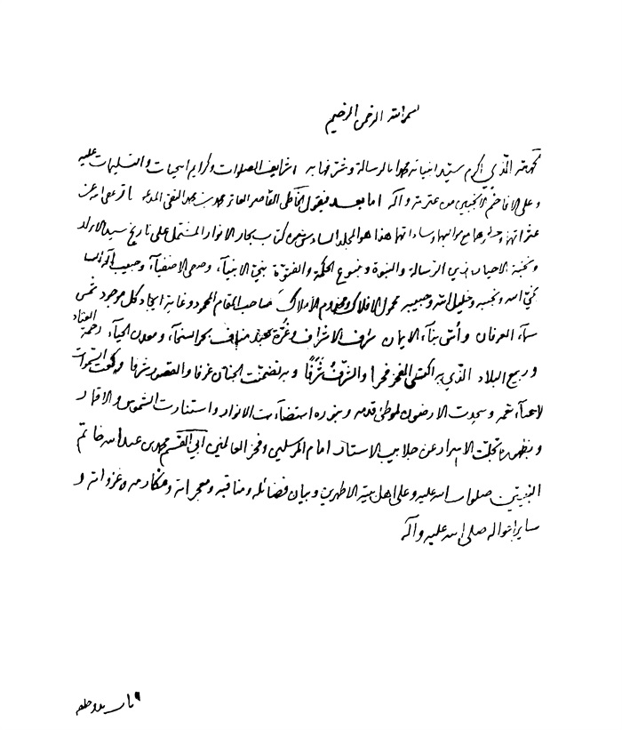

بحار الأنوار الجامعة لدرر أخبار الائمة الأطهار المجلد 15

هوية الكتاب
بطاقة تعريف: مجلسي محمد باقربن محمدتقي 1037 - 1111ق.
عنوان واسم المؤلف: بحار الأنوار الجامعة لدرر أخبار الأئمة الأطهار المجلد 15: تأليف محمد باقربن محمدتقي المجلسي.
عنوان واسم المؤلف: بيروت داراحياء التراث العربي [ -13].
مظهر: ج - عينة.
ملاحظة: عربي.
ملاحظة: فهرس الكتابة على أساس المجلد الرابع والعشرين، 1403ق. [1360].
ملاحظة: المجلد108،103،94،91،92،87،67،66،65،52،24(الطبعة الثالثة: 1403ق.=1983م.=[1361]).
ملاحظة: فهرس.
محتويات: ج.24.كتاب الامامة. ج.52.تاريخ الحجة. ج67،66،65.الإيمان والكفر. ج.87.كتاب الصلاة. ج.92،91.الذكر و الدعا. ج.94.كتاب السوم. ج.103.فهرست المصادر. ج.108.الفهرست.-
عنوان: أحاديث الشيعة — قرن 11ق
ترتيب الكونجرس: BP135/م3ب31300 ي ح
تصنيف ديوي: 297/212
رقم الببليوغرافيا الوطنية: 1680946
ص: 1

كتاب تاریخ نبینا صلی اللّٰه علیه و آله

اشارة
بِسْمِ اللَّهِ الرَّحْمنِ الرَّحِیمِ الحمد لله الذی أكرم سید أنبیائه محمدا بالرسالة و شرفها به شرائف الصلوات و كرائم التحیات و التسلیمات علیه و علی الأفاخم الأنجبین من عترته و آله.
أما بعد فیقول الخاطئ القاصر العاثر محمد بن محمد التقی المدعو بباقر عفا اللّٰه عن عثراتهما و حشرهما مع موالیهما و ساداتهما هذا هو المجلد السادس من كتاب بحار الأنوار المشتمل علی تاریخ سید الأبرار و نخبة الأخیار زین الرسالة و النبوة و ینبوع الحكمة و الفتوة (1)نبی الأنبیاء و صفی الأصفیاء نجی اللّٰه و نجیبه و خلیل اللّٰه و حبیبه محمول الأفلاك و مخدوم الأملاك صاحب المقام المحمود و غایة إیجاد كل موجود شمس سماء العرفان و أس بناء الإیمان شرف الأشراف و غرة (2)عبد مناف بحر السخاء و معدن الحیاء رحمة العباد و ربیع البلاد الذی به اكتسی الفخر فخرا و الشرف شرفا و به تضمنت الجنان غرفا و القصور شرفا فركعت السماوات لأعباء نعمه و سجدت الأرضون لموطئ قدمه و بنوره استضاءت الأنوار و استنارت الشموس و الأقمار و بظهوره تجلّت الأسرار عن جلابیب الأستار إمام المرسلین و فخر العالمین أبی القاسم محمد بن عبد اللّٰه خاتم النبیین صلوات اللّٰه علیه و علی أهل بیته الأطهرین و بیان فضائله (3)و مناقبه و معجزاته و مكارمه و غزواته و سائر أحواله صلی اللّٰه علیه و آله.
ص: 1

> **پاورقی**: 1- الفتوة: السخاء و الكرم. المروءة. و یقال بالفارسیة «جوانمردی» و هو أنسب باشتقاقه.

> **پاورقی**: 2- الغرة من كل شی ء: أوله و معظمه و طلعته، و من القوم: شریفهم.

> **پاورقی**: 3- عطف علی قوله: علی تاریخ.

باب 1 بدء خلقه و ما جری له فی المیثاق و بدء نوره و ظهوره صلی اللّٰه علیه و آله من لدن آدم علیه السلام و...
بیان: حال (1)آبائه العظام و أجداده الكرام لا سیما عبد المطلب و والدیه علیهم الصلاة و السلام و بعض أحوال العرب فی الجاهلیة و قصة الفیل و بعض النوادر
الآیات؛ 
آل عمران: «وَ إِذْ أَخَذَ اللَّهُ مِیثاقَ النَّبِیِّینَ لَما آتَیْتُكُمْ مِنْ كِتابٍ وَ حِكْمَةٍ ثُمَّ جاءَكُمْ رَسُولٌ مُصَدِّقٌ لِما مَعَكُمْ لَتُؤْمِنُنَّ بِهِ وَ لَتَنْصُرُنَّهُ قالَ أَ أَقْرَرْتُمْ وَ أَخَذْتُمْ عَلی ذلِكُمْ إِصْرِی قالُوا أَقْرَرْنا قالَ فَاشْهَدُوا وَ أَنَا مَعَكُمْ مِنَ الشَّاهِدِینَ»(81) 
الأعراف: «وَ إِذْ أَخَذَ رَبُّكَ مِنْ بَنِی آدَمَ مِنْ ظُهُورِهِمْ ذُرِّیَّتَهُمْ وَ أَشْهَدَهُمْ عَلی أَنْفُسِهِمْ أَ لَسْتُ بِرَبِّكُمْ قالُوا بَلی شَهِدْنا أَنْ تَقُولُوا یَوْمَ الْقِیامَةِ إِنَّا كُنَّا عَنْ هذا غافِلِینَ* أَوْ تَقُولُوا إِنَّما أَشْرَكَ آباؤُنا مِنْ قَبْلُ وَ كُنَّا ذُرِّیَّةً مِنْ بَعْدِهِمْ أَ فَتُهْلِكُنا بِما فَعَلَ الْمُبْطِلُونَ»(172-173) 
الشعراء: «الَّذِی یَراكَ حِینَ تَقُومُ *وَ تَقَلُّبَكَ فِی السَّاجِدِینَ»(118-119) 
الأحزاب: «وَ إِذْ أَخَذْنا مِنَ النَّبِیِّینَ مِیثاقَهُمْ وَ مِنْكَ وَ مِنْ نُوحٍ وَ إِبْراهِیمَ وَ مُوسی وَ عِیسَی ابْنِ مَرْیَمَ وَ أَخَذْنا مِنْهُمْ مِیثاقاً غَلِیظاً* لِیَسْئَلَ الصَّادِقِینَ عَنْ صِدْقِهِمْ وَ أَعَدَّ لِلْكافِرِینَ عَذاباً أَلِیماً»(7-8) 
تفسیر: قال الطبرسی رحمه اللّٰه فی قوله تعالی: وَ إِذْ أَخَذْنا مِنَ النَّبِیِّینَ مِیثاقَهُمْ أی و اذكر یا محمد حین أخذ اللّٰه المیثاق من النبیین خصوصا بأن یصدق بعضهم بعضا و یتبع بعضهم بعضا و قیل أخذ میثاقهم علی أن یعبدوا اللّٰه و یدعوا إلی عبادة اللّٰه و أن یصدق
ص: 2

> **پاورقی**: 1- فی النسختین المطبوعتین: أحوال.

بعضهم بعضا و أن ینصحوا لقومهم وَ مِنْكَ یا محمد و إنما قدمه لفضله و شرفه وَ مِنْ نُوحٍ وَ إِبْراهِیمَ وَ مُوسی وَ عِیسَی ابْنِ مَرْیَمَ خص هؤلاء لأنهم أصحاب الشرائع وَ أَخَذْنا مِنْهُمْ مِیثاقاً غَلِیظاً أی عهدا شدیدا علی الوفاء بما حملوا من أعباء الرسالة و تبلیغ الشرائع و قیل علی أن یعلنوا أن محمدا رسول اللّٰه و یعلن محمد أن لا نبی بعده لِیَسْئَلَ الصَّادِقِینَ عَنْ صِدْقِهِمْ قیل معناه إنما فعل ذلك لیسأل الأنبیاء و المرسلین ما الذی جاءت به أممكم (1)و قیل لیسأل الصادقین فی توحید اللّٰه و عدله و الشرائع عَنْ صِدْقِهِمْ أی عما كانوا یقولونه فیه تعالی فیقال لهم هل ظلم اللّٰه أحدا هل جازی كل إنسان بفعله هل عذب بغیر ذنب و نحو ذلك فیقولون نعم عدل فی حكمه و جازی كلا بفعله و قیل معناه لیسأل الصادقین فی أقوالهم عن صدقهم فی أفعالهم و قیل لیسأل الصادقین ما ذا قصدتم بصدقكم وجه اللّٰه أو غیره. (2)أقول سیأتی تفسیر سائر الآیات و سنورد الأخبار المتضمنة لتأویلها فی هذا الباب و غیره.
«1»-فس، تفسیر القمی مُحَمَّدُ بْنُ الْوَلِیدِ عَنْ مُحَمَّدِ بْنِ الْفُرَاتِ عَنْ أَبِی جَعْفَرٍ علیه السلام قَالَ: الَّذِی یَراكَ حِینَ تَقُومُ فِی النُّبُوَّةِ وَ تَقَلُّبَكَ فِی السَّاجِدِینَ قَالَ فِی أَصْلَابِ النَّبِیِّینَ (3).
«2»-كنز، كنز جامع الفوائد و تأویل الآیات الظاهرة مُحَمَّدُ بْنُ الْعَبَّاسِ عَنِ الْحُسَیْنِ بْنِ هَارُونَ عَنْ عَلِیِّ بْنِ مَهْزِیَارَ عَنْ أَخِیهِ عَنِ ابْنِ أَسْبَاطٍ عَنْ عَبْدِ الرَّحْمَنِ بْنِ حَمَّادٍ عَنْ أَبِی الْجَارُودِ قَالَ: سَأَلْتُ أَبَا جَعْفَرٍ علیه السلام عَنْ قَوْلِهِ عَزَّ وَ جَلَّ وَ تَقَلُّبَكَ فِی السَّاجِدِینَ قَالَ یَرَی تَقَلُّبَهُ فِی أَصْلَابِ النَّبِیِّینَ مِنْ نَبِیٍّ إِلَی نَبِیٍّ حَتَّی أَخْرَجَهُ مِنْ صُلْبِ أَبِیهِ مِنْ نِكَاحٍ غَیْرِ سِفَاحٍ مِنْ لَدُنْ آدَمَ ع(4).
«3»-یر، بصائر الدرجات بَعْضُ أَصْحَابِنَا عَنْ مُحَمَّدِ بْنِ الْحُسَیْنِ عَنْ عَلِیِّ بْنِ أَسْبَاطٍ عَنْ عَلِیِّ بْنِ مَعْمَرٍ عَنْ أَبِیهِ قَالَ: سَأَلْتُ أَبَا عَبْدِ اللَّهِ علیه السلام عَنْ قَوْلِ اللَّهِ تَبَارَكَ وَ تَعَالَی هذا نَذِیرٌ مِنَ النُّذُرِ الْأُولی
ص: 3

> **پاورقی**: 1- فی المصدر: ما الذی أجاب به أممكم؟ و هو الصواب.

> **پاورقی**: 2- مجمع البیان 8: 339.

> **پاورقی**: 3- تفسیر القمّیّ: 474.

> **پاورقی**: 4- مخطوط.

قَالَ یَعْنِی بِهِ مُحَمَّداً صلی اللّٰه علیه و آله حَیْثُ دَعَاهُمْ إِلَی الْإِقْرَارِ بِاللَّهِ فِی الذَّرِّ الْأَوَّلِ (1).
«4»-ل، الخصال مع، معانی الأخبار الْحَاكِمُ أَحْمَدُ بْنُ مُحَمَّدِ بْنِ عَبْدِ الرَّحْمَنِ الْمَرْوَزِیُّ عَنْ مُحَمَّدِ بْنِ إِبْرَاهِیمَ الْجُرْجَانِیِّ عَنْ عَبْدِ الصَّمَدِ بْنِ یَحْیَی الْوَاسِطِیِّ عَنِ الْحَسَنِ بْنِ عَلِیٍّ الْمَدَنِیِّ عَنْ عَبْدِ اللَّهِ بْنِ الْمُبَارَكِ عَنْ سُفْیَانَ الثَّوْرِیِّ عَنْ جَعْفَرِ بْنِ مُحَمَّدٍ الصَّادِقِ عَنْ أَبِیهِ عَنْ جَدِّهِ عَنْ أَبِیهِ عَنْ عَلِیِّ بْنِ أَبِی طَالِبٍ علیهما السلام أَنَّهُ قَالَ: إِنَّ اللَّهَ تَبَارَكَ وَ تَعَالَی خَلَقَ نُورَ مُحَمَّدٍ صلی اللّٰه علیه و آله قَبْلَ أَنْ خَلَقَ (2)السَّمَاوَاتِ وَ الْأَرْضَ وَ الْعَرْشَ وَ الْكُرْسِیَّ وَ اللَّوْحَ وَ الْقَلَمَ وَ الْجَنَّةَ وَ النَّارَ وَ قَبْلَ أَنْ خَلَقَ (3)آدَمَ وَ نُوحاً وَ إِبْرَاهِیمَ وَ إِسْمَاعِیلَ وَ إِسْحَاقَ وَ یَعْقُوبَ وَ مُوسَی وَ عِیسَی وَ دَاوُدَ وَ سُلَیْمَانَ علیهم السلام وَ كُلَّ مَنْ قَالَ اللَّهُ عَزَّ وَ جَلَّ فِی قَوْلِهِ وَ وَهَبْنا لَهُ إِسْحاقَ وَ یَعْقُوبَ إِلَی قَوْلِهِ وَ هَدَیْناهُمْ إِلی صِراطٍ مُسْتَقِیمٍ وَ قَبْلَ أَنْ خَلَقَ الْأَنْبِیَاءَ كُلَّهُمْ بِأَرْبَعِ مِائَةِ أَلْفِ سَنَةٍ وَ أَرْبَعٍ وَ عِشْرِینَ أَلْفَ سَنَةٍ وَ خَلَقَ عَزَّ وَ جَلَّ مَعَهُ اثْنَیْ عَشَرَ حِجَاباً حِجَابَ الْقُدْرَةِ وَ حِجَابَ الْعَظَمَةِ وَ حِجَابَ الْمِنَّةِ (4)وَ حِجَابَ الرَّحْمَةِ وَ حِجَابَ السَّعَادَةِ وَ حِجَابَ الْكَرَامَةِ وَ حِجَابَ الْمَنْزِلَةِ وَ حِجَابَ الْهِدَایَةِ وَ حِجَابَ النُّبُوَّةِ وَ حِجَابَ الرِّفْعَةِ وَ حِجَابَ الْهَیْبَةِ وَ حِجَابَ الشَّفَاعَةِ ثُمَّ حَبَسَ نُورَ مُحَمَّدٍ صلی اللّٰه علیه و آله فِی حِجَابِ الْقُدْرَةِ اثْنَیْ عَشَرَ أَلْفَ سَنَةٍ وَ هُوَ یَقُولُ سُبْحَانَ رَبِّیَ الْأَعْلَی وَ فِی حِجَابِ الْعَظَمَةِ أَحَدَ عَشَرَ أَلْفَ سَنَةٍ وَ هُوَ یَقُولُ سُبْحَانَ عَالِمِ السِّرِّ وَ فِی حِجَابِ الْمِنَّةِ عَشْرَةَ آلَافِ سَنَةٍ وَ هُوَ یَقُولُ سُبْحَانَ مَنْ هُوَ قَائِمٌ لَا یَلْهُو وَ فِی حِجَابِ الرَّحْمَةِ تِسْعَةَ آلَافِ سَنَةٍ وَ هُوَ یَقُولُ سُبْحَانَ الرَّفِیعِ الْأَعْلَی وَ فِی حِجَابِ السَّعَادَةِ ثَمَانِیَةَ آلَافِ سَنَةٍ وَ هُوَ یَقُولُ سُبْحَانَ مَنْ هُوَ دَائِمٌ لَا یَسْهُو وَ فِی حِجَابِ الْكَرَامَةِ سَبْعَةَ آلَافِ سَنَةٍ وَ هُوَ یَقُولُ سُبْحَانَ مَنْ هُوَ غَنِیٌّ لَا یَفْتَقِرُ وَ فِی حِجَابِ الْمَنْزِلَةِ سِتَّةَ آلَافِ سَنَةٍ وَ هُوَ یَقُولُ سُبْحَانَ الْعَلِیمِ الْكَرِیمِ (5)وَ فِی حِجَابِ الْهِدَایَةِ خَمْسَةَ آلَافِ سَنَةٍ وَ هُوَ یَقُولُ سُبْحَانَ ذِی الْعَرْشِ الْعَظِیمِ (6)وَ فِی حِجَابِ النُّبُوَّةِ أَرْبَعَةَ آلَافِ سَنَةٍ وَ هُوَ یَقُولُ سُبْحَانَ رَبِ
ص: 4

> **پاورقی**: 1- بصائر الدرجات: 24.

> **پاورقی**: 2- فی نسخة: قبل أن یخلق.

> **پاورقی**: 3- فی نسخة: قبل أن یخلق.

> **پاورقی**: 4- و فی الأنوار علی ما یأتی «و حجاب العزة» و لعله أحسن.

> **پاورقی**: 5- فی المصدر: سبحان ربی العلی الكریم.

> **پاورقی**: 6- فی المصدر: سبحان ربّ العرش العظیم.

الْعِزَّةِ عَمَّا یَصِفُونَ وَ فِی حِجَابِ الرِّفْعَةِ ثَلَاثَةَ آلَافِ سَنَةٍ وَ هُوَ یَقُولُ سُبْحَانَ ذِی الْمُلْكِ وَ الْمَلَكُوتِ وَ فِی حِجَابِ الْهَیْبَةِ أَلْفَیْ سَنَةٍ وَ هُوَ یَقُولُ سُبْحَانَ اللَّهِ وَ بِحَمْدِهِ وَ فِی حِجَابِ الشَّفَاعَةِ أَلْفَ سَنَةٍ وَ هُوَ یَقُولُ سُبْحَانَ رَبِّیَ الْعَظِیمِ وَ بِحَمْدِهِ ثُمَّ أَظْهَرَ اسْمَهُ عَلَی اللَّوْحِ فَكَانَ عَلَی اللَّوْحِ مُنَوَّراً أَرْبَعَةَ آلَافِ سَنَةٍ ثُمَّ أَظْهَرَهُ عَلَی الْعَرْشِ فَكَانَ عَلَی سَاقِ الْعَرْشِ مُثْبَتاً سَبْعَةَ آلَافِ سَنَةٍ إِلَی أَنْ وَضَعَهُ اللَّهُ عَزَّ وَ جَلَّ فِی صُلْبِ آدَمَ علیه السلام (1)ثُمَّ نَقَلَهُ مِنْ صُلْبِ آدَمَ علیه السلام إِلَی صُلْبِ نُوحٍ علیه السلام ثُمَّ مِنْ صُلْبٍ إِلَی صُلْبٍ (2)حَتَّی أَخْرَجَهُ اللَّهُ عَزَّ وَ جَلَّ مِنْ صُلْبِ عَبْدِ اللَّهِ بْنِ عَبْدِ الْمُطَّلِبِ فَأَكْرَمَهُ بِسِتِّ كَرَامَاتٍ أَلْبَسَهُ قَمِیصَ الرِّضَا وَ رَدَّاهُ بِرِدَاءِ الْهَیْبَةِ وَ تَوَّجَهُ بِتَاجِ الْهِدَایَةِ (3)وَ أَلْبَسَهُ سَرَاوِیلَ الْمَعْرِفَةِ وَ جَعَلَ تِكَّتَهُ تِكَّةَ الْمَحَبَّةِ یَشُدُّ بِهَا سَرَاوِیلَهُ وَ جَعَلَ نَعْلَهُ نَعْلَ الْخَوْفِ وَ نَاوَلَهُ عَصَا الْمَنْزِلَةِ ثُمَّ قَالَ یَا مُحَمَّدُ اذْهَبْ إِلَی النَّاسِ فَقُلْ لَهُمْ قُولُوا لَا إِلَهَ إِلَّا اللَّهُ مُحَمَّدٌ رَسُولُ اللَّهِ وَ كَانَ أَصْلُ ذَلِكَ الْقَمِیصِ مِنْ سِتَّةِ أَشْیَاءَ قَامَتُهُ مِنَ الْیَاقُوتِ وَ كُمَّاهُ مِنَ اللُّؤْلُؤِ وَ دِخْرِیصُهُ مِنَ الْبِلَّوْرِ الْأَصْفَرِ وَ إِبْطَاهُ مِنَ الزَّبَرْجَدِ وَ جُرُبَّانُهُ مِنَ الْمَرْجَانِ الْأَحْمَرِ وَ جَیْبُهُ مِنْ نُورِ الرَّبِّ جَلَّ جَلَالُهُ فَقَبِلَ اللَّهُ عَزَّ وَ جَلَّ تَوْبَةَ آدَمَ علیه السلام بِذَلِكَ الْقَمِیصِ وَ رَدَّ خَاتَمَ سُلَیْمَانَ علیه السلام بِهِ وَ رَدَّ یُوسُفَ علیه السلام إِلَی یَعْقُوبَ علیه السلام بِهِ وَ نَجَّی یُونُسَ علیه السلام مِنْ بَطْنِ الْحُوتِ بِهِ وَ كَذَلِكَ سَائِرُ الْأَنْبِیَاءِ علیهم السلام أَنْجَاهُمْ مِنَ الْمِحَنِ بِهِ وَ لَمْ یَكُنْ ذَلِكَ الْقَمِیصُ إِلَّا قَمِیصَ مُحَمَّدٍ صلی اللّٰه علیه و آله (4).
ص: 5

> **پاورقی**: 1- فی هامش المخطوط حاشیة بخط المصنّف و هی: لما كانوا علیهم السلام هم المقصودون من خلق آدم علیه السلام و سائر ذریته فكان خلق آدم علیه السلام من الطینة الطیبة لیكون قابلا لخروج تلك الاشخاص المقدّسة منه، و ربی تلك الطینة فی الآباء و الامهات حتّی كملت قابلیتها فی عبد اللّٰه و أبی طالب، فخلق المقدسین منهما، فیحتمل أن یكون حفظ النور و انتقاله من الاصلاب كنایة عن انتقال تلك القابلیة، و استكمال هذا الاستعداد، و ما ورد أن كمالهم و فضلهم كان سبب الاشتمال علی أنوارهم یستقیم علی هذا، و كذا ما ضارعها من الاخبار و اللّٰه یعلم تلك الاسرار، و حججه الأخیار علیهم السلام. منه عفی عنه.

> **پاورقی**: 2- فی المصدر: ثم جعل یخرجه من صلب إلی صلب حتّی أخرجه من صلب.

> **پاورقی**: 3- فی المصدر: رداه رداء الهیبة، و توجه تاج الهدایة.

> **پاورقی**: 4- الخصال 1: 82، معانی الأخبار: 88 و 89.

بیان: قوله ثم حبس نور محمد صلی اللّٰه علیه و آله لیس الغرض ذكر جمیع أحواله صلی اللّٰه علیه و آله فی الذر لعدم موافقة العدد بل قد جری علی نوره أحوال قبل تلك الأحوال أو بعدها أو بینها لم تذكر فی الخبر (1)و الدخریص بالكسر لبنة القمیص و جربان القمیص بضم الجیم و الراء و تشدید الباء معرب گریبان.
«5»-فر، تفسیر فرات بن إبراهیم عَنْ جَعْفَرِ بْنِ مُحَمَّدٍ الْفَزَارِیِّ بِإِسْنَادِهِ (2)عَنْ قَبِیصَةَ بْنِ یَزِیدَ الْجُعْفِیِّ (3)قَالَ: دَخَلْتُ عَلَی الصَّادِقِ علیه السلام وَ عِنْدَهُ ابْنُ ظَبْیَانَ وَ الْقَاسِمُ الصَّیْرَفِیُّ (4)فَسَلَّمْتُ وَ جَلَسْتُ وَ قُلْتُ یَا ابْنَ رَسُولِ اللَّهِ (5)أَیْنَ كُنْتُمْ قَبْلَ أَنْ یَخْلُقَ اللَّهُ سَمَاءً مَبْنِیَّةً وَ أَرْضاً مَدْحِیَّةً أَوْ ظُلْمَةً أَوْ نُوراً (6)قَالَ كُنَّا أَشْبَاحَ نُورٍ حَوْلَ الْعَرْشِ نُسَبِّحُ اللَّهَ قَبْلَ أَنْ یَخْلُقَ آدَمَ علیه السلام بِخَمْسَةَ عَشَرَ أَلْفَ عَامٍ فَلَمَّا خَلَقَ اللَّهُ آدَمَ علیه السلام فَرَّغَنَا فِی صُلْبِهِ فَلَمْ یَزَلْ یَنْقُلُنَا مِنْ صُلْبٍ طَاهِرٍ إِلَی رَحِمٍ مُطَهَّرٍ حَتَّی بَعَثَ اللَّهُ مُحَمَّداً صلی اللّٰه علیه و آله الْخَبَرَ (7).
«6»-فر، تفسیر فرات بن إبراهیم جَعْفَرُ بْنُ مُحَمَّدِ بْنِ بِشْرَوَیْهِ الْقَطَّانُ بِإِسْنَادِهِ عَنِ الْأَوْزَاعِیِّ (8)عَنْ
ص: 6

> **پاورقی**: 1- و قد ذكر بعضها فی خبر الأنوار كما یأتی.

> **پاورقی**: 2- فی المصدر: بإسناده معنعنا.

> **پاورقی**: 3- فی المصدر: فیضة بن یزید الجعفی. و علی أی فلم نجد ترجمته.

> **پاورقی**: 4- فی المصدر: و عنده البوس بن أبی الدوس، و ابن ظبیان و القاسم بن الصیرفی. قلت: أما البوس فلم نجد ترجمته، و ابن ظبیان هو یونس بن ظبیان المعروف، و القاسم هو ابن عبد الرحمن الصیرفی.

> **پاورقی**: 5- فی المصدر: یا ابن رسول اللّٰه أتیتك مستفیدا، قال: سل و اوجز، قلت: أین كنتم إه.

> **پاورقی**: 6- فی المصدر: أو ظلمة و نورا، قال: یا فیضة لم سألتنا عن هذا الحدیث فی مثل هذا الوقت؟ أ ما علمت أن حبنا قد اكتتم، و بغضنا قد نشأ، و ان لنا أعداء من الجن یخرجون حدیثنا إلی أعدائنا من الانس و ان الحیطان لها آذان كآذان الناس، قال: قلت: قد سألت عن ذلك، قال: یا فیضة كنا أشباح نور إه. قلت: قوله: قد نشأ لعله مصحف قد نشر أو قد فشا أو المعنی أن بغضنا فی حدوث و تجدد دائما، لان أعداءنا لم یزل یربون الناس و یسوقونهم علی ذلك. قوله: إن لنا اه لعله تعریض ببعض حاضری المجلس و أنّه من أعدائنا، أو إشارة الی لزوم التحفظ و شدة التستر عن كشف أسرارهم.

> **پاورقی**: 7- تفسیر فرات: 207.

> **پاورقی**: 8- فی المصدر: معنعنا عن الاوزاعی.

صَعْصَعَةَ بْنِ صُوحَانَ وَ اَلْأَحْنَفِ بْنِ قَیْسٍ عَنِ اِبْنِ عَبَّاسٍ (1)قَالَ قَالَ رَسُولُ اللَّهِ صلی اللّٰه علیه و آله :
خَلَقَنِیَ اللَّهُ نُوراً تَحْتَ الْعَرْشِ قَبْلَ أَنْ یَخْلُقَ آدَمَ علیه السلام بِاثْنَیْ عَشَرَ أَلْفَ سَنَةٍ فَلَمَّا أَنْ خَلَقَ اللَّهُ آدَمَ علیه السلام أَلْقَی النُّورَ فِی صُلْبِ آدَمَ علیه السلام فَأَقْبَلَ یَنْتَقِلُ ذَلِكَ النُّورُ مِنْ صُلْبٍ إِلَی صُلْبٍ حَتَّی افْتَرَقْنَا فِی صُلْبِ عَبْدِ اللَّهِ بْنِ عَبْدِ الْمُطَّلِبِ وَ أَبِی طَالِبٍ فَخَلَقَنِی رَبِّی مِنْ ذَلِكَ النُّورِ لَكِنَّهُ لاَ نَبِیَّ بَعْدِی (2).
«7»-ع، علل الشرائع إِبْرَاهِیمُ بْنُ هَارُونَ عَنْ مُحَمَّدِ بْنِ أَحْمَدَ بْنِ أَبِی الثَّلْجِ (3)عَنْ عِیسَی بْنِ مِهْرَانَ (4)عَنْ مُنْذِرٍ الشراك (السَّرَّاجِ) عَنْ إِسْمَاعِیلَ بْنِ عُلَیَّةَ عَنْ أَسْلَمَ بْنِ مَیْسَرَةَ الْعِجْلِیِّ عَنْ أَنَسِ بْنِ مَالِكٍ عَنْ مُعَاذِ بْنِ جَبَلٍ أَنَّ رَسُولَ اللَّهِ صلی اللّٰه علیه و آله قَالَ: إِنَّ اللَّهَ خَلَقَنِی وَ عَلِیّاً وَ فَاطِمَةَ وَ الْحَسَنَ وَ الْحُسَیْنَ مِنْ قَبْلِ أَنْ یَخْلُقَ الدُّنْیَا بِسَبْعَةِ آلَافِ عَامٍ قُلْتُ فَأَیْنَ كُنْتُمْ یَا رَسُولَ اللَّهِ قَالَ قُدَّامَ الْعَرْشِ نُسَبِّحُ اللَّهَ وَ نَحْمَدُهُ وَ نُقَدِّسُهُ وَ نُمَجِّدُهُ قُلْتُ عَلَی أَیِّ مِثَالٍ قَالَ أَشْبَاحِ نُورٍ حَتَّی إِذَا أَرَادَ اللَّهُ عَزَّ وَ جَلَّ أَنْ یَخْلُقَ صُوَرَنَا صَیَّرَنَا عَمُودَ نُورٍ ثُمَّ قَذَفَنَا فِی صُلْبِ آدَمَ ثُمَّ أَخْرَجَنَا إِلَی أَصْلَابِ الْآبَاءِ وَ أَرْحَامِ الْأُمَّهَاتِ وَ لَا یُصِیبُنَا نَجَسُ الشِّرْكِ وَ لَا سِفَاحُ الْكُفْرِ یَسْعَدُ بِنَا قَوْمٌ وَ یَشْقَی بِنَا آخَرُونَ فَلَمَّا صَیَّرَنَا إِلَی صُلْبِ عَبْدِ الْمُطَّلِبِ أَخْرَجَ ذَلِكَ النُّورَ فَشَقَّهُ نِصْفَیْنِ فَجَعَلَ نِصْفَهُ فِی عَبْدِ اللَّهِ وَ نِصْفَهُ فِی أَبِی طَالِبٍ ثُمَّ أَخْرَجَ الَّذِی (5)لِی إِلَی آمِنَةَ وَ النِّصْفَ إِلَی فَاطِمَةَ بِنْتِ أَسَدٍ فَأَخْرَجَتْنِی آمِنَةُ وَ
ص: 7

> **پاورقی**: 1- 1) للحدیث صدر یأتی فی فضائل علیّ علیه السلام.

> **پاورقی**: 2- 2) تفسیر فرات:190.

> **پاورقی**: 3- هكذا فی النسختین المطبوعتین، و فی المصدر: محمّد بن أحمد بن أبی البلخ. و فی نسخة المصنّف: محمّد بن أحمد بن أبی البلح- بالباء- و كلها وهم، و الرجل هو محمّد بن أحمد بن محمّد بن عبد اللّٰه بن إسماعیل الكاتب أبو بكر المعروف بابن أبی الثلج، و أبو الثلج هو عبد اللّٰه بن إسماعیل، و الرجل مذكور فی تراجم الخاصّة كلها، و قد ذكره ابن حجر فی التقریب و التهذیب فی جده محمّد بن عبد اللّٰه، و فی جمیع التراجم «الثلج» بالثاء مضافا الی تصریح العلامة بالضبط فی الإیضاح:

> **پاورقی**: 4- فی نسخة من المصدر: موسی بن مهران.

> **پاورقی**: 5- فی المصدر: ثم أخرج النصف الذی لی.

أَخْرَجَتْ فَاطِمَةُ عَلِیّاً ثُمَّ أَعَادَ عَزَّ وَ جَلَّ الْعَمُودَ إِلَیَّ فَخَرَجَتْ مِنِّی فَاطِمَةُ ثُمَّ أَعَادَ عَزَّ وَ جَلَّ الْعَمُودَ إِلَی عَلِیٍّ فَخَرَجَ مِنْهُ الْحَسَنُ وَ الْحُسَیْنُ یَعْنِی مِنَ النِّصْفَیْنِ جَمِیعاً فَمَا كَانَ مِنْ نُورِ عَلِیٍّ فَصَارَ فِی وُلْدِ الْحَسَنِ وَ مَا كَانَ مِنْ نُورِی صَارَ فِی وُلْدِ الْحُسَیْنِ فَهُوَ یَنْتَقِلُ فِی الْأَئِمَّةِ مِنْ وُلْدِهِ إِلَی یَوْمِ الْقِیَامَةِ (1).
«8»-فر، تفسیر فرات بن إبراهیم جَعْفَرُ بْنُ مُحَمَّدٍ الْأَحْمَسِیُّ (2)بِإِسْنَادِهِ عَنْ أَبِی ذَرٍّ الْغِفَارِیِّ عَنِ النَّبِیِّ صلی اللّٰه علیه و آله فِی خَبَرٍ طَوِیلٍ فِی وَصْفِ الْمِعْرَاجِ سَاقَهُ إِلَی أَنْ قَالَ قُلْتُ یَا مَلَائِكَةَ رَبِّی هَلْ تَعْرِفُونَّا حَقَّ مَعْرِفَتِنَا فَقَالُوا یَا نَبِیَّ اللَّهِ وَ كَیْفَ لَا نَعْرِفُكُمْ وَ أَنْتُمْ أَوَّلُ مَا خَلَقَ اللَّهُ (3)خَلَقَكُمْ أَشْبَاحَ نُورٍ مِنْ نُورِهِ فِی نُورٍ (4)مِنْ سَنَاءِ عِزِّهِ وَ مِنْ سَنَاءِ مُلْكِهِ وَ مِنْ نُورِ وَجْهِهِ الْكَرِیمِ وَ جَعَلَ لَكُمْ مَقَاعِدَ فِی مَلَكُوتِ سُلْطَانِهِ وَ عَرْشُهُ عَلَی الْمَاءِ قَبْلَ أَنْ تَكُونَ السَّمَاءُ مَبْنِیَّةً وَ الْأَرْضُ مَدْحِیَّةً (5)ثُمَّ خَلَقَ السَّماواتِ وَ الْأَرْضَ فِی سِتَّةِ أَیَّامٍ ثُمَّ رَفَعَ الْعَرْشَ إِلَی السَّمَاءِ السَّابِعَةِ فَاسْتَوَی عَلَی عَرْشِهِ وَ أَنْتُمْ أَمَامَ عَرْشِهِ تُسَبِّحُونَ وَ تُقَدِّسُونَ وَ تُكَبِّرُونَ ثُمَّ خَلَقَ الْمَلَائِكَةَ مِنْ بَدْءِ مَا أَرَادَ مِنْ أَنْوَارٍ شَتَّی وَ كُنَّا نَمُرُّ بِكُمْ وَ أَنْتُمْ تُسَبِّحُونَ وَ تَحْمَدُونَ وَ تُهَلِّلُونَ وَ تُكَبِّرُونَ وَ تُمَجِّدُونَ وَ تُقَدِّسُونَ فَنُسَبِّحُ وَ نُقَدِّسُ وَ نُمَجِّدُ وَ نُكَبِّرُ وَ نُهَلِّلُ بِتَسْبِیحِكُمْ وَ تَحْمِیدِكُمْ وَ تَهْلِیلِكُمْ وَ تَكْبِیرِكُمْ وَ تَقْدِیسِكُمْ وَ تَمْجِیدِكُمْ (6)فَمَا أُنْزِلَ مِنَ اللَّهِ فَإِلَیْكُمْ وَ مَا صَعِدَ إِلَی اللَّهِ فَمِنْ عِنْدِكُمْ فَلِمَ لَا نَعْرِفُكُمْ أَقْرِئْ عَلِیّاً مِنَّا السَّلَامَ وَ سَاقَهُ إِلَی أَنْ قَالَ ثُمَّ عُرِجَ بِی إِلَی
ص: 8

> **پاورقی**: 1- علل الشرائع: 80 قلت: قال المصنّف: أكثر هذه الأخبار تدلّ علی تقدم خلق الأرواح علی الاجساد، و بعضها علی عالم المثال؛ و اللّٰه یعلم حقیقة الحال انتهی. و قد أورد ما یناسب المقام من كلام الشیخ المفید و السیّد المرتضی رضی اللّٰه عنهما فی باب الطینة و المیثاق من كتاب العدل راجع ج 5: 260- 276.

> **پاورقی**: 2- فی المصدر: معنعنا عن أبی ذر.

> **پاورقی**: 3- فی المصدر: و أنتم أول خلق اللّٰه.

> **پاورقی**: 4- فی المصدر: من نور فی نور.

> **پاورقی**: 5- فی المصدر بعد قوله: مدحیة زیادة هی: و هو فی الموضع الذی ینوی فیه. و فیه: خلق السماوات و الأرضین.

> **پاورقی**: 6- فی المصدر: و أنتم تقدسون و تهللون و تكبرون و تسبحون و تمجدون فنسبح و نقدس و نمجد و نهلل بتسبیحكم و تقدیسكم و تهلیلكم.

السَّمَاءِ السَّابِعَةِ فَسَمِعْتُ الْمَلَائِكَةَ یَقُولُونَ لَمَّا أَنْ رَأَوْنِی الْحَمْدُ لِلَّهِ الَّذِی صَدَقَنَا وَعْدَهُ (1)ثُمَّ تَلَقَّوْنِی وَ سَلَّمُوا عَلَیَّ وَ قَالُوا لِی مِثْلَ مَقَالَةِ أَصْحَابِهِمْ فَقُلْتُ یَا مَلَائِكَةَ رَبِّی سَمِعْتُكُمْ تَقُولُونَ الْحَمْدُ لِلَّهِ الَّذِی صَدَقَنا وَعْدَهُ فَمَا الَّذِی صَدَقَكُمْ قَالُوا یَا نَبِیَّ اللَّهِ إِنَّ اللَّهَ تَبَارَكَ وَ تَعَالَی لَمَّا أَنْ خَلَقَكُمْ أَشْبَاحَ نُورٍ مِنْ سَنَاءِ نُورِهِ وَ مِنْ سَنَاءِ عِزِّهِ وَ جَعَلَ لَكُمْ مَقَاعِدَ فِی مَلَكُوتِ سُلْطَانِهِ عَرَضَ وَلَایَتَكُمْ عَلَیْنَا (2)وَ رَسَخَتْ فِی قُلُوبِنَا فَشَكَوْنَا مَحَبَّتَكَ إِلَی اللَّهِ فَوَعَدَ رَبُّنَا (3)أَنْ یُرِیَنَاكَ فِی السَّمَاءِ مَعَنَا وَ قَدْ صَدَقَنَا وَعْدَهُ الْخَبَرَ (4).
«9»-خص، منتخب البصائر الْحُسَیْنُ بْنُ حَمْدَانَ عَنِ الْحُسَیْنِ الْمُقْرِی الْكُوفِیِّ عَنْ أَحْمَدَ بْنِ زِیَادٍ الدِّهْقَانِ عَنِ الْمُخَوَّلِ بْنِ إِبْرَاهِیمَ عَنْ رَشْدَةَ بْنِ عَبْدِ اللَّهِ عَنْ خَالِدٍ الْمَخْزُومِیِّ عَنْ سَلْمَانَ الْفَارِسِیِّ رَضِیَ اللَّهُ عَنْهُ فِی حَدِیثٍ طَوِیلٍ قَالَ قَالَ النَّبِیُّ صلی اللّٰه علیه و آله یَا سَلْمَانُ فَهَلْ عَلِمْتَ مَنْ نُقَبَائِی وَ مَنِ الِاثْنَا عَشَرَ الَّذِینَ اخْتَارَهُمُ اللَّهُ لِلْإِمَامَةِ بَعْدِی فَقُلْتُ اللَّهُ وَ رَسُولُهُ أَعْلَمُ قَالَ یَا سَلْمَانُ خَلَقَنِیَ اللَّهُ مِنْ صَفْوَةِ نُورِهِ وَ دَعَانِی فَأَطَعْتُ وَ خَلَقَ مِنْ نُورِی عَلِیّاً فَدَعَاهُ فَأَطَاعَهُ وَ خَلَقَ مِنْ نُورِی وَ نُورِ عَلِیٍّ فَاطِمَةَ فَدَعَاهَا فَأَطَاعَتْهُ وَ خَلَقَ مِنِّی وَ مِنْ عَلِیٍّ وَ فَاطِمَةَ الْحَسَنَ وَ الْحُسَیْنَ فَدَعَاهُمَا فَأَطَاعَاهُ فَسَمَّانَا بِالْخَمْسَةِ الْأَسْمَاءِ مِنْ أَسْمَائِهِ اللَّهُ الْمَحْمُودُ وَ أَنَا مُحَمَّدٌ وَ اللَّهُ الْعَلِیُّ وَ هَذَا عَلِیٌّ وَ اللَّهُ الْفَاطِرُ وَ هَذِهِ فَاطِمَةُ وَ اللَّهُ ذُو الْإِحْسَانِ وَ هَذَا الْحَسَنُ وَ اللَّهُ الْمُحْسِنُ وَ هَذَا الْحُسَیْنُ ثُمَّ خَلَقَ مِنَّا مِنْ صُلْبِ الْحُسَیْنِ تِسْعَةَ أَئِمَّةٍ فَدَعَاهُمْ فَأَطَاعُوهُ قَبْلَ أَنْ یَخْلُقَ اللَّهُ سَمَاءً مَبْنِیَّةً وَ أَرْضاً مَدْحِیَّةً أَوْ هَوَاءً أَوْ مَاءً أَوْ مَلَكاً أَوْ بَشَراً وَ كُنَّا بِعِلْمِهِ نُوراً نُسَبِّحُهُ وَ نَسْمَعُ وَ نُطِیعُ الْخَبَرَ.
«10»-كنز، كنز جامع الفوائد و تأویل الآیات الظاهرة مِنْ كِتَابِ الْوَاحِدَةِ عَنْ أَبِی مُحَمَّدٍ الْحَسَنِ بْنِ عَبْدِ اللَّهِ الْكُوفِیِّ عَنْ جَعْفَرِ بْنِ مُحَمَّدٍ الْبَجَلِیِّ عَنْ أَحْمَدَ بْنِ حُمَیْدٍ عَنِ الثُّمَالِیِّ عَنْ أَبِی جَعْفَرٍ علیه السلام قَالَ قَالَ أَمِیرُ الْمُؤْمِنِینَ
ص: 9

> **پاورقی**: 1- فی المصدر: فقلت: ملائكة ربی سمعت و أنتم تقولون: الحمد للّٰه الذی صدقنا وعده و اورثنا الأرض نتبوأ من الجنة حیث نشاء.

> **پاورقی**: 2- فی المصدر بعد قوله: سلطانه: و اشهدكم علی عباده عرض ولایتكم علینا.

> **پاورقی**: 3- فی المصدر: فوعدنا ربّنا.

> **پاورقی**: 4- تفسیر فرات: 134- 136. و الحدیث طویل.

علیه السلام إِنَّ اللَّهَ تَبَارَكَ وَ تَعَالَی أَحَدٌ وَاحِدٌ تَفَرَّدَ فِی وَحْدَانِیَّتِهِ ثُمَّ تَكَلَّمَ بِكَلِمَةٍ فَصَارَتْ نُوراً ثُمَّ خَلَقَ مِنْ ذَلِكَ النُّورِ مُحَمَّداً صلی اللّٰه علیه و آله وَ خَلَقَنِی وَ ذُرِّیَّتِی ثُمَّ تَكَلَّمَ بِكَلِمَةٍ فَصَارَتْ رُوحاً فَأَسْكَنَهُ اللَّهُ فِی ذَلِكَ النُّورِ وَ أَسْكَنَهُ فِی أَبْدَانِنَا فَنَحْنُ رُوحُ اللَّهِ وَ كَلِمَاتُهُ وَ بِنَا احْتَجَبَ عَنْ خَلْقِهِ فَمَا زِلْنَا فِی ظُلَّةٍ خَضْرَاءَ حَیْثُ لَا شَمْسَ وَ لَا قَمَرَ وَ لَا لَیْلَ وَ لَا نَهَارَ وَ لَا عَیْنَ تَطْرِفُ نَعْبُدُهُ وَ نُقَدِّسُهُ وَ نُسَبِّحُهُ قَبْلَ أَنْ یَخْلُقَ الْخَلْقَ الْخَبَرَ (1).
«11»-كنز، كنز جامع الفوائد و تأویل الآیات الظاهرة عَنْ مُحَمَّدِ بْنِ الْحَسَنِ الطُّوسِیِّ رَحِمَهُ اللَّهُ فِی كِتَابِهِ مِصْبَاحِ الْأَنْوَارِ (2)بِإِسْنَادِهِ عَنْ أَنَسٍ عَنِ النَّبِیِّ صلی اللّٰه علیه و آله قَالَ: إِنَّ اللَّهَ خَلَقَنِی وَ خَلَقَ عَلِیّاً وَ فَاطِمَةَ وَ الْحَسَنَ وَ الْحُسَیْنَ قَبْلَ أَنْ یَخْلُقَ آدَمَ علیه السلام حِینَ لَا سَمَاءَ مَبْنِیَّةً وَ لَا أَرْضَ مَدْحِیَّةً وَ لَا ظُلْمَةَ وَ لَا نُورَ وَ لَا شَمْسَ وَ لَا قَمَرَ وَ لَا جَنَّةَ وَ لَا نَارَ فَقَالَ الْعَبَّاسُ فَكَیْفَ كَانَ بَدْءُ خَلْقِكُمْ یَا رَسُولَ اللَّهِ فَقَالَ یَا عَمِّ لَمَّا أَرَادَ اللَّهُ أَنْ یَخْلُقَنَا تَكَلَّمَ بِكَلِمَةٍ خَلَقَ مِنْهَا نُوراً ثُمَّ تَكَلَّمَ بِكَلِمَةٍ أُخْرَی فَخَلَقَ مِنْهَا رُوحاً ثُمَّ مَزَجَ النُّورَ بِالرُّوحِ فَخَلَقَنِی وَ خَلَقَ عَلِیّاً وَ فَاطِمَةَ وَ الْحَسَنَ وَ الْحُسَیْنَ فَكُنَّا نُسَبِّحُهُ حِینَ لَا تَسْبِیحَ وَ نُقَدِّسُهُ حِینَ لَا تَقْدِیسَ فَلَمَّا أَرَادَ اللَّهُ تَعَالَی أَنْ یُنْشِئَ خَلْقَهُ فَتَقَ نُورِی فَخَلَقَ مِنْهُ الْعَرْشَ فَالْعَرْشُ مِنْ نُورِی وَ نُورِی مِنْ نُورِ اللَّهِ وَ نُورِی أَفْضَلُ مِنَ الْعَرْشِ ثُمَّ فَتَقَ نُورَ أَخِی عَلِیٍّ فَخَلَقَ مِنْهُ الْمَلَائِكَةَ فَالْمَلَائِكَةُ مِنْ نُورِ عَلِیٍّ وَ نُورُ عَلِیٍّ مِنْ نُورِ اللَّهِ وَ عَلِیٌّ أَفْضَلُ مِنَ الْمَلَائِكَةِ ثُمَّ فَتَقَ نُورَ ابْنَتِی فَخَلَقَ مِنْهُ السَّمَاوَاتِ وَ الْأَرْضَ فَالسَّمَاوَاتُ وَ الْأَرْضُ مِنْ نُورِ ابْنَتِی فَاطِمَةَ وَ نُورُ ابْنَتِی فَاطِمَةَ مِنْ نُورِ اللَّهِ وَ ابْنَتِی فَاطِمَةُ أَفْضَلُ مِنَ السَّمَاوَاتِ وَ الْأَرْضِ ثُمَّ فَتَقَ نُورَ وَلَدِیَ الْحَسَنِ فَخَلَقَ مِنْهُ الشَّمْسَ وَ الْقَمَرَ فَالشَّمْسُ وَ الْقَمَرُ مِنْ نُورِ وَلَدِیَ الْحَسَنِ وَ نُورُ الْحَسَنِ مِنْ نُورِ اللَّهِ وَ الْحَسَنُ أَفْضَلُ مِنَ الشَّمْسِ
ص: 10

> **پاورقی**: 1- كنز جامع الفوائد مخطوط.

> **پاورقی**: 2- قال المصنّف فی الهامش: وجدته فی المصباح لكنه لیس من الشیخ كما مرّ فی الفهرست انتهی. قلت: ذكر فی الفصل الأول من مقدّمة الكتاب أنّه للشیخ هاشم بن محمّد، و قد ینسب إلی شیخ الطائفة و هو خطأ، و كثیرا ما یروی عن الشیخ شاذان بن جبرئیل القمّیّ و هو متأخر عن الشیخ بمراتب. راجع ج 1: 21 قلت: كان الشیخ شاذان فی القرن السادس، لانه ألف كتابه إزاحة العلة فی سنة 558.

وَ الْقَمَرِ ثُمَّ فَتَقَ نُورَ وَلَدِیَ الْحُسَیْنِ فَخَلَقَ مِنْهُ الْجَنَّةَ وَ الْحُورَ الْعِینَ فَالْجَنَّةُ وَ الْحُورُ الْعِینُ مِنْ نُورِ وَلَدِیَ الْحُسَیْنِ وَ نُورُ وَلَدِیَ الْحُسَیْنِ مِنْ نُورِ اللَّهِ وَ وَلَدِیَ الْحُسَیْنُ أَفْضَلُ مِنَ الْجَنَّةِ وَ الْحُورِ الْعِینِ الْخَبَرَ (1).
«12»-مع، معانی الأخبار الْقَطَّانُ عَنِ الطَّالَقَانِیِّ عَنِ الْحَسَنِ بْنِ عَرَفَةَ عَنْ وَكِیعٍ عَنْ مُحَمَّدِ بْنِ إِسْرَائِیلَ عَنْ أَبِی صَالِحٍ عَنْ أَبِی ذَرٍّ رَحْمَةُ اللَّهِ عَلَیْهِ قَالَ سَمِعْتُ رَسُولَ اللَّهِ صلی اللّٰه علیه و آله وَ هُوَ یَقُولُ خُلِقْتُ أَنَا وَ عَلِیُّ بْنُ أَبِی طَالِبٍ مِنْ نُورٍ وَاحِدٍ نُسَبِّحُ اللَّهَ یَمْنَةَ الْعَرْشِ قَبْلَ أَنْ خَلَقَ آدَمَ بِأَلْفَیْ عَامٍ فَلَمَّا أَنْ خَلَقَ اللَّهُ آدَمَ علیه السلام جَعَلَ ذَلِكَ النُّورَ فِی صُلْبِهِ وَ لَقَدْ سَكَنَ الْجَنَّةَ وَ نَحْنُ فِی صُلْبِهِ وَ لَقَدْ هَمَّ بِالْخَطِیئَةِ وَ نَحْنُ فِی صُلْبِهِ وَ لَقَدْ رَكِبَ نُوحٌ علیه السلام السَّفِینَةَ وَ نَحْنُ فِی صُلْبِهِ وَ لَقَدْ قُذِفَ إِبْرَاهِیمُ علیه السلام فِی النَّارِ وَ نَحْنُ فِی صُلْبِهِ فَلَمْ یَزَلْ یَنْقُلُنَا اللَّهُ عَزَّ وَ جَلَّ مِنْ أَصْلَابٍ طَاهِرَةٍ (2)إِلَی أَرْحَامٍ طَاهِرَةٍ حَتَّی انْتَهَی بِنَا إِلَی عَبْدِ الْمُطَّلِبِ فَقَسَمَنَا بِنِصْفَیْنِ فَجَعَلَنِی فِی صُلْبِ عَبْدِ اللَّهِ وَ جَعَلَ عَلِیّاً فِی صُلْبِ أَبِی طَالِبٍ وَ جَعَلَ فِیَّ النُّبُوَّةَ وَ الْبَرَكَةَ وَ جَعَلَ فِی عَلِیٍّ الْفَصَاحَةَ وَ الْفُرُوسِیَّةَ وَ شَقَّ لَنَا اسْمَیْنِ مِنْ أَسْمَائِهِ فَذُو الْعَرْشِ مَحْمُودٌ وَ أَنَا مُحَمَّدٌ وَ اللَّهُ الْأَعْلَی وَ هَذَا عَلِیٌّ (3).
«13»-مع، معانی الأخبار الْمُكَتِّبُ عَنِ الْوَرَّاقِ عَنْ بِشْرِ بْنِ سَعِیدٍ عَنْ عَبْدِ الْجَبَّارِ بْنِ كَثِیرٍ عَنْ مُحَمَّدِ بْنِ حَرْبٍ الْهِلَالِیِّ أَمِیرِ الْمَدِینَةِ عَنِ الصَّادِقِ علیه السلام قَالَ: إِنَّ مُحَمَّداً وَ عَلِیّاً صلی اللّٰه علیه و آله كَانَا نُوراً بَیْنَ یَدَیِ اللَّهِ جَلَّ جَلَالُهُ قَبْلَ خَلْقِ الْخَلْقِ بِأَلْفَیْ عَامٍ وَ إِنَّ الْمَلَائِكَةَ لَمَّا رَأَتْ ذَلِكَ النُّورَ رَأَتْ لَهُ أَصْلًا وَ قَدِ انْشَعَبَ (4)مِنْهُ شُعَاعٌ لَامِعٌ فَقَالَتْ إِلَهَنَا وَ سَیِّدَنَا مَا هَذَا النُّورُ
ص: 11

> **پاورقی**: 1- كنز جامع الفوائد مخطوط.

> **پاورقی**: 2- فی نسخة من المصدر: أصلاب طیبة.

> **پاورقی**: 3- معانی الأخبار: 21.

> **پاورقی**: 4- فی المصدر: قد انشعب.

فَأَوْحَی اللَّهُ عَزَّ وَ جَلَّ إِلَیْهِمْ هَذَا نُورٌ مِنْ نُورِی أَصْلُهُ نُبُوَّةٌ وَ فَرْعُهُ إِمَامَةٌ فَأَمَّا النُّبُوَّةُ (1)فَلِمُحَمَّدٍ عَبْدِی وَ رَسُولِی وَ أَمَّا الْإِمَامَةُ فَلِعَلِیٍّ حُجَّتِی وَ وَلِیِّی وَ لَوْلَاهُمَا مَا خَلَقْتُ خَلْقِی الْخَبَرَ (2).
«14»-ما، الأمالی للشیخ الطوسی الْمُفِیدُ عَنْ عَلِیِّ بْنِ الْحَسَنِ الْبَصْرِیِّ عَنْ أَحْمَدَ بْنِ إِبْرَاهِیمَ الْقُمِّیِّ (3)عَنْ مُحَمَّدِ بْنِ عَلِیٍّ الْأَحْمَرِ عَنْ نَصْرِ بْنِ عَلِیٍّ (4)عَنْ حُمَیْدٍ عَنْ أَنَسٍ قَالَ سَمِعْتُ رَسُولَ اللَّهِ صلی اللّٰه علیه و آله یَقُولُ كُنْتُ أَنَا وَ عَلِیٌّ عَنْ یَمِینِ الْعَرْشِ نُسَبِّحُ اللَّهَ قَبْلَ أَنْ یَخْلُقَ آدَمَ بِأَلْفَیْ عَامٍ فَلَمَّا خَلَقَ آدَمَ جَعَلَنَا فِی صُلْبِهِ ثُمَّ نَقَلَنَا مِنْ صُلْبٍ إِلَی صُلْبٍ فِی أَصْلَابِ الطَّاهِرِینَ وَ أَرْحَامِ الْمُطَهَّرَاتِ حَتَّی انْتَهَیْنَا إِلَی صُلْبِ عَبْدِ الْمُطَّلِبِ فَقَسَمَنَا قِسْمَیْنِ فَجَعَلَ فِی عَبْدِ اللَّهِ نِصْفاً وَ فِی أَبِی طَالِبٍ نِصْفاً وَ جَعَلَ النُّبُوَّةَ وَ الرِّسَالَةَ فِیَّ وَ جَعَلَ الْوَصِیَّةَ وَ الْقَضِیَّةَ فِی عَلِیٍّ ثُمَّ اخْتَارَ لَنَا اسْمَیْنِ اشْتَقَّهُمَا مِنْ أَسْمَائِهِ فَاللَّهُ الْمَحْمُودُ وَ أَنَا مُحَمَّدٌ وَ اللَّهُ الْعَلِیُّ وَ هَذَا عَلِیٌّ فَأَنَا لِلنُّبُوَّةِ وَ الرِّسَالَةِ وَ عَلِیٌّ لِلْوَصِیَّةِ وَ الْقَضِیَّةِ (5).
«15»-ما، الأمالی للشیخ الطوسی الْفَحَّامُ عَنْ مُحَمَّدِ بْنِ أَحْمَدَ الْهَاشِمِیِّ عَنْ عِیسَی بْنِ أَحْمَدَ بْنِ عِیسَی عَنْ أَبِی الْحَسَنِ الْعَسْكَرِیِّ (6)عَنْ آبَائِهِ عَنْ أَمِیرِ الْمُؤْمِنِینَ علیه السلام قَالَ قَالَ النَّبِیُّ صلی اللّٰه علیه و آله
ص: 12

> **پاورقی**: 1- فی المصدر: أما النبوّة.

> **پاورقی**: 2- معانی الأخبار: 100.

> **پاورقی**: 3- فی المصدر: حدّثنا أبو بشر محمّد بن إبراهیم القمّیّ. و الظاهر أنّه سهو من النسّاخ، لان أبا بشر اسمه أحمد، و أمّا توصیفه بالقمی فهو وهم، و الصحیح العمی بالعین، و الرجل هو أحمد بن إبراهیم بن أحمد بن المعلی بن أسد العمی البصری أبو بشر، و العمی نسبة الی العم لقب مرة بن مالك بن حنظلة ابی قبیلة. راجع ترجمته فهارس النجاشیّ و الشیخ و ابن الندیم و خلاصة العلامة و غیره.

> **پاورقی**: 4- فی المصدر: نصر بن علی، عن عبد الوهاب بن محمّد، عن حمید.

> **پاورقی**: 5- أمالی ابن الشیخ: 115.

> **پاورقی**: 6- فی المصدر: أبو موسی عیسی بن أحمد بن عیسی المنصوری قال: حدّثنی الامام علی بن محمّد قال: حدّثنی أبی محمّد بن علی إه. ثم ذكر الأئمّة الی علی علیهم السلام.

یَا عَلِیُّ خَلَقَنِیَ اللَّهُ تَعَالَی وَ أَنْتَ مِنْ نُورِ اللَّهِ حِینَ خَلَقَ آدَمَ فَأَفْرَغَ ذَلِكَ النُّورَ فِی صُلْبِهِ فَأَفْضَی بِهِ إِلَی عَبْدِ الْمُطَّلِبِ ثُمَّ افْتَرَقَ مِنْ عَبْدِ الْمُطَّلِبِ أَنَا فِی عَبْدِ اللَّهِ وَ أَنْتَ فِی أَبِی طَالِبٍ لَا تَصْلُحُ النُّبُوَّةُ إِلَّا لِی وَ لَا تَصْلُحُ الْوَصِیَّةُ إِلَّا لَكَ فَمَنْ جَحَدَ وَصِیَّتَكَ جَحَدَ نُبُوَّتِی وَ مَنْ جَحَدَ نُبُوَّتِی كَبَّهُ اللَّهُ (1)عَلَی مَنْخِرَیْهِ فِی النَّارِ (2).
«16»-ما، الأمالی للشیخ الطوسی بِإِسْنَادِهِ عَنْ أَنَسِ بْنِ مَالِكٍ (3)قَالَ: قُلْتُ لِلنَّبِیِّ صلی اللّٰه علیه و آله یَا رَسُولَ اللَّهِ عَلِیٌّ أَخُوكَ قَالَ نَعَمْ عَلِیٌّ أَخِی قُلْتُ یَا رَسُولَ اللَّهِ صِفْ لِی كَیْفَ عَلِیٌّ أَخُوكَ قَالَ إِنَّ اللَّهَ عَزَّ وَ جَلَّ خَلَقَ مَاءً تَحْتَ الْعَرْشِ قَبْلَ أَنْ یَخْلُقَ آدَمَ بِثَلَاثَةِ آلَافِ عَامٍ وَ أَسْكَنَهُ فِی لُؤْلُؤَةٍ خَضْرَاءَ فِی غَامِضِ عِلْمِهِ (4)إِلَی أَنْ خَلَقَ آدَمَ فَلَمَّا خَلَقَ آدَمَ نَقَلَ ذَلِكَ الْمَاءَ مِنَ اللُّؤْلُؤَةِ فَأَجْرَاهُ فِی صُلْبِ آدَمَ (5)إِلَی أَنْ قَبَضَهُ اللَّهُ ثُمَّ نَقَلَهُ إِلَی صُلْبِ شَیْثٍ فَلَمْ یَزَلْ ذَلِكَ الْمَاءُ یَنْتَقِلُ مِنْ ظَهْرٍ إِلَی ظَهْرٍ (6)حَتَّی صَارَ فِی عَبْدِ الْمُطَّلِبِ ثُمَّ شَقَّهُ اللَّهُ عَزَّ وَ جَلَ
ص: 13

> **پاورقی**: 1- فی المصدر: أكبه اللّٰه.

> **پاورقی**: 2- أمالی ابن الشیخ: 185.

> **پاورقی**: 3- الحدیث مسند فی المصدر أخرجه المصنّف مرسلا للاختصار، و الاسناد هكذا: حدّثنا الشیخ السعید الوالد رحمه اللّٰه قال: حدّثنا محمّد بن علیّ بن خشیش قال: حدّثنا أبو الحسن علیّ بن القاسم ابن یعقوب بن عیسی بن الحسن بن جعفر بن إبراهیم القیسی الخزاز إملاء فی منزله قال: حدّثنا أبو زید محمّد بن الحسین بن مطاع المسلمی إملاء، قال: حدّثنا أبو العباس أحمد بن حبر القواس خال ابن كردی، قال: حدّثنا محمّد بن سلمة الواسطی قال: حدّثنا یزید بن هارون، قال: حدّثنا حماد بن سلمة قال: حدّثنا ثابت، عن أنس بن مالك. ثم ذكر جملا یتعلق بالفضائل تركه المصنّف و أورده فی موضعه. قوله: ابن خشیش هكذا فی مواضع، و فی مواضع أخر «ابن خنیس» بالخاء فالنون ثمّ الیاء فالسین و ظاهر المصنّف فی المقدّمة أنّه ابن حشیش بالحاء فعلی ای نسبه فی الأمالی: 195 هكذا: محمّد بن علیّ بن خشیش بن نصر بن جعفر بن إبراهیم التمیمی.

> **پاورقی**: 4- فیه اضطراب و غموض ظاهر، و لعلّ المراد أن محل لؤلؤة خضراء كان مخفیا عن الملائكة و ان كان ظاهرا فی غامض علمه. و المراد من غامض علمه علم لم یكن یظهره لغیره.

> **پاورقی**: 5- اجراء الماء فی صلب آدم أیضا یحتمل أن یكون كنایة عن الاستعداد لخروج تلك الأنوار منه كما عرفت منه رحمه اللّٰه.

> **پاورقی**: 6- فی المصدر: من طهر الی طهر. و فیه: فی صلب عبد المطلب.

نِصْفَیْنِ فَصَارَ نِصْفُهُ فِی أَبِی عَبْدِ اللَّهِ بْنِ عَبْدِ الْمُطَّلِبِ وَ نِصْفُهُ فِی أَبِی طَالِبٍ فَأَنَا مِنْ نِصْفِ الْمَاءِ وَ عَلِیٌّ مِنَ النِّصْفِ الْآخَرِ فَعَلِیٌّ أَخِی فِی الدُّنْیَا وَ الْآخِرَةِ ثُمَّ قَرَأَ رَسُولُ اللَّهِ صلی اللّٰه علیه و آله وَ هُوَ الَّذِی خَلَقَ مِنَ الْماءِ بَشَراً فَجَعَلَهُ نَسَباً وَ صِهْراً وَ كانَ رَبُّكَ قَدِیراً (1).
أقول: سیأتی الأخبار الكثیرة فی بدء خلقه صلی اللّٰه علیه و آله فی كتاب أحوال أمیر المؤمنین علیه السلام و كتاب الإمامة.
«17»-ع، علل الشرائع الْقَطَّانُ عَنِ ابْنِ زَكَرِیَّا عَنِ الْبَرْمَكِیِّ عَنْ عَبْدِ اللَّهِ بْنِ دَاهِرٍ عَنْ أَبِیهِ عَنْ مُحَمَّدِ بْنِ سِنَانٍ عَنِ الْمُفَضَّلِ قَالَ: قَالَ لِی أَبُو عَبْدِ اللَّهِ علیه السلام یَا مُفَضَّلُ أَ مَا عَلِمْتَ أَنَّ اللَّهَ تَبَارَكَ وَ تَعَالَی بَعَثَ رَسُولَ اللَّهِ صلی اللّٰه علیه و آله وَ هُوَ رُوحٌ إِلَی الْأَنْبِیَاءِ علیهم السلام وَ هُمْ أَرْوَاحٌ قَبْلَ خَلْقِ الْخَلْقِ بِأَلْفَیْ عَامٍ قُلْتُ بَلَی قَالَ أَ مَا عَلِمْتَ أَنَّهُ دَعَاهُمْ إِلَی تَوْحِیدِ اللَّهِ وَ طَاعَتِهِ وَ اتِّبَاعِ أَمْرِهِ وَ وَعَدَهُمُ الْجَنَّةَ عَلَی ذَلِكَ وَ أَوْعَدَ مَنْ خَالَفَ مَا أَجَابُوا إِلَیْهِ وَ أَنْكَرَهُ النَّارَ فَقُلْتُ بَلَی الْخَبَرَ (2).
«18»-مع، معانی الأخبار بِإِسْنَادِهِ عَنِ ابْنِ مَسْعُودٍ (3)قَالَ: قَالَ رَسُولُ اللَّهِ صلی اللّٰه علیه و آله لِعَلِیِّ بْنِ أَبِی طَالِبٍ علیهما السلام لَمَّا خَلَقَ اللَّهُ عَزَّ ذِكْرُهُ آدَمَ وَ نَفَخَ فِیهِ مِنْ رُوحِهِ وَ أَسْجَدَ لَهُ مَلَائِكَتَهُ وَ أَسْكَنَهُ جَنَّتَهُ وَ زَوَّجَهُ حَوَّاءَ أَمَتَهُ فَرَفَعَ طَرْفَهُ نَحْوَ الْعَرْشِ فَإِذَا هُوَ بِخَمْسَةِ سُطُورٍ مَكْتُوبَاتٍ قَالَ آدَمُ یَا رَبِّ مَنْ هَؤُلَاءِ قَالَ اللَّهُ عَزَّ وَ جَلَّ لَهُ هَؤُلَاءِ الَّذِینَ إِذَا تَشَفَّعَ بِهِمْ إِلَیَّ خَلْقِی شَفَّعْتُهُمْ فَقَالَ آدَمُ یَا رَبِّ بِقَدْرِهِمْ عِنْدَكَ مَا اسْمُهُمْ قَالَ أَمَّا الْأَوَّلُ فَأَنَا الْمَحْمُودُ وَ هُوَ مُحَمَّدٌ وَ
ص: 14

> **پاورقی**: 1- أمالی ابن الشیخ: 197 و 198.

> **پاورقی**: 2- علل الشرائع: 65 و الحدیث طویل یأتی فی محله.

> **پاورقی**: 3- الحدیث فی المصدر مسند ترك اسناده اختصارا و الاسناد هذا: حدّثنا الحسن بن محمّد بن سعید الهاشمی الكوفیّ، قال: حدّثنا فرات بن إبراهیم الكوفیّ، قال حدّثنا الحسن بن علیّ بن الحسین بن محمّد، قال: حدّثنا إبراهیم بن الفضل بن جعفر بن علیّ بن إبراهیم بن سلیمان بن عبد اللّٰه ابن العباس، قال: حدّثنا الحسن بن علیّ الزعفرانی البصری قال: حدّثنا سهل بن یشار یسار خ ل قال: حدّثنا أبو جعفر محمّد بن علی الطالقانی قال: حدّثنا محمّد بن عبد اللّٰه مولی بنی هاشم، عن محمّد ابن إسحاق، عن الواقدی، عن الهذیل الهذلی خ ل عن مكحول، عن طاوس، عن ابن مسعود.

الثَّانِی فَأَنَا الْعَالِی الْأَعْلَی (1)وَ هَذَا عَلِیٌّ وَ الثَّالِثُ فَأَنَا الْفَاطِرُ وَ هَذِهِ فَاطِمَةُ وَ الرَّابِعُ فَأَنَا الْمُحْسِنُ وَ هَذَا حَسَنٌ وَ الْخَامِسُ فَأَنَا ذُو الْإِحْسَانِ وَ هَذَا حُسَیْنٌ كُلٌّ یَحْمَدُ اللَّهَ عَزَّ وَ جَلَّ(2).
أقول: سیأتی فی ذلك أخبار كثیرة فی كتاب الإمامة.
«19»-ما، الأمالی للشیخ الطوسی جَمَاعَةٌ عَنْ أَبِی الْمُفَضَّلِ عَنْ مُحَمَّدِ بْنِ عَلِیِّ بْنِ مَهْدِیٍّ وَ غَیْرِهِ عَنْ مُحَمَّدِ بْنِ عَلِیِّ بْنِ عَمْرٍو (3)عَنْ أَبِیهِ عَنْ جَمِیلِ بْنِ صَالِحٍ عَنْ أَبِی خَالِدٍ الْكَابُلِیِّ عَنِ ابْنِ نُبَاتَةَ قَالَ قَالَ أَمِیرُ الْمُؤْمِنِینَ علیه السلام أَلَا إِنِّی عَبْدُ اللَّهِ وَ أَخُو رَسُولِهِ وَ صِدِّیقُهُ الْأَوَّلُ قَدْ صَدَّقْتُهُ وَ آدَمُ بَیْنَ الرُّوحِ وَ الْجَسَدِ ثُمَّ إِنِّی صِدِّیقُهُ الْأَوَّلُ فِی أُمَّتِكُمْ حَقّاً فَنَحْنُ الْأَوَّلُونَ وَ نَحْنُ الْآخِرُونَ الْخَبَرَ (4).
«20»-فس، تفسیر القمی أَبِی عَنِ النَّضْرِ عَنْ یَحْیَی الْحَلَبِیِّ عَنِ ابْنِ سِنَانٍ قَالَ قَالَ أَبُو عَبْدِ اللَّهِ علیه السلام أَوَّلُ مَنْ سَبَقَ مِنَ الرُّسُلِ إِلَی بَلی رَسُولُ اللَّهِ صلی اللّٰه علیه و آله وَ ذَلِكَ أَنَّهُ كَانَ أَقْرَبَ الْخَلْقِ إِلَی اللَّهِ تَبَارَكَ وَ تَعَالَی الْخَبَرَ (5).
«21»-ع، علل الشرائع الصَّائِغُ (6)عَنْ أَحْمَدَ الْهَمْدَانِیِّ عَنْ جَعْفَرِ بْنِ عُبَیْدِ اللَّهِ عَنِ ابْنِ مَحْبُوبٍ عَنْ صَالِحِ بْنِ سَهْلٍ عَنْ أَبِی عَبْدِ اللَّهِ علیه السلام قَالَ: إِنَّ بَعْضَ قُرَیْشٍ قَالَ لِرَسُولِ اللَّهِ صلی اللّٰه علیه و آله بِأَیِّ شَیْ ءٍ سَبَقْتَ الْأَنْبِیَاءَ وَ فُضِّلْتَ عَلَیْهِمْ وَ أَنْتَ بُعِثْتَ آخِرَهُمْ وَ خَاتَمَهُمْ قَالَ إِنِّی كُنْتُ أَوَّلَ مَنْ أَقَرَّ بِرَبِّی جَلَّ جَلَالُهُ وَ أَوَّلَ مَنْ أَجَابَ حَیْثُ أَخَذَ اللَّهُ مِیثَاقَ النَّبِیِّینَ وَ أَشْهَدَهُمْ
ص: 15

> **پاورقی**: 1- المصدر خال عن قوله: الأعلی.

> **پاورقی**: 2- معانی الأخبار: 21.

> **پاورقی**: 3- فی المصدر: عمرو بن طریف الحجری.

> **پاورقی**: 4- المجالس و الاخبار: 42 و الحدیث طویل.

> **پاورقی**: 5- تفسیر القمّیّ: 229.

> **پاورقی**: 6- الصائغ كما قال المصنّف فی الفصل الرابع من مقدّمة الكتاب هو عبد اللّٰه بن محمّد، و الموجود فی المصدر: الحسن بن علیّ بن أحمد الصائغ، فالظاهر أنّه وهم فیه.

عَلی أَنْفُسِهِمْ أَ لَسْتُ بِرَبِّكُمْ قالُوا بَلی فَكُنْتُ أَوَّلَ نَبِیٍّ قَالَ بَلَی فَسَبَقْتُهُمْ إِلَی الْإِقْرَارِ بِاللَّهِ عَزَّ وَ جَلَّ (1).
یر، بصائر الدرجات ابن محبوب عن صالح مثله(2)- شی، تفسیر العیاشی عن صالح مثله (3).
«22»-ع، علل الشرائع ابْنُ الْمُتَوَكِّلِ عَنِ الْحِمْیَرِیِّ عَنْ أَحْمَدَ بْنِ مُحَمَّدٍ عَنِ ابْنِ مَحْبُوبٍ عَنْ عَبْدِ الرَّحْمَنِ بْنِ كَثِیرٍ عَنْ دَاوُدَ الرَّقِّیِّ عَنْ أَبِی عَبْدِ اللَّهِ علیه السلام قَالَ: لَمَّا أَرَادَ اللَّهُ عَزَّ وَ جَلَّ أَنْ یَخْلُقَ الْخَلْقَ خَلَقَهُمْ وَ نَشَرَهُمْ بَیْنَ یَدَیْهِ ثُمَّ قَالَ لَهُمْ مَنْ رَبُّكُمْ فَأَوَّلُ مَنْ نَطَقَ رَسُولُ اللَّهِ صلی اللّٰه علیه و آله وَ أَمِیرُ الْمُؤْمِنِینَ علیه السلام وَ الْأَئِمَّةُ صلوات اللّٰه علیهم فَقَالُوا أَنْتَ رَبُّنَا فَحَمَّلَهُمُ الْعِلْمَ وَ الدِّینَ ثُمَّ قَالَ لِلْمَلَائِكَةِ هَؤُلَاءِ حَمَلَةُ دِینِی وَ عِلْمِی وَ أُمَنَائِی فِی خَلْقِی وَ هُمُ الْمَسْئُولُونَ ثُمَّ قَالَ لِبَنِی آدَمَ (4)أَقِرُّوا لِلَّهِ بِالرُّبُوبِیَّةِ وَ لِهَؤُلَاءِ النَّفَرِ بِالطَّاعَةِ وَ الْوَلَایَةِ فَقَالُوا نَعَمْ رَبَّنَا أَقْرَرْنَا فَقَالَ اللَّهُ جَلَّ جَلَالُهُ لِلْمَلَائِكَةِ اشْهَدُوا فَقَالَتِ الْمَلَائِكَةُ شَهِدْنَا عَلَی أَنْ لَا یَقُولُوا غَداً إِنَّا كُنَّا عَنْ هذا غافِلِینَ أَوْ یَقُولُوا إِنَّما أَشْرَكَ آباؤُنا مِنْ قَبْلُ وَ كُنَّا ذُرِّیَّةً مِنْ بَعْدِهِمْ أَ فَتُهْلِكُنا بِما فَعَلَ الْمُبْطِلُونَ یَا دَاوُدُ الْأَنْبِیَاءُ مُؤَكَّدَةٌ عَلَیْهِمْ فِی الْمِیثَاقِ (5).
«23»-یر، بصائر الدرجات عَلِیُّ بْنُ إِسْمَاعِیلَ عَنْ مُحَمَّدِ بْنِ إِسْمَاعِیلَ عَنْ سَعْدَانَ عَنْ صَالِحِ بْنِ سَهْلٍ (6)عَنْ أَبِی عَبْدِ اللَّهِ علیه السلام قَالَ: سُئِلَ رَسُولُ اللَّهِ صلی اللّٰه علیه و آله بِأَیِّ شَیْ ءٍ سَبَقْتَ وُلْدَ آدَمَ قَالَ إِنِّی أَوَّلُ مَنْ أَقَرَّ بِبَلَی إِنَّ اللَّهَ أَخَذَ مِیثَاقَ النَّبِیِّینَ وَ أَشْهَدَهُمْ عَلی أَنْفُسِهِمْ أَ لَسْتُ بِرَبِّكُمْ قالُوا بَلی فَكُنْتُ أَوَّلَ مَنْ أَجَابَ(7).
ص: 16

> **پاورقی**: 1- معانی الأخبار: 52 و 53.

> **پاورقی**: 2- بصائر الدرجات: 24.

> **پاورقی**: 3- تفسیر العیّاشیّ مخطوط.

> **پاورقی**: 4- فی المصدر: ثم قیل لبنی آدم.

> **پاورقی**: 5- علل الشرائع: 50 و فیه: و الأنبیاء مؤكدة اه.

> **پاورقی**: 6- فی المصدر: سعدان بن مسلم، عن سهل بن صالح قلت: هو مقلوب، و الرجل هو صالح بن سهل الهمدانیّ الذی رماه ابن الغضائری بالكذب و وضع الحدیث. و تقدم الحدیث عنه عن العلل.

> **پاورقی**: 7- بصائر الدرجات: 23.

«24»-شی، تفسیر العیاشی عَنْ زُرَارَةَ قَالَ: سَأَلْتُ أَبَا عَبْدِ اللَّهِ علیه السلام عَنْ قَوْلِ اللَّهِ وَ إِذْ أَخَذَ رَبُّكَ مِنْ بَنِی آدَمَ مِنْ ظُهُورِهِمْ إِلَی قالُوا بَلی (1)قَالَ كَانَ مُحَمَّدٌ عَلَیْهِ وَ آلِهِ السَّلَامُ أَوَّلَ مَنْ قَالَ بَلَی (2).
«25»-فس، تفسیر القمی قَالَ الصَّادِقُ علیه السلام فِی قَوْلِهِ تَعَالَی وَ إِذْ أَخَذَ رَبُّكَ مِنْ بَنِی آدَمَ الْآیَةَ كَانَ الْمِیثَاقُ مَأْخُوذاً عَلَیْهِمْ لِلَّهِ بِالرُّبُوبِیَّةِ وَ لِرَسُولِهِ بِالنُّبُوَّةِ وَ لِأَمِیرِ الْمُؤْمِنِینَ وَ الْأَئِمَّةِ بِالْإِمَامَةِ فَقَالَ أَ لَسْتُ بِرَبِّكُمْ وَ مُحَمَّدٌ نَبِیَّكُمْ وَ عَلِیٌّ إِمَامَكُمْ وَ الْأَئِمَّةُ الْهَادُونَ أَئِمَّتَكُمْ فَقَالُوا بَلَی فَقَالَ اللَّهُ أَنْ تَقُولُوا یَوْمَ الْقِیامَةِ أَیْ لِئَلَّا تَقُولُوا یَوْمَ الْقِیَامَةِ إِنَّا كُنَّا عَنْ هذا غافِلِینَ فَأَوَّلُ مَا أَخَذَ اللَّهُ عَزَّ وَ جَلَّ الْمِیثَاقُ عَلَی الْأَنْبِیَاءِ لَهُ بِالرُّبُوبِیَّةِ وَ هُوَ قَوْلُهُ وَ إِذْ أَخَذْنا مِنَ النَّبِیِّینَ مِیثاقَهُمْ فَذَكَرَ جُمْلَةَ الْأَنْبِیَاءِ ثُمَّ أَبْرَزَ أَفْضَلَهُمْ بِالْأَسَامِی فَقَالَ وَ مِنْكَ یَا مُحَمَّدُ فَقَدَّمَ رَسُولَ اللَّهِ صلی اللّٰه علیه و آله لِأَنَّهُ أَفْضَلُهُمْ وَ مِنْ نُوحٍ وَ إِبْرَاهِیمَ وَ مُوسَی وَ عِیسَی ابْنِ مَرْیَمَ فَهَؤُلَاءِ الْخَمْسَةُ أَفْضَلُ الْأَنْبِیَاءِ وَ رَسُولُ اللَّهِ أَفْضَلُهُمْ ثُمَّ أَخَذَ بَعْدَ ذَلِكَ مِیثَاقَ رَسُولِ اللَّهِ صلی اللّٰه علیه و آله عَلَی الْأَنْبِیَاءِ (3)بِالْإِیمَانِ بِهِ وَ عَلَی أَنْ یَنْصُرُوا أَمِیرَ الْمُؤْمِنِینَ فَقَالَ وَ إِذْ أَخَذَ اللَّهُ مِیثاقَ النَّبِیِّینَ لَما آتَیْتُكُمْ مِنْ كِتابٍ وَ حِكْمَةٍ ثُمَّ جاءَكُمْ رَسُولٌ مُصَدِّقٌ لِما مَعَكُمْ یَعْنِی رَسُولَ اللَّهِ صلی اللّٰه علیه و آله لَتُؤْمِنُنَّ بِهِ وَ لَتَنْصُرُنَّهُ یَعْنِی أَمِیرَ الْمُؤْمِنِینَ علیه السلام تُخْبِرُوا أُمَمَكُمْ بِخَبَرِهِ وَ خَبَرِ وَلِیِّهِ وَ الْأَئِمَّةِ (4).
«26»-ع، علل الشرائع أَبِی عَنْ مُحَمَّدٍ الْعَطَّارِ عَنِ الْأَشْعَرِیِّ عَنْ مُوسَی بْنِ عُمَرَ (5)عَنِ ابْنِ سِنَانٍ عَنْ أَبِی سَعِیدٍ الْقَمَّاطِ عَنْ بُكَیْرٍ قَالَ: قَالَ لِی أَبُو عَبْدِ اللَّهِ علیه السلام هَلْ تَدْرِی مَا كَانَ الْحَجَرُ قَالَ قُلْتُ لَا قَالَ كَانَ مَلَكاً عَظِیماً مِنْ عُظَمَاءِ الْمَلَائِكَةِ عِنْدَ اللَّهِ عَزَّ وَ جَلَّ فَلَمَّا أَخَذَ اللَّهُ
ص: 17

> **پاورقی**: 1- هكذا فی نسخة المصنّف و غیره، و الصحیح كما فی البرهان: إلی قوله: «قالوا بلی».

> **پاورقی**: 2- تفسیر العیّاشیّ: مخطوط. و قد أخرجه و غیره البحرانیّ فی البرهان 2: 50.

> **پاورقی**: 3- علی الأنبیاء له- خ ل.

> **پاورقی**: 4- تفسیر القمّیّ: 229 و 230، فی المصدر: و خبر ولیه من الأئمّة، قلت: قوله: أمیر المؤمنین تأویل للآیة، و الا فالظاهر یخالفه، و علی أی فالحدیث مرسل كما تری.

> **پاورقی**: 5- فی المصدر: موسی بن عمر عمران خ ل.

الْمِیثَاقَ مِنَ الْمَلَائِكَةِ لَهُ بِالرُّبُوبِیَّةِ وَ لِمُحَمَّدٍ صلی اللّٰه علیه و آله بِالنُّبُوَّةِ وَ لِعَلِیٍّ بِالْوَصِیَّةِ اصْطَكَّتْ فَرَائِصُ الْمَلَائِكَةِ وَ أَوَّلُ مَنْ أَسْرَعَ إِلَی الْإِقْرَارِ ذَلِكَ الْمَلَكُ وَ لَمْ یَكُنْ فِیهِمْ أَشَدُّ حُبّاً لِمُحَمَّدٍ وَ آلِ مُحَمَّدٍ مِنْهُ فَلِذَلِكَ اخْتَارَهُ اللَّهُ عَزَّ وَ جَلَّ مِنْ بَیْنِهِمْ وَ أَلْقَمَهُ الْمِیثَاقَ فَهُوَ یَجِی ءُ یَوْمَ الْقِیَامَةِ وَ لَهُ لِسَانٌ نَاطِقٌ وَ عَیْنٌ نَاظِرَةٌ لِیَشْهَدَ لِكُلِّ مَنْ وَافَاهُ إِلَی ذَلِكَ الْمَكَانِ وَ حَفِظَ الْمِیثَاقَ (1).
أقول: سیأتی الخبر بتمامه مع سائر الأخبار فی ذلك فی كتاب الإمامة و كتاب الحج إن شاء اللّٰه تعالی.
«27»-ما، الأمالی للشیخ الطوسی الْمُفِیدُ عَنِ ابْنِ قُولَوَیْهِ عَنْ أَبِیهِ عَنْ سَعْدٍ عَنِ ابْنِ عِیسَی عَنِ ابْنِ مَعْرُوفٍ عَنْ مُحَمَّدِ بْنِ سِنَانٍ عَنْ طَلْحَةَ بْنِ زَیْدٍ عَنْ جَعْفَرِ بْنِ مُحَمَّدٍ عَنْ أَبِیهِ عَنْ جَدِّهِ علیه السلام قَالَ قَالَ رَسُولُ اللَّهِ صلی اللّٰه علیه و آله مَا قَبَضَ اللَّهُ نَبِیّاً حَتَّی أَمَرَهُ أَنْ یُوصِیَ إِلَی عَشِیرَتِهِ مِنْ عَصَبَتِهِ (2)وَ أَمَرَنِی أَنْ أُوصِیَ فَقُلْتُ إِلَی مَنْ یَا رَبِّ فَقَالَ أَوْصِ یَا مُحَمَّدُ إِلَی ابْنِ عَمِّكَ عَلِیِّ بْنِ أَبِی طَالِبٍ فَإِنِّی قَدْ أَثْبَتُّهُ فِی الْكُتُبِ السَّالِفَةِ وَ كَتَبْتُ فِیهَا أَنَّهُ وَصِیُّكَ وَ عَلَی ذَلِكَ أَخَذْتُ مِیثَاقَ الْخَلَائِقِ (3)وَ مَوَاثِیقَ أَنْبِیَائِی وَ رُسُلِی أَخَذْتُ مَوَاثِیقَهُمْ لِی بِالرُّبُوبِیَّةِ وَ لَكَ یَا مُحَمَّدُ بِالنُّبُوَّةِ وَ لِعَلِیِّ بْنِ أَبِی طَالِبٍ بِالْوَلَایَةِ (4).
أقول: سیأتی سائر الأخبار فی ذلك فی كتاب الإمامة فإن ذكرها فی الموضعین یوجب التكرار.
«28»-كا، الكافی أَحْمَدُ بْنُ إِدْرِیسَ عَنِ الْحُسَیْنِ بْنِ عُبَیْدِ اللَّهِ عَنْ مُحَمَّدِ بْنِ عِیسَی وَ مُحَمَّدِ بْنِ عَبْدِ اللَّهِ (5)عَنْ عَلِیِّ بْنِ حَدِیدٍ عَنْ مُرَازِمٍ عَنْ أَبِی عَبْدِ اللَّهِ علیه السلام قَالَ: قَالَ اللَّهُ تَبَارَكَ وَ تَعَالَی یَا مُحَمَّدُ إِنِّی خَلَقْتُكَ وَ عَلِیّاً نُوراً یَعْنِی رُوحاً بِلَا بَدَنٍ قَبْلَ أَنْ أَخْلُقَ سَمَاوَاتِی وَ أَرْضِی وَ عَرْشِی
ص: 18

> **پاورقی**: 1- علل الشرائع: 148.

> **پاورقی**: 2- فی المصدر: حتی أمره اللّٰه أن یوصی إلی أفضل عشیرته من عصبته.

> **پاورقی**: 3- الخلائف خ ل.

> **پاورقی**: 4- أمالی ابن الشیخ: 63 و 64.

> **پاورقی**: 5- فی الكافی: الحسین بن عبد اللّٰه، عن محمّد بن عیسی و محمّد بن عبد الرحمن، و فی مرآة العقول: الحسین بن عبید اللّٰه عبد اللّٰه خ ل عن محمّد بن عیسی و محمّد بن عبد اللّٰه عبد الرحمن خ ل.

وَ بَحْرِی فَلَمْ تَزَلْ تُهَلِّلُنِی وَ تُمَجِّدُنِی ثُمَّ جَمَعْتُ رُوحَیْكُمَا فَجَعَلْتُهُمَا وَاحِدَةً فَكَانَتْ تُمَجِّدُنِی وَ تُقَدِّسُنِی وَ تُهَلِّلُنِی ثُمَّ قَسَمْتُهَا ثِنْتَیْنِ وَ قَسَمْتُ الثِّنْتَیْنِ ثِنْتَیْنِ فَصَارَتْ أَرْبَعَةً مُحَمَّدٌ وَاحِدٌ وَ عَلِیٌّ وَاحِدٌ وَ الْحَسَنُ وَ الْحُسَیْنُ ثِنْتَانِ ثُمَّ خَلَقَ اللَّهُ فَاطِمَةَ مِنْ نُورٍ ابْتَدَأَهَا (1)رُوحاً بِلَا بَدَنٍ ثُمَّ مَسَحَنَا بِیَمِینِهِ (2)فَأَفْضَی نُورَهُ فِینَا (3) .
«29»-كا، الكافی الْحُسَیْنُ بْنُ مُحَمَّدٍ عَنِ الْمُعَلَّی عَنْ عَبْدِ اللَّهِ بْنِ إِدْرِیسَ عَنْ مُحَمَّدِ بْنِ سِنَانٍ قَالَ: كُنْتُ عِنْدَ أَبِی جَعْفَرٍ الثَّانِی علیه السلام فَأَجْرَیْتُ اخْتِلَافَ الشِّیعَةِ فَقَالَ یَا مُحَمَّدُ إِنَّ اللَّهَ تَبَارَكَ وَ تَعَالَی لَمْ یَزَلْ مُتَفَرِّداً بِوَحْدَانِیَّتِهِ ثُمَّ خَلَقَ مُحَمَّداً وَ عَلِیّاً وَ فَاطِمَةَ فَمَكَثُوا أَلْفَ دَهْرٍ ثُمَّ خَلَقَ جَمِیعَ الْأَشْیَاءِ فَأَشْهَدَهُمْ خَلْقَهَا (4)وَ أَجْرَی طَاعَتَهُمْ عَلَیْهَا وَ فَوَّضَ أُمُورَهَا إِلَیْهِمْ فَهُمْ یُحِلُّونَ مَا یَشَاءُونَ وَ یُحَرِّمُونَ مَا یَشَاءُونَ وَ لَنْ یَشَاءُوا إِلَّا أَنْ یَشَاءَ اللَّهُ تَبَارَكَ وَ تَعَالَی (5)ثُمَّ قَالَ یَا مُحَمَّدُ هَذِهِ الدِّیَانَةُ الَّتِی مَنْ تَقَدَّمَهَا مَرَقَ وَ مَنْ تَخَلَّفَ عَنْهَا مُحِقَ وَ مَنْ لَزِمَهَا لَحِقَ خُذْهَا إِلَیْكَ یَا مُحَمَّدُ (6).
«30»-ما، الأمالی للشیخ الطوسی جَمَاعَةٌ عَنْ أَبِی الْمُفَضَّلِ عَنْ رَجَاءِ بْنِ یَحْیَی عَنْ دَاوُدَ بْنِ الْقَاسِمِ عَنْ عَبْدِ اللَّهِ بْنِ الْفَضْلِ عَنْ هَارُونَ بْنِ عِیسَی بْنِ بُهْلُولٍ عَنْ بَكَّارِ بْنِ مُحَمَّدِ بْنِ شُعْبَةَ عَنْ أَبِیهِ عَنْ بَكْرِ بْنِ عَبْدِ الْمَلِكِ (7) عَنْ عَلِیِّ بْنِ الْحُسَیْنِ عَنْ أَبِیهِ عَنْ جَدِّهِ أَمِیرِ الْمُؤْمِنِینَ علیه السلام قَالَ
ص: 19

> **پاورقی**: 1- هذا یخالف بعض الأحادیث السابقة.

> **پاورقی**: 2- مسح اللّٰه بالیمین كنایة عن جعلهم ذا الیمن و البركة.

> **پاورقی**: 3- الأصول 1: 440.

> **پاورقی**: 4- أی خلقها بحضرتهم و اطلعهم علی أطوار الخلق و أسراره. قوله: «و أجری» أی أوجب.

> **پاورقی**: 5- سیأتی فی المجلد الإمامة فی فصل بیان التفویض و معانیه شرح من المصنّف حول الحدیث، و سیأتی هنا لك تحقیق حول التفویض.

> **پاورقی**: 6- الأصول 1: 441.

> **پاورقی**: 7- فی إسناد الحدیث اختصار، و تفصیله كما فی المصدر هكذا: أخبرنا جماعة عن أبی المفضل قال: أخبرنا رجاء بن یحیی أبو الحسین العبرتائی الكاتب، قال: حدّثنا أبو هاشم داود بن القاسم أبی المفضل، قال: حدّثنا عبید اللّٰه بن الفضل أبو عیسی النبهانی بالقسطاس، قال: حدّثنا هارون ابن عیسی بن بهلول المصری الدهان، قال: حدّثنا بكار بن محمّد بن شعبة الیمانیّ، قال: أبی محمّد ابن شعبة الذهلی قاضی الیمامة، قال: حدّثنی بكر بن الملك الاعتق البصری.

قَالَ رَسُولُ اللَّهِ صلی اللّٰه علیه و آله یَا عَلِیُّ خَلَقَ اللَّهُ النَّاسَ مِنْ أَشْجَارٍ شَتَّی وَ خَلَقَنِی وَ أَنْتَ مِنْ شَجَرَةٍ وَاحِدَةٍ أَنَا أَصْلُهَا وَ أَنْتَ فَرْعُهَا فَطُوبَی لِعَبْدٍ تَمَسَّكَ بِأَصْلِهَا وَ أَكَلَ مِنْ فَرْعِهَا (1).
«31»-ما، الأمالی للشیخ الطوسی جَمَاعَةٌ عَنْ أَبِی الْمُفَضَّلِ عَنْ عَبْدِ اللَّهِ بْنِ إِسْحَاقَ بْنِ إِبْرَاهِیمَ الْمَدَائِنِیِّ (2)عَنْ عُثْمَانَ بْنِ عَبْدِ اللَّهِ عَنْ عَبْدِ اللَّهِ بْنِ لَهِیعَةَ عَنْ أَبِی الزُّبَیْرِ عَنْ جَابِرِ بْنِ عَبْدِ اللَّهِ قَالَ: بَیْنَا النَّبِیُّ صلی اللّٰه علیه و آله بِعَرَفَاتٍ وَ عَلِیٌّ علیه السلام تُجَاهَهُ وَ نَحْنُ مَعَهُ إِذْ أَوْمَأَ النَّبِیُّ صلی اللّٰه علیه و آله إِلَی عَلِیٍّ علیه السلام فَقَالَ ادْنُ مِنِّی یَا عَلِیُّ فَدَنَا مِنْهُ فَقَالَ ضَعْ خَمْسَكَ یَعْنِی كَفَّكَ فِی كَفِّی فَأَخَذَ بِكَفِّهِ فَقَالَ یَا عَلِیُّ خُلِقْتُ أَنَا وَ أَنْتَ مِنْ شَجَرَةٍ أَنَا أَصْلُهَا وَ أَنْتَ فَرْعُهَا وَ الْحَسَنُ وَ الْحُسَیْنُ أَغْصَانُهَا فَمَنْ تَعَلَّقَ بِغُصْنٍ مِنْ أَغْصَانِهَا أَدْخَلَهُ اللَّهُ الْجَنَّةَ (3).
«32»-ما، الأمالی للشیخ الطوسی الْغَضَائِرِیُّ عَنْ عَلِیِّ بْنِ مُحَمَّدٍ الْعَلَوِیِّ عَنِ الْحَسَنِ بْنِ عَلِیِّ بْنِ صَالِحٍ (4)عَنِ الْكُلَیْنِیِّ عَنْ عَلِیِّ بْنِ مُحَمَّدٍ عَنْ إِسْحَاقَ بْنِ إِسْمَاعِیلَ النَّیْسَابُورِیِّ عَنِ الصَّادِقِ علیه السلام عَنْ آبَائِهِ علیهم السلام عَنِ الْحَسَنِ بْنِ عَلِیٍّ علیهما السلام قَالَ سَمِعْتُ جَدِّی رَسُولَ اللَّهِ صلی اللّٰه علیه و آله یَقُولُ خُلِقْتُ مِنْ نُورِ اللَّهِ عَزَّ وَ جَلَّ وَ خَلَقَ أَهْلَ بَیْتِی مِنْ نُورِی وَ خَلَقَ مُحِبِّیهِمْ مِنْ نُورِهِمْ وَ سَائِرُ الْخَلْقِ فِی النَّارِ (5)(6).
«33»-ما، الأمالی للشیخ الطوسی الْغَضَائِرِیُّ عَنْ عَلِیِّ بْنِ مُحَمَّدٍ الْعَلَوِیِّ عَنْ عَبْدِ اللَّهِ بْنِ مُحَمَّدٍ عَنِ الْحُسَیْنِ عَنْ أَبِی عَبْدِ اللَّهِ بْنِ أَسْبَاطٍ عَنْ أَحْمَدَ بْنِ مُحَمَّدِ بْنِ زِیَادٍ الْعَطَّارِ عَنْ مُحَمَّدِ بْنِ مَرْوَانَ الْغَزَّالِ عَنْ عُبَیْدِ بْنِ یَحْیَی عَنْ یَحْیَی بْنِ عَبْدِ اللَّهِ بْنِ الْحَسَنِ عَنْ جَدِّهِ الْحَسَنِ بْنِ عَلِیٍّ علیهما السلام قَالَ قَالَ رَسُولُ اللَّهِ صلی اللّٰه علیه و آله إِنَّ فِی الْفِرْدَوْسِ لَعَیْناً أَحْلَی مِنَ الشَّهْدِ وَ أَلْیَنَ مِنَ الزُّبْدِ وَ أَبْرَدَ مِنَ
ص: 20

> **پاورقی**: 1- المجالس و الاخبار: 34.

> **پاورقی**: 2- فی المصدر: عبد اللّٰه بن إسحاق بن إبراهیم بن حماد الخطیب المدائنی قال: حدّثنا عثمان بن عبد اللّٰه أبو عمرو العثمان.

> **پاورقی**: 3- المجالس و الاخبار: 34.

> **پاورقی**: 4- فی المصدر: الحسین بن صالح بن شعیب الجوهریّ.

> **پاورقی**: 5- فی نسخة: من النار.

> **پاورقی**: 6- المجالس و الاخبار: 57.

الثَّلْجِ وَ أَطْیَبَ مِنَ الْمِسْكِ فِیهَا طِینَةٌ خَلَقَنَا اللَّهُ عَزَّ وَ جَلَّ مِنْهَا وَ خَلَقَ شِیعَتَنَا مِنْهَا فَمَنْ لَمْ یَكُنْ مِنْ تِلْكَ الطِّینَةِ فَلَیْسَ مِنَّا وَ لَا مِنْ شِیعَتِنَا وَ هِیَ الْمِیثَاقُ الَّذِی أَخَذَ اللَّهُ عَزَّ وَ جَلَّ عَلَی وَلَایَةِ أَمِیرِ الْمُؤْمِنِینَ عَلِیِّ بْنِ أَبِی طَالِبٍ علیهما السلام (1).
«34»-كِتَابُ فَضَائِلِ الشِّیعَةِ، بِإِسْنَادِهِ عَنْ أَبِی سَعِیدٍ الْخُدْرِیِّ قَالَ: كُنَّا جُلُوساً مَعَ رَسُولِ اللَّهِ صلی اللّٰه علیه و آله إِذْ أَقْبَلَ إِلَیْهِ رَجُلٌ فَقَالَ یَا رَسُولَ اللَّهِ أَخْبِرْنِی عَنْ قَوْلِ اللَّهِ عَزَّ وَ جَلَّ لِإِبْلِیسَ أَسْتَكْبَرْتَ أَمْ كُنْتَ مِنَ الْعالِینَ فَمَنْ هُمْ یَا رَسُولَ اللَّهِ الَّذِینَ هُمْ أَعْلَی مِنَ الْمَلَائِكَةِ فَقَالَ رَسُولُ اللَّهِ صلی اللّٰه علیه و آله أَنَا وَ عَلِیٌّ وَ فَاطِمَةُ وَ الْحَسَنُ وَ الْحُسَیْنُ كُنَّا فِی سُرَادِقِ الْعَرْشِ نُسَبِّحُ اللَّهَ وَ تُسَبِّحُ الْمَلَائِكَةُ بِتَسْبِیحِنَا قَبْلَ أَنْ یَخْلُقَ اللَّهُ عَزَّ وَ جَلَّ آدَمَ بِأَلْفَیْ عَامٍ- (2)فَلَمَّا خَلَقَ اللَّهُ عَزَّ وَ جَلَّ آدَمَ أَمَرَ الْمَلَائِكَةَ أَنْ یَسْجُدُوا لَهُ وَ لَمْ یَأْمُرْنَا بِالسُّجُودِ فَسَجَدَتِ الْمَلَائِكَةُ كُلُّهُمْ إِلَّا إِبْلِیسَ فَإِنَّهُ أَبَی أَنْ یَسْجُدَ فَقَالَ اللَّهُ تَبَارَكَ وَ تَعَالَی أَسْتَكْبَرْتَ أَمْ كُنْتَ
ص: 21

> **پاورقی**: 1- المجالس و الاخبار: 57، فی المصدر: أخذ اللّٰه علیه ولایة، و فی ذیل الحدیث: قال عبید: فذكرت لمحمّد بن الحسین هذا الحدیث، فقال: صدقك یحیی بن عبد اللّٰه، هكذا أخبرنی أبی، عن جدی، عن أبیه، عن النبیّ صلّی اللّٰه علیه و آله، قال عبید: قلت: أشتهی أن تفسره لنا إن كان عندك تفسیر، قال: نعم، أخبرنی أبی، عن جدی، عن رسول اللّٰه صلّی اللّٰه علیه و آله و سلم قال: إن للّٰه تعالی ملكا رأسه تحت العرش، و قدماه فی تخوم الأرض السابعة السفلی، بین عینیه راحة أحدكم، فاذا أراد اللّٰه عزّ و جلّ أن یخلق خلقا علی ولایة علیّ بن أبی طالب علیه السلام أمر ذلك الملك فأخذ من تلك الطینة فرمی بها فی النطفة، حتی تصیر الی الرحم، منها یخلق و هی المیثاق و السلام انتهی قلت: قوله: لمحمّد بن الحسین، قد سقط علی من البین فی الطبع، و الصحیح لمحمّد بن علی بن الحسین علیهم السلام، و قد ذكر الحدیث تارة اخری فی الأمالی: 194 بإسناده عن أبی منصور السكری، عن جده علیّ بن عمر، عن أبی العباس إسحاق بن مروان القطان، عن أبیه، عن عبید بن مهران العطار، عن یحیی بن عبد اللّٰه بن الحسن عن أبیه و عن جعفر بن محمّد علیه السلام، و فی ذیله: قال عبید: فذكرت ذلك لمحمّد بن علیّ بن الحسین بن علی علیهم السلام هذا الحدیث إه. قوله: إن فی الجنة اه» یخالف الحدیث الأول و غیره حیث أن الحدیث الأول یدلّ علی أن خلقهم كان قبل الجنة و النار، و لعله یحمل علی الخلق فی بعض مراتب الوجود، فالاول یدلّ علی الخلق فی عالم الانوار، و الثانی علی خلق طینتهم و مادتهم بعد ما خلق أنوارهم من قبل.

> **پاورقی**: 2- هذا لا ینافی ما تقدم فی الحدیث الأول من أن نور محمّد صلّی اللّٰه علیه و آله و سلم خلق قبل آدم و قبل العرش بآلاف سنة، لان نوره انتقل الی سرادق العرش بعد خلق العرش، و لیس فی الحدیث «إنا خلقنا» بل فیه: «كنا».

مِنَ الْعالِینَ أَیْ مِنْ هَؤُلَاءِ الْخَمْسِ الْمَكْتُوبِ أَسْمَاؤُهُمْ فِی سُرَادِقِ الْعَرْشِ (1).
«35»-یر، بصائر الدرجات ابْنُ عِیسَی عَنِ ابْنِ مَحْبُوبٍ عَنْ بِشْرِ بْنِ أَبِی عُقْبَةَ (2)عَنْ أَبِی جَعْفَرٍ وَ أَبِی عَبْدِ اللَّهِ علیه السلام قَالَ: إِنَّ اللَّهَ خَلَقَ مُحَمَّداً مِنْ طِینَةٍ مِنْ جَوْهَرَةٍ تَحْتَ الْعَرْشِ وَ إِنَّهُ كَانَ لِطِینَتِهِ نَضْحٌ- (3)فَجَبَلَ طِینَةَ أَمِیرِ الْمُؤْمِنِینَ علیه السلام مِنْ نَضْحِ طِینَةِ رَسُولِ اللَّهِ صلی اللّٰه علیه و آله وَ كَانَ لِطِینَةِ أَمِیرِ الْمُؤْمِنِینَ علیه السلام نَضْحٌ فَجَبَلَ طِینَتَنَا مِنْ نَضْحِ طِینَةِ أَمِیرِ الْمُؤْمِنِینَ علیه السلام (4)وَ كَانَ لِطِینَتِنَا نَضْحٌ فَجَبَلَ طِینَةَ شِیعَتِنَا مِنْ نَضْحِ طِینَتِنَا فَقُلُوبُهُمْ تَحِنُّ إِلَیْنَا- (5)وَ قُلُوبُنَا تَعَطَّفُ عَلَیْهِمْ تَعَطُّفَ الْوَالِدِ عَلَی الْوَلَدِ وَ نَحْنُ خَیْرٌ لَهُمْ وَ هُمْ خَیْرٌ لَنَا وَ رَسُولُ اللَّهِ صلی اللّٰه علیه و آله لَنَا خَیْرٌ وَ نَحْنُ لَهُ خَیْرٌ (6).
«36»-یر، بصائر الدرجات مُحَمَّدُ بْنُ حَمَّادٍ عَنْ أَخِیهِ أَحْمَدَ عَنْ إِبْرَاهِیمَ بْنِ عَبْدِ الْحَمِیدِ عَنْ أَبِیهِ عَنْ أَبِی الْحَسَنِ الْأَوَّلِ علیه السلام قَالَ سَمِعْتُهُ یَقُولُ خَلَقَ اللَّهُ الْأَنْبِیَاءَ وَ الْأَوْصِیَاءَ یَوْمَ الْجُمُعَةِ وَ هُوَ الْیَوْمُ الَّذِی أَخَذَ اللَّهُ مِیثَاقَهُمْ وَ قَالَ خُلِقْنَا نَحْنُ وَ شِیعَتُنَا مِنْ طِینَةٍ مَخْزُونَةٍ لَا یَشِذُّ مِنْهَا شَاذٌّ إِلَی یَوْمِ الْقِیَامَةِ (7).
«37»-یر، بصائر الدرجات أَحْمَدُ بْنُ مُوسَی عَنِ الْحَسَنِ بْنِ مُوسَی عَنْ عَلِیِّ بْنِ حَسَّانَ عَنْ عَبْدِ الرَّحْمَنِ بْنِ كَثِیرٍ عَنْ أَبِی عَبْدِ اللَّهِ علیه السلام قَالَ: إِنَّ اللَّهَ عَزَّ وَ جَلَّ خَلَقَ مُحَمَّداً وَ عِتْرَتَهُ مِنْ طِینَةِ الْعَرْشِ- (8)فَلَا یَنْقُصُ مِنْهُمْ وَاحِدٌ وَ لَا یَزِیدُ مِنْهُمْ وَاحِدٌ (9).
«38»-یر، بصائر الدرجات بَعْضُ أَصْحَابِنَا عَنْ مُحَمَّدِ بْنِ الْحُسَیْنِ عَنْ عُثْمَانَ بْنِ عِیسَی عَنْ عَبْدِ الرَّحْمَنِ
ص: 22

> **پاورقی**: 1- فضائل الشیعة: مخطوط.

> **پاورقی**: 2- فی المصدر: عن شیخ من أهل المدائن یسمی بشر إه.

> **پاورقی**: 3- النضح: رشاش الماء.

> **پاورقی**: 4- فی المصدر: من فضل طینة أمیر المؤمنین علیه السلام.

> **پاورقی**: 5- أی تشتاق إلینا.

> **پاورقی**: 6- بصائر الدرجات: 5.

> **پاورقی**: 7- بصائر الدرجات: 6.

> **پاورقی**: 8- هذا لا ینافی خلقهم قبل العرش، لان ذلك یحمل علی خلق مادتهم لا أنوارهم.

> **پاورقی**: 9- بصائر الدرجات: 6.

بْنِ الْحَجَّاجِ قَالَ: إِنَّ اللَّهَ تَبَارَكَ وَ تَعَالَی خَلَقَ مُحَمَّداً وَ آلَ مُحَمَّدٍ مِنْ طِینَةِ عِلِّیِّینَ وَ خَلَقَ قُلُوبَهُمْ مِنْ طِینَةٍ فَوْقَ ذَلِكَ الْخَبَرَ (1).
«39»-ك، إكمال الدین الْعَطَّارُ عَنْ أَبِیهِ عَنِ الْأَشْعَرِیِّ عَنِ ابْنِ أَبِی الْخَطَّابِ عَنْ أَبِی سَعِیدٍ الْغَضَنْفَرِیِّ (2)عَنْ عَمْرِو بْنِ ثَابِتٍ عَنْ أَبِی حَمْزَةَ قَالَ سَمِعْتُ عَلِیَّ بْنَ الْحُسَیْنِ علیهما السلام یَقُولُ إِنَّ اللَّهَ عَزَّ وَ جَلَّ خَلَقَ مُحَمَّداً وَ عَلِیّاً وَ الْأَئِمَّةَ الْأَحَدَ عَشَرَ مِنْ نُورِ عَظَمَتِهِ أَرْوَاحاً فِی ضِیَاءِ نُورِهِ (3)یَعْبُدُونَهُ قَبْلَ خَلْقِ الْخَلْقِ یُسَبِّحُونَ اللَّهَ عَزَّ وَ جَلَّ وَ یُقَدِّسُونَهُ وَ هُمُ الْأَئِمَّةُ الْهَادِیَةُ مِنْ آلِ مُحَمَّدٍ صلوات اللّٰه علیهم أَجمعین (4).
«40»-ك، إكمال الدین ابْنُ إِدْرِیسَ عَنْ أَبِیهِ عَنْ مُحَمَّدِ بْنِ الْحُسَیْنِ بْنِ زَیْدٍ عَنِ الْحَسَنِ بْنِ مُوسَی عَنْ عَلِیِّ بْنِ سَمَاعَةَ عَنْ عَلِیِّ بْنِ الْحَسَنِ بْنِ رِبَاطٍ عَنْ أَبِیهِ عَنِ الْمُفَضَّلِ قَالَ قَالَ الصَّادِقُ علیه السلام إِنَّ اللَّهَ تَبَارَكَ وَ تَعَالَی خَلَقَ أَرْبَعَةَ عَشَرَ نُوراً قَبْلَ خَلْقِ الْخَلْقِ بِأَرْبَعَةَ عَشَرَ أَلْفَ عَامٍ فَهِیَ أَرْوَاحُنَا فَقِیلَ لَهُ یَا ابْنَ رَسُولِ اللَّهِ وَ مَنِ الْأَرْبَعَةَ عَشَرَ فَقَالَ مُحَمَّدٌ وَ عَلِیٌّ وَ فَاطِمَةُ وَ الْحَسَنُ وَ الْحُسَیْنُ وَ الْأَئِمَّةُ مِنْ وُلْدِ الْحُسَیْنِ آخِرُهُمُ الْقَائِمُ الَّذِی یَقُومُ بَعْدَ غَیْبَتِهِ فَیَقْتُلُ الدَّجَّالَ وَ یُطَهِّرُ الْأَرْضَ مِنْ كُلِّ جَوْرٍ وَ ظُلْمٍ (5).
«41»-مِنْ رِیَاضِ الْجِنَانِ لِفَضْلِ اللَّهِ بْنِ مَحْمُودٍ الْفَارِسِیِّ بِإِسْنَادِهِ إِلَی جَابِرٍ الْجُعْفِیِّ عَنْ أَبِی جَعْفَرٍ علیه السلام قَالَ: یَا جَابِرُ كَانَ اللَّهُ وَ لَا شَیْ ءَ غَیْرُهُ لَا مَعْلُومَ وَ لَا مَجْهُولَ فَأَوَّلُ مَا ابْتَدَأَ مِنْ خَلْقِهِ أَنْ خَلَقَ مُحَمَّداً صلی اللّٰه علیه و آله وَ خَلَقَنَا أَهْلَ الْبَیْتِ مَعَهُ مِنْ نُورِ عَظَمَتِهِ فَأَوْقَفَنَا أَظِلَّةً خَضْرَاءَ بَیْنَ یَدَیْهِ حَیْثُ لَا سَمَاءَ وَ لَا أَرْضَ وَ لَا مَكَانَ وَ لَا لَیْلَ وَ لَا نَهَارَ وَ لَا شَمْسَ وَ لَا قَمَرَ الْخَبَرَ (6).
ص: 23

> **پاورقی**: 1- بصائر الدرجات: 5.

> **پاورقی**: 2- فی المصدر: العصفری، و روی الحدیث الكلینی فی أصول الكافی باب ما جاء فی الاثنی عشر 1: 530 بإسناده عن محمّد بن یحیی العطّار و فیه: العصفوری.

> **پاورقی**: 3- فی الكافی: من نور عظمته، فاقامهم أشباحا فی ضیاء نوره.

> **پاورقی**: 4- كمال الدین: 184.

> **پاورقی**: 5- كمال الدین: 192 و 193.

> **پاورقی**: 6- ریاض الجنان: مخطوط.

«42»-وَ رَوَی أَحْمَدُ بْنُ حَنْبَلٍ بِإِسْنَادِهِ عَنْ رَسُولِ اللَّهِ صلی اللّٰه علیه و آله أَنَّهُ قَالَ: كُنْتُ أَنَا وَ عَلِیٌّ نُوراً بَیْنَ یَدَیِ الرَّحْمَنِ قَبْلَ أَنْ یَخْلُقَ عَرْشَهُ بِأَرْبَعَةَ عَشَرَ أَلْفَ عَامٍ (1).
«43»-وَ عَنْ جَابِرِ بْنِ عَبْدِ اللَّهِ قَالَ: قُلْتُ لِرَسُولِ اللَّهِ صلی اللّٰه علیه و آله أَوَّلُ شَیْ ءٍ خَلَقَ اللَّهُ تَعَالَی مَا هُوَ فَقَالَ نُورُ نَبِیِّكَ یَا جَابِرُ خَلَقَهُ اللَّهُ ثُمَّ خَلَقَ مِنْهُ كُلَّ خَیْرٍ (2).
«44»-وَ عَنْ جَابِرٍ أَیْضاً قَالَ قَالَ رَسُولُ اللَّهِ صلی اللّٰه علیه و آله أَوَّلُ مَا خَلَقَ اللَّهُ نُورِی ابْتَدَعَهُ مِنْ نُورِهِ وَ اشْتَقَّهُ مِنْ جَلَالِ عَظَمَتِهِ (3).
أقول: سیأتی تمام هذه الأخبار مع سائر الأخبار الواردة فی بدء خلقهم علیهم السلام فی كتاب الإمامة.
«45»-كا، الكافی عَلِیُّ بْنُ مُحَمَّدٍ عَنْ سَهْلِ بْنِ زِیَادٍ عَنْ مُحَمَّدِ بْنِ عَلِیِّ بْنِ إِبْرَاهِیمَ عَنْ عَلِیِّ بْنِ حَمَّادٍ عَنِ الْمُفَضَّلِ قَالَ: قُلْتُ لِأَبِی عَبْدِ اللَّهِ علیه السلام كَیْفَ كُنْتُمْ حَیْثُ كُنْتُمْ فِی الْأَظِلَّةِ فَقَالَ یَا مُفَضَّلُ كُنَّا عِنْدَ رَبِّنَا لَیْسَ عِنْدَهُ أَحَدٌ غَیْرُنَا فِی ظُلَّةٍ خَضْرَاءَ نُسَبِّحُهُ وَ نُقَدِّسُهُ وَ نُهَلِّلُهُ وَ نُمَجِّدُهُ وَ مَا مِنْ مَلَكٍ مُقَرَّبٍ وَ لَا ذِی رُوحٍ غَیْرُنَا حَتَّی بَدَا لَهُ فِی خَلْقِ الْأَشْیَاءِ فَخَلَقَ مَا شَاءَ كَیْفَ شَاءَ مِنَ الْمَلَائِكَةِ وَ غَیْرِهِمْ ثُمَّ أَنْهَی (4)عِلْمَ ذَلِكَ إِلَیْنَا (5).
«46»-كا، الكافی أَحْمَدُ بْنُ إِدْرِیسَ عَنِ الْحُسَیْنِ بْنِ عَبْدِ اللَّهِ الصَّغِیرِ عَنْ مُحَمَّدِ بْنِ إِبْرَاهِیمَ الْجَعْفَرِیِّ عَنْ أَحْمَدَ بْنِ عَلِیِّ بْنِ مُحَمَّدِ بْنِ عَبْدِ اللَّهِ بْنِ عُمَرَ بْنِ عَلِیِّ بْنِ أَبِی طَالِبٍ علیه السلام عَنْ أَبِی عَبْدِ اللَّهِ علیه السلام قَالَ: إِنَّ اللَّهَ كَانَ إِذْ لَا كَانَ فَخَلَقَ الْكَانَ وَ الْمَكَانَ وَ خَلَقَ نُورَ الْأَنْوَارِ الَّذِی نُوِّرَتْ مِنْهُ الْأَنْوَارُ وَ أَجْرَی فِیهِ مِنْ نُورِهِ الَّذِی نُوِّرَتْ مِنْهُ الْأَنْوَارُ وَ هُوَ النُّورُ الَّذِی خَلَقَ مِنْهُ مُحَمَّداً وَ عَلِیّاً فَلَمْ یَزَالا نُورَیْنِ أَوَّلَیْنِ إِذْ لَا شَیْ ءَ كُوِّنَ قَبْلَهُمَا فَلَمْ یَزَالا یَجْرِیَانِ طَاهِرَیْنِ مُطَهَّرَیْنِ فِی الْأَصْلَابِ الطَّاهِرَةِ حَتَّی افْتَرَقَا فِی أَطْهَرِ طَاهِرِینَ فِی عَبْدِ اللَّهِ وَ أَبِی طَالِبٍ علیهما السلام (6).
ص: 24

> **پاورقی**: 1- ریاض الجنان: مخطوط.

> **پاورقی**: 2- ریاض الجنان: مخطوط.

> **پاورقی**: 3- ریاض الجنان: مخطوط.

> **پاورقی**: 4- أی أعلمنا به.

> **پاورقی**: 5- الأصول 1: 441.

> **پاورقی**: 6- الأصول 1: 441 و 442.

بیان: قوله إذ لا كان لعله مصدر بمعنی الكون كالقال و القول و المراد به الحدوث أی لم یحدث شی ء بعد أو هو بمعنی الكائن و لعل المراد بنور الأنوار أولا نور النبی صلی اللّٰه علیه و آله إذ هو منور أرواح الخلائق بالعلوم و الهدایات و المعارف بل سبب لوجود الموجودات و علة غائیة لها و أجری فیه أی فی نور الأنوار من نوره أی من نور ذاته من إفاضاته و هدایاته التی نورت منها جمیع الأنوار حتی نور الأنوار المذكور أولا قوله و هو النور الذی أی نور الأنوار المذكور أولا و اللّٰه یعلم أسرار أهل بیت نبیه صلی اللّٰه علیه و آله.
«47»-كا، الكافی أَحْمَدُ بْنُ إِدْرِیسَ عَنِ الْحُسَیْنِ بْنِ عَبْدِ اللَّهِ عَنْ مُحَمَّدِ بْنِ عَبْدِ اللَّهِ عَنْ مُحَمَّدِ بْنِ سِنَانٍ عَنِ الْمُفَضَّلِ عَنْ جَابِرِ بْنِ یَزِیدَ قَالَ: قَالَ لِی أَبُو جَعْفَرٍ علیه السلام یَا جَابِرُ إِنَّ اللَّهَ أَوَّلَ مَا خَلَقَ خَلَقَ مُحَمَّداً وَ عِتْرَتَهُ الْهُدَاةَ الْمُهْتَدِینَ فَكَانُوا أَشْبَاحَ نُورٍ بَیْنَ یَدَیِ اللَّهِ قُلْتُ وَ مَا الْأَشْبَاحُ قَالَ ظِلُّ النُّورِ أَبْدَانٌ نُورَانِیَّةٌ بِلَا أَرْوَاحٍ وَ كَانَ مُؤَیَّداً بِرُوحٍ وَاحِدٍ (1)وَ هِیَ رُوحُ الْقُدُسِ فَبِهِ كَانَ یَعْبُدُ اللَّهَ وَ عِتْرَتُهُ وَ لِذَلِكَ خَلَقَهُمْ حُلَمَاءَ عُلَمَاءَ بَرَرَةً أَصْفِیَاءَ یَعْبُدُونَ اللَّهَ بِالصَّلَاةِ وَ الصَّوْمِ وَ السُّجُودِ وَ التَّسْبِیحِ وَ التَّهْلِیلِ وَ یُصَلُّونَ الصَّلَوَاتِ وَ یَحُجُّونَ وَ یَصُومُونَ (2).
بیان: قوله علیه السلام أشباح نور لعل الإضافة بیانیة أی أشباحا نورانیة و المراد أما الأجساد المثالیة فقوله بلا أرواح لعله أراد به بلا أرواح حیوانیة أو الأرواح بنفسها سواء كانت مجردة أو مادیة لأن الأرواح إذا لم تتعلق بالأبدان فهی مستقلة بنفسها أرواح من جهة و أجساد من جهة فهی أبدان نورانیة لم تتعلق بها أرواح أخر و ظل النور أیضا إضافته بیانیة و تسمی عالم الأرواح و المثال بعالم الضلال لأنها ضلال تلك العالم و تابعة لها أو لأنها لتجردها أو لعدم كثافتها شبیهة بالظل و علی الاحتمال الثانی یحتمل أن تكون الإضافة لامیة بأن یكون المراد بالنور نور ذاته تعالی فإنها من آثار تلك النور و المعنی دقیق فتفطن.
ص: 25

> **پاورقی**: 1- فی المصدر: بروح واحدة.

> **پاورقی**: 2- الأصول 1: 442.

«48»-أقول قال الشیخ أبو الحسن البكری أستاد الشهید الثانی (1)قدس اللّٰه روحهما فی كتابه المسمی بكتاب الأنوار حدثنا أشیاخنا و أسلافنا الرواة لهذا الحدیث عن أبی عمر الأنصاری سألت عن كعب الأحبار (2)و وهب بن منبه و ابن عباس قالوا جمیعا لما أراد اللّٰه أن یخلق محمدا صلی اللّٰه علیه و آله قال لملائكته إنی أرید أن أخلق خلقا أفضله و أشرفه علی الخلائق أجمعین و أجعله سید الأولین و الآخرین و أشفعه فیهم یوم الدین فلولاه ما زخرفت الجنان و لا سعرت النیران فاعرفوا محله و أكرموه لكرامتی و عظموه لعظمتی (3)فقالت الملائكة إلهنا و سیدنا و ما اعتراض العبید علی مولاهم (4)سمعنا و أطعنا فعند ذلك أمر اللّٰه تعالی جبرئیل (5)و ملائكة الصفیح الأعلی و حملة العرش فقبضوا تربة رسول اللّٰه صلی اللّٰه علیه و آله من
ص: 26

> **پاورقی**: 1- اسمه أحمد بن عبد اللّٰه علی ما فی الریاض و كشف الظنون، أو أحمد بن عبد اللّٰه بن محمّد علی ما فی لسان المیزان، و قد استشكل فی صحة نسبة كتاب الأنوار الی أبی الحسن البكری استاذ الشهید الثانی لامور: 1- ما حكی صاحب الریاض عن بعض المؤرخین أنّه رأی نسخة عتیقة منه تاریخ كتابتها: 696 ،2- ما حكی عن ابن تیمیة المتوفّی سنة 728 أنّه ذكر فی كتاب منهاج السنة أن أبا الحسن البكری مؤلف الأنوار كان أشعری المذهب، و عن السمهودی فی كتابه تاریخ المدینة المؤلّف: 888-أن سیرة أبی الحسن البكری البطلان و الكذب، قد ترجم ابن حجر المتوفی 852 أبا الحسن البكری و عد من كتبه كتاب ضیاء الأنوار، فعلی ذلك فكیف یمكن القول بأنّه من مشایخ الشهید الثانی المستشهد سنة 966، و لذا حكم بتعدّد أبی الحسن البكری أحدهما صاحب الأنوار، ثانیهما المترجم فی شذرات الذهب بعنوان علاء الدین أبی الحسن علیّ بن جلال الدین محمّد البكری الصدیقی الشافعی المحدث المتوفی بالقاهرة سنة 952 و هو استاذ الشهید الثانی فتأمل و راجع الذریعة 2: «409»-و 410 و أعیان الشیعة: الجزء التاسع: 33- 37. قلت: و نسخة من كتاب الأنوار هذا عندنا موجودة.

> **پاورقی**: 2- بالحاء المهملة، هو كعب بن ماتع الحمیری أبو إسحاق، مخضرم، كان من أهل الیمن فسكن الشام و مات فی خلافة عثمان و قد زاد علی المائة.

> **پاورقی**: 3- فی المصدر: و عظموه لتعظیمی.

> **پاورقی**: 4- فی المصدر بعد ذلك: نعوذ بجلالك أن نعصیك، سمعنا إه.

> **پاورقی**: 5- فی المصدر: أمر اللّٰه تعالی طاوس الملائكة و هو جبرئیل أن یأتیه بالطینة المباركة، فهبط جبرئیل و ملائكة الصفیح الأعلی إه. قلت: الصفیح: السماء.

موضع ضریحه و قضی أن یخلقه من التراب و یمیته فی التراب و یحشره علی التراب فقبضوا من تربة نفسه الطاهرة قبضة طاهرة (1)لم یمش علیها قدم مشت إلی المعاصی فعرج بها الأمین جبرئیل فغمسها فی عین السلسبیل حتی نقیت كالدرة البیضاء فكانت تغمس كل یوم فی نهر من أنهار الجنة و تعرض علی الملائكة فتشرق أنوارها فتستقبلها الملائكة بالتحیة و الإكرام و كان یطوف بها جبرئیل فی صفوف الملائكة فإذا نظروا إلیها قالوا إلهنا و سیدنا إن أمرتنا بالسجود سجدنا فقد اعترفت الملائكة بفضله (2)و شرفه قبل خلق آدم علیه السلام و لما خلق اللّٰه آدم علیه السلام سمع فی ظهره نشیشا (3)كنشیش الطیر و تسبیحا و تقدیسا فقال آدم یا رب و ما هذا فقال یا آدم هذا تسبیح محمد العربی سید الأولین و الآخرین فالسعادة لمن تبعه و أطاعه و الشقاء لمن خالفه (4)فخذ یا آدم بعهدی و لا تودعه إلا الأصلاب الطاهرة من الرجال و الأرحام من النساء الطاهرات الطیبات العفیفات (5)ثم قال آدم علیه السلام یا رب لقد زدتنی بهذا المولود شرفا و نورا و بهاء و وقارا و كان نور رسول اللّٰه صلی اللّٰه علیه و آله فی غرة آدم كالشمس فی دوران قبة الفلك أو كالقمر فی اللیلة المظلمة و قد أنارت منه السماوات و الأرض و السرادقات و العرش و الكرسی و كان آدم علیه السلام إذا أراد أن یغشی حواء أمرها أن تتطیب و تتطهر و یقول لها اللّٰه یرزقك هذا النور و یخصك به فهو ودیعة اللّٰه و میثاقه فلا یزال نور رسول اللّٰه صلی اللّٰه علیه و آله فی غرة آدم علیه السلام.
فَرُوِیَ (6)عَنْ أَمِیرِ الْمُؤْمِنِینَ عَلِیِّ بْنِ أَبِی طَالِبٍ علیهما السلام قَالَ: كَانَ اللَّهُ وَ لَا شَیْ ءَ مَعَهُ فَأَوَّلُ
ص: 27

> **پاورقی**: 1- فی المصدر: فقبضوا القبضة من تربة نقیة طاهرة.

> **پاورقی**: 2- فی المصدر: و عرفت الملائكة فضله.

> **پاورقی**: 3- النشیش: الصوت.

> **پاورقی**: 4- فی المصدر: و السعید من تبعه و أطاعه، و الشقی من خالفه.

> **پاورقی**: 5- فی المصدر: و لا تودعه الا فی الاصلاب الطاهرة، قال آدم: سمعت و أطعت و قبلت العهد و المیثاق، فلا أودعه إلّا فی الاصلاب الطاهرة من الرجال، و الارحام المطهرة الزكیة من النساء الطاهرات الحافظات العفیفات، فقال آدم علیه السلام إه.

> **پاورقی**: 6- النسخة المخطوطة من المصدر خال عن قوله: فروی إلی ما یأتی بعد صفحات من قصة میلاد شیث علیه السلام، فالحدیث فیه هكذا: فلا یزال نور رسول اللّٰه صلّی اللّٰه علیه و آله و سلم فی غرة آدم علیه السلام حتّی حملت حواء بشیث.

مَا خَلَقَ نُورُ حَبِیبِهِ مُحَمَّدٍ صلی اللّٰه علیه و آله قَبْلَ خَلْقِ الْمَاءِ وَ الْعَرْشِ وَ الْكُرْسِیِّ وَ السَّمَاوَاتِ وَ الْأَرْضِ وَ اللَّوْحِ وَ الْقَلَمِ وَ الْجَنَّةِ وَ النَّارِ وَ الْمَلَائِكَةِ وَ آدَمَ وَ حَوَّاءَ بِأَرْبَعَةٍ وَ عِشْرِینَ وَ أَرْبَعِمِائَةِ أَلْفِ عَامٍ فَلَمَّا خَلَقَ اللَّهُ تَعَالَی نُورَ نَبِیِّنَا مُحَمَّدٍ صلی اللّٰه علیه و آله بَقِیَ أَلْفَ عَامٍ بَیْنَ یَدَیِ اللَّهِ عَزَّ وَ جَلَّ وَاقِفاً یُسَبِّحُهُ وَ یَحْمَدُهُ وَ الْحَقُّ تَبَارَكَ وَ تَعَالَی یَنْظُرُ إِلَیْهِ وَ یَقُولُ یَا عَبْدِی أَنْتَ الْمُرَادُ وَ الْمُرِیدُ وَ أَنْتَ خِیَرَتِی مِنْ خَلْقِی وَ عِزَّتِی وَ جَلَالِی لَوْلَاكَ مَا خَلَقْتُ الْأَفْلَاكَ مَنْ أَحَبَّكَ أَحْبَبْتُهُ وَ مَنْ أَبْغَضَكَ أَبْغَضْتُهُ فَتَلَأْلَأَ نُورُهُ وَ ارْتَفَعَ شُعَاعُهُ فَخَلَقَ اللَّهُ مِنْهُ اثْنَیْ عَشَرَ حِجَاباً أَوَّلُهَا حِجَابُ الْقُدْرَةِ ثُمَّ حِجَابُ الْعَظَمَةِ ثُمَّ حِجَابُ الْعِزَّةِ ثُمَّ حِجَابُ الْهَیْبَةِ ثُمَّ حِجَابُ الْجَبَرُوتِ ثُمَّ حِجَابُ الرَّحْمَةِ ثُمَّ حِجَابُ النُّبُوَّةِ ثُمَّ حِجَابُ الْكِبْرِیَاءِ (1)ثُمَّ حِجَابُ الْمَنْزِلَةِ ثُمَّ حِجَابُ الرِّفْعَةِ ثُمَّ حِجَابُ السَّعَادَةِ ثُمَّ حِجَابُ الشَّفَاعَةِ ثُمَّ إِنَّ اللَّهَ تَعَالَی أَمَرَ نُورَ رَسُولِ اللَّهِ صلی اللّٰه علیه و آله أَنْ یَدْخُلَ فِی حِجَابِ الْقُدْرَةِ فَدَخَلَ وَ هُوَ یَقُولُ سُبْحَانَ الْعَلِیِّ الْأَعْلَی وَ بَقِیَ عَلَی ذَلِكَ اثْنَیْ عَشَرَ أَلْفَ عَامٍ ثُمَّ أَمَرَهُ أَنْ یَدْخُلَ فِی حِجَابِ الْعَظَمَةِ فَدَخَلَ وَ هُوَ یَقُولُ سُبْحَانَ عَالِمِ السِّرِّ وَ أَخْفَی أَحَدَ عَشَرَ أَلْفَ عَامٍ ثُمَّ دَخَلَ فِی حِجَابِ الْعِزَّةِ وَ هُوَ یَقُولُ سُبْحَانَ الْمَلِكِ الْمَنَّانِ عَشَرَةَ آلَافِ عَامٍ ثُمَّ دَخَلَ فِی حِجَابِ الْهَیْبَةِ وَ هُوَ یَقُولُ سُبْحَانَ مَنْ هُوَ غَنِیٌّ لَا یَفْتَقِرُ تِسْعَةَ آلَافِ عَامٍ ثُمَّ دَخَلَ فِی حِجَابِ الْجَبَرُوتِ وَ هُوَ یَقُولُ سُبْحَانَ الْكَرِیمِ الْأَكْرَمِ ثَمَانِیَةَ آلَافِ عَامٍ ثُمَّ دَخَلَ فِی حِجَابِ الرَّحْمَةِ وَ هُوَ یَقُولُ سُبْحَانَ رَبِّ الْعَرْشِ الْعَظِیمِ سَبْعَةَ آلَافِ عَامٍ ثُمَّ دَخَلَ فِی حِجَابِ النُّبُوَّةِ وَ هُوَ یَقُولُ سُبْحَانَ رَبِّكَ رَبِّ الْعِزَّةِ عَمَّا یَصِفُونَ سِتَّةَ آلَافِ عَامٍ ثُمَّ دَخَلَ فِی حِجَابِ الْكِبْرِیَاءِ وَ هُوَ یَقُولُ سُبْحَانَ الْعَظِیمِ الْأَعْظَمِ خَمْسَةَ آلَافِ عَامٍ ثُمَّ دَخَلَ فِی حِجَابِ الْمَنْزِلَةِ وَ هُوَ یَقُولُ سُبْحَانَ الْعَلِیمِ الْكَرِیمِ أَرْبَعَةَ آلَافِ عَامٍ ثُمَّ دَخَلَ فِی حِجَابِ الرِّفْعَةِ وَ هُوَ یَقُولُ سُبْحَانَ ذِی الْمُلْكِ وَ الْمَلَكُوتِ ثَلَاثَةَ آلَافِ عَامٍ ثُمَّ دَخَلَ فِی حِجَابِ السَّعَادَةِ وَ هُوَ یَقُولُ سُبْحَانَ مَنْ یُزِیلُ الْأَشْیَاءَ وَ لَا یَزُولُ أَلْفَیْ عَامٍ ثُمَّ دَخَلَ فِی حِجَابِ الشَّفَاعَةِ وَ هُوَ یَقُولُ سُبْحَانَ اللَّهِ وَ بِحَمْدِهِ سُبْحَانَ اللَّهِ الْعَظِیمِ أَلْفَ عَامٍ
ص: 28

> **پاورقی**: 1- حجاب الكرامة- خ ل.

قَالَ الْإِمَامُ عَلِیُّ بْنُ أَبِی طَالِبٍ علیهما السلام ثُمَّ إِنَّ اللَّهَ تَعَالَی خَلَقَ مِنْ نُورِ مُحَمَّدٍ صلی اللّٰه علیه و آله عِشْرِینَ بَحْراً مِنْ نُورٍ فِی كُلِّ بَحْرٍ عُلُومٌ لَا یَعْلَمُهَا إِلَّا اللَّهُ تَعَالَی ثُمَّ قَالَ لِنُورِ مُحَمَّدٍ صلی اللّٰه علیه و آله انْزِلْ فِی بَحْرِ الْعِزِّ فَنَزَلَ ثُمَّ فِی بَحْرِ الصَّبْرِ ثُمَّ فِی بَحْرِ الْخُشُوعِ ثُمَّ فِی بَحْرِ التَّوَاضُعِ ثُمَّ فِی بَحْرِ الرِّضَا ثُمَّ فِی بَحْرِ الْوَفَاءِ ثُمَّ فِی بَحْرِ الْحِلْمِ ثُمَّ فِی بَحْرِ التُّقَی ثُمَّ فِی بَحْرِ الْخَشْیَةِ ثُمَّ فِی بَحْرِ الْإِنَابَةِ ثُمَّ فِی بَحْرِ الْعَمَلِ ثُمَّ فِی بَحْرِ الْمَزِیدِ ثُمَّ فِی بَحْرِ الْهُدَی ثُمَّ فِی بَحْرِ الصِّیَانَةِ ثُمَّ فِی بَحْرِ الْحَیَاءِ حَتَّی تَقَلَّبَ فِی عِشْرِینَ بَحْراً فَلَمَّا خَرَجَ مِنْ آخِرِ الْأَبْحُرِ قَالَ اللَّهُ تَعَالَی یَا حَبِیبِی وَ یَا سَیِّدَ رُسُلِی وَ یَا أَوَّلَ مَخْلُوقَاتِی وَ یَا آخِرَ رُسُلِی أَنْتَ الشَّفِیعُ یَوْمَ الْمَحْشَرِ فَخَرَّ النُّورُ سَاجِداً ثُمَّ قَامَ فَقَطَرَتْ مِنْهُ قَطَرَاتٌ كَانَ عَدَدُهَا مِائَةَ أَلْفٍ وَ أَرْبَعَةً وَ عِشْرِینَ أَلْفَ قَطْرَةٍ فَخَلَقَ اللَّهُ تَعَالَی مِنْ كُلِّ قَطْرَةٍ مِنْ نُورِهِ نَبِیّاً مِنَ الْأَنْبِیَاءِ فَلَمَّا تَكَامَلَتِ الْأَنْوَارُ صَارَتْ تَطُوفُ حَوْلَ نُورِ مُحَمَّدٍ صلی اللّٰه علیه و آله كَمَا تَطُوفُ الْحُجَّاجُ حَوْلَ بَیْتِ اللَّهِ الْحَرَامِ وَ هُمْ یُسَبِّحُونَ اللَّهَ وَ یَحْمَدُونَهُ وَ یَقُولُونَ سُبْحَانَ مَنْ هُوَ عَالِمٌ لَا یَجْهَلُ سُبْحَانَ مَنْ هُوَ حَلِیمٌ لَا یَعْجَلُ سُبْحَانَ مَنْ هُوَ غَنِیٌّ لَا یَفْتَقِرُ فَنَادَاهُمُ اللَّهُ تَعَالَی تَعْرِفُونَ مَنْ أَنَا فَسَبَقَ نُورُ مُحَمَّدٍ صلی اللّٰه علیه و آله قَبْلَ الْأَنْوَارِ وَ نَادَی أَنْتَ اللَّهُ الَّذِی لَا إِلَهَ إِلَّا أَنْتَ وَحْدَكَ لَا شَرِیكَ لَكَ رَبُّ الْأَرْبَابِ وَ مَلِكُ الْمُلُوكِ فَإِذَا بِالنِّدَاءِ مِنْ قِبَلِ الْحَقِّ أَنْتَ صَفِیِّی وَ أَنْتَ حَبِیبِی وَ خَیْرُ خَلْقِی أُمَّتُكَ خَیْرُ أُمَّةٍ أُخْرِجَتْ لِلنَّاسِ ثُمَّ خَلَقَ مِنْ نُورِ مُحَمَّدٍ صلی اللّٰه علیه و آله جَوْهَرَةً وَ قَسَمَهَا قِسْمَیْنِ فَنَظَرَ إِلَی الْقِسْمِ الْأَوَّلِ بِعَیْنِ الْهَیْبَةِ فَصَارَ مَاءً عَذْباً وَ نَظَرَ إِلَی الْقِسْمِ الثَّانِی بِعَیْنِ الشَّفَقَةِ فَخَلَقَ مِنْهَا (1)الْعَرْشَ فَاسْتَوَی عَلَی وَجْهِ الْمَاءِ فَخَلَقَ الْكُرْسِیَّ مِنْ نُورِ الْعَرْشِ وَ خَلَقَ مِنْ نُورِ الْكُرْسِیِّ اللَّوْحَ وَ خَلَقَ مِنْ نُورِ اللَّوْحِ الْقَلَمَ وَ قَالَ لَهُ اكْتُبْ تَوْحِیدِی فَبَقِیَ الْقَلَمُ أَلْفَ عَامٍ سَكْرَانَ مِنْ كَلَامِ اللَّهِ تَعَالَی فَلَمَّا أَفَاقَ قَالَ اكْتُبْ قَالَ یَا رَبِّ وَ مَا أَكْتُبُ قَالَ اكْتُبْ لَا إِلَهَ إِلَّا اللَّهُ مُحَمَّدٌ رَسُولُ اللَّهِ فَلَمَّا سَمِعَ الْقَلَمُ اسْمَ مُحَمَّدٍ صلی اللّٰه علیه و آله خَرَّ سَاجِداً وَ قَالَ سُبْحَانَ الْوَاحِدِ الْقَهَّارِ سُبْحَانَ الْعَظِیمِ الْأَعْظَمِ ثُمَّ رَفَعَ رَأْسَهُ مِنَ السُّجُودِ وَ كَتَبَ لَا إِلَهَ إِلَّا اللَّهُ مُحَمَّدٌ رَسُولُ اللَّهِ ثُمَّ قَالَ یَا رَبِّ وَ مَنْ مُحَمَّدٌ الَّذِی قَرَنْتَ اسْمَهُ بِاسْمِكَ وَ ذِكْرَهُ بِذِكْرِكَ قَالَ اللَّهُ تَعَالَی لَهُ یَا قَلَمُ فَلَوْلَاهُ مَا خَلَقْتُكَ وَ لَا خَلَقْتُ خَلْقِی إِلَّا لِأَجْلِهِ فَهُوَ بَشِیرٌ وَ نَذِیرٌ
ص: 29

> **پاورقی**: 1- فخلق منه- خ ل.

وَ سِرَاجٌ مُنِیرٌ وَ شَفِیعٌ وَ حَبِیبٌ فَعِنْدَ ذَلِكَ انْشَقَّ الْقَلَمُ مِنْ حَلَاوَةِ ذِكْرِ مُحَمَّدٍ صلی اللّٰه علیه و آله ثُمَّ قَالَ الْقَلَمُ السَّلَامُ عَلَیْكَ یَا رَسُولَ اللَّهِ فَقَالَ اللَّهُ تَعَالَی وَ عَلَیْكَ السَّلَامُ مِنِّی وَ رَحْمَةُ اللَّهِ وَ بَرَكَاتُهُ فَلِأَجْلِ هَذَا صَارَ السَّلَامُ سُنَّةً وَ الرَّدُّ فَرِیضَةً ثُمَّ قَالَ اللَّهُ تَعَالَی اكْتُبْ قَضَائِی وَ قَدَرِی وَ مَا أَنَا خَالِقُهُ إِلَی یَوْمِ الْقِیَامَةِ ثُمَّ خَلَقَ اللَّهُ مَلَائِكَةً یُصَلُّونَ عَلَی مُحَمَّدٍ وَ آلِ مُحَمَّدٍ وَ یَسْتَغْفِرُونَ لِأُمَّتِهِ إِلَی یَوْمِ الْقِیَامَةِ ثُمَّ خَلَقَ اللَّهُ تَعَالَی مِنْ نُورِ مُحَمَّدٍ صلی اللّٰه علیه و آله الْجَنَّةَ وَ زَیَّنَهَا بِأَرْبَعَةِ أَشْیَاءَ التَّعْظِیمِ وَ الْجَلَالَةِ وَ السَّخَاءِ وَ الْأَمَانَةِ وَ جَعَلَهَا لِأَوْلِیَائِهِ وَ أَهْلِ طَاعَتِهِ ثُمَّ نَظَرَ إِلَی بَاقِی الْجَوْهَرَةِ بِعَیْنِ الْهَیْبَةِ فَذَابَتْ فَخَلَقَ مِنْ دُخَانِهَا السَّمَاوَاتِ وَ مِنْ زَبَدِهَا الْأَرَضِینَ فَلَمَّا خَلَقَ اللَّهُ تَبَارَكَ وَ تَعَالَی الْأَرْضَ صَارَتْ تَمُوجُ بِأَهْلِهَا كَالسَّفِینَةِ فَخَلَقَ اللَّهُ الْجِبَالَ فَأَرْسَاهَا (1)بِهَا ثُمَّ خَلَقَ مَلَكاً مِنْ أَعْظَمِ مَا یَكُونُ فِی الْقُوَّةِ فَدَخَلَ تَحْتَ الْأَرْضِ ثُمَّ لَمْ یَكُنْ لِقَدَمَیِ الْمَلَكِ قَرَارٌ فَخَلَقَ اللَّهُ صَخْرَةً عَظِیمَةً وَ جَعَلَهَا تَحْتَ قَدَمَیِ الْمَلَكِ ثُمَّ لَمْ یَكُنْ لِلصَّخْرَةِ قَرَارٌ فَخَلَقَ لَهَا ثَوْراً عَظِیماً لَمْ یَقْدِرْ أَحَدٌ یَنْظُرُ إِلَیْهِ لِعِظَمِ خِلْقَتِهِ وَ بَرِیقِ عُیُونِهِ حَتَّی لَوْ وُضِعَتِ الْبِحَارُ كُلُّهَا فِی إِحْدَی مَنْخِرَیْهِ مَا كَانَتْ إِلَّا كَخَرْدَلَةٍ مُلْقَاةٍ فِی أَرْضِ فَلَاةٍ فَدَخَلَ الثَّوْرُ تَحْتَ الصَّخْرَةِ وَ حَمَلَهَا عَلَی ظَهْرِهِ وَ قُرُونِهِ وَ اسْمُ ذَلِكَ الثَّوْرِ لهوتا ثُمَّ لَمْ یَكُنْ لِذَلِكَ الثَّوْرِ قَرَارٌ فَخَلَقَ اللَّهُ لَهُ حُوتاً عَظِیماً وَ اسْمُ ذَلِكَ الْحُوتِ بهموت فَدَخَلَ الْحُوتُ تَحْتَ قَدَمَیِ الثَّوْرِ فَاسْتَقَرَّ الثَّوْرُ عَلَی ظَهْرِ الْحُوتِ (2)فَالْأَرْضُ كُلُّهَا عَلَی كَاهِلِ الْمَلَكِ وَ الْمَلَكُ عَلَی الصَّخْرَةِ
ص: 30

> **پاورقی**: 1- من أرسی الوتد فی الأرض: ضربه فیها، و ذلك إشارة إلی قوله تعالی: «وَ الْجِبالَ أَوْتاداً»، أو المعنی أثبتها به، كما یثبت السفینة بالدسر و المسامیر لئلا تنفسخ أجزاؤها. و تتفرق كل جزء منها فی الجو.

> **پاورقی**: 2- قد ورد هذا التفصیل فی أخبار من العامّة، و لعلّ مصنف الأنوار أخذه من طریقهم، و هو یخالف العلم الحاصل لنا من القرآن العظیم و أخبار النبیّ و الولی علیهم صلوات اللّٰه و سلامه و غیرهما الذی یدلّ علی أن الأرض قائمة بنفسها غیر محمولة و لا موضوعة علی شی ء، تتحرك فی الفضاء، كما یشیر إلیه قوله تعالی: «وَ الْجِبالَ أَوْتاداً» اذ لو كانت مثبتة علی شی ء لما احتاجت الی وتد، و كقوله تعالی: «وَ أَلْقی فِی الْأَرْضِ رَواسِیَ أَنْ تَمِیدَ بِكُمْ»* أو «أَنْ تَمِیدَ بِهِمْ» كما فی سورة الأنبیاء و كقوله تعالی: «أَ لَمْ نَجْعَلِ الْأَرْضَ مِهاداً وَ الْجِبالَ أَوْتاداً» و غیر ذلك من الآیات الدالة علی ذلك، و كقول النبیّ صلّی اللّٰه علیه و آله و سلم: «نور السماوات و الأرضین و فاطرهما و مبتدعهما بغیر عمد خلقهما فاستقرت الارضون بأوتادها فوق الماء» و قال فی دعاء وداع شهر رمضان: «و بسط الأرض علی الماء بلا أركان» و قال علیّ علیه السلام عند توصیفه خلق الأرض: «و أرساها علی غیر قرار، و أقامها بغیر قوائم، و رفعها بغیر دعائم» إلی غیر ذلك ممّا یدلّ علیه، و علی أن الأرض متحركة فان ذلك كله ینافی استقرار الأرض علی جرم، و لذا تری أن العلماء یؤولون هذا الخبر و نحوه و یصرفونه عن ظاهره بما یأتی فی محله، فعلی أی فالحدیث یدلّ إجمالا علی أن للأرض قوة تجذبها عن السقوط، و أن لها حركة كحركة الحوت فی الماء. و التعبیر بالثور و غیره لو صح الحدیث عنهم علیهم السلام رمز و إشارات الی معان هم أعلم بها.

وَ الصَّخْرَةُ عَلَی الثَّوْرِ وَ الثَّوْرُ عَلَی الْحُوتِ وَ الْحُوتُ عَلَی الْمَاءِ وَ الْمَاءُ عَلَی الْهَوَاءِ وَ الْهَوَاءُ عَلَی الظُّلْمَةِ ثُمَّ انْقَطَعَ عِلْمُ الْخَلَائِقِ عَمَّا تَحْتَ الظُّلْمَةِ ثُمَّ خَلَقَ اللَّهُ تَعَالَی الْعَرْشَ مِنْ ضِیَاءَیْنِ أَحَدُهُمَا الْفَضْلُ وَ الثَّانِی الْعَدْلُ ثُمَّ أَمَرَ الضِّیَاءَیْنِ فَانْتَفَسَا بِنَفَسَیْنِ فَخَلَقَ مِنْهُمَا أَرْبَعَةَ أَشْیَاءَ الْعَقْلَ وَ الْحِلْمَ وَ الْعِلْمَ وَ السَّخَاءَ ثُمَّ خَلَقَ مِنَ الْعَقْلِ الْخَوْفَ وَ خَلَقَ مِنَ الْعِلْمِ الرِّضَا وَ مِنَ الْحِلْمِ الْمَوَدَّةَ وَ مِنَ السَّخَاءِ الْمَحَبَّةَ ثُمَّ عَجَنَ هَذِهِ الْأَشْیَاءَ فِی طِینَةِ مُحَمَّدٍ صلی اللّٰه علیه و آله ثُمَّ خَلَقَ مِنْ بَعْدِهِمْ أَرْوَاحَ الْمُؤْمِنِینَ مِنْ أُمَّةِ مُحَمَّدٍ صلی اللّٰه علیه و آله ثُمَّ خَلَقَ الشَّمْسَ وَ الْقَمَرَ وَ النُّجُومَ وَ اللَّیْلَ وَ النَّهَارَ وَ الضِّیَاءَ وَ الظَّلَامَ وَ سَائِرَ الْمَلَائِكَةِ مِنْ نُورِ مُحَمَّدٍ صلی اللّٰه علیه و آله فَلَمَّا تَكَامَلَتِ الْأَنْوَارُ سَكَنَ نُورُ مُحَمَّدٍ تَحْتَ الْعَرْشِ ثَلَاثَةً وَ سَبْعِینَ أَلْفَ عَامٍ ثُمَّ انْتَقَلَ نُورُهُ إِلَی الْجَنَّةِ فَبَقِیَ سَبْعِینَ أَلْفَ عَامٍ ثُمَّ انْتَقَلَ إِلَی سِدْرَةِ الْمُنْتَهَی فَبَقِیَ سَبْعِینَ أَلْفَ عَامٍ ثُمَّ انْتَقَلَ نُورُهُ إِلَی السَّمَاءِ السَّابِعَةِ ثُمَّ إِلَی السَّمَاءِ السَّادِسَةِ ثُمَّ إِلَی السَّمَاءِ الْخَامِسَةِ ثُمَّ إِلَی السَّمَاءِ الرَّابِعَةِ ثُمَّ إِلَی السَّمَاءِ الثَّالِثَةِ ثُمَّ إِلَی السَّمَاءِ الثَّانِیَةِ ثُمَّ إِلَی السَّمَاءِ الدُّنْیَا فَبَقِیَ نُورُهُ فِی السَّمَاءِ الدُّنْیَا إِلَی أَنْ أَرَادَ اللَّهُ تَعَالَی أَنْ یَخْلُقَ آدَمَ علیه السلام أَمَرَ جَبْرَئِیلَ علیه السلام أَنْ یَنْزِلَ إِلَی الْأَرْضِ وَ یَقْبِضَ مِنْهَا قَبْضَةً فَنَزَلَ جَبْرَئِیلُ فَسَبَقَهُ اللَّعِینُ إِبْلِیسُ فَقَالَ لِلْأَرْضِ إِنَّ اللَّهَ تَعَالَی یُرِیدُ أَنْ یَخْلُقَ مِنْكِ خَلْقاً وَ یُعَذِّبَهُ بِالنَّارِ فَإِذَا أَتَتْكِ مَلَائِكَتُهُ فَقُولِی أَعُوذُ بِاللَّهِ مِنْكُمْ أَنْ تَأْخُذُوا مِنِّی شَیْئاً یَكُونُ لِلنَّارِ فِیهِ نَصِیبٌ (1) فَجَاءَهَا جَبْرَئِیلُ علیه السلام فَقَالَتْ إِنِّی أَعُوذُ بِالَّذِی أَرْسَلَكَ أَنْ تَأْخُذَ مِنِّی شَیْئاً فَرَجَعَ جَبْرَئِیلُ وَ لَمْ یَأْخُذْ مِنْهَا شَیْئاً فَقَالَ یَا رَبِّ قَدِ اسْتَعَاذَتْ بِكَ مِنِّی فَرَحِمْتُهَا فَبَعَثَ مِیكَائِیلَ فَعَادَ كَذَلِكَ ثُمَّ أَمَرَ إِسْرَافِیلَ فَرَجَعَ كَذَلِكَ
ص: 31

> **پاورقی**: 1- لا یخلو ذلك عن غرابة، لان المعروف أن الشیطان لم یكن قبل آدم علیه السلام ضالا مضلا مخالفا لما یعلم أن اللّٰه یریده إلّا أن یكون ذلك للشفقة علی الأرض، لا لمخالفة اللّٰه سبحانه.

فَبَعَثَ عِزْرَائِیلَ فَقَالَ وَ أَنَا أَعُوذُ بِعِزَّةِ اللَّهِ أَنْ أَعْصِیَ لَهُ أَمْراً فَقَبَضَ قَبْضَةً مِنْ أَعْلَاهَا وَ أَدْوَنِهَا وَ أَبْیَضِهَا وَ أَسْوَدِهَا وَ أَحْمَرِهَا وَ أَخْشَنِهَا وَ أَنْعَمِهَا (1)فَلِذَلِكَ اخْتَلَفَتْ أَخْلَاقُهُمْ وَ أَلْوَانُهُمْ فَمِنْهُمُ الْأَبْیَضُ وَ الْأَسْوَدُ وَ الْأَصْفَرُ فَقَالَ لَهُ تَعَالَی أَ لَمْ تَتَعَوَّذْ مِنْكَ الْأَرْضُ بِی فَقَالَ نَعَمْ لَكِنْ لَمْ أَلْتَفِتْ لَهُ فِیهَا وَ طَاعَتُكَ یَا مَوْلَایَ أَوْلَی مِنْ رَحْمَتِی لَهَا فَقَالَ لَهُ اللَّهُ تَعَالَی لِمَ لَا رَحِمْتَهَا كَمَا رَحِمَهَا أَصْحَابُكَ قَالَ طَاعَتُكَ أَوْلَی فَقَالَ اعْلَمْ أَنِّی أُرِیدُ أَنْ أَخْلُقَ مِنْهَا خَلْقاً أَنْبِیَاءَ وَ صَالِحِینَ وَ غَیْرَ ذَلِكَ وَ أَجْعَلَكَ الْقَابِضَ لِأَرْوَاحِهِمْ فَبَكَی عِزْرَائِیلُ علیه السلام فَقَالَ لَهُ الْحَقُّ تَعَالَی مَا یُبْكِیكَ قَالَ إِذَا كُنْتُ كَذَلِكَ كَرِهُونِی هَؤُلَاءِ الْخَلَائِقُ فَقَالَ لَا تَخَفْ إِنِّی أَخْلُقُ لَهُمْ عِلَلًا فَیَنْسُبُونَ الْمَوْتَ إِلَی تِلْكَ الْعِلَلِ ثُمَّ بَعْدَ ذَلِكَ أَمَرَ اللَّهُ تَعَالَی جَبْرَئِیلَ علیه السلام أَنْ یَأْتِیَهُ بِالْقَبْضَةِ الْبَیْضَاءِ الَّتِی كَانَتْ أَصْلًا فَأَقْبَلَ جَبْرَئِیلُ علیه السلام وَ مَعَهُ الْمَلَائِكَةُ الْكَرُوبِیُّونَ وَ الصَّافُّونَ وَ الْمُسَبِّحُونَ فَقَبَضُوهَا مِنْ مَوْضِعِ ضَرِیحِهِ وَ هِیَ الْبُقْعَةُ الْمُضِیئَةُ الْمُخْتَارَةُ مِنْ بِقَاعِ الْأَرْضِ فَأَخَذَهَا جَبْرَئِیلُ مِنْ ذَلِكَ الْمَكَانِ فَعَجَنَهَا بِمَاءِ التَّسْنِیمِ (2)وَ مَاءِ التَّعْظِیمِ وَ مَاءِ التَّكْرِیمِ وَ مَاءِ التَّكْوِینِ وَ مَاءِ الرَّحْمَةِ وَ مَاءِ الرِّضَا وَ مَاءِ الْعَفْوِ فَخَلَقَ مِنَ الْهِدَایَةِ رَأْسَهُ وَ مِنَ الشَّفَقَةِ صَدْرَهُ وَ مِنَ السَّخَاءِ كَفَّیْهِ وَ مِنَ الصَّبْرِ فُؤَادَهُ وَ مِنَ الْعِفَّةِ فَرْجَهُ وَ مِنَ الشَّرَفِ قَدَمَیْهِ وَ مِنَ الْیَقِینِ قَلْبَهُ وَ مِنَ الطِّیبِ أَنْفَاسَهُ ثُمَّ خَلَطَهَا بِطِیْنَةِ آدَمَ علیه السلام فَلَمَّا خَلَقَ اللَّهُ تَعَالَی آدَمَ علیه السلام أَوْحَی إِلَی الْمَلَائِكَةِ إِنِّی خالِقٌ بَشَراً مِنْ طِینٍ فَإِذا سَوَّیْتُهُ وَ نَفَخْتُ فِیهِ مِنْ رُوحِی فَقَعُوا لَهُ ساجِدِینَ فَحَمَلَتِ الْمَلَائِكَةُ جَسَدَ آدَمَ علیه السلام وَ وَضَعُوهُ عَلَی بَابِ الْجَنَّةِ وَ هُوَ جَسَدٌ لَا رُوحَ فِیهِ وَ الْمَلَائِكَةُ یَنْتَظِرُونَ مَتَی یُؤْمَرُونَ بِالسُّجُودِ وَ كَانَ ذَلِكَ یَوْمَ الْجُمُعَةِ بَعْدَ الظُّهْرِ ثُمَّ إِنَّ اللَّهَ تَعَالَی أَمَرَ الْمَلَائِكَةَ بِالسُّجُودِ لآِدَمَ علیه السلام فَسَجَدُوا إِلَّا إِبْلِیسَ لَعَنَهُ اللَّهُ ثُمَّ خَلَقَ اللَّهُ بَعْدَ ذَلِكَ الرُّوحَ وَ قَالَ لَهَا ادْخُلِی فِی هَذَا الْجِسْمِ فَرَأَتِ الرُّوحُ مَدْخَلًا ضَیِّقاً فَوَقَفَتْ فَقَالَ لَهَا ادْخُلِی كَرْهاً وَ اخْرُجِی كَرْهاً قَالَ فَدَخَلَتِ الرُّوحُ فِی الْیَافُوخِ (3) إِلَی الْعَیْنَیْنِ فَجَعَلَ یَنْظُرُ إِلَی نَفْسِهِ فَسَمِعَ تَسْبِیحَ
ص: 32

> **پاورقی**: 1- أی ألینها.

> **پاورقی**: 2- تسنیم قیل: هو عین فی الجنة رفیعة القدر، و فسره فی القرآن بقوله: «عینا یشرب بها المقربون».

> **پاورقی**: 3- الیافوخ والیأفوخ : الموضع الذی یتحرك من رأس الطفل ، وهو فراغ بین عظام جمجمته فی مقدمتها وأعلاها لا یلبث أن تلتقی فیه العظام.

الْمَلَائِكَةِ فَلَمَّا وَصَلَتْ إِلَی الْخَیَاشِیمِ عَطَسَ آدَمُ علیه السلام فَأَنْطَقَهُ اللَّهُ تَعَالَی بِالْحَمْدِ فَقَالَ الْحَمْدُ لِلَّهِ وَ هِیَ أَوَّلُ كَلِمَةٍ قَالَهَا آدَمُ علیه السلام فَقَالَ الْحَقُّ تَعَالَی رَحِمَكَ اللَّهُ یَا آدَمُ لِهَذَا (1)خَلَقْتُكَ وَ هَذَا لَكَ وَ لِوُلْدِكَ أَنْ قَالُوا مِثْلَ مَا قُلْتَ فَلِذَلِكَ صَارَ تَسْمِیتُ الْعَاطِسِ (2).سُنَّةً وَ لَمْ یَكُنْ عَلَی إِبْلِیسَ أَشَدُّ مِنْ تَسْمِیتِ الْعَاطِسِ ثُمَّ إِنَّ آدَمَ علیه السلام فَتَحَ عَیْنَیْهِ فَرَأَی مَكْتُوباً عَلَی الْعَرْشِ لَا إِلَهَ إِلَّا اللَّهُ مُحَمَّدٌ رَسُولُ اللَّهِ فَلَمَّا وَصَلَتِ الرُّوحُ إِلَی سَاقِهِ قَامَ قَبْلَ أَنْ تَصِلَ إِلَی قَدَمَیْهِ فَلَمْ یُطِقْ فَلِذَلِكَ قَالَ تَعَالَی خُلِقَ الْإِنْسانُ مِنْ عَجَلٍ
قَالَ الصَّادِقُ علیه السلام كَانَتِ الرُّوحُ فِی رَأْسِ آدَمَ علیه السلام مِائَةَ عَامٍ وَ فِی صَدْرِهِ مِائَةَ عَامٍ وَ فِی ظَهْرِهِ مِائَةَ عَامٍ وَ فِی فَخِذَیْهِ مِائَةَ عَامٍ وَ فِی سَاقَیْهِ وَ قَدَمَیْهِ مِائَةَ عَامٍ (3)فَلَمَّا اسْتَوَی آدَمُ علیه السلام قَائِماً أَمَرَ اللَّهُ الْمَلَائِكَةَ بِالسُّجُودِ وَ كَانَ ذَلِكَ بَعْدَ الظُّهْرِ یَوْمَ الْجُمُعَةِ فَلَمْ تَزَلْ فِی سُجُودِهَا إِلَی الْعَصْرِ فَسَمِعَ آدَمُ علیه السلام مِنْ ظَهْرِهِ نَشِیشاً كَنَشِیشِ الطَّیْرِ وَ تَسْبِیحاً وَ تَقْدِیساً فَقَالَ آدَمُ یَا رَبِّ وَ مَا هَذَا قَالَ یَا آدَمُ هَذَا تَسْبِیحُ مُحَمَّدٍ الْعَرَبِیِّ سَیِّدِ الْأَوَّلِینَ وَ الْآخِرِینَ ثُمَّ إِنَّ اللَّهَ تَبَارَكَ وَ تَعَالَی خَلَقَ مِنْ ضِلْعِهِ الْأَعْوَجِ (4)حَوَّاءَ وَ قَدْ أَنَامَهُ اللَّهُ تَعَالَی فَلَمَّا انْتَبَهَ رَآهَا عِنْدَ رَأْسِهِ فَقَالَ مَنْ أَنْتِ قَالَتْ أَنَا حَوَّاءُ خَلَقَنِیَ اللَّهُ لَكَ قَالَ مَا أَحْسَنَ خِلْقَتَكِ فَأَوْحَی اللَّهُ إِلَیْهِ هَذِهِ أَمَتِی حَوَّاءُ وَ أَنْتَ عَبْدِی آدَمُ خَلَقْتُكُمَا لِدَارٍ اسْمُهَا جَنَّتِی فَسَبِّحَانِی وَ احْمَدَانِی یَا آدَمُ اخْطُبْ حَوَّاءَ مِنِّی وَ ادْفَعْ مَهْرَهَا إِلَیَّ فَقَالَ آدَمُ وَ مَا مَهْرُهَا یَا رَبِّ قَالَ تُصَلِّی عَلَی حَبِیبِی مُحَمَّدٍ صلی اللّٰه علیه و آله عَشْرَ مَرَّاتٍ فَقَالَ آدَمُ جَزَاؤُكَ یَا رَبِّ عَلَی ذَلِكَ الْحَمْدُ وَ الشُّكْرُ مَا بَقِیتُ فَتَزَوَّجَهَا عَلَی ذَلِكَ وَ كَانَ الْقَاضِی الْحَقَّ وَ الْعَاقِدُ جَبْرَئِیلَ وَ الزَّوْجَةُ حَوَّاءَ وَ الشُّهُودُ الْمَلَائِكَةَ فَوَاصَلَهَا وَ كَانَتِ الْمَلَائِكَةُ یَقِفُونَ مِنْ وَرَاءِ آدَمَ علیه السلام قَالَ آدَمُ علیه السلام لِأَیِّ شَیْ ءٍ یَا رَبِّ تَقِفُ الْمَلَائِكَةُ مِنْ وَرَائِی فَقَالَ
ص: 33

> **پاورقی**: 1- أی للرحمة بك.

> **پاورقی**: 2- تسمیت العاطس: الدعاء له بقوله: یرحمك اللّٰه أو نحوه.

> **پاورقی**: 3- الحدیث منفرد بذلك التفصیل، و قد تقدم أخبار آدم علیه السلام فی المجلد 11 و لم یكن فیه هذا التفصیل.

> **پاورقی**: 4- تقدمت روایات فیما خلقت حواء منه و الخلاف فیه. راجع ج 11 ص 116 و قبله و ص 222.

لِیَنْظُرُوا إِلَی نُورِ وَلَدِكَ مُحَمَّدٍ صلی اللّٰه علیه و آله قَالَ یَا رَبِّ اجْعَلْهُ أَمَامِی حَتَّی تَسْتَقْبِلَنِیَ الْمَلَائِكَةُ فَجَعَلَهُ فِی جَبْهَتِهِ فَكَانَتِ الْمَلَائِكَةُ تَقِفُ قُدَّامَهُ صُفُوفاً ثُمَّ سَأَلَ آدَمُ علیه السلام رَبَّهُ أَنْ یَجْعَلَهُ فِی مَكَانٍ یَرَاهُ آدَمُ فَجَعَلَهُ فِی الْإِصْبَعِ السَّبَّابَةِ فَكَانَ نُورُ مُحَمَّدٍ صلی اللّٰه علیه و آله فِیهَا وَ نُورُ عَلِیٍّ علیه السلام فِی الْإِصْبَعِ الْوُسْطَی وَ فَاطِمَةَ علیها السلام فِی الَّتِی تَلِیهَا وَ الْحَسَنِ علیه السلام فِی الْخِنْصِرِ وَ الْحُسَیْنِ علیه السلام فِی الْإِبْهَامِ وَ كَانَتْ أَنْوَارُهُمْ كَغُرَّةِ الشَّمْسِ فِی قُبَّةِ الْفَلَكِ أَوْ كَالْقَمَرِ فِی لَیْلَةِ الْبَدْرِ وَ كَانَ آدَمُ علیه السلام إِذَا أَرَادَ أَنْ یَغْشَی حَوَّاءَ یَأْمُرُهَا أَنْ تَتَطَیَّبَ وَ تَتَطَهَّرَ وَ یَقُولُ لَهَا یَا حَوَّاءُ اللَّهُ یَرْزُقُكِ هَذَا النُّورَ وَ یَخُصُّكِ بِهِ فَهُوَ وَدِیعَةُ اللَّهِ وَ مِیثَاقُهُ فَلَمْ یَزَلْ نُورُ رَسُولِ اللَّهِ صلی اللّٰه علیه و آله فِی غُرَّةِ آدَمَ علیه السلام حَتَّی حَمَلَتْ حَوَّاءُ بِشَیْثٍ وَ كَانَتِ الْمَلَائِكَةُ یَأْتُونَ حَوَّاءَ وَ یُهَنِّئُونَهَا فَلَمَّا وَضَعَتْهُ نَظَرَتْ بَیْنَ عَیْنَیْهِ إِلَی نُورِ رَسُولِ اللَّهِ صلی اللّٰه علیه و آله یَشْتَعِلُ اشْتِعَالًا فَفَرِحَتْ بِذَلِكَ وَ ضَرَبَ جَبْرَئِیلُ علیه السلام بَیْنَهَا وَ بَیْنَهُ حِجَاباً مِنْ نُورٍ (1)غِلَظُهُ مِقْدَارُ خَمْسِمِائَةِ عَامٍ فَلَمْ یَزَلْ مَحْجُوباً مَحْبُوساً حَتَّی بَلَغَ شَیْثٌ علیه السلام مَبَالِغَ الرِّجَالِ (2)وَ النُّورُ یُشْرِقُ فِی غُرَّتِهِ (3)فَلَمَّا عَلِمَ آدَمُ علیه السلام أَنَّ وَلَدَهُ شَیْثَ بَلَغَ مَبَالِغَ الرِّجَالِ قَالَ لَهُ یَا بُنَیَّ إِنِّی مُفَارِقُكَ عَنْ قَرِیبٍ فَادْنُ مِنِّی حَتَّی آخُذَ عَلَیْكَ الْعَهْدَ وَ الْمِیثَاقَ كَمَا أَخَذَهُ اللَّهُ تَعَالَی عَلَی مَنْ قَبْلَكَ ثُمَّ رَفَعَ آدَمُ علیه السلام رَأْسَهُ نَحْوَ السَّمَاءِ وَ قَدْ عَلِمَ اللَّهُ مَا أَرَادَ فَأَمَرَ اللَّهُ الْمَلَائِكَةَ أَنْ یُمْسِكُوا عَنِ التَّسْبِیحِ وَ لَفَّتْ (4)أَجْنِحَتَهَا وَ أَشْرَفَتْ سُكَّانَ الْجِنَانِ مِنْ غُرُفَاتِهَا وَ سَكَنَ صَرِیرُ أَبْوَابِهَا وَ جَرَیَانُ أَنْهَارِهَا وَ تَصْفِیقُ أَوْرَاقِ أَشْجَارِهَا وَ تَطَاوَلَتْ لِاسْتِمَاعِ مَا یَقُولُ آدَمُ علیه السلام وَ نُودِیَ یَا آدَمُ قُلْ مَا أَنْتَ قَائِلٌ فَقَالَ آدَمُ علیه السلام اللَّهُمَّ رَبَّ الْقِدَمِ قَبْلَ النَّفْسِ وَ مُنِیرَ الْقَمَرِ وَ الشَّمْسِ خَلَقْتَنِی كَیْفَ شِئْتَ وَ قَدْ أَوْدَعْتَنِی هَذَا النُّورَ الَّذِی أَرَی مِنْهُ التَّشْرِیفَ وَ الْكَرَامَةَ (5)وَ قَدْ صَارَ
ص: 34

> **پاورقی**: 1- فی المصدر: فضرب جبرئیل بینها و بین إبلیس حجابا من نور غلظه خمسمائة عام، فلم یزل إبلیس محجوبا اه و كذا فی اثبات الوصیة.

> **پاورقی**: 2- فی المصدر و فی اثبات الوصیة: حتی بلغ شیث سبع سنین.

> **پاورقی**: 3- فی المصدر: من غرته الی السماء.

> **پاورقی**: 4- فی المصدر: فأمر اللّٰه الملائكة أن یمسكوا عن التسبیح حتّی یسمعوا ما یقول آدم، فهد الملائكة عن التسبیح و لفت أجنحتها اه قلت: فهد مصحف فهده أی فسكن، و اللف: ضد النشر.

> **پاورقی**: 5- فی المصدر: أنالنی عنه التشریف و الكرامة.

لِوَلَدِی شَیْثٍ وَ إِنِّی أُرِیدُ أَنْ آخُذَ عَلَیْهِ الْعَهْدَ وَ الْمِیثَاقَ كَمَا أَخَذْتَهُ عَلَیَّ اللَّهُمَّ وَ أَنْتَ الشَّاهِدُ عَلَیْهِ وَ إِذَا بِالنِّدَاءِ مِنْ قِبَلِ اللَّهِ تَعَالَی یَا آدَمُ خُذْ عَلَی وَلَدِكَ شَیْثٍ الْعَهْدَ وَ أَشْهِدْ عَلَیْهِ جَبْرَئِیلَ وَ مِیكَائِیلَ وَ الْمَلَائِكَةَ أَجْمَعِینَ قَالَ فَأَمَرَ اللَّهُ تَعَالَی جَبْرَئِیلَ علیه السلام أَنْ یَهْبِطَ إِلَی الْأَرْضِ فِی سَبْعِینَ أَلْفاً مِنَ الْمَلَائِكَةِ بِأَیْدِیهِمْ أَلْوِیَةُ الْحَمْدِ وَ بِیَدِهِ حَرِیرَةٌ بَیْضَاءُ وَ قَلَمٌ مُكَوَّنٌ مِنْ مَشِیَّةِ اللَّهِ (1)رَبِّ الْعَالَمِینَ فَأَقْبَلَ جَبْرَئِیلُ عَلَی آدَمَ علیه السلام وَ قَالَ لَهُ یَا آدَمُ رَبُّكَ یُقْرِئُكَ السَّلَامَ وَ یَقُولُ لَكَ اكْتُبْ عَلَی وَلَدِكَ شَیْثٍ كِتَاباً (2)وَ أَشْهِدْ عَلَیْهِ جَبْرَئِیلَ وَ مِیكَائِیلَ وَ الْمَلَائِكَةَ أَجْمَعِینَ فَكَتَبَ الْكِتَابَ وَ أَشْهَدَ عَلَیْهِ وَ خَتَمَهُ جَبْرَئِیلُ بِخَاتَمِهِ وَ دَفَعَهُ إِلَی شَیْثٍ وَ كَسَا قَبْلَ انْصِرَافِهِ حُلَّتَیْنِ (3)حَمْرَاوَیْنِ أَضْوَأَ مِنْ نُورِ الشَّمْسِ وَ أَرْوَقَ (4)مِنَ السَّمَاءِ لَمْ یُقْطَعَا وَ لَمْ یُفْصَلَا بَلْ قَالَ لَهُمَا الْجَلِیلُ كُونِیَا فَكَانَتَا ثُمَّ تَفَرَّقَا (5)وَ قَبِلَ شَیْثٌ الْعَهْدَ وَ أَلْزَمَهُ نَفْسَهُ وَ لَمْ یَزَلْ ذَلِكَ النُّورُ بَیْنَ عَیْنَیْهِ حَتَّی تَزَوَّجَ الْمُحَاوَلَةَ (6)الْبَیْضَاءَ وَ كَانَتْ بِطُولِ حَوَّاءَ وَ اقْتَرَنَ إِلَیْهَا بِخُطْبَةِ جَبْرَئِیلَ فَلَمَّا وَطِئَهَا حَمَلَتْ بِأَنُوشَ فَلَمَّا حَمَلَتْ بِهِ سَمِعَتْ مُنَادِیاً یُنَادِی هَنِیئاً لَكِ یَا بَیْضَاءُ لَقَدِ اسْتَوْدَعَكِ اللَّهُ نُورَ سَیِّدِ الْمُرْسَلِینَ سَیِّدِ الْأَوَّلِینَ وَ الْآخِرِینَ فَلَمَّا وَلَدَتْهُ أَخَذَ عَلَیْهِ شَیْثٌ الْعَهْدَ كَمَا أَخَذَ عَلَیْهِ وَ انْتَقَلَ إِلَی وَلَدِهِ قینان وَ مِنْهُ إِلَی مَهْلَائِیلَ وَ مِنْهُ إِلَی أُدَدَ (7)وَ مِنْهُ إِلَی أَخْنُوخَ وَ هُوَ إِدْرِیسُ علیه السلام ثُمَّ أَوْدَعَهُ إِدْرِیسُ وَلَدَهُ متوشلخ وَ أَخَذَ عَلَیْهِ الْعَهْدَ ثُمَّ انْتَقَلَ إِلَی
ص: 35

> **پاورقی**: 1- فی المصدر: و قلم مكتوب فی مشیة اللّٰه.

> **پاورقی**: 2- فی المصدر: كتابا بالعهد و المیثاق.

> **پاورقی**: 3- فی المصدر: و كسی شیث قبل انصرافهم عنه حلتین حمراوتین أنور من الشمس و أرق من رقة الماء لم تقطع و لم تفصل.

> **پاورقی**: 4- أی أصفی.

> **پاورقی**: 5- فی المصدر : ثم تفرقا علی ذلك.

> **پاورقی**: 6- هكذا فی النسخ، و فی المصدر: المخاولة بالخاء. و لعله مصحف المخولة من خوله الشی ء: أعطاه إیاه متفضلا، و ذلك لما تقدم فی المجلد- 11- إن اللّٰه أعطاه من الجنة حوریة اسمه نزلة أو غیر ذلك علی ما تقدم.

> **پاورقی**: 7- فی اثبات الوصیة: اسمه بردا، و الظاهر أنّه مصحف یرد، و یقال له: الیارد أیضا.

مَلَكٍ (1)ثُمَّ إِلَی نُوحٍ وَ مِنْ نُوحٍ إِلَی سَامٍ وَ مِنْ سَامٍ إِلَی وَلَدِهِ أَرْفَخْشَدَ (2)ثُمَّ إِلَی وَلَدِهِ عَابَرَ (3)ثُمَّ إِلَی قالع (4)ثُمَّ إِلَی أرغو وَ مِنْهُ إِلَی شارغ (5)وَ مِنْهُ إِلَی تاخور (6)ثُمَّ انْتَقَلَ إِلَی تَارَخَ وَ مِنْهُ إِلَی إِبْرَاهِیمَ ثُمَّ إِلَی إِسْمَاعِیلَ ثُمَّ إِلَی قَیْذَارَ (7)وَ مِنْهُ إِلَی الْهَمَیْسَعِ (8)ثُمَّ انْتَقَلَ إِلَی نَبْتٍ (9)ثُمَّ إِلَی یَشْحُبَ وَ مِنْهُ إِلَی أُدَدَ وَ مِنْهُ إِلَی عَدْنَانَ وَ مِنْهُ إِلَی مَعَدٍّ وَ مِنْهُ إِلَی نِزَارٍ وَ مِنْهُ إِلَی مُضَرَ وَ مِنْ مُضَرَ إِلَی إِلْیَاسَ (10)وَ مِنْ إِلْیَاسَ إِلَی مُدْرِكَةَ وَ مِنْهُ إِلَی خُزَیْمَةَ وَ مِنْهُ إِلَی كِنَانَةَ وَ مِنْ كِنَانَةَ إِلَی قُصَیٍّ (11)وَ مِنْ قُصَیٍّ إِلَی لُوَیٍّ وَ مِنْ لُوَیٍّ إِلَی غَالِبٍ وَ مِنْهُ إِلَی فِهْرٍ وَ مِنْ فِهْرٍ إِلَی عَبْدِ مَنَافٍ وَ مِنْ عَبْدِ مَنَافٍ إِلَی هَاشِمٍ وَ إِنَّمَا سُمِّیَ هَاشِماً لِأَنَّهُ هَشَمَ الثَّرِیدَ لِقَوْمِهِ وَ كَانَ اسْمُهُ عَمْرَو الْعَلَاءِ
ص: 36

> **پاورقی**: 1- هكذا فی النسخ، و فی المصدر و اثبات الوصیة لمك و هو الصحیح.

> **پاورقی**: 2- فی المصدر: ثم الی ولده شالخ ثمّ الی ولده عابر، و هو الصحیح كما فی سبائك الذهب و تاریخ الیعقوبی.

> **پاورقی**: 3- و هو هود علیه السلام كما فی اثبات الوصیة و غیره.

> **پاورقی**: 4- فی تاریخ الیعقوبی و اثبات الوصیة و سبائك الذهب: فالغ، و فی الأخیر: و یقال: فالخ بالخاء، و فی الطبریّ بالغ فهو فالج قال: و تفسیر بالغ القاسم بالسریانیة لانه الذی قسم الأرضین بین ولد آدم.

> **پاورقی**: 5- فی المصدر: شاروغ، و فی السبائك: شاروخ، و فی اثبات الوصیة: سروع، و فی الطبریّ: ساروغ.

> **پاورقی**: 6- فی اثبات الوصیة و السبائك: ناحور و هو المشهور.

> **پاورقی**: 7- فی غیر نسخة المصنّف القیدار بالدال المهملة و هو الموجود فی اثبات الوصیة و السبائك.

> **پاورقی**: 8- قد أثبت فی اثبات الوصیة و السبائك بین قیدار و الهمیسع حمل و نبت و سلامان.

> **پاورقی**: 9- و لعله مقدم كما عرفت، و عد المسعودیّ فی اثبات الوصیة بعد الهمیسع الیسع و بعده ادد، و فی السبائك بعد الهمیسع ادد.

> **پاورقی**: 10- بكسر الهمزة أو بفتحها علی اختلاف.

> **پاورقی**: 11- قد ذكر المسعودیّ فی اثبات و السویدی فی سبائك الذهب و الطبریّ فی تاریخه بعد كنانة النضر، ثمّ مالك ثمّ فهر ثمّ غالب ثمّ لؤی ثمّ كعب ثمّ مرة ثمّ كلاب ثمّ قصی ثمّ عبد مناف. و سیأتی مثل ذلك فی باب أجداده صلّی اللّٰه علیه و آله و سلم.

وَ كَانَ نُورُ رَسُولِ اللَّهِ صلی اللّٰه علیه و آله فِی وَجْهِهِ إِذَا أَقْبَلَ تُضِی ءُ مِنْهُ الْكَعْبَةُ وَ تَكْتَسِی مِنْ نُورِهِ نُوراً شَعْشَعَانِیّاً وَ یَرْتَفِعُ مِنْ وَجْهِهِ نُورٌ إِلَی السَّمَاءِ وَ خَرَجَ مِنْ بَطْنِ أُمِّهِ عَاتِكَةُ بِنْتُ مُرَّةَ بِنْتِ فَالَجِ (1)بْنِ ذَكْوَانَ وَ لَهُ ضَفِیرَتَانِ كَضَفِیرَتَیِ إِسْمَاعِیلَ علیه السلام یَتَوَقَّدُ نُورُهُمَا إِلَی السَّمَاءِ فَعَجِبَ أَهْلُ مَكَّةَ مِنْ ذَلِكَ وَ سَارَتْ إِلَیْهِ قَبَائِلُ الْعَرَبِ مِنْ كُلِّ جَانِبٍ وَ مَاجَتْ (2)مِنْهُ الْكُهَّانُ وَ نَطَقَتِ الْأَصْنَامُ بِفَضْلِ النَّبِیِّ الْمُخْتَارِ وَ كَانَ هَاشِمٌ لَا یَمُرُّ بِحَجَرٍ وَ لَا مَدَرٍ إِلَّا وَ یُنَادِیهِ أَبْشِرْ یَا هَاشِمُ فَإِنَّهُ سَیَظْهَرُ مِنْ ذُرِّیَّتِكَ أَكْرَمُ الْخَلْقِ عَلَی اللَّهِ تَعَالَی وَ أَشْرَفُ الْعَالَمِینَ مُحَمَّدٌ خَاتَمُ النَّبِیِّینَ وَ كَانَ هَاشِمٌ إِذَا مَشَی فِی الظَّلَامِ أَنَارَتْ مِنْهُ الْحَنَادِسُ (3)وَ یُرَی مَنْ حَوْلَهُ كَمَا یُرَی مِنْ ضَوْءِ الْمِصْبَاحِ فَلَمَّا حَضَرَتْ عَبْدَ مَنَافٍ الْوَفَاةُ أَخَذَ الْعَهْدَ عَلَی هَاشِمٍ أَنْ یُودِعَ نُورَ رَسُولِ اللَّهِ صلی اللّٰه علیه و آله فِی الْأَرْحَامِ الزَّكِیَّةِ مِنَ النِّسَاءِ (4)فَقَبِلَ هَاشِمٌ الْعَهْدَ وَ أَلْزَمَهُ نَفْسَهُ وَ جُعِلَتِ الْمُلُوكُ تَتَطَاوَلُ إِلَی هَاشِمٍ لِیَتَزَوَّجَ مِنْهُمْ وَ یَبْذُلُونَ إِلَیْهِ الْأَمْوَالَ الْجَزِیلَةَ (5)وَ هُوَ یَأْبَی عَلَیْهِمْ وَ كَانَ كُلَّ یَوْمٍ یَأْتِی الْكَعْبَةَ وَ یَطُوفُ بِهَا سَبْعاً وَ یَتَعَلَّقُ بِأَسْتَارِهَا وَ كَانَ هَاشِمٌ إِذَا قَصَدَهُ قَاصِدٌ أَكْرَمَهُ وَ كَانَ یَكْسُو الْعُرْیَانَ وَ یُطْعِمُ الْجَائِعَ وَ یُفَرِّجُ عَنِ الْمُعْسِرِ وَ یُوفِی عَنِ الْمَدْیُونِ وَ مَنْ أُصِیبَ بِدَمٍ دَفَعَ عَنْهُ (6)وَ كَانَ بَابُهُ لَا یُغْلَقُ عَنْ صَادِرٍ وَ لَا وَارِدٍ وَ إِذَا أَوْلَمَ وَلِیمَةً أَوِ اصْطَنَعَ طَعَاماً لِأَحَدٍ وَ فَضَلَ مِنْهُ شَیْ ءٌ یَأْمُرُ بِهِ أَنْ یُلْقَی إِلَی الْوَحْشِ (7)وَ الطُّیُورِ حَتَّی تَحَدَّثُوا بِهِ وَ بِجُودِهِ فِی الْآفَاقِ وَ سَوَّدَهُ (8)أَهْلُ مَكَّةَ بِأَجْمَعِهِمْ وَ شَرَّفُوهُ وَ عَظَّمُوهُ وَ سَلَّمُوا إِلَیْهِ مَفَاتِیحَ الْكَعْبَةِ وَ السِّقَایَةَ وَ الْحِجَابَةَ وَ الرِّفَادَةَ
ص: 37

> **پاورقی**: 1- فی المصدر: عالج. و فی الیعقوبی: فالج كما فی المتن.

> **پاورقی**: 2- أی اختلفت أمورهم و اضطربت.

> **پاورقی**: 3- الحنادس جمع الحندس: الظلمة.

> **پاورقی**: 4- فی المصدر: أخذ العهد و المیثاق علی أنّه لا یودع نور رسول اللّٰه صلّی اللّٰه علیه و آله و سلم الا فی الارحام الزكیة من اكرم الناس.

> **پاورقی**: 5- فی المصدر: و یبذلون له الجزیل من الأموال.

> **پاورقی**: 6- فی المصدر: و من أصیب بذنب رفع عنه ذنبه.

> **پاورقی**: 7- فی المصدر: الوحوش.

> **پاورقی**: 8- أی جعلوه سیدا.

وَ مَصَادِرَ أُمُورِ النَّاسِ وَ مَوَارِدَهَا وَ سَلَّمُوا إِلَیْهِ لِوَاءَ نِزَارٍ وَ قَوْسَ إِسْمَاعِیلَ علیه السلام وَ قَمِیصَ إِبْرَاهِیمَ علیه السلام وَ نَعْلَ شَیْثٍ علیه السلام وَ خَاتَمَ نُوحٍ علیه السلام فَلَمَّا احْتَوَی عَلَی ذَلِكَ كُلِّهِ ظَهَرَ فَخْرُهُ وَ مَجْدُهُ وَ كَانَ یَقُومُ بِالْحَاجِّ (1)وَ یَرْعَاهُمْ وَ یَتَوَلَّی أُمُورَهُمْ وَ یُكْرِمُهُمْ وَ لَا یَنْصَرِفُونَ إِلَّا شَاكِرِینَ.
قال أبو الحسن البكری و كان هاشم إذا أهل (2)هلال ذی الحجة یأمر الناس بالاجتماع إلی الكعبة فإذا اجتمعوا قام خطیبا (3)و یقول معاشر الناس إنكم جیران اللّٰه و جیران بیته و إنه سیأتیكم فی هذا الموسم زوار بیت اللّٰه و هم أضیاف اللّٰه و الأضیاف هم أولی بالكرامة و قد خصكم اللّٰه تعالی بهم و أكرمكم و إنهم سیأتونكم شعثا غبرا من كل فج عمیق و یقصدونكم من كل مكان سحیق فاقروهم (4)و احموهم و أكرموهم یكرمكم اللّٰه تعالی و كانت قریش تخرج المال الكثیر من أموالهم و كان هاشم ینصب أحواض الأدیم (5)و یجعل فیها ماء من ماء زمزم و یملی باقی الحیاض من سائر الآبار بحیث تشرب الحاج (6)و كان من عادته أنه یطعمهم قبل الترویة بیوم و كان یحمل لهم الطعام إلی منی و عرفة و كان یثرد لهم اللحم و السمن و التمر و یسقیهم اللبن إلی حیث (7)تصدر الناس من منی ثم یقطع عنهم الضیافة.
قال أبو الحسن البكری بلغنا أنه كان بأهل مكة ضیق و جذب و غلاء و لم یكن عندهم ما یزودون به الحاج فبعث هاشم إلی نحو الشام أباعر فباعها و اشتری بأثمانها
ص: 38

> **پاورقی**: 1- فی المصدر: و كان یقوم بالحجاج.

> **پاورقی**: 2- فی المصدر: اذ استهل.

> **پاورقی**: 3- فی المصدر: فاذا تكالموا قام فیهم خطیبا و یقول: یا معشر الناس.

> **پاورقی**: 4- قری الضیف: أضافه.

> **پاورقی**: 5- الادیم: الجلد المدبوغ.

> **پاورقی**: 6- فی المصدر: و یجعل فیها ماء زمزم، و یملی باقی الحیاض من ماء غیر زمزم بل من سائر الآبار حتّی یشربون الحجاج.

> **پاورقی**: 7- فی المصدر: الی حین.

كعكا (1)و زیتا و لم یترك عنده من ذلك قوت یوم واحد بل بذل ذلك كله للحاج فكفاهم جمیعهم (2)و صدر الناس یشكرونه فی الآفاق و فیه یقول الشاعر.
یا أیها الرجل المجد رحیله. (3)هلا مررت بدار عبد مناف.
ثكلتك أمك لو مررت ببابهم. لعجبت من كرم و من أوصاف.
عمرو العلاء هشم الثرید لقومه. و القوم فیها مسنتون (4)عجاف.
بسطوا إلیه الرحلتین كلیهما. عند الشتاء و رحلة الأصیاف.
قال فبلغ خبره إلی النجاشی ملك الحبشة و إلی قیصر ملك الروم فكاتبوه و راسلوه أن یهدوا له بناتهم رغبة فی النور الذی فی وجهه و هو نور محمد صلی اللّٰه علیه و آله لأن رهبانهم و كهانهم أعلموهم بأن ذلك النور نور رسول اللّٰه صلی اللّٰه علیه و آله فأبی هاشم عن ذلك و تزوج من نساء قومه و رزق منهن أولادا و كان أولاده الذكور أسد و مضر (5)و عمرو و صیفی و أما البنات فصعصعة (6)و رقیة و خلادة (7)و الشعثاء فهذه جملة الذكور و الإناث و نور رسول اللّٰه صلی اللّٰه علیه و آله فی غرته لم یزل فعظم ذلك علیه و كبر لدیه فلما كان فی بعض اللیالی و قد طاف بالبیت سأل اللّٰه تعالی أن یرزقه ولدا یكون فیه نور رسول اللّٰه صلی اللّٰه علیه و آله فأخذه النعاس فمال عن البیت ثم اضطجع فأتاه آت یقول فی منامه علیك بسلمی بنت عمرو فإنها طاهرة مطهرة الأذیال فخذها و ادفع لها (8)المهر الجزیل فلم تجد
ص: 39

> **پاورقی**: 1- الكعك: خبز یعمل مستدیرا من الدقیق و الحلیب و السكر أو غیر ذلك.

> **پاورقی**: 2- فی المصدر: و اشتری بأثمانها كعكا و زیتا، فلما قدم الحاجّ اطعمهم ما جرت العادة، و لم یترك عنده من ذلك قوت یوم واحد، بل بذل ذلك كله الی الحاجّ، فألقی ذلك الطعام الی الحاجّ كلهم.

> **پاورقی**: 3- هكذا فی النسخ، و فی المصدر قد سقطت الاشعار، و فی تاریخ الطبریّ و السیرة الحلبیة: یا أیها الرجل المحول رحله ألا نزلت بآل عبد مناف

> **پاورقی**: 4- من أسنت القوم: أصابهم الجدب و القحط.

> **پاورقی**: 5- فی المصدر: نضر مكان مضر، و فی السبائك: نضلة.

> **پاورقی**: 6- فی نسخة: صفیة.

> **پاورقی**: 7- فی المصدر: خالدة.

> **پاورقی**: 8- فی المصدر: و ادفع إلیها.

لها مشبها من النساء فإنك ترزق منها ولدا یكون منه النبی صلی اللّٰه علیه و آله فصاحبها ترشد و اسع (1)إلی أخذ الكریمة عاجلا قال فانتبه هاشم فزعا مرعوبا و أحضر بنی عمه و أخاه المطلب و أخبرهم بما رآه فی منامه و بما قال الهاتف فقال له أخوه المطلب یا ابن أم إن المرأة لمعروفة فی قومها كبیرة فی نفسها (2)قد كملت عفة و اعتدالا (3)و هی سلمی بنت عمرو بن لبید بن حداث بن (4)زید بن عامر بن غنم بن مازن بن النجار و هم أهل الأضیاف و العفاف و أنت أشرف منهم حسبا و أكرم منهم نسبا قد تطاولت إلیك الملوك و الجبابرة (5)و إن شئت فنحن لك خطّابا فقال لهم الحاجة لا تقضی إلا بصاحبها و قد جمعت فضلات و تجارة و أرید أن أخرج إلی الشام للتجارة و لوصال هذه المرأة فقال له أصحابه (6)نحن نفرح لفرحك و نسر لسرورك و ننظر ما یكون من أمرك ثم إن هاشما خرج للسفر (7)و خرج معه أصحابه بأسلحتهم و خرج معه العبید یقودون الخیل و الجمال و علیها أحمال الأدیم و عند خروجه (8)نادی فی أهل مكة فخرجت معه السادات و الأكابر و خرج معه العبید و النساء لتودیع هاشم فأمرهم بالرجوع و سار هو
ص: 40

> **پاورقی**: 1- فی المصدر: و اسرع.

> **پاورقی**: 2- زاد فی المصدر: طاهرة مطهرة.

> **پاورقی**: 3- فی المصدر: عقلا مكان اعتدالا.

> **پاورقی**: 4- فی المصدر: خداش بن زید بن خزام بن عامر بن تمیم بن مازن بن النجار، و فی الیعقوبی: عمرو بن زید بن لبید بن خداش بن عامر بن غنم بن عدی بن النجار، و فی الطبریّ زید بن عمرو بن لبید بن حرام بن خداش بن جندب بن عدی بن النجار، و فی قول: عمرو بن زید بن لبید الخزرجی.

> **پاورقی**: 5- فی المصدر: الملوك و الاكاسرة و الجبابرة.

> **پاورقی**: 6- قالوا له أصحابه و بنوا عمه: نحن لك و معك، و نفرح لفرحك.

> **پاورقی**: 7- فی المصدر: ثم ان هاشما أمرهم أن یتأهبوا للسفر فخرج و خرجوا معه بسلاحهم و تیجانهم و لبوسهم، و خرج معه العبید إه.

> **پاورقی**: 8- فی المصدر: بعد قوله: الادیم: و معهم الدروع و البیض و الجواشن، و أخذوا معهم لواء نزار، و هم یومئذ أربعون سیدا من بنی عبد مناف و عامر و مخزوم، و ساروا القوم حوله، فلما خرج نادی.

و بنو عمه و أخوه المطلب إلی یثرب كالأسود طالبی بنی النجار.
فلما وصلوا المدینة أشرق بنور رسول اللّٰه صلی اللّٰه علیه و آله ذلك الوادی من غرة هاشم (1)حتی دخل جملة البیوت فلما رآهم أهل یثرب بادروا إلیهم مسرعین و قالوا من أنتم أیها الناس فما رأینا أحسن منكم جمالا و لا سیما صاحب هذا النور الساطع و الضیاء اللامع قال لهم المطلب نحن أهل بیت اللّٰه و سكان حرم اللّٰه نحن بنی لوی بن غالب (2)و هذا أخونا هاشم بن عبد مناف و قد جئناكم (3)خاطبین و فیكم راغبین و قد علمتم أن أخانا هذا خطبه الملوك و الأكابر فما رغب إلا فیكم و نحب أن ترشدونا إلی سلمی و كان أبوها یسمع الخطاب فقال لهم مرحبا بكم أنتم أرباب الشرف و المفاخر و العز و المآثر و السادات الكرام المطعمون الطعام (4)و نهایة الجود و الإكرام و لكم عندنا ما تطلبون غیر أن المرأة (5)التی خرجتم لأجلها و جئتم لها طالبین هی ابنتی و قرة عینی و هی مالكة نفسها (6)و مع ذلك أنها خرجت بالأمس إلی سوق من أسواقنا مع نساء من قومها یقال لها سوق بنی قینقاع فإن أقمتم عندنا فأنتم فی العنایة و الكلایة و إن أردتم أن تسیروا إلیها ففی الرعایة و من الخاطب لها و الراغب فیها قالوا صاحب هذا النور الساطع و الضیاء اللامع سراج بیت اللّٰه الحرام و مصباح الظلام الموصوف بالجود و الإكرام (7)هاشم بن عبد مناف صاحب رحلة الإیلاف و ذروة الأحقاف فقال أبوها بخ بخ لقد علونا و فخرنا بخطبتكم اعلموا یا من حضر أنی
ص: 41

> **پاورقی**: 1- فی المصدر بعد قوله: بنی النجار: قال أبو الحسن البكری: «ثم ساروا حتّی أشرفوا علی یثرب انقدح نور رسول اللّٰه صلّی اللّٰه علیه و آله و سلم من غرة هاشم حتّی دخل المراقد و البیوت».

> **پاورقی**: 2- فی المصدر: بنی كعب بن لوی بن غالب.

> **پاورقی**: 3- فی المصدر: قد جئنا إلیكم خاطبین.

> **پاورقی**: 4- فی المصدر: لانكم أرباب العلاء و المفاخر، و الشرف و المآثر، و كرام عظام، و سادات فخام و مطعمین الطعام.

> **پاورقی**: 5- فی المصدر: فلكم ما تحبون، و حصل ما تطلبون، إن المرأة اه.

> **پاورقی**: 6- فی المصدر: غیر أنّها مالكة نفسها.

> **پاورقی**: 7- فی المصدر: و الكرم.

قد رغبت فی هذا الرجل أكثر من رغبته (1)فینا غیر أنی أخبركم أن أمری دون أمرها (2)و ها أنا أسیر معكم إلیها فانزلوا یا خیر زوار و یا فخر بنی نزار قال فنزل هاشم و أخوه و أصحابه و حطوا رحالهم و متاعهم و سبق أبوها عمرو إلی قومه و نحر لهم النحائر و عقر لهم العقائر و أصلح لهم الطعام و خرجت لهم العبید بالجفان فأكلت القوم منه حسب الحاجة و لم یبق من أهل یثرب أحد إلا خرج ینظر إلی هاشم و نور وجهه و خرج الأوس و الخزرج و الناس متعجبین من ذلك النور و خرج الیهود فلما نظروا إلیه عرفوه بالصفة التی وجدوها فی التوراة و العلامات فعظم ذلك علیهم و بكوا بكاء شدیدا فقال بعض الیهود لحبر من أحبارهم ما بكاؤكم قال من هذا الرجل الذی یظهر منه سفك دمائكم (3)و قد جاءكم السفاك القتال الذی تقاتل معه الأملاك المعروف فی كتبكم بالماحی و هذه أنواره قد ابتدرت قال فبكی الیهود من قوله و قالوا له یا أبانا فهل هذا الذی ذكرت نصل إلی قتله و نكفی شره فقال لهم هیهات حیل بینكم و بین ما تشتهون و عجزتم عما تأملون إن هذا هو المولود الذی ذكرت لكم تقاتل معه الأملاك من الهواء و یخاطب من السماء و یقول قال جبرئیل عن رب السماء (4)فقالوا هذا تكون له هذه المنزلة قال أعز (5)من الولد عند الوالد فإنه أكرم أهل الأرض علی اللّٰه تعالی و أكرم أهل السماوات فقالوا أیها السید الكریم نحن نسعی فی إطفاء ضوء هذا المصباح قبل أن یتمكن و یحدث علینا منه كل مكروه و أضمر القوم لهاشم العداوة و كان بدء عداوة الیهود من ذلك الیوم لرسول اللّٰه صلی اللّٰه علیه و آله فلما أصبح هاشم أمر أصحابه أن یلبسوا أفخر أثوابهم و أن یظهروا
ص: 42

> **پاورقی**: 1- فی المصدر: رغبتكم.

> **پاورقی**: 2- فی المصدر: إن أمر هادون أمری و لعله مصحف.

> **پاورقی**: 3- فی المصدر: قال: من هذا الرجل الذی یظهر ما یكون منه خراب دیاركم، و قد جاءكم.

> **پاورقی**: 4- زاد فی المصدر: و امرت و نهیت.

> **پاورقی**: 5- فی المصدر: فقالوا: هذا یكون بمنزلة الولد فانه اكرم أهل الأرض اه. و لعلّ فیه سقط و صوابه: فقالوا: هذا یكون بمنزلة الولد؟ قال: أعز من الولد عند الوالد، فانه أكرم أهل الأرض إه.

زینتهم فلبسوا ما كان عندهم من الثیاب و ما قد أعدوه للزینة و الجمال و أظهروا التیجان و الجواشن و الدروع و البیض فأقبلوا یریدون سوق بنی قینقاع و قد شدوا لواء نزار علی قناة و أحاطوا بهاشم عن یمینه و شماله و مشی قدامه العبید و أبو سلمی معهم و أكابر قومه و معهم جماعة من الیهود فلما أشرفوا علی السوق و كان تجتمع إلیه الناس من أقاصی البلاد و أقطارها (1)و أهل الحضر و سكانها فنظر القوم إلی هاشم و أصحابه و تركوا معاشهم (2)و أقبلوا ینظرون إلی هاشم و یتعجبون من حسنه و جماله و كان هاشم بین أصحابه كالبدر المنیر بین الكواكب و علیه السكینة و الوقار فأذهل بجماله أهل السوق و جعلوا ینظرون إلی النور الذی بین عینیه و كانت سلمی بنت عمرو واقفة مع الناس تنظر إلی هاشم و حسنه و جماله و ما علیه من الهیبة و الوقار إذ أقبل علیها أبوها و قال لها یا سلمی أبشرك بما یسرك و لا یضرك و كانت معجبة بنفسها من حسنها و جمالها فلما نظرت إلی هاشم و جماله نسیت حسنها و جمالها (3)و قالت یا أبت بما تبشرنی قال إن هذا الرجل إلیك خاطب و فیك راغب و هو یا سلمی من أهل الكفاف و العفاف و الجود و الأضیاف هاشم بن عبد مناف و إنه لم یخرج من الحرم لغیر ذلك فلما سمعت سلمی كلام أبیها أعرضت عنه بوجهها و أدركها الحیاء منه فأمسكت عن الكلام ثم قالت یا أبت إن النساء یفتخرون علی الرجال بالحسن و الجمال و القدر و الكمال و إذا كان زوج المرأة سیدا من سادات العرب و كان ملیح المنظر و المخبر فما أقول لك و قد عرفت ما جری بینی و بین أحیحة بن الجلاح (4)الأوسی و حیلتی علیه حتی خلعت نفسی منه لما علمت أنه لم یكن من الكرام و إن هذا الرجل یدل عظمته و نور وجهه علی مروته و إحسانه یدل علی فخره فإن یكن القوم كما ذكرت قد خطبونا و رغبوا فینا فإنی فیهم راغبة
ص: 43

> **پاورقی**: 1- أقفارها خ ل.

> **پاورقی**: 2- فی المصدر: فلما أشرف هاشم علی السوق و أصحابه، و نظروا الی هاشم و أصحابه تركوا معاشهم.

> **پاورقی**: 3- فی المصدر: نسیت نفسها و انحقرت.

> **پاورقی**: 4- فی المصدر: الحلاج.

و لكن لا بد أن أطلب منهم المهر (1)و لا أصغر نفسی (2)و سیكون لنا و لهم خطاب و جواب و كان القول منها لحال أبیها لأنها لم تصدق بذلك حتی نزل هاشم قریبا من السوق و اعتزل ناحیة عنه فأقبل أهل السوق إلیه مسرعین ینظرون إلی نوره حتی ضاع كثیر من متاعهم و معاشهم من نظرهم إلیه و قد نصبت له خیمة من الحریر الأحمر و وضعت له سرادقات (3)فلما دخل هاشم و أصحابه الخیمة تفرق أهل السوق عنهم و جعل یسأل بعضهم بعضا عن أمر هاشم و قومه و ما أقدمهم علیه (4)من مكة فقیل إنه جاء خاطبا لسلمی فحسدوها علیه و كانت أجمل أهل زمانها و أكملهم حسنا و جمالا و كانت جاریة تامة معتدلة لها منظر و مخبر (5)كاملة الأوصاف معتدلة الأطراف (6)سریعة الجواب حسنة الآداب عاقلة طریفة عفیفة لبیبة طاهرة من الأدناس فحسدوها كلهم علی هاشم حتی حسدها إبلیس لعنه اللّٰه و كان قد تصور لها فی صورة شیخ كبیر (7)و قال یا سلمی أنا من أصحاب هاشم قد جئتك ناصحا لك (8)اعلمی أن لصاحبنا هذا من الحسن و الجمال ما رأیت إلا أنه رجل ملول للنساء لا تقیم المرأة عنده أكثر من شهرین إذا أراد و إلا فعشرة أیام لا غیر و قد تزوج نساء كثیرة و مع ذلك أنه جبان فی الحروب فقالت سلمی إلیك عنی
ص: 44

> **پاورقی**: 1- زاد فی المصدر: ما نستحقه.

> **پاورقی**: 2- فی نسخة و فی المصدر: و لا أصغر حالی.

> **پاورقی**: 3- فی المصدر: و كان القول منهم- مصحف منها- تجملا و محالا لابیها، لانها لم تصدق بذلك حتی سمعت صحة الكلام، فلما نزل هاشم قریبا من السوق و اعتزل بناحیة منه أقبلوا أهل السوق و أصحابه كلهم مسرعین لینظرون إلیه. قال أبو الحسن البكری: «و قد بلغنی أنّه ضاع كثیر من معایشهم حتی اشتغلوا بالنظر الی هاشم، قال: و ضرب له خیمة من الخز الأحمر، و نصبت له سرادقات».

> **پاورقی**: 4- فی المصدر: و جعلوا یسألون بعضهم بعضا. و فیه: و ما أقدمهم علیهم.

> **پاورقی**: 5- المخبر: العلم بالشی ء او إدراكه بالخبر أو الاختبار لا بالنظر، خلاف المنظر.

> **پاورقی**: 6- الاعطاف خ ل و فی المصدر: تامة، كاملة العقل، و كاملة الأوصاف و سریعة الجواب. و فیه: ظریفة.

> **پاورقی**: 7- زاد فی المصدر: ذی هیبة و حلیة حسنة.

> **پاورقی**: 8- فی المصدر: قد جئتك بخبره و هی نصیحة منی إلیك، اعلمی.

فو اللّٰه لو ملأ لی حصنا من المال ما قبلته و لو ملأ لی حصون خیبر ذهبا و فضة ما رغبت فیه لهذه الخصال التی ذكرت و لقد كنت أجبته و رغبت فیه و قد قلت رغبتی فیه لهذه الخصال اذهب عنی فانصرف عنها و تركها فی همها و غمها ثم إن إبلیس لعنه اللّٰه تصور لها بصورة أخری و زعم أنه من أصحاب هاشم و ذكر لها مثل الأول فقالت أ و لیس الذی قد أرسلتك إلیه أنه لا یرسل إلی رسولا بعد ذلك فسكت إبلیس لعنه اللّٰه فقالت إن أرسل رسولا بعدك أمرت بضرب عنقه فخرج إبلیس فرحا مسرورا و قد ألقی فی قلبها البغضة لهاشم و ظن أن هاشما یرجع خائنا فعند ذلك دخل علیها أبوها فوجدها فی سكرتها و حیرتها فقال یا سلمی ما الذی حل بك هذا الیوم و هذا یوم سرورك فقالت یا أبت لا تزیدنی كلاما فقد فضحتنی و أشهرت أمری أردت أن تزوجنی برجل ملول للنساء كثیر الطلاق جبان فی الحروب فضحك أبوها و قال یا سلمی و اللّٰه ما لهذا الرجل شی ء من هذه الخصال الثلث و إنه إلی كرمه الغایة و إلی جوده النهایة و إنما سمی هاشما لأنه أول من هشم الثرید لقومه و أما قولك كثیر الطلاق فإنه ما طلق امرأة قط و أما قولك جبان فهو واحد أهل زمانه فی الشجاعة و إنه لمعروف عند الناس بالجواب و الخطاب و الصواب (1)فقالت یا أبت لو أنه ما جاءنی عنه إلا واحد كذبته و قلت إنه عدو فقد جاءنی ثلاثة نفر كل واحد منهم یقول مثل مقالة الآخر فقال أبوها ما رأینا منه رسولا و لا جاءنا منه خبر و كان الشیطان یظهر لهم فی ذلك الزمان و یأمرهم و ینهاهم و قد صح عندها ما قاله الشیطان الرجیم و هی تظن أنه من بنی آدم و هاشم لا یعلم شیئا من ذلك (2)و كان قد عول علی جمع من قومه فی خطبتها (3)ثم إن سلمی خرجت فی بعض حوائجها و هی تحب أن تنظر إلی هاشم
ص: 45

> **پاورقی**: 1- فی المصدر، و الضراب مكان و الصواب.

> **پاورقی**: 2- فی المصدر بعد قوله: منه خبر: و انی ورائك معلوم كذا الساعة، ثمّ خرج من عندها و تركها فی همها و غمها، و قد صح عندها قول الشیطان و أخذ بعقلها، و كان الشیطان فی ذلك الزمان یظهر لهم و یأخذ بعقولهم و یأمرهم و ینهاهم، و یظنون أنّه من بنی آدم، و هاشم لا یعلم شیئا من ذلك.

> **پاورقی**: 3- و قد عول علی خطبتها فی غد فی جمع من ذلك خ ل و مثله ما فی المصدر. قولة: عول أی جزم و اعتمد.

فجمع اللّٰه بینهما فی الطریق فوقع فی قلبها أمر عظیم من محبته و كان فی ذلك الزمان لا تستحیی النساء من الرجال و لا یضرب بینهن (1)حجاب إلی أن بعث محمد صلی اللّٰه علیه و آله و نزل طائفة من الیهود من جهة خیمة هاشم و لما اجتمعت سلمی بهاشم عرفته بالنور الذی فی وجهه و عرفها أیضا هو فقالت له یا هاشم قد أحببتك (2)و أردتك فإذا كان غدا فأخطبنی من أبی و لا یعز علیك ما یطلب أبی منك فإن لم تصله یدك ساعدتك علیه فلما أصبح تأهب هاشم للقاء القوم فتزینوا بزینتهم (3)و إذا أهل سلمی قد قدموا فقام من كان فی الخیمة إجلالا لهم و جلس هاشم و أخوه و بنو عمه فی صدر الخیمة فتطاولت القوم إلی هاشم (4)فابتدأهم المطلب بالكلام و قال یا أهل الشرف و الإكرام و الفضل و الإنعام نحن وفد بیت اللّٰه الحرام و المشاعر العظام (5)و إلینا سعة الأقدام (6)و أنتم تعلمون شرفنا و سؤددنا و ما قد خصصنا اللّٰه (7)به من النور الساطع و الضیاء اللامع و نحن بنو لوی بن غالب قد انتقل هذا النور إلی عبد مناف ثم إلی أخینا هاشم و هو معنا من آدم إلی أن صار إلی هاشم (8)و قد ساقه اللّٰه إلیكم و أقدمه علیكم فنحن لكریمتكم خاطبون و فیكم راغبون ثم أمسك عن الكلام فقال عمرو أبو سلمی لكم التحیة و الإكرام و الإجابة و الإعظام و قد قبلنا خطبتكم و أجبنا دعوتكم و أنتم تعرفون علیتنا (9)و لا یخفی علیكم أحوالنا و لا بد من تقدیم المهر كما كان سلفنا و
ص: 46

> **پاورقی**: 1- فی المصدر: و لا یضربن علیهن حجابا.

> **پاورقی**: 2- قد أجبتك خ ل.

> **پاورقی**: 3- زاد فی المصدر: و أوصی أخاه المطلب أن یكون خطیبا.

> **پاورقی**: 4- فی المصدر: الی هاشم بالاعناق.

> **پاورقی**: 5- فی المصدر: و زمزم و المقام. مكان و المشاعر العظام.

> **پاورقی**: 6- زاد فی المصدر: و الینا یرد الوری.

> **پاورقی**: 7- خصنا اللّٰه خ ل و مثله ما فی المصدر.

> **پاورقی**: 8- فی المصدر زیادة: یجری من قنوات طاهرات الی بطون مطهرة.

> **پاورقی**: 9- العلیة بالضم و الكسر: بیت منفصل عن الأرض ببیت و نحوه، و یقال: هو من علیة قومه و علیتهم و علیهم و علیهم أی من أهل الرفعة و الشرف فیهم. و فی هامش نسخة المصنّف بخطه: علیقتنا خ ل.

آباؤنا (1)و لو لا ذلك ما واجهناكم بشی ء من ذلك و لا قابلناكم به أبدا فعند ذلك قال المطلب لكم عندی مائة ناقة سود الحدق حمر الوبر لم یعلها جمل فبكی إبلیس لعنه اللّٰه و كان من جملة من حضر و جلس عند أبی سلمی و أشار إلیه أن اطلب الزیادة فقال أبو سلمی معاشر السادات ما هذا هذا قدر ابنتنا عندكم فقال المطلب و لكم ألف مثقال من الذهب الأحمر فغمز إبلیس لعنه اللّٰه أبا سلمی و أشار إلیه أن اطلب الزیادة فقال یا فتی قصرت فی حقنا فیما قلت (2)و أقللت فیما بذلت فقال و لكم عندنا حمل عنبر و عشرة أثواب من قباطی مصر و عشرة من أراضی العراق فقد أنصفناكم فغمز إبلیس لعنه اللّٰه أبا سلمی و أشار إلیه أن اطلب الزیادة فقال یا فتی قد قاربت و أجملت قال له المطلب و لكم خمس وصائف برسم الخدمة فهل تریدون أكثر من ذلك فأشار إلیه إبلیس لعنه اللّٰه أن اطلب الزیادة فقال أبو سلمی یا فتی إن الذی بذلتموه لنا إلیكم راجع فقال المطلب و لكم عشر أواق من المسك الأذفر و خمسة أقداح (3)من الكافور فهل رضیتم أم لا فهم إبلیس أن یغمز أبا سلمی فصاح به أبو سلمی و قال له یا شیخ السوء اخرج لَقَدْ جِئْتَ شَیْئاً نُكْراً فو اللّٰه لقد أخجلتنی فقال له المطلب اخرج یا شیخ السوء فقام الشیطان و خرج و خرج الیهود معه فقال إبلیس یا عمرو إن الذی شرطته فی مهر ابنتك قلیل و إنما أردت أن أطلب من القوم ما تفتخر به ابنتك علی سائر نسائها و أهل زمانها و لقد هممت أن أشرط علیه أن یبنی لها قصرا طوله عشرة فراسخ و عرضه مثل ذلك و یكون شاهقا فی الهواء باسقا فی السماء (4)و فی أعلاه مجلس ینظر منه إلی إیوان كسری و ینظر إلی المراكب منحدرات فی البحر ثم یجلب إلیه نهرا من الدجلة و الفرات عرضه مائة ذراع تجری فیه المراكب (5)ثم یغرس حول النهر
ص: 47

> **پاورقی**: 1- و آباؤكم خ ل، و فی المصدر: سلفنا و سلفكم و آباؤنا و آباؤكم.

> **پاورقی**: 2- فی المصدر: قصرت فی حقنا ممّا بذلت.

> **پاورقی**: 3- أواق خ ل.

> **پاورقی**: 4- شهق الجبل: ارتفع فهو شاهق. بسق النخل: ارتفعت أغصانه و طال فهو باسق.

> **پاورقی**: 5- فی المصدر: تجری فیه المراكب منحدرات و مصعدات.

نخلات معتدلات لا ینقطع ثمرها صیفا و لا شتاء قال المطلب یا ویلك و من یقدر علی ذلك یا شیخ السوء فقد أسرفت فیما قلت من یصل إلی ما أردت (1)فصاح به أبو سلمی و المطلب فأخذته الصیحة من كل مكان و كان مراد إبلیس لعنه اللّٰه تفرق المجلس ثم قال أرمون بن قیطون یا قوم إن هذا الشیخ أحكم الحكماء و هو معروف فی بلادنا بالحكمة و فی الشام و العراق و بعد ذلك إننا ما نزوج ابنتنا برجل غریب من غیر بلدنا فقامت الیهود و هم أربع مائة یهودی و أهل الحرم أربعون سیدا و جردوا سیوفهم و قال هاشم لأصحابه دونكم القوم فهذا تأویل رؤیای فقامت الصیحة فیهم فوثب المطلب علی أرمون بن قیطون و وثب هاشم علی إبلیس لعنه اللّٰه فانحاز یرید الهرب فأدركه هاشم و قبضه و رفعه و جلد به الأرض (2)فصرخ صرخة عظیمة لما غشاه (3)نور رسول اللّٰه صلی اللّٰه علیه و آله و صار ریحا فالتفت هاشم إلی أخیه المطلب فوجده قد قتل أرمون بن قیطون و قسمه نصفین و قتل هاشم و أصحابه جمعا كثیرا من الیهود و وقعت الرجفة فی المدینة و خرج الرجال و النساء و انهزم الیهود علی وجوههم و رجع أبو سلمی و قال لقومه مزجتم الفرح بالترح و ما كان سبب الفتنة إلا من إبلیس (4)لعنه اللّٰه فوضع (5)السیف عن الیهود بعد أن قتل منهم سبعین (6)رجلا و كانت عداوة الیهود لرسول اللّٰه صلی اللّٰه علیه و آله من ذلك الیوم ثم إن هاشما قال لأصحابه هذا تأویل رؤیای فافتقد الیهود الحبر فلم یجدوه (7)فقال هاشم یا معاشر الیهود إنما أغواكم الشیطان الرجیم فانظروا إلی صاحبكم فإن وجدتموه فاعلموا أنه كما زعمتم حكیم من حكمائكم و إن لم تجدوه فقد حیل بینكم
ص: 48

> **پاورقی**: 1- من یصل إلی ما نطقت خ ل و كذا فی المصدر.

> **پاورقی**: 2- فی المصدر: فأدركه هاشم و قبض علی مجامع طوقه و جذبه و رفعه فجلد به الأرض إه قلت: جلد به الأرض: صرعه.

> **پاورقی**: 3- غشیه خ ل.

> **پاورقی**: 4- الا إبلیس خ ل و مثله ما فی المصدر.

> **پاورقی**: 5- فرفع خ ل و كذا فی المصدر.

> **پاورقی**: 6- اثنین و سبعین خ ل و هكذا فی المصدر.

> **پاورقی**: 7- فی المصدر: قال: ثم ان الیهود افتقدوا الحبر فلم یجدوه.

و بینه و ظننتم أنه من أحباركم و ما هو إلا الشیطان أغواكم ثم إن أبا سلمی عمد إلی إصلاح شأنه و رجع القوم إلی أماكنهم و قد امتلئوا غیظا علی الیهود فأقبل هاشم إلی منزله و أصلح الولائم (1)و أمر العبید أن یحملوا الجفان المترعة باللبن و لحوم الضأن و الإبل ثم إن عمرا مضی إلی ابنته و قال لها إن الرجل الذی یقول لك إن هاشما لجبان قد نطق بالمحال و اللّٰه لو لا أمسكته و أحلف علیه ما ترك من القوم واحدا فقالت یا أبت امض معهم علی كل حال و لا ملامة للائم (2)قال فلما أكلوا و رفعوا أیدیهم قال لهم أبو سلمی یا معاشر السادات اصرفوا عن قلوبكم الغیظ و كل هم فنحن لكم و ابنتنا هدیة فقال له المطلب لك ما ذكرناه و زیادة ثم قال یا أخی هاشم أ رضیت بما تكلمت به عنك قال نعم فعند ذلك تصافحوا و مضی أبو سلمی و أخرج من كمه دنانیر (3)و دراهم فنثر الدنانیر علی هاشم و أخیه المطلب و نثر الدراهم علی أصحابه و نثر علیهم زریر المسك الأذفر و الكافور و العنبر حتی غمر أطمارهم (4)ثم قال یا هاشم تحب الدخول علی زوجتك هذه اللیلة أو تصبر لها حتی تصلح لها شأنها (5)قال بل أصبر حتی تصلح شأنها فعند ذلك أمر بتقدیم مطایاهم فركبوا و خرجوا ثم إن هاشما دفع إلی أخیه المطلب ما حضره من المال و أمره أن یدفعه إلی سلمی فلما جاءها المطلب فرحت به و بذلك المال و قبلته و قالت یا سید الحرم و خیر من مشی علی قدم سلم علی أخیك و قل له ما الرغبة إلا فیك (6)فاحفظ منا ما حفظنا منك ثم قالت قل (7)له ما أقول لك قال قولی ما بدا لك قالت قل لأخیك إنی امرأة كان لی رجل اسمه أحیحة بن الجلاح (8)الأوسی و كان كثیر المال فلما تزوجته اشترطت علیه أنه متی أساء إلی
ص: 49

> **پاورقی**: 1- فی المصدر: فلما جلس هاشم و أخوه و أصحابه مضی عمرو إلی منزله و أصلح الولائم.

> **پاورقی**: 2- فی المصدر: و لا تطع ملامة اللائم.

> **پاورقی**: 3- و خرج و فی كمه دنانیر خ ل و مثله ما فی المصدر.

> **پاورقی**: 4- الاطمار جمع الطمر: الثوب.

> **پاورقی**: 5- فی المصدر: حتی تصلح شأنها.

> **پاورقی**: 6- فی نسخة و فی المصدر: الا فیه.

> **پاورقی**: 7- فی المصدر: تقول له.

> **پاورقی**: 8- فی المصدر: الحلاج.

فارقته و كان من قصتی أنی رزقت منه ولدا فأردت فراقه فأخذت خیطا و ربطته فی رجل الطفل فجعل الطفل یبكی تلك اللیلة حتی مضی من اللیل ثلثه أو نصفه و قطعت الخیط من رجل الطفل فنام الطفل و أبوه فخرجت إلی أهلی فانتبه الرجل فلم یجدنی فعلم أنها حیلة منی علیه و أنا قد حدثتك بهذا الحدیث لتخبر به أخاك لكیلا یخفی علیه شی ء من أمری و لا یشتغل عنی بباقی نسائه فقال المطلب عند ذلك اعلمی أن أخی قد تطاولت إلیه الملوك فی خطبته و رغبوا فی تزویجه فأبی حتی أتاه آت فی منامه فأخبره بخبرك فرغب فیك و أراد أن یستودعك هذا النور الذی استودعه اللّٰه إیاه بعد الأنبیاء فأسأل اللّٰه أن یتم لكم السرور و أن یكفیكم كل محذور (1)ثم إنه خرج و هی تشیعه و معها نساء من قومها فمضی إلی أخیه و أخبره بما قالت له سلمی فضحك لذلك و قال له بلغت الرسالة قال ثم أقام هاشم أیاما و دخل علی زوجته سلمی فی مدینة یثرب و حضر عرسها الحاضر و البادی من جمیع الآفاق فلما دخل بها رأی ما یسره من الحسن و الجمال و الهیئة و الكمال ثم إن سلمی دفعت إلیه جمیع المال الذی دفعه إلیها و زادته أضعافا فلما واقعها حملت منه فی لیلتها بعبد المطلب جد رسول اللّٰه صلی اللّٰه علیه و آله و هذا حدیث تزویج سلمی بهاشم و كان أهل یثرب یعملون الولائم و یطعمون الناس إكراما لهاشم و أصحابه و قد زاد سلمی حسنا و جمالا و صار أهل یثرب یهنئونها بما خصها اللّٰه تعالی به. (2)قال أبو الحسن البكری حدثنا أشیاخنا و أسلافنا الرواة لهذا الحدیث أنه لما
ص: 50

> **پاورقی**: 1- و أن یقیكم شر كل محذور خ ل و فی المصدر.

> **پاورقی**: 2- فی المصدر بعد قوله: «جد رسول اللّٰه صلّی اللّٰه علیه و آله»: و أهل یثرب كل یوم یعملون الولائم، و یطعمون الناس اكراما لهاشم و أصحابه، و سلمی قد زاد حسنها و جمالها علی سائر نساء یثرب، و هن تهنّئها بذلك الشرف العالی الذی خصها اللّٰه عزّ و جلّ و خص قومها و افتخارهم بما یحدث الكهان و الاحبار عن صفات رسول اللّٰه صلّی اللّٰه علیه و آله و سلم، و ما یكون من أمر ولد هاشم، و ما یتم له من القتال مع الیهود، و سلمی و قومها یقتلون الیهود، و یرجعون الیهود بالذلة و الكسرة، و لم یقم هاشم عندها إلا لیال قلائل ثمّ سافر غزة الشام و مات بها. تم الجزء الأول و الحمد للّٰه ربّ العالمین. قلت: و فی الحدیث ما لا یخفی من الغرابة و الإرسال.

تزوج هاشم بن عبد مناف بسلمی بنت عمرو النجاریة و دخل بها حملت بعبد المطلب جد رسول اللّٰه صلی اللّٰه علیه و آله و انتقل النور الذی كان فی وجهه إلی سلمی زادها حسنا و جمالا و بهجة و كمالا حتی شاع حسنها فی الآفاق و كان ینادیها الشجر (1)و الحجر و المدر بالتحیة و الإكرام و تسمع قائلا یقول عن یمینها السلام علیك یا خیر البشر (2)و لم تزل تحدث بما تری حتی حذرها هاشم فكانت تكتم أمرها عن قومها حتی إذا كان ذات لیلة سمعت قائلا (3)یقول.
لك البشر إذ أوتیت أكرم من مشی. و خیر الناس من حضر و بادی.
و قال لما سمعت ذلك لم تدع هاشما یلامسها بعد ذلك (4)قال ثم إن هاشما أقام فی المدینة أیاما حتی اشتهر حمل سلمی فقال لها یا سلمی (5)إنی أودعتك الودیعة التی أودعها اللّٰه تعالی آدم علیه السلام و أودعها آدم علیه السلام ولدها شیثا علیه السلام و لم یزالوا یتوارثونها من واحد إلی واحد إلی أن وصلت إلینا و شرفنا اللّٰه بهذا النور و قد أودعته إیاك و ها أنا آخذ علیك العهد و المیثاق بأن تقیه و تحفظیه و إن أتیت به و أنا غائب عنك فلیكن عندك بمنزلة الحدقة من العین و الروح بین الجنبین و إن قدرت علی أن لا تراه العیون فافعلی فإن له حسادا و أضدادا و أشد الناس علیه الیهود و قد رأیت ما جری بیننا و بینهم یوم خطبتك و إن لم أرجع من سفری هذا أو سمعت أنی قد هلكت فلیكن عندك محفوظا مكرما إلی أن یترعرع (6)و احملیه إلی الحرم إلی عمومته فی دار عزه و نصرته ثم قال لها اسمعی و احفظی ما قلت لك قالت نعم قد سمعت و أطعت و لقد أوجعتنی
ص: 51

> **پاورقی**: 1- فی المصدر: حتی كان الناس یتعجبون من حسنها و جمالها، و شاع حسن سلمی فی جمیع الآفاق، قال: «و كانت إذا مشت ینادیها الشجر».

> **پاورقی**: 2- فی المصدر: یا خیر نساء البشر.

> **پاورقی**: 3- فی المصدر: و هی نائمة اذ سمعت قائلا.

> **پاورقی**: 4- هكذا فی النسخ؛ و هو كلام الهاتف. و لعلّ یلامسها مصحف تلامسك. و فی المصدر: فلما سمعت ذلك قالت: لم أدع هاشما یلامسنی و لا یقربنی بعد ذلك.

> **پاورقی**: 5- فی المصدر: ثم انه عزم علی الخروج الی غزة الشام و أوصی زوجته و قال: یا سلمی.

> **پاورقی**: 6- ترعرع الصبی؛ و نشأ و شب.

بكلامك فأنا أسأل اللّٰه العظیم أن یردك سالما ثم خرج هاشم و أخوه المطلب و أصحابه و أقبل علیهم و قال یا بنی أبی و عشیرتی من بنی لوی إن الموت سبیل لا بد منه و أنا غائب عنكم و لا أدری أنی أرجع إلیكم أم لا و أنا أوصیكم إیاكم و التفرق و الشتات فتذهب حمیتكم و تقل قیمتكم و یهین قدركم عند الملوك و یطمع فیكم الطامع فهل أنت یا أخی لما أقول لك سامع و إنی مخلف فیكم و مقدم علیكم أخی المطلب دون إخوتی لأنه من أبی و أمی و أعز الخلق عندی و إن سمعتم وصیتی و قدمتموه و سلمتم إلیه مفاتیح الكعبة و سقایة الحاج و لواء نزار و كل ما كان من مكارم الأنبیاء سعدتم (1)و إنی أوصیكم بولدی الذی اشتملت علیه سلمی فإنه سیكون له شأن عظیم و لا تخالفوا قولی قالوا سمعنا و أطعنا غیر أنك كسرت قلوبنا بوصیتك و أزعجت أفئدتنا بقولك قال ثم إن هاشما سافر إلی غزة (2)الشام فحضر موسمها و باع أمتعته و شری ما كان یصلح له و اشتری لسلمی طرفا و تحفا ثم إنه تجهز للسفر فلما كان اللیلة التی عزم فیها علی الرحیل طرقته حوادث الزمان و أتته العلة فأصبح مثقلا و ارتحل رفقاءه و بقی هاشم و عبیده و أصحابه (3)فقال لهم الحقوا بأصحابكم فإنی هالك لا محالة و ارجعوا إلی مكة و إن مررتم علی یثرب (4)فأقرءوا زوجتی سلمی عنی السلام و أخبروها بخبری و عزوها فی شخصی و أوصوها بولدی فهو أكبر همی و لولاه ما نلت أمری فبكی القوم بكاء شدیدا فقالوا ما نبرح عنك حتی ننظر ما یكون من أمرك و أقاموا یومهم (5)فلما أصبحوا ترادفت (6)علیه الأمراض فقالوا له كیف تجد نفسك فقال
ص: 52

> **پاورقی**: 1- فی المصدر: و لواء نزار، و نعل شیث، و قمیص إبراهیم، و قوس إسماعیل، و خاتم نوح و الحجابة و الرفادة و كل ما كان من مكارم الأنبیاء، و كل ما كان لعبد مناف، فان فعلتم ذلك سعدتم.

> **پاورقی**: 2- غزة بفتح أوله و تشدید ثانیه و فتحه: مدینة فی أقصی الشام من ناحیة مصر، بینها و بین عسقلان فرسخان أو أقل، و فیها مات هاشم و بها قبره و لذا یقال لها: غزة هاشم.

> **پاورقی**: 3- فی المصدر: و غلمانه و أصحابه.

> **پاورقی**: 4- بیثرب خ ل و فی المصدر: الی یثرب.

> **پاورقی**: 5- لیلتهم خ ل.

> **پاورقی**: 6- أی تتابعت.

لا مقام لی معكم أكثر من یومی هذا و غدا توسدونی التراب (1)فبكی القوم بكاء شدیدا و علموا أنه مفارق الدنیا و لم یزالوا یشاهدونه (2)حتی طلع الفجر الأول فاشتد به الأمر فقال لهم أقعدونی و سندونی و آتونی بدواة و قرطاس فأتوه بما طلب و جعل یكتب و أصابعه ترتعد فقال باسمك اللّٰهم هذا كتاب كتبه عبد ذلیل جاءه أمر مولاه بالرحیل أما بعد فإنی كتبت إلیكم هذا الكتاب و روحی بالموت تجاذب لأنه لا لأحد من الموت مهرب (3)و إنی قد نفذت إلیكم أموالی فتقاسموها بینكم بالسویة و لا تنسوا البعیدة عنكم (4)التی آخذت نوركم و حوت عزكم سلمی و أوصیكم بولدی الذی منها و قولوا لخلادة (5)و صفیة و رقیة یبكین علی و یندبن ندب الثاكلات ثم بلغوا سلمی عنی السلام و قولوا لها آه ثم آه إنی لم أشبع من قربها و النظر إلیها و إلی ولدها و السلام علیكم و رحمة اللّٰه إلی یوم النشور ثم طوی الكتاب و ختمه و دفعه إلی أصحابه و قال أضجعونی فأضجعوه فشخص ببصره نحو السماء ثم قال رفقا رفقا أیها الرسول بحق ما حملت من نور المصطفی و كأنه كان مصباحا و انطفأ ثم لما مات جهزوه و دفنوه و قبره معروف هناك ثم عزم عبیده و غلمانه علی الرحیل بأمواله و فیه یقول الشاعر:
الیوم هاشم قد مضی لسبیله***یا عین جودی منك بالعبرات
و ابكی علی البدر المنیر بحرقة***و ابكی علی الضرغام طول حیاتی
آه أبو كعب مضی لسبیله***یا عین فابكی الجود بالعبرات
صعب العریكة لا به لؤم و لا*** فشل غداة الروع و الكربات
یا عین ابكی غیث جود هاطل***أعنی ابن عبد مناف ذی الخیرات
ص: 53

> **پاورقی**: 1- أی تجعلون تحت رأسی تراب قبری.

> **پاورقی**: 2- یساهروه خ ل و كذا فی المصدر.

> **پاورقی**: 3- و روحی بالموت تجذب و ما لاحد خ ل و كذا فی المصدر و فیه: ما لاحد منه مهرب.

> **پاورقی**: 4- فی المصدر: البعیدة الغائبة عنكم.

> **پاورقی**: 5- فی المصدر: لخالدة.

و ابكی لأكرم من مشی فوق الثری***فلأجله قد أردفت زفراتی
قال و سار القوم حتی أشرفوا علی یثرب فبكوا بكاء شدیدا و نادوا وا هاشماه وا عزاه و خرج الناس و خرجت سلمی و أبوها و عشیرتها فنظروا و إذا بخیل هاشم قد جزوا نواصیها و شعورها و عبید هاشم یبكون (1)فلما سمعت سلمی بموت هاشم مزقت أثوابها و لطمت خدها و قالت وا هاشماه مات و اللّٰه لفقدك الكرم و العز من بعدك یا هاشماه یا نور عینی من لولدك الذی لم تر عیناك قال فضج الناس بالبكاء و النحیب ثم إن سلمی أخذت سیفا من سیوف هاشم و عطفت به علی ركابه و عقرتها عن آخرها و حسبت ثمنها علی نفسها و قالت لوصی هاشم أقرئ المطلب عنی السلام و قل له إنی علی عهد أخیه و إن الرجال بعده علی حرام ثم إن العبید و الغلمان ساروا إلی مكة و قد سبقهم الناعی إلی أولاده و عیاله فأكثر أهل مكة البكاء و النحیب و خرج الرجال و خرجت نساء قریش منشرات الشعور و مشققات الجیوب و خرجت نساء سادات بنی عبد مناف و تقدمت خلادة (2)تلومهم حیث إنهم لم یحملوه إلی الحرم و أنشأت تقول:
یا أیها الناعون أفضل من مشی***الفاضل بن الفاضل بن الفاضل
أسد الثری ما زال یحمی أهله***من ظالم أو معتد بالباطل
ماضی العزیمة أروع ذی همة***علیا وجود كالسحاب الهاطل
زین العشیرة كلها و عمادها***عند الهزاهز طاعن بالذابل (3)إن السمیدع قد مضی (4)فی بلدة***بالشام بین صحاصح و جنادل
قال فلما فرغت من شعرها أتت إلیهم بنته الشعثاء فحثت التراب علی وجههم
ص: 54

> **پاورقی**: 1- فی المصدر: و خرجت سلمی و أبوها و قومها فنظروا إلی مطایا هاشم قد قصوا نواصیها و شعورها، و كل جنیبة و مطیة علیها من أثواب هاشم، و عبیدة و أصحابه یبكون.

> **پاورقی**: 2- فی المصدر: خالدة بنت الورقاء.

> **پاورقی**: 3- أی بالرمح الدقیق.

> **پاورقی**: 4- ان السمیدع قد ثوی خ ل السمیدع: السیّد الكریم. الشریف. الشجاع.

و قالت بئس العشیرة أنتم ضیعوا سیدهم و أسلموا عمادهم أ ما كان هاشم مشفقا علیكم إذا نزل به الموت أن تحملوه إلی بلده و عشیرته حتی نشاهده و أنشأت بعد ذلك تقول:
یا عین جودی و سحی (1)دمعك الهطلا***علی كریم ثوی فی الشام ثم خلا.
زین الوری ذاك الذی سن القری***كرما و لم یر فی یدیه مذ نشأ بخلا
قال فلما فرغت من شعرها أقبلت ابنة الطلیعة حلیلة هاشم تقول: (2)
ألا یا أیها الركب الذین تركتموا***كریمكم بالشام رهن مقام
أ لم تعرفوا ما قدره و فخاره***ألا إنكم أولی الوری بملام
أیا عبرتی سحی علیه فقد مضی***أخو الجود و الأضیاف تحت رخام
قال و كان آخر من رثاه من بناته رقیة فإنها جعلت تندب و تقول:
عین جودی بالبكاء و العویل***لأخ الفضل و السخاء الفضیل
طیب الأصل فی العزیمة ماض***سمهری (3)فی النائبات أصیل
قال فبكی القوم عند ذلك و فكوا كتابه و قرءوه فجددوا حزنهم ثم قدموا أخاه المطلب و سودوه علیهم فقال إن أخی عبد شمس أكبر منی و أحق بهذا الأمر فقال عبد شمس و ایم اللّٰه إنك خلیفة أخی هاشم قال فرضوا أهل مكة بذلك و سلموا له (4)لواء نزار و مفاتیح الكعبة و السقایة و الرفادة و دار الندوة و قوس إسماعیل علیه السلام و نعل شیث علیه السلام و قمیص إبراهیم علیه السلام و خاتم نوح علیه السلام و ما كان فی أیدیهم من مكارم الأنبیاء و أقام المطلب أیاما (5)فلما اشتد بسلمی الحمل و جاءها المخاض و هی لا تجد ألما إذ سمعت هاتفا یقول.
ص: 55

> **پاورقی**: 1- أی صبی صبا متتابعا غزیرا.

> **پاورقی**: 2- ابنته الصفیة تقول خ ل.

> **پاورقی**: 3- اسمهر: اشتد و صلب، اعتدل كالرمح، یقال: رمح سمهری و رماح سمهریة. قد سمهری: اعتدل.

> **پاورقی**: 4- و سلموا إلیه خ ل و مثله فی المصدر.

> **پاورقی**: 5- فی المصدر: كمل الجزء الثانی بعون اللّٰه و حسن توفیقه و لا حول و لا قوة الا باللّٰه العلی العظیم. قال أبو الحسن البكری: حدّثنا أشیاخنا و أسلافنا الرواة لهذا الحدیث قالوا: ثم ان سلمی بها وقت حملها.

یا زینة النساء من بنی النجار***باللّٰه اسدلی علیه بالأستار
و احجبیه عن أعین النظار***كی تسعدی فی جملة الأقطار
قال فلما سمعت شعر الهاتف أغلقت بابها و أسدلت سترها و كتمت أمرها فبینما هی تعالج نفسها إذ نظرت إلی حجاب من نور قد ضرب علیها من البیت إلی عنان السماء و حبس اللّٰه عنها الشیطان الرجیم فولدت شیبة الحمد و قامت و تولت أمرها (1)و لما وضعته سطع منه (2)نور شعشعانی و كان ذلك النور نور رسول اللّٰه صلی اللّٰه علیه و آله فضحك و تبسم (3)فتعجبت أمه من ذلك ثم نظرت إلیه فإذا هی بشعرة بیضاء تلوح فی رأسه فقالت نعم أنت شیبة كما سمیت ثم إن سلمی درجته فی ثوب من صوف و قمطته و هیأته و لم تعلم به أحدا من قومها حتی مضت له أیام و صارت تلاعبه و یهش إلیها فلما كمل له شهر علم الناس فأقبلت القوابل إلیها فوجدوها تلاعبه (4)فلما صار له شهران مشی و لم یكن علی الیهود أشد منه (5)و أكثر ضررا و كانوا إذا نظروا إلیه امتلئوا غیظا و خنقا (6)لما یعلمون بما سیظهر منه من تدمیرهم و خراب أوطانهم و دیارهم و قطع آثارهم (7)و كانت أمه إذا ركبت ركب معها أبطال الأوس و الخزرج و كانت مطاعة بینهم (8)و كان إذا خرج یلعب یقفون (9)الناس من حوله یفرحون به أولادهم (10)و كانت أمه لا تأمن علیه أحدا فلما تم له سبع سنین اشتد حبله و قوی بأسه و تبین
ص: 56

> **پاورقی**: 1- فی المصدر: و قامت من وقتها و ساعتها و تولت نفسها.

> **پاورقی**: 2- و سطع من غرته نور شعشعانی خ ل و مثله ما فی المصدر.

> **پاورقی**: 3- فی المصدر: و إذا الطفل قد ضحك و تبسم.

> **پاورقی**: 4- فوجدوه یلاعب أمه خ ل و مثله ما فی المصدر.

> **پاورقی**: 5- فی المصدر: أشدّ منه عداوة.

> **پاورقی**: 6- و كمدا خ ل.

> **پاورقی**: 7- فی المصدر: لما علموا سیظهر منه ما یدمرهم و یخرب دیارهم و یقطع آثارهم.

> **پاورقی**: 8- مطاعة فیهم خ ل.

> **پاورقی**: 9- یقف خ ل.

> **پاورقی**: 10- یفرحون به دون أولادهم خ ل و مثله فی المصدر.

للناس فضله و كان یحمل الشی ء الثقیل و یأخذ الصبی و یصرعه فلم یشكوه إلی أمه و كان یهشم عظامهم.
قال أبو الحسن البكری بلغنا أن رجلا من بنی الحارث دخل یثرب فی حاجة (1)فإذا هو بابن هاشم یلعب مع الصبیان قد غمرهم بنوره فوقف الرجل ینظر (2)إلی الصبی و هو یقول ما أسعد من أنت فی دیارهم ساكن و كان یلعب و هو یقول
أنا ابن زمزم و الصفا أنا ابن هاشم و كفی
قال فناداه الرجل یا فتی فأجاب و قال ما ترید یا عم قال ما اسمك قال شیبة بن هاشم بن عبد مناف مات أبی و جفونی عمومتی و بقیت مع أمی و أخوالی فمن أین أقبلت یا عم قال من مكة قال و هل أنت متحمل لی رسالة (3)و متقلد لی أمانة قال الحارث و حق أبی و أبیك إنی فاعل ما تأمرنی به قال یا عم إذا رجعت إلی بلدك سالما و رأیت بنی عبد مناف فأقرئهم منی السلام و قل لهم إن معی رسالة غلام یتیم مات أبوه و جفوه عمومته یا بنی عبد مناف ما أسرع ما نسیتم وصیة هاشم و ضیعتم نسله و إذا هبت الریح تحمل روائحكم إلی قال فبكی الرجل و استوی علی مطیته و أرسل زمامها (4)حتی قدم مكة فلم یكن له همة إلا رسالة الغلام ثم أتی مجلس بنی عبد مناف فوجدهم جلوسا فأنعمهم صباحا و قال یا أهل الفضل و الأشراف یا بنی عبد مناف أراكم قد غفلتم عن عزكم و تركتم مصباحكم یستضی ء به غیركم قالوا و ما ذلك فأخبرهم بوصیة ابن أخیهم فقالوا و ایم اللّٰه ما ظننا أنه صار إلی هذا الأمر فقال لهم الحارث و إنه (5)لیعجز الفصحاء عن فصاحته و یعجز اللبیب عن خطابه (6)و إنه لفصیح اللسان جری الجنان یتحیر فی كلامه اللبیب فائق علی العلماء عاقل أدیب إلی عقله الكفایة و إلی جماله النهایة فقال عمه المطلب بن عبد مناف شعرا:
ص: 57

> **پاورقی**: 1- فی حاجة له خ ل.

> **پاورقی**: 2- یناظر الی الصبی خ ل.

> **پاورقی**: 3- متحمل منی رسالة خ ل.

> **پاورقی**: 4- فی المصدر: و أرخی زمامها.

> **پاورقی**: 5- فی المصدر: و اللّٰه أنّه لیعجز.

> **پاورقی**: 6- فی المصدر: عن خطابته.

أقسمت بالسلف الماضین من مضر***و هاشم الفاضل المشهور فی الأمم
لأمضین إلیه الآن مجتهدا***و أقطعن إلیه البید فی الظلم
السید الماجد المشهور من مضر***نور الأنام و أهل البیت و الحرم
قال و كان المطلب أشد أهل زمانه بأسا فی الشجاعة فقال له إخوته نخشی علیك إن علمت أمه لم تدعه یخرج معك (1)لأنها شرطت علی أخیك ذلك فقال یا قوم إن لی فی ذلك أمرا أدبره ثم إنه تهیأ للخروج و أفرغ علی نفسه لأمة (2)حربه و ركب مطیته و خرج و قد أخفی نفسه خوفا أن یشعر به أحد فیخبر سلمی ثم أقبل یجد السیر حتی أقبل (3)علی مدینة یثرب و قد ضیق لثامه و دخل المدینة فوجد شیبة یلعب فعرفه بالنور الذی أودعه اللّٰه فیه و هو قد رفع صخرة عظیمة و قال أنا ابن هاشم المعروف بالعظائم فلما سمع كلامه عمه أناخ مطیته و ناداه ادن منی یا ابن أخی فأسرع إلیه شیبة فقال له من أنت یا هذا فقد مال قلبی إلیك و أظنك أحد عمومتی فقال له أنا عمك المطلب و أسبل عبرته (4)و جعل یقبله و قال یا ابن أخی أحب أن تمضی معی إلی بلد أبیك و عمومتك و تكون فی دار عزك فقال نعم فركب المطلب و ركب شیبة معه و سارا فقال له شیبة یا عم أسرع بنا لأنی أخشی أن یعلموا (5)بنا أمی و عشیرتها فیلحقوا بنا (6)فیأخذونی قهرا أ ما علمت أنه یركب لركوبها أبطال الأوس و الخزرج فقال له یا ابن أخی فی اللّٰه الكفایة (7)ثم سارا و ركبا الجادة الكبری حتی أدركهم المساء بذی الحلیفة فنزلا و سقیا مطیتهما ثم إن المطلب ركب مطیة (8)و أخذ
ص: 58

> **پاورقی**: 1- یخرج معك الینا خ ل.

> **پاورقی**: 2- اللأمة: الدرع.

> **پاورقی**: 3- حتی أشرف خ ل.

> **پاورقی**: 4- أسبل الدمع: أرخاه. و العبرة: الدمعة.

> **پاورقی**: 5- أن تعلم خ ل.

> **پاورقی**: 6- فی المصدر: فیلحقون بنا.

> **پاورقی**: 7- فی اللّٰه الكفایة من كل رزیة. و مثله فی المصدر.

> **پاورقی**: 8- فی المصدر: ثم إن المطلب استوی علی المطیة.

ابن أخیه شیبة قدامه و أرسل زمامها و سارا فبینما هما كذلك إذ سمعا صهیل الخیل و قعقعة (1)اللجم و همهمة الرجال فی جوف اللیل فقال المطلب یا ابن أخی دهینا (2)و رب الكعبة فما نصنع قال شیبة أ لم أقل لك إن القوم یلحقون بنا فانحرف بنا عن الجادة إلی الطریق السفلی قال المطلب و كیف یخفی أمرنا علیهم و نورك یدل علینا قال استر وجهی (3)فعسی أن یخفی أمرنا علیهم قال فأخذ المطلب ثوبا و طواه ثلاث طیات و ستر به وجهه و إذا بالنور علا من وجهه كما كان فقال یا ابن أخی إن لك شأنا عظیما عند اللّٰه فإن الذی أعطاك هذا النور یصرف عنا (4)كل محذور قال فبینا هو یخاطب ابن أخیه إذ أدركتهما الخیل و كانوا من الیهود فلما رأوا شیبة علموا أنه هو الذی یخرج من ذریته من یسومهم سوء العذاب و یكون خراب دیارهم علی یدیه و قد بلغهم (5)فی ذلك الیوم أن شیبة قد خرج هو و عمه و لا ثالث لهما فأدركهم الطمع فی قتله فخرجوا و خرج معهم سید (6)من سادات الیهود یقال له دحیة و كان له ولد یقال له لاطیة فخرج یوما یلعب مع الصبیان فأخذ شیبة عظم بعیر و ضرب به ابن دحیة فهشم رأسه و شجه شجة موضحة (7)و قال له یا ابن الیهودیة قد قرب أجلك (8)و دنا خراب دیاركم فبلغ الخبر إلی أبیه دحیة فامتلأ غیظا فلما علم أنه قد خرج مع
ص: 59

> **پاورقی**: 1- أی صوت اللجم.

> **پاورقی**: 2- أصبنا بداهیة.

> **پاورقی**: 3- فی المصدر: و كیف یخفی أمرنا و بنورك قد یدلوا علینا و قد أنار ما حولها؟ فقال یا عم استر وجهی.

> **پاورقی**: 4- یصرف عنك خ ل و مثله فی المصدر.

> **پاورقی**: 5- فی المصدر زیادة: و یخفی آثارهم و كان قد بلغهم.

> **پاورقی**: 6- فخرجوا فی أثره و كان قد خرج فی جمعهم سید اه.

> **پاورقی**: 7- هشم رأسه: كسره. شج الرأس: جرحه. كسره. قوله: «موضحة» من أوضحت الشجّة فی الرأس: كشف العظم. و فی المصدر: واضحة مكان موضحة.

> **پاورقی**: 8- قربت آجالكم خ ل و مثله فی المصدر و فیه أیضا: و دنا قلع آثاركم مكان خراب دیاركم، و فیه: فامتلاء غیظا علیه و حنقا، فلما علم بخروجه مع عمه نادی بأعلی صوته: یا معاشر الیهود.

عمه نادی یا معاشر الیهود هذا الغلام الذی تخشونه قد خرج مع عمه و ما لهما ثالث فأسرعوا إلیه و اقتلوه فخرجوا و كان عددهم سبعین فارسا فلحقوا بشیبة و عمه فقال لعمه شیبة یا عم أنزلنی حتی أراك قدرة اللّٰه تعالی فأنزله عمه فقصده القوم (1)فجثا علی الطریق و جعل یمرغ وجهه فی التراب و یدعو و یقول فی دعائه یا رب الظلام الغامر و الفلك الدائر (2)یا رب السبع الطباق یا مقسم الأرزاق أسألك بحق الشفیع المشفع و النور المستودع أن ترد عنا كید أعدائنا فما استتم دعاؤه حتی كادت الخیل تهجم علیهم فوقفت الخیل فقال ابن دحیة لاطیة یا ابن هاشم (3)اصرف عنا هذا الخطاب و كثرة الجواب فنحن لا نشك فیك یا ابن عبد مناف فأنتم السادات (4)اعلموا أنا ما خرجنا طالبین كیدكم و لكن خرجنا كی نردك إلی أمك فلقد كنت مصباح بلدتنا فقال شیبة أراكم تنظرون إلی بعین مغضب فكیف تكون فی قلوبكم المحبة لی لكن لما رأیتم قدرة اللّٰه تعالی قلتم هذا الكلام و تركهم و سار إلی عمه فقال له المطلب یا ابن أخی إن لك عند اللّٰه شأنا ثم جعل یقبله و سارا و سار القوم راجعین قال لهم لاطیة (5)
ص: 60

> **پاورقی**: 1- فی المصدر: فعسی أن نقتله و نصرف عنا شره قال: «فخرجوا مسرعین و كانوا سبعین فارسا فأطلقوا الاعنة و قوموا و لحقوا بشیبة و عمه، ثمّ ان شیبة قال لعمه ان الیهود لحقوا بنا و هم أشد عداوة و ما جاءوا الا فی طلبی، فقال له عمه: یا بن أخی لا تخف فو حق الكعبة الكبری لا یصلون إلیك بمكروه أبدا، فقال شیبة: یا عم انزلنی حتّی أراك قدرة اللّٰه تعالی الذی خلقنی و جعل هذا النور فی وجهی، قال: فأنزله عمه، فلما وصل الأرض قام قائما فقصده القوم».

> **پاورقی**: 2- فی المصدر: و البحر الزاخر. و أثبته المصنّف فی الهامش عن نسخة.

> **پاورقی**: 3- فوقف الخیل لا تقدر علی المسیر خ ل و فی المصدر فبقیت الخیل فی وحل لا تقدر علی المسیر. و فیه: فقال دحیة: یا بن هاشم.

> **پاورقی**: 4- فی المصدر: صرف الخطاب، و كثرة الجواب فنحن ما نشك فیك یا بن عبد مناف فانتم السادات الاشراف.

> **پاورقی**: 5- فی المصدر: یا دحیة الیهود، و شاة القرود، انكم تنظرون الی بعین مقت، فكیف قدح فی قلوبكم المحبة لنا، فان ذلك محال، لكن لما رأیتم قدرة اللّٰه عزّ و جلّ و انكم لا تصلون الینا و ان اللّٰه یحول بیننا و بینكم، نطقتم بالوسواس، ثمّ تركهم و مضی الی ابن عمه، فقال له المطلب: یا خیر من مشی، ان لك عند اللّٰه تعالی شأنا، ثمّ جعل یقبله و یقول: ان لك عند اللّٰه حرمة عظیمة، قال: و ان القوم لما ولوا عنهم ساقوا خیلهم راجعین، فقال لهم لاطئة.

أ لم تعلموا أن هؤلاء معدن السحر قالوا بلی قال یا بنی إسرائیل یا أمة الكلیم قد سحركم هذا الغلام و عمه فدعونا نترجل فاتبعوهم من ورائهم شاهرین سیوفهم و قصدوا شیبة فلما قربوا قال المطلب الآن قد حققت الحقائق (1)و أخذ المطلب قوسه و جعل فیه سهما و رمی (2)بها الیهود فقتل بها عبد لاطیة فأتاه سیده و قد مات و قد أخذ أخری و رمی بها فأصابت رجلا آخر فقتله فصاحوا بأجمعهم و هموا بالرجوع فقال لهم لاطیة عار علیكم الرجوع عن اثنین فإلی متی یصیبون منا بنبلهم فلا بد أن یفرغ نبلهم و نقتلهم و لم یكن (3)فی القوم أشجع منه و كان من یهود خیبر فعند ذلك حملوا علیهما حملة رجل واحد و جاء لاطیة إلی المطلب و قال قف لی أكلمك بما فیه المصلحة و نرجع (4)عنكم قال شیبة یا عم إن القوم قد عزموا علینا فقال المطلب یا معاشر الیهود لیس فیكم شفیق و لا حبیب و المقام له بین عمومته خیر له فانصرفوا راجعین فقال لهم لاطیة كیف یرجع هذا الجمع خائبا و نحن قد خرجنا و مرادنا أن نرده إلی أمه
ص: 61

> **پاورقی**: 1- فی المصدر: قد سحرنا هذا الغلام و عمه، و قد سحروا خیلنا، و ان هذه المصیبة الكبری أن یرجع هذا الجمع العظیم خائبین و هم اثنین، قال: فلما علموا الیهود أن خیلهم لا تقدر علی الوصول الیهم نزلوا عن خیلهم و جردوا سیوفهم، و مشوا الیهم علی أقدامهم، فلما قربوا من شیبة و عمه قال المطلب: الآن حقّ الحقائق، و زالت العوائق.

> **پاورقی**: 2- فی المصدر زیادة: و كان قوس إسماعیل علیه السلام. و اثبت المصنّف فی الهامش عن نسخة. و فی المصدر: و أخذ نبلة و جعلها فی كبد القوس و رمی.

> **پاورقی**: 3- فی المصدر: و جذب النبلة منه فأخرجها مع روحه، فبینا هم متحیرین فی أمرها هم فرماهم بآخر فأصاب رجل منهم فی جبهته، فخرجت النبلة من قفاه، فجاء الیهود إلیه فوجدوه میتا فصاحوا بأجمعهم و هموا بالرجوع، فقال لهم ابن دحیة: هیهات قد كان رجوعكم ما كان بعد قتل هؤلاء عار علیكم، فقالوا: أیها السیّد الكریم و ما تراه من الحلیة؟ قال: و كم یكون النبل؟ فعسی أن یكون عشرة فیصیب بها عشرة منا، و لیس كلها تصیب و تقتل، فإذا ظفرنا بهم قتلناه و قتلنا عمه، فعار علینا أن نتركهما و هما اثنان و نحن سبعون فارسا، قال: فحرصهم علی القتال، و لم یكن اه، قلت: الظاهر أن كلمة- ابن- زائدة و صوابه دحیة، لان ابنه كما تقدم قبلا لم یبلغ مبلغ الرجال.

> **پاورقی**: 4- فی المصدر: فعند ذلك أخذوا سیوفهم و درقهم و هموا أن یأخذوا شیبة و عمه المطلب، یقدمهم لاطئة بن دحیة، ثمّ انه زعق بهم و قال: یا بن هاشم قف لی حتّی اعلمك ما یكون فیه المصلحة بیننا و بینكم و نرجع الی أماكننا.

فقال لهم المطلب أنتم قوم ظالمون (1)لقد أكثرتم الكلام و أطلتم الملام ثم قال المطلب إنما غرضی أن تمضی إلی عمومتك فإن كنت تعرف من القوم الصدق فارجع معهم حتی تكبر و تبلغ مبالغ الرجال ثم تعود إلی بلد عمومتك قال یا عم لا یغرنك كلامهم إنهم أعداؤنا قال عمه صدقت قال ثم إن المطلب قال لهم یا حزب الشیطان بنا تمكرون و علینا تحتالون إنما ساقكم إلینا آجالكم فمن شاء (2)منكم أن یبرز إلی القتال فلیبرز فلما سمعوا كلام المطلب قال لهم لاطیة أ ما تعلمون أن هذا فارس بنی عبد مناف الذی یفرق العرب من یبرز إلیه فله (3)عندی مائة نخلة حاملة لیس فیها ذكر فقال له رجل یقال له جمیع من بنی قریظة و كان للاطیة علیه دین أنا أبرز إلیه و اترك دینك عنی قال نعم و لك مثله فاشهدوا یا من حضر ثم خرج جمیع إلی المطلب و هو لا یعلم به حتی قرب منه فقال له المطلب لا أشك أنه قد ساقك قصر أجلك ثم ضربه بالسیف فقال خذها و أنا المطلب بن عبد مناف فمات من ساعته فأقبل الیهود و أحاطوا به فلما رأی لاطیة ما حل بأصحابه غضب غضبا شدیدا و قال من یبرز إلیه فله (4)عندی ما یرید فقال له غلاب ما لهذا البطل إلا بطل مثله ابرز إلیه أنت
ص: 62

> **پاورقی**: 1- ضالون خ ل، قلت: قد اختلف هنا المصدر مع ما نقل عنه فی المتن، و الظاهر أن متن الكتاب مختصر منه، و الموجود فی المصدر بعد قوله: «قد عزموا علینا» هكذا: مما دهاهم منا، قال: فناداهم المطلب و قال: یا معاشر الیهود ما كفاكم ما جری لكم، و لا شك أن آجالكم تسوقكم الینا، فان زعمتم أنكم تطلبون ابن أخی فو اللّٰه لن تصلوا إلیه حتّی تقتلونی دونه، فقال له لاطئة بن دحیة: یا بن عبد مناف اعلم ما جئناكم الا شفقة علیكم، و محبة فی ابن أخیك، لانه قد تربی فی بلدنا و مع أولادنا، و الثانی أن له علینا أیادیا و إحسانا، فأردنا أن نرده الی أمه، فقال لهم المطلب: یا قوم لیس منكم قریب و لا شفیق و لا حبیب، و المقام بین عمومته أحبّ إلیه، فانصرفوا راجعین، الیكم قاصدین، قالوا: أردنا أن نردك الی امك، فقال لهم المطلب: أنتم قوم ضالون.

> **پاورقی**: 2- فی المصدر: ثم ان المطلب اهتز فی موضعه و كان من الفرسان المعدودین و الابطال المعروفین، و قد شد وسطه و عطف نحوهم فقال لهم: یا حزب الشیطان بنا تمكرون، و علینا تحتالون و تخدعون؟ اعلموا ما ساقكم الینا فی هذه اللیلة الا قصر آجالكم، و اعلموا أن الأسد لا یقبضن بالخداع، و البحر لا یقاس بالذراع، فان كنتم عطف ظنكم أن تصلون الینا بالخداع قبل قطع و اختلاف النفوس «كذا» و تتكلمون بمكركم و خداعكم فهذا بعید عنكم، فمن شاء اه.

> **پاورقی**: 3- و له عندی خ ل.

> **پاورقی**: 4- و له عندی خ ل.

قال نعم أنا أبرز إلیه و جرد سیفه و دنا من المطلب فتقاتلا من أول النهار حتی مضی من اللیل أكثره (1)و الیهود فرحون إذ برز لاطیة للمطلب هذا و عینا شیبة یهملان دموعا خوفا علی عمه المطلب فبینا هم كذلك و إذا بغبرة قد ثارت كأنها (2)اللیل المظلم (3)و قد سدت الأفق و إذا بصهیل الخیل و قعقعة اللجم و اصطفاق الأسنة و إذا هم أربعمائة و هم فرسان الأوس و الخزرج و قد أقبلوا من المدینة مع سلمی و أبیها فلما نظرت إلی الیهود مجتمعین علی حرب المطلب صاحت بهم صیحة عظیمة و قالت یا ویلكم ما هذا الفعال فهم لاطیة بالهزیمة فقال له المطلب إلی أین یا عدو اللّٰه الفرار (4)من الموت ثم ضربه بالسیف علی عاتقه فقسمه نصفین و عجل اللّٰه بروحه إلی النار و بئس القرار و جالت الفرسان علی الیهود فما كان إلا قلیلا حتی باد (5)جمیع الیهود فعند ذلك عطفوا علی المطلب و السیف مشهور فی یده و قد دفع القوس إلی ابن أخیه فلما جالت الكتائب خافت سلمی علی ولدها فأومأت إلی القوم و كانت مطاعة فیهم فأمسكوا عن القتال فتقدمت سلمی إلی المطلب و نادته و قالت من الهاجم علی مرابط الأسد و الخاطف من اللبوة شبلها قال المطلب هو من یزیده شرفا علی شرفه و عزا إلی عزه و هو أشفق علیه منكم و أنا أرجو أن یكون صاحب الحرم و المتولی علی الأمم و أنا عمه المطلب فلما سمعت كلامه قالت مرحبا (6)و أهلا و سهلا و لم لا تستأذنی فی حملك ولدنا
ص: 63

> **پاورقی**: 1- فی المصدر: فقال: نعم، فأخذته الحمیة، و غضب و تجرد من ثیابه، و ركب جواده، و أخذ درقته و سیفه و قد عزم علی القتال، فلما رآه المطلب أقبل مسرعا الیهما فأخذ المطلب بیدا بن أخیه و رجع الی عدو اللّٰه قاصدا غیر طائش، فتقابل الكبشین و تناطحا و تجاولا حتّی مضی أكثر اللیل اه. قلت: قد قدمنا أن الظاهر أن لاطئة مصحف داحیة.

> **پاورقی**: 2- فی المصدر زیادة: فلما طال علیهما القتال و قد مل كل واحد منهما صاحبه و إذا هم بغبرة قد ثارت علیهم كأنها اه.

> **پاورقی**: 3- كأنها قطع اللیل المظلم خ ل.

> **پاورقی**: 4- فی المصدر: أین الفرار. و أثبته المصنّف فی الهامش عن نسخة.

> **پاورقی**: 5- حتی أبادوا خ ل.

> **پاورقی**: 6- فی المصدر زیادة: ما أنا بعدو و لا معاند أنا عمه و جماله، فلما سمعت كلامه سلمی قالت: من أنت من عمومته؟ قال: أنا الذی زوجتك من أبیك، فقالت له عند ذلك: مرحبا.

من بلدنا و أنا قد شرطت علی أبیه إن رزقت منه ولدا یكون عندی و لا یفارقنی فقال لها المطلب كان ذلك ثم أقبلت علی ولدها و قالت یا ولدی خرجت مع عمك و تركتنی و الآن إن أردت أن ترجع معی فارجع و إن اخترت عمك فامض راشدا فلما سمع كلام أمه أطرق إلی الأرض فقالت له أمه یا بنی لم تسكت و أنت طلق اللسان جری ء الجنان فو حق أبیك إنی لا أمنعك عن شهوتك و إن عز علی فراقك یا ولدی فرفع رأسه و قد سبقته العبرة فقال یا أماه أخشی مخالفتك لأنه محرم علی عصیانی لك و لكن أحب مجاورة بیت ربی و أنظر إلی عمومتی و عشیرتی فإن أمرتنی بالمسیر سرت و إلا رجعت فعند ذلك بكت و قالت له إذا كان كذلك فقد سمحت لك برضی منی و قد كنت مستأنسة بغرتك (1)فلا تنسنی و لا تقطع أخبارك عنی ثم قبلته و ودعته و قالت یا ابن عبد مناف قد سلمت إلیك الودیعة التی استودعنیها أخوك هاشم بالعهد و المیثاق فاحتفظ بها فإذا بلغ ولدی مبالغ الرجال و لم أكن حاضرة فانظروا بمن تزوجونه فقال لها المطلب تكرمت بما فعلت و أجملت فیما وصفت (2)و نحن لا ننسی حقك ما حیینا ثم عطف علیها یودعها فقالت سلمی خذوا من هذا الثیاب و الخیل ما تریدون فشكرها المطلب و أردف ابن أخیه و سارا حتی قربا من مكة فأضاءت شعابها (3)و أنارت الكعبة فأقبلت الناس ینظرون إلیه و إذا هم بالمطلب یحمل ابن أخیه فسألوه عنه و قالوا من هذا یا ابن عبد مناف الذی قد أضاءت به البلاد فقال لهم المطلب هذا عبد لی فقالوا ما أجمل هذا العبد فسموه الناس من ذلك عبد المطلب و أقبل إلی منزله و كتم أمره و قد عجب الناس منه و من نوره و هم لا یعلمون أنه جد رسول اللّٰه صلی اللّٰه علیه و آله ثم إنه ظهرت له (4)آیات و معجزات و مناقب و دلالات تدل علی النبوة. (5)
ص: 64

> **پاورقی**: 1- فی المصدر: مستأنسة بقربك عمن مضی.

> **پاورقی**: 2- فیما صنعت خ ل.

> **پاورقی**: 3- فی المصدر: فقال له المطلب: یا بن أخی انی كاتم أمرك حتّی ارقیك فی مرتبة أبیك فدخلا مكّة و ضاءت شعابها.

> **پاورقی**: 4- فی المصدر: لعبد المطلب.

> **پاورقی**: 5- هنا تمّ الجزء الثالث و فی المصدر بعد ذلك: الجزء الرابع من كتاب الأنوار.

و قال أبو الحسن البكری حدثنا أشیاخنا و أسلافنا الرواة لهذا الحدیث أنه لما قدم المطلب و شیبة إلی الحرم و كان بین عینیه نور رسول اللّٰه صلی اللّٰه علیه و آله كانت قریش تتبرك به فإذا أصابتهم مصیبة أو نزلت بهم نازلة أو دهمهم طارق (1)أو نزل بهم قحط توسلوا بنور رسول اللّٰه صلی اللّٰه علیه و آله فیكشف اللّٰه عنهم ما نزل بهم قال و كان أعجب نازلة نزلت بهم و أعجب آیة ظهرت لهم ما جری من أصحاب الفیل و هو أبرهة بن الصباح و كان ملك الیمن و قیل ملك الحبشة (2)الذی ذكره اللّٰه فی كتابه العزیز و كان قد أشرف منه أهل مكة علی الهلاك و قد حلف أنه یقطع آثارهم و یهدم الكعبة و یرمی بأحجارها فی بحر جدة و یحفر أساسها فكشفه اللّٰه عن البیت و أهله ببركة عبد المطلب جد رسول اللّٰه صلی اللّٰه علیه و آله قال صاحب الحدیث فأما ما اجتمعت علیه الروایات و أصحاب الحدیث أنه نزلت جماعة من أهل مكة بأرض الحبشة فی تجارة فدخلوا فی كنیسة من كنائس النصاری و أوقدوا بها نارا یصطلون علیها و یصلحون بها طعاما لهم و رحلوا لم یطفئوها فهبت ریح فأحرقت جمیع ما فی الكنیسة فلما دخلوا قالوا من فعل هذا قالوا كان (3)بها تجار من عرب مكة فأخبروا بذلك النجاشی و كان ملك الیمن أو ملك الحبشة و اللّٰه أعلم قال ما أحرق معبدنا إلا العرب فغضب لذلك غضبا شدیدا و قال لأحرقن معبدهم كما أحرقوا معبدنا فأرسل وزیره أبرهة بن الصباح و أرسل معه أربعمائة فیل و أرسل معه مائة ألف مقاتل و قال له امض إلی كعبتهم و انقضها حجرا حجرا و ارمها فی بحر جدة و اقتل رجالهم و انهب أموالهم و ذراریهم و لا تترك لهم رجالا قال فأمر المنادی ینادی فی الجیوش بالمسیر إلی مكة و اجتمعوا من كل جانب و مكان و أعدوا ما یصلح للسفر من الزاد و الماء و العدد و السلاح و الدواب و أمرهم بالمسیر قال فسار القوم و جعل فی مقدمة الجیوش رجلا من أخیار دولته یقال له الأسود بن مقصود (4)و أمره بالمسیر أمامه
ص: 65

> **پاورقی**: 1- دهمهم: غشیهم. الطارق: الداهیة.

> **پاورقی**: 2- فی المصدر، و هو صاحب الفیل. و ذكره المصنّف فی الهامش عن نسخة.

> **پاورقی**: 3- كانوا خ ل.

> **پاورقی**: 4- فی المصدر: شمیر بن المقصود، و فی موضع: شمر، و فی السیرة الحلبیة الأسود كما فی المتن.

و معه عشرون ألف فارس و قال امض بمن معك و انزل علی الكعبة و خذ رجالها و نساءها و لا تقتل منهم أحدا حتی آتیك فإنی أرید أن أعذبهم عذابا شدیدا لم یعذب به أحد من العالمین قال فسار بجیشه سیرا عنیفا یقطع الفیافی و القفار و یجوز السهل و الوعار و لم یقروا و لم یهدءوا (1)حتی نزلوا ببطن مكة فلما سمع أهل مكة أنه قد نزل بهم صاحب الفیل جمعوا أموالهم و أهلیهم و دوابهم و هموا بالخروج من مكة هاربین من أصحاب الفیل فلما نظر إلیهم عبد المطلب قال لهم یا قوم أ یجمل منكم (2)هذا الأمر و إنه لعار علیكم خروجكم عن كعبتكم قالوا له إن الملك أقسم بمعبوده أن لا بد له من ذلك أن یهدم الكعبة و یرمی أحجارها فی البحر و یذبح أطفالها و یرمل نساءها و یقتل رجالها فاتركنا نخرج قبل أن یحل بنا الویل فقال لهم عبد المطلب إن الكعبة لا یصلون إلیها لأن لها مانعا یمنعهم عنها و صادا یصدهم عنها فإن أنتم التجأتم إلیها و اعتصمتم بها فهو خیر لكم فلم تطمئن القلوب (3)إلی كلامه و غلب علیهم الخوف و الجزع و خرجوا هاربین یطلبون الشعاب و منهم من طلب الجبال و منهم من ركب البحر قال فعند ذلك قالوا لعبد المطلب ما یمنعك أن تهرب مع الناس قال أستحیی من اللّٰه أن أهرب عن بیته و حرمه فو اللّٰه لا برحت من مكانی و لا نأیت (4)عن بیت ربی حتی یحكم اللّٰه بما یشاء قال و لم یبق یومئذ بمكة إلا عبد المطلب و أقاربه و هم غیر آمنین علی أنفسهم فلما نظر عبد المطلب إلی الكعبة خالیة و دیارها خاویة قال اللّٰهم أنت أنیس المستوحشین و لا وحشة معك فالبیت بیتك و الحرم حرمك و الدار دارك و نحن جیرانك تمنع عنه ما تشاء (5)و رب الدار أولی بالدار قال و أقام الأسود بن (6)
ص: 66

> **پاورقی**: 1- السهل: الأرض الممتدة المستقیم سطحها. و الوعر: ضدها. قوله: «لم یهدءوا» أی لم یسكنوا.

> **پاورقی**: 2- أ یحمد بكم خ ل.

> **پاورقی**: 3- فی المصدر: فلم یطمئن القوم. و أثبته المصنّف فی الهامش عن نسخة.

> **پاورقی**: 4- فی المصدر: و لا باینت.

> **پاورقی**: 5- فی المصدر: من تشاء، و كذا فی نسخة علی ما اثبته المصنّف فی الهامش.

> **پاورقی**: 6- فی المصدر: الشمر بن المقصود.

مقصود بجیشه حتی ورد علیه أبرهة بن الصباح و معه بقیة الجیش و هم أربعمائة فیل (1)فكدر المیاه و حطم المراعی و سد المسالك و الفجاج (2)و حطموا الأرض فأضر بهم العطش و الجوع لكثرتهم فشكوا ذلك إلی أبرهة فقال لهم سیروا إلی مكة مسرعین فنزلوا بالأبطح (3)و ساقوا جمیع المواشی و كانت لعبد المطلب ثمانون ناقة حمراء فأخذها القوم و تقاسموها (4)و سبق بعض الرعاة فأخبر عبد المطلب بذلك فقال الحمد لله هی مال اللّٰه و ضیافة لأهل بیته و زواره و حجاجه فإن سلمها (5)فهی له و إن ردها إلینا فهی إحسانه و هی عاریة عندنا ثم إن عبد المطلب لبس قمیصه و تردی برداء لوی و تحزم (6)بمنطقة الخلیل علیه السلام و تنكب قوس إسماعیل علیه السلام و استوی علی مطیته و عزم علی الخروج فقام إلیه أقاربه و قالوا له أین ترید قال إلی (7)هذا الرجل الظالم الذی أخذ مال اللّٰه عز و جل و تعرض لحرم اللّٰه قالوا ما كنا بالذی نطلق سبیلك حتی تمضی إلیه لأن هذا مثل البحر من دخله غرق و أنت اعتصمت برب الكعبة و اعتصمنا معك و رضینا لأنفسنا ما رضیت لنفسك أما الخروج من الحرم إلی شر الأمم فما نسمح لك بذلك قال یا قوم إنی أعلم من فضل ربی ما لا تعلمون فخلوا سبیلی فإنی سأرجع إلیكم عن قریب فخلوا سبیله فمرت به مطیته كالریح فلما أشرف علی القوم نظروا إلیه من بعید فإذا هو كالبدر إذا بدا و الصبح إذا أسفر فلما عاینوه من قریب بهتوا فیه فجاءوه و قد حبس اللّٰه أیدیهم عنه فقالوا له من أنت أیها الرجل الجمیل الطلعة الملیح الغرة من أنت یا ذا النور الساطع و الضیاء اللامع فإن كنت من هذه البلدة نسألك أن ترد
ص: 67

> **پاورقی**: 1- فی المصدر: اربعمائة قبیلة، و كذا فی نسخة علی ما أثبته المصنّف فی الهامش.

> **پاورقی**: 2- فی المصدر: و كدروا و كذا ما بعدها من الافعال.

> **پاورقی**: 3- فی المصدر: فسار القوم الی مكّة مسرعین فنزلوا فی الابطح.

> **پاورقی**: 4- و تقاسموا المواشی خ ل.

> **پاورقی**: 5- فی المصدر: فان تسلمها.

> **پاورقی**: 6- أی شد وسطه.

> **پاورقی**: 7- آتی الی هذا الرجل الظالم خ ل.

عن قربنا (1)شفقة منا علیك فقال لهم إنی أرید الملك فقالوا له إن ملكنا قد أقسم بمعبوده أن لا یترك من قومك أحدا فقال لهم عبد المطلب إنی قد أتیته قاصدا فعند ذلك تصارخت القوم و قال بعضهم لبعض ما رأینا مثل هذا الرجل فی الجمال و الكمال إلا أنه ناقص العقل نحن نقول إن ملكنا قد أقسم بمعبوده أن لا یترك أحدا من أهل هذه البلدة و هو یقول لا بد لی منه قال فخلوا سبیله فمضی قاصدا إلی الملك فأوصلوا خبره إلی الملك و قالوا أیها الملك قد قدم علینا رجل صفته كذا و كذا من أهل مكة و لم یفزع و لم یجزع فقال الملك علی به فو حق ما أعتقده من دینی لو سألنی أهل الأرض ما قبلت فیه سؤالا قال فعند ذلك أقبلوا إلی عبد المطلب لیأتوا به قال لهم عبد المطلب إنی قادم إلی الملك بنفسی فأمر الملك قومه أن یشهروا السلاح و یجردوا السیوف و جعل الملك علی رأسه تاجا و شد عمامته علی جبینه و أمر سیاس الفیل أن یحضروه فأحضروه و كان فیهم فیل یقال له المذموم (2)و كان قد ركبوا علی رأسه قرنین من حدید لو نطح جبلا راسیا بهما لألقاه و كانوا (3)قد علقوا علی خرطومه سیفین هندیین و علموه الحرب و وقف سیاسه من ورائه فقال لهم الملك إذا رأیتمونی قد أشرت لكم (4)عند دخول هذا المكی فأطلقوه علیه حتی یدوسه بكلكله (5)قال فدخل علیهم عبد المطلب و هم صفوف ینظرون ما یأمرهم الملك فی عبد المطلب و هم باهتون و هو لا یلتفت إلی أحد منهم حتی جاوز أصحاب الفیل فأمرهم الملك بإطلاق الفیل فأطلقوه فلما قرب من عبد المطلب برك الفیل إلی الأرض و جثا علی ركبتیه و سكن ارتجاجه و كان قبل ذلك إذا أحضره سیاسه (6)علی القتال تحمر عیناه و یضرب بخرطومه و فیه سیفان فلما قرب من عبد المطلب سكن و لم یفعل شیئا فتعجب الملك و أصحابه من ذلك و ألقی اللّٰه
ص: 68

> **پاورقی**: 1- فی المصدر: أن ترد عن قریب، و أثبته المصنّف فی الهامش عن نسخة.

> **پاورقی**: 2- فی سیرة ابن هشام سماء المحمود.

> **پاورقی**: 3- و كان خ ل و فی المصدر: لو نطح جبلا لرماه بهما و كان.

> **پاورقی**: 4- أشرت إلیكم خ ل.

> **پاورقی**: 5- الكلكل: الصدر.

> **پاورقی**: 6- فی المصدر: إذا أتوا به سیاسه. و أطلقوه لقتال.

فی قلبه الجزع و الفزع و ارتعدت فرائصه و رق قلبه فأقبل علی عبد المطلب حتی أجلسه بجانبه و رحب به و التفت إلی الأسود بن مقصود و قال أی شی ء یطلب هذا الرجل المكی فأقضی حاجته و قد كان الملك یحلف علی هلاكه قبل ذلك ثم قال له الملك من أنت و ما اسمك فما رأیت أجمل منك وجها و لا أحسن منك بهجة و لك عندی ما سألت و لو سألتنی الرجوع عن بلدك لفعلت (1)فقال له عبد المطلب لا أسألك فی شی ء من ذلك إلا أن قومك أغاروا علینا و أخذوا لی ثمانین ناقة و كنت قد أعددتها للحجاج الذین یقصدوننا من جمیع النواحی فإن رأیت أن تردها علی فافعل فأمر الملك رجاله بإحضارهن (2)ثم قال الملك هل لك من حاجة غیرها فاسألنی فیها (3)فقال عبد المطلب أیها الملك ما أرید غیر هذه فقال له الملك فلم لا تسألنی فی بلدك (4)فإنی أقسمت لأهدمن كعبتكم و أقتل رجالكم لكن لعظم قدرك عندنا لو سألتنی فیها قبلت سؤالك (5)فقال عبد المطلب لا أسألك فی شی ء من ذلك قال و لم ذلك قال إن لها مانعا یمنعها غیری فقال الملك اعلم یا عبد المطلب إنی أخرج علی أثرك بجنودی و رجالی فنخرب الكعبة و نواحیها و أقتل سكانها فقال له عبد المطلب إن قدرت فافعل قال فانصرف عبد المطلب و مر علی الفیل المذموم فلما نظر الفیل إلی عبد المطلب سجد له فقام الوزراء و الحجاب یلومون الملك فی أمر عبد المطلب كیف خلی سبیله فقال لهم الملك ویحكم لا تلومونی أ لم تروا كیف سجد له الفیل بین یدیه و اللّٰه لقد وقع لهذا الرجل فی قلبی هیبة عظیمة و لكن أشیروا علی بما یكون من هذا الأمر فقالوا لا بد لنا أن نسیر إلی مكة فنخربها و نرمی أحجارها فی بحر جدة فعند ذلك أمر الملك بالجموع و الجیوش أن تزحف إلی مكة (6)و لما وصل عبد المطلب بالنوق إلی
ص: 69

> **پاورقی**: 1- فی المصدر: لرجعت. قلت: فی الجملة الأخیرة غرابة ظاهرة ینفرد بها.

> **پاورقی**: 2- فاحضروا خ ل.

> **پاورقی**: 3- تسألنی فیها خ ل.

> **پاورقی**: 4- فی المصدر: لم لم تسألنی الرجوع عن بلدك؟.

> **پاورقی**: 5- قد عرفت أن فیها غرابة و شذوذ.

> **پاورقی**: 6- أی أن تمشی إلی مك و فی المصدر بعد ذلك: قال: «و قدموا الفیل قدامهم و ساروا، فلما وصل».

مكة خرج إلیه أقاربه و بنو عمه یهنئونه بالسلامة و قد كانوا آیسوا منه فلما نظروا إلیه فرحوا به و جعلوا یتعلقون به و یقبلون یدیه و قالوا الحمد لله الذی حماك و حفظك بهذا النور الحسن ثم سألوه عن الجیش فأخبرهم بقصته و خبر الفیل فقالوا له ما الذی تأمرنا به فقال یا قوم اخرجوا إلی جبل أبی قبیس حتی ینفذ اللّٰه حكمه و مشیته قال فخرج القوم بأولادهم و نسائهم و دوابهم و خرج عبد المطلب و بنو عمه و إخوته و أقاربه و أخرج مفاتیح الكعبة إلی جبل أبی قبیس و جعل یسیر بهم إلی الصفا و یدعو و یبكی و یتوسل بنور محمد صلی اللّٰه علیه و آله و جعل یقول یا رب إلیك المهرب و أنت المطلب أسألك بالكعبة العلیاء ذات الحج و الموقف العظیم المقرب یا رب ارم الأعادی بسهام العطب (1)حتی یكونوا كالحصید المنقلب ثم رجع و أتی إلی باب البیت فأخذ بحلقته و هو یقول:
لاهم إن المرء یمنع رحله فامنع رحالك (2)***لا یغلبن صلیبهم و محالهم عدوا (3)محالك
إن كنت تاركهم و كعبتنا (4)فأمر ما بدا لك*** جروا جمیع بلادهم و الفیل كی یسبوا عیالك
عمدوا جمالك بكیدهم جهلا و ما راقبوا جلالك*** فانصر علی آل الصلیب و عابدیه الیوم آلك
و قال أیضا شعرا:
یا رب لا أرجو لهم سواكا***یا رب فامنع منهم حماكا
إن عدو البیت من عاداكا***امنعهم أن یخربوا قراكا
و إذا بهاتف یسمع صوته و لا یری شخصه و هو یقول قد أجبت دعوتك و بلغت مسرتك إكراما للنور الذی فی وجهك فنظر یمینا و شمالا فلم یر أحدا ثم قال لمن معه و هم علی جبل أبی قبیس و قد نشروا شعورهم و هم یبتهلون بالدعاء و یستبشرون بالإجابة ثم قال أبشروا فإنی رأیت النور الذی فی وجهی قد علا و إنما كان ذلك كاشفا لما
ص: 70

> **پاورقی**: 1- العطب: الهلاك.

> **پاورقی**: 2- ذكر ابن هشام فی السیرة البیتین الأولیین و فی روایة منه: فامنع حلالك. و الحلال بالكسر جمع الحلّة: القوم النزول فیهم كثرة. و جماعة البیوت.

> **پاورقی**: 3- فی السیرة: غدوا بالغین المعجمة. و المحال بكسر المیم: القوّة و الشدة.

> **پاورقی**: 4- فی السیرة: و قبلتنا.

طرقكم ففرح القوم و تضرعوا إلی اللّٰه تعالی فبینما هم كذلك إذا أشرفت علیهم غبرة القوم (1)و تقاربت الصفوف و لاح لهم بریق الأسنة ثم انكشف الغبار عن الفیل فنظروا إلیه كأنه الجبل العظیم و قد ألبسوه الحدید و زینوه بزینة فاشتد قلقهم و انهملت عبراتهم و تضرع عبد المطلب و دعا فو اللّٰه ما أتم عبد المطلب دعاءه و تضرعه حتی وقف الفیل مكانه فصرخت علیه الفیالة (2)و زجرته الساسة فلم یلتفت إلیهم فوقفت الجیوش و دهشوا فقال الأسود بن مقصود و هو علی الساقة (3)ما الخبر قالوا إن الفیل قد وقف فقال للساسة اضربوه فضربوه فما حال و لا زال فتعجبوا من ذلك ثم أمرهم أن یعطفوا رأسه ففعلوا فهرول راجعا فأمر برده فردوه فوقف فقال الأسود سحروا فیلكم ثم بعث إلی الملك و أعلمه بذلك فقال له أشر علینا فبعث أبرهة إلی ابن مقصود فقال لیس من جرب كمن لا یجرب ابعث للقوم رسولا (4)و اطلب الصلح و لا تخبرهم بأمر الفیل لئلا یكون طریقا لطمعهم فیكم و اطلب منهم رجالا بعدد من قتل منا (5)و یقومون لنا بما أفسدوا من كنیستنا فإذا فعلوا ذلك رجعنا عنهم قال فلما دخل رسول أبرهة علی الأسود و كان اسمه حناطة الحمیری (6)و كان یهزم الجیوش وحده و كان له خلقة هائلة فقال له الأسود هل لك أن تكون أنت الرسول إلیهم فعسی أن یكون الصلح علی یدیك فقال حناطة ها أنا سائر إلیهم فإن صالحونا و إلا
ص: 71

> **پاورقی**: 1- غبرة الفیل و القوم خ ل.

> **پاورقی**: 2- فیالة جمع الفیال: صاحب الفیل و سیاسه.

> **پاورقی**: 3- علی السیافة خ ل و فی المصدر: علی السیاسة.

> **پاورقی**: 4- رسولا من عندك خ ل.

> **پاورقی**: 5- فیه غرابة لانه لم یسبق منهم ذكر مقتول، حتی یطلبون من عبد المطلب قودا، و لم یكن عبد المطلب و قومه یحاربونهم حتّی یدعونهم الی الصلح، و جاء ذكر حناطة یعمر بن نفاثة بن عدی بن الدئل بن بكر بن مناة بن كنانة فی السیرة ابن هشام لكنه ذكر أنّه و عبد المطلب و خویلد ابن واثلة ذهبوا الی أبرهة فعرضوا علیه ثلث أموال تهامة علی أن یرجع عنهم و لا یهدم البیت فأبی علیهم، و قال ابن هشام بعد ذلك: و اللّٰه أعلم أ كان ذلك أم لا.

> **پاورقی**: 6- الیحمری خ ل.

رجعت برءوسهم ثم سار و هو معجب بنفسه فسأل عن سید قریش فقالوا هو الشیبة النجار (1)و كان عبد المطلب قد رآه و علم أنه رسول من القوم فلما نظر حناطة إلی عبد المطلب دهش و حار فقال له عبد المطلب ما الذی أتی بك قال یا مولای إن أبرهة قد عرف فضلكم و وهب لكم الحرم و البیت و قد أرسل إلیك أن تقوم بدیة من قتل له أو تسلم من رجالك بعددهم (2)ثم تقوم له بثمن ما عدم من الكنیسة فإذا فعلتم هذا رجع عنكم (3)فقال عبد المطلب أ یؤخذ البری ء بالسقیم و نحن من شیمتنا الأمانة و الصیانة و نقبض أیدینا عن المظالم و نصرف جوارحنا (4)عن المآثم فبلغ صاحبك عنا ذلك و أما هذا البیت فقد سبق منی القول فیه إن له ربا یمنع عنه فو اللّٰه ما كبر علی ما جمعتموه من الرجال فإن أراد صاحبك المسیر فلیسر و إن أراد المقام فلیقم قال فلما سمع حناطة كلامه غضب و أراد أن یقتل عبد المطلب فظهر لعبد المطلب ما فی وجهه فلم یمهله دون أن قبض علی محزمه و مراق بطنه و شاله (5)و ضرب به الأرض و قال و عزة ربی لو لا أنك رسول لأهلكتك قبل أن تأتی صاحبك فرجع حناطة إلی الأسود و أعلمه بما كان من أمره ثم قال هؤلاء قوم قد غلت (6)دماؤهم و الرأی عندی أن تراسل القوم بعد هذا و اعلم أن مكة خلیة من أهلها (7)فأسرع إلی الغنیمة.
قال الراوی فأمر الجیوش بالزحف فساروا نحو الحرم فلما قربوا منه جاءهم أمر اللّٰه من حیث لا یشعرون و إذا هم بأفواج من الطیر كالسحابة المترادفة یتبع بعضها بعضا و هی كأمثال الخطاطیف یحمل (8)كل طیر ثلاثة أحجار أحدها فی منقاره و اثنین (9)
ص: 72

> **پاورقی**: 1- فی المصدر: الشیبة الفخار. أثبته المصنّف فی الهامش عن نسخة.

> **پاورقی**: 2- أو ترجع له برجال بعددهم خ ل.

> **پاورقی**: 3- فی المصدر زیادة: و أنتم له شاكرون.

> **پاورقی**: 4- جوانحنا خ ل.

> **پاورقی**: 5- المحزم ما یشد به الوسط. شاله: رفعه.

> **پاورقی**: 6- حلت خ ل.

> **پاورقی**: 7- عن أهلها خ ل.

> **پاورقی**: 8- یحمل منها خ ل و فی المصدر: یحمل كل طیر منها.

> **پاورقی**: 9- فی المصدر: اثنتین.

بین رجلیه كالعدس و كبیرها كالحمص و قد تعالت الطیور و ارتفعت و امتدت فوق العسكر (1)و انتشرت بطولهم و عرضهم فلما نظر القوم إلی ذلك خافوا و قالوا ما هذه الطیور التی لم نر مثلها قبل هذا الیوم فقال الأسود ما علیكم بأس لأنها طیر تحمل رزقها لفراخها ثم قال علی بقوسی و نبلی حتی أردها عنكم فأخذ قوسه و أراد الرمی فتصارخت الطیور مستأذنة لربها فی هلاك القوم فما أتمت (2)صراخها حتی فتحت أبواب السماء و إذا بالنداء أیها الطیور المطیعة لربها افعلوا ما أمرتم به فقد اشتد غضب الجبار علی الكفار ففتحت الطیور أفواهها و كان أول حصاة وقعت علی رأس حناطة فنزلت من البیضة إلی الرأس إلی الحلقوم و نزلت إلی الصدر و خرجت من دبره و نزلت إلی الأرض و غاصت فانقلب صریعا فتناثرت (3)القوم یمینا و شمالا و الطیور تتبعهم لا تحول و لا تزول عن الرجل حتی ترمیه بالحصاة علی رأسه فتخرج من دبره و لا یردها درقة (4)و لا حدید و إن أبرهة لما نظر إلی الطیر و فعلها علم أنه قد أحیط بهم فولی هاربا علی وجهه و أما الأسود فإنه لما نظر إلی ما نزل بقومه و الحصی تتساقط علیهم و هم یقعون علی وجوههم فإذا بطیر قد ألقی (5)حجرا فوقع فی فیه حتی خرج من دبره (6)و أتاه آخر فضربه فی هامته فطلع من قفاه (7)فخر صریعا و أعجب من ذلك أن رجلا من حضرموت كان له أخ فسأله المسیر معه فأبی و قال ما أنا ممن یتعرض لبیت اللّٰه فلما نزل بهم البلاء خرج هاربا علی وجهه و الطیر یتبعه فلما وصل إلی أخیه وصف له العذاب الذی حل بالقوم و رفع رأسه و إذا هو بطیر قد رماه بحصاة
ص: 73

> **پاورقی**: 1- فی المصدر: و امتدت من فوق رءوس القوم.

> **پاورقی**: 2- فی المصدر: فما تمت.

> **پاورقی**: 3- فتنافرت خ ل.

> **پاورقی**: 4- الدرقة: الترس من جلود لیس فیه خشب و لا عقب.

> **پاورقی**: 5- قد ألقی علیه خ ل.

> **پاورقی**: 6- خرج من نقرة قفاه خ ل.

> **پاورقی**: 7- من قفاه خ ل و فی المصدر: فخرج من نقرته.

علی هامته و خرجت من دبره و أما أبرهة فإنه سار مجدا علی فرسه إذ سقطت یده الیمنی فتحیر فی أمره فسقطت یده الیسری ثم رجله الیمنی ثم الیسری فأتی منزله فحكی لهم جمیع ما جری لهم كلهم فما أتم حدیثه إلا و رأسه قد وقع هذا ما جری لهم و أما عبد المطلب و من معه فإنهم أقاموا فی ابتهال و دعاء و تضرع و قد استجیب لهم ببركة رسول اللّٰه صلی اللّٰه علیه و آله و قالوا فی دعائهم اللّٰهم ببركة هذا النور الذی وهبتنا اجعل لنا من كل كیدهم فرجا (1)و انصرنا علی أعدائنا و نظروا هیاكل الأعداء علی وجه الأرض مطروحة و الفیل ولی هاربا و أما ما كان ممن فر من أهل مكة و سمع بما نزل بأصحاب الفیل أتوا فرحین مستبشرین و أقاموا مدة ینقلون الأسلاب و الرحال (2)و كان سعادتهم (3)و سرورهم ببركة رسول اللّٰه صلی اللّٰه علیه و آله.
ثم إن عبد المطلب (4)كان ذات یوم نائما فی الحجر إذ أتاه آت فقال له احفر طیبة قال فقلت له و ما طیبة فغاب عنی إلی غد فنمت فی مكانی فأتی الهاتف فقال احفر برة فقلت و ما برة فغاب عنی فنمت فی الیوم الثالث فأتی و قال احفر مضنونة فقلت و ما مضنونة فغاب عنی و أتانی فی الیوم الرابع و قال احفر زمزم فقلت و ما زمزم قال لا تنزف أبدا و لا تذم تسقی الحجیج الأعظم عند قریة النمل فلما دله علی الموضع أخذ عبد المطلب معوله و ولده الحارث و لم یكن له یومئذ ولد غیره فلما ظهر له البناء و علمت قریش بذلك قالوا له هذا بئر زمزم بئر أبینا إسماعیل علیه السلام و نحن فیه شركاء قال لا أفعل لأنه أمر خصصت به دونكم فتشاوروا علی أن یجعلوا
ص: 74

> **پاورقی**: 1- فی المصدر: فرجا و مخرجا.

> **پاورقی**: 2- أسلاب جمع السلب: ما یسلب و ینتزع من القتیل. الرحال جمع الرحل: ما یستصحبه المسافر من الأثاث فی السفر.

> **پاورقی**: 3- فی المصدر: و كان ذلك سبب سعادتهم.

> **پاورقی**: 4- فی المصدر: قال الراوی لهذا الحدیث ثمّ ان عبد المطلب.

بینهم حكما و هو سعید بن خثیمة (1)و كان بأطراف الشام فخرجوا حتی إذا كانوا بمفازة بین الحجاز و الشام بلغ بهم الجهد و العطش و لم یجدوا ماء فقالوا لعبد المطلب ما تفعل قال كل واحد منكم یحفر حفیرة لنفسه ففعلوا ثم ركب عبد المطلب راحلته و سار بها (2)فنبع الماء من تحت خفها فكبر و كبرت أصحابه و شربوا جمیعهم و ملئوا قربهم و حلفوا أن لا یخالفوه فی زمزم فقالوا إن الذی أسقاه الماء فی هذه الفلاة هو الذی أعطاه زمزم و رجعوا و مكنوه من الحفر. (3)فلما تمادی علی الحفر وجد غزالین من ذهب و هما اللذان دفنهما جرهم و وجد أسیافا كثیرة و دروعا فطلبوه بنصیبهم فیها فقال لهم هلموا إلی من ینصف بیننا فنضرب القداح (4)فنجعل للكعبة قدحین و لی قدحین و لكم قدحین فمن خرج قدحاه كان هذا له قالوا أنصفت فجعل قدحین أصفرین للكعبة و قدحین أسودین له و قدحین أبیضین لقریش ثم أعطاه لصاحب القداح (5)و هو عند هبل و هبل صنم فی الكعبة فضرب بهما فخرج الأصفران علی الغزالین و خرج الأسودان علی الأسیاف و الدروع لعبد المطلب و تخلف قدحا قریش فضرب عبد المطلب الأسیاف ما بین الكعبة فضرب فی الباب الغزالین من الذهب و أقام عبد المطلب بسقایة زمزم للحاج (6)و ما كان بمكة من یحسده و یضاده إلا رجل واحد و هو عدی بن نوفل و كان أیضا صاحب منعة (7)و بسطة و طول ید و كان المشار إلیه قبل قدوم عبد المطلب فلما قدم
ص: 75

> **پاورقی**: 1- فی المصدر: سعید بن جندب، فی سیرة لابن هشام: كاهنة بنی سعد هذیم.

> **پاورقی**: 2- و أشار بها خ ل.

> **پاورقی**: 3- ذكره ابن هشام فی السیرة ثمّ قال: «قال ابن إسحاق: فهذا الذی بلغنی من حدیث علی بن أبی طالب رضی اللّٰه عنه فی زمزم».

> **پاورقی**: 4- القدح بالكسر: السهم الذی كانوا یقتسمون به.

> **پاورقی**: 5- فی المصدر: ثم أعطی لصاحب القداح أجرته و فی هامش نسخة المصنّف: و دفع إلیه اجرته خ ل.

> **پاورقی**: 6- ذكره أیضا ابن هشام فی السیرة 1: 158.

> **پاورقی**: 7- المنعة: العزة و القوّة.

عبد المطلب إلی مكة و سوده أهل مكة علیهم كبر ذلك علی عدی بن نوفل إذ مال الناس إلی عبد المطلب و كبر ذلك علیه فلما كان بعض الأیام تناسبا (1)و تقاولا و وقع الخصام فقال عدی بن نوفل لعبد المطلب أمسك علیك ما أعطیناك و لا یغرنك ما خولناك فإنما أنت غلام من غلمان قومك لیس لك ولد و لا مساعد فبم تستطیل علینا و لقد كنت فی یثرب وحیدا حتی جاء بك عمك إلینا و قدم بك علینا فصار لك كلام فغضب عبد المطلب لذلك و قال له یا ویلك تعیرنی بقلة الولد لله علی عهد و میثاق لازم لئن رزقنی اللّٰه عشرة أولاد ذكورا و زاد علیهم لأنحرن أحدهم إكراما و إجلالا لحقه و طلبا بثأری (2)بالوفاء اللّٰهم فكثر لی العیال و لا تشمت بی أحدا إنك أنت الفرد الصمد و لا أعاین بمثل قولك أبدا (3)ثم مضی و أخذ فی خطبة النساء و التزویج حرصا علی الأولاد ثم تزوج بست نساء فرزق منهن عشرة أولاد و كل امرأة تزوجها هی كانت ذات حسن و جمال و عز فی قومها منهن منعة بنت حباب الكلابیة (4)و الطائفیة (5)و الطلیقیة بنت غیدق اسمها سمراء و هاجرة الخزاعیة و سعدی بنت حبیب الكلابیة و هالة بنت وهب و فاطمة بنت عمرو المخزومیة و أما منعة بنت الحباب فإنها ولدت له الغیداق و اسمه الحجل و إنما سمی الغیداق لمروته و بذل ماله و أما الفرعی (6)فولدت له أبا لهب و اسمه عبد العزی و أما سعدی (7)فولدت له ولدین أحدهما ضرار و الآخر العباس و أما فاطمة فولدت له ولدین أحدهما عبد مناف و یقال له أبو طالب
ص: 76

> **پاورقی**: 1- تسابا خ ل.

> **پاورقی**: 2- لثاری خ ل.

> **پاورقی**: 3- قوله أحدا خ ل.

> **پاورقی**: 4- فی المصدر: بغلة بنت حسان الكلبیة: و فی تاریخ الیعقوبی: ممنعة بنت عمرو بن مالك بن نوفل الخزاعیّ.

> **پاورقی**: 5- لم یذكر الطائفیة فی المصدر.

> **پاورقی**: 6- لم تسبق قبل ذلك و لعلها الخزاعیة. و ذكر الیعقوبی أن اسمها لبنی بنت هاجر بن عبد مناف بن ضاطر الخزاعیّ.

> **پاورقی**: 7- فی تاریخ الیعقوبی: اسمها نتیلة بنت جناب بن كلیب بن النمر بن قاسط.

و الآخر عبد اللّٰه أبو رسول اللّٰه صلی اللّٰه علیه و آله (1)و كان عبد اللّٰه أصغر أولاده و كان فی وجهه نور رسول اللّٰه صلی اللّٰه علیه و آله فأولاد عبد المطلب الحارث و أبو لهب و العباس و ضرار و حمزة و المقوم و الحجل و الزبیر و أبو طالب و عبد اللّٰه (2)و كان عبد المطلب قائما مجتهدا فی خدمة الكعبة و كان عبد المطلب نائما فی بعض اللیالی قریبا من حائط الكعبة فرأی رؤیا فانتبه فزعا مرعوبا فقام یجر أذیاله و یجر رداءه إلی أن وقف علی جماعته و هو یرتعد فزعا فقالوا له ما وراءك یا أبا الحارث إنا نراك مرعوبا طائشا فقال إنی رأیت كأن قد خرج من ظهری سلسلة بیضاء مضیئة یكاد ضوؤها یخطف الأبصار لها أربعة أطراف طرف منها قد بلغ المشرق و طرف منها قد بلغ المغرب و طرف منها قد غاص تحت الثری و طرف منها قد بلغ عنان السماء فنظرت (3)و إذا رأیت تحتها شخصین عظیمین بهیین فقلت لأحدهما من أنت فقال أنا نوح نبی رب العالمین و قلت للآخر من أنت قال أنا إبراهیم الخلیل جئنا نستظل بهذه الشجرة فطوبی لمن استظل بها و الویل لمن تنحی عنها فانتبهت لذلك فزعا مرعوبا فقال له الكهنة یا أبا الحارث هذه بشارة لك و خیر یصل إلیك لیس لأحد فیها شی ء و إن صدقت رؤیاك لیخرجن من ظهرك من یدعو أهل المشرق و المغرب و یكون رحمة لقوم و عذابا علی قوم فانصرف عبد المطلب فرحا مسرورا و قال فی نفسه لیت شعری من یقبض النور من ولدی و كان یخرج كل یوم إلی الصید وحده فأخذه ذات یوم العطش فنظر إلی ماء صاف فی حجر معین فشرب منه فوجده أبرد من الثلج و أحلی من العسل و أقبل من وقته و غشی زوجته فاطمة بنت عمرو فحملت بعبد اللّٰه أبی رسول اللّٰه صلی اللّٰه علیه و آله فانتقل النور الذی كان فی وجهه إلی زوجته فاطمة فما مرت بها اللیالی و الأیام حتی ولدت عبد اللّٰه أبا رسول اللّٰه صلی اللّٰه علیه و آله فانتقل النور إلیه فلما ولدته
ص: 77

> **پاورقی**: 1- و عد الیعقوبی فی تاریخه من أولادها أیضا الزبیر و عبد الكعبة و هو المقوم.

> **پاورقی**: 2- و أضاف الیعقوبی قثم، و ذكر أن أمه و أم الحارث واحدة و هو صفیة بنت جندب بن حجیر بن رئاب بن حبیب بن سواءة بن عامر بن صعصعة.

> **پاورقی**: 3- فی المصدر زیادة هی: فبینما أنا انظر إلیها و إذا هی قد تحولت شجرة بیضاء زاهرة، لها أغصان قد بلغت الی عنان السماء، فنظرت.

سطع النور فی غرته (1)حتی لحق عنان السماء (2)فلما نظر إلیه عبد المطلب فرح (3)فرحا شدیدا و لم یخف مولده علی الكهنة و الأحبار فأما الكهنة فعظم أمره علیهم لإبطال كهانتهم و أما أحبار الیهود فكانت معهم جبة بیضاء و كانت جبة یحیی بن زكریا علیه السلام و كان الدم یابسا علیها قد غمست فی دمه و كان فی كتبهم أن هذا الدم الذی فی الجبة إذا قطر منها قطرة واحدة من الدم یكون قد قرب خروج صاحب السیف المسلول فنظروا إلی ذلك الدم فوجدوا الجبة و إذا بها قد صارت رطبة یقطر منها الدم (4)فعلموا أنه قد دنا خروجه فاغتموا لذلك غما شدیدا و بعثوا إلی مكة رجالا منهم یكشفون لهم عن الخبر و یأتونهم بخبر مولده و كان عبد اللّٰه یشب فی الیوم مثل ما یشب أولاد الناس فی السنة و كان الناس یزورونه و یتعجبون من حسنه و جماله و أنواره و قیل إنه لقی عبد اللّٰه فی زمانه ما لقی یوسف الصدیق فی زمانه و ذلك من عداوة الیهود و جرت علیه أمور عظیمة و أحوال جسیمة. (5)فلما كملت لعبد المطلب عشرة أولاد ذكورا و ولد له الحارث (6)فصاروا أحد عشر ولدا ذكرا فذكر نذره الذی نذر و العهد الذی عاهد لئن بلغت أولادی أحد عشر ولدا ذكورا (7)لأقربن أحدهم لوجه اللّٰه تعالی فجمع عبد المطلب أولاده بین یدیه و صنع لهم طعاما و جمعهم حوله و اغتم لذلك غما شدیدا ثم قال لهم یا أولادی إنكم كنتم تعلمون (8)أنكم عندی بمنزلة واحدة و أنتم الحدقة من العین و الروح بین الجنبین
ص: 78

> **پاورقی**: 1- فی المصدر: من غرته.

> **پاورقی**: 2- بعنان السماء خ ل.

> **پاورقی**: 3- فرح به خ ل.

> **پاورقی**: 4- فی المصدر: فنظروا الی ذلك الدم فوجدوه قد صار رطبا یقطر منها دما. فعلموا. و نقله المصنّف فی الهامش عن نسخة.

> **پاورقی**: 5- ذكر نحوه المسعودیّ فی اثبات الوصیة: 84.

> **پاورقی**: 6- قد سبق أن الحارث ولد قبلهم، فالصحیح كما فی المصدر: و ولده الحارث.

> **پاورقی**: 7- فی المصدر: عشرة، و ذكر المصنّف عن نسخة فی الهامش هكذا: عشرة ذكورا لأنحرن.

> **پاورقی**: 8- أنتم تعلمون خ ل و هو الموجود فی المصدر.

و لو أن أحدكم أصابته شوكة لساءنی ذلك (1)و لكن حق اللّٰه أوجب من حقكم (2)و قد عاهدته و نذرت له متی رزقنی اللّٰه أحد عشر ولدا ذكرا لأنحرن أحدهم قربانا و قد أعطانی ما سألته و بقی الآن (3)ما عاهدته و قد جمعتكم لأشاوركم فما أنتم قائلون فجعل بعضهم ینظر إلی بعض و هم سكوت لا یتكلمون فأول من تكلم منهم عبد اللّٰه أبو رسول اللّٰه صلی اللّٰه علیه و آله و كان أصغر أولاده فقال یا أبت أنت الحاكم علینا و نحن أولادك و فی طوع یدك و حق اللّٰه أوجب من حقنا و أمره أوجب من أمرنا و نحن لك طائعون و صابرون علی حكم اللّٰه و حكمك و قد رضینا بأمر اللّٰه و أمرك و صبرنا علی حكم اللّٰه و حكمك و نعوذ باللّٰه من مخالفتك فشكره أبوه و كان لعبد اللّٰه فی ذلك الیوم إحدی عشرة سنة فلما سمع أبوه كلامه بكی بكاء شدیدا حتی بل لحیته من دموعه ثم قال لهم یا أولادی ما الذی تقولون فقالوا له سمعنا و أطعنا فافعل ما بدا لك و لو نحرتنا عن آخرنا فكیف واحدا منا فشكرهم علی مقالتهم ثم قال لهم یا بنی امضوا إلی أمهاتكم و أخبروهن بما قلت لكم و قولوا لهن یغسلنكم و یكحلنكم و یطیبنكم و البسوا أفخر ثیابكم و ودعوا أمهاتكم وداع من لا یرجع أبدا فتفرقوا إلی أمهاتهم و أخبروهن بما قال لهم أبوهم ففاضت لأجل ذلك العیون و ترادفت الأحزان (4)قال ثم إن عبد المطلب بات تلك اللیلة مهموما مغموما لم یطعم طعاما و لم یشرب شرابا و لم یغمض عینا حتی طلع الفجر (5)ثم لبس أفخر أثوابه و تردی برداء آدم علیه السلام و تنعل بنعل شیث علیه السلام و تختم بخاتم نوح علیه السلام و أخذ بیده خنجرا ماضیا لیذبح به بعض أولاده
ص: 79

> **پاورقی**: 1- فی المصدر هنا زیادة هی: و لو عرض لبعضكم عارض لاذانی. و أثبته المصنّف فی الهامش عن نسخة.

> **پاورقی**: 2- فی المصدر هنا زیادة هی: و مكان اللّٰه أعظم من مكانكم. و نقله المصنّف فی الهامش عن نسخة.

> **پاورقی**: 3- و بقی علی الآن ما عاهدته خ ل.

> **پاورقی**: 4- فی المصدر هنا زیادة هی: و عقدن لفقد أولادهن الماتم.

> **پاورقی**: 5- فی المصدر هنا زیادة هی: و هو مع ذلك قلقا مرعوبا لما یعلم من أمر أولاده و ما یرید أن یفعل بهم، قال: «فاغتسل و لبس» اه. قلت: قوله: «قلقا» لعله مصحف قلق مرعوب.

و خرج ینادیهم من عند أمهاتهم واحدا واحدا فأقبلوا إلیه مسرعین و قد تزینوا (1)بأحسن الزینة فلم یتأخر (2)غیر عبد اللّٰه لأنه كان أصغرهم فسألهم عنه فقالوا لا نعلمه منهم أحد (3)فخرج إلیه بنفسه حتی ورد منزل فاطمة زوجته فأخذه بیده فتعلقت به أمه فجعل أبوه یجذبه منها و هی تجذبه منه و هو یرید أباه (4)و هو یقول یا أماه اتركینی أمضی مع أبی لیفعل بی ما یرید فتركته و شقت جیبها و صرخت و قالت لفعلك یا أبا الحارث فعل لم یفعله أحد غیرك فكیف تطیب نفسك بذبح ولدك و إن كان و لا بد من ذلك فخل عبد اللّٰه لأنه طفل صغیر و ارحمه لأجل صغره و لأجل هذا النور الذی فی غرته (5)فلم یكترث بكلامها (6)ثم جذبه من یدها (7)فقامت عند ذلك تودعه فضمته إلی صدرها و قالت حاشاك یا رب أن یطفئ نورك و قد قلت حیلتی فیك یا ولدی وا حزنا علیك یا ولدی لیتنی قبل غیبتك عنی و قبل ذبحك یا ولدی غیبت تحت الثری لئلا أری فیك ما أری و لكن ذلك بالرغم منی لا بالرضا
ص: 80

> **پاورقی**: 1- فی المصدر: و قد تطیبوا و تزینوا.

> **پاورقی**: 2- فی المصدر: و لم یتأخر أحد منهم. و فی هامش الكتاب: فلم یتأخر منهم أحد خ ل.

> **پاورقی**: 3- فقالوا: ما لنا به علم خ ل و هو الموجود فی المصدر.

> **پاورقی**: 4- و هو یرید ابنه و هی تمنعه خ ل و فی المصدر: و هو یرید أبیه و هی تمنعه و هو یقول: یا أماه اتركینی أمضی مع أبی لیمثل أمره و ما عاهد اللّٰه عزّ و جلّ به، فأنا أعود إلیك ان شاء اللّٰه تعالی، فتركته و قالت: «یا أبا الحارث فعلك الذی عزمت علیه ما سبقك إلیه أحد من الناس، فكیف تطیب نفسك أن تذبح أولادك»؟.

> **پاورقی**: 5- و لهذا النور الذی فی غرته خ ل. و فی المصدر: فی وجهه، و بعده: فو ربّ الكعبة لان فعلت ببعض أولادك ما أنت علیه عازم تشمت بك الحساد، و لا تطیب نفسك أبدا، فقال لها عبد المطلب: «یا فاطمة ان عبد اللّٰه اجل أولادی و أحبهم إلی، و أنا أرجو من اللّٰه تعالی أن ینجیه و یرحم صغر سنه»، قال: «ثم ان عبد المطلب عزم علی المسیر به، فقامت أمه تضمه الی صدرها و هی تقول: أ تری و ربّ الكعبة قضی بفراقك، و قدر علی وحشتك حاشا نور اللّٰه یطفأ و یذهب نور الابطح و الصفا، و لقد قلت حیلتی یا بنی».

> **پاورقی**: 6- أی لم یعبأ به و لا یبالیه.

> **پاورقی**: 7- ثم جذبه بیده و أخذه خ ل.

سوقك من عندی من غیر اختیاری (1)فلما سمع ذلك أبوه بكی بكاء شدیدا حتی غشی علیه و تغیر لونه فقال عبد اللّٰه لأمه دعینی أمضی مع أبی فإن اختارنی (2)ربی كنت راضیا سامحا ببذل روحی له و إن كان غیر ذلك عدت إلیك فأطلقته أمه فمشی وراء أبیه و جملة أولاده (3)إلی الكعبة فارتفعت الأصوات من كل ناحیة و أقبلوا ینظرون ما یصنع عبد المطلب بأولاده و أقبلت الیهود و الكهنة و قالوا لعله یذبح الذی نخافه ثم عزم علی القرعة بینهم و جاء بهم جمیعا للمنحر و بیده خنجر یلوح الموت من جوانبه ثم نادی بأعلی صوته یسمع القریب و البعید و قال اللّٰهم رب هذا البیت و الحرم و الحطیم و زمزم (4)و رب الملائكة الكرام و رب جملة الأنام اكشف عنا بنورك الظلام (5)بحق ما جری به القلم اللّٰهم إنك خلقت الخلق بقدرتك و أمرتهم بعبادتك لا مانع منك إلا أنت (6)و إنما یحتاج الضعیف إلی القوی و الفقیر إلی الغنی یا رب و أنت تعلم أنی نذرت نذرا و عاهدتك عهدا علی إن وهبتنی عشرة أولاد ذكور لأقربن لوجهك الكریم واحدا منهم و ها أنا و هم بین یدیك فاختر منهم من أحببت اللّٰهم كما قضیت و أمضیت فاجعله فی الكبار و لا تجعله فی الصغار لأن الكبیر أصبر علی البلاء من الصغیر
ص: 81

> **پاورقی**: 1- بغیر اختیاری خ ل.

> **پاورقی**: 2- فی المصدر بعد ذلك: یفعل بی ما یشاء، و یحكم ما یرید، فان اختارنی إه.

> **پاورقی**: 3- مع جملة أولاده خ ل، و فی المصدر: و مشی وراء أبیه، و أقبل عبد المطلب و ساق أولاده بین یدیه إلی الكعبة، فارتفعت الأصوات، و خرجت الرجال و النساء من كل جانب و مكان، و جعلوا ینظرون إلی عبد المطلب و ما یرید یصنع بأولاده، و أقبلوا إلیه السحرة و الكهنة و الیهود و یقولون: عسی أن یذبح الذی نخاف منه، و كانوا الیهود یقولون: هذا الذی یخرج منه ما تحذرون و قد قرب ذلك منكم، فلما علموا أن عبد المطلب لا بد أن یقارع بینهم فأی من وقعت علیه القرعة یذبحه أقبلت الناس إلی المنحر و هم ینظرون إلی عبد المطلب و أولاده خلفه، فأقبل بهم نحو المنحر و بیده خنجر ماض فتطاولت إلیه الاعناق، ثمّ نادی إه.

> **پاورقی**: 4- اللّٰهمّ ربّ هذا البیت الحرام، و المشاعر العظام و زمزم و المقام خ ل.

> **پاورقی**: 5- فی المصدر: الظلم.

> **پاورقی**: 6- المصدر خال عن قوله: الا انت.

و الصغیر أولی بالرحمة اللّٰهم رب البیت و الأستار و الركن و الأحجار و ساطح الأرض و مجری البحار و مرسل السحاب و الأمطار اصرف البلاء عن الصغار ثم دعا بصاحب الجرائد فقدها (1)فقذفها و كتب علی كل واحدة اسم ولد ثم دعا بصاحب القداح و هی الأزلام (2)التی ذكرها اللّٰه تعالی و كانوا یقسمون (3)بها فی الجاهلیة فأخذ الجرائد من یده و ساق أولاد عبد المطلب و قصد بهم الكعبة فأخذت أمهاتهم فی الصراخ و النیاح و الشق للجیوب (4)كل واحدة تبكی علی ولدها و جمیع الناس یبكون لبكائهم و جعل عبد المطلب یقوم (5)مرة و یقعد أخری و هو یدعو (6)یا رب أسرع فی قضائك فتطاولت الأعناق و فاضت العبرات و اشتدت الحسرات فبینما هم فی ذلك و إذا بصاحب القداح قد خرج من الكعبة و هو قابض علی عبد اللّٰه أبی رسول اللّٰه صلی اللّٰه علیه و آله و قد جعل رداءه فی عنقه و هو یجره و قد زالت النضارة من وجهه و اصفر لونه و ارتعدت فرائصه و قال له یا عبد المطلب هذا ولدك قد خرج علیه السهم فإن شئت فاذبحه أو اتركه (7)فلما سمع كلامه خر مغشیا علیه و وقع إلی الأرض (8)و خرج بقیة أولاده من الكعبة و هم یبكون علی أخیهم و كان أشدهم علیه حزنا أبو طالب لأنه شقیقه من أمه و أبیه و كان لا یصبر عنه ساعة واحدة و كان یقبل غرته و موضع النور من وجهه و یقول یا أخی لیتنی لا أموت حتی أری ولدك الوارث لهذا النور الذی فضله اللّٰه علی الخلق أجمعین (9)الذی یغسل الأرض من الدنس و یزیل دولة الأوثان و یبطل كهانة الكهان.
ص: 82

> **پاورقی**: 1- فقدرها خ ل و فی المصدر: و قدره و فصله و كتب.

> **پاورقی**: 2- فی المصدر: القداح الذی كانوا یضربون بها، و هی التی تسمی الازلام.

> **پاورقی**: 3- یقتسمون خ ل و كذا فی المصدر.

> **پاورقی**: 4- و شق الجیوب خ ل.

> **پاورقی**: 5- فی المصدر: و قلق عبد المطلب قلقا شدیدا، و جعل یقوم إه. و زاد فی الدعاء: فانی راغب إلیك.

> **پاورقی**: 6- و هو یقول خ ل.

> **پاورقی**: 7- و ان شئت اتركه خ ل و مثله فی المصدر.

> **پاورقی**: 8- فی المصدر: علی الأرض.

> **پاورقی**: 9- فی المصدر زیادة هی: و تقاتل معه الملائكة المقربین.

فلما ولد النبی صلی اللّٰه علیه و آله كان یحبه أبو طالب حبا شدیدا (1)و یقول له فدتك نفسی یا ابن أخی یا ابن الذبیحین إسماعیل و عبد اللّٰه.
رجعنا إلی الحدیث الأول ثم لما أفاق عبد المطلب سمع البكاء من الرجال و النساء من كل ناحیة فنظر و إذا فاطمة بنت عمرو أم عبد اللّٰه و هی تحثو التراب علی وجهها و تضرب علی صدرها فلما نظر إلیها عبد المطلب لم یجد صبرا و قبض (2)علی ید ولده و أراد أن یذبحه فتعلقت به سادات قریش و بنو عبد مناف فصاح بهم صیحة منكرة و قال یا ویلكم لستم أشفق علی ولدی منی و لكن أمضی حكم ربی و أبو طالب متعلق بأذیال عبد اللّٰه و هو یبكی و یقول لأبیه اترك أخی و اذبحنی مكانه فإنی راض أن أكون (3)قربانك لربك فقال عبد المطلب ما كنت بالذی أتعرض علی ربی و أخالف حكمه فهو الآمر و أنا المأمور ثم اجتمع أكابر قومه و عشیرته و قالوا له یا عبد المطلب عد إلی صاحب القداح مرة ثانیة فعسی أن یقع السهم فی غیره (4)و یقضی اللّٰه ما فیه الفرج فعاد ثانیة فعاد السهم (5)علی عبد اللّٰه فقال عبد المطلب قضی الأمر و رب الكعبة ثم ساق ولده عبد اللّٰه إلی المنحر و الناس من ورائه صفوف فلما وصل المنحر عقل رجلیه (6)فعند ذلك ضربت أمه وجهها و نشرت شعرها و مزقت أثوابها ثم أضجعه و هو ذاهل (7)لا یدری ما یصنع مما بقلبه من الحزن فلما رأته أمه أنه لا محالة عازم علی ذبحه مضت مسرعة إلی قومها و هی قد اضطربت جوارحها لما رأت عبد المطلب قد أضجع
ص: 83

> **پاورقی**: 1- و كان یفتخر به خ ل و هو موجود فی المصدر.

> **پاورقی**: 2- لم یملك نفسه خ ل و فی المصدر: فلما نظر عبد المطلب الی فاطمة و شدة حزنها و عظم قلقها فلم تحمل صبرا و قد اكملت الحزن ثمّ انه قبض.

> **پاورقی**: 3- فقد رضیت أن أكون خ ل و كذا فی المصدر.

> **پاورقی**: 4- علی غیره خ ل و هكذا فی المصدر.

> **پاورقی**: 5- فعاد فخرج السهم خ ل و فی المصدر و فعل فخرج السهم.

> **پاورقی**: 6- عقل رجلیه بحبل خ ل و هكذا هو فی المصدر.

> **پاورقی**: 7- و هو داهش خ ل و هكذا هو فی المصدر.

عبد اللّٰه ولده لیذبحه و هو لا یسمع (1)عذل عاذل و لا قول قائل و ضجت الملائكة بالتسبیح و نشرت أجنحتها و نادی جبرئیل (2)و تضرع إسرافیل و هم یستغیثون إلی ربهم فقال اللّٰه یا ملائكتی إنی بكل شی ء علیم و قد ابتلیت عبدی لأنظر صبره علی حكمی فبینما عبد المطلب كذلك إذ أتاه عشرة رجال عراة حفاة فی أیدیهم السیوف و حالوا بینه و بین ولده فقال لهم ما شأنكم قالوا له لا ندعك تذبح ابن أختنا و لو قتلتنا (3)عن آخرنا و لقد كلفت هذه المرأة ما لا تطیق و نحن أخواله من بنی مخزوم فلما رآهم قد حالوا بینه و بین ولده رفع رأسه إلی السماء و قال یا رب قد منعونی أن أمضی حكمك و أوفی بعهدك فاحكم بینی و بینهم بالحق و أنت خیر الحاكمین فبینما هم كذلك (4)إذ أقبل علیهم رجل من كبار قومه یقال له عكرمة بن عامر (5)فأشار بیده إلی الناس أن اسكتوا ثم قال یا أبا الحارث اعلم أنك قد أصبحت سید الأبطح فلو فعلت بولدك هذا لصار سنة بعدك یلزمك عارها و شنارها و هذا لا یلیق بك فقال أ تری یا عكرمة أ غضب ربی قال إنی أدلك (6)علی ما فیه الصلاح قال ما هو یا عكرمة قال إن معنا فی بلادنا كاهنة (7)عارفة لیس فی الكهان أعرف منها تحدث بما یكون فی ضمائر الناس و ما یخفی فی سرائرهم (8)و ذلك أن لها صاحبا من الجن یخبرها بذلك فلما سمع كلامه سكن ما به فأجمع رأیهم (9)علی ذلك فقالوا یا أبا الحارث لقد تكلم عكرمة بالصواب فأخذ عبد المطلب ولده و أقبل إلی منزله و أخذ
ص: 84

> **پاورقی**: 1- فلما حققت الحقائق، و أخذ الشفرة بیده و هو لا یسمع خ ل و فی المصدر: و قد اضطربت بما جری علیها، و قد حققت الحقائق، و أخذ الشفرة بیده و هو لا یسمع.

> **پاورقی**: 2- فی المصدر: فابتهل جبرائیل.

> **پاورقی**: 3- و لو قتلنا خ ل.

> **پاورقی**: 4- فی ذلك خ ل.

> **پاورقی**: 5- فی المصدر: و كان سید قومه.

> **پاورقی**: 6- فی المصدر زیادة هی: و أرضی عباده و اخلف عهده، قال عكرمة: هل أدلك.

> **پاورقی**: 7- فی المصدر: قال عكرمة: اعلم أیها السیّد ان جوارنا كاهنة.

> **پاورقی**: 8- و ما یجول فی سرائرهم خ ل و فی المصدر: و ما یحول.

> **پاورقی**: 9- فلما سمع كلامه أصغی إلیه و سكن. و هكذا هو فی المصدر. و فیه: فأجمعوا رأیهم.

أهبة (1)السفر إلی الكاهنة و أخذ معه هدیة عظیمة (2)و كان اسم الكاهنة أم ملخان فلما كان بعد ثلاثة أیام خرج عبد المطلب (3)فی قومه إلی الكاهنة فتقدم عبد المطلب إلیها بعد أن دفع إلیها الهدیة فسألها عن أمره فقالت انزلوا و غدا أظهر لكم العجب فلما كان غداة غد اجتمعوا عندها فأنشأت تقول.
یا مرحبا بالفتیة الأخیار***الساكنی البیت مع الأستار
قد خلقوا من صلصل الفخار***و من صمیم العز و الأنوار
خذوا بقولی صح فی الآثار***أنبئكم بالعلم و الأخبار
أهل الضیاء و النور و الفخار***من هاشم سماه فی الأقدار
قد رام من خالقه الجبار***أن یعطه عشرا من الأذكار
من غیر ما نقص بإذن الباری*** فواحد ینحره للأنذار
ثم إنها التفتت إلی عبد المطلب و قالت له (4)أنت الناذر قال نعم جئناك لتنظری فی أمرنا و تعملی الحیلة فی ولدنا فقالت و رب البنیة (5)و ناصب الجبال المرسیة و ساطح الأرض المدحیة إن هذا الفتی الذی ذكرتموه سوف یعلو ذكره و یعظم
ص: 85

> **پاورقی**: 1- الاهبة: العدة و ما یحتاج فی السفر إلیه.

> **پاورقی**: 2- سنیة خ ل.

> **پاورقی**: 3- فی بعض النسخ هكذا: فلما كان بعد ثلاثة أیّام خرج عبد المطلب فی جماعة قومه من بنی عبد مناف و بنی مخزوم فجعل یقول: تملكنی الهموم قد- خ ل فضقت ذرعا*** و لم أملك لما قد حل دفعا نذرت و كان نذر المرء دینا*** و هل حریری للنذر منعا ثمّ ان القوم ساروا طالبین للكاهنة فوجدوها غائبة فسألوا عنها، فقیل لهم: انها خرجت فی طلب حاجة لها، فساروا قاصدین للمكان الذی هی فیه، فتقدم إلیها عبد المطلب بعد ما دفع إلیها الهدیة. «الی آخر ما فی المتن». منه عفی عنه. قلت: و مثله ما فی نسختنا الا أنّه ترك الشعر.

> **پاورقی**: 4- فی المصدر: فقالت: انزلوا استریحوا یومكم هذا، فان فرجكم وجب، و غدا سیظهر لكم العجب قال: فتفرقوا القوم عنها، فلما كان فی غداة غد اجتمعوا إلیها، و عن خبرهم سألوها و ما جاءوا فیه، قال: ثم نظرت الی عبد المطلب و قالت له.

> **پاورقی**: 5- فو ربّ البریة خ ل و مثله فی المصدر.

أمره و إنی سأرشدكم إلی خلاصه فكم الدیة عندكم قالوا عشرة (1)من الإبل قالت ارجعوا إلی بلدكم و استقسموا بالأزلام علی عشرة من الإبل و علی ولدكم فإن خرج علیه السهم فزیدوا عشرة أخری و ارموا علیها بالسهام فإن خرج علیه دونها فزیدوا عشرة أخری هكذا إلی المائة فإن لم تخرج علی الإبل اذبحوا ولدكم ففرح القوم و رجعوا إلی مكة و أقبل (2)عبد المطلب علی ولده یقبله فقال عبد اللّٰه یعز علی یا أبتاه شقاؤك من أجلی و حزنك علی ثم أمر عبد المطلب أن یخرج كل ما معه من الإبل فأحضرت و أرسل إلی بنی عمه أن یأتوا بالإبل علی قدر طاقتهم و قال إن أراد اللّٰه بی خیرا وقانی فی ولدی و إن كان غیر ذلك فحكمه ماض فجعل أهل مكة یسوقون له كل ما معهم من الإبل و أقبل عبد المطلب علی فاطمة أم عبد اللّٰه و قد أقرحت عیناها بالبكاء فأخبرها بذلك ففرحت و قالت أرجو من ربی أن یقبل منی الفداء و یسامحنی فی ولدی و كانت ذات یسار و مال كثیر و كانت أمها سرحانة زوجة عمرو المخزومی و كانت كثیرة الأموال و الذخائر و كان لها جمال تسافر إلی العراق و جمال تسافر إلی الشام فقالت علی بمالی و مال أمی و لو طلب منی ربی ألف (3)ناقة لقدمتها إلیه و علی الزیادة فشكرها عبد المطلب و قال أرجو أن یكون فی مالی ما یرضی ربی و یفرج كربی و أما الناس بمكة ففی فرح و سرور (4)و بات عبد المطلب فرحا مسرورا ثم أقبل إلی الكعبة و طاف بها سبعا و هو یسأل اللّٰه تعالی أن یفرج عنه فلما طلع الصباح (5)أمر رعاة الإبل أن یحضروها فأحضروها (6)و أخذ عبد المطلب ابنه فطیبه و زینه و ألبسه أفخر
ص: 86

> **پاورقی**: 1- مائة خ ل و فی المصدر: عشرین.

> **پاورقی**: 2- فی المصدر: قال: «ففرحوا القوم فرحا شدیدا و رجعوا إلی أهلیهم مسرورین، فلما وصلوا مكّة خرجوا أهلها كلهم یسألون ما قالت الكاهنة، فأخبروهم بمقالها، و أقبل».

> **پاورقی**: 3- فی المصدر: ألفین.

> **پاورقی**: 4- فی المصدر: و أمّا الناس فقد أمسوا بمكّة فی فرح و سرور.

> **پاورقی**: 5- أصبح الصباح خ ل. و هكذا هو فی المصدر.

> **پاورقی**: 6- فی المصدر هنا زیادة هی هكذا: و أتوا بنو عمه بما كان من المال فجمعوا أموالا كثیرة.

أثوابه و أقبل به إلی الكعبة و فی یده الحبل و السكین فلما رأته أمه فاطمة قالت یا عبد المطلب ارم ما فی یدك حتی یطمئن قلبی قال إنی قاصد إلی ربی أسأله أن یقبل منی الفداء فی ولدی فإن نفدت أموالی و أموال قومی ركبت جوادی و خرجت إلی كسری و قیصر (1)و ملوك الهند و الصین مستطعما علی وجهی حتی أرضی ربی (2)و أنا أرجو أن یفدیه كما فدی أبی إسماعیل من الذبح و سار إلی الكعبة و الناس حوله ینظرون فقال لهم یا معاشر من حضر إیاكم أن تعودوا إلی فی ولدی كما فعلتم بالأمس و تحولوا بینی و بین ذبح ولدی ثم إنه قدم (3)عشرة من الإبل و أوقفها (4)و تعلق بأستار الكعبة و قال اللّٰهم أمرك نافذ ثم أمر صاحب القداح أن یضربها فضربها فخرج السهم علی عبد اللّٰه فقال عبد المطلب لربی القضاء فزاد علی الإبل عشرة و أمر صاحب القداح أن یضربها فضربها فخرج السهم علی عبد اللّٰه فقال أشراف قریش لو قدمت غیرك یا عبد المطلب لكان خیرا فإنا نخشی أن یكون ربك ساخطا علیك فقال لهم إن كان الأمر كما زعمتم فالمسی ء أولی بالاعتذار ثم قال اللّٰهم إن كان دعائی عنك قد حجب من كثرة الذنوب فإنك غفار الذنوب كاشف الكروب تكرم علی بفضلك و إحسانك ثم زاد عشرة أخری من الإبل و رمق بطرفه نحو السماء و قال اللّٰهم أنت تعلم السر و أخفی و أنت بالمنظر الأعلی اصرف عنا البلاء كما صرفته عن إبراهیم الذی وفی ثم أمر صاحب القداح أن یضربها فضربها فخرج السهم علی
ص: 87

> **پاورقی**: 1- فی المصدر: و قیصر الشام، و بطارقة الروم، و ملوك الهند.

> **پاورقی**: 2- فیه غرابة: فان الذی تقدم فی قول كاهنة أن الفداء لم تجاوز عن المائة، فلو لم تخرج الازلام بعد ذلك علی الإبل بل خرجت علی عبد اللّٰه فالمتعین قتله فعلیه فلا معنی للخروج إلی كسری و غیره.

> **پاورقی**: 3- فی المصدر: یا معاشر الناس انكم تعلمون منزلة الولد، لا یقاس به أحد، لانها روح خرجت من روح، و ما أنتم بأشفق منی علی ولدی، و قد كانت منكم بالامس بی زلة و فعلة منكرة، و إیاكم أن تعودوا لمثلها، و تحولون بینی و بین ولدی، فاتركونی أناجی ربی، و أرجوه أن یتكرم علی بولدی، فانه أهل الجود و الكرم، ثمّ ان عبد الطلب قدم.

> **پاورقی**: 4- قد سقط من المصدر من هنا الی قوله: اتركونی حتّی أنفذ حكم ربی.

عبد اللّٰه فقال عبد المطلب إن هذا لشی ء یراد ثم قال لعل بعد العسر یسرا ثم أضاف إلی الثلاثین عشرة أخری فقال.
یا رب هذا البیت و العباد***إن بنی أقرب الأولاد
و حبه فی السمع و الفؤاد***و أمه صارخة تنادی
فوقّه من شفرة الحداد***فإنه كالبدر فی البلاد
ثم أمر صاحب القداح أن یضربها فضربها فخرج السهم علی عبد اللّٰه فقال عبد المطلب كیف أبذل فیك یا ولدی الفداء و قد حكم فیك الرب بما یشاء ثم أضاف إلی الأربعین عشرة أخری و أمر صاحب القداح أن یضربها فضربها فخرج السهم علی عبد اللّٰه فقالت أمه یا عبد المطلب أرید منك أن تتركنی أسأل اللّٰه فی ولدی فعسی أن یرحمنی و یرحم ضعفی و حالتی هذه فقامت فاطمة و أضافت إلی الخمسین عشرة أخری و قالت یا رب رزقتنی ولدا و قد حسدنی علیه أكثر الناس و عاندنی فیه و قد رجوته أن یكون لی سندا و عضدا و أن یوسدنی فی لحدی و یكون ذكری بعدی فعارضنی فیه أمرك و أنت تعلم یا رب أنه أحب أولادی إلی و أكرمهم لدی و إنی یا رب فدیته بهذه الفداء فاقبلها و لا تشمت بی الأعداء ثم أمرت صاحب القداح أن یضربها فضربها فخرج السهم علی عبد اللّٰه فقال عبد المطلب إن لكل شی ء دلیلا و نهایة و هذا الأمر لیس لی و لا لك فیه حیلة فلا تعودی إلی التعرض فی أمری ثم أضاف إلی الستین عشرة أخری فقال اللّٰهم منك المنع و منك العطاء و أمرك نافذ كما تشاء و قد تعرضت علیك بجهلی و قبیح عملی فلا تؤاخذنی و لا تخیب أملی ثم أمر صاحب القداح أن یضربها فضربها فخرج السهم علی عبد اللّٰه فعند ذلك ضج الناس بالبكاء و النحیب فقال عبد المطلب ما بعد المنع إلا العطاء و ما بعد الشدة إلا الرخاء و أنت عالم السر و أخفی ثم ضم إلی السبعین عشرة أخری و أمر صاحب القداح أن یضربها فضربها فخرج السهم علی عبد اللّٰه فأخذ عبد المطلب الحبل و السكین بیده و همّ الناس أن یمنعوه مثل المرة الأولی فقال لهم أقسمت باللّٰه إن عارضنی فی ولدی أحد لأضربن نفسی بهذا السكین و أذبح نفسی اتركونی حتی أنفذ حكم ربی فأنا عبده و ولدی عبده یفعل بنا ما یشاء
ص: 88

و یحكم ما یرید فأمسك الناس عنه ثم أضاف إلی الثمانین عشرة و جعل یقول یا رب إلیك المرجع و أنت تری و تسمع ثم أمر صاحب القداح أن یضربها فضربها فخرج السهم علی عبد اللّٰه فوقع عبد المطلب مغشیا علیه فلما أفاق قال وا غوثاه إلیك یا رب و جذب ابنه للذبح و ضجت الناس بالبكاء و العویل رجالا و نساء فعند ذلك صاح عبد اللّٰه فی وثاقه (1)و قال یا أبت أ ما تستحیی من اللّٰه كم ترد أمره و تلح علیه هلم إلی فانحرنی فإنی قد خجلت من تعرضك إلی ربك فی حقی فإنی صابر علی قضائه و حكمه و إن كنت یا أبت لا تقدر علی ذلك من رقة قلبك علی یا أبتاه فخذ بیدی و رجلی و اربطهما بعضهما إلی بعض و غط وجهی لئلا تری عینك عینی و اقبض ثیابك عن دمی لكیلا تتلطخ بالدم فتكون إذا لبست أثوابك تذكرك الحزن علی یا أبت و أوصیك یا أبتاه بأمی خیرا فإنی أعلم أنها بعدی هالكة لا محالة من أجل حزنها علی فسكنها و سكن دمعتها و إنی أعلم أنها لا تلتذ بعدی بعیش و أوصیك بنفسك خیرا فإن خفت ذلك فغمض عینیك فإنك تجدنی صابرا ثم قال عبد المطلب یعز علی یا ولدی كلامك هذا ثم بكی حتی اخضلت لحیته بالدموع ثم قال یا قوم ما تقولون كیف أتعرض علی ربی فی قضائه و إنی أخاف أن ینتقم منی (2)ثم قام و نهض إلی الكعبة فطاف بها سبعا و دعا اللّٰه و مرغ وجهه و زاد فی دعائه و قال یا رب أمض أمرك فإنی راغب فی رضاك (3)ثم زاد علی الإبل عشرة فصارت مائة و قال من أكثر قرع الباب یوشك أن یفتح له ثم قال رب ارحم تضرعی و توسلی و كبری ثم أمر صاحب القداح أن یضربها فضربها فخرج السهم علی الإبل فنزع الناس عبد اللّٰه من ید أبیه و أقبلت الناس من كل مكان یهنئونه بالخلاص و أقبلت أمه و هی تعثر (4)فی أذیالها فأخذت ولدها و قبلته و ضمته إلی صدرها ثم قالت الحمد لله الذی لم یبتلنی بذبحك
ص: 89

> **پاورقی**: 1- الوثاق: ما یشد به من قید و حبل و نحوهما.

> **پاورقی**: 2- فی المصدر: فانی أستحیی اعاوده مرة اخری فینتقم منی.

> **پاورقی**: 3- فی المصدر: ما أنا راغب عن قضائك.

> **پاورقی**: 4- أی تسقط.

و لم یشمت بی الأعداء و أهل العناد فبینما هم كذلك إذ سمعوا هاتفا من داخل الكعبة و هو یقول قد قبل اللّٰه منكم الفداء و قد قرب خروج المصطفی فقالت قریش بخ بخ لك یا أبا الحارث هتفت بك و بابنك الهواتف و هم الناس بذبح الإبل فقال عبد المطلب مهلا أراجع ربی مرة أخری فإن هذه القداح تصیب و تخطئ و قد خرجت علی ولدی تسع مرات متوالیات و هذه مرة واحدة فلا أدری ما یكون من الثانیة (1)اتركونی أعاود ربی مرة واحدة فقالوا له افعل ما ترید ثم إنه استقبل الكعبة و قال اللّٰهم سامع الدعاء و سابغ النعم و معدن الجود و الكرم فإن كنت یا مولای مننت علی بولدی هبة منك فأظهر لنا برهانه مرة ثانیة ثم أمر صاحب القداح أن یضربها فضربها فخرج السهم علی الإبل فأخذت فاطمة ولدها و ذهبت به إلی بیتها و أتی إلیه الناس من كل جانب و مكان سحیق و فج عمیق (2)یهنئونها بمنة اللّٰه علیه السلام ثم أمر عبد المطلب أن تنحر الإبل فنحرت عن آخرها و تناهبها الناس و قال لهم لا تمنعوا منها الوحوش و الطیر (3)و انصرف فجرت سنة فی الدیة مائة من الإبل إلی هذا الزمان و مضی عبد المطلب و أولاده فلما رأته الكهنة و الأحبار و قد تخلص خاب أملهم فقال بعضهم لبعض تعالوا نسع فی هلاكه (4)من حیث لا یشعر به أحد فقال كبیرهم و كان یسمی ربیان و كانوا له سامعین فقال لهم اعملوا طعاما و ضعوا فیه سما ثم ابعثوا به إلی عبد المطلب علی حال الهدیة إكراما لخلاص ولده فعزم القوم علی ذلك فصنعوا طعاما و وضعوا فیه سما و أرسلوه مع نساء متبرقعات إلی بیت عبد المطلب و هن خافیات أنفسهن بحیث لا تعلم إحداهن فقرعوا الباب فخرجت إلیهم فاطمة و رحبت بهن و قالت من أین أنتن
ص: 90

> **پاورقی**: 1- فی الثانیة خ ل و هكذا فی المصدر.

> **پاورقی**: 2- السحیق: البعید. و فج عمیق: طریق بعیدة غامضة.

> **پاورقی**: 3- یوجد ذكر القصة بتمامها فی السیرة لابن هشام 1: 164- 168، و تاریخ الطبریّ: 1: 5 و فیهما: أن عبد المطلب ضرب علی الإبل و علی ابنه عبد اللّٰه القداح ثلاث مرّات حین خرج القدح علی لابل.

> **پاورقی**: 4- فی المصدر: تعالوا نعمل حیلة فی هلاكه.

قلن لها نحن من قرابتك من بنی عبد مناف دخل علینا السرور لخلاص ابنك فأخذت فاطمة منهن الطعام (1)و أقبلت إلی عبد المطلب فقال من أین هذا فذكرت له الخبر فقال عبد المطلب هلموا إلی ما خصكم به قرابتكم فقاموا و أرادوا الأكل منه و إذا بالطعام قد نطق بلسان فصیح و قال لا تأكلوا منی فإنی مسموم و كان هذا من دلائل نور رسول اللّٰه صلی اللّٰه علیه و آله فامتنعوا من أكله و خرجوا یقتفون النساء فلم یروا لهن أثرا فعلموا أنه مكیدة من الأعداء فحفروا للطعام حفیرة و وضعوه فیها. (2)و قال أبو الحسن البكری حدثنا أشیاخنا و أسلافنا الرواة لهذا الحدیث أنه لما قبل اللّٰه الفداء من عبد المطلب فی ولده عبد اللّٰه فرح فرحا شدیدا فلما لحق عبد اللّٰه ملاحق الرجال تطاولت إلیه الخطاب و بذلوا فی طلبه الجزیل من المال (3)كل ذلك رغبة فی نور رسول اللّٰه صلی اللّٰه علیه و آله و لم یكن فی زمانه أجمل و لا أبهی و لا أكمل منه و كان إذا مر بالناس فی النهار یشمون منه رائحة (4)المسك الأذفر و الكافور و العنبر و كان إذا مر بهم لیلا تضی ء من نوره الحنادس و الظلم فسموه أهل مكة مصباح الحرم و أقام عبد المطلب و ابنه عبد اللّٰه بمكة حتی تزوج عبد اللّٰه بآمنة بنت وهب و كان السبب فی تزویجها به (5)أن الأحبار اجتمعوا بأرض الشام و تكلموا فی مولد رسول اللّٰه صلی اللّٰه علیه و آله و الدم الذی قد جری من جبة یحیی بن زكریا علیه السلام كما تقدم ذكره فلما أیقنوا أنه قد قرب خروج صاحب السیف (6)و ظهرت أنواره تشاوروا فیما بینهم و ساروا إلی حبر لهم (7)و كان فی
ص: 91

> **پاورقی**: 1- فی المصدر: دخل علیهن السرور بخلاص ابن أخیهم و قد عملوا طعاما ولیمة و بعثوا إلیكم بعضها، فأخذت منهن الطعام.

> **پاورقی**: 2- فی المصدر: ثم أقام بعد ذلك مدة و خرج و تزوج بآمنة بنت وهب أم رسول اللّٰه صلّی اللّٰه علیه و آله، تم الجزء الرابع، و الحمد للّٰه ربّ العالمین.

> **پاورقی**: 3- و بذلوا فی قربه الجزیل من الأموال خ ل.

> **پاورقی**: 4- روائح خ ل و هكذا فی المصدر.

> **پاورقی**: 5- فی المصدر: قال البكری: و كان سبب تزویج آمنة بعبد اللّٰه أن الاحبار.

> **پاورقی**: 6- السیف المسلول. و هكذا فی المصدر.

> **پاورقی**: 7- فی المصدر: فتشاوروا بینهم و عقدوا رأیهم علی المسیر الی حبر لهم.

قریة من قری الأردن و كانوا یقتبسون من علمه و كان ممن عمر فی زمانه (1)فقصده القوم فلما وصلوا إلیه قال لهم ما الذی أزعجكم (2)قالوا له إنا نظرنا فی كتبنا فوجدنا صفة هذا الرجل السفاك (3)الذی تقاتل معه الأملاك و ما نلقی عند ظهوره من الأهوال و الهلاك (4)و قد جئناك نشاورك فی أمره قبل ظهوره و علو ذكره قال یا قوم إن من أراد إبطال ما أراد اللّٰه فهو جاهل مغرور و إنه لكائن بكم و هذا الذی ذكرتم قد سبق أمره عند اللّٰه فكیف تقدرون علی إبطاله و هو مبطل كهانة الكهان و مزیل دولة الصلبان (5)و سیكون له وزیر و قریب (6)فلما سمعوا كلامه خافوا و حاروا فقام حبر من أحبارهم یقال له هیوبا بن داحورا (7)و كان كافرا متمردا شدید البأس فقال لهم هذا رجل قد كبر و خرف و قل عقله فلا تسمعوا من قوله (8)ثم قال لهم أ رأیتم الشجرة إذا قطعت من أصلها فهل تعود خضرا قالوا لا قال فإن قتلتم صاحبكم هذا الذی یخرج من صلبه هذا المولود فما الذی تخافون منه فقوموا هذه الساعة و خذوا معكم تجارة و سیروا إلی البلد الذی هو فیها یعنی مكة فإذا وصلتم دبرتم الحیلة فی هلاكه فتبعوا قوله (9)و قالوا له أنت سیدنا (10)قال لهم افعلوا ما آمركم به و أنا معكم بسیفی و رمحی و لكن ما أسیر معكم حتی تعاهدونی (11)فیعمد كل واحد منكم إلی
ص: 92

> **پاورقی**: 1- و كان قد بلغ من العمر فوق مائة عام خ ل و فی المصدر: و كان قد بلغ من العمر مائة سنة.

> **پاورقی**: 2- فی المصدر: قال: ما الذی أقدم الاحبار و علماء الامصار؟.

> **پاورقی**: 3- الهتاك خ ل و فی المصدر: السفاك الهتاك.

> **پاورقی**: 4- و قد قرب زمانه خ ل و هو الموجود أیضا فی المصدر.

> **پاورقی**: 5- الصلبان جمع الصلیب.

> **پاورقی**: 6- قرین خ ل، و هو الموجود فی المصدر.

> **پاورقی**: 7- فی المصدر: هلو یا بن داخور.

> **پاورقی**: 8- و إیّاكم أن تسمعوا منه خ ل. و هو الموجود فی المصدر.

> **پاورقی**: 9- فصدقوا قوله، و مثله الموجود فی المصدر.

> **پاورقی**: 10- سیدنا و عمادنا خ ل و هو الموجود فی المصدر.

> **پاورقی**: 11- و لا تخاذلونی خ ل، یوجد أیضا فی المصدر و فیه أیضا فلیعمد، و فیه: یسقیه.

سیفه لیسقیه سما فأجابوه إلی ذلك و افترقوا ثم اجتمعوا بأیلة (1)و خرجوا بجمالهم محملة بالتجارة و ساروا حتی وصلوا مكة فلما دخلوها سمعوا من ورائهم صوتا و هو یقول:
قصدتم لأزر القوم فی السر و الجهر***تریدون مكرا بالمعظم فی القدر
و من غالب الرحمن لا شك أنه***سیرمیه باریه بقاصمة الظهر
ستضحون یا شر الأنام كأنكم***نعام أسیقت للذباحة و النحر
فلما سمعوا كلام الهاتف هالهم ذلك و هموا بالرجوع فقال لهم هیوبا لا تخافوا من كلام هذا الهاتف فإن هذا الوادی قد كثر فیه الكهان و الشیاطین و إن هذا الهاتف هو شیطان قد علم قصدكم فعند ذلك تبادر القوم فكان كل من لقاهم یحدثهم بحسن عبد اللّٰه و جماله فوقع فی قلوبهم الكمد (2)و الحسد فجعلوا یسومون متاعهم و لا یبیعون منه شیئا و إنما یریدون بذلك المقام بمكة و الحیلة فی قتل عبد اللّٰه فأقبل یوما عبد المطلب و هو قابض علی ید ولده عبد اللّٰه و مر بالیهود و كان عبد اللّٰه قد رأی رؤیا أفزعته فخرج مرعوبا إلی أبیه فقال ما أصابك یا بنی (3)قال رؤیا هالتنی قال رأیت سیوفا مجردة فی أیدی قردة و هم قعود علی أدبارهم و أنا أنظر إلیهم و هم یهزون السیوف و یشیرون بها إلیّ فعلوت عنها (4)فی الهواء فبینما أنا كذلك و إذا بنار قد نزلت من السماء فزادتنی خوفا و قلت كیف خلاصی منها فبینما أنا كذلك و إذا بالنار قد وقعت علی القردة فأحرقتهم عن آخرهم فزادنی ذلك رعبا فقال له أبوه وقاك اللّٰه یا بنی شر ما تحاذر من الحساد و الأضداد (5)فإن الناس یحسدونك علی هذا النور الذی فی وجهك و لكن
ص: 93

> **پاورقی**: 1- ثم اجتمعوا إلیه خ ل، و فی المصدر: و افترقوا علی أنّهم یجتمعون بلیلة.

> **پاورقی**: 2- الكمد: الحزن و الغم الشدید. و فی المصدر بعد ذلك: إلی أن وصلوا مكّة. فلم یظهر علیهم أحد بما فی نفوسهم: و ظنوا أنهم تجار، و جعلوا یسومون.

> **پاورقی**: 3- ما الذی بك یا بنی خ ل، و كذا فی المصدر، و فیه بعد ذلك: صرف اللّٰه عنك المحذور، و وقاك ما تخافه من الشرور.

> **پاورقی**: 4- فی المصدر: فعلوت عنهم.

> **پاورقی**: 5- وقاك اللّٰه یا بنی البلاء خ ل و فی المصدر: الرصاد مكان الاضداد.

لو اجتمعت أهل الأرض إنسها و جنها لم یقدروا علی شی ء لأنه ودیعة من اللّٰه عز و جل لخاتم الأنبیاء و هاهنا أحبار الیهود من الشام و فیهم الحكمة و المعرفة فقم معی حتی أقص علیهم رؤیاك فقبض عبد المطلب علی ید ولده عبد اللّٰه و دخلا علیهم فلما نظر إلیه الأحبار و هو كأنه البدر المنیر نظر بعضهم إلی بعض و قالوا هذا الذی نطلبه فقال لهم عبد المطلب یا معاشر الیهود (1)جئنا إلیكم نخبركم (2)برؤیا رآها ولدی هذا فقالوا له و ما ذا فقص علیهم الرؤیا فزادهم حنقا علیه و قال له هیوبا أیها السید إنها أضغاث أحلام و أنتم سادات كرام لیس لكم معاند و لا مضاد ثم انصرف عبد المطلب بولده و أقاموا بعد ذلك أیاما یریدون الحیلة فلم یجدوا إلی ذلك سبیلا و كان عبد اللّٰه مغرما بالصید (3)و كان إذا خرج إلی الصید لا یرجع إلا لیلا و كان یخرج مع أبیه فلم یجدوا إلی ذلك سبیلا حتی خرج ذات یوم وحده (4)فخرجوا وراءه من حیث لا یشعر بهم أحد (5)فقال لهم هیوبا ما انتظاركم و قد خرج الذی تطلبونه (6)فقالوا له إنا نخاف من فتیان مكة (7)و فرسان بنی هاشم و هم لا یطاقون و قد ذلت لهم العمالقة و غیرهم (8)و نخشی أن یشعروا بنا (9)فلما سمع هیوبا مقالتهم قال خاب سعیكم فإذا كنتم هكذا فما الذی أتی بكم إلی هاهنا فلا بد من قتل هذا الغلام و لو طال علیكم المقام و لم تجدوا یوما مثل هذا الیوم فإذا قتلناه و خفتم التهمة به (10)فعلی دیته و كانوا قد بعثوا عبدا من
ص: 94

> **پاورقی**: 1- یا معاشر الاحبار خ ل و هو الموجود فی المصدر.

> **پاورقی**: 2- جئنا الیكم تخبرونا بما رآه ولدی فی رؤیاه خ ل و هو الموجود فی المصدر.

> **پاورقی**: 3- أی مولعا. و فی الهامش أضاف: و القنص خ ل قلت: القنص: الصید.

> **پاورقی**: 4- فوجدوه وحده خ ل.

> **پاورقی**: 5- فی المصدر: حتی خرج ذات یوم وحده فطمعوا فیه و خرجوا من حیث لا یشعر أحد متفرقین.

> **پاورقی**: 6- فی المصدر: فاخرجوا و جدوا السیر حتّی تظفروا به.

> **پاورقی**: 7- من فتیان حرم خ ل و هو الموجود فی المصدر.

> **پاورقی**: 8- فی المصدر: و هم رجال لا یطاقونهم أحد، و قد دانت لهم العمالقة، و فزعت من سیوفهم الجبابرة.

> **پاورقی**: 9- فی المصدر: فیخرجون وراءنا.

> **پاورقی**: 10- فی المصدر: فاتهمونا بقتله.

عبیدهم ینظر إلی أین یتوجه عبد اللّٰه فرجع العبد و أخبرهم أنه قد غاب بین الجبال و الشعاب و قد خرج من العمران و لیس عنده (1)إنسان فعزم القوم علی ما أملوه و جعلوا نصفا عند الأمتعة و النصف الآخر أخذوا السیوف تحت ثیابهم و خرجوا قاصدین عبد اللّٰه و العبد أمامهم حتی أوقفهم علیه (2)و كان عبد اللّٰه قد صاد حمار وحش و هو یسلخه فنظر إلی القوم و قد أقبلوا علیه فقال لهم هیوبا هذا صاحبكم الذی خرجتم من أوطانكم فی طلبه فما أحس عبد اللّٰه إلا و قد أحاطوا به و كانوا قد افترقوا فرقتین و قالوا للذین خلفوهم عند متاعهم إذا دعوناكم أجیبونا مسرعین فلما أشرفوا علی عبد اللّٰه و قد سدوا الطرقات (3)و زعموا أنهم قد حكموا علیه فرفع عبد اللّٰه رأسه إلی السماء و دعا اللّٰه تعالی و أقبل إلیهم (4)و قال یا قوم ما شأنكم فو اللّٰه ما بسطت یدی إلی واحد منكم بمكروه أبدا فتطالبونی به و لا غصبت مالا قط و لا قتلت أحدا فأقتل به فما حاجتكم فإن یكن سبقت منی فعلة سوء إلیكم فأخبرونی حتی أعرفها و الیهود یومئذ تلثموا و لم یبین منهم إلا حمالیق الحدق (5)فلم یردوا علیه جوابا و أشار بعضهم إلی بعض و هموا بالهجوم علیه فجعل نبلة فی كبد قوسه و رمی بها نحوهم فأصابت رجلا منهم فوقع میتا ثم رماهم بأربع نبال أصابت أربعة رجال فاشتغلوا عنه بأنفسهم فأخذ الخامسة لیرمیهم بها و أنشأ یقول:
و لی همة تعلو علی كل همة***و قلب صبور لا یروع من الحرب. (6)
و لی نبلة أرمی بها كل ضیغم***فتنفذ فی اللبات و النحر و القلب 
فأربعة منها أصابت لأربع***و لو كاثرونی صلت بالطعن و الضرب
أخذت نبالی ثم أرسلت بعضها***فصارت كبرق لاح فی خلل السحب
ص: 95

> **پاورقی**: 1- لیس معه خ ل. و هو الموجود فی المصدر.

> **پاورقی**: 2- فی المصدر: فسار بهم حتّی أوقفهم علیه، ثمّ قال: یا قوم دونكم و ما كنتم تطلبون.

> **پاورقی**: 3- الطریق خ ل و هو الموجود فی المصدر.

> **پاورقی**: 4- فی المصدر: فإذا هم مجدین نحوه، فعلم انهم یریدون معدون خ شرا فترك ما كان فیه و أقبل علیهم.

> **پاورقی**: 5- حملاق العین بالكسر و الفتح و حملوقها: باطن الاجفان، و الجمع الحمالیق.

> **پاورقی**: 6- فی الحرب خ ل.

فلما سمعوا ذلك منه قال له هیوبا یا فتی احبس عنا نبالك فقد أسرفت فی فعالك و لقد قتلت منا رجالا من غیر ذنب و لا سابقة سبقت منا إلیك و نحن قوم تجار و نحن الذین وقفت علینا بالأمس مع أبیك و كان لنا عبد قد هرب منا فلما رأیناك أنكرناك فعند ما عرفناك أنك عبد اللّٰه فنحن ما لنا معك طلابة و إنك (1)لأعز الخلق علینا و أكرمهم لدینا فامض لسبیلك فقد سمحنا لك بما فعلت فینا فقال لهم یا ویلكم ما الذی تبین لكم منی أنی عبدكم فهل عبدكم مثلی أو صفته صفتی أو له نور كنوری فقالوا له إنما دخلنا الشك و أنت متباعد عنا فلما قربت منا عرفناك فاسمح لنا بما كان منا إلیك فإنا سمحنا لك بما كان و إن كان و أعظم من ذلك أنك قتلت (2)منا رجالا لا ذنب لهم و نحن حیث أكلنا طعام أبیك و شربنا شرابه فنحن لك (3)شاكرون و أنت أولی بكتمان ما كان الیوم (4)منا فلما سمع عبد اللّٰه كلامهم زعم أنه حق و هو خدیعة ثم إنه ركب جواده و أخذ قوسه و عطف إلی ناحیة المضیق (5)فلما رآه القوم قد أقبل علیهم یرید الخروج بادروا إلیه بأجمعهم و جعلوا یرمونه بالحجارة و قاموا إلیه بالسیوف فجعل یكر فیهم كرة بعد كرة فعند ذلك صاح فیهم هیوبا فتبادروا إلیه بأجمعهم و هو یكر فیهم یمینا و شمالا و كلما رمی رجلا خر صریعا و نزل عبد اللّٰه عن فرسه و استند إلی المضیق و قد أقبلوا إلیه من كل جانب یرمونه بالحجارة فبینما هم فی المعركة و إذا هم برجال قد أقبلوا بأیدیهم السیوف مشهورة و هم عراة مسرعون نحوهم فإذا هم بنو هاشم و أبو طالب (6)و فتیان مكة و كان فی أولهم أبو طالب و حمزة و العباس فعند
ص: 96

> **پاورقی**: 1- انكم خ ل.

> **پاورقی**: 2- فی المصدر: و ان أعظم ما كان منك انك قتلت.

> **پاورقی**: 3- له خ ل.

> **پاورقی**: 4- فی المصدر: ما كان الیوم واقع.

> **پاورقی**: 5- المضیق الآخر خ ل و هو الموجود فی المصدر.

> **پاورقی**: 6- بنو عبد مناف خ ل و فی المصدر: فتأملوهم فإذا هم بنو هاشم و بنو عبد مناف و فتیان مكّة.

ذلك ناداه أبوه فقال (1)یا بنی هذا تأویل رؤیاك من قبل فما استتم كلامه حتی أحاط بعبد اللّٰه إخوته و أقاربه.
قال البكری و كان قد أخبرهم بالخبر رجل یقال له وهب بن عبد مناف لأنه أشرف علیهم فی المعركة (2)فهم أن ینزل فخاف علی نفسه من كثرتهم فأتی إلی الحرم (3)و نادی فی بنی هاشم (4)فلما رآهم الیهود أیقنوا بالهلاك و قالوا لعبد اللّٰه إنما أردنا أن نعلم حقیقة الحال فقال لهم عبد اللّٰه هیهات لقد أجهدتم أنفسكم فی هلاكی فهرب منهم جماعة و التجئوا إلی جبل و ظنوا أنهم قد نجوا فإذا أتاهم أمر اللّٰه فسقطت علیهم قطعة من الجبل فسدت (5)علیهم المضیق فلم یجدوا مهربا و لحقهم عبد المطلب و أصحابه و الفرقة التی كانت من الجانب الآخر مع هیوبا قتلوا منهم أناسا كثیرة و قال رجل منهم دعونا نصل مكة و افعلوا فینا ما تریدون فإن لنا مع الناس أمتعة و أموالا كنا قد أخفیناها و أنتم أحق بها خذوها و لا تقتلونا فكتفوهم عن آخرهم و أقبلوا بهم إلی مكة و أقبل عبد المطلب علی ولده یقبله و یقول یا ولدی لو لا وهب بن عبد مناف أخبرنا بأمرك ما كنا علمنا و لكن اللّٰه تعالی یحفظك فلما أشرفوا علی مكة خرج الناس یهنئونهم بالسلامة و إذا بالیهود مكتوفین فجعل جملة الناس یرمونهم بالحجارة فقام لهم عبد المطلب و قال أرسلوا بهم (6)إلی دار وهب حتی یستقصوا علی أموالهم و لم یبق لهم شی ء فأرسلوهم إلی دار وهب فلما كان فی تلك اللیلة أقبل وهب علی زوجته برة بنت عبد العزی و قال لها یا برة لقد رأیت الیوم عجبا من عبد اللّٰه ما رأیته من أحد و هو یكر علی هؤلاء القوم و كلما رماهم بنبلة قتل منهم إنسانا و هو أجمل الناس وجها مما (7)
ص: 97

> **پاورقی**: 1- و قال خ ل.

> **پاورقی**: 2- و هم فی المعركة خ ل و هو الموجود فی المصدر.

> **پاورقی**: 3- فأقبل الی الحرم خ ل.

> **پاورقی**: 4- فی المصدر زیادة هی: فبادروا إلیه بنو عبد المطلب مسرعین.

> **پاورقی**: 5- فسد خ ل.

> **پاورقی**: 6- أرسلوهم خ ل و كذلك فی المصدر.

> **پاورقی**: 7- لما قد خصه اللّٰه خ ل و فی المصدر: لما خصه اللّٰه به من النور الساطع و الضیاء اللامع.

خصه اللّٰه تعالی من الضیاء الساطع فامضی إلی أبیه و اخطبیه لابنتنا و اعرضیها علیه فعسی أن یقبلها فإن قبلها سعدنا سعادة عظیمة قالت له یا وهب إن رؤساء مكة و أبطال الحرم و أشراف البطحاء قد رغبوا فیه فأبی عن ذلك و قد كاتبه ملوك الشام و العراق علی ذلك فأبی علیهم فكیف یتزوج بابنتنا و هی قلیلة المال (1)قال لها إن لی علیهم الید أننی أخبرتهم (2)بأمر عبد اللّٰه مع هذا الیهود ثم إن برة قامت و لبست أفخر أثوابها و خرجت حتی أتت دار عبد المطلب فوجدته یحدث أولاده بالخبر فقالت أنعم اللّٰه مساءكم و دامت نعماؤكم فرد علیها عبد المطلب التحیة و الإكرام و قال لها لقد سلف (3)لبعلك الیوم علینا ید لا نقدر أن نكافیه أبدا و له أیاد بالغة (4)بذلك و سنجازیه بما فعل إن شاء اللّٰه تعالی فطمعت برة فی كلامه ثم قال (5)بلغی بعلك عنا التحیة و الإكرام و قولی له إن كان له لدینا حاجة تقضی إن شاء اللّٰه مهما كانت فقالت له برة یا أبا الحارث قد طلبنا تعجیل المسرة و قد علمنا أن ملوك الشام و العراق و غیرهم تطاولت إلیكم و قد رغبوا فی ولدكم یطلبون أولادكم و أنواركم المضیئة و نحن أیضا طمعنا فیمن طمع فی ولدكم عبد اللّٰه و رجوناه مثل من رجا (6)و قد رجا وهب أن یكون عبد اللّٰه بعلا لابنتنا و قد جئناكم طامعین و راغبین فی النور الذی فی وجه ولدكم عبد اللّٰه و نسألكم أن تقبلونا فإن كان مالها قلیلا فعلینا ما نجملها به (7)و هی هدیة منا لابنك عبد اللّٰه فلما سمع عبد المطلب كلامها نظر إلی ولده و كان قبل ذلك إذا عرض علیه التزویج
ص: 98

> **پاورقی**: 1- سیئة الحال: و فی المصدر: سیئة الحال، قلیلة المال.

> **پاورقی**: 2- علیهم یدالانی خ ل و فی المصدر: علیهم الیوم یدا بما أخبرتهم.

> **پاورقی**: 3- فی المصدر: و دامت نعماؤكم فی المساء و الصباح، فرد علیها عبد المطلب التحیة و الإكرام فقال: و انت وقیت الاذی فی الصباح و المساء و جعلكم أهل الفلاح و النعماء، و لقد سلف اه.

> **پاورقی**: 4- و له علینا أیاد بالغة خ ل.

> **پاورقی**: 5- قال لها خ ل.

> **پاورقی**: 6- فی المصدر: یطلبون أنواركم و رفعتكم علی الخلق و مقداركم، و قد طمعنا فیه كمثل من طمع و رجونا كمن رجا.

> **پاورقی**: 7- فعلینا تجمیلها خ ل.

من بنات الملوك یظهر فی وجهه الامتناع و قال أبوه ما تقول یا بنی فیما سمعت فو اللّٰه ما فی بنات أهل مكة مثلها لأنها محتشمة فی نفسها طاهرة مطهرة عاقلة دیّنة (1)فسكت عبد اللّٰه و لم یرد جوابا فعلم أبوه أنه قد مال إلیها فقال عبد المطلب قد قبلنا دعوتكم و أجبنا و رضینا بابنتكم قالت فاطمة زوجة عبد المطلب أنا أمضی معك إلیها (2)حتی أنظر إلی آمنة فإن كانت تصلح لولدی رضینا بها فرجعت برة مسرورة بما سمعت ثم سارت إلی زوجها مسرعة و بشرته و سمعت أم آمنة هاتفا فی الطریق یقول بخ بخ لكم یا معشر أهل الصفا قد قرب خروج المصطفی فدخلت علی زوجها فقال و ما وراءك قالت لقد سعدت سعادة علا قدرك فی جملة العالمین اعلم أن عبد المطلب قد رضی بابنتك (3)و لكن مع الفرح ترحة قال و ما هی قالت إن فاطمة خارجة تنظر إلی ابنتك آمنة فإن رضیت بها و إلا لم یكن شیئا (4)و إنی أخاف أن لا ترضی بها فقال لها وهب بن عبد مناف اخرجی هذه الساعة إلی ابنتك و زینیها و ألبسیها أفخر الثیاب و قلدیها أفخر ما عندك فعسی و لعل فعمدت برة إلی بنتها و ألبستها أفخر ما عندها من الثیاب و الحلی و ضفرت شعرها (5)و أرخت ذوائبها (6)علی أكتافها و قالت لها یا ابنتی إذا أتتك فاطمة فتأدبی لها أحسن الأدب و ارغبی فی النور الذی فی وجه ولدها عبد اللّٰه فبینما هما فی ذلك إذ أقبلت فاطمة و خرج وهب من المنزل و إذا بعبد المطلب (7)فأدخلوا فاطمة فقامت لها آمنة إجلالا و تعظیما و رحبت بها أحسن
ص: 99

> **پاورقی**: 1- أدیبة خ ل و هو الموجود فی المصدر.

> **پاورقی**: 2- و أجبنا مسألتكم، و رضینا لعبد اللّٰه ابنتكم و سأمضی إلیها.

> **پاورقی**: 3- فی المصدر: قالت له: یا هذا لقد سعدت، و سعد جدك، و علا فی الناس ذكرك و مجدك، و شاع فخرك و ارتفع قدرك، و قد رضی عبد المطلب ابنتك.

> **پاورقی**: 4- فی المصدر: فان رضیت تمت المصاهرة، و ان لم ترضاها فما تمت المصاهرة.

> **پاورقی**: 5- ضفر الشعر: نسج بعضها علی بعض عریضا.

> **پاورقی**: 6- الذوائب جمع الذؤابة: شعر فی مقدم الرأس.

> **پاورقی**: 7- و ولده عبد اللّٰه خ ل و فی المصدر: و إذا بعبد اللّٰه و والده.

المرحب فنظرت إلیها فاطمة و إذا بها قد كساها اللّٰه جمالا لا یوصف (1)فلما رأت فاطمة ذلك الحسن و الجمال و قد أضاء من نور وجهها ذلك المجلس قالت فاطمة یا برة ما كنت عهدت أن آمنة علی هذه الصورة و لقد رأیتها قبل ذلك مرارا فقالت برة یا فاطمة كل ذلك ببركتكم علینا ثم خاطبت (2)فاطمة آمنة و إذا هی أفصح نساء أهل مكة فقامت فاطمة و أتت إلی عبد المطلب و عبد اللّٰه و قالت یا ولدی ما فی بنات العرب مثلها أبدا و لقد ارتضیتها و إن اللّٰه تعالی لا یودع هذا النور إلا فی مثل هذه.
و لما وقع (3)الحدیث بین وهب و بین عبد المطلب فی أمر ابنته آمنة قال وهب یا أبا الحارث هذه آمنة هدیة منی إلیك بغیر صداق معجل و لا مؤجل فقال عبد المطلب جزیت (4)خیرا و لا بد من صداق و یكون بیننا و بینك من یشهد به من قومنا ثم (5)إن عبد المطلب هم أن یمد إلیه شیئا من المال لیصلح به شأنها إذ سمع همهمة و أصواتا فوثب وهب و سیفه مسلول ثم قاموا جمیعا قال أبو الحسن البكری و كان سبب ذلك أن الیهود الذین كانوا محبوسین فی دار وهب خدعهم الشیطان و زین لهم هیوبا أنكم مقتولون لا محالة فقوموا جمیعا و خاطروا بأنفسكم علی عبد المطلب و ابنه عبد اللّٰه فإن الموت قد وقع بكم و اهربوا علی وجوهكم ثم إن هیوبا تمطی فی كتافه فقطعه ثم
ص: 100

> **پاورقی**: 1- فی المصدر: و قد كساها اللّٰه عزّ و جلّ نورا و جمالا و زینها فی عین فاطمة لما سبق لها فی علم اللّٰه عزّ و جلّ أن یخرج منها سید الأنبیاء و صفوة الرسل، و خیر الخلق محمّد صلّی اللّٰه علیه و آله و سلم.

> **پاورقی**: 2- فی المصدر: فأعجبتها و قالت لامها: ما كنت أظن أن آمنة بهذه الصفة، و لقد رأیتها مرارا كثیرة و ما كانت بهذه الحالة فقالت امها: یا فاطمة كل ما رأیت من حسنها و جمالها فهو من بركتكم. و قد خشیت أن لا ترضاها لولدها، قال: فخاطبت اه قلت: «لولدها مصحف لولدك».

> **پاورقی**: 3- فی المصدر: یا ولدی ما فی بنات مكّة أجمل و لا أعقل و لا أبهی من آمنة، فان ذلك من فضل اللّٰه تعالی و احسانه اذ خصنا بأفضل معشر، و ان اللّٰه لا یودع نور حبیبه و صفیه محمّد صلّی اللّٰه علیه و آله و سلم إلّا فی أطهر وعاء و أعف أحشاء. قال: و لما وقع اه.

> **پاورقی**: 4- جوزیت خ ل و كذا فی المصدر.

> **پاورقی**: 5- و قومك خ ل و كذا فی المصدر، و بعده: قال: ثم إه.

حل جملة أصحابه (1)فلما خصلهم قالوا بم نهجم علیهم و لیس معنا سلاح فقال هیوبا نهجم علیهم بالحجارة هجمة رجل واحد و هم غافلون فسار القوم و أقبلوا و عبد المطلب و ولده عبد اللّٰه و وهب فی دار وهب و المصباح عندهم (2)و الیهود یرونهم و هم لا یرون الیهود فرموهم بالحجارة التی كانت معهم فرد اللّٰه تعالی علیهم الحجارة فهشمت وجوههم و منهم من وقع حجره فی رأسه و منهم من وقع فی صدره و ذلك بقدرة اللّٰه تعالی لأجل النور الذی فی وجه عبد اللّٰه فحمل علیهم عبد المطلب و من كان معه فقتلوهم عن آخرهم (3)و كان عبد المطلب لا یفارقه سیفه حیث ما توجه و بعد ذلك خرج عبد المطلب و ولده و زوجته إلی منزلهم و قالوا یا وهب إذا كان فی غداة غد جمعنا قومنا (4)و قومك لیشهدون بما یكون من الصداق فقال جزاك اللّٰه خیرا فلما طلع الفجر أرسل عبد المطلب إلی بنی عمه لیحضروا خطبتهم و لبس عبد المطلب (5)أفخر أثوابه و جمع وهب أیضا قرابته و بنی عمه فاجتمعوا فی الأبطح فلما أشرف علیهم الناس قاموا (6)إجلالا لعبد المطلب و أولاده فلما استقر بهم المجلس خطبوا خطبتهم و عقدوا عقد النكاح و قام عبد المطلب فیهم خطیبا
ص: 101

> **پاورقی**: 1- جملة كتاف أصحابه خ ل.

> **پاورقی**: 2- فی المصدر: و كان سبب ذلك أن الیهود الذین كانوا محبوسین فی دار وهب فزعوا و أخذهم الرعب، و كانوا فی دار خالیة، فحركهم الشیطان لهلاكهم، فقال لهم حبرهم هیوبا: یا ویلكم انكم مقتولون لا محالة فقوموا فخاطروا بنفوسكم، لعلكم تظفروا بهم فقتلوهم جمیعا و تخرجوا فی هذه اللیلة هاربین علی وجوهكم. قال: فتمطی عدو اللّٰه فی كتافه فقطعه و كان من جلود، ثمّ حل عن أصحابه، فقالوا: بما تقتلونهم ما معنا سلاح؟ فقالوا: نهجم علیهم بالحجارة و هم غافلون، قال: فعند ذلك تبادرت القوم و هیوبا فی أوائلهم و مع كل واحد حجرات، قال: فأقبلوا حتّی وقفوا قریبا من عبد المطلب و ولده و وهب، و هم قعود فی ضوء المصباح.

> **پاورقی**: 3- فی المصدر بعد قوله: بقدرة اللّٰه: قال «فنظر عبد المطلب الی أمر عظیم فتعجب من قدرة اللّٰه تعالی و صاحوا فی الیهود، و قالوا: یا أعداء اللّٰه ما رأیتم ما حل بكم بالامس، و لكن اللّٰه خذلكم بانقطاع آجالكم، فحملوا علیهم فقتلوهم عن آخرهم، و كفاهم اللّٰه شرهم».

> **پاورقی**: 4- من قومنا خ ل و كذا فی المصدر.

> **پاورقی**: 5- عبد اللّٰه خ ل و كذا فی المصدر.

> **پاورقی**: 6- أشرفوا علیهم قاموا خ ل و فی المصدر: فلما أشرفوا علی الناس قاموا الناس.

فقال الحمد لله حمد الشاكرین حمدا أستوجبه بما أنعم علینا (1)و أعطانا و جعلنا لبیته جیرانا و لحرمه سكانا و ألقی محبتنا فی قلوب عباده و شرفنا علی جمیع الأمم و وقانا شر الآفات و النقم و الحمد لله الذی أحل لنا النكاح و حرم علینا السفاح و أمرنا بالاتصال و حرم علینا الحرام (2)اعلموا أن ولدنا عبد اللّٰه هذا الذی تعرفونه قد خطب فتاتكم آمنة بصداق (3)معجل و مؤجل كذا و كذا فهل رضیتم بذلك من ولدنا قال وهب قد رضینا منكم فقال عبد المطلب اشهدوا یا من حضر ثم تصافحوا و تهانوا و تصافقوا و تعانقوا و أولم عبد المطلب ولیمة عظیمة فیها (4)جمیع أهل مكة و أودیتها و شعابها و سوادها فأقام الناس فی مكة أربعة أیام. (5)قال أبو الحسن البكری و لما تزوج عبد اللّٰه بآمنة أقامت معه زمانا و النور فی وجهه لم یزل حتی نفذت مشیة اللّٰه تعالی و قدرته و أراد أن یخرج خیرة خلقه محمدا رسول اللّٰه و أن یشرف (6)به الأرض و ینورها بعد ظلامها و یطهرها بعد تنجیسها (7)أمر اللّٰه تعالی جبرئیل علیه السلام أن ینادی فی جنة المأوی أن اللّٰه جل جلاله قد تمت كلمته و مشیته و أن الذی وعده من ظهور البشیر (8)النذیر السراج المنیر الذی یأمر بالمعروف و ینهی عن المنكر و یدعو إلی اللّٰه و هو صاحب الأمانة و الصیانة یظهر (9)نوره فی البلاد و یكون
ص: 102

> **پاورقی**: 1- فی المصدر: أستوجبه به ما أنعم علینا.

> **پاورقی**: 2- فی المصدر: زیادة هی: و حلل لنا الحلال.

> **پاورقی**: 3- فی المصدر: بكریمتكم التی لا تنكرونها بصداق.

> **پاورقی**: 4- فی نسخة: حضر فیها. و فی المصدر: حضروها أیاما.

> **پاورقی**: 5- قد ذكر تزویج عبد اللّٰه بآمنة مختصرا ابن هشام فی سیرته و الطبریّ فی تاریخه و المسعودیّ فی اثبات الوصیة و غیرهم فی غیرها.

> **پاورقی**: 6- أن یشرق خ ل.

> **پاورقی**: 7- تنجسها خ ل و فی المصدر: و یطهرها من النجس و الدنس.

> **پاورقی**: 8- فی المصدر: قال: فأمر اللّٰه تعالی جبرائیل أن ینادی فی السماوات، فنادی جبرئیل فی صفوف الملائكة المقربین، و حملة العرش، و عند سدرة المنتهی و فی جنة المأوی أن اللّٰه تبارك و تعالی قد تمت حكمته، و نفذت مشیته، و أن وعده الحق، الذی وعد من ظهور نبیه البشیر.

> **پاورقی**: 9- و سیظهر خ ل و فی المصدر. فسیظهر.

رحمة علی العباد و من أحبه بشر بالشرف و الحباء (1)و من أبغضه بسوء القضاء و هو الذی عرض علیكم من قبل أن یخلق آدم علیه السلام الذی یسمی فی السماء أحمد (2)و فی الأرض محمدا (3)و فی الجنة أبا القاسم (4)فأجابته الملائكة بالتسبیح و التهلیل و التقدیس و التكبیر لله رب العالمین و فتحت أبواب الجنان و غلقت أبواب النیران و أشرفت الحور العین (5)و سبحت الأطیار علی رءوس الأشجار فلما فرغ جبریل من أهل السماوات أمره اللّٰه أن ینزل فی مائة ألف من الملائكة إلی أقطار الأرض و إلی جبل قاف و إلی خازن السحاب و جملة ما خلق اللّٰه یبشرهم (6)بخروج رسول اللّٰه صلی اللّٰه علیه و آله ثم نزل إلی الأرض السابعة فأخبرهم بخبره و من أراد اللّٰه به خیرا ألهمه محبته و من أراد به شرا ألهمه بغضه و زلزلت الشیاطین و صفدت (7)و طردت عن الأماكن التی كانوا یسترقون فیها السمع و رجموا بالشهب.
قال صاحب الحدیث و لما كانت لیلة الجمعة عشیة عرفة و كان عبد اللّٰه قد خرج هو و إخوته و أبوه فبینما هم سائرون و إذا بنهر عظیم فیه ماء زلال و لم یكن قبل ذلك الیوم هناك ماء فبقی عبد المطلب و أولاده متعجبین فبینما عبد اللّٰه كذلك (8)إذ نودی یا عبد اللّٰه اشرب من هذا النهر فشرب منه و إذا هو أبرد من الثلج و أحلی من العسل و أزكی من المسك فنهض مسرعا و التفت إلی إخوته فلم یروا للنهر أثرا فتعجبوا منه ثم إن عبد اللّٰه مضی مسرعا إلی منزله فرأته آمنة طائشا فقالت له ما بالك (9)صرف اللّٰه عنك الطوارق
ص: 103

> **پاورقی**: 1- الحباء: العطاء.

> **پاورقی**: 2- و اسمه فی السماء أحمد خ ل و كذا فی المصدر.

> **پاورقی**: 3- محمّد خ ل و كذا فی المصدر.

> **پاورقی**: 4- أبو القاسم خ ل و كذا فی المصدر.

> **پاورقی**: 5- الحسان خ ل و فی المصدر: و أشرفت الحور و الولدان.

> **پاورقی**: 6- فی المصدر: و الی خازن السحاب و الأنهار و الفیافی و القفار یبشرهم.

> **پاورقی**: 7- صفده: أوثقه و قیده بالحدید أو فی الحدید و غیره.

> **پاورقی**: 8- فبقی عبد اللّٰه متعجبا متفكرا و لم یجد طریقا و قد قطع علیه الجادة، فبینما هو كذلك إه، و هو الموجود فی المصدر.

> **پاورقی**: 9- مالك خ ل.

فقال لها قومی فتطهری و تطیبی و تعطری و اغتسلی فعسی اللّٰه أن یستودعك هذا النور فقامت و فعلت ما أمرها ثم جاءت إلیه فغشیها تلك اللیلة المباركة فحملت برسول اللّٰه صلی اللّٰه علیه و آله فانتقل النور من وجه عبد اللّٰه فی ساعته إلی آمنة بنت وهب قالت آمنة لما دنا منی و لا مسنی (1)أضاء منه نور ساطع و ضیاء لامع فأنارت منه السماء و الأرض فأدهشنی ما رأیت و كانت آمنة بعد ذلك یری النور فی وجهها كأنه المرآة المضیئة. (2)بیان النشیش صوت الماء و غیره إذا غلا و الإراض بالكسر بساط ضخم من صوف أو وبر و انحاز عنه عدل و انحاز القوم تركوا مراكزهم و الترح بالتحریك ضد الفرح و الأروع من الرجال الذی یعجبك حسنه الذابل الرمح الرقیق و السمیدع بالفتح السید الموطأ الأكناف و الصحاصح جمع الصحصاح و هو المكان المستوی و الجندل الحجارة و الاسمهرار الصلابة و الشدة قوله دهینا أی أصابتنا الداهیة و الدرقة الترس و الغیداق الكریم و الضیغم الأسد.
أقول: إنما أوردت هذا الخبر مع غرابته و إرساله للاعتماد علی مؤلفه و اشتماله علی كثیر من الآیات و المعجزات التی لا تنافیها سائر الأخبار بل تؤیدها و اللّٰه تعالی یعلم.
«49»-قب، المناقب لابن شهرآشوب مُحَمَّدُ بْنُ عَبْدِ اللَّهِ بْنِ عَبْدِ الْمُطَّلِبِ سُمِّیَ بِذَلِكَ لِأَنَّ هَاشِماً (3)دَخَلَ مَكَّةَ وَ هُوَ رَدِیفُهُ وَ عَبْدُ الْمُطَّلِبِ اسْمُهُ شَیْبَةُ الْحَمْدِ بْنُ هَاشِمٍ (4)سُمِّیَ بِذَلِكَ لِأَنَّهُ هَشَمَ الثَّرِیدَ لِلنَّاسِ فِی أَیَّامِ الْغَلَاءِ وَ هُوَ عَمْرُو بْنُ عَبْدِ مَنَافٍ سُمِّیَ بِذَلِكَ لِأَنَّهُ عَلَا وَ أَنَافَ وَ اسْمُهُ الْمُغِیرَةُ
ص: 104

> **پاورقی**: 1- و مسنی خ ل و كذا فی المصدر.

> **پاورقی**: 2- فی المصدر: كأنّه المرآة الصافیة. تم الجزء الخامس و الحمد للّٰه ربّ العالمین. قلت: «یأتی بقیة الحدیث فی الأبواب الآتیة».

> **پاورقی**: 3- هكذا فی النسخ، و استظهر المصنّف فی الهامش أن الصحیح المطلب. قلت: «المذكور فی المصدر أیضا هو المطلب».

> **پاورقی**: 4- فی المصدر: اسمه شیبة الحمد، لبیاض كان فی شعره بعد ما تولد ابن هاشم.

بْنُ قُصَیٍّ وَ اسْمُهُ زَیْدٌ أُقْصِیَ عَنْ دَارِ قَوْمِهِ لِأَنَّهُ حُمِلَ مِنْ مَكَّةَ فِی صِغَرِهِ إِلَی بِلَادِ أَزْدِ شَنُوءَةَ فَسُمِّیَ قُصَیّاً وَ یُلَقَّبُ بِالْمُجَمِّعِ لِأَنَّهُ جَمَعَ قَبَائِلَ قُرَیْشٍ بَعْدَ مَا كَانُوا فِی الْجِبَالِ وَ الشِّعَابِ وَ قَسَمَ بَیْنَهُمُ الْمَنَازِلَ بِالْبَطْحَاءِ ابْنُ كِلَابِ بْنِ مُرَّةَ بْنِ كَعْبِ بْنِ لُوَیِّ بْنِ غَالِبِ بْنِ فِهْرِ بْنِ مَالِكِ بْنِ النَّضْرِ وَ هُوَ قُرَیْشٌ وَ سُمِّیَ النَّضْرَ لِأَنَّ اللَّهَ تَعَالَی اخْتَارَهُ وَ النَّضْرُ النَّضْرَةُ (1)بْنُ خُزَیْمَةَ وَ إِنَّمَا سُمِّیَ بِذَلِكَ لِأَنَّهُ خَزَمَ نُورَ آبَائِهِ ابْنُ مُدْرِكَةَ لِأَنَّهُمْ أَدْرَكُوا الشَّرَفَ فِی أَیَّامِهِ وَ قِیلَ لِإِدْرَاكِهِ صَیْداً لِأَبِیهِ وَ سُمِّیَ أَبُوهُ طَابِخَةَ لِطَبْخِهِ لِأَبِیهِ ابْنُ إِلْیَاسَ (2)النَّبِیِّ علیه السلام وَ سُمِّیَ بِذَلِكَ لِأَنَّهُ جَاءَ عَلَی إِیَاسٍ وَ انْقِطَاعٍ ابْنُ مُضَرَ وَ سُمِّیَ بِذَلِكَ لِأَخْذِهِ بِالْقُلُوبِ وَ لَمْ یَكُنْ یَرَاهُ أَحَدٌ إِلَّا أَحَبَّهُ ابْنُ نِزَارٍ وَ اسْمُهُ عَمْرٌو وَ سُمِّیَ بِذَلِكَ لِأَنَّ معد (مَعَدّاً) نَظَرَ إِلَی نُورِ النَّبِیِّ صلی اللّٰه علیه و آله فِی وَجْهِهِ فَقَرَّبَ لَهُ قُرْبَاناً عَظِیماً وَ قَالَ لَهُ لَقَدِ اسْتَقْلَلْتُ هَذَا الْقُرْبَانَ وَ إِنَّهُ لَقَلِیلٌ نَزْرٌ وَ یُقَالُ إِنَّهُ اسْمٌ أَعْجَمِیٌّ وَ كَانَ رَجُلًا هِزِّیلًا فَدَخَلَ عَلَی یَسْتَاسِفَ فَقَالَ هَذَا نِزَارُ بْنُ مَعَدٍّ وَ سُمِّیَ بِذَلِكَ لِأَنَّهُ كَانَ صَاحِبَ حُرُوبٍ وَ غَارَاتٍ عَلَی الْیَهُودِ وَ كَانَ مَنْصُوراً ابْنُ عَدْنَانَ لِأَنَّ أَعْیُنَ الْحَیِّ كُلِّهَا تَنْظُرُ إِلَیْهِ.
وَ رُوِیَ عَنْهُ صلی اللّٰه علیه و آله إِذَا بَلَغَ نَسَبِی إِلَی عَدْنَانَ فَأَمْسِكُوا.
وَ عَنْهُ صلی اللّٰه علیه و آله كَذَبَ النَّسَّابُونَ قَالَ اللَّهُ تَعَالَی وَ قُرُوناً بَیْنَ ذلِكَ كَثِیراً
قَالَ الْقَاضِی عَبْدُ الْجَبَّارِ بْنُ أَحْمَدَ الْمُرَادُ بِذَلِكَ أَنَّ اتِّصَالَ الْأَنْسَابِ غَیْرُ مَعْلُومٍ فَلَا یَخْلُو إِمَّا أَنْ یَكُونَ كَاذِباً أَوْ فِی حُكْمِ الْكَاذِبِ وَ قَدْ رُوِیَ أَنَّهُ انْتَسَبَ إِلَی إِبْرَاهِیمَ.
أُمُّ سَلَمَةَ سَمِعْتُ النَّبِیَّ صلی اللّٰه علیه و آله یَقُولُ مَعَدُّ بْنُ عَدْنَانَ بْنِ أُدَدَ وَ سُمِّیَ أُدَدَ لِأَنَّهُ كَانَ مَادَّ الصَّوْتِ كَثِیرَ الْغُرِّ ابْنُ زَیْدِ بْنِ ثَرَا بْنِ أَعْرَاقِ الثَّرَی قَالَتْ أُمُّ سَلَمَةَ زَیْدٌ هَمَیْسَعٌ وَ ثَرَا نَبْتٌ وَ أَعْرَاقُ الثَّرَی إِسْمَاعِیلُ بْنُ إِبْرَاهِیمَ قَالَتْ ثُمَّ قَرَأَ علیه السلام وَ عاداً وَ ثَمُودَ وَ أَصْحابَ الرَّسِّ الْآیَةَ.
وَ اعْتَمَدَ النَّسَّابَةُ وَ أَصْحَابُ التَّوَارِیخِ أَنَّ عَدْنَانَ هُوَ ابْنُ أَدِّ بْنِ أُدَدَ بْنِ الْیَسَعِ بْنِ الْهَمَیْسَعِ بْنِ سَلَامَانَ بْنِ نَبْتِ بْنِ حَمَلِ
ص: 105

> **پاورقی**: 1- قد أثبت فی السیر و التواریخ بین النضر و خزیمة كنانة.

> **پاورقی**: 2- بكسر الهمزة أو فتحها علی اختلاف.

بْنِ قَیْذَارِ بْنِ إِسْمَاعِیلَ (1)
وَ قَالَ ابْنُ بَابَوَیْهِ عَدْنَانُ بْنُ أَدِّ بْنِ أُدَدَ بْنِ زَیْدِ بْنِ یقدد بْنِ یَقْدُمَ بْنِ الْهَمَیْسَعِ بْنِ نَبْتِ بْنِ قَیْذَارِ بْنِ إِسْمَاعِیلَ وَ قَالَ ابْنُ عَبَّاسٍ عَدْنَانُ بْنُ أَدِّ بْنِ أُدَدَ بْنِ الْیَسَعِ بْنِ الْهَمَیْسَعِ وَ یُقَالُ ابْنُ یاحین (2)بْنِ یخشب (3)بْنِ مَنْحَرِ بْنِ صابوغ بْنِ الْهَمَیْسَعِ بْنِ نَبْتِ بْنِ قَیْذَارِ بْنِ إِسْمَاعِیلَ بْنِ إِبْرَاهِیمَ بْنِ تَارَخَ بْنِ ناخور بْنِ سروغ (4)بْنِ أرغو وَ هُوَ هُودٌ وَ یُقَالُ بْنُ قالغ بْنِ غابر (عَابَرَ) (5)وَ هُوَ هُودُ بْنُ أَرْفَخْشَدَ بْنِ متوشلخ بْنِ سَامِ بْنِ نُوحِ بْنِ لَمَكَ بْنِ أَخْنُوخَ وَ یُقَالُ أحنوخ وَ هُوَ إِدْرِیسُ بْنُ مهلایل (6)وَ یُقَالُ مهاییل بْنُ زبارز (زِیَادٍ) (7)وَ یُقَالُ مارد وَ یُقَالُ إِیَادُ بْنُ قینان بْنِ أَنُوشَ وَ یُقَالُ قینان بْنُ أُدَدَ بْنِ أَنُوشَ بْنِ شَیْثٍ وَ هُوَ هِبَةُ اللَّهِ بْنُ آدَمَ أُمُّهُ آمِنَةُ بِنْتُ وَهْبِ بْنِ عَبْدِ مَنَافِ بْنِ زُهْرَةَ بْنِ كِلَابِ بْنِ مُرَّةَ إِلَی آخِرِ النَّسَبِ
ص: 106

> **پاورقی**: 1- ذكرت فی الطبعة الحروفیة و فی هامش طبعة أمین الضرب أشعار خلت عنها نسخة المصنّف و سائر نسخ الكتاب و مصدره، و الظاهر أنّها من زیادة النسّاخ، و نحن نذكرها هنا لتتمیم الفائدة و هی: هو ابن عبد اللّٰه نجل الشیبة***هو ابن هاشم بدون الریبة عبد مناف جده نجل قصی***ابن كلاب مرة كعب لوی هو ابن غالب هو ابن فهر***هو ابن مالك هو ابن النضر ابن كنانة بن أنجب الناس***خزیمة مدركة و الیاس هو ابن مضر نزار معد***هو ابن عدنان و فی العهد هو ابن أدد بن هو ابن الیسع***ابن سلامان من الهمیسع حمل ابن قیذار بن إسماعیل***هو ابن ابراهیمنا الخلیل أولئك الاطائب الكرام***لآدم علیهم السلام

> **پاورقی**: 2- یامین خ ل.

> **پاورقی**: 3- فی المصدر: یشخب.

> **پاورقی**: 4- فی المصدر: ناحور بن شروغ.

> **پاورقی**: 5- فی المصدر: عابر.

> **پاورقی**: 6- فی المصدر: و یقال: اخنوخ هو إدریس بن مهلائیل.

> **پاورقی**: 7- فی المصدر: و قیل: مهائیل بن زیاد یاذر- خ.

وَ یُقَالُ إِنَّهُ یُنْسَبُ إِلَی آدَمَ بِتِسْعَةٍ وَ أَرْبَعِینَ أَباً (1).
«50»-د، العدد القویة رَسُولُ اللَّهِ صلی اللّٰه علیه و آله أَبُو الْقَاسِمِ مُحَمَّدٌ وَ أَحْمَدُ بْنُ عَبْدِ اللَّهِ بْنِ عَبْدِ الْمُطَّلِبِ بْنِ هَاشِمِ بْنِ عَبْدِ مَنَافِ بْنِ قُصَیِّ بْنِ كِلَابِ بْنِ مُرَّةَ بْنِ لُوَیِّ (2)بْنِ غَالِبِ بْنِ فِهْرِ بْنِ مَالِكِ بْنِ النَّضْرِ بْنِ كِنَانَةَ بْنِ خُزَیْمَةَ بْنِ مُدْرِكَةَ بْنِ إِلْیَاسَ بْنِ مُضَرَ بْنِ نِزَارِ بْنِ مَعَدِّ بْنِ عَدْنَانَ بْنِ أَدِّ بْنِ أُدَدَ بْنِ الْیَسَعِ بْنِ الْهَمَیْسَعِ بْنِ سَلَامَانَ بْنِ النَّبْتِ بْنِ حَمَلِ بْنِ قَیْدَارِ بْنِ إِسْمَاعِیلَ بْنِ إِبْرَاهِیمَ الْخَلِیلِ علیه السلام بْنِ تَارَخَ بْنِ ناخور بْنِ شروغ بِالشِّینِ الْمُعْجَمَةِ وَ الْغَیْنِ الْمُعْجَمَةِ بْنِ أرغو بْنِ فالغ بِالْغَیْنِ الْمُعْجَمَةِ فِیهِمَا بْنِ عَابَرَ بِفَتْحِ الْبَاءِ وَ الْعَیْنِ غَیْرِ الْمُعْجَمَةِ بْنِ شالخ بْنِ أَرْفَخْشَدَ بْنِ سَامِ بْنِ نُوحِ بْنِ مَلَكِ بْنِ متوشلِخَ بِكَسْرِ اللَّامِ بْنِ أَخْنُوخَ بْنِ الیارذ بالذال الْمُعْجَمَةِ بْنِ مهلایل بْنِ فینان بْنِ أَنُوشَ بْنِ شَیْثِ بْنِ آدَمَ علیه السلام (3)وَ قَالَ ابْنُ بَابَوَیْهِ عَدْنَانُ بْنُ أَدِّ بْنِ أُدَدَ بْنِ زَیْدِ بْنِ یعدد بْنِ یَقْدُمَ بْنِ الْهَمَیْسَعِ بْنِ نَبْتِ بْنِ قَیْذَارِ بْنِ إِسْمَاعِیلَ (4)وَ قَالَ ابْنُ عَبَّاسٍ عَدْنَانُ بْنُ أَدِّ بْنِ أُدَدَ بْنِ الْیَسَعِ بْنِ الْهَمَیْسَعِ وَ یُقَالُ ابْنُ یَامِینَ بْنُ یحشب بْنِ منحد بْنِ صابوع بْنِ الْهَمَیْسَعِ بْنِ نَبْتِ بْنِ قَیْذَارِ بْنِ إِسْمَاعِیلَ بْنِ إِبْرَاهِیمَ بْنِ تَارَخَ بْنِ سروع بْنِ أرغو وَ هُوَ هُودٌ وَ یُقَالُ ابْنُ قالع بْنِ عَامِرِ بْنِ أَرْفَخْشَدَ بْنِ نَاحُورَ بْنِ متوشلح بْنِ سَامِ بْنِ نُوحِ بْنِ لَمَكَ بْنِ أحنوح وَ هُوَ إِدْرِیسُ بْنُ مهلائیل وَ یُقَالُ مهائیل بْنُ زِیَادٍ وَ یُقَالُ مَارِدٌ وَ یُقَالُ إِیَادُ بْنُ قینان بْنِ أَنُوشَ وَ یُقَالُ قینان بْنُ
ص: 107

> **پاورقی**: 1- مناقب آل أبی طالب 1: 106 و 107.

> **پاورقی**: 2- فی السیر و التواریخ: مرة بن كعب لوی.

> **پاورقی**: 3- هذا یوافق ما ذكره السویدی فی سبائك الذهب الا أنّه ضبط بعض الأسماء علی خلاف ذلك مثل قیداد فانه قال: «قیدار» بالراء و هو الصحیح كما فی غیره، و مثل ناخور بن شروغ فانه قال: «ناحور بن شاروخ» و ذكر عن بعض شارغ و عن آخر شاروع، و ملك فانه قال: «لمك» و هو الصحیح كما فی غیره، و مهلایل فانه قال: «مهلائیل»، و فینان فانه قال: «قینان»، بالقاف و هو الصحیح، و قد أسقط الیسع أیضا.

> **پاورقی**: 4- هذا یوافق ما ذكره الطبریّ عن بعض الا أن فیه یقدر مكان یعدد.

أَوْدِ بْنِ أَنُوشَ بْنِ شَیْثٍ وَ هُوَ هِبَةُ اللَّهِ بْنُ آدَمَ علیه السلام (1).
«51»-ب، قرب الإسناد السِّنْدِیُّ بْنُ مُحَمَّدٍ عَنْ صَفْوَانَ الْجَمَّالِ عَنْ أَبِی عَبْدِ اللَّهِ علیه السلام قَالَ قَالَ رَسُولُ اللَّهِ صلی اللّٰه علیه و آله إِنِّی مُسْتَوْهِبٌ مِنْ رَبِّی أَرْبَعَةً وَ هُوَ وَاهِبُهُمْ لِی إِنْ شَاءَ اللَّهُ آمِنَةُ بِنْتُ وَهْبٍ وَ عَبْدُ اللَّهِ بْنُ عَبْدِ الْمُطَّلِبِ وَ أَبُو طَالِبِ بْنُ عَبْدِ الْمُطَّلِبِ وَ رَجُلٌ مِنَ الْأَنْصَارِ جَرَتْ بَیْنِی وَ بَیْنَهُ مِلْحَةٌ(2).
بیان: قال الفیروزآبادی بینهما ملح و ملحة حرمة و حلف و هذا الخبر یدل علی إیمان هؤلاء فإن النبی صلی اللّٰه علیه و آله لا یستوهب و لا یشفع لكافر و قد نهی اللّٰه عن موادة الكافر و الشفاعة لهم و الدعاء لهم كما دلت علیه الآیات الكثیرة.
«52»-مع، معانی الأخبار لی، الأمالی للصدوق ابْنُ الْوَلِیدِ عَنِ الصَّفَّارِ عَنْ عَلِیِّ بْنِ حَسَّانَ عَنْ عَبْدِ الرَّحْمَنِ بْنِ كَثِیرٍ الْهَاشِمِیِّ قَالَ سَمِعْتُ أَبَا عَبْدِ اللَّهِ الصَّادِقَ علیه السلام یَقُولُ نَزَلَ جِبْرِیلُ عَلَی النَّبِیِّ صلی اللّٰه علیه و آله فَقَالَ یَا مُحَمَّدُ إِنَّ اللَّهَ جَلَّ جَلَالُهُ یُقْرِئُكَ السَّلَامَ وَ یَقُولُ إِنِّی قَدْ حَرَّمْتُ النَّارَ عَلَی صُلْبٍ أَنْزَلَكَ وَ بَطْنٍ حَمَلَكَ وَ حَجْرٍ كَفَلَكَ فَقَالَ یَا جِبْرِیلُ بَیِّنْ لِی ذَلِكَ فَقَالَ أَمَّا الصُّلْبُ الَّذِی أَنْزَلَكَ فَعَبْدُ اللَّهِ بْنُ عَبْدِ الْمُطَّلِبِ وَ أَمَّا الْبَطْنُ الَّذِی حَمَلَكَ فَآمِنَةُ بِنْتُ وَهْبٍ وَ أَمَّا الْحَجْرُ الَّذِی كَفَلَكَ فَأَبُو طَالِبٍ بْنُ عَبْدِ الْمُطَّلِبِ وَ فَاطِمَةُ بِنْتُ أَسَدٍ (3).
بیان: هذا الخبر أیضا یدل علی إیمان هؤلاء فإن اللّٰه تعالی أوجب النار علی جمیع المشركین و الكفار كما دلت علیه الآیات و الأخبار.
«53»-ع، علل الشرائع مع، معانی الأخبار مُحَمَّدُ بْنُ عَمْرِو بْنِ عَلِیٍّ الْبَصْرِیُّ عَنْ عَبْدِ السَّلَامِ بْنِ مُحَمَّدِ بْنِ هَارُونَ الْهَاشِمِیِّ عَنْ مُحَمَّدِ بْنِ مُحَمَّدِ بْنِ عُقْبَةَ الشَّیْبَانِیِّ عَنِ الْخَضِرِ بْنِ أَبَانٍ عَنْ أَبِی هدیة (4)(هُدْبَةَ) إِبْرَاهِیمَ بْنِ هدیة (هُدْبَةَ) عَنْ أَنَسِ بْنِ مَالِكٍ قَالَ: أَتَی أَبُو ذَرٍّ یَوْماً إِلَی مَسْجِدِ رَسُولِ اللَّهِ صلی اللّٰه علیه و آله فَقَالَ
ص: 108

> **پاورقی**: 1- قد اختلفوا أصحاب السیر و التواریخ فی نسبه صلّی اللّٰه علیه و آله و سلم من بعد عدنان اختلافا شدیدا لا یعنی ذكره هنا فمن شاء الوقوف فلیراجع تاریخ الیعقوبی 2: 97 و سیرة ابن هشام 1:1 و 2، و مروج الذهب 2: 272 و تاریخ الطبریّ 2: 29.

> **پاورقی**: 2- قرب الإسناد: 27.

> **پاورقی**: 3- معانی الأخبار: 45 و 46، الأمالی، 361.

> **پاورقی**: 4- هكذا فی الكتاب و مصدریه، و فیه وهم، و الصحیح: أبی هدبة إبراهیم بن هدبة بالباء الموحدة، كما فی تاریخ بغداد و لسان المیزان، و الرجل هو إبراهیم بن هدبة، أبو هدبة الفارسیّ، كان بالبصرة، ثمّ خرج إلی اصبهان و الری، و وافی بغداد، و حدث عن أنس بن مالك.

مَا رَأَیْتُ كَمَا رَأَیْتُ الْبَارِحَةَ قَالُوا وَ مَا رَأَیْتَ الْبَارِحَةَ قَالَ رَأَیْتُ رَسُولَ اللَّهِ صلی اللّٰه علیه و آله بِبَابِهِ فَخَرَجَ لَیْلًا فَأَخَذَ بِیَدِ عَلِیِّ بْنِ أَبِی طَالِبٍ علیهما السلام وَ خَرَجَا إِلَی الْبَقِیعِ فَمَا زِلْتُ أَقْفُو أَثَرَهُمَا إِلَی أَنْ أَتَیَا مَقَابِرَ مَكَّةَ فَعَدَلَ إِلَی قَبْرِ أَبِیهِ فَصَلَّی عِنْدَهُ رَكْعَتَیْنِ فَإِذَا بِالْقَبْرِ قَدِ انْشَقَّ وَ إِذَا بِعَبْدِ اللَّهِ جَالِسٌ وَ هُوَ یَقُولُ أَشْهَدُ أَنْ لَا إِلَهَ إِلَّا اللَّهُ وَ أَنَّ مُحَمَّداً عَبْدُهُ وَ رَسُولُهُ فَقَالَ لَهُ مَنْ وَلِیُّكَ یَا أَبَهْ فَقَالَ وَ مَا الْوَلِیُّ (1)یَا بُنَیَّ قَالَ هُوَ هَذَا عَلِیٌّ قَالَ وَ إِنَّ عَلِیّاً وَلِیِّی قَالَ فَارْجِعْ إِلَی رَوْضَتِكَ ثُمَّ عَدَلَ إِلَی قَبْرِ أُمِّهِ (2)فَصَنَعَ كَمَا صَنَعَ عِنْدَ قَبْرِ أَبِیهِ فَإِذَا بِالْقَبْرِ قَدِ انْشَقَّ فَإِذَا هِیَ تَقُولُ أَشْهَدُ أَنْ لَا إِلَهَ إِلَّا اللَّهُ وَ أَنَّكَ نَبِیُّ اللَّهِ وَ رَسُولُهُ فَقَالَ لَهَا مَنْ وَلِیُّكِ یَا أُمَّاهْ فَقَالَتْ وَ مَنِ الْوَلِیُّ (3)یَا بُنَیَّ فَقَالَ هُوَ هَذَا عَلِیُّ بْنُ أَبِی طَالِبٍ فَقَالَتْ إِنَّ عَلِیّاً وَلِیِّی (4)فَقَالَ ارْجِعِی إِلَی حُفْرَتِكِ وَ رَوْضَتِكِ فَكَذَّبُوهُ وَ لَبَّبُوهُ (5)وَ قَالُوا یَا رَسُولَ اللَّهِ كَذَبَ عَلَیْكَ الْیَوْمَ فَقَالَ وَ مَا كَانَ مِنْ ذَلِكَ قَالُوا إِنَّ جندب (6)(جُنْدَباً) حَكَی عَنْكَ كَیْتَ وَ كَیْتَ (7)فَقَالَ النَّبِیُّ صلی اللّٰه علیه و آله مَا أَظَلَّتِ الْخَضْرَاءُ وَ لَا أَقَلَّتِ الْغَبْرَاءُ عَلَی ذِی لَهْجَةٍ أَصْدَقَ مِنْ أَبِی ذَرٍّ قَالَ عَبْدُ السَّلَامِ بْنُ مُحَمَّدٍ فَعَرَضْتُ هَذَا الْخَبَرَ عَلَی الْهُجَیْمِیِّ (8)مُحَمَّدِ بْنِ عَبْدِ الْأَعْلَی فَقَالَ أَ مَا عَلِمْتَ أَنَّ النَّبِیَّ صلی اللّٰه علیه و آله قَالَ أَتَانِی جَبْرَئِیلُ علیه السلام فَقَالَ إِنَّ اللَّهَ عَزَّ وَ جَلَّ حَرَّمَ النَّارَ عَلَی ظَهْرٍ أَنْزَلَكَ وَ بَطْنٍ حَمَلَكَ وَ ثَدْیٍ أَرْضَعَكَ وَ حَجْرٍ كَفَلَكَ (9).
بیان: هذا الخبر أیضا یدل علی إیمان والدیه علیهم السلام إذ لو كانا ماتا علی الشرك لم
ص: 109

> **پاورقی**: 1- و من الولی خ ل.

> **پاورقی**: 2- فی المصدر: الی قبر أمه آمنة.

> **پاورقی**: 3- فی المصدر: و ما الولایة.

> **پاورقی**: 4- فی المصدر: و ان علیا ولیی.

> **پاورقی**: 5- لببوه: أخذوا بتلبیبه و جروه، و التلبیب: ما فی موضع اللبب من الثیاب و یعرف بالطوق، و یقال له بالفارسیة: «یقه پیراهن».

> **پاورقی**: 6- أعلم المصنّف علی لفظة جندب كلمة كذا، و لم نعرف وجهه، لان جندب هو أبو ذر.

> **پاورقی**: 7- كیت و كیت یكنی بهما عن الحدیث و الخبر.

> **پاورقی**: 8- فی المصدر: الجهمی.

> **پاورقی**: 9- علل الشرائع: ص 70. معانی الأخبار: 55.

ینفعهم الإیمان بعد الإحیاء لأن اللّٰه تعالی ختم علی من مات علی الكفر و الشرك دخول النار فهو صلی اللّٰه علیه و آله إنما أحیاهما لیدركا أیام نبوته و یشهدا برسالته و بإمامة وصیه فیكمل بذلك إیمانهما و یشهد له قوله صلی اللّٰه علیه و آله فارجع إلی روضتك.
«54»-فس، تفسیر القمی قَالَ رَسُولُ اللَّهِ صلی اللّٰه علیه و آله لَوْ قُمْتُ الْمَقَامَ الْمَحْمُودَ لَشَفَعْتُ لِأَبِی وَ أُمِّی (1)وَ أَخٍ كَانَ لِی مُوَاخِیاً فِی الْجَاهِلِیَّةِ (2).
«55»-فس، تفسیر القمی أَبِی عَنِ ابْنِ أَبِی عُمَیْرٍ عَنْ سَیْفِ بْنِ عَمِیرَةَ وَ عَبْدِ اللَّهِ بْنِ سِنَانٍ وَ أَبِی حَمْزَةَ الثُّمَالِیِّ قَالُوا سَمِعْنَا أَبَا عَبْدِ اللَّهِ جَعْفَرَ بْنَ مُحَمَّدٍ علیهما السلام یَقُولُ لَمَّا حَجَّ رَسُولُ اللَّهِ صلی اللّٰه علیه و آله حَجَّةَ الْوَدَاعِ نَزَلَ بِالْأَبْطَحِ وَ وُضِعَتْ لَهُ وِسَادَةٌ فَجَلَسَ عَلَیْهَا ثُمَّ رَفَعَ یَدَهُ إِلَی السَّمَاءِ وَ بَكَی بُكَاءً شَدِیداً ثُمَّ قَالَ یَا رَبِّ إِنَّكَ وَعَدْتَنِی فِی أَبِی وَ أُمِّی وَ عَمِّی أَنْ لَا تُعَذِّبَهُمْ (3)قَالَ فَأَوْحَی اللَّهُ إِلَیْهِ أَنِّی آلَیْتُ عَلَی نَفْسِی أَنْ لَا یَدْخُلَ جَنَّتِی إِلَّا مَنْ شَهِدَ أَنْ لَا إِلَهَ إِلَّا اللَّهُ وَ عَبْدِی وَ رَسُولِی وَ لَكِنِ ائْتِ الشِّعْبَ فَنَادِهِمْ فَإِنْ أَجَابُوكَ فَقَدْ وَجَبَتْ لَهُمْ رَحْمَتِی فَقَامَ النَّبِیُّ صلی اللّٰه علیه و آله إِلَی الشِّعْبِ فَنَادَاهُمْ یَا أَبَتَاهْ وَ یَا أُمَّاهْ وَ یَا عَمَّاهْ فَخَرَجُوا یَنْفُضُونَ التُّرَابَ عَنْ رُءُوسِهِمْ فَقَالَ لَهُمْ رَسُولُ اللَّهِ صلی اللّٰه علیه و آله أَ لَا تَرَوْنَ إِلَی هَذِهِ (4)الْكَرَامَةِ الَّتِی أَكْرَمَنِیَ اللَّهُ بِهَا فَقَالُوا نَشْهَدُ أَنْ لَا إِلَهَ إِلَّا اللَّهُ وَ أَنَّكَ رَسُولُ اللَّهِ حَقّاً حَقّاً وَ أَنَّ جَمِیعَ مَا أَتَیْتَ بِهِ مِنْ عِنْدِ اللَّهِ فَهُوَ الْحَقُّ فَقَالَ ارْجِعُوا إِلَی مَضَاجِعِكُمْ وَ دَخَلَ رَسُولُ اللَّهِ صلی اللّٰه علیه و آله مَكَّةَ (5)وَ قَدِمَ عَلَیْهِ عَلِیُّ بْنُ أَبِی طَالِبٍ مِنَ الْیَمَنِ فَقَالَ رَسُولُ اللَّهِ صلی اللّٰه علیه و آله أَ لَا أُبَشِّرُكَ یَا عَلِیُّ فَقَالَ لَهُ أَمِیرُ الْمُؤْمِنِینَ علیه السلام بِأَبِی أَنْتَ وَ أُمِّی لَمْ تَزَلْ مُبَشِّراً فَقَالَ أَ لَا تَرَی إِلَی مَا رَزَقَنَا اللَّهُ تَبَارَكَ وَ تَعَالَی فِی سَفَرِنَا هَذَا وَ أَخْبَرَهُ الْخَبَرَ فَقَالَ عَلِیٌّ الْحَمْدُ لِلَّهِ قَالَ فَأَشْرَكَ رَسُولُ اللَّهِ صلی اللّٰه علیه و آله فِی بُدْنِهِ (6)أَبَاهُ وَ أُمَّهُ وَ عَمَّهُ (7).
ص: 110

> **پاورقی**: 1- فی المصدر: و امی و عمی.

> **پاورقی**: 2- تفسیر القمّیّ: 355.

> **پاورقی**: 3- أن لا تعذبهم بالنار خ ل و كذا فی المصدر.

> **پاورقی**: 4- فی المصدر: أ لا ترون أن هذه.

> **پاورقی**: 5- إلی مكّة خ ل.

> **پاورقی**: 6- البدنة: تقع علی الجمل و الناقة و البقرة، و هی بالابل أشبه.

> **پاورقی**: 7- تفسیر القمّیّ: 355 و 356.

بیان: هذا الخبر إما محمول علی التقیة أو علی أنه إنما فعل ذلك لیظهر للناس إسلامهم ثم اعلم أن هذه الأخبار مخالفة لما اشتهر من أن والدیه علیه السلام ماتا فی غیر مكة و یمكن الجمع بینهما بأن یكونوا نقلوهما بعد موتهما إلی مكة كما ذكره بعض أهل السیر أو انتقلا بعد ندائه صلی اللّٰه علیه و آله بإعجازه إلیها.
«56»-ص، قصص الأنبیاء علیهم السلام إِنَّ أَبَاهُ تُوُفِّیَ وَ أُمُّهُ حُبْلَی وَ قَدِمَتْ أُمُّهُ آمِنَةُ بِنْتُ وَهْبٍ عَلَی أَخْوَالِهِ مِنْ بَنِی عَدِیٍّ مِنَ النَّجَّارِ بِالْمَدِینَةِ ثُمَّ رَجَعَتْ بِهِ حَتَّی إِذَا كَانَتْ بِالْأَبْوَاءِ (1)مَاتَتْ وَ أَرْضَعَتْهُ حَتَّی شَبَّ حَلِیمَةُ بِنْتُ عَبْدِ اللَّهِ السَّعْدِیَّةُ (2).
«57»-یج، الخرائج و الجرائح رُوِیَ أَنَّ عَبْدَ اللَّهِ بْنَ عَبْدِ الْمُطَّلِبِ لَمَّا تَرَعْرَعَ رَكِبَ یَوْماً لِیَصِیدَ وَ قَدْ نَزَلَ بِالْبَطْحَاءِ قَوْمٌ مِنَ الْیَهُودِ قَدِمُوا لِیُهْلِكُوا وَالِدَ مُحَمَّدٍ صلی اللّٰه علیه و آله لِیُطْفِئُوا نُورَ اللَّهِ فَنَظَرُوا إِلَی عَبْدِ اللَّهِ فَرَأَوْا حِلْیَةَ أُبُوَّةِ النُّبُوَّةِ فِیهِ فَقَصَدُوهُ وَ كَانُوا ثَمَانِینَ نَفَراً بِالسُّیُوفِ وَ السَّكَاكِینِ وَ كَانَ وَهْبُ بْنُ عَبْدِ مَنَافِ بْنِ زُهْرَةَ وَالِدُ آمِنَةَ أُمِّ مُحَمَّدٍ صلی اللّٰه علیه و آله فِی ذَلِكَ الصَّوْبِ یَصِیدُ وَ قَدْ رَأَی عَبْدَ اللَّهِ وَ قَدْ صَفَّ بِهِ الْیَهُودُ لِیَقْتُلُوهُ فَقَصَدَ أَنْ یَدْفَعَهُمْ عَنْهُ وَ إِذَا بِكَثِیرٍ مِنَ الْمَلَائِكَةِ مَعَهُمُ الْأَسْلِحَةُ طَرَدُوا عَنْهُ الْیَهُودَ (3)فَعَجِبَ مِنْ ذَلِكَ وَ انْصَرَفَ وَ دَخَلَ عَلَی عَبْدِ الْمُطَّلِبِ وَ قَالَ أُزَوِّجُ بِنْتِی آمِنَةَ مِنْ عَبْدِ اللَّهِ وَ عَقَدَ فَوَلَدَتْ رَسُولَ اللَّهِ صلی اللّٰه علیه و آله (4).
«58»-قب، المناقب لابن شهرآشوب تُصُوِّرَ لِعَبْدِ الْمُطَّلِبِ أَنَّ ذَبْحَ الْوَلَدِ أَفْضَلُ قُرْبَةٍ لِمَا عَلِمَ مِنْ حَالِ إِسْمَاعِیلَ علیه السلام فَنَذَرَ أَنَّهُ مَتَی رُزِقَ عَشَرَةَ أَوْلَادٍ ذُكُورٍ أَنْ یَنْحَرَ أَحَدَهُمْ لِلْكَعْبَةِ شُكْراً لِرَبِّهِ فَلَمَّا وَجَدَهُمْ عَشَرَةً قَالَ لَهُمْ یَا بَنِیَّ مَا تَقُولُونَ فِی نَذْرِی فَقَالُوا الْأَمْرُ إِلَیْكَ وَ نَحْنُ بَیْنَ یَدَیْكَ فَقَالَ لِیَنْطَلِقْ كُلُّ وَاحِدٍ مِنْكُمْ إِلَی قِدْحِهِ وَ لْیَكْتُبْ عَلَیْهِ اسْمَهُ فَفَعَلُوا وَ أَتَوْهُ بِالْقِدَاحِ فَأَخَذَهَا وَ قَالَ:
عَاهَدْتُهُ وَ الْآنَ أُوفِی عَهْدَهُ***إِذْ كَانَ مَوْلَایَ وَ كُنْتُ عَبْدَهُ
ص: 111

> **پاورقی**: 1- الابواء بالفتح: قریة من أعمال الفرع من المدینة، بینها و بین الجحفة ممّا یلی المدینة ثلاثة و عشرون میلا.

> **پاورقی**: 2- قصص الأنبیاء: مخطوط.

> **پاورقی**: 3- فی المصدر بعد قوله: الیهود: و كان اللّٰه قد كشف عن بصر وهب فعجب.

> **پاورقی**: 4- الخرائج: 186. و فیه: فعقد العقد فحملت برسول اللّٰه صلّی اللّٰه علیه و آله و سلم.

نَذَرْتُ نَذْراً لَا أُحِبُّ رَدَّهُ*** وَ لَا أُحِبُّ أَنْ أَعِیشَ بَعْدَهُ
فَقَدَّمَهُمْ ثُمَّ تَعَلَّقَ بِأَسْتَارِ الْكَعْبَةِ وَ نَادَی اللَّهُمَّ رَبَّ الْبَلَدِ الْحَرَامِ (1)وَ الرُّكْنِ وَ الْمَقَامِ وَ رَبَّ الْمَشَاعِرِ الْعِظَامِ وَ الْمَلَائِكَةِ الْكِرَامِ اللَّهُمَّ أَنْتَ خَلَقْتَ الْخَلْقَ لِطَاعَتِكَ وَ أَمَرْتَهُمْ بِعِبَادَتِكَ لَا حَاجَةَ مِنْكَ فِی كَلَامٍ لَهُ ثُمَّ أَمَرَ بِضَرْبِ الْقِدَاحِ وَ قَالَ اللَّهُمَّ إِلَیْكَ أَسْلَمْتُهُمْ وَ لَكَ أَعْطَیْتُهُمْ فَخُذْ مَنْ أَحْبَبْتَ مِنْهُمْ فَإِنِّی رَاضٍ بِمَا حَكَمْتَ وَ هَبْ لِی أَصْغَرَهُمْ سِنّاً فَإِنَّهُ أَضْعَفُهُمْ رُكْناً ثُمَّ أَنْشَأَ یَقُولُ
یَا رَبِّ لَا تُخْرِجْ عَلَیْهِ قِدْحِی ***وَ اجْعَلْ لَهُ وَاقِیَةً مِنْ ذَبْحِی
فَخَرَجَ السَّهْمُ عَلَی عَبْدِ اللَّهِ فَأَخَذَ الشَّفْرَةَ وَ أَتَی عَبْدَ اللَّهِ حَتَّی أَضْجَعَهُ فِی الْكَعْبَةِ وَ قَالَ
هَذَا بُنَیَّ قَدْ أُرِیدُ نَحْرَهُ*** وَ اللَّهِ لَا یَقْدِرُ شَیْ ءٌ قَدْرَهُ
فَإِنْ یُؤَخِّرْهُ یَقْبَلْ عُذْرَهُ(2)
وَ هَمَّ بِذَبْحِهِ فَأَمْسَكَ أَبُو طَالِبٍ یَدَهُ وَ قَالَ:
كَلَّا وَ رَبِّ الْبَیْتِ ذِی الْأَنْصَابِ (3)***مَا ذَبْحُ عَبْدِ اللَّهِ بِالتَّلْعَابِ(4)
ثُمَّ قَالَ اللَّهُمَّ اجْعَلْنِی فِدْیَتَهُ وَ هَبْ لِی ذِبْحَتَهُ ثُمَّ قَالَ:
خُذْهَا إِلَیْكَ هَدْیَةً یَا خَالِقِی*** رُوحِی وَ أَنْتَ مَلِیكُ هَذَا الْخَافِقِ
وَ عَاوَنَهُ أَخْوَالُهُ مِنْ بَنِی مَخْزُومٍ وَ قَالَ بَعْضُهُمْ:
یَا عَجَباً مِنْ فِعْلِ عَبْدِ الْمُطَّلِبِ*** وَ ذَبْحِهِ ابْناً كَتِمْثَالِ الذَّهَبِ
فَأَشَارُوا عَلَیْهِ بِكَاهِنَةِ بَنِی سَعْدٍ فَخَرَجَ فِی ثَمَانِ مِائَةِ رَجُلٍ وَ هُوَ یَقُولُ
ص: 112

> **پاورقی**: 1- فی المصدر البیت البلد خ الحرام.

> **پاورقی**: 2- فی المصدر: فان تؤخره تقبل عذره.

> **پاورقی**: 3- الانصاب جمع النصب: العلم المنصوب. و كل ما جعل علما. و لعلّ المراد من الانصاب فی الشعر هذا المعنی، أی صاحب أعلام و علائم تدلّ علیه، و المراد أعلام البیت أو الأعمّ، و الانصاب ایضا: حجارة كانت للعرب حول البیت تعبدها و تذبح علیها.

> **پاورقی**: 4- أی بلعب و مزاح.

تَعَاوَرَنِی (1)أَمْرٌ فَضِقْتُ بِهِ ذَرْعاً (2)***وَ لَمْ أَسْتَطِعْ مِمَّا تُجَلِّلُنِی دَفْعاً
نَذَرْتُ وَ نَذْرُ الْمَرْءِ دَیْنٌ مُلَازِمٌ*** وَ مَا لِلْفَتَی مِمَّا قَضَی رَبُّهُ مَنْعاً
وَ عَاهَدْتُهُ عَشْراً إِذَا مَا تَكَمَّلُوا*** أُقَرِّبُ (3)مِنْهُمْ وَاحِداً مَا لَهُ رَجْعاً
فَأُكْمِلُهُمْ عَشْراً فَلَمَّا هَمَمْتُ أَنْ ***أَفِیَ بِذَاكَ النَّذْرِ ثَارَ لَهُ (4)جَمْعاً
یَصُدُّونَنِی عَنْ أَمْرِ رَبِّی وَ إِنَّنِی*** سَأُرْضِیهِ مَشْكُوراً لِیُلْبِسَنِی نَفْعاً
فَلَمَّا دَخَلُوا عَلَیْهَا قَالَ:
یَا رَبِّ إِنِّی فَاعِلٌ لِمَا تَرِدُ (5)***إِنْ شِئْتَ أَلْهَمْتَ الصَّوَابَ وَ الرَّشَدَ
فَقَالَتْ كَمْ دِیَةُ الرَّجُلِ عِنْدَكُمْ قَالُوا عَشَرَةٌ مِنَ الْإِبِلِ قَالَتْ وَ اضْرِبُوا عَلَی الْغُلَامِ وَ عَلَی الْإِبِلِ الْقِدَاحَ فَإِنْ خَرَجَ الْقِدَاحُ عَلَی الْإِبِلِ فَانْحَرُوهَا وَ إِنْ خَرَجَ عَلَیْهِ فَزِیدُوا فِی الْإِبِلِ عَشَرَةً عَشَرَةً حَتَّی یَرْضَی رَبُّكُمْ وَ كَانُوا یَضْرِبُونَ الْقِدَاحَ عَلَی عَبْدِ اللَّهِ وَ عَلَی عَشَرَةٍ فَیَخْرُجُ السَّهْمُ عَلَی عَبْدِ اللَّهِ إِلَی أَنْ جَعَلَهَا مِائَةً وَ ضَرَبَ فَخَرَجَ الْقِدْحُ عَلَی الْإِبِلِ فَكَبَّرَ عَبْدُ الْمُطَّلِبِ وَ كَبَّرَتْ قُرَیْشٌ وَ وَقَعَ عَبْدُ الْمُطَّلِبِ مَغْشِیّاً عَلَیْهِ وَ تَوَاثَبَتْ بَنُو مَخْزُومٍ فَحَمَلُوهُ عَلَی أَكْتَافِهِمْ فَلَمَّا أَفَاقَ مِنْ غَشْیَتِهِ قَالُوا قَدْ قَبِلَ اللَّهُ مِنْكَ فِدَاءَ وَلَدِكَ فَبَیْنَا هُمْ كَذَلِكَ فَإِذَا بِهَاتِفٍ یَهْتِفُ فِی دَاخِلِ الْبَیْتِ وَ هُوَ یَقُولُ قُبِلَ الْفِدَاءُ وَ نَفَذَ الْقَضَاءُ وَ آنَ (6)ظُهُورُ مُحَمَّدٍ الْمُصْطَفَی فَقَالَ عَبْدُ الْمُطَّلِبِ الْقِدَاحُ تُخْطِئُ وَ تُصِیبُ حَتَّی أَضْرِبَ ثَلَاثاً فَلَمَّا ضَرَبَهَا خَرَجَ عَلَی الْإِبِلِ فَارْتَجَزَ یَقُولُ
دَعَوْتُ رَبِّی مُخْلِصاً وَ جَهْراً ***یَا رَبِّ لَا تَنْحَرْ بُنَیَّ نَحْراً
فَنَحَرَهَا كُلَّهَا فَجَرَتِ السُّنَّةُ فِی الدِّیَةِ بِمِائَةٍ مِنَ الْإِبِلِ (7).
ص: 113

> **پاورقی**: 1- تعاورنی أی تعاطونی و تداولنی. و فی المصدر: تغادرنی.

> **پاورقی**: 2- أی لم أقدر علیه، و ضعف طاقتی فی قباله.

> **پاورقی**: 3- فی المصدر: اقرر.

> **پاورقی**: 4- أی هاج و وثب علیه.

> **پاورقی**: 5- فی المصدر: تود.

> **پاورقی**: 6- أی قرب وقته.

> **پاورقی**: 7- مناقب آل أبی طالب 1: 15 و 16.

«59»-قب، المناقب لابن شهرآشوب كَانَتِ امْرَأَةٌ یُقَالُ لَهَا فَاطِمَةُ بِنْتُ مُرَّةَ قَدْ قَرَأَتِ الْكُتُبَ فَمَرَّ بِهَا عَبْدُ اللَّهِ بْنُ عَبْدِ الْمُطَّلِبِ فَقَالَتْ أَنْتَ الَّذِی فَدَاكَ أَبُوكَ بِمِائَةٍ مِنَ الْإِبِلِ قَالَ نَعَمْ فَقَالَتْ هَلْ لَكَ أَنْ تَقَعَ عَلَیَّ مَرَّةً وَ أُعْطِیَكَ مِنَ الْإِبِلِ مِائَةً فَنَظَرَ إِلَیْهَا وَ أَنْشَأَ
أَمَّا الْحَرَامُ فَالْمَمَاتُ دُونَهُ*** وَ الْحِلُّ لَا حِلٌّ فَأَسْتَبِینَهُ
فَكَیْفَ بِالْأَمْرِ الَّذِی تَبْغِینَهُ
وَ مَضَی مَعَ أَبِیهِ فَزَوَّجَهُ أَبُوهُ آمِنَةَ فَظَلَّ عِنْدَهَا یَوْماً وَ لَیْلَةً فَحَمَلَتْ بِالنَّبِیِّ صلی اللّٰه علیه و آله ثُمَّ انْصَرَفَ عَبْدُ اللَّهِ فَمَرَّ بِهَا فَلَمْ یَرَ بِهَا حِرْصاً عَلَی مَا قَالَتْ أَوَّلًا فَقَالَ لَهَا عِنْدَ ذَلِكَ مُخْتَبِراً
هَلْ لَكِ فِیمَا قُلْتِ لِی فَقُلْتُ لَا
قَالَتْ
قَدْ كَانَ ذَاكَ (1)مَرَّةً فَالْیَوْمَ لَا
فَذَهَبَتْ كَلِمَتَاهُمَا مَثَلًا ثُمَّ قَالَتْ أَیَّ شَیْ ءٍ صَنَعْتَ بَعْدِی قَالَ زَوَّجَنِی أَبِی آمِنَةَ فَبِتُّ عِنْدَهَا فَقَالَتْ
لِلَّهِ مَا زُهْرِیَّةُ سَلَبَتْ*** ثَوْبَیْكَ مَا سَلَبَتْ وَ مَا تَدْرِی
ثُمَّ قَالَتْ رَأَیْتُ فِی وَجْهِكَ نُورَ النُّبُوَّةِ فَأَرَدْتُ أَنْ یَكُونَ فِیَّ وَ أَبَی اللَّهُ إِلَّا أَنْ یَضَعَهُ حَیْثُ یُحِبُّ ثُمَّ قَالَتْ
بَنِی هَاشِمٍ قَدْ غَادَرَتْ مِنْ أَخِیكُمْ*** أُمَیْنَةُ إِذْ لِلْبَاهِ یَعْتَلِجَانِ
كَمَا غَادَرَ الْمِصْبَاحُ بَعْدَ خُبُوِّهِ ***فَتَائِلَ قَدْ شُبَّتْ (2)لَهُ بِدُخَانٍ
وَ مَا كُلُّ مَا یَحْوِی الْفَتَی مِنْ نَصِیبِه***ِ بِحِرْصٍ وَ لَا مَا فَاتَهُ بِتَوَانِی
وَ یُقَالُ إِنَّهُ مَرَّ بِهَا وَ بَیْنَ عَیْنَیْهِ غُرَّةٌ كَغُرَّةِ الْفَرَسِ وَ كَانَ عِنْدَ الْأَحْبَارِ جُبَّةُ صُوفٍ بَیْضَاءُ قَدْ غُمِسَتْ فِی دَمِ یَحْیَی بْنِ زَكَرِیَّا علیه السلام وَ كَانُوا قَدْ قَرَءُوا فِی كُتُبِهِمْ إِذَا رَأَیْتُمْ هَذِهِ الْجُبَّةَ تَقْطُرُ دَماً فَاعْلَمُوا أَنَّهُ قَدْ وُلِدَ أَبُو السَّفَّاكِ الْهَتَّاكِ فَلَمَّا رَأَوْا ذَلِكَ مِنَ الْجُبَّةِ اغْتَمُّواوَ
ص: 114

> **پاورقی**: 1- فی المصدر: ذلك.

> **پاورقی**: 2- بثت خ ل. شبت النار: اتقدت. و فی نسخة من المصدر: میثت من ماث موثا: خلطه.و ذابه.

اجْتَمَعَ خَلْقٌ عَلَی أَنْ یَقْتُلُوا عَبْدَ اللَّهِ فَوَجَدُوا الْفُرْصَةَ مِنْهُ لِكَوْنِ عَبْدِ الْمُطَّلِبِ فِی الصَّیْدِ فَقَصَدُوهُ فَأَدْرَكَ وَهْبُ بْنُ عَبْدِ مَنَافٍ الزُّهْرِیُّ فَجَازَ (1)مِنْهُ فَنَظَرَ إِلَی رِجَالٍ نَزَلُوا مِنَ السَّمَاءِ وَ كَشَفُوهُمْ عَنْهُ فَزَوَّجَ ابْنَتَهُ مِنْ عَبْدِ اللَّهِ قَالَ فَمِتْنَ مِنْ نِسَاءِ قُرَیْشٍ مِائَتَا امْرَأَةٍ غَیْرَةً وَ یُقَالُ إِنَّ عَبْدَ اللَّهِ كَانَ فِی جَبِینِهِ نُورٌ یَتَلَأْلَأُ فَلَمَّا قَرُبَ مِنْ حَمْلِ مُحَمَّدٍ صلی اللّٰه علیه و آله لَمْ یُطِقْ أَحَدٌ رُؤْیَتَهُ وَ مَا مَرَّ بِحَجَرٍ وَ لَا شَجَرٍ إِلَّا سَجَدَ لَهُ وَ سَلَّمَ عَلَیْهِ فَنَقَلَ اللَّهُ مِنْهُ نُورَهُ یَوْمَ عَرَفَةَ وَقْتَ الْعَصْرِ وَ كَانَ یَوْمُ الْجُمُعَةِ إِلَی آمِنَةَ (2).
بیان: قولها ما زهریّة المراد بالزهریّة (3)آمنة أی آمنة ما سلبت ثوبیك فقط حین قاربتها ما سلبت أی أی شی ء سلبت أی سلبت منك شیئا عظیما و هو نور النبوة و ما تدری قولها قد غادرت أی تركت قولها للباه یعتلجان أی للجماع یتصارعان و ینضمّان و الخبوّ الانطفاء قد شبّت له علی بناء المجهول أی أوقدت و الضمیر للمصباح و الحاصل أنها خاطبت بنی هاشم أن آمنة ذهبت بالنور من عبد اللّٰه كمصباح أطفئ فلم یبق منه إلا فتیلة فیها دخان ثم ذكرت لنفسها عذرا فیما فاتها بأن الحرص لا یسوق شیئا لم یقدر و لیس كل ما فات من الإنسان بالتوانی و التقصیر بل هو من تقدیر الحكیم الخبیر.
«60»-قب، المناقب لابن شهرآشوب تُوُفِّیَ أَبُوهُ صلی اللّٰه علیه و آله وَ هُوَ ابْنُ شَهْرَیْنِ الْوَاقِدِیُّ (4)وَ هُوَ ابْنُ سَبْعَةِ أَشْهُرٍ الطَّبَرِیُّ تُوُفِّیَ أَبُوهُ بِالْمَدِینَةِ وَ دُفِنَ فِی دَارِ النَّابِغَةِ ابْنُ إِسْحَاقَ تُوُفِّیَ أَبُوهُ وَ أُمُّهُ حَامِلٌ بِهِ وَ مَاتَتْ أُمُّهُ وَ هُوَ ابْنُ أَرْبَعِ سِنِینَ الْكَلْبِیُّ وَ هُوَ ابْنُ ثَمَانِیَةٍ وَ عِشْرِینَ شَهْراً مُحَمَّدُ بْنُ إِسْحَاقَ تُوُفِّیَتْ أُمُّهُ بِالْأَبْوَاءِ مُنْصَرِفَةً إِلَی مَكَّةَ وَ هُوَ ابْنُ سِتٍّ وَ رَبَّاهُ
ص: 115

> **پاورقی**: 1- فجأة خ ل.

> **پاورقی**: 2- مناقب آل أبی طالب 1: 19.

> **پاورقی**: 3- لانها كانت من أولاد ابن زهرة.

> **پاورقی**: 4- أی قال الواقدی و هكذا فیما یأتی بعده.

عَبْدُ الْمُطَّلِبِ وَ تُوُفِّیَ عَنْهُ وَ هُوَ ابْنُ ثَمَانِیَةِ (1)سِنِینَ وَ شَهْرَیْنِ وَ عَشَرَةِ أَیَّامٍ فَأَوْصَی بِهِ إِلَی أَبِی طَالِبٍ فَرَبَّاهُ (2).
«61»-د، العدد القویة قِیلَ إِنَّهُ لَمَّا شَبَّ رَسُولُ اللَّهِ صلی اللّٰه علیه و آله وَ تَرَعْرَعَ وَ سَعَی رَدَّتْهُ حَلِیمَةُ إِلَی أُمِّهِ فَافْتَصَلَتْهُ (3)وَ قَدِمَتْ بِهِ عَلَی أَخْوَالِهِ مِنْ بَنِی عَدِیِّ بْنِ النَّجَّارِ بِالْمَدِینَةِ ثُمَّ رَجَعَتْ بِهِ حَتَّی إِذَا كَانَ بِالْأَبْوَاءِ هَلَكَتْ بِهَا فَیَتِمَ (4)رَسُولُ اللَّهِ صلی اللّٰه علیه و آله وَ كَانَ عُمُرُهُ یَوْمَئِذٍ سِتَّ سِنِینَ فَرَجَعَتْ بِهِ أُمُّ أَیْمَنَ إِلَی مَكَّةَ وَ كَانَتْ تَحْضُنُهُ (5)وَ وَرِثَ رَسُولُ اللَّهِ صلی اللّٰه علیه و آله مِنْ أُمِّهِ أُمَّ أَیْمَنَ وَ خَمْسَةَ أَجْمَالٍ أَوْدَاكٍ (6)وَ قَطِیعَةَ غَنَمٍ فَلَمَّا تَزَوَّجَ بِخَدِیجَةَ أَعْتَقَ أُمَّ أَیْمَنَ.
وَ رُوِیَ أَنَّ آمِنَةَ لَمَّا قَدِمَتْ بِرَسُولِ اللَّهِ صلی اللّٰه علیه و آله الْمَدِینَةَ نَزَلَتْ بِهِ فِی دَارِ النَّابِغَةِ رَجُلٍ مِنْ بَنِی عَدِیِّ بْنِ النَّجَّارِ فَأَقَامَتْ بِهَا شَهْراً فَكَانَ رَسُولُ اللَّهِ صلی اللّٰه علیه و آله یَذْكُرُ أُمُوراً كَانَتْ فِی مُقَامِهِ ذَلِكَ فَقَالَ صلی اللّٰه علیه و آله نَظَرْتُ إِلَی رَجُلٍ مِنَ الْیَهُودِ یَخْتَلِفُ وَ یَنْظُرُ إِلَیَّ ثُمَّ یَنْصَرِفُ عَنِّی فَلَقِیَنِی یَوْماً خَالِیاً فَقَالَ لِی یَا غُلَامُ مَا اسْمُكَ قُلْتُ أَحْمَدُ فَنَظَرَ إِلَی ظَهْرِی فَأَسْمَعُهُ یَقُولُ هَذَا نَبِیُّ هَذِهِ الْأُمَّةِ ثُمَّ رَاحَ إِلَی أَخْوَالِی فَخَبَّرَهُمُ الْخَبَرَ فَأَخْبَرُوا أُمِّی فَخَافَتْ عَلَیَّ وَ خَرَجْنَا مِنَ الْمَدِینَةِ.
وَ حَدَّثَتْ أُمُّ أَیْمَنَ قَالَتْ أَتَانِی رَجُلَانِ مِنَ الْیَهُودِ یَوْماً نِصْفَ النَّهَارِ بِالْمَدِینَةِ فَقَالا أَخْرِجِی لَنَا أَحْمَدَ فَأَخْرَجْتُهُ فَنَظَرَا إِلَیْهِ وَ قَلَّبَاهُ مَلِیّاً وَ نَظَرَا إِلَی سُرَّتِهِ ثُمَّ قَالَ أَحَدُهُمَا لِصَاحِبِهِ هَذَا نَبِیُّ هَذِهِ الْأُمَّةِ وَ هَذِهِ دَارُ هِجْرَتِهِ وَ سَیَكُونُ بِهَذِهِ الْبَلْدَةِ مِنَ الْقَتْلِ وَ السَّبْیِ أَمْرٌ عَظِیمٌ (7).
ص: 116

> **پاورقی**: 1- ثمان خ ل.

> **پاورقی**: 2- مناقب آل أبی طالب 1: 119.

> **پاورقی**: 3- افتصل الصبی عن الرضاع: فطمه.

> **پاورقی**: 4- یتم الصبی من أبیه أو أمه: صار یتیما.

> **پاورقی**: 5- أی ترباه.

> **پاورقی**: 6- فی هامش نسخة المصنّف بخطه: جمال أوارك ظ. قلت: رمز بقوله: ظ إلی أنّه الظاهر.

> **پاورقی**: 7- العدد: مخطوط.

«62»-د، العدد القویة عَبْدُ اللَّهِ أَنْفَذَهُ أَبُوهُ یَمْتَارُ (1)لَهُ تَمْراً مِنْ یَثْرِبَ فَتُوُفِّیَ بِهَا (2).
«63»-عد، العقائد قال الشیخ أبو جعفر رضی اللّٰه عنه اعتقادنا فی آباء النبی صلی اللّٰه علیه و آله أنهم مسلمون من آدم إلی أبیه عبد اللّٰه و أن أبا طالب كان مسلما و آمنة بنت وهب بن عبد مناف أم رسول اللّٰه صلی اللّٰه علیه و آله كانت مسلمة.
وَ قَالَ النَّبِیُّ صلی اللّٰه علیه و آله خَرَجْتُ مِنْ نِكَاحٍ وَ لَمْ أَخْرُجْ مِنْ سِفَاحٍ مِنْ لَدُنْ آدَمَ وَ قَدْ رُوِیَ أَنَّ عَبْدَ الْمُطَّلِبِ كَانَ حُجَّةً وَ أَبُو طَالِبٍ (3)كَانَ وَصِیَّهُ علیه السلام (4).
بیان: اتفقت الإمامیة رضوان اللّٰه علیهم علی أن والدی الرسول و كل أجداده إلی آدم علیه السلام كانوا مسلمین بل كانوا من الصدیقین إما أنبیاء مرسلین أو أوصیاء معصومین و لعل بعضهم لم یظهر الإسلام لتقیة أو لمصلحة دینیة.
قال أمین الدین الطبرسی رحمه اللّٰه فی مجمع البیان قال أصحابنا إن آزر كان جد إبراهیم علیه السلام لأمه أو كان عمه من حیث صح عندهم أن آباء النبی صلی اللّٰه علیه و آله إلی آدم علیه السلام كلهم كانوا موحدین و أجمعت الطائفة علی ذلك
وَ رَوَوْا (5)عَنِ النَّبِیِّ صلی اللّٰه علیه و آله أَنَّهُ قَالَ: لَمْ یَزَلْ یَنْقُلُنِیَ اللَّهُ مِنْ أَصْلَابِ الطَّاهِرِینَ إِلَی أَرْحَامِ الْمُطَهَّرَاتِ حَتَّی أَخْرَجَنِی فِی عَالَمِكُمْ هَذَا لَمْ یُدَنِّسْنِی بِدَنَسِ الْجَاهِلِیَّةِ.
و لو كان فی آبائه علیهم السلام كافر لم یصف جمیعهم بالطهارة مع قوله سبحانه إِنَّمَا الْمُشْرِكُونَ نَجَسٌ و لهم فی ذلك أدلة لیس هنا موضع ذكرها انتهی. (6)و قال إمامهم الرازی فی تفسیره قالت الشیعة إن أحدا من آباء الرسول صلی اللّٰه علیه و آله و أجداده ما كان كافرا و أنكروا أن یقال إن والد إبراهیم كان كافرا و ذكروا أن آزر كان عم إبراهیم علیه السلام و احتجوا علی قولهم بوجوه
ص: 117

> **پاورقی**: 1- امتار لنفسه أو لعیاله: جمع الطعام و المئونة.

> **پاورقی**: 2- العدد: مخطوط.

> **پاورقی**: 3- فی المصدر: و أبا طالب.

> **پاورقی**: 4- الاعتقادات: 116.

> **پاورقی**: 5- فی المصدر: و روی.

> **پاورقی**: 6- مجمع البیان 4: 322.

الأولی أن آباء نبینا ما كانوا كفارا و یدل علیه وجوه منها قوله تعالی الَّذِی یَراكَ حِینَ تَقُومُ وَ تَقَلُّبَكَ فِی السَّاجِدِینَ (1)قیل معناه أنه كان ینقل روحه من ساجد إلی ساجد و بهذا التقدیر فالآیة دالة علی أن جمیع آباء محمد صلی اللّٰه علیه و آله كانوا مسلمین فیجب القطع (2)بأن والد إبراهیم كان مسلما و مما یدل علی أن أحدا من آباء محمد صلی اللّٰه علیه و آله ما كانوا من المشركین قوله صلی اللّٰه علیه و آله لم أزل أنقل من أصلاب الطاهرین إلی أرحام الطاهرات و قال تعالی إِنَّمَا الْمُشْرِكُونَ نَجَسٌ أقول ثم أورد بعض الاعتراضات و الأجوبة التی لا حاجة لنا إلی إیرادها ثم قال و أما أصحابنا فقد زعموا أن والد رسول اللّٰه صلی اللّٰه علیه و آله كان كافرا و ذكروا أن نص الكتاب فی هذه الآیة تدل علی أن آزر كان كافرا و كان والد إبراهیم علیه السلام إلی آخر ما قال (3)و إنما أوردنا كلامه لیعلم أن اتفاق الشیعة علی ذلك كان معلوما بحیث اشتهر بین المخالفین.
و أما المخالفون فذهب أكثرهم إلی كفر والدی الرسول صلی اللّٰه علیه و آله و كثیر من أجداده كعبد المطلب و هاشم و عبد مناف صلی اللّٰه علیه و آله (4)و إجماعنا و أخبارنا متضافرة
ص: 118

> **پاورقی**: 1- الشعراء: 118 و 119.

> **پاورقی**: 2- فی المصدر: فحینئذ یجب القطع.

> **پاورقی**: 3- مفاتیح الغیب 4: 103.

> **پاورقی**: 4- و ذهب بعضهم الی ایمان والدیه صلّی اللّٰه علیه و آله و سلم و أجداده، و استدلوا علیه بالكتاب و السنة، منهم السیوطی، قال فی كتاب مسالك الحنفاء: 17: المسلك الثانی أنهما أی عبد اللّٰه و آمنة لم یثبت عنهما شرك، بل كانا علی الحنیفیة دین جدهما إبراهیم علی نبیّنا و علیه الصلاة و السلام كما كان علی ذلك طائفة من العرب كزید بن عمرو بن نفیل و ورقة بن نوفل و غیرهما، و هذا المسلك ذهبت إلیه طائفة منهم الامام فخر الدین الرازیّ فقال فی كتابه أسرار التنزیل ما نصه: قیل: ان آزر لم یكن والد إبراهیم بل كان عمه و احتجوا علیه بوجوه: منها- أن آباء الأنبیاء ما كانوا كفّارا، و یدلّ علیه وجوه: منها- قوله تعالی: «الَّذِی یَراكَ حِینَ تَقُومُ* وَ تَقَلُّبَكَ فِی السَّاجِدِینَ» قیل: معناه أنّه كان ینقل نوره من ساجد الی ساجد. و بهذا التقدیر الآیة دالة علی أن جمیع آباء محمّد صلّی اللّٰه علیه و آله و سلم كانوا مسلمین، و حینئذ یجب القطع بأن والد إبراهیم ما كان من الكافرین، انما ذاك عمه، أقصی ما فی الباب أن یحمل قوله تعالی: «وَ تَقَلُّبَكَ فِی السَّاجِدِینَ» علی وجوه آخر، و إذا وردت الروایات بالكل و لا منافاة بینهما وجب حمل الآیة علی الكل، و متی صح ذلك ثبت أن والد إبراهیم ما كان من عبدة الاوثان. ثمّ قال: و ممّا یدلّ علی أن آباء محمّد صلّی اللّٰه علیه و آله و سلم ما كانوا مشركین قوله علیه السلام: «لم أزل أنقل من أصلاب الطاهرین الی أرحام الطاهرات» و قال تعالی: «إِنَّمَا الْمُشْرِكُونَ نَجَسٌ» فوجب أن لا یكون أحد من أجداده مشركا. هذا كلام الامام فخر الدین الرازیّ بحروفه، و ناهیك به امامة و جلالة، فانه امام أهل السنة فی زمانه، و القائم بالرد علی الفرق المبتدعة فی وقته. ثمّ قال: و عندی فی نصرة هذا المسلك و ما ذهب إلیه الامام فخر الدین أمور: أحدها دلیل استنبطه مركب من مقدمتین. الأولی إن الأحادیث الصحیحة دلت علی أن كل أصل من أصول النبیّ صلّی اللّٰه علیه و آله و سلم من آدم علیه السلام الی أبیه عبد اللّٰه فهو خیر أهل قرنه و أفضلهم، و لا أحد فی قرنه ذلك خیر منه و لا أفضل. الثانیة: إن الأحادیث و الآثار دلت علی أنّه لم تخل الأرض من عهد نوح علیه السلام أو آدم علیه السلام الی بعثة النبیّ صلّی اللّٰه علیه و آله و سلم الی أن تقوم الساعة من ناس علی الفطرة یعبدون اللّٰه و یوحدونه و یصلون له و بهم تحفظ الأرض و لولاهم لهلكت الأرض و من علیها، و إذا قرنت بین هاتین المقدمتین انتج منهما قطعا أن آباء النبیّ صلّی اللّٰه علیه و آله و سلم لم یكن فیهم مشرك، لانه ثبت فی كل منهم أنّه خیر قرنه، فان كان الناس الذین علی الفطرة هم آباؤهم فهو المدعی، و إن كان غیرهم و هم علی الشرك لزم أحد الامرین: إما أن یكون المشرك خیرا من المسلم و هو باطل بالإجماع، و إمّا أن یكون غیرهم خیرا منهم و هو باطل لمخالفة الأحادیث فوجب قطعا أن لا یكون فیهم مشرك لیكونوا خیر أهل الأرض فی كل قرنه إه. ثمّ ذكر أدلة لاثبات المقدّمة الأولی منها: ما أخرجه البخاری عن أبی هریرة قال: قال رسول اللّٰه صلّی اللّٰه علیه و آله و سلم: بعثت من خیر قرون بنی آدم قرنا فقرنا حتّی بعثت من القرن الذی كنت فیه. و ما أخرجه البیهقیّ فی دلائل النبوّة عن أنس أن النبیّ صلّی اللّٰه علیه و آله و سلم قال: ما افترق الناس فرقتین الا جعلنی اللّٰه فی خیرهما. فأخرجت من بین أبوی فلم یصبنی شی ء من عهد الجاهلیة، و خرجت من نكاح و لم أخرج من سفاح من لدن آدم حتّی انتهیت الی أبی و امی فأنا خیركم نفسا و خیركم أبا و ما أخرجه أبو نعیم فی دلائل النبوّة من طرق عن ابن عبّاس قال: قال النبیّ صلّی اللّٰه علیه و آله و سلم: لم یزل اللّٰه ینقلنی من الاصلاب الطیبة الی الارحام الطاهرة مصفی مهذبا لا تنشعب شعبتان الا كنت فی خیرهما. و ما أخرجه الحافظ أبو القاسم حمزة بن یوسف السهمی فی فضائل العباس من حدیث واثلة بلفظ «إن اللّٰه اصطفی من ولد آدم إبراهیم و اتخذه خلیلا، و اصطفی من ولد إبراهیم إسماعیل، ثمّ اصطفی من ولد إسماعیل نزارا، ثمّ اصطفی من ولد نزار مضر، ثمّ اصطفی من مضر كنانة، ثمّ اصطفی من كنانة قریشا، ثمّ اصطفی من قریش بنی هاشم، ثمّ اصطفی من بنی هاشم بنی عبد المطلب، ثمّ اصطفانی من بنی عبد المطلب». قال: أورده المحب الطبریّ فی ذخائر العقبی. ثم ذكر تسعة أحادیث اخری تدلّ علی ذلك. ثمّ ذكر أدلة لاثبات المقدّمة الثانیة: منها: أحادیث تدلّ علی أن الأرض لم تزل بعد نوح كان علی وجهها مسلمون یعملون للّٰه بطاعته، و یدفع اللّٰه بهم عن أهل الأرض، فعدهم فی بعضها سبعة، و فی اخری أربعة عشر، و فی ثالثة اثنی عشر. و منها: أحادیث وردت فی تفسیر قوله تعالی: «كانَ النَّاسُ أُمَّةً واحِدَةً» فیها أنّه كان بین آدم و نوح عشرة قرون كلهم علی شریعة من الحق، و فیها: أن ما بین نوح الی آدم من الآباء كانوا علی الإسلام، و فیها: أن أولاد نوح علیه السلام لم یزالوا علی الإسلام و هم ببابل حتّی ملكهم نمرود ابن كوس فدعاهم الی عبادة الاوثان ففعلوا. ثمّ قال: فعرف من مجموع هذه الآثار أن أجداد النبیّ صلّی اللّٰه علیه و آله و سلم كانوا مؤمنین بیقین من آدم الی زمن نمرود، و فی زمنه كان إبراهیم علیه السلام و آزر، فان كان آزر والد إبراهیم فیستثنی من سلسلة النسب، و ان كان عمه فلا استثناه فی هذا القول- أعنی أن آزر لیس أبا إبراهیم- كما ورد عن جماعة من السلف. ثمّ ذكر آثار او أقوالا تدلّ علی أن آزر كان عم إبراهیم و لم یكن أباه. ثمّ قال: ثم استمر التوحید فی ولد إبراهیم و إسماعیل، قال الشهرستانی فی الملل و النحل: كان دین إبراهیم قائما و التوحید فی صدر العرب شائعا، و اول من غیره و اتخذ عبادة الأصنام عمرو بن لحی، و قال عماد الدین ابن كثیر فی تاریخه: كانت العرب علی دین إبراهیم علیه السلام الی أن ولی عمرو بن عامر الخزاعیّ مكّة، و انتزع ولایة البیت من أجداد النبیّ صلّی اللّٰه علیه و آله و سلم فأحدث عمرو المذكور عبادة الأصنام و شرع للعرب الضلالات، و تبعته العرب علی الشرك، و فیهم بقایا من دین إبراهیم، و كانت مدة ولایة خزاعة علی البیت ثلاث مائة سنة و كانت ولایتهم مشئومة إلی أن جاء قصی جد النبیّ صلّی اللّٰه علیه و آله و سلم فقاتلهم و انتزع ولایة البیت عنهم، الا أن العرب بعد ذلك لم ترجع عما كان أحدثه عمرو الخزاعیّ. فثبت أن آباء النبیّ صلّی اللّٰه علیه و آله و سلم من عهد إبراهیم علیه السلام الی زمان عمرو المذكور كلهم مؤمنون بیقین، و نأخذ الكلام علی الباقی. ثم ذكر آیاتا لاثبات ذلك و عقبها بأحادیث منها: ما ورد فی تفسیر قوله تعالی: «وَ جَعَلَها كَلِمَةً باقِیَةً فِی عَقِبِهِ» تدل علی أن التوحید كان باقیا فی ذریة إبراهیم علیه السلام و لم یزل ناس من ذریته علی الفطرة یعبدون اللّٰه تعالی حتّی تقوم الساعة و أحادیث فی تفسیر قوله: «وَ اجْنُبْنِی وَ بَنِیَّ أَنْ نَعْبُدَ الْأَصْنامَ» تدل علی أن اللّٰه استجاب لإبراهیم علیه السلام دعوته فی ولده فلم یعبد أحد من ولده صنما بعد دعوته، و حدیثا فی تفسیر قوله تعالی: «رَبِّ اجْعَلْنِی مُقِیمَ الصَّلاةِ وَ مِنْ ذُرِّیَّتِی» یدل علی أنّه لن تزال من ذرّیة إبراهیم ناس علی الفطرة یعبدون اللّٰه تعالی، ثمّ ذكر آثارا تدلّ علی أن عدنان و معد و ربیعة و مضر و خزیمة و الیاس و كعب بن لوی و غیرهم كانوا مسلما، ثمّ قال: فحصل ممّا أوردناه أن آباء النبیّ صلّی اللّٰه علیه و آله و سلم من عهد إبراهیم الی كعب بن لوی كانوا كلهم علی دین إبراهیم علیه السلام، و ولده مرة بن كعب الظاهر أنه كذلك لان أباه أوصاه بالایمان، و بقی بینه و بین عبد المطلب أربعة آباء و هم كلاب و قصی و عبد مناف و هاشم، و لم أظفر فیهم بنقل لا بهذا و لا بهذا، و أمّا عبد المطلب ففیه ثلاثة أقوال: أحدها: أنه لم تبلغه الدعوة، و الثانی: أنه كان علی التوحید و ملة إبراهیم و هو ظاهر عموم قول الامام فخر الدین و ما تقدم من الأحادیث. و الثالث: أن اللّٰه أحیاه بعد بعثة النبیّ علیه السلام حتّی آمن به و أسلم ثمّ مات، حكاه ابن سید الناس، و هذا أضعف الأقوال، و وجدت فی بعض كتب المسعودیّ اختلافا فی عبد المطلب و أنّه قد قیل فیه: مات مسلما لما رأی من الدلائل علی نبوة محمّد صلّی اللّٰه علیه و آله و سلم و علم انه لا یبعث الا بالتوحید، و قال الشهرستانی فی الملل و النحل: ظهر نور النبیّ صلّی اللّٰه علیه و آله و سلم فی أساریر عبد المطلب بعض الظهور، و ببركة ذلك النور الهم النذر فی ذبح ولده، و ببركته كان یأمر ولده بترك الظلم و البغی، و یحثهم علی مكارم الأخلاق، و ینهاهم عن دنیات الأمور، و ببركة ذلك النور كان یقول فی وصایاه: انه لن یخرج من الدنیا ظلوم حتّی ینتقم منه و تصیبه عقوبة الی أن هلك رجل ظلوم لم تصبه عقوبة، فقیل بعبد المطلب فی ذلك، ففكر فی ذلك فقال: و اللّٰه ان وراء هذه الدار دار یجزی فیها المحسن باحسانه، و یعاقب فیها المسی ء باساءته، و ببركة ذلك النور قال لابرهة: ان لهذا البیت ربا یحفظه، و منه قال و قد صعد أبا قبیس: لا هم ان المرء یمنع رحله فامنع حلالك *** لا یغلبن صلیبهم و محالهم عدوا محالك فانصر علی آل الصلیب و عابدیه الیوم آلك انتهی كلام الشهرستانی. ثمّ ذكر أمورا تدلّ علی ایمان عبد المطلب الی أن قال: ثم رأیت الامام أبا الحسن الماوردی أشار الی نحو ما ذكره الامام فخر الدین الا أنّه لم یصرح كتصریحه، فقال فی كتابه أعلام النبوّة: لما كان انبیاء اللّٰه صفوة عباده و خیرة خلقه لما كلفهم من القیام بحقه و الإرشاد لخلقه استخلصهم من أكرم العناصر، و اجتباهم بمحكم الاوامر فلم یكن لنسبهم من قدح، و لمنصبهم من جرح، لیكون القلوب أصغی، و النفوس لهم أوطأ، فیكون الناس الی اجابتهم أسرع، و لاوامرهم أطوع، و ان اللّٰه استخلص رسوله صلّی اللّٰه علیه و آله و سلم من أطیب المناكح، و حماه من دنس الفواحش، و نقله من اصلاب طاهرة الی أرحام منزهة، و قد قال ابن عبّاس فی تأویل قول اللّٰه تعالی: «وَ تَقَلُّبَكَ فِی السَّاجِدِینَ»: أی تقلبك من أصلاب طاهرة من أب بعد أب الی أن جعلك نبیا، فكان نور النبوّة ظاهرا فی آبائه، و إذا خبرت حال نسبه و عرفت طهارة مولده علمت أنّه سلالة آباء كرام لیس فی آبائه مسترذل و لا مغمور مسبل، بل كلهم سادة قادة؛ و شرف النسب و طهارة المولد من شروط النبوّة انتهی كلام الماوردی بحروفه، قلت: ثم فصل السیوطی الكلام حول ذلك و حول امهاته صلّی اللّٰه علیه و آله و سلم و صنف أیضا فی ذلك كتابه الدرج المنیفة فی الآباء الشریفة، و كتابه المقامة السندسیة فی النسبة المصطفویة، و كتابه التعظیم و المنة فی أن أبوی رسول اللّٰه صلّی اللّٰه علیه و آله و سلم فی الجنة، و كتابه السبل الجلیة فی الآباء العلیة، و صنف كتاب نشر العلمین المنیفین فی احیاء الابوین الشریفین رد فیه علی من جزم بأن الحدیث الذی ورد فی احیائهما موضوع، و صنف كتاب أنباء الأذكیاء فی حیاة الأنبیاء علیهم السلام. قلت: و ممن صرّح بایمان عبد المطلب و غیره المسعودیّ و الیعقوبی و غیرهما.

علی خلافهم و سیأتی الأخبار الكثیرة الدالة علی ذلك فی سائر أبواب الكتاب.
و وجدت فی بعض الكتب أن عبد المطلب اسمه شیبة و یقال شیبة الحمد و قد قیل إن اسمه عامر و الصحیح الأول و یقال إنه سمی شیبة لأنه ولد و فی رأسه
ص: 119

شعرة بیضاء و یكنی أبا الحارث و یلقب الفیاض لجوده و إنما سمی عبد المطلب لأن أباه هاشما مر بیثرب فی بعض أسفاره فنزل علی عمرو بن زید و قیل زید بن عمرو بن خداش بن أمیة بن ولید بن غنم بن عدی بن النجار و الراوی الأول یقول عمرو
ص: 120

بن زید بن لبید بن خداش بن عامر بن غنم بن عدی بن النجار و هو تیم اللّٰه بن ثعلبة بن عمرو بن الخزرج و هو المعتمد فرأی ابنته سلمی فخطبها إلیه فزوجه إیاها و شرط علیه أنها إذا حملت أتی بها لتلد فی دار قومها و بنی علیها هاشم بیثرب و مضی بها إلی مكة
ص: 121

فلما أثقلت أتی بها إلی یثرب فی السفرة التی مات فیها و ذهب إلی الشام فمات هناك بغزة من أرض الشام و ولدت سلمی عبد المطلب و شب عند أمه فمر به رجل من بنی الحارث بن عبد مناف و هو مع صبیان یتناضلون (1)فرآه أجملهم و أحسنهم إصابة و كلما رمی فأصاب قال أنا ابن هاشم أنا ابن السید البطحاء فأعجب الرجل ما رأی منه و دنا إلیه فقال من أنت قال أنا شیبة بن هاشم بن عبد مناف قال بارك اللّٰه فیك و كثر فینا مثلك قال
ص: 122

> **پاورقی**: 1- یتناضلون أی تباروا فی النضال و تراموا للسبق.

من أنت یا عم قال رجل من قومك قال حیاك اللّٰه و مرحبا بك و سأله عن أحواله و حاجته فرأی الرجل منه ما أعجبه فلما أتی مكة لم یبدأ بشی ء حتی أتی المطلب بن عبد مناف فأصابه جالسا فی الحجر فخلا به و أخبره خبر الغلام و ما رأی منه فقال المطلب و اللّٰه لقد أغفلته ثم ركب قلوصا (1)و لحق بالمدینة و قصد محلة بنی النجار فإذا هو بالغلام فی غلمان منهم فلما رآه أناخ قلوصه و قصد إلیه فأخبره بنفسه و أنه جاء للذهاب به فما لبث أن جلس علی عجز الرحل و ركب المطلب القلوص و مضی به و قیل بل كانت أمه قد علمت بمجی ء المطلب و نازعته فغلبها علیه و مضی به إلی مكة و هو خلفه فلما رآه قریش قامت إلیه و سلمت علیه و قالوا من أین أقبلت قال من یثرب قالوا و من هذا معك قال عبد ابتعته فلما أتی محله اشتری له حلة فألبسه إیاها و أتی به فی مجلس بنی عبد مناف فقال هذا ابن أخیكم هاشم و أخبرهم خبره فغلب علیه عبد المطلب لقول عمه إنه عبد ابتعته و ساد عبد المطلب قریشا و أذعنت له سائر العرب بالسیادة و الرئاسة و أخباره مشهورة مع أصحاب الفیل و حفر زمزم و فی سقیاه حین استسقی مرتین مرة لقریش و مرة لقیس إلی غیر ذلك من فضائله و أخباره و أشعاره تدل علی أنه كان یعلم أن سبطه محمدا نبی و هو ابن هاشم و اسمه عمرو و یقال له عمرو العلی و یكنی أبا نضلة و إنما سمی هاشما لهشمه الثرید (2)للحجاج و كانت إلیه الوفادة و الرفادة (3)و هو الذی سن الرحلتین رحلة الشتاء إلی الیمن و
ص: 123

> **پاورقی**: 1- القلوس من الإبل: الطویلة القوائم. الشابة منها أو الباقیة علی السیر.

> **پاورقی**: 2- هشم الثرید لقومه أی كسر الخبز و فته و بله بالمرق فجعله ثریدا فهو هاشم.

> **پاورقی**: 3- قال ابن هشام: كانت الرفادة خرجا تخرجه قریش فی كل موسم من أموالها الی قصی بن كلاب فیصنع به طعاما للحاج، فیأكله من لم یكن له سعة و لا زاد، و ذلك أن قصیا فرضه علی قریش، فقال لهم حین أمرهم به: یا معشر قریش انكم جیران اللّٰه، و أهل بیته، و أهل الحرم، و أن الحجاج ضیف اللّٰه، و أهله و زوار بیته، و هم أحق الضیف بالكرامة، فاجعلوا لهم طعاما و شرابا أیام الحجّ حتّی یصدروا، فكانوا یخرجون لذلك كل عام من أموالهم خرجا فیدفعونه إلیه، فیصنعه طعاما للناس أیّام منی إه.

العراق و رحلة الصیف إلی الشام و مات بغزة من أرض الشام و فیه یقول مطرود بن كعب الخزاعی شعر
عمرو العلی هشم الثرید لقومه*** و رجال مكة مسنتون عجاف.
(1)و كان هاشم یدعی القمر و یسمی ذات الركب و قد سمی بهذا آخرون من قریش أیضا و هو ابن عبد مناف و اسمه المغیرة و إنما سمته عبد مناف أمه و مناف اسم صنم كان مستقبل الركن الأسود و كان أیضا یدعی القمر لجماله و یدعی السید لشرفه و سؤدده و هو ابن قصی و اسمه زید و إنما سمی قصیا لأن أمه فاطمة بنت سعد بن سنبل الأزدیة (2)من أزد شنوءة تزوجها بعد أبیه كلاب ربیعة بن حزام بن سعد بن زید القضاعی فمضی بها إلی قومه و كان زهرة بن كلاب كبیرا فتركته عند قومه و حملت زیدا معها لأنه كان فطیما فسمی قصیا لأنه أقصی عن داره و شب فی حجر ربیعة بن حزام لا یری إلا أنه أبوه إلی أن كبر فنازع بعض بنی عذرة فقال له العذری الحق بقومك فإنك لست منا قال و ممن أنا قال سل أمك تخبرك فقالت أنت و اللّٰه أكبر منهم نفسا و والدا و نسبا أنت ابن كلاب بن مرة و قومك آل اللّٰه فی حرمه و عند بیته فكره قصی المقام دون مكة فأشارت علیه أمه أن یقیم حتی یدخل الشهر الحرام ثم یخرج مع حجاج قضاعة ففعل و لما صار إلی مكة تزوج إلی خلیل بن الحبشیة الخزاعی ابنته حیی و كان خلیل یلی أمر الكعبة و عظم أمر قصی حتی استخلص البیت من خزاعة و حاربهم و أجلاهم عن الحرم و صارت إلیه السدانة و الوفادة و السقایة و جمع قبائل قریش و كانت متفرقة.
و قال محمد بن مسعود الكازرونی فی كتاب المنتقی ولد عبد اللّٰه لأربع و عشرین سنة
ص: 124

> **پاورقی**: 1- فی سیرة ابن هشام: قوم بمكّة مسنتین عجاف. بعده: سنت إلیه الرحلتان كلاهما*** سفر الشتاء و رحلة الایلاف و یروی: و رحلة الاصیاف.

> **پاورقی**: 2- فی القاموس: أزد بن الغوث أبو حی و من أولاده الأنصار كلهم و یقال: أزد شنوءة. و الغزة بالغین و الزای المعجمتین: بلد بفلسطین، و قال فی القاموس: مات بها هاشم. و عذرة بالذال المعجمة: قبیلة بالیمن. منه عفی عنه.

مضت من ملك كسری أنوشیروان فبلغ سبع عشرة سنة ثم تزوج آمنة فلما حملت برسول اللّٰه صلی اللّٰه علیه و آله توفی و ذلك أن عبد اللّٰه بن عبد المطلب خرج إلی الشام (1)فی عیر من عیرات قریش یحملون تجارات ففرغوا من تجاراتهم ثم انصرفوا فمروا بالمدینة و عبد اللّٰه بن عبد المطلب یومئذ مریض فقال أتخلف عند أخوالی بنی عدی بن النجار فأقام عندهم مریضا شهرا و مضی أصحابه فقدموا مكة فسألهم عبد المطلب عن عبد اللّٰه فقالوا خلفناه عند أخواله بنی عدی بن النجار و هو مریض فبعث إلیه عبد المطلب أعظم ولده (2)الحارث فوجده قد توفی فی دار النابغة (3)فرجع إلی أبیه فأخبره فوجد (4)علیه عبد المطلب و إخوته و أخواته وجدا شدیدا و رسول اللّٰه صلی اللّٰه علیه و آله یومئذ حمل و لعبد اللّٰه یوم توفی خمس و عشرون سنة.
و روی أنه توفی بعد ما أتی علی رسول اللّٰه صلی اللّٰه علیه و آله ثمانیة و عشرون شهرا و یقال سبعة أشهر و الأول أصح.
قال الواقدی ترك عبد اللّٰه أم أیمن و خمسة جمال أوراك یعنی قد أكلت الأراك و قطیعة غنم فورث رسول اللّٰه صلی اللّٰه علیه و آله و كانت أم أیمن تحضنه و اسمها بركة (5).
«64»-ن، عیون أخبار الرضا علیه السلام لی، الأمالی للصدوق ابْنُ الْمُتَوَكِّلِ عَنْ عَلِیٍّ عَنْ أَبِیهِ عَنِ الرَّیَّانِ بْنِ الصَّلْتِ قَالَ: أَنْشَدَنِیَ الرِّضَا علیه السلام لِعَبْدِ الْمُطَّلِبِ شِعْرَ (6)
یَعِیبُ النَّاسُ كُلُّهُمْ زَمَاناً ***وَ مَا لِزَمَانِنَا عَیْبٌ سِوَانَا
نَعِیبُ زَمَانَنَا وَ الْعَیْبُ فِینَا*** وَ لَوْ نَطَقَ الزَّمَانُ بِنَا هَجَانَا
(7)
ص: 125

> **پاورقی**: 1- فی المصدر زاد: الی غزة.

> **پاورقی**: 2- فی المصدر: أكبر ولده.

> **پاورقی**: 3- فی المصدر زیادة هی: و هو رجل من بنی عدی بن النجّار فی الدار التی إذا دخلتها فالدویرة عن یسارك، فأخبره أخواله بمرضه و بقیامهم علیه، و ما ولوا من أمره و انهم قبروه، فرجع اه.

> **پاورقی**: 4- أی حزن،.

> **پاورقی**: 5- المنتقی فی مولود المصطفی: الفصل الخامس من الباب الثامن من القسم الأوّل.

> **پاورقی**: 6- هكذا فی نسخة المصنّف، و الصحیح: شعرا كما فی المصدر.

> **پاورقی**: 7- بها خ ل.

وَ إِنَّ الذِّئْبَ یَتْرُكُ لَحْمَ ذِئْبٍ*** وَ یَأْكُلُ بَعْضُنَا بَعْضاً عِیَاناً
(1).
أقول: سیأتی فی باب مولد النبی صلی اللّٰه علیه و آله بعض أخباره.
«65»-ل، الخصال الْفَامِیُّ وَ ابْنُ مَسْرُورٍ مَعاً عَنِ ابْنِ بُطَّةَ عَنِ الصَّفَّارِ عَنِ ابْنِ مَعْرُوفٍ عَنْ حَمَّادٍ عَنْ حَرِیزٍ عَمَّنْ أَخْبَرَهُ عَنْ أَبِی جَعْفَرٍ علیه السلام قَالَ: أَوَّلُ مَنْ سُوهِمَ عَلَیْهِ مَرْیَمُ بِنْتُ عِمْرَانَ وَ هُوَ قَوْلُ اللَّهِ وَ ما كُنْتَ لَدَیْهِمْ إِذْ یُلْقُونَ أَقْلامَهُمْ أَیُّهُمْ یَكْفُلُ مَرْیَمَ وَ السِّهَامُ سِتَّةٌ ثُمَّ اسْتَهَمُوا فِی یُونُسَ علیه السلام لَمَّا رَكِبَ مَعَ الْقَوْمِ فَوَقَفَتِ السَّفِینَةُ فِی اللُّجَّةِ فَاسْتَهَمُوا فَوَقَعَ السَّهْمُ عَلَی یُونُسَ علیه السلام ثَلَاثَ مَرَّاتٍ قَالَ فَمَضَی یُونُسُ علیه السلام إِلَی صَدْرِ السَّفِینَةِ فَإِذَا الْحُوتُ فَاتِحٌ فَاهُ فَرَمَی بِنَفْسِهِ ثُمَّ كَانَ عَبْدُ الْمُطَّلِبِ وُلِدَ لَهُ تِسْعَةٌ فَنَذَرَ فِی الْعَاشِرِ إِنْ یَرْزُقْهُ اللَّهُ غُلَاماً أَنْ یَذْبَحَهُ قَالَ فَلَمَّا وُلِدَ عَبْدُ اللَّهِ لَمْ یَكُنْ یَقْدِرُ أَنْ یَذْبَحَهُ وَ رَسُولُ اللَّهِ صلی اللّٰه علیه و آله فِی صُلْبِهِ فَجَاءَ بِعَشْرٍ مِنَ الْإِبِلِ وَ سَاهَمَ عَلَیْهَا وَ عَلَی عَبْدِ اللَّهِ فَخَرَجَتِ السِّهَامُ عَلَی عَبْدِ اللَّهِ فَزَادَ عَشْراً فَلَمْ یَزَلْ السِّهَامُ تَخْرُجُ عَلَی عَبْدِ اللَّهِ وَ یَزِیدُ عَشْراً فَلَمَّا بَلَغَتْ مِائَةً خَرَجَتِ السِّهَامُ عَلَی الْإِبِلِ فَقَالَ عَبْدُ الْمُطَّلِبِ مَا أَنْصَفْتُ رَبِّی فَأَعَادَ السِّهَامَ ثَلَاثاً فَخَرَجَتْ عَلَی الْإِبِلِ فَقَالَ الْآنَ عَلِمْتُ أَنَّ رَبِّی قَدْ رَضِیَ فَنَحَرَهَا (2).
«66»-ل، الخصال أَبِی عَنْ سَعْدٍ عَنْ أَبِی مُحَمَّدٍ الْفَضْلِ الْیَمَانِیِّ عَنِ الْحَسَنِ بْنِ جُمْهُورٍ عَنْ أَبِیهِ عَنْ عَلِیِّ بْنِ حَدِیدٍ عَنْ عَبْدِ الرَّحْمَنِ بْنِ الْحَجَّاجِ عَنْ هَارُونَ بْنِ خَارِجَةَ عَنْ أَبِی عَبْدِ اللَّهِ علیه السلام قَالَ: هَبَطَ جَبْرَئِیلُ عَلَی رَسُولِ اللَّهِ صلی اللّٰه علیه و آله فَقَالَ یَا مُحَمَّدُ إِنَّ اللَّهَ عَزَّ وَ جَلَّ قَدْ شَفَّعَكَ (3)فِی خَمْسَةٍ فِی بَطْنٍ حَمَلَكَ وَ هِیَ آمِنَةُ بِنْتُ وَهْبِ بْنِ عَبْدِ مَنَافٍ وَ فِی صُلْبٍ أَنْزَلَكَ وَ هُوَ عَبْدُ اللَّهِ بْنُ عَبْدِ الْمُطَّلِبِ وَ فِی حَجْرٍ كَفَلَكَ وَ هُوَ عَبْدُ الْمُطَّلِبِ بْنُ هَاشِمٍ وَ فِی بَیْتٍ آوَاكَ وَ هُوَ عَبْدُ مَنَافِ بْنُ عَبْدِ الْمُطَّلِبِ أَبُو طَالِبٍ وَ فِی أَخٍ كَانَ لَكَ فِی الْجَاهِلِیَّةِ قِیلَ
ص: 126

> **پاورقی**: 1- عیون الأخبار: 306؛ الأمالی: 107، و فی العیون زیادة هی: لبسنا للخدوع مسوك طیب*** و ویل للغریب إذا اتانا

> **پاورقی**: 2- الخصال 1: 75.

> **پاورقی**: 3- أی قبل شفاعتك فیهم.

یَا رَسُولَ اللَّهِ مَنْ هَذَا الْأَخُ فَقَالَ رَسُولُ اللَّهِ كَانَ آنِسِی وَ كُنْتُ آنِسَهُ وَ كَانَ سَخِیّاً یُطْعِمُ الطَّعَامَ (1).
«67»-ل، الخصال مُحَمَّدُ بْنُ عَلِیِّ بْنِ الشَّاهِ عَنْ أَبِی حَامِدٍ عَنْ أَبِی یَزِیدَ عَنْ مُحَمَّدِ بْنِ أَحْمَدَ بْنِ صَالِحٍ التَّمِیمِیِّ عَنْ أَبِیهِ عَنْ أَنَسِ بْنِ مُحَمَّدٍ أَبِی مَالِكٍ عَنْ أَبِیهِ عَنْ جَعْفَرِ بْنِ مُحَمَّدٍ عَنْ أَبِیهِ عَنْ جَدِّهِ عَنْ عَلِیِّ بْنِ أَبِی طَالِبٍ علیهما السلام عَنِ النَّبِیِّ صلی اللّٰه علیه و آله أَنَّهُ قَالَ فِی وَصِیَّتِهِ لَهُ یَا عَلِیُّ إِنَّ عَبْدَ الْمُطَّلِبِ سَنَّ فِی الْجَاهِلِیَّةِ خَمْسَ سُنَنٍ أَجْرَاهَا اللَّهُ لَهُ فِی الْإِسْلَامِ حَرَّمَ نِسَاءَ الْآبَاءِ عَلَی الْأَبْنَاءِ فَأَنْزَلَ اللَّهُ عَزَّ وَ جَلَّ وَ لا تَنْكِحُوا ما نَكَحَ آباؤُكُمْ مِنَ النِّساءِ وَ وَجَدَ كَنْزاً فَأَخْرَجَ مِنْهُ الْخُمُسَ وَ تَصَدَّقَ بِهِ فَأَنْزَلَ اللَّهُ عَزَّ وَ جَلَّ وَ اعْلَمُوا أَنَّما غَنِمْتُمْ مِنْ شَیْ ءٍ فَأَنَّ لِلَّهِ خُمُسَهُ الْآیَةَ وَ لَمَّا حَفَرَ زَمْزَمَ سَمَّاهَا سِقَایَةَ الْحَاجِّ فَأَنْزَلَ اللَّهُ عَزَّ وَ جَلَّ أَ جَعَلْتُمْ سِقایَةَ الْحاجِّ وَ عِمارَةَ الْمَسْجِدِ الْحَرامِ كَمَنْ آمَنَ بِاللَّهِ وَ الْیَوْمِ الْآخِرِ الْآیَةَ وَ سَنَّ فِی الْقَتْلِ مِائَةً مِنَ الْإِبِلِ فَأَجْرَی اللَّهُ عَزَّ وَ جَلَّ ذَلِكَ فِی الْإِسْلَامِ وَ لَمْ یَكُنْ لِلطَّوَافِ عَدَدٌ عِنْدَ قُرَیْشٍ فَسَنَّ فِیهِمْ عَبْدُ الْمُطَّلِبِ سَبْعَةَ أَشْوَاطٍ فَأَجْرَی اللَّهُ ذَلِكَ فِی الْإِسْلَامِ یَا عَلِیُّ إِنَّ عَبْدَ الْمُطَّلِبِ كَانَ لَا یَسْتَقْسِمُ بِالْأَزْلَامِ وَ لَا یَعْبُدُ الْأَصْنَامَ وَ لَا یَأْكُلُ مَا ذُبِحَ عَلَی النُّصُبِ وَ یَقُولُ أَنَا عَلَی دِینِ أَبِی إِبْرَاهِیمَ علیه السلام (2).
بیان: لعله علیه السلام فعل هذه الأمور بإلهام من اللّٰه تعالی أو كانت فی ملة إبراهیم علیه السلام فتركتها قریش فأجراها فیهم فلما جاء الإسلام لم ینسخ هذه الأمور لما سنه عبد المطلب.
«68»-ل، الخصال الْهَمْدَانِیُّ عَنْ عَلِیٍّ عَنْ أَبِیهِ عَنِ ابْنِ أَبِی عُمَیْرٍ عَنْ أَبَانٍ الْأَحْمَرِ قَالَ سَمِعْتُ جَعْفَرَ بْنَ مُحَمَّدٍ علیهما السلام یُحَدِّثُ عَنْ أَبِیهِ علیه السلام قَالَ سَمِعْتُ جَابِرَ بْنَ عَبْدِ اللَّهِ الْأَنْصَارِیَّ یَقُولُ سُئِلَ رَسُولُ اللَّهِ صلی اللّٰه علیه و آله عَنْ وُلْدِ عَبْدِ الْمُطَّلِبِ فَقَالَ عَشَرَةٌ وَ الْعَبَّاسُ.
قال الصدوق رحمه اللّٰه و هم عبد اللّٰه و أبو طالب و الزبیر و حمزة و الحارث و هو أسنّهم و الغیداق و المقوم و حجل و عبد العزّی و هو أبو لهب و ضرار و العباس و من الناس
ص: 127

> **پاورقی**: 1- الخصال 1: 141، قال الصدوق: اسم هذا الأخ الحلاس بن علقمة.

> **پاورقی**: 2- الخصال 1: 150.

من یقول إن المقوم هو حجل و لعبد المطّلب عشرة أسماء (1)تعرفه بها العرب و ملوك القیاصرة و ملوك العجم و ملوك الحبشة فمن أسمائه عامر و شیبة الحمد و سیّد البطحاء و ساقی الحجیج و ساقی الغیث و غیث الوری فی العام الجدب و أبو السادة العشرة و عبد المطّلب و حافر زمزم (2)و لیس ذلك لمن تقدّمه (3).
«69»-ن، عیون أخبار الرضا علیه السلام الْقَطَّانُ عَنِ الْأَسَدِیِّ (4)عَنْ عَلِیِّ بْنِ الْحَسَنِ بْنِ فَضَّالٍ عَنْ أَبِیهِ قَالَ: سَأَلْتُ أَبَا الْحَسَنِ الرِّضَا علیه السلام عَنْ مَعْنَی قَوْلِ النَّبِیِّ صلی اللّٰه علیه و آله أَنَا ابْنُ الذَّبِیحَیْنِ قَالَ یَعْنِی إِسْمَاعِیلَ بْنَ إِبْرَاهِیمَ الْخَلِیلِ علیه السلام وَ عَبْدَ اللَّهِ بْنَ عَبْدِ الْمُطَّلِبِ أَمَّا إِسْمَاعِیلُ فَهُوَ الْغُلَامُ الْحَلِیمُ الَّذِی بَشَّرَ اللَّهُ تَعَالَی بِهِ إِبْرَاهِیمَ علیه السلام فَلَمَّا بَلَغَ مَعَهُ السَّعْیَ وَ هُوَ لَمَّا عَمِلَ مِثْلَ عَمَلِهِ قالَ یا بُنَیَّ إِنِّی أَری فِی الْمَنامِ أَنِّی أَذْبَحُكَ فَانْظُرْ ما ذا تَری قالَ یا أَبَتِ افْعَلْ ما تُؤْمَرُ وَ لَمْ یَقُلْ لَهُ یَا أَبَتِ افْعَلْ مَا رَأَیْتَ سَتَجِدُنِی إِنْ شاءَ اللَّهُ مِنَ الصَّابِرِینَ فَلَمَّا عَزَمَ عَلَی ذَبْحِهِ فَدَاهُ اللَّهُ تَعَالَی بِذِبْحٍ عَظِیمٍ بِكَبْشٍ أَمْلَحَ یَأْكُلُ فِی سَوَادٍ وَ یَشْرَبُ فِی سَوَادٍ وَ یَنْظُرُ فِی سَوَادٍ وَ یَمْشِی فِی سَوَادٍ وَ یَبُولُ (5)وَ یَبْعَرُ فِی سَوَادٍ وَ كَانَ یَرْتَعُ قَبْلَ ذَلِكَ فِی رِیَاضِ الْجَنَّةِ أَرْبَعِینَ عَاماً وَ مَا خَرَجَ مِنْ رَحِمِ أُنْثَی وَ إِنَّمَا قَالَ اللَّهُ عَزَّ وَ جَلَّ لَهُ
ص: 128

> **پاورقی**: 1- اختاره الیعقوبی، و أضاف قثم مكانه و قال: أمه صفیة بنت جندب بن حجیر.

> **پاورقی**: 2- لم نجد العاشر فی الكتاب و مصدره، و لعله إبراهیم الثانی علی ما یقول الیعقوبی، قال: كانت قریش تقول عبد المطلب إبراهیم الثانی.

> **پاورقی**: 3- الخصال 1: 62 و 63.

> **پاورقی**: 4- هكذا فی نسخة المصنّف و غیرها، و الموجود فی المصدر: أحمد بن الحسن القطان، عن أحمد بن محمّد بن سعید الكوفیّ، و الظاهر أنّه رحمه اللّٰه غفل عما قدمه فی المجلد الأول من أن الأسدی فی وسط السند مختصر أبی الحسین محمّد بن جعفر الأسدی، و ذكر أنا نعبر عن أحمد بن محمّد بن سعید بأحمد الهمدانیّ أو ابن عقدة أو أحمد الكوفیّ.

> **پاورقی**: 5- فی المصدر: و یبول فی سواد. قلت: قال الجزریّ فی النهایة: و فیه أنّه ضحی بكبش یطأ فی سواد، و ینظر فی سواد، و یبرك فی سواد، أی أسود القوائم و المرابض و المحاجر انتهی، و قیل: ان المراد أنّه كان مقیما فی الحشیش و المرعی و الخضرة إذا أشبعت مالت الی السواد، أو كان ذا ظل عظیم لسمنه و عظم جثته بحیث یمشی فیه و یأكل و ینظر و یبعر فیه مجازا فی السمن.

كُنْ فَكَانَ لِیَفْدِیَ بِهِ إِسْمَاعِیلَ فَكُلُّ مَا یُذْبَحُ بِمِنًی فَهُوَ فِدْیَةٌ لِإِسْمَاعِیلَ إِلَی یَوْمِ الْقِیَامَةِ فَهَذَا أَحَدُ الذَّبِیحَیْنِ وَ أَمَّا الْآخَرُ فَإِنَّ عَبْدَ الْمُطَّلِبِ كَانَ تَعَلَّقَ بِحَلْقَةِ بَابِ الْكَعْبَةِ وَ دَعَا اللَّهَ عَزَّ وَ جَلَّ أَنْ یَرْزُقَهُ عَشَرَةَ بَنِینَ وَ نَذَرَ لِلَّهِ عَزَّ وَ جَلَّ أَنْ یَذْبَحَ وَاحِداً مِنْهُمْ مَتَی أَجَابَ اللَّهُ دَعْوَتَهُ فَلَمَّا بَلَغُوا عَشَرَةً قَالَ قَدْ وَفَی اللَّهُ تَعَالَی لِی فَلَأَفِیَنَّ (1)لِلَّهِ عَزَّ وَ جَلَّ فَأَدْخَلَ وُلْدَهُ الْكَعْبَةَ وَ أَسْهَمَ بَیْنَهُمْ فَخَرَجَ سَهْمُ عَبْدِ اللَّهِ أَبِی رَسُولِ اللَّهِ صلی اللّٰه علیه و آله وَ كَانَ أَحَبَّ وُلْدِهِ إِلَیْهِ ثُمَّ أَجَالَهَا ثَانِیَةً فَخَرَجَ سَهْمُ عَبْدِ اللَّهِ ثُمَّ أَجَالَهَا ثَالِثَةً فَخَرَجَ سَهْمُ عَبْدِ اللَّهِ فَأَخَذَهُ وَ حَبَسَهُ وَ عَزَمَ عَلَی ذَبْحِهِ فَاجْتَمَعَتْ قُرَیْشٌ وَ مَنَعَتْهُ مِنْ ذَلِكَ وَ اجْتَمَعَ نِسَاءُ عَبْدِ الْمُطَّلِبِ یَبْكِینَ وَ یَصِحْنَ فَقَالَتْ لَهُ ابْنَتُهُ عَاتِكَةُ یَا أَبَتَاهْ أَعْذِرْ فِیمَا بَیْنَكَ وَ بَیْنَ اللَّهِ عَزَّ وَ جَلَّ فِی قَتْلِ ابْنِكَ قَالَ وَ كَیْفَ أُعْذِرُ یَا بُنَیَّةِ فَإِنَّكِ مُبَارَكَةٌ قَالَتْ اعْمِدْ عَلَی تِلْكَ السَّوَائِمِ (2)الَّتِی لَكَ فِی الْحَرَمِ فَاضْرِبْ بِالْقِدَاحِ عَلَی ابْنِكَ وَ عَلَی الْإِبِلِ وَ أَعْطِ رَبَّكَ حَتَّی یَرْضَی فَبَعَثَ عَبْدُ الْمُطَّلِبِ إِلَی إِبِلِهِ فَأَحْضَرَهَا وَ عَزَلَ مِنْهَا عَشْراً وَ ضَرَبَ بِالسِّهَامِ فَخَرَجَ سَهْمُ عَبْدِ اللَّهِ فَمَا زَالَ یَزِیدُ عَشْراً عَشْراً حَتَّی بَلَغَتْ مِائَةً فَضَرَبَ فَخَرَجَ السَّهْمُ عَلَی الْإِبِلِ فَكَبَّرَتْ قُرَیْشٌ تَكْبِیرَةً ارْتَجَّتْ لَهَا جِبَالُ تِهَامَةَ فَقَالَ عَبْدُ الْمُطَّلِبِ لَا حَتَّی أَضْرِبَ بِالْقِدَاحِ ثَلَاثَ مَرَّاتٍ فَضَرَبَ ثَلَاثاً كُلَّ ذَلِكَ یَخْرُجُ السَّهْمُ عَلَی الْإِبِلِ فَلَمَّا كَانَ فِی الثَّالِثَةِ اجْتَذَبَهُ الزُّبَیْرُ وَ أَبُو طَالِبٍ وَ أَخَوَاتُهُمَا مِنْ تَحْتِ رِجْلَیْهِ فَحَمَلُوهُ وَ قَدِ انْسَلَخَتْ جَلْدَةُ خَدِّهِ الَّذِی كَانَ عَلَی الْأَرْضِ وَ أَقْبَلُوا یَرْفَعُونَهُ وَ یُقَبِّلُونَهُ وَ یَمْسَحُونَ عَنْهُ التُّرَابَ وَ أَمَرَ عَبْدُ الْمُطَّلِبِ أَنْ تُنْحَرَ الْإِبِلُ بِالْحَزْوَرَةِ وَ لَا یُمْنَعَ أَحَدٌ مِنْهَا وَ كَانَتْ مِائَةً فَكَانَتْ لِعَبْدِ الْمُطَّلِبِ خَمْسٌ مِنَ السُّنَنِ أَجْرَاهَا اللَّهُ عَزَّ وَ جَلَّ فِی الْإِسْلَامِ حَرَّمَ نِسَاءَ الْآبَاءِ عَلَی الْأَبْنَاءِ وَ سَنَّ الدِّیَةَ فِی الْقَتْلِ مِائَةً مِنَ الْإِبِلِ وَ كَانَ یَطُوفُ بِالْبَیْتِ سَبْعَةَ أَشْوَاطٍ وَ وَجَدَ كَنْزاً فَأَخْرَجَ مِنْهُ الْخُمُسَ وَ سَمَّی زَمْزَمَ حِینَ حَفَرَهَا سِقَایَةَ الْحَاجِّ وَ لَوْ لَا أَنَّ عَبْدَ الْمُطَّلِبِ كَانَ حُجَّةً (3)وَ أَنَّ عَزْمَهُ عَلَی ذَبْحِ ابْنِهِ عَبْدِ اللَّهِ شَبِیهٌ بِعَزْمِ إِبْرَاهِیمَ علیه السلام عَلَی ذَبْحِ ابْنِهِ إِسْمَاعِیلَ لَمَا افْتَخَرَ النَّبِیُّ صلی اللّٰه علیه و آله بِالانْتِسَابِ إِلَیْهِمَا لِأَجْلِ
ص: 129

> **پاورقی**: 1- فی المصدر: فلاوفین.

> **پاورقی**: 2- السوائم جمع السائمة: الماشیة و الإبل الراعیة.

> **پاورقی**: 3- فی نسخة من المصدر: و لو لا أن عمل عبد المطلب كان حجة.

أَنَّهُمَا الذَّبِیحَانِ فِی قَوْلِهِ صلی اللّٰه علیه و آله أَنَا ابْنُ الذَّبِیحَیْنِ وَ الْعِلَّةُ الَّتِی مِنْ أَجْلِهَا دَفَعَ اللَّهُ عَزَّ وَ جَلَّ الذَّبْحَ عَنْ إِسْمَاعِیلَ هِیَ الْعِلَّةُ الَّتِی مِنْ أَجْلِهَا دَفَعَ الذَّبْحَ عَنْ عَبْدِ اللَّهِ وَ هِیَ كَوْنُ النَّبِیِّ وَ الْأَئِمَّةِ صلوات اللّٰه علیهم (1)فِی صُلْبَیْهِمَا فَبِبَرَكَةِ النَّبِیِّ وَ الْأَئِمَّةِ صلوات اللّٰه علیهم دَفَعَ اللَّهُ الذَّبْحَ عَنْهُمَا فَلَمْ تَجْرِ السُّنَّةُ فِی النَّاسِ بِقَتْلِ أَوْلَادِهِمْ وَ لَوْ لَا ذَلِكَ لَوَجَبَ عَلَی النَّاسِ كُلَّ أَضْحًی التَّقَرُّبُ إِلَی اللَّهِ تَعَالَی ذِكْرُهُ بِقَتْلِ أَوْلَادِهِمْ كُلُّ مَا یَتَقَرَّبُ النَّاسُ بِهِ إِلَی اللَّهِ عَزَّ وَ جَلَّ مِنْ أُضْحِیَّةٍ فَهُوَ فِدَاءٌ لِإِسْمَاعِیلَ إِلَی یَوْمِ الْقِیَامَةِ (2).
«70»-جا، المجالس للمفید ما، الأمالی للشیخ الطوسی الْمُفِیدُ عَنْ عَلِیِّ بْنِ بِلَالٍ الْمُهَلَّبِیِّ عَنْ عَبْدِ الْوَاحِدِ بْنِ عَبْدِ اللَّهِ بْنِ یُونُسَ عَنِ الْحُسَیْنِ بْنِ مُحَمَّدِ بْنِ عَامِرٍ عَنِ الْمُعَلَّی عَنِ الْعَمِّیِّ (3)عَنْ جَعْفَرِ بْنِ بَشِیرٍ عَنْ سُلَیْمَانَ بْنِ سَمَاعَةَ عَنْ عَبْدِ اللَّهِ بْنِ الْقَاسِمِ عَنْ عَبْدِ اللَّهِ بْنِ سِنَانٍ عَنْ أَبِی عَبْدِ اللَّهِ جَعْفَرِ بْنِ مُحَمَّدٍ علیهما السلام عَنْ أَبِیهِ عَنْ جَدِّهِ علیه السلام قَالَ: لَمَّا قَصَدَ أَبْرَهَةُ بْنُ الصَّبَّاحِ مَلِكُ الْحَبَشَةِ لِهَدْمِ الْبَیْتِ (4)تَسَرَّعَتِ الْحَبَشَةُ فَأَغَارُوا عَلَیْهَا فَأَخُذُوا سَرْحاً (5)لِعَبْدِ الْمُطَّلِبِ بْنِ هَاشِمٍ فَجَاءَ عَبْدُ الْمُطَّلِبِ فَاسْتَأْذَنَ عَلَیْهِ فَأَذِنَ لَهُ وَ هُوَ فِی قُبَّةِ دِیبَاجٍ عَلَی سَرِیرٍ لَهُ فَسَلَّمَ عَلَیْهِ فَرَدَّ أَبْرَهَةُ السَّلَامَ وَ جَعَلَ یَنْظُرُ فِی وَجْهِهِ فَرَاقَهُ حُسْنُهُ وَ جَمَالُهُ وَ هَیْبَتُهُ فَقَالَ لَهُ هَلْ كَانَ فِی آبَائِكَ مِثْلُ هَذَا النُّورِ الَّذِی أَرَاهُ لَكَ وَ الْجَمَالِ قَالَ نَعَمْ أَیُّهَا الْمَلِكُ كُلُّ آبَائِی كَانَ لَهُمْ هَذَا الْجَمَالُ وَ النُّورُ وَ الْبَهَاءُ فَقَالَ لَهُ أَبْرَهَةُ لَقَدْ فُقْتُمْ (6)فَخْراً وَ شَرَفاً وَ یَحِقُّ لَكَ أَنْ تَكُونَ سَیِّدَ قَوْمِكَ ثُمَّ أَجْلَسَهُ مَعَهُ عَلَی سَرِیرِهِ وَ قَالَ لِسَائِسِ فِیلِهِ الْأَعْظَمِ وَ كَانَ فِیلًا أَبْیَضَ عَظِیمَ الْخَلْقِ لَهُ نَابَانِ مُرَصَّعَانِ بِأَنْوَاعِ الدُّرِّ وَ الْجَوَاهِرِ وَ كَانَ الْمَلِكُ یُبَاهِی بِهِ مُلُوكَ الْأَرْضِ ایتِنِی بِهِ فَجَاءَ بِهِ سَائِسُهُ وَ قَدْ زُیِّنَ بِكُلِّ زِینَةٍ حَسَنَةٍ فَحِینَ قَابَلَ وَجْهَ عَبْدِ الْمُطَّلِبِ سَجَدَ لَهُ وَ لَمْ یَكُنْ یَسْجُدُ لِمَلِكِهِ وَ أَطْلَقَ اللَّهُ لِسَانَهُ بِالْعَرَبِیَّةِ فَسَلَّمَ عَلَی عَبْدِ الْمُطَّلِبِ فَلَمَّا رَأَی الْمَلِكُ ذَلِكَ ارْتَاعَ
ص: 130

> **پاورقی**: 1- و الأئمّة المعصومین خ ل.

> **پاورقی**: 2- عیون الأخبار: 117 و 118.

> **پاورقی**: 3- منسوب إلی بنی العم من تمیم، و الرجل هو محمّد بن جمهور العمی البصری.

> **پاورقی**: 4- فی المصدر: مكّة لهدم البیت.

> **پاورقی**: 5- السرح: الماشیة.

> **پاورقی**: 6- فی المصدر: لقد فقتم الملوك.

لَهُ وَ ظَنَّهُ سِحْراً فَقَالَ رُدُّوا الْفِیلَ إِلَی مَكَانِهِ ثُمَّ قَالَ لِعَبْدِ الْمُطَّلِبِ فِیمَ جِئْتَ فَقَدْ بَلَغَنِی سَخَاؤُكَ وَ كَرَمُكَ وَ فَضْلُكَ وَ رَأَیْتُ مِنْ هَیْبَتِكَ وَ جَمَالِكَ وَ جَلَالِكَ مَا یَقْتَضِی أَنْ أَنْظُرَ فِی حَاجَتِكَ فَسَلْنِی مَا شِئْتَ وَ هُوَ یَرَی أَنَّهُ یَسْأَلُهُ فِی الرُّجُوعِ مِنْ مَكَّةَ فَقَالَ لَهُ عَبْدُ الْمُطَّلِبِ إِنَّ أَصْحَابَكَ غَدَوْا (1)عَلَی سَرْحٍ لِی فَذَهَبُوا بِهِ فَمُرْهُمْ بِرَدِّهِ عَلَیَّ قَالَ فَتَغَیَّظَ الْحَبَشِیُّ مِنْ ذَلِكَ وَ قَالَ لِعَبْدِ الْمُطَّلِبِ لَقَدْ سَقَطْتَ مِنْ عَیْنِی جِئْتَنِی تَسْأَلُنِی فِی سَرْحِكَ وَ أَنَا قَدْ جِئْتُ لِهَدْمِ شَرَفِكَ وَ شَرَفِ قَوْمِكَ وَ مَكْرُمَتِكُمُ الَّتِی تَتَمَیَّزُونَ بِهَا مِنْ كُلِّ جِیلٍ وَ هُوَ الْبَیْتُ الَّذِی یُحَجُّ إِلَیْهِ مِنْ كُلِّ صُقْعٍ فِی الْأَرْضِ فَتَرَكْتَ مَسْأَلَتِی فِی ذَلِكَ وَ سَأَلْتَنِی فِی سَرْحِكَ فَقَالَ لَهُ عَبْدُ الْمُطَّلِبِ لَسْتُ بِرَبِّ الْبَیْتِ الَّذِی قَصَدْتَ لِهَدْمِهِ وَ أَنَا رَبُّ سَرْحِیَ الَّذِی أَخَذَهُ أَصْحَابُكَ فَجِئْتُ أَسْأَلُكَ فِیمَا أَنَا رَبُّهُ وَ لِلْبَیْتِ رَبٌّ هُوَ أَمْنَعُ لَهُ مِنَ الْخَلْقِ كُلِّهِمْ وَ أَوْلَی بِهِ مِنْهُمْ فَقَالَ الْمَلِكُ رُدُّوا عَلَیْهِ سَرْحَهُ وَ انْصَرَفَ إِلَی مَكَّةَ (2)وَ أَتْبَعَهُ الْمَلِكُ بِالْفِیلِ الْأَعْظَمِ مَعَ الْجَیْشِ لِهَدْمِ الْبَیْتِ فَكَانُوا إِذَا حَمَلُوهُ عَلَی دُخُولِ الْحَرَمِ أَنَاخَ وَ إِذَا تَرَكُوهُ رَجَعَ مُهَرْوِلًا فَقَالَ عَبْدُ الْمُطَّلِبِ لِغِلْمَانِهِ ادْعُوا إِلَیَّ ابْنِی فَجِی ءَ بِالْعَبَّاسِ فَقَالَ لَیْسَ هَذَا أُرِیدُ ادْعُوا إِلَیَّ ابْنِی فَجِی ءَ بِأَبِی طَالِبٍ فَقَالَ لَیْسَ هَذَا أُرِیدُ ادْعُوا إِلَیَّ ابْنِی فَجِی ءَ بِعَبْدِ اللَّهِ أَبِ النَّبِیِّ صلی اللّٰه علیه و آله فَلَمَّا أَقْبَلَ إِلَیْهِ قَالَ اذْهَبْ یَا بُنَیَّ حَتَّی تَصْعَدَ أَبَا قُبَیْسٍ ثُمَّ اضْرِبْ بِبَصَرِكَ نَاحِیَةَ الْبَحْرِ فَانْظُرْ أَیُّ شَیْ ءٍ یَجِی ءُ مِنْ هُنَاكَ وَ خَبِّرْنِی بِهِ قَالَ فَصَعِدَ عَبْدُ اللَّهِ أَبَا قُبَیْسٍ فَمَا لَبِثَ أَنْ جَاءَ بِطَیْرٍ أَبَابِیلَ (3)مِثْلَ السَّیْلِ وَ اللَّیْلِ فَسَقَطَ عَلَی أَبِی قُبَیْسٍ ثُمَّ صَارَ إِلَی الْبَیْتِ فَطَافَ سَبْعاً ثُمَّ صَارَ إِلَی الصَّفَا وَ الْمَرْوَةِ فَطَافَ بِهِمَا سَبْعاً فَجَاءَ عَبْدُ اللَّهِ إِلَی أَبِیهِ فَأَخْبَرَهُ الْخَبَرَ فَقَالَ انْظُرْ یَا بُنَیَّ مَا یَكُونُ مِنْ أَمْرِهَا بَعْدُ فَأَخْبِرْنِی بِهِ فَنَظَرَهَا فَإِذَا هِیَ قَدْ أَخَذَتْ نَحْوَ عَسْكَرِ الْحَبَشَةِ فَأَخْبَرَ عَبْدَ الْمُطَّلِبِ بِذَلِكَ فَخَرَجَ عَبْدُ الْمُطَّلِبِ وَ هُوَ یَقُولُ یَا أَهْلَ مَكَّةَ اخْرُجُوا إِلَی الْعَسْكَرِ فَخُذُوا غَنَائِمَكُمْ قَالَ
ص: 131

> **پاورقی**: 1- فی المجالس: عدوا.

> **پاورقی**: 2- فی المجالس: ردوا علیه سرحه، و ازحفوا الی البیت فانقضوه حجرا حجرا، فأخذ عبد المطلب سرحه، و انصرف الی مكّة.

> **پاورقی**: 3- فی المصدر: أن جاء طیر أبابیل.

فَأَتَوُا الْعَسْكَرَ وَ هُمْ أَمْثَالُ الْخُشُبِ النَّخِرَةِ وَ لَیْسَ مِنَ الطَّیْرِ إِلَّا مَا مَعَهُ ثَلَاثَةُ أَحْجَارٍ فِی مِنْقَارِهِ وَ یَدَیْهِ (1)یَقْتُلُ بِكُلِّ حَصَاةٍ مِنْهَا وَاحِداً مِنَ الْقَوْمِ فَلَمَّا أَتَوْا عَلَی جَمِیعِهِمْ انْصَرَفَ الطَّیْرُ فَلَمْ یُرَ قَبْلَ ذَلِكَ وَ لَا بَعْدَهُ فَلَمَّا هَلَكَ الْقَوْمُ بِأَجْمَعِهِمْ جَاءَ عَبْدُ الْمُطَّلِبِ إِلَی الْبَیْتِ فَتَعَلَّقَ بِأَسْتَارِهِ وَ قَالَ
یَا حَابِسَ الْفِیلِ بِذِی الْمُغَمَّسِ***حَبَسْتَهُ كَأَنَّهُ مُكَوَّسٌ
فِی مَجْلِسٍ (2)تَزْهَقُ فِیهِ الْأَنْفُسُ
فَانْصَرَفَ وَ هُوَ یَقُولُ فِی فِرَارِ قُرَیْشٍ وَ جَزَعِهِمْ مِنَ الْحَبَشَةِ
طَارَتْ قُرَیْشٌ إِذْ رَأَتْ خَمِیساً*** فَظَلْتُ فَرْداً لَا أَرَی أَنِیساً
وَ لَا أُحِسُّ مِنْهُمْ حَسِیساً*** إِلَّا أَخاً لِی مَاجِداً نَفِیساً
مُسَوَّداً فِی أَهْلِهِ رَئِیساً(3).
بیان: رَاقَهُ أعجبه قال الفیروزآبادی المغمّس كمعظَّم و محدِّث موضع بطریق الطائف فیه قبر أبی رِغَال دلیل أبرهة و یُرْجَمُ و قال المكوّس كمعظَّم حمار.
أقول: روی فی كتاب العدد مثله إلا أنه زاد فیه فحین قابل الفیل وجه عبد المطلب سجد له و لم یكن سجد لملكه و أطلق اللّٰه لسانه بالعربیة فسلم علی عبد المطلب و قال بلسان فصیح یا نور خیر البریة و یا صاحب البیت و السقایة و یا جد سید المرسلین السلام علی نور الذی فی ظهرك یا عبد المطلب معك العز و الشرف لن تذل و لن تغلب أبدا فلما رأی الملك ذلك ارتاع له و ظنه سحرا فقال ردوا الفیل إلی مكانه ثم قال لعبد المطلب فیم جئت فقد بلغنی سخاؤك و كرمك و فضلك و رأیت من هیبتك و جمالك و جلالك ما یقتضی أن أنظر فی حاجتك فسل ما شئت و ساق الحدیث إلی آخره (4).
«71»-فس، تفسیر القمی أَ لَمْ تَرَ أَ لَمْ تَعْلَمْ یَا مُحَمَّدُ كَیْفَ فَعَلَ رَبُّكَ بِأَصْحابِ الْفِیلِ قَالَ
ص: 132

> **پاورقی**: 1- فی الأمالی: و رجلیه مكان یدیه، و المجالس خلی عنهما.

> **پاورقی**: 2- فی المصدر: فی محبس.

> **پاورقی**: 3- مجالس المفید: 184- 186. أمالی ابن الشیخ: 49 و 50.

> **پاورقی**: 4- العدد: مخطوط.

نَزَلَتْ فِی الْحَبَشَةِ حِینَ جَاءُوا بِالْفِیلِ لِیَهْدِمُوا بِهِ الْكَعْبَةَ فَلَمَّا أَدْنَوْهُ (1)مِنْ بَابِ الْمَسْجِدِ قَالَ لَهُ عَبْدُ الْمُطَّلِبِ تَدْرِی أَیْنَ یَأُمُّ بِكَ قَالَ بِرَأْسِهِ لَا قَالَ أَتَوْا بِكَ لِتَهْدِمَ كَعْبَةَ اللَّهِ أَ تَفْعَلُ ذَلِكَ فَقَالَ بِرَأْسِهِ لَا فَجَهَدَتِ بِهِ الْحَبَشَةُ لِیَدْخُلَ الْمَسْجِدَ فَأَبَی فَحَمَلُوا عَلَیْهِ بِالسُّیُوفِ وَ قَطَعُوهُ وَ أَرْسَلَ (2)عَلَیْهِمْ طَیْراً أَبابِیلَ قَالَ بَعْضُهَا عَلَی أَثَرِ بَعْضٍ تَرْمِیهِمْ بِحِجارَةٍ مِنْ سِجِّیلٍ قَالَ كَانَ مَعَ كُلِّ طَیْرٍ حَجَرٌ (3)فِی مِنْقَارِهِ وَ حَجَرَانِ فِی مَخَالِیبِهِ (4)وَ كَانَتْ تُرَفْرِفُ عَلَی رُءُوسِهِمْ وَ تَرْمِی فِی دِمَاغِهِمْ (5)فَیَدْخُلُ الْحَجَرُ فِی دِمَاغِهِمْ وَ یَخْرُجُ مِنْ أَدْبَارِهِمْ وَ تَنْتَفِضُ (6)أَبْدَانُهُمْ فَكَانُوا كَمَا قَالَ (7)فَجَعَلَهُمْ كَعَصْفٍ مَأْكُولٍ قَالَ الْعَصْفُ التِّبْنُ وَ الْمَأْكُولُ هُوَ الَّذِی یَبْقَی مِنْ فَضْلِهِ قَالَ الصَّادِقُ علیه السلام وَ أَهْلُ الْجُدَرِیِّ مِنْ ذَلِكَ (8)الَّذِی أَصَابَهُمْ فِی زَمَانِهِمْ جُدَرِیٌّ (9).
بیان: قال الطبرسی رحمه اللّٰه أجمعت الرواة علی أن ملك الیمن الذی قصد هدم الكعبة هو أبرهة بن الصباح و قیل إن كنیته أبو یكسوم قال الواقدی هو صاحب النجاشی جدّ النجاشی الذی كان علی عهد رسول اللّٰه صلی اللّٰه علیه و آله و قال محمد بن إسحاق أقبل تبّع حتی نزل علی المدینة فنزل بوادی قباء فحفر بها بئرا تدعی الیوم ببئر الملك قال و بالمدینة إذ ذاك یهود و الأوس و الخزرج فقاتلوه و جعلوا یقاتلونه بالنهار فإذا أمسی أرسلوا إلیه بالضیافة فاستحیا و أراد صلحهم فخرج إلیه رجل من الأوس یقال له أحیحة
ص: 133

> **پاورقی**: 1- فلما دنوا خ ل و هو الموجود فی المصدر.

> **پاورقی**: 2- هكذا فی النسخ، و فی المصدر: و أرسل، و هو الصحیح علی ما فی المصحف الشریف.

> **پاورقی**: 3- ثلاثة أحجار: حجر خ ل و هو الموجود فی المصدر.

> **پاورقی**: 4- رجلیه خ ل و فی المصدر: مخالبه.

> **پاورقی**: 5- فی المصدر: و ترمی أدمغتهم.

> **پاورقی**: 6- تنتقض خ ل.

> **پاورقی**: 7- قال اللّٰه خ ل و هو الموجود فی المصدر.

> **پاورقی**: 8- و أهل الجدری من ذلك أصابهم الذی أصابهم فی زمانهم جدری خ ل- صح، و هو الموجود فی طبعة من المصدر و فی نسخة مخطوطة عندی، قلت: الجدری بضم الجیم و فتحه: مرض یسبب بثورا حمرا بیض الرءوس تنتشر فی البدن و تنقیح سریعا و هو شدید العدوی.

> **پاورقی**: 9- تفسیر القمّیّ: 739 و 740.

بن الجلاح و خرج إلیه من الیهود بنیامین القرطی (1)فقال له أحیحة أیها الملك نحن قومك و قال بنیامین هذه بلدة لا تقدر أن تدخلها و لو جهدت قال و لم قال لأنها منزل نبی من الأنبیاء یبعثه اللّٰه من قریش قال ثم خرج یسیر حتی إذا كان من مكة علی لیلتین بعث اللّٰه علیه ریحا قصفت (2)یدیه و رجلیه و شنجت (3)جسده فأرسل إلی من معه من الیهود فقال ویحكم ما هذا الذی أصابنی قالوا حدثت نفسك بشی ء قال نعم و ذكر ما أجمع علیه من هدم البیت و أصابه ما فیه قالوا ذاك بیت اللّٰه الحرام و من أراده هلك قال ویحكم و ما المخرج مما دخلت فیه قالوا تحدث نفسك بأن تطوف به و تكسوه و تهدی له فحدث نفسه بذلك فأطلقه اللّٰه ثم سار حتی دخل مكة فطاف بالبیت و سعی بین الصفا و المروة و كسا البیت و ذكر الحدیث فی نحره بمكة و إطعامه الناس ثم رجوعه إلی الیمن و قتله و خروج ابنه إلی قیصر و استعانته به (4)فیما فعل قومه بأبیه و أن قیصرا كتب له إلی النجاشی ملك الحبشة و أن النجاشی بعث معه ستین ألفا و استعمل علیهم روزبه حتی قاتلوا حمیر قتلة أبیه و دخلوا صنعاء فملكوها و ملكوا الیمن و كان فی أصحاب روزبه رجل یقال له أبرهة و هو أبو یكسوم فقال لروزبه أنا أولی بهذا الأمر منك و قتله مكرا و أرضی النجاشی ثم إنه بنی كعبة بالیمن و جعل فیها قبابا من ذهب و أمر أهل مملكته بالحج إلیها یضاهی بذلك البیت الحرام و أن رجلا من بنی كنانة خرج حتی قدم الیمن فنظر إلیها ثم قعد فیها یعنی لحاجة الإنسان فدخلها أبرهة فوجد تلك العذرة فیها فقال من اجترأ علی بهذا و نصرانیتی لأهدمن ذلك البیت حتی لا یحجه حاج أبدا فدعا بالفیل و أذن قومه (5)بالخروج
ص: 134

> **پاورقی**: 1- فی المصدر: القرظی.

> **پاورقی**: 2- فی المصدر: فقصفت.

> **پاورقی**: 3- أی تقبض و تقلص.

> **پاورقی**: 4- فی المصدر: و استغاثته به.

> **پاورقی**: 5- و أذن فی قومه خ ل.

و من اتبعه من أهل الیمن و كان أكثر من تبعه منهم عك (1)و الأشعریون (2)و خثعم قال ثم خرج یسیر حتی إذا كان ببعض طریقه بعث رجلا من بنی سلیم لیدعو الناس إلی حج بیته الذی بناه فتلقاه رجل من الخمس (3)من بنی كنانة فقتله فازداد بذلك حنقا و أحث السیر و الانطلاق و طلب من أهل الطائف دلیلا فبعثوا معه رجلا من هذیل یقال له نفیل فخرج بهم یهدیهم حتی إذا كانوا بالمغمس نزلوا و هو من مكة علی ستة أمیال فبعثوا مقدماتهم إلی مكة فخرجت قریش عبادید (4)فی رءوس الجبال و قالوا لا طاقة لنا الیوم بقتال هؤلاء القوم و لم یبق بمكة غیر عبد المطلب بن هاشم أقام علی سقایته و غیر شیبة بن عثمان بن عبد الدار أقام علی حجابة البیت فجعل عبد المطلب یأخذ بعضادتی الباب ثم یقول.
لاهمّ إن المرء یمنع رحله فامنع رحالك(5)***لا یغلبوا بصلیبهم و محالهم عدوا محالك
إن یدخلوا البیت الحرام إذا فأمر ما بدا لك
ثم إن مقدمات أبرهة أصابت نعما لقریش فأصابت فیها مائتی بعیر لعبد المطلب بن هاشم فلما بلغه ذلك خرج حتی أتی القوم و كان حاجب أبرهة رجلا من الأشعریین (6)و كانت له بعبد المطلب معرفة فاستأذن له علی الملك و قال له أیها
ص: 135

> **پاورقی**: 1- عك: بطن اختلف فی نسبه، فقال بعضهم: بنوعك بن عدثان بن عبد اللّٰه بن الازد من كهلان، من القحطانیة، و ذهب آخرون الی أنهم من العدنانیة، وعك أصغر من معد بن عدنان أبو العدنانیة، و قال آخرون: انه عك بن الدیث بن عدنان بن ادد أخو معد بن عدنان، و كانت مواطنهم فی نواحی زبید، و قطنوا مدینة الكدراء و غیرها من مدن الیمن التهامیة.

> **پاورقی**: 2- فی المصدر: الاشعرون و كذا فیما یأتی بعد ذلك: و كلاهما صحیح، و الاشعریون من قبائل كهلان من القحطانیة، و هم بنو الاشعر بن ادد بن زید بن یشجب بن عریب بن زید بن كهلان بن سبأ و كانت دیارهم من حدود بنی مجید بأرض الشقاق فالی حلیس فزبید. و خثعم: قبیلة من القحطانیة، تنسب الی خثعم بن أنمار بن أراش بن عمرو بن الغوث بن نبت بن مالك بن زید بن كهلان.

> **پاورقی**: 3- فی المصدر: الحمس بالحاء المهملة، و هو بضم الحاء و سكون المیم: قبائل من العرب.

> **پاورقی**: 4- العبادید: الفرق من الناس.

> **پاورقی**: 5- فی المصدر: حلالك. و تقدم معناه.

> **پاورقی**: 6- فی المصدر: من الاشعرین.

الملك جاءك سید قریش الذی یطعم إنسها فی الحی (1)و وحشها فی الجبل فقال ائذن له و كان عبد المطلب رجلا جسیما جمیلا فلما رآه أبو یكسوم أجله أن یجلسه تحته (2)و كره أن یجلسه معه علی سریره فنزل من سریره فجلس علی الأرض و أجلس عبد المطلب معه ثم قال ما حاجتك قال حاجتی مائتا بعیر لی أصابتها مقدمتك فقال أبو یكسوم و اللّٰه لقد رأیتك فأعجبتنی ثم تكلمت فزهدت فیك (3)فقال و لم أیها الملك قال لأنی جئت إلی بیت عزكم و منعتكم (4)من العرب و فضلكم فی الناس و شرفكم علیهم و دینكم الذی تعبدون فجئت لأكسره و أصیبت لك مائتا بعیر فسألتك عن حاجتك فكلمتنی فی إبلك و لم تطلب إلی فی بیتكم فقال له عبد المطلب أیها الملك إنما أكلمك فیما لی (5)و لهذا البیت رب هو یمنعه لست أنا منه فی شی ء فراع ذلك أبا یكسوم و أمر برد إبل عبد المطلب علیه ثم رجع و أمست لیلتهم تلك لیلة كالحة نجومها كأنها تكلمهم كلاما لاقترابها منهم فأحست نفوسهم بالعذاب و خرج دلیلهم حتی دخل الحرم و تركهم و قام الأشعریون و خثعم و كسروا رماحهم و سیوفهم و برءوا إلی اللّٰه أن یعینوا علی هدم البیت فباتوا كذلك بأخبث لیلة ثم أدلجوا بسحر (6)فبعثوا فیلهم یریدون أن یصبحوا بمكة فوجهوه إلی مكة فربض فضربوه فتمرغ فلم یزالوا كذلك حتی كادوا أن یصبحوا ثم إنهم أقبلوا علی الفیل فقالوا لك اللّٰه أن لا نوجهك إلی مكة فانبعث فوجهوه إلی الیمن راجعا فتوجه یهرول فعطفوه حین رأوه منطلقا حتی إذا ردوه إلی مكانه الأول ربض فلما رأوا ذلك عادوا إلی القسم فلم یزالوا كذلك یعالجونه حتی إذا كان مع طلوع الشمس طلعت علیهم الطیر
ص: 136

> **پاورقی**: 1- الحی: محلة القوم.

> **پاورقی**: 2- فی المصدر: أعظمه أن یجلسه تحته.

> **پاورقی**: 3- أی رغبت عنك.

> **پاورقی**: 4- المنعة: العز و القوّة.

> **پاورقی**: 5- فی المصدر: أنا اكلمك فیما لی.

> **پاورقی**: 6- أی ساروا قریبا من السحر.

معها الحجارة فجعلت ترمیهم و كل طائر فی منقاره حجر و فی رجلیه حجران و إذا رمت بتلك مضت و طلعت أخری فلا یقع حجر من حجارتهم تلك علی بطن إلا خرقه و لا عظم إلا أوهاه (1)و ثقبه و ثاب (2)أبو یكسوم راجعا قد أصابته بعض الحجارة فجعل كلما قدم أرضا انقطع له فیها إرب (3)حتی إذا انتهی إلی الیمن لم یبق شی ء إلا أباده (4)فلما قدمها انصدع صدره و انشق بطنه فهلك و لم یصب من خثعم و الأشعریین أحد قال و كان عبد المطلب یرتجز و یدعو علی الحبشة یقول:
یا رب لا أرجو لهم سواكا***یا رب فامنع منهم حماكا
إن عدو البیت من عاداكا***إنهم لم یقهروا قواكا (5)
قال و لم تصب تلك الحجارة أحدا إلا هلك و لیس كل القوم أصابت و خرجوا هاربین یبتدرون الطریق الذی منه جاءوا و یسألون عن نفیل لیدلهم علی الطریق. (6)و قال مقاتل السبب الذی جر أصحاب الفیل إلی مكة هو أن فئة من قریش خرجوا تجارا إلی أرض النجاشی فساروا حتی دنوا من ساحل البحر و فی حقف من أحقافها بیعة للنصاری تسمیها قریش الهیكل و یسمیها النجاشی و أهل أرضه ماسرخشان فنزل القوم فجمعوا حطبا ثم أججوا نارا فاشتووا لحما فلما ارتحلوا تركوا النار كما هی فی یوم عاصف فذهبت الریاح بالنار فاضطرم الهیكل نارا فغضب النجاشی لذلك فبعث أبرهة لهدم الكعبة.0
ص: 137

> **پاورقی**: 1- أی كسره.

> **پاورقی**: 2- أی عاد.

> **پاورقی**: 3- الارب: العضو.

> **پاورقی**: 4- باده خ ل و هو الموجود فی المصدر.

> **پاورقی**: 5- قراكا خ ل.

> **پاورقی**: 6- فی المصدر هنا أشعار أسقطها المصنّف و هی: ردینة لو رأیت و لم ترینه لدی جنب المحصب ما راینا حمدت اللّٰه اذ عاینت طیرا و خفت حجارة تلقی علینا و كل القوم یسأل عن نفیل كأن علی للحبشان دینا

وَ رَوَی الْعَیَّاشِیُّ بِإِسْنَادِهِ عَنْ هِشَامِ بْنِ سَالِمٍ عَنْ أَبِی عَبْدِ اللَّهِ علیه السلام قَالَ: أَرْسَلَ اللَّهُ عَلَی أَهْلِ الْفِیلِ (1)طَیْراً مِثْلَ الْخُطَّافِ أَوْ نَحْوِهِ فِی مِنْقَارِهِ حَجَرٌ مِثْلَ الْعَدَسَةِ فَكَانَ یُحَاذِی بِرَأْسِ الرَّجُلِ فَیَرْمِیهِ بِالْحَجَرِ فَیَخْرُجُ مِنْ دُبُرِهِ فَلَمْ تَزَلْ بِهِمْ حَتَّی أَتَتْ عَلَیْهِمْ قَالَ فَأَفْلَتَ رَجُلٌ مِنْهُمْ فَجَعَلَ یُخْبِرُ النَّاسَ بِالْقِصَّةِ فَبَیْنَا هُوَ یُخْبِرُهُمْ إِذْ أَبْصَرَ طَیْراً مِنْهَا فَقَالَ هَذَا هُوَ مِنْهَا (2)قَالَ فَحَاذَی بِهِ فَطَرَحَهُ عَلَی رَأْسِهِ فَخَرَجَ مِنْ دُبُرِهِ.
و قال عبید بن عمیر لما أراد اللّٰه أن یهلك أصحاب الفیل بعث علیهم طیرا نشأت من البحر كأنها الخطاطیف كل طیر منها معه ثلاثة أحجار ثم جاءت حتی صفت علی رءوسهم ثم صاحت و ألقت ما فی أرجلها و مناقیرها فما من حجر وقع منها علی رجل إلا خرج من الجانب الآخر إن وقع علی رأسه خرج من دبره و إن وقع علی شی ء من جسده خرج من الجانب الآخر.
و عن ابن عباس قال دعا اللّٰه الطیر الأبابیل فأعطاها حجارة سودا علیها الطین فلما حاذت بهم رمتهم فما بقی أحد منهم إلا أخذته الحكة فكان لا یحك إنسان منهم جلده إلا تساقط لحمه قال و كانت الطیر نشأت من قبل البحر لها خراطیم الطیور و رءوس السباع لم تر قبل ذلك و لا بعده فقال تعالی أَ لَمْ تَرَ أ لم تعلم كَیْفَ فَعَلَ رَبُّكَ بِأَصْحابِ الْفِیلِ الذی قصدوا تخریب الكعبة و كان معهم فیل واحد اسمه محمود و قیل ثمانیة أفیال و قیل اثنا عشر فیلا و إنما وحد لأنه أراد الجنس و كان ذلك فی العام الذی ولد فیه رسول اللّٰه صلی اللّٰه علیه و آله و علیه أكثر العلماء و قیل كان أمر الفیل قبل مولده صلی اللّٰه علیه و آله بثلاث و عشرین سنة و قیل بأربعین سنة (3)أَ لَمْ یَجْعَلْ كَیْدَهُمْ فِی تَضْلِیلٍ أی ضل سعیهم
ص: 138

> **پاورقی**: 1- فی المصدر: أصحاب الفیل.

> **پاورقی**: 2- فقال: مثل هذا هو منها خ ل.

> **پاورقی**: 3- فی المصدر: و الصحیح الأول، و یدلّ علیه ما ذكر أن عبد الملك بن مروان قال لعتاب بن أشیم الكنانیّ اللیثی: یا عتاب أنت أكبر أم رسول اللّٰه صلّی اللّٰه علیه و آله و سلم؟ قال عتاب: رسول اللّٰه صلّی اللّٰه علیه و آله و سلم أكبر منی و أنا أسن منه، ولد رسول اللّٰه صلّی اللّٰه علیه و آله و سلم عام الفیل، و وقعت علی روث الفیل. و قالت عائشة: رأیت قائد الفیل و سائقه بمكّة أعمیین مقعدین یستطعمان.

حتی لم یصلوا إلی ما أرادوه بكیدهم وَ أَرْسَلَ عَلَیْهِمْ طَیْراً أَبابِیلَ أی أقاطیع یتبع بعضها بعضا كالإبل المؤبلة و كانت لها خراطیم كخراطیم الطیر و أكف كأكف الكلاب و قیل لها أنیاب كأنیاب السباع و قیل طیر خضر لها مناقیر صفر و قیل طیر سود بحریة تحمل فی مناقیرها و أكفها الحجارة و یمكن أن یكون بعضها خضرا و بعضها سودا تَرْمِیهِمْ بِحِجارَةٍ مِنْ سِجِّیلٍ أی تقذفهم تلك الطیر بحجارة صلبة شدیدة و قال موسی بن عائشة كانت أكبر من العدسة و أصغر من الحمصة. (1)و قال البیضاوی مِنْ سِجِّیلٍ من طین متحجر معرب سنگ گل و قیل من السجل و هو الدلو الكبیر أو الإسجال و هو الإرسال أو من السجل و معناه من جملة العذاب المكتوب المدون.
فَجَعَلَهُمْ كَعَصْفٍ مَأْكُولٍ كورق زرع وقع فیه الأكال و هو أن یأكله الدود أو أكل حبه فبقی صفرا منه أو كتبن أكلته الدواب و راشته (2).
«72»-كَنْزُ الْكَرَاجُكِیِّ، عَنِ الْحُسَیْنِ بْنِ عُبَیْدِ اللَّهِ الْوَاسِطِیِّ عَنِ التَّلَّعُكْبَرِیِّ عَنْ مُحَمَّدِ بْنِ هَمَّامٍ وَ أَحْمَدَ بْنِ هَوْذَةَ جَمِیعاً عَنِ الْحَسَنِ بْنِ مُحَمَّدِ بْنِ جُمْهُورٍ عَنْ أَبِیهِ عَنِ الْحَسَنِ بْنِ مَحْبُوبٍ عَنْ عَبْدِ الرَّحْمَنِ بْنِ الْحَجَّاجِ عَنْ هَارُونَ بْنِ خَارِجَةَ عَنْ أَبِی عَبْدِ اللَّهِ عَنْ آبَائِهِ علیهم السلام قَالَ: لَمَّا ظَهَرَتِ الْحَبَشَةُ بِالْیَمَنِ وَجَّهَ یَكْسُومُ مَلِكُ الْحَبَشَةِ بِقَائِدَیْنِ مِنْ قُوَّادِهِ یُقَالُ لِأَحَدِهِمَا أَبْرَهَةُ وَ الْآخَرِ أَرْبَاطُ فِی عَشَرَةٍ مِنَ الْفِیَلَةِ كُلُّ فِیلٍ فِی عَشَرَةِ آلَافٍ لِهَدْمِ بَیْتِ اللَّهِ الْحَرَامِ فَلَمَّا صَارُوا بِبَعْضِ الطَّرِیقِ وَقَعَ بَأْسُهُمْ بَیْنَهُمْ وَ اخْتَلَفُوا فَقَتَلَ أَبْرَهَةُ أَرْبَاطَ وَ اسْتَوْلَی عَلَی الْجَیْشِ فَلَمَّا قَارَبَ مَكَّةَ طَرَدَ أَصْحَابُهُ عِیراً لِعَبْدِ الْمُطَّلِبِ بْنِ هَاشِمٍ فَصَارَ عَبْدُ الْمُطَّلِبِ إِلَی أَبْرَهَةَ وَ كَانَ تَرْجُمَانُ أَبْرَهَةَ وَ الْمُسْتَوْلِی عَلَیْهِ ابْنَ دَایَةٍ لِعَبْدِ الْمُطَّلِبِ فَقَالَ التَّرْجُمَانُ لِأَبْرَهَةَ هَذَا سَیِّدُ الْعَرَبِ وَ دَیَّانُهَا فَأَجِّلْهُ وَ أَعْظِمْهُ ثُمَّ قَالَ لِكَاتِبِهِ سَلْهُ مَا حَاجَتُهُ فَسَأَلَهُ فَقَالَ إِنَّ أَصْحَابَ الْمَلِكِ طَرَدُوا لِی نَعَماً فَأْمُرْ بِرَدِّهَا ثُمَّ أَقْبَلَ عَلَی
ص: 139

> **پاورقی**: 1- مجمع البیان: 10: 540- 542. و فیه اختصار.

> **پاورقی**: 2- أنوار التنزیل: 2: 619. قوله: راشته: أی أكلته كثیرا.

التَّرْجُمَانِ فَقَالَ قُلْ لَهُ عَجَباً لِقَوْمٍ سَوَّدُوكَ وَ رَأَّسُوكَ (1)عَلَیْهِمْ حَیْثُ تَسْأَلُنِی فِی عِیرٍ لَكَ وَ قَدْ جِئْتُ لِأَهْدِمَ شَرَفَكَ وَ مَجْدَكَ وَ لَوْ سَأَلْتَنِی الرُّجُوعَ عَنْهُ لَفَعَلْتُ (2)فَقَالَ أَیُّهَا الْمَلِكُ إِنَّ هَذِهِ الْعِیرَ لِی وَ أَنَا رَبُّهَا فَسَأَلْتُكَ إِطْلَاقَهَا وَ إِنَّ لِهَذِهِ الْبَنِیَّةِ رَبّاً یَدْفَعُ عَنْهَا قَالَ فَإِنِّی عَادٍ (3)لِهَدْمِهَا حَتَّی أَنْظُرَ مَا ذَا یَفْعَلُ فَلَمَّا انْصَرَفَ عَبْدُ الْمُطَّلِبِ رَحَلَ أَبْرَهَةُ بِجَیْشِهِ فَإِذَا هَاتِفٌ یَهْتِفُ فِی السَّحَرِ الْأَكْبَرِ یَا أَهْلَ مَكَّةَ أَتَاكُمْ أَهْلُ عَكَّةَ بِجَحْفَلٍ جَرَّارٍ یَمْلَأُ الْأَنْدَارَ مِلْ ءَ الْجِفَارِ فَعَلَیْهِمْ لَعْنَةُ الْجَبَّارِ فَأَنْشَأَ عَبْدُ الْمُطَّلِبِ یَقُولُ شِعْرَ (4)
أَیُّهَا الدَّاعِی لَقَدْ أَسْمَعْتَنِی***كُلَّ مَا قُلْتَ وَ مَا بِی مِنْ صَمَمٍ
إِنَّ لِلْبَیْتِ لَرَبّاً مَانِعاً***مَنْ یَرِدْهُ بِأَثَامٍ یُصْطَلَمْ
رَامَهُ تُبَّعٌ فِی أَجْنَادِهِ***حِمْیَرٌ وَ الْحَیُّ مِنْ آلِ إِرَمَ
هَلَكَتْ بِالْبَغْیِ فِیهِمْ جُرْهُمٌ***بَعْدَ طَسْمٍ وَ حَدِیسٍ (5)وَ جُشَمٍ
وَ كَذَاكَ الْأَمْرُ فِیمَنْ كَادَهُ*** لَیْسَ أَمْرُ اللَّهِ بِالْأَمْرِ الْأَمَمِ
نَحْنُ آلُ اللَّهِ فِیمَا قَدْ خَلَا*** لَمْ یَزَلْ ذَاكَ عَلَی عَهْدِ إِبْرَهَمَ (6)
نَعْرِفُ اللَّهَ وَ فِینَا شِیمَةٌ*** صِلَةُ الرَّحِمِ وَ نُوفِی بِالذِّمَمِ
لَمْ یَزَلْ لِلَّهِ فِینَا حُجَّةٌ ***یَدْفَعُ اللَّهُ بِهَا عَنْهَا (7)النِّقَمَ
وَ لَنَا فِی كُلِّ دَوْرٍ كَرَّةٌ*** نَعْرِفُ الدِّینَ وَ طَوْراً فِی الْعَجَمِ
ص: 140

> **پاورقی**: 1- أی جعلوك رئیسا.

> **پاورقی**: 2- فیه تفرد و غرابة.

> **پاورقی**: 3- فی نسخة مخطوطة عندی: غاد.

> **پاورقی**: 4- هكذا فی النسخ، و الظاهر أنّه خبر لمبتدإ محذوف أی هذا شعر، و أیها الداعی مقول لقوله یقول. أو هو مصحف شعرا، و المصدر خال عنه.

> **پاورقی**: 5- هكذا فی النسخ، و فی المصدر جدیس بالجیم و هو الصحیح و جدیس كشریف: قبیلة من العرب العاربة البائدة، كانت مساكنهم الیمامة و قال فی العبر: كانت مساكنهم بالبحرین و كان یجاورهم فی مساكنهم طسم. و طسم: قبیلة من العاربة، و هم بنو طسم بن لاود بن سام بن نوح، و ذكر الجوهریّ أنهم من عاد، و كانت منازلهم الاحقاف من الیمن مع جدیس، و ذكر فی العبر: أن دیارهم كانت الیمامة، و قد انقرضت. و جشم یطلق علی بطون. راجع نهایة الارب للقلقشندی.

> **پاورقی**: 6- مخفف إبراهیم.

> **پاورقی**: 7- عنا خ ل.

فَإِذَا مَا بَلَغَ الدَّوْرُ إِلَی*** مُنْتَهَی الْوَقْتِ أَتَی الطِّینَ فَدْمٌ
بِكِتَابٍ فُصِّلَتْ آیَاتُهُ*** فِیهِ تِبْیَانُ أَحَادِیثِ الْأُمَمِ
فَلَمَّا أَصْبَحَ عَبْدُ الْمُطَّلِبِ جَمَعَ بَنِیهِ وَ أَرْسَلَ الْحَارِثَ ابْنَهُ الْأَكْبَرَ إِلَی أَعْلَی أَبِی قُبَیْسٍ فَقَالَ انْظُرْ یَا بُنَیَّ مَا ذَا یَأْتِیكَ مِنْ قِبَلِ الْبَحْرِ فَرَجَعَ فَلَمْ یَرَ شَیْئاً فَأَرْسَلَ وَاحِداً بَعْدَ آخَرَ مِنْ وُلْدِهِ فَلَمْ یَأْتِهِ أَحَدٌ مِنْهُمْ عَنِ الْبَحْرِ بِخَبَرٍ فَدَعَا عَبْدَ اللَّهِ وَ إِنَّهُ لَغُلَامٌ حِینَ أَیْفَعَ (1)وَ عَلَیْهِ ذُؤَابَةٌ تَضْرِبُ إِلَی عَجُزِهِ فَقَالَ اذْهَبْ فِدَاكَ أَبِی وَ أُمِّی فَاعْلُ أَبَا قُبَیْسٍ فَانْظُرْ مَا ذَا تَرَی یَجِی ءُ مِنَ الْبَحْرِ فَنَزَلَ مُسْرِعاً فَقَالَ یَا سَیِّدَ النَّادِی (2)رَأَیْتُ سَحَاباً مِنْ قِبَلِ الْبَحْرِ مُقْبِلًا یَسْتَفِلُ تَارَةً وَ یَرْتَفِعُ أُخْرَی إِنْ قُلْتُ غَیْماً قُلْتُهُ وَ إِنْ قُلْتُ جَهَاماً خِلْتُهُ یَرْتَفِعُ تَارَةً وَ یَنْحَدِرُ أُخْرَی فَنَادَی عَبْدُ الْمُطَّلِبِ یَا مَعْشَرَ قُرَیْشٍ ادْخُلُوا مَنَازِلَكُمْ فَقَدْ أَتَاكُمُ اللَّهُ بِالنَّصْرِ مِنْ عِنْدِهِ فَأَقْبَلَتِ الطَّیْرُ الْأَبَابِیلُ فِی مِنْقَارِ كُلِّ طَائِرٍ حَجَرٌ وَ فِی رِجْلَیْهِ حَجَرَانِ فَكَانَ الطَّائِرُ الْوَاحِدُ یَقْتُلُ ثَلَاثَةً مِنْ أَصْحَابِ أَبْرَهَةَ كَانَ یُلْقِی الْحَجَرَ فِی قِمَّةِ (3)رَأْسِ الرَّجُلِ فَیَخْرُجُ مِنْ دُبُرِهِ وَ قَدْ قَصَّ اللَّهُ تَبَارَكَ وَ تَعَالَی نَبَأَهُمْ فِی كِتَابِهِ فَقَالَ سُبْحَانَهُ أَ لَمْ تَرَ كَیْفَ فَعَلَ رَبُّكَ بِأَصْحابِ الْفِیلِ السُّورَةَ السِّجِّیلُ الصُّلْبُ مِنَ الْحِجَارَةِ وَ الْعَصْفُ وَرَقُ الزَّرْعِ وَ مَأْكُولٌ یَعْنِی كَأَنَّهُ قَدْ أُخِذَ مَا فِیهِ مِنَ الْحَبِّ فَأُكِلَ وَ بَقِیَ لَا حَبَّ فِیهِ وَ قِیلَ إِنَّ الْحِجَارَةَ كَانَتْ إِذَا وَقَعَتْ عَلَی رُءُوسِهِمْ وَ خَرَجَتْ مِنْ أَدْبَارِهِمْ بَقِیَتْ أَجْوَافُهُمْ فَارِغَةً خَالِیَةً حَتَّی یَكُونُ الْجِسْمُ كَقِشْرِ الْحَنْظَلَةِ(4).
بیان: قال الجوهری العكة بالضم آنیة السمن و رملة حمیت علیها الشمس و فورة الحر و عكة اسم بلد فی الثغور و الجحفل الجیش و الأندر البیدر و لعل فیه تصحیفا (5)و الجفار جمع جفر و هو من أولاد الشاة ما عظم و جمع جفرة و هی جوف الصدر و سعة فی الأرض مستدیرة و الأمم محركة الیسیر و الفَدْم الأحمر المشبع حمرة و لعله
ص: 141

> **پاورقی**: 1- یفع و أیفع الغلام: ترعرع و ناهز البلوغ.

> **پاورقی**: 2- النادی: مجلس القوم ما داموا مجتمعین فیه.

> **پاورقی**: 3- القمة بالكسر: أعلی كل شی ء.

> **پاورقی**: 4- كقشر الحنطة خ ل كنز الكراجكیّ: 81 و 82.

> **پاورقی**: 5- لان فی الصلب: الاندار.

هنا كنایة عن الدم و الجهام السحاب لا ماء فیه.
«73»-ع، علل الشرائع ابْنُ الْمُتَوَكِّلِ عَنِ السَّعْدَآبَادِیِّ عَنِ الْبَرْقِیِّ عَنِ ابْنِ مَحْبُوبٍ عَنْ جَمِیلِ بْنِ صَالِحٍ عَنْ أَبِی مَرْیَمَ عَنْ أَبِی جَعْفَرٍ علیه السلام فِی قَوْلِهِ وَ أَرْسَلَ عَلَیْهِمْ طَیْراً أَبابِیلَ تَرْمِیهِمْ بِحِجارَةٍ مِنْ سِجِّیلٍ فَقَالَ هَؤُلَاءِ أَهْلُ مَدِینَةٍ كَانَتْ عَلَی سَاحِلِ الْبَحْرِ إِلَی الْمَشْرِقِ فِیمَا بَیْنَ الْیَمَامَةِ وَ الْبَحْرَیْنِ یُخِیفُونَ السَّبِیلَ وَ یَأْتُونَ الْمُنْكَرَ فَأَرْسَلَ عَلَیْهِمْ طَیْراً جَاءَتْهُمْ مِنْ قِبَلِ الْبَحْرِ رُءُوسُهَا كَأَمْثَالِ رُءُوسِ السِّبَاعِ وَ أَبْصَارُهَا كَأَبْصَارِ السِّبَاعِ (1)مَعَ كُلِّ طَیْرٍ ثَلَاثَةُ أَحْجَارٍ حَجَرَانِ فِی مَخَالِیبِهِ (2)وَ حَجَرٌ فِی مِنْقَارِهِ فَجَعَلَتْ تَرْمِیهِمْ بِهَا حَتَّی جُدِّرَتْ أَجْسَادُهُمْ فَقَتَلَهُمُ اللَّهُ عَزَّ وَ جَلَّ بِهَا وَ مَا كَانُوا قَبْلَ ذَلِكَ رَأَوْا شَیْئاً مِنْ ذَلِكَ الطَّیْرِ وَ لَا شَیْئاً مِنَ الْجُدَرِیِّ وَ مَنْ أَفْلَتَ مِنْهُمُ انْطَلَقُوا حَتَّی بَلَغُوا حَضْرَمَوْتَ وادی (وَادٍ) بِالْیَمَنِ أَرْسَلَ اللَّهُ عَزَّ وَ جَلَّ عَلَیْهِمْ سَیْلًا فَغَرَّقَهُمْ وَ لَا رَأَوْا فِی ذَلِكَ الْوَادِی مَاءً قَبْلَ ذَلِكَ فَلِذَلِكَ سُمِّیَ حَضْرَمَوْتَ حِینَ مَاتُوا فِیهِ (3).
بیان: هذا حدیث غریب مخالف لما مر لم أره إلا من هذا الطریق و یمكن أن تكون السورة إشارة إلی الواقعتین معا و یحتمل أن یكون الذین أرادوا البیت هؤلاء القوم و سیأتی الخبر من الكافی بهذا السند (4)بوجه آخر لا یخالف شیئا من الأخبار(5).
«74»-ك، إكمال الدین ابْنُ مُوسَی عَنِ ابْنِ زَكَرِیَّا الْقَطَّانِ عَنْ مُحَمَّدِ بْنِ إِسْمَاعِیلَ عَنْ عَبْدِ اللَّهِ بْنِ مُحَمَّدٍ عَنْ أَبِیهِ عَنِ الْهَیْثَمِ بْنِ عَمْرٍو الْمَغْرِبِیِّ (6)عَنْ إِبْرَاهِیمَ بْنِ عَقِیلٍ الْهُذَلِیِّ عَنْ عِكْرِمَةَ عَنِ ابْنِ عَبَّاسٍ قَالَ: كَانَ یُوضَعُ لِعَبْدِ الْمُطَّلِبِ فِرَاشٌ فِی ظِلِّ الْكَعْبَةِ لَا یَجْلِسُ عَلَیْهِ أَحَدٌ إِلَّا هُوَ إِجْلَالًا لَهُ وَ كَانَ بَنُوهُ یَجْلِسُونَ حَوْلَهُ حَتَّی یَخْرُجَ عَبْدُ الْمُطَّلِبِ فَكَانَ رَسُولُ اللَّهِ صلی اللّٰه علیه و آله یَخْرُجُ وَ هُوَ غُلَامٌ صَبِیٌّ فَیَجِی ءُ حَتَّی یَجْلِسَ عَلَی الْفِرَاشِ فَیُعْظِمُ ذَلِكَ
ص: 142

> **پاورقی**: 1- كأبصار السباع من الطیر خ ل و هو الموجود فی المصدر.

> **پاورقی**: 2- فی المصدر: فی مخالبه.

> **پاورقی**: 3- علل الشرائع: 176.

> **پاورقی**: 4- تحت رقم: 89.

> **پاورقی**: 5- ان لم یسقط صدره: و لكن الظاهر أنهما واحد قد اسقط الكلینی أو بعض الرواة صدره.

> **پاورقی**: 6- فی المصدر: المزنی مكان المغربی.

أَعْمَامُهُ (1)وَ یَأْخُذُونَهُ لِیُؤَخِّرُوهُ فَیَقُولُ لَهُمْ عَبْدُ الْمُطَّلِبِ إِذَا رَأَی ذَلِكَ مِنْهُمْ دَعُوا ابْنِی فَوَ اللَّهِ إِنَّ لَهُ لَشَأْناً عَظِیماً إِنِّی أَرَی أَنَّهُ سَیَأْتِی عَلَیْكُمْ یَوْمٌ وَ هُوَ سَیِّدُكُمْ إِنِّی أَرَی غُرَّتَهُ غُرَّةً تَسُودُ النَّاسَ ثُمَّ یَحْمِلُهُ فَیُجْلِسُهُ مَعَهُ وَ یَمْسَحُ ظَهْرَهُ وَ یُقَبِّلُهُ وَ یَقُولُ مَا رَأَیْتُ قُبْلَةً أَطْیَبَ مِنْهُ وَ لَا أَطْهَرَ قَطُّ (2)وَ لَا جَسَداً أَلْیَنَ مِنْهُ وَ لَا أَطْیَبَ ثُمَّ یَلْتَفِتُ (3)إِلَی أَبِی طَالِبٍ وَ ذَلِكَ أَنَّ عَبْدَ اللَّهِ وَ أَبَا طَالِبٍ لِأُمٍّ وَاحِدَةٍ فَیَقُولُ یَا أَبَا طَالِبٍ إِنَّ لِهَذَا الْغُلَامِ لَشَأْناً عَظِیماً فَاحْفَظْهُ وَ اسْتَمْسِكْ بِهِ فَإِنَّهُ فَرْدٌ وَحِیدٌ وَ كُنْ لَهُ كَالْأُمِّ لَا یَصِلُ إِلَیْهِ شَیْ ءٌ یَكْرَهُهُ ثُمَّ یَحْمِلُهُ عَلَی عُنُقِهِ فَیَطُوفُ بِهِ أُسْبُوعاً وَ كَانَ عَبْدُ الْمُطَّلِبِ قَدْ عَلِمَ أَنَّهُ یَكْرَهُ اللَّاتَ وَ الْعُزَّی فَلَا یُدْخِلُهُ عَلَیْهِمَا فَلَمَّا تَمَّتْ لَهُ سِتُّ سِنِینَ مَاتَتْ أُمُّهُ آمِنَةُ بِالْأَبْوَاءِ بَیْنَ الْمَكَّةِ وَ الْمَدِینَةِ وَ كَانَتْ قَدِمَتْ بِهِ عَلَی أَخْوَالِهِ مِنْ بَنِی عَدِیٍّ فَبَقِیَ رَسُولُ اللَّهِ صلی اللّٰه علیه و آله یَتِیماً لَا أَبَ لَهُ وَ لَا أُمَّ فَازْدَادَ عَبْدُ الْمُطَّلِبِ لَهُ رِقَّةً وَ حِفْظاً وَ كَانَتْ هَذِهِ حَالَهُ حَتَّی أَدْرَكَ عَبْدَ الْمُطَّلِبِ الْوَفَاةُ فَبَعَثَ إِلَی أَبِی طَالِبٍ وَ مُحَمَّدٌ عَلَی صَدْرِهِ وَ هُوَ فِی غَمَرَاتِ الْمَوْتِ وَ هُوَ یَبْكِی وَ یَلْتَفِتُ إِلَی أَبِی طَالِبٍ وَ یَقُولُ یَا أَبَا طَالِبٍ انْظُرْ أَنْ تَكُونَ حَافِظاً لِهَذَا الْوَحِیدِ الَّذِی لَمْ یَشَمَّ رَائِحَةَ أَبِیهِ وَ لَمْ یَذُقْ شَفَقَةَ أُمِّهِ انْظُرْ یَا أَبَا طَالِبٍ أَنْ یَكُونَ مِنْ جَسَدِكَ بِمَنْزِلَةِ كَبِدِكَ فَإِنِّی قَدْ تَرَكْتُ بَنِیَّ كُلَّهُمْ وَ أَوْصَیْتُكَ بِهِ لِأَنَّكَ مِنْ أُمِّ أَبِیهِ یَا أَبَا طَالِبٍ إِنْ أَدْرَكْتَ أَیَّامَهُ تَعْلَمُ (4)أَنِّی كُنْتُ مِنْ أَبْصَرِ النَّاسِ بِهِ وَ أَنْظَرِ النَّاسِ وَ أَعْلَمَ (5)فَإِنِ اسْتَطَعْتَ أَنْ تَتَّبِعَهُ فَافْعَلْ وَ انْصُرْهُ بِلِسَانِكَ وَ یَدِكَ وَ مَالِكَ فَإِنَّهُ وَ اللَّهِ سَیَسُودُكُمْ وَ یَمْلِكُ مَا لَمْ یَمْلِكْ أَحَدٌ (6)مِنْ بَنِی آبَائِی یَا أَبَا طَالِبٍ مَا أَعْلَمُ أَحَداً مِنْ آبَائِكَ مَاتَ عَنْهُ أَبُوهُ عَلَی حَالِ أَبِیهِ وَ لَا أُمُّهُ عَلَی حَالِ أُمِّهِ فَاحْفَظْهُ لِوَحْدَتِهِ هَلْ قَبِلْتَ وَصِیَّتِی قَالَ نَعَمْ قَدْ قَبِلْتُ وَ اللَّهُ عَلَیَّ بِذَلِكَ
ص: 143

> **پاورقی**: 1- فی نسخة من المصدر: فیعظم ذلك علی أعمامه خ ل.

> **پاورقی**: 2- فی المصدر: ما رأیت قبله من هو أطیب منه و لا أطهر قط.

> **پاورقی**: 3- فی المصدر: ثم التفت.

> **پاورقی**: 4- فی المصدر: فاعلم.

> **پاورقی**: 5- فی المصدر: و أعلم الناس به. و هو یخلو عن قوله: و انظر.

> **پاورقی**: 6- ما لم یملك كل واحد خ ل.

شَاهِدٌ (1)فَقَالَ عَبْدُ الْمُطَّلِبِ فَمُدَّ یَدَكَ إِلَیَّ فَمَدَّ یَدَهُ فَضَرَبَ بِیَدِهِ إِلَی یَدِهِ ثُمَّ قَالَ عَبْدُ الْمُطَّلِبِ الْآنَ خُفِّفَ عَلَیَّ الْمَوْتُ ثُمَّ لَمْ یَزَلْ یُقَبِّلُهُ وَ یَقُولُ أَشْهَدُ أَنِّی لَمْ أُقَبِّلْ أَحَداً مِنْ وُلْدِی أَطْیَبَ رِیحاً مِنْكَ وَ لَا أَحْسَنَ وَجْهاً مِنْكَ وَ یَتَمَنَّی أَنْ یَكُونَ قَدْ بَقِیَ حَتَّی یُدْرِكَ زَمَانَهُ فَمَاتَ عَبْدُ الْمُطَّلِبِ وَ هُوَ ابْنُ ثَمَانِ سِنفَضَمَّهُ أَبُو طَالِبٍ إِلَی نَفْسِهِ لَا یُفَارِقُهُ سَاعَةً مِنْ لَیْلٍ وَ لَا نَهَارٍ وَ كَانَ یَنَامُ مَعَهُ حَتَّی بَلَغَ لَا یَأْمَنُ (2)عَلَیْهِ أَحَداً (3).
«75»-ك، إكمال الدین أَحْمَدُ بْنُ مُحَمَّدِ بْنِ الْحُسَیْنِ عَنْ مُحَمَّدِ بْنُ یَعْقُوبَ الْأَصَمِّ عَنْ أَحْمَدَ بْنِ عَبْدِ الْجَبَّارِ الْعُطَارِدِیِّ عَنْ یُونُسَ بْنِ بُكَیْرٍ عَنْ مُحَمَّدِ بْنِ إِسْحَاقَ بْنِ بَشَّارٍ الْهُذَلِیِّ (4)عَنِ الْعَبَّاسِ بْنِ عَبْدِ اللَّهِ بْنِ سَعِیدٍ عَنْ بَعْضِ أَهْلِهِ قَالَ: كَانَ یُوضَعُ لِعَبْدِ الْمُطَّلِبِ جَدِّ رَسُولِ اللَّهِ صلی اللّٰه علیه و آله فِرَاشٌ فِی ظِلِّ الْكَعْبَةِ وَ كَانَ لَا یَجْلِسُ عَلَیْهِ أَحَدٌ مِنْ بَنِیهِ إِجْلَالًا لَهُ وَ كَانَ رَسُولُ اللَّهِ صلی اللّٰه علیه و آله یَأْتِی حَتَّی یَجْلِسَ عَلَیْهِ فَیَذْهَبُ أَعْمَامُهُ لِیُؤَخِّرُوهُ فَیَقُولُ جَدُّهُ عَبْدُ الْمُطَّلِبِ دَعُوا ابْنِی فَیَمْسَحُ عَلَی ظَهْرِهِ وَ یَقُولُ إِنَّ لِابْنِی هَذَا لَشَأْناً فَتُوُفِّیَ عَبْدُ الْمُطَّلِبِ وَ النَّبِیُّ صلی اللّٰه علیه و آله ابْنُ ثَمَانِ سِنِینَ بَعْدَ الْفِیلِ بِثَمَانِ سِنِینَ (5).
«76»-ك، إكمال الدین أَحْمَدُ بْنُ مُحَمَّدٍ الصَّائِغُ عَنْ مُحَمَّدِ بْنِ أَیُّوبَ عَنْ صَالِحِ بْنِ أَسْبَاطٍ عَنْ إِسْمَاعِیلَ بْنِ مُحَمَّدٍ وَ عَلِیِّ بْنِ عَبْدِ اللَّهِ عَنِ الرَّبِیعِ بْنِ مُحَمَّدٍ السُّلَمِیِّ (6)عَنْ سَعْدِ بْنِ طَرِیفٍ عَنِ الْأَصْبَغِ بْنِ نُبَاتَةَ قَالَ سَمِعْتُ أَمِیرَ الْمُؤْمِنِینَ علیه السلام یَقُولُ وَ اللَّهِ مَا عَبَدَ أَبِی وَ لَا جَدِّی عَبْدُ الْمُطَّلِبِ وَ لَا هَاشِمٌ وَ لَا عَبْدُ مَنَافٍ صَنَماً قَطُّ قِیلَ فَمَا كَانُوا یَعْبُدُونَ قَالَ كَانُوا یُصَلُّونَ إِلَی الْبَیْتِ عَلَی دِینِ إِبْرَاهِیمَ علیه السلام مُتَمَسِّكِینَ بِهِ (7).
ص: 144

> **پاورقی**: 1- فی المصدر: و اللّٰه علی بذلك شهید.

> **پاورقی**: 2- فی المصدر: لا یأتمن علیه أحدا.

> **پاورقی**: 3- كمال الدین: 102 و 103.

> **پاورقی**: 4- فی المصدر: المدنیّ، الظاهر أن بشار مصحف یسار، فالرجل هو محمّد بن إسحاق بن یسار أبو بكر المطلبی مولاهم المدنیّ، نزیل العراق، امام المغازی.

> **پاورقی**: 5- كمال الدین: 103. و فیه: بعد عام الفیل.

> **پاورقی**: 6- المسكی خ ل و هو الصحیح.

> **پاورقی**: 7- كمال الدین: 104.

«77»-یج، الخرائج و الجرائح مِنْ مُعْجِزَاتِ النَّبِیِّ صلی اللّٰه علیه و آله أَنَّ أَبْرَهَةَ بْنَ یَكْسُومَ قَادَ الْفِیَلَةَ إِلَی بَیْتِ اللَّهِ الْحَرَامِ لِیَهْدِمَهُ قَبْلَ مَبْعَثِهِ فَقَالَ عَبْدُ الْمُطَّلِبِ لِأَبْرَهَةَ وَ قَدْ حَضَرَهُ بَعْدَ أَنْ عَظَّمَ شَأْنَهُ لِسُؤَالِهِ بَعِیرَهُ إِنَّ لِهَذَا الْبَیْتِ رَبّاً یَمْنَعُهُ ثُمَّ رَجَعَ إِلَی أَهْلِ مَكَّةَ فَدَعَا عَبْدُ الْمُطَّلِبِ عَلَی أَبِی قُبَیْسٍ وَ أَهْلُ مَكَّةَ قَدْ صَعِدُوا وَ تَرَكُوا مَكَّةَ ثُمَّ قَالَ لِأَبِی طَالِبٍ (1)اخْرُجْ وَ انْظُرْ مَا ذَا تَرَی فِی السَّمَاءِ فَرَجَعَ قَالَ طُیُوراً لَمْ تَكُنْ فِی وِلَایَتِنَا وَ قَدْ أَخْبَرَهُ سَیْفُ بْنُ ذِی یَزَنَ وَ غَیْرُهُ بِهِ فَأَرْسَلَ اللَّهُ عَلَیْهِمْ طَیْراً أَبَابِیلَ وَ دَفَعَهُمْ عَنْ مَكَّةَ وَ أَهْلِهَا (2).
«78»-قب، المناقب لابن شهرآشوب لَمَّا قَصَدَ أَبْرَهَةُ بْنُ الصَّبَّاحِ لِهَدْمِ الْكَعْبَةِ أَتَاهُ عَبْدُ الْمُطَّلِبِ لِیَسْتَرِدَّ مِنْهُ إِبِلَهُ فَقَالَ تُعْلِمُنِی فِی مِائَةِ بَعِیرٍ وَ تَتْرُكُ دِینَكَ وَ دِینَ آبَائِكَ وَ قَدْ جِئْتُ لِهَدْمِهِ فَقَالَ عَبْدُ الْمُطَّلِبِ أَنَا رَبُّ الْإِبِلِ وَ إِنَّ لِلْبَیْتِ رَبّاً سَیَمْنَعُهُ مِنْكَ فَرَدَّ إِلَیْهِ إِبِلَهُ فَانْصَرَفَ إِلَی قُرَیْشٍ فَأَخْبَرَهُمُ الْخَبَرَ وَ أَخَذَ بِحَلْقَةِ الْبَابِ قَائِلًا:
یَا رَبِّ لَا أَرْجُو لَهُمْ سِوَاكَا*** یَا رَبِّ فَامْنَعْ مِنْهُمْ حِمَاكَا
إِنَّ عَدُوَّ الْبَیْتِ مَنْ عَادَاكَا*** امْنَعْهُمْ أَنْ یُخْرِبُوا قِرَاكَا
وَ لَهُ أَیْضاً
لَاهُمَّ إِنَّ الْمَرْءَ یَمْنَعُ رَحْلَهُ فَامْنَعْ رِحَالَكَ*** لَا یَغْلِبَنَّ صَلِیبُهُمْ وَ مِحَالُهُمْ عَدْواً مِحَالَكَ
فَانْجَلَی نُورُهُ عَلَی الْكَعْبَةِ فَقَالَ لِقَوْمِهِ انْصَرِفُوا فَوَ اللَّهِ مَا انْجَلَی مِنْ جَبِینِی هَذَا النُّورُ إِلَّا ظَفِرْتُ وَ الْآنَ قَدِ انْجَلَی عَنْهُ وَ سَجَدَ الْفِیلُ لَهُ فَقَالَ لِلْفِیلِ یَا مَحْمُودُ فَحَرَّكَ الْفِیلُ رَأْسَهُ فَقَالَ لَهُ تَدْرِی لِمَ جَاءُوا بِكَ فَقَالَ الْفِیلُ بِرَأْسِهِ لَا فَقَالَ جَاءُوا بِكَ لِتَهْدِمَ بَیْتَ رَبِّكَ أَ فَتَرَاكَ فَاعِلَ ذَلِكَ فَقَالَ الْفِیلُ بِرَأْسِهِ لَا (3).
بیان: المحال بالكسر الكید و القوة.
ص: 145

> **پاورقی**: 1- یخالف ما مر من أنّه كان عبد اللّٰه.

> **پاورقی**: 2- لم نجده فی الخرائج المطبوع: و الظاهر كما استفدنا من مواضع من بحار الأنوار أن نسخة الخرائج التی كانت عند المصنّف كانت أكمل من المطبوع، و لعلها كانت مطابقة للنسخة التی ذكر الطهرانیّ فی الذریعة: أنها تخالف المطبوع و أنّها موجودة فی مكتبة سلطان العلماء.

> **پاورقی**: 3- مناقب آل أبی طالب 1: 18 و 19.

«79»-قب، المناقب لابن شهرآشوب عِكْرِمَةُ قَالَ: كَانَ یُوضَعُ فِرَاشٌ لِعَبْدِ الْمُطَّلِبِ فِی ظِلِّ الْكَعْبَةِ وَ لَا یَجْلِسُ عَلَیْهِ أَحَدٌ إِجْلَالًا لَهُ وَ كَانَ بَنُوهُ یَجْلِسُونَ حَوْلَهُ حَتَّی یَخْرُجَ فَكَانَ رَسُولُ اللَّهِ صلی اللّٰه علیه و آله یَجْلِسُ عَلَیْهِ فَیَأْخُذُهُ أَعْمَامُهُ لِیُؤَخِّرُوهُ فَیَقُولُ لَهُمْ عَبْدُ الْمُطَّلِبِ دَعُوا ابْنِی فَوَ اللَّهِ إِنَّ لَهُ لَشَأْناً عَظِیماً إِنِّی أَرَی أَنَّهُ سَیَأْتِی عَلَیْكُمْ وَ هُوَ سَیِّدُكُمْ ثُمَّ یَحْمِلُهُ فَیَجْلِسُهُ مَعَهُ وَ یَمْسَحُ ظَهْرَهُ وَ یُقَبِّلُهُ وَ یُوصِیهِ إِلَی أَبِی طَالِبٍ (1).
«80»-فض، (2)كتاب الروضة قال الواقدی كان فی زمان عبد المطلب رجل یقال له سیف بن ذی یَزَن و كان من ملوك الیمن و قد أنفذ ابنه إلی مكة والیاً من قبله و تقدم إلیه باستعمال العدل و الإنصاف ففعل ما أمره به أبوه ثم إن عبد المطلب دعا برؤساء قریش مثل عتبة بن ربیعة و مثل الولید بن المغیرة و عقبة بن أبی معیط و أمیة بن خلف و رؤساء بنی هاشم فاجتمعوا فی دار الندوة (3)فلما قعدوا و أخذوا مراتبهم فتكلم عبد المطلب و قال اعلموا أنی قد دبرت تدبیرا فقال المشایخ و ما دبرت یا رئیس قریش و كبیر بنی هاشم فقال یا قوم إنكم تحتاجون أن تخرجوا معی نحو سیف بن ذی یَزَن لتهنیته فی ولایته و هلاك عدوه لیكون أرفق بنا و أمیل إلینا فقالوا له بأجمعهم نعم ما رأیت و نعم ما دبرت قال فخرج عبد المطلب و معه سبعة و عشرون رجلا علی نوق جیاد نحو الیمن فلما وصلوا إلی سیف بن ذی یَزَن بعد أیام سألوا عن الوصول إلیه قالوا لهم إن الملك فی القصر الوردی و كان من عاداته (4)فی أوان الورد أن یدخل قصر غمدان و لا یخرج إلا بعد نیف و أربعین یوما و لا یصل إلیه ذو حاجة و لا زائر و أنتم قصدتم الملك فی أیام الورد فذهب عبد المطلب
ص: 146

> **پاورقی**: 1- مناقب آل أبی طالب: 1: 24 و 25. و فیه: سیأتی علیكم یوم و هو سیدكم، انی أری غرته غرة تسود الناس، ثم.

> **پاورقی**: 2- هكذا فی نسخة المصنّف و سائر النسخ المطبوعة و المخطوطة، و «فض» كما عرفت فی المجلد الأول رمز لكتاب الروضة، و كتاب الروضة مقصور علی ذكر فضائل علیّ علیه السلام و بعض الأئمّة، و لیس فیه الحدیث و ما یشابهه، و الحدیث مذكور فی كتاب الفضائل، فلعل «فض» مصحف «یل» و قد غفل المصنّف فوهم فی ذلك.

> **پاورقی**: 3- فی الفضائل زیادة هی: و هی الدار الموصلة فی مسجد الحرام.

> **پاورقی**: 4- فی الفضائل زیادة هی: و كان من عادته.

إلی باب بستانه و كان لقصر غمدان فی وسط البستان أبواب و كان لهذا البستان باب یفتح إلی البریة و قد وكل بذلك البستان بوابا واحدا فقال عبد المطلب لأصحابه لعلنا یتهیأ لنا الدخول بحیلة و لا یتهیأ إلا هی فقال القوم صدقت قال الواقدی ثم إن عبد المطلب نزل و أخذ نحو الباب فنظر إلی البواب و سلم علیه فقال له یا بواب دعنی أن أدخل هذا البستان فقال البواب وا عجبا منك ما أقل فهمك و أضعف رأیك أ مصروع أنت فقال له عبد المطلب ما رأیت من جنونی فقال له البواب ما علمت أن سیف بن ذی یزن فی القصر مع جواریه و خدمه قاعدا (1)فإن بصر بك فی بستانه أمر بقتلك و إن سفك دمك عنده أهون من شربة ماء فقال له عبد المطلب دعنی أدخل و یكون من الملك إلی ما یكون فقال له البواب یا مغلوب العقل إن الملك فی القصر و عیناه للباب و البواب إنه قدر ما یرمق (2)أن یأمر بقتلك فقال عقیل بن أبی وقاص یا أبا الحارث أ ما علمت أن المصابیح لا تضی ء إلا بالدهن فقال عبد المطلب صدقت قال الواقدی ثم إن عبد المطلب دعا بكیس من أدیم فیه ألف دینار و قال بعد أن صب الكیس بین یدی البواب یا هذا إن تركتنی أدخل البستان جعلت هذا برّی إلیك فاقبل صلتی و خل سبیلی فلما نظر البواب إلی الدرهم (3)خر مبهوتا و قال له البواب یا شیخ إن دخلت و نظر إلیك و سألك عن كیفیة دخولك ما أنت قائل قال عبد المطلب أقول له كان البواب نائما و شرط علیه عبد المطلب أن لا یكذبه إن دعاه الملك للمسألة فیقول غفوت (4)و لیس لی بدخوله علم قال نعم فقال عبد المطلب إن كذبتنی فی هذا صدقت الملك عن الصلة التی وصلتك بها فقال له البواب ادخل یا شیخ فدخل عبد المطلب البستان و كان قصر غمدان فی وسط المیدان و البستان كأنه جنة من الجنان قد حف بالورد و الیاسمین و أنواع الریاحین و الفواكه و فیه أنهار جاریة وسطه و إذا سیف بن ذی یزن قد اتكأ علی عمود المنظرة من قصره فلما نظر إلی عبد المطلب غضب
ص: 147

> **پاورقی**: 1- فی الفضائل: قاعد و هو الصحیح.

> **پاورقی**: 2- رمقه: أطال النظر إلیه. لحظه لحظا خفیفا. و المراد هنا المعنی الثانی.

> **پاورقی**: 3- فی الفضائل: الی الدراهم.

> **پاورقی**: 4- غفی: نعس. نام نومة خفیفة.

و قال لغلمانه من ذا الذی دخل علی بغیر إذنی ایتونی به سریعا فسعی إلیه الغلمان و الخدم فاختطفوه من البستان فلما دخل عبد المطلب علیه رأی قصرا مبنیا علی حجر مطلّی بطلاء الوردی منقشا بنقش اللازوردی و ورد علی أمثال الورد و رأی عن یمین الملك و عن شماله و بین یدیه من الجواری ما لا عدد لهن و رأی بقرب الملك عمودا من عقیق أحمر و له رأس من یاقوت أزرق مجوف محشی بالمسك و رأی عن یساره تورا (1)من ذهب أحمر و علی فخذه سیف نقمته مكتوب علیه بماء الذهب شعر:
رب لیث مدجج كان یحمی***ألف قرن منغمد الأغمادی.
و خمیس ملفف بخمیس***بدد (2)الدهر جمعهم فی البلاد.
قال الواقدی فوقف عبد المطلب بین یدیه و لم یتكلم له الملك و لا عبد المطلب حتی كرع الملك فی التور الذی بین یدیه فلما فرغ من شربه نظر إلیه و كان سیف قد شاهد عبد المطلب قبل هذا و لكنه أنكره حتی استنطقه فقال له الملك من الرجل فقال أنا عبد المطلب بن هاشم بن عبد مناف بن قصی بن كلاب بن مرة بن مضر بن نزار بن معد بن عدنان حتی بلغ آدم علیه السلام فقال له الملك أنت ابن أختی فقال نعم أیها الملك أنا ابن أختك و ذلك أن سیف بن ذی یزن كان من آل قحطان و آل قحطان من الأخ و آل إسماعیل من الأخت فعلم سیف بن ذی یزن أن عبد المطلب ابن أخته فقال سیف أهلا و سهلا و ناقة و رحلا و مد الملك یده إلی عبد المطلب و كذلك عبد المطلب إلی نحو الملك فأمره الملك بالقعود و كناه بأبی الحارث أنتم معاشر أهل الشار رجال اللیل و النهار و غیوث الجدب و الغلاء و لیوث الحرب بضرب الطلا ثم قال یا أبا الحارث فیم جئت فقال له عبد المطلب نحن جیران بیت اللّٰه الحرام و سدنة البیت (3)و قد جئت إلیك و أصحابی بالباب لنهنئك بولایتك و ما فوضه اللّٰه تعالی من النصر لك و أجراه علی یدیك من هلاك عدوك فالحمد لله الذی نصرك و أقر عینیك و أفلج حجتك (4)و أقر
ص: 148

> **پاورقی**: 1- التور: اناء صغیر.

> **پاورقی**: 2- بدد: فرق.

> **پاورقی**: 3- سدنة: جمع السادن: خادم الكعبة.

> **پاورقی**: 4- أی أظهرها و قدمها.

عیوننا بخذلان عدوك فأطال اللّٰه تعالی فی سوابغ نعمه مدتك و هنأك بما منحك و وصلها بالكرامة الأبدیة فلا خیب دعائی فیك أیها الملك ففرح سیف بدعائه و استقر له بالمحبة بما سمع من تهنیته ثم أمره أن یصیر هو و من معه بالباب من أصحابه إلی دار الضیافة إلی أن یؤمر (1)بإحضارهم بعد هذا الیوم إلی مجلسه فمضی و حجابه و خدمه بین یدیه إلی حیث أمرهم و خرج عبد المطلب و استوی علی جمله و اتبعه أصحابه و بین یدیه غلمان الملك و حوله حتی أنزلوه و أصحابه الدار و بالغوا بالتوصیة به و بأصحابه فأمر الملك أن یجری علیهم فی كل یوم ألف درهم بیض فبقی عبد المطلب فی دار الضیافة سریرا (2)حتی تصرمت أیام الورد فلما كان فی الیوم الذی أراد فیه مجلسه للتسلیم علیه و النظر فی أمره ذكر عبد المطلب فی شطر من لیلته فأمر بإحضاره وحده فدخل علیه الرسول فأمره و أعلمه بمراد الملك منه فقام معه إلیه فإذا الملك فی مجلسه وحده فقال لخدمه تباعدوا عنا فلم یبق فی المجلس غیر الملك و عبد المطلب و ثالثهم رب العزة تبارك و تعالی فقال له الملك یا أبا الحارث إن من آرائی أن أفوض إلیك علما كنت كتمته عن غیرك و أرید أن أضعه عندك فإنك موضع ذلك و أرید أن تطویه و تكتمه إلی أن یظهره اللّٰه تعالی فقال عبد المطلب السمع و الطاعة للملك و كذا الظن بك فقال الملك اعلم یا أبا الحارث أن بأرضكم غلاما حسن الوجه و البدن جمیل القد و القامة بین كتفیه شامة (3)المبعوث من تهامة أنبت اللّٰه تعالی علی رأسه شجرة النبوة و ظللته الغمامة صاحب الشفاعة یوم القیامة مكتوب بخاتم النبوة علی كتفیه سطران لا إله إلا اللّٰه و الثانی محمد رسول اللّٰه و اللّٰه تعالی أمات أمه و أباه و تكون تربیته علی جده و عمه و أنی وجدت فی كتب بنی إسرائیل صفته أبین و أشرح من القمر بین الكواكب و أنی أراك جده فقال عبد المطلب أنا جده أیها الملك فقال الملك مرحبا بك و سهلا یا أبا الحارث ثم قال له الملك أشهدك علی نفسی یا أبا الحارث أنی مؤمن به و بما یأتی
ص: 149

> **پاورقی**: 1- الی أن یأمر خ ل.

> **پاورقی**: 2- السریر الذی یسر إخوانه و یبرهم، و فی هامش نسخة المصنّف مكانه: سرا برا.

> **پاورقی**: 3- الشامة: الخال.

به من عند ربه ثم تأوه سیف ثلاث مرات بأن یراه فكان ینصره و ینظره (1)یتعجب منه الطیر فی الهواء ثم قال یا أبا الحارث علیك بكتمان ما ألقیت علیك و لا تظهره إلی أن یظهره اللّٰه تعالی فقال عبد المطلب السمع و الطاعة للملك و نظر عبد المطلب فی لحیة سیف بن ذی یزن سوادا و بیاضا و خرج من عنده و قد وعده فی الحباء فی غد لیرحلوا إلی أرض الحرم إن شاء اللّٰه تعالی فلما رجع إلی أصحابه وجدهم وجلین شاحبین (2)و قد أكثروا الفكر فیه حین دعاه الملك فی مثل ساعته التی دعاه فیها فقالوا له ما كان یرید الملك منك قال عبد المطلب یسألنی عن رسوم مكة و آثارها و لم یخبر عبد المطلب أحدا بما كان بینه و بین الملك و غدا علیهم رسول الملك من غد یحضرهم مجلسه فتطیبوا و تزینوا و دخلوا القصر و عبد المطلب یقدمهم فدخلوا علیه فنظر عبد المطلب فإذا برأسه و لحیته حالكا فقال له عبد المطلب إنی تركتك أبیض اللحیة فما هذا فقال له الملك إنی أستعمل الخضاب فقال أصحاب عبد المطلب إن رأی الملك أن یرانا أهلا لذلك الخضاب فلیفعل قال فأمر الملك أن یؤخذ بهم إلی الحمام و كان القوم بیض الرءوس و اللحاء فخضبوا هناك فخرجوا و لشعورهم بریق كأسود ما یكون من الشعر و یقال إن سیفا أول من خضب رأسه و لحیته قال الواقدی ثم إن الملك أمر لكل واحد منهم ببدرة بیض فحمل كل واحد منهم علی دابة و بغل و أمر لكل واحد منهم بجاریة و غلام و بتخت ثیاب (3)فاخرة و لعبد المطلب بضعفی ما وهب لهم ثم دعا الملك بفرسه العقاب و بغلته الشهباء و ناقته العضباء (4)و قال یا أبا الحارث إن الذی أسلمه إلیك (5)أمانة فی عنقك تحفظها إلی
ص: 150

> **پاورقی**: 1- و الظاهر أن بعد ذلك سقط ما یرتبط بین الجملتین.

> **پاورقی**: 2- الشاحب: المهزول أو المتغیر اللون.

> **پاورقی**: 3- فی الفضائل: و غلام و ثیاب و بتخت ثیاب، قلت. و التخت: خزانة الثیاب.

> **پاورقی**: 4- العضباء بالعین المهملة و الضاد المعجمة، قال الجزریّ: فیه كان اسم ناقته العضباء؛ و هو علم لها منقول من قولهم: ناقة عضباء أی مشقوقة الاذن، و لم تكن مشقوقة الاذن، و قال بعضهم كانت مشقوقة الاذن، و الأول أكثر، و قال الزمخشریّ: هو منقول من قولهم: ناقة عضباء و هی القصیرة الید.

> **پاورقی**: 5- فی الفضائل: أسلمته إلیك.

أن تسلمها إلی محمد صلی اللّٰه علیه و آله إذا بلغ مبلغ الرجال فقال له اعلم أنی ما طلبت علی ظهر هذه الفرس شیئا إلا وجدته و ما قصدنی عدو و أنا راكب علیها إلا نجانی اللّٰه تعالی منه و أما البغلة فإنی كنت أقطع بها الدكداك و الجبال لحسن سیرها و لا أنزل عنها لیلی و نهاری فأمره أن یتحفظ و یجعلها لی تذكرة و بلغه عنی التحیة الكثیرة فقال عبد المطلب السمع و الطاعة لأمر الملك ثم ودعوه و خرجوا نحو الحرم حتی دخلوا مكة فوقعت الصیحة فی البلد بقدومهم فخرج الناس یستقبلونهم و خرج أولاد عبد المطلب و قعد النبی علی صخرة و قد ألقی كمه علی وجهه لئلا تناله الشمس حتی تقارب عبد المطلب فنظر أولاده إلیه و قالوا یا أبانا خرجت إلی الیمن شیخا و رجعت شابا قال نعم أیها الفتیان سأخبركم بما ذكرتم ثم قال لهم أین سیدی محمد فقالوا إنه قعد فی بعض الطریق ینتظركم ثم إن عبد المطلب سار نحوه حتی وصل إلیه مع أصحابه فنزل عن مركوبه و عانقه و قبل ما بین عینیه و قال له إن هذا الفرس و البغلة و الناقة أهداها إلیك سیف بن ذی یزن و یقرأ علیك التحیة الطیبة ثم أمر أن یحمل رسول اللّٰه صلی اللّٰه علیه و آله علی الفرس فلما استوی النبی صلی اللّٰه علیه و آله علی ظهر الفرس انتشط و صهل صهیلا شدیدا فرحا برسول اللّٰه صلی اللّٰه علیه و آله و نسب هذا الفرس أنه عقاب بن ینزوب بن قابل بن بطال بن زاد الراكب بن الكفاح بن الجنح بن موج بن میمون بن ریح أمر اللّٰه تعالی قال كن فكان بأمره.
قال الواقدی و أخذ أبو طالب بلجام فرسه و حف برسول صلی اللّٰه علیه و آله أعمامه فقال صلی اللّٰه علیه و آله خلوا عنی فإن ربی یحفظنی و یكلؤنی (1)فخلوا عنه فدخل النبی صلی اللّٰه علیه و آله إلی مكة علی حالته فشاع خبره فی قریش و بنی هاشم فتعجب من أمره الخلق و بقی النبی صلی اللّٰه علیه و آله فرحا مسرورا عند عبد المطلب.
قال الواقدی و دب النبی صلی اللّٰه علیه و آله و درج و أتی علیه ثمان سنین و ثمانیة أشهر و ثمانیة أیام فعندها اعتل عبد المطلب علة شدیدة فأمر أن یحمل سریره إلی عند البیت الحرام و ینصب هناك عند أستار الكعبة و كان لعبد المطلب سریر من خیزران أسود ورثه من جده عبد مناف و كان السریر له شبكات من عاج و آبنوس و صندل و عود أحسن ما یكون إحكاما
ص: 151

> **پاورقی**: 1- كلا اللّٰه فلانا: حرسه و حفظه.

و هیئة و أمر عبد المطلب أن یزین السریر بألوان الفرش و الدیباج الرقاق و أمر أن ینصب فوق سریره فسطاط من دیباج أحمر ففعل ذلك و حمل عبد المطلب إلی بیت اللّٰه الحرام و نام علی ذلك السریر المزین و قعد حوله أولاده و كان له من البنین عشرة أنفس فمات منهم عبد اللّٰه و بقی بعده تسعة أنفس شجعان یعد كل واحد منهم بألف و قعدوا حوله و حفوا بعبد المطلب یبكون و دموعهم تتقاطر كالمطر و قعد النبی صلی اللّٰه علیه و آله و اجتمعت عند عبد المطلب بطون العرب و كبار قریش مصطفون (1)ما منهم أحد إلا و عیناه تهملان بالدموع فعند ذلك ظهر أبو لهب لعنه اللّٰه و أخزاه و أخذ برأس رسول اللّٰه صلی اللّٰه علیه و آله لینحیه عن عبد المطلب فصاح عبد المطلب و انتهره (2)و قال له مه یا عبد العزی أنت من عداوتك لا تنفك من إظهارك ببغضك لولدی محمد اقعد مكانك و أمسك (3)عنه و قام أبو لهب و قعد عند رجل عبد المطلب خجلا مخذولا لأن أبا لهب كان من الفراعنة المبغضین لرسول اللّٰه صلی اللّٰه علیه و آله ثم مال عبد المطلب إلی جنبه و أقبل بوجهه علی أبی طالب لأنه (4)لم یكن فی أولاد عبد المطلب أرفق منه برسول اللّٰه صلی اللّٰه علیه و آله و لا أمیل منه ثم أنشأ یقول شعر: (5)
أوصیك یا عبد مناف بعدی*** بموحد بعد أبیه فردی
فارقه و هو ضجیع المهدی***فكنت كالأم له فی الوجدی
قد كنت ألصقه الحشی و الكبدی***حتی إذا خفت فراق الوحدی
أوصیك أرجی أهلنا بالرفدی***یا ابن الذی غیبته فی اللحدی
بالكره منی ثم لا بالعمدی***و خیرة اللّٰه یشاء فی العبدی
ثم قال عبد المطلب یا أبا طالب إننی ألقی إلیك بعد وصیتی قال أبو طالب ما هی قال یا بنی أوصیك بعدی بقرة عینی محمد صلی اللّٰه علیه و آله و أنت تعلم محله منی و مقامه لدی فأكرمه بأجل الكرامة و یكون عندك لیله و نهاره و ما دمت فی الدنیا اللّٰه ثم اللّٰه فی حبیبه ثم
ص: 152

> **پاورقی**: 1- مصطفین خ ل.

> **پاورقی**: 2- انتهره: زجره.

> **پاورقی**: 3- فی الفضائل: و اسكت.

> **پاورقی**: 4- فی الفضائل: و أقبل بوجهه علی أبی طالب و ألقی إلیه لانه.

> **پاورقی**: 5- فی الفضائل: یقول شعرا،.

قال لأولاده أكرموا و جللوا محمدا صلی اللّٰه علیه و آله و كونوا عند إعزازه و إكرامه فسترون منه أمرا عظیما علیا و سترون آخر أمره ما أنا أصفه لكم عند بلوغه فقالوا بأجمعهم السمع و الطاعة یا أبانا نفدیه بأنفسنا و أموالنا و نحن له فدیة قال أبو طالب قد أوصیتنا بمن هو أفضل منی و من إخوانی قال نعم و لم یكن فی أعمام النبی صلی اللّٰه علیه و آله أرفق من أبی طالب قدیما و حدیثا فی أمر محمد صلی اللّٰه علیه و آله ثم قال إن نفسی و مالی دونه فداء (1)أنازع معادیه و أنصر موالیه فلا یهمنك أمره.
قال الواقدی ثم إن عبد المطلب غمض عینیه و فتحهما و نظر قریشا و قال یا قوم أ لیس حقی علیكم واجبا فقالوا بأجمعهم نعم حقك علی الكبیر و الصغیر واجب فنعم القائد و نعم السائق فینا كنت فجزاك اللّٰه تعالی عنا خیرا و یهون علیك سكرات الموت و غفر لك ما سلف من ذنوبك فقال عبد المطلب أوصیك بولدی محمد بن عبد اللّٰه علیهما السلام فأحلوه محل الكرامة فیكم و بروه و لا تجفوه و لا تستقبلوه بما یكره فقالوا بأجمعهم قد سمعنا منك و أطعناك فیه ثم قال لهم عبد المطلب إن الرئیس علیكم من بعدی الولید بن المغیرة أبو عبد الشمس بن أبی العاص بن نقیة (2)بن عبد شمس بن عبد مناف فضجت الخلق بأجمعهم و قالوا قبلنا أمرك فنعم ما رأیته رأیا و نعم ما خلفته فینا بعدك و صارت قریش و بنو هاشم تحت ركاب الولید بن المغیرة فعند ذلك تغیر وجه عبد المطلب و اخضرت أظافیر یدیه و رجلیه و وقع علی وجنتیه غبار الموت یكثر التقلب من جنب إلی جنب و مرة یقبض رجلا و یبسط أخری و الخلائق من قریش و بنی هاشم حاضرون و قد صارت مكة فی ضجة واحدة و أراد النبی صلی اللّٰه علیه و آله أن یقوم من عنده ففتح عبد المطلب عینیه و قال یا محمد ترید أن تقوم قال نعم فقال عبد المطلب یا ولدی فإنی و حق رب السماء لفی راحة ما دمت عندی قال فقعد النبی صلی اللّٰه علیه و آله فما كان إلا عن قلیل حتی قضی نحبه. (3)
ص: 153

> **پاورقی**: 1- فی الفضائل: فداه.

> **پاورقی**: 2- هكذا فی النسخ، و استظهر المصنّف فی الهامش أن الصحیح أمیّة.

> **پاورقی**: 3- قضی فلان نحبه أی مات كان الموت نذر فی عنقه.

قال الواقدی ثم قاموا فی تغسیله فغسلوه و كفنوه و حنطوه و جعلوه فی أعواد المنایا و حملوه إلی ذیل الصفا و ما بقی فی مكة شیخ و لا شاب و لا حر و لا عبد من الرجال و النساء إلا و قد ذهبوا إلی جنازته و عظموها و دفنوه فرجع الخلق من جنازته باكین علیه لفقده من مكة فقالت عاتكة بنت عبد المطلب ترثی أباها و تقول.
ألا یا عین ویحك فاسعدینی*** بدمع واكف (1)هطل غزیر.
علی رجل أجل الناس أصلا***و فرعا فی المعالی و الظهور.
طویل الباع أروع شیظمیا***أغر كغرة القمر المنیر.
(2)و قالت صفیة ترثی أباها.
أ عینی جودا بالدموع السواكب***علی خیر شخص من لوی بن غالب (3).
أ عینی جودا عبرة بعد عبرة*** علی الأسد الضرغام محض الضرائب.
(4)و قالت برة بنت عبد المطلب تبكی أباها و ترثیه.
أ عینی جودا بالدموع الهواطل***علی النحر منی (5)مثل فیض الجداول.
و لا تسأما أن تبكیا كل لیلة*** و یوم علی مولی كریم الشمائل.
أبا الحارث الفیاض ذو الباع و الندی***رئیس قریش كلها فی القبائل.
فأسقی ملیك الناس موضع قبره***بنوء الثریا (6)دیمة بعد وابل.
ص: 154

> **پاورقی**: 1- وكف الدمع: سال قلیلا قلیلا. قوله: هطل من هطل المطر: نزل متتابعا متفرقا عظیم القطر.

> **پاورقی**: 2- فی الفضائل هنا زیادة هی: فقد فارقت ذا كرم و خیر*** و بكی هاشم و بنی أبیه ثمار الناس فی السنة الترور***و غیث للعری فی كل أرض اذا ظنّ الغنی علی الفقیر

> **پاورقی**: 3- فی الفضائل هنا زیادة هی هذه: اعینی لا تسحرا من بكاكما ***علی ما جد العراف عف المكاسب

> **پاورقی**: 4- فی الفضائل بعده أبیات هی: أبا الحارث الفیاض ذی الحلم و البها*** و ذی الباع و الباعون زین المناسب و ذو الماجد الغر الرفیع و ذو الندی*** و ذو العون عند المعضلات النوائب فان تبكیاه تبكیا ذا مهابة*** كریم المساعی حمله غیر عازب

> **پاورقی**: 5- فی الفضائل: علی البحر منی.

> **پاورقی**: 6- قال الجزریّ: فیه ثلاث من أمر الجاهلیة: الطعن فی الأنساب، و النیاحة؛ و الانواه قد تكرر ذكر النوء و الانواء فی الحدیث، و منه الحدیث: مطرنا بنوء كذا، و حدیث عمر: كم بقی من نوء الثریا، و الانواء هی ثمان و عشرون منزلة ینزل القمر كل لیلة فی منزلة منها، و منه قوله تعالی: «وَ الْقَمَرَ قَدَّرْناهُ مَنازِلَ» و یسقط فی الغرب كل ثلاث عشرة لیلة منزلة مع طلوع الفجر، و تطلع اخری مقابلها ذلك الوقت فی الشرق؛ فتقضی جمیعها مع انقضاء السنة، و كانت العرب تزعم أن مع سقوط المنزلة و طلوع رقیبها یكون مطر، و ینسبونه إلیها و یقولون: مطرنا بنوء كذا، و انما غلظ النبیّ صلّی اللّٰه علیه و آله و سلم فی أمر الانواء لان العرب كانت تنسب المطر إلیها فأما من جعل المطر من فعل اللّٰه أراد بقوله، مطرنا بنوء كذا ای فی وقت كذا.

و قالت أروی بنت عبد المطلب ترثی أباها.
ألا یا عین ویحك فاسعدینی***بویل واكف من بعد ویل.
بدمع من دموعك ذو غروب***فقد فارقت ذا كرم و نبل.
طویل الباع أروع ذی المعالی*** أبوك الخیر وارث كل فضل.
و قالت آمنة بنت عبد المطلب تبكی أباها و ترثیه.
بكت عینی و حق لها البكاء***علی سمح السجیة و الحیاء. (1)
علی سمح الخلیقة أبطحی***كریم الخیم ینمیه العلاء.
أقب الكشح أروع ذی أصول*** له المجد المقدم و الثناء. (2)
و كان هو الفتی كرما و جودا***و بأسا حین یشتبك القناء. (3)
بیان: قال الجزری فیه ذكر غمدان هو بضم الغین و سكون المیم البناء العظیم بناحیة صنعاء الیمن قیل هو من بناء سلیمان علیه السلام انتهی و المدجج الذی دخل فی سلاحه و الأغماد جمع الغمد بالكسر و هو جفن السیف و غمده یغمده جعله فی الغمد و كرع الماء تناوله بفیه من غیر أن یشرب بكفه و لا بإناء كما تشرب البهائم و الشارة و الشیار الحسن و الجمال و الهیئة و اللباس و الزینة و الطلا بالضم الأعناق.
ص: 155

> **پاورقی**: 1- نسب ابن هشام فی السیرة الأبیات الی أروی، و فیه: علی سمح سجیته الحیاء. و فیه: علی سهل الخلیقة ابطحی***كریم الخیم نیته العلاء

> **پاورقی**: 2- فی السیرة، السناء.

> **پاورقی**: 3- فضائل شاذان بن جبرئیل: 52- 64. قلت: ذكر المسعودیّ فی مروج الذهب 2: 83 وفود عبد المطلب علی معدی كرب بن سیف بن ذی یزن و ذكر فیه نحو الحدیث.

و یقال رجل برّ سرّ أی یبرّ و یسرّ و الحالك الأسود الشدید السواد و الدكداك من الرمل ما التبد منه بالأرض و لم یرتفع و الشیظم الطویل الجسم و الغروب مجاری الدمع و الخیم بالكسر السجیة و الطبیعة لا واحد له من لفظه.
«81»-د، العدد القویة لَمَّا مَاتَتْ آمِنَةُ ضَمَّ عَبْدُ الْمُطَّلِبِ رَسُولَ اللَّهِ صلی اللّٰه علیه و آله إِلَی نَفْسِهِ وَ كَانَ یَرِقُّ عَلَیْهِ وَ یُحِبُّهُ وَ یُقَرِّبُهُ إِلَیْهِ وَ یُدْنِیهِ وَ خَرَجَ رَسُولُ اللَّهِ صلی اللّٰه علیه و آله یَوْماً یَلْعَبُ مَعَ الْغِلْمَانِ حَتَّی بَلَغَ الرَّدْمَ (1)فَرَآهُ قَوْمٌ مِنْ بَنِی مُدْلِجٍ (2)فَدَعَوْهُ فَنَظَرُوا إِلَی قَدَمَیْهِ وَ إِلَی أَثَرِهِ ثُمَّ خَرَجُوا فِی أَثَرِهِ فَصَادَفُوا عَبْدَ الْمُطَّلِبِ قَدِ اعْتَنَقَهُ فَقَالُوا لَهُ مَا هَذَا مِنْكَ قَالَ ابْنِی قَالُوا احْتَفِظْ بِهِ فَإِنَّا لَمْ نَرَ قَدَماً أَشْبَهَ بِالْقَدَمِ الَّتِی فِی الْمَقَامِ مِنْهُ فَقَالَ عَبْدُ الْمُطَّلِبِ لِأَبِی طَالِبٍ اسْمَعْ مَا یَقُولُ هَذَا فَكَانَ أَبُو طَالِبٍ یَحْتَفِظُ بِهِ (3).
«82»-رَوَی كُمَیْلُ بْنُ سَعِیدٍ عَنْ أَبِیهِ قَالَ: حَجَجْتُ فِی الْجَاهِلِیَّةِ فَإِذَا أَنَا بِرَجُلٍ یَطُوفُ بِالْبَیْتِ وَ هُوَ یَرْتَجِزُ وَ یَقُولُ:
یَا رَبِّ رُدَّ رَاكِبِی مُحَمَّداً*** رُدَّ إِلَیَّ وَ اصْطَنِعْ عِنْدِی یَداً
قَالَ فَقُلْتُ مَنْ هَذَا قِیلَ هُوَ عَبْدُ الْمُطَّلِبِ بْنُ هَاشِمٍ ذَهَبَتْ إِبِلٌ لَهُ فَأَرْسَلَ ابْنَ ابْنِهِ فِی طَلَبِهَا وَ لَمْ یُرْسِلْهُ فِی حَاجَةٍ قَطُّ إِلَّا جَاءَ بِهَا وَ قَدِ احْتَبَسَ عَلَیْهِ قَالَ فَمَا بَرِحْتُ أَنْ جَاءَ النَّبِیُّ صلی اللّٰه علیه و آله وَ جَاءَ بِالْإِبِلِ فَقَالَ لَهُ یَا بُنَیَّ قَدْ حَزِنْتُ عَلَیْكَ حَزَناً لَا یُفَارِقُنِی أَبَداً وَ تُوُفِّیَ عَبْدُ الْمُطَّلِبِ وَ النَّبِیُّ صلی اللّٰه علیه و آله لَهُ ثَمَانُ سِنِینَ وَ شَهْرَانِ وَ عَشَرَةُ أَیَّامٍ وَ كَانَ خَلْفَ جِنَازَتِهِ یَبْكِی حَتَّی دُفِنَ بِالْحَجُونِ (4)فَكَفَلَهُ أَبُو طَالِبٍ عَمُّهُ وَ كَانَ أَخَا عَبْدِ اللَّهِ لِأَبِیهِ وَ أُمِّهِ (5).
ص: 156

> **پاورقی**: 1- الردم: السد، و قیل: الحاجز الحصین أكبر من السد: و منه الردم بمكّة، و هو حاجز یمنع السیل عن البیت المحرم و یعبر عنه الآن بالمدعی قاله الطریحی فی المجمع، و قال یاقوت، ردم بنی جمح بمكّة.

> **پاورقی**: 2- أی من بنی مدلج بن مرة بن عبد مناف بن كنانة بن خزیمة، كان منهم من اختص بعلم القیافة، و هو اصابة الفراسة فی معرفة الأشیاء فی الاولاد و القرابات و معرفة الآثار.

> **پاورقی**: 3- العدد: مخطوط.

> **پاورقی**: 4- الحجون: جبل بأعلی مكّة فیه مدافن أهلها.

> **پاورقی**: 5- العدد: مخطوط.

«83»-كنز الكراجكی، روی أنه قیل لأكثم بن صیفی و كان حكیم العرب و كان من المعمرین إنك لأعلم أهل زمانك و أحكمهم و أعقلهم و أحلمهم فقال و كیف لا أكون كذلك و قد جالست أبا طالب بن عبد المطلب دهره و عبد المطلب دهره و هاشما دهره و عبد مناف دهره و قصیا دهره و كل هؤلاء سادات أبناء سادات فتخلقت بأخلاقهم و تعلمت من حلمهم و اقتبست (1)سوددهم و اتبعت آثارهم (2).
«84»-كا، الكافی مُحَمَّدُ بْنُ یَحْیَی عَنِ ابْنِ عِیسَی عَنِ ابْنِ أَبِی عُمَیْرٍ عَنْ جَمِیلٍ عَنْ زُرَارَةَ عَنْ أَبِی عَبْدِ اللَّهِ علیه السلام قَالَ: یُحْشَرُ عَبْدُ الْمُطَّلِبِ یَوْمَ الْقِیَامَةِ أُمَّةً وَحْدَهُ (3)عَلَیْهِ سِیمَاءُ الْأَنْبِیَاءِ وَ هَیْبَةُ الْمُلُوكِ (4).
بیان: قوله علیه السلام أمة وحده أی إذا حشر الناس فوجا فوجا هو یحشر وحده لأنه كان فی زمانه متفردا بدین الحق من بین قومه قال فی النهایة فی حدیث قس إنه یبعث یوم القیامة أمة واحدة الأمة الرجل المتفرد بدین كقوله تعالی إِنَّ إِبْراهِیمَ كانَ أُمَّةً
«85»-كا، الكافی عَلِیٌّ عَنْ أَبِیهِ عَنِ الْأَصَمِّ عَنِ الْهَیْثَمِ بْنِ وَاقِدٍ عَنْ مُقَرِّنٍ عَنْ أَبِی عَبْدِ اللَّهِ علیه السلام قَالَ: إِنَّ عَبْدَ الْمُطَّلِبِ أَوَّلُ مَنْ قَالَ بِالْبَدَاءِ یُبْعَثُ یَوْمَ الْقِیَامَةِ أُمَّةً وَحْدَهُ (5)عَلَیْهِ بَهَاءُ الْمُلُوكِ وَ سِیمَاءُ الْأَنْبِیَاءِ (6).
«86»-كا، الكافی بَعْضُ أَصْحَابِنَا عَنِ ابْنِ جُمْهُورٍ عَنْ أَبِیهِ عَنِ ابْنِ مَحْبُوبٍ عَنِ ابْنِ رِئَابٍ عَنْ عَبْدِ الرَّحْمَنِ بْنِ الْحَجَّاجِ عَنْ مُحَمَّدِ بْنِ سِنَانٍ (7)عَنِ الْمُفَضَّلِ بْنِ عُمَرَ جَمِیعاً عَنْ أَبِی
ص: 157

> **پاورقی**: 1- فی المصدر: و اقتنیت من سوددهم.

> **پاورقی**: 2- كنز الكراجكیّ: 84 و 85.

> **پاورقی**: 3- امة واحدة خ ل.

> **پاورقی**: 4- أصول الكافی 1: 446 و 447.

> **پاورقی**: 5- واحدة خ ل.

> **پاورقی**: 6- أصول الكافی 1: 447.

> **پاورقی**: 7- و استظهر المصنّف فی الهامش أن الصحیح: و محمّد بن سنان قلت: فی المصدر. أیضا و عن محمّد بن سنان.

عَبْدِ اللَّهِ علیه السلام قَالَ: یُبْعَثُ عَبْدُ الْمُطَّلِبِ أُمَّةً وَحْدَهُ عَلَیْهِ بَهَاءُ الْمُلُوكِ وَ سِیمَاءُ الْأَنْبِیَاءِ وَ ذَلِكَ أَنَّهُ أَوَّلُ مَنْ قَالَ بِالْبَدَاءِ قَالَ وَ كَانَ عَبْدُ الْمُطَّلِبِ أَرْسَلَ رَسُولَ اللَّهِ صلی اللّٰه علیه و آله إِلَی رُعَاتِهِ فِی إِبِلٍ (1)قَدْ نَدَّتْ لَهُ (2)فَجَمَعَهَا فَأَبْطَأَ عَلَیْهِ فَأَخَذَ بِحَلْقَةِ بَابِ الْكَعْبَةِ وَ جَعَلَ یَقُولُ یَا رَبِّ أَ تُهْلِكُ آلَكَ إِنْ تَفْعَلْ فَأَمْرٌ مَا بَدَا لَكَ فَجَاءَ رَسُولُ اللَّهِ صلی اللّٰه علیه و آله بِالْإِبِلِ وَ قَدْ وَجَّهَ عَبْدُ الْمُطَّلِبِ فِی كُلِّ طَرِیقٍ وَ فِی كُلِّ شِعْبٍ فِی طَلَبِهِ وَ جَعَلَ یَصِیحُ یَا رَبِّ أَ تُهْلِكُ آلَكَ إِنْ تَفْعَلْ فَأَمْرٌ مَا بَدَا لَكَ وَ لَمَّا رَأَی رَسُولَ اللَّهِ صلی اللّٰه علیه و آله أَخَذَهُ فَقَبَّلَهُ فَقَالَ یَا بُنَیَّ لَا وَجَّهْتُكَ بَعْدَ هَذَا فِی شَیْ ءٍ فَإِنِّی أَخَافُ أَنْ تُغْتَالَ فَتُقْتَلَ (3).
توضیح: قوله علیه السلام و ذلك أنه تعلیل لقوله علیه سیماء الأنبیاء و ندّ البعیر نفر و ذهب علی وجهه شاردا قوله أ تهلك آلك أی أ تهلك من جعلته أهلك و وعدت أنه سیصیر نبیا ثم تفطّن بإمكان البداء فقال إن تفعل فَأَمْرٌ آخر بدا لك فیه فظهر أنه كان قائلا بالبداء و یمكن أن یقرأ بصیغة الأمر أی فَأْمُرْ ما بدا لك فیّ و أهلكنی فإنی لا أحبّ الحیاة بعده و الأول أظهر و الاغتیال هو أن یخدع و یقتل فی موضع لا یراه أحد.
«87»-كا، الكافی الْعِدَّةُ عَنِ ابْنِ عِیسَی عَنِ ابْنِ أَبِی عُمَیْرٍ عَنْ مُحَمَّدِ بْنِ حُمْرَانَ عَنِ ابْنِ تَغْلِبَ قَالَ قَالَ أَبُو عَبْدِ اللَّهِ علیه السلام لَمَّا أَنْ وَجَّهَ صَاحِبُ الْحَبَشَةِ بِالْخَیْلِ وَ مَعَهُمُ الْفِیلُ لِیَهْدِمَ الْبَیْتَ مَرُّوا بِإِبِلٍ لِعَبْدِ الْمُطَّلِبِ فَسَاقُوهَا فَبَلَغَ ذَلِكَ عَبْدَ الْمُطَّلِبِ فَأَتَی صَاحِبَ الْحَبَشَةِ فَدَخَلَ الْآذِنُ فَقَالَ هَذَا عَبْدُ الْمُطَّلِبِ بْنُ هَاشِمٍ قَالَ وَ مَا یَشَاءُ قَالَ التَّرْجُمَانُ جَاءَ فِی إِبِلٍ لَهُ سَاقُوهَا یَسْأَلُكَ رَدَّهَا فَقَالَ مَلِكُ الْحَبَشَةِ لِأَصْحَابِهِ هَذَا رَئِیسُ قَوْمٍ وَ زَعِیمُهُمْ جِئْتُ إِلَی بَیْتِهِ الَّذِی یَعْبُدُهُ لِأَهْدِمَهُ وَ هُوَ یَسْأَلُنِی إِطْلَاقَ إِبِلِهِ أَمَا لَوْ سَأَلَنِیَ الْإِمْسَاكَ عَنْ هَدْمِهِ لَفَعَلْتُ (4)رُدُّوا عَلَیْهِ إِبِلَهُ فَقَالَ عَبْدُ الْمُطَّلِبِ لِتَرْجُمَانِهِ مَا قَالَ الْمَلِكُ فَأَخْبَرَهُ فَقَالَ
ص: 158

> **پاورقی**: 1- فی المصدر: الی رعایة فی إبل.

> **پاورقی**: 2- و قد ندت له خ ل.

> **پاورقی**: 3- أصول الكافی 1: 447.

> **پاورقی**: 4- ذكرنا قبل ذلك أن هذا لا یخلو عن غرابة.

عَبْدُ الْمُطَّلِبِ أَنَا رَبُّ الْإِبِلِ وَ لِهَذَا الْبَیْتِ رَبٌّ یَمْنَعُهُ فَرُدَّتْ عَلَیْهِ إِبِلُهُ وَ انْصَرَفَ عَبْدُ الْمُطَّلِبِ نَحْوَ مَنْزِلِهِ فَمَرَّ بِالْفِیلِ فِی مُنْصَرَفِهِ فَقَالَ لِلْفِیلِ یَا مَحْمُودُ فَحَرَّكَ الْفِیلُ رَأْسَهُ فَقَالَ لَهُ أَ تَدْرِی لِمَ جَاءُوا بِكَ فَقَالَ الْفِیلُ بِرَأْسِهِ لَا فَقَالَ عَبْدُ الْمُطَّلِبِ جَاءُوا بِكَ لِتَهْدِمَ بَیْتَ رَبِّكَ أَ فَتَرَاكَ فَاعِلَ ذَلِكَ فَقَالَ بِرَأْسِهِ لَا فَانْصَرَفَ عَبْدُ الْمُطَّلِبِ إِلَی مَنْزِلِهِ فَلَمَّا أَصْبَحُوا غَدَوْا بِهِ لِدُخُولِ الْحَرَمِ فَأَبَی وَ امْتَنَعَ عَلَیْهِمْ فَقَالَ عَبْدُ الْمُطَّلِبِ لِبَعْضِ مَوَالِیهِ عِنْدَ ذَلِكَ اعْلُ الْجَبَلَ فَانْظُرْ تَرَی شَیْئاً فَقَالَ أَرَی سَوَاداً مِنْ قِبَلِ الْبَحْرِ فَقَالَ لَهُ یُصِیبُهُ بَصَرُكَ أَجْمَعَ فَقَالَ لَهُ لَا وَ لَأَوْشَكَ أَنْ یُصِیبَ فَلَمَّا أَنْ قَرُبَ قَالَ هُوَ طَیْرٌ كَثِیرٌ وَ لَا أَعْرِفُهُ یَحْمِلُ كُلُّ طَیْرٍ فِی مِنْقَارِهِ حَصَاةً مِثْلَ حَصَاةِ الْخَذْفِ أَوْ دُونَ حَصَاةِ الْخَذْفِ فَقَالَ عَبْدُ الْمُطَّلِبِ وَ رَبِّ عَبْدِ الْمُطَّلِبِ مَا یُرِیدُ إِلَّا الْقَوْمَ حَتَّی لَمَّا صَارُوا فَوْقَ رُءُوسِهِمْ أَجْمَعَ أَلْقَتِ الْحَصَاةَ فَوَقَعَتْ كُلُّ حَصَاةٍ عَلَی هَامَةِ رَجُلٍ فَخَرَجَتْ مِنْ دُبُرِهِ فَقَتَلَتْهُ فَمَا انْفَلَتَ مِنْهُمْ إِلَّا رَجُلٌ وَاحِدٌ یُخْبِرُ النَّاسَ فَلَمَّا أَنْ أَخْبَرَهُمْ أَلْقَتْ عَلَیْهِ حَصَاةً فَقَتَلَتْهُ (1).
«88»-كا، الكافی عَلِیٌّ عَنْ أَبِیهِ عَنِ ابْنِ أَبِی نَصْرٍ عَنْ رِفَاعَةَ عَنْ أَبِی عَبْدِ اللَّهِ علیه السلام قَالَ: كَانَ عَبْدُ الْمُطَّلِبِ یُفْرَشُ لَهُ بِفِنَاءِ الْكَعْبَةِ لَا یُفْرَشُ لِأَحَدٍ غَیْرَهُ وَ كَانَ لَهُ وُلْدٌ یَقُومُونَ عَلَی رَأْسِهِ فَیَمْنَعُونَ مَنْ دَنَا مِنْهُ فَجَاءَ رَسُولُ اللَّهِ صلی اللّٰه علیه و آله وَ هُوَ طِفْلٌ یَدْرِجُ (2)حَتَّی جَلَسَ عَلَی فَخِذَیْهِ فَأَهْوَی بَعْضُهُمْ إِلَیْهِ لِیُنَحِّیَهُ عَنْهُ فَقَالَ لَهُ عَبْدُ الْمُطَّلِبِ دَعِ ابْنِی فَإِنَّ الْمَلَكَ قَدْ أَتَاهُ (3).
«89»-كا، الكافی مُحَمَّدُ بْنُ یَحْیَی عَنِ ابْنِ عِیسَی عَنِ ابْنِ مَحْبُوبٍ عَنْ جَمِیلِ بْنِ صَالِحٍ عَنْ أَبِی مَرْیَمَ عَنْ أَبِی جَعْفَرٍ علیه السلام قَالَ: سَأَلْتُهُ عَنْ قَوْلِ اللَّهِ عَزَّ وَ جَلَّ وَ أَرْسَلَ عَلَیْهِمْ طَیْراً أَبابِیلَ تَرْمِیهِمْ بِحِجارَةٍ مِنْ سِجِّیلٍ قَالَ كَانَ طَیْرٌ سَافٌّ (4)جَاءَهُمْ مِنْ قِبَلِ الْبَحْرِ رُءُوسُهَا كَأَمْثَالِ رُءُوسِ السِّبَاعِ وَ أَظْفَارُهَا كَأَظْفَارِ السِّبَاعِ مِنَ الطَّیْرِ مَعَ كُلِّ طَائِرٍ ثَلَاثَةُ أَحْجَارٍ فِی رِجْلَیْهِ حَجَرَانِ وَ فِی مِنْقَارِهِ حَجَرٌ فَجَعَلَتْ تَرْمِیهِمْ بِهَا حَتَّی جُدِّرَتْ (5)
ص: 159

> **پاورقی**: 1- الأصول 1: 447 و 448.

> **پاورقی**: 2- درج الصبی: مشی قلیلا.

> **پاورقی**: 3- الأصول 1: 448.

> **پاورقی**: 4- سف الطائر: مر علی وجه الأرض.

> **پاورقی**: 5- أجدرت خ ل.

أَجْسَادُهُمْ فَقَتَلَهُمْ (1)بِهَا وَ مَا كَانَ قَبْلَ ذَلِكَ رُئِیَ شَیْ ءٌ مِنَ الْجُدَرِیِّ وَ لَا رَأَوْا ذَلِكَ مِنَ الطَّیْرِ قَبْلَ ذَلِكَ الْیَوْمِ وَ لَا بَعْدَهُ قَالَ وَ مَنْ أَفْلَتَ مِنْهُمْ یَوْمَئِذٍ انْطَلَقَ حَتَّی إِذَا بَلَغُوا حَضْرَمَوْتَ وَ هُوَ وَادٍ دُونَ الْیَمَنِ أَرْسَلَ اللَّهُ عَلَیْهِمْ سَیْلًا فَغَرَّقَهُمْ أَجْمَعِینَ قَالَ وَ مَا رُئِیَ فِی ذَلِكَ الْوَادِی مَاءٌ (2)قَبْلَ ذَلِكَ الْیَوْمِ بِخَمْسَ عَشْرَةَ سَنَةً قَالَ فَلِذَلِكَ سُمِّیَ حَضْرَمَوْتَ حِینَ مَاتُوا فِیهِ (3).
«90»-ختص، الإختصاص مُحَمَّدُ بْنُ عَلِیٍّ عَنْ مُحَمَّدِ بْنِ الْحَسَنِ عَنْ عَبْدِ الرَّحْمَنِ ابْنِ أَخِی الْأَصْمَعِیِّ (4)عَنْ بَعْضِ أَصْحَابِنَا عَنْ عَبْدِ الرَّحْمَنِ بْنِ خَالِدِ بْنِ أَبِی الْحَسَنِ (5)مَوْلَی الْمَنْصُورِ قَالَ: أَخْرَجَ إِلَیَّ بَعْضُ وُلْدِ سُلَیْمَانَ بْنِ عَلِیٍّ كِتَاباً بِخَطِّ عَبْدِ الْمُطَّلِبِ وَ إِذًا شَبِیهٌ بِخَطِّ الصِّبْیَانِ (6)بِاسْمِكَ اللَّهُمَّ ذِكْرُ حَقِّ عَبْدِ الْمُطَّلِبِ بْنِ هَاشِمٍ مِنْ أَهْلِ مَكَّةَ عَلَی فُلَانِ بْنِ فُلَانٍ الْحِمْیَرِیِّ مِنْ أَهْلِ زَوْلِ (7)صَنْعَاءَ عَلَیْهِ أَلْفُ دِرْهَمٍ فِضَّةً طَیِّبَةً كَیْلًا بِالْجَدِیدِ وَ مَتَی دَعَاهُ بِهَا أَجَابَهُ شَهِدَ اللَّهُ وَ الْمَلَكَانِ (8).
«91»-ما، الأمالی للشیخ الطوسی مُحَمَّدُ بْنُ أَحْمَدَ بْنِ شَاذَانَ عَنْ إِبْرَاهِیمَ بْنِ مُحَمَّدٍ الْمَذَارِیِّ عَنْ مُحَمَّدِ بْنِ جَعْفَرٍ عَنْ مُحَمَّدِ بْنِ عِیسَی عَنْ یُونُسَ عَنِ ابْنِ مُسْكَانَ عَنْ جَعْفَرِ بْنِ مُحَمَّدٍ علیهما السلام قَالَ: سَأَلْتُهُ عَنِ الْقَائِمِ فِی طَرِیقِ الْغَرِیِّ (9)فَقَالَ نَعَمْ إِنَّهُ لَمَّا جَازُوا بِسَرِیرِ أَمِیرِ الْمُؤْمِنِینَ عَلِیٍّ علیه السلام انْحَنَی أَسَفاً وَ حَزَناً عَلَی أَمِیرِ الْمُؤْمِنِینَ علیه السلام وَ كَذَلِكَ سَرِیرُ أَبْرَهَةَ لَمَّا دَخَلَ عَلَیْهِ عَبْدُ الْمُطَّلِبِ انْحَنَی وَ مَالَ (10).
ص: 160

> **پاورقی**: 1- فقتلتهم خ ل.

> **پاورقی**: 2- ماء قط خ ل.

> **پاورقی**: 3- الروضة: 84.

> **پاورقی**: 4- فی المصدر: عن عمه الأصمعی.

> **پاورقی**: 5- فی المصدر: أبی الحسن جمهور.

> **پاورقی**: 6- فی بعض نسخ المصدر. بخط النساء.

> **پاورقی**: 7- قال یاقوت: الزول: اسم مكان بالیمن وجد بخط عبد المطلب بن هاشم.

> **پاورقی**: 8- الاختصاص: 123.

> **پاورقی**: 9- فی المصدر: عن القائم المائل فی طریق الغریّ.

> **پاورقی**: 10- الأمالی: 68 و 69.

«92»-د، العدد القویة كان لهاشم خمسة بنین عبد المطلب و أسد و نضلة و صیفی و أبو صیفی (1)و سمی هاشما لهشمه الثرید للناس فی زمن المسغبة (2)و كنیته أبو نضلة و اسمه عمرو العلی قال ابن الزبعری:
كانت قریش بیضة فتقلقت (3)***فالمخ خالصها لعبد مناف
الرائشون و لیس یوجد رائش*** و القائلون هلم للأضیاف
و الخالطون فقیرهم بغنیهم ***حتی یكون فقیرهم كالكافی
عمرو العلی هشم الثرید لقومه*** و رجال مكة مسنتون عجاف
ولد هاشم و عبد شمس توأمان فی بطن فقیل إنه أخرج أحدهما و إصبعه ملتصقة بجبهة الآخر فلما أزیلت من موضعها أدمیت فقیل یكون بینهما دم و كان عبد مناف وصی إلی هاشم و دفع إلیه مفتاح البیت و سقایة الحاج و قوس إسماعیل و مات هاشم بغزة من آخر عمل الشام و مات عبد المطلب بالطائف و أسد من ولد هاشم انقرض عقبه إلا من ابنته فاطمة أم أمیر المؤمنین علیهما السلام و أبو صیفی انقرض عقبه إلا من ابنته رفیقة و هی أم مخزومة بن نوفل و صیفی لا عقب له و نضلة لا عقب له و البقیة من سائر ولد هاشم من عبد المطلب و عبد مناف اسمه المغیرة بن قصی و اسمه زید قصا عن دار قومه لأنه حمل من مكة فی صغره إلی بلاد أزدشنوءة و سمی قصیا و یلقب بالمجمع لأنه جمع قبایل قریش بن كلاب بن مرة بن كعب بن لوی بن غالب بن فهر بن مالك بن النضر و سمی قریشا ابن خزیمة بن مدركة لأنهم أدركوا الشرف فی أیامه ابن إلیاس لأنه جاء
ص: 161

> **پاورقی**: 1- فی السیرة الهشامیة: فولد هاشم أربعة نفر و خمس نسوة: عبد المطلب، و أسد، و ابا صیفی و نضلة، و الشفاء، و خالدة، و ضعیفة، و رقیة، و حیة، فام عبد المطلب و رقیة: سلمی بنت عمرو ابن زید بن لبید اه و أم أسد: قیلة بنت عامر بن مالك الخزاعیّ، و أم أبی صیفی و حیة: هند بنت عمرو بن ثعلبة الخزرجیة، و أم نضلة و الشفاء: امراة من قضاعة، و أم خالدة و ضعیفة: واقدة بنت أبی عدی المازنیة. قلت: و ذكره الیعقوبی فی تاریخه 1: 202 مع اختلاف راجعه.

> **پاورقی**: 2- المسغبة: المجاعة.

> **پاورقی**: 3- فتفلقت خ ل.

علی إیاس و انقطاع ابن مضر لأخذه بالقلوب و لم یكن یراه أحد إلا أحبه ابن نزار و اسمه عمرو بن معد بن عدنان بیان راش جمع المال و الأثاث و الصدیق أطعمه و سقاه و كساه و أصلح حاله.93- أَقُولُ قَالَ صَاحِبُ الْمُنْتَقَی وَ غَیْرُهُ وَ رُوِیَ عَنِ ابْنِ عَبَّاسٍ وَ غَیْرِ وَاحِدٍ قَالُوا كَانَ رَسُولُ اللَّهِ صلی اللّٰه علیه و آله مَعَ أُمِّهِ آمِنَةَ بِنْتِ وَهْبٍ فَلَمَّا بَلَغَ سِتَّ سِنِینَ خَرَجَتْ بِهِ إِلَی أَخْوَالِهِ بَنِی عَدِیِّ بْنِ النَّجَّارِ بِالْمَدِینَةِ تَزُورُهُمْ بِهِ وَ مَعَهُ أُمُّ أَیْمَنَ تَحْضُنُهُ وَ هُمْ عَلَی بَعِیرَیْنِ فَنَزَلَتْ بِهِ فِی دَارِ النَّابِغَةِ فَأَقَامَتْ بِهِ عِنْدَهُمْ شَهْراً وَ كَانَ قَوْمٌ مِنَ الْیَهُودِ یَخْتَلِفُونَ وَ یَنْظُرُونَ (1)قَالَتْ أُمُّ أَیْمَنَ فَسَمِعْتُ أَحَدَهُمْ یَقُولُ هُوَ نَبِیُّ هَذِهِ الْأُمَّةِ وَ هَذِهِ دَارُ هِجْرَتِهِ ثُمَّ رَجَعَتْ بِهِ أُمُّهُ إِلَی مَكَّةَ فَلَمَّا كَانُوا بِالْأَبْوَاءِ تُوُفِّیَتْ أُمُّهُ آمِنَةُ فَقَبَرَهَا هُنَاكَ فَرَجَعَتْ بِهِ أُمُّ أَیْمَنَ إِلَی مَكَّةَ ثُمَّ لَمَّا مَرَّ رَسُولُ اللَّهِ صلی اللّٰه علیه و آله فِی عُمْرَةِ الْحُدَیْبِیَةِ بِالْأَبْوَاءِ قَالَ إِنَّ اللَّهَ قَدْ أَذِنَ لِی فِی زِیَارَةِ قَبْرِ أُمِّی فَأَتَاهُ رَسُولُ اللَّهِ صلی اللّٰه علیه و آله فَأَصْلَحَهُ وَ بَكَی عِنْدَهُ وَ بَكَی الْمُسْلِمُونَ لِبُكَاءِ رَسُولِ اللَّهِ صلی اللّٰه علیه و آله فَقِیلَ لَهُ فَقَالَ أَدْرَكَتْنِی رَحْمَةُ رَحْمَتِهَا فَبَكَیْتُ.
وَ رُوِیَ عَنْ بُرَیْدَةَ قَالَ: لَمَّا فَتَحَ رَسُولُ اللَّهِ صلی اللّٰه علیه و آله مَكَّةَ أَتَی قَبْراً فَجَلَسَ إِلَیْهِ وَ جَلَسَ النَّاسُ حَوْلَهُ فَجَعَلَ یَتَكَلَّمُ كَهَیْئَةِ الْمُخَاطَبِ ثُمَّ قَامَ وَ هُوَ یَبْكِی فَاسْتَقْبَلَهُ عُمَرُ فَقَالَ یَا رَسُولَ اللَّهِ مَا الَّذِی أَبْكَاكَ قَالَ هَذَا قَبْرُ أُمِّی سَأَلْتُ رَبِّیَ الزِّیَارَةَ فَأَذِنَ لِی.
ثُمَّ قَالَ فِی الْمُنْتَقَی وَجْهُ الْجَمْعِ أَنَّهُ یَجُوزُ أَنَّهَا تُوُفِّیَتْ بِالْأَبْوَاءِ ثُمَّ حُمِلَتْ إِلَی مَكَّةَ فَدُفِنَتْ بِهَا وَ أَمَّا عَبْدُ الْمُطَّلِبِ علیه السلام فَمَاتَ وَ لِلنَّبِیِّ صلی اللّٰه علیه و آله ثَمَانُ سِنِینَ وَ هُوَ ابْنُ ثِنْتَیْنِ وَ ثَمَانِینَ سَنَةً وَ یُقَالُ ابْنُ مِائَةٍ وَ عِشْرِینَ سَنَةً وَ سُئِلَ رَسُولُ اللَّهِ صلی اللّٰه علیه و آله أَ تَذْكُرُ مَوْتَ عَبْدِ الْمُطَّلِبِ فَقَالَ نَعَمْ أَنَا یَوْمَئِذٍ ابْنُ ثَمَانِ سِنِینَ قَالَتْ أُمُّ أَیْمَنَ رَأَیْتُ رَسُولَ اللَّهِ صلی اللّٰه علیه و آله یَبْكِی خَلْفَ سَرِیرِ عَبْدِ الْمُطَّلِبِ.
وَ فِی رِوَایَةٍ تُوُفِّیَ عَبْدُ الْمُطَّلِبِ وَ لِلنَّبِیِّ ثَمَانِیَةٌ وَ عِشْرُونَ شَهْراً وَ الْأُولَی أَصَحُّ وَ تُوُفِّیَ عَبْدُ الْمُطَّلِبِ فِی مُلْكِ هُرْمُزَ بْنِ أَنُوشِیرَوَانَ (2).
ص: 162

> **پاورقی**: 1- و ینظرون إلیه خ ل.

> **پاورقی**: 2- المنتقی فی مولود المصطفی: الفصل الثالث فیما كان سنة ست من مولده صلّی اللّٰه علیه و آله و سلم، و الباب السادس فیما كان من سنة ثمان إلی سنة احدی عشرة من مولده صلّی اللّٰه علیه و آله و سلم.

«94»-د، العدد القویة كَانَ لِعَبْدِ الْمُطَّلِبِ عَشَرَةُ أَسْمَاءٍ عُمَرُ وَ شَیْبَةُ الْحَمْدِ وَ سَیِّدُ الْبَطْحَاءِ وَ سَاقِی الْحَجِیجِ وَ سَاقِی الْغَیْثِ وَ غَیْثُ الْوَرَی فِی الْعَامِ الْجَدْبِ وَ أَبُو السَّادَةِ الْعَشَرَةِ وَ حَافِرُ زَمْزَمَ وَ عَبْدُ الْمُطَّلِبِ (1)وَ لَهُ عَشَرَةُ بَنِینَ الْحَارِثُ وَ الزُّبَیْرُ وَ حَجْلٌ وَ هُوَ الْغَیْدَاقُ وَ ضِرَارٌ وَ هُوَ نَوْفَلٌ وَ الْمُقَوِّمُ وَ أَبُو لَهَبٍ وَ هُوَ عَبْدُ الْعُزَّی وَ عَبْدُ اللَّهِ وَ أَبُو طَالِبٍ وَ حَمْزَةُ وَ الْعَبَّاسُ وَ كَانُوا مِنْ أُمَّهَاتٍ شَتَّی إِلَّا عَبْدَ اللَّهِ وَ أبو (أَبَا) طَالِبٍ وَ الزُّبَیْرَ فَإِنَّ أُمَّهُمْ فَاطِمَةُ بِنْتُ عَمْرِو بْنِ عَائِذٍ وَ أَعْقَبَ مِنَ الْبَنِینَ خَمْسَةٌ عَبْدُ اللَّهِ أَعْقَبَ مُحَمَّداً صلی اللّٰه علیه و آله سَیِّدَ الْبَشَرِ وَ أَبُو طَالِبٍ أَعْقَبَ جَعْفَراً وَ عَقِیلًا وَ عَلِیّاً علیه السلام سَیِّدَ الْوَصِیِّینَ وَ الْعَبَّاسُ أَعْقَبَ عَبْدَ اللَّهِ وَ قُثَمَ وَ الْفَضْلَ وَ عُبَیْدَ اللَّهِ وَ الْحَارِثُ أَعْقَبَ عُتْبَةَ وَ معتبةَ وَ عَتِیقاً وَ كَانَ لِعَبْدِ الْمُطَّلِبِ سِتُّ بَنَاتٍ عَاتِكَةُ وَ أُمَیْمَةُ وَ الْبَیْضَاءُ وَ هِیَ أُمُّ حَكِیمٍ وَ بَرَّةُ وَ صَفِیَّةُ وَ هِیَ أُمُّ الزُّبَیْرِ وَ أَرْوَی وَ یُقَالُ وریدةُ وَ أَسْلَمَ مِنْ أَعْمَامِ النَّبِیِّ صلی اللّٰه علیه و آله أَبُو طَالِبٍ وَ حَمْزَةُ وَ الْعَبَّاسُ وَ مِنْ عَمَّاتِهِ صَفِیَّةُ وَ أَرْوَی وَ عَاتِكَةُ وَ آخِرُ مَنْ مَاتَ مِنْ أَعْمَامِهِ الْعَبَّاسُ وَ مِنْ عَمَّاتِهِ صَفِیَّةُ.
«95»-كا، الكافی عَلِیُّ بْنُ إِبْرَاهِیمَ وَ غَیْرُهُ رَفَعُوهُ قَالَ: كَانَ فِی الْكَعْبَةِ غَزَالانِ مِنْ ذَهَبٍ وَ خَمْسَةُ أَسْیَافٍ فَلَمَّا غَلَبَتْ خُزَاعَةُ جُرْهُمَ عَلَی الْحَرَمِ أَلْقَتْ جُرْهُمُ الْأَسْیَافَ وَ الْغَزَالَیْنِ فِی بِئْرِ زَمْزَمَ وَ أَلْقَوْا فِیهَا الْحِجَارَةَ وَ طَمُّوهَا (2)وَ عَمَّوْا أَثَرَهَا فَلَمَّا غَلَبَتْ قُصَیٌّ عَلَی خُزَاعَةَ لَمْ یَعْرِفُوا مَوْضِعَ زَمْزَمَ وَ عَمِیَ عَلَیْهِمْ مَوْضِعُهَا فَلَمَّا غَلَبَ عَبْدُ الْمُطَّلِبِ وَ كَانَ یُفْرَشُ لَهُ فِی فِنَاءِ الْكَعْبَةِ وَ لَمْ یَكُنْ یُفْرَشُ لِأَحَدٍ هُنَاكَ غَیْرَهُ فَبَیْنَمَا هُوَ نَائِمٌ فِی ظِلِّ الْكَعْبَةِ فَرَأَی فِی مَنَامِهِ أَتَاهُ آتٍ فَقَالَ لَهُ احْفِرْ بَرَّةَ قَالَ وَ مَا بَرَّةُ ثُمَّ أَتَاهُ فِی الْیَوْمِ الثَّانِی فَقَالَ احْفِرْ طِیبَةَ ثُمَّ أَتَاهُ فِی الْیَوْمِ الثَّالِثِ فَقَالَ احْفِرِ الْمَضْنُونَةَ (3)قَالَ ثُمَّ أَتَاهُ فِی الرَّابِعِ فَقَالَ احْفِرْ زَمْزَمَ لَا تَنْزَحُ (4)وَ لَا تُذَمُّ لِسَقْیِ (5)الْحَجِیجِ الْأَعْظَمِ عِنْدَ الْغُرَابِ الْأَعْصَمِ عِنْدَ قَرْیَةِ النَّمْلِ وَ كَانَ عِنْدَ زَمْزَمَ حَجَرٌ یَخْرُجُ مِنْهُ النَّمْلُ فَیَقَعُ عَلَیْهِ الْغُرَابُ الْأَعْصَمُ فِی كُلِّ یَوْمٍ یَلْتَقِطُ
ص: 163

> **پاورقی**: 1- سقط العاشر و احتملنا سابقا إنّه إبراهیم الثانی.

> **پاورقی**: 2- طم البئر: سواها و دفنها.

> **پاورقی**: 3- فی المصدر: قال: و ما المضنونة؟.

> **پاورقی**: 4- فی المصدر: لا تبرح، و فی نسخة مخطوطة عندی: لا تنزح.

> **پاورقی**: 5- فی المصدر: تسقی.

النَّمْلَ فَلَمَّا رَأَی عَبْدُ الْمُطَّلِبِ هَذَا عَرَفَ مَوْضِعَ زَمْزَمَ فَقَالَ لِقُرَیْشٍ إِنِّی عبرت (1)(أُمِرْتُ) فِی أَرْبَعِ لَیَالٍ فِی حَفْرِ زَمْزَمَ فَهِیَ مَأْثُرَتُنَا وَ عِزُّنَا فَهَلُمُّوا نَحْفِرْهَا فَلَمْ یُجِیبُوهُ إِلَی ذَلِكَ فَأَقْبَلَ یَحْفِرُهَا هُوَ بِنَفْسِهِ وَ كَانَ لَهُ ابْنٌ وَاحِدٌ وَ هُوَ الْحَارِثُ وَ كَانَ یُعِینُهُ عَلَی الْحَفْرِ فَلَمَّا صَعُبَ ذَلِكَ عَلَیْهِ تَقَدَّمَ إِلَی بَابِ الْكَعْبَةِ ثُمَّ رَفَعَ یَدَیْهِ وَ دَعَا اللَّهَ عَزَّ وَ جَلَّ وَ نَذَرَ لَهُ إِنْ رَزَقَهُ عَشْرَ بَنِینَ أَنْ یَنْحَرَ أَحَبَّهُمْ إِلَیْهِ تَقَرُّباً إِلَی اللَّهِ عَزَّ وَ جَلَّ فَلَمَّا حَفَرَ وَ بَلَغَ الطَّوِیَّ طَوِیَّ إِسْمَاعِیلَ وَ عَلِمَ أَنَّهُ قَدْ وَقَعَ عَلَی الْمَاءِ كَبَّرَ وَ كَبَّرَتْ قُرَیْشٌ فَقَالُوا یَا أَبَا الْحَارِثِ هَذِهِ مَأْثُرَتُنَا وَ لَنَا فِیهَا نَصِیبٌ قَالَ لَهُمْ لَمْ تُعِینُونِی عَلَی حَفْرِهَا هِیَ لِی وَ لِوُلْدِی إِلَی آخِرِ الْأَبَدِ (2).
تبیین: عمی علیه الأمر التبس قال الجزریّ فی حدیث زمزم أتاه آت فقال احفر برّة سماه برّة لكثرة منافعها و سعة مائها و قال الفیروزآبادی طِیبة بالكسر اسم زمزم و قال الجزری فیه احفر المضنونة أی التی یضنّ بها لنفاستها و عزّتها و قال فیه أری عبد المطلب فی منامه احفر زمزم لا تنزف و لا تذمّ أی لا یفنی ماؤها علی كثرة الاستسقاء و لا تذمّ أی لا تعاب أو لا تلفی مذموما من أذممته إذا وجدته مذموما و قیل لا یوجد ماؤها قلیلا من قولهم بئر ذمّة إذا كانت قلیلة الماء و قال الغراب الأعصم الأبیض الجناحین و قیل الأبیض الرجلین انتهی. و المأثرة بفتح الثاء و ضمّها المكرمة و الطویّ علی فعیل البئر المطویّة بالحجارة.
«96»-كا، الكافی عِدَّةٌ مِنْ أَصْحَابِنَا عَنْ أَحْمَدَ بْنِ مُحَمَّدٍ عَنِ الْقَاسِمِ بْنِ یَحْیَی عَنْ جَدِّهِ الْحَسَنِ بْنِ رَاشِدٍ قَالَ سَمِعْتُ أَبَا إِبْرَاهِیمَ علیه السلام یَقُولُ لَمَّا احْتَفَرَ عَبْدُ الْمُطَّلِبِ زَمْزَمَ وَ انْتَهَی إِلَی قَعْرِهَا خَرَجَتْ عَلَیْهِ مِنْ أَحَدِ جَوَانِبِ الْبِئْرِ رَائِحَةٌ مُنْتِنَةٌ أَفْظَعَتْهُ فَأَبَی أَنْ یَنْثَنِیَ (3)وَ خَرَجَ ابْنُهُ الْحَارِثُ عَنْهُ ثُمَّ حَفَرَ حَتَّی أَمْعَنَ (4)فَوَجَدَ فِی قَعْرِهَا عَیْناً تَخْرُجُ عَلَیْهِ بِرَائِحَةِ الْمِسْكِ ثُمَّ احْتَفَرَ
ص: 164

> **پاورقی**: 1- قد عبرت خ ل و فی المصدر: إنی امرت.

> **پاورقی**: 2- فروع الكافی 1: 225 و 226.

> **پاورقی**: 3- أی فأبی أن ینصرف.

> **پاورقی**: 4- أمعن فی الطلب: أبعد و بالغ فی الاستقصاء.

فَلَمْ یَحْفِرْ إِلَّا ذِرَاعاً حَتَّی تَجَلَّاهُ النَّوْمُ فَرَأَی رَجُلًا طَوِیلَ الْبَاعِ (1)حَسَنَ الشَّعْرِ جَمِیلَ الْوَجْهِ جَیِّدَ الثَّوْبِ طَیِّبَ الرَّائِحَةِ یَقُولُ (2)احْفِرْ تَغْنَمْ وَ جُدْ تَسْلَمْ وَ لَا تَذَّخِرْهَا لِلْمَقْسَمِ الْأَسْیَافُ لِغَیْرِكَ وَ التِّبْرُ (3)لَكَ أَنْتَ أَعْظَمُ الْعَرَبِ قَدْراً وَ مِنْكَ یَخْرُجُ نَبِیُّهَا وَ وَلِیُّهَا وَ الْأَسْبَاطُ وَ النُّجَبَاءُ الْحُكَمَاءُ الْعُلَمَاءُ الْبُصَرَاءُ وَ السُّیُوفُ لَهُمْ وَ لَیْسُوا الْیَوْمَ مِنْكَ وَ لَا لَكَ وَ لَكِنْ فِی الْقَرْنِ الثَّانِی مِنْكَ بِهِمْ یُنِیرُ اللَّهُ الْأَرْضَ وَ یُخْرِجُ الشَّیَاطِینَ مِنْ أَقْطَارِهَا وَ یُذِلُّهَا فِی عِزِّهَا وَ یُهْلِكُهَا بَعْدَ قُوَّتِهَا وَ یُذِلُّ الْأَوْثَانَ وَ یَقْتُلُ عُبَّادَهَا حَیْثُ كَانُوا ثُمَّ یَبْقَی بَعْدَهُ نَسْلٌ مِنْ نَسْلِكَ هُوَ أَخُوهُ وَ وَزِیرُهُ وَ دُونَهُ فِی السِّنِّ وَ قَدْ كَانَ الْقَادِرَ عَلَی الْأَوْثَانِ لَا یَعْصِیهِ حَرْفاً وَ لَا یَكْتُمُهُ شَیْئاً وَ یُشَاوِرُهُ فِی كُلِّ أَمْرٍ حجم (هَجَمَ) عَلَیْهِ (4)وَ اسْتَعْیَا عَنْهَا عَبْدُ الْمُطَّلِبِ فَوَجَدَ ثَلَاثَةَ عَشَرَ سَیْفاً مُسْنَدَةً إِلَی جَنْبِهِ فَأَخَذَهَا وَ أَرَادَ أَنْ یَبُثَّ (5)فَقَالَ وَ كَیْفَ وَ لَمْ أَبْلُغِ الْمَاءَ ثُمَّ حَفَرَ فَلَمْ یَحْفِرْ شِبْراً (6)حَتَّی بَدَا لَهُ قَرْنُ الْغَزَالِ وَ رَأْسُهُ فَاسْتَخْرَجَهُ وَ فِیهِ طُبِعَ لَا إِلَهَ إِلَّا اللَّهُ مُحَمَّدٌ رَسُولُ اللَّهِ عَلِیٌّ وَلِیُّ اللَّهِ فُلَانٌ خَلِیفَةُ اللَّهِ فَسَأَلْتُهُ فَقُلْتُ فُلَانٌ مَتَی كَانَ قَبْلَهُ أَوْ بَعْدَهُ قَالَ لَمْ یَجِئْ بَعْدُ وَ لَا جَاءَ شَیْ ءٌ مِنْ أَشْرَاطِهِ (7)فَخَرَجَ عَبْدُ الْمُطَّلِبِ وَ قَدِ اسْتَخْرَجَ الْمَاءَ وَ أَدْرَكَ وَ هُوَ یَصْعَدُ فَإِذَا أَسْوَدُ لَهُ ذَنَبٌ طَوِیلٌ یَسْبِقُهُ بِدَاراً إِلَی فَوْقُ فَضَرَبَهُ فَقَطَعَ أَكْثَرَ ذَنَبِهِ ثُمَّ طَلَبَهُ فَفَاتَهُ وَ فُلَانٌ قَاتِلُهُ إِنْ شَاءَ اللَّهُ وَ مِنْ رَأْیِ عَبْدِ الْمُطَّلِبِ أَنْ یُبْطِلَ الرُّؤْیَا الَّتِی رَآهَا فِی الْبِئْرِ وَ یَضْرِبَ السُّیُوفَ صَفَائِحَ لِلْبَیْتِ (8)فَأَتَاهُ اللَّهُ بِالنَّوْمِ فَغَشِیَهُ وَ هُوَ فِی حِجْرِ الْكَعْبَةِ فَرَأَی ذَلِكَ الرَّجُلَ بِعَیْنِهِ وَ هُوَ یَقُولُ یَا شَیْبَةَ الْحَمْدِ احْمَدْ رَبَّكَ فَإِنَّهُ سَیَجْعَلُكَ
ص: 165

> **پاورقی**: 1- الباع: قدر مد الیدین، یقال: طویل الباع و رحب الباع، أی كریم مقتدر.

> **پاورقی**: 2- فی المصدر: و هو یقول.

> **پاورقی**: 3- البئر لك خ ل.

> **پاورقی**: 4- هجم علیه: انتهی إلیه بغتة علی غفلة منه.

> **پاورقی**: 5- أن یثب خ ل، و هو الموجود فی المصدر.

> **پاورقی**: 6- فی المصدر: إلّا شبرا.

> **پاورقی**: 7- الاشراط: العلامات.

> **پاورقی**: 8- مفاتیح للبیت خ ل و فی المصدر: صفائح البیت.

لِسَانَ الْأَرْضِ وَ یَتْبَعُكَ قُرَیْشٌ خَوْفاً وَ رَهْبَةً وَ طَمَعاً ضَعِ السُّیُوفَ فِی مَوَاضِعِهَا فَاسْتَیْقَظَ (1)عَبْدُ الْمُطَّلِبِ فَأَجَابَهُ أَنَّهُ یَأْتِینِی فِی النَّوْمِ فَإِنْ یَكُنْ مِنْ رَبِّی فَهُوَ أَحَبُّ إِلَیَّ وَ إِنْ یَكُنْ مِنْ شَیْطَانٍ فَأَظُنُّهُ مَقْطُوعَ الذَّنَبِ (2)فَلَمْ یَرَ شَیْئاً وَ لَمْ یَسْمَعْ كَلَاماً فَلَمَّا أَنْ كَانَ اللَّیْلُ أَتَاهُ فِی مَنَامِهِ بِعِدَّةٍ مِنْ رِجَالٍ وَ صِبْیَانٍ فَقَالُوا لَهُ نَحْنُ أَتْبَاعُ وَلَدِكَ وَ نَحْنُ مِنْ سُكَّانِ السَّمَاءِ السَّادِسَةِ السُّیُوفُ لَیْسَتْ لَكَ تَزَوَّجْ فِی مَخْزُومٍ تَقْوَی (3)وَ اضْرِبْ بَعْدُ فِی بُطُونِ الْعَرَبِ فَإِنْ لَمْ یَكُنْ مَعَكَ مَالٌ فَلَكَ حَسَبٌ فَادْفَعْ هَذِهِ الثَّلَاثَةَ عَشَرَ (4)سَیْفاً إِلَی وَلَدِ الْمَخْزُومِیَّةِ وَ لَا بَیَانَ لَكَ (5)أَكْثَرَ مِنْ هَذَا وَ سَیْفٌ لَكَ مِنْهَا وَاحِدٌ یَقَعُ مِنْ یَدِكَ (6)فَلَا تَجِدُ لَهُ أَثَراً إِلَّا أَنْ یَسْتَجِنَّهُ (7)جَبَلُ كَذَا وَ كَذَا فَیَكُونُ مِنْ أَشْرَاطِ قَائِمِ آلِ مُحَمَّدٍ صلی اللّٰه علیه و علیهم فَانْتَبَهَ عَبْدُ الْمُطَّلِبِ وَ انْطَلَقَ وَ السُّیُوفُ عَلَی رَقَبَتِهِ فَأَتَی نَاحِیَةً مِنْ نَوَاحِی مَكَّةَ فَفَقَدَ مِنْهَا سَیْفاً كَانَ أَرَقَّهَا عِنْدَهُ فَیَظْهَرُ مِنْ ثَمَّ ثُمَّ دَخَلَ مُعْتَمِراً وَ طَافَ بِهَا عَلَی رَقَبَتِهِ وَ الْغَزَالَیْنِ (8)أَحَدَ عَشَرَ (9)طَوَافاً وَ قُرَیْشٌ تَنْظُرُ إِلَیْهِ وَ هُوَ یَقُولُ اللَّهُمَّ صَدِّقْ وَعْدَكَ فَأَثْبِتْ لِی قَوْلِی وَ انْشُرْ ذِكْرِی وَ شُدَّ عَضُدِی وَ كَانَ هَذَا تَرْدَادَ (10)كَلَامِهِ وَ مَا طَافَ حَوْلَ الْبَیْتِ بَعْدَ رُؤْیَاهُ فِی الْبَیْتِ (11)بِبَیْتِ شِعْرٍ حَتَّی مَاتَ وَ لَكِنْ قَدِ ارْتَجَزَ عَلَی بَنِیهِ یَوْمَ أَرَادَ نَحْرَ عَبْدِ اللَّهِ فَدَفَعَ الْأَسْیَافَ جَمِیعَهَا إِلَی بَنِی الْمَخْزُومِیَّةِ إِلَی الزُّبَیْرِ وَ إِلَی أَبِی طَالِبٍ وَ إِلَی عَبْدِ اللَّهِ
ص: 166

> **پاورقی**: 1- و استیقظ خ ل و هو الموجود فی المصدر.

> **پاورقی**: 2- مقطع الذنب خ ل.

> **پاورقی**: 3- فی المصدر: تقو.

> **پاورقی**: 4- فی المصدر: عشر.

> **پاورقی**: 5- و لا یبان لك خ ل و هو الموجود فی المصدر.

> **پاورقی**: 6- فی المصدر: و لك منها واحد سیقع من یدك.

> **پاورقی**: 7- یسجنه خ ل و هو الموجود فی المصدر.

> **پاورقی**: 8- أی طاف بالسیوف حالكونها علی رقبته مع الغزالین.

> **پاورقی**: 9- احدی و عشرین خ ل و هو الموجود فی المصدر.

> **پاورقی**: 10- الترداد: التكرار.

> **پاورقی**: 11- فی البئر خ ل.

فَصَارَ لِأَبِی طَالِبٍ مِنْ ذَلِكَ أَرْبَعَةُ أَسْیَافٍ سَیْفٌ لِأَبِی طَالِبٍ وَ سَیْفٌ لِعَلِیٍّ وَ سَیْفٌ لِجَعْفَرٍ وَ سَیْفٌ لِطَالِبٍ وَ كَانَ لِلزُّبَیْرِ سَیْفَانِ وَ كَانَ لِعَبْدِ اللَّهِ سَیْفَانِ ثُمَّ عَادَتْ فَصَارَ لِعَلِیٍّ الْأَرْبَعَةُ الْبَاقِیَةُ اثْنَیْنِ مِنْ فَاطِمَةَ وَ اثْنَیْنِ مِنْ أَوْلَادِهَا (1)فَطَاحَ (2)سَیْفُ جَعْفَرٍ یَوْمَ أُصِیبَ فَلَمْ یُدْرَ فِی یَدِ مَنْ وَقَعَ حَتَّی السَّاعَةِ وَ نَحْنُ نَقُولُ لَا یَقَعُ سَیْفٌ مِنْ أَسْیَافِنَا فِی یَدِ غَیْرِنَا إِلَّا رَجُلٌ یُعِینُ بِهِ مَعَنَا إِلَّا صَارَ فَحْماً قَالَ وَ إِنَّ مِنْهَا لَوَاحِداً فِی نَاحِیَةٍ یَخْرُجُ كَمَا تَخْرُجُ الْحَیَّةُ فَیَبِینُ مِنْهُ ذِرَاعٌ وَ مَا یُشْبِهُهُ فَتَبْرُقُ لَهُ الْأَرْضُ مِرَاراً ثُمَّ یَغِیبُ فَإِذَا كَانَ اللَّیْلُ فَعَلَ مِثْلَ ذَلِكَ فَهَذَا دَأْبُهُ حَتَّی یَجِی ءَ صَاحِبُهُ وَ لَوْ شِئْتُ أَنْ أُسَمِّیَ مَكَانَهُ لَسَمَّیْتُهُ وَ لَكِنْ أَخَافُ عَلَیْكُمْ مِنْ أَنْ أُسَمِّیَهُ فَتُسَمُّوهُ فَیُنْسَبَ إِلَی غَیْرِ مَا هُوَ عَلَیْهِ (3).
بیان: حتی تجلاه النوم أی غشیه و غلب علیه و جد من الجود أو من الجد و الأول أنسب بترك الذخیرة و الضمیر فی قوله و لا تذخرها راجع إلی الغنیمة المدلول علیها بقوله تغنم و المقسم مصدر میمی بمعنی القسمة أی لا تجعلها ذخیرة لأن تقسم بعدك و التبر بالكسر الذهب و الفضة و فی بعض النسخ البئر.
قوله علیه السلام و استعیا عنها عبد المطلب لعله من قولهم عیی إذا لم یهتد لوجهه و أعیا الرجل فی المشی و أعیا علیه الأمر و المعنی أنه تحیر فی الأمر و لم یدر معنی ما رأی فی منامه أو ضعف و عجز عن البئر و حفرها و فی بعض النسخ بالغین المعجمة و الباء الموحدة من قولهم غبی علیه الشی ء إذا لم یعرفه و هو قریب من الأول.
قوله علیه السلام و أراد أن یبث أی ینشر و یذكر خبر الرؤیا فكتمه أو یفرق السیوف علی الناس فأخره و فی بعض النسخ یثب بتقدیم المثلثة من الوثوب أی یثب علیها فیتصرف فیها أو یثب علی الناس بهذه السیوف.
قوله فلان خلیفة اللّٰه أی القائم علیه السلام و الأسود لعله كان الشیطان و القائم علیه السلام یقتله كما سیأتی فی كتاب الغیبة و لذا قال عبد المطلب فأظنه مقطوع الذنب.
قوله علیه السلام و یضرب السیوف صفائح للبیت أی یلصقها بباب البیت لتكون 
ص: 167

> **پاورقی**: 1- فی المصدر: فصارت لعلی الأربعة الباقیة: اثنان من فاطمة، و اثنان من أولادها.

> **پاورقی**: 2- طاح: سقط و هلك.

> **پاورقی**: 3- فروع الكافی 1: 226.

صفائح لها أو یبیعها و یصنع من ثمنها صفائح البیت و فی بعض النسخ مفاتیح للبیت فیحتمل أن یكون المراد أن یجاهد المشركین فیستولی علیهم و یخلص البیت من أیدیهم.
قوله علیه السلام فأجابه أی أجاب عبد المطلب الرجل الذی كلمه فی المنام قوله تزوج فی مخزوم تزوج عبد المطلب فاطمة بنت عمرو بن عائذ بن عمر بن مخزوم أم عبد اللّٰه و الزبیر و أبی طالب قوله و اضرب بعد فی بطون العرب أی تزوج فی أی بطن منهم شئت و الحاصل أنك لا بد لك أن تتزوج فی بنی مخزوم لیحصل والد النبی و الأوصیاء صلوات اللّٰه علیهم و یرثوا السیوف و أما سائر القبائل فالأمر إلیك و یحتمل أن یكون المراد جاهد بطون العرب و قاتلهم و الأول أظهر.
قوله إلا أن یستجنه و فی بعض النسخ یسجنه أی یخفیه و یستره قوله فیظهر من ثم أی یظهر فی زمن القائم علیه السلام من هذا الموضع الذی فقد فیه أو من الجبل الذی تقدم ذكره و لعله كان كل سیف لمعصوم و كان بعددهم و سیف القائم علیه السلام أخفاه اللّٰه فی هذا المكان لیظهر له عند خروجه.
قوله فصار لعلی یحتمل أن یكون المراد بالأربعة الباقیة تتمة الثمانیة المذكورة إلی اثنی عشر و یكون المراد بفاطمة أمه علیه السلام أی صارت الأربعة الباقیة أیضا إلی علی علیه السلام من قبل أمه و إخوته حیث وصل إلیهم من جهة أبی طالب زائدا علی ما تقدم أو یكون المراد بفاطمة بنت النبی صلی اللّٰه علیه و آله بأن یكون النبی صلی اللّٰه علیه و آله أعطاها سیفین غیر الثمانیة و أعطی الحسنین علیهما السلام سیفین و یحتمل أن یراد بالأربعة سیوف الزبیر و عبد اللّٰه فیكون الأربعة الأخری مسكوتا عنها.
قوله علیه السلام إلا صار فحما أی یسود و یبطل و لا یأتی منه شی ء حتی یرجع إلینا.
قوله علیه السلام و إن منها لواحدا لعله هو الذی فقد من عبد المطلب یظهر هكذا عند ظهوره القائم علیه السلام لیأخذه.
قوله علیه السلام فینسب إلی غیر ما هو علیه أی یتغیر مكانه أو یأخذه غیر القائم علیه السلام.
ص: 168

أقول: قال عبد الحمید بن أبی الحدید قال محمد بن إسحاق (1)لما أنبط (2)عبد المطلب الماء فی زمزم حسدته قریش فقالت له یا عبد المطلب إنها بئر أبینا إسماعیل و إن لنا فیها حقا فأشركنا معك قال ما أنا بفاعل إن هذا الأمر أمر خصصت به دونكم و أعطیته من بینكم فقالوا له فإنا غیر تاركیك حتی نخاصمك فیها قال فاجعلوا بینی و بینكم حكما أحاكمكم إلیه قالوا كاهنة بنی سعد بن هزیم (3)قال نعم و كانت بأشراف الشام (4)فركب عبد المطلب فی نفر من بنی عبد مناف و خرج من كل قبیلة من قبائل قریش قوم و الأرض إذ ذاك مفاوز حتی إذا كانوا ببعض تلك المفاوز بین الحجاز و الشام نفد ما كان مع عبد المطلب و بنی أبیه من الماء و عطشوا عطشا شدیدا فاستسقوا قومهم فأبوا أن یسقوهم و قالوا نحن بمفازة و نخشی علی أنفسنا مثل الذی أصابكم فلما رأی عبد المطلب ما صنع القوم و خاف علی نفسه و أصحابه الهلاك قال لأصحابه ما ترون قالوا ما رأینا إلا تبع لرأیك فمرنا بما أحببت قال فإنی أری أن یحفر كل رجل منا حفرة لنفسه بما معه من القوة فكلما مات رجل دفنه أصحابه فی حفرته حتی یكون آخركم رجل واحد فضیعة رجل واحد أیسر من ضیعة ركب قالوا نعم ما أشرت فقام كل رجل منهم فحفر حفیرة لنفسه و قعدوا ینتظرون الموت ثم إن عبد المطلب قال لأصحابه و اللّٰه إن إلقاءنا بأیدینا كذا للموت لا نضرب فی الأرض فنطلب الماء لعجز فقوموا فعسی اللّٰه أن یرزقنا ماء ببعض الأرض ارتحلوا فارتحلوا و من معهم من قبائل قریش ینظرون إلیهم ما هم صانعون فتقدم عبد المطلب إلی راحلته فركبها فلما انبعثت به انفجر من تحت خفها عین من ماء عذب فكبر عبد المطلب و كبر أصحابه
ص: 169

> **پاورقی**: 1- ذكره عنه أیضا ابن هشام فی السیرة 1: 155 مع اختلاف فی ألفاظه.

> **پاورقی**: 2- انبط البئر: استخرج ماءها.

> **پاورقی**: 3- فی المصدر: هذیم بالذال المعجمة و الصحیح: سعد هذیم، كما فی السیرة الهشامیة، قال القلقشندی فی نهایة الارب 395: بنو هذیم: بطن من قضاعة و هم بنو سعد بن زید بن لیث بن أسود بن أسلم بن الحافی بن قضاعة، و هذیم عبد حبشی حضنه فعرف به فیقال له: سعد هذیم.

> **پاورقی**: 4- بأطراف الشام خ ل. قلت: الاشراف: الاطراف.

ثم نزل فشرب و شرب أصحابه و استقوا حتی ملئوا أسقیتهم ثم دعا القبائل من قریش فقال لهم هلموا إلی الماء فقد سقانا اللّٰه فاشربوا و استقوا فجاءوا فشربوا و استقوا ثم قالوا له قد و اللّٰه قضی لك علینا و اللّٰه لا نخاصمك فی زمزم أبدا إن الذی سقاك هذا الماء بهذه المفازة هو سقاك زمزم فارجع إلی سقایتك راشدا فرجع و رجعوا معه لم یصلوا إلی الكاهنة و خلوا بینه و بین زمزم (1).
«97»-كا، الكافی عَلِیٌّ عَنْ أَبِیهِ وَ مُحَمَّدُ بْنُ یَحْیَی عَنْ أَحْمَدَ بْنِ مُحَمَّدٍ جَمِیعاً عَنْ أَحْمَدَ بْنِ مُحَمَّدِ بْنِ أَبِی نَصْرٍ عَنْ أَبَانٍ عَنْ أَبِی بَصِیرٍ عَنْ أَبِی جَعْفَرٍ علیه السلام قَالَ: لَمْ یَزَلْ بَنُو إِسْمَاعِیلَ وُلَاةَ الْبَیْتِ یُقِیمُونَ لِلنَّاسِ حَجَّهُمْ وَ أَمْرَ دِینِهِمْ یَتَوَارَثُونَهُ كَابِرٌ عَنْ كَابِرٍ حَتَّی كَانَ زَمَنُ عَدْنَانَ بْنِ أُدَدَ فَطَالَ عَلَیْهِمُ الْأَمَدُ فَقَسَتْ قُلُوبُهُمْ وَ أَفْسَدُوا (2)وَ أَحْدَثُوا فِی دِینِهِمْ وَ أَخْرَجَ بَعْضُهُمْ بَعْضاً فَمِنْهُمْ مَنْ خَرَجَ فِی طَلَبِ الْمَعِیشَةِ وَ مِنْهُمْ مَنْ خَرَجَ كَرَاهِیَةَ الْقِتَالِ وَ فِی أَیْدِیهِمْ أَشْیَاءُ كَثِیرَةٌ مِنَ الْحَنِیفِیَّةِ مِنْ تَحْرِیمِ الْأُمَّهَاتِ وَ الْبَنَاتِ وَ مَا حَرَّمَ اللَّهُ فِی النِّكَاحِ إِلَّا أَنَّهُمْ كَانُوا یَسْتَحِلُّونَ امْرَأَةَ الْأَبِ وَ ابْنَةَ الْأُخْتِ وَ الْجَمْعَ بَیْنَ الْأُخْتَیْنِ وَ كَانَ فِی أَیْدِیهِمُ الْحَجُّ وَ التَّلْبِیَةُ وَ الْغُسْلُ مِنَ الْجَنَابَةِ إِلَّا مَا أَحْدَثُوا فِی تَلْبِیَتِهِمْ وَ فِی حَجِّهِمْ مِنَ الشِّرْكِ وَ كَانَ فِیمَا بَیْنَ إِسْمَاعِیلَ وَ عَدْنَانَ بْنِ أُدَدَ مُوسَی علیه السلام وَ رُوِیَ أَنَّ مَعَدَّ بْنَ عَدْنَانَ خَافَ أَنْ یَدْرُسَ الْحَرَمُ فَوَضَعَ أَنْصَابَهُ (3) وَ كَانَ أَوَّلَ مَنْ وَضَعَهَا ثُمَّ غَلَبَتْ جُرْهُمُ بِمَكَّةَ عَلَی وِلَایَةِ الْبَیْتِ فَكَانَ یَلِی مِنْهُمْ كَابِرٌ عَنْ كَابِرٍ حَتَّی بَغَتْ جُرْهُمُ بِمَكَّةَ وَ اسْتَحَلُّوا حُرْمَتَهَا وَ أَكَلُوا مَالَ الْكَعْبَةِ وَ ظَلَمُوا مَنْ دَخَلَ مَكَّةَ وَ عَتَوْا وَ بَغَوْا وَ كَانَتْ مَكَّةُ فِی الْجَاهِلِیَّةِ لَا یَظْلِمُ وَ لَا یَبْغِی فِیهَا وَ لَا یَسْتَحِلُّ حُرْمَتَهَا مَلِكٌ إِلَّا هَلَكَ مَكَانَهُ وَ كَانَتْ تُسَمَّی بَكَّةَ لِأَنَّهَا تَبُكُّ (4)أَعْنَاقَ الْبَاغِینَ
ص: 170

> **پاورقی**: 1- شرح نهج البلاغة لابن أبی الحدید 3: 465، قلت: قال ابن هشام فی السیرة 1: 156 بعد ما ذكر الحدیث قال ابن إسحاق: فهذا الذی بلغنی من حدیث علیّ بن أبی طالب رضی اللّٰه عنه فی زمزم.

> **پاورقی**: 2- فی المصدر: و فسدوا.

> **پاورقی**: 3- الانصاب : الاعلام المنصوبة التی یعرف بها الحرم.

> **پاورقی**: 4- الانصاب: الاعلام المنصوبة التی یعرف بها الحرم.أی تدق.

إِذَا بَغَوْا فِیهَا وَ تُسَمَّی بَسَّاسَةَ (1)كَانُوا إِذَا ظَلَمُوا فِیهَا بَسَّتْهُمْ وَ أَهْلَكَتْهُمْ وَ سُمِّیَ أُمَّ رُحْمٍ (2)كَانُوا إِذَا لَزِمُوهَا رُحِمُوا فَلَمَّا بَغَتْ جُرْهُمُ وَ اسْتَحَلُّوا فِیهَا بَعَثَ اللَّهُ عَزَّ وَ جَلَّ عَلَیْهِمُ الرُّعَافَ وَ النَّمْلَ وَ أَفْنَاهُمْ فَغَلَبَتْ خُزَاعَةُ وَ اجْتَمَعَتْ لِیُجْلُوا مَنْ بَقِیَ مِنْ جُرْهُمَ عَنِ الْحَرَمِ وَ رَئِیسُ خُزَاعَةَ عَمْرُو بْنُ رَبِیعَةَ (3)بْنِ حَارِثَةَ بْنِ عَمْرٍو وَ رَئِیسُ جُرْهُمَ عَمْرُو بْنُ الْحَارِثِ بْنِ مُصَاصٍ (4)الْجُرْهُمِیُّ فَهَزَمَتْ خُزَاعَةُ جُرْهُمَ وَ خَرَجَ مَنْ بَقِیَ مِنْ جُرْهُمَ إِلَی أَرْضٍ مِنْ أَرْضِ جُهَیْنَةَ فَجَاءَهُمْ سَیْلٌ أَتِیٌّ لَهُمْ (5)فَذَهَبَ بِهِمْ وَ وَلِیَتْ خُزَاعَةُ الْبَیْتَ فَلَمْ یَزَلْ فِی أَیْدِیهِمْ حَتَّی جَاءَ قُصَیُّ بْنُ كِلَابٍ وَ أَخْرَجَ خُزَاعَةَ مِنَ الْحَرَمِ وَ وَلِیَ الْبَیْتَ وَ غَلَبَ عَلَیْهِ(6).
بیان: أدد كعمر بضمتین و الدرس الانمحاء و جرهم كقنفذ (7)حیّ من الیمن و الرُّحْم بالضم الرحمة و الرعاف فی بعض النسخ بالراء المهملة و هو بالضم خروج الدم من الأنف و فی بعضها بالمعجمة یقال موت زعاف أی سریع فالمراد به الطاعون.
و قال الفیروزآبادی النملة قروح فی الجنب كالنمل و بثر یخرج فی الجسد بالتهاب و احتراق و یرم مكانها یسیرا و یدبّ إلی موضع آخر كالنملة قوله علیه السلام سیل أتیّ
ص: 171

> **پاورقی**: 1- فی النهایة: من أسماء مكّة الباسة، سمیت بها لأنّها تحطم من أخطأ فیها، و یروی بالنون من النس: الطرد. قلت: فی السیرة الهشامیة: بالنون: الناسة.

> **پاورقی**: 2- فی المصدر: و تسمی أم رحم. قلت: قال الجزریّ فی النهایة 2: 77: و فی حدیث مكّة: هی أم رحم أی أصل الرحمة.

> **پاورقی**: 3- سعد خ ل قلت: الصحیح ما فی الصلب.

> **پاورقی**: 4- هكذا فی الكتاب و مصدره، و الصحیح: مضاض كما فی السیرة و نهایة الارب و مروج الذهب و غیرها.

> **پاورقی**: 5- سیل أتی بهم خ ل.

> **پاورقی**: 6- فروع الكافی 1: 223، قلت: ذكر ابن هشام ما وقع بین جرهم و خزاعة و ما وقع بین قصی و خزاعة فی سیرته 1: 123- 131، و ذكره أیضا المسعودیّ فی مروج الذهب 2: «49»-و 56 و 58.

> **پاورقی**: 7- قال القلقشندی فی نهایة الارب: بنو جرهم: بطن من القحطانیة؛ و كانت منازل بنی قحطان الیمن، فلما ملك یعرب بن قحطان الیمن ولی أخاه جرهم الحجاز فاستولی علیه و ملكه.

هو بالتشدید علی وزن فعیل سیل جاءك و لم یصبك مطره و السیل الأتی أیضا الغریب(1).
«98»-كا، الكافی أَبُو عَلِیٍّ الْأَشْعَرِیُّ عَنْ مُحَمَّدِ بْنِ عَبْدِ الْجَبَّارِ عَنْ مُحَمَّدِ بْنِ إِسْمَاعِیلَ عَنْ عَلِیِّ بْنِ النُّعْمَانِ عَنْ سَعِیدٍ الْأَعْرَجِ عَنْ أَبِی عَبْدِ اللَّهِ علیه السلام قَالَ: إِنَّ الْعَرَبَ لَمْ یَزَالُوا عَلَی شَیْ ءٍ مِنَ الْحَنِیفِیَّةِ یَصِلُونَ الرَّحِمَ وَ یَقْرُونَ الضَّیْفَ وَ یَحُجُّونَ الْبَیْتَ وَ یَقُولُونَ اتَّقُوا مَالَ الْیَتِیمِ فَإِنَّ مَالَ الْیَتِیمِ عِقَالٌ وَ یَكُفُّونَ عَنْ أَشْیَاءَ مِنَ الْمَحَارِمِ مَخَافَةَ الْعُقُوبَةِ وَ كَانُوا لَا یُمْلَی لَهُمْ إِذَا انْتَهَكُوا الْمَحَارِمَ وَ كَانُوا یَأْخُذُونَ مِنْ لِحَاءِ شَجَرِ الْحَرَمِ فَیُعَلِّقُونَهُ فِی أَعْنَاقِ الْإِبِلِ فَلَا یَجْتَرِئُ أَحَدٌ أَنْ یَأْخُذَ مِنْ تِلْكَ الْإِبِلِ حَیْثُ مَا ذَهَبَتْ وَ لَا یَجْتَرِئُ أَحَدٌ أَنْ یُعَلِّقَ مِنْ غَیْرِ لِحَاءِ شَجَرِ الْحَرَمِ أَیُّهُمْ فَعَلَ ذَلِكَ عُوقِبَ وَ أَمَّا الْیَوْمَ فَأُمْلِیَ لَهُمْ وَ لَقَدْ جَاءَ أَهْلُ الشَّامِ فَنَصَبُوا الْمَنْجَنِیقَ عَلَی أَبِی قُبَیْسٍ فَبَعَثَ اللَّهُ عَلَیْهِمْ سَحَابَةً كَجَنَاحِ الطَّیْرِ فَأَمْطَرَتْ عَلَیْهِمْ صَاعِقَةً فَأَحْرَقَتْ سَبْعِینَ رَجُلًا حَوْلَ الْمَنْجَنِیقِ (2).
بیان: الإقراء الضیافة و الإملاء المهلة و انتهاك الحرمة تناولها بما لا یحل و اللحاء بالكسر ممدودا و مقصورا ما علی العود من القشر و الظاهر أن نصب المنجنیق كان لتخریب البیت.
«99»-كا، الكافی الْحُسَیْنُ بْنُ مُحَمَّدٍ (3)عَنِ الْمُعَلَّی عَنِ الْوَشَّاءِ عَنْ أَحْمَدَ بْنِ عَائِذٍ عَنْ
ص: 172

> **پاورقی**: 1- سیل أتی: یأتی من حیث لا یدرك.

> **پاورقی**: 2- فروع الكافی 1: 223 قلت: ذكر المسعودیّ دیانات العرب و آرائها فی الجاهلیة فی مروج الذهب 2: 126 و بعده، و ذكر الیعقوبی فی تاریخه 2: 7 جملا من آراء عبد المطلب و فضائله نثبتها هناك حیث فاتنا ذكرها قبلا قال: و رفض عبادة الأصنام، و وحّد اللّٰه عزّ و جلّ، و وفی بالنذر، و سن سننا نزل القرآن بأكثرها و جاءت السنة من رسول اللّٰه صلّی اللّٰه علیه و آله بها، و هی الوفاء بالنذور، و مائة من الإبل فی الدیة، و الا تنكح ذات محرم، و لا تؤتی البیوت من ظهورها، و قطع ید السارق، و النهی عن قتل الموؤدة؛ و المباهلة، و تحریم الخمر، و تحریم الزنا، و الحدّ علیه، و القرعة، و ألا یطوف أحد بالبیت عریانا، و إضافة الضیف، و ألا ینفقوا إذا حجوا الا من طیب أموالهم، و تعظیم الأشهر الحرم، و نفی ذوات الرایات اه ثمّ ذكر قصة أصحاب الفیل.

> **پاورقی**: 3- اسناد الحدیث فی المصدر مبدو بالوشاء، و هو معلق علی سابقه، و اسناد الحدیث السابق هكذا: الحسین بن محمّد، عن معلی بن محمّد و علیّ بن محمّد، عن صالح بن أبی حماد جمیعا عن الوشاء.

أَبِی خَدِیجَةَ عَنْ أَبِی عَبْدِ اللَّهِ علیه السلام قَالَ: جَاءَ رَجُلٌ إِلَی النَّبِیِّ صلی اللّٰه علیه و آله فَقَالَ إِنِّی وَلَدْتُ بِنْتاً وَ رَبَّیْتُهَا حَتَّی إِذَا بَلَغَتْ فَأَلْبَسْتُهَا وَ حَلَّیْتُهَا ثُمَّ جِئْتُ بِهَا إِلَی قَلِیبٍ (1)فَدَفَعْتُهَا فِی جَوْفِهِ وَ كَانَ آخِرُ مَا سَمِعْتُ مِنْهَا وَ هِیَ تَقُولُ یَا أَبَتَاهْ فَمَا كَفَّارَةُ ذَلِكَ قَالَ أَ لَكَ أُمٌّ حَیَّةٌ قَالَ لَا قَالَ فَلَكَ خَالَةٌ حَیَّةٌ قَالَ نَعَمْ قَالَ فَابْرَرْهَا فَإِنَّهَا بِمَنْزِلَةِ الْأُمِّ تُكَفِّرْ عَنْكَ مَا صَنَعْتَ قَالَ أَبُو خَدِیجَةَ فَقُلْتُ لِأَبِی عَبْدِ اللَّهِ مَتَی كَانَ هَذَا قَالَ كَانَ فِی الْجَاهِلِیَّةِ وَ كَانُوا یَقْتُلُونَ الْبَنَاتِ مَخَافَةَ أَنْ یُسْبَیْنَ فَیَلِدْنَ فِی قَوْمٍ آخَرِینَ (2).
«100»-كنز الكراجكی، عن الحسین بن عبید اللّٰه عن هارون بن موسی عن محمد بن همام عن الحسن بن جمهور عن أبیه عن الحسن بن محبوب عن علیّ بن رئاب عن مالك بن عطیة قال لمّا حفر عبد المطّلب بن هاشم زمزم و أنبط منها الماء أخرج منها غزالین من ذهب و سیوفا و أدراعا فجعل الغزالین زینة للكعبة و أخذ السیوف و الدروع و قال هذه ودیعة كان أودعها مضاض الجرهمی بن الحارث بن عمرو بن مضاض و الحارث الذی یقول شعر (3)
كأن لم یكن بین الحجون إلی الصفا (4)***أنیس و لم یسمر بمكة سامر
بلی نحن كنّا أهلها فأبادنا*** صروف اللّیالی و الجدود العواثر (5)
و یمنعنا من كلّ فجّ نریده*** أقبّ كسرحان الإباءة ضامر
و كل لجوج فی الجراء طمرّة ***كعجزاء فتحاء الجناحین كاسر
ص: 173

> **پاورقی**: 1- القلیب: البئر.

> **پاورقی**: 2- الأصول 2: 162 و 163.

> **پاورقی**: 3- المصدر خال عن لفظة: شعر. و نسب ابن هشام الاشعار الی عمرو بن الحارث (بن عمرو) بن مضاض.

> **پاورقی**: 4- أولها: و قائلة و الدمع سكب مبادر*** و قد شرقت بالدمع منها المحاجر و الحجون بفتح الحاء: موضع بأعلی مكّة. و سمر: تحدث لیلا. بعده: فقلت لها و القلب منی كأنّما ***یلجلجه بین الجناحین طائر یلجلجه: یحركه و یدیره.

> **پاورقی**: 5- صروف اللیالی: شدائدها و نوائبها. و الجدود جمع الجد: الحظ و البخت. و یقال: عثر جده أی تعس و هلك، و الجدود العواثر: الحظوظ المهلكات و البخت النحس المتعس.

و القصیدة طویلة فحسدته قریش بذلك فقالوا نحن شركاؤك فیها فقال هذه فضیلة بنت (1)(نبئت) بها دونكم أریتها فی منامی ثلاث لیال تباعا قالوا فحاكمنا إلی من شئت من حكام العرب فخرجوا إلی الشام یریدون أحد كهانها و علمائها فأصابهم عطش شدید فأوصی بعضهم إلی بعض فبینا هم علی تلك الحال إذ بركت ناقة عبد المطّلب فنبع الماء من بین أخفافها فشربوا و تزودوا و قالوا یا عبد المطلب إن الذی سقاك فی هذه البادیة القفر هو الذی سقاك بمكة فرجعوا و سلموا له هذه المأثرة (2).
بیان: القبب الضمر و خمص البطن و الإباءة أجمة القصب و الجراء بالكسر جمع الجر و هو بالضم و الكسر ولد الكلب و السباع و فرس طمرّ بالكسر و تشدید الراء و هو المستفزّ للوثب و العدو و عقاب عجزاء قصیرة الذنب و یقال كسر الطائر إذا ضم جناحیه حین ینقض و الكاسر العقاب ذكرها الجوهری.

باب 2 البشائر بمولده و نبوته من الأنبیاء و الأوصیاء صلوات اللّٰه علیه و علیهم و غیرهم من الكهنة و سائر الخلق و ذكر بعض المؤمنین فی الفترة
الآیات؛ 
البقرة: «وَ لَمَّا جاءَهُمْ كِتابٌ مِنْ عِنْدِ اللَّهِ مُصَدِّقٌ لِما مَعَهُمْ وَ كانُوا مِنْ قَبْلُ یَسْتَفْتِحُونَ عَلَی الَّذِینَ كَفَرُوا فَلَمَّا جاءَهُمْ ما عَرَفُوا كَفَرُوا بِهِ فَلَعْنَةُ اللَّهِ عَلَی الْكافِرِینَ»(89) (و قال تعالی): «وَ لَمَّا جاءَهُمْ رَسُولٌ مِنْ عِنْدِ اللَّهِ مُصَدِّقٌ لِما مَعَهُمْ نَبَذَ فَرِیقٌ مِنَ الَّذِینَ أُوتُوا الْكِتابَ كِتابَ اللَّهِ وَراءَ ظُهُورِهِمْ كَأَنَّهُمْ لا یَعْلَمُونَ»(101) (و قال سبحانه): «وَ ابْعَثْ فِیهِمْ رَسُولًا مِنْهُمْ یَتْلُوا عَلَیْهِمْ آیاتِكَ وَ یُعَلِّمُهُمُ الْكِتابَ وَ الْحِكْمَةَ وَ یُزَكِّیهِمْ إِنَّكَ أَنْتَ الْعَزِیزُ الْحَكِیمُ»(129)
ص: 174

> **پاورقی**: 1- هكذا فی نسخة المصنّف، و فی المصدر: نبئت.

> **پاورقی**: 2- كنز الكراجكیّ: 106 و 107.

(و قال تعالی): «الَّذِینَ آتَیْناهُمُ الْكِتابَ یَعْرِفُونَهُ كَما یَعْرِفُونَ أَبْناءَهُمْ وَ إِنَّ فَرِیقاً مِنْهُمْ لَیَكْتُمُونَ الْحَقَّ وَ هُمْ یَعْلَمُونَ»(147) 
آل عمران: «وَ إِذْ أَخَذَ اللَّهُ مِیثاقَ النَّبِیِّینَ لَما آتَیْتُكُمْ مِنْ كِتابٍ وَ حِكْمَةٍ ثُمَّ جاءَكُمْ رَسُولٌ مُصَدِّقٌ لِما مَعَكُمْ لَتُؤْمِنُنَّ بِهِ وَ لَتَنْصُرُنَّهُ قالَ أَ أَقْرَرْتُمْ وَ أَخَذْتُمْ عَلی ذلِكُمْ إِصْرِی قالُوا أَقْرَرْنا قالَ فَاشْهَدُوا وَ أَنَا مَعَكُمْ مِنَ الشَّاهِدِینَ* فَمَنْ تَوَلَّی بَعْدَ ذلِكَ فَأُولئِكَ هُمُ الْفاسِقُونَ»(81-82) (و قال تعالی): «وَ إِذْ أَخَذَ اللَّهُ مِیثاقَ الَّذِینَ أُوتُوا الْكِتابَ لَتُبَیِّنُنَّهُ لِلنَّاسِ وَ لا تَكْتُمُونَهُ فَنَبَذُوهُ وَراءَ ظُهُورِهِمْ وَ اشْتَرَوْا بِهِ ثَمَناً قَلِیلًا فَبِئْسَ ما یَشْتَرُونَ* لا تَحْسَبَنَّ الَّذِینَ یَفْرَحُونَ بِما أَتَوْا وَ یُحِبُّونَ أَنْ یُحْمَدُوا بِما لَمْ یَفْعَلُوا فَلا تَحْسَبَنَّهُمْ بِمَفازَةٍ مِنَ الْعَذابِ وَ لَهُمْ عَذابٌ أَلِیمٌ»(187-188) 
الأعراف: «الَّذِینَ یَتَّبِعُونَ الرَّسُولَ النَّبِیَّ الْأُمِّیَّ الَّذِی یَجِدُونَهُ مَكْتُوباً عِنْدَهُمْ فِی التَّوْراةِ وَ الْإِنْجِیلِ یَأْمُرُهُمْ بِالْمَعْرُوفِ وَ یَنْهاهُمْ عَنِ الْمُنْكَرِ وَ یُحِلُّ لَهُمُ الطَّیِّباتِ وَ یُحَرِّمُ عَلَیْهِمُ الْخَبائِثَ وَ یَضَعُ عَنْهُمْ إِصْرَهُمْ وَ الْأَغْلالَ الَّتِی كانَتْ عَلَیْهِمْ فَالَّذِینَ آمَنُوا بِهِ وَ عَزَّرُوهُ وَ نَصَرُوهُ وَ اتَّبَعُوا النُّورَ الَّذِی أُنْزِلَ مَعَهُ أُولئِكَ هُمُ الْمُفْلِحُونَ»(157) 
(و قال تعالی): «وَ إِذْ تَأَذَّنَ رَبُّكَ لَیَبْعَثَنَّ عَلَیْهِمْ إِلی یَوْمِ الْقِیامَةِ مَنْ یَسُومُهُمْ سُوءَ الْعَذابِ إِنَّ رَبَّكَ لَسَرِیعُ الْعِقابِ وَ إِنَّهُ لَغَفُورٌ رَحِیمٌ»(167) 
الأنبیاء: «وَ لَقَدْ كَتَبْنا فِی الزَّبُورِ مِنْ بَعْدِ الذِّكْرِ أَنَّ الْأَرْضَ یَرِثُها عِبادِیَ الصَّالِحُونَ»(105) 
الشعراء: «وَ إِنَّهُ لَفِی زُبُرِ الْأَوَّلِینَ* أَ وَ لَمْ یَكُنْ لَهُمْ آیَةً أَنْ یَعْلَمَهُ عُلَماءُ بَنِی إِسْرائِیلَ»(196-197) 
القصص: «وَ ما كُنْتَ بِجانِبِ الْغَرْبِیِّ إِذْ قَضَیْنا إِلی مُوسَی الْأَمْرَ وَ ما كُنْتَ مِنَ الشَّاهِدِینَ (إلی قوله تعالی): وَ ما كُنْتَ بِجانِبِ الطُّورِ إِذْ نادَیْنا وَ لكِنْ رَحْمَةً مِنْ رَبِّكَ لِتُنْذِرَ قَوْماً ما أَتاهُمْ مِنْ نَذِیرٍ مِنْ قَبْلِكَ لَعَلَّهُمْ یَتَذَكَّرُونَ»(45-46) 
الصف: «وَ إِذْ قالَ عِیسَی ابْنُ مَرْیَمَ یا بَنِی إِسْرائِیلَ إِنِّی رَسُولُ اللَّهِ إِلَیْكُمْ مُصَدِّقاً
ص: 175

لِما بَیْنَ یَدَیَّ مِنَ التَّوْراةِ وَ مُبَشِّراً بِرَسُولٍ یَأْتِی مِنْ بَعْدِی اسْمُهُ أَحْمَدُ فَلَمَّا جاءَهُمْ بِالْبَیِّناتِ قالُوا هذا سِحْرٌ مُبِینٌ *وَ مَنْ أَظْلَمُ مِمَّنِ افْتَری عَلَی اللَّهِ الْكَذِبَ وَ هُوَ یُدْعی إِلَی الْإِسْلامِ وَ اللَّهُ لا یَهْدِی الْقَوْمَ الظَّالِمِینَ»(6-7) 
تفسیر: قال الطبرسی رحمه اللّٰه فی قوله تعالی: وَ لَمَّا جاءَهُمْ كِتابٌ مِنْ عِنْدِ اللَّهِ قال ابن عباس كانت الیهود یَسْتَفْتِحُونَ أی یستنصرون علی الأوس و الخزرج برسول اللّٰه صلی اللّٰه علیه و آله قبل مبعثه فلما بعثه اللّٰه من العرب و لم یكن من بنی إسرائیل كفروا به و جحدوا ما كانوا یقولونه فیه فقال لهم معاذ بن جبل و بشر بن البراء بن معرور یا معشر الیهود اتقوا اللّٰه و أسلموا فقد كنتم تستفتحون علینا بمحمد و نحن أهل الشرك و تصفونه و تذكرون أنه مبعوث فقال سلام بن مشكم (1)أخو بنی النضیر ما جاءنا بشی ء نعرفه و ما هو بالذی كنا نذكر لكم فأنزل اللّٰه تعالی هذه الآیة. (2)و فی قوله مُصَدِّقٌ لِما مَعَهُمْ مصدق لكتبهم من التوراة و الإنجیل لأنه جاء علی الصفة التی تقدم بها البشارة. (3)و فی قوله وَ إِذْ أَخَذَ اللَّهُ مِیثاقَ النَّبِیِّینَ روی عن أمیر المؤمنین علیه السلام و ابن عباس و قتادة أن اللّٰه تعالی أخذ المیثاق علی الأنبیاء قبل نبینا أن یخبروا أممهم بمبعثه و نعته و یبشروهم به و یأمروهم بتصدیقه و قال طاوس أخذ اللّٰه المیثاق علی الأنبیاء علی الأول و الآخر فأخذ میثاق الأول بما جاء (4)به الآخر.
وَ قَالَ الصَّادِقُ علیه السلام تَقْدِیرُهُ وَ إِذْ أَخَذَ اللَّهُ مِیثَاقَ أُمَمِ النَّبِیِّینَ بِتَصْدِیقِ نَبِیِّهَا وَ الْعَمَلِ بِمَا جَاءَهُمْ بِهِ وَ أَنَّهُمْ خَالَفُوهُ بَعْدَ مَا جَاءَ وَ مَا وَفَوْا بِهِ وَ تَرَكُوا كَثِیراً مِنْ شَرَائِعِهِ وَ حَرَّفُوا كَثِیراً مِنْهَا.
و الإصر العهد. (5)و فی قوله تعالی وَ إِذْ أَخَذَ اللَّهُ مِیثاقَ الَّذِینَ أُوتُوا الْكِتابَ قیل أراد به الیهود
ص: 176

> **پاورقی**: 1- فی المصدر: سلام بن مسلم.

> **پاورقی**: 2- مجمع البیان 1: 158.

> **پاورقی**: 3- مجمع البیان 1: 169 و فیه تقدمت بها البشارة.

> **پاورقی**: 4- فی المصدر: لتؤمنن بما جاء به الآخر.

> **پاورقی**: 5- مجمع البیان 2: 68.

و قیل الیهود و النصاری و قیل كل من أوتی علما بشی ء من الكتب لَتُبَیِّنُنَّهُ لِلنَّاسِ أی محمدا صلی اللّٰه علیه و آله (1)لأن فی كتابهم أنه رسول اللّٰه و قیل أی الكتاب فیدخل فیه بیان أمر النبی صلی اللّٰه علیه و آله لا تَحْسَبَنَّ الَّذِینَ یَفْرَحُونَ بِما أَتَوْا قیل هم الیهود الذین فرحوا بكتمان أمر النبی صلی اللّٰه علیه و آله و أحبوا أن یحمدوا بأنهم أئمة و لیسوا كذلك و قال البلخی إن الیهود قالوا نَحْنُ أَبْناءُ اللَّهِ وَ أَحِبَّاؤُهُ و أهل الصلاة و الصوم و لیسوا كذلك (2)و لكنهم أهل الشرك و النفاق و هو المروی عن الباقر علیه السلام و الأقوی أن یكون المعنی بالآیة من أخبر اللّٰه عنهم أنه أخذ میثاقهم فی أن یبینوا أمر محمد صلی اللّٰه علیه و آله و لا یكتموه. (3)و فی قوله فِی التَّوْراةِ وَ الْإِنْجِیلِ معناه یجدون نعته و صفته و نبوته مكتوبا فی التوراة فی السفر الخامس أنی سأقیم لهم نبیا من إخوتهم مثلك و أجعل كلامی فی فیه فیقول لهم كل ما أوصیه به.
و فیها أیضا مكتوب و أما ابن الأمة (4)فقد باركت علیه جدا جدا و سیلد اثنی عشر عظیما و أؤخره لأمة عظیمة.
و فیها أیضا أتانا اللّٰه من سیناء و أشرق من ساعیر و استعلن من جبال فاران. (5)و فی الإنجیل بشارة بالفارقلیط فی مواضع منها نعطیكم فارقلیط آخر یكون معكم آخر الدهر كله و فیه أیضا قول المسیح للحواریین أنا أذهب و سیأتیكم
ص: 177

> **پاورقی**: 1- فی المصدر: أی لتظهرنه للناس، و الهاء عائدة إلی محمّد صلّی اللّٰه علیه و آله.

> **پاورقی**: 2- فی المصدر: و لیسوا من أولیاء اللّٰه و لا أحبائه و لا أهل الصلاة و الصوم.

> **پاورقی**: 3- مجمع البیان 2: 552 و 553 و 554.

> **پاورقی**: 4- و المراد به إسماعیل علیه السلام.

> **پاورقی**: 5- قال الحموی فی المعجم: ساعیر: اسم لجبال فلسطین، و هو من حدود الروم و هو قریة من الناصرة بین طبریة و عكا، و فاران كلمة عبرانیة معربة و هی من أسماء مكّة، و قیل: هو اسم لجبال مكّة، و قال ابن ماكولا: هی جبال الحجاز، و فی التوراة: جاء اللّٰه من سیناء، و أشرق من ساعیر و استعلن من فاران، مجیئه من سیناء تكلیمه لموسی علیه السلام، و اشرافه من ساعیر هو انزال الإنجیل علی عیسی علیه السلام، و استعلائه من جبال فاران إنزاله القرآن علی محمّد صلّی اللّٰه علیه و آله و سلم.

الفارقلیط (1)روح الحق الذی لا یتكلم من قبل نفسه أنه نذیركم یجمع الحق و یخبركم بالأمور المزمعة (2)و یمدحنی و یشهد لی.
و فیه أیضا أنه إذا جاء قید أهل العالم.
قوله تعالی إِصْرَهُمْ أی ثقلهم و هو التكالیف الشاقة وَ الْأَغْلالَ الَّتِی كانَتْ عَلَیْهِمْ أی العهود التی كانت فی ذمتهم و قیل یرید بالأغلال ما امتحنوا به من قتل نفوسهم فی التوبة و قرض ما یصیبه البول من أجسادهم و ما أشبه ذلك وَ عَزَّرُوهُ أی عظموه و وقروه وَ اتَّبَعُوا النُّورَ الَّذِی أُنْزِلَ مَعَهُ أی القرآن. (3)أقول سیأتی فی الروایات أنه أمیر المؤمنین علیه السلام.
و فی قوله تعالی وَ إِذْ تَأَذَّنَ رَبُّكَ أی آذن و أعلم لَیَبْعَثَنَّ عَلَیْهِمْ أی علی الیهود إِلی یَوْمِ الْقِیامَةِ مَنْ یَسُومُهُمْ سُوءَ الْعَذابِ أی من یذیقهم و یولیهم شدة العذاب بالقتل و أخذ الجزیة منهم و المعنی به أمة محمد صلی اللّٰه علیه و آله عند جمیع المفسرین و هو المروی عن أبی جعفر علیه السلام. (4)و فی قوله تعالی وَ لَقَدْ كَتَبْنا فِی الزَّبُورِ مِنْ بَعْدِ الذِّكْرِ قیل الزبور كتب الأنبیاء و الذكر اللوح المحفوظ و قیل الزبور الكتب المنزلة بعد التوراة و الذكر التوراة و قیل الزبور كتاب داود علیه السلام و الذكر التوراة أَنَّ الْأَرْضَ یَرِثُها عِبادِیَ الصَّالِحُونَ أی أرض الجنة أو الأرض المعروفة یرثها أمة محمد صلی اللّٰه علیه و آله و قال أبو جعفر علیه السلام هم أصحاب المهدی فی آخر الزمان. (5)و فی قوله سبحانه وَ إِنَّهُ لَفِی زُبُرِ الْأَوَّلِینَ أی ذكر القرآن و خبره فی كتب الأولین علی وجه البشارة و به و بمحمد صلی اللّٰه علیه و آله أَ وَ لَمْ یَكُنْ لَهُمْ آیَةً أَنْ یَعْلَمَهُ عُلَماءُ بَنِی إِسْرائِیلَ
ص: 178

> **پاورقی**: 1- فارقلیط: كلمة یونانیة، معناها الذی یذكره الناس بالخیر و یحمدونه. و هو مرادف لمحمد أو أحمد.

> **پاورقی**: 2- أزمع الامر و علیه و به: ثبت علیه و أظهر فیه عزما.

> **پاورقی**: 3- مجمع البیان 4: 488.

> **پاورقی**: 4- مجمع البیان 4: 494.

> **پاورقی**: 5- مجمع البیان 7: 66. ثم ذكر أخبارا من العامّة تدلّ علی قول الأخیر.

أی أ و لم یكن علم علماء بنی إسرائیل بمجیئه علی ما تقدمت البشارة به دلالة لهم علی صحة نبوته و هم عبد اللّٰه بن سلام و أصحابه و قیل هم خمسة عبد اللّٰه بن سلام و ابن یامین و ثعلبة و أسد و أسید. (1)و فی قوله تعالی وَ ما كُنْتَ بِجانِبِ الْغَرْبِیِّ أی فی الجانب الغربی من الجبل الذی كلم اللّٰه فیه موسی و قیل بجانب الوادی الغربی إِذْ قَضَیْنا إِلی مُوسَی الْأَمْرَ أی عهدنا إلیه بالرسالة و قیل أراد كلامه معه فی وصف نبینا محمد صلی اللّٰه علیه و آله و نبوته وَ لكِنْ رَحْمَةً مِنْ رَبِّكَ أی اللّٰه أعلمك ذلك و عرفك إیاه نعمة من ربك أنعم بها علیك و هو أن بعثك نبیا و اختارك لإنباء العلم بذلك معجزة لك لتنذر العرب الذین لم یأتهم رسول قبلك لكی یتفكروا و یعتبروا (2).
«1»-شی، تفسیر العیاشی عَنْ حَبِیبٍ (3)السِّجِسْتَانِیِّ قَالَ: سَأَلْتُ أَبَا جَعْفَرٍ علیه السلام عَنْ قَوْلِ اللَّهِ وَ إِذْ أَخَذَ اللَّهُ مِیثاقَ النَّبِیِّینَ لَما آتَیْتُكُمْ مِنْ كِتابٍ وَ حِكْمَةٍ ثُمَّ جاءَكُمْ رَسُولٌ مُصَدِّقٌ لِما مَعَكُمْ لَتُؤْمِنُنَّ بِهِ وَ لَتَنْصُرُنَّهُ فَكَیْفَ یُؤْمِنُ مُوسَی علیه السلام بِعِیسَی علیه السلام وَ یَنْصُرُهُ وَ لَمْ یُدْرِكْهُ وَ كَیْفَ یُؤْمِنُ عِیسَی علیه السلام بِمُحَمَّدٍ صلی اللّٰه علیه و آله وَ یَنْصُرُهُ وَ لَمْ یُدْرِكْهُ فَقَالَ یَا حَبِیبُ إِنَّ الْقُرْآنَ قَدْ طُرِحَ مِنْهُ آیٌ كَثِیرَةٌ وَ لَمْ یُزَدْ فِیهِ إِلَّا حُرُوفٌ أَخْطَأَتْ بِهَا الْكَتَبَةُ وَ تَوَهَّمَتْهَا الرِّجَالُ وَ هَذَا وَهَمٌ فَاقْرَأْهَا وَ إِذْ أَخَذَ اللَّهُ مِیثَاقَ أُمَمِ النَّبِیِّینَ لَمَّا آتَیْتُكُمْ مِنْ كِتَابٍ وَ حِكْمَةٍ ثُمَّ جَاءَكُمْ رَسُولٌ مُصَدِّقٌ لِمَا مَعَكُمْ لَتُؤْمِنُنَّ بِهِ وَ لَتَنْصُرُنَّهُ هَكَذَا أَنْزَلَهَا اللَّهُ یَا حَبِیبُ فَوَ اللَّهِ مَا وَفَتْ أُمَّةٌ مِنَ الْأُمَمِ الَّتِی كَانَتْ قَبْلَ مُوسَی بِمَا أَخَذَ اللَّهُ عَلَیْهَا مِنَ الْمِیثَاقِ لِكُلِّ نَبِیٍّ بَعَثَهُ اللَّهُ بَعْدَ نَبِیِّهَا وَ لَقَدْ كَذَّبَتِ الْأُمَّةُ الَّتِی جَاءَهَا مُوسَی لَمَّا جَاءَهَا مُوسَی وَ لَمْ یُؤْمِنُوا بِهِ وَ لَا نَصَرُوهُ
ص: 179

> **پاورقی**: 1- مجمع البیان 7: 204، اختصر المصنّف ما فی المصدر، و كذا فیما مر.

> **پاورقی**: 2- مجمع البیان 7، 256 و 257.

> **پاورقی**: 3- حبیب السجستانیّ لم یوثقه أصحاب الرجال، و الحدیث مع الغض عن وثاقته و عدمها مرسل معارض لما علیه اجماع الأمة من أن القرآن هو ما بین الدفتین لم یزد فیه و لم ینقص عنه، و هو احد الثقلین الذی تاركه النبیّ صلّی اللّٰه علیه و آله بیالأمة، و هو باق الی قیام الساعة مع أن ما فی النقل الثانی لم یدفع إشكال الراوی أیضا، إلّا أن یكون المراد من الأمم امة موسی و عیسی علیهما السلام الموجودون فی زمان النبیّ صلّی اللّٰه علیه و آله.

لِمَا جَاءَهَا إِلَّا الْقَلِیلُ مِنْهُمْ وَ لَقَدْ كَذَّبَتْ أُمَّةُ عِیسَی علیه السلام بِمُحَمَّدٍ صلی اللّٰه علیه و آله وَ لَمْ یُؤْمِنُوا بِهِ وَ لَا نَصَرُوهُ لَمَّا جَاءَهُمْ إِلَّا الْقَلِیلُ مِنْهُمْ وَ لَقَدْ جَحَدَتْ هَذِهِ الْأُمَّةُ بِمَا أَخَذَ عَلَیْهَا رَسُولُ اللَّهِ مِنَ الْمِیثَاقِ لِعَلِیِّ بْنِ أَبِی طَالِبٍ علیهما السلام یَوْمَ أَقَامَهُ لِلنَّاسِ وَ نَصَبَهُ لَهُمْ وَ دَعَاهُمْ إِلَی وَلَایَتِهِ وَ طَاعَتِهِ فِی حَیَاتِهِ وَ أَشْهَدَهُمْ بِذَلِكَ عَلَی أَنْفُسِهِمْ فَأَیُّ مِیثَاقٍ أَوْكَدُ مِنْ قَوْلِ رَسُولِ اللَّهِ صلی اللّٰه علیه و آله فِی عَلِیِّ بْنِ أَبِی طَالِبٍ علیهما السلام فَوَ اللَّهِ مَا وَفَوْا بِهِ بَلْ جَحَدُوا وَ كَذَّبُوا (1).
«2»-فس، تفسیر القمی الَّذِینَ آتَیْناهُمُ الْكِتابَ یَعْرِفُونَهُ كَما یَعْرِفُونَ أَبْناءَهُمُ الْآیَةَ فَإِنَّ عُمَرَ بْنَ الْخَطَّابِ قَالَ لِعَبْدِ اللَّهِ بْنِ سَلَامٍ هَلْ تَعْرِفُونَ مُحَمَّداً فِی كِتَابِكُمْ قَالَ نَعَمْ وَ اللَّهِ نَعْرِفُهُ بِالنَّعْتِ الَّذِی نَعَتَهُ اللَّهُ لَنَا إِذَا رَأَیْنَاهُ فِیكُمْ كَمَا یَعْرِفُ أَحَدُنَا ابْنَهُ إِذَا رَآهُ مَعَ الْغِلْمَانِ وَ الَّذِی یَحْلِفُ بِهِ ابْنُ سَلَامٍ لَأَنَا بِمُحَمَّدٍ هَذَا أَشَدُّ مَعْرِفَةً مِنِّی بِابْنِی قَالَ اللَّهُ الَّذِینَ خَسِرُوا أَنْفُسَهُمْ فَهُمْ لا یُؤْمِنُونَ (2)
«3»-نجم، كتاب النجوم فی كتاب دلائل النبوة جمع أبی القاسم الحسین بن محمد السكونی عن محمد بن علی بن الحسین عن الحسن عن عبد اللّٰه بن غانم عن هناد عن یونس عن أبی إسحاق عن صالح بن إبراهیم عن عبد الرحمن بن أسعد عن ابن مسیب عن حسان بن ثابت (3)قال إنی و اللّٰه لغلام یفعاء (4)(یفقه) ابن سبع أو ثمان سنین أعقل كل ما سمعت
ص: 180

> **پاورقی**: 1- تفسیر العیّاشیّ: مخطوط.

> **پاورقی**: 2- تفسیر القمّیّ: 182.

> **پاورقی**: 3- الموجود فی المصدر هكذا: و وجد فی كتاب دلائل النبوّة جمع أبی القاسم الحسین بن محمّد السكونی من نسخة عتیقة علیها سماع تاریخه یوم السبت لاثنتی عشرة لیلة خلت من شهر رمضان سنة اثنتین و عشرین و أربعمائة، و نسخ من أصل كتاب مصنفه، فذكر فی معرفة بعض الیهود بعلم النجوم حدیث بعثة النبیّ صلوات اللّٰه علیه و آله فقال ما هذا لفظه: حدّثنی الشریف أبو عبد اللّٰه محمّد بن علیّ بن الحسین بن علیّ بن عبد الرحمن قال: حدّثنا الحسن قال: حدّثنا عبد اللّٰه بن غانم قال حدّثنا هناد قال: حدّثنا یونس، عن ابی إسحاق قال: حدّثنا صالح بن إبراهیم بن عبد الرحمن بن عوف بن یحیی بن عبد الرحمن بن أسعد بن زرارة قال: حدّثنا ابن شیث، عن رجال قومه، عن حسان بن ثابت إه. قلت: الصحیح: عن یحیی بن عبد اللّٰه، و یحیی هذا هو یحیی بن عبد اللّٰه بن عبد الرحمن بن أسعد بن زرارة، راجع تهذیب التهذیب 4: 379.

> **پاورقی**: 4- فی المصدر: لغلام یفقه.

إذ سمعت یهودیا و هو علی أكمة (1)یثرب یصرخ یا معشر الیهود فلما اجتمعوا قالوا ویلك ما لك قال طلع نجم أحمد الذی یبعث به اللیلة (2).
«4»-ل، الخصال مَاجِیلَوَیْهِ عَنْ عَمِّهِ عَنِ الْبَرْقِیِّ عَنْ عَلِیِّ بْنِ الْحُسَیْنِ الرَّقِّیِّ عَنْ عَبْدِ اللَّهِ بْنِ جَبَلَةَ عَنِ الْحَسَنِ بْنِ عَبْدِ اللَّهِ عَنْ آبَائِهِ عَنْ جَدِّهِ الْحَسَنِ بْنِ عَلِیِّ بْنِ أَبِی طَالِبٍ علیهما السلام فِی حَدِیثٍ طَوِیلٍ قَالَ: جَاءَ نَفَرٌ مِنَ الْیَهُودِ إِلَی رَسُولِ اللَّهِ صلی اللّٰه علیه و آله فَسَأَلَهُ أَعْلَمُهُمْ عَنْ أَشْیَاءَ فَأَجَابَهُ علیه السلام فَأَسْلَمَ وَ أَخْرَجَ رَقّاً أَبْیَضَ (3)فِیهِ جَمِیعُ مَا قَالَ النَّبِیُّ صلی اللّٰه علیه و آله وَ قَالَ یَا رَسُولَ اللَّهِ وَ الَّذِی بَعَثَكَ بِالْحَقِّ نَبِیّاً مَا اسْتَنْسَخْتُهَا إِلَّا مِنَ الْأَلْوَاحِ الَّتِی كَتَبَ اللَّهُ عَزَّ وَ جَلَّ لِمُوسَی بْنِ عِمْرَانَ علیه السلام وَ لَقَدْ قَرَأْتُ فِی التَّوْرَاةِ فَضْلَكَ حَتَّی شَكَكْتُ فِیهِ یَا مُحَمَّدُ وَ لَقَدْ كُنْتُ أَمْحُو اسْمَكَ مُنْذُ أَرْبَعِینَ سَنَةً مِنَ التَّوْرَاةِ وَ كُلَّمَا مَحَوْتُهُ وَجَدْتُهُ مُثْبَتاً فِیهَا وَ لَقَدْ قَرَأْتُ فِی التَّوْرَاةِ أَنَّ هَذِهِ الْمَسَائِلَ لَا یُخْرِجُهَا غَیْرُكَ وَ أَنَّ فِی السَّاعَةِ الَّتِی تُرَدُّ عَلَیْكَ فِیهَا هَذِهِ الْمَسَائِلُ یَكُونُ جَبْرَئِیلُ عَنْ یَمِینِكَ وَ مِیكَائِیلُ عَنْ یَسَارِكَ وَ وَصِیُّكَ بَیْنَ یَدَیْكَ فَقَالَ رَسُولُ اللَّهِ صلی اللّٰه علیه و آله صَدَقْتَ هَذَا جَبْرَئِیلُ عَنْ یَمِینِی وَ مِیكَائِیلُ عَنْ یَسَارِی (4)وَ وَصِیِّی عَلِیُّ بْنُ أَبِی طَالِبٍ بَیْنَ یَدَیَّ فَآمَنَ الْیَهُودِیُّ وَ حَسُنَ إِسْلَامُهُ(5).
«5»-ك، إكمال الدین ابْنُ الْوَلِیدِ عَنِ الصَّفَّارِ عَنْ أَبِی عِیسَی عَنِ الْحَسَنِ بْنِ عَلِیٍّ عَنْ عُمَرَ بْنِ أَبَانٍ رَفَعَهُ (6)أَنَّ تُبَّعَ (7)قَالَ فِی مَسِیرِهِ (8)
ص: 181

> **پاورقی**: 1- أكمة: التل. و فی المصدر و هو علی اطمة یثرب یصیح اه. و الاطم: الحصن.

> **پاورقی**: 2- فرج المهموم: 29.

> **پاورقی**: 3- الرق: جلد رقیق یكتب فیه.

> **پاورقی**: 4- عن شمالی خ ل.

> **پاورقی**: 5- الخصال 2: 9.

> **پاورقی**: 6- فی المصدر: عمر بن أبان، عن أبان رفعه.

> **پاورقی**: 7- هو تبع بن حسان بن بحیلة بن كلی كرب بن تبع الاقرن، و هو أسعد أبو كرب علی ما فی تاریخ الیعقوبی، و فی سیرة ابن هشام: حسان بن تبان أسعد أبی كرب و تبان أسعد: هو تبع الآخر ابن كلی كرب بن زید و زید: هو تبع الأول بن عمرو ذی الاذعار بن أبرهة ذی المنار بن الریش و یقال: الرائش. و قد فصل الیعقوبی و ابن هشام و المسعودیّ و الطبریّ و ابن الأثیر أخباره و قد تقدم طرف من أخباره فی باب بعض أحوال ملوك الأرض فی المجلد 14 من طبعنا هذا.

> **پاورقی**: 8- فی نسخة من المصدر: قال فی شعره.

حَتَّی أَتَانِی مِنْ قُرَیْظَةَ عَالِمٌ ***حِبْرٌ لَعَمْرُكَ فِی الْیَهُودِ مُسَدَّدٌ
قَالَ ازْدَجِرْ عَنْ قَرْیَةٍ مَحْجُوبَةٍ*** لِنَبِیِّ مَكَّةَ مِنْ قُرَیْشٍ مُهْتَدٍ
فَعَفَوْتُ عَنْهُمْ عَفْوَ غَیْرِ مُثَرَّبٍ (1)***وَ تَرَكْتُهُمْ لِعِقَابِ یَوْمٍ سَرْمَدٍ
وَ تَرَكْتُهَا لِلَّهِ أَرْجُو عَفْوَهُ*** یَوْمَ الْحِسَابِ مِنَ الْحَمِیمِ الْمُوقَدِ (2)
فَلَقَدْ تَرَكْتُ لَهُ بِهَا مِنْ قَوْمِنَا*** نَفَراً أُولِی حَسَبٍ وَ مِمَّنْ یُحْمَدُ
نَفَراً یَكُونُ النَّصْرُ فِی أَعْقَابِهِمْ*** أَرْجُو بِذَاكَ ثَوَابَ رَبِّ مُحَمَّدٍ
مَا كُنْتُ أَحْسَبُ أَنَّ بَیْتاً طَاهِراً (3)***لِلَّهِ فِی بَطْحَاءِ مَكَّةَ یُعْبَدُ
قَالُوا بِمَكَّةَ بَیْتُ مَالٍ دَاثِرٍ*** وَ كُنُوزُهُ مِنْ لُؤْلُؤٍ وَ زَبَرْجَدٍ
فَأَرَدْتُ أَمْراً حَالَ رَبِّی دُونَهُ*** وَ اللَّهُ یَدْفَعُ عَنْ خَرَابِ الْمَسْجِدِ
فَتَرَكْتُ مَا أَمَّلْتُهُ فِیهِ لَهُمْ*** وَ تَرَكْتُهُمْ مِثْلًا لِأَهْلِ الْمَشْهَدِ (4)
قَالَ أَبُو عَبْدِ اللَّهِ علیه السلام كَانَ الْخَبَرَ (5)أَنَّهُ سَیَخْرُجُ مِنْ هَذِهِ یَعْنِی مَكَّةَ نَبِیٌّ یَكُونُ مُهَاجَرُهُ یَثْرِبَ فَأَخَذَ قَوْماً مِنْ الْیَمَنِ فَأَنْزَلَهُمْ مَعَ الْیَهُودِ لِیَنْصُرُوهُ إِذَا خَرَجَ وَ فِی ذَلِكَ یَقُولُ:
شَهِدْتُ عَلَی أَحْمَدَ أَنَّهُ*** رَسُولٌ مِنَ اللَّهِ بَارِئِ النَّسَمِ
فَلَوْ مُدَّ عُمُرِی إِلَی عُمُرِهِ ***لَكُنْتُ وَزِیراً لَهُ وَ ابْنَ عَمٍ
وَ كُنْتُ عَذَاباً عَلَی الْمُشْرِكِینَ*** أَسْقِیهِمْ كَأْسَ حَتْفٍ وَ غَمٍّ (6)
«6»-ك، إكمال الدین أَبِی عَنْ عَلِیٍّ عَنْ أَبِیهِ عَنِ ابْنِ أَبِی عُمَیْرٍ عَنْ إِبْرَاهِیمَ بْنِ عَبْدِ الْحَمِیدِ عَنِ الْوَلِیدِ بْنِ صَبِیحٍ عَنْ أَبِی عَبْدِ اللَّهِ علیه السلام قَالَ: إِنْ تُبَّعَ قَالَ لِلْأَوْسِ وَ الْخَزْرَجِ كُونُوا
ص: 182

> **پاورقی**: 1- ثربه و ثرب علیه: لامه، قبح علیه فعله.

> **پاورقی**: 2- فی المصدر: من الجحیم الموقد.

> **پاورقی**: 3- فی نسخة و فی المصدر: ظاهرا.

> **پاورقی**: 4- الأبیات من قصیدة طویلة مطلعها: ما بال عینك لا تنام كأنّما*** كحلت مآقیها بسم الأسود

> **پاورقی**: 5- فی المصدر: قد أخبر.

> **پاورقی**: 6- كمال الدین: 101.

هَاهُنَا حَتَّی یَخْرُجَ هَذَا النَّبِیُّ فَأَمَّا أَنَا فَلَوْ أَدْرَكْتُهُ لَخَدَمْتُهُ وَ خَرَجْتُ مَعَهُ (1).
«7»-ك، إكمال الدین أحمد بن محمد بن الحسین البزاز عن محمد بن یعقوب الأصم عن أحمد بن عبد الجبار عن یونس بن بكر (2)عن زكریا بن یحیی عن عكرمة قال سمعت ابن عباس یقول لا یشتبهن علیكم أمر تبع فإنه كان مسلما (3)بیان اختلف فی تبع هل كان مسلما أم لا.
و هذه الروایات تدل علی إسلامه.
قال الطبرسی رحمه اللّٰه فی قوله تعالی أَ هُمْ خَیْرٌ أَمْ قَوْمُ تُبَّعٍ أی أ مشركو قریش أظهر نعمة و أكثر أموالا و أعز فی القوة و القدرة أم قوم تبع الحمیری الذی سار بالجیوش حتی حیر الحیرة و أتی سمرقند فهدمها ثم بناها و كان إذا كتب كتب بسم الذی ملك برا و بحرا و ضحا و ریحا (4)عن قتادة سمی تبعا لكثرة أتباعه من الناس و قیل لأنه تبع من قبله من ملوك الیمن و التبابعة اسم ملوك الیمن فتبع لقب له كما یقال خاقان لملك الترك و قیصر لملك الروم و اسمه أسعد أبو كرب
وَ رَوَی سَهْلُ بْنُ سَعْدٍ عَنِ النَّبِیِّ صلی اللّٰه علیه و آله أَنَّهُ قَالَ: لَا تَسُبُّوا تُبَّعاً فَإِنَّهُ كَانَ قَدْ أَسْلَمَ.
قال كعب نعم الرجل الصالح ذم اللّٰه قومه و لم یذمه. (5)و قال البیضاوی و كان مؤمنا و قومه كافرین و لذلك ذمهم دونه
وَ عَنْهُ علیه السلام مَا أَدْرِی أَ كَانَ تُبَّعٌ نَبِیّاً أَوْ غَیْرَ نَبِیٍّ (6)
8- ك، إكمال الدین أَبِی عَنْ سَعْدٍ عَنِ ابْنِ عِیسَی عَنِ ابْنِ مَحْبُوبٍ عَنِ الْعَلَاءِ عَنْ مُحَمَّدِ بْنِ مُسْلِمٍ عَنْ أَبِی جَعْفَرٍ علیه السلام قَالَ: بَیْنَا رَسُولُ اللَّهِ صلی اللّٰه علیه و آله ذَاتَ یَوْمٍ بِفِنَاءِ الْكَعْبَةِ یَوْمَ افْتَتَحَ مَكَّةَ إِذْ أَقْبَلَ إِلَیْهِ وَفْدٌ فَسَلَّمُوا عَلَیْهِ فَقَالَ رَسُولُ اللَّهِ صلی اللّٰه علیه و آله مَنِ الْقَوْمُ قَالُوا وَفْدٌ مِنْ بَكْرِ بْنِ
ص: 183

> **پاورقی**: 1- كمال الدین: 101 و 102.

> **پاورقی**: 2- فی المصدر: یونس بن بكیر.

> **پاورقی**: 3- كمال الدین: 102.

> **پاورقی**: 4- الضح: الشمس، و قولهم: جاء فلان بالضح و الریح أی بما طلعت علیه الشمس، و ما جرت علیه الریح، یعنی من الكثرة.

> **پاورقی**: 5- مجمع البیان 9: 66.

> **پاورقی**: 6- أنوار التنزیل 2: 419.

وَائِلٍ (1)قَالَ فَهَلْ عِنْدَكُمْ عِلْمٌ مِنْ خَبَرِ قُسِّ بْنِ سَاعِدَةَ الْإِیَادِیِّ قَالُوا نَعَمْ یَا رَسُولَ اللَّهِ قَالَ فَمَا فَعَلَ قَالُوا مَاتَ فَقَالَ رَسُولُ اللَّهِ صلی اللّٰه علیه و آله الْحَمْدُ لِلَّهِ رَبِّ الْمَوْتِ وَ رَبِّ الْحَیَاةِ كُلُّ نَفْسٍ ذائِقَةُ الْمَوْتِ كَأَنِّی أَنْظُرُ إِلَی قُسِّ بْنِ سَاعِدَةَ الْإِیَادِیِّ وَ هُوَ بِسُوقِ عُكَاظٍ عَلَی جَمَلٍ لَهُ أَحْمَرَ وَ هُوَ یَخْطُبُ النَّاسَ وَ یَقُولُ اجْتَمِعُوا أَیُّهَا النَّاسُ (2)فَإِذَا اجْتَمَعْتُمْ فَأَنْصِتُوا فَإِذَا أَنْصَتُّمْ فَاسْتَمِعُوا فَإِذَا أَسْمَعْتُمْ (3)فَعُوا فَإِذَا وَعَیْتُمْ فَاحْفَظُوا فَإِذَا حَفِظْتُمْ فَاصْدُقُوا أَلَا إِنَّ مَنْ عَاشَ مَاتَ وَ مَنْ مَاتَ فَاتَ وَ مَنْ فَاتَ فَلَیْسَ بِآتٍ إِنَّ فِی السَّمَاءِ خَبَراً وَ فِی الْأَرْضِ عِبَراً سَقْفٌ مَرْفُوعٌ وَ مِهَادٌ مَوْضُوعٌ وَ نُجُومٌ تَمُورُ وَ لَیْلٌ یَدُورُ وَ بِحَارُ مَاءٍ لَا تَغُورُ (4)یَحْلِفُ قُسٌّ مَا هَذَا بِلَعِبٍ (5)وَ إِنَّ مِنْ وَرَاءِ هَذَا لَعَجَباً مَا لِی أَرَی النَّاسَ یَذْهَبُونَ فَلَا یَرْجِعُونَ أَ رَضُوا بِالْمُقَامِ فَأَقَامُوا أَمْ تَرَكُوا فَنَامُوا یَحْلِفُ قُسٌّ یَمِیناً غَیْرَ كَاذِبَةٍ أَنَّ لِلَّهِ دِیناً هُوَ خَیْرٌ مِنَ الدِّینِ الَّذِی أَنْتُمْ عَلَیْهِ ثُمَّ قَالَ رَسُولُ اللَّهِ صلی اللّٰه علیه و آله رَحِمَ اللَّهُ قُسّاً یُحْشَرُ یَوْمَ الْقِیَامَةِ أُمَّةً وَاحِدَةً ثُمَّ قَالَ هَلْ فِیكُمْ أَحَدٌ یُحْسِنُ مِنْ شِعْرِهِ شَیْئاً فَقَالَ بَعْضُهُمْ سَمِعْتُهُ یَقُولُ
فِی الْأَوَّلِینَ الذَّاهِبِینَ مِنَ الْقُرُونِ لَنَا بَصَائِرُ لَمَّا رَأَیْتُ مَوَارِداً لِلْمَوْتِ لَیْسَ لَهَا مَصَادِرُ
وَ رَأَیْتُ قَوْمِی نَحْوَهَا یَمْضِی الْأَكَابِرُ وَ الْأَصَاغِرُ لَا یَرْجِعُ الْمَاضِی إِلَیَّ وَ لَا مِنَ الْبَاقِینَ غَابِرٌ
أَیْقَنْتُ أَنِّی لَا مَحَالَةَ حَیْثُ صَارَ الْقَوْمُ صَائِرٌ
وَ بَلَغَ مِنْ حِكْمَةِ قُسِّ بْنِ سَاعِدَةَ وَ مَعْرِفَتِهِ أَنَّ النَّبِیَّ صلی اللّٰه علیه و آله كَانَ یَسْأَلُ مَنْ یَقْدَمُ عَلَیْهِ مِنْ إِیَادٍ (6)- عَنْ حِكْمَتِهِ وَ یَصْغَی إِلَیْهَا (7).
«9»-كنز الكراجكی، عن أسد بن إبراهیم السلمی عن محمد بن أحمد بن موسی
ص: 184

> **پاورقی**: 1- بنو بكر بن وائل: قبیلة عظیمة من العدنانیة تنسب الی بكر بن وائل بن قاسط بن هنب بن أفصی بن دعمی بن جدیلة بن أسد بن نزار بن معد بن عدنان، فیها الشهرة و العدد، كانت دیارها من الیمامة الی البحرین، الی سیف كاظمة، إلی البحرین فأطراف سواد العراق فالابلة فهیت.

> **پاورقی**: 2- فی المصدر: أیها الناس اجتمعوا.

> **پاورقی**: 3- فی المصدر: فاذا سمعتم.

> **پاورقی**: 4- غار الماء: ذهب فی الأرض. و فی المصدر: و بحار ماء تغور.

> **پاورقی**: 5- فی المصدر زیادة و هی: و الناس یلعب.

> **پاورقی**: 6- ایاد: بطن عظیم من العدنانیة و هم بنو إیاد بن نزار بن معد بن عدنان.

> **پاورقی**: 7- كمال الدین: 99 و 100.

عن عبد اللّٰه بن محمد (1)عن جعفر بن محمد عن محمد بن حسان عن محمد بن الحجاج (2)عن مجالد عن الشعبی عن ابن عباس مثله إلی قوله حیث صار القوم صائر (3)بیان مار الشی ء یمور مورا تحرك و جاء و ذهب.
«10»-ك، إكمال الدین الْحَسَنُ بْنُ عَبْدِ اللَّهِ عَنِ الْحُسَیْنِ بْنِ الْحَسَنِ بْنِ عَلِیِّ بْنِ إِسْمَاعِیلَ (4)عَنْ مُحَمَّدِ بْنِ زَكَرِیَّا عَنْ عَبْدِ اللَّهِ بْنِ الضَّحَّاكِ عَنْ هِشَامٍ عَنْ أَبِیهِ أَنَّ وَفْداً مِنْ إِیَادٍ قَدِمُوا عَلَی رَسُولِ اللَّهِ صلی اللّٰه علیه و آله فَسَأَلَهُمْ عَنْ حُكْمِ قُسِّ بْنِ سَاعِدَةَ فَقَالُوا قَالَ قُسٌّ شِعْراً:
یَا نَاعِیَ الْمَوْتِ وَ الْأَمْوَاتِ فِی جَدَثٍ*** عَلَیْهِمْ مِنْ بَقَایَا تُرْبِهِمْ (5)خِرَقٌ
دَعْهُمْ فَإِنَّ لَهُمْ یَوْماً یُصَاحُ بِهِمْ*** كَمَا یُنَبَّهُ مِنْ نَوْمَاتِهِ الصَّعِقُ
مِنْهُمْ عُرَاتٌ وَ مِنْهُمْ فِی ثِیَابِهِمْ ***مِنْهَا جَدِیدٌ وَ مِنْهَا الْآنَ ذُو الْخَلَقِ
(6)مَطَرٌ وَ نَبَاتٌ وَ آبَاءٌ وَ أُمَّهَاتٌ وَ ذَاهِبٌ وَ آتٍ وَ آیَاتٌ فِی أَثَرِ آیَاتٍ وَ أَمْوَاتٌ بَعْدَ أَمْوَاتٍ وَ ضَوْءٌ وَ ظَلَامٌ وَ لَیَالٍ وَ أَیَّامٌ وَ فَقِیرٌ وَ غَنِیٌّ وَ سَعِیدٌ وَ شَقِیٌّ وَ مُحْسِنٌ وَ مُسِی ءٌ أَیْنَ الْأَرْبَابُ الْفَعَلَةُ لِیُصْلِحَنَّ كُلُّ عَامِلٍ عَمَلَهُ كَلَّا بَلْ هُوَ اللَّهُ واحدا (7)(وَاحِدٌ) لَیْسَ بِمَوْلُودٍ وَ لَا وَالِدٍ أَعَادَ وَ أَبْدَأَ وَ إِلَیْهِ الْمَآبُ غَداً أَمَّا بَعْدُ یَا مَعْشَرَ إِیَادٍ أَیْنَ ثَمُودُ وَ عَادٌ وَ أَیْنَ الْآبَاءُ وَ الْأَجْدَادُ أَیْنَ الْحَسَنُ الَّذِی لَمْ یُشْكَرْ وَ الْقَبِیحُ الَّذِی لَمْ یُنْقَمْ كَلَّا وَ رَبِّ الْكَعْبَةِ لَیَعُودَنَّ مَا بَدَأَ وَ لَئِنْ ذَهَبَ یَوْماً (8)لَیَعُودَنَّ یَوْماً
ص: 185

> **پاورقی**: 1- فی المصدر: أبو بكر محمّد بن أحمد بن موسی بن إبراهیم البابسیری الحنظلی قال: حدثا أبو محمّد عبد اللّٰه بن محمّد من ولد عمر بن الخطّاب.

> **پاورقی**: 2- فی المصدر: اللخمی.

> **پاورقی**: 3- كنز الكراجكیّ: 255 فیه اختصار و اختلاف لفظی راجعه.

> **پاورقی**: 4- فی المصدر: حدّثنا الحسن بن عبد اللّٰه بن سعید قال: أخبرنا أبو الحسن علیّ بن الحسین بن إسماعیل.

> **پاورقی**: 5- بزهم خ ل و هو الموجود فی المصدر.

> **پاورقی**: 6- فی المصدر: منها الجدید و منها الاورق الخلق. و بعده: حتی یعودوا بحال غیر حالتهم ***خلق جدید و خلق بعدهم خلقوا

> **پاورقی**: 7- فی المصدر: هو اللّٰه واحد.

> **پاورقی**: 8- یوم خ ل.

وَ هُوَ قُسُّ بْنُ سَاعِدَةَ بْنِ حداق (حُذَاقَةَ) بْنِ زُهْرِ بْنِ إِیَادِ بْنِ نِزَارٍ أَوَّلُ مَنْ آمَنَ بِالْبَعْثِ مِنْ أَهْلِ الْجَاهِلِیَّةِ وَ أَوَّلُ مَنْ تَوَكَّأَ عَلَی عَصًا وَ یُقَالُ إِنَّهُ عَاشَ سِتَّ مِائَةِ سَنَةٍ وَ كَانَ یَعْرِفُ النَّبِیَّ بِاسْمِهِ وَ نَسَبِهِ وَ یُبَشِّرُ النَّاسَ بِخُرُوجِهِ وَ كَانَ یَسْتَعْمِلُ التَّقِیَّةَ وَ یَأْمُرُ بِهَا فِی خِلَالِ مَا یَعِظُ بِهِ النَّاسَ (1).
بیان: الترب یحتمل أن یكون بالمثلثة یقال ثرب المریض نزع عنه ثوبه و یحتمل أن یكون تصحیف ثوبهم و فی بعض النسخ بزّهم و هو أظهر.
أقول: سیأتی وصیة قس فی أبواب المواعظ و فی باب كونهم أفضل من الأنبیاء فی كتاب الإمامة.
«11»-ك، إكمال الدین مَاجِیلَوَیْهِ عَنْ عَمِّهِ عَنِ الْكُوفِیِّ عَنْ عَلِیِّ بْنِ حُكَیْمٍ عَنْ عَمْرِو بْنِ بَكَّارٍ الْعَبْسِیِّ عَنْ مُحَمَّدِ بْنِ السَّائِبِ عَنْ أَبِی صَالِحٍ عَنِ ابْنِ عَبَّاسٍ وَ عَنْ مُحَمَّدِ بْنِ عَلِیِّ بْنِ حَاتِمٍ الْبَرْمَكِیِّ (2)عَنْ مُحَمَّدِ بْنِ أَحْمَدَ بْنِ أَزْهَرَ عَنْ مُحَمَّدِ بْنِ إِسْحَاقَ الْبَصْرِیِّ عَنْ عَلِیِّ بْنِ حَرْبٍ عَنْ أَحْمَدَ بْنِ عُثْمَانَ بْنِ حُكَیْمٍ عَنْ عَمْرِو بْنِ بُكَیْرٍ (3)عَنْ أَحْمَدَ بْنِ الْقَاسِمِ عَنْ مُحَمَّدِ بْنِ السَّائِبِ عَنْ أَبِی صَالِحٍ عَنِ ابْنِ عَبَّاسٍ قَالَ: لَمَّا ظَفِرَ سَیْفُ بْنُ ذِی یَزَنَ (4)بِالْحَبَشَةِ وَ ذَلِكَ بَعْدَ مَوْلِدِ النَّبِیِّ صلی اللّٰه علیه و آله بِسَنَتَیْنِ أَتَاهُ وَفْدُ الْعَرَبِ وَ أَشْرَافُهَا وَ شُعَرَاؤُهَا لِتُهَنِّئَهُ وَ تَمْدَحَهُ وَ تَذْكُرَ مَا كَانَ مِنْ بَلَائِهِ (5)وَ طَلَبِهِ بِثَأْرِ قَوْمِهِ فَأَتَاهُ وَفْدٌ مِنْ قُرَیْشٍ وَ مَعَهُمْ عَبْدُ الْمُطَّلِبِ بْنُ هَاشِمٍ وَ أُمَیَّةُ بْنُ عَبْدِ شَمْسٍ وَ عَبْدُ اللَّهِ بْنُ جُذْعَانَ وَ أَسَدُ بْنُ خُوَیْلِدِ بْنِ عَبْدِ الْعُزَّی (6)وَ وَهْبُ بْنُ عَبْدِ مَنَافٍ فِی أُنَاسٍ مِنْ وُجُوهِ قُرَیْشٍ فَقَدِمُوا عَلَیْهِ
ص: 186

> **پاورقی**: 1- كمال الدین: 100 و 101.

> **پاورقی**: 2- فی المصدر: البوفكی «النوفلیّ خ».

> **پاورقی**: 3- فی المصدر: عمرو بن بكر. و فی الكنز: عمر بن بكر.

> **پاورقی**: 4- فی الكنز: و اسمها النعمان بن قیس.

> **پاورقی**: 5- حسن بلائه خ ل. و هو الموجود فی الكنز.

> **پاورقی**: 6- هكذا فی نسخة المصنّف و كمال الدین و إعلام الوری، و الظاهر أنّه وهم و الصحیح كما فی الكنز و مروج الذهب. خویلد بن أسد بن عبد العزی.

صَنْعَاءَ فَاسْتَأْذَنُوا فَإِذَا هُوَ فِی رَأْسِ قَصْرٍ یُقَالُ لَهُ غُمْدَانُ وَ هُوَ الَّذِی یَقُولُ فِیهِ أُمَیَّةُ بْنُ أَبِی الصَّلْتِ
اشْرَبْ هَنِیئاً عَلَیْكَ التَّاجُ مُرْتَفِقاً*** (1)فِی رَأْسِ غُمْدَانَ دَاراً مِنْكَ مِحْلَالًا
(2)فَدَخَلَ عَلَیْهِ الْآذِنُ فَأَخْبَرَهُ بِمَكَانِهِمْ فَأَذِنَ لَهُمْ فَلَمَّا دَخَلُوا عَلَیْهِ دَنَا عَبْدُ الْمُطَّلِبِ مِنْهُ فَاسْتَأْذَنَهُ فِی الْكَلَامِ فَقَالَ لَهُ إِنْ كُنْتَ مِمَّنْ یَتَكَلَّمُ بَیْنَ یَدَیِ الْمُلُوكِ فَقَدْ أَذِنَّا لَكَ قَالَ فَقَالَ عَبْدُ الْمُطَّلِبِ إِنَّ اللَّهَ أَحَلَّكَ أَیُّهَا الْمَلِكُ مَحَلًّا رَفِیعاً صَعْباً مَنِیعاً شَامِخاً بَاذِخاً وَ أَنْبَتَكَ مَنْبِتاً طَابَتْ أَرُومَتُهُ وَ عَذُبَتْ جُرْثُومَتُهُ (3)وَ ثَبَتَ أَصْلُهُ وَ بَسَقَ فَرْعُهُ فِی أَكْرَمِ مَوْطِنٍ وَ أَطْیَبِ مَعْدِنٍ فَأَنْتَ أَبَیْتَ اللَّعْنَ مَلِكَ الْعَرَبِ وَ رَبِیعَهَا الَّذِی تُخْصِبُ بِهِ وَ أَنْتَ أَیُّهَا الْمَلِكُ رَأْسُ الْعَرَبِ الَّذِی لَهُ تَنْقَادُ وَ عَمُودُهَا الَّذِی عَلَیْهِ الْعِمَادُ وَ مَعْقِلُهَا (4)الَّذِی یَلْجَأُ إِلَیْهِ الْعِبَادُ سَلَفُكَ خَیْرُ سَلَفٍ وَ أَنْتَ لَنَا مِنْهُمْ خَیْرُ خَلَفٍ فَلَنْ یَخْمُلَ مَنْ أَنْتَ سَلَفُهُ (5)وَ لَنْ یَهْلِكَ مَنْ أَنْتَ خَلَفُهُ نَحْنُ أَیُّهَا الْمَلِكُ أَهْلُ حَرَمِ اللَّهِ وَ سَدَنَةُ بَیْتِهِ أَشْخَصَنَا إِلَیْكَ الَّذِی أَبْهَجَنَا مِنْ كَشْفِكَ الْكَرْبَ الَّذِی فَدَحَنَا (6)فَنَحْنُ وَفْدُ التَّهْنِئَةِ لَا وَفْدُ الْمَرْزِئَةِ قَالَ وَ أَیُّهُمْ أَنْتَ أَیُّهَا الْمُتَكَلِّمُ قَالَ أَنَا عَبْدُ الْمُطَّلِبِ بْنُ هَاشِمٍ قَالَ ابْنُ أُخْتِنَا قَالَ نَعَمْ قَالَ ادْنُ (7)فَأَدْنَاهُ ثُمَّ أَقْبَلَ عَلَی الْقَوْمِ وَ عَلَیْهِ فَقَالَ مَرْحَباً وَ أَهْلًا وَ نَاقَةً (8)وَ رَحْلًا وَ مُسْتَنَاخاً
ص: 187

> **پاورقی**: 1- مرتفعا خ ل و هو الموجود فی المصادر كلها.

> **پاورقی**: 2- القصیدة طویلة أوردها ابن هشام فی السیرة 1: 69 و 70 و المسعودیّ بعضها فی مروج الذهب 2: 84 و 85.

> **پاورقی**: 3- و عزت جرثومته خ ل و هو الموجود فی الكنز.

> **پاورقی**: 4- المعقل: الملجأ.

> **پاورقی**: 5- من هم سلفه خ ل و هو الموجود فی الكنز، قوله: فلن یخمل، أی فلن یخفی.

> **پاورقی**: 6- فی كمال الدین: من كشف الكرب: و فی الكنز: لكشف الكرب. قوله: فدحنا أی أثقلنا و بهظنا.

> **پاورقی**: 7- ادنه خ ل، و فی كمال الدین: قال: ادن فدنا منه.

> **پاورقی**: 8- نافة خ ل.

سَهْلًا وَ مَلِكاً وَ رِبَحْلًا (1)یُعْطَی عَطَاءً جَزْلًا قَدْ سَمِعَ الْمَلِكُ مَقَالَتَكُمْ وَ عَرَفَ قَرَابَتَكُمْ وَ قَبِلَ وَسِیلَتَكُمْ وَ أَنْتُمْ (2)أَهْلُ اللَّیْلِ وَ أَهْلُ النَّهَارِ وَ لَكُمُ الْكَرَامَةُ مَا أَقَمْتُمْ وَ الْحَبَا (3)إِذَا ظَعَنْتُمْ قَالَ ثُمَّ انْهَضُوا إِلَی دَارِ الضِّیَافَةِ وَ الْوُفُودِ فَأَقَامُوا شَهْراً لَا یَصِلُونَ إِلَیْهِ وَ لَا یَأْذَنُ لَهُمْ بِالانْصِرَافِ ثُمَّ انْتَبَهَ لَهُمْ انْتِبَاهَةً فَأَرْسَلَ إِلَی عَبْدِ الْمُطَّلِبِ فَأَدْنَی مَجْلِسَهُ وَ أَخْلَاهُ (4)ثُمَّ قَالَ أَیَا عَبْدَ الْمُطَّلِبِ (5)إِنِّی مُفَوِّضٌ إِلَیْكَ مِنْ سِرِّ عِلْمِی أَمْراً لَوْ كَانَ (6)غَیْرُكَ لَمْ أَبُحْ لَهُ بِهِ (7)وَ لَكِنِّی رَأَیْتُكَ مَعْدِنَهُ فَأُطْلِعُكَ عَلَیْهِ طِلْعَةً (8)فَلْیَكُنْ عِنْدَكَ مَطْوِیّاً حَتَّی یَأْذَنَ اللَّهُ فِیهِ فَإِنَّ اللَّهَ بَالِغُ أَمْرِهِ إِنِّی أَجِدُ فِی الْكِتَابِ الْمَكْنُونِ وَ الْعِلْمِ الْمَخْزُونِ الَّذِی اخْتَرْنَاهُ لِأَنْفُسِنَا وَ أُخْبِرْنَاهُ (9)دُونَ غَیْرِنَا خَبَراً عَظِیماً وَ خَطَراً جَسِیماً فِیهِ شَرَفُ الْحَیَاةِ وَ فَضِیلَةُ الْوَفَاةِ لِلنَّاسِ عَامَّةً وَ لِرَهْطِكَ كَافَّةً وَ لَكَ خَاصَّةً فَقَالَ عَبْدُ الْمُطَّلِبِ مِثْلُكَ أَیُّهَا الْمَلِكُ مَنْ سَرَّ وَ بَرَّ (10)فَمَا هُوَ فِدَاكَ أَهْلُ الْوَبَرِ زُمَراً (11)بَعْدَ زُمَرٍ فَقَالَ إِذَا وُلِدَ بِتِهَامَةَ غُلَامٌ بَیْنَ كَتِفَیْهِ شَامَةٌ كَانَتْ لَهُ الْإِمَامَةُ وَ لَكُمْ بِهِ الزِّعَامَةُ (12)إِلَی یَوْمِ الْقِیَامَةِ فَقَالَ لَهُ عَبْدُ الْمُطَّلِبِ أَبَیْتَ اللَّعْنَ لَقَدْ أُبْتُ (13)بِخَیْرٍ مَا آبَ بِمِثْلِهِ وَافِدٌ وَ لَوْ لَا هَیْبَةُ الْمَلِكِ وَ إِجْلَالُهُ وَ إِعْظَامُهُ
ص: 188

> **پاورقی**: 1- هكذا فی نسخة المصنّف، و لعله مصحف: و نحلا كما فی كمال الدین و الكنز، و فی كمال الدین بعد ذلك: یعنی عطاء جزیلا. و فی الكنز: یعنی یعطی عطاء جزیلا.

> **پاورقی**: 2- فی كمال الدین و الكنز: فأنتم.

> **پاورقی**: 3- الحباء: العطیة.

> **پاورقی**: 4- فأدناه و أخلاه خ ل، و فی كمال الدین: فأدنی مجلسه و أخلاه.

> **پاورقی**: 5- فی كمال الدین: یا عبد المطلب.

> **پاورقی**: 6- فی كمال الدین: من سر علی أمر ما لو كان. و فی الكنز: من سر علمی ما لو یكون.

> **پاورقی**: 7- أی لم أظهره.

> **پاورقی**: 8- أطلعه علی سره: أظهره له. و فی كمال الدین و الكنز. فأطلعتك علیه.

> **پاورقی**: 9- فی هامش نسخة المصنّف: و اختبیناه خ ل و احتجناه خ ل الكراجكیّ. قلت: الموجود فی كمال الدین. و حجبناه و فی الكنز: و احتجبناه. و الظاهر أن الأخیر مصحف لان احتجب لم یستعمل متعدیا، و أمّا و احتجناه لعله من احتجن الشی: جذبه، و المال: ضمه الی نفسه و احتواه.

> **پاورقی**: 10- المصدر خال عن كلمة من، یقال: رجل سر برأی یسر و یبر.

> **پاورقی**: 11- زمنا من بعد زمن خ ل.

> **پاورقی**: 12- فی المصدر: الدعامة: و الدعامة: عماد البیت، و دعامة القوم: سیدهم.

> **پاورقی**: 13- أی رجعت.

لَسَأَلْتُهُ مِنْ أَسْرَارِهِ مَا أَزْدَادُ بِهِ سُرُوراً (1)فَقَالَ ابْنُ ذِی یَزَنَ هَذَا حِینُهُ الَّذِی یُولَدُ فِیهِ أَوْ قَدْ وُلِدَ فِیهِ اسْمُهُ مُحَمَّدٌ یَمُوتُ أَبُوهُ وَ أُمُّهُ وَ یَكْفُلُهُ جَدُّهُ وَ عَمُّهُ وَ قَدْ وَلَدَاهُ سِرَاراً (2)وَ اللَّهُ بَاعِثُهُ جِهَاراً وَ جَاعِلٌ لَهُ مِنَّا أَنْصَاراً یُعِزُّ بِهِمْ أَوْلِیَاءَهُ وَ یُذِلُّ بِهِمْ أَعْدَاءَهُ یَضْرِبُ بِهِمُ النَّاسَ عَنْ عُرْضٍ (3)وَ یَسْتَفْتِحُ بِهِمْ (4)كَرَائِمَ الْأَرْضِ یَكْسِرُ الْأَوْثَانَ وَ یُخْمِدُ النِّیرَانَ وَ یَعْبُدُ الرَّحْمَنَ وَ یَزْجُرُ (5)الشَّیْطَانَ قَوْلُهُ فَصْلٌ وَ حُكْمُهُ عَدْلٌ یَأْمُرُ بِالْمَعْرُوفِ وَ یَفْعَلُهُ وَ یَنْهَی عَنِ الْمُنْكَرِ وَ یُبْطِلُهُ فَقَالَ عَبْدُ الْمُطَّلِبِ أَیُّهَا الْمَلِكُ عَزَّ جَدُّكَ (6)وَ عَلَا كَعْبُكَ وَ دَامَ مُلْكُكَ وَ طَالَ عُمُرُكَ فَهَلِ الْمَلِكُ سَارِّی بِإِفْصَاحٍ (7)فَقَدْ أَوْضَحَ لِی بَعْضَ الْإِیضَاحِ فَقَالَ ابْنُ ذِی یَزَنَ وَ الْبَیْتِ ذِی الْحُجُبِ وَ الْعَلَامَاتِ عَلَی الْبَیْتِ (8)إِنَّكَ یَا عَبْدَ الْمُطَّلِبِ لَجَدُّهُ غَیْرُ كَذِبٍ قَالَ فَخَرَّ عَبْدُ الْمُطَّلِبِ سَاجِداً فَقَالَ لَهُ ارْفَعْ رَأْسَكَ ثَلِجَ صَدْرُكَ وَ عَلَا أَمْرُكَ فَهَلْ أَحْسَسْتَ شَیْئاً مِمَّا ذَكَرْتُهُ لَكَ فَقَالَ (9)كَانَ لِیَ ابْنٌ وَ كُنْتُ بِهِ مُعْجَباً وَ عَلَیْهِ رَفِیقاً (10)فَزَوَّجْتُهُ كَرِیمَةً مِنْ كَرَائِمِ قَوْمِی آمِنَةَ بِنْتَ وَهْبٍ فَجَاءَتْ بِغُلَامٍ فَسَمَّیْتُهُ مُحَمَّداً مَاتَ أَبُوهُ وَ أُمُّهُ
ص: 189

> **پاورقی**: 1- فی المصدر لسألته عن مساره إیای ما ازداد به سرورا. و نسخة من كمال الدین یوافق المتن.

> **پاورقی**: 2- ولدناه مرارا خ ل الكراجكیّ. قلت: فی كمال الدین: و قد ولد سرارا. و فی نسختنا المخطوطة: فقال ابن ذی یزن: نبی یبعث من عقبك، و رسول من فرعك؛ اسمه محمد أحمد خ ل هذا حینه الذی یولد فیه أو قد ولد فیه، اسمه محمد، یموت أبوه و أمه، و یكفله جده و عمه، و قد ولد اسرارا.

> **پاورقی**: 3- یقال: خرجوا یضربون الناس عن عرض: أی عن شقة و ناحیة كیفما اتفق لا یأبون من ضربوا.

> **پاورقی**: 4- یستبیح به خ ل، و هو الموجود فی الكنز و فی كمال الدین: تستبیح.

> **پاورقی**: 5- و یدحر خ ل و هو الموجود فی الكنز و فی نسختنا المخطوطة من كمال الدین، و دحره: طرحه و أبعده.

> **پاورقی**: 6- عز جارك خ ل.

> **پاورقی**: 7- بایضاح خ ل.

> **پاورقی**: 8- فی المصدر: علی النصب.

> **پاورقی**: 9- بعد ذلك فی نسختنا المخطوطة من كمال الدین: فقال عبد المطلب: نعم أیها الملك، كان إه.

> **پاورقی**: 10- و به شفیقا خ ل قلت: فی الكنز: و علیه شفیقا.

وَ كَفَلْتُهُ أَنَا وَ عَمُّهُ (1)فَقَالَ ابْنُ ذِی یَزَنَ إِنَّ الَّذِی قُلْتُ لَكَ كَمَا قُلْتُ (2)فَاحْتَفِظْ بِابْنِكَ وَ احْذَرْ عَلَیْهِ الْیَهُودَ فَإِنَّهُمْ لَهُ أَعْدَاءٌ وَ لَنْ یَجْعَلَ اللَّهُ لَهُمْ عَلَیْهِ سَبِیلًا وَ اطْوِ مَا ذَكَرْتُ لَكَ دُونَ هَؤُلَاءِ الرَّهْطِ الَّذِینَ مَعَكَ فَإِنِّی لَسْتُ آمَنُ أَنْ تَدْخُلَهُمُ النَّفَاسَةُ أَنْ تَكُونَ لَهُ الرِّئَاسَةُ (3)فَیَطْلُبُونَ لَهُ الْغَوَائِلَ وَ یَنْصِبُونَ لَهُ الْحَبَائِلَ وَ هُمْ فَاعِلُونَ أَوْ أَبْنَاؤُهُمْ (4)وَ لَوْ لَا عِلْمِی بِأَنَّ الْمَوْتَ مُجْتَاحِی قَبْلَ مَبْعَثِهِ لَسِرْتُ بِخَیْلِی وَ رَجِلِی حَتَّی صِرْتُ (5)بِیَثْرِبَ دَارِ مُلْكِهِ نُصْرَةً لَهُ لَكِنِّی أَجِدُ فِی الْكِتَابِ النَّاطِقِ وَ الْعِلْمِ السَّابِقِ (6)أَنَّ یَثْرِبَ دَارُ مُلْكِهِ وَ بِهَا اسْتِحْكَامُ أَمْرِهِ وَ أَهْلُ نُصْرَتِهِ وَ مَوْضِعُ قَبْرِهِ وَ لَوْ لَا أَنِّی أَخَافُ فِیهِ الْعَاهَاتِ وَ أَحْذَرُ عَلَیْهِ الْعَاهَاتِ لَأَعْلَنْتُ عَلَی حَدَاثَةِ سِنِّهِ أَمْرَهُ فِی هَذَا الْوَقْتِ وَ لَأَوْطَأْتُ أَسْنَانَ الْعَرَبِ عَقِبَهُ وَ لَكِنِّی صَارِفٌ إِلَیْكَ عَنْ ذَلِكَ غَیْرَ تَقْصِیرٍ (7)مِنِّی بِمَنْ مَعَكَ قَالَ ثُمَّ أَمَرَ لِكُلِّ رَجُلٍ مِنَ الْقَوْمِ بِعَشَرَةِ أَعْبُدٍ وَ عَشْرِ إِمَاءٍ وَ حُلَّتَیْنِ مِنَ الْبُرُودِ وَ مِائَةٍ مِنَ الْإِبِلِ وَ خَمْسَةِ أَرْطَالِ ذَهَبٍ وَ عَشَرَةِ أَرْطَالِ فِضَّةٍ وَ كَرِشٍ (8)مَمْلُوَّةٍ عَنْبَراً وَ أَمَرَ لِعَبْدِ الْمُطَّلِبِ بِعَشَرَةِ أَضْعَافِ ذَلِكَ وَ قَالَ إِذَا حَالَ الْحَوْلُ فَأْتِنِی فَمَاتَ ابْنُ ذِی یَزَنَ قَبْلَ أَنْ یَحُولَ الْحَوْلُ قَالَ وَ كَانَ عَبْدُ الْمُطَّلِبِ كَثِیراً مَا یَقُولُ یَا مَعْشَرَ قُرَیْشٍ لَا یَغْبِطُنِی رَجُلٌ مِنْكُمْ بِجَزِیلِ عَطَاءِ الْمَلِكِ وَ إِنْ كَثُرَ فَإِنَّهُ إِلَی نَفَادٍ وَ لَكِنْ یَغْبِطُنِی (9)بِمَا یَبْقَی لِی وَ لِعَقِبِی مِنْ بَعْدِی ذِكْرُهُ وَ فَخْرُهُ
ص: 190

> **پاورقی**: 1- فی هامش نسخة المصنّف نقلا عن الكنز زیادة: بین كتفیه شامة، و كل ما ذكرت من علامته. قلت: هو موجود فی الكنز أیضا.

> **پاورقی**: 2- فی كمال الدین: كما قلت لك.

> **پاورقی**: 3- أن تكون لك الرئاسة خ ل و هو الموجود فی الكنز.

> **پاورقی**: 4- فی الكنز: لو أنبأتهم، و نقله المصنّف فی الهامش عنه أیضا. و فی الكنز و كمال الدین: و لو لا أنی أعلم أن الموت مجتاحی إه.

> **پاورقی**: 5- حتی أصیر خ ل و هو الموجود فی المصدر.

> **پاورقی**: 6- الباسق خ ل و هو الموجود فی الكنز.

> **پاورقی**: 7- و لكنی صارف ذلك إلیك عن غیر تقصیر خ ل.

> **پاورقی**: 8- الكرش: وعاء الطیب و الثوب.

> **پاورقی**: 9- لیغبطنی.

وَ شَرَفُهُ فَإِذَا قِیلَ مَتَی ذَلِكَ (1)قَالَ سَتَعْلَمُنَّ نَبَأَ مَا أَقُولُ وَ لَوْ بَعْدَ حِینٍ وَ فِی ذَلِكَ یَقُولُ أُمَیَّةُ بْنُ عَبْدِ شَمْسٍ یَذْكُرُ مَسِیرَهُمْ إِلَی ابْنِ ذِی یَزَنَ
جَلَبْنَا الضِّحَّ (2)تَحْمِلُهُ الْمَطَایَا*** عَلَی أَكْوَارِ أَجْمَالٍ وَ نُوقٍ
مُغَلْغَلَةً مَرَافِقُهَا (3)تَعَالَی*** إِلَی صَنْعَاءَ مِنْ فَجٍّ عَمِیقٍ
تَؤُمُّ بِنَا ابْنُ ذِی یَزَنَ وَ تُهْدَی*** ذَوَاتُ بُطُونِهَا أُمَّ الطَّرِیقِ
وَ تُزْجِی (4)مِنْ مَخَائِلِهِ بُرُوقاً*** مُوَاصَلَةَ الْوَمِیضِ إِلَی بُرُوقٍ
فَلَمَّا وَافَقَتْ صَنْعَاءَ صَارَتْ (5)***بِدَارِ الْمُلْكِ وَ الْحَسَبِ الْعَرِیقِ
إِلَی مَلِكٍ یَدُرُّ لَنَا الْعَطَایَا*** بِحُسْنِ بَشَاشَةِ الْوَجْهِ الطَّلِیقِ (6)
«12»-عم، إعلام الوری عَنْ أَبِی صَالِحٍ عَنِ ابْنِ عَبَّاسٍ مِثْلَهُ ثُمَّ قَالَ رَوَی هَذَا الْحَدِیثَ الشَّیْخُ أَبُو بَكْرٍ أَحْمَدُ بْنُ الْحُسَیْنِ الْبَیْهَقِیُّ فِی كِتَابِ دَلَائِلِ النُّبُوَّةِ مِنْ طَرِیقَیْنِ (7).
«13»-كَنْزُ الْكَرَاجُكِیِّ، عَنِ الْحُسَیْنِ بْنِ عُبَیْدِ اللَّهِ الْوَاسِطِیِّ عَنِ التَّلَّعُكْبَرِیِّ عَنْ مُحَمَّدِ بْنِ هَمَّامٍ وَ أَحْمَدَ بْنِ هَوْذَةَ عَنِ الْحُسَیْنِ بْنِ مُحَمَّدِ بْنِ جُمْهُورٍ عَنْ أَبِیهِ عَنْ عَلِیِّ بْنِ حَرْبٍ مِثْلَهُ (8).
إیضاح: قوله مرتفقا قال الجزریّ المرتفق المتكئ علی المرفقة و هی كالوسادة و منه حدیث ابن ذی یزن اشرب هنیئا علیك التاج مرتفقا.
و قال الفیروزآبادی روضة محلال تحل كثیرا انتهی.
ص: 191

> **پاورقی**: 1- فاذا قیل له: و ما ذلك؟ خ ل و هو الموجود فی الكنز.

> **پاورقی**: 2- النصح خ ل و فی كمال الدین: جلینا النصح، و فی الكنز: جلیبا النصح.

> **پاورقی**: 3- مراقعها خ ل و هو الموجود فی الكنز.

> **پاورقی**: 4- و ترعی خ ل و هو الموجود فی الكنز.

> **پاورقی**: 5- فی الكنز: حلت.

> **پاورقی**: 6- كمال الدین: 105- 107.

> **پاورقی**: 7- إعلام الوری: 10 و 11. و فیه اختصار و اختلاف لفظی.

> **پاورقی**: 8- كنز الكراجكیّ: 82- 84. قلت: ذكره المسعودیّ ملخصا فی مروج الذهب فی وفود عبد المطلب علی معدی كرب بن سیف بن ذی یزن.

و الأرومة بالفتح أصل الشجرة قوله و عذبت فی أكثر النسخ بالباء الموحدة و فی بعضها بالمثناة من العذاة الأرض الطیّبة البعیدة من الماء و السباخ و فی بعضها عزّت و فی بعضها عظمت و الجرثومة بالضمّ الأصل و بسق النخل طال.
قوله أبیت اللعن قال الجزری كان هذا فی تحایا الملوك فی الجاهلیة و الدعاء لهم معناه أبیت أن تفعل فعلا تلعن بسببه و تذمّ انتهی و قیل أی أجارك اللّٰه أن تفعل ما تلعن به و السدنة جمع السادن و هو الخادم و أشخصنا أی أخرجنا و أتی بنا و أبهجنا أی أفرحنا و فدحنا أی ثقل علینا و المرزئة المصیبة و الربحل بكسر الراء و فتح الباء الواسع العطاء و الجزل العظیم.
قوله و أنتم أهل اللیل و أهل النار أی نصحبكم و نأنس بكم فی اللیل و النهار و الحباء العطاء و الظعن الارتحال قوله انتبه لهم أی ذكرهم مفاجاة.
قوله أخبرناه فی بعض النسخ اختبیناه أی أخفیناه و فی روایات العامة احتجناه بالحاء المهملة ثم التاء ثم الجیم ثم النون المشدّدة قال الجزریّ الاحتجان جمع الشی ء و ضمّه إلیك و منه حدیث ابن ذی یزن و احتجناه دون غیرنا و الشأمة (1)بالهمزة و قد یخفّف الخال فی الجسد و المراد بها هنا خاتم النبوّة و الزعامة الشرف و الرئاسة.
قوله ولداه سرارا فی بعض الروایات و قد ولدناه مرارا أی كانت غیر واحدة من جداته من قبیلتنا من الیمن.
قوله عن عرض بالضم أی من اعترض لهم من أیّ ناحیة و جانب كان یعنی إذا لم یوافقهم فی دینهم قال الفیروزآبادی و یضربون الناس عن عرض لا یبالون من یضربون و قال الكعب الشرف و المجد و قال الجزری لا یزال كعبك عالیا أی لا تزال شریفا مرتفعا علی من یعادیك قوله و العلامات علی البیت فی بعض الروایات علی النصب و فسر بحجارة كانوا یذبحون علیها للأصنام و یحتمل أن یكون المراد أنصاب الحرم و قال الجزری ثلجت نفسی بالأمر إذا اطمأنت إلیه و سكنت و ثبت فیها و وثقت به و منه حدیث ابن
ص: 192

> **پاورقی**: 1- بل الظاهر أنّه أجوف یائی من شام یشیم: ظهرت فی جلده شامة.

ذی یزن و ثلج صدرك و المراد بالنفاسة الحسد و فی الأصل بمعنی البخل و الاستبداد بالشی ء و الرغبة فیه و الغوائل جمع الغائلة و هی الشر و الحبائل المصائد و الاجتیاح الإهلاك و الاستیصال.
و قال الجزری فی حدیث ابن ذی یزن لأوطئن أسنان العرب كعبه یرید ذوی أسنانهم و هم الأكابر و الأشراف انتهی أی لرفعته علی أشرافهم و جعلتهم موضع قدمه و قال الجزری فیه یكون رسول اللّٰه فی الضح و الریح قال الهروی أراد كثرة الخیل و الجیش یقال جاء فلان بالضح و الریح أی بما طلعت علیه الشمس و هبت علیه الریح یعنون المال الكثیر و قال الأكوار جمع كور بالضم و هو رحل الناقة بأداته و قال فی حدیث ابن ذی یزن:
مغلغلة مغالقها تعالی***إلی صنعاء من فج عمیق
المغلغلة بفتح الغینین الرسالة المحمولة من بلد إلی بلد و بكسر الثانیة المسرعة من الغلغلة سرعة السیر.
قوله تعالی أی تتصاعد و تذهب قوله و تهدی فی أكثر الروایات و تفری أی تقطع و أم الطریق معظمه و الإزجاء السوق و الدفع و المخایل جمع المخیلة و هی السحابة التی تحسبها ماطرة و الومیض لمعان البرق.
«14»-ك، إكمال الدین الْقَطَّانُ وَ ابْنُ مُوسَی وَ مُحَمَّدُ بْنُ أَحْمَدَ الشَّیْبَانِیُّ (1)جَمِیعاً عَنِ ابْنِ زَكَرِیَّا الْقَطَّانِ عَنْ مُحَمَّدِ بْنِ إِسْمَاعِیلَ عَنْ عَبْدِ اللَّهِ بْنِ مُحَمَّدٍ عَنْ أَبِیهِ عَنِ الْهَیْثَمِ عَنْ مُحَمَّدِ بْنِ السَّائِبِ عَنْ أَبِی صَالِحٍ عَنِ ابْنِ عَبَّاسٍ عَنْ أَبِیهِ الْعَبَّاسِ بْنِ عَبْدِ الْمُطَّلِبِ عَنْ أَبِی طَالِبٍ قَالَ: خَرَجْتُ إِلَی الشَّامِ تَاجِراً سَنَةَ ثَمَانٍ مِنْ مَوْلِدِ رَسُولِ اللَّهِ صلی اللّٰه علیه و آله وَ كَانَ فِی أَشَدِّ مَا یَكُونُ مِنَ الْحَرِّ فَلَمَّا أَجْمَعْتُ عَلَی السَّیْرِ قَالَ لِی رِجَالُ قَوْمِی (2)مَا تُرِیدُ أَنْ تَفْعَلَ بِمُحَمَّدٍ وَ عَلَی مَنْ تُخَلِّفُهُ فَقُلْتُ لَا أُرِیدُ أَنْ أُخَلِّفَهُ عَلَی أَحَدٍ یَكُونُ مَعِی فَقِیلَ صَغِیرٌ فِی حَرٍّ (3)
ص: 193

> **پاورقی**: 1- السنانی خ ل.

> **پاورقی**: 2- فی المصدر: قال لی رجال من قومی.

> **پاورقی**: 3- فی المصدر: لا أرید أن اخلفه علی أحد من الناس، أرید أن یكون معی، فقیل: غلام صغیر فی حر.

مِثْلِ هَذَا تُخْرِجُهُ مَعَكَ فَقُلْتُ وَ اللَّهِ لَا یُفَارِقُنِی حَیْثُ تَوَجَّهْتُ أَبَداً وَ إِنِّی لَأُوَطِّئُ لَهُ الرَّحْلَ فَذَهَبْتُ فَحَشَوْتُ لَهُ حَشِیَّةً زَكْتاً وَ كُنَّا رُكْبَاناً كَثِیراً (1)فَكَانَ وَ اللَّهِ الْبَعِیرُ الَّذِی عَلَیْهِ مُحَمَّدٌ أَمَامِی لَا یُفَارِقُنِی وَ كَانَ یَسْبِقُ الرَّكْبَ كُلَّهُمْ وَ كَانَ إِذَا اشْتَدَّ الْحَرُّ جَاءَتْ سَحَابَةٌ بَیْضَاءُ مِثْلَ قِطْعَةِ ثَلْجٍ فَتُسَلِّمُ عَلَیْهِ وَ تَقِفُ عَلَی رَأْسِهِ وَ لَا تُفَارِقُهُ وَ كَانَتْ رُبَّمَا أَمْطَرَتْ عَلَیْنَا السَّحَابَةُ بِأَنْوَاعِ الْفَوَاكِهِ وَ هِیَ تَسِیرُ مَعَنَا وَ ضَاقَ الْمَاءُ بِنَا فِی طَرِیقِنَا حَتَّی كُنَّا لَا نُصِیبُ قِرْبَةً إِلَّا بِدِینَارَیْنِ وَ كُنَّا حَیْثُ مَا نَزَلْنَا تَمْتَلِی الْحِیَاضُ وَ یَكْثُرُ الْمَاءُ وَ تَخْضَرُّ الْأَرْضُ فَكُنَّا فِی كُلِّ خِصْبٍ وَ طِیبٍ مِنَ الْخَیْرِ وَ كَانَ فِینَا (2)قَوْمٌ قَدْ وَقَفَتْ جِمَالُهُمْ فَمَشَی إِلَیْهَا رَسُولُ اللَّهِ وَ مَسَحَ عَلَیْهَا فَسَارَتْ (3)فَلَمَّا قَرُبْنَا مِنْ بُصْرَی (4)إِذَا نَحْنُ بِصَوْمَعَةٍ قَدْ أَقْبَلَتْ تَمْشِی كَمَا تَمْشِی الدَّابَّةُ السَّرِیعَةُ حَتَّی إِذَا قَرُبَتْ مِنَّا وَقَفَتْ فَإِذَا فِیهَا رَاهِبٌ وَ كَانَتِ السَّحَابَةُ لَا تُفَارِقُ رَسُولَ اللَّهِ صلی اللّٰه علیه و آله سَاعَةً وَاحِدَةً وَ كَانَ الرَّاهِبُ لَا یُكَلِّمُ النَّاسَ وَ لَا یَدْرِی مَا الرَّكْبُ وَ مَا فِیهِ مِنَ التُّجَّارِ (5)فَلَمَّا نَظَرَ إِلَی النَّبِیِّ صلی اللّٰه علیه و آله عَرَفَهُ فَسَمِعْتُهُ یَقُولُ إِنْ كَانَ أَحَدٌ فَأَنْتَ أَنْتَ قَالَ فَنَزَلْنَا تَحْتَ شَجَرَةٍ عَظِیمَةٍ قَرِیبَةٍ مِنَ الرَّاهِبِ قَلِیلَةِ الْأَغْصَانِ لَیْسَ لَهَا حَمْلٌ وَ كَانَ الرَّكْبُ یَنْزِلُ تَحْتَهَا فَلَمَّا نَزَلَهَا رَسُولُ اللَّهِ صلی اللّٰه علیه و آله اهْتَزَّتِ الشَّجَرَةُ وَ أَلْقَتْ أَغْصَانَهَا عَلَی رَسُولِ اللَّهِ وَ حَمَلَتْ مِنْ ثَلَاثَةِ أَنْوَاعٍ مِنَ الْفَاكِهَةِ فَاكِهَتَانِ لِلصَّیْفِ وَ فَاكِهَةٌ لِلشِّتَاءِ فَتَعَجَّبَ جَمِیعُ مَنْ مَعَنَا مِنْ ذَلِكَ فَلَمَّا رَأَی بَحِیرَاءُ (6)الرَّاهِبُ ذَهَبَ فَاتَّخَذَ طَعَاماً لِرَسُولِ اللَّهِ بِقَدْرِ مَا یَكْفِیهِ ثُمَّ جَاءَ وَ قَالَ مَنْ یَتَوَلَّی أَمْرَ هَذَا الْغُلَامِ فَقُلْتُ أَنَا فَقَالَ أَیَّ شَیْ ءٍ تَكُونُ مِنْهُ فَقُلْتُ أَنَا عَمُّهُ فَقَالَ یَا هَذَا إِنَّ لَهُ أَعْمَاماً فَأَیُّ الْأَعْمَامِ أَنْتَ فَقُلْتُ أَنَا أَخُو أَبِیهِ مِنْ أُمٍّ وَاحِدَةٍ
ص: 194

> **پاورقی**: 1- فی المصدر: فحشوت له حشیة كساء و كتانا و كنا ركبانا كثیرا.

> **پاورقی**: 2- فی المصدر: و كان معنا.

> **پاورقی**: 3- فی المصدر: فمسح یده علیها فسارت.

> **پاورقی**: 4- فی المصدر: بصری الشام. قلت: بصری بالضم و القصر: من أعمال دمشق، و هی قصبة كورة حوران.

> **پاورقی**: 5- فی المصدر: و لا ما فیه من التجارة.

> **پاورقی**: 6- فی سیرة ابن هشام و القاموس: بحیری بالقصر، و ظاهر المصدر و نسخة المصنّف بالمد حیث أنّه اثبت فیهما بالالف.

فَقَالَ أَشْهَدُ أَنَّهُ هُوَ وَ إِلَّا فَلَسْتُ بَحِیرَاءَ ثُمَّ قَالَ یَا هَذَا أَ تَأْذَنُ لِی أَنْ أُقَرِّبَ هَذَا الطَّعَامَ مِنْهُ لِیَأْكُلَهُ فَقُلْتُ لَهُ قَرِّبْهُ إِلَیْهِ (1)فَالْتَفَتُّ إِلَی النَّبِیِّ صلی اللّٰه علیه و آله فَقُلْتُ (2)لَهُ یَا بُنَیَّ رَجُلٌ أَحَبَّ أَنْ یُكْرِمَكَ فَكُلْ فَقَالَ هُوَ لِی دُونَ أَصْحَابِی فَقَالَ بَحِیرَاءُ نَعَمْ هُوَ لَكَ خَاصَّةً فَقَالَ النَّبِیُّ صلی اللّٰه علیه و آله فَإِنِّی لَا آكُلُ دُونَ هَؤُلَاءِ فَقَالَ بَحِیرَاءُ إِنَّهُ لَمْ یَكُنْ عِنْدِی أَكْثَرُ مِنْ هَذَا فَقَالَ أَ فَتَأْذَنُ یَا بَحِیرَاءُ أَنْ یَأْكُلُوا مَعِی فَقَالَ نَعَمْ فَقَالَ بِسْمِ اللَّهِ (3)فَأَكَلَ وَ أَكَلْنَا مَعَهُ فَوَ اللَّهِ لَقَدْ كُنَّا مِائَةً وَ سَبْعِینَ رَجُلًا وَ أَكَلَ (4)كُلُّ وَاحِدٍ مِنَّا حَتَّی شَبِعَ وَ تَجَشَّأَ وَ بَحِیرَاءُ قَائِمٌ عَلَی رَأْسِ رَسُولِ اللَّهِ صلی اللّٰه علیه و آله یَذُبُّ عَنْهُ وَ یَتَعَجَّبُ مِنْ كَثْرَةِ الرِّجَالِ وَ قِلَّةِ الطَّعَامِ وَ فِی كُلِّ سَاعَةٍ یُقَبِّلُ رَأْسَهُ وَ یَافُوخَهُ (5)وَ یَقُولُ هُوَ هُوَ وَ رَبِّ الْمَسِیحِ وَ النَّاسُ لَا یَفْقَهُونَ (6)فَقَالَ رَجُلٌ مِنَ الرَّكْبِ إِنَّ لَكَ لَشَأْناً وَ قَدْ كُنَّا نَمُرُّ بِكَ قَبْلَ الْیَوْمِ فَلَا تَفْعَلُ بِنَا هَذَا الْبِرَّ فَقَالَ بَحِیرَاءُ وَ اللَّهِ إِنَّ لِی لَشَأْناً وَ شَأْناً وَ إِنِّی لَأَرَی مَا لَا تَرَوْنَ وَ أَعْلَمُ مَا لَا تَعْلَمُونَ وَ إِنَّ تَحْتَ هَذِهِ الشَّجَرَةِ لَغُلَاماً لَوْ كُنْتُمْ تَعْلَمُونَ مِنْهُ مَا أَعْلَمُ لَحَمَلْتُمُوهُ عَلَی أَعْنَاقِكُمْ حَتَّی تَرُدُّوهُ إِلَی وَطَنِهِ وَ اللَّهِ مَا أَكْرَمْتُكُمْ إِلَّا لَهُ وَ لَقَدْ رَأَیْتُ (7)وَ قَدْ أَقْبَلَ نُورٌ مِنْ أَمَامِهِ مَا بَیْنَ السَّمَاءِ وَ الْأَرْضِ وَ لَقَدْ رَأَیْتُ رِجَالًا فِی أَیْدِیهِمْ مَرَاوِحُ الْیَاقُوتِ وَ الزَّبَرْجَدِ یُرَوِّحُونَهُ وَ آخَرِینَ یَنْثُرُونَ عَلَیْهِ أَنْوَاعَ الْفَوَاكِهِ ثُمَّ هَذِهِ السَّحَابَةُ لَا تُفَارِقُهُ وَ صَوْمَعَتِی (8)مَشَتْ إِلَیْهِ كَمَا تَمْشِی الدَّابَّةُ عَلَی رِجْلِهَا ثُمَّ هَذِهِ الشَّجَرَةُ لَمْ تَزَلْ یَابِسَةً قَلِیلَةَ الْأَغْصَانِ وَ قَدْ كَثُرَتْ أَغْصَانُهَا وَ اهْتَزَّتْ وَ
ص: 195

> **پاورقی**: 1- فی المصدر بعد ذلك: و رأیته كارها لذلك و التفت.

> **پاورقی**: 2- فقال له خ ل، قلت: فعلیه فیكون ما قبله فالتفت بصیغة الغائب.

> **پاورقی**: 3- فی المصدر: كلوا بسم اللّٰه.

> **پاورقی**: 4- فأكل خ ل.

> **پاورقی**: 5- الیافوخ: الموضع الذی یتحرك من رأس الطفل، و هو فراغ بین عظام جمجمته فی مقدمتها و أعلاها لا یلبث أن تلتقی فیه العظام.

> **پاورقی**: 6- فی المصدر: لا یفهمون.

> **پاورقی**: 7- و لقد رأیته خ ل.

> **پاورقی**: 8- فی المصدر: ثم صومعتی.

حَمَلَتْ ثَلَاثَةَ أَنْوَاعٍ مِنَ الْفَوَاكِهِ فَاكِهَتَانِ لِلصَّیْفِ وَ فَاكِهَةٌ لِلشِّتَاءِ ثُمَّ هَذِهِ الْحِیَاضُ الَّتِی غَارَتْ وَ ذَهَبَ مَاؤُهَا أَیَّامَ تَمَرُّجِ (1)بَنِی إِسْرَائِیلَ بَعْدَ الْحَوَارِیِّینَ حِینَ وَرَدُوا (2)عَلَیْهِمْ فَوَجَدْنَا فِی كِتَابِ شَمْعُونَ الصَّفَا أَنَّهُ دَعَا عَلَیْهِمْ فَغَارَتْ وَ ذَهَبَ مَاؤُهَا ثُمَّ قَالَ مَتَی مَا رَأَیْتُمْ قَدْ ظَهَرَ فِی هَذِهِ الْحِیَاضِ الْمَاءُ فَاعْلَمُوا أَنَّهُ لِأَجْلِ نَبِیٍّ یَخْرُجُ فِی أَرْضِ تِهَامَةَ مُهَاجَرُهُ إِلَی الْمَدِینَةِ اسْمُهُ فِی قَوْمِهِ الْأَمِینُ وَ فِی السَّمَاءِ أَحْمَدُ وَ هُوَ مِنْ عِتْرَةِ إِسْمَاعِیلَ بْنِ إِبْرَاهِیمَ لِصُلْبِهِ فَوَ اللَّهِ إِنَّهُ لَهُوَ ثُمَّ قَالَ بَحِیرَاءُ یَا غُلَامُ أَسْأَلُكَ عَنْ ثَلَاثِ خِصَالٍ بِحَقِّ اللَّاتِ وَ الْعُزَّی إِلَّا مَا أَخْبَرْتَنِیهَا فَغَضِبَ رَسُولُ اللَّهِ صلی اللّٰه علیه و آله عِنْدَ ذِكْرِ اللَّاتِ وَ الْعُزَّی وَ قَالَ لَا تَسْأَلْنِی بِهِمَا فَوَ اللَّهِ مَا أَبْغَضْتُ شَیْئاً كَبُغْضِهِمَا إِنَّهُمَا صَنَمَانِ مِنْ حِجَارَةٍ لِقَوْمِی فَقَالَ بَحِیرَاءُ هَذِهِ وَاحِدَةٌ ثُمَّ قَالَ فَبِاللَّهِ إِلَّا مَا أَخْبَرْتَنِی فَقَالَ سَلْ عَمَّا بَدَا لَكَ فَإِنَّكَ قَدْ سَأَلْتَنِی بِإِلَهِی وَ إِلَهِكَ الَّذِی لَیْسَ كَمِثْلِهِ شَیْ ءٌ فَقَالَ أَسْأَلُكَ عَنْ نَوْمِكَ وَ یَقَظَتِكَ فَأَخْبَرَهُ عَنْ نَوْمِهِ وَ یَقَظَتِهِ وَ أُمُورِهِ وَ جَمِیعِ شَأْنِهِ (3)فَوَافَقَ ذَلِكَ مَا عِنْدَ بَحِیرَاءَ (4)فَأَكَبَّ عَلَیْهِ بَحِیرَاءُ یُقَبِّلُ رِجْلَیْهِ وَ یَقُولُ یَا بُنَیَّ مَا أَطْیَبَ رِیحَكَ یَا أَكْثَرَ النَّبِیِّینَ أَتْبَاعاً یَا مَنْ بَهَاءُ نُورِ الدُّنْیَا مِنْ نُورِهِ یَا مَنْ بِذِكْرِهِ تُعْمَرُ الْمَسَاجِدُ كَأَنَّنِی بِكَ قَدْ قُدْتَ (5)الْأَجْنَادَ وَ الْخَیْلَ الْجِیَادَ وَ تَبِعَكَ الْعَرَبُ وَ الْعَجَمُ طَوْعاً وَ كَرْهاً وَ كَأَنَّنِی بِاللَّاتِ وَ الْعُزَّی وَ قَدْ كَسَرْتَهُمَا وَ قَدْ صَارَ الْبَیْتُ الْعَتِیقُ لَا یَمْلِكُهُ غَیْرُكَ تَضَعُ مَفَاتِیحَهُ حَیْثُ تُرِیدُ كَمْ مِنْ بَطَلٍ مِنْ قُرَیْشٍ وَ الْعَرَبِ تَصْرَعُهُ مَعَكَ مَفَاتِیحُ الْجِنَانِ وَ النِّیرَانِ مَعَكَ الذَّبْحُ (6)الْأَكْبَرُ وَ هَلَاكُ الْأَصْنَامِ أَنْتَ الَّذِی لَا تَقُومُ السَّاعَةُ حَتَّی تَدْخُلَ الْمُلُوكُ كُلُّهَا فِی دِینِكَ صَاغِرَةً قَمِئَةً فَلَمْ یَزَلْ یُقَبِّلُ یَدَیْهِ مَرَّةً وَ رِجْلَیْهِ مَرَّةً وَ یَقُولُ لَئِنْ أَدْرَكْتُ زَمَانَكَ لَأَضْرِبَنَّ بَیْنَ یَدَیْكَ بِالسَّیْفِ ضَرْبَ الزَّنْدِ بِالزَّنْدِ أَنْتَ سَیِّدُ وُلْدِ آدَمَ وَ
ص: 196

> **پاورقی**: 1- أی أیّام فسادهم و اضطرابهم.

> **پاورقی**: 2- ردوا خ ل ظ.

> **پاورقی**: 3- فی المصدر: أسألك عن نومك و هیئتك و امورك و یقظتك، فأخبره عن نومه و هیأته و أموره و جمیع شأنه.

> **پاورقی**: 4- فوافق ما عند بحیراء من صفة التی عنده خ ل، و هو الموجود فی المصدر.

> **پاورقی**: 5- من قاد الدابّة، مشی أمامها آخذا بقیادها. و قاد الجیش. كان رئیسا علیهم.

> **پاورقی**: 6- الریح خ ل.

سَیِّدُ الْمُرْسَلِینَ وَ إِمَامُ الْمُتَّقِینَ وَ خَاتَمُ النَّبِیِّینَ وَ اللَّهِ لَقَدْ ضَحِكَتِ الْأَرْضُ یَوْمَ وُلِدْتَ فَهِیَ ضَاحِكَةٌ إِلَی یَوْمِ الْقِیَامَةِ فَرَحاً بِكَ وَ اللَّهِ لَقَدْ بَكَتِ الْبِیَعُ وَ الْأَصْنَامُ وَ الشَّیَاطِینُ (1)فَهِیَ بَاكِیَةٌ إِلَی یَوْمِ الْقِیَامَةِ أَنْتَ بِدَعْوَةِ إِبْرَاهِیمَ (2)وَ بِشَارَةِ عِیسَی أَنْتَ الْمُقَدَّسُ الْمُطَهَّرُ مِنْ أَنْجَاسِ الْجَاهِلِیَّةِ ثُمَّ الْتَفَتَ إِلَی أَبِی طَالِبٍ فَقَالَ مَا یَكُونُ هَذَا الْغُلَامُ (3)مِنْكَ فَإِنِّی أَرَاكَ لَا تُفَارِقُهُ فَقَالَ أَبُو طَالِبٍ هُوَ ابْنِی فَقَالَ مَا هُوَ ابْنَكَ وَ مَا یَنْبَغِی لِهَذَا الْغُلَامِ أَنْ یَكُونَ وَالِدُهُ الَّذِی وَلَدَهُ حَیّاً وَ لَا أُمُّهُ فَقَالَ إِنَّهُ ابْنُ أَخِی وَ قَدْ مَاتَ أَبُوهُ وَ أُمُّهُ حَامِلَةٌ بِهِ وَ مَاتَتْ أُمُّهُ وَ هُوَ ابْنُ سِتِّ سِنِینَ فَقَالَ صَدَقْتَ هَكَذَا هُوَ وَ لَكِنِّی أَرَی لَكَ أَنْ تَرُدَّهُ إِلَی بَلَدِهِ عَنْ هَذَا الْوَجْهِ فَإِنَّهُ مَا بَقِیَ عَلَی ظَهْرِ الْأَرْضِ یَهُودِیٌّ وَ لَا نَصْرَانِیٌّ وَ لَا صَاحِبُ كِتَابٍ إِلَّا وَ قَدْ عَلِمَ بِوِلَادَةِ هَذَا الْغُلَامِ وَ لَئِنْ رَأَوْهُ وَ عَرَفُوا مِنْهُ مَا قَدْ عَرَفْتُ أَنَا مِنْهُ لَیَبْغُنَّهُ شَرّاً (4)وَ أَكْثَرُ ذَلِكَ مِنَ الْیَهُودِ فَقَالَ أَبُو طَالِبٍ وَ لِمَ ذَلِكَ قَالَ لِأَنَّهُ كَائِنٌ لِابْنِ أَخِیكَ الرِّسَالَةُ وَ النُّبُوَّةُ وَ یَأْتِیهِ النَّامُوسُ الْأَكْبَرُ الَّذِی كَانَ یَأْتِی مُوسَی وَ عِیسَی فَقَالَ أَبُو طَالِبٍ كَلَّا إِنْ شَاءَ اللَّهُ لَمْ یَكُنِ اللَّهُ لِیُضَیِّعَهُ ثُمَّ خَرَجْنَا بِهِ إِلَی الشَّامِ فَلَمَّا قَرُبْنَا مِنَ الشَّامِ رَأَیْتُ وَ اللَّهِ قُصُورَ الشَّامَاتِ كُلَّهَا قَدِ اهْتَزَّتْ وَ عَلَا مِنْهَا نُورٌ أَعْظَمُ مِنْ نُورِ الشَّمْسِ فَلَمَّا تَوَسَّطْتُ (5)الشَّامَ مَا قَدَرْنَا أَنْ نَجُوزَ سُوقَ الشَّامِ مِنْ كَثْرَةِ مَا ازْدَحَمَ النَّاسُ یَنْظُرُونَ إِلَی وَجْهِ رَسُولِ اللَّهِ صلی اللّٰه علیه و آله وَ ذَهَبَ الْخَبَرُ إِلَی جَمِیعِ الشَّامَاتِ حَتَّی مَا بَقِیَ فِیهَا حِبْرٌ وَ لَا رَاهِبٌ إِلَّا اجْتَمَعَ عَلَیْهِ فَجَاءَ حِبْرٌ عَظِیمٌ كَانَ اسْمُهُ نسطور فَجَلَسَ مُقَابِلَهُ یَنْظُرُ إِلَیْهِ وَ لَا یُكَلِّمُهُ بِشَیْ ءٍ حَتَّی فَعَلَ ذَلِكَ ثَلَاثَةَ أَیَّامٍ مُتَوَالِیَةٍ فَلَمَّا كَانَتِ اللَّیْلَةُ الثَّالِثَةُ لَمْ یَصْبِرْ حَتَّی قَامَ إِلَیْهِ فَدَارَ خَلْفَهُ كَأَنَّهُ یَلْتَمِسُ مِنْهُ شَیْئاً فَقُلْتُ یَا رَاهِبُ كَأَنَّكَ تُرِیدُ مِنْهُ شَیْئاً قَالَ أَجَلْ إِنِّی أُرِیدُ مِنْهُ شَیْئاً مَا اسْمُهُ قُلْتُ مُحَمَّدُ بْنُ عَبْدِ اللَّهِ فَتَغَیَّرَ وَ اللَّهِ لَوْنُهُ ثُمَّ قَالَ
ص: 197

> **پاورقی**: 1- فی المصدر: و الشیاطین یوم ولدت.

> **پاورقی**: 2- أنت دعوة إبراهیم خ ل، و هو الموجود فی المصدر.

> **پاورقی**: 3- قد سأل عن ذلك قبل ذلك و لعله وهم من قبل النسّاخ.

> **پاورقی**: 4- فی المصدر: لابتغوه شرا.

> **پاورقی**: 5- توسطنا خ ل.

فَتَرَی أَنْ تَأْمُرَهُ أَنْ یَكْشِفَ لِی عَنْ ظَهْرِهِ لِأَنْظُرَ إِلَیْهِ فَكَشَفَ عَنْ ظَهْرِهِ فَلَمَّا رَأَی الْخَاتَمَ أَكَبَّ عَلَیْهِ (1)یُقَبِّلُهُ وَ یَبْكِی ثُمَّ قَالَ یَا هَذَا أَسْرِعْ بِرَدِّ هَذَا الْغُلَامِ إِلَی مَوْضِعِهِ الَّذِی وُلِدَ فِیهِ فَإِنَّكَ لَوْ تَدْرِی كَمْ عَدُوٍّ لَهُ فِی أَرْضِنَا لَمْ تَكُنْ بِالَّذِی تُقَدِّمُهُ مَعَكَ فَلَمْ یَزَلْ یَتَعَاهَدُهُ فِی كُلِّ یَوْمٍ وَ یَحْمِلُ إِلَیْهِ الطَّعَامَ فَلَمَّا خَرَجْنَا مِنْهَا أَتَاهُ بِقَمِیصٍ مِنْ عِنْدِهِ فَقَالَ لَهُ تَرَی أَنْ تَلْبَسَ هَذَا الْقَمِیصَ لِتَذْكُرَنِی بِهِ فَلَمْ یَقْبَلْهُ وَ رَأَیْتُهُ كَارِهاً لِذَلِكَ فَأَخَذْتُ أَنَا الْقَمِیصَ مَخَافَةَ أَنْ یَغْتَمَّ وَ قُلْتُ أَنَا أَلْبَسُهُ وَ عَجَّلْتُ بِهِ حَتَّی رَدَدْتُهُ إِلَی مَكَّةَ فَوَ اللَّهِ مَا بَقِیَ بِمَكَّةَ یَوْمَئِذٍ امْرَأَةٌ وَ لَا كَهْلٌ وَ لَا شَابٌّ وَ لَا صَغِیرٌ وَ لَا كَبِیرٌ إِلَّا اسْتَقْبَلَهُ (2)شَوْقاً إِلَیْهِ مَا خَلَا أبو (أَبَا) جَهْلٍ (3)لَعَنَهُ اللَّهُ فَإِنَّهُ كَانَ فَاتِكاً مَاجِناً قَدْ ثَمِلَ مِنَ السَّكَرِ (4).
بیان: قوله حشیة زكتا الزكت المل ء و فی بعض النسخ دكتا (5)و لم أعرف له معنی و فی بعضها ریشا و كتانا كثیرا و هو أصوب قوله و ضاق الماء بنا لعل المراد به فی غیر هذه المرة أو أولا و المرج بالتحریك الفساد و الغلق و الاضطراب قوله قمئة أی ذلیلة و الزند الذی یقدح به النار و الفاتك الذی یرتكب ما دعت إلیه النفس و الجری (6)الشجاع و الماجن الذی لا یبالی قولا و فعلا و الثمل السكر یقال ثمل كفرح و المراد هنا شدته أو السكر بالتحریك و هو الخمر و نبیذ یتخذ من التمر.
«15»-ك، إكمال الدین بِالْإِسْنَادِ الْمُتَقَدِّمِ عَنْ عَبْدِ اللَّهِ بْنِ مُحَمَّدٍ عَنْ أَبِیهِ وَ عَبْدِ الرَّحْمَنِ بْنِ مُحَمَّدٍ عَنْ مُحَمَّدِ بْنِ عَبْدِ اللَّهِ بْنِ أَبِی بَكْرِ بْنِ عَمْرِو بْنِ هَرْثَمٍ (7)عَنْ أَبِیهِ عَنْ جَدِّهِ أَنَّ أَبَا طَالِبٍ قَالَ: لَمَّا فَارَقَهُ بَحِیرَاءُ بَكَی بُكَاءً شَدِیداً وَ أَخَذَ یَقُولُ ابْنَ آمِنَةَ كَأَنِّی بِكَ وَ قَدْ رَمَتْكَ الْعَرَبُ بِوَتَرِهَا
ص: 198

> **پاورقی**: 1- فی المصدر: انكب علیه.

> **پاورقی**: 2- فی المصدر: الا استقبلوه.

> **پاورقی**: 3- ما خلا أبا جهل ظ.

> **پاورقی**: 4- كمال الدین: 107- 110.

> **پاورقی**: 5- الصحیح: وكتا بالواو و هو أیضا بمعنی الملاء.

> **پاورقی**: 6- لم تكن فی الحدیث لفظة جری.

> **پاورقی**: 7- فی المصدر المطبوع: أبی عمرو بن هرثم، و فی نسختنا المخطوطة: أبی عمرو بن خزیم.

وَ قَدْ قَطَعَكَ الْأَقَارِبُ وَ لَوْ عَلِمُوا لَكُنْتَ لَهُمْ بِمَنْزِلَةِ الْأَوْلَادِ ثُمَّ الْتَفَتَ إِلَیَّ وَ قَالَ أَمَّا أَنْتَ یَا عَمِّ فَارْعَ فِیهِ قَرَابَتَكَ الْمَوْصُولَةَ وَ احْفَظْ فِیهِ وَصِیَّةَ أَبِیكَ فَإِنَّ قُرَیْشاً سَتَهْجُرُكَ فِیهِ فَلَا تُبَالِ فَإِنِّی أَعْلَمُ أَنَّكَ لَا تُؤْمِنُ بِهِ (1)وَ لَكِنْ سَیُؤْمِنُ بِهِ وَلَدٌ تَلِدُهُ وَ سَیَنْصُرُهُ نَصْراً عَزِیزاً اسْمُهُ فِی السَّمَاوَاتِ الْبَطَلُ الْهَاصِرُ وَ الشُّجَاعُ الْأَقْرَعُ (2)مِنْهُ الْفَرْخَانِ الْمُسْتَشْهَدَانِ وَ هُوَ سَیِّدُ الْعَرَبِ وَ رَئِیسُهَا (3)وَ ذُو قَرْنَیْهَا وَ هُوَ فِی الْكُتُبِ أَعْرَفُ مِنْ أَصْحَابِ عِیسَی علیه السلام فَقَالَ أَبُو طَالِبٍ قَدْ رَأَیْتُ وَ اللَّهِ كُلَّ الَّذِی وَصَفَهُ بَحِیرَاءُ وَ أَكْثَرَ (4).
«16»-عم، إعلام الوری أورد محمد بن إسحاق بن یسار و ساق مثل هذا الخبر ثم قال و فی ذلك یقول أبو طالب فی قصیدته الدالیة أوردها محمد بن إسحاق بن یسار:
إن ابن آمنة النبی محمدا ***عندی بمثل منازل الأولاد
لما تعلق بالزمام (5)رحمته*** و العیس قد قلصن بالأزواد
فارفض من عینی دمع ذارف*** مثل الجمان مفرد الأفراد (6)
راعیت فیه قرابة موصولة*** و حفظت فیه وصیة الأجداد
و أمرته بالسیر بین عمومة*** بیض الوجوه مصالت الأنجاد
ساروا لأبعد طیة معلومة*** و لقد تباعد طیة المرتاد
حتی إذا ما القوم بصری عاینوا*** لاقوا علی شرف من المرصاد
ص: 199

> **پاورقی**: 1- فی المصدر المطبوع: فلا تبالی، و إنّی أعلم أنك لا تؤمن به ظاهرا، و ستؤمن به باطنا. و مثله فی نسختنا المخطوطة الا أنّه قال: و تؤمن باطنا. فعلی ذلك فقوله بعد ذلك: و لكن سیؤمن به ولد تلده أی سیؤمن به ظاهرا و باطنا.

> **پاورقی**: 2- الانزع خ ل و هو الموجود فی المصدر.

> **پاورقی**: 3- فی المصدر: رئیسها و زینها.

> **پاورقی**: 4- كمال الدین: 110.

> **پاورقی**: 5- ایعاز الی ما فی حدیث محمّد بن إسحاق: فلما تهیأ أبو طالب للرحیل و أجمع المسیر انتصب «أوصب به كما فی السیرة» له رسول اللّٰه صلّی اللّٰه علیه و آله و سلم فأخذ بزمام ناقته و قال: یا عم الی من تكلنی؟.

> **پاورقی**: 6- فی المصدر: مفرق الافراد.

حبرا فأخبرهم حدیثا صادقا ***عنه و رد معاشر الحساد
قوما یهودا قد رأوا ما قد رأی*** ظل الغمام و عز ذی الأكباد
ساروا لقتل محمد فنهاهم ***عنه و أجهد أحسن الإجهاد (1)
بیان: البطل الشجاع و الهاصر الأسد الشدید الذی یفترس و یكسر و الأقرع المراد به الأصلع و أما قوله أعلم أنك لا تؤمن به المراد به الإیمان الظاهری (2)و العیس بالكسر الإبل البیض یخالط بیاضها شی ء من الشقرة قوله قد قلصن أی اجتمعن و انضممن و الأزواد جمع الزاد و هو الطعام المتخذ للسفر و الجمان هو اللؤلؤ الصغار و قیل حب یتخذ من الفضة أمثال اللؤلؤ و المصالت جمع المصلت بالكسر و هو الماضی فی الأمور و الأنجاد جمع نجد بالفتح و هو الشجاع و قال الجوهری قال الخلیل الطیة تكون منزلا و تكون منتأی (3)تقول من مضی لطیة أی لنیته التی انتواها و بعدت عنا طیته و هو المنزل الذی انتواه.
«17»-ك، إكمال الدین أَبِی عَنْ عَلِیٍّ عَنْ أَبِیهِ عَنِ ابْنِ أَبِی عُمَیْرٍ عَنْ أَبَانِ بْنِ عُثْمَانَ یَرْفَعُهُ قَالَ: لَمَّا بَلَغَ رَسُولُ اللَّهِ صلی اللّٰه علیه و آله أَرَادَ أَبُو طَالِبٍ یَخْرُجُ إِلَی الشَّامِ فِی عِیرِ قُرَیْشٍ فَجَاءَ رَسُولُ اللَّهِ صلی اللّٰه علیه و آله وَ تَشَبَّثَ بِالزِّمَامِ وَ قَالَ یَا عَمِّ عَلَی مَنْ تُخَلِّفُنِی لَا عَلَی أُمٍّ وَ لَا عَلَی أَبٍ وَ قَدْ كَانَتْ أُمُّهُ تُوُفِّیَتْ فَرَقَّ لَهُ أَبُو طَالِبٍ وَ رَحِمَهُ وَ أَخْرَجَهُ مَعَهُ وَ كَانُوا إِذَا سَارُوا
ص: 200

> **پاورقی**: 1- إعلام الوری: 11- 13، و قد ذكره أیضا ابن هشام 1: 194- 197.

> **پاورقی**: 2- قد عرفت أن نسخة المصنّف كان ناقصا، و أن الموجود فی المصدر: إنك لا تؤمن به ظاهرا و ستؤمن به باطنا. و علی أی فاجماع جمهور الإمامیّة علی أن أبا طالب كان مؤمنا و لم یكن یظهر إیمانه لمصلحة تعود الی النبیّ صلّی اللّٰه علیه و آله و سلم، و فی مواضع من نفس ذلك الحدیث أیضا دلالات علی ایمانه كقوله: النبیّ محمّدا، و قوله: حبرا فأخبرهم حدیثا صادقا، و ذمه الیهود و وصفه إیاهم بالحساد، بل نفس الاخبار بتلك الدلائل و المعجزات دلالة ظاهرة علی ایمانه به صلّی اللّٰه علیه و آله و سلم. أضف الی ذلك كله روایات كثیرة وردت فی ذلك و أشعاره التی تدلّ صریحا علی ایمانه باللّٰه و رسوله، و نفیه الانداد و ما كان یعبد من دون اللّٰه قومه، و سیوافیك طرف من ذلك إنشاء اللّٰه فی محله.

> **پاورقی**: 3- المنتأی: الموضع البعید.

تَسِیرُ عَلَی رَأْسِ رَسُولِ اللَّهِ الْغَمَامَةُ تُظِلُّهُ مِنَ الشَّمْسُ فَمَرُّوا فِی طَرِیقِهِمْ بِرَجُلٍ یُقَالُ لَهُ بَحِیرَاءُ فَلَمَّا رَأَی الْغَمَامَةَ تَسِیرُ مَعَهُمْ نَزَلَ مِنْ صَوْمَعَتِهِ فَأَخَذَ لِقُرَیْشٍ طَعَاماً وَ بَعَثَ إِلَیْهِمْ یَسْأَلُهُمْ أَنْ یَأْتُوهُ فَأَتَوْهُ وَ خَلَّفُوا رَسُولَ اللَّهِ صلی اللّٰه علیه و آله فِی الرَّحْلِ فَنَظَرَ بَحِیرَاءُ إِلَی الْغَمَامَةِ قَائِمَةً فَقَالَ لَهُمْ هَلْ بَقِیَ مِنْكُمْ أَحَدٌ لَمْ یَأْتِنِی فَقَالُوا مَا بَقِیَ مِنَّا إِلَّا غُلَامٌ حَدَثٌ خَلَّفْنَاهُ فِی الرَّحْلِ فَقَالَ لَا یَنْبَغِی أَنْ یَتَخَلَّفَ عَنْ طَعَامِی أَحَدٌ مِنْكُمْ فَبَعَثُوا إِلَی رَسُولِ اللَّهِ صلی اللّٰه علیه و آله فَلَمَّا أَقْبَلَ أَقْبَلَتِ الْغَمَامَةُ فَلَمَّا نَظَرَ إِلَیْهِ بَحِیرَاءُ قَالَ مَنْ هَذَا الْغُلَامُ قَالُوا ابْنُ هَذَا وَ أَشَارُوا إِلَی أَبِی طَالِبٍ فَقَالَ لَهُ بَحِیرَاءُ هَذَا ابْنُكَ فَقَالَ أَبُو طَالِبٍ هَذَا ابْنُ أَخِی قَالَ مَا فَعَلَ أَبُوهُ قَالَ تُوُفِّیَ وَ هُوَ حَمْلٌ فَقَالَ بَحِیرَاءُ لِأَبِی طَالِبٍ رُدَّ هَذَا الْغُلَامَ فِی بِلَادِهِ فَإِنَّهُ إِنْ عَلِمَتْ مِنْهُ الْیَهُودُ مَا أَعْلَمُ مِنْهُ قَتَلُوهُ فَإِنَّ لِهَذَا شَأْناً مِنَ الشَّأْنِ هَذَا نَبِیُّ هَذِهِ الْأُمَّةِ هَذَا نَبِیُّ السَّیْفِ (1).
«18»-ك، إكمال الدین الْقَطَّانُ وَ ابْنُ مُوسَی وَ السِّنَانِیُّ جَمِیعاً عَنِ ابْنِ زَكَرِیَّا الْقَطَّانِ عَنْ مُحَمَّدِ بْنِ إِسْمَاعِیلَ عَنْ عَبْدِ اللَّهِ بْنِ مُحَمَّدٍ قَالَ حَدَّثَنِی أَبِی وَ حَدَّثَنِی الْهَیْثَمُ بْنُ عُمَرَ الْمُزَنِیُّ عَنْ عَمِّهِ عَنْ یَعْلَی النَّسَّابَةِ قَالَ: خَرَجَ خَالِدُ بْنُ أُسَیْدِ بْنِ أَبِی الْعَاصِ وَ طَلِیقُ بْنُ أَبِی سُفْیَانَ بْنِ أُمَیَّةَ تُجَّاراً إِلَی الشَّامِ سَنَةً خَرَجَ رَسُولُ اللَّهِ صلی اللّٰه علیه و آله فِیهَا فَكَانَا مَعَهُ وَ كَانَا یَحْكِیَانِ أَنَّهُمَا رَأَیَا فِی مَسِیرِهِ وَ رُكُوبِهِ مِمَّا یَصْنَعُ الْوَحْشُ وَ الطَّیْرُ فَلَمَّا تَوَسَّطْنَا سُوقَ بُصْرَی إِذَا نَحْنُ بِقَوْمٍ مِنَ الرُّهْبَانِ قَدْ جَاءُوا مُتَغَیِّرِی الْأَلْوَانِ كَأَنَّ عَلَی وُجُوهِهِمُ الزَّعْفَرَانَ نَرَی مِنْهُمُ الرَّعْدَ (2)فَقَالُوا یَجِبُ (3)أَنْ تَأْتُوا أَكْبَرَنَا فَإِنَّهُ هَاهُنَا قَرِیبٌ فِی الْكَنِیسَةِ الْعُظْمَی فَقُلْنَا مَا لَنَا وَ لَكُمْ فَقَالُوا لَیْسَ یَضُرُّكُمْ مِنْ هَذَا شَیْ ءٌ وَ لَعَلَّنَا نُكْرِمُكُمْ وَ ظَنُّوا أَنَّ وَاحِداً مِنَّا مُحَمَّدٌ فَذَهَبْنَا مَعَهُمْ حَتَّی دَخَلْنَا مَعَهُمُ الْكَنِیسَةَ الْعَظِیمَةَ الْبُنْیَانِ فَإِذَا كَبِیرُهُمْ قَدْ تَوَسَّطَهُمْ وَ حَوْلَهُ تَلَامِذَتُهُ وَ قَدْ نَشَرَ كِتَاباً فِی یَدِهِ (4)فَأَخَذَ یَنْظُرُ
ص: 201

> **پاورقی**: 1- كمال الدین: 110.

> **پاورقی**: 2- فی المصدر: تری منهم الرعدة.

> **پاورقی**: 3- نحب خ ل و فی المصدر: نحب أن تأتوا كبیرنا.

> **پاورقی**: 4- فی المصدر المطبوع: فی یدیه، و فی نسختنا المخطوطة: بین یدیه.

إِلَیْنَا مَرَّةً وَ فِی الْكِتَابِ مَرَّةً فَقَالَ لِأَصْحَابِهِ مَا صَنَعْتُمْ شَیْئاً لَمْ تَأْتُونِی بِالَّذِی أُرِیدُ وَ هُوَ الْآنَ هَاهُنَا ثُمَّ قَالَ لَنَا مَنْ أَنْتُمْ قُلْنَا رَهْطٌ مِنْ قُرَیْشٍ فَقَالَ مِنْ أَیِّ قُرَیْشٍ فَقُلْنَا مِنْ بَنِی عَبْدِ شَمْسٍ فَقَالَ لَنَا مَعَكُمْ غَیْرُكُمْ فَقُلْنَا نَعَمْ شَابٌّ مِنْ بَنِی هَاشِمٍ نُسَمِّیهِ یَتِیمَ بَنِی عَبْدِ الْمُطَّلِبِ فَوَ اللَّهِ لَقَدْ نَخَرَ نَخْرَةً (1)كَادَ أَنْ یُغْشَی عَلَیْهِ ثُمَّ وَثَبَ فَقَالَ أَوْهِ أَوْهِ هَلَكَتِ النَّصْرَانِیَّةُ وَ الْمَسِیحُ ثُمَّ قَامَ وَ اتَّكَأَ عَلَی صَلِیبٍ مِنْ صُلْبَانِهِ وَ هُوَ مُفَكِّرٌ وَ حَوْلَهُ ثَمَانُونَ رَجُلًا مِنَ الْبَطَارِقَةِ وَ التَّلَامِذَةِ فَقَالَ لَنَا فَیَخِفُّ عَلَیْكُمْ أَنْ تُرُونِیهِ فَقُلْنَا لَهُ نَعَمْ فَجَاءَ مَعَنَا فَإِذَا نَحْنُ بِمُحَمَّدٍ قَائِمٌ فِی سُوقِ بُصْرَی وَ اللَّهِ لَكَأَنَّا لَمْ نَرَ وَجْهَهُ إِلَّا یَوْمَئِذٍ كَأَنَّ هِلَالًا یَتَلَأْلَأُ مِنْ وَجْهِهِ قَدْ رَبِحَ الْكَثِیرَ وَ اشْتَرَی الْكَثِیرَ فَأَرَدْنَا أَنْ نَقُولَ لِلْقَیْنِ (2)هُوَ هَذَا فَإِذَا هُوَ قَدْ سَبَقَنَا فَقَالَ هُوَ (3)قَدْ عَرَفْتُهُ وَ الْمَسِیحِ فَدَنَا مِنْهُ وَ قَبَّلَ رَأْسَهُ وَ قَالَ أَنْتَ الْمُقَدَّسُ ثُمَّ أَخَذَ یَسْأَلُهُ عَنْ أَشْیَاءَ مِنْ عَلَامَاتِهِ فَأَخَذَ النَّبِیُّ صلی اللّٰه علیه و آله یُخْبِرُهُ فَسَمِعْنَاهُ یَقُولُ لَئِنْ أَدْرَكْتُ زَمَانَكَ لَأُعْطِیَنَّ السَّیْفَ حَقَّهُ ثُمَّ قَالَ لَنَا أَ تَعْلَمُونَ مَا مَعَهُ مَعَهُ الْحَیَاةُ وَ الْمَوْتُ مَنْ تَعَلَّقَ بِهِ حَیِیَ طَوِیلًا وَ مَنْ زَاغَ عَنْهُ مَاتَ مَوْتاً لَا یَحْیَا بَعْدَهُ أَبَداً هُوَ الَّذِی مَعَهُ الرِّبْحُ الْأَعْظَمُ ثُمَّ قَبَّلَ وَجْهَهُ (4)وَ رَجَعَ رَاجِعاً (5).
بیان: قوله للقین القین العبد و لعلهم أرادوا أن یغلطوه و یكذبوه فأرادوا أن یشیروا إلی عبد أنه هو فعرفه قبل ذلك و فی بعض النسخ للقس و هو الظاهر.
«19»-ك، إكمال الدین الْقَطَّانُ وَ ابْنُ مُوسَی وَ السِّنَانِیُّ جَمِیعاً عَنِ ابْنِ زَكَرِیَّا الْقَطَّانِ عَنْ مُحَمَّدِ بْنِ إِسْمَاعِیلَ عَنْ عَبْدِ اللَّهِ بْنِ مُحَمَّدٍ عَنْ أَبِیهِ وَ قَیْسِ بْنِ سَعْدٍ الدُّؤَلِیِّ عَنْ عَبْدِ اللَّهِ بْنِ بَحِیرٍ الْفَقْعَسِیِّ (6)عَنْ بَكْرِ بْنِ عَبْدِ اللَّهِ الْأَشْجَعِیِّ عَنْ آبَائِهِ قَالُوا خَرَجَ سَنَةَ خَرَجَ
ص: 202

> **پاورقی**: 1- نخر الإنسان: مد الصوت و النفس فی خیاشمه.

> **پاورقی**: 2- للقس خ ل و هو الموجود فی المصدر المطبوع و المخطوط.

> **پاورقی**: 3- فی المصدر المطبوع: هو هو.

> **پاورقی**: 4- فی المصدر: هذا الذی معه الذبح الأعظم ثمّ قبل راسه.

> **پاورقی**: 5- كمال الدین: 111.

> **پاورقی**: 6- الفقعسی بفتح الأول ثمّ السكون ثمّ الفتح: نسبة الی فقعس بن الحارث بن ثعلبة بن داود ابن أسد بن خزیمة.

رَسُولُ اللَّهِ صلی اللّٰه علیه و آله إِلَی الشَّامِ عَبْدُ مَنَاةَ بْنُ كِنَانَةَ وَ نَوْفَلُ بْنُ مُعَاوِیَةَ بْنِ عُرْوَةَ بْنِ صَخْرِ بْنِ نُعْمَانَ بْنِ عَدِیٍّ تُجَّاراً إِلَی الشَّامِ فَلَقَاهُمَا (فَلَقِیَهُمَا) أَبُو الْمُوَیْهِبِ الرَّاهِبُ فَقَالَ لَهُمَا مَنْ أَنْتُمَا قَالا نَحْنُ تُجَّارٌ مِنْ أَهْلِ الْحَرَمِ مِنْ قُرَیْشٍ فَقَالَ لَهُمَا مِنْ أَیِّ قُرَیْشٍ فَأَخْبَرَاهُ فَقَالَ لَهُمَا هَلْ قَدِمَ مَعَكُمَا مِنْ قُرَیْشٍ غَیْرُكُمَا قَالا نَعَمْ شَابٌّ مَعَ (مِنْ) بَنِی هَاشِمٍ اسْمُهُ مُحَمَّدٌ فَقَالَ أَبُو الْمُوَیْهِبِ إِیَّاهُ وَ اللَّهِ أَرَدْتُ فَقَالا وَ اللَّهِ مَا فِی قُرَیْشٍ أَخْمَلُ (1)مِنْهُ ذِكْراً إِنَّمَا یُسَمُّونَهُ بِیَتِیمِ (2)قُرَیْشٍ وَ هُوَ أَجِیرٌ لِامْرَأَةٍ مِنَّا یُقَالُ لَهَا خَدِیجَةُ فَمَا حَاجَتُكَ إِلَیْهِ فَأَخَذَ یُحَرِّكُ رَأْسَهُ وَ یَقُولُ هُوَ هُوَ فَقَالَ لَهُمَا تَدُلَّانِّی عَلَیْهِ فَقَالا تَرَكْنَاهُ فِی سُوقِ بُصْرَی فَبَیْنَا هُمْ فِی الْكَلَامِ إِذْ طَلَعَ (3)رَسُولُ اللَّهِ صلی اللّٰه علیه و آله فَقَالَ هُوَ هَذَا فَخَلَا بِهِ سَاعَةً یُنَاجِیهِ وَ یُكَلِّمُهُ ثُمَّ أَخَذَ یُقَبِّلُ بَیْنَ عَیْنَیْهِ وَ أَخْرَجَ شَیْئاً مِنْ كُمِّهِ لَا نَدْرِی مَا هُوَ وَ رَسُولُ اللَّهِ صلی اللّٰه علیه و آله یَأْبَی أَنْ یَقْبَلَهُ فَلَمَّا فَارَقَهُ قَالَ لَنَا تَسْمَعَانِ مِنِّی هَذَا وَ اللَّهِ (4)نَبِیُّ آخِرِ الزَّمَانِ وَ اللَّهِ سَیَخْرُجُ إِلَی قَرِیبٍ یَدْعُو النَّاسَ إِلَی شَهَادَةِ أَنْ لَا إِلَهَ إِلَّا اللَّهُ فَإِذَا رَأَیْتُمْ ذَلِكَ فَاتَّبِعُوهُ ثُمَّ قَالَ هَلْ وُلِدَ لِعَمِّهِ أَبِی طَالِبٍ وَلَدٌ یُقَالُ لَهُ عَلِیٌّ فَقُلْنَا لَا فَقَالَ إِمَّا أَنْ یَكُونَ قَدْ وُلِدَ أَوْ یُولَدُ فِی سَنَتِهِ هُوَ أَوَّلُ مَنْ یُؤْمِنُ بِهِ نَعْرِفُهُ وَ إِنَّا لَنَجِدُ صِفَتَهُ عِنْدَنَا بِالْوَصِیَّةِ كَمَا نَجِدُ صِفَةَ مُحَمَّدٍ بِالنُّبُوَّةِ وَ إِنَّهُ سَیِّدُ الْعَرَبِ وَ رَبَّانِیُّهَا (5)وَ ذُو قَرْنَیْهَا یُعْطِی السَّیْفَ حَقَّهُ اسْمُهُ فِی الْمَلَإِ الْأَعْلَی عَلِیٌّ وَ هُوَ أَعْلَی الْخَلَائِقِ یَوْمَ الْقِیَامَةِ بَعْدَ الْأَنْبِیَاءِ ذِكْراً وَ تُسَمِّیهِ الْمَلَائِكَةُ الْبَطَلَ الْأَزْهَرَ الْمُفْلِحَ لَا یَتَوَجَّهُ إِلَی وَجْهٍ إِلَّا أَفْلَحَ وَ ظَفِرَ وَ اللَّهِ هُوَ
ص: 203

> **پاورقی**: 1- خمل ذكره: خفی.

> **پاورقی**: 2- یتیم خ ل و هو الموجود فی المصدر.

> **پاورقی**: 3- طلع علیهم خ ل و هو الموجود فی المصدر.

> **پاورقی**: 4- فی نسخة من المصدر: قال لنا شمعان: نبی هذا و اللّٰه.

> **پاورقی**: 5- قال الجزریّ: الربانی منسوب الی الرب بزیادة الالف و النون للمبالغة، و قیل: هو من الرب بمعنی التربیة، كانوا یربون المتعلمین بصغار العلوم قبل كبارها، و الربانی: العالم الراسخ فی العلم و الدین، أو الذی یطلب بعلمه وجه اللّٰه تعالی، و قیل: العالم العامل المعلم انتهی و قیل: هو المتأله العارف باللّٰه.

أَعْرَفُ بَیْنَ أَصْحَابِهِ فِی السَّمَاءِ (1)مِنَ الشَّمْسِ الطَّالِعَةِ (2).
«20»-ك، إكمال الدین أَحْمَدُ بْنُ مُحَمَّدِ بْنِ الْحُسَیْنِ عَنْ مُحَمَّدِ بْنُ یَعْقُوبَ بْنِ یُوسُفَ عَنْ أَحْمَدَ بْنِ عَبْدِ الْجَبَّارِ الْعُطَارِدِیِّ عَنْ یُونُسَ بْنِ بُكَیْرٍ عَنْ مُحَمَّدِ بْنِ إِسْحَاقَ بْنِ بَشَّارٍ الْمَدَنِیِّ (3)قَالَ: كَانَ زَیْدُ بْنُ عَمْرِو بْنِ نُفَیْلٍ (4)أَجْمَعَ عَلَی الْخُرُوجِ مِنْ مَكَّةَ یَضْرِبُ فِی الْأَرْضِ وَ یَطْلُبُ الْحَنِیفِیَّةَ دِینَ إِبْرَاهِیمَ علیه السلام وَ كَانَتِ امْرَأَتُهُ صَفِیَّةَ بِنْتَ الْحَضْرَمِیِّ كُلَّمَا أَبْصَرَتْهُ قَدْ نَهَضَ إِلَی الْخُرُوجِ وَ أَرَادَهُ آذَنَتْ بِهِ الْخَطَّابَ بْنَ نُفَیْلٍ (5)فَخَرَجَ زَیْدٌ إِلَی الشَّامِ یَلْتَمِسُ وَ یَطْلُبُ فِی أَهْلِ الْكِتَابِ (6)دِینَ إِبْرَاهِیمَ علیه السلام وَ یَسْأَلُ عَنْهُ فَلَمْ یَزَلْ فِی ذَلِكَ فِیمَا یَزْعُمُونَ حَتَّی أَتَی الْمَوْصِلَ وَ الْجَزِیرَةَ كُلَّهَا ثُمَّ أَقْبَلَ حَتَّی أَتَی الشَّامَ فَجَالَ فِیهَا حَتَّی أَتَی رَاهِباً مِنْ أَهْلِ الْبَلْقَاءِ فَتَبِعَهُ كَانَ یَنْتَهِی إِلَیْهِ عِلْمُ النَّصْرَانِیَّةِ فِیمَا یَزْعُمُونَ فَسَأَلَهُ عَنِ الْحَنِیفِیَّةِ دِینِ إِبْرَاهِیمَ علیه السلام فَقَالَ لَهُ الرَّاهِبُ إِنَّكَ لَتَسْأَلُ عَنْ دِینٍ مَا أَنْتَ بِوَاجِدٍ مَنْ یَحْمِلُكَ عَلَیْهِ الْیَوْمَ لَقَدْ دَرَسَ عِلْمُهُ وَ ذَهَبَ مَنْ كَانَ یَعْرِفُهُ وَ لَكِنَّهُ قَدْ أَظَلَّكَ خُرُوجُ نَبِیٍّ یُبْعَثُ بِأَرْضِكَ الَّتِی خَرَجْتَ مِنْهَا بِدِینِ إِبْرَاهِیمَ الْحَنِیفِیَّةِ فَعَلَیْكَ بِبِلَادِكَ فَإِنَّهُ مَبْعُوثٌ الْآنَ هَذَا زَمَانُهُ (7)وَ لَقَدْ كَانَ شَامَّ الْیَهُودِیَّةَ وَ النَّصْرَانِیَّةَ فَلَمْ یَرْضَ شَیْئاً مِنْهُمَا فَخَرَجَ مُسْرِعاً حِینَ قَالَ لَهُ الرَّاهِبُ مَا قَالَ یُرِیدُ مَكَّةَ حَتَّی إِذَا كَانَ بِأَرْضِ لَخْمٍ عَدَوْا عَلَیْهِ فَقَتَلُوهُ فَقَالَ وَرَقَةُ بْنُ نَوْفَلٍ (8)وَ كَانَ قَدِ اتَّبَعَ مِثْلَ
ص: 204

> **پاورقی**: 1- فی المصدر: هو أعرف من بین أصحابه فی السماوات.

> **پاورقی**: 2- كمال الدین: 111 و 112.

> **پاورقی**: 3- فی المصدر: المدینی، و الصحیح: محمّد بن إسحاق بن یسار بالیاء و السین المهملة، و هو مؤلف السیرة التی ینقل عنه ابن هشام فی سیرته كثیرا.

> **پاورقی**: 4- هو زید بن عمرو بن نفیل بن عبد العزی بن عبد اللّٰه بن قرط بن ریاح بن رزاح بن عدی بن كعب بن لوی.

> **پاورقی**: 5- و كان الخطاب بن نفیل عمه و أخاه لامه، و كان یعاتبه علی فراق دین قومه، و كان الخطاب قد وكل صفیة به و قال: إذا رأیته قد هم بأمر فاذنینی به. قال ابن هشام فی السیرة.

> **پاورقی**: 6- الكتاب الأول خ ل و هو الموجود فی المصدر.

> **پاورقی**: 7- فی المصدر: ألا ان هذا زمانه.

> **پاورقی**: 8- هو ورقة بن نوفل بن أسد بن عبد العزی بن قصی بن كلاب بن مرة بن كعب بن لوی، و كان ممن رفض الجاهلیة، یلتمس الحنیفیة من دین إبراهیم علیه السلام، و ترك عبادة الاوثان و الأصنام.

رَأْیِ زَیْدٍ وَ لَمْ یَفْعَلْ فِی ذَلِكَ مَا فَعَلَ فَبَكَاهُ وَرَقَةُ وَ قَالَ فِیهِ:
رُشِدْتَ وَ أُنْعِمْتَ ابْنَ عَمْرٍو وَ إِنَّمَا*** تَجَنَّبْتَ تَنُّوراً مِنَ النَّارِ حَامِیاً
بِدِینِكَ رَبّاً لَیْسَ رَبٌّ كَمِثْلِهِ*** وَ تَرْكِكَ أَوْثَانَ الطَّوَاغِی كَمَا هِیَا (1)
وَ قَدْ تُدْرِكُ الْإِنْسَانَ رَحْمَةُ رَبِّهِ*** وَ لَوْ كَانَ تَحْتَ الْأَرْضِ سِتِّینَ وَادِیاً (2)
«21»-قب، المناقب لابن شهرآشوب عَنْ مُحَمَّدِ بْنِ إِسْحَاقَ مِثْلَهُ (3).
بیان: قوله شامّ الیهودیة بتشدید المیم قال الجزری یقال شاممت فلانا إذا قاربته و تعرفت ما عنده بالاختبار و الكشف و هی مفاعلة من الشم كأنك تشم ما عندك و یشم ما عنده لتعملا بمقتضی ذلك انتهی.
و اللخم بالتحریك واد بالحجاز و بسكون الخاء بلا لام حیّ بالیمن.
«22»-ك، إكمال الدین بِهَذَا الْإِسْنَادِ عَنْ مُحَمَّدِ بْنِ إِسْحَاقَ بْنِ بَشَّارٍ الْمَدَنِیِّ (4)عَنْ مُحَمَّدِ بْنِ جَعْفَرِ بْنِ الْأَثِیرِ وَ مُحَمَّدِ بْنِ عَبْدِ الرَّحْمَنِ بْنِ عَبْدِ اللَّهِ بْنِ الْحُصَیْنِ التَّمِیمِیِّ أَنَّ عُمَرَ بْنَ الْخَطَّابِ وَ سَعِیدَ بْنَ زَیْدٍ قَالا یَا رَسُولَ اللَّهِ تَسْتَغْفِرُ لِزَیْدٍ (5)قَالَ نَعَمْ فَاسْتَغْفِرُوا لَهُ إِنَّهُ یُبْعَثُ أُمَّةً وَاحِدَةً (6).
«23»-ك، إكمال الدین بِالْإِسْنَادِ الْمُتَقَدِّمِ عَنْ یُونُسَ بْنِ بُكَیْرٍ عَنِ الْمَسْعُودِیِّ عَنْ نُفَیْلِ بْنِ هِشَامٍ عَنْ أَبِیهِ أَنَّ جَدَّهُ سَعِیدَ بْنَ زَیْدٍ سَأَلَ رَسُولَ اللَّهِ صلی اللّٰه علیه و آله عَنْ أَبِیهِ زَیْدِ بْنِ عَمْرٍو فَقَالَ یَا رَسُولَ
ص: 205

> **پاورقی**: 1- بعده: و ادراكك الدین الذی قد طلبته*** و لم تك عن توحید ربك ساهیا فأصبحت فی دار كریم مقامها***تعلل فیها بالكرامة لاهیا تلاقی خلیل اللّٰه فیها و لم تكن***من الناس جبار إلی النار هاویا

> **پاورقی**: 2- كمال الدین: 115 و فیه: و قد یدرك الإنسان.

> **پاورقی**: 3- مناقب آل أبی طالب 1: 11، و الحكایة توجد فی سیرة ابن هشام نقلا عن محمّد بن إسحاق راجع ج 1: 247- 250.

> **پاورقی**: 4- قد عرفت آنفا أن بشار مصحف یسار، و هذا الحدیث رواه ابن هشام فی السیرة عن محمّد بن إسحاق بن یسار.

> **پاورقی**: 5- فی المصدر و السیرة: أ نستغفر لزید؟.

> **پاورقی**: 6- كمال الدین: 115، و فیه: فانه یبعث یوم القیامة امة واحدة.

اللَّهِ إِنَّ زَیْدَ بْنَ عَمْرٍو كَانَ كَمَا رَأَیْتَ وَ كَمَا بَلَغَكَ فَلَوْ أَدْرَكَكَ لَآمَنَ بِكَ (1)فَأَسْتَغْفِرُ لَهُ قَالَ نَعَمْ فَاسْتَغْفِرْ لَهُ وَ قَالَ إِنَّهُ یَجِی ءُ یَوْمَ الْقِیَامَةِ أُمَّةً وَاحِدَةً وَ كَانَ فِیمَا ذَكَرُوا أَنَّهُ یَطْلُبُ الدِّینَ فَمَاتَ وَ هُوَ فِی طَلَبِهِ (2).
«24»-ك، إكمال الدین أَبِی عَنْ عَلِیٍّ عَنْ أَبِیهِ عَنِ ابْنِ أَبِی عُمَیْرٍ وَ الْبَزَنْطِیِّ مَعاً عَنْ أَبَانِ بْنِ عُثْمَانَ عَنْ أَبَانِ بْنِ تَغْلِبَ عَنْ عِكْرِمَةَ عَنِ ابْنِ عَبَّاسٍ قَالَ: لَمَّا دَعَا رَسُولُ اللَّهِ صلی اللّٰه علیه و آله بِكَعْبِ بْنِ أَسَدٍ لِیَضْرِبَ عُنُقَهُ فَأُخْرِجَ (3)وَ ذَلِكَ فِی غَزْوَةِ بَنِی قُرَیْظَةَ نَظَرَ إِلَیْهِ رَسُولُ اللَّهِ صلی اللّٰه علیه و آله فَقَالَ لَهُ یَا كَعْبُ أَ مَا نَفَعَكَ وَصِیَّةُ ابْنِ حَوَّاشٍ الْحِبْرِ الْمُقْبِلِ مِنَ الشَّامِ (4)فَقَالَ تَرَكْتُ الْخَمْرَ وَ الْخَمِیرَ وَ جِئْتُ إِلَی الْبُؤْسِ وَ التُّمُورِ لِنَبِیٍّ یُبْعَثُ هَذَا أَوَانُ خُرُوجِهِ یَكُونُ مَخْرَجُهُ بِمَكَّةَ وَ هَذِهِ دَارُ هِجْرَتِهِ وَ هُوَ الضَّحُوكُ الْقَتَّالُ یَجْتَزِئُ بِالْكِسْرَةِ وَ التُّمَیْرَاتِ وَ یَرْكَبُ الْحِمَارَ الْعَارِیَ فِی عَیْنَیْهِ حُمْرَةٌ وَ بَیْنَ كَتِفَیْهِ خَاتَمُ النُّبُوَّةِ یَضَعُ سَیْفَهُ عَلَی عَاتِقِهِ لَا یُبَالِی بِمَنْ لَاقَی یَبْلُغُ سُلْطَانُهُ مُنْقَطَعَ الْخُفِّ وَ الْحَافِرِ قَالَ كَعْبٌ قَدْ كَانَ ذَلِكَ یَا مُحَمَّدُ وَ لَوْ لَا أَنَّ الْیَهُودَ تُعَیِّرُنِی أَنِّی جَبُنْتُ (5)عِنْدَ الْقَتْلِ لَآمَنْتُ بِكَ وَ صَدَّقْتُكَ وَ لَكِنِّی عَلَی دِینِ الْیَهُودِیَّةِ عَلَیْهِ أَحْیَا وَ عَلَیْهِ أَمُوتُ فَقَالَ رَسُولُ اللَّهِ صلی اللّٰه علیه و آله قَدِّمُوهُ وَ اضْرِبُوا عُنُقَهُ فَقُدِّمَ وَ ضُرِبَتْ عُنُقُهُ (6).
«25»-ص، قصص الأنبیاء علیهم السلام بِالْإِسْنَادِ إِلَی الصَّدُوقِ بِإِسْنَادِهِ إِلَی ابْنِ أُورَمَةَ عَنْ عِیسَی بْنِ الْعَبَّاسِ عَنْ مُحَمَّدِ بْنِ عَبْدِ الْكَرِیمِ التَّفْلِیسِیِّ عَنْ عَبْدِ الْمُؤْمِنِ بْنِ مُحَمَّدٍ رَفَعَهُ قَالَ قَالَ رَسُولُ اللَّهِ صلی اللّٰه علیه و آله أَوْحَی اللَّهُ تَعَالَی جَلَّتْ عَظَمَتُهُ إِلَی عِیسَی علیه السلام جِدَّ فِی أَمْرِی وَ لَا تَتْرُكْ إِنِّی خَلَقْتُكَ مِنْ غَیْرِ فَحْلٍ آیَةً لِلْعَالَمِینَ أَخْبِرْهُمْ آمِنُوا بِی وَ بِرَسُولِی النَّبِیِّ الْأُمِّیِّ نَسْلُهُ مِنْ مُبَارَكَةٍ
ص: 206

> **پاورقی**: 1- فی المصدر: فلو أدركك كان آمن بك.

> **پاورقی**: 2- كمال الدین: 115.

> **پاورقی**: 3- فی المصدر: و اخرج.

> **پاورقی**: 4- فی المصدر: الحبر الذی أقبل من الشام.

> **پاورقی**: 5- جئثت خ ل و فی هامش نسخة المصنّف بخطه: جئث كفرح: ثقل عند القیام، أو حمل شی ء ثقیل، و كزهی جؤثا: فزع ق. قلت: فی المصدر: خشیث.

> **پاورقی**: 6- كمال الدین: 114 و 115.

وَ هِیَ مَعَ أُمِّكَ فِی الْجَنَّةِ طُوبَی لِمَنْ سَمِعَ كَلَامَهُ وَ أَدْرَكَ زَمَانَهُ وَ شَهِدَ أَیَّامَهُ قَالَ عِیسَی یَا رَبِّ وَ مَا طُوبَی قَالَ شَجَرَةٌ فِی الْجَنَّةِ تَحْتَهَا عَیْنٌ مَنْ شَرِبَ مِنْهَا شَرْبَةً لَمْ یَظْمَأْ بَعْدَهُ أَبَداً قَالَ عِیسَی یَا رَبِّ اسْقِنِی مِنْهَا شَرْبَةً قَالَ كَلَّا یَا عِیسَی إِنَّ تِلْكَ الْعَیْنَ مُحَرَّمَةٌ عَلَی الْأَنْبِیَاءِ حَتَّی یَشْرَبَهَا ذَلِكَ النَّبِیُّ وَ تِلْكَ الْجَنَّةُ مُحَرَّمَةٌ عَلَی الْأُمَمِ حَتَّی یَدْخُلَهَا أُمَّةُ ذَلِكَ النَّبِیِّ (1).
«26»-یج، الخرائج و الجرائح فصل و نذكر هاهنا شیئا مما فی الكتب المقدمة من ذكر نبینا و كیف بشرت الأنبیاء قبله بألفاظهم منها ألفاظ التوراة فی هذا الباب فی السفر الأول منه إن الملك نزل علی إبراهیم فقال له إنه یولد فی هذا العالم لك غلام اسمه إسحاق فقال إبراهیم لیت إسماعیل یعیش بین أیدیك یخدمنك (2)فقال اللّٰه لإبراهیم لك ذلك قد استجیب فی إسماعیل و إنی أبركه و آمنه (3)و أعظمه بما استجبت فیه و تفسیر هذا الحرف محمد و یلد اثنی عشر عظیما و أصیره لأمة كثیرة.
و قال فی التوراة إن الملك نزل علی هاجر أم إسماعیل و قد كانت خرجت مغاضبة لسارة و هی تبكی فقال لها ارجعی و اخدمی مولاتك و اعلمی أنك تلدین غلاما یسمی إسماعیل و هو یكون معظما فی الأمم و یده علی كل ید.
و لم یكن ذلك لإسماعیل و لا لأحد من ولده غیر نبینا.
و قال فی التوراة إن إبراهیم لما أخرج إسماعیل و أمه هاجر أصابهما عطش فنزل علیهما ملك و قال لها لا تهاونی بالغلام و شدی یدیك به فإنی أرید أن أصیره لأمر عظیم.
فإن قیل هذا تبشیر بملك و لیس فیه ذكر نبوة قلنا الملك ملكان ملك كفر و ملك هدی و لا یجوز أن یبشر اللّٰه إبراهیم علیه السلام و هاجر بظهور الكفر فی ولدهما و یصفه بالعظم.
ص: 207

> **پاورقی**: 1- قصص الأنبیاء: مخطوط.

> **پاورقی**: 2- یخدمك خ ل.

> **پاورقی**: 3- ائتمنه خ ل.

و قال فی التوراة أقبل من سیناء (1)و تجلی من ساعیر و ظهر من جبل فاران.
فسیناء جبل كلم اللّٰه علیه موسی و ساعیر هو الجبل الذی بالشام كان فیه عیسی و جبل فاران مكة.
و فی التوراة أن إسماعیل سكن بریة فاران و نشأ فیها و تعلم الرمی.
فذكر اللّٰه (2)مع طور سیناء و ساعیر التی جاء منها بأنبیائه و مجی ء اللّٰه إتیان دینه و أحكامه فلقد ظهر دین اللّٰه من مكة و هی فاران فأتم اللّٰه تعالی هذه المواعید لإبراهیم علیه السلام بمحمد صلی اللّٰه علیه و آله فظهر دین اللّٰه فی مكة بالحج إلیها و استعلن ذكره بصراخ أصحابه بالتلبیة علی رءوس الجبال و بطون الأودیة و لم یكن موجودا إلا بمجی ء محمد صلی اللّٰه علیه و آله و غیره من ولد إسماعیل عباد أصنام فلم یظهر اللّٰه بهم تبجیله. (3)و یدل علی تأویلنا ما قال فی كتاب حیقوق سید یجی ء من الیمن یقدس (4)من جبل فاران یغطی (5)السماء بهاء و یملأ الأرض نورا و یسیل الموت (6)بین یدیه و ینقر الطیر بموضع قدمیه.
و قال فی كتاب حزقیل النبی لبنی إسرائیل إنی مؤید بنی قیدار بالملائكة و قیدار جد العرب ابن إسماعیل لصلبه و أجعل الدین تحت أقدامهم فیریثونكم (7)بدینهم و لیشمون أنفسكم بالحمیة و الغضب و لا ترفعون (8)أبصاركم و لا تنظرون إلیهم و جمیع رضای یصنعونه بكم.
و إن محمدا أخرج إلیهم بمن أطاعه من بنی قیدار فیقتل (9)مقاتلیهم و أیدهم اللّٰه
ص: 208

> **پاورقی**: 1- طور سیناء خ ل.

> **پاورقی**: 2- فذكره اللّٰه خ ل.

> **پاورقی**: 3- فلم یظهر اللّٰه بهم قبله خ ل.

> **پاورقی**: 4- و یقدس خ ل.

> **پاورقی**: 5- فی نسخة مخطوطة: یعطی.

> **پاورقی**: 6- و یسیر الموت خ ل.

> **پاورقی**: 7- فیدینونكم خ ل.

> **پاورقی**: 8- و لا ترفضون خ ل.

> **پاورقی**: 9- فقتل خ ل صح.

بالملائكة فی بدر و الخندق و حنین.
و قال فی التوراة فی السفر الخامس إنی أقیم لبنی إسرائیل نبیا من إخوتهم مثلك و أجعل كلامی علی فمه.
و إخوة بنی إسرائیل ولد إسماعیل و لم یكن فی بنی إسماعیل نبی مثل موسی و لا أتی بكتاب ككتاب موسی غیر نبینا صلی اللّٰه علیه و آله.
و من قول حیقوق النبی و من قول دانیال جاء اللّٰه (1)من الیمن و التقدیس من جبال فاران فامتلأت الأرض من تحمید أحمد و تقدیسه و ملك الأرض بهیبته.
و قال أیضا یضی ء له نوره الأرض و تحمل (2)خیله فی البر و البحر.
و قال أیضا سننزع فی قبیك أغرافا (3)و ترتوی السهام بأمرك یا محمد ارتواء.
و هذا إیضاح باسمه و صفاته. و فی كتاب شعیا النبی عبدی خیرتی من خلقی رضی نفسی أفیض علیه روحی أو قال أنزل فیظهر فی الأمم عدلی لا یسمع صوته فی الأسواق یفتح العیون العور و یسمع الآذان الصم و لا یمیل إلی اللّٰهو ركن المتواضعین و هو نور اللّٰه الذی لا یطفأ حتی تثبت فی الأرض حجتی و ینقطع به العذر.
و قال فی الفصل الخامس أثر سلطانه علی كتفه.
یعنی علامة النبوة و كان علی كتفه خاتم النبوة.
و أعلامه فی الزبور قال داود فی الزبور سبحوا الرب تسبیحا حدیثا و لیفرح إسرائیل بخالقه و نبوءة صهیون من أجل أن اللّٰه اصطفی له أمته و أعطاه النصر و سدد الصالحین منهم بالكرامة یسبحونه علی مضاجعهم و بأیدیهم سیوف ذات شفرتین (4)لینتقم اللّٰه تعالی من الأمم الذین لا یعبدونه.
ص: 209

> **پاورقی**: 1- جاء به اللّٰه خ ل.

> **پاورقی**: 2- و یجیل خ ل.

> **پاورقی**: 3- غرقا خ ل.

> **پاورقی**: 4- الشفرة: حد السیف.

و فی مرموز آخر من الزبور تقلد أیها الخیار السیف فإن ناموسك و شرائعك مقرونة بهیبة یمینك و سهامك مشنونة (1)و الأمم یجرون تحتك.
و فی مرموز آخر أن اللّٰه أظهر من صهیون (2)إكلیلا محمودا.
ضرب الإكلیل مثلا للرئاسة و الإمامة و محمود هو محمد صلی اللّٰه علیه و آله.
و ذكر أیضا فی صفته و یجوز من البحر إلی البحر من لدن الأنهار إلی مقطع الأرض و إنه لیخر أهل الخزائن (3)بین یدیه یأتیه ملوك الفرس و تسجد له و تدین له الأمم بالطاعة ینقذ الضعیف و یرق (4)بالمساكین.
و فی مرموز آخر اللّٰهم ابعث جاعل السنة كی یعلم الناس أنه بشر.
هذا إخبار عن محمد یخبر الناس أن المسیح بشر.
و فی كتاب شعیا النبی قیل لی قم نظارا فانظر ما ذا تری فخبر به فقلت أری راكبین مقبلین أحدهما علی حمار و الآخر علی جمل یقول أحدهما لصاحبه سقطت بابل و أصنامها.
فكل أهل الكتاب یؤمن بهذه الكتب و تنفرد النصاری بالإنجیل و أعلامه فی الإنجیل قال المسیح للحواریین أنا أذهب و سیأتیكم الفارقلیط بروح الحق الذی لا یتكلم من قبل نفسه إنما هو كما یقال له و یشهد (5)علی و أنتم تشهدون لأنكم معه من قبل الناس و كل شی ء أعده اللّٰه لكم یخبركم به.
و فی حكایة یوحنا عن المسیح قال الفارقلیط لا یجیئكم ما لم أذهب فإذا جاء وبخ العالم علی الخطیئة و لا یقول من تلقاء نفسه و لكنه یكلمكم مما یسمع و سیؤتیكم
ص: 210

> **پاورقی**: 1- لعل المعنی: و سهامك متوجهة من كل جانب. و فی هامش نسخة المصنّف: مكانه: مسنونة، و لعله أصح، و هو من سن الرمح: ركب فیه السنان.

> **پاورقی**: 2- صهیون كبرذون: بیت المقدس أو موضع به، و الاكلیل: التاج، و المراد به الملك و السلطان أو ما یشمل النبوّة.

> **پاورقی**: 3- الجزائر خ ل.

> **پاورقی**: 4- یرؤف خ ل.

> **پاورقی**: 5- و یشهده خ ل.

بالحق و یخبركم بالحوادث و الغیوب.
و قال فی حكایة أخری الفارقلیط روح الحق الذی یرسله (1)باسمی هو یعلمكم كل شی ء.
و قال إنی سائل ربی أن یبعث إلیكم فارقلیط آخر یكون معكم إلی الأبد و هو یعلمكم كل شی ء. و قال فی حكایة أخری ابن البشر (2)ذاهب و الفارقلیط یأتی بعده یحیی (3)لكم الأسرار و یفسر لكم كل شی ء و هو یشهد لی كما شهدت له فإنی أجیئكم بالأمثال و هو یجیئكم بالتأویل.
و من أعلامه فی الإنجیل أنه لما حبس یحیی بن زكریا لیقتل بعث بتلامیذه إلی المسیح و قال لهم قولوا أنت هو الآتی أو نتوقع غیرك فأجابه المسیح و قال الحق الیقین أقول لكم إنه لم تقم النساء علی أفضل (4)من یحیی بن زكریا و إن التوراة و كتب الأنبیاء یتلو بعضها بعضا بالنبوة و الوحی حتی جاء یحیی فأما الآن فإن شئتم فاقبلوا أن الإلیا متوقع أن یأتی فمن كانت له أذنان سامعتان فلیسمع.
روی أنه كان فیه أن أحمد متوقع فغیروا الاسم و جعلوا إلیا لقوله یحرفون الكلم عن مواضعه و إلیا هو علی بن أبی طالب علیهما السلام و قیل إنما ذكر إلیا لأن علیا قدام محمد صلی اللّٰه علیه و آله فی كل حرب و فی كل حال حتی یوم القیامة فإنه صاحب رایته و كان اسم محمد بالسریانیة مشفحا و مشفح هو محمد بالعربیة و إنهم یقولون شفح لالاها إذا أرادوا أن یقولوا الحمد لله و إذا كان الشفح الحمد فمشفح محمد.
و فی كتاب شیعا فی ذكر الحج ستمتلی البادیة فتصفر (5)لهم من أقاصی الأرض
ص: 211

> **پاورقی**: 1- أرسله خ ل.

> **پاورقی**: 2- ابن البر خ ل.

> **پاورقی**: 3- یجلی خ ل.

> **پاورقی**: 4- عن أفضل خ ل.

> **پاورقی**: 5- فیظفر بهم.

فإذا هم سراع یأتون یبثون تسبیحه فی البر و البحر یأتون من المشرق كالصعید كثرة.
و قال شعیا قال الرب ها أنا ذا مؤسس بصهیون من بیت اللّٰه حجرا و فی روایة مكرمة فمن كان مؤمنا فلا یستعجلنا و قال دانیال فی الرؤیا التی رآها بخت نصّر ملك بابل و عبرها أیها الملك رأیت رؤیا هائلة رأیت صنما بارع الجمال قائما بین یدیك رأسه من الذهب و ساعده من الفضة و بطنه و فخذه نحاس و ساقاه حدید و بعض رجلیه خزف و رأیت حجرا صك رجلی ذلك الصنم فدقهما دقا شدیدا فتفتت ذلك الصنم كله حدیدة و نحاسه و فضته و ذهبه و صار رفاتا كدقاق البیدر و عصفته الریح فلم یوجد له أثر و صار ذلك الحجر الذی دق الصنم جبلا عالیا امتلأت منه الأرض فهذه رؤیاك قال نعم ثم عبرها له فقال إن الرأس الذی رأیت من الذهب مملكتك فتقوم بعدك مملكة أخری دونك و المملكة الثالثة التی تشبه النحاس تتسلط علی الأرض كلها و المملكة الرابعة قوتها قوة الحدید كما أن الحدید یدق كل شی ء و أما الرجل الذی كان بعضها من حدید و بعضها من خزف فإن بعض تلك المملكة یكون عزا و بعضها ذلا و یكون كلمة أهل المملكة متشتتة و یقیم إله السماء فی تلك الأیام ملكا عظیما دائما أبدیا لا یتغیر و لا یتبدل و لا یزول و لا یدع لغیره من الأمم سلطانا و یقوم دهر الداهرین.
فتأویل الرؤیا بعث محمد تمزقت الجنود لنبوته و لم ینتقض مملكة فارس لأحد قبله و كان ملكها أعز ملوك الأرض و أشدها شوكة و كان أول ما بدأ فیه انتقاص قتل شِیرَوَیْهِ بن أَبَرْوِیزَ أباه ثم ظهر الطاعون فی مملكته و هلك فیه ثم هلك ابنه أردشیر ثم ملك رجل لیس من أهل بیت الملك فقتلته بوران بنت كسری ثم ملك بعده رجل یقال له كسری بن قباد ولد بأرض الترك ثم ملكت بوران بنت كسری فبلغ رسول اللّٰه صلی اللّٰه علیه و آله ملكها فقال لن یفلح قوم أسندوا أمرهم إلی امرأة ثم ملكت بنت أخری لكسری فسمت و ماتت ثم ملك رجل ثم قتل فلما رأی أهل فارس ما هم فیه من الانتشار أمر (1)ابن لكسری یقال له یزدجرد فملكوه علیهم فأقام بالمدائن علی الانتشار ثمانی
ص: 212

> **پاورقی**: 1- أمره: ولاء الامارة و حكمه.

سنین و بعث إلی الصین بأمواله و خلف أخا بالمدائن لرستم فأتی لقتال المسلمین و نزل بالقادسیة و قتل بها فبلغ ذلك یزدجرد فهرب إلی سجستان و قتل هناك.
و قال فی التوراة أحمد عبدی المختار لا فظ و لا غلیظ و لا صخاب (1)فی الأسواق و لا یجزئ بالسیئة السیئة و لكن یعفو و یغفر مولده بمكة و هجرته طیبة و ملكه بالشام و أمته الحامدون یحمدون اللّٰه علی كل نجد (2)و یسبحونه فی كل منزل و یقومون علی أطرافهم و هم رعاة الشمس (3)مودتهم فی جو السماء (4)صفهم فی الصلاة و صفهم فی القتال سواء رهبان باللیل أسد بالنهار لهم دوی كدوی النحل یصلون الصلاة حیثما أدركهم الصلاة.
و مما أوحی اللّٰه إلی آدم أنا اللّٰه ذو بكة أهلها جیرتی و زوارها وفدی و أضیافی أعمره بأهل السماء و أهل الأرض یأتونه أفواجا شعثا غبرا یعجون بالتكبیر و التلبیة فمن اعتمره لا یرید غیره فقد زارنی و هو وفد لی و نزل بی و حق لی أن أتحفه بكرامتی أجعل ذلك البیت ذكره و شرفه و مجده و سناءه لنبی من ولدك یقال له إبراهیم أبنی له قواعده و أجری علی یدیه عمارته و أنبط له سقایته و أریه حله و حرمه و أعلمه مشاعره ثم یعمره الأمم و القرون حتی ینتهی إلی نبی من ولدك یقال له محمد و هو خاتم النبیین فأجعله من سكانه و ولاته. (5)و من أعلامه اسمه إن اللّٰه حفظ اسمه حتی لم یسم باسمه أحد قبله صیانة من اللّٰه لاسمه و منع منه (6)كما فعل بیحیی بن زكریا لَمْ نَجْعَلْ لَهُ مِنْ قَبْلُ سَمِیًّا و كما
ص: 213

> **پاورقی**: 1- الفظ: الغلیظ السیئ الخلق الخشن الكلام الصخاب: الشدید الصیاح.

> **پاورقی**: 2- النجد: ما أشرف من الأرض و ارتفع.

> **پاورقی**: 3- أی هم یرقبون الشمس متی تزول فیصلون. و المراد المحافظة علی مواقیت الصلاة.

> **پاورقی**: 4- یرونها فی جو السماء خ ل ظ.

> **پاورقی**: 5- الخرائج ... لم نجدها فیه بتفصیله: نعم فیه: منها أی من المعجزات ما وجدت فی كتب الأنبیاء قبله من تصدیقه و وصفه بصفاته و إظهار علاماته، و الدلالة علی وقته و مكانه و ولادته و أحوال آبائه و امهاته اه و لم یذكر بعد ذلك تفصیلها، و الظاهر أن النسخة المطبوعة ناقصة و كانت النسخة التی عند المصنّف تامّة، و ذكر العلامة الرازیّ فی الذریعة أنّه رأی نسخة فی مكتبة سلطان العلماء بطهران تخالف المطبوع.

> **پاورقی**: 6- و منعه منه خ ل:.

فعل بإبراهیم و إسحاق و یعقوب و صالح و أنبیاء كثیرة منع من مسماتهم (1)قبل مبعثهم لیعرفوا به إذا جاءوا و یكون ذلك أحد أعلامهم. (2)و عن سراقة بن جعشم (3)قال خرجت رابع أربعة فلما قدمنا الشام نزلنا علی غدیر فیه شجرات و قربه قائم (4)لدیرانی فأشرف علینا قال من أنتم قلنا قوم من مضر قال من أی المضرین قلنا من خندف قال أما إنه سیبعث فیكم وشیكا (5)نبی اسمه محمد فلما صرنا إلی أهلنا ولد لكل رجل منا غلام فسماه محمدا و هذا أیضا من أعلامه.
«27»-یج، الخرائج و الجرائح رُوِیَ أَنْ تُبَّعَ بْنَ حَسَّانَ (6)سَارَ إِلَی یَثْرِبَ وَ قَتَلَ مِنَ الْیَهُودِ ثَلَاثَمِائَةٍ وَ خَمْسِینَ رَجُلًا صَبْراً وَ أَرَادَ خَرَابَهَا (7)فَقَامَ إِلَیْهِ رَجُلٌ مِنَ الْیَهُودِ لَهُ مِائَتَانِ وَ خَمْسُونَ سَنَةً وَ قَالَ أَیُّهَا الْمَلِكُ مِثْلُكَ لَا یَقْبَلُ قَوْلَ الزُّورِ وَ لَا یَقْتُلُ عَلَی الْغَضَبِ وَ إِنَّكَ لَا تَسْتَطِیعُ أَنْ تُخَرِّبَ هَذِهِ الْقَرْیَةَ قَالَ وَ لِمَ قَالَ لِأَنَّهُ یَخْرُجُ مِنْهَا مِنْ وُلْدِ إِسْمَاعِیلَ نَبِیٌّ یَظْهَرُ مِنْ هَذِهِ الْبَنِیَّةِ یَعْنِی الْبَیْتَ الْحَرَامَ فَكَفَّ تُبَّعٌ وَ مَضَی یُرِیدُ مَكَّةَ وَ مَعَهُ الْیَهُودُ وَ كَسَا الْبَیْتَ وَ أَطْعَمَ النَّاسَ وَ هُوَ الْقَائِلُ
شَهِدْتُ عَلَی أَحْمَدَ أَنَّهُ*** رَسُولٌ مِنَ اللَّهِ بَارِئِ النَّسَمِ
فَلَوْ مُدَّ عُمُرِی إِلَی عُمُرِهِ*** لَكُنْتُ وَزِیراً لَهُ وَ ابْنَ عَمٍ
وَ یُقَالُ هُوَ تُبَّعٌ الْأَصْغَرُ وَ قِیلَ هُوَ الْأَوْسَطُ.
«28»-یج، الخرائج و الجرائح رُوِیَ عَنْ أَبِی عَبْدِ اللَّهِ علیه السلام قَالَ: فَنَشَأَ رَسُولُ اللَّهِ صلی اللّٰه علیه و آله فِی حَجْرِ أَبِی طَالِبٍ
ص: 214

> **پاورقی**: 1- منع من أسمائهم خ ل، و فی المصدر: من مسمیاتهم.

> **پاورقی**: 2- الخرائج: 184.

> **پاورقی**: 3- بضم الجیم و الشین و بینهما العین الساكنة.

> **پاورقی**: 4- القائم: البناء.

> **پاورقی**: 5- الوشیك: السریع.

> **پاورقی**: 6- فی المصدر: حسان بن تبع و هو الصحیح.

> **پاورقی**: 7- إخرابها خ ل.

فَبَیْنَمَا هُوَ غُلَامٌ یَجِی ءُ بَیْنَ الصَّفَا وَ الْمَرْوَةِ إِذْ نَظَرَ إِلَیْهِ رَجُلٌ مِنْ أَهْلِ الْكِتَابِ فَقَالَ مَا اسْمُكَ قَالَ اسْمِی مُحَمَّدٌ قَالَ ابْنُ مَنْ قَالَ ابْنُ عَبْدِ اللَّهِ قَالَ ابْنُ مَنْ قَالَ ابْنُ عَبْدِ الْمُطَّلِبِ قَالَ فَمَا اسْمُ هَذِهِ وَ أَشَارَ إِلَی السَّمَاءِ قَالَ السَّمَاءُ قَالَ فَمَا اسْمُ هَذِهِ وَ أَشَارَ إِلَی الْأَرْضِ قَالَ الْأَرْضُ قَالَ فَمَنْ رَبُّهُمَا قَالَ اللَّهُ قَالَ فَهَلْ لَهُمَا رَبٌّ غَیْرُهُ قَالَ لَا ثُمَّ إِنَّ أَبَا طَالِبٍ خَرَجَ بِهِ مَعَهُ إِلَی الشَّامِ فِی تِجَارَةِ قُرَیْشٍ فَلَمَّا انْتَهَی بِهِ إِلَی بُصْرَی وَ فِیهَا رَاهِبٌ لَمْ یُكَلِّمْ أَهْلَ مَكَّةَ إِذَا مَرَّوا بِهِ وَ رَأَی عَلَامَةَ رَسُولِ اللَّهِ صلی اللّٰه علیه و آله فِی الرَّكْبِ فَإِنَّهُ رَأَی غَمَامَةً تُظِلُّهُ فِی مَسِیرِهِ وَ نَزَلَ تَحْتَ شَجَرَةٍ قَرِیبَةٍ مِنْ صَوْمَعَتِهِ فَثُنِیَتْ (1)أَغْصَانُ الشَّجَرَةِ عَلَیْهِ وَ الْغَمَامَةُ عَلَی رَأْسِهِ بِحَالِهَا فَصَنَعَ لَهُمْ طَعَاماً وَ اجْتَمَعُوا إِلَیْهِ وَ تَخَلَّفَ النَّبِیُّ مُحَمَّدٌ فَلَمَّا نَظَرَ بَحِیرَاءُ الرَّاهِبُ إِلَیْهِمْ وَ لَمْ یَرَ الصِّفَةَ الَّتِی یَعْرِفُ قَالَ فَهَلْ تَخَلَّفَ مِنْكُمْ أَحَدٌ قَالُوا لَا وَ اللَّاتِ وَ الْعُزَّی إِلَّا صَبِیٌّ فَاسْتَحْضَرَهُ فَلَمَّا لَحَظَ إِلَیْهِ نَظَرَ إِلَی أَشْیَاءَ مِنْ جَسَدِهِ قَدْ كَانَ یَعْرِفُهَا مِنْ صِفَتِهِ فَلَمَّا تَفَرَّقُوا قَالَ یَا غُلَامُ أَ تُخْبِرُنِی عَنْ أَشْیَاءَ أَسْأَلُكَ عَنْهَا قَالَ سَلْ قَالَ أَنْشُدُكَ بِاللَّاتِ وَ الْعُزَّی إِلَّا أَخْبَرْتَنِی عَمَّا أَسْأَلُكَ عَنْهُ وَ إِنَّمَا أَرَادَ أَنْ یَعْرِفَ لِأَنَّهُ سَمِعَهُمْ یَحْلِفُونَ بِهِمَا فَذَكَرُوا أَنَّ النَّبِیَّ قَالَ لَهُ لَا تَسْأَلْنِی بِاللَّاتِ وَ الْعُزَّی فَإِنِّی وَ اللَّهِ لَمْ أُبْغِضْ بُغْضَهُمَا شَیْئاً قَطُّ قَالَ فَوَ اللَّهِ لَأَخْبَرْتَنِی (2)عَمَّا أَسْأَلُكَ عَنْهُ قَالَ فَجَعَلَ یَسْأَلُهُ عَنْ حَالِهِ فِی نَوْمِهِ وَ هَیْئَتِهِ فِی أُمُورِهِ (3)فَجَعَلَ رَسُولُ اللَّهِ صلی اللّٰه علیه و آله یُخْبِرُهُ فَكَانَ یَجِدُهَا مُوَافِقَةً لِمَا عِنْدَهُ فَقَالَ لَهُ اكْشِفْ عَنْ ظَهْرِكَ فَكَشَفَ عَنْ ظَهْرِهِ فَرَأَی خَاتَمَ النُّبُوَّةِ بَیْنَ كَتِفَیْهِ عَلَی الْمَوْضِعِ الَّذِی یَجِدُهُ عِنْدَهُ فَأَخَذَهُ الْأَفْكَلُ وَ هُوَ الرِّعْدَةُ وَ اهْتَزَّ الدَّیْرَانِیُّ فَقَالَ مَنْ أَبُو هَذَا الْغُلَامِ قَالَ أَبُو طَالِبٍ هُوَ ابْنِی قَالَ لَا وَ اللَّهِ لَا یَكُونُ أَبُوهُ حَیّاً قَالَ أَبُو طَالِبٍ إِنَّهُ هُوَ ابْنُ أَخِی قَالَ فَمَا فَعَلَ أَبُوهُ قَالَ مَاتَ وَ هُوَ ابْنُ شَهْرَیْنِ قَالَ صَدَقْتَ فَارْجِعْ بِابْنِ أَخِیكَ إِلَی بِلَادِكَ وَ احْذَرْ عَلَیْهِ الْیَهُودَ فَوَ اللَّهِ لَئِنْ رَأَتْهُ وَ عَرَفُوا مِنْهُ الَّذِی عَرَفْتُهُ لَیَبْغُنَّهُ شَرّاً فَخَرَجَ أَبُو طَالِبٍ فَرَدَّهُ إِلَی مَكَّةَ.
ص: 215

> **پاورقی**: 1- فنبتت خ ل.

> **پاورقی**: 2- الا أخبرتنی خ ل.

> **پاورقی**: 3- و یقظته و أموره خ ل.

«29»-یج، الخرائج و الجرائح رُوِیَ أَنَّ قُرَیْشاً أَرْسَلَتِ النَّضْرَ بْنَ الْحَارِثِ وَ عَلْقَمَةَ بْنَ أَبِی مُعَیْطٍ بِیَثْرِبَ إِلَی الْیَهُودِ فَقَالُوا لَهُمَا إِذَا قَدِمْتُمَا عَلَیْهِمْ فَاسْأَلُوهُمْ عَنْهُ فَلَمَّا قَدِمَا سَأَلُوهُمْ فَقَالُوا صِفُوا لَنَا صِفَتَهُ فَوَصَفُوهُ قَالُوا وَ مَنْ تَبِعَهُ قَالُوا سَفِلَتُنَا فَصَاحَ حِبْرٌ مِنْهُمْ ثُمَّ قَالَ هَذَا النَّبِیُّ الَّذِی نَجِدُ نَعْتَهُ فِی التَّوْرَاةِ وَ نَجِدُ قَوْمَهُ أَشَدَّ النَّاسِ عَدَاوَةً لَهُ.
«30»-یج، الخرائج و الجرائح رُوِیَ أَنَّ سَیْفَ بْنَ ذِی یَزَنَ حِینَ ظَهَرَ بِالْحَبَشَةِ وَفَدَ عَلَیْهِمْ قُرَیْشٌ وَ فِیهِمْ عَبْدُ الْمُطَّلِبِ فَسَأَلَهُ عَنْ مُحَمَّدٍ سِرّاً فَأَخْبَرَهُ بِهِ ثُمَّ بَعْدَ مُدَّةٍ طَوِیلَةٍ دَخَلُوا عَلَیْهِ فَسَأَلَهُمْ عَنْهُ وَ وَصَفَ لَهُمْ صِفَتَهُ فَأَقَرُّوا جَمِیعاً أَنَّ هَذِهِ الصِّفَةَ فِی مُحَمَّدٍ فَقَالَ هَذَا أَوَانُ مَبْعَثِهِ وَ مُسْتَقَرُّهُ یَثْرِبَ وَ مَوْتُهُ بِهَا.
«31»-یج، الخرائج و الجرائح رُوِیَ عَنْ أَبِی عُبَیْدَةَ بْنِ عَبْدِ اللَّهِ بْنِ مَسْعُودٍ عَنْ أَبِیهِ قَالَ: إِنَّ اللَّهَ أَمَرَ نَبِیَّهُ أَنْ یَدْخُلَ الْكَنِیسَةَ لِیَدْخُلَ رَجُلٌ الْجَنَّةَ فَلَمَّا دَخَلَهَا وَ مَعَهُ جَمَاعَةٌ فَإِذَا هُوَ بِیَهُودَ یَقْرَءُونَ التَّوْرَاةَ وَ قَدْ وَصَلُوا إِلَی صِفَةِ النَّبِیِّ صلی اللّٰه علیه و آله فَلَمَّا رَأَوْهُ أَمْسَكُوا وَ فِی نَاحِیَةِ الْكَنِیسَةِ رَجُلٌ مَرِیضٌ فَقَالَ النَّبِیُّ صلی اللّٰه علیه و آله مَا لَكُمْ أَمْسَكْتُمْ فَقَالَ الْمَرِیضُ إِنَّهُمْ أَتَوْا عَلَی صِفَةِ النَّبِیِّ صلی اللّٰه علیه و آله فَأَمْسَكُوا ثُمَّ جَاءَ الْمَرِیضُ یَجْثُو (1)حَتَّی أَخَذَ التَّوْرَاةَ فَقَرَأَهَا حَتَّی أَتَی عَلَی آخِرِ صِفَةِ النَّبِیِّ وَ أُمَّتِهِ فَقَالَ هَذِهِ صِفَتُكَ وَ صِفَةُ أُمَّتِكَ وَ أَنَا أَشْهَدُ أَنْ لَا إِلَهَ إِلَّا اللَّهُ وَ أَنَّكَ رَسُولُ اللَّهِ ثُمَّ مَاتَ فَقَالَ النَّبِیُّ صلی اللّٰه علیه و آله وَلُّوا أَخَاكُمْ (2).
«32»-یج، الخرائج و الجرائح رُوِیَ عَنْ بَعْضِهِمْ قَالَ: حَضَرْتُ سُوقَ بُصْرَی فَإِذَا رَاهِبٌ فِی صَوْمَعَةٍ یَقُولُ سَلُوا أَهْلَ هَذَا الْمَوْسِمِ هَلْ فِیكُمْ أَحَدٌ مِنْ أَهْلِ الْحَرَمِ قَالُوا نَعَمْ فَقَالُوا سَلُوهُ هَلْ ظَهَرَ أَحْمَدُ بْنُ عَبْدِ الْمُطَّلِبِ فَهَذَا هُوَ الشَّهْرُ الَّذِی یَخْرُجُ فِیهِ وَ هُوَ آخِرُ الْأَنْبِیَاءِ وَ مَخْرَجُهُ مِنَ الْحَرَمِ وَ مُهَاجَرَتُهُ إِلَی نَخْلٍ وَ حَرَّةٍ وَ سِبَاخٍ (3)قَالَ الرَّاوِی فَلَمَّا رَجَعْتُ إِلَی مَكَّةَ قُلْتُ هَلْ هَاهُنَا مِنْ حَدَثٍ قَالُوا أَتَانَا مُحَمَّدُ بْنُ عَبْدِ اللَّهِ الْأَمِینُ (4).
ص: 216

> **پاورقی**: 1- جثا: جلس علی ركبتیه، أو قام علی أطراف أصابعه.

> **پاورقی**: 2- صلوا علی أخیكم خ ل.

> **پاورقی**: 3- أرض حرة: لا رمل فیها. رملة حرة: لا طین فیها. و الحرة: الأرض ذات حجارة نخرة سود كأنها أحرقت بالنار. السباخ من الأرض: ما لم یحرث و لم یعمر.

> **پاورقی**: 4- محمّد بن عبد اللّٰه بن عبد المطلب الأمین خ ل.

«33»-یج، الخرائج و الجرائح رُوِیَ عَنْ زَیْدِ بْنِ سَلَّامٍ أَنَّ جَدَّهُ أَبَا سَلَّامٍ حَدَّثَهُ أَنَّ رَسُولَ اللَّهِ صلی اللّٰه علیه و آله بَیْنَمَا هُوَ فِی الْبَطْحَاءِ قَبْلَ النُّبُوَّةِ فَإِذَا هُوَ بِرَجُلَیْنِ عَلَیْهِمَا ثِیَابُ سَفَرٍ فَقَالا السَّلَامُ عَلَیْكَ فَقَالَ لَهُمَا النَّبِیُّ صلی اللّٰه علیه و آله وَ عَلَیْكُمَا السَّلَامُ فَقَالَ أَحَدُهُمَا لِصَاحِبِهِ لَا إِلَهَ إِلَّا اللَّهُ مَا لَقِیتُ أَحَداً مُنْذُ وَلَدَتْنِی أُمِّی یَرُدُّ السَّلَامَ قَبْلَكَ وَ قَالَ الْآخَرُ سُبْحَانَ اللَّهِ مَا لَقِیتُ رَجُلًا یُسَلِّمُ مُنْذُ وَلَدَتْنِی أُمِّی فَقَالَ لَهُ الرَّاكِبُ هَلْ فِی الْقَرْیَةِ رَجُلٌ (1)یُدْعَی أَحْمَدَ فَقَالَ مَا فِیهَا أَحْمَدُ وَ لَا مُحَمَّدٌ غَیْرِی قَالَ مِنْ أَهْلِهَا أَنْتَ قَالَ نَعَمْ مِنْ أَهْلِهَا وَ وُلِدْتُ فِیهَا فَضَرَبَ ذِرَاعَ رَاحِلَتِهِ وَ أَنَاخَهَا ثُمَّ كَشَفَ عَنْ كَتِفِ رَسُولِ اللَّهِ صلی اللّٰه علیه و آله حَتَّی نَظَرَ إِلَی الْخَاتَمِ الَّذِی بَیْنَ كَتِفَیْهِ فَقَالَ أَشْهَدُ أَنَّكَ رَسُولُ اللَّهِ وَ تُبْعَثُ بِضَرْبِ رِقَابِ قَوْمِكَ فَهَلْ مِنْ زَادٍ تُزَوِّدُنِی فَأَتَاهُ بِخُبْزٍ وَ تُمَیْرَاتٍ فَجَعَلَهُنَّ فِی ثَوْبِهِ حَتَّی أَتَی صَاحِبَهُ وَ قَالَ الْحَمْدُ لِلَّهِ الَّذِی لَمْ یُمِتْنِی حَتَّی حَمَلَ لِی نَبِیُّ اللَّهِ الزَّادَ فِی ثَوْبِهِ ثُمَّ قَالَ النَّبِیُّ صلی اللّٰه علیه و آله هَلْ مِنْ حَاجَةٍ سِوَی هَذَا قَالَ تَدْعُو اللَّهَ أَنْ یُعَرِّفَ بَیْنِی وَ بَیْنَكَ یَوْمَ الْقِیَامَةِ فَدَعَا لَهُ ثُمَّ انْطَلَقَ وَ فِی كُتُبِ اللَّهِ الْمُتَقَدِّمَةِ لَمَّا خَلَقَ اللَّهُ آدَمَ وَ نَفَخَ فِیهِ مِنْ رُوحِهِ عَطَسَ فَقَالَ لَهُ رَبُّهُ قُلِ الْحَمْدُ لِلَّهِ ثُمَّ قَالَ لَهُ رَبُّهُ (2)یَرْحَمُكَ رَبُّكَ (3)ائْتِ أُولَئِكَ الْمَلَأَ مِنَ الْمَلَائِكَةِ وَ قُلْ لَهُمُ السَّلَامُ عَلَیْكُمْ فَقَالُوا وَ عَلَیْكَ السَّلَامُ وَ رَحْمَةُ اللَّهِ وَ بَرَكَاتُهُ ثُمَّ قَالَ لَهُ رَبُّهُ هَذِهِ تَحِیَّتُكَ وَ تَحِیَّةُ ذُرِّیَّتِكَ.
«34»-یج، الخرائج و الجرائح رُوِیَ أَنَّهُ سُئِلَ ابْنُ عَبَّاسٍ بَلَغَنَا أَنَّكَ تَذْكُرُ سَطِیحاً وَ تَزْعُمُ أَنَّ اللَّهَ خَلَقَهُ وَ لَمْ یَخْلُقْ مِنْ وُلْدِ آدَمَ شَیْئاً یُشْبِهُهُ قَالَ نَعَمْ إِنَّ اللَّهَ خَلَقَ سَطِیحاً الْغَسَّانِیَّ لَحْماً عَلَی وَضَمٍ وَ الْوَضَمُ شَرَائِجُ (4)مِنْ جَرَائِدِ النَّخْلِ وَ كَانَ یُحْمَلُ عَلَی وَضَمٍ وَ یُؤْتَی بِهِ حَیْثُ یَشَاءُ وَ لَمْ یَكُنْ فِیهِ عَظْمٌ وَ لَا عَصَبٌ إِلَّا الْجُمْجُمَةُ وَ الْعُنُقُ وَ كَانَ یُطْوَی مِنْ رِجْلَیْهِ إِلَی تَرْقُوَتِهِ كَمَا یُطْوَی الثَّوْبُ وَ لَمْ یَكُنْ یَتَحَرَّكُ مِنْهُ شَیْ ءٌ سِوَی لِسَانِهِ فَلَمَّا أَرَادَ الْخُرُوجَ
ص: 217

> **پاورقی**: 1- من رجل خ ل.

> **پاورقی**: 2- فلما قال قال له ربّه خ ل.

> **پاورقی**: 3- یرحمك اللّٰه خ ل.

> **پاورقی**: 4- الشرائج جمع الشریجة: جوالق كالخرج ینسج من سعف النخل.

إِلَی مَكَّةَ حُمِلَ عَلَی وَضَمَةٍ فَأُتِیَ بِهِ مَكَّةَ فَخَرَجَ إِلَیْهِ أَرْبَعَةٌ مِنْ قُرَیْشٍ فَقَالُوا أَتَیْنَاكَ لِنَزُورَكَ لِمَا بَلَغَنَا مِنْ عِلْمِكَ فَأَخْبِرْنَا عَمَّا یَكُونُ فِی زَمَانِنَا وَ مَا یَكُونُ مِنْ بَعْدُ قَالَ یَا مَعْشَرَ الْعَرَبِ لَا عِلْمَ عِنْدَكُمْ (1)وَ لَا فَهْمَ وَ یَنْشَأُ مِنْ عَقِبِكُمْ دَهْمٌ یَطْلُبُونَ (2)أَنْوَاعَ الْعِلْمِ یَكْسِرُونَ الصَّنَمَ وَ یَقْتُلُونَ الْعَجَمَ وَ یَطْلُبُونَ الْمَغْنَمَ قَالُوا یَا سَطِیحُ مَنْ یَكُونُونَ أُولَئِكَ قَالَ وَ الْبَیْتِ ذِی الْأَرْكَانِ لَیَنْشَأَنَّ مِنْ عَقِبِكُمْ وِلْدَانٌ یُوَحِّدُونَ الرَّحْمَنَ وَ یَتْرُكُونَ عِبَادَةَ الشَّیْطَانِ قَالُوا فَمِنْ نَسْلِ مَنْ یَكُونُونَ أُولَئِكَ قَالَ أَشْرَفُ الْأَشْرَافِ مِنْ عَبْدِ مَنَافٍ قَالُوا مِنْ أَیِّ بَلْدَةٍ یَخْرُجُ قَالَ وَ الْبَاقِی الْأَبَدِ (3)لَیَخْرُجَنَّ مِنْ ذَا الْبَلَدِ (4)یَهْدِی إِلَی الرَّشَدِ یَعْبُدُ رَبّاً انْفَرَدَ (5).
بیان: قال الجوهری الوضم كل شی ء یجعل علیه اللحم من خشب أو باریة یوقی به من الأرض و قال الدهم العدد الكثیر.
«35»-یج، الخرائج و الجرائح رُوِیَ أَنَّ عَبْدَ الْمُطَّلِبِ قَدِمَ (6)الْیَمَنَ فَقَالَ لَهُ حِبْرٌ مِنْ أَهْلِ الزَّبُورِ أَ تَأْذَنُ لِی أَنْ أَنْظُرَ إِلَی بَعْضِكَ قَالَ نَعَمْ إِلَّا إِلَی عَوْرَةٍ فَفَتَحَ إِحْدَی مَنْخِرَیْهِ فَنَظَرَ فِیهِ ثُمَّ نَظَرَ فِی الْأُخْرَی فَقَالَ أَشْهَدُ أَنَّ فِی إِحْدَی یَدَیْكَ الْمُلْكَ وَ فِی الْأُخْرَی النُّبُوَّةَ وَ إِنَّا نَجِدُ فِی بَنِی زُهْرَةَ فَكَیْفَ ذَلِكَ (7)قَالَ قُلْتُ لَا أَدْرِی قَالَ هَلْ مِنْ شَاعَةٍ قُلْتُ مَا الشَّاعَةُ قَالَ الزَّوْجَةُ قَالَ فَإِذَا رَجَعْتَ فَتَزَوَّجْ مِنْهُمْ فَرَجَعَ إِلَی مَكَّةَ فَتَزَوَّجَ هَالَةَ بِنْتَ وَهْبِ بْنِ عَبْدِ مَنَافِ بْنِ زُهْرَةَ.
«36»-یج، الخرائج و الجرائح رُوِیَ أَنَّ بَعْدَ مَوْلِدِ النَّبِیِّ صلی اللّٰه علیه و آله بِسَنَتَیْنِ أَتَتْ أَشْرَافُ الْعَرَبِ سَیْفَ بْنَ ذِی یَزَنَ الْحِمْیَرِیَّ لَمَّا ظَهَرَ عَلَی الْحَبَشَةِ وَفَدَ عَلَیْهِ قُرَیْشٌ لِلتَّهْنِئَةِ وَ فِیهِمْ عَبْدُ الْمُطَّلِبِ وَ
ص: 218

> **پاورقی**: 1- فی المصدر: لا علم لكم.

> **پاورقی**: 2- فی المصدر: و ینشأ من عقبكم و هم یطلبون.

> **پاورقی**: 3- و الباقی فی الابد خ ل. و فی المصدر: الی الابد.

> **پاورقی**: 4- فی المصدر: من ذی البلد و هو الصحیح.

> **پاورقی**: 5- الخرائج: 186.

> **پاورقی**: 6- لیخرجن خ ل.

> **پاورقی**: 7- فكیف یكون ذلك خ ل.

قَالَ أَیُّهَا الْمَلِكُ سَلَفُكَ خَیْرُ سَلَفٍ وَ أَنْتَ لَنَا خَیْرُ خَلَفٍ قَالَ مَنْ أَنْتَ قَالَ عَبْدُ الْمُطَّلِبِ بْنُ هَاشِمٍ قَالَ ابْنُ أُخْتِنَا ثُمَّ أَدْنَاهُ وَ قَالَ إِنِّی مُفْضٍ إِلَیْكَ خَیْراً (1)عَظِیماً یُولَدُ نَبِیٌّ أَوْ قَدْ وُلِدَ اسْمُهُ مُحَمَّدٌ اللَّهُ بَاعِثُهُ جِهَاراً وَ جَاعِلٌ لَهُ مِنَّا أَنْصَاراً فَقَالَ عَبْدُ الْمُطَّلِبِ كَانَ لِیَ ابْنٌ زَوَّجْتُهُ كَرِیمَةً فَجَاءَتْ بِغُلَامٍ سَمَّیْتُهُ مُحَمَّداً ثُمَّ أَمَرَ لِكُلِّ قُرَشِیٍّ بِنِعْمَةٍ عَظِیمَةٍ وَ لِعَبْدِ الْمُطَّلِبِ بِأَضْعَافِهَا عَشَرَةً وَ هُمْ یَغْبِطُونَهُ بِهَا فَقَالَ لَوْ عَلِمْتُمْ بِفَخْرِی وَ ذِكْرِی لَغَبَطْتُمْ بِهِ (2).
«37»-یج، الخرائج و الجرائح رُوِیَ أَنَّ جُبَیْرَ بْنَ مُطْعِمٍ قَالَ: كُنْتُ آذَی (3)قُرَیْشٍ بِمُحَمَّدٍ فَلَمَّا ظَنَنْتُ أَنَّهُمْ سَیَقْتُلُونَهُ خَرَجْتُ حَتَّی لَحِقْتُ بِدَیْرٍ فَأَقَامُوا لِیَ الضِّیَافَةَ ثَلَاثاً فَلَمَّا رَأَوْنِی لَا أَخْرُجُ قَالُوا إِنَّ لَكَ لَشَأْناً قُلْتُ إِنِّی مِنْ قَرْیَةِ إِبْرَاهِیمَ (4)وَ ابْنُ عَمِّی یَزْعُمُ أَنَّهُ نَبِیٌّ فَآذَاهُ قَوْمُهُ فَأَرَادُوا قَتْلَهُ فَخَرَجْتُ لِئَلَّا أَشْهَدَ ذَلِكَ فَأَخْرَجُوا إِلَیَّ صُورَةً قُلْتُ مَا رَأَیْتُ شَیْئاً أَشْبَهَ بِشَیْ ءٍ مِنْ هَذِهِ الصُّورَةِ بِمُحَمَّدٍ كَأَنَّهُ طُولُهُ وَ جِسْمُهُ وَ بُعْدُ مَا بَیْنَ مَنْكِبَیْهِ فَقَالُوا لَا یَقْتُلُونَهُ وَ لَیَقْتُلَنَّ مَنْ یُرِیدُ قَتْلَهُ وَ إِنَّهُ لَنَبِیٌّ وَ لَیُظْهِرَنَّهُ اللَّهُ فَلَمَّا قَدِمْتُ مَكَّةَ إِذَا هُوَ خَرَجَ إِلَی الْمَدِینَةِ وَ سُئِلُوا (5)مِنْ أَیْنَ لَكُمْ هَذِهِ الصُّورَةُ قَالُوا إِنَّ آدَمَ علیه السلام سَأَلَ رَبَّهُ أَنْ یُرِیَهُ الْأَنْبِیَاءَ مِنْ وُلْدِهِ فَأَنْزَلَ عَلَیْهِ صُوَرَهُمْ وَ كَانَ فِی خِزَانَةِ آدَمَ عِنْدَ مَغْرِبِ الشَّمْسِ فَاسْتَخْرَجَهَا ذُو الْقَرْنَیْنِ مِنْ هُنَاكَ فَدَفَعَهَا إِلَی دَانِیَالَ.
«38»-یج، الخرائج و الجرائح مِنْ مُعْجِزَاتِهِ صلی اللّٰه علیه و آله حَدِیثُ كَعْبِ بْنِ مَانِعٍ (6)بَیْنَمَا هُوَ فِی مَجْلِسٍ وَ
ص: 219

> **پاورقی**: 1- خبرا خ ل.

> **پاورقی**: 2- یوجد فی الخرائج: 274 حدیثا نحوه مع اختلاف كثیر لفظا و معنی، و أمّا الحدیث بألفاظه فلم نجده فیه.

> **پاورقی**: 3- أدنی خ ل. قوله: آذی، من أذی یأذی: اصیب بأذی.

> **پاورقی**: 4- أی من مكّة.

> **پاورقی**: 5- و سألتهم خ ل.

> **پاورقی**: 6- الصحیح ماتع بالتاء علی ما ضبطه فی تهذیب الأسماء و اللغات، و ظاهر التقریب و الجمع بین رجالی الصحیحین، و الرجل هو كعب بن ماتع الحمیری أبو إسحاق المعروف بكعب الاحبار، مخضرم، كان من أهل الیمن فسكن الشام، و مات فی خلافة عثمان و قد زاد علی المائة.

رَجُلٌ مِنَ الْقَوْمِ مَعَهُمْ یُحَدِّثُ أَصْحَابَهُ یَقُولُ رَأَیْتُ فِی النَّوْمِ أَنَّ النَّاسَ حُشِرُوا وَ أَنَّ الْأُمَمَ تَمُرُّ كُلُّ أُمَّةٍ مَعَ نَبِیِّهَا وَ مَعَ كُلِّ نَبِیٍّ نُورَانِ یَمْشِی بَیْنَهُمَا وَ مَعَ كُلِّ مَنِ اتَّبَعَهُ نُورٌ یَمْشِی بِهِ حَتَّی مَرَّ مُحَمَّدٌ صلی اللّٰه علیه و آله فِی أُمَّتِهِ فَإِذاً لَیْسَ مَعَهُ شَعْرَةٌ إِلَّا وَ فِیهَا نُورَانِ مِنْ رَأْسِهِ وَ جِلْدِهِ وَ لَا مَنِ اتَّبَعَهُ مِنْ أُمَّتِهِ إِلَّا وَ مَعَهُ نُورَانِ مِثْلَ الْأَنْبِیَاءِ فَقَالَ كَعْبٌ وَ الْتَفَتُّ إِلَیْهِمَا (1)مَا هَذَا الَّذِی یُحَدِّثُ بِهِ فَقَالَ رُؤْیَا رَأَیْتُهَا فَقَالَ (2)وَ الَّذِی بَعَثَ مُحَمَّداً صلی اللّٰه علیه و آله بِالْحَقِّ إِنَّهُ لَفِی كِتَابِ اللَّهِ كَمَا رَأَیْتَ.
«39»-یج، الخرائج و الجرائح رُوِیَ أَنَّ زَیْدَ بْنَ عَمْرِو بْنِ نُفَیْلٍ وَ وَرَقَةَ بْنَ نَوْفَلٍ خَرَجَا یَلْتَمِسَانِ الدِّینَ حَتَّی انْتَهَیَا إِلَی رَاهِبٍ بِالْمَوْصِلِ فَقَالَ لِزَیْدٍ مِنْ أَیْنَ أَقْبَلْتَ یَا صَاحِبَ الْبَعِیرِ قَالَ مِنْ بَنِیَّةِ إِبْرَاهِیمَ قَالَ وَ مَا تَلْتَمِسُ قَالَ الدِّینَ قَالَ ارْجِعْ فَإِنَّهُ یُوشِكُ أَنْ یَظْهَرَ الَّذِی (3)تَطْلُبُ فِی أَرْضِكَ فَرَجَعَ یُرِیدُ مَكَّةَ حَتَّی إِذَا كَانَ بِأَرْضِ لَخْمٍ عَدَوْا عَلَیْهِ فَقَتَلُوهُ وَ كَانَ یَقُولُ أَنَا عَلَی دِینِ إِبْرَاهِیمَ علیه السلام وَ أَنَا سَاجِدٌ عَلَی نَحْوِ الْبَنِیَّةِ الَّتِی بَنَاهَا إِبْرَاهِیمُ علیه السلام وَ كَانَ یَقُولُ إِنَّا نَنْتَظِرُ نَبِیّاً مِنْ وُلْدِ إِسْمَاعِیلَ مِنْ وُلْدِ عَبْدِ الْمُطَّلِبِ.40- یج، الخرائج و الجرائح رُوِیَ عَنْ جَرِیرِ بْنِ عَبْدِ اللَّهِ الْبَجَلِیِّ قَالَ: بَعَثَنِی النَّبِیُّ صلی اللّٰه علیه و آله بِكِتَابِهِ إِلَی ذِی الْكَلَاعِ وَ قَوْمِهِ فَدَخَلْتُ عَلَیْهِ فَعَظَّمَ كِتَابَهُ وَ تَجَهَّزَ وَ خَرَجَ فِی جَیْشٍ عَظِیمٍ وَ خَرَجْتُ مَعَهُ فَبَیْنَمَا نَسِیرُ إِذْ رُفِعَ إِلَیْنَا دَیْرُ رَاهِبٍ فَقَالَ أُرِیدُ هَذَا الرَّاهِبَ فَلَمَّا دَخَلْنَا عَلَیْهِ سَأَلَهُ أَیْنَ تُرِیدُ قَالَ هَذَا النَّبِیَّ الَّذِی خَرَجَ فِی قُرَیْشٍ وَ هَذَا رَسُولُهُ قَالَ الرَّاهِبُ لَقَدْ مَاتَ هَذَا الرَّسُولُ فَقُلْتُ مِنْ أَیْنَ عَلِمْتَ بِوَفَاتِهِ قَالَ إِنَّكُمْ قَبْلَ أَنْ تَصِلُوا إِلَیَّ كُنْتُ أَنْظُرُ فِی كِتَابِ دَانِیَالَ مَرَرْتُ بِصِفَةِ مُحَمَّدٍ وَ نَعْتِهِ وَ أَیَّامِهِ وَ أَجَلِهِ فَوَجَدْتُ أَنَّهُ تُوُفِّیَ فِی هَذِهِ السَّاعَةِ فَقَالَ ذُو الْكَلَاعِ أَنَا أَنْصَرِفُ قَالَ جَرِیرٌ فَرَجَعْتُ فَإِذَا رَسُولُ اللَّهِ تُوُفِّیَ ذَلِكَ الْیَوْمَ (4).
ص: 220

> **پاورقی**: 1- أی الی القائل و مخاطبه.

> **پاورقی**: 2- أی كعب بن ماتع.

> **پاورقی**: 3- الدین الذی خ ل.

> **پاورقی**: 4- الخرائج: 222.

«41»-قب، المناقب لابن شهرآشوب قَالَ دَاوُدُ فِی زَبُورِهِ اللَّهُمَّ ابْعَثْ مُقِیمَ السُّنَّةِ بَعْدَ الْفَتْرَةِ.
وَ قَالَ عِیسَی فِی الْإِنْجِیلِ إِنَّ الْبِرَّ ذَاهِبٌ وَ الْبَارِقْلِیطَا جائی (1)(جَاءٍ) مِنْ بَعْدِهِ وَ هُوَ یُخَفِّفُ الْآصَارَ (2)وَ یُفَسِّرُ لَكُمْ كُلَّ شَیْ ءٍ وَ یَشْهَدُ لِی كَمَا شَهِدْتُ لَهُ أَنَا جِئْتُكُمْ بِالْأَمْثَالِ وَ هُوَ یَأْتِیكُمْ بِالتَّأْوِیلِ (3).
«42»-د، العدد القویة قب، المناقب لابن شهرآشوب كَانَ كَعْبُ بْنُ لُوَیِّ بْنِ غَالِبٍ یَجْتَمِعُ إِلَیْهِ النَّاسُ فِی كُلِّ جُمُعَةٍ وَ كَانُوا یُسَمُّونَهَا عَرُوبَةَ فَسَمَّاهُ كَعْبٌ یَوْمَ الْجُمُعَةِ وَ كَانَ یَخْطُبُ فِیهِ النَّاسَ وَ یَذْكُرُ فِیهِ خَبَرَ النَّبِیِّ آخِرَ خُطْبَتِهِ كُلَّمَا خَطَبَ وَ بَیْنَ مَوْتِهِ وَ الْفِیلِ خَمْسُمِائَةٍ وَ عِشْرُونَ سَنَةً فَقَالَ أَمَ وَ اللَّهِ لَوْ كُنْتُ فِیهَا ذَا سَمْعٍ وَ بَصَرٍ وَ یَدٍ وَ رِجْلٍ لَتَنَصَّبْتُ فِیهَا تَنَصُّبَ الْجَمَلِ وَ لَأَرْقَلْتُ فِیهَا إِرْقَالَ الْفَحْلِ ثُمَّ قَالَ
یَا لَیْتَنِی شَاهِدٌ (4)فَحْوَی دَعْوَتِهِ حِینَ الْعَشِیرَةُ تَبْغِی الْحَقَّ خِذْلَانَا (5)
بیان: قوله لتنصبت أی حملت النصب و التعب أو انتصبت و قمت بخدمته و الإرقال الإسراع.
«43»-وَ رَوَی مُحَمَّدُ بْنُ مَسْعُودٍ الْكَازِرُونِیُّ فِی كِتَابِ الْمُنْتَقَی بِإِسْنَادِهِ (6)عَنْ أَبِی سَلَمَةَ قَالَ: كَانَ كَعْبُ بْنُ لُوَیِّ بْنِ غَالِبٍ یَجْمَعُ قَوْمَهُ یَوْمَ الْجُمُعَةِ وَ كَانَتْ قُرَیْشٌ تُسَمِّی الْجُمُعَةَ عَرُوبَةَ فَیَخْطُبُهُمْ فَیَقُولُ أَمَّا بَعْدُ فَاسْمَعُوا وَ تَعَلَّمُوا وَ افْهَمُوا وَ اعْلَمُوا لَیْلٌ سَاجٍ وَ نَهَارٌ ضَاحٍ (7)وَ الْأَرْضُ مِهَادٌ وَ السَّمَاءُ بِنَاءٌ (8)وَ الْجِبَالُ أَوْتَادٌ وَ النُّجُومُ أَعْلَامٌ وَ الْأَوَّلُونَ كَالْآخِرِینَ
ص: 221

> **پاورقی**: 1- فی المصدر جاء.

> **پاورقی**: 2- الآصار جمع الاصر بتثلیث الهمزة: الذنب.

> **پاورقی**: 3- مناقب آل أبی طالب 1: 11.

> **پاورقی**: 4- الفحوی من الكلام: مذهبه و معناه. و فی تاریخ الیعقوبی: شاهد نجوی دعوته.

> **پاورقی**: 5- العدد: مخطوط، مناقب آل أبی طالب 1: 11.

> **پاورقی**: 6- و الاسناد مذكور فی المنتقی، و ذكره یطول.

> **پاورقی**: 7- فی تاریخ الیعقوبی: إن اللیل ساج و النهار ضاح.

> **پاورقی**: 8- فی تاریخ الیعقوبی: و السماء عماد.

وَ الْأُنْثَی وَ الذَّكَرُ زَوْجٌ (1)فَصِلُوا أَرْحَامَكُمْ وَ احْفَظُوا أَصْهَارَكُمْ وَ ثَمِّرُوا أَوْلَادَكُمْ (2)فَهَلْ رَأَیْتُمْ مِنْ هَالِكٍ رَجَعَ أَوْ مَیِّتٍ نَشَرَ الدَّارُ أَمَامَكُمْ وَ أَظُنُّ (3)غَیْرَ مَا تَقُولُونَ عَلَیْكُمْ بِحَرَمِكُمْ زَیِّنُوهُ وَ عَظِّمُوهُ وَ تَمَسَّكُوا بِهِ فَسَیَأْتِی لَهُ نَبَأٌ عَظِیمٌ وَ سَیَخْرُجُ مِنْهُ نَبِیٌّ كَرِیمٌ ثُمَّ یَقُولُ
نَهَارٌ وَ لَیْلٌ كُلُّ أَوْبٍ بِحَادِثٍ ***سَوَاءٌ عَلَیْنَا لَیْلُهَا وَ نَهَارُهَا
یَؤُبَّانِ بِالْأَحْدَاثِ حِینَ تَأَوَّبَا ***وَ مَا لِلْفَمِ الضَّافِی عَلَیْهَا سُتُورُهَا (4)
عَلَی غَفْلَةٍ یَأْتِی النَّبِیُّ مُحَمَّدٌ*** فَیُخْبِرُ أَخْبَاراً صَدُوقاً خَبِیرُهَا (5)
ثُمَّ یَقُولُ وَ اللَّهِ لَوْ كُنْتُ فِیهَا لَتَنَصَّبْتُ فِیهَا تَنَصُّبَ الْجَمَلِ وَ أَرْقَلْتُ فِیهَا إِرْقَالَ الْفَحْلِ قَالَ أَهْلُ الْعِلْمِ إِنَّمَا ذَكَرَ كَعْبٌ صِفَةَ النَّبِیِّ صلی اللّٰه علیه و آله وَ نُبُوَّتَهُ مِنْ صُحُفِ إِبْرَاهِیمَ علیه السلام (6).(7)
«44»-د، العدد القویة قب، المناقب لابن شهرآشوب كَانَ تُبَّعٌ الْأَوَّلُ (8)بِأَسْرِهَا
ص: 222

> **پاورقی**: 1- فی تاریخ الیعقوبی: و الابناء ذكر.

> **پاورقی**: 2- ثمروا: كثروا، و فی تاریخ الیعقوبی: ثمروا أموالكم.

> **پاورقی**: 3- فی تاریخ الیعقوبی: و الظنّ غیر ما تقولون.

> **پاورقی**: 4- فی تاریخ الیعقوبی: و بالنعم الضافی علینا ستورها. و فیه بعده: صروف و أنباء تغلب أهلها*** لها عقد ما یستحل مریرها. و فی هامش نسخة المصنّف بخطه: الضفو: السبوغ، و ثوب ضاف: سابغ، و ضفا المال: كثر، و رجل ضافی الرأس أی كثیر شعر الرأس. ص.

> **پاورقی**: 5- فی تاریخ الیعقوبی بعد ذلك: ثم یقول: یا لیتنی شاهد نجوی دعوته، لو كنت ذا سمع و ذا بصر و ید و رجل لتنصبت له تنصب الإبل، و لارقلت ارقال الفحل، فرحا بدعوته، جذلا بصرخته.

> **پاورقی**: 6- المنتقی فی مولود المصطفی: الباب الثانی من القسم الأوّل، و ذكره الیعقوبی فی تاریخه: 194 و 195.

> **پاورقی**: 7- 7 ذكر ابن هشام فی سیرته أن تبع الأول هو زید بن عمر، و أمّا من قدم المدینة و أراد إهلاك اهلها هو تبان أسعد أبی كرب بن كلی كرب بن زید بن عمرو، و هو تبع الآخر، و ذكر فیه قصته مفصلا. راجع السیرة 1: 14- 21 و راجع أیضا تاریخ الیعقوبی 1: 160.

> **پاورقی**: 8- من الخمسة الذین ملكو االدنیا خ ل.

فَسَارَ فِی الْآفَاقِ وَ كَانَ یَخْتَارُ مِنْ كُلِّ بَلْدَةٍ عَشَرَةَ أَنْفُسٍ مِنْ حُكَمَائِهِمْ فَلَمَّا وَصَلَ إِلَی مَكَّةَ كَانَ مَعَهُ أَرْبَعَةُ آلَافِ رَجُلٍ مِنَ الْعُلَمَاءِ فَلَمْ یُعَظِّمْهُ أَهْلُ مَكَّةَ فَغَضِبَ عَلَیْهِمْ وَ قَالَ لِوَزِیرِهِ عمیاریسا فِی ذَلِكَ فَقَالَ الْوَزِیرُ إِنَّهُمْ جَاهِلُونَ وَ یُعْجَبُونَ بِهَذَا الْبَیْتِ فَعَزَمَ الْمَلِكُ فِی نَفْسِهِ أَنْ یُخَرِّبَهَا وَ یَقْتُلَ أَهْلَهَا فَأَخَذَهُ اللَّهُ بِالصِّدَامِ وَ فَتَحَ عَنْ عَیْنَیْهِ وَ أُذُنَیْهِ وَ أَنْفِهِ وَ فَمِهِ مَاءً مُنْتِناً عَجَزَتِ الْأَطِبَّاءُ عَنْهُ وَ قَالُوا هَذَا أَمْرٌ سَمَاوِیٌّ وَ تَفَرَّقُوا فَلَمَّا أَمْسَی جَاءَ عَالِمٌ إِلَی وَزِیرِهِ وَ أَسَرَّ إِلَیْهِ إِنْ صَدَقَ الْأَمِیرُ بِنِیَّتِهِ عَالَجْتُهُ فَاسْتَأْذَنَ الْوَزِیرُ لَهُ فَلَمَّا خَلَا بِهِ قَالَ لَهُ هَلْ أَنْتَ نَوَیْتَ فِی هَذَا الْبَیْتِ أَمْراً قَالَ كَذَا وَ كَذَا فَقَالَ الْعَالِمُ تُبْ مِنْ ذَلِكَ وَ لَكَ خَیْرُ الدُّنْیَا وَ الْآخِرَةِ فَقَالَ قَدْ تُبْتُ مِمَّا كُنْتُ نَوَیْتُ فَعُوفِیَ فِی الْحَالِ فَآمَنَ بِاللَّهِ وَ بِإِبْرَاهِیمَ الْخَلِیلِ علیه السلام وَ خَلَعَ عَلَی الْكَعْبَةِ سَبْعَةَ أَثْوَابٍ وَ هُوَ أَوَّلُ مَنْ كَسَا الْكَعْبَةَ وَ خَرَجَ إِلَی یَثْرِبَ وَ یَثْرِبُ هِیَ أَرْضٌ فِیهَا عَیْنُ مَاءٍ فَاعْتَزَلَ مِنْ بَیْنِ أَرْبَعَةِ آلَافِ رَجُلٍ عَالِمٍ أَرْبَعُمِائَةِ رَجُلٍ عَالِمٍ عَلَی أَنَّهُمْ یَسْكُنُونَ فِیهَا وَ جَاءُوا إِلَی بَابِ الْمَلِكِ وَ قَالُوا إِنَّا خَرَجْنَا مِنْ بُلْدَانِنَا وَ طُفْنَا مَعَ الْمَلِكِ زَمَاناً وَ جِئْنَا إِلَی هَذَا الْمَكَانِ وَ نُرِیدُ الْمُقَامَ إِلَی أَنْ نَمُوتَ فِیهِ فَقَالَ الْوَزِیرُ مَا الْحِكْمَةُ فِی ذَلِكَ قَالُوا اعْلَمْ أَیُّهَا الْوَزِیرُ أَنَّ شَرَفَ هَذَا الْبَیْتِ بِشَرَفِ مُحَمَّدٍ صَاحِبِ الْقُرْآنِ وَ الْقِبْلَةِ وَ اللِّوَاءِ وَ الْمِنْبَرِ مَوْلِدُهُ بِمَكَّةَ وَ هِجْرَتُهُ إِلَی هَاهُنَا إِنَّا عَلَی رَجَاءِ أَنْ نُدْرِكَهُ أَوْ تُدْرِكَهُ أَوْلَادُنَا فَلَمَّا سَمِعَ الْمَلِكُ ذَلِكَ تَفَكَّرَ أَنْ یُقِیمَ مَعَهُمْ سَنَةً رَجَاءَ أَنْ یُدْرِكَ مُحَمَّداً صلی اللّٰه علیه و آله وَ أَمَرَ أَنْ یَبْنُوا أَرْبَعَ مِائَةِ دَارٍ لِكُلِّ وَاحِدٍ دَارٌ وَ زَوَّجَ كُلَّ وَاحِدٍ مِنْهُمْ بِجَارِیَةٍ مُعْتَقَةٍ وَ أَعْطَی لِكُلِّ وَاحِدٍ مِنْهُمْ مَالًا جَزِیلًا (1).
بیان: قال الفیروزآبادیّ الصِّدام ككتاب داء فی رءوس الدوابّ.
«45»-د، العدد القویة قب، المناقب لابن شهرآشوب رَوَی ابْنُ بَابَوَیْهِ فِی كِتَابِ النُّبُوَّةِ أَنَّهُ قَالَ أَبُو عَبْدِ اللَّهِ علیه السلام إِنَّ تُبَّعاً قَالَ لِلْأَوْسِ وَ الْخَزْرَجِ كُونُوا هَاهُنَا حَتَّی یَخْرُجَ هَذَا النَّبِیُّ أَمَّا أَنَا لَوْ أَدْرَكْتُهُ لَخَدَمْتُهُ وَ لَخَرَجْتُ مَعَهُ وَ رُوِیَ أَنَّهُ قَالَ
قَالُوا بِمَكَّةَ بَیْتُ مَالٍ دَاثِرٍ*** وَ كُنُوزُهُ مِنْ لُؤْلُؤٍ وَ زَبَرْجَدٍ
بَادَرْتُ أَمْراً حَالَ رَبِّی دُونَهُ*** وَ اللَّهُ یَدْفَعُ عَنْ خَرَابِ الْمَسْجِدِ
فَتَرَكْتُ فِیهِ مِنْ رِجَالِی عُصْبَةً*** نُجَبَاءَ ذَوِی حَسَبٍ وَ رَبِّ مُحَمَّدٍ
ص: 223

> **پاورقی**: 1- العدد: مخطوط، مناقب آل أبی طالب 1: 11 و 12.

وَ كَتَبَ كِتَاباً إِلَی النَّبِیِّ صلی اللّٰه علیه و آله یَذْكُرُ فِیهِ إِیمَانَهُ وَ إِسْلَامَهُ وَ أَنَّهُ مِنْ أُمَّتِهِ فَلْیَجْعَلْهُ تَحْتَ شَفَاعَتِهِ وَ عُنْوَانُ الْكِتَابِ إِلَی مُحَمَّدِ بْنِ عَبْدِ اللَّهِ خَاتَمِ النَّبِیِّینَ وَ رَسُولِ رَبِّ الْعَالَمِینَ مِنْ تُبَّعٍ الْأَوَّلِ وَ دَفَعَ الْكِتَابَ إِلَی الْعَالِمِ الَّذِی نَصَحَ لَهُ وَ صَارَ حَتَّی مَاتَ بِغلسان بَلَدٍ مِنْ بِلَادِ الْهِنْدِ وَ كَانَ بَیْنَ مَوْتِهِ وَ مَوْلِدِ النَّبِیِّ صلی اللّٰه علیه و آله أَلْفُ سَنَةٍ ثُمَّ إِنَّ النَّبِیَّ لَمَّا بُعِثَ وَ آمَنَ بِهِ أَكْثَرُ أَهْلِ الْمَدِینَةِ أَنْفَذُوا الْكِتَابَ إِلَیْهِ عَلَی یَدِ أَبِی لَیْلَی فَوَجَدَ النَّبِیَّ صلی اللّٰه علیه و آله فِی قَبِیلَةِ بَنِی سُلَیْمٍ فَعَرَفَهُ رَسُولُ اللَّهِ صلی اللّٰه علیه و آله فَقَالَ لَهُ أَنْتَ أَبُو لَیْلَی قَالَ نَعَمْ قَالَ وَ مَعَكَ كِتَابُ تُبَّعٍ الْأَوَّلِ فَتَحَیَّرَ الرَّجُلُ فَقَالَ هَاتِ الْكِتَابَ فَأَخْرَجَهُ وَ دَفَعَهُ إِلَی رَسُولِ اللَّهِ صلی اللّٰه علیه و آله فَدَفَعَهُ النَّبِیُّ إِلَی عَلِیِّ بْنِ أَبِی طَالِبٍ علیهما السلام فَقَرَأَهُ عَلَیْهِ فَلَمَّا سَمِعَ النَّبِیُّ صلی اللّٰه علیه و آله كَلَامَ تُبَّعٍ قَالَ مَرْحَباً بِالْأَخِ الصَّالِحِ ثَلَاثَ مَرَّاتٍ وَ أَمَرَ أَبَا لَیْلَی بِالرُّجُوعِ إِلَی الْمَدِینَةِ (1).
«46»-قب، المناقب لابن شهرآشوب أَبُو بَكْرٍ الْبَیْهَقِیُّ فِی دَلَائِلِ النُّبُوَّةِ أَنَّهُ قَالَ: قَالَ رَاهِبٌ لِطَلْحَةَ فِی سُوقِ بُصْرَی هَلْ ظَهَرَ أَحْمَدُ فَهَذَا شَهْرُهُ الَّذِی یَظْهَرُ فِیهِ فِی كَلَامٍ لَهُ وَ قَالَ عَفْكَلَانُ الْحِمْیَرِیُّ لِعَبْدِ الرَّحْمَنِ بْنِ عَوْفٍ أَ لَا أُبَشِّرُكَ بِبِشَارَةٍ وَ هِیَ خَیْرٌ لَكَ مِنَ التِّجَارَةِ أُنَبِّئُكَ بِالْمُعَجَّبَةِ وَ أُبَشِّرُكَ بِالْمُرَغَّبَةِ إِنَّ اللَّهَ قَدْ بَعَثَ فِی الشَّهْرِ الْأَوَّلِ مِنْ قَوْمِكَ نَبِیّاً ارْتَضَاهُ وَ صَفِیّاً أَنْزَلَ عَلَیْهِ كِتَاباً جَعَلَ لَهُ ثَوَاباً یَنْهَی عَنِ الْأَصْنَامِ وَ یَدْعُو إِلَی الْإِسْلَامِ أَخِفَّ الْوَقْفَةَ وَ عَجِّلِ الرَّجْعَةَ وَ كَتَبَ إِلَی النَّبِیِّ صلی اللّٰه علیه و آله
أَشْهَدُ بِاللَّهِ رَبِّ مُوسَی*** أَنَّكَ أُرْسِلْتَ بِالْبِطَاحِ
فَكُنْ شَفِیعِی إِلَی مَلِیكٍ*** یَدْعُو الْبَرَایَا إِلَی الْفَلَاحِ
فَلَمَّا دَخَلَ عَلَی النَّبِیِّ صلی اللّٰه علیه و آله قَالَ أَ حَمَلْتَ إِلَیَّ وَدِیعَةً أَمْ أَرْسَلَكَ إِلَیَّ مُرْسِلٌ بِرِسَالَةٍ فَهَاتِهَا وَ بَشَّرَ أَوْسُ بْنُ حَارِثَةَ بْنِ ثَعْلَبَةَ قَبْلَ مَبْعَثِهِ بِثَلَاثِمِائَةِ عَامٍ وَ أَوْصَی أَهْلَهُ بِاتِّبَاعِهِ فِی حَدِیثٍ طَوِیلٍ وَ هُوَ الْقَائِلُ
إِذَا بُعِثَ الْمَبْعُوثُ مِنْ آلِ غَالِبٍ*** بِمَكَّةَ فِیمَا بَیْنَ زَمْزَمَ وَ الْحَجَرِ
ص: 224

> **پاورقی**: 1- العدد: مخطوط، مناقب آل أبی طالب: 12.

هُنَالِكَ فَاشْرُوا نَصْرَهُ بِبِلَادِكُمْ (1)***بَنِی عَامِرٍ إِنَّ السَّعَادَةَ فِی النَّصْرِ
وَ فِیهِ یَقُولُ النَّبِیُّ صلی اللّٰه علیه و آله رَحِمَ اللَّهُ أَوْساً مَاتَ فِی الْحَنِیفِیَّةِ وَ حَثَّ عَلَی نُصْرَتِنَا فِی الْجَاهِلِیَّةِ (2).
د، العدد القویة و بشر أوس بن حارثة و ذكر نحوه (3).
«47»-قب، المناقب لابن شهرآشوب ذَكَرَ الْمَاوَرْدِیُّ أَنَّ عَبْدَ الْمُطَّلِبِ رَأَی فِی مَنَامِهِ كَأَنَّهُ خَرَجَ مِنْ ظَهْرِهِ سِلْسِلَةٌ بَیْضَاءُ لَهَا أَرْبَعَةُ أَطْرَافٍ طَرَفٌ قَدْ أَخَذَ الْمَغْرِبَ وَ طَرَفٌ أَخَذَ الْمَشْرِقَ وَ طَرَفٌ لَحِقَ بِأَعْنَانِ السَّمَاءِ وَ طَرَفٌ لَحِقَ بِثَرَی الْأَرْضِ فَبَیْنَمَا هُوَ یَتَعَجَّبُ إِذِ الْتَفَّتِ الْأَنْوَارُ فَصَارَتْ شَجَرَةً خَضْرَاءَ مُجْتَمِعَةَ الْأَغْصَانِ مُتَدَلِّیَةَ الْأَثْمَارِ كَثِیرَةَ الْأَوْرَاقِ قَدْ أَخَذَ أَغْصَانُهَا أَقْطَارَ الْأَرْضِ فِی الطُّولِ وَ الْعَرْضِ وَ لَهَا نُورٌ قَدْ أَخَذَ الْخَافِقَیْنِ وَ كَأَنِّی قَدْ جَلَسْتُ تَحْتَ الشَّجَرَةِ وَ بِإِزَائِی شَخْصَانِ بَهِیَّانِ وَ هُمَا نُوحٌ وَ إِبْرَاهِیمُ علیهما السلام قَدِ اسْتَظَلَّا بِهِ فَقَصَّ ذَلِكَ عَلَی كَاهِنٍ فَفَسَّرَهُ بِوِلَادَةِ النَّبِیِّ صلی اللّٰه علیه و آله (4).
«48»-قب، المناقب لابن شهرآشوب الْمُفَسِّرُونَ عَنْ عَبْدِ اللَّهِ بْنِ عَبَّاسٍ فِی قَوْلِهِ لِإِیلافِ قُرَیْشٍ أَنَّهُ كَانَتْ لَهُمْ فِی كُلِّ سَنَةٍ رِحْلَتَانِ بِالْیَمَنِ وَ الشَّامِ فَكَانَ مِنْ وِقَایَةِ أَبِی طَالِبٍ أَنَّهُ عَزَمَ عَلَی الْخُرُوجِ فِی رَكْبٍ مِنْ قُرَیْشٍ إِلَی الشَّامِ تَاجِراً سَنَةَ ثَمَانٍ مِنْ مَوْلِدِهِ أَخَذَ النَّبِیُّ صلی اللّٰه علیه و آله بِزِمَامِ نَاقَتِهِ وَ قَالَ یَا عَمِّ عَلَی مَنْ تُخَلِّفُنِی وَ لَا أَبٌ لِی وَ لَا أُمٌّ وَ كَانَ قِیلَ لِی (5)مَا یَفْعَلُ بِهِ فِی هَذَا الْحَرِّ وَ هُوَ غُلَامٌ صَغِیرٌ فَقَالَ وَ اللَّهِ لَأَخْرُجَنَّ بِهِ وَ لَا أُفَارِقُهُ أَبَداً (6).
«49»-شی، تفسیر العیاشی عَنْ أَبِی بَصِیرٍ عَنْ أَبِی عَبْدِ اللَّهِ علیه السلام فِی قَوْلِهِ وَ كانُوا مِنْ قَبْلُ یَسْتَفْتِحُونَ عَلَی الَّذِینَ كَفَرُوا فَقَالَ كَانَتِ الْیَهُودُ تَجِدُ فِی كُتُبِهَا أَنَّ مُهَاجَرَ مُحَمَّدٍ ص
ص: 225

> **پاورقی**: 1- بقلادكم خ ل.

> **پاورقی**: 2- مناقب آل أبی طالب 1: 16 و 17.

> **پاورقی**: 3- العدد: مخطوط.

> **پاورقی**: 4- مناقب آل أبی طالب 1: 17 و 18.

> **پاورقی**: 5- قیل له خ ل.

> **پاورقی**: 6- مناقب آل أبی طالب 1: 27.

مَا بَیْنَ عَیْرٍ وَ أُحُدٍ (1)فَخَرَجُوا یَطْلُبُونَ الْمَوْضِعَ فَمَرُّوا بِجَبَلٍ تُسَمَّی حداد (حَدَداً) (2)فَقَالُوا حداد (حَدَدٌ) وَ أُحُدٌ سَوَاءٌ فَتَفَرَّقُوا عِنْدَهُ فَنَزَلَ بَعْضُهُمْ بِفَدَكَ وَ بَعْضُهُمْ بِخَیْبَرَ وَ بَعْضُهُمْ بِتَیْمَاءَ فَاشْتَاقَ الَّذِینَ بِتَیْمَاءَ إِلَی بَعْضِ إِخْوَانِهِمْ فَمَرَّ بِهِمْ أَعْرَابِیٌّ مِنْ قَیْسٍ فَتَكَارَوْا مِنْهُ وَ قَالَ لَهُمْ أَمُرُّ بِكُمْ مَا بَیْنَ عَیْرٍ وَ أُحُدٍ فَقَالُوا لَهُ إِذَا مَرَرْتَ بِهِمَا فَأَرِنَّاهُمَا فَلَمَّا تَوَسَّطَ بِهِمْ أَرْضُ الْمَدِینَةِ قَالَ لَهُمْ ذَاكَ عَیْرٌ وَ هَذَا أُحُدٌ فَنَزَلُوا عَنْ ظَهْرِ إِبِلِهِ فَقَالُوا لَهُ قَدْ أَصَبْنَا بُغْیَتَنَا فَلَا حَاجَةَ لَنَا فِی إِبِلِكَ فَاذْهَبْ حَیْثُ شِئْتَ وَ كَتَبُوا إِلَی إِخْوَانِهِمُ الَّذِینَ بِفَدَكَ وَ خَیْبَرَ أَنَّا قَدْ أَصَبْنَا الْمَوْضِعَ فَهَلُمُّوا إِلَیْنَا فَكَتَبُوا إِلَیْهِمْ أَنَّا قَدِ اسْتَقَرَّتْ بِنَا الدَّارُ وَ اتَّخَذْنَا الْأَمْوَالَ وَ مَا أَقْرَبَنَا مِنْكُمْ وَ إِذَا كَانَ ذَلِكَ فَمَا أَسْرَعَنَا إِلَیْكُمْ فَاتَّخَذُوا بِأَرْضِ الْمَدِینَةِ الْأَمْوَالَ فَلَمَّا كَثُرَتْ أَمْوَالُهُمْ بَلَغَ تُبَّعَ فَغَزَاهُمْ فَتَحَصَّنُوا مِنْهُ فَحَاصَرَهُمْ وَ كَانُوا یَرِقُّونَ لِضُعَفَاءِ أَصْحَابِ تُبَّعٍ فَیُلْقُونَ إِلَیْهِمْ بِاللَّیْلِ التَّمْرَ وَ الشَّعِیرَ فَبَلَغَ ذَلِكَ تُبَّعَ فَرَقَّ لَهُمْ وَ آمَنَهُمْ فَنَزَلُوا إِلَیْهِ فَقَالَ لَهُمْ إِنِّی قَدِ اسْتَطَبْتُ بِلَادَكُمْ وَ لَا أَرَانِی إِلَّا مُقِیماً فِیكُمْ فَقَالُوا لَهُ إِنَّهُ لَیْسَ ذَلِكَ لَكَ إِنَّهَا مُهَاجَرُ نَبِیٍّ وَ لَیْسَ ذَلِكَ لِأَحَدٍ حَتَّی یَكُونَ ذَلِكَ فَقَالَ لَهُمْ فَإِنِّی مُخَلِّفٌ فِیكُمْ مِنْ أُسْرَتِی (3)مَنْ إِذَا كَانَ ذَلِكَ سَاعَدَهُ وَ نَصَرَهُ فَخَلَّفَ فِیهِمْ حِینَ بَوَّأَهُمُ الْأَوْسَ وَ الْخَزْرَجَ (4)فَلَمَّا كَثُرُوا بِهَا كَانُوا یَتَنَاوَلُونَ أَمْوَالَ الْیَهُودِ فَكَانَتِ الْیَهُودُ یَقُولُ لَهُمْ أَمَا لَوْ بُعِثَ مُحَمَّدٌ لَنُخْرِجَنَّكُمْ مِنْ دِیَارِنَا وَ أَمْوَالِنَا فَلَمَّا بَعَثَ اللَّهُ مُحَمَّداً علیه الصلواة و السلام آمَنَتْ بِهِ الْأَنْصَارُ وَ كَفَرَتْ بِهِ الْیَهُودُ وَ هُوَ قَوْلُ اللَّهِ
ص: 226

> **پاورقی**: 1- قال الحموی: العیر: جبل بالحجاز، قال عرام: عیر جبلان احمران من عن یمینك و أنت ببطن العقیق ترید مكّة، و من عن یسارك شوران و هو جبل مطل علی السد، و ذكر لی بعض اهل الحجاز أن بالمدینة جبلین یقال لأحدهما: عیر الوارد، و للآخر عیر الصادر، و هما متقاربان، و هذا موافق لقول عرام، و قال نصر: عیر جبل مقابل الثنیة المعروفة بشعب الخوز. و قال: احد: اسم الجبل الذی كانت عنده غزوة احد، و هو جبل أحمر، لیس بذی شناخیب، و بینه و بین المدینة قرابة میل فی شمالیها.

> **پاورقی**: 2- لم نجده، و لعله مصحف حدد، و حدد كما قال الحموی: جبل مطل علی تیماء، و قال ابن السكیت: أرض لكلب. و تیماه: بلید فی أطراف الشام، بین الشام و وادی القری، علی طریق حاج الشام و دمشق.

> **پاورقی**: 3- اسرة الرجل: رهطه الادنون.

> **پاورقی**: 4- فی الكافی: فخلف حیین: الاوس و الخزرج.

وَ كانُوا مِنْ قَبْلُ یَسْتَفْتِحُونَ عَلَی الَّذِینَ كَفَرُوا إِلَی فَلَعْنَةُ اللَّهِ عَلَی الْكافِرِینَ (1)
كا، الكافی محمد بن یحیی عن ابن عیسی عن الأهوازی عن النضر عن زرعة عن أبی بصیر مثله (2).
«50»-شی، تفسیر العیاشی عَنِ الثُّمَالِیِّ عَنْ أَبِی جَعْفَرٍ علیه السلام قَالَ: قَوْلُهُ یَجِدُونَهُ یَعْنِی الْیَهُودَ وَ النَّصَارَی صِفَةَ مُحَمَّدٍ وَ اسْمَهُ مَكْتُوباً عِنْدَهُمْ فِی التَّوْراةِ وَ الْإِنْجِیلِ یَأْمُرُهُمْ بِالْمَعْرُوفِ وَ یَنْهاهُمْ عَنِ الْمُنْكَرِ (3)
«51»-جا، المجالس للمفید الْحُسَیْنُ بْنُ مُحَمَّدٍ التَّمَّارُ عَنْ مُحَمَّدِ بْنِ الْقَاسِمِ الْأَنْبَارِیِّ عَنْ حُمَیْدِ بْنِ مُحَمَّدِ بْنِ حُمَیْدٍ عَنْ مُحَمَّدِ بْنِ نُعَیْمٍ الْعَبْدِیِّ عَنْ أَبِی عَلِیٍّ الرَّوَّاسِیِّ عَبْدِ اللَّهِ (4)عَنْ عُبَیْدِ بْنِ سُمَیْعٍ عَنِ الْكَلْبِیِّ عَنْ أَبِی صَالِحٍ عَنِ ابْنِ عَبَّاسٍ قَالَ: لَمَّا قَدِمَ عَلَی النَّبِیِّ صلی اللّٰه علیه و آله وَفْدُ إِیَادٍ قَالَ لَهُمْ مَا فَعَلَ قُسُّ بْنُ سَاعِدَةَ كَأَنِّی أَنْظُرُ إِلَیْهِ بِسُوقِ عُكَاظٍ عَلَی جَمَلٍ أَوْرَقَ وَ هُوَ یَتَكَلَّمُ بِكَلَامٍ عَلَیْهِ حَلَاوَةٌ مَا أَجِدُنِی أَحْفَظُهُ (5)فَقَالَ رَجُلٌ مِنَ الْقَوْمِ أَنَا أَحْفَظُهُ یَا رَسُولَ اللَّهِ سَمِعْتُهُ وَ هُوَ یَقُولُ بِسُوقِ عُكَاظٍ أَیُّهَا النَّاسُ اسْمَعُوا وَ عُوا وَ احْفَظُوا مَنْ عَاشَ مَاتَ وَ مَنْ مَاتَ فَاتَ وَ كُلُّ مَا هُوَ آتٍ آتٍ لَیْلٌ دَاجٍ وَ سَمَاءٌ ذَاتُ أَبْرَاجٍ وَ بِحَارٌ تُرَجْرِجُ (6)وَ نُجُومٌ تَزْهَرُ وَ مَطَرٌ وَ نَبَاتٌ وَ آبَاءٌ وَ أُمَّهَاتٌ وَ ذَاهِبٌ وَ آتٍ وَ ضَوْءٌ وَ ظَلَامٌ وَ بِرٌّ وَ أَثَامٌ وَ لِبَاسٌ وَ رِیَاشٌ وَ مَرْكَبٌ وَ مَطْعَمٌ وَ مَشْرَبٌ إِنَّ فِی السَّمَاءِ لَخَبَراً وَ إِنَّ فِی الْأَرْضِ لَعِبَراً مَا لِی أَرَی النَّاسَ یَذْهَبُونَ وَ لَا یَرْجِعُونَ أَ رَضُوا بِالْمُقَامِ هُنَاكَ فَأَقَامُوا أَمْ تَرَكُوا فَنَامُوا یُقْسِمُ بِاللَّهِ قُسُّ بْنُ سَاعِدَةَ قَسَماً بِرّاً لَا إِثْمَ فِیهِ مَا لِلَّهِ عَلَی الْأَرْضِ دِینٌ أَحَبَّ إِلَیْهِ مِنْ دِینٍ
ص: 227

> **پاورقی**: 1- تفسیر العیّاشیّ: مخطوط.

> **پاورقی**: 2- روضة الكافی: 308 و 310.

> **پاورقی**: 3- تفسیر العیّاشیّ: مخطوط.

> **پاورقی**: 4- فی المصدر: ابن عبد اللّٰه.

> **پاورقی**: 5- استظهر المصنّف فی الهامش أن الصحیح: من یحفظه. قلت: فی المصدر: ما أجدنی حفظه.

> **پاورقی**: 6- أی تحرك و اضطرب.

قَدْ أَظَلَّكُمْ زَمَانُهُ وَ أَدْرَكَكُمْ أَوَانُهُ طُوبَی لِمَنْ أَدْرَكَ صَاحِبَهُ فَبَایَعَهُ (1)وَ وَیْلٌ لِمَنْ أَدْرَكَهُ فَفَارَقَهُ ثُمَّ أَنْشَأَ یَقُولُ:
فِی الذَّاهِبِینَ الْأَوَّلِینَ مِنَ الْقُرُونِ لَنَا بَصَائِرُ*** لَمَّا رَأَیْتُ مَوَارِداً لِلْمَوْتِ لَیْسَ لَهَا مَصَادِرُ
وَ رَأَیْتُ قَوْمِی نَحْوَهَا یَمْضِی الْأَصَاغِرُ وَ الْأَكَابِرُ*** لَا یَرْجِعُ الْمَاضِی إِلَیْكَ وَ لَا مِنَ الْمَاضِینَ غَابِرٌ
أَیْقَنْتُ أَنِّی لَا مَحَالَةَ حَیْثُ صَارَ الْقَوْمُ صَائِرٌ
فَقَالَ رَسُولُ اللَّهِ صلی اللّٰه علیه و آله یَرْحَمُ اللَّهُ قُسَّ بْنَ سَاعِدَةَ إِنِّی لَأَرْجُو أَنْ یَأْتِیَ یَوْمَ الْقِیَامَةِ أُمَّةً وَحْدَهُ (2)فَقَالَ رَجُلٌ مِنَ الْقَوْمِ یَا رَسُولَ اللَّهِ لَقَدْ رَأَیْتُ مِنْ قُسٍّ عَجَباً قَالَ وَ مَا الَّذِی رَأَیْتَ قَالَ بَیْنَمَا أَنَا یَوْماً بِجَبَلٍ فِی نَاحِیَتِنَا یُقَالُ لَهُ سِمْعَانُ فِی یَوْمٍ قَائِظٍ (3)شَدِیدِ الْحَرِّ إِذَا أَنَا بِقُسِّ بْنِ سَاعِدَةَ فِی ظِلِّ شَجَرَةٍ عِنْدَهَا عَیْنُ مَاءٍ وَ إِذَا حَوَالَیْهِ سِبَاعٌ كَثِیرَةٌ وَ قَدْ وَرَدَتْ حَتَّی تَشْرَبَ مِنَ الْمَاءِ وَ إِذَا زَأَرَ سَبُعٌ مِنْهَا عَلَی صَاحِبِهِ ضَرَبَهُ بِیَدِهِ وَ قَالَ كُفَّ حَتَّی یَشْرَبَ الَّذِی وَرَدَ قَبْلَكَ فَلَمَّا رَأَیْتُهُ وَ مَا حَوْلَهُ مِنَ السِّبَاعِ هَالَنِی ذَلِكَ وَ دَخَلَنِی رُعْبٌ شَدِیدٌ فَقَالَ لِی لَا بَأْسَ عَلَیْكَ لَا تَخَفْ إِنْ شَاءَ اللَّهُ وَ إِذَا أَنَا بِقَبْرَیْنِ بَیْنَهُمَا مَسْجِدٌ فَلَمَّا آنَسْتُ بِهِ قُلْتُ مَا هَذَانِ الْقَبْرَانِ قَالَ قَبْرُ أَخَوَیْنِ كَانَا لِی یَعْبُدَانِ اللَّهَ فِی هَذَا الْمَوْضِعِ مَعِی فَمَاتَا فَدَفَنْتُهُمَا فِی هَذَا الْمَوْضِعِ وَ اتَّخَذْتُ فِیمَا بَیْنَهُمَا (4)مَسْجِداً أَعْبُدُ اللَّهَ فِیهِ حَتَّی أَلْحَقَ بِهِمَا ثُمَّ ذَكَرَ أَیَّامَهُمَا وَ فِعَالَهُمَا فَبَكَی ثُمَّ قَالَ
خَلِیلَیَّ هَبَّا طَالَ مَا قَدْ رَقَدْتُمَا*** أَجِدُكُمَا لَا تَقْضِیَانِ كَرَاكُمَا
أَ لَمْ تَعْلَمَا أَنِّی بِسِمْعَانَ مُفْرَدٌ*** وَ مَا لِی بِهَا مِمَّنْ حَبَبْتُ سِوَاكُمَا
أُقِیمُ عَلَی قَبْرَیْكُمَا لَسْتُ بَارِحاً ***طِوَالَ اللَّیَالِی أَوْ یُجِیبَ صَدَاكُمَا
أَبْكِیكُمَا طُولَ الْحَیَاةِ وَ مَا الَّذِی*** یَرُدُّ عَلَی ذِی عَوْلَةٍ إِنْ بَكَاكُمَا
كَأَنَّكُمَا وَ الْمَوْتَ أَقْرَبُ غَایَةٍ*** بِرُوحِی فِی قَبْرِی كَمَا قَدْ أَتَاكُمَا
ص: 228

> **پاورقی**: 1- فی المصدر: و بایعه.

> **پاورقی**: 2- فی المصدر: واحدة.

> **پاورقی**: 3- قاظ الیوم: اشتد حره. و یوم قائظ: شدید الحر.

> **پاورقی**: 4- فی المصدر: ما بینهما.

فَلَوْ جُعِلَتْ نَفْسٌ لِنَفْسٍ وِقَایَةً*** لَجُدْتُ بِنَفْسِی أَنْ أَكُونَ فِدَاكُمَا (1)
بیان: قوله صلی اللّٰه علیه و آله ما أجدنی لعله كان فی الأصل ما أجودنی فصحّف و یحتمل أن یكون قال ذلك علی جهة المصلحة لیسمع الناس من القوم (2)و الزئیر صوت الأسد من صدره و قد زأر كضرب و منع و سمع و الهبّ الانتباه من النوم و نشاط كل سائر و سرعته و الكری النوم.
و قال الجوهری الصدی الذی یجیبك بمثل صوتك فی الجبال و غیرها یقال صمّ صداه و أصمّ اللّٰه صداه أی أهلكه لأن الرجل إذا مات لم یسمع الصدی منه شیئا فیجیبه.
و قال الفیروزآبادی الصدی الجسد من الآدمی بعد موته و طائر یخرج من رأس المقتول إذا بلی بزعم الجاهلیة انتهی و ما فی البیت یحتمل المعنیین و علی التقدیرین أو بمعنی إلی أن أی أقیم علی قبریكما إلی أن تحییا و تجیبانی.
«52»-نجم، كتاب النجوم وَجَدْتُ فِی كِتَابِ دُرَّةِ الْإِكْلِیلِ تَأْلِیفِ مُحَمَّدِ بْنِ أَحْمَدَ بْنِ عَمْرِو بْنِ حُسَیْنٍ الْقَطِیعِیِّ فِی الْجُزْءِ الثَّالِثِ مِنْهُ عِنْدَ قَوْلِهِ مَفَارِیدُ الْأَسْمَاءِ عَلَی التَّقْیِیدِ فَذَكَرَ فِی تَرْجَمَةِ عَبْدِ الْأَوَّلِ بْنِ عِیسَی بْنِ شُعَیْبِ بْنِ إِبْرَاهِیمَ بْنِ إِسْحَاقَ الشَّجَرِیِّ الْأَصْلِ الْهَرَوِیِّ الْمَوْلِدِ الصُّوفِیِّ الشَّیْخِ الثِّقَةِ أَبِی الْوَقْتِ بْنِ أَبِی عَبْدِ اللَّهِ (3)حَدِیثَ دَلَالَةِ النُّجُومِ عِنْدَ هِرَقْلَ مَلِكِ الرُّومِ عَلَی نُبُوَّةِ نَبِیِّنَا مُحَمَّدٍ صَلَوَاتُ اللَّهِ عَلَیْهِ وَ عَلَی آلِهِ وَ الْحَدِیثُ طَوِیلٌ یَتَضَمَّنُ سُؤَالَ هِرَقْلَ لِبَعْضِ قُرَیْشٍ
ص: 229

> **پاورقی**: 1- مجالس المفید: 201- 203.

> **پاورقی**: 2- و یحتمل أنّه صلّی اللّٰه علیه و آله لم یحفظه لاشتماله علی الشعر و الرجز لمصلحة، و لذا قیل: إنّه إذا تمثل ببیت شعر یكسره، أو كان یجری علی لسانه منكسرا، كما روی أنّه كان یتمثل بهذا البیت: كفی الإسلام و الشیب للمرء ناهیا، فقیل له یا رسول اللّٰه: انما قال الشاعر: كفی الشیب و الإسلام للمرء ناهیا، و روی انه كان یتمثل بقول الشاعر: ستبدی لك الأیّام ما كنت جاهلا و یأتیك بالاخبار من لم تزود فجعل یقول: یأتیك من لم تزود بالاخبار، فقیل له: لیس هكذا یا رسول اللّٰه، فیقول: انی لست بشاعر و ما ینبغی لی.

> **پاورقی**: 3- فی المصدر: الشیخ المعمر الثقة الموقت ابن أبی عبد اللّٰه. قلت: الموقت: الذی یراعی الأوقات و الاهلة.

عَنْ صِفَاتِ النَّبِیِّ صلی اللّٰه علیه و آله وَ لَفْظَ كِتَابِ النَّبِیِّ صلی اللّٰه علیه و آله إِلَی هِرَقْلَ ثُمَّ قَالَ مَا هَذَا لَفْظُهُ وَ كَانَ ابْنُ النَّاطُورِ صَاحِبَ إِیلِیَا وَ هِرَقْلُ أُسْقُفّاً عَلَی نَصَارَی الشَّامِ یُحَدِّثُ (1)أَنَّ هِرَقْلَ حِینَ قَدِمَ إِیلِیَا (2)أَصْبَحَ یَوْماً خَبِیثَ النَّفْسِ فَقَالَ بَعْضُ بَطَارِقَتِهِ قَدِ اسْتَنْكَرْنَا (3)هَیْئَتَكَ قَالَ ابْنُ النَّاطُورِ وَ كَانَ هِرَقْلُ جَیِّداً یَنْظُرُ فِی النُّجُومِ (4)فَقَالَ لَهُمْ حِینَ سَأَلُوهُ إِنِّی رَأَیْتُ اللَّیْلَةَ حِینَ نَظَرْتُ ملك (مَلِكاً) قَدْ ظَهَرَ مِنْ مُخْتَتِنِ هَذِهِ الْأُمَّةِ (5)قَالُوا لَیْسَ مُخْتَتِنٌ إِلَّا الْیَهُودَ فَلَا یُهِمَّنَّكَ شَأْنُهُمْ وَ اكْتُبْ إِلَی مَدَائِنِ مُلْكِكَ یَقْتُلُونَ مَنْ بِهِمْ (6)مِنَ الْیَهُودِ فَبَیْنَا هُمْ عَلَی أَمْرِهِمْ إِذْ أُتِیَ هِرَقْلُ بِرَجُلٍ أَرْسَلَ إِلَیْهِ مَلِكُ غَسَّانَ یُخْبِرُ عَنْ رَسُولِ اللَّهِ ص- (7)فَلَمَّا اسْتَخْبَرَهُ هِرَقْلُ قَالَ اذْهَبُوا فَانْظُرُوا أَ مُخْتَتِنٌ (8)هُوَ أَمْ لَا فَنَظَرُوا فَحَدَّثُوهُ أَنَّهُ مُخْتَتِنٌ وَ سَأَلَهُ عَنِ الْعَرَبِ فَقَالَ هُمْ یَخْتَتِنُونَ (9)فَقَالَ هِرَقْلُ هَذَا مَلِكُ هَذِهِ الْأُمَّةِ قَدْ ظَهَرَ ثُمَّ كَتَبَ إِلَی صَاحِبٍ لَهُ بِرُومِیَّةٍ وَ كَانَ نَظِیرَهُ فِی الْعِلْمِ وَ سَارَ هِرَقْلُ إِلَی حِمْصَ فَلَمْ یَرِمْ حِمْصَ حَتَّی أَتَاهُ كِتَابٌ مِنْ صَاحِبِهِ یُوَافِقُ رَأْیَ هِرَقْلَ عَلَی خُرُوجِ النَّبِیِّ صلی اللّٰه علیه و آله أَنَّهُ نَبِیٌّ- (10)فَأَذِنَ هِرَقْلُ لِعُظَمَاءِ الرُّومِ فِی دَسْكَرَةٍ لَهُ بِحِمْصَ ثُمَّ أَمَرَ بِأَبْوَابِهَا فَغُلِّقَتْ ثُمَّ أَطْلَعَ (11)فَقَالَ یَا مَعْشَرَ الرُّومِ هَلْ لَكُمْ فِی الْفَلَاحِ وَ الرُّشْدِ وَ أَنْ یَثْبُتَ مُلْكُكُمْ (12)فَبَایِعُوا هَذَا الرَّجُلَ
ص: 230

> **پاورقی**: 1- فی المصدر: أشفقا علی نصاری الشام فحدث. و فیه: ایلیاء بالمد و كذا فیما یأتی بعد ذلك، و ایلیاء: اسم مدینة بیت المقدس.

> **پاورقی**: 2- فی المصدر: حین فقد ایلیاء. و لعله مصحف.

> **پاورقی**: 3- فی المصدر: أنكرنا.

> **پاورقی**: 4- فی المصدر: جید النظر فی علم النجوم.

> **پاورقی**: 5- فی المصدر: انی نظرت اللیلة فی النجوم فرأیت ملكا یظهر فی من یختتن من هذه الأمة.

> **پاورقی**: 6- بها خ ل ظ و فی المصدر: فیها.

> **پاورقی**: 7- فی المصدر: یخبره بخبر رسول اللّٰه صلّی اللّٰه علیه و آله.

> **پاورقی**: 8- فی المصدر: أ یختتن.

> **پاورقی**: 9- فی المصدر: فسألهم عن العرب فقالوا: انهم یختنون.

> **پاورقی**: 10- فی المصدر: و انه نبی.

> **پاورقی**: 11- فی المصدر: ثم اطلع علیهم.

> **پاورقی**: 12- فی المصدر بعد ذلك: قالوا: بلی، قال: بایعوا هذا النبیّ.

فَحَاصُوا حَیْصَةَ حُمُرِ الْوَحْشِ إِلَی الْأَبْوَابِ فَوَجَدُوهَا قَدْ غُلِّقَتْ (1)فَلَمَّا رَأَی هِرَقْلُ نَفْرَتَهُمْ وَ آیَسَ مِنَ الْإِیمَانِ قَالَ رُدُّوهُمْ عَلَیَّ وَ قَالَ (2)إِنِّی قُلْتُ مَقَالَتِی آنِفاً أَخْتَبِرُ بِهَا شِدَّتَكُمْ عَلَی دِینِكُمْ وَ قَدْ رَأَیْتُ (3)فَسَجَدُوا لَهُ وَ رَضُوا عَنْهُ فَكَانَ ذَلِكَ آخِرَ شَأْنِ هِرَقْلَ (4).
بیان: قوله فلم یرم حمص أی لم یبرحه و لم یزل عنه من رام یریم و الدسكرة القریة و الصومعة و حاص عنه یحیص حیصا و حیصة عدل و حاد.
«53»-كا، الكافی عَلِیٌّ عَنْ أَبِیهِ عَنْ صَفْوَانَ بْنِ یَحْیَی عَنْ إِسْحَاقَ بْنِ عَمَّارٍ قَالَ: سَأَلْتُ أَبَا عَبْدِ اللَّهِ علیه السلام عَنْ قَوْلِ اللَّهِ تَبَارَكَ وَ تَعَالَی وَ كانُوا مِنْ قَبْلُ یَسْتَفْتِحُونَ عَلَی الَّذِینَ كَفَرُوا فَلَمَّا جاءَهُمْ ما عَرَفُوا كَفَرُوا بِهِ قَالَ كَانَ قَوْمٌ فِیمَا بَیْنَ مُحَمَّدٍ صلی اللّٰه علیه و آله وَ عِیسَی علیه السلام وَ كَانُوا یَتَوَعَّدُونَ أَهْلَ الْأَصْنَامِ بِالنَّبِیِّ صلی اللّٰه علیه و آله وَ یَقُولُونَ لَیَخْرُجَنَّ نَبِیٌّ فَلَیُكَسِّرَنَّ أَصْنَامَكُمْ وَ لَیَفْعَلَنَّ بِكُمْ وَ لَیَفْعَلَنَّ فَلَمَّا خَرَجَ رَسُولُ اللَّهِ صلی اللّٰه علیه و آله كَفَرُوا بِهِ (5).
«54»-د، العدد القویة الْبَشَائِرُ بِهِ مِنْ ذَلِكَ بَشَائِرُ مُوسَی فِی السِّفْرِ الْأَوَّلِ وَ بَشَائِرُ إِبْرَاهِیمَ علیه السلام فِی السِّفْرِ الثَّانِی وَ فِی السِّفْرِ الْخَامِسَ عَشَرَ وَ فِی الثَّالِثِ وَ الْخَمْسِینَ مِنْ مَزَامِیرِ دَاوُدَ علیه السلام وَ بَشَائِرُ عویدیا (6)وَ حَیْقُوقَ وَ حِزْقِیلَ وَ دَانِیَالَ وَ شَعْیَا وَ قَالَ دَاوُدُ فِی زَبُورِهِ اللَّهُمَّ ابْعَثْ مُقِیمَ السُّنَّةِ بَعْدَ الْفَتْرَةِ.
وَ قَالَ عِیسَی علیه السلام فِی الْإِنْجِیلِ إِنَّ الْبِرَّ ذَاهِبٌ وَ الْبَارِقْلِیطَا جائی (جَاءٍ) مِنْ بَعْدِهِ وَ هُوَ یُخَفِّفُ الْآصَارَ وَ یُفَسِّرُ كُلَّ شَیْ ءٍ وَ یَشْهَدُ لِی كَمَا شَهِدْتُ لَهُ أَنَا جِئْتُكُمْ بِالْأَمْثَالِ
ص: 231

> **پاورقی**: 1- فی المصدر: فوجدوها مغلقة.

> **پاورقی**: 2- فی المصدر: فلما ردوهم قال لهم: انی قلت.

> **پاورقی**: 3- فی المصدر: و قد رأیت ما اعجبنی.

> **پاورقی**: 4- فرج المهموم: 30 و 31.

> **پاورقی**: 5- روضة الكافی: 310.

> **پاورقی**: 6- هكذا فی النسخ، و فی قاموس التوراة: عوبدیاء بالباء و المد: أحد أنبیاء بنی إسرائیل، كان فی سنة 578 قبل میلاد المسیح تقریبا، و یظن انه كان معاصر الارمیاء و حزقیل، و له كتاب یعد من كتب العهد القدیم.

وَ هُوَ یَأْتِیكُمْ بِالتَّأْوِیلِ(1).
«55»-كَنْزُ الْكَرَاجُكِیِّ، قَالَ: ذَكَرَ الرُّوَاةُ مِنْ أَهْلِ الْعِلْمِ أَنَّ رَبِیعَةَ بْنَ نَصْرٍ (2)رَأَی رُؤْیَا هَالَتْهُ (3)فَبَعَثَ فِی أَهْلِ مَمْلَكَتِهِ فَلَمْ یَدَعْ كَاهِناً وَ لَا سَاحِراً وَ لَا قَائِفاً وَ لَا مُنَجِّماً إِلَّا أَحْضَرَهُ إِلَیْهِ فَلَمَّا جَمَعَهُمْ قَالَ لَهُمْ إِنِّی قَدْ رَأَیْتُ رُؤْیَا هَالَتْنِی فَأَخْبِرُونِی بِتَأْوِیلِهَا قَالُوا اقْصُصْهَا عَلَیْنَا لِنُخْبِرَكَ بِتَأْوِیلِهَا قَالَ إِنِّی إِنْ أَخْبَرْتُكُمْ بِهَا لَمْ أَطْمَئِنَّ إِلَی خَبَرِكُمْ عَنْ تَأْوِیلِهَا إِنَّهُ لَا یَعْرِفُ تَأْوِیلَهَا إِلَّا مَنْ یَعْرِفُهَا قَبْلَ أَنْ أُخْبِرَهُ بِهَا فَلَمَّا قَالَ لَهُمْ ذَلِكَ قَالَ رَجُلٌ مِنَ الْقَوْمِ إِنْ كَانَ الْمَلِكُ یُرِیدُ هَذَا فَلْیَبْعَثْ إِلَی سَطِیحٍ وَ شِقٍّ (4)فَإِنَّهُ لَیْسَ أَحَدٌ أَعْلَمَ مِنْهُمَا فَهُمَا یُخْبِرَانِكَ بِمَا سَأَلْتَ فَلَمَّا قِیلَ لَهُ ذَلِكَ بَعَثَ إِلَیْهِمَا فَقَدِمَ عَلَیْهِ سَطِیحٌ قَبْلَ شِقٍّ وَ لَمْ یَكُنْ فِی زَمَانِهِمَا مِثْلُهُمَا مِنَ الْكُهَّانِ فَلَمَّا قَدِمَ عَلَیْهِ سَطِیحٌ دَعَاهُ فَقَالَ لَهُ یَا سَطِیحُ إِنِّی قَدْ رَأَیْتُ رُؤْیَا هَالَتْنِی وَ فَظِعْتُ بِهَا فَأَخْبِرْنِی بِهَا فَإِنَّكَ إِنْ أَصَبْتَهَا أَصَبْتَ تَأْوِیلَهَا قَالَ أَفْعَلُ رَأَیْتَ جُمْجُمَةً (5)خَرَجَتْ مِنْ ظُلْمَةٍ فَوَقَعَتْ (6)بِأَرْضِ تَهِمَةٍ فَأَكَلَتْ مِنْهَا كُلُّ ذَاتِ جُمْجُمَةٍ (7)قَالَ لَهُ الْمَلِكُ مَا أَخْطَأْتَ مِنْهَا شَیْئاً یَا سَطِیحُ فَمَا عِنْدَكَ فِی تَأْوِیلِهَا فَقَالَ أَحْلِفُ بِمَا بَیْنَ الْحَرَّتَیْنِ مِنْ حَنَشٍ لَیَهْبِطَنَّ أَرْضَكُمُ الْحَبَشُ فَلَیَمْلِكَنَّ مَا بَیْنَ أَنِینٍ (8)إِلَی جَرَشٍ قَالَ لَهُ الْمَلِكُ وَ أَبِیكَ یَا سَطِیحُ إِنَّ هَذَا لَنَا لَغَائِظٌ مُوجِعٌ فَمَتَی هُوَ كَائِنٌ یَا سَطِیحُ أَ فِی زَمَانِی أَمْ بَعْدَهُ قَالَ
ص: 232

> **پاورقی**: 1- العدد: مخطوط.

> **پاورقی**: 2- أحد ملوك الیمن من ملوك التبایعة، و كان من أجداد نعمان بن المنذر المشهور.

> **پاورقی**: 3- فی المصدر بعد ذلك: و قطع بها، فلما رآها بعث.

> **پاورقی**: 4- سطیح هو ربیع بن ربیعة بن مسعود بن مازن بن ذئب بن عدی بن مازن غسان. وشق: ابن صعب بن یشكر بن رهم بن افرك بن قیس بن عبقر بن أنمار بن نزار. علی ما فی السیرة، و أوردهما المسعودیّ فی مروج الذهب مع اختلاف فی أجداد شق.

> **پاورقی**: 5- هكذا فی الكتاب و مصدره، و فی السیرة: حممة. بالحاء المهملة و هی قطعة من النار، و هی الفحمة ایضا.

> **پاورقی**: 6- فی المصدر: فرفعت.

> **پاورقی**: 7- الجمجمة: عظم الرأس المشتمل علی الدماغ.

> **پاورقی**: 8- هكذا فی الكتاب، و فی المصدر: اثنین، و فی سیرة ابن هشام: أبین. قال الحموی فی معجم البلدان: أبین بوزن أحمر: مخلاف بالیمن، منه عدن، قلت: المخلاف: الكورة من البلاد.

لَا بَلْ بَعْدَهُ بِحِینٍ أَكْثَرَ مِنْ سِتِّینَ أَوْ سَبْعِینَ یَمْضِینَ مِنَ السِّنِینَ ثُمَّ یُقْتَلُونَ بِهَا أَجْمَعُونَ (1)وَ یُخْرِجُونَ مِنْهَا هَارِبِینَ قَالَ الْمَلِكُ مَنْ ذَا الَّذِی یَلِی ذَلِكَ مِنْ قَتْلِهِمْ وَ إِخْرَاجِهِمْ قَالَ یَلِیهِ إِرَمُ ذِی (2)یَزَنَ یَخْرُجُ عَلَیْهِمْ مِنْ عَدَنٍ فَلَا یَتْرُكُ مِنْهُمْ أَحَداً بِالْیَمَنِ قَالَ أَ فَیَدُومُ ذَلِكَ مِنْ سُلْطَانِهِ أَوْ یَنْقَطِعُ قَالَ بَلْ یَنْقَطِعُ قَالَ وَ مَنْ یَقْطَعُهُ قَالَ نَبِیٌّ زَكِیٌّ یَأْتِیهِ الْوَحْیُ مِنْ قِبَلِ الْعَلِیِّ قَالَ وَ مِمَّنْ هَذَا النَّبِیٌّ قَالَ رَجُلٌ مِنْ وُلْدِ غَالِبِ بْنِ فِهْرِ بْنِ مَالِكِ بْنِ النَّضْرِ یَكُونُ الْمُلْكُ فِی قَوْمِهِ إِلَی آخِرِ الدَّهْرِ قَالَ وَ هَلْ لِلدَّهْرِ یَا سَطِیحُ مِنْ آخِرٍ قَالَ نَعَمْ یَوْمَ یُجْمَعُ فِیهِ الْأَوَّلُونَ وَ الْآخِرُونَ وَ یَسْعَدُ فِیهِ الْمُحْسِنُونَ وَ یَشْقَی فِیهِ الْمُسِیئُونَ قَالَ أَ حَقٌّ مَا تُخْبِرُنَا یَا سَطِیحُ قَالَ نَعَمْ وَ الشَّفَقِ وَ الْفَلَقِ (3)وَ اللَّیْلِ إِذَا اتَّسَقَ إِنَّ مَا أَنْبَأْتُكَ بِهِ لَحَقٌّ فَلَمَّا فَرَغَ قَدِمَ عَلَیْهِ شِقٌّ فَدَعَاهُ فَقَالَ لَهُ یَا شِقُّ إِنِّی رَأَیْتُ رُؤْیَا هَالَتْنِی وَ فَظِعْتُ بِهَا فَأَخْبِرْنِی عَنْهَا فَإِنَّكَ إِنْ أَصَبْتَهَا أَصَبْتَ تَأْوِیلَهَا كَمَا قَالَ لِسَطِیحٍ وَ قَدْ كَتَمَهُ مَا قَالَ سَطِیحٌ لِیَنْظُرَ أَ یَتَّفِقَانِ أَمْ یَخْتَلِفَانِ قَالَ نَعَمْ رَأَیْتَ جُمْجُمَةً (4)خَرَجَتْ مِنْ ظُلْمَةٍ فَوَقَعَتْ بَیْنَ رَوْضَةٍ وَ أَكَمَةٍ فَأَكَلَتْ مِنْهَا كُلُّ ذَاتِ نَسَمَةٍ قَالَ لَهُ الْمَلِكُ مَا أَخْطَأْتَ مِنْهَا فَمَا عِنْدَكَ فِی تَأْوِیلِهَا قَالَ أَحْلِفُ بِمَا بَیْنَ الْحَرَّتَیْنِ مِنْ إِنْسَانٍ لَیَنْزِلَنَّ أَرْضَكُمُ الْحُبْشَانُ (5)فَلَیَغْلِبَنَّ عَلَی كُلِّ طَفْلَةِ الْبَنَانِ وَ لَیَمْلِكَنَّ مَا بَیْنَ أَنِینٍ (6)إِلَی نَجْرَانَ فَقَالَ لَهُ الْمَلِكُ وَ أَبِیكَ إِنَّ هَذَا لَنَا لَغَائِظٌ مُوجِعٌ فَمَتَی كَائِنٌ أَ فِی زَمَانِی أَمْ بَعْدَهُ قَالَ بَعْدَهُ بِزَمَانٍ ثُمَّ یَسْتَنْقِذُكُمْ مِنْهُمْ عَظِیمُ الشَّأْنِ وَ یُذِیقُهُمْ أَشَدَّ الْهَوَانِ قَالَ وَ مَنْ هَذَا الْعَظِیمُ الشَّأْنِ قَالَ غُلَامٌ لَیْسَ بِدَنِیٍّ وَ لَا مُدَنٍّ یَخْرُجُ مِنْ بَیْتِ ذِی یَزَنَ قَالَ فَهَلْ یَدُومُ سُلْطَانُهُ أَوْ یَنْقَطِعُ
ص: 233

> **پاورقی**: 1- أجمعین خ ل و فی المصدر: ثم یقبلون بها أجمعون، و فی سیرة ابن هشام بعد قوله: السنین: قال أ فیدوم ذلك من ملكهم أم ینقطع؟ قال: لا، بل ینقطع لبضع و سبعین من السنین ثمّ یقتلون و یخرجون منها هاربین.

> **پاورقی**: 2- فی السیرة: ارم بن ذی یزن.

> **پاورقی**: 3- فی السیرة: و الشفق و الغسق، و الفلق إذا اتّسق.

> **پاورقی**: 4- فی السیرة: حممة كما تقدم.

> **پاورقی**: 5- فی السیرة: السودان.

> **پاورقی**: 6- تقدم آنفا أن الصحیح: أبین.

قَالَ بَلْ یَنْقَطِعُ بِرَسُولٍ مُرْسَلٌ یَأْتِی بِالْحَقِّ وَ الْعَدْلِ بَیْنَ أَهْلِ الدِّینِ وَ الْفَضْلِ یَكُونُ الْمُلْكُ فِی قَوْمِهِ إِلَی یَوْمِ الْفَصْلِ قَالَ وَ مَا یَوْمُ الْفَصْلِ قَالَ یَوْمٌ یُجْزَی فِیهِ الْوُلَاةُ یُدْعَی فِیهِ مِنَ السَّمَاءِ بِدَعَوَاتٍ یَسْمَعُ مِنْهَا الْأَحْیَاءُ وَ الْأَمْوَاتُ وَ یُجْمَعُ النَّاسُ لِلْمِیقَاتِ یَكُونُ فِیهِ لِمَنِ اتَّقَی الْفَوْزُ وَ الْخَیْرَاتُ قَالَ أَ حَقٌّ مَا تَقُولُ یَا شِقُّ قَالَ إِی وَ رَبِّ السَّمَاءِ وَ الْأَرْضِ وَ مَا بَیْنَهُمَا مِنْ رَفْعٍ وَ خَفْضٍ إِنَّمَا أَنْبَأْتُكَ لِحَقٍّ مَا فِیهِ أَمْضٌ (1).
بیان: قال فی النهایة قیل الحنش ما أشبه رأسه رءوس الحیّات من الوزغ و الحرباء و غیرهما و قیل الأحناش هو أمّ الأرض و منه حدیث سطیح أحلف بما بین الحرّتین من حنش و فی القاموس الجرش بالتحریك بلد بالأردن و قال أمض كفَرِحَ لم یبال من المعاتبة و عزیمته ماضیة فی قلبه و كذا إذا أبدی لسانه غیر ما یریده (2).
«56»-كَنْزُ الْكَرَاجُكِیِّ، رُوِیَ أَنَّ رَجُلًا حَدَّثَ رَسُولَ اللَّهِ صلی اللّٰه علیه و آله فَقَالَ فِی حَدِیثِهِ خَرَجْتُ فِی طَلَبِ بَعِیرٍ لِی ضَلَّ فَوَجَدْتُهُ فِی ظِلِّ شَجَرَةٍ یَهُشُّ مِنْ وَرَقِهَا فَدَنَوْتُ مِنْهُ فَزَمَمْتُهُ وَ اسْتَوَیْتُ عَلَی كُورِهِ (3)ثُمَّ اقْتَحَمْتُ وَادِیاً فَإِذَا أَنَا بِعَیْنٍ خَرَّارَةٍ (4)وَ رَوْضَةٍ مُدْهَامَّةٍ (5)وَ شَجَرَةٍ عَادِیَةٍ (6)وَ إِذَا أَنَا بِقُسٍّ قَائِماً یُصَلِّی بَیْنَ قَبْرَیْنِ قَدِ اتَّخَذَ لَهُ بَیْنَهُمَا مَسْجِداً قَالَ فَلَمَّا انْفَتَلَ (7)مِنْ صَلَاتِهِ قُلْتُ لَهُ مَا هَذَانِ الْقَبْرَانِ فَقَالَ هَذَانِ قَبْرَا أَخَوَیْنِ كَانَا لِی یَعْبُدَانِ اللَّهَ عَزَّ وَ جَلَّ مَعِی فِی هَذَا الْمَكَانِ فَأَنَا أَعْبُدُ اللَّهَ بَیْنَهُمَا إِلَی أَنْ أُلْحَقَ بِهِمَا قَالَ ثُمَّ الْتَفَتَ إِلَی الْقَبْرَیْنِ فَجَعَلَ یَبْكِی وَ هُوَ یَقُولُ
ص: 234

> **پاورقی**: 1- كنز الكراجكیّ: 85- 86، و أخرجه أیضا ابن هشام فی سیرته 1: 11- 13.

> **پاورقی**: 2- قال ابن هشام فی السیرة: أمض یعنی شكا، هذا بلغة حمیر، و قال أبو عمرو: أمض أی باطل.

> **پاورقی**: 3- الكور: رحل البعیر، أو الرحل بأداته.

> **پاورقی**: 4- الخرارة: الكثیر الخریر، و الخریر: صوت الماء.

> **پاورقی**: 5- أی خضراء تضرب إلی السواد نعمة و ریا.

> **پاورقی**: 6- أی مرتفعة بحیث تجاوزت عن حدها.

> **پاورقی**: 7- أی انصرف.

خَلِیلَیَّ هَبَّا طَالَ مَا قَدْ رَقَدْتُمَا*** أَجِدُكُمَا أَمْ تَقْضِیَانِ كَرَاكُمَا
أَرَی خَلَلًا فِی الْجِلْدِ وَ الْعَظْمِ مِنْكُمَا*** كَأَنَّ الَّذِی یَسْقِی الْعُقَارَ سَقَاكُمَا
أَ لَمْ تَعْلَمَا أَنِّی بِسِمْعَانَ مُفْرَدٌ*** وَ مَا لِی بِسِمْعَانَ حَبِیبٌ سِوَاكُمَا (1)
فَلَوْ جُعِلَتْ نَفْسٌ لِنَفْسٍ فِدَاءَهَا*** لَجُدْتُ بِنَفْسِی أَنْ تَكُونَ فِدَاكُمَا (2)
قَالَ فَقُلْتُ لَهُ فَلِمَ لَا تَلْحَقُ بِقَوْمِكَ فَتَكُونَ مَعَهُمْ فِی خَیْرِهِمْ وَ شَرِّهِمْ فَقَالَ ثَكِلَتْكَ أُمُّكَ أَ مَا عَلِمْتَ أَنَّ وُلْدَ إِسْمَاعِیلَ تَرَكُوا دِینَ أَبِیهِمْ وَ اتَّبَعُوا الْأَضْدَادَ وَ عَظَّمُوا الْأَنْدَادَ قُلْتُ فَمَا هَذِهِ الصَّلَاةُ الَّتِی لَا تَعْرِفُهَا الْعَرَبُ فَقَالَ أُصَلِّیهَا لِإِلَهِ السَّمَاءِ فَقُلْتُ وَ لِلسَّمَاءِ إِلَهٌ غَیْرَ اللَّاتِ وَ الْعُزَّی فَأَسْقَطَ (3)وَ امْتُقِعَ لَوْنُهُ وَ قَالَ إِلَیْكَ (4)عَنِّی یَا أَخَا إِیَادٍ إِنَّ لِلسَّمَاءِ إِلَهاً هُوَ الَّذِی خَلَقَهَا وَ بِالْكَوَاكِبِ زَیَّنَهَا وَ بِالْقَمَرِ الْمُنِیرِ أَشْرَقَهَا أَظْلَمَ لَیْلَهَا (5)وَ أَضْحَی نَهَارَهَا وَ سَوْفَ تَعُمُّهُمْ مِنْ هَذِهِ الرَّحْمَةِ وَ أَوْمَأَ بِیَدِهِ نَحْوَ مَكَّةَ بِرَجُلٍ أَبْلَجَ مِنْ وُلْدِ لُوَیِّ بْنِ غَالِبٍ یُقَالُ لَهُ مُحَمَّدٌ یَدْعُو إِلَی كَلِمَةِ الْإِخْلَاصِ مَا أَظُنُّ أَنِّی أُدْرِكُهُ وَ لَوْ أَدْرَكْتُ أَیَّامَهُ لَصَفَقْتُ بِكَفِّی عَلَی كَفِّهِ وَ لَسَعَیْتُ مَعَهُ حَیْثُ یَسْعَی فَقَالَ رَسُولُ اللَّهِ صلی اللّٰه علیه و آله رَحِمَ اللَّهُ أَخِی قُسّاً یُحْشَرُ یَوْمَ الْقِیَامَةِ أُمَّةً وَحْدَهُ (6).
بیان: قال فی النهایة فی حدیث قسّ ذكر العقار و هو بالضم من أسماء الخمر و فی القاموس العقار بالضم الخمر لمعاقرته أی ملازمته الدنّ أو لعقرها شاربها عن المشی.
ص: 235

> **پاورقی**: 1- فی المصدر بعده: مقیم علی قبریكما لست ***بارحا طوال اللیالی او یجیب صداكما.

> **پاورقی**: 2- فی المصدر: أن أكون فداكما. و تقدمت الاشعار عن المجالس آنفا باختلاف راجعها.

> **پاورقی**: 3- هكذا فی الكتاب، و فی المصدر: فامتقط. قلت: أی تغیظ، و امتقع لونه أی تغیر لونه من حزن أو فزع أو ریبة.

> **پاورقی**: 4- إلیك: اسم فعل بمعنی أبعد.

> **پاورقی**: 5- أی جعلها مظلما.

> **پاورقی**: 6- كنز الكراجكیّ: 255 و 256.

«57»-أَقُولُ وَجَدْتُ فِی كِتَابِ سُلَیْمِ بْنِ قَیْسٍ عَنْ أَبَانِ بْنِ أَبِی عَیَّاشٍ (1)عَنْهُ قَالَ: أَقْبَلْنَا مِنْ صِفِّینَ مَعَ أَمِیرِ الْمُؤْمِنِینَ علیه السلام فَنَزَلَ الْعَسْكَرُ قَرِیباً مِنْ دَیْرِ نَصْرَانِیٍّ إِذْ خَرَجَ عَلَیْنَا مِنَ الدَّیْرِ شَیْخٌ جَمِیلٌ (2)حَسَنُ الْوَجْهِ حَسَنُ الْهَیْئَةِ وَ السَّمْتِ مَعَهُ كِتَابٌ فِی یَدِهِ حَتَّی أَتَی أَمِیرَ الْمُؤْمِنِینَ علیه السلام فَسَلَّمَ عَلَیْهِ بِالْخِلَافَةِ فَقَالَ لَهُ عَلِیٌّ علیه السلام مَرْحَباً یَا أَخِی شَمْعُونَ بْنَ حَمُّونَ كَیْفَ حَالُكَ رَحِمَكَ اللَّهُ فَقَالَ بِخَیْرٍ یَا أَمِیرَ الْمُؤْمِنِینَ وَ سَیِّدَ الْمُسْلِمِینَ وَ وَصِیَّ رَسُولِ رَبِّ الْعَالَمِینَ إِنِّی مِنْ نَسْلِ رَجُلٍ مِنْ (3)حَوَارِیِّ عِیسَی ابْنِ مَرْیَمَ علیه السلام وَ فِی رِوَایَةٍ أُخْرَی أَنَا مِنْ نَسْلِ حَوَارِیِّ أَخِیكَ عِیسَی ابْنِ مَرْیَمَ علیه السلام مِنْ نَسْلِ شَمْعُونَ بْنِ یُوحَنَّا وَ كَانَ أَفْضَلَ حَوَارِیِّ عِیسَی ابْنِ مَرْیَمَ علیه السلام الِاثْنَیْ عَشَرَ وَ أَحَبَّهُمْ إِلَیْهِ وَ آثَرَهُمْ عِنْدَهُ وَ إِلَیْهِ أَوْصَی عِیسَی علیه السلام وَ إِلَیْهِ دَفَعَ كُتُبَهُ وَ عِلْمَهُ وَ حِكْمَتَهُ فَلَمْ یَزَلْ أَهْلُ بَیْتِهِ عَلَی دِینِهِ مُتَمَسِّكِینَ عَلَیْهِ (4)لَمْ یَكْفُرُوا وَ لَمْ یُبَدِّلُوا وَ لَمْ یُغَیِّرُوا وَ تِلْكَ الْكُتُبُ عِنْدِی إِمْلَاءُ عِیسَی ابْنِ مَرْیَمَ علیه السلام وَ خَطُّ أَبِینَا بِیَدِهِ وَ فِیهِ كُلُّ شَیْ ءٍ یَفْعَلُ النَّاسُ مِنْ بَعْدِهِ مَلِكٌ مَلِكٌ وَ مَا یَمْلِكُ وَ مَا یَكُونُ فِی زَمَانِ كُلِّ مَلِكٍ مِنْهُمْ حَتَّی یَبْعَثَ اللَّهُ رَجُلًا مِنَ الْعَرَبِ مِنْ وُلْدِ إِسْمَاعِیلَ بْنِ إِبْرَاهِیمَ خَلِیلِ اللَّهِ مِنْ أَرْضٍ تُدْعَی تِهَامَةَ مِنْ قَرْیَةٍ یُقَالُ لَهَا مَكَّةُ یُقَالُ لَهُ أَحْمَدُ الْأَنْجَلُ (5)الْعَیْنَیْنِ الْمَقْرُونُ الْحَاجِبَیْنِ صَاحِبُ النَّاقَةِ وَ الْحِمَارِ وَ الْقَضِیبِ وَ التَّاجِ یَعْنِی الْعِمَامَةَ لَهُ اثْنَا عَشَرَ اسْماً ثُمَّ ذَكَرَ مَبْعَثَهُ وَ مَوْلِدَهُ وَ هِجْرَتَهُ وَ مَنْ یُقَاتِلُهُ وَ مَنْ یَنْصُرُهُ وَ مَنْ یُعَادِیهِ وَ كَمْ یَعِیشُ وَ مَا تَلْقَی أُمَّتُهُ بَعْدَهُ إِلَی أَنْ یُنْزِلَ اللَّهُ عِیسَی ابْنَ مَرْیَمَ علیه السلام مِنَ السَّمَاءِ فَذَكَرَ فِی ذَلِكَ الْكِتَابِ ثَلَاثَةَ عَشَرَ رَجُلًا (6)
ص: 236

> **پاورقی**: 1- تقدم إسناد الكتاب فی ج 1 ص 76، و أوعزنا نحن هناك فی الذیل أن كتاب سلیم من أقدم الكتب المصنفة فی الإسلام، و ترجمنا مؤلّفه فی المقدّمة: 156، و أشرنا هناك إلی أنّه من الأصول المعتبرة التی ترجع إلیه الشیعة فی كل عصر.

> **پاورقی**: 2- فی المصدر: شیخ كبیر جمیل

> **پاورقی**: 3- المصدر خال عن قوله: رجل من.

> **پاورقی**: 4- فی المصدر: متمسكین بملته.

> **پاورقی**: 5- نجل الرجل: وسعت عینه و حسنت فهو أنجل.

> **پاورقی**: 6- و هم النبیّ صلّی اللّٰه علیه و آله و سلم و الأئمّة الاثنا عشر علیهم السلام.

مِنْ وُلْدِ إِسْمَاعِیلَ بْنِ إِبْرَاهِیمَ خَلِیلِ اللَّهِ صلی اللّٰه علیه و آله هُمْ خَیْرُ مَنْ خَلَقَ اللَّهُ وَ أَحَبُّ مَنْ خَلَقَ اللَّهُ إِلَی اللَّهِ وَ إِنَّ اللَّهَ وَلِیُّ مَنْ وَالاهُمْ وَ عَدُوُّ مَنْ عَادَاهُمْ مَنْ أَطَاعَهُمُ اهْتَدَی وَ مَنْ عَصَاهُمْ ضَلَّ طَاعَتُهُمْ لِلَّهِ طَاعَةٌ وَ مَعْصِیَتُهُمْ لِلَّهِ مَعْصِیَةٌ مَكْتُوبَةٌ فِیهِ أَسْمَاؤُهُمْ وَ أَنْسَابُهُمْ وَ نَعْتُهُمْ وَ كَمْ یَعِیشُ كُلُّ رَجُلٍ مِنْهُمْ وَاحِدٌ بَعْدَ وَاحِدٍ (1)وَ كَمْ رَجُلٍ مِنْهُمْ یَسْتُرُ أَدِلَّةً لِلنَّاسِ حَتَّی یُنْزِلَ (2)اللَّهُ عِیسَی علیه السلام عَلَی آخِرِهِمْ فَیُصَلِّی عِیسَی علیه السلام خَلْفَهُ وَ یَقُولُ إِنَّكُمْ أَئِمَّةٌ لَا یَنْبَغِی لِأَحَدٍ أَنْ یَتَقَدَّمَكُمْ فَیَتَقَدَّمُ فَیُصَلِّی بِالنَّاسِ وَ عِیسَی علیه السلام خَلْفَهُ فِی الصَّفِّ (3)أَوَّلُهُمْ وَ أَفْضَلُهُمْ وَ خَیْرُهُمْ لَهُ مِثْلُ أُجُورِهِمْ وَ أُجُورِ مَنْ أَطَاعَهُمْ وَ اهْتَدَی بِهُدَاهُمْ أَحْمَدُ (4)رَسُولُ اللَّهِ صلی اللّٰه علیه و آله وَ اسْمُهُ مُحَمَّدٌ وَ یَاسِینُ وَ الْفَتَّاحُ وَ الْخَتَّامُ (5)وَ الْحَاشِرُ وَ الْعَاقِبُ وَ الْمَاحِی وَ فِی نُسْخَةٍ أُخْرَی مَكَانَ الْمَاحِی الْفَتَّاحُ وَ الْقَائِدُ وَ هُوَ نَبِیُّ اللَّهِ وَ خَلِیلُ اللَّهِ وَ حَبِیبُ اللَّهِ وَ صَفِیُّهُ وَ أَمِینُهُ وَ خِیَرَتُهُ یَرَی تَقَلُّبَهُ فِی السَّاجِدِینَ وَ فِی نُسْخَةٍ أُخْرَی یَرَاهُ تَقَلُّبَهُ فِی السَّاجِدِینَ یَعْنِی فِی أَصْلَابِ النَّبِیِّینَ وَ یُكَلِّمُهُ بِرَحْمَتِهِ فَیَذْكُرُ إِذَا ذَكَرَ وَ هُوَ أَكْرَمُ خَلْقِ اللَّهِ عَلَی اللَّهِ وَ أَحَبُّهُمْ إِلَی اللَّهِ لَمْ یَخْلُقِ اللَّهُ خَلْقاً مَلَكاً مُقَرَّباً وَ لَا نَبِیّاً مُرْسَلًا آدَمَ فَمَنْ سِوَاهُ خَیْراً عِنْدَ اللَّهِ وَ لَا أَحَبَّ إِلَی اللَّهِ مِنْهُ یُقْعِدُهُ یَوْمَ الْقِیَامَةِ عَلَی عَرْشِهِ وَ یُشَفِّعُهُ فِی كُلِّ مَنْ شَفَعَ فِیهِ بِاسْمِهِ جَرَی الْقَلَمُ فِی اللَّوْحِ الْمَحْفُوظِ فِی أُمِّ الْكِتَابِ ثُمَّ أَخُوهُ صَاحِبُ اللِّوَاءِ إِلَی یَوْمِ الْمَحْشَرِ الْأَكْبَرِ وَ وَصِیُّهُ وَ وَزِیرُهُ وَ خَلِیفَتُهُ فِی أُمَّتِهِ وَ أَحَبُّ خَلْقِ اللَّهِ إِلَی اللَّهِ بَعْدَهُ عَلِیُّ بْنُ أَبِی طَالِبٍ علیهما السلام وَلِیُّ كُلِّ مُؤْمِنٍ بَعْدَهُ ثُمَّ أَحَدَ عَشَرَ إِمَاماً مِنْ وُلْدِ مُحَمَّدٍ وَ وُلْدِ الْأَوَّلِ (6)اثْنَانِ مِنْهُمْ سَمِّیَا ابْنَیْ هَارُونَ شَبَّرَ وَ شَبِیرٍ
ص: 237

> **پاورقی**: 1- فی المصدر: واحدا بعد واحد.

> **پاورقی**: 2- فی المصدر: و كم رجل منهم یستر بدینه و یكتمه من قومه و من یظهر حتّی ینزل.

> **پاورقی**: 3- فی المصدر: فی الصف الأول.

> **پاورقی**: 4- هو و ما یأتی بعده تفسیر لقوله: ثلاثة عشر.

> **پاورقی**: 5- فی المصدر: و الخاتم.

> **پاورقی**: 6- أی أول الأئمّة و هو علیّ بن أبی طالب علیه السلام. فی المصدر: ولد أول الاثنی عشر.

وَ فِی نُسْخَةٍ أُخْرَی ثُمَّ أَحَدَ عَشَرَ مِنْ وُلْدِ وَلَدِهِ (1)أَوَّلُهُمْ شَبَّرُ وَ الثَّانِی شَبِیرٌ وَ تِسْعَةٌ مِنْ شَبِیرٍ وَاحِدٌ بَعْدَ وَاحِدٍ (2)وَ فِی نُسْخَةِ الْأُولَی وَ تِسْعَةٌ مِنْ وُلْدِ أَصْغَرِهِمَا وَ هُوَ الْحُسَیْنُ وَاحِدٌ بَعْدَ وَاحِدٍ (3)آخِرُهُمْ الَّذِی یُصَلِّی عِیسَی ابْنُ مَرْیَمَ علیه السلام خَلْفَهُ فِیهِ تَسْمِیَةُ كُلِّ مَنْ یَمْلِكُ مِنْهُمْ وَ مَنْ یَسْتَتِرُ بِدِینِهِ وَ مَنْ یَظْهَرُ فَأَوَّلُ مَنْ یَظْهَرُ مِنْهُمْ یَمْلَأُ جَمِیعَ بِلَادِ اللَّهِ قِسْطاً وَ عَدْلًا وَ یَمْلِكُ مَا بَیْنَ الْمَشْرِقِ وَ الْمَغْرِبِ حَتَّی یُظْهِرَهُ اللَّهُ عَلَی الْأَدْیَانِ كُلِّهَا فَلَمَّا بُعِثَ النَّبِیُّ صلی اللّٰه علیه و آله وَ أَبِی حَیٌّ صَدَّقَ بِهِ وَ آمَنَ بِهِ وَ شَهِدَ أَنَّهُ رَسُولُ اللَّهِ صلی اللّٰه علیه و آله وَ كَانَ شَیْخاً كَبِیراً لَمْ یَكُنْ بِهِ شُخُوصٌ فَمَاتَ وَ قَالَ یَا بُنَیَّ إِنَّ وَصِیَّ مُحَمَّدٍ صلی اللّٰه علیه و آله وَ خَلِیفَتَهُ الَّذِی اسْمُهُ فِی هَذَا الْكِتَابِ وَ نَعْتُهُ سَیَمُرُّ بِكَ إِذَا مَضَی ثَلَاثَةٌ مِنْ أَئِمَّةِ الضَّلَالَةِ یُسَمَّوْنَ بِأَسْمَائِهِمْ وَ قَبَائِلِهِمْ فُلَانٌ وَ فُلَانٌ وَ فُلَانٌ وَ نَعْتِهِمْ وَ كَمْ یَمْلِكُ كُلُّ وَاحِدٍ مِنْهُمْ فَإِذَا مَرَّ بِكَ فَاخْرُجْ إِلَیْهِ وَ بَایِعْهُ وَ قَاتِلْ مَعَهُ عَدُوَّهُ فَإِنَّ الْجِهَادَ مَعَهُ كَالْجِهَادِ مَعَ مُحَمَّدٍ صلی اللّٰه علیه و آله وَ الْمُوَالِیَ لَهُ كَالْمُوَالِی لِمُحَمَّدٍ صلی اللّٰه علیه و آله وَ الْمُعَادِیَ لَهُ كَالْمُعَادِی لِمُحَمَّدٍ صلی اللّٰه علیه و آله وَ فِی هَذَا الْكِتَابِ یَا أَمِیرَ الْمُؤْمِنِینَ (إِنَ) اثْنَیْ عَشَرَ (4)إِمَاماً مِنْ قُرَیْشٍ وَ مِنْ قَوْمِهِ (5)مِنْ أَئِمَّةِ الضَّلَالَةِ یُعَادُونَ أَهْلَ بَیْتِهِ وَ یَدَّعُونَ حَقَّهُمْ وَ یَمْنَعُونَهُمْ مِنْهُ وَ یَطْرُدُونَهُمْ وَ یَحْرِمُونَهُمْ وَ یَتَبَرَّءُونَ مِنْهُمْ وَ یُخِیفُونَهُمْ مُسَمَّوْنَ وَاحِداً وَاحِداً بِأَسْمَائِهِمْ وَ نَعْتِهِمْ وَ كَمْ یَمْلِكُ كُلُّ وَاحِدٍ مِنْهُمْ وَ مَا یَلْقَی مِنْهُمْ وُلْدُكَ وَ أَنْصَارُكَ وَ شِیعَتُكَ مِنَ الْقَتْلِ وَ الْحَرْبِ وَ الْبَلَاءِ وَ الْخَوْفِ وَ كَیْفَ یُدِیلُكُمُ (6)اللَّهُ مِنْهُمْ وَ مِنْ أَوْلِیَائِهِمْ وَ أَنْصَارِهِمْ وَ مَا یَلْقَوْنَ (7)مِنْ الذُّلِّ وَ الْحَرْبِ وَ الْبَلَاءِ وَ الْخِزْیِ وَ الْقَتْلِ وَ الْخَوْفِ مِنْكُمْ (8)
ص: 238

> **پاورقی**: 1- فی المصدر: من ولده و ولد ولده.

> **پاورقی**: 2- فی المصدر: واحدا بعد واحد.

> **پاورقی**: 3- فی المصدر: واحدا بعد واحد.

> **پاورقی**: 4- فی المصدر: إن اثنی عشر.

> **پاورقی**: 5- فی المصدر و طبعة أمین الضرب و الحروفیة: و من قومه معه.

> **پاورقی**: 6- أدال اللّٰه بنی فلان من عدوهم: جعل الكرة لهم علیه. اللّٰه زیدا من عمرو: نزع الدولة من عمرو و حولها إلی زید.

> **پاورقی**: 7- تلقون خ ل.

> **پاورقی**: 8- منهم خ ل.

أَهْلَ الْبَیْتِ یَا أَمِیرَ الْمُؤْمِنِینَ ابْسُطْ یَدَكَ أُبَایِعْكَ بِأَنِّی (1)أَشْهَدُ أَنْ لَا إِلَهَ إِلَّا اللَّهُ وَ أَشْهَدُ أَنَّ مُحَمَّداً عَبْدُهُ وَ رَسُولُهُ وَ أَشْهَدُ أَنَّكَ خَلِیفَةُ رَسُولِ اللَّهِ صلی اللّٰه علیه و آله فِی أُمَّتِهِ وَ وَصِیُّهُ وَ شَاهِدُهُ عَلَی خَلْقِهِ وَ حُجَّتُهُ فِی أَرْضِهِ وَ أَنَّ الْإِسْلَامَ دِینُ اللَّهِ وَ أَنِّی أَبْرَأُ مِنْ كُلِّ دِینٍ خَالَفَ دِینَ الْإِسْلَامِ فَإِنَّهُ دِینُ اللَّهِ الَّذِی اصْطَفَاهُ لِنَفْسِهِ وَ رَضِیَهُ لِأَوْلِیَائِهِ وَ إِنَّهُ دِینُ عِیسَی ابْنِ مَرْیَمَ علیه السلام وَ مَنْ كَانَ قَبْلَهُ مِنْ أَنْبِیَاءِ اللَّهِ وَ رُسُلِهِ وَ هُوَ الَّذِی دَانَ بِهِ مَنْ مَضَی مِنْ آبَائِی وَ إِنِّی أَتَوَلَّاكَ وَ أَتَوَلَّی أَوْلِیَاءَكَ وَ أَبْرَأُ مِنْ عَدُوِّكَ وَ أَتَوَلَّی الْأَئِمَّةَ مِنْ وُلْدِكَ وَ أَبْرَأُ مِنْ عَدُوِّهِمْ وَ مِمَّنْ خَالَفَهُمْ وَ بَرِئَ مِنْهُمْ وَ ادَّعَی حَقَّهُمْ وَ ظَلَمَهُمْ مِنَ الْأَوَّلِینَ وَ الْآخِرِینَ ثُمَّ تَنَاوَلَ یَدَهُ فَبَایَعَهُ ثُمَّ قَالَ لَهُ أَمِیرُ الْمُؤْمِنِینَ علیه السلام نَاوِلْنِی كِتَابَكَ فَنَاوَلَهُ إِیَّاهُ وَ قَالَ عَلِیٌّ علیه السلام لِرَجُلٍ مِنْ أَصْحَابِهِ قُمْ مَعَ الرَّجُلِ فَأَحْضِرْ تَرْجُمَاناً یَفْهَمُ كَلَامَهُ فَلْیَنْسَخْهُ لَكَ بِالْعَرَبِیَّةِ فَلَمَّا أَتَاهُ بِهِ قَالَ لِابْنِهِ الْحَسَنِ یَا بُنَیَّ ایتِنِی بِالْكِتَابِ الَّذِی دَفَعْتُهُ إِلَیْكَ یَا بُنَیَّ اقْرَأْهُ وَ انْظُرْ أَنْتَ یَا فُلَانُ فِی نُسْخَةِ هَذَا الْكِتَابِ فَإِنَّهُ خَطِّی بِیَدِی وَ إِمْلَاءُ رَسُولِ اللَّهِ صلی اللّٰه علیه و آله فَقَرَأَهُ فَمَا خَالَفَ حَرْفاً وَاحِداً لَیْسَ فِیهِ تَقْدِیمٌ وَ لَا تَأْخِیرٌ كَأَنَّهُ إِمْلَاءُ رَجُلٍ وَاحِدٍ عَلَی رَجُلَیْنِ فَحَمِدَ اللَّهَ وَ أَثْنَی عَلَیْهِ وَ قَالَ الْحَمْدُ لِلَّهِ الَّذِی لَوْ شَاءَ لَمْ تَخْتَلِفِ الْأُمَّةُ وَ لَمْ تَفْتَرِقْ وَ الْحَمْدُ لِلَّهِ الَّذِی لَمْ یَنْسَنِی وَ لَمْ یَضَعْ أَمْرِی وَ لَمْ یُخْمِلْ ذِكْرِی عِنْدَهُ وَ عِنْدَ أَوْلِیَائِهِ إِذْ صَغُرَ وَ خَمَلَ عِنْدَهُ ذِكْرُ أَوْلِیَاءِ الشَّیْطَانِ وَ حِزْبِهِ فَفَرِحَ بِذَلِكَ مَنْ حَضَرَ مِنْ شِیعَةِ عَلِیٍّ علیه السلام وَ شَكَرَ (2)كثِیرٌ مِمَّنْ حَوْلَهُ حَتَّی عَرَفْنَا ذَلِكَ فِی وُجُوهِهِمْ وَ أَلْوَانِهِمْ (3).
«58»-وَ قَالَ السَّیِّدُ بْنُ طَاوُسٍ رَوَّحَ اللَّهُ رُوحَهُ فِی كِتَابِ سَعْدِ السُّعُودِ وَجَدْتُ فِی صُحُفِ إِدْرِیسَ النَّبِیِّ علیه السلام فِیمَا خَاطَبَ اللَّهُ بِهِ إِبْلِیسَ وَ أَنْظَرَهُ إِلَی یَوْمِ الْوَقْتِ الْمَعْلُومِ قَالَ وَ انْتَخَبْتُ لِذَلِكَ الْوَقْتِ عِبَاداً لِی امْتَحَنْتُ قُلُوبَهُمْ لِلْإِیمَانِ إِلَی أَنْ قَالَ أُولَئِكَ أَوْلِیَائِی اخْتَرْتُ لَهُمْ نَبِیّاً مُصْطَفًی وَ أَمِیناً مُرْتَضًی فَجَعَلْتُهُ لَهُمْ نَبِیّاً وَ رَسُولًا وَ جَعَلْتُهُمْ لَهُ أَوْلِیَاءَ وَ أَنْصَاراً تِلْكَ أُمَّةٌ اخْتَرْتُهَا لِنَبِیِّیَ الْمُصْطَفَی وَ أَمِینِیَ الْمُرْتَضَی ثُمَّ قَالَ وَ نَظَرَ آدَمُ إِلَی
ص: 239

> **پاورقی**: 1- فی المصدر: فانی.

> **پاورقی**: 2- و شكروا كثیرا خ ل و فی المصدر: و شكر و ساء ذلك كثیر ممن حوله حتّی عرفنا ذلك فی وجوههم و ألوانهم.

> **پاورقی**: 3- كتاب سلیم بن قیس: 122- 125.

طَائِفَةٍ مِنْ ذُرِّیَّتِهِ یَتَلَأْلَأُ نُورُهُمْ قَالَ آدَمُ مَا هَؤُلَاءِ قَالَ هَؤُلَاءِ الْأَنْبِیَاءُ مِنْ ذُرِّیَّتِكَ قَالَ یَا رَبِّ فَمَا بَالُ نُورِ هَذَا الْأَخِیرِ سَاطِعاً عَلَی نُورِهِمْ جَمِیعاً قَالَ لِفَضْلِهِ عَلَیْهِمْ جَمِیعاً قَالَ وَ مَنْ هَذَا النَّبِیُّ یَا رَبِّ وَ مَا اسْمُهُ قَالَ هَذَا مُحَمَّدٌ نَبِیِّی وَ رَسُولِی وَ أَمِینِی وَ نَجِیبِی وَ نَجِیِّی وَ خِیَرَتِی وَ صَفْوَتِی وَ خَالِصَتِی وَ حَبِیبِی وَ خَلِیلِی وَ أَكْرَمُ خَلْقِی عَلَیَّ وَ أَحَبُّهُمْ إِلَیَّ وَ آثَرُهُمْ عِنْدِی وَ أَقْرَبُهُمْ مِنِّی وَ أَعْرَفُهُمْ لِی وَ أَرْجَحُهُمْ حِلْماً وَ عِلْماً وَ إِیمَاناً وَ یَقِیناً وَ صِدْقاً وَ بِرّاً وَ عَفَافاً وَ عِبَادَةً وَ خُشُوعاً وَ وَرَعاً وَ سِلْماً وَ إِسْلَاماً أَخَذْتُ لَهُ مِیثَاقَ حَمَلَةِ عَرْشِی فَمَا دُونَهُمْ مِنْ خَلَائِقِی فِی السَّمَاوَاتِ وَ الْأَرْضِ بِالْإِیمَانِ بِهِ وَ الْإِقْرَارِ بِنُبُوَّتِهِ فَآمِنْ بِهِ یَا آدَمُ تَزْدَدْ (1)مِنِّی قُرْبَةً وَ مَنْزِلَةً وَ فَضْلًا وَ نُوراً وَ وَقَاراً قَالَ آمَنْتُ بِاللَّهِ وَ رَسُولِهِ مُحَمَّدٍ صلی اللّٰه علیه و آله قَالَ اللَّهُ قَدْ أَوْجَبْتُ لَكَ یَا آدَمُ وَ قَدْ زِدْتُكَ فَضْلًا وَ كَرَامَةً وَ أَنْتَ یَا آدَمُ أَوَّلُ الْأَنْبِیَاءِ وَ الرُّسُلِ وَ ابْنُكَ مُحَمَّدٌ خَاتَمُ الْأَنْبِیَاءِ وَ الرُّسُلِ وَ أَوَّلُ مَنْ تَنْشَقُّ عَنْهُ الْأَرْضُ یَوْمَ الْقِیَامَةِ وَ أَوَّلُ مَنْ یُكْسَی وَ یُحْمَلُ إِلَی الْمَوْقِفِ وَ أَوَّلُ شَافِعٍ وَ أَوَّلُ مُشَفَّعٍ وَ أَوَّلُ قَارِعٍ لِأَبْوَابِ الْجِنَانِ وَ أَوَّلُ مَنْ یُفْتَحُ لَهُ وَ أَوَّلُ مَنْ یَدْخُلُ الْجَنَّةَ وَ قَدْ كَنَیْتُكَ بِهِ فَأَنْتَ أَبُو مُحَمَّدٍ فَقَالَ آدَمُ الْحَمْدُ لِلَّهِ الَّذِی جَعَلَ مِنْ ذُرِّیَّتِی مَنْ فَضَّلَهُ بِهَذِهِ الْفَضَائِلِ وَ سَبَقَنِی إِلَی الْجَنَّةِ وَ لَا أَحْسُدُهُ ثُمَّ ذَكَرَ مَا نَقَلَهُ الرَّاوَنْدِیُّ عَنِ التَّوْرَاةِ وَ الْإِنْجِیلِ وَ بَسَطَ الْكَلَامَ فِیهَا وَ إِنَّمَا تَرَكْنَاهُ مَخَافَةَ التَّطْوِیلِ ثُمَّ قَالَ رَأَیْتُ فِی السُّورَةِ السَّابِعَةَ عَشَرَ مِنَ الزَّبُورِ دَاوُدُ اسْمَعْ مَا أَقُولُ وَ مُرْ سُلَیْمَانَ یَقُولُ بَعْدَكَ إِنَّ الْأَرْضَ أُورِثَهَا مُحَمَّدٌ وَ أُمَّتُهُ وَ هُمْ خِلَافُكُمْ وَ لَا تَكُونُ صَلَاتُهُمْ بِالطَّنَابِیرِ وَ لَا یُقَدِّسُونَ الْأَوْتَارَ فَازْدَدْ مِنْ تَقْدِیسِكَ وَ إِذَا زَمَرْتُمْ (2)بِتَقْدِیسِی فَأَكْثِرُوا الْبُكَاءَ بِكُلِّ سَاعَةٍ وَ سَاعَةٌ لَا تَذْكُرُنِی فِیهَا عَدِمْتَهَا مِنْ سَاعَةٍ انْتَهَی (3).
«59»-أَقُولُ وَ رَوَی مُحَمَّدُ بْنُ مَسْعُودٍ الْكَازِرُونِیُّ بِإِسْنَادِهِ (4)إِلَی الْأَعْمَشِ عَنْ أَبِی صَالِحٍ عَنْ كَعْبٍ قَالَ: نَجِدُ مَكْتُوباً مُحَمَّدٌ رَسُولُ اللَّهِ لَا فَظٌّ وَ لَا غَلِیظٌ وَ لَا صَخَّابٌ بِالْأَسْوَاقِ
ص: 240

> **پاورقی**: 1- تزرد خ ل.

> **پاورقی**: 2- زمر: غنی بالنفخ فی القصب و نحوه. و فی المصدر: زفرتم.

> **پاورقی**: 3- سعد السعود: 34- 36 و 48.

> **پاورقی**: 4- ترك المصنّف إسناد الحدیث للاختصار، و فی المصدر مسند.

وَ لَا یَجْزِی بِالسَّیِّئَةِ السَّیِّئَةَ وَ لَكِنْ یَعْفُو وَ یَغْفِرُ أُمَّتُهُ الْحَامِدُونَ یُكَبِّرُونَ اللَّهَ عَلَی كُلِّ نَجْدٍ وَ یَحْمَدُونَهُ فِی كُلِّ مَنْزِلٍ یَتَأَزَّرُونَ عَلَی أَنْصَافِهِمْ وَ یَتَوَضَّئُونَ عَلَی أَطْرَافِهِمْ مُنَادِیهِمْ یُنَادِیهِمْ فِی جَوِّ السَّمَاءِ صَفُّهُمْ فِی الْقِتَالِ وَ صَفُّهُمْ فِی الصَّلَاةِ سَوَاءٌ لَهُمْ بِاللَّیْلِ دَوِیٌّ كَدَوِیِّ النَّحْلِ مَوْلِدُهُ بِمَكَّةَ وَ مُهَاجَرُهُ بِطَابَةَ وَ مُلْكُهُ بِالشَّامِ (1).
أقول: و ذكر بشائر كثیرة فی كتابه لا نطیل الكلام بإیرادها و فی ما ذكرناه كفایة.
«60»-مُقْتَضَبُ الْأَثَرِ فِی النَّصِّ عَلَی الِاثْنَیْ عَشَرَ، لِأَحْمَدَ بْنِ مُحَمَّدِ بْنِ عَیَّاشٍ عَنْ مُحَمَّدِ بْنِ لَاحِقِ بْنِ سَابِقٍ الْأَنْبَارِیِّ عَنْ جَدِّهِ سَابِقِ بْنِ قَرِینٍ عَنْ هِشَامِ بْنِ مُحَمَّدِ بْنِ السَّائِبِ الْكَلْبِیِّ عَنْ أَبِیهِ عَنِ الشَّرْقِیِّ بْنِ قُطَامِیٍّ عَنْ تَمِیمِ بْنِ وَهْلَةَ الْمُرِّیِّ عَنِ الْجَارُودِ بْنِ الْمُنْذِرِ الْعَبْدِیِّ (2)وَ كَانَ نَصْرَانِیّاً فَأَسْلَمَ عَامَ الْحُدَیْبِیَةِ وَ حَسُنَ إِسْلَامُهُ وَ كَانَ قَارِئاً لِلْكُتُبِ عَالِماً بِتَأْوِیلِهَا عَلَی وَجْهِ الدَّهْرِ وَ سَالِفِ الْعَصْرِ بَصِیراً بِالْفَلْسَفَةِ وَ الطِّبِّ ذَا رَأْیٍ أَصِیلٍ وَ وَجْهٍ جَمِیلٍ أَنْشَأَ یُحَدِّثُنَا فِی إِمَارَةِ عُمَرَ بْنِ الْخَطَّابِ قَالَ: وَفَدْتُ عَلَی رَسُولِ اللَّهِ صلی اللّٰه علیه و آله فِی رِجَالٍ مِنْ عَبْدِ الْقَیْسِ ذَوِی أَحْلَامٍ وَ أَسْنَانٍ وَ فَصَاحَةٍ وَ بَیَانٍ وَ حُجَّةٍ وَ بُرْهَانٍ فَلَمَّا بَصُرُوا بِهِ ص رَاعَهُمْ مَنْظَرُهُ وَ مَحْضَرُهُ وَ أُفْحِمُوا عَنْ بَیَانِهِمْ وَ عَنَّ بِهِمُ الْعُرَوَاءُ (3)فِی أَبْدَانِهِمْ فَقَالَ زَعِیمُ الْقَوْمِ لِی دُونَكَ مَنْ أَقَمْتَ بِنَا أَمَمَهُ (4)فَمَا نَسْتَطِیعُ كَلِمَةً (5)فَاسْتَقْدَمْتُ دُونَهُمْ إِلَیْهِ وَ وَقَفْتُ بَیْنَ یَدَیْهِ وَ قُلْتُ السَّلَامُ عَلَیْكَ یَا نَبِیَّ اللَّهِ بِأَبِی أَنْتَ وَ أُمِّی ثُمَّ أَنْشَأْتُ أَقُولُ شِعْرٌ:
ص: 241

> **پاورقی**: 1- المنتقی فی مولود المصطفی: الباب الثانی. قوله: ملكه بالشام لا یخلو عن غرابة، و كعب الاحبار متهم فی ذلك.

> **پاورقی**: 2- هكذا فی الكتاب و مصدره، و فی سیرة ابن هشام: قال ابن إسحاق: و قدم علی رسول اللّٰه صلّی اللّٰه علیه و آله و سلم الجارود بن عمرو بن حنش أخو عبد القیس، قال ابن هشام: الجارود: ابن بشر بن المعلی فی وفد عبد القیس، و كان نصرانیا اه قلت: و قال الیعقوبی فی تاریخه: و قدمت عبد القیس و رئیسهم الاشبح العصری، ثمّ وفد الجارود بن المعلی.

> **پاورقی**: 3- عزلهم العرواء خ ل. و فی المصدر و كنز الكراجكیّ: اعتراهم العرواء. و العرواء بالضم: مس الحمی.

> **پاورقی**: 4- فی المصدر: دونك من أقمت بنا أقمه فما نستطیع أن نكلمه.

> **پاورقی**: 5- أن نكلمه خ ل.

یَا نَبِیَّ الْهُدَی أَتَتْكَ رِجَالٌ*** قَطَعَتْ قَرْدَداً وَ آلًا فَآلًا (1)
جَابَتِ الْبِیدَ وَ الْمَهَامَةَ حَتَّی*** غَالَهَا مِنْ طَوِیِّ السَّرِیِّ مَا غَالا
قَطَعَتْ دُونَكَ الصَّحَاصِحَ (2)تَهْوَی*** لَا تَعُدُّ الْكَلَالَ فِیكَ كَلَالًا
كُلُّ دَهْنَاءَ (3)تَقْصُرُ الطَّرْفُ عَنْهَا*** أَرْقَلَتْهَا (4)قِلَاصُنَا (5)إِرْقَالًا
وَ طَوَتْهَا الْعِتَاقُ تَجْمَحُ (6)فِیهَا*** بِكُمَاةٍ مِثْلِ النُّجُومِ تَلَالا
ثُمَّ لَمَّا رَأَتْكَ أَحْسَنَ مَرْأًی*** أُفْحِمَتْ عَنْكَ هَیْبَةً وَ جَلَالًا
تَتَّقِی شَرَّ بَأْسِ یَوْمٍ عَصِیبٍ*** هَائِلٍ أَوْجَلَ الْقُلُوبَ وَ هَالا
وَ نِدَاءً لِمَحْشَرِ النَّاسِ طُرّاً*** وَ حِسَاباً لِمَنْ تَأَدَّی (7)ضَلَالًا
نَحْوَ نُورٍ مِنَ الْإِلَهِ وَ بُرْهَانٍ ***وَ بز (8)(بِرٍّ) وَ نِعْمَةٍ لَنْ تَنَالا (9)
وَ أَمَانٌ مِنْهُ لَدَی الْحَشْرِ وَ النَّشْرِ*** إِذِ الْخَلْقُ لَا یُطِیقُ السُّؤَالا
فَلَكَ الْحَوْضُ وَ الشَّفَاعَةُ وَ الْكَوْثَرُ*** وَ الْفَضْلُ إِذْ یَنُصُّ السُّؤَالا
فَلَكَ الْحَوْضُ خَصَّكَ یَا ابْنَ آمِنَةَ (10)***الْخَیْرَ إِذَا مَا تَلَتْ سِجَالٌ سِجَالًا (11)
أَنْبَأَ الْأَوَّلُونَ بِاسْمِكَ فِینَا*** وَ بِأَسْمَاءٍ بَعْدَهُ تَتَتَالا (12)
ص: 242

> **پاورقی**: 1- قال الجزریّ: فی حدیث قس بن ساعدة: قطعت مهمها و آلا فآلا، الال: السراب، و المهمة: القفر. و قال: قردد: الموضع المرتع من الأرض، و یقال للأرض المستویة أیضا قردد، و منه حدیث قس و الجارود: قطعت قرددا.

> **پاورقی**: 2- الصحاصح جمع الصحصح: ما استوی من الأرض و كان أجرد.

> **پاورقی**: 3- الدهناء: الفلات.

> **پاورقی**: 4- ارقل المفازة: قطعها.

> **پاورقی**: 5- القلاص جمع القلوص، من الإبل: الطویلة القوائم. الشابة منها أو الباقیة علی السیر.

> **پاورقی**: 6- جمح الفرس: تغلب علی راكبه و ذهب به لا ینثنی.

> **پاورقی**: 7- یأوی خ ل و فی المصدر و الكنز: تمادی، و هو الصحیح.

> **پاورقی**: 8- هكذا فی النسخ، و الظاهر أنّه مصحف: و بركما فی المصدر و فی الكنز.

> **پاورقی**: 9- أن تنالا خ ل.

> **پاورقی**: 10- فی المصدر و الكنز: خصك اللّٰه یا بن آمنة الخیر.

> **پاورقی**: 11- السجال جمع السجل: الدلو العظیمة فیها ماء قل أو كثر.

> **پاورقی**: 12- فی المصدر و الكنز: تتلالا.

فَأَقْبَلَ (1)عَلَیَّ رَسُولُ اللَّهِ بِصَفْحَةِ وَجْهِهِ الْمُبَارَكِ شِمْتُ مِنْهُ ضِیَاءً لَامِعاً سَاطِعاً كَوَمِیضِ (2)الْبَرْقِ فَقَالَ یَا جَارُودُ لَقَدْ تَأَخَّرَ بِكَ وَ بِقَوْمِكَ الْوَعْدُ (3)وَ قَدْ كُنْتُ وَعَدْتُهُ قَبْلَ عَامِی ذَلِكَ أَنْ أَفِدَ إِلَیْهِ بِقَوْمِی فَلَمْ آتِهِ وَ أَتَیْتُهُ فِی عَامِ الْحُدَیْبِیَةِ فَقُلْتُ یَا رَسُولَ اللَّهِ بِأَبِی أَنْتَ مَا كَانَ إِبْطَائِی عَنْكَ إِلَّا أَنَّ جُلَّةَ قَوْمِی أَبْطَئُوا عَنْ إِجَابَتِی حَتَّی سَاقَهَا اللَّهُ إِلَیْكَ لَمَّا أَرَادَ لَهَا بِهِ إِلَیْكَ مِنَ الْخَیْرِ فَأَمَّا مَنْ تَأَخَّرَ (4)فَحَظُّهُ فَاتَ مِنْكَ فَتِلْكَ أَعْظَمُ حَوْبَةً (5)وَ أَكْبَرُ عُقُوبَةً وَ لَوْ كَانُوا مِمَّنْ سَمِعَ بِكَ أَوْ رَآكَ لَمَا ذَهَبُوا عَنْكَ فَإِنَّ بُرْهَانَ الْحَقِّ فِی مَشْهَدِكَ (وَ) مَحْتِدِكَ (6)وَ قَدْ كُنْتُ عَلَی دِینِ النَّصْرَانِیَّةِ قَبْلَ أَتْیَتِی إِلَیْكَ الْأُولَی فَهَا أَنَا تَارِكُهُ بَیْنَ یَدَیْكَ إِذْ ذَلِكَ مِمَّا یُعْظِمُ الْأَجْرَ وَ یَمْحُو الْمَآثِمَ وَ الْحُوبَ وَ یُرْضِی الرَّبَّ عَنِ الْمَرْبُوبِ فَقَالَ رَسُولُ اللَّهِ صلی اللّٰه علیه و آله أَنَا ضَامِنٌ لَكَ یَا جَارُودُ قُلْتُ أَعْلَمُ یَا رَسُولَ اللَّهِ أَنَّكَ مُذْ كُنْتَ ضَمِینٌ قَمِینٌ (7)قَالَ فَدِنِ الْآنَ بِالْوَحْدَانِیَّةِ وَ دَعْ عَنْكَ النَّصْرَانِیَّةَ قُلْتُ أَشْهَدُ أَنْ لَا إِلَهَ إِلَّا اللَّهُ وَحْدَهُ لَا شَرِیكَ لَهُ وَ أَنَّكَ عَبْدُهُ وَ رَسُولُهُ وَ لَقَدْ أَسْلَمْتُ عَلَی عِلْمٍ بِكَ وَ نَبَإٍ فِیكَ عَلِمْتُهُ مِنْ قَبْلُ فَتَبَسَّمَ صلی اللّٰه علیه و آله كَأَنَّهُ عَلِمَ مَا أَرَدْتُهُ مِنَ الْإِنْبَاءِ فِیهِ فَأَقْبَلَ عَلَیَّ وَ عَلَی قَوْمِی فَقَالَ أَ فِیكُمْ مَنْ یَعْرِفُ قُسَّ بْنَ سَاعِدَةَ الْإِیَادِیَّ قُلْتُ یَا رَسُولَ اللَّهِ كُلُّنَا نَعْرِفُهُ غَیْرَ أَنِّی مِنْ بَیْنِهِمْ عَارِفٌ بِخَبَرِهِ وَاقِفٌ عَلَی أَثَرِهِ كَانَ قُسُّ بْنُ سَاعِدَةَ یَا رَسُولَ اللَّهِ سِبْطاً مِنْ أَسْبَاطِ الْعَرَبِ عُمِّرَ خَمْسَمِائَةِ عَامٍ تَقَفَّرَ مِنْهَا فِی الْبَرَارِی خَمْسَةَ أَعْمَارٍ یَضِجُّ بِالتَّسْبِیحِ عَلَی مِنْهَاجِ الْمَسِیحِ لَا یُقِرُّهُ قَرَارٌ وَ لَا یَكُنُّهُ جِدَارٌ وَ لَا یَسْتَمِعُ (8)مِنْهُ جَارٌ لَا یَفْتُرُ مِنَ
ص: 243

> **پاورقی**: 1- فی المصدر و الكنز: قال: فأقبل.

> **پاورقی**: 2- ومیض البرق: لمعانه.

> **پاورقی**: 3- فی المصدر: الموعد.

> **پاورقی**: 4- فی المصدر: لما أرادها به من الخیر لدیك، فأما من تأخر عنه.

> **پاورقی**: 5- الحوبة: الاثم.

> **پاورقی**: 6- المحتد: الأصل.

> **پاورقی**: 7- القمین: الخلیق الجدیر. و فی المصدر: إنك بذلك ضمین قمین.

> **پاورقی**: 8- و استظهر المصنّف فی الهامش أن الصحیح: لا یستمتع. قلت: هو كذلك فی المصدر.

الرَّهْبَانِیَّةِ وَ یَدِینُ اللَّهَ بِالْوَحْدَانِیَّةِ یَلْبَسُ الْمُسُوحَ (1)وَ یَتَحَسَّی فِی سِیَاحَتِهِ بَیْضَ النَّعَامِ وَ یَعْتَبِرُ بِالنُّورِ وَ الظَّلَامِ یُبْصِرُ فَیَتَفَكَّرُ وَ یُفَكِّرُ فَیَخْتَبِرُ یَضْرِبُ بِحِكْمَتِهِ الْأَمْثَالَ أَدْرَكَ رَأْسَ الْحَوَارِیِّینَ شَمْعُونَ وَ أَدْرَكَ لُوقَا وَ یُوحَنَّا وَ فَقِهَ مِنْهُمْ (2)تَحَوَّبَ (3)الدَّهْرَ وَ جَانَبَ الْكُفْرَ وَ هُوَ الْقَائِلُ بِسُوقِ عُكَاظٍ وَ ذِی الْمَجَازِ (4)شَرْقٌ وَ غَرْبٌ وَ یَابِسٌ وَ رَطْبٌ وَ أُجَاجٌ وَ عَذْبٌ وَ حَبٌّ وَ نَبَاتٌ وَ جَمْعٌ وَ أَشْتَاتٌ وَ ذَهَابٌ وَ مَمَاتٌ وَ آبَاءٌ وَ أُمَّهَاتٌ وَ سُرُورٌ مَوْلُودٌ وَ رُزْءٌ مَفْقُودٌ نَبَأٌ لِأَرْبَابِ الْغَفْلَةِ لَیُصْلِحَنَّ الْعَامِلُ عَمَلَهُ قَبْلَ أَنْ یَفْقِدَ أَجَلَهُ كَلَّا بَلْ هُوَ اللَّهُ الْوَاحِدُ لَیْسَ بِمَوْلُودٍ وَ لَا وَالِدٍ أَمَاتَ وَ أَحْیَا وَ خَلَقَ الذَّكَرَ وَ الْأُنْثَی وَ هُوَ رَبُّ الْآخِرَةِ وَ الْأُولَی ثُمَّ أَنْشَدَ شعر (5)كَلِمَةً لَهُ- (شِعْراً)
ذَكَّرَ الْقَلْبَ مِنْ جَوَاهُ أَذْكَارٌ (6)***وَ لَیَالٍ خِلَالَهُنَّ نَهَارٌ
وَ شُمُوسٌ تَحْتَهَا قَمَرُ*** اللَّیْلِ وَ كُلُّ مُتَابِعٍ مَوَّارٌ
وَ جِبَالٌ شَوَامِخُ رَاسِیَاتٌ*** وَ بِحَارٌ مِیَاهُهُنَّ غِزَارٌ
وَ صَغِیرٌ وَ أَشْمَطُ (7)وَ رَضِیعٌ*** كُلُّهُمْ فِی الصَّعِیدِ یَوْماً بَوَارٌ
كُلُّ هَذَا هُوَ الدَّلِیلُ عَلَی اللَّهِ*** فَفِیهِ لَنَا هُدًی وَ اعْتِبَارٌ
ثُمَّ صَاحَ یَا مَعْشَرَ إِیَادٍ فَأَیْنَ ثَمُودُ وَ أَیْنَ عَادٌ وَ أَیْنَ الْآبَاءُ وَ الْأَجْدَادُ وَ أَیْنَ الْعَلِیلُ
ص: 244

> **پاورقی**: 1- المسوح جمع المسح: الكساء من شعر. ما یلبس من نسیج الشعر علی البدن تقشعا و قهرا للجسد و تحسی المرق: شربه شیئا بعد شی ء.

> **پاورقی**: 2- فی المصدر: و یوحنا و أمثالهم ففقه كلامهم و نقل منهم.

> **پاورقی**: 3- تحوب: اجتنب الاثم.

> **پاورقی**: 4- قال الیعقوبی فی تاریخه 1: 227: سوق عكاظ بأعلی نجد، یقوم فی ذی القعدة، و ینزلها قریش و سائر العرب، الا ان أكثرها مضر، و بها كانت مفاخرة العرب و جمالاتهم و مهادناتهم، ثمّ سوق ذی المجاز، و كانت ترتحل من سوق عكاظ، و سوق ذی المجاز الی مكّة من لحجهم.

> **پاورقی**: 5- هكذا فی نسخة المصنّف، و الظاهر أن لفظة شعر زائدة، أو هو مصحف: أنشد كلمة له شعرا كما فی المصدر.

> **پاورقی**: 6- ادكار لیال خ ل و فی المصدر: ادكار، و لیال.

> **پاورقی**: 7- شمط: خالط بیاض رأسه سواد فهو أشمط.

وَ الْعُوَّادُ وَ أَیْنَ الطَّالِبُونَ وَ الرُّوَّادُ كُلٌّ لَهُ (1)مَعَادٌ أَقْسَمَ قُسٌّ بِرَبِّ الْعِبَادِ وَ سَاطِحِ الْمِهَادِ وَ خَالِقِ سَبْعِ الشِّدَادِ سَمَاوَاتٍ بِلَا عِمَادٍ لَیُحْشَرُنَّ عَلَی الِانْفِرَادِ وَ عَلَی قُرْبٍ وَ بِعَادٍ إِذَا نُفِخَ فِی الصُّورِ وَ نُقِرَ فِی النَّاقُورِ وَ أَشْرَقَتِ الْأَرْضُ بِالنُّورِ فَقَدْ وَعَظَ الْوَاعِظُ وَ انْتَبَهَ الْقَائِظُ (2)وَ أَبْصَرَ اللَّاحِظُ وَ لَفَظَ اللَّافِظُ فَوَیْلٌ لِمَنْ صَدَفَ عَنِ الْحَقِّ الْأَشْهَرِ وَ كَذَّبَ بِیَوْمِ الْمَحْشَرِ وَ السِّرَاجِ الْأَزْهَرِ فِی یَوْمِ الْفَصْلِ وَ مِیزَانِ الْعَدْلِ ثُمَّ أَنْشَأَ یَقُولُ شِعْرٌ (3)
یَا نَاعِیَ الْمَوْتِ وَ الْأَمْوَاتُ فِی جَدَثٍ*** عَلَیْهِمْ مِنْ بَقَایَا بَزِّهِمْ خَرَقٌ
مِنْهُمْ عرات (عُرَاةٌ) وَ مَوْتَی فِی ثِیَابِهِمْ ***مِنْهَا الْجَدِیدُ وَ مِنْهَا الْأَوْرَقُ الْخَلَقُ
دَعْهُمْ فَإِنَّ لَهُمْ یَوْماً یُصَاحُ بِهِمْ ***كَمَا یُنَبَّهُ مِنْ رَقَدَاتِهِ الصَّعِقُ
حَتَّی یَجِیئُوا بِحَالٍ غَیْرِ حَالِهِمْ*** خَلْقٌ مَضَوْا ثُمَّ مَا ذَا بَعْدَ ذَاكَ لَقُوا
ثُمَّ أَقْبَلْتُ عَلَی أَصْحَابِهِ فَقُلْتُ عَلَی عِلْمٍ بِهِ آمَنْتُمْ قَبْلَ مَبْعَثِهِ كَمَا آمَنْتُ بِهِ أَنَا فَنَصَّتْ إِلَی رَجُلٍ مِنْهُمْ وَ أَشَارَتْ إِلَیْهِ وَ قَالُوا هَذَا صَاحِبُهُ وَ طَالِبُهُ عَلَی وَجْهِ الدَّهْرِ وَ سَالِفِ الْعَصْرِ وَ لَیْسَ فِینَا خَیْرٌ مِنْهُ وَ لَا أَفْضَلُ فَبَصُرْتُ بِهِ أَغَرَّ أَبْلَجَ قَدْ وَقَذَتْهُ الْحِكْمَةُ أَعْرِفُ ذَلِكَ فِی أَسَارِیرِ (4)وَجْهِهِ وَ إِنْ لَمْ أُحِطْ عِلْماً بِكُنْهِهِ قُلْتُ وَ مَنْ هُوَ قَالُوا هَذَا سَلْمَانُ الْفَارِسِیُّ ذُو الْبُرْهَانِ الْعَظِیمِ وَ الشَّأْنِ الْقَدِیمِ فَقَالَ سَلْمَانُ عَرَفْتُهُ یَا أَخَا عَبْدِ الْقَیْسِ مِنْ قَبْلِ إِتْیَانِهِ فَأَقْبَلْتُ عَلَی رَسُولِ اللَّهِ صلی اللّٰه علیه و آله وَ هُوَ یَتَلَأْلَأُ وَ یُشْرِقُ وَجْهُهُ نُوراً وَ سُرُوراً فَقُلْتُ یَا رَسُولَ اللَّهِ إِنَّ قُسّاً كَانَ یَنْتَظِرُ زَمَانَكَ وَ یَتَوَكَّفُ إِبَّانَكَ (5)وَ یَهْتِفُ بِاسْمِكَ وَ أَبِیكَ (6)
ص: 245

> **پاورقی**: 1- كل لهن خ ل.

> **پاورقی**: 2- هكذا فی الكتاب و مصدره و لعله مصحف: یقظه، و استظهر المصنّف فی الهامش أنه الیاقظ.

> **پاورقی**: 3- هكذا فی النسخة، و المصدر خال عن قوله: شعر. و هو خبر لمبتدإ محذوف أی هذا شعر.

> **پاورقی**: 4- الاساریر: الخطوط فی الجبهة. محاسن الوجه.

> **پاورقی**: 5- توكف الخبر: انتظر ظهوره. إبان الشی ء بكسر الهمزة و تشدید الباء: أوله. حینه.

> **پاورقی**: 6- فی المصدر: و باسم أبیك.

وَ أُمِّكَ وَ بِأَسْمَاءٍ لَسْتُ أُصِیبُهَا مَعَكَ وَ لَا أَرَاهَا فِیمَنِ اتَّبَعَكَ قَالَ سَلْمَانُ فَأَخْبِرْنَا فَأَنْشَأْتُ أُحَدِّثُهُمْ وَ رَسُولُ اللَّهِ صلی اللّٰه علیه و آله یَسْمَعُ وَ الْقَوْمُ سَامِعُونَ وَاعُونَ قُلْتُ یَا رَسُولَ اللَّهِ لَقَدْ شَهِدْتُ قُسّاً خَرَجَ مِنْ نَادٍ مِنْ أَنْدِیَةِ إِیَادٍ إِلَی صحصیح (صَحْصَحٍ) ذِی قَتَادٍ وَ سَمُرَةٍ وَ عَتَادٍ (1)وَ هُوَ مُشْتَمِلٌ بِنِجَادٍ فَوَقَفَ فِی إِضْحِیَانِ (2)لَیْلٍ كَالشَّمْسِ رَافِعاً إِلَی السَّمَاءِ وَجْهَهُ وَ إِصْبَعَهُ فَدَنَوْتُ مِنْهُ فَسَمِعْتُهُ یَقُولُ اللَّهُمَّ رَبَّ هَذِهِ السَّبْعَةِ الْأَرْقِعَةِ (3)وَ الْأَرَضِینَ الْمُمْرِعَةِ (4)وَ بِمُحَمَّدٍ وَ الثَّلَاثَةِ الْمَحَامِدَةِ مَعَهُ وَ الْعَلِیِّینَ الْأَرْبَعَةِ وَ سِبْطَیْهِ التَّبَعَةِ (5)وَ الْأَرْفِعَةِ الْفَرْعَةِ وَ السَّرِیِّ اللَّامِعَةِ (6)وَ سَمِیِّ الْكَلِیمِ الضَّرَعَةِ (7)أُولَئِكَ النُّقَبَاءُ الشَّفَعَةُ وَ الطَّرِیقُ الْمَهْیَعَةُ دَرَسَةُ الْإِنْجِیلِ وَ حَفَظَةُ التَّنْزِیلِ عَلَی عَدَدِ النُّقَبَاءِ مِنْ بَنِی إِسْرَائِیلَ مُحَاةُ الْأَضَالِیلِ وَ نُفَاةُ الْأَبَاطِیلِ الصَّادِقُو الْقِیلِ عَلَیْهِمْ تَقُومُ السَّاعَةُ وَ بِهِمْ تُنَالُ الشَّفَاعَةُ وَ لَهُمْ مِنَ اللَّهِ فَرْضُ الطَّاعَةِ ثُمَّ قَالَ اللَّهُمَّ لَیْتَنِی مُدْرِكُهُمْ وَ لَوْ بَعْدَ لَأْیٍ مِنْ عُمُرِی وَ مَحْیَایَ ثُمَّ أَنْشَأَ یَقُولُ شِعْرٌ (8)
مَتَی أَنَا قَبْلَ الْمَوْتِ لِلْحَقِّ مُدْرِكٌ*** وَ إِنْ كَانَ لِی مِنْ بَعْدِ هَاتِیكَ مُهْلِكٌ
وَ إِنْ غَالَنِی الدَّهْرُ الْخَئُونُ بِغَوْلِه*** فَقَدْ غَالَ مَنْ قَبْلِی وَ مَنْ بَعْدُ یُوشِكُ
فَلَا غَرْوَ إِنِّی سَالِكٌ مَسْلَكَ الْأُولَی*** وَشِیكاً وَ مَنْ ذَا لِلرَّدَی لَیْسَ یَسْلُكُ
ثُمَّ آبَ یُكَفْكِفُ (9)دَمْعَهُ وَ یَرِنُّ رَنِینَ الْبَكَرَةِ (10)وَ قَدْ برئت (بُرِیَتْ) ببراة (بِمِبْرَاةٍ) وَ هُوَ یَقُولُ
ص: 246

> **پاورقی**: 1- الصحصح تقدم معناه. و القتاد: شجر صلب له شوك كالابر. و السمر: شجر من العضاه، و لیس فی العضاه أجود خشبا منه: و العضاه: كل شجر یعظم و له شوك. و العتاد: ما اعد لامر ما. كل ما هیئ من سلاح و دواب و آلة حرب. القدح الضخم.

> **پاورقی**: 2- لیلة إضحیانة و اضحیة: مضیئة.

> **پاورقی**: 3- الارقعة جمع الرقیع: السماء عموما، أو السماء الأولی فی عرف الاقدمین.

> **پاورقی**: 4- أمرع المكان: أخصب.

> **پاورقی**: 5- النبعة خ ل و فی المصدر: و سبطیه النبعة الارفعة القرعة.

> **پاورقی**: 6- الالمعة خ ل.

> **پاورقی**: 7- فی المصدر و الكنز بعد ذلك: و الحسن ذی الرفعة.

> **پاورقی**: 8- المصدر خال عن كلمة شعر.

> **پاورقی**: 9- كفكف الدمع: مسحه مرة بعد مرة.

> **پاورقی**: 10- البكرة و البكرة: آلة مستدیرة فی وسطها محز یمر علیها حبل لرفع الاثقال.

أَقْسَمَ قُسٌّ قَسَماً لَیْسَ بِهِ مُكْتَتِماً (1)***لَوْ عَاشَ أَلْفَیْ سَنَةٍ (2)لَمْ یَلْقَ مِنْهَا سَأَماً-
حَتَّی یُلَاقِیَ أَحْمَداً وَ النُّقَبَاءَ الْحُكَمَاءَ*** هُمْ أَوْصِیَاءُ أَحْمَدَ أَكْرَمَ مَنْ تَحْتَ السَّمَاءِ
یَعْمَی الْعِبَادُ عَنْهُمْ وَ هُمْ جِلَاءٌ لِلْعَمَی*** لَیْسَ (3)بِنَاسٍ ذِكْرَهُمْ حَتَّی أَحَلَّ الرَّجَمَا (4)
ثُمَّ قُلْتُ یَا رَسُولَ اللَّهِ أَنْبِئْنِی أَنْبَأَكَ اللَّهُ بِخَیْرٍ عَنْ هَذِهِ الْأَسْمَاءِ الَّتِی لَمْ نَشْهَدْهَا وَ أَشْهَدَنَا قُسٌّ ذِكْرَهَا فَقَالَ رَسُولُ اللَّهِ صلی اللّٰه علیه و آله یَا جَارُودُ لَیْلَةَ أُسْرِیَ بِی إِلَی السَّمَاءِ أَوْحَی اللَّهُ عَزَّ وَ جَلَّ إِلَیَّ أَنْ سَلْ مَنْ أَرْسَلْنَا مِنْ قَبْلِكَ مِنْ رُسُلِنَا عَلَی مَا بُعِثُوا فَقُلْتُ عَلَی مَا بُعِثْتُمْ قَالُوا عَلَی نُبُوَّتِكَ وَ وَلَایَةِ عَلِیِّ بْنِ أَبِی طَالِبٍ وَ الْأَئِمَّةِ مِنْكُمَا ثُمَّ أَوْحَی إِلَیَّ أَنِ الْتَفِتْ عَنْ یَمِینِ الْعَرْشِ فَالْتَفَتُّ فَإِذَا عَلِیٌّ وَ الْحَسَنُ وَ الْحُسَیْنُ وَ عَلِیُّ بْنُ الْحُسَیْنِ وَ مُحَمَّدُ بْنُ عَلِیٍّ وَ جَعْفَرُ بْنُ مُحَمَّدٍ وَ مُوسَی بْنُ جَعْفَرٍ وَ عَلِیُّ بْنُ مُوسَی وَ مُحَمَّدُ بْنُ عَلِیٍّ وَ عَلِیُّ بْنُ مُحَمَّدٍ وَ الْحَسَنُ بْنُ عَلِیٍّ وَ الْمَهْدِیُّ فِی ضَحْضَاحٍ مِنْ نُورٍ یُصَلُّونَ فَقَالَ الرَّبُّ تَعَالَی هَؤُلَاءِ الْحُجَجُ لِأَوْلِیَائِی وَ هَذَا الْمُنْتَقِمُ مِنْ أَعْدَائِی قَالَ الْجَارُودُ فَقَالَ (5)سَلْمَانُ یَا جَارُودُ هَؤُلَاءِ الْمَذْكُورُونَ فِی التَّوْرَاةِ وَ الْإِنْجِیلِ وَ الزَّبُورِ كَذَلِكَ فَانْصَرَفْتُ بِقَوْمِی وَ قُلْتُ فِی تَوَجُّهِی إِلَی قَوْمِی شِعْرٌ (6)
أَتَیْتُكَ یَا ابْنَ آمِنَةَ الرَّسُولَا*** لِكَیْ بِكَ أَهْتَدِی النَّهْجَ السَّبِیلَا
فَقُلْتَ وَ كَانَ قَوْلُكَ قَوْلَ حَقٍّ ***وَ صِدْقٌ مَا بَدَا لَكَ أَنْ تَقُولَا
وَ بَصَّرْتَ الْعَمَی مِنْ عَبْدِ قَیْسٍ*** وَ كُلٌّ كَانَ مِنْ عَمَهٍ ضَلِیلًا
وَ أَنْبَأْنَاكَ عَنْ قُسٍّ الْإِیَادِیِّ*** مَقَالًا فِیكَ ظِلْتَ بِهِ جَدِیلًا
وَ أَسْمَاءً عَمَتْ عَنَّا فَآلَتْ ***إِلَی عِلْمٍ وَ كُنَّ بِهَا (7)جَهُولًا (8).
ص: 247

> **پاورقی**: 1- فی المصدر: مكتما.

> **پاورقی**: 2- فی المصدر و الكنز: ألفی عمر.

> **پاورقی**: 3- فی المصدر: لست.

> **پاورقی**: 4- الرجم: القبر.

> **پاورقی**: 5- فی المصدر و الكنز: فقال لی.

> **پاورقی**: 6- لفظة شعر لیست موجودا فی المصدر.

> **پاورقی**: 7- فی المصدر: و كنت به جهولا.

> **پاورقی**: 8- مقتضب الاثر: 37- 43، و أخرجه أیضا الكراجكیّ فی كنز الفوائد: 256- 258.

بیان: قال الجوهری العرواء مثال الغلواء قرة الحمی و مسها فی أول ما تأخذ بالرعدة و فلان قمین بكذا أی جدیر خلیق و فلان یتحوب من كذا أی یتأثم و التحوب أیضا التوجع و التحزن.
قوله قد وقذته الحكمة أی أثرت فیه و بانت فیه آثارها قال الجوهری وقذه یقذه وقذا ضربه حتی استرخی و أشرف علی الموت و یقال وقذه النعاس إذا غلبه و فی النهایة فیه فیقذه الورع أی یسكنه و یمنعه من انتهاك ما لا یحل و لا یحمد یقال وقذه الحلم إذا سكته.
أقول: سیأتی الخبر مختصرا مع شرح بعض أجزائه فی باب المعراج.

باب 3 تاریخ ولادته صلی اللّٰه علیه و آله و ما یتعلق بها و ما ظهر عندها من المعجزات و الكرامات و المنامات 
اعلم أنه اتفقت الإمامیة إلا من شذ منهم علی أن ولادته صلی اللّٰه علیه و آله فی سابع عشر شهر ربیع الأول و ذهب أكثر المخالفین إلی أنها كانت فی الثانی عشر منه و اختاره الكلینی رحمه اللّٰه علی ما سیأتی إما اختیارا أو تقیة و ذهب شاذ من المخالفین إلی أنه ولد فی شهر رمضان (1)لأنهم اتفقوا علی أن بدء الحمل به صلی اللّٰه علیه و آله كان فی عشیة عرفة
ص: 248

> **پاورقی**: 1- ذكر المقریزی فی امتاع الاسماع: اجماع أقوالهم فی ولادته صلّی اللّٰه علیه و آله و سلم فقال: ولد محمّد صلّی اللّٰه علیه و آله و سلم بمكّة فی دار عرفت بدار ابن یوسف من شعب بنی هاشم یوم الاثنین لاثنتی عشرة خلت من ربیع الأوّل، و قیل: للیلتین خلتا منه، و قیل: ولد ثالثه، و قیل: فی عاشره، و قیل: فی ثامنه، و قیل: ولد یوم الاثنین لاثنتی عشرة مضت من رمضان حین طلع الفجر، و قد شذ بذلك الزبیر بن بكار، الا أنّه موافق لقوله: إن أمه صلّی اللّٰه علیه و آله و سلم حملت به أیّام التشریق، فیكون حملها مدة تسعة أشهر علی العادة الغالبة، و ذلك عام الفیل، قیل: بعد قدوم الفیل مكّة بخمسین یوما، و قیل: بشهر، و قیل: بأربعین یوما، و قیل: قدم الفیل للنصف من المحرم قبل مولده صلّی اللّٰه علیه و آله و سلم بشهرین الا أیاما، و قیل: ولد بعد الفیل بثمانیة و خمسین یوما، و قیل: بعده بعشر سنین، و قیل: بعده بثلاثین عاما، و قیل: ولد قبل الفیل بخمس عشرة سنة، و قیل: قبله بأربعین عاما، و قیل: ولد یوم الفیل، و قیل: ولد سنة ثلاث و عشرین للفیل. و قیل: ولد فی صفر، و قیل: یوم عاشوراء، و قیل: فی ربیع الآخر، الراجح أنّه ولد عام الفیل فی الثانیة و الأربعین من ملك كسری أنوشروان، و هی سنة احدی و ثمانین و ثمانمائة لغلبة الاسكندر بن فیلبس المجدونی علی دارا، و هی سنة ألف و ثلاثمائة و ستة عشر لابتداء ملك بخت نصر، و وافق یوم مولده العشرون من نیسان، و ولد بالغفر من المنازل و هو مولد الأنبیاء، و یقال: كان طالعه برج الأسد و القمر فیه.

أو أوسط أیام التشریق و اشتهر بینهم أن مدة الحمل كانت تسعة أشهر فیلزم أن تكون الولادة فی شهر رمضان و سیأتی الكلام فیه و ذهب شرذمة منهم إلی أن الولادة كانت فی ثامن ربیع الأول فأما یوم الولادة فالمشهور بین علمائنا و مدلول أخبارنا أنه كان یوم الجمعة و المشهور بین المخالفین یوم الإثنین ثم الأشهر بیننا و بینهم أنه صلی اللّٰه علیه و آله ولد بعد طلوع الفجر و قیل عند الزوال و ذكر جماعة من المؤرخین و أرباب السیر أنه كان فی ساعة الولادة غفر (1)من منازل القمر طالعا و كان الیوم موافقا للعشرین أو للثامن و العشرین أو الغرة من شهر نیسان الرومی و السابع عشر من دی ماه بحساب الفرس و كانت فی عهد كسری أنوشیروان بعد مضی اثنین و أربعین من ملكه و بعد مضی اثنین و ثمانین و ثمانمائة من وفاة إسكندر الرومی و كان فی عام الفیل بعد مضی خمس و خمسین أو أربعین من الواقعة و قیل فی یوم الواقعة و قیل بعد ثلاثین سنة منها و قیل بعد أربعین منها و الأصح أنها كانت فی تلك العام.
و ذكر أبو معشر البلخی (2)من المنجمین أنه كان طالع ولادته صلی اللّٰه علیه و آله الدرجة العشرون من الجدی و كان الزحل و المشتری فی العقرب و المریخ فی بیته فی الحمل و
ص: 249

> **پاورقی**: 1- الغفر من منازل القمر قال البیرونی: و تقول العرب: إنّه خیر المنازل، و قیل: إن موالید الأنبیاء قد اتفقت فیه و لا اظن ذلك حقا.

> **پاورقی**: 2- قال الیعقوبی 2: 4 و ولد علی ما قال أصحاب الحساب بقران العقرب، قال ما شاء اللّٰه المنجم: كان طالع السنة التی كان فیها القران الذی دل علی مولد رسول اللّٰه صلّی اللّٰه علیه و آله المیزان اثنتین و عشرین درجة حدّ الزهرة و بیتها، و المشتری فی العقرب ثلاث درجات و ثلاثا و عشرین دقیقه، و زحل فی العقرب ست درجات و ثلاثا و عشرین دقیقة راجعا، و هما فی الثانی من الطوالع، و الشمس فی نظیر الطالع فی الحمل أول دقیقة، و الزهرة فی الحمل علی درجة و ست و خمسین دقیقة، و عطارد فی الحمل علی ثمانی عشرة درجة و ست عشرة دقیقة، و القمر وسط السماء فی السرطان درجة و عشرین دقیقة، و قال الخوارزمی: ثمانی عشرة درجة و ست عشرة دقیقة، و القمر وسط السماء فی السرطان درجة و عشرین دقیقة، و قال الخوارزمی: كانت الشمس یوم ولد فی الثور درجة و القمر فی الأسد علی ثمانی عشرة درجة و عشر دقائق، و زحل فی العقرب تسع درجات و أربعین دقیقة راجعا، و المشتری فی العقرب درجتین و عشر دقائق راجعا، و المریخ فی السرطان درجتین و خمسین دقیقة، و الزهرة فی الثور اثنتی عشرة درجة و عشر دقائق.

الشمس فی الحمل فی الشرف و الزهرة فی الحوت فی الشرف و العطارد أیضا فی الحوت و القمر فی أول المیزان و الرأس فی الجوزاء و الذنب فی القوس و كانت فی الدار المعروف بدار محمد بن یوسف و كان للنبی صلی اللّٰه علیه و آله فوهبه لعقیل بن أبی طالب فباعه أولاده محمد بن یوسف أخا الحجاج فأدخله فی داره فلما كان زمن هارون أخذته خیزران أمه فأخرجته و جعلته مسجدا و هو الآن معروف یزار و یصلی فیه و سنذكر الأخبار و الأقوال فی تفاصیل تلك الأحوال.
«1»-د، العدد القویة فِی كِتَابِ أَسْمَاءِ حُجَجِ اللَّهِ وُلِدَ صلی اللّٰه علیه و آله سَابِعَ عَشْرَةَ لَیْلَةً مِنْ شَهْرِ رَبِیعٍ الْأَوَّلِ فِی عَامِ الْفِیلِ.
فِی كِتَابِ الدُّرِّ الصَّحِیحِ أَنَّهُ وُلِدَ صلی اللّٰه علیه و آله عِنْدَ طُلُوعِ الْفَجْرِ مِنْ یَوْمِ الْجُمُعَةِ السَّابِعَ عَشَرَ مِنْ رَبِیعٍ الْأَوَّلِ بَعْدَ خَمْسٍ وَ خَمْسِینَ یَوْماً مِنْ هَلَاكِ أَصْحَابِ الْفِیلِ وَ قَالَ الْعَامَّةُ یَوْمَ الْإِثْنَیْنِ الثَّامِنَ أَوِ الْعَاشِرَ مِنْ رَبِیعٍ الْأَوَّلِ لِسَبْعٍ بَقِینَ مِنْ مُلْكِ أَنُوشِیرَوَانَ وَ یُقَالُ فِی مُلْكِ هُرْمُزَ بْنِ أَنُوشِیرَوَانَ وَ ذَكَرَ الطَّبَرِیُّ أَنَّ مَوْلِدَهُ صلی اللّٰه علیه و آله كَانَ لاثنتی (لِاثْنَتَیْنِ) وَ أَرْبَعِینَ سَنَةً مِنْ مُلْكِ أَنُوشِیرَوَانَ وَ هُوَ الصَّحِیحُ لِقَوْلِهِ صلی اللّٰه علیه و آله وُلِدْتُ فِی زَمَنِ الْمَلِكِ الْعَادِلِ أَنُوشِیرَوَانَ وَ وَافَقَ شَهْرَ الرُّومِ الْعِشْرِینَ مِنْ سُبَاطَ (1).
فِی كِتَابِ مَوَالِیدِ الْأَئِمَّةِ علیهم السلام وُلِدَ النَّبِیُّ صلی اللّٰه علیه و آله لِثَلَاثَ عَشْرَةَ بَقِیَتْ مِنْ شَهْرِ رَبِیعٍ الْأَوَّلِ فِی عَامِ الْفِیلِ یَوْمَ الْجُمُعَةِ مَعَ الزَّوَالِ وَ رُوِیَ عِنْدَ طُلُوعِ الْفَجْرِ قَبْلَ الْمَبْعَثِ بِأَرْبَعِینَ
ص: 250

> **پاورقی**: 1- یقال: سباط و شباط: شهر من الأشهر الشمسیة، بین كانون الثانی و أذار، أیامه 29 فی السنة الكبیسة و 28 فی سواها.

سَنَةً وَ حَمَلَتْ بِهِ أُمُّهُ فِی أَیَّامِ التَّشْرِیقِ عِنْدَ الْجَمْرَةِ الْوُسْطَی وَ كَانَتْ فِی مَنْزِلِ عَبْدِ اللَّهِ بْنِ عَبْدِ الْمُطَّلِبِ وَ وَلَدَتْهُ فِی شِعْبِ أَبِی طَالِبٍ فِی دَارِ مُحَمَّدِ بْنِ یُوسُفَ فِی الزَّاوِیَةِ الْقُصْوَی وَ قِیلَ وُلِدَ یَوْمَ الْإِثْنَیْنِ آخِرَ النَّهَارِ ثَانِیَ عَشَرَ شَهْرَ رَبِیعٍ الْأَوَّلِ سَنَةَ ثَمَانٍ وَ تِسْعِمِائَةٍ لِلْإِسْكَنْدَرِ فِی شِعْبِ أَبِی طَالِبٍ فِی مُلْكِ أَنُوشِیرَوَانَ(1).
«2»-قل، إقبال الأعمال ذَكَرَ مُحَمَّدُ بْنُ بَابَوَیْهِ رِضْوَانُ اللَّهِ عَلَیْهِ فِی الْجُزْءِ الرَّابِعِ مِنْ كِتَابِ النُّبُوَّةِ حَدِیثَ (2) أَنَّ الْحَمْلَ بِسَیِّدِنَا رَسُولِ اللَّهِ صلی اللّٰه علیه و آله كَانَ لَیْلَةَ الْجُمُعَةِ لِاثْنَتَیْ عَشْرَةَ لَیْلَةً بَقِیَتْ مِنْ (3)جُمَادَی الْآخِرَةِ (4).
«3»-قل، إقبال الأعمال إِنَّ الَّذِینَ أَدْرَكْنَاهُمْ مِنَ الْعُلَمَاءِ كَانَ عَمَلُهُمْ عَلَی أَنَّ وِلَادَتَهُ الْمُقَدَّسَةَ صلی اللّٰه علیه و آله كَانَ یَوْمَ الْجُمُعَةِ السَّابِعَ عَشَرَ مِنْ رَبِیعٍ الْأَوَّلِ فِی عَامِ الْفِیلِ عِنْدَ طُلُوعِ فَجْرِهِ (5).
«4»-وَ ذَكَرَ شَیْخُنَا الْمُفِیدُ فِی كِتَابِ حَدَائِقِ الرِّیَاضِ، السَّابِعَ عَشَرَ مِنْهُ مَوْلِدُ سَیِّدِنَا رَسُولِ اللَّهِ صلی اللّٰه علیه و آله عِنْدَ طُلُوعِ الْفَجْرِ مِنْ یَوْمِ الْجُمُعَةِ عَامَ الْفِیلِ (6)وَ قَالَ رَحِمَهُ اللَّهُ فِی كِتَابِ التَّوَارِیخِ الشَّرْعِیَّةِ نَحْوَهُ (7).
«5»-كا، الكافی وُلِدَ النَّبِیُّ صلی اللّٰه علیه و آله لِاثْنَتَیْ عَشْرَةَ لَیْلَةً مَضَتْ مِنْ شَهْرِ رَبِیعٍ الْأَوَّلِ فِی عَامِ الْفِیلِ یَوْمَ الْجُمُعَةِ مَعَ الزَّوَالِ وَ رُوِیَ أَیْضاً عِنْدَ طُلُوعِ الْفَجْرِ قَبْلَ أَنْ یُبْعَثَ بِأَرْبَعِینَ سَنَةً وَ حَمَلَتْ بِهِ أُمُّهُ فِی أَیَّامِ التَّشْرِیقِ عِنْدَ الْجَمْرَةِ الْوُسْطَی وَ كَانَتْ فِی مَنْزِلِ عَبْدِ اللَّهِ بْنِ عَبْدِ الْمُطَّلِبِ
ص: 251

> **پاورقی**: 1- العدد: مخطوط.

> **پاورقی**: 2- أضاف الحدیث إلی ما بعده.

> **پاورقی**: 3- قال المصنّف فی الهامش: الظاهر مضت مكان بقیت لیوافق ما هو المشهور من كون الحمل فی أیّام التشریق انتهی كلامه قدس اللّٰه أسراره، قلت: القول بأن حمله كان فی أیّام التشریق یوافق القول بولادته فی رمضان كما عرفت فی كلام المقریزی.

> **پاورقی**: 4- الإقبال: 623.

> **پاورقی**: 5- »: 603.

> **پاورقی**: 6- حدائق الریاض: مخطوط.

> **پاورقی**: 7- مسار الشیعة: 24.

وَ وَلَدَتْهُ فِی شِعْبِ أَبِی طَالِبٍ فِی دَارِ مُحَمَّدِ بْنِ یُوسُفَ فِی الزَّاوِیَةِ الْقُصْوَی عَنْ یَسَارِكَ وَ أَنْتَ دَاخِلٌ (1)وَ قَدْ أَخْرَجَتِ الْخَیْزُرَانُ (2)ذَلِكَ الْبَیْتَ فَصَیَّرَتْهُ مَسْجِداً یُصَلِّی النَّاسُ فِیهِ (3).
بیان: اعلم أن هاهنا إشكالا مشهورا أورده الشهید الثانی رحمه اللّٰه و جماعة و هو أنه یلزم علی ما ذكره الكلینی رحمه اللّٰه من كون الحمل به صلی اللّٰه علیه و آله فی أیام التشریق و ولادته فی ربیع الأول أن یكون مدة حمله إما ثلاثة أشهر أو سنة و ثلاثة أشهر مع أن الأصحاب اتفقوا علی أنه لا یكون الحمل أقل من ستة أشهر و لا أكثر من سنة و لم یذكر أحد من العلماء أن ذلك من خصائصه و الجواب أن ذلك مبنی علی النسی ء الذی كانوا یفعلونه فی الجاهلیة و قد نهی اللّٰه تعالی عنه و قال إِنَّمَا النَّسِی ءُ زِیادَةٌ فِی الْكُفْرِ قال الشیخ الطبرسی رحمه اللّٰه فی تفسیره هذه الآیة نقلا عن مجاهد كان المشركون یحجون فی كل شهر عامین فحجوا فی ذی الحجة عامین ثم حجوا فی المحرم عامین و كذلك فی الشهور حتی وافقت الحجة التی قبل حجة الوداع فی ذی القعدة ثم حج النبی صلی اللّٰه علیه و آله فی العام القابل حجة الوداع فوافقت ذا الحجة فقال فی خطبته ألا و إن الزمان قد استدار كهیئته یوم خلق اللّٰه السماوات و الأرض السنة اثنا عشر شهرا منها أربعة حرم ثلاثة متوالیات ذو القعدة و ذو الحجة و محرم و رجب مضر بین جمادی و شعبان (4)أراد بذلك أن أشهر الحرم رجعت إلی مواضعها و عاد الحج إلی ذی الحجة و بطل النسی ء انتهی. (5)
ص: 252

> **پاورقی**: 1- فی المصدر: و أنت داخل الدار.

> **پاورقی**: 2- قال المصنّف فی الهامش: الخیزران أم الهادی و الرشید، قال المؤرخون كانت هذه الدار للنبی صلّی اللّٰه علیه و آله و سلم و وهبها عقیل بن أبی طالب، ثمّ باعها أولاد عقیل بعد أبیهم محمّد بن یوسف و هو أخو الحجاج فاشتهرت بدار محمّد بن یوسف، فأدخلها محمّد فی قصره الذی كانوا یسمونه البیضاء، ثمّ بعد انقضاء دولة بنی أمیّة حجت خیزران فأفرزتها من القصر و جعلها مسجدا.

> **پاورقی**: 3- الأصول 1: 439.

> **پاورقی**: 4- فی المصدر: و رجب الذی بین جمادی و شعبان.

> **پاورقی**: 5- مجمع البیان 5: 29.

إذا عرفت هذا فقیل إنه علی هذا یلزم أن یكون الحج عام مولده صلی اللّٰه علیه و آله فی جمادی الأولی لأنه صلی اللّٰه علیه و آله توفی و هو ابن ثلاث و ستین سنة و دورة النسی ء أربع و عشرون سنة ضعف عدد الشهور فإذا أخذنا من السنة الثانیة و الستین و رجعنا تصیر السنة الخامس عشر ابتداء الدورة لأنه إذا نقص من اثنتین و ستین ثمانی و أربعون تبقی أربع عشرة الاثنتان الأخیرتان منها لذی القعدة و اثنتان قبلهما لشوال و هكذا فتكون الأولیان منها لجمادی الأولی فكان الحج عام مولد النبی صلی اللّٰه علیه و آله و هو عام الفیل فی جمادی الأولی فإذا فرض أنه صلی اللّٰه علیه و آله حملت به أمه فی الثانی عشر منه و وضعت فی الثانی عشر من ربیع الأول تكون مدة الحمل عشرة أشهر بلا مزید و لا نقیصة.
أقول: و یرد علیه أنه قد أخطأ رحمه اللّٰه فی حساب الدورة و جعلها أربعا و عشرین سنة إذا الدورة علی ما ذكر إنما تتم فی خمس و عشرین سنة إذ فی كل سنتین یسقط شهر من شهور السنة باعتبار النسی ء ففی كل خمس و عشرین سنة تحصل أربع و عشرون حجة تمام الدورة و أیضا علی ما ذكره یكون مدة الحمل أحد عشر شهرا إذ لما كان عام مولده أول حج فی جمادی الأولی یكون فی عام الحمل الحج فی ربیع الثانی فالصواب أن یقال كان فی عام حمله صلی اللّٰه علیه و آله الحج فی جمادی الأولی و فی عام مولده فی جمادی الثانیة فعلی ما ذكرنا یتم من عام مولده إلی خمسین سنة من عمره صلی اللّٰه علیه و آله دورتان فی الحادیة و الخمسین تبتدئ الدورة الثالثة من جمادی الثانیة و تكون لكل شهر حجتان إلی أن ینتهی إلی الحادیة و الستین و الثانیة و الستین فیكون الحج فیهما فی ذی القعدة و یكون فی حجة الوداع الحج فی ذی الحجة فتكون مدة الحمل عشرة أشهر.
فإن قلت علی ما قررت من أن فی كل دورة متأخر سنة ففی نصف الدورة تتأخر ستة أشهر و من ربیع الأول الذی هو شهر المولد إلی جمادی الثانیة التی هی شهر الحج نحو من ثلاثة أشهر فكیف یستقیم الحساب علی ما ذكرت قلت تاریخ السنة محسوبة من شهر الولادة فمن ربیع الأول من سنة الولادة إلی مثله من سنة ثلاث و ستین تتم اثنتان و ستون و كون السابع عشر منه ابتداء سنة الثالث و الستین و فی الشهر العاشر من تلك السنة أعنی ذی الحجة وقع الحج الحادی و الستون و توفی قبل إتمام
ص: 253

تلك السنة علی ما ذهبت إلیه الشیعة بتسعة عشر یوما فصار عمره صلی اللّٰه علیه و آله ثلاثا و ستین إلا تلك الأیام المعدودة و أما ما رواه فی كتاب النبوة فیمكن أن یكون الحمل فی أول سنة وقع الحج فی جمادی الثانیة و من سنة الحمل إلی سنة حجة الوداع أربع و ستون سنة و فی الخمسین تمام الدورتین و تبتدئ الثالثة من جمادی الثانیة و یكون فی حجة الوداع و التی قبلها الحج فی ذی الحجة و لا یخالف شیئا إلا ما مر عن مجاهد أن حجة الوداع كانت مسبوقة بالحج فی ذی القعدة و قوله غیر معتمد فی مقابلة الخبر إن ثبت أنه رواه خبرا و تكون مدة الحمل علی هذا تسعة أشهر إلا یوما فیوافق ما هو المشهور فی مدة حمله صلی اللّٰه علیه و آله عند المخالفین.
«6»-ص، قصص الأنبیاء علیهم السلام رُوِیَ أَنَّهُ صلی اللّٰه علیه و آله وُلِدَ فِی السَّابِعَ عَشَرَ مِنْ شَهْرِ رَبِیعٍ الْأَوَّلِ عَامَ الْفِیلِ یَوْمَ الْإِثْنَیْنِ وَ قِیلَ یَوْمَ الْجُمُعَةِ وَ قَالَ صلی اللّٰه علیه و آله وُلِدْتُ فِی زَمَنِ الْمَلِكِ الْعَادِلِ یَعْنِی أَنُوشِیرَوَانَ بْنَ قُبَادَ قَاتِلَ مَزْدَكَ وَ الزَّنَادِقَةِ (1).
«7»-ك، إكمال الدین لی، الأمالی للصدوق الدَّقَّاقُ عَنِ ابْنِ زَكَرِیَّا الْقَطَّانِ عَنِ الْبَرْمَكِیِّ عَنْ عَبْدِ اللَّهِ بْنِ مُحَمَّدٍ عَنْ أَبِیهِ عَنْ خَالِدِ بْنِ إِلْیَاسَ عَنْ أَبِی بَكْرِ بْنِ عَبْدِ اللَّهِ بْنِ أَبِی جَهْمٍ عَنْ أَبِیهِ عَنْ جَدِّهِ قَالَ سَمِعْتُ أَبَا طَالِبٍ حَدَّثَ (2)عَنْ عَبْدِ الْمُطَّلِبِ قَالَ: بَیْنَا أَنَا نَائِمٌ فِی الْحِجْرِ إِذْ رَأَیْتُ رُؤْیَا هَالَتْنِی فَأَتَیْتُ كَاهِنَةَ قُرَیْشٍ وَ عَلَیَّ مِطْرَفُ خَزٍّ وَ جُمَّتِی تَضْرِبُ مَنْكِبِی فَلَمَّا نَظَرَتْ إِلَیَّ عَرَفَتْ فِی وَجْهِیَ التَّغَیُّرَ فَاسْتَوَتْ وَ أَنَا یَوْمَئِذٍ سَیِّدُ قَوْمِی فَقَالَتْ مَا شَأْنُ سَیِّدِ الْعَرَبِ مُتَغَیِّرَ اللَّوْنِ هَلْ رَابَهُ مِنْ حَدَثَانِ الدَّهْرِ رَیْبٌ فَقُلْتُ لَهَا بَلَی إِنِّی رَأَیْتُ اللَّیْلَةَ وَ أَنَا نَائِمٌ فِی الْحِجْرِ كَأَنَّ شَجَرَةً قَدْ نَبَتَتْ عَلَی ظَهْرِی قَدْ نَالَ رَأْسُهَا السَّمَاءَ وَ ضَرَبَتْ بِأَغْصَانِهَا الشَّرْقَ وَ الْغَرْبَ وَ رَأَیْتُ نُوراً یَزْهَرُ مِنْهَا أَعْظَمَ مِنْ نُورِ الشَّمْسِ سَبْعِینَ ضِعْفاً وَ رَأَیْتُ الْعَرَبَ وَ الْعَجَمَ سَاجِدَةً لَهَا وَ هِیَ كُلَّ یَوْمٍ تَزْدَادُ عِظَماً وَ نُوراً وَ رَأَیْتُ رَهْطاً مِنْ قُرَیْشٍ یُرِیدُونَ قَطْعَهَا فَإِذَا دَنَوْا مِنْهَا أَخَذَهُمْ شَابٌّ مِنْ أَحْسَنِ النَّاسِ وَجْهاً وَ أَنْظَفِهِمْ ثِیَاباً فَیَأْخُذُهُمْ وَ یَكْسِرُ ظُهُورَهُمْ وَ یَقْلَعُ أَعْیُنَهُمْ فَرَفَعْتُ یَدِی لِأَتَنَاوَلَ غُصْناً مِنْ أَغْصَانِهَا فَصَاحَ بِیَ الشَّابُّ وَ قَالَ مَهْلًا
ص: 254

> **پاورقی**: 1- قصص الأنبیاء: مخطوط.

> **پاورقی**: 2- فی المصدر: یحدث.

لَیْسَ لَكَ مِنْهَا نَصِیبٌ فَقُلْتُ لِمَنِ النَّصِیبُ وَ الشَّجَرَةُ مِنِّی فَقَالَ النَّصِیبُ لِهَؤُلَاءِ الَّذِینَ قَدْ تَعَلَّقُوا بِهَا وَ سَیَعُودُ إِلَیْهَا فَانْتَبَهْتُ مَذْعُوراً فَزِعاً مُتَغَیِّرَ اللَّوْنِ فَرَأَیْتُ لَوْنَ الْكَاهِنَةِ قَدْ تَغَیَّرَ ثُمَّ قَالَتْ لَئِنْ صَدَقَتْ لَیَخْرُجَنَّ مِنْ صُلْبِكَ وَلَدٌ یَمْلِكُ الشَّرْقَ وَ الْغَرْبَ وَ یُنَبَّأُ (1)فِی النَّاسِ فتسری (2)(فَسُرِّیَ) عَنِّی غَمِّی فَانْظُرْ أَبَا طَالِبٍ لَعَلَّكَ تَكُونُ أَنْتَ وَ كَانَ أَبُو طَالِبٍ یُحَدِّثُ بِهَذَا الْحَدِیثِ وَ النَّبِیُّ صلی اللّٰه علیه و آله قَدْ خَرَجَ وَ یَقُولُ كَانَتِ الشَّجَرَةُ وَ اللَّهِ أَبَا الْقَاسِمِ الْأَمِینَ (3).
توضیح: قال الجزری المطرف بكسر المیم و فتحها و ضمها الثوب الذی فی طرفیه علمان و قال الجمة من شعر الرأس ما سقط علی المنكبین و قال الجوهری هی بالضم مجتمع شعر الرأس.
أقول: لعل ذكر هذا إما لبیان شرافته بأن یكون إرسال الجمة من خواص الشرفاء أو اضطرابه و ارتعاده و الریب نازلة الدهر و رابه أمر رأی منه ما یكره قوله و سیعود إلیها یحتمل أن یكون المراد بالذین تعلقوا بها الذین یریدون قلعها و یكون قوله و ستعود بالتاء أی ستعود تلك الجماعة بعد منازعتهم و محاربتهم إلی هذه الشجرة و یؤمنون بها فیكون لهم النصیب منها أو بالیاء فیكون المستتر راجعا إلی الرسول صلی اللّٰه علیه و آله و البارز فی منها إلی الجماعة أی سیعود النبی صلی اللّٰه علیه و آله إلیهم بعد إخراجهم له فیؤمنون به فیكون إشارة إلی فتح مكة أو یكون المستتر راجعا إلی الشاب و البارز إلی الشجرة أی سیرجع هذا الشاب إلی الشجرة فی الیقظة كما تعلق بها فی النوم و علی هذا یحتمل أن یكون المراد بالذین تعلقوا بها أبا طالب و أضرابه ممن لم یذكروا قبل و یحتمل أن یكون المستتر راجعا إلی النصیب و البارز إلی الشجرة أی یكون له صلی اللّٰه علیه و آله ثواب إسلامهم و یحتمل أن یكون ستعود بصیغة الخطاب أی ستعود یا عبد المطلب إلیه صلی اللّٰه علیه و آله عند ولادته لكن لا تبلغ و لا تدرك وقت نبوته قوله لعلك تكون أنت أی ذلك الشاب و یحتمل أن یكون الشاب أمیر المؤمنین علیه السلام.
ص: 255

> **پاورقی**: 1- فی كمال الدین: یتنبأ، و فیه: فسری. و فیه: یا أبا طالب.

> **پاورقی**: 2- سری عنه أو عن قلبه: كشف عنه الهم.

> **پاورقی**: 3- كمال الدین: 103، الأمالی: 158.

«8»-ك، إكمال الدین لی، الأمالی للصدوق الْقَطَّانُ عَنِ ابْنِ زَكَرِیَّا الْقَطَّانِ عَنْ مُحَمَّدِ بْنِ إِسْمَاعِیلَ عَنْ عَبْدِ اللَّهِ بْنِ مُحَمَّدٍ عَنْ أَبِیهِ عَنْ سَعِیدِ بْنِ مُسْلِمٍ مَوْلًی لِبَنِی مَخْزُومٍ عَنْ سَعِیدِ بْنِ أَبِی صَالِحٍ عَنْ أَبِیهِ عَنِ ابْنِ عَبَّاسٍ قَالَ سَمِعْتُ أَبِی الْعَبَّاسَ یُحَدِّثُ قَالَ: وُلِدَ لِأَبِی عَبْدِ الْمُطَّلِبِ عَبْدُ اللَّهِ فَرَأَیْنَا فِی وَجْهِهِ نُوراً یَزْهَرُ كَنُورِ الشَّمْسِ فَقَالَ أَبِی إِنَّ لِهَذَا الْغُلَامِ شَأْناً عَظِیماً قَالَ فَرَأَیْتُ فِی مَنَامِی أَنَّهُ خَرَجَ مِنْ مَنْخِرِهِ طَائِرٌ أَبْیَضُ فَطَارَ فَبَلَغَ الْمَشْرِقَ وَ الْمَغْرِبَ ثُمَّ رَجَعَ رَاجِعاً حَتَّی سَقَطَ عَلَی بَیْتِ الْكَعْبَةِ فَسَجَدَتْ لَهُ قُرَیْشٌ كُلُّهَا فَبَیْنَمَا النَّاسُ یَتَأَمَّلُونَهُ إِذْ صَارَ نُوراً بَیْنَ السَّمَاءِ وَ الْأَرْضِ وَ امْتَدَّ حَتَّی بَلَغَ الْمَشْرِقَ وَ الْمَغْرِبَ فَلَمَّا انْتَبَهْتُ سَأَلْتُ كَاهِنَةَ بَنِی مَخْزُومٍ فَقَالَتْ یَا عَبَّاسُ لَئِنْ صَدَقَتْ رُؤْیَاكَ لَیَخْرُجَنَّ مِنْ صُلْبِهِ وَلَدٌ یَصِیرُ أَهْلُ الْمَشْرِقِ وَ الْمَغْرِبِ تَبَعاً لَهُ قَالَ أَبِی فَهَمَّنِی أَمْرُ عَبْدِ اللَّهِ إِلَی أَنْ تَزَوَّجَ بِآمِنَةَ وَ كَانَتْ مِنْ أَجْمَلِ نِسَاءِ قُرَیْشٍ وَ أَتَمِّهَا خَلْقاً فَلَمَّا مَاتَ عَبْدُ اللَّهِ وَ وَلَدَتْ آمِنَةُ رَسُولَ اللَّهِ صلی اللّٰه علیه و آله أَتَیْتُهُ فَرَأَیْتُ النُّورَ بَیْنَ عَیْنَیْهِ یَزْهَرُ فَحَمَلْتُهُ وَ تَفَرَّسْتُ فِی وَجْهِهِ فَوَجَدْتُ مِنْهُ رِیحَ الْمِسْكِ وَ صِرْتُ كَأَنِّی قِطْعَةُ مِسْكٍ مِنْ شِدَّةِ رِیحِی فَحَدَّثَتْنِی آمِنَةُ وَ قَالَتْ لِی إِنَّهُ لَمَّا أَخَذَنِی الطَّلْقُ وَ اشْتَدَّ بِیَ الْأَمْرُ سَمِعْتُ جَلَبَةً وَ كَلَاماً لَا یُشْبِهُ كَلَامَ الْآدَمِیِّینَ وَ رَأَیْتُ عَلَماً مِنْ سُنْدُسٍ عَلَی قَضِیبٍ مِنْ یَاقُوتٍ قَدْ ضُرِبَ بَیْنَ السَّمَاءِ وَ الْأَرْضِ وَ رَأَیْتُ نُوراً یَسْطَعُ مِنْ رَأْسِهِ حَتَّی بَلَغَ السَّمَاءَ وَ رَأَیْتُ قُصُورَ الشَّامَاتِ كَأَنَّهَا شُعْلَةُ نَارٍ نُوراً وَ رَأَیْتُ حَوْلِی مِنَ الْقَطَاةِ أَمْراً عَظِیماً قَدْ نَشَرَتْ (1)أَجْنِحَتَهَا حَوْلِی وَ رَأَیْتُ شَعِیرَةَ الْأَسَدِیَّةَ قَدْ مَرَّتْ وَ هِیَ تَقُولُ آمِنَةُ مَا لَقِیَتِ الْكُهَّانُ وَ الْأَصْنَامُ مِنْ وَلَدِكِ وَ رَأَیْتُ رَجُلًا شَابّاً مِنْ أَتَمِّ النَّاسِ طُولًا وَ أَشَدِّهِمْ بَیَاضاً وَ أَحْسَنِهِمْ ثِیَاباً مَا ظَنَنْتُهُ إِلَّا عَبْدَ الْمُطَّلِبِ قَدْ دَنَا مِنِّی فَأَخَذَ الْمَوْلُودَ فَتَفَلَ فِی فِیهِ وَ مَعَهُ طَسْتٌ مِنْ ذَهَبٍ مَضْرُوبٍ بِالزُّمُرُّدِ وَ مُشْطٌ مِنْ ذَهَبٍ فَشَقَّ بَطْنَهُ شَقّاً ثُمَّ أَخْرَجَ قَلْبَهُ فَشَقَّهُ فَأَخْرَجَ مِنْهُ نُكْتَةً سَوْدَاءَ فَرَمَی بِهَا (2)ثُمَّ أَخْرَجَ صُرَّةً مِنْ حَرِیرَةٍ خَضْرَاءَ فَفَتَحَهَا فَإِذَا فِیهَا كَالذَّرِیرَةِ الْبَیْضَاءِ فَحَشَاهُ ثُمَّ رَدَّهُ إِلَی مَا كَانَ وَ مَسَحَ عَلَی بَطْنِهِ وَ اسْتَنْطَقَهُ فَنَطَقَ
ص: 256

> **پاورقی**: 1- و قد نشرت خ ل و هو الموجود فی الأمالی.

> **پاورقی**: 2- الحدیث كما تری مرویّ من طرق العامّة، متضمن ما یخالف مذهب الإمامیّة، و هو شق القلب و إخراج نكتة سوداء، و قد ورد ذلك فی أخبارهم.

فَلَمْ أَفْهَمْ مَا قَالَ إِلَّا أَنَّهُ قَالَ فِی أَمَانِ اللَّهِ وَ حِفْظِهِ وَ كِلَاءَتِهِ قَدْ حَشَوْتُ قَلْبَكَ إِیمَاناً وَ عِلْماً وَ حِلْماً وَ یَقِیناً وَ عَقْلًا وَ شَجَاعَةً (1)أَنْتَ خَیْرُ الْبَشَرِ طُوبَی لِمَنْ اتَّبَعَكَ وَ وَیْلٌ لِمَنْ تَخَلَّفَ عَنْكَ ثُمَّ أَخْرَجَ صُرَّةً أُخْرَی مِنْ حَرِیرَةٍ بَیْضَاءَ فَفَتَحَهَا فَإِذَا فِیهَا خَاتَمٌ فَضَرَبَ عَلَی كَتِفَیْهِ (2)ثُمَّ قَالَ أَمَرَنِی رَبِّی أَنْ أَنْفُخَ فِیكَ مِنْ رُوحِ الْقُدُسِ فَنَفَخَ فِیهِ وَ أَلْبَسَهُ قَمِیصاً وَ قَالَ هَذَا أَمَانُكَ مِنْ آفَاتِ الدُّنْیَا فَهَذَا مَا رَأَیْتُ یَا عَبَّاسُ بِعَیْنِی قَالَ الْعَبَّاسُ وَ أَنَا یَوْمَئِذٍ أَقْرَأُ (3)فَكَشَفْتُ عَنْ ثَوْبِهِ فَإِذَا خَاتَمُ النُّبُوَّةِ بَیْنَ كَتِفَیْهِ فَلَمْ أَزَلْ أَكْتُمُ شَأْنَهُ وَ أُنْسِیتُ (4)الْحَدِیثَ فَلَمْ أَذْكُرْهُ إِلَی یَوْمِ إِسْلَامِی حَتَّی ذَكَّرَنِی رَسُولُ اللَّهِ صلی اللّٰه علیه و آله (5).
بیان: الجلبة اختلاط الأصوات و السندس بالضم ما رق من الدیباج و رفع (6).
«9»-لی، الأمالی للصدوق ابْنُ الْبَرْقِیِّ عَنْ أَبِیهِ عَنْ جَدِّهِ عَنِ الْبَزَنْطِیِّ عَنْ أَبَانِ بْنِ عُثْمَانَ عَنْ أَبِی عَبْدِ اللَّهِ الصَّادِقِ علیه السلام قَالَ: كَانَ إِبْلِیسُ لَعَنَهُ اللَّهُ یَخْتَرِقُ السَّمَاوَاتِ السَّبْعَ فَلَمَّا وُلِدَ عِیسَی علیه السلام حُجِبَ عَنْ ثَلَاثِ سَمَاوَاتٍ وَ كَانَ یَخْتَرِقُ أَرْبَعَ سَمَاوَاتٍ فَلَمَّا وُلِدَ رَسُولُ اللَّهِ صلی اللّٰه علیه و آله حُجِبَ عَنِ السَّبْعِ كُلِّهَا وَ رُمِیَتِ الشَّیَاطِینُ بِالنُّجُومِ وَ قَالَتْ قُرَیْشٌ هَذَا قِیَامُ السَّاعَةِ الَّذِی كُنَّا نَسْمَعُ أَهْلَ الْكُتُبِ یَذْكُرُونَهُ وَ قَالَ عَمْرُو بْنُ أُمَیَّةَ وَ كَانَ مِنْ أَزْجَرِ أَهْلِ الْجَاهِلِیَّةِ انْظُرُوا هَذِهِ النُّجُومَ الَّتِی یُهْتَدَی بِهَا وَ یُعْرَفُ بِهَا أَزْمَانُ الشِّتَاءِ وَ الصَّیْفِ فَإِنْ كَانَ رُمِیَ بِهَا فَهُوَ هَلَاكُ كُلِّ شَیْ ءٍ وَ إِنْ كَانَتْ ثَبَتَتْ وَ رُمِیَ بِغَیْرِهَا فَهُوَ أَمْرٌ حَدَثٌ وَ أَصْبَحَتِ الْأَصْنَامُ كُلُّهَا صَبِیحَةَ وُلِدَ النَّبِیُّ صلی اللّٰه علیه و آله لَیْسَ مِنْهَا صَنَمٌ إِلَّا وَ هُوَ مُنْكَبٌّ عَلَی وَجْهِهِ وَ ارْتَجَسَ فِی تِلْكَ اللَّیْلَةِ إِیوَانُ كِسْرَی وَ سَقَطَتْ مِنْهُ أَرْبَعَ عَشْرَةَ شُرْفَةً وَ غَاضَتْ بُحَیْرَةُ سَاوَةَ وَ فَاضَ وَادِی السَّمَاوَةِ
ص: 257

> **پاورقی**: 1- فی كمال الدین: و حكما، مكان و عقلا.

> **پاورقی**: 2- بین كتفیه خ ل و فی المصدر: فضرب به علی كتفیه.

> **پاورقی**: 3- و عمی العباس فی أواخر عمره.

> **پاورقی**: 4- فی كمال الدین: نسیت. قلت: حدیث النسیان لا یخلو عن غرابة.

> **پاورقی**: 5- كمال الدین: 104 و 105، الأمالی: 158 و 159.

> **پاورقی**: 6- رفع الثوب: خلاف غلظ.

وَ خَمَدَتْ نِیرَانُ فَارِسَ وَ لَمْ تَخْمُدْ قَبْلَ ذَلِكَ بِأَلْفِ عَامٍ وَ رَأَی الْمُؤْبَذَانُ فِی تِلْكَ اللَّیْلَةِ فِی الْمَنَامِ إِبِلًا صِعَاباً تَقُودُ خَیْلًا عِرَاباً (1)قَدْ قَطَعَتْ دِجْلَةَ وَ انْسَرَبَتْ فِی بِلَادِهِمْ وَ انْقَصَمَ طَاقُ الْمَلِكِ كِسْرَی مِنْ وَسَطِهِ وَ انْخَرَقَتْ عَلَیْهِ دِجْلَةُ الْعَوْرَاءُ وَ انْتَشَرَ فِی تِلْكَ اللَّیْلَةِ نُورٌ مِنْ قِبَلِ الْحِجَازِ ثُمَّ اسْتَطَارَ حَتَّی بَلَغَ الْمَشْرِقَ وَ لَمْ یَبْقَ سَرِیرٌ لِمَلِكٍ مِنْ مُلُوكِ الدُّنْیَا إِلَّا أَصْبَحَ مَنْكُوساً وَ الْمَلِكُ مُخْرِساً لَا یَتَكَلَّمُ یَوْمَهُ ذَلِكَ وَ انْتُزِعَ عِلْمُ الْكَهَنَةِ وَ بَطَلَ سِحْرُ السَّحَرَةِ وَ لَمْ تَبْقَ كَاهِنَةٌ فِی الْعَرَبِ إِلَّا حُجِبَتْ عَنْ صَاحِبِهَا وَ عَظُمَتْ قُرَیْشٌ فِی الْعَرَبِ وَ سُمُّوا آلَ اللَّهِ عَزَّ وَ جَلَّ قَالَ أَبُو عَبْدِ اللَّهِ الصَّادِقُ علیه السلام إِنَّمَا سُمُّوا آلَ اللَّهِ لِأَنَّهُمْ فِی بَیْتِ اللَّهِ الْحَرَامِ وَ قَالَتْ آمِنَةُ إِنَّ ابْنِی وَ اللَّهِ سَقَطَ فَاتَّقَی الْأَرْضَ بِیَدِهِ ثُمَّ رَفَعَ رَأْسَهُ إِلَی السَّمَاءِ فَنَظَرَ إِلَیْهَا ثُمَّ خَرَجَ مِنِّی نُورٌ أَضَاءَ لَهُ كُلُّ شَیْ ءٍ وَ سَمِعْتُ فِی الضَّوْءِ قَائِلًا یَقُولُ إِنَّكِ قَدْ وَلَدْتِ سَیِّدَ النَّاسِ فَسَمِّیهِ مُحَمَّداً وَ أُتِیَ بِهِ عَبْدُ الْمُطَّلِبِ لِیَنْظُرَ إِلَیْهِ وَ قَدْ بَلَغَهُ مَا قَالَتْ أُمُّهُ فَأَخَذَهُ فَوَضَعَهُ فِی حَجْرِهِ ثُمَّ قَالَ الْحَمْدُ لِلَّهِ الَّذِی أَعْطَانِی هَذَا الْغُلَامَ الطَّیِّبَ الْأَرْدَانِ قَدْ سَادَ فِی الْمَهْدِ عَلَی الْغِلْمَانِ ثُمَّ عَوَّذَهُ بِأَرْكَانِ الْكَعْبَةِ وَ قَالَ فِیهِ أَشْعَاراً قَالَ وَ صَاحَ إِبْلِیسُ لَعَنَهُ اللَّهُ فِی أَبَالِسَتِهِ فَاجْتَمَعُوا إِلَیهِ فَقَالُوا مَا الَّذِی أَفْزَعَكَ یَا سَیِّدَنَا فَقَالَ لَهُمْ وَیْلَكُمْ لَقَدْ أَنْكَرْتُ السَّمَاءَ وَ الْأَرْضَ مُنْذُ اللَّیْلَةِ لَقَدْ حَدَثَ فِی الْأَرْضِ حَدَثٌ عَظِیمٌ مَا حَدَثَ مِثْلُهُ مُنْذُ رُفِعَ عِیسَی ابْنُ مَرْیَمَ علیه السلام فَاخْرُجُوا وَ انْظُرُوا مَا هَذَا الْحَدَثُ الَّذِی قَدْ حَدَثَ فَافْتَرَقُوا ثُمَّ اجْتَمَعُوا إِلَیْهِ فَقَالُوا مَا وَجَدْنَا شَیْئاً فَقَالَ إِبْلِیسُ لَعَنَهُ اللَّهُ أَنَا لِهَذَا الْأَمْرِ ثُمَّ انْغَمَسَ فِی الدُّنْیَا فَجَالَهَا حَتَّی انْتَهَی إِلَی الْحَرَمِ فَوَجَدَ الْحَرَمَ مَحْفُوظاً بِالْمَلَائِكَةِ فَذَهَبَ لِیَدْخُلَ فَصَاحُوا بِهِ فَرَجَعَ ثُمَّ صَارَ مِثْلَ الصِّرِّ وَ هُوَ الْعُصْفُورُ فَدَخَلَ مِنْ قِبَلِ حَرَی (2)فَقَالَ لَهُ جَبْرَئِیلُ وَرَاكَ لَعَنَكَ اللَّهُ فَقَالَ لَهُ حَرْفٌ أَسْأَلُكَ عَنْهُ یَا جَبْرَئِیلُ مَا هَذَا الْحَدَثُ الَّذِی حَدَثَ مُنْذُ اللَّیْلَةِ فِی الْأَرْضِ
ص: 258

> **پاورقی**: 1- خیل عراب: كرائم سالمة من الهجنة.

> **پاورقی**: 2- فی المصدر: حراء، و هو بالكسر و المد و هو الأصحّ من القصر.

فَقَالَ لَهُ وُلِدَ مُحَمَّدٌ صلی اللّٰه علیه و آله فَقَالَ لَهُ هَلْ لِی فِیهِ نَصِیبٌ قَالَ لَا قَالَ فَفِی أُمَّتِهِ قَالَ نَعَمْ قَالَ رَضِیتُ (1).
توضیح الزجر بالفتح العیافة و هو نوع من التكهن تقول زجرت أنه یكون كذا و الارتجاس الاضطراب و التزلزل الذی یسمع منه الصوت الشدید و غاض الماء بالغین و الضاد المعجمتین أی قل و نضب قال الجزری و منه حدیث سطیح و غاضت بحیرة ساوة أی غار ماؤها و ذهب و السماوة بالفتح موضع بین الكوفة و الشام و قال الخلیل فی العین هی فلاة بالبادیة تتصل بالشام و المؤبذان بضم المیم و فتح الباء فقیه الفرس و حاكم المجوس كالمؤبذ ذكره الفیروزآبادی و قال الجزری فی حدیث سطیح فأرسل كسری إلی المؤبذان المؤبذان للمجوس كقاضی القضاة للمسلمین و المؤبذ كالقاضی و انسرب الثعلب فی حجره (جُحْرِهِ) أی دخل.
قوله علیه السلام و انخرقت علیه دجلة العوراء یظهر مما سیأتی أن كسری كان سكر (2)بعض الدجلة و بنی علیها بناء فلعله لذلك وصفوا الدجلة بعد ذلك بالعوراء (3)لأنه عور و طم (4)بعضها فانخرقت علیه و انهدم بنیانه و رأیت فی بعض المواضع بالغین المعجمة من إضافة الموصوف إلی الصفة أی العمیقة و الأردان جمع الردن بالضم و هو أصل الكم و لعله إنما خصها بالطیب لأن الرائحة الخبیثة غالبا تكون فیها لمجاورتها للآباط قال الشاعر:
و عمرة من سروات النساء***تنفح بالمسك أردانها
قوله ثم عوذه بأركان الكعبة أی مسحه بها أو دعا له عندها أو كتب أسماءها و علقه علیه صلی اللّٰه علیه و آله.
قال الفیروزآبادی الصر طائر كالعصفور أصفر و قال الجزری هو عصفور
ص: 259

> **پاورقی**: 1- الأمالی: 171 و 172.

> **پاورقی**: 2- سكر النهر: جعل له سدا.

> **پاورقی**: 3- فی معجم البلدان 4: 167: دجلة العوراء: دجلة البصرة.

> **پاورقی**: 4- عارت عین الماء: دفنت فانسدت عیونها، و الطم بمعناه.

أو طائر فی قده أصفر اللون و فی بعض النسخ و العصفور و قال الفیروزآبادی حَرَی كعَلَی جبل بمكة معروف فیه الغار و قال الجوهری و غیره إنه بالكسر و المد.
«10»-ما، الأمالی للشیخ الطوسی الْجِعَابِیُّ (1)عَنِ ابْنِ عُقْدَةَ عَنْ أَحْمَدَ بْنِ یُوسُفَ الْجُعْفِیِّ عَنْ مُحَمَّدِ بْنِ حَسَّانَ عَنْ حَفْصِ بْنِ رَاشِدٍ الْهِلَالِیِّ عَنْ مُحَمَّدِ بْنِ عَبَّادٍ عَنِ (ابْنِ) سَرِیعٍ (2)الْبَارِقِیِّ قَالَ سَمِعْتُ جَعْفَرَ بْنَ مُحَمَّدٍ علیهما السلام یَقُولُ لَمَّا وُلِدَ النَّبِیُّ صلی اللّٰه علیه و آله وُلِدَ لَیْلًا فَأَتَی رَجُلٌ مِنْ أَهْلِ الْكِتَابِ إِلَی الْمَلَإِ مِنْ قُرَیْشٍ وَ هُمْ مُجْتَمِعُونَ هِشَامُ بْنُ الْمُغِیرَةِ وَ الْوَلِیدُ بْنُ الْمُغِیرَةِ وَ عُتْبَةُ وَ شَیْبَةُ فَقَالَ أَ وُلِدَ فِیكُمُ اللَّیْلَةَ مَوْلُودٌ قَالُوا لَا وَ مَا ذَاكَ قَالَ لَقَدْ وُلِدَ فِیكُمُ اللَّیْلَةَ أَوْ بِفِلَسْطِینَ مَوْلُودٌ اسْمُهُ أَحْمَدُ بِهِ شَامَةٌ یَكُونُ هَلَاكُ أَهْلِ الْكِتَابِ عَلَی یَدَیْهِ فَسَأَلُوا فَأُخْبِرُوا فَطَلَبُوهُ فَقَالُوا لَقَدْ وُلِدَ فِینَا غُلَامٌ فَقَالَ قَبْلَ أَنْ أُنَبِّئَكُمْ أَوْ بَعْدُ قَالُوا قَبْلُ قَالَ فَانْطَلِقُوا مَعِی أَنْظُرْ إِلَیْهِ فَأَتَوْا أُمَّهُ وَ هُوَ مَعَهُمْ فَأَخْبَرَتْهُمْ كَیْفَ سَقَطَ وَ مَا رَأَتْ مِنَ النُّورِ قَالَ الْیَهُودِیُّ فَأَخْرِجِیهِ فَنَظَرَ إِلَیْهِ وَ نَظَرَ إِلَی الشَّامَةِ فَخَرَّ مَغْشِیّاً عَلَیْهِ فَأَدْخَلَتْهُ أُمُّهُ فَلَمَّا أَفَاقَ قَالُوا لَهُ وَیْلَكَ مَا لَكَ قَالَ ذَهَبَتْ نُبُوَّةُ بَنِی إِسْرَائِیلَ إِلَی یَوْمِ الْقِیَامَةِ هَذَا وَ اللَّهِ مُبِیرُهُمْ فَفَرِحَتْ قُرَیْشٌ بِذَلِكَ فَلَمَّا رَأَی فَرَحَهُمْ قَالَ وَ اللَّهِ لَیَسْطُوَنَّ بِكُمْ سَطْوَةً یَتَحَدَّثُ بِهَا أَهْلُ الشَّرْقِ وَ أَهْلُ الْغَرْبِ (3).
بیان: فلسطین بكسر الفاء و فتح اللام الكورة المعروفة ما بین الأردن و دیار مصر و أم بلادها بیت المقدس و لعل تردیده لأنه رأی علامة ولادة نبی فشك أنه خاتم الأنبیاء فیكون مولده بمكة أو غیره فیكون فی بیت المقدس أو لم یكن یتبین له أن مولد خاتم الأنبیاء مكة أو فلسطین و السطو القهر و البطش یقال سطا به و علیه.
«11»-ج، الإحتجاج عَنْ مُوسَی بْنِ جَعْفَرٍ علیهما السلام فِی خَبَرِ الْیَهُودِیِّ الَّذِی سَأَلَ أَمِیرَ الْمُؤْمِنِینَ علیه السلام عَنْ مُعْجِزَاتِ الرَّسُولِ صلی اللّٰه علیه و آله قَالَ فَإِنَّ هَذَا عِیسَی ابْنُ مَرْیَمَ یَزْعُمُونَ أَنَّهُ تَكَلَّمَ فِی الْمَهْدِ
ص: 260

> **پاورقی**: 1- فیه وهم فان الشیخ الطوسیّ لا یروی عن الجعابی بغیر واسطة، بل یروی عنه بواسطة المفید فالصحیح كما فی المصدر: محمّد بن محمّد عن الجعابی.

> **پاورقی**: 2- فی المصدر: محمّد بن عباد بن سریع البارقی، و هو الصحیح، و الرجل مذكور فی رجال الشیخ فی أصحاب الصادق علیه السلام.

> **پاورقی**: 3- الأمالی: 90.

ص: 1181191027
بیان: بصری بلد بالشام و إصطخر بالفارس معروف قوله علیه السلام و لقد رأت الملائكةَ أی الشیاطین رأوهم.
«12»-لی، الأمالی للصدوق ابْنُ الْمُتَوَكِّلِ عَنْ عَلِیٍّ عَنْ أَبِیهِ عَنْ مُحَمَّدِ بْنِ سِنَانٍ عَنْ زِیَادِ بْنِ الْمُنْذِرِ عَنْ لَیْثِ بْنِ سَعْدٍ قَالَ: قُلْتُ لِكَعْبٍ وَ هُوَ عِنْدَ مُعَاوِیَةَ كَیْفَ تَجِدُونَ صِفَةَ مَوْلِدِ النَّبِیِّ صلی اللّٰه علیه و آله وَ هَلْ تَجِدُونَ لِعِتْرَتِهِ فَضْلًا فَالْتَفَتَ كَعْبٌ إِلَی مُعَاوِیَةَ لِیَنْظُرَ كَیْفَ هَوَاهُ فَأَجْرَی اللَّهُ عَزَّ وَ جَلَّ عَلَی لِسَانِهِ فَقَالَ هَاتِ یَا أَبَا إِسْحَاقَ رَحِمَكَ اللَّهُ مَا عِنْدَكَ فَقَالَ كَعْبٌ إِنِّی قَدْ قَرَأْتُ اثْنَیْنِ وَ سَبْعِینَ كِتَاباً كُلُّهَا أُنْزِلَتْ مِنَ السَّمَاءِ وَ قَرَأْتُ صُحُفَ دَانِیَالَ كُلَّهَا وَ وَجَدْتُ فِی كُلِّهَا ذِكْرَ مَوْلِدِهِ وَ مَوْلِدِ عِتْرَتِهِ وَ إِنَّ اسْمَهُ لَمَعْرُوفٌ وَ إِنَّهُ لَمْ یُولَدْ نَبِیٌّ قَطُّ فَنَزَلَتْ عَلَیْهِ الْمَلَائِكَةُ مَا خَلَا عِیسَی وَ أَحْمَدَ صلی اللّٰه علیه و آله وَ مَا ضُرِبَ عَلَی آدَمِیَّةٍ حُجُبُ الْجَنَّةِ غَیْرَ مَرْیَمَ وَ آمِنَةَ أُمِّ أَحْمَدَ صلی اللّٰه علیه و آله وَ مَا وُكِّلَتِ الْمَلَائِكَةُ بِأُنْثَی حَمَلَتْ غَیْرَ مَرْیَمَ أُمِّ الْمَسِیحِ علیه السلام وَ آمِنَةَ أُمِّ أَحْمَدَ صلی اللّٰه علیه و آله وَ كَانَ مِنْ عَلَامَةِ حَمْلِهِ أَنَّهُ لَمَّا كَانَتِ اللَّیْلَةُ الَّتِی حَمَلَتْ آمِنَةُ بِهِ ص
ص: 261

نَادَی مُنَادٍ فِی السَّمَاوَاتِ السَّبْعِ أَبْشِرُوا فَقَدْ حَمَلَ اللَّیْلَةَ بِأَحْمَدَ وَ فِی الْأَرَضِینَ كَذَلِكَ حَتَّی فِی الْبُحُورِ وَ مَا بَقِیَ یَوْمَئِذٍ فِی الْأَرْضِ دَابَّةٌ تَدِبُّ وَ لَا طَائِرٌ یَطِیرُ إِلَّا عَلِمَ بِمَوْلِدِهِ وَ لَقَدْ بُنِیَ فِی الْجَنَّةِ لَیْلَةَ مَوْلِدِهِ سَبْعُونَ أَلْفَ قَصْرٍ مِنْ یَاقُوتٍ أَحْمَرَ وَ سَبْعُونَ أَلْفَ قَصْرٍ مِنْ لُؤْلُؤٍ رَطْبٍ فَقِیلَ هَذِهِ قُصُورُ الْوِلَادَةِ وَ نُجِّدَتِ (1)الْجِنَانُ وَ قِیلَ لَهَا اهْتَزِّی وَ تَزَیَّنِی فَإِنَّ نَبِیَّ أَوْلِیَائِكِ قَدْ وُلِدَ فَضَحِكَتِ الْجَنَّةُ یَوْمَئِذٍ فَهِیَ ضَاحِكَةٌ إِلَی یَوْمِ الْقِیَامَةِ وَ بَلَغَنِی أَنَّ حُوتاً (2)مِنْ حِیتَانِ الْبَحْرِ یُقَالُ لَهُ طُمُوسَا وَ هُوَ سَیِّدُ الْحِیتَانِ لَهُ سَبْعُمِائَةِ أَلْفِ ذَنَبٍ یَمْشِی عَلَی ظَهْرِهِ سَبْعُمِائَةِ أَلْفِ ثَوْرٍ الْوَاحِدُ مِنْهَا أَكْبَرُ مِنَ الدُّنْیَا لِكُلِّ ثَوْرٍ سَبْعُمِائَةِ أَلْفِ قَرْنٍ مِنْ زُمُرُّدٍ أَخْضَرَ لَا یَشْعُرُ بِهِنَّ اضْطَرَبَ فَرَحاً بِمَوْلِدِهِ وَ لَوْ لَا أَنَّ اللَّهَ تَبَارَكَ وَ تَعَالَی ثَبَّتَهُ لَجَعَلَ عَالِیَهَا سَافِلَهَا وَ لَقَدْ بَلَغَنِی أَنَّ یَوْمَئِذٍ مَا بَقِیَ جَبَلٌ إِلَّا نَادَی صَاحِبَهُ بِالْبِشَارَةِ وَ یَقُولُ لَا إِلَهَ إِلَّا اللَّهُ وَ لَقَدْ خَضَعَتِ الْجِبَالُ كُلُّهَا لِأَبِی قُبَیْسٍ كَرَامَةً لِمُحَمَّدٍ صلی اللّٰه علیه و آله وَ لَقَدْ قَدَّسَتِ الْأَشْجَارُ أَرْبَعِینَ یَوْماً بِأَنْوَاعِ أَفْنَانِهَا وَ ثِمَارِهَا فَرَحاً بِمَوْلِدِهِ صلی اللّٰه علیه و آله وَ لَقَدْ ضُرِبَ بَیْنَ السَّمَاءِ وَ الْأَرْضِ سَبْعُونَ عَمُوداً مِنْ أَنْوَاعِ الْأَنْوَارِ لَا یُشْبِهُ كُلُّ وَاحِدٍ صَاحِبَهُ وَ قَدْ بُشِّرَ آدَمُ علیه السلام بِمَوْلِدِهِ فَزِیدَ فِی حُسْنِهِ سَبْعِینَ صِنْفاً (3)وَ كَانَ قَدْ وَجَدَ مَرَارَةَ الْمَوْتِ وَ كَانَ قَدْ مَسَّهُ ذَلِكَ فَسُرِّیَ عَنْهُ ذَلِكَ وَ لَقَدْ بَلَغَنِی أَنَّ الْكَوْثَرَ اضْطَرَبَ فِی الْجَنَّةِ وَ اهْتَزَّ فَرَمَی بِسَبْعِمِائَةِ أَلْفِ قَصْرٍ مِنْ قُصُورِ الدُّرِّ وَ الْیَاقُوتِ نُثَاراً لِمَوْلِدِ مُحَمَّدٍ صلی اللّٰه علیه و آله وَ لَقَدْ زُمَّ إِبْلِیسُ وَ كُبِلَ وَ أُلْقِیَ فِی الْحِصْنِ أَرْبَعِینَ یَوْماً وَ غَرِقَ عَرْشُهُ أَرْبَعِینَ یَوْماً وَ لَقَدْ تَنَكَّسَتِ الْأَصْنَامُ كُلُّهَا وَ صَاحَتْ وَ وَلْوَلَتْ وَ لَقَدْ سَمِعُوا صَوْتاً مِنَ الْكَعْبَةِ یَا آلَ قُرَیْشٍ قَدْ جَاءَكُمُ الْبَشِیرُ جَاءَكُمُ النَّذِیرُ مَعَهُ الْعِزُّ الْأَبَدُ وَ الرِّبْحُ الْأَكْبَرُ وَ هُوَ خَاتَمُ الْأَنْبِیَاءِ وَ نَجِدُ فِی الْكُتُبِ أَنَّ عِتْرَتَهُ خَیْرُ النَّاسِ بَعْدَهُ وَ أَنَّهُ لَا یَزَالُ النَّاسُ فِی أَمَانٍ مِنَ الْعَذَابِ مَا دَامَ مِنْ عِتْرَتِهِ فِی دَارِ الدُّنْیَا
ص: 262

> **پاورقی**: 1- أی زینت.

> **پاورقی**: 2- هذا من أعاجیب قصص كعب الاحبار و هو من رواة العامّة، یقول ذلك و لا یشعر بان ذلك الحوت الذی علی ظهره سبعمائة ألف ثور الواحد منها أكبر من الدنیا یحتاج إلی مكان یكون أوسع من الدنیا بأضعاف كثیرة، فكیف یمكن أن یكون فی بحر من الدنیا؟! ان قلت: إن مراده أنّه فی بحر من الجنة، قلت: فما معنی لقوله: جعل عالیها سافلها؟!.

> **پاورقی**: 3- ضعفا خ ل و هو الموجود فی المصدر.

خَلْقٌ یَمْشِی فَقَالَ مُعَاوِیَةُ یَا أَبَا إِسْحَاقَ وَ مَنْ عِتْرَتُهُ قَالَ كَعْبٌ وُلْدُ فَاطِمَةَ فَعَبَسَ وَجْهُهُ وَ عَضَّ عَلَی شفییه (شَفَتَیْهِ) وَ أَخَذَ یَعْبَثُ بِلِحْیَتِهِ فَقَالَ كَعْبٌ وَ إِنَّا نَجِدُ صِفَةَ الْفَرْخَیْنِ الْمُسْتَشْهَدَیْنِ وَ هُمَا فَرْخَا فَاطِمَةَ علیها السلام یَقْتُلُهُمَا شَرُّ الْبَرِیَّةِ قَالَ فَمَنْ یَقْتُلُهُمَا قَالَ رَجُلٌ مِنْ قُرَیْشٍ فَقَامَ مُعَاوِیَةُ وَ قَالَ قُومُوا إِنْ شِئْتُمْ فَقُمْنَا (1).
بیان: التنجید التزیین و الأفنان الأغصان و سری عنه الهم بالتشدید علی بناء المفعول أی انكشف و الزمّ الشد و الكبل القید الضخم یقال كبلت الأسیر و كبلته.
«13»-مع، معانی الأخبار الدَّقَّاقُ عَنِ الْكُلَیْنِیِّ عَنِ الْحَسَنِ بْنِ مُحَمَّدٍ عَنْ مُحَمَّدِ بْنِ یَحْیَی الْفَارِسِیِّ عَنْ أَبِی حَنِیفَةَ مُحَمَّدِ بْنِ یَحْیَی عَنِ الْوَلِیدِ بْنِ أَبَانٍ عَنْ مُحَمَّدِ بْنِ عَبْدِ اللَّهِ بْنِ مُسْكَانَ عَنْ أَبِیهِ قَالَ قَالَ أَبُو عَبْدِ اللَّهِ علیه السلام إِنَّ فَاطِمَةَ بِنْتَ أَسَدٍ رَحِمَهَا اللَّهُ جَاءَتْ إِلَی أَبِی طَالِبٍ رَحِمَهُ اللَّهُ تُبَشِّرُهُ (2)بِمَوْلِدِ النَّبِیِّ صلی اللّٰه علیه و آله فَقَالَ لَهَا أَبُو طَالِبٍ اصْبِرِی لِی سَبْتاً آتِیكِ بِمِثْلِهِ إِلَّا النُّبُوَّةَ وَ قَالَ السَّبْتُ ثَلَاثُونَ سَنَةً وَ كَانَ بَیْنَ رَسُولِ اللَّهِ وَ أَمِیرِ الْمُؤْمِنِینَ علیه السلام ثَلَاثُونَ سَنَةً (3).
بیان: قال الجوهری و الفیروزآبادی السبت الدهر.
«14»-ك، إكمال الدین أَحْمَدُ بْنُ مُحَمَّدِ بْنِ رُزْمَةَ عَنِ الْحَسَنِ بْنِ عَلِیِّ بْنِ نَصْرٍ عَنْ عَلِیِّ بْنِ حَرْبٍ الْمَوْصِلِیِّ عَنْ یَعْلَی بْنِ عِمْرَانَ عَنْ وَلَدِ جَرِیرِ (4)بْنِ عَبْدِ اللَّهِ عَنْ مَخْزُومِ بْنِ هَانِی عَنْ أَبِیهِ وَ أَتَتْ لَهُ مِائَةٌ وَ خَمْسُونَ سَنَةً قَالَ: لَمَّا كَانَتْ لَیْلَةٌ وُلِدَ (5)فِیهَا رَسُولُ اللَّهِ صلی اللّٰه علیه و آله ارْتَجَسَ إِیوَانُ كِسْرَی وَ سَقَطَتْ مِنْهُ أَرْبَعَ عَشْرَةَ شُرْفَةً وَ غَاضَتْ بُحَیْرَةُ سَاوَةَ وَ خَمَدَتْ نَارُ فَارِسَ وَ لَمْ تَخْمُدْ قَبْلَ ذَلِكَ أَلْفَ سَنَةٍ وَ رَأَی الْمُوبَذَانُ إِبِلًا صِعَاباً تَقُودُ خَیْلًا عِرَاباً قَدْ قَطَعَتْ دِجْلَةَ (6)
ص: 263

> **پاورقی**: 1- الأمالی: 357 و 356.

> **پاورقی**: 2- مبشرة خ ل.

> **پاورقی**: 3- معانی الأخبار: 114.

> **پاورقی**: 4- فی المصدر: من ولد جریر.

> **پاورقی**: 5- فی المصدر: اللیلة التی ولد.

> **پاورقی**: 6- فی المصدر: الدجلة.

وَ انْتَشَرَتْ فِی بِلَادِهَا فَلَمَّا أَصْبَحَ كِسْرَی هَالَهُ مَا رَأَی فتصیر (فَتَصَبَّرَ) عَلَیْهَا (1)تَشَجُّعاً ثُمَّ رَأَی أَنْ لَا یُسَرَّ ذَلِكَ عَنْ وُزَرَائِهِ فَلَبِسَ تَاجَهُ وَ جَلَسَ عَلَی سَرِیرِهِ وَ جَمَعَهُمْ فَأَخْبَرَهُمْ بِمَا رَأَی فَبَیْنَا هُمْ كَذَلِكَ إِذْ وَرَدَ عَلَیْهِمْ كِتَابٌ بِخُمُودِ النَّارِ (2)فَازْدَادَ غَمّاً إِلَی غَمِّهِ فَقَالَ الْمُوبَذَانُ وَ أَنَا أَصْلَحَ اللَّهُ الْمَلِكَ قَدْ رَأَیْتُ فِی هَذِهِ اللَّیْلَةِ ثُمَّ قَصَّ عَلَیْهِ رُؤْیَاهُ فِی الْإِبِلِ وَ الْخَیْلِ فَقَالَ أَیَّ شَیْ ءٍ یَكُونُ هَذَا یَا مُوبَذَانُ وَ كَانَ أَعْلَمَهُمْ فِی أَنْفُسِهِمْ فَقَالَ حَادِثٌ یَكُونُ فِی نَاحِیَةِ الْمَغْرِبِ فَكَتَبَ عِنْدَ ذَلِكَ مِنْ كِسْرَی الْمَلِكِ (3)إِلَی النُّعْمَانِ بْنِ الْمُنْذِرِ أَمَّا بَعْدُ فَتَوَجَّهْ (4)إِلَیَّ بِرَجُلٍ عَالِمٍ بِمَا أُرِیدُ أَنْ أَسْأَلَهُ عَنْهُ فَوَجَّهَ إِلَیْهِ بِعَبْدِ الْمَسِیحِ بْنِ عَمْرِو بْنِ حَیَّانَ بْنِ تَغْلِبَةَ (5)الْغَسَّانِیِّ فَلَمَّا قَدِمَ عَلَیْهِ قَالَ عِنْدَكَ (6)عِلْمُ مَا أُرِیدُ أَنْ أَسْأَلَكَ عَنْهُ قَالَ لِیَسْأَلْنِی الْمَلِكُ وَ یُخْبِرُنِی (7)فَإِنْ كَانَ عِنْدِی عِلْمٌ مِنْهُ وَ إِلَّا أَخْبَرْتُهُ مَنْ یَعْلَمُهُ (8)فَأَخْبَرَهُ بِمَا رَأَی فَقَالَ عِلْمُ ذَلِكَ عِنْدَ خَالٍ لِی یَسْكُنُ بِمَشَارِفِ (9)الشَّارِمِ یُقَالُ لَهُ سَطِیحٌ قَالَ فَأْتِهِ فَاسْأَلْهُ وَ أَخْبِرْنِی بِمَا یَرُدُّ عَلَیْكَ فَخَرَجَ عَبْدُ الْمَسِیحِ حَتَّی وَرَدَ عَلَی سَطِیحٍ وَ قَدْ أَشْرَفَ عَلَی الْمَوْتِ فَسَلَّمَ عَلَیْهِ وَ حَیَّاهُ فَلَمْ یَرُدَّ عَلَیْهِ سَطِیحٌ جَوَاباً فَأَنْشَأَ عَبْدُ الْمَسِیحِ یَقُولُ:
أَصَمَّ أَمْ یَسْمَعُ غِطْرِیفُ (10)الْیَمَنِ*** أَمْ فَازَ (11)فَازْلَمَّ بِهِ شَأْوُ الْعَنَنِ
یَا فَاصِلَ الْخُطَّةِ أَعْیَتْ مَنْ وَ مَنْ*** وَ كَاشِفَ الْكُرْبَةِ فِی الْوَجْهِ الْغَضَنِ
ص: 264

> **پاورقی**: 1- هكذا فی النسخة، و الصحیح: فتصبر علیها، و فی المصدر: فتصبر علیها و هو مصحف.

> **پاورقی**: 2- فی المصدر: نار فارس.

> **پاورقی**: 3- فی المصدر: ملك الملوك.

> **پاورقی**: 4- فی المصدر: فوجه.

> **پاورقی**: 5- نفیلة خ ل و هو الموجود فی المصدر.

> **پاورقی**: 6- فی المصدر: أ عندك.

> **پاورقی**: 7- فی المصدر: أو لیخبرنی.

> **پاورقی**: 8- بمن یعلمه خ ل و هو الموجود فی المصدر.

> **پاورقی**: 9- بمشارق خ ل.

> **پاورقی**: 10- الغطریف: السیّد الحسن. السری.

> **پاورقی**: 11- فاد خ ل.

أَتَاكَ شَیْخُ الْحَیِّ مِنْ آلِ سَنَنٍ (1)***وَ أُمُّهُ مِنْ آلِ ذِئْبِ بْنِ حَجَنٍ
أَزْرَقُ (2)ضَخْمِ النَّابِ صَرَّارُ الْأُذُنِ*** أَبْیَضُ فَضْفَاضُ الرِّدَاءِ وَ الْبَدَنِ
رَسُولُ قَیْلِ الْعُجْمِ كِسْرَی لِلْوَسَنِ*** لَا یَرْهَبُ الرَّعْدَ وَ لَا رَیْبَ الزَّمَنِ
تَجُوبُ فِی (3)الْأَرْضِ عَلَنْدَاةٌ شَجَنٌ*** تَرْفَعُنِی طَوْراً وَ تَهْوِی بِی دَجَنٌ
حَتَّی أَتَی عَارِی الْجَآجِئِ وَ الْقَطَنِ*** تَلُفُّهُ فِی الرِّیحِ بَوْغَاءُ الدِّمَنِ
فَلَمَّا سَمِعَ سَطِیحٌ شِعْرَهُ فَتَحَ عَیْنَیْهِ فَقَالَ عَبْدُ الْمَسِیحِ عَلَی جَمِیلٍ یَسِیحُ إِلَی سَطِیحٍ وَ قَدْ أَوْفَی عَلَی الضَّرِیحِ (4)بَعَثَكَ مَلِكُ بَنِی سَاسَانَ لِارْتِجَاسِ الْإِیوَانِ (5)وَ خُمُودِ النِّیرَانِ وَ رُؤْیَا الْمُوبَذَانِ رَأَی إِبِلًا صِعَاباً تَقُودُ خَیْلًا عِرَاباً قَدْ قَطَعَتْ دِجْلَةَ وَ انْتَشَرَتْ فِی بِلَادِهَا وَ غَاضَ بُحَیْرَةُ سَاوَةَ فَقُلْ یَا عَبْدَ الْمَسِیحِ إِذَا كَثُرَتِ التِّلَاوَةُ وَ بُعِثَ صَاحِبُ الْهِرَاوَةِ وَ فَاضَ وَادِی السَّمَاوَةِ وَ غَاضَتْ بُحَیْرَةُ سَاوَةَ فَلَیْسَ الشَّامُ لِسَطِیحٍ شَاماً یَمْلِكُ مِنْهُمْ مُلُوكٌ وَ مَلِكَاتٌ عَلَی عَدَدِ الشُّرُفَاتِ وَ كُلُّ مَا هُوَ آتٍ آتٍ ثُمَّ قَضَی سَطِیحٌ مَكَانَهُ فَنَهَضَ عَبْدُ الْمَسِیحِ إِلَی رَحْلِهِ وَ هُوَ یَقُولُ
شَمِّرْ فَإِنَّكَ مَاضِی الْعَزْمِ شِمِّیرٌ*** لَا یُفْزِعَنَّكَ تَفْرِیقٌ وَ تَغْیِیرٌ
إِنْ یُمْسِ مُلْكُ بَنِی سَاسَانَ أَفْرَطَهُمْ*** فَإِنَّ ذَا الدَّهْرَ أَطْوَارٌ دَهَارِیرُ
وَ رُبَّمَا كَانَ قَدْ أصخو (6)(أَضْحَوْا) بِمَنْزِلَةٍ*** تَهَابُ صَوْلَهُمُ (7)الْأُسْدُ الْمَهَاصِیرُ
فِیهِمْ أَخُو الصَّرْحِ بَهْرَامُ وَ إِخْوَتُهُ*** وَ الْهُرْمُزَانُ وَ سَابُورُ وَ سَابُورُ
وَ النَّاسُ أَوْلَادُ عَلَّاتٍ فَمَنْ عَلِمُوا*** أَنْ قَدْ أَقَلَّ فَمَحْقُورٌ وَ مَهْجُورٌ
وَ هُمْ بَنُو الْأُمِّ إِمَّا (8)إِنْ رَأَوْا نَشَباً ***فَذَاكَ بِالْغَیْبِ مَحْفُوظٌ وَ مَنْصُورٌ
ص: 265

> **پاورقی**: 1- فی تاریخ الیعقوبی: من آل یزن. و فی المصدر: من آل ستن.

> **پاورقی**: 2- فی المصدر: أورق.

> **پاورقی**: 3- فی المصدر: تجوب فی الأرض.

> **پاورقی**: 4- فی تاریخ الیعقوبی: علی جمل مشیح، نحو سطیح، حین أشفی علی الضریح.

> **پاورقی**: 5- فی تاریخ الیعقوبی: لهدم الایوان.

> **پاورقی**: 6- هكذا فی النسخة و المصدر. و لعله مصحف أضحوا، كما فی نسختنا المخطوطة من المصدر.

> **پاورقی**: 7- فی المصدر: صولتهم.

> **پاورقی**: 8- لما خ ل.

وَ الْخَیْرُ وَ الشَّرُّ مَقْرُونَانِ فِی قَرَنٍ*** وَ الْخَیْرُ مُتَّبَعٌ وَ الشَّرُّ مَحْذُورٌ
قَالَ فَلَمَّا قَدِمَ عَلَی كِسْرَی أَخْبَرَهُ بِمَا قَالَ سَطِیحٌ فَقَالَ إِلَی أَنْ یَمْلِكَ مِنَّا أَرْبَعَةَ عَشَرَ مَلِكاً قَدْ كَانَتْ أُمُورٌ قَالَ فَمَلَكَ مِنْهُمْ عَشَرَةٌ فِی أَرْبَعِ سِنِینَ وَ مَلَكَ الْبَاقُونَ إِلَی إِمَارَةِ عُثْمَانَ وَ كَانَ سَطِیحٌ وُلِدَ فِی سَیْلِ الْعَرِمِ فَعَاشَ إِلَی مُلْكِ ذِی نُوَاسٍ وَ ذَلِكَ أَكْثَرُ مِنْ ثَلَاثِینَ قَرْناً وَ كَانَ مَسْكَنُهُ بِالْبَحْرَیْنِ فَتَزْعُمُ عَبْدُ الْقَیْسِ أَنَّهُ مِنْهُمْ وَ تَزْعُمُ الْأَزْدُ أَنَّهُ مِنْهُمْ وَ أَكْثَرُ الْمُحَدِّثِینَ قَالُوا إِنَّهُ مِنَ الْأَزْدِ وَ لَا یُدْرَی مِمَّنْ هُوَ غَیْرُ أَنَّ عَقِبَهُ یَقُولُونَ نَحْنُ مِنَ الْأَزْدِ (1).
إیضاح: قال فی النهایة المشارف القری التی تقرب من المدن و قیل القری التی بین بلاد الریف و جزیرة العرب قیل لها ذلك لأنها أشرفت علی السواد و الغطریف بالكسر السید و قال الجزری فاز یفوز فوزا مات و قال یردی بالدال بمعناه و قال ازلمّ أی ذهب مسرعا و أصله ازلأم فحذفت الهمزة تخفیفا و الشأو السبق و الغایة و العنن الاعتراض و شأو العنن اعتراض الموت و سبقه و قیل ازلم قبض و العنن الموت أی عرض له الموت فقبضه قوله یا فاصل الخطة الفاصل المبین الحاكم و الخطة بضم الخاء و تشدید الطاء الخطب و الأمر و الحال أی یا من یبین و یظهر أمورا أعیت و أعجزت من و من أی جماعة كثیرة قال فی الفائق أراد أن تلك الخطة لصعوبتها أعجزت من الحكماء و البصراء من جل قدره فحذفت الصلة كما حذفت فی قولهم بعد اللتیا و التی إیذانا بأن ذلك مما تقصر العبارة عنه لعظمه.
و قال الجزری الوجه الغضن هو الوجه الذی فیه تكسر و تجعد من شدة الهم و الكرب الذی نزل به و الأزرق صفة البعیر و لونه و فی بعض الكتب أورق و هو أیضا لون و فی بعضها أصك أی الذی یصطك قدماه.
قوله ضخم الناب فی بعض الروایات مهم الناب قیل أی تام السن و قال الجزری فی حدیث سطیح أزرق مهم الناب صرار الأذن أی حدید الناب قال الأزهری هكذا روی و أظنه مهو الناب بالواو یقال سیف مهو أی حدید ماض
ص: 266

> **پاورقی**: 1- كمال الدین: 112 و 113. و أخرج الیعقوبی مثله مختصرا فی التاریخ 2: 4 و 5.

و أورده الزمخشری ممهی الناب و قال الممهی المحدد من أمهیت الحدیدة إذا حددتها شبه بعیره بالنمر لزرقة عینیه و سرعة سیره و قال صر أذنه و صررها سواها و نصبها و الأصوب كون هذا المصرع بعد ذلك فی سیاق ذكر البعیر كما فی سائر الكتب فإنه فیها بعد قوله و القطن.
و الفضفاض الواسع و البدن الدرع قال الجزری یرید به كثرة العطاء و قال غیره كنایة عن سعة الصدر و القیل بالفتح الملك.
قوله للوسن أی لشأن الرؤیا التی رآها الملك و فی بعض النسخ یسری بدل كسری أی یجری لا یرهب الرعد فی بعض الروایات لا یرهب الدهر و تجوب أی تقطع و العلنداة الناقة الصلبة القویة و الشجن بالتحریك الناقة المتداخلة الخلق كأنها شجرة متشجنة أی متصلة الأغصان و فی بعض الروایات شزن أی تمشی من نشاطها علی جانب و شزن فلان إذا نشط و قیل الشزن الذی أعیا من الجفاء و قیل الغلیظ المرتفع كأنه مصدر أی ذات شجن و یقال بات فلان علی شزن أی علی قلق یتقلب من جنب إلی جنب و أشزان الخیل ضروب نشاطها.
قوله ترفعنی طورا فی الفائق و النهایة و غیرهما ترفعنی وجنا و تهوی بی وجن.
و فی بعض الكتب وجناء تهوی من وجن و الوجن و الوجن جمع الوجین و هو الأرض الغلیظة و الوجناء الناقة الشدیدة أی لم تزل الناقة التی هذه صفتها ترفعنی مرة فی الأرض بهذه الصفة و تخفضنی أخری و فی أكثر نسخ الكتاب دجن بالدال المهملة و الدجنة الظلمة و لعله تصحیف و الجآجی جمع الجؤجؤ و هو الصدر و القطن بالتحریك ما بین الوركین یعنی أن السیر قد هزلها و ذهب بلحمها و فی بعض الروایات عالی الجآجی و هو قریب من العاری لأن العظم إذا عری عن اللحم یری مرتفعا عالیا و البوغاء التراب الناعم و الدمن بكسر الدال و فتح المیم ما تجمع و تلبد منه قال الجزری كأنه من المقلوب تقدیره تلفه الریح فی بوغاء الدمن و تشهد له الروایة الأخری
ص: 267

تلفه الریح ببوغاء الدمن.
و فی الفائق و النهایة و غیرها بعدها كأنما حثحث من حضنی تكن. (1)حثحث أسرع و حث و الحضن الجانب و تكن اسم جبل حجازی و المعنی أن من كثرة التراب و الغبار الذی أصابه فی سرعة سیره كأنما أعجل من هذا الموضع الذی اجتمع فیه التراب الكثیر.
قوله علی جمل یسیح فی سائر الكتب علی جمل مشیح جاء إلی سطیح و المشیح بضم المیم و الحاء المهملة الجاد المسرع و قد أوفی أی أشرف و الضریح القبر أی قرب أن یدخل القبر.
قوله إذا كثرت التلاوة أی تلاوة القرآن و الهراوة العصا و صاحب الهراوة النبی صلی اللّٰه علیه و آله لأنه كان یأخذ العنزة (2)بیده و یصلی إلیها.
قوله فلیس الشام لسطیح شاما أی لم یبق حینئذ سطیح أو یتغیر أحوال الشام و فی بعض الروایات بعد قوله علی عدد الشرفات ثم تكون هنات و هنات أی شدائد و أمور عظام و الشمیر الشدید التشمیر.
قوله تفریق و تغییر فی بعض الروایات تشرید و تغریر.
قوله أفرطهم علی صیغة الماضی أی تركهم و زال عنهم و الأطوار الحالات.
قوله دهاریر قال الجزری حكی الهروی عن الأزهری أن الدهاریر جمع الدهور أراد أن الدهر ذو حالتین من بؤس و نعم و قال الجوهری یقال دهر دهاریر أی شدید كقولهم یوم أیوم و قال الزمخشری الدهاریر تصاریف الدهر و نوائبه مشتق من لفظ الدهر لیس له واحد من لفظه كعبادید و المهاصیر جمع المهصار و هو الشدید الذی یفترس و الصرح القصر قوله أولاد علات أی من أمهات شتی كنایة عن عدم الألفة و المحبة بینهم قوله أن قد أقل أی افتقر و قل ما فی یده.
ص: 268

> **پاورقی**: 1- المصرع موجود فی المصدر و لكن فیه: من حضنی حصن.

> **پاورقی**: 2- العنزة: شبیه العكازة لها زج من أسفلها.

قوله و هم بنو الأم أی یعطف بعضهم علی بعض كما هو شأن أولاد أم واحدة و النشب بالتحریك المال و العقار و كلمة إما زائدة و فی بعض النسخ لما و هو أظهر.
«15»-ك، إكمال الدین أَبِی عَنْ عَلِیٍّ عَنْ أَبِیهِ عَنِ ابْنِ أَبِی عُمَیْرٍ عَنْ أَبَانِ بْنِ عُثْمَانَ یَرْفَعُهُ بِإِسْنَادِهِ قَالَ: لَمَّا بَلَغَ عَبْدُ اللَّهِ بْنُ عَبْدِ الْمُطَّلِبِ زَوَّجَهُ عَبْدُ الْمُطَّلِبِ آمِنَةَ بِنْتَ وَهْبٍ الزُّهْرِیِّ فَلَمَّا تَزَوَّجَهَا (1)حَمَلَتْ بِرَسُولِ اللَّهِ صلی اللّٰه علیه و آله فَرُوِیَ عَنْهَا أَنَّهَا قَالَتْ لَمَّا حَمَلْتُ بِرَسُولِ اللَّهِ صلی اللّٰه علیه و آله لَمْ أَشْعُرْ بِالْحَمْلِ وَ لَمْ یُصِبْنِی مَا یُصِیبُ النِّسَاءَ مِنْ ثِقَلِ الْحَمْلِ وَ رَأَیْتُ فِی نَوْمِی كَأَنَّ آتِیاً أَتَانِی وَ قَالَ لِی قَدْ حَمَلْتِ بِخَیْرِ الْأَنَامِ فَلَمَّا حَانَ وَقْتُ الْوِلَادَةِ خَفَّ ذَلِكَ عَلَیَّ حَتَّی وَضَعْتُهُ صلی اللّٰه علیه و آله وَ هُوَ یَتَّقِی الْأَرْضَ بِیَدَیْهِ (2)وَ سَمِعْتُ قَائِلًا یَقُولُ وَضَعْتِ خَیْرَ الْبَشَرِ فَعَوِّذِیهِ بِالْوَاحِدِ الصَّمَدِ مِنْ شَرِّ كُلِّ بَاغٍ وَ حَاسِدٍ فَوَلَدْتُ (3)رَسُولَ اللَّهِ صلی اللّٰه علیه و آله عَامَ الْفِیلِ لِاثْنَتَیْ عَشْرَةَ لَیْلَةً مِنْ شَهْرِ رَبِیعٍ الْأَوَّلِ یَوْمَ الْإِثْنَیْنِ فَقَالَتْ آمِنَةُ لَمَّا سَقَطَ إِلَی الْأَرْضِ اتَّقَی الْأَرْضَ بِیَدَیْهِ وَ رُكْبَتَیْهِ وَ رَفَعَ رَأْسَهُ إِلَی السَّمَاءِ وَ خَرَجَ مِنِّی نُورٌ أَضَاءَ مَا بَیْنَ السَّمَاءِ وَ الْأَرْضِ وَ رُمِیَتِ الشَّیَاطِینُ بِالنُّجُومِ وَ حُجِبُوا عَنِ السَّمَاءِ وَ رَأَتْ قُرَیْشٌ الشُّهُبَ وَ النُّجُومَ تَسِیرُ فِی السَّمَاءِ فَفَزِعُوا لِذَلِكَ وَ قَالُوا هَذَا قِیَامُ السَّاعَةِ وَ اجْتَمَعُوا إِلَی الْوَلِیدِ بْنِ الْمُغِیرَةِ فَأَخْبَرُوهُ بِذَلِكَ وَ كَانَ شَیْخاً كَبِیراً مُجَرَّباً فَقَالَ انْظُرُوا إِلَی هَذِهِ النُّجُومِ الَّتِی یُهْتَدَی بِهَا (4)فِی الْبَرِّ وَ الْبَحْرِ فَإِنْ كَانَتْ قَدْ زَالَتْ فَهُوَ قِیَامُ السَّاعَةِ وَ إِنْ كَانَتْ هَذِهِ ثَابِتَةً فَهُوَ لِأَمْرٍ قَدْ حَدَثَ وَ أَبْصَرَتِ الشَّیَاطِینُ ذَلِكَ فَاجْتَمَعُوا إِلَی إِبْلِیسَ فَأَخْبَرُوهُ بِأَنَّهُمْ قَدْ مُنِعُوا مِنَ السَّمَاءِ وَ رُمُوا بِالشُّهُبِ فَقَالَ اطْلُبُوا فَإِنَّ أَمْراً قَدْ حَدَثَ فَجَالُوا فِی الدُّنْیَا وَ رَجَعُوا فَقَالُوا لَمْ نَرَ شَیْئاً فَقَالَ أَنَا لِهَذَا فَخَرَقَ مَا بَیْنَ الْمَشْرِقِ وَ الْمَغْرِبِ فَانْتَهَی (5)إِلَی الْحَرَمِ
ص: 269

> **پاورقی**: 1- فی المصدر: فلما تزوج بها.

> **پاورقی**: 2- فی المصدر: بیده و ركبتیه.

> **پاورقی**: 3- فی المصدر: فولد. و فیه: لاثنتی عشر لیلة مضت.

> **پاورقی**: 4- فی المصدر: تهتدوا بها.

> **پاورقی**: 5- فی المصدر: فلما انتهی.

فَوَجَدَ الْحَرَمَ مَحْفُوفاً بِالْمَلَائِكَةِ فَلَمَّا أَرَادَ أَنْ یَدْخُلَ صَاحَ بِهِ جَبْرَئِیلُ فَقَالَ اخْسَأْ یَا مَلْعُونُ فَجَاءَ مِنْ قِبَلِ حِرَاءَ فَصَارَ مِثْلَ الصِّرِّ قَالَ یَا جَبْرَئِیلُ مَا هَذَا قَالَ هَذَا نَبِیٌّ قَدْ وُلِدَ وَ هُوَ خَیْرُ الْأَنْبِیَاءِ قَالَ هَلْ لِی فِیهِ نَصِیبٌ قَالَ لَا قَالَ فَفِی أُمَّتِهِ قَالَ نَعَمْ قَالَ قَدْ رَضِیتُ قَالَ وَ كَانَ بِمَكَّةَ یَهُودِیٌّ یُقَالُ لَهُ یُوسُفُ فَلَمَّا رَأَی النُّجُومَ یُقْذَفُ بِهَا وَ تَتَحَرَّكُ قَالَ هَذَا نَبِیٌّ قَدْ وُلِدَ فِی هَذِهِ اللَّیْلَةِ وَ هُوَ الَّذِی نَجِدُهُ فِی كُتُبِنَا أَنَّهُ إِذَا وُلِدَ وَ هُوَ آخِرُ الْأَنْبِیَاءِ رُجِمَتِ الشَّیَاطِینُ وَ حُجِبُوا عَنِ السَّمَاءِ فَلَمَّا أَصْبَحَ جَاءَ إِلَی نَادِی (1)قُرَیْشٍ وَ قَالَ یَا مَعْشَرَ قُرَیْشٍ هَلْ وُلِدَ فیكه (فِیكُمُ) اللَّیْلَةَ مَوْلُودٌ قَالُوا لَا قَالَ أَخْطَأَكُمْ (2)وَ التَّوْرَاةِ وُلِدَ إِذاً بِفِلَسْطِینَ وَ هُوَ آخِرُ الْأَنْبِیَاءِ وَ أَفْضَلُهُمْ فَتَفَرَّقَ الْقَوْمُ فَلَمَّا رَجَعُوا إِلَی مَنَازِلِهِمْ أَخْبَرَ كُلُّ رَجُلٍ أَهْلَهُ بِمَا قَالَ الْیَهُودِیُّ فَقَالُوا لَقَدْ وُلِدَ لِعَبْدِ اللَّهِ بْنِ عَبْدِ الْمُطَّلِبِ ابْنٌ فِی هَذِهِ اللَّیْلَةِ فَأَخْبَرُوا بِذَلِكَ یُوسُفَ الْیَهُودِیَّ فَقَالَ قَبْلَ أَنْ أَسْأَلَكُمْ أَوْ بَعْدَهُ فَقَالُوا قَبْلَ ذَلِكَ قَالَ فَاعْرِضُوهُ عَلَیَّ فَمَشَوْا إِلَی بَابِ آمِنَةَ (3)فَقَالُوا أَخْرِجِی ابْنَكِ یَنْظُرْ إِلَیْهِ هَذَا الْیَهُودِیُّ فَأَخْرَجَتْهُ فِی قِمَاطِهِ فَنَظَرَ فِی عَیْنَیْهِ وَ كَشَفَ عَنْ كَتِفَیْهِ فَرَأَی شَامَةً سَوْدَاءَ بَیْنَ كَتِفَیْهِ عَلَیْهَا شَعَرَاتٌ فَلَمَّا نَظَرَ إِلَیْهِ وَقَعَ إِلَی الْأَرْضِ مَغْشِیّاً عَلَیْهِ فَتَعَجَّبَتْ مِنْهُ قُرَیْشٌ وَ ضَحِكُوا (4)فَقَالَ أَ تَضْحَكُونَ یَا مَعْشَرَ قُرَیْشٍ هَذَا نَبِیُّ السَّیْفِ لَیُبِیرَنَّكُمْ (5)وَ قَدْ ذَهَبَتِ النُّبُوَّةُ مِنْ بَنِی إِسْرَائِیلَ إِلَی آخِرِ الْأَبَدِ وَ تَفَرَّقَ النَّاسُ یَتَحَدَّثُونَ بِمَا أَخْبَرَ الْیَهُودِیُّ وَ نَشَأَ رَسُولُ اللَّهِ صلی اللّٰه علیه و آله الْیَوْمَ كَمَا یَنْشَأُ (6)غَیْرُهُ فِی الْجُمْعَةِ وَ یَنْشَأُ فِی الْجُمْعَةِ كَمَا یَنْشَأُ (7)غَیْرُهُ فِی الشَّهْرِ (8).
ص: 270

> **پاورقی**: 1- النادی: المجلس.

> **پاورقی**: 2- أخطأتم خ ل و هو الموجود فی المصدر. و المعنی أی صرف عنكم هذا المولود العظیم إلی غیركم.

> **پاورقی**: 3- فی المصدر: إلی باب بیت آمنة.

> **پاورقی**: 4- فی المصدر المطبوع: و ضحكوا علیه، و فی المخطوط: و ضحكوا منه.

> **پاورقی**: 5- أی لیهلكنكم، و فی المصدر: لیبترنكم أی لیصیرنكم أبترا، و الابتر: المقطوع. من لا عقب له.

> **پاورقی**: 6- فی المصدر: ینشؤ، و كلاهما صحیح.

> **پاورقی**: 7- فی المصدر: ینشؤ، و كلاهما صحیح.

> **پاورقی**: 8- كمال الدین: 113 و 114، و أورد الیعقوبی مختصره فی تاریخه 2: 5.

فس، تفسیر القمی روی عن آمنة أم النبی صلی اللّٰه علیه و آله أنها قالت لما حملت برسول اللّٰه صلی اللّٰه علیه و آله لم أشعر بالحمل و ساق الحدیث إلی آخره بأدنی تغییر فی اللفظ و الترتیب و لم یذكر فیه التاریخ(1).
«16»-یج، الخرائج و الجرائح رُوِیَ عَنِ الصَّادِقِ علیه السلام أَنَّهُ قَالَ: لَمَّا وُلِدَ رَسُولُ اللَّهِ صلی اللّٰه علیه و آله قَالَ إِبْلِیسُ الْأَبَالِسَةِ قَدْ أَنْكَرْتُ اللَّیْلَةَ الْأَرْضَ فَصَاحَ فِی الْأَبَالِسَةِ فَاجْتَمَعُوا إِلَیْهِ فَقَالَ اخْرُجُوا فَانْظُرُوا مَا هَذَا الْأَمْرُ الَّذِی حَدَثَ فَذَهَبُوا ثُمَّ رَجَعُوا وَ قَالُوا مَا وَجَدْنَا شَیْئاً قَالَ أَنَا لَهَا ثُمَّ ضَرَبَ بِذَنَبِهِ عَلَی قَذَالِهِ ثُمَّ اغْتَمَسَ فِی الدُّنْیَا حَتَّی انْتَهَی إِلَی الْحَرَمِ فَوَجَدَهُ مُنْطَبِقاً بِالْمَلَائِكَةِ فَذَهَبَ لِیَدْخُلَ فَصَاحَ بِهِ جَبْرَئِیلُ علیه السلام فَقَالَ وَرَاءَكَ فَقَالَ حَرْفٌ أَسْأَلُكَ عَنْهُ أَ لِیَ فِیهِ نَصِیبٌ قَالَ لَا قَالَ فِی أُمَّتِهِ قَالَ نَعَمْ فَلَمَّا أَصْبَحُوا أَقْبَلَ رَجُلٌ مِنْ أَهْلِ الْكِتَابِ إِلَی الْمَلَإِ مِنْ قُرَیْشٍ قَالَ أَ وُلِدَ فِیكُمْ مَوْلُودٌ اللَّیْلَةَ قَالُوا لَا قَالَ فَوُلِدَ إِذاً بِفِلَسْطِینَ غُلَامٌ اسْمُهُ أَحْمَدُ بِهِ شَامَةٌ كَلَوْنِ الْخَزِّ الْأَدْكَنِ فَتَفَرَّقَ الْقَوْمُ فَبَلَغَهُمْ أَنَّهُ وُلِدَ لِعَبْدِ اللَّهِ بْنِ عَبْدِ الْمُطَّلِبِ غُلَامٌ قَالُوا فَطَلَبْنَاهُ وَ قُلْنَا لَهُ إِنَّهُ وُلِدَ فِینَا غُلَامٌ قَالَ قَبْلَ أَنْ قُلْتُ لَكُمْ أَوْ بَعْدَهُ قَالُوا قَبْلُ قَالَ فَانْطَلِقُوا بِنَا نَنْظُرْ إِلَیْهِ فَانْطَلَقُوا فَقَالُوا لِأُمِّهِ أَخْرِجِی ابْنَكِ حَتَّی نَنْظُرَ إِلَیْهِ قَالَتْ إِنَّ ابْنِی وَ اللَّهِ لَقَدْ سَقَطَ فَمَا سَقَطَ كَمَا تَسْقُطُ الصِّبْیَانُ لَقَدِ اتَّقَی الْأَرْضَ بِیَدِهِ ثُمَّ رَفَعَ رَأْسَهُ إِلَی السَّمَاءِ فَنَظَرَ إِلَیْهَا ثُمَّ خَرَجَ مِنْهُ نُورٌ حَتَّی نَظَرْتُ إِلَی قُصُورِ بُصْرَی وَ سَمِعْتُ هَاتِفاً یَقُولُ قَدْ وَلَدْتِهِ سَیِّدَ هَذِهِ الْأُمَّةِ فَإِذَا وَضَعْتِهِ فَقُولِی
أُعِیذُهُ بِالْوَاحِدِ*** مِنْ شَرِّ كُلِّ حَاسِدٍ
وَ كُلِّ خَلْقٍ مَارِدٍ*** یَأْخُذُ بِالْمَرَاصِدِ
فِی طُرُقِ الْمَوَارِدِ*** مِنْ قَائِمٍ وَ قَاعِدٍ
وَ سَمِّیهِ مُحَمَّداً فَأَخْرَجَتْهُ فَنَظَرَ إِلَیْهِ وَ إِلَی الشَّامَةِ الَّتِی بَیْنَ كَتِفَیْهِ فَخَرَّ مَغْشِیّاً عَلَیْهِ فَأَخَذُوا الْغُلَامَ وَ رَدُّوهُ إِلَی أُمِّهِ وَ قَالُوا بَارَكَ اللَّهُ لَكِ فِیهِ فَلَمَّا أَفَاقَ قَالَتْ لَهُ مَا لَكَ قَالَ ذَهَبَتْ نُبُوَّةُ بَنِی إِسْرَائِیلَ إِلَی یَوْمِ الْقِیَامَةِ هَذَا وَ اللَّهِ الْغُلَامُ الَّذِی یُبِیرُهُمْ ثُمَّ قَالَ لِقُرَیْشٍ أَ فَرِحْتُمْ أَمَا وَ اللَّهِ لَیَسْطُوَنَّ بِكُمْ سَطْوَةً یَتَحَدَّثُ بِهَا أَهْلُ الْمَشْرِقِ وَ الْمَغْرِبِ فَكَانَ
ص: 271

> **پاورقی**: 1- تفسیر القمّیّ: 349 و 350.

أَبُو سُفْیَانَ یَقُولُ إِنَّمَا یَسْطُو بِمُضَرَ وَ أُتِیَ بِهِ عَبْدُ الْمُطَّلِبِ فَأَخَذَهُ وَ وَضَعَهُ فِی حَجْرِهِ فَقَالَ
الْحَمْدُ لِلَّهِ الَّذِی أَعْطَانِی*** هَذَا الْغُلَامَ الطَّیِّبَ الْأَرْدَانِ
قَدْ سَادَ فِی الْمَهْدِ عَلَی الْغِلْمَانِ (1)
بیان: قال الفیروزآبادی القذال كسحاب جماع مؤخر الرأس و مقعد العذار من الفرس خلف الناصیة و قال الدكنة بالضم لون إلی السواد.
«17»-قب، المناقب لابن شهرآشوب أَبَانُ بْنُ عُثْمَانَ رَفَعَهُ بِإِسْنَادِهِ قَالَتْ آمِنَةُ رَضِیَ اللَّهُ عَنْهَا لَمَّا قَرُبَتْ وِلَادَةُ رَسُولِ اللَّهِ صلی اللّٰه علیه و آله رَأَیْتُ جَنَاحَ طَائِرٍ أَبْیَضَ قَدْ مَسَحَ عَلَی فُؤَادِی فَذَهَبَ الرُّعْبُ عَنِّی وَ أُتِیتُ بِشَرْبَةٍ بَیْضَاءَ وَ كُنْتُ عَطْشَی فَشَرِبْتُهَا فَأَصَابَنِی نُورٌ عَالٍ ثُمَّ رَأَیْتُ نِسْوَةً كَالنَّخْلِ طِوَالًا تُحَدِّثُنِی وَ سَمِعْتُ كَلَاماً لَا یُشْبِهُ كَلَامَ الْآدَمِیِّینَ حَتَّی رَأَیْتُ كَالدِّیبَاجِ الْأَبْیَضِ قَدْ مَلَأَ بَیْنَ السَّمَاءِ وَ الْأَرْضِ وَ قَائِلٌ یَقُولُ خُذُوهُ مِنْ أَعَزِّ النَّاسِ وَ رَأَیْتُ رِجَالًا وُقُوفاً فِی الْهَوَاءِ بِأَیْدِیهِمْ أَبَارِیقُ وَ رَأَیْتُ مَشَارِقَ الْأَرْضِ وَ مَغَارِبَهَا وَ رَأَیْتُ عَلَماً مِنْ سُنْدُسٍ عَلَی قَضِیبٍ مِنْ یَاقُوتَةٍ قَدْ ضُرِبَ بَیْنَ السَّمَاءِ وَ الْأَرْضِ فِی ظَهْرِ الْكَعْبَةِ فَخَرَجَ رَسُولُ اللَّهِ صلی اللّٰه علیه و آله رَافِعاً إِصْبَعَهُ إِلَی السَّمَاءِ وَ رَأَیْتُ سَحَابَةً بَیْضَاءَ تَنْزِلُ مِنَ السَّمَاءِ حَتَّی غَشِیَتْهُ فَسَمِعْتُ نِدَاءً طُوفُوا بِمُحَمَّدٍ شَرْقَ الْأَرْضِ وَ غَرْبَهَا وَ الْبِحَارَ لِتُعَرِّفُوهُ بِاسْمِهِ وَ نَعْتِهِ وَ صُورَتِهِ ثُمَّ انْجَلَتْ عَنْهُ الْغَمَامَةُ فَإِذَا أَنَا بِهِ فِی ثَوْبٍ أَبْیَضَ مِنَ اللَّبَنِ وَ تَحْتَهُ حَرِیرَةٌ خَضْرَاءُ وَ قَدْ قُبِضَ عَلَی ثَلَاثَةِ مَفَاتِیحَ مِنَ اللُّؤْلُؤِ الرَّطْبِ وَ قَائِلٌ یَقُولُ قُبِضَ مُحَمَّدٌ عَلَی مَفَاتِیحِ النُّصْرَةِ وَ الرِّیحِ (2)وَ النُّبُوَّةِ ثُمَّ أَقْبَلَتْ سَحَابَةٌ أُخْرَی فَغَیَّبَتْهُ عَنْ وَجْهِی أَطْوَلَ مِنَ الْمَرَّةِ الْأُولَی وَ سَمِعْتُ نِدَاءً طُوفُوا بِمُحَمَّدٍ الشَّرْقَ وَ الْغَرْبَ وَ اعْرِضُوهُ عَلَی رُوحَانِیِّ الْجِنِّ وَ الْإِنْسِ وَ الطَّیْرِ وَ السِّبَاعِ وَ أَعْطُوهُ صَفَاءَ آدَمَ وَ رِقَّةَ نُوحٍ وَ خُلَّةَ إِبْرَاهِیمَ وَ لِسَانَ إِسْمَاعِیلَ وَ كَمَالَ یُوسُفَ وَ بُشْرَی یَعْقُوبَ وَ صَوْتَ دَاوُدَ وَ زُهْدَ یَحْیَی وَ كَرَمَ عِیسَی ثُمَّ انْكَشَفَ عَنْهُ فَإِذَا أَنَا بِهِ وَ بِیَدِهِ حَرِیرَةٌ بَیْضَاءُ قَدْ طُوِیَتْ طَیّاً شَدِیداً وَ قَدْ قُبِضَ عَلَیْهَا وَ قَائِلٌ یَقُولُ قَدْ قُبِضَ مُحَمَّدٌ عَلَی الدُّنْیَا كُلِّهَا فَلَمْ یَبْقَ شَیْ ءٌ إِلَّا دَخَلَ فِی قَبْضَتِهِ ثُمَّ إِنَّ ثَلَاثَةَ نَفَرٍ كَأَنَّ الشَّمْسَ
ص: 272

> **پاورقی**: 1- لم نجده فی الخرائج، و ذكرنا آنفا أن الظاهر اختلاف نسخة المطبوعة مع نسخة المصنّف.

> **پاورقی**: 2- الربح خ ل و كذا فی المصدر.

تَطْلُعُ مِنْ وُجُوهِهِمْ فِی یَدِ أَحَدِهِمْ إِبْرِیقُ فِضَّةٍ وَ نَافِجَةُ (1)مِسْكٍ وَ فِی یَدِ الثَّانِی طَسْتٌ مِنْ زُمُرُّدَةٍ خَضْرَاءَ لَهَا أَرْبَعُ جَوَانِبَ مِنْ كُلِّ جَانِبٍ لُؤْلُؤَةٌ بَیْضَاءُ وَ قَائِلٌ یَقُولُ هَذِهِ الدُّنْیَا فَاقْبِضْ عَلَیْهَا یَا حَبِیبَ اللَّهِ فَقَبَضَ عَلَی وَسَطِهَا وَ قَائِلٌ یَقُولُ قُبِضَ الْكَعْبَةُ وَ فِی یَدِ الثَّالِثِ حَرِیرَةٌ بَیْضَاءُ مَطْوِیَّةٌ فَنَشَرَهَا فَأَخْرَجَ مِنْهَا خَاتَماً تَحَارُ (2)أَبْصَارُ النَّاظِرِینَ فِیهِ فَغَسَلَ بِذَلِكَ الْمَاءِ مِنَ الْإِبْرِیقِ سَبْعَ مَرَّاتٍ ثُمَّ ضَرَبَ الْخَاتَمَ عَلَی كَتِفَیْهِ وَ تَفَلَ فِی فِیهِ فَاسْتَنْطَقَهُ فَنَطَقَ فَلَمْ أَفْهَمْ مَا قَالَ إِلَّا أَنَّهُ قَالَ فِی أَمَانِ اللَّهِ وَ حِفْظِهِ وَ كِلَاءَتِهِ قَدْ حَشَوْتُ قَلْبَكَ إِیمَاناً وَ عِلْماً وَ یَقِیناً وَ عَقْلًا وَ شَجَاعَةً أَنْتَ خَیْرُ الْبَشَرِ طُوبَی لِمَنِ اتَّبَعَكَ وَ وَیْلٌ لِمَنْ تَخَلَّفَ عَنْكَ ثُمَّ أُدْخِلَ بَیْنَ أَجْنِحَتِهِمْ سَاعَةً وَ كَانَ الْفَاعِلُ بِهِ هَذَا رِضْوَانَ ثُمَّ انْصَرَفَ وَ جَعَلَ یَلْتَفِتُ إِلَیْهِ وَ یَقُولُ أَبْشِرْ یَا عِزَّ الدُّنْیَا وَ الْآخِرَةِ (3)وَ رَأَیْتُ نُوراً یَسْطَعُ مِنْ رَأْسِهِ حَتَّی بَلَغَ السَّمَاءَ وَ رَأَیْتُ قُصُورَ الشَّامَاتِ كَأَنَّهَا شُعْلَةُ نَارٍ نُوراً وَ رَأَیْتُ حَوْلِی مِنَ الْقَطَا (4)أَمْراً عَظِیماً قَدْ نُشِرَتْ أَجْنِحَتُهَا (5).
«18»-قب، المناقب لابن شهرآشوب الْمُفَضَّلُ بْنُ عُمَرَ قَالَ سَمِعْتُ أَبَا عَبْدِ اللَّهِ علیه السلام یَقُولُ لَمَّا وُلِدَ رَسُولُ اللَّهِ فُتِحَ لِآمِنَةَ بَیَاضُ فَارِسَ (6)وَ قُصُورُ الشَّامِ فَجَاءَتْ فَاطِمَةُ بِنْتُ أَسَدٍ إِلَی أَبِی طَالِبٍ ضَاحِكَةً مُسْتَبْشِرَةً فَأَعْلَمَتْهُ مَا قَالَتْهُ آمِنَةُ فَقَالَ لَهَا أَبُو طَالِبٍ وَ تَتَعَجَّبِینَ مِنْ هَذَا إِنَّكِ تَحْبَلِینَ وَ تَلِدِینَ بِوَصِیِّهِ وَ وَزِیرِهِ (7).
«19»-قب، المناقب لابن شهرآشوب قَالَ عَبْدُ الْمُطَّلِبِ لَمَّا انْتَصَفَتْ تِلْكَ اللَّیْلَةُ إِذَا أَنَا بِبَیْتِ اللَّهِ قَدِ اشْتَمَلَ بِجَوَانِبِهِ الْأَرْبَعَةِ وَ خَرَّ سَاجِداً فِی مَقَامِ إِبْرَاهِیمَ ثُمَّ اسْتَوَی الْبَیْتُ مُنَادِیاً اللَّهُ أَكْبَرُ رَبُّ مُحَمَّدٍ الْمُصْطَفَی
ص: 273

> **پاورقی**: 1- النافجة: وعاء المسك.

> **پاورقی**: 2- تحار: تحیر، حورت العین: اشتد بیاض بیضها و سواد سوادها فهی حوراء، و صاحبها أحور.

> **پاورقی**: 3- فی المصدر: فأبشر بعز الدنیا و الآخرة.

> **پاورقی**: 4- القطا جمع القطاة: طائر فی حجم الحمام.

> **پاورقی**: 5- مناقب آل أبی طالب 1: 20 و 21.

> **پاورقی**: 6- المراد: القصور البیض من إصطخر كما تقدم.

> **پاورقی**: 7- مناقب آل أبی طالب 1: 23.

الْآنَ قَدْ طَهَّرَنِی رَبِّی مِنْ أَنْجَاسِ الْمُشْرِكِینَ وَ أَرْجَاسِ الْكَافِرِینَ ثُمَّ انْتَقَضَتِ الْأَصْنَامُ وَ خَرَّتْ عَلَی وُجُوهِهَا وَ إِذَا أَنَا بِطَیْرِ الْأَرْضِ حَاشِرَةً إِلَیْهَا وَ إِذَا جِبَالُ مَكَّةَ مُشْرِفَةٌ عَلَیْهَا وَ إِذَا بِسَحَابَةٍ بَیْضَاءَ بِإِزَاءِ حُجْرَتِهَا فَأَتَیْتُهَا وَ قُلْتُ أَنَا نَائِمٌ أَوْ یَقْظَانُ قَالَتْ بَلْ یَقْظَانُ قُلْتُ فَأَیْنَ نُورُ جَبْهَتِكِ قَالَتْ قَدْ وَضَعْتُهُ وَ هَذِهِ الطَّیْرُ تُنَازِعُنِی أَنْ أَدْفَعَهُ إِلَیْهَا فَتَحْمِلَهُ إِلَی أَعْشَاشِهَا (1)وَ هَذِهِ السَّحَابُ تُظِلُّنِی لِذَلِكَ (2)قُلْتُ فَهَاتِیهِ أَنْظُرْ إِلَیْهِ قَالَتْ حِیلَ بَیْنَكَ وَ بَیْنَهُ إِلَی ثَلَاثَةِ أَیَّامٍ فَسَلَلْتُ سَیْفِی وَ قُلْتُ لَتُخْرِجِنَّهُ أَوْ لَأَقْتُلَنَّكِ قَالَتْ شَأْنُكَ وَ إِیَّاهُ فَلَمَّا هَمَمْتُ أَنْ أَلِجَ الْبَیْتَ بَدَرَ (3)إِلَیَّ مِنْ دَاخِلِ الْبَیْتِ رَجُلٌ وَ قَالَ لِی ارْجِعْ وَرَاكَ فَلَا سَبِیلَ لِأَحَدٍ مِنْ وُلْدِ آدَمَ إِلَی رُؤْیَتِهِ أَوْ أَنْ تَنْقَضِیَ زِیَارَةُ الْمَلَائِكَةِ فَارْتَعَدْتُ وَ خَرَجْتُ (4).
«20»-قب، المناقب لابن شهرآشوب عَنْ أَمِیرِ الْمُؤْمِنِینَ علیه السلام قَالَ: لَمَّا وُلِدَ رَسُولُ اللَّهِ صلی اللّٰه علیه و آله أُلْقِیَتِ الْأَصْنَامُ فِی الْكَعْبَةِ عَلَی وُجُوهِهَا فَلَمَّا أَمْسَی سُمِعَ صَیْحَةٌ مِنَ السَّمَاءِ جاءَ الْحَقُّ وَ زَهَقَ الْباطِلُ إِنَّ الْباطِلَ كانَ زَهُوقاً
وَ وَرَدَ أَنَّهُ أَضَاءَ تِلْكَ اللَّیْلَةَ جَمِیعُ الدُّنْیَا وَ ضَحِكَ كُلُّ حَجَرٍ وَ مَدَرٍ وَ شَجَرٍ وَ سَبَّحَ كُلُّ شَیْ ءٍ فِی السَّمَاوَاتِ وَ الْأَرْضِ لِلَّهِ عَزَّ وَ جَلَّ وَ انْهَزَمَ الشَّیْطَانُ وَ هُوَ یَقُولُ خَیْرُ الْأُمَمِ وَ خَیْرُ الْخَلْقِ وَ أَكْرَمُ الْعَبِیدِ وَ أَعْظَمُ الْعَالَمِ مُحَمَّدٌ صلی اللّٰه علیه و آله (5).
«21»-قب، المناقب لابن شهرآشوب مِنْ إِبَانَةِ ابْنِ بَطَّةَ (6)قَالَ: وُلِدَ النَّبِیُّ صلی اللّٰه علیه و آله مَخْتُوناً مَسْرُوراً فَحُكِیَ ذَلِكَ عِنْدَ جَدِّهِ عَبْدِ الْمُطَّلِبِ فَقَالَ لَیَكُونَنَّ لِابْنِی هَذَا شَأْنٌ (7).
«22»-قب، المناقب لابن شهرآشوب قَالَ الْمَأْمُونُ لِلْحَكِیمِ إِیزَدْخَواهَ مَا شَاءَ اللَّهُ لَمَّا صَحَّحَ عِنْدَهُ أَحْكَاماً لِمَ
ص: 274

> **پاورقی**: 1- الاعشاش جمع العش بالفتح و الضم: موضع الطائر.

> **پاورقی**: 2- فی المصدر: و هذه السحاب تسألنی كذلك.

> **پاورقی**: 3- أی أسرع إلی.

> **پاورقی**: 4- مناقب آل أبی طالب: 21.

> **پاورقی**: 5- مناقب آل أبی طالب 1: 22 و 23.

> **پاورقی**: 6- أی من كتاب إبانة لابن بطة.

> **پاورقی**: 7- مناقب آل أبی طالب 1: 23.

لَا تُؤْمِنُ بِنَبِیِّنَا وَ أَنْتَ بِهَذَا الْمَحَلِّ مِنَ الْعِلْمِ وَ الْكِیَاسَةِ فَقَالَ كَیْفَ أُومِنُ وَ أُصَدِّقُ كَاذِباً وَ أَنَا أَعْلَمُ كَذِبَهُ وَ النَّبِیُّ لَا یَكْذِبُ فَقَالَ الْمَأْمُونُ كَیْفَ قَالَ قَوْلُهُ أَنَا آخِرُ نَبِیٍّ وَ خَاتَمُ الْأَنْبِیَاءِ وَ لَا یَكُونُ بَعْدِی نَبِیٌّ أَبَداً وَ هُوَ الَّذِی (1)قَالَ فِی عِلْمِی كَذِبٌ لَا مَحَالَةَ لِأَنَّهُ وُلِدَ بِالطَّالِعِ الَّذِی لَوْ وُلِدَ فِیهِ مَوْلُودٌ لَا بُدَّ أَنْ یَكُونَ نَبِیّاً (2)فَظَهَرَ لِی بِهَذَا كَذِبُهُ إِذْ قَالَ لَا نَبِیَّ بَعْدِی فَكَیْفَ أُومِنُ بِهِ وَ أُصَدِّقُهُ فَخَجِلَ الْمَأْمُونُ مِنْ ذَلِكَ وَ تَحَیَّرَ الْفُقَهَاءُ فَقَالَ مُتَكَلِّمٌ مِنْ هَاهُنَا قُلْنَا إِنَّهُ صَادِقٌ وَ إِنَّهُ خَاتَمُ الْأَنْبِیَاءِ لِأَنَّ الْحُكَمَاءَ كُلَّهُمُ اجْتَمَعُوا عَلَی أَنَّ نَجْمَهُ صلی اللّٰه علیه و آله كَانَ الْمُشْتَرِیَ وَ عُطَارِدَ وَ الزُّهَرَةَ وَ الْمِرِّیخَ وَ لَا یُولَدُ بِهَا وَلَدٌ إِلَّا وَ یَمُوتُ مِنْ سَاعَتِهِ وَ إِنْ عَاشَ فَیَمُوتُ لَا مَحَالَةَ وَ لَا یُجَاوِزُ یَوْمَ السَّابِعِ وَ هُوَ قَدْ عَاشَ وَ بَقِیَ ثَلَاثاً وَ سِتِّینَ سَنَةً فَصَحَّ أَنَّهُ آیَةٌ وَ قَدْ أَتَی مِنَ الْمُعْجِزَاتِ الْبَاهِرَةِ بِمَا لَمْ یَأْتِ بِمِثْلِهِ أَحَدٌ قَبْلَهُ وَ لَا بَعْدَهُ فَأَقَرَّ إِیزَدْخَواهُ وَ أَسْلَمَ فَسُمِّیَ مَا شَاءَ اللَّهُ الْحَكِیمَ فَمِنْ نَظَرِ الْمُشْتَرِی لَهُ الْعِلْمُ وَ الْحِكْمَةُ وَ الْفِطْنَةُ وَ السِّیَاسَةُ وَ الرِّئَاسَةُ وَ مِنْ نَظَرِ عُطَارِدَ اللَّطَافَةُ وَ الظَّرَافَةُ وَ الْمَلَاحَةُ وَ الْفَصَاحَةُ وَ الْحَلَاوَةُ وَ مِنْ نَظَرِ الزُّهَرَةِ الصَّبَاحَةُ وَ الْهَشَاشَةُ (3)وَ الْبَشَاشَةُ وَ الْحُسْنُ وَ الطِّیبُ وَ الْجَمَالُ وَ الْبَهَاءُ وَ الْغُنْجُ وَ الدَّلَالُ وَ مِنْ نَظَرِ الْمِرِّیخِ السَّیْفُ وَ الْجَلَادَةُ وَ الْقِتَالُ وَ الْقَهْرُ وَ الْغَلَبَةُ وَ الْمُحَارَبَةُ فَجَمَعَ اللَّهُ فِیهِ جَمِیعَ الْمَدَائِحِ وَ قَالَ بَعْضُ الْمُنَجِّمِینَ مَوَالِدُ الْأَنْبِیَاءِ السُّنْبُلَةُ وَ الْمِیزَانُ وَ كَانَ طَالِعُ النَّبِیِّ صلی اللّٰه علیه و آله الْمِیزَانَ وَ قَالَ صلی اللّٰه علیه و آله وُلِدْتُ بِالسِّمَاكِ وَ فِی حِسَابِ الْمُنَجِّمِینَ أَنَّهُ السِّمَاكُ (4)الرَّامِحُ (5).
«23»-قب، المناقب لابن شهرآشوب حملت به أمه فی أیام التشریق عند جمرة العقبة الوسطی فی منزل
ص: 275

> **پاورقی**: 1- فی المصدر: و هذا الذی قال.

> **پاورقی**: 2- أراد: و لم یظهر دلیل علی أنّه لا یلد مولود بعد بهذا الطالع، فیمكن أن یولد فیكون نبیا، فكیف یقول بتّاً: لا نبی بعده؟.

> **پاورقی**: 3- الهشاشة: الارتیاح و النشاط.

> **پاورقی**: 4- السماك الرامح: نجم نیر، و یقال له: الرامح لان أمامه كوكبا صغیرا یقال له: رایة السماك و رمحه، بخلاف السماك الاغزل، فانه لیس أمامه شی ء.

> **پاورقی**: 5- مناقب آل أبی طالب 1: 94 و 95.

عبد اللّٰه بن عبد المطلب و ولد بمكة عند طلوع الفجر من یوم الجمعة السابع عشر من شهر ربیع الأول بعد خمس و خمسین یوما من هلاك أصحاب الفیل و قالت العامة یوم الإثنین الثانی (1)أو العاشر منه لسبع بقین من ملك أنوشیروان و یقال فی ملك هرمز لثمان سنین و ثمانیة أشهر مضت من ملك عمرو بن هند ملك العرب و وافق شهر الروم العشرین من شباط فی السنة الثانیة من ملك هرمز بن أنوشیروان (2)و الأول هو الصحیح لقوله ولدت فی زمن الملك العادل أنوشیروان قال الكلینی فی شعب أبی طالب فی دار محمد بن یوسف فی الزاویة القصوی عن یسارك و أنت داخل الدار و قال الطبری فی بیت من الدار التی تعرف الیوم بدار یوسف (3)و هو أخو الحجاج بن یوسف و كان قد اشتراها من عقیل و أدخل ذلك البیت فی الدار حتی أخرجته خیزران و اتخذته مسجدا یصلی فیه (4)الزهرة عن أبی عبد اللّٰه الطرابلسی البیت الذی ولد فیه رسول اللّٰه فی دار محمد بن یوسف (5).
«24»-نجم، كتاب النجوم حَدَّثَنَا (6)ابْنُ حُمَیْدٍ عَنْ سَلَمَةَ عَنْ مُحَمَّدِ بْنِ إِسْحَاقَ قَالَ كَانَ مِنْ حَدِیثِ كِسْرَی كَمَا حَدَّثَنِی (7)بِهِ بَعْضُ أَصْحَابِی عَنْ وَهْبِ بْنِ مُنَبِّهٍ كَانَ سَكَرَ (8)دِجْلَةَ
ص: 276

> **پاورقی**: 1- فی المصدر: الثامن.

> **پاورقی**: 2- فی المصدر هنا زیادة هی: و ذكر الطبریّ أن مولده كان لاثنتین و أربعین سنة من ملك أنوشیروان، و هو الصحیح إه.

> **پاورقی**: 3- هكذا فی النسخة و غیرها، و فی المصدر: محمّد بن یوسف و هو الصحیح.

> **پاورقی**: 4- فی المصدر: یصلی فیه الناس.

> **پاورقی**: 5- مناقب آل أبی طالب 1: 118 و 119.

> **پاورقی**: 6- اخرج ابن طاوس ذلك عن تاریخ الطبریّ، فالقائل لقوله: حدّثنا هو الطبریّ.

> **پاورقی**: 7- فی المصدر: ما حدّثنی.

> **پاورقی**: 8- فی المصدر: إن كسری كان سكر دجلة العوراء اه و تقدم الكلام فی ضبط العوراء عن المصنّف.

الْغَوْرَاءَ وَ أَنْفَقَ عَلَیْهَا مِنَ الْأَمْوَالِ مَا یُدْرَی مَا هُوَ وَ كَانَ طَاقُ مَجْلِسِهِ قَدْ بَنَی بُنْیَاناً لَمْ یُرَ مِثْلُهُ وَ كَانَ یُعَلِّقُ بِهِ تَاجَهُ فَیَجْلِسُ فِیهِ إِذَا جَلَسَ لِلنَّاسِ وَ كَانَ عِنْدَهُ سِتُّونَ وَ ثَلَاثُ مِائَةِ رَجُلٍ مِنَ الْعُلَمَاءِ مِنْ بَیْنِ كَاهِنٍ وَ سَاحِرٍ وَ مُنَجِّمٍ قَالَ وَ كَانَ فِیهِمْ رَجُلٌ مِنَ الْعَرَبِ یُقَالُ لَهُ السَّائِبُ یَعْتَافُ اعْتِیَافَ (1)الْعَرَبِ قَلَّمَا یُخْطِئُ بَعَثَ إِلَیْهِ بَاذَانُ (2)مِنَ الْیَمَنِ وَ كَانَ كِسْرَی إِذَا حَزَنَهُ أَمْرٌ جَمَعَ كُهَّانَهُ وَ سُحَّارَهُ وَ مُنَجِّمِیهِ وَ قَالَ انْظُرُوا فِی هَذَا الْأَمْرِ مَا هُوَ فَلَمَّا أَنْ بَعَثَ اللَّهُ نَبِیَّهُ مُحَمَّداً صلی اللّٰه علیه و آله أَصْبَحَ كِسْرَی ذَاتَ غَدَاةٍ وَ قَدِ انْقَضَّتْ طَاقُ مُلْكِهِ مِنْ وَسَطِهَا وَ انْخَرَقَتْ عَلَیْهِ دِجْلَةُ الْغَوْرَاءُ (3)فَلَمَّا رَأَی ذَلِكَ حَزَنَهُ وَ قَالَ انْقَضَّتْ طَاقُ مُلْكِی مِنْ وَسَطِهَا مِنْ غَیْرِ ثِقَلٍ وَ انْخَرَقَتْ دِجْلَةُ الْغَوْرَاءُ شاه بشكست (4)یَقُولُ الْمَلِكُ انْكَسَرَ ثُمَّ دَعَا بِكُهَّانِهِ وَ سُحَّارِهِ وَ مُنَجِّمِهِ وَ دَعَا السَّائِبَ مَعَهُمْ وَ قَالَ انْقَضَّتْ طَاقُ مُلْكِی مِنْ غَیْرِ ثِقَلٍ وَ انْخَرَقَتْ دِجْلَةُ الْغَوْرَاءُ شاه بشكست انْظُرُوا فِی هَذَا الْأَمْرِ مَا هُوَ فَخَرَجُوا مِنْ عِنْدِهِ فَنَظَرُوا فِی أَمْرِهِ فَأُخِذَ عَلَیْهِمْ بِأَقْطَارِ السَّمَاءِ وَ أَظْلَمَتْ (5)عَلَیْهِمُ الْأَرْضُ وَ تَسَكَّعُوا فِی عِلْمِهِمْ فَلَا یَمْضِی لِسَاحِرٍ سِحْرُهُ وَ لَا لِكَاهِنٍ كِهَانَتُهُ وَ لَا یَسْتَقِیمُ لِمُنَجِّمٍ عِلْمُ نُجُومِهِ وَ بَاتَ السَّائِبُ فِی لَیْلَةِ ظِلٍّ (6)عَلَی رَبْوَةٍ مِنَ الْأَرْضِ یَرْمُقُ بَرْقاً نَشَأَ مِنْ قِبَلِ الْحِجَازِ ثُمَّ اسْتَطَارَ حَتَّی بَلَغَ الْمَشْرِقَ فَلَمَّا أَصْبَحَ ذَهَبَ یَنْظُرُ إِلَی مَا تَحْتَ قَدَمَیْهِ فَإِذَا رَوْضَةٌ خَضْرَاءُ فَقَالَ فِیمَا یَعْتَافُ لَئِنْ صَدَقَ (7)لَیَخْرُجَنَّ مِنَ الْحِجَازِ سُلْطَانٌ یَبْلُغُ الْمَشْرِقَ یُخْصِبُ (8)عَنْهُ الْأَرْضُ كَأَفْضَلِ مَا أَخْصَبَتْ عَنْ مَلِكٍ كَانَ قَبْلَهُ فَلَمَّا خَلَصَ الْكُهَّانُ وَ الْمُنَجِّمُونَ بَعْضُهُمْ إِلَی بَعْضٍ وَ رَأَوْا مَا قَدْ أَصَابَهُمْ وَ رَأَی السَّائِبُ مَا قَدْ رَأَی قَالَ بَعْضُهُمْ لِبَعْضٍ تَعْلَمُونَ وَ اللَّهِ
ص: 277

> **پاورقی**: 1- الاعتیاف: عمل العیافة أی زجر الطیر، و التشأم أو التفؤل بطیرانها.

> **پاورقی**: 2- هو باذان بن ساسان، عده المسعودیّ من ملوك الیمن، راجع مروج الذهب 2: 87.

> **پاورقی**: 3- فی المصدر و الطبریّ: العوراء.

> **پاورقی**: 4- فی المصدر: شاه بشكسته. قلت: أی و خرج من الدجلة صوتا فیه: شاه بشكسته.

> **پاورقی**: 5- فی المصدر: و ضاقت.

> **پاورقی**: 6- فی المصدر: ظل فیها. و فی تاریخ الطبریّ: ظلماء.

> **پاورقی**: 7- فی المصدر و الطبریّ: لئن صدق ما أری.

> **پاورقی**: 8- فی المصدر و تاریخ الطبریّ: تخصب.

مَا حِیلَ بَیْنَكُمْ وَ بَیْنَ عِلْمِكُمْ إِلَّا لِأَمْرٍ جَاءَ مِنَ السَّمَاءِ وَ إِنَّهُ لَنَبِیٌّ قَدْ بُعِثَ أَوْ هُوَ مَبْعُوثٌ یَسْلُبُ هَذَا الْمُلْكَ وَ یَكْسِرُهُ وَ لَئِنْ نَفَیْتُمْ لِكِسْرَی مُلْكَهُ لَیَقْتُلَنَّكُمْ فَأَقِیمُوا بَیْنَكُمْ أَمْراً تَقُولُونَهُ حَتَّی تُؤَخِّرُونَهُ عَنْكُمْ إِلَی أَمْرٍ مَا شَاعَ (1)فَجَاءُوا إِلَی كِسْرَی فَقَالُوا لَهُ قَدْ نَظَرْنَا فِی هَذَا الْأَمْرِ فَوَجَدْنَا حِسَابَكَ الَّذِی وُضِعَتْ بِهِ طَاقُ مُلْكِكَ وَ سُكِرَتْ دِجْلَةُ الْغَوْرَاءُ وَضَعُوهُ عَلَی النُّحُوسِ فَلَمَّا اخْتَلَفَ عَلَیْهِمُ (2)اللَّیْلُ وَ النَّهَارُ وَقَعَتِ النُّحُوسُ عَلَی مَوَاقِعِهَا فَذَلِكَ كُلٌّ وُضِعَ عَلَیْهَا (3)وَ إِنَّا سَنَحْسُبُ (4)لَكَ حِسَاباً تَضَعُ عَلَیْهِ بُنْیَانَكَ فَلَا تَزُولُ قَالَ فَاحْسُبُوا فَحَسَبُوا لَهُ ثُمَّ قَالُوا لَهُ ابْنِهِ فَبَنَی فَعَمِلَ فِی دِجْلَةَ ثَمَانِیَةَ أَشْهُرٍ وَ أَنْفَقَ فِیهَا مِنَ الْأَمْوَالِ مَا لَا یُدْرَی مَا هُوَ حَتَّی إِذَا فَرَغَ قَالَ لَهُمْ أَجْلِسُ عَلَی سُورِهَا قَالُوا نَعَمْ فَأَمَرَ الْبُسُطَ (5)وَ الْفُرُشَ وَ الرَّیَاحِینَ فَوُضِعَتْ عَلَیْهَا وَ أَمَرَ بِالْمَرَازِبَةِ فَجَمَعُوا إِلَیْهِ النَّقَّابُونَ ثُمَّ خَرَجَ حَتَّی جَلَسَ عَلَیْهَا فَبَیْنَا هُوَ هُنَالِكَ إِذِ انْتَسَفَتْ دِجْلَةُ بِالْبُنْیَانِ مِنْ تَحْتِهِ فَلَمْ یُخْرَجْ إِلَّا بِآخِرِ رَمَقٍ فَلَمَّا أَخْرَجُوهُ جَمَعَ كُهَّانَهُ وَ سُحَّارَهُ وَ مُنَجِّمِیهِ فَقَتَلَ مِنْهُمْ قَرِیباً مِنْ مِائَةٍ وَ قَالَ نَمَّیْتُكُمْ (6)وَ أَدْنَیْتُكُمْ دُونَ النَّاسِ فَأَجْرَیْتُ عَلَیْكُمْ أَرْزَاقِی تَلْعَبُونَ بِی قَالُوا أَیُّهَا الْمَلِكُ أَخْطَأْنَا كَمَا أَخْطَأَ مَنْ قَبْلَنَا وَ لَكِنَّا سَنَحْسُبُ حِسَاباً فَنُبَیِّنُهُ حَتَّی تَضَعَهَا عَلَی الْوَثَاقِ مِنَ السُّعُودِ قَالَ انْظُرُوا مَا تَقُولُونَ قَالُوا فَإِنَّا نَفْعَلُ قَالَ فَاحْسُبُوا فَحَسَبُوا ثُمَّ قَالُوا لَهُ ابْنِهِ فَبَنَی وَ أَنْفَقَ مِنَ الْأَمْوَالِ مَا لَا یُدْرَی مَا هُوَ ثَمَانِیَةَ أَشْهُرٍ (7)فَلَمَّا فَرَغُوا قَالَ أَ فَأَخْرُجُ وَ أَقْعُدُ (8)عَلَیْهَا قَالُوا نَعَمْ فَهَابَ الْجُلُوسَ عَلَیْهَا وَ رَكِبَ بِرْذَوْناً لَهُ وَ خَرَجَ یَسِیرُ عَلَیْهَا
ص: 278

> **پاورقی**: 1- فی المصدر: فاقیموا بینكم أمرا تلقونه فیه حتّی تؤخروا أمره إلی آخر ساعة.

> **پاورقی**: 2- فی المصدر: علیه، و فی تاریخ الطبریّ: علیهما. أی علی الطاق و دجلة.

> **پاورقی**: 3- فی المصدر: فدك كل ما وضع علیها. و فی تاریخ الطبریّ: فزال كل ما وضع علیهما.

> **پاورقی**: 4- سأحسب خ ل.

> **پاورقی**: 5- فی المصدر و الطبریّ: بالبسط.

> **پاورقی**: 6- هكذا فی النسخة، و فی المصدر: سمیكم. قلت: هو مصحف سمنتكم كما فی تاریخ الطبریّ.

> **پاورقی**: 7- فی المصدر: ثمانیة أشهر كذی قبل. و فی تاریخ الطبریّ: من ذی قبل. و بعده: ثم قالوا: قد فرغنا، قال: أ فأخرج.

> **پاورقی**: 8- أقصد خ ل.

فَبَیْنَا هُوَ یَسِیرُ إِذَا انْتَسَفَتْ دِجْلَةُ بِالْبُنْیَانِ فَلَمْ یُدْرَكْ إِلَّا بِآخِرِ رَمَقٍ فَدَعَاهُمْ فَقَالَ وَ اللَّهِ لَآمُرَنَّ عَلَی آخِرِكُمْ وَ لَأَنْزِعَنَّ أَكْتَافَكُمْ وَ لَأَطْرَحَنَّكُمْ تَحْتَ أَیْدِی الْفِیَلَةِ أَوْ لَتَصْدُقُنِّی مَا هَذَا الْأَمْرُ الَّذِی تُلَفِّقُونَ عَلَیَّ قَالُوا لَا نَكْذِبَنَّكَ أَیُّهَا الْمَلِكُ أَمَرْتَنَا حِینَ انْخَرَقَتْ عَلَیْكَ دِجْلَةُ وَ انْقَضَّتْ (1)عَلَیْكَ طَاقُ مَجْلِسِكَ مِنْ غَیْرِ ثِقَلٍ أَنْ نَنْظُرَ فِی عِلْمِنَا (2)فَأَظْلَمَتْ عَلَیْنَا بِأَقْطَارِ السَّمَاءِ (3)فَتَرَدَّدَ عِلْمُنَا فِی أَیْدِینَا فَلَا یَسْتَقِیمُ لِسَاحِرٍ سِحْرُهُ وَ لَا لِكَاهِنٍ كِهَانَتُهُ وَ لَا لِمُنَجِّمٍ عِلْمُ نُجُومِهِ فَعَرَفْنَا أَنَّ هَذَا الْأَمْرَ حَدَثَ مِنَ السَّمَاءِ وَ أَنَّهُ قَدْ بُعِثَ نَبِیٌّ أَوْ هُوَ مَبْعُوثٌ فَلِذَلِكَ حِیلَ بَیْنَنَا وَ بَیْنَ عِلْمِنَا فَخَشِینَا إِنْ نَفَیْنَا (4)إِلَیْكَ مُلْكَكَ أَنْ تَقْتُلَنَا فَكَرِهْنَا مِنَ الْمَوْتِ مَا یَكْرَهُ النَّاسُ فَعَلَّلْنَاكَ عَنْ أَنْفُسِنَا بِمَا رَأَیْتَ قَالَ وَیْحَكُمْ فَهَلَّا یَكُونُ بَیَّنْتُمْ لِی هَذَا فَأَرَی فِیهِ رَأْیِی قَالُوا مَنَعَنَا مِنْ ذَلِكَ مَا تَخَوَّفْنَا مِنْكَ فَتَرَكَهُمْ وَلَهاً عَنْ دِجْلَةَ حِینَ غَلَبَتِهِ (5).
بیان: التسكع التحیر و التمادی فی الباطل و المرازبة رؤساء الفرس و أمراؤهم و یقال نمیته تنمیة أی رفعته و لفق الحدیث زخرفه ثم الظاهر أن قوله فلما أن بعث اللّٰه نبیه من سهو الرواة أو الكتاب و كان مكانه فلما ولد النبی صلی اللّٰه علیه و آله كما عرفت فی الأخبار السابقة علی أنه یحتمل وقوع مثل هذا فی الوقتین معا.
«25»-عم، إعلام الوری وُلِدَ صلی اللّٰه علیه و آله یَوْمَ الْجُمُعَةِ عِنْدَ طُلُوعِ الشَّمْسِ السَّابِعَ عَشَرَ مِنْ شَهْرِ رَبِیعٍ الْأَوَّلِ عَامَ الْفِیلِ وَ فِی رِوَایَةِ الْعَامَّةِ وُلِدَ صلی اللّٰه علیه و آله یَوْمَ الْإِثْنَیْنِ ثُمَّ اخْتَلَفُوا فَمِنْ قَائِلٍ یَقُولُ لِلَیْلَتَیْنِ مِنْ شَهْرِ رَبِیعٍ الْأَوَّلِ وَ مِنْ قَائِلٍ یَقُولُ لِعَشْرِ لَیَالٍ خَلَوْنَ مِنْهُ وَ ذَلِكَ لِأَرْبَعٍ وَ ثَلَاثِینَ سَنَةً وَ ثَمَانِیَةِ أَشْهُرٍ مَضَتْ مِنْ مُلْكِ كِسْرَی أَنُوشِیرَوَانَ بْنِ قُبَادَ وَ هُوَ قَاتِلُ مَزْدَكَ وَ الزَّنَادِقَةِ وَ مُبِیرُهُمْ وَ هُوَ الَّذِی عَنَی رَسُولُ اللَّهِ صلی اللّٰه علیه و آله عَلَی مَا یَزْعُمُونَ وُلِدْتُ فِی زَمَانِ الْمَلِكِ الصَّالِحِ (6)
ص: 279

> **پاورقی**: 1- فی المصدر و تاریخ الطبریّ: و انقصمت.

> **پاورقی**: 2- فی المصدر و تاریخ الطبریّ: أن ننظر فی علمنا لم ذلك، فنظرنا فأظلمت.

> **پاورقی**: 3- فی تاریخ الطبریّ: فأظلمت علینا الأرض، و أخذ علینا بأقطار السماء فتردد علینا علمنا فی أیدینا. و فی المصدر: فتردی علمنا و سقط فی أیدینا.

> **پاورقی**: 4- فی المصدر و تاریخ الطبریّ: إن نعینا.

> **پاورقی**: 5- فرج المهموم: 32- 35. و الروایة توجد فی الطبریّ 1: 596- 598.

> **پاورقی**: 6- فی المصدر: الملك العادل الصالح.

وَ لِثَمَانِی سِنِینَ وَ ثَمَانِیَةِ أَشْهُرٍ مِنْ مُلْكِ عَمْرِو بْنِ هِنْدٍ مَلِكِ الْعَرَبِ وَ كُنْیَتُهُ أَبُو الْقَاسِمِ.
وَ رَوَی أَنَسُ بْنُ مَالِكٍ قَالَ: لَمَّا وُلِدَ إِبْرَاهِیمُ بْنُ النَّبِیِّ صلی اللّٰه علیه و آله مِنْ مَارِیَةَ أَتَاهُ جَبْرَئِیلُ فَقَالَ السَّلَامُ عَلَیْكَ أَبَا إِبْرَاهِیمَ أَوْ یَا أَبَا إِبْرَاهِیمَ وَ نَسَبُهُ مُحَمَّدُ بْنُ عَبْدِ اللَّهِ بْنِ عَبْدِ الْمُطَّلِبِ وَ اسْمُهُ شَیْبَةُ الْحَمْدِ بْنُ هَاشِمٍ وَ اسْمُهُ عَمْرُو بْنُ عَبْدِ مَنَافٍ وَ اسْمُهُ الْمُغِیرَةُ بْنُ قُصَیٍّ وَ اسْمُهُ زَیْدُ بْنُ كِلَابِ بْنِ مُرَّةَ بْنِ كَعْبِ بْنِ لُوَیِّ بْنِ غَالِبِ بْنِ فِهْرِ بْنِ مَالِكِ بْنِ النَّضْرِ وَ هُوَ قُرَیْشُ بْنُ كِنَانَةَ بْنِ خُزَیْمَةَ بْنِ مُدْرِكَةَ بْنِ إِلْیَاسَ بْنِ مُضَرَ بْنِ نِزَارِ بْنِ مَعَدِّ بْنِ عَدْنَانَ.
رُوِیَ عَنْهُ صلی اللّٰه علیه و آله أَنَّهُ قَالَ: إِذَا بَلَغَ نَسَبِی عَدْنَانَ فَأَمْسِكُوا.
وَ رُوِیَ عَنْ أُمِّ سَلَمَةَ زَوْجِ النَّبِیِّ صلی اللّٰه علیه و آله قَالَتْ سَمِعْتُ النَّبِیَّ صلی اللّٰه علیه و آله یَقُولُ مَعَدُّ بْنُ عَدْنَانَ بْنِ أُدَدَ بْنِ زَیْدِ بْنِ ثَرَا بْنِ أَعْرَاقِ الثَّرَی.
قَالَتْ أُمُّ سَلَمَةَ زَیْدٌ هَمَیْسَعٌ وَ ثَرَا نَبْتٌ وَ أَعْرَاقُ الثَّرَی إِسْمَاعِیلُ بْنُ إِبْرَاهِیمَ علیه السلام قَالَتْ ثُمَّ قَرَأَ رَسُولُ اللَّهِ صلی اللّٰه علیه و آله وَ عاداً وَ ثَمُودَ وَ أَصْحابَ الرَّسِّ وَ قُرُوناً بَیْنَ ذلِكَ كَثِیراً لا یَعْلَمُهُمْ إِلَّا اللَّهُ
وَ ذَكَرَ الشَّیْخُ أَبُو جَعْفَرِ بْنُ بَابَوَیْهِ رَضِیَ اللَّهُ عَنْهُ عَدْنَانُ بْنُ أَدِّ بْنِ أُدَدَ بْنِ یَامِینَ بْنِ یَشْجُبَ بْنِ مَنْحَرِ بْنِ صَابُوغَ بْنِ الْهَمَیْسَعِ.
وَ فِی رِوَایَةٍ أُخْرَی عَدْنَانُ بْنُ أُدَدَ بْنِ زَیْدِ بْنِ یقدد بْنِ یَقْدَمَ بْنِ الْهَمَیْسَعِ بْنِ نَبْتِ بْنِ قَیْذَارَ بْنِ إِسْمَاعِیلَ علیه السلام (1)وَ قِیلَ الْأَصَحُّ (2)الَّذِی اعْتَمَدَ عَلَیْهِ أَكْثَرُ النُّسَّابِ وَ أَصْحَابِ التَّوَارِیخِ أَنَّ عَدْنَانَ هُوَ أَدُّ بْنُ أُدَدَ بْنِ الْیَسَعِ بْنِ الْهَمَیْسَعِ بْنِ سَلَامَانَ بْنِ نَبْتِ بْنِ حَمَلِ بْنِ قَیْذَارَ بْنِ إِسْمَاعِیلَ بْنِ إِبْرَاهِیمَ علیه السلام بْنِ تَارَخَ بْنِ نَاحُورَ بْنِ سَارُوعَ (3)بْنِ أرغوا بْنِ فالع (4)بْنِ عَابَرَ وَ هُوَ هُودُ علیه السلام بْنُ شَالَحَ بْنِ أَرْفَخْشَدَ بْنِ سَامِ بْنِ نُوحِ بْنِ مَلَكِ بْنِ متوشلح بْنِ أَخْنُوخَ وَ یُقَالُ أَحْنُوخُ وَ هُوَ إِدْرِیسُ علیه السلام بْنُ یازد (5)بْنِ هلایل (6)بْنِ قینان بْنِ أنوش بْنِ شَیْثِ بْنِ آدَمَ أَبِی الْبَشَرِ علیه السلام (7)وَ أُمُّهُ آمِنَةُ
ص: 280

> **پاورقی**: 1- ابن إبراهیم علیه السلام خ ل.

> **پاورقی**: 2- هو الذی خ ل و هو الموجود فی المصدر.

> **پاورقی**: 3- ساروغ خ.

> **پاورقی**: 4- فالغ خ.

> **پاورقی**: 5- فی المصدر: یارد. و هو الصحیح كما تقدم.

> **پاورقی**: 6- مهلایل خ ل.

> **پاورقی**: 7- تقدم الكلام فی نسبه صلّی اللّٰه علیه و آله و فی أجداده و ضبطهم هنا و فی كتاب النبوات و لم نكرر الكلام فیه اختصارا.

بِنْتُ وَهْبِ بْنِ عَبْدِ مَنَافِ بْنِ زُهْرَةَ بْنِ كِلَابِ بْنِ مُرَّةَ بْنِ كَعْبِ بْنِ لُوَیِّ بْنِ غَالِبٍ وَ أَرْضَعَتْهُ حَتَّی شَبَّ حَلِیمَةُ بِنْتُ عَبْدِ اللَّهِ بْنِ الْحَارِثِ بْنِ شِجْنَةَ السَّعْدِیَّةُ مِنْ بَنِی سَعْدِ بْنِ بَكْرِ بْنِ هَوَازِنَ وَ كَانَتْ ثُوَیْبَةُ مَوْلَاةُ أَبِی لَهَبِ بْنِ عَبْدِ الْمُطَّلِبِ أَرْضَعَتْهُ أَیْضاً بِلَبَنِ ابْنِهَا مَسْرُوحٍ وَ ذَلِكَ قَبْلَ أَنْ تَقْدِمَ حَلِیمَةُ وَ تُوُفِّیَتْ ثُوَیْبَةُ مُسْلِمَةً سَنَةَ سَبْعٍ مِنَ الْهِجْرَةِ وَ مَاتَ ابْنُهَا قَبْلَهَا وَ كَانَتْ قَدْ أَرْضَعَتْ ثُوَیْبَةُ قَبْلُ حَمْزَةَ بْنَ عَبْدِ الْمُطَّلِبِ عَمَّهُ فَلِذَلِكَ قَالَ رَسُولُ اللَّهِ صلی اللّٰه علیه و آله لِابْنَةِ حَمْزَةَ إِنَّهَا ابْنَةُ أَخِی مِنَ الرَّضَاعَةِ وَ كَانَ حَمْزَةُ أَسَنَّ مِنْ رَسُولِ اللَّهِ بِأَرْبَعِ سِنِینَ وَ أَمَّا جَدَّتُهُ أُمُّ أَبِیهِ عَبْدِ اللَّهِ فَهِیَ فَاطِمَةُ بِنْتُ عُمَرَ بْنِ عَائِذِ بْنِ عِمْرَانَ بْنِ مَخْزُومٍ وَ أُمُّ عَبْدِ الْمُطَّلِبِ سَلْمَی بِنْتُ عُمْرَةَ (1)مِنْ بَنِی النَّجَّارِ وَ أُمُّ هَاشِمٍ عَاتِكَةُ بِنْتُ مَرَّةَ بْنِ هِلَالٍ مِنْ بَنِی سُلَیْمٍ وَ أُمُّ قُصَیٍّ وَ زُهْرَةَ فَاطِمَةُ بِنْتُ سَعْدٍ مِنْ أَزْدِ السَّرَاةِ (2)وَ صَدَعَ صلی اللّٰه علیه و آله بِالرِّسَالَةِ (3)یَوْمَ السَّابِعِ وَ الْعِشْرِینَ مِنْ رَجَبٍ وَ لَهُ یَوْمَئِذٍ أَرْبَعُونَ سَنَةً وَ قُبِضَ صلی اللّٰه علیه و آله یَوْمَ الْإِثْنَیْنِ لِلَیْلَتَیْنِ بَقِیَتَا مِنْ صَفَرٍ سَنَةَ عِشْرِینَ مِنَ الْهِجْرَةِ (4)وَ هُوَ ابْنُ ثَلَاثٍ وَ سِتِّینَ سَنَةً (5).
«26»-نجم، كتاب النجوم ذَكَرَ الزَّمَخْشَرِیُّ فِی رَبِیعِ الْأَبْرَارِ أَنَّهُ قَالَ بَعْضُ الْمُنَجِّمِینَ إِنَّ مَوَالِیدَ الْأَنْبِیَاءِ السُّنْبُلَةَ وَ الْمِیزَانَ وَ كَانَ طَالِعُ النَّبِیِّ صلی اللّٰه علیه و آله الْمِیزَانَ وَ قَالَ صلی اللّٰه علیه و آله وُلِدْتُ بِالسِّمَاكِ وَ فِی حِسَابِ الْمُنَجِّمِینَ أَنَّهُ السِّمَاكُ الرَّامِحُ وَ كَانَ فِی ثَانِی طَالِعِهِ زُحَلُ فَلَمْ یَكُنْ لَهُ مِلْكٌ وَ لَا عَقَارٌ (6).
«27»-یل، الفضائل لابن شاذان قال الواقدی أول ما افتتح به عقیل بن أبی وقاص أن قال بِسْمِ اللَّهِ الرَّحْمنِ الرَّحِیمِ الحمد لله الذی جعلنا من نسل إبراهیم و من شجرة إسماعیل و من غصن نزار و من ثمرة عبد مناف ثم أثنی علی اللّٰه تعالی ثناء بلیغا و قال فیه جمیلا و أثنی
ص: 281

> **پاورقی**: 1- الصحیح: عمرو، كما تقدم فی أوائل الكتاب.

> **پاورقی**: 2- ذكر الیعقوبی فی تاریخه 2: 97- 101 امهاته صلّی اللّٰه علیه و آله إلی إبراهیم علیه السلام، و ذكر العواتك و الفواطم اللاتی ولدنه.

> **پاورقی**: 3- صدع بالرسالة: تكلم بها جهارا بینها.

> **پاورقی**: 4- هكذا فی النسخ و هو غریب، و الصحیح كما فی المصدر: احدی عشر.

> **پاورقی**: 5- إعلام الوری: 4 و 5.

> **پاورقی**: 6- فرج المهموم فی تاریخ علماء النجوم: 113 و 114.

علی اللات و العزی و ذكرهم بالجمیل و عقد النكاح و نظر إلی وهب و قال یا أبا الوداح زوجت كریمتك آمنة من ابن سیدنا عبد المطلب علی صداق أربعة آلاف درهم بیض هجریة جیاد و خمس مائة مثقال ذهب أحمر قال نعم ثم قال یا عبد اللّٰه قبلت هذا الصداق یا أیها السید الخاطب قال نعم ثم دعا لهما بالخیر و الكرامة ثم أمر وهب أن تقدم المائدة فقدمت مائدة خضرة فأتی من الطعام الحار و البارد و الحلو و الحامض فأكلوا و شربوا قال و نثر عبد المطلب علی ولده قیمة ألف درهم من النثار و كان متخذا من مسك بنادق و من عنبر و من سكر و من كافور و نثر وهب بقیمة ألف درهم عنبرا و فرح الخلق بذلك فرحا شدیدا.
قال الواقدی فلما فرغوا من ذلك نظر عبد المطلب إلی وهب و قال و رب السماء إنی لا أفارق هذا السقف أو أؤلف بین ولدی و حلیلته فقال وهب بهذه السرعة لا یكون فقال عبد المطلب لا بد من ذلك فقام وهب و دخل علی امرأته برة و قال لها اعلمی أن عبد المطلب قد حلف برب السماء أنه لا یفارق هذا السقف أو یؤلف بین ولده عبد اللّٰه و بین زوجته آمنة فقامت المرأة من وقتها و دعت بعشر من المشاطات و أمرتهن أن یأخذن فی زینة آمنة فقعدن حول آمنة فواحدة منهن تنقش یدیها و واحدة تخضب و واحدة تسرح ذؤابتها (1)فلما كان عند غروب الشمس و قد فرغن من زینتها نصبوا سریرا من الخیزران و قد فرشوا علیه من ألوان الدیباج و الوشی (2)و قعدت الجاریة علی السریر و عقدن علی رأسها تاجا و علی جبینیها إكلیلا و علی عنقها مخانق الدر و الجواهر و تخوتمت بأنواع الخواتیم و جاء وهب و قال لعبد المطلب یا سیدی اقدم علی العروس (3)فقام عبد المطلب إلی العروس و هی كأنها فلقة قمر من حسنها و تقدم عبد المطلب إلی السریر و قبله و قبل عین العروس فقال عبد المطلب لولده عبد اللّٰه اجلس یا ولدی معها علی السریر و افرح برؤیتها قال فرفع عبد اللّٰه قدمه و صعد إلی السریر و قعد إلی جنب العروس و فرح عبد المطلب و كان من عبد اللّٰه إلی أهله ما یكون من الرجال إلی النساء
ص: 282

> **پاورقی**: 1- فی المصدر زیادة هی: و واحدة تمسها بالماء.

> **پاورقی**: 2- الوشی: الثیاب المنقوشة.

> **پاورقی**: 3- فی المصدر: إلی العروس.

فواقعها فحملت بسید المرسلین و خاتم النبیین و قام من عندها إلی عند أبیه فنظر إلیه أبوه و إذا النور قد فارق من بین عینیه و بقی علیه من أثر النور كالدرهم الصحیح و ذهب النور إلی ثدی آمنة فقام عبد المطلب إلی عند آمنة و نظر إلی وجهها فلم یكن النور كما كان فی عبد اللّٰه بل أنور فذهب عبد المطلب إلی عند حبیب الراهب فسأله عن ذلك فقال حبیب اعلم أن هذا النور هو صاحب النور بعینه و صار فی بطن أمه فقام عبد المطلب و خرج مع الرجل و بقی عبد اللّٰه عند أهله إلی أن ذهبت الصفرة من یدیه و ذلك أن العرب كانوا إذا دخلوا بأهلهم خضبوا أیدیهم بالحناء و لا یخرجون من عندهم و علی أیدیهم أثر من الحناء و بقی عبد اللّٰه أربعین یوما و خرج و نظر أهل مكة إلی عبد اللّٰه و النور قد فارق موضعه فرجع عبد المطلب من عند حبیب و قد أتی علی رسول اللّٰه صلی اللّٰه علیه و آله شهر واحد فی بطن أمه و نادت الجبال بعضها بعضا و الأشجار بعضها بعضا و السماوات بعضها بعضا یستبشرون و یقولون ألا إن محمدا قد وقع فی رحم أمه آمنة و قد أتی علیه شهر ففرح (1)بذلك الجبال و البحار و السماوات و الأرضون فورد (2)علیه كتاب من یثرب بموت فاطمة بنت عبد المطلب و كان فی الكتاب أنها ورثت مالا كثیرا خطیرا فاخرج أسرع ما تقدر علیه فقال عبد المطلب لولده عبد اللّٰه یا ولدی لا بد لك أن تجی ء معی إلی المدینة فسافر مع أبیه و دخلا مدینة یثرب و قبض عبد المطلب المال و لما مضی من دخولهما المدینة عشرة أیام اعتل عبد اللّٰه علة شدیدة و بقی خمسة عشر یوما فلما كان الیوم السادس عشر مات عبد اللّٰه فبكی علیه أبوه عبد المطلب بكاء شدیدا و شق سقف البیت لأجله فی دار فاطمة بنت عبد المطلب و إذا بهاتف یهتف و یقول قد مات من كان فی صلبه خاتم النبیین و أی نفر لا یموت فقام عبد المطلب فغسله و كفنه و دفنه فی سكة یقال لها شین و بنی علی قبره قبة عظیمة من جص و آجر و رجع إلی مكة و استقبلته رؤساء قریش و بنو هاشم و اتصل الخبر إلی آمنة بوفاة زوجها فبكت و نتفت شعرها و خدشت وجهها و مزقت جیبها و دعت بالنائحات ینحن علی
ص: 283

> **پاورقی**: 1- فی المصدر: فتفرح.

> **پاورقی**: 2- فی المصدر: ثم إن اللّٰه تعالی أراد قضاه علی فاطمة بنت عبد المطلب فورد إه.

عبد اللّٰه فجاء بعد ذلك عبد المطلب إلی دار آمنة و طیب قلبها و وهب لها فی ذلك الوقت ألف درهم بیض و تاجین قد اتخذهما عبد مناف لبعض بناته و قال لها یا آمنة لا تحزنی فإنك عندی جلیلة لأجل من فی بطنك و رحمك فلا تهتك (1)أمرك فسكتت (2)و طیب قلبها.
قال الواقدی فلما أتی علی رسول اللّٰه صلی اللّٰه علیه و آله فی بطن أمه شهران أمر اللّٰه تعالی منادیا فی سماواته و أرضه أن ناد (3)فی السماوات و الأرض و الملائكة أن استغفروا لمحمد صلی اللّٰه علیه و آله و أمته كل هذا ببركة النبی صلی اللّٰه علیه و آله.
قال الواقدی فلما أتی علی رسول اللّٰه صلی اللّٰه علیه و آله فی بطن أمه ثلاثة أشهر كان أبو قحافة راجعا من الشام فلما بلغ قریبا من مكة وضعت ناقته جمجمتها علی الأرض ساجدة و كان بید أبی قحافة قضیب فضربها بأوجع ضرب فلم ترفع رأسها فقال أبو قحافة فما أری ناقة تركت صاحبها و إذا بهاتف یهتف و یقول لا تضرب یا أبا قحافة من لا یطیعك أ لا تری أن الجبال و البحار و الأشجار سوی الآدمیین سجدوا لله فقال أبو قحافة یا هاتف و ما السبب فی ذلك قال اعلم أن النبی الأمی قد أتی علیه فی بطن أمه ثلاثة أشهر قال أبو قحافة و متی یكون خروجه قال ستری یا أبا قحافة إن شاء اللّٰه تعالی فالویل كل الویل لعبدة الأصنام من سیفه و سیف أصحابه فقال أبو قحافة فوقفت ساعة حتی رفعت الناقة رأسها و جئت إلی عبد المطلب فأخبرته.
قال الواقدی فلما أتی علی رسول اللّٰه صلی اللّٰه علیه و آله أربعة أشهر كان زاهد علی الطریق من الطائف و كان له صومعة بمكة علی مرحلة قال فخرج الزاهد و كان اسمه حبیبا فجاء إلی بعض أصدقائه بمكة فلما بلغ أرض الموقف إذا بصبی قد وضع جبینه علی الأرض و قد سجد علی جمجمته قال حبیب فدنوت منه فأخذته و إذا بهاتف یهتف و یقول خل عنه یا حبیب أ لا تری إلی الخلائق من البر و البحر و السهل و الجبل قد
ص: 284

> **پاورقی**: 1- فلا یهمنك خ ل.

> **پاورقی**: 2- فی المصدر: فسكنت.

> **پاورقی**: 3- أن نادی خ ل و هو الموجود فی المصدر.

سجدوا لله شكرا لما أتی علی النبی الزكی الرضی المرضی فی بطن أمه خمسة أشهر (1)و هذا الصبی قد سجد لله قال حبیب فتركت الصبی و دخلت مكة و بینت ذلك لعبد المطلب و عبد المطلب یقول اكتم هذا الاسم فإن لهذا الاسم أعداء قال و ذهب حبیب إلی صومعته فإذا الصومعة تهتز و لا تستقر و إذا علی محرابه مكتوب و علی محراب كل راهب یا أهل البیع و الصوامع آمنوا باللّٰه و برسوله محمد بن عبد اللّٰه فقد آن خروجه فطوبی ثم طوبی لمن آمن به و الویل كل الویل لمن كفر به و رد علیه حرفا مما یأتی به من عند ربه قال حبیب فقلت السمع و الطاعة إنی لمؤمن و طائع غیر منكر.
قال الواقدی فلما أتی علی رسول اللّٰه صلی اللّٰه علیه و آله فی بطن أمه ستة أشهر خرج أهل المدینة و الیمن إلی العید و كان رسمهم أنهم یمرون فی كل سنة ستة أعیاد و كانوا یذهبون عند شجرة عظیمة یقال لها ذات أنواط و هی التی سماها اللّٰه تعالی فی كتابه وَ مَناةَ الثَّالِثَةَ الْأُخْری فذهبوا فی ذلك و أكلوا و شربوا و فرحوا و تقاربوا من الشجرة و إذا بصیحة عظیمة من وسط الشجرة و هو هاتف یقول (2)یا أهل الیمن و یا أهل الیمامة و یا أهل البحرین و یا من عبد الأصنام و یا من سجد للأوثان جاءَ الْحَقُّ وَ زَهَقَ الْباطِلُ إِنَّ الْباطِلَ كانَ زَهُوقاً یا قوم قد جاءكم الهلاك قد جاءكم التلف قد جاءكم الویل و الثبور قال ففزعوا من ذلك و انهزموا راجعین إلی منازلهم متحیرین متعجبین من ذلك.
قال الواقدی فلما أتی علی رسول اللّٰه صلی اللّٰه علیه و آله فی بطن أمه سبعة أشهر جاء سواد بن قارب إلی عبد المطلب و قال له اعلم یا أبا الحارث أنی كنت البارحة بین النوم و الیقظة فرأیت أبواب السماء مفتحة و رأیت الملائكة ینزلون إلی الأرض معهم ألوان الثیاب یقولون زینوا الأرض فقد قرب خروج من اسمه محمد و هو نافلة (3)عبد المطلب رسول اللّٰه
ص: 285

> **پاورقی**: 1- هكذا فی الكتاب و مصدره، و قال المصنّف فی هامش الكتاب: الظاهر أنّه سقطت قصة الأربعة أشهر أو الخمسة من بین الكلام، و كانت النسخة هكذا.

> **پاورقی**: 2- فی المصدر: یقول: یا أیها الذین آمنوا اتقوا اللّٰه و آمنوا برسوله الآیة، و قال: یا أهل الیمن إه.

> **پاورقی**: 3- النافلة: ولد الولد.

إلی الأرض و إلی الأسود و الأحمر و الأصفر و إلی الصغیر و الكبیر و الذكر و الأنثی صاحب السیف القاطع و السهم النافذ فقلت لبعض الملائكة من هذا تزعمون فقال ویلك (1)هذا محمد بن عبد اللّٰه بن عبد المطلب بن هاشم بن عبد مناف فهذا ما رأیت فقال له عبد المطلب اكتم الرؤیا و لا تخبر به أحدا لننظر ما یكون.
قال الواقدی فلما أتی علی النبی صلی اللّٰه علیه و آله فی بطن أمه ثمانیة أشهر كان فی بحر الهواء حوتة یقال لها طینوسا (2)و هی سیدة الحیتان فتحركت الحیتان و تحركت الحوتة و استوت قائمة علی ذنبها و ارتفعت و ارتفع الأمواج عنها فقالت الملائكة إلهنا و سیدنا تری إلی ما تفعل طینوسا و لا تطیعنا و لیس لنا بها قوة قال فصاح إستحیائیل الملك صیحة عظیمة و قال لها قری یا طینوسا أ لا تعرفین من تحتك فقالت طینوسا یا إستحیائیل أمر ربی یوم خلقنی إذا ولد محمد بن عبد اللّٰه استغفری له و لأمته و الآن سمعت الملائكة یبشر بعضهم بعضا فلذلك قمت و تحركت فناداها إستحیائیل قری و استغفری فإن محمدا قد ولد فلذلك انبطحت (3)فی البحر و أخذت فی التسبیح و التهلیل و التكبیر و الثناء علی رب العالمین.
قال الواقدی فلما أتی علی رسول اللّٰه صلی اللّٰه علیه و آله فی بطن أمه تسعة أشهر أوحی اللّٰه إلی الملائكة فی كل سماء أن اهبطوا إلی الأرض فهبط عشرة آلاف ملك بید كل ملك قندیل یشتعل بالنور بلا دهن مكتوب علی كل قندیل لا إله إلا اللّٰه محمد رسول اللّٰه یقرأه كل عربی كاتب و وقفوا حول مكة فی المفاوز و إذا بهاتف یهتف و یقول هذا نور محمد رسول اللّٰه صلی اللّٰه علیه و آله قال فورد الخبر علی عبد المطلب فأمر بكتمانه إلی أن یكون.
قال الواقدی فلما كملت تسعة أشهر لرسول اللّٰه صلی اللّٰه علیه و آله صار لا یستقر كوكب فی السماء إلا من موضع إلی موضع یبشرون بعضهم بعضا (4)و الناس ینظرون إلی الكواكب
ص: 286

> **پاورقی**: 1- فی المصدر: ویحك.

> **پاورقی**: 2- لعل هذه الحوتة أیضا من مختلقات الواقدی، كما تقدم أغرب منها عن كعب الاحبار.

> **پاورقی**: 3- انبطح الرجل، انطرح علی وجهه.

> **پاورقی**: 4- لعل المراد أن سكان النجوم یبشر بعضهم بعضا.

فی السماء مسیرات لا یستقرون فأقام ذلك ثلاثین یوما قال الواقدی فلما تم لرسول اللّٰه صلی اللّٰه علیه و آله تسعة أشهر نظرت أم رسول اللّٰه صلی اللّٰه علیه و آله آمنة إلی أمها برة و قالت یا أماه إنی أحب أن أدخل البیت فأبكی علی زوجی ساعة و أقطر دمعی علی شبابه و حسن وجهه فإذا دخلت البیت وحدی فلا یدخل علی أحد فقالت لها برة ادخلی یا آمنة فابكی فحق لك البكاء قال فدخلت آمنة البیت وحدها و قعدت و بكت و بین یدیها شمع یشتعل و بیدها مغزل من آبنوس و علی مغزلها فلقة (1)من عقیق أحمر و آمنة تبكی و تنوح إذا أصابها الطلق فوثبت إلی الباب لتفتحه فلم ینفتح فرجعت إلی مكانها و قالت وا وحدتاه و أخذها الطلق و النفاس و ما شعرت بشی ء حتی انشق السقف و نزلت من فوق أربع حوریات و أضاء البیت لنور وجوههن و قلن لآمنة لا بأس علیك یا جاریة إنا جئناك لنخدمك فلا یهمنك (2)أمرك و قعدت الحوریات واحدة علی یمینها و واحدة علی شمالها و واحدة بین یدیها و واحدة من ورائها فهومت عین آمنة و غفت غفوة قال ابن عباس ما كان من أمر أم الصبی (3)إلا أنها كانت نائمة عند خروج ولدها من بطنها فانتبهت أم النبی صلی اللّٰه علیه و آله فإذا النبی تحت ذیلها قد وضع جبینه علی الأرض ساجدا لله و رفع سبابتیه مشیرا بهما لا إله إلا اللّٰه.
قال الواقدی ولد رسول اللّٰه صلی اللّٰه علیه و آله فی لیلة الجمعة قبل طلوع الفجر فی شهر ربیع الأول لسبعة عشر (4)منه فی سنة تسعة آلاف سنة و تسعمائة و أربعة أشهر و سبعة أیام من وفاة آدم علیه السلام.
قال الواقدی و نظرت أمه آمنة إلی وجه رسول اللّٰه صلی اللّٰه علیه و آله فإذا هو مكتحل العینین منقط الجبین و الذقن و أشرق من وجنتی النبی صلی اللّٰه علیه و آله نور ساطع فی ظلمة اللیل و مر
ص: 287

> **پاورقی**: 1- الفلقة: القطعة.

> **پاورقی**: 2- فی نسخة من المصدر: فلا یهتمك.

> **پاورقی**: 3- فی المصدر: أم النبیّ صلّی اللّٰه علیه و آله.

> **پاورقی**: 4- فی المصدر: لیلة سبعة عشر.

فی سقف البیت و شق السقف و رأت آمنة من نور وجهه كل منظر حسن و قصر بالحرم و سقط فی تلك اللیلة أربعة و عشرون (1)شرفا من إیوان كسری و أخمدت فی تلك اللیلة نیران فارس و أبرق فی تلك اللیلة برق ساطع فی كل بیت و غرفة فی الدنیا ممن قد علم اللّٰه تعالی و سبق فی علمه أنهم یؤمنون باللّٰه و رسوله محمد صلی اللّٰه علیه و آله و لم یسطع فی بقاع الكفر بأمر اللّٰه تعالی و ما بقی فی مشارق الأرض و مغاربها صنم و لا وثن إلا و خرت علی وجوهها ساقطة علی جباهها خاشعة و ذلك كله إجلالا للنبی صلی اللّٰه علیه و آله.
قال الواقدی فلما رأی إبلیس لعنه اللّٰه تعالی و أخزاه ذلك وضع التراب علی رأسه و جمع أولاده و قال لهم یا أولادی اعلموا أننی ما أصابنی منذ خلقت مثل هذه المصیبة قالوا و ما هذه المصیبة قال اعلموا أنه قد ولد فی هذه اللیلة مولود اسمه محمد بن عبد اللّٰه صلی اللّٰه علیه و آله یبطل عبادة الأوثان و یمنع السجود للأصنام و یدعو الناس إلی عبادة الرحمن قال فنثروا التراب علی رءوسهم و دخل إبلیس لعنه اللّٰه تعالی فی البحر الرابع و قعد فیه للمصیبة هو و أولاده مكروبین أربعین یوما.
قال الواقدی فعند ذلك أخذت الحوریات محمدا صلی اللّٰه علیه و آله و لففنه فی مندیل رومی و وضعنه بین یدی آمنة و رجعن إلی الجنة یبشرون الملائكة فی السماوات بمولد النبی صلی اللّٰه علیه و آله و نزل جبرئیل و میكائیل علیهما السلام و دخلا البیت علی صورة الآدمیین و هما شابان و مع جبرئیل طشت من ذهب و مع میكائیل إبریق من عقیق أحمر فأخذ جبرئیل رسول اللّٰه صلی اللّٰه علیه و آله و غسله و میكائیل یصب الماء علیه فغسلاه و آمنة فی زاویة البیت قاعدة فزعة مبهوتة فقال لها جبرئیل یا آمنة لا نغسله من النجاسة فإنه لم یكن نجسا و لكن نغسله من ظلمات بطنك فلما فرغوا من غسله و كحلوا عینیه و نقطوا جبینیه بورقة كانت معهم مسك و عنبر و كافور مسحوق بعضه ببعض فذروه فوق رأسه صلی اللّٰه علیه و آله قالت آمنة و سمعت جلبة (2)و كلاما علی الباب فذهب جبرئیل إلی الباب فنظر و رجع إلی البیت و قال ملائكة سبع سماوات یریدون السلام علی النبی صلی اللّٰه علیه و آله فاتسع البیت و دخلوا علیه
ص: 288

> **پاورقی**: 1- تقدم قبلا أنّه سقط أربعة عشر شرفا.

> **پاورقی**: 2- الجلبة: اختلاط الأصوات و الصیاح.

موكب بعد موكب و سلموا علیه و قالوا السلام علیك یا محمد السلام علیك یا محمود السلام علیك یا أحمد السلام علیك یا حامد.
قال الواقدی فلما دخل (1)من اللیل ثلثه أمر اللّٰه تعالی جبرئیل علیه السلام أن یحمل من الجنة أربعة أعلام فحمل جبرئیل الأعلام و نزل إلی الدنیا و نصب علما أخضر علی جبل قاف مكتوبا (2)علیه بالبیاض سطران لا إله إلا اللّٰه محمد رسول اللّٰه صلی اللّٰه علیه و آله و نصب علما آخر علی جبل أبی قبیس له ذؤابتان مكتوب علی واحدة منهما شهادة أن لا إله إلا اللّٰه و فی الثانیة لا دین إلا دین محمد بن عبد اللّٰه و نصب علما آخر علی سطح بیت اللّٰه الحرام له ذؤابتان مكتوب علی واحدة منهما طوبی لمن آمن باللّٰه و بمحمد و الویل لمن كفر به و رد علیه حرفا مما یأتی به من عند ربه و نصب علما آخر علی ضراح (3)بیت اللّٰه المقدس و هو أبیض علیه خطان مكتوبان بالسواد الأول لا غالب إلا اللّٰه و الثانی النصر لله و لمحمد صلی اللّٰه علیه و آله.
قال الواقدی و ذهب إستحیائیل و وقف علی ركن جبل أبی قبیس و نادی بأعلی صوته یا أهل مكة آمنوا باللّٰه و رسوله و النور الذی أنزلنا و أمر اللّٰه غمامة أن ترفع فوق بیت اللّٰه الحرام و تنثر علی البیت الحرام ریش الزعفران و المسك و العنبر و تمطر علی البیت فلما أصبحوا رأوا ریش الزعفران و المسك و العنبر و ارتفعت الغمامة و أمطرت علی البیت و خرجت الأصنام من بیت اللّٰه الحرام و جاءوا إلی عند الحجر و انكبوا علی وجوههم و جاء جبرئیل بقندیل أحمر له سلسلة من جزع أصفر و هو یشتعل بلا دهن بقدرة اللّٰه تعالی.
قال الواقدی و برق من وجه النبی صلی اللّٰه علیه و آله برق و ذهب فی الهواء حتی التزق بعنان السماء و ما بقی بمكة دار و لا منظر إلا دخله ذلك النور ممن سبق فی قدر اللّٰه تعالی و علمه أنه یؤمن باللّٰه و برسوله محمد صلی اللّٰه علیه و آله و ما بقی فی تلك اللیلة كتاب من التوراة و الإنجیل و الزبور و مما كان فیه اسمه صلی اللّٰه علیه و آله أو نعته إلا و قطر تحت اسمه قطرة دم و قال
ص: 289

> **پاورقی**: 1- مضی خ ل.

> **پاورقی**: 2- فی المصدر: مكتوب و هو الصحیح.

> **پاورقی**: 3- سطح خ ل، و فی المصدر: صریح. قلت: و لعله مصحف ضریح.

لأن اللّٰه تعالی بعثه بالسیف و ما بقی فی تلك اللیلة دیر و لا صومعة إلا و كتب علی محاریبها اسم محمد صلی اللّٰه علیه و آله فبقیت الكتابة إلی الصباح حتی قرأ الرهبانیة و الدیرانیة (1)و علموا أن النبی الأمی صلی اللّٰه علیه و آله قد ولد.
قال الواقدی فعندها قامت آمنة رضی اللّٰه عنها و فتحت الباب و صاحت صیحة و غشی علیها ثم دعت بأمها برة و أبیها وهب و قالت ویحكما أین أنتما فما رأیتما ما جری علی إنی وضعت ولدی و كان كذا و كذا تصف لهما ما رأته قال فقام وهب و دعا بغلام و قال اذهب إلی عبد المطلب و بشره و أهل مكة علی المغایر (2)قد صعدوا و الصروح ینظرون إلی العجائب و لا یدرون ما الخبر و كذلك عبد المطلب قد صعد مع أولاده فما شعروا بشی ء حتی قرع الغلام الباب و دخل علی عبد المطلب و قال یا سیدنا أبشر فإن آمنة قد وضعت ولدا ذكرا فاستبشر بذلك و قال قد علمت أن هذه براهین و دلائل لمولودی فذهب عبد المطلب إلی آمنة مع أولاده و نظروا إلی وجه رسول اللّٰه صلی اللّٰه علیه و آله و وجهه كالقمر لیلة البدر یسبح و یكبر فی نفسه فتعجب منه عبد المطلب.
قال الواقدی فأصبح أهل مكة یوم الثانی (3)و نظروا إلی القندیل و إلی السلسلة و إلی ریش الزعفران و العنبر ینزل من الغمامة و إلی الأصنام و قد خرجن منكبات علی وجوههن (4)و بقی الخلق علی ذلك و جاء إبلیس أخزاه اللّٰه علی صورة شیخ زاهد و قال یا أهل مكة لا یهمنكم (5)أمر هذا فإنما أخرج الأصنام اللیل العفاریت و المردة و سجدوا لهن فلا یهمنكم و أمر إبلیس لعنه اللّٰه أن تدخل الأصنام إلی جوف بیت اللّٰه الحرام ففعلوا ذلك و إذا بهاتف یهتف و یقول جاءَ الْحَقُّ وَ زَهَقَ الْباطِلُ إِنَّ الْباطِلَ كانَ زَهُوقاً قال الواقدی فأرسل اللّٰه تعالی إلی البیت جللا من الدیباج الأبیض مكتوب علیها
ص: 290

> **پاورقی**: 1- فی العبارة تصحیف، لان الرهبانیة طریقة الرهبان، و لعلّ الصحیح الرهابنة أو الرهبانة.

> **پاورقی**: 2- المنابر خ ل، قلت: لم نعرف معنی المغایر، و فی المصدر: و أهل مكّة علی المنابر قد صعدوا العروج. و علی أی فالعبارتین لا تخلوان عن اضطراب، و لعلّ العاطف قبل و الصروح زائد.

> **پاورقی**: 3- فی المصدر: یوم الثانی صبیحة یوم الثلثاء.

> **پاورقی**: 4- فی المصدر: و ینظرون الی الأصنام و قد خرجوا من مراكزهن منكبات علی وجوههن.

> **پاورقی**: 5- فی المصدر: لا یهتمنكم.

بخط أسود بِسْمِ اللَّهِ الرَّحْمنِ الرَّحِیمِ یا أَیُّهَا النَّبِیُّ إِنَّا أَرْسَلْناكَ شاهِداً وَ مُبَشِّراً وَ نَذِیراً وَ داعِیاً إِلَی اللَّهِ بِإِذْنِهِ وَ سِراجاً مُنِیراً قال الواقدی فتعجب الناس من ذلك و بقیت الجلل علی البیت أربعین یوما فذهب رجل من آل إدریس و كان بیده مد سمنا (1)فتمسح بذلك الجلل و التحف به فارتفع الجلل من لیلته و لو لم یلتحف به لبقی علی بیت اللّٰه الحرام هذا الدیباج إلی یوم القیامة.
قال الواقدی فاجتمع رؤساء بنی هاشم و ذهبوا إلی حبیب الراهب و قالوا یا حبیب بین لنا خبر هذا الجلل و إخراج الأصنام من جوف بیت اللّٰه الحرام و الكواكب السائرات و البرق الذی برق فی هذه اللیلة و الجلبات التی سمعنا مما هی (2)فقال حبیب أنتم تعلمون أن دینی لیس دینكم و أنا أقول الحق إن شئتم فاقبلوا و إن شئتم لا تقبلوا ما هذه العلامات إلا علامات نبی مرسل فی زمانكم و نحن وجدنا فی التوراة ذكر وصفه و فی الإنجیل نعته و فی الزبور اسمه و اسمه فی الصحف و هو الذی یبطل عبادة الأوثان و الأصنام و یدعو إلی عبادة الرحمن و یكون علی العلم قاطع السیف طاعن الرمح (3)نافذ السهم تخضع له ملوك الدنیا و جبابرتها فالویل الویل لأهل الكفر و الطغیان و عبدة الأوثان من سیفه و رمحه و سهمه فمن آمن به نجا و من كفر به هلك فقام الخلق من عنده مغمومین مكروبین و رجعوا إلی مكة محزونین قال الواقدی و أصبح عبد المطلب الیوم الثانی و دعا بآمنة و قال لها هاتی ولدی و قرة عینی و ثمرة فؤادی فجاءت آمنة و محمد علی ساعدها فقال عبد المطلب اكتمیه یا آمنة و لا تبدیه لأحد فإن قریشا و بنی أمیة یرصدون فی أمره قالت آمنة السمع و الطاعة فجاء عبد المطلب و محمد علی ساعده و أتی به إلی بیت اللّٰه الحرام و أراد أن یمسح بدنه باللات و العزی لتسكن دمدمة (4)قریش و بنی هاشم (5)و دخل عبد المطلب بیت اللّٰه الحرام فلما وضع
ص: 291

> **پاورقی**: 1- یده مدسما خ ل.

> **پاورقی**: 2- فی المصدر: فما هی.

> **پاورقی**: 3- فی المصدر: طاعن بالرمح.

> **پاورقی**: 4- الدمدمة: الغضب.

> **پاورقی**: 5- و بنو هاشم خ ل و هو الموجود فی المصدر، أی لتسكن بنو هاشم و لا یظهرون علی قریش أمرا یوجب البغض و العداوة.

رجله فی البیت سمع النبی صلی اللّٰه علیه و آله یقول بسم اللّٰه و باللّٰه و إذا البیت یقول السلام علیك یا محمد و رحمة اللّٰه و بركاته و إذا بهاتف یهتف و یقول جاءَ الْحَقُّ وَ زَهَقَ الْباطِلُ إِنَّ الْباطِلَ كانَ زَهُوقاً فتعجب عبد المطلب من صغر سنه و كلامه و مما قال له البیت فأمر عبد المطلب خزنة البیت أن یكتموا ما سمعوا من البیت و من محمد صلی اللّٰه علیه و آله.
قال الواقدی فتقدم عبد المطلب إلی اللات و العزی و أراد أن یمسح بدن النبی صلی اللّٰه علیه و آله باللات و العزی فجذب من ورائه فالتفت إلی ورائه فلم یر أحدا فتقدم ثانیة فجذبه من ورائه جاذب فنظر إلی ورائه فلم یر أحدا ثم تقدم ثالثة فجذبه الجاذب جذبة شدیدة حتی أقعده علی عجزه و قال یا أبا الحارث أ تمسح بدنا طاهرا ببدن نجس.
قال الواقدی فعند ذلك وقف عبد المطلب علی باب بیت اللّٰه الحرام و النبی علی ساعده و أنشأ یقول:
الحمد لله الذی أعطانی*** هذا الغلام طیب الأردانی
قد ساد فی المهد علی الغلمانی*** أعیذه بالبیت ذی الأركانی
حتی أراه مبلغ الغشیانی(1)***أعیذه من كل ذی شنآنی. (2)
من حاسد ذی طرف العینانی
قال و خرج عبد المطلب متفكرا مما سمع و رأی من محمد صلی اللّٰه علیه و آله إلی أمه و قد وقعت الدمدمة فی قریش و بین (3)بنی هاشم بسبب محمد صلی اللّٰه علیه و آله.
قال الواقدی فلما كان الیوم الثالث اشتری عبد المطلب مهدا من خیزران أسود له شبكات من عاج مرصع بالذهب الأحمر و له بركتان من فضة بیضاء و لونه من جزع أصفر و غشاه بجلال دیباج أبیض مكوكب بذهب و بعث إلیها من الدر و اللؤلؤ الكبار الذی تلعب به الصبیان فی المهد بألوان الخرز (4)و كان النبی صلی اللّٰه علیه و آله إذا انتبه من نومه
ص: 292

> **پاورقی**: 1- فی المصدر: مبلغ الغلمانی.

> **پاورقی**: 2- الشنآن: البغض و العداوة. و فی المصدر بعد ذلك مصرع هو: حتی یكون بلغة الغشیانی.

> **پاورقی**: 3- المصدر خال عن كلمة بین.

> **پاورقی**: 4- الخرز: ما ینظم فی السلك من الجذع و الودع. الحب المثقوب من الزجاج و نحوه. فصوص من حجارة.

یسبح اللّٰه تعالی بتلك الخرز.
قال الواقدی فلما كان الیوم الرابع جاء سواد بن قارب إلی عبد المطلب و كان عبد المطلب قاعدا علی باب بیت اللّٰه الحرام و قد حف به قریش و بنو هاشم فدنا سواد بن قارب (1)و قال یا أبا الحارث اعلم أنی قد سمعت أنه قد ولد لعبد اللّٰه ذكر و أنهم یقولون فیه عجائب فأرید أن أنظر إلی وجهه هنیئة و كان سواد بن قارب رجلا إذا تكلم سمع منه و كان رجلا صدوقا فقام عبد المطلب و معه سواد بن قارب و جاء إلی دار آمنة رضی اللّٰه عنها و دخلا جمیعا و النبی صلی اللّٰه علیه و آله نائم فلما دخلا القبة قال عبد المطلب اسكت یا سواد حتی ینتبه من نومه فسكت فدخلا قلیلا قلیلا حتی دخلا القبة و نظر إلی وجه النبی صلی اللّٰه علیه و آله و هو فی مهده نائم و علیه هیئة الأنبیاء فلما كشف الغطاء عن وجهه برق من وجهه برق شق السقف بنوره و التزق بأعنان (2)السماء فألقی عبد المطلب و سواد أكمامهما علی وجهیهما من شدة الضوء فعندها انكب سواد علی النبی صلی اللّٰه علیه و آله و قال لعبد المطلب أشهدك علی نفسی أنی آمنت بهذا الغلام و بما یأتی به من عند ربه ثم قبل وجنات (3)النبی صلی اللّٰه علیه و آله و خرجا جمیعا و رجع سواد إلی موضعه و بقی عبد المطلب فرحا نشیطا.
قال محمد بن عمر الواقدی فلما أتی علی النبی صلی اللّٰه علیه و آله شهر كان إذا نظر إلیه الناظرون توهموا أنه من أبناء سنة لوقارة جسمه و تمام فهمه و كانوا یسمعون من مهده التسبیح و التحمید و الثناء علی اللّٰه تعالی.
قال الواقدی فلما أتی علی رسول اللّٰه صلی اللّٰه علیه و آله شهران مات وهب جده أبو أمه آمنة و جاء عبد المطلب و جماعة من قریش و بنی هاشم و غسلوا وهبا و حنطوه و كفنوه و دفنوه علی ذیل الصفا. (4)
ص: 293

> **پاورقی**: 1- هو سواد بن قارب الأزدیّ الدوسی أو السدوسی، و كان كاهنا فی الجاهلیة، له صحبة، و كان شاعرا، قاله ابن الأثیر فی أسد الغابة- 2: 375.

> **پاورقی**: 2- فی المصدر: فی عنان السماء. قلت: عنان السماء: ما ارتفع منها و ما بدا لك منها إذا نظرتها، و أعنانها: نواصیها و ما اعترض من أقطارها.

> **پاورقی**: 3- الوجنة: ما ارتفع من الخدین.

> **پاورقی**: 4- الفضائل: 15- 31.

بیان: المخانق جمع المخنقة كمكنسة و هی القلادة و التهویم هز الرأس من النعاس و غفت نامت و الصرح القصر و كل بناء عال.
«28»-كا، الكافی عَلِیُّ بْنُ مُحَمَّدِ بْنِ بُنْدَارَ عَنْ إِبْرَاهِیمَ بْنِ إِسْحَاقَ الْأَحْمَرِ عَنْ أَحْمَدَ بْنِ الْحُسَیْنِ (1)عَنْ أَبِی الْعَبَّاسِ عَنْ جَعْفَرِ بْنِ إِسْمَاعِیلَ عَنْ إِدْرِیسَ عَنْ أَبِی السَّائِبِ عَنْ أَبِی عَبْدِ اللَّهِ عَنْ أَبِیهِ علیه السلام قَالَ: عَقَّ أَبُو طَالِبٍ عَنْ رَسُولِ اللَّهِ صلی اللّٰه علیه و آله یَوْمَ السَّابِعِ وَ دَعَا آلَ أَبِی طَالِبٍ فَقَالُوا مَا هَذِهِ فَقَالَ هَذِهِ عَقِیقَةُ أَحْمَدَ قَالُوا لِأَیِّ شَیْ ءٍ سَمَّیْتَهُ أَحْمَدَ قَالَ سَمَّیْتُهُ أَحْمَدَ لِمَحْمَدَةِ أَهْلِ السَّمَاءِ وَ الْأَرْضِ (2).29- كا، الكافی عَلِیٌّ عَنْ أَبِیهِ عَنِ الْبَزَنْطِیِّ عَنْ أَبَانٍ عَنْ أَبِی بَصِیرٍ عَنْ أَبِی جَعْفَرٍ علیه السلام قَالَ: لَمَّا وُلِدَ النَّبِیُّ صلی اللّٰه علیه و آله جَاءَ رَجُلٌ مِنْ أَهْلِ الْكِتَابِ إِلَی مَلَإٍ مِنْ قُرَیْشٍ فِیهِمْ هِشَامُ بْنُ الْمُغِیرَةِ وَ الْوَلِیدُ بْنُ الْمُغِیرَةِ وَ الْعَاصُ بْنُ هِشَامٍ وَ أَبُو وَجْزَةَ بْنُ أَبِی عَمْرِو بْنِ أُمَیَّةَ وَ عُتْبَةُ بْنُ رَبِیعَةَ فَقَالَ أَ وُلِدَ فِیكُمْ مَوْلُودٌ اللَّیْلَةَ فَقَالُوا لَا قَالَ فَوُلِدَ إِذاً بِفِلَسْطِینَ غُلَامٌ اسْمُهُ أَحْمَدُ بِهِ شَامَةٌ كَلَوْنِ الْخَزِّ الْأَدْكَنِ وَ یَكُونُ هَلَاكُ أَهْلِ الْكِتَابِ وَ الْیَهُودِ عَلَی یَدَیْهِ قَدْ أَخْطَأَكُمْ وَ اللَّهِ یَا مَعْشَرَ قُرَیْشٍ فَتَفَرَّقُوا وَ سَأَلُوا فَأُخْبِرُوا أَنَّهُ وُلِدَ لِعَبْدِ اللَّهِ بْنِ عَبْدِ الْمُطَّلِبِ غُلَامٌ فَطَلَبُوا الرَّجُلَ فَلَقُوهُ فَقَالُوا إِنَّهُ قَدْ وُلِدَ فِینَا وَ اللَّهِ غُلَامٌ قَالَ قَبْلَ أَنْ أَقُولَ لَكُمْ أَوْ بَعْدَ مَا قُلْتُ لَكُمْ قَالُوا قَبْلَ أَنْ تَقُولَ لَنَا قَالَ فَانْطَلِقُوا بِنَا إِلَیْهِ حَتَّی نَنْظُرَ إِلَیْهِ فَانْطَلَقُوا حَتَّی أَتَوْا أُمَّهُ فَقَالُوا أَخْرِجِی ابْنَكِ حَتَّی نَنْظُرَ إِلَیْهِ فَقَالَتْ إِنَّ ابْنِی وَ اللَّهِ لَقَدْ سَقَطَ وَ مَا سَقَطَ كَمَا یَسْقُطُ الصِّبْیَانُ لَقَدِ اتَّقَی الْأَرْضَ بِیَدَیْهِ وَ رَفَعَ رَأْسَهُ إِلَی السَّمَاءِ فَنَظَرَ إِلَیْهَا ثُمَّ خَرَجَ مِنْهُ نُورٌ حَتَّی نَظَرْتُ إِلَی قُصُورِ بُصْرَی وَ سَمِعْتُ هَاتِفاً فِی الْجَوِّ یَقُولُ لَقَدْ وَلَدْتِیهِ سَیِّدَ الْأُمَّةِ فَإِذَا وَضَعْتِیهِ فَقُولِی أُعِیذُهُ بِالْوَاحِدِ مِنْ شَرِّ كُلِّ حَاسِدٍ وَ سَمِّیهِ مُحَمَّداً قَالَ الرَّجُلُ فَأَخْرَجَتْهُ فَنَظَرَ إِلَیْهِ ثُمَّ قَلَّبَهُ وَ نَظَرَ إِلَی الشَّامَةِ بَیْنَ كَتِفَیْهِ فَخَرَّ مَغْشِیّاً عَلَیْهِ فَأَخَذُوا الْغُلَامَ فَأَدْخَلُوهُ إِلَی أُمِّهِ وَ قَالُوا بَارَكَ اللَّهُ لَكِ فِیهِ فَلَمَّا خَرَجُوا أَفَاقَ فَقَالُوا لَهُ مَا لَكَ وَیْلَكَ قَالَ ذَهَبَتْ نُبُوَّةُ بَنِی إِسْرَائِیلَ إِلَی یَوْمِ الْقِیَامَةِ هَذَا وَ اللَّهِ مَنْ یُبِیرُهُمْ فَفَرِحَتْ قُرَیْشٌ
ص: 294

> **پاورقی**: 1- الحسن خ ل و هو الموجود فی المصدر.

> **پاورقی**: 2- الفروع: ج 2: ص 91.

بِذَلِكَ فَلَمَّا رَآهُمْ قَدْ فَرِحُوا قَالَ فَرِحْتُمْ أَمَا وَ اللَّهِ لَیَسْطُوَنَّ بِكُمْ سَطْوَةً یَتَحَدَّثُ بِهَا أَهْلُ الْمَشْرِقِ وَ الْمَغْرِبِ وَ كَانَ أَبُو سُفْیَانَ یَقُولُ یَسْطُو بِمِصْرِهِ (1).
«30»-كا، الكافی حُمَیْدُ بْنُ زِیَادٍ عَنْ مُحَمَّدِ بْنِ أَیُّوبَ عَنْ مُحَمَّدِ بْنِ زِیَادٍ عَنْ أَسْبَاطِ بْنِ سَالِمٍ عَنْ أَبِی عَبْدِ اللَّهِ علیه السلام قَالَ: كَانَ حَیْثُ طُلِقَتْ آمِنَةُ بِنْتُ وَهْبٍ وَ أَخَذَهَا الْمَخَاضُ بِالنَّبِیِّ صلی اللّٰه علیه و آله حَضَرَتْهَا فَاطِمَةُ بِنْتُ أَسَدٍ امْرَأَةُ أَبِی طَالِبٍ فَلَمْ تَزَلْ مَعَهَا حَتَّی وَضَعَتْ فَقَالَتْ إِحْدَاهُمَا لِلْأُخْرَی هَلْ تَرَیْنَ مَا أَرَی فَقَالَتْ وَ مَا تَرَیْنَ قَالَتْ هَذَا النُّورَ الَّذِی قَدْ سَطَعَ مَا بَیْنَ الْمَشْرِقِ وَ الْمَغْرِبِ فَبَیْنَمَا هُمَا كَذَلِكَ إِذْ دَخَلَ عَلَیْهِمَا أَبُو طَالِبٍ فَقَالَ لَهُمَا مَا لَكُمَا مِنْ أَیِّ شَیْ ءٍ تَعْجَبَانِ فَأَخْبَرَتْهُ فَاطِمَةُ بِالنُّورِ الَّذِی قَدْ رَأَتْ فَقَالَ لَهَا أَبُو طَالِبٍ أَ لَا أُبَشِّرُكِ فَقَالَتْ بَلَی فَقَالَ أَمَا إِنَّكِ سَتَلِدِینَ غُلَاماً یَكُونُ وَصِیَّ هَذَا الْمَوْلُودِ (2).
«31»-كا، الكافی الْحُسَیْنُ بْنُ مُحَمَّدٍ عَنِ الْمُعَلَّی عَنْ أَحْمَدَ بْنِ مُحَمَّدِ بْنِ عَبْدِ اللَّهِ عَنِ ابْنِ مَسْعُودٍ عَنْ عَبْدِ اللَّهِ بْنِ إِبْرَاهِیمَ الْجَعْفَرِیِّ قَالَ سَمِعْتُ إِسْحَاقَ بْنَ جَعْفَرٍ یَقُولُ سَمِعْتُ أَبِی یَقُولُ الْأَوْصِیَاءُ إِذَا حَمَلَتْ بِهِمْ أُمَّهَاتُهُمْ أَصَابَهَا فَتْرَةٌ شِبْهُ الْغَشْیَةِ فَأَقَامَتْ فِی ذَلِكَ یَوْمَهَا ذَلِكَ إِنْ كَانَ نَهَاراً أَوْ لَیْلَتَهَا إِنْ كَانَ لَیْلًا ثُمَّ تَرَی فِی مَنَامِهَا رَجُلًا یُبَشِّرُهَا بِغُلَامٍ عَلِیمٍ حَلِیمٍ فَتَفْرَحُ لِذَلِكَ ثُمَّ تَنْتَبِهُ مِنْ نَوْمِهَا فَتَسْمَعُ مِنْ جَانِبِهَا الْأَیْمَنِ فِی جَانِبِ الْبَیْتِ صَوْتاً یَقُولُ حَمَلْتِ بِخَیْرٍ وَ تَصِیرِینَ إِلَی خَیْرٍ وَ جِئْتِ بِخَیْرٍ أَبْشِرِی بِغُلَامٍ حَلِیمٍ عَلِیمٍ وَ تَجِدُ خِفَّةً فِی بَدَنِهَا ثُمَّ تَجِدُ (3)بَعْدَ ذَلِكَ اتِّسَاعاً مِنْ جَنْبَیْهَا وَ بَطْنِهَا فَإِذَا كَانَ لِتِسْعٍ مِنْ شُهُورِهَا سَمِعَتْ فِی الْبَیْتِ حِسّاً شَدِیداً فَإِذَا كَانَتِ اللَّیْلَةُ الَّتِی تَلِدُ فِیهَا ظَهَرَ لَهَا فِی الْبَیْتِ نُورٌ تَرَاهُ لَا یَرَاهُ غَیْرُهَا
ص: 295

> **پاورقی**: 1- الروضة: 300 و 301، و فی بعض نسخه: یسطو بمضره. قال المصنّف فی شرح الحدیث: قوله: یسطو بمصره، الظاهر أنّه قال ذلك علی الهزء و الإنكار، أی كیف یقدر علی أن یسطو بمصره، أو كیف یسطو بقومه و عشیرته، و یحتمل أن یكون قال ذلك علی سبیل الاذعان فی ذلك الوقت، أو كان یقول ذلك بعد خبر الراهب، و فیما رواه قطب الدین الراوندیّ فی الخرائج: فكان أبو سفیان یقول: انما یسطو بمضره، أی بقبیلة مضر، أو بها و بأضرابها من القبائل الخارجة عن مكّة.

> **پاورقی**: 2- الروضة: 302.

> **پاورقی**: 3- فی نسخة من المصدر: ثم لم تجد بعد ذلك امتناعا من جنبیها و بطنها.

إِلَّا أَبُوهُ فَإِذَا وَلَدَتْهُ وَلَدَتْهُ قَاعِداً وَ تَفَتَّحَتْ لَهُ حَتَّی یَخْرُجَ مُتَرَبِّعاً ثُمَّ (1)یَسْتَدِیرُ بَعْدَ وُقُوعِهِ إِلَی الْأَرْضِ فَلَا یُخْطِئُ الْقِبْلَةَ حَیْثُ كَانَتْ بِوَجْهِهِ ثُمَّ یَعْطِسُ ثَلَاثاً یُشِیرُ بِإِصْبَعِهِ بِالتَّحْمِیدِ وَ یَقَعُ مَسْرُوراً (2)مَخْتُوناً وَ رَبَاعِیَتَاهُ مِنْ فَوْقٍ وَ أَسْفَلَ وَ نَابَاهُ وَ ضَاحِكَاهُ وَ مِنْ بَیْنِ یَدَیْهِ مِثْلُ سَبِیكَةِ الذَّهَبِ نُورٌ وَ یُقِیمُ یَوْمَهُ وَ لَیْلَتَهُ تَسِیلُ یَدَاهُ ذَهَباً (3)وَ كَذَلِكَ الْأَنْبِیَاءُ إِذَا وُلِدُوا وَ إِنَّمَا الْأَوْصِیَاءُ أَعْلَاقٌ مِنَ الْأَنْبِیَاءِ (4).
أقول: سیأتی شرح الخبر مع سائر الأخبار فی ذلك فی كتاب الإمامة.
«32»-ن، عیون أخبار الرضا علیه السلام فِی خَبَرِ الشَّامِیِّ أَنَّهُ سَأَلَ أَمِیرَ الْمُؤْمِنِینَ علیه السلام مَنْ خَلَقَ اللَّهُ مِنَ الْأَنْبِیَاءِ مَخْتُوناً قَالَ خَلَقَ اللَّهُ عَزَّ وَ جَلَّ آدَمَ علیه السلام مَخْتُوناً وَ وُلِدَ شَیْثٌ علیه السلام مَخْتُوناً وَ إِدْرِیسُ وَ نُوحٌ وَ سَامُ بْنُ نُوحٍ وَ إِبْرَاهِیمُ وَ دَاوُدُ وَ سُلَیْمَانُ وَ لُوطٌ وَ إِسْمَاعِیلُ وَ مُوسَی وَ عِیسَی وَ مُحَمَّدٌ صلی اللّٰه علیه و آله (5).
«33»-د، العدد القویة رُوِیَ أَنَّ قُرَیْشاً كَانَتْ فِی جَدْبٍ شَدِیدٍ وَ ضِیقٍ مِنَ الزَّمَانِ فَلَمَّا حَمَلَتْ آمِنَةُ بِنْتُ وَهْبٍ بِرَسُولِ اللَّهِ صلی اللّٰه علیه و آله اخْضَرَّتْ لَهُمُ الْأَرْضُ وَ حَمَلَتْ لَهُمُ الْأَشْجَارُ وَ أَتَاهُمُ الْوَفْدُ مِنْ كُلِّ مَكَانٍ فَأَخْصَبَ أَهْلُ مَكَّةَ خِصْباً عَظِیماً فَسُمِّیَتِ السَّنَةُ الَّتِی حَمَلَ فِیهَا بِرَسُولِ اللَّهِ صلی اللّٰه علیه و آله سَنَةَ الْفَتْحِ وَ الِاسْتِیفَاءِ وَ الِابْتِهَاجِ وَ لَمْ تَبْقَ كَاهِنَةٌ إِلَّا حُجِبَتْ عَنْ صَاحِبِهَا (6)
ص: 296

> **پاورقی**: 1- المصدر خال عن كلمة: ثم.

> **پاورقی**: 2- أی مقطوع السرة، من سررت الصبی أسره سرا: إذا قطعت سرره، و السرر بكسر السین و فتحها لغة بالسر بالضم، و هو ما تقطعه القابلة من سرة الصبی.

> **پاورقی**: 3- قال المصنّف: و الرباعیة كثمانیة: السن التی بین الثنیة و الناب و هو بین الرباعیة و الضاحك، و تقدیر الكلام: و معه رباعیتاه و نابه، و كان نبات خصوص تلك لمزید مدخلیتها فی الجمال، و عدم نبات الثنایا لمزید إضرارها بثدی الام، و یحتمل أن یكون المراد نبات كل الأسنان، و التخصیص بالذكر علی المثال، مثل سبیكة الذهب أی نور أصفر و أحمر شبیه بها، و سیلان الذهب عن یدیه أیضا كنایة عن اضاءتهما و لمعانهما و بریقهما و سطوع النور الأصفر منهما، و الأعلاق جمع العلق بالكسر و هو النفیس من كل شی ء، أی أشرف أولادهم، أو خلقوا من أشرف أجزائهم و طینتهم، أو هم أشرف شی ء اختاروه لامتهم.

> **پاورقی**: 4- الأصول 1: 387 و 388.

> **پاورقی**: 5- عیون الأخبار: 134.

> **پاورقی**: 6- أی صاحبها من الجن.

وَ انْتُزِعَ عِلْمُ الْكَهَنَةِ وَ بَطَلَ سِحْرُ السَّحَرَةِ وَ لَمْ یَبْقَ سَرِیرٌ لِمَلِكٍ مِنَ الْمُلُوكِ إِلَّا أَصْبَحَ مَنْكُوساً وَ الْمَلِكُ مُخْرِساً لَا یَتَكَلَّمُ یَوْمَهُ ذَلِكَ وَ فِی كُلِّ شَهْرٍ مِنَ الشُّهُورِ نِدَاءٌ مِنَ السَّمَاءِ أَنْ أَبْشِرُوا فَقَدْ آنَ لِمُحَمَّدٍ أَنْ یَخْرُجَ إِلَی الْأَرْضِ مَیْمُوناً مُبَارَكاً (1).
«34»-د، العدد القویة عَنْ أَبِی جَعْفَرٍ علیه السلام قَالَ سَمِعْتُ آبَائِی یُحَدِّثُونَ كَانَتْ لِقُرَیْشٍ كَاهِنَةٌ یُقَالُ لَهَا جُرْهُمَانِیَّةُ وَ كَانَ لَهَا ابْنٌ مِنْ أَشَدِّ قُرَیْشٍ عِبَادَةً لِلْأَصْنَامِ فَلَمَّا كَانَتِ اللَّیْلَةُ الَّتِی وُلِدَ فِیهَا رَسُولُ اللَّهِ صلی اللّٰه علیه و آله جَاءَتْ إِلَیْهَا تَابِعَتُهَا (2)وَ قَالَتْ لَهَا جُرْهُمَانِیَّةُ حِیلَ بَیْنِی وَ بَیْنَكِ جَاءَ النُّورُ الْمَمْدُودُ الَّذِی مَنْ دَخَلَ فِی نُورِهِ نَجَا وَ مَنْ تَخَلَّفَ عَنْ نُورِهِ هَلَكَ أَحْمَدُ صَاحِبُ اللِّوَاءِ الْأَكْبَرِ وَ الْعِزِّ الْأَبَدِیِّ وَ ابْنُهَا یَسْمَعُ فَلَمَّا كَانَتِ اللَّیْلَةُ الثَّانِیَةُ عَادَ بِمِثْلِ قَوْلِهِ ثُمَّ مَرَّ (3)فَلَمَّا كَانَتِ اللَّیْلَةُ الثَّالِثَةُ عَادَ بِمِثْلِ قَوْلِهِ (4)فَقَالَتْ وَیْحَكِ وَ مَنْ أَحْمَدُ قَالَتْ ابْنُ عَبْدِ اللَّهِ بْنِ عَبْدِ الْمُطَّلِبِ یَتِیمُ قُرَیْشٍ صَاحِبُ الْغُرَّةِ الْحَجْلَاءِ وَ النُّورِ السَّاطِعِ فَلَمَّا تَكَلَّمَتْ بِهَذَا الْكَلَامِ نَظَرَتْ إِلَی صَنَمِهَا یَمْشِی مَرَّةً وَ یَعْدُو مَرَّةً وَ یَقُولُ وَیْلِی مَنْ هَذَا الْمَوْلُودُ هَلَكَتِ الْأَصْنَامُ قَالَ فَكَانَتِ الْجُرْهُمَانِیَّةُ تَنُوحُ عَلَی نَفْسِهَا بِهَذَا الْحَدِیثِ(5).
«35»-د، العدد القویة قِیلَ لَمَّا وُلِدَ رَسُولُ اللَّهِ صلی اللّٰه علیه و آله قَالَ أَبُو طَالِبٍ لِفَاطِمَةَ بِنْتِ أَسَدٍ أَیُّ شَیْ ءٍ خَبَّرَتْكِ بِهِ آمِنَةُ أَنَّهَا رَأَتْ حِینَ وَلَدَتْ هَذَا الْمَوْلُودَ قَالَتْ خَبَّرَتْنِی أَنَّهَا لَمَّا وَلَدَتْهُ خَرَجَ مُعْتَمِداً عَلَی یَدِهِ الْیُمْنَی رَافِعاً رَأْسَهُ إِلَی السَّمَاءِ یَصْعَدُ مِنْهُ نُورٌ فِی الْهَوَاءِ حَتَّی مَلَأَ الْأُفُقَ فَقَالَ لَهَا أَبُو طَالِبٍ اسْتُرِی هَذَا وَ لَا تُعْلِمِی بِهِ أَحَداً أَمَا إِنَّكِ سَتَلِدِینَ مَوْلُوداً یَكُونُ وَصِیَّهُ (6).
«36»-كا، الكافی عَلِیُّ بْنُ مُحَمَّدٍ عَنْ عَبْدِ اللَّهِ بْنِ إِسْحَاقَ الْعَلَوِیِّ عَنْ مُحَمَّدِ بْنِ زَیْدٍ الرِّزَامِیِّ عَنْ مُحَمَّدِ بْنِ سُلَیْمَانَ الدَّیْلَمِیِّ عَنْ عَلِیِّ بْنِ أَبِی حَمْزَةَ عَنْ أَبِی بَصِیرٍ قَالَ: حَجَجْنَا مَعَ أَبِی عَبْدِ اللَّهِ
ص: 297

> **پاورقی**: 1- العدد: مخطوط.

> **پاورقی**: 2- أی صاحبها من الجن.

> **پاورقی**: 3- و استظهر المصنّف فی هامش النسخة أن الصحیح: عادت بمثل قولها ثمّ مرت.

> **پاورقی**: 4- و استظهر المصنّف فی الهامش أن الصحیح: عادت بمثل قولها.

> **پاورقی**: 5- العدد: مخطوط.

> **پاورقی**: 6- العدد: مخطوط.

علیه السلام فِی السَّنَةِ الَّتِی وُلِدَ فِیهَا ابْنُهُ مُوسَی علیه السلام وَ سَاقَ الْحَدِیثَ إِلَی أَنْ قَالَ وَ ذَكَرَتْ حَمِیدَةُ أَنَّهُ سَقَطَ مِنْ بَطْنِهَا حِینَ سَقَطَ وَاضِعاً یَدَهُ عَلَی الْأَرْضِ رَافِعاً رَأْسَهُ إِلَی السَّمَاءِ فَأَخْبَرْتُهَا أَنَّ ذَلِكَ أَمَارَةُ رَسُولِ اللَّهِ صلی اللّٰه علیه و آله وَ أَمَارَةُ الْوَصِیِّ علیه السلام مِنْ بَعْدِهِ (1)فَقَالَ لِی إِنَّهُ لَمَّا كَانَتِ اللَّیْلَةُ الَّتِی عُلِقَ (2)فِیهَا بِجَدِّی أَتَی آتٍ جَدَّ أَبِی بِكَأْسٍ فِیهِ شَرْبَةٌ أَرَقُّ مِنَ الْمَاءِ وَ أَلْیَنُ مِنَ الزُّبْدِ وَ أَحْلَی مِنَ الشَّهْدِ وَ أَبْرَدُ مِنَ الثَّلْجِ وَ أَبْیَضُ مِنَ اللَّبَنِ فَسَقَاهُ إِیَّاهُ وَ أَمَرَهُ بِالْجِمَاعِ فَقَامَ فَجَامَعَ فَعُلِقَ بِجَدِّی وَ لَمَّا أَنْ كَانَتِ اللَّیْلَةُ الَّتِی عُلِقَ فِیهَا بِأَبِی أَتَی آتٍ جَدِّی فَسَقَاهُ كَمَا سَقَی جَدَّ أَبِی وَ أَمَرَهُ بِمِثْلِ الَّذِی أَمَرَهُ فَقَامَ فَجَامَعَ فَعُلِقَ بِأَبِی وَ لَمَّا أَنْ كَانَتِ اللَّیْلَةُ الَّتِی عُلِقَ فِیهَا بِی أَتَی آتٍ أَبِی فَسَقَاهُ بِمَا سَقَاهُمْ وَ أَمَرَهُ بِالَّذِی أَمَرَهُمْ بِهِ فَقَامَ فَجَامَعَ فَعُلِقَ بِی وَ لَمَّا أَنْ كَانَتِ اللَّیْلَةُ الَّتِی عُلِقَ فِیهَا بِابْنِی أَتَانِی آتٍ كَمَا أَتَاهُمْ فَفَعَلَ بِی كَمَا فَعَلَ بِهِمْ فَقُمْتُ بِعِلْمِ اللَّهِ وَ إِنِّی مَسْرُورٌ بِمَا یَهَبُ اللَّهُ لِی فَجَامَعْتُ فَعُلِقَ بِابْنِی هَذَا الْمَوْلُودِ فَدُونَكُمْ فَهُوَ وَ اللَّهِ صَاحِبُكُمْ مِنْ بَعْدِی وَ إِنَّ نُطْفَةَ الْإِمَامِ مِمَّا أَخْبَرْتُكَ وَ إِذَا سَكَنَتِ النُّطْفَةُ فِی الرَّحِمِ أَرْبَعَةَ أَشْهُرٍ وَ أُنْشِئَ فِیهَا الرُّوحُ بَعَثَ اللَّهُ تَبَارَكَ وَ تَعَالَی مَلَكاً یُقَالُ لَهُ حَیَوَانُ فَكَتَبَ عَلَی عَضُدِهِ الْأَیْمَنِ وَ تَمَّتْ كَلِمَةُ رَبِّكَ صِدْقاً وَ عَدْلًا لا مُبَدِّلَ لِكَلِماتِهِ وَ هُوَ السَّمِیعُ الْعَلِیمُ وَ إِذَا وَقَعَ مِنْ بَطْنِ أُمِّهِ وَقَعَ وَاضِعاً یَدَیْهِ عَلَی الْأَرْضِ رَافِعاً رَأْسَهُ إِلَی السَّمَاءِ فَأَمَّا وَضْعُهُ یَدَیْهِ عَلَی الْأَرْضِ فَإِنَّهُ یَقْبِضُ كُلَّ عِلْمٍ لِلَّهِ أَنْزَلَهُ مِنَ السَّمَاءِ إِلَی الْأَرْضِ وَ أَمَّا رَفْعُهُ رَأْسَهُ إِلَی السَّمَاءِ فَإِنَّ مُنَادِیاً یُنَادِی بِهِ مِنْ بُطْنَانِ الْعَرْشِ مِنْ قِبَلِ رَبِّ الْعِزَّةِ مِنَ الْأُفُقِ الْأَعْلَی بِاسْمِهِ وَ اسْمِ أَبِیهِ یَقُولُ یَا فُلَانَ بْنَ فُلَانٍ اثْبُتْ تُثْبَتْ (3)فَلِعَظِیمٍ مَا
ص: 298

> **پاورقی**: 1- فی المصدر هنا زیادة هی: فقلت: جعلت فداك و ما هذا من أمارة رسول اللّٰه صلّی اللّٰه علیه و آله و أمارة الوصی من بعده؟ فقال لی اه.

> **پاورقی**: 2- علقت المرأة و كل انثی بالولد: حبلت.

> **پاورقی**: 3- اثبت، أمر من باب نصر، أی كن علی علم و یقین و بصیرة، ثابتا علی الحق فی جمیع أقوالك و أفعالك، تثبت، جواب للامر، و هو اما علی بناء الفاعل من التفعیل، أی لتثبت غیرك علی الحق، أو علی بناء المفعول منه، أی یثبتك اللّٰه علیها، أو علی بناء المفعول من الافعال، أی لتثبت إمامتك بذلك عند الناس، و الاثبات أیضا: المعرفة، أی تكن معروفا بالامامة بین الناس. قاله المصنّف فی مرآة العقول 1: 290.

خَلَقْتُكَ أَنْتَ صَفْوَتِی مِنْ خَلْقِی وَ مَوْضِعُ سِرِّی وَ عَیْبَةُ (1)عِلْمِی وَ أَمِینِی عَلَی وَحْیِی وَ خَلِیفَتِی فِی أَرْضِی لَكَ وَ لِمَنْ تَوَلَّاكَ أَوْجَبْتُ رَحْمَتِی وَ مَنَحْتُ جِنَانِی وَ أَحْلَلْتُ جِوَارِی ثُمَّ وَ عِزَّتِی وَ جَلَالِی لَأَصْلِیَنَّ (2)مَنْ عَادَاكَ أَشَدَّ عَذَابِی وَ إِنْ وَسَّعْتُ عَلَیْهِ فِی دُنْیَایَ مِنْ سَعَةِ رِزْقِی فَإِذَا انْقَضَی الصَّوْتُ صَوْتُ الْمُنَادِی أَجَابَهُ هُوَ وَاضِعاً یَدَیْهِ رَافِعاً رَأْسَهُ إِلَی السَّمَاءِ یَقُولُ شَهِدَ اللَّهُ أَنَّهُ لا إِلهَ إِلَّا هُوَ وَ الْمَلائِكَةُ وَ أُولُوا الْعِلْمِ قائِماً بِالْقِسْطِ لا إِلهَ إِلَّا هُوَ الْعَزِیزُ الْحَكِیمُ قَالَ فَإِذَا قَالَ ذَلِكَ أَعْطَاهُ اللَّهُ الْعِلْمَ الْأَوَّلَ وَ الْعِلْمَ الْآخِرَ وَ اسْتَحَقَّ زِیَارَةَ الرُّوحِ فِی لَیْلَةِ الْقَدْرِ (3).
«37»-أقول: روی (4)الشیخ أبو الحسن البكری فی كتاب الأنوار عن أبی عمرو الشیبانی و جماعة من أهل الحدیث أن السحرة و الكهنة و الشیاطین و المردة و الجان قبل مولد (5)رسول اللّٰه صلی اللّٰه علیه و آله كانوا یظهرون العجائب و یأتون بالغرائب و یحدثون الناس بما یخفون من السرائر و یكتمون فی الضمائر و تنطق السحرة و الكهنة علی ألسنة الجن و الشیاطین و المردة بما یسترقون من السمع من الملائكة و لم تحجب السماء عن الشیاطین حتی بعث النبی صلی اللّٰه علیه و آله.
قال البكری و لقد بلغنا أنه كان بأرض الیمامة كاهنان عظیمان فاقا علی أهل زمانهما فی الكهانة و یتحدث الناس بهما فی كل مكان و كان أحدهما اسمه ربیعة بن مازن (6)و یعرف بسطیح و هو أعلم الكهان و الآخر اسمه وشق (7)بن باهلة الیمانی فأما سطیح فإن اللّٰه تعالی قد خلقه قطعة لحم بلا عظم و لا عصب سوی جمجمة رأسه و كان یطوی كما
ص: 299

> **پاورقی**: 1- العیبة: الزنبیل من أدم. ما تجعل فیه الثیاب كالصندوق.

> **پاورقی**: 2- صلی و أصلی فلانا النار: أدخله إیاها و أثواه فیها.

> **پاورقی**: 3- الأصول 1: 385 و 386.

> **پاورقی**: 4- من هنا أول الجزء السادس من كتاب الأنوار علی نسختی.

> **پاورقی**: 5- مبعث خ ل، و هو الموجود فی نسختی.

> **پاورقی**: 6- ابن غسان خ ل و هو الموجود فی نسختی، و تقدم قبل ذلك نسبه.

> **پاورقی**: 7- شق خ ل فی جمیع المواضع، و هو الصحیح، و قد تقدمنا ذكر نسبه راجعه.

یطوی الثوب و ینشر و یجعل علی وضمة (1)كما یجعل اللحم علی وضمة القصاب لا ینام من اللیل إلا الیسیر یقلب طرفه إلی السماء و ینظر إلی النجوم الزاهرات و الأفلاك الدائرات و البروق اللامعات و یحمل علی وضمة إلی الأمصار و یرفع إلی الملوك فی تلك الأعصار (2)یسألونه عن غوامض الأخبار و ینبئهم بما فی قلوبهم من الأسرار و یخبر بما یحدث فی الزمان من العجائب (3)و هو ملقی علی ظهره (4)شاخص ببصره لا یتحرك منه غیر عینیه و لسانه قد لبث دهرا طویلا علی هذه الحالة فبینا هو كذلك ذات لیلة شاخصا إلی السماء إذ لاحت له برقة مما یلی مكة ملأت الأقطار (5)ثم رأی الكواكب قد علا منها النیران فظهر بها دخان و تصادم بعضها ببعض واحد بعد واحد (6)حتی غابت فی الثری فلم یر لها نور و لا ضیاء (7)فلما نظر سطیح إلی ذلك دهش و حار و أیقن بالهلاك و الدمار و قال كواكب تظهر بالنهار و برق یلمع (8)بالأنوار یدل علی عجائب و أخبار و ظل یومه ذلك حتی انقضی النهار فلما أدركه اللیل (9)أمر غلمانه أن یحملونه إلی موضع فیه جبل هناك و كان شامخا فی الجبال (10)فأمرهم أن یرفعوه علیه فجعل یقلب طرفه یمینا و شمالا فإذا هو بنور ساطع و ضیاء لامع قد علا علی الأنوار و أحاط علی الأقطار و ملأ الآفاق فقال لغلمانه أنزلونی فإن
ص: 300

> **پاورقی**: 1- الوضم: الخشبة الجزاز التی یقطع علیها اللحم.

> **پاورقی**: 2- فی المصدر: فی جمیع الاقطار.

> **پاورقی**: 3- فی المصدر: و یخبر بما یأتی و بما یظهر من الآفات و بما یكون، و هو ملقی علی ظهره.

> **پاورقی**: 4- علی وضمه خ ل.

> **پاورقی**: 5- فی المصدر: مما یلی مكّة قد نزلت من عنان السماء، و لمعت بأنور الضیاء، و ملات الاقطار، ثمّ رأی الكواكب قد علا نورها بالازهار، و مدح بینها النیران، و تصادم بعضها ببعض فظهر منهما دخان، ثمّ طوت واحدة فی أثر واحدة حتّی غابت فی الثری.

> **پاورقی**: 6- واحدة بعد واحدة خ ل.

> **پاورقی**: 7- نورا و لا ضیاء خ ل.

> **پاورقی**: 8- فی المصدر: و برقة تلمع.

> **پاورقی**: 9- فی المصدر: و بقی یومه ذلك متفكرا فیما عاینه حتّی انقضی النهار: فلما أتی اللیل.

> **پاورقی**: 10- فی المصدر: شامخا عالیا علی الجبال.

عقلی قد طار و لبی قد حار من أجل هذه الأنوار و إنی أری أمرا جلیلا و قد دنا منی الرحیل بلا شك عن قلیل قالوا له و كیف ظهر لك ذلك یا سطیح قال یا ویلكم إنی رأیت أنوارا قد نزلت من السماء إلی الأرض و أری الكواكب قد تساقطت إلی الأرض و تهافتت (1)و إنی أظن أن خروج الهاشمی قد دنا فإن كان الأمر كذلك فالسلام علی الوطن (2)من أهل الأمصار و الیمن إلی آخر الزمن فحار غلمانه من كلامه و أنزلوه و قد أرق (3)تلك اللیلة أرقا و أصبح قلقا لم یتهنأ برقاد و لم یوطأ له مهاد كثیر الفكر و السهاد (4)و جمع قومه و عشیرته و قال لهم إنی أری أمرا عظیما و خطبا جسیما و قد غاب عنی خبره و خفی علی أثره و سأبعث إلی جمیع إخوانی من الكهان فكتب إلی سائر البلدان و كتب (5)إلی وشق یخبره (6)عن الحال و یشرح له المقال فرد علیه الجواب قد ظهر عندی بعض الذی ذكرت و سیظهر نور الذی وصفت غیر أنی لا علم لی فیه و لا أعرف شیئا من دواعیه فعند ذلك كتب إلی الزرقاء ملكة الیمن و كانت من أعظم الكهنة و السحرة (7)قد ملكت قومها بشرها و سحرها و كان المجاورون لها آمنین فی معایشهم لا یخافون من عدو و لا یجزعون من أحد و كانت حادة البصر عظیمة الخطر تنظر من مسیرة ثلاثة أیام كما ینظر الإنسان الذی بین یدیه و إذ أراد أحد من أعدائها الخروج إلی بلدها تخبر قومها و تقول احذروا فقد جاءكم عدوكم من جهة كذا و كذا فیجدون الأمر كما ذكرت.
قال أبو الحسن البكری و لقد بلغنی أن أهل الیمامة قتلوا قتیلا من غسان و كان قد قتل منهم رجلا قبل ذلك فبلغ قومه قتله فأجمعوا أن یكبسوا (8)قومها فی أربعة آلاف
ص: 301

> **پاورقی**: 1- أی تساقطت.

> **پاورقی**: 2- علی الوطن و علی الیمن خ ل و مثله موجود فی المصدر، الا أن فیه: و الیمن.

> **پاورقی**: 3- أرق: ذهب عنه النوم فی اللیل.

> **پاورقی**: 4- الرقاد: النوم. و السهاد: الیقظة و الارق.

> **پاورقی**: 5- فی المصدر: فلما أصبح جمع قومه إه. و فیه: و إلی سائر البلدان، فكتب اه.

> **پاورقی**: 6- یسأله خ ل و هو الموجود فی المصدر.

> **پاورقی**: 7- فی المصدر هنا زیادة هی: عظیمة الشر، بعیدة الخیر.

> **پاورقی**: 8- أی یهجموا علیهم فجأة.

مدرع و قال لهم سیدهم من غسان یا ویحكم أ تطمعون فی الدخول إلی الیمامة و فیها الزرقاء أ ما تعلمون أنها تنظر إلی الوافدین و تعاین الواردین من البعد فكیف إذا رأت ركائبكم (1)قد أقبلت فتخبر قومها و یأخذون حذرهم (2)و أنشأ یقول.
إنی أخاف من الزرقاء و صولتها***إذا رأت جمعكم یسری إلی البلد.
ترمیكم بأسود لا قوام لكم*** بشرها ثم لا تبقی علی أحد.
كم من جموع أتوها قاصدین لها*** فراح جمعهم بالخوف و النكد.
فقالوا ما الذی تشیر به علینا قال رأیت رأیا و أنا أرجو أن یكون فیه الظفر إن ساعدنی فیه القدر قالوا و ما ذلك قال إنی أقول لكم انزلوا عن خیلكم ثم اعمدوا إلی الشجر فیقطع (3)كل واحد منكم ما یستره ثم تحملونه فی أیدیكم ثم تقودون خیلكم و تسیرون فی ظل الشجر فعسی أن یتغیر علیها النظر قالوا نعم الرأی ما رأیت ففعلوا ما قال حتی بقی (4)بینهم و بین الیمامة ثلاثة أیام جعلوا أمامهم رجلا معه كتف بعیر یلوح (5)به و نعل یخصفه لینكر علیها (6)النظر فلما نظرت إلیهم الزرقاء و كانت فی صومعتها صاحت بأعلی صوتها و قالت یا أهل الیمامة أقبلوا فأقبل إلیها الناس و قالوا ما عندك من (7)خبر قالت إنی رأیت (8)عجبا عجیبا و أظن أن الملبسة تسیر إلینا فی ظل الشجر و هم جمع كثیر یتقدمهم رجل فی یده كتف بعیر و معه
ص: 302

> **پاورقی**: 1- الركائب جمع الركاب: الإبل. و فی المصدر بعد أقبلت: و مراكبكم قد أشرفت.

> **پاورقی**: 2- الحذر: ما فیه الحذر من السلاح و غیره.

> **پاورقی**: 3- فی المصدر: اشیر علیكم أن تنزلون عن خیلكم، ثمّ تعمدون الی الشجر، و تقطعون.

> **پاورقی**: 4- فی المصدر: قالوا له: الرأی ما رأیت، ثمّ نزلوا عن خیلهم و فعلوا ما أمرهم سیدهم وجدوا السیر، فلما بقی.

> **پاورقی**: 5- أی یرفعه و یحركه لیلوح للناظر.

> **پاورقی**: 6- فی المصدر: لیتغیر علیها النظر.

> **پاورقی**: 7- فی المصدر: یا أهل الیمامة أقبلوا إلی قبل أن تحل بكم الندامة، فأقبلوا إلیها یهرعون من جانب و مكان ینسلون، فأخذوا بصومعتها، و قالوا: ما وراءك؟ و ما الذی دهاك؟ قالت: أنی أری عجبا عجبا اه قلت لعلّ الصحیح: من كل جانب.

> **پاورقی**: 8- أری خ ل.

نعل یخصفه تارة و تارة یلوح بكتف البعیر فلما سمعوا كلامها أعرضوا عنها و قال بعضهم لبعض إن الزرقاء قد خرفت و تغیر نظرها فهل رأیتم شجرا یسیر و رجلا یلوح بكتف بعیر إن هذا وسواس (1)و جنون قد عارضها فلما سمعت منهم ذلك أغلقت صومعتها و كان لا یقدر علیها أحد قط فلم یلبثوا بعد ذلك إلا قلیلا حتی كبسوا الیمامة و هدموا البنیان و سبوا النسوان و قتلوا الرجال و أخذوا الأموال ثم ولوا راجعین فوقع بقومها الندامة و أعقبتهم الملامة حیث لم یسمعوا منها و خالفوها ثم إن سطیحا كتب إلیها كتابا یقول فیه باسمك اللّٰهم من سطیح صاحب القول الفصیح (2)إلی فتاة الیمامة المنعوتة بالشهامة (3)من سطیح الغسانی الذی لیس له فی عصره ثانی أما بعد فإنی كتبت إلیك كتابی و أنا فی هموم و سكرات و غموم و خطرات و قد تعلمین ما الذی یحل بنا من الدمار (4)و الهلاك من خروج التهامی الهاشمی الأبطحی العربی المكی المدنی السفاك للدماء و قد رأیت برقة لمعت و كواكبا سطعت (5)و إنی أظن أن ذلك من علاماته و لا شك أنه قرب أوانه و ما كتبت إلیك إلا بما أری عندك من التحصیل و ما فی نساء عصرنا لك من مثیل فإذا ورد رسولی إلیك و قدم كتابی علیك ردی جوابی بما عندك من الخطاب و ما ترینه من الصواب فإنه لا یقر لی قرار لا فی اللیل و لا فی النهار و لم أقف (6)علی هذه الدلائل و الآثار و السلام.
ثم دعا بغلام له اسمه صبیح و قال له سر بهذا الكتاب إلی الیمامة (7)و أتنی
ص: 303

> **پاورقی**: 1- الا وسواس خ ل فعلیه فان نافیة.

> **پاورقی**: 2- فی المصدر زیادة هی: و القول النجیح.

> **پاورقی**: 3- فی المصدر: بالكهانة.

> **پاورقی**: 4- فی المصدر: من التدمیر.

> **پاورقی**: 5- سقطت خ ل و فی المصدر: قد تساقطت. و فیه: و لا شك أن أوانه قد أتی، و خروجه قد دنا.

> **پاورقی**: 6- حتی أقف خ ل و فی المصدر: قد وقعت علی.

> **پاورقی**: 7- فی المصدر زیادة هی: و أوصله الزرقاء.

بالجواب فأخذ صبیح الكتاب و مضی به حتی صار بینه و بین الیمامة ثلاثة أیام فرمقته (1)الزرقاء و الكتاب فی طی عمامته فصاحت فی قومها قد جاءكم راكب قاصد إلی بلدكم وارد قد أرسل زمام ناقته و الكتاب (2)فی طی عمامته فجعل القوم یرتقبونه إلی أن وصل بعد ثلاثة أیام فلما رأته انحدرت إلیه و فتحت الباب (3)فدفع إلیها الكتاب فقرأته ثم قالت خبر قبیح أتانا به صبیح من كاهن الیمن سطیح یسأل عن نور ساطع و ضیاء لامع ذلك و رب الكعبة من دلائل خراب (4)الأطلال و یتم (5)الأطفال فإنه یظهر من عبد مناف محمد النبی بلا خلاف قال صبیح فتعجبت من كلامها و طلبت الجواب فكتبت إلی سطیح یقول بسم اللّٰه من الزرقاء (6)الذی لیس علیها (7)شی ء یخفی إلی سید غسان و أفضل الكهان المعروف بسطیح صاحب القول الفصیح أما بعد فإنه ورد كتابك علی و قدم رسولك لدی تذكر أمرا عظیما قد هجس بقلبك (8)و اختلج بلبك أما نزول الكواكب فكأنك بآیات (9)الهاشمی قد قربت فإذا قرأت كتابی فأیقظ نفسك و احذر من الغفلة و التقصیر و بادر إلی التشمیر و المسیر لنلتقی بمكة فإنی راحلة إلیها لأعرف هذا الأمر علی حقیقته فلعلنا نتساعد علی هذا المولود فنعمل فیه الحیلة عسی أن نظفر بهلاكه و نخمد نوره قبل إشراقه فلما قرأ كتابها انتحب و بكی بكاء شدیدا ثم قال.
ص: 304

> **پاورقی**: 1- فی المصدر: قال: ثم أخذ الكتاب و مضی یجد السیر، حتی بقی بینه و بین قصر الزرقاء یومین، رمقته اه، قلت: یومین مصحف، یدل علیه بعده.

> **پاورقی**: 2- یلوح خ ل.

> **پاورقی**: 3- فی المصدر: فلما قدم صبیح الی الیمامة استدلّ علی قصر الزرقاء، فارشده إلیه، فلما رأته قریبا منها انحدرت و فتحت له الباب.

> **پاورقی**: 4- مخرب خ ل.

> **پاورقی**: 5- میتم خ ل.

> **پاورقی**: 6- بسم اله الزرقاء خ ل.

> **پاورقی**: 7- علیه خ ل و هو الموجود فی المصدر.

> **پاورقی**: 8- هجس فی صدره: خطر بباله. و فی المصدر: هجم بقلبك.

> **پاورقی**: 9- فانك تری آیات خ ل و هو الموجود فی المصدر.

لا صبر لا صبر أضحی بعد معرفة(1)***تعذو الجلادة كالمستضعف الوهن
إن كان حقا خروج الهاشمی دنا*** فارحل بنفسك لا تبكی علی الیمن
ثم اجعل القفر أوطانا تقیم بها*** و اغد عن الأهل ثم الدار و الوطن
فالعیش فی مهمه (2)من غیر ما جزع***أهنأ من العیش فی ذل و فی حزن.
قال ثم أخذ فی أهبة السفر و خرج من ساعته إلی مكة و قال لقومه إنی سائر إلی نار قد تأججت فإن أدركت إخمادها رجعت إلیكم و إن كانت الأخری فالسلام منی علیكم فإنی لاحق بالشام أقیم بها حتی أموت فلما وصل مكة أقبل (3)إلی سطیح رجال من قریش و فیهم أبو جهل و أخوه أبو البختری و شیبة و عتبة بن أبی معیط و العاص بن وائل فقالوا یا سطیح ما قدمت إلا لأمر عظیم أ لك حاجة فتقضی فقال لهم بورك فیكم ما لی یدیكم حاجة فقالوا له تمضی معنا إلی منازلنا فقال بل أنزل عند من إلیهم قصدت و نحوهم أردت و بفنائهم أنخت و قد علمتم فضلی و قد جئتكم أحدثكم بما كان و ما یكون إلهاما ألهمنی اللّٰه بالصواب و أنطقنی بالجواب فأین المتقدمون فی العهد و من لهم السابقة فی الحمد و المجد لقد أردت أفضل قریش من بنی عبد مناف فأنا لهم المبشر بالبشیر النذیر و القمر المستنیر فقد قرب ما ذكرته فأین عبد المطلب و سلالته الأشبال فعظم ذلك علی أبی جهل و تفرقوا (4)عنه یمینا و شمالا و اتصل الخبر إلی بنی عبد مناف فجمع أبو طالب إخوته عبد اللّٰه و العباس و حمزة و عبد العزی و قال لهم إن هذا القادم علیكم هو كاهن الیمن
ص: 305

> **پاورقی**: 1- منزلة خ ل.

> **پاورقی**: 2- المهمه: المفازة البعیدة. البلد المقفر.

> **پاورقی**: 3- فی المصدر بعد قوله: أموت: قال: ثم وطّأ له غلامه راحلته، و سار حتّی ادرك مكّة، فأتی، به الی الكعبة، قال: فتسامعت به قریش فأتوا یهرعون إلیه من كل جانب و مكان، فلما اجتمعوا حوله زعم أن رسول اللّٰه صلّی اللّٰه علیه و آله فیهم و قد ولد، و كانت أمه آمنة قد حملت به، قال: فاقبلت الی سطیح.

> **پاورقی**: 4- فی المصدر: و نفروا عنه.

و سیدها و قد كان قدیما ورد علی أبیكم و أخبره بمولود یخرج من ظهره مبارك فی عمره یملك الأقطار و یدعو إلی عبادة الملك الجبار (1)فساروا إلیه و قال لهم أنكروه أنسابكم و لا تعرفن (2)أحسابكم ثم إن أبا طالب سار فی إخوته حتی وردوا إلیه و كان فی ظل الكعبة جالسا و الناس حوله (3)فلما نظر إلیهم فرح بهم ثم دفع أبو طالب سیفه و رمحه إلی غلامه و قال (4)هذه هدیة منی إلی سطیح فإنه لواجب الحق علینا ثم انحرف إلیه من قبل أن یخبره غلامه فلما وصل إلیه قال حییت (5)بالكرامة و خلدت فی النعمة فإنا قد أتیناك زائرین و لواجب حقك غیر منكرین (6)فقال سطیح حییتم بالسلام و أتحفتم بالإنعام فمن أی العرب أنتم فأراد أبو طالب أن یعلم مقدار علمه قال نحن قوم من بنی جمح فقال سطیح ادن منی أیها الشیخ و ضع یدك علی وجهی فإن لی فی ذلك حاجة فدنا منه و وضع یده علی وجهه فقال سطیح و علام الأسرار المحتجب عن الأبصار الغافر للخطیئة و كاشف البلیة إنك صاحب الذمم الرفیعة و الأخلاق المرضیة و المسلم إلی غلامی الهدیة قناة خطیة و صفیحة (7)هندیة و إنكم لأشرف البریة و إن لك و لأخیك أشرف الذریة و إنك و من أتی معك من سلالة هاشم الأخیار و إنك لا شك عم نبی المختار المنعوت فی الكتب و الأخبار فلا تكتم نسبك فإنی عارف بنسبكم فتعجب أبو طالب من كلامه و قال له یا شیخ لقد صدقت فی المقال و أحسنت الخصال فنرید أن تخبرنا بما یكون فی زماننا
ص: 306

> **پاورقی**: 1- فی المصدر بعد قوله: الجبار: فأراه قد قدم علینا، فانطلقوا بنا إلیه لنأخذ الامر منه علی حقیقته، فان یكن صادقا فقد استوجب الاحسان، و ان یكن كاذبا رمیناه بالهوان، و لكن انكروه أنسابكم، و لا تعرفوه أحسابكم.

> **پاورقی**: 2- و لا تعرفوه خ ل.

> **پاورقی**: 3- من حوله خ ل.

> **پاورقی**: 4- و قال له خ ل.

> **پاورقی**: 5- فی المصدر: جئت.

> **پاورقی**: 6- و الواجب علینا إكرامك خ ل.

> **پاورقی**: 7- الصفیحة: السیف العریض.

و ما یجری علینا فقال سطیح و الدائم الأبد و رافع السماء بلا عمد الواحد الأحد الفرد الصمد لیبعثن من هذا و أشار إلی عبد اللّٰه عن قریب الأمد نبی یهدی إلی الرشد یدمر كل صنم و یهلك كل من لها عبد لا یرفع سیفه عن أحد یدعو إلی عبادة اللّٰه الأحد یعینه علی ذلك معین هو ابن عمه له قرین صاحب صولات عظام و ضربات بالحسام و أبوه لا شك هذا و أشار بیده إلی أبی طالب فقالوا له یا شیخ نحب أن تصف لنا هذا النبی و تبین لنا نعته فقال اسمعوا منی كاملا صحیحا سیظهر منكم عن قلیل شخص نبیل و هو رسول الملك الجلیل و إن لسان سطیح عنه (1)لكلیل و هو رجل لا بالقصیر اللاصق و لا بالطویل الشاهق حسن القامة مدور الهامة بین كتفیه علامة علی رأسه عمامة تقوم له الدعامة (2)إلی یوم القیامة ذلك و اللّٰه سید تهامة یزهر وجهه فی الدجی و إذا تبسم أشرقت الأرض بالضیاء أحسن من مشی و أكرم من نشأ حلو الكلام طلق اللسان نقی زاهد خاشع عابد لا متجبر و لا متكبر إن نطق أصاب و إن سئل أجاب طاهر المیلاد بری ء من الفساد رحمة علی العباد بالنور محفوف و بالمؤمنین رءوف و علی أصحابه عطوف اسمه فی التوراة و الإنجیل معروف یجیر الملهوف و بالكرامة موصوف اسمه فی السماء أحمد و فی الأرض محمد صلی اللّٰه علیه و آله.
فقال له أبو طالب یا سطیح هذا الشخص الذی ذكرت أنه یعینه و یقاربه فی حسبه و نسبه انعته لنا كما نعت لنا هذا فقال إنه همام و لیث ضرغام و أسد قمقام و قائد مقدام كثیر الانتقام یسقی كأس الحمام عظیم الجولة شدید الصولة كثیر الذكر فی الملإ یكون لمحمد صلی اللّٰه علیه و آله وزیرا و یدعی بعد (3)موته أمیرا اسمه فی التوراة برئیا و فی الإنجیل إلیا (4)و عند قومه علیا ثم أمسك ملیا كأنه قد سلب عقله و هو متفكر فی أمره (5)و الناس ینظرون إلیه ثم التفت إلی أبی طالب و قال
ص: 307

> **پاورقی**: 1- عن نعته خ ل، و هو الموجود فی المصدر.

> **پاورقی**: 2- تكون له الزعامة خ ل.

> **پاورقی**: 3- قبل خ ل و هو الموجود فی المصدر.

> **پاورقی**: 4- ادیا خ ل و فی المصدر: اسمه فی التوراة: بریا و فی الإنجیل: أریا.

> **پاورقی**: 5- فی فعله خ ل و هو الموجود فی المصدر.

أیها السید رد یدك علی وجهی ثانیة ففعل أبو طالب فلما حس (1)سطیح بید أبی طالب تنفس الصعداء و أن كمدا (2)و قال یا أبا طالب خذ بید أخیك عبد اللّٰه (3)فقد ظهر سعدكما فأبشرا بعلو مجدكما فالغصنان من شجرتكما محمد لأخیك و علی لك فبهت أبو طالب من كلامه و شاع فی قریش ما قاله سطیح فعند ذلك قال أبو جهل لعنه اللّٰه معاشر الناس من قریش لیس هذه (4)بأول حادثة نزلت بنا من بنی هاشم فقد سمعتم من سطیح من ظهور هذا الرجل الذی یفسد أدیاننا و من یشاركه من ولد أبی طالب فبینا هم كذلك إذ جاء أبو طالب و وقف وسط الناس و نادی بأعلی صوته یا معاشر قریش اصرفوا عن قلوبكم الطیش (5)و لا تنكروا ما سمعتم فنحن بالقدمة أولی و علی (6)یدنا نبعت زمزم و اللّٰه ما سطیح بكاذب بل إنه (7)فی كلامه لصائب و ما نطق بكلمة إلا ظهر برهانها أ لیس هو القائل لكم بأنه یطلع علیكم (8)سیف لا یترك منكم أحدا فی بلد الیمن فلم یكن إلا كرقدة النائم (9)و إذا قد ظهر ما قال و عن قلیل سیظهر ما ذكر علی رغم من یعادیه ثم إن أبا طالب أمر بسطیح أن یرفع إلی منزله فأكرمه و حباه و قربه و خلع علیه و كساه و باتت مكة تموج تلك اللیلة فلما برق الصباح فأول
ص: 308

> **پاورقی**: 1- فی المصدر: أحس.

> **پاورقی**: 2- أن: صوت لالم و تأوه. الكمد: الحزن و الغم الشدید.

> **پاورقی**: 3- و أشار إلی عبد اللّٰه خ ل و هو الموجود فی المصدر.

> **پاورقی**: 4- فی المصدر: معاشر قریش لیس هذا.

> **پاورقی**: 5- الطیش: النزق و الخفة. ذهاب العقل.

> **پاورقی**: 6- فی المصدر: فنحن أولی بالقدمة من كعبة اللّٰه، و دفع الاذی عن حرم اللّٰه، و علی أیدینا نبعت زمزم.

> **پاورقی**: 7- و إنّه خ ل.

> **پاورقی**: 8- رجل اسمه خ ل و فی المصدر: أ لیس هو القائل لكم: بین الحرمین لتطأ أرضكم رایات الجیش، فما مضت أیّام حتّی رأیناها نزلت بنا و عایناها؟ قالوا: صدقت، قال: أ و لیس هو القائل لكم: بین الحرمین یطلع علیكم رجل اسمه سیف لا یترك منهم أحد فی بلد الیمن، فلن یكون الا كعطفة حتّی رأیتم ذلك، و أورد قومنا الهلاك، و عن قلیل سیظهر اه. قلت: قوله: فلن یكون و قوله: كعطفة لعله مصحف: فلم یكن و كغفوة النائم.

> **پاورقی**: 9- الا كغفوة النائم حتّی رأیتم ذلك خ ل.

من خرج إلی الأبطح أبو جهل ثم بعث عبیده إلی سادات قریش فقدموا علیه فلما ارتفع النهار ضاق الأبطح من كل جانب فقام أبو جهل و نادی یا آل غالب یا آل طالب یا ذوی العلا (1)و المراتب أ ترضون لأنفسكم أن ترموا بالمناكب كما ذكر أبو طالب إن هذا من العجائب لنقل جلامید الصفا إلی البحر الأقصی أیسر مما ذكر سطیح أنه سیظهر من بنی عبد مناف نبی عن قلیل یرمینا بالبوار و التنكیل (2)تبا لكم إن كانت أنفسكم بما ذكره راضیة و إلی ما أخبر به واعیة (3)فإن رضیتم بذلك فمن الآن علیكم منی السلام و أنا راحل عنكم خارج عن أرضكم فمجاورة الترك (4)أحب إلی من المقام عندكم ثم تركهم و مضی فضجت المحافل و بقی الأبطح یموج بأهله فمضوا إلیه و قالوا له یا أبا الحكم أنت السید فینا (5)و إن رأینا رأیك و أمرنا إلیك فقال إنی أری من الرأی أن تحضروا منزل (6)أبی طالب و تخاطبوه فی قول هذا الكاهن لئلا یكون سبب العداوة بیننا و بینه فإما أن یسلم إلینا سطیحا أو یخرجه من أرضنا فإن أبی كان السیف أمضی و الموت أقضی و أنشد شعرا:
لضرب عنقی بسیفی یا قوم عمدا بكفی***و قطع أحجار أرض إلی قرار بخسف
أولی و أهون عندی من أن أرام بعسف
فلما بلغ أبا طالب مقالة أبی جهل جمع إخوته و أقاربه و قال تجللوا بالسلاح و استعدوا للكفاح (7)و قال إنی أری دماء قد غلت و آجالا قد قربت ثم سار
ص: 309

> **پاورقی**: 1- هكذا فی الكتاب، و لعله مصحف العلاء أو العلی.

> **پاورقی**: 2- فی المصدر زیادة هی: و یوعدنا بالذل الطویل.

> **پاورقی**: 3- داعیة خ ل.

> **پاورقی**: 4- الشوك خ ل.

> **پاورقی**: 5- فی المصدر: من المقام فی هذه الدار التی یحل لنا فیها الذلة و الصغار و القلة، ثمّ تركهم و مضی الی منزله، و عزم علی الرحیل، قال: فقالوا: یا أبا الحكم ما هذا الذی قد حولت، و الحال الذی عزمت؟ فانت السیّد فینا.

> **پاورقی**: 6- مجلس خ ل و هو الموجود فی المصدر.

> **پاورقی**: 7- الكفاح: المواجهة للحرب.

حتی قدم الأبطح فشخصت إلیهم الأبصار و خرست الألسن و جلس كل قائم هیبة لأبی طالب (1)ثم تحظی القبائل حتی توسط الناس ثم رفع صوته و قال یا سكان زمزم و الصفا و أبی قبیس و حری من الثالب لبنی عبد المطلب منكم و إنی أذكركم بهذا الیوم العبوس (2)الذی تقطع فیه الرءوس و یكون بأیدینا هذه النفوس و إنی قائل لكم و حق إله الحرم و بارئ النسم إنی لأعلم عن قلیل لیظهرن المنعوت فی التوراة و الإنجیل الموصوف بالكرم و التفضیل الذی لیس له فی عصره (3)مثیل و لقد تواترت الأخبار أنه یبعث فی هذه الأعصار رسول الملك الجبار المتوج بالأنوار ثم قصد (4)الكعبة و أتی الناس وراءه إلا أبا جهل وحده و قد حلت به الذلة و الصغار و الذل و الانكسار فلما دنا أبو طالب من الكعبة قال اللّٰهم رب هذه الكعبة الیمانیة و الأرض المدحیة و الجبال المرسیة إن كان قد سبق فی حكمك و غامض علمك أن تزیدنا شرفا فوق شرفنا و عزا فوق عزنا بالنبی المشفع الذی بشر به سطیح فأظهر اللّٰهم یا رب تبیانه و عجل برهانه و اصرف عنا كید المعاندین یا أرحم الراحمین.
ثم جلس أبو طالب و الناس حوله فوثب إلیه منبه بن الحجاج و كان جسورا علیه فقام و تطاولت الناس تنظر ما یقول له فنادی برفیع صوته یا أبا طالب ظهرت عزتك و أنارت طلعتك و ابتهج شكرك (5)بالكرم السنی و الشرف العلی و قد علمت رؤساؤكم من القبائل و أهل النهی و الفضائل أنكم أهل الشرف الأصیل و أنت سید مطاع قاهر
ص: 310

> **پاورقی**: 1- فی المصدر: فعندها خرس كل فصیح، و جلس كل قائم، و استوی كل نائم، هیبة لابی طالب.

> **پاورقی**: 2- فی المصدر: و من منكم الثالب، لبنی عبد المطلب ذی المكرمات و المناقب؟ حتی أجلله الویل و الحزن، و أمّا أنا لا أعرف من أمه و أبیه حین أنكره و أجحده، و أنا اذكركم بیوم عبوس.

> **پاورقی**: 3- فی عصرنا خ ل و هو الموجود فی المصدر.

> **پاورقی**: 4- فی المصدر: ثم تركهم و هم خمود، كانهم من أوس و قرود، لم یجرأ یرد علیه أحد منهم جوابا، و لا تشافهه خطابا، ثمّ قصد.

> **پاورقی**: 5- ذكرك خ ل.

و لكن لیس لمثلك أن یسمع ما قاله كاهن و أنت تعلم أنهم أوعیة الشیطان یأتون بالكذب و البهتان فلعلك أن تصیره (1)إلینا و لعله یظهر شیئا مما قاله فإن النبوة لها دلائل و آثار لا تخفی علی العاقل فأمر أبو طالب أن یحضر سطیح فلما وضعوه علی الأرض نادی سطیح یا معاشر قریش لقد أكثرتم الاختلاف و زادت قلوبكم بالارتجاف (2)بذیتم بألسنتكم علی آل عبد مناف تكذبونه فیما نطق و تلومونه إذا صدق (3)و قد أرسلتم إلی تسألونی عن الحال الظاهر و عن أمر النبی الطاهر صاحب البرهان و قاصم الأوثان و مذل الكهان و ایم اللّٰه ما فرحنا بظهوره لأن الكهانة عند ولادته تزول و لكنی أقول إذا كان ذلك فلا خیر لسطیح فی الحیاة و عندها یتمنی الوفاة فإنه قد قرب (4)فأتونی بأمهاتكم و نسائكم لترون العجب العجیب الذی لیس فیه تكذیب حتی أوقفكم هذه الساعة و أعرفكم أیتهن الحامل به فقالوا له أ تعلم الغیب قال لا و لكن لی صاحب من الجن یخبرنی و یسترق السمع ثم إن القوم افترقوا إلی منازلهم و أتوا بنسائهم و لم تبق واحدة من النساء إلا جاءوا بها فأقبل أبو طالب و قال لأخیه أمسك زوجك و لا تحضرها و أمسك هو زوجته فاطمة رضی اللّٰه عنها و أقبلت النسوان جمع فنظر إلیهن ثم قال اعزلوا النساء عن الرجال ثم أمر النساء أن یتقدمن إلیه فجعل سطیح ینظر إلیهن بعینه و لا یتكلم قالوا له خرس لسانك و خاب ظنك فقال و اللّٰه ما خاب ظنی و رفع رأسه و طرفه إلی السماء و قال و حق الحرمین لقد تركتم من نسائكم اثنتین الواحدة منهن الحامل بالمولود الهادی إلی الرشاد محمد و الأخری ستحمل عن قریب و تلد غلاما أمینا یدعی بأمیر المؤمنین و سید الوصیین و وارث علوم الأنبیاء و المرسلین فلما سمع العرب منه ذلك دهشوا و خابوا و انطلق أبو طالب إلی منزله و عنده إخوته و أتی بزوجته فاطمة بنت أسد و آمنة زوجة أخیه عبد اللّٰه فلما وصلتا بجمع الناس (5)من النساء صاح سطیح بأعلی صوته
ص: 311

> **پاورقی**: 1- فی المصدر تحضره. و فیه: و لعله یظهر شیئا نستدل به علی صدقه.

> **پاورقی**: 2- فی قلوبكم الارتجاف خ ل قلت: بذی علیه: تكلم بالفحش.

> **پاورقی**: 3- فی المصدر: تكذبوه فیما صدق، و تلومونه فیما نطق.

> **پاورقی**: 4- فی المصدر: مولده عن قریب یكون.

> **پاورقی**: 5- الی مجمع النساء خ ل.

و جعل یبكی و یقول یا ذوی الشرف هذه و اللّٰه الحاملة بالنبی المختار رسول اللّٰه صلی اللّٰه علیه و آله فلما دنت آمنة منه قال لها أ لست حاملة قالت نعم فالتفت عند ذلك إلی قریش و قال الآن شهد قلبی و ثبت لبی و صدقنی صاحبای (1)هذه سیدة نساء العرب و العجم و هی الحامل بأفضل الأمم مبید كل وثن و صنم یا ویح العرب منه قد دنا ظهوره و لاح نوره و كأنی (2)أری من یخالفه قتیلا و فی التراب جدیلا (3)و طوبی لمن صدق منكم بنبوته و آمن برسالته ثم طوبی له قد أخذ الأرض و رجعت له بالأمن طولها و العرض (4)ثم التفت إلی فاطمة و صاح صیحة و شهق شهقة و خر مغشیا علیه فلما أفاق من غشیته انتحب و بكی و قال بأعلی صوته هذه و اللّٰه فاطمة بنت أسد أم الإمام الذی یكسر الأصنام (5)و هو الأمیر الذی لیس فی عقله طیش قاتل الشجعان و مبید الأقران الفارس الكمی و الضیغم القوی المسمی (6)بأمیر المؤمنین علی ابن عم النبی علیهما أفضل الصلاة و السلام آه ثم آه كم تری عینی من بطل مكبوب و فارس منهوب فلما سمع قریش كلام سطیح وثبوا علیه بالسیوف لیقتلوه فمنعهم بنو هاشم و جمیع قریش (7)و نادی أبو جهل لعنه اللّٰه افسحوا لی عن هذا الكاهن فلا بد لنا من قتله حتی نشتفی منه و إن حلتم دونه لأجعلن لكم الدمار و لأردنكم البوار (8)فالتفت أبو طالب إلیه
ص: 312

> **پاورقی**: 1- صاحبی خ ل م و هو الموجود فی المصدر.

> **پاورقی**: 2- فی المصدر: یا ویح العرب، من شدة قد دنا أو آن ظهور محمّد الأمین، یدعو الی دین رب العالمین، و كأنی اه.

> **پاورقی**: 3- هكذا فی النسخة، و فی المصدر: جلیلا و لعله أظهر، و هو من جلل الشی ء: غطاه. و زاد فی المصدر: إنی أری أن عزكم یزول، شرفكم یحول، فطوبی اه.

> **پاورقی**: 4- فی المصدر مكان قوله: ثم طوبی إلی و العرض: ثم طوبی له فلقد أخذ بالامر الوثیق، و نجا من كل ضیق.

> **پاورقی**: 5- فی المصدر هنا زیادة هی: و یبید الاوثان.

> **پاورقی**: 6- الموجود فی المصدر هكذا: و هو الأمین الذی لا فی عقله طیش، یخرب أطلالكم، و یتیم أطفالكم، سیفه فی رءوسكم مغمود، و شره عنكم غیر مردود، قاتل الشجعان، المسمی بعلی.

> **پاورقی**: 7- فی المصدر: و اجتمع قریش.

> **پاورقی**: 8- لنعجلن بكم الدمار، و لنوردن علیكم البوار خ ل قلت: و المصدر خال عنه و عما فی الصلب.

و قال له ویحك یا أخس العرب و أذلها إنی أراك تحب فراق العشیرة مثلك من یتكلم بهذا الكلام و أنت أخس اللئام (1)ثم عاجله بضربة و حالوا بینه و بینه فلحقه بعض السیف فشجه شجة موضحة (2)و صار الدم یسیل علی وجهه فنادی أبو جهل یا آل المحافل و رؤساء القبائل أ ترضون أن تحملوا العار و ترموا بالشنار اقتلوا سطیحا و آمنة و فاطمة بنت أسد و بنی هاشم جمیعا و أخمدوا نارهم و أطفئوا شرارهم فحمل قریش بأجمعهم علی سطیح و لم یكن لبنی هاشم طاقة فالتجأت النساء بالكعبة و ثار الغبار و طار الشرار و كثرت الزعقات (3)و ارتجت الأرض بطولها و العرض.
و یروی عن آمنة أم النبی صلی اللّٰه علیه و آله قالت: حین رأیت السیوف قد دارت حولی ذهلت فی أمری و القوم یریدون قتلی فبینا أنا كذلك إذ اضطرب الجنین فی بطنی و سمعت شیئا كالأنین و إذا بالقوم قد صیح بهم صیحة من السماء و صرخ بهم صارخ من الهواء فذهلت العقول و سقطت الرجال و النساء علی الوجوه صرعی كأنهم موتی قالت آمنة فرفعت بصری نحو السماء فرأیت أبواب السماء قد فتحت و إذا أنا بفارس فی یده حربة من نار و هو ینادی و یقول لا سبیل لكم إلی رسول الملك الجلیل و أنا أخوه جبرئیل قالت فعند ذلك سكن قلبی و رجع إلی جنانی و تحققت دلائل النبوة لولدی محمد صلی اللّٰه علیه و آله ثم انصرفنا إلی منازلنا و أقبل أبو طالب آخذا بید أخیه عبد اللّٰه و جلسا بفناء الكعبة یهنئان أنفسهما بما رزقا من الكرامة و النصر و القوم صرعی فلبثوا كذلك ثلاث ساعات من النهار ثم قاموا كأنهم سكاری ثم تقدم منبه بن الحجاج و وقف إلی جانب أبی طالب و قال إنك لم تزل عالیا فی المراتب و لمن ناواك غالبا لكن نرید منك أن تصرف عنا سطیحا فإن كان ما تكلم به صحیحا فنحن أولی بأن نعاضده و أنشأ یقول:
أبا طالب إنا إلیك عصابة*** لنرجوك فارحم من أتی لك راجیا
و نحن فجیران لكم و معاضد***علی كل من أضحی و أمسی معادیا
ص: 313

> **پاورقی**: 1- فی المصدر: أخس الأنام.

> **پاورقی**: 2- أی جرحه جراحة كشف عظم رأسه.

> **پاورقی**: 3- الزعقة: الصیحة.

أبا طالب حییت بالرشد (1)و الحبا***و وقیت ریب الدهر ما دمت باقیا
فإن كان رب العرش یرسل منكم***إلینا رسولا و هو للحق هادیا (2)
فنحن لنرجو أحمدا فی زماننا***نجالد عنه بالسیوف الأعادیا(3)
أبا طالب فاصرف سطیحا فإنه***أتی منه آت بالأذی و الدواهیا
و دع عنك حرب الأهل و الطف تكرما*** و لا تتركن الدم فی الأرض جاریا.
فرق أبو طالب رحمة لقریش و قال حبا و كرامة سأصرفه عنكم إذا كرهتموه و لكن سوف تعلمون صحة ما ذكر لكم ثم أمر بسطیح أن یحضر فلما حضر قال أ تدری لما ذا أحضرتك فقال نعم لقد سألونی (4)الخروج عن مكانهم (5)و الانتزاح عن بلادهم و أنا عازم (6)ثم قال إذا ظهر فیكم البشیر النذیر فأقرءوه منی السلام الكثیر و قولوا له إن سطیحا أخبرنا بخروجك فكذبناه و من جوارك طردناه و ستأتیكم مبشرة عندها من العلم أكثر مما عندی و لا شك أنها قد دخلت بلادكم و حلت بساحتكم ثم إن سطیحا عزم علی الخروج و رفعوه علی بعیره و أحاط به بنو هاشم لیودعوه فبینما هم كذلك إذ أشرفت راحلة تركض براكبها و الغبار یطیر من تحت أخفافها (7)فنظر إلیها عمرو بن عامر و قال یا سادات مكة أتتكم الداهیة الدهیاء زرقاء الیمامة بنت مرهل (8)كاهنة الیمامة فما استتم كلامه و إذا بها قد صارت فی أوساطهم و نادت بأعلی صوتها
ص: 314

> **پاورقی**: 1- جللت بالرفد خ ل.

> **پاورقی**: 2- داعیا خ ل.

> **پاورقی**: 3- المواضیا خ ل.

> **پاورقی**: 4- سألتمونی خ ل. و فی المصدر: تسألونی الخروج عن مكانكم.

> **پاورقی**: 5- مكانكم خ ل.

> **پاورقی**: 6- عن بلادكم، و أنا علی ما اردتموه عازم خ ل و هو الموجود فی المصدر.

> **پاورقی**: 7- فی المصدر بعده: فتطاول إلیها الاعناق، و شخصت إلیها الاحداق، فكان أول من أتاها أبو قحافة عمر بن عامر، فلما نظرها عرفها، و نادی یا أهل الابطح و سادات الحرم أتتكم إه قلت: فیه وهم، لان ابا قحافة اسمه عثمان، و اسم أبیه عامر، و اسم جده عمرو فالصحیح: أبو قحافة بن عامر بن عمرو، أو كلمة أبو قحافة زائدة.

> **پاورقی**: 8- مرقل خ ل.

یا معاشر قریش حییتم بالإكثار و عمرت بكم الدیار فإنی فارقت أهلی و خرجت من أوطانی و جعلت قصدی إلیكم لأخبركم عن أشیاء قد دنت و قربت و سوف یظهر فی دیاركم عن قریب العجب العجیب فإن أذنتم لی بالنزول نزلت و إن أحببتم الرحیل رحلت ثم قالت شعرا
إنی لأعلم ما یأتی من العجب*** بأرضكم هذه یا معشر العرب
لقد دنا وقت مبعوث لأمته***محمد المصطفی المنعوت فی الكتب
فعن قلیل سیأتی وقت بعثته*** یرمی معانده بالذل و الحرب
یدعو إلی دین غیر اللات مجتهدا***و لا یقول بأصنام و لا نصب
و قد أتیت لأخبركم ببینة*** مما رأیت من الأنوار و الشهب
عما قلیل تری النیران مضرمة (1)***ببطن مكة ترمی الجمع باللّٰهب
فإن أذنتم و إلا رحت راجعة***و تندمون إذا ما جاء بالعطب
و آخر بذباب (2)السیف یعضده*** قرن یدانیه فی الأحساب و النسب
فلما سمع قریش كلامها و شعرها أمروها بالنزول فنزلت و قالوا هل تنطق بما نطق به سطیح أم لا فقال لها عتبة (3)ما الذی راع سیدة الیمامة هل لك من حاجة فتقضی فقالت إنی لست ذات فقر و لا إقلال و لا محتاجة إلی رفد و لا مال بل جئتكم ببشارة أبشركم و حذر أحذركم و لیست البشارة لی بل هی وبال علی (4)فقال عتبة یا زرقاء و ما هذا الكلام أراك توعدین نفسك و إیانا بالبوار و الدمار فقالت یا أبا الولید و من هو بالمرصاد لیخرجن من هذا الواد نبی یدعو إلی الرشاد و ینهی عن
ص: 315

> **پاورقی**: 1- ضارمة خ ل قلت: ضرم النار: اشتعلت. و أضرم النار: أوقدها و أشعلها و ألهبها.

> **پاورقی**: 2- ذباب السیف: طرفه الذی یضرب به.

> **پاورقی**: 3- فی المصدر: قال: فلما سمعوا قولها أمروها بالنزول و الجلوس عندهم، لیعلموا ما عندها، و یتحققون علمها، و هل تنطق بمثل ما نطق به سطیح أم لا، فقالوا: أیتها الزرقاء انزلی عندنا بالرحب و السعة، فنزلت عن البعیر، و جلست فی أوساطهم، فقال لها عتبة بن ربیعة.

> **پاورقی**: 4- فی المصدر: و بال علی و علیكم، و هلاكی و هلاك من كان مثلی.

الفساد (1)نوره فی وجهه یتردد و اسمه محمد علیه أفضل الصلاة و السلام كأنی به عن قریب یولد یساعده علی ذلك مساعد و یعاضده معاضد یقاربه فی الحسب و یدانیه فی النسب مبید الأقران و مجدل الشجعان أسد ضرغام و سیف قصام جسور فی الغمرات هزبر فی الفلوات له ساعد قوی و قلب جری ء و اسمه أمیر المؤمنین علی ثم قالت آه ثم آه من یوم سألقاه و أعظم (2)مصیبتاه ستكون لی قصة عجیبة و مصیبة و أی مصیبة فلو أردت النجاة سارعت إلی إجابته و تركت ما أنا علیه من مكایدته و لكن أری خوض البحار و العرض علی النار أیسر من الذل (3)و الصغار و لا أنا شاریة (4)بعزّی ذلا و لا بعلمی جهلا ثم أنشأت تقول:
ذوی القبائل و السادات ویحكم***إنی أقول مقالا كالجلامید
لو كنت من هاشم أو عبد مطلب***أو عبد شمس ذوی الفخر الصنادید
أو من لوی سراة الناس كلهم*** ذوی السماحة و الإفضال و الجود
أو من بنی نوفل أو من بنی أسد*** أو من بنی زهرة الغر الأماجید
لكنت أول من یحظی (5)بصاحبكم***إذا جری ماؤه فی یابس العود
لكن أری أجلی قد حان مدته*** لما دنا مولد یا خیر مولود
ثم قالت هیهات لا جزع مما هو آت (6)و خالق الشمس و القمر و من إلیه مصیر البشر لقد صدقكم سطیح الخبر فلما سمعوا ما قالت حاروا ثم نظرت إلی أبی طالب و أخیه عبد اللّٰه و كانت عارفة بعبد اللّٰه قبل ذلك لأنه كان مسافرا إلی نحو الیمن قبل أن
ص: 316

> **پاورقی**: 1- فی المصدر بعده: و یقتل الاعادی، سفاك الدماء، نوره یتجدد، و نور أعدائه یخمد، نوره فی وجهه یتردد.

> **پاورقی**: 2- یا أعظم خ ل، و فی المصدر: و من عظم.

> **پاورقی**: 3- فی المصدر: و لكن. أری خوض البحار و نقل الاحجار و التلوح علی النار أ یسیر عن الذل.

> **پاورقی**: 4- مشتریة خ ل.

> **پاورقی**: 5- أی أول من ینال منه حظا.

> **پاورقی**: 6- دهر یحول، و میت و مقتول خ صح.

یتزوج بآمنة بنت وهب و كان نور النبی صلی اللّٰه علیه و آله فی وجهه و أن الزرقاء نظرت إلیه و قد نزل بقصر من قصور الیمامة و ذهب أبوه عبد المطلب فی حاجة و تركه عند متاعه و سیفه عند رأسه فنزلت الزرقاء مسرعة و فی یدها كیس من الورق فوثبت علیه (1)ثم قالت له یا فتی حیاك اللّٰه بالسلام و جللك بالإنعام من أی العرب أنت فما رأیت أحسن منك وجها قال أنا عبد اللّٰه بن عبد المطلب بن هاشم بن عبد مناف سید الأشراف و مطعم الأضیاف سادات الحرم و من لهم السابقة فی القدم فقالت فهل لك یا سیدی من فرحتین عاجلتین قال و ما هما قالت تجامعنی الساعة و تأخذ هذه الدراهم و أبذل لك مائة من الإبل محملة تمرا و بسرا و سمنا فلما استتم كلامها قال إلیك عنی فما أقبح صورتك یا ویلك (2)أ ما علمت أنا قوم لا نركب الآثام (3)اذهبی و تناول سیفا كان عنده فانهزمت و رجعت خائبة فأقبل أبوه فوجده و سیفه مسلول و هو یقول شعرا:
أ نرتكب الحرام بغیر حل***و نحن ذوو المكارم فی الأنام
إذا ذكر الحرام فنحن قوم***جوارحنا تصان عن الحرام
فقال له أبوه یا ولدی ما جری (4)علیك بعدی فأخبره بخبره و وصف له صفاتها فعرفها و قال له یا بنی هذه زرقاء الیمامة (5)قد نظرت إلی النور الذی فی وجهك یلوح فعرفت أنه الشرف الوكید و العز الذی لا یبید فأرادت أن تسلبه منك و الحمد لله الذی عصمك عنها ثم رحل به إلی مكة و زوجه بآمنة بنت وهب فلما رأته الزرقاء عرفته و علمت أنه تزوج فقالت أ لست صاحبی بالیمامة فی یوم كذا قال لها
ص: 317

> **پاورقی**: 1- فوقفت عند رأسه خ ل.

> **پاورقی**: 2- فی المصدر: الیك عنی، فما أشر غرتك، و أقبح طلعتك و خطابك؟ ما لك و لهذا الكلام؟ أ ما علمت.

> **پاورقی**: 3- فی المصدر زیادة هی: و لا نحب الحرام، اذهبی بالذلة و الارغام، إنی أظنك من نسل اللئام، فقالت له: یا هذا انی أزید لك المال النوال كذا، و أبذل لك النوال، قال: فلما سمع كلامها و أنّها لا تنتهی عما هی علیه قبض علی سیفه، و هم أن یضربها به فوثبت هاربة، و رجعت خائبة.

> **پاورقی**: 4- و ما خ ل، و فی المصدر: فما جری لك من بعدی؟.

> **پاورقی**: 5- فی المصدر: كاهنة الیمامة.

نعم فلا أهلا بك و لا سهلا یا ابنة اللخناء (1)قالت أین نور الذی كان فی غرتك قال فی بطن زوجتی آمنة بنت وهب قالت لا شك أنها لذلك أهل ثم نادت برفیع صوتها یا ذوی العز و المراتب إن الوقت متقارب و إن الأمر لواقع ما له من دافع فتفرقوا عنی فقد جاء المساء و فی الصباح یسمع منی الأخبار و أوقفكم علی حقیقة الآثار فتفرقوا عنها.
قال فلما مضی من اللیل شطره مضت إلی سطیح و قد خرج من مكة فقالت له ما تری قال أری العجب و الوقت قد قرب و حدثها بما قد جری من قریش قالت له ما تشیر به علی قال لها أما أنا فقد كبر سنی و لو لا خیفة العار لأمرت من یریحنی من الحیاة و لكنی سأذهب إلی الشام و أقیم بها حتی یأتینی الحمام فإنه لا طاقة لی به فإنه المؤید المنصور و من یعادیه مقهور قالت یا سطیح و أین أعوانك لم لا یساعدونك علی هذا الأمر و یعینونك علی هلاك آمنة قبل أن یخرج من الأحشاء قال لها یا زرقاء و هل یقدر أحد أن یتعرض لآمنة فإن من تعرض لها عاجله التدمیر من اللطیف الخبیر أما أنا و أصحابی فلا نتعرض لها و الآن أنصحك فإیاك أن تصلی إلی آمنة فإن حافظها رب السماوات و الأرض فإن لم تقبلی نصیحتی فدعینی و ما أنا علیه فلعلی (2)أموت اللیلة أو غدا فلما سمعت مقالته أعرضت عنه و باتت لیلتها ساهرة فلما أصبح الصباح أقبلت إلی بنی هاشم و قالت أنعم اللّٰه لكم الصباح لقد أشرفت بكم المحافل (3)و وفقتم إذ ظهر فیكم المنعوت فی التوراة و الإنجیل و الزبور و الفرقان فیا ویل من یعادیه (4)
ص: 318

> **پاورقی**: 1- بعده فی المصدر: قالت: فما فعل النور الذی كان فی وجهك؟ فقال: جزاك اللّٰه، ان أبی زوجنی بآمنة بنت وهب، و انتقل النور إلیها، و انها لذلك أهل، فقالت: صدقت، و لا شك فیما ذكرت، فنادت بأعلی صوتها.

> **پاورقی**: 2- فی المصدر: فلا نتعرض لهذا الامر، لاننا لا نقدر علیه، و لا نجد فیه حیلة، و الآن قد أعلمتك و نصحتك، فاقبلی نصیحتی، فانك لا تصلین الی آمنة و حافظها ربها، و لا یقدر علیها أحد، فان لم تقبلی نصیحتی فدعینی و ما أنا علیه من البلاء، و ضعف القوی، فلعلی إه.

> **پاورقی**: 3- البطاح خ ل قلت: البطاح جمع البطحاء.

> **پاورقی**: 4- عانده خ ل.

و طوبی لمن اتبعه (1)فلم یبق أحد من بنی هاشم إلا فرح بما ذكرت الزرقاء و وعدوها بخیر (2)فقالت لهم لست محتاجة إلی مال و لا رفاد و لكن ما جئت من الأقطار إلا لأخبركم بحقیقة الأخبار (3)فقال أبو طالب قد وجب حقك علینا فهل لك من حاجة قالت نعم أرید أن تجمع بینی و بین آمنة حتی أتحقق ما أخبركم به قال سمعا و طاعة فجاء بها إلی منزل آمنة فطرق الباب فقامت آمنة لفتح الباب فلاح من وجهها نور ساطع و ضیاء لامع فسقطت (4)الزرقاء حسدا و أظهرت تجلدا فلما دخلت المنزل أتوها بطعام فلم تأكل و قالت سوف یكون لمولودكم هذا عجب عجیب و سوف تسقط الأصنام و تخمد الأزلام و ینزل علی عبادها الدمار و یحل بهم البوار (5)ثم إنها خرجت من المنزل متفكرة فی قتل آمنة و كیف تعمل الحیلة و جعلت تتردد إلی سطیح و تطلب منه المساعدة فلم یلتفت إلیها و لا إلی قولها فأقبلت حتی نزلت علی امرأة من الخزرج اسمها تكنا (6)و كانت ماشطة لآمنة فلما كان فی بعض اللیالی استیقظت تكنا فرأت عند رأس الزرقاء شخصا یحدثها و یقول:
كاهنة الیمامة***جاءت بذی تهامة
ص: 319

> **پاورقی**: 1- لمن اتبعه و عاضده خ ل. و فی المصدر: طوبی لمن تبعه و عاضده، و الویل لمن خالفه و عانده.

> **پاورقی**: 2- فی المصدر: بما قالت الزرقاء و وعدها خیرا.

> **پاورقی**: 3- فی المصدر: فقالت لهم: ما أنا ذات فقر و لا إملاق، و إنّی لكثیر المال، جاهی طویل، و مالی جزیل، و ما أزعجنی عن الاوطان و اتانی إلی هذا المكان أ لا أبشركم.

> **پاورقی**: 4- فتقطعت خ ل و فی المصدر: فقطعت.

> **پاورقی**: 5- فی المصدر: فلما دخلت المنزل و استقر بها الجلوس أتوها بالطعام فأبت أن تأكل، و قال ما آكل زادكم، و لا أخرج من بلادكم حتّی انظر ما یكون من ولدكم، و سترون ما یظهر عند مولده من العجائب، من سقوط الأصنام، و ما ینزل بمعادیه من الدمار.

> **پاورقی**: 6- هكذا فی النسخة. و فی المصدر، و كذا فیما یأتی، و الصحیح تكنی، قال الفیروزآبادی: تكنی بالضم: اسم امرأة.

ستدرك الندامة***إذا أتاها من له العمامة. (1)
فلما سمعت الزرقاء ذلك وثبت قائمة و قالت له لقد كنت صاحب الوفاء فلم حبست نفسك عنی هذه المدة فإنی فی هموم متواترات و أهوال و كربات فقال لها یا ویلك یا زرقاء لقد نزل بنا أمر عظیم لقد كنا نصعد إلی السماء السابعة و نسترق السمع فلما كان فی هذه الأیام القلیلة طردنا من السماء و سمعنا منادیا ینادی فی السماوات أن اللّٰه قد أراد أن یظهر المكسر للأصنام و مظهر عبادة الرحمن فامتنعوا جملة الشیاطین من السماء و تحدرت علینا ملائكة بأیدیهم شهب من نار فسقطنا كأننا جذوع النخل و قد جئتك لأحذرك فلما سمعت كلامه قالت له انصرف عنی فلا بد أن أجتهد غایة المجهود فی قتل هذا المولود فراح عنها (2)و هو یقول:
إنی نصحتك بالنصیحة جاهدا*** فخذی لنفسك و اسمعی من ناصح
لا تطلبی أمرا علیك وباله*** فلقد أتیتك بالیقین الواضح
هیهات أن تصلی إلی ما تطلبی*** من دون ذلك عظم أمر فادح (3)
فاللّٰه ینصر (4)عبده و رسوله*** من شر ساحرة و خطب فاضح
عودی إلی أرض الیمامة و احذری*** من شر یوم سوف یأتی كادح
ثم إنه طار عنها و تكنا (5)تسمع ما جری بینهما و كأنها لم تسمع ما جری
ص: 320

> **پاورقی**: 1- الشعر فی بعض النسخ هكذا: أمامة جاءت من الیمامة*** أزعجها ذو همة و هامة لما رأت النور علی أمامه*** ذاك لاظهار النبیّ علامة محمد الموصوف بالكرامة*** ستدرك الزرقاء به ندامة لهفی علی سیدة الیمامة*** اذا أتاها صاحب الغمامة و فی بعض النسخ صاحب العلامة. منه رحمه اللّٰه. قلت: و الاشعار ساقطة عن نسختی من المصدر، و كذا جملة ممّا بعدها إلی قوله: فقالت: یا اختاه.

> **پاورقی**: 2- أی ذهب و رجع عنها.

> **پاورقی**: 3- الفادح: الصعب المثقل.

> **پاورقی**: 4- یحفظ خ ل.

> **پاورقی**: 5- الصحیح: تكنی كما تقدم.

فلما أصبحت جلست بین یدی الزرقاء فقالت ما لی أراك مغمومة قالت لها یا أختاه إن الذی نزل بی من الهموم و الغموم لخروجی من الأوطان و ذهابی من البلدان و تشتتی فی كل مكان و تفردی عن الخلان قالت لها و لم ذلك قالت لها یا ویلك من حامل مولود (1)یدعو إلی أكرم معبود یكسر الأصنام و یذل السحرة و الكهان یخرب الدیار و لا یترك بمكة أحدا من ذوی الأبصار و أنت تعلمین أن القعود (2)علی النار أیسر من الذل و الصغار فلو وجدت من یساعدنی علی قتل آمنة بذلت له المنا و أعطیته الغنا (3)و عمدت إلی كیس (4)كان معها فأفرغته بین یدی تكنا (5)و كان مالا جزیلا فلما نظرت تكنا (6)إلی المال لعب بقلبها و أخذ بعقلها (7)و قالت لها یا زرقاء لقد ذكرت أمرا عظیما و خطبا جسیما و الوصول إلیه بعید و إنی ماشطة لجملة نساء بنی هاشم و لا یدخل علیهن غیری و لكن سوف أفكر لك فیما ذكرت و كیف أجسر علی ما وصفت و الوصول إلی ما ذكرت قالت الزرقاء إذا دخلت علی آمنة و جلست عندها فاقبضی علی ذوائبها و اضربیها بهذا الخنجر فإنه مسموم فإذا اختلط الدم بالسم هلكت فإذا وقع علیك تهمة أو وجب علیك دیة فأنا أقوم بخلاصك و أدفع عنك عشر دیات غیر الذی دفعته إلیك فی وقتی هذا فما أنت قائلة قالت إنی أجبتك لكن أرید منك الحیلة بأن تشغلی بنی هاشم عنی قالت الزرقاء إنی هذه الساعة (8)آمر عبیدی أن یذبحوا الذبائح و یعملوا الخمور و یطرحوها فی الجفان فإذا أكلوا و شربوا من ذلك ظفرت بحاجتك قالت لها تكنا (9)الآن تمت الحیلة فافعلی ما ذكرت فصنعت
ص: 321

> **پاورقی**: 1- من حاملة بمولود خ ل، و فی المصدر: من جهة مولود.

> **پاورقی**: 2- التلوح خ ل و هو الموجود فی المصدر.

> **پاورقی**: 3- فی المصدر: بذلت له الغنی، و أعطیت المنی. قلت فی عبارة الكتاب و مصدره تصحیف، و الصحیح: المنی، و الغنی اما مصحف الغناء أو الغنی.

> **پاورقی**: 4- فی المصدر: إلی مزود، قلت: المزود: ما یوضع فیه الزاد.

> **پاورقی**: 5- قد عرفت أن الصحیح: تكنی.

> **پاورقی**: 6- قد عرفت أن الصحیح: تكنی.

> **پاورقی**: 7- أخذ الشیطان بقلبها خ ل و فی المصدر: لما نظرت تكنی الی المال أخذ لبها و عقلها.

> **پاورقی**: 8- ارید هذه الساعة خ ل.

> **پاورقی**: 9- قد عرفت ان الصحیح: تكنی.

الزرقاء ما ذكرت و أمرت عبیدها ینادون (1)فی شوارع مكة أن (2)یجمعوا الناس فلم یبق أحد إلا و حضر ولیمتها من أهل مكة فلما أكلوا و شربوا و علمت أن القوم قد خالط عقولهم الشراب أقبلت إلی تكنا و قالت قومی إلی حاجتك فقامت تكنا (3)و جاءت بالخنجر و رشت فی جوانبه السم و دخلت علی آمنة فرحبت بها آمنة (4)و سألتها عن حالها و قالت یا تكنا ما عودتینی بالجفاء (5)فقالت اشتغلت بهمی و حزنی و لو لا أیادیكم الباسطة علینا لكنا بأقبح حال و لا أحد أعز علی منك هلمی (6)یا بنیة إلی حتی أزینك فجاءت آمنة و جلست بین یدی تكنا فلما فرغت من تسریح شعرها عمدت إلی الخنجر و همت أن تضربها به فحست تكنا كأن أحدا قبض (7)علی قلبها فغشی علی بصرها و كأن ضاربا ضرب علی یدها فسقط الخنجر من یدها إلی الأرض فصاحت وا حزناه فالتفتت آمنة إلیها و إذا الخنجر قد سقط من ید تكنا فصاحت آمنة فتبادرت النسوان إلیها و قلن لها ما دهاك (8)قالت یا ویلكن أ ما ترین ما جری علی من تكنا كادت أن تقتلنی بهذا الخنجر فقلن یا تكنا ما أصابك ویلك تریدین أن تقتلی آمنة علی أی جرم فقالت یا ویلكن قد أردت قتل آمنة و الحمد لله الذی صرف عنها البلاء فقالت الحمد لله علی السلامة من كیدك یا تكنا فقالت لها النساء یا تكنا ما حملك علی ذلك قالت لا تلومونی (9)حملنی طمع الدنیا الغرور ثم أخبرتهن بالقصة و قالت لهن ویحكن دونكن الزرقاء اقتلنها قبل أن تفوتكن ثم سقطت میتة فصاحت النسوان صیحة عالیة فأقبل بنو هاشم إلی منزل آمنة فإذا
ص: 322

> **پاورقی**: 1- أن ینادوا خ ل.

> **پاورقی**: 2- و أن یجمعوا خ ل.

> **پاورقی**: 3- هو و ما قبله مصحف، و الصحیح: تكنی.

> **پاورقی**: 4- فی المصدر: فلما رأتها آمنة رحبت بها.

> **پاورقی**: 5- فی المصدر: و ما تعودت منك هذا الجفاء.

> **پاورقی**: 6- فی المصدر: و لا أجد ما أتقرب الی بعلك الا بزینتك، لما أعلم به من محبتك، هلمی.

> **پاورقی**: 7- كان قد خ ل.

> **پاورقی**: 8- أی ما أصابك من داهیة؟.

> **پاورقی**: 9- لا تلممنی خ ل.

بتكنا (1)میتة و قد تجلل نور آمنة و نظروا إلی الخنجر و حكوا (2)لهم القصة فخرج أبو طالب ینادی أدركوا الزرقاء و قد وصلها الخبر فخرجت هاربة فتبعها الناس من بنی هاشم و غیرهم فلم یدركوها و لم یلحقوها فسمع أبو جهل ذلك فقال وددت أنها قتلت آمنة و لكن حاد عنها أجلها و أرجو بسطیح أن یعمل أحسن مما عملت الزرقاء فلما سمع سطیح بخبر الزرقاء أمر غلمانه أن یحملوه علی راحلته و سافر إلی الشام. (3)فلما ولد رسول اللّٰه صلی اللّٰه علیه و آله لم یبق صنم إلا سقط (4)و غارت بحیرة ساوه و فاض وادی سماوة و خمدت نیران فارس و ارتج إیوان كسری و هو جالس و وقع (5)منه أربع عشرة شرفة فلما أصبح كسری نظر إلی ذلك و هاله فدعا (6)بوزرائه و قال لهم ما هذا الذی حدث فی هذه البلاد فهل عندكم من علم فقال الموبذان أیها الملك العظیم الشأن لقد رأیت إبلا صعابا تقودها خیل عراب و قد خاضت فی الوادی و انتشرت فی البلاد و ما ذاك إلا لأمر عظیم فبینما هم كذلك إذا ورد علیهم كتاب بخمود النیران كلها فزادهم هما و غما ثم أتاه بعد ذلك خبر البحیرة و الوادی (7)فأقبل علی الموبذان فقال إنا لا نعلم أحدا من العلماء نسأله (8)عن ذلك فقال الموبذان إنا نكتب إلی النعمان بن المنذر كتابا لعله یعرف أحدا یعلم ذلك فكتب إلی النعمان كتابا فأرسل إلیه رجلا اسمه عبد المسیح و كان ابن أخت سطیح فقال له كسری هل عندك علم مما أرید أن أسألك عنه فقال لا و لكن لی خال اسمه سطیح یسكن فی مشارف الشام یعرف خبرك و یعرف ما ترید فقال له كسری اخرج إلیه و اسأله عما أرید أن أسألك عنه
ص: 323

> **پاورقی**: 1- تقدم مكرّرا أن الصحیح: تكنی و كذا فیما قبلها.

> **پاورقی**: 2- و حكین خ ل صح.

> **پاورقی**: 3- حتی لحق بها خ.

> **پاورقی**: 4- فی المصدر: الا و أصبح مكبوبا علی وجهه.

> **پاورقی**: 5- فی المصدر: و انشق و وقع.

> **پاورقی**: 6- فی المصدر: فهاله و دعا.

> **پاورقی**: 7- فی المصدر: بحیرة بالوادی.

> **پاورقی**: 8- فی المصدر: أحدا عالما نسأله.

فإن أجاب عد إلی بالجواب أجزل لك الجائزة و النوال ثم خرج عبد المسیح إلی أن وصل إلی الشام فوجد سطیحا یجود بنفسه و یعالج سكرات الحمام فسلم علیه فلم یرد علیه السلام فلما كان بعد ساعة فتح عینیه و قال جاء عبد المسیح علی جمل یسیح من عند كسری یصیح بلسان فصیح مرسولا إلی سطیح سید بنی غسان یسأل عن ارتجاج (1)الإیوان و خمود النیران و رؤیا الموبذان كان إبلا صعابا تقودها خیل عراب و قد قطعت الوادی و انتشرت فی البلاد ذلك و اللّٰه ما كنا نتوقع من خروج السفاك و مالك الأملاك یا عبد المسیح أقول لك قولا صحیحا (2)إذا فاض وادی سماوة و غارت بحیرة ساوه فلیست الشام لسطیح بشام تظهر الدلالات و یملك منهم ملوك علی عدد الشرفات المتساقطات و كل ما هو آت آت و یكون الراحة لسطیح فی الممات ثم صرخ صرخة و مات ثم إن عبد المسیح خرج إلی كسری فأخبره بما قاله سطیح فأعطاه و أنعم علیه لما أخبر بأن (3)یملك منهم أربعة عشر ملكا.
قال أبو الحسن البكری حدثنا أشیاخنا و أسلافنا الرواة لهذا الحدیث أنه لما تتابعت أشهر آمنة سمعت منادیا (4)ینادی من السماء مضی لحبیب اللّٰه كذا و كذا و كان تهتف بآمنة الهواتف فی اللیل و النهار و تخبر زوجها عبد اللّٰه بذلك فیقول لها اكتمی أمرك عن كل أحد (5)فلما مضی لها ستة أشهر لم تجد ثقلا (6)و لما كان الشهر
ص: 324

> **پاورقی**: 1- انفجاج خ ل و هو الموجود فی المصدر.

> **پاورقی**: 2- بقول صحیح خ ل.

> **پاورقی**: 3- بانه خ ل.

> **پاورقی**: 4- فی المصدر: فما من شهر یمضی الا و تسمع منادیا.

> **پاورقی**: 5- فی بعض النسخ: فلما أتی علیها شهر أتاها آدم علیه السلام فقال لها: بشراك یا آمنة، فقد حملت بسید الأنام، و فی الشهر الثانی أتاها إدریس علیه السلام و قال لها: قد حملت بالنبی النفیس، و فی الشهر الثالث جاءها نوح علیه السلام و قال: قد حملت بصاحب الفتوح، و فی الشهر الرابع جاءها إبراهیم الخلیل علیه السلام و قال لها: بشراك بالنبی الجلیل، و فی الشهر الخامس جاءها داود علیه السلام و قال لها: بشراك بصاحب المحمود، و فی الشهر السادس جاءها إسماعیل علیه السلام و قال لها: بشراك بصاحب التبجیل، و فی الشهر السابع جاءها سلیمان بن داود ظ علیهما السلام و قال لها: بشراك بصاحب البرهان، و فی الشهر الثامن جاءها موسی الكلیم علیه السلام و قال لها لیهنئك النبیّ الكریم، و فی الشهر التاسع جاءها المسیح علیه السلام و بشرها بصاحب القول الصحیح و اللسان الفصیح، و كان ذلك فی شهر ربیع الأوّل، و قیل: فلما مضی لها ستة أشهر إلی آخر ما فی المتن. منه عفی عنه. قلت: نسختی من المصدر خال عنه، و هو لا یخلو عن غرابة، خصوصا مطابقتهم صفاته صلّی اللّٰه علیه و آله و سلم مع أسمائهم سجعا.

> **پاورقی**: 6- فی المصدر زیادة هی: و كانت كل یوم تزداد حسنا و جمالا و بهجة و كمالا. فلما دخلت فی الشهر السابع.

السابع دعا عبد المطلب ولده عبد اللّٰه و قال یا بنی إنه قرب ولادة آمنة و نحن نرید أن نعمل ولیمة و لیس عندنا شی ء فامض إلی یثرب و اشتر لنا منها ما یصلح لذلك فخرج عبد اللّٰه من وقته و سافر حتی وصل إلی یثرب و طرقته حوادث الزمان فمات (1)بها و وصل خبره إلی مكة فعظم علیهم ذلك و بكی أهل مكة جمیعا علیه و أقیمت المأتم فی كل ناحیة و ناح علیه أبوه و آمنة و إخوته و كان مصابا هائلا فظیعا فلما كان الشهر التاسع أراد اللّٰه تعالی خروج النبی صلی اللّٰه علیه و آله و هی لم یظهر لها أثر الحمل و لا ما تعتاده النساء و كانت تحدث نفسها كیف وضعی و لم یعلم بی أحد من قومی و كانت دار آمنة (2)وحدها فبینما هی كذلك إذ سمعت وجبة (3)عظیمة ففزعت من ذلك فإذا قد دخل علیها طیر أبیض و مسح بجناحه علی بطنها فزال عنها ما كانت تجده من الخوف فبینما هی كذلك إذ دخل علیها نسوان طوال یفوح منهن رائحة المسك و العنبر و قد تنقبن بأطمارهن (4)و كانت من العبقری الأحمر و بأیدیهن أكواب من البلور الأبیض قالت آمنة فقلن لی اشربی یا آمنة من هذا الشراب فلما شربت أضاء نور وجهی و علاه نور ساطع و ضیاء لامع و جعلت أقول من أین دخلن علی هذه النسوة و كنت قد أغلقت الباب فجعلت أنظر إلیهن و لم أعرفهن ثم قلن یا آمنة اشربی من هذا الشراب و أبشری بسید الأولین و الآخرین محمد المصطفی صلی اللّٰه علیه و آله و سمعت قائلا یقول:
صلی الإله و كل عبد صالح***و الطیبون علی السراج الواضح
المصطفی خیر الأنام محمد***الطاهر العلم الضیاء اللائح
زین الأنام المصطفی علم الهدی***الصادق البر التقی الناصح
صلی علیه اللّٰه ما هب الصبا***و تجاوبت ورق الحمام النائح
ص: 325

> **پاورقی**: 1- قد روی خروجه لغیر ذلك كما تقدم فی أخبار أخر.

> **پاورقی**: 2- و كانت آمنة فی دار وحدها خ ل.

> **پاورقی**: 3- الوجبة: السقطة مع الهدة أو صوت الساقط.

> **پاورقی**: 4- بأریاط لهن خ ل، قلت: الریطة: الملاءة إذا كانت قطعة واحدة و نسجا واحدا. كل ثوب یشبه الملحفة.

ثم قمن النسوة و خرجن فإذا أنا بأثواب من الدیباج قد نشرت بین السماء و الأرض و سمعت قائلا یقول خذوه و غیبوه عن أعین الناظرین و الحاسدین فإنه ولی (1)رب العالمین قالت آمنة فداخلنی الجزع و الفزع و إذا أنا بخفقان (2)أجنحة الملائكة و إذا بهاتف قد نزل و سمعت تسبیحا و تقدیسا و أریاشا مختلفة (3)هذا و لم یكن فی البیت أحد إلا أنا فبینما أنا أقول فی نفسی أنا نائمة أو یقظانة إذ لمع نور أضاء لأهل السماء و الأرض حتی شق سقف البیت و سمعت تسبیح الملائكة فبینما أنا متعجبة من ذلك إذ وضعت ولدی محمدا صلی اللّٰه علیه و آله فلما سقط إلی الأرض سجد تلقاء الكعبة رافعا یدیه إلی السماء كالمتضرع إلی ربه و سمعت من داخل البیت جلبة عظیمة و قائلا یقول شعرا:
كم آیة من أجله ظهرت فما***تخفی و زادت فی الأنام ظهورا
و رأته آمنة یسبح ساجدا*** عند الولادة للسماء مشیرا
قالت آمنة و سمعت أصواتا مختلفة و إذا بسحابة بیضاء قد نزلت علی ولدی فأخذته و غیبته عنی فلم أره فصحت خوفا علی ولدی و إذا بقائل یقول لی لا تخافی و سمعت قائلا یقول طوفوا بمحمد مشارق (4)الأرض و مغاربها و برها و بحرها و وعرها (5)و اعرضوه علی الجن و الإنس لیعرفوا نعته قالت آمنة كان ما بین غیبته و رجوعه أسرع من طرفة عین و إذا هو قد جاءوا به إلی و هو مدرج فی ثوب أبیض من صوف (6)و هو قابض علی مفاتیح ثلاثة و رجل قائم علی رأسه و هو یقول قبض محمد علی مفاتیح النصر و مفاتیح النبوة و مفاتیح الكعبة فبینا أنا كذلك و إذا أنا بسحابة أخری أعظم من الأولی
ص: 326

> **پاورقی**: 1- فی المصدر: حبیب.

> **پاورقی**: 2- أی صوت أجنحتها.

> **پاورقی**: 3- فی المصدر: أریاش مختلفة الالوان، حمر المناقیر.

> **پاورقی**: 4- علی مشارق خ ل.

> **پاورقی**: 5- فی المصدر: و سهلها و جبلها.

> **پاورقی**: 6- و هو مكحل مختون مدهون خ.

و سمعت منها تسبیحا (1)و خفقان أجنحة الملائكة فنزلت و أخذت ولدی فدمعت عینی و رجف قلبی و إذا أنا بقائل یقول طوفوا بمحمد علی مولد النبیین و اعرضوه علی سائر المرسلین و أعطوه صفوة آدم علیه السلام و رأفة نوح علیه السلام و حلم إبراهیم علیه السلام و لسان إسماعیل علیه السلام و جمال یوسف علیه السلام و صبر أیوب علیه السلام (2)و صوت داود علیه السلام و زهد یحیی علیه السلام و كرم عیسی علیه السلام و شجاعة موسی علیه السلام و أعطوه من أخلاق الأنبیاء قالت آمنة و رأیته قابضا علی حریرة بیضاء مطویة طیا شدیدا و الماء یخرج منها و قائل یقول قبض محمد علی الدنیا بأسرها و لم یبق شیئا إلا و قد دخل فی قبضته قالت فبینما أنا كذلك و إذا أنا بثلاثة نفر قد دخلوا علی و النور یظهر (3)من وجوههم یكاد نورهم یخطف الأبصار فی ید أحدهم إبریق من فضة و فی ید آخر طست من زبرجد أخضر فوضع الطست بین یدیه و قال له یا حبیب اللّٰه اقبض من حیث شئت قالت آمنة فنظرت إلی موضع قبضته فإذا هو قد قبض علی وسطها قالت فسمعت قائلا یقول قبض محمد علی الكعبة و ما حولها و رأیت فی ید الثالث حریرة مطویة و إذا بخاتم من نور یشرق كالشمس ثم حمل ولدی فناوله صاحب الطست و صب علیه الآخر من الإبریق سبع مرات ثم ختم بذلك الخاتم بین كتفیه ثم لفه تحت جناحه و غیبه عنی و كان ذلك رضوان خازن الجنان ثم أخرجه و تكلم فی أذنه بكلام لا أفهمه ثم قبله و قال أبشر یا محمد فإنك سید الأولین و الآخرین و أنت الشفیع فیهم یوم الدین ثم خرجوا و تركوه ثم رأیت ثلاثة أعلام منصوبة واحد بالمشرق و واحد بالمغرب و الثالث علی الكعبة (4)و تلك الأعلام من النور (5)مثل قوس السحاب.
قالت آمنة ثم رأیت بعد ذلك غمامة بیضاء قد نزلت من السماء علی ولدی و غیبته عنی ساعة طویلة فلم أره فحن علیه قلبی و قد حیل بینی و بینه و كأنی نائمة مما جری علیه فبینا أنا كذلك و إذا بولدی قد ردوه علی و إذا به مكحول مقمط بقماط
ص: 327

> **پاورقی**: 1- تصهیلا خ ل. و هو الموجود فی المصدر.

> **پاورقی**: 2- فی المصدر: و صبر یعقوب.

> **پاورقی**: 3- فی المصدر: یزهر.

> **پاورقی**: 4- فكشف اللّٰه عن بصری فرأیت ما هناك خ، و هو الموجود فی المصدر.

> **پاورقی**: 5- قائمة بین السماء و الأرض خ، و فی المصدر: و رأیت علما من نور قائم بین السماء و الأرض.

من حریر الجنة تفوح منه رائحة المسك الأذفر قال عبد المطلب كنت فی الساعة التی ولد فیها رسول اللّٰه صلی اللّٰه علیه و آله أطوف بالكعبة و إذا بالأصنام قد تساقطت و تناثرت و الصنم الكبیر سقط علی وجهه و سمعت قائلا یقول الآن (1)آمنة قد ولدت رسول اللّٰه صلی اللّٰه علیه و آله فلما رأیت ما حل بالأصنام تلجلج لسانی و تحیر عقلی و خفق فؤادی حتی صرت لم أستطع الكلام فخرجت مسرعا أرید باب بنی شیبة و إذا الصفا و المروة یركضان بالنور فرحا و لم أزل مسرعا إلی أن قربت من منزل آمنة و إذا بغمامة بیضاء قد عمت منزلها فقربت من الباب و إذا روائح المسك الأذفر و الند و العنبر قد عبقت (2)بكل مكان حتی عمتنی الرائحة فدخلت علی آمنة و إذا بها قاعدة و لیس علیها أثر النفاس فقلت أین مولودك أرید أن أنظر إلیه قالت قد حیل بینی و بینه و لقد سمعت منادیا ینادی لا تخافی علی مولودك و سیرد علیك بعد ثلاثة أیام (3)فسل عبد المطلب سیفه و قال أخرجی لی ولدی هذه الساعة و إلا علوتك به فقالت إنهم قد دخلوا به هذه الدار قال عبد المطلب فهممت بالدخول إلی الدار إذ برز لی شخص من داخل الدار كأنه النخلة السحوق لم أر أهول منه و بیده سیف و قال لی ارجع لیس لك إلی ذلك من سبیل و لا لغیرك حتی تنقضی زیارة الملائكة فخرجت خائفا مما رأیت من الأهوال.
قال صاحب الحدیث بلغنا أن الساعة التی ولد فیها رسول اللّٰه صلی اللّٰه علیه و آله طردت الشیاطین و المردة هاربین و منهم من غمی علیه (4)و منهم من مات و أما سطیح و وشق (5)فماتا فی تلك اللیلة و أما زرقاء الیمامة فإنها كانت جالسة مع خدمها و جواریها إذ صرخت
ص: 328

> **پاورقی**: 1- فی المصدر: ألا أن.

> **پاورقی**: 2- قد أعبقت خ و هو الموجود فی المصدر.

> **پاورقی**: 3- فی المصدر: و قد أتانی آت فقال لی: یا آمنة لا تجزعی و لا تحزنی و لا تخرجی هذا المولود إلی ثلاثة أیام.

> **پاورقی**: 4- فی المصدر: و خرجوا هاربین، و من الجن من غمی علیه.

> **پاورقی**: 5- ذكرنا قبل ذلك ان الصحیح: شق.

صرخة عظیمة و غشی علیها فلما أفاقت أنشأت تقول:
أما المحال فقد مضی لسبیله***و مضت كهانة معشر الكهان
جاء البشیر فكیف لی بهلاكه***هیهات جاء الوحی (1)بالإعلان
فلما تمت له ثلاثة أیام دخل علیه جده عبد المطلب فلما نظر إلیه قبله و قال الحمد لله الذی أخرجك إلینا حیث وعدنا (2)بقدومك فبعد هذا الیوم لا أبالی أصابنی الموت أم لا ثم دفعه إلی آمنة فجعل یهش (3)و یضحك لجده و أمه كأنه ابن سنة قال عبد المطلب یا آمنة احفظی ولدی هذا فسوف یكون له شأن عظیم و أقبل الناس من كل فج عمیق یهنئون عبد المطلب و جاءت جملة النساء إلی آمنة و قلن لها لم لم ترسلی إلینا فهنأنها بالمولود و قد عبقت بهن جمع رائحة المسك فكان یقول الرجل لزوجته من أین لك هذا فتقول هذا من طیب مولود آمنة فأقبلت القوابل لیقطعن سرته فوجدنه مقطوع السرة فقلن لآمنة ما كفاك أنك وضعت به حتی قطعت سرته بنفسك فقالت لهن و اللّٰه لم أره إلا علی هذه الحالة (4)فتعجبت القوابل من ذلك و كانت تأتیها القوابل بعد ذلك و إذا به مكحولا مقموطا (5)فیتعجبن منه فلما مضی له من الوضع سبعة أیام أولم عبد المطلب ولیمة عظیمة و ذبح الأغنام و نحر الإبل و أكل الناس ثلاثة أیام ثم التمس له مرضعة تربیه (6)علی عادة أهل مكة. (7)إیضاح الأطلال جمع الطلل بالتحریك و هو ما شخص من آثار الدار و الهمام
ص: 329

> **پاورقی**: 1- الامر خ ل.

> **پاورقی**: 2- أوعدنا خ ل.

> **پاورقی**: 3- هش: تبسم. و ارتاح و نشط.

> **پاورقی**: 4- فی المصدر: و اللّٰه ما مسسته و لا رأیته إلّا كما ترون.

> **پاورقی**: 5- فی المصدر: مقمطا.

> **پاورقی**: 6- فی المصدر: و أكل الناس ثلاثة أیام، و ما فضل من ذلك الطعام رمی به فی البریة فأكلته الوحوش و السباع و الطیور، قال: فلما كان بعد ثلاثة أیّام التمس له مرضعة تربیه. كمل الجزء السادس و الحمد للّٰه ربّ العالمین.

> **پاورقی**: 7- الانوار: مخطوط، و نسخته عندی موجود فیها اختلافات و زوائد، و قد ذكرت بعضها فی الذیل.

بالضم و تخفیف المیم الملك العظیم الهمة و الضرغام بالكسر الأسد و القمقام بالفتح السید و المقدام بالكسر الرجل الكثیر الإقدام علی العدو و الحمام بالكسر الموت و المناكب لعله من النكبة بمعنی المصیبة و یقال كافحوهم إذا استقبلوهم فی الحرب بوجوههم لیس دونها ترس و لا غیره و الكمی الشجاع و ذباب السیف بالضم طرفه الذی یضرب به و القصم الكسر و الهزبر بكسر الهاء و فتح الزاء الأسد و الجلامید جمع الجلمود و هو الصخر و السراة بالضم جمع سری و هو الشریف قولها من یحظی هو علی بناء المجهول من الحظوة و هی القدر و المنزلة و قال الجوهری لخن السقاء بالكسر أی أنتن و منه قولهم أمة لخناء و یقال اللخناء التی لم تختن انتهی و الورق بالضم جمع الأورق و هو الذی فی لونه بیاض إلی سواد و فی القاموس الند طیب معروف أو العنبر و السحوق من النخل الطویلة و غمی علی المریض و أغمی مضمومتین غشی علیه ثم أفاق.
تتمة مفیدة اعلم أن ظاهر أخبار المولد السعید أن الشهب لم تكن قبله و إنما حدثت فی هذا الوقت و هو خلاف المشهور و یمكن أن تكون كثرتها إنما حدثت عند ذلك و كانت قبل ذلك نادرة.
قال الرازی فی تفسیر قوله سبحانه فَمَنْ یَسْتَمِعِ الْآنَ یَجِدْ لَهُ شِهاباً رَصَداً ما ملخصه فإن قیل هذه الشهب كانت موجودة قبل المبعث لأن جمیع الفلاسفة تكلموا فی أسباب انقضاضها و قد جاء وصفها فی شعر الجاهلیة و قد روی عن ابن عباس أیضا ما یدل علی كونها فی الجاهلیة فما معنی تخصیصها بمبعثه صلی اللّٰه علیه و آله ثم أجاب بوجهین الأول أنها ما كانت قبل المبعث و هذا قول ابن عباس و أبی بن كعب و جماعة و هؤلاء زعموا أن كتب الأوائل قد توالت علیها التحریفات فلعل المتأخرین ألحقوا هذه المسألة طعنا منهم فی هذه المعجزة و كذا الأشعار المنسوبة إلی أهل الجاهلیة لعلها مختلقة علیهم و منحولة و الخبر غیر ثابت. و الثانی و هو الأقرب إلی الصواب أنها كانت موجودة إلا أنها زیدت بعد المبعث
ص: 330

و جعلت أكبر و أقوی انتهی. (1)و أقول یحتمل وجه ثالث و هو أن تكون هذه موجود قبل الإسلام بمدة ثم ارتفعت و زالت مدة مدیدة ثم حدثت بعد الولادة أو البعثة و یؤیده ما روی عن أبی بن كعب أنه قال لم یرم بنجم منذ رفع عیسی علیه السلام حتی بعث رسول اللّٰه صلی اللّٰه علیه و آله و سیأتی مزید تحقیق فی كتاب السماء و العالم إن شاء اللّٰه تعالی.

باب 4 منشئه و رضاعه و ما ظهر من إعجازه عند ذلك إلی نبوته ص 
«1»-یج، الخرائج و الجرائح رُوِیَ أَنَّهُ لَمَّا وُلِدَ النَّبِیُّ صلی اللّٰه علیه و آله قَدِمَتْ حَلِیمَةُ بِنْتُ أَبِی ذُؤَیْبٍ فِی نِسْوَةٍ مِنْ بَنِی سَعْدِ بْنِ بَكْرٍ تَلْتَمِسُ الرُّضَعَاءَ بِمَكَّةَ قَالَتْ فَخَرَجْتُ مَعَهُنَّ عَلَی أَتَانٍ وَ مَعِی زَوْجِی وَ مَعَنَا شَارِفٌ لَنَا مَا بَیَّضَ (2)بِقَطْرَةٍ مِنْ لَبَنٍ وَ مَعَنَا وَلَدٌ مَا نَجِدُ فِی ثَدْیَیَّ مَا نُعَلِّلُهُ بِهِ وَ مَا نَامَ لَیْلَنَا جُوعاً فَلَمَّا قَدِمْنَا مَكَّةَ لَمْ تَبْقَ مِنَّا امْرَأَةٌ إِلَّا عُرِضَ عَلَیْهَا مُحَمَّدٌ فَكَرِهْنَاهُ فَقُلْنَا یَتِیمٌ وَ إِنَّمَا یُكْرِمُ الظِّئْرَ (3)الْوَالِدُ فَكُلُّ صَوَاحِبِی أَخَذْنَ رَضِیعاً وَ لَمْ آخُذْ شَیْئاً فَلَمَّا لَمْ أَجِدْ غَیْرَهُ رَجَعْتُ إِلَیْهِ فَأَخَذْتُهُ فَأَتَیْتُ بِهِ الرَّحْلَ (4)فَأَمْسَیْتُ وَ أَقْبَلَ ثَدْیَایَ بِاللَّبَنِ حَتَّی أَرْوَیْتُهُ وَ أَرْوَیْتُ وَلَدِی أَیْضاً وَ قَامَ زَوْجِی إِلَی شَارِفِنَا تِلْكَ یَلْمِسُهَا بِیَدِهِ فَإِذَا هِیَ حَافِلٌ فَحَلَبَهَا وَ أَرْوَانِی مِنْ لَبَنِهَا وَ رَوَّی الْغِلْمَانَ فَقَالَ یَا حَلِیمَةُ لَقَدْ أَصَبْنَا نَسَمَةً مُبَارَكَةً فَبِتْنَا بِخَیْرٍ وَ رَجَعْنَا فَرَكِبْتُ أَتَانِی (5)ثُمَّ حَمَلْتُ مُحَمَّداً مَعِی فَوَ الَّذِی نَفْسُ حَلِیمَةَ بِیَدِهِ لَقَدْ طُفْتُ بِالرَّكْبِ حَتَّی إِنَّ النِّسْوَةَ یَقُلْنَ یَا حَلِیمَةُ أَمْسِكِی عَلَیْنَا أَ هَذِهِ أَتَانُكِ الَّتِی خَرَجْتِ عَلَیْهَا قُلْتُ نَعَمْ مَا شَأْنُهَا قُلْنَ حَمَلْتِ غُلَاماً مُبَارَكاً وَ یَزِیدُنَا اللَّهُ كُلَّ یَوْمٍ وَ لَیْلَةٍ خَیْراً وَ الْبِلَادُ
ص: 331

> **پاورقی**: 1- مفاتیح الغیب 8: 241.

> **پاورقی**: 2- ما تبض خ ل ظ.

> **پاورقی**: 3- الظئر: المرضعة.

> **پاورقی**: 4- الرحل: المنزل و المأوی.

> **پاورقی**: 5- الاتان: الحمارة.

قَحْطٌ وَ الرُّعَاةُ یَسْرَحُونَ ثُمَّ یُرِیحُونَ فَتَرُوحُ أَغْنَامُ بَنِی سَعْدٍ جِیَاعاً وَ تَرُوحُ غَنَمِی شِبَاعاً بِطَاناً حُفَلَاءَ فَتُحْلَبُ وَ تُشْرَبُ (1).
بیان: الشارف المسنة من النوق قوله ما بیض أی الإناء قال الجوهری بیضت الإناء أی ملأته من الماء أو اللبن و الأصوب أنه ما تبضّ بالتاء ثم الباء التحتانیة الموحدة المكسورة ثم الضاد المشددة قال الجزری فیه ما تبض ببلال أی ما یقطر منها لبن یقال بض الماء إذا قطر و سال و قال الجوهری ضرع حافل أی ممتلئ لبنا.
«2»-قب، المناقب لابن شهرآشوب ذَكَرَتْ حَلِیمَةُ بِنْتُ أَبِی ذُؤَیْبٍ عَبْدِ اللَّهِ بْنِ الْحَارِثِ (2)مِنْ مُضَرَ زَوْجَةُ الْحَارِثِ بْنِ عَبْدِ الْعُزَّی (3)الْمُضَرِیِّ أَنَّ الْبَوَادِیَ أَجْدَبَتْ وَ حَمَلَنَا الْجَهْدُ عَلَی دُخُولِ الْبَلَدِ فَدَخَلْتُ مَكَّةَ وَ نِسَاءُ بَنِی سَعْدٍ قَدْ سَبَقْنَ إِلَی مَرَاضِعِهِنَّ فَسَأَلْتُ مُرْضَعاً فَدَلُّونِی عَلَی عَبْدِ الْمُطَّلِبِ وَ ذُكِرَ أَنَّ لَهُ مَوْلُوداً یَحْتَاجُ إِلَی مُرْضِعٍ لَهُ فَأَتَیْتُ إِلَیْهِ فَقَالَ یَا هَذِهِ عِنْدِی بُنَیٌّ لِی یَتِیمٌ اسْمُهُ مُحَمَّدٌ فَحَمَلْتُهُ فَفَتَحَ عَیْنَیْهِ لِیَنْظُرَ إِلَیَّ بِهِمَا فَسَطَعَ مِنْهُمَا نُورٌ فَشَرِبَ مِنْ ثَدْیِیَ الْأَیْمَنِ سَاعَةً وَ لَمْ یَرْغَبْ فِی الْأَیْسَرِ أَصْلًا وَ اسْتَعْمَلَ فِی رَضَاعِهِ عَدْلًا فَنَاصَفَ فِیهِ شَرِیكَهُ وَ اخْتَارَ الْیَمِینُ الْیَمِینَ وَ كَانَ ابْنِی لَا یَشْرَبُ حَتَّی یَشْرَبَ رَسُولُ اللَّهِ صلی اللّٰه علیه و آله فَحَمَلْتُهُ عَلَی الْأَتَانِ وَ كَانَتْ قَدْ ضَعُفَتْ عِنْدَ قُدُومِی مَكَّةَ فَجَعَلَتْ تُبَادِرُ سَائِرَ الْحُمُرِ إِسْرَاعاً قُوَّةً وَ نَشَاطاً وَ اسْتَقْبَلْتُ الْكَعْبَةَ وَ سَجَدْتُ لَهَا ثَلَاثَ مَرَّاتٍ وَ قَالَتْ بَرَأْتُ مِنْ مَرَضِی وَ سَلِمْتُ مِنْ غَثِّی وَ عَلَیَّ سَیِّدُ الْمُرْسَلِینَ وَ خَاتَمُ النَّبِیِّینَ وَ خَیْرُ الْأَوَّلِینَ وَ الْآخِرِینَ فَكَانَ النَّاسُ یَتَعَجَّبُونَ مِنْهَا وَ مِنْ سِمَنِی وَ بَرْئِی وَ دَرِّ لَبَنِی فَلَمَّا انْتَهَیْنَا إِلَی غَارٍ خَرَجَ رَجُلٌ یَتَلَأْلَأُ نُورُهُ إِلَی عَنَانِ السَّمَاءِ وَ سَلَّمَ عَلَیْهِ وَ قَالَ إِنَّ اللَّهَ تَعَالَی وَكَّلَنِی بِرِعَایَتِهِ وَ قَابَلَنَا ظِبَاءٌ وَ قُلْنَ یَا حَلِیمَةُ
ص: 332

> **پاورقی**: 1- ذكره مفصلا أیضا ابن هشام فی السیرة 1: 173- 175.

> **پاورقی**: 2- هو عبد اللّٰه بن حارث بن شجنة بن جابر بن رزام بن ناصرة بن فصیة بن نصر بن سعد بن بكر بن هوازن بن منصور بن عكرمة بن خصفة بن قیس بن عیلان علی ما فی سیرة ابن هشام و امتاع الاسماع، و كانت حلیمة تكنی أم كبشة علی ما فی الأخیر.

> **پاورقی**: 3- هو الحارث بن عبد العزی بن رفاعة بن ملان بن ناصرة بن فصیة. الی آخر ما مر من النسب.

لَا تَعْرِفِینَ مَنْ تُرَبِّینَ هُوَ أَطْیَبُ الطَّیِّبِینَ وَ أَطْهَرُ الطَّاهِرِینَ وَ مَا عَلَوْنَا تَلْعَةً (1)وَ لَا هَبَطْنَا وَادِیاً إِلَّا سَلَّمُوا عَلَیْهِ فَعَرَفْتُ (2)الْبَرَكَةَ وَ الزِّیَادَةَ فِی مَعَاشِنَا وَ رِیَاشِنَا حَتَّی أَثْرَیْنَا وَ كَثُرَتْ مَوَاشِینَا وَ أَمْوَالُنَا وَ لَمْ یُحْدِثْ فِی ثِیَابِهِ وَ لَمْ تَبْدُ عَوْرَتُهُ وَ لَمْ یَحْتَجْ فِی یَوْمٍ إِلَّا مَرَّةً وَ كَانَ مَسْرُوراً مَخْتُوناً وَ كُنْتُ أَرَی شَابّاً عَلَی فِرَاشِهِ یَعْدِلُهُ ثِیَابَهُ فَرَبَّیْتُهُ خَمْسَ سِنِینَ وَ یَوْمَیْنِ فَقَالَ لِی یَوْماً أَیْنَ یَذْهَبُ إِخْوَانِی كُلَّ یَوْمٍ قُلْتُ یَرْعَوْنَ غَنَماً فَقَالَ إِنَّنِی الْیَوْمَ أُوَافِقُهُمْ (3)فَلَمَّا ذَهَبَ مَعَهُمْ أَخَذَهُ مَلَائِكَةٌ وَ عَلَوْهُ عَلَی قُلَّةِ جَبَلٍ وَ قَامُوا بِغَسْلِهِ وَ تَنْظِیفِهِ فَأَتَانِیَ ابْنِی وَ قَالَ أَدْرِكِی مُحَمَّداً فَإِنَّهُ قَدْ سُلِبَ فَأَتَیْتُهُ فَإِذَا هُوَ بِنُورٍ یَسْطَعُ فِی السَّمَاءِ فَقَبَّلْتُهُ فَقُلْتُ مَا أَصَابَكَ قَالَ لَا تَحْزَنِی إِنَّ اللَّهَ مَعَنَا وَ قَصَّ عَلَیْهَا قِصَّتَهُ فَانْتَشَرَ مِنْهُ فَوْحُ مِسْكٍ أَذْفَرَ وَ قَالَ النَّاسُ غَلَبَتْ عَلَیْهِ الشَّیَاطِینُ وَ هُوَ یَقُولُ مَا أَصَابَنِی شَیْ ءٌ وَ مَا عَلَیَّ مِنْ بَأْسٍ فَرَآهُ كَاهِنٌ وَ صَاحَ وَ قَالَ هَذَا الَّذِی یَقْهَرُ الْمُلُوكَ وَ یُفَرِّقُ الْعَرَبَ (4).
إیضاح قوله و اختار الیمین أی صاحب الیمن و البركة و الغث المهزول و المراد هنا المصدر و یقال أثری الرجل إذا كثرت أمواله.
«3»-قب، المناقب لابن شهرآشوب رُوِیَ عَنْ حَلِیمَةَ أَنَّهُ جَلَسَ مُحَمَّدٌ وَ هُوَ ابْنُ ثَلَاثَةِ أَشْهُرٍ وَ لَعِبَ مَعَ الصِّبْیَانِ وَ هُوَ ابْنُ تِسْعَةٍ وَ طَلَبَ مِنِّی أَنْ یَسِیرَ مَعَ الْغَنَمِ یَرْعَی وَ هُوَ ابْنُ عَشَرَةٍ وَ نَاضَلَ (5)الْغِلْمَانَ بِالنَّبَلِ وَ هُوَ ابْنُ خَمْسَةَ عَشَرَ وَ صَارَعَ الْغِلْمَانَ وَ هُوَ ابْنُ ثَلَاثِینَ ثُمَّ رَدَدْتُهُ إِلَی جَدِّهِ.
ابْنُ عَبَّاسٍ أَنَّهُ كَانَ یُقَرَّبُ إِلَی الصِّبْیَانِ تَصْبِیحُهُمْ فَیَخْلِسُونَ (6)وَ یَكُفُّ وَ یُصْبِحُ الصِّبْیَانُ غُمْصاً رُمْصاً وَ یُصْبِحُ صَقِیلًا دَهِیناً وَ نَادَی شَیْخٌ عَلَی الْكَعْبَةِ یَا عَبْدَ الْمُطَّلِبِ إِنَّ حَلِیمَةَ امْرَأَةٌ عَرَبِیَّةٌ وَ قَدْ فَقَدَتِ ابْناً (7)اسْمُهُ مُحَمَّدٌ فَغَضِبَ عَبْدُ الْمُطَّلِبِ وَ كَانَ إِذَا غَضِبَ خَافَ
ص: 333

> **پاورقی**: 1- التلعة: ما علا من الأرض.

> **پاورقی**: 2- فی المصدر: فعرفنا.

> **پاورقی**: 3- فی المصدر: ارافقهم.

> **پاورقی**: 4- مناقب آل أبی طالب 1: 23 و 24.

> **پاورقی**: 5- ناضله: باراه فی رمی السهام.

> **پاورقی**: 6- فی المصدر: فیختلسون.

> **پاورقی**: 7- فی المصدر: ابنها.

النَّاسُ مِنْهُ فَنَادَی یَا بَنِی هَاشِمٍ وَ یَا بَنِی غَالِبٍ ارْكَبُوا فُقِدَ مُحَمَّدٌ وَ حَلَفَ أَنْ لَا أَنْزِلَ حَتَّی أَجِدَ مُحَمَّداً أَوْ أَقْتُلَ أَلْفَ أَعْرَابِیٍّ وَ مِائَةَ قُرَشِیٍّ وَ كَانَ یَطُوفُ حَوْلَ الْكَعْبَةِ وَ یُنْشِدُ أَشْعَاراً مِنْهَا:
یَا رَبِّ رُدَّ رَاكِبِی مُحَمَّداً ***رُدَّ إِلَیَّ وَ اتَّخِذْ (1)عِنْدِی یَداً
یَا رَبِّ إِنَّ مُحَمَّداً لَنْ یُوجَدَا*** تُصْبِحُ قُرَیْشٌ كُلُّهُمْ مُبَدَّداً
فَسَمِعَ نِدَاءً أَنَّ اللَّهَ لَا یُضَیِّعُ مُحَمَّداً فَقَالَ أَیْنَ هُوَ قَالَ فِی وَادِی فُلَانٍ تَحْتَ شَجَرَةِ أُمِّ غَیْلَانَ قَالَ ابْنُ مَسْعُودٍ (2)فَأَتَیْنَا الْوَادِیَ فَرَأَیْنَاهُ یَأْكُلُ الرُّطَبَ مِنْ أُمِّ غَیْلَانَ وَ حَوْلَهُ شَابَّانِ فَلَمَّا قَرُبْنَا مِنْهُ ذَهَبَ الشَّابَّانِ وَ كَانَا جَبْرَئِیلَ وَ مِیكَائِیلَ علیه السلام فَسَأَلْنَاهُ مَنْ أَنْتَ وَ مَا ذَا تَصْنَعُ قَالَ أَنَا ابْنُ عَبْدِ اللَّهِ بْنِ عَبْدِ الْمُطَّلِبِ فَحَمَلَهُ عَبْدُ الْمُطَّلِبِ عَلَی عُنُقِهِ وَ طَافَ بِهِ حَوْلَ الْكَعْبَةِ وَ كَانَتِ النِّسَاءُ اجْتَمَعْنَ عِنْدَ آمِنَةَ عَلَی مُصِیبَتِهِ فَلَمَّا رَآهَا تَمَسَّكَ بِهَا وَ مَا الْتَفَتَ إِلَی أَحَدٍ وَ كَانَ عَبْدُ الْمُطَّلِبِ أَرْسَلَ رَسُولَ اللَّهِ صلی اللّٰه علیه و آله إِلَی رُعَاتِهِ فِی إِبِلٍ قَدْ نَدَّتْ لَهُ (3)یَجْمَعُهَا فَلَمَّا أَبْطَأَ عَلَیْهِ نَفَذَ وَرَاءَهُ فِی كُلِّ طَرِیقٍ وَ كُلِّ شِعْبٍ وَ أَخَذَ بِحَلْقَةِ بَابِ الْكَعْبَةِ وَ هُوَ یَقُولُ یَا رَبِّ إِنْ تَهْلِكْ (4)آلَكَ إِنْ تَفْعَلْ فَأَمْرٌ مَا بَدَا لَكَ فَجَاءَ رَسُولُ اللَّهِ صلی اللّٰه علیه و آله بِالْإِبِلِ فَلَمَّا رَآهُ أَخَذَهُ فَقَبَّلَهُ فَقَالَ بِأَبِی لَا وَجَّهْتُكَ بَعْدَ هَذَا فِی شَیْ ءٍ فَإِنِّی أَخَافُ أَنْ تُغْتَالَ فَتُقْتَلَ (5).
بیان: قال الجزری فی حدیث المولد إنه كان یتیما فی حجر أبی طالب و كان یقرب إلی الصبیان تصبیحهم فیختلسون و یكف أی غداءهم و هو اسم علی تفعیل كالترغیب
ص: 334

> **پاورقی**: 1- فی نسخة من المصدر: و اصطنع.

> **پاورقی**: 2- فیه وهم ظاهر، لان ابن مسعود مات فی سنة 32 أو 33، و كان عمره یوم توفی بضعا و ستین سنة، فعلیه فكان عمر النبیّ حین ولد ابن مسعود قریبا من عشرین سنة، فكیف رأی النبیّ و هو صلّی اللّٰه علیه و آله و سلم كان طفلا؟.

> **پاورقی**: 3- ند البعیر: نفر و ذهب شاردا.

> **پاورقی**: 4- أ تهلك؟.

> **پاورقی**: 5- مناقب آل أبی طالب 1: 24.

و التنویر و قال حدیث ابن عباس كان الصبیان غمصا رمصا و یصبح رسول اللّٰه صقیلا دهینا (1)یقال غمصت عینیه مثل رمصت یقال غمصت العین و رمصت من الغمص و الرمص و هو البیاض الذی یجمع فی زوایا الأجفان فالرمص الرطب و الغمص الیابس و الغمص و الرمص جمع أغمص و أرمص و انتصبا علی الحال لا علی الخبر لأن أصبح تامة و هی بمعنی الدخول فی الصباح قاله الزمخشری.
«4»-قب، المناقب لابن شهرآشوب عَنِ ابْنِ عَبَّاسٍ قَالَ: قَالَ أَبُو طَالِبٍ لِأَخِیهِ یَا عَبَّاسُ أُخْبِرُكَ عَنْ مُحَمَّدٍ أَنِّی ضَمَمْتُهُ فَلَمْ أُفَارِقْهُ سَاعَةً مِنْ لَیْلٍ أَوْ نَهَارٍ فَلَمْ آتَمِنْ أَحَداً حَتَّی نَوَّمْتُهُ فِی فِرَاشِی فَأَمَرْتُهُ أَنْ یَخْلَعَ ثِیَابَهُ وَ یَنَامَ مَعِی فَرَأَیْتُ فِی وَجْهِهِ الْكَرَاهِیَةَ فَقَالَ یَا عَمَّاهْ اصْرِفْ بِوَجْهِكَ عَنِّی حَتَّی أَخْلَعَ ثِیَابِی وَ أَدْخُلَ فِرَاشِی فَقُلْتُ لَهُ وَ لِمَ ذَاكَ فَقَالَ لَا یَنْبَغِی لِأَحَدٍ أَنْ یَنْظُرَ إِلَی جَسَدِی فَتَعَجَّبْتُ مِنْ قَوْلِهِ وَ صَرَفْتُ بَصَرِی عَنْهُ حَتَّی دَخَلَ فِرَاشَهُ فَإِذَا دَخَلْتُ أَنَا الْفِرَاشَ إِذَا بَیْنِی وَ بَیْنَهُ ثَوْبٌ وَ اللَّهِ مَا أَدْخَلْتُهُ فِی فِرَاشِی فَأَمَسُّهُ فَإِذَا هُوَ أَلْیَنُ ثَوْبٍ ثُمَّ شَمِمْتُهُ كَأَنَّهُ غُمِسَ فِی مِسْكٍ وَ كُنْتُ إِذَا أَصْبَحْتُ فَقَدْتُ الثَّوْبَ فَكَانَ هَذَا دَأْبِی وَ دَأْبَهُ وَ كُنْتُ كَثِیراً مَا أَفْتَقِدُهُ فِی فِرَاشِی فَإِذَا قُمْتُ لِأَطْلُبَهُ بَادَرَنِی مِنْ فِرَاشِی هَا أَنَا ذَا یَا عَمِّ فَارْجِعْ إِلَی مَكَانِكَ وَ كَانَ النَّبِیُّ صلی اللّٰه علیه و آله یَأْتِی زَمْزَمَ فَیَشْرَبُ مِنْهَا شَرْبَةً فَرُبَّمَا عَرَضَ عَلَیْهِ أَبُو طَالِبٍ الْغَدَاءَ فَیَقُولُ لَا أُرِیدُهُ أَنَا شَبْعَانُ وَ كَانَ أَبُو طَالِبٍ إِذَا أَرَادَ أَنْ یُعَشِّیَ أَوْلَادَهُ أَوْ یُغَدِّیَهُمْ یَقُولُ كَمَا أَنْتُمْ حَتَّی یَحْضُرَ ابْنِی فَیَأْتِی رَسُولُ اللَّهِ فَیَأْكُلُ مَعَهُمْ فَیَبْقَی الطَّعَامُ (2).
«5»-قب، المناقب لابن شهرآشوب الْقَاضِی الْمُعْتَمَدُ فِی تَفْسِیرِهِ قَالَ أَبُو طَالِبٍ لَقَدْ كُنْتُ كَثِیراً مَا أَسْمَعُ مِنْهُ إِذَا ذَهَبَ مِنَ اللَّیْلِ كَلَاماً یُعْجِبُنِی وَ كُنَّا لَا نُسَمِّی عَلَی الطَّعَامِ وَ لَا عَلَی الشَّرَابِ حَتَّی سَمِعْتُهُ یَقُولُ بِسْمِ اللَّهِ الْأَحَدِ ثُمَّ یَأْكُلُ فَإِذَا فَرَغَ مِنْ طَعَامِهِ قَالَ الْحَمْدُ لِلَّهِ كَثِیراً
ص: 335

> **پاورقی**: 1- و حكی عن ابن سعد أنّه روی: و كان الصبیان یصبحون رمصا شعثا، و یصبح رسول اللّٰه صلّی اللّٰه علیه و آله و سلم دهینا كحیلا.

> **پاورقی**: 2- مناقب آل أبی طالب 1: 25 و 26.

فَتَعَجَّبْتُ مِنْهُ وَ كُنْتُ رُبَّمَا أَتَیْتُ غَفْلَةً فَأَرَی مِنْ لَدُنْ رَأْسِهِ نُوراً مَمْدُوداً قَدْ بَلَغَ السَّمَاءَ ثُمَّ لَمْ أَرَ مِنْهُ كَذِبَةً قَطُّ وَ لَا جَاهِلِیَّةً قَطُّ وَ لَا رَأَیْتُهُ یَضْحَكُ فِی مَوْضِعِ (1)الضَّحِكِ وَ لَا وَقَفَ مَعَ صِبْیَانٍ فِی لَعِبٍ وَ لَا الْتَفَتَ إِلَیْهِمْ وَ كَانَ الْوَحْدَةُ أَحَبَّ إِلَیْهِ وَ التَّوَاضُعُ وَ كَانَ النَّبِیُّ ابْنَ سَبْعِ سِنِینَ فَقَالَتِ الْیَهُودُ وَجَدْنَا فِی كُتُبِنَا أَنَّ مُحَمَّداً یُجَنِّبُهُ رَبُّهُ مِنَ الْحَرَامِ وَ الشُّبُهَاتِ فَجَرَّبُوهُ فَقَدَّمُوا إِلَی أَبِی طَالِبٍ دَجَاجَةً مُسْمَنَةً فَكَانَتْ قُرَیْشٌ یَأْكُلُونَ مِنْهَا وَ الرَّسُولُ تَعْدِلُ یَدُهُ عَنْهَا فَقَالُوا مَا لَكَ قَالَ أَرَاهَا حَرَاماً یَصُونُنِی رَبِّی عَنْهَا فَقَالُوا هِیَ حَلَالٌ فَنُلْقِمُكَ قَالَ فَافْعَلُوا إِنْ قَدَرْتُمْ فَكَانَتْ أَیْدِیهِمْ یُعْدَلُ بِهَا إِلَی الْجِهَاتِ فَجَاءُوهُ بِدَجَاجَةٍ أُخْرَی قَدْ أَخَذُوهَا لِجَارٍ لَهُمْ غَائِبٍ عَلَی أَنْ یُؤَدُّوا ثَمَنَهَا إِذَا جَاءَ فَتَنَاوَلَ مِنْهَا لُقْمَةً فَسَقَطَتْ مِنْ یَدِهِ فَقَالَ علیه السلام وَ مَا أَرَاهَا إِلَّا مِنْ شُبْهَةٍ یَصُونُنِی رَبِّی عَنْهَا فَقَالُوا نُلْقِمُكَ مِنْهَا فَكُلَّمَا تَنَاوَلُوا مِنْهَا ثَقُلَتْ فِی أَیْدِیهِمْ فَقَالُوا لِهَذَا شَأْنٌ عَظِیمٌ وَ لَمَّا ظَهَرَ أَمْرُهُ صلی اللّٰه علیه و آله عَادَاهُ أَبُو جَهْلٍ وَ جَمَعَ صِبْیَانَ بَنِی مَخْزُومٍ وَ قَالَ أَنَا أَمِیرُكُمْ وَ انْعَقَدَ صِبْیَانُ بَنِی هَاشِمٍ وَ بَنِی عَبْدِ الْمُطَّلِبِ عَلَی النَّبِیِّ وَ قَالُوا أَنْتَ الْأَمِیرُ قَالَتْ أُمُّ عَلِیٍّ علیه السلام وَ كَانَ فِی صَحْنِ دَارِی شَجَرَةٌ قَدْ یَبِسَتْ وَ خَاسَتْ وَ لَهَا زَمَانٌ یَابِسَةً فَأَتَی النَّبِیُّ صلی اللّٰه علیه و آله یَوْماً إِلَی الشَّجَرَةِ فَمَسَّهَا بِكَفِّهِ فَصَارَتْ مِنْ وَقْتِهَا وَ سَاعَتِهَا خَضْرَاءَ وَ حَمَلَتِ الرُّطَبَ فَكُنْتُ فِی كُلِّ یَوْمٍ أَجْمَعُ لَهُ الرُّطَبَ فِی دَوْخَلَّةٍ فَإِذَا كَانَتْ وَقْتُ ضَاحِی النَّهَارِ یَدْخُلُ یَقُولُ یَا أُمَّاهْ أَعْطِینِی دِیوَانَ الْعَسْكَرِ وَ كَانَ یَأْخُذُ الدَّوْخَلَّةَ ثُمَّ یَخْرُجُ وَ یَقْسِمُ الرُّطَبَ عَلَی صِبْیَانِ بَنِی هَاشِمٍ فَلَمَّا كَانَ بَعْضُ الْأَیَّامِ دَخَلَ وَ قَالَ یَا أُمَّاهْ أَعْطِینِی دِیوَانَ الْعَسْكَرِ فَقُلْتُ یَا وَلَدِیَ اعْلَمْ أَنَّ النَّخْلَةَ مَا أَعْطَتْنَا الْیَوْمَ شَیْئاً قَالَتْ فَوَ حَقِّ نُورِ وَجْهِهِ لَقَدْ رَأَیْتُهُ وَ قَدْ تَقَدَّمَ نَحْوَ النَّخْلَةِ وَ تَكَلَّمَ بِكَلِمَاتٍ وَ إِذَا بِالنَّخْلَةِ قَدِ انْحَنَتْ حَتَّی صَارَ رَأْسُهَا عِنْدَهُ فَأَخَذَ مِنَ الرُّطَبِ مَا أَرَادَ ثُمَّ عَادَتِ النَّخْلَةُ إِلَی مَا كَانَتْ فَمِنْ ذَلِكَ الْیَوْمِ قُلْتُ اللَّهُمَّ رَبَّ السَّمَاءِ ارْزُقْنِی وَلَداً ذَكَراً یَكُونُ أَخاً لِمُحَمَّدٍ فَفِی تِلْكَ اللَّیْلَةِ وَاقَعَنِی أَبُو طَالِبٍ فَحَمَلْتُ بِعَلِیِّ بْنِ أَبِی طَالِبٍ فَرُزِقْتُهُ فَمَا كَانَ یَقْرَبُ صَنَماً وَ لَا یَسْجُدُ لِوَثَنٍ كُلُّ ذَلِكَ بِبَرَكَةِ مُحَمَّدٍ صلی اللّٰه علیه و آله (2).
ص: 336

> **پاورقی**: 1- غیر موضع خ ل.

> **پاورقی**: 2- مناقب آل أبی طالب 1: 26 و 27.

بیان: خاست أی لم تثمر من قولهم خاس بوعده إذا أخلفه أو فسدت من قولهم خاس الشی ء إذا فسد و الدوخلة بالتشدید كالزنبیل یعمل من الخوص و القوصرة یترك فیها التمر و غیره و فی الخبر غرابة من جهة أن الحمل بأمیر المؤمنین علیه السلام إنما كان بعد ثلاثین من سنه صلی اللّٰه علیه و آله و یظهر منه أنه كان فی صباه.
«6»-قب، المناقب لابن شهرآشوب كِتَابُ الْعَرُوسِ وَ تَارِیخِ الطَّبَرِیِّ أَنَّهُ أَرْضَعَتْهُ ثُوَیْبَةُ مَوْلَاةُ أَبِی لَهَبٍ بِلَبَنِ ابْنِهَا مَسْرُوحٍ أَیَّاماً وَ تُوُفِّیَتْ مُسْلِمَةً سَنَةَ سَبْعٍ مِنَ الْهِجْرَةِ وَ مَاتَ ابْنُهَا قَبْلَهَا ثُمَّ أَرْضَعَتْهُ حَلِیمَةُ السَّعْدِیَّةُ فَلَبِثَ فِیهِمْ خَمْسَ سِنِینَ وَ كَانَتْ أَرْضَعَتْ قَبْلَهُ حَمْزَةَ وَ بَعْدَهُ أَبَا سَلَمَةَ الْمَخْزُومِیَّ وَ خَرَجَ مَعَ أَبِی طَالِبٍ فِی تِجَارَتِهِ وَ هُوَ ابْنُ تِسْعِ سِنِینَ وَ یُقَالُ ابْنُ اثْنَتَیْ عَشْرَةَ سَنَةً وَ خَرَجَ إِلَی الشَّامِ فِی تِجَارَةٍ لِخَدِیجَةَ وَ لَهُ خَمْسٌ وَ عِشْرُونَ سَنَةً (1).
«7»-كا، الكافی مُحَمَّدُ بْنُ یَحْیَی عَنْ أَحْمَدَ بْنِ مُحَمَّدٍ عَنْ عَلِیِّ بْنِ النُّعْمَانِ عَنْ سَعِیدِ بْنِ عَبْدِ اللَّهِ الْأَعْرَجِ عَنْ أَبِی عَبْدِ اللَّهِ علیه السلام قَالَ: إِنَّ قُرَیْشاً فِی الْجَاهِلِیَّةِ هَدَمُوا الْبَیْتَ فَلَمَّا أَرَادُوا بِنَاءَهُ حِیلَ بَیْنَهُمْ وَ بَیْنَهُ وَ أُلْقِیَ فِی رُوعِهِمْ (2) حَتَّی قَالَ قَائِلٌ مِنْهُمْ لَیَأْتِی كُلُّ رَجُلٍ مِنْكُمْ بِأَطْیَبِ مَالِهِ وَ لَا تَأْتُوا بِمَالٍ اكْتَسَبْتُمُوهُ مِنْ قَطِیعَةِ رَحِمٍ أَوْ حَرَامٍ فَفَعَلُوا فَخُلِّیَ بَیْنَهُمْ وَ بَیْنَ بِنَائِهِ فَبَنَوْهُ حَتَّی انْتَهَوْا إِلَی مَوْضِعِ الْحَجَرِ الْأَسْوَدِ فَتَشَاجَرُوا فِیهِمْ أَیُّهُمْ یَضَعُ الْحَجَرَ الْأَسْوَدَ فِی مَوْضِعِهِ حَتَّی كَادَ أَنْ یَكُونَ بَیْنَهُمْ شَرٌّ فَحَكَّمُوا (3)أَوَّلَ مَنْ یَدْخُلُ مِنْ بَابِ الْمَسْجِدِ فَدَخَلَ رَسُولُ اللَّهِ صلی اللّٰه علیه و آله فَلَمَّا أَتَاهُمْ أَمَرَ بِثَوْبٍ فَبَسَطَ ثُمَّ وَضَعَ الْحَجَرَ فِی وَسَطِهِ ثُمَّ أَخَذَتِ الْقَبَائِلُ بِجَوَانِبِ الثَّوْبِ فَرَفَعُوهُ ثُمَّ تَنَاوَلَهُ صلی اللّٰه علیه و آله فَوَضَعَهُ فِی مَوْضِعِهِ فَخَصَّهُ اللَّهُ بِهِ (4).
«8»-كا، الكافی عَلِیُّ بْنُ إِبْرَاهِیمَ وَ غَیْرُهُ بِأَسَانِیدَ مُخْتَلِفَةٍ رَفَعُوهُ قَالُوا إِنَّمَا هَدَمَتْ قُرَیْشٌ
ص: 337

> **پاورقی**: 1- مناقب آل أبی طالب 1: 119.

> **پاورقی**: 2- فی المصدر: و القی فی روعهم الرعب. قلت: الروع: سواد القلب. و قیل: موضع الفزع منه.

> **پاورقی**: 3- أی فوضوا إلیه الحكم.

> **پاورقی**: 4- الفروع: ج 1 ص 225.

الْكَعْبَةَ لِأَنَّ السَّیْلَ كَانَ یَأْتِیهِمْ مِنْ أَعْلَی مَكَّةَ فَیَدْخُلُهَا فَانْصَدَعَتْ وَ سُرِقَ مِنَ الْكَعْبَةِ غَزَالٌ مِنْ ذَهَبٍ رِجْلَاهُ جَوْهَرٌ (1)وَ كَانَ حَائِطُهَا (2)قَصِیراً وَ كَانَ ذَلِكَ قَبْلَ مَبْعَثِ النَّبِیِّ صلی اللّٰه علیه و آله بِثَلَاثِینَ سَنَةً فَأَرَادَتْ قُرَیْشٌ أَنْ یَهْدِمُوا الْكَعْبَةَ وَ یَبْنُوهَا وَ یَزِیدُوا فِی عَرْصَتِهَا ثُمَّ أَشْفَقُوا مِنْ ذَلِكَ وَ خَافُوا إِنْ وَضَعُوا فِیهَا الْمَعَاوِلَ أَنْ تَنْزِلَ عَلَیْهِمْ عُقُوبَةٌ فَقَالَ الْوَلِیدُ بْنُ الْمُغِیرَةِ دَعُونِی أَبْدَأْ فَإِنْ كَانَ لِلَّهِ رِضًی لَمْ یُصِبْنِی شَیْ ءٌ (3)وَ إِنْ كَانَ غَیْرَ ذَلِكَ كَفَفْتُ (4)فَصَعِدَ عَلَی الْكَعْبَةِ وَ حَرَّكَ مِنْهَا حَجَراً فَخَرَجَتْ عَلَیْهِ حَیَّةٌ وَ انْكَسَفَتِ الشَّمْسُ فَلَمَّا رَأَوْا ذَلِكَ بَكَوْا وَ تَضَرَّعُوا وَ قَالُوا اللَّهُمَّ إِنَّا لَا نُرِیدُ إِلَّا الصَّلَاحَ فَغَابَتْ عَنْهُمُ الْحَیَّةُ فَهَدَمُوهُ وَ نَحَّوْا حِجَارَتَهُ حَوْلَهُ حَتَّی بَلَغُوا الْقَوَاعِدَ الَّتِی وَضَعَهَا إِبْرَاهِیمُ علیه السلام فَلَمَّا أَرَادُوا أَنْ یَزِیدُوا فِی عَرْصَتِهِ وَ حَرَّكُوا الْقَوَاعِدَ الَّتِی وَضَعَهَا إِبْرَاهِیمُ علیه السلام أَصَابَتْهُمْ زَلْزَلَةٌ شَدِیدَةٌ وَ ظُلْمَةٌ فَكَفُّوا عَنْهُ وَ كَانَ بُنْیَانُ إِبْرَاهِیمَ علیه السلام الطُّولُ ثَلَاثُونَ ذِرَاعاً وَ الْعَرْضُ اثْنَانِ وَ عِشْرُونَ ذِرَاعاً وَ السَّمْكُ (5)تِسْعَةُ أَذْرُعٍ فَقَالَتْ قُرَیْشٌ نَزِیدُ فِی سَمْكِهَا فَبَنَوْهَا فَلَمَّا بَلَغَ الْبِنَاءُ إِلَی مَوْضِعِ الْحَجَرِ الْأَسْوَدِ تَشَاجَرَتْ قُرَیْشٌ فِی وَضْعِهِ قَالَ (6)كُلُّ قَبِیلَةٍ نَحْنُ أَوْلَی بِهِ وَ نَحْنُ نَضَعُهُ فَلَمَّا كَثُرَ بَیْنَهُمْ تَرَاضَوْا بِقَضَاءِ مَنْ یَدْخُلُ مِنْ بَابِ بَنِی شَیْبَةَ فَطَلَعَ رَسُولُ اللَّهِ صلی اللّٰه علیه و آله فَقَالُوا هَذَا الْأَمِینُ قَدْ جَاءَ فَحَكَّمُوهُ فَبَسَطَ رِدَاءَهُ وَ قَالَ بَعْضُهُمْ كِسَاءٌ طَارُونِیٌّ كَانَ لَهُ وَ وَضَعَ الْحَجَرَ فِیهِ ثُمَّ قَالَ یَأْتِی مِنْ كُلِّ رَبْعٍ مِنْ قُرَیْشٍ رَجُلٌ فَكَانُوا عُتْبَةَ بْنَ رَبِیعَةَ مِنْ عَبْدِ شَمْسٍ وَ الْأَسْوَدَ بْنَ الْمُطَّلِبِ مِنْ بَنِی أَسَدِ بْنِ عَبْدِ الْعُزَّی وَ أبو (أَبَا) حُذَیْفَةَ بْنَ الْمُغِیرَةِ مِنْ بَنِی مَخْزُومٍ وَ قَیْسَ بْنَ عَدِیٍّ مِنْ بَنِی سَهْمٍ فَرَفَعُوهُ وَ وَضَعَهُ النَّبِیُّ صلی اللّٰه علیه و آله فِی مَوْضِعِهِ وَ قَدْ كَانَ بَعَثَ مَلِكُ الرُّومِ بِسَفِینَةٍ فِیهَا سُقُوفٌ وَ آلَاتٌ وَ خُشُبٌ وَ قَوْمٌ مِنَ الْفَعَلَةِ إِلَی الْحَبَشَةِ لِیُبْنَی لَهُ
ص: 338

> **پاورقی**: 1- فی المصدر: من جوهر.

> **پاورقی**: 2- حائطا خ ل.

> **پاورقی**: 3- بشی ء خ ل.

> **پاورقی**: 4- كففنا خ ل و هو الموجود فی المصدر.

> **پاورقی**: 5- السمك: أعلی البیت إلی أسفله. القامة من كل شی ء.

> **پاورقی**: 6- فی المصدر: فقال.

هُنَاكَ بِیعَةً فَطَرَحَتْهَا الرِّیحُ إِلَی سَاحِلِ الشَّرِیعَةِ فَبُطِحَتْ فَبَلَغَ قُرَیْشاً خَبَرُهَا فَخَرَجُوا إِلَی السَّاحِلِ فَوَجَدُوا مَا یَصْلُحُ لِلْكَعْبَةِ مِنْ خَشَبٍ وَ زِینَةٍ وَ غَیْرِ ذَلِكَ فَابْتَاعُوهُ وَ صَارُوا بِهِ إِلَی مَكَّةَ فَوَافَقَ ذَلِكَ ذَرْعُ الْخَشَبِ الْبِنَاءَ (1)مَا خَلَا الْحَجَرَ فَلَمَّا بَنَوْهَا كَسَوْهَا الْوَصَائِلَ (2)وَ هِیَ الْأَرْدِیَةُ (3).
بیان: الطارونی ضرب من الخز و الربع المحلة و یحتمل الضم قوله علیه السلام فبطحت علی بناء المجهول أی انقلبت یقال بطحه أی ألقاه علی وجهه و قوله ذرع الخشب بیان لقوله ذلك و البناء مفعول وافق و قوله ما خلا الحجر لعل المراد به الأحجار المنصوبة فی ظاهر البیت أی كان طول الخشب موافقا لطول بناء البیت إلا بقدر الحجر المنصوب فی الجانبین لئلا تظهر رءوس الأخشاب من خارج و یحتمل علی بعد أن یقرأ الحجر بالكسر أی لم یكن حجر إسماعیل داخلا فی طول الخشب و قال الجوهری الوصائل ثیاب مخططة یمانیة و فی بعض النسخ بالدال أی الثیاب المنسوخة قال فی القاموس الوصد محركة النسج و الأول أظهر.
«9»-كا، الكافی عَلِیُّ بْنُ إِبْرَاهِیمَ عَنْ أَبِیهِ عَنْ أَحْمَدَ بْنِ مُحَمَّدِ بْنِ أَبِی نَصْرٍ عَنْ دَاوُدَ بْنِ سِرْحَانَ عَنْ أَبِی عَبْدِ اللَّهِ علیه السلام قَالَ: إِنَّ رَسُولَ اللَّهِ صلی اللّٰه علیه و آله سَاهَمَ قُرَیْشاً فِی بِنَاءِ الْبَیْتِ فَصَارَ لِرَسُولِ اللَّهِ مِنْ بَابِ الْكَعْبَةِ إِلَی النِّصْفِ مَا بَیْنَ الرُّكْنِ الْیَمَانِیِّ إِلَی الْحَجَرِ الْأَسْوَدِ وَ فِی رِوَایَةٍ أُخْرَی كَانَ لِبَنِی هَاشِمٍ مِنَ الْحَجَرِ الْأَسْوَدِ إِلَی الرُّكْنِ الشَّامِیِّ (4).
بیان: قوله علیه السلام ما بین الركن الیمانی أی إلی منتصف الضلع الذی بین الركن الیمانی و الحجر و الروایة الأخری تنافی ذلك إذ لو كان المراد جمیع بنی هاشم فكان ینبغی أن یدخل فیه جمیع ما كان للنبی صلی اللّٰه علیه و آله مع أنه لا یدخل فیه إلا ما
ص: 339

> **پاورقی**: 1- فی المصدر: فوافق ذراع ذلك الخشب البناء.

> **پاورقی**: 2- الوصائد خ ل، و هو الموجود فی المصدر.

> **پاورقی**: 3- الفروع: ج 1 ص 225.

> **پاورقی**: 4- الفروع: ج 1 ص 225.

كان منه بین الحجر و الباب و إن كان المراد سائر بنی هاشم غیره صلی اللّٰه علیه و آله فكان ینبغی أن لا یدخل فیه ما بین الحجر إلی الباب إلا أن یتكلف بأنهم كانوا أشركوه مع بنی هاشم فی هذا الضلع و خصوه من الضلع الآخر بالنصف فجعل بنو هاشم له صلی اللّٰه علیه و آله ما بین الحجر و الباب و فی بعض النسخ بدل الشامی الیمانی و الإشكال و التوجیه مشتركان.
«10»-كا، الكافی مُحَمَّدُ بْنُ یَحْیَی عَنْ أَحْمَدَ بْنِ مُحَمَّدٍ عَنِ ابْنِ مَحْبُوبٍ عَنِ ابْنِ رِئَابٍ عَنْ أَبِی عُبَیْدَةَ قَالَ سَمِعْتُ أَبَا عَبْدِ اللَّهِ علیه السلام یَقُولُ لَا تُنْكَحُ الْمَرْأَةُ عَلَی عَمَّتِهَا وَ لَا عَلَی خَالَتِهَا وَ لَا عَلَی أُخْتِهَا مِنَ الرَّضَاعَةِ وَ قَالَ إِنَّ عَلِیّاً علیه السلام ذَكَرَ لِرَسُولِ اللَّهِ صلی اللّٰه علیه و آله ابْنَةَ حَمْزَةَ فَقَالَ رَسُولُ اللَّهِ صلی اللّٰه علیه و آله أَ مَا عَلِمْتَ أَنَّهَا ابْنَةُ أَخِی مِنَ الرَّضَاعَةِ وَ كَانَ رَسُولُ اللَّهِ صلی اللّٰه علیه و آله وَ عَمُّهُ حَمْزَةُ علیه السلام قَدْ رَضَعَا (1)مِنِ امْرَأَةٍ (2).
«11»-كا، الكافی مُحَمَّدُ بْنُ یَحْیَی عَنْ سَعْدِ بْنِ عَبْدِ اللَّهِ عَنْ إِبْرَاهِیمَ بْنِ مُحَمَّدٍ الثَّقَفِیِّ عَنْ عَلِیِّ بْنِ الْمُعَلَّی عَنْ أَخِیهِ مُحَمَّدٍ عَنْ دُرُسْتَ بْنِ أَبِی مَنْصُورٍ عَنْ عَلِیِّ بْنِ أَبِی حَمْزَةَ عَنْ أَبِی بَصِیرٍ عَنْ أَبِی عَبْدِ اللَّهِ علیه السلام قَالَ: لَمَّا وُلِدَ النَّبِیُّ صلی اللّٰه علیه و آله مَكَثَ أَیَّاماً لَیْسَ لَهُ لَبَنٌ فَأَلْقَاهُ أَبُو طَالِبٍ عَلَی ثَدْیِ نَفْسِهِ فَأَنْزَلَ اللَّهُ فِیهِ لَبَناً فَرَضَعَ مِنْهُ أَیَّاماً حَتَّی وَقَعَ أَبُو طَالِبٍ عَلَی حَلِیمَةَ السَّعْدِیَّةِ فَدَفَعَهُ إِلَیْهَا (3).
قب، المناقب لابن شهرآشوب عنه علیه السلام مثله (4).
«12»-د، العدد القویة قَالَتْ حَلِیمَةُ السَّعْدِیَّةُ كَانَتْ فِی بَنِی سَعْدٍ شَجَرَةٌ یَابِسَةٌ مَا حَمَلَتْ قَطُّ فَنَزَلْنَا یَوْماً عِنْدَهَا وَ رَسُولُ اللَّهِ صلی اللّٰه علیه و آله فِی حَجْرِی فَمَا قُمْتُ حَتَّی اخْضَرَّتْ وَ أَثْمَرَتْ بِبَرَكَةٍ مِنْهُ وَ مَا أَعْلَمُ أَنِّی جَلَسْتُ مَوْضِعاً قَطُّ إِلَّا كَانَ لَهُ أَثَرٌ إِمَّا نَبَاتٌ وَ إِمَّا خِصْبٌ وَ لَقَدْ دَخَلْتُ عَلَی
ص: 340

> **پاورقی**: 1- ارضعا خ ل.

> **پاورقی**: 2- الفروع 2: 41 و 42.

> **پاورقی**: 3- الأصول 1: 448، و الحدیث لا تخلو عن غرابة، و فی إسناده جماعة لا یحتج بحدیثهم.

> **پاورقی**: 4- مناقب آل أبی طالب 1: 23.

امْرَأَةٍ مِنْ بَنِی سَعْدٍ یُقَالُ لَهَا أُمُّ مِسْكِینٍ وَ كَانَتْ سَیِّئَةَ الْحَالِ فَحَمَلَتْهُ فَأَدْخَلَتْهُ مَنْزِلَهَا فَإِذَا هِیَ قَدْ أَخْصَبَتْ وَ حَسُنَ حَالُهَا فَكَانَتْ تَجِی ءُ كُلَّ یَوْمٍ فَتُقَبِّلُ رَأْسَهُ قَالَتْ حَلِیمَةُ مَا نَظَرْتُ فِی وَجْهِ رَسُولِ اللَّهِ صلی اللّٰه علیه و آله وَ هُوَ نَائِمٌ إِلَّا وَ رَأَیْتُ عَیْنَیْهِ مَفْتُوحَتَیْنِ كَأَنَّهُ یَضْحَكُ وَ كَانَ لَا یُصِیبُهُ حَرٌّ وَ لَا بَرْدٌ قَالَتْ حَلِیمَةُ مَا تَمَنَّیْتُ شَیْئاً قَطُّ فِی مَنْزِلِی إِلَّا أُعْطِیتُهُ مِنَ الْغَدِ وَ لَقَدْ أَخَذَ ذِئْبٌ عُنَیْزَةً لِی فَتَدَاخَلَنِی مِنْ ذَلِكَ حُزْنٌ شَدِیدٌ فَرَأَیْتُ النَّبِیَّ صلی اللّٰه علیه و آله رَافِعاً رَأْسَهُ إِلَی السَّمَاءِ فَمَا شَعَرْتُ إِلَّا وَ الذِّئْبُ وَ الْعُنَیْزَةُ عَلَی ظَهْرِهِ قَدْ رَدَّهَا عَلَیَّ مَا عَقَرَ (1)مِنْهَا شَیْئاً قَالَتْ حَلِیمَةُ مَا أَخْرَجْتُهُ قَطُّ فِی شَمْسٍ إِلَّا وَ سَحَابَةٌ تُظِلُّهُ وَ لَا فِی مَطَرٍ إِلَّا وَ سَحَابَةٌ تَكُنُّهُ (2)مِنَ الْمَطَرِ قَالَتْ حَلِیمَةُ فَمَا زَالَ مِنْ خَیْمَتِی نُورٌ مَمْدُودٌ بَیْنَ السَّمَاءِ وَ الْأَرْضِ وَ لَقَدْ كَانَ النَّاسُ یُصِیبُهُمُ الْحَرُّ وَ الْبَرْدُ فَمَا أَصَابَنِی حَرٌّ وَ لَا بَرْدٌ مُنْذُ كَانَ عِنْدِی وَ لَقَدْ هَمَمْتُ یَوْماً أَنْ أَغْسِلَ رَأْسَهُ فَجِئْتُهُ وَ قَدْ غُسِلَ رَأْسُهُ وَ دُهِّنَ وَ طُیِّبَ وَ مَا غَسَلْتُ لَهُ ثَوْباً قَطُّ وَ كُلَّمَا هَمَمْتُ بِغَسْلِ ثَوْبِهِ سُبِقْتُ إِلَیْهِ فَوَجَدْتُ عَلَیْهِ ثَوْباً غَیْرَهُ جَدِیداً قَالَتْ مَا كُنْتُ أُخْرِجُ لِمُحَمَّدٍ ثَدْیِی إِلَّا وَ سَمِعْتُ لَهُ نَغْمَةً وَ لَا شَرِبَ قَطُّ إِلَّا وَ سَمِعْتُهُ یَنْطِقُ بِشَیْ ءٍ فَتَعَجَّبْتُ مِنْهُ حَتَّی إِذَا نَطَقَ وَ عَقَدَ كَانَ یَقُولُ بِسْمِ اللَّهِ رَبِّ مُحَمَّدٍ إِذَا أَكَلَ وَ فِی آخِرِ مَا یَفْرُغُ مِنْ أَكْلِهِ وَ شُرْبِهِ یَقُولُ الْحَمْدُ لِلَّهِ رَبِّ مُحَمَّدٍ (3).
«13»-یل، الفضائل لابن شاذان قَالَ الْوَاقِدِیِّ فَلَمَّا أَتَی عَلَی رَسُولِ اللَّهِ صلی اللّٰه علیه و آله أَرْبَعَةُ أَشْهُرٍ مَاتَتْ أُمُّهُ آمِنَةُ رَضِیَ اللَّهُ عَنْهَا فَبَقِیَ صلی اللّٰه علیه و آله بِلَا أَبٍ وَ لَا أُمٍّ وَ هُوَ مِنْ أَبْنَاءِ أَرْبَعَةِ أَشْهُرٍ فَبَقِیَ یَتِیماً فِی حَجْرِ جَدِّهِ عَبْدِ الْمُطَّلِبِ فَاشْتَدَّ عَلَیْهِ (4)مَوْتُ آمِنَةَ لِیُتْمِ مُحَمَّدٍ صلی اللّٰه علیه و آله وَ لَمْ یَأْكُلْ وَ لَمْ یَشْرَبْ ثَلَاثَةَ أَیَّامٍ فَبَعَثَ عَبْدُ الْمُطَّلِبِ إِلَی بِنْتَیْهِ عَاتِكَةَ وَ صَفِیَّةَ وَ قَالَ لَهُمَا خُذَا مُحَمَّداً صلی اللّٰه علیه و آله
ص: 341

> **پاورقی**: 1- عقره: جرحه.

> **پاورقی**: 2- أی تستره.

> **پاورقی**: 3- العدد: مخطوط.

> **پاورقی**: 4- فی المصدر: علی عبد المطلب.

وَ النَّبِیُّ صلی اللّٰه علیه و آله لَا یَزْدَادُ إِلَّا بُكَاءً وَ لَا یَسْكُنُ وَ كَانَتْ عَاتِكَةُ تُلْعِقُهُ (1)عَسَلًا صَافِیاً مَعَ الثَّرِیدِ وَ هُوَ لَا یَزْدَادُ إِلَّا تَمَادِیاً فِی الْبُكَاءِ.
قَالَ الْوَاقِدِیُّ فَضَجِرَ عَبْدُ الْمُطَّلِبِ (2)فَقَالَ لِعَاتِكَةَ فَلَعَلَّهُ یَقْبَلُ ثَدْیَ وَاحِدَةٍ مِنْهُنَّ وَ یُرْضِعْنَ وَلَدِی وَ قُرَّةَ عَیْنِی فَبَعَثَتْ عَاتِكَةُ بِالْجَوَارِی وَ الْعَبِیدِ نَحْوَ نِسَاءِ بَنِی هَاشِمٍ وَ قُرَیْشٍ وَ دَعَتْهُنَّ إِلَی رَضَاعِ النَّبِیِّ صلی اللّٰه علیه و آله فَجِئْنَ إِلَی عَاتِكَةَ وَ اجْتَمَعْنَ عِنْدَهَا فِی أَرْبَعِمِائَةٍ وَ سِتِّینَ جَارِیَةً مِنْ بَنَاتِ صَنَادِیدِ قُرَیْشٍ (3)فَتَقَدَّمَتْ كُلُّ وَاحِدَةٍ مِنْهُنَّ وَ وَضَعْنَ ثَدْیَهُنَّ فِی فَمِ رَسُولِ اللَّهِ صلی اللّٰه علیه و آله فَمَا قَبِلَ مِنْهُنَّ أَحَداً وَ بَقِینَ مُتَحَیِّرَاتٍ وَ كَانَ عَبْدُ الْمُطَّلِبِ جَالِساً فَأَمَرَ بِإِخْرَاجِهِنَّ وَ النَّبِیُّ صلی اللّٰه علیه و آله لَا یَزْدَادُ إِلَّا بُكَاءً وَ حُزْناً فَخَرَجَ عَبْدُ الْمُطَّلِبِ مَهْمُوماً وَ قَعَدَ عِنْدَ سِتَارَةِ (4)الْكَعْبَةِ وَ رَأْسُهُ بَیْنَ رُكْبَتَیْهِ كَأَنَّهُ امْرَأَةٌ ثَكْلَاءُ وَ إِذَا بِعَقِیلِ بْنِ أَبِی وَقَّاصٍ وَ قَدْ أَقْبَلَ وَ هُوَ شَیْخُ قُرَیْشٍ وَ أَسَنُّهُمْ فَلَمَّا رَأَی عَبْدَ الْمُطَّلِبِ مَغْمُوماً قَالَ لَهُ یَا أَبَا الْحَارِثِ مَا لِی أَرَاكَ مَغْمُوماً قَالَ یَا سَیِّدَ قُرَیْشٍ إِنَّ نَافِلَتِی یَبْكِی وَ لَا یَسْكُنُ شَوْقاً إِلَی اللَّبَنِ مِنْ حِینَ مَاتَتْ أُمُّهُ وَ أَنَا لَا أَتَهَنَّأُ بِطَعَامٍ وَ لَا شَرَابٍ (5)وَ عَرَضْتُ عَلَیْهِ نِسَاءَ قُرَیْشٍ وَ بَنِی هَاشِمٍ فَلَمْ یَقْبَلْ ثَدْیَ وَاحِدَةٍ مِنْهُنَّ (6)فَتَحَیَّرْتُ وَ انْقَطَعَتْ حِیلَتِی فَقَالَ عَقِیلٌ یَا أَبَا الْحَارِثِ إِنِّی لَأَعْرِفُ فِی أَرْبَعَةٍ وَ أَرْبَعِینَ صِنْدِیداً مِنْ صَنَادِیدِ الْعَرَبِ امْرَأَةً عَاقِلَةً هِیَ أَفْصَحُ لِسَاناً وَ أَصْبَحُ وَجْهاً وَ أَرْفَعُ
ص: 342

> **پاورقی**: 1- ألعق و لعق فلانا العسل: جعله یلعقه، أی یؤاكله العسل بإصبعه.

> **پاورقی**: 2- فی المصدر: فضجر عبد المطلب و لا یتهنأ أن ینظر إلی النبیّ صلّی اللّٰه علیه و آله و سلم و هو فی تلك الحال، فقال لابنته عاتكة.

> **پاورقی**: 3- فی المصدر: صنادید قریش و أصل بنی هاشم، فتقدمت كل واحد منهن و رفعن أكمامهن عن رسول اللّٰه صلّی اللّٰه علیه و آله و سلم، و وضعن خلف ثدیهن فی فم رسول اللّٰه إه قلت: الخلف بالكسر: حلمة الضرع.

> **پاورقی**: 4- الستار جمع السترة: ما یستر به. و فی المصدر: فخرج عبد المطلب من الدار مهموما مغموما وقر عند الكعبة، و قعد عند ستارها.

> **پاورقی**: 5- فی المصدر: و لا بشراب محزونا علی ولدی محمد.

> **پاورقی**: 6- فی المصدر زیادة هی: و ذلك أنّه ما من امرأة إلّا و بها عیب، و إن محمّدا لا یقبل ثدی من بها عیب، فلهذا امتنع فتحیرت.

حَسَباً وَ نَسَباً وَ هِیَ حَلِیمَةُ بِنْتُ أَبِی ذُؤَیْبٍ عَبْدِ اللَّهِ بْنِ الْحَارِثِ بْنِ سُخْنَةَ (1)بْنِ نَاصِرِ بْنِ سَعْدِ بْنِ بَكْرِ بْنِ زَهْرِ بْنِ مَنْصُورِ بْنِ عِكْرِمَةَ بْنِ قَیْسِ بْنِ غَیْلَانَ (2)بْنِ مُضَرَ بْنِ نِزَارِ بْنِ مَعَدِّ بْنِ عَدْنَانَ بْنِ أكدد (3)(أُدَدَ) بْنِ یشخب (یَشْجُبَ) بْنِ یَعْرُبَ بْنِ نَبْتِ بْنِ إِسْمَاعِیلَ بْنِ إِبْرَاهِیمَ خَلِیلِ الرَّحْمَنِ (4)فَقَالَ عَبْدُ الْمُطَّلِبِ یَا سَیِّدَ قُرَیْشٍ لَقَدْ نَبَّهْتَنِی لِأَمْرٍ عَظِیمٍ وَ فَرَّجْتَ عَنِّی ثُمَّ دَعَا عَبْدُ الْمُطَّلِبِ بِغُلَامٍ اسْمُهُ شَمَرْدَلٌ وَ قَالَ لَهُ قُمْ یَا غُلَامُ وَ ارْكَبْ نَاقَتَكَ وَ اخْرُجْ نَحْوَ حَیِّ بَنِی سَعْدِ بْنِ بَكْرٍ وَ ادْعُ لِی أَبَا ذُؤَیْبٍ عَبْدَ اللَّهِ بْنَ الْحَارِثِ الْعَدَوِیَّ فَذَهَبَ الْغُلَامُ وَ اسْتَوَی عَلَی ظَهْرِ نَاقَتِهِ وَ كَانَ حَیُّ بَنِی سَعْدٍ مِنْ مَكَّةَ عَلَی ثَمَانِیَةَ عَشَرَ مِیلًا فِی طَرِیقِ جُدَّةَ قَالَ فَذَهَبَ الْغُلَامُ نَحْوَ حَیِّ بَنِی سَعْدٍ فَلَحِقَ بِهِمْ وَ إِذَا خَیْمَتُهُمْ مِنْ مِسْحٍ (5)وَ خُوصٍ وَ كَذَلِكَ خِیَمُ الْأَعْرَابِ وَ الْبَوَادِی فَدَخَلَ شَمَرْدَلٌ الْحَیَّ وَ سَأَلَ عَنْ خَیْمَةِ عَبْدِ اللَّهِ بْنِ الْحَارِثِ فَأَعْطَوْهُ الْأَثَرَ فَذَهَبَ شَمَرْدَلٌ إِلَی الْخَیْمَةِ فَإِذَا بِخَیْمَةٍ عَظِیمَةٍ وَ إِذَا عَلَی بَابِ الْخَیْمَةِ غُلَامٌ أَسْوَدُ فَاسْتَأْذَنَ شَمَرْدَلٌ فِی الدُّخُولِ (6)فَدَخَلَ الْغُلَامُ وَ قَالَ أَنْعِمْ صَبَاحاً یَا أَبَا ذُؤَیْبٍ قَالَ فَحَیَّاهُ عَبْدُ اللَّهِ وَ قَالَ لَهُ مَا الْخَبَرُ یَا شَمَرْدَلُ فَقَالَ اعْلَمْ یَا سَیِّدِی أَنَّ مَوْلَایَ أَبَا الْحَارِثِ عَبْدَ الْمُطَّلِبِ قَدْ وَجَّهَنِی نَحْوَكَ وَ هُوَ یَدْعُوكَ فَإِنْ رَأَیْتَ یَا سَیِّدِی أَنْ تُجِیبَهُ فَافْعَلْ قَالَ عَبْدُ اللَّهِ السَّمْعَ وَ الطَّاعَةَ وَ قَامَ عَبْدُ اللَّهِ مِنْ سَاعَتِهِ وَ دَعَا بِمِفْتَاحِ الْخِزَانَةِ فَأُعْطِیَ الْمِفْتَاحَ فَفَتَحَ بَابَ الْخِزَانَةِ وَ أَخْرَجَ مِنْهَا جَوْشَنَهُ فَأَفْرَغَهَا عَلَی نَفْسِهِ وَ أَخْرَجَ بَعْدَ ذَلِكَ دِرْعاً فَاضِلًا فَأَفْرَغَهُ عَلَی نَفْسِهِ فَوْقَ جَوْشَنِهِ وَ اسْتَخْرَجَ بَیْضَةً عَادِیَةً فَقَلَّبَهَا عَلَی رَأْسِهِ وَ تَقَلَّدَ بِسَیْفَیْنِ وَ اعْتَقَلَ رُمْحاً وَ دَعَا بِنَجِیبٍ فَرَكِبَهُ وَ جَاءَ نَحْوَ عَبْدِ الْمُطَّلِبِ فَلَمَّا دَخَلَ تَقَدَّمَ شَمَرْدَلٌ وَ أَخْبَرَ عَبْدَ الْمُطَّلِبِ
ص: 343

> **پاورقی**: 1- هكذا فی الأصل و مصدره، و تقدم فی كلام ابن هشام و المقریزی: شجنة.

> **پاورقی**: 2- هكذا فی الأصل، و فی المصدر: غلان، و كلاهما مصحفان، و الصحیح عیلان بالعین المهملة راجع نهایة الارب: 369 و غیره.

> **پاورقی**: 3- ادد خ ل و هو الصحیح و الموجود فی المصدر.

> **پاورقی**: 4- أخرجنا قبل ذلك نسبه عن السیرة و إمتاع الاسماع، و فیه اختلاف مع هذا.

> **پاورقی**: 5- المسح بالكسر: البلاس. الكساء من الشعر. و الخوص: ورق النخل.

> **پاورقی**: 6- فی المصدر: فاستأذن شمردل فأذن له فی الدخول.

وَ كَانَ جَالِساً مَعَ رُؤَسَاءِ مَكَّةَ مِثْلِ عُتْبَةَ بْنِ رَبِیعَةَ وَ الْوَلِیدِ بْنِ عُتْبَةَ وَ عُقْبَةَ بْنِ أَبِی مُعَیْطٍ وَ جَمَاعَةٍ مِنْ قُرَیْشٍ فَلَمَّا رَأَی عَبْدُ الْمُطَّلِبِ عَبْدَ اللَّهِ قَامَ عَلَی قَدَمَیْهِ وَ اسْتَقْبَلَهُ وَ عَانَقَهُ وَ صَافَحَهُ وَ أَقْعَدَهُ إِلَی جَنْبِهِ وَ أَلْزَقَ رُكْبَتَیْهِ بِرُكْبَتَیْهِ وَ لَمْ یَتَكَلَّمْ حَتَّی اسْتَرَاحَ ثُمَّ قَالَ لَهُ عَبْدُ الْمُطَّلِبِ یَا أَبَا ذُؤَیْبٍ أَ تَدْرِی بِمَا دَعَوْتُكَ قَالَ یَا سَیِّدِی وَ سَیِّدَ قُرَیْشٍ وَ رَئِیسَ بَنِی هَاشِمٍ حَتَّی تَقُولَ فَأَسْمَعَ مِنْكَ وَ أَعْمَلَ بِأَحْسَنِهِ قَالَ اعْلَمْ یَا أَبَا ذُؤَیْبٍ أَنَّ نَافِلَتِی مُحَمَّدَ بْنَ عَبْدِ اللَّهِ مَاتَ أَبُوهُ وَ لَمْ یَبِنْ عَلَیْهِ أَثَرُهُ ثُمَّ مَاتَتْ أُمُّهُ وَ هُوَ ابْنُ أَرْبَعَةِ أَشْهُرٍ وَ هُوَ لَا یَسْكُنُ مِنَ الْبُكَاءِ عَیْمَةً إِلَی اللَّبَنِ وَ قَدْ أَحْضَرْتُ عِنْدَهُ (1)أَرْبَعَمِائَةٍ وَ سِتِّینَ جَارِیَةً مِنْ أَشْرَفِ (2)وَ أَجَلِّ بَنِی هَاشِمٍ فَلَمْ یَقْبَلْ مِنْ وَاحِدَةٍ مِنْهُنَّ لَبَناً وَ الْآنَ سَمِعْنَا أَنَّ لَكَ بِنْتاً ذَاتَ لَبَنٍ فَإِنْ رَأَیْتَ أَنْ تُنْفِذَهَا لِتُرْضِعَ وَلَدِی مُحَمَّداً فَإِنْ قَبِلَ لَبَنَهَا فَقَدْ جَاءَتْكَ الدُّنْیَا بِأَسْرِهَا وَ عَلَیَّ غِنَاكَ وَ غِنَی أَهْلِكَ وَ عَشِیرَتِكَ وَ إِنْ كَانَ غَیْرَ ذَلِكَ تَرَی مِمَّا رَأَیْتَ مِنَ النِّسَاءِ غَیْرِهَا فَافْعَلْ فَفَرِحَ عَبْدُ اللَّهِ فَرَحاً شَدِیداً ثُمَّ قَالَ یَا أَبَا الْحَارِثِ إِنَّ لِی بِنْتَیْنِ فَأَیَّتَهُمَا تُرِیدُ قَالَ عَبْدُ الْمُطَّلِبِ أُرِیدُ أَكْمَلَهُمَا عَقْلًا وَ أَكْثَرَهُمَا لَبَناً وَ أَصْوَنَهُمَا عِرْضاً فَقَالَ عَبْدُ اللَّهِ هَاتِیكَ حَلِیمَةُ لَمْ تَكُنْ كَأَخَوَاتِهَا بَلْ خَلَقَهَا اللَّهُ تَعَالَی أَكْمَلَ عَقْلًا وَ أَتَمَّ فَهْماً وَ أَفْصَحَ لِسَاناً وَ أَثَجَّ لَبَناً وَ أَصْدَقَ لَهْجَةً وَ أَرْحَمَ قَلْباً مِنْهُنَّ جُمَعَ.
قَالَ الْوَاقِدِیُّ فَقَالَ عَبْدُ الْمُطَّلِبِ إِنِّی وَ رَبِّ السَّمَاءِ مَا أُرِیدُ إِلَّا ذَلِكَ فَقَالَ عَبْدُ اللَّهِ السَّمْعَ وَ الطَّاعَةَ فَقَامَ مِنْ سَاعَتِهِ وَ اسْتَوَی عَلَی مَتْنِ جَوَادِهِ وَ أَخَذَ نَحْوَ بَنِی سَعْدٍ (3)بَعْدَ أَنْ أَضَافَهُ فَلَمَّا أَنْ وَصَلَ إِلَی مَنْزِلِهِ دَخَلَ عَلَی ابْنَتِهِ حَلِیمَةَ وَ قَالَ لَهَا أَبْشِرِی فَقَدْ جَاءَتْكِ الدُّنْیَا بِأَسْرِهَا فَقَالَتْ حَلِیمَةُ مَا الْخَبَرُ قَالَ عَبْدُ اللَّهِ اعْلَمِی أَنَّ عَبْدَ الْمُطَّلِبِ رَئِیسَ قُرَیْشٍ وَ سَیِّدَ بَنِی هَاشِمٍ سَأَلَنِی إِنْفَاذَكِ إِلَیْهِ لِتُرْضِعِی وَلَدَهُ وَ تُبَشِّرِی بِالْعَطَاءِ الْجَزِیلِ فَفَرِحَتْ حَلِیمَةُ بِذَلِكَ وَ قَامَتْ مِنْ وَقْتِهَا وَ سَاعَتِهَا وَ اغْتَسَلَتْ وَ تَطَیَّبَتْ وَ تَبَخَّرَتْ وَ فَرَغَتْ مِنْ زِینَتِهَا فَلَمَّا ذَهَبَ مِنَ اللَّیْلِ نِصْفُهُ قَامَ عَبْدُ اللَّهِ وَ زَیَّنَ نَاقَتَهُ فَرَكِبَتْ عَلَیْهَا حَلِیمَةُ وَ رَكِبَ
ص: 344

> **پاورقی**: 1- فی المصدر: و قد عرضت علیه.

> **پاورقی**: 2- فی المصدر: من أشرف قریش.

> **پاورقی**: 3- فی المصدر: نحو حی بنی سعد.

عَبْدُ اللَّهِ فَرَسَهُ وَ كَذَلِكَ زَوْجُهَا بَكْرُ بْنُ سَعْدٍ السَّعْدِیُّ وَ خَرَجُوا مِنْ دَارِهِمْ فِی دَاجٍ مِنَ اللَّیْلِ فَلَمَّا أَصْبَحُوا كَانُوا عَلَی بَابِ مَكَّةَ وَ دَخَلُوهَا وَ ذَهَبَتْ (1)إِلَی دَارِ عَاتِكَةَ وَ كَانَتْ تُلَاطِفُ مُحَمَّداً وَ تُلْعِقُهُ الْعَسَلَ وَ الزُّبْدَ الطَّرِیَّ فَلَمَّا دَخَلَتِ الدَّارَ وَ سَمِعَ عَبْدُ الْمُطَّلِبِ بِمَجِیئِهَا جَاءَ مِنْ سَاعَتِهِ وَ دَخَلَ الدَّارَ وَ وَقَفَ بَیْنَ یَدَیْ حَلِیمَةَ فَفَتَحَتْ حَلِیمَةُ جَیْبَهَا وَ أَخْرَجَتْ ثَدْیَهَا الْأَیْسَرَ وَ أَخَذَتْ رَسُولَ اللَّهِ صلی اللّٰه علیه و آله فَوَضَعَتْهُ فِی حَجْرِهَا وَ وَضَعَتْ ثَدْیَهَا فِی فَمِهِ وَ النَّبِیُّ صلی اللّٰه علیه و آله تَرَكَ ثَدْیَهَا الْأَیْسَرَ وَ اضْطَرَبَ إِلَی ثَدْیِهَا الْأَیْمَنِ فَأَخَذَتْ حَلِیمَةُ ثَدْیَهَا الْأَیْمَنَ مِنْ یَدِ النَّبِیِّ صلی اللّٰه علیه و آله وَ وَضَعَتْ ثَدْیَهَا الْأَیْسَرَ فِی فَمِهِ وَ ذَلِكَ أَنَّ ثَدْیَهَا الْأَیْمَنَ كَانَ جَهَاماً (2)لَمْ یَكُنْ فِیهِ لَبَنٌ وَ خَافَتْ حَلِیمَةُ أَنَّ النَّبِیَّ صلی اللّٰه علیه و آله إِذَا مَصَّ الثَّدْیَ (3)وَ لَمْ یَجِدْ فِیهِ شَیْئاً لَا یَأْخُذُ بَعْدَهُ الْأَیْسَرَ فَیَأْمُرَ عَبْدُ الْمُطَّلِبِ بِإِخْرَاجِهَا مِنَ الدَّارِ فَلَمَّا أَلَحَّتْ عَلَی النَّبِیِّ صلی اللّٰه علیه و آله أَنْ یَأْخُذَ الْأَیْسَرَ وَ النَّبِیُّ یَمِیلُ إِلَی الْأَیْمَنِ فَصَاحَتْ عَلَیْهِ وَ قَالَتْ یَا وَلَدِی مُصَّ الْأَیْمَنَ حَتَّی تَعْلَمَ أَنَّهُ جَهَامٌ یَابِسٌ لَا شَیْ ءَ فِیهِ قَالَ فَلَمَّا مَصَّ النَّبِیُّ الْأَیْمَنَ امْتَلَأَ فَانْفَتَحَ بِاللَّبَنِ حَتَّی مَلَأَ شِدْقَیْهِ (4)بِأَمْرِ اللَّهِ تَعَالَی وَ بِبَرَكَتِهِ فَضَجَّتْ حَلِیمَةُ وَ قَالَتْ وَا عَجَبَاهْ مِنْكَ یَا وَلَدِی وَ حَقِّ رَبِّ السَّمَاءِ رَبَّیْتُ بِثَدْیِ الْأَیْسَرِ اثْنَیْ عَشَرَ وَلَداً وَ مَا ذَاقُوا مِنْ ثَدْیِیَ الْأَیْمَنِ شَیْئاً وَ الْآنَ قَدِ انْفَتَحَ بِبَرَكَتِكَ وَ أَخْبَرَتْ بِذَلِكَ عَبْدَ اللَّهِ فَأَمَرَهَا بِكِتْمَانِ ذَلِكَ فَقَالَ (5)عَبْدُ الْمُطَّلِبِ تَكُونِینَ عِنْدِی فَآمُرُ لَكِ بِإِفْرَاغِ قَصْرٍ بِجَنْبِ قَصْرِی وَ أُعْطِیكِ كُلَّ شَهْرٍ أَلْفَ دِرْهَمٍ بِیضٍ وَ دَسْتَ ثِیَابٍ رُومِیَّةٍ وَ كُلَّ یَوْمٍ عَشَرَةَ أَمْنَانِ خُبْزٍ حُوَّارَی وَ لَحْماً مَشْوِیّاً قَالَ فَلَمَّا سَمِعَ أَبُوهَا عَبْدُ اللَّهِ ذَلِكَ أَوْحَی لَهَا أَنْ لَا تُقِیمِی عِنْدَهُ قَالَتْ یَا أَبَا الْحَارِثِ لَوْ جَعَلْتَ لِی مَالَ الدُّنْیَا مَا أَقَمْتُ عِنْدَكَ وَ لَا تَرَكْتُ الزَّوْجَ وَ الْأَوْلَادَ قَالَ عَبْدُ الْمُطَّلِبِ فَإِنْ كَانَ هَكَذَا فَأَدْفَعُ إِلَیْكَ مُحَمَّداً عَلَی شَرْطَیْنِ قَالَتْ وَ مَا الشرطین (الشَّرْطَانِ) قَالَ عَبْدُ الْمُطَّلِبِ أَنْ تُحْسِنِی إِلَیْهِ وَ تُنَوِّمِیهِ إِلَی جَنْبِكَ وَ تُدَثِّرِیهِ
ص: 345

> **پاورقی**: 1- فی المصدر: و ذهبت حلیمة.

> **پاورقی**: 2- أی كان خالیا من اللبن و لم یكن یدر به، و الجهام: السحاب لا ماء فیه.

> **پاورقی**: 3- فی المصدر: الثدی الایمن.

> **پاورقی**: 4- فی المصدر: حتی امتلأ شدقیه كفم رأس الزق بأمر اللّٰه.

> **پاورقی**: 5- فی المصدر هنا زیادة هی: فلما شبع النبیّ صلّی اللّٰه علیه و آله و سلم ترك الخلف من ساعته، فقال:

بِیَمِینِكِ وَ تُوَسِّدِیهِ بِیَسَارِكِ وَ لَا تَنْبِذِیهِ وَرَاءَ ظَهْرِكِ قَالَتْ حَلِیمَةُ وَ حَقِّ رَبِّ السَّمَاءِ إِنِّی مُنْذُ وَقَعَ عَلَیْهِ نَظَرِی قَدْ ثَبَتَ حُبُّهُ فِی فُؤَادِی فَلَكَ السَّمْعُ وَ الطَّاعَةُ یَا أَبَا الْحَارِثِ ثُمَّ قَالَ وَ أَمَّا الشَّرْطُ الثَّانِی أَنْ تَحْمِلِیهِ إِلَیَّ فِی كُلِّ جُمْعَةٍ حَتَّی أَتَمَتَّعَ بِرُؤْیَتِهِ فَإِنِّی لَا أَقْدِرُ عَلَی مُفَارَقَتِهِ قَالَتْ أَفْعَلُ ذَلِكَ إِنْ شَاءَ اللَّهُ تَعَالَی فَأَمَرَ عَبْدُ الْمُطَّلِبِ أَنْ تَغْسِلَ رَأْسَ مُحَمَّدٍ صلی اللّٰه علیه و آله فَغَسَلَتْ رَأْسَهُ وَ لَفَّفَتْهُ فِی خِرَقِ السُّنْدُسِ ثُمَّ إِنَّ عَبْدَ الْمُطَّلِبِ دَفَعَهُ إِلَیْهَا وَ أَخَذَ أَرْبَعَةَ آلَافِ دِرْهَمٍ وَ قَالَ لَهَا یَا حَلِیمَةُ (1)نَمْضِی إِلَی بَیْتِ اللَّهِ حَتَّی أُسَلِّمَهُ إِلَیْكِ فِیهِ فَحَمَلَهُ عَلَی سَاعِدِهِ وَ دَخَلَ وَ طَافَ بِالنَّبِیِّ صلی اللّٰه علیه و آله سَبْعاً وَ هُوَ عَلَی سَاعِدِهِ مُلَفَّفاً بِخِرَقِ السُّنْدُسِ ثُمَّ إِنَّهُ دَفَعَهُ إِلَیْهَا وَ أَرْبَعَةَ آلَافِ دِرْهَمٍ بِیضٍ وَ أَرْبَعِینَ ثَوْباً مِنْ خَوَاصِّ كِسْوَتِهِ وَ وَهَبَ لَهَا أَرْبَعَ جَوَارٍ رُومِیَّةٍ وَ حُلَلَ سُنْدُسٍ ثُمَّ إِنَّ عَبْدَ اللَّهِ بْنَ الْحَارِثِ أَتَی بِالنَّاقَةِ فَرَكِبَتْهَا حَلِیمَةُ وَ أَخَذَتْ رَسُولَ اللَّهِ صلی اللّٰه علیه و آله فِی حَجْرِهَا وَ شَیَّعَهُ عَبْدُ الْمُطَّلِبِ إِلَی خَارِجِ مَكَّةَ ثُمَّ أَخَذَتْ حَلِیمَةُ رَسُولَ اللَّهِ صلی اللّٰه علیه و آله إِلَی جَنْبِهَا مِنْ دَاخِلِ خِمَارِهَا فَلَمَّا بَلَغَتْ حَلِیمَةُ حَیَّ بَنِی سَعْدٍ كَشَفَتْ عَنْ وَجْهِ رَسُولِ اللَّهِ صلی اللّٰه علیه و آله فَأَبْرَقَ مِنْ وَجَنَاتِهِ نُورٌ فَارْتَفَعَ فِی الْهَوَاءِ طُولًا وَ عَرْضاً إِلَی أَعْنَانِ السَّمَاءِ (2)قَالَ الْوَاقِدِیُّ فَلَمَّا رَأَی الْخَلْقُ ذَلِكَ لَمْ یَبْقَ فِی حَیِّ بَنِی سَعْدٍ صَغِیرٌ وَ لَا كَبِیرٌ وَ لَا شَیْخٌ وَ لَا شَابٌّ إِلَّا اسْتَقْبَلُوا حَلِیمَةَ وَ هَنَّئُوهَا بِمَا رَزَقَهَا اللَّهُ تَعَالَی مِنَ الْكَرَامَةِ الْكُبْرَی فَذَهَبَتْ حَلِیمَةُ إِلَی بَابِ خَیْمَتِهَا وَ بَرَكَتِ النَّاقَةُ وَ النَّبِیُّ صلی اللّٰه علیه و آله فِی حَجْرِهَا فَمَا وَضَعَتْهُ عِنْدَ الصَّغِیرِ إِلَّا حَمَلَهُ الْكَبِیرُ وَ مَا وَضَعَتْهُ عِنْدَ الْكَبِیرِ إِلَّا وَ أَخَذَهُ الصَّغِیرُ وَ ذَلِكَ كُلُّهُ لِمَحَبَّةِ النَّبِیِّ صلی اللّٰه علیه و آله.
قَالَ الْوَاقِدِیُّ فَبَقِیَ النَّبِیُّ صلی اللّٰه علیه و آله عِنْدَ حَلِیمَةَ تُرْضِعُهُ وَ كَانَتْ تَقُولُ یَا وَلَدِی وَ رَبِّ السَّمَاءِ إِنَّكَ لَعِنْدِی أَعَزُّ مِنْ وَلَدَیَّ ضَمْرَةَ وَ قُرَّةَ (قُرَّةُ) عَیْنِی أَ تَرَی أَعِیشُ حَتَّی أَرَاكَ كَبِیراً كَمَا رَأَیْتُكَ صَغِیراً وَ كَانَتْ تُؤْثِرُ مُحَمَّداً عَلَی أَوْلَادِهَا جِدّاً وَ لَا تُفَارِقُهُ سَاعَةً. (3)
ص: 346

> **پاورقی**: 1- فی المصدر: تعالی یا حلیمة.

> **پاورقی**: 2- فی المصدر: حتی التزق بأعنان السماء.

> **پاورقی**: 3- فی المصدر: و لا تفارق محمّدا عن عینیها.

قَالَ الْوَاقِدِیُّ قَالَتْ حَلِیمَةُ وَ اللَّهِ مَا غَسَلْتُ لِمُحَمَّدٍ ثَوْباً مِنْ بَوْلٍ وَ لَا غَائِطٍ بَلْ كَانَ إِذَا جَاءَ وَقْتُ حَاجَتِهِ یَنْقَلِبُ مِنْ جَنْبٍ إِلَی جَنْبٍ حَتَّی تَعْلَمَ حَلِیمَةُ بِذَلِكَ وَ تَأْخُذُهُ وَ تَخْدُمُهُ حَتَّی تَقْضِیَ (1)حَاجَتَهُ وَ لَا شَمِمْتُ وَ رَبِّ السَّمَاءِ مِنْ مُحَمَّدٍ رَائِحَةَ النَّتْنِ قَطُّ بَلْ كَانَ إِذَا خَرَجَ مِنْ قُبُلِهِ أَوْ دُبُرِهِ شَیْ ءٌ یَفُوحُ مِنْهُ رَائِحَةُ الْمِسْكِ وَ الْكَافُورِ قَالَتْ حَلِیمَةُ فَلَمَّا أَتَی عَلَی النَّبِیِّ صلی اللّٰه علیه و آله تِسْعَةُ أَشْهُرٍ مَا رَأَیْتُ مَا یَخْرُجُ مِنْ دُبُرِهِ (2)لِأَنَّ الْأَرْضَ كَانَتْ تَبْتَلِعُ مَا یَخْرُجُ مِنْهُ فَلِهَذَا لَمْ أَرَهُ.
قَالَ الْوَاقِدِیُّ وَ لَمَّا كَمَلَتْ لَهُ عَشَرَةُ أَشْهُرٍ قَامَتْ حَلِیمَةُ یَوْمَ الْخَمِیسِ وَ قَعَدَتْ عَلَی بَابِ الْخَیْمَةِ مُنْتَظِرَةً لِانْتِبَاهِ النَّبِیِّ صلی اللّٰه علیه و آله لِتُزَیِّنَهُ وَ تَحْمِلَهُ إِلَی عِنْدِ جَدِّهِ عَبْدِ الْمُطَّلِبِ قَالَ فَلَمْ یَنْتَبِهِ النَّبِیُّ صلی اللّٰه علیه و آله وَ أَبْطَأَ الْخُرُوجُ مِنَ الْخَیْمَةِ إِلَی حَلِیمَةَ فَلَمْ یَخْرُجْ إِلَّا بَعْدَ أَرْبَعِ سَاعَاتٍ فَخَرَجَ رَسُولُ اللَّهِ مَغْسُولَ الرَّأْسِ مُسَرَّحَ الذَّوَائِبِ وَ قَدْ زُوِّقَ جَبِینُهُ وَ ذَقَنُهُ وَ عَلَیْهِ أَلْوَانُ الثِّیَابِ مِنَ السُّنْدُسِ وَ الْإِسْتَبْرَقِ فَتَعَجَّبَتْ حَلِیمَةُ مِنْ زِینَةِ النَّبِیِّ صلی اللّٰه علیه و آله وَ مِنْ لِبَاسِهِ مِمَّا رَأَتْ عَلَیْهِ فَقَالَتْ یَا وَلَدِی مِنْ أَیْنَ لَكَ هَذِهِ الثِّیَابُ الْفَاخِرَةُ وَ الزِّینَةُ الْكَامِلَةُ فَقَالَ لَهَا مُحَمَّدٌ صلی اللّٰه علیه و آله أَمَّا الثِّیَابُ فَمِنَ الْجَنَّةِ وَ أَمَّا الزِّینَةِ فَمِنَ الْمَلَائِكَةِ (3)قَالَ فَتَعَجَّبَتْ حَلِیمَةُ مِنْ ذَلِكَ عَجَباً شَدِیداً ثُمَّ حَمَلَتْهُ إِلَی جَدِّهِ فِی یَوْمِ الْجُمُعَةِ فَلَمَّا نَظَرَ إِلَیْهِ عَبْدُ الْمُطَّلِبِ قَامَ إِلَیْهِ وَ اعْتَنَقَهُ وَ أَخَذَهُ إِلَی حَجْرِهِ فَقَالَ لَهُ یَا وَلَدِی مِنْ أَیْنَ لَكَ هَذِهِ الثِّیَابُ الْفَاخِرَةُ وَ الزِّینَةُ الْكَامِلَةُ فَقَالَ لَهُ النَّبِیُّ صلی اللّٰه علیه و آله یَا جَدِّ اسْتَخْبِرْ ذَلِكَ مِنْ حَلِیمَةَ فَكَلَّمَتْهُ حَلِیمَةُ وَ قَالَتْ لَیْسَ ذَلِكَ مِنْ أَفْعَالِنَا فَأَمَرَ عَبْدُ الْمُطَّلِبِ حَلِیمَةَ أَنْ تَكْتُمَ ذَلِكَ وَ أَمَرَ لَهَا بِأَلْفِ دِرْهَمٍ بِیضٍ وَ عَشَرَةِ دُسُوتِ (4)ثِیَابٍ وَ جَارِیَةٍ رُومِیَّةٍ فَخَرَجَتْ حَلِیمَةُ مِنْ عِنْدِهِ فَرِحَةً مَسْرُورَةً إِلَی حَیِّهَا.
قَالَ الْوَاقِدِیُّ فَلَمَّا أَتَی عَلَی النَّبِیِّ خَمْسَةَ عَشَرَ شَهْراً كَانَ إِذَا نَظَرَ إِلَیْهِ النَّاظِرُ یَتَوَهَّمُ أَنَّهُ مِنْ أَبْنَاءِ خَمْسِ سِنِینَ لِإِتْمَامِ وَقَارَةِ جِسْمِهِ وَ مَلَاحَةِ بَدَنِهِ.
ص: 347

> **پاورقی**: 1- فی المصدر: یقضی.

> **پاورقی**: 2- فی المصدر: ما رایت ما یخرج من دبره نتنا.

> **پاورقی**: 3- فی المصدر: فمن أفعال الملائكة.

> **پاورقی**: 4- دسوت جمع الدست و الدست من الثیاب: ما یلبسه الإنسان من الثیاب.

قَالَ الْوَاقِدِیُّ فَلَمَّا حَمَلَتْ حَلِیمَةُ النَّبِیَّ صلی اللّٰه علیه و آله إِلَی حَیِّهَا حِینَ أَخَذَتْهُ مِنْ عِنْدِ عَبْدِ الْمُطَّلِبِ وَ كَانَ لَهَا اثْنَانِ وَ عِشْرُونَ رَأْساً مِنَ الْمَوَاشِی فَوَضَعَتْ فِی تِلْكَ السَّنَةِ كُلُّ شَاةٍ تَوْأَماً بِبَرَكَةِ النَّبِیِّ صلی اللّٰه علیه و آله وَ خَرَجَ مِنْ عِنْدِهَا وَ لَهَا أَلْفٌ وَ ثَلَاثُونَ رَأْساً مِنَ الشَّاغِیَةِ وَ الرَّاغِیَةِ.
قَالَ الْوَاقِدِیُّ وَ كَانَ لِرَسُولِ اللَّهِ صلی اللّٰه علیه و آله إِخْوَةٌ مِنَ الرَّضَاعَةِ یَخْرُجُونَ بِالنَّهَارِ إِلَی الرِّعَایَةِ وَ یَعُودُونَ بِاللَّیْلِ إِلَی مَنَازِلِهِمْ فَرَجَعُوا ذَاتَ لَیْلَةٍ مَغْمُومِینَ فَلَمَّا دَخَلُوا الدَّارَ قَالَتْ لَهُمْ حَلِیمَةُ مَا لِی أَرَاكُمْ مَغْمُومِینَ قَالُوا یَا أُمَّنَا إِنَّ فِی هَذَا الْیَوْمِ جَاءَ ذِئْبٌ وَ أَخَذَ شَاتَیْنِ مِنْ شِیَاهِنَا وَ ذَهَبَ بِهِمَا فَقَالَتْ حَلِیمَةُ الْخَلَفُ وَ الْخَیْرُ عَلَی اللَّهِ تَعَالَی فَسَمِعَ النَّبِیُّ قَوْلَهُمْ فَقَالَ لَهُمْ لَا عَلَیْكُمْ فَإِنِّی أَسْتَرْجِعُ الشَّاتَیْنِ مِنَ الذِّئْبِ بِمَشِیَّةِ اللَّهِ تَعَالَی فَقَالَ ضَمْرَةُ وَا عَجَبَا مِنْكَ یَا أَخِی قَدْ أَخَذَهُمَا بِالْأَمْسِ فَكَیْفَ تَسْتَرْجِعُهُمَا بِالْیَوْمِ فَقَالَ النَّبِیُّ صلی اللّٰه علیه و آله إِنَّهُ صَغِیرٌ فِی قُدْرَةِ اللَّهِ تَعَالَی فَلَمَّا أَصْبَحُوا قَامَ ضَمْرَةُ وَ أَخَذَ رَسُولُ اللَّهِ عَلَی كَتِفِهِ فَقَالَ النَّبِیُّ صلی اللّٰه علیه و آله مُرَّ بِی إِلَی الْمَوْضِعِ الَّذِی أَخَذَ الذِّئْبُ فِیهِ الشَّاتَیْنِ قَالَ فَذَهَبَ بِرَسُولِ اللَّهِ صلی اللّٰه علیه و آله إِلَی ذَلِكَ الْمَوْضِعِ فَعِنْدَ ذَلِكَ نَزَلَ النَّبِیُّ صلی اللّٰه علیه و آله عَنْ كَتِفِ أَخِیهِ ضَمْرَةَ وَ سَجَدَ سَجْدَةً لِلَّهِ تَعَالَی وَ قَالَ إِلَهِی وَ سَیِّدِی وَ مَوْلَایَ تَعْلَمُ حَقَّ حَلِیمَةَ عَلَیَّ وَ قَدْ تَعَدَّی ذِئْبٌ عَلَی مَوَاشِیهَا فَأَسْأَلُكَ أَنْ تُلْزِمَ الذِّئْبَ بِرَدِّ الْمَوَاشِی إِلَیَّ قَالَ فَمَا اسْتَتَمَّ دُعَاءَهُ حَتَّی أَوْحَی اللَّهُ تَعَالَی إِلَی الذِّئْبِ أَنْ یَرُدَّ الْمَوَاشِیَ إِلَی صَاحِبِهَا.
قَالَ الْوَاقِدِیُّ إِنَّ الذِّئْبَ لَمَّا ذَهَبَ بِالشَّاتَیْنِ حِینَ أَخَذَهُمَا نَادَی مُنَادٍ یَا أَیُّهَا الذِّئْبُ احْذَرِ اللَّهَ وَ بَأْسَهُ (1)وَ عُقُوبَتَهُ وَ احْفَظِ الشَّاتَیْنِ اللَّتَیْنِ أَخَذْتَهُمَا حَتَّی تَرُدَّهُمَا عَلَی خَیْرِ الْأَنْبِیَاءِ وَ الْمُرْسَلِینَ مُحَمَّدِ بْنِ عَبْدِ اللَّهِ بْنِ عَبْدِ الْمُطَّلِبِ صلی اللّٰه علیه و آله فَلَمَّا سَمِعَ الذِّئْبُ النِّدَاءَ تَحَیَّرَ وَ دَهِشَ وَ وَكَّلَ بِهِمَا رَاعِیاً یَرْعَاهُمَا إِلَی الصَّبَاحِ فَلَمَّا حَضَرَ النَّبِیُّ علیه السلام وَ دَعَا بِدُعَائِهِ قَامَ الذِّئْبُ وَ رَدَّهُمَا وَ قَبَّلَ قَدَمَ النَّبِیِّ صلی اللّٰه علیه و آله وَ قَالَ یَا مُحَمَّدُ اعْذِرْنِی فَإِنِّی لَمْ أَعْلَمْ أَنَّهُمَا لَكَ فَأَخَذَ ضَمْرَةُ الشَّاتَیْنِ وَ لَمْ یَنْقُصْ مِنْهُمَا شَیْ ءٌ فَقَالَ ضَمْرَةُ یَا مُحَمَّدُ مَا أَعْجَبَ شَأْنَكَ وَ أَنْفَذَ أَمْرَكَ فَبَلَغَ ذَلِكَ عَبْدَ الْمُطَّلِبِ فَأَمَرَهُمْ بِكِتْمَانِهِ فَكَتَمُوهُ مَخَافَةَ أَنْ یَحْسُدَهُ قُرَیْشٌ. (2)
ص: 348

> **پاورقی**: 1- فی المصدر: من بأسه.

> **پاورقی**: 2- فی المصدر: مخافة أن یأخذوه قریش و یعملون فی دمه.

قَالَ الْوَاقِدِیُّ فَبَقِیَ رَسُولُ اللَّهِ صلی اللّٰه علیه و آله سَنَتَیْنِ وَ نَظَرَ إِلَی حَلِیمَةَ وَ قَالَ لَهَا مَا لِی لَا أَرَی إِخْوَتِی بِالنَّهَارِ وَ أَرَاهُمْ بِاللَّیْلِ فَقَالَتْ لَهُ یَا سَیِّدِی سَأَلْتَنِی عَنْ إِخْوَتِكَ وَ هُمْ یَخْرُجُونَ فِی النَّهَارِ إِلَی الرِّعَاءِ فَقَالَ لَهَا النَّبِیُّ صلی اللّٰه علیه و آله یَا أُمَّاهْ أُحِبُّ أَنْ أَخْرُجَ مَعَهُمْ إِلَی الرِّعَاءِ وَ أَنْظُرَ إِلَی الْبَرِّ وَ السَّهْلِ وَ الْجَبَلِ وَ أَنْظُرَ إِلَی الْإِبِلِ كَیْفَ تَشْرَبُ اللَّبَنَ مِنْ أُمَّهَاتِهَا وَ أَنْظُرَ إِلَی الْقَطَائِعِ (1)وَ إِلَی عَجَائِبِ اللَّهِ تَعَالَی فِی أَرْضِهِ وَ أَعْتَبِرَ مِنْ ذَلِكِ وَ أَعْرِفَ الْمَنْفَعَةَ مِنَ الْمَضَرَّةِ فَقَالَتْ لَهُ حَلِیمَةُ أَ فَتُحِبُّ یَا وَلَدِی ذَلِكَ قَالَ نَعَمْ فَلَمَّا أَصْبَحُوا الْیَوْمَ الثَّانِیَ قَامَتْ حَلِیمَةُ فَغَسَلَتْ رَأْسَ مُحَمَّدٍ صلی اللّٰه علیه و آله وَ سَرَّحَتْ شَعْرَهُ وَ دَهَنَتْهُ وَ مَشَطَتْهُ وَ أَلْبَسَتْهُ ثِیَاباً فَاخِرَةً وَ جَعَلَتْ فِی رِجْلَیْهِ نَعْلَیْنِ مِنْ حِذَاءِ (2)مَكَّةَ وَ عَمَدَتْ إِلَی سَلَّةٍ وَ جَعَلَتْ فِیهَا أَطْعِمَةً جَیِّدَةً وَ بَعَثَتْهُ مَعَ أَوْلَادِهَا وَ قَالَتْ لَهُمْ یَا أَوْلَادِی أُوصِیكُمْ بِسَیِّدِی مُحَمَّدٍ صلی اللّٰه علیه و آله أَنْ تَحْفَظُوهُ وَ إِذَا جَاعَ فَأَطْعِمُوهُ وَ إِذَا عَطِشَ فَاسْقُوهُ فَإِذَا عَیَّ (3)فَأَقْعِدُوهُ حَتَّی یَسْتَرِیحَ فَخَرَجَ النَّبِیُّ صلی اللّٰه علیه و آله وَ عَلَی یَمِینِهِ عَبْدُ اللَّهِ بْنُ الْحَارِثِ وَ عَنْ یَسَارِهِ ضَمْرَةُ وَ قُرَّةُ قُدَّامَهُ وَ النَّبِیُّ صلی اللّٰه علیه و آله بَیْنَهُمْ كَالْبَدْرِ بَیْنَ النُّجُومِ فَمَا بَقِیَ حَجَرٌ وَ لَا مَدَرٌ إِلَّا وَ هُمْ یُنَادُونَ السَّلَامُ عَلَیْكَ یَا مُحَمَّدُ السَّلَامُ عَلَیْكَ یَا أَحْمَدُ السَّلَامُ عَلَیْكَ یَا حَامِدُ السَّلَامُ عَلَیْكَ یَا مَحْمُودُ السَّلَامُ عَلَیْكَ یَا صَاحِبَ الْقَوْلِ الْعَدْلِ لَا إِلَهَ إِلَّا اللَّهُ مُحَمَّدٌ رَسُولُ اللَّهِ طُوبَی لِمَنْ آمَنَ بِكَ وَ الْوَیْلُ لِمَنْ كَفَرَ بِكَ وَ رَدَّ عَلَیْكَ حَرْفاً تَأْتِی بِهِ مِنْ عِنْدِ رَبِّكَ وَ النَّبِیُّ صلی اللّٰه علیه و آله یَرُدُّ عَلَیْهِمُ السَّلَامَ وَ قَدْ تَحَیَّرَ الَّذِینَ مَعَهُ مِمَّا یَرَوْنَ مِنَ الْعَجَائِبِ ثُمَّ إِنَّ النَّبِیَّ صلی اللّٰه علیه و آله أَصَابَهُ حَرُّ الشَّمْسِ فَأَوْحَی اللَّهُ تَعَالَی إِلَی إِسْتِحْیَائِیلَ أَنْ مُدَّ فَوْقَ رَأْسِ مُحَمَّدٍ صلی اللّٰه علیه و آله سَحَابَةً بَیْضَاءَ فَمَدَّهَا فَأَرْسَلَتْ عَزَالِیَهَا (4)كَأَفْوَاهِ الْقِرَبِ وَ رَشَّ الْقَطْرُ عَلَی السَّهْلِ وَ الْجَبَلِ وَ لَمْ تَقْطُرْ عَلَی رَأْسِ
ص: 349

> **پاورقی**: 1- القطائع: طائفة من الغنم و النعم و سواها.

> **پاورقی**: 2- الحذاء بالمد: النعل.

> **پاورقی**: 3- أی عجز عن المشی. و فی المصدر بعد قوله: یستریح: فقبلوا وصیتها أولادها، فقالوا لها: یا أمنا إن محمّدا صلّی اللّٰه علیه و آله و سلم لاعزنا و هو أخونا، و نفذت معهم عبد اللّٰه بن الحارث، و یسارة و زوجها ابن بكیر بن سعد، فخرج النبیّ صلّی اللّٰه علیه و آله و سلم، إه قلت: قوله: ابن بكیر تصحیف من الناسخ، و الصحیح: بكر بن سعد كما تقدم، و تقدم فی الحدیث الثانی أن زوجها الحارث بن عبد العزی.

> **پاورقی**: 4- قال الجزریّ: العزالی جمع العزلاء و هو فم المزادة الاسفل، فشبه اتساع المطر و اندفاقه بالذی یخرج من فم المزادة و منه الحدیث: فأرسلت السماء عزّ إلیها. قلت: المزادة: الراویة.

مُحَمَّدٍ صلی اللّٰه علیه و آله قَطْرَةٌ وَ سَالَتْ مِنْ ذَلِكَ الْمَطَرِ الْأَوْدِیَةُ وَ صَارَ الْوَحَلُ فِی الْأَرْضِ مَا خَلَا طَرِیقَ مُحَمَّدٍ صلی اللّٰه علیه و آله وَ كَانَ یَنْزِلُ مِنْ تِلْكَ السَّحَابَةِ (1)رِیشُ الزَّعْفَرَانِ وَ سَنَابِلُ الْمِسْكِ وَ كَانَ فِی تِلْكَ الْبَرِّیَّةِ نَخْلَةٌ یَابِسَةٌ عَادِیَةٌ (2)قَدْ یَبِسَتْ أَغْصَانُهَا وَ تَنَاثَرَتْ أَوْرَاقُهَا مُنْذُ سَنَتَیْنِ فَاسْتَنَدَ النَّبِیُّ صلی اللّٰه علیه و آله إِلَیْهَا فَأَوْرَقَتْ وَ أَرْطَبَتْ وَ أَثْمَرَتْ وَ أَرْسَلَتْ ثِمَارَهَا مِنْ ثَلَاثَةِ أَجْنَاسٍ أَخْضَرَ وَ أَحْمَرَ وَ أَصْفَرَ وَ قَعَدَ النَّبِیُّ صلی اللّٰه علیه و آله هُنَالِكَ یُكَلِّمُ إِخْوَتَهُ وَ رَأَی النَّبِیُّ صلی اللّٰه علیه و آله رَوْضَةً خَضْرَاءَ فَقَالَ یَا إِخْوَتِی أُرِیدُ أَنْ أَمُرَّ بِهَذِهِ الرَّوْضَةِ وَ كَانَ وَرَاءَ الرَّوْضَةِ تَلٌّ كَئُودٌ (3)وَ عَلَیْهِ أَنْوَاعُ (4)النَّبَاتَاتِ فَقَالَ یَا إِخْوَتِی مَا ذَلِكَ التَّلُّ فَقَالُوا لَهُ یَا مُحَمَّدُ وَرَاءَ ذَلِكَ التَّلِّ الْبَرَارِی وَ الْمَفَاوِزُ فَقَالَ النَّبِیُّ صلی اللّٰه علیه و آله إِنِّی قَدِ اشْتَهَیْتُ أَنْ أَنْظُرَ إِلَیْهِ فَقَالَ الْقَوْمُ نَحْنُ نَمْضِی مَعَكَ إِلَیْهِ فَقَالَ لَهُمُ النَّبِیُّ صلی اللّٰه علیه و آله بَلِ اشْتَغِلُوا أَنْتُمْ بِأَعْمَالِكُمْ وَ أَنَا أَمْضِی وَحْدِی وَ أَرْجِعُ إِلَیْكُمْ سَرِیعاً إِنْ شَاءَ اللَّهُ تَعَالَی فَقَالُوا جَمِیعاً مُرَّ (5)یَا مُحَمَّدُ فَإِنَّ قُلُوبَنَا مُتَفَكِّرَةٌ بِسَبَبِكَ.
قَالَ الْوَاقِدِیُّ ثُمَّ إِنَّ النَّبِیَّ صلی اللّٰه علیه و آله مَرَّ فِی تِلْكَ الرَّوْضَةِ وَحْدَهُ وَ نَظَرَ إِلَی تِلْكَ الْبَرَارِی وَ الْمَفَاوِزِ وَ هُوَ یَعْتَبِرُ وَ یَتَعَجَّبُ مِنَ الرَّوْضَةِ حَتَّی بَلَغَ التَّلَّ وَ نَظَرَ إِلَی جَبَلٍ شَاهِقٍ فِی الْهَوَاءِ كَالْحَائِطِ وَ لَا یَتَهَیَّأُ لَهُ صُعُودُهُ لِاعْتِدَالِهِ وَ ارْتِفَاعِهِ فِی الْهَوَاءِ فَقَالَ النَّبِیُّ صلی اللّٰه علیه و آله فِی نَفْسِهِ إِنِّی أُرِیدُ أَنْ أَصْعَدَ هَذَا التَّلَّ فَأَنْظُرَ إِلَی مَا وَرَاءَهُ مِنَ الْعَجَائِبِ قَالَ الْوَاقِدِیُّ فَأَرَادَ النَّبِیُّ صلی اللّٰه علیه و آله أَنْ یَصْعَدَ الْجَبَلَ فَلَمْ یَتَهَیَّأْ لَهُ ذَلِكَ لِاسْتِوَائِهِ فِی الْهَوَاءِ فَصَاحَ إِسْتِحْیَائِیلُ فِی الْجَبَلِ صَیْحَةً أَرْعَشَتْهُ فَاهْتَزَّ اهْتِزَازاً وَ قَالَ لَهُ أَیُّهَا الْجَبَلُ وَیْحَكَ أَطِعْ مُحَمَّداً صلی اللّٰه علیه و آله خَیْرَ الْمُرْسَلِینَ فَإِنَّهُ یُرِیدُ أَنْ یَصْعَدَ عَلَیْكَ فَفَرِحَ الْجَبَلُ وَ تَرَاكَمَ بَعْضُهُ إِلَی بَعْضٍ كَمَا یَتَرَاكَمُ الْجِلْدُ فِی النَّارِ فَصَعِدَ النَّبِیُّ صلی اللّٰه علیه و آله أَعْلَاهُ وَ كَانَتْ تَحْتَ
ص: 350

> **پاورقی**: 1- فی هامش المصدر: فقد نبت من تلك السحابة ظ.

> **پاورقی**: 2- فی المصدر: و كانت فی تلك البریة شجرة طویلة عائشة عادیة.

> **پاورقی**: 3- كئود: صعب شاق المصعد.

> **پاورقی**: 4- فی المصدر: ألوان.

> **پاورقی**: 5- فی نسخة من المصدر: سر.

هَذَا الْجَبَلِ حَیَّاتٌ كَثِیرَةٌ مِنْ أَلْوَانٍ شَتَّی وَ عَقَارِبُ كَالْبِغَالِ فَلَمَّا هَمَّ النَّبِیُّ صلی اللّٰه علیه و آله بِالنُّزُولِ إِلَی تَحْتِ الْجَبَلِ صَاحَ الْمَلَكُ إِسْتِحْیَائِیلُ صَیْحَةً عَظِیمَةً وَ قَالَ أَیَّتُهَا الْحَیَّاتُ وَ الْعَقَارِبُ غَیِّبُوا أَنْفُسَكُمْ فِی جُحُورِكُمْ (1)وَ تَحْتَ صُخُورِكُمْ لَا یَرَاكُمْ سَیِّدُ الْأَوَّلِینَ وَ الْآخِرِینَ فَسَارَعَ الْحَیَّاتُ وَ الْعَقَارِبُ إِلَی مَا أَمَرَهُمْ إِسْتِحْیَائِیلُ وَ غَیَّبُوا أَنْفُسَهُمْ فِی كُلِّ جُحْرٍ وَ تَحْتَ كُلِّ حَجَرٍ وَ نَزَلَ النَّبِیُّ صلی اللّٰه علیه و آله مِنَ الْجَبَلِ فَرَأَی عَیْنَ مَاءٍ بَارِدٍ أَحْلَی مِنَ الْعَسَلِ وَ أَلْیَنَ مِنَ الزُّبْدِ فَقَعَدَ النَّبِیُّ صلی اللّٰه علیه و آله عِنْدَ الْعَیْنِ فَنَزَلَ جَبْرَئِیلُ علیه السلام فِی ذَلِكَ الْمَوْضِعِ وَ مِیكَائِیلُ وَ إِسْرَافِیلُ وَ دَرْدَائِیلُ فَقَالَ جَبْرَئِیلُ السَّلَامُ عَلَیْكَ یَا مُحَمَّدُ السَّلَامُ عَلَیْكَ یَا أَحْمَدُ السَّلَامُ عَلَیْكَ یَا حَامِدُ السَّلَامُ عَلَیْكَ یَا مَحْمُودُ السَّلَامُ عَلَیْكَ یَا طه السَّلَامُ عَلَیْكَ یا أَیُّهَا الْمُدَّثِّرُ السَّلَامُ عَلَیْكَ یَا أَیُّهَا الْمَلِیحُ السَّلَامُ عَلَیْكَ یَا طَابُ (یَا) طَابُ (2)السَّلَامُ عَلَیْكَ یَا سَیِّدُ یَا سَیِّدُ السَّلَامُ عَلَیْكَ یَا فَارِقْلِیطُ السَّلَامُ عَلَیْكَ یَا طس السَّلَامُ عَلَیْكَ یَا طسم السَّلَامُ عَلَیْكَ یَا شَمْسَ الدُّنْیَا السَّلَامُ عَلَیْكَ یَا قَمَرَ الْآخِرَةِ السَّلَامُ عَلَیْكَ یَا نُورَ الدُّنْیَا وَ الْآخِرَةِ السَّلَامُ عَلَیْكَ یَا شَمْسَ الْقِیَامَةِ السَّلَامُ عَلَیْكَ یَا خَاتَمَ النَّبِیِّینَ السَّلَامُ عَلَیْكَ یَا زُهْرَةَ الْمَلَائِكَةِ السَّلَامُ عَلَیْكَ یَا شَفِیعَ الْمُذْنِبِینَ (3)السَّلَامُ عَلَیْكَ یَا صَاحِبَ التَّاجِ وَ الْهِرَاوَةِ (4)السَّلَامُ عَلَیْكَ یَا صَاحِبَ الْقُرْآنِ وَ النَّاقَةِ السَّلَامُ عَلَیْكَ یَا صَاحِبَ الْحَجِّ وَ الزِّیَارَةِ السَّلَامُ عَلَیْكَ یَا صَاحِبَ الرُّكْنِ وَ الْمَقَامِ السَّلَامُ عَلَیْكَ یَا صَاحِبَ السَّیْفِ الْقَاطِعِ السَّلَامُ عَلَیْكَ یَا صَاحِبَ الرُّمْحِ الطَّاعِنِ السَّلَامُ عَلَیْكَ یَا صَاحِبَ السَّهْمِ النَّافِذِ السَّلَامُ عَلَیْكَ یَا صَاحِبَ الْمَسَاعِی السَّلَامُ عَلَیْكَ یَا أَبَا الْقَاسِمِ السَّلَامُ عَلَیْكَ یَا مِفْتَاحَ الْجَنَّةِ السَّلَامُ عَلَیْكَ یَا مِصْبَاحَ الدِّینِ السَّلَامُ عَلَیْكَ یَا صَاحِبَ الْحَوْضِ الْمَوْرُودِ السَّلَامُ عَلَیْكَ یَا قَائِدَ الْمُسْلِمِینَ السَّلَامُ عَلَیْكَ یَا مُبْطِلَ عِبَادَةِ الْأَوْثَانِ السَّلَامُ عَلَیْكَ یَا قَائِدَ الْمُرْسَلِینَ السَّلَامُ عَلَیْكَ یَا مُظْهِرَ الْإِسْلَامِ السَّلَامُ عَلَیْكَ یَا صَاحِبَ قَوْلِ لَا إِلَهَ إِلَّا اللَّهُ مُحَمَّدٌ رَسُولُ اللَّهِ طُوبَی لِمَنْ آمَنَ بِكَ وَ الْوَیْلُ لِمَنْ كَفَرَ بِكَ وَ رَدَّ عَلَیْكَ حَرْفاً مِمَّا تَأْتِی بِهِ مِنْ عِنْدِ رَبِّكَ وَ النَّبِیُّ صلی اللّٰه علیه و آله یَرُدُّ عَلَیْهِ السَّلَامَ فَقَالَ لَهُمْ مَنْ
ص: 351

> **پاورقی**: 1- الجحور جمع الجحر بالضم فالسكون: مكان تحتفرها السباع و الهوام لانفسها.

> **پاورقی**: 2- یا طاب خ ل و هو الموجود فی المصدر.

> **پاورقی**: 3- فی المصدر زیادة هنا هی: السلام علیك یا صاحب القضیب و الناقة.

> **پاورقی**: 4- الهراوة بالكسر: العصا.

أَنْتُمْ قَالُوا نَحْنُ عِبَادُ اللَّهِ وَ قَعَدُوا حَوْلَهُ قَالَ فَنَظَرَ النَّبِیُّ صلی اللّٰه علیه و آله إِلَی جَبْرَائِیلَ علیه السلام قَالَ مَا اسْمُكَ قَالَ عَبْدُ اللَّهِ وَ نَظَرَ إِلَی إِسْرَافِیلَ وَ قَالَ لَهُ مَا اسْمُكَ قَالَ اسْمِی عَبْدُ اللَّهِ وَ نَظَرَ إِلَی مِیكَائِیلَ وَ قَالَ لَهُ مَا اسْمُكَ قَالَ عَبْدُ الْجَبَّارِ وَ نَظَرَ إِلَی دَرْدَائِیلَ وَ قَالَ لَهُ مَا اسْمُكَ قَالَ عَبْدُ الرَّحْمَنِ فَقَالَ النَّبِیُّ صلی اللّٰه علیه و آله كُلُّنَا عِبَادُ اللَّهِ وَ كَانَ مَعَ جَبْرَئِیلَ طَسْتٌ مِنْ یَاقُوتٍ أَحْمَرَ وَ مَعَ مِیكَائِیلَ إِبْرِیقٌ مِنْ یَاقُوتٍ أَخْضَرَ وَ فِی الْإِبْرِیقِ مَاءٌ مِنَ الْجَنَّةِ فَتَقَدَّمَ جَبْرَئِیلُ علیه السلام وَ وَضَعَ فَمَهُ عَلَی فَمِ مُحَمَّدٍ صلی اللّٰه علیه و آله إِلَی أَنْ ذَهَبَتْ ثَلَاثُ سَاعَاتٍ مِنَ النَّهَارِ ثُمَّ قَالَ یَا مُحَمَّدُ اعْلَمْ وَ افْهَمْ مَا بَیَّنْتُهُ لَكَ قَالَ نَعَمْ إِنْ شَاءَ اللَّهُ تَعَالَی وَ قَدْ مَلَأَ جَوْفَهُ عِلْماً وَ فَهْماً وَ حُكْماً وَ بُرْهَاناً وَ زَادَ اللَّهُ تَعَالَی فِی نُورِ وَجْهِهِ سَبْعَةً وَ سَبْعِینَ ضِعْفاً فَلَمْ یَتَهَیَّأْ لِأَحَدٍ أَنْ یَمْلَأَ بَصَرَهُ مِنْ رَسُولِ اللَّهِ صلی اللّٰه علیه و آله فَقَالَ لَهُ جَبْرَائِیلُ علیه السلام لَا تَخَفْ یَا مُحَمَّدُ فَقَالَ لَهُ النَّبِیُّ صلی اللّٰه علیه و آله وَ مِثْلِی مَنْ یَخَافُ وَ عِزَّةِ رَبِّی وَ جَلَالِهِ وَ جُودِهِ وَ كَرَمِهِ وَ ارْتِفَاعِهِ فِی عُلُوِّ مَكَانِهِ لَوْ عَلِمْتُ شَیْئاً (1)دُونَ جَلَالِ عَظَمَتِهِ لَقُلْتُ لَمْ أَعْرِفْ رَبِّی قَطُّ قَالَ وَ نَزَلَ جَبْرَائِیلُ (2)إِلَی مِیكَائِیلَ وَ قَالَ حَقٌّ لِرَبِّنَا أَنْ یَتَّخِذَ مِثْلَ هَذَا حَبِیباً وَ یَجْعَلَهُ سَیِّدَ وُلْدِ آدَمَ ثُمَّ إِنَّ جَبْرَائِیلَ علیه السلام أَلْقَی رَسُولَ اللَّهِ صلی اللّٰه علیه و آله عَلَی قَفَاهُ وَ رَفَعَ أَثْوَابَهُ فَقَالَ لَهُ النَّبِیُّ صلی اللّٰه علیه و آله مَا تُرِیدُ تَصْنَعُ یَا أَخِی جَبْرَائِیلُ فَقَالَ جَبْرَائِیلُ لَا بَأْسَ عَلَیْكَ فَأَخْرَجَ جَنَاحَهُ (3)وَ شَقَّ بَطْنَ النَّبِیِّ صلی اللّٰه علیه و آله وَ أَدْخَلَ جَنَاحَهُ فِی بَطْنِهِ وَ خَرَقَ قَلْبَهُ وَ شَقَّ المقلبة وَ أَظْهَرَ نُكْتَةً سَوْدَاءَ فَأَخَذَهَا جَبْرَائِیلُ علیه السلام فَغَسَلَهَا وَ مِیكَائِیلُ یَصُبُّ الْمَاءَ عَلَیْهِ فَنَادَی مُنَادٍ مِنَ السَّمَاءِ یَقُولُ یَا جَبْرَائِیلُ لَا تَقْشِرْ قَلْبَ مُحَمَّدٍ صلی اللّٰه علیه و آله فَتُوجِعَهُ وَ لَكِنِ اغْسِلْهُ بِزَغَبِكَ وَ الزَّغَبُ هُوَ الرِّیشُ الَّذِی تَحْتَ الْجَنَاحِ فَأَخَذَ جَبْرَئِیلُ زَغَبَةً وَ غَسَلَ بِهَا قَلْبَ مُحَمَّدٍ صلی اللّٰه علیه و آله ثُمَّ رَدَّ المقلبة إِلَی الْقَلْبِ وَ الْقَلْبَ إِلَی الصَّدْرِ فَقَالَ عَبْدُ اللَّهِ بْنُ الْعَبَّاسِ ذَاتَ یَوْمٍ وَ النَّبِیُّ صلی اللّٰه علیه و آله قَدْ بَلَغَ مَبْلَغَ الرِّجَالِ سَأَلْتُ النَّبِیَّ صلی اللّٰه علیه و آله بِأَیِّ شَیْ ءٍ غُسِلَ قَلْبُكَ یَا رَسُولَ اللَّهِ وَ مِنْ أَیِّ شَیْ ءٍ قَالَ غُسِلَ مِنَ الشَّكِّ وَ الْیَقِینِ (4)لَا مِنَ الْكُفْرِ فَإِنِّی لَمْ أَكُنْ كَافِراً قَطُّ لِأَنِّی كُنْتُ مُؤْمِناً بِاللَّهِ مِنْ قَبْلِ أن
ص: 352

> **پاورقی**: 1- فی هامش المصدر: لو أنی اخاف شیئا.

> **پاورقی**: 2- فی المصدر: جبرئیل، و كذا فیما یأتی.

> **پاورقی**: 3- فی المصدر: جناحه الاخضر.

> **پاورقی**: 4- هكذا فی الأصل و مصدره، و استظهر المصنّف فی الهامش أنّه مصحف الفتن.

أَكُونَ فِی صُلْبِ آدَمَ علیه السلام (1)فَقَالَ لَهُ عُمَرُ بْنُ الْخَطَّابِ مَتَی نُبِّئْتَ یَا رَسُولَ اللَّهِ قَالَ یَا أَبَا حَفْصٍ نُبِّئْتُ وَ آدَمُ بَیْنَ الرُّوحِ وَ الْجَسَدِ.
قَالَ الْوَاقِدِیُّ فَقَالَ إِسْرَافِیلُ (2)لِمُحَمَّدٍ صلی اللّٰه علیه و آله مَا اسْمُكَ یَا فَتَی فَقَالَ النَّبِیُّ صلی اللّٰه علیه و آله أَنَا مُحَمَّدُ بْنُ عَبْدِ اللَّهِ بْنِ عَبْدِ الْمُطَّلِبِ بْنِ هَاشِمِ بْنِ عَبْدِ مَنَافٍ وَ لِیَ اسْمٌ غَیْرُ هَذَا قَالَ إِسْرَافِیلُ صَدَقْتَ یَا مُحَمَّدُ وَ لَكِنِّی أُمِرْتُ بِأَمْرٍ فَأَفْعَلُ قَالَ النَّبِیُّ صلی اللّٰه علیه و آله افْعَلْ مَا أُمِرْتَ بِهِ فَقَامَ إِسْرَافِیلُ إِلَی رَسُولِ اللَّهِ صلی اللّٰه علیه و آله وَ حَلَّ أَزْرَارَ قَمِیصِهِ وَ أَلْقَاهُ عَلَی قَفَاهُ (3)وَ أَخْرَجَ خَاتَماً كَانَ مَعَهُ وَ عَلَیْهِ سَطْرَانِ الْأَوَّلُ لَا إِلَهَ إِلَّا اللَّهُ وَ الثَّانِی مُحَمَّدٌ رَسُولُ اللَّهِ وَ ذَلِكَ خَاتَمُ النُّبُوَّةِ فَوَضَعَ الْخَاتَمَ بَیْنَ كَتِفَیِ النَّبِیِّ صلی اللّٰه علیه و آله فَصَارَ الْخَاتَمُ بَیْنَ كَتِفَیْهِ كَالْهِلَالِ الطَّالِعِ بِجِسْمِهِ وَ اسْتَبَانَ السَّطْرَانِ بَیْنَ كَتِفَیْهِ كَالشَّامَةِ یَقْرَؤُهُمَا كُلُّ عَرَبِیٍّ كَاتِبٍ (4)ثُمَّ دَنَا دَرْدَائِیلُ وَ قَالَ یَا مُحَمَّدُ تَنَامُ السَّاعَةَ فَقَالَ لَهُ نَعَمْ فَوَضَعَ النَّبِیُّ صلی اللّٰه علیه و آله رَأْسَهُ فِی حَجْرِ دَرْدَائِیلَ وَ غَفَا (5)غَفْوَةً فَرَأَی فِی الْمَنَامِ كَأَنَّ شَجَرَةً نَابِتَةٌ فَوْقَ رَأْسِهِ وَ عَلَی الشَّجَرَةِ أَغْصَانٌ غِلَاظٌ مُسْتَوِیَاتٌ كُلُّهَا وَ عَلَی كُلِّ غُصْنٍ مِنْ أَغْصَانِهَا غُصْنٌ وَ غُصْنَانِ وَ ثَلَاثَةُ وَ أَرْبَعَةُ أَغْصَانٍ وَ رَأَی عِنْدَ سَاقِ الشَّجَرَةِ مِنَ الْحَشِیشِ مَا لَا یَتَهَیَّأُ وَصْفُهُ وَ كَانَتِ الشَّجَرَةُ عَظِیمَةً غَلِیظَةَ السَّاقِ ذَاهِبَةً فِی الْهَوَاءِ ثَابِتَةَ الْأَصْلِ بَاسِقَةَ الْفَرْعِ (6)فَنَادَی منادیا (مُنَادٍ) یَا مُحَمَّدُ أَ تَدْرِی مَا هَذِهِ الشَّجَرَةُ فَقَالَ
ص: 353

> **پاورقی**: 1- قصة شق بطنه صلّی اللّٰه علیه و آله و سلم من مرویات العامّة التی لم یصححها حدیث و لا اعتبار، و الخاصّة برآء من تلك و أمثالها، و هذا الحدیث أیضا كما تری من أحادیث العامّة رواه الواقدی، و هو مشتمل علی غرائب اخری تقدمت قبل و تأتی بعد كقصة المیزان.

> **پاورقی**: 2- فی المصدر زیادة هی هكذا: قال الواقدی: و أمّا ما كان من أمر النبیّ صلّی اللّٰه علیه و آله و سلم أن جبرئیل قام و صب الماء علی أرض قزوین فحصل من ذلك لارض قزوین أمر عظیم، قال: و عرج جبرئیل علیه السلام و میكائیل إلی السماء، فقال اسرافیل إه. قلت: فیه غرابة جدا، و لعله لذلك أسقطه المصنّف.

> **پاورقی**: 3- هكذا فی الأصل و مصدره، و استظهر المصنّف فی الهامش أن الصحیح: علی وجهه.

> **پاورقی**: 4- فی المصدر زیادة هی هكذا: و فرغ إسرافیل من عمله و جاء بین یدی النبیّ صلّی اللّٰه علیه و آله و سلم.

> **پاورقی**: 5- غفا: نعس. نام نومة خفیفة.

> **پاورقی**: 6- بسق النخل: ارتفعت اغصانه و طال.

النَّبِیُّ صلی اللّٰه علیه و آله لَا یَا أَخِی قَالَ اعْلَمْ أَنَّ هَذِهِ الشَّجَرَةَ أَنْتَ وَ الْأَغْصَانَ أَهْلُ بَیْتِكَ وَ الَّذِی تَحْتَهَا مُحِبُّوكَ وَ مَوَالِیكَ فَأَبْشِرْ یَا مُحَمَّدُ بِالنُّبُوَّةِ الْأَثِیرَةِ (1)وَ الرِّئَاسَةِ الْخَطِیرَةِ ثُمَّ إِنَّ دَرْدَائِیلَ أَخْرَجَ مِیزَاناً عَظِیماً كُلُّ كِفَّةٍ مِنْهُ مَا بَیْنَ السَّمَاءِ وَ الْأَرْضِ فَأَخَذَ النَّبِیَّ صلی اللّٰه علیه و آله وَ وَضَعَهُ فِی كِفَّةٍ وَ وَضَعَ مِائَةً مِنْ أَصْحَابِهِ فِی كِفَّةٍ فَرَجَحَ بِهِمُ النَّبِیُّ صلی اللّٰه علیه و آله ثُمَّ عَمَدَ إِلَی أَلْفِ رَجُلٍ مِنْ خَوَاصِّ أُمَّتِهِ فَوَضَعَهُمْ فِی الْكِفَّةِ الثَّانِیَةِ فَرَجَحَ بِهِمُ النَّبِیُّ صلی اللّٰه علیه و آله ثُمَّ عَمَدَ إِلَی أَرْبَعَةِ آلَافِ رَجُلٍ مِنْ أُمَّتِهِ فَوَضَعَهُمْ فِی الْكِفَّةِ فَرَجَحَ بِهِمُ النَّبِیُّ صلی اللّٰه علیه و آله ثُمَّ عَمَدَ إِلَی نِصْفِ أُمَّتِهِ فَرَجَحَ بِهِمُ النَّبِیُّ ثُمَّ عَمَدَ إِلَی أُمَّتِهِ كُلِّهِمْ ثُمَّ الْأَنْبِیَاءِ وَ الْمُرْسَلِینَ ثُمَّ الْمَلَائِكَةِ كُلِّهِمْ أَجْمَعِینَ ثُمَّ الْجِبَالِ وَ الْبِحَارِ ثُمَّ الرِّمَالِ ثُمَّ الْأَشْجَارِ ثُمَّ الْأَمْطَارِ ثُمَّ جَمِیعِ مَا خَلَقَ اللَّهُ تَعَالَی فَوَزَنَ بِهِمُ النَّبِیَّ صلی اللّٰه علیه و آله فَلَمْ یَعْدِلُوهُ وَ رَجَحَ النَّبِیُّ صلی اللّٰه علیه و آله بِهِمْ فَلِهَذَا قَالَ خَیْرُ الْخَلْقِ مُحَمَّدٌ صلی اللّٰه علیه و آله لِأَنَّهُ رَجَحَ بِالْخَلْقِ أَجْمَعِینَ وَ هَذَا كُلُّهُ یَرَاهُ بَیْنَ النَّوْمِ وَ الْیَقَظَةِ فَقَالَ دَرْدَائِیلُ یَا مُحَمَّدُ طُوبَی لَكَ ثُمَّ طُوبَی لَكَ وَ لِأُمَّتِكَ وَ حُسْنُ مَآبٍ وَ الْوَیْلُ كُلُّ الْوَیْلِ لِمَنْ كَفَرَ بِكَ وَ رَدَّ عَلَیْكَ حَرْفاً مِمَّا تَأْتِی بِهِ مِنْ عِنْدِ رَبِّكَ ثُمَّ عَرَجَ الْمَلَائِكَةُ إِلَی السَّمَاءِ. (2)قَالَ الْوَاقِدِیُّ فَلَمَّا طَالَ مَكْثُ النَّبِیِّ طَلَبَهُ فِی تِلْكَ الْمَفَاوِزِ إِخْوَتُهُ أَوْلَادُ حَلِیمَةَ فَلَمْ یَجِدُوهُ فَرَجَعُوا إِلَی حَلِیمَةَ فَأَعْلَمُوهَا بِقِصَّتِهِ فَقَامَتْ ذَاهِلَةَ الْعَقْلِ تَصِیحُ فِی حَیِّ بَنِی سَعْدٍ فَوَقَعَتِ الصَّیْحَةُ فِی حَیِّ بَنِی سَعْدٍ أَنَّ مُحَمَّداً قَدِ افْتُقِدَ فَقَامَتْ حَلِیمَةُ وَ مَزَّقَتْ أَثْوَابَهَا وَ خَدَشَتْ وَجْهَهَا وَ كَشَفَتْ شَعْرَهَا (3)وَ هِیَ تَعْدُو فِی الْبَرَارِی وَ الْمَفَاوِزِ وَ الْقِفَارِ حَافِیَةَ الْقَدَمِ وَ الشَّوْكُ یَدْخُلُ فِی رِجْلَیْهَا وَ الدَّمُ یَسِیلُ مِنْهُمَا وَ هِیَ تُنَادِی وَا وَلَدَاهْ وَا قُرَّةَ عَیْنَاهْ وَا ثَمَرَةَ فُؤَادَاهْ وَ مَعَهَا نِسَاءُ بَنِی سَعْدٍ یَبْكِینَ مَعَهَا مُكَشَّفَاتِ الشُّعُورِ مُخَدَّشَاتِ الْوُجُوهِ وَ حَلِیمَةُ
ص: 354

> **پاورقی**: 1- الأثیرة: المكرمة.

> **پاورقی**: 2- فی المصدر هنا زیادة هی: فأتت تلك الشجرة التی رآها فی النوم علی وصفها، و نشرت أغصانها، و زجت أوراقها، و أرسلت أثمارها بامر اللّٰه تعالی، و علیها كل ثمرة من لون، و اجتمع صفرة الشمس و اختلطت بحمرة الورق، و الالوان مختلطة بعضها ببعض. قلت فیه: اضطراب بین، و لعلّ لذلك أسقطها المصنّف.

> **پاورقی**: 3- فی المصدر: نقشت شعرها، أی نتفتها.

تَسْقُطُ مَرَّةً وَ تَقُومُ أُخْرَی وَ مَا بَقِیَ فِی الْحَیِّ شَیْخٌ وَ لَا شَابٌّ وَ لَا حُرٌّ وَ لَا عَبْدٌ إِلَّا یَعْدُو فِی الْبَرِّیَّةِ فِی طَلَبِ مُحَمَّدٍ صلی اللّٰه علیه و آله وَ هُمْ یَبْكُونَ كُلُّهُمْ بِقَلْبٍ مُحْتَرِقٍ وَ رَكِبَ عَبْدُ اللَّهِ بْنُ الْحَارِثِ وَ رَكِبَ مَعَهُ آلُ بَنِی سَعْدٍ وَ حَلَفَ إِنْ لَا وَجَدْتُ مُحَمَّداً صلی اللّٰه علیه و آله السَّاعَةَ وَضَعْتُ سَیْفِی فِی آلِ بَنِی سَعْدٍ وَ غَطَفَانَ وَ أَقْتُلُهُمْ عَنْ آخِرِهِمْ وَ أَطْلُبُ بِدَمِ مُحَمَّدٍ صلی اللّٰه علیه و آله وَ ذَهَبَتْ حَلِیمَةُ عَلَی حَالَتِهَا مَعَ نِسَاءِ بَنِی سَعْدٍ نَحْوَ مَكَّةَ وَ دَخَلَهَا وَ كَانَ عَبْدُ الْمُطَّلِبِ قَاعِداً عِنْدَ أَسْتَارِ الْكَعْبَةِ مَعَ رُؤَسَاءِ قُرَیْشٍ وَ بَنِی هَاشِمٍ فَلَمَّا نَظَرَ إِلَی حَلِیمَةَ عَلَی تِلْكَ الْحَالَةِ ارْتَعَدَتْ فَرَائِصُهُ وَ صَاحَ وَ قَالَ مَا الْخَبَرُ فَقَالَتْ حَلِیمَةُ اعْلَمْ أَنَّ مُحَمَّداً قَدْ فَقَدْنَاهُ مُنْذُ أَمْسِ وَ قَدْ تَفَرَّقَ آلُ سَعْدٍ فِی طَلَبِهِ قَالَ فَغُشِیَ عَلَیْهِ سَاعَةً ثُمَّ أَفَاقَ وَ قَالَ كَلِمَةً لَا یُخْذَلُ قَائِلُهُا لَا حَوْلَ وَ لَا قُوَّةَ إِلَّا بِاللَّهِ الْعَلِیِّ الْعَظِیمِ ثُمَّ قَالَ یَا غُلَامُ هَاتِ فَرَسِی وَ سَیْفِی وَ جَوْشَنِی فَقَامَ عَبْدُ الْمُطَّلِبِ وَ صَعِدَ إِلَی أَعْلَی الْكَعْبَةِ وَ نَادَی یَا آلَ غَالِبٍ یَا آلَ عَدْنَانَ یَا آلَ فِهْرٍ یَا آلَ نِزَارٍ یَا آلَ كِنَانَةَ یَا آلَ مُضَرَ یَا آلَ مَالِكٍ فَاجْتَمَعَ عَلَیْهِ بُطُونُ الْعَرَبِ وَ رُؤَسَاءُ بَنِی هَاشِمٍ وَ قَالُوا لَهُ مَا الْخَبَرُ یَا سَیِّدَنَا فَقَالَ لَهُمْ عَبْدُ الْمُطَّلِبِ إِنَّ مُحَمَّداً صلی اللّٰه علیه و آله لَا یُرَی مُنْذُ أَمْسِ فَارْكَبُوا وَ تَسَلَّحُوا فَرَكِبَ ذَلِكَ الْیَوْمَ مَعَ عَبْدِ الْمُطَّلِبِ عَشَرَةُ آلَافِ رَجُلٍ فَبَكَی الْخَلْقُ كُلُّهُمْ رَحْمَةً لِعَبْدِ الْمُطَّلِبِ وَ قَامَتِ الصَّیْحَةُ وَ الْبُكَاءُ فِی كُلِّ جَانِبٍ حَتَّی الْمُخَدَّرَاتُ خَرَجْنَ مِنَ السُّتُورِ مُرَافَقَةً لِعَبْدِ الْمُطَّلِبِ مَعَ الْقَوْمِ إِلَی حَیِّ بَنِی سَعْدٍ وَ سَائِرِ الْأَطْرَافِ وَ انْجَذَبَ (1)عَبْدُ الْمُطَّلِبِ نَحْوَ حَیِّ عَبْدِ اللَّهِ بْنِ الْحَارِثِ وَ أَصْحَابِهِ بَاكِینَ الْعُیُونُ مُمَزَّقِینَ الثِّیَابُ فَلَمَّا نَظَرَ عَبْدُ اللَّهِ إِلَی عَبْدِ الْمُطَّلِبِ رَفَعَ صَوْتَهُ بِالْبُكَاءِ وَ قَالَ یَا أَبَا الْحَارِثِ وَ اللَّاتِ وَ الْعُزَّی وَ أثاف (إِسَافٍ) (2)وَ نَائِلَةَ إِنْ لَمْ أَجِدْ مُحَمَّداً
ص: 355

> **پاورقی**: 1- انجذب فی السیر: أسرع أو صار فیه بعیدا.

> **پاورقی**: 2- هكذا فی الأصل، و هو مصحف، و فی المطبوع: اساف بالسین و هو الصحیح، و اساف ككتاب و سحاب: صنم وضعها عمرو بن لحی علی الصفا، و نائلة علی المروة، و كان یذبح علیهما تجاه الكعبة، و قال الیعقوبی: أول صنم وضع بمكّة هبل، قدم به مكّة عمرو بن لحی من الشام، ثمّ وضعوا به اساف و نائلة كل واحد منهما علی ركن من أركان البیت، فكان الطائف إذا طاف بدأ باساف فقبله و ختم به انتهی و قال ابن إسحاق: وضعوهما علی موضع زمزم ینحرون عندهما. و اللات مشددة التاء من اللت و هو المزج و الخلط، ثمّ خففت: صنم بالطائف، أحدث من مناة كانت صخرة مربعة، و كان یهودی یلت السویق عندها، قد بنوا أمامها بیتا، و كانت قریش و جمیع العرب تعظمها، و كانت سدنتها و حجابها بنی معتب من ثقیف علی ما فی السیرة، أو بنی عتاب بن مالك علی ما قاله الكلبی و العزی: صنم من أعظم أصنام العرب، كانت بواد النخلة الشامیة یقال له: حراض، بازاء الغمیر عن یمین المصعد إلی العراق من مكّة، فبنی علیها بیت و كانوا یسمعون فیه الصوت، و كانت أعظم الأصنام عند قریش و بنی كنانة، كانوا یزورونها و یهدون لها و یتقربون عندها بالذبح، و كان سدنتها و حجابها بنی شیبان من سلیم حلفاء بنی هاشم قاله ابن هشام و الكلبی، و قال الیعقوبی: كانت لغطفان.

وَضَعْتُ سَیْفِی فِی حَیِّ بَنِی سَعْدٍ وَ غَطَفَانَ وَ أَقْتُلُهُمْ عَنْ آخِرِهِمْ قَالَ فَرَقَّ قَلْبُ عَبْدِ الْمُطَّلِبِ عَلَی حَیِّ آلِ سَعْدٍ وَ قَالَ ارْجِعُوا أَنْتُمْ إِلَی حَیِّكُمْ إِنْ لَمْ أَجِدْ مُحَمَّداً السَّاعَةَ رَجَعْتُ إِلَی مَكَّةَ وَ لَا أَدَعُ فِیهَا یَهُودِیّاً وَ لَا یَهُودِیَّةً وَ لَا أَحَداً مِمَّنْ أَتَّهِمُهُ بِمُحَمَّدٍ فَأَمُدُّهُمْ (1)تَحْتَ سَیْفِی مَدّاً طَلَباً لِدَمِ مُحَمَّدٍ صلی اللّٰه علیه و آله قَالَ الْوَاقِدِیُّ وَ أَقْبَلَ مِنَ الْیَمَنِ أَبُو مَسْعُودٍ الثَّقَفِیُّ وَ وَرَقَةُ بْنُ نَوْفَلٍ وَ عَقِیلُ بْنُ أَبِی وَقَّاصٍ وَ جَازُوا عَلَی الطَّرِیقِ الَّذِی فِیهِ مُحَمَّدٌ صلی اللّٰه علیه و آله وَ إِذَا بِشَجَرَةٍ نَابِتَةٍ فِی الْوَادِی فَقَالَ وَرَقَةُ لِأَبِی مَسْعُودٍ إِنِّی سَلَكْتُ هَذَا الطَّرِیقَ ثَلَاثِینَ مَرَّةً وَ مَا رَأَیْتُ قَطُّ هَاهُنَا هَذِهِ الشَّجَرَةَ قَالَ عَقِیلٌ صَدَقْتَ فَمُرُّوا بِنَا حَتَّی نَنْظُرَ مَا هِیَ قَالَ فَذَهَبُوا جَمِیعاً وَ تَرَكُوا الطَّرِیقَ الْأَوَّلَ فَلَمَّا قَرُبُوا مِنَ الشَّجَرَةِ رَأَوْا تَحْتَ الشَّجَرَةِ غُلَاماً أَمْرَدَ مَا رَأَی الرَّاءُونَ مِثْلَهُ كَأَنَّهُ قَمَرٌ فَقَالَ عَقِیلٌ وَ وَرَقَةُ مَا هُوَ إِلَّا جِنِّیٌّ فَقَالَ أَبُو مَسْعُودٍ مَا هُوَ إِلَّا مِنَ الْمَلَائِكَةِ وَ هُمْ یَقُولُونَ وَ النَّبِیُّ صلی اللّٰه علیه و آله یَسْمَعُ كَلَامَهُمْ فَاسْتَوَی قَاعِداً فَرَأَی الْقَوْمَ وَرَاءَهُ فَقَالَ أَبُو مَسْعُودٍ مَنْ أَنْتَ یَا غُلَامُ أَ جِنِّیٌّ أَنْتَ أَمْ إِنْسِیٌّ فَقَالَ النَّبِیُّ صلی اللّٰه علیه و آله بَلْ أَنَا إِنْسِیٌّ فَقَالَ مَا اسْمُكَ قَالَ مُحَمَّدُ بْنُ عَبْدِ اللَّهِ بْنِ عَبْدِ الْمُطَّلِبِ بْنِ هَاشِمِ بْنِ عَبْدِ مَنَافٍ فَقَالَ أَبُو مَسْعُودٍ أَنْتَ نَافِلَةُ عَبْدِ الْمُطَّلِبِ قَالَ نَعَمْ قَالَ كَیْفَ وَقَعْتَ هَاهُنَا فَقَصَّ عَلَیْهِمُ الْقِصَّةَ مِنْ أَوَّلِهَا إِلَی آخِرِهَا فَنَزَلَ أَبُو مَسْعُودٍ عَنْ ظَهْرِ نَاقَتِهِ وَ قَالَ لَهُ أَ تُرِیدُ أَنْ أَمُرَّ بِكَ إِلَی جَدِّكَ فَقَالَ النَّبِیُّ صلی اللّٰه علیه و آله نَعَمْ فَأَخَذَهُ عَلَی قَرَبُوسِ سَرْجِهِ وَ مَرُّوا جَمِیعاً حَتَّی بَلَغُوا قَرِیباً مِنْ حَیِّ بَنِی سَعْدٍ فَنَظَرَ النَّبِیُّ صلی اللّٰه علیه و آله فِی الْبَرِیَّةِ فَرَأَی جَدَّهُ عَبْدَ الْمُطَّلِبِ وَ أَصْحَابُهُ لَا یَرَوْنَهُ فَقَالُوا یَا مُحَمَّدُ إِنَّا لَا نَرَاهُ وَ ذَلِكَ أَنَّ نَظْرَتَهُ نَظْرَةُ الْأَنْبِیَاءِ علیهم السلام فَقَالَ لَهُمْ مُرُّوا حَتَّی أَرَاكُمْ فَمَرُّوا وَ إِذَا عَبْدُ الْمُطَّلِبِ مُقْبِلٌ هُوَ وَ أَصْحَابُهُ فَلَمَّا نَظَرَ عَبْدُ الْمُطَّلِبِ إِلَی مُحَمَّدٍ صلی اللّٰه علیه و آله وَثَبَ عَنْ فَرَسِهِ وَ أَخَذَ
ص: 356

> **پاورقی**: 1- فأقدهم تحت سیفی قدا خ ل.

رَسُولَ اللَّهِ صلی اللّٰه علیه و آله إِلَی سَرْجِهِ وَ قَالَ لَهُ أَیْنَ كُنْتَ یَا وَلَدِی وَ قَدْ كُنْتُ عَزَمْتُ أَنْ أَقْتُلَ أَهْلَ مَكَّةَ جَمِیعاً فَقَصَّ النَّبِیُّ صلی اللّٰه علیه و آله الْقِصَّةَ عَلَی جَدِّهِ مِنْ أَوَّلِهَا إِلَی آخِرِهَا فَفَرِحَ عَبْدُ الْمُطَّلِبِ فَرَحاً شَدِیداً وَ خَرَجَ مِنْ خَیْلِهِ وَ رَجِلِهِ وَ دَخَلَ مَكَّةَ وَ دَفَعَ إِلَی أَبِی مَسْعُودٍ خَمْسِینَ نَاقَةً وَ إِلَی وَرَقَةَ بْنِ نَوْفَلٍ وَ عَقِیلٍ سِتِّینَ نَاقَةً قَالَ وَ ذَهَبَتْ حَلِیمَةُ إِلَی عَبْدِ الْمُطَّلِبِ وَ قَالَتْ لَهُ ادْفَعْ إِلَیَّ مُحَمَّداً صلی اللّٰه علیه و آله فَقَالَ عَبْدُ الْمُطَّلِبِ یَا حَلِیمَةُ إِنِّی أَحْبَبْتُ أَنْ تَكُونِی مَعَنَا بِمَكَّةَ وَ إِلَّا مَا كُنْتُ بِالَّذِی أُسَلِّمُهُ إِلَیْكِ مَرَّةً أُخْرَی فَوَهَبَ لِعَبْدِ اللَّهِ بْنِ الْحَارِثِ أَبِیهَا أَلْفَ مِثْقَالِ ذَهَبٍ أَحْمَرَ وَ عَشَرَةَ آلَافِ دِرْهَمٍ بِیضٍ وَ وَهَبَ لِبَكْرِ بْنِ سَعْدٍ جُمْلَةً بِغَیْرِ وَزْنٍ وَ وَهَبَ لِإِخْوَانِ النَّبِیِّ صلی اللّٰه علیه و آله أَوْلَادِ حَلِیمَةَ وَ هُمَا ضَمْرَةُ وَ قُرَّةُ أَخَوَاهُ مِنَ الرَّضَاعَةِ مِائَتَیْ نَاقَةٍ وَ أَذِنَ لَهُمْ بِالرُّجُوعِ إِلَی حَیِّهِمْ. (1).
بیان: اعتقل رمحه أی جعله بین ركابه و ساقه و العیمة شهوة اللبن و الثج السیلان و الجهام بالفتح السحاب لا ماء فیه و الحواری بالضم و تشدید الواو و الراء المفتوحة ما حور من الطعام أی بیض و الوحی الإشارة و الكلام الخفی و التزویق التزیین و التحسین و النقش و الثاغیة الشاة و الراغیة البعیر و لعل المقلبة ما فی جوف القلب و لم أجده فی كتب اللغة و الأثیرة المكرمة المختارة.
أقول: هذا الخبر و إن لم نعتمد علیه كثیرا لكونه من طرق المخالفین إنما أوردته لما فیه من الغرائب (2)التی لا تأبی عنها العقول و لذكره فی مؤلفات أصحابنا.
«14»-د، العدد القویة عَنْ آمِنَةَ بِنْتِ أَبِی سَعِیدٍ السَّهْمِیِّ قَالَتْ امْتَنَعَ أَبُو طَالِبٍ مِنْ إِتْیَانِ اللَّاتِ
ص: 357

> **پاورقی**: 1- الفضائل: 31- 52.

> **پاورقی**: 2- و إن كنا لا نحتاج فی إثبات عظمته إلیها بعد ما ملات فضائله الآفاق، و طار صیت جلالته فی الخافقین، و بعد ما اعترف الموافق و المخالف نبوغه و أنّه رجل عالمی نشأ من بین قوم كانوا فی أحط مراتب الرقی و المدنیة، و جاء بقوانین لا یمكن أن یأتی بها أكبر رجالات الملل المترقیة و إن بلغوا أقصی مدارج العلم و الفضیلة، و أسس دولة عظیمة فی امة ضعیفة كانت فاقدة لجمیع شئون الحضارة، متصفة بصفات الجاهلیة، مرتطمة فی أو حال الفوضی و الهمجیة، امة ضعیفة تشتمل علی قبائل متعادیة متباغضة، معتقدة للاوهام و الخرافة، لا تعرف شرعة و لا نظاما، و بالجملة فنحن فی غنی من أن نسرد فضائله علی نحو تنطبق علی قانون المعجزة و خارق العادة، كما نری كاتبی سیرته صلّی اللّٰه علیه و آله و سلم من القدماء یمشون علی تلك الطریقة.

وَ الْعُزَّی بَعْدَ رُجُوعِهِ مِنَ الشَّامِ فِی الْمَرَّةِ الْأُولَی حَتَّی وَقَعَ بَیْنَهُ وَ بَیْنَ قُرَیْشٍ كَلَامٌ كَثِیرٌ فَقَالَ لَهُمْ أَبُو طَالِبٍ إِنَّهُ لَا یُمْكِنُنِی أَنْ أُفَارِقَ هَذَا الْغُلَامَ وَ لَا مُخَالَفَتُهُ وَ إِنَّهُ یَأْبَی أَنْ یَصِیرَ إِلَیْهِمَا وَ لَا یَقْدِرُ أَنْ یَسْمَعَ بِذِكْرِهِمَا وَ یَكْرَهُ أَنْ آتِیَهُمَا أَنَا قَالُوا فَلَا تَدَعْهُ وَ أَدِّبْهُ حَتَّی یَفْعَلَ وَ یَعْتَادَ عِبَادَتَهُمَا فَقَالَ أَبُو طَالِبٍ هَیْهَاتَ مَا أَظُنُّكُمْ تَجِدُونَهُ وَ لَا تَرَوْنَهُ یَفْعَلُ هَذَا أَبَداً قَالُوا وَ لِمَ ذَاكَ قَالَ لِأَنِّی سَمِعْتُ بِالشَّامِ جَمِیعَ الرُّهْبَانِ یَقُولُونَ هَلَاكُ الْأَصْنَامِ عَلَی یَدِ هَذَا الْغُلَامِ قَالُوا فَهَلْ رَأَیْتَ یَا أَبَا طَالِبٍ مِنْهُ شَیْئاً غَیْرَ هَذَا الَّذِی تَحْكِیهِ عَنِ الرُّهْبَانِ فَإِنَّهُ غَیْرُ كَائِنٍ أَبَداً أَوْ نُهْلَكَ جَمِیعاً قَالَ نَعَمْ نَزَلْنَا تَحْتَ شَجَرَةٍ یَابِسَةٍ فَاخْضَرَّتْ وَ أَثْمَرَتْ فَلَمَّا ارْتَحَلْنَا وَ سِرْنَا نَثَرَتْ عَلَی رَأْسِهِ جَمِیعَ ثَمَرِهَا وَ نَطَقَتْ فَمَا رَأَیْتُ شَجَرَةً قَطُّ تَنْطِقُ قَبْلَهَا وَ هِیَ تَقُولُ یَا أَطْیَبَ النَّاسِ فَرْعاً وَ أَزْكَاهُمْ عُوداً امْسَحْ بِیَدَیْكَ الْمُبَارَكَتَیْنِ عَلَیَّ لِأَبْقَی خَضْرَاءَ إِلَی یَوْمِ الْقِیَامَةِ قَالَ فَمَسَحَ یَدَهُ عَلَیْهَا فَازْدَادَتِ الضِّعْفَ نُوراً وَ خُضْرَةً فَلَمَّا رَجَعْنَا لِلِانْصِرَافِ وَ مَرَرْنَا عَلَیْهَا وَ نَزَلْنَا تَحْتَهَا فَإِذَا كُلُّ طَیْرٍ عَلَی ظَهْرِ الْأَرْضِ لَهُ فِیهَا عُشٌّ (1)وَ فَرْخٌ وَ لَهَا بِعَدَدِ كُلِّ صِنْفٍ مِنَ الطَّیْرِ أَغْصَانٌ كَأَعْظَمِ الْأَشْجَارِ عَلَی ظُهُورِ الْأَرَضِینَ قَالَ فَمَا بَقِیَ طَیْرٌ إِلَّا اسْتَقْبَلَهُ یَمُدُّ جَنَاحَهُ عَلَی رَأْسِهِ قَالَ فَسَمِعْتُ صَوْتاً مِنْ فَوْقِهَا وَ هِیَ تَقُولُ بِبَرَكَتِكَ یَا سَیِّدَ النَّبِیِّینَ وَ الْمُرْسَلِینَ قَدْ صَارَتْ هَذِهِ الشَّجَرَةُ لَنَا مَأْوًی فَهَذَا مَا رَأَیْتُ فَضَحِكَتْ قُرَیْشٌ فِی وَجْهِهِ وَ هُمْ یَقُولُونَ أَ تَرَی یَطْمَعُ أَبُو طَالِبٍ أَنْ یَكُونَ ابْنُ أَخِیهِ مَلِكَ هَذَا الزَّمَانِ (2).
«15»-د، العدد القویة عَنْ أَبِی جَعْفَرٍ مُحَمَّدٍ الْبَاقِرِ علیهما السلام قَالَ: لَمَّا أَتَی عَلَی رَسُولِ اللَّهِ صلی اللّٰه علیه و آله اثْنَانِ وَ عِشْرُونَ شَهْراً مِنْ یَوْمِ وِلَادَتِهِ رَمِدَتْ عَیْنَاهُ فَقَالَ عَبْدُ الْمُطَّلِبِ لِأَبِی طَالِبٍ اذْهَبْ بِابْنِ أَخِیكَ إِلَی عَرَّافِ الْجُحْفَةِ وَ كَانَ بِهَا رَاهِبٌ طَبِیبٌ فِی صَوْمَعَتِهِ فَحَمَلَهُ غُلَامٌ لَهُ فِی سَفَطٍ هِنْدِیٍّ حَتَّی أَتَی بِهِ الرَّاهِبَ فَوَضَعَهُ تَحْتَ الصَّوْمَعَةِ ثُمَّ نَادَاهُ أَبُو طَالِبٍ یَا رَاهِبُ فَأَشْرَفَ عَلَیْهِ فَنَظَرَ حَوْلَ الصَّوْمَعَةِ إِلَی نُورٍ سَاطِعٍ وَ سَمِعَ حَفِیفَ أَجْنِحَةِ الْمَلَائِكَةِ فَقَالَ لَهُ مَنْ أَنْتَ قَالَ أَبُو طَالِبِ بْنُ عَبْدِ الْمُطَّلِبِ جِئْتُكَ بِابْنِ أَخِی لِتُدَاوِیَ عَیْنَهُ فَقَالَ وَ أَیْنَ هُوَ قَالَ فِی السَّفَطِ قَدْ غَطَّیْتُهُ مِنَ الشَّمْسِ قَالَ اكْشِفْ عَنْهُ فَكَشَفَ عَنْهُ فَإِذَا هُوَ بِنُورٍ سَاطِعٍ
ص: 358

> **پاورقی**: 1- العش: موضع الطائر.

> **پاورقی**: 2- العدد: مخطوط، و الحدیث یتضمن ما لا یخلو عن غرابة، و اشكال.

فِی وَجْهِهِ قَدْ أَذْعَرَ الرَّاهِبَ فَقَالَ لَهُ غَطِّهِ فَغَطَّاهُ ثُمَّ أَدْخَلَ الرَّاهِبُ رَأْسَهُ فِی صَوْمَعَتِهِ فَقَالَ أَشْهَدُ أَنْ لَا إِلَهَ إِلَّا اللَّهُ وَ أَنَّكَ رَسُولُ اللَّهِ حَقّاً حَقّاً وَ أَنَّكَ الَّذِی بُشِّرَ بِهِ فِی التَّوْرَاةِ وَ الْإِنْجِیلِ عَلَی لِسَانِ مُوسَی وَ عِیسَی علیهما السلام فَأَشْهَدُ أَنْ لَا إِلَهَ إِلَّا اللَّهُ وَ أَنَّكَ رَسُولُهُ ثُمَّ أَخْرَجَ رَأْسَهُ وَ قَالَ یَا بُنَیَّ انْطَلِقْ بِهِ فَلَیْسَ عَلَیْهِ بَأْسٌ فَقَالَ لَهُ أَبُو طَالِبٍ وَیْلَكَ یَا رَاهِبُ لَقَدْ سَمِعْتُ مِنْكَ قَوْلًا عَظِیماً فَقَالَ یَا بُنَیَّ شَأْنُ ابْنِ أَخِیكَ أَعْظَمُ مِمَّا سَمِعْتَ مِنِّی وَ أَنْتَ مُعِینُهُ عَلَی ذَلِكَ وَ مَانِعُهُ مِمَّنْ یُرِیدُ قَتْلَهُ مِنْ قُرَیْشٍ قَالَ فَأَتَی أَبُو طَالِبٍ عَبْدَ الْمُطَّلِبِ فَأَخْبَرَهُ بِذَلِكَ فَقَالَ لَهُ عَبْدُ الْمُطَّلِبِ اسْكُتْ یَا بُنَیَّ لَا یَسْمَعْ هَذَا الْكَلَامَ مِنْكَ أَحَدٌ فَوَ اللَّهِ مَا یَمُوتُ مُحَمَّدٌ حَتَّی یَسُودَ الْعَرَبَ وَ الْعَجَمَ (1).
«16»-د، العدد القویة حَدَّثَ بَكْرُ بْنُ عَبْدِ اللَّهِ الْأَشْجَعِیُّ عَنْ آبَائِهِ قَالُوا خَرَجَ سَنَةَ خَرَجَ رَسُولُ اللَّهِ صلی اللّٰه علیه و آله إِلَی الشَّامِ عَبْدُ مَنَافِ بْنُ كِنَانَةَ وَ نَوْفَلُ بْنُ مُعَاوِیَةَ بْنِ عُرْوَةَ تُجَّاراً إِلَی الشَّامِ فلقاهما (فَلَقِیَهُمَا) أَبُو الْمُوَیْهِبِ الرَّاهِبُ فَقَالَ لَهُمَا مَنْ أَنْتُمَا قَالا نَحْنُ تُجَّارٌ مِنْ أَهْلِ الْحَرَمِ مِنْ قُرَیْشٍ قَالَ لَهُمَا مِنْ أَیِّ قُرَیْشٍ فَأَخْبَرَاهُ فَقَالَ لَهُمَا هَلْ قَدِمَ مَعَكُمَا مِنْ قُرَیْشٍ غَیْرُكُمَا قَالا نَعَمْ شَابٌّ مِنْ بَنِی هَاشِمٍ اسْمُهُ مُحَمَّدٌ فَقَالَ أَبُو الْمُوَیْهِبِ إِیَّاهُ وَ اللَّهِ أَرَدْتُ فَقَالا وَ اللَّهِ مَا فِی قُرَیْشٍ أَخْمَلُ ذِكْراً مِنْهُ إِنَّمَا یُسَمُّونَهُ یَتِیمَ قُرَیْشٍ وَ هُوَ أَجِیرٌ لِامْرَأَةٍ مِنَّا یُقَالُ لَهَا خَدِیجَةُ فَمَا حَاجَتُكَ إِلَیْهِ فَأَخَذَ یُحَرِّكُ رَأْسَهُ وَ یَقُولُ هُوَ هُوَ فَقَالَ لَهُمَا تَدُلَّاَّنِّی عَلَیْهِ فَقَالا تَرَكْنَاهُ فِی سُوقِ بُصْرَی فَبَیْنَمَا هُمْ فِی الْكَلَامِ إِذْ طَلَعَ عَلَیْهِمْ رَسُولُ اللَّهِ صلی اللّٰه علیه و آله فَقَالَ هُوَ هَذَا فَخَلَا بِهِ سَاعَةً یُنَاجِیهِ وَ یُكَلِّمُهُ ثُمَّ أَخَذَ یُقَبِّلُ بَیْنَ عَیْنَیْهِ وَ أَخْرَجَ شَیْئاً مِنْ كُمِّهِ لَا نَدْرِی مَا هُوَ وَ رَسُولُ اللَّهِ صلی اللّٰه علیه و آله یَأْبَی أَنْ یُقَبِّلَهُ فَلَمَّا فَارَقَهُ قَالَ لَنَا تَسْمَعَانِ مِنِّی هَذَا وَ اللَّهِ نَبِیُّ هَذَا الزَّمَانِ سَیَخْرُجُ إِلَی قَرِیبٍ یَدْعُو النَّاسَ إِلَی شَهَادَةِ أَنْ لَا إِلَهَ إِلَّا اللَّهُ فَإِذَا رَأَیْتُمْ ذَلِكَ فَاتَّبِعُوهُ ثُمَّ قَالَ هَلْ وُلِدَ لِعَمِّهِ أَبِی طَالِبٍ وَلَدٌ یُقَالُ لَهُ عَلِیٌّ فَقُلْنَا لَا قَالَ إِمَّا أَنْ یَكُونَ قَدْ وُلِدَ أَوْ یُولَدُ فِی سَنَتِهِ وَ هُوَ أَوَّلُ مَنْ یُؤْمِنُ بِهِ نَعْرِفُهُ وَ إِنَّا لَنَجِدُ صِفَتَهُ عِنْدَنَا فِی الْوَصِیَّةِ كَمَا نَجِدُ صِفَةَ مُحَمَّدٍ بِالنُّبُوَّةِ وَ إِنَّهُ سَیِّدُ الْعَرَبِ وَ رَبَّانِیُّهَا وَ ذُو قَرِنَیْهَا یُعْطِی السَّیْفَ حَقَّهُ اسْمُهُ فِی الْمَلَإِ الْأَعْلَی عَلِیٌّ هُوَ أَعْلَی الْخَلَائِقِ یَوْمَ
ص: 359

> **پاورقی**: 1- العدد: مخطوط.

الْقِیَامَةِ بَعْدَ الْأَنْبِیَاءِ ذِكْراً وَ تُسَمِّیهِ الْمَلَائِكَةُ الْبَطَلَ الْأَزْهَرَ الْمُفْلِحَ لَا یَتَوَجَّهُ إِلَی وَجْهٍ إِلَّا أَفْلَحَ وَ ظَفِرَ وَ اللَّهِ لَهُوَ أَعْرَفُ بَیْنَ أَصْحَابِهِ فِی السَّمَاوَاتِ مِنَ الشَّمْسِ الطَّالِعَةِ.
وَ حَدَّثَ الْعَبَّاسُ عَنْ أَبِی طَالِبٍ قَالَ أَبُو طَالِبٍ یَا عَبَّاسُ أَ لَا أُخْبِرُكَ عَنْ مُحَمَّدٍ صلی اللّٰه علیه و آله بِمَا رَأَیْتُ مِنْهُ قُلْتُ بَلَی قَالَ إِنِّی ضَمَمْتُهُ إِلَیَّ فَلَمْ أُفَارِقْهُ فِی لَیْلٍ وَ لَا نَهَارٍ وَ كُنْتُ أُنَوِّمُهُ فِی فِرَاشِی وَ آمُرُهُ أَنْ یَخْلَعَ ثِیَابَهُ وَ یَنَامَ مَعِی فَرَأَیْتُ فِی وَجْهِهِ الْكَرَاهَةَ وَ كَرِهَ أَنْ یُخَالِفَنِی فَقَالَ یَا عَمَّاهْ اصْرِفْ وَجْهَكَ عَنِّی حَتَّی أَخْلَعَ ثِیَابِی وَ أَدْخُلَ فِرَاشِی قُلْتُ لَهُ وَ لِمَ ذَلِكَ قَالَ لَا یَنْبَغِی لِأَحَدٍ مِنَ النَّاسِ أَنْ یَنْظُرَ إِلَی جَسَدِی قَالَ فَتَعَجَّبْتُ مِنْ ذَلِكَ وَ صَرَفْتُ بَصَرِی عَنْهُ حَتَّی دَخَلَ فِرَاشَهُ فَلَمَّا دَخَلْتُ أَنَا الْفِرَاشَ إِذَا بَیْنِی وَ بَیْنَهُ ثَوْبٌ أَلْیَنُ ثَوْبٍ مَسِسْتُهُ قَطُّ ثُمَّ شَمِمْتُهُ فَإِذَا كَأَنَّهُ قَدْ غُمِسَ فِی الْمِسْكِ فَكُنْتُ إِذَا أَصْبَحْتُ افْتَقَدْتُ الثَّوْبَ فَلَمْ أَجِدْهُ فَكَانَ هَذَا دَأْبِی وَ دَأْبَهُ فَجَهَدْتُ وَ تَعَمَّدْتُ أَنْ أَنْظُرَ إِلَی جَسَدِهِ فَوَ اللَّهِ مَا رَأَیْتُ لَهُ جَسَداً وَ لَقَدْ كُنْتُ كَثِیراً مَا أَسْمَعُ إِذَا ذَهَبَ مِنَ اللَّیْلِ شَیْ ءٌ كَلَاماً یُعْجِبُنِی وَ كُنْتُ رُبَّمَا آتَیْتُهُ غَفْلَةً فَأَرَی مِنْ لَدُنْ رَأْسِهِ نُوراً مَمْدُوداً قَدْ بَلَغَ السَّمَاءَ فَهَذَا مَا رَأَیْتُ یَا عَبَّاسُ.
قَالَ لَیْثُ بْنُ أَبِی نُعَیْمٍ حَدَّثَنِی أَبِی عَنْ جَدِّی عَنْ أَبِی طَالِبٍ قَالَ: كُنَّا لَا نُسَمِّی عَلَی الطَّعَامِ وَ لَا عَلَی الشَّرَابِ وَ لَا نَدْرِی مَا هُوَ حَتَّی ضَمَمْتُ مُحَمَّداً صلی اللّٰه علیه و آله إِلَیَّ فَأَوَّلُ مَا سَمِعْتُهُ یَقُولُ بِسْمِ اللَّهِ الْأَحَدِ ثُمَّ یَأْكُلُ فَإِذَا فَرَغَ مِنْ طَعَامِهِ قَالَ الْحَمْدُ لِلَّهِ كَثِیراً فَتَعَجَّبْنَا مِنْهُ وَ كَانَ یَقُولُ مَا رَأَیْتُ جَسَدَ مُحَمَّدٍ قَطُّ وَ كَانَ لَا یُفَارِقُنِی اللَّیْلَ وَ النَّهَارَ وَ كَانَ یَنَامُ مَعِی فِی فِرَاشِی فَأَفْقِدُهُ مِنْ فِرَاشِهِ فَإِذَا قُمْتُ لِأَطْلُبَهُ بَادَرَنِی مِنْ فِرَاشِهِ فَیَقُولُ هَا أَنَا یَا عَمِّ ارْجِعْ إِلَی مَكَانِكَ وَ لَقَدْ رَأَیْتُ ذِئْباً یَوْماً قَدْ جَاءَهُ وَ شَمَّهُ وَ بَصْبَصَ (1)حَوْلَهُ ثُمَّ رَبَضَ (2)بَیْنَ یَدَیْهِ ثُمَّ انْصَرَفَ عَنْهُ وَ لَقَدْ دَخَلَ لَیْلًا الْبَیْتَ فَأَضَاءَ مَا حَوْلَهُ وَ لَمْ أَرَ مِنْهُ نَجْواً (3)قَطُّ وَ لَا رَأَیْتُهُ یَضْحَكُ فِی غَیْرِ مَوْضِعِ الضَّحِكِ وَ لَا وَقَفَ مَعَ صِبْیَانٍ فِی لَعِبٍ وَ لَا الْتَفَتَ إِلَیْهِمْ وَ كَانَ الْوَحْدَةُ أَحَبَّ إِلَیْهِ وَ التَّوَاضُعُ وَ لَقَدْ كُنْتُ أَرَی أَحْیَاناً رَجُلًا أَحْسَنَ النَّاسِ وَجْهاً یَجِی ءُ حَتَّی
ص: 360

> **پاورقی**: 1- بصبص الذئب، حرك ذنبه.

> **پاورقی**: 2- ربض: استناخ و هو أن تلصق الدابّة صدره بالارض.

> **پاورقی**: 3- النجو: ما یخرج من البطن من ریح أو غائط.

یَمْسَحَ عَلَی رَأْسِهِ وَ یَدْعُوَ لَهُ ثُمَّ یَغِیبُ وَ لَقَدْ رَأَیْتُ رُؤْیَا فِی أَمْرِهِ مَا رَأَیْتُهَا قَطُّ رَأَیْتُهُ وَ كَانَ الدُّنْیَا قَدْ سِیقَتْ إِلَیْهِ وَ جَمِیعُ النَّاسِ یَذْكُرُونَهُ وَ رَأَیْتُهُ وَ قَدْ رُفِعَ فَوْقَ النَّاسِ كُلِّهِمْ وَ هُوَ یَدْخُلُ فِی السَّمَاءِ وَ لَقَدْ غَابَ عَنِّی یَوْماً فَذَهَبْتُ فِی طَلَبِهِ فَإِذَا أَنَا بِهِ یَجِی ءُ وَ مَعَهُ رَجُلٌ لَمْ أَرَ مِثْلَهُ قَطُّ فَقُلْتُ لَهُ یَا بُنَیَّ أَ لَیْسَ قَدْ نَهَیْتُكَ أَنْ تُفَارِقَنِی فَقَالَ الرَّجُلُ إِذَا فَارَقَكَ كُنْتُ أَنَا مَعَهُ أَحْفَظُهُ فَلَمْ أَرَ مِنْهُ فِی كُلِّ یَوْمٍ إِلَّا مَا أُحِبُّ حَتَّی شَبَّ وَ خَرَجَ یَدْعُو إِلَی الدِّینِ (1).
«17»-سر، السرائر مِنْ جَامِعِ الْبَزَنْطِیِّ عَنْ زُرَارَةَ قَالَ سَمِعْتُ أَبَا جَعْفَرٍ وَ أَبَا عَبْدِ اللَّهِ علیه السلام (2)یَقُولَانِ حَجَّ رَسُولُ اللَّهِ صلی اللّٰه علیه و آله عِشْرِینَ حَجَّةً مُسْتَسِرّاً مِنْهَا عَشَرَةُ حِجَجٍ أَوْ قَالَ سَبْعَةٌ (3)الْوَهْمُ مِنَ الرَّاوِی قَبْلَ النُّبُوَّةِ وَ قَدْ كَانَ صَلَّی قَبْلَ ذَلِكَ وَ هُوَ ابْنُ أَرْبَعِ سِنِینَ وَ هُوَ مَعَ أَبِی طَالِبٍ فِی أَرْضِ بُصْرَی وَ هُوَ مَوْضِعٌ كَانَتْ قُرَیْشٌ تَتَّجِرُ إِلَیْهِ مِنْ مَكَّةَ (4).
«18»-نهج، نهج البلاغة فِی وَصْفِ الرَّسُولِ صلی اللّٰه علیه و آله وَ لَقَدْ قَرَنَ اللَّهُ بِهِ مِنْ لَدُنْ كَانَ فَطِیماً أَعْظَمَ مَلَكٍ مِنْ مَلَائِكَتِهِ یَسْلُكُ بِهِ طَرِیقَ الْمَكَارِمِ وَ مَحَاسِنَ أَخْلَاقِ الْعَالَمِ لَیْلَهُ وَ نَهَارَهُ وَ لَقَدْ كُنْتُ مَعَهُ أَتَّبِعُهُ اتِّبَاعَ الْفَصِیلِ (5)أَثَرَ أُمِّهِ یَرْفَعُ لِی فِی كُلِّ یَوْمٍ عَلَماً مِنْ أَخْلَاقِهِ (6)وَ یَأْمُرُنِی بِالاقْتِدَاءِ بِهِ وَ لَقَدْ كَانَ یُجَاوِرُ فِی كُلِّ سَنَةٍ بِحِرَاءَ فَأَرَاهُ وَ لَا یَرَاهُ غَیْرِی وَ لَمْ یَجْمَعْ بَیْتٌ وَاحِدٌ یَوْمَئِذٍ فِی الْإِسْلَامِ غَیْرَ رَسُولِ اللَّهِ وَ خَدِیجَةَ وَ أَنَا ثَالِثُهُمَا أَرَی نُورَ الْوَحْیِ وَ الرِّسَالَةِ وَ أَشَمُّ رِیحَ النُّبُوَّةِ (7).
أَقُولُ قَالَ عَبْدُ الْحَمِیدِ بْنُ أَبِی الْحَدِیدِ رُوِیَ أَنَّ بَعْضَ أَصْحَابِ أَبِی جَعْفَرٍ مُحَمَّدِ بْنِ عَلِیٍّ الْبَاقِرِ علیهما السلام سَأَلَهُ عَنْ قَوْلِ اللَّهِ تَعَالَی إِلَّا مَنِ ارْتَضی مِنْ رَسُولٍ فَإِنَّهُ یَسْلُكُ مِنْ بَیْنِ
ص: 361

> **پاورقی**: 1- العدد: مخطوط.

> **پاورقی**: 2- فی المصدر: و أبا عبد اللّٰه من بعده.

> **پاورقی**: 3- فی المصدر: تسعة.

> **پاورقی**: 4- السرائر: 469.

> **پاورقی**: 5- الفصیل: ولد الناقة.

> **پاورقی**: 6- فی المصدر: من أخلاقه علما.

> **پاورقی**: 7- نهج البلاغة: القسم الأوّل: 416 و 417.

یَدَیْهِ وَ مِنْ خَلْفِهِ رَصَداً فَقَالَ علیه السلام یُوَكِّلُ اللَّهُ تَعَالَی بِأَنْبِیَائِهِ مَلَائِكَةً یُحْصُونَ أَعْمَالَهُمْ وَ یُؤَدُّونَ إِلَیْهِمْ تَبْلِیغَهُمُ الرِّسَالَةَ وَ وَكَّلَ بِمُحَمَّدٍ مَلَكاً عَظِیماً مُنْذُ فُصِلَ عَنِ الرَّضَاعِ یُرْشِدُهُ إِلَی الْخَیْرَاتِ وَ مَكَارِمِ الْأَخْلَاقِ وَ یَصُدُّهُ عَنِ الشَّرِّ وَ مَسَاوِی الْأَخْلَاقِ وَ هُوَ الَّذِی كَانَ یُنَادِیهِ السَّلَامُ عَلَیْكَ یَا مُحَمَّدُ یَا رَسُولَ اللَّهِ وَ هُوَ شَابٌّ لَمْ یَبْلُغْ دَرَجَةَ الرِّسَالَةِ بَعْدُ فَیَظُنُّ أَنَّ ذَلِكَ مِنَ الْحَجَرِ وَ الْأَرْضِ فَیَتَأَمَّلُ فَلَا یَرَی شَیْئاً.
وَ رَوَی الطَّبَرِیُّ فِی التَّارِیخِ عَنْ مُحَمَّدِ بْنِ الْحَنَفِیَّةِ عَنْ أَبِیهِ عَلِیٍّ علیه السلام قَالَ سَمِعْتُ رَسُولَ اللَّهِ صلی اللّٰه علیه و آله یَقُولُ مَا هَمَمْتُ بِشَیْ ءٍ مِمَّا كَانَ أَهْلُ الْجَاهِلِیَّةِ یَعْمَلُونَ بِهِ غَیْرَ مَرَّتَیْنِ كُلَّ ذَلِكَ یَحُولُ اللَّهُ بَیْنِی وَ بَیْنَ مَا أُرِیدُ مِنْ ذَلِكَ ثُمَّ مَا هَمَمْتُ بِسُوءٍ حَتَّی أَكْرَمَنِیَ اللَّهُ بِرِسَالَتِهِ قُلْتُ لَیْلَةً لِغُلَامٍ مِنْ قُرَیْشٍ كَانَ یَرْعَی مَعِی بِأَعْلَی مَكَّةَ لَوْ أَبْصَرْتَ لِی غَنَمِی حَتَّی أَدْخُلَ مَكَّةَ فَأَسْمُرَ (1)بِهَا كَمَا یَسْمُرُ الشَّبَابُ فَخَرَجْتُ أُرِیدُ ذَلِكَ حَتَّی إِذَا جِئْتُ أَوَّلَ دَارٍ مِنْ دُورِ مَكَّةَ سَمِعْتُ عَزْفاً (2)بِالدَّفِّ وَ الْمَزَامِیرِ فَقُلْتُ مَا هَذَا قَالُوا هَذَا فُلَانٌ تَزَوَّجَ ابْنَةَ فُلَانٍ فَجَلَسْتُ أَنْظُرُ إِلَیْهِمْ فَضَرَبَ اللَّهُ عَلَی أُذُنِی فَكُنَّتْ (3)فَمَا أَیْقَظَنِی إِلَّا مَسُّ الشَّمْسِ فَجِئْتُ (4)إِلَی صَاحِبِی فَقَالَ مَا فَعَلْتَ فَقُلْتُ مَا صَنَعْتُ شَیْئاً ثُمَّ أَخْبَرْتُهُ الْخَبَرَ ثُمَّ قُلْتُ لَهُ لَیْلَةً أُخْرَی مِثْلَ ذَلِكَ فَقَالَ افْعَلْ فَخَرَجْتُ فَسَمِعْتُ حِینَ دَخَلْتُ مَكَّةَ مِثْلَ مَا سَمِعْتُ حِینَ دَخَلْتُهَا تِلْكَ اللَّیْلَةَ فَجَلَسْتُ أَنْظُرُ فَضَرَبَ اللَّهُ عَلَی أُذُنِی فَمَا أَیْقَظَنِی إِلَّا مَسُّ الشَّمْسِ فَرَجَعْتُ إِلَی صَاحِبِی فَأَخْبَرْتُهُ الْخَبَرَ ثُمَّ مَا هَمَمْتُ بَعْدَهَا بِسُوءٍ حَتَّی أَكْرَمَنِیَ اللَّهُ بِرِسَالَتِهِ.
وَ رَوَی مُحَمَّدُ بْنُ حَبِیبٍ فِی أَمَالِیهِ قَالَ قَالَ رَسُولُ اللَّهِ صلی اللّٰه علیه و آله أَذْكُرُ وَ أَنَا غُلَامٌ ابْنُ سَبْعِ سِنِینَ وَ قَدْ بَنَی ابْنُ جُذْعَانَ دَاراً لَهُ بِمَكَّةَ فَجِئْتُ مَعَ الْغِلْمَانِ نَأْخُذُ التُّرَابَ وَ الْمَدَرَ فِی حُجُورِنَا فَنَنْقُلُهُ فَمَلَأْتُ حَجْرِی تُرَاباً فَانْكَشَفَتْ عَوْرَتِی فَسَمِعْتُ نِدَاءً مِنْ فَوْقِ رَأْسِی یَا
ص: 362

> **پاورقی**: 1- سمر: لم ینم و تحدث لیلا.

> **پاورقی**: 2- العزف: صوت الدف و الطنبور و العود و غیرها من آلات الطرب.

> **پاورقی**: 3- فی المصدر: فنمت. و هو الموجود فی تاریخ الطبریّ أیضا.

> **پاورقی**: 4- فی المصدر: فرجعت. و فی الطبریّ فجئت. راجع تاریخ الطبریّ 2: 34.

مُحَمَّدُ أَرْخِ إِزَارَكَ فَجَعَلْتُ أَرْفَعُ رَأْسِی فَلَا أَرَی شَیْئاً إِلَّا أَنِّی أَسْمَعُ الصَّوْتَ فَتَمَاسَكْتُ لَمْ أُرْخِهِ فَكَأَنَّ إِنْسَاناً ضَرَبَنِی عَلَی ظَهْرِی فَخَرَرْتُ لِوَجْهِی وَ انْحَلَّ إِزَارِی وَ سَقَطَ (1)التُّرَابُ إِلَی الْأَرْضِ فَقُمْتُ إِلَی دَارِ أَبِی طَالِبٍ عَمِّی وَ لَمْ أَعُدْ.
فَأَمَّا حَدِیثُ مُجَاوَرَتِهِ صلی اللّٰه علیه و آله بِحِرَاءَ فَمَشْهُورٌ وَ قَدْ وَرَدَ فِی الْكُتُبِ الصِّحَاحِ أَنَّهُ كَانَ یُجَاوِرُ فِی حِرَاءَ مِنْ كُلِّ سَنَةٍ شَهْراً وَ كَانَ یُطْعِمُ فِی ذَلِكَ الشَّهْرِ مَنْ جَاءَهُ مِنَ الْمَسَاكِینِ فَإِذَا قَضَی جِوَارَهُ مِنْ حِرَاءَ كَانَ أَوَّلَ مَا یَبْدَأُ بِهِ إِذَا انْصَرَفَ أَنْ یَأْتِیَ بَابَ الْكَعْبَةِ قَبْلَ أَنْ یَدْخُلَ بَیْتَهُ فَیَطُوفُ بِهَا سَبْعاً أَوْ مَا شَاءَ اللَّهُ مِنْ ذَلِكَ ثُمَّ یَرْجِعُ إِلَی بَیْتِهِ حَتَّی جَاءَتِ السَّنَةُ الَّتِی أَكْرَمَهُ اللَّهُ تَعَالَی فِیهَا بِالرِّسَالَةِ فَجَاوَرَ فِی حِرَاءَ فِی شَهْرِ رَمَضَانَ وَ مَعَهُ أَهْلُهُ خَدِیجَةُ وَ عَلِیُّ بْنُ أَبِی طَالِبٍ وَ خَادِمٌ لَهُمْ فَجَاءَهُ جَبْرَئِیلُ بِالرِّسَالَةِ قَالَ صلی اللّٰه علیه و آله جَاءَنِی وَ أَنَا نَائِمٌ بِنَمَطٍ (2)فِیهِ كِتَابٌ فَقَالَ اقْرَأْ قُلْتُ مَا أَقْرَأُ فَفَتَّنِی (3)حَتَّی ظَنَنْتُ أَنَّهُ الْمَوْتُ ثُمَّ أَرْسَلَنِی فَقَالَ اقْرَأْ بِاسْمِ رَبِّكَ الَّذِی خَلَقَ إِلَی قَوْلِهِ عَلَّمَ الْإِنْسانَ ما لَمْ یَعْلَمْ فَقَرَأْتُهُ ثُمَّ انْصَرَفَ عَنِّی فَهَبَبْتُ (4)مِنْ نَوْمِی وَ كَأَنَّمَا كُتِبَ فِی قَلْبِی كِتَابٌ وَ ذَكَرَ تَمَامَ الْحَدِیثِ.
و أما حدیث أن الإسلام لم یجتمع علیه بیت واحد یومئذ إلا النبی و هو (5)علیهما السلام و خدیجة فخبر عفیف الكندی مشهور (6)و قد ذكرناه من قبل و أن أبا طالب قال له أ تدری من هذا قال لا قال هذا محمد (7)بن عبد اللّٰه بن عبد المطلب و هذا ابنی علی بن أبی طالب و هذه المرأة خلفهما خدیجة بنت خویلد زوجة محمد ابن أخی و ایم اللّٰه ما أعلم علی الأرض كلها أحدا علی هذا الدین غیر هؤلاء الثلاثة (8)
ص: 363

> **پاورقی**: 1- فی المصدر: و انحل ازاری فسترنی و سقط.

> **پاورقی**: 2- النمط: ضرب من البسط. وعاء كالسفط، و الظاهر أن المراد هنا الثانی.

> **پاورقی**: 3- فی المصدر: فغتنی بالغین أی خنقنی.

> **پاورقی**: 4- أی فاستیقظت، و فی المصدر: فانتبهت.

> **پاورقی**: 5- أی علیّ علیه السلام.

> **پاورقی**: 6- هذا الحدیث مشهور بین العامّة و الخاصّة، بل متواتر، و علیه أصحابنا الإمامیّة من سالف الزمان الی الآن، و تقدم ذلك و یاتی فی أحادیث كثیرة فی محله.

> **پاورقی**: 7- فی المصدر: هذا ابن أخی محمد.

> **پاورقی**: 8- شرح نهج البلاغة 3: 253 و 254.

و قال أیضا روی محمد بن إسحاق بن یسار فی كتاب السیرة النبویة و رواه أیضا محمد بن جریر الطبری فی تاریخه قال كانت حلیمة بنت أبی ذؤیب السعدیة أم رسول اللّٰه صلی اللّٰه علیه و آله أرضعته تحدث أنها خرجت من بلدها و معها زوجها و ابن لها ترضعه فی نسوة من بنی سعد بن بكر یلتمس الرضعاء بمكة فی سنة شهباء لم تبق شیئا قالت فخرجت علی أتان لنا قمراء عجفاء و معنا شارف لنا ما تبض (1)بقطرة و لا ننام لیلنا أجمع من بكاء صبینا الذی معنا من الجوع ما فی ثدیی ما یغنیه و لا فی شارفنا (2)ما یغذیه و لكنا نرجو الغیث و الفرج فخرجت علی أتانی تلك و لقد راثت بالركب ضعفا و عجفا حتی شق ذلك علیهم حتی قدمنا مكة نلتمس الرضعاء (3)فما منا امرأة إلا و قد عرض علیها محمد فتأباه إذا قیل لها إنه یتیم و ذلك أنا إنما كنا نرجو المعروف من أبی الصبی فكنا نقول یتیم ما عسی أن تصنع أمه و جده فكنا نكرهه لذلك فما بقیت امرأة ذهبت معی إلا أخذت رضیعا غیری فلما اجتمعنا للانطلاق قلت لصاحبی و اللّٰه إنی لأكره أن أرجع من بین صواحبی لم آخذ رضیعا و اللّٰه لأذهبن إلی ذلك الیتیم فآخذنه قال لا علیك أن تفعلی و عسی اللّٰه أن یجعل لنا فیه بركة فذهبت إلیه فأخذته و ما یحملنی علی أخذه إلا أنی لم أجد غیره قالت فلما أخذته رجعت إلی رحلی فلما وضعته فی حجری أقبل علیه ثدیای بما شاء من لبن فرضع حتی روی و شرب معه أخوه حتی روی و ما كنا ننام قبل ذلك من بكاء صبینا جوعا فنام و قام زوجی إلی شارفنا تلك فنظر إلیها فإذا أنها حافل فحلب منها ما شرب و شربت حتی انتهینا ریا و شبعا فبتنا بخیر لیلة قالت یقول صاحبی حین أصبحنا تعلمین (4)و اللّٰه یا حلیمة لقد أخذت نسمة مباركة فقلت و اللّٰه إنی لأرجو ذلك ثم خرجنا و ركبت أتانی تلك و حملته معی علیها فو اللّٰه لقطعت بالركب ما یقدر علیها شی ء من حمیرهم حتی إن صواحبی لیقلن لی
ص: 364

> **پاورقی**: 1- قال الجزریّ: ما تبض ببلال أی ما یقطر منها بلبن، یقال: بض الماء: إذا قطر و سال.

> **پاورقی**: 2- الشارف: المسنة من النوق.

> **پاورقی**: 3- فی المصدر: الرضاع.

> **پاورقی**: 4- فی المصدر: أ تعلمین؟.

ویحك یا بنت أبی ذؤیب اربعی (1)علینا أ لیس هذه أتانك التی كنت خرجت علیها فأقول لهن بلی و اللّٰه إنها لهی فیقلن و اللّٰه إن لها لشأنا قالت ثم قدمنا منازلنا من بلاد بنی سعد و ما أعلم أرضا من أرض العرب أجدب منها فكانت غنمی تروح علی حین قدمنا به معنا شباعا ملاء لبنا (2)فكنا نحتلب و نشرب و ما یحلب إنسان قطرة لبن و لا یجدها فی ضرع حتی أن الحاضر من قومنا لیقولون لرعاتهم ویلكم اسرحوا حیث یسرح راعی ابنة أبی ذؤیب فیفعلون فیروح أغنامهم جیاعا ما تبض بقطرة و تروح غنمی شباعا لبنا فلم نزل نعرف من اللّٰه الزیادة و الخیر به حتی مضت سنتاه و فصلته (3)فكان یشب شبابا لا یشبه الغلمان حتی كان غلاما جفرا فقدمنا به علی أمه آمنة بنت وهب و نحن أحرص شی ء علی مكثه فینا لما كنا نری من بركته فكلمنا أمه و قلنا لها لو تركتیه (4)عندنا حتی یغلظ فإنا نخشی علیه وباء مكة فلم نزل بها حتی ردته معنا فرجعنا به إلی بلاد بنی سعد فو اللّٰه إنه لبعد ما قدمنا بأشهر مع أخیه فی بهم لنا خلف بیوتنا إذ أتانا أخوه یشد (5)فقال لی و لأبیه ها هو ذاك أخی القرشی قد جاءه رجلان علیهما ثیاب بیض فأضجعاه و شقا بطنه فهما یسوطانه قالت فخرجت أنا و أبوه نشتد نحوه فوجدناه قائما منتقعا وجهه فالتزمته و التزمه أبوه و قلنا ما لك یا بنی قال جاءنی رجلان علیهما ثیاب بیض فأضجعانی ثم شقا بطنی فالتمسا فیه شیئا لا أدری ما هو قالت فرجعنا به إلی خبائنا و قال لی أبوه یا حلیمة لقد خشیت أن یكون هذا الغلام قد أصیب (6)فألحقیه بأهله (7)قالت فاحتملته حتی قدمت به علی أمه فقالت ما أقدمك به یا ظئر (8)و قد كنت حریصة علیه و علی مكثه عندك فقلت لها قد
ص: 365

> **پاورقی**: 1- أی اقیمی و انتظری، و یقال: ربع فلان علی فلان: إذا أقام و انتظره.

> **پاورقی**: 2- فی السیرة: شباعا لبنا. قلت: أی غزیرات اللبن.

> **پاورقی**: 3- فصل الصبی عن الرضاع: فطمه.

> **پاورقی**: 4- فی المصدر: لو تركته. و فی السیرة و تاریخ الطبریّ: لو تركت بنی عندی.

> **پاورقی**: 5- یشتد خ ل. و هو الموجود فی السیرة و التاریخ.

> **پاورقی**: 6- أی أصابه الجن، أو طرف من الجنون.

> **پاورقی**: 7- فی السیرة و تاریخ الطبریّ: فألحقیه بأهله قبل أن یظهر ذلك به.

> **پاورقی**: 8- الظئر: المرأة المرضعة.

بلغ اللّٰه بابنی و قضیت الذی علی و تخوفت علیه الأحداث و أدیته إلیك كما تحبین قالت ما هذا شأنك فاصدقینی خبرك قالت فلم تدعنی حتی أخبرتها الخبر قالت أ فتخوفت علیه الشیطان قلت نعم قالت كلا و اللّٰه ما للشیطان علیه من سبیل و إن لابنی لشأنا أ فلا أخبرك خبره قلت بلی قالت رأیته (1)حین حملت به أنه خرج منی نور أضاءت له قصور بصری من الشام ثم حملت به فو اللّٰه ما رأیت حملا قط كان أخف و لا أیسر منه ثم وقع حین ولدته و إنه واضع یدیه بالأرض و رافع رأسه إلی السماء دعیه عنك و انطلقی راشدة. (2)
وَ رَوَی الطَّبَرِیُّ فِی تَارِیخِهِ عَنْ شَدَّادِ بْنِ أَوْسٍ قَالَ: سَمِعْتُ رَسُولَ اللَّهِ صلی اللّٰه علیه و آله یُحَدِّثُ عَنْ نَفْسِهِ وَ یَذْكُرُ مَا جَرَی لَهُ وَ هُوَ طِفْلٌ فِی أَرْضِ بَنِی سَعْدِ بْنِ بَكْرٍ قَالَ لَمَّا وُلِدْتُ اسْتَرْضَعْتُ فِی بَنِی سَعْدٍ فَبَیْنَا أَنَا ذَاتَ یَوْمٍ مُنْتَبِذاً مِنْ أَهْلِی فِی بَطْنِ وَادٍ مَعَ أَتْرَابٍ (3)لِی مِنَ الصِّبْیَانِ نَتَقَاذَفُ بِالْجَلَّةِ إِذْ أَتَانِی رَهْطٌ ثَلَاثَةٌ مَعَهُمْ طَسْتٌ مِنْ ذَهَبٍ مَمْلُوَّةٌ ثَلْجاً فَأَخَذُونِی مِنْ بَیْنَ أَصْحَابِی فَخَرَجَ أَصْحَابِی هُرَّاباً حَتَّی انْتَهَوْا إِلَی شَفِیرِ (4)الْوَادِی ثُمَّ عَادُوا إِلَی الرَّهْطِ فَقَالُوا مَا رَابَكُمْ إِلَی هَذَا الْغُلَامِ فَإِنَّهُ لَیْسَ مِنَّا هَذَا ابْنُ سَیِّدِ قُرَیْشٍ وَ هُوَ مُسْتَرْضِعٌ فِینَا غُلَامٌ یَتِیمٌ لَیْسَ لَهُ أَبٌ فَمَا ذَا یَرُدُّ عَلَیْكُمْ قَتْلُهُ وَ مَا ذَا تُصِیبُونَ مِنْ ذَلِكَ وَ لَكِنْ إِنْ كُنْتُمْ لَا بُدَّ قَاتِلِیهِ فَاخْتَارُوا مِنَّا أَیَّنَا شِئْتُمْ فَاقْتُلُوهُ مَكَانَهُ وَ دَعُوا هَذَا الْغُلَامَ فَإِنَّهُ یَتِیمٌ فَلَمَّا رَأَی الصِّبْیَانُ أَنَّ الْقَوْمَ لَا یُحِیرُونَ لَهُمْ جَوَاباً (5)انْطَلَقُوا هُرَّاباً مُسْرِعِینَ إِلَی الْحَیِّ یؤذنوهم (یُؤْذِنُونَهُمْ) وَ یَسْتَصْرِخُونَهُمْ عَلَی الْقَوْمِ فَعَمَدَ أَحَدُهُمْ فَأَضْجَعَنِی إِضْجَاعاً لَطِیفاً ثُمَّ شَقَّ مَا بَیْنَ مَفْرَقِ صَدْرِی إِلَی مُنْتَهَی عَانَتِی وَ أَنَا أَنْظُرُ إِلَیْهِ فَلَمْ أَجِدْ لِذَلِكَ مَسّاً (6)ثُمَّ أَخْرَجَ
ص: 366

> **پاورقی**: 1- فی المصدر و السیرة و التاریخ: رأیت.

> **پاورقی**: 2- شرح نهج البلاغة 3: 252 و 253، السیرة لابن هشام 1: 173- 177، تاریخ الطبریّ 1: 573- 579.

> **پاورقی**: 3- أتراب: أصدقاء. أو من ولد معه.

> **پاورقی**: 4- شفیر الوادی: ناحیته من أعلاه.

> **پاورقی**: 5- أحار الجواب: رده.

> **پاورقی**: 6- فی المصدر: و لم أجد لذلك حسا.

أَحْشَاءَ بَطْنِی فَغَسَلَهَا بِذَلِكَ الثَّلْجِ فَأَنْعَمَ غَسْلَهَا (1)ثُمَّ أَعَادَهَا مَكَانَهَا ثُمَّ قَامَ الثَّانِی مِنْهُمْ فَقَالَ لِصَاحِبِهِ تَنَحَّ فَنَحَّاهُ عَنِّی ثُمَّ أَدْخَلَ یَدَهُ فِی جَوْفِی وَ أَخْرَجَ قَلْبِی وَ أَنَا أَنْظُرُ إِلَیْهِ فَصَدَعَهُ ثُمَّ أَخْرَجَ مِنْهُ مُضْغَةً سَوْدَاءَ فَرَمَاهَا ثُمَّ قَالَ بِیَدِهِ یَمْنَةً مِنْهُ وَ كَأَنَّهُ یَتَنَاوَلُ شَیْئاً فَإِذَا فِی یَدِهِ خَاتَمٌ مِنْ نُورٍ تَحَارُ أَبْصَارُ النَّاظِرِینَ دُونَهُ فَخَتَمَ بِهِ قَلْبِی ثُمَّ أَعَادَهُ مَكَانَهُ فَوَجَدْتُ بَرْدَ ذَلِكَ الْخَاتَمِ فِی قَلْبِی دَهْراً ثُمَّ قَالَ الثَّالِثُ لِصَاحِبِهِ تَنَحَّ عَنْهُ فَأَمَرَّ یَدَهُ مَا بَیْنَ مَفْرَقِ صَدْرِی إِلَی مُنْتَهَی عَانَتِی فَالْتَأَمَ ذَلِكَ الشَّقُّ ثُمَّ أَخَذَ بِیَدِی فَأَنْهَضَنِی مِنْ مَكَانِی إِنْهَاضاً لَطِیفاً وَ قَالَ لِلْأَوَّلِ الَّذِی شَقَّ بَطْنِی زِنْهُ بِعَشَرَةٍ مِنْ أُمَّتِهِ فَوَزَنَنِی بِهِمْ فَرَجَحْتُهُمْ فَقَالَ دَعُوهُ فَلَوْ وَزَنْتُمُوهُ بِأُمَّتِهِ كُلِّهَا لَرَجَحَهُمْ ثُمَّ ضَمُّونِی إِلَی صُدُورِهِمْ وَ قَبَّلُوا رَأْسِی وَ مَا بَیْنَ عَیْنَیَّ وَ قَالُوا یَا حَبِیبُ (2)لَا تَرُعْ إِنَّكَ لَوْ تَدْرِی مَا یُرَادُ بِكَ مِنَ الْخَیْرِ لَقَرَّتْ عَیْنَاكَ فَبَیْنَا أَنَا كَذَلِكَ إِذَا أَنَا بِالْحَیِّ قَدْ جَاءُوا بِحَذَافِیرِهِمْ وَ إِذَا أُمِّی وَ هِیَ ظِئْرِی أَمَامَ الْحَیِّ تَهْتِفُ بِأَعْلَی صَوْتِهَا وَ تَقُولُ یَا ضَعِیفَاهْ فَانْكَبَّ عَلَیَّ أُولَئِكَ الرَّهْطُ فَقَبَّلُوا رَأْسِی وَ بَیْنَ عَیْنَیَّ وَ قَالُوا حَبَّذَا أَنْتَ مِنْ ضَعِیفٍ ثُمَّ قَالَتْ ظِئْرِی یَا وَحِیدَاهْ فَانْكَبُّوا عَلَیَّ وَ ضَمُّونِی إِلَی صُدُورِهِمْ وَ قَبَّلُوا رَأْسِی وَ بَیْنَ عَیْنَیَّ ثُمَّ قَالُوا حَبَّذَا أَنْتَ مِنْ وَحِیدٍ وَ مَا أَنْتَ بِوَحِیدٍ إِنَّ اللَّهَ وَ مَلَائِكَتَهُ مَعَكَ وَ الْمُؤْمِنِینَ مِنْ أَهْلِ الْأَرْضِ ثُمَّ قَالَتْ ظِئْرِی یَا یَتِیمَاهْ اسْتُضْعِفْتَ مِنْ بَیْنِ أَصْحَابِكَ فَقُتِلْتَ لِضَعْفِكَ فَانْكَبُّوا عَلَیَّ وَ ضَمُّونِی إِلَی صُدُورِهِمْ وَ قَبَّلُوا رَأْسِی وَ مَا بَیْنَ عَیْنَیَّ وَ قَالُوا حَبَّذَا أَنْتَ مِنْ یَتِیمٍ مَا أَكْرَمَكَ عَلَی اللَّهِ لَوْ تَعْلَمُ مَا یُرَادُ بِكَ مِنَ الْخَیْرِ قَالَ فَوَصَلَ الْحَیُّ إِلَی شَفِیرِ الْوَادِی فَلَمَّا بَصُرَتْ بِی أُمِّی وَ هِیَ ظِئْرِی قَالَتْ یَا بُنَیَّ لَا أَرَاكَ حَیّاً بَعْدُ (3)فَجَاءَتْ حَتَّی انْكَبَّتْ عَلَیَّ وَ ضَمَّتْنِی إِلَی صَدْرِهَا فَوَ الَّذِی نَفْسِی بِیَدِهِ إِنِّی لَفِی حَجْرِهَا قَدْ ضَمَّتْنِی إِلَیْهَا وَ إِنَّ یَدِی لَفِی یَدِ بَعْضِهِمْ فَجَعَلْتُ أَلْتَفِتُ إِلَیْهِمْ وَ ظَنَنْتُ أَنَّ الْقَوْمَ یُبْصِرُونَهُمْ فَإِذَا هُمْ لَا یُبْصِرُونَهُمْ فَیَقُولُ بَعْضُ الْقَوْمِ إِنَّ هَذَا الْغُلَامَ قَدْ أَصَابَهُ لَمَمٌ أَوْ طَائِفٌ مِنَ الْجِنِّ فَانْطَلِقُوا بِهِ إِلَی كَاهِنِ بَنِی فُلَانٍ حَتَّی یَنْظُرَ إِلَیْهِ وَ یُدَاوِیَهُ فَقُلْتُ مَا
ص: 367

> **پاورقی**: 1- أی بالغ فی ذلك و أجاد.

> **پاورقی**: 2- فی المصدر: یا حبیب اللّٰه.

> **پاورقی**: 3- فی المصدر و تاریخ الطبریّ ألا أراك حیا بعد.

بِی شَیْ ءٌ مِمَّا یَذْكُرُ إِنَّ نَفْسِی سَلِیمَةٌ (1)وَ إِنَّ فُؤَادِی صَحِیحٌ لَیْسَتْ بِی قَلَبَةٌ فَقَالَ أَبِی وَ هُوَ زَوْجُ ظِئْرِی أَ لَا تَرَوْنَ كَلَامَهُ صَحِیحاً إِنِّی لَأَرْجُو أَنْ لَا یَكُونَ عَلَی ابْنِی بَأْسٌ فَاتَّفَقُوا عَلَی أَنْ یَذْهَبُوا بِی إِلَی الْكَاهِنِ فَاحْتَمَلُونِی حَتَّی ذَهَبُوا بِی إِلَیْهِ فَقَصُّوا عَلَیْهِ قِصَّتِی فَقَالَ اسْكُتُوا حَتَّی أَسْمَعَ مِنَ الْغُلَامِ فَهُوَ أَعْلَمُ بِأَمْرِهِ مِنْكُمْ فَسَأَلَنِی فَقَصَصْتُ عَلَیْهِ أَمْرِی وَ أَنَا یَوْمَئِذٍ ابْنُ خَمْسِ سِنِینَ فَلَمَّا سَمِعَ قَوْلِی وَثَبَ وَ قَالَ یَا لَلْعَرَبِ اقْتُلُوا هَذَا الْغُلَامَ فَهُوَ وَ اللَّاتِ وَ الْعُزَّی لَئِنْ عَاشَ لَیُبْدِلَنَّ دِینَكُمْ وَ لَیُخَالِفَنَّ أَمْرَكُمْ وَ لَیَأْتِیَنَّكُمْ بِمَا لَمْ تَسْمَعُوا بِهِ قَطُّ فَانْتَزَعَتْنِی ظِئْرِی مِنْ حَجْرِهِ وَ قَالَتْ لَوْ عَلِمْتُ (2)أَنَّ هَذَا یَكُونُ مِنْ قَوْلِكَ مَا أَتَیْتُكَ بِهِ (3)ثُمَّ احْتَمَلُونِی فَأَصْبَحْتُ وَ قَدْ صَارَ فِی جَسَدِی أَثَرُ الشَّقِّ مَا بَیْنَ صَدْرِی إِلَی مُنْتَهَی عَانَتِی كَأَنَّهُ الشِّرَاكُ (4).
بیان: أقول: رواه الكازرونی فی المنتقی بأسانید (5)و لنشرح بعض ألفاظها الرضعاء جمع رضیع و قال الجزری فی حدیث حلیمة فی سنة شهباء أی ذات قحط و جدب و قال القمراء الشدیدة البیاض قولها راثت من الریث بمعنی الإبطاء و فی أكثر روایاتهم و لقد أذمت قال الجزری و منه حدیث حلیمة فلقد أذمت بالركب أی حبستهم لانقطاع سیرها كأنها حملت الناس علی ذمها انتهی و العجف الهزال حتی انتهینا ریا أی بلغنا غایته لقطعت بالركب أی من سرعة سیرها و شدة تقدمها انقطع الركب عنها
ص: 368

> **پاورقی**: 1- فی تاریخ الطبریّ: ان آرائی صحیحه.

> **پاورقی**: 2- فی تاریخ الطبریّ: فاقتصصت علیه أمری ما بین أوله و آخره، فلما سمع وثب إلی فضمنی إلی صدره ثمّ نادی بأعلی صوته: یا للعرب یا للعرب اقتلوا هذا الغلام و اقتلونی معه، فو اللات و العزی لئن تركتموه و أدرك لیبدلن دینكم، و لیسفهن عقولكم و عقول آبائكم، و لیخالفن أمركم و لیأتینكم بدین لم تسمعوا بمثله قط، فعمدت ظئری فانتزعتنی من حجره، و قالت: لانت أعته و أجن من ابنی هذا، فلو علمت.

> **پاورقی**: 3- فی تاریخ الطبریّ بعد ذلك: فاطلب لنفسك من یقتلك، فانا غیر قاتلی هذا الغلام، ثم احتملونی فأدونی الی أهلی، فأصبحت مفزعا ممّا فعل بی، و أصبح أثر الشق إه.

> **پاورقی**: 4- شرح نهج البلاغة 3: 253، و تاریخ الطبریّ 1: 575- 577.

> **پاورقی**: 5- المنتفی فی مولود المصطفی: الباب الثانی و الثالث من القسم الثانی. قلت: ذكرت سابقا أن حدیث شق الصدر ممّا رواه العامّة، و الإمامیّة لا یقول به، و هذا أیضا كما تری من مرویاتهم.

و اربعی أی ارفقی بنا و انتظری بنا و اللبن بمعنی اللبون.
و قال الجزری فی حدیث حلیمة كان یشب فی الیوم شباب الصبی فی الشهر فبلغ ستا و هو جفر استجفر الصبی إذا قوی علی الأكل و أصله فی أولاد المعز إذا بلغ أربعة أشهر و فصل عن أمه و أخذ فی الرعی قیل له جفر و الأنثی جفرة انتهی.
و البهم جمع بهمة و هی أولاد الضأن و السوط خلط الشی ء بعضه ببعض و المسواط ما یساط به القدر لیختلط بعضه ببعض قوله منتقعا أی متغیرا و الجلة بالفتح البعر قوله ما رابكم (1)أی ما شككم و معناه هاهنا ما دعاكم إلی أخذ هذا قوله ما ذا یرد علیكم أی ما ینفعكم ذلك قوله فأنعم غسلها أی بالغ فیه قوله ثم قال بیده یمنة أی إشارة بیده أو مدها إلی جانب یمینه و القلبة الداء.
«19»-د، العدد القویة كِتَابُ التَّذْكِرَةِ وُلِدَ صلی اللّٰه علیه و آله مَخْتُوناً مَسْرُوراً فَأَعْجَبَ جَدُّهُ عَبْدُ الْمُطَّلِبِ وَ قَالَ لَیَكُونَنَّ لِابْنِی هَذَا شَأْنٌ فَكَانَ لَهُ أَعْظَمُ شَأْنٍ وَ أَرْفَعُهُ أُمُّهُ آمِنَةُ بِنْتُ وَهْبِ بْنِ عَبْدِ مَنَافِ بْنِ زُهَیْرِ (2)بْنِ كِلَابِ بْنِ مُرَّةَ بْنِ كَعْبِ بْنِ لُؤَیِّ بْنِ غَالِبٍ شَهِدَ الْفِجَارَ (3)وَ هِیَ حَرْبٌ كَانَتْ بَیْنَ قُرَیْشٍ وَ قَیْسٍ وَ هُوَ ابْنُ عِشْرِینَ سَنَةً وَ بُنِیَتِ الْكَعْبَةُ بَعْدَ الْفِجَارِ بِخَمْسَ عَشْرَةَ سَنَةً فَرَضِیَتْ بِهِ قُرَیْشٌ فِی نَصْبِ الْحَجَرِ الْأَسْوَدِ وَ كَانَ طُولُ الْكَعْبَةِ قَبْلَ ذَلِكَ تِسْعَةَ أَذْرُعٍ وَ لَمْ تَكُنْ تُسْقَفُ فَبَنَتْهَا قُرَیْشٌ ثَمَانِیَةَ عَشَرَ ذِرَاعاً وَ سَقَفَتْهَا وَ كَانَ یُدْعَی فِی قُرَیْشٍ بِالصَّادِقِ الْأَمِینِ وَ خَرَجَ مَعَ عَمِّهِ أَبِی طَالِبٍ فِی تِجَارَةٍ إِلَی الشَّامِ وَ لَهُ تِسْعُ سِنِینَ وَ قِیلَ اثْنَتَا عَشْرَةَ سَنَةً وَ نَظَرَ إِلَیْهِ بَحِیرَاءُ (4)الرَّاهِبُ فَقَالَ احْفَظُوا بِهِ فَإِنَّهُ نَبِیٌّ وَ خَرَجَ إِلَی الشَّامِ فِی تِجَارَةٍ لِخَدِیجَةَ بِنْتِ خُوَیْلِدٍ وَ لَهُ خَمْسٌ وَ عِشْرُونَ سَنَةً وَ تَزَوَّجَهَا بَعْدَ ذَلِكَ بِشَهْرَیْنِ
ص: 369

> **پاورقی**: 1- فی المصدر و تاریخ الطبریّ: ما إربكم.

> **پاورقی**: 2- الصحیح: زهرة كما تقدم.

> **پاورقی**: 3- فجار بالكسر بمعنی المفاجرة، و هی حرب وقعت بین قریش و من معها من كنانة و بین قیس عیلان فی الشهر الحرام، و لذا سمی حراما، و شهد النبیّ صلّی اللّٰه علیه و آله و سلم بعض أیامه، أخرجه أعمامه معهم، و كانت للعرب فجارات اخری منها الفجار الأول و قد حضره النبیّ صلّی اللّٰه علیه و آله فكان عمره فیه عشر سنین. و قد ذكر الفجارات و سببها أصحاب السیرة فی كتبهم.

> **پاورقی**: 4- الصحیح: بحیری.

وَ أَیَّامٍ وَ دَفَعَهُ جَدُّهُ عَبْدُ الْمُطَّلِبِ إِلَی الْحَارِثِ بْنِ عَبْدِ الْعُزَّی بْنِ رِفَاعَةَ السَّعْدِیِّ زَوْجِ حَلِیمَةَ الَّتِی أَرْضَعَتْهُ وَ هِیَ بِنْتُ أَبِی ذُؤَیْبٍ عَبْدِ اللَّهِ بْنِ الْحَارِثِ وَ أُخْتُهُ أَسْمَاءُ (1)وَ هِیَ الَّتِی كَانَتْ تَحْضُنُهُ وَ سُبِیَتْ یَوْمَ حُنَیْنٍ وَ مَاتَ عَبْدُ الْمُطَّلِبِ وَ لَهُ ثَمَانُ سِنِینَ وَ أَوْصَی بِهِ إِلَی أَبِی طَالِبٍ وَ دَخَلَ الشِّعْبَ مَعَ بَنِی هَاشِمٍ بَعْدَ خَمْسِ سِنِینَ مِنْ مَبْعَثِهِ وَ قِیلَ بَعْدَ سَبْعٍ لَمَّا حَصَرَتْهُمْ قُرَیْشٌ وَ خَرَجَ مِنْهُ سَنَةَ تِسْعٍ مِنْ مَبْعَثِهِ ثُمَّ رَجَعَ إِلَی مَكَّةَ فِی جِوَارِ مَطْعَمِ بْنِ عَدِیٍّ ثُمَّ كَانَتْ بَیْعَةُ الْعَقَبَةِ مَعَ الْأَنْصَارِ ثُمَّ كَانَ مِنْ حَدِیثِهَا أَنَّهُ خَرَجَ فِی مَوْسِمٍ مِنَ الْمَوَاسِمِ یَعْرِضُ نَفْسَهُ وَ یَدْعُو النَّاسَ إِلَی الْإِسْلَامِ فَلَقِیَ سِتَّةَ نَفَرٍ مِنَ الْأَنْصَارِ وَ هُمْ أَبُو أُمَامَةَ أَسْعَدُ بْنُ زُرَارَةَ وَ عُقْبَةُ بْنُ عَامِرِ بْنِ نای (2)وَ قُطْنَةُ بْنُ عَامِرٍ وَ عَوْنُ بْنُ الْحَارِثِ وَ رَافِعُ بْنُ مَالِكٍ وَ جَابِرُ بْنُ عَبْدِ اللَّهِ ثُمَّ كَانَتْ بَیْعَةُ الْعَقَبَةِ الْأُولَی بَایَعَهُ اثْنَا عَشَرَ رَجُلًا مِنْهُمْ ثُمَّ بَیْعَةُ الْعَقَبَةِ الثَّانِیَةِ وَ كَانُوا سَبْعِینَ رَجُلًا وَ امْرَأَتَیْنِ وَ اخْتَارَ صلی اللّٰه علیه و آله مِنْهُمُ اثْنَیْ عَشَرَ نَقِیباً لِیَكُونُوا كُفَلَاءَ قَوْمِهِ جَابِرُ بْنُ عَبْدِ اللَّهِ وَ الْبَرَاءُ بْنُ مَعْرُورٍ وَ عُبَادَةُ بْنُ الصَّامِتِ وَ عَبْدُ اللَّهِ بْنُ عَمْرِو بْنِ حِزَامٍ وَ أَبُو سَاعِدَةَ سَعْدُ بْنُ عُبَادَةَ وَ الْمُنْذِرُ بْنُ عَمْرٍو وَ عَبْدُ اللَّهِ بْنُ رَوَاحَةَ وَ سَعْدُ بْنُ الرَّبِیعِ وَ رَافِعُ بْنُ مَالِكٍ الْعَجْلَانُ وَ أَبُو عَبْدِ الْأَشْهَلِ أُسَیْدُ بْنُ حُضَیْرٍ وَ أَبُو الْهَیْثَمِ بْنُ التَّیِّهَانِ حَلِیفُ بَنِی عَمْرِو بْنِ عَوْفٍ وَ سَعْدُ بْنُ خُثَیْمَةَ فَكَانُوا تِسْعَةً مِنَ الْخَزْرَجِ وَ ثَلَاثَةً مِنَ الْأَوْسِ وَ أَوَّلُ مَنْ بَایَعَ مِنْهُمُ الْبَرَاءُ بْنُ مَعْرُورٍ ثُمَّ تَبَایَعَ النَّاسُ ثُمَّ هَاجَرَ إِلَی الْمَدِینَةِ وَ مَعَهُ أَبُو بَكْرٍ وَ عَامِرُ بْنُ فِهْرٍ مَوْلَی أَبِی بَكْرٍ وَ عَبْدُ اللَّهِ بْنُ أُرَیْقِطٍ وَ خَلَفَ عَلِیَّ بْنَ أَبِی طَالِبٍ آخِرَ لَیْلَةٍ مِنْ صَفَرٍ وَ أَقَامَ فِی الْغَارِ ثَلَاثَةَ أَیَّامٍ وَ دُخُولُهُ إِلَی الْمَدِینَةِ یَوْمَ الْإِثْنَیْنِ لِاثْنَتَیْ عَشْرَةَ لَیْلَةً خَلَتْ مِنْ رَبِیعٍ الْأَوَّلِ فَنَزَلَ بِقُبَاءَ فِی بَنِی عَمْرِو بْنِ عَوْفٍ عَلَی كُلْثُومِ بْنِ الهرم (3)(الْهِدْمِ) فَأَقَامَ إِلَی یَوْمِ الْجُمُعَةِ وَ دَخَلَ الْمَدِینَةَ فَجَمَّعَ (4)فِی بَنِی سَالِمٍ فَكَانَتْ أَوَّلَ جُمُعَةٍ جَمَّعَهَا صلی اللّٰه علیه و آله فِی الْإِسْلَامِ وَ یُقَالُ
ص: 370

> **پاورقی**: 1- هكذا فی الأصل، و الصحیح: الشیماء كما فی تاریخ الیعقوبی و السیرة و الامتاع و غیرها.

> **پاورقی**: 2- فی السیرة و الامتاع: نابی. و فیهما: قطبة بن عامر و عوف بن الحارث.

> **پاورقی**: 3- هكذا فی الأصل و فیه تصحیف، و الصحیح كلثوم بن الهدم بالدال و هو ابن امرئ القیس بن الحارث بن زید بن عبید بن زید بن مالك بن عوف بن عمرو بن عوف بن مالك بن الاوس الأنصاریّ، قاله المقریزی فی الامتاع.

> **پاورقی**: 4- أی أقامت صلاة الجمعة.

إِنَّهُمْ كَانُوا مِائَةَ رَجُلٍ وَ یُقَالُ بَلْ كَانُوا أَرْبَعِینَ ثُمَّ نَزَلَ عَلَی أَبِی أَیُّوبَ الْأَنْصَارِیِّ فَأَقَامَ عِنْدَهُ سَبْعَةَ أَیَّامٍ ثُمَّ بَنَی الْمَسْجِدَ فَكَانَ یَبْنِیهِ بِنَفْسِهِ وَ یَبْنِی مَعَهُ الْمُهَاجِرُونَ وَ الْأَنْصَارُ ثُمَّ بَنَی الْبُیُوتَ وَ كَانَ یُصَلِّی حِینَ قَدِمَ الْمَدِینَةَ رَكْعَتَیْنِ رَكْعَتَیْنِ فَأَمَرَ بِإِتْمَامِ أَرْبَعٍ لِلْمُقِیمِ وَ ذَلِكَ فِی یَوْمِ الثَّلَاثَاءِ لِاثْنَتَیْ عَشْرَةَ لَیْلَةً خَلَتْ مِنْ رَبِیعٍ الثَّانِی بَعْدَ مَقْدَمِهِ بِشَهْرٍ (1).
«20»-أقول قال أبو الحسن البكری فی كتاب الأنوار حدثنا أشیاخنا و أسلافنا الرواة لهذه الأحادیث أنه كان من عادة أهل مكة إذا تم للمولود سبعة (2)أیام التمسوا له مرضعة ترضعه فذكر الناس لعبد المطلب انظر (3)لابنك مرضعة ترضعه فتطاولت النساء لرضاعته و تربیته و كانت آمنة یوما نائمة إلی جانب ولدها فهتف بها هاتف (4)یا آمنة إن أردت مرضعة لابنك ففی نساء بنی سعد امرأة تسمی حلیمة بنت أبی ذؤیب فتطاولت آمنة إلی ذلك و كان كلما أتتها من النساء تسألهن عن أسمائهن فلم تسمع بذكر حلیمة بنت أبی ذؤیب و كان سبب تحریك حلیمة لرضاعة رسول اللّٰه صلی اللّٰه علیه و آله أن البلاد التی تلی مكة أصابها قحط و جدب إلا مكة فإنها كانت مخصبة زاهرة ببركة رسول اللّٰه صلی اللّٰه علیه و آله و كانت العرب تدخل (5)و تنزل بنواحیها من كل مكان فخرجت حلیمة مع نساء من بنی سعد (6)قالت حلیمة كنا نبقی الیوم و الیومین لا نقتات فیه (7)بشی ء و كنا قد شاركنا المواشی فی مراعیها فكنت ذات لیلة بین النوم و الیقظة و إذا قد أتانی آت و رمانی فی نهر ماء أبیض من اللبن و أحلی من العسل و قال لی اشربی فشربت
ص: 371

> **پاورقی**: 1- العدد: مخطوط.

> **پاورقی**: 2- فی المصدر: ثلاثة أیّام یلتمسون له مرضعة تربیة.

> **پاورقی**: 3- فی المصدر: التمس لولدك مرضعة فانت الیوم كافله و المتولی أمره و من مات منا أبوه فأنت له خلف، قال: سأنظر من یصلح له، فتطاولت النسوان إه.

> **پاورقی**: 4- فی المصدر: هاتف یقول: أیتها العالیة العظیمة الفاضلة الكریمة، ان أردت ان ترتضعی صاحب السكینة ففی نساء بنی سعد حلیمة، فتطاولت اه.

> **پاورقی**: 5- فی المصدر: ترحل إلیها.

> **پاورقی**: 6- فی المصدر هنا زیادة هی: یجمعن نبات الأرض یقتاتون به.

> **پاورقی**: 7- فی المصدر: كنا نقیم الیوم و الیومین و الثلاثة ما نفطر علی طعام.

ثم ردنی إلی مكانی و قال لی یا حلیمة علیك ببطحاء مكة فإن لك بها رزقا واسعا و سوف تسعدین ببركة مولود ولد بها و ضرب بیده علی صدری و قال أدر اللّٰه لك اللبن (1)و جنبك المحق و المحن قالت حلیمة فانتبهت و أنا لا أطیق حمل ثدیی من كثرة اللبن (2)و اكتسیت حسنا و جمالا و أصبحت بحالة غیر الحالة الأولی (3)ففزعت إلی نساء قومی و قلن یا حلیمة قد عجبنا من حالك فما الذی حل بك و من أین لك هذا الحسن و الجمال الذی ظهر فیك قالت فكتمت أمری علیهن فتركننی و هن أحسد الناس لی ثم بعد یومین هتف بی هاتف فسمعه بنو سعد عن آخرهم و هو یقول یا نساء بنی سعد نزلت علیكم البركات و زالت عنكم الترحات (4)برضاعة مولود (5)ولد بمكة فضّله الواحد الأحد فهنیئا لمن له قصد فلما سمعوا ما قاله الهاتف قالوا إن لهذا المولود شأنا عظیما فرحل بنو سعد عن آخرهم إلی مكة (6)قالت حلیمة و لم یبق أحد إلا و قد خرج إلی مكة قالت و كنا أهل بیت فقر و لم یك عندنا شی ء نحمل علیه و قد ماتت مواشینا من القحط و كانت (7)حلیمة من أطهر نساء قومها و أعفهن و لذلك ارتضاها اللّٰه تعالی لترضع رسول اللّٰه صلی اللّٰه علیه و آله و كانت النساء إذا دخلن علی آمنة تسألهن عن أسمائهن فإذا لم تسمع بذكر حلیمة تقول ولدی یتیم لا أب له و لا مال فیذهبن عنها فأقبلت حلیمة مع بعلها و دخلت مكة و خلفت بعلها خارج البلد و قالت له مكانك حتی أدخل مكة و أسأل عن هذا المولود الذی بشرنا به فلما دخلت حلیمة مكة أرشدها
ص: 372

> **پاورقی**: 1- فی المصدر: اذهبی در اللّٰه لك اللبن إه قلت: أدر اله اللبن أی أكثره.

> **پاورقی**: 2- فی المصدر بعد ذلك: و بقیا كأنهما الجرتان العظیمتان یقطر منهما اللبن، و امتلاء جسمی لحما و شحما، و كسبت حسنا إه.

> **پاورقی**: 3- فی المصدر: غیر الحالة التی كنت فیها بالامس.

> **پاورقی**: 4- الترح: الحزن و الهم و الفقر.

> **پاورقی**: 5- فی المصدر: ببركة مولود.

> **پاورقی**: 6- فی المصدر هنا زیادة هی: طالبین الرزق و الفضل لما سمعوا من الهاتف، فمن كان له قوة من القوم حمل زوجته علی حمار و فرس. قالت إه.

> **پاورقی**: 7- فی المصدر: قال صاحب الحدیث: و كانت.

اللّٰه تعالی إلی أن دخلت علی عبد المطلب و هو جالس بالصفا و كان له سریر منصوب عند الكعبة یجلس علیه للقضاء بین الناس فلما أتته قالت له نعمت صباحا أیها السید فقال لها من أین أنت أیتها المرأة قالت من بنی سعد أتینا نطلب رضیعا نتعیش من أجرته و قد أرشدت إلیك فقال نعم عندی ولد لم تلد النساء مثله أبدا غیر أنه یتیم من أبیه و أنا جده أقوم مقام أبیه فإن أردت أن ترضعیه دفعته إلیك و أعطیتك كفایتك فلما سمعت ذلك أمسكت عن الكلام ثم قالت یا سید بنی عبد مناف لی بعل بظهر مكة و هو مالك أمری و أنا أرجع إلیه أشاوره فی ذلك فإن أمرنی بأخذه رجعت إلیه و أخذته فقال لها عبد المطلب شأنك فوصلت إلی بعلها و قالت له إنی وردت علی عبد المطلب فقال عندی مولود أبوه میت و أنا أقوم مقامه فما تقول قال یرجعن نساء بنی سعد بالإحسان و الإكرام و ترجعین أنت بصبی یتیم و كانت جملة نساء بنی سعد قد دخلن مكة فمنهن من حصل لها رضیع و منهن من لم یحصل لها شی ء فقالت حلیمة ترجع نساء بنی سعد بالغنائم (1)و أرجع أنا خائبة و أسبلت (2)عبرتها فقال بعلها ارجعی إلی هذا الطفل الیتیم و خذیه فعسی أن یجعل اللّٰه فیه خیرا كثیرا فإن جده مشكور بالإحسان فرجعت حلیمة فوجدته فی مكانه الأول فذكرت له قول زوجها فقام عبد المطلب و مضی بها إلی منزل آمنة و أخبرها بذلك و أعلمها باسمها و قومها فقالت هذه التی أمرت أن أدفع إلیها ولدی فقالت لها آمنة أبشری یا حلیمة بولدی هذا (3)فو اللّٰه ما أخصبت بلادنا إلا ببركة ولدی هذا ثم أدخلتها آمنة البیت الذی فیه المصطفی صلی اللّٰه علیه و آله فقالت حلیمة أ توقدین یا آمنة مع ولدك المصباح فی النهار قالت لا فو اللّٰه من حیث ولد ما أوقدت عنده النار بل هو یغنینی عن المصباح فنظرت حلیمة إلی رسول اللّٰه صلی اللّٰه علیه و آله و هو ملفوف فی ثوب من صوف أبیض یفوح منه رائحة المسك و العنبر فوقعت فی قلبها محبة محمد صلی اللّٰه علیه و آله و فرحت و سرت به سرورا عظیما و كان نائما فأشفقت علیه أن توقظه من
ص: 373

> **پاورقی**: 1- فی المصدر: بالمراضع.

> **پاورقی**: 2- أسبلت عبرتها: أرسلها و العبرة: الدمعة.

> **پاورقی**: 3- فی المصدر: أبشری یا حلیمة فانّك تسعدین بولدی هذا.

نومه فأمسكت عنه ساعة فخشیت أن تبطئ علی بعلها فمدت یدها إلیه لتوقظه ففتح عینیه و جعل یهش لها (1)و یضحك فی وجهها فخرج من فمه نور فتعجبت حلیمة من ذلك ثم ناولته ثدیها الیمنی فرضع فناولته الأخری فلم یرضع و كان ذلك إلهاما من اللّٰه عز و جل ألهمه العدل و الإنصاف من صغره إذ كان لها ابن ترضعه و كان لا یرضع حتی یرضع أخوه ضمرة فرجعت حلیمة بمحمد صلی اللّٰه علیه و آله فقال لها عبد المطلب مهلا یا حلیمة حتی نزودك قالت حسبی من الزاد هذا المولود و هو أحب إلی من الذهب و الفضة و من جمیع الأطعمة و أعطاها من المال و الزاد و الكسوة فوق الطاقة و الكفایة و أعطتها آمنة كذلك فأخذت عند ذلك آمنة ولدها و قبلته و بكت لفراقه فربط اللّٰه علی قلبها (2)فدفعته إلی حلیمة و قالت یا حلیمة احفظی نور عینی و ثمرة فؤادی ثم خرجت حلیمة من بیت آمنة و شیعها عبد المطلب قالت حلیمة و اللّٰه ما مررت بحجر و لا مدر إلا و یهنئونی بما وصل إلی فلما أقبلت علی بعلها نظر إلی النور یشرق فی غرته (3)فتعجب من ذلك و ألقی اللّٰه فی قلبه الرحمة له فقال لها یا حلیمة قد فضلنا اللّٰه بهذا المولود علی سائر العالم فلا شك أنه من أبناء الملوك فلما ارتحلت القافلة ركبت حلیمة علی أتان و جعلت تقول لزوجها لقد سعدنا بهذا المولود سعادة الدنیا و الآخرة.
و سمعت آمنة هاتفا یقول:
قفی ساعة حتی نشاهد حسنه***قلیلا و نمسی فی وصال و فی قرب
فأین ذهاب الركب عن ساكن الحمی***و أین رواح الصب (4)عن ساكن الشعب
إذا جئت وادیه و جئت خیامه***و عاینت بدر الحسن فی طیبه (5)قف بی.
و طف بالمطایا حول حجره حسنة***و عند (6)طواف العیس یا صاحبی طف بی
ص: 374

> **پاورقی**: 1- هش له: تبسم و ارتاح له و اشتهاه.

> **پاورقی**: 2- أی قواها و صبرها.

> **پاورقی**: 3- فی المصدر: من غرته.

> **پاورقی**: 4- الصب: العاشق و ذو الولع الشدید.

> **پاورقی**: 5- فی وجهه خ ل.

> **پاورقی**: 6- و بعد خ ل، قلت: العیس: الإبل البیض یخالط بیاضها سواد خفیف، و العیس أیضا: كرام الإبل.

فعند ملیح اللون مهجتی التی***براها الأسی (1)وجدا كما عنده قلبی.
قفی یا حلیمة ساعة فلعلنی*** أناشده إذ كان ذا شخصه (2)قربی.
إذا طفت یا عینی (3)الیمین (4)تقربا***إلی اللّٰه یوم الحج یا مهجتی طف بی.
طواف شجی (5)القلب لا شی ء مثله*** فإن دموعی جاریات من السحب.
ألا أیها الركب المیمم (6)قاصدا***إلی ساكن (7)الأحباب هل عندكم حبی
قالت حلیمة: فصارت الأتان تمر كالریح العاصف فبینا نحن سائرون إذ مررنا علی أربعین راهبا من نصاری نجران و إذا بواحد یصف لهم النبی صلی اللّٰه علیه و آله (8)و یقول إنه یظهر فی هذا الزمان أو قد ظهر بمكة مولود من صفاته كذا و كذا یكون (9)علی یده خراب دیاركم و قطع آثاركم و إذا إبلیس قد تصور لهم فی صورة إنسان و قال لهم الذی تذكرونه مع هذه المرأة التی مرت بكم قالت حلیمة فقاموا إلیه و نظروا و إذا النور یخرج من وجهه ثم زعق بهم الشیطان و قال لهم اقتلوه فشهروا (10)سیوفهم و قصدونی فرفع ولدی محمد رأسه إلی السماء شاخصا فإذا هم بداهیة عظیمة كالرعد العاصف نزلت إلی الأرض و فتحت أبواب السماء و نزلت منها نیران و إذا بهاتف یقول خاب سعی الكهان (11)قالت حلیمة فعاینت نارا قد نزلت فخفت علی ولدی منها فنزلت علی وادیهم فأحرقته و من فیه عن آخرهم فخفت و كدت أن أسقط عن الأتان و كان ذلك
ص: 375

> **پاورقی**: 1- بری السهم و القلم: نحته: بری الشخص: هزله و أضعفه. و الاسی: الحزن.

> **پاورقی**: 2- فی شخصه خ ل.

> **پاورقی**: 3- یا عین خ ل.

> **پاورقی**: 4- الیمنی خ ل.

> **پاورقی**: 5- الشجی: الحزین. المشغول البال.

> **پاورقی**: 6- المیمم: الظافر بمطالبه.

> **پاورقی**: 7- مسكن خ ل.

> **پاورقی**: 8- فی المصدر: من نصاری نجران مع حبرهم و یصف لهم مولد النبیّ صلّی اللّٰه علیه و آله.

> **پاورقی**: 9- فی المصدر: فاذا ظهر یكون.

> **پاورقی**: 10- شهر و شهر السیف: سله فرفعه.

> **پاورقی**: 11- فی المصدر زیادة هی: و نزلت نار من عند الجبار علی من یبغض المختار.

أول ما ظهر من فضائله صلی اللّٰه علیه و آله. (1)قال صاحب الحدیث إن أول لیلة نزل رسول اللّٰه صلی اللّٰه علیه و آله بحی بنی سعد اخضرت أرضهم و أثمرت أشجارهم و كانوا فی قحط عظیم و كانوا یحبونه لذلك محبة عظیمة و كان إذا مرض منهم مریض یأتون به إلیه فیشفی (2)و كثرت معجزاته فكان بنو سعد یقولون یا حلیمة لقد أسعدنا اللّٰه بولدك هذا قالت و اللّٰه ما غسلت (3)له ثوبا قط من نجاسة و كان له وقت یتوضأ فیه و لا یعود إلا إلی الغداة و كنت أسمع منه الحكمة فلما كبر و ترعرع (4)كان یقول الحمد لله الذی أخرجنی من أفضل نبات من الشجرة التی خلق منها الأنبیاء و كنت أتعجب منه و من كلامه و كان یصبح صغیرا و یمسی كبیرا (5)و یزید فی الیوم مثل ما یزید غیره فی الشهر و یزید فی الشهر مثل ما یزید غیره فی السنة حتی كبر و نشأ و لم یكن فی زمانه أحسن منه خلقا و لا أیسر منه مئونة و لقد كنا نجعل القلیل من الطعام قدامنا و نجتمع علیه و نأخذ یده و نضعها فیه فنأكل و یبقی أكثر الطعام فلما صار ابن سبع سنین قال لأمه حلیمة یا أمی أین إخوتی قالت یا بنی إنهم یرعون الغنم التی رزقنا اللّٰه إیاها ببركتك قال یا أماه ما أنصفتنی قالت كیف ذلك یا ولدی قال أكون أنا فی الظل و إخوتی فی الشمس و الحر الشدید و أنا أشرب منها اللبن (6)قالت یا بنی أخشی علیك من الحساد و أخاف أن یطرقك طارق فیطلبنی بك جدك قال لها لا تخشی علی یا أماه من شی ء و لكن إذا كان غداة غد أخرج مع إخوتی فلما رأته و قد عزم علی الخروج و هی خائفة علیه
ص: 376

> **پاورقی**: 1- فی المصدر: هنا زیادة هی: فوصلت الحی به و أنا مرعوبة من الخوف، فقلت: ان لهذا الغلام ربا عظیما.

> **پاورقی**: 2- فی المصدر: یأتون به إلیه فإذا وضع یده علی المریض منهم شفی من ساعته.

> **پاورقی**: 3- فی المصدر: و لقد كنت معه فی كل وقت و حین ما غسلت.

> **پاورقی**: 4- ترعرع الصبی: تحرك و نشأ.

> **پاورقی**: 5- فی المصدر و كنت أتعجب منه و من عقله و یشب شبابا مسرعا، و كان یمسی صغیرا و یصبح كبیرا.

> **پاورقی**: 6- فی المصدر: و إخوتی فی الحریر عون أغنامهم و أنا أشرب الماء و اللبن و هم فی البرد و الحر.

عمدت إلیه و شدته من وسطه و جعلت فی رجلیه نعلین و أخذ بیده عكازا (1)و خرج مع إخوته فلما رأی أهل الحی أتوا مسرعین إلی حلیمة فقالوا لها كیف یطیب (2)قلبك بخروج هذا البدر و ما یصلح له الرعایة قالت یا قوم ما الذی تأمروننی به و لقد نهیته فلم ینته فأسأل اللّٰه تعالی أن یصرف عنه السوء ثم قالت شعرا:
یا رب بارك فی الغلام الفاضل***محمد سلیل ذی الأفاضل
و أبلغه فی الأعوام غیر آفل (3)***حتی یكون سید (4)المحافل
فلما كان (5)وقت العشاء أقبل مع إخوته كأنه البدر الطالع (6)فقالت له یا ولدی لقد اشتغلت قلبی بخروجك عنی فی هذه البریة قالت حلیمة و كان فی الغنم شاة قد ضربها ولدی ضمرة فكسر رجلها فأقبلت إلی ولدی محمد صلی اللّٰه علیه و آله تلوذ به كأنها تشكو إلیه فمسح علیها بیده و جعل یتكلم علیها حتی انطلقت مع الأغنام كأنها غزال (7)و كان كل یوم یظهر منه آیات و معجزات و كان إذا قال للغنم (8)سیری سارت و إذا أمرها بالوقوف وقفت و هی مطیعة له فخرج فی بعض الأیام مع إخوته و قد وصلوا إلی واد عشیب (9)و كانت الرعاة تهابه لكثرة سباعه (10)و إذا قد أقبل علیهم أسد و هو یزمجر (11)
ص: 377

> **پاورقی**: 1- العكاز: عصا ذات زج فی أسفلها، یتوكأ علیها الرجل.

> **پاورقی**: 2- فی المصدر: تطیب. و فیه: و ما تصلح.

> **پاورقی**: 3- و مشرق الأنوار غیر آفل خ ل.

> **پاورقی**: 4- قاضی خ ل.

> **پاورقی**: 5- فی المصدر: قال: ثم انه مضی مع اخوته فلما كان إه.

> **پاورقی**: 6- فی المصدر بعد ذلك: یشرق منه نور ساطع، فقالت له: یا ولدی كیف ظل یومك هذا و لقد ظل قلبی مشغولا بك، و أنا أرجو من اللّٰه عزّ و جلّ أن یقیك شر ما احاذره علیك، قالت: و كان فی الغنم إه.

> **پاورقی**: 7- فی المصدر: كأنها غزال مسرعة لم یصبها شی ء ابدا.

> **پاورقی**: 8- فی المصدر: و كانت الغنم مطیعة له، إذا أمرها بالمسیر سارت، و إذا أمرها بالوقوف وقفت، قالت حلیمة: و إنّه سرح ذات یوم مع إخوته یرعون و قد وصلوا الی وادی عشب إه. قلت: سرح الرجل: خرج فی أموره.

> **پاورقی**: 9- عشیب خ ل. قلت: عشب و عشیب: ذو العشب. كثیر العشب، و العشب: الكلاء الرطب.

> **پاورقی**: 10- فی المصدر بعد ذلك: قالت حلیمة: ثم إن محمّدا أمر إخوته أن یدخلوا ذلك الوادی بغنمهم إذ اقبل علیهم أسد عظیم الخلقة، هائل المنظر، فلما طلع علی أغنامهم فتح فاه.

> **پاورقی**: 11- أی یردد الزئیر.

هائل الخلقة فلما وصل إلی الأغنام فتح فاه و هم أن یهجم علیها فتقدم إلیه محمد رسول اللّٰه صلی اللّٰه علیه و آله فلما نظر إلیه الأسد نكس رأسه و ولی هاربا (1)فعند ذلك تقدم إخوته إلیه فقال لهم ما شأنكم قالوا لقد خفنا علیك من هذا الأسد و أنت ما خفت منه و كنت تكلمه قال نعم كنت أقول له لا تعود بقرب هذا الوادی بعد هذا الیوم فلما كان بعد ذلك رأت حلیمة رؤیا و انتبهت فزعة مرعوبة و قالت لبعلها إن سمعت منی أحمل محمدا إلی جده فإنی أخشی أن یطرقه طارق فیعظم مصیبتنا عند جده و لقد رأیت كأن ولدی محمدا مع إخوته كما كان یخرج كل یوم إذ أتاه رجلان عظیمان لم أر أعظم منهما علیهما ثیاب من إستبرق و قصداه فجاءه واحد منهما بخنجر و شق به جوفه فانتبهت فزعة مرعوبة و الرأی عندی أن تحمله إلی جده فقال لها إن الذی تذكرینه فی حق محمد ممتنع فإنه معصوم من اللّٰه تعالی (2)و لقد رأیت الرهبان و الأسد و غیره قالت نعم و لكن لكل شی ء آخر و نهایة (3)فكم كبیر مات و صغیر عاش (4)فقال لها إن منامك الذی رأیتها أضغاث أحلام ثم لما أصبح الصباح و أراد محمد صلی اللّٰه علیه و آله أن یخرج مع إخوته علی العادة قالت لا تخرج الیوم یا قرة عینی فإنی أحب أن تكون معی هذا الیوم حتی أشبع من النظر إلیك فإنك فی كل یوم تخرج بكرة و لا تأتی إلا عشیة فقال لها و كیف ذلك یا أماه و أی شی ء خفت علی منه لا تخافی علی من شی ء فلم یقدر أحد أن یصل إلی بسوء و لا ضر و لا نفع إلا اللّٰه ربی فخرج مع إخوته
ص: 378

> **پاورقی**: 1- فی المصدر: نكس رأسه و ذبذب بذنبه و ولی هاربا. قلت: ذبذب أی حرك.

> **پاورقی**: 2- فی المصدر بعد ذلك: لا یقدر أحد یصل إلیه بسوء و لا مكروه و لا بأذیة، لان له ربّ یحمیه و یكفیه، و أنت رأیت فعل ربّه باعدائه نصاری نجران حیث هموا بأذیته أرسل اللّٰه علیهم نارا أحرقتهم عن آخرهم، و قد رأیت لیلة غارة فزارة، قال: و كانت فزارة قد كبسوا حی بنی سعد لیلا فلما قربوا من البیوت التی فیها بیت حلیمة رجعت الخیل علی أعقابها و انكسروا، و غنموهم بنی سعد و قتلوهم عن آخرهم، و ردّ اللّٰه كیدهم فی نحورهم قالت: لقد رأیت ذلك كله، إلّا أن لكل شی ء غایة و نهایة اه. قلت: و غنموهم بنی سعد لعله مصحف: و غنم منهم بنو سعد.

> **پاورقی**: 3- لكل شی ء غایة و دلیل و نهایة.

> **پاورقی**: 4- فی المصدر: فكم صغیر مات، و كبیر عاش.

و هی راعبة علیه فلما كان وقت القائلة أقبل أولاد حلیمة یبكون فخرجت حلیمة تعثر فی أذیالها حیث سمعت أولادها یبكون و حثت التراب (1)علی وجهها و شعرها و شهرت بنفسها فقالت ما الذی دهاكم أخبرونی قالوا خرجنا نحن و أخونا محمد صلی اللّٰه علیه و آله و جلسنا تحت شجرة و إذا قد أقبل علیه رجلان عظیمان لم نر مثلهما فلما وصلا إلینا أخذ أخانا محمدا صلی اللّٰه علیه و آله من بیننا و مضیا به إلی أعلی الجبل فأضجعه واحد منهما و أخذ سكینا و شق بطنه و أخرج قلبه و أمعاءه و لا شك أنك لا تلحقیه إلا هالكا فعند ذلك لطمت خدها و قالت هذا تأویل رؤیای البارحة وا أسفی علیك یا محمداه وا جزعی علیك یا ولداه یا قرة عینی ثم صرخت فی الحی و خرجت و خرج بنو سعد كلهم فی أثرها و خرج زوجها الحارث یجر قناته و بیده حربة فلما أشرفوا علی رسول اللّٰه صلی اللّٰه علیه و آله وجدوه جالسا و الأغنام حوله محیطة به فتبادر القوم إلیه و رفعوه و أتوا به و هم یقولون كل شی ء تلقاه نحن و أولادنا و أموالنا فداك (2)فجاءت إلیه حلیمة و أخذته و قبلته و هی تبكی بكاء عظیما و كشفت عن بطنه فلم تر أثرا فیه و لم تر فی أثوابه دما فرجعت إلی أولادها و قالت كیف كذبتم علی أخیكم فقال رسول اللّٰه صلی اللّٰه علیه و آله لا تلومیهم (3)فإنی كنت عندهم إذ أتانی رجلان و أخذانی و أضجعانی و أخذ واحد منهما سكینا فشق بها فؤادی و أخرج منه نكتة سوداء و رمی بها و قال لی هذا حظ الشیطان منك یا محمد ثم غسلا فؤادی بالماء و أعاداه كما كان ثم أخرج أحدهما خاتما یشرق منه النور فختم به فؤادی ثم مسح علی ما شقه فعاد كما كان ثم قالا (4)لی یا محمد لو علمت ما لله علیك من السابقة (5)لقرت عیناك ثم قال أحدهما للآخر زنه فوزننی بعشرة من أمتی
ص: 379

> **پاورقی**: 1- أی صبته علی وجهها.

> **پاورقی**: 2- فی المصدر: كل سوء یلقاك یكون فی أولادنا یا محمد.

> **پاورقی**: 3- فی المصدر: فرجعت الی أولادها تضربهم بالحجارة و قالت لهم: كیف كذبتم علی أخیكم فقال لهم النبیّ: لا تضربیهم و لا تكذبیهم.

> **پاورقی**: 4- ثم قال خ ل.

> **پاورقی**: 5- من الشفقة خ ل.

فرجحت بهم ثم زاد عشرة فرجحت بهم ثم قال (1)لو وزنته بجمیع الأمم (2)لرجح بهم ثم عرجا نحو السماء و أنا أنظر إلیهما فقالت حلیمة لبعلها الرأی أنا نحمل محمدا إلی جده فقال یمنعنی من ذلك خبث نفسی من فراقنا (3)له و إنه أعز عندنا من الأولاد فلما سمعت كلام بعلها قالت ما یوصل هذا الصبی إلی جده إلا أنا بنفسی ثم أقبلت إلیه و قالت یا ولدی إن جدك إلیك مشتاق و عمومتك فهل لك أن تسیر إلیهم قال نعم فقامت حلیمة و شدت علی راحلتها و ركبت و أخذت محمدا قدامها و سارت طالبة مكة و كان عبد المطلب قد أنفذ إلیها أن تحمل ولده إلیه فكانت إذا نزلت فی هبوط ضمته إلیها و إذا رأت راكبا غمته (4)خوفا علیه إلی أن وصلت حیا من أحیاء العرب و كان عندهم كاهن و قد سقط حاجباه علی عینیه من طول السنین و الناس عاكفون علیه فلما جازت علیهم غشی علیه فلما أفاق قال یا ویلكم بادروا إلی المرأة التی مرت راكبة و خذوا منها الصبی الذی عندها و اقتلوه قبل أن یخرب بلادكم قالت حلیمة و إذا أنا بالرجال قد أقبلوا إلی فوقعت علیهم ریح صرعتهم فی الحال فسرت عنهم و لم أحفل بهم (5)و جعلت أسیر حتی بلغت إلی مكة فوضعت ولدی محمدا صلی اللّٰه علیه و آله عند أناس جلوس و مضیت عنه ناحیة لحاجة فسمعت وجبة و صوتا عالیا فالتفت إلی ولدی فلم أره فسألت عنه القوم الذین كانوا جلوسا قالوا ما رأیناه فسألونی عن اسمه فقلت محمد بن عبد اللّٰه بن عبد المطلب بن هاشم بن عبد مناف فقلت و حق الكعبة و المقام لئن لم أجده رمیت بنفسی من أعلی هذا الحائط حتی أموت و سألتهم و أخذت فی جد السؤال فلم تعط خبرا فأخذت جیبها و مزقت أثوابها (6)و لطمت وجهها و بكت و أكثرت البكاء و حثت التراب علی
ص: 380

> **پاورقی**: 1- ثم قال له صاحبه خ ل و هو الموجود فی المصدر.

> **پاورقی**: 2- فی المصدر: بالامة.

> **پاورقی**: 3- فی المصدر: ثم أقبلت حلیمة علی بعلها و قالت له: الرای المبارك أن توصل هذا الغلام الی جده، فقال لها: دعینی من ذلك، فما تطیب نفسی بمفارقته.

> **پاورقی**: 4- غیبته خ ل و هو الموجود فی المصدر.

> **پاورقی**: 5- أی لم ابال بهم و لا أهتم لهم.

> **پاورقی**: 6- فی المصدر: فلما سمعت كلامهم وضعت یدها فی أطواقها، و مزقت ثیابها.

رأسها و جعلت تقول وا ولداه وا قرة عیناه وا ثمرة فؤاداه وا محمداه فبینا هی كذلك إذ خرج إلیها شیخ كبیر یتوكأ علی عصا فقال لها ما قصتك أیتها المرأة فقالت فقدت ولدی محمدا و لم أدر أین مضی قال لها لا تبكین أنا أدلك علی من یعلم أین ذهب قالت افعل یا سیدی فمضی قدامها إلی أن أتی الكعبة و طاف علی صنم یقال له هبل و قال یا هبل أین محمد فسقط الصنم لما ذكر محمدا فخرج الرجال خائفا قالت حلیمة فحسست فی نفسی أنه قد أخذه آخذ و ذهب به إلی جده فقصدته مسرعة فلما رآنی قال ما قصتك قلت ولدك محمد أتیت به و وضعته علی باب مكة أقضی حاجة فرجعت فلم أره فقال (1)إنی أخشی أن یكون أخذه بعض الكهان فنادی عبد المطلب یا آل غالب و كانوا یتباركون بهذه الكلمة فلما سمع قریش صوت عبد المطلب أجابوه من كل مكان (2)فقال لهم إن حلیمة قد أقبلت بولدی محمد و طرحته علی باب الكعبة (3)و مضت لقضاء حاجة لها و عادت فلم تره و أنا أخاف علیه أن یغتاله ساحر أو كاهن فقالوا نحن معك سر بنا أین شئت إن خضت بحرا خضناه و إن ركبت برا ركبناه ثم ركبوا و ساروا فلم یقفوا له علی خبر فأتی عبد المطلب إلی الكعبة و طاف بها سبعا و تعلق بأستارها ثم دعا و تضرع فی دعائه فسمع هاتفا یقول یا عبد المطلب لا تخف علی ولدك (4)و لكن اطلبه بوادی دعایة (5)عند شجرة الموز فمضی عبد المطلب إلی المكان المذكور فوجده قاعدا تحت الشجرة و قد تدلت علیه أثمارها (6)فبادر إلیه جده فأخذه و قبله و قال له یا ولدی من أتی بك إلی هذا الموضع قال اختطف بی طیر (7)أبیض و حملنی علی
ص: 381

> **پاورقی**: 1- فی المصدر: و مضیت لاقضی حاجتی فجئت فلم أجده و لا وقفت له علی خبر، فقال.

> **پاورقی**: 2- فی المصدر بعد ذلك: و قالوا: ما الذی نزل بك؟ فقال.

> **پاورقی**: 3- فی المصدر بعد ذلك: فنزلت عند باب الكعبة.

> **پاورقی**: 4- فی المصدر بعد ذلك: و لا تحزن، فان له ربا لا یضیعه، فقال عبد المطلب: و این اطلبه یا هاتف؟ قال اطلبه.

> **پاورقی**: 5- رعانة خ ل و فی المصدر: دهانة.

> **پاورقی**: 6- بأثمارها خ ل.

> **پاورقی**: 7- اختطفنی طائر خ ل، و هو الموجود فی المصدر.

جناحه و أتی بی إلی هاهنا و قد جعت و عطشت فأكلت من ثمرة هذه الشجرة و شربت من الماء و كان الطائر جبریل ع(1).
ثم إن (2)حلیمة قالت لعبد المطلب إن ولدك قد صار (3)له عندنا كذا و كذا قال یا حلیمة لا بأس علیك امضی إلی أمه و أخبریها بذلك فإنها أخبرتنی یوم ولد أنه سطع منه نور صعد إلی السماء.
و ذلك قوله (4)تعالی أَ لَمْ نَشْرَحْ لَكَ صَدْرَكَ الآیة ثم إن عبد المطلب كفل النبی صلی اللّٰه علیه و آله إلی (5)أن رمد النبی صلی اللّٰه علیه و آله رمدة شدیدة و كان بالجحفة طبیب فوطأ له جده راحلة و سار به إلی الجحفة فلما دخل صاح عبد المطلب أیها الطبیب عندی غلام أرید أن تطب عینه فرفع (6)رأسه و قال له اكشف لی عن وجهه فلما كشف عن وجهه سقطت (7)الصومعة فرفع (8)الراهب رأسه و نادی بالشهادتین و الإقرار بنبوة محمد صلی اللّٰه علیه و آله ثم قال و ما عسی أن أقول فیه لا بأس علیه مما نزل به و لكن أیها الشیخ اسمع ما أقول لك إنه سید العرب بل سید الأولین و الآخرین و المشفع فیهم یوم الدین تنصره الملائكة المقربون و یأمره اللّٰه أن یقاتل من یخالفه و ینصره اللّٰه نصرا عزیزا و أشد الناس علیه قومه فقال عبد المطلب یا راهب ما تقول فقال و الذی لا إله إلا هو لئن أدركت زمانه لأنصرنه فاحفظ ولدك فرجع بولده (9)إلی مكة
ص: 382

> **پاورقی**: 1- الظاهر أن البكری اخذ ذلك عن مصادر العامّة، و یخرجه المصنّف قریبا عن دلائل النبوّة لابی نعیم.

> **پاورقی**: 2- فی المصدر: قال أبو الحسن البكری: ثم ان حلیمة اه.

> **پاورقی**: 3- قد عرض خ ل و هو الموجود فی المصدر.

> **پاورقی**: 4- لعل ذلك من كلام البكری، یرید ان الآیة إشارة الی شق صدره و ما وقع بعد ذلك فتأمل.

> **پاورقی**: 5- فی المصدر: إلی حین كبر، قال: ثم ان النبیّ صلّی اللّٰه علیه و آله رمد رمدا شدیدا.

> **پاورقی**: 6- فأخرج خ ل.

> **پاورقی**: 7- تزلزلت خ ل و هو الموجود فی المصدر.

> **پاورقی**: 8- فرد خ ل و هو الموجود فی المصدر.

> **پاورقی**: 9- بالنبی خ ل و هو الموجود فی المصدر.

فأقام بها حتی حضرته الوفاة فأوصی به إلی عمه أبی طالب فكفله أبو طالب و أقبل به إلی منزله و دعا بزوجته فاطمة بنت أسد و كانت شدیدة المحبة لرسول اللّٰه صلی اللّٰه علیه و آله شفیقة علیه فقال لها أبو طالب اعلمی أن هذا (1)ابن أخی و هو أعز عندی من نفسی و مالی و إیاك أن یتعرض علیه (2)أحد فیما یرید فتبسمت فاطمة من قوله و كانت تؤثره علی سائر أولادها و كان لها عقیل و جعفر فقالت له توصینی فی ولدی محمد و إنه أحب إلی من نفسی و أولادی ففرح أبو طالب بذلك فجعلت تكرمه علی جملة أولادها و لا تجعله یخرج عنها طرفة عین أبدا و كان یطعم من یرید فلا یمنع و قد كان یشب فی الیوم ما یشب غیره فی السنة و ینمو فتعجب (3)
أهل مكة من ذلك و حسنه و جماله فلما نظر أبو طالب إلی حسنه و جماله قال شعرا:
نور وجهك الذی فاق فی الحسن***علی نور شمسنا و الهلال
أنت و اللّٰه یا منای و سؤلی***الذی فاق نوره المتعالی
أنت نور الأنام من هاشم الغر***فقت كل العلا و كل الكمال
و علو الفخار و المجد أیضا***و لقد فقت أهل كل المعالی(4)
ثم بعد ذلك شاع ذكره فی البلاد (5) ثم إنه توجه یوما إلی نحو الكعبة و أهل مكة حولها و كان قد عمروا فیها عمارة و شالوا (6) الحجر الأسود من مكانه فلما عزموا
ص: 383

> **پاورقی**: 1- فی المصدر: إن هذا ولدی محمّد هو قرة عینی، و امره فی منزلی كأمری، و نهیه كنهیی فلا یتعرض علیه أحد فیما یریده.

> **پاورقی**: 2- له خ ل.

> **پاورقی**: 3- فی المصدر: احب الی من نفسی و ممّا طلعت علیه الشمس او غربت و المال و الولد، فعند ذلك فرح أبو طالب بمقالتها، ثمّ قالت: و اللّٰه لاقدمنه علی سائر أولادی، و جعلت تكرمه، و لا تخلیه یغیب عنها طرفة عین، و كان یطعم من یرید، و یضیف من یرید، و لا یمنعه من ذلك مانع، و لا یعارضه معارض فیما یرید، و قد یشب و ینمو، و قد تعجب.

> **پاورقی**: 4- و لقد ارتقیت أعلی المعالی خ ل.

> **پاورقی**: 5- فی المصدر: قال الراوی لهذا الحدیث: و علا قدره حتّی سموه الصادق الأمین، و شاع ذكره فی المشرق و المغرب.

> **پاورقی**: 6- أی ارتفعوا.

أن یردوه إلی مكانه الأول اختلفوا فیمن یرده فكان كل منهم یقول أنا أرده یرید الفخر لنفسه فقال لهم ابن المغیرة یا قوم حكموا فی أمركم من یدخل من هذا الباب و أجمعوا علی ذلك (1) و إذا بالنبی صلی اللّٰه علیه و آله قد أقبل علیهم فقالوا هذا محمد نعم الصادق الأمین ذو الشرف الأصیل (2) ثم نادوه فأقبل علیهم فقالوا قد حكمناك فی أمرنا من یحمل الحجر الأسود إلی محله فقال صلی اللّٰه علیه و آله هذه فتنة ایتونی بثوب (3) فأتوه به فقال ضعوا الحجر فوقه و ارفعوه من كل طرف قبیلة فرفعوه إلی مكانه و النبی صلی اللّٰه علیه و آله هو الذی وضعه فی مكانه (4) فتعجبت القبائل من فعله.
بیان: الزعق الصیاح و الزمجرة الصوت قوله غمته أی غطته (5).
«21»-أَقُولُ رَوَی الْكَازِرُونِیُّ فِی الْمُنْتَقَی عَنْ بَرَّةَ قَالَ: أَوَّلُ مَنْ أَرْضَعَ رَسُولَ اللَّهِ صلی اللّٰه علیه و آله ثُوَیْبَةُ بِلَبَنِ ابْنٍ لَهَا یُقَالُ لَهُ مَسْرُوحٌ أَیَّاماً قَبْلَ أَنْ تَقْدَمَ حَلِیمَةُ وَ كَانَتْ قَدْ أَرْضَعَتْ قَبْلَهُ حَمْزَةَ بْنَ عَبْدِ الْمُطَّلِبِ وَ أَرْضَعَتْ بَعْدَهُ أَبَا سَلَمَةَ بْنَ عَبْدِ الْأَسَدِ الْمَخْزُومِیَّ وَ كَانَتْ تَدْخُلُ عَلَی رَسُولِ اللَّهِ صلی اللّٰه علیه و آله فَیُكْرِمُهَا وَ كَانَ رَسُولُ اللَّهِ صلی اللّٰه علیه و آله یَبْعَثُ إِلَیْهَا بَعْدَ الْهِجْرَةِ بِكِسْوَةٍ
ص: 384

> **پاورقی**: 1- فی المصدر: فقال لهم ابن المغیرة: یا قوم حكموا فی أمركم كل الرجل المقبل لیحكم فیما أنتم فیه، فقالوا: الداخل علینا من هذا الباب حكمناه فی أمرنا إن كان حرا أو عبدا، ذكرا أو انثی، فنظروا إذا هم بالنبی صلّی اللّٰه علیه و آله إه. قلت: حكمه فی الامر: فوض إلیه الحكم فیه. و ابن المغیرة: هو أبو أمیّة حذیفة بن المغیرة بن عبد اللّٰه بن عمر بن مخزوم، و هو والد أم سلمة و كان اسن القوم.

> **پاورقی**: 2- فی المصدر زیادة هی: الفاضل العاقل محمّد بن عبد اللّٰه.

> **پاورقی**: 3- فی المصدر: فلما دنا منهم رآهم كل واحد منهم یرید لنفسه الشرف و الفخار فقال: هذه فتنة فارید ان اخمدها، قال: یا قوم ایتونی بثوب.

> **پاورقی**: 4- فی المصدر هنا زیادة هی: و انقطع الشر بینهم، و كان أحدهم المغیرة، و الثانی ربیعة، و الثالث حریز بن أمیّة، و الرابع الأسود بن عبد العزی، فرجعوا الحجر إلی مكانه، و النبیّ صلّی اللّٰه علیه و آله وضعه فی موضعه إه. قلت: فی الأسماء تصحیف، و الموجود فی تاریخ الیعقوبی: عتبة ابن ربیعة،- و فی غیره عبد مناف عتبة بن ربیعة- و أبو زمعة بن الأسود، و أبو حذیفة بن المغیرة، و قیس بن عدی السهمی. و فی غیره زمعة مكان أبی زمعة، و فیما تقدم عن الكافی: الأسود بن المطلب من بنی أسد بن عبد العزی.

> **پاورقی**: 5- الانوار: مخطوط: و نسخته موجودة عندی، فیها اختلاف و زیادات علی نسخة المصنّف أوردت بعضها فی الذیل.

وَ صِلَةٍ حَتَّی مَاتَتْ بَعْدَ فَتْحِ خَیْبَرَ (1).
«22»-وَ أَوْرَدَ الْحَافِظُ أَبُو الْقَاسِمِ الْأَصْبَهَانِیُ (2) فِی دَلَائِلِ النُّبُوَّةِ مُسْنَداً عَنِ الْعَبَّاسِ بْنِ عَبْدِ الْمُطَّلِبِ قَالَ: قُلْتُ یَا رَسُولَ اللَّهِ دَعَانِی إِلَی الدُّخُولِ فِی دِینِكَ أَمَارَةٌ لِنُبُوَّتِكَ رَأَیْتُكَ فِی الْمَهْدِ تُنَاغِی (3) الْقَمَرَ وَ تُشِیرُ إِلَیْهِ بِإِصْبَعِكَ فَحَیْثُ أَشَرْتَ إِلَیْهِ مَالَ قَالَ إِنِّی كُنْتُ أُحَدِّثُهُ وَ یُحَدِّثُنِی وَ یُلْهِینِی عَنِ الْبُكَاءِ وَ أَسْمَعُ وَجْبَتَهُ یَسْجُدُ تَحْتَ الْكُرْسِیِ (4).
قوله وجبته أی سقطته.
«23»-وَ رُوِیَ عَنْ مُجَاهِدٍ قَالَ: قُلْتُ لِابْنِ عَبَّاسٍ وَ قَدْ تَنَازَعَتِ الظِّئْرُ فِی رَضَاعِ مُحَمَّدٍ صلی اللّٰه علیه و آله قَالَ إِی وَ اللَّهِ وَ كُلُّ نِسَاءِ الْجِنِّ وَ ذَلِكَ لَمَّا رُدَّ إِلَی آمِنَةَ مِنَ السَّمَاوَاتِ نَادَی الْمَلَكُ فِی سَمَاءِ الدُّنْیَا هَذَا مُحَمَّدٌ سَیِّدُ الْأَنْبِیَاءِ فَطُوبَی لِثَدْیٍ أَرْضَعَتْهُ فَتَنَافَسَتِ الطَّیْرُ وَ الْجِنُّ فِی رَضَاعِهِ قَالَ فَنُودِیَتْ (5) كُلُّهَا أَنْ كُفُّوا فَقَدْ أَجْرَی اللَّهُ ذَلِكَ عَلَی أَیْدِی الْإِنْسِ فَخَصَّ اللَّهُ بِذَلِكَ حَلِیمَةَ (6).
«24»-وَ رُوِیَ أَنَّهُ لَمَّا مَضَی عَلَی رَسُولِ اللَّهِ صلی اللّٰه علیه و آله شَهْرَانِ وَ هُوَ عِنْدَ حَلِیمَةَ تُرْضِعُهُ خَرَجَ عَبْدُ الْمُطَّلِبِ فَأَتَی إِلَیْهَا فَقَالَ لَهَا ادْفَعِی إِلَیَّ ابْنِی فَقَالَتْ لَهُ جَعَلَنِیَ اللَّهُ فِدَاكَ یَا عَبْدَ الْمُطَّلِبِ دَعْهُ عِنْدِی فَإِنَّهُ قَدْ أَلِفَنِی قَالَ كَیْفَ لَمْ تُرِیدِیهِ قَبْلَ الْیَوْمِ وَ تَمْتَسِكِینَ بِهِ الْآنَ قَالَتْ لِأَنَّهُ وَ اللَّهِ نَسَمَةٌ مُبَارَكَةٌ قَدْ بُورِكَ لَنَا فِی جَمِیعِ أَبْدَانِنَا وَ أَمْوَالِنَا فَدَعْهُ عِنْدِی لَا أُرِیدُ مِنْكَ عَلَیْهِ شَیْئاً أَبَداً فَتَرَكَهُ عِنْدَهَا وَ انْصَرَفَ عَبْدُ الْمُطَّلِبِ فَمَكَثَتْ حَلِیمَةُ لَا تَدْخُلُ فِی اللَّیْلِ إِلَی بَیْتِهَا إِلَّا وَ نَظَرَتْ إِلَی السِّتْرِ قَدِ انْفَجَرَ وَ نَزَلَ عَلَیْهِ الْقَمَرُ یُنَاغِیهِ فَیَقُولُ زَوْجُهَا إِنَّ لِهَذَا الْغُلَامِ لَشَأْناً عَظِیماً لَیَسُودَنَّ الْعَرَبَ كُلَّهَا.
«25»-وَ رُوِیَ حَدِیثُ حَلِیمَةَ بِرِوَایَةٍ أُخْرَی عَنِ ابْنِ عَبَّاسٍ أَوْرَدْتُهَا أَیْضاً لِفَوَائِدَ فِیهَا
ص: 385

> **پاورقی**: 1- المنتقی فی مولود المصطفی: الباب الأوّل من القسم الثانی.

> **پاورقی**: 2- إسماعیل بن محمّد بن الفضل علی ما فی المصدر.

> **پاورقی**: 3- ناغی الصبی: كلمه بما یعجبه و یسره.

> **پاورقی**: 4- المنتقی فی مولود المصطفی: الباب الأوّل من القسم الثانی.

> **پاورقی**: 5- أی الطیر و الجن.

> **پاورقی**: 6- المنتقی فی مولود المصطفی: الباب الثانی من القسم الثانی.

وَ هِیَ أَنَّهُ رُوِیَ أَنَّهُ كَانَ مِنْ سَبَبِهَا أَنَّ اللَّهَ أَجْدَبَ الْبِلَادَ وَ الزَّمَانَ فَدَخَلَ ذَلِكَ عَلَی عَامَّةِ النَّاسِ وَ كَانَتْ حَلِیمَةُ تُحَدِّثُ عَنْ زَمَانِهَا وَ تَقُولُ كَانَ النَّاسُ فِی زَمَانِ رَسُولِ اللَّهِ صلی اللّٰه علیه و آله فِی جَهْدٍ شَدِیدٍ وَ كُنَّا أَهْلَ بَیْتٍ مُجْدِبِینَ وَ كُنْتُ امْرَأَةً طَوَّافَةً أَطُوفُ الْبَرَارِیَ وَ الْجِبَالَ أَلْتَمِسُ الْحَشِیشَ وَ النَّبَاتَ فَكُنْتُ لَا أَمَرُّ عَلَی شَیْ ءٍ مِنَ النَّبَاتِ إِلَّا قُلْتُ الْحَمْدُ لِلَّهِ الَّذِی أَنْزَلَ بِی هَذَا الْجَهْدَ وَ الْبَلَاءَ وَ لَمَّا وُلِدَ النَّبِیُّ صلی اللّٰه علیه و آله خَرَجْتُ إِلَی نَاحِیَةِ مَكَّةَ وَ لَمْ أَكُنْ ذُقْتُ شَیْئاً مُنْذُ ثَلَاثَةِ أَیَّامٍ وَ كُنْتُ أَلْتَوِی كَمَا تَلْتَوِی الْحَیَّةُ وَ كُنْتُ وَلَدْتُ لَیْلَتِی تِلْكَ غُلَاماً فَلَمْ أَدْرِ أَ جَهْدَ الْوِلَادَةِ أَشْكُو أَمْ جَهْدَ نَفْسِی فَلَمَّا بِتُّ لَیْلَتِی تِلْكَ أَتَانِی رَجُلٌ فِی مَنَامِی فَحَمَلَنِی حَتَّی قَذَفَنِی فِی مَاءٍ أَشَدَّ بَیَاضاً مِنَ اللَّبَنِ وَ قَالَ یَا حَلِیمَةُ أَكْثِرِی مِنْ شُرْبِ هَذَا الْمَاءِ لِیَكْثُرَ لَبَنُكِ فَقَدْ أَتَاكِ الْعِزُّ وَ غَنَاءُ الدَّهْرِ تَعْرِفِینَنِی قُلْتُ لَا قَالَ أَنَا الْحَمْدُ لِلَّهِ الَّذِی كُنْتِ تَحْمَدِینَهُ فِی سَرَّائِكِ وَ ضَرَّائِكِ فَانْطَلِقِی إِلَی بَطْحَاءِ مَكَّةَ فَإِنَّ لَكِ فِیهَا رِزْقاً وَاسِعاً اكْتُمِی شَأْنَكِ وَ لَا تُخْبِرِی أَحَداً ثُمَّ ضَرَبَ بِیَدِهِ عَلَی صَدْرِی فَقَالَ أَدَرَّ اللَّهُ لَكِ اللَّبَنَ وَ أَكْثَرَ لَكِ الرِّزْقَ فَانْتَبَهْتُ وَ أَنَا أَجْمَلُ نِسَاءِ بَنِی سَعْدٍ لَا أُطِیقُ أَنْ أُسْبِلَ (1) ثَدْیَیَّ كَأَنَّهُمَا الْجَرُّ الْعَظِیمُ یَتَسَیَّبُ (2) مِنْهُمَا لَبَنٌ وَ أَرَی النَّاسَ حَوْلِی مِنْ نِسَاءِ بَنِی سَعْدٍ وَ رِجَالِهِمْ فِی جَهْدٍ مِنَ الْعَیْشِ إِنَّمَا كُنَّا نَرَی الْبُطُونَ لَازِقَةً بِالظُّهُورِ وَ الْأَلْوَانَ شَاحِبَةً (3) مُتَغَیِّرَةً لَا نَرَی فِی الْجِبَالِ الرَّاسِیَاتِ شَیْئاً وَ لَا فِی الْأَرْضِ شَجَراً وَ إِنَّمَا كُنَّا نَسْمَعُ مِنْ كُلِّ جَانِبٍ أَنِیناً كَأَنِینِ الْمَرْضَی وَ كَادَتِ الْعَرَبُ أَنْ تَهْلِكَ هُزَالًا وَ جُوعاً فَلَمَّا أَصْبَحَتْ حَلِیمَةُ وَ إِنَّهَا لَفِی جَهْدٍ مِنَ الْعَیْشِ وَ تَغَیُّرٍ مِنَ الْحَالِ وَ قَدْ أَصْبَحَتِ الْیَوْمَ تُشْبِهُ بَنَاتِ الْمُلُوكِ قُلْنَ إِنَّ لَهَا شَأْناً عَظِیماً ثُمَّ أَحْدَقْنَ بِی یَسْأَلْنَنِی عَنْ قِصَّتِی فَكُنْتُ لَا أُحِیرُ جَوَاباً فَكَتَمْتُ شَأْنِی لِأَنِّی بِذَلِكَ كُنْتُ أُمِرْتُ وَ لَمْ تَبْقَ امْرَأَةٌ فِی بَنِی سَعْدٍ ذَاتُ زَوْجٍ إِلَّا وَضَعَتْ غُلَاماً وَ رَأَیْتُ الرُّءُوسَ الْمُشْتَعِلَةَ بِالشَّیْبِ قَدْ عَادَتْ سُوداً لِبَرَكَةِ مَوْلِدِ رَسُولِ اللَّهِ صلی اللّٰه علیه و آله فَبَیْنَا نَحْنُ كَذَلِكَ إِذْ سَمِعْنَا صَوْتاً یُنَادِی أَلَا إِنَّ قُرَیْشاً قَدْ وَضَعَتِ الْعَامَ كُلُّ بُطُونِهَا وَ إِنَّ اللَّهَ قَدْ
ص: 386

> **پاورقی**: 1- أسبل الدمع: أرسله. الماء: صبه.

> **پاورقی**: 2- هكذا فی الأصل، و فی المصدر: یتسبسب و هو الصحیح أی یسیل.

> **پاورقی**: 3- شحب لونه: تغیر من جوع أو مرض و نحوهما.

حَرَّمَ عَلَی نِسَاءِ الْعَامِ أَنْ یَلِدْنَ الْبَنَاتِ مِنْ أَجْلِ مَوْلِدٍ فِی قُرَیْشٍ وَ شَمْسِ النَّهَارِ وَ قَمَرِ اللَّیْلِ فَطُوبَی لِثَدْیٍ أَرْضَعَتْهُ أَلَا فَبَادِرْنَ إِلَیْهِ یَا نِسَاءَ بَنِی سَعْدٍ قَالَتْ فَنَزَلْنَا فِی جَبَلٍ وَ عَزَمْنَا عَلَی الْخُرُوجِ إِلَی مَكَّةَ فَخَرَجَ نِسَاءُ بَنِی سَعْدٍ عَلَی جَهْدٍ مِنْهُنَّ وَ مَخْمَصَةٍ (1) وَ خَرَجْتُ أَنَا مَعَ بُنَیٍّ لِی عَلَی أَتَانٍ لِی مِعْنَاقٍ (2) تُسْمَعُ لَهَا فِی جَوْفِهَا خَضْخَضَةٌ (3) قَدْ بَدَا عِظَامُهَا مِنْ سُوءِ حَالِهَا وَ كَانَتْ تَخْفِضُنِی طَوْراً وَ تَرْفَعُنِی آخَرَ وَ مَعِی زَوْجِی فَكُنْتُ فِی طَرِیقِی أَسْمَعُ الْعَجَائِبَ مِنْ كُلِّ نَاحِیَةٍ لَا أَمُرُّ بِشَیْ ءٍ إِلَّا اسْتَطَالَ إِلَیَّ فَرَحاً وَ قَالَ لِی طُوبَی لِثَدْیِكِ یَا حَلِیمَةُ انْطَلِقِی فَإِنَّكِ سَتَأْتِینَ بِالنُّورِ السَّاطِعِ وَ الْهِلَالِ الْبَدْرِیِّ فَاكْتُمِی شَأْنَكِ وَ كُونِی مِنْ وَرَاءِ الْقَوْمِ فَقَدْ نَزَلَتْ بِشَارَاتُكِ قَالَتْ فَكُنْتُ أَقُولُ لِصَاحِبِی تَسْمَعُ مَا أَسْمَعُ فَیَقُولُ لَا مَا لِی أَرَاكِ كَالْخَائِفَةِ الْوَجِلَةِ تَلْتَفِتِینَ یَمْنَةً وَ یَسْرَةً مُرِّی أَمَامَكِ فَقَدْ تَقَدَّمَ نِسَاءُ بَنِی سَعْدٍ وَ إِنِّی أَخَافُ أَنْ یَسْبِقَنِی إِلَی كُلِّ مَوْلُودٍ بِمَكَّةَ قَالَتْ فَجَعَلْنَا نَجِدُّ فِی الْمَسِیرِ وَ الْأَتَانُ كَأَنَّهَا تَنْزِعُ حَوَافِرَهَا مِنَ الظَّهْرِ نَزْعاً فَبَیْنَا أَنَا فِی مَسِیرِی إِذَا أَنَا بِرَجُلٍ فِی بَیَاضِ الثَّلْجِ وَ طُولِ النَّخْلَةِ الْبَاسِقَةِ یُنَادِی مِنَ الْجَبَلِ یَا حَلِیمَةُ مُرِّی أَمَامَكِ فَقَدْ أَمَرَنِیَ اللَّهُ عَزَّ وَ جَلَّ أَنْ أَدْفَعَ عَنْكِ كُلَّ شَیْطَانٍ رَجِیمٍ قَالَتْ حَتَّی إِذَا صِرْنَا عَلَی فَرْسَخَیْنِ مِنْ مَكَّةَ بِتْنَا لَیْلَتَنَا تِلْكَ فَرَأَیْتُ فِی مَنَامِی كَأَنَّ عَلَی رَأْسِی شَجَرَةً خَضْرَاءَ قَدْ أَلْقَتْ بِأَغْصَانِهَا حَوْلِی وَ رَأَیْتُ فِی فُرُوعِهَا شَجَرَةً كَالنَّخْلَةِ قَدْ حَمَلَتْ مِنْ أَنْوَاعِ الرُّطَبِ وَ كَانَ جَمِیعُ مَنْ خَرَجَ مَعِی مِنْ نِسَاءِ بَنِی سَعْدٍ حَوْلِی فَقُلْنَ یَا حَلِیمَةُ أَنْتِ الْمَلِكَةُ عَلَیْنَا فَبَیْنَا أَنَا كَذَلِكَ إِذْ سَقَطَتْ مِنْ تِلْكَ الشَّجَرَةِ فِی حَجْرِی تَمْرَةٌ فَتَنَاوَلْتُهَا وَ وَضَعْتُهَا فِی فَمِی فَوَجَدْتُ لَهَا حَلَاوَةً كَحَلَاوَةِ الْعَسَلِ فَلَمْ أَزَلْ أَجِدُ طَعْمَ ذَلِكَ (4) فِی فَمِی حَتَّی فَارَقَنِی رَسُولُ اللَّهِ صلی اللّٰه علیه و آله فَلَمَّا أَصْبَحْتُ كَتَمْتُ شَأْنِی قُلْتُ إِنْ قَضَی اللَّهُ لِی أَمْراً فَسَوْفَ یَكُونُ ثُمَّ ارْتَحَلْنَا حَتَّی نَزَلْنَا مَكَّةَ یَوْمَ الْإِثْنَیْنِ وَ قَدْ سَبَقَنِی نِسَاءُ بَنِی سَعْدٍ وَ كَانَ الصَّبِیُّ الَّذِی مَعِی قَدْ وَلَدْتُهُ لَا یَبْكِی وَ لَا یَتَحَرَّكُ وَ لَا یَطْلُبُ لَبَناً فَكُنْتُ أَقُولُ لِصَاحِبِی هَذَا الصَّبِیُّ مَیِّتٌ
ص: 387

> **پاورقی**: 1- المخمصة: خلاء البطن من الطعام. مجاعة تورث خمص البطن و ضموره.

> **پاورقی**: 2- هكذا فی الأصل و المصدر، و المعناق: الدابّة السریع السیر. طویل العنق.

> **پاورقی**: 3- الخضخضة: الحركة.

> **پاورقی**: 4- أی فی یقظتی بعد.

لَا مَحَالَةَ فَكُنْتُ إِذَا قُلْتُ ذَلِكَ یَلْتَفِتُ إِلَیَّ الصَّبِیُّ فَیَفْتَحُ عَیْنَیْهِ وَ یَضْحَكُ فِی وَجْهِی وَ أَنَا مُتَعَجِّبَةٌ مِنْ ذَلِكَ فَلَمَّا تَوَسَّطْنَا مَكَّةَ قُلْتُ لِصَاحِبِی سَلْ مَنْ أَعْظَمُ النَّاسِ قَدْراً بِمَكَّةَ فَسَأَلَ عَنْ ذَلِكَ فَقِیلَ لَهُ عَبْدُ الْمُطَّلِبِ بْنُ هَاشِمٍ فَقُلْتُ لَهُ سَلْ مَنْ أَعْظَمُ قُرَیْشٍ مِمَّنْ وُلِدَ لَهُ فِی عَامِهِ هَذَا فَقِیلَ لِی آلُ مَخْزُومٍ قَالَتْ فَأَجْلَسْتُ صَاحِبِی فِی الرَّحْلِ وَ انْطَلَقْتُ إِلَی بَنِی مَخْزُومٍ فَإِذَا أَنَا بِجَمِیعِ نِسَاءِ بَنِی سَعْدٍ قَدْ سَبَقْنَنِی إِلَی كُلِّ مَوْلُودٍ بِمَكَّةَ فَبَقِیتُ لَا أَدْرِی مَا أَقُولُ وَ نَدِمْتُ عَلَی دُخُولِی مَكَّةَ فَبَیْنَا أَنَا كَذَلِكَ إِذَا بِعَبْدِ الْمُطَّلِبِ وَ جُمَّتُهُ (1) تَضْرِبُ مَنْكِبَهُ یُنَادِی بِنَفْسِهِ بِأَعْلَی صَوْتِهِ هَلْ بَقِیَ مِنَ الرُّضَّاعِ أَحَدٌ فَإِنَّ عِنْدِی بُنَیّاً لِی یَتِیماً وَ مَا عِنْدَ الْیَتِیمِ مِنَ الْخَیْرِ إِنَّمَا یُلْتَمَسُ كَرَامَةُ الْآبَاءِ قَالَتْ فَوَقَفْتُ لِعَبْدِ الْمُطَّلِبِ وَ هُوَ یَوْمَئِذٍ كَالنَّخْلَةِ طُولًا فَقُلْتُ أَنْعِمْ صَبَاحاً أَیُّهَا الْمَلِكُ الْمُنَادِی عِنْدَكَ رَضِیعٌ أُرْضِعُهُ فَقَالَ هَلُمِّی فَدَنَوْتُ مِنْهُ فَقَالَ لِی مِنْ أَیْنَ أَنْتِ فَقُلْتُ امْرَأَةٌ مِنْ بَنِی سَعْدٍ فَقَالَ لِی إِیهِ إِیهِ (2) كَرَمٌ وَ زَجْرٌ ثُمَّ قَالَ لِی مَا اسْمُكِ فَقُلْتُ حَلِیمَةُ فَضَحِكَ وَ قَالَ بَخْ بَخْ خَلَّتَانِ حَسَنَتَانِ سَعْدٌ وَ حِلْمٌ هَاتَانِ خَلَّتَانِ فِیهَا غِنَی الدَّهْرِ وَیْحَكِ یَا حَلِیمَةُ عِنْدِی بُنَیٌّ لِی یَتِیمٌ اسْمُهُ مُحَمَّدٌ وَ قَدْ عَرَضْتُهُ عَلَی جَمِیعِ نِسَاءِ بَنِی سَعْدٍ فَأَبَیْنَ أَنْ یَقْبَلْنَهُ وَ أَنَا أَرْجُو أَنْ تَسْعَدِی بِهِ قَالَتْ فَقُلْتُ لَهُ إِنِّی مُنْطَلِقَةٌ إِلَی صَاحِبِی وَ مُشَاوَرَتِهِ فِی ذَلِكَ قَالَ لِی إِنَّكِ لَتُرْضِعِینَ غَیْرَ كَارِهَةٍ قَالَتْ قُلْتُ بِاللَّهِ لَأَرْجِعَنَّ إِلَیْكَ قَالَتْ فَرَجَعْتُ إِلَی صَاحِبِی فَلَمَّا أَخْبَرْتُهُ الْخَبَرَ كَأَنَّ اللَّهَ قَدْ قَذَفَ فِی قَلْبِهِ فَرَحاً ثُمَّ قَالَ لِی یَا حَلِیمَةُ بَادِرِی إِلَیْهِ لَا یَسْبِقْكِ إِلَیْهِ أَحَدٌ قَالَتْ وَ كَانَ مَعِیَ ابْنُ أُخْتٍ لِی یَتِیمٌ قَالَ هَیْهَاتَ إِنِّی أَرَاكُمْ لَا تُصِیبُونَ فِی سَفَرِكُمْ هَذَا خَیْراً هَؤُلَاءِ نِسَاءُ بَنِی سَعْدٍ یَرْجِعْنَ بِالرَّضَاعِ وَ الشَّرَفِ وَ تَرْجِعُونَ أَنْتُمْ بِالْیَتِیمِ قَالَتْ فَأَرَدْتُ وَ اللَّهِ لِأَرْجِعَ (3) إِلَیْهِ فَكَأَنَّ اللَّهَ قَذَفَ فِی قَلْبِی إِنْ فَارَقَكِ مُحَمَّدٌ لَا تُفْلِحِینَ وَ أَخَذَتْنِی الْحَمِیَّةُ وَ قُلْتُ هَؤُلَاءِ نِسَاءُ بَنِی سَعْدٍ یَرْجِعْنَ بِالرَّضَاعِ وَ الشَّرَفِ وَ أَرْجِعُ أَنَا بِلَا رَضَاعٍ وَ اللَّهِ لَآخُذَنَّهُ وَ إِنْ كَانَ یَتِیماً فَلَعَلَّ اللَّهَ أَنْ یَجْعَلَ فِیهِ خَیْراً قَالَتْ فَرَجَعْتُ إِلَی عَبْدِ الْمُطَّلِبِ فَقُلْتُ لَهُ
ص: 388

> **پاورقی**: 1- الجمة: من شعر الرأس ما سقط علی المنكبین.

> **پاورقی**: 2- إیه: اسم فعل للاستزادة من حدیث أو فعل.

> **پاورقی**: 3- هكذا فی الأصل، و الصحیح كما فی المصدر: لا أرجع.

أَیُّهَا الْمَلِكُ الْكَرِیمُ هَلُمَّ الصَّبِیَّ قَالَ هَلْ نَشِطْتِ لِأَخْذِهِ قَالَتْ قُلْتُ نَعَمْ فَخَرَّ عَبْدُ الْمُطَّلِبِ سَاجِداً وَ رَفَعَ رَأْسَهُ إِلَی السَّمَاءِ وَ هُوَ یَقُولُ اللَّهُمَّ رَبَّ الْمَرْوَةِ وَ الْحَطِیمِ أَسْعِدْهَا بِمُحَمَّدٍ ثُمَّ مَرَّ بَیْنَ یَدَیَّ یَجُرُّ حُلَّتَهُ فَرَحاً حَتَّی دَخَلَ بِی عَلَی آمِنَةَ أُمِّ رَسُولِ اللَّهِ صلی اللّٰه علیه و آله فَإِذَا أَنَا بِامْرَأَةٍ مَا رَأَیْتُ فِی الْآدَمِیِّینَ أَجْمَلَ وَجْهاً مِنْهَا هِلَالِیَّةً بَدْرِیَّةً فَلَمَّا نَظَرَتْ إِلَیَّ ضَحِكَتْ فِی وَجْهِی وَ قَالَتِ ادْخُلِی یَا حَلِیمَةُ فَدَخَلْتُ الدَّارَ فَأَخَذَتْ بِیَدِی فَأَدْخَلَتْنِی بَیْتاً كَانَ فِیهِ رَسُولُ اللَّهِ صلی اللّٰه علیه و آله فَإِذَا أَنَا بِهِ وَ وَجْهُهُ كَالشَّمْسِ إِذَا طَلَعَتْ فِی یَوْمِ دَیْجَانِهَا (1) فَلَمَّا رَأَیْتُهُ عَلَی هَذِهِ الصِّفَةِ اسْتَدَرَّ (2) كُلُّ عِرْقٍ فِی جَسَدِی بِالضَّرَبَانِ فَنَاوَلَتْنِی النَّبِیَّ صلی اللّٰه علیه و آله فَلَمَّا أَنْ وَضَعْتُهُ فِی حَجْرِی فَتَحَ عَیْنَیْهِ لِیَنْظُرَ إِلَیَّ فَسَطَعَ مِنْهُمَا نُورٌ كَنُورِ الْبَرْقِ إِذَا خَرَجَ مِنْ خِلَالِ السَّحَابَ فَأَلْقَمْتُهُ ثَدْیِیَ الْأَیْمَنَ فَشَرِبَ مِنْهُ سَاعَةً ثُمَّ حَوَّلْتُهُ إِلَی الْأَیْسَرِ فَلَمْ یَقْبَلْهُ وَ جَعَلَ یَمِیلُ إِلَی الْیُمْنَی فَكَانَ ابْنُ عَبَّاسٍ یَقُولُ أُلْهِمَ الْعَدْلَ فِی رَضَاعِهِ عَلِمَ أَنَّ لَهُ شَرِیكاً فَنَاصَفَهُ عَدْلًا وَ كَانَتِ الثَّدْیُ الْیُمْنَی تَدِرُّ لِرَسُولِ اللَّهِ صلی اللّٰه علیه و آله وَ الثَّدْیُ الْیُسْرَی تَدِرُّ لِابْنِی وَ كَانَ ابْنِی لَا یَشْرَبُ حَتَّی یَنْظُرَ إِلَی مُحَمَّدٍ صلی اللّٰه علیه و آله قَدْ شَرِبَ وَ كُنْتُ كَثِیراً مَا أُسْبَقُ إِلَی مَسْحِ شَفَتَیْهِ فَكُنْتُ أُسْبَقُ إِلَی ذَلِكَ فَنَامَ فِی حَجْرِی فَجَعَلْتُ أَنْظُرُ إِلَی وَجْهِهِ فَرَأَیْتُ عَیْنَیْهِ مَفْتُوحَتَیْنِ وَ هُوَ كَالنَّائِمِ فَلَمْ أَتَمَالَكْ فَرَحاً وَ أَخَذَتْنِی الْعَجَلَةُ بِالرُّجُوعِ إِلَی صَاحِبِی فَلَمَّا أَنْ نَظَرَ إِلَیْهِ صَاحِبِی لَمْ یَتَمَالَكْ أَنْ قَامَ وَ سَجَدَ وَ قَالَ یَا حَلِیمَةُ مَا رَأَیْتُ فِی الْآدَمِیِّینَ أَجْمَلَ وَجْهاً مِنْ هَذَا قَالَتْ فَلَمَّا كَانَ فِی اللَّیْلِ وَ طَابَ النَّوْمُ وَ هَدَأَتِ الْأَصْوَاتُ انْتَبَهْتُ فَإِذَا بِهِ وَ قَدْ خَرَجَ مِنْهُ نُورٌ مُتَلَأْلِئٌ وَ إِذَا أَنَا بِرَجُلٍ قَائِمٌ عِنْدَ رَأْسِهِ عَلَیْهِ ثَوْبٌ أَخْضَرُ فَأَنْبَهْتُ صَاحِبِی وَ قُلْتُ وَیْحَكَ أَ لَا تَرَی إِلَی هَذَا الْمَوْلُودِ قَالَتْ فَرَفَعَ رَأْسَهُ فَلَمَّا نَظَرَ إِلَیْهِ قَالَ لِی یَا حَلِیمَةُ اكْتُمِی شَأْنَهُ فَقَدْ أَخَذْتِ شَجَرَةً كَرِیمَةً لَا یَذْهَبُ رَسْمُهَا أَبَداً قَالَتْ فَأَقَمْنَا بِمَكَّةَ سَبْعَةَ أَیَّامٍ بِلَیَالِیهِنَّ مَا مِنْ یَوْمٍ إِلَّا وَ أَنَا أَدْخُلُ عَلَی آمِنَةَ فَلَمَّا عَزَمْنَا عَلَی الْخُرُوجِ دَعَتْنِی آمِنَةُ فَقَالَتْ لَا تَخْرُجِی مِنْ بَطْحَاءِ مَكَّةَ حَتَّی تُعْلِمِینِی فَإِنَّ لِی فِیكِ وَصَایَا أُوصِیكِ بِهَا قَالَتْ فَبِتْنَا فَلَمَّا كَانَ فِی بَعْضِ اللَّیْلِ انْتَبَهْتُ لِأَقْضِیَ حَاجَةً فَإِذَا بِرَجُلٍ عَلَیْهِ ثِیَابٌ خُضْرٌ
ص: 389

> **پاورقی**: 1- أی فی یوم غیوم مظلم.

> **پاورقی**: 2- استدرت العروق: امتلأت دما.

قَاعِدٌ عِنْدَ رَأْسِهِ یُقَبِّلُ بَیْنَ عَیْنَیْهِ فَأَنْبَهْتُ صَاحِبِی رُوَیْداً فَقُلْتُ انْظُرْ إِلَی الْعَجَبِ الْعَجِیبِ قَالَ اسْكُتِی وَ اكْتُمِی شَأْنَكِ فَمُنْذُ وُلِدَ هَذَا الْغُلَامُ قَدْ أَصْبَحَتْ أَحْبَارُ الدُّنْیَا عَلَی أَقْدَامِهَا قِیَاماً لَا یَهْنَئُهَا عَیْشُ النَّهَارِ وَ لَا نَوْمُ اللَّیْلِ وَ مَا رَجَعَ أَحَدٌ مِنَ الْبِلَادِ أَغْنَی مِنَّا فَلَمَّا أَصْبَحْنَا مِنَ الْغَدِ وَ عَزَمْنَا عَلَی الْخُرُوجِ رَكِبْتُ أَتَانِی وَ حَمَلْتُ بَیْنَ یَدَیَّ مُحَمَّداً صلی اللّٰه علیه و آله وَ خَرَجَتْ مَعِی آمِنَةُ تُشَیِّعُنِی فَجَعَلَتِ الْأَتَانُ تَضْرِبُ بِیَدِهَا وَ رِجْلِهَا الْأَرْضَ وَ تَرْفَعُ رَأْسَهَا إِلَی السَّمَاءِ فَرِحَةً مُسْتَبْشِرَةً ثُمَّ تَحَوَّلَتْ بِی نَحْوَ الْكَعْبَةِ فَسَجَدْتُ ثَلَاثَ سَجَدَاتٍ حَتَّی اسْتَوَیْنَا مَعَ الرَّكْبِ سَبَقَتِ الْأَتَانُ كُلَّ دَوَابِّهِمْ فَقَالَتْ نِسَاءُ بَنِی سَعْدٍ یَا بِنْتَ أَبِی ذُؤَیْبٍ أَ لَیْسَ هَذَا أَتَانَكِ الَّتِی كَانَتْ تَخْفِضُكِ طَوْراً وَ تَرْفَعُكِ آخَرَ فَقُلْتُ نَعَمْ فَقُلْنَ بِاللَّهِ إِنَّ لَهَا لَشَأْناً عَظِیماً فَكُنْتُ أَسْمَعُ الْأَتَانَ تَقُولُ إِی وَ اللَّهِ إِنَّ لِی لَشَأْناً ثُمَّ شَأْناً أَحْیَانِیَ اللَّهُ عَزَّ وَ جَلَّ بَعْدَ مَوْتِی وَ رَدَّ عَلَیَّ سِمَنِی بَعْدَ هُزَالِی وَیْحَكُنَّ یَا نِسَاءَ بَنِی سَعْدٍ إِنَّكُنَّ لَفِی غَفْلَةٍ أَ تَدْرِینَ مَنْ حَمَلْتُ حَمَلْتُ سَیِّدَ الْعَرَبِ مُحَمَّداً رَسُولَ اللَّهِ رَبِّ الْعَالَمِینَ (1) هَذَا رَبِیعُ الدُّنْیَا وَ زَهْرَةُ الْآخِرَةِ وَ أَنَا أُنَادَی مِنْ كُلِّ جَانِبٍ اسْتَغْنَیْتِ یَا حَلِیمَةُ آخِرَ دَهْرِكِ فَأَنْتِ سَیِّدَةُ نِسَاءِ بَنِی سَعْدٍ قَالَتْ فَمَرَرْتُ بِرَاعٍ یَرْعَی غَنَماً لَهُ فَلَمَّا نَظَرَتِ الْغَنَمُ إِلَیَّ جَعَلْنَ یَسْتَقْبِلْنَ وَ تَعْدُو إِلَیَّ كَمَا تَعْدُو سِخَالُهَا (2) فَسَمِعْتُ مِنْ بَیْنِهَا قَائِلًا یَقُولُ أَقَرَّ اللَّهُ عَیْنَكِ یَا حَلِیمَةُ أَ تَدْرِینَ مَا حَمَلْتِ هَذَا مُحَمَّدٌ رَسُولُ رَبِّ الْعَالَمِینَ إِلَی كُلِّ وُلْدِ آدَمَ مِنَ الْأَوَّلِینَ وَ الْآخِرِینَ قَالَتْ فَشَیَّعَتْنِی أُمُّهُ سَاعَةً وَ أَوْصَتْنِی فِیهِ بِوَصَایَا وَ رَجَعَتْ كَالْبَاكِیَةِ قَالَتْ وَ لَیْسَ كُلُّ الَّذِی رَأَیْتُ فِی طَرِیقِی أُحْسِنُ وَصْفَهُ إِلَّا أَنِّی لَمْ أَنْزِلْ مَنْزِلًا إِلَّا أَنْبَتَ اللَّهُ عَزَّ وَ جَلَّ فِیهِ عُشْباً وَ خَیْراً كَثِیراً وَ أَشْجَاراً قَدْ حَمَلَتْ مِنْ أَنْوَاعِ الثَّمَرِ حَتَّی أَتَیْتُ بِهِ مَنْزِلَ بَنِی سَعْدٍ وَ مَا نَعْلَمُ وَ اللَّهِ أَنَّ أَرْضاً كَانَتْ أَجْدَبَ مِنْهَا وَ لَا أَقَلَّ خَیْراً وَ كَانَتْ لَنَا غُنَیْمَاتٌ دَبِرَاتٌ (3) مَهْزُولَاتٌ فَلَمَّا صَارَ رَسُولُ اللَّهِ صلی اللّٰه علیه و آله فِی مَنْزِلِی صَارَتْ غَنَمِی تَرُوحُ شِبَاعاً حَافِلَةً تَحْمِلُ وَ تَضَعُ وَ تَدِرُّ وَ تُحْلَبُ وَ لَا تَدِرُّ فِی بَنِی سَعْدٍ لِأَحَدٍ مِنَ النَّاسِ غَیْرِی فَجَمَعَتْ بَنُو سَعْدٍ رُعَاتَهَا
ص: 390

> **پاورقی**: 1- فی المصدر زیادة بعد ذلك هی: صنوان و غیر صنوان.

> **پاورقی**: 2- فی المصدر: إلی سخولها. قلت: السخال: ولد الشاة.

> **پاورقی**: 3- الدبر: المصاب بالدبرة: قرحة الدابّة تحدث من الرجل و نحوه.

وَ قَالُوا لَهُمْ مَا بَالُ أَغْنَامِ حَلِیمَةَ بِنْتِ أَبِی ذُؤَیْبٍ تَحْمِلُ وَ تَضَعُ وَ تَدِرُّ وَ تُحْلَبُ وَ أَغْنَامُنَا لَا تَحْمِلُ وَ لَا تَضَعُ وَ لَا تَأْتِی بِخَیْرٍ اسْرَحُوا حَیْثُ تَسْرَحُ رُعَاةُ بِنْتِ أَبِی ذُؤَیْبٍ حَتَّی تَرُوحَ غَنَمُكُمْ (1) شِبَاعاً حَافِلَةً قَالَتْ فَلَمْ نَزَلْ نَتَعَرَّفُ مِنَ اللَّهِ الزِّیَادَةَ وَ الْبَرَكَةَ وَ الْفَضْلَ وَ الْخَیْرَ بِبَرَكَةِ النَّبِیِّ صلی اللّٰه علیه و آله حَتَّی كُنَّا نَتَفَضَّلُ عَلَی قَوْمِنَا وَ صَارُوا یَعِیشُونَ فِی أَكْنَافِنَا فَكُنْتُ أَرَی مِنْ یَوْمِهِ (2) عَجَباً مَا رَأَیْتُ لَهُ بَوْلًا قَطُّ وَ لَا غَسَلْتُ لَهُ وُضُوءاً قَطُّ طَهَارَةً وَ نَظَافَةً وَ ذَلِكَ أَنِّی كُنْتُ أُسْبَقُ إِلَی ذَلِكَ وَ كَانَ لَهُ فِی كُلِّ یَوْمٍ وَقْتٌ وَاحِدٌ یَتَوَضَّأُ فِیهِ وَ لَا یَعُودُ إِلَی وَقْتِهِ مِنَ الْغَدِ وَ لَمْ یَكُنْ شَیْ ءٌ أَبْغَضَ إِلَیْهِ مِنْ أَنْ یُرَی جَسَدُهُ مَكْشُوفاً فَكُنْتُ إِذَا كَشَفْتُ عَنْ جَسَدِهِ یَصِیحُ حَتَّی أَسْتُرَ عَلَیْهِ فَانْتَبَهْتُ لَیْلَةً مِنَ اللَّیَالِی فَسَمِعْتُهُ یَتَكَلَّمُ بِكَلَامٍ لَمْ أَسْمَعْ كَلَاماً قَطُّ أَحْسَنَ مِنْهُ یَقُولُ لَا إِلَهَ إِلَّا اللَّهُ قُدُّوساً قُدُّوساً وَ قَدْ نَامَتِ الْعُیُونُ وَ الرَّحْمَنُ لا تَأْخُذُهُ سِنَةٌ وَ لا نَوْمٌ وَ هُوَ عِنْدَ أَوَّلِ مَا تَكَلَّمَ فَكُنْتُ أَتَعَجَّبُ مِنْ ذَلِكَ وَ كَانَ یَشِبُّ شَبَاباً لَا یُشْبِهُ الْغِلْمَانَ وَ لَمْ یَبْكِ قَطُّ وَ لَمْ یُسِئْ خُلُقَهُ وَ لَمْ یَتَنَاوَلْ بِیَسَارِهِ وَ كَانَ یَتَنَاوَلُ بِیَمِینِهِ فَلَمَّا بَلَغَ الْمَنْطِقَ لَمْ یَمَسَّ شَیْئاً إِلَّا قَالَ بِسْمِ اللَّهِ فَكُنْتُ مَعَهُ فِی كُلِّ دَعَةٍ (3) وَ عَیْشٍ وَ سُرُورٍ وَ كُنْتُ قَدِ اجْتَنَبْتُ الزَّوْجَ لَا أَغْتَسِلُ مِنْهُ هَیْبَةً لِرَسُولِ اللَّهِ صلی اللّٰه علیه و آله حَتَّی تَمَّتْ لَهُ سَنَتَانِ كَامِلَتَانِ وَ قَدْ ثَمَّرَ (4) اللَّهُ لَنَا الْأَمْوَالَ وَ أَكْثَرَ لَنَا مِنَ الْخَیْرِ فَكَانَتْ تَحْمِلُ لَنَا الْأَغْنَامُ وَ تَنْبُتُ لَنَا الْأَرْضُ وَ قَدْ أَلْقَی اللَّهُ مَحَبَّتَهُ عَلَی كُلِّ مَنْ رَآهُ فَبَیْنَا هُوَ قَاعِدٌ فِی حَجْرِی إِذَا مَرَّتْ (5) بِهِ غُنَیْمَاتِی فَأَقْبَلَتْ شَاةٌ مِنَ الْغَنَمِ حَتَّی سَجَدَتْ لَهُ وَ قَبَّلَتْ رَأْسَهُ فَرَجَعَتْ إِلَی صُوَیْحِبَاتِهَا وَ كَانَ یَنْزِلُ عَلَیْهِ فِی كُلِّ یَوْمٍ نُورٌ كَنُورِ الشَّمْسِ فَیَغْشَاهُ ثُمَّ یَنْجَلِی عَنْهُ وَ كَانَ أَخَوَاهُ مِنَ الرَّضَاعَةِ یَخْرُجَانِ فَیَمُرَّانِ بِالْغِلْمَانِ فَیَلْعَبَانِ مَعَهُمْ وَ إِذَا رَآهُمْ مُحَمَّدٌ صلی اللّٰه علیه و آله اجْتَنَبَهُمْ وَ أَخَذَ بِیَدِ أَخَوَیْهِ ثُمَّ قَالَ لَهُمَا إِنَّا لَمْ نُخْلَقْ لِهَذَا فَلَمَّا
ص: 391

> **پاورقی**: 1- فی نسخة الأصل: عنكم و التصویب من نسخة أمین الضرب و غیرها و من المصدر.

> **پاورقی**: 2- فی نسخة: من نومه، و فی أخری: من ثوبه.

> **پاورقی**: 3- الدعة: السكینة. الراحة و خفض العیش.

> **پاورقی**: 4- أی كثرها اللّٰه.

> **پاورقی**: 5- فی المصدر: إذ مرت.

تَمَّ لَهُ ثَلَاثُ سِنِینَ قَالَ لِی یَوْماً یَا أُمَّاهْ مَا لِی لَا أَرَی أَخَوَیَّ بِالنَّهَارِ قُلْتُ لَهُ یَا بُنَیَّ إِنَّهُمَا یَرْعَیَانِ غُنَیْمَاتٍ قَالَ فَمَا لِی لَا أَخْرُجُ مَعَهُمَا قُلْتُ لَهُ تُحِبُّ ذَلِكَ قَالَ نَعَمْ فَلَمَّا أَصْبَحَ دَهَّنْتُهُ وَ كَحَلْتُهُ وَ عَلَّقْتُ فِی عُنُقِهِ خَیْطاً فِیهِ جَزْعٌ یَمَانِیَّةٌ فَنَزَعَهَا ثُمَّ قَالَ لِی مَهْلًا یَا أُمَّاهْ فَإِنَّ مَعِی مَنْ یَحْفَظُنِی قَالَتْ ثُمَّ دَعَوْتُ بِابْنَیَّ فَقُلْتُ لَهُمَا أُوصِیكُمَا بِمُحَمَّدٍ خَیْراً لَا تُفَارِقَاهُ وَ لْیَكُنْ نُصْبَ أَعْیُنِكُمَا قَالَتْ فَخَرَجَ مَعَ أَخَوَیْهِ فِی الْغَنَمِ فَبَیْنَا هُمْ یَتَرَامَوْنَ بِالْجَلَّةِ یَعْنِی الْبَعْرَ إِذْ هَبَطَ جَبْرَائِیلُ وَ مِیكَائِیلُ وَ مَعَهُمَا طَسْتٌ مِنْ ذَهَبٍ فِیهِ مَاءٌ وَ ثَلْجٌ فَاسْتَخْرَجَاهُ مِنَ الْغَنَمِ وَ الصَّبِیَّةِ فَأَضْجَعَاهُ وَ شَقَّا بَطْنَهُ وَ شَرَحَا صَدْرَهُ فَاسْتَخْرَجَا مِنْهُ نُكْتَةً سَوْدَاءَ وَ غَسَلَاهُ بِذَلِكَ الْمَاءِ وَ الثَّلْجِ وَ حَشَیَا بَطْنَهُ نُوراً وَ مَسَحَا عَلَیْهِ فَعَادَ كَمَا كَانَ قَالَتْ فَلَمَّا رَأَی أَخَوَاهُ ذَلِكَ أَقْبَلَ أَحَدُهُمَا اسْمُهُ ضَمْرَةُ یَعْدُو وَ قَدْ عَلَاهُ النَّفَسُ وَ هُوَ یَقُولُ یَا أُمَّهْ أَدْرِكِی أَخِی مُحَمَّداً وَ مَا أَرَاكِ تُدْرِكِینَهُ قَالَتْ فَقُلْتُ وَ مَا ذَاكَ قَالَ أَتَاهُ رَجُلَانِ عَلَیْهِمَا ثِیَابٌ خُضْرٌ فَاسْتَخْرَجَاهُ مِنْ بَیْنِنَا وَ بَیْنِ الْغَنَمِ فَأَضْجَعَاهُ وَ شَقَّا بَطْنَهُ وَ هُمَا یَتَوَطَّئَانِهِ قَالَتْ فَخَرَجْتُ أَنَا وَ أَبُوهُ وَ نِسْوَةٌ مِنَ الْحَیِّ فَإِذَا أَنَا بِهِ قَائِماً یَنْظُرُ إِلَی السَّمَاءِ كَأَنَّ الشَّمْسَ تَطْلُعُ مِنْ وَجْهِهِ فَالْتَزَمْتُهُ وَ الْتَزَمَهُ أَبُوهُ وَ وَ اللَّهِ لَكَأَنَّمَا غُمِسَ فِی الْمِسْكِ غَمْسَةً وَ قَالَ لَهُ أَبُوهُ یَا بُنَیَّ مَا لَكَ قَالَ خَیْرٌ یَا أَبَهْ أَتَانِی رَجُلَانِ انْقَضَّا عَلَیَّ مِنَ السَّمَاءِ كَمَا یَنْقَضُّ الطَّیْرُ (1) فَأَضْجَعَانِی وَ شَقَّا بَطْنِی وَ حَشَیَاهُ بِشَیْ ءٍ كَانَ مَعَهُمَا مَا رَأَیْتُ أَلْیَنَ مِنْهُ وَ لَا أَطْیَبَ رِیحاً وَ مَسَحَا عَلَی بَطْنِی فَعُدْتُ كَمَا كُنْتُ ثُمَّ وَزَنَانِی بِعَشَرَةٍ مِنْ أُمَّتِی فَرَجَحْتُهُمْ فَقَالَ أَحَدُهُمَا فَلَوْ وَزَنْتَهُ بِأُمَّتِهِ كُلِّهَا لَرَجَحَ وَ طَارَا كَذَلِكَ حَتَّی دَخَلَا السَّمَاءَ قَالَتْ فَحَمَلْنَاهُ إِلَی خِیَمٍ لَنَا فَقَالَ النَّاسُ اذْهَبُوا بِهِ إِلَی كَاهِنٍ حَتَّی یَنْظُرَ إِلَیْهِ وَ یُدَاوِیَهُ فَقَالَ مُحَمَّدٌ مَا بِی شَیْ ءٌ مِمَّا تَذْكُرُونَ وَ إِنِّی أَرَی نَفْسِی سَلِیمَةً وَ فُؤَادِی صَحِیحاً بِحَمْدِ اللَّهِ فَقَالَ النَّاسُ أَصَابَهُ لَمَمٌ أَوْ طَائِفٌ (2) مِنَ الْجِنِ
ص: 392

> **پاورقی**: 1- انقض الطیر: هوی لیقع.

> **پاورقی**: 2- اللمم: طرف من الجنون یلم الإنسان أی یقرب منه و یعتریه. و الطائف ما یطوف حول الشی ء، و منه استعیر الطائف من الجن و الخیال و الحادثة و غیرها، قال اللّٰه تعالی: (إِذا مَسَّهُمْ طائِفٌ مِنَ الشَّیْطانِ) و هو الذی یدور علی الإنسان من الشیطان یرید اقتناصه.

قَالَتْ فَغَلَبُونِی عَلَی رَأْیِی حَتَّی انْطَلَقْتُ بِهِ إِلَی كَاهِنٍ فَقَصَصْتُ قِصَّتَهُ قَالَ دَعِینِی أَنْ أَسْمَعَ مِنَ الْغُلَامِ فَإِنَّ الْغُلَامَ أَبْصَرُ بِأَمْرِهِ مِنْكُمْ تَكَلَّمْ یَا غُلَامُ قَالَتْ حَلِیمَةُ فَقَصَّ ابْنِی مُحَمَّدٌ صلی اللّٰه علیه و آله قِصَّتَهُ مِنْ أَوَّلِهَا إِلَی آخِرِهَا فَوَثَبَ الْكَاهِنُ قَائِماً عَلَی قَدَمَیْهِ وَ ضَمَّهُ إِلَی صَدْرِهِ وَ نَادَی بِأَعْلَی صَوْتِهِ یَا آلَ الْعَرَبِ یَا آلَ الْعَرَبِ مِنْ شَرٍّ قَدِ اقْتَرَبَ اقْتُلُوا هَذَا الْغُلَامَ وَ اقْتُلُونِی مَعَهُ فَإِنَّكُمْ إِنْ تَرَكْتُمُوهُ وَ أَدْرَكَ مُدْرَكَ الرِّجَالِ لَیُسَفِّهَنَّ أَحْلَامَكُمْ وَ لَیُبْدِلَنَّ أَدْیَانَكُمْ وَ لَیَدْعُوَنَّكُمْ إِلَی رَبٍّ لَا تَعْرِفُونَهُ وَ دِینٍ تُنْكِرُونَهُ قَالَتْ فَلَمَّا سَمِعْتُ مَقَالَتَهُ انْتَزَعْتُهُ مِنْ یَدِهِ وَ قُلْتُ أَنْتَ أَعْتَهُ (1) وَ أَجَنُّ مِنِ ابْنِی وَ لَوْ عَلِمْتُ أَنَّ هَذَا یَكُونُ مِنْكَ مَا أَتَیْتُكَ بِهِ اطْلُبْ لِنَفْسِكَ مَنْ یَقْتُلُكَ فَإِنَّا لَا نَقْتُلُ مُحَمَّداً فَاحْتَمَلْتُهُ وَ أَتَیْتُ بِهِ مَنْزِلِی فَمَا بَقِیَ یَوْمَئِذٍ فِی بَنِی سَعْدٍ بَیْتٌ إِلَّا وَ وُجِدَ مِنْهُ رِیحُ الْمِسْكِ.
وَ كَانَ یَنْقَضُّ عَلَیْهِ كُلَّ یَوْمٍ طَیْرَانِ أَبْیَضَانِ یَغِیبَانِ فِی ثِیَابِهِ وَ لَا یَظْهَرَانِ فَلَمَّا رَأَی أَبُوهُ ذَلِكَ قَالَ لِی یَا حَلِیمَةُ إِنَّا لَا نَأْمَنُ عَلَی هَذَا الْغُلَامِ وَ قَدْ خَشِیتُ عَلَیْهِ مِنْ تُبَّاعِ (2) الْكَهَنَةِ فَأَلْحِقِیهِ بِأَهْلِهِ قَبْلَ أَنْ یُصِیبَهُ عِنْدَنَا شَیْ ءٌ قَالَتْ فَلَمَّا عَزَمْتُ عَلَی ذَلِكَ سَمِعْتُ صَوْتاً فِی جَوْفِ اللَّیْلِ یُنَادِی ذَهَبَ رَبِیعُ الْخَیْرِ وَ أَمَانُ بَنِی سَعْدٍ هَنِیئاً لِبَطْحَاءِ مَكَّةَ إِذَا كَانَ مِثْلُكَ فِیهَا یَا مُحَمَّدُ فَالْآنَ قَدْ أَمِنَتْ أَنْ تَخْرَبَ أَوْ یُصِیبَهَا بُؤْسٌ بِدُخُولِكَ إِلَیْهَا یَا خَیْرَ الْبَشَرِ قَالَتْ فَلَمَّا أَصْبَحْتُ رَكِبْتُ أَتَانِی وَ وَضَعْتُ النَّبِیَّ صلی اللّٰه علیه و آله بَیْنَ یَدَیَّ فَلَمْ أَكُنْ أَقْدِرُ أُفَارِقُهُ مِمَّا كُنْتُ أُنَادَی یَمْنَةً وَ یَسْرَةً حَتَّی انْتَهَیْتُ بِهِ إِلَی الْبَابِ الْأَعْظَمِ مِنْ أَبْوَابِ مَكَّةَ وَ عَلَیْهِ جَمَاعَةٌ مُجْتَمِعُونَ فَنَزَلْتُ لِأَقْضِیَ حَاجَةً وَ أَنْزَلْتُ النَّبِیَّ صلی اللّٰه علیه و آله فَغَشِیَتْنِی كَالسَّحَابَةِ الْبَیْضَاءِ وَ سَمِعْتُ وَجْبَةً شَدِیدَةً فَفَزِعْتُ وَ جَعَلْتُ أَلْتَفِتُ یَمْنَةً وَ یَسْرَةً وَ نَظَرْتُ فَلَمْ أَرَ النَّبِیَّ صلی اللّٰه علیه و آله فَصِحْتُ یَا مَعْشَرَ قُرَیْشٍ الْغُلَامَ الْغُلَامَ قَالُوا وَ مَنِ الْغُلَامُ قُلْتُ مُحَمَّدُ بْنُ آمِنَةَ قَالُوا وَ مِنْ أَیْنَ كَانَ مَعَكِ مُحَمَّدٌ لَعَلَّكِ تَحْلُمِینَ (3) أَوْ مِنْكِ هَذَیَانٌ قُلْتُ لَا وَ اللَّهِ مَا حَلَمْتُ وَ إِنِّی لَفِی یَقِینٍ مِنْ أَمْرِی فَجَعَلْتُ أَبْكِی وَ أُنَادِی وَا مُحَمَّدَاهْ فَبَیْنَا أَنَا كَذَلِكَ إِذَا أَنَا بِشَیْخٍ كَبِیرٍ فَقَالَ لِی أَیَّتُهَا السَّعْدِیَّةُ
ص: 393

> **پاورقی**: 1- عته: نقص عقله. دهش من غیر مس جنون، فهو معتوه.

> **پاورقی**: 2- التباع جمع التابع: الجنی. من سار فی أثر غیره، أو عمل عمله.

> **پاورقی**: 3- حلم: رأی فی منامه رؤیا.

إِنَّ لَكِ لَقِصَّةً عَجِیبَةً قَالَتْ قُلْتُ إِی وَ اللَّهِ لَقِصَّتِی عَجِیبَةٌ مُحَمَّدُ بْنُ آمِنَةَ أَرْضَعْتُهُ ثَلَاثَةَ أَحْوَالٍ (1) لَا أُفَارِقُهُ لَیْلَهُ وَ نَهَارَهُ فَنَعَشَنِیَ (2) اللَّهُ بِهِ وَ أَنْضَرَ وَجْهِی (3) وَ مَنَّ عَلَیَّ وَ أَفْضَلَ بِبَرَكَتِهِ حَتَّی إِذَا ظَنَنْتُ أَنِّی قَدْ بَلَغْتُ بِهِ الْغَایَةَ أَدَّیْتُ إِلَی أُمِّهِ الْأَمَانَةَ لِأَخْرُجَ مِنْ عَهْدِی وَ أَمَانَتِی فَاخْتُلِسَ مِنِّی اخْتِلَاساً قَبْلَ أَنْ یَمَسَّ قَدَمُهُ الْأَرْضَ وَ إِنِّی أَحْلِفُ بِإِلَهِ إِبْرَاهِیمَ لَئِنْ لَمْ أَجِدْهُ لَأَرْمِیَنَّ بِنَفْسِی مِنْ حَالِقِ (4) الْجَبَلِ قَالَتْ وَ قَالَ لِیَ الشَّیْخُ لَا تَبْكِی أَیَّتُهَا السَّعْدِیَّةُ ادْخُلِی عَلَی هُبَلَ فَتَضَرَّعِی إِلَیْهِ فَلَعَلَّهُ یَرُدُّهُ عَلَیْكِ فَإِنَّهُ الْقَوِیُّ عَلَی ذَلِكِ الْعَالِمُ بِأَمْرِهِ قَالَتْ فَقُلْتُ لَهُ أَیُّهَا الشَّیْخُ كَأَنَّكَ لَمْ تَشْهَدْ وِلَادَةَ مُحَمَّدٍ لَیْلَةَ وُلِدَ مَا نَزَلَ بِاللَّاتِ وَ الْعُزَّی فَقَالَ لِی أَیَّتُهَا السَّعْدِیَّةُ إِنِّی أَرَاكِ جَزِعَةً فَأَنَا أَدْخُلُ عَلَی هُبَلَ وَ أَذْكُرُ أَمْرَكِ لَهُ فَقَدْ قُطِعَتْ أَكْبَادُنَا بِبُكَائِكِ مَا لِأَحَدٍ مِنَ النَّاسِ عَلَی هَذَا صَبْرٌ قَالَتْ فَقَعَدْتُ مَكَانِی مُتَحَیِّرَةً وَ دَخَلَ الشَّیْخُ عَلَی هُبَلَ وَ عَیْنَاهُ تَذْرِفَانِ بِالدُّمُوعِ فَسَجَدَ لَهُ طَوِیلًا وَ طَافَ بِهِ أُسْبُوعاً ثُمَّ نَادَی یَا عَظِیمَ الْمَنِّ یَا قَوِیّاً فِی الْأُمُورِ إِنَّ مِنَّتَكَ عَلَی قُرَیْشٍ لَكَثِیرَةٌ وَ هَذِهِ السَّعْدِیَّةَ رَضِیعَةُ مُحَمَّدٍ تَبْكِی قَدْ قَطَعَ بُكَاؤُهَا الْأَنْیَاطَ (5) وَ أَبْرَزَ الْعَذَارَی فَإِنْ رَأَیْتَ أَنْ تَرُدَّهُ عَلَیْهَا إِنْ شِئْتَ قَالَتْ فَارْتَجَّ وَ اللَّهِ الصَّنَمُ وَ تَنَكَّسَ وَ مَشَی عَلَی رَأْسِهِ وَ سَمِعْتُ مِنْهُ صَوْتاً یَقُولُ أَیُّهَا الشَّیْخُ أَنْتَ فِی غُرُورٍ مَا لِی وَ لِمُحَمَّدٍ وَ إِنَّمَا یَكُونُ هَلَاكُنَا عَلَی یَدَیْهِ وَ إِنَّ رَبَّ مُحَمَّدٍ لَمْ یَكُنْ لِیُضَیِّعَهُ وَ یَحْفَظُهُ أَبْلِغْ عَبْدَةَ الْأَوْثَانِ أَنَّ مَعَهُ الذَّبْحَ الْأَكْبَرَ إِلَّا أَنْ یَدْخُلُوا فِی دِینِهِ قَالَتْ فَخَرَجَ الشَّیْخُ فَزِعاً مَرْعُوباً نَسْمَعُ لِسِنِّهِ قَعْقَعَةً (6) وَ لِرُكْبَتَیْهِ (7) اصْطِكَاكاً یَقُولُ (8) لِی یَا حَلِیمَةُ مَا رَأَیْتُ مِنْ هُبَلَ مِثْلَ هَذَا فَاطْلُبِی
ص: 394

> **پاورقی**: 1- الأحوال: السنون.

> **پاورقی**: 2- فی المصدر: فعیشنی اللّٰه به.

> **پاورقی**: 3- أی صیر اللّٰه وجهی ناضرا و الناضر: من حسن و كان جمیلا.

> **پاورقی**: 4- الحالق من الجبال: المنیف المرتفع لانبات فیه كأنّه حلق، یقال: جاء من حالق: أی من مكان مشرف.

> **پاورقی**: 5- الانیاط جمع النیاط: عرق غلیظ متصل بالقلب یموت صاحبه بقطعه.

> **پاورقی**: 6- القعقعة: صریف الأسنان و صوتها.

> **پاورقی**: 7- اصطكت ركبتاه: اضطربتا و ضربت إحداهما الأخری عند المشی.

> **پاورقی**: 8- فی المصدر: و لركبتیه اصطكاك، كأنّه یقول لی.

ابْنَكِ إِنِّی أَرَی لِهَذَا الْغُلَامِ شَأْناً عَظِیماً قَالَتْ فَقُلْتُ لِنَفْسِی كَمْ تَكْتُمُ مِنْ أَمْرِهِ عَبْدَ الْمُطَّلِبِ أُبْلِغُهُ الْخَبَرَ قَبْلَ أَنْ یَأْتِیَهُ مِنْ غَیْرِی قَالَتْ فَدَخَلْتُ عَلَی عَبْدِ الْمُطَّلِبِ فَلَمَّا نَظَرَ إِلَیَّ قَالَ لِی یَا حَلِیمَةُ مَا لِی أَرَاكِ جَزِعَةً بَاكِیَةً وَ لَا أَرَی مَعَكِ مُحَمَّداً قَالَتْ قُلْتُ یَا أَبَا الْحَارِثِ جِئْتُ بِمُحَمَّدٍ أَسَرَّ مَا كَانَ فَلَمَّا صِرْتُ عَلَی الْبَابِ الْأَعْظَمِ مِنْ أَبْوَابِ مَكَّةَ نَزَلْتُ لِأَقْضِیَ حَاجَةً فَاخْتُلِسَ مِنِّی اخْتِلَاساً قَبْلَ أَنْ یَمَسَّ قَدَمُهُ الْأَرْضَ فَقَالَ لِیَ اقْعُدِی یَا حَلِیمَةُ قَالَتْ ثُمَّ عَلَا الصَّفَا فَنَادَی یَا آلَ غَالِبٍ یَعْنِی یَا آلَ قُرَیْشٍ فَاجْتَمَعَ إِلَیْهِ الرِّجَالُ فَقَالُوا لَهُ قُلْ یَا أَبَا الْحَارِثِ فَقَدْ أَجَبْنَاكَ فَقَالَ لَهُمْ إِنَّ ابْنِی مُحَمَّداً قَدْ فُقِدَ قَالُوا لَهُ فَارْكَبْ یَا أَبَا الْحَارِثِ حَتَّی نَرْكَبَ مَعَكَ قَالَتْ فَدَعَا عَبْدُ الْمُطَّلِبِ بِرَاحِلَتِهِ فَرَكِبَهَا وَ رَكِبَ النَّاسُ مَعَهُ فَأَخَذَ أَعْلَی مَكَّةَ وَ انْحَدَرَ عَلَی أَسْفَلِهَا فَلَمَّا أَنْ لَمْ یَرَ شَیْئاً تَرَكَ النَّاسَ وَ اتَّزَرَ بِثَوْبٍ وَ ارْتَدَی بِآخَرَ وَ أَقْبَلَ إِلَی الْبَیْتِ الْحَرَامِ فَطَافَ بِهِ أُسْبُوعاً وَ أَنْشَأَ یَقُولُ شِعْرٌ:
یَا رَبِّ رُدَّ رَاكِبِی مُحَمَّداً***رُدَّ إِلَیَّ وَ اتَّخِذْ عِنْدِی یَداً
أَنْتَ الَّذِی جَعَلْتَهُ لِی عَضُداً***یَا رَبِّ إِنَّ مُحَمَّداً لَمْ یُوجَدَا
فَجَمْعُ قَوْمِی كُلِّهِمْ تَبَدُّداً (1).
قَالَ فَسَمِعْنَا مُنَادِیاً یُنَادِی مِنْ جَوِّ الْهَوَاءِ مَعَاشِرَ النَّاسِ لَا تَضِجُّوا فَإِنَّ لِمُحَمَّدٍ رَبّاً لَا یُضَیِّعُهُ وَ لَا یَخْذُلُهُ قَالَ عَبْدُ الْمُطَّلِبِ یَا أَیُّهَا الْهَاتِفُ مَنْ لَنَا بِهِ وَ أَیْنَ هُوَ قَالَ بِوَادِی تِهَامَةَ فَأَقْبَلَ عَبْدُ الْمُطَّلِبِ رَاكِباً مُتَسَلِّحاً فَلَمَّا صَارَ فِی بَعْضِ الطَّرِیقِ تَلَقَّاهُ وَرَقَةُ بْنُ نَوْفَلٍ فَصَارَا جَمِیعاً یَسِیرَانِ فَبَیْنَمَا هُمْ كَذَلِكَ إِذَا النَّبِیُّ صلی اللّٰه علیه و آله تَحْتَ شَجَرَةٍ وَ قَالَ بَعْضُهُمْ بَیْنَا أَبُو مَسْعُودٍ الثَّقَفِیُّ وَ عَمْرُو بْنُ نَوْفَلٍ یَدُورَانِ عَلَی رَوَاحِلِهِمَا إِذَا هُمَا بِرَسُولِ اللَّهِ قَائِماً عِنْدَ شَجَرَةِ الطَّلْحَةِ وَ هِیَ الْمَوْزُ یَتَنَاوَلُ مِنْ وَرَقِهَا فَقَالَ أَبُو مَسْعُودٍ لِعَمْرٍو شَأْنَكَ بِالْغُلَامِ فَأَقْبَلَ إِلَیْهِ عَمْرٌو وَ هُوَ لَا یَعْرِفُهُ فَقَالَ لَهُ مَنْ أَنْتَ یَا غُلَامُ فَقَالَ أَنَا مُحَمَّدُ بْنُ عَبْدِ اللَّهِ بْنِ عَبْدِ الْمُطَّلِبِ بْنِ هَاشِمٍ فَاحْتَمَلَهُ بَیْنَ یَدَیْهِ عَلَی الرَّاحِلَةِ حَتَّی أَتَی بِهِ عَبْدَ الْمُطَّلِبِ.
قَالَ إِسْحَاقُ فَحَدَّثَنِی سَلَمَةُ عَنْ مُحَمَّدٍ عَنْ یَزِیدَ عَنِ ابْنِ عَبَّاسٍ أَنَّهُ قَالَ لَمَّا أَنْ رَدَّ اللَّهُ مُحَمَّداً عَلَی عَبْدِ الْمُطَّلِبِ تَصَدَّقَ ذَلِكَ الْیَوْمَ عَلَی فُقَرَاءِ قُرَیْشٍ بِأَلْفِ نَاقَةٍ كَوْمَاءَ (2) وَ
ص: 395

> **پاورقی**: 1- التبدد: التفرق، أی مجمع قومی یصیرون متفرقا و متبددا.

> **پاورقی**: 2- كوماء: الناقة الضخم السنام.

خَمْسِینَ رِطْلًا مِنْ ذَهَبٍ ثُمَّ جَهَّزَ حَلِیمَةَ بِأَفْضَلِ الْجَهَازِ (1).
«26»-وَ رُوِیَ أَنَّهُ لَمَّا سَلَّمَتْهُ أُمُّهُ إِلَی حَلِیمَةَ السَّعْدِیَّةِ لِتُرْضِعَهُ وَ قَامَتْ سُوقَ عُكَاظَ انْطَلَقَتْ بِهِ إِلَی عَرَّافٍ مِنْ هُذَیْلٍ یُرِیهِ النَّاسُ صِبْیَانَهُمْ فَلَمَّا نَظَرَ إِلَیْهِ صَاحَ یَا مَعْشَرَ هُذَیْلٍ یَا مَعْشَرَ الْعَرَبِ فَاجْتَمَعَ النَّاسُ مِنْ أَهْلِ الْمَوَاسِمِ فَقَالَ اقْتُلُوا هَذَا الصَّبِیَّ فَانْسَلَّتْ بِهِ حَلِیمَةُ فَجَعَلَ النَّاسُ یَقُولُونَ أَیُّ صَبِیٍّ فَیَقُولُ هَذَا الصَّبِیُّ فَلَا یَرَوْنَ شَیْئاً قَدِ انْطَلَقَتْ بِهِ أُمُّهُ فَیُقَالُ مَا هُوَ فَیَقُولُ رَأَیْتُ غُلَاماً وَ آلِهَتِهِ لَیَقْتُلَنَّ أَهْلَ دِینِكُمْ وَ لَیَكْسِرَنَّ آلِهَتَكُمْ وَ لَیُظْهِرَنَّ أَمْرَهُ عَلَیْكُمْ فَطُلِبَ بِعُكَاظَ فَلَمْ یُوجَدْ وَ رَجَعَتْ بِهِ حَلِیمَةُ إِلَی مَنْزِلِهَا فَكَانَتْ بَعْدُ لَا تَعْرِضُهُ لِعَرَّافٍ وَ لَا لِأَحَدٍ مِنَ النَّاسِ.
«27»-وَ رَوَی بِإِسْنَادٍ (2) ذَكَرَهُ عَنْ شَدَّادِ بْنِ أَوْسٍ قَالَ: بَیْنَا رَسُولُ اللَّهِ صلی اللّٰه علیه و آله یُحَدِّثُنَا عَلَی بَابِ الْحُجُرَاتِ إِذْ أَقْبَلَ شَیْخٌ مِنْ بَنِی عَامِرٍ هُوَ مَدَرَةُ قَوْمِهِ وَ سَیِّدُهُمْ شَیْخٌ كَبِیرٌ یَتَوَكَّأُ عَلَی عَصَاهُ فَمَثُلَ بَیْنَ یَدَیْ رَسُولِ اللَّهِ صلی اللّٰه علیه و آله وَ نَسَبَهُ إِلَی جَدِّهِ فَقَالَ یَا ابْنَ عَبْدِ الْمُطَّلِبِ إِنِّی أُنْبِئْتُ أَنَّكَ رَسُولُ اللَّهِ إِلَی النَّاسِ أَرْسَلَكَ بِمَا أَرْسَلَ بِهِ إِبْرَاهِیمَ وَ مُوسَی وَ عِیسَی وَ غَیْرَهُمْ مِنَ الْأَنْبِیَاءِ علیهم السلام أَلَا وَ إِنَّكَ تَفَوَّهْتَ بِعَظِیمٍ إِنَّمَا كَانَتِ الْأَنْبِیَاءُ وَ الْخُلَفَاءُ فِی بَیْتَیْنِ مِنْ بُیُوتِ بَنِی إِسْرَائِیلَ بَیْتِ خِلَافَةٍ وَ بَیْتِ نُبُوَّةٍ فَلَا أَنْتَ مِنْ أَهْلِ هَذَا الْبَیْتِ وَ لَا مِنْ أَهْلِ هَذَا الْبَیْتِ إِنَّمَا أَنْتَ رَجُلٌ مِنَ الْعَرَبِ مِمَّنْ كَانَ یَعْبُدُ هَذِهِ الْحِجَارَةَ وَ الْأَوْثَانَ فَمَا لَكَ وَ لِلنُّبُوَّةِ وَ لَكِنْ لِكُلِّ قَوْلٍ حَقِیقَةٌ فَأْتِنِی بِحَقِیقَةِ قَوْلِكَ وَ بَدْءِ شَأْنِكَ فَأَعْجَبَ النَّبِیُّ صلی اللّٰه علیه و آله مُسَاءَلَتَهُ ثُمَّ قَالَ یَا أَخَا بَنِی عَامِرٍ إِنَّ لِلْحَدِیثِ الَّذِی تَسْأَلُ عَنْهُ نَبَأً فَاجْلِسْ فَسَلْ فَثَنَی رِجْلَهُ (3) 
ص: 396

> **پاورقی**: 1- المنتقی فی مولود المصطفی: الباب الثانی من القسم الثانی.

> **پاورقی**: 2- و الاسناد هكذا: أبو عبد اللّٰه محمّد بن أحمد بن تمام بن حسان الصالحی، حدّثنا أبو العباس أحمد بن عبد الدائم بن نعمة المقدسی، حدّثنا أبو الفرج یحیی بن محمود بن سعد الثقفی حدّثنا أبو علیّ الحسن بن أحمد الحداد، حدّثنا الحافظ أبو نعیم أحمد بن عبد اللّٰه بن أحمد بن إسحاق، حدّثنا أبو محمّد عبد اللّٰه بن محمّد بن جعفر بن حیان، حدّثنا أحمد بن محمّد بن مصقلة، حدّثنا رزق اللّٰه بن موسی، حدّثنا محمّد بن یعلی الكوفیّ، حدّثنا عمر بن صبیح، عن ثور بن یزید، عن مكحول، عن شداد بن أوس.

> **پاورقی**: 3- فی المصدر: رجلیه.

وَ بَرَكَ كَمَا یَبْرُكُ الْبَعِیرُ فَاسْتَقْبَلَهُ رَسُولُ اللَّهِ صلی اللّٰه علیه و آله بِالْحَدِیثِ فَقَالَ یَا أَخَا بَنِی عَامِرٍ إِنَّ حَقِیقَةَ قَوْلِی وَ بَدْءَ شَأْنِی أَنِّی دَعْوَةُ إِبْرَاهِیمَ علیه السلام وَ بُشْرَی أَخِی عِیسَی ابْنِ مَرْیَمَ علیه السلام وَ أَنِّی كُنْتُ بِكْرَ أُمِّی وَ أَنَّهَا حَمَلَتْنِی كَأَثْقَلِ مَا تَحْمِلُ النِّسَاءُ حَتَّی جَعَلَتْ تَشْتَكِی إِلَی صَوَاحِبَاتِهَا ثِقَلَ مَا تَجِدُ ثُمَّ إِنَّ أُمِّی رَأَتْ فِی الْمَنَامِ أَنَّ الَّذِی فِی بَطْنِهَا نُورٌ حَتَّی أَضَاءَتْ لَهُ مَشَارِقُ الْأَرْضِ وَ مَغَارِبُهَا ثُمَّ إِنَّهَا وَلَدَتْنِی فَلَمَّا نَشَأْتُ بَغُضَتْ إِلَیَّ الْأَوْثَانُ وَ بَغُضَ إِلَیَّ الشِّعْرُ وَ كُنْتُ مُسْتَرْضِعاً فِی بَنِی بَكْرٍ فَبَیْنَا أَنَا ذَاتَ یَوْمٍ مَعَ أَتْرَابٍ (1) لِی مِنَ الصِّبْیَانِ فِی بَطْنِ وَادٍ وَ إِذَا أَنَا بِرَهْطٍ مَعَهُمْ طَشْتٌ مِنْ ذَهَبٍ مَلْآنُ ثَلْجاً فَأَخَذُونِی مِنْ بَیْنِ أَصْحَابِی وَ انْطَلَقُوا أَصْحَابِی هُرَّاباً حَتَّی إِذَا انْتَهَوْا إِلَی شَفِیرِ الْوَادِی أَقْبَلُوا عَلَی الرَّهْطِ فَقَالُوا مَا رَابَكُمْ إِلَی هَذَا الْغُلَامِ فَإِنَّهُ لَیْسَ مِنَّا هَذَا ابْنُ سَیِّدِ قُرَیْشٍ وَ هُوَ مُسْتَرْضِعٌ فِینَا مِنْ غُلَامٍ لَیْسَ لَهُ أَبٌ وَ لَا أُمٌّ فَمَا ذَا یَرُدُّ عَلَیْكُمْ قَتْلُهُ وَ مَا تُصِیبُونَ مِنْ ذَلِكَ فَإِنْ كُنْتُمْ لَا بُدَّ قَاتِلِیهِ فَاخْتَارُوا مِنَّا أَیَّنَا شِئْتُمْ فَاقْتُلُوهُ مَكَانَهُ وَ دَعُوا هَذَا الْغُلَامَ فَلَمَّا رَأَی الصِّبْیَانُ أَنَّ الْقَوْمَ لَا یُحِیرُونَ إِلَیْهِمْ جَوَاباً انْطَلَقُوا هُرَّاباً مُسْرِعِینَ إِلَی الْحَیِّ یُؤْذِنُونَهُمْ بِی وَ یَسْتَصْرِخُونَهُمْ عَلَی الْقَوْمِ فَعَمَدَ أَحَدُهُمْ فَأَضْجَعَنِی عَلَی الْأَرْضِ إِضْجَاعاً لَطِیفاً ثُمَّ شَقَّ مَا بَیْنَ مَفْرَقِ صَدْرِی إِلَی مُنْتَهَی عَانَتِی وَ أَنَا أَنْظُرُ إِلَیْهِ لَا أَجِدُ لِذَلِكَ مَسّاً ثُمَّ أَخْرَجَ أَحْشَاءَ بَطْنِی فَغَسَلَهَا بِذَلِكَ الثَّلْجِ فَأَنْعَمَ غَسْلَهَا ثُمَّ أَعَادَهَا مَكَانَهَا ثُمَّ قَامَ الثَّانِی مِنْهُمْ فَقَالَ لِصَاحِبِهِ تَنَحَّ فَنَحَّاهُ عَنِّی ثُمَّ أَدْخَلَ یَدَهُ فِی جَوْفِی فَأَخْرَجَ قَلْبِی فَصَدَعَهُ فَأَخْرَجَ مِنْهُ مُضْغَةً سَوْدَاءَ فَرَمَی بِهَا ثُمَّ قَالَ بِیَدِهِ یَمْنَةً مِنْهُ كَأَنَّهُ تَنَاوَلَ شَیْئاً فَإِذَا أَنَا فِی یَدِهِ بِخَاتَمِ نُورٍ تَحَارُ أَبْصَارُ النَّاظِرِینَ دُونَهُ فَخَتَمَ بِهِ قَلْبِی فَامْتَلَأَ نُوراً وَ ذَلِكَ نُورُ النُّبُوَّةِ وَ الْحِكْمَةِ ثُمَّ أَعَادَهُ إِلَی مَكَانِهِ فَوَجَدْتُ بَرْدَ ذَلِكَ الْخَاتَمِ ثُمَّ قَامَ الثَّالِثُ مِنْهُمْ فَقَالَ لِصَاحِبِهِ تَنَحَّ فَنَحَّاهُ عَنِّی وَ أَمَرَّ یَدَهُ مَا بَیْنَ مَفْرَقِ صَدْرِی إِلَی مُنْتَهَی عَانَتِی فَالْتَأَمَ ذَلِكَ الشَّقُّ بِإِذْنِ اللَّهِ عَزَّ وَ جَلَّ ثُمَّ أَخَذَ بِیَدِی فَأَنْهَضَنِی مِنْ مَكَانِی إِنْهَاضاً لَطِیفاً ثُمَّ قَالَ لِلْأَوَّلِ الَّذِی شَقَّ بَطْنِی زِنْهُ بِعَشَرَةٍ مِنْ أُمَّتِهِ فَوَزَنَنِی بِهِمْ فَرَجَحْتُهُمْ ثُمَّ قَالَ زِنْهُ بِمِائَةٍ مِنْ أُمَّتِهِ فَوَزَنَنِی بِهِمْ فَرَجَحْتُهُمْ ثُمَّ قَالَ زِنْهُ بِأَلْفٍ مِنْ أُمَّتِهِ فَوَزَنَنِی بِهِمْ فَرَجَحْتُهُمْ فَقَالَ دَعُوهُ فَلَوْ وَزَنْتُمُوهُ بِأُمَّتِهِ كُلِّهَا
ص: 397

> **پاورقی**: 1- أی مع من كان علی سنی.

رَجَحَهُمْ ثُمَّ انْكَبُّوا عَلَیَّ فَضَمُّونِی إِلَی صُدُورِهِمْ فَقَبَّلُوا رَأْسِی وَ مَا بَیْنَ عَیْنَیَّ ثُمَّ قَالُوا یَا حَبِیبُ لَمْ تَرُعْ إِنَّكَ لَوْ تَدْرِی مَا یُرَادُ بِكَ مِنَ الْخَیْرِ لَقَرَّتْ عَیْنُكَ فَبَیْنَا نَحْنُ كَذَلِكَ إِذَا نَحْنُ بِالْحَیِّ قَدْ جَاءُوا بِحَذَافِیرِهِمْ وَ إِذَا أُمِّی وَ هِیَ ظِئْرِی أَمَامَ الْحَیِّ تَهْتِفُ بِأَعْلَی صَوْتِهَا وَ هِیَ تَقُولُ یَا ضَعِیفَاهْ اسْتُضْعِفْتَ مِنْ بَیْنِ أَصْحَابِكَ فَقُتِلْتَ لِضَعْفِكَ فَانْكَبُّوا عَلَیَّ وَ ضَمُّونِی إِلَی صُدُورِهِمْ وَ قَبَّلُوا رَأْسِی وَ مَا بَیْنَ عَیْنَیَّ وَ قَالُوا حَبَّذَا أَنْتَ مِنْ ضَعِیفٍ قَالَتْ ظِئْرِی یَا وَحِیدَاهْ فَانْكَبُّوا عَلَیَّ وَ قَالُوا حَبَّذَا أَنْتَ مِنْ وَحِیدٍ وَ مَا أَنْتَ بِوَحِیدٍ إِنَّ اللَّهَ عَزَّ وَ جَلَّ مَعَكَ وَ الْمَلَائِكَةُ وَ الْمُؤْمِنُونَ مِنْ أَهْلِ الْأَرْضِ ثُمَّ قَالَتْ ظِئْرِی یَا یَتِیمَاهْ فَانْكَبُّوا عَلَیَّ وَ قَالُوا حَبَّذَا أَنْتَ مِنْ یَتِیمٍ مَا أَكْرَمَكَ عَلَی اللَّهِ عَزَّ وَ جَلَّ وَ لَوْ تَدْرِی مَا یُرَادُ بِكَ مِنَ الْخَیْرِ فَلَمَّا بَصُرَتْ بِی أُمِّی وَ هِیَ ظِئْرِی قَالَتْ یَا بُنَیَّ لَا أَرَاكَ (1) حَیّاً بَعْدُ فَجَاءَتْ فَأَخَذَتْنِی وَ ضَمَّتْنِی إِلَی صَدْرِهَا وَ أَجْلَسَتْنِی فِی حَجْرِهَا فَوَ الَّذِی نَفْسِی بِیَدِهِ إِنِّی لَفِی حَجْرِهَا وَ إِنَّ یَدِی لَفِی یَدِ بَعْضِهِمْ فَجَعَلْتُ أَلْتَفِتُ إِلَیْهِمْ فَظَنَنْتُ أَنَّهُمْ یُبْصِرُونَهُمْ فَإِذَا هُمْ لَا یُبْصِرُونَهُمْ فَیَقُولُ بَعْضُ الْقَوْمِ قَدْ أَصَابَ هَذَا الْغُلَامَ لَمَمٌ أَوْ طَیْفٌ (2) مِنَ الْجِنِّ فَاذْهَبُوا بِهِ إِلَی كَاهِنِنَا حَتَّی یَنْظُرَ إِلَیْهِ وَ یُدَاوِیَهُ فَقُلْتُ یَا هَذَا مَا بِی شَیْ ءٌ مِمَّا تَذْكُرُونَ إِنِّی لَأَرَی نَفْسِی سَلِیمَةً وَ فُؤَادِی صَحِیحاً لَیْسَ بِی قَلَبَةٌ فَقَالَ أَبِی وَ هُوَ زَوْجُ ظِئْرِی أَ لَا تَرَوْنَ إِلَی كَلَامِهِ صَحِیحاً إِنِّی لَأَرْجُو أَنْ لَا یَكُونَ بِابْنِی بَأْسٌ فَأَتَوْا بِی كَاهِنَهُمْ فَقَصُّوا عَلَیْهِ قِصَّتِی فَقَالَ اسْكُتُوا حَتَّی أَسْمَعَ مِنَ الْغُلَامِ أَمْرَهُ فَهُوَ أَعْلَمُ بِأَمْرِهِ مِنْكُمْ فَسَأَلَنِی فَقَصَصْتُ عَلَیْهِ أَمْرِی مِنْ أَوَّلِهِ إِلَی آخِرِهِ فَوَثَبَ إِلَیَّ وَ ضَمَّنِی إِلَی صَدْرِهِ ثُمَّ نَادَی بِأَعْلَی صَوْتِهِ یَا لَلْعَرَبِ مَرَّتَیْنِ اقْتُلُوا هَذَا الْغُلَامَ وَ اقْتُلُونِی مَعَهُ فَوَ اللَّاتِ وَ الْعُزَّی لَئِنْ تَرَكْتُمُوهُ وَ أَدْرَكَ لَیُخَالِفَنَّ أَمْرَكُمْ وَ لَیُسَفِهَنَّ عُقُولَكُمْ وَ عُقُولَ آبَائِكُمْ وَ لَیُبْدِلَنَّ دِینَكُمْ وَ لَیَأْتِیَنَّكُمْ بِدِینٍ لَمْ تَسْمَعُوا بِمِثْلِهِ فَعَمَدَتْ ظِئْرِی فَانْتَزَعَتْنِی مِنْ حَجْرِهِ وَ قَالَتْ لَأَنْتَ أَعْتَهُ (3) وَ أَجَنُّ مِنِ ابْنِی هَذَا وَ لَوْ عَلِمْتُ
ص: 398

> **پاورقی**: 1- فی المصدر: ألا أراك.

> **پاورقی**: 2- الطیف: خیال الشی ء و صورته المترائی له فی المنام أو الیقظة، و قال الجزریّ: أی عرض له عارض منهم.

> **پاورقی**: 3- تقدم قریبا معناه.

أَنَّ هَذَا قَوْلُكَ مَا آتَیْتُكَ بِهِ فَاطْلُبْ لِنَفْسِكَ مَنْ یَقْتُلُكَ فَإِنَّا غَیْرُ قَاتِلٍ هَذَا الْغُلَامَ ثُمَّ احْتَمَلُونِی فَأَدَّوْنِی إِلَی أَهْلِی وَ أَصْبَحْتُ مُعَرًّی (1) مِمَّا فُعِلَ بِی وَ أَصْبَحَ أَثَرُ الشَّقِّ مَا بَیْنَ مَفْرَقِ صَدْرِی إِلَی مُنْتَهَی عَانَتِی كَأَنَّهُ الشِّرَاكُ فَذَاكَ یَا أَخَا بَنِی عَامِرٍ حَقِیقَةُ أَمْرِی وَ بَدْءُ نَشْأَتِی فَقَالَ الْعَامِرِیُّ أَشْهَدُ بِاللَّهِ الَّذِی لَا إِلَهَ غَیْرُهُ أَنَّ أَمْرَكَ حَقٌّ فَأَنْبِئْنِی عَنْ أَشْیَاءَ أَسْأَلُكَ عَنْهَا قَالَ سَلْ عَنْكَ كَلَّمَهُ بِلُغَةِ عَامِرٍ قَالَ یَا ابْنَ عَبْدِ الْمُطَّلِبِ مَا ذَا یَزِیدُ فِی الْعِلْمِ قَالَ التَّعَلُّمُ قَالَ فَمَا یَزِیدُ فِی الشَّرِّ قَالَ التَّمَادِی قَالَ هَلْ یَنْفَعُ الْبِرُّ بَعْدَ الْفُجُورِ قَالَ نَعَمْ التَّوْبَةُ تَغْسِلُ الْحَوْبَةَ وَ الْحَسَنَاتُ یُذْهِبْنَ السَّیِّئَاتِ وَ إِذَا ذَكَرَ الْعَبْدُ رَبَّهُ عَزَّ وَ جَلَّ فِی الرَّخَاءِ أَجَابَهُ عِنْدَ الْبَلَاءِ قَالَ یَا ابْنَ عَبْدِ الْمُطَّلِبِ وَ كَیْفَ ذَاكَ قَالَ لِأَنَّ اللَّهَ عَزَّ وَ جَلَّ یَقُولُ وَ عِزَّتِی وَ جَلَالِی لَا أَجْمَعُ أَبَداً لِعَبْدِی أَمْنَیْنِ وَ لَا أَجْمَعُ عَلَیْهِ أَبَداً خَوْفَیْنِ إِنْ هُوَ آمَنَنِی فِی الدُّنْیَا خَافَنِی یَوْمَ أَجْمَعُ فِیهِ عِبَادِی لِمِیقَاتِ یَوْمٍ مَعْلُومٍ فَیَدُومُ لَهُ خَوْفُهُ وَ إِنْ هُوَ خَافَنِی فِی الدُّنْیَا آمَنَنِی یَوْمَ أَجْمَعُ فِیهِ عِبَادِی فِی حَظِیرَةِ الْقُدْسِ فَیَدُومُ لَهُ أَمْنُهُ وَ لَا أَمْحَقُهُ فِیمَنْ أَمْحَقُ قَالَ یَا ابْنَ عَبْدِ الْمُطَّلِبِ فَإِلَی مَا تَدْعُو قَالَ أَدْعُو إِلَی عِبَادَةِ اللَّهِ عَزَّ وَ جَلَّ وَحْدَهُ لَا شَرِیكَ لَهُ وَ أَنْ تَخْلَعَ الْأَنْدَادَ وَ تَكْفُرَ بِاللَّاتِ وَ الْعُزَّی وَ تُقِرَّ بِمَا جَاءَ بِهِ اللَّهُ (2) عَزَّ وَ جَلَّ مِنْ كِتَابٍ أَوْ رَسُولٍ وَ تُصَلِّیَ الصَّلَوَاتِ الْخَمْسَ بِحَقَائِقِهِنَّ وَ تُؤَدِّیَ زَكَاةَ مَالِكَ یُطَهِّرُكَ اللَّهُ عَزَّ وَ جَلَّ وَ یُطَهِّرُ لَكَ مَالَكَ وَ تَصُومَ شَهْراً مِنَ السَّنَةِ وَ تَحُجَّ الْبَیْتَ إِذَا وَجَدْتَ إِلَیْهِ سَبِیلًا وَ تَغْتَسِلَ مِنَ الْجَنَابَةِ وَ تُؤْمِنَ بِالْمَوْتِ وَ بِالْبَعْثِ بَعْدَ الْمَوْتِ وَ بِالْجَنَّةِ وَ النَّارِ قَالَ یَا ابْنَ عَبْدِ الْمُطَّلِبِ فَإِذَا فَعَلْتُ ذَلِكَ فَمَا لِی قَالَ جَنَّاتُ عَدْنٍ تَجْرِی مِنْ تَحْتِهَا الْأَنْهارُ خالِدِینَ فِیها وَ ذلِكَ جَزاءُ مَنْ تَزَكَّی قَالَ یَا ابْنَ عَبْدِ الْمُطَّلِبِ فَهَلْ مَعَ هَذَا شَیْ ءٌ مِنَ الدُّنْیَا فَإِنَّهُ یُعْجِبُنِی الْوَطَاءَةُ فِی الْعَیْشِ قَالَ نَعَمْ النَّصْرُ وَ التَّمْكِینُ فِی الْبِلَادِ فَأَحَابَ وَ أَنَابَ.
ص: 399

> **پاورقی**: 1- هكذا فی الأصل و مصدره، و فی تاریخ الطبریّ: مفزعا.

> **پاورقی**: 2- فی المصدر: جاء من اللّٰه.

هذا حدیث حسن غریب بهذا السیاق یعد فی إفراد محمد بن یعلی. (1) و مدرة القوم خطیبهم و المتكلم عنهم و قوله فمثل أی قام و تفوهت أی تكلمت و قوله دعوة إبراهیم هی قول اللّٰه عز و جل عن إبراهیم علیه السلام رَبَّنا وَ ابْعَثْ فِیهِمْ رَسُولًا مِنْهُمْ و قوله تعالی قالَ وَ مِنْ ذُرِّیَّتِی و قوله إنی كنت بكر أمی أی أول ولد ولدته و فی نسخة كنت فی بطن أمی و قوله ما رابكم أی ما شكككم و معناه هاهنا ما دعاكم إلی أخذ هذا الغلام و قوله فما ذا یرد علیكم قتله أی ما ینفعكم ذلك و لا یحیرون أی لا یرجعون و لا یردون و یؤذنونهم یعلمونهم و یستصرخون أی یستغیثون بهم و قوله فأنعم غسلها أی بالغ فیه و قوله فصدعه أی فشقه و قوله ثم قال بیده یمنة منه أی أشار بیده إلی جانب یمینه قوله فإذا أنا فی یده بخاتم نور أی رأیت حینئذ ذلك فی یده و قوله رجحهم (2) أی رجح بهم و علیهم و قوله لم ترع أی لا تخف و جواب قوله و لو تدری ما یراد بك فی المرة الأخیرة محذوف تقدیره لقرت عینك و القلبة الداء و اللام فی یا للعرب للاستغاثة و قوله معری من العرواء و هی الرعدة و قوله سل عنك و فی روایة أخری قال كان النبی صلی اللّٰه علیه و آله یقول للسائلین قبل ذلك سل عما شئت و عما بدا لك فقال للعامری سل عنك لأنها لغة بنی عامر فكلمه بما یعرف قوله فأتنی بحقیقة ذلك و فی روایة فأنبئنی و الحوبة الإثم و الوطء النعمة (3).
«28»-كَنْزُ الْكَرَاجُكِیِّ، رُوِیَ عَنْ حَلِیمَةَ السَّعْدِیَّةِ قَالَتْ لَمَّا تَمَّتْ لِلنَّبِیِّ ص
ص: 400

> **پاورقی**: 1- فی المصدر: و كان یلقب بزنبور، و لیس بذاك، و لمكحول عن شداد أحادیث غیر انها مرسلة. انتهی. قلت: محمّد بن یعلی ضعفه ابن حجر فی التقریب، و حكی عن ابی حاتم أنّه قال: متروك، و قال الخطیب: یتكلم فیه و هو ذاهب توفّی سنة 205.

> **پاورقی**: 2- فی المصدر: فرجحتهم. و هو الصحیح كما تقدم. فعلیه فالصحیح فی التفسیر أی رجحت بهم و علیهم.

> **پاورقی**: 3- المنتقی فی مولود المصطفی: الباب الثالث من القسم الثانی، قلت: و الحدیث أیضا موجود فی تاریخ الطبریّ 1: 575، و قد أخرج ابن أبی الحدید مختصره فی شرحه علی نهج البلاغة كما رواه المصنّف قبل ذلك.

سَنَةٌ تَكَلَّمَ بِكَلَامٍ لَمْ أَسْمَعْ أَحْسَنَ مِنْهُ سَمِعْتُهُ یَقُولُ قُدُّوسٌ قُدُّوسٌ نَامَتِ الْعُیُونُ وَ الرَّحْمَنُ لا تَأْخُذُهُ سِنَةٌ وَ لا نَوْمٌ وَ لَقَدْ نَاوَلَتْنِی امْرَأَةٌ كَفَّ تَمْرٍ مِنْ صَدَقَةٍ فَنَاوَلْتُهُ مِنْهُ وَ هُوَ ابْنُ ثَلَاثِ سِنِینَ فَرَدَّهُ عَلَیَّ وَ قَالَ یَا أُمَّةِ لَا تَأْكُلِی الصَّدَقَةَ فَقَدْ عَظُمَتْ نِعْمَتُكِ وَ كَثُرَ خَیْرُكِ فَإِنِّی لَا آكُلُ الصَّدَقَةَ قَالَتْ فَوَ اللَّهِ مَا قَبِلْتُهَا بَعْدَ ذَلِكَ (1).
«29»-ثم قال الكازرونی روی أن شق صدره صلی اللّٰه علیه و آله كان فی سنة ثلاث من مولده و قیل فی سنة أربع علی ما روی عن محمد بن سعد عن محمد بن عمر عن أصحابه قال مكث صلی اللّٰه علیه و آله عندهم سنتین حتی فطم و كان ابن أربع سنین فقدموا به علی أمه زائرین لها به و أخبرتها حلیمة خبره و ما رأوا من بركته فقالت آمنة (2) ارجعی بابنی فإنی أخاف علیه وباء مكة فو اللّٰه لیكونن له شأن فرجعت به و لما بلغ أربع سنین أتاه الملكان فشقا بطنه ثم نزلت به إلی آمنة و أخبرتها خبره ثم رجعت به أیضا و كان عندها سنة و نحوها (3) لا تدعه یذهب مكانا بعیدا ثم رأت غمامة تظله إذا وقف وقفت و إذا سار سارت فأفزعها ذلك أیضا من أمره فقدمت به إلی أمه لترده و هو ابن خمس سنین فأضلته فی الناس فالتمسته فلم تجده و ذكر نحو ما تقدم. (4) و قد روی أن عبد المطلب بعثه صلی اللّٰه علیه و آله فی حاجة و ضاع (5) و فی الأخبار أن حلیمة قدمت علی رسول اللّٰه صلی اللّٰه علیه و آله بمكة و قد تزوج بخدیجة فشكت إلیه جدب البلاد و هلاك الماشیة فكلم رسول اللّٰه صلی اللّٰه علیه و آله خدیجة فأعطتها أربعین شاة و بعیرا و انصرفت إلی أهلها ثم قدمت علیه صلی اللّٰه علیه و آله بعد الإسلام فأسلمت هی و زوجها. (6) و
رُوِیَ فِی الْحَدِیثِ اسْتَأْذَنَتِ امْرَأَةٌ عَلَی النَّبِیِّ صلی اللّٰه علیه و آله كَانَتْ أَرْضَعَتْهُ فَلَمَّا دَخَلَتْ
ص: 401

> **پاورقی**: 1- كنز الفوائد: 72 و فیه: ما قبلتها بعد ذلك من أحد من العالمین.

> **پاورقی**: 2- تقدم قبلا أن حلیمة استدعت ذلك.

> **پاورقی**: 3- فی المصدر: أو نحوها.

> **پاورقی**: 4- فی المصدر: نحو ما تقدم فی الاختلاس منها.

> **پاورقی**: 5- فی المصدر بعد قوله: وضاع: فقال: اللّٰهمّ ردّ راكبی محمّدا. القصة كما مرت.

> **پاورقی**: 6- زاد فی المصدر: و بایعهما.

عَلَیْهِ قَالَ أُمِّی أُمِّی وَ عَمَدَ إِلَی رِدَائِهِ فَبَسَطَهُ لَهَا فَقَعَدَتْ عَلَیْهِ (1).
و روی عن أبی حازم قال قدم كاهن مكة و رسول اللّٰه ابن خمس سنین و قد قدمت به ظئره إلی عبد المطلب و كانت تأتیه به فی كل عام فنظر إلیه الكاهن مع عبد المطلب فقال یا معشر قریش اقتلوا هذا الصبی (2) فإنه یفرقكم و یقتلكم فهرب به عبد المطلب فلم یزل قریش تخشی من أمره ما كان الكاهن حذرهم من أمره. (3) و فی سنة ست من مولده صلی اللّٰه علیه و آله ماتت أمه كما مر ذكره. (4) و لنذكر ما حدث فی سنة سبع من مولده صلی اللّٰه علیه و آله روی عن نافع بن حسین (5) قال كان رسول اللّٰه صلی اللّٰه علیه و آله یكون مع أمه آمنة فلما توفیت قبضه إلیه جده عبد المطلب و ضمه و رق علیه رقة لم یرقها علی ولده و كان یقر به منه و یدنیه و یدخل علیه إذا خلا و إذا نام و كان یجلس علی فراشه فیقول عبد المطلب إذا رأی ذلك دعوا ابنی فإنه یؤنس (6) ملكا و قال قوم من بنی مدلج (7) لعبد المطلب احتفظ به فإنا لم نر قدما أشبه بالقدم التی فی المقام منه فقال عبد المطلب لأبی طالب اسمع ما یقول هؤلاء فكان أبو طالب یحتفظه (8) و قال عبد المطلب لأم أیمن و كانت تحضن رسول اللّٰه صلی اللّٰه علیه و آله یا بركة لا تغفلی عن ابنی فإن أهل الكتاب یزعمون أن ابنی نبی هذه الأمة و كان عبد المطلب لا یأكل طعاما إلا قال علی بابنی فیؤتی به إلیه (9) فلما حضرت عبد المطلب الوفاة أوصی أبا طالب بحفظ رسول اللّٰه صلی اللّٰه علیه و آله و حیاطته.
و مما وقع فی تلك السنة ما روی أنه أصاب رسول اللّٰه صلی اللّٰه علیه و آله رمد شدید فعولج بمكة
ص: 402

> **پاورقی**: 1- المنتقی فی مولود المصطفی: الباب الرابع من القسم الثانی.

> **پاورقی**: 2- فی المصدر: هذا الغلام.

> **پاورقی**: 3- المنتقی فی مولود المصطفی: الفصل الثانی: فیما كان سنة خمس من مولده صلّی اللّٰه علیه و آله.

> **پاورقی**: 4- المصدر: الفصل الثالث فیما كان سنة ست من مولده صلّی اللّٰه علیه و آله.

> **پاورقی**: 5- فی المصدر: نافع بن جبیر و لعله الصحیح.

> **پاورقی**: 6- فی المصدر: لیؤنس.

> **پاورقی**: 7- و كانوا معروفین بعلم القیافة.

> **پاورقی**: 8- فی المصدر: یحتفظ به.

> **پاورقی**: 9- المصدر خال عن لفظة إلیه.

فلم یغن عنه فقیل لعبد المطلب إن فی ناحیة عكاظ راهبا یعالج الأعین فركب إلیه فناداه و دیره مغلق فلم یجب فتزلزل به دیره حتی خاف أن یسقط علیه فخرج مبادرا فقال یا عبد المطلب إن هذا الغلام نبی هذه الأمة و لو لم أخرج إلیك لخر علی دیری فارجع به و احفظه لا یغتاله بعض أهل الكتاب ثم عالجه و أعطاه ما یعالج به و ألقی اللّٰه له المحبة فی قلوب قومه و كل من یراه.
و من ذلك خروج عبد المطلب برسول اللّٰه صلی اللّٰه علیه و آله یستسقون كما روی بإسناد ذكره (1) عن رقیقة بنت صیفی بن هاشم قالت تتابعت علی قریش سنون أقحلت الضرع و أرمت العظم و یروی و أرقت و أدقت فبینا أنا راقدة اللّٰهم أو مهومة و معی صنوی فإذا أنا بهاتف صیت یصرخ بصوت صحل یقول یا معشر قریش إن هذا النبی المبعوث منكم هذا إبان نجومه فحی هلا بالحیا و الخصب ألا فانظروا رجلا منكم طوالا عظاما أبیض بضا أشم العرنین سهل الخدین له فخر یكظم علیه و یروی رجلا وسیطا عظاما (2) جساما أوطف الأهداب ألا فلیخلص هو و ولده و لیدلف إلیه من كل بطن رجل ألا فلیشنوا من الماء و لیمسوا من الطیب و لیطوفوا بالبیت سبعا ألا و فیهم الطیب الطاهر لداته ألا فلیستسق الرجل و لیؤمن (3) القوم ألا فغثتم إذا ما شئتم و عشتم
ص: 403

> **پاورقی**: 1- و الاسناد هكذا: أخبرنا شیخنا بدر الدین أبو محمّد عبد اللّٰه بن الحسین بن أبی التائب الدمشقی قال: أخبرنا أبو الفضل إسماعیل بن أحمد بن الحسین العراقی، أخبرنا شهده بنت أحمد بن الفرج الابری الكاتب، أخبرنا طراد بن محمّد، أخبرنا علیّ بن محمّد بن بشران، حدّثنا الحسین بن صفوان، حدّثنا عبد اللّٰه بن محمّد القرشیّ، حدّثنی زكریا بن یحیی الطائی، حدّثنی زخر بن حصن، عن جده حبیب بن منهب قال: قال عمی عروة بن مضرس یحدث عن محزمة بن نفیل عن أمه رقیقة بنت صیفی بن هاشم- قلت: زخر مصحف زحر بالحاء المهملة، علی ما فی تهذیب التهذیب 3: 337، و أسد الغابة 5: 454، أو بالجیم كما فی لسان المیزان 2: 473، و علی ای فهو لا یعرف. و حبیب مصحف حمید، علی ما فی تهذیب التهذیب، و الإصابة 4: 296 و أسد الغابة، و فی الأخیرین: مخرمة بن نوفل، و أخرج الحدیث ابن اثیر فی أسد الغابة 5: 454 و الحلبیّ فی السیرة 1: 131 و ابن حجر فی الإصابة 4: 296، فعلی أی فالحدیث مرویّ من طرق العامّة كغیره ممّا تقدم و یأتی.

> **پاورقی**: 2- العظام و العظام: العظیم. و الجسام: العظیم و الضخیم.

> **پاورقی**: 3- أمن: قال: آمین.

قالت فأصبحت مذعورة قد قف جلدی و دله عقلی و اقتصصت رؤیای فو الحرمة و الحرم إن بقی أبطحی إلا قال هذا شیبة الحمد و تتامت عنده قریش و انقض إلیه من كل بطن رجل فشنوا و مسوا و استلموا و طوفوا ثم ارتقوا أبا قبیس و طفق القوم یدفون حوله ما إن یدرك سعیهم مهله حتی قروا بذروة الجبل و استكفوا جنابیه فقام عبد المطلب فاعتضد ابن ابنه محمدا فرفعه علی عاتقه و هو یومئذ غلام قد أیفع أو كرب ثم قال اللّٰهم ساد الخلة (1) و كاشف الكربة أنت عالم غیر معلم مسئول غیر مبخل و هذه عبداؤك و إماؤك بعذرات حرمك یشكون (2) إلیك سنتهم التی أذهبت الخف و الظلف (3) فاسمعن اللّٰهم و أمطرن علینا غیثا مریعا مغدقا (4) فما راموا البیت حتی انفجرت السماء بمائها و كظ الوادی بثجیجه فسمعت شیخان العرب و جلها عبد اللّٰه بن جدعان و حرب بن أمیة و شهاب بن المغیرة یقولون لعبد المطلب هنیئا لك أبا البطحاء و فی ذلك قالت رقیقة (شعر):
بشیبة الحمد أسقی اللّٰه بلدتنا***فقد فقدنا الحیا و اجلوذ المطر
فجاد بالماء جونی له سبل***سحا فعاشت به الأنعام و الشجر
منا من اللّٰه بالمیمون طائره***و خیر من بشرت یوما به مضر
مبارك الاسم یستسقی الغمام به***ما فی الأنام له عدل و لا خطر
قوله أقحلت من قحل قحولا إذا یبس راقدة أی نائمة مهومة یقال هوم أی هز رأسه من النعاس صیت فیعل من صات یصوت كالمیت من مات و الصحل الذی فی صوته ما یذهب بحدته من بحة و هو مستلذ فی السمع إبان نجومه وقت
ص: 404

> **پاورقی**: 1- الخلة: الثقبة.

> **پاورقی**: 2- فی المصدر: یشتكون.

> **پاورقی**: 3- الخف للبعیر و النعام كالحافر لغیرهما و هو بمنزلة القدم للإنسان و الظلف: هو لما اجتر من الحیوانات كالبقرة و الظبی. و هما كنایة عن البعیر و البقرة و غیرهما، أی یشتكون سنتهم التی أذهبت أباعرهم و أباقرهم و سائر حیواناتهم.

> **پاورقی**: 4- المریع: المخصب الناجع. المغدق فعیل من الغدق: المطر الكبار القطر، یقال: اغدق المطر ای كثر قطره. فهو مغدق.

ظهوره و هو فعلان من آب الشی ء إذا تهیأ و حی هلا أی ابدأ به و اعجل بذكره و الحیا بفتح الحاء مقصورا المطر لأنه حیاة الأرض و طوال مبالغة فی طویل و كذا عظام و جسام و فعال مبالغة فی فعیل و فعال أبلغ منه نحو كرام و كرام و الكظم الإمساك و ترك الإبداء أی إنه من ذوی الحسب و الفخر و هو لا یبدی ذلك و البض بالباء الموحدة المفتوحة و الضاد المعجمة من البضاضة و هو رقة اللون و صفاء البشرة و العرنین بالكسر الأنف و قیل رأسه و الوسیط أفضل القوم من الوسط أوطف الأهداب طویلها فلیخلص أی فلیتمیز هو و ولده من الناس من قوله تعالی خَلَصُوا نَجِیًّا و لیدلف إلیه و لیقبل إلیه من الدلیف و هو المشی الروید و التقدم فی رفق و شن الماء صبه علی رأسه و قیل الشن صب الماء متفرقا قوله لداته علی وجهین أن یكون جمع لدة مصدر ولد نحو عدة و زنة یعنی أن مولده و موالید من مضی من آبائه كلها موصوف بالطهر و الذكاء و أن یراد أترابه (1) و ذكر الأتراب أسلوب من أسالیبهم فی تثبیت الصفة و تمكینها لأنه إذا جعل من جماعة و أقران ذوی طهارة فذاك أثبت لطهارته و أدل علی قدسه غثتم مطرتم بكسر الغین أو بضمه قف تقبض (2) و اقشعر و القفة الرعدة دله دهش و تحیر شیبة الحمد اسم لعبد المطلب عامر و إنما قیل له شیبة لشیبة كانت فی رأسه حین ولد و قد مر سبب تسمیته بعبد المطلب تتامت التتام التوافر یدفون الدفیف المر السریع و المهل بالإسكان التؤدة استكفوا أحدقوا من الكفة و هی ما استدار ككفة المیزان جنابیه أی جانبیه أیفع ارتفع كرب قرب من الإیفاع و منه الكروبیون المقربون من الملائكة و العبداء و العبدی بالمد و القصر العبید و العذرة الفناء و كظیظ الوادی امتلاؤه و الثجیج الماء المثجوج أی المصبوب و الشیخان جمع شیخ كالضیفان فی ضیف و قیل له أبو البطحاء لأن أهلها عاشوا به و انتعشوا كما یقال للطعام (3) أبو الأضیاف و اجلوذ أی كثر و امتد جونی سحاب 
ص: 405

> **پاورقی**: 1- فیكون من ألدی الداء: كثرت لداته أی أترابه.

> **پاورقی**: 2- فی المصدر: انقبض.

> **پاورقی**: 3- المطعام خ ل و هو الموجود فی المصدر.

أسود و سبل (1) جار سحا أی منصبا و العدل المثل و كذلك الخطر.
ثم قال و من ذلك خروج عبد المطلب لتهنئة سیف بن ذی یزن كما حدثنا إسماعیل بن المظفر بإسناده (2) عن عفیر بن زرعة بن سیف بن ذی یزن قال لما ظفر جدی سیف علی الحبشة و ذلك بعد مولد النبی صلی اللّٰه علیه و آله بسنتین أتت وفود العرب و أشرافها و شعراؤها لتهنئته و تذكر ما كان من بلائه و طلبه ثبار قومه.
أقول: و ساق الحدیث مثل ما تقدم بروایة الصدوق فی باب البشائر.
ثم قال هذا الحدیث دال علی أن الوفادة إلی ابن ذی یزن كان فی سنة ثلاث من مولد رسول اللّٰه صلی اللّٰه علیه و آله و الأصح أنها كانت سنة سبع لأنه یقول عبد المطلب توفی أبوه و أمه و كفلته أنا و عمه و أم رسول اللّٰه صلی اللّٰه علیه و آله لم تمت حتی بلغ ست سنین. (3) ثم قال و أما ما كان سنة ثمان من مولده صلی اللّٰه علیه و آله فمن ذلك موت عبد المطلب رضی اللّٰه عنه و كان یوصی برسول اللّٰه صلی اللّٰه علیه و آله عمه أبا طالب و ذلك أن أبا طالب و عبد اللّٰه أبا رسول اللّٰه صلی اللّٰه علیه و آله كانا لأم و كان الزبیر من أمهما أیضا لكن كانت كفالة أبی طالب له بسبب فیه ثلاثة أقوال أحدها وصیة عبد المطلب لأبی طالب و الثانی أنهما اقترعا فخرجت القرعة لأبی طالب و الثالث أن رسول اللّٰه صلی اللّٰه علیه و آله اختاره و مات عبد المطلب و هو یومئذ ابن ثنتین و ثمانین سنة و یقال ابن مائة و عشرین سنة 
ص: 406

> **پاورقی**: 1- السبل: المطر النازل من السحاب قبل أن یصل إلی الأرض.

> **پاورقی**: 2- الاسناد هكذا: أخبرنا شیخنا أبو الفضائل إسماعیل بن المظفر بن محمّد، أخبرنا علاء الدین المجتبی بن محمّد المجتبی الحسینی، أخبرنا أبو موسی محمّد بن أبی بكر بن أبی عیسی المدینی، أخبرنا أبو عبد اللّٰه محمّد بن إبراهیم بن محمّد التاجر، أخبرنا أبو القاسم بن محمّد بن إسحاق، أخبرنا والدی، أخبرنا أبو عبد اللّٰه الحافظ، أخبرنا إبراهیم بن عبد اللّٰه بن محمّد بن عبد العزیز ابن عفیر بن عبد العزیز ابن السفر بن عفیر بن زرعة بن سیف بن ذی یزن یكنی أبا یزن، حدّثنا عمی أبو رحی أحمد بن خنبش ابن عبد العزیز، حدّثنی محمّد بن عبد العزیز حدّثنی أبی عبد العزیز بن عفیر، حدّثنی ابی عفیر بن عبد العزیز، حدّثنی عبد العزیز بن السفر، حدّثنی أبی السفر بن عفیر، عن أبیه عفیر، عن أبیه زرعة بن سیف بن ذی یزن الحمیری.

> **پاورقی**: 3- المنتقی فی مولود المصطفی: الباب الخامس فی ما كان سنة سبع من مولده صلّی اللّٰه علیه و آله و سلم.

و من ذلك كفالة أبی طالب رسول اللّٰه صلی اللّٰه علیه و آله قالوا لما توفی عبد المطلب قبض أبو طالب رسول اللّٰه صلی اللّٰه علیه و آله إلیه فكان یكون معه و كان أبو طالب لا مال له و كان یحبه حبا شدیدا لا یحب ولده كذلك و كان لا ینام إلا إلی جنبه و یخرج فیخرج معه و قد كان یخصه بالطعام و إذا أكل عیال أبی طالب (1) جمیعا أو فرادی لم یشبعوا و إذا أكل معهم رسول اللّٰه صلی اللّٰه علیه و آله شبعوا فكان إذا أراد أن یغدیهم قال كما أنتم حتی یحضر ابنی فیأتی رسول اللّٰه صلی اللّٰه علیه و آله فیأكل معهم و كانوا یفضلون من طعامهم و إذا لم یكن معهم لم یشبعوا فیقول أبو طالب إنك لمبارك و كان الصبیان یصبحون رمصا شعثا و یصبح رسول اللّٰه صلی اللّٰه علیه و آله دهینا كحیلا (2) و كان أبو طالب یلقی له وسادة یقعد علیها فجاء النبی صلی اللّٰه علیه و آله فقعد علیها فقال أبو طالب و آله ربیعة (3) إن ابن أخی لیحس بنعیم.
و روی عن عمرو بن سعید أن أبا طالب قال كنت بذی المجاز و معی ابن أخی یعنی النبی صلی اللّٰه علیه و آله فأدركنی العطش فشكوت إلیه فقلت یا ابن أخی قد عطشت و ما قلت له و أنا أری أن عنده شیئا إلا الجزع قال فثنی وركه ثم برك فقال یا عم أ عطشت قال قلت نعم فأهوی بعقبیه إلی الأرض فإذا بالماء فقال اشرب یا عم فشربت و من ذلك هلاك حاتم الذی یضرب به المثل فی الجود و الكرم.
و من ذلك موت كسری أنوشیروان و ولایة ابنه هرمز.
و مما كان فی سنة تسع من مولده صلی اللّٰه علیه و آله ما روی فی بعض الروایات أن أبا طالب خرج برسول اللّٰه صلی اللّٰه علیه و آله إلی بصری و هو ابن تسع سنین.
و مما كان سنة عشر من مولده صلی اللّٰه علیه و آله الفجار الأول و هو قتال وقع بعكاظ و كانت الحرب فیه ثلاثة أیام.
ص: 407

> **پاورقی**: 1- فی نسخة الأصل: أبو طالب، و الظاهر أنّه وهم من الكاتب.

> **پاورقی**: 2- الرمص: ما یجتمع فی زوایا العین من وسخ أبیض رطب. و الغمص: الیابس منه. و شعث الشعر: كان مغبرا متلبدا فصاحبه أشعث و الجمع الشعث. و دهن الرأس: طلاه بزیت أو طیب أو نحوهما فهو دهین. و كحل العین: جعل فیها الكحل. یقال: عین كحیل.

> **پاورقی**: 3- المصدر خلی عن قوله: واله ربیعة.

و مما كان سنة إحدی عشرة من مولده صلی اللّٰه علیه و آله ما روی عن أبی بن كعب قال إن أبا هریرة سأل رسول اللّٰه صلی اللّٰه علیه و آله ما أول ما رأیت من أمر النبوة فاستوی جالسا و قال لقد سألت یا أبا هریرة إنی لفی صحراء ابن عشر سنین و أشهر و إذا بكلام فوق رأسی و إذا رجل یقول لرجل أ هو هو فاستقبلانی بوجوه لم أرها لخلق قط و أرواح لم أجدها من خلق قط و ثیاب لم أرها علی خلق قط فأقبلا إلی یمشیان حتی أخذ كل واحد منهما بعضدی لا أجد لأخذهما مسا فقال أحدهما لصاحبه أضجعه فأضجعانی بلا قصر و لا هصر (1) فقال أحدهما لصاحبه افلق صدره ففلق أحدهما صدری بلا دم و لا وجع فقال له أخرج الغل و الحسد فأخرج شیئا كرصة العلقة ثم نبذها فطرحها ثم قال له أدخل الرأفة و الرحمة فإذا مثل الذی أخرج شبه الفضة ثم هز إبهام رجلی فقال اعدوا (2) بنبیكم فرجعت بهما أعدوا (3) بهما رأفة علی الصغیر و رحمة للكبیر. (4) و أما ما كان سنة اثنتی عشرة من مولده صلی اللّٰه علیه و آله إلی ثلاث عشرة منه فخروجه صلی اللّٰه علیه و آله مع أبی طالب إلی الشام روی أنه لما أتت لرسول اللّٰه صلی اللّٰه علیه و آله اثنتی عشرة سنة و شهران و عشرة أیام ارتحل به أبو طالب للخروج إلی الشام و ذلك أنه لما تهیأ للخروج أضب به رسول اللّٰه صلی اللّٰه علیه و آله فرق له أبو طالب و فی روایة لما تهیأ أبو طالب للرحیل و أجمع علی السیر هب (5) له رسول اللّٰه صلی اللّٰه علیه و آله فأخذ بزمام ناقته و قال یا عم إلی من تكلنی لا أب لی و لا أم فرق فقال و اللّٰه لأخرجن به معی و لا یفارقنی و لا أفارقه أبدا فخرج به معه فلما نزل الركب بصری من أرض الشام و بها راهب یقال له بحیرا فی صومعة له
ص: 408

> **پاورقی**: 1- أی من دون حبس و كسر، و یجوز أن یكون القصر بمعنی القهر و الغلبة من القسر بالسین فابدل صادا و هما یتبادلان فی كثیر من الكلام.

> **پاورقی**: 2- اغدوا خ ل و هو الموجود فی المصدر. و لعلّ الصحیح: اغد بینكم أی انطلق بین الناس.

> **پاورقی**: 3- اغدوا خ ل و هو الموجود فی المصدر، و لعلّ الصحیح: أغدو علی صیغة المتكلم أی أنطلق قوله: بهما أی بالرأفة و الرحمة.

> **پاورقی**: 4- المنتقی فی مولود المصطفی: الباب السادس فیما كان من سنة ثمان إلی سنة إحدی عشرة من مولده صلّی اللّٰه علیه و آله.

> **پاورقی**: 5- هب الرجل من النوم: انتبه و استیقظ. هب: نشط و أسرع.

و كان ذا علم فی النصرانیة و لم یزل فی تلك الصومعة راهب یصیر إلیه علمهم من كتاب فیما یزعمون یتوارثون كابرا عن كابر.
یقال أضب علی ما فی نفسه إذا أخرجه و أضب تكلم و یقال جاء فلان یضب لسانه أی اشتد حرصه.
و روی (1) عن داود بن الحصین قال لما خرج أبو طالب إلی الشام و خرج معه رسول اللّٰه صلی اللّٰه علیه و آله فی المرة الأولی و هو ابن اثنتی عشرة سنة فلما نزل الركب بصری الشام و بها راهب یقال له بحیرا فی صومعة له و كان علماء النصاری یكونون فی تلك الصومعة یتوارثونها عن كتاب یدرسونه فلما نزلوا ببحیرا و كان كثیرا ما یمرون به لا یكلمهم حتی إذا كان ذلك العام و نزلوا منزلا قریبا من صومعته قد كانوا ینزلونه قبل ذلك كلما مروا فصنع لهم طعاما ثم دعاهم و إنما حمله علی دعائهم أنه رأی حین طلعوا غمامة تظل رسول اللّٰه صلی اللّٰه علیه و آله من بین القوم حتی نزلوا تحت الشجرة ثم نظر إلی تلك الغمامة أظلت تلك الشجرة و أخضلت أغصان الشجرة علی النبی صلی اللّٰه علیه و آله حین استظل تحتها فلما رأی بحیرا ذلك نزل من صومعته و أمر بذلك الطعام فأتی به فأرسل إلیهم فقال إنی قد صنعت لكم طعاما یا معشر قریش و أنا أحب أن تحضروه كلكم و لا تخلفون (2) منكم صغیرا و لا كبیرا حرا و لا عبدا فإن هذا شی ء تكرمونی به فقال له رجل إن لك لشأنا یا بحیرا ما كنت تصنع بنا هذا فما شأنك الیوم قال فإنی أحببت أن أكرمكم و لكم حق فاجتمعوا إلیه و تخلف رسول اللّٰه صلی اللّٰه علیه و آله من بین القوم لحداثة سنه لیس فی القوم أصغر منه فی رحالهم تحت الشجرة فلما نظر بحیرا إلی القوم فلم یر الصفة التی یعرفها و یجدها عنده و جعل ینظر فلا یری الغمامة علی أحد من القوم و یراها متخلفة علی رأس رسول اللّٰه صلی اللّٰه علیه و آله قال بحیرا یا معشر قریش لا یتخلفن أحد منكم عن طعامی قالوا ما تخلف أحد إلا غلام هو أحدث القوم سنا فی رحالهم فقال ادعوه فلیحضر طعامی فما أقبح أن تحضروا و یتخلف رجل واحد مع أنی أراه من أنفسكم فقال القوم هو و اللّٰه
ص: 409

> **پاورقی**: 1- و الحدیث فی المصدر مسند یطول ذكر إسناده.

> **پاورقی**: 2- فی المصدر: و لا تخلفوا.

أوسطنا نسبا و هو ابن أخی هذا الرجل یعنون أبا طالب و هو من ولد عبد المطلب فقام الحارث بن عبد المطلب بن عبد مناف و قال و اللّٰه إن كان بنا للوم أن یتخلف ابن عبد المطلب من بیننا ثم قام إلیه فاحتضنه و أقبل به حتی أجلسه علی الطعام و الغمامة تسیر علی رأسه و جعل بحیرا یلحظه لحظا شدیدا و ینظر إلی أشیاء فی جسده قد كان یجدها عنده من صفته فلما تفرقوا عن طعامهم قام إلیه الراهب فقال یا غلام أسألك بحق اللات و العزی إلا أخبرتنی عما أسألك فقال رسول اللّٰه صلی اللّٰه علیه و آله لا تسألنی باللات و العزی فو اللّٰه ما أبغضت شیئا بغضهما قال باللّٰه إلا ما أخبرتنی عما أسألك عنه قال سلنی عما بدا لك فجعل یسأله عن أشیاء من حاله حتی نومه فجعل رسول اللّٰه صلی اللّٰه علیه و آله یخبره فیوافق ذلك ما عنده ثم جعل ینظر بین عینیه ثم كشف عن ظهره فرأی خاتم النبوة بین كتفیه علی موضع الصفة التی عنده فقبل موضع الخاتم و قالت قریش إن لمحمد صلی اللّٰه علیه و آله عند هذا الراهب لقدرا و جعل أبو طالب لما یری من الراهب یخاف علی ابن أخیه قال الراهب لأبی طالب ما هذا الغلام منك قال أبو طالب ابنی قال ما هو ابنك و ما ینبغی لهذا الغلام أن یكون أبوه حیا قال فابن أخی قال فما فعل أبوه قال هلك و أمه حبلی به قال فما فعلت أمه قال توفیت قریبا قال صدقت ارجع بابن أخیك إلی بلده و احذر علیه الیهود فو اللّٰه لئن رأوه و عرفوا منه ما أعرف لیبلعنه (1) غثا فإنه كائن لابن أخیك هذا شأن عظیم نجده فی كتبنا و ما روینا عن آبائنا و اعلم أنی قد أدیت إلیك النصیحة فلما فرغوا من تجارتهم خرج به سریعا و كان رجال من یهود قد رأوا رسول اللّٰه صلی اللّٰه علیه و آله و عرفوا صفته فأرادوا أن یغتالوه فذهبوا إلی بحیرا فذاكروه أمره فنهاهم أشد النهی و قال لهم أ تجدون صفته قالوا نعم قال فما لكم إلیه سبیل فصدقوه و تركوه و رجع به أبو طالب فما خرج به سفرا بعد ذلك خوفا علیه و كان فی سنة أربع عشرة من مولده صلی اللّٰه علیه و آله الفجار الآخر بین هوازن و قریش و حضره رسول اللّٰه صلی اللّٰه علیه و آله.
و فی سنة سبع عشرة وثبت العظماء و الأشراف بالمدائن فخلعوا هرمز و سملوا 
ص: 410

> **پاورقی**: 1- فی المصدر: لیبغنه غبنا. قلت: لعله من بغی الشی ء: طلبه، و الغبن: المكر و الخدیعة.

عینیه (1) و تركوه.
و فی سنة تسع عشرة قتلوا هرمز بعد خلعه و فیها ولی ابنه برویز و كان یسمی كسری.
و فی سنة ثلاث و عشرین كان هدم الكعبة و بنیانها فی قول بعض العلماء. (2) و فی سنة خمس و عشرین كان تزویج خدیجة رضی اللّٰه عنها كما سیأتی شرحه.
و فی سنة خمس و ثلاثین من مولده صلی اللّٰه علیه و آله هدمت قریش الكعبة علی الأصح قال ابن إسحاق كانت الكعبة رضمة فوق القامة فأرادت قریش رفعها و تسقیفها و كان نفر من قریش و غیرهم قد سرقوا كنز الكعبة و كان یكون فی بئر فی جوف الكعبة فهدموها لذلك و ذلك فی سنة خمس و ثلاثین من مولده صلی اللّٰه علیه و آله و قیل فی سبب هدمها إنه كان الجرف یطل علی مكة و كان السیل یدخل من أعلاها حتی یدخل البیت فانصدع فخافوا أن ینهدم و سرق منه حلیة و غزال من ذهب كان علیه در و جوهر و لذلك هدم البیت ثم إن سفینة أقبلت فی البحر من الروم و رأسهم باقوم و كان بانیا فتحطمت السفینة بنواحی جدة فخرج الولید بن المغیرة فی نفر من قریش إلی السفینة فابتاعوا خشبها و كلموا الرومی باقوم فقدم معهم و قالوا لو بنینا بیت ربنا فأمروا بالحجارة فجمعت فبینا رسول اللّٰه صلی اللّٰه علیه و آله ینقل معهم و هو یومئذ ابن خمس و ثلاثین سنة و كانوا یضعون أزرهم علی عواتقهم و یحملون الحجارة ففعل ذلك رسول اللّٰه صلی اللّٰه علیه و آله فلبط به و نودی عورتك و كان ذلك أول ما نودی فقال له أبو طالب یا ابن أخی اجعل إزارك علی رأسك قال ما أصابنی ما أصابنی إلا فی التعری فما رئیت لرسول اللّٰه علیه السلام عورة.
و فی البخاری عن جابر بن عبد اللّٰه قال لما بنیت الكعبة ذهب النبی صلی اللّٰه علیه و آله و عباس ینقلان الحجارة فقال العباس للنبی اجعل إزارك علی رقبتك من الحجارة فخر إلی الأرض و طمحت عیناه إلی السماء ثم أفاق فقال إزاری إزاری فشد علیه إزاره ثم
ص: 411

> **پاورقی**: 1- سمل عینه: فقأه.

> **پاورقی**: 2- المنتقی فی مولود المصطفی: الباب السابع فیما كان من سنة اثنتی عشرة الی سنة ثلاث و عشرین من مولده صلّی اللّٰه علیه و آله.

إنهم أخذوا فی بنائها و میزوا البیت و اقترعوا علیه فوقع لعبد مناف و زهرة ما بین الركن الأسود إلی ركن الحجر وجه البیت و وقع لبنی أسد بن عبد العزی و بنی عبد الدار ما بین الحجر إلی ركن الحجر الآخر و وقع لتیم ما بین ركن الحجر إلی الركن الیمانی و وقع لسهم و جمح و عدی و عامر بن لؤی ما بین الركن الیمانی إلی الركن الأسود فبنوا فلما انتهوا إلی حیث موضع الركن من البیت قالت كل قبیلة نحن أحق بوضعه فاختلفوا حتی خافوا القتال ثم جعلوا بینهم أول رجل یدخل من باب بنی شیبة فیكون هو الذی یضعه فقالوا رضینا و سلمنا فكان رسول اللّٰه صلی اللّٰه علیه و آله أول من دخل من باب بنی شیبة فلما رأوه قالوا هذا الأمین قد رضینا بما قضی بیننا ثم أخبروه الخبر فوضع رسول اللّٰه صلی اللّٰه علیه و آله رداءه و بسطه فی الأرض ثم وضع الركن فیه ثم قال لیأت من كل ربع من أرباع قریش رجل و كان فی ربع عبد مناف عتبة بن ربیعة و كان فی الربع الثانی أبو زمعة و كان فی الربع الثالث أبو حذیفة بن المغیرة و كان فی الربع الرابع قیس بن عدی ثم قال رسول اللّٰه صلی اللّٰه علیه و آله لیأخذ كل رجل منكم بزاویة من زوایا الثوب ثم ارفعوه جمیعا فرفعوه ثم وضعه رسول اللّٰه صلی اللّٰه علیه و آله بیده فی موضعه ذلك فذهب رجل من أهل نجد لیناول النبی صلی اللّٰه علیه و آله حجرا یسد به الركن فقال العباس بن عبد المطلب لا و نحاه و ناول العباس رسول اللّٰه صلی اللّٰه علیه و آله حجرا فسد به الركن فغضب النجدی حین نحی فقال رسول اللّٰه صلی اللّٰه علیه و آله إنه لیس یبنی معنا فی البیت إلا منا ثم بنوا حتی انتهوا إلی موضع الخشب و سقفوا البیت و بنوه علی ستة أعمدة و أخرجوا الحجر من البیت.
و فی هذه السنة ولدت فاطمة علیها السلام بنت رسول اللّٰه صلی اللّٰه علیه و آله و فیها مات زید بن عمرو بن نفیل. (1) و روی عن عامر بن ربیعة قال كان زید بن عمرو بن نفیل یطلب الدین و كره
ص: 412

> **پاورقی**: 1- هو زید بن عمرو بن نفیل بن عبد العزی بن عبد اللّٰه بن قرط بن ریاح بن رزاح بن عدی بن كعب ابن لؤی و هو القائل فی قصیدة: أ ربا واحدا أم ألف ربّ***أدین إذا تقسمت الأمور عزلت اللات و العزی جمیعا***كذلك یفعل الجلد الصبور و قد تقدم بعض أخباره.

النصرانیة و الیهودیة و عبادة الأوثان و الحجارة و أظهر خلاف قومه و اعتزل آلهتهم و ما كان یعبد آباؤهم و لا یأكل ذبائحهم فقال لی یا عامر إنی خالفت قومی و اتبعت ملة إبراهیم علیه السلام و ما كان یعبده و إسماعیل علیه السلام من بعده فقال و كانوا یصلون إلی هذه القبلة و أنا أنتظر نبیا من ولد إسماعیل علیه السلام یبعث لا أرانی أدركه و أنا أومن به و أصدقه و أشهد أنه نبی فإن طالت بك مدة فرأیته فأقرئه منی السلام قال عامر فلما نبئ رسول اللّٰه صلی اللّٰه علیه و آله أسلمت و أخبرته بقول زید و أقرأته منه السلام فرد علیه رسول اللّٰه صلی اللّٰه علیه و آله السلام و ترحم علیه و قال قد رأیته فی الجنة یسحب ذیولا (1) رضی اللّٰه عنه.
و أما ما كان سنة ثمان و ثلاثین من مولده صلی اللّٰه علیه و آله ففی هذه السنة رأی الضوء و النور و كان یسمع الصوت و لا یدری ما هو.
و أما سنة أربعین من مولده صلی اللّٰه علیه و آله ففی هذه السنة قتل كسری برویز النعمان بن المنذر لغضب كان له علیه قتله قبل المبعث بسبعة أشهر. (2) بیان قوله لیحس بنعیم أی یری و یعلم أن له ملكا و نعیما و الهصر الجذب و الإمالة و الكسر و الدفع و الإدناء و عطف شی ء رطب و یقال هصر ظهره أی ثناه إلی الركوع كرصة العلقة أی كعلقة ارتص و التزق بعضها ببعض أو التزقت بشی ء و هب أی نهض و أسرع و فی القاموس الخضل ككتف و صاحب كل ندی یترشف نداه و اخضأل الشجر كاطمأن و اخضال كاحمار كثرت أغصانها لیبلعنه بالعین المهملة غثا بالغین المعجمة و الثاء المثلثة أی و إن كان مهزولا أو بالتاء المثناة من غت الماء إذا شرب جرعا بعد جرع من غیر إبانة الإناء عن فمه و فی بعض النسخ لیبلغنه عنتا و هو ظاهر و قال الجزری الرضمة واحدة الرضم و الرضام و هی دون الهضاب (3) 
ص: 413

> **پاورقی**: 1- أی یجره علی الأرض. یقال: جاء یسحب ذیله أی یمشی متبخترا.

> **پاورقی**: 2- المنتقی فی مولود المصطفی: الباب التاسع فیما كان من سنة خمس و ثلاثین إلی سنة أربعین من مولده صلّی اللّٰه علیه و آله.

> **پاورقی**: 3- الهضاب جمع الهضبة: الجبل المنبسط علی وجه الأرض. و قیل: الجبل الطویل الممتنع المنفرد. ما ارتفع من الأرض.

و قیل صخور بعضها علی بعض قوله فلبط به علی بناء المجهول أی صرع و سقط إلی الأرض.
أقول: إنما أوردت سیاق هذه القصص مع عدم الوثوق علیها (1) لاشتمالها علی تعیین أوقات ما أسلفناه فی الأخبار المتفرقة و كونها موضحة لبعض ما أبهم فیها (2).
نشكر الباری جلّ ذكره و علا لما وفّقنا من الإشراف علی طبع هذا المجلّد أعنی الجزء الخامس عشر من كتاب بحار الأنوار من هذه الطبعة النفیسة، و هو الجزء الأوّل من المجلّد السادس حسب تجزئة المؤلف (قده) و هو مشتمل علی 226 حدیثاً فی أربعة أبواب، و المجهودات الواسعة التی بذلناها فی تصحیح هذا الكتاب بمرئی و منظر من المطالع الكریم و مع ذلك فإنّا بتأیید من اللّٰه لباستعداد بذل المجهود أكثر فأكثر فی المجلّدات الآتیة و منه التوفیق و علیه التكلان.
دار التصحیح و الترجمة ج 2- 1379 ه 
ص: 414

> **پاورقی**: 1- لانها رویت بأسانید عامة لم یتبین لنا وثوق رجالها، مع أنّها مشتملة علی غرائب و نوادر.

> **پاورقی**: 2- إلی هنا تمّ الباب الرابع من تاریخ سیدنا خیر المرسلین و خاتم النبیین محمّد صلّی اللّٰه علیه و آله و سلم، و یتلوه الباب الخامس فی تزوجه بخدیجة رضی اللّٰه عنها و نبذة من فضائلها و بعض أحوالها. و الحمد للّٰه أولا و آخرا. خادم العلم و الشریعة: عبد الرحیم الربانی الشیرازی عفی عنه و عن والدیه.

فهرست ما فی هذا الجزء
الموضوع/ الصفحه
خطبة الكتاب 1 باب 1 بدء خلقه و ما جری له فی المیثاق، و بدء نوره و ظهوره صلی اللّٰه علیه و آله من لدن آدم علیه السلام و بیان حال آبائه العظام و أجداده الكرام سیّما عبد المطّلب و والدیه علیهم الصلاة و السلام، و بعض أحوال العرب فی الجاهلّیة، و قصّة الفیل و بعض النوادر؛ و فیه 100 حدیثاً. 2- 174
الباب 2 البشائر بمولده و نبوته من الأنبیاء و الأوسیاء صلوات اللّٰه علیه و علیهم و غیرهم من الكهنة و سائر الخلق، و ذكر بعض المؤمنین فی الفترة و فیه 60 حدیثا باب 3 تاریخ ولادته صلی اللّٰه علیه و آله و ما یتعلق بها، و ما ظهر عندها من المعجزات و الكرامات و المنامات و فیه 37 حدیثا.
باب 4 منشأه و رضاعه و ما ظهر من إعجازه عند ذلك إلی نبوته صلی اللّٰه علیه و آله و فیه 29 حدیثاً.
نقدم شكرنا العاطر إلی الفاضل البارع الشریف (جلال الدین الأرموی الشهیر بالمحدث) لما تفضل علینا نسخا مخطوطة من كتاب بحار الأنوار و نسأل اللّٰه تعالی أن یوفقه و إیانا أنه ولی التوفیق.
ص: 415

تصویر

صورة فتوغرافیة من النسخة التی هی بخط المؤلف (قده) لمكتبة العلم البارع الشریف (مهدی الصدر العاملی الأصفهانی).
ص: 416

مراجع التصحیح و التخریج و التعلیق 
بسم اللّٰه الرّحمن الرّحیم، و الصلاة علی سیّدنا محمّد و آله الطاهرین.
اما بعد: فقد بذلنا جهدنا فی تصحیح الكتاب و تنمیقه و تحقیق نصوصه و أسانیده و إخراجه بهذه الصورة البهیّة مزداناً بتعالیق یحتاج إلیها فی فهم غرائب ألفاظه و شرح غوامضه و لم آل جهداً فی مراجعة أصوله و مآخذه و كان مرجعنا فی المقابلة- مضافاً إلی النسخة المطبوعة بطهران المشهورة بطبعة أمین الضرب، و النسخة المطبوعة الحروفیّة- نسخةً ثمینةً نادرةً و هی نسخة المصنّف: النسخة الأصلیّة قد وقفنا علیه فی مكتبة الفقید ثقة الإسلام و المحدّثین الحاج السیّد (صدر الدین العاملیّ) بإتحاف من ولده العالم العامل الحاجّ السیّد (مهدیّ الصدر العاملیّ الأصبهانیّ) و النسخة مخطوطة بخطّ جیّد فی غایة الدقّة و الإتقان معلّمة بخطوط أفقیّة بالحمرة كتب المصنّف بخطّه الشریف عناوین أبوابها و رموز مصادرها و تفسیر الآیات و شروح ألفاظ الحدیث و أمّا متون الأحادیث فهی بخطّ غیره و علیها اعتمدت فی المقابلة و التصحیح یری القاری ء صحیفة من صورتها الفتوغرافیّة فی الصفحة الآتیة.
و كان مرجعنا فی تخریج أحادیثه و تعالیقه كتباً أوعزنا إلی بعضها فی المجلّدات السابقة و نذكر هاهنا زائدا علی ما ذكرنا سابقا:
«1»-الإصابة لابن حجر المطبوع بمصر فی 1358
«2»-إعلام الوری فی أعلام الهدی للطبرسیّ المطبوع بإیران فی 1312
«3»-الإقبال للسیّد ابن طاووس المطبوع بإیران فی 1312.
«4»-إمتاع الأسماع للمقریزی المطبوع بمصر فی 1931 م
«5»-الأنوار لأبی الحسن البكریّ: نسخة مخطوطة من مكتبتی و هی تزید علی نسخة المصنّف و قد ذكرت بعض الزیادة فی التعلیق، و هی نسخة نادرة لم نقف علی غیرها إلی الآن
«6»-تفسیر فرات بن إبراهیم المطبوع فی المطبعة الحیدریّة فی النجف.
ص: 417

«7»-التقریب لابن حجر المطبوع بهند فی 1356
«8»-الخرائج و الجرائح للراوندیّ المطبوع بإیران ضمیمة أربعین المجلسیّ فی 1305
«9»-السرائر للحلّیّ المطبوع بإیران فی 1270
«10»-السیرة النبویّة لابن هشام المطبوع بمصر فی 1356
«11»-شرح نهج البلاغة لابن الحدید المطبوع بمصر فی أربع مجلدات.
«12»-فرج المهموم فی ذكر علماء النجوم لابن طاوس المطبوع بالنجف فی 1368
«13»-كشف الغمّة للإربلیّ المطبوع بإیران فی 1294
«14»-مقتضب الأثر فی النصّ علی الأئمة الاثنی عشر لابن عیّاش المطبوع بالنجف فی 1346
«15»-مناقب آل أبی طالب لابن شهر آشوب المطبوع بإیران الطبعة الأولی
«16»-المنتقی فی مولود المصطفی للكازرونیّ نسخة مخطوطة من مكتبة العلّامة النسّابة السیّد شهاب الدین.
«17»-نهایة الإرب للقلقشندیّ المطبوع ببغداد فی 1378
«18»-الیقین فی إمرة أمیر المؤمنین علیه السلام لابن طاوس المطبوع بالنجف فی 1369
و فی الختام لا أنسی ثنائی الجمیل علی من وازرنی و ساعدنی فی مشروعی هذا المقدّس، و من اللّٰه أسأل توفیقی و توفیقاتهم إنّه ولیّ حمید و له الحمد أوّلًا و آخراً.
قم المشرّفة: خادم العلم و الدین عبد الرحیم الربّانیّ الشیرازیّ عفی عنه و عن والدیه 
ص: 418

رموز الكتاب
ب: لقرب الإسناد.
بشا: لبشارة المصطفی.
تم: لفلاح السائل.
ثو: لثواب الأعمال.
ج: للإحتجاج.
جا: لمجالس المفید.
جش: لفهرست النجاشیّ.
جع: لجامع الأخبار.
جم: لجمال الأسبوع.
جُنة: للجُنة.
حة: لفرحة الغریّ.
ختص: لكتاب الإختصاص.
خص: لمنتخب البصائر.
د: للعَدَد.
سر: للسرائر.
سن: للمحاسن.
شا: للإرشاد.
شف: لكشف الیقین.
شی: لتفسیر العیاشیّ
ص: لقصص الأنبیاء.
صا: للإستبصار.
صبا: لمصباح الزائر.
صح: لصحیفة الرضا (علیه السلام).
ضا: لفقه الرضا (علیه السلام).
ضوء: لضوء الشهاب.
ضه: لروضة الواعظین.
ط: للصراط المستقیم.
طا: لأمان الأخطار.
طب: لطبّ الأئمة.
ع: لعلل الشرائع.
عا: لدعائم الإسلام.
عد: للعقائد.
عدة: للعُدة.
عم: لإعلام الوری.
عین: للعیون و المحاسن.
غر: للغرر و الدرر.
غط: لغیبة الشیخ.
غو: لغوالی اللئالی.
ف: لتحف العقول.
فتح: لفتح الأبواب.
فر: لتفسیر فرات بن إبراهیم.
فس: لتفسیر علیّ بن إبراهیم.
فض: لكتاب الروضة.
ق: للكتاب العتیق الغرویّ
قب: لمناقب ابن شهر آشوب.
قبس: لقبس المصباح.
قضا: لقضاء الحقوق.
قل: لإقبال الأعمال.
قیة: للدُروع.
ك: لإكمال الدین.
كا: للكافی.
كش: لرجال الكشیّ.
كشف: لكشف الغمّة.
كف: لمصباح الكفعمیّ.
كنز: لكنز جامع الفوائد و تأویل الآیات الظاهرة معا.
ل: للخصال.
لد: للبلد الأمین.
لی: لأمالی الصدوق.
م: لتفسیر الإمام العسكریّ (علیه السلام).
ما: لأمالی الطوسیّ.
محص: للتمحیص.
مد: للعُمدة.
مص: لمصباح الشریعة.
مصبا: للمصباحین.
مع: لمعانی الأخبار.
مكا: لمكارم الأخلاق.
مل: لكامل الزیارة.
منها: للمنهاج.
مهج: لمهج الدعوات.
ن: لعیون أخبار الرضا (علیه السلام).
نبه: لتنبیه الخاطر.
نجم: لكتاب النجوم.
نص: للكفایة.
نهج: لنهج البلاغة.
نی: لغیبة النعمانیّ.
هد: للهدایة.
یب: للتهذیب.
یج: للخرائج.
ید: للتوحید.
یر: لبصائر الدرجات.
یف: للطرائف.
یل: للفضائل.
ین: لكتابی الحسین بن سعید او لكتابه و النوادر.
یه: لمن لا یحضره الفقیه.
ص: 419