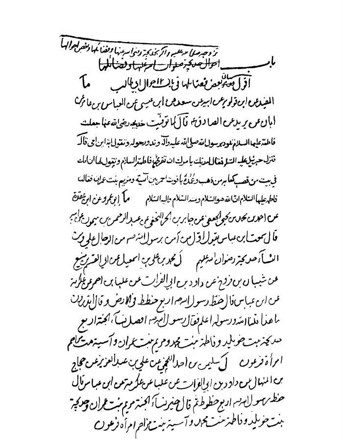

بحار الأنوار الجامعة لدرر أخبار الائمة الأطهار المجلد 16

هوية الكتاب
بطاقة تعريف: مجلسي محمد باقربن محمدتقي 1037 - 1111ق.
عنوان واسم المؤلف: بحار الأنوار الجامعة لدرر أخبار الأئمة الأطهار المجلد 16: تأليف محمد باقربن محمدتقي المجلسي.
عنوان واسم المؤلف: بيروت داراحياء التراث العربي [ -13].
مظهر: ج - عينة.
ملاحظة: عربي.
ملاحظة: فهرس الكتابة على أساس المجلد الرابع والعشرين، 1403ق. [1360].
ملاحظة: المجلد108،103،94،91،92،87،67،66،65،52،24(الطبعة الثالثة: 1403ق.=1983م.=[1361]).
ملاحظة: فهرس.
محتويات: ج.24.كتاب الامامة. ج.52.تاريخ الحجة. ج67،66،65.الإيمان والكفر. ج.87.كتاب الصلاة. ج.92،91.الذكر و الدعا. ج.94.كتاب السوم. ج.103.فهرست المصادر. ج.108.الفهرست.-
عنوان: أحاديث الشيعة — قرن 11ق
ترتيب الكونجرس: BP135/م3ب31300 ي ح
تصنيف ديوي: 297/212
رقم الببليوغرافيا الوطنية: 1680946
ص: 1

تتمة كتاب تاریخ نبینا صلی اللّٰه علیه و آله 

باب 5 تزوجه صلی اللّٰه علیه و آله بخدیجة رضی اللّٰه عنها و فضائلها و بعض أحوالها
أقول: سیأتی بعض فضائلها فی باب أحوال أبی طالب.
«1»-ما، الأمالی للشیخ الطوسی الْمُفِیدُ عَنِ ابْنِ قُولَوَیْهِ عَنْ أَبِیهِ عَنْ سَعْدٍ عَنِ ابْنِ عِیسَی عَنِ الْعَبَّاسِ بْنِ عَامِرٍ عَنْ أَبَانٍ عَنْ بُرَیْدٍ عَنِ الصَّادِقِ علیه السلام قَالَ: (1) لَمَّا تُوُفِّیَتْ خَدِیجَةُ رَضِیَ اللَّهُ عَنْهَا جَعَلَتْ فَاطِمَةُ علیها السلام تَلُوذُ بِرَسُولِ اللَّهِ صلی اللّٰه علیه و آله وَ تَدُورُ حَوْلَهُ وَ تَقُولُ أَبَتِ (2) أَیْنَ أُمِّی قَالَ فَنَزَلَ جَبْرَئِیلُ علیه السلام فَقَالَ لَهُ رَبُّكَ یَأْمُرُكَ أَنْ تُقْرِئَ فَاطِمَةَ السَّلَامَ وَ تَقُولَ لَهَا إِنَّ أُمَّكِ فِی بَیْتٍ مِنْ قَصَبٍ (3) كِعَابُهُ مِنْ ذَهَبٍ وَ عُمُدُهُ یَاقُوتٌ أَحْمَرُ بَیْنَ آسِیَةَ وَ مَرْیَمَ بِنْتِ عِمْرَانَ فَقَالَتْ فَاطِمَةُ علیها السلام إِنَّ اللَّهَ هُوَ السَّلَامُ وَ مِنْهُ السَّلَامُ وَ إِلَیْهِ السَّلَامُ (4).
«2»-ما، الأمالی للشیخ الطوسی أَبُو عَمْرٍو (5) عَنِ ابْنِ عُقْدَةَ عَنْ أَحْمَدَ بْنِ مُحَمَّدِ بْنِ یَحْیَی الْجُعْفِیِّ عَنْ جَابِرِ بْنِ الْحُرِّ النَّخَعِیِّ عَنْ عَبْدِ الرَّحْمَنِ بْنِ مَیْمُونٍ عَنْ أَبِیهِ قَالَ سَمِعْتُ ابْنَ عَبَّاسٍ یَقُولُ أَوَّلُ
ص: 1

> **پاورقی**: 1- فی المصدر: سمعت أبا عبد اللّٰه جعفر بن محمّد علیهما السلام یقول.

> **پاورقی**: 2- فی المصدر: یا أبه.

> **پاورقی**: 3- القصب: ما كان مستطیلا من الجوهر. الدر الرطب. الزبرجد الرطب المرصع.

> **پاورقی**: 4- المجالس: 110.

> **پاورقی**: 5- فی المصدر: أبو عمر عبد الواحد بن محمّد بن عبد اللّٰه بن محمّد بن مهدیّ. و فیه: محمّد ابن یحیی الجعفی قال: حدّثنا أبی قال: حدّثنا الحسین بن عبد الكریم و هو أبو هلال الجعفی قال:

مَنْ آمَنَ بِرَسُولِ اللَّهِ صلی اللّٰه علیه و آله مِنَ الرِّجَالِ عَلِیٌّ علیه السلام وَ مِنَ النِّسَاءِ خَدِیجَةُ علیها السلام (1).
«3»-ل، الخصال مُحَمَّدُ بْنُ عَلِیِّ بْنِ إِسْمَاعِیلَ عَنْ أَبِی الْقَاسِمِ بْنِ مَنِیعٍ عَنْ شَیْبَانَ بْنِ فَرُّوخَ عَنْ دَاوُدَ بْنِ أَبِی الْفُرَاتِ عَنْ عِلْبَاءِ بْنِ أَحْمَرَ عَنْ عِكْرِمَةَ عَنِ ابْنِ عَبَّاسٍ قَالَ: خَطَّ رَسُولُ اللَّهِ صلی اللّٰه علیه و آله أَرْبَعَ خُطَطٍ فِی الْأَرْضِ وَ قَالَ أَ تَدْرُونَ مَا هَذَا قُلْنَا اللَّهُ وَ رَسُولُهُ أَعْلَمُ فَقَالَ رَسُولُ اللَّهِ صلی اللّٰه علیه و آله أَفْضَلُ نِسَاءِ الْجَنَّةِ أَرْبَعٌ خَدِیجَةُ بِنْتُ خُوَیْلِدٍ وَ فَاطِمَةُ بِنْتُ مُحَمَّدٍ وَ مَرْیَمُ بِنْتُ عِمْرَانَ وَ آسِیَةُ بِنْتُ مُزَاحِمٍ امْرَأَةُ فِرْعَوْنَ (2).
«4»-ل، الخصال سُلَیْمَانُ بْنُ أَحْمَدَ اللِّخْمِیُ (3) عَنْ عَلِیِّ بْنِ عَبْدِ الْعَزِیزِ عَنْ حَجَّاجِ بْنِ الْمِنْهَالِ عَنْ دَاوُدَ بْنِ أَبِی الْفُرَاتِ عَنْ عِلْبَاءٍ (4) عَنْ عِكْرِمَةَ عَنِ ابْنِ عَبَّاسٍ قَالَ: خَطَّ رَسُولُ اللَّهِ صلی اللّٰه علیه و آله أَرْبَعَ خُطُوطٍ ثُمَّ قَالَ خَیْرُ نِسَاءِ الْجَنَّةِ مَرْیَمُ بِنْتُ عِمْرَانَ وَ خَدِیجَةُ بِنْتُ خُوَیْلِدٍ وَ فَاطِمَةُ بِنْتُ مُحَمَّدٍ وَ آسِیَةُ بِنْتُ مُزَاحِمٍ امْرَأَةُ فِرْعَوْنَ (5).
«5»-ل، الخصال ابْنُ إِدْرِیسَ عَنْ أَبِیهِ عَنِ الْأَشْعَرِیِّ عَنْ أَبِی عَبْدِ اللَّهِ الرَّازِیِّ عَنِ ابْنِ أَبِی عُثْمَانَ عَنْ مُوسَی بْنِ بَكْرٍ عَنْ أَبِی الْحَسَنِ الْأَوَّلِ علیه السلام قَالَ قَالَ رَسُولُ اللَّهِ صلی اللّٰه علیه و آله إِنَّ اللَّهَ اخْتَارَ مِنَ النِّسَاءِ أَرْبَعاً مَرْیَمَ وَ آسِیَةَ وَ خَدِیجَةَ وَ فَاطِمَةَ (6).
أقول: سیأتی فیما أجاب أمیر المؤمنین علیه السلام الیهودی الذی سأل عن خصال الأوصیاء فقال علیه السلام فیما قال كنت أول من أسلم فمكثنا بذلك ثلاث حجج و ما علی وجه الأرض خلق یصلی و یشهد لرسول اللّٰه صلی اللّٰه علیه و آله بما أتاه غیری و غیر ابنة خویلد رحمها اللّٰه و قد فعل.
ص: 2

> **پاورقی**: 1- المجالس: 162.

> **پاورقی**: 2- الخصال 1: 96.

> **پاورقی**: 3- اللخمی بالخاء نسبة إلی لخم، و هو بطن عظیم ینتسب إلی لخم و اسمه مالك بن عدی بن الحارث بن مرة بن ادد بن زید بن یشجب بن عریب بن زید بن كهلان بن سبأ بن یشجب بن یعرب بن قحطان، و الرجل من مشایخ الصدوق كتب إلیه من اصبهان.

> **پاورقی**: 4- علباء بالكسر فالسكون ثمّ الباء و المد، و هو علباء بن أحمر الیشكری البصری، كان من القراء.

> **پاورقی**: 5- الخصال 1: 96.

> **پاورقی**: 6- المصدر 1: 107.

«6»-ل، الخصال ابْنُ الْوَلِیدِ عَنِ الصَّفَّارِ عَنِ الْبَرْقِیِّ عَنْ أَبِی عَلِیٍّ الْوَاسِطِیِّ عَنْ عَبْدِ اللَّهِ بْنِ عِصْمَةَ عَنْ یَحْیَی بْنِ عَبْدِ اللَّهِ عَنْ عَمْرِو بْنِ أَبِی الْمِقْدَامِ عَنْ أَبِیهِ عَنْ أَبِی عَبْدِ اللَّهِ علیه السلام قَالَ: دَخَلَ رَسُولُ اللَّهِ صلی اللّٰه علیه و آله مَنْزِلَهُ فَإِذَا عَائِشَةُ مُقْبِلَةٌ عَلَی فَاطِمَةَ- تُصَایِحُهَا وَ هِیَ تَقُولُ وَ اللَّهِ یَا بِنْتَ خَدِیجَةَ مَا تَرَیْنَ إِلَّا أَنَّ لِأُمِّكِ عَلَیْنَا فَضْلًا وَ أَیُّ فَضْلٍ كَانَ لَهَا عَلَیْنَا مَا هِیَ إِلَّا كَبَعْضِنَا فَسَمِعَ مَقَالَتَهَا لِفَاطِمَةَ فَلَمَّا رَأَتْ فَاطِمَةُ رَسُولَ اللَّهِ صلی اللّٰه علیه و آله بَكَتْ فَقَالَ مَا یُبْكِیكِ یَا بِنْتَ مُحَمَّدٍ قَالَتْ ذَكَرَتْ أُمِّی فَتَنَقَّصَتْهَا فَبَكَیْتُ فَغَضِبَ رَسُولُ اللَّهِ صلی اللّٰه علیه و آله ثُمَّ قَالَ مَهْ یَا حُمَیْرَاءُ فَإِنَّ اللَّهَ تَبَارَكَ وَ تَعَالَی بَارَكَ فِی الْوَدُودِ الْوَلُودِ وَ إِنَّ خَدِیجَةَ رَحِمَهَا اللَّهُ وَلَدَتْ مِنِّی طَاهِراً وَ هُوَ عَبْدُ اللَّهِ وَ هُوَ الْمُطَهَّرُ وَ وَلَدَتْ مِنِّی الْقَاسِمَ وَ فَاطِمَةَ وَ رُقَیَّةَ وَ أُمَّ كُلْثُومٍ وَ زَیْنَبَ وَ أَنْتِ مِمَّنْ أَعْقَمَ اللَّهُ رحمه (رَحِمَهَا) فَلَمْ تَلِدِی شَیْئاً (1).
«7»-ص، قصص الأنبیاء علیهم السلام تَزَوَّجَ النَّبِیُّ صلی اللّٰه علیه و آله بِخَدِیجَةَ وَ هُوَ ابْنُ خَمْسٍ وَ عِشْرِینَ سَنَةً وَ تُوُفِّیَتْ خَدِیجَةُ بَعْدَ أَبِی طَالِبٍ بِثَلَاثَةِ أَیَّامٍ.
«8»-یج، الخرائج و الجرائح رُوِیَ عَنْ جَابِرٍ قَالَ: كَانَ سَبَبُ تَزْوِیجِ خَدِیجَةَ مُحَمَّداً أَنَّ أَبَا طَالِبٍ قَالَ یَا مُحَمَّدُ إِنِّی أُرِیدُ أَنْ أُزَوِّجَكَ وَ لَا مَالَ لِی أُسَاعِدُكَ بِهِ وَ إِنَّ خَدِیجَةَ قَرَابَتُنَا وَ تُخْرِجُ كُلَّ سَنَةٍ قُرَیْشاً فِی مَالِهَا مَعَ غِلْمَانِهَا یَتَّجِرُ لَهَا وَ یَأْخُذُ وِقْرَ بَعِیرٍ (2) مِمَّا أَتَی بِهِ فَهَلْ لَكَ أَنْ تَخْرُجَ قَالَ نَعَمْ فَخَرَجَ أَبُو طَالِبٍ إِلَیْهَا وَ قَالَ لَهَا ذَلِكَ فَفَرِحَتْ وَ قَالَتْ لِغُلَامِهَا مَیْسَرَةَ أَنْتَ وَ هَذَا الْمَالُ كُلُّهُ بِحُكْمِ مُحَمَّدٍ صلی اللّٰه علیه و آله فَلَمَّا رَجَعَ مَیْسَرَةُ حَدَّثَ أَنَّهُ مَا مَرَّ بِشَجَرَةٍ وَ لَا مَدَرَةٍ إِلَّا قَالَتْ السَّلَامُ عَلَیْكَ یَا رَسُولَ اللَّهِ وَ قَالَ جَاءَ بَحِیرَا الرَّاهِبُ وَ خَدَمَنَا لَمَّا رَأَی الْغَمَامَةَ عَلَی رَأْسِهِ تَسِیرُ حَیْثُمَا سَارَ تُظِلُّهُ بِالنَّهَارِ وَ رَبِحَا فِی ذَلِكَ السَّفَرِ (3) رِبْحاً كَثِیراً فَلَمَّا انْصَرَفَا قَالَ مَیْسَرَةُ لَوْ تَقَدَّمْتَ یَا مُحَمَّدُ إِلَی مَكَّةَ وَ بَشَّرْتَ خَدِیجَةَ بِمَا قَدْ رَبِحْنَا لَكَانَ أَنْفَعَ لَكَ فَتَقَدَّمَ مُحَمَّدٌ عَلَی رَاحِلَتِهِ فَكَانَتْ خَدِیجَةُ فِی ذَلِكَ الْیَوْمِ جَالِسَةً عَلَی غُرْفَةٍ مَعَ نِسْوَةٍ فَظَهَرَ لَهَا مُحَمَّدٌ رَاكِباً (4) فَنَظَرَتْ خَدِیجَةُ إِلَی غَمَامَةٍ عَالِیَةٍ عَلَی رَأْسِهِ تَسِیرُ بِسَیْرِهِ وَ رَأَتْ مَلَكَیْنِ
ص: 3

> **پاورقی**: 1- المصدر 2: 37 و 38.

> **پاورقی**: 2- أی حمل بعیر.

> **پاورقی**: 3- فی المصدر: و ربحنا فی هذه السفرة.

> **پاورقی**: 4- فی المصدر: راكبا علی راحلته.

عَنْ یَمِینِهِ وَ عَنْ شِمَالِهِ (1) فِی یَدِ كُلِّ وَاحِدٍ سَیْفٌ مَسْلُولٌ یَجِیئَانِ (2) فِی الْهَوَاءِ مَعَهُ فَقَالَتْ إِنَّ لِهَذَا الرَّاكِبِ لَشَأْناً عَظِیماً لَیْتَهُ جَاءَ إِلَی دَارِی فَإِذَا هُوَ مُحَمَّدٌ صلی اللّٰه علیه و آله قَاصِدٌ لِدَارِهَا (3) فَنَزَلَتْ حَافِیَةً إِلَی بَابِ الدَّارِ وَ كَانَتْ إِذَا أَرَادَتِ التَّحَوُّلَ مِنْ مَكَانٍ إِلَی مَكَانٍ حَوَّلَتِ الْجَوَارِی السَّرِیرَ الَّذِی كَانَتْ عَلَیْهِ فَلَمَّا دَنَتْ مِنْهُ قَالَتْ یَا مُحَمَّدُ اخْرُجْ وَ أَحْضِرْنِی (4) عَمَّكَ أَبَا طَالِبٍ السَّاعَةَ وَ قَدْ بَعَثَتْ إِلَی عَمِّهَا (5) أَنْ زَوِّجْنِی مِنْ مُحَمَّدٍ إِذَا دَخَلَ عَلَیْكَ فَلَمَّا حَضَرَ أَبُو طَالِبٍ قَالَتْ (6) اخْرُجَا إِلَی عَمِّی لِیُزَوِّجَنِی مِنْ مُحَمَّدٍ فَقَدْ قُلْتُ لَهُ فِی ذَلِكَ فَدَخَلَا عَلَی عَمِّهَا وَ خَطَبَ أَبُو طَالِبٍ الْخُطْبَةَ الْمَعْرُوفَةَ وَ عَقَدَ النِّكَاحَ فَلَمَّا قَامَ مُحَمَّدٌ صلی اللّٰه علیه و آله لِیَذْهَبَ مَعَ أَبِی طَالِبٍ قَالَتْ خَدِیجَةُ إِلَی بَیْتِكَ فَبَیْتِی بَیْتُكَ وَ أَنَا جَارِیَتُكَ (7).
«9»-د، العدد القویة قب، المناقب لابن شهرآشوب زَوَّجَ أَبُو طَالِبٍ خَدِیجَةَ مِنَ النَّبِیِّ وَ ذَلِكَ أَنَّ نِسَاءَ قُرَیْشٍ اجْتَمَعْنَ فِی الْمَسْجِدِ فِی عِیدٍ فَإِذَا هُنَّ بِیَهُودِیٍّ یَقُولُ لَیُوشِكُ أَنْ یُبْعَثَ فِیكُنَّ نَبِیٌّ فَأَیُّكُنَّ اسْتَطَاعَتْ أَنْ تَكُونَ لَهُ أَرْضاً یَطَؤُهَا فَلْتَفْعَلْ فَحَصَبْنَهُ وَ قَرَّ ذَلِكَ الْقَوْلُ فِی قَلْبِ خَدِیجَةَ وَ كَانَ النَّبِیُّ صلی اللّٰه علیه و آله قَدِ اسْتَأْجَرَتْهُ خَدِیجَةُ عَلَی أَنْ تُعْطِیَهُ بَكْرَیْنِ وَ یَسِیرَ مَعَ غُلَامِهَا مَیْسَرَةَ إِلَی الشَّامِ فَلَمَّا أَقْبَلَا فِی سَفَرِهِمَا (8) نَزَلَ النَّبِیُّ صلی اللّٰه علیه و آله تَحْتَ شَجَرَةٍ فَرَآهُ رَاهِبٌ یُقَالُ لَهُ نَسْطُورُ فَاسْتَقْبَلَهُ وَ قَبَّلَ یَدَیْهِ وَ رِجْلَیْهِ وَ قَالَ أَشْهَدُ أَنْ لَا إِلَهَ إِلَّا اللَّهُ وَ أَشْهَدُ أَنَّ مُحَمَّداً رَسُولُ اللَّهِ لَمَّا رَأَی مِنْهُ عَلَامَاتٍ وَ إِنَّهُ نَزَلَ تَحْتَ الشَّجَرَةِ ثُمَّ قَالَ لِمَیْسَرَةَ طَاوِعْهُ فِی أَوَامِرِهِ وَ نَوَاهِیهِ فَإِنَّهُ نَبِیٌّ وَ اللَّهِ مَا جَلَسَ هَذَا الْمَجْلِسَ بَعْدَ عِیسَی علیه السلام أَحَدٌ غَیْرُهُ وَ لَقَدْ
ص: 4

> **پاورقی**: 1- فی المصدر: ملك عن یمینه، و ملك عن شماله.

> **پاورقی**: 2- فی المصدر: یحثان.

> **پاورقی**: 3- فی المصدر: إلی دارها.

> **پاورقی**: 4- فی المصدر: و احضر لی.

> **پاورقی**: 5- فی المصدر: عمها ورقة.

> **پاورقی**: 6- فی المصدر: قالت له.

> **پاورقی**: 7- الخرائج: 186 و 187.

> **پاورقی**: 8- من سفرهما خ ل.

بَشَّرَ بِهِ عِیسَی علیه السلام وَ مُبَشِّراً بِرَسُولٍ یَأْتِی مِنْ بَعْدِی اسْمُهُ أَحْمَدُ وَ هُوَ یَمْلِكُ الْأَرْضَ بِأَسْرِهَا وَ قَالَ مَیْسَرَةُ یَا مُحَمَّدُ لَقَدْ جُزْنَا عَقَبَاتٍ بِلَیْلَةٍ كُنَّا نَجُوزُهَا بِأَیَّامٍ كَثِیرَةٍ وَ رَبِحْنَا فِی هَذِهِ السَّفَرَةِ مَا لَمْ نَرْبَحْ مِنْ أَرْبَعِینَ (1) سَنَةً بِبَرَكَتِكَ یَا مُحَمَّدُ فَاسْتَقْبِلْ بِخَدِیجَةَ وَ أَبْشِرْهَا بِرِبْحِنَا وَ كَانَتْ وَقْتَئِذٍ جَالِسَةً عَلَی مَنْظَرَةٍ لَهَا فَرَأَتْ رَاكِباً عَلَی یَمِینِهِ مَلَكٌ مُصْلِتٌ سَیْفَهُ وَ فَوْقَهُ سَحَابَةٌ مُعَلَّقٌ عَلَیْهَا قِنْدِیلٌ مِنْ زَبَرْجَدَةٍ وَ حَوْلَهُ قُبَّةٌ مِنْ یَاقُوتَةٍ حَمْرَاءَ فَظَنَّتْ مَلِكاً یَأْتِی بِخِطْبَتِهَا وَ قَالَتِ اللَّهُمَّ إِلَیَّ وَ إِلَی دَارِی فَلَمَّا أَتَی كَانَ مُحَمَّداً وَ بَشَّرَهَا بِالْأَرْبَاحِ فَقَالَتْ وَ أَیْنَ مَیْسَرَةُ قَالَ یَقْفُو أَثَرِی قَالَتْ فَارْجِعْ إِلَیْهِ وَ كُنْ مَعَهُ وَ مَقْصُودُهَا لِتَسْتَیْقِنَ حَالَ السَّحَابَةِ فَكَانَتِ السَّحَابَةُ تَمُرُّ مَعَهُ فَأَقْبَلَ مَیْسَرَةُ إِلَی خَدِیجَةَ وَ أَخْبَرَهَا بِحَالِهِ وَ قَالَ لَهَا إِنِّی كُنْتُ آكُلُ مَعَهُ حَتَّی یَشْبَعَ (2) وَ یَبْقَی الطَّعَامُ كَمَا هُوَ وَ كُنْتُ أَرَی وَقْتَ الْهَاجِرَةِ مَلَكَیْنِ یُظَلِّلَانِهِ فَدَعَتْ خَدِیجَةُ بِطَبَقٍ عَلَیْهِ رُطَبٌ وَ دَعَتْ رِجَالًا وَ رَسُولَ اللَّهِ صلی اللّٰه علیه و آله فَأَكَلُوا حَتَّی شَبِعُوا وَ لَمْ یَنْقُصْ شَیْئاً فَأَعْتَقَتْ مَیْسَرَةَ وَ أَوْلَادَهُ وَ أَعْطَتْهُ عَشَرَةَ آلَافِ دِرْهَمٍ لِتِلْكَ الْبِشَارَةِ وَ رَتَّبَتِ الْخُطْبَةَ مِنْ عَمْرِو بْنِ أَسَدٍ عَمِّهَا.
قال النسوی فی تاریخه أنكحه إیاها أبوها خویلد بن أسد فخطب أبو طالب بما رواه الخركوشی فی شرف المصطفی و الزمخشری فی ربیع الأبرار و فی تفسیره الكشاف و ابن بطة فی الإبانة و الجوینی فی السیر عن الحسن و الواقدی و أبی صالح و العتبی فقال الحمد لله الذی جعلنا من زرع إبراهیم الخلیل و من ذریة الصفی إسماعیل و صئصئ (3) معد و عنصر مضر و جعلنا حضنة بیته و سواس (4) حرمه و جعل مسكننا بیتا محجوبا و حرما آمنا و جعلنا الحكام علی الناس ثم إن ابن أخی هذا محمد بن عبد اللّٰه لا یوازن برجل من قریش إلا رَجَحَ به و لا یقاس بأحد منهم إلا عظم عنه و إن كان فی المال مقلا
ص: 5

> **پاورقی**: 1- فی أربعین خ ل.

> **پاورقی**: 2- فی المناقب: حتی نشبع و یبقی الطعام بحاله.

> **پاورقی**: 3- ضئصئ خ ل.

> **پاورقی**: 4- قوله: حضنة البیت أی مربیه و كافله. سواس جمع السائس: المدبر و المتولی لامر القوم و من یصلح الخلق بارشادهم الی الطریق المنجی فی عاجلهم و آجلهم.

فإن المال ورق حائل (1) و ظل زائل و له و اللّٰه خطب عظیم و نبأ شائع و له رغبة فی خدیجة و لها فیه رغبة فزوجوه و الصداق ما سألتموه من مالی عاجله و آجله فقال خویلد زوجناه و رضینا به.
و روی أنه قال بعض قریش یا عجبا أ یمهر النساء الرجال فغضب أبو طالب و قال إذا كانوا مثل ابن أخی هذا طلبت الرجال بأغلی الأثمان و إذا كانوا أمثالكم لم تزوجوا (2) إلا بالمهر الغالی فقال رجل من قریش یقال له عبد اللّٰه بن غنم
هنیئا مریئا یا خدیجة قد جرت***لك الطیر فیما كان منك بأسعد
تزوجته (3) خیر البریة كلها***و من ذا الذی فی الناس مثل محمد
و بشر به المرءان (4) عیسی ابن مریم***و موسی بن عمران فیا قرب موعد
أقرت به الكتاب قدما بأنه***رسول من البطحاء هاد و مهتد (5)
***
بیان: قوله فحصبنه أی رمینه بالحصباء و صئصئ بالمهملتین و المعجمتین الأصل قال فی النهایة فی حدیث الخوارج یخرج من ضئضئ هذا قوم یمرقون من الدین الضئضئ الأصل یقال ضئضئ صدق و ضؤضؤ صدق و حكی بعضهم ضئضی ء بوزن قندیل یرید أنه یخرج من نسله و من عقبه و رواه بعضهم بالصاد المهملة و هو بمعناه انتهی.
و فی القاموس الورق مثلثة و ككتف و جبل الدراهم المضروبة و محركة الحی من كل حیوان و المال من إبل و دراهم و غیرها انتهی و فی الفقیه رزق كما سیأتی و الحائل المتغیر.
«10»-قب، المناقب لابن شهرآشوب خَرَجَ النَّبِیُّ صلی اللّٰه علیه و آله إِلَی الشَّامِ فِی تِجَارَةٍ لِخَدِیجَةَ وَ لَهُ خَمْسٌ وَ عِشْرُونَ
ص: 6

> **پاورقی**: 1- فی العدد: أمر حائل.

> **پاورقی**: 2- فی المناقب: لم یزوجوا.

> **پاورقی**: 3- تزوجت خ ل.

> **پاورقی**: 4- البران خ ل.

> **پاورقی**: 5- مناقب آل أبی طالب 1: 29 و 30. العدد مخطوط.

سَنَةً وَ تَزَوَّجَ بِهَا بَعْدَ أَشْهُرٍ قَالَ الْكُلَیْنِیُّ تَزَوَّجَ خَدِیجَةَ وَ هُوَ ابْنُ بِضْعٍ وَ عِشْرِینَ سَنَةً وَ لَبِثَ بِهَا أَرْبَعاً وَ عِشْرِینَ سَنَةً وَ أَشْهُراً وَ بُنِیَتِ الْكَعْبَةُ وَ رَضِیَتْ قُرَیْشٌ بِحُكْمِهِ فِیهَا وَ هُوَ ابْنُ خَمْسٍ وَ ثَلَاثِینَ سَنَةً (1).
أقول: أوردنا تاریخ وفاتها فی باب المبعث.
«11»-شی، تفسیر العیاشی عَنْ زُرَارَةَ وَ حُمْرَانَ وَ مُحَمَّدِ بْنِ مُسْلِمٍ عَنْ أَبِی جَعْفَرٍ علیه السلام قَالَ حَدَّثَ أَبُو سَعِیدٍ الْخُدْرِیُّ أَنَّ رَسُولَ اللَّهِ صلی اللّٰه علیه و آله قَالَ: إِنَّ جَبْرَئِیلَ علیه السلام قَالَ لِی لَیْلَةَ أُسْرِیَ بِی حِینَ رَجَعْتُ وَ قُلْتُ یَا جَبْرَئِیلُ هَلْ لَكَ مِنْ حَاجَةٍ قَالَ حَاجَتِی أَنْ تَقْرَأَ عَلَی خَدِیجَةَ مِنَ اللَّهِ وَ مِنِّی السَّلَامَ وَ حَدَّثَنَا عِنْدَ ذَلِكَ أَنَّهَا قَالَتْ حِینَ لَقَّاهَا نَبِیُّ اللَّهِ صَلَّی اللَّهُ عَلَیْهِ وَ آلِهِ فَقَالَ لَهَا الَّذِی قَالَ جَبْرَئِیلُ فَقَالَتْ إِنَّ اللَّهَ هُوَ السَّلَامُ وَ مِنْهُ السَّلَامُ وَ إِلَیْهِ السَّلَامُ وَ عَلَی جَبْرَئِیلَ السَّلَامُ (2).
«12»-كشف، كشف الغمة مِنْ مُسْنَدِ أَحْمَدَ بْنِ حَنْبَلٍ عَنْ عَبْدِ اللَّهِ بْنِ جَعْفَرٍ عَنْ عَلِیِّ بْنِ أَبِی طَالِبٍ قَالَ قَالَ رَسُولُ اللَّهِ صلی اللّٰه علیه و آله خَیْرُ نِسَائِهَا خَدِیجَةُ وَ خَیْرُ نِسَائِهَا مَرْیَمُ.
وَ مِنْهُ عَنْ عَبْدِ اللَّهِ بْنِ جَعْفَرٍ قَالَ قَالَ رَسُولُ اللَّهِ صلی اللّٰه علیه و آله أُمِرْتُ أَنْ أُبَشِّرَ خَدِیجَةَ بِبَیْتٍ مِنْ قَصَبٍ لَا صَخَبَ فِیهِ وَ لَا نَصَبَ.
وَ مِنْهُ عَنِ ابْنِ عَبَّاسٍ أَنَّ أَوَّلَ مَنْ صَلَّی مَعَ رَسُولِ اللَّهِ صلی اللّٰه علیه و آله بَعْدَ خَدِیجَةَ عَلِیٌّ علیه السلام وَ قَالَ مَرَّةً أَسْلَمَ.
و قد تقدم ذكر تقدم إسلامها رضی اللّٰه عنها و أنها سبقت الناس كافة فلا حاجة إلی إعادة ذلك و هو مشهور.
وَ مِنَ الْمُسْنَدِ، عَنْ أَنَسِ بْنِ مَالِكٍ عَنِ النَّبِیِّ صلی اللّٰه علیه و آله قَالَ: حَسْبُكَ مِنْ نِسَاءِ الْعَالَمِینَ مَرْیَمُ بِنْتُ عِمْرَانَ وَ خَدِیجَةُ بِنْتُ خُوَیْلِدٍ وَ فَاطِمَةُ بِنْتُ مُحَمَّدٍ وَ آسِیَةُ بِنْتُ مُزَاحِمٍ امْرَأَةُ فِرْعَوْنَ.
وَ مِنْهُ عَنْ عَبْدِ اللَّهِ بْنِ أَبِی أَوْفَی قَالَ: بَشَّرَ رَسُولُ اللَّهِ صلی اللّٰه علیه و آله خَدِیجَةَ بِبَیْتٍ فِی الْجَنَّةِ
ص: 7

> **پاورقی**: 1- المناقب 1: 119.

> **پاورقی**: 2- تفسیر العیّاشیّ: مخطوط.

لَا صَخَبَ فِیهِ (1) وَ لَا نَصَبَ.
وَ رُوِیَ أَنَّ جَبْرَئِیلَ أَتَی النَّبِیَّ صلی اللّٰه علیه و آله فَسَأَلَ عَنْ خَدِیجَةَ فَلَمْ یَجِدْهَا فَقَالَ إِذَا جَاءَتْ فَأَخْبِرْهَا أَنَّ رَبَّهَا یُقْرِئُهَا السَّلَامَ.
وَ رَوَی أَبُو هُرَیْرَةَ قَالَ: أَتَی جَبْرَئِیلُ النَّبِیَّ صلی اللّٰه علیه و آله فَقَالَ هَذِهِ خَدِیجَةُ قَدْ أَتَتْكَ مَعَهَا إِنَاءٌ مُغَطًّی فِیهِ إِدَامٌ أَوْ طَعَامٌ أَوْ شَرَابٌ فَإِذَا هِیَ أَتَتْكَ فَاقْرَأْ عَلَیْهَا السَّلَامَ مِنْ رَبِّهَا وَ مِنِّی السَّلَامَ وَ بَشِّرْهَا بِبَیْتٍ فِی الْجَنَّةِ مِنْ قَصَبٍ لَا صَخَبَ فِیهِ وَ لَا نَصَبَ (2).
و قال شریك و قد سئل عن القصب قصب الذهب. (3) و قال الجوهری القصب أنابیب من جوهر و ذكر الحدیث.
و قال غیره اللؤلؤ و قال صاحب النهایة فی غریب الحدیث القصب لؤلؤ مجوف واسع كالقصر المنیف فی هذا الحدیث و القصب من الجوهر ما استطال منه فی تجویف.
وَ رُوِیَ أَنَّ عَجُوزاً دَخَلَتْ عَلَی النَّبِیِّ صلی اللّٰه علیه و آله فَأَلْطَفَهَا فَلَمَّا خَرَجَتْ سَأَلَتْهُ عَائِشَةُ فَقَالَ إِنَّهَا كَانَتْ تَأْتِینَا فِی زَمَنِ خَدِیجَةَ وَ إِنَّ حُسْنَ الْعَهْدِ مِنَ الْإِیمَانِ..
وَ عَنْ عَلِیٍّ علیه السلام قَالَ: ذَكَرَ النَّبِیُّ صلی اللّٰه علیه و آله خَدِیجَةَ یَوْماً وَ هُوَ عِنْدَ نِسَائِهِ فَبَكَی فَقَالَتْ عَائِشَةُ مَا یُبْكِیكَ عَلَی عَجُوزٍ حَمْرَاءَ مِنْ عَجَائِزِ بَنِی أَسَدٍ فَقَالَ صَدَّقَتْنِی إِذْ كَذَّبْتُمْ وَ آمَنَتْ بِی إِذْ كَفَرْتُمْ وَ وَلَدَتْ لِی إِذْ عَقَمْتُمْ قَالَتْ عَائِشَةُ فَمَا زِلْتُ أَتَقَرَّبُ إِلَی رَسُولِ اللَّهِ صَلَّی اللَّهُ عَلَیْهِ وَ آلِهِ بِذِكْرِهَا.
و نقلت من كتاب معالم العترة النبویة لأبی محمد عبد العزیز بن الأخضر الجنابذی الحنبلی ذكر خدیجة بنت خویلد أم المؤمنین و تقدم إسلامها و حسن موازرتها و خطر فضلها و شرف منزلتها ذكر مرفوعا عن محمد بن إسحاق (4) قال كانت خدیجة بنت خویلد
ص: 8

> **پاورقی**: 1- فی المصدر: من قصب لا صخب فیه.

> **پاورقی**: 2- قلت: الأحادیث كلها موجودة فی مسند أحمد فی باب مسند علیّ علیه السلام و مسند عبد اللّٰه جعفر و ابن عبّاس و أنس و عبد اللّٰه بن أبی أوفی و أبی هریرة.

> **پاورقی**: 3- فی المصدر: انه قصب الذهب. قلت: و لعلّ الصحیح: قال: إنّه قصب الذهب.

> **پاورقی**: 4- و أخرجه أیضا ابن هشام فی السیرة النبویّة 1: 203 بإسناده عن ابن إسحاق.

امرأة تاجرة ذات شرف و مال تستأجر الرجال فی مالها و تضاربهم إیاه بشی ء تجعله لهم منه و كانت قریش قوما تجارا فلما بلغها عن رسول اللّٰه صلی اللّٰه علیه و آله من صدق حدیثه و عظیم أمانته و كرم أخلاقه بعثت إلیه و عرضت علیه أن یخرج فی مالها تاجرا إلی الشام و تعطیه أفضل ما كانت تعطی غیره من التجار مع غلام لها یقال له میسرة فقبله منها رسول اللّٰه صلی اللّٰه علیه و آله و خرج فی مالها ذلك و معه غلامها میسرة حتی قدم الشام فنزل رسول اللّٰه صلی اللّٰه علیه و آله فی ظل شجرة قریبا من صومعة راهب فاطلع الراهب إلی میسرة فقال من هذا الرجل الذی نزل تحت هذه الشجرة فقال میسرة هذا رجل من قریش من أهل الحرم فقال له الراهب ما نزل تحت هذه الشجرة إلا نبی ثم باع رسول اللّٰه صلی اللّٰه علیه و آله سلعته التی خرج فیها (1) و اشتری ما أراد أن یشتری ثم أقبل قافلا إلی مكة و معه میسرة و كان میسرة فیما یزعمون قال إذا كانت الهاجرة (2) و اشتد الحر نزل ملكان یظلانه من الشمس و هو یسیر علی بعیره فلما قدم مكة علی خدیجة بمالها باعت ما جاء به فأضعف أو قریبا و حدثها میسرة عن قول الراهب و عما كان یری من إظلال الملكین فبعثت إلی رسول اللّٰه فقالت له فیما یزعمون یا ابن عم قد رغبت فیك لقرابتك منی و شرفك فی قومك و سطتك (3) فیهم و أمانتك عندهم و حسن خلقك و صدق حدیثك ثم عرضت علیه نفسها و كانت خدیجة امرأة حازمة لبیبة و هی یومئذ أوسط قریش نسبا و أعظمهم شرفا و أكثرهم مالا و كل قومها قد كان حریصا علی ذلك لو یقدر علیه فلما قالت لرسول اللّٰه صلی اللّٰه علیه و آله ما قالت ذكر ذلك لأعمامه فخرج معه منهم حمزة بن عبد المطلب حتی دخل علی خویلد بن أسد فخطبها إلیه فتزوجها رسول اللّٰه صلی اللّٰه علیه و آله.
و روی بإسناده عن ابن شهاب الزهری قال لما استوی رسول اللّٰه صلی اللّٰه علیه و آله و بلغ أشده و لیس له كثیر مال استأجرته خدیجة بنت خویلد إلی سوق حباشة و هو سوق بتهامة و استأجرت معه رجلا آخر من قریش فقال رسول اللّٰه صلی اللّٰه علیه و آله ما رأیت من صاحبة لأجیر
ص: 9

> **پاورقی**: 1- فی السیرة: خرج بها.

> **پاورقی**: 2- الهاجرة: نصف النهار فی القیظ، أو من عند زوال الشمس إلی العصر.

> **پاورقی**: 3- سطتك بكسر السین و فتح الطاء أی شرفك و سامی منزلتك.

خیرا من خدیجة ما كنا نرجع أنا و صاحبی إلا وجدنا عندها تحفة من طعام تخبأه لنا.
و منه قال الدولابی یرفعه عن رجاله أنه كان من بدء أمر رسول اللّٰه صلی اللّٰه علیه و آله أنه رأی فی المنام رؤیا فشق علیه فذكر ذلك لصاحبته خدیجة فقالت له أبشر فإن اللّٰه تعالی لا یصنع بك إلا خیرا فذكر لها أنه رأی أن بطنه أخرج فطهر و غسل ثم أعید كما كان قالت هذا خیر فأبشر ثم استعلن له جبرئیل فأجلسه علی ما شاء اللّٰه أن یجلسه علیه و بشره برسالة اللّٰه حتی اطمأن ثم قال اقرأ قال كیف أقرأ قال اقْرَأْ بِاسْمِ رَبِّكَ الَّذِی خَلَقَ خَلَقَ الْإِنْسانَ مِنْ عَلَقٍ اقْرَأْ وَ رَبُّكَ الْأَكْرَمُ فقبل رسول اللّٰه صلی اللّٰه علیه و آله رسالة ربه و اتبع الذی جاء به جبرئیل من عند اللّٰه و انصرف إلی أهله فلما دخل علی خدیجة قال أ رأیتك الذی كنت أحدثك و رأیته فی المنام فإنه جبرئیل استعلن و أخبرها بالذی جاءه من عند اللّٰه و سمع فقالت أبشر یا رسول اللّٰه فو اللّٰه لا یفعل اللّٰه بك إلا خیرا فاقبل الذی آتاك اللّٰه و أبشر فإنك رسول اللّٰه حقا.
و روی مرفوعا إلی الزهری قال كانت خدیجة أول من آمن برسول اللّٰه صلی اللّٰه علیه و آله.
و عن ابن شهاب أنزل اللّٰه علی رسوله القرآن و الهدی و عنده خدیجة بنت خویلد.
و قال ابن حماد بلغنی أن رسول اللّٰه صلی اللّٰه علیه و آله تزوج خدیجة علی اثنتی عشرة أوقیة ذهبا و هی یومئذ ابنة ثمانی و عشرین سنة.
و حدثنی ابن البرقی أبو بكر عن ابن هشام عن غیر واحد عن أبی عمرو بن العلاء قال تزوج رسول اللّٰه صلی اللّٰه علیه و آله خدیجة و هو ابن خمس و عشرین سنة.
و عن قتادة بن دعامة قال كانت خدیجة قبل أن یتزوج بها رسول اللّٰه صلی اللّٰه علیه و آله عند عتیق بن عائذ بن عبد اللّٰه بن عمرو بن مخزوم یقال ولدت له جاریة و هی أم محمد بن صیفی المخزومی ثم خلف علیها بعد عتیق أبو هالة هند بن زرارة التیمی فولدت له هند بن هند ثم تزوجها رسول اللّٰه صلی اللّٰه علیه و آله.
و بإسناده یرفعه إلی محمد بن إسحاق قال كانت خدیجة أول من آمن باللّٰه و رسوله و صدقت بما جاء من اللّٰه و وازرته علی أمره فخفف اللّٰه بذلك عن رسول اللّٰه صلی اللّٰه علیه و آله و كان لا یسمع شیئا یكرهه من رد علیه و تكذیب له فیحزنه ذلك إلا فرج اللّٰه ذلك عن رسول اللّٰه
ص: 10

صلی اللّٰه علیه و آله بها إذا رجع إلیها تثبته و تخفف عنه و تهون علیه أمر الناس حتی ماتت رحمها اللّٰه.
و عن إسماعیل بن أبی حكیم مولی آل الزبیر أنه حدث عن خدیجة أنها قالت لرسول اللّٰه صلی اللّٰه علیه و آله أی ابن عم أ تستطیع أن تخبرنی بصاحبك هذا الذی یأتیك إذا جاءك قال نعم قالت فإذا جاءك فأخبرنی فجاء جبرئیل علیه السلام فقال رسول اللّٰه صلی اللّٰه علیه و آله لخدیجة یا خدیجة هذا جبرئیل قد جاءنی قالت قم یا ابن عم فاجلس علی فخذی الیسری فقام رسول اللّٰه صلی اللّٰه علیه و آله فجلس علیها قالت هل تراه قال نعم قالت فتحول فاقعد علی فخذی الیمنی فتحول فقالت هل تراه قال نعم قالت فاجلس فی حجری ففعل قالت هل تراه قال لا قالت یا ابن عم اثبت و أبشر فو اللّٰه إنه لملك (1) و ما هو بشیطان.
قال ابن إسحاق قد حدثت بهذا الحدیث عبد اللّٰه بن حسن قال سمعت أمی فاطمة بنت حسین تحدث بهذا الحدیث عن خدیجة إلا أنی سمعتها تقول أدخلت رسول اللّٰه صلی اللّٰه علیه و آله بینها و بین درعها فذهب عند ذلك جبرئیل فقالت خدیجة لرسول اللّٰه صلی اللّٰه علیه و آله إن هذا لملك و ما هو بشیطان.
و عن ابن إسحاق أن خدیجة بنت خویلد و أبا طالب ماتا فی عام واحد فتتابع علی رسول اللّٰه صلی اللّٰه علیه و آله هلاك خدیجة و أبی طالب و كانت خدیجة وزیرة صدق علی الإسلام و كان رسول اللّٰه صلی اللّٰه علیه و آله یسكن إلیها.
و عن عروة بن الزبیر قال توفیت خدیجة قبل أن تفرض الصلاة و قال رسول اللّٰه صلی اللّٰه علیه و آله أریت بخدیجة بیتا من قصب لا صخب فیه و لا نصب.
و قال ابن هشام حدثنی من أثق به أن جبرئیل أتی النبی صلی اللّٰه علیه و آله فقال اقرأ خدیجة من ربها السلام فقال رسول اللّٰه صلی اللّٰه علیه و آله یا خدیجة هذا جبرئیل یقرئك من ربك السلام قالت خدیجة اللّٰه السلام و منه السلام و علی جبرئیل السلام.
و روی أن آدم علیه السلام قال إنی لسید البشر یوم القیامة إلا رجل من ذریتی
ص: 11

> **پاورقی**: 1- فی المصدر: إن هذا لملك كریم.

نبی من الأنبیاء یقال له محمد صلی اللّٰه علیه و آله (1) فضل علی باثنتین زوجته عاونته و كانت له عونا و كانت زوجتی علی عونا و إن اللّٰه أعانه علی شیطانه فأسلم و كفر شیطانی. (2) و عن عائشة قالت كان رسول اللّٰه إذا ذكر خدیجة لم یسأم من ثناء علیها و استغفار لها فذكرها ذات یوم فحملتنی الغیرة فقلت لقد عوضك اللّٰه من كبیرة السن قالت فرأیت رسول اللّٰه صلی اللّٰه علیه و آله غضب غضبا شدیدا فسقطت فی یدی (3) فقلت اللّٰهم إنك إن أذهبت بغضب رسولك صلی اللّٰه علیه و آله لم أعد بذكرها (4) بسوء ما بقیت قالت فلما رأی رسول اللّٰه صلی اللّٰه علیه و آله ما لقیت قال كیف قلت و اللّٰه لقد آمنت بی إذ كفر الناس و آوتنی إذ رفضنی الناس و صدقتنی إذ كذبنی الناس و رزقت منی (5) حیث حرمتموه قالت فغدا و راح علی بها شهرا.
و روی أن خدیجة رضوان اللّٰه علیها كانت تكنی أم هند.
و عن ابن عباس أن عم خدیجة عمرو بن أسد زوجها رسول اللّٰه صلی اللّٰه علیه و آله و أن أباها مات قبل الفجار.
و عن ابن عباس أنه تزوجها صلی اللّٰه علیه و آله و هی ابنة ثمانی و عشرین سنة و مهرها (6) اثنتی عشرة أوقیة و كذلك كانت مهور نسائه و قیل إنها ولدت قبل الفیل بخمس عشرة سنة و تزوجها صلی اللّٰه علیه و آله و هی بنت أربعین سنة و رسول اللّٰه صلی اللّٰه علیه و آله ابن خمس و عشرین سنة.
و حدیث عفیف و رؤیته النبی صلی اللّٰه علیه و آله و خدیجة و علیا یصلون حین قدم تاجرا إلی
ص: 12

> **پاورقی**: 1- فی المصدر: أحمد.

> **پاورقی**: 2- لعل المراد بالشیطان النفس الامارة، أی أن اللّٰه أعانه علی نفسه و وفقه فغلب علیها، و أدخلها تحت قیادة التسلیم لامر مولاها، و لكنی لم اوفق علی قیادتها فعصت و صدرت عنها ما یخالف رضی اللّٰه تعالی، هذا ما تحتمله ألفاظ الحدیث، لكنه غیر موافق لما علیه الإمامیّة من عصمة الأنبیاء علیهم السلام، فیجب طرحه أو حمله علی غیر ذلك ممّا تقدم فی بابه.

> **پاورقی**: 3- أی ندمت علی ذلك.

> **پاورقی**: 4- فی المصدر: لم أعد لذكر لها بسوء ما بقیت.

> **پاورقی**: 5- فی المصدر: و رزقت منی الولد.

> **پاورقی**: 6- فی المصدر: و مهرها النبیّ صلّی اللّٰه علیه و آله.

العباس و قوله لا و اللّٰه ما علمت علی ظهر الأرض كلها علی هذا الدین غیر هؤلاء الثلاثة قد تقدم ذكره بطریقه فلا حاجة لنا إلی ذكره لأنه لم یختلف فی أنها رضی اللّٰه عنها أول الناس إسلاما و قال ابن سعد یرفعه إلی حكم بن حزام (1) قال توفیت خدیجة فی شهر رمضان سنة عشرة من النبوة و هی ابنة خمس و ستین سنة فخرجنا بها من منزلها حتی دفناها بالحجون فنزل رسول اللّٰه صلی اللّٰه علیه و آله فی حفرتها و لم یكن یومئذ صلاة علی الجنازة قیل و متی ذلك یا أبا خالد قال قبل الهجرة بسنوات ثلاث أو نحوها و بعد خروج بنی هاشم من الشعب بیسیر قال فكانت أول امرأة تزوجها رسول اللّٰه صلی اللّٰه علیه و آله و أولاده كلهم منها إلا إبراهیم فإنه من ماریة القبطیة.
هذا آخر ما نقلته من كتاب الجنابذی (2).
بیان: قوله وسطتك بكسر السین أی كونك وسطهم و متوسطا بینهم أی أشرفهم قال الجوهری وسطت القوم أسطهم وسطا و وسطة أی توسطتهم و فلان وسیط فی قومه إذا كان أوسطهم نسبا و أرفعهم محلا انتهی.
قوله صلی اللّٰه علیه و آله و رزقت منی أی الولد أو الإسلام (3) قولها فغدا و راح علی بها شهرا لعل المعنی أنه صلی اللّٰه علیه و آله كان إلی شهر یذكر خدیجة و فضلها فی الغدو و الرواح أو لما علم ندامتی فی أمرها كان یغدو و یروح إلی لطفا بی (4).
«13»-كا، الكافی بَعْضُ أَصْحَابِنَا عَنْ عَلِیِّ بْنِ الْحُسَیْنِ عَنْ عَلِیِّ بْنِ حَسَّانَ عَنْ عَبْدِ الرَّحْمَنِ بْنِ كَثِیرٍ عَنْ أَبِی عَبْدِ اللَّهِ علیه السلام قَالَ: لَمَّا أَرَادَ رَسُولُ اللَّهِ صلی اللّٰه علیه و آله أَنْ یَتَزَوَّجَ خَدِیجَةَ
ص: 13

> **پاورقی**: 1- فی المصدر: حكیم بن حزام، و هو الصحیح، و هو حكیم بن حزام بن خویلد بن أسد بن عبد العزی الأسدی، أبو خالد المكی، ابن أخی خدیجة أم المؤمنین رضی اللّٰه عنها، و حزام بالحاء المهملة و الزاء المعجمة.

> **پاورقی**: 2- كشف الغمّة: 151- 153.

> **پاورقی**: 3- قد عرفت أن الموجود فی المصدر: و رزقت منی الولد. فلا مجال لاحتمال الثانی، مع أن الإسلام قد ذكر قبلا فلا وجه للاعادة.

> **پاورقی**: 4- و الأظهر أن المعنی كان یغدو و یروح شهرا بهذه الحالة أی بحالة الغضب. و أخرج ابن الأثیر الحدیث مسندا باختلاف فی ألفاظه فی أسد الغابة 5: 438.

بِنْتَ خُوَیْلِدٍ أَقْبَلَ أَبُو طَالِبٍ فِی أَهْلِ بَیْتِهِ وَ مَعَهُ نَفَرٌ مِنْ قُرَیْشٍ حَتَّی دَخَلَ عَلَی وَرَقَةَ بْنِ نَوْفَلٍ عَمِّ خَدِیجَةَ فَابْتَدَأَ أَبُو طَالِبٍ بِالْكَلَامِ فَقَالَ الْحَمْدُ لِرَبِ (1) هَذَا الْبَیْتِ الَّذِی جَعَلَنَا مِنْ زَرْعِ إِبْرَاهِیمَ وَ ذُرِّیَّةِ إِسْمَاعِیلَ وَ أَنْزَلَنَا حَرَماً آمِناً وَ جَعَلَنَا الْحُكَّامَ عَلَی النَّاسِ وَ بَارَكَ لَنَا فِی بَلَدِنَا الَّذِی نَحْنُ فِیهِ ثُمَّ إِنَّ ابْنَ أَخِی هَذَا یَعْنِی رَسُولَ اللَّهِ صلی اللّٰه علیه و آله مِمَّنْ لَا یُوزَنُ بِرَجُلٍ مِنْ قُرَیْشٍ إِلَّا رَجَحَ بِهِ وَ لَا یُقَاسُ بِهِ رَجُلٌ إِلَّا عَظُمَ عَنْهُ وَ لَا عِدْلَ لَهُ فِی الْخَلْقِ وَ إِنْ كَانَ مُقِلًّا فِی الْمَالِ فَإِنَّ الْمَالَ رِفْدٌ جَارٍ وَ ظِلٌّ زَائِلٌ وَ لَهُ فِی خَدِیجَةَ رَغْبَةٌ وَ لَهَا فِیهِ رَغْبَةٌ وَ قَدْ جِئْنَاكَ (2) لِنَخْطُبَهَا إِلَیْكَ بِرِضَاهَا وَ أَمْرِهَا وَ الْمَهْرُ عَلَیَّ فِی مَالِی الَّذِی سَأَلْتُمُوهُ عَاجِلُهُ وَ آجِلُهُ وَ لَهُ وَ رَبِّ هَذَا الْبَیْتِ حَظٌّ عَظِیمٌ وَ دِینٌ شَائِعٌ وَ رَأْیٌ كَامِلٌ ثُمَّ سَكَتَ أَبُو طَالِبٍ فَتَكَلَّمَ عَمُّهَا وَ تَلَجْلَجَ وَ قَصَرَ عَنْ جَوَابِ أَبِی طَالِبٍ وَ أَدْرَكَهُ الْقُطْعُ وَ الْبُهْرُ وَ كَانَ رَجُلًا مِنَ الْقِسِّیسِینَ فَقَالَتْ خَدِیجَةُ مُبْتَدِئَةً یَا عَمَّاهْ إِنَّكَ وَ إِنْ كُنْتَ أَوْلَی (3) بِنَفْسِی مِنِّی فِی الشُّهُودِ فَلَسْتَ أَوْلَی بِی مِنْ نَفْسِی قَدْ زَوَّجْتُكَ یَا مُحَمَّدُ نَفْسِی وَ الْمَهْرُ عَلَیَّ فِی مَالِی فَأْمُرْ عَمَّكَ فَلْیَنْحَرْ نَاقَةً فَلْیُولِمْ بِهَا وَ ادْخُلْ عَلَی أَهْلِكَ قَالَ (4) أَبُو طَالِبٍ اشْهَدُوا عَلَیْهَا بِقَبُولِهَا مُحَمَّداً وَ ضَمَانِهَا الْمَهْرَ فِی مَالِهَا فَقَالَ بَعْضُ قُرَیْشٍ یَا عَجَبَاهْ (5) الْمَهْرُ عَلَی النِّسَاءِ لِلرِّجَالِ فَغَضِبَ أَبُو طَالِبٍ غَضَباً شَدِیداً وَ قَامَ عَلَی قَدَمَیْهِ وَ كَانَ مِمَّنْ یَهَابُهُ الرِّجَالُ وَ یُكْرَهُ غَضَبُهُ (6) فَقَالَ إِذَا كَانُوا مِثْلَ ابْنِ أَخِی هَذَا طُلِبَتِ الرِّجَالُ بِأَغْلَی الْأَثْمَانِ وَ أَعْظَمِ الْمَهْرِ وَ إِذَا كَانُوا أَمْثَالَكُمْ لَمْ یُزَوَّجُوا إِلَّا بِالْمَهْرِ الْغَالِی وَ نَحَرَ أَبُو طَالِبٍ نَاقَةً وَ دَخَلَ رَسُولُ اللَّهِ صَلَّی اللَّهُ عَلَیْهِ وَ آلِهِ بِأَهْلِهِ فَقَالَ رَجُلٌ مِنْ قُرَیْشٍ یُقَالُ لَهُ عَبْدُ اللَّهِ (7) بْنُ غَنْمٍ
هَنِیئاً مَرِیئاً یَا خَدِیجَةُ قَدْ جَرَتْ***لَكِ الطَّیْرُ فِیمَا كَانَ مِنْكِ بِأَسْعَدٍ
***
ص: 14

> **پاورقی**: 1- الحمد للّٰه خ ل.

> **پاورقی**: 2- و لقد جئناك خ ل.

> **پاورقی**: 3- أولی لی خ ل.

> **پاورقی**: 4- فقال خ ل.

> **پاورقی**: 5- و اعجباه خ ل.

> **پاورقی**: 6- فی المصدر: و كان ممن تهابه الرجل و تكره غضبه.

> **پاورقی**: 7- أبو عبد اللّٰه خ ل و فی المصدر: فقال رجل من قریش یقال له: عبد اللّٰه بن غنم شعرا.

تَزَوَّجْتِ خَیْرَ الْبَرِیَّةِ كُلِّهَا***وَ مَنْ ذَا الَّذِی فِی النَّاسِ مِثْلُ مُحَمَّدٍ
وَ بَشَّرَ بِهِ الْبَرَّانِ عِیسَی ابْنُ مَرْیَمَ***وَ مُوسَی بْنُ عِمْرَانَ فَیَا قُرْبَ مَوْعِدٍ
أَقَرَّتْ بِهِ الْكُتَّابُ قِدْماً بِأَنَّهُ***رَسُولٌ مِنَ الْبَطْحَاءِ هَادٍ وَ مُهْتَدٍ (1)
***
بیان: الزرع الولد قوله فإن المال رفد جار أی عطاء مستمر یجریه اللّٰه علی عباده بقدر حاجتهم و قد مر مكانه ورق حائل و سیأتی من الفقیه رزق حائل.
و البهر بالضم انقطاع النفس من الإعیاء قولها و إن كنت أولی بنفسی منی لعل المعنی أنك و إن كنت أولی بأمری فی محضر الناس عرفا فلست أولی بأمری واقعا أو إن كنت أولی فی الحضور و التكلم بمحضر الناس فلست أولی منی فی أصل الرضا و القبول أو إن كنت قادرا علی إهلاكی و أمكنك فیه لكنی لا أمكنك فی ترك هذا الأمر و لعل الأوسط أظهر قوله قد جرت لك الطیر یقال للحظ من الخیر و الشر طائر لقول العرب جری لفلان الطائر بكذا من الخیر و الشر علی طریقة التفؤل و الطیرة و أصله أنهم كانوا یتفألون و یتطیرون بالسوانح و البوارح (2) من الطیر عند توجههم إلی مقاصدهم و یحتمل أن یكون المعنی انتشر أسعد الأخبار منك فی الآفاق سریعا بسبب ما كان منك من حسن الاختیار فإن الطیر أسرع فی إیصال الأخبار من غیرها و الأول أظهر و البر بالفتح الصادق و الكثیر البر و القدم بالكسر خلاف الحدوث یقال قدما كان كذا.
«14»-كا، الكافی أَبُو عَلِیٍّ الْأَشْعَرِیُّ عَنْ مُحَمَّدِ بْنِ سَالِمٍ عَنْ أَحْمَدَ بْنِ النَّضْرِ عَنْ عَمْرِو بْنِ شِمْرٍ عَنْ جَابِرٍ عَنْ أَبِی جَعْفَرٍ علیه السلام قَالَ: دَخَلَ رَسُولُ اللَّهِ صلی اللّٰه علیه و آله عَلَی خَدِیجَةَ حَیْثُ مَاتَ (3) الْقَاسِمُ ابْنُهَا وَ هِیَ تَبْكِی فَقَالَ لَهَا مَا یُبْكِیكِ فَقَالَتْ دَرَّتْ دُرَیْرَةٌ فَبَكَیْتُ فَقَالَ یَا خَدِیجَةُ أَ مَا تَرْضَیْنَ إِذَا كَانَ یَوْمُ الْقِیَامَةِ أَنْ تَجِی ءَ إِلَی بَابِ الْجَنَّةِ وَ هُوَ قَائِمٌ فَیَأْخُذَ بِیَدِكِ
ص: 15

> **پاورقی**: 1- الفروع 2: 19 و 20.

> **پاورقی**: 2- السوانح جمع السانح: الذی یأتی من جانب الیمین، و یقابله البارح و هو الذی یأتی من جانب الیسار، و العرب تتیمن بالسوانح، و تتشأم بالبوارح.

> **پاورقی**: 3- فی المصدر: حین مات.

فَیُدْخِلَكِ الْجَنَّةَ وَ یُنْزِلَكِ أَفْضَلَهَا وَ ذَلِكِ لِكُلِّ مُؤْمِنٍ إِنَّ اللَّهَ عَزَّ وَ جَلَّ أَحْكَمُ وَ أَكْرَمُ أَنْ یَسْلُبَ الْمُؤْمِنَ ثَمَرَةَ فُؤَادِهِ ثُمَّ یُعَذِّبَهُ بَعْدَهَا أَبَداً (1).
«15»-كا، الكافی الْعِدَّةُ عَنِ الْبَرْقِیِّ عَنْ إِسْمَاعِیلَ بْنِ مِهْرَانَ عَنْ عَمْرِو بْنِ شِمْرٍ عَنْ جَابِرٍ عَنْ أَبِی جَعْفَرٍ علیه السلام قَالَ: تُوُفِّیَ طَاهِرُ بْنُ رَسُولِ اللَّهِ صلی اللّٰه علیه و آله فَنَهَی رَسُولُ اللَّهِ صلی اللّٰه علیه و آله خَدِیجَةَ عَنِ الْبُكَاءِ فَقَالَتْ بَلَی یَا رَسُولَ اللَّهِ وَ لَكِنْ دَرَّتْ عَلَیْهِ الدُّرَیْرَةُ فَبَكَیْتُ فَقَالَ لَهَا أَ مَا تَرْضَیْنَ أَنْ تَجِدِیهِ قَائِماً عَلَی بَابِ الْجَنَّةِ فَإِذَا رَآكِ أَخَذَ بِیَدِكِ فَأَدْخَلَكِ (2) أَطْهَرَهَا مَكَاناً وَ أَطْیَبَهَا قَالَتْ وَ إِنَّ ذَلِكَ كَذَلِكَ قَالَ فَإِنَّ اللَّهَ أَعَزُّ وَ أَكْرَمُ مِنْ أَنْ یَسْلُبَ عَبْداً ثَمَرَةَ فُؤَادِهِ فَیَصْبِرَ وَ یَحْتَسِبَ وَ یَحْمَدَ اللَّهَ عَزَّ وَ جَلَّ ثُمَّ یُعَذِّبَهُ (3).
«16»-نهج، نهج البلاغة وَ لَمْ یَجْمَعْ بَیْتٌ وَاحِدٌ یَوْمَئِذٍ فِی الْإِسْلَامِ غَیْرَ رَسُولِ اللَّهِ صلی اللّٰه علیه و آله وَ خَدِیجَةَ وَ أَنَا ثَالِثُهَا (4).
«17»-یه، من لا یحضر الفقیه خَطَبَ أَبُو طَالِبٍ رَحِمَهُ اللَّهُ لَمَّا تَزَوَّجَ النَّبِیُّ صلی اللّٰه علیه و آله خَدِیجَةَ بِنْتَ خُوَیْلِدٍ رَحِمَهَا اللَّهُ بَعْدَ أَنْ خَطَبَهَا إِلَی أَبِیهَا وَ مِنَ النَّاسِ مَنْ یَقُولُ إِلَی عَمِّهَا فَأَخَذَ بِعِضَادَتَیِ (5) الْبَابِ وَ مَنْ شَاهَدَهُ مِنْ قُرَیْشٍ حُضُورٌ فَقَالَ الْحَمْدُ لِلَّهِ الَّذِی جَعَلَنَا مِنْ زَرْعِ إِبْرَاهِیمَ وَ ذُرِّیَّةِ إِسْمَاعِیلَ وَ جَعَلَ لَنَا بَیْتاً مَحْجُوجاً وَ حَرَماً آمِناً یُجْبی (6) إِلَیْهِ ثَمَراتُ كُلِّ شَیْ ءٍ وَ جَعَلَنَا الْحُكَّامَ عَلَی النَّاسِ فِی بَلَدِنَا الَّذِی نَحْنُ فِیهِ (7) ثُمَّ إِنَّ ابْنَ أَخِی مُحَمَّدَ بْنَ عَبْدِ اللَّهِ بْنِ عَبْدِ الْمُطَّلِبِ لَا یُوزَنُ بِرَجُلٍ مِنْ قُرَیْشٍ إِلَّا رَجَحَ وَ لَا یُقَاسُ بِأَحَدٍ مِنْهُمْ إِلَّا عَظُمَ عَنْهُ وَ إِنْ كَانَ فِی الْمَالِ قَلَّ فَإِنَّ الْمَالَ رِزْقٌ حَائِلٌ وَ ظِلٌّ زَائِلٌ وَ لَهُ فِی خَدِیجَةَ رَغْبَةٌ وَ لَهَا فِیهِ
ص: 16

> **پاورقی**: 1- الفروع 1: 59.

> **پاورقی**: 2- فادخلك الجنة خ ل.

> **پاورقی**: 3- الفروع 1: 60.

> **پاورقی**: 4- نهج البلاغة: الجزء الأول: 417.

> **پاورقی**: 5- عضادتا الباب: خشبتاه من جانبیه.

> **پاورقی**: 6- أی یجمع.

> **پاورقی**: 7- فی تاریخ الیعقوبی: بعد قوله: علی الناس: و بارك لنا فی بلدنا الذی نحن به.

رَغْبَةٌ وَ الصَّدَاقُ مَا سَأَلْتُمْ عَاجِلُهُ وَ آجِلُهُ (1) مِنْ مَالِی وَ لَهُ خَطَرٌ (2) عَظِیمٌ وَ شَأْنٌ رَفِیعٌ وَ لِسَانٌ شَافِعٌ جَسِیمٌ فَزَوَّجَهُ وَ دَخَلَ بِهَا مِنَ الْغَدِ فَأَوَّلُ مَا حَمَلَتْ وَلَدَتْ عَبْدَ اللَّهِ بْنَ مُحَمَّدٍ صلی اللّٰه علیه و آله (3).
«18»-أَقُولُ قَالَ الْكَازِرُونِیُّ فِی الْمُنْتَقَی رُوِیَ أَنَّ خُزَیْمَةَ بْنَ حَكِیمٍ السُّلَمِیَّ كَانَتْ بَیْنَهُ وَ بَیْنَ خَدِیجَةَ بِنْتِ خُوَیْلِدٍ رَضِیَ اللَّهُ عَنْهَا قَرَابَةٌ وَ أَنَّهُ قَدِمَ عَلَیْهَا وَ كَانَ إِذَا قَدِمَ عَلَیْهَا أَصَابَتْهُ بِخَیْرٍ فَوَجَّهَتْهُ مَعَ رَسُولِ اللَّهِ صلی اللّٰه علیه و آله وَ غُلَامٍ لَهَا یُقَالُ لَهُ مَیْسَرَةُ فِی تِجَارَةٍ إِلَی بُصْرَی مِنْ أَرْضِ الشَّامِ فَأَحَبَّ خُزَیْمَةُ رَسُولَ اللَّهِ صلی اللّٰه علیه و آله حُبّاً شَدِیداً فَكَانَ لَا یُفَارِقُهُ فِی نَوْمِهِ وَ لَا فِی یَقَظَتِهِ فَسَارُوا حَتَّی إِذَا كَانُوا بَیْنَ الشَّامِ وَ الْحِجَازِ قَامَ عَلَی مَیْسَرَةَ بَعِیرَانِ لِخَدِیجَةَ وَ كَانَ رَسُولُ اللَّهِ صلی اللّٰه علیه و آله فِی أَوَّلِ الرَّكْبِ فَخَافَ مَیْسَرَةُ عَلَی نَفْسِهِ وَ عَلَی الْبَعِیرَیْنِ فَانْطَلَقَ یَسْعَی إِلَی رَسُولِ اللَّهِ صلی اللّٰه علیه و آله فَأَخْبَرَهُ بِذَلِكَ فَأَقْبَلَ النَّبِیُّ صلی اللّٰه علیه و آله إِلَی الْبَعِیرَیْنِ فَوَضَعَ یَدَیْهِ عَلَی أَخْفَافِهِمَا وَ عَوَّذَهُمَا فَانْطَلَقَ الْبَعِیرَانِ یَسْعَیَانِ فِی أَوَّلِ الرَّكْبِ لَهُمَا رُغَاءٌ (4) فَلَمَّا رَأَی خُزَیْمَةُ ذَلِكَ عَلِمَ أَنَّ لَهُ شَأْناً عَظِیماً فَحَرَصَ عَلَی لُزُومِهِ وَ مُحَافَظَتِهِ وَ سَارُوا حَتَّی إِذَا دَخَلُوا الشَّامَ نَزَلُوا بِرَاهِبٍ مِنْ رُهْبَانِ الشَّامِ فَنَزَلَ رَسُولُ اللَّهِ صلی اللّٰه علیه و آله تَحْتَ شَجَرَةٍ وَ نَزَلَ النَّاسُ مُتَفَرِّقِینَ وَ كَانَتِ الشَّجَرَةُ الَّتِی نَزَلَ تَحْتَهَا شَجَرَةً یَابِسَةً قَحِلَةً (5) قَدْ تَسَاقَطَ وَرَقُهَا وَ نَخِرَ عُودُهَا فَلَمَّا نَزَلَ رَسُولُ اللَّهِ صلی اللّٰه علیه و آله وَ اطْمَأَنَّ تَحْتَهَا أَنْوَرَتْ وَ أَشْرَقَتْ وَ اعْشَوْشَبَ مَا حَوْلَهَا وَ أَیْنَعَ (6) ثَمَرُهَا وَ تَدَلَّتْ أَغْصَانُهَا فَرَفْرَفَتْ (7) عَلَی رَسُولِ اللَّهِ صلی اللّٰه علیه و آله وَ كَانَ ذَلِكَ بِعَیْنِ الرَّاهِبِ فَلَمْ یَتَمَالَكْ أَنِ انْحَدَرَ مِنْ صَوْمَعَتِهِ فَقَالَ لَهُ سَأَلْتُكَ بِاللَّاتِ وَ الْعُزَّی (8) فَقَالَ إِلَیْكَ عَنِّی
ص: 17

> **پاورقی**: 1- فی المصدر: عاجلة و آجلة.

> **پاورقی**: 2- الخطر: الشرف و ارتفاع القدر. و فی تاریخ الیعقوبی: و له و اللّٰه خطب عظیم و نبأ شایع.

> **پاورقی**: 3- من لا یحضره الفقیه: 413. و اخرج نحوه الیعقوبی فی تاریخه 2: 15.

> **پاورقی**: 4- الرغاء: صوت الإبل.

> **پاورقی**: 5- قحل الشی ء: یبس.

> **پاورقی**: 6- أینع الثمر: أدرك و طاب و حان قطافه.

> **پاورقی**: 7- أی فبسطت أغصانها علیه.

> **پاورقی**: 8- فی المصدر: سألتك باللات و العزی ما اسمك؟.

ثَكِلَتْكَ أُمُّكَ فَمَا تَكَلَّمَتِ الْعَرَبُ بِكَلِمَةٍ أَثْقَلَ عَلَیَّ مِنْ هَذِهِ الْكَلِمَةِ وَ كَانَ ذَلِكَ مَكْراً مِنَ الرَّاهِبِ وَ كَانَ مَعَهُ حِینَ نَزَلَ مِنْ صَوْمَعَتِهِ رَقٌ (1) أَبْیَضُ فَجَعَلَ یَنْظُرُ فِیهِ مَرَّةً وَ إِلَی النَّبِیِّ صَلَّی اللَّهُ عَلَیْهِ وَ آلِهِ أُخْرَی ثُمَّ أَكَبَّ یَنْظُرُ فِیهِ مَلِیّاً فَقَالَ هُوَ هُوَ وَ مُنْزِلِ الْإِنْجِیلِ فَلَمَّا سَمِعَ بِذَلِكَ خُزَیْمَةُ ظَنَّ أَنَّ الرَّاهِبَ یُرِیدُ بِالنَّبِیِّ صلی اللّٰه علیه و آله مَكْراً فَضَرَبَ بِیَدِهِ إِلَی قَائِمَةِ سَیْفِهِ فَانْتَزَعَهُ وَ جَعَلَ یَصِیحُ بِأَعْلَی صَوْتِهِ یَا آلَ غَالِبٍ فَأَقْبَلَ النَّاسُ یُهْرَعُونَ إِلَیْهِ مِنْ كُلِّ نَاحِیَةٍ یَقُولُونَ مَا الَّذِی رَاعَكَ فَلَمَّا نَظَرَ الرَّاهِبُ إِلَی ذَلِكَ أَقْبَلَ یَسْعَی إِلَی صَوْمَعَتِهِ فَدَخَلَهَا وَ أَغْلَقَ عَلَیْهِ بَابَهَا ثُمَّ أَشْرَفَ عَلَیْهِمْ فَقَالَ یَا قَوْمِ مَا الَّذِی رَاعَكُمْ مِنِّی فَوَ الَّذِی رَفَعَ السَّمَاوَاتِ بِغَیْرِ عَمَدٍ مَا نَزَلَ بِی رَكْبٌ هُوَ أَحَبُّ إِلَیَّ مِنْكُمْ وَ إِنِّی لَأَجِدُ فِی هَذِهِ الصَّحِیفَةِ أَنَّ النَّازِلَ تَحْتَ هَذِهِ الشَّجَرَةِ وَ أَوْمَأَ بِیَدِهِ إِلَی الشَّجَرَةِ الَّتِی تَحْتَهَا رَسُولُ اللَّهِ صلی اللّٰه علیه و آله هُوَ رَسُولُ رَبِّ الْعَالَمِینَ یُبْعَثُ بِالسَّیْفِ الْمَسْلُولِ وَ بِالذَّبْحِ الْأَكْبَرِ وَ هُوَ خَاتَمُ النَّبِیِّینَ فَمَنْ أَطَاعَهُ نَجَا وَ مَنْ عَصَاهُ غَوَی ثُمَّ أَقْبَلَ عَلَی خُزَیْمَةَ فَقَالَ مَا تَكُونُ مِنْ هَذَا الرَّجُلِ أَ رجلا (رَجُلٌ) مِنْ قَوْمِهِ قَالَ لَا وَ لَكِنْ خَادِمٌ لَهُ وَ حَدَّثَهُ بِحَدِیثِ الْبَعِیرَیْنِ فَقَالَ لَهُ الرَّاهِبُ أَیُّهَا الرَّجُلُ إِنَّهُ النَّبِیُّ الَّذِی یُبْعَثُ فِی آخِرِ الزَّمَانِ وَ إِنِّی مُفَوِّضٌ إِلَیْكَ أَمْراً وَ مُسْتَكْتِمُكَ خَبَراً وَ عَاهِدٌ إِلَیْكَ عَهْداً فَقَالَ مَا هُوَ فَإِنِّی سَامِعٌ لِقَوْلِكَ وَ كَاتِمٌ لِسِرِّكَ وَ مُطِیعٌ لِأَمْرِكَ فَقَالَ إِنِّی أَجِدُ فِی هَذِهِ الصَّحِیفَةِ أَنَّهُ یَظْهَرُ عَلَی الْبِلَادِ وَ یُنْصَرُ عَلَی الْعِبَادِ وَ لَا تُرَدُّ لَهُ رَایَةٌ وَ لَا تُدْرَكُ لَهُ غَایَةٌ وَ إِنَّ لَهُ أَعْدَاءً أَكْثَرُهُمُ الْیَهُودُ أَعْدَاءُ اللَّهِ فَاحْذَرْهُمْ عَلَیْهِ فَأَسَرَّ خُزَیْمَةُ ذَلِكَ فِی نَفْسِهِ ثُمَّ أَقْبَلَ عَلَی رَسُولِ اللَّهِ صلی اللّٰه علیه و آله فَقَالَ یَا مُحَمَّدُ إِنِّی لَأَرَی فِیكَ شَیْئاً مَا رَأَیْتُهُ فِی أَحَدٍ مِنَ النَّاسِ إِنِّی لَأَحْسَبُكَ النَّبِیَّ الَّذِی یُذْكَرُ أَنَّهُ یَخْرُجُ مِنْ تِهَامَةَ وَ إِنَّكَ لَصَرِیحٌ (2) فِی مِیلَادِكَ وَ الْأَمِینُ فِی أَنْفُسِ قَوْمِكَ وَ إِنِّی لَأَرَی عَلَیْكَ مِنَ النَّاسِ مَحَبَّةً وَ إِنِّی مُصَدِّقُكَ فِی قَوْلِكَ وَ نَاصِرُكَ عَلَی عَدُوِّكَ فَانْطَلَقُوا یَؤُمُّونَ الشَّامَ فَقَضَوْا بِهَا حَوَائِجَهُمْ ثُمَّ رَجَعُوا
ص: 18

> **پاورقی**: 1- الرق: جلد رقیق یكتب فیه. الصحیفة البیضاء.

> **پاورقی**: 2- الصریح: الخالص، و لعلّ المراد أن میلادك لم یشب بشی ء من رسوم الجاهلیة، أو أن نسبك خالص، أو أنك خرجت من النكاح لم یدنسك السفاح. قال الكازرونی فی المنتقی. أی لست بكاذب عندهم.

ثُمَّ قَالَ فَأَرْسَلَتْ خَدِیجَةُ إِلَی عَمِّهَا عَمْرِو بْنِ أَسَدٍ لِیُزَوِّجَهَا فَحَضَرَ وَ دَخَلَ رَسُولُ اللَّهِ صَلَّی اللَّهُ عَلَیْهِ وَ آلِهِ فِی عُمُومَتِهِ فَتَزَوَّجَهَا وَ هُوَ ابْنُ خَمْسٍ وَ عِشْرِینَ سَنَةً وَ خَدِیجَةُ یَوْمَئِذٍ بِنْتُ أَرْبَعِینَ سَنَةً.
وَ قَدْ رَوَی قَوْمٌ أَنَّهُ زَوَّجَهَا أَبُوهَا فِی حَالِ سُكْرِهِ. (1) قَالَ الْوَاقِدِیُّ هَذَا غَلَطٌ وَ الصَّحِیحُ أَنَّ عَمَّهَا زَوَّجَهَا وَ أَنَّ أَبَاهَا مَاتَ قَبْلَ الْفِجَارِ.
وَ ذَكَرَ أَنَّ أَبَا طَالِبٍ خَطَبَ یَوْمَئِذٍ وَ ذَكَرَ مَا مَرَّ فَلَمَّا أَتَمَّ أَبُو طَالِبٍ خُطْبَتَهُ تَكَلَّمَ وَرَقَةُ بْنُ نَوْفَلٍ فَقَالَ الْحَمْدُ لِلَّهِ الَّذِی جَعَلَنَا كَمَا ذَكَرْتَ وَ فَضَّلَنَا عَلَی مَا عَدَّدْتَ فَنَحْنُ سَادَةُ الْعَرَبِ وَ قَادَتُهَا وَ أَنْتُمْ أَهْلُ ذَلِكَ كُلِّهِ لَا تُنْكِرُ الْعَشِیرَةُ فَضْلَكُمْ وَ لَا یَرُدُّ أَحَدٌ مِنَ النَّاسِ فَخْرَكُمْ وَ شَرَفَكُمْ وَ قَدْ رَغِبْنَا بِالاتِّصَالِ بِحَبْلِكُمْ وَ شَرَفِكُمْ فَاشْهَدُوا عَلَیَّ مَعَاشِرَ قُرَیْشٍ بِأَنِّی قَدْ زَوَّجْتُ خَدِیجَةَ بِنْتَ خُوَیْلِدٍ مِنْ مُحَمَّدِ بْنِ عَبْدِ اللَّهِ عَلَی أَرْبَعِمِائَةِ دِینَارٍ ثُمَّ سَكَتَ وَرَقَةُ وَ تَكَلَّمَ أَبُو طَالِبٍ وَ قَالَ قَدْ أَحْبَبْتُ أَنْ یَشْرَكَكَ عَمُّهَا فَقَالَ عَمُّهَا اشْهَدُوا عَلَیَّ یَا مَعْشَرَ قُرَیْشٍ إِنِّی قَدْ أَنْكَحْتُ مُحَمَّدَ بْنَ عَبْدِ اللَّهِ خَدِیجَةَ بِنْتَ خُوَیْلِدٍ وَ شَهِدَ عَلَیَّ بِذَلِكَ صَنَادِیدُ قُرَیْشٍ فَأَمَرَتْ خَدِیجَةُ جَوَارِیَهَا أَنْ یَرْقُصْنَ وَ یَضْرِبْنَ بِالدُّفُوفِ وَ قَالَتْ یَا مُحَمَّدُ مُرْ عَمَّكَ أَبَا طَالِبٍ یَنْحَرْ بَكْرَةً مِنْ بَكَرَاتِكَ وَ أَطْعِمِ النَّاسَ عَلَی الْبَابِ وَ هَلُمَّ فَقِلْ (2) مَعَ
ص: 19

> **پاورقی**: 1- ذكره الطبریّ فی تاریخه 2: 36 عن الواقدی، و روی الیعقوبی فی تاریخه 2: 14 و 15 ذلك عن عمّار بن یاسر فی عمه عمرو بن أسد، إلّا أنّه قال فلما أصبح عمها عمرو بن أسد أنكر ما رأی فقیل له: هذا، فقال: متی زوجته؟ قیل له: بالامس، قال: ما فعلت، قیل له: بلی نشهد أنك قد فعلت، فلما رأی عمرو رسول اللّٰه قال: اشهدوا أنی لم أكن زوجته بالامس، فقد زوجته الیوم إه. قلت: فیهما غرابة و شذوذ، و لم یرد ذلك من طرق الإمامیّة، بل ورد من طرق لا یعتمد علیها الإمامیّة، و قد عرفت قبل ذلك فی روایة الكلینی أن خدیجة لما رأت أن عمها تلجلج و قصر عن الجواب قالت: یا عم لست أولی من نفسی، قد زوجتك یا محمّد نفسی، و ان ثبت فی حدیث صحیح أن غیرها كان المزوج لها فلا ینافی ذلك بل یجمع بوقوع العقد منهما جمیعا، كما یأتی نظیر ذلك فی عقد ورقة بن نوفل.

> **پاورقی**: 2- من قال یقیل قیلولة: نام فی القائلة أی منتصف النهار.

أَهْلِكَ فَأَطْعَمَ النَّاسَ وَ دَخَلَ رَسُولُ اللَّهِ صلی اللّٰه علیه و آله فَقَالَ مَعَ أَهْلِهِ خَدِیجَةَ (1).
«19»- أقول قال أبو الحسن البكری فی كتاب الأنوار مرّ النبی صلی اللّٰه علیه و آله یوما بمنزل خدیجة بنت خویلد و هی جالسة فی ملإ من نسائها و جواریها و خدمها و كان عندها حبرٌ من أحبار الیهود فلما مرّ النبیّ صلی اللّٰه علیه و آله نظر إلیه ذلك الحبر و قال یا خدیجة اعلمی أنه قد مرّ الآن ببابك شابّ حدث السن فأمری من یأتی به فأرسلت إلیه جاریة من جواریها و قالت یا سیدی مولاتی تطلبك فأقبل و دخل منزل خدیجة فقالت أیها الحبر هذا الذی أشرت إلیه قال نعم هذا محمد بن عبد اللّٰه قال له الحبر اكشف لی عن بطنك فكشف له فلما رآه قال هذا و اللّٰه خاتم النبوة فقالت (2) له خدیجة لو رآك عمه و أنت تفتشه لحلت علیك منه نازلة البلاء و إن أعمامه لیحذرون علیه من أحبار الیهود فقال الحبر و من یقدر علی محمد هذا بسوء هذا و حقّ الكلیم رسول الملك العظیم فی آخر الزمان فطوبی (3) لمن یكون له بعلا و تكون له زوجة و أهلا فقد حازت شرف الدنیا و الآخرة فتعجبت خدیجة و انصرف محمد و قد اشتغل قلب خدیجة بنت خویلد بحبّه و كانت خدیجة ملكة عظیمة و كان لها من الأموال و المواشی شی ء لا یحصی فقالت أیها الحبر بم عرفت محمدا أنه نبی قال وجدت صفاته فی التوراة أنه المبعوث آخر الزمان (4) یموت أبوه و أمّه و یكفله جدّه و عمّه و سوف یتزوّج بامرأة من قریش سیّدة قومها و أمیرة عشیرتها و أشار بیده إلی خدیجة ثم بعد ذلك قال لها احفظی ما أقول لك یا خدیجة و أنشأ یقول.
ص: 20

> **پاورقی**: 1- المنتقی فی مولود المصطفی: الباب الثامن فیما كان سنة خمس و عشرین من مولده صلّی اللّٰه علیه و آله إه فیه: فقال مع أهله، فأقر اللّٰه عینه، و فرح أبو طالب فرحا شدیدا و قال: الحمد للّٰه الذی أذهب عنا الحزن و دفع عنا الهموم.

> **پاورقی**: 2- فی المصدر: فكشف عن بطنه، فلما رأی الحبر خاتم النبوّة دهش لذلك، قالت.

> **پاورقی**: 3- فی المصدر: هذا و حقّ الكلیم علی الجبل العظیم محمّد صاحب البرهان، المبعوث فی آخر الزمان، المعطل بدینه سائر الأدیان. فطوبی إه.

> **پاورقی**: 4- أضاف فی المصدر هنا: یكسر الأصنام.

یا خدیجة لا تنسی الآن قولی***و خذی منه غایة المحصول
یا خدیجة هذا النبی بلا شكّ***هكذا قد قرأت فی الإنجیل
سوف یأتی من الإله بوحی***ثم یجبی (1) من الإله بالتنزیل.
و یزوجه بالفخار و یحظی (2)***فی الوری شامخا علی كل جیل
***
فلما سمعت خدیجة ما نطق به الحبر تعلق قلبها بالنبی صلی اللّٰه علیه و آله و كتمت أمرها فلما خرج من عندها قال اجتهدی أن لا یفوتك محمد فهو الشرف فی الدنیا و الآخرة (3) و كان لخدیجة عمّ یقال له ورقة و كان قد قرأ الكتب كلّها (4) و كان عالما حبرا و كان یعرف صفات النبی الخارج فی آخر الزمان و كان عند ورقة أنه یتزوّج بامرأة (5) سیّدة من قریش تسود قومها و تنفق علیه مالها و تمكنه من نفسها و تساعده علی كل الأمور فعلم ورقة أنه لیس بمكة أكثر مالا من خدیجة فرجا ورقة أن تكون ابنة أخیه خدیجة و كان یقول لها یا خدیجة سوف (6) تتّصلین برجل یكون أشرف أهل الأرض و السماء
ص: 21

> **پاورقی**: 1- أی یعطی

> **پاورقی**: 2- و یزوج بذات الفخار فیضحی خ ل.

> **پاورقی**: 3- فی المصدر: فهو و اللّٰه شرف الدنیا و الآخرة.

> **پاورقی**: 4- فی المصدر: یقال له: ورقة بن نوفل، و كان من كهان قریش، و كان قد قرأ صحف شیث علیه السلام و صحف إبراهیم علیه السلام، و قرأ التوراة و الإنجیل و زبور داود علیه السلام.

> **پاورقی**: 5- فی المصدر: بامرأة من قریش تكون سیدة قومها و أمیرة عشیرتها، تساعده و تعاضده و تنفق علیه مالها، فعلم ورقة إه.

> **پاورقی**: 6- فی المصدر: فرجا ورقة أن تكون زوجته حتّی تفوز بالنبی صلّی اللّٰه علیه و آله، و كان ورقة إذا دخل علی خدیجة تقول لها: یا خدیجة سوف تتصلین برجل یكون فیه شرف الدنیا و نعیم الآخرة، و كانت خدیجة أغنی أهل مكّة، و كان لها فی كل قبیلة من العرب قریب من الوف من النوق و الخیل و الغنم، لانها قد زوجت عبیدها بجواریها، و فرقهم مع العرب، و أعطتهم بیوت الشعر، و الخیل و الإبل، و جعلوا یتوالدون و یكثرون، و الدوابّ تلد و تكثر، و كان لها ازید من أربعین ألف جمل تسافر بالتجارة الی الشام و العراق و البحرین و عمان و الطائف و مصر و الحبشة و غیرها من الامصار، و معها العبید و الغلمان و الوكلاء، و كان أبو طالب إه.

و كان لخدیجة فی كلّ ناحیة عبید و مواشی حتی قیل إن لها أزید من ثمانین ألف جمل متفرّقة فی كلّ مكان و كان لها فی كلّ ناحیة تجارة و فی كلّ بلد مال مثل مصر و الحبشة و غیرها و كان أبو طالب رضی اللّٰه عنه قد كبر و ضعف عن كثرة السفر و ترك ذلك من حیث كفل النبیّ صلی اللّٰه علیه و آله فدخل علیه النبیّ صلی اللّٰه علیه و آله ذات یوم فوجده مهموما فقال ما لی أراك یا عمّ مهموما فقال یا ابن أخی اعلم أنه لا مال لنا و قد اشتدّ الزمان علینا و لیس لنا مادّة و أنا قد كبرت و ضعف جسمی و قل ما بیدی و أرید أن أنزل إلی ضریحی (1) و أرید أن أری لك زوجة تسر قلبی یا ولدی لتسكن إلیها و معیشة یرجع نفعها إلیك فقال له النبی صلی اللّٰه علیه و آله ما عندك یا عم من الرأی قال اعلم یا ابن أخی أن هذه خدیجة بنت خویلد قد انتفع بمالها أكثر الناس و هی تعطی مالها سائر من یسألها التجارة (2) و یسافرون به فهل لك یا ابن أخی أن تمضی معی إلیها و نسألها أن تعطیك مالا تتجر فیه فقال نعم قم إلیها و افعل ما بدا لك.
قال أبو الحسن البكری لما اجتمع بنو عبد المطلب قال أبو طالب لإخوته امضوا بنا إلی دار خدیجة بنت خویلد حتی نسألها أن تعطی محمدا مالا یتجر به فقاموا من وقتهم و ساعتهم و ساروا إلی دار خدیجة و كان لخدیجة دار واسعة تسع أهل مكة جمیعا و قد جعلت أعلاها قبة من الحریر الأزرق و قد رقمت فی جوانبها صفة الشمس و القمر و النجوم و قد ربطته من حبال الإبریسم (3) و أوتاد من الفولاد و كانت قد تزوجت برجلین أحدهما اسمه أبو شهاب و هو عمرو الكندی (4) و الثانی اسمه عتیق بن عائذ فلما ماتا خطبها عقبة بن أبی معیط و الصلت بن أبی یهاب و كان لكل واحد منهما أربعمائة عبد و أمة و خطبها أبو جهل بن هشام و أبو سفیان و خدیجة لا ترغب فی واحد منهم و كان
ص: 22

> **پاورقی**: 1- قبل أن انزل ضریحی أری خ ل. أقول: هو الموجود فی المصدر.

> **پاورقی**: 2- فی المصدر: و هی تعطی مالها من سألها التجارة.

> **پاورقی**: 3- بحبال من الابریسم خ ل. و هو الموجود فی المصدر.

> **پاورقی**: 4- المشهور أنّه أبو هالة مالك بن النباش بن زرارة التمیمی، أو النباش بن زرارة، أو هند بن النباش علی اختلاف.

قد تولع قلبها بالنبی صلی اللّٰه علیه و آله لما سمعت (1) من الأحبار و الرهبان و الكهان و ما یذكرونه من الدلالات و ما رأت قریش من الآیات فكانت تقول سعدت من تكون لمحمد قرینة فإنه یزین صاحبه (2) و ازداد بها الوجد و لج بها الشوق (3) فبعثت إلی عمها ورقة بن نوفل فقالت له یا عم أرید أن أتزوج و ما أدری بمن یكون و قد أكثر علی الناس و قلبی لا یقبل منهم أحدا فقال لها ورقة یا خدیجة أ لا أعلمك بحدیث غریب و أمر عجیب قالت و ما هو یا عم قال عندی كتاب من عهد عیسی علیه السلام فیه طلاسم و عزائم أعزم بها علی ماء و تأخذینه و تغسلین به ثم أكتب كتابا فیه كلمات من الزبور و كلمات من الإنجیل فتضعیه تحت رأسك عند النوم و أنت علی فراشك ملتفة بثیابك فإن الذی یكون زوجك یأتیك فی منامك حتی تعرفیه باسمه و كنیته فقالت افعل یا عم قال حبا و كرامة و كتب الكتاب و أعطاها إیاه و فعلت ما أمرها به و نامت فرأت كان قد جاء إلیها رجل لا بالطویل الشاهق و لا بالقصیر اللاذق أدعج العینین أزج الحاجبین أحور المقلتین (4) عقیقی الشفتین مورد الخدین أزهر اللون ملیح الكون معتدل القامة تظله الغمامة بین كتفیه علامة راكب علی فرس من نور مزمم (5) (مزموم) بسلسلة من ذهب علی ظهره سرج من العقیان مرصع بالدر و الجوهر له وجه كوجه الآدمیین منشق الذنب له أرجل كالبقر خطوته مد البصر و هو یرقل بالراكب و كان خروجه من دار أبی طالب فلما رأته خدیجة ضمته إلی صدرها و أجلسته فی حجرها و لم تنم باقی لیلتها إلی أن أقبلت إلی عمها ورقة و قالت أنعمت صباحا یا عم قال و أنت لقیت
ص: 23

> **پاورقی**: 1- فی المصدر: و كان قد وقع محبة النبیّ صلّی اللّٰه علیه و آله فی قلبها و قد تولع خاطرها به لما سمعت.

> **پاورقی**: 2- فانه یزین صاحبه و لا یشین خ ل.

> **پاورقی**: 3- لح علیها خ ل.

> **پاورقی**: 4- دعجت العین: صارت شدیدة السواد مع سعتها فصاحبها أدعج. و حورت العین: اشتد بیاض بیاضها و سواد سوادها فصاحبها أحور. و المقلة: شحمة العین، أو هی السواد و البیاض منها.

> **پاورقی**: 5- مزموم خ ل.

نجاحا فلعلك رأیت شیئا فی منامك قالت رأیت رجلا صفته كذا و كذا فعندها قال ورقة یا خدیجة إن صدقت رؤیاك تسعدین و ترشدین فإن الذی رأیته متوج بتاج الكرامة الشفیع فی العصاة یوم القیامة سید العرب و العجم محمد بن عبد اللّٰه بن عبد المطلب بن هاشم قالت و كیف لی بما تقول یا عم و أنا كما یقول الشاعر
أسیر إلیكم قاصدا لأزوركم***و قد قصرت بی عند ذاك رواحلی
و ملك الأمانی خدعة غیر أننی***أعلل حد الحادثات بباطل
أحمل برق الشرق شوقا إلیكم***و أسأل ریح الغرب رد رسائلی
***
قال فزاد بها الوجد و كانت إذا خلت بنفسها فاضت عبرتها أسفا و جرت دمعتها لهفا و هی تقول
كم أستر الوجد و الأجفان تهتكه***و أطلق الشوق و الإغضاء (1) تمسكه
جفانی القلب لما أن تملكه***غیری فوا أسفا لو كنت أملكه
ما ضر من لم یدع منی سوی رمقی***لو كان یسمح بالباقی فیتركه
***
قال الراوی و أعجب ما رأیت فی هذا الأمر العجیب و الحدیث الغریب أن خدیجة لم تفرغ من شعرها إلا و قد طرق الباب فقالت لجاریتها انزلی و انظری من بالباب لعل هذا خبر من الأحباب ثم أنشأ یقول
أیا ریح الجنوب لعل علم***من الأحباب یطفئ بعض حری
و لم لا حملوك إلی منهم***سلاما أشتریه و لو بعمری
و حق ودادهم إنی كتوم***و إنی لا أبوح لهم بسری
أرانی اللّٰه وصلهم قریبا***و كم یسر أتی من بعد عسر
فیوم من فراقكم كشهر***و شهر من وصالكم كدهر
***
قال ثم نزلت الجاریة و إذا أولاد عبد المطلب بالباب فرجعت إلی خدیجة و قالت یا سیدتی إن بالباب سادات العرب ذوی (2) المعالی و الرتب أولاد عبد المطلب
ص: 24

> **پاورقی**: 1- الأعضاء خ ل.

> **پاورقی**: 2- من ذوی المعالی خ ل.

فرمقت (1) خدیجة رمق الهوی و نزل بها دهش الجوی (2) و قالت افتحی لهم الباب و أخبری میسرة یعتد لهم المساند و الوسائد فإنی أرجو أن یكونوا قد أتونی بحبیبی محمد ثم قالت شعرا
ألذّ حیاتی وصلكم و لقاكم***و لست ألذّ العیش حتی أراكم
و ما استحسنت عینی من الناس غیركم***و لا لذّ فی قلبی حبیب سواكم
علی الرأس و العینین جملة سعیكم***و من ذا الذی فی فعلكم قد عصاكم(3) فها أنا محسوب (4) علیكم بأجمعی***و روحی و مالی یا حبیبی فداكم
و ما غیركم فی الحب یسكن مهجتی***و إن شئتم تفتیش قلبی فهاكم
قال صاحب الحدیث و بسط لهم میسرة المجلس بأنواع الفرش فما استقر بالقوم الجلوس إلا و قد قدم لهم أصناف الطعام و الفواكه من الطائف و الشام فأكلوا و أخذوا فی الحدیث فقالت لهم خدیجة من وراء الحجاب بصوت عذب و كلام رطب یا سادات مكة أضاءت بكم الدیار و أشرقت بكم الأنوار فلعل لكم حاجة فتقضی أو ملمة (5) فتمضی فإن حوائجكم مقضیة و قنادیلكم مضیئة فقال أبو طالب رضی اللّٰه عنه جئناك فی حاجة یعود نفعها إلیك و بركتها علیك قالت یا سیدی و ما ذلك قال جئناك فی أمر ابن أخی محمد فلما سمعت ذلك غاب (6) رشدها عن الوجود و أیقنت بحصول المقصود و قالت شعرا:
بذكركم یطفئ الفؤاد من الوقد***و رؤیتكم فیها شفا أعین الرمد
و من قال إنی أشتفی (7) من هواكم***فقد كذبوا لو مت فیه من الوجد
و ما لی لا أملأ سرورا بقربكم***و قد كنت مشتاقا إلیكم علی البعد
***
ص: 25

> **پاورقی**: 1- رمق: أطال النظر.

> **پاورقی**: 2- الجوی: شدة الوجد من حزن أو عشق.

> **پاورقی**: 3- فیما أردتم عصاكم خ ل.

> **پاورقی**: 4- محبوب خ ل.

> **پاورقی**: 5- الملمة: النازلة الشدیدة من نوازل الدنیا.

> **پاورقی**: 6- غابت عن الوجود خ ل. و هو الموجود فی المصدر.

> **پاورقی**: 7- أشتكی لهواكم خ ل.

تشابه سری فی هواكم و خاطری(1)***فأبدی الذی أخفی و أخفی الذی أبدی
***
ثم قالت بعد ذلك یا سیدی أین محمد حتی نسمع ما یقول (2) قال العباس رضی اللّٰه عنه أنا آتیكم به فنهض و سار یطلبه من الأبطح (3) فلم یجده فالتفت یمینا و شمالا فقالوا ما ترید (4) فقال أرید محمدا فقالوا له فی جبل حری (5) فسار إلیه فإذا هو فیه نائما فی مرقد إبراهیم الخلیل علیه السلام ملتفّا ببرده و عند رأسه ثعبان عظیم فی فمه طاقة ریحان یروّحه بها فلمّا نظر إلیه العباس قال خفت علیه من الثعبان فجذبت سیفی و هممت بالثعبان (6) فحمل الثعبان علی العباس فلما رأی العباس ذلك صاح من وقته أدركنی یا ابن أخی ففتح النبی صلی اللّٰه علیه و آله عینیه فذهب الثعبان كأنه لم یكن فقال النبی صلی اللّٰه علیه و آله ما لی أری سیفك مسلولا قال رأیت هذا الثعبان عندك فسللت سیفی و قصدته خوفا علیك منه فعرفت فی نفسی الغلبة فصحت بك (7) فلما فتحت عینك ذهب كأنه لم یكن فتبسم النبی صلی اللّٰه علیه و آله و قال یا عم لیس هذا بثعبان و لكنه ملك من الملائكة و لقد رأیته مرارا و خاطبته (8) جهارا و قال لی یا محمد إنی ملك من عند ربی موكل بحراستك فی اللیل و النهار من كید الأعداء و الأشرار قال ما ینكر فضلك یا محمد (9) فقال له سر معی إلی دار خدیجة بنت خویلد تكون أمینا علی أموالها تسیر
ص: 26

> **پاورقی**: 1- و ظاهری خ ل.

> **پاورقی**: 2- فی المصدر: و أین محمّد حتّی نحدثه بما تریدون، و نسمع ما یقول.

> **پاورقی**: 3- فی الابطح خ ل.

> **پاورقی**: 4- فی المصدر: قال له بعض أهل مكّة: أراك یا سیدی التفت یمینا و شمالا، من تطلب؟.

> **پاورقی**: 5- فی المصدر: قال: كان هنا من ساعة و توجه طالب جبل حری.

> **پاورقی**: 6- فی المصدر: فلما نظر إلیه العباس خاف علیه من الثعبان أن یقتله فجذب سیفه و هم بالثعبان.

> **پاورقی**: 7- فی المصدر: بعد قوله: مسلولا: قال: رأیت ما أرعبنی، قال: و ما رأیت شیئا یشبه السحر، و ما كان أبونا یعرف السحر و لا أنت أیضا تعرفه، فأیش هذا؟ قال: رأیت عند رأسك ثعبان عظیم فخفت علیك منه، و أردت قتله فحمل علی فأرعبنی فصحت بك اه قلت: و لعلّ الصحیح:

> **پاورقی**: 8- خاطبنی خ ل. و هو الموجود فی المصدر.

> **پاورقی**: 9- فی المصدر بعد ذلك: و انی وجدت لك مكانا تعمل فیه، فتبسم النبیّ صلّی اللّٰه علیه و آله و قال: و أین یكون هذا؟ قال عند خدیجة تكون أمینا علی أموالها.

بها حیث شئت قال أرید الشام قال ذلك إلیك فسار النبی صلی اللّٰه علیه و آله و العباس إلی بیت خدیجة و كان من عادته صلی اللّٰه علیه و آله إذا أراد زیارة قوم سبقه النور إلی بیتهم فسبقه النور إلی بیت خدیجة فقالت لعبدها میسرة كیف غفلت عن الخیمة حتی عبرت الشمس إلی المجلس قال لست بغافل عنها و خرج فلم یجد تغیر وتد و لا طنب و نظر إلی العباس فوجده قد أقبل هو و النبی صلی اللّٰه علیه و آله معه فرجع و قال لها یا مولاتی هذا الذی رأیته من أنوار محمد صلی اللّٰه علیه و آله فجاءت خدیجة لتنظر إلی محمد فلما دخل المجلس نهض أعمامه إجلالا له و أجلسوه فی أوساطهم فلما استقرّ بهم الجلوس قدمت لهم خدیجة الطعام (1) فأكلوا ثم قالت خدیجة یا سیدی أنست بك الدیار و أضاءت بك الأقدار (2) و أشرقت من طلعتك الأنوار أ ترضی أن تكون أمینا علی أموالی تسیر بها حیث شئت قال نعم رضیت ثم قال أرید الشام قالت ذلك إلیك و إنی قد جعلت لمن یسیر علی أموالی مائة وقیّة من الذهب الأحمر و مائة وُقیّة من الفضة البیضاء و جملین و راحلتین (3) فهل أنت راض فقال أبو طالب رضی اللّٰه عنه رضی و رضینا و أنت یا خدیجة محتاجة إلیه لأنه من حین خلق ما وقف له العرب علی صبوة و إنه مكین أمین قالت خدیجة تحسن یا سیدی تشدّ علی الجمل و ترفع علیه الأحمال قال نعم قالت یا میسرة ایتنی ببعیر حتی أنظر كیف یشدّ علیه محمد فخرج میسرة و أتی ببعیر شدید المراس قویّ البأس لم یجسر أحد من الرعاة أن یخرجه من بین الإبل لشدّة بأسه فأدناه لیركبه فهدر و شقشق (4) و احمرّت عیناه فقال له العباس ما كان عندك أهون من هذا البعیر ترید أن تمتحن به ابن أخینا فعند ذلك قال النبی صلی اللّٰه علیه و آله دعه یا عمّ فلما سمع البعیر كلام البشیر النذیر برك علی قدمی النبی صلی اللّٰه علیه و آله و جعل یمرغ وجهه علی قدمی النبی صلی اللّٰه علیه و آله و نطق بكلام فصیح و قال
ص: 27

> **پاورقی**: 1- و ما یوجب به الإكرام خ. قلت و الزیادة موجودة فی المصدر.

> **پاورقی**: 2- الاقطار خ ل.

> **پاورقی**: 3- و راحلة خ ل. و هو الموجود فی المصدر.

> **پاورقی**: 4- هدر البعیر: ردد صوته فی حنجرته. شقشق: هدر و أخرج شقشقته. و الشقشقة: شی ء كالرئة یخرجه البعیر من فیه إذا هاج.

من مثلی و قد لمس ظهری سید المرسلین فقلن النسوة اللاتی كنّ عند خدیجة ما هذا إلا سحر عظیم قد أحكمه هذا الیتیم قالت لهم خدیجة لیس هذا سحرا و إنما هو آیات بینات و كرامات ظاهرات ثم قالت:
نطق البعیر بفضل أحمد مخبرا***هذا الذی شرفت به أمّ القری
هذا محمد خیر مبعوث أتی***فهو الشفیع و خیر من وطأ الثری
یا حاسدیه تمزّقوا من غیظكم***فهو الحبیب و لا سواه فی الوری
***
قال و خرج أولاد عبد المطلب و أخذوا فی أُهبة السفر (1) فالتفتت خدیجة إلی النبیّ صلی اللّٰه علیه و آله و قالت یا سیدی ما معك غیر هذه الثیاب فلیست هذه تصلح للسفر فقال لست أملك غیرها فبكت خدیجة و قالت عندی یا سیدی ما یصلح للسفر غیر أنهن طوال فامهل (2) حتی أقصرها لك فقال هلمّی بها و كان صلی اللّٰه علیه و آله إذا لبس القصیر یطول و إذا لبس الطویل یقصر كأنّه مفصل علیه (3) فأخرجت له ثوبین من قباطی (4) مصر و جبّة عدنیّة و بردة یمنیّة و عمامة عراقیّة و خفین من الأدیم و قضیب خیزران فلبس النبی صلی اللّٰه علیه و آله الثیاب و خرج كأنه البدر فی تمامه (5) فلما نظرت إلیه جعلت تقول
أوتیت من شرف الجمال فنونا***و لقد فتنت بها القلوب فتونا
قد كونت للحسن فیك جواهر***فیها دعیت الجوهر المكنونا
یا من أعار (6) الظبی فی لفتاته (7)***للحسن جیدا سامیا و جفونا
انظر إلی جسمی النحیل و كیف قد***أجریت من دمع العیون عیونا
***
ص: 28

> **پاورقی**: 1- الاهبة: العدة. و زاد فی المصدر: و إصلاح شأنهم.

> **پاورقی**: 2- فتمهل خ ل.

> **پاورقی**: 3- قد فصل علیه خ ل. و هو الموجود فی المصدر.

> **پاورقی**: 4- القباطی و القباطی جمع القبطیة، القبطیة و القبطیة: ثیاب من كتان منسوبة إلی القبط. و فی المصدر: و بردة یمانیة. و فیه: و عمامة شربیة من دق العراق بحاشیتین من حریر.

> **پاورقی**: 5- كأنّه البدر عند التمام، إذا انجلی عنه الغمام خ ل، و هو الموجود فی المصدر.

> **پاورقی**: 6- أغار خ.

> **پاورقی**: 7- فی فلواته خ ل.

أسهرت عینی فی هواك صبابة***و ملئت قلبی لوعة (1) و جنونا
***
ثم قالت یا سیدی عندك ما تركب علیه قال إذا تعبت ركبت أی بعیر أردت قالت و ما یحملنی علی ذلك (2) لا كانت الأموال دونك یا محمد (3) ثم قالت لعبدها میسرة ایتنی بناقتی الصهباء حتی یركبها سیدی محمد فأتی بها میسرة و هی تزید علی الأوصاف لا یلحقها فی سیرها تعب و لا یصیبها نصب كأنها خیمة مضروبة أو قبة منصوبة ثم التفتت إلی میسرة و ناصح و قالت لهما اعلما أننی قد أرسلت إلیكما أمینا علی أموالی و إنه أمیر قریش و سیدها (4) فلا ید علی یده فإن باع لا یمنع و إن ترك لا یؤم و لیكن كلامكما له بلطف و أدب و لا یعلو كلامكما علی كلامه قال عبدها میسرة و اللّٰه یا سیدتی إن لمحمد عندی محبة عظیمة قدیمة و الآن قد تضاعف لمحبتك له ثم إن النبی صلی اللّٰه علیه و آله ودع خدیجة و ركب راحلته و خرج و میسرة و ناصح بین یدیه و عین اللّٰه ناظرة إلیه فعندها قالت خدیجة شعرا:
قلب المحب إلی الأحباب مجذوب***و جسمه بید الأسقام منهوب
و قائل كیف طعم الحب قلت له***الحب عذب و لكن فیه تعذیب
أقذی (5) (أفذی) الذین علی خدی لبعدهم***دمی و دمعی مسفوح و مسكوب
ما فی الخیام و قد سارت ركابهم (6)***إلا محب له فی القلب (7) محبوب
كأنما یوسف فی كل ناحیة(8)***و الحز (9) فی كل بیت فیه یعقوب
***
ص: 29

> **پاورقی**: 1- اللوعة: الحزن و الهوی و الوجد

> **پاورقی**: 2- علی تعبك خ ل.

> **پاورقی**: 3- فی المصدر: دونك و فداك یا محمد.

> **پاورقی**: 4- فی المصدر: قد ارسلت محمّدا علی اموالی، فانه أمین قریش و سیدها.

> **پاورقی**: 5- أفدی خ ل.

> **پاورقی**: 6- جمالهم خ ل.

> **پاورقی**: 7- فی الركب خ ل.

> **پاورقی**: 8- راحلة خ ل.

> **پاورقی**: 9- و الحی خ ل، و هو الموجود فی المصدر. و الحز: ألم فی القلب

ثم إن النبی صلی اللّٰه علیه و آله سار مجدا للسیر إلی الأبطح فوجد القوم مجتمعین و هم لقدومه منتظرون فلما نظروا إلی جمال سید المرسلین و قد فاق الخلق أجمعین فرح المحب (1) و اغتم الحاسد (2) و ظهر الحسد و الكمد فیمن (3) سبقت له الشقاوة من المكذبین (4) و زادت عقیدة من سبقت له السعادة من المؤمنین فلما نظر العباس إلیهم أنشأ یقول:
یا مخجل الشمس و البدر المنیر إذا***تبسم الثغر لمع البرق منه أضا
كم معجزات رأینا منك قد ظهرت***یا سیدا ذكره یشفی به المرضی
***
فلما نظر النبی صلی اللّٰه علیه و آله إلی أموال خدیجة علی الأرض و لم یحمل منها شی ء زعق علی العبید و قال ما الذی منعكم عن شد رحالكم قالوا یا سیدنا لقلة عددنا و كثرة أموالنا فأبرك راحلته و نزل و لوی ذیله فی دور منطقته و صار یزعق بالبعیر فیقول بإذن اللّٰه تعالی فتعجب الناس من فعله فنظر العباس إلی النبی صلی اللّٰه علیه و آله و قد احمرت وجناته من العرق فقال كیف أخلی الشمس تقرح هذا الوجه الكریم فعمد إلی خشبة و قال لأتخذن منها حجفة (5) تظل (6) محمدا من حر الشمس فارتجت الأقطار و تجلی الملك الجبار و أمر الأمین جبرئیل علیه السلام أن یهبط (7) (اهبط) إلی رضوان خازن الجنان و قل له یخرج لك الغمامة التی خلقتها لحبیبی محمد صلی اللّٰه علیه و آله قبل أن أخلق آدم بألفی عام و انشرها علی رأس حبیبی محمد فلما رأوها شخصت نحوها الأبصار و قال العباس إن (8) محمدا لكریم علی ربه و لقد استغنی عن حجفتی (9) ثم أنشأ یقول:
ص: 30

> **پاورقی**: 1- المحبون خ ل، و فی المصدر: المحبوب.

> **پاورقی**: 2- الحاسدون خ ل، و فی المصدر: الحسود.

> **پاورقی**: 3- ممن خ ل، و هو الموجود فی المصدر.

> **پاورقی**: 4- فی المصدر: و كتب من المكذبین، و بعده: و كتب من المؤمنین.

> **پاورقی**: 5- الحجفة: الترس من جلد بلا خشب و فی المصدر المحفة.

> **پاورقی**: 6- تظلل خ ل.

> **پاورقی**: 7- اهبط خ ل.

> **پاورقی**: 8- و اللّٰه إن خ ل، و هو الموجود فی المصدر.

> **پاورقی**: 9- فی المصدر: عن محفتی.

وقف الهوی بی حیث كنت (1) فلیس لی***متقدم عنكم و لا متأخر
***
ثم سار القوم حتی نزلوا بجحفة الوداع و حطوا رحالهم حتی یلحق بهم المتأخرون فقال مطعم بن عدی یا قوم إنكم سائرون إلی أرض كثیرة المهامة و الأوعار (2) و لیس لكم مقدم تستشیرون به و ترجعون إلی أمره و الرأی عندی أنكم تقدمون علیكم رجلا لتستندوا إلی رأیه و ترجعوا إلی أمره عن المنازع و المخالف قالوا نعم ما أشرت به فقال بنو مخزوم نحن نقدم علینا أخانا عمرو بن هشام المخزومی و قال بنو عدی نحن نقدم علینا أمیرنا مطعم بن عدی و قال بنو النضر نحن نقدم علینا أمیرنا النضر بن الحارث و قال بنو زهرة نحن نقدم علینا أمیرنا أحیحة بن الجلاح و قال بنو لوی نحن نقدم علینا أبا سفیان صخر بن حرب و قال میسرة و اللّٰه ما نقدم علینا إلا سیدنا محمد بن عبد اللّٰه و قال بنو هاشم و نحن أیضا نقدم علینا محمدا فقال أبو جهل لئن (3) قدمتم علینا محمدا لأضعن هذا السیف فی بطنی و أخرجه من ظهری فقبض حمزة علی سیفه و قال یا وغد (4) الرجال و یا نذل الأفعال (5) و اللّٰه ما أرید إلا أن یقطع اللّٰه یدیك و رجلیك و یعمی عینیك فقال له النبی صلی اللّٰه علیه و آله اغمد سیفك یا عماه و لا تستفتحوا سفركم بالشر دعوهم یسیرون أول النهار و نحن نسیر آخره فإن التقدم لقریش و كان صلی اللّٰه علیه و آله أول من تكلم بهذه الكلمة و سار أبو جهل و من یلوذ به و قد استغنم (6) من بنی هاشم الفرصة و هو ینشد و یقول
لقد ضلت حلوم بنی قصی***و قد زعموا بتسیید (7) الیتیم
***
ص: 31

> **پاورقی**: 1- أنت خ ل.

> **پاورقی**: 2- المهامه: المفازة البعیدة. البلد القفر. و الوعر: المكان الصلب. المكان المخیف الوحش.

> **پاورقی**: 3- و اللّٰه لان خ ل، و فی المصدر: و اللّٰه و اللّٰه لان.

> **پاورقی**: 4- الوغد: الضعیف العقل. الاحمق. الدنی.

> **پاورقی**: 5- الفعال خ ل قلت: و هو الموجود فی المصدر، قوله نذل من نذل أی كان خسیسا محتقرا.

> **پاورقی**: 6- فی المصدر: و قد استغنموا الفرصة.

> **پاورقی**: 7- بتسدید خ ل

و راموا للخلافة (1) غیر كفو***فكیف یكون ذا الأمر العظیم
و إنی فیهم لیث حمی***بمصقول و لی جد كریم
فلو قصدوا عبیدة أو ظلیما***و صخر الحرب ذا الشرف القدیم
لكنا راضیین لهم و كنا.***لهم تبعا علی خلف (2) ذمیم.
***
فأجابه العباس یقول:
ألا أیها الوغد الذی رام ثلبنا***أ تثلب قرنا (3) فی الرجال كریم.
أ تثلب یأویك الكریم أخا التقی***حبیب لرب العالمین عظیم
و لو لا رجال قد عرفنا محلهم***و هم عندنا فی مجدب (4) و مقیم. (5)
لدارت سیوف یفلق الهام حدها***بأیدی رجال كاللیوث تقیم
حماة كماة (6) كالأسود ضراغم***إذا برزوا ردوا لكل زعیم
***
ثم إن القوم ساروا إلی أن بعدوا عن مكة فنزلوا بواد یقال له واد الأمواه لأنه مجتمع السیول (7) و أنهار الشام و منه تنبع عیون الحجاز فنزل به القوم و حطوا رحالهم و إذا بالسحاب قد اجتمع (8) فقال النبی صلی اللّٰه علیه و آله ما أخوفنی علی أهل هذا الوادی أن یدهمهم (9) السیل فیذهب بجمیع أموالهم و الرأی (10) عندی أن نستند إلی هذا الجبل قال له العباس نعم ما رأیت یا ابن أخی فأمر النبی صلی اللّٰه علیه و آله أن ینادی
ص: 32

> **پاورقی**: 1- للرئاسة خ ل.

> **پاورقی**: 2- بلا خلف خ ل.

> **پاورقی**: 3- القرن: السیّد

> **پاورقی**: 4- المجذب خ ل.

> **پاورقی**: 5- و مهیم خ ل.

> **پاورقی**: 6- الكماة جمع الكمی: الشجاع، أو لابس السلاح لانه یكمی نفسه أی یسترها بالدرع و البیضة.

> **پاورقی**: 7- فی المصدر: و سمّی بذلك لأنّه مجمع السیول.

> **پاورقی**: 8- قد أقبل خ ل و هو الموجود فی المصدر.

> **پاورقی**: 9- أی غشیهم.

> **پاورقی**: 10- و لكن الرأی خ ل.

فی القافلة أن ینقلوا رحالهم إلی نحو الجبل (1) مخافة السیل ففعلوا إلا رجلا من بنی جمح (2) یقال له مصعب و كان له مال كثیر فأبی أن یتغیر (3) من مكانه و قال یا قوم ما أضعف قلوبكم تنهزمون عن شی ء لم تروه و لم تعاینوه فما استتم كلامه إلا و قد ترادفت السحاب و البرق و نزل السیل و امتلأ الوادی من الحافة إلی الحافة (4) و أصبح الجمحی و أمواله كأنه لم یكن و أقام القوم فی ذلك المكان أربعة أیام و السیل یزداد فقال میسرة یا سیدی هذه السیول لا تنقطع إلی شهر و لا تقطعه السفار (5) و إن أقمنا هاهنا أضر بنا المقام و یفرق الزاد و الرأی (6) عندی أن نرجع إلی مكة فلم یجبه النبی صلی اللّٰه علیه و آله إلی ذلك ثم نام فرأی فی منامه ملكا یقول له یا محمد لا تحزن إذا كان غداة غد مر قومك بالرحیل و قف علی شفیر الوادی فإذا رأیت الطیر الأبیض قد خط بجناحه فاتبع الخط و أنت تقول بسم اللّٰه و باللّٰه و أمر قومك أن یقولوا هذه الكلمة فمن قالها سلم و من حاد عنها غرق فاستیقظ النبی صلی اللّٰه علیه و آله و هو فرح مسرور ثم أمر میسرة أن ینادی فی الناس بالرحیل فرحلوا و شد میسرة رحاله فقال الناس یا میسرة و كیف نسیر و هذا الماء لا تقطعه إلا السفن فقال أما أنا فإن محمدا أمرنی و أنا لا أخالفه فقال القوم و نحن أیضا لا نخالفه فبادر القوم و تقدم النبی صلی اللّٰه علیه و آله و وقف علی شفیر الوادی و إذا بالطیر الأبیض قد أقبل من ذروة الجبل و خط بجناحیه خطا أبیض یلمع فشمر النبی صلی اللّٰه علیه و آله أذیاله و اقتحم الماء و هو یقول بسم اللّٰه و باللّٰه فلم یصل الماء إلی نصف ساقه و نادی أیها الناس لا یدخل أحد منكم الماء حتی یقول هذه الكلمة فمن قالها سلم
ص: 33

> **پاورقی**: 1- فی المصدر: لحف الجبل. قلت: هو بالكسر: أصل الجبل.

> **پاورقی**: 2- فی نهایة الارب 203: بنو جمح بطن من بنی هصیص من قریش من العدنانیة.

> **پاورقی**: 3- فی المصدر: أن ینتقل.

> **پاورقی**: 4- فی المصدر: و البرق قد لمع، و الغیث قد نزل، و السیل قد تكاثر، و امتلاء الوادی من الفج إلی الفج.

> **پاورقی**: 5- السفن خ ل و هو الموجود فی المصدر.

> **پاورقی**: 6- و لكن خ ل.

و من حاد عنها هلك فاقتحم القوم الماء و هم یقولون الكلمة (1) و لم یتأخر من القوم سوی رجلین أحدهما من بنی جمح و الآخر من بنی عدی فقال العدوی بسم اللّٰه و باللّٰه و قال الجمحی بسم اللات و العزی فغرق الجمحی و أمواله و سلم العدوی و أمواله فقال القوم للعدوی ما بال صاحبك غرق قال إنه قد عوج لسانه و خالف قول النبی صلی اللّٰه علیه و آله (2) فغرق فاغتم أبو جهل لعنه اللّٰه و قومه قالوا ما هذا إلا سحر عظیم فقال له بعض أصحابه یا ابن هشام ما هذا بسحر و لكن و اللّٰه ما أظلت الخضراء و لا أقلت الغبراء أفضل من محمد فلم یرد جوابا و ساروا حتی نزلوا علی بئر و كان تنزل علیه العرب فی طریق الشام (3) فقال أبو جهل و اللّٰه لأجد فی نفسی غبنة (4) عظیمة إن رد محمد من سفره هذا سالما و لقد عزمت علی قتله و كیف لی بالحیلة فی قتله و هو ینظر من ورائه كما ینظر من أمامه و لكن أفعل فسوف تنظرون ثم عمد إلی الرمل و الحصی و ملأ حجره و كبس (5) به البئر فقال أصحابه و لم تفعل ذلك فقال أرید دفن البئر حتی إذا جاء ركب بنی هاشم و قد أجهدهم العطش فیموتوا عن آخرهم فتبادر القوم بالرمل و الحصی و لم یتركوا للبئر أثرا فقال أبو جهل لعنه اللّٰه الآن قد بلغت مرادی ثم التفت إلی عبد له اسمه فلاح و قال له خذ هذه الراحلة و هذه القربة و الزاد و اختف تحت الجبل (6) فإذا جاء ركب بنی هاشم یقدمهم محمد و قد أجهدهم العطش و التعب و لم یجدوا للبئر أثرا فیموتوا فأتنی بخبرهم فإذا أتیتنی و بشّرتنی بموتهم أعتقتك و زوجتك بمن ترید من أهل مكة فقال حبا و كرامة ثم سار أبو جهل و تأخر العبد كما أمره مولاه و إذا بركب بنی هاشم قد أقبل یتقدمهم محمد فتبادر القوم إلی البئر فلم یجدوا له أثرا فضاقت صدورهم
ص: 34

> **پاورقی**: 1- فی المصدر: و هم یقولون: بسم اللّٰه و باللّٰه.

> **پاورقی**: 2- فی المصدر: قول محمد.

> **پاورقی**: 3- أضاف فی المصدر: فحطوا رحالهم، و سقوا دوابهم، و أخذوا راحة.

> **پاورقی**: 4- حرقة خ ل.

> **پاورقی**: 5- كبس البئر: سواها و دفنها.

> **پاورقی**: 6- لحف الجبل.

و أیقنوا بالهلاك فلاذوا بمحمد صلی اللّٰه علیه و آله (1) فقال لهم هل هنا موضع یعرف بالماء قالوا نعم بئر قد ردمت (2) بالرمل و الحجارة (3) فمشی النبی صلی اللّٰه علیه و آله حتی وقف علی شفیر البئر فرفع طرفه إلی السماء و نادی یا عظیم الأسماء یا باسط الأرض و یا رافع السماء قد أضرّ بنا الظمآء فاسقنا الماء فإذا بالحجارة و الرمل قد تصلصلت (4) و عین الماء قد نبعت و تفجّرت و جری الماء من تحت أقدامه فسقی القوم دوابّهم و ملئوا قربهم و ساروا و سار العبد إلی مولاه و قال ما وراءك یا فلاح و قال و اللّٰه ما أفلح من عادی محمدا و حدّثهم بما عاین منه فامتلأ أبو جهل غیظا و قال للعبد غیب وجهك عنی فلا أفلحت أبدا ثم سار حتی وصل وادیا من أودیة الشام یقال له ذبیان و كان كثیر الأشجار إذ خرج من ذلك الوادی ثعبان عظیم كأنه النخلة السحوق ففتح فاه و زفر و خرج من عینیه الشرار فجفلت منه ناقة أبی جهل لعنه اللّٰه و لعبت بیدیها و رجلیها و رمته فكسرت أضلاعه فغشی علیه فلما أفاق قال لعبیده تأخروا (5) إلی جانب الطریق فإذا جاء ركب بنی هاشم یتقدمهم محمد قدموه علینا حتی إذا رأت ناقته الثعبان فعسی أن ترمیه إلی الأرض فیموت ففعل العبید ما أمرهم به و إذا بركب بنی هاشم قد أقبل یتقدمهم محمد فقال النبی صلی اللّٰه علیه و آله یا ابن هشام أراكم قد نزلتم و لیس هو وقت نزولكم فقال له یا محمد و اللّٰه قد استحییت أن أتقدم علیك و أنت سید أهل الصفا و أعلی حسبا و نسبا فتقدم فلعن اللّٰه من یبغضك ففرح العباس بذلك و أراد العباس أن یتقدم فنهاه النبی صلی اللّٰه علیه و آله و قال ارفق یا عم فما تقدیمهم لنا إلا لمكیدة لنا (6) ثم إنه صلی اللّٰه علیه و آله تقدم أمامهم و دخل إلی ذلك الشعب و إذا بالثعبان قد ظهر فجفلت منه ناقة النبی صلی اللّٰه علیه و آله فزعق بها النبی صلی اللّٰه علیه و آله و قال ویحك
ص: 35

> **پاورقی**: 1- فی المصدر: و شكوا إلی النبیّ صلّی اللّٰه علیه و آله.

> **پاورقی**: 2- أی سدت.

> **پاورقی**: 3- فی المصدر: و الحصی. مكان و الحجارة.

> **پاورقی**: 4- تصلصل: صوت.

> **پاورقی**: 5- فی المصدر: تنحوا.

> **پاورقی**: 6- فی المصدر: فما قدمونا سوددا، و انما هی مكیدة، فقف حتّی أتقدم أنا. ثم إن النبیّ. إه.

كیف تخافین و علیك خاتم الرسل و إمام البشر. (1) ثم التفت إلی الثعبان و قال له ارجع من حیث أتیت و إیاك أن تتعرض لأحد من الركب (2) فنطق الثعبان بقدرة اللّٰه تعالی و قال السلام علیك یا محمد السلام علیك یا أحمد فقال النبی صلی اللّٰه علیه و آله السلام علی من اتبع الهدی و خشی عواقب الردی و أطاع الملك الأعلی فعندها قال یا محمد ما أنا من هوام الأرض و إنما أنا ملك من ملوك الجن و اسمی الهام بن الهیم و قد آمنت علی ید أبیك إبراهیم الخلیل و سألته الشفاعة فقال هی لولد یظهر من نسلی یقال له محمد و وعدنی (3) أن أجتمع بك فی هذا المكان و قد طال بی الانتظار و قد شاهدت المسیح عیسی ابن مریم علیه السلام لیلة عرج به إلی السماء و هو یوصی الحواریین باتباعك و الدخول فی ملتك و الآن قد جمع اللّٰه شملی بك فلا تنسنی من الشفاعة یا سید المرسلین فقال له النبی صلی اللّٰه علیه و آله لك ذلك علی فعد من حیث جئت و لا تتعرض لأحد من الركب فغاب الثعبان فلما نظر القوم إلی كلامه عجبوا من ذلك و ازداد أعمام النبی صلی اللّٰه علیه و آله یقینا و فرحا و ازداد الجنود (4) (الحسود) غیظا و حسدا فأنشأ العباس یقول:
یا قاصدا نحو الحطیم و زمزم***بلغ فضائل أحمد المتكرم
و اشرح لهم ما عاینت عیناك من***فضل لأحمد و السحاب الأركم
قل و أت بالآیات (5) فی السیل الذی***ملأ الفجاج بسیله المتراكم. (6) و نجا الذی لم یخط قول محمد***و هو الذی أخطأ بوسط جهنم 
و البئر لما أن أضر بنا الظماء***فدعا الحبیب إلی الإله المنعم
فاضت عیونا ثم سالت أنهرا***و غدا الحسود بحسرة و تغمغم
ص: 36

> **پاورقی**: 1- خاتم النبیین و امام المرسلین خ ل و فی المصدر: سیّد المرسلین و خاتم النبیین.

> **پاورقی**: 2- أضاف فی المصدر: فانی محمّد رسول اللّٰه، و الا شكوتك إلی إله السماء.

> **پاورقی**: 3- و أوعدنی خ ل، و هو الموجود فی المصدر.

> **پاورقی**: 4- الحسود خ ل، و هو الموجود فی المصدر.

> **پاورقی**: 5- قد بانت الآیات خ ل.

> **پاورقی**: 6- المتلاطم خ ل.

و الهام بن الهیم لما أن رأی***خیر البریة جاء كالمستسلم
ناداه أحمد فاستجاب ملبیا***و شكا المحبة كالحبیب (1) المغرم
من عهد إبراهیم ظل مكانه***یرجو الشفاعة خوف جسر (2) جهنم
من ذا یقاس أحمد فی الفضل من***كل البریة من فصیح و أعجم
و به توسل فی الخطیئة آدم***فلیعلم الأخبار من لم یعلم
***
و لما فرغ العباس من شعره أجابه الزبیر و أنشأ یقول شعرا:
یا للرجال ذوی البصائر و النظر***قوموا انظروا أمرا مهولا قد خطر. (3) 
هذا بیان صادق فی عصرنا***من سید عالی المراتب مفتخر
آیاته قد أعجزت كل الوری***من ذا یقایس عدها أو یختصر(4) 
منها الغمام تظله مهما مشی***أنی یسیر تظله و إذا خطر (5) 
و كذلك الوادی أتی مترادفا***بالسیل یسحب للحجارة و الشجر
و نجا الذی قد طاع قول محمد***و هوی المخالف مستقرا فی سقر
و أزال عنا الضیم من حر الظماء***من بعد ما بان التقلقل و الضجر
و البئر فاضت بالمیاه و أقبلت***تجری علی الأراض (6) أشباه النهر. (7)
و الهام فیه عبارة (8) و دلالة***لذوی العقول ذوی (9) البصائر و الفكر
كاد الحسود یذوب مما عاینت***عیناه من فضل لأحمد قد ظهر
ص: 37

> **پاورقی**: 1- كالكئیب خ ل.

> **پاورقی**: 2- حر خ ل

> **پاورقی**: 3- حضر خ ل.

> **پاورقی**: 4- ما لا یقاس بعدها أو تنحصر خ ل.

> **پاورقی**: 5- حضر خ ل.

> **پاورقی**: 6- أراض و آراض جمع الأرض

> **پاورقی**: 7- علی وجه الثری شبه النهر خ ل.

> **پاورقی**: 8- عزة خ ل.

> **پاورقی**: 9- ذووا خ ل.

یا للرجال ألا انظروا أنواره***تعلو علی نور الغزالة و القمر
اللّٰه فضل أحمدا و اختاره***و لقد أذل عدوه ثم احتقر
***
فأجابه حمزة رضی اللّٰه عنه یقول:
ما نالت الحساد فیك مرادهم***طلبوا نقوص الحال منك فزادا
كادوا و ما خافوا عواقب كیدهم***و الكید مرجعه علی من كادا
ما كل من طلب السعادة نالها***بمكیدة أو أن یروم عنادا
یا حاسدین محمدا یا ویلكم***حسدا تمزق منكم الأكبادا
اللّٰه فضل أحمدا و اختاره***و لسوف یملكه الوری و بلادا (1) 
و لیملأن الأرض من إیمانه***و لیهدین عن الغوی (2) من حادا
قال: فشكرهم النبی صلی اللّٰه علیه و آله علی ذلك و ساروا جمیعا و نزلوا وادیا كانوا یتعاهدون فیه الماء قدیما فلم یجدوا فیه شیئا من الماء فشمر النبی صلی اللّٰه علیه و آله عن ذراعیه و غمس كفیه فی الرمل و رمق السماء (3) و هو یحرك شفتیه فنبع الماء من بین أصابعه تیارا (4) و جری علی وجه الأرض أنهارا فقال العباس أمسك یا ابن أخی حذرا من الماء أن یغرق أموالنا ثم شربوا (5) و ملئوا قربهم و سقوا دوابهم فقال النبی صلی اللّٰه علیه و آله لمیسرة لعل عندك شیئا من التمر فأحضره و كان یأكل التمر و یغرس النوی فی الأرض (6) فقال له العباس لم تفعل ذلك یا ابن أخی قال یا عم أرید أن أغرسها نخلا قال و متی تطعم (7)
ص: 38

> **پاورقی**: 1- و لیملكن جمع الوری و بلادا خ ل.

> **پاورقی**: 2- من الغوی خ ل.

> **پاورقی**: 3- و رمق بطرفه الی السماء خ ل.

> **پاورقی**: 4- من تار الماء: هاج. و التیار: سریع الجری. و الموج الهائج.

> **پاورقی**: 5- فی المصدر: امسك یا بن أخی فقد كاد الماء یغرق رحالنا، ثمّ شربوا.

> **پاورقی**: 6- فی المصدر: فقال النبیّ صلّی اللّٰه علیه و آله: یا عم ما عندك شی ء من التمر نأكل؟ قال العباس: نعم، فأتاه العباس بقلیل من التمر، و كان یأكل التمر و یبل النوی بریقه ثمّ یغمسه فی الثری.

> **پاورقی**: 7- فی المصدر: متی یثمر و یطعم؟.

قال الساعة نأكل منها و نتزود إن شاء اللّٰه تعالی فقال له العباس یا ابن أخی النخلة إذا غرست تثمر فی خمس سنین (1) قال یا عم سوف تری من آیات ربی الكبری ثم ساروا حتی تواروا عن الوادی فقال یا عم (2) ارجع إلی الموضع الذی فیه النخلات و اجمع لنا ما نأكله فمضی العباس فرأی النخلات قد كبرت و تمایلت (3) أثمارها و أزهرت (4) فأوقر منها راحلة و التحق بالنبی صلی اللّٰه علیه و آله فكان یأكل من التمر و یطعم القوم فصاروا متعجبین من ذلك فقال أبو جهل لعنه اللّٰه لا تأكلوا یا قوم مما یصنعه محمد الساحر فأجابه قومه و قالوا یا ابن هشام أقصر عن الكلام فما هذا بسحر ثم سار القوم حتی وصلوا عقبة أیلة و كان بها دیر و كان مملوا رهبانا و كان فیهم راهب یرجعون إلی رأیه و عقله یقال (5) له الفیلق بن الیونان بن عبد الصلیب و كان یكنی أبا خبیر و قد قرأ الكتب و عنده سفر فیه صفة النبی صلی اللّٰه علیه و آله من عهد عیسی ابن مریم علیه السلام و كان إذا قرأ الإنجیل علی الرهبان و وصل إلی صفات النبی صلی اللّٰه علیه و آله بكی و قال یا أولادی متی تبشرونی بقدوم البشیر النذیر الذی یبعثه اللّٰه من تهامة متوجا بتاج الكرامة تظله الغمامة یشفع فی العصاة یوم القیامة (6) فقال له الرهبان لقد قتلت نفسك بالبكاء و الأسف علی هذا الذی تذكره و عسی أن یكون قد قرب أوانه فقال إی و اللّٰه إنه قد ظهر بالبیت الحرام و دینه عند اللّٰه الإسلام فمتی تبشرونی بقدومه من أرض الحجاز و هو تظله الغمامة و أنشأ یقول شعرا:
لئن نظرت عینی جمال أحبتی***وهبت لبشری الوصل ما ملكت یدی
و ملكته روحی و مالی غیرها***و هذا قلیل فی محبة أحمد
***
ص: 39

> **پاورقی**: 1- فی المصدر: ثلاث سنین.

> **پاورقی**: 2- فی المصدر: فالتفت النبیّ صلّی اللّٰه علیه و آله الی عمه العباس فقال: یا عم.

> **پاورقی**: 3- فی المصدر: و بسقت بالتمر، و تمایلت.

> **پاورقی**: 4- أزهت خ ل.

> **پاورقی**: 5- فی المصدر: یعتمدون بقوله و یرجعون الی رأیه یقال.

> **پاورقی**: 6- أضاف فی المصدر بعد ذلك: و دام علی ذلك زمانا طویلا.

سألت إلهی أن یمن بقربه***و یجمع شملی بالنبی محمد
***
قال و ما زال الراهب كلما ذكر الحبیب أكثر النحیب إلی أن حال (1) منه النظر و زاد به الفكر فعند ذلك أشرف بعض الرهبان و قد أشرقت الأنوار من جبین النبی المختار فنظر الرهبان إلی الأنوار و قد تلألأت من الركب و قد أقبل من الفلا و أشرق (2) و علا تقدمهم سید الأمم و قد نشرت علی رأسه الغمامة فقالوا یا أبا الرهبان (3) هذا ركب قد أقبل من الحجاز فقال یا أولادی و كم ركب قد أقبل و أتی و أنا أعلل نفسی بلعل و عسی قالوا یا أبانا قد رأینا نورا قد علا فقال (4) الآن قد زال الشقاء و ذهب العناء ثم رفع طرفه نحو السماء و قال إلهی و سیدی و مولای بجاه هذا المحبوب الذی زاد فیه تفكری إلا ما رددت علی بصری فما استتم كلامه حتی رد اللّٰه علیه بصره فقال الراهب للرهبان كیف رأیتم جاه هذا المحبوب عند علام الغیوب ثم أنشأ یقول:
بدا النور من وجه النبی فأشرقا***و أحیا محبا بالصبابة محرقا. (5) 
و أبرأ عیونا قد عمین من البكاء***و أصبح من سوء المكاره مطلقا
تری هل تری عینای طلعة وجهه***و أصبح من رق الضلالة معتقا
ثم قال: یا أولادی إن كان هذا النبی المبعوث فی هذا الركب ینزل (6) تحت هذه الشجرة فإنها (7) تخضر و تثمر فقد جلس تحتها عدة من الأنبیاء و هی من عهد عیسی ابن مریم علیه السلام یابسة و هذه البئر لم نر فیها (8) ماء فإنه یأتی إلیها و یشرب منها فما كان
ص: 40

> **پاورقی**: 1- فی المصدر: خلل.

> **پاورقی**: 2- و النور قد أشرق خ ل، و هو الموجود فی المصدر، و فیه: و الركب قد أقبل من الفلا.

> **پاورقی**: 3- فی المصدر: یا أبانا.

> **پاورقی**: 4- فی المصدر: بعد قوله: قد علا: فقال: رأیتم النور؟ قالوا: نعم، قال.

> **پاورقی**: 5- موثقا خ ل.

> **پاورقی**: 6- فهو ینزل خ ل.

> **پاورقی**: 7- و انها خ ل.

> **پاورقی**: 8- من مدة مدیدة لم نر خ ل.

إلا قلیلا و إذا الركب قد أقبل و حول البئر قد نزلوا و حطوا الأحمال عن الجمال و كان النبی صلی اللّٰه علیه و آله یحب الخلوة بنفسه فأقبل تحت الشجرة فاخضرت و أثمرت من وقتها و ساعتها فما استقر بهم الجلوس حتی قام النبی صلی اللّٰه علیه و آله فمشی إلی البئر فنظر إلیها و استحسن عمارتها و تفل فیها فتفجرت منها عیون كثیرة و نبع منها ماء معین فلما رأی الراهب ذلك قال یا أولادی هذا هو المطلوب فبادروا بصنع الولائم من أحسن الطعام لنتشرف بسید بنی هاشم فإنه سید الأنام لنأخذ منه الذمة (1) لسائر الرهبان فبادر القوم لأمره طائعین و صنعوا الولائم و قال لهم انزلوا إلی أمیر هذا القوم (2) و قولوا له إن أبانا یسلم علیك و یقول لك إنه قد عمل (3) ولیمة و هو یسألك أن تجیبه و تأكل من زاده فنزل بعض الرهبان فما رأی أحسن من أبی جهل لعنه اللّٰه و لم یر رسول اللّٰه صلی اللّٰه علیه و آله فأخبر أبا جهل بما قاله الراهب فنادی فی العرب إن هذا الراهب قد صنع لأجلی ولیمة و أرید أن تجیبوا لدعوته (4) فقال القوم من نترك عند أموالنا فقال أبو جهل اجعلوا محمدا عند أموالنا فهو الصادق الأمین و فی هذا المعنی قیل شعر:
و مناقب شهد العدو بفضلها***و الفضل ما تشهد به الأعداء
***
فسار القوم إلی النبی صلی اللّٰه علیه و آله و سألوه أن یجلس عند متاعهم و سار القوم إلی الراهب یتقدمهم أبو جهل لعنه اللّٰه و قد أعجب بنفسه فلما دخلوا الدیر أحضر (5) لهم الطعام و ناداهم بالرحب و الإكرام فأخذ القوم فی الأكل و أخذ الراهب القلنسوة جعل ینظر فیه و یدور علی القوم رجلا رجلا (6) و جعل ینظر فیهم رجلا رجلا فلم یر صفة النبی
ص: 41

> **پاورقی**: 1- الذمم خ ل.

> **پاورقی**: 2- الركب خ ل.

> **پاورقی**: 3- فی المصدر: عمل لك. و فیه: أن تجیب عزیمته و تأكل ولیمته.

> **پاورقی**: 4- فی المصدر: أن تجیبوا عزیمته. و تأكلوا من ولیمته.

> **پاورقی**: 5- أحضروا.

> **پاورقی**: 6- و أخذ الواهب السفر فی یده و هو ینظر فیه و یدور علی القوم رجلا خ ل و هو الموجود فی المصدر.

صلی اللّٰه علیه و آله (1) فرمی القلنسوة عن رأسه و نادی وا خیبتاه وا طول شقوتاه (2) ثم جعل یقول شعرا:
یا أهل نجد تقضّی العمر فی أسف***منكم و قلبی لم یبلغ أمانیه
یا ضیعة العمر لا وصل ألوذ به***من قربكم لا و لا وعد أرجّیه
***
قال ثم بعد ذلك قال یا سادات قریش هل بقی منكم أحد (3) فقال أبو جهل نعم بقی منا صبی صغیر أجیر علی أموال بعض نسائنا فما استتم كلامه حتی قام له حمزة و ضربه ضربا وجیعا و ألقاه علی قفاه و قال یا وغد الأنام لم لا قلت تأخر منا البشیر النذیر السراج المنیر و ما تركناه عند بضائعنا و أموالنا إلا لأمانته و ما فینا أصلح منه ثم التفت حمزة إلی الراهب و قال أرنی السفر و أخبرنی بما فیه فقال سیدی هذا سفر فیه صفة النبی صلی اللّٰه علیه و آله لا بالطویل الشاهق و لا بالقصیر اللاصق معتدل القامة بین كتفیه علامة تظله الغمامة یبعث من تهامة شفیع العصاة یوم القیامة قال العباس یا راهب إذا رأیته تعرفه قال نعم قال سر معی إلی الشجرة فإن صاحب هذه الصفة تحتها فخرج الراهب من الدیر یهرول فی خطواته حتی لحق بالنبی صلی اللّٰه علیه و آله فلما رآه نهض قائما لا متكبرا و لا متجبرا فقال مرحبا بالفیلق بعد ما قال له الراهب السلام علیك یا أبا الفتیان فقال له النبی صلی اللّٰه علیه و آله و علیك السلام یا عالم الرهبان و یا ابن الیونان یا ابن عبد الصلیب (4) فقال الراهب و ما أدراك أنی الفیلق بن الیونان بن عبد الصلیب قال الذی أخبرك أنی أبعث فی آخر الزمان بالأمر العجیب فانكب الراهب علی قدمیه یقبلهما و هو یقول یا سید البشر لعلك أن تجیب لولیمتنا لتحصل لنا بها (5) الكرامة و نفوز بمحبتك یوم القیامة فقال له النبی صلی اللّٰه علیه و آله اعلم أن القوم
ص: 42

> **پاورقی**: 1- فی المصدر: فلم یجد أحدا فیه الصفات التی عنده.

> **پاورقی**: 2- فی المصدر: و اطول تعباه.

> **پاورقی**: 3- فی المصدر: أحد لم یحضر.

> **پاورقی**: 4- فی المصدر: یا بن الیونان بن عبد الصلیب، قال: و من أخبرك أنی.

> **پاورقی**: 5- فی المصدر: بك.

أودعونی فی أموالهم فقال یا مولای تصدق علینا بالمسیر إن عدم لهم عقال علی ببعیر فقال له النبی صلی اللّٰه علیه و آله سر و سار معهم إلی دیرهم و كان له بابان واحد كبیر و الآخر صغیر و قد وضعوا بحیال الباب الصغیر كنیسة فیها تصاویر و تماثیل فإذا دخل الرجل من الباب الصغیر ینحنی برأسه و ذلك برسم السجود للتصاویر فی الكنیسة فخطر فی نفسه أنه یدخل النبی صلی اللّٰه علیه و آله من الباب الصغیر لیتلذذ بمعاجزه (1) و غرائب كراماته فلما دخل الراهب أمامه داخله الفزع من النبی صلی اللّٰه علیه و آله فلما دخل النبی صلی اللّٰه علیه و آله من الباب القصیر أمر اللّٰه تعالی عضادتی الباب أن ترتفع فارتفع الباب حتی دخل النبی صلی اللّٰه علیه و آله منتصب القامة فلما أشرف علی القوم قاموا له إجلالا و أجلسوه فی أوساطهم علی أعلی مكان و وقف الراهب بین یدیه و الرهبان حوله فقدموا بین یدیه طرائف الشام (2) ثم رمق الراهب بطرفه إلی السماء فقال إلهی و سیدی و مولای أرنی خاتم النبوة فأرسل اللّٰه عز و جل جبرئیل و رفع ثیابه عن ظهره فبان خاتم النبوة بین كتفیه فسطع منه نور ساطع فلما رآه الراهب خر ساجدا هیبة من ذلك النور ثم رفع رأسه و قال هو أنت حقا ثم إن حمزة أنشأ یقول:
أنت المظلل بالغمام و قد رأی***الرهبان أنك ذاك و انكشف الخبر
ربیت فی بحبوح (3) مكة بعد ما (4)***وضع الخلیل وفاق فخرك من فخر
و رضعت فی سعد لثدی حلیمة***كرما ففاض الثدی نحوك و انحدر
***
قال: فشكره النبی صلی اللّٰه علیه و آله و تفرق القوم إلی رحالهم و قد كمد أبو جهل غیظا و بقی میسرة و الراهب مع النبی صلی اللّٰه علیه و آله فقال الراهب یا سیدی أبشر فإن اللّٰه یوطئ لك رقاب
ص: 43

> **پاورقی**: 1- بمعجزاته خ ل و فی المصدر: لسدد معجزاته، و یشهدون غرائب كراماته إه قلت: لعله مصحف یسددون بمعجزاته.

> **پاورقی**: 2- فی المصدر: و الرهبان حوالیه، و مدحوه بأفصح لسان، و أوعدوه بالاجلال و الإكرام، و قدموا بین یدیه من ظرائف الشام.

> **پاورقی**: 3- بحبوحة مكّة: وسطها

> **پاورقی**: 4- حیث ما خ ل.

العرب و تملك سائر البلاد و ینزل علیك القرآن و تدین لك الأنام و دینك عند اللّٰه هو الإسلام (1) و تنكس الأصنام و تمحق الأدیان و تخمد النیران و تكسر الصلبان و یبقی ذكرك إلی آخر الزمان فأسألك یا سیدی أن تتصدق علینا بالذمام لسائر الرهبان لتأخذ منهم أمتك الجزیة فی ذلك الزمان فیا لیتنی كنت معك حتی تبعث یا سیدی (2) فأعطاهم النبی صلی اللّٰه علیه و آله الذمام و أكرمهم (3) غایة الإكرام.
و قال الراهب لمیسرة یا میسرة اقرأ مولاتك منی السلام و اعلم (4) أنها قد ظفرت بسید الأنام و أنه سیكون لك (5) شأن من الشأن و تفضل علی سائر الخاص و العام و أحذّرها أن تفوتها القرب من هذا السید فإن اللّٰه تعالی سیجعل نسلها من نسله و تبقی ذكرها إلی آخر الزمان و یحسدها علیه كل أحد و أعلمها أنه لا یدخل الجنة إلا من یؤمن به و یصدق برسالته و أنه أشرف الأنبیاء و أفضلهم و أصفاهم سریرة و احذر علیه من أعدائه الیهود فی الشام حتی یعود إلی البیت الحرام ثم ودع الراهب و خرج النبی صلی اللّٰه علیه و آله و لحق بالقوم و ساروا من وقتهم و ساعتهم إلی أن نزلوا بأرض الشام (6) و حطوا رحالهم فبادر أهل المدینة و اشتروا بضاعتهم و باعت قریش بضائعها بأغلی أثمان فی أحسن بیع و أما ما كان من النبی صلی اللّٰه علیه و آله فإنه لم یبع شیئا من بضاعته فقال أبو جهل لعنه اللّٰه و اللّٰه ما رأت خدیجة سفرة أشأم من هذه لم یبع من بضاعتها شیئا (7) فلما أصبح الصباح نادی العرب (8) فلما أقبلت من كل جانب و مكان یریدون البضائع فلم
ص: 44

> **پاورقی**: 1- أضاف فی المصدر هنا. و تبعث بالمعجزات و الدلائل و الآیات البینات. و فیه تنكسر الأصنام و تمحو الاوثان.

> **پاورقی**: 2- یا سید ولد عدنان خ ل. و هو الموجود فی المصدر.

> **پاورقی**: 3- و أكرمه خ ل.

> **پاورقی**: 4- و أعلمها خ ل.

> **پاورقی**: 5- لها خ ل و هو الموجود فی المصدر.

> **پاورقی**: 6- فنزلوا بمدینة یقال لها: برا خ ل. و فی المصدر: حتی وصلوا الشام و نزلوا بمدینة برا.

> **پاورقی**: 7- قط خ ل.

> **پاورقی**: 8- أقبلت العرب من دل خ ل.

یجدوا إلا بضائع خدیجة فباعها النبی صلی اللّٰه علیه و آله بأضعاف ما باعت قریش (1) فاغتم أبو جهل لذلك غما شدیدا و لم یبق من بضائع خدیجة إلا حمل أدیم فجاء رجل من الیهود یقال له سعید بن قطمور و كان من أحبار الیهود و كهانهم و كان قد اطلع علی صفة النبی صلی اللّٰه علیه و آله فلما نظر إلیه عرفه بالنور و قال هذا الذی یسفه أحلامنا (2) و یعطل أدیاننا و یرمل نسواننا و أنا أحتال علی قتله ثم دنا من النبی صلی اللّٰه علیه و آله و قال یا سیدی بكم هذا الحمل فقال بخمس مائة درهم لا ینقص منها شی ء قال اشتریت بشرط أن تسیر معی إلی منزلی و تأكل من طعامی حتی تحصل لنا البركة (3) فقال النبی صلی اللّٰه علیه و آله نعم فأخذ الیهودی حمل الأدیم و سار إلی منزله و سار النبی صلی اللّٰه علیه و آله فلما قرب الیهودی من منزله سبق إلی زوجته و قال لها أرید منك أن تساعدینی علی قتل هذا الذی یعطل أدیاننا قالت و كیف أصنع به قال خذی فردة (4) الرحی و اقعدی علی باب الدار فإذا رأیتیه قبض منا ثمن حمل الأدیم و خرج ارمی علیه فردة الرحی (5) حتی تقتلیه و نستریح منه قال فأخذت زوجة الیهودی الرحی و طلعت علی سطح الدار فلما خرج النبی صلی اللّٰه علیه و آله همت أن تلقی علیه الرحی فأمسك اللّٰه یدیها (6) و رجف قلبها و قد غشی (7) علیها من نور وجه رسول اللّٰه صلی اللّٰه علیه و آله و كان لها ولدان قائمان (8) بفناء الدار فسقطت الرحی علیهما فماتا فلما نظر الیهودی إلی ما جری علی أولاده نادی بأعلی صوته یا بنی قریظة فأجابوه من كل جانب و مكان و قالوا له ما وراءك قال (9) اعلموا أنه قد حل (10)
ص: 45

> **پاورقی**: 1- و أضاف فی المصدر: و ربحت بضائعها ربحا لم یخطر ببالهم.

> **پاورقی**: 2- أی عقولنا.

> **پاورقی**: 3- فی المصدر: حتی تصل بكم البركة لانكم سكان بیت اللّٰه الحرام.

> **پاورقی**: 4- طبقة الرحی خ ل.

> **پاورقی**: 5- طبقة الرحی خ ل.

> **پاورقی**: 6- علی یدیها خ ل.

> **پاورقی**: 7- و كان قد غشی خ ل و هو الموجود فی المصدر.

> **پاورقی**: 8- نائمان خ ل و هو الموجود فی المصدر.

> **پاورقی**: 9- فقال خ ل و هو الموجود فی المصدر.

> **پاورقی**: 10- فی المصدر: دخل.

ببلدكم هذا الرجل الذی یعطل أدیانكم و یسفه أحلامكم (1) و قد دخل منزلی و أكل من طعامی و قتل أولادی فلما سمعت الیهود ذلك منه ركبوا خیولهم و جردوا سیوفهم و حملوا علی قریش بأجمعهم فلما نظر أعمام النبی صلی اللّٰه علیه و آله إلی الیهود لبسوا دروعهم و بیضهم (2) و ركبوا خیولهم العربیة و ارتفع الصیاح و شهروا الصفاح (3) و قالوا ما أبركه من صائح صاح (4) و ركب حمزة علی جواده و هو أشقر مضمر حسن المنظر ملیح المخبر صافی الجوهر من خیل قیصر و تقلد سیفه و اعتقل رمحه و لبس درعه و حمل علی الیهود فهناك جاشت علیهم الخیل من كل مكان و حل بهم الوبال فأجمع (5) رأیهم علی أن ینفذوا منهم (6) سبعة رجال من رؤسائهم بلا سلاح فلما رأتهم قریش من غیر سلاح قالوا ما شأنكم قالوا یا معشر العرب إن هذا الرجل الذی معكم یعنون بذلك النبی صلی اللّٰه علیه و آله أول من یبدئ بخراب دیاركم و قتل رجالكم و تكسیر أصنامكم و الرأی عندنا أن تسلموه لنا حتی نقتله و نستریح منه نحن و أنتم فلما سمع حمزة الكلام قال یا ویلكم هیهات هیهات أن نسلمه إلیكم فهو نورنا و سراجنا و لو تلفت فیه أرواحنا فهی فداه دون أموالنا فلما سمع الیهود ذلك آیسوا (7) من بلوغ مرادهم و رجعوا علی أعقابهم (8) فلما عاین قریش الیهود و قد انقلب بعضهم علی بعض رأوها فرصة
ص: 46

> **پاورقی**: 1- أضاف فی المصدر: و یخرب دیاركم.

> **پاورقی**: 2- فی المصدر: لبسوا الدروع الداودیة، و السیوف الهندیة، و البیض الحلبیة، و الرماح الخطیة.

> **پاورقی**: 3- أی سلوا سیوفهم و رفعوها.

> **پاورقی**: 4- أضاف فی المصدر: و الیهود ثابتون لوقع الصفاح.

> **پاورقی**: 5- فی المصدر: فهناك حانت الآجال، و دارت علیهم الأحوال، و طحنت رحی الحرب رءوس الابطال، و حل بهم الویل و النكال، و انهزموا الیهود، و قد علاهم الویل، و حل بهم العذاب، فاجمعوا.

> **پاورقی**: 6- فی المصدر: إلیهم.

> **پاورقی**: 7- فی المصدر: و ان الأرواح فداه و الأموال، و ان أردتم قطع الرءوس و اتلاف النفوس هلموا، فلما سمع الیهود كلامهم آیسوا.

> **پاورقی**: 8- فی المصدر أضاف: خائبین.

فرحل القوم یجدون السیر إلی دیارهم و قد غنموا أسلابا من الیهود و خیلهم و سلاحهم و قد فرحوا بالنصر و الظفر فلما استقاموا علی الطریق قال لهم میسرة ما منكم أحد یا قوم إلا و قد سافر مرة أو مرتین أو أكثر فهل رأیتم أبرك من هذه السفرة و أكثر من ربحها و ما ذلك إلا ببركة محمد صلی اللّٰه علیه و آله و هو نشأ فیكم و هو قلیل المال فهل لكم أن تجمعوا له شیئا من بینكم علی جهة الهدیة حتی یستعین به علی حاله فقالوا له و اللّٰه لقد أصبت الرأی یا میسرة ثم إن القوم نزلوا منزلا كثیر الماء و الأشجار و الأنهار فاستخرج كل واحد منهم شیئا لطیفا و جاءوا به علی سبیل الهدیة و كان یحب الهدیة و یكره الصدقة فلما جمعوه (1) بین یدیه قالوا له خذها مباركة علیك فدفعها إلی میسرة و لم یرد جوابا ثم إن القوم رحلوا یجدون السیر و یقطعون الفیافی و الأودیة إلی أن نزلوا دیر الراهب و هو الوادی الذی تزودوا منه التمر ثم إنهم رحلوا حتی قربوا من مكة و نزلوا بحجفة (2) الوداع فأخذ الناس ینفذون إلی أهالیهم یبشرونهم بقدومهم و غنمهم قال أبو جهل لعنه اللّٰه یا قوم ما رأیت ربحا أكثر من سفرتنا هذه فقالوا (3) نعم قال و أكثرنا أرباحا محمد صلی اللّٰه علیه و آله قال ما كنت أحسب أنه یجلبهم من أماكنهم و یبیع علیهم بأغلی الثمن ثم أخذ القوم فی إنفاذ رسلهم و نفذ أبو جهل و غیره (4) رسلا فأقبل میسرة إلی النبی صلی اللّٰه علیه و آله و قال یا قرة العین هل أرشدك إلی خیر یصل إلیك قال ما هو قال تسیر من وقتك و ساعتك إلی مولاتی خدیجة و تبشرها بسلامة أموالها فإنها تعطی من یبشرها خیرا كثیرا و أنا أحب أن یكون ذلك لك فقم الآن و سر إلی مكة و ادخل علی مولاتی خدیجة و بشرها بسلامة أموالها فقام النبی صلی اللّٰه علیه و آله و قال یا میسرة أوصیك بمالك و نفسك خیرا و ركب مستقبل الطریق وحده یرید مكة و غاب عن الأبصار فبعث اللّٰه ملكا یطوی له البعید و یهون علیه الصعب الشدید فلما أشرف علی الجبال
ص: 47

> **پاورقی**: 1- فی المصدر: جمعوها.

> **پاورقی**: 2- فی المصدر: بجحفة الوداع، بتقدیم الجیم.

> **پاورقی**: 3- فی المصدر: قالوا یا سیدنا ما فینا من ربح مثل ما ربح محمد.

> **پاورقی**: 4- ذكر فی المصدر مكان غیره أسماء یطول ذكرهم.

أرسل اللّٰه علیه النوم فنام فأوحی اللّٰه تعالی إلی جبرئیل أن اهبط إلی جنات عدن و أخرج منها القبة التی خلقتها لصفوتی محمد صلی اللّٰه علیه و آله قبل أن أخلق آدم علیه السلام بألفی عام و انشرها علی رأسه (1) و كانت من الیاقوت الأحمر معلقة بعلائق من اللؤلؤ الأبیض یری باطنها من ظاهرها و ظاهرها من باطنها لها أربعة أركان و أربعة أبواب ركن من الزبرجد و ركن من الیاقوت و ركن من العقیان (2) و ركن من اللؤلؤ و كذا الأبواب فنزل جبرئیل و استخرجها فتباشرت الحور العین و أشرفت من قصورها و قلن لك الحمد یا رحمان هذا الآن یبعث صاحب القبة و هبت ریح الرحمة و صفقت الأشجار و نشر جبرئیل علیه السلام القبة علی رأس النبی صلی اللّٰه علیه و آله و أحدقت الملائكة بأركانها ثم أعلنوا (3) بالتقدیس و التسبیح و نشر جبرئیل بین یدیه ثلاثة أعلام و تطاولت الجبال و نادت الأشجار و الأطیار و الأملاك یقولون لا إله إلا اللّٰه محمد رسول اللّٰه صلی اللّٰه علیه و آله هنیئا لك من عبد ما أكرمك علی اللّٰه تعالی قال و كانت خدیجة متكئة علی موضع عال و جواریها حولها و عندها جماعة من نساء قریش و هی تطیل النظر إلی شعاب مكة إذ كشف اللّٰه تعالی عن بصرها دون غیرها و قد نظرت (4) نورا ساطعا و ضیاء لامعا من جهة باب المعلی ثم إنها حققت النظر فرأت القبة و المحدقین بها ناشرین أعلامها و النبی صلی اللّٰه علیه و آله نائم بها فحارت فی أمرها فجعلت تنظر إلیه فقلن لها النسوة ما لنا نراك باهتة یا بنت العم فقالت یا بنات العرب أنا نائمة أم یقظانة فقلن نعیذك باللّٰه بل أنت یقظانة قالت لهن انظروا (5) إلی باب المعلی و انظروا (6) إلی القبة قلن نعم رأینا قالت لهن و ما
ص: 48

> **پاورقی**: 1- أضاف فی المصدر: قال صاحب الحدیث.

> **پاورقی**: 2- العقیان: الذهب الخالص.

> **پاورقی**: 3- رفعوها خ ل، و فی المصدر: ثم أعلنوا بالتسبیح و التقدیس و التهلیل و التكبیر و الثناء علی ربّ العالمین.

> **پاورقی**: 4- فی المصدر: فرأت.

> **پاورقی**: 5- هكذا فی نسخة المصنّف و المصدر، و الصحیح كما استظهر المصنّف فی الهامش:

> **پاورقی**: 6- هكذا فی نسخة المصنّف و المصدر، و الصحیح كما استظهر المصنّف فی الهامش:

الذی ترون (1) غیر ذلك قلن نری نورا ساطعا و ضیاء لامعا قد بلغ عنان السماء قالت و ما الذی ترون (2) غیر ذلك قلن لم نر شیئا قالت أ ما ترون (3) القبة و الراكب و الأطیار الخضر المحدقین بالقبة فقلن لها لم نر شیئا قالت أری راكبا أبهی من نور الشمس فی قبة خضراء (4) لم أر أحسن منها علی ناقة واسعة الخطا و لا شك أن الناقة هی ناقتی الصهباء و الراكب محمد صلی اللّٰه علیه و آله فقلن یا سیدتنا و من أین لمحمد صلی اللّٰه علیه و آله ما تقولین و لیس یقدر علی هذا كسری و لا قیصر فقالت لهن فضل محمد أعظم من ذلك ثم إن الناقة دخلت بین الشعاب ثم قصدت باب المعلی ثم إن الملائكة عرجت إلی السماء و عرج جبرئیل علیه السلام بالقبة و الأعلام و انتبه النبی صلی اللّٰه علیه و آله من نومه و دخل مكة و قصد منزل خدیجة فوجدها و هی تقول متی یصل محمد حتی أمتع بالنظر إلیه و هی تقوم و تقعد و إذا بالنبی صلی اللّٰه علیه و آله قد قرع الباب قالت الجاریة من بالباب قال أنا محمد قد جئت أبشر خدیجة بقدوم أموالها و سلامتها فلما سمعت خدیجة كلام رسول اللّٰه صلی اللّٰه علیه و آله انحدرت إلی وسط الدار و وقفت بالحجاب و فتحت الجاریة الباب فقال السلام علیكم یا أهل البیت فقالت خدیجة هنیئا لك السلامة یا قرة عینی قال و أنت (5) یهنؤك سلامة أموالك قالت خدیجة تهنئنی سلامتك أنت یا قرة العین فو اللّٰه أنت عندی خیر من جمیع الأموال و الأهل ثم قالت شعرا:
جاء الحبیب الذی أهواه من سفر***و الشمس قد أثرت فی وجهه أثرا
عجبت للشمس من تقبیل وجنته (6)***و الشمس لا ینبغی أن تدرك القمرا
***
ثم قالت: یا حبیبی أین خلفت الركب قال بالجحفة قالت و متی عهدك بهم قال ساعتی هذه فلما سمعت خدیجة كلامه اقشعر جلدها و قالت سألتك باللّٰه أنك فارقتهم بالجحفة قال نعم و لكن طوی اللّٰه لی البعید قالت و اللّٰه ما كنت أحب أن تجی ء هكذا وحیدا إنما كنت أحب أن تكون أول القوم و أنظر إلیك و أنت مقدم
ص: 49

> **پاورقی**: 1- هكذا فی النسخة، و استظهر المصنّف فی الهامش أن الصحیح: ترین.

> **پاورقی**: 2- هكذا فی النسخة، و استظهر المصنّف فی الهامش أن الصحیح: ترین.

> **پاورقی**: 3- هكذا فی النسخة، و استظهر المصنّف فی الهامش أن الصحیح: ترین.

> **پاورقی**: 4- فی المصدر: إنی أری راكبا قد أنار من وجهه المشرق و المغرب فی قبة خضراء.

> **پاورقی**: 5- فی المصدر: و اننی. قلت: فعلیه فیهنئك مصحف فنهنئك.

> **پاورقی**: 6- غرته خ ل.

الرجال و أرسل إلیك جواری علی رءوس الجبال (1) بأیدیهم المباخر و المعازف و آمر عبیدی بالذبائح و العقائر و یكون لك یوم مشهور قال یا خدیجة إنی أتیت و لم یعلم بی أحد من أهل مكة فإن أمرتینی بالرجوع رجعت من هذه الساعة و تفعلین مرادك فقالت له یا سیدی أمهل قلیلا ثم عملت له زادا ساخنا فوضعته فی مزادة (2) و كانت العرب تعرفه بنقائه و طیب ریحه و ملأت له قربة من ماء زمزم و قالت له ارجع أودعتك من طوی لك البعید من الأرض فرجع النبی صلی اللّٰه علیه و آله ثم إن خدیجة رجعت إلی موضعها لتنظر هل تعود القبة أم لا و إذا بالقبة قد عادت و جبرئیل قد نزل و الملائكة قد أحدقوا بها كالأول ففرحت خدیجة بذلك و أنشأت تقول:
نعم لی منكم ملزم أی ملزم***و وصل مدی الأیام لم یتصرم
و لو لم یكن قلب المتیم (3) فیكم***جریحا لما سالت دموعی بالدم
و لم یخل طرفی ساعة من خیالكم***و من حبكم قلبی و من ذكركم فمی.
و لو جبلا حملتموه بعادكم***لمال و ما زال (4) جسمی و أعظمی
أشد علی كبدی یدی فیردها***بما فیه من وجد (5) من الشوق مضرم
طویت الهوی و الشوق ینشر طیه***و كتمت أشجانی فلم تتكتم
فیا رب قد طالت بنا شقة (6) النوی***و أنت قدیر تنظم الشمل فانظم
***
قال: ثم إن النبی صلی اللّٰه علیه و آله سار قلیلا و التحق بالقوم و بعضهم یقظان (7) و بعضهم رقود فلما أحس به میسرة قال من الطارق (8) فی هذا اللیل العاكر (9) قال:
ص: 50

> **پاورقی**: 1- فی المصدر: و ارتب لك جواری و عبیدی علی رءوس الجبال.

> **پاورقی**: 2- فی المصدر: فی مزادته.

> **پاورقی**: 3- المتیم: المحب العاشق.

> **پاورقی**: 4- حال خ ل.

> **پاورقی**: 5- جمر خ ل.

> **پاورقی**: 6- مدة خ ل.

> **پاورقی**: 7- أیقاظ خ ل. و هو الموجود فی المصدر.

> **پاورقی**: 8- السائر خ ل. و هو الموجود فی المصدر.

> **پاورقی**: 9- من عكر اللیل: اشتد سواده.

أنا محمد بن عبد اللّٰه قال (1) یا سیدی ما عهدتك أن تهزأ و عهدی بك أنك سائر فما الذی أرجعك یا سیدی فقال له یا میسرة إنی سافرت ثم عدت فضحك میسرة و قال سافرت إلی ذیل هذا الجبل ثم عدت قال النبی صلی اللّٰه علیه و آله بل قصدت البیت الحرام فقال له میسرة ما عهدت منك یا سیدی إلا الصدق فقال یا میسرة ما قلت لك إلا الصدق فإن كان عندك شك فهذا خبز مولاتك خدیجة و هذا ماء زمزم فلما نظر میسرة إلی ذلك نهض قائما علی قدمیه و نادی یا معاشر قریش و یا بنی النضر و یا بنی زهرة و یا بنی هاشم هل غاب محمد عنكم غیر ساعتین أو أقل من ذلك فقالوا نعم قال قد سار إلی مكة و رجع و هذا خبز مولاتی خدیجة و هذا ماء زمزم فتعجب القوم و دهشت عقولهم و صاح أبو جهل لعنه اللّٰه و قال لا یبعد هذا علی الساحر (2) فلما أصبح الصباح بلغ العرب و سبق الخبر بقدوم القافلة و خرج أهل مكة مبادرین و سبق عبید خدیجة و جواریها و تفرقوا فی شعاب مكة و أودیتها بأیدیهم المعازف و المباخر فكان النبی صلی اللّٰه علیه و آله ما یمر علی عبد من عبید خدیجة إلا یعقر ناقة فرحا بقدومه ثم تفرق الناس إلی منازلهم و نظرت خدیجة إلی جمالها و قد أقبلت كالعرائس و كانت معتادة أن یموت بعض جمالها (3) و یجرب بعضها إلا تلك السفرة فإنها لم تنقص منها شعرة فوقف قریش متعجبین من تلك الجمال كلما مر بهم جمل بإزائه ناقة هیفاء فیقولون لمن هذا (4) فیقال هذا (5) ما
ص: 51

> **پاورقی**: 1- فی المصدر: یا سیدی من ردك عن سرور یغم علیك؟ و كان عهدی بك أنك سائر الی مولاتی خدیجة، قال له النبیّ صلّی اللّٰه علیه و آله: یا میسرة سافرت ثمّ عدت، فضحك میسرة و قال و اللّٰه سیدی! ما عهدتك تستهزئ قط قال: یا میسرة ما قلت لك الا صدقا.

> **پاورقی**: 2- استظهر المصنّف أن (علی) مصحف (عن). و فی المصدر: قال: فصاح بهم أبو جهل لعنه اللّٰه و قال: ما الذی أراه بكم؟ قالوا: ان محمّدا سار إلی مكّة و رجع من ساعته، قال: انصرفوا إلی رحالكم، فلو كان غیر محمّد لكان عجبا، و لكن الساحر لا یبعد علیه مشارق الأرض و مغاربها، قال: فتفرق القوم الی رحالهم و باتوا تلك اللیلة، فرحلوا العرب، و سبق البشیر بقدوم العیر، و خرج أهل مكّة مبادرین.

> **پاورقی**: 3- بعضها خ ل.

> **پاورقی**: 4- هذه خ ل، و هو الموجود فی المصدر.

> **پاورقی**: 5- هذه ممّا أفاد خ ل و هو الموجود فی المصدر.

أفاده محمد صلی اللّٰه علیه و آله لخدیجة من الشام فذهلت عقول قریش لذلك فلما اجتمعت أموال خدیجة فكوا رحالها و عرضوا الجمیع علی خدیجة و كانت جالسة خلف الحجاب و النبی صلی اللّٰه علیه و آله جالس وسط الدار و میسرة یعرض علیها الأمتعة شیئا فشیئا فنظرت خدیجة إلی شی ء قد أدهشها فبعثت إلی أبیها تعرفه بذلك و ترغبه فی محمد صلی اللّٰه علیه و آله فلم تك إلا ساعة واحدة و إذا بخویلد قد أقبل و دخل منزل ابنته خدیجة و هو متزین بالثیاب متقلد سیفا فلما نظرت إلیه قامت و أجلسته إلی جنبها و ابتدأته بالترحیب و جعلت تعرض علیه البضائع و هی تقول یا أبت هذا كله ببركة محمد صلی اللّٰه علیه و آله و اللّٰه یا أبتاه إنه مبارك الطلعة میمون الغرة فما ربحت ربحا أغنم (1) من هذه السفرة ثم التفتت إلی میسرة و قالت حدثنی كیف كان سفركم و ما الذی عاینتم من محمد صلی اللّٰه علیه و آله قال یا سیدتی و هل أطیق أن أصف لك بعضا من صفاته و ما عاینت منه صلی اللّٰه علیه و آله ثم أخبرها بحدیث السیل و البئر و الثعبان و النخل و ما أخبره الراهب و ما أوصاه إلی خدیجة فقالت حسبك یا میسرة لقد زدتنی شوقا إلی محمد صلی اللّٰه علیه و آله اذهب فأنت حر لوجه اللّٰه و زوجتك و أولادك و لك عندی مائتا درهم و راحلتان و خلعت علیه خلعة سنیة و قد امتلأ سرورا و فرحا ثم إن خدیجة التفتت إلی النبی صلی اللّٰه علیه و آله و قالت ادن منی فلا حجاب الیوم بینی و بینك ثم رفعت عنها الحجاب و أمرت أن ینصب له كرسی من العاج و الآبنوس و أجلسته علیه و قالت یا سیدی كیف كان سفركم فأخذ یحدثها بما باعه و ما شراه فرأت خدیجة ربحا عظیما و قالت یا سیدی لقد فرحتنی بطلعتك و أسعدتنی برؤیتك فلا لقیت بؤسا و لا رأیت نحوسا ثم جعلت تقول شعرا
فلو أننی أمسیت فی كل نعمة***و دامت لی الدنیا و ملك الأكاسرة
فما سویت عندی جناح بعوضة***إذا لم یكن عینی لعینك (2) ناظرة
***
قال ثم إن خدیجة قالت یا سیدی لك عندی حق البشارة زیادة علی ما كان بیننا فهل لك الساعة من حاجة فتقضی قال صلی اللّٰه علیه و آله حتی أستریح و أعود إلیك ثم خرج و
ص: 52

> **پاورقی**: 1- أعظم خ ل، و هو الموجود فی المصدر.

> **پاورقی**: 2- لعینیك خ ل.

دخل منزل عمه أبی طالب و كان أبو طالب فرحا بما عاین من ابن أخیه فقبل ما بین عینیه و جاءت (1) أعمامه حوله و قال أبو طالب یا ولدی ما الذی أعطتك خدیجة قال وعدتنی (2) الزیادة علی ما بیننا قال هذه نعمة جلیلة و قد عزمت أن أترك لك بعیرین تسافر علیهما و راحلتین تصلح بهما شأنك و أما الذهب و الفضة أخطب لك بهما فتاة من نسوان قریش من قومك (3) ثم لا أبالی بالموت حیث أتی و كیف نزل فقال یا عماه افعل ما بدا لك فلما كان وقت الغداة اغتسل النبی صلی اللّٰه علیه و آله من وعك السفر (4) و تطیب و سرح رأسه و لبس أفخر أثوابه و سار إلی منزل خدیجة فلم یجد عندها سوی میسرة فلما رأته فرحت بقدومه و جعلت تقول:
دنا فرمی من قوس حاجبه سهما***فصادفنی حتی قتلت به ظلما
و أسفر عن وجه و أسبل شعره***فبات یباهی (5) البدر فی لیلة ظلماء
و لم أدر حتی زار من غیر موعد***علی رغم واش ما أحاط به علما
و علمنی من طیب حسن حدیثه***منادمة یستنطق الصخرة الصماء
***
قال: ثم التفتت إلیه و قالت یا سیدی نعمت الصباح و دامت لك الأفراح هل من حاجة فتقضی فاستحیا و طأطأ رأسه و عرق جبینه فأقبلت علیه تلاطفه فی الكلام ثم قالت یا سیدی إذا سألتك عن شی ء تخبرنی قال نعم قالت خدیجة إذا أخذت الجمال و المال من عندی ما ترید أن تصنع به قال لها و ما تریدین بذلك یا خدیجة قالت أزیدك و ما أقدر علیه قال اعلمی أن عمی أبا طالب قد أشار علی أن یترك لی بعیرین أسافر بهما و بعیرین أصلح بهما شأنی و الذهب و الفضة یخطب لی بهما امرأة من قومی تقنع منی بالقلیل و لا تكلفنی ما لا أطیق فتبسمت خدیجة و قالت یا سیدی أ ما
ص: 53

> **پاورقی**: 1- دارت خ ل، و هو الموجود فی المصدر.

> **پاورقی**: 2- أوعدتنی بالزیادة خ ل، و هو الموجود فی المصدر.

> **پاورقی**: 3- من نسوان قومك خ ل.

> **پاورقی**: 4- أی من شدة السفر و ألمه و تعبه.

> **پاورقی**: 5- فبت اباهی خ ل.

ترضی (1) أنی أخطب لك امرأة تحسن بقلبی (2) قال نعم قالت قد وجدت لك زوجة و هی من أهل مكة من قومك و هی أكثرهن مالا و أحسنهن جمالا و أعظمهن كمالا و أعفهن فرجا و أبسطهن یدا طاهرة مصونة تساعدك علی الأمور و تقنع منك بالمیسور و لا ترضی من غیرك بالكثیر و هی قریبة منك فی النسب (3) یحسدك علیه جمیع الملوك و العرب غیر أنی أصف لك عیبها كما وصفت لك خیرها قال و ما ذلك قالت عرفت قبلك رجلین و هی أكبر منك سنا قال صلی اللّٰه علیه و آله سمیها لی قالت هی مملوكتك خدیجة فأطرق منها خجلا حتی عرق جبینه و أمسك عن الكلام فأعادت علیه القول مرة أخری و قالت یا سیدی ما لك لا تجیب و أنت و اللّٰه لی حبیب و إنی لا أخالف لك أمرا و أنشأت (4) تقول:
یا سعد إن جزت بوادی الأراك***بلغ (5) قلیبا ضاع منی هناك
و استفت غزلان الفلا سائلا***هل لأسیر الحب منهم فكاك
و إن تری (تر) ركبا بوادی الحمی***سائلهم عنی و من لی بذاك
نعم سروا و استصحبوا ناظری***و الآن عینی تشتهی أن تراك
ما فی من عضو و لا مفصل***إلا و قد ركب منه (6) هواك
عذبتنی (7) بالهجرة بعد الجفاء. (8)***یا سیدی ما ذا جزاء (9) بذاك
فاحكم بما شئت و ما ترتضی***فالقلب ما یرضیه إلا رضاك
***
ص: 54

> **پاورقی**: 1- ترضانی خ ل، و هو الموجود فی المصدر.

> **پاورقی**: 2- تحصن لك قلبی خ ل.

> **پاورقی**: 3- فی المصدر: و تقنع ملك بالیسیر، و لا ترضی من غیرك و لو بذل لها كثیر، كبیرة فی قومها مطاعة فی أمرها، و عشیرتها قریبة منك فی النسب.

> **پاورقی**: 4- بلسان حالها خ ل.

> **پاورقی**: 5- أنشد خ ل.

> **پاورقی**: 6- فیه خ ل.

> **پاورقی**: 7- أوعدتنی خ ل.

> **پاورقی**: 8- بعد الوفاء خ ل.

> **پاورقی**: 9- ما جزاء هذا خ ل.

قال: ثم ألحت علیه بالكلام (1) فقال لها یا ابنة العم أنت امرأة ذات مال و أنا فقیر لا أملك إلا ما تجودین به علی و لیس مثلك من یرغب فی مثلی (2) و أنا أطلب امرأة یكون حالها كحالی و مالها كمالی (3) و أنت ملكة لا یصلح لك إلا الملوك فلما سمعت كلامه قالت و اللّٰه یا محمد إن كان مالك قلیلا فمالی كثیر و من یسمح (4) لك بنفسه كیف لا یسمح لك بماله و أنا و مالی و جواری (5) و جمیع ما أملك بین یدیك و فی حكمك لا أمنعك منه شیئا و حق الكعبة و الصفا ما كان ظنی أن تبعدنی عنك ثم ذرفت (6) عبرتها و قالت شعرا:
و اللّٰه ما هب نسیم الشمال***إلا تذكرت لیالی (7) الوصال
و لا أضا من نحوكم بارق***إلا توهمت لطیف الخیال
أحبابنا ما خطرت خطرة (8)***منكم غداة الوصل منی ببال
جور اللیالی خصنی بالجفا***منكم و من یأمن جور اللیال
رقوا و جودوا و اعطفوا و ارحموا***لا بد لی منكم علی كل حال
***
قال: ثم إن خدیجة قالت: و رب احتجب عن الأبصار (9) و علم حقیقة (10) الأسرار
ص: 55

> **پاورقی**: 1- فی المصدر: فی الكلام.

> **پاورقی**: 2- فی المصدر: و لیس مثلك من یرغب فی وصل مثلی، و الراغب فی الفقیر قلیل.

> **پاورقی**: 3- زاد فی المصدر: أقنع بها و تقنع بی، و فیه: و أنت تصلح لك الملوك یكونوا مثلك، ما لهم كما لك، و حالهم كحالك.

> **پاورقی**: 4- أی من یجود لك.

> **پاورقی**: 5- فی المصدر: و عبیدی و جواری.

> **پاورقی**: 6- أی سال دمعها.

> **پاورقی**: 7- أیام خ ل.

> **پاورقی**: 8- فرقة خ ل.

> **پاورقی**: 9- فی المصدر: و ربّ الكعبة، و حقّ من اختفی عن الابصار.

> **پاورقی**: 10- فی المصدر: و علم خفیة الاسرار ما قلت لك قولا اداعبك فیه، و ما أنا الا فیما قلته محقة و لم أقل باطلا، قم و أمض الی عمومتك.

إنی محقة لك فی هذا الأمر قم (1) إلی عمومتك و قل لهم یخطبونی لك من أبی و لا تخف من كثرة المهر فهو عندی و أنا أقوم لك بالهدایا و المصانعات فسر و أحسن الظن فیمن أحسن بك الظن (2) فخرج النبی صلی اللّٰه علیه و آله من عندها و دخل علی عمه أبی طالب و السرور فی وجهه (3) فوجد أعمامه مجتمعین فنظر إلیه أبو طالب و قال یا ابن أخی یهنؤك ما أعطتك خدیجة و أظنها قد غمرتك من عطایاها قال محمد صلی اللّٰه علیه و آله یا عم لی إلیك حاجة قال و ما هی قال تنهض أنت و أعمامی هذه الساعة إلی خویلد و تخطبون لی منه خدیجة فلم یرد أحد منهم علیه جوابا غیر أبی طالب فقال یا حبیبی إلیك نصیر و بأمرك نستشیر فی أمورنا و أنت تعلم أن خدیجة امرأة كاملة میمونة فاضلة تخشی العار و تحذر الشنار (4) و قد عرفت قبلك رجلین أحدهما عتیق بن عائذ و الآخر عمرو الكندی و قد رزقت منه ولدا و خطبها ملوك العرب و رؤساؤهم و صنادید قریش و سادات بنی هاشم و ملوك الیمن و أكابر الطائف و بذلوا لها الأموال فلم ترغب فی أحد منهم و رأت أنها أكبر منهم و أنت یا ابن أخی فقیر لا مال لك و لا تجارة و خدیجة امرأة مزاحة علیك فلا تعلل نفسك بمزاحها و لا تسمع قریشا هذا الأمر (5) فقال أبو لهب یا ابن أخی لا تجعلنا فی أفواه العرب و أنت لا تصلح لخدیجة فقام إلیه العباس و انتهره و قال و اللّٰه إنك لرذل الرجال ردی الأفعال و ما عسی أن یقولوا فی ابن أخی و اللّٰه إنه أكثر منهم جمالا و أزید كمالا و بما ذا تتكبر علیه خدیجة لمالها أم لزیادة كمالها و جمالها فأقسم برب الكعبة لأن طلبت علیه مالا لأركبن جوادی و أطوف فی الفلوات و لأدخلن
ص: 56

> **پاورقی**: 1- و لكن قم خ ل.

> **پاورقی**: 2- فی المصدر: و لا تخف إن كان یطلب منك مالا، فأنا و اللّٰه أقوم لك بالهدایا و الأموال و مهما طلب أبی من المال أنا أقوم به، و هذه أموالی و ذخائری و عبیدی و جواری كلها بین یدیك خذ منها ما شئت، فأنا لك طالبة، و فیك راغبة، و لا أرید سواك، فسر و أحسن الظنّ فیمن تحسن الظنّ بك، و لا تخیب قاصدیك.

> **پاورقی**: 3- قد زاد خ ل.

> **پاورقی**: 4- الشنار: العار. أقبح العیب.

> **پاورقی**: 5- فی المصدر: و لا تسمع قریش هذا الكلام أبدا.

علی الملوك حتی أجمع له ما تطلب علیه (1) خدیجة قال النبی صلی اللّٰه علیه و آله یا معاشر الأعمام قد أطلتم الكلام فیما لا فائدة فیه قوموا و اخطبوا لی خدیجة من أبیها فما عندكم من العلم مثل ما عندی منها فنهضت صفیة بنت عبد المطلب رضی اللّٰه عنها و قالت و اللّٰه أنا أعلم أن ابن أخی صادق فیما قاله و یمكن أن تكون خدیجة مازحة علیه و لكن أنا أروح و أبین لكم الأمر ثم لبست أفخر ثیابها و سارت نحو منزل خدیجة فلقیتها بعض جواریها فی الطریق فسبقتها إلی الدار و أعلمت خدیجة بقدوم صفیة بنت عبد المطلب و كانت قد عزمت علی النوم فأخلت لها المكان (2) و قد عثرت خدیجة بذیلها فقالت لا أفلح من عاداك یا محمد فسمعت صفیة كلام خدیجة فقالت فی نفسها أجاد الدلیل ثم طرقت الباب ففتح و جاءت إلی خدیجة فلقیتها بالرحب و التحیة و أرادت أن تأتی لها بطعام فقالت یا خدیجة ما جئت لأكل طعام بل یا ابنة العم جئت أسألك عن كلام أ هو صحیح أم لا فقالت خدیجة بل هو صحیح إن شئت تخفیه أو شئت تبدیه و أنا قد خطبت محمدا لنفسی و تحملت عنه مهری فلا تكذبوه إن كان قد ذكر لكم بشی ء (3) و إنی قد علمت أنه مؤید من رب السماء فتبسمت صفیة و قالت و اللّٰه إنك لمعذورة فیمن أحببت و اللّٰه ما شاهدت عینی مثل نور جبینه و لا أعذب من كلام ابن أخی و لا أحلی من لفظه ثم أنشأت تقول شعرا:
اللّٰه أكبر كل الحسن فی العرب***كم تحت غرة هذا البدر من عجب
قوامه (4) ثم إن مالت ذوائبه***من خلفه فهی تغنیه عن الأدب
تبت ید اللائمی فیه و حاسده***و لیس لی فی سواه قط من أرب(5)
***
ص: 57

> **پاورقی**: 1- منه خ ل، و فی المصدر: ما طلبت من المال.

> **پاورقی**: 2- فی المصدر: و قد عزمت علی النوم و نزلت الی أسفل الدار، و لم تترك عندها أحدا من الجواری و قامت تمشی.

> **پاورقی**: 3- شیئا خ ل، و فی المصدر: إن كان قد نقل الیكم حدیثا.

> **پاورقی**: 4- قوائمه خ ل.

> **پاورقی**: 5- الارب: الحاجة. الغایة.

قال ثم إن صفیة رضی اللّٰه عنها عزمت علی الخروج من بیتها فقالت لها خدیجة أمهلی قلیلا ثم أخرجت خلعة سنیة و خلعتها علی صفیة و ضمتها إلی صدرها و قالت یا صفیة باللّٰه علیك إلا ما أعنتینی علی وصال محمد صلی اللّٰه علیه و آله (1) قالت نعم ثم خرجت طالبة لإخوتها فقالوا لها ما وراءك یا صفیة یا ابنة الطیبین قالت یا إخوتی قوموا إن كنتم قائمین فو اللّٰه إن لها فی ابن أخیكم محمد صلی اللّٰه علیه و آله رغبة لیس تدرك ففرحوا بذلك كلهم غیر أبی لهب فإن كلامها زاده غیظا و حسدا لمحمد صلی اللّٰه علیه و آله و ذلك بسبب الشقاوة السابقة (2) فزعق بهم العباس و قال فما قعودكم إذ كان قد حصل الأمر فنهضوا جمیعا إلی دار خویلد و قد عمد أبو طالب إلی النبی صلی اللّٰه علیه و آله و ألبسه أحسن الثیاب و قلده سیفا و أركبه علی جواده و دار حوله عمومته و كلهم محدقون به فلقاهم أبو بكر بن أبی قحافة و قال إلی أین تریدون یا أولاد عبد المطلب لقد كنت قاصدا إلیكم فی حاجة خطرت ببالی فقال له العباس و ما هی اذكرها قال رأیت فی منامی كأن نجما قد ظهر فی منزل أبی طالب و ارتفع إلی أفق السماء و أنار و استنار إلی أن صار كالقمر الزاهر ثم نزل بین الجدران فتبعته فإذا هو قد دخل فی بیت خدیجة بنت خویلد و دخل معها تحت الثیاب فما تأویله قال له أبو طالب ها نحن لها قاصدون و علی خطبتها معولون ثم ساروا حتی وصلوا منزل خویلد فسبقتهم الجواری إلیه و كان یشرب الخمر و قد لعب الخمر فی رأسه فلما نظر إلی بنی هاشم قام لهم و قال مرحبا و أهلا بأبناء آبائنا و أعز الخلق علینا فقال أبو طالب یا خویلد ما جئنا إلا لحاجة (3) و أنت تعلم قربنا منكم و نحن فی هذا الحرم أبناء أب واحد و قد جئنا خاطبین ابنتك خدیجة لسیدنا (4) و نحن لها راغبون فقال خویلد
ص: 58

> **پاورقی**: 1- فی المصدر: برب الكعبة الا ما ساعدتینی علی ما أطلب من قرب محمد.

> **پاورقی**: 2- فی المصدر: و ذلك بسبب الشقاوة السابقة ظهر به الحسد، و زاد الكمد، حیث أن خدیجة تصل الی محمّد صلّی اللّٰه علیه و آله.

> **پاورقی**: 3- فی المصدر: یا خویلد ما أتیناك للطعام و لا للشراب، و أنت تعلم أننا لك قرابة، و أنتم لنا بنو عم، و نحن فی هذا الحرم بنو أب واحد، لیس لاحد شرف كشرفنا، و نحن و أنت فی الحال سوی، و نحب أن لا تخالفنا، و تقرب ابنتك لسیّدنا، فهو یزینها و لا یشینها، و قد جئناك خاطبین و فی ابنتك راغبین.

> **پاورقی**: 4- محمّد خ ل.

و من الخاطب منكم و من المخطوبة منی فقال أبو طالب الخاطب منا محمد ابن أخی و المخطوبة خدیجة فلما سمع ذلك خویلد تغیر لونه و كبر علیه و قال و اللّٰه إن فیكم الكفایة و أنتم أعز الخلق علینا و لكن خدیجة قد ملكت نفسها و عقلها أوفر من عقلی (1) و أنا لم تطب قلبی إن خطبها الملوك فكیف و هذا محمد فقیر صعلوك (2) فقام إلیه حمزة رضی اللّٰه عنه فقال له لا یقدر (3) الیوم بأمس و لا تشاكل القمر بالشمس یا بادی الجهل و یا خسیف (4) العقل أ ما علمت أنك قد ضل رشدك و غاب عقلك أ تثلب ابن أخینا أ ما علمت أنه إذا أراد أموالنا و أرواحنا قدمنا الكل بین یدیه و لكن سوف یبین لك غب (5) فعلك ثم نفض أثوابه و نهض و نهض إخوته و ساروا إلی منازلهم و بلغ الخبر خدیجة من جاریة لها فقالت ما وراءك قالت أمر یغم القلوب (6) فقالت لها ما ذا یا ویحك قالت إن أباك قد رد أولاد عبد المطلب خائبین فلما سمعت خدیجة كلامها قالت اطلبی لی عمی ورقة فخرجت الجاریة و عادت و معها ورقة فلما جاءها استقبلته بأحسن قبول و قالت مرحبا بك یا عم فلا غابت طلعتك عنی ثم طرقت إلی الأرض و قد قطب حاجباها (7) فقال ورقة حاشاك یا خدیجة من السوء ما الذی حل بك قالت یا عم ما حال السائل و ما نال (8) المسئول قال فی أنحس حال قال (9) و لكن أراك (10) یا
ص: 59

> **پاورقی**: 1- فی المصدر: و أری أن عقلها أعز من عقلی، و رأیها أعلی من رأیی، و أنا فما یطیب قلبی أن تخطبها الملوك، و ازوجها بفقیر صعلوك؟.

> **پاورقی**: 2- الصعلوك: الفقیر.

> **پاورقی**: 3- لا تقدر خ ل و فی المصدر: لا یقاس.

> **پاورقی**: 4- سخیف خ ل و فی المصدر: خسیس. قلت: خسیف العقل أی ناقص العقل.

> **پاورقی**: 5- الغب: العاقبة.

> **پاورقی**: 6- زاد فی المصدر و یرد المعافی مكروبا.

> **پاورقی**: 7- قطبت حاجبیها خ ل قلت: هو الموجود فی المصدر. قوله: قطبت أی قبضت ما بین عینیه كما یفعله العبوس.

> **پاورقی**: 8- بال خ ل.

> **پاورقی**: 9- فی المصدر: و إنّی أراه فی أنحس حال. و أسقط قوله: قال.

> **پاورقی**: 10- فی المصدر: و أراك.

خدیجة تخاطبینی بهذا الكلام كأنك تریدین الزواج قالت أجل قال یا خدیجة لقد خطبك الملوك و الصنادید و لم ترضی بأحد منهم قالت ما أرید من یخرجنی من مكة فقال و اللّٰه ما منها (1) أحد إلا و قد خطبك مثل شیبة بن ربیعة و عقبة بن أبی معیط و أبی جهل بن هشام و الصلت بن أبی یهاب فأبیتی (2) عنهم جمیعا قالت ما أرید من فیه عیب ثم قالت یا عم صف لی عیبهم قال یا خدیجة أما شیبة ففیه سوء الظن و أما عقبة فهو كثیر السن و أما أبو جهل فهو بخیل متكبر كریه النفس و أما الصلت فهو رجل مطلاق فقالت لعن اللّٰه من ذكرت و هل تعلم أنه خطبنی (3) غیر هؤلاء قال سمعت أنه قد خطبك محمد بن عبد اللّٰه بن عبد المطلب بن هاشم قالت یا عم صف لی عیبه و كان ورقة عنده علم من الكتب السالفة بما یكون من أمر محمد صلی اللّٰه علیه و آله فلما سمع كلامها طأطأ رأسه و قال أصف لك عیبه قالت نعم قال أصله أصیل و فرعه طویل (4) و طرفه كحیل و خلقه جمیل و فضله عمیم و جوده عظیم و اللّٰه یا خدیجة ما كذبت فیما قلت قالت یا عم صف لی عیبه كما وصفت لی خیره قال یا خدیجة وجهه أقمر و جبینه أزهر و طرفه أحور و لفظه أعذب (5) من المسك الأذفر و أحلی من السكر و إذا مشی كأنه البدر إذا بدر و الوبل إذا أمطر قالت (6) یا عم صف لی عیبه قال یا خدیجة مخلوق من الحسن (7) الشامخ و النسب الباذخ و هو أحسن العالم سیرة و أصفاهم سریرة (8) إذا مشی تخاله ینحدر من صبب شعره كالغیهب و خده أزهر من الورد الأحمر و ریحه
ص: 60

> **پاورقی**: 1- فیها خ ل. و فی المصدر: قال: یا ابنتی أ ما خطبك شیبة بن ربیعة.

> **پاورقی**: 2- أبیت خ ل صح.

> **پاورقی**: 3- قد خطبنی خ ل.

> **پاورقی**: 4- زاد فی المصدر: و خده أسیل.

> **پاورقی**: 5- أحسن خ ل. و فی المصدر: أحلی من السكر، و ریحه أطیب من المسك الاذفر.

> **پاورقی**: 6- فی المصدر: إذا مشی تخاله البدر إذا أبدر، لا و اللّٰه بل هو أنور، قالت.

> **پاورقی**: 7- هكذا فی الأصل، و فی نسخة و فی المصدر: الحسب.

> **پاورقی**: 8- زاد فی المصدر: لا بالقصیر اللاصق. قلت: الصبب: الموضع المنحدر. و الغیهب الشدید السواد من الخیل و اللیل. و فی المصدر: الغیهب الادجن.

أزكی من المسك الأذفر و لفظه أعذب من الشهد و أخیر أشهدك یا خدیجة أنی أحبه قالت یا عم أراك كلما قلت لك صف لی عیبه وصفت لی حسنه قال یا ابنتی و هل أنا أقدر علی وصف خیره ثم أنشأ یقول:
لقد علمت كل القبائل و الملإ***بأن حبیب اللّٰه أطهرهم قلبا
و أصدق من فی الأرض قولا و موعدا***و أفضل خلق اللّٰه كلهم قربا
***
فقالت یا ورقة إن أكثر الناس یثلبونه قال ثلبهم له إنه فقیر قالت یا عم أ ما سمعت قول الشاعر:
إذا سلمت رءوس الرجال من الأذی***فما المال إلا مثل قلم الأظافر
***
و لكن یا عم إذا كان ماله قلیلا فمالی كثیر و إنی یا عم محبة له علی كل حال فقال لها إذن و اللّٰه تسعدین و ترشدین و تحضین (1) بنبی كریم فقالت یا عم أنا الذی خطبته لنفسی فقال لها ورقة و ما الذی تعطینی و أنا أزوجك فی هذه اللیلة بمحمد فقالت یا عم و هل لی شی ء دونك أم یخفی علیك و هذه ذخائری بین یدیك و منزلی لك و أنا كما قال القائل شعرا:
إذا تحققتم ما عند صاحبكم***من الغرام فذاك العذر یكفیه
أنتم سكنتم بقلبی فهو منزلكم***و صاحب البیت أدری بالذی فیه
***
ثم قال ورقة یا خدیجة لست أرید شیئا من حطام الدنیا و إنما أرید أن تشفعی لی عند محمد صلی اللّٰه علیه و آله یوم القیامة و اعلمی یا خدیجة أن بین أیدینا حساب (حسابا) و كتاب (كتابا) و عقاب (عقابا) و عذاب (2) (عذابا) و لا ینجو إلا من تبع محمدا و صدق برسالته فیا ویل من زحزح (3) عن الجنة و أدخل النار فلما سمعت خدیجة كلامه قالت یا عم لك عندی ما طلبت فخرج ورقة و
ص: 61

> **پاورقی**: 1- تحظین خ ل قلت: هكذا فی الأصل، و الصحیح إمّا الثانی أو ما فی المصدر و هو هكذا:

> **پاورقی**: 2- هكذا فی الأصل و المصدر بالرفع.

> **پاورقی**: 3- زحزحه: باعده أو أزاله عنه فتباعد فتنحی.

دخل علی أخیه خویلد و قد غلب علیه السكر فجلس ورقة و قد ظهر الغیظ فی وجهه (1) و قال یا أخی ما أغفلك عن نفسك ترید أن تقتلها أنت بنفسك فقال و من أین علمت یا أخی فقال لقد خلفت بنی عبد المطلب و قلوبهم تغلی علیك كغلی القدر و قد أراد حمزة أن یهجم علیك فی دارك فقال خویلد یا أخی و أی ذنب أذنبته علیهم حتی یفعلوا بی ذلك قال سمعتهم یقولون إنك تثلب ابن أخیهم و هو علیك قبیح إن كان قد وقع منك ذلك و اللّٰه ما وطئ الحصی مثل محمد أ نسیت (2) ما جری له فی صغره و ما بان له فی كبره و اللّٰه ما یثلبه إلا لئیم قال خویلد و اللّٰه یا أخی ما ثلبت الرجل و إنه خیر منی و إنما أراد أن یتزوج بخدیجة فقال له أخوه ما ذا تنكر منه قال خویلد و اللّٰه یا أخی ما أقول فیه شیئا و لكن خشیت من وجهین الأول تسبنی العرب حیث إنی رددت أكابرهم و ساداتهم و أزوجها الآن بفقیر لا مال له و الثانی أنها لا ترضاه فقال ورقة إن العرب ما منهم أحد إلا و یحب أن یزوجه بابنته و یشتهی أن یكون محمد نسیبه و قریبه و أما خدیجة فمذ عاینت فضله رضیت به و أما أنت فقد جلبت لنفسك عداوة من بنی هاشم علی غیر شی ء و إنهم ما یتركونك غیر ساعة و لا سیما (3) الأسد الهجوم حمزة القضاء المحتوم لا یصده عنك صاد و یرده عنك راد و اللّٰه إن قبلت نصحی و سرت معی إلی بنی هاشم سألتهم أن یرفعوا عنك ید العداوة و تزوج محمدا صلی اللّٰه علیه و آله بخدیجة (4) و اللّٰه ما تصلح إلا له و لا یصلح إلا لها فقال یا أخی أخاف أن یهجموا بی و یقتلونی فقال ورقة ضمان هذا الأمر علی فلا تخف فنهضا جمیعا و سارا حتی دخلا علی أولاد عبد المطلب فوقفا علی الباب و كان من الأمر المقدر أن فی ذلك الوقت كان أولاد عبد المطلب جالسین و
ص: 62

> **پاورقی**: 1- فی المصدر بعد ذلك: فقال له خویلد: ما تشرب؟ قال: من یقتل أخوه فكیف یشرب؟ فقال خویلد: و من یقتلنی؟ قال: أنت تقتل، قال خویلد: و كیف ذلك؟ قال: و اللّٰه لقد خلفت.

> **پاورقی**: 2- فی المصدر: فان كنت فعلت ذلك فقد و اللّٰه وجب علیك القتل: و الصدق أوفی، و صاحبه انجی و أعفی، و اللّٰه ما أحد أكبر من محمد، انسیت.

> **پاورقی**: 3- فی المصدر: غیر ساعة، أو بعض ساعة، كل من یلقاك منهم قتلك، لا سیما.

> **پاورقی**: 4- فی المصدر: و تزوج خدیجة. بمحمد.

بینهم النبی صلی اللّٰه علیه و آله فنظر إلیه حمزة و قال یا قرة العین ما تقول (1) و اللّٰه لئن أمرتنی لآتینك فی هذه الساعة برأس خویلد فقال خویلد لورقة اسمع یا أخی فقال ورقة اسمع أنت فقال خویلد دعنی أرجع قال ورقة لا و انظر الآن ما أصنع دعنا نأتی إلیهم فإنهم لا یبعدون من یأتی إلیهم ثم إن ورقة قرع الباب فقال النبی صلی اللّٰه علیه و آله لقد جاءكم خویلد و أخوه ورقة فقام حمزة فأدخلهم و ید خویلد فی ید ورقة و نادی نعمتم صباحا و مساء و كفیتم شر الأعداء یا أولاد زمزم و الصفا فناداه أبو طالب و أنت یا خویلد كفیت ما تحذر و تخشی فانتهره حمزة و قال لا أهلا و لا سهلا لمن طلب منا بعدا و أرانا هجرا و صدا قال خویلد ما كان ذلك منی یا سیدی و أنتم تعلمون أن خدیجة وافرة العقل مالكة نفسها و إنما تكلمت بهذا الكلام حتی أسمع ما تقول و الآن عرفت أن المرأة فیكم راغبة (2) فلا تؤاخذونی بما جری و نحن كما قال الشاعر:
و من عجب الأیام أنك هاجری***و ما زالت الأیام تبدئ العجائبا
و ما لی ذنب أستحق به الجفا***و إن كان لی ذنب أتیتك تائبا
***
و الآن قد رضیت لرضاها و لأجل القرابة و النسب و قال شعرا:
عودونی الوصال فالوصل عذب***و ارحموا فالفراق و الهجر صعب
زعموا حین عاینوا أن جرمی***فرط حبی لهم و ما ذاك ذنب
لا و حق الخضوع عند التلاقی***ما جزی من یحب أن لا یحب
***
فقال عند ذلك حمزة یا خویلد أنت عندنا عزیز كریم و لكن ما كان یجوز منك إذا جئناك أن تبعدنا فقال ورقة إنا لنحب محمدا أشد محبة و نحن علی ما تقولون و لكنی أرید یا بنی هاشم أن تكون هذه الخطبة فی غداة غد علی رءوس الأنام (3) حتی
ص: 63

> **پاورقی**: 1- ما فكرك؟ و هو الموجود فی المصدر.

> **پاورقی**: 2- فی المصدر بعد ذلك: و لكم طالبة، و قد جئتكم لتقبلوا عذری، و تغفروا ذنبی، و الآن یا أولاد عبد المطلب فان خدیجة لكم محبة، و أنا أیضا موافق لها لاجل القرابة و النسابة، فلا تشتموا بنا الاعداء، قال: فقال حمزة: یا خویلد أنت عندنا عزیز كریم.

> **پاورقی**: 3- الاشهاد خ ل. و هو الموجود فی المصدر.

یسمع الغائب و الحاضر فقال حمزة لا نخالفكم فیما تقولون فقال ورقة أعلمكم أن أخی له لسان (1) لا یخلص به عند العرب و أرید أن یوكلنی فی أمر ابنته خدیجة حتی أصیر أنا المجاوب و أنتم تعلمون أنی قد قرأت سائر الكتب و عرفت (2) سائر الأدیان فقال حمزة وكله یا خویلد علی ذلك فقال خویلد أشهدكم یا أولاد هاشم أنی قد وكلت أخی ورقة فی أمر ابنتی خدیجة فقال ورقة أرید أن یكون هذا الأمر عند الكعبة فساروا جمیعا إلی الكعبة فوجدوا العرب مجتمعین بین زمزم و المقام و هم جماعات كثیرة منهم (3) الصلت بن أبی یهاب و لئیمة بن الحجاج و هشام بن المغیرة و أبو جهل بن هشام و عثمان بن مبارك (4) العمیری و أسد بن غویلب الدارمی و عقبة بن أبی معیط و أمیة بن خلف و أبو سفیان بن حرب (5) فناداهم ورقة نعمتم صباحا یا سكان حرم اللّٰه فقالوا كلهم أهلا و سهلا یا أبا البیان فقال ورقة یا معشر قریش یا جمیع من حضر أنی أسألكم ما تقولون فی خدیجة بنت خویلد فنطق العرب بأجمعهم فقالوا بخ بخ لقد ذكرت و اللّٰه الشرف الأوفی و النسب الأعلی و الرأی الأزكی و من لا یوجد لها نظیر فی نساء العرب و العجم فقال أ تحمدون أن تكون بلا بعل فقالوا لیس بواجب و قد وجدنا الخطاب لها كثیرا و هی تأبی قال ورقة یا سادات العرب ألا و إن هذا أخی قد وكلنی فی أمرها و هی قد أمرتنی أن أزوجها و أعلمتنی أن لها رغبة فی سید من سادات قریش و سألتها أن تسمیه لی فأبت و أحب أن تسمعوا الوكالة منه و أن تحضروا كلكم جمیعا غداة غد فی منزلها فما تسعكم غیر دارها و كان لها دار واسعة تسع أهل مكة فلما سمعوا كلامه لم یبق أحد منهم إلا یقول أنا هو المطلوب فقالوا:
ص: 64

> **پاورقی**: 1- فی المصدر: لشأن.

> **پاورقی**: 2- فی المصدر: و فهمت.

> **پاورقی**: 3- فی المصدر: مثل النضر بن الحارث، و مطعم بن عدی، و الصلت بن أبی أهاب المخزومی.

> **پاورقی**: 4- فی المصدر: مالك.

> **پاورقی**: 5- زاد فی المصدر: و صفوان بن أمیّة و سادات مكّة، فلما أشرف ورقة و خویلد علیهم نادی ورقة: یا أولاد زمزم و الصفا، و من بهما یضرب الامثال فی جمیع الاقطار، فرغبوا العرب و قالوا أهلا. إه.

نعم الوكیل و الكفیل أنت فقال ورقة لأخیه خویلد تكلم ما دامت السادات حاضرین قال خویلد أشهدكم یا سادات العرب علی أنی قد نزعت نفسی من أمر ابنتی خدیجة و جعلت وكیلی و كفیلی فی هذا الأمر أخی فلا رأی فوق رأیه و لا أمر فوق أمره فقال ورقة اسمعوا أیها السادات و إنه غیر مجنون و لا مجبور و لا مخمور و إنی أزوجها بمن شئت فقال العرب سمعنا و أطعنا و شهدنا و خرج خویلد و قد ذهب حكمها من یده و سار ورقة إلی منزل خدیجة و هو فرح مسرور فلما نظرت إلیه قالت مرحبا و أهلا بك یا عم لعلك قضیت الحاجة قال نعم یا خدیجة یهنؤك و قد رجعت أحكامك (1) إلی فأنا وكیلك و فی غداة غد أزوجك إن شاء اللّٰه تعالی بمحمد صلی اللّٰه علیه و آله فلما سمعت خدیجة كلامه فرحت و خلعت علیه خلعة قد اشتراها عبدها میسرة من الشام بخمسمائة دینار فقال ورقة لا ترغبینی فی مثل هذا فلست براغب فیه و إنما الرغبة فی شفاعة محمد صلی اللّٰه علیه و آله فقالت لك ذلك ثم قال لها یا خدیجة قومی هذه الساعة و جهزی أمرك و جملی منزلك و أخرجی ذخائرك و علقی ستورك و انشری حللك و اكمدی عدوك فما یدخر المال إلا لمثل هذا الیوم و اصنعی ولیمة لا یعوزك (2) فیها شی ء فإن العرب فی غداة غد یأتون كلهم إلی دارك فلما سمعت منه ذلك نادت فی عبیدها و جواریها و أخرجوا الستور و المساند و الوسائد و البسط المختلفة الألوان و الحلل ذات الأثمان و العقود و القلائد و نشرت الرایات.
و قد روت الرواة الذین شاهدوا تلك اللیلة أن تلك العبید و الإماء الذین كانوا برسم الخدمة لحمل الآنیة ثمانون عبدا و ذبحت (3) الذبائح و عقرت العقائر و عقدت الحلاوات من كل لون و جمعت الفواكه من كل فاكهة و قصد ورقة منزل أبی طالب فوجده و إخوته
ص: 65

> **پاورقی**: 1- فی المصدر: أمرك.

> **پاورقی**: 2- أعوزه المطلوب: أعجزه و صعب علیه نیله.

> **پاورقی**: 3- فی المصدر: و لقد روت الرواة الذین كانوا شاهدوا تلك اللیلة ذكروا أنّه كان فی منزل خدیجة برسم الخدمة من الجوار و العبید مائة و ستون، و الجوار الذی برسم الخدمة لا غیر ستون، و كان لها من جملة الآنیة فی البیت ثمانون هاونا من ذهب، و كان لها ما لا یحصی، و ذبحت إه.

مجتمعین فقال لهم نعمتم صباحا و مساء ما یحبسكم عن إصلاح أمركم انهضوا فی أمر خدیجة فقد صار أمرها بیدی فإذا كان غداة غد إن شاء اللّٰه تعالی أزوجها بمحمد صلی اللّٰه علیه و آله (1) فعندها قال محمد صلی اللّٰه علیه و آله لا أنسی اللّٰه لك ذلك یا ورقة و جزاك فوق صنیعك معنا (2) ثم قال أبو طالب الآن و اللّٰه طاب قلبی و علمت أن أخی قد بلغ المنی و قام لعمل الولیمة و إخوته عنده فعند ذلك اهتز العرش و الكرسی و سجد الملائكة و أوحی اللّٰه تعالی إلی رضوان خازن الجنان أن یزینها و یصف الحور و الولدان و یهیئ أقداح الشراب و یزین الكواعب و الأتراب (3) و أوحی إلی الأمین جبرئیل علیه السلام أن ینشر لواء الحمد علی الكعبة و تطاولت الجبال و سبحت بحمد الملك المتعال علی ما خص به محمدا صلی اللّٰه علیه و آله و فرحت الأرض و باتت مكة تغلی بأهلها كما یغلی المرجل (4) علی النار فلما أصبحوا أقبلت الطوائف و الأكابر و القبائل و العشائر فلما دخلوا منزل خدیجة وجدوها و قد أعدت لهم المساند و الوسائد و الكراسی و المراتب و جعلت مجلس كل واحد منهم فی مرتبته و محله فدخل أبو جهل لعنه اللّٰه و هو یختال (5) فی مشیته و زینته و قد أرخی ذوائبه من ورائه و حمائل سیفه علی منكبه و قد أحدقت به بنو مخزوم فنظر إلی صدر المجلس و قد نصب فیه كرسی عظیم و تحته أحد عشر كرسیا فی أعلی مكان مصفوفا لم یر أحسن منها فتقدم و أراد الجلوس علی ذلك السریر العالی فصاح به میسرة و قال له یا سیدی تمهل قلیلا و لا تعجل فقد وضعت منزلك عند بنی مخزوم فرجع هو خجلان و جلس فما كان إلا قلیلا و إذا بأصوات قد علت و العرب قد تواثبت و قد أقبل العباس (6)
ص: 66

> **پاورقی**: 1- زاد فی المصدر: و ما فعلت ذلك الا محبة لابن أخیكم.

> **پاورقی**: 2- لنا خ ل.

> **پاورقی**: 3- كواعب: فتیات تكعبت ثدیهن أی نتأت و برزت. و الاتراب: لدات قرینات، مفردها ترب، و فی الأصل الجاریة التی تلعب مع نظائرها فی التراب.

> **پاورقی**: 4- المرجل: القدر.

> **پاورقی**: 5- أی یتكبر، و المصدر: و هو یسحب أذیاله، و یجر أطماره.

> **پاورقی**: 6- النبیّ و العباس خ ل.

و حمزة إلی جانبه و سیفه مجرد من غمده و أبو طالب یقدمهم و حمزة یقول یا أهل مكة الزموا الأدب و قللوا الكلام و انهضوا علی الأقدام و دعوا الكبر فإنه قد جاءكم صاحب الزمان (1) محمد المختار من الملك الجبار المتوج بالأنوار صاحب الهیبة و الوقار قد (2) ورد علیكم فنظرت العرب و إذا بالنبی صلی اللّٰه علیه و آله قد جاء و هو معتم بعمامة سوداء تلوح ضیاء جبینه من تحتها و علیه قمیص عبد المطلب و بردة إلیاس و فی رجلیه نعلان لجده عبد المطلب و فی یده قضیب إبراهیم الخلیل متختم بخاتم من العقیق الأحمر و الناس محدقون به ینظرون إلیه و قد أحاطت به عشیرته و حمزة یحجبه عن أعین الناظرین و قد شخصت إلیه جمیع المخلوقات و الموجودات بالإشارة یسلمون علیه و قد ذهلت العرب مما رأوا منه (3) و قام كل قاعد منهم علی قدمیه و جلس النبی صلی اللّٰه علیه و آله و أعمامه فی أعلی موضع و مكان و هو المكان الذی نحی عنه أبو جهل و أصحابه و لم یبق منهم جالس غیر أبو جهل لعنه اللّٰه و أخزاه و قال إن كان الأمر لخدیجة لتأخذن محمدا (4) فتقدم إلیه حمزة كالأسد و قبض علی أطرافه (5) و قال له قم لا سلمت من النوائب و لا نجوت من المصائب فأخذ أبو جهل یده و ضربها فی قائم (6) سیفه فسبقه حمزة و قبض علی یده حتی نبع الدم من تحت أظفاره و وكزه الحارث و قال له ویلك یا ابن هشام ما أنت عدیل من نهض إلیك من جملة الناس و رأیت أنك أشرف منهم لئن لم تقعد لأخذ رأسك فخاف الفتنة و سكت و ظن أنه زوج خدیجة (7) فلما استقر بالناس الجلوس إذا (8) بخویلد
ص: 67

> **پاورقی**: 1- راعی الذمار، هذا محمّد خ ل.

> **پاورقی**: 2- فقد خ ل، و فی المصدر: قد أقبل علیكم.

> **پاورقی**: 3- و قد ذهلت العقول ممّا رأوا منه، و خرست الألسن خ ل.

> **پاورقی**: 4- فی المصدر: فنزل به الحسد و ظهر به الكمد.

> **پاورقی**: 5- فی المصدر: علی أطواقه.

> **پاورقی**: 6- علی قائم خ ل.

> **پاورقی**: 7- فی المصدر: و خاف أن یكون خدیجة قد علمت ما جری علیه، لانه كان ممن یرجوا أن یتزوج بها.

> **پاورقی**: 8- و إذا خ ل و فی المصدر: و إذا بصرخة قد علت، فنظر الناس إلیها و إذا بخویلد.

قد أقبل و دخل علی خدیجة (1) و هی تحت حجابها و قال یا خدیجة أین عقلك و أین سؤددك أنا لم أرض لك بالملوك و رددتهم كبرا علیهم و ترضین الآن لنفسك بصبی صغیر فقیر یتیم لیس له مال أبدا قد كان لك أجیرا و هذا الیوم یكون لك بعلا لا كان ذلك أبدا و الآن إن قبلتیه لأعلینك بهذا السیف و الیوم لا شك فیه تسفك الدماء و نهض علی قدمیه و خرج كأنه مجنون حتی وقف علی صدر المجلس و قال یا معاشر العرب و یا ذوی المعالی و الرتب أشهدكم علی أنی لم أرض محمدا لابنتی بعلا و لو دفع لی وزن جبل أبی قبیس ذهبا فما بینی و بینه إلا السیوف فما مثلی من یخدع بشرب المدام ثم قال:
و لو أنها قالت نعم لعلوتها***بشفرة حد (2) للجماجم فاصل
فمن رام تزویج ابنتی بمحمد***و إن رضیت یا قوم لست بقابل
***
قال فلما سمع أعمام النبی صلی اللّٰه علیه و آله كلامه و الحاضرون قال حمزة لأخیه أبی طالب مع إخوته ما بقی للجلوس موضع قوموا بنا (3) فبینا هم فی ذلك إذ أقبلت جاریة لخدیجة و أشارت إلی أبی طالب فقام معها و وقف أبو طالب خلف الحجاب فسلمت علیه خدیجة و قالت نعمت صباحا و مساء یا سید الحرم لا تغتر بشقشقة أبی فإنه ینصلح بشی ء قلیل ثم أعطته كیسا فیه ألفا دینار و قالت یا سیدی خذ هذا و سر به إلیه كأنك تعاتبه و صبه فی حجره فإنه یرضی فسار أبو طالب و الناس حاضرون و قال له یا خویلد ادن منی قال لا أدنو منك أبدا قال یا خویلد إنه كلام تسمعه فإن لم یرضك فما أحد یقهرك و فتح (4) أبو طالب الكیس و صبه فی حجر خویلد و قال له هذا عطیة من ابن أخی لك غیر مهر ابنتك فلما رأی خویلد المال انطفت ناره و أقبل و وقف فی
ص: 68

> **پاورقی**: 1- و قد صار معها خلق كثیر خ.

> **پاورقی**: 2- عضب خ ل. قلت: حد السكین: تشحذت و رق حدها. و الحدّ من السیف: مقطعه. و العضب: السیف القاطع.

> **پاورقی**: 3- زاد فی المصدر: فما بقی قعود عند ثارات الفتن.

> **پاورقی**: 4- فی المصدر: ثم دنا من أبی طالب، ففتح.

الموقف الأول علی رءوس الجمع و نادی بأعلی صوته یا معاشر العرب و ذوی المعالی و الرتب فو اللّٰه ما أظلت الخضراء و لا أقلت الغبراء بأفضل من محمد و لقد رضیته لابنتی بعلا و كفوا فكونوا علی ذلك من الشاهدین ثم قام العباس و قال یا معاشر العرب لم تنكرون الفضل لأهله هل سقیتم الغیث إلا بابن أخی و هل اخضر زرعكم إلا به و كم له علیكم من إیاد كتمتموها و لزمتم له الحسد و العناد و باللّٰه أقسم ما فیكم من یعادل صیانته و لا أمانته و اعلموا أن محمدا صلی اللّٰه علیه و آله لم یخطب خدیجة لمالها و لا جمالها إن المال زائل و إلی نفاد ثم إن خویلدا (1) أقبل و جلس إلی جانب رسول اللّٰه صلی اللّٰه علیه و آله و أمسك الناس عن الكلام حتی یسمعوا ما یقول خویلد فقال خویلد یا أبا طالب ما الانتظار عما طلبتم اقضوا الأمر فإن الحكم لكم و أنتم الرؤساء (2) و الخطباء و البلغاء و الفصحاء فلیخطب خطیبكم و یكون العقد لنا و لكم فنهض أبو طالب و أشار إلی الناس أن أنصتوا فأنصتوا فقال الحمد لله الذی جعلنا من نسل إبراهیم الخلیل و أخرجنا من سلالة إسماعیل و فضلنا و شرفنا علی جمیع العرب و جعلنا فی حرمه و أسبغ علینا من نعمه و صرف عنا شر نقمه (3) و ساق إلینا الرزق من كل فج عمیق و مكان سحیق و الحمد لله علی ما أولانا و له الشكر علی ما أعطانا و ما به حبانا و فضلنا علی الأنام و عصمنا عن الحرام و أمرنا بالمقاربة و الوصل و ذلك لیكثر (4) منا النسل و بعد فاعلموا یا معاشر من حضر أن ابن أخینا محمد بن عبد اللّٰه خاطب كریمتكم الموصوفة بالسخاء و العفة و هی فتاتكم المعروفة المذكور فضلها الشامخ (5) خطبها و هو قد خطبها من أبیها خویلد علی ما یحب من المال.
ص: 69

> **پاورقی**: 1- فی المصدر: اعلموا أن المال یزول، و الفخر لا یزول، فلا تظهروا الشر، و لا تطلبوا الفكر، قال: و كان قد ألجمهم بلجام و اسكتهم من الكلام، قال: ثم ان خویلد إه.

> **پاورقی**: 2- فی المصدر: یا أبا طالب ما الذی یؤخركم عما أنتم له طالبون، افصلوا الامر، فلكم الحكم و أنتم الاحباء، و لابن أخیكم الرضی و أنتم الرؤساء إه.

> **پاورقی**: 3- زاد فی المصدر: و جعلنا فی الباد القفر.

> **پاورقی**: 4- سقط من نسختی الأنوار من قوله: و ذلك لیكثر إلی قوله: و فی رجلیها خلخالان من الذهب.

> **پاورقی**: 5- الشائع خ ل قلت: الخطب: الشأن.

ثم نهض ورقة و كان إلی جانب أخیه خویلد و قال نرید مهرها المعجل دون المؤجل أربعمائة ألف (1) دینار ذهبا و مائة (2) ناقة سود الحدق حمر الوبر و عشر حلل و ثمانیة و عشرین عبدا و أمة و لیس ذلك بكثیر علینا (3) قال له أبو طالب رضینا بذلك فقال خویلد قد رضیت و زوجت خدیجة بمحمد علی ذلك فقبل النبی صلی اللّٰه علیه و آله عقد النكاح فنهض عند ذلك حمزة و كان معه دراهم فنثرها علی الحاضرین و كذلك أصحابه فقام أبو جهل لعنه اللّٰه و قال یا قوم رأینا الرجال یمهرون النساء أم النساء (4) یمهرون الرجال فنهض أبو طالب رضی اللّٰه عنه و قال ما لك یا لكع (5) الرجال و یا رئیس الأرذال مثل محمد صلی اللّٰه علیه و آله یحمل إلیه و یعطی و مثلك من یهدی و لا یقبل منه ثم سمع الناس منادیا ینادی من السماء إن اللّٰه تعالی قد زوج بالطاهر الطاهرة و بالصادق الصادقة ثم رفع الحجاب و خرجت منه جوار بأیدیهن نُثار ینثرن علی الناس و أمر اللّٰه عز و جل جبرئیل أن یرسل علی الناس الطیب علی البر و الفاجر فكان الرجل یقول لصاحبه من أین لك هذا الطیب فیقول هذا من طیب محمد ثم نهض الناس إلی منازلهم و مضی رسول اللّٰه صلی اللّٰه علیه و آله إلی منزل عمه أبی طالب رضی اللّٰه عنه و أعمامه حوله و هو كالقمر فاجتمعت نسوان قریش و نسوان بنی عبد المطلب و بنی هاشم فی دار خدیجة و الفتیان (6) یضربن الدفوف و بعثت خدیجة من یومها أربعة آلاف دینار إلی رسول اللّٰه صلی اللّٰه علیه و آله و قالت یا سیدی أنفذها إلی عمك العباس ینفذها إلی أبی و أرسلت مع المال خلعة سنیة فسار بها العباس و أبو طالب إلی منزل خویلد و ألبساه الخلعة فقام خویلد من وقته و ساعته إلی دار خدیجة و قال یا بنتی ما الانتظار بالدخول جهزی نفسك فهذا مهرك قد أتوا به إلی و أعطونی هذه الخلعة و اللّٰه
ص: 70

> **پاورقی**: 1- أربعة آلاف خ ل و لعله الصحیح كما یأتی بعد ذلك.

> **پاورقی**: 2- ألف خ ل.

> **پاورقی**: 3- علیكم خ ل.

> **پاورقی**: 4- و ما رأینا النساء خ ل.

> **پاورقی**: 5- اللكع: اللئیم. الاحمق.

> **پاورقی**: 6- القینات خ ل صح. أقول: هی جمع القینة: الأمة المغنیة.

ما تزوج أحد بزوج مثلك لا فی الحسن و لا فی الجمال فسمع أبو جهل ذلك فقام فی الناس یقول هذا المال من عند خدیجة فبلغ الخبر أبا طالب فخرج من وقته و ساعته متقلدا سیفه و وقف فی الأبطح و العرب مجتمعون و قال یا معاشر العرب سمعنا قول قائل و عیب عائب فإن كانت النساء قد أقمن بواجب حقنا فلیس ذلك بعیب و حق لمحمد أن یعطی و یهدی إلیه فهذا جری منها علی رغم أنف من تكلم و تكلم (1) بعض قریش من المبغضین بالإزراء علی خدیجة حیث تزوجها محمد صلی اللّٰه علیه و آله و بلغ الخبر إلی خدیجة فصنعت طعاما و دعت نساء المبغضین فلما اجتمعن و أكلن قالت لهن معاشر النساء بلغنی أن بعولتكن عابوا علی فیما فعلته من أنی تزوجت محمدا و أنا أسألكم هل فیكم مثله أو فی بطن مكة شكله من جماله (2) و كماله و فضله و أخلاقه الرضیة و أنا قد أخذته لأجل ما قد رأیت منه و سمعت منه أشیاء ما أحد رآها فلا یتكلم أحد فیما لا یعنیه (3) فكف كل منهن (4) عن الكلام.
ثم إن خدیجة قالت لعمها ورقة خذ هذه الأموال و سر بها إلی محمد صلی اللّٰه علیه و آله و قل له إن هذه جمیعها هدیة له و هی ملكه یتصرف فیها كیف شاء و قل له إن مالی و عبیدی و جمیع ما أملك و ما هو تحت یدی فقد وهبته لمحمد صلی اللّٰه علیه و آله إجلالا و إعظاما له فوقف ورقة بین زمزم و المقام و نادی بأعلی صوته یا معاشر العرب إن خدیجة تشهدكم علی أنها قد وهبت نفسها و مالها و عبیدها و خدمها و جمیع ما ملكت یمینها و المواشی و الصداق و الهدایا لمحمد صلی اللّٰه علیه و آله و جمیع ما بذل لها مقبول منه و هو هدیة منها إلیه إجلالا له و إعظاما و رغبة فیه فكونوا علیها من الشاهدین ثم سار ورقة إلی منزل أبی طالب رضی اللّٰه عنه و كانت خدیجة قد بعثت جاریة و معها خلعة سنیة و قالت أدخلیها إلی محمد صلی اللّٰه علیه و آله فإذا دخل علیه عمی ورقة یخلعها علیه لیزداد فیه حبا فلما دخل ورقة علیهم قدم المال إلیهم
ص: 71

> **پاورقی**: 1- و تكلمت بعض نساء قریش خ ل

> **پاورقی**: 2- فی جماله خ ل.

> **پاورقی**: 3- من عنی الامر فلانا: شغله و أهمه.

> **پاورقی**: 4- منهم خ ل.

و قال الذی قالته خدیجة فقام النبی صلی اللّٰه علیه و آله و أفرغ علیه الخلعة و زاده خلعة أخری فلما خرج ورقة تعجب الناس من حسنه و جماله ثم أخذت خدیجة فی جهازها و أعتدت صوافی (1) الذهب و الفضة و فیها الطیب و المسك و العنبر فلما كانت اللیلة الثالثة دخل علیها عمات النبی صلی اللّٰه علیه و آله و اجتمع السادات و الأكابر فی الیوم الثالث كعادتهم و نهض العباس و هو یقول:
أبشروا بالمواهب آل (2) فهر و غالب***افخروا یا آل قومنا بالثناء (3) و الرغائب
شاع فی الناس فضلكم و علی (4) فی المراتب***قد فخرتم بأحمد زین كل الأطایب
فهو كالبدر نوره مشرق (5) غیر غائب***قد ظفرتی خدیجة بجلیل المواهب
بفتی هاشم الذی ما له من مناسب***جمع اللّٰه شملكم فهو رب المطالب
أحمد سید الوری خیر ماش و راكب***فعلیه الصلاة ما سار عیس (6) براكب
***
ثم إن خدیجة قالت اعلموا أن شأن محمد صلی اللّٰه علیه و آله عظیم و فضله عمیم و جوده جسیم ثم نثرت علیهن (7) من المال و الطیب ما دهش الحاضرین و شجر طوبی تنثر فی الجنة علی الحور العین فجعلن یلتقطن النثار ثم یتهادینه ثم إن خدیجة أنفذت إلی أبی طالب غنما كثیرا و دنانیر و دراهم و ثیابا و طیبا و عمل أبو طالب ولیمة عظیمة و وقف النبی صلی اللّٰه علیه و آله و شد وسطه و ألزم نفسه خدمة جمیع الناس و أقام لأهل مكة الولیمة ثلاثة أیام و أعمام النبی صلی اللّٰه علیه و آله تحته فی الخدمة و أنفذت خدیجة إلی الطائف و غیره و دعت أهل الصنائع إلی منزلها و صاغت المصاغ و الحلی و فصلت الثیاب و عملت الشمع بالعنبر
ص: 72

> **پاورقی**: 1- صوانی خ ل.

> **پاورقی**: 2- یا آل خ ل.

> **پاورقی**: 3- بالسناء خ ل

> **پاورقی**: 4- علا خ ل.

> **پاورقی**: 5- طالع خ ل.

> **پاورقی**: 6- العیس: الإبل البیض یخالط بیاضها سواد خفیف. كرام الإبل.

> **پاورقی**: 7- علیهم خ ل.

علی هیئة الأشجار (1) و أجرت علیه الذهب و عملت فیه التماثیل من المسك و العنبر و لم تزل تعمل فی شغل العرس ستة أشهر حتی فرغت من جمیع ما تحتاج إلیه و علقت ستور الدیباج المطرز (2) و نقشت فیها صورة الشمس و القمر و فرشت المجالس و وضعت المساند و الوسائد من الدیباج و الخز و فرشت لرسول اللّٰه صلی اللّٰه علیه و آله مجلسا علی سریر تحت الإبریسم و الوشی (3) و السریر من العاج و الآبنوس مصفح بصفائح الذهب الوهاج (4) و ألبست جواریها و خدمها ثیاب الحریر و الدیباج المختلفات الألوان و نظمت شعورهن باللؤلؤ و المرجان و سورتهن (5) و وضعت فی أعناقهن قلائد الذهب و أوقفت الخدم (6) بأیدیهن المجامر من الذهب و فیها الطیب و العنبر و البخور من العود و الند (7) و جعلت فی ید كل واحدة من الخدم مراوح منقوشة بالذهب مقصبة (8) بالفضة و أوقفتهن عند مجلس رسول اللّٰه صلی اللّٰه علیه و آله و دفعت إلی بعضهن الدفوف و الشموع و نصبت فی وسط الدار شمعا كثیرا علی أمثال النخیل فلما فرغت من ذلك دعت نسوان أهل مكة جمیعهن فأقبلن إلیها و رفعت مجلس عمات النبی صلی اللّٰه علیه و آله ثم أرسلت إلی أبی طالب لیحضر وقت الزفاف فلما كان تلك اللیلة أقبل النبی صلی اللّٰه علیه و آله بین أعمامه و علیه ثیاب من قباطی (9) مصر و عمامة حمراء و عبید بنی هاشم بأیدیهم الشموع و المصابیح و قد كثر الناس فی شعاب مكة ینظرون إلی محمد صلی اللّٰه علیه و آله و منهم من وقف علی السرادقات و النور یخرج من بین ثنایاه (10)
ص: 73

> **پاورقی**: 1- الشجر خ ل.

> **پاورقی**: 2- المسطر خ ل.

> **پاورقی**: 3- الوشی: الثیاب المنقشة.

> **پاورقی**: 4- الوهاج: شدیدة الوهج. و الوهج: اتقاد النار أو الشمس.

> **پاورقی**: 5- أی ألبستهن السوار. و السوار: حلیة كالطوق تلبسها المرأة فی زندها أو معصمها.

> **پاورقی**: 6- الخدام خ ل.

> **پاورقی**: 7- المسك خ ل. أقول: الند: عود یتبخر به.

> **پاورقی**: 8- مقضبة خ ل مفصصة خ ل.

> **پاورقی**: 9- القباطی بتشدید الیاء و تخفیفها جمع القبطیة بضم القاف و كسرها: ثیاب من كتان منسوبة إلی القبط.

> **پاورقی**: 10- ثیابه خ ل.

و من جبینه و من تحت ثیابه فلما وصلوا إلی دار خدیجة دخل هو صلوات اللّٰه علیه و آله و هو كأنه القمر فی تمامه قد خرج من الأفق و أعمامه محدقون به كأنهم أسود الشری (1) فی أحسن زینة و فرحة یكبرون اللّٰه و یحمدونه علی ما وصلوا إلیه من الكرامة فدخلوا جمیعا إلی دارها و جلس النبی صلی اللّٰه علیه و آله فی المجلس الذی هیئ له فی دار خدیجة رضی اللّٰه عنها و نوره قد علا نور المصابیح فذهلت النساء مما رأین من حسنه و جماله ثم هیئوا خدیجة للجلاء (2) فخرجت أول مرة و علیها ثیاب معمدة (3) و علی رأسها تاج من الذهب الأحمر مرصع بالدر و الجوهر و فی رجلیها خلخالان من الذهب منقوش بالفیروزج لم تر الأعین له نظیرا و علیه قلائد لا تحصی من الزمرد و الیاقوت فلما برزت ضربن النساء الدفوف و جعلت بعض النساء تقول شعرا:
أضحی الفخار لنا و عز الشأن***و لقد فخرنا یا بنی العدنان(4) أ خدیجة نلت العلا (5) بین الوری***و فخرت فیه جملة الثقلان
أعنی محمدا الذی لا مثله***ولد النساء فی سائر الأزمان
فیه (6) المكارم و المعالی و الحیاء***ما ناحت الأطیار فی الأغصان
صلوا علیه و سلموا و ترحموا***فهو المفضل من بنی عدنان
فتطاولی فیه خدیجة و اعلمی***أن قد خصصت بصفوة الرحمن
ثم أقبلن بها نساء بنی هاشم للجلوة الثانیة علی رسول اللّٰه صلی اللّٰه علیه و آله و قد أشرق من نور وجهها نور علا علی جمیع المصابیح و الشموع فتعجبت منها بنات عبد المطلب حتی زاد فیها نور لم یری الراءون مثله و ذلك فضل لرسول اللّٰه صلی اللّٰه علیه و آله و عطیة من اللّٰه تعالی لها
ص: 74

> **پاورقی**: 1- الشری: مأسدة جانب الفرات یضرب بها المثل.

> **پاورقی**: 2- من جلا العروس علی زوجه: عرضها علیه مجلوة.

> **پاورقی**: 3- مغمدة خ ل.

> **پاورقی**: 4- و لقد سمونا فی بنی عدنان خ ل صح.

> **پاورقی**: 5-

> **پاورقی**: 6- فله خ ل.

و أقبلوا بها و قد فاقت علی جمیع من حضر و علیها سقلاط أبیض (1) مذهب مرصع بالجوهر الأحمر و الأخضر و الأصفر و من كل الألوان و كانت خدیجة امرأة طویلة شامخة عریضة من النساء بیضاء لم یر فی عصرها ألطف منها و لا أحسن و خرجت بین یدیها صفیة بنت عبد المطلب رضی اللّٰه عنها و قالت شعرا:
جاء السرور مع الفرح***و مضی النحوس مع الترح
أنوارنا قد أقبلت***و الحال فیها قد نجح
بمحمد المذكور فی***كل المفاوز و البطح
لو أن یوازن أحمد***بالخلق كلهم رجح
و لقد بدا من فضله***لقریش أمر قد وضح
ثم السعود لأحمد***و السعد عنه ما برح
بخدیجة نبت الكمال (2)***و بحر نائلها طفح
یا حسنها فی حلیها***و الحلم منها ما برح. (3) هذا النبی (4) محمد
ما فی مدائحه كلح(5) صلوا علیه تسعدوا***و اللّٰه عنكم قد صفح
***
ثم أقبلن بها رضی اللّٰه عنها حتی أوقفوها (أوقفنها) بین یدی النبی صلی اللّٰه علیه و آله ثم بعد ذلك أخذوا (أخذن) التاج و رفعوه (رفعنه) من رأسها و وضعوه (وضعنه) علی رأس النبی صلی اللّٰه علیه و آله ثم أتوا (أتین) بالدفوف و هن یضربن لها و قلن لها یا خدیجة لقد خصصت هذه اللیلة بشی ء ما خص به غیرك و لا ناله سواك من قبائل العرب و العجم فهنیئا لك بما أوتیته و وصل إلیك من العز و الشرف و خرجت فی الجلوة الثالثة و علیها ثوب (6) أصفر و علیها حلی و جوهر و قد أضاء الموضع
ص: 75

> **پاورقی**: 1- أسود خ ل.

> **پاورقی**: 2- خص الكریم خ ل.

> **پاورقی**: 3- متضح خ ل.

> **پاورقی**: 4- الأمین خ ل.

> **پاورقی**: 5- الكلح: العبوس و القبح.

> **پاورقی**: 6- فی ثوب خ ل و هو الموجود فی المصدر.

من لمعان ذلك الجوهر الذی فی وسط الإكلیل و فی آخر الإكلیل یاقوتة حمراء تضی ء و قد أشرقت الدار من ذلك الجوهر (1) و من نورها و حسنها و أقبلت بین یدیها صفیة بنت عبد المطلب رضی اللّٰه عنها و هی تقول شعرا:
أخذ الشوق موثقات الفؤاد***و ألقت السهاد (2) بعد الرقاد
فلیالی اللقاء بنور التدانی***مشرقات خلاف طول البعاد
فزت بالفخر یا خدیجة إذ نلت***من المصطفی عظیم الوداد
فغدا (3) شكره علی الناس فرضا***شاملا كل حاضر ثم بادی
كبر الناس و الملائك جمعا***جبرئیل لدی السماء ینادی
فزت یا أحمد بكل الأمانی***فنحی اللّٰه عنك أهل العناد
فعلیك الصلاة ما سرت (4) العیس***و حطت لثقلها فی البلاد
***
قال: ثم بعد ذلك أجلسوها (أجلسنها) مع النبی صلی اللّٰه علیه و آله و خرج جمیع الناس عنها و بقی عندها فی أحسن حال و أرخی بال و لم یأخذ علیها أحدا من النساء حتی ماتت بعد ما بعث صلوات اللّٰه علیه و آله و آمنت به و صدقته و انتقلت إلی جنان عدن فی أعلی علیین من قصور الجنة. (5) 
أقول: و فی بعض النسخ بعد الأبیات و خلا رسول اللّٰه صلی اللّٰه علیه و آله مع عروسه و أوحی اللّٰه إلی جبرئیل أن اهبط إلی الجنة و خذ قبضة من مسكها و قبضة من عنبرها و قبضة من كافورها و انثرها علی جبال مكة ففعل فامتلأت شعاب مكة و أودیتها و منازلها و طرقها
ص: 76

> **پاورقی**: 1- فی المصدر: من الجواهر و من لونها و من نورها و حسنها و جمالها. أقول: و من نورها أی من نور خدیجة رضی اللّٰه عنها.

> **پاورقی**: 2- فی النسخ المطبوعة: و ألفت السهار، و السهاد و السهار قریب فی المعنی. یقال: سهد أی ذهب عنه النوم. و سهر أی لم ینم لیلا.

> **پاورقی**: 3- أی فصار

> **پاورقی**: 4- سارت خ ل.

> **پاورقی**: 5- الانوار و مفتاح السرور و الأفكار: نسخة مخطوطة موجودة فی مكتبتی، فیها زیادات أوردت بعضها فی الذیل.

من ذلك الطیب حتی أن الرجل یقول إذا خلا مع زوجته ما هذا الطیب فتقول هذا من طیب خدیجة و محمد صلی اللّٰه علیه و آله.
توضیح: المزمم هو الذی شد علیه الزمام و هو الذی یقاد به البعیر و العقیان من الذهب الخالص و الإرقال ضرب من العدو و فی بعض النسخ بالفاء من قولهم فلان یرفل فی مشیته أی یتبختر و الإغضاء إدناء الجفون و باح بسره أظهره و الجوی الحرقة و شدة الوجد من عشق أو حزن و الصبوة المیل إلی الجهل و المراس بالكسر الشدة و القوة و یقال لفت وجهه أی صرفه و الصبابة رقة الشوق و حرارته و لوعة الحب حرقته و الكمد بالتحریك الحزن المكتوم و الحجفة الترس و الوغد الرجل الذی یخدم بطعام بطنه و النذل الخسیس و الثلب التصریح بالعیب و التنقص و التغمغم الكلام لا یبین و أغرم بالشی ء أولع به و خطر الرجل فی مشیته رفع یدیه و وضعهما و جفل أسرع و الجافل المنزعج و الغزالة الشمس و التیار (1) الموج و یقال قطع عرقا تیارا أی سریعة الجری و اعتكر اللیل و أعكر اشتد سواده و الهیف بالتحریك ضمر البطن و الخاصرة و فرس هیفاء ضامرة و السحیق البعید و السقلاط شی ء من صوف تلقیه المرأة علی هودجها أو ثیاب ككتان موشیة و كان وشیه خاتم و العیس بالكسر الإبل البیض یخالط بیاضها شی ء من الشقرة.
أقول: إنما أوردت تلك الحكایة لاشتمالها علی بعض المعجزات و الغرائب و إن لم نثق بجمیع ما اشتملت علیه لعدم الاعتماد علی سندها (2) كما أومأنا إلیه و إن كان مؤلفة من الأفاضل و الأماثل.
«20»-د، العدد القویة فِی الدُّرِّ أَنَّ فَاطِمَةَ علیها السلام وُلِدَتْ بَعْدَ مَا أَظْهَرَ اللَّهُ نُبُوَّةَ أَبِیهَا صلی اللّٰه علیه و آله
ص: 77

> **پاورقی**: 1- فی المطبوع: كشداد.

> **پاورقی**: 2- جل روایات الواردة فیها مرسلات لم یعلم مأخذها، و هی بقصص العامّة أشبه، و أما المؤلّف فقد عرفت قبلا الشك فی كونه من مشایخ الشهید بل هو متقدم علیه و علی ابن تیمیة المتوفی سنة 728، و علی أی فالرجل مجهول لا نعرف شیئا من حاله غیر ما قدمناه فی اول الحكایة.

بِخَمْسِ سِنِینَ وَ قُرَیْشٌ تَبْنِی الْبَیْتَ (1) وَ رُوِیَ أَنَّهَا وُلِدَتْ علیها السلام فِی جُمَادَی الْآخِرَةِ یَوْمَ الْعِشْرِینَ مِنْهُ سَنَةَ خَمْسٍ وَ أَرْبَعِینَ مِنْ مَوْلِدِ النَّبِیِّ صلی اللّٰه علیه و آله.
فِی الْمَنَاقِبِ، رُوِیَ أَنَّ فَاطِمَةَ علیها السلام وُلِدَتْ بِمَكَّةَ بَعْدَ الْمَبْعَثِ بِخَمْسِ سِنِینَ وَ بَعْدَ الأسری (الْإِسْرَاءِ) بِثَلَاثِ سِنِینَ فِی الْعِشْرِینَ مِنْ جُمَادَی الْآخِرَةِ وَ وَلَدَتِ الْحَسَنَ علیه السلام وَ لَهَا اثْنَتَا عَشْرَةَ سَنَةً وَ قِیلَ إِحْدَی عَشْرَةَ سَنَةً بَعْدَ الْهِجْرَةِ (2) وَ كَانَ بَیْنَ وِلَادَتِهَا الْحَسَنَ وَ بَیْنَ حَمْلِهَا بِالْحُسَیْنِ عَلَیْهِ السَّلَامُ خَمْسُونَ یَوْماً.
وَ رُوِیَ أَنَّهَا وُلِدَتْ خَمْسَ سِنِینَ قَبْلَ ظُهُورِ الرِّسَالَةِ (3) وَ نُزُولِ الْوَحْیِ وَ قِیلَ بَیْنَا النَّبِیُّ صلی اللّٰه علیه و آله جَالِسٌ بِالْأَبْطَحِ وَ مَعَهُ عَمَّارُ بْنُ یَاسِرٍ وَ الْمُنْذِرُ بْنُ الضَّحْضَاحِ وَ أَبُو بَكْرٍ وَ عُمَرُ وَ عَلِیُّ بْنُ أَبِی طَالِبٍ وَ الْعَبَّاسُ بْنُ عَبْدِ الْمُطَّلِبِ وَ حَمْزَةُ بْنُ عَبْدِ الْمُطَّلِبِ إِذْ هَبَطَ عَلَیْهِ جَبْرَئِیلُ علیه السلام فِی صُورَتِهِ الْعُظْمَی قَدْ نَشَرَ أَجْنِحَتَهُ حَتَّی أَخَذَتْ مِنَ الْمَشْرِقِ إِلَی الْمَغْرِبِ فَنَادَاهُ یَا مُحَمَّدُ الْعَلِیُّ الْأَعْلَی یَقْرَأُ عَلَیْكَ السَّلَامَ وَ هُوَ یَأْمُرُكَ أَنْ تَعْتَزِلَ عَنْ خَدِیجَةَ أَرْبَعِینَ صَبَاحاً فَشَقَّ ذَلِكَ عَلَی النَّبِیِّ صلی اللّٰه علیه و آله وَ كَانَ لَهَا مُحِبّاً وَ بِهَا وَامِقاً (4) قَالَ فَأَقَامَ النَّبِیُّ صَلَّی اللَّهُ عَلَیْهِ وَ آلِهِ أَرْبَعِینَ یَوْماً یَصُومُ النَّهَارَ وَ یَقُومُ اللَّیْلَ حَتَّی إِذَا كَانَ فِی آخِرِ أَیَّامِهِ تِلْكَ بَعَثَ إِلَی خَدِیجَةَ بِعَمَّارِ بْنِ یَاسِرٍ وَ قَالَ قُلْ لَهَا یَا خَدِیجَةُ لَا تَظُنِّی أَنَّ انْقِطَاعِی عَنْكِ (هِجْرَةٌ) وَ لَا قِلًی (5) وَ لَكِنْ رَبِّی عَزَّ وَ جَلَّ أَمَرَنِی بِذَلِكَ لتنفذ (لِیُنْفِذَ) أَمْرَهُ فَلَا تَظُنِّی یَا خَدِیجَةُ إِلَّا خَیْراً فَإِنَّ اللَّهَ عَزَّ وَ جَلَّ لَیُبَاهِی بِكِ كِرَامَ مَلَائِكَتِهِ كُلَّ یَوْمٍ مِرَاراً فَإِذَا جَنَّكِ اللَّیْلُ فَأَجِیفِی (6) الْبَابَ وَ خُذِی مَضْجَعَكِ مِنْ فِرَاشِكِ فَإِنِّی فِی مَنْزِلِ فَاطِمَةَ بِنْتِ أَسَدٍ فَجَعَلَتْ خَدِیجَةُ تَحْزَنُ فِی
ص: 78

> **پاورقی**: 1- قد عرفت سابقا ان بناء البیت كان قبل مبعثه صلّی اللّٰه علیه و آله. نعم ذكر ذلك أیضا ابن الخشاب فی كتابه.

> **پاورقی**: 2- أی و قیل: ولدت الحسن بعد الهجرة، و لها إحدی عشرة سنة.

> **پاورقی**: 3- ذلك قول العامّة، و سیأتی الخلاف فی دلالتها و بیان أقوی الأقوال فی باب ولادتها فی المجلد العاشر علی ترتیب المصنّف.

> **پاورقی**: 4- الوامق: المحب.

> **پاورقی**: 5- هجرة و لا قلی خ ل، أقول: أی و لا غضب.

> **پاورقی**: 6- قال الجوهریّ: أجفت الباب: رددته. منه رحمه اللّٰه.

كُلِّ یَوْمٍ مِرَاراً لِفَقْدِ رَسُولِ اللَّهِ صلی اللّٰه علیه و آله فَلَمَّا كَانَ فِی كَمَالِ الْأَرْبَعِینَ هَبَطَ جَبْرَئِیلُ علیه السلام فَقَالَ یَا مُحَمَّدُ الْعَلِیُّ الْأَعْلَی یُقْرِئُكَ السَّلَامَ وَ هُوَ یَأْمُرُكَ أَنْ تَتَأَهَّبَ لِتَحِیَّتِهِ وَ تُحْفَتِهِ قَالَ النَّبِیُّ صلی اللّٰه علیه و آله یَا جَبْرَئِیلُ وَ مَا تُحْفَةُ رَبِّ الْعَالَمِینَ وَ مَا تَحِیَّتُهُ قَالَ لَا عِلْمَ لِی قَالَ فَبَیْنَا النَّبِیُّ صلی اللّٰه علیه و آله كَذَلِكَ إِذْ هَبَطَ مِیكَائِیلُ وَ مَعَهُ طَبَقٌ مُغَطًّی بِمِنْدِیلِ سُنْدُسٍ أَوْ قَالَ إِسْتَبْرَقٍ فَوَضَعَهُ بَیْنَ یَدَیِ النَّبِیِّ صلی اللّٰه علیه و آله وَ أَقْبَلَ جَبْرَئِیلُ علیه السلام وَ قَالَ یَا مُحَمَّدُ یَأْمُرُكَ رَبُّكَ أَنْ تَجْعَلَ اللَّیْلَةَ إِفْطَارَكَ عَلَی هَذَا الطَّعَامِ فَقَالَ عَلِیُّ بْنُ أَبِی طَالِبٍ علیهما السلام كَانَ النَّبِیُّ صلی اللّٰه علیه و آله إِذَا أَرَادَ أَنْ یُفْطِرَ أَمَرَنِی أَنْ أَفْتَحَ الْبَابَ لِمَنْ یَرِدُ إِلَی الْإِفْطَارِ فَلَمَّا كَانَ فِی تِلْكَ اللَّیْلَةِ أَقْعَدَنِی النَّبِیُّ صلی اللّٰه علیه و آله عَلَی بَابِ الْمَنْزِلِ وَ قَالَ یَا ابْنَ أَبِی طَالِبٍ إِنَّهُ طَعَامٌ مُحَرَّمٌ إِلَّا عَلَیَّ قَالَ عَلِیٌّ علیه السلام فَجَلَسْتُ عَلَی الْبَابِ وَ خَلَا النَّبِیُّ صلی اللّٰه علیه و آله بِالطَّعَامِ وَ كَشَفَ الطَّبَقَ فَإِذَا عِذْقٌ (1) مِنْ رُطَبٍ وَ عُنْقُودٌ مِنْ عِنَبٍ فَأَكَلَ النَّبِیُّ صلی اللّٰه علیه و آله مِنْهُ شِبَعاً وَ شَرِبَ مِنَ الْمَاءِ رِیّاً وَ مَدَّ یَدَهُ لِلْغَسْلِ فَأَفَاضَ الْمَاءَ عَلَیْهِ جَبْرَئِیلُ وَ غَسَلَ یَدَهُ مِیكَائِیلُ وَ تَمَنْدَلَهُ إِسْرَافِیلُ وَ ارْتَفَعَ فَاضِلُ الطَّعَامِ مَعَ الْإِنَاءِ إِلَی السَّمَاءِ ثُمَّ قَامَ النَّبِیُّ صلی اللّٰه علیه و آله لِیُصَلِّیَ فَأَقْبَلَ عَلَیْهِ جَبْرَئِیلُ وَ قَالَ الصَّلَاةُ مُحَرَّمَةٌ عَلَیْكَ فِی وَقْتِكَ حَتَّی تَأْتِیَ إِلَی مَنْزِلِ خَدِیجَةَ فَتُوَاقِعَهَا فَإِنَّ اللَّهَ عَزَّ وَ جَلَّ آلَی (2) عَلَی نَفْسِهِ أَنْ یَخْلُقَ مِنْ صُلْبِكَ فِی هَذِهِ اللَّیْلَةِ ذُرِّیَّةً طَیِّبَةً فَوَثَبَ رَسُولُ اللَّهِ صلی اللّٰه علیه و آله إِلَی مَنْزِلِ خَدِیجَةَ قَالَتْ خَدِیجَةُ رِضْوَانُ اللَّهِ عَلَیْهَا وَ كُنْتُ قَدْ أَلِفْتُ الْوَحْدَةَ فَكَانَ إِذَا جَنَّتْنِی اللَّیْلُ غَطَّیْتُ رَأْسِی وَ أَسْجَفْتُ (3) سِتْرِی وَ غَلَّقْتُ بَابِی وَ صَلَّیْتُ وِرْدِی (4) وَ أَطْفَأْتُ مِصْبَاحِی وَ أَوَیْتُ إِلَی فِرَاشِی فَلَمَّا كَانَ فِی تِلْكَ اللَّیْلَةِ لَمْ أَكُنْ بِالنَّائِمَةِ وَ لَا بِالْمُنْتَبِهَةِ إِذْ جَاءَ النَّبِیُّ صَلَّی اللَّهُ عَلَیْهِ وَ آلِهِ فَقَرَعَ الْبَابَ فَنَادَیْتُ مَنْ هَذَا الَّذِی یَقْرَعُ حَلْقَةً لَا یَقْرَعُهَا إِلَّا مُحَمَّدٌ صلی اللّٰه علیه و آله قَالَتْ خَدِیجَةُ فَنَادَی النَّبِیُّ صلی اللّٰه علیه و آله بِعُذُوبَةِ كَلَامِهِ وَ حَلَاوَةِ مَنْطِقِهِ افْتَحِی یَا خَدِیجَةُ فَإِنِّی مُحَمَّدٌ قَالَتْ خَدِیجَةُ فَقُمْتُ فَرِحَةً مُسْتَبْشِرَةً بِالنَّبِیِّ صلی اللّٰه علیه و آله وَ فَتَحْتُ الْبَابَ وَ دَخَلَ
ص: 79

> **پاورقی**: 1- العذق بالكسر: عنقود العنب و الرطب، یقال بالفارسیة: «خوشه».

> **پاورقی**: 2- أی حلف.

> **پاورقی**: 3- قال الجوهریّ: اسجفت الستر: أرسلته. منه.

> **پاورقی**: 4- الورد: الصلاة، أو الجزء من القرآن یقوم به الإنسان كل لیلة.

النَّبِیُّ الْمَنْزِلَ وَ كَانَ صلی اللّٰه علیه و آله إِذَا دَخَلَ الْمَنْزِلَ دَعَا بِالْإِنَاءِ فَتَطَهَّرَ لِلصَّلَاةِ ثُمَّ یَقُومُ فَیُصَلِّی رَكْعَتَیْنِ یُوجِزُ فِیهِمَا ثُمَّ یَأْوِی إِلَی فِرَاشِهِ فَلَمَّا كَانَ فِی تِلْكَ اللَّیْلَةِ لَمْ یَدْعُ بِالْإِنَاءِ وَ لَمْ یَتَأَهَّبْ بِالصَّلَاةِ (1) غَیْرَ أَنَّهُ أَخَذَ بِعَضُدِی وَ أَقْعَدَنِی عَلَی فِرَاشِهِ وَ دَاعَبَنِی وَ مَازَحَنِی وَ كَانَ بَیْنِی وَ بَیْنَهُ مَا یَكُونُ بَیْنَ الْمَرْأَةِ وَ بَعْلِهَا فَلَا وَ الَّذِی سَمَكَ السَّمَاءَ وَ أَنْبَعَ الْمَاءَ مَا تَبَاعَدَ عَنِّی النَّبِیُّ صلی اللّٰه علیه و آله حَتَّی حَسِسْتُ بِثِقْلِ فَاطِمَةَ فِی بَطْنِی.
وَ فِیهِ عَنِ الْمُفَضَّلِ بْنِ عُمَرَ قَالَ: قُلْتُ لِأَبِی عَبْدِ اللَّهِ جَعْفَرِ بْنِ مُحَمَّدٍ علیهما السلام كَیْفَ كَانَتْ وِلَادَةُ فَاطِمَةَ علیها السلام قَالَ نَعَمْ إِنَّ خَدِیجَةَ عَلَیْهَا رِضْوَانُ اللَّهِ لَمَّا تَزَوَّجَ بِهَا رَسُولُ اللَّهِ صلی اللّٰه علیه و آله هَجَرَتْهَا نِسْوَةُ مَكَّةَ فَكُنَّ لَا یَدْخُلْنَ عَلَیْهَا وَ لَا یُسَلِّمْنَ عَلَیْهَا وَ لَا یَتْرُكْنَ امْرَأَةً تَدْخُلُ عَلَیْهَا فَاسْتَوْحَشَتْ خَدِیجَةُ مِنْ ذَلِكَ فَلَمَّا حَمَلَتْ بِفَاطِمَةَ علیها السلام صَارَتْ تُحَدِّثُهَا فِی بَطْنِهَا وَ تُصَبِّرُهَا وَ كَانَتْ خَدِیجَةُ تَكْتُمُ ذَلِكَ عَنْ رَسُولِ اللَّهِ صلی اللّٰه علیه و آله فَدَخَلَ یَوْماً وَ سَمِعَ خَدِیجَةَ تُحَدِّثُ فَاطِمَةَ فَقَالَ لَهَا یَا خَدِیجَةُ مَنْ یُحَدِّثُكِ قَالَتِ الْجَنِینُ الَّذِی فِی بَطْنِی یُحَدِّثُنِی وَ یُؤْنِسُنِی فَقَالَ لَهَا هَذَا جَبْرَئِیلُ یُبَشِّرُنِی أَنَّهَا أُنْثَی وَ أَنَّهَا النَّسَمَةُ الطَّاهِرَةُ الْمَیْمُونَةُ وَ أَنَّ اللَّهَ تَبَارَكَ وَ تَعَالَی سَیَجْعَلُ نَسْلِی مِنْهَا وَ سَیَجْعَلُ مِنْ نَسْلِهَا أَئِمَّةً فِی الْأُمَّةِ یَجْعَلُهُمْ خُلَفَاءَهُ فِی أَرْضِهِ بَعْدَ انْقِضَاءِ وَحْیِهِ فَلَمْ تَزَلْ خَدِیجَةُ رَضِیَ اللَّهُ عَنْهَا عَلَی ذَلِكَ إِلَی أَنْ حَضَرَتْ وِلَادَتُهَا فَوَجَّهَتْ إِلَی نِسَاءِ قُرَیْشٍ وَ نِسَاءِ بَنِی هَاشِمٍ یَجِئْنَ وَ یَلِینَ مِنْهَا مَا تَلِی النِّسَاءُ مِنَ النِّسَاءِ فَأَرْسَلْنَ إِلَیْهَا عَصَیْتِینَا وَ لَمْ تَقْبَلِی قَوْلَنَا وَ تَزَوَّجْتِ مُحَمَّداً یَتِیمَ أَبِی طَالِبٍ فَقِیراً لَا مَالَ لَهُ فَلَسْنَا نَجِی ءُ وَ لَا نَلِی مِنْ أَمْرِكِ شَیْئاً فَاغْتَمَّتْ خَدِیجَةُ لِذَلِكَ فَبَیْنَا هِیَ كَذَلِكَ إِذْ دَخَلَ عَلَیْهَا أَرْبَعُ نِسْوَةٍ طِوَالٍ كَأَنَّهُنَّ مِنْ نِسَاءِ بَنِی هَاشِمٍ فَفَزِعَتْ مِنْهُنَّ فَقَالَتْ لَهَا إِحْدَاهُنَّ لَا تَحْزَنِی یَا خَدِیجَةُ فَإِنَّا رُسُلُ رَبِّكِ إِلَیْكِ وَ نَحْنُ أَخَوَاتُكِ أَنَا سَارَةُ وَ هَذِهِ آسِیَةُ بِنْتُ مُزَاحِمٍ وَ هِیَ رَفِیقَتُكِ فِی الْجَنَّةِ وَ هَذِهِ مَرْیَمُ بِنْتُ عِمْرَانَ وَ هَذِهِ صَفْرَاءُ (2) (صَفُورَاءُ) بِنْتُ شُعَیْبٍ بَعَثَنَا اللَّهُ تَعَالَی إِلَیْكِ لِنَلِیَ مِنْ أَمْرِكِ مَا تَلِی النِّسَاءُ مِنَ النِّسَاءِ فَجَلَسَتْ وَاحِدَةٌ عَنْ یَمِینِهَا وَ الْأُخْرَی عَنْ یَسَارِهَا وَ الثَّالِثَةُ مِنْ بَیْنِ یَدَیْهَا وَ الرَّابِعَةُ مِنْ خَلْفِهَا فَوَضَعَتْ خَدِیجَةُ فَاطِمَةَ علیها السلام طَاهِرَةً مُطَهَّرَةً فَلَمَّا سَقَطَتْ إِلَی
ص: 80

> **پاورقی**: 1- للصلاة خ ل.

> **پاورقی**: 2- تقدم فی باب أحوال موسی علیه السلام الخلاف فی اسمها و انها الصفوراء او الصفراء.

الْأَرْضِ أَشْرَقَ مِنْهَا النُّورُ حَتَّی دَخَلَ بُیُوتَاتِ مَكَّةَ وَ لَمْ یَبْقَ فِی شَرْقِ الْأَرْضِ وَ لَا غَرْبِهَا مَوْضِعٌ إِلَّا أَشْرَقَ فِیهِ ذَلِكَ النُّورُ فَتَنَاوَلَتْهَا الْمَرْأَةُ الَّتِی كَانَتْ بَیْنَ یَدَیْهَا فَغَسَلَتْهَا بِمَاءِ الْكَوْثَرِ وَ أَخْرَجَتْ خِرْقَتَیْنِ بَیْضَاوَیْنِ أَشَدَّ بَیَاضاً مِنَ اللَّبَنِ وَ أَطْیَبَ رَائِحَةً مِنَ الْمِسْكِ وَ الْعَنْبَرِ فَلَفَّتْهَا بِوَاحِدَةٍ وَ قَنَّعَتْهَا بِالْأُخْرَی ثُمَّ اسْتَنْطَقَتْهَا فَنَطَقَتْ فَاطِمَةُ علیها السلام بِشَهَادَةِ أَنْ لَا إِلَهَ إِلَّا اللَّهُ وَ أَنَّ أَبِی رَسُولَ اللَّهِ صلی اللّٰه علیه و آله سَیِّدُ الْأَنْبِیَاءِ وَ أَنَّ بَعْلِی سَیِّدُ الْأَوْصِیَاءِ وَ أَنَّ وُلْدِی سَیِّدُ الْأَسْبَاطِ ثُمَّ سَلَّمَتْ عَلَیْهِنَّ وَ سَمَّتْ كُلَّ وَاحِدَةٍ مِنْهُنَّ بِاسْمِهَا وَ ضَحِكْنَ إِلَیْهَا وَ تَبَاشَرَتِ (1) الْحُورُ الْعِینُ وَ بَشَّرَ أَهْلُ الْجَنَّةِ بَعْضُهُمْ بَعْضاً بِوِلَادَةِ فَاطِمَةَ علیها السلام وَ حَدَثَ فِی السَّمَاءِ نُورٌ زَاهِرٌ لَمْ تَرَهُ الْمَلَائِكَةُ قَبْلَ ذَلِكَ الْیَوْمِ فَلِذَلِكَ سُمِّیَتِ الزَّهْرَاءَ علیها السلام وَ قَالَتْ خُذِیهَا یَا خَدِیجَةُ طَاهِرَةً مُطَهَّرَةً زَكِیَّةً مَیْمُونَةً بُورِكَ فِیهَا وَ فِی نَسْلِهَا فَتَنَاوَلَتْهَا خَدِیجَةُ علیها السلام فَرِحَةً مُسْتَبْشِرَةً فَأَلْقَمَتْهَا ثَدْیَهَا فَشَرِبَتْ فَدَرَّ عَلَیْهَا وَ كَانَتْ علیها السلام تَنْمِی فِی كُلِّ یَوْمٍ كَمَا یَنْمِی الصَّبِیُّ فِی شَهْرٍ وَ فِی شَهْرٍ كَمَا یَنْمِی الصَّبِیُّ فِی سَنَةٍ صَلَّی اللَّهُ عَلَیْهَا وَ عَلَی أَبِیهَا وَ بَعْلِهَا وَ بَنِیهَا (2).
كِتَابُ الدُّرِّ النَّظِیمِ، مِثْلَ مَا مَرَّ مِنَ الرِّوَایَاتِ كُلِّهَا (3)
أقول: سیأتی أحوال فاطمة صلوات اللّٰه علیها و ولادتها فی المجلد العاشر و أحوال سائر أولاد خدیجة رضی اللّٰه عنها فی باب أحوال أولاد النبی صلی اللّٰه علیه و آله.
ص: 81

> **پاورقی**: 1- و تباشرن خ ل.

> **پاورقی**: 2- العدد: مخطوط، لیست نسخته موجودة عندی.

> **پاورقی**: 3- الدر النظیم: مخطوط، لیست نسخته موجودة عندی.

باب 6 أسمائه صلی اللّٰه علیه و آله و عللها و... 
معنی كونه صلی اللّٰه علیه و آله أمیا و أنه كان عالما بكل لسان و ذكر خواتیمه و نقوشها و أثوابه و سلاحه و دوابّه و غیرها مما یتعلّق به صلی اللّٰه علیه و آله
الآیات؛ 
الأعراف: «الَّذِینَ یَتَّبِعُونَ الرَّسُولَ النَّبِیَّ الْأُمِّیَ»(157) (و قال): «فَآمِنُوا بِاللَّهِ وَ رَسُولِهِ النَّبِیِّ الْأُمِّیِ»(158) 
التوبة: «لَقَدْ جاءَكُمْ رَسُولٌ مِنْ أَنْفُسِكُمْ عَزِیزٌ عَلَیْهِ ما عَنِتُّمْ حَرِیصٌ عَلَیْكُمْ بِالْمُؤْمِنِینَ رَؤُفٌ رَحِیمٌ»(128) 
هود: «إِنَّنِی لَكُمْ مِنْهُ نَذِیرٌ وَ بَشِیرٌ»(2) 
العنكبوت: «وَ ما كُنْتَ تَتْلُوا مِنْ قَبْلِهِ مِنْ كِتابٍ وَ لا تَخُطُّهُ بِیَمِینِكَ إِذاً لَارْتابَ الْمُبْطِلُونَ»(48) 
الأحزاب: «یا أَیُّهَا النَّبِیُّ إِنَّا أَرْسَلْناكَ شاهِداً وَ مُبَشِّراً وَ نَذِیراً* وَ داعِیاً إِلَی اللَّهِ بِإِذْنِهِ وَ سِراجاً مُنِیراً»(45-46) 
الفتح: «مُحَمَّدٌ رَسُولُ اللَّهِ»(29) 
المزمل: «یا أَیُّهَا الْمُزَّمِّلُ* قُمِ اللَّیْلَ إِلَّا قَلِیلًا»(1-2) 
المدثر: «یا أَیُّهَا الْمُدَّثِّرُ* قُمْ فَأَنْذِرْ»(1-2) 
(1) 
تفسیر: 
قال الطبرسی رحمه اللّٰه: الأُمّی ذكر فی معناه أقوال:
ص: 82

> **پاورقی**: 1- و هاهنا آیات اخری لم یذكره المصنّف، منها فی سورة آل عمران 143: «وَ ما مُحَمَّدٌ إِلَّا رَسُولٌ». و فی سورة الأحزاب 40: «ما كانَ مُحَمَّدٌ أَبا أَحَدٍ مِنْ رِجالِكُمْ». و فی سورة محمّد 2: « وآمنوا بما نزل علی محمد ». وفی سورة الصف ٦ : « ومبشروا برسول یأتی من بعدی اسمه أحمد ». بل مقتضی ما یذكر من الروایات وتأویلها أن یذكر آیات اخری كقوله تعالی : « طه » و « حم » و « یس » و « النجم » و « الشمس وضحیها » و « التین والزیتون » و « ذكرا رسولا » و « ن والقلم » و « عبداللّٰه » وغیر ذلك مما سیمر بك.

أحدها الذی لا یكتب و لا یقرأ.
و ثانیها أنه منسوب إلی الأمة و المعنی أنه علی جبلّة الأمة قبل استفادة الكتابة و قیل إن المراد بالأمة العرب لأنها لم تكن تحسن الكتابة.
و ثالثها أنه منسوب إلی الأُمّ و المعنی أنه علی ما ولدته أُمّه قبل تعلّم الكتابة.
و رابعها أنه منسوب إلی أُمّ القری و هو مكّة و هو المروی عن أبی جعفر علیه السلام. (1) و فی قوله ما عَنِتُّمْ شدید علیه عنتكم أی ما یلحقكم من الضرر بترك الإیمان. (2) و فی قوله تعالی إِذاً لَارْتابَ الْمُبْطِلُونَ أی و لو كنت تقرأ كتابا أو تكتبه لوجد المبطلون طریقا إلی الشكّ فی أمرك (3) و لقالوا إنما یقرأ علینا ما جمعه من كتب الأولین قال السید المرتضی قدّس اللّٰه روحه هذه الآیة تدل علی أن النبی صلی اللّٰه علیه و آله ما كان یحسن الكتابة قبل النبوة فأما بعدها فالذی نعتقده فی ذلك التجویز لكونه عالما بالقراءة و الكتابة و التجویز لكونه غیر عالم بهما من غیر قطع علی أحد الأمرین و ظاهر الآیة یقتضی أن النفی قد تعلّق بما قبل النبوّة دون ما بعدها و لأنّ التعلیل فی الآیة یقتضی اختصاص النفی بما قبل النبوة لأن المبطلین إنما یرتابون فی نبوته صلی اللّٰه علیه و آله لو كان یحسن الكتابة قبل النبوة فأما بعد النبوة فلا تعلق له بالریبة و التهمة فیجوز أن
ص: 83

> **پاورقی**: 1- مجمع البیان 4: 487.

> **پاورقی**: 2- مجمع البیان 5: 86.

> **پاورقی**: 3- فی المصدر بعد ذلك: و إلقاء الریبة لضعفة الناس فی نبوتك، و لقالوا: إنّما تقرأ علینا ما جمعته من كتب الاولین، فلما ساویتهم فی المولد و المنشأ ثمّ أتیت بما عجزوا عنه وجب أن یعلموا أنه من عند اللّٰه تعالی، و لیس من عندك، إذ لم تجر العادة أن ینشأ الإنسان بین قوم یشاهدون أحواله من صغره الی كبره و یرونه فی حضره و سفره لا یتعلم شیئا من غیره ثمّ یأتی من عنده بشی ء یعجز الكل عنه و عن بعضه، و یقرأ علیهم أقاصیص الاولین. قال الشریف الأجل المرتضی قدس اللّٰه روحه إه.

یكون قد تعلمها من جبرئیل علیه السلام بعد النبوة. (1) و قال البیضاوی الْمُزَّمِّلُ أصله المتزمل من تزمل بثیابه إذا تلفّف بها سمّی به النبی صلی اللّٰه علیه و آله تهجینا لما كان علیه لأنه كان نائما أو مرتعدا مما دهشه بدء الوحی متزملا فی قطیفة أو تحسینا له إذ روی أنه صلی اللّٰه علیه و آله كان یصلّی متلفّفا ببقیّة مرط (2) مفروش علی عائشة فنزل أو تشبیها له فی تثاقله بالمتزمّل لأنه لم یتمرّن بعد فی قیام اللیل أو من تزمّل الزمل إذا تحمّل الحمل أی الذی تحمّل أعباء (3) النبوّة. (4) و قال الْمُدَّثِّرُ المتدثّر و هو لابس الدثار (5) و سیأتی بیانه فی باب المبعث.
«1»-ف، تحف العقول بِإِسْنَادِهِ (6) عَنْ سُلَیْمِ بْنِ قَیْسٍ الْهِلَالِیِّ قَالَ: لَمَّا أَقْبَلْنَا مِنْ صِفِّینَ مَعَ أَمِیرِ الْمُؤْمِنِینَ علیه السلام نَزَلَ قَرِیباً مِنْ دَیْرِ نَصْرَانِیٍّ إِذْ خَرَجَ عَلَیْنَا شَیْخٌ مِنَ الدَّیْرِ جَمِیلُ الْوَجْهِ حَسَنُ الْهَیْئَةِ وَ السَّمْتِ (7) مَعَهُ كِتَابٌ حَتَّی أَتَی أَمِیرَ الْمُؤْمِنِینَ علیه السلام فَسَلَّمَ عَلَیْهِ ثُمَّ قَالَ إِنِّی مِنْ نَسْلِ حَوَارِیِّ عِیسَی ابْنِ مَرْیَمَ وَ كَانَ أَفْضَلَ حَوَارِیِّ عِیسَی ابْنِ مَرْیَمَ الِاثْنَیْ عَشَرَ وَ أَحَبَّهُمْ إِلَیْهِ وَ آثَرَهُمْ عِنْدَهُ وَ إِنَّ عِیسَی أَوْصَی إِلَیْهِ وَ دَفَعَ إِلَیْهِ كُتُبَهُ وَ عِلْمَهُ وَ حِكْمَتَهُ
ص: 84

> **پاورقی**: 1- مجمع البیان 8: 287.

> **پاورقی**: 2- المرط: كل ثوب غیر مخیط. كساء من صوف و نحوه یؤتزر به.

> **پاورقی**: 3- الاعباء جمع العب ء: الثقل و الحمل.

> **پاورقی**: 4- أنوار التنزیل 2: 557.

> **پاورقی**: 5- أنوار التنزیل 2: 560.

> **پاورقی**: 6- و الاسناد هكذا: أحمد بن محمّد بن سعید بن عقدة و محمّد بن همام بن سهیل و عبد العزیز و عبد الواحد ابنا عبد اللّٰه بن یونس، عن رجالهم، عن عبد الرزاق بن همام، عن معمر بن راشد، عن أبان بن أبی عیّاش، عن سلیم بن قیس. و أخبرنا به من غیر هذه الطرق هارون بن محمّد قال:

> **پاورقی**: 7- السمت: هیئة أهل الخیر.

فَلَمْ تَزَلْ (1) أَهْلُ هَذَا الْبَیْتِ عَلَی دِینِهِ مُتَمَسِّكِینَ عَلَیْهِ (2) لَمْ یَكْفُرُوا وَ لَمْ یَرْتَدُّوا وَ لَمْ یُغَیِّرُوا وَ تِلْكَ الْكُتُبُ عِنْدِی إِمْلَاءُ عِیسَی ابْنِ مَرْیَمَ علیه السلام وَ خَطُّ أَبِینَا بِیَدِهِ فِیهَا كُلُّ شَیْ ءٍ یَفْعَلُ النَّاسُ مِنْ بَعْدِهِ وَ اسْمُ مَلِكٍ مَلِكٍ (3) وَ إِنَّ اللَّهَ یَبْعَثُ رَجُلًا مِنَ الْعَرَبِ مِنْ وُلْدِ إِبْرَاهِیمَ خَلِیلِ اللَّهِ علیه السلام مِنْ أَرْضٍ یُقَالُ لَهَا تِهَامَةُ مِنْ قَرْیَةٍ یُقَالُ لَهَا مَكَّةُ وَ سَاقَ الْحَدِیثَ إِلَی أَنْ قَالَ اسْمُهُ مُحَمَّدٌ وَ عَبْدُ اللَّهِ وَ یس وَ الْفَتَّاحُ وَ الْخَاتَمُ وَ الْحَاشِرُ وَ الْعَاقِبُ وَ الْمَاحِی وَ الْقَائِدُ وَ نَبِیُّ اللَّهِ وَ صَفِیُّ اللَّهِ وَ جَنْبُ اللَّهِ (4) وَ إِنَّهُ یُذْكَرُ إِذَا ذُكِرَ أَكْرَمُ (5) خَلْقِ اللَّهِ عَلَی اللَّهِ وَ أَحَبُّهُمْ إِلَی اللَّهِ لَمْ یَخْلُقِ اللَّهُ مَلَكاً مُقَرَّباً (6) وَ لَا نَبِیّاً مُرْسَلًا مِنْ آدَمَ علیه السلام فَمَنْ سِوَاهُ خَیْراً عِنْدَ اللَّهِ وَ لَا أَحَبَّ إِلَی اللَّهِ مِنْهُ یُقْعِدُهُ یَوْمَ الْقِیَامَةِ عَلَی عَرْشِهِ وَ یُشَفِّعُهُ (7) فِی كُلِّ مَنْ یَشْفَعُ فِیهِ بِاسْمِهِ جَرَی الْقَلَمُ فِی اللَّوْحِ الْمَحْفُوظِ مُحَمَّدٌ رَسُولُ اللَّهِ الْخَبَرَ (8).
«2»-فس، تفسیر القمی أَبِی عَنِ الْقَاسِمِ بْنِ مُحَمَّدٍ عَنْ عَلِیٍ (9) عَنْ أَبِی بَصِیرٍ عَنْ أَبِی عَبْدِ اللَّهِ وَ أَبِی جَعْفَرٍ علیه السلام قَالا كَانَ رَسُولُ اللَّهِ صلی اللّٰه علیه و آله إِذَا صَلَّی قَامَ عَلَی أَصَابِعِ رِجْلَیْهِ حَتَّی تَوَرَّمَتْ فَأَنْزَلَ اللَّهُ تَعَالَی: «طه» وَ هِیَ بِلُغَةِ طَیٍّ یَا مُحَمَّدُ «ما أَنْزَلْنا عَلَیْكَ الْقُرْآنَ لِتَشْقی» (10).
«3»-كا، الكافی حُمَیْدُ بْنُ زِیَادٍ عَنِ الْحَسَنِ بْنِ مُحَمَّدِ بْنِ سَمَاعَةَ عَنْ وُهَیْبِ بْنِ حَفْصٍ عَنْ أَبِی بَصِیرٍ عَنْ أَبِی جَعْفَرٍ علیه السلام وَ سَاقَ الْحَدِیثَ إِلَی أَنْ قَالَ وَ كَانَ رَسُولُ اللَّهِ صلی اللّٰه علیه و آله یَقُومُ
ص: 85

> **پاورقی**: 1- فی المصدر: فلم یزل.

> **پاورقی**: 2- فی المصدر: بملته خ صح.

> **پاورقی**: 3- فی المصدر: و اسم ملك ملك منهم.

> **پاورقی**: 4- حبیب اللّٰه خ ل.

> **پاورقی**: 5- فی المصدر: من أكرم.

> **پاورقی**: 6- فی المصدر: مكرما.

> **پاورقی**: 7- أی یقبل شفاعته.

> **پاورقی**: 8- غیبة النعمانیّ: 35 و 36.

> **پاورقی**: 9- أی علیّ بن أبی حمزة.

> **پاورقی**: 10- تفسیر القمّیّ: 417 و 418.

عَلَی أَطْرَافِ أَصَابِعِ رِجْلَیْهِ فَأَنْزَلَ اللَّهُ سُبْحَانَهُ طه ما أَنْزَلْنا عَلَیْكَ الْقُرْآنَ لِتَشْقی (1).
«4»-مع، معانی الأخبار مُحَمَّدُ بْنُ هَارُونَ الزَّنْجَانِیُ (2) عَنِ الْمَعَاذِ بْنِ الْمُثَنَّی عَنْ عَبْدِ اللَّهِ بْنِ أَسْمَاءَ عَنْ جُوَیْرِیَةَ عَنْ سُفْیَانَ بْنِ سَعِیدٍ (3) عَنِ الصَّادِقِ علیه السلام فِی خَبَرٍ طَوِیلٍ سَیَأْتِی فِی كِتَابِ الْقُرْآنِ قَالَ: وَ أَمَّا طه فَاسْمٌ مِنْ أَسْمَاءِ النَّبِیِّ صلی اللّٰه علیه و آله وَ مَعْنَاهُ یَا طَالِبَ الْحَقِّ الْهَادِیَ إِلَیْهِ وَ أَمَّا یس فَاسْمٌ مِنْ أَسْمَاءِ النَّبِیِّ صلی اللّٰه علیه و آله مَعْنَاهُ یَا أَیُّهَا السَّامِعُ لِوَحْیِی وَ الْقُرْآنِ الْحَكِیمِ إِنَّكَ لَمِنَ الْمُرْسَلِینَ عَلی صِراطٍ مُسْتَقِیمٍ (4)
«5»-م، تفسیر الإمام علیه السلام وَ بِجَاهِ ذُرِّیَّتِهِ الطَّیِّبَةِ الطَّاهِرَةِ مِنْ آلِ طه وَ یس (5).
«6»-فس، تفسیر القمی قَالَ الصَّادِقُ علیه السلام یس اسْمُ رَسُولِ اللَّهِ صلی اللّٰه علیه و آله وَ الدَّلِیلُ عَلَیْهِ قَوْلُهُ إِنَّكَ لَمِنَ الْمُرْسَلِینَ عَلی صِراطٍ مُسْتَقِیمٍ قَالَ عَلَی الطَّرِیقِ الْوَاضِحِ تَنْزِیلَ الْعَزِیزِ الرَّحِیمِ قَالَ الْقُرْآنُ لِتُنْذِرَ قَوْماً ما أُنْذِرَ آباؤُهُمْ إِلَی قَوْلِهِ عَلی أَكْثَرِهِمْ یَعْنِی نَزَلَ (6) بِهِ الْعَذَابُ فَهُمْ لا یُؤْمِنُونَ (7)
«7»-فر، تفسیر فرات بن إبراهیم بِإِسْنَادِهِ عَنْ سُلَیْمَانَ بْنِ قَیْسٍ الْعَامِرِیِ (8) قَالَ سَمِعْتُ عَلِیّاً علیه السلام یَقُولُ رَسُولُ اللَّهِ صلی اللّٰه علیه و آله یس وَ نَحْنُ آلُهُ (9).
«8»-كا، الكافی الْعِدَّةُ عَنِ الْبَرْقِیِّ عَنْ مُحَمَّدِ بْنِ عِیسَی عَنْ صَفْوَانَ رَفَعَهُ إِلَی أَبِی جَعْفَرٍ وَ أَبِی عَبْدِ اللَّهِ علیه السلام قَالَ: هَذَا مُحَمَّدٌ أُذِنَ لَهُمْ فِی التَّسْمِیَةِ بِهِ فَمَنْ أَذِنَ لَهُمْ فِی یس یَعْنِی
ص: 86

> **پاورقی**: 1- الأصول 2: 95.

> **پاورقی**: 2- فی المعانی: حدّثنا أبو الحسن محمّد بن هارون الزنجانی فیما كتب إلی علی یدی علی بن أحمد البغدادیّ الوراق قال: حدّثنا معاذ بن المثنی العنبری.

> **پاورقی**: 3- فی المصدر: الثوری.

> **پاورقی**: 4- معانی الأخبار: 11.

> **پاورقی**: 5- تفسیر العسكریّ.

> **پاورقی**: 6- من نزل خ ل.

> **پاورقی**: 7- تفسیر القمّیّ: 548.

> **پاورقی**: 8- فی المصدر: فرات قال: حدّثنا أحمد بن الحسن معنعنا عن سلیم بن قیس العامری.

> **پاورقی**: 9- تفسیر فرات: 131.

التَّسْمِیَةَ وَ هُوَ اسْمُ النَّبِیِّ صلی اللّٰه علیه و آله (1).
«9»-ن، عیون أخبار الرضا علیه السلام عَنِ الرَّیَّانِ بْنِ الصَّلْتِ (2) عَنِ الرِّضَا علیه السلام فِی حَدِیثٍ طَوِیلٍ فِی الْفَرْقِ بَیْنَ الْعِتْرَةِ وَ الْأُمَّةِ وَ سَاقَ الْحَدِیثَ إِلَی أَنْ قَالَ علیه السلام أَخْبِرُونِی عَنْ قَوْلِ اللَّهِ عَزَّ وَ جَلَ یس وَ الْقُرْآنِ الْحَكِیمِ فَمَنْ عَنَی بِقَوْلِهِ یس قَالَتِ الْعُلَمَاءُ یس مُحَمَّدٌ صلی اللّٰه علیه و آله لَمْ یَشُكَّ فِیهِ أَحَدٌ قَالَ أَبُو الْحَسَنِ علیه السلام فَإِنَّ اللَّهَ عَزَّ وَ جَلَّ أَعْطَی مُحَمَّداً وَ آلَ مُحَمَّدٍ مِنْ ذَلِكَ فَضْلًا لَا یَبْلُغُ أَحَدٌ كُنْهَ وَصْفِهِ إِلَّا مَنْ عَقَلَهُ وَ ذَلِكَ أَنَّ اللَّهَ عَزَّ وَ جَلَّ لَمْ یُسَلِّمْ عَلَی أَحَدٍ إِلَّا عَلَی الْأَنْبِیَاءِ علیهم السلام فَقَالَ تَعَالَی سَلامٌ عَلی نُوحٍ فِی الْعالَمِینَ وَ قَالَ سَلامٌ عَلی إِبْراهِیمَ وَ قَالَ سَلامٌ عَلی مُوسی وَ هارُونَ وَ لَمْ یَقُلْ سَلَامٌ عَلَی آلِ نُوحٍ وَ لَمْ یَقُلْ سَلَامٌ عَلَی آلِ إِبْرَاهِیمَ وَ لَا قَالَ (3) سَلَامٌ عَلَی آلِ مُوسَی وَ هَارُونَ وَ قَالَ سَلَامٌ عَلَی آلِ یس یَعْنِی آلَ مُحَمَّدٍ وَ سَاقَ الْحَدِیثَ إِلَی أَنْ قَالَ فِی قَوْلِهِ تَعَالَی قَدْ أَنْزَلَ اللَّهُ إِلَیْكُمْ ذِكْراً رَسُولًا فَالذِّكْرُ رَسُولُ اللَّهِ وَ نَحْنُ أَهْلُهُ (4).
أَقُولُ سَیَأْتِی بِتَمَامِهِ فِی كِتَابِ الْإِمَامَةِ.
«10»-فس، تفسیر القمی سَلَامٌ عَلَی آلِ یس قَالَ یس مُحَمَّدٌ وَ آلُ مُحَمَّدٍ الْأَئِمَّةُ (5).
«11»-مع، معانی الأخبار الطَّالَقَانِیُّ عَنِ الْجَلُودِیِّ عَنْ مُحَمَّدِ بْنِ سَهْلٍ عَنِ الْخَضِرِ بْنِ أَبِی فَاطِمَةَ عَنْ وَهْبِ بْنِ نَافِعٍ عَنْ كَادِحٍ عَنِ الصَّادِقِ علیه السلام عَنْ آبَائِهِ عَنْ عَلِیٍّ علیهم السلام فِی قَوْلِهِ عَزَّ وَ جَلَّ سَلَامٌ عَلَی آلِ یس قَالَ یس مُحَمَّدٌ وَ نَحْنُ آلُ یس (6).
«12»-كا، الكافی أَحْمَدُ بْنُ مِهْرَانَ وَ عَلِیُّ بْنُ إِبْرَاهِیمَ جَمِیعاً عَنْ مُحَمَّدِ بْنِ عَلِیٍّ عَنِ الْحَسَنِ بْنِ رَاشِدٍ عَنْ یَعْقُوبَ بْنِ جَعْفَرِ بْنِ إِبْرَاهِیمَ عَنْ أَبِی الْحَسَنِ مُوسَی علیه السلام فِی حَدِیثٍ طَوِیلٍ
ص: 87

> **پاورقی**: 1- فروع الكافی 2: 87.

> **پاورقی**: 2- لم یذكر المصنّف اسناد الحدیث اختصارا و هو هكذا: حدّثنا علیّ بن الحسین بن شاذویه المؤدّب و جعفر بن محمّد بن مسرور رضی اللّٰه عنهما قال: حدّثنا محمّد بن عبد اللّٰه بن جعفر الحمیری عن أبیه، عن الریان بن الصلت.

> **پاورقی**: 3- فی المصدر: و لم یقل.

> **پاورقی**: 4- عیون أخبار الرضا: 131 و 132.

> **پاورقی**: 5- تفسیر القمّیّ: 559 و 560.

> **پاورقی**: 6- معانی الأخبار: 41.

سَأَلَهُ نَصْرَانِیٌّ عَنْ قَوْلِهِ تَعَالَی حم وَ الْكِتابِ الْمُبِینِ إِلَی قَوْلِهِ مُنْذِرِینَ مَا تَفْسِیرُهَا فِی الْبَاطِنِ فَقَالَ أَمَّا حم فَهُوَ مُحَمَّدٌ وَ هُوَ فِی كِتَابِ هُودٍ الَّذِی أُنْزِلَ عَلَیْهِ وَ هُوَ مَنْقُوصُ الْحُرُوفِ وَ أَمَّا الْكِتابِ الْمُبِینِ فَهُوَ أَمِیرُ الْمُؤْمِنِینَ عَلِیٌّ علیه السلام الْخَبَرَ (1).
«13»-فس، تفسیر القمی وَ النَّجْمِ إِذا هَوی قَالَ النَّجْمُ رَسُولُ اللَّهِ صلی اللّٰه علیه و آله إِذا هَوی لَمَّا أُسْرِیَ بِهِ إِلَی السَّمَاءِ وَ هُوَ فِی الْهَوَاءِ هَذَا رَدٌّ عَلَی مَنْ أَنْكَرَ الْمِعْرَاجَ وَ هُوَ قَسَمٌ بِرَسُولِ اللَّهِ صلی اللّٰه علیه و آله وَ هُوَ فَضْلٌ لَهُ عَلَی الْأَنْبِیَاءِ (2).
بیان: هَوی جاء بمعنی هبط و بمعنی صعد و المراد فی الخبر الثانی.
«14»-فس، تفسیر القمی وَ النَّجْمُ وَ الشَّجَرُ یَسْجُدانِ قَالَ النَّجْمُ رَسُولُ اللَّهِ صلی اللّٰه علیه و آله وَ قَدْ سَمَّاهُ اللَّهُ فِی غَیْرِ مَوْضِعٍ فَقَالَ وَ النَّجْمِ إِذا هَوی وَ قَالَ وَ عَلاماتٍ وَ بِالنَّجْمِ هُمْ یَهْتَدُونَ فَالْعَلَامَاتُ الْأَوْصِیَاءُ وَ النَّجْمُ رَسُولُ اللَّهِ صلی اللّٰه علیه و آله قُلْتُ یَسْجُدانِ قَالَ یَعْبُدَانِ قَوْلُهُ وَ السَّماءَ رَفَعَها وَ وَضَعَ الْمِیزانَ قَالَ السَّمَاءُ رَسُولُ اللَّهِ صلی اللّٰه علیه و آله رَفَعَهُ اللَّهُ إِلَیْهِ وَ الْمِیزَانُ أَمِیرُ الْمُؤْمِنِینَ علیه السلام نَصَبَهُ لِخَلْقِهِ قُلْتُ أَلَّا تَطْغَوْا فِی الْمِیزانِ قَالَ لَا تَعْصُوا الْإِمَامَ قُلْتُ وَ أَقِیمُوا الْوَزْنَ بِالْقِسْطِ قَالَ أَقِیمُوا الْإِمَامَ الْعَدْلَ (3) قُلْتُ وَ لا تُخْسِرُوا الْمِیزانَ قَالَ لَا تَبْخَسُوا الْإِمَامَ حَقَّهُ وَ لَا تَظْلِمُوهُ (4).
«15»-كا، الكافی عَلِیُّ بْنُ مُحَمَّدٍ عَنْ عَلِیِّ بْنِ الْعَبَّاسِ عَنْ عَلِیِّ بْنِ حُمْرَانَ عَنْ عَمْرِو بْنِ شِمْرٍ عَنْ جَابِرٍ عَنْ أَبِی جَعْفَرٍ علیه السلام فِی قَوْلِ اللَّهِ عَزَّ وَ جَلَ وَ النَّجْمِ إِذا هَوی قَالَ أَقْسَمَ بِقَبْضِ مُحَمَّدٍ إِذَا قُبِضَ الْخَبَرَ (5).
«16»-فس، تفسیر القمی أَبِی عَنْ سُلَیْمَانَ الدَّیْلَمِیِّ عَنْ أَبِی بَصِیرٍ عَنْ أَبِی عَبْدِ اللَّهِ علیه السلام قَالَ: سَأَلْتُهُ عَنْ قَوْلِ اللَّهِ وَ الشَّمْسِ وَ ضُحاها قَالَ الشَّمْسُ رَسُولُ اللَّهِ صلی اللّٰه علیه و آله أَوْضَحَ اللَّهُ بِهِ
ص: 88

> **پاورقی**: 1- أصول الكافی 1: 479.

> **پاورقی**: 2- تفسیر القمّیّ: 650 و 651.

> **پاورقی**: 3- و العدل خ ل و فی المصدر: بالعدل.

> **پاورقی**: 4- تفسیر القمّیّ: 658.

> **پاورقی**: 5- الروضة: 379 و 380. أقول: الحدیث طویل، و فیه: علی بن حماد، و هو الصحیح و الرجل علیّ بن حماد المنقریّ الكوفیّ راجع جامع الروات 1: 577.

لِلنَّاسِ دِینَهُمْ قُلْتُ وَ الْقَمَرِ إِذا تَلاها قَالَ ذَاكَ أَمِیرُ الْمُؤْمِنِینَ علیه السلام (1).
«17»-فر، تفسیر فرات بن إبراهیم بِإِسْنَادِهِ (2) عَنْ عِكْرِمَةَ وَ سُئِلَ عَنْ قَوْلِ اللَّهِ وَ الشَّمْسِ وَ ضُحاها وَ الْقَمَرِ إِذا تَلاها قَالَ الشَّمْسِ وَ ضُحاها هُوَ مُحَمَّدٌ صلی اللّٰه علیه و آله (3) وَ الْقَمَرِ إِذا تَلاها أَمِیرُ الْمُؤْمِنِینَ علیه السلام (4) وَ النَّهارِ إِذا جَلَّاها آلُ مُحَمَّدٍ وَ هُمَا الْحَسَنُ وَ الْحُسَیْنُ (5) وَ اللَّیْلِ إِذا یَغْشاها بَنُو أُمَیَّةَ وَ قَالَ ابْنُ عَبَّاسٍ هَكَذَا وَ قَالَ أَبُو جَعْفَرٍ علیه السلام هَكَذَا وَ قَالَ الْحَارِثُ الْأَعْوَرُ لِلْحُسَیْنِ بْنِ عَلِیٍّ علیهما السلام یَا ابْنَ رَسُولِ اللَّهِ أَخْبِرْنِی عَنْ قَوْلِ اللَّهِ فِی كِتَابِهِ الْمُبِینِ وَ الشَّمْسِ وَ ضُحاها قَالَ وَیْحَكَ یَا حَارِثُ ذَلِكَ مُحَمَّدٌ رَسُولُ اللَّهِ صلی اللّٰه علیه و آله قُلْتُ قَوْلُهُ وَ الْقَمَرِ إِذا تَلاها قَالَ ذَلِكَ أَمِیرُ الْمُؤْمِنِینَ عَلِیُّ بْنُ أَبِی طَالِبٍ علیهما السلام یَتْلُو مُحَمَّداً صلی اللّٰه علیه و آله الْخَبَرَ (6).
«18»-كا، الكافی الْعِدَّةُ عَنْ سَهْلٍ عَنْ مُحَمَّدِ بْنِ سُلَیْمَانَ عَنْ أَبِیهِ عَنْ أَبِی عَبْدِ اللَّهِ علیه السلام قَالَ سَأَلْتُهُ عَنْ قَوْلِ اللَّهِ عَزَّ وَ جَلَ وَ الشَّمْسِ وَ ضُحاها قَالَ الشَّمْسُ رَسُولُ اللَّهِ صلی اللّٰه علیه و آله أَوْضَحَ اللَّهُ عَزَّ وَ جَلَّ بِهِ لِلنَّاسِ دِینَهُمْ قَالَ قُلْتُ وَ الْقَمَرِ إِذا تَلاها قَالَ ذَاكَ أَمِیرُ الْمُؤْمِنِینَ علیه السلام
ص: 89

> **پاورقی**: 1- تفسیر القمّیّ: 726.

> **پاورقی**: 2- و الاسناد هكذا، فرات قال: حدّثنی زید بن محمّد بن جعفر التمار معنعنا عن عكرمة.

> **پاورقی**: 3- فی المصدر: محمّد رسول اللّٰه صلّی اللّٰه علیه و آله.

> **پاورقی**: 4- فی المصدر: أمیر المؤمنین علیّ بن أبی طالب علیه السلام.

> **پاورقی**: 5- فی المصدر: هم آل محمّد صلّی اللّٰه علیه و آله الحسن و الحسین علیهما السلام أقول: إلی هناتم فی المصدر حدیث عكرمة، و أمّا ما بعد ذلك فهو موجود فی روایة اخری و هی هكذا: فرات قال: حدّثنی الحسین بن سعید معنعنا عن ابن عبّاس فی قول اللّٰه تعالی: «وَ الشَّمْسِ وَ ضُحاها» قال:

> **پاورقی**: 6- تفسیر فرات الكوفیّ: 212.

تَلَا رَسُولَ اللَّهِ صلی اللّٰه علیه و آله وَ نَفَثَهُ بِالْعِلْمِ نَفْثاً الْخَبَرَ (1).
«19»-فس، تفسیر القمی وَ التِّینِ وَ الزَّیْتُونِ وَ طُورِ سِینِینَ وَ هذَا الْبَلَدِ الْأَمِینِ قَالَ التِّینِ رَسُولُ اللَّهِ صلی اللّٰه علیه و آله وَ الزَّیْتُونِ أَمِیرُ الْمُؤْمِنِینَ علیه السلام وَ طُورِ سِینِینَ الْحَسَنُ وَ الْحُسَیْنُ وَ هذَا الْبَلَدِ الْأَمِینِ الْأَئِمَّةُ علیهم السلام الْخَبَرَ (2).
«20»-فس، تفسیر القمی قَدْ أَنْزَلَ اللَّهُ إِلَیْكُمْ ذِكْراً رَسُولًا قَالَ الذِّكْرُ اسْمُ رَسُولِ اللَّهِ صَلَّی اللَّهُ عَلَیْهِ وَ آلِهِ وَ نَحْنُ أَهْلُ الذِّكْرِ (3).
«21»-ن، عیون أخبار الرضا علیه السلام فِی حَدِیثٍ طَوِیلٍ عَنِ الرِّضَا علیه السلام فِی مُنَاظَرَتِهِ علیه السلام مَعَ أَصْحَابِ الْمَقَالاتِ قَالَ علیه السلام لِرَأْسِ الْجَالُوتِ فِی الْإِنْجِیلِ مَكْتُوبٌ ابْنُ (4) الْبَرَّةِ ذَاهِبٌ وَ الْبَارِقْلِیطَا جَاءٍ مِنْ بَعْدِهِ وَ هُوَ یُخَفِّفُ الْآصَارَ (5) وَ یُفَسِّرُ لَكُمْ كُلَّ شَیْ ءٍ وَ یَشْهَدُ لِی كَمَا شَهِدْتُ لَهُ أَنَا جِئْتُكُمْ بِالْأَمْثَالِ وَ هُوَ یَأْتِیكُمْ بِالتَّأْوِیلِ أَ تُؤْمِنُ بِهَذَا فِی الْإِنْجِیلِ قَالَ نَعَمْ لَا أُنْكِرُهُ الْخَبَرَ (6).
«22»-ن، عیون أخبار الرضا علیه السلام فِی أَسْئِلَةِ الشَّامِیِّ سَأَلَ أَمِیرَ الْمُؤْمِنِینَ علیه السلام عَنْ سِتَّةٍ مِنَ الْأَنْبِیَاءِ لَهُمْ اسْمَانِ فَقَالَ یُوشَعُ بْنُ نُونٍ وَ هُوَ ذُو الْكِفْلِ وَ یَعْقُوبُ بْنُ إِسْحَاقَ علیه السلام وَ هُوَ إِسْرَائِیلُ وَ الْخَضِرُ علیه السلام وَ هُوَ حلقیا (7) وَ یُونُسُ علیه السلام وَ هُوَ ذُو النُّونِ وَ عِیسَی علیه السلام وَ هُوَ الْمَسِیحُ وَ مُحَمَّدٌ صلی اللّٰه علیه و آله وَ هُوَ أَحْمَدُ صَلَوَاتُ اللَّهِ عَلَیْهِمْ (8).
ص: 90

> **پاورقی**: 1- الروضة: 50. قوله: نفثه أی ألقی فی قلبه أو ألهمه. و أخرج الحدیث فرات الكوفیّ فی تفسیره أیضا ص 213.

> **پاورقی**: 2- تفسیر القمّیّ: 830.

> **پاورقی**: 3- تفسیر القمّیّ: 686.

> **پاورقی**: 4- فی المصدر: ان ابن البرة.

> **پاورقی**: 5- جمع الاصر بتثلیث الهمزة: الثقل. الذنب. العهد.

> **پاورقی**: 6- عیون أخبار الرضا: 93 و 94، و الحدیث طویل و قد أخرجه المصنّف مسندا فی كتاب الاحتجاجات راجع ج 10 ص 299- 310، و القطعة فی 308.

> **پاورقی**: 7- فی نسخة من المصدر: حلیقا. و فیما تقدم من كتاب الاحتجاجات: تالیا. جعلیا خ ل.

> **پاورقی**: 8- عیون أخبار الرضا: 136، و الحدیث طویل أخرجه المصنّف مسندا فی كتاب الاحتجاجات 10: 75- 82 و القطعة فی 80.

«23»-مع، معانی الأخبار مُحَمَّدُ بْنُ عَمْرٍو الْبَصْرِیُّ عَنْ عَبْدِ اللَّهِ بْنِ عَلِیٍّ الْكَرْخِیِّ عَنْ مُحَمَّدِ بْنِ عَبْدِ اللَّهِ عَنْ أَبِیهِ عَنْ عَبْدِ الرَّزَّاقِ عَنْ مَعْمَرٍ عَنِ الزُّهْرِیِّ عَنْ أَنَسٍ قَالَ: صَلَّی رَسُولُ اللَّهِ صلی اللّٰه علیه و آله صَلَاةَ الْفَجْرِ فَلَمَّا انْفَتَلَ (1) مِنْ صَلَاتِهِ أَقْبَلَ عَلَیْنَا بِوَجْهِهِ الْكَرِیمِ عَلَی اللَّهِ عَزَّ وَ جَلَّ ثُمَّ قَالَ مَعَاشِرَ النَّاسِ مَنِ افْتَقَدَ الشَّمْسَ فَلْیَتَمَسَّكْ بِالْقَمَرِ وَ مَنِ افْتَقَدَ الْقَمَرَ فَلْیَتَمَسَّكْ بِالزُّهَرَةِ وَ مَنِ افْتَقَدَ الزُّهَرَةَ فَلْیَتَمَسَّكْ بِالْفَرْقَدَیْنِ ثُمَّ قَالَ رَسُولُ اللَّهِ صلی اللّٰه علیه و آله أَنَا الشَّمْسُ وَ عَلِیٌّ علیه السلام الْقَمَرُ وَ فَاطِمَةُ الزُّهَرَةُ وَ الْحَسَنُ وَ الْحُسَیْنُ الْفَرْقَدَانِ (2).
«24»-شی، تفسیر العیاشی مُحَمَّدُ بْنُ الْفُضَیْلِ عَنْ أَبِی الْحَسَنِ علیه السلام فِی قَوْلِ اللَّهِ وَ عَلاماتٍ وَ بِالنَّجْمِ هُمْ یَهْتَدُونَ قَالَ نَحْنُ الْعَلَامَاتُ وَ النَّجْمُ رَسُولُ اللَّهِ صلی اللّٰه علیه و آله (3).
«25»-ما، الأمالی للشیخ الطوسی الْمُفِیدُ عَنِ ابْنِ قُولَوَیْهِ عَنْ أَبِیهِ عَنْ سَعْدٍ عَنِ ابْنِ عِیسَی عَنِ ابْنِ مَحْبُوبٍ عَنْ مَنْصُورٍ بُزُرْجَ (4) عَنْ أَبِی بَصِیرٍ عَنْ أَبِی عَبْدِ اللَّهِ علیه السلام فِی قَوْلِ اللَّهِ عَزَّ وَ جَلَ وَ عَلاماتٍ وَ بِالنَّجْمِ هُمْ یَهْتَدُونَ قَالَ النَّجْمُ رَسُولُ اللَّهِ صلی اللّٰه علیه و آله وَ الْعَلَامَاتُ الْأَئِمَّةُ مِنْ بَعْدِهِ عَلَیْهِ وَ عَلَیْهِمُ السَّلَامُ (5).
«26»-ما، الأمالی للشیخ الطوسی أَحْمَدُ بْنُ مُحَمَّدِ بْنِ الصَّلْتِ عَنْ أَحْمَدَ بْنِ مُحَمَّدِ بْنِ سَعِیدٍ عَنْ مُحَمَّدِ بْنِ عِیسَی بْنِ هَارُونَ الضَّرِیرِ عَنْ مُحَمَّدِ بْنِ زَكَرِیَّا الْمَكِّیِّ عَنْ كَثِیرِ بْنِ طَارِقٍ مِنْ وُلْدِ قَنْبَرٍ عَنْ زَیْدِ بْنِ عَلِیٍّ عَنْ آبَائِهِ علیهم السلام قَالَ: قَالَ رَسُولُ اللَّهِ صلی اللّٰه علیه و آله (6) لِعَلِیٍّ علیه السلام یَا عَلِیُّ خُذْ هَذَا الْخَاتَمَ
ص: 91

> **پاورقی**: 1- انفتل من صلاته: انصرف عنها.

> **پاورقی**: 2- معانی الأخبار: 39 و فی ذیله، و كتاب اللّٰه لا یفترقان حتّی یردا علی الحوض. و ذكر شیخنا الصدوق فیه بأسانیده عن جابر بن عبد اللّٰه و أنس بن مالك نحوه.

> **پاورقی**: 3- تفسیر العیّاشیّ: مخطوط.

> **پاورقی**: 4- بزرج معرب بزرك، و الرجل هو منصور بن یونس بزرج أبو یحیی القرشیّ مولاهم كوفیّ ثقة.

> **پاورقی**: 5- الأمالی: 102.

> **پاورقی**: 6- فی المصدر: قال: حدّثنی زید بن علیّ فی جهار سوخ كندة بالكوفة ان أباه حدثه عن أبیه عن ابن عبّاس قال: أعطی رسول اللّٰه صلّی اللّٰه علیه و آله علیّا علیه السلام فقال: یا علی أعط هذا الخاتم النقاش لینقش علیه إه. أقول: سقط مفعول قوله: أعطی و هو «خاتما».

وَ انْقُشْ عَلَیْهِ مُحَمَّدَ بْنَ عَبْدِ اللَّهِ فَأَخَذَهُ أَمِیرُ الْمُؤْمِنِینَ علیه السلام فَأَعْطَاهُ النَّقَّاشَ وَ قَالَ لَهُ انْقُشْ عَلَیْهِ مُحَمَّدَ بْنَ عَبْدِ اللَّهِ فَنَقَشَ النَّقَّاشُ فَأَخْطَأَتْ (1) یَدُهُ فَنَقَشَ عَلَیْهِ مُحَمَّدٌ رَسُولُ اللَّهِ فَجَاءَ أَمِیرُ الْمُؤْمِنِینَ عَلَیْهِ السَّلَامُ فَقَالَ مَا فُعِلَ الْخَاتَمُ فَقَالَ هُوَ ذَا فَأَخَذَهُ وَ نَظَرَ إِلَی نَقْشِهِ فَقَالَ مَا أَمَرْتُكَ بِهَذَا قَالَ صَدَقْتَ وَ لَكِنْ یَدِی أَخْطَأَتْ فَجَاءَ بِهِ إِلَی رَسُولِ اللَّهِ صلی اللّٰه علیه و آله فَقَالَ یَا رَسُولَ اللَّهِ مَا نَقَشَ النَّقَّاشُ مَا أَمَرْتَ بِهِ ذَكَرَ أَنَّ یَدَهُ أَخْطَأَتْ فأخذ (2) (فَأَخَذَهُ) النَّبِیُّ صلی اللّٰه علیه و آله وَ نَظَرَ إِلَیْهِ فَقَالَ یَا عَلِیُّ أَنَا مُحَمَّدُ بْنُ عَبْدِ اللَّهِ وَ أَنَا مُحَمَّدٌ رَسُولُ اللَّهِ وَ تَخَتَّمَ بِهِ فَلَمَّا أَصْبَحَ النَّبِیُّ صلی اللّٰه علیه و آله نَظَرَ إِلَی خَاتَمِهِ فَإِذَا تَحْتَهُ مَنْقُوشٌ عَلِیٌّ وَلِیُّ اللَّهِ فَتَعَجَّبَ مِنْ ذَلِكَ النَّبِیُّ صلی اللّٰه علیه و آله فَجَاءَ جَبْرَئِیلُ فَقَالَ یَا جَبْرَئِیلُ كَانَ كَذَا وَ كَذَا فَقَالَ یَا مُحَمَّدُ كَتَبْتَ مَا أَرَدْتَ وَ كَتَبْنَا مَا أَرَدْنَا (3).
«27»-ع، علل الشرائع ل، الخصال مع، معانی الأخبار مُحَمَّدُ بْنُ عَلِیِّ بْنِ الشَّاهِ عَنْ مُحَمَّدِ بْنِ جَعْفَرِ بْنِ أَحْمَدَ الْبَغْدَادِیِّ عَنْ أَبِیهِ عَنْ أَحْمَدَ بْنِ السُّخْتِ عَنْ مُحَمَّدِ بْنِ الْأَسْوَدِ الْوَرَّاقِ عَنْ أَیُّوبَ بْنِ سُلَیْمَانَ عَنْ أَبِی الْبَخْتَرِیِّ عَنْ مُحَمَّدِ بْنِ حُمَیْدٍ عَنْ مُحَمَّدِ بْنِ الْمُنْكَدِرِ عَنْ جَابِرِ بْنِ عَبْدِ اللَّهِ قَالَ قَالَ رَسُولُ اللَّهِ صَلَّی اللَّهُ عَلَیْهِ وَ آلِهِ أَنَا أَشْبَهُ النَّاسِ بِآدَمَ علیه السلام وَ إِبْرَاهِیمُ علیه السلام أَشْبَهُ النَّاسِ بِی خَلْقُهُ وَ خُلُقُهُ وَ سَمَّانِیَ اللَّهُ مِنْ فَوْقِ عَرْشِهِ عَشَرَةَ أَسْمَاءٍ وَ بَیَّنَ اللَّهُ وَصْفِی وَ بَشَّرَنِی عَلَی لِسَانِ كُلِّ رَسُولٍ بَعَثَهُ إِلَی قَوْمِهِ وَ سَمَّانِی وَ نَشَرَ فِی التَّوْرَاةِ اسْمِی وَ بَثَّ ذِكْرِی فِی أَهْلِ التَّوْرَاةِ وَ الْإِنْجِیلِ وَ عَلَّمَنِی كَلَامَهُ (4) وَ رَفَعَنِی فِی سَمَائِهِ وَ شَقَّ لِی اسْمِی (5) مِنْ أَسْمَائِهِ فَسَمَّانِی مُحَمَّداً وَ هُوَ مَحْمُودٌ وَ أَخْرَجَنِی فِی خَیْرِ قَرْنٍ مِنْ أُمَّتِی وَ جَعَلَ اسْمِی فِی التَّوْرَاةِ أَحْیَدَ فَبِالتَّوْحِیدِ حَرَّمَ أَجْسَادَ أُمَّتِی عَلَی النَّارِ وَ سَمَّانِی فِی الْإِنْجِیلِ أَحْمَدَ فَأَنَا مَحْمُودٌ فِی أَهْلِ السَّمَاءِ وَ جَعَلَ أُمَّتِیَ الْحَامِدِینَ وَ جَعَلَ اسْمِی فِی الزَّبُورِ ماح (مَاحِیاً) (6) مَحَا اللَّهُ عَزَّ وَ جَلَّ بِی
ص: 92

> **پاورقی**: 1- فی المصدر: و أخطأت.

> **پاورقی**: 2- فی المصدر: فأخذه.

> **پاورقی**: 3- المجالس و الاخبار: 79 و 80.

> **پاورقی**: 4- فی المصدر: كتابه.

> **پاورقی**: 5- فی طبعة أمین الضرب: اسما- ظ. أقول: و هو الموجود فی المصدر.

> **پاورقی**: 6- ماحی خ ل. و هو الموجود فی العلل، و فیه: یمحی اللّٰه.

مِنَ الْأَرْضِ عِبَادَةَ الْأَوْثَانِ وَ جَعَلَ اسْمِی فِی الْقُرْآنِ مُحَمَّداً فَأَنَا مَحْمُودٌ فِی جَمِیعِ (1) (أَهْلِ) الْقِیَامَةِ فِی فَصْلِ الْقَضَاءِ لَا یَشْفَعُ أَحَدٌ غَیْرِی وَ سَمَّانِی فِی الْقِیَامَةِ حَاشِراً یُحْشَرُ النَّاسُ عَلَی قَدَمَیَّ وَ سَمَّانِیَ الْمُوقِفَ أُوقِفُ النَّاسَ بَیْنَ یَدَیِ اللَّهِ جَلَّ جَلَالُهُ وَ سَمَّانِیَ الْعَاقِبَ أَنَا عَقِبُ النَّبِیِّینَ لَیْسَ بَعْدِی رَسُولٌ وَ جَعَلَنِی رَسُولَ الرَّحْمَةِ وَ رَسُولَ التَّوْبَةِ وَ رَسُولَ الْمَلَاحِمِ وَ الْمُقَفِّیَ (2) قَفَّیْتُ النَّبِیِّینَ جَمَاعَةً وَ أَنَا الْقَیِّمُ الْكَامِلُ الْجَامِعُ وَ مَنَّ عَلَیَّ رَبِّی وَ قَالَ لِی یَا مُحَمَّدُ صَلَّی اللَّهُ عَلَیْكَ فَقَدْ أَرْسَلْتُ كُلَّ رَسُولٍ إِلَی أُمَّتِهِ بِلِسَانِهَا وَ أَرْسَلْتُكَ إِلَی كُلِّ أَحْمَرَ وَ أَسْوَدَ مِنْ خَلْقِی وَ نَصَرْتُكَ بِالرُّعْبِ الَّذِی لَمْ أَنْصُرْ بِهِ أَحَداً وَ أَحْلَلْتُ لَكَ الْغَنِیمَةَ وَ لَمْ تَحِلَّ لِأَحَدٍ قَبْلَكَ وَ أَعْطَیْتُكَ وَ لِأُمَّتِكَ كَنْزاً مِنْ كُنُوزِ عَرْشِی فَاتِحَةَ الْكِتَابِ وَ خَاتِمَةَ سُورَةِ الْبَقَرَةِ وَ جَعَلْتُ لَكَ وَ لِأُمَّتِكَ الْأَرْضَ كُلَّهَا مَسْجِداً وَ تُرَابَهَا طَهُوراً وَ أَعْطَیْتُ لَكَ وَ لِأُمَّتِكَ التَّكْبِیرَ وَ قَرَنْتُ ذِكْرَكَ بِذِكْرِی حَتَّی لَا یَذْكُرَنِی أَحَدٌ مِنْ أُمَّتِكَ إِلَّا ذَكَرَكَ مَعَ ذِكْرِی فَطُوبَی لَكَ یَا مُحَمَّدُ وَ لِأُمَّتِكَ (3).
توضیح: قال شارح الشفاء للقاضی عیاض أحید بضم الهمزة و فتح المهملة و سكون التحتیة فدال مهملة و قیل بفتح الهمزة و سكون المهملة و فتح التحتیة قال سمیت أحید لأنی أحید بأمتی عن نار جهنم أی أعدل بهم انتهی. (4) و أما أحمد فی اللغة فأفعل مبالغة من صفة الحمد و محمد مفعل مبالغة من كثرة الحمد فهو صلی اللّٰه علیه و آله أجل من حمد و أفضل من حمد و أكثر الناس حمدا فهو أحمد المحمودین الحامدین فأحمد إما مبالغة من الفاعل أو من المفعول.
قوله صلی اللّٰه علیه و آله یحشر الناس علی قدمی كنایة عن أنه أول من یحشر من الخلق ثم یحشر الناس بعده و قیل أی فی زمانه و عهده و لا نبی بعده و قیل أی یقدم الخلق فی المحشر و هم خلفه و الملاحم جمع الملحمة و هو القتال.
ص: 93

> **پاورقی**: 1- جمع خ ل صح. و فی المعانی: جمیع أهل القیامة.

> **پاورقی**: 2- فی المعانی: المقتفی.

> **پاورقی**: 3- علل الشرائع: 45، الخصال 2: 47 و 48، معانی الأخبار: 19.

> **پاورقی**: 4- شرح الشفاء 1: 498، و ضبطه أیضا بفتح فسكون فكسر و أیضا بضم فكسر، فسكون.

و قال الجزری فی أسمائه صلی اللّٰه علیه و آله المقفی و هو المولی الذاهب و قد قفی یقفی فهو مقف یعنی أنه آخر الأنبیاء المتبع لهم فإذا قفی فلا نبی بعده قوله القیم أی الكثیر القیام بأمور الخلق و المتولی لإرشادهم و مصالحهم و یظهر من سائر الكتب أنه بالثاء المثلثة و أن الكامل الجامع تفسیره و هو بضم القاف و فتح الثاء قال الجزری فیه أتانی ملك فقال أنت قثم و خلقك قثم القثم المجتمع الخلق و قیل الجامع الكامل و قیل الجموع (1) للخیر و به سمی الرجل قثم معدول عن قاثم و هو الكثیر العطاء انتهی.
و قال القاضی فی الشفاء روی أنه صلی اللّٰه علیه و آله قال أنا رسول الرحمة و رسول الراحة و رسول الملاحم و أنا المقفی (2) قفیت النبیین و أنا قیم.
و القیم الجامع الكامل كذا وجدته و لم أروه و أری أن صوابه قثم بالثاء و هو أشبه بالتفسیر انتهی (3).
«28»-لی، الأمالی للصدوق ع، علل الشرائع مع، معانی الأخبار مَاجِیلَوَیْهِ عَنْ عَمِّهِ عَنِ الْبَرْقِیِّ عَنْ عَلِیِّ بْنِ الْحُسَیْنِ الرَّقِّیِّ عَنْ عَبْدِ اللَّهِ بْنِ جَبَلَةَ عَنْ مُعَاوِیَةَ بْنِ عَمَّارٍ عَنِ الْحَسَنِ بْنِ عَبْدِ اللَّهِ عَنْ آبَائِهِ عَنْ جَدِّهِ الْحَسَنِ بْنِ عَلِیِّ بْنِ أَبِی طَالِبٍ علیهم السلام قَالَ: جَاءَ نَفَرٌ مِنَ الْیَهُودِ إِلَی رَسُولِ اللَّهِ صلی اللّٰه علیه و آله فَسَأَلَهُ أَعْلَمُهُمْ فِیمَا سَأَلَهُ فَقَالَ لَهُ لِأَیِّ شَیْ ءٍ سُمِّیتَ مُحَمَّداً وَ أَحْمَدَ وَ أَبَا الْقَاسِمِ وَ بَشِیراً وَ نَذِیراً وَ دَاعِیاً فَقَالَ النَّبِیُّ صلی اللّٰه علیه و آله أَمَّا مُحَمَّدٌ فَإِنِّی مَحْمُودٌ فِی الْأَرْضِ وَ أَمَّا أَحْمَدُ فَإِنِّی مَحْمُودٌ فِی السَّمَاءِ وَ أَمَّا أَبُو الْقَاسِمِ فَإِنَّ اللَّهَ عَزَّ وَ جَلَّ یَقْسِمُ یَوْمَ الْقِیَامَةِ قِسْمَةَ النَّارِ فَمَنْ كَفَرَ بِی مِنَ الْأَوَّلِینَ وَ الْآخِرِینَ فَفِی النَّارِ وَ یَقْسِمُ قِسْمَةَ الْجَنَّةِ فَمَنْ آمَنَ بِی وَ أَقَرَّ بِنُبُوَّتِی فَفِی الْجَنَّةِ وَ أَمَّا الدَّاعِی فَإِنِّی أَدْعُو النَّاسَ إِلَی دِینِ رَبِّی عَزَّ وَ جَلَّ وَ أَمَّا النَّذِیرُ فَإِنِّی أُنْذِرُ بِالنَّارِ مَنْ عَصَانِی وَ أَمَّا الْبَشِیرُ فَإِنِّی أُبَشِّرُ بِالْجَنَّةِ مَنْ أَطَاعَنِی (4).
ص: 94

> **پاورقی**: 1- المجموع خ ل.

> **پاورقی**: 2- و فی المصدر: المقتفی، و ذكر الشارح: المقفی و قال: هو أنسب.

> **پاورقی**: 3- شرح الشفاء 1: 490 و 491.

> **پاورقی**: 4- الأمالی: 112- 114، علل الشرائع: 53، معانی الأخبار: 19 و 20، و الحدیث طویل أخرجه المصنّف فی كتاب الاحتجاجات، راجع 10: 294- 302، و القطعة فی 295.

أقول: قد مر فی باب نقوش الخواتیم (1) فی خبر الحسین بن خالد أنه كان نقش خاتم النبی صلی اللّٰه علیه و آله لا إله إلا اللّٰه محمد رسول اللّٰه.
«29»-ع، علل الشرائع مع، معانی الأخبار ن، عیون أخبار الرضا علیه السلام الطَّالَقَانِیُّ عَنْ أَحْمَدَ الْهَمْدَانِیِّ عَنْ عَلِیِّ بْنِ الْحَسَنِ بْنِ فَضَّالٍ عَنْ أَبِیهِ قَالَ: سَأَلْتُ الرِّضَا علیه السلام فَقُلْتُ لَهُ لِمَ كُنِّیَ النَّبِیُّ صلی اللّٰه علیه و آله بِأَبِی الْقَاسِمِ فَقَالَ لِأَنَّهُ كَانَ لَهُ ابْنٌ یُقَالُ لَهُ قَاسِمٌ فَكُنِّیَ بِهِ قَالَ فَقُلْتُ یَا ابْنَ رَسُولِ اللَّهِ فَهَلْ تَرَانِی أَهْلًا لِلزِّیَادَةِ فَقَالَ نَعَمْ أَ مَا عَلِمْتَ أَنَّ رَسُولَ اللَّهِ صلی اللّٰه علیه و آله قَالَ أَنَا وَ عَلِیٌّ أَبَوَا هَذِهِ الْأُمَّةِ قُلْتُ بَلَی قَالَ أَ مَا عَلِمْتَ أَنَّ رَسُولَ اللَّهِ صلی اللّٰه علیه و آله أَبٌ لِجَمِیعِ أُمَّتِهِ وَ عَلِیٌّ بِمَنْزِلَتِهِ (2) فِیهِمْ قُلْتُ بَلَی قَالَ أَ مَا عَلِمْتَ أَنَّ عَلِیّاً قَاسِمُ الْجَنَّةِ وَ النَّارِ قُلْتُ بَلَی قَالَ فَقِیلَ لَهُ أَبُو الْقَاسِمِ لِأَنَّهُ أَبُو قَاسِمِ الْجَنَّةِ وَ النَّارِ فَقُلْتُ لَهُ وَ مَا مَعْنَی ذَلِكَ فَقَالَ إِنَّ شَفَقَةَ الرَّسُولِ (3) عَلَی أُمَّتِهِ شَفَقَةُ الْآبَاءِ عَلَی أَلْأَوْلَادِ وَ أَفْضَلُ أُمَّتِهِ عَلِیٌّ علیه السلام وَ مِنْ بَعْدِهِ شَفَقَةُ عَلِیٍّ علیه السلام عَلَیْهِمْ كَشَفَقَتِهِ لِأَنَّهُ وَصِیُّهُ وَ خَلِیفَتُهُ وَ الْإِمَامُ بَعْدَهُ فَلِذَلِكَ قَالَ صلی اللّٰه علیه و آله أَنَا وَ عَلِیٌّ أَبَوَا هَذِهِ الْأُمَّةِ وَ صَعِدَ النَّبِیُّ صلی اللّٰه علیه و آله الْمِنْبَرَ فَقَالَ مَنْ تَرَكَ دَیْناً أَوْ ضَیَاعاً فَعَلَیَّ وَ إِلَیَّ وَ مَنْ تَرَكَ مَالًا فَلِوَرَثَتِهِ فَصَارَ بِذَلِكَ أَوْلَی بِهِمْ مِنْ آبَائِهِمْ وَ أُمَّهَاتِهِمْ وَ صَارَ أَوْلَی بِهِمْ مِنْهُمْ بِأَنْفُسِهِمْ وَ كَذَلِكَ أَمِیرُ الْمُؤْمِنِینَ علیه السلام بَعْدَهُ جَرَی لَهُ مِثْلُ مَا جَرَی لِرَسُولِ اللَّهِ صلی اللّٰه علیه و آله (4).
بیان: قال الجزری فیه من ترك ضیاعا فإلی الضیاع العیال و أصله مصدر ضاع یضیع فسمی العیال بالمصدر كما تقول من مات و ترك فقرا أی فقراء و إن كسرت الضاد كان جمع ضائع كجائع و جیاع.
«30»-ب، قرب الإسناد هَارُونُ عَنِ ابْنِ صَدَقَةَ عَنْ جَعْفَرٍ عَنْ أَبِیهِ علیه السلام أَنَّ خَاتَمَ رَسُولِ اللَّهِ صَلَّی اللَّهُ عَلَیْهِ وَ آلِهِ كَانَ مِنْ فِضَّةٍ وَ نَقْشُهُ مُحَمَّدٌ رَسُولُ اللَّهِ قَالَ وَ كَانَ نَقْشُ خَاتَمِ عَلِیٍّ علیه السلام
ص: 95

> **پاورقی**: 1- راجع ج 11: 63.

> **پاورقی**: 2- و علیّ علیه السلام فیهم بمنزلته خ. أقول: هذه الزیادة موجودة فی العلل، و فی العیون:

> **پاورقی**: 3- النبیّ خ ل، أقول: هو الموجود فی المصدر.

> **پاورقی**: 4- علل الشرائع: 53 و 54، معانی الأخبار: 20، عیون الأخبار: 238 و 239.

اللَّهُ الْمَلِكُ وَ كَانَ نَقْشُ خَاتَمِ وَالِدِی رَضِیَ اللَّهُ عَنْهُ الْعِزَّةُ لِلَّهِ (1).
«31»-ل، الخصال أَبِی عَنْ سَعْدٍ عَنِ ابْنِ عِیسَی عَنِ ابْنِ فَضَّالٍ عَنِ ابْنِ بُكَیْرٍ عَنْ مُحَمَّدِ بْنِ مُسْلِمٍ عَنْ أَبِی جَعْفَرٍ علیه السلام قَالَ: إِنَّ لِرَسُولِ اللَّهِ صلی اللّٰه علیه و آله عَشَرَةَ أَسْمَاءٍ خَمْسَةٌ مِنْهَا فِی الْقُرْآنِ وَ خَمْسَةٌ لَیْسَتْ فِی الْقُرْآنِ فَأَمَّا الَّتِی فِی الْقُرْآنِ فَ مُحَمَّدٌ وَ أَحْمَدُ وَ عَبْدُ اللَّهِ وَ یس وَ ن وَ أَمَّا الَّتِی لَیْسَتْ فِی الْقُرْآنِ فَالْفَاتِحُ وَ الْخَاتَمُ وَ الْكَافُّ وَ الْمُقَفِّی وَ الْحَاشِرُ (2).
بیان: إنما سمی الفاتح لأنه أول النبیین أو جمیع المخلوقات خلقا أو به فتح اللّٰه أبواب الوجود و الجود علی العباد (3) و الكاف لأنه یكف و یدفع عن الناس البلایا و الشرور فی الدنیا و العذاب فی الآخرة و فی بعض النسخ الكافی.
«32»-ل، الخصال ابْنُ الْوَلِیدِ عَنْ مُحَمَّدٍ الْعَطَّارِ عَنِ الْأَشْعَرِیِّ عَنْ أَبِی عَبْدِ اللَّهِ الرَّازِیِّ عَنْ عَلِیِّ بْنِ سُلَیْمَانَ عَنْ عَبْدِ اللَّهِ بْنِ عُبَیْدِ اللَّهِ الْهَاشِمِیِّ عَنْ إِبْرَاهِیمَ بْنِ أَبِی الْبِلَادِ عَنْ أَبِیهِ عَنْ أَبِی عَبْدِ اللَّهِ علیه السلام قَالَ: كَانَ لِرَسُولِ اللَّهِ صلی اللّٰه علیه و آله خَاتَمَانِ أَحَدُهُمَا مَكْتُوبٌ عَلَیْهِ لَا إِلَهَ إِلَّا اللَّهُ مُحَمَّدٌ رَسُولُ اللَّهِ وَ الْآخَرُ صَدَقَ اللَّهُ (4).
«33»-فس، تفسیر القمی قَالَ وَ سَأَلَ بَعْضُ الْیَهُودِ رَسُولَ اللَّهِ صلی اللّٰه علیه و آله لِمَ سُمِّیتَ مُحَمَّداً وَ أَحْمَدَ وَ بَشِیراً وَ نَذِیراً فَقَالَ أَمَّا مُحَمَّدٌ فَإِنِّی فِی الْأَرْضِ مَحْمُودٌ وَ أَمَّا أَحْمَدُ فَإِنِّی فِی السَّمَاءِ أَحْمَدُ مِنْهُ فِی الْأَرْضِ وَ أَمَّا الْبَشِیرُ فَأُبَشِّرُ مَنْ أَطَاعَ اللَّهَ بِالْجَنَّةِ وَ أَمَّا النَّذِیرُ فَأُنْذِرُ مَنْ عَصَی اللَّهَ بِالنَّارِ (5).
«34»-فس، تفسیر القمی یا أَیُّهَا الْمُزَّمِّلُ قَالَ هُوَ النَّبِیُّ صلی اللّٰه علیه و آله كَانَ یَتَزَمَّلُ بِثَوْبِهِ وَ یَنَامُ (6)
ص: 96

> **پاورقی**: 1- قرب الإسناد: 31.

> **پاورقی**: 2- الخصال 2: 48.

> **پاورقی**: 3- أو الغالب علی من كان یعبد دون اللّٰه. و ما كان یعبد دونه.

> **پاورقی**: 4- الخصال 1: 32.

> **پاورقی**: 5- تفسیر القمّیّ: 677.

> **پاورقی**: 6- تفسیر القمّیّ: 701.

یا أَیُّهَا الْمُدَّثِّرُ قَالَ تَدَثَّرَ الرَّسُولُ فَالْمُدَّثِّرُ یَعْنِی الْمُتَدَثِّرَ بِثَوْبِهِ قُمْ فَأَنْذِرْ هُوَ قِیَامُهُ فِی الرَّجْعَةِ یُنْذِرُ فِیهَا (1).
أَقُولُ سَیَجِی ءُ فِی الْأَخْبَارِ أَنَّهُ قَالَ النَّبِیُّ صلی اللّٰه علیه و آله إِنَّ اللَّهَ خَلَقَنِی وَ عَلِیّاً مِنْ نُورٍ وَاحِدٍ وَ شَقَّ لَنَا اسْمَیْنِ مِنْ أَسْمَائِهِ فَذُو الْعَرْشِ مَحْمُودٌ وَ أَنَا مُحَمَّدٌ وَ اللَّهُ الْأَعْلَی وَ هَذَا عَلِیٌّ.
«35»- ع، علل الشرائع عَبْدُ اللَّهِ بْنُ مُحَمَّدٍ الْقُرَشِیُّ عَنْ مُحَمَّدِ بْنِ إِبْرَاهِیمَ عَنْ أَبِی قُرَیْشٍ عَنْ عَبْدِ الْجَبَّارِ وَ مُحَمَّدِ بْنِ مَنْصُورٍ الْخَزَّازِ مَعاً عَنْ عَبْدِ اللَّهِ بْنِ مَیْمُونٍ الْقَدَّاحِ عَنْ جَعْفَرِ بْنِ مُحَمَّدٍ عَنْ أَبِیهِ علیه السلام عَنْ جَابِرِ بْنِ عَبْدِ اللَّهِ أَنَّ النَّبِیَّ صلی اللّٰه علیه و آله كَانَ یَتَخَتَّمُ بِیَمِینِهِ (2).
«36»-ل، الخصال ابْنُ مُوسَی عَنِ ابْنِ زَكَرِیَّا الْقَطَّانِ عَنِ ابْنِ حَبِیبٍ عَنْ عَبْدِ الرَّحِیمِ بْنِ عَلِیٍّ الْجَبَلِیِّ وَ عَبْدِ اللَّهِ بْنِ الصَّلْتِ عَنِ الْحَسَنِ بْنِ نَصْرٍ الْخَزَّازِ عَنْ عَمْرِو بْنِ طَلْحَةَ عَنْ أَسْبَاطِ بْنِ نَصْرٍ عَنْ سِمَاكِ بْنِ حَرْبٍ عَنْ عِكْرِمَةَ عَنِ ابْنِ عَبَّاسٍ قَالَ: قَدِمَ یَهُودِیَّانِ فَسَأَلَا أَمِیرَ الْمُؤْمِنِینَ علیه السلام عَنْ أَشْیَاءَ وَ سَأَلَا عَنْ وَصْفِ النَّبِیِّ صلی اللّٰه علیه و آله فَقَالَ فِیمَا قَالَ كَانَ عِمَامَتُهُ السَّحَابُ وَ سَیْفُهُ ذُو الْفَقَارِ وَ بَغْلَتُهُ دُلْدُلُ وَ حِمَارُهُ یَعْفُورٌ وَ نَاقَتُهُ الْعَضْبَاءُ (3) وَ فَرَسُهُ لِزَازٌ وَ قَضِیبُهُ الْمَمْشُوقُ الْخَبَرَ (4).
بیان: قال فی النهایة فیه أنه كان اسم عمامة النبی صلی اللّٰه علیه و آله السحاب سمیت به تشبیها بسحاب المطر لانسحابه فی الهواء و قال دلدل فی الأرض ذهب و مر یدلدل و یتدلدل فی مشیه إذا اضطرب و منه الحدیث كان اسم بغلته دلدل (دلدلا) و قال فیه إن اسم حمار النبی صلی اللّٰه علیه و آله عفیر هو تصغیر تحقیر لأعفر من العفرة و هی الغبرة و لون التراب و فی حدیث سعد بن عبادة أنه خرج علی حماره یعفور لیعوده قیل سمی یعفورا للونه من العفرة كما قیل فی أخضر یخضور و قیل سمی به تشبیها فی عدوه بالیعفور و هو الظبی و قیل الخشف.
ص: 97

> **پاورقی**: 1- تفسیر القمّیّ: 702.

> **پاورقی**: 2- علل الشرائع: 64.

> **پاورقی**: 3- بتقدیم المهملة علی المعجمة.

> **پاورقی**: 4- الخصال 2: 146 و 148.

و قال فیه كان اسم ناقته العضباء هو علم لها منقول من قولهم ناقة عضباء أی مشقوقة الأذن و لم تكن مشقوقة الأذن و قال بعضهم إنها كانت مشقوقة الأذن و الأول أكثر.
و قال الزمخشری هو منقول من قولهم ناقة عضباء و هی القصیرة الید.
و قال فیه كان لرسول اللّٰه صلی اللّٰه علیه و آله فرس یقال له اللزاز سمی به لشدة تلززه و اجتماع خلقه و لز به الشی ء أی لزق به كأنه یلزق بالمطلوب لسرعته.
و قال الفیروزآبادی جاریة ممشوقة حسنة القوام و قضیب ممشوق طویل دقیق.
«37»-لی، الأمالی للصدوق ابْنُ الْوَلِیدِ عَنِ الصَّفَّارِ عَنْ عَبْدِ اللَّهِ بْنِ الصَّلْتِ عَنْ یُونُسَ عَنِ ابْنِ حُمَیْدٍ عَنِ ابْنِ قَیْسٍ عَنْ أَبِی جَعْفَرٍ علیه السلام قَالَ: إِنَّ اسْمَ رَسُولِ اللَّهِ صلی اللّٰه علیه و آله فِی صُحُفِ إِبْرَاهِیمَ علیه السلام الْمَاحِی وَ فِی تَوْرَاةِ مُوسَی علیه السلام الْحَادُّ وَ فِی إِنْجِیلِ عِیسَی علیه السلام أَحْمَدُ وَ فِی الْقُرْآنِ مُحَمَّدٌ قِیلَ فَمَا تَأْوِیلُ الْمَاحِی فَقَالَ الْمَاحِی صُورَةَ الْأَصْنَامِ وَ مَاحِی الْأَوْثَانِ وَ الْأَزْلَامِ وَ كُلِّ مَعْبُودٍ دُونَ الرَّحْمَنِ قِیلَ فَمَا تَأْوِیلُ الْحَادِّ قَالَ یُحَادُّ مَنْ حَادَّ اللَّهَ وَ دِینَهُ قَرِیباً كَانَ أَوْ بَعِیداً قِیلَ فَمَا تَأْوِیلُ أَحْمَدَ قَالَ حَسُنَ ثَنَاءُ اللَّهِ عَزَّ وَ جَلَّ عَلَیْهِ فِی الْكُتُبِ بِمَا حُمِدَ مِنْ أَفْعَالِهِ قِیلَ فَمَا تَأْوِیلُ مُحَمَّدٍ قَالَ إِنَّ اللَّهَ وَ مَلَائِكَتَهُ وَ جَمِیعَ أَنْبِیَائِهِ وَ رُسُلِهِ وَ جَمِیعَ أُمَمِهِمْ یَحْمَدُونَهُ وَ یُصَلُّونَ عَلَیْهِ وَ إِنَّ اسْمَهُ لَمَكْتُوبٌ عَلَی الْعَرْشِ مُحَمَّدٌ رَسُولُ اللَّهِ صلی اللّٰه علیه و آله وَ كَانَ صلی اللّٰه علیه و آله یَلْبَسُ مِنَ الْقَلَانِسِ الْیَمَنِیَّةَ (1) وَ الْبَیْضَاءَ وَ الْمُضَرَّبَةَ ذَاتَ الْأُذُنَیْنِ فِی الْحَرْبِ وَ كَانَتْ لَهُ عَنَزَةٌ یَتَّكِئُ عَلَیْهَا وَ یُخْرِجُهَا فِی الْعِیدَیْنِ فَیَخْطُبُ بِهَا وَ كَانَ لَهُ قَضِیبٌ یُقَالُ لَهُ الْمَمْشُوقُ وَ كَانَ لَهُ فُسْطَاطٌ یُسَمَّی الْكِنَّ وَ كَانَتْ لَهُ قَصْعَةٌ تُسَمَّی المنبعة (السَّعَةَ) وَ كَانَ لَهُ قَعْبٌ یُسَمَّی الرِّیَّ وَ كَانَ لَهُ فَرَسَانِ یُقَالُ لِأَحَدِهِمَا الْمُرْتَجِزُ وَ لِلْآخَرِ السَّكْبُ وَ كَانَ لَهُ بَغْلَتَانِ یُقَالُ لأحدهما (2) (لِإِحْدَاهُمَا) دُلْدُلُ وَ لِلْأُخْرَی الشَّهْبَاءُ وَ كَانَتْ لَهُ نَاقَتَانِ یُقَالُ لأحدهما (لِإِحْدَاهُمَا) الْعَضْبَاءُ وَ لِلْأُخْرَی الْجَدْعَاءُ وَ كَانَ لَهُ سَیْفَانِ یُقَالُ لِأَحَدِهِمَا ذُو الْفَقَارِ وَ لِلْآخَرِ الْعَوْنُ وَ كَانَ لَهُ سَیْفَانِ آخَرَانِ یُقَالُ لِأَحَدِهِمَا الْمِخْذَمُ وَ لِلْآخَرِ
ص: 98

> **پاورقی**: 1- الیمنة و الیمنة برد یمنی.

> **پاورقی**: 2- هكذا فی النسخة و المصدر و كذا فیما یأتی، و الأصحّ: لاحداهما. كما فی الفقیه.

الرَّسُومُ وَ كَانَ لَهُ حِمَارٌ یُسَمَّی یعفور (یَعْفُوراً) وَ كَانَتْ لَهُ عِمَامَةٌ تُسَمَّی السَّحَابَ وَ كَانَ لَهُ دِرْعٌ تُسَمَّی ذَاتَ الْفُضُولِ لَهَا ثَلَاثُ حَلَقَاتِ فِضَّةٍ حَلْقَةٌ بَیْنَ یَدَیْهَا وَ حَلْقَتَانِ خَلْفَهَا وَ كَانَتْ لَهُ رَایَةٌ تُسَمَّی الْعُقَابَ وَ كَانَ لَهُ بَعِیرٌ یَحْمِلُ عَلَیْهِ یُقَالُ لَهُ الدِّیبَاجُ وَ كَانَ لَهُ لِوَاءٌ یُسَمَّی الْمَعْلُومَ وَ كَانَ لَهُ مِغْفَرٌ یُقَالُ لَهُ الْأَسْعَدُ فَسَلَّمَ ذَلِكَ كُلَّهُ إِلَی عَلِیٍّ علیه السلام عِنْدَ مَوْتِهِ وَ أَخْرَجَ خَاتَمَهُ وَ جَعَلَهُ فِی إِصْبَعِهِ فَذَكَرَ عَلِیٌّ علیه السلام أَنَّهُ وَجَدَ فِی قَائِمَةِ سَیْفٍ مِنْ سُیُوفِهِ صَحِیفَةً فِیهَا ثَلَاثَةُ أَحْرُفٍ صِلْ مَنْ قَطَعَكَ وَ قُلِ الْحَقَّ وَ لَوْ عَلَی نَفْسِكَ وَ أَحْسِنْ إِلَی مَنْ أَسَاءَ إِلَیْكَ قَالَ وَ قَالَ رَسُولُ اللَّهِ صلی اللّٰه علیه و آله خَمْسٌ لَا أَدَعُهُنَّ حَتَّی الْمَمَاتِ الْأَكْلُ عَلَی الْحَضِیضِ مَعَ الْعَبِیدِ وَ رُكُوبِیَ الْحِمَارَ مُؤْكَفاً (1) وَ حَلْبِیَ الْعَنْزَ بِیَدِی وَ لُبْسُ الصُّوفِ (2) وَ التَّسْلِیمُ عَلَی الصِّبْیَانِ لِتَكُونَ سُنَّةً مِنْ بَعْدِی (3).
یه، من لا یحضره الفقیه عَنْ یُونُسَ مِثْلَهُ إِلَی قَوْلِهِ مَنْ أَسَاءَ إِلَیْكَ (4) بیان ضرب النجاد المضربة (5) خاطها ذكره الجوهری و قال العنزة بالتحریك أطول من العصا و أقصر من الرمح و فیه زج (6) كزج الرمح و الكن
ص: 99

> **پاورقی**: 1- و كف و أكف و آكف الحمار: وضع علیه الوكاف. و الوكاف: البرذعة و كساء یلقی علی ظهر الدابّة.

> **پاورقی**: 2- قد ورد فی بعض الأخبار مدح لبس الصوف، و فی بعضها ذمه، و لعلّ الأول یختص بزمان مقفر جدب یكون الناس فیه فی ضیق و شدة، كما یستفاد من حدیث عن الصادق علیه السلام احتج فیه علی الصوفیة، و علل فعل النبیّ صلّی اللّٰه علیه و آله بذلك، و قال فیه: «إذا أقبلت الدنیا فأحق أهلها بها أبرارها لا فجارها، و مؤمنوها لا منافقوها، و مسلموها لا كفّارها» أو الثانی ورد فی قوم كانوا یتقشفون بالملابس و غیرها و یتظاهرون بها، و یرون أنفسهم بذلك أفضل من غیرهم، و یعدون أنفسهم عاملین للسنة، و غیرهم تاركین لها، مثل جل الصوفیة و الباطنیة و غیرهم من أهل البدع و الاهواء الذین أدخلوا أنفسهم فی زی الزهد و الصلاح: و قلبوا حقائق الإسلام و احكامه علی مزعمتهم و آرائهم الفاسدة أعاذنا اللّٰه و المسلمین من شرورهم.

> **پاورقی**: 3- الأمالی: 44.

> **پاورقی**: 4- الفقیه: 519.

> **پاورقی**: 5- النجاد هو المنجد أی من یعالج الفرش و الوسائد و یخیطها. و المضرب: المخیط. و المضربة. كساء ذو طاقین بینهما قطن.

> **پاورقی**: 6- الزج: الحدیدة التی فی أسفل الرمح.

بالكسر وقاء كل شی ء و ستره و القعب قدح من خشب مقعر.
و قال الجزری فیه كان لرسول اللّٰه صلی اللّٰه علیه و آله فرس یقال له المرتجز سمی به لحسن صهیله.
و قال فیه كان له فرس یسمی السكب یقال له فرس سكب أی كثیر الجری كأنما یصب جریه صبا و أصله من سكب الماء یسكبه.
و قال الجوهری الشهبة فی الألوان البیاض الذی غلب علی السواد.
و قال الجزری فیه إنه خطب علی ناقته الجدعاء هی المقطوعة الأذن و قیل لم تكن ناقته مقطوعة الأذن و إنما كان هذا اسما و قال إنما سمی سیفه صلی اللّٰه علیه و آله ذا الفقار لأنه كان فیه حفر صغار حسان و قال الخذم القطع و به سمی السیف مخذما.
و قال الفیروزآبادی الرسوم الذی یبقی علی السیر یوما و لیلة و الأصوب أنه بالباء كما سیأتی.
قال فی النهایة فیه كان لرسول اللّٰه صلی اللّٰه علیه و آله سیف یقال له الرسوب أی یمضی فی الضریبة و یغیب فیها و هی فعول من رسب إذا ذهب إلی أسفل و إذا ثبت.
و فیه إنه كان اسم درعه ذات الفضول و قیل ذو الفضول لفضلة كان فیها و سعة و قال فیه إنه كان اسم رایته العقاب و هی العلم الضخم.
أقول: سیأتی فی باب وصیة النبی صلی اللّٰه علیه و آله ذكر دوابه و سلاحه و أثوابه.
«38»-ص، قصص الأنبیاء علیهم السلام الصَّدُوقُ عَنْ عَبْدِ اللَّهِ بْنِ حَامِدٍ عَنْ أَحْمَدَ بْنِ حَمْدَانَ عَنْ عَمْرِو بْنِ مُحَمَّدٍ عَنْ مُحَمَّدِ بْنِ مُؤَیَّدٍ عَنْ عَبْدِ اللَّهِ بْنِ مُحَمَّدِ بْنِ عُقْبَةَ عَنْ أَبِی حُذَیْفَةَ عَنْ عَبْدِ اللَّهِ بْنِ حَبِیبٍ الْهُذَلِیِّ عَنْ أَبِی عَبْدِ الرَّحْمَنِ السُّلَمِیِّ عَنْ أَبِی مَنْصُورٍ قَالَ: لَمَّا فَتَحَ اللَّهُ عَلَی نَبِیِّهِ خَیْبَرَ أَصَابَهُ حِمَارٌ أَسْوَدُ فَكَلَّمَ النَّبِیُّ صلی اللّٰه علیه و آله الْحِمَارَ فَكَلَّمَهُ وَ قَالَ أَخْرَجَ اللَّهُ مِنْ نَسْلِ جَدِّی سِتِّینَ حِمَاراً لَمْ یَرْكَبْهَا إِلَّا نَبِیٌّ وَ لَمْ یَبْقَ مِنْ نَسْلِ جَدِّی غَیْرِی وَ لَا مِنَ الْأَنْبِیَاءِ غَیْرُكَ وَ قَدْ كُنْتُ أَتَوَقَّعُكَ كُنْتُ قَبْلَكَ لِیَهُودِیٍّ أَعْثِرُ بِهِ عَمْداً فَكَانَ یَضْرِبُ بَطْنِی وَ یَضْرِبُ ظَهْرِی فَقَالَ النَّبِیُّ صلی اللّٰه علیه و آله سَمَّیْتُكَ یعفور (یَعْفُوراً) ثُمَّ قَالَ تَشْتَهِی الْإِنَاثَ یَا یَعْفُورُ قَالَ لَا وَ كُلَّمَا قِیلَ
ص: 100

أَجِبْ رَسُولَ اللَّهِ صلی اللّٰه علیه و آله خَرَجَ إِلَیْهِ فَلَمَّا قُبِضَ رَسُولُ اللَّهِ صلی اللّٰه علیه و آله جَاءَ إِلَی بِئْرٍ فَتَرَدَّی (1) فِیهَا فَصَارَ قَبْرَهُ جَزَعاً (2).
«39»-یر، بصائر الدرجات إِبْرَاهِیمُ بْنُ هَاشِمٍ عَنْ أَعْمَشَ بْنِ عِیسَی عَنْ حَمَّادٍ الطیافی (3) (الطَّنَافِسِیِ) عَنِ الْكَلْبِیِّ عَنْ أَبِی عَبْدِ اللَّهِ علیه السلام قَالَ: قَالَ لِی كَمْ لِمُحَمَّدٍ (4) اسْمٌ فِی الْقُرْآنِ قَالَ قُلْتُ اسْمَانِ أَوْ ثَلَاثٌ فَقَالَ یَا كَلْبِیُّ لَهُ عَشَرَةُ أَسْمَاءٍ وَ ما مُحَمَّدٌ إِلَّا رَسُولٌ قَدْ خَلَتْ مِنْ قَبْلِهِ الرُّسُلُ وَ مُبَشِّراً بِرَسُولٍ یَأْتِی مِنْ بَعْدِی اسْمُهُ أَحْمَدُ وَ أَنَّهُ لَمَّا قامَ عَبْدُ اللَّهِ یَدْعُوهُ كادُوا یَكُونُونَ عَلَیْهِ لِبَداً وَ طه ما أَنْزَلْنا عَلَیْكَ الْقُرْآنَ لِتَشْقی وَ یس وَ الْقُرْآنِ الْحَكِیمِ إِنَّكَ لَمِنَ الْمُرْسَلِینَ عَلی صِراطٍ مُسْتَقِیمٍ وَ ن وَ الْقَلَمِ وَ ما یَسْطُرُونَ ما أَنْتَ بِنِعْمَةِ رَبِّكَ بِمَجْنُونٍ وَ یا أَیُّهَا الْمُزَّمِّلُ وَ یا أَیُّهَا الْمُدَّثِّرُ وَ قَدْ أَنْزَلَ اللَّهُ إِلَیْكُمْ ذِكْراً رَسُولًا فَالذِّكْرُ اسْمٌ مِنْ أَسْمَاءِ مُحَمَّدٍ صلی اللّٰه علیه و آله وَ نَحْنُ أَهْلُ الذِّكْرِ فَسَلْ یَا كَلْبِیُّ عَمَّا بَدَا لَكَ قَالَ فَأُنْسِیتُ وَ اللَّهِ الْقُرْآنَ كُلَّهُ فَمَا حَفِظْتُ مِنْهُ حَرْفاً أَسْأَلُهُ عَنْهُ (5).
«40»-قب، المناقب لابن شهرآشوب فِی أَسْمَائِهِ وَ أَلْقَابِهِ صلی اللّٰه علیه و آله سَمَّاهُ فِی الْقُرْآنِ بِأَرْبَعِمِائَةِ اسْمٍ الْعَالِمُ «وَ عَلَّمَكَ ما لَمْ تَكُنْ تَعْلَمُ» الْحَاكِمُ «فَلا وَ رَبِّكَ لا یُؤْمِنُونَ حَتَّی یُحَكِّمُوكَ» الْخَاتَمُ «وَ خاتَمَ النَّبِیِّینَ» الْعَابِدُ «وَ اعْبُدْ رَبَّكَ» السَّاجِدُ «وَ كُنْ مِنَ السَّاجِدِینَ» الشَّاهِدُ «إِنَّا أَرْسَلْناكَ شاهِداً» الْمُجَاهِدُ «یا أَیُّهَا النَّبِیُّ جاهِدِ الْكُفَّارَ» الطَّاهِرُ «طه ما أَنْزَلْنا» الشَّاكِرُ «شاكِراً لِأَنْعُمِهِ» الصَّابِرُ «وَ اصْبِرْ وَ ما صَبْرُكَ» الذَّاكِرُ «وَ اذْكُرِ اسْمَ رَبِّكَ» الْقَاضِی «إِذا قَضَی اللَّهُ وَ رَسُولُهُ» الرَّاضِی «لَعَلَّكَ تَرْضی» الدَّاعِی «وَ داعِیاً إِلَی اللَّهِ» الْهَادِی «وَ إِنَّكَ لَتَهْدِی» الْقَارِئُ «اقْرَأْ
ص: 101

> **پاورقی**: 1- أی سقط فیها.

> **پاورقی**: 2- قصص الأنبیاء: مخطوط.

> **پاورقی**: 3- هكذا فی النسخ و المصدر، و لعلّ الطیافی مصحف الطنافسی. راجع تنقیح المقال 1: 363:

> **پاورقی**: 4- سأله علیه السلام، لانه كان نسابة العرب، و یری نفسه أعلم فیها، فأفاده أنّه ناقص لا یعرف أسماء أشهر العرب و هو النبیّ صلّی اللّٰه علیه و آله.

> **پاورقی**: 5- بصائر الدرجات: 150.

بِاسْمِ رَبِّكَ» التَّالِی «یَتْلُوا عَلَیْهِمْ» النَّاهِی «وَ ما نَهاكُمْ عَنْهُ» الْآمِرُ «وَ أْمُرْ أَهْلَكَ» الصَّادِعُ «فَاصْدَعْ بِما تُؤْمَرُ» الصَّادِقُ «ص وَ الْقُرْآنِ» الْقَانِتُ «أَمَّنْ هُوَ قانِتٌ» الْحَافِظُ «یَحْفَظُونَهُ مِنْ أَمْرِ اللَّهِ» الْغَالِبُ «وَ إِنَّ جُنْدَنا» الْعَائِلُ «وَ وَجَدَكَ عائِلًا» الضَّالُّ ،أَیْ یَهِدِّی بِهِ الضَّالُ «وَ وَجَدَكَ ضَالًّا» الْكَرِیمُ «إِنَّهُ لَقَوْلُ رَسُولٍ كَرِیمٍ» الرَّحِیمُ «رَؤُفٌ رَحِیمٌ» الْعَظِیمُ «وَ إِنَّكَ لَعَلی خُلُقٍ» الْیَتِیمُ «أَ لَمْ یَجِدْكَ» الْمُسْتَقِیمُ «فَاسْتَقِمْ كَما أُمِرْتَ» الْمَعْصُومُ «وَ اللَّهُ یَعْصِمُكَ» الْبَشِیرُ «إِنَّا أَرْسَلْناكَ بِالْحَقِ» النَّذِیرُ «بَشِیراً وَ نَذِیراً» الْعَزِیزُ «لَقَدْ جاءَكُمْ رَسُولٌ» الشَّهِیدُ «وَ جِئْنا بِكَ شَهِیداً» الْحَرِیصُ «حَرِیصٌ عَلَیْكُمْ» الْقَرِیبُ «ق وَ الْقُرْآنِ» الْحَبِیبُ «وَ الْمُحِبُّ وَ الْمَحْبُوبُ» فِی سَبْعِ مَوَاضِعَ حم، النَّبِیُ «یا أَیُّهَا النَّبِیُ» الْقَوِیُ «ذِی قُوَّةٍ» الْوَحْیُ «وَ كَذلِكَ أَوْحَیْنا إِلَیْكَ» الْأُمِّیُ «النَّبِیَّ الْأُمِّیَ» الْأَمِینُ «مُطاعٍ ثَمَّ أَمِینٍ» الْمَكِینُ «عِنْدَ ذِی الْعَرْشِ» الْمُبِینُ «وَ قُلْ إِنِّی أَنَا النَّذِیرُ» الْمُذَكِّرُ «فَذَكِّرْ إِنَّما أَنْتَ» الْمُبَشَّرُ «وَ مُبَشِّراً بِرَسُولٍ» الْمُنْذِرُ «إِنَّما أَنْتَ مُنْذِرٌ» الْمُسْتَغْفِرُ «وَ اسْتَغْفِرْ لِذَنْبِكَ» الْمُسَبِّحُ «فَسَبِّحْ بِحَمْدِ رَبِّكَ» الْمُصَلِّی «فَصَلِّ لِرَبِّكَ» الْمُصَدِّقُ «مُصَدِّقاً لِما مَعَكُمْ» الْمُبَلِّغُ «یا أَیُّهَا الرَّسُولُ بَلِّغْ» الْمُحَدِّثُ «وَ أَمَّا بِنِعْمَةِ رَبِّكَ» الْمُؤْمِنُ «آمَنَ الرَّسُولُ» الْمُتَوَكِّلُ «وَ تَوَكَّلْ عَلَی الْحَیِ» الْمُزَّمِّلُ «یا أَیُّهَا الْمُزَّمِّلُ» الْمُدَّثِّرُ «یا أَیُّهَا الْمُدَّثِّرُ» الْمُتَهَجِّدُ «وَ مِنَ اللَّیْلِ فَتَهَجَّدْ» الْمُنَادِی «سَمِعْنا مُنادِیاً» الْمُهْتَدِی «وَ هَداهُ إِلی صِراطٍ» الْحَقُ «قَدْ جاءَكُمُ الْحَقُ» الصِّدْقُ «وَ الَّذِی جاءَ بِالصِّدْقِ» الذِّكْرُ «قَدْ أَنْزَلَ اللَّهُ إِلَیْكُمْ ذِكْراً» الْبُرْهَانُ «قَدْ جاءَكُمْ بُرْهانٌ» الْفَضْلُ «قُلْ بِفَضْلِ اللَّهِ» الْمُرْسَلُ «إِنَّكَ لَمِنَ الْمُرْسَلِینَ» الْمَبْعُوثُ «هُوَ الَّذِی بَعَثَ» الْمُخْتَارُ «وَ رَبُّكَ یَخْلُقُ» الْمَعْفُوُّ «عَفَا اللَّهُ عَنْكَ» الْمَغْفُورُ «لِیَغْفِرَ لَكَ اللَّهُ» الْمَكْفِیُ «إِنَّا كَفَیْناكَ» الْمَرْفُوعُ «وَ الرَّفِیعُ وَ رَفَعْنا لَكَ» الْمُؤَیَّدُ «هُوَ الَّذِی أَیَّدَكَ» الْمَنْصُورُ «وَ یَنْصُرَكَ اللَّهُ» الْمُطَاعُ «مَكِینٍ مُطاعٍ» الْحُسْنَی «وَ صَدَّقَ بِالْحُسْنی» الْهُدَی «وَ ما مَنَعَ النَّاسَ» (1) الرَّسُولُ «یا أَیُّهَا الرَّسُولُ» الرَّءُوفُ «بِالْمُؤْمِنِینَ رَؤُفٌ» النِّعْمَةُ «یَعْرِفُونَ نِعْمَتَ اللَّهِ» الرَّحْمَةُ «وَ ما أَرْسَلْناكَ إِلَّا رَحْمَةً» النُّورُ «قَدْ جاءَكُمْ مِنَ اللَّهِ نُورٌ» الْفَجْرُ «وَ الْفَجْرِ وَ لَیالٍ» الْمِصْبَاحُ «الْمِصْباحُ
ص: 102

> **پاورقی**: 1- الآیة هكذا: و ما منع الناس أن یؤمنوا اذ جاءهم الهدی. الاسراء: 94.

فِی زُجاجَةٍ» السِّرَاجُ «وَ سِراجاً مُنِیراً» الضُّحَی «وَ الضُّحی وَ اللَّیْلِ» النَّجْمُ «وَ النَّجْمِ إِذا هَوی» الشَّمْسُ «ثُمَّ جَعَلْنَا الشَّمْسَ» الْبَدْرُ «طه» (1) الظِّلُ «أَ لَمْ تَرَ إِلی رَبِّكَ» الْبَشَرُ «بَشَرٌ مِثْلُكُمْ» النَّاسُ «أَمْ یَحْسُدُونَ النَّاسَ» الْإِنْسَانُ «خَلَقَ الْإِنْسانَ» الرَّجُلُ «عَلی رَجُلٍ مِنْكُمْ» الصَّاحِبُ «ما ضَلَّ صاحِبُكُمْ» الْعَبْدُ «أَسْری بِعَبْدِهِ» الْمُجْتَبَی «وَ لكِنَّ اللَّهَ یَجْتَبِی» الْمُقْتَدِی «فَبِهُداهُمُ اقْتَدِهْ» الْمُرْتَضَی «إِلَّا مَنِ ارْتَضی» الْمُصْطَفَی «اللَّهُ یَصْطَفِی» أَحْمَدُ «مِنْ بَعْدِی اسْمُهُ» مُحَمَّدٌ «مُحَمَّدٌ رَسُولُ اللَّهِ» كهیعص یس طه حم عسق كُلُّ حَرْفٍ تَدُلُّ عَلَی اسْمٍ لَهُ مِثْلُ الْكَافِی وَ الْهَادِی وَ الْعَارِفِ وَ السَّخِیِّ وَ الطَّاهِرِ وَ غَیْرِ ذَلِكَ (2) وَ أَسْمَاؤُهُ فِی الْأَخْبَارِ الْعَاقِبُ وَ هُوَ الَّذِی یَعْقُبُ الْأَنْبِیَاءَ الْمَاحِی الَّذِی یُمْحَی بِهِ الْكُفْرُ وَ یُقَالُ یُمْحَی بِهِ سَیِّئَاتُ مَنِ اتَّبَعَهُ وَ یُقَالُ الَّذِی لَا یَكُونُ بَعْدَهُ أَحَدٌ الْحَاشِرُ الَّذِی یُحْشَرُ النَّاسُ عَلَی قَدَمَیْهِ الْمُقَفِّی الَّذِی قَفَّی النَّبِیِّینَ جَمَاعَةً الْمُوقِفُ یُوقِفُ النَّاسَ بَیْنَ یَدَیِ اللَّهِ الْقُثَمُ وَ هُوَ الْكَامِلُ الْجَامِعُ وَ مِنْهُ النَّاشِرُ وَ النَّاصِحُ وَ الْوَفِیُّ وَ الْمُطَاعُ وَ النَّجِیُّ وَ الْمَأْمُونُ وَ الْحَنِیفُ وَ الْحَبِیبُ وَ الطِّیِّبُ وَ السَّیِّدُ وَ الْمُقْتَرِبُ وَ الدَّافِعُ وَ الشَّافِعُ وَ الْمُشَفَّعُ وَ الْحَامِدُ وَ الْمَحْمُودُ وَ الْمُوَجَّهُ وَ الْمُتَوَكِّلُ وَ الْغَیْثُ (3) وَ فِی التَّوْرَاةِ مئیذ مئیذ (4) أَیْ غَفُورٌ رَحِیمٌ وَ قِیلَ مئید مئید (5) أَیْ مُحَمَّدٌ وَ قِیلَ مود مود وَ فِی حِكَایَةٍ أَنَّ اسْمَهُ فِیهَا مرقوفا أَیِ الْمَحْمُودُ وَ فِی الزَّبُورِ قلیطا مِثْلُ أَبِی الْقَاسِمِ فَقَالُوا (6) بلقیطا وَ قَالُوا فاروق وَ قَالُوا محیاثا وَ فِی الْإِنْجِیلِ طاب طاب أَیْ أَحْمَدُ وَ یُقَالُ یَعْنِی طَیِّبٌ طَیِّبٌ
ص: 103

> **پاورقی**: 1- هكذا فی النسخة و المصدر، و لم نجد من فسر طه بالبدر.

> **پاورقی**: 2- فی كون جملة من هذه أسماءه صلّی اللّٰه علیه و آله نظر، و الوجه ظاهر، لانه لم یصحّ مثلا أن یقال لمن امر بالصلاة: ان اسمه المصلی، او بالصیام ان اسمه الصائم.

> **پاورقی**: 3- المغیث خ ل.

> **پاورقی**: 4- فی المصدر: میذمیذ.

> **پاورقی**: 5- میدمید.

> **پاورقی**: 6- و قالوا خ ل.

وَ فِی كِتَابِ شَعْیَا نُورُ الْأُمَمِ رُكْنُ الْمُتَوَاضِعِینَ رَسُولُ التَّوْبَةِ رَسُولُ الْبَلَاءِ وَ فِی الصُّحُفِ بلقیطا وَ فِی صُحُفِ شَیْثٍ طالیسا وَ فِی صُحُفِ إِدْرِیسَ بهیائیل وَ فِی صُحُفِ إِبْرَاهِیمَ مود مود وَ فِی السَّمَاءِ الدُّنْیَا الْمُجْتَبَی وَ فِی الثَّانِیَةِ الْمُرْتَضَی وَ فِی الثَّالِثَةِ الْمُزَكَّی وَ فِی الرَّابِعَةِ الْمُصْطَفَی وَ فِی الْخَامِسَةِ الْمُنْتَجَبُ وَ فِی السَّادِسَةِ الْمُطَهَّرُ وَ الْمُجْتَبَی وَ فِی السَّابِعَةِ الْمُقَرَّبُ وَ الْحَبِیبُ وَ یُسَمِّیهِ الْمُقَرَّبُونَ عَبْدَ الْوَاحِدِ وَ السَّفَرَةُ الْأَوَّلَ وَ الْبَرَرَةُ الْآخِرَ وَ الْكَرُوبِیُّونَ الصَّادِقَ وَ الرُّوحَانِیُّونَ الطَّاهِرَ وَ الْأَوْلِیَاءُ الْقَاسِمَ وَ الرِّضْوَانُ الْأَكْبَرَ وَ الْجَنَّةُ عَبْدَ الْمَلِكِ وَ الْحُورُ عَبْدَ الْعَطَاءِ وَ أَهْلُ الْجَنَّةِ عَبْدَ الدَّیَّانِ وَ مَالِكٌ عَبْدَ الْمُخْتَارِ وَ أَهْلُ الْجَحِیمِ عَبْدَ النَّجَاةِ وَ الزَّبَانِیَةُ عَبْدَ الرَّحِیمِ وَ الْجَحِیمُ عَبْدَ الْمَنَّانِ وَ عَلَی سَاقِ الْعَرْشِ رَسُولُ اللَّهِ وَ عَلَی الْكُرْسِیِّ نَبِیُّ اللَّهِ وَ عَلَی طُوبَی صَفِیُّ اللَّهِ وَ عَلَی لِوَاءِ الْحَمْدِ صَفْوَةُ اللَّهِ وَ عَلَی بَابِ الْجَنَّةِ خِیَرَةُ اللَّهِ وَ عَلَی الْقَمَرِ قَمَرُ الْأَقْمَارِ وَ عَلَی الشَّمْسِ نُورُ الْأَنْوَارِ وَ الشَّیَاطِینُ عَبْدَ الْهَیْبَةِ وَ الْجِنُّ عَبْدَ الْحَمِیدِ وَ الْمَوْقِفُ الدَّاعِیَ وَ الْمِیزَانُ الصَّاحِبَ وَ الْحِسَابُ الدَّاعِیَ وَ الْمَقَامُ الْمَحْمُودُ الْخَطِیبَ وَ الْكَوْثَرُ السَّاقِیَ وَ الْعَرْشُ الْمُفَضَّلَ وَ الْكُرْسِیُّ عَبْدَ الْكَرِیمِ وَ الْقَلَمُ عَبْدَ الْحَقِّ وَ جَبْرَئِیلُ عَبْدَ الْجَبَّارِ وَ مِیكَائِیلُ عَبْدَ الْوَهَّابِ وَ إِسْرَافِیلُ عَبْدَ الْفَتَّاحِ وَ عِزْرَائِیلُ عَبْدَ التَّوَّابِ وَ السَّحَابُ عَبْدَ السَّلَامِ وَ الرِّیحُ عَبْدَ الْأَعْلَی وَ الْبَرْقُ عَبْدَ الْمُنْعِمِ وَ الرَّعْدُ عَبْدَ الْوَكِیلِ وَ الْأَحْجَارُ عَبْدَ الْجَلِیلِ وَ التُّرَابُ عَبْدَ الْعَزِیزِ وَ الطُّیُورُ عَبْدَ الْقَادِرِ وَ السَّبُعُ عَبْدَ الْعَطَاءِ وَ الْجَبَلُ عَبْدَ الرَّفِیعِ وَ الْبَحْرُ عَبْدَ الْمُؤْمِنِ وَ الْحِیتَانُ عَبْدَ الْمُهَیْمِنِ وَ أَهْلُ الرُّومِ الْحَلِیمَ وَ أَهْلُ مِصْرَ الْمُخْتَارَ وَ أَهْلُ مَكَّةَ الْأَمِینَ وَ أَهْلُ الْمَدِینَةِ الْمَیْمُونَ وَ الزِّنْجُ مهمت وَ التُّرْكُ صَانْجِیَ وَ الْعَرَبُ الْأُمِّیَّ وَ الْعَجَمُ أَحْمَدَ أَلْقَابُهُ حَبِیبُ اللَّهِ صَفِیُّ اللَّهِ نِعْمَةُ اللَّهِ عَبْدُ اللَّهِ خِیَرَةُ اللَّهِ خَلْقُ اللَّهِ (1) سَیِّدُ الْمُرْسَلِینَ إِمَامُ الْمُتَّقِینَ خَاتَمُ النَّبِیِّینَ رَسُولُ الْحَمَّادِینَ رَحْمَةُ الْعَالَمِینَ قَائِدُ الْغُرِّ الْمُحَجَّلِینَ خَیْرُ الْبَرِیَّةِ نَبِیُّ الرَّحْمَةِ صَاحِبُ الْمَلْحَمَةِ (2) مُحَلِّلُ الطَّیِّبَاتِ مُحَرِّمُ الْخَبَائِثِ مِفْتَاحُ الْجَنَّةِ دَعْوَةُ إِبْرَاهِیمَ بُشْرَی عِیسَی خَلِیفَةُ اللَّهِ فِی الْأَرْضِ زَیْنُ الْقِیَامَةِ وَ نُورُهَا وَ تَاجُهَا صَاحِبُ اللِّوَاءِ یَوْمَ الْقِیَامَةِ
ص: 104

> **پاورقی**: 1- فی المطبوع: خیر خلق اللّٰه.

> **پاورقی**: 2- الملحمة: الموقعة العظیمة. القتل فی الحرب.

وَاضِعُ الْإِصْرِ وَ الْأَغْلَالِ أَفْصَحُ الْعَرَبِ سَیِّدُ وُلْدِ آدَمَ ابْنُ الْعَوَاتِكِ (1) ابْنُ الْفَوَاطِمِ (2) ابْنُ الذَّبِیحَیْنِ ابْنُ بَطْحَاءَ مَكَّةَ الْعَبْدُ الْمُؤَیَّدُ وَ الرَّسُولُ الْمُسَدَّدُ وَ النَّبِیُّ الْمُهَذَّبُ وَ الصَّفِیُ
ص: 105

> **پاورقی**: 1- قال الیعقوبی فی تاریخه 2: 99: و اللاتی و لدنه من العواتك اثنتا عشرة عاتكة: عشر منهن مضریات و قحطانیة و قضاعیة، و المضریات ثلاث من قریش، و ثلاث من سلیم، و عدوانیتان، و هذلیة و أسدیة، فأما القرشیات فولدنه من قبل أسد بن عبد العزی، ام اسد بن عبد العزی الحطیا و هی ریطة بنت كعب بن سعد بن یتم بن مرة، و أمها قیلة بنت حذافة بن جمح، و امها أمیّة بنت عامر بن الحان بن الحارث و هو غسان بن خزاعة، و امها عاتكة بنت هلال بن وهیب بن ضبة بن الحارث بن فهر، و أم هلال بن وهیب عاتكة بنت عتوارة بن الطرب بن الحارث بن فهر، و امها عاتكة بنت یخلد بن النضر بن كنانة بن خزیمة.

> **پاورقی**: 2- ذكر الیعقوبی فی تاریخه 2: 101 الفواطم قال: أخبرنی النسابون أنّه ولدته من الفواطم أربع فواطم: قرشیة، و قیسیتان و أزدیة، فأما القرشیة فولدته من قبل أبیه عبد اللّٰه و هی فاطمة بنت.

الْمُقَرَّبُ وَ الْحَبِیبُ الْمُنْتَجَبُ وَ الْأَمِینُ الْمُنْتَخَبُ صَاحِبُ الْحَوْضِ وَ الْكَوْثَرِ وَ التَّاجِ وَ الْمِغْفَرِ وَ الْخُطْبَةِ وَ الْمِنْبَرِ وَ الرُّكْنِ وَ الْمَعْشَرِ وَ الْوَجْهِ الْأَنْوَرِ وَ الْخَدِّ الْأَقْمَرِ وَ الْجَبِینِ الْأَزْهَرِ وَ الدِّینِ الْأَظْهَرِ وَ الْحَسَبِ الْأَطْهَرِ وَ النَّسَبِ الْأَشْهَرِ مُحَمَّدٌ خَیْرُ الْبَشَرِ الْمُخْتَارُ لِلرِّسَالَةِ الْمُوضِحُ لِلدَّلَالَةِ الْمُصْطَفَی لِلْوَحْیِ وَ النُّبُوَّةِ الْمُرْتَضَی لِلْعِلْمِ وَ الْفُتُوَّةِ وَ الْمُعْجِزَاتِ وَ الْأَدِلَّةِ نُورٌ فِی الْحَرَمَیْنِ شَمْسٌ بَیْنَ الْقَمَرَیْنِ شَفِیعُ مَنْ فِی الدَّارَیْنِ نُورُهُ أَشْهَرُ وَ قَلْبُهُ أَطْهَرُ وَ شَرَائِعُهُ أَظْهَرُ وَ بُرْهَانُهُ أَزْهَرُ وَ بَیَانُهُ أَبْهَرُ وَ أُمَّتُهُ أَكْثَرُ صَاحِبُ الْفَضْلِ وَ الْعَطَاءِ وَ الْجُودِ وَ السَّخَاءِ وَ التَّذْكِرَةِ وَ الْبُكَاءِ وَ الْخُشُوعِ وَ الدُّعَاءِ وَ الْإِنَابَةِ وَ الصَّفَاءِ وَ الْخَوْفِ وَ الرَّجَاءِ وَ النُّورِ وَ الضِّیَاءِ وَ الْحَوْضِ وَ اللِّوَاءِ وَ الْقَضِیبِ وَ الرِّدَاءِ وَ النَّاقَةِ الْعَضْبَاءِ وَ الْبَغْلَةِ الشَّهْبَاءِ قَائِدُ الْخَلْقِ یَوْمَ الْجَزَاءِ سِرَاجُ الْأَصْفِیَاءِ تَاجُ الْأَوْلِیَاءِ إِمَامُ الْأَتْقِیَاءِ خَاتَمُ الْأَنْبِیَاءِ صَاحِبُ الْمَنْشُورِ وَ الْكِتَابِ وَ الْفُرْقَانِ وَ الْخِطَابِ وَ الْحَقِّ وَ الصَّوَابِ وَ الدَّعْوَةِ وَ الْجَوَابِ وَ قَائِدُ الْخَلْقِ یَوْمَ الْحِسَابِ صَاحِبُ الْقَضِیبِ الْعَجِیبِ وَ الْفِنَاءِ الرَّحِیبِ (1) وَ الرَّأْیِ الْمُصِیبِ الْمُشْفِقُ عَلَی الْبَعِیدِ وَ الْقَرِیبِ مُحَمَّدٌ الْحَبِیبُ صَاحِبُ الْقِبْلَةِ الْیَمَانِیَّةِ وَ الْمِلَّةِ الْحَنِیفِیَّةِ وَ الشَّرِیعَةِ الْمَرْضِیَّةِ وَ الْأُمَّةِ الْمَهْدِیَّةِ وَ الْعِتْرَةِ الْحَسَنِیَّةِ وَ الْحُسَیْنِیَّةِ صَاحِبُ الدِّینِ وَ الْإِسْلَامِ وَ الْبَیْتِ الْحَرَامِ وَ الرُّكْنِ وَ الْمَقَامِ وَ الصَّلَاةِ وَ الصِّیَامِ وَ الشَّرِیعَةِ وَ الْأَحْكَامِ وَ الْحِلِّ وَ الْحَرَامِ صَاحِبُ الْحُجَّةِ وَ الْبُرْهَانِ وَ الْحِكْمَةِ وَ الْفُرْقَانِ وَ الْحَقِّ وَ الْبَیَانِ وَ الْفَضْلِ وَ الْإِحْسَانِ وَ الْكَرَمِ وَ الِامْتِنَانِ وَ الْمَحَبَّةِ وَ الْعِرْفَانِ صَاحِبُ الْخُلُقِ الْجَلِیِّ وَ النُّورِ الْمُضِی ءِ وَ الْكِتَابِ الْبَهِیِّ وَ الدِّینِ الرَّضِیِّ الرَّسُولُ النَّبِیُّ الْأُمِّیُّ صَاحِبُ الْخُلُقِ الْعَظِیمِ وَ الدِّینِ الْقَوِیمِ وَ الصِّرَاطِ الْمُسْتَقِیمِ وَ الذِّكْرِ الْحَكِیمِ وَ الرُّكْنِ وَ الْحَطِیمِ صَاحِبُ الدِّینِ وَ الطَّاعَةِ وَ الْفَصَاحَةِ وَ الْبَرَاعَةِ وَ
ص: 106

> **پاورقی**: 1- الفناء بالكسر: الساحة أمام البیت. الرحیب: المتسع.

الْكَرِّ (1) وَ الشَّجَاعَةِ وَ التَّوَكُّلِ وَ الْقَنَاعَةِ وَ الْحَوْضِ وَ الشَّفَاعَةِ صَاحِبُ الدِّینِ الظَّاهِرِ وَ الْحَقِّ الزَّاهِرِ وَ الزَّمَانِ الْبَاهِرِ وَ اللِّسَانِ الذَّاكِرِ وَ الْبَدَنِ الصَّابِرِ وَ الْقَلْبِ الشَّاكِرِ وَ الْأَصْلِ الطَّاهِرِ وَ الْآبَاءِ الْأَخَایِرِ وَ الْأُمَّهَاتِ الطَّوَاهِرِ صَاحِبُ الضِّیَاءِ وَ النُّورِ وَ الْبَرَكَةِ وَ الْحُبُورِ (2) وَ الْیُمْنِ وَ السُّرُورِ وَ اللِّسَانِ الذَّكُورِ (3) وَ الْبَدَنِ الصَّبُورِ وَ الْقَلْبِ الشَّكُورِ وَ الْبَیْتِ الْمَعْمُورِ كُنَاهُ أَبُو الْقَاسِمِ وَ أَبُو الطَّاهِرِ وَ أَبُو الطَّیِّبِ وَ أَبُو الْمَسَاكِینِ أَبُو الدُّرَّتَیْنِ وَ أَبُو الرَّیْحَانَتَیْنِ وَ أَبُو السِّبْطَیْنِ وَ فِی التَّوْرَاةِ أَبُو الْأَرَامِلِ وَ كَنَّاهُ جَبْرَئِیلُ بِأَبِی إِبْرَاهِیمَ لَمَّا وُلِدَ إِبْرَاهِیمُ وَ إِنَّمَا یُكَنَّی بِأَبِی الْقَاسِمِ بِأَوَّلِ وَلَدٍ یُقَالُ لَهُ الْقَاسِمُ وَ یُقَالُ لِأَنَّهُ یَقْسِمُ الْجَنَّةَ یَوْمَ الْقِیَامَةِ صِفَاتُهُ رَاكِبُ الْجَمَلِ آكِلُ الذِّرَاعِ قَابِلُ الْهَدِیَّةِ مُحَرِّمُ الْمَیْتَةِ حَامِلُ الْهِرَاوَةِ (4) خَاتَمُ النُّبُوَّةِ نَسَبُهُ الْعَرَبِیُّ التِّهَامِیُّ الْأَبْطَحِیُّ الْیَثْرِبِیُّ الْمَكِّیُّ الْمَدَنِیُّ الْقُرَشِیُّ الْهَاشِمِیُّ الْمُطَّلِبِیُّ فَهُوَ مِنْ جِهَةِ الْأَبِ هَاشِمِیٌّ وَ مِنْ جِهَةِ الْأُمِّ زُهْرِیٌّ وَ مِنَ الرَّضَاعِ سَعْدِیٌّ وَ مِنَ الْمِیلَادِ مَكِّیٌّ وَ مِنَ الْإِنْشَاءِ مَدَنِیٌ (5).
«41»-قب، المناقب لابن شهرآشوب أفراسه الورد أهداه التمیم الداری و الطرب سمی لحسن صهیله (6) و یقال هو الطرف (7) و اللزاز و قد أهداه المقوقس سمی بذلك لأنه كان ملززا موثقا و اللحیف أهداه ربیعة بن أبی البرا (البراء) و سمی بذلك لأنه كان كالملتحف بعرفة و الصحیح
ص: 107

> **پاورقی**: 1- الكر بالفتح: الحملة فی الحرب.

> **پاورقی**: 2- الحبور: السرور. النعمة.

> **پاورقی**: 3- الذكور: الكثیر الذكر.

> **پاورقی**: 4- الهراوة: العصا الضخمة كهراوة الفأس و المعلول، و بالفارسیة: «چوب دستی».

> **پاورقی**: 5- مناقب آل أبی طالب 1: 102- 106 للطبعة الأولی فی ایران.

> **پاورقی**: 6- سمی لتشوقه و حسن صهیله.

> **پاورقی**: 7- فی هامش النسخة: الظرب ظ، و كلمة (ظ) علامة للظاهر.

أنه الورد الذی أعطاه الداری و سماه النبی صلی اللّٰه علیه و آله اللحیف و المرتجز (1) و هو المشتری من الأعرابی الذی شهد فیه خزیمة و السكب و كان أول فرس ركبه و أول ما غزا علیه فی أحد و كان ابتاعه من رجل من فزارة و یقال اسمه بریدة الملاح و منها الیعسوب و السبحة و ذو العقال و الملاوح و قیل مراوح.
بغاله أهدی إلیه المقوقس دلدل و كانت شهباء فدفعها إلی علی علیه السلام ثم كانت للحسن علیه السلام ثم للحسین علیه السلام ثم كبرت و عمیت و هی أول بغلة ركبت فی الإسلام و قال التاریخی أهدی إلیه فروة بن عمرو الجذامی بغلة یقال لها فضة.
حمره أهدی له المقوقس یعفور (یعفورا) مع دلدل و أعطاه فروة الجذامی عفیر (عفیرا) مع فضة.
إبله العضباء و كانت لا تسبق و الجدعاء و القصواء و یقال القضواء و هی ناقة اشتراها النبی صلی اللّٰه علیه و آله من أبی بكر بأربع مائة درهم و هاجر علیها ثم نفقت عنده و الصهباء و منها البغوم (2) و الغیم و النوق و مروة و كان له عشر لقاح یحلبها یسار كل لیلة قرینتین (3) (قربتین) عظیمتین یفرقهما علی نسائه منها مهرة أرسل بها سعد بن عبادة و الشقراء و الریا ابتاعهما بسوق النبط و الحباء (4) و السمرا (السمراء) و العریس و السعدیة و البغوم و الیسیرة و بردة و كانت منائح رسول اللّٰه صلی اللّٰه علیه و آله سبع أعنز یرعاهن ابن أم أیمن و هی عجوة و زمزم و سقیا و بركة و ورسة و أطلال و أطواف و كانت له مائة من الغنم و كان محزنبق (مخیریق) (5) أحد بنی النضیر حبرا عالما أسلم و قاتل مع رسول اللّٰه و أوصی بماله
ص: 108

> **پاورقی**: 1- سمی بذلك لحسن صهیله.

> **پاورقی**: 2- الیعوم خ ل صح.

> **پاورقی**: 3- قربتین خ ل، و هو الموجود فی المصدر.

> **پاورقی**: 4- الخبا خ ل.

> **پاورقی**: 5- هكذا فی النسخة، و الصحیح كما فی السیرة النبویّة و الامتاع و الطبریّ: مخیریق، قاتل مع رسول اللّٰه صلّی اللّٰه علیه و آله فی احد، و قال حین خرج: ان اصبت فاموالی لمحمّد صلّی اللّٰه علیه و آله بضعها حیث أراد اللّٰه.

لرسول اللّٰه صلی اللّٰه علیه و آله و هو سبع حوائط و هی المبیت (1) و الصائفة (2) و الحسنی و برقة (3) و العواف و الكلا (الدلال) (4) و مشربة أم إبراهیم و كان له صفایا (5) ثلاثة مال بنی النضیر و خیبر و فدك فأعطی فدك و العوالی (6) فاطمة علیها السلام و روی أنه وقف علیها و كان له من الغنیمة الخمس و صفی یصطفیه من المغنم ما شاء قبل القسمة و سهمه مع المسلمین كرجل منهم و كانت له الأنفال و كان ورث من أبیه أم أیمن فأعتقها و ورث خمسة أجمال أوارك (7) و قطعة (8) غنم و سیفا.
ص: 109

> **پاورقی**: 1- المیثب خ ل، أقول: و هكذا أیضا فی من لا یحضره الفقیه، و هو بكسر المیم، ثمّ الیاء، ثمّ الثاء، ذكره الطریحی فی مجمع البحرین فی وثب و قال: المیثب بكسر المیم: الأرض السهلة و ماء لعقیل، و ماء بالمدینة احدی صدقاته صلّی اللّٰه علیه و آله انتهی، و قال الصدوق فی من لا یحضره الفقیه: 541 بعد ما ذكر وصیة فاطمة علیها السلام بحوائطها السبعة، و عد منها المیثب: المسموع من ذكر أحد الحوائط المیثب، و لكنی سمعت السیّد أبا عبد اللّٰه محمّد بن الحسن الموسوی أدام اللّٰه توفیقه یذكر انها تعرف عندهم بالمیثم.

> **پاورقی**: 2- الصافیة خ ل. أقول: ذكرها الصدوق أیضا الصافیة، و أوردها الطریحی فی مجمع البحرین فی (صفا) و قال الصافیة: أحد الحیطان السبعة لفاطمة علیها السلام.

> **پاورقی**: 3- فی من لا یحضره الفقیه: البرقة، و ضبطها الطریحی فی مجمع البحرین بضم الباء و سكون الراء و قال: أحد الحیطان السبعة الموقوفة علی فاطمة بنت رسول اللّٰه صلّی اللّٰه علیه و آله فی المدینة.

> **پاورقی**: 4- الدلال خ ل صح أقول: هو الموجود أیضا فی من لا یحضره الفقیه، و أوردها الطریحی فی (دلل) وعدها من الحیطان السبعة.

> **پاورقی**: 5- الصفایا: كل ما كان یأخذه النبیّ و یختاره لنفسه من الغنیمة قبل القسمة.

> **پاورقی**: 6- فی النهایة: العوالی فی غیر موضع من الحدیث، هی أماكن بأعلی أراضی المدینة، و أدناها من المدینة علی أربعة أمیال، و أبعدها من جهة نجد ثمانیة. و فی الصحاح: العالیة ما فوق نجد إلی أرض تهامة، و إلی ما وراء مكّة و هی الحجاز و ما والاها. و سیأتی ذكر العوالی و فدك فی المجلد الثامن حسب ترتیب المصنّف المشتمل علی ما وقع من الجور و الظلم علی أهل بیت النبیّ صلّی اللّٰه علیه و آله بعده.

> **پاورقی**: 7- أحمال أوراك خ ل.

> **پاورقی**: 8- قطیعة خ ل.

سیوفه ذو الفقار و المخذم و الرسوب ورثه من أبیه و العضب أعطاه سعد بن عبادة و أصاب من بنی قینقاع بتارا و حتفا و سیفا قلعیا.
رماحه أصاب ثلاثا من بنی قینقاع و كان له رمح یقال له المستوفی و كان له عنزة یقال لها المثنی أنفذها النجاشی و یقال إن النجاشی أعطی للزبیر عنزة فلما جاء إلی النبی صلی اللّٰه علیه و آله أعطاه إیاها فكان بلال یحملها بین یدیه یوم العید و یخرج بها فی أسفاره فتركز بین یدیه یصلی إلیها و یقولون هی التی تحمل المؤذنون بین یدی الخلفاء.
دروعه ذات الفضول أعطاها سعد بن عبادة و الفضة و درعان أصابهما من بنی قینقاع و هما السعدیة و ذات الوشاح و یقال كانت عنده درع داود التی لبسها لما قتل جالوت.
قسیه البیضاء و كان من شوحط و الصفراء من نبع و الروحاء أصاب هذه الثلاثة من بنی قینقاع و الكرع و یقال كرار و كان له ترس یقال له الزلوق و ترس فیه تمثال رأس كبش أذهبه اللّٰه و كان له جعبة یقال لها الكافورة و دخل مكة و علی رأسه مغفر یقال له ذو السبوغ و رایته العقاب و لواؤه أبیض و كان له قضیب یسمی الممشوق و محجن و مخصرة تسمی العرجون و منطقة من أدیم مبشور فیها ثلاث حلق من فضة و الإبزیم و الطرف من فضة و كان له قدح مضبب بثلاث ضبات فضة و تور من حجارة یقال له المخضب و قدح من زجاج و مغتسل من صفر و قطیفة و قصعة و خاتم فضة نقشه محمد رسول اللّٰه و أهدی له النجاشی خفین أسودین ساذجین فلبسهما و قالت عائشة كان فراش النبی صلی اللّٰه علیه و آله الذی یرقد فیه من أدم (1) حشوه لیف و كانت ملحفته مصبوغة بورس أو زعفران و كان یلبس یوم الجمعة برده الأحمر و یعتم بالسحاب و دخل مكة یوم الفتح و علیه عمامة سوداء و كانت له ربعة فیها مشط عاج و مكحلة و مقراض و مسواك و یقال ترك یوم مات عشرة أثواب ثوب حبرة (2) و إزارا عمانیا و ثوبین صحاریین و
ص: 110

> **پاورقی**: 1- الادم جمع الادیم: الجلد المدبوغ.

> **پاورقی**: 2- الحبرة: ضرب من برود الیمن.

قمیصا صحاریا و قمیصا سحولیا و جبة یمنیة و خمیصة و كساء أبیض و قلانس صغارا لاطئة ثلاثا أو أربعا و إزارا طوله ثلاثة أشبار و توفی فی إزار غلیظ من هذه الیمانیة و كساء یدعی بالملتدة و كان له سریر أعطاه أسعد بن زرارة و كان منبره ثلاثة مراقی من الطرفاء (1) استعملت امرأةٌ لغلامٍ لها نجارٍ اسمه میمون و كان مسجده بلا منارة و كان بلال یؤذن علی الأرض و كان شعار أصحاب رسول اللّٰه صلی اللّٰه علیه و آله یا منصور أمت و قال لمزنیة (لمزینة) ما شعاركم قالوا حرام قال شعاركم حلال و كان شعار المهاجرین یوم أحد یا بنی عبد اللّٰه و الخزرج یا بنی عبد الرحمن و الأوس یا بنی عبد اللّٰه (2) توضیح فی القاموس الورد من الخیل بین الكمیت و الأشقر و فی المنتقی أن تمیم (تمیما) الداری أهدی لرسول اللّٰه صلی اللّٰه علیه و آله فرسا یقال له الورد.
قوله لحسن صهیله یظهر منه أنه صححه بالطاء المهملة و المضبوط فی سائر الكتب بالمعجمة قال فی النهایة الظرب ككتف الجبل الصغیر و فیه كان له صلی اللّٰه علیه و آله فرس یقال له الظرب تشبیها بالجبل لقوته و یقال ظربت حوافر الدابة أی اشتدت و صلبت و قال فیه أنه كان اسم فرسه صلی اللّٰه علیه و آله اللجیف رواه بعضهم بالجیم فإن صح فهو من السرعة لأن اللجیف سهم عریض النصل و رواه بعضهم بالحاء المهملة لطول ذنبه فعیل بمعنی فاعل كأنه یلحف الأرض بذنبه أی یغطیها به.
و قال فیه أنه كان یوم بدر علی فرس یقال له سبحة هو من قولهم فرس سابح إذا كان حسن مد الیدین فی الجری و فی القاموس السبحة بالفتح فرس للنبی صلی اللّٰه علیه و آله و فی النهایة فیه أنه كان للنبی صلی اللّٰه علیه و آله فرس یقال له ذو العقال العقال بالتشدید داء فی رجلی الدواب و قد یخفف سمی به لدفع عین السوء عنه و قال فی أسماء دوابه صلی اللّٰه علیه و آله أن اسم فرسه ملاوح و هو الضامر الذی لا یسمن و السریع العطش و العظیم الألواح (3) و قال فی الحدیث إنه خطب علی ناقته القصواء هو لقب ناقته و
ص: 111

> **پاورقی**: 1- الطرفاء: شجر یقال له بالفارسیة: كز.

> **پاورقی**: 2- مناقب آل أبی طالب 1: 116- 118.

> **پاورقی**: 3- لوح الجسد: عظمه ما خلا قصب الیدین و الرجلین. أو كل عظم منه فیه عرض كالكتف.

القصواء الناقة التی قطع طرف أذنها و كل ما قطع من الأذن فهو جدع فإذا بلغ الربع فهو قصو فإذا جاوز فهو عضب فإذا استؤصلت فهو صلم و لم تكن ناقته صلی اللّٰه علیه و آله قصواء و إنما كان هذا لقبا لها و قیل كانت مقطوعة الأذن انتهی.
و اللقاح جمع اللقوح و هی الناقة الحلوب و المهرة بالضم ولد الفرس و غیره أول ما ینتج و المنیحة و المنحة الغنم فیها لبن.
أقول: ذكر جماعة من اللغویین و أهل السیر و المناقب من العامة أن العضباء و الجدعاء و الضرماء و الصلماء و المخضرمة كلها واحدة و عدوا اللقاح حنا و سمر و عریس و سعدیة و یعوم و یسیر و ربی و مهریة و بردة.
و المنائح زمزم و سقیا و بركة و درسینة و أطلال و أطراف و عجر قوله أوارك قال الكازرونی أی تأكل الأراك و قال الفیروزآبادی العضب القطع و السیف و قال البتر القطع و سیف باتر و بتار و الحتف الهلاك.
أقول: و عدوا من سیوفه القضیب و قالوا إنه أول سیف حمله و القضیب السیف اللطیف الدقیق و یقال أنه وصف بصاحب القضیب بهذا المعنی.
قوله یقال له المثنی قیل هو المثوی و قیل هما رمحان قال الجزری فیه إن رمح النبی صلی اللّٰه علیه و آله كان اسمه المثوی سمی به لأنه یثبت المطعون به من الثوی الإقامة قوله السعدیة منهم من صححها بالعین المهملة و منهم بالمعجمة و منهم بالصاد و المعجمة و زاد بعضهم فی دروعه الخریق و البتراء و الكازرونی صححه الخرنق بالنون كزبرج قال لعلها سمیت بذلك تشبیها بالناقة إذا خرنقت و إنما یقال لها خرنقت إذا كثر لحم جنبیها كالخرنق و هو ولد الأرنب و قال الجزری فیه كان لرسول اللّٰه صلی اللّٰه علیه و آله درع یقال لها البتراء سمیت بذلك لقصرها انتهی و الشوحط شجر یتخذ منه القسی كالنبع و عد من قسیه الكتوم و قال الجزری سمیت به لانخفاض صوتها إذا رمی عنها و منها السداد قال الجزری سمیت به تفؤلا بإصابة ما یرمی علیها و قال فیه كان اسم ترسه صلی اللّٰه علیه و آله الزلوق أی تزلق عنه السلاح فلا یخرقه.
قوله أذهبه اللّٰه روی أنه أهدی إلیه صلی اللّٰه علیه و آله ترس كان فیه تمثال كبش أو عقاب
ص: 112

و كان صلی اللّٰه علیه و آله یكرهه فوضع یده علیه فمحاه اللّٰه و قیل إنه وضعه فلما أصبح لم یر فیه التمثال و عد من أتراسه صلی اللّٰه علیه و آله الفتق و الوفر و اختلف فی أن المصور كان أحد هذه الثلاثة أو غیرها و قال الجزری فیه أنه كان اسم كنانته الكافور تشبیها بغلاف الطلع و أكمام الفواكه لأنها تسترها و تقیها كالسهام فی الكنانة انتهی و قیل كان اسم الجعبة المنصلة و قیل كانت تسمی الجمع و قال الجزری سمی درعه صلی اللّٰه علیه و آله ذو السبوغ لتمامها و سعتها و قال بعضهم كان ألویته صلی اللّٰه علیه و آله بیضاء و ربما جعل فیها السواد و ربما كان من خمر نسائه و المحجن بالكسر عصا معوجة الرأس كالصولجان و قال الجزری فیه أنه خرج إلی البقیع و معه مخصرة له المخصرة ما یختصر الإنسان بیده فیمسكه من عصا أو عكازة أو مقرعة أو قضیب و قد یتكئ علیه قوله مبشور أی مقشور قال الجزری بشرت الأدیم إذا أخذت باطنه بالشفرة و قال الفیروزآبادی الإبزیم بالكسر الذی فی رأس المنطقة و ما أشبهه و هو ذو لسان یدخل فیه الطرف الآخر انتهی و الضب اللصوق و الضبة حدیدة عریضة یضبب بها الباب و التور شبه الإجانة (1) و قال الجزری الورس نبت أصفر یصبغ به و قال الربعة إناء مربع كالجونة و قال فیه كفن رسول اللّٰه صلی اللّٰه علیه و آله فی ثوبین صحاریین صحار قریة بالیمن نسب الثوب إلیها و قیل هو من الصحرة و هی حمرة خفیة كالغبرة یقال ثوب أصحر و صحاری و قال فیه أنه كفن فی ثلاثة أثواب سحولیة یروی بفتح السین و ضمها فالفتح منسوب إلی السحول و هو القصار أو إلی سحول و هی قریة بالیمن و أما بالضم فهو جمع سحل و هو الثوب الأبیض النقی و لا یكون إلا من قطن و قیل اسم القریة بالضم أیضا و قال الخمیصة ثوب خز أو صوف معلم (2) و قیل لا تسمی خمیصة إلا أن تكون سوداء معلمة قوله لاطئة أی لاصقة بالرأس و الملبد المرقع.
«42»-قب، المناقب لابن شهرآشوب قَوْلُهُ مُحَمَّدٌ رَسُولُ اللَّهِ قَدْ سَمَّاهُ اللَّهُ بِهَذَا الِاسْمِ فِی أَرْبَعَةِ مَوَاضِعَ وَ ما مُحَمَّدٌ إِلَّا رَسُولٌ ما كانَ مُحَمَّدٌ أَبا أَحَدٍ وَ آمَنُوا بِما نُزِّلَ عَلی مُحَمَّدٍ وَ مُحَمَّدٌ رَسُولُ اللَّهِ قال
ص: 113

> **پاورقی**: 1- الاجانة: إناء تغسل فیه الثیاب.

> **پاورقی**: 2- من أعلم الثوب: جعل له علما من طراز و غیره.

سیبویه أحمد علی وزن أفعل یدل علی فضله علی سائر الأنبیاء لأنه ألف التفضیل و محمد علی وزن مفعل فالأنبیاء محمودون و هو أكثر حمدا من المحمود و اتشدید للمبالغة یدل علی أنه كان أفضلهم.
«14»-أَنَسٌ قَالَ رَجُلٌ فِی السُّوقِ یَا أَبَا الْقَاسِمِ فَالْتَفَتَ إِلَیْهِ رَسُولُ اللَّهِ صلی اللّٰه علیه و آله فَقَالَ الرَّجُلُ إِنَّمَا أَدْعُو ذَاكَ فَقَالَ صلی اللّٰه علیه و آله سَمُّوا بِاسْمِی وَ لَا تَكْتَنُوا بِكُنْیَتِی أَبُو هُرَیْرَةَ إِنَّهُ قَالَ لَا تَجْمَعُوا بَیْنَ اسْمِی وَ كُنْیَتِی أَنَا أَبُو الْقَاسِمِ اللَّهُ یُعْطِی وَ أَنَا أَقْسِمُ وَ رُوِیَ أَنَّ قُرَیْشاً لَمَّا بَنَتِ الْبَیْتَ وَ أَرَادَتْ وَضْعَ الْحَجَرِ تَشَاجَرُوا فِی وَضْعِهِ حَتَّی كَادَ الْقِتَالُ یَقَعُ فَدَخَلَ رَسُولُ اللَّهِ صلی اللّٰه علیه و آله فَقَالُوا یَا مُحَمَّدُ الْأَمِینَ قَدْ رَضِینَا بِكَ فَأَمَرَ بِثَوْبٍ فَبَسَطَ وَ وَضَعَ الْحَجَرَ فِی وَسَطِهِ ثُمَّ أَمَرَ مِنْ كُلِّ فَخْذٍ (1) مِنْ أَفْخَاذِ قُرَیْشٍ أَنْ یَأْخُذَ جَانِبَ الثَّوْبِ ثُمَّ رَفَعُوا فَأَخَذَهُ رَسُولُ اللَّهِ صلی اللّٰه علیه و آله بِیَدِهِ فَوَضَعَهُ وَ یُرْوَی أَنَّهُ كَانَ یُسَمَّی الْأَمِینَ قَبْلَ ذَلِكَ بِكَثِیرٍ وَ هُوَ الصَّحِیحُ (2).
«43»-عم، إعلام الوری الْبُخَارِیُّ فِی الصَّحِیحِ عَنْ جُبَیْرِ بْنِ مُطْعِمٍ قَالَ سَمِعْتُ رَسُولَ اللَّهِ صلی اللّٰه علیه و آله یَقُولُ إِنَّ لِی أَسْمَاءً أَنَا مُحَمَّدٌ وَ أَنَا أَحْمَدُ وَ أَنَا الْمَاحِی یَمْحُو اللَّهُ بِیَ الْكُفْرَ وَ أَنَا الْحَاشِرُ یُحْشَرُ النَّاسُ عَلَی قَدَمَیَّ وَ أَنَا الْعَاقِبُ الَّذِی لَیْسَ بَعْدَهُ أَحَدٌ وَ قِیلَ إِنَّ الْمَاحِیَ الَّذِی یُمْحَی بِهِ سَیِّئَاتُ مَنِ اتَّبَعَهُ وَ فِی خَبَرٍ آخَرَ الْمُقَفِّی وَ نَبِیُّ التَّوْبَةِ وَ نَبِیُّ الْمَلْحَمَةِ وَ الْخَاتَمُ وَ الْغَیْثُ وَ الْمُتَوَكِّلُ وَ أَسْمَاؤُهُ فِی كُتُبِ اللَّهِ السَّالِفَةِ كَثِیرَةٌ مِنْهَا مؤذ مؤذ بِالْعِبْرِیَّةِ فِی التَّوْرَاةِ وَ فَارِقٌ فِی الزَّبُورِ (3).
«44»-كشف، كشف الغمة مِنْ أَسْمَائِهِ صلی اللّٰه علیه و آله أَحْمَدُ وَ قَدْ نَطَقَ بِهِ الْقُرْآنُ أَیْضاً وَ اشْتِقَاقُهُ مِنَ الْحَمْدِ كَأَحْمَرَ مِنَ الْحُمْرَةِ وَ یَجُوزُ أَنْ یَكُونَ نَعْتاً فِی الْحَمْدِ قَالَ ابْنُ عَبَّاسٍ رَضِیَ اللَّهُ عَنْهُ
ص: 114

> **پاورقی**: 1- الفخذ: ما انقسم فیه أنساب البطن كبنی هاشم و بنی أمیّة.

> **پاورقی**: 2- مناقب آل أبی طالب 1: 162.

> **پاورقی**: 3- إعلام الوری: و فیه: و فاروق فی الزبور.

اسْمُهُ فِی التَّوْرَاةِ أَحْمَدُ الضَّحُوكُ (1) الْقَتَّالُ یَرْكَبُ الْبَعِیرَ وَ یَلْبَسُ الشَّمْلَةَ وَ یَجْتَزِی بِالْكِسْرَةِ سَیْفُهُ عَلَی عَاتِقِهِ وَ مِنْ أَسْمَائِهِ الْمَاحِی عَنْ جُبَیْرِ بْنِ مُطْعِمٍ عَنْ أَبِیهِ قَالَ قَالَ رَسُولُ اللَّهِ صلی اللّٰه علیه و آله إِنَّ لِی أَسْمَاءً أَنَا مُحَمَّدٌ وَ أَنَا أَحْمَدُ وَ أَنَا الْمَاحِی یُمْحَی بِیَ الْكُفْرُ وَ قِیلَ یُمْحَی بِهِ سَیِّئَاتُ مَنِ اتَّبَعَهُ وَ یَجُوزُ أَنْ یُمْحَی بِهِ الْكُفْرُ وَ سَیِّئَاتُ تَابِعِیهِ وَ أَنَا الْحَاشِرُ یُحْشَرُ النَّاسُ عَلَی قَدَمَیَّ وَ أَنَا الْعَاقِبُ وَ هُوَ الَّذِی لَا نَبِیَّ بَعْدَهُ وَ كُلُّ شَیْ ءٍ خَلَّفَ شَیْئاً فَهُوَ عَاقِبٌ وَ الْمُقَفِّی وَ هُوَ بِمَعْنَی الْعَاقِبِ لِأَنَّهُ تَبَعُ الْأَنْبِیَاءِ یُقَالُ فُلَانٌ یَقْفُو أَثَرَ فُلَانٍ أَیْ یَتْبَعُهُ وَ مِنْ أَسْمَائِهِ صلی اللّٰه علیه و آله الشَّاهِدُ لِأَنَّهُ یَشْهَدُ فِی الْقِیَامَةِ لِلْأَنْبِیَاءِ بِالتَّبْلِیغِ وَ عَلَی الْأُمَمِ أَنَّهُمْ (2) بَلَغُوا قَالَ اللَّهُ تَعَالَی فَكَیْفَ إِذا جِئْنا مِنْ كُلِّ أُمَّةٍ بِشَهِیدٍ وَ جِئْنا بِكَ عَلی هؤُلاءِ شَهِیداً أَیْ شَاهِداً وَ قَالَ اللَّهُ تَعَالَی وَ كَذلِكَ جَعَلْناكُمْ أُمَّةً وَسَطاً لِتَكُونُوا شُهَداءَ عَلَی النَّاسِ وَ یَكُونَ الرَّسُولُ عَلَیْكُمْ شَهِیداً وَ الْمُبَشِّرُ مِنَ الْبِشَارَةِ لِأَنَّهُ بَشَّرَ (3) أَهْلَ الْجَنَّةِ بِالْجَنَّةِ وَ النَّذِیرُ لِأَهْلِ النَّارِ بِالْخِزْیِ نَعُوذُ بِاللَّهِ الْعَظِیمِ وَ الدَّاعِی إِلَی اللَّهِ لِدُعَائِهِ إِلَی اللَّهِ وَ تَوْحِیدِهِ وَ تَمْجِیدِهِ وَ السِّرَاجُ الْمُنِیرُ فَلِإِضَاءَةِ الدُّنْیَا بِهِ وَ مَحْوِ الْكُفْرِ بِأَنْوَارِ رِسَالَتِهِ كَمَا قَالَ الْعَبَّاسُ عَمُّهُ رَضِیَ اللَّهُ عَنْهُ یَمْدَحُهُ (4)
وَ أَنْتَ لَمَّا وُلِدْتَ أَشْرَقَتِ***الْأَرْضُ وَ ضَاءَتْ بِنُورِكَ الْأُفُقُ
فَنَحْنُ فِی ذَلِكَ الضِّیَاءِ وَ فِی***النُّورِ وَ سُبُلِ الرَّشَادِ نَخْتَرِقُ (5)
***
وَ مِنْ أَسْمَائِهِ نَبِیُّ الرَّحْمَةِ قَالَ اللَّهُ عَزَّ وَ جَلَ وَ ما أَرْسَلْناكَ إِلَّا رَحْمَةً لِلْعالَمِینَ قَالَ صلی اللّٰه علیه و آله إِنَّمَا أَنَا رَحْمَةٌ مُهْدَاةٌ وَ الرَّحْمَةُ فِی كَلَامِ الْعَرَبِ الْعَطْفُ وَ الرَّأْفَةُ وَ الْإِشْفَاقُ وَ كَانَ بِالْمُؤْمِنِینَ رَحِیماً كَمَا وَصَفَهُ اللَّهُ تَعَالَی وَ قَالَ عَمُّهُ أَبُو طَالِبٍ رَحِمَهُ اللَّهُ یَمْدَحُهُ:
ص: 115

> **پاورقی**: 1- الضحوك: الكثیر الضحك.

> **پاورقی**: 2- فی المصدر: بأنهم.

> **پاورقی**: 3- فی المصدر: یبشر أهل الایمان بالجنة.

> **پاورقی**: 4- فی المصدر: یمدحه شعرا:

> **پاورقی**: 5- خرق المفازة: قطعها حتّی بلغ أقصاها. و اخترق الأرض: مر فیها عرضا علی غیر طریق.

وَ أَبْیَضَ یُسْتَسْقَی الْغَمَامُ بِوَجْهِهِ***ثِمَالُ الْیَتَامَی عِصْمَةٌ لِلْأَرَامِلِ (1)
***
وَ مِنْ أَسْمَائِهِ نَبِیُّ الْمَلْحَمَةِ وَرَدَ فِی الْحَدِیثِ وَ الْمَلْحَمَةُ الْحَرْبُ وَ سُمِّیَ بِذَلِكَ لِأَنَّهُ بُعِثَ بِالذَّبْحِ رُوِیَ أَنَّهُ سَجَدَ یَوْماً فَأَتَی بَعْضُ الْكُفَّارِ بِسَلَی (2) نَاقَةٍ فَأَلْقَاهُ عَلَی ظَهْرِهِ وَ السَّلَی بِالْقَصْرِ الْجِلْدَةُ الرَّقِیقَةُ الَّتِی یَكُونُ فِیهَا الْوَلَدُ مِنَ الْمَوَاشِی فَقَالَ یَا مَعْشَرَ قُرَیْشٍ أَیُّ جِوَارٍ هَذَا وَ الَّذِی نَفْسُ مُحَمَّدٍ بِیَدِهِ لَقَدْ جِئْتُكُمْ بِالذَّبْحِ فَقَامَ إِلَیْهِ أَبُو جَهْلٍ وَ لَاذَ بِهِ مِنْ بَیْنِهِمْ وَ قَالَ یَا مُحَمَّدُ مَا كُنْتَ جَهُولًا وَ سُمِّیَ نَبِیُّ الْمَلْحَمَةِ بِذَلِكَ وَ مِنْ أَسْمَائِهِ صلی اللّٰه علیه و آله الضَّحُوكُ كَمَا تَقَدَّمَ أَنَّهُ وَرَدَ فِی التَّوْرَاةِ وَ إِنَّمَا سُمِّیَ بِذَلِكَ لِأَنَّهُ كَانَ طَیِّبَ النَّفْسِ وَ قَدْ وَرَدَ أَنَّهُ كَانَتْ فِیهِ دُعَابَةٌ وَ قَالَ إِنِّی لَأَمْزَحُ وَ لَا أَقُولُ إِلَّا حَقّاً وَ قَالَ لِعَجُوزٍ الْجَنَّةُ لَا یَدْخُلُهَا الْعُجُزُ فَبَكَتْ فَقَالَ إِنَّهُنَّ یَعُدْنَ أَبْكَاراً وَ رُوِیَ عَنْهُ مِثْلُ هَذَا كثیر (3) (كَثِیراً) وَ كَانَ یَضْحَكُ حَتَّی یَبْدُوَ نَاجِذُهُ وَ قَدْ ذَكَرَ اللَّهُ سُبْحَانَهُ لِنَبِیِّهِ لِینَهُ وَ رِقَّتَهُ فَقَالَ فَبِما رَحْمَةٍ مِنَ اللَّهِ لِنْتَ لَهُمْ وَ لَوْ كُنْتَ فَظًّا غَلِیظَ الْقَلْبِ لَانْفَضُّوا مِنْ حَوْلِكَ وَ كَذَلِكَ كَانَتْ صِفَتُهُ صلی اللّٰه علیه و آله عَلَی كَثْرَةِ مَنْ یَنْتَابُهُ (4) مِنْ جُفَاةِ الْعَرَبِ وَ أَجْلَافِ الْبَادِیَةِ لَا یَرَاهُ أَحَدٌ ذَا ضَجَرٍ وَ لَا ذَا جَفَاءٍ وَ لَكِنْ لَطِیفاً فِی الْمَنْطِقِ رَفِیقاً فِی الْمُعَامَلَاتِ لَیِّناً عِنْدَ الْجِوَارِ كَانَ وَجْهُهُ إِذَا عَبَسَتِ الْوُجُوهُ دَارَةَ الْقَمَرِ عِنْدَ امْتِلَاءِ نُورِهِ صَلَّی اللَّهُ عَلَیْهِ وَ آلِهِ الطَّاهِرِینَ
ص: 116

> **پاورقی**: 1- ثمال الیتامی: غیاثهم الذی یقوم بأمرهم. و عصمة للارامل، العصمة: المنعة. و الارامل:

> **پاورقی**: 2- السلی: الجلد الرقیق الذی یخرج فیه الولد من بطن أمه ملفوفا فیه، و قیل: هو فی الماشیة السلی، و فی الناس المشیمة و الأول أشبه، لان المشیمة تخرج بعد الولد و لا یكون الولد فیها حین یخرج. قاله الجزریّ فی النهایة، و قال الفیروزآبادی: المشیمة: محل الولد، و مثله قال غیره.

> **پاورقی**: 3- فی المصدر: كثیرا.

> **پاورقی**: 4- انتابه: أتاه مرة بعد اخری.

وَ مِنْ أَسْمَائِهِ الْقَتَّالُ سَیْفُهُ عَلَی عَاتِقِهِ سُمِّیَ بِذَلِكَ لِحِرْصِهِ عَلَی الْجِهَادِ وَ مُسَارَعَتِهِ إِلَی الْقِرَاعِ وَ دُءُوبُهُ (1) فِی ذَاتِ اللَّهِ وَ عَدَمِ إِحْجَامِهِ وَ لِذَلِكَ قَالَ عَلِیٌّ علیه السلام كُنَّا إِذَا احْمَرَّ الْبَأْسُ اتَّقَیْنَا بِرَسُولِ اللَّهِ صلی اللّٰه علیه و آله لَمْ یَكُنْ أَحَدٌ أَقْرَبَ (2) إِلَی الْعَدُوِّ مِنْهُ وَ ذَلِكَ مَشْهُورٌ مِنْ فِعْلِهِ یَوْمَ أُحُدٍ إِذْ ذَهَبَ الْقَوْمُ فِی سَمْعِ الْأَرْضِ وَ بَصَرِهَا وَ یَوْمَ حُنَیْنٍ إِذْ وَلَّوْا مُدْبِرِینَ وَ غَیْرَ ذَلِكَ مِنْ أَیَّامِهِ صلی اللّٰه علیه و آله حَتَّی أَذَلَّ بِإِذْنِ اللَّهِ صَنَادِیدَهُمْ وَ قَتَلَ طَوَاغِیتَهُمْ وَ دَوَّحَهُمْ (3) وَ اصْطَلَمَ جَمَاهِیرَهُمْ وَ كَلَّفَهُ اللَّهُ الْقِتَالَ بِنَفْسِهِ فَقَالَ لا تُكَلَّفُ إِلَّا نَفْسَكَ فَسُمِّیَ صلی اللّٰه علیه و آله الْقَتَّالَ وَ مِنْ أَسْمَائِهِ الْمُتَوَكِّلُ وَ هُوَ الَّذِی یَكِلُ أُمُورَهُ إِلَی اللَّهِ فَإِذَا أَمَرَهُ (4) بِشَیْ ءٍ نَهَضَ غَیْرَ هَیُوبٍ وَ لَا ضَرَعٍ (5) وَ اشْتِقَاقُهُ مِنْ قَوْلِنَا رَجُلٌ وَكَلٌ أَیْ ضَعِیفٌ وَ كَانَ صلی اللّٰه علیه و آله إِذَا دَهِمَهُ (6) أَمْرٌ عَظِیمٌ أَوْ نَزَلَتْ بِهِ مُلِمَّةٌ (7) رَاجِعاً إِلَی اللَّهِ جَلَّ وَ عَزَّ غَیْرَ مُتَوَكِّلٍ عَلَی حَوْلِ نَفْسِهِ وَ قُوَّتِهَا صَابِراً عَلَی الضَّنْكِ (8) وَ الشِّدَّةِ غَیْرَ مُسْتَرِیحٍ إِلَی الدُّنْیَا وَ لَذَّاتِهَا لَا یَسْحَبُ إِلَیْهَا ذَیْلًا وَ هُوَ الْقَائِلُ مَا لِی وَ لِلدُّنْیَا إِنَّمَا مَثَلِی وَ الدُّنْیَا كَرَاكِبٍ أَدْرَكَهُ الْمَقِیلُ فِی أَصْلِ شَجَرَةٍ فَقَالَ (9) فِی ظِلِّهَا سَاعَةً وَ مَضَی وَ قَالَ صلی اللّٰه علیه و آله إِذْ أَصْبَحْتَ آمِناً فِی سَرْبِكَ (10) مُعَافًی فِی بَدَنِكَ عِنْدَكَ قُوتُ یَوْمِكَ
ص: 117

> **پاورقی**: 1- دأب دءوبا فی العمل: جد و تعب و استمر علیه. و أحجم عن الامر: كف أو نكص هیبة.

> **پاورقی**: 2- فی المصدر: لم یكن منا أحد أقرب.

> **پاورقی**: 3- أی و فرقهم. و فی المصدر: دوخهم بالمعجمة أی ذللهم.

> **پاورقی**: 4- فی المصدر: فاذا أمره اللّٰه.

> **پاورقی**: 5- ضرع: من ضعف و تذلل.

> **پاورقی**: 6- أی غشیه.

> **پاورقی**: 7- الملمة: النازلة الشدیدة من نوازل الدنیا.

> **پاورقی**: 8- الضنك: الضیق من كل شی ء.

> **پاورقی**: 9- قال یقیل قیلولة: نام فی منتصف النهار.

> **پاورقی**: 10- السرب بالفتح و الكسر: الطریق، و بتحریك الراء: حجر الوحشی. و ما فی الحدیث هو المعنی الأول، أو الثانی كنایة عن البیت. و یأتی السرب بالكسر أیضا بمعنی القلب و النفس، فیكون المعنی آمنا فی نفسك.

فَعَلَی الدُّنْیَا الْعَفَاءُ وَ قَالَ لِبَعْضِ نِسَائِهِ أَ لَمْ أَنْهَكِ أَنْ تَحْبِسِی شَیْئاً لِغَدٍ فَإِنَّ اللَّهَ یَأْتِی بِرِزْقِ كُلِّ غَدٍ وَ مِنْ أَسْمَائِهِ صلی اللّٰه علیه و آله الْقُثَمُ وَ لَهُ مَعْنَیَانِ أَحَدُهُمَا مِنَ الْقَثْمِ وَ هُوَ الْإِعْطَاءُ لِأَنَّهُ كَانَ أَجْوَدَ بِالْخَیْرِ مِنَ الرِّیحِ الْهَابَّةِ یُعْطِی فَلَا یَبْخَلُ وَ یَمْنَحُ فَلَا یَمْنَعُ وَ قَالَ الْأَعْرَابِیُّ الَّذِی سَأَلَهُ إِنَّ مُحَمَّداً یُعْطِی عَطَاءَ مَنْ لَا یَخَافُ الْفَقْرَ وَ رُوِیَ أَنَّهُ أَعْطَی یَوْمَ هَوَازِنَ مِنَ الْعَطَایَا مَا قُوِّمَ خَمْسَمِائَةِ أَلْفِ أَلْفٍ وَ غَیْرُ ذَلِكَ مِمَّا لَا یُحْصَی وَ الْوَجْهُ الْآخَرُ أَنَّهُ مِنَ الْقَثْمِ وَ هُوَ الْجَمْعُ یُقَالُ لِلرَّجُلِ الْجَمُوعِ لِلْخَیْرِ قَثُومٌ وَ قُثَمٌ كَذَا حَدَّثَ بِهِ الْخَلِیلُ فَإِنْ كَانَ هَذَا الِاسْمُ مِنْ هَذَا فَلَمْ تَبْقَ مَنْقَبَةٌ رَفِیعَةٌ وَ لَا خُلَّةٌ (1) جَلِیلَةٌ وَ لَا فَضِیلَةٌ نَبِیلَةٌ إِلَّا وَ كَانَ لَهَا جَامِعاً قَالَ ابْنُ فَارِسٍ وَ الْأَوَّلُ أَصَحُّ وَ أَقْرَبُ وَ مِنْ أَسْمَائِهِ الْفَاتِحُ لِفَتْحِهِ أَبْوَابَ الْإِیمَانِ الْمُنْسَدَّةَ وَ إِنَارَتِهِ الظُّلَمَ الْمُسْوَدَّةَ قَالَ اللَّهُ تَعَالَی فِی قِصَّةِ مَنْ قَالَ رَبَّنَا افْتَحْ بَیْنَنا وَ بَیْنَ قَوْمِنا بِالْحَقِ أَیْ احْكُمْ فَسُمِّیَ صلی اللّٰه علیه و آله فَاتِحاً لِأَنَّ اللَّهَ سُبْحَانَهُ حَكَّمَهُ فِی خَلْقِهِ یَحْمِلُهُمْ عَلَی الْمَحَجَّةِ الْبَیْضَاءِ وَ یَجُوزُ أَنْ یَكُونَ مِنْ فَتْحِهِ مَا اسْتَغْلَقَ مِنَ الْعِلْمِ وَ كَذَا رُوِیَ عَنْ عَلِیٍّ علیه السلام أَنَّهُ كَانَ یَقُولُ فِی صِفَتِهِ الْفَاتِحُ لِمَا اسْتَغْلَقَ وَ الْوَجْهَانِ مُتَقَارِبَانِ وَ مِنْ أَسْمَائِهِ صلی اللّٰه علیه و آله الْأَمِینُ وَ هُوَ مَأْخُوذٌ مِنَ الْأَمَانَةِ وَ أَدَائِهَا وَ صِدْقِ الْوَعْدِ وَ كَانَتِ الْعَرَبُ تُسَمِّیهِ بِذَلِكَ قَبْلَ مَبْعَثِهِ لِمَا شَاهَدُوهُ مِنْ أَمَانَتِهِ وَ كُلُّ مَنْ أَمِنْتَ مِنْهُ الْخُلْفَ وَ الْكَذِبَ فَهُوَ أَمِینٌ وَ لِهَذَا وُصِفَ بِهِ جَبْرَئِیلُ علیه السلام فَقَالَ مُطاعٍ ثَمَّ أَمِینٍ وَ مِنْ أَسْمَائِهِ صلی اللّٰه علیه و آله الْخَاتَمُ قَالَ اللَّهُ تَعَالَی وَ خاتَمَ النَّبِیِّینَ مِنْ قَوْلِكَ خَتَمْتُ الشَّیْ ءَ أَیْ تَمَّمْتُهُ وَ بَلَغْتُ آخِرَهُ وَ هِیَ خَاتِمَةُ الشَّیْ ءِ وَ خِتَامُهُ وَ مِنْهُ خَتْمُ الْقُرْآنِ خِتامُهُ مِسْكٌ أَیْ آخِرُ مَا یَسْتَطْعِمُونَهُ عِنْدَ فَرَاغِهِمْ مِنْ شُرْبِهِ رِیحُ الْمِسْكِ فَسُمِّیَ بِهِ لِأَنَّهُ آخِرُ النَّبِیِّینَ بَعَثَهُ (2) وَ إِنْ كَانَ فِی الْفَضْلِ أَوَّلًا قَالَ صلی اللّٰه علیه و آله نَحْنُ الْآخِرُونَ السَّابِقُونَ یَوْمَ
ص: 118

> **پاورقی**: 1- فی نسخة من المصدر: الخصلة. و المعنی واحد.

> **پاورقی**: 2- فهو تمم النبوّة بمجیئه، فلا یأتی بعده نبی و لا رسول.

الْقِیَامَةِ یُرِیدُ أَنَّهُمْ أُتُوا الْكِتَابَ مِنْ قَبْلِنَا وَ أُوتِینَاهُ مِنْ بَعْدِهِمْ فَأَمَّا الْمُصْطَفَی فَقَدْ شَارَكَهُ فِیهِ الْأَنْبِیَاءُ صَلَّی اللَّهُ عَلَیْهِ وَ عَلَیْهِمْ أَجْمَعِینَ وَ مَعْنَی الِاصْطِفَاءِ الِاخْتِیَارُ وَ كَذَلِكَ الصَّفْوَةُ وَ الْخِیَرَةُ إِلَّا أَنَّ اسْمَ الْمُصْطَفَی عَلَی الْإِطْلَاقِ لَیْسَ إِلَّا لَهُ صلی اللّٰه علیه و آله لِأَنَّا نَقُولُ آدَمُ مُصْطَفًی نُوحٌ مُصْطَفًی إِبْرَاهِیمُ مُصْطَفًی فَإِذَا قُلْنَا الْمُصْطَفَی تَعَیَّنَ صلی اللّٰه علیه و آله وَ ذَلِكَ مِنْ أَرْفَعِ مَنَاقِبِهِ وَ أَعْلَی مَرَاتِبِهِ وَ مِنْ أَسْمَائِهِ صلی اللّٰه علیه و آله الرَّسُولُ النَّبِیُّ الْأُمِّیُّ وَ الرَّسُولُ وَ النَّبِیُّ قَدْ شَارَكَهُ فِیهِمَا الْأَنْبِیَاءُ علیهم السلام وَ الرَّسُولُ مِنَ الرِّسَالَةِ وَ الْإِرْسَالِ وَ النَّبِیُّ یَجُوزُ أَنْ یَكُونَ مِنْ الْإِنْبَاءِ الْإِخْبَارِ (1) وَ یَحْتَمِلُ أَنْ یَكُونَ مِنْ نَبَأَ إِذَا ارْتَفَعَ سُمِّیَ بِذَلِكَ لِعُلُوِّ مَكَانِهِ وَ لِأَنَّهُ خِیَرَةُ اللَّهِ مِنْ خَلْقِهِ وَ أَمَّا الْأُمِّیُّ فَقَالَ قَوْمٌ إِنَّهُ مَنْسُوبٌ إِلَی مَكَّةَ وَ هِیَ أُمُّ الْقُرَی كَمَا قَالَ تَعَالَی بَعَثَ فِی الْأُمِّیِّینَ رَسُولًا وَ قَالَ آخَرُونَ أَرَادَ الَّذِی لَا یَكْتُبُ قَالَ ابْنُ فَارِسٍ وَ هَذَا هُوَ الْوَجْهُ لِأَنَّهُ أَدَلُّ عَلَی مُعْجِزِهِ وَ أَنَّ اللَّهَ (2) عَلَّمَهُ عِلْمَ الْأَوَّلِینَ وَ الْآخِرِینَ وَ مِنْ عِلْمِ الْكَائِنَاتِ مَا لَا یَعْلَمُهُ إِلَّا اللَّهُ تَعَالَی وَ هُوَ أُمِّیٌّ وَ الدَّلِیلُ عَلَیْهِ قَوْلُهُ تَعَالَی وَ ما كُنْتَ تَتْلُوا مِنْ قَبْلِهِ مِنْ كِتابٍ وَ لا تَخُطُّهُ بِیَمِینِكَ إِذاً لَارْتابَ الْمُبْطِلُونَ وَ رُوِیَ عَنْهُ نَحْنُ أُمَّةٌ أُمِّیَّةٌ لَا نَقْرَأُ وَ لَا نَكْتُبُ وَ قَدْ رُوِیَ غَیْرُ هَذَا وَ مِنْ أَسْمَائِهِ صلی اللّٰه علیه و آله یا أَیُّهَا الْمُزَّمِّلُ یا أَیُّهَا الْمُدَّثِّرُ وَ مَعْنَاهُمَا وَاحِدٌ یُقَالُ زَمَّلَهُ فِی ثَوْبِهِ أَیْ لَفَّهُ وَ تَزَمَّلَ بِثِیَابِهِ أَیْ تَدَثَّرَ وَ الْكَرِیمُ فِی قَوْلِهِ تَعَالَی إِنَّهُ لَقَوْلُ رَسُولٍ كَرِیمٍ وَ سَمَّاهُ نُوراً فِی قَوْلِهِ تَعَالَی قَدْ جاءَكُمْ مِنَ اللَّهِ نُورٌ وَ كِتابٌ مُبِینٌ وَ نِعْمَةً فِی قَوْلِهِ تَعَالَی یَعْرِفُونَ نِعْمَتَ اللَّهِ ثُمَّ یُنْكِرُونَها وَ عَبْداً فِی قَوْلِهِ تَعَالَی نَزَّلَ الْفُرْقانَ عَلی عَبْدِهِ (وَ قَالَ صلی اللّٰه علیه و آله) لَا تَدْعُنِی (3) إِلَّا بِیَا عَبْدَهُ فَإِنَّهُ أَشْرَفُ أَسْمَائِی وَ رَءُوفاً وَ رَحِیماً فِی قَوْلِهِ تَعَالَی بِالْمُؤْمِنِینَ رَؤُفٌ رَحِیمٌ وَ سَمَّاهُ عَبْدَ اللَّهِ فِی قَوْلِهِ وَ أَنَّهُ لَمَّا قامَ عَبْدُ اللَّهِ یَدْعُوهُ وَ سَمَّاهُ طه وَ یس وَ مُنْذِراً فِی قَوْلِهِ تَعَالَی إِنَّما أَنْتَ مُنْذِرٌ وَ مُذَكِّراً فِی قَوْلِهِ تَعَالَی إِنَّما أَنْتَ مُذَكِّرٌ
ص: 119

> **پاورقی**: 1- فی طبعة: و هو الاخبار.

> **پاورقی**: 2- فی المصدر: فان اللّٰه.

> **پاورقی**: 3- هكذا فی النسخة و المصدر، و استظهر المصنّف فی الهامش أن الصحیح: و قال: لا تدعنی.

وَ نَبِیَّ التَّوْبَةِ وَ رَوَی الْبَیْهَقِیُّ فِی كِتَابِ دَلَائِلِ النُّبُوَّةِ بِإِسْنَادِهِ عَنِ ابْنِ عَبَّاسٍ قَالَ قَالَ رَسُولُ اللَّهِ صلی اللّٰه علیه و آله إِنَّ اللَّهَ خَلَقَ الْخَلَائِقَ قِسْمَیْنِ فَجَعَلَنِی فِی خَیْرِهِمَا قَسْماً وَ ذَلِكَ قَوْلُهُ تَعَالَی وَ أَصْحابُ الْیَمِینِ وَ أَصْحابُ الشِّمالِ فَأَنَا مِنْ أَصْحَابِ الْیَمِینِ وَ أَنَا مِنْ خَیْرِ أَصْحَابِ الْیَمِینِ ثُمَّ جَعَلَ الْقِسْمَیْنِ أَثْلَاثاً فَجَعَلَنِی فِی خَیْرِهَا ثُلُثاً وَ قَدْ رَوَاهُ ابْنُ الْأَخْضَرِ الْجَنَابِذِیُّ وَ ذَكَرَ فِی كِتَابِهِ مَعَالِمِ الْعِتْرَةِ النَّبَوِیَّةِ فَذَلِكَ قَوْلُهُ فَأَصْحابُ الْمَیْمَنَةِ وَ أَصْحابُ الْمَشْئَمَةِ وَ السَّابِقُونَ السَّابِقُونَ فَأَنَا مِنَ السَّابِقِینَ وَ أَنَا خَیْرُ السَّابِقِینَ ثُمَّ جَعَلَ الْأَثْلَاثَ قَبَائِلَ فَجَعَلَنِی فِی خَیْرِهَا قَبِیلَةً وَ ذَلِكَ قَوْلُهُ تَعَالَی جَعَلْناكُمْ شُعُوباً وَ قَبائِلَ (1) فَأَنَا أَتْقَی وُلْدِ آدَمَ وَ أَكْرَمُهُمْ عَلَی اللَّهِ وَ لَا فَخْرَ ثُمَّ جَعَلَ القَبَائِلَ بُیُوتاً فَجَعَلَنِی فِی خَیْرِهَا بَیْتاً وَ ذَلِكَ قَوْلُهُ عَزَّ وَ جَلَ إِنَّما یُرِیدُ اللَّهُ لِیُذْهِبَ عَنْكُمُ الرِّجْسَ أَهْلَ الْبَیْتِ وَ یُطَهِّرَكُمْ تَطْهِیراً فَأَنَا وَ أَهْلُ بَیْتِی مُطَهَّرُونَ مِنَ الذُّنُوبِ (2) قَالَ عَمُّهُ أَبُو طَالِبٍ رَضِیَ اللَّهُ عَنْهُ: (3)
وَ شَقَّ لَهُ مِنْ اسْمِهِ كَیْ یُجِلَّهُ***فَذُو الْعَرْشِ مَحْمُودٌ وَ هَذَا مُحَمَّدٌ
***
وَ قِیلَ إِنَّهُ لِحَسَّانَ (4) مِنْ قَصِیدَةٍ أَوَّلُهَا:
أَ لَمْ تَرَ أَنَّ اللَّهَ أَرْسَلَ عَبْدَهُ***وَ بُرْهَانَهُ وَ اللَّهُ أَعْلَی وَ أَمْجَدُ
***
وَ مِنْ صِفَاتِهِ صلی اللّٰه علیه و آله الَّتِی وَرَدَتْ فِی الْحَدِیثِ رَاكِبُ الْجَمَلِ وَ مُحَرِّمُ الْمَیْتَةِ وَ خَاتَمُ النُّبُوَّةِ وَ حَامِلُ الْهِرَاوَةِ وَ هِیَ الْعَصَا الضَّخْمَةُ وَ الْجَمْعُ الْهَرَاوَی بِفَتْحِ الْوَاوِ مِثَالُ الْمَطَایَا وَ رَسُولُ الرَّحْمَةِ وَ قِیلَ إِنَّ اسْمَهُ فِی التَّوْرَاةِ ماد ماد وَ صَاحِبُ الْمَلْحَمَةِ وَ كُنْیَتُهُ أَبُو الْأَرَامِلِ وَ اسْمُهُ فِی الْإِنْجِیلِ الْفَارِقْلِیطُ وَ قَالَ أَنَا الْأَوَّلُ وَ الْآخِرُ أَوَّلٌ فِی النُّبُوَّةِ (5) وَ آخِرٌ فِی الْبِعْثَةِ وَ كُنْیَتُهُ أَبُو الْقَاسِمِ وَ رَوَی أَنَسٌ أَنَّهُ لَمَّا وُلِدَ لَهُ إِبْرَاهِیمُ مِنْ مَارِیَةَ الْقِبْطِیَّةِ أَتَاهُ
ص: 120

> **پاورقی**: 1- فی المصدر: و جعلناكم شعوبا و قبائل لتعارفوا.

> **پاورقی**: 2- زاد فی المصدر هنا: و قد رواه ابن الاخضر فی كتاب (به خ) معالم العترة النبویّة.

> **پاورقی**: 3- قبله:

> **پاورقی**: 4- بل ضمن حسان قصیدته هذا البیت.

> **پاورقی**: 5- فی المصدر: لانه أول فی النبوّة.

جَبْرَئِیلُ علیه السلام فَقَالَ السَّلَامُ عَلَیْكَ أَبَا إِبْرَاهِیمَ أَوْ یَا أَبَا إِبْرَاهِیمَ علیه السلام (1).
توضیح: قال فی النهایة الموت الأحمر القتل لما فیه من حمرة الدم أو لشدته یقال موت أحمر أی شدید و
منه حدیث علی علیه السلام كنا إذا احمر البأس اتقینا برسول اللّٰه صلی اللّٰه علیه و آله.
أی إذا اشتدت الحرب استقبلنا العدو به و جعلناه لنا وقایة و قیل أراد إذا اضطرمت نار الحرب و تسعرت كما یقال فی الشر بین القوم اضطرمت نارهم تشبیها بحمرة النار و كثیرا ما یطلقون الحمرة علی الشدة و قال فی حدیث قیلة لا تخبر أختی فتتبع أخا بكر بن وائل سمع الأرض و بصرها یقال خرج فلان بین سمع الأرض و بصرها إذا لم یدر أین یتوجه لأنه یقع علی الطریق و قیل أرادت بین طول الأرض و عرضها و قیل أرادت بین سمع أهل الأرض و بصرها فحذفت المضاف و یقال للرجل إذا غرر بنفسه و ألقاها حیث لا یدری أین هو ألقی نفسه بین سمع الأرض و بصرها و قال الزمخشری هو تمثیل أی لا یسمع كلامهما و لا یبصرهما إلا الأرض یعنی أختها و البكری الذی تصحبه و قال فی قوله علیه السلام فعلی الدنیا العفاء أی الدروس و ذهاب الأثر و قیل العفاء التراب.
«45»-كا، الكافی عَلِیٌّ عَنْ أَبِیهِ عَنِ النَّوْفَلِیِّ عَنِ السَّكُونِیِّ عَنْ أَبِی عَبْدِ اللَّهِ علیه السلام قَالَ: كَانَ رَسُولُ اللَّهِ صلی اللّٰه علیه و آله یَلْبَسُ مِنَ الْقَلَانِسِ الْیَمَنِیَّةَ (2) وَ الْبَیْضَاءَ وَ الْمُضَرَّبَةَ وَ ذَاتَ الْأُذُنَیْنِ فِی الْحَرْبِ وَ كَانَتْ عِمَامَتُهُ السَّحَابَ وَ كَانَتْ (3) لَهُ بُرْنُسٌ یَتَبَرْنَسُ بِهِ (4).
بیان: قال الجزری البرنس هو كل ثوب رأسه منه ملتزق به من دراعة أو جبة أو ممطر أو غیره قال الجوهری هو قلنسوة طویلة كان یلبسها النساك فی صدر الإسلام.
«46»-كا، الكافی عَلِیٌّ عَنْ أَبِیهِ عَنِ ابْنِ أَبِی عُمَیْرٍ عَنْ بَعْضِ أَصْحَابِنَا (5) عَنْ أَبِی عَبْدِ اللَّهِ
ص: 121

> **پاورقی**: 1- كشف الغمّة: 4- 6.

> **پاورقی**: 2- فی المصدر: الیمنیة. و كلاهما صحیحان.

> **پاورقی**: 3- و الصحیح كما فی المصدر: و كان.

> **پاورقی**: 4- فروع الكافی 2: 208.

> **پاورقی**: 5- فی المصدر: بعض أصحابه.

علیه السلام قَالَ: كَانَ رَسُولُ اللَّهِ صلی اللّٰه علیه و آله یَلْبَسُ قَلَنْسُوَةً بَیْضَاءَ مُضَرَّبَةً وَ كَانَ یَلْبَسُ فِی الْحَرْبِ قَلَنْسُوَةً لَهَا أُذُنَانِ (1).
«47»-كا، الكافی عَلِیٌّ عَنْ أَبِیهِ عَنِ ابْنِ أَبِی عُمَیْرٍ عَنْ هِشَامِ بْنِ سَالِمٍ عَنْ أَبِی عَبْدِ اللَّهِ علیه السلام قَالَ: كَانَ خَاتَمُ رَسُولِ اللَّهِ صلی اللّٰه علیه و آله مِنْ وَرِقٍ (2).
«48»-كا، الكافی مُحَمَّدُ بْنُ یَحْیَی عَنْ أَحْمَدَ بْنِ مُحَمَّدٍ عَنِ ابْنِ مَحْبُوبٍ عَنْ عَبْدِ اللَّهِ بْنِ سِنَانٍ وَ مُعَاوِیَةَ بْنِ وَهْبٍ عَنْ أَبِی عَبْدِ اللَّهِ علیه السلام قَالَ: كَانَ خَاتَمُ رَسُولِ اللَّهِ صلی اللّٰه علیه و آله مِنْ وَرِقٍ قَالَ قُلْتُ لَهُ كَانَ فِیهِ فَصٌّ قَالَ لَا (3).
«49»-كا، الكافی مُحَمَّدُ بْنُ یَحْیَی عَنْ مُحَمَّدِ بْنِ الْحُسَیْنِ عَنْ عَبْدِ الرَّحْمَنِ بْنِ هَاشِمٍ (4) عَنْ أَبِی خَدِیجَةَ قَالَ: الْفَصُّ مُدَوَّرٌ وَ قَالَ هَكَذَا كَانَ خَاتَمُ رَسُولِ اللَّهِ صلی اللّٰه علیه و آله (5).
«50»-كا، الكافی الْعِدَّةُ عَنْ سَهْلٍ عَنْ جَعْفَرِ بْنِ مُحَمَّدٍ الْأَشْعَرِیِّ عَنِ ابْنِ الْقَدَّاحِ عَنْ أَبِی عَبْدِ اللَّهِ علیه السلام أَنَّ النَّبِیَّ صلی اللّٰه علیه و آله كَانَ یَتَخَتَّمُ بِیَمِینِهِ (6).
«51»-ثو، ثواب الأعمال أَبِی عَنْ أَحْمَدَ بْنِ إِدْرِیسَ عَنِ الْأَشْعَرِیِّ عَنْ یُوسُفَ بْنِ السُّخْتِ عَنِ الْحَسَنِ بْنِ سَهْلٍ عَنِ ابْنِ مَهْزِیَارَ قَالَ: دَخَلْتُ عَلَی أَبِی الْحَسَنِ مُوسَی علیه السلام فَرَأَیْتُ فِی یَدِهِ خَاتَماً فَصُّهُ (7) فَیْرُوزَجٌ نَقْشُهُ اللَّهُ الْمَلِكُ قَالَ فَأَدَمْتُ النَّظَرَ إِلَیْهِ فَقَالَ مَا لَكَ تَنْظُرُ فِیهِ هَذَا حَجَرٌ أَهْدَاهُ جَبْرَئِیلُ علیه السلام لِرَسُولِ اللَّهِ صلی اللّٰه علیه و آله مِنَ الْجَنَّةِ فَوَهَبَهُ رَسُولُ اللَّهِ صلی اللّٰه علیه و آله لِعَلِیٍّ علیه السلام (8).
«52»-كا، الكافی الْعِدَّةُ عَنْ سَهْلٍ عَنْ بَعْضِ أَصْحَابِهِ عَنْ وَاصِلِ بْنِ سُلَیْمَانَ عَنْ عَبْدِ اللَّهِ
ص: 122

> **پاورقی**: 1- الفروع 2: 208.

> **پاورقی**: 2- الفروع 2: 210.

> **پاورقی**: 3- الفروع 2: 210.

> **پاورقی**: 4- هكذا فی النسخة المخطوطة و المطبوعة، و الصحیح كما فی المصدر: عبد الرحمن بن أبی هاشم راجع كتب الرجال.

> **پاورقی**: 5- الفروع 2: 210.

> **پاورقی**: 6- الفروع 2: 210. و فیه: فی یمینه.

> **پاورقی**: 7- فصه خ.

> **پاورقی**: 8- ثواب الأعمال: 169 و 170.

بْنِ سِنَانٍ قَالَ: ذَكَرْنَا خَاتَمَ رَسُولِ اللَّهِ صلی اللّٰه علیه و آله فَقَالَ تُحِبُّ أَنْ أُرِیَكَهُ فَقُلْتُ نَعَمْ فَدَعَا بِحُقٍّ مَخْتُومٍ فَفَتَحَهُ وَ أَخْرَجَهُ فِی قُطْنَةٍ فَإِذَا حَلْقَةُ فِضَّةٍ وَ فِیهِ فَصٌّ أَسْوَدُ عَلَیْهِ مَكْتُوبٌ سَطْرَانِ مُحَمَّدٌ رَسُولُ اللَّهِ قَالَ ثُمَّ قَالَ إِنَّ فَصَّ النَّبِیِّ صلی اللّٰه علیه و آله أَسْوَدُ (1).
«53»-كا، الكافی عَلِیٌّ عَنْ أَبِیهِ عَنِ النَّوْفَلِیِّ عَنِ السَّكُونِیِّ عَنْ أَبِی عَبْدِ اللَّهِ علیه السلام قَالَ: كَانَ نَعْلُ سَیْفِ رَسُولِ اللَّهِ صلی اللّٰه علیه و آله وَ قَائِمَتُهُ فِضَّةً وَ بَیْنَ ذَلِكَ حَلَقٌ مِنْ فِضَّةٍ وَ لَبِسْتُ دِرْعَ رَسُولِ اللَّهِ صلی اللّٰه علیه و آله فَكُنْتُ أَسْحَبُهَا (2) وَ فِیهَا ثَلَاثُ حَلَقَاتِ فِضَّةٍ مِنْ بَیْنِ یَدَیْهَا وَ ثِنْتَانِ مِنْ خَلْفِهَا (3).
بیان: قال الجزری فیه كان نعل سیف رسول اللّٰه صلی اللّٰه علیه و آله من فضة نعل السیف الحدیدة التی تكون فی أسفل القراب انتهی و قائم السیف و قائمته مقبضه.
«54»-كا، الكافی الْحُسَیْنُ بْنُ مُحَمَّدٍ عَنْ مُعَلَّی بْنِ مُحَمَّدٍ عَنِ الْوَشَّاءِ عَنْ مُثَنًّی عَنْ حَاتِمِ بْنِ إِسْمَاعِیلَ عَنْ أَبِی عَبْدِ اللَّهِ علیه السلام أَنَّ حِلْیَةَ سَیْفِ رَسُولِ اللَّهِ صلی اللّٰه علیه و آله كَانَ فِضَّةً كُلُّهَا قَائِمُهُ وَ قِبَاعُهُ (4).
بیان: قال الجزری فیه كانت قبیعة سیف رسول اللّٰه صلی اللّٰه علیه و آله من فضة هی التی تكون علی رأس قائم السیف و قیل هی ما تحت شاربی السیف (5).
«55»-كا، الكافی عَلِیٌّ عَنْ أَبِیهِ عَنِ ابْنِ أَبِی عُمَیْرٍ عَنْ عَلِیِّ بْنِ عَطِیَّةَ عَنْ أَبِی عَبْدِ اللَّهِ علیه السلام قَالَ: مَا تَخَتَّمَ رَسُولُ اللَّهِ صلی اللّٰه علیه و آله إِلَّا یَسِیراً حَتَّی تَرَكَهُ (6).
«56»-كا، الكافی الْعِدَّةُ عَنْ أَحْمَدَ عَنِ ابْنِ مَحْبُوبٍ عَنِ ابْنِ سِنَانٍ عَنْ أَبِی عَبْدِ اللَّهِ ع
ص: 123

> **پاورقی**: 1- الفروع 2: 212.

> **پاورقی**: 2- أی أجرها علی الأرض لأنّها كانت أطول من قامتی.

> **پاورقی**: 3- الفروع 2: 212.

> **پاورقی**: 4- الفروع 2: 212.

> **پاورقی**: 5- فی القاموس: الشاربان: انفان طویلان فی أسفل قائم السیف.

> **پاورقی**: 6- الفروع 2: 210. أقول: قوله: ما تختم الا یسیرا لعلّ المعنی فی خاتم ذهب، و هو إشارة إلی حدیث ورد أن النبیّ صلّی اللّٰه علیه و آله تختم فی یساره بخاتم من ذهب ثمّ خرج علی الناس فطفق ینظرون إلیه فوضع یده الیمنی علی خنصره الیسری حتّی رجع إلی البیت فرمی به فما لبسه.

قَالَ: كَانَ نَقْشُ خَاتَمِ النَّبِیِّ صلی اللّٰه علیه و آله مُحَمَّدٌ رَسُولُ اللَّهِ صلی اللّٰه علیه و آله (1).
«57»-الْعِدَّةُ، عدة الداعی عَنْ سَهْلٍ عَنْ مُحَمَّدِ بْنِ عِیسَی عَنِ الْحُسَیْنِ بْنِ خَالِدٍ عَنِ الرِّضَا علیه السلام مِثْلَهُ (2).
«58»-كا، الكافی الْعِدَّةُ عَنْ سَهْلٍ عَنِ ابْنِ شَمُّونٍ عَنِ الْأَصَمِّ عَنْ مِسْمَعِ بْنِ عَبْدِ الْمَلِكِ عَنْ أَبِی عَبْدِ اللَّهِ علیه السلام قَالَ: كَانَتْ بُرَةُ نَاقَةِ رَسُولِ اللَّهِ صلی اللّٰه علیه و آله مِنْ فِضَّةٍ (3).
بیان: البرة بالضم حلقة تجعل فی لحم الأنف.
«59»-كا، الكافی عَلِیٌّ عَنْ أَبِیهِ عَنْ بَعْضِ أَصْحَابِهِ عَنْ أَبَانٍ عَنْ رَجُلٍ عَنْ أَبِی عَبْدِ اللَّهِ علیه السلام قَالَ: كَانَ فِی مَنْزِلِ رَسُولِ اللَّهِ صلی اللّٰه علیه و آله زَوْجُ حَمَامٍ أَحْمَرُ (4).
«60»-كا، الكافی مُحَمَّدُ بْنُ یَحْیَی عَنِ ابْنِ عِیسَی عَنِ ابْنِ أَشْیَمَ عَنْ صَفْوَانَ قَالَ: سَأَلْتُ أَبَا الْحَسَنِ الرِّضَا علیه السلام عَنْ ذِی الْفَقَارِ سَیْفِ رَسُولِ اللَّهِ صلی اللّٰه علیه و آله فَقَالَ نَزَلَ بِهِ جَبْرَئِیلُ علیه السلام مِنَ السَّمَاءِ وَ كَانَتْ (5) حَلْقَتُهُ فِضَّةً (6).
«61»-كا، الكافی حُمَیْدٌ عَنْ عُبَیْدِ اللَّهِ الدِّهْقَانِ عَنِ الطَّاطَرِیِّ عَنْ مُحَمَّدِ بْنِ زِیَادٍ عَنْ أَبَانٍ عَنْ یَحْیَی عَنْ (7) أَبِی الْعَلَا قَالَ سَمِعْتُ أَبَا عَبْدِ اللَّهِ علیه السلام یَقُولُ دِرْعُ رَسُولِ اللَّهِ صلی اللّٰه علیه و آله ذَاتُ الْفُضُولِ لَهَا حَلْقَتَانِ مِنْ وَرِقٍ فِی مُقَدَّمِهَا وَ حَلْقَتَانِ مِنْ وَرِقٍ فِی مُؤَخَّرِهَا وَ قَالَ لَبِسَهَا عَلِیٌّ علیه السلام یَوْمَ الْجَمَلِ (8).
«62»-وَ بِهَذَا الْإِسْنَادِ عَنْ أَبَانٍ عَنْ أَبِی بَصِیرٍ قَالَ: كَانَتْ نَاقَةُ رَسُولِ اللَّهِ صلی اللّٰه علیه و آله
ص: 124

> **پاورقی**: 1- الفروع 2: 211. و للحدیث ذیل أورده فی باب نقش أمیر المؤمنین علیه السلام.

> **پاورقی**: 2- الفروع 2: 212. و للحدیث صدر و ذیل.

> **پاورقی**: 3- الفروع 2: 230.

> **پاورقی**: 4- الفروع 2: 232.

> **پاورقی**: 5- و كانت حلیته من فضة.

> **پاورقی**: 6- روضة الكافی: 267.

> **پاورقی**: 7- هكذا فی نسخة المصنّف و غیره، و فیه وهم، و الصحیح كما فی المصدر: یحیی بن أبی العلاء.

> **پاورقی**: 8- روضة الكافی: 331.

الْقَصْوَاءَ إِذَا نَزَلَ عَنْهَا عَلَّقَ عَلَیْهَا زِمَامَهَا قَالَ فَتَخْرُجُ فَتَأْتِی الْمُسْلِمِینَ فَیُنَاوِلُهَا الرَّجُلُ الشَّیْ ءَ وَ یُنَاوِلُهَا هَذَا الشَّیْ ءَ فَلَا تَلْبَثُ أَنْ تَشْبَعَ قَالَ فَأَدْخَلَتْ رَأْسَهَا فِی خِبَاءِ سَمُرَةَ بْنِ جُنْدَبٍ فَتَنَاوَلَ عَنَزَةً فَضَرَبَ بِهَا عَلَی رَأْسِهَا فَشَجَّهَا فَخَرَجَتْ إِلَی النَّبِیِّ صلی اللّٰه علیه و آله فَشَكَتْهُ (1).
«63»-أَقُولُ، رَوَی الْكَازِرُونِیُّ فِی الْمُنْتَقَی بِإِسْنَادِهِ عَنِ ابْنِ عَبَّاسٍ قَالَ: كَانَ رَسُولُ اللَّهِ صَلَّی اللَّهُ عَلَیْهِ وَ آلِهِ یَلْبَسُ الْقَلَانِسَ تَحْتَ الْعَمَائِمِ وَ بِغَیْرِ الْعَمَائِمِ وَ یَلْبَسُ الْعَمَائِمَ بِغَیْرِ الْقَلَانِسِ وَ كَانَ رَسُولُ اللَّهِ صلی اللّٰه علیه و آله یَلْبَسُ الْقَلَانِسَ الْیَمَانِیَّةَ وَ مِنَ الْبَضِّ الْمُضَرَّبَةَ وَ یَلْبَسُ ذَوَاتِ الْآذَانِ فِی الْحَرْبِ مَا كَانَ مِنَ السِّیجَانِ الْخُضْرِ وَ كَانَ رُبَّمَا نَزَعَ قَلَنْسُوَتَهُ فَجَعَلَهَا سُتْرَةً بَیْنَ یَدَیْهِ وَ هُوَ یُصَلِّی وَ كَانَ مِنْ خُلُقِ رَسُولِ اللَّهِ صلی اللّٰه علیه و آله أَنْ یُسَمِّیَ سِلَاحَهُ وَ مَتَاعَهُ وَ دَوَابَّهُ وَ كَانَ لِلنَّبِیِّ صَلَّی اللَّهُ عَلَیْهِ وَ آلِهِ أَرْبَعَةُ أَسْیَافٍ الْمِجْذَمُ وَ الرَّسُوبُ أَهْدَاهُمَا لَهُ زَیْدٌ الْخَیْرُ وَ كَانَ لَهُ أَیْضاً الْقَضِیبُ وَ ذُو الْفَقَارِ صَارَ إِلَیْهِ یَوْمَ بَدْرٍ وَ كَانَ لِلْعَاصِ بْنِ مُنَبِّهِ بْنِ الْحَجَّاجِ وَ كَانَ لَا یُفَارِقُهُ فِی الْحَرْبِ وَ كَانَ قِبَاعُ سَیْفِهِ وَ قَائِمَتُهُ وَ حَلْقَتُهُ وَ ذُؤَابَتُهُ وَ بَكَرَاتُهُ وَ نَعْلُهُ مِنْ فِضَّةٍ وَ كَانَتْ لَهُ حَلْقَتَانِ فِی الْحَمَائِلِ فِی مَوْضِعِهَا مِنَ الظَّهْرِ وَ كَانَتْ لَهُ أَرْبَعُ أَدْرَاعٍ ذَاتُ الْوِشَاحِ وَ الْبَتْرَاءُ وَ ذَاتُ الْمَوَاشِی وَ الْخِرْنِقُ وَ قِیلَ كَانَتْ عِنْدَهُ دِرْعُ دَاوُدَ النَّبِیِّ علیه السلام الَّتِی كَانَ لَبِسَهَا یَوْمَ قَتَلَ جَالُوتَ وَ كَانَتْ لَهُ أَرْبَعَةُ أَفْرَاسٍ الْمُرْتَجِزُ وَ ذُو الْعِقَالِ وَ السَّكْبُ وَ الشَّحَاءُ وَ یُقَالُ الْبَحْرُ وَ كَانَ یَرْكَبُ الْبَحْرَ وَ كَانَ كُمَیْتاً (2) وَ كَانَتْ مِنْطَقَتُهُ مِنْ أَدِیمٍ مَبْشُورٍ فِیهَا ثَلَاثُ حَلَقٍ مِنْ فِضَّةٍ وَ الْإِبْزِیمِ (3) وَ الْحَلَقُ عَلَی صَنْعَةِ الْفُلْكِ الْمَضْرُوبَةُ مِنْ فِضَّةٍ وَ كَانَ اسْمُ رُمْحِهِ الْمَثْوَی وَ كَانَتْ لَهُ حَرْبَةٌ یُقَالُ لَهَا الْعَنَزَةُ وَ كَانَ یَمْشِی بِهَا وَ یَدْعُمُ (4) عَلَیْهَا وَ كَانَتْ تُحْمَلُ بَیْنَ یَدَیْهِ فِی الْأَعْیَادِ فَیَرْكُزُهَا أَمَامَهُ وَ یَسْتَتِرُ بِهَا وَ یُصَلِّی وَ كَانَ لَهُ مِحْجَنٌ قَدْرَ ذِرَاعٍ یَمْشِی بِهِ وَ یَرْكَبُ بِهِ وَ یُعَلِّقُهُ بَیْنَ یَدَیْهِ عَلَی بَعِیرِهِ.
ص: 125

> **پاورقی**: 1- روضة الكافی: 332. قوله: فشكته إمّا باللسان أو بالاشارة، و علی التقدیرین فهو من معجزاته صلّی اللّٰه علیه و آله. قاله المصنّف فی مرآة العقول.

> **پاورقی**: 2- الكمیت: ما كان لونه بین الأسود و الأحمر.

> **پاورقی**: 3- تقدم تفسیر ألفاظه الغریبة.

> **پاورقی**: 4- أی یسند و یتكئ علیها.

وَ فِی رِوَایَةٍ وَ یَأْخُذُ الشَّیْ ءَ وَ كَانَتْ لَهُ مِخْصَرَةٌ تُسَمَّی الْعُرْجُونَ وَ كَانَ اسْمُ قَوْسِهِ الْكَتُومَ وَ اسْمُ كِنَانَتِهِ الْكَافُورَ وَ نَبْلُهُ الْمُوتَصِلَةُ وَ تُرْسُهُ الزَّلُوقُ وَ مِغْفَرُهُ ذُو السُّبُوغِ وَ اسْمُ عِمَامَتِهِ السَّحَابُ وَ اسْمُ رِدَائِهِ الْفَتْحُ وَ اسْمُ رَایَتِهِ الْعُقَابُ وَ كَانَتْ سَوْدَاءَ مِنْ صُوفٍ وَ كَانَتْ أَلْوِیَتُهُ بَیْضَاءَ وَ رُبَّمَا جُعِلَ فِیهَا السَّوَادُ وَ رُبَّمَا كَانَ مِنْ خُمُرِ نِسَائِهِ وَ كَانَتْ لَهُ بَغْلَةٌ شَهْبَاءُ یُقَالُ لَهَا الدُّلْدُلُ أَهْدَاهَا لَهُ الْمُقَوْقِسُ مَلِكُ الْإِسْكَنْدَرِیَّةِ وَ هِیَ الَّتِی قَالَ لَهَا فِی بَعْضِ الْأَمَاكِنِ ارْبِضِی دُلْدُلُ فَرَبَضَتْ وَ كَانَ عَلِیٌّ علیه السلام یَرْكَبُهَا بَعْدَ رَسُولِ اللَّهِ صلی اللّٰه علیه و آله.
وَ قَالَ غَیْرُ ابْنِ عَبَّاسٍ وَ كَانَ یَرْكَبُهَا الْحَسَنُ بَعْدَ عَلِیٍّ ثُمَّ رَكِبَهَا الْحُسَیْنُ وَ مُحَمَّدُ بْنُ الْحَنَفِیَّةِ حَتَّی كَبِرَتْ وَ عَمِیَتْ فَدَخَلَتْ مَطْبَخَةً لِبَنِی مَذْحِجٍ فَرَمَاهَا رَجُلٌ بِسَهْمٍ فَقَتَلَهَا وَ كَانَتْ لَهُ بَغْلَةٌ یُقَالُ لَهَا الْأَیْلِیَّةُ وَ كَانَتْ محذوفة (1) طَوِیلَةً كَأَنَّهَا تَقُومُ عَلَی رِمَاحٍ حَسَنَةَ السَّیْرِ فَأَعْجَبَتْهُ وَ كَانَ لَهُ حِمَارٌ یُدْعَی عَفِیراً قَالَ صلی اللّٰه علیه و آله لَهُ الْیَعْفُورَ وَ كَانَ أَخْضَرَ وَ كَانَتْ لَهُ نَاقَةٌ تُسَمَّی الْعَضْبَاءَ وَ یُقَالُ الْقَصْوَاءُ وَ كَانَتْ صَهْبَاءَ وَ كَانَتْ لَهُ شَاةٌ یَشْرَبُ لَبَنَهَا یُقَالُ لَهَا غینةُ وَ یُقَالُ غوثةُ وَ كَانَ لَهُ قَدَحَانِ اسْمُ أَحَدِهِمَا الرَّیَّانُ وَ الْآخَرُ الْمُضَبَّبُ وَ كَانَ یَسَعُ كُلُّ وَاحِدٍ مِنْهُمَا قَدْرَ مُدٍّ فِیهِ ثَلَاثُ ضَبَّاتِ حَدِیدٍ وَ حَلْقَةٌ تَعَلَّقُ بِهَا وَ كَانَ لَهُ تَوْرٌ مِنْ حِجَارَةٍ یُقَالُ لَهُ الْمِخْضَبُ وَ المخضد یَتَوَضَّأُ فِیهِ وَ كَانَ لَهُ مِخْضَبٌ مِنْ شَبَهٍ (2) یَكُونُ فِیهِ الْحِنَّاءُ وَ الْكَتَمُ (3) مِنْ حَرٍّ كَانَ یَجِدُهُ فِی رَأْسِهِ صلی اللّٰه علیه و آله وَ كَانَتْ لَهُ أَرْبَعَةُ إِسْكَنْدَرَانِیَةَ أَهْدَاهَا الْمُقَوْقِسُ مَلِكُ مِصْرَ وَ كَانَ لَهُ نَعْلَانِ مِنَ السِّبْتِ (4) وَ كَانَ لَهُ مِخْصَرَةٌ ذَاتُ قِبَالَیْنِ وَ كَانَتْ صَفْرَاءَ وَ كَانَ لَهُ خُفَّانِ سَاذَجَانِ أَهْدَاهُمَا النَّجَاشِیُّ مَلِكُ الْحَبَشَةِ وَ كَانَ لَهُ سَرِیرٌ وَ قَطِیفَةٌ وَ قَصْعَةٌ وَ جَارِیَةٌ اسْمُهَا رَوْضَةُ.
ص: 126

> **پاورقی**: 1- فی المصدر: مخذوفة، أقول: الخذوف من الدوابّ: السریعة السیر التی ترمی الحصی من سرعتها. التی ترفع رجلیها إلی شق بطنها عند السیر.

> **پاورقی**: 2- الشبه: النحاس الأصفر. عند السیر.

> **پاورقی**: 3- الكتم بالتحریك قیل: هو الوسمة و قیل: شی ء یزرع مع الحناء و یشبه ورقه ورق الحناء و یطلع أعلی منه حتّی یقع استظلال الحناء به، و بالضم: ورق نبت یجعل منه شی ء یقال له بالفارسیة: نیل.

> **پاورقی**: 4- السبت: الجلد المدبوغ.

وَ فِی رِوَایَةٍ أُخْرَی عَنِ ابْنِ عَبَّاسٍ أَیْضاً أَنَّهُ قَالَ: كَانَ لِرَسُولِ اللَّهِ صلی اللّٰه علیه و آله سَیْفٌ مُحَلَّی قَائِمُهُ مِنْ فِضَّةٍ وَ نَعْلُهُ مِنْ فِضَّةٍ وَ فِیهِ حَلَقٌ مِنْ فِضَّةٍ وَ كَانَ یُسَمَّی ذَا الْفَقَارِ وَ كَانَتْ لَهُ قَوْسُ نَبْعٍ (1) تُسَمَّی السَّدَادَ وَ كَانَتْ لَهُ كِنَانَةٌ تُسَمَّی الْجَمْعَ وَ كَانَتْ لَهُ دِرْعٌ وَشَّجَهُ بِالنُّحَاسِ تُسَمَّی ذَاتَ الْفُضُولِ وَ كَانَتْ لَهُ حَرْبَةٌ تُسَمَّی الْبَیْضَاءَ وَ كَانَ لَهُ مِجَنٌ (2) یُسَمَّی الْوَفْرَ وَ كَانَ لَهُ فَرَسٌ أَدْهَمُ یُسَمَّی السَّكْبَ وَ كَانَتْ لَهُ بَغْلَةٌ شَهْبَاءُ تُسَمَّی دُلْدُلَ وَ كَانَتْ لَهُ نَاقَةٌ تُسَمَّی الْعَضْبَاءَ وَ كَانَ لَهُ حِمَارٌ یُسَمَّی یَعْفُوراً وَ كَانَ لَهُ فُسْطَاطٌ یُسَمَّی التُّرْكِیَّ وَ كَانَ لَهُ عَنْزٌ یُسَمَّی الیمن وَ كَانَتْ لَهُ رَكْوَةٌ تُسَمَّی الصَّادِرَ وَ كَانَتْ لَهُ مِرْآةٌ تُسَمَّی المدلة وَ كَانَتْ لَهُ مِقْرَاضٌ تُسَمَّی الْجَامِعَ وَ كَانَتْ لَهُ قَضِیبٌ شَوْحَطٌ یُسَمَّی الْمَمْشُوقَ.
و فی بعض الروایات أنه كان لرسول اللّٰه صلی اللّٰه علیه و آله ناقة جدعاء و فی روایة حزماء و فی روایة صرماء و فی روایة صلماء و فی روایة مخضرمة و هی التی قطع طرف أذنها و التی هاجر علیها رسول اللّٰه صلی اللّٰه علیه و آله كانت القصواء و قیل الجدعاء ابتاعها أبو بكر بأربعمائة درهم فهاجر صلی اللّٰه علیه و آله علیها مع أبی بكر و كانت عنده حتی نفقت و كانت حین قدم رسول اللّٰه صلی اللّٰه علیه و آله رباعیة قال بعض المحققین من علمائنا هذه الصفات كلها كأنها لناقة واحدة كان بأذنها ما عبر كل واحد من الرواة عنه بما یغلب علی ظنه و بما یعرفه منها.
وَ رُوِیَ عَنْ مُوسَی بْنِ عُبَیْدٍ أَنَّهُ سَأَلَ ابْنَ عُمَرَ یَا أَبَا عَبْدِ الرَّحْمَنِ أَ كُنْتُمْ تُرَاهِنُونَ عَلَی عَهْدِ رَسُولِ اللَّهِ صلی اللّٰه علیه و آله قَالَ نَعَمْ لَقَدْ رَاهَنَ عَلَی فَرَسٍ یُقَالُ لَهُ سَبْحَةُ فَجَاءَتْ سَابِقَةً فَلَهَشَ (3) ذَلِكَ وَ أَعْجَبَهُ.
وَ فِی رِوَایَةٍ عَنْ سَهْلِ بْنِ سَعْدٍ قَالَ: كَانَ لِلنَّبِیِّ صلی اللّٰه علیه و آله عِنْدَ أَبِی سَعْدٍ ثَلَاثَةُ أَفْرَاسٍ یَعْلِفُهُنَّ وَ سَمِعْتُ أَبِی یُسَمِّیهِنَّ اللِّزَازَ وَ اللَّحِیفَ وَ الظَّرِبَ وَ قِیلَ اللَّجِیفُ وَ قِیلَ إِنَّ تمیم (تَمِیماً) الدَّارِیَّ أَهْدَی لَهُ صلی اللّٰه علیه و آله فَرَساً یُقَالُ لَهُ الْوَرْدُ فَأَعْطَاهُ عُمَرَ وَ قِیلَ أَوَّلُ فَرَسٍ مَلَكَهُ رَسُولُ اللَّهِ صَلَّی اللَّهُ عَلَیْهِ وَ آلِهِ كَانَ فَرَساً ابْتَاعَهُ بِالْمَدِینَةِ مِنْ رَجُلٍ مِنْ بَنِی فَزَارَةَ بِعَشَرَةِ أَوَاقٍ وَ كَانَ
ص: 127

> **پاورقی**: 1- النبع: شجر تتخذ منه السهام و القسی.

> **پاورقی**: 2- المجن: كل ما وقی من السلاح. الترس.

> **پاورقی**: 3- أی فلقد هش، و سیفسره قریبا.

اسْمُهُ الظَّرِبَ فَسَمَّاهُ السَّكْبَ وَ كَانَ أَوَّلَ مَا غَزَا عَلَیْهِ فِی أُحُدٍ وَ یُقَالُ إِنَّ الْمُرْتَجِزَ هُوَ الَّذِی اشْتَرَاهُ صلی اللّٰه علیه و آله مِنْ أَعْرَابِیٍّ مِنْ بَنِی مُرَّةَ فَجَحَدَهُ فَشَهِدَ لَهُ خُزَیْمَةُ بْنُ ثَابِتٍ وَ كَانَ فَرَساً أَبْیَضَ ثُمَّ قَالَ السِّیجَانُ جَمْعُ السَّاجِ وَ هُوَ الطَّیْلَسَانُ قَوْلُهُ فَجَعَلَهَا سُتْرَةً بَیْنَ یَدَیْهِ یَدُلُّ عَلَی طُولِهَا لِأَنَّهُ صلی اللّٰه علیه و آله لَمَّا سُئِلَ عَنْ قَدْرِ مَا یَسْتُرُ الْمُصَلِّی قَالَ مِثْلَ آخِرَةِ الرَّحْلِ وَ الْقَضِیبُ السَّیْفُ اللَّطِیفُ فِی قَوْلِ الْأَصْمَعِیِّ تَشْبِیهاً بِالْقَضِیبِ مِنَ الشَّجَرِ وَ قِیلَ بَلِ الْقَضِیبُ مِنَ الْقَضْبِ بِمَعْنَی الْمَقْضُوبِ لَا یُسَمَّی قَضِیباً إِلَّا بَعْدَ الْقَطْعِ وَ الْقُبَاعُ مَا یُضَبَّبُ طَرَفُ قَائِمَةِ السَّیْفِ وَ أَكْثَرُ مَا یُقَالُ لَهُ الْقَبِیعَةُ وَ الذُّؤَابَةُ مَا یُعَلَّقُ بِهِ مِنْ قَائِمِهِ وَ الْبَكَرَاتُ الْحَلَقُ وَ نَعْلُ السَّیْفِ حَدِیدَةٌ تَكُونُ فِی آخِرِ الْغِمْدِ كَانَتْ فِضَّةً فِی سَیْفِ رَسُولِ اللَّهِ صلی اللّٰه علیه و آله وَ السَّكْبُ الْوَاسِعُ الْجَرْیِ كَأَنَّهُ یَسْكُبُ الْأَرْضَ أَیْ یَصُبُّهَا (1).
و قال الجزری یقال ناقة شحوی أی واسعة الخطو و منه أنه كان للنبی صلی اللّٰه علیه و آله فرس یقال له الشحاء هكذا روی بالمد و فسر بأنه الواسع الخطو و قال الكازرونی و سمی بالبحر لسعة جریه و الفلك بكسر الفاء جمع فلكة للثدی أو فلكة المغزل و العنزة رمح صغیر و یدعم علیها أی یتكئ و العرجون من عیدان العنب و الموتصلة من الوصل كأنه سمی بذلك تفؤلا بوصوله إلی العدو و الدلدل لعلها سمیت به تشبیها بالدلدل و هو القنفذ أو بشی ء یشبهه فلعلها شبهت به لقلة سكونها و الإیلیة منسوبة إلی قریة بالشام و المحذوفة (2) المقطوعة الذنب و العفیر تصغیر الأعفر كسوید و أسود حذفت همزتهما و القیاس أعیفر و هو لون أبیض تعلوه حمرة و یعفور مثل أعفر كأخضر و یخضور و السبت بالكسر جلود البقر المدبوغة (3) و إنما سمیت الركوة بالصادر لأنه یصدر عنها بالری و الجامع فی اسم المقراض لأنه یجمع ما یراد قرضه به و ذلك من جودته قوله فلهش أی فلقد هش یقال هش للمعروف
ص: 128

> **پاورقی**: 1- المنتقی فی مولود المصطفی: الفصل الرابع فی جامع أوصافه صلّی اللّٰه علیه و آله.

> **پاورقی**: 2- فی المصدر: مخذوفة و لعله مصحف.

> **پاورقی**: 3- فی المصدر: و السبت: جلد لم یدبغ. أقول: فیه وهم و الصحیح ما فی الصلب.

أی اشتهاه و رجل هش طلق المحیا انتهی (1).
«64»-وَ قَالَ الْقَاضِی عِیَاضٌ فِی الشِّفَاءِ، رُوِیَ عَنْ مُحَمَّدِ بْنِ جُبَیْرٍ (2) قَالَ رَسُولُ اللَّهِ صلی اللّٰه علیه و آله لِی خَمْسَةُ أَسْمَاءٍ أَنَا مُحَمَّدٌ وَ أَنَا أَحْمَدُ وَ أَنَا الْمَاحِی الَّذِی یَمْحُو اللَّهُ بِیَ الْكُفْرَ وَ أَنَا الْحَاشِرُ الَّذِی یُحْشَرُ النَّاسُ عَلَی قَدَمَیَّ وَ أَنَا الْعَاقِبُ قَدْ سَمَّاهُ اللَّهُ فِی كِتَابِهِ مُحَمَّداً وَ أَحْمَدَ فَمِنْ خَصَائِصِهِ تَعَالَی لَهُ أَنْ ضَمَّنَ أَسْمَاءَهُ ثَنَاءَهُ وَ طَوَی أَثْنَاءَ ذِكْرٍ (3) عَظِیمَ شُكْرِهِ فَأَمَّا اسْمُهُ أَحْمَدُ فَأَفْعَلُ مُبَالَغَةٌ مِنْ صِفَةِ الْحَمْدِ وَ مُحَمَّدٌ مُفَعَّلٌ مُبَالَغَةٌ مِنْ كَثْرَةِ الْحَمْدِ فَهُوَ صلی اللّٰه علیه و آله أَجَلُّ مَنْ حُمِدَ وَ أَفْضَلُ مَنْ حُمِدَ وَ أَكْثَرُ النَّاسِ حَمْداً فَهُوَ أَحْمَدُ الْمَحْمُودِینَ وَ أَحْمَدُ الْحَامِدِینَ وَ مَعَهُ لِوَاءُ الْحَمْدِ یَوْمَ الْقِیَامَةِ لِیَتِمَّ لَهُ كَمَالُ الْحَمْدِ وَ یَتَشَهَّرَ فِی تِلْكَ الْعَرَصَاتِ بِصِفَةِ الْحَمْدِ وَ یَبْعَثَهُ رَبُّهُ هُنَاكَ مَقَاماً مَحْمُوداً كَمَا وَعَدَهُ یَحْمَدُهُ فِیهِ الْأَوَّلُونَ وَ الْآخِرُونَ بِشَفَاعَتِهِ لَهُمْ وَ یُفْتَحُ عَلَیْهِ مِنَ الْمَحَامِدِ كَمَا قَالَ صلی اللّٰه علیه و آله مَا لَمْ یُعْطَ غَیْرَهُ وَ سُمِّیَ أُمَّتُهُ فِی كُتُبِ أَنْبِیَائِهِ بِالْحَامِدِینَ فَحَقِیقٌ أَنْ یُسَمَّی مُحَمَّداً وَ أَحْمَدَ ثُمَّ فِی هَذَیْنِ الِاسْمَیْنِ مِنْ عَجَائِبِ خَصَائِصِهِ وَ بَدَائِعِ آیَاتِهِ فَنٌّ آخَرُ وَ هُوَ أَنَّ اللَّهَ جَلَّ اسْمُهُ حَمَی أَنْ یُسَمَّی بِهِمَا أَحَدٌ قَبْلَ زَمَانِهِ أَمَّا أَحْمَدُ الَّذِی أُتِیَ فِی الْكُتُبِ وَ بَشَّرَتْ بِهِ الْأَنْبِیَاءُ فَمَنَعَ اللَّهُ تَعَالَی بِحِكْمَتِهِ أَنْ یُسَمَّی بِهِ أَحَدٌ غَیْرُهُ وَ لَا یُدْعَی بِهِ مَدْعُوٌّ قَبْلَهُ حَتَّی لَا یَدْخُلَ (4) لَبْسٌ عَلَی ضَعِیفِ الْقَلْبِ أَوْ شَكٌّ وَ كَذَلِكَ مُحَمَّدٌ أَیْضاً لَمْ یُسَمَّ بِهِ أَحَدٌ مِنَ الْعَرَبِ وَ لَا غَیْرِهِمْ إِلَی أَنْ شَاعَ قُبَیْلَ وُجُودِهِ وَ مِیلَادِهِ أَنَّ نَبِیّاً یُبْعَثُ اسْمُهُ مُحَمَّدٌ فَسَمَّی قَوْمٌ قَلِیلٌ أَبْنَاءَهُمْ بِذَلِكَ لِرَجَاءِ أَنْ یَكُونَ أَحَدُهُمْ هُوَ وَ اللَّهُ أَعْلَمُ حَیْثُ یَجْعَلُ رِسالَتَهُ وَ هُمْ مُحَمَّدُ بْنُ أُحَیْحَةَ بْنِ الْجَلَّاحِ الْأَوْسِیُّ وَ مُحَمَّدُ بْنُ مَسْلَمَةَ الْأَنْصَارِیُّ وَ مُحَمَّدُ بْنُ بَرَاءٍ (5) الْبَكْرِیُّ وَ مُحَمَّدُ بْنُ سُفْیَانَ بْنِ مُجَاشِعٍ وَ مُحَمَّدُ بْنُ حُمْرَانَ (6) الْجُعْفِیُّ وَ مُحَمَّدُ بْنُ خُزَاعِیِ
ص: 129

> **پاورقی**: 1- المنتقی فی مولود المصطفی: الفصل الرابع فی جامع أوصافه صلّی اللّٰه علیه و آله.

> **پاورقی**: 2- فی المصدر: محمّد بن جبیر، عن أبیه، أقول: هو الصواب، لانه محمّد بن جبیر بن مطعم ابن عدی بن نوفل المتوفی علی رأس المائة، و هو تابعی.

> **پاورقی**: 3- فی نسخة المصنّف: ذكره.

> **پاورقی**: 4- فی المصدر: حتی یدخل.

> **پاورقی**: 5- فی المصدر: محمّد بن بداء، و فی المحبر: محمّد بن بر بن عتوارة بن عامر بن لیث بن بكر ابن عبد مناة بن كنانة انتهی و قال شارح الشفاء: بداء بفتح موحدة، و تشدید دال مهملة بعدها الف ممدودة، و فی نسخة صحیحة بباء موحدة فراء ممدودة. و عده أبو موسی من الصحابة.

> **پاورقی**: 6- فی المصدر: عمران، و فی المحبر و شرح الشفاء عن نسخة: حمران مثل ما فی الصلب.

السُّلَمِیُ (1) لَا سَابِعَ لَهُمْ حَتَّی تَحَقَّقَتِ السِّمَتَانِ لَهُ صلی اللّٰه علیه و آله وَ لَمْ یُنَازَعْ فِیهِمَا وَ أَمَّا قَوْلُهُ وَ أَنَا الْمَاحِی فَقَدْ وَرَدَ فِی الْحَدِیثِ فِی تَفْسِیرِهِ أَنَّهُ الَّذِی مُحِیَتْ بِهِ سَیِّئَاتُ مَنِ اتَّبَعَهُ وَ قِیلَ مَعْنَی عَلَی قَدَمَیَّ أَیْ یُحْشَرُ النَّاسُ بِمُشَاهَدَتِی كَمَا قَالَ لِتَكُونُوا شُهَداءَ عَلَی النَّاسِ وَ یَكُونَ الرَّسُولُ عَلَیْكُمْ شَهِیداً وَ رُوِیَ عَنْهُ صلی اللّٰه علیه و آله لِی عَشَرَةُ أَسْمَاءٍ وَ ذَكَرَ مِنْهُ طه وَ یس حَكَاهُ مَكِّیٌّ وَ قَدْ قِیلَ فِی بَعْضِ التَّفَاسِیرِ طه أَنَّهُ یَا طَاهِرُ یَا هَادِی وَ فِی یس یَا سَیِّدُ حَكَاهُ السُّلَمِیُّ عَنِ الْوَاسِطِیِّ وَ عَنْ جَعْفَرِ بْنِ مُحَمَّدٍ وَ مِنْ أَسْمَائِهِ صلی اللّٰه علیه و آله رَسُولُ الرَّحْمَةِ وَ رَسُولُ الرَّاحَةِ وَ رَسُولُ الْمَلَاحِمِ وَ فِی حَدِیثِهِ صلی اللّٰه علیه و آله قَالَ أَتَانِی مَلَكٌ فَقَالَ لِی أَنْتَ قُثَمٌ أَیْ مُجْتَمِعٌ وَ الْقَثُومُ الْجَامِعُ لِلْخَیْرِ وَ مِنْ أَسْمَائِهِ صلی اللّٰه علیه و آله النُّورُ وَ السِّرَاجُ الْمُنِیرُ وَ الْمُنْذِرُ وَ النَّذِیرُ وَ الْمُبَشِّرُ وَ الْبَشِیرُ وَ الشَّاهِدُ وَ الشَّهِیدُ وَ الْحَقُّ الْمُبِینُ وَ خَاتَمُ النَّبِیِّینَ وَ الرَّءُوفُ الرَّحِیمُ وَ الْأَمِینُ وَ قَدَمُ صِدْقٍ وَ رَحْمَةٌ لِلْعَالَمِینَ وَ نِعْمَةُ اللَّهِ وَ الْعُرْوَةُ الْوُثْقَی وَ الصِّرَاطُ الْمُسْتَقِیمُ وَ النَّجْمُ الثَّاقِبُ وَ الْكَرِیمُ وَ النَّبِیُّ الْأُمِّیُّ وَ دَاعِی اللَّهِ وَ الْمُصْطَفَی وَ الْمُجْتَبَی وَ أَبُو الْقَاسِمِ وَ الْحَبِیبُ وَ رَسُولُ رَبِّ الْعَالَمِینَ وَ الشَّفِیعُ الْمُشَفَّعُ وَ الْمُتَّقِی وَ الْمُصْلِحُ وَ الطَّاهِرُ وَ الْمُهَیْمِنُ وَ الصَّادِقُ وَ الْمُصَدِّقُ وَ الْهَادِی وَ سَیِّدُ وُلْدِ آدَمَ (2) وَ إِمَامُ الْمُتَّقِینَ وَ قَائِدُ الْغُرِّ الْمُحَجَّلِینَ وَ حَبِیبُ اللَّهِ وَ خَلِیلُ الرَّحْمَنِ وَ صَاحِبُ الْحَوْضِ الْمَوْرُودِ وَ الشَّفَاعَةِ وَ الْمَقَامِ الْمَحْمُودِ وَ صَاحِبُ الْوَسِیلَةِ وَ صَاحِبُ التَّاجِ وَ الْمِعْرَاجِ وَ اللِّوَاءِ وَ الْقَضِیبِ وَ رَاكِبُ الْبُرَاقِ وَ النَّاقَةِ وَ النَّجِیبِ وَ صَاحِبُ الْحُجَّةِ وَ السُّلْطَانِ وَ الْخَاتَمِ وَ الْعَلَامَةِ وَ الْبُرْهَانِ وَ صَاحِبُ الْهِرَاوَةِ وَ النَّعْلَیْنِ وَ مِنْ أَسْمَائِهِ صلی اللّٰه علیه و آله فِی الْكُتُبِ الْمُتَوَكِّلُ وَ الْمُخْتَارُ وَ مُقِیمُ السُّنَّةِ وَ الْمُقَدَّسُ وَ رُوحُ الْقُدُسِ (3) وَ هُوَ مَعْنَی الْبَارَقَلِیطِ فِی الْإِنْجِیلِ وَ قَالَ تَغْلِبُ الْبَارَقَلِیطُ الَّذِی یُفَرِّقُ بَیْنَ الْحَقِّ وَ الْبَاطِلِ وَ مِنْ أَسْمَائِهِ صلی اللّٰه علیه و آله فِی الْكُتُبِ السَّالِفَةِ ماذ ماذ وَ مَعْنَاهُ طَیِّبٌ طَیِّبٌ وَ حمطایا (حِمْیَاطَا) وَ
ص: 130

> **پاورقی**: 1- ذكرهم أیضا البغدادیّ فی المحبر: 130.

> **پاورقی**: 2- زاد فی المصدر: و سیّد المرسلین.

> **پاورقی**: 3- زاد فی المصدر: و روح الحق.

الْخَاتِمُ وَ الْخَاتَمُ حَكَاهُ كَعْبُ الْأَحْبَارِ وَ قَالَ تَغْلِبُ فَالْخَاتِمُ الَّذِی خَتَمَ الْأَنْبِیَاءَ (1) وَ الْخَاتَمُ أَحْسَنُ الْأَنْبِیَاءِ خَلْقاً وَ خُلُقاً وَ یُسَمَّی بِالسُّرْیَانِیَّةِ مشفح وَ المتخمنا (2) وَ اسْمُهُ أَیْضاً فِی التَّوْرَاةِ أحید رُوِیَ ذَلِكَ عَنِ ابْنِ سِیرِینَ وَ مَعْنَی صَاحِبِ الْقَضِیبِ أَیِ السَّیْفِ وَقَعَ ذَلِكَ مُفَسَّراً فِی الْإِنْجِیلِ قَالَ مَعَهُ قَضِیبٌ مِنْ حَدِیدٍ یُقَاتِلُ بِهِ وَ أُمَّتُهُ كَذَلِكَ وَ قَدْ یُحْمَلُ عَلَی أَنَّهُ الْقَضِیبُ الْمَمْشُوقُ الَّذِی كَانَ یُمْسِكُهُ وَ أَمَّا الْهِرَاوَةُ فَهِیَ الْعَصَا وَ أَرَاهَا الْعَصَا الْمَذْكُورَةَ فِی حَدِیثِ الْحَوْضِ وَ أَمَّا التَّاجُ فَالْمُرَادُ بِهِ الْعِمَامَةُ وَ لَمْ یَكُنْ حِینَئِذٍ إِلَّا لِلْعَرَبِ وَ الْعَمَائِمُ تِیجَانُ الْعَرَبِ وَ كَانَتْ كُنْیَتُهُ الْمَشْهُورَةُ أَبَا الْقَاسِمِ وَ عَنْ أَنَسٍ أَنَّهُ لَمَّا وُلِدَ لَهُ إِبْرَاهِیمُ جَاءَ جَبْرَئِیلُ علیه السلام فَقَالَ لَهُ السَّلَامُ عَلَیْكَ یَا أَبَا إِبْرَاهِیمَ (3).
«65»-ع، علل الشرائع الْعَطَّارُ عَنْ سَعْدٍ عَنْ عَبْدِ اللَّهِ بْنِ عَامِرٍ عَنِ ابْنِ أَبِی نَجْرَانَ عَنْ یَحْیَی الْحَلَبِیِّ عَنْ أَبِیهِ عَنْ أَبِی عَبْدِ اللَّهِ علیه السلام قَالَ: سُئِلَ عَنْ قَوْلِ اللَّهِ عَزَّ وَ جَلَ وَ أُوحِیَ إِلَیَّ هذَا الْقُرْآنُ لِأُنْذِرَكُمْ بِهِ وَ مَنْ بَلَغَ قَالَ بِكُلِّ لِسَانٍ (4).
یر، بصائر الدرجات عبد اللّٰه بن عامر (5) بیان اختلف فی قوله تعالی و من بلغ فقیل المعنی و لأخوف به من بلغه القرآن إلی یوم القیامة و
«14»-رَوَی الْحَسَنُ فِی تَفْسِیرِهِ عَنِ النَّبِیِّ صلی اللّٰه علیه و آله أَنَّهُ قَالَ: مَنْ بَلَغَهُ أَنِّی أَدْعُو إِلَی أَنْ لَا إِلَهَ إِلَّا اللَّهُ فَقَدْ بَلَغَهُ.
یعنی بلغته الحجة و قامت علیه و سیأتی الأخبار الكثیرة فی أن معناه و من بلغ أن یكون إماما من آل محمد فهو ینذر بالقرآن كما أنذر به رسول اللّٰه صلی اللّٰه علیه و آله و أما هذا الخبر فلعله علیه السلام حمله علی أحد المعنیین الأولین و التقدیر لأنذر به من بلغه القرآن من أهل كل لسان و لا یختص بالعرب أو لأنذر كل من بلغه دعوتی بلغتهم و أكلمهم بلسانهم و هو أظهر و اللّٰه یعلم.
«66»-ع، علل الشرائع ابْنُ الْوَلِیدِ عَنْ سَعْدٍ عَنِ ابْنِ عِیسَی عَنِ الْحُسَیْنِ بْنِ سَعِیدٍ وَ مُحَمَّدٍ الْبَرْقِیِ
ص: 131

> **پاورقی**: 1- فی المصدر: ختم به الأنبیاء.

> **پاورقی**: 2- فی المصدر: المنحمنا.

> **پاورقی**: 3- شرح الشفاء 1: 485- 500.

> **پاورقی**: 4- علل الشرائع: 53.

> **پاورقی**: 5- بصائر الدرجات: 62.

عَنِ ابْنِ أَبِی عُمَیْرٍ عَنْ هِشَامِ بْنِ سَالِمٍ عَنْ أَبِی عَبْدِ اللَّهِ علیه السلام قَالَ: كَانَ النَّبِیُّ صلی اللّٰه علیه و آله یَقْرَأُ الْكِتَابَ وَ لَا یَكْتُبُ (1).
«67»-ع، علل الشرائع أَبِی عَنْ سَعْدٍ عَنِ ابْنِ عِیسَی عَنِ الْبَزَنْطِیِّ عَنْ أَبَانٍ عَنِ الْحَسَنِ الصَّیْقَلِ قَالَ سَمِعْتُ أَبَا عَبْدِ اللَّهِ علیه السلام یَقُولُ كَانَ مِمَّا مَنَّ اللَّهُ عَزَّ وَ جَلَّ بِهِ عَلَی نَبِیِّهِ صلی اللّٰه علیه و آله أَنَّهُ كَانَ أُمِّیّاً لَا یَكْتُبُ وَ یَقْرَأُ الْكِتَابَ (2).
«68»-فس، تفسیر القمی أَبِی عَنِ ابْنِ أَبِی عُمَیْرٍ عَنْ مُعَاوِیَةَ بْنِ عَمَّارٍ عَنْ أَبِی عَبْدِ اللَّهِ علیه السلام فِی قَوْلِهِ هُوَ الَّذِی بَعَثَ فِی الْأُمِّیِّینَ رَسُولًا مِنْهُمْ قَالَ كَانُوا یَكْتُبُونَ وَ لَكِنْ لَمْ یَكُنْ مَعَهُمْ كِتَابٌ مِنْ عِنْدِ اللَّهِ وَ لَا بَعَثَ إِلَیْهِمْ رَسُولًا فَنَسَبَهُمْ إِلَی الْأُمِّیِّینَ (3).
«69»-فس، تفسیر القمی قَالَ عَلِیُّ بْنُ إِبْرَاهِیمَ فِی قَوْلِهِ وَ ما كُنْتَ تَتْلُوا مِنْ قَبْلِهِ مِنْ كِتابٍ وَ لا تَخُطُّهُ بِیَمِینِكَ إِذاً لَارْتابَ الْمُبْطِلُونَ وَ هُوَ مَعْطُوفٌ عَلَی قَوْلِهِ فِی سُورَةِ الْفُرْقَانِ اكْتَتَبَها فَهِیَ تُمْلی عَلَیْهِ بُكْرَةً وَ أَصِیلًا فَرَدَّ اللَّهُ عَلَیْهِمْ فَقَالَ كَیْفَ یَدَّعُونَ أَنَّ الَّذِی تَقْرَؤُهُ أَوْ تُخْبِرُ بِهِ تَكْتُبُهُ عَنْ غَیْرِكَ وَ أَنْتَ ما كُنْتَ تَتْلُوا مِنْ قَبْلِهِ مِنْ كِتابٍ وَ لا تَخُطُّهُ بِیَمِینِكَ إِذاً لَارْتابَ الْمُبْطِلُونَ أَیْ شَكُّوا (4).
«70»-مع، معانی الأخبار ع، علل الشرائع أَبِی عَنْ سَعْدٍ عَنِ ابْنِ عِیسَی عَنْ مُحَمَّدٍ الْبَرْقِیِّ عَنْ جَعْفَرِ بْنِ مُحَمَّدٍ الصُّوفِیِّ قَالَ: سَأَلْتُ أَبَا جَعْفَرٍ مُحَمَّدَ بْنَ عَلِیٍّ الرِّضَا علیه السلام فَقُلْتُ یَا ابْنَ رَسُولِ اللَّهِ لِمَ سُمِّیَ النَّبِیُّ صلی اللّٰه علیه و آله الْأُمِّیَّ فَقَالَ مَا تَقُولُ النَّاسُ قُلْتُ یَزْعُمُونَ أَنَّهُ إِنَّمَا سُمِّیَ الْأُمِّیَّ لِأَنَّهُ لَمْ یُحْسِنْ أَنْ یَكْتُبَ فَقَالَ علیه السلام كَذَبُوا عَلَیْهِمْ لَعْنَةُ اللَّهِ أَنَّی ذَلِكَ وَ اللَّهُ یَقُولُ فِی مُحْكَمِ كِتَابِهِ هُوَ (5) الَّذِی بَعَثَ فِی الْأُمِّیِّینَ رَسُولًا مِنْهُمْ یَتْلُوا عَلَیْهِمْ آیاتِهِ وَ یُزَكِّیهِمْ وَ یُعَلِّمُهُمُ الْكِتابَ وَ الْحِكْمَةَ فَكَیْفَ كَانَ یُعَلِّمُهُمْ مَا لَا یُحْسِنُ وَ اللَّهِ لَقَدْ كَانَ رَسُولُ اللَّهِ صلی اللّٰه علیه و آله یَقْرَأُ
ص: 132

> **پاورقی**: 1- علل الشرائع: 53.

> **پاورقی**: 2- علل الشرائع: 53.

> **پاورقی**: 3- تفسیر القمّیّ: 678.

> **پاورقی**: 4- تفسیر القمّیّ: 497.

> **پاورقی**: 5- فی نسخة المصنّف و المصدر: و هو الذی. و المصحف الشریف خال عن العاطف.

وَ یَكْتُبُ بِاثْنَیْنِ وَ سَبْعِینَ أَوْ قَالَ بِثَلَاثَةٍ وَ سَبْعِینَ لِسَاناً وَ إِنَّمَا سُمِّیَ الْأُمِّیَّ لِأَنَّهُ كَانَ مِنْ أَهْلِ مَكَّةَ وَ مَكَّةُ مِنْ أُمَّهَاتِ الْقُرَی وَ ذَلِكَ قَوْلُ اللَّهِ عَزَّ وَ جَلَ لِتُنْذِرَ أُمَّ الْقُری وَ مَنْ حَوْلَها (1):.
ختص، الإختصاص یر، بصائر الدرجات ابن عیسی مثله (2).
«71»-ع، علل الشرائع ابْنُ الْوَلِیدِ عَنْ سَعْدٍ عَنِ الْخَشَّابِ عَنْ عَلِیِّ بْنِ حَسَّانَ وَ عَلِیِّ بْنِ أَسْبَاطٍ وَ غَیْرِهِ رَفَعَهُ عَنْ أَبِی جَعْفَرٍ علیه السلام قَالَ: قُلْتُ إِنَّ النَّاسَ یَزْعُمُونَ أَنَّ رَسُولَ اللَّهِ صلی اللّٰه علیه و آله لَمْ یَكْتُبْ وَ لَا یَقْرَأُ فَقَالَ كَذَبُوا لَعَنَهُمُ اللَّهُ أَنَّی یَكُونُ ذَلِكَ وَ قَدْ قَالَ اللَّهُ عَزَّ وَ جَلَ هُوَ الَّذِی (3) بَعَثَ فِی الْأُمِّیِّینَ رَسُولًا مِنْهُمْ یَتْلُوا عَلَیْهِمْ آیاتِهِ وَ یُزَكِّیهِمْ وَ یُعَلِّمُهُمُ الْكِتابَ وَ الْحِكْمَةَ وَ إِنْ كانُوا مِنْ قَبْلُ لَفِی ضَلالٍ مُبِینٍ فَیَكُونُ یُعَلِّمُهُمُ الْكِتَابَ وَ الْحِكْمَةَ وَ لَیْسَ یُحْسِنُ أَنْ یَقْرَأَ أَوْ یَكْتُبَ قَالَ قُلْتُ فَلِمَ سُمِّیَ النَّبِیُّ الْأُمِّیَّ قَالَ نُسِبَ إِلَی مَكَّةَ وَ ذَلِكَ قَوْلُ اللَّهِ عَزَّ وَ جَلَ لِتُنْذِرَ أُمَّ الْقُری وَ مَنْ حَوْلَها فَأُمُّ الْقُرَی مَكَّةُ فَقِیلَ أُمِّیٌّ لِذَلِكَ: (4).
یر، بصائر الدرجات عبد اللّٰه بن محمد عن الخشاب (5) شی، تفسیر العیاشی عن ابن أسباط مثله (6).
«72»-ع، علل الشرائع أَبِی عَنْ سَعْدٍ عَنْ مُعَاوِیَةَ بْنِ حُكَیْمٍ عَنِ الْبَزَنْطِیِّ عَنْ بَعْضِ أَصْحَابِهِ عَنْ أَبِی عَبْدِ اللَّهِ علیه السلام قَالَ: كَانَ مِمَّا مَنَّ اللَّهُ عَزَّ وَ جَلَّ عَلَی رَسُولِ اللَّهِ صلی اللّٰه علیه و آله (7) أَنَّهُ كَانَ یَقْرَأُ وَ لَا یَكْتُبُ فَلَمَّا تَوَجَّهَ أَبُو سُفْیَانَ إِلَی أُحُدٍ كَتَبَ الْعَبَّاسُ إِلَی النَّبِیِّ صلی اللّٰه علیه و آله فَجَاءَهُ الْكِتَابُ وَ هُوَ فِی بَعْضِ حِیطَانِ الْمَدِینَةِ فَقَرَأَهُ وَ لَمْ یُخْبِرْ أَصْحَابَهُ وَ أَمَرَهُمْ أَنْ یَدْخُلُوا الْمَدِینَةَ فَلَمَّا
ص: 133

> **پاورقی**: 1- علل الشرائع: 53، معانی الأخبار: 20.

> **پاورقی**: 2- بصائر الدرجات: 62. الاختصاص: مخطوط.

> **پاورقی**: 3- فی نسخة المصنّف و علل الشرائع: و هو الذی. و البصائر و المصحف الشریف خالیان عن العاطف.

> **پاورقی**: 4- علل الشرائع: 52.

> **پاورقی**: 5- بصائر الدرجات: 62 و فیه: علی بن أسباط أو غیره.

> **پاورقی**: 6- تفسیر العیّاشیّ: مخطوط.

> **پاورقی**: 7- علی رسوله خ ل.

دَخَلُوا الْمَدِینَةَ أَخْبَرَهُمْ (1).
بیان: یمكن الجمع بین هذه الأخبار بوجهین الأول أنه صلی اللّٰه علیه و آله كان یقدر علی الكتابة و لكن كان لا یكتب لضرب من المصلحة الثانی أن نحمل أخبار عدم الكتابة و القراءة علی عدم تعلمها من البشر و سائر الأخبار علی أنه كان یقدر علیهما بالإعجاز و كیف لا یعلم من كان عالما بعلوم الأولین و الآخرین إن هذه النقوش موضوعة لهذه الحروف و من كان یقدر بإقدار اللّٰه تعالی له علی شق القمر و أكبر منه كیف لا یقدر علی نقش الحروف و الكلمات علی الصحائف و الألواح و اللّٰه تعالی یعلم.
«73»-ع، علل الشرائع الطَّالَقَانِیُّ عَنْ أَحْمَدَ بْنِ إِسْحَاقَ الْمَادَرَائِیِ (2) عَنْ أَبِی قِلَابَةَ عَبْدِ الْمَلِكِ بْنِ مُحَمَّدٍ عَنْ غَانِمِ بْنِ الْحَسَنِ السَّعْدِیِّ عَنْ مُسْلِمِ بْنِ خَالِدٍ الْمَكِّیِّ عَنْ جَعْفَرِ بْنِ مُحَمَّدٍ عَنْ أَبِیهِ علیه السلام قَالَ: مَا أَنْزَلَ اللَّهُ تَبَارَكَ وَ تَعَالَی كِتَاباً وَ لَا وَحْیاً إِلَّا بِالْعَرَبِیَّةِ فَكَانَ یَقَعُ فِی مَسَامِعِ الْأَنْبِیَاءِ بِأَلْسِنَةِ قَوْمِهِمْ وَ كَانَ یَقَعُ فِی مَسَامِعِ نَبِیِّنَا صلی اللّٰه علیه و آله بِالْعَرَبِیَّةِ فَإِذَا كَلَّمَ بِهِ قَوْمَهُمْ (3) كَلَّمَهُمْ بِالْعَرَبِیَّةِ فَیَقَعُ فِی مَسَامِعِهِمْ بِلِسَانِهِمْ وَ كَانَ أَحَدٌ لَا یُخَاطِبُ رَسُولَ اللَّهِ صلی اللّٰه علیه و آله بِأَیِّ لِسَانٍ خَاطَبَهُ إِلَّا وَقَعَ فِی مَسَامِعِهِ بِالْعَرَبِیَّةِ كُلَّ ذَلِكَ یُتَرْجِمُ جَبْرَئِیلُ علیه السلام لَهُ وَ عَنْهُ تَشْرِیفاً مِنَ اللَّهِ عَزَّ وَ جَلَّ لَهُ صلی اللّٰه علیه و آله (4).
«74»-یر، بصائر الدرجات الْحَسَنُ بْنُ عَلِیٍّ عَنْ أَحْمَدَ بْنِ هِلَالٍ عَنْ خَلَفِ بْنِ حَمَّادٍ عَنْ عَبْدِ الرَّحْمَنِ بْنِ الْحَجَّاجِ قَالَ قَالَ أَبُو عَبْدِ اللَّهِ علیه السلام إِنَّ النَّبِیَّ صلی اللّٰه علیه و آله كَانَ یَقْرَأُ وَ یَكْتُبُ وَ یَقْرَأُ مَا لَمْ یُكْتَبْ (5).
«75»-قب، المناقب لابن شهرآشوب قَوْلُهُ النَّبِیَّ الْأُمِّیَّ الَّذِی یَجِدُونَهُ وَ قَالَ علیه السلام نَحْنُ أُمَّةٌ أُمِّیَّةٌ لَا نَكْتُبُ وَ لَا نَحْسُبُ
ص: 134

> **پاورقی**: 1- علل الشرائع: 53.

> **پاورقی**: 2- فی المصدر: الماذرائی بالبصرة. أقول: لعل الصحیح ما فی المتن بالدال المهملة، نسبة إلی مادرایا من أعمال البصرة.

> **پاورقی**: 3- فی المصدر: قومه.

> **پاورقی**: 4- علل الشرائع: 53.

> **پاورقی**: 5- بصائر الدرجات: 62.

وَ قِیلَ أُمِّیٌّ مَنْسُوبَةٌ إِلَی أُمَّةٍ یَعْنِی جَمَاعَةً عَامَّةً وَ الْعَامَّةُ لَا تَعْلَمُ الْكِتَابَةَ وَ یُقَالُ سُمِّیَ بِذَلِكَ لِأَنَّهُ مِنَ الْعَرَبِ وَ تُدْعَی الْعَرَبُ الأمیون (الْأُمِّیِّینَ) قَوْلُهُ هُوَ الَّذِی بَعَثَ فِی الْأُمِّیِّینَ وَ قِیلَ لِأَنَّهُ یَقُولُ یَوْمَ الْقِیَامَةِ أُمَّتِی أُمَّتِی وَ قِیلَ لِأَنَّهُ الْأَصْلُ وَ هُوَ بِمَنْزِلَةِ الْأُمِّ الَّتِی یَرْجِعُ الْأَوْلَادُ إِلَیْهَا وَ مِنْهُ أُمُّ الْقُرَی وَ قِیلَ لِأَنَّهُ لِأُمَّتِهِ بِمَنْزِلَةِ الْوَالِدَةِ الشَّفِیقَةِ بِوَلَدِهَا فَإِذَا نُودِیَ فِی الْقِیَامَةِ یَوْمَ یَفِرُّ الْمَرْءُ مِنْ أَخِیهِ تُمْسِكُ بِأُمَّتِهِ وَ قِیلَ مَنْسُوبَةٌ إِلَی أُمٍّ وَ هِیَ لَا تَعْلَمُ الْكِتَابَةَ لِأَنَّ الْكِتَابَةَ مِنْ أَمَارَاتِ الرِّجَالِ وَ قَالُوا نُسِبَ إِلَی أُمَّةٍ یَعْنِی الْخِلْقَةَ قَالَ الْأَعْشَی وَ إِنَّ مُعَاوِیَةَ الْأَكْرَمِینَ حِسَانُ الْوُجُوهِ طِوَالُ الْأُمَمِ قَالَ الْمُرْتَضَی فِی قَوْلِهِ تَعَالَی وَ ما كُنْتَ تَتْلُوا مِنْ قَبْلِهِ مِنْ كِتابٍ الْآیَةَ ظَاهِرُ الْآیَةِ یَقْتَضِی نَفْیَ الْكِتَابَةِ وَ الْقِرَاءَةِ بِمَا قَبْلَ النُّبُوَّةِ دُونَ مَا بَعْدَهَا وَ لِأَنَّ التَّعْلِیلَ فِی الْآیَةِ یَقْتَضِی اخْتِصَاصَ النَّفْیِ بِمَا قَبْلَ النُّبُوَّةِ لِأَنَّهُمْ إِنَّمَا یَرْتَابُونَ فِی نُبُوَّتِهِ لَوْ كَانَ یُحْسِنُهَا قَبْلَ النُّبُوَّةِ فَأَمَّا بَعْدَهَا فَلَا تَعَلُّقَ لَهُ بِالرِّیبَةِ فَیَجُوزُ أَنْ یَكُونَ تَعَلَّمَهُمَا مِنْ جَبْرَئِیلَ بَعْدَ النُّبُوَّةِ وَ یَجُوزُ أَنْ لَمْ یَتَعَلَّمْ فَلَا یَعْلَمَ قَالَ الشَّعْبِیُّ وَ جَمَاعَةٌ مِنْ أَهْلِ الْعِلْمِ مَا مَاتَ رَسُولُ اللَّهِ صلی اللّٰه علیه و آله حَتَّی كَتَبَ وَ قَرَأَ وَ قَدْ شَهَرَ فِی الصِّحَاحِ وَ التَّوَارِیخِ قَوْلُهُ صلی اللّٰه علیه و آله ایتُونِی بِدَوَاةٍ وَ كَتِفٍ أَكْتُبْ لَكُمْ كِتَاباً لَنْ تَضِلُّوا بَعْدَهُ أَبَداً (1).
ص: 135

> **پاورقی**: 1- مناقب آل أبی طالب 1: 161.

باب 7 آخر نادر فی معنی كونه صلی اللّٰه علیه و آله یتیما و ضالا و عائلا و معنی انشراح صدره و علة یتمه و العلة التی من أجلها لم یبق له صلی اللّٰه علیه و آله ولد ذكر
الآیات؛ 
الضحی: «وَ الضُّحی*وَ اللَّیْلِ إِذا سَجی* ما وَدَّعَكَ رَبُّكَ وَ ما قَلی* وَ لَلْآخِرَةُ خَیْرٌ لَكَ مِنَ الْأُولی* وَ لَسَوْفَ یُعْطِیكَ رَبُّكَ فَتَرْضی* أَ لَمْ یَجِدْكَ یَتِیماً فَآوی* وَ وَجَدَكَ ضَالًّا فَهَدی* وَ وَجَدَكَ عائِلًا فَأَغْنی* فَأَمَّا الْیَتِیمَ فَلا تَقْهَرْ* وَ أَمَّا السَّائِلَ فَلا تَنْهَرْ* وَ أَمَّا بِنِعْمَةِ رَبِّكَ فَحَدِّثْ»(1-11) 
الإنشراح: بِسْمِ اللَّهِ الرَّحْمنِ الرَّحِیمِ* أَ لَمْ نَشْرَحْ لَكَ صَدْرَكَ* وَ وَضَعْنا عَنْكَ وِزْرَكَ *الَّذِی أَنْقَضَ ظَهْرَكَ* وَ رَفَعْنا لَكَ ذِكْرَكَ* فَإِنَّ مَعَ الْعُسْرِ یُسْراً* إِنَّ مَعَ الْعُسْرِ یُسْراً* فَإِذا فَرَغْتَ فَانْصَبْ* وَ إِلی رَبِّكَ فَارْغَبْ»(1-8) 
تفسیر: 
قال المفسرون فی سبب نزول سورة الضحی قال ابن عباس: احتبس الوحی عنه صلی اللّٰه علیه و آله خمسة عشر یوما فقال المشركون إن محمدا صلی اللّٰه علیه و آله قد ودعه ربه و قلاه و لو كان أمره من اللّٰه تعالی لتتابع علیه فنزلت و قیل إنما احتبس اثنی عشر یوما و قیل أربعین یوما و قیل سألت الیهود رسول اللّٰه صلی اللّٰه علیه و آله عن ذی القرنین و أصحاب الكهف و عن الروح فقال سأخبركم غدا و لم یقل إن شاء اللّٰه فاحتبس عنه الوحی هذه الأیام فاغتم لشماتة الأعداء فنزلت تسلیة لقلبه وَ الضُّحی أی وقت ارتفاع الشمس أو النهار وَ اللَّیْلِ إِذا سَجی أی سكن أهله أو ركد ظلامة ما وَدَّعَكَ رَبُّكَ ما قطعك ربك قطع المودع و هو جواب القسم وَ ما قَلی أی ما أبغضك وَ لَسَوْفَ یُعْطِیكَ رَبُّكَ فَتَرْضی أی من الحوض و الشفاعة و سائر ما أعد له من الكرامة أو فی الدنیا أیضا من إعلاء الدین و قمع الكافرین أَ لَمْ یَجِدْكَ یَتِیماً فَآوی قال الطبرسی رحمه اللّٰه فی
ص: 136

معناه قولان أحدهما أنه تقریر لنعمة اللّٰه علیه حین مات أبوه و بقی یتیما فآواه اللّٰه بأن سخر له عبد المطلب ثم أبا طالب (1) و كان صلی اللّٰه علیه و آله مات أبوه و هو فی بطن أمه أو بعد ولادته بمدة قلیلة و ماتت أمه و هو ابن سنتین و مات جده و هو ابن ثمانی سنین.
و سئل الصادق علیه السلام لم أوتم النبی صلی اللّٰه علیه و آله عن أبویه فقال لئلا یكون لمخلوق علیه حق..
و الآخر أن یكون المعنی أ لم یجدك واحدا لا مثل لك فی شرفك و فضلك فآواك إلی نفسه و اختصك برسالته من قولهم درة یتیمة إذا لم یكن لها مثل و قیل فآواك أی جعلك مأوی للأیتام بعد أن كنت یتیما و كفیلا للأنام بعد أن كنت مكفولا.
وَ وَجَدَكَ ضَالًّا فَهَدی فیه أقوال: أحدها وجدك ضالا عما أنت علیه الآن من النبوة و الشریعة أی كنت غافلا عنهما فهداك إلیهما و نظیره ما كُنْتَ تَدْرِی مَا الْكِتابُ وَ لَا الْإِیمانُ و قوله وَ إِنْ كُنْتَ مِنْ قَبْلِهِ لَمِنَ الْغافِلِینَ فمعنی الضلال علی هذا هو الذهاب عن العلم مثل قوله تعالی أَنْ تَضِلَّ إِحْداهُما و ثانیها أن المعنی وجدك متحیرا لا تعرف وجوه معاشك فهداك إلیها فإن الرجل إذا لم یهتد إلی طریق مكسبه یقال إنه ضال. (2) و ثالثها أن المعنی وجدك لا تعرف الحق فهداك إلیه بإتمام العقل و نصب الأدلة و الألطاف حتی عرفت اللّٰه بصفاته بین قوم ضلال مشركین.
و رابعها وجدك ضالا فی شعاب مكة فهداك إلی جدك عبد المطلب فروی أنه ضل فی شعاب مكة و هو صغیر فرآه أبو جهل و رده إلی جده عبد المطلب فمن اللّٰه سبحانه بذلك علیه إذ رده إلی جده علی یدی عدوه عن ابن عباس.
و خامسها ما روی أن حلیمة بنت أبی ذؤیب لما أرضعته مدة و قضت حق الرضاع ثم أرادت رده إلی جده جاءت به حتی قربت من مكة فضل فی الطریق فطلبته جزعة
ص: 137

> **پاورقی**: 1- فی المصدر زیادة هی: و سخره للاشفاق علیه و حببه إلیه حتّی كان أحبّ إلیه من أولاده، فكفله و رباه، و الیتیم من لا أب له.

> **پاورقی**: 2- فی المصدر: انه ضال لا یدری إلی أین یذهب، و من أی وجه یكتسب.

و كانت تقول لئن لم أره لأرمین نفسی عن شاهق و جعلت تصیح وا محمداه قالت فدخلت مكة علی تلك الحال فرأیت شیخا متوكئا علی عصا فسألنی عن حالی فأخبرته فقال لا تبكی فأنا أدلك علی من یرده علیك فأشار إلی هبل صنمهم الأعظم و دخل البیت و طاف بهبل و قبل رأسه و قال یا سیداه لم تزل منتك جسیمة رد محمدا علی هذه السعدیة قال (1) فتساقطت الأصنام لما تفوه باسم محمد صلی اللّٰه علیه و آله و سمع صوت إن هلاكنا علی یدی محمد فخرج و أسنانه تصطك و خرجت إلی عبد المطلب و أخبرته بالحال فخرج و طاف بالبیت و دعا اللّٰه سبحانه فنودی و أشعر بمكانه فأقبل عبد المطلب فتلقاه ورقة بن نوفل فی الطریق فبینا هما یسیران إذا النبی صلی اللّٰه علیه و آله قائم تحت شجرة یجذب الأغصان و یعبث (2) بالورق فقال عبد المطلب فداك نفسی و حمله و رده إلی مكة. (3) و سادسها ما روی أنه صلی اللّٰه علیه و آله خرج مع عمه أبی طالب فی قافلة میسرة (4) غلام خدیجة فبینا هو راكب ذات لیلة ظلماء إذ جاء إبلیس فأخذ بزمام ناقته فعدل به عن الطریق فجاء جبرئیل علیه السلام فنفخ إبلیس (5) نفخة وقع منها إلی الحبشة و رده إلی القافلة فمن اللّٰه علیه بذلك.
و سابعها أن المعنی وجدك مضلولا عنك فی قوم لا یعرفون حقك فهداهم إلی معرفتك و أرشدهم إلی فضلك و الاعتراف بصدقك و المراد أنك كنت خاملا لا تذكر و لا تعرف فعرفك اللّٰه إلی الناس حتی عرفوك و عظموك.
وَ وَجَدَكَ عائِلًا أی فقیرا لا مال لك فَأَغْنی أی فأغناك بمال خدیجة ثم بالغنائم و قیل فأغناك بالقناعة و رضاك بما أعطاك و روی العیاشی بإسناده عن أبی الحسن الرضا علیه السلام فی قوله أَ لَمْ یَجِدْكَ یَتِیماً فَآوی قال علیه السلام فردا لا مثل لك فی المخلوقین فآوی الناس إلیك.
ص: 138

> **پاورقی**: 1- قالت خ ل.

> **پاورقی**: 2- فی المصدر: و یلعب.

> **پاورقی**: 3- ذكره فی المصدر عن كعب.

> **پاورقی**: 4- مسیرة خ ل، أقول: هو وهم.

> **پاورقی**: 5- فی المصدر: فنفخ بابلیس.

وَ وَجَدَكَ ضَالًّا فَهَدی أی ضالة فی قوم لا یعرفون فضلك فهداهم إلیك وَ وَجَدَكَ عائِلًا تعول أقواما بالعلم فأغناهم بك.
فَأَمَّا الْیَتِیمَ فَلا تَقْهَرْ أی لا تقهره علی ماله فتذهب بحقه لضعفه و قیل أی لا تحقر الیتیم فقد كنت یتیما وَ أَمَّا السَّائِلَ فَلا تَنْهَرْ أی لا تنهره و لا ترده إذا أتاك یسألك فقد كنت فقیرا فإما أن تطعمه و إما أن ترده ردّا لیّنا وَ أَمَّا بِنِعْمَةِ رَبِّكَ فَحَدِّثْ معناه اذكر نعم اللّٰه تعالی و أظهرها و حدث بها انتهی (1) كلامه رفع اللّٰه مقامه.
و قال البیضاوی (2) فی قوله تعالی أَ لَمْ نَشْرَحْ لَكَ صَدْرَكَ أ لم نفسحه حتی وسع مناجات الحق و دعوة الخلق فكان غائبا حاضرا أو أ لم نفسحه بما أودعنا فیه من الحكم و أزلنا عنه ضیق الجهل أو بما یسرنا لك تلقی الوحی بعد ما كان یشق علیك و قیل إنه إشارة إلی ما روی أن جبرئیل أتی رسول اللّٰه صلی اللّٰه علیه و آله فی صباه أو یوم المیثاق فاستخرج قلبه و غسله ثم ملأه إیمانا و علما و لعله إشارة إلی نحو ما سبق و معنی الاستفهام إنكار نفی الانشراح مبالغة فی إثباته و لذلك عطف علیه وَ وَضَعْنا عَنْكَ وِزْرَكَ عبأك الثقیل الَّذِی أَنْقَضَ ظَهْرَكَ الذی حمله علی النقیض و هو صوت الرجل عند الانتقاض من ثقل الحمل و هو ما ثقل علیه من فرطاته قبل البعثة أو جهله بالحكم و الأحكام أو حیرته أو تلقی الوحی أو ما كان یری من ضلال قومه مع العجز عن إرشادهم أو من إصرارهم و تعدیهم فی إیذائه حین دعاهم إلی الإیمان.
وَ رَفَعْنا لَكَ ذِكْرَكَ بالنبوة و غیرها فَإِنَّ مَعَ الْعُسْرِ كضیق الصدر و الوزر المنقض للظهر و ضلال القوم و إیذائهم یُسْراً كالشرح و الوضع و التوفیق للاهتداء و الطاعة فلا تیأس من روح اللّٰه إذا عراك ما یغمك إِنَّ مَعَ الْعُسْرِ یُسْراً تكریر للتأكید أو استئناف وعده بأن العسر مشفوع بیسر آخر كثواب الآخرة فَإِذا فَرَغْتَ من التبلیغ فَانْصَبْ فأتعب فی العبادة شكرا بما عددنا علیك من النعم السالفة و وعدنا بالنعم
ص: 139

> **پاورقی**: 1- مجمع البیان 10: 504- 506.

> **پاورقی**: 2- ما نقله عن البیضاوی لا ینطبق علی ما فی تفسیره، و الظاهر أنّه أخرجه عن غیره، و لا ینطبق أیضا علی ما قاله الرازیّ و الزمخشریّ فی تفسیرهما.

الآتیة و قیل فَإِذا فَرَغْتَ من الغزو فَانْصَبْ فی العبادة أو فَإِذا فَرَغْتَ من الصلاة فَانْصَبْ فی الدعاء وَ إِلی رَبِّكَ فَارْغَبْ بالسؤال و لا تسأل غیره فإنه القادر وحده علی إسعافه. (1) 
أقول: اعلم أن شق بطنه صلی اللّٰه علیه و آله فی صغره فی روایات العامة كثیرة مستفیضة كما عرفت و أما روایاتنا و إن لم یرد فیها بأسانید معتبرة لم یرد نفیها أیضا و لا یأبی عنه العقل أیضا فنحن فی نفیه و إثباته من المتوقفین كما أعرض عنه أكثر علمائنا
ص: 140

> **پاورقی**: 1- قال الشریف الرضی قدس اللّٰه روحه الشریفة فی تلخیص البیان: 279: و هذا القول مجاز و استعارة، لان النبیّ صلّی اللّٰه علیه و آله لا یجوز أن ینتهی عظم ذنبه إلی حال انقاض الظهر و هو صوت تقعقع العظام من ثقل الحمل، لان هذا القول لا یكون الا كنایة عن الذنوب العظیمة و الافعال القبیحة، و ذلك غیر جائز علی الأنبیاء علیهم السلام، فی قول من لا یجیز علیهم الصغائر و الكبائر، و فی قول من یجیز علیهم الصغائر دون الكبائر، لان اللّٰه تعالی قد نزههم عن موبقات الآثام و مستحقات «مستقبحات ظ» الافعال، اذ كانوا امناء وحیه، و ألسنة أمره و نهیه، و سفرائه إلی خلقه، و قد استقصینا الكلام فی باب مفرد من كتابنا الكبیر، فنقول: إن المراد هاهنا بوضع الوزر لیس علی ما یظنه المخالفون، من كونه كنایة عن الذنب، و إنّما المراد به ما كان یعانیه النبیّ صلّی اللّٰه علیه و آله من الأمور المستصعبة و المواقف الخطرة فی أداء الرسالة، و تبلیغ النذارة، و ما كان یلاقیه صلّی اللّٰه علیه و آله من مضار قومه، و یتلقاه من مرامی أیدی معشره، و كل ذلك حرج فی صدره، و ثقل علی ظهره، فقرره اللّٰه تعالی بأنّه أزال عنه تلك المخاوف كلها، و حط عن ظهره تلك الاعباء بأسرها، و أداله من أعدائه، و فضله علی أكفائه، و قدم ذكره علی كل ذكر، و رفع قدره علی كل قدر، حتی أمن بعد الخیفة، و اطمأن بعد القلقة، و خرج من حقائق الضغطة إلی مفاسح الغبطة، و من عقال الانقباض إلی محال الانبساط، فلذلك قال سبحانه: «أَ لَمْ نَشْرَحْ لَكَ صَدْرَكَ* وَ وَضَعْنا عَنْكَ وِزْرَكَ* الَّذِی أَنْقَضَ ظَهْرَكَ* وَ رَفَعْنا لَكَ ذِكْرَكَ» و هذه الأمور التی امتن اللّٰه تعالی علیه بأنّه فعلها به متشابهة فی المعنی، لان شرح الصدر و وضع الوزر إذا كان بمعنی إزالة الثقل من الهم، و رفع الذكر أحوال یشبه بعضها البعض، فلا معنی لتاول الوزر هنا علی أنّه الذنب و المعصیة، و لا دلیل فی الآیة علی ذلك، مع ما فی القول به من الغمز فی مزایا الأنبیاء الذین قد رفع اللّٰه سبحانه أقدارهم، و أعلی منارهم، و ألزمنا اتباع مناهجهم و ثقیل طرائقهم و تقبل أوامرهم. فان قال قائل: إن هذه السورة مكیة و كان نزولها و هو علیه السلام بعد فی حال الخوف و المراقبة و ضعف الید عن المغالبة، قیل له: لا یمتنع أن یكون اللّٰه تعالی بشره بما تؤول إلیه عواقب أمره من انجلاء الكربة، و انحسار اللزبة، و قوة السلطان، و انتشار الاعلام، فقام المتوقع من ذلك عنده مقام الواقع لتصدیقه و سكونه إلی صحته، فزال ما كان یعانیه من أثقال الهموم، و یقاسیه من خناق الكروب، و هذا جواب مقنع بتوفیق اللّٰه و عونه.

المتقدمین (1) و إن كان یغلب علی الظن وقوعه و اللّٰه تعالی یعلم و حججه علیهم السلام.
«1»-ن، عیون أخبار الرضا علیه السلام بِالْأَسَانِیدِ الثَّلَاثَةِ عَنِ الرِّضَا عَنْ آبَائِهِ علیهم السلام قَالَ: سُئِلَ عَلِیُّ بْنُ الْحُسَیْنِ عَلَیْهِ السَّلَامُ لِمَ أُوتِمَ النَّبِیُّ صلی اللّٰه علیه و آله مِنْ أَبَوَیْهِ قَالَ لِئَلَّا یَجِبَ عَلَیْهِ حَقٌّ لِمَخْلُوقٍ (2).
«2»-مع، معانی الأخبار ع، علل الشرائع حَمْزَةُ الْعَلَوِیُّ عَنْ أَحْمَدَ الْهَمْدَانِیِّ عَنْ عَلِیِّ بْنِ الْحُسَیْنِ بْنِ فَضَّالٍ عَنْ أَخِیهِ أَحْمَدَ عَنْ مُحَمَّدِ بْنِ عَبْدِ اللَّهِ بْنِ مَرْوَانَ عَنِ ابْنِ أَبِی عُمَیْرٍ عَنْ بَعْضِ أَصْحَابِهِ عَنْ أَبِی عَبْدِ اللَّهِ علیه السلام قَالَ: إِنَّ اللَّهَ عَزَّ وَ جَلَّ أَیْتَمَ نَبِیَّهُ صلی اللّٰه علیه و آله لِئَلَّا یَكُونَ لِأَحَدٍ عَلَیْهِ طَاعَةٌ (3).
«3»-ع، علل الشرائع عَلِیُّ بْنُ حَاتِمٍ الْقَزْوِینِیُّ فِیمَا كَتَبَ إِلَیَّ عَنِ الْقَاسِمِ بْنِ مُحَمَّدٍ عَنْ حَمْدَانَ بْنِ الْحُسَیْنِ بْنِ الْوَلِیدِ عَنْ عَبْدِ اللَّهِ بْنِ حَمَّادٍ عَنْ عَبْدِ اللَّهِ بْنِ سِنَانٍ عَنْ أَبِی عَبْدِ اللَّهِ علیه السلام قَالَ قُلْتُ لَهُ لِأَیِّ عِلَّةٍ لَمْ یَبْقَ لِرَسُولِ اللَّهِ صلی اللّٰه علیه و آله وَلَدٌ قَالَ لِأَنَّ اللَّهَ عَزَّ وَ جَلَّ خَلَقَ مُحَمَّداً صَلَّی اللَّهُ عَلَیْهِ وَ آلِهِ نَبِیّاً وَ عَلِیّاً علیه السلام وَصِیّاً فَلَوْ كَانَ لِرَسُولِ اللَّهِ صلی اللّٰه علیه و آله وَلَدٌ مِنْ بَعْدِهِ كَانَ (4) أَوْلَی بِرَسُولِ اللَّهِ صلی اللّٰه علیه و آله مِنْ أَمِیرِ الْمُؤْمِنِینَ علیه السلام فَكَانَتْ لَا تَثْبُتُ (5) وَصِیَّةُ أَمِیرِ الْمُؤْمِنِینَ عَلَیْهِ السَّلَامُ (6).
«4»-مع، معانی الأخبار ع، علل الشرائع الْقَطَّانُ عَنِ ابْنِ زَكَرِیَّا الْقَطَّانِ عَنِ ابْنِ حَبِیبٍ عَنِ ابْنِ بُهْلُولٍ عَنْ أَبِیهِ عَنْ أَبِی الْحَسَنِ الْعَبْدِیِّ عَنْ سُلَیْمَانَ بْنِ مِهْرَانَ عَنْ عَبَایَةَ بْنِ رِبْعِیٍّ عَنِ ابْنِ عَبَّاسٍ قَالَ: سُئِلَ عَنْ قَوْلِ اللَّهِ أَ لَمْ یَجِدْكَ یَتِیماً فَآوی قَالَ إِنَّمَا سُمِّیَ یَتِیماً لِأَنَّهُ لَمْ یَكُنْ لَهُ نَظِیرٌ عَلَی وَجْهِ الْأَرْضِ مِنَ الْأَوَّلِینَ وَ الْآخِرِینَ فَقَالَ عَزَّ وَ جَلَ (7) مُمْتَنّاً عَلَیْهِ
ص: 141

> **پاورقی**: 1- لعل المتقدمین من علمائنا أعرضوا عن ذكره لغرابته و شذوذه، و عدم وروده فی حدیث صحیح عن طریق المعصومین.

> **پاورقی**: 2- عیون أخبار الرضا: 210.

> **پاورقی**: 3- معانی الأخبار: 20، علل الشرائع: 55.

> **پاورقی**: 4- لكان خ ل.

> **پاورقی**: 5- فیه غموض، لان الوصایة و الخلافة عند الإمامیّة تثبت بنص النبیّ صلّی اللّٰه علیه و آله، عن اللّٰه، فهی موهبة الهیة و لا یشترط فیها فقدان الولد أو وجوده.

> **پاورقی**: 6- علل الشرائع: 55.

> **پاورقی**: 7- فی المصدر: فقال اللّٰه.

نِعَمَهُ أَ لَمْ یَجِدْكَ یَتِیماً أَیْ وَحِیداً لَا نَظِیرَ لَكَ فَآوی إِلَیْكَ النَّاسَ وَ عَرَّفَهُمْ فَضْلَكَ حَتَّی عَرَفُوكَ وَ وَجَدَكَ ضَالًّا یَقُولُ مَنْسُوباً عِنْدَ قَوْمِكَ إِلَی الضَّلَالَةِ فَهَدَاهُمْ بِمَعْرِفَتِكَ وَ وَجَدَكَ عائِلًا یَقُولُ فَقِیراً عِنْدَ قَوْمِكَ یَقُولُونَ لَا مَالَ لَكَ فَأَغْنَاكَ اللَّهُ بِمَالِ خَدِیجَةَ ثُمَّ زَادَكَ مِنْ فَضْلِهِ فَجَعَلَ دُعَاءَكَ مُسْتَجَاباً حَتَّی لَوْ دَعَوْتَ عَلَی حَجَرٍ أَنْ یَجْعَلَهُ اللَّهُ لَكَ ذَهَباً لَنَقَلَ عَیْنَهُ إِلَی مُرَادِكَ وَ أَتَاكَ بِالطَّعَامِ حَیْثُ لَا طَعَامَ وَ أَتَاكَ بِالْمَاءِ حَیْثُ لَا مَاءَ وَ أَعَانَكَ (1) بِالْمَلَائِكَةِ حَیْثُ لَا مُغِیثَ فَأَظْفَرَكَ بِهِمْ عَلَی أَعْدَائِكَ (2).
«5»-ن، عیون أخبار الرضا علیه السلام فِی خَبَرِ ابْنِ الْجَهْمِ (3) عَنِ الرِّضَا علیه السلام قَالَ اللَّهُ عَزَّ وَ جَلَّ لِنَبِیِّهِ مُحَمَّدٍ صلی اللّٰه علیه و آله أَ لَمْ یَجِدْكَ یَتِیماً فَآوی یَقُولُ أَ لَمْ یَجِدْكَ وَحِیداً فَآوَی إِلَیْكَ النَّاسَ وَ وَجَدَكَ ضَالًّا یَعْنِی عِنْدَ قَوْمِكَ فَهَدی أَیْ هَدَاهُمُ إِلَی مَعْرِفَتِكَ وَ وَجَدَكَ عائِلًا فَأَغْنی یَقُولُ أَغْنَاكَ بِأَنْ جَعَلَ دُعَاءَكَ مُسْتَجَاباً (4).
«6»-فس، تفسیر القمی عَلِیُّ بْنُ الْحُسَیْنِ عَنِ الْبَرْقِیِّ عَنْ أَبِیهِ عَنْ خَالِدِ بْنِ یَزِیدَ عَنْ أَبِی الْهَیْثَمِ عَنْ زُرَارَةَ عَنْ الْإِمَامَیْنِ علیهما السلام فِی قَوْلِ اللَّهِ تَعَالَی أَ لَمْ یَجِدْكَ یَتِیماً فَآوی أَیْ فَآوَی إِلَیْكَ النَّاسَ وَ وَجَدَكَ ضَالًّا فَهَدی أَیْ هَدَی إِلَیْكَ قَوْماً لَا یَعْرِفُونَكَ حَتَّی عَرَفُوكَ وَ وَجَدَكَ عائِلًا فَأَغْنی أَیْ وَجَدَكَ تَعُولُ أَقْوَاماً فَأَغْنَاهُمْ بِعِلْمِكَ قَالَ عَلِیُّ بْنُ إِبْرَاهِیمَ ثُمَّ قَالَ (5) أَ لَمْ یَجِدْكَ یَتِیماً فَآوی قَالَ الْیَتِیمُ الَّذِی لَا مِثْلَ لَهُ وَ لِذَلِكَ سُمِّیَتِ الدُّرَّةُ الْیَتِیمَةَ لِأَنَّهُ لَا مِثْلَ لَهَا وَ وَجَدَكَ عائِلًا فَأَغْنی بِالْوَحْیِ فَلَا تَسْأَلُ عَنْ شَیْ ءٍ أَحَداً وَ وَجَدَكَ ضَالًّا فَهَدی قَالَ وَجَدَكَ ضَالًّا فِی قَوْمٍ لَا یَعْرِفُونَ فَضْلَ نُبُوَّتِكَ فَهَدَاهُمُ اللَّهُ بِكَ (6).
ص: 142

> **پاورقی**: 1- فی المصدر: أغاثك.

> **پاورقی**: 2- معانی الأخبار: 20، علل الشرائع: 54 و 55.

> **پاورقی**: 3- و الخبر طویل قطعه المصنّف، و لم یذكر إسناده، و ذكره الصدوق بهذا الاسناد: تمیم ابن عبد اللّٰه بن تمیم القرشیّ رضی اللّٰه عنه قال: حدّثنی أبی، عن حمدان بن سلیمان النیسابوریّ، عن علی بن محمّد بن الجهم.

> **پاورقی**: 4- عیون أخبار الرضا: 111.

> **پاورقی**: 5- فی قوله خ ل.

> **پاورقی**: 6- تفسیر القمّیّ: 729 و المراد بالامامین فی صدر الحدیث الباقر و الصادق علیهما السلام.

«7»-صح، صحیفة الرضا علیه السلام عَنِ الرِّضَا عَنْ آبَائِهِ علیهم السلام قَالَ: سُئِلَ مُحَمَّدُ بْنُ عَلِیِّ بْنِ الْحُسَیْنِ علیهم السلام لِمَ أُوتِمَ النَّبِیُّ صلی اللّٰه علیه و آله مِنْ أَبَوَیْهِ قَالَ لِئَلَّا یُوجَدَ عَلَیْهِ حَقٌّ لِمَخْلُوقٍ (1).
«8»-كنز، كنز جامع الفوائد و تأویل الآیات الظاهرة مُحَمَّدُ بْنُ الْعَبَّاسِ عَنْ أَبِی دَاوُدَ عَنْ بَكَّارٍ (2) عَنْ عَبْدِ الرَّحْمَنِ عَنْ إِسْمَاعِیلَ بْنِ عَبْدِ اللَّهِ (3) عَنْ عَلِیِّ بْنِ عُبَیْدِ اللَّهِ (4) بْنِ الْعَبَّاسِ قَالَ: عُرِضَ عَلَی رَسُولِ اللَّهِ صلی اللّٰه علیه و آله مَا هُوَ مَفْتُوحٌ عَلَی أُمَّتِهِ مِنْ بَعْدِهِ كَفْراً كَفْراً فَسُرَّ بِذَلِكَ فَأَنْزَلَ اللَّهُ تَعَالَی وَ لَلْآخِرَةُ خَیْرٌ لَكَ مِنَ الْأُولی وَ لَسَوْفَ یُعْطِیكَ رَبُّكَ فَتَرْضی قَالَ فَأَعْطَاهُ اللَّهُ أَلْفَ قَصْرٍ فِی الْجَنَّةِ تُرَابُهُ الْمِسْكُ فِی كُلِّ قَصْرٍ مَا یَنْبَغِی لَهُ مِنَ الْأَزْوَاجِ وَ الْخَدَمِ (5).
بیان: قال الجزری أهل الشام یسمون القریة كفرا و منه الحدیث عرض علی رسول اللّٰه صلی اللّٰه علیه و آله ما هو مفتوح علی أمته بعده كفرا كفرا فسر بذلك أی قریة قریة.
«15»- 9- كنز، كنز جامع الفوائد و تأویل الآیات الظاهرة مُحَمَّدُ بْنُ الْعَبَّاسِ عَنْ مُحَمَّدِ بْنِ أَحْمَدَ بْنِ الْحَكَمِ عَنْ مُحَمَّدِ بْنِ یُونُسَ عَنْ حَمَّادِ بْنِ عِیسَی عَنِ الصَّادِقِ عَنْ أَبِیهِ علیه السلام عَنْ جَابِرِ بْنِ عَبْدِ اللَّهِ قَالَ: دَخَلَ رَسُولُ اللَّهِ صلی اللّٰه علیه و آله عَلَی فَاطِمَةَ علیها السلام وَ هِیَ تَطْحَنُ بِالرَّحَی وَ عَلَیْهَا كِسَاءٌ مِنْ أَجِلَّةِ الْإِبِلِ فَلَمَّا نَظَرَ إِلَیْهَا بَكَی وَ قَالَ لَهَا یَا فَاطِمَةُ تَعَجَّلِی مَرَارَةَ الدُّنْیَا لِنَعِیمِ الْآخِرَةِ غَداً فَأَنْزَلَ اللَّهُ عَلَیْهِ وَ لَلْآخِرَةُ خَیْرٌ لَكَ مِنَ الْأُولی وَ لَسَوْفَ یُعْطِیكَ رَبُّكَ فَتَرْضی (6).
«10»-كنز، كنز جامع الفوائد و تأویل الآیات الظاهرة مُحَمَّدُ بْنُ الْعَبَّاسِ عَنْ أَحْمَدَ بْنِ مُحَمَّدٍ النَّوْفَلِیِّ عَنْ أَحْمَدَ بْنِ مُحَمَّدٍ الْكَاتِبِ عَنْ عِیسَی بْنِ مِهْرَانَ بِإِسْنَادِهِ إِلَی زَیْدِ بْنِ عَلِیٍّ علیه السلام فِی قَوْلِ اللَّهِ تَعَالَی وَ لَسَوْفَ یُعْطِیكَ رَبُّكَ فَتَرْضی قَالَ إِنَّ رِضَا رَسُولِ اللَّهِ صلی اللّٰه علیه و آله إِدْخَالُ اللَّهِ أَهْلَ بَیْتِهِ وَ شِیعَتَهُمُ الْجَنَّةَ (7).
ص: 143

> **پاورقی**: 1- صحیفة الرضا: 38.

> **پاورقی**: 2- عن ابن بكار خ ل. اقول: و فی المصدر: عن بكار بن عبد الرحمن.

> **پاورقی**: 3- فی المصدر: عبید اللّٰه.

> **پاورقی**: 4- فی المصدر: عبد اللّٰه، و هو الصحیح.

> **پاورقی**: 5- كنز جامع الفوائد: 391 و 392 و الكنز هذا مختصر من كتاب تأویل الآیات الظاهرة فی فضائل العترة الطاهرة.

> **پاورقی**: 6- كنز جامع الفوائد: 392.

> **پاورقی**: 7- كنز جامع الفوائد: 392، و فی ذیله و كیف لا و انما خلقت الجنة لهم، و النار لاعدائهم.

باب 8 أوصافه صلی اللّٰه علیه و آله فی خلقته و شمائله و خاتم النبوة
«1»-ك، إكمال الدین لی، الأمالی للصدوق الطَّالَقَانِیُّ عَنِ الْجَلُودِیِّ عَنْ مُحَمَّدِ بْنِ عَطِیَّةَ عَنْ عَبْدِ اللَّهِ بْنِ عَمْرٍو عَنْ هِشَامِ بْنِ جَعْفَرٍ عَنْ حَمَّادٍ عَنْ عَبْدِ اللَّهِ بْنِ سُلَیْمَانَ وَ كَانَ قَارِئاً لِلْكُتُبِ قَالَ: قَرَأْتُ فِی الْإِنْجِیلِ یَا عِیسَی جِدَّ فِی أَمْرِی وَ لَا تَهْزُلْ وَ اسْمَعْ وَ أَطِعْ یَا ابْنَ الطَّاهِرَةِ الطُّهْرِ الْبِكْرِ الْبَتُولِ أَنْتَ مِنْ غَیْرِ فَحْلٍ أَنَا خَلَقْتُكَ آیَةً لِلْعَالَمِینَ فَإِیَّایَ فَاعْبُدْ وَ عَلَیَّ فَتَوَكَّلْ خُذِ الْكِتَابَ بِقُوَّةٍ فَسِّرْ لِأَهْلِ سُورِیَا السُّرْیَانِیَّةَ (1) بَلِّغْ مَنْ بَیْنَ یَدَیْكَ أَنِّی أَنَا اللَّهُ الدَّائِمُ الَّذِی لَا أَزُولُ صَدِّقُوا النَّبِیَّ الْأُمِّیَّ صَاحِبَ الْجَمَلِ وَ الْمِدْرَعَةِ وَ التَّاجِ وَ هِیَ الْعِمَامَةُ وَ النَّعْلَیْنِ وَ الْهِرَاوَةِ وَ هِیَ الْقَضِیبُ الْأَنْجَلَ الْعَیْنَیْنِ الصَّلْتَ الْجَبِینِ الْوَاضِحَ الْخَدَّیْنِ الْأَقْنَی (2) الْأَنْفِ مُفَلَّجَ الثَّنَایَا كَأَنَّ عُنُقَهُ إِبْرِیقُ فِضَّةٍ كَأَنَّ الذَّهَبَ یَجْرِی فِی تَرَاقِیهِ لَهُ شَعَرَاتٌ مِنْ صَدْرِهِ إِلَی سُرَّتِهِ لَیْسَ عَلَی بَطْنِهِ وَ لَا عَلَی صَدْرِهِ شَعْرٌ أَسْمَرُ اللَّوْنِ دَقِیقُ الْمَسْرُبَةِ (3) شَثْنُ الْكَفِّ وَ الْقَدَمِ (4) إِذَا الْتَفَتَ الْتَفَتَ جَمِیعاً وَ إِذَا مَشَی كَأَنَّمَا یَتَقَلَّعُ
ص: 144

> **پاورقی**: 1- بالسریانیة خ ل.

> **پاورقی**: 2- أقنی أنفه: ارتفع وسط قصبته و ضاق منخراه فهو أقنی.

> **پاورقی**: 3- فی النهایة: فی صفته علیه السلام أنّه كان ذا مسربة، و فی حدیث آخر: كان دقیق المسربة.

> **پاورقی**: 4- فی النهایة: شئن الكفین و القدمین أی أنهما یمیلان إلی الغلظ و القصر، و قیل هو الذی فی أنامله غلظ بلا قصر فی الرجال لانه أشدّ لقبضهم، و یذم فی النساء.

مِنَ الصَّخْرَةِ (1) وَ یَنْحَدِرُ مِنْ صَبَبٍ وَ إِذَا جَاءَ مَعَ الْقَوْمِ بَذَّهُمْ عَرَقُهُ فِی وَجْهِهِ كَاللُّؤْلُؤِ (2) وَ رِیحُ الْمِسْكِ یَنْفَحُ مِنْهُ لَمْ یُرَ قَبْلَهُ مِثْلُهُ وَ لَا بَعْدَهُ طَیِّبُ الرِّیحِ نَكَّاحُ النِّسَاءِ ذُو النَّسْلِ الْقَلِیلِ إِنَّمَا نَسْلُهُ مِنْ مُبَارَكَةٍ لَهَا بَیْتٌ فِی الْجَنَّةِ لَا صَخَبَ فِیهِ وَ لَا نَصَبَ (3) یُكَفِّلُهَا فِی آخِرِ الزَّمَانِ كَمَا كَفَّلَ زَكَرِیَّا أُمَّكَ لَهَا فَرْخَانِ مُسْتَشْهَدَانِ كَلَامُهُ الْقُرْآنُ وَ دِینُهُ الْإِسْلَامُ وَ أَنَا السَّلَامُ طُوبَی لِمَنْ أَدْرَكَ زَمَانَهُ وَ شَهِدَ أَیَّامَهُ وَ سَمِعَ كَلَامَهُ قَالَ عِیسَی یَا رَبِّ وَ مَا طُوبَی قَالَ شَجَرَةٌ فِی الْجَنَّةِ أَنَا غَرَسْتُهَا (4) تُظِلُّ الْجِنَانَ أَصْلُهَا مِنْ رِضْوَانَ مَاؤُهَا مِنْ تَسْنِیمٍ بَرْدُهُ بَرْدُ الْكَافُورِ وَ طَعْمُهُ طَعْمُ الزَّنْجَبِیلِ مَنْ یَشْرَبْ مِنْ تِلْكَ الْعَیْنِ شَرْبَةً لَا یَظْمَأْ بَعْدَهَا أَبَداً فَقَالَ عِیسَی علیه السلام اللَّهُمَّ اسْقِنِی مِنْهَا قَالَ حَرَامٌ یَا عِیسَی عَلَی الْبَشَرِ أَنْ یَشْرَبُوا مِنْهَا حَتَّی یَشْرَبَ ذَلِكَ النَّبِیُّ صلی اللّٰه علیه و آله وَ حَرَامٌ عَلَی الْأُمَمِ أَنْ یَشْرَبُوا مِنْهَا حَتَّی یَشْرَبَ أُمَّةُ ذَلِكَ النَّبِیِّ صلی اللّٰه علیه و آله أَرْفَعُكَ إِلَیَّ ثُمَّ أُهْبِطُكَ فِی آخِرِ الزَّمَانِ لِتَرَی مِنْ أُمَّةِ ذَلِكَ النَّبِیِّ صلی اللّٰه علیه و آله الْعَجَائِبَ وَ لِتُعِینَهُمْ عَلَی اللَّعِینِ الدَّجَّالِ أُهْبِطُكَ فِی وَقْتِ الصَّلَاةِ لِتُصَلِّیَ مَعَهُمْ إِنَّهُمْ أُمَّةٌ مَرْحُومَةٌ (5).
بیان: لا یبعد أن یكون سوریا فی تلك اللغة اسم سوری قال فی القاموس السوری كطوبی موضع بالعراق و هو من بلد السریانیین و قال المدرعة كمكنسة ثوب كالدراعة و لا تكون إلا من صوف و قال النجل بالتحریك سعة العین فهو أنجل قوله صلت الجبین قال الجزری أی واسعة و قال الفیروزآبادی رجل مفلج الثنایا منفرجها قوله كأن الذهب یجری فی تراقیه لعله كنایة عن حمرة ترقوته صلی اللّٰه علیه و آله أو سطوع النور منها قوله بذهم قال الجزری فیه بذ العالمین أی سبقهم و غلبهم.
ص: 145

> **پاورقی**: 1- أراد قوة مشیه، كأنّه یرفع رجلیه من الأرض رفعا قویا لا كمن یمشی اختیالا و یقارب خطاه فان ذلك من مشی النساء.

> **پاورقی**: 2- فی كمال الدین: كاللؤلؤ الرطب.

> **پاورقی**: 3- الصخب: الضجة و اضطراب الأصوات للخصام. و النصب: التعب. الداء.

> **پاورقی**: 4- زاد فی كمال الدین: بیدی.

> **پاورقی**: 5- كمال الدین: 95 و 96، الأمالی: 163 و 164.

أقول: فالمعنی أنه كان یغلبهم فی الحسن و البهاء و یمتاز بینهم أو یسبقهم فی المشی و الأول أظهر إذ سیأتی ما یخالف الثانی و الصخب بالتحریك الصیاح و الجلبة.
«2»-فس، تفسیر القمی الْحُسَیْنُ بْنُ عَبْدِ اللَّهِ السُّكَیْنِیُّ عَنْ أَبِی سَعِیدٍ الْبَجَلِیِّ عَنْ عَبْدِ الْمَلِكِ بْنِ هَارُونَ عَنِ الصَّادِقِ عَنْ آبَائِهِ علیهم السلام أَنَّ مَلِكَ الرُّومِ عَرَضَ عَلَی الْحَسَنِ بْنِ عَلِیٍّ علیهما السلام صُوَرَ الْأَنْبِیَاءِ فَعَرَضَ عَلَیْهِ صَنَماً یَلُوحُ (1) فَلَمَّا نَظَرَ إِلَیْهِ بَكَی بُكَاءً شَدِیداً فَقَالَ لَهُ الْمَلِكُ مَا یُبْكِیكَ فَقَالَ هَذِهِ صِفَةُ جَدِّی مُحَمَّدٍ صلی اللّٰه علیه و آله كَثُّ اللِّحْیَةِ عَرِیضُ الصَّدْرِ طَوِیلُ الْعُنُقِ عَرِیضُ الْجَبْهَةِ أَقْنَی الْأَنْفِ أَفْلَجُ الْأَسْنَانِ (2) حَسَنُ الْوَجْهِ قَطَطُ الشَّعْرِ طَیِّبُ الرِّیحِ حَسَنُ الْكَلَامِ فَصِیحُ اللِّسَانِ كَانَ یَأْمُرُ بِالْمَعْرُوفِ وَ یَنْهَی عَنِ الْمُنْكَرِ بَلَغَ عُمُرُهُ ثَلَاثاً وَ سِتِّینَ سَنَةً وَ لَمْ یُخَلَّفْ بَعْدَهُ إِلَّا خَاتَمٌ مَكْتُوبٌ عَلَیْهِ لَا إِلَهَ إِلَّا اللَّهُ مُحَمَّدٌ رَسُولُ اللَّهِ وَ كَانَ یَتَخَتَّمُ فِی یَمِینِهِ وَ خَلَّفَ سَیْفَهُ ذَا الْفَقَارِ وَ قَضِیبَهُ وَ جُبَّةَ صُوفٍ وَ كِسَاءَ صُوفٍ كَانَ یَتَسَرْوَلُ بِهِ لَمْ یَقْطَعْهُ وَ لَمْ یخیطه (یَخِطْهُ) حَتَّی لَحِقَ بِاللَّهِ فَقَالَ الْمَلِكُ إِنَّا نَجِدُ فِی الْإِنْجِیلِ أَنَّهُ یَكُونُ لَهُ مَا یُتَصَدَّقُ عَلَی سِبْطَیْهِ (3) فَهَلْ كَانَ ذَلِكَ فَقَالَ لَهُ الْحَسَنُ علیه السلام قَدْ كَانَ ذَلِكَ فَقَالَ الْمَلِكُ فَبَقِیَ لَكُمْ ذَلِكَ فَقَالَ لَا قَالَ الْمَلِكُ أَوَّلُ فِتْنَةِ هَذِهِ الْأُمَّةِ عَلَیْهَا ثُمَّ عَلَی مُلْكِ نَبِیِّكُمْ وَ اخْتِیَارِهِمْ عَلَی ذُرِّیَّةِ نَبِیِّهِمْ (4) مِنْكُمُ الْقَائِمُ بِالْحَقِّ الْآمِرُ بِالْمَعْرُوفِ وَ النَّاهِی عَنِ الْمُنْكَرِ الْخَبَرَ (5).
بیان: قوله علیه السلام قطط الشعر (6) مناف لما سیأتی من الأخبار و لعل المراد
ص: 146

> **پاورقی**: 1- و استظهر المصنّف فی الهامش أن الصحیح: بلوح. و فی المصدر أیضا مثل المتن بالیاء، و المعنی یلمع عنه النور.

> **پاورقی**: 2- فی المصدر: ابلج الأسنان و هو من ابلج الصبح: أضاء و أشرق.

> **پاورقی**: 3- فی المطبوع و فی المصدر: ما یتصدق به علی سبطیه.

> **پاورقی**: 4- فی المصدر: لهذه أول فتنة هذه الأمة، غلبا أباكما و هما الأول و الثانی علی ملك نبیّكم و اختیار هذه الأمة علی ذرّیة نبیهم.

> **پاورقی**: 5- تفسیر القمّیّ: 598 و الحدیث طویل قد أخرجه المصنّف فی كتاب الاحتجاجات: ج 10:

> **پاورقی**: 6- رجل قطط الشعر: قصیر الشعر جعده.

عدم الاسترسال التام كما سیأتی و لا یبعد أن یكون تصحیف السبط.
«3»-ما، الأمالی للشیخ الطوسی ابْنُ الصَّلْتِ عَنِ ابْنِ عُقْدَةَ عَنْ أَحْمَدَ بْنِ مُحَمَّدِ بْنِ عَبْدِ الرَّحْمَنِ قِرَاءَةً عَنْ مُحَمَّدِ بْنِ عِیسَی الْعَبْدِیِ (1) قَالَ حَدَّثَنَا مَوْلَی عَلِیِّ بْنِ مُوسَی عَنْ عَلِیِّ بْنِ مُوسَی عَنْ أَبِیهِ مُوسَی بْنِ جَعْفَرٍ عَنْ أَبِیهِ عَنْ جَدِّهِ عَنْ عَلِیٍّ علیه السلام أَنَّهُمْ قَالُوا یَا عَلِیُّ صِفْ لَنَا نَبِیَّنَا صلی اللّٰه علیه و آله كَأَنَّنَا نَرَاهُ فَإِنَّا مُشْتَاقُونَ إِلَیْهِ فَقَالَ كَانَ نَبِیُّ اللَّهِ صلی اللّٰه علیه و آله أَبْیَضَ اللَّوْنِ مُشْرَباً حُمْرَةً أَدْعَجَ الْعَیْنِ سَبْطَ الشَّعْرِ كثف (كَثَ) (2) اللِّحْیَةِ ذَا وَفْرَةٍ دَقِیقَ الْمَسْرُبَةِ كَأَنَّمَا عُنُقُهُ إِبْرِیقُ فِضَّةٍ یَجْرِی فِی تَرَاقِیهِ الذَّهَبُ لَهُ شَعْرٌ مِنْ لَبَّتِهِ إِلَی سُرَّتِهِ كَقَضِیبٍ خِیطَ إِلَی السُّرَّةِ وَ لَیْسَ فِی بَطْنِهِ وَ لَا صَدْرِهِ شَعْرٌ غَیْرُهُ شَثْنُ الْكَفَّیْنِ وَ الْقَدَمَیْنِ شَثْنُ الْكَعْبَیْنِ إِذَا مَشَی كَأَنَّمَا یَتَقَلَّعُ مِنْ صَخْرٍ إِذَا أَقْبَلَ كَأَنَّمَا یَنْحَدِرُ مِنْ صَبَبٍ إِذَا الْتَفَتَ الْتَفَتَ جَمِیعاً بِأَجْمَعِهِ كُلُّهُ لَیْسَ بِالْقَصِیرِ الْمُتَرَدِّدِ وَ لَا بِالطَّوِیلِ المتمعط (3) (الْمُمَّغِطِ) وَ كَانَ فِی الْوَجْهِ تَدْوِیرٌ (4) إِذَا كَانَ فِی النَّاسِ غَمَرَهُمْ كَأَنَّمَا عَرَقُهُ فِی وَجْهِهِ اللُّؤْلُؤُ عَرْفُهُ أَطْیَبُ مِنْ رِیحِ الْمِسْكِ لَیْسَ بِالْعَاجِزِ وَ لَا بِاللَّئِیمِ أَكْرَمُ النَّاسِ عِشْرَةً (5) وَ أَلْیَنُهُمْ عَرِیكَةً وَ أَجْوَدُهُمْ كَفّاً مَنْ خَالَطَهُ بِمَعْرِفَةٍ أَحَبَّهُ وَ مَنْ رَآهُ بَدِیهَةً هَابَهُ عِزُّهُ بَیْنَ عَیْنَیْهِ یَقُولُ بَاغِتُهُ (6) لَمْ أَرَ قَبْلَهُ وَ لَا بَعْدَهُ مِثْلَهُ صَلَّی اللَّهُ عَلَیْهِ وَ آلِهِ وَ سَلَّمَ تَسْلِیماً (7).
بیان: قال الجوهری الإشراب خلط لون بلون كأن أحدهما سقی الآخر و إذا شدد یكون للتكثیر و المبالغة و یقال اشرب الأبیض حمرة أی علاه ذلك و قال
ص: 147

> **پاورقی**: 1- هكذا فی النسخة، و فی المصدر: المعبدی، و لعلهما مصحفان، و الصحیح العبیدی فهو محمّد بن عیسی بن عبید بن یقطین العبیدی الیقطینی الأسدی.

> **پاورقی**: 2- كث خ ل. أقول: هو الموجود فی المصدر. و المعنی واحد.

> **پاورقی**: 3- المنمغط خ ل. أقول: هكذا فی النسخة، و المصدر مثل المتن، و ظاهر ما یأتی فی البیان أنه الممغط. فعلی أی فالمعنی واحد.

> **پاورقی**: 4- تداویر خ ل.

> **پاورقی**: 5- استظهر المصنّف أن الصحیح: عشیرة. أقول: كلاهما یصحان و المصدر مثل المتن.

> **پاورقی**: 6- فی المصدر: ناعته.

> **پاورقی**: 7- أمالی ابن الشیخ: 217.

الفیروزآبادی الدعج بالتحریك و الدعجة شدة سواد العین مع سعتها و الأدعج الأسود و قال الجزری فی صفته صلی اللّٰه علیه و آله فی عینیه دعج یرید أن سواد عینیه كان شدید السواد و قیل الدعج شدة سواد العین فی شدة بیاضها و قال السبط من الشعر المنبسط المسترسل و قال الوفرة شعر الرأس إذا وصل إلی شحمة الأذن.
قوله المتردد قال الجزری أی المتناهی فی القصر كأنه تردد بعض خلقه علی بعض و تداخلت أجزاؤه و قال فی صفته صلی اللّٰه علیه و آله لم یكن بالطویل الممغط هو بتشدید المیم الثانیة المتناهی فی الطول و امّغط النهار إذا امتد و مغطت الحبل و غیره إذا مددته و أصله منمغط و النون للمطاوعة فقلبت میما و أدغمت فی المیم و یقال بالعین المهملة بمعناه قوله علیه السلام غمرهم قال الجزری أی كان فوق كل من كان معه و العریكة الطبیعة قوله علیه السلام من رآه بدیهة هابه قال الجزری أی مفاجاة و بغتة یعنی من لقیه قبل الاختلاط به هابه لوقاره و سكونه و إذا جالسه و خالطه بان حسن خلقه قوله عزه بین عینیه تأكید للسابق و یفسره اللاحق أی یظهر العز فی وجهه أولا قبل أن یعرف یقول باغته بالباء الموحدة و الغین المعجمة أی من رآه بغتة و فی بعض النسخ غره بالغین المعجمة و الراء المهملة و لعله من الغر بالفتح بمعنی حد السیف فیرجع إلی الأول أو هو بالضم بمعنی الغرة و هی البیاض فی الجبهة و فی بعض النسخ ناعته بالنون و العین المهملة و لا یخفی توجیهه و سیأتی شرح سائر الفقرات فی الأخبار الآتیة.
«4»-ن، عیون أخبار الرضا علیه السلام الْحَسَنُ بْنُ عَبْدِ اللَّهِ بْنِ سَعِیدٍ الْعَسْكَرِیُّ عَنْ عَبْدِ اللَّهِ بْنِ مُحَمَّدِ بْنِ عَبْدِ الْعَزِیزِ (1) عَنْ إِسْمَاعِیلَ بْنِ مُحَمَّدِ بْنِ إِسْحَاقَ بْنِ جَعْفَرِ بْنِ مُحَمَّدِ بْنِ عَلِیِّ بْنِ الْحُسَیْنِ علیهم السلام بِمَدِینَةِ الرَّسُولِ صلی اللّٰه علیه و آله قَالَ حَدَّثَنِی عَلِیُّ بْنُ مُوسَی بْنِ جَعْفَرِ بْنِ مُحَمَّدٍ علیهم السلام عَنْ مُوسَی بْنِ جَعْفَرٍ علیهما السلام عَنْ جَعْفَرِ بْنِ مُحَمَّدٍ علیهما السلام عَنْ أَبِیهِ عَنْ عَلِیِّ بْنِ الْحُسَیْنِ علیهما السلام قَالَ قَالَ الْحَسَنُ بْنُ عَلِیِّ بْنِ أَبِی طَالِبٍ علیهم السلام سَأَلْتُ خَالِی هِنْدَ بْنَ أَبِی هَالَةَ (2) عَنْ حِلْیَةِ رَسُولِ اللَّهِ صلی اللّٰه علیه و آله وَ كَانَ
ص: 148

> **پاورقی**: 1- فی المصدر: عبد العزیز بن منیع. أقول: هو البغوی الحافظ المعروف.

> **پاورقی**: 2- هو هند بن أبی هالة التمیمی، ربیب رسول اللّٰه صلّی اللّٰه علیه و آله، أمه خدیجة أم المؤمنین رضی اللّٰه عنها. شهد بدرا و قیل: بل شهد أحدا و كان وصافا لحلیة رسول اللّٰه صلّی اللّٰه علیه و آله و شمائله و أوصافه.

وَصَّافاً لِلنَّبِیِّ صلی اللّٰه علیه و آله فَقَالَ كَانَ رَسُولُ اللَّهِ صلی اللّٰه علیه و آله فَخْماً مُفَخَّماً یَتَلَأْلَأُ وَجْهُهُ تَلَأْلُؤَ الْقَمَرِ لَیْلَةَ الْبَدْرِ أَطْوَلَ مِنَ الْمَرْبُوعِ وَ أَقْصَرَ مِنَ الْمُشَذَّبِ عَظِیمَ الْهَامَةِ (1) رَجِلَ الشَّعْرِ إِنِ انْفَرَقَتْ عَقِیقَتُهُ (2) فَرَقَ وَ إِلَّا فَلَا یُجَاوِزُ شَعْرُهُ شَحْمَةَ أُذُنَیْهِ إِذَا هُوَ وَفَّرَهُ أَزْهَرَ اللَّوْنِ وَاسِعَ الْجَبِینِ أَزَجَّ الْحَوَاجِبِ (3) سَوَابِغَ فِی غَیْرِ قَرَنٍ بَیْنَهُمَا لَهُ (4) عِرْقٌ یُدِرُّهُ الْغَضَبُ أَقْنَی الْعِرْنِینِ لَهُ نُورٌ یَعْلُوهُ یَحْسَبُهُ مَنْ لَمْ یَتَأَمَّلْهُ أَشَمَ (5) كَثَّ اللِّحْیَةِ سَهْلَ الْخَدَّیْنِ ضَلِیعَ الْفَمِ أَشْنَبَ مُفَلَّجَ الْأَسْنَانِ دَقِیقَ الْمَسْرُبَةِ كَأَنَّ عُنُقَهُ جِیدُ دُمْیَةٍ (6) فِی صَفَاءِ الْفِضَّةِ مُعْتَدِلَ الْخَلْقِ بَادِناً مُتَمَاسِكاً سَوَاءَ الْبَطْنِ وَ الصَّدْرِ (7) بَعِیدَ مَا بَیْنَ الْمَنْكِبَیْنِ ضَخْمَ الْكَرَادِیسِ أَنْوَرَ الْمُتَجَرِّدِ مَوْصُولَ مَا بَیْنَ اللَّبَّةِ وَ السُّرَّةِ بِشَعْرٍ یَجْرِی كَالْخَطِّ عَارِیَ الثَّدْیَیْنِ وَ الْبَطْنِ مِمَّا سِوَی ذَلِكَ أَشْعَرَ الذِّرَاعَیْنِ وَ الْمَنْكِبَیْنِ وَ أَعَالِی الصَّدْرِ طَوِیلَ الزَّنْدَیْنِ رَحْبَ الرَّاحَةِ شَثْنَ الْكَفَّیْنِ وَ الْقَدَمَیْنِ سَائِلَ الْأَطْرَافِ سَبْطَ الْقَصَبِ خُمْصَانَ الْأَخْمَصَیْنِ مَسِیحَ الْقَدَمَیْنِ یَنْبُو عَنْهُمَا الْمَاءُ إِذَا زَالَ زَالَ قَلْعاً یَخْطُو تَكَفُّؤاً وَ یَمْشِی هَوْناً ذَرِیعَ الْمِشْیَةِ (8) إِذَا مَشَی كَأَنَّمَا یَنْحَطُّ فِی صَبَبٍ وَ إِذَا الْتَفَتَ الْتَفَتَ جَمِیعاً خَافِضَ الطَّرْفِ نَظَرُهُ إِلَی الْأَرْضِ أَطْوَلُ مِنْ نَظَرِهِ إِلَی السَّمَاءِ جُلُّ نَظَرِهِ الْمُلَاحَظَةُ یَبْدُرُ (9) مَنْ لَقِیَهُ بِالسَّلَامِ قَالَ قُلْتُ فَصِفْ لِی مَنْطِقَهُ فَقَالَ كَانَ صلی اللّٰه علیه و آله مُوَاصِلَ (10) الْأَحْزَانِ دَائِمَ الْفِكْرِ
ص: 149

> **پاورقی**: 1- الهامة: الرأس.

> **پاورقی**: 2- فی المكارم و نسخة من العیون: عقیصته.

> **پاورقی**: 3- فی العیون: الحاجبین.

> **پاورقی**: 4- المصادر خالیة عن كلمة (له).

> **پاورقی**: 5- فی النهایة: فی صفته صلّی اللّٰه علیه و آله یحسبه من لم یتأمله أشم، الشمم: ارتفاع قصبة الانف و استواء أعلاها و إشراف الارنبة قلیلا، و منه قصیدة كعب (شم العرانین أبطال لبوسهم) شم جمع أشم، و العرانین: الانوف، و هو كنایة عن الرفعة و العلو و شرف الانفس.

> **پاورقی**: 6- الدمیة: الصورة المزینة فیها حمرة كالدم.

> **پاورقی**: 7- فی مكارم الأخلاق هنا زیادة هی: عریض الصدر.

> **پاورقی**: 8- فی المكارم: سریع المشیة.

> **پاورقی**: 9- أی یسبق.

> **پاورقی**: 10- متواصل خ ل، أقول: هو الموجود فی المصادر.

لَیْسَتْ لَهُ رَاحَةٌ وَ لَا یَتَكَلَّمُ فِی غَیْرِ حَاجَةٍ (1) یَفْتَتِحُ الْكَلَامَ وَ یَخْتِمُهُ بِأَشْدَاقِهِ (2) یَتَكَلَّمُ بِجَوَامِعِ الْكَلِمِ فَصْلًا لَا فُضُولَ فِیهِ وَ لَا تَقْصِیرَ دَمِثاً لَیْسَ بِالْجَافِی وَ لَا بِالْمَهِینِ تَعْظُمُ عِنْدَهُ النِّعْمَةُ وَ إِنْ دَقَّتْ لَا یَذُمُّ مِنْهَا شَیْئاً غَیْرَ أَنَّهُ كَانَ لَا یَذُمُّ ذَوَّاقاً (3) وَ لَا یَمْدَحُهُ وَ لَا تُغْضِبُهُ الدُّنْیَا وَ مَا كَانَ لَهَا فَإِذَا تُعُوطِیَ الْحَقُّ لَمْ یَعْرِفْهُ أَحَدٌ وَ لَمْ یَقُمْ لِغَضَبِهِ شَیْ ءٌ حَتَّی یُنْتَصَرَ لَهُ (4) إِذَا أَشَارَ أَشَارَ بِكَفِّهِ كُلِّهَا وَ إِذَا تَعَجَّبَ قَلَبَهَا وَ إِذَا تَحَدَّثَ اتَّصَلَ بِهَا یَضْرِبُ (5) بِرَاحَتِهِ الْیُمْنَی بَاطِنَ إِبْهَامِهِ الْیُسْرَی وَ إِذَا غَضِبَ أَعْرَضَ وَ أَشَاحَ وَ إِذَا فَرِحَ غَضَّ طَرْفَهُ (6) جُلُّ ضِحْكِهِ التَّبَسُّمُ یَفْتَرُّ عَنْ مِثْلِ حَبِّ الْغَمَامِ (7) قَالَ الْحَسَنُ فَكَتَمْتُهَا (8) الْحُسَیْنَ زَمَاناً ثُمَّ حَدَّثْتُهُ فَوَجَدْتُهُ قَدْ سَبَقَنِی إِلَیْهِ وَ سَأَلَهُ عَمَّا سَأَلْتُهُ عَنْهُ وَ وَجَدْتُهُ (9) قَدْ سَأَلَ أَبَاهُ عَنْ مَدْخَلِ النَّبِیِّ صلی اللّٰه علیه و آله وَ مَخْرَجِهِ وَ مَجْلِسِهِ وَ شَكْلِهِ فَلَمْ یَدَعْ مِنْهُ شَیْئاً قَالَ الْحُسَیْنُ علیه السلام سَأَلْتُ أَبِی علیه السلام عَنْ مَدْخَلِ رَسُولِ اللَّهِ صلی اللّٰه علیه و آله فَقَالَ كَانَ دُخُولُهُ لِنَفْسِهِ مَأْذُوناً لَهُ فِی ذَلِكَ فَإِذَا أَوَی إِلَی مَنْزِلِهِ جَزَّأَ دُخُولَهُ ثَلَاثَةَ أَجْزَاءٍ جُزْءٍ لِلَّهِ وَ جُزْءٍ لِأَهْلِهِ وَ جُزْءٍ لِنَفْسِهِ ثُمَّ جَزَّأَ جُزْءَهُ بَیْنَهُ وَ بَیْنَ النَّاسِ فَیَرُدُّ ذَلِكَ بِالْخَاصَّةِ عَلَی الْعَامَّةِ وَ لَا یَدَّخِرُ (10) عَنْهُمْ مِنْهُ شَیْئاً وَ كَانَ مِنْ سِیرَتِهِ فِی جُزْءِ
ص: 150

> **پاورقی**: 1- فی المكارم زاد: طویل السكوت. و فی المعانی هی موجودة قبل قوله: لا یتكلم.

> **پاورقی**: 2- قال فی النهایة بعد ذكر الحدیث: الاشداق: جوانب الفم، و انما یكون ذلك لرحب شدقیه، و العرب تمتدح بذلك.

> **پاورقی**: 3- فی المكارم: و لا یذم ذواقا و اسقط قوله: غیر أنّه كان.

> **پاورقی**: 4- زاد فی المكارم: و لا یغضب لنفسه و لا ینتصر لها.

> **پاورقی**: 5- فی المعانی: فضرب، و فی العیون: و إذا تحدث قارب یده الیمنی من الیسری فضرب بابهامه الیمنی راحة الیسری، و إذا غضب أعرض بوجهه. و فی المكارم: و إذا تحدث أشار بها فضرب (فیضرب خ ل) براحته الیمنی باطن إبهامه الیسری.

> **پاورقی**: 6- فی المكارم: من طرفه.

> **پاورقی**: 7- الغمام: السحاب، یقال: یفتر عن مثل حبّ الغمام أی یكشف عن أسنان بیض كالبرد.

> **پاورقی**: 8- فی العیون: فكتمت هذا الخبر.

> **پاورقی**: 9- فی العیون و المعانی: فوجدته.

> **پاورقی**: 10- زاد فی المكارم: أو قال: لا یدخر. الشك من ابی غسان.

الْأُمَّةِ إِیثَارُ أَهْلِ الْفَضْلِ بِإِذْنِهِ وَ قَسْمُهُ عَلَی قَدْرِ فَضْلِهِمْ فِی الدِّینِ فَمِنْهُمْ ذُو الْحَاجَةِ وَ مِنْهُمْ ذُو الْحَاجَتَیْنِ وَ مِنْهُمْ ذُو الْحَوَائِجِ فَیَتَشَاغَلُ بِهِمْ وَ یَشْغَلُهُمْ فِیمَا أَصْلَحَهُمْ وَ الْأُمَّةَ مِنْ مَسْأَلَتِهِ عَنْهُمْ (1) وَ إِخْبَارِهِمْ بِالَّذِی یَنْبَغِی (2) وَ یَقُولُ لِیُبْلِغِ الشَّاهِدُ مِنْكُمُ الْغَائِبَ وَ أَبْلِغُونِی حَاجَةَ مَنْ لَا یَقْدِرُ عَلَی إِبْلَاغِ حَاجَتِهِ (3) فَإِنَّهُ مَنْ أَبْلَغَ سُلْطَاناً حَاجَةَ مَنْ لَا یَقْدِرُ عَلَی إِبْلَاغِهَا (4) ثَبَّتَ اللَّهُ قَدَمَیْهِ یَوْمَ الْقِیَامَةِ لَا یَذْكُرُ عِنْدَهُ إِلَّا ذَلِكَ وَ لَا یُقِیدُ (5) مِنْ أَحَدٍ عَثْرَةً یَدْخُلُونَ رُوَّاداً وَ لَا یَفْتَرِقُونَ إِلَّا عَنْ ذَوَاقٍ وَ یَخْرُجُونَ أَدِلَّةً فَسَأَلْتُهُ (6) عَنْ مَخْرَجِ رَسُولِ اللَّهِ صلی اللّٰه علیه و آله كَیْفَ كَانَ یَصْنَعُ فِیهِ فَقَالَ كَانَ صلی اللّٰه علیه و آله (7) یَخْزُنُ لِسَانَهُ إِلَّا عَمَّا یَعْنِیهِ وَ یُؤْلِفُهُمْ وَ لَا یُنَفِّرُهُمْ (8) وَ یُكْرِمُ كَرِیمَ كُلِّ قَوْمٍ وَ یُوَلِّیهِ عَلَیْهِمْ وَ یُحَذِّرُ النَّاسَ (9) وَ یَحْتَرِسُ مِنْهُمْ مِنْ غَیْرِ أَنْ یَطْوِیَ عَنْ أَحَدٍ بِشْرَهُ وَ لَا خُلُقَهُ وَ یَتَفَقَّدُ أَصْحَابَهُ وَ یَسْأَلُ النَّاسَ عَمَّا فِی النَّاسِ (10) وَ یُحَسِّنُ الْحَسَنَ وَ یُقَوِّیهِ وَ یُقَبِّحُ الْقَبِیحَ وَ یُوهِنُهُ مُعْتَدِلَ الْأَمْرِ غَیْرَ مُخْتَلِفٍ لَا یَغْفُلُ مَخَافَةَ أَنْ یَغْفُلُوا أَوْ یَمِیلُوا (11) وَ لَا یُقَصِّرُ عَنِ الْحَقِّ وَ لَا یَجُوزُهُ الَّذِینَ یَلُونَهُ مِنَ النَّاسِ خِیَارُهُمْ أَفْضَلُهُمْ عِنْدَهُ أَعَمُّهُمْ نَصِیحَةً لِلْمُسْلِمِینَ وَ
ص: 151

> **پاورقی**: 1- فی العیون: و أصلح الأمة من مسألته عنهم. و مثله فی المكارم الا فی نسخة من مساءلته عنهم.

> **پاورقی**: 2- فی العیون و المكارم: ینبغی لهم.

> **پاورقی**: 3- فی المكارم: من لا یستطیع إبلاغ حاجته.

> **پاورقی**: 4- فی المكارم من لا یستطیع إبلاغها.

> **پاورقی**: 5- و لا یقیل خ ل، و فی المعانی: و لا یقبل (یقید خ ل) من أحد عشرة، و فی العیون و المكارم: و لا یقبل من أحد غیره.

> **پاورقی**: 6- فی المعانی و المكارم: قال فسألته.

> **پاورقی**: 7- فی المصادر: كان رسول اللّٰه صلّی اللّٰه علیه و آله.

> **پاورقی**: 8- فی المكارم: فیما یعینه، و یؤلفهم و لا یفرقهم، او قال: ینفرهم. (شك مالك).

> **پاورقی**: 9- فی المكارم: الفتن خ ل.

> **پاورقی**: 10- فی العیون: عما الناس فیه.

> **پاورقی**: 11- أن یملوا. قلت هو موجود فی نسخة من المكارم. و بعده: لكل حال عند عتاد (عباد خ ل) و الظاهر أن هذه الجملة قد سقطت عن العیون و المعانی لما یأتی بعد ذلك تفسیرها فی كلام الصدوق.

أَعْظَمُهُمْ عِنْدَهُ مَنْزِلَةً أَحْسَنُهُمْ مُوَاسَاةً وَ مُوَازَرَةً قَالَ وَ سَأَلْتُهُ (1) عَنْ مَجْلِسِهِ فَقَالَ كَانَ صلی اللّٰه علیه و آله لَا یَجْلِسُ وَ لَا یَقُومُ إِلَّا عَلَی ذِكْرٍ (2) وَ لَا یُوطِنُ الْأَمَاكِنَ (3) وَ یَنْهَی عَنْ إِیطَانِهَا وَ إِذَا انْتَهَی إِلَی قَوْمٍ جَلَسَ حَیْثُ یَنْتَهِی بِهِ الْمَجْلِسُ وَ یَأْمُرُ بِذَلِكَ وَ یُعْطِی كُلَّ جُلَسَائِهِ نَصِیبَهُ وَ لَا یَحْسَبُ أَحَدٌ مِنْ جُلَسَائِهِ أَنَّ أَحَداً (4) أَكْرَمُ عَلَیْهِ مِنْهُ مَنْ جَالَسَهُ صَابَرَهُ (5) حَتَّی یَكُونَ هُوَ الْمُنْصَرِفَ عَنْهُ مَنْ سَأَلَهُ حَاجَةً لَمْ یَرْجِعْ إِلَّا بِهَا (6) أَوْ بِمَیْسُورٍ مِنَ الْقَوْلِ قَدْ وَسِعَ النَّاسَ مِنْهُ خُلُقُهُ وَ صَارَ لَهُمْ أَباً (7) وَ صَارُوا عِنْدَهُ فِی الْحَقِّ سَوَاءً مَجْلِسُهُ مَجْلِسُ حِلْمٍ وَ حَیَاءٍ وَ صِدْقٍ وَ أَمَانَةٍ لَا تُرْفَعُ فِیهِ الْأَصْوَاتُ وَ لَا تُؤْبَنُ (8) فِیهِ الْحُرَمُ وَ لَا تُنْثَی فَلَتَاتُهُ مُتَعَادِلِینَ (9) مُتَوَاصِلِینَ فِیهِ بِالتَّقْوَی مُتَوَاضِعِینَ یُوَقِّرُونَ الْكَبِیرَ وَ یَرْحَمُونَ الصَّغِیرَ وَ یُؤْثِرُونَ ذَا الْحَاجَةِ وَ یَحْفَظُونَ الْغَرِیبَ (10) فَقُلْتُ فَكَیْفَ كَانَتْ سِیرَتُهُ فِی جُلَسَائِهِ فَقَالَ كَانَ دَائِمَ الْبِشْرِ سَهْلَ الْخُلُقِ لَیِّنَ الْجَانِبِ لَیْسَ بِفَظٍّ وَ لَا صَخَّابٍ وَ لَا فَحَّاشٍ وَ لَا عَیَّابٍ وَ لَا مَدَّاحٍ یَتَغَافَلُ عَمَّا لَا یَشْتَهِی
ص: 152

> **پاورقی**: 1- فی المصادر: فسألته.

> **پاورقی**: 2- فی المصادر: ذكر اللّٰه جل اسمه.

> **پاورقی**: 3- أی لا یتخذ لنفسه مجلسا یعرف به.

> **پاورقی**: 4- فی العیون: كل واحد من جلسائه نصیبه حتّی لا یحسب احد. و فی المكارم: كل (من خ ل) جلسائه نصیبه حتّی لا یحسب جلیسه أن أحدا.

> **پاورقی**: 5- فی العیون: من جالسه أو نادمه لحاجة صابره. و مثله فی المكارم الا أن فیه: قاومه.

> **پاورقی**: 6- فی العیون و المكارم: لم یرده الا بها.

> **پاورقی**: 7- فی المكارم: قد وسع الناس منه بسطه و خلقه (بسطة و خلقا)، فكان (و كان) لهم أبا. و فی العیون: فصار لهم أبا رحیما.

> **پاورقی**: 8- فی المكارم: توهن خ ل.

> **پاورقی**: 9- فی المكارم: متعادلون متفاضلون فیه بالتقوی متواضعون، یوقرون فیه الكبیر، و یرحمون فیه الصغیر أقول: قوله: فیه أی فی مجلسه صلّی اللّٰه علیه و آله.

> **پاورقی**: 10- فی المكارم: و یحفظون، أو قال: یحوطون (یحیطون خ ل) الغریب. (شك أبو غسان).

فَلَا یُؤْیِسُ مِنْهُ وَ لَا یُخَیِّبُ فِیهِ مُؤَمِّلِیهِ قَدْ تَرَكَ نَفْسَهُ مِنْ ثَلَاثٍ الْمِرَاءِ وَ الْإِكْثَارِ وَ مَا لَا یَعْنِیهِ وَ تَرَكَ النَّاسَ مِنْ ثَلَاثٍ كَانَ لَا یَذُمُّ أَحَداً وَ لَا یُعَیِّرُهُ وَ لَا یَطْلُبُ عَوْرَتَهُ وَ لَا عَثَرَاتِهِ (1) وَ لَا یَتَكَلَّمُ إِلَّا فِیمَا رَجَا (2) ثَوَابَهُ إِذَا تَكَلَّمَ أَطْرَقَ جُلَسَاؤُهُ كَأَنَّمَا عَلَی رُءُوسِهِمُ الطَّیْرُ وَ إِذَا سَكَتَ تَكَلَّمُوا وَ لَا یَتَنَازَعُونَ عِنْدَهُ الْحَدِیثَ مَنْ تَكَلَّمَ أَنْصَتُوا لَهُ حَتَّی یَفْرُغَ (3) حَدِیثُهُمْ عِنْدَهُ حَدِیثُ أُولَیهُمْ (4) یَضْحَكُ مِمَّا یَضْحَكُونَ مِنْهُ وَ یَتَعَجَّبُ مِمَّا یَتَعَجَّبُونَ مِنْهُ وَ یَصْبِرُ لِلْغَرِیبِ عَلَی الْجَفْوَةِ فِی مَسْأَلَتِهِ وَ مَنْطِقِهِ حَتَّی إِنْ كَانَ أَصْحَابُهُ لَیَسْتَجْلِبُونَهُمْ وَ یَقُولُ إِذَا رَأَیْتُمْ طَالِبَ الْحَاجَةِ یَطْلُبُهَا فَارْفِدُوهُ (5) وَ لَا یَقْبَلُ الثَّنَاءَ إِلَّا مِنْ مُكَافِئٍ وَ لَا یَقْطَعُ عَلَی أَحَدٍ كَلَامَهُ حَتَّی یَجُوزَ (6) فَیَقْطَعَهُ بِنَهْیٍ (7) أَوْ قِیَامٍ قَالَ فَسَأَلْتُهُ عَنْ سُكُوتِ رَسُولِ اللَّهِ صلی اللّٰه علیه و آله فَقَالَ كَانَ سُكُوتُهُ عَلَی أَرْبَعٍ عَلَی الْحِلْمِ وَ الْحَذَرِ وَ التَّقْدِیرِ وَ التَّفْكِیرِ (8) فَأَمَّا التَّقْدِیرُ فَفِی تَسْوِیَةِ النَّظَرِ وَ الِاسْتِمَاعِ بَیْنَ النَّاسِ وَ أَمَّا تَفَكُّرُهُ فَفِیمَا یَبْقَی وَ یَفْنَی وَ جُمِعَ لَهُ الْحِلْمُ فِی الصَّبْرِ فَكَانَ لَا یُغْضِبُهُ شَیْ ءٌ وَ لَا یَسْتَفِزُّهُ وَ جُمِعَ لَهُ الْحَذَرُ فِی أَرْبَعٍ (9) أَخْذِهِ الْحَسَنَ لِیُقْتَدَی بِهِ وَ تَرْكِهِ الْقَبِیحَ لِیُنْتَهَی عَنْهُ وَ اجْتِهَادِهِ الرَّأْیَ فِی صَلَاحِ (10) أُمَّتِهِ وَ الْقِیَامِ فِیمَا جَمَعَ (11) لَهُمْ خَیْرَ الدُّنْیَا وَ الْآخِرَةِ (12).
ص: 153

> **پاورقی**: 1- فی العیون و المعانی: عثراته و لا عورته.

> **پاورقی**: 2- فی العیون و المكارم: یرجو.

> **پاورقی**: 3- فی العیون: و إذا تكلم عنده أحد انصتوا له حتّی یفرغ من حدیثه.

> **پاورقی**: 4- أولهم خ ل.

> **پاورقی**: 5- فأوفدوه خ ل. و هو الموجود أیضا فی نسخة من العیون.

> **پاورقی**: 6- یجوزه خ ل.

> **پاورقی**: 7- بانتهاء خ ل، أقول: یوجد ذلك فی نسخة من المكارم، و فیه: كلام، بدل قیام.

> **پاورقی**: 8- فی المصادر: التفكر.

> **پاورقی**: 9- فی الحذر أربع خ ل.

> **پاورقی**: 10- فی العیون: فی اصلاح. و فی المكارم: فیما أصلح.

> **پاورقی**: 11- بما جمع.

> **پاورقی**: 12- عیون الأخبار: 176- 178.

مع، معانی الأخبار الطَّالَقَانِیُّ عَنِ الْقَاسِمِ بْنِ بُنْدَارَ الْمَعْرُوفِ بِأَبِی صَالِحٍ الْحَذَّاءِ عَنْ إِبْرَاهِیمَ بْنِ نَصْرِ بْنِ عَبْدِ الْعَزِیزِ عَنْ مَالِكِ بْنِ إِسْمَاعِیلَ النَّهْدِیِّ عَنْ جُمَیْعِ بْنِ عُمَیْرٍ عَنْ عَبْدِ الرَّحْمَنِ الْعِجْلِیِّ قَالَ حَدَّثَنِی رَجُلٌ بِمَكَّةَ عَنِ ابْنِ أَبِی هَالَةَ التَّمِیمِیِّ عَنِ الْحَسَنِ بْنِ عَلِیٍّ قَالَ: سَأَلْتُ خَالِی هِنْدَ بْنَ أَبِی هَالَةَ وَ كَانَ وَصَّافاً عَنْ حِلْیَةِ رَسُولِ اللَّهِ صلی اللّٰه علیه و آله وَ حَدَّثَنِی الْحَسَنُ بْنُ عَبْدِ اللَّهِ بْنِ سَعِیدٍ الْعَسْكَرِیُّ وَ سَاقَ الْإِسْنَادَ الَّذِی مَضَی فِی ن (1) إِلَی قَوْلِهِ عَنْ حِلْیَةِ رَسُولِ اللَّهِ صلی اللّٰه علیه و آله ثُمَّ قَالَ- وَ حَدَّثَنِی الْحَسَنُ بْنُ عَبْدِ اللَّهِ بْنِ سَعِیدٍ عَنْ عَبْدِ اللَّهِ بْنِ أَحْمَدَ بْنِ عَبْدَانَ وَ جَعْفَرِ بْنِ مُحَمَّدٍ الْبَزَّازِ الْبَغْدَادِیِّ مَعاً عَنْ سُفْیَانَ بْنِ وَكِیعٍ عَنْ جُمَیْعِ بْنِ عُمَیْرٍ عَنْ رَجُلٍ مِنْ بَنِی تَمِیمٍ مِنْ وُلْدِ أَبِی هَالَةَ عَنْ أَبِیهِ عَنِ الْحَسَنِ بْنِ عَلِیٍّ علیهما السلام قَالَ: سَأَلْتُ خَالِی هِنْدَ بْنَ أَبِی هَالَةَ التَّمِیمِیَّ وَ كَانَ وَصَّافاً لِلنَّبِیِّ صلی اللّٰه علیه و آله وَ أَنَا أَشْتَهِی أَنْ یَصِفَ لِی مِنْهُ شَیْئاً لَعَلِّی أَتَعَلَّقُ بِهِ فَقَالَ كَانَ رَسُولُ اللَّهِ صلی اللّٰه علیه و آله فَخْماً مُفَخَّماً وَ سَاقَ الْحَدِیثَ إِلَی قَوْلِهِ مِثْلِ حَبِّ الْغَمَامِ ثُمَّ قَالَ إِلَی هَاهُنَا رَوَاهُ أَبُو الْقَاسِمِ بْنُ مَنِیعٍ- عَنْ إِسْمَاعِیلَ بْنِ مُحَمَّدِ بْنِ إِسْحَاقَ بْنِ جَعْفَرِ بْنِ مُحَمَّدٍ وَ الْبَاقِی رِوَایَةُ عَبْدِ الرَّحْمَنِ إِلَی آخِرِهِ ثُمَّ قَالَ قَالَ الْحَسَنُ فَكَتَمْتُهَا الْحُسَیْنَ وَ سَاقَ الْحَدِیثَ إِلَی آخِرِهِ كَمَا نَقَلْنَاهُ مِنْ ن ثُمَّ قَالَ حَدَّثَنَا أَبُو عَلِیٍّ أَحْمَدُ بْنُ یَحْیَی الْمُؤَدِّبُ قَالَ حَدَّثَنَا مُحَمَّدُ بْنُ الْهَیْثَمِ (2) قَالَ حَدَّثَنَا عَبْدُ اللَّهِ بْنُ الصَّقْرِ السُّكَّرِیُّ أَبُو الْعَبَّاسِ قَالَ حَدَّثَنَا سُفْیَانُ بْنُ وَكِیعِ بْنِ الْجَرَّاحِ قَالَ حَدَّثَنِی جُمَیْعُ بْنُ عُمَیْرٍ الْعِجْلِیُّ إِمْلَاءً مِنْ كِتَابِهِ قَالَ حَدَّثَنِی رَجُلٌ مِنْ بَنِی تَمِیمٍ مِنْ وُلْدِ أَبِی هَالَةَ التَّمِیمِیِّ عَنْ أَبِیهِ عَنِ الْحَسَنِ بْنِ عَلِیِّ بْنِ أَبِی طَالِبٍ علیهم السلام قَالَ سَأَلْتُ خَالِی هِنْدَ بْنَ أَبِی هَالَةَ التَّمِیمِیَّ وَ كَانَ (3) وَصَّافاً لِلنَّبِیِّ صلی اللّٰه علیه و آله وَ أَنَا أَشْتَهِی أَنْ یَصِفَ لِی مِنْهُ شَیْئاً لَعَلِّی أَتَعَلَّقُ بِهِ فَقَالَ كَانَ رَسُولُ اللَّهِ صلی اللّٰه علیه و آله فَخْماً مُفَخَّماً وَ ذَكَرَ الْحَدِیثَ بِطُولِهِ (4).
مكا، مكارم الأخلاق بِرِوَایَةِ الْحَسَنِ وَ الْحُسَیْنِ صَلَوَاتُ اللَّهِ عَلَیْهِمَا مِنْ كِتَابِ مُحَمَّدِ بْنِ إِبْرَاهِیمَ بْنِ إِسْحَاقَ
ص: 154

> **پاورقی**: 1- أی فی العیون.

> **پاورقی**: 2- القاسم الأنباری.

> **پاورقی**: 3- قال: و كان خ ل.

> **پاورقی**: 4- معانی الأخبار: 28- 30.

الطَّالَقَانِیِّ عَنْ ثِقَاتِهِ عَنِ الْحَسَنِ بْنِ عَلِیٍّ علیهما السلام قَالَ: سَأَلْتُ خَالِی هِنْدَ بْنَ أَبِی هَالَةَ التَّمِیمِیَّ إِلَی آخِرِ الْخَبَرِ (1).
قال الصدوق رحمه اللّٰه فی مع (2) سألت أبا أحمد الحسن بن عبد اللّٰه بن سعید العسكری عن تفسیر هذا الخبر فقال قوله كان رسول اللّٰه فخما مفخما معناه كان عظیما معظما فی الصدور و العیون و لم تكن (3) خلقته فی جسمه الضخامة و كثرة اللحم و قوله یتلألأ وجهه تلألؤ القمر معناه ینیر و یشرق كإشراق القمر و قوله أطول من المربوع و أقصر من المشذب المشذب (4) عند العرب الطویل الذی لیس بكثیر اللحم یقال جذع مشذب إذا طرحت عنه قشوره و ما یجری مجراها و یقال لقشور الجذع التی (5) تقشر عنه الشذب قال الشاعر فی صفة فرس:
أما إذا استقبلته فكأنه***فی العین (للعین) جذع من أوال مشذب(6)
***
و قوله رجل الشعر معناه فی شعره تكسر و تعقف و یقال شعر رجل إذا كان كذلك فإذا كان الشعر لا تكسر فیه (7) قیل شعر سبط و رسل و قوله إن انفرقت عقیقته العقیقة الشعر المجتمع فی الرأس و عقیقة المولود الشعر الذی یكون علی رأسه من الرحم و یقال لشعر المولود المتجدد بعد الشعر الأول الذی حلق عقیقة و یقال للذبیحة التی تذبح عن المولود عقیقة و فی الحدیث كل مولود مرتهن بعقیقته و عق النبی صلی اللّٰه علیه و آله عن نفسه بعد ما جاءته النبوة و عق عن الحسن و الحسین علیهما السلام كبشین.
و قوله أزهر اللون معناه نیر اللون یقال أصفر یزهر إذا كان نیرا
ص: 155

> **پاورقی**: 1- مكارم الأخلاق: 9- 14.

> **پاورقی**: 2- أی فی المعانی.

> **پاورقی**: 3- و لم یكن خ ل.

> **پاورقی**: 4- فالمشذب.

> **پاورقی**: 5- الذی خ ل.

> **پاورقی**: 6- فی المصدر: شذب.

> **پاورقی**: 7- فی المصدر: و إذا كان الشعر منبسطا لا تكسیر فیه.

و السراج یزهر معناه نیر (1) و قوله أزج الحواجب معناه طویل امتداد الحاجبین بوفور الشعر فیهما و جبینه إلی الصدغین قال الشاعر:
إن ابتساما بالنقی الأفلج***و نظرا فی الحاجب المزجج
مئنة من الفعال الأعوج
***
مئنة علامة و فی حدیث النبی صلی اللّٰه علیه و آله إن فی طول صلاة الرجل و قصر خطبته (2) مئنة من فقهه. (3) و قوله أزج الحواجب (4) و لم یقل الحاجبین فهو علی لغة من یوقع الجمع علی التثنیة و یحتج بقول اللّٰه جل ثناؤه وَ كُنَّا لِحُكْمِهِمْ شاهِدِینَ (5) یرید لحكم داود و سلیمان علیهما السلام و قال النبی صلی اللّٰه علیه و آله الاثنان و ما فوقهما جماعة و قال بعض العلماء یجوز أن یكون جمعا (6) فقال أزج الحواجب علی أن كل قطعة من الحاجب اسمها حاجب فأوقعت الحواجب علی القطع المختلفة كما یقال للمرأة حسنة الأجساد و قد قال الأعشی:
و مثلك بیضاء ممكورة(7)***و صاك العبیر بأجسادها
***
صاك معناه لصق.
و قوله فی غیر قرن معناه أن الحاجبین إذا كان بینهما انكشاف و ابیضاض یقال لهما البلج و البلجة یقال حاجبه أبلج إذا كان كذلك و إذا اتصل الشعر فی وسط الحاجب فهو القرن.
ص: 156

> **پاورقی**: 1- ینیر خ ل.

> **پاورقی**: 2- خطبه خ ل.

> **پاورقی**: 3- فی فقهه خ ل.

> **پاورقی**: 4- فی المصدر: و انما جمع الحاجب فی قوله: أزج الحواجب.

> **پاورقی**: 5- الأنبیاء: 78.

> **پاورقی**: 6- هكذا فی نسخة المصنّف، و الصحیح كما فی غیرها و فی المصدر: جمعا.

> **پاورقی**: 7- مكر الثوب: صبغه بالمكر أی المغرة. و المغرة: الطین الأحمر یصبغ به. و قال الزمخشریّ فی الاساس: و امرأة ممكورة الساقین: خدلتهما. أقول: خدل الساق: كانت خدلة أی ممتلئة ضخمة.

و قوله أقنی العرنین القنا أن یكون فی عظم الأنف احدیداب فی وسطه و العرنین الأنف و قوله كث اللحیة معناه أن لحیته قصیرة كثیرة الشعر فیها و قوله ضلیع الفم معناه كبیر الفم و لم تزل العرب تمدح بكبر الفم و تهجو بصغره قال الشاعر یهجو رجلا:
إن كان كدی و إقدامی لفی جرذ***بین العواسج أجنی حوله المصع
***
معناه إن كان كدی و إقدامی لرجل فمه مثل فم الجرذ فی الصغر و المصع ثمر العوسج و قال بعض الشعراء
لحا اللّٰه أفواه الدبا من قبیلة.
فعیرهم بصغر الأفواه كما مدحوا (1) الخطباء بسعة الأشداق و إلی هذا المعنی یصرف قوله أیضا كان یفتتح الكلام و یختمه بأشداقه لأن الشدق جمیل مستحسن عندهم یقال خطیب أهرت (2) الشدقین و هریت الشدق و سمی عمرو بن سعید الأشدق و قال الخنساء ترثی أخاها:
و أحیا من مخبأة حیاء***و أجری من أبی لیث هزبر
هریت الشدق ریقال (3) (ریبال) إذا***ما عدا لم ینه عدوته بزجر
***
و قال ابن مقبل هرت الشقاشق ظلامون للجزر.
و قوله الأشنب من صفة الفم قالوا إنه الذی لریقه عذوبة و برد و قالوا أیضا إن الشنب فی الفم تحدر (4) و رقة و حدة فی أطراف الأسنان و لا یكاد یكون هذا إلا مع الحداثة و الشباب قال الشاعر:
یا بأبی أنت و فوك الأشنب***كأنما ذر علیه الزرنب
***
ص: 157

> **پاورقی**: 1- فی المصدر: كما مدحوا باشداقه، لان الاشداق جمیل عندهم، كما مدحوا الخطباء بسعة الاشداق.

> **پاورقی**: 2- الاهرت و الهریت: الواسع.

> **پاورقی**: 3- هكذا فی نسخة المصنّف و غیرها و الصحیح كما فی المصدر: رئبال أو ریبال. أی الأسد.

> **پاورقی**: 4- فی المصدر: تحدد. و لعله أصوب.

و قوله دقیق المسربة فالمسربة الشعر المستدق الممتد من اللبة إلی السرة.
قال الحارث بن وعلة الجومی: (1)
الآن لما ابیض مسربتی***و عضضت من نابی علی جذم
***
و قوله كأن عنقه جید دمیة فالدمیة الصورة و جمعها دمی.
قال الشاعر:
أو دمیة صور محرابها***أو درة سیقت إلی تاجر
***
و الجید العنق و قوله بادن متماسك معناه تام خلق الأعضاء لیس بمسترخی اللحم و لا بكثیره و قوله سواء البطن و الصدر معناه أن بطنه ضامر و صدره عریض فمن هذه الجهة تساوی بطنه صدره و الكرادیس رءوس العظام و قوله أنور المتجرد معناه نیر الجسد الذی تجرد من الثیاب و قوله طویل الزندین فی كل ذراع زندان و هما جانبا عظم الذراع فرأس الزند الذی یلی الإبهام یقال له الكوع و رأس الزند الذی یلی الخنصر یقال الكرسوع و قوله رحب الراحة معناه واسع الراحة كبیرها و العرب تمدح بكبر الید و تهجو بصغرها قال الشاعر:
فناطوا من الكذاب كفا صغیرة***و لیس علیهم قتله بكبیر
***
ناطوا معناه علقوا و قالوا رحب الراحة أی كثیر العطاء كما قالوا ضیق الباع فی الذم.
و قوله شثن الكفین معناه خشن الكفین و العرب تمدح الرجال بخشونة الكف و النساء بنعمة الكف (2) و قوله سائل الأطراف أی تامها غیر طویلة و لا قصیرة و قوله سبط القصب معناه ممتد القصب غیر متعقده و القصب العظام الجوف (3) التی فیها مخ نحو الساقین و الذراعین و قوله خمصان الأخمصین معناه أن أخمص رجله شدید الارتفاع من الأرض و الأخمص ما یرتفع (4) عن الأرض من وسط باطن الرجل و أسفلها و إذا كان
ص: 158

> **پاورقی**: 1- الجرمی خ ل.

> **پاورقی**: 2- فی المصدر: بنعومة الكف. و معناه لینة الكف.

> **پاورقی**: 3- الحرف خ ل.

> **پاورقی**: 4- فی المصدر: ما ارتفع.

أسفل الرجل مستویا لیس فیها أخمص فصاحبه أرحّ یقال رجل أرح إذا لم یكن لرجله أخمص و قوله مسیح القدمین معناه لیس بكثیر اللحم فیهما و علی ظاهرهما فلذلك ینبو الماء عنهما و قوله زال قلعا معناه متثبتا یخطو تكفؤا معناه خطاه كأنه یتكبر (1) فیها أو یتبختر لقلة الاستعجال معها و لا تبختر فیها و لا خیلاء و قوله یمشی هونا معناه السكینة و الوقار و قوله ذریع المشیة معناه واسع المشیة من غیر أن یظهر فیه استعجال و بدار یقال رجل ذریع فی مشیه و امرأة ذراع إذا كانت واسعة الیدین بالغزل.
و قوله كأنما ینحط فی صبب الصبب الانحدار و قوله دمثا الدمث اللین الخلق فشبه بالدمث من الرمل و هو اللین قال قیس بن الخطیم
یمشی كمشی الزهراء (2) (الزهر) فی دمث***الرمل إلی السهل دونه الجرف
***
و المهین الحقیر و قد رواه بعضهم المهین یعنی لا یحتقر (3) أصحابه و لا یذلهم تعظم عنده النعمة معناه من حسن خطابه أو معونته بما یقل من الشأن كان عنده عظیما و قوله فإذا تعوطی الحق معناه إذا تنوول غضب لله تبارك و تعالی قال الأعشی:
تعاطی الضجیع إذا سامها***بعید الرقاد و عند الوسن
***
معناه تناوله و قوله إذا غضب أعرض و أشاح قالوا فی أشاح جد فی الغضب و انكمش و قالوا جد و جزع (4) و استعد لذلك قال الشاعر:
و إعطائی علی العلات مالی***فضربی (5) هامة البطل المشیح
***
و قوله یسوق أصحابه معناه یقدمهم بین یدیه تواضعا و تكرمة لهم و من رواه یفوق أراد یفضلهم دینا و حلما و كرما و قوله یفتر عن مثل حب الغمام معناه یكشف شفتیه عن ثغر أبیض یشبه حب الغمام یقال قد فررت الفرس إذا كشفت عن أسنانه و فررت الرجل عما فی قلبه إذا كشفته عنه و قوله لكل حال عنده عتاد و العتاد
ص: 159

> **پاورقی**: 1- ینكسر خ ل.

> **پاورقی**: 2- فی المصدر: الزهر.

> **پاورقی**: 3- لا یحقر خ ل.

> **پاورقی**: 4- خلافه جزع خ ل.

> **پاورقی**: 5- و ضربی خ ل: و هو الموجود فی المصدر، و فیه: و أعطی لی بدل إعطائی

العدة یعنی أنه أعد للأمور أشكالها و نظائرها و من رواه و لا یقید من أحد عثرة بالدال أی من جنی (1) علیه جنایة اغتفرها و صفح عنها تصفحا و تكرما إذا كان تعطیلها لا یضیع من حقوق اللّٰه شیئا و لا یفسد متعبدا به و لا مفترضا و من رواه یقیل باللام ذهب إلی أنه صلی اللّٰه علیه و آله لا یضیع حقوق الناس التی یجب (2) لبعضهم علی بعض.
و قوله ثم یرد ذلك بالخاصة علی العامة (3) معناه أنه كان یعتمد فی هذه الحال علی أن الخاصة یرفع إلی العامة علومه و آدابه و فوائده و فیه قول آخر فیرد ذلك بالخاصة علی العامة أن یجعل (4) المجلس للعامة بعد الخاصة فتنوب الباء عن من و علی عن إلی لقیام بعض الصفات مقام بعض و قوله یدخلون روادا الرواد جمع رائد و هو الذی یتقدم القوم إلی المنزل یرتاد لهم الكلاء یعنی أنهم ینفعون بما یسمعون من النبی صلی اللّٰه علیه و آله من ورائهم كما ینفع الرائد من خلفه و قوله و لا یفترقون إلا عن ذواق معناه عن علوم یذوقون من حلاوتها ما یذاق من الطعام المشتهی و الأدلة التی تدل الناس علی أمور دینهم و قوله و لا تؤبن فیه الحرم أی لا تعاب أبنت الرجل فأنا آبن و المأبون المعیب و الأبنة العیب قال ابو الدرداء إن نؤبن بما لیس فینا فربما زكینا بما لیس عندنا و لعل ذا أن یكون بذلك معناه إن نعیّب بما لیس فینا قال الأعشی:
سلاجم كالنخل ألبستها***قضیب سراء قلیل الأبن
***
و قوله و لا تنثی فلتاته معناه من غلط فیه غلطة لم یشنع (5) و لم یتحدث بها یقال نثوت الحدیث أنثوه نثوا إذا حدثت به و قوله إذا تكلم أطرق جلساؤه كأن علی رءوسهم الطیر معناه أنهم كانوا لإجلالهم نبیهم صلی اللّٰه علیه و آله لا یتحركون فكانت صفتهم صفة من علی رأسه طائر یرید أن یصیده فهو یخاف إن تحرك طیران الطائر و ذهابه و فیه قول آخر إنهم كانوا یسكنون و لا یتحركون حتی یصیروا بذلك عند الطائر
ص: 160

> **پاورقی**: 1- فی المصدر: قال: أی من جنی.

> **پاورقی**: 2- فی المصدر: تجب.

> **پاورقی**: 3- فی مكارم الأخلاق: ثم یرد ذلك علی العامّة و الخاصّة.

> **پاورقی**: 4- أی یجعل خ ل.

> **پاورقی**: 5- لم تشع خ ل.

كالجدران و الأبنیة التی لا یخاف الطیر وقوعا علیها قال الشاعر:
إذا حلت بیوتهم (1) عكاظا***حسبت علی رءوسهم الغرابا
***
معناه لسكونهم تسقط الغربان علی رءوسهم و خص بالغراب لأنه من أشد الطیر حذرا و قوله و لا یقبل الثناء إلا من مكافئ معناه من صح عنده إسلامه حسن موقع ثنائه علیه عنده و من استشعر منه نفاقا و ضعفا فی دیانته ألقی ثناءه علیه و لم یحفل به (2) و قوله إذا جاءكم طالب الحاجة یطلبها فارفدوه معناه فأعینوه و أسعفوه علی طلبته یقال رفدت الرجل رفدا بفتح الراء فی المصدر و الرفد بكسر الراء الاسم یعنی به الهبة و العطیة تم الخبر بتفسیره و الحمد لله كثیرا. (3) 
بیان: أقول هذا الخبر من الأخبار المشهورة روته العامة فی أكثر كتبهم قوله فخما مفخما قال الجزری و غیره أی عظیما معظما فی الصدور و العیون و لم تكن خلقته فی جسمه الضخامة و قیل الفخامة فی وجهه نبله (4) و امتلاؤه مع الجمال و المهابة و المربوع الذی لیس بالطویل و لا بالقصیر و قالوا المشذب هو الطویل البائن الطول مع نقص فی لحمه و أصله من النخلة الطویلة التی شذب عنها جریدها أی قطع و فرق و أوال كسحاب جزیرة بالبحرین قوله رجل الشعر أی لم یكن شدید الجعودة و لا شدید السبوطة بل بینهما قوله إن انفرقت عقیقته قال الحسین بن مسعود الفراء فی شرح السنة العقیقة اسم لشعر علی المولود حین یولد سمی عقیقة لأنه یحلق و أصل العقّ الشقّ و القطع و منه قیل للذبیحة عند الولادة عقیقة لأنه یشق حلقومها ثم قیل للشعر الذی ینبت بعد ذلك عقیقة أیضا علی الاستعارة و ذلك معناه هاهنا یقول إن انفرق شعر رأسه من ذات نفسه فرقه فی مفرقه و إن لم ینفرق تركه وفرة واحدة علی حالها یقال فرقت الشعر أفرقه فرقا و قیل العقیقة اسم الشعر قبل أن یحلق فإذا حلق ثم نبت
ص: 161

> **پاورقی**: 1- سوقهم خ ل.

> **پاورقی**: 2- أی لم یبال به و لم یهتم له.

> **پاورقی**: 3- معانی الأخبار: 30- 32.

> **پاورقی**: 4- النبل: الجسیم. ذو النجابة و الفضل.

زال عنه اسم العقیقة سمی شعره عقیقة إذ لم ینقل أنه حلق فی صباه و یروی عقیصته و هی الشعر المعقوص و هو نحو من المضفور (1) و الوفرة إلی شحمة الأذن و الجمة إلی المنكب و اللمة التی المت بالمنكب.
و قال الكازرونی فی المنتقی العقیصة هی الشعر المجموع المضفور كأنه یرید إن انفرق شعره بعد ما جمعه و عقصه فرق شعره و تركه كل شی ء منه فی منبته و إلا یبقی (یبق) معقوصا كان موضعه الذی یجمعه فیه حذاء أذنیه و یرسله هناك و قال بعض علمائنا هذا فی أول الإسلام یفعله كفعل أهل الكتاب ثم فرق بعد و هذا الفرق هو الذی یعد فی الخصال العشر من الفطرة و روی بعضهم عقیقته و هو تصحیف انتهی. (2) و قال الزمخشری العقیقة الشعر الذی یولد به و كان تركها عندهم عیبا و لؤما و بنو هاشم أكرم و محمد بن عبد اللّٰه صلی اللّٰه علیه و آله أكرم علیهم من أن یتركوه غیر معقوق عنه و لكن هندا (3) سمی شعره عقیقة لأنه منها و نباته من أصولها كما سمت العرب أشیاء كثیرة بأسامی ما هی منه و من سببه و انفرق مطاوع فرق أی كان لا ینفرق شعره إلا أن ینفرق هو و كان هذا فی صدر الإسلام و یروی أنه إذا كان أمر لم یؤمر فیه بشی ء یفعله المشركون و أهل الكتاب أخذ فیه بفعل أهل الكتاب فسدل ناصیته ما شاء اللّٰه ثم فرق بعد ذلك وفرة قوله وفرة أی أعفاه عن الفرق یعنی أن شعره إذا ترك فرقه لم یجاوز شحمة أذنیه و إذا فرقه تجاوزها انتهی و قال الجزری الأزهر الأبیض المستنیر و قال الزجج تقویس فی الحاجب مع طول فی طرفه و امتداده و قال القرن بالتحریك التقاء الحاجبین و هذا خلاف ما روت أم معبد فی صفته صلی اللّٰه علیه و آله أزج أقرن أی مقرون الحاجبین و الأول الصحیح فی صفته و سوابغ حال من المجرور و هو الحواجب أی أنها رقت فی حال سبوغها و وضع الحواجب موضع الحاجبین لأن التثنیة جمع و قال فی قوله یدره الغضب أی یمتلئ دما إذا غضب
ص: 162

> **پاورقی**: 1- ضفر الشعر: نسج بعضه علی بعض عرضا.

> **پاورقی**: 2- المنتقی فی مولود المصطفی: الفصل الرابع فی جامع أوصافه.

> **پاورقی**: 3- أی هند ابن أبی هالة الراوی للحدیث.

كما یمتلئ الضرع لبنا إذا در.
و قال الزمخشری یدره الغضب أی یحركه من أدرت المرأة المغزل إذا فتلته فتلا شدیدا قوله ممكورة أی مطویة الخلق.
قوله أقنی العرنین قال الجزری العرنین بالكسر الأنف و قیل رأسه و القنا فی الأنف طوله و دقة أرنبته مع حدب فی وسطه و الشمم ارتفاع قصبة الأنف و استواء أعلاها و إشراف الأرنبة قلیلا.
أقول: أی القنا الذی كان فیه لم یكن فاحشا مفرطا بل كان لا یعلم إلا بعد التأمل قوله كث اللحیة قالوا الكثاثة فی اللحیة أن تكون غیر رقیقة و لا طویلة و فیها كثافة (1) یقال رجل كث اللحیة بالفتح قوله سهل الخدین قال الجزری أی سائل الخدین غیر مرتفع الوجنتین.
و قال الكازرونی یجوز أن یرید به لیس فی خدیه نتو لأن السهل ضد الحزن و ذكر بعضهم أنه یرید أسیل الخدین لم یكثر لحمه و لم تغلظ جلدته. (2) قوله ضلیع الفم قال الجزری أی عظیمه و قیل واسعه و العرب تحمد عظم الفم و تذم صغره انتهی.
و قیل أراد بالفم الأسنان فقد یكنی بالفم عنها أی كان تام الأسنان شدیدها فی تراصف و لا یخفی بعده و الجرذ نوع من الفأر و یقال لحاه اللّٰه أی قبحه و لعنه و الدبی بتخفیف الباء الجراد قبل أن یطیر و الشدق بالكسر جانب الفم و الشدق بالتحریك سعة الشدق و الهریت الواسع الشدقین قوله و أحیا أی أكثر حیاء و المخبأة المرأة المستورة و الریقال فیعال من أرقل إذا أسرع و الشقشقة بالكسر شی ء كالریة یخرجها البعیر من فیه إذا هاج و إذا قالوا للخطیب ذو شقشقة فإنما یشبه بالفحل ذكره الجوهری و قال ظلمت البعیر إذا نحرته من غیر داء قال ابن مقبل:
عاد الأذلة فی دار و كان بها***هرت الشقاشق ظلامون للجزر
***
ص: 163

> **پاورقی**: 1- كثف: غلظ و كثر و التف.

> **پاورقی**: 2- المنتقی فی مولود المصطفی: الفصل الرابع فی جامع أوصافه.

و قال الزرنب ضرب من النبات طیب الرائحة ثم ذكر البیت و قال الجزری الشنب البیاض و البریق التحدید فی الأسنان و قال الفلج فرجة ما بین الثنایا و الرباعیات و قال الجوهری الجذم بالكسر أصل الشی ء و قد یفتح و قال و عضضت من نابی علی جذم قوله جید دمیة قال الجزری الدمیة الصورة المصورة و جمعها دمی لأنها یتنوق فی صنعتها و یبالغ فی تحسینها انتهی.
قوله معتدل الخلق أی كل شی ء من بدنه یلیق بما لدیه فی الحسن و التمام قوله بادنا قال الجزری البادن الضخم فلما قال بادنا أردفه بقوله متماسكا و هو الذی یمسك بعض أعضائه بعضها فهو معتدل الخلق و قال سواء البطن و الصدر أی هما متساویان لا ینبو أحدهما عن الآخر.
و قال الزمخشری یعنی أن بطنه غیر مستفیض فهو مساو لصدره و صدره عریض فهو مساو لبطنه و قال الجزری الكرادیس هو رءوس العظام واحدها كردوس و قیل هی ملتقی كل عظمین ضخمین كالركبتین و المرفقین و المنكبین أراد أنه ضخم الأعضاء قوله أنور المتجرد قال الجزری أی ما جرد عنه الثیاب من جسده و كشف یرید أنه كان مشرق الجسد.
و قال الكازرونی المتجرد الموضع الذی یستتر بالثیاب فیتجرد عنها فی بعض الأحیان یصفها بشدة البیاض و قد ورد فی حدیث آخر أنه كان أسمر و فی حدیث آخر أنه كان أبیض مشربا و فی هذا الحدیث أنه كان أزهر اللون و وجه الجمع بینها أن السمرة كانت فیما یبرز للشمس من بدنه و البیاض فیما وراء الثیاب و قوله أزهر یحمل علی إشراق اللون لا علی البیاض و قیل إن المشرب إذا أشبع حكی سمرا فإذا لیس بینهما اختلاف و فی حدیث آخر لم یكن بالأبیض الأمهق و هو الذی یشبه بیاض الجص و الأنور وضع موضع النیر كقوله تعالی وَ هُوَ أَهْوَنُ عَلَیْهِ (1) و كقولهم اللّٰه أكبر (2) و قال اللبة بالفتح و تشدید الباء المنحر و عاری الثدیین أی لم یكن علیهما شعر
ص: 164

> **پاورقی**: 1- الروم: 27.

> **پاورقی**: 2- المنتقی فی مولود المصطفی: الفصل الرابع فی جامع أوصافه.

و قیل أراد لم یكن علیهما لحم فإنه قد جاء فی صفته أشعر الذراعین و المنكبین و أعلی الصدر انتهی.
و لا یخفی بعد الأخیر و عدم الحاجة إلیه لعدم التنافی.
قوله رحب الراحة قال الكازرونی یكنون به عن السخاء و الكرم و یستدلون بهذه الخلقة علی الكرم. (1) قوله فناطوا من الكذاب قال الزمخشری قاله الأخطل فی صلب المختار بن أبی عبید.
قوله شثن الكفین و القدمین قال الجزری أی أنهما یمیلان إلی الغلظ و القصر و قیل هو الذی فی أنامله غلظ بلا قصر و یحمد ذلك فی الرجال لأنه أشد لقبضهم و یذم فی النساء.
و قال الصاحب ابن عباد فی المحیط الشتون اللینة من الثیاب الواحد شتن و روی فی الحدیث فی صفة النبی صلی اللّٰه علیه و آله أنه كان شتن الكف بالتاء و من رواه بالثاء فقد صحف انتهی و هو غریب.
قوله سائل الأطراف قال الزمخشری أی لم تكن متعقدة و قال الجزری أی ممتدها و رواه بعضهم بالنون بمعناه كجبریل و جبرین قوله سبط القصب قال الجزری السبط بسكون الباء و كسرها الممتد الذی لیس فیه تعقد و لا نتو و القصب یرید بها ساعدیه و ساقیه و قال الأخمص من القدم الموضع الذی لا یلصق بالأرض منها عند الوطء و الخمصان المبالغ منه أی إن ذلك الموضع من أسفل قدمه شدید التجافی عن الأرض و سئل ابن الأعرابی عنه فقال إذا كان خمص الأخمص بقدر لم یرتفع جدا و لم یستو أسفل القدم جدا فهو أحسن ما یكون و إذا استوی و ارتفع جدا فهو ذم فیكون المعنی أن أخمصه معتدل الخمص بخلاف الأول.
و قال الجوهری رجل أرح أی لا أخمص لقدمیه كأرجل الزنج قوله مسیح القدمین أی ملساوان لینتان لیس فیهما تكسر و لا شقاق فإذا أصابهما الماء نبأ عنهما
ص: 165

> **پاورقی**: 1- المنتقی فی مولود المصطفی: الفصل الرابع فی جامع أوصافه.

أی یسیل و یمر سریعا لملاستهما.
و قال الجزری فی صفته صلی اللّٰه علیه و آله إذا مشی تقلع أراد قوة مشیه كأنه یرفع رجلیه من الأرض رفعا قویا لا كمن یمشی اختیالا و تقارب خطاه فإن ذلك من مشی النساء و یوصفن به و فی حدیث أبی هالة إذا زال زال قلعا یروی بالفتح و الضم فبالفتح هو مصدر بمعنی الفاعل أی یزول قالعا لرجله من الأرض و هو بالضم إما مصدر أو اسم و هو بمعنی الفتح و قال الهروی قرأت هذا الحرف فی كتاب غریب الحدیث لابن الأنباری قلعا بفتح القاف و كسر اللام و كذلك قرأته بخط الأزهری و هو كما جاء فی حدیث آخر كأنما ینحط من صبب و الانحدار من الصبب و التقلع من الأرض قریب بعضه من بعض أراد أنه یستعمل التثبت و لا یبین منه فی هذه الحال استعجال و مبادرة شدیدة و قال فی صفة مشیه صلی اللّٰه علیه و آله كان إذا مشی تكفی تكفیا أی تمایل إلی قدام هكذا روی غیر مهموز و الأصل الهمز و بعضهم یرویه مهموزا لأن مصدر تفعل من الصحیح كتقدم تقدما و تكفأ تكفؤا و الهمزة حرف صحیح فأما إذا اعتل انكسرت عین المستقبل منه نحو تخفی تخفیا فإذا خففت الهمزة التحقت بالمعتل فصار تكفیا بالكسر.
و قال الكازرونی أی یتثبت فی مشیته حتی كأنه یمید كما یمید الغصن إذا هبت به الریح أو السفینة. (1) و قال الجزری الهون الرفق و اللین و التثبت و قال ذریع المشی أی واسع الخطو.
و قال الكازرونی الذریع السریع و ربما یظن هذا اللفظ ضد الأول و لا تضاد فیه لأن معناه أنه كان صلی اللّٰه علیه و آله مع تثبته فی المشی یتابع بین الخطوات و یسبق غیره كما ورد فی حدیث آخر أنه كان یمشی علی هینة و أصحابه یسرعون فی المشی فلا یدركونه أو ما هذا معناه و یجوز أن یرید به نفی التبختر فی مشیه. (2) و قال القاضی فی الشفاء التقلع رفع الرجل بقوة و التكفؤ المیل إلی سنن المشی و قصده و الهون الرفق و الوقار و الذریع الواسع الخطو أی أن مشیه كان یرفع فیه
ص: 166

> **پاورقی**: 1- المنتقی فی مولود المصطفی: الفصل الرابع فی جامع أوصافه.

> **پاورقی**: 2- المنتقی فی مولود المصطفی: الفصل الرابع فی جامع أوصافه.

رجلیه بسرعة و یمد خطوه خلاف مشیة المختال و یقصد سمته (1) و كل ذلك برفق و تثبت دون عجلة كما قال كأنما ینحط من صبب. (2) و قال الجزری الصبب ما انحدر من الأرض.
قوله و إذا التفت التفت جمیعا قال الجزری أراد أنه لا یسارق النظر و قیل أراد لا یلوی عنقه یمنة و یسرة إذا نظر إلی الشی ء و إنما یفعل ذلك الطائش الخفیف و لكن كان یقبل جمیعا و یدبر جمیعا قوله جل نظره الملاحظة قال الجزری هی مفاعلة من اللحظ و هو النظر بشق العین الذی یلی الصدغ و أما الذی یلی الأنف فالموق و الماق.
أقول: و فی الفائق و غیره من كتبهم بعد ذلك یسوق أصحابه (3) و قالوا فی تفسیره أی یقدمهم أمامه و یمشی خلفهم تواضعا و لا یدع أحدا یمشی خلفه قال بعضهم و فی حدیث آخر أنه كان یقول اتركوا خلف ظهری للملائكة قوله لیست له راحة أی فراغ من الفكر و العمل قوله بأشداقه قال الجزری الأشداق جوانب الفم و إنما یكون ذلك لرحب شدقیه و العرب تمتدح بذلك انتهی. و قیل أی كان لا یتشدق فی الكلام بأن یفتح فاه كله قوله بجوامع الكلم قال الجزری أی أنه كان كثیر المعانی قلیل الألفاظ قوله فصلا أی بینا ظاهرا یفصل بین الحق و الباطل و قیل أی الحكم الذی لا یعاب قائله قوله دمثا قال الجزری أراد أنه كان لین الخلق فی سهولة و أصله من الدمث و هو الأرض السهلة الرخوة و الرمل الذی لیس بمتلبد قوله لیس بالجافی قال أی لیس بالغلیظ الخلقة و الطبع أو لیس بالذی یجفو أصحابه و المهین یروی بضم المیم و فتحها فالضم علی الفاعل من أهان أی لا یهین من صحبه و الفتح علی المفعول من المهانة الحقارة و هو مهین أی حقیر قوله تعظم عنده النعمة فی الفائق یعظم النعمة و قال أی لا یستصغر شیئا أوتیه و إن كان صغیرا و قال الذواق اسم ما یذاق أی لا یصف الطعام بطیب و لا
ص: 167

> **پاورقی**: 1- السمت: الطریق و المحجة.

> **پاورقی**: 2- شرح الشفاء 1: 356 و 357.

> **پاورقی**: 3- یوجد أیضا فی المكارم.

ببشاعة (1) و قال الجزری الذواق المأكول و المشروب فعال بمعنی مفعول من الذوق و یقع علی المصدر و الاسم.
قوله فإذا تعوطی الحق قال الجزری أی أنه كان من أحسن الناس خلقا مع أصحابه ما لم یر حقا یتعرض له بإهمال أو إبطال أو إفساد فإذا رأی ذلك تنمر (2) و تغیر حتی أنكره من عرفه كل ذلك لنصرة الحق و التعاطی التناول و الجرأة علی الشی ء من عطا الشی ء یعطوه إذا أخذه و تناوله.
أقول: و فی أكثر روایاتهم بعد قوله حتی ینتصر له لا یغضب لنفسه و لا ینتصر لها.
قوله یضرب براحته الیمنی فی بعض روایاتهم بباطن راحته الیمنی.
و قال الكازرونی اتصل بها تفسیره فیضرب بباطن راحته أی یشیر بكفه إلی حدیثه. (3) و روی القاضی فی الشفاء هكذا و إذا تحدث اتصل بها فضرب بإبهامه الیمنی راحة الیسری. (4) قوله و أشاح قال الزمخشری أی و جدّ فی الإعراض و بالغ.
و قال الجزری فیه أنه ذكر النار ثم أعرض و أشاح المشیح الحذر و الجاد فی الأمر و قیل المقبل إلیك المانع لما وراء ظهره فیجوز أن یكون أشاح أحد هذه المعانی أی حذر النار كأنه ینظر إلیها أو جدّ علی الإیصاء باتقائها أو أقبل إلیك فی خطابه و منه فی صفته إذا غضب أعرض و أشاح قوله غض طرفه أی كسره و أطرق و لم یفتح عینه و إنما كان یفعل ذلك لیكون أبعد من الأشر و المرح.
قوله جل ضحكه بالضم أی معظمه قوله و یفتر عن مثل حب الغمام أی
ص: 168

> **پاورقی**: 1- بشع: عكس حسن و طاب.

> **پاورقی**: 2- أی غضب و ساء خلقه.

> **پاورقی**: 3- المنتقی فی مولود المصطفی: الفصل الرابع فی جامع أوصافه.

> **پاورقی**: 4- شرح الشفاء 1: 342.

یتبسم و یكثر حتی تبدو أسنانه من غیر قهقهة و هو من فررت الدابة أفرها فرا إذا كشفت شفتها لتعرف سنها و افتر یفتر افتعل منه و أراد بحب الغمام البرد قوله علیه السلام و شكله قال الجزری أی عن مذهبه و قصده و قیل عما یشاكل أفعاله و الشكل بالكسر الدل (1) و بالفتح المثل و المذهب.
و قال الكازرونی الشكل بالفتح النحو و السیرة. (2) قوله بالخاصة قال الجزری و غیره أراد أن العامة كانت لا تصل إلیه فی هذا الوقت فكانت الخاصة تخبر العامة بما سمعت منه فكأنه أوصل الفوائد إلی العامة بالخاصة و قیل إن الباء بمعنی من أی یجعل وقت العامة بعد وقت الخاصة و بدلا منهم قوله و قسمه معطوف علی الإیثار قوله روادا قال الجزری أی طالبین العلم ملتمسین الحكم من عنده و یخرجون أدلة هداة للناس و الرواد جمع رائد و هو الذی یتقدم القوم یبصر لهم الكلاء و مساقط الغیث.
أقول: و منهم من قرأ أذلة بالذال المعجمة أی یخرجون متعظین بما وعظوا متواضعین من قوله أَذِلَّةٍ عَلَی الْمُؤْمِنِینَ (3) و هو تصحیف قوله إلا عن ذواق قال الجزری ضرب الذواق مثلا لما ینالون عنده من الخیر أی لا یتفرقون إلا عن علم و أدب یتعلمونه یقوم لأنفسهم مقام الطعام و الشراب لأجسادهم.
و قال القاضی و یشبه أن یكون علی ظاهره (4) أی فی الغالب و الأكثر قوله یحذر الناس بالتخفیف فقوله و یحترس منهم عطف تفسیر له و منهم من قرأ علی بناء التفعیل إیثارا للتأسیس علی التأكید أی كان یحذر الناس بعضهم من بعض و یأمرهم بالحزم و یحذر هو أیضا منهم و الأول أظهر قوله لا یوطن الأماكن أی لا یتخذ لنفسه مجلسا یعرف به فلا یجلس إلا فیه و قد فسره بما بعده قوله من جالسه فی بعض روایاتهم
ص: 169

> **پاورقی**: 1- الدل: حالة السكینة و حسن السیرة.

> **پاورقی**: 2- المنتقی فی مولود المصطفی: الفصل الرابع فی جامع أوصافه صلّی اللّٰه علیه و آله.

> **پاورقی**: 3- المائدة: 54.

> **پاورقی**: 4- شرح الشفاء 1: 357.

بعد ذلك أو قاومه أی قام معه قوله و لا تؤبن فیه الحرم قال الجزری أی لا یذكرن بقبیح كان یصان مجلسه عن رفث القول یقال أبنت الرجل أبنة إذا رمیته بخلة (1) سوء فهو مأبون و هو مأخوذ من الأُبن و هو العُقَد تكون فی القسی یفسدها و تعاب بها قوله سلاجم جمع سلجم و هی الطویل و السراء بالفتح ممدودا شجر یتخذ منه القسی و قال الجوهری الأبنة بالضم العقدة فی العود و منه قول الأعشی قضیب سراء كثیر الأبن قوله لا تنثی فلتاته قال الجزری أی لا تذاع یقال نثوت الحدیث أنثوه نثوا و النثاء فی الكلام یطلق علی القبیح و الحسن یقال ما أقبح نثاه و ما أحسنه و الفلتات جمع فلتة و هی الزلة أراد أنه لم یكن لمجلسه فلتات فتنثی.
أقول: الضمیر فی فلتاته راجع إلی المجلس.
قوله متواصلین فیه بالتقوی فی بعض روایاتهم یتواصون فیه بالتقوی و فی بعضها یتعاطفون بالتقوی و الفظ السیئ الخلق و الصخب بالصاد و السین الضجة و اضطراب الأصوات للخصام قوله كأنما علی رءوسهم الطیر قال الجزری وصفهم بالسكون و الوقار و أنهم لم یكن فیهم طیش و لا خفة لأن الطیر لا تكاد تقع إلا علی شی ء ساكن و قال الفیروزآبادی كأن علی رءوسهم الطیر أی ساكنون هیبة و أصله أن الغراب یقع علی رأس البعیر فیلقط منه القراد (2) فلا یتحرك البعیر لئلا ینفر عنه الغراب قوله لا یتنازعون عنده الحدیث أی إذا تكلم أحد منهم أمسكوا حتی یفرغ ثم یتكلم الآخر فما بعده تفسیره قوله حدیثهم عنده حدیث أولاهم (3) و فی بعض النسخ أولهم بالإفراد و لعله تأكید للسابق أی لا یتكلم إلا من سبق بالكلام قوله علی الجفوة أی غلظته و بعده من الآداب قوله لیستجلبونهم أی یجیئون معهم بالغرباء إلی مجلسه من كثرة احتماله عنهم و صبره علی ما یكون منهم فی سؤالهم إیاه و غیر ذلك
ص: 170

> **پاورقی**: 1- الخلة بفتح الخاء و ضمها: الخصلة.

> **پاورقی**: 2- القرد و القراد: دویبة تتعلق بالبعیر و نحوه، و هی كالقمل للإنسان.

> **پاورقی**: 3- الظاهر ممّا بعده أنّه مصحف اولهم.

و الصحابة كانوا لا یجترءون علی مثل ذلك و قال الجزری رفدته أرفده إذا أعنته.
أقول: و فی بعض روایاتهم فأرشدوه و الأظهر أنه هنا فأوفدوه بالواو قوله إلا من مكافئ قال الجزری قال القتیبی معناه إذا أنعم علی رجل نعمة فكافأه بالثناء علیه قبل ثنائه و إذا أثنی قبل أن ینعم علیه لم یقبله و قال ابن الأنباری هذا غلط إذ كان أحد لا ینفك من إنعام النبی صلی اللّٰه علیه و آله لأن اللّٰه بعثه رحمة للناس كافة فلا یخرج منها مكافئ و لا غیر مكافئ و الثناء علیه فرض لا یتم الإسلام إلا به و إنما المعنی أنه لا یقبل الثناء علیه إلا من رجل یعرف حقیقة إسلامه و لا یدخل عنده فی جملة المنافقین الذین یقولون بألسنتهم ما لیس فی قلوبهم و قال الأزهری فیه قول ثالث إلا من مكافئ أی مقارب غیر مجاوز حد مثله و لا مقصر عما رفعه اللّٰه إلیه.
قوله حتی یجوزه أی یتجاوز عن ذلك الكلام و یتمه و یرید إنشاء كلام آخر فیقطعه النبی صلی اللّٰه علیه و آله بنهی أو قیام و فی بعض النسخ و روایاتهم بانتهاء فیحتمل أن یكون المعنی فیقطع السائل بانتهاء أو قیام و لیس فی أكثر النسخ الضمیر فی یجوزه فیحتمل أن یكون بالراء المهملة أی إلا أن یجور و یتكلم بباطل كفحش أو غیبة فیقطعه صلی اللّٰه علیه و آله بنهی أو بقیام.
ثم اعلم أن الصدوق رحمه اللّٰه ذكر فی الشرح فقرتین لم یذكرهما فی الروایة (1) إذا الشرح شرح روایة أخری فذكره و لم یبال بعدم موافقته لما ذكره من الروایة إحداهما قوله یسوق أصحابه و قد مرت الإشارة إلیها و إلی موضعها و الأخری قوله لكل حال عنده عتاد قبل قوله لا یقصر عن الحق و قال الجزری فی بیانه أی ما یصلح لكل ما یقع من الأمور و إنما وصف الحسن علیه السلام هندا بأنه خاله لأن أبا هالة كان زوج خدیجة رضی اللّٰه عنها قبل النبی صلی اللّٰه علیه و آله فولدت له هندا و هالة كما سیأتی فی أحوال خدیجة رضی اللّٰه عنها.
ص: 171

> **پاورقی**: 1- یحتمل اسقاطهما عن قلم النسّاخ.

«5»-ن، عیون أخبار الرضا علیه السلام بِإِسْنَادِ التَّمِیمِیِّ عَنِ الرِّضَا علیه السلام عَنْ آبَائِهِ عَنْ عَلِیٍّ علیهم السلام قَالَ: مَا رَأَیْتُ أَحَداً أَبْعَدَ مَا بَیْنَ الْمَنْكِبَیْنِ مِنْ رَسُولِ اللَّهِ صلی اللّٰه علیه و آله (1).
«6»-ص، قصص الأنبیاء علیهم السلام لَمْ یَمْضِ النَّبِیُّ صلی اللّٰه علیه و آله فِی طَرِیقٍ فَیَتْبَعُهُ أَحَدٌ إِلَّا عَرَفَ أَنَّهُ سَلَكَهُ مِنْ طِیبِ عَرَقِهِ وَ لَمْ یَكُنْ یَمُرُّ بِحَجَرٍ وَ لَا شَجَرٍ إِلَّا سَجَدَ لَهُ (2).
«7»-یر، بصائر الدرجات الْحَسَنُ بْنُ عَلِیِّ بْنِ النُّعْمَانِ عَنْ یَحْیَی بْنِ عُمَرَ عَنْ أَبَانٍ الْأَحْمَرِ عَنْ زُرَارَةَ عَنْ أَبِی جَعْفَرٍ علیه السلام قَالَ قَالَ رَسُولُ اللَّهِ صلی اللّٰه علیه و آله إِنَّا مَعَاشِرَ الْأَنْبِیَاءِ تَنَامُ عُیُونُنَا وَ لَا تَنَامُ قُلُوبُنَا وَ نَرَی مِنْ خَلْفِنَا كَمَا نَرَی مِنْ بَیْنِ أَیْدِینَا (3).
«8»-یر، بصائر الدرجات مُحَمَّدُ بْنُ الْحُسَیْنِ عَنْ صَفْوَانَ بْنِ یَحْیَی عَنْ مَیْمُونٍ الْقَدَّاحِ عَنْ أَبِی عَبْدِ اللَّهِ علیه السلام قَالَ: طَلَبَ أَبُو ذَرٍّ رَسُولَ اللَّهِ صلی اللّٰه علیه و آله فَقِیلَ لَهُ إِنَّهُ فِی حَائِطِ كَذَا وَ كَذَا فَمَضَی یَطْلُبُهُ فَدَخَلَ إِلَی الْحَائِطِ وَ النَّبِیُّ صلی اللّٰه علیه و آله نَائِمٌ فَأَخَذَ عَسِیباً یَابِساً وَ كَسَرَهُ لِیَسْتَبْرِئَ بِهِ نَوْمَ رَسُولِ اللَّهِ صلی اللّٰه علیه و آله قَالَ فَفَتَحَ النَّبِیُّ صلی اللّٰه علیه و آله عَیْنَهُ وَ قَالَ أَ تَخْدَعُنِی عَنْ نَفْسِی یَا أَبَا ذَرٍّ أَ مَا عَلِمْتَ أَنِّی أَرَاكُمْ فِی مَنَامِی كَمَا أَرَاكُمْ فِی یَقَظَتِی (4).
بیان: قال الفیروزآبادی العسیب جریدة من النخل مستقیمة رقیقة یكشط خوصها و الذی لم ینبت علیه الخوص من السعف انتهی و الاستبراء كنایة عن الامتحان أی فعل ذلك لیستعلم أنه صلی اللّٰه علیه و آله نائم أم لا أو لیعلم أنه یعلم فی منامه ما یقع عنده أم لا قوله صلی اللّٰه علیه و آله أ تخدعنی عن نفسی أی أ تمكر بی فی أمر نفسی و تدعی أنك تؤمن بی و تفعل ما ینافی ذلك فإن فعلك یدل علی أنك تحسب أنی لا أری فی منامی ما أری فی یقظتی أو المعنی أ تخفینی عن نفسی أی تحسبنی غافلا عما یفعل بی و عندی و علی أی حال لا یخلو من تكلف فإن الشائع فی هذا الكلام أنه یستعمل فیمن یرید أن یغوی أحدا و یضله عن الحق و یوقعه فیما یضر بنفسه فیمكن أن یكون عبر عن الشی ء بلازمه أی فعلك هذا یستلزم أن یمكن لأحد أن یخدعنی و یوقعنی فیما یضر بنفسی.
ص: 172

> **پاورقی**: 1- عیون أخبار الرضا: 222.

> **پاورقی**: 2- قصص الأنبیاء: مخطوط.

> **پاورقی**: 3- بصائر الدرجات: 125.

> **پاورقی**: 4- بصائر الدرجات: 125.

«9»-یر، بصائر الدرجات مُحَمَّدُ بْنُ الْحُسَیْنِ عَنْ مُحَمَّدِ بْنِ سِنَانٍ عَنِ الْحُسَیْنِ بْنِ الْمُخْتَارِ عَنْ زَیْدٍ الشَّحَّامِ قَالَ سَمِعْتُ أَبَا عَبْدِ اللَّهِ علیه السلام یَقُولُ طَلَبَ أَبُو ذَرٍّ رَحِمَهُ اللَّهُ رَسُولَ اللَّهِ صلی اللّٰه علیه و آله فَقِیلَ لَهُ إِنَّهُ صَلَّی اللَّهُ عَلَیْهِ وَ آلِهِ فِی حَائِطِ كَذَا وَ كَذَا فَتَوَجَّهَ فِی طَلَبِهِ فَوَجَدَهُ نَائِماً فَأَعْظَمَهُ أَنْ یُنَبِّهَهُ فَأَرَادَ أَنْ یَسْتَبْرِئَ نَوْمَهُ صلی اللّٰه علیه و آله (1) فَسَمِعَهُ رَسُولُ اللَّهِ صلی اللّٰه علیه و آله فَرَفَعَ رَأْسَهُ فَقَالَ یَا أَبَا ذَرٍّ أَ تَخْدَعُنِی أَ مَا عَلِمْتَ أَنِّی أَرَی أَعْمَالَكُمْ فِی مَنَامِی كَمَا أَرَاكُمْ فِی یَقَظَتِی إِنَّ عَیْنِی تَنَامُ وَ قَلْبِی لَا یَنَامُ (2).
یج، الخرائج و الجرائح مرسلا مثله.
«10»-یر، بصائر الدرجات عَلِیُّ بْنُ إِسْمَاعِیلَ عَنْ صَفْوَانَ عَنِ الْعَلَاءِ عَنْ مُحَمَّدٍ عَنْ أَبِی جَعْفَرٍ علیه السلام قَالَ قَالَ رَسُولُ اللَّهِ صلی اللّٰه علیه و آله أَرَاكُمْ مِنْ خَلْفِی كَمَا أَرَاكُمْ بَیْنَ یَدَیَّ لَتُقِیمُنَّ صُفُوفَكُمْ أَوْ لَیُخَالِفَنَّ اللَّهُ بَیْنَ قُلُوبِكُمْ (3).
یر، بصائر الدرجات أیوب بن نوح عن ابن المغیرة عن علا (علاء) عن محمد مثله (4).
«11»-یر، بصائر الدرجات أَحْمَدُ بْنُ مُحَمَّدٍ عَنِ ابْنِ أَبِی عُمَیْرٍ عَنْ حَمَّادٍ عَنِ الْحَلَبِیِّ عَنْ أَبِی عَبْدِ اللَّهِ عَلَیْهِ السَّلَامُ مِثْلَهُ (5).
«12»-یر، بصائر الدرجات الْحَسَنُ بْنُ عَلِیٍّ عَنْ عُبَیْسِ بْنِ هِشَامٍ عَنْ أَبِی إِسْمَاعِیلَ كَاتِبِ شُرَیْحٍ عَنْ أَبِی عَتَّابٍ زِیَادٍ مَوْلَی آلِ دَغْشٍ عَنْ أَبِی عَبْدِ اللَّهِ علیه السلام مِثْلَهُ (6).
ص: 173

> **پاورقی**: 1- فیه حذف یعلم من الحدیث السابق.

> **پاورقی**: 2- بصائر الدرجات: 125.

> **پاورقی**: 3- بصائر الدرجات: 124، صدر الحدیث هكذا: قال: قلت له: إنا نصلی فی مسجد لنا فربما كان الصف امام و فیه انقطاع، فأمشی إلیه بجانبی حتّی اقیمه؟ قال: نعم، كان رسول اللّٰه صلّی اللّٰه علیه و آله قال: أراكم من خلفی إه.

> **پاورقی**: 4- بصائر الدرجات: 124، و للحدیث أیضا صدر یوافق معنی ما تقدم.

> **پاورقی**: 5- بصائر الدرجات: 124، و الحدیث فیه هكذا: قال: إن رسول اللّٰه صلّی اللّٰه علیه و آله قال: أقیموا صفوفكم فانی أراكم من خلفی كما أراكم بین یدی، و لا تختلفوا فخالف اللّٰه بین قلوبكم.

> **پاورقی**: 6- بصائر الدرجات: 124، و الحدیث فی هكذا: قال: سمعت یقول: أقیموا صفوفكم إذا رأیتم خللا، و لا علیك، أن تأخذ وراك إذا وجدت ضیقا فی الصفوف فتتم الصف الذی خلفك، أو تمشی منحرفا فتتم الصف الذی قدامك فهو خیر، ثمّ قال: إن رسول اللّٰه صلّی اللّٰه علیه و آله قال: أقیموا صفوفكم فانی انظر إلیكم من خلفی، لیقیمن أو لیخالفن اللّٰه بین قلوبكم. أقول لعل الصحیح لتقیمن بالتاء.

«13»-یر، بصائر الدرجات مُحَمَّدُ بْنُ الْحُسَیْنِ عَنْ یَزِیدَ بْنِ إِسْحَاقَ عَنْ هَارُونَ بْنِ حَمْزَةَ عَنْ أَبِی عَبْدِ اللَّهِ علیه السلام مِثْلَهُ (1).
«14»-سن، المحاسن مُعَاوِیَةُ بْنُ الْحُكَیْمِ عَنِ ابْنِ الْمُغِیرَةِ عَنْ إِبْرَاهِیمَ بْنِ مُعَرِّضٍ عَنْ أَبِی جَعْفَرٍ علیه السلام قَالَ: إِنَّ عُمَرَ دَخَلَ عَلَی حَفْصَةَ فَقَالَ كَیْفَ رَسُولُ اللَّهِ صلی اللّٰه علیه و آله فِیمَا فِیهِ الرِّجَالُ فَقَالَتْ مَا هُوَ إِلَّا رَجُلٌ مِنَ الرِّجَالِ فَأَنِفَ اللَّهُ لِنَبِیِّهِ صلی اللّٰه علیه و آله فَأَنْزَلَ إِلَیْهِ صَحْفَةً فِیهَا هَرِیسَةٌ مِنْ سُنْبُلِ الْجَنَّةِ فَأَكَلَهَا فَزَادَ فِی بُضْعِهِ بُضْعَ أَرْبَعِینَ رَجُلًا (2).
بیان: البضع بالضم الجماع و الثانی یحتمل الضم و الكسر أیضا و الضم أظهر قال الجزری فیه صلاة الجماعة تفضل صلاة الواحد ببضع و عشرین درجة البضع فی العدد بالكسر و قد یفتح ما بین الثلاث إلی التسع و قیل ما بین الواحد إلی العشرة و قال الجوهری تقول بضع سنین و بضعة عشر رجلا فإذا جاوزت لفظ العشر لا تقول بضع و عشرون و هذا یخالف ما جاء فی الحدیث انتهی و ترك العاطف هنا یضعف أیضا الحمل علی الكسر.
«15»-سن، المحاسن أَبِی عَنْ مُحَمَّدِ بْنِ سِنَانٍ عَنْ مَنْصُورٍ الصَّیْقَلِ عَنْ أَبِیهِ عَنْ أَبِی بَصِیرٍ عَنْ أَبِی عَبْدِ اللَّهِ علیه السلام قَالَ: إِنَّ اللَّهَ تَبَارَكَ وَ تَعَالَی أَهْدَی إِلَی رَسُولِهِ هَرِیسَةً مِنْ هَرَائِسِ الْجَنَّةِ غُرِسَتْ فِی رِیَاضِ الْجَنَّةِ وَ فَرَكَهَا الْحُورُ الْعِینُ فَأَكَلَهَا رَسُولُ اللَّهِ صلی اللّٰه علیه و آله فَزَادَ فِی قُوَّتِهِ بُضْعَ أَرْبَعِینَ رَجُلًا وَ ذَلِكَ شَیْ ءٌ أَرَادَ اللَّهُ أَنْ یَسُرَّ بِهِ نَبِیَّهُ صلی اللّٰه علیه و آله (3).
«16»-كا، الكافی مُحَمَّدُ بْنُ یَحْیَی عَنِ ابْنِ عِیسَی عَنْ مُحَمَّدِ بْنِ سِنَانٍ مِثْلَهُ ثُمَّ قَالَ وَ فِی حَدِیثٍ آخَرَ رَفَعَهُ إِلَی أَبِی عَبْدِ اللَّهِ علیه السلام قَالَ إِنَّ رَسُولَ اللَّهِ صلی اللّٰه علیه و آله شَكَا إِلَی رَبِّهِ جَلَّ وَ عَزَّ وَجَعَ الظَّهْرِ فَأَمَرَهُ بِأَكْلِ الْحَبِّ بِاللَّحْمِ یَعْنِی الْهَرِیسَةَ (4).
بیان: الفرك الدلك.
«17»-یج، الخرائج و الجرائح مِنْ مُعْجِزَاتِهِ صلی اللّٰه علیه و آله أَنَّ الْأَخْبَارَ تَوَاتَرَتْ وَ اعْتَرَفَ بِهَا الْكَافِرُ وَ الْمُؤْمِنُ
ص: 174

> **پاورقی**: 1- بصائر الدرجات: 125، و الحدیث فیه مثل ذیل حدیث أبی عتاب الا أن فیه: لتقیمن.

> **پاورقی**: 2- المحاسن: 404.

> **پاورقی**: 3- المحاسن: 404.

> **پاورقی**: 4- فروع الكافی 2: 170.

بِخَاتَمِ النُّبُوَّةِ الَّذِی بَیْنَ كَتِفَیْهِ عَلَی شَعَرَاتٍ مُتَرَاكِمَةٍ تَقَدَّمَتْ بِهَا الْأَنْبِیَاءُ قَبْلَ مَوْلِدِهِ بِالزَّمَنِ الطَّوِیلِ فَوَافَقَ ذَلِكَ مَا أَخْبَرُوا بِهِ عَنْهُ فِی صِفَتِهِ صلی اللّٰه علیه و آله (1).
«18»-یج، الخرائج و الجرائح رُوِیَ أَنَّ النَّبِیَّ صلی اللّٰه علیه و آله قَالَ: أَتِمُّوا الرُّكُوعَ وَ السُّجُودَ فَوَ اللَّهِ إِنِّی لَأَرَاكُمْ مِنْ بَعْدِ ظَهْرِی إِذَا رَكَعْتُمْ وَ سَجَدْتُمْ (2).
«19»-قب، المناقب لابن شهرآشوب كان النبی صلی اللّٰه علیه و آله قبل المبعث موصوفا بعشرین خصلة من خصال الأنبیاء لو انفرد واحد بأحدها لدل علی جلاله فكیف من اجتمعت فیه كان نبیا أمینا صادقا حاذقا أصیلا نبیلا مكینا فصیحا نصیحا عاقلا فاضلا عابدا زاهدا سخیا مكیا (3) قانعا متواضعا حلیما رحیما غیورا صبورا موافقا مرافقا لم یخالط منجما و لا كاهنا و لا عیافا (4) و لما قالت قریش إنه ساحر علمنا أنه قد أراهم ما لم یقدروا علی مثله و قالوا هذا مجنون لما هجم منه علی شی ء لم یفكر فی عاقبته منهم و قالوا هو كاهن لأنه أنبأ بالغائبات و قالُوا مُعَلَّمٌ لأنه قد أنبأهم بما یكتمونه من أسرارهم فثبت صدقه من حیث قصدوا تكذیبه و كان فیه خصال الضعفاء و من كان فیه بعضها لا ینظم أمره كان یتیما فقیرا ضعیفا وحیدا غریبا بلا حصار و لا شوكة كثیر الأعداء و مع جمیع ذلك تعالی مكانه و ارتفع شأنه فدل علی نبوته صلی اللّٰه علیه و آله و كان الجلف (5) البدوی یری وجهه الكریم فیقول و اللّٰه ما هذا وجه كذاب و كان صلی اللّٰه علیه و آله ثابتا فی الشدائد و هو مطلوب و صابرا علی البأساء و الضراء و هو مكروب محروب (6) و كان زاهدا فی الدنیا راغبا فی الآخرة فثبت له الملك و كان یشهد كل عضو منه علی معجزة.
ص: 175

> **پاورقی**: 1- لم نجد الخبرین فی الخرائج، و قد أومأنا سابقا أن نسخة خرائج المصنّف كانت تتفاوت مع المطبوع، و توجد فعلا نسخة منه فی مكتبة سلطان العلماء تخالف المطبوع أیضا.

> **پاورقی**: 2- لم نجد الخبرین فی الخرائج، و قد أومأنا سابقا أن نسخة خرائج المصنّف كانت تتفاوت مع المطبوع، و توجد فعلا نسخة منه فی مكتبة سلطان العلماء تخالف المطبوع أیضا.

> **پاورقی**: 3- استظهر المصنّف فی الهامش أنّه مصحف كمیا، و الكمی: الشجاع، أو لابس السلاح لانه یكمی نفسه أی یسترها بالدرع و البیضة.

> **پاورقی**: 4- العیاف: المتكهن. الذی یعمل العیافة أی زجر الطیر.

> **پاورقی**: 5- الجلف: الغلیظ الجافی.

> **پاورقی**: 6- المحروب: الذی سلب ماله و ترك بلا شی ء.

نوره كان إذا مشی (1) فی لیلة ظلماء بدا له نور كأنه قمر
قالت عائشة فقدت إبرة لیلة فما كان فی منزلی سراج فدخل النبی صلی اللّٰه علیه و آله فوجدت الإبرة بنور وجهه.
حمزة بن عمر الأسلمی قال نفرنا مع النبی صلی اللّٰه علیه و آله فی لیلة ظلماء فأضاءت أصابعه عرفه. (2).
جابر بن عبد اللّٰه إنه كان لا یمر فی طریق فیمر فیه إنسان بعد یومین إلا عرف أنه عبر فیه.
مسلم كان النبی صلی اللّٰه علیه و آله یقیل عند أم سلمة فكانت تجمع عرقه و تجعله فی الطیب.
عبد الجبار بن وائل عن أبیه قال أتی رسول اللّٰه صلی اللّٰه علیه و آله بدلو من ماء فشرب ثم توضأ فتمضمض ثم مج (3) مجة فی الدلو فصار مسكا أو أطیب من المسك.
ظله لم یقع ظله علی الأرض لأن الظل من الظلمة و كان إذا وقف فی الشمس و القمر و المصباح نوره یغلب أنوارها.
قامته كلما مشی مع أحد كان أطول منه برأس و إن كان طویلا.
رأسه كان یظله سحابة من الشمس و تسیر لمسیره و تركد لركوده و لا یطیر الطیر فوقه.
عینیه (4) (عینه) كان یبصر من ورائه كما یبصر من أمامه و یری من خلفه كما یری من قدامه.
أنفه لم یشم به منذ خلقه اللّٰه تعالی رائحة كریهة.
فمه كان یمج فی الكوز و البئر فیجدون له رائحة أطیب من المسك.
ص: 176

> **پاورقی**: 1- فی المصدر: كان إذا یمشی.

> **پاورقی**: 2- العرف بالضم: ما ارتفع من رمل أو مكان و نحو ذلك، و سیحتمل أیضا أن یكون ذلك مصحف عرفة. و ضبطه فی نسخة المصنّف بالفتح، و لم نعرف له معنی یناسب المقام.

> **پاورقی**: 3- أی رمی به.

> **پاورقی**: 4- فی المصدر: عینه.

لسانه كان ینطق بلغات كثیرة.
محاسنه كانت فیه سبع عشرة طاقة نور یتلألأ فی عوارضه.
أذنیه (1) كان یسمع فی منامه كما یسمع فی انتباهه و یسمع كلام جبرئیل عند الناس و لا یسمعونه.
ربیع الأبرار أنه دخل أبو سفیان علی النبی صلی اللّٰه علیه و آله و هو یقاد فأحس بتكاثر الناس فقال فی نفسه و اللات و العزی یا ابن أبی كبشة لأملأنها علیك خیلا و رجلا و إنی لأرجو أن أرقی هذه الأعواد فقال النبی صلی اللّٰه علیه و آله أ و یكفینا اللّٰه شرك یا أبا سفیان.
صدره لم یكن علی وجه الأرض أعلم منه.
ظهره كان بین كتفیه خاتم النبوة كلما أبداه غطی نوره نور الشمس مكتوب علیه لا إله إلا اللّٰه وحده لا شریك له توجه حیث شئت فأنت منصور.
فی حدیث جابر بن سمرة رأیت خاتمه غضروف كتفیه مثل بیض الحمامة.
و سئل الخدری عنه فقال بضعة (2) ناشزة.
أبو زید الأنصاری شعر مجتمع علی كتفیه.
السائب بن یزید مثل زرّ الحجلة و لما شك فی موت رسول اللّٰه صلی اللّٰه علیه و آله وضعت أسماء بنت عمیس یدها بین كتفیه فقالت قد توفی رسول اللّٰه صلی اللّٰه علیه و آله قد رفع الخاتم.
بطنه كان یشد علیه الحجر من الغرث فیشبع قلبه كان تنام عیناه و لا ینام قلبه.
یداه فار الماء من بین أصابعه و سبح الحصی فی كفه.
ركبه ولد مسرورا (3) مختونا و ما احتلم قط لأن ذلك من الشیطان و كان له شهوة أربعین نبیا.
جلوسه عائشة قلت یا رسول اللّٰه إنك تدخل الخلاء فإذا خرجت دخلت علی
ص: 177

> **پاورقی**: 1- فی المصدر: اذنه.

> **پاورقی**: 2- البضعة بالكسر و الفتح: القطعة من اللحم. الناشزة: المرتفعة.

> **پاورقی**: 3- أی مقطوع السرة، و السرة: التجویف الصغیر المعهود فی وسط البطن.

أثرك فما أری شیئا إلا أنی أجد رائحة المسك فقال إنا معاشر الأنبیاء تنبت أجسادنا علی أرواح الجنة فما یخرج منه شی ء إلا ابتلعته الأرض و تبعه رجل علم مراده فقال صلی اللّٰه علیه و آله إنا معاشر الأنبیاء لا یكون منا ما یكون من البشر أم أیمن أصبح رسول اللّٰه صلی اللّٰه علیه و آله فقال یا أم أیمن قومی فأهرقی ما فی الفخارة یعنی البول قلت و اللّٰه شربت ما فیها و كنت عطشی قالت فضحك حتی بدت نواجذه ثم قال أما إنك لا تنجع بطنك أبدا. (1) و منه حدیث دم الفصد.
فخذه كل دابة ركبها النبی صلی اللّٰه علیه و آله بقیت علی سنها لا تهرم قط.
رجلیه (2) (رجلاه) أرسلهما فی بئر ماؤه أجاج فعذب.
قوته كان لا یقاومه أحد.
إسحاق بن بشار إن ركانة بن عبد بن زید بن هاشم كان من أشد قریش فخلا (3) فقال له النبی صلی اللّٰه علیه و آله فی وادی أصم یا ركانة أ لا تتقی اللّٰه و تقبل ما أدعوك إلیه قال إنی لو أعلم أنه حق لاتبعتك فقال النبی صلی اللّٰه علیه و آله أ فرأیت إن صرعتك أ تعلم أن ما أقول حق قال نعم قال قم حتی أصارعك قال فقام إلیه ركانة فصارعه فلما بطش به رسول اللّٰه صلی اللّٰه علیه و آله أضجعه قال فعد فعاد فصرعه فقال إن ذا لعجب یا قوم إن صاحبكم أسحر أهل الأرض.
حرمته كان القمر یحرك مهده فی حال صباه و كان لا یمر علی شجرة إلا سلمت علیه و لم یجلس علیه الذباب و لم تدن منه هامة و لا سامة.
مشیه كان إذا مشی علی الأرض السهلة لا یبین لقدمیه أثر و إذا مشی علی الصلبة بان أثرهما.
ص: 178

> **پاورقی**: 1- هكذا فی المصدر أیضا، و قال المصنّف: النجیع: دم البطن، و نحتمل قریبا أنّه مصحف یوجع أو ییجع.

> **پاورقی**: 2- فی المصدر: رجلاه.

> **پاورقی**: 3- فی المصدر: فحلا، و لعله أصوب.

هیبته كان عظیما مهیبا فی النفوس حتی ارتاعت رسل كسری مع أنه كان بالتواضع موصوفا و كان محبوبا فی القلوب حتی لا یقلیه (1) مصاحب و لا یتباعد عنه مقارب قال السدی فی قوله سَنُلْقِی فِی قُلُوبِ الَّذِینَ كَفَرُوا الرُّعْبَ (2) لما ارتحل أبو سفیان و المشركون یوم أُحد متوجهین إلی مكة قالوا ما صنعنا قتلناهم حتی لم یبق منهم إلا الشرید (3) تركناهم إذ هموا و قالوا ارجعوا فاستأصلوهم فلما عزموا علی ذلك ألقی اللّٰه فی قلوبهم الرعب حتی رجعوا عما هموا.
و روی أن الكفار دخلوا مكة كالمنهزمین مخافة أن یكون له الكرة علیهم و قال صلی اللّٰه علیه و آله نصرت بالرعب مسیرة شهر.
قوله تعالی وَ كَفَّ أَیْدِیَ النَّاسِ عَنْكُمْ (4) و ذلك أن النبی صلی اللّٰه علیه و آله لما قصد خیبر و حاصر أهلها همت قبائل من أسد و غطفان أن یغیروا (5) علی أهل المدینة فكف اللّٰه عنهم بإلقاء الرعب فی قلوبهم قوله تعالی هُوَ الَّذِی أَیَّدَكَ بِنَصْرِهِ (6) و قال صلی اللّٰه علیه و آله لم نخل فی ظفر (7) إما فی ابتداء الأمر و إما فی انتهائه و كان جمیل بن معمر الفهری حفیظا لما یسمع و یقول إن فی جوفی لقلبین أعقل بكل (8) واحد منهما أفضل من عقل محمد فكانت قریش تسمیه ذا القلبین فتلقاه أبو سفیان یوم بدر و هو آخذ بیده إحدی نعلیه و الأخری فی رجله فقال له یا با معمر ما الخبر قال انهزموا قال فما حال نعلیك قال ما شعرت إلا أنها فی رجلی لهیبة محمد فنزل ما جَعَلَ اللَّهُ لِرَجُلٍ مِنْ قَلْبَیْنِ فِی جَوْفِهِ (9)
ص: 179

> **پاورقی**: 1- أی لا یبغضه.

> **پاورقی**: 2- آل عمران: 151.

> **پاورقی**: 3- الشرید: الطرید.

> **پاورقی**: 4- الفتح: 20.

> **پاورقی**: 5- أغار علیهم: هجم و أوقع بهم.

> **پاورقی**: 6- الأنفال: 62.

> **پاورقی**: 7- من ظفر ظ.

> **پاورقی**: 8- فی المصدر: لكل واحد.

> **پاورقی**: 9- الأحزاب: 4.

أمیر المؤمنین علیه السلام:
و ینصر اللّٰه من لاقاه إن له***نصرا یمثل بالكفار إذ عندوا(1)
***
بیان: النبل بالضم الذكاء و النجابة و المكانة المنزلة و العرف بالفتح الریح الطیبة و قال الجزری فی صفة خاتم النبوة إنه مثل زر الحجلة الزر واحد الأزرار التی تشد بها الكلل و الستور علی ما یكون فی حجلة العروس و قیل إنما هو بتقدیم الراء علی الزای و یرید بالحجلة القبجة (2) مأخوذا من أرزت الجرادة إذا كبست ذنبها فی الأرض فباضت و یشهد له ما رواه الترمذی فی كتابه بإسناده عن جابر بن سمرة قال كان خاتم رسول اللّٰه صلی اللّٰه علیه و آله الذی بین كتفیه غدة حمراء مثل بیضة الحمامة انتهی.
و الغرث الجوع قوله علی أرواح الجنة فی بعض النسخ بالمهملتین أی الأرواح التی تدخل الجنة أو هی جمع الریح أی أجسادنا طیبة كطیب ریح أهل الجنة و فی بعض النسخ بالمعجمتین أی الحور و قال الفیروزآبادی النجیع دم البطن.
«20»-قب، المناقب لابن شهرآشوب التِّرْمِذِیُّ فِی الشَّمَائِلِ وَ الطَّبَرِیُّ فِی التَّارِیخِ وَ الزَّمَخْشَرِیُّ فِی الْفَائِقِ وَ الْفَتَّالُ فِی الرَّوْضَةِ رَوَوْا صِفَةَ النَّبِیِّ صلی اللّٰه علیه و آله بِرِوَایَاتٍ كَثِیرَةٍ مِنْهَا عَنْ أَمِیرِ الْمُؤْمِنِینَ علیه السلام وَ ابْنِ عَبَّاسٍ وَ أَبِی هُرَیْرَةَ وَ جَابِرِ بْنِ سَمُرَةَ وَ هِنْدِ بْنِ أَبِی هَالَةَ أَنَّهُ كَانَ صلی اللّٰه علیه و آله فَخْماً مُفَخَّماً فِی الْعُیُونِ مُعَظَّماً وَ فِی الْقُلُوبِ مُكَرَّماً یَتَلَأْلَأُ وَجْهُهُ تَلَأْلُؤَ الْقَمَرِ لَیْلَةَ الْبَدْرِ أَزْهَرَ مُنَوِّرَ اللَّوْنِ مُشْرَباً بِحُمْرَةٍ لَمْ تَزْرِ بِهِ مُقْلَةٌ لَمْ تَعِبْهُ ثُجْلَةٌ أَغَرَّ أَبْلَجَ أَحْوَرَ أَدْعَجَ أَكْحَلَ أَزَجَّ عَظِیمَ الْهَامَةِ رَشِیقَ الْقَامَةِ مُقْصِداً وَاسِعَ الْجَبِینِ أَقْنَی الْعِرْنِینِ أَشْكَلَ الْعَیْنَیْنِ مَقْرُونَ الْحَاجِبَیْنِ سَهْلَ الْخَدَّیْنِ صَلْتَهُمَا طَوِیلَ الزَّنْدَیْنِ شَبْحَ الذِّرَاعَیْنِ عَظِیمَ مُشَاشَةِ الْمَنْكِبَیْنِ طَوِیلَ مَا بَیْنَ الْمَنْكِبَیْنِ شَثْنَ الْكَفَّیْنِ ضَخْمَ الْقَدَمَیْنِ عَارِیَ الثَّدْیَیْنِ خُمْصَانَ الْأَخْمَصَیْنِ مخطوط المتیتین (3) (مَحْطُوطَ الْمَتْنَیْنِ) أَهْدَبَ الْأَشْفَارِ كَثَّ اللِّحْیَةِ ذَا وَفْرَةٍ وَافِرَ السَّبَلَةِ أَخْضَرَ الشَّمَطِ
ص: 180

> **پاورقی**: 1- مناقب آل أبی طالب 1: 84- 86 ط ایران و 107- 110 ط النجف و فیه: ما عندوا.

> **پاورقی**: 2- القبجة: طائرة تشبه الحجل، یقال لها بالفارسیة: كبك.

> **پاورقی**: 3- فی المصدر: المتینین. و لعله مصحف المتنین.

ضَلِیعَ الْفَمِ (1) أَشَمَّ أَشْنَبَ (2) مُفَلَّجَ الْأَسْنَانِ سَبِطَ الشَّعْرِ دَقِیقَ الْمَسْرُبَةِ مُعْتَدِلَ الْخَلْقِ مُفَاضَ الْبَطْنِ عَرِیضَ الصَّدْرِ كَأَنَّ عُنُقَهُ جِیدُ دُمْیَةٍ فِی صَفَاءِ الْفِضَّةِ سَائِلَ الْأَطْرَافِ مَنْهُوسَ (3) الْعَقِبِ قَصِیرَ الْحَنَكِ دَانِیَ الْجَبْهَةِ ضَرْبَ اللَّحْمِ بَیْنَ الرِّجْلَیْنِ كَانَ فِی خَاصِرَتِهِ انْفِتَاقٌ فَعْمَ الْأَوْصَالِ لَمْ یَكُنْ بِالطَّوِیلِ الْبَائِنِ وَ لَا بِالْقَصِیرِ الشَّائِنِ وَ لَا بِالطَّوِیلِ الْمُمَّغِطِ وَ لَا بِالْقَصِیرِ الْمُتَرَدِّدِ وَ لَا بِالْجَعْدِ الْقَطِطِ وَ لَا بِالسَّبْطِ وَ لَا بِالْمُطَهَّمِ وَ لَا بِالْمُكَلْثَمِ وَ لَا بِالْأَبْیَضِ الْأَمْهَقِ ضَخْمَ الْكَرَادِیسِ جَلِیلَ الْمُشَاشِ (4) كنوز (مَكْنُوزَ) الْمَنْخِرِ (5) لَمْ یَكُنْ فِی بَطْنِهِ وَ لَا فِی صَدْرِهِ شَعْرٌ إِلَّا مُوصِلُ مَا بَیْنَ اللَّبَّةِ إِلَی السُّرَّةِ كَالْخَطِّ جَلِیلَ الْكَتَدِ أَجْرَدَ ذَا مَسْرُبَةٍ وَ كَانَ أَكْثَرُ شَیْبِهِ فِی فَوْدَیْ رَأْسِهِ وَ كَانَ كَفُّهُ كَفَّ عَطَّارٍ مَسَّهَا بِطِیبٍ رَحْبَ الرَّاحَةِ سَبْطُ الْقَصَبِ وَ كَانَ إِذَا رَضِیَ وَ سُرَّ فَكَأَنَّ وَجْهَهُ الْمِرْآةُ وَ كَانَ فِیهِ شَیْ ءٌ مِنْ صَوَرٍ یَخْطُو تَكَفُّؤاً وَ یَمْشِی الْهُوَیْنَا یَبْدَأُ الْقَوْمَ إِذَا سَارَعَ إِلَی خَیْرٍ وَ إِذَا مَشَی تَقَلَّعَ كَأَنَّمَا یَنْحَدِرُ فِی صَبَبٍ إِذَا تَبَسَّمَ یَتَبَسَّمُ عَنْ مِثْلِ الْمُنْحَدِرِ عَنْ بُطُونِ الْغَمَامِ وَ إِذَا افْتَرَّ افْتَرَّ عَنْ سَنَا الْبَرْقِ إِذَا تَلَأْلَأَ لَطِیفَ الْخَلْقِ عَظِیمَ الْخُلُقِ لَیِّنَ الْجَانِبِ إِذَا طَلَعَ بِوَجْهِهِ عَلَی النَّاسِ رَأَوْا جَبِینَهُ كَأَنَّهُ ضَوْءُ السِّرَاجِ الْمُتَوَقِّدِ كَأَنَّ عَرَقَهُ فِی وَجْهِهِ اللُّؤْلُؤُ وَ رِیحُ عَرَقِهِ أَطْیَبُ مِنْ رِیحِ الْمِسْكِ الْأَذْفَرِ بَیْنَ كَتِفَیْهِ خَاتَمُ النُّبُوَّةِ.
أَبُو هُرَیْرَةَ كَانَ یُقْبِلُ جَمِیعاً وَ یُدْبِرُ جَمِیعاً.
جَابِرُ بْنُ سَمُرَةَ كَانَتْ فِی سَاقِهِ (6) حُمُوشَةٌ.
أَبُو حجیفة (جُحَیْفَةَ) (7) كَانَ قَدْ سُمِّطَ عَارِضَاهُ وَ عَنْفَقَتُهُ بَیْضَاءُ.
ص: 181

> **پاورقی**: 1- رجل ضلیع الفم أی عظیمه. و تقدم شرح بعض اللغات المشكلة فی الخبر السابق.

> **پاورقی**: 2- فی المصدر: أغنب، أقول: فی القاموس: الغنب كصرد: دارات أوساط أشداق الغلمان الملاح.

> **پاورقی**: 3- منهوش خ ل.

> **پاورقی**: 4- المشاش جمع المشاشة: النفس أو الطبیعة و رأس العظم اللین.

> **پاورقی**: 5- فی المصدر: أنور المتجرد. و تقدم معناه.

> **پاورقی**: 6- فی المصدر: فی ساقیه.

> **پاورقی**: 7- فی المصدر: أبو جحیفة بتقدیم المعجمة و هو الصحیح، اسم وهب بن عبد اللّٰه السوائی.

أُمُّ هَانِی رَأَیْتُ رَسُولَ اللَّهِ صلی اللّٰه علیه و آله ذَا ضَفَائِرَ أَرْبَعٍ وَ الصَّحِیحُ أَنَّهُ كَانَ لَهُ ذُؤَابَتَیْنِ وَ مَبْدَؤُهَا مِنْ هَاشِمٍ.
أَنَسٌ مَا عَدَدْتُ فِی رَأْسِ رَسُولِ اللَّهِ صلی اللّٰه علیه و آله وَ لِحْیَتِهِ إِلَّا أَرْبَعَ عَشْرَةَ شَعْرَةً بَیْضَاءَ وَ یُقَالُ سَبْعَ عَشْرَةَ.
ابْنُ عُمَرَ إِنَّمَا كَانَ شَیْبُهُ نَحْواً مِنْ عِشْرِینَ شَعْرَةً بَیْضَاءَ.
الْبَرَاءُ بْنُ عَازِبٍ كَانَ یَضْرِبُ شَعْرُهُ كَتِفَیْهِ.
أَنَسٌ لَهُ لَمَّةٌ إِلَی شَحْمَةِ أُذُنَیْهِ.
عَائِشَةُ كَانَ شَعْرُهُ فَوْقَ الْوَفْرَةِ وَ دُونَ الْجُمَّةِ (1).
بیان: قال الجزری فی صفته صلی اللّٰه علیه و آله كان أزهر اللون الأزهر الأبیض المستنیر و الزهر و الزهرة البیاض النیر و هو أحسن الألوان انتهی و یقال زری علیه أی عابه و زری به أی تهاون و المقلة بالضم الحدقة و فی روایاتهم بالصاد المهملة و القاف قال الجزری فی حدیث أم معبد و لم تزر به صقلة أی دقة و نحول یقال صقلت الناقة إذ أضمرتها و قیل أرادت أنه لم یكن منتفخ الخاصرة جدا و لا ناحلا جدا و یروی بالسین علی الإبدال من الصاد و یروی صعلة و هی صغر الرأس و هی أیضا الدقة و النحول فی البدن و قال فی قوله لم تعبه ثجلة أی ضخم بطن و یروی بالنون و الحاء أی نحول و دقة و قال الجوهری الثجلة بالضم عظم البطن و سعته قوله أغر أی أبیض صافی اللون قوله أبلج أی مشرق الوجه مسفره ذكره الجزری و قال الفیروزآبادی الحور بالتحریك أن یشتد بیاض بیاض العین و سواد سوادها و تستدیر حدقتها و ترق جفونها و یبیض ما حوالیها أو شدة بیاضها و سوادها فی شدة بیاض الجسد و قال الكحل محركة أن یعلو منابت الأشفار سواد خلقة أو أن یسود مواضع الكحل كحل كفرح فهو أكحل و الكحلاء الشدیدة سواد العین أو التی كأنها مكحولة و إن لم تكحل و قال رجل رشق حسن القد لطیفه و قال الجزری فی صفته صلی اللّٰه علیه و آله
ص: 182

> **پاورقی**: 1- مناقب آل أبی طالب 1: 107 و 108 ط ایران و 135 و 136 ط النجف.

كان أبیض مقصّدا هو الذی لیس بطویل و لا قصیر و لا جسیم كأن خلقه نحی (1) (نحا) القصد من الأمور و المعتدل الذی لا یمیل إلی طرفی الإفراط و التفریط و قال فی قوله أشكل العینین أی فی بیاضها شی ء من حمرة و هو محمود محبوب یقال ماء أشكل إذا خالطه الدم و قال فی صفته صلی اللّٰه علیه و آله كان صلت الجبین أی واسعه و قیل الصلت الأملس و قیل البارز و فی حدیث آخر كان سهل الخدین صلتهما و قال فی صفته صلی اللّٰه علیه و آله إنه كان مشبوح الذراعین أی طویلهما و قیل عریضهما و فی روایة كان شبح الذراعین و الشبح مدّك الشی ء بین أوتاد كالجلد و الحبل و قال الجوهری رجل مشبوح الذراعین عریضهما و كذلك شبح الذراعین بالتسكین و قال الجزری فی صفته صلی اللّٰه علیه و آله جلیل المشاش أی عظیم رءوس العظام كالمرفقین و الكعبین و الركبتین و قال الجوهری هی رءوس العظام اللینة التی یمكن مضغها قوله مخطوط المتیتین لم أجد له معنی و لعله إما تصحیف اللیتین من لیت العنق صفحته أو المتنین من متنی الظهر و قال الجزری فی صفته صلی اللّٰه علیه و آله كان أهدب الأشفار و فی روایة هدب الأشفار أی طویل شعر الأجفان و قال فیه أنه كان وافر السبلة السبلة بالتحریك الشارب و الجمع السبال قاله الجوهری و قال الهروی هی الشعرات التی تحت اللحی الأسفل و السبلة عند العرب مقدم اللحیة و ما أسبل منها علی الصدر و قال فی صفته صلی اللّٰه علیه و آله كان أخضر الشمط أی كانت الشعرات التی شابت منه قد اخضرت بالطیب و الدهن المروح انتهی أقول الأظهر أن الخضرة كانت للخضاب و إنما حمل علی ذلك لإنكار أكثرهم اختضابه صلی اللّٰه علیه و آله و قال فی قوله مفاض البطن أی مستوی البطن مع الصدر و قیل المفاض ما یكون فیه امتلاء من فیض الإناء و یرید به أسفل بطنه و قال فی صفته صلی اللّٰه علیه و آله منهوس الكعبین أی لحمهما قلیل و النهس أخذ اللحم بأطراف الأسنان و النهش الأخذ بجمیعها و یروی منهوس القدمین و بالشین أیضا و قال فی صفة موسی علیه السلام إنه ضرب من الرجال هو الخفیف اللحم الممشوق المستدق و قال الجوهری الضرب الرجل الخفیف اللحم و قال الجزری فی صفته صلی اللّٰه علیه و آله كان فی خاصرتیه انفتاق أی اتساع و هو محمود فی
ص: 183

> **پاورقی**: 1- فی النهایة: انحی به.

الرجال مذموم فی النساء و قال فی صفته صلی اللّٰه علیه و آله كان فعم الأوصال أی ممتلئ الأعضاء یقال فعمت الإناء و أفعمته إذا بالغت فی ملئه و قال فی البائن أی المفرط طولا الذی بعد عن قد الرجال الطوال و قال المطهم المنتفخ الوجه و قیل الفاحش السمن و قیل النحیف الجسم و هو من الأضداد و قال المكلثم من الوجوه القصیر الحنك الدانی الجبهة المستدیر مع خفة اللحم أراد أنه كان أسیل الوجه و لم یكن مستدیرا و قال الأمهق الكریه البیاض كلون الجص یرید أنه كان نیر البیاض و قال الكتد بفتح التاء و كسرها مجتمع الكتفین و هو الكاهل و قال الأجرد الذی لیس علی بدنه شعر و لم یكن كذلك و إنما أراد به أن الشعر كان فی أماكن من بدنه كالمسربة و الساعدین و الساقین فإن ضد الأجرد الأشعر و هو الذی علی جمیع بدنه شعر و قال فی فودی رأسه أی ناحیته (ناحیتیه) كل واحد منهما فود و قیل الفود معظم شعر الرأس و قال الهوینا تصغیر الهونی تأنیث الأهون و الغرض اللین و التثبت قوله كان یقبل جمیعا قد عرفت ما قیل فیه و قد سمعت بعض مشایخی یقول إنه كنایة عن ضخامة جسمه و رصافة بدنه صلی اللّٰه علیه و آله أی كان لا یمكنه تحریك الرأس إلا بتحریك البدن و هو من علامات الشجاعة كما هو المشاهد فی المعروفین بها و الحموشة الدقة و قال الجزری فیه أنه كان فی عنفقته شعرات بیض العنفقة الشعر الذی فی الشفة السفلی و قیل الشعر الذی بینها و بین الذقن انتهی و الضفائر الذوائب المنسوجة و قال الجزری فیه ما رأیت ذا لمة أحسن من رسول اللّٰه صلی اللّٰه علیه و آله اللمة من شعر الرأس دون الجمة و سمیت بذلك لأنها ألمت بالمنكبین فإذا زادت فهی الجمة فقال الجمة من شعر الرأس ما سقط علی المنكبین (1).
«21»-شی، تفسیر العیاشی فِی رِوَایَةِ صَفْوَانَ الْجَمَّالِ عَنْ أَبِی عَبْدِ اللَّهِ علیه السلام وَ عَنْ سَعْدٍ الْإِسْكَافِ عَنْ أَبِی جَعْفَرٍ علیه السلام جَاءَ أَعْرَابِیٌّ أَحَدَ بَنِی عَامِرٍ فَسَأَلَ عَنِ النَّبِیِّ صلی اللّٰه علیه و آله فَلَمْ یَجِدْهُ قَالُوا هُوَ یفرج (2) (بِقُزَحَ) فَطَلَبَهُ فَلَمْ یَجِدْهُ قَالُوا هُوَ بِمِنًی قَالَ فَطَلَبَهُ فَلَمْ یَجِدْهُ فَقَالُوا هُوَ
ص: 184

> **پاورقی**: 1- تقدم شرح سائر اللغات الغریبة فی الأحادیث السابقة.

> **پاورقی**: 2- هكذا فی نسخة المصنّف، و فی المطبوع: بقزح و هو الصحیح، قال یاقوت: قزح بضم.

بِعَرَفَةَ فَطَلَبَهُ فَلَمْ یَجِدْهُ قَالُوا هُوَ بِالْمَشَاعِرِ قَالُوا (1) فَوَجَدَهُ فِی الْمَوْقِفِ قَالَ حَلُّوا لِیَ النَّبِیَّ صلی اللّٰه علیه و آله فَقَالَ النَّاسُ یَا أَعْرَابِیُّ مَا أَنْكَرَكَ إِذَا وَجَدْتَ النَّبِیَّ صلی اللّٰه علیه و آله وَسْطَ الْقَوْمِ وَجَدْتَهُ مُفَخَّماً قَالَ بَلْ حَلُّوهُ لِی حَتَّی لَا أَسْأَلَ عَنْهُ أَحَداً قَالُوا فَإِنَّ نَبِیَّ اللَّهِ أَطْوَلُ مِنَ الرَّبْعَةِ وَ أَقْصَرُ مِنَ الطَّوِیلِ الْفَاحِشِ كَأَنَّ لَوْنَهُ فِضَّةٌ وَ ذَهَبٌ أَرْجَلُ النَّاسِ جُمَّةً وَ أَوْسَعُ النَّاسِ جَبْهَةً بَیْنَ عَیْنَیْهِ غُرَّةٌ أَقْنَی الْأَنْفِ وَاسِعُ الْجَبِینِ كَثُّ اللِّحْیَةِ مُفَلَّجُ الْأَسْنَانِ عَلَی شَفَتِهِ السُّفْلَی خَالٌ كَأَنَّ رَقَبَتَهُ إِبْرِیقُ فِضَّةٍ بَعِیدُ مَا بَیْنَ مُشَاشَةِ الْمَنْكِبَیْنِ كَأَنَّ بَطْنَهُ وَ صَدْرَهُ سَبَلٌ (2) سَبْطُ الْبَنَانِ عَظِیمُ الْبَرَاثِنِ إِذَا مَشَی مَشَی مُتَكَفِّئاً وَ إِذَا الْتَفَتَ الْتَفَتَ بِأَجْمَعِهِ كَأَنَّ یَدَهُ مِنْ لِینِهَا مَتْنُ أَرْنَبٍ إِذَا قَامَ مَعَ إِنْسَانٍ لَمْ یَنْفَتِلْ حَتَّی یَنْفَتِلَ صَاحِبُهُ وَ إِذَا جَلَسَ لَمْ یَحُلَّ حِبْوَتَهُ (3) حَتَّی یَقُومَ جَلِیسُهُ فَجَاءَ الْأَعْرَابِیُّ فَلَمَّا نَظَرَ إِلَی النَّبِیِّ صلی اللّٰه علیه و آله عَرَفَهُ قال (قَامَ) بِمِحْجَنِهِ (4) عَلَی رَأْسِ نَاقَةِ رَسُولِ اللَّهِ صلی اللّٰه علیه و آله عِنْدَ ذَنَبِ نَاقَتِهِ فَأَقْبَلَ النَّاسُ تَقُولُ مَا أَجْرَأَكَ یَا أَعْرَابِیُّ قَالَ النَّبِیُّ صلی اللّٰه علیه و آله دَعُوهُ فَإِنَّهُ أَرِبٌ (5) ثُمَّ قَالَ مَا حَاجَتُكَ قَالَ جَاءَتْنَا رُسُلُكَ (أَنْ) تُقِیمُوا الصَّلَاةَ وَ تُؤْتُوا الزَّكَاةَ وَ تَحُجُّوا الْبَیْتَ وَ تَغْتَسِلُوا مِنَ الْجَنَابَةِ وَ بَعَثَنِی قَوْمِی إِلَیْكَ رَائِداً أَبْغِی (6) أَنْ أَسْتَحْلِفَكَ وَ أَخْشَی أَنْ تَغْضَبَ قَالَ لَا أَغْضَبُ إِنِّی أَنَا الَّذِی سَمَّانِیَ اللَّهُ فِی التَّوْرَاةِ وَ الْإِنْجِیلِ محمد (مُحَمَّداً) رَسُولَ اللَّهِ الْمُجْتَبَی الْمُصْطَفَی لَیْسَ
ص: 185

> **پاورقی**: 1- قال خ ل.

> **پاورقی**: 2- سواء خ ل.

> **پاورقی**: 3- الحبوة بالفتح و الضم: ما یحتبی به أی یشتمل به من ثوب أو عمامة.

> **پاورقی**: 4- لعل المعنی: مال أو أشار بمحجنه. و المحجن: العصا المنعطفة الرأس، أو كل معطوف الرأس علی الإطلاق.

> **پاورقی**: 5- أدیب خ ل.

> **پاورقی**: 6- أی أطلب.

بِفَحَّاشٍ وَ لَا سَخَّابٍ فِی الْأَسْوَاقِ وَ لَا یُتْبِعُ السَّیِّئَةَ السَّیِّئَةَ وَ لَكِنْ یُتْبِعُ السَّیِّئَةَ الْحَسَنَةَ فَسَلْنِی عَمَّا شِئْتَ وَ أَنَا الَّذِی سَمَّانِیَ اللَّهُ فِی الْقُرْآنِ وَ لَوْ كُنْتَ فَظًّا غَلِیظَ الْقَلْبِ لَانْفَضُّوا مِنْ حَوْلِكَ فَسَلْ عَمَّا شِئْتَ قَالَ إِنَّ اللَّهَ الَّذِی رَفَعَ السَّماواتِ بِغَیْرِ عَمَدٍ هُوَ أَرْسَلَكَ قَالَ نَعَمْ هُوَ أَرْسَلَنِی قَالَ بِاللَّهِ الَّذِی قَامَتِ السَّمَاوَاتُ بِأَمْرِهِ هُوَ الَّذِی أَنْزَلَ عَلَیْكَ الْكِتَابَ وَ أَرْسَلَكَ بِالصَّلَاةِ الْمَفْرُوضَةِ وَ الزَّكَاةِ الْمَعْقُولَةِ قَالَ نَعَمْ قَالَ وَ هُوَ أَمَرَكَ بِالاغْتِسَالِ مِنَ الْجَنَابَةِ وَ بِالْحُدُودِ كُلِّهَا قَالَ نَعَمْ قَالَ فَإِنَّا آمَنَّا بِاللَّهِ وَ رُسُلِهِ وَ كِتَابِهِ وَ الْیَوْمِ الْآخِرِ وَ الْبَعْثِ وَ الْمِیزَانِ وَ الْمَوْقِفِ وَ الْحَلَالِ وَ الْحَرَامِ صَغِیرِهِ وَ كَبِیرِهِ قَالَ فَاسْتَغْفَرَ لَهُ النَّبِیُّ صلی اللّٰه علیه و آله وَ دَعَا (1).
توضیح: قال الجزری فی صفته صلی اللّٰه علیه و آله أطول من المربوع هو بین الطویل و القصیر یقال رجل ربعة و مربوع و قال الفیروزآبادی البرثن كقنفذ الكف مع الأصابع و مخلب الأسد أو هو للسبع كالإصبع للإنسان.
وَ قَالَ الْكَازِرُونِیُّ فِی رِوَایَةٍ عَنْ عَلِیٍّ علیه السلام یَصِفُهُ صلی اللّٰه علیه و آله لِأَعْرَابِیٍ إِذَا نَظَرْتَ إِلَی رَسُولِ اللَّهِ صلی اللّٰه علیه و آله عَرَفْتَهُ لَیْسَ بِالطَّوِیلِ الْمُتَثَنِّی وَ لَا الْقَصِیرِ الْفَاحِشِ أَبْیَضُ مُشْرَبٌ حُمْرَةً رَبْعَةٌ أَحْسَنُ النَّاسِ شَعْرُهُ إِلَی شَحْمَةِ أُذُنِهِ عَرِیضُ الْجَبْهَةِ ضَخْمُ الْعَیْنَیْنِ أَقْرَنُ الْحَاجِبَیْنِ مُفَلَّجُ الثَّنَایَا أَسِیلُ الْخَدِّ كَثُّ اللِّحْیَةِ عَلَی شَفَتِهِ السُّفْلَی خَالٌ كَأَنَّ عُنُقَهُ إِبْرِیقُ فِضَّةٍ بَعِیدُ مَا بَیْنَ الْمَنْكِبَیْنِ ضَخْمُ الْبَرَاثِنِ كَذَا جَاءَ فِی الرِّوَایَةِ.
و قال بعض علمائنا و أظن الصواب ضخم الكرادیس لیس علی ظهره و لا بطنه إلا شعر كقضیب الفضة یجری شثن الكفین كأن كفه من لینها متن أرنب إذا مشی مشی متقلعا كأنه یهبط من صبب و إذا التفت التفت بأجمعه و إذا صوفح لم ینزع یده حتی ینزع الآخر و إذا احتبی إلیه رجل لم یحل حبوته حتی یكون الرجل هو الذی یحل حبوته و إذا ضحك تبسم یجزی بالحسنة الحسنة و بالسیئة الحسنة لیس بسخاب فی الأسواق.
ثم قال المتثنی الذاهب طولا یستعمل فی طول لا عرض له لا یستمسك طوله من غیر عرض كأنه ینحنی قوله إذا احتبی إلیه رجل من عادة العرب إذا جلس
ص: 186

> **پاورقی**: 1- تفسیر العیّاشیّ: مخطوط.

أحدهم متمكنا أن یحتبی بثوبه فإذا أراد أن یقوم حل حبوته یعنی إذا جلس إلیه رجل لم یقم من عنده حتی یكون الرجل هو الذی یبدأ بالقیام انتهی. (1) و قال الجزری فیه إن رجلا اعترض النبی صلی اللّٰه علیه و آله یسأله فصاح به الناس فقال دعوا الرجل أرب ماله فی هذه اللفظة ثلاث روایات أحدها أرب بوزن علم و معناها الدعاء علیه أی أصیبت آرابه (2) و سقطت و هی كلمة لا یراد بها وقوع الأمر كما یقال تربت یداك و قاتلك اللّٰه و إنما ذكر فی معنی التعجب و فی هذا الدعاء من رسول اللّٰه صلی اللّٰه علیه و آله قولان أحدهما تعجبه من حرص السائل و مزاحمته و الثانی لما رآه بهذه الحال من الحرص غلبه طبع البشریة فدعا علیه (3) و قیل معناه احتاج فسأل من أرب الرجل إذا احتاج ثم قال ما له أی أی شی ء به و ما یرید و الروایة الثانیة أرب ما له بوزن جمل (4) أی حاجة له و ما زائدة للتقلیل أی له حاجة یسیرة و قیل معناه حاجة جاءت به فحذف ثم سأل فقال ما له و الروایة الثالثة أرب بوزن كتف و الأرب الحاذق الكامل أی هو أرب فحذف المبتدأ ثم سأل فقال ما له أی ما شأنه و مثله الحدیث الآخر أنه جاءه رجل فقال دلنی علی عمل یدخلنی الجنة فقال أرب ما له أی أنه ذو خبرة و علم انتهی.
أقول: كان فی المنقول منه دعوه فإنه أدیب بالدال المهملة و الیاء المثناة ثم الموحدة و كان یحتمل الراء أیضا و قد عرفت مما نقلنا تصحیحه و توجیهه.
«22»-كا، الكافی الْعِدَّةُ عَنْ سَهْلٍ عَنْ مُحَمَّدِ بْنِ حَسَنِ بْنِ شَمُّونٍ عَنْ عَلِیِّ بْنِ مُحَمَّدٍ النَّوْفَلِیِّ عَنْ أَبِی الْحَسَنِ علیه السلام قَالَ ذَكَرْتُ الصَّوْتَ عِنْدَهُ فَقَالَ إِنَّ عَلِیَّ بْنَ الْحُسَیْنِ علیهما السلام كَانَ یَقْرَأُ (5) فَرُبَّمَا یَمُرُّ (6) بِهِ الْمَارُّ فَصَعِقَ مِنْ حُسْنِ صَوْتِهِ وَ إِنَّ الْإِمَامَ لَوْ أَظْهَرَ مِنْ ذَلِكَ
ص: 187

> **پاورقی**: 1- المنتقی فی مولود المصطفی: الفصل الرابع فی جامع أوصافه صلّی اللّٰه علیه و آله.

> **پاورقی**: 2- آراب جمع الارب: العضو.

> **پاورقی**: 3- و ذلك یصحّ عند من یری جواز غلبة طبع البشریة علیه كالجزری و أمثاله و أمّا الإمامیّة فهم لا یجوزون ذلك.

> **پاورقی**: 4- فی النهایة: بوزن حمل.

> **پاورقی**: 5- یقرأ القرآن خ ل.

> **پاورقی**: 6- مر خ ل و هو الموجود فی المصدر.

شَیْئاً لَمَا احْتَمَلَهُ النَّاسُ مِنْ حُسْنِهِ قُلْتُ وَ لَمْ یَكُنْ رَسُولُ اللَّهِ صلی اللّٰه علیه و آله یُصَلِّی بِالنَّاسِ وَ یَرْفَعُ صَوْتَهُ بِالْقُرْآنِ فَقَالَ إِنَّ رَسُولَ اللَّهِ صلی اللّٰه علیه و آله كَانَ یُحَمِّلُ النَّاسَ مِنْ خَلْفِهِ (1) مَا یُطِیقُونَ (2).
«23»-كا، الكافی عِدَّةٌ مِنْ أَصْحَابِنَا عَنْ أَحْمَدَ بْنِ مُحَمَّدٍ عَنْ عَلِیِّ بْنِ سَیْفٍ عَنْ عَمْرِو بْنِ شِمْرٍ عَنْ جَابِرٍ قَالَ: قُلْتُ لِأَبِی جَعْفَرٍ علیه السلام صِفْ لِی نَبِیَّ اللَّهِ صلی اللّٰه علیه و آله قَالَ كَانَ نَبِیُّ اللَّهِ أَبْیَضَ مُشْرَبَ حُمْرَةٍ أَدْعَجَ الْعَیْنَیْنِ مَقْرُونَ الْحَاجِبَیْنِ شَثْنَ الْأَطْرَافِ كَأَنَّ الذَّهَبَ أُفْرِغَ عَلَی بَرَاثِنِهِ عَظِیمَ مُشَاشَةِ الْمَنْكِبَیْنِ إِذَا الْتَفَتَ یَلْتَفِتُ جَمِیعاً مِنْ شِدَّةِ اسْتِرْسَالِهِ سُرْبَتُهُ (3) سَائِلَةٌ مِنْ لَبَّتِهِ إِلَی سُرَّتِهِ كَأَنَّهَا وَسْطُ الْفِضَّةِ الْمُصَفَّاةِ وَ كَأَنَّ عُنُقَهُ إِلَی كَاهِلِهِ إِبْرِیقُ فِضَّةٍ یَكَادُ أَنْفُهُ إِذَا شَرِبَ أَنْ یَرِدَ الْمَاءَ وَ إِذَا مَشَی تَكَفَّأَ كَأَنَّهُ یَنْزِلُ فِی صَبَبٍ لَمْ یُرَ مِثْلُ نَبِیِّ اللَّهِ صَلَّی اللَّهُ عَلَیْهِ وَ آلِهِ قَبْلَهُ وَ لَا بَعْدَهُ صلی اللّٰه علیه و آله (4).
بیان: قوله علیه السلام كأن الذهب أفرغ علی براثنه لعل المراد وصف صلابة كفه صلی اللّٰه علیه و آله و شدة قبضه مع عدم یبس ینافی سهولة القبض فإن الذهب لها جهة صلابة و لین و یحتمل أن یكون التشبیه فی الحمرة أو فی النور و فی إعلام الوری علی تراقیه و قد مر مثله قوله علیه السلام من شدة استرساله الاسترسال الاستیناس و الطمأنینة إلی الإنسان و الثقة به فیما یحدثه ذكره الجزری و هذا یدل علی أن التفاته صلی اللّٰه علیه و آله جمیعا إنما كان لعدم نخوته و شدة لطفه و حسن خلقه لا كما ظنه الأكثر أنه إنما كان یفعل ذلك لمتانته و وقاره كما مر و السربة بالضم الشعر وسط الصدر إلی البطن و قوله علیه السلام كأنها وسط الفضة تشبیه بلیغ حیث شبه هذا الخیط من الشعر فی وسط البطن بما یتخیل الإنسان من خط أسود فی وسط الفضة المصقولة إذا كانت فیها حدبة فلا تغفل.
ص: 188

> **پاورقی**: 1- من خلقه خ ل.

> **پاورقی**: 2- الأصول 2: 615.

> **پاورقی**: 3- سرته خ ل. أقول: هو مصحف.

> **پاورقی**: 4- الأصول 1: 443.

«24»-كا، الكافی مُحَمَّدُ بْنُ یَحْیَی عَنْ أَحْمَدَ بْنِ مُحَمَّدٍ عَنْ حَمَّادٍ عَنْ أَیُّوبَ بْنِ هَارُونَ عَنْ أَبِی عَبْدِ اللَّهِ علیه السلام قَالَ: قُلْتُ لَهُ أَ كَانَ رَسُولُ اللَّهِ صلی اللّٰه علیه و آله یَفْرُقُ شَعْرَهُ قَالَ لَا لِأَنَّ رَسُولَ اللَّهِ صلی اللّٰه علیه و آله (1) كَانَ إِذَا طَالَ شَعْرُهُ كَانَ إِلَی شَحْمَةِ أُذُنِهِ (2).
«25»-كا، الكافی الْعِدَّةُ عَنْ سَهْلٍ عَنْ مُحَمَّدِ بْنِ عِیسَی عَنْ عَمْرِو بْنِ إِبْرَاهِیمَ عَنْ خَلَفِ بْنِ حَمَّادٍ عَنْ عَمْرِو بْنِ ثَابِتٍ عَنْ أَبِی عَبْدِ اللَّهِ علیه السلام قَالَ: قُلْتُ إِنَّهُمْ یَرْوُونَ أَنَّ الْفَرْقَ مِنَ السُّنَّةِ قَالَ مِنَ السُّنَّةِ قُلْتُ یَزْعُمُونَ أَنَّ النَّبِیَّ صلی اللّٰه علیه و آله فَرَقَ قَالَ مَا فَرَقَ النَّبِیُّ صلی اللّٰه علیه و آله وَ لَا كَانَتِ الْأَنْبِیَاءُ تُمْسِكُ الشَّعْرَ (3).
«26»-كا، الكافی مُحَمَّدُ بْنُ یَحْیَی عَنْ أَحْمَدَ بْنِ مُحَمَّدِ بْنِ عِیسَی عَنِ ابْنِ أَبِی نَصْرٍ عَنْ عَلِیِّ بْنِ أَبِی حَمْزَةَ عَنْ أَبِی بَصِیرٍ قَالَ: قُلْتُ لِأَبِی عَبْدِ اللَّهِ علیه السلام الْفَرْقُ مِنَ السُّنَّةِ قَالَ لَا قُلْتُ فَهَلْ فَرَقَ رَسُولُ اللَّهِ صلی اللّٰه علیه و آله قَالَ نَعَمْ قُلْتُ كَیْفَ فَرَقَ رَسُولُ اللَّهِ صلی اللّٰه علیه و آله وَ لَیْسَ مِنَ السُّنَّةِ قَالَ مَنْ أَصَابَهُ مَا أَصَابَ رَسُولَ اللَّهِ صلی اللّٰه علیه و آله یَفْرُقُ كَمَا فَرَقَ رَسُولُ اللَّهِ صلی اللّٰه علیه و آله وَ إِلَّا فَلَا (4) قُلْتُ كَیْفَ قَالَ إِنَّ رَسُولَ اللَّهِ صلی اللّٰه علیه و آله لَمَّا صُدَّ (5) عَنِ الْبَیْتِ وَ قَدْ كَانَ سَاقَ الْهَدْیَ وَ أَحْرَمَ (6) أَرَاهُ اللَّهُ الرُّؤْیا بِالْحَقِّ لَتَدْخُلُنَّ الْمَسْجِدَ الْحَرامَ إِنْ شاءَ اللَّهُ آمِنِینَ مُحَلِّقِینَ رُؤُسَكُمْ وَ مُقَصِّرِینَ لا تَخافُونَ فَعَلِمَ رَسُولُ اللَّهِ صلی اللّٰه علیه و آله أَنَّ اللَّهَ سَیَفِی لَهُ بِمَا أَرَاهُ فَمِنْ ثَمَّ وَفَّرَ ذَلِكَ الشَّعْرَ الَّذِی كَانَ عَلَی رَأْسِهِ حِینَ أَحْرَمَ انْتِظَاراً لِحَلْقِهِ فِی الْحَرَمِ حَیْثُ وَعَدَهُ اللَّهُ عَزَّ وَ جَلَّ فَلَمَّا حَلَقَهُ لَمْ یَعُدْ فِی تَوْفِیرِ الشَّعْرِ وَ لَا كَانَ ذَلِكَ مِنْ قَبْلِهِ صلی اللّٰه علیه و آله (7).
«27»-كا، الكافی عِدَّةٌ مِنْ أَصْحَابِنَا عَنْ أَحْمَدَ بْنِ مُحَمَّدٍ عَنِ الْحُسَیْنِ بْنِ سَعِیدٍ عَنْ مُحَمَّدِ بْنِ
ص: 189

> **پاورقی**: 1- فی المصدر: ان رسول اللّٰه صلّی اللّٰه علیه و آله.

> **پاورقی**: 2- فروع الكافی 2: 215.

> **پاورقی**: 3- فروع الكافی 2: 215.

> **پاورقی**: 4- فی المصدر: كما فرق رسول اللّٰه صلّی اللّٰه علیه فقد أصاب سنة رسول اللّٰه صلّی اللّٰه علیه و آله و الا فلا.

> **پاورقی**: 5- أی منع.

> **پاورقی**: 6- فی المصدر: و أحرم و أراه اللّٰه الرؤیا التی أخبره اللّٰه بها فی كتابه، إذ یقول: «لقد صدق اللّٰه رسوله الرؤیا بالحق» إه.

> **پاورقی**: 7- فروع الكافی 2: 215.

سِنَانٍ عَنِ ابْنِ مُسْكَانَ عَنْ إِسْمَاعِیلَ بْنِ عَمَّارٍ عَنْ أَبِی عَبْدِ اللَّهِ علیه السلام قَالَ: كَانَ رَسُولُ اللَّهِ صَلَّی اللَّهُ عَلَیْهِ وَ آلِهِ إِذَا رُئِیَ فِی اللَّیْلَةِ الظَّلْمَاءِ رُئِیَ لَهُ نُورٌ كَأَنَّهُ شِقَّةُ قَمَرٍ (1).
أَقُولُ قَالَ الْكَازِرُونِیُّ فِی الْمُنْتَقَی، رُوِیَ عَنْ عَلِیٍّ علیه السلام كَانَ النَّبِیُّ صلی اللّٰه علیه و آله ضَخْمَ الرَّأْسِ عَظِیمَ الْعَیْنَیْنِ هَدِبَ الْأَشْفَارِ مُشْرَبَ الْعَیْنَیْنِ حُمْرَةً كَثَّ اللِّحْیَةِ أَزْهَرَ اللَّوْنِ شَثْنَ الْكَفَّیْنِ وَ الْقَدَمَیْنِ إِذَا مَشَی تَكَفَّأَ كَأَنَّمَا یَمْشِی فِی صَعَدٍ وَ إِذَا الْتَفَتَ الْتَفَتَ جَمِیعاً.
وَ فِی رِوَایَةٍ عَنْهُ علیه السلام أَیْضاً قَالَ: كَانَ رَسُولُ اللَّهِ صلی اللّٰه علیه و آله أَبْیَضَ مُشْرَباً بَیَاضُهُ حُمْرَةً أَهْدَبَ الْأَشْفَارِ أَسْوَدَ الْحَدَقَةِ لَا قَصِیرٌ وَ لَا طَوِیلٌ وَ هُوَ إِلَی الطُّولِ أَقْرَبُ لَا جَعْدٌ وَ لَا سَبِطٌ عَظِیمُ الْمَنَاكِبِ فِی صَدْرِهِ مَسْرُبَةٌ شَثْنُ الْكَفِّ وَ الْقَدَمِ كَأَنَّ عَرَقَهُ اللُّؤْلُؤُ إِذَا مَشَی تَكَفَّأَ كَأَنَّهُ یَمْشِی فِی صَعَدٍ لَمْ أَرَ قَبْلَهُ وَ لَا بَعْدَهُ مِثْلَهُ صلی اللّٰه علیه و آله.
وَ عَنْهُ علیه السلام أَیْضاً قَالَ: لَیْسَ بِالذَّاهِبِ طُولًا وَ فَوْقَ الرَّبْعَةِ إِذَا جَاءَ مَعَ الْقَوْمِ غَمَرَهُمْ أَبْیَضُ ضَخْمُ الْهَامَةِ أَغَرُّ أَبْلَجُ أَهْدَبُ الْأَشْفَارِ شَثْنُ الْكَفَّیْنِ وَ الْقَدَمَیْنِ إِذَا مَشَی یَتَقَلَّعُ كَأَنَّمَا یَنْحَدِرُ مِنْ صَبَبٍ كَأَنَّ الْعَرَقَ فِی وَجْهِهِ اللُّؤْلُؤُ لَمْ أَرَ قَبْلَهُ وَ لَا بَعْدَهُ مِثْلَهُ بِأَبِی هُوَ وَ أُمِّی صلی اللّٰه علیه و آله.
وَ فِی رِوَایَةٍ عَنْهُ علیه السلام أَیْضاً لَمْ یَكُنْ بِالطَّوِیلِ الْمُمَّغِطِ وَ لَا الْقَصِیرِ الْمُتَرَدِّدِ كَأَنَّهُ رَبْعَةٌ مِنَ الْقَوْمِ وَ لَمْ یَكُنْ بِالْجَعْدِ الْقَطَطِ وَ لَا بِالسَّبِطِ كَانَ جَعْداً رَجِلًا وَ لَمْ یَكُنْ بِالْمُطَهَّمِ وَ لَا الْمُكَلْثَمِ وَ كَانَ فِی الْوَجْهِ تَدْوِیرٌ (2) أَبْیَضَ مُشْرَبٍ أَدْعَجَ الْعَیْنَیْنِ أَهْدَبَ الْأَشْفَارِ جَلِیلَ الْمُشَاشِ وَ الْكَتَدِ أَجْرَدَ شَثْنَ الْكَفَّیْنِ وَ الْقَدَمَیْنِ إِذَا مَشَی یَتَقَلَّعُ كَأَنَّمَا یَمْشِی فِی صَبَبٍ وَ إِذَا الْتَفَتَ الْتَفَتَ جَمِیعُهُ بَیْنَ كَتِفَیْهِ خَاتَمُ النُّبُوَّةِ وَ هُوَ خَاتَمُ النَّبِیِّینَ أَجْوَدُ النَّاسِ كَفّاً وَ أَرْحَبُ النَّاسِ صَدْراً وَ أَصْدَقُ النَّاسِ لَهْجَةً وَ أَوْفَی النَّاسِ ذِمَّةً وَ أَلْیَنُهُمْ عَرِیكَةً وَ أَكْرَمُهُمْ عِشْرَةً مَنْ رَآهُ بَدِیهَةً هَابَهُ وَ مَنْ خَالَطَهُ مَعْرِفَةً أَحَبَّهُ یَقُولُ نَاعِتُهُ لَمْ أَرَ قَبْلَهُ وَ لَا بَعْدَهُ مِثْلَهُ.
ص: 190

> **پاورقی**: 1- أصول الكافی 1: 446.

> **پاورقی**: 2- تدویرا خ ل.

ثم قال و قد فسر الأصمعی هذا الحدیث فقال الممغط الذاهب طولا و یروی هذا بالغین و العین و المتردد الداخل بعضه فی بعض قصرا و المطهم البادن الكثیر اللحم و المكلثم المدور الوجه كذا ذكره الأصمعی و قال غیره المكلثم من الوجه القصیر الحنك الدانی الجبهة المستدیر الوجه و لا یكون إلا مع كثرة اللحم و قال أبو عبید كان أسیلا و لم یكن مستدیر الوجه و هذا الاختلاف یكون إذا لم یكن بعده قوله و كان فی الوجه تدویر و الأوجه أن یقال لم یكن بالأسیل جدا و لا المدور مع إفراط التدویر كان بین المدور و الأسیل كأحسن ما یكون إذ كل شی ء من خلقه كان معتدلا و الإفراط غیر مستحب فی شی ء
وَ عَنْ جَابِرِ بْنِ سَمُرَةَ قَالَ: كَانَ رَسُولُ اللَّهِ صلی اللّٰه علیه و آله ضَلِیعَ الْفَمِ أَشْكَلَ الْعَیْنَیْنِ مَنْهُوشَ الْعَقِبِ.
قال الراوی قلت لسماك راویه عن جابر ما معنی ضلیع الفم قال عظیم الفم قلت ما أشكل العینین قال طویل شق العین قلت ما منهوش العقب قال قلیل لحم العقب و المنهوس بالسین المهملة قلیل اللحم أیضا و یروی بالحرفین.
وَ عَنِ ابْنِ عَبَّاسٍ قَالَ: كَانَ رَسُولُ اللَّهِ صلی اللّٰه علیه و آله أَفْلَجَ الثَّنِیَّتَیْنِ إِذَا تَكَلَّمَ رُئِیَ كَالنُّورِ یَخْرُجُ مِنْ بَیْنَ ثَنَایَاهُ.
وَ عَنْ أَنَسٍ قَالَ: مَا عَدَدْتُ فِی رَأْسِ رَسُولِ اللَّهِ صلی اللّٰه علیه و آله وَ لِحْیَتِهِ إِلَّا أَرْبَعَ عَشْرَةَ شَعْرَةً بَیْضَاءَ.
وَ قِیلَ لِجَابِرِ بْنِ سَمُرَةَ كَانَ فِی رَأْسِ رَسُولِ اللَّهِ صلی اللّٰه علیه و آله شَیْبٌ قَالَ لَمْ یَكُنْ فِی رَأْسِ رَسُولِ اللَّهِ صلی اللّٰه علیه و آله شَیْبٌ إِلَّا شَعَرَاتٍ فِی مَفْرِقِ رَأْسِهِ إِذَا ادَّهَنَ وَ أَرَاهُنَّ الدُّهْنَ.
وَ قَالَ عَبْدُ اللَّهِ بْنُ بِشْرٍ كَانَ فِی عَنْفَقَتِهِ شَعَرَاتٌ بِیضٌ.
وَ عَنِ ابْنِ عُمَرَ قَالَ: كَانَ شَیْبُ رَسُولِ اللَّهِ صلی اللّٰه علیه و آله نَحْواً مِنْ عِشْرِینَ شَعْرَةً.
وَ فِی التِّرْمِذِیِّ عَنْ أَبِی رَمْثَةَ قَالَ: أَتَیْتُ النَّبِیَّ صلی اللّٰه علیه و آله فَرَأَیْتُ الشَّیْبَ أَحْمَرَ.
وَ عَنْ أَنَسٍ قَالَ: مَا شَمِمْتُ رَائِحَةً قَطُّ مِسْكَةً وَ لَا عَنْبَرَةً أَطْیَبَ مِنْ رَائِحَةِ النَّبِیِّ علیه السلام وَ لَا مَسِسْتُ شَیْئاً قَطُّ خَزَّةً وَ لَا حَرِیرَةً أَلْیَنَ مِنْ كَفِّ رَسُولِ اللَّهِ صلی اللّٰه علیه و آله.
وَ قَالَ أَنَسٌ كُنَّا
ص: 191

نَعْرِفُ رَسُولَ اللَّهِ صلی اللّٰه علیه و آله إِذَا أَقْبَلَ بِطِیبِ رِیحِهِ.
وَ عَنْ أَبِی هُرَیْرَةَ أَنَّ رَجُلًا أَتَی النَّبِیَّ صلی اللّٰه علیه و آله فَقَالَ یَا رَسُولَ اللَّهِ إِنِّی زَوَّجْتُ ابْنَتِی وَ إِنِّی أُحِبُّ أَنْ تُعِینَنِی بِشَیْ ءٍ فَقَالَ مَا عِنْدَنَا شَیْ ءٌ وَ لَكِنْ إِذَا كَانَ غَداً فَتَعَالَ وَ جِئْنِی بِقَارُورَةٍ وَاسِعَةِ الرَّأْسِ وَ عُودِ شَجَرٍ وَ آیَةُ (1) بَیْنِی وَ بَیْنَكَ أَنِّی أُجِیفُ الْبَابَ فَأَتَاهُ بِقَارُورَةٍ وَاسِعَةِ الرَّأْسِ وَ عُودِ شَجَرٍ فَجَعَلَ رَسُولُ اللَّهِ صلی اللّٰه علیه و آله یَسْلُتُ الْعَرَقَ مِنْ ذِرَاعَیْهِ حَتَّی امْتَلَأَتِ الْقَارُورَةُ فَقَالَ خُذْهَا وَ أْمُرْ ابْنَتَكَ إِذَا أَرَادَتْ أَنْ تَطَیَّبَ أَنْ تَغْمِسَ الْعُودَ فِی الْقَارُورَةِ وَ تَطَیَّبَ بِهَا وَ كَانَتْ إِذَا تَطَیَّبَتْ شَمَّ أَهْلُ الْمَدِینَةِ ذَلِكَ الطِّیبَ فَسُمُّوا بَیْتَ الْمُتَطَیِّبِینَ.
وَ ذَكَرَ الْبُخَارِیُّ فِی تَارِیخِهِ الْكَبِیرِ، عَنْ جَابِرٍ قَالَ: لَمْ یَكُنِ النَّبِیُّ صلی اللّٰه علیه و آله یَمُرُّ فِی طَرِیقٍ فَتَبِعَهُ أَحَدٌ إِلَّا عَرَفَ أَنَّهُ سَلَكَهُ مِنْ طِیبِهِ.
وَ ذَكَرَ إِسْحَاقُ بْنُ رَاهَوَیْهِ أَنَّ ذَلِكَ رَائِحَتُهُ بِلَا طِیبٍ.
وَ رُوِیَ أَنَّهُ صلی اللّٰه علیه و آله كَانَ إِذَا أَرَادَ أَنْ یَتَغَوَّطَ انْشَقَّتِ الْأَرْضُ فَابْتَلَعَتْ غَائِطَهُ وَ بَوْلَهُ وَ فَاحَتْ لِذَلِكَ رَائِحَةُ طِیبِهِ (2).
«28»-ل، الخصال لی، الأمالی للصدوق مُحَمَّدُ بْنُ أَحْمَدَ الْأَسَدِیُّ عَنْ عَبْدِ اللَّهِ بْنِ زَیْدَانَ وَ عَلِیِّ بْنِ الْعَبَّاسِ الْبَجَلِیَّیْنِ عَنْ أَبِی كُرَیْبٍ عَنْ مُعَاوِیَةَ بْنِ هِشَامٍ عَنْ شَیْبَانَ (3) عَنْ عِكْرِمَةَ عَنِ ابْنِ عَبَّاسٍ قَالَ: قَالَ رَجُلٌ یَا رَسُولَ اللَّهِ أَسْرَعَ إِلَیْكَ الشَّیْبُ قَالَ شَیَّبَتْنِی هُودُ وَ الْوَاقِعَةُ وَ الْمُرْسَلَاتُ وَ عَمَّ یَتَسَاءَلُونَ (4).
«29»-ما، الأمالی للشیخ الطوسی ابْنُ مَخْلَدٍ عَنِ ابْنِ السِّمَاكِ عَنْ یَحْیَی بْنِ أَبِی طَالِبٍ عَنْ حَمَّادِ بْنِ سُهَیْلٍ (5) عَنْ أَبِی نُعَیْمٍ عَنْ سُفْیَانَ عَنْ رَبِیعَةَ قَالَ سَمِعْتُ أَنَساً یَقُولُ كَانَ فِی رَأْسِ رَسُولِ اللَّهِ صلی اللّٰه علیه و آله وَ لِحْیَتِهِ عِشْرُونَ طَاقَةً بَیْضَاءَ (6).
ص: 192

> **پاورقی**: 1- فی المصدر: إیه، أی انطق بكلمة.

> **پاورقی**: 2- المنتقی فی مولود المصطفی: الفصل الرابع فی جامع أوصافه صلّی اللّٰه علیه و آله.

> **پاورقی**: 3- فی الخصال: شیبان، عن أبی إسحاق، عن عكرمة.

> **پاورقی**: 4- الأمالی: 141، الخصال 1: 93. و فی الخصال: أبو بكر بدل رجل.

> **پاورقی**: 5- فی المصدر: حماد بن سهل الثوری، و أسقط یحیی بن أبی طالب.

> **پاورقی**: 6- أمالی ابن الشیخ: 246. و فیه: ما كان.

«30»-ع، علل الشرائع أَبِی عَنْ سَعْدٍ عَنِ ابْنِ هَاشِمٍ عَنِ ابْنِ الْمُغِیرَةِ عَمَّنْ ذَكَرَهُ عَنْ أَبِی عَبْدِ اللَّهِ علیه السلام قَالَ: اسْتَأْذَنَتْ زَلِیخَا عَلَی یُوسُفَ وَ سَاقَ الْحَدِیثَ إِلَی أَنْ قَالَ قَالَ لَهَا یَا زَلِیخَا مَا الَّذِی دَعَاكِ إِلَی مَا كَانَ (1) قَالَتْ حُسْنُ وَجْهِكَ یَا یُوسُفُ فَقَالَ كَیْفَ لَوْ رَأَیْتِ نَبِیّاً یُقَالُ لَهُ مُحَمَّدٌ یَكُونُ فِی آخِرِ الزَّمَانِ أَحْسَنَ مِنِّی وَجْهاً وَ أَحْسَنَ مِنِّی خُلُقاً وَ أَسْمَحَ مِنِّی كَفّاً قَالَتْ صَدَقْتَ قَالَ وَ كَیْفَ عَلِمْتِ أَنِّی صَدَقْتُ قَالَتْ لِأَنَّكَ حِینَ ذَكَرْتَهُ وَقَعَ حُبُّهُ فِی قَلْبِی فَأَوْحَی اللَّهُ عَزَّ وَ جَلَّ إِلَی یُوسُفَ أَنَّهَا قَدْ صَدَقَتْ وَ قَدْ أَحْبَبْتُهَا (2) لِحُبِّهَا مُحَمَّداً فَأَمَرَهُ اللَّهُ تَبَارَكَ وَ تَعَالَی أَنْ تَزَوَّجْهَا (3).
«31»-ص، قصص الأنبیاء علیهم السلام بِإِسْنَادِهِ إِلَی الصَّدُوقِ عَنْ عَبْدِ اللَّهِ بْنِ حَامِدٍ عَنْ مُحَمَّدِ بْنِ حَمْدَوَیْهِ عَنْ مُحَمَّدِ بْنِ عَبْدِ الْكَرِیمِ عَنْ وَهْبِ بْنِ جَرِیرٍ عَنْ أَبِیهِ عَنْ مُحَمَّدِ بْنِ إِسْحَاقَ عَنْ عَبْدِ اللَّهِ بْنِ عَبْدِ الرَّحْمَنِ بْنِ أَبِی الْحُسَیْنِ عَنْ شَهْرِ بْنِ حَوْشَبٍ قَالَ: لَمَّا قَدِمَ رَسُولُ اللَّهِ صلی اللّٰه علیه و آله الْمَدِینَةَ أَتَاهُ رَهْطٌ مِنَ الْیَهُودِ فَقَالُوا إِنَّا سَائِلُوكَ عَنْ أَرْبَعِ خِصَالٍ وَ سَاقَ الْحَدِیثَ إِلَی أَنْ قَالَ قَالُوا أَخْبِرْنَا عَنْ نَوْمِكَ كَیْفَ هُوَ قَالَ أَنْشُدُكُمْ بِاللَّهِ هَلْ تَعْلَمُونَ مِنْ صِفَةِ هَذَا الرَّجُلِ الَّذِی تَزْعُمُونَ أَنِّی لَسْتُ بِهِ تَنَامُ عَیْنُهُ وَ قَلْبُهُ یَقْظَانُ قَالُوا اللَّهُمَّ نَعَمْ قَالَ وَ كَذَا نَوْمِی الْخَبَرَ (4).
«32»-كا، الكافی حُمَیْدُ بْنُ زِیَادٍ عَنِ الْحَسَنِ بْنِ مُحَمَّدٍ الْكِنْدِیِّ عَنْ أَحْمَدَ بْنِ الْحَسَنِ الْمِیثَمِیِّ عَنْ أَبَانِ بْنِ عُثْمَانَ عَنْ نُعْمَانَ الرَّازِیِّ عَنْ أَبِی عَبْدِ اللَّهِ علیه السلام قَالَ: انْهَزَمَ النَّاسُ یَوْمَ أُحُدٍ عَنْ رَسُولِ اللَّهِ صلی اللّٰه علیه و آله فَغَضِبَ غَضَباً شَدِیداً قَالَ وَ كَانَ إِذَا غَضِبَ انْحَدَرَ عَنْ جَبِینِهِ (5) مِثْلُ
ص: 193

> **پاورقی**: 1- فی المصدر: إلی ما كان منك.

> **پاورقی**: 2- فی المصدر: و إنّی قد أحببتها.

> **پاورقی**: 3- علل الشرائع: 30 و فیه: أن یتزوجها.

> **پاورقی**: 4- قصص الأنبیاء: مخطوط، و أخرجه المصنّف بتمامه فی كتاب الاحتجاجات، راجع ج 9: 307.

> **پاورقی**: 5- فی المصدر: عن حبینیه.

اللُّؤْلُؤِ مِنَ الْعَرَقِ (1).
«33»-كِتَابُ الْغَارَاتِ، لِإِبْرَاهِیمَ بْنِ مُحَمَّدٍ الثَّقَفِیِّ بِإِسْنَادِهِ عَنْ إِبْرَاهِیمَ بْنِ مُحَمَّدٍ مِنْ وُلْدِ عَلِیٍّ علیه السلام قَالَ: كَانَ عَلِیٌّ علیه السلام إِذَا نَعَتَ النَّبِیَّ صلی اللّٰه علیه و آله قَالَ لَمْ یَكُ بِالطَّوِیلِ الْمُمَّغِطِ وَ لَا الْقَصِیرِ الْمُتَرَدِّدِ وَ كَانَ رَبْعَةً مِنَ الْقَوْمِ وَ لَمْ یَكُ بِالْجَعْدِ الْقَطَطِ وَ لَا السَّبِطِ كَانَ جَعْداً رَجِلًا وَ لَمْ یَكُ بِالْمُطَهَّمِ وَ لَا الْمُكَلْثَمِ وَ كَانَ فِی الْوَجْهِ تَدْوِیراً أَبْیَضَ مُشْرَبٍ أَدْعَجَ الْعَیْنِ أَهْدَبَ الْأَشْفَارِ جَلِیلَ الْمُشَاشِ وَ الْكَتَدِ أَجْرَدَ ذَا مَسْرُبَةٍ شَثْنَ الْكَفَّیْنِ وَ الْقَدَمَیْنِ إِذَا مَشَی تَقَلَّعَ كَأَنَّمَا یَمْشِی فِی صَبَبٍ وَ إِذَا الْتَفَتَ الْتَفَتَ مَعاً بَیْنَ كَتِفَیْهِ خَاتَمُ النُّبُوَّةِ وَ هُوَ خَاتَمُ النَّبِیِّینَ أَجْوَدُ النَّاسِ كَفّاً وَ أَجْرَأُ النَّاسِ صَدْراً وَ أَصْدَقُ النَّاسِ لَهْجَةً وَ أَوْفَی النَّاسِ ذِمَّةً وَ أَلْیَنُهُمْ عَرِیكَةً- (2) وَ أَكْرَمُهُمْ عَشِیرَةً (3) بِأَبِی مَنْ لَمْ یَشْبَعْ ثَلَاثاً مُتَوَالِیَةً مِنْ خُبْزِ بُرٍّ حَتَّی فَارَقَ الدُّنْیَا وَ لَمْ یَنْخُلْ دَقِیقَةً (4).
أقول: قد مضت الأخبار فی وصف خاتم النبوة فی الأبواب السابقة فلا نعیدها.

باب 9 مكارم أخلاقه و سیره و سننه صلی اللّٰه علیه و آله و ما أدبه اللّٰه تعالی به 

اشارة
الآیات؛ 
آل عمران: «فَبِما رَحْمَةٍ مِنَ اللَّهِ لِنْتَ لَهُمْ وَ لَوْ كُنْتَ فَظًّا غَلِیظَ الْقَلْبِ لَانْفَضُّوا مِنْ حَوْلِكَ فَاعْفُ عَنْهُمْ وَ اسْتَغْفِرْ لَهُمْ وَ شاوِرْهُمْ فِی الْأَمْرِ فَإِذا عَزَمْتَ فَتَوَكَّلْ عَلَی اللَّهِ إِنَّ اللَّهَ یُحِبُّ الْمُتَوَكِّلِینَ»(159) 
الأنعام: «قُلْ لا أَقُولُ لَكُمْ عِنْدِی خَزائِنُ اللَّهِ وَ لا أَعْلَمُ الْغَیْبَ وَ لا أَقُولُ لَكُمْ إِنِّی مَلَكٌ إِنْ أَتَّبِعُ إِلَّا ما یُوحی إِلَیَ»(50)
ص: 194

> **پاورقی**: 1- روضة الكافی: 110.

> **پاورقی**: 2- العریكة: الطبیعة.

> **پاورقی**: 3- عشرة خ ل.

> **پاورقی**: 4- الغارات: لم یطبع إلی الآن، و ما ظفرت بنسخته.

الأعراف: «خُذِ الْعَفْوَ وَ أْمُرْ بِالْعُرْفِ وَ أَعْرِضْ عَنِ الْجاهِلِینَ»(199) 
التوبة: «وَ مِنْهُمُ الَّذِینَ یُؤْذُونَ النَّبِیَّ وَ یَقُولُونَ هُوَ أُذُنٌ قُلْ أُذُنُ خَیْرٍ لَكُمْ یُؤْمِنُ بِاللَّهِ وَ یُؤْمِنُ لِلْمُؤْمِنِینَ وَ رَحْمَةٌ لِلَّذِینَ آمَنُوا مِنْكُمْ»(61) 
النحل: «وَ اصْبِرْ وَ ما صَبْرُكَ إِلَّا بِاللَّهِ وَ لا تَحْزَنْ عَلَیْهِمْ وَ لا تَكُ فِی ضَیْقٍ مِمَّا یَمْكُرُونَ»(127) 
الكهف: «فَلَعَلَّكَ باخِعٌ نَفْسَكَ عَلی آثارِهِمْ إِنْ لَمْ یُؤْمِنُوا بِهذَا الْحَدِیثِ أَسَفاً»(6) 
(و قال تعالی): «فَلا تُمارِ فِیهِمْ إِلَّا مِراءً ظاهِراً وَ لا تَسْتَفْتِ فِیهِمْ مِنْهُمْ أَحَداً* وَ لا تَقُولَنَّ لِشَیْ ءٍ إِنِّی فاعِلٌ ذلِكَ غَداً* إِلَّا أَنْ یَشاءَ اللَّهُ وَ اذْكُرْ رَبَّكَ إِذا نَسِیتَ وَ قُلْ عَسی أَنْ یَهْدِیَنِ رَبِّی لِأَقْرَبَ مِنْ هذا رَشَداً»(22-24) 
طه: «طه* ما أَنْزَلْنا عَلَیْكَ الْقُرْآنَ لِتَشْقی* إِلَّا تَذْكِرَةً لِمَنْ یَخْشی»(1-3) 
(و قال تعالی): «فَاصْبِرْ عَلی ما یَقُولُونَ وَ سَبِّحْ بِحَمْدِ رَبِّكَ قَبْلَ طُلُوعِ الشَّمْسِ وَ قَبْلَ غُرُوبِها وَ مِنْ آناءِ اللَّیْلِ فَسَبِّحْ وَ أَطْرافَ النَّهارِ لَعَلَّكَ تَرْضی* وَ لا تَمُدَّنَّ عَیْنَیْكَ إِلی ما مَتَّعْنا بِهِ أَزْواجاً مِنْهُمْ زَهْرَةَ الْحَیاةِ الدُّنْیا لِنَفْتِنَهُمْ فِیهِ وَ رِزْقُ رَبِّكَ خَیْرٌ وَ أَبْقی* وَ أْمُرْ أَهْلَكَ بِالصَّلاةِ وَ اصْطَبِرْ عَلَیْها لا نَسْئَلُكَ رِزْقاً نَحْنُ نَرْزُقُكَ وَ الْعاقِبَةُ لِلتَّقْوی»(130-132) 
الشعراء: «وَ أَنْذِرْ عَشِیرَتَكَ الْأَقْرَبِینَ* وَ اخْفِضْ جَناحَكَ لِمَنِ اتَّبَعَكَ مِنَ الْمُؤْمِنِینَ* فَإِنْ عَصَوْكَ فَقُلْ إِنِّی بَرِی ءٌ مِمَّا تَعْمَلُونَ* وَ تَوَكَّلْ عَلَی الْعَزِیزِ الرَّحِیمِ* الَّذِی یَراكَ حِینَ تَقُومُ* وَ تَقَلُّبَكَ فِی السَّاجِدِینَ *إِنَّهُ هُوَ السَّمِیعُ الْعَلِیمُ»(214-220) 
النمل: «وَ لا تَحْزَنْ عَلَیْهِمْ وَ لا تَكُنْ فِی ضَیْقٍ مِمَّا یَمْكُرُونَ»(70) (إلی قوله تعالی): «فَتَوَكَّلْ عَلَی اللَّهِ إِنَّكَ عَلَی الْحَقِّ الْمُبِینِ»(79) (و قال تعالی): «إِنَّما أُمِرْتُ أَنْ أَعْبُدَ رَبَّ هذِهِ الْبَلْدَةِ الَّذِی حَرَّمَها وَ لَهُ كُلُّ شَیْ ءٍ وَ أُمِرْتُ أَنْ أَكُونَ مِنَ الْمُسْلِمِینَ* وَ أَنْ أَتْلُوَا الْقُرْآنَ»(91-92) 
العنكبوت: «اتْلُ ما أُوحِیَ إِلَیْكَ مِنَ الْكِتابِ وَ أَقِمِ الصَّلاةَ إِنَّ الصَّلاةَ
ص: 195

تَنْهی عَنِ الْفَحْشاءِ وَ الْمُنْكَرِ وَ لَذِكْرُ اللَّهِ أَكْبَرُ وَ اللَّهُ یَعْلَمُ ما تَصْنَعُونَ»(45) 
الروم: «فَاصْبِرْ إِنَّ وَعْدَ اللَّهِ حَقٌّ وَ لا یَسْتَخِفَّنَّكَ الَّذِینَ لا یُوقِنُونَ»(60) 
الأحزاب: «وَ بَشِّرِ الْمُؤْمِنِینَ بِأَنَّ لَهُمْ مِنَ اللَّهِ فَضْلًا كَبِیراً* وَ لا تُطِعِ الْكافِرِینَ وَ الْمُنافِقِینَ وَ دَعْ أَذاهُمْ وَ تَوَكَّلْ عَلَی اللَّهِ وَ كَفی بِاللَّهِ وَكِیلًا»(47-48) 
فاطر: «فَلا تَذْهَبْ نَفْسُكَ عَلَیْهِمْ حَسَراتٍ إِنَّ اللَّهَ عَلِیمٌ بِما یَصْنَعُونَ»(8) 
یس: «وَ ما عَلَّمْناهُ الشِّعْرَ وَ ما یَنْبَغِی لَهُ إِنْ هُوَ إِلَّا ذِكْرٌ وَ قُرْآنٌ مُبِینٌ»(96) (إلی قوله تعالی): «فَلا یَحْزُنْكَ قَوْلُهُمْ إِنَّا نَعْلَمُ ما یُسِرُّونَ وَ ما یُعْلِنُونَ»(76) 
المؤمن: «فَاصْبِرْ إِنَّ وَعْدَ اللَّهِ حَقٌّ وَ اسْتَغْفِرْ لِذَنْبِكَ وَ سَبِّحْ بِحَمْدِ رَبِّكَ بِالْعَشِیِّ وَ الْإِبْكارِ»(55) 
السجدة: «وَ لا تَسْتَوِی الْحَسَنَةُ وَ لَا السَّیِّئَةُ ادْفَعْ بِالَّتِی هِیَ أَحْسَنُ فَإِذَا الَّذِی بَیْنَكَ وَ بَیْنَهُ عَداوَةٌ كَأَنَّهُ وَلِیٌّ حَمِیمٌ* وَ ما یُلَقَّاها إِلَّا الَّذِینَ صَبَرُوا وَ ما یُلَقَّاها إِلَّا ذُو حَظٍّ عَظِیمٍ* وَ إِمَّا یَنْزَغَنَّكَ مِنَ الشَّیْطانِ نَزْغٌ فَاسْتَعِذْ بِاللَّهِ إِنَّهُ هُوَ السَّمِیعُ الْعَلِیمُ»(34-36) 
الزخرف: «وَ قِیلِهِ یا رَبِّ إِنَّ هؤُلاءِ قَوْمٌ لا یُؤْمِنُونَ* فَاصْفَحْ عَنْهُمْ وَ قُلْ سَلامٌ فَسَوْفَ یَعْلَمُونَ»(88-89) 
الأحقاف: «فَاصْبِرْ كَما صَبَرَ أُولُوا الْعَزْمِ مِنَ الرُّسُلِ وَ لا تَسْتَعْجِلْ لَهُمْ كَأَنَّهُمْ یَوْمَ یَرَوْنَ ما یُوعَدُونَ لَمْ یَلْبَثُوا إِلَّا ساعَةً مِنْ نَهارٍ بَلاغٌ فَهَلْ یُهْلَكُ إِلَّا الْقَوْمُ الْفاسِقُونَ»(35) 
محمد: «فَاعْلَمْ أَنَّهُ لا إِلهَ إِلَّا اللَّهُ وَ اسْتَغْفِرْ لِذَنْبِكَ وَ لِلْمُؤْمِنِینَ وَ الْمُؤْمِناتِ وَ اللَّهُ یَعْلَمُ مُتَقَلَّبَكُمْ وَ مَثْواكُمْ»(19) 
ق: «فَاصْبِرْ عَلی ما یَقُولُونَ وَ سَبِّحْ بِحَمْدِ رَبِّكَ قَبْلَ طُلُوعِ الشَّمْسِ وَ قَبْلَ الْغُرُوبِ* وَ مِنَ اللَّیْلِ فَسَبِّحْهُ وَ أَدْبارَ السُّجُودِ»(39-40) 
(إلی قوله تعالی): «نَحْنُ أَعْلَمُ بِما یَقُولُونَ وَ ما أَنْتَ عَلَیْهِمْ بِجَبَّارٍ فَذَكِّرْ بِالْقُرْآنِ مَنْ یَخافُ وَعِیدِ»(45) 
الطور: «وَ اصْبِرْ لِحُكْمِ رَبِّكَ فَإِنَّكَ بِأَعْیُنِنا وَ سَبِّحْ بِحَمْدِ رَبِّكَ حِینَ تَقُومُ
ص: 196

وَ مِنَ اللَّیْلِ فَسَبِّحْهُ وَ إِدْبارَ النُّجُومِ»(48-49) 
القلم: «ن وَ الْقَلَمِ وَ ما یَسْطُرُونَ* ما أَنْتَ بِنِعْمَةِ رَبِّكَ بِمَجْنُونٍ* وَ إِنَّ لَكَ لَأَجْراً غَیْرَ مَمْنُونٍ* وَ إِنَّكَ لَعَلی خُلُقٍ عَظِیمٍ* فَسَتُبْصِرُ وَ یُبْصِرُونَ* بِأَیِّكُمُ الْمَفْتُونُ»(1-6) (إلی قوله تعالی): «فَاصْبِرْ لِحُكْمِ رَبِّكَ وَ لا تَكُنْ كَصاحِبِ الْحُوتِ إِذْ نادی وَ هُوَ مَكْظُومٌ»(48) 
المعارج: «فَاصْبِرْ صَبْراً جَمِیلًا»(5) 
الجن: «قُلْ إِنَّما أَدْعُوا رَبِّی وَ لا أُشْرِكُ بِهِ أَحَداً* قُلْ إِنِّی لا أَمْلِكُ لَكُمْ ضَرًّا وَ لا رَشَداً* قُلْ إِنِّی لَنْ یُجِیرَنِی مِنَ اللَّهِ أَحَدٌ وَ لَنْ أَجِدَ مِنْ دُونِهِ مُلْتَحَداً* إِلَّا بَلاغاً مِنَ اللَّهِ وَ رِسالاتِهِ وَ مَنْ یَعْصِ اللَّهَ وَ رَسُولَهُ فَإِنَّ لَهُ نارَ جَهَنَّمَ خالِدِینَ فِیها أَبَداً* حَتَّی إِذا رَأَوْا ما یُوعَدُونَ إِمَّا الْعَذابَ وَ إِمَّا السَّاعَةَ (1) فَسَیَعْلَمُونَ مَنْ أَضْعَفُ ناصِراً وَ أَقَلُّ عَدَداً* قُلْ إِنْ أَدْرِی أَ قَرِیبٌ ما تُوعَدُونَ أَمْ یَجْعَلُ لَهُ رَبِّی أَمَداً *عالِمُ الْغَیْبِ فَلا یُظْهِرُ عَلی غَیْبِهِ أَحَداً *إِلَّا مَنِ ارْتَضی مِنْ رَسُولٍ فَإِنَّهُ یَسْلُكُ مِنْ بَیْنِ یَدَیْهِ وَ مِنْ خَلْفِهِ رَصَداً* لِیَعْلَمَ أَنْ قَدْ أَبْلَغُوا رِسالاتِ رَبِّهِمْ وَ أَحاطَ بِما لَدَیْهِمْ وَ أَحْصی كُلَّ شَیْ ءٍ عَدَداً»(21-28) 
المزمل: «یا أَیُّهَا الْمُزَّمِّلُ* قُمِ اللَّیْلَ إِلَّا قَلِیلًا* نِصْفَهُ أَوِ انْقُصْ مِنْهُ قَلِیلًا* أَوْ زِدْ عَلَیْهِ وَ رَتِّلِ الْقُرْآنَ تَرْتِیلًا* إِنَّا سَنُلْقِی عَلَیْكَ قَوْلًا ثَقِیلًا* إِنَّ ناشِئَةَ اللَّیْلِ هِیَ أَشَدُّ وَطْئاً وَ أَقْوَمُ قِیلًا* إِنَّ لَكَ فِی النَّهارِ سَبْحاً طَوِیلًا* وَ اذْكُرِ اسْمَ رَبِّكَ وَ تَبَتَّلْ إِلَیْهِ تَبْتِیلًا* رَبُّ الْمَشْرِقِ وَ الْمَغْرِبِ لا إِلهَ إِلَّا هُوَ فَاتَّخِذْهُ وَكِیلًا* وَ اصْبِرْ عَلی ما یَقُولُونَ وَ اهْجُرْهُمْ هَجْراً جَمِیلًا *وَ ذَرْنِی وَ الْمُكَذِّبِینَ أُولِی النَّعْمَةِ وَ مَهِّلْهُمْ قَلِیلًا»(1-11) 
(إلی قوله تعالی): «إِنَّ رَبَّكَ یَعْلَمُ أَنَّكَ تَقُومُ أَدْنی مِنْ ثُلُثَیِ اللَّیْلِ وَ نِصْفَهُ وَ ثُلُثَهُ وَ طائِفَةٌ مِنَ الَّذِینَ مَعَكَ وَ اللَّهُ یُقَدِّرُ اللَّیْلَ وَ النَّهارَ عَلِمَ أَنْ لَنْ تُحْصُوهُ فَتابَ عَلَیْكُمْ فَاقْرَؤُا ما تَیَسَّرَ مِنَ الْقُرْآنِ عَلِمَ أَنْ سَیَكُونُ مِنْكُمْ مَرْضی وَ آخَرُونَ یَضْرِبُونَ فِی الْأَرْضِ یَبْتَغُونَ مِنْ فَضْلِ اللَّهِ وَ آخَرُونَ یُقاتِلُونَ فِی سَبِیلِ اللَّهِ فَاقْرَءُوا مَا تَیَسَّرَ مِنْهُ»(20)
ص: 197

> **پاورقی**: 1- هكذا فی النسخة، و هو وهم، قوله: «إِمَّا الْعَذابَ وَ إِمَّا السَّاعَةَ» زائدة و المصحف الشریف خال عنها.

المدثر: «یا أَیُّهَا الْمُدَّثِّرُ* قُمْ فَأَنْذِرْ* وَ رَبَّكَ فَكَبِّرْ *وَ ثِیابَكَ فَطَهِّرْ *وَ الرُّجْزَ فَاهْجُرْ* وَ لا تَمْنُنْ تَسْتَكْثِرُ* وَ لِرَبِّكَ فَاصْبِرْ»(1-7) 
الدهر: «إِنَّا نَحْنُ نَزَّلْنا عَلَیْكَ الْقُرْآنَ تَنْزِیلًا* فَاصْبِرْ لِحُكْمِ رَبِّكَ وَ لا تُطِعْ مِنْهُمْ آثِماً أَوْ كَفُوراً *وَ اذْكُرِ اسْمَ رَبِّكَ بُكْرَةً وَ أَصِیلًا *وَ مِنَ اللَّیْلِ فَاسْجُدْ لَهُ وَ سَبِّحْهُ لَیْلًا طَوِیلًا»(23-26) 
تفسیر: 
قال الطبرسی رحمه اللّٰه: فَبِما رَحْمَةٍ ما زائدة مِنَ اللَّهِ لِنْتَ لَهُمْ أی إن لینك لهم مما یوجب دخولهم فی الدین وَ لَوْ كُنْتَ فَظًّا أی جافیا سیئ الخلق غَلِیظَ الْقَلْبِ أی قاسی الفؤاد غیر ذی رحمة لَانْفَضُّوا مِنْ حَوْلِكَ لتفرق أصحابك عنك فَاعْفُ عَنْهُمْ ما بینك و بینهم وَ اسْتَغْفِرْ لَهُمْ ما بینهم و بینی (1) وَ شاوِرْهُمْ فِی الْأَمْرِ أی استخراج آرائهم (استخرج آراءهم) و اعلم ما عندهم و اختلف فی فائدة مشاورته إیاهم مع استغنائه بالوحی علی أقوال:
أحدها أن ذلك علی وجه التطییب لنفوسهم و التألف لهم و الرفع من أقدارهم و ثانیها أن ذلك لیقتدی به أمته فی المشاورة و لا یرونها نقیصة كما مدحوا بأن أمرهم شُوری بَیْنَهُمْ (2) و ثالثها أن ذلك لأمرین لإجلال أصحابه و لیقتدی أمته به فی ذلك.
و رابعها أن ذلك لیمتحنهم بالمشاورة لیتمیز الناصح من الغاش.
و خامسها أن ذلك فی أمور الدنیا و مكاید الحرب و لقاء العدو و فی مثل ذلك یجوز أن یستعین بآرائهم فإذا عزمت أی فإذا عقدت قلبك علی الفعل و إمضائه و رووا عن جعفر بن محمد و عن جابر بن یزید فإذا عزمت بالضم فالمعنی إذا عزمت لك و وفقتك و أرشدتك فَتَوَكَّلْ عَلَی اللَّهِ أی فاعتمد علی اللّٰه و ثق به و فوض أمرك إلیه و فی هذه الآیة دلالة علی تخصیص (3) نبینا صلی اللّٰه علیه و آله بمكارم الأخلاق و محاسن الأفعال
ص: 198

> **پاورقی**: 1- زاد فی المصدر: و قیل: معناه فاعف عنهم فرارهم من أحد و استغفر لهم من ذلك الذنب.

> **پاورقی**: 2- الشوری: 38.

> **پاورقی**: 3- فی المصدر: اختصاص نبیّنا صلّی اللّٰه علیه و آله.

و من عجیب أمره أنه كان أجمع الناس لدواعی الترفع ثم كان أدناهم إلی التواضع و ذلك أنه صلی اللّٰه علیه و آله كان أوسط الناس نسبا و أوفرهم حسبا و أسخاهم و أشجعهم و أزكاهم و أفصحهم و هذه كلها من دواعی الترفع ثم كان من تواضعه أنه كان یرقع الثوب و یخصف النعل و یركب الحمار و یعلف الناضح (1) و یجیب دعوة المملوك و یجلس فی الأرض و یأكل فی الأرض (2) و كان یدعو إلی اللّٰه من غیر زبر و لا كهر (3) و لا زجر و لقد أحسن من مدحه فی قوله
فما حملت من ناقة فوق ظهرها.***أبر و أوفی ذمة من محمد. (4)
***
و فی قوله تعالی قُلْ لا أَقُولُ لَكُمْ عِنْدِی خَزائِنُ اللَّهِ أی خزائن رحمته أو مقدوراته أو أرزاق الخلائق وَ لا أَعْلَمُ الْغَیْبَ الذی یختص اللّٰه تعالی بعلمه و إنما أعلم ما علمنی وَ لا أَقُولُ لَكُمْ إِنِّی مَلَكٌ أی لا أقدر علی ما یقدر علیه الملك فأشاهد من أمر اللّٰه و غیبه ما تشاهده الملائكة إِنْ أَتَّبِعُ إِلَّا ما یُوحی إِلَیَ یرید ما أخبركم إلا بما أنزل اللّٰه إلی. (5) 
أقول: الحاصل أنی لا أقدر أن آتیكم بمعجزة و آیة إلا بما أقدرنی اللّٰه علیه و أذن لی فیه و لا أعلم شیئا إلا بتعلیمه تعالی و لا أعلم شیئا من قبل نفسی إلا بإلهام أو وحی منه تعالی و لا أقول إنی مبرأ من الصفات البشریة من الأكل و الشرب و غیر ذلك.
و قال الطبرسی رحمه اللّٰه فی قوله تعالی: خُذِ الْعَفْوَ أی ما عفا من أموال الناس أی ما فضل من النفقة فكان رسول اللّٰه صلی اللّٰه علیه و آله یأخذ الفضل من أموالهم لیس فیها شی ء موقت ثم نزلت آیة الزكاة فصار منسوخا بها و قیل معناه خُذِ الْعَفْوَ من أخلاق الناس
ص: 199

> **پاورقی**: 1- الناضح: البعیر یستقی علیه.

> **پاورقی**: 2- فی المصدر: و یأكل علی الأرض.

> **پاورقی**: 3- زبره عن الامر: منعه و نهاه عنه، زبر السائل: انتهره. و فی المصدر: من غیر زئر، و هو من زأر الأسد: صات من صدره. و الكهر: استقبالك إنسانا بوجه عابس تهاونا به.

> **پاورقی**: 4- مجمع البیان 2: 526 و 527. و فی المنقول اختصار و كذا فی ما یأتی.

> **پاورقی**: 5- مجمع البیان 4: 304.

و اقبل المیسور منها و قیل هو العفو فی قبول العذر من المعتذر و ترك المؤاخذة بالإساءة وَ أْمُرْ بِالْعُرْفِ یعنی بالمعروف و هو كل ما حسن فی العقل أو الشرع وَ أَعْرِضْ عَنِ الْجاهِلِینَ أی أعرض عنهم عند قیام الحجة علیهم و الإیاس من قبولهم و لا تقابلهم بالسفه صیانة لقدرك (1) و فی قوله تعالی وَ مِنْهُمُ الَّذِینَ یُؤْذُونَ النَّبِیَّ وَ یَقُولُونَ هُوَ أُذُنٌ أی یستمع إلی ما یقال له و یصغی إلیه و یقبله قُلْ أُذُنُ خَیْرٍ لَكُمْ أی یستمع إلی ما هو خیر لكم و هو الوحی (2) أو هو یسمع الخیر و یعمل به و منهم من قرأ أذن خیر لكم بالرفع و التنوین فیهما فالمعنی أن كونه أذنا أصلح لكم لأنه یقبل عذركم و یستمع إلیكم و لو لم یقبل عذركم لكان شرا لكم فكیف تعیبونه بما هو أصلح لكم یُؤْمِنُ بِاللَّهِ وَ یُؤْمِنُ لِلْمُؤْمِنِینَ أی لا یضره كونه أذنا فإنه أذن خیر فلا یقبل إلا الخیر الصادق من اللّٰه و یصدق المؤمنین أیضا فیما یخبرونه و یقبل منهم دون المنافقین و قیل یُؤْمِنُ لِلْمُؤْمِنِینَ أی یؤمنهم فیما یلقی إلیهم من الأمان وَ رَحْمَةٌ لِلَّذِینَ آمَنُوا مِنْكُمْ أی و هو رحمة لهم لأنهم إنما نالوا الإیمان بهدایته و دعائه إیاهم. (3) و فی قوله تعالی وَ اصْبِرْ أی فیما تبلغه من الرسالة و فیما تلقاه من الأذی وَ ما صَبْرُكَ إِلَّا بِاللَّهِ أی بتوفیقه و تیسیره و ترغیبه فیه وَ لا تَحْزَنْ عَلَیْهِمْ أی علی المشركین فی إعراضهم عنك فإنه یكون الظفر و النصرة لك علیهم و لا عتب علیك فی إعراضهم وَ لا تَكُ فِی ضَیْقٍ مِمَّا یَمْكُرُونَ أی لا یكن صدرك فی ضیق من مكرهم بك و بأصحابك فإن اللّٰه یرد كیدهم فی نحورهم. (4) و فی قوله فَلَعَلَّكَ باخِعٌ نَفْسَكَ عَلی آثارِهِمْ أی مهلك و قاتل نفسك علی آثارهم قومك الذین قالُوا لَنْ نُؤْمِنَ لَكَ حَتَّی تَفْجُرَ لَنا مِنَ الْأَرْضِ یَنْبُوعاً تمردا منهم علی ربهم
ص: 200

> **پاورقی**: 1- مجمع البیان 4: 512.

> **پاورقی**: 2- فی المصدر: أی هو اذن خیر یستمع إلی ما هو خیر لكم و هو الوحی.

> **پاورقی**: 3- مجمع البیان 5: 44 و 45.

> **پاورقی**: 4- مجمع البیان 6: 393.

إِنْ لَمْ یُؤْمِنُوا بِهذَا الْحَدِیثِ أی القرآن أَسَفاً أی حزنا و تلهفا. (1) و فی قوله تعالی فَلا تُمارِ فِیهِمْ أی فلا تجادل الخائضین فی أمر الفتیة و عددهم إِلَّا مِراءً ظاهِراً أی إلا بما أظهرنا لك من أمرهم أی إلا بحجة و دلالة و إخبار من اللّٰه سبحانه أو الأمراء یشهده الناس و یحضرونه فلو أخبرتهم فی غیر مرأی من الناس لكذبوا علیك و لبسوا (2) علی الضعفة فادعوا أنهم كانوا یعرفونه لأن ذلك من غوامض علومهم وَ لا تَسْتَفْتِ فِیهِمْ مِنْهُمْ أَحَداً أی لا تستخبر فی أهل الكهف و عددهم من أهل الكتاب أحدا و الخطاب له صلی اللّٰه علیه و آله و المراد غیره وَ لا تَقُولَنَّ لِشَیْ ءٍ إِنِّی فاعِلٌ ذلِكَ غَداً إِلَّا أَنْ یَشاءَ اللَّهُ فیه وجهان.
أحدهما أنه نهی من اللّٰه سبحانه لنبیه صلی اللّٰه علیه و آله أن یقول إنی أفعل شیئا فی الغد إلا أن یقید ذلك بمشیة اللّٰه تعالی فیقول إن شاء اللّٰه تعالی و فیه إضمار القول.
و ثانیهما أن قوله أَنْ یَشاءَ اللَّهُ بمعنی المصدر و تقدیره و لا تقولن إنی فاعل شیئا غدا إلا بمشیة اللّٰه و المعنی لا تقل إنی أفعل إلا ما یشاء اللّٰه و یریده من الطاعات (3) وَ اذْكُرْ رَبَّكَ إِذا نَسِیتَ أی إذا نسیت الاستثناء ثم تذكرت فقل إن شاء اللّٰه و إن كان بعد یوم أو شهر أو سنة و قد روی ذلك عن أئمتنا علیهم السلام و یمكن أن یكون الوجه فیه أنه إذا استثنی بعد النسیان فإنه یحصل له ثواب المستثنی من غیر أن یؤثر الاستثناء بعد انفصال الكلام فی الكلام و فی إبطال الحنث و سقوط الكفارة فی الیمین و قیل معناه و اذكر ربك إذا غضبت بالاستغفار لیزول عنك الغضب و قیل إنه أمر بالانقطاع إلی اللّٰه تعالی و معناه وَ اذْكُرْ رَبَّكَ إِذا نَسِیتَ شیئا بك إلیه حاجة یذكره لك و قیل المراد به الصلاة و المعنی إذا نسیت صلاة فصلها إذا ذكرتها. (4)
ص: 201

> **پاورقی**: 1- مجمع البیان 6: 450.

> **پاورقی**: 2- لبس علیه الامر: خلطه و جعله مشتبها بغیره خافیا.

> **پاورقی**: 3- فی المصدر: و یریده، و إذا كان اللّٰه تعالی لا یشاء إلّا الطاعات فكانه قال: لا تقل: إنی أفعل إلّا الطاعات.

> **پاورقی**: 4- مجمع البیان 6: 460 و 461.

أقول: یحتمل أن یكون الخطاب متوجها إلیه صلی اللّٰه علیه و آله و المراد به غیره و یمكن أن یكون المراد بالنسیان الترك و سیأتی الكلام فیه إن شاء اللّٰه تعالی.
ثم قال فی قوله وَ قُلْ عَسی أَنْ یَهْدِیَنِ رَبِّی لِأَقْرَبَ مِنْ هذا رَشَداً أی قل عسی أن یعطینی ربی من الآیات و الدلالات علی النبوة ما یكون أقرب إلی الرشد و أدل من قصة أصحاب الكهف. (1) قوله تعالی طه ذهب أكثر المفسرین إلی أن معناه یا رجل بلسان الحبشیة أو النبطیة (2) و قیل هو من أسماء النبی صلی اللّٰه علیه و آله و قال الطبرسی روی عن الحسن أنه قرأ طه بفتح الطاء و سكون الهاء فإن صح فأصله طأ فأبدل من الهمزة هاء و معناه طأ الأرض بقدمیك جمیعا فقد روی أن النبی صلی اللّٰه علیه و آله كان یرفع إحدی رجلیه فی الصلاة لیزید تعبه فأنزل اللّٰه طه ما أَنْزَلْنا عَلَیْكَ الْقُرْآنَ لِتَشْقی فوضعها و روی ذلك عن أبی عبد اللّٰه علیه السلام و قال قتادة كان یصلی اللیل كله و یعلق صدره بحبل حتی لا یغلبه النوم فأمره اللّٰه سبحانه أن یخفف عن نفسه و ذكر أنه ما أنزل علیه الوحی لیتعب كل هذا التعب. (3) قوله تعالی ما أَنْزَلْنا عَلَیْكَ الْقُرْآنَ لِتَشْقی قال البیضاوی ما أنزلناه علیك لتتعب بفرط تأسفك علی كفر قریش إذ ما علیك إلا أن تبلغ أو بكثرة الریاضة و كثرة التهجد و القیام علی ساق و الشقاء شائع بمعنی التعب و قیل رد و تكذیب للكفرة فإنهم لما رأوا كثرة عبادته قالوا إنك لتشقی بترك دیننا و إن القرآن أنزل علیك لتشقی به إِلَّا تَذْكِرَةً لكن تذكیرا و انتصابه علی الاستثناء المنقطع لِمَنْ یَخْشی لمن فی قلبه خشیة و رقة یتأثر بالإنذار أو لمن علم اللّٰه منه أنه یخشی بالتخویف منه فإنه المنتفع به. (4)
ص: 202

> **پاورقی**: 1- مجمع البیان 6: 462.

> **پاورقی**: 2- و قال الكلبی: هی بلغة عك، و أنشد لتمیم بن نویرة:

> **پاورقی**: 3- مجمع البیان 7: 2.

> **پاورقی**: 4- أنوار التنزیل 2: 50.

قوله تعالی وَ سَبِّحْ بِحَمْدِ رَبِّكَ قیل أی و صل و أنت حامد لربك علی هدایته و توفیقه أو نزهه عن الشرك و عن سائر ما یضیفون إلیه من النقائص حامدا له علی ما میزك بالهدی معترفا بأنه المولی للنعم كلها قَبْلَ طُلُوعِ الشَّمْسِ یعنی الفجر وَ قَبْلَ غُرُوبِها یعنی الظهر و العصر لأنهما فی آخر النهار (1) أو العصر وحده وَ مِنْ آناءِ اللَّیْلِ ساعاته فَسَبِّحْ یعنی المغرب و العشاء و قیل صلاة اللیل وَ أَطْرافَ النَّهارِ تكریر لصلاتی الصبح و المغرب إرادة الاختصاص أو أمر بصلاة الظهر فإنه نهایة النصف الأول من النهار و بدایة النصف الأخیر لَعَلَّكَ تَرْضی أی سبح فی هذه الأوقات طمعا أن تنال عند اللّٰه ما به ترضی نفسك وَ لا تَمُدَّنَّ عَیْنَیْكَ أی نظر عینیك إِلی ما مَتَّعْنا بِهِ استحسانا و تمنیا أن یكون لك مثله أَزْواجاً مِنْهُمْ أصنافا من الكفرة زَهْرَةَ الْحَیاةِ الدُّنْیا الزهرة الزینة و البهجة منصوب بمحذوف دل علیه متعنا أو به علی تضمینه معنی أعطینا لِنَفْتِنَهُمْ فِیهِ أی لنبلوهم و نختبرهم فیه أو لنعذبهم فی الآخرة بسببه وَ رِزْقُ رَبِّكَ و ما ادخره لك فی الآخرة أو ما رزقك من الهدی و النبوة خَیْرٌ مما منحهم فی الدنیا وَ أَبْقی فإنه لا ینقطع. (2) وَ أْمُرْ أَهْلَكَ بِالصَّلاةِ قال الطبرسی أی أهل بیتك و أهل دینك بالصلاة روی أبو سعید الخدری قال لما نزلت هذه الآیة كان رسول اللّٰه صلی اللّٰه علیه و آله یأتی باب فاطمة و علی تسعة أشهر وقت كل صلاة (3) فیقول الصلاة یرحمكم اللّٰه إِنَّما یُرِیدُ اللَّهُ لِیُذْهِبَ عَنْكُمُ الرِّجْسَ أَهْلَ الْبَیْتِ وَ یُطَهِّرَكُمْ تَطْهِیراً و رواه ابن عقدة من طرق كثیرة عن أهل البیت علیهم السلام و عن غیرهم مثل أبی بردة (4) و أبی رافع.
و قال أبو جعفر علیه السلام أمره اللّٰه تعالی أن یخص أهله دون الناس لیعلم الناس أن لأهله عند اللّٰه منزلة لیست للناس فأمرهم مع الناس عامة و أمرهم خاصة.
ص: 203

> **پاورقی**: 1- فی المصدر: من آخر النهار.

> **پاورقی**: 2- أنوار التنزیل 2: 73.

> **پاورقی**: 3- فی المصدر: وقت كل صلاة، و فیه: رحمكم اللّٰه.

> **پاورقی**: 4- فی المصدر: أبی برزة.

وَ اصْطَبِرْ عَلَیْها أی و اصبر علی فعلها و علی أمرهم بها لا نَسْئَلُكَ رِزْقاً لخلقنا و لا لنفسك بل كلفناك للعبادة و أداء الرسالة و ضمنا رزق جمیع العباد نَحْنُ نَرْزُقُكَ الخطاب للنبی صلی اللّٰه علیه و آله و المراد به جمیع الخلق أی نرزق جمیعهم و لا نسترزقهم وَ الْعاقِبَةُ لِلتَّقْوی أی العاقبة المحمودة لأهل التقوی. (1) قوله تعالی وَ اخْفِضْ جَناحَكَ أی لین جانبك لهم مستعار من خفض الطائر جناحه إذا أراد أن ینحط الَّذِی یَراكَ حِینَ تَقُومُ أی إلی التهجد أو للإنذار وَ تَقَلُّبَكَ فِی السَّاجِدِینَ أی ترددك فی تصفح أحوال المتهجدین كما روی أنه صلی اللّٰه علیه و آله لما نسخ فرض قیام اللیل طاف تلك اللیلة ببیوت أصحابه لینظر ما یصنعون حرصا علی كثرة طاعاتهم فوجدها كبیوت الزنابیر لما سمع من دندنتهم (2) بذكر اللّٰه و التلاوة أو تصرفك فیما بین المصلین بالقیام و الركوع و السجود و القعود إذا أمهم. (3) قال الطبرسی و قیل معناه و تقلبك فی أصلاب الموحدین من نبی إلی نبی حتی أخرجك نبیا (4) و هو المروی عن أبی جعفر و أبی عبد اللّٰه علیه السلام قالا فی أصلاب النبیین نبی بعد نبی حتی أخرجه من صلب أبیه من نكاح غیر سفاح من لدن آدم. (5) قوله تعالی إِنَّ الصَّلاةَ تَنْهی عَنِ الْفَحْشاءِ وَ الْمُنْكَرِ أی سبب للانتهاء عن المعاصی حال الاشتغال بها و غیرها من حیث إنها تذكر اللّٰه و تورث للنفس خشیة منه أو الصلاة الكاملة هی التی تكون كذلك فإن لم تكن كذلك فكأنها لیست بصلاة
كما روی الطبرسی (6) مرسلا عن أبی عبد اللّٰه علیه السلام قال من أحب أن یعلم أ قبلت صلاته أم لم
ص: 204

> **پاورقی**: 1- مجمع البیان 7: 37.

> **پاورقی**: 2- دندن الرجل: نغم و لم یفهم منه كلام.

> **پاورقی**: 3- الظاهر أنّه مصحف، و الصحیح أممتهم بلفظة الخطاب.

> **پاورقی**: 4- رواه عن ابن عبّاس فی روایة عطاء و عكرمة.

> **پاورقی**: 5- مجمع البیان 7: 207.

> **پاورقی**: 6- مجمع البیان 8: 285.

تقبل فلینظر هل منعته صلاته عن الفحشاء و المنكر فبقدر ما منعته قبلت منه.
وَ لَذِكْرُ اللَّهِ أَكْبَرُ أی ذكر اللّٰه إیاكم برحمته أكبر من ذكركم إیاه بطاعته أو ذكر العبد لله فی جمیع الأحوال أكبر الطاعات أو أكبر فی النهی عن الفحشاء و المنكر و سیأتی لها فی كتاب الإمامة تأویلات أخر.
قوله تعالی فَاصْبِرْ أی علی أذاهم إِنَّ وَعْدَ اللَّهِ بنصرتك و إظهار دینك علی الدین كله حَقٌّ وَ لا یَسْتَخِفَّنَّكَ أی و لا یحملنك علی الخفة و القلق الَّذِینَ لا یُوقِنُونَ بتكذیبهم.
قوله تعالی وَ بَشِّرِ الْمُؤْمِنِینَ بِأَنَّ لَهُمْ مِنَ اللَّهِ فَضْلًا كَبِیراً علی سائر الأمم وَ لا تُطِعِ الْكافِرِینَ وَ الْمُنافِقِینَ تهییج له علی ما هو علیه مخالفتهم وَ دَعْ أَذاهُمْ أی إیذاءهم إیاك و لا تحتفل به (1) أو إیذاؤك إیاهم مجازاة و مؤاخذة علی كفرهم و لذلك قیل إنه منسوخ وَ كَفی بِاللَّهِ وَكِیلًا موكولا إلیه الأمر فی الأحوال كلها قوله تعالی فَلا تَذْهَبْ نَفْسُكَ عَلَیْهِمْ حَسَراتٍ أی فلا تهلك نفسك علیهم للحسرات علی غیهم و إصرارهم علی التكذیب إِنَّ اللَّهَ عَلِیمٌ بِما یَصْنَعُونَ فیجازیهم علیه.
قوله تعالی وَ ما عَلَّمْناهُ الشِّعْرَ قال البیضاوی رد لقولهم إن محمدا شاعر أی ما علمناه الشعر بتعلیم القرآن فإنه غیر مقفی و لا موزون و لیس معناه ما یتوخاه (2) الشعراء من التخییلات المرغبة و المنفرة وَ ما یَنْبَغِی لَهُ و ما یصح له الشعر و لا یتأتی له إن أراد قرضه علی ما اختبرتم طبعه نحوا من أربعین سنة و قوله:
أنا النبی لا كذب***أنا ابن عبد المطلب
***
و قوله:
هل أنت إلا إصبع دمیت***و فی سبیل اللّٰه ما لقیت
***
اتفاقی من غیر تكلف و قصد منه إلی ذلك و قد یقع مثله كثیرا فی تضاعیف المنثورات علی أن الخلیل ما عد المشطور من الرجز شعرا و روی أنه حرك الباءین و
ص: 205

> **پاورقی**: 1- أی لا تبال به و لا تهتم له.

> **پاورقی**: 2- وخی الامر: تطلبه دون سواه.

كسر التاء الأولی بلا إشباع و سكن الثانیة و قیل الضمیر للقرآن أی و ما یصح للقرآن أن یكون شعرا. (1) و فی قوله تعالی وَ اسْتَغْفِرْ لِذَنْبِكَ و أقبل علی أمر دینك و تدارك فرطاتك بترك الأولی (2) و الاهتمام بأمر العدی بالاستغفار فإنه تعالی كافیك فی النصر و إظهار الأمر وَ سَبِّحْ بِحَمْدِ رَبِّكَ بِالْعَشِیِّ وَ الْإِبْكارِ و دم علی التسبیح و التحمید لربك و قیل صل لهذین الوقتین إذ كان الواجب بمكة ركعتان (3) بكرة و ركعتان عشاء. (4) و فی قوله تعالی وَ لا تَسْتَوِی الْحَسَنَةُ وَ لَا السَّیِّئَةُ أی فی الجزاء و حسن العاقبة ادْفَعْ أی السیئة حیث اعترضتك بِالَّتِی هِیَ أَحْسَنُ منها و هی الحسنة أو بأحسن ما یمكن رفعها به من الحسنات فَإِذَا الَّذِی بَیْنَكَ وَ بَیْنَهُ عَداوَةٌ كَأَنَّهُ وَلِیٌّ حَمِیمٌ أی إذا فعلت ذلك صار عدوك المشاق مثل الولی الشفیق وَ ما یُلَقَّاها أی هذه السجیة و هی مقابلة الإساءة بالإحسان إِلَّا الَّذِینَ صَبَرُوا فإنها تحبس النفس عن الانتقام وَ ما یُلَقَّاها إِلَّا ذُو حَظٍّ عَظِیمٍ من الخیر و كمال النفس و قیل الحظ العظیم الجنة وَ إِمَّا یَنْزَغَنَّكَ مِنَ الشَّیْطانِ نَزْغٌ أی نخس (5) شبه به وسوسته لأنها بعث علی ما لا ینبغی كالدفع بما هو أسوأ فَاسْتَعِذْ بِاللَّهِ من شره و لا تطعه إِنَّهُ هُوَ السَّمِیعُ لاستعاذتك الْعَلِیمُ بنیتك أو بصلاحك. (6) و فی قوله تعالی وَ قِیلِهِ عطف علی الساعة (7) أی و قول الرسول فَاصْفَحْ عَنْهُمْ فأعرض عن دعوتهم آیسا عن إیمانهم وَ قُلْ سَلامٌ تسلم منكم و متاركة فَسَوْفَ
ص: 206

> **پاورقی**: 1- أنوار التنزیل 2: 316.

> **پاورقی**: 2- فی المصدر: كترك الأولی.

> **پاورقی**: 3- الصحیح كما فی المصدر: ركعتین بكرة، و ركعتین عشاء.

> **پاورقی**: 4- أنوار التنزیل 2: 378.

> **پاورقی**: 5- أی ازعاج و تهییج.

> **پاورقی**: 6- أنوار التنزیل 2: 389.

> **پاورقی**: 7- فی قوله تعالی: (وَ عِنْدَهُ عِلْمُ السَّاعَةِ) منه قدّس سرّه.

یَعْلَمُونَ تسلیة للرسول و تهدید لهم. (1) و فی قوله تعالی وَ لا تَسْتَعْجِلْ لَهُمْ أی لكفار قریش بالعذاب فإنه نازل بهم فی وقته لا محالة كَأَنَّهُمْ یَوْمَ یَرَوْنَ ما یُوعَدُونَ لَمْ یَلْبَثُوا إِلَّا ساعَةً مِنْ نَهارٍ استقصروا من هوله مدة لبثهم فی الدنیا حتی یحسبونها ساعة بَلاغٌ أی هذا الذی وعظتم به أو هذه السورة كفایة أو تبلیغ من الرسول صلی اللّٰه علیه و آله. (2) قوله تعالی فَاعْلَمْ أَنَّهُ لا إِلهَ إِلَّا اللَّهُ قال الطبرسی رحمه اللّٰه أی أقم علی هذا العلم و اثبت علیه و قیل یتعلق بما قبله أی إذا جاءتهم الساعة فاعلم أنه لا إله إلا اللّٰه أی یبطل الممالك (3) عند ذلك فلا ملك و لا حكم لأحد إلا اللّٰه و قیل إن هذا إخبار بموته أی فاعلم أن الحی الذی لا یموت هو اللّٰه وحده و قیل إنه صلی اللّٰه علیه و آله كان ضیق الصدر من أذی قومه فقیل له فاعلم أنه لا كاشف لذلك إلا اللّٰه وَ اسْتَغْفِرْ لِذَنْبِكَ الخطاب له و المراد به الأمة (4) و قیل المراد به الانقطاع إلی اللّٰه تعالی فإن الاستغفار عبادة یستحق به الثواب وَ اللَّهُ یَعْلَمُ مُتَقَلَّبَكُمْ وَ مَثْواكُمْ أی متصرفكم فی أعمالكم فی الدنیا و مصیركم فی الآخرة إلی الجنة أو إلی النار و قیل متقلبكم فی أصلاب الآباء إلی أرحام الأمهات وَ مَثْواكُمْ أی مقامكم فی الأرض و قیل مُتَقَلَّبَكُمْ من ظهر إلی بطن وَ مَثْواكُمْ فی القبور و قیل متصرفكم بالنهار (5) و مضجعكم باللیل. (6) و قال البیضاوی فی قوله تعالی وَ سَبِّحْ بِحَمْدِ رَبِّكَ أی نزهه عن العجز عما یمكن و الوصف بما یوجب التشبیه حامدا له علی ما أنعم علیك من إصابة الحق و غیرها قَبْلَ طُلُوعِ الشَّمْسِ وَ قَبْلَ الْغُرُوبِ یعنی الفجر و العصر وَ مِنْ آناءِ اللَّیْلِ فَسَبِّحْ أی
ص: 207

> **پاورقی**: 1- أنوار التنزیل 2: 415.

> **پاورقی**: 2- أنوار التنزیل 2: 433.

> **پاورقی**: 3- فی المصدر: یبطل الملك.

> **پاورقی**: 4- زاد فی المصدر: و انما خوطب بذلك لتسنن امته بسنته.

> **پاورقی**: 5- فی المصدر: متصرفكم فی النهار.

> **پاورقی**: 6- مجمع البیان 9: 102 و 103.

و سبحه بعض اللیل وَ أَدْبارَ السُّجُودِ و أعقاب الصلاة و قیل المراد بالتسبیح الصلاة فالصلاة قبل الطلوع الصبح و قبل الغروب الظهر و العصر و من اللیل العشاءان و التهجد وَ أَدْبارَ السُّجُودِ النوافل بعد المكتوبات و قیل الوتر بعد العشاء. (1) و قال الطبرسی رحمه اللّٰه: وَ أَدْبارَ السُّجُودِ فیه أقوال أحدها أن المراد به الركعتان بعد المغرب وَ إِدْبارَ النُّجُومِ الركعتان قبل الفجر عن علی و الحسن بن علی علیهم السلام.
و ثانیها أنه التسبیح بعد كل صلاة.
و ثالثها أنه النوافل بعد المفروضات.
و رابعها أنه الوتر من آخر اللیل و روی (2) ذلك عن أبی عبد اللّٰه علیه السلام. (3) قوله تعالی وَ ما أَنْتَ عَلَیْهِمْ بِجَبَّارٍ قال البیضاوی أی بمسلط (4) تقسرهم علی الإیمان أو تفعل بهم ما ترید و إنما أنت داع. (5) و فی قوله تعالی وَ اصْبِرْ لِحُكْمِ رَبِّكَ بإمهالهم و إبقائك فی عنائهم فَإِنَّكَ بِأَعْیُنِنا فی حفظنا بحیث نراك و نكلؤك وَ سَبِّحْ بِحَمْدِ رَبِّكَ حِینَ تَقُومُ عن أی مكان قمت أو من منامك أو إلی الصلاة وَ مِنَ اللَّیْلِ فَسَبِّحْهُ فإن العبادة فیه أشق علی النفس و أبعد عن الرئاء وَ إِدْبارَ النُّجُومِ و إذا أدبرت النجوم من آخر اللیل. (6) و قال الطبرسی رحمه اللّٰه: یعنی الركعتین قبل صلاة الفجر و هو المروی عن أبی جعفر و أبی عبد اللّٰه علیه السلام. (7)
ص: 208

> **پاورقی**: 1- أنوار التنزیل 2: 460 و 461.

> **پاورقی**: 2- المصدر خال عن العاطف.

> **پاورقی**: 3- مجمع البیان 9: 150.

> **پاورقی**: 4- فی المصدر: بمتسلط. أقول: القسر: القهر و الاكراه علی أمر.

> **پاورقی**: 5- أنوار التنزیل 2: 461.

> **پاورقی**: 6- أنوار التنزیل 2: 471.

> **پاورقی**: 7- مجمع البیان 9: 170.

و قال البیضاوی فی قوله تعالی ن من أسماء الحروف و قیل اسم الحوت و المراد به الجنس أو الیهموت و هو الذی علیه الأرض أو الدواة فإن بعض الحیتان یستخرج منه شی ء أسود یكتب به. (1) و قال الطبرسی روی مرفوعا إلی النبی صلی اللّٰه علیه و آله قال هو نهر فی الجنة قال اللّٰه له كن مدادا فجمد و كان أبیض من اللبن و أحلی من الشهد ثم قال للقلم اكتب فكتب القلم ما كان و ما هو كائن إلی یوم القیامة عن أبی جعفر الباقر علیه السلام. (2) وَ الْقَلَمِ قال البیضاوی هو الذی خط اللوح أو الذی یخط به أقسم به لكثرة فوائده وَ ما یَسْطُرُونَ و ما یكتبون و الضمیر للقلم بالمعنی الأول علی التعظیم أو بالمعنی (3) الثانی علی إرادة الجنس و إسناد الفعل إلی الآلة و إجرائه (4) مجری أولی العلم لإقامته مقامه أو لأصحابه أو للحفظة و ما مصدریة أو موصولة ما أَنْتَ بِنِعْمَةِ رَبِّكَ بِمَجْنُونٍ جواب القسم و المعنی ما أنت بمجنون منعما علیك بالنبوة و حصافة (5) الرأی وَ إِنَّ لَكَ لَأَجْراً علی الاحتمال أو الإبلاغ غَیْرَ مَمْنُونٍ مقطوع أو ممنون به علیك من الناس فإنه تعالی یعطیك بلا توسط وَ إِنَّكَ لَعَلی خُلُقٍ عَظِیمٍ إذ تحتمل من قومك ما لا یحتمله أمثالك فَسَتُبْصِرُ وَ یُبْصِرُونَ بِأَیِّكُمُ الْمَفْتُونُ أیكم الذی فتن بالجنون و الباء مزیدة أو بأیكم الجنون علی أن الْمَفْتُونُ مصدر أو بأی الفریقین منكم الجنون أ بفریق المؤمنین أو بفریق الكافرین أی فی أیهما (6) من یستحق هذا الاسم فَاصْبِرْ لِحُكْمِ رَبِّكَ و هو إمهالهم و تأخیر نصرتك علیهم وَ لا تَكُنْ كَصاحِبِ
ص: 209

> **پاورقی**: 1- أنوار التنزیل 2: 537.

> **پاورقی**: 2- مجمع البیان 10: 332، أقول: ذكر الطبرسیّ زائدا علی ما قال البیضاوی: أنه اسم من أسماء السورة، و قیل: هو حرف من حروف الرحمن، و قیل: لوح من نور.

> **پاورقی**: 3- فی المصدر: و بالمعنی الثانی.

> **پاورقی**: 4- فی المصدر: و إجراؤه.

> **پاورقی**: 5- أی جودة الرأی.

> **پاورقی**: 6- فی المصدر: فی أیهما یوجد من یستحق هذا الاسم.

الْحُوتِ یونس إِذْ نادی فی بطن الحوت وَ هُوَ مَكْظُومٌ مملو غیظا فی الضجرة فتبتلی ببلائه. (1) و قال الطبرسی رحمه اللّٰه إِنَّكَ لَعَلی خُلُقٍ عَظِیمٍ أی علی دین عظیم و قیل معناه أنك متخلق بأخلاق الإسلام و علی طبع كریم و قیل سمی خلقه عظیما لاجتماع مكارم الأخلاق فیه و یعضده
ما روی عنه صلی اللّٰه علیه و آله أنه قال إنما بعثت لأتمم مكارم الأخلاق.
و قال صلی اللّٰه علیه و آله أدبنی ربی فأحسن تأدیبی.
و قال و أخبرنی السید أبو الحمد مهدی بن نزار الحسینی عن أبی القاسم الحسكانی بإسناده (2) عن الضحاك بن مزاحم قال لما رأت قریش تقدیم النبی صلی اللّٰه علیه و آله علیا علیه السلام و إعظامه له نالوا من علی علیه السلام و قالوا قد افتتن به محمد صلی اللّٰه علیه و آله فأنزل اللّٰه تعالی ن وَ الْقَلَمِ وَ ما یَسْطُرُونَ قسم أقسم اللّٰه به ما أَنْتَ یا محمد بِنِعْمَةِ رَبِّكَ بِمَجْنُونٍ وَ إِنَّكَ لَعَلی خُلُقٍ عَظِیمٍ یعنی القرآن إلی قوله بِمَنْ ضَلَّ عَنْ سَبِیلِهِ و هم النفر الذین قالوا ما قالوا وَ هُوَ أَعْلَمُ بِالْمُهْتَدِینَ علی بن أبی طالب علیهما السلام. (3).
و قال البیضاوی فی قوله تعالی مُلْتَحَداً أی منحرفا و ملتجئا إِلَّا بَلاغاً مِنَ اللَّهِ استثناء من قوله لا أَمْلِكُ فإن التبلیغ إرشاد و إنفاع أو من مُلْتَحَداً و رِسالاتِهِ عطف علی بَلاغاً مِنَ اللَّهِ وَ مَنْ یَعْصِ اللَّهَ وَ رَسُولَهُ فی الأمر بالتوحید إذ الكلام فیه حَتَّی إِذا رَأَوْا ما یُوعَدُونَ فی الدنیا كوقعة بدر أو فی الآخرة قُلْ إِنْ أَدْرِی أی ما أدری أَمْ یَجْعَلُ لَهُ رَبِّی أَمَداً غایة یطول مدتها كأنه لما سمع المشركون حَتَّی إِذا رَأَوْا ما یُوعَدُونَ قالوا متی یكون إنكارا فقیل قل إنه كائن لا محالة و لكن لا أدری وقته فَلا یُظْهِرُ فلا یطلع
ص: 210

> **پاورقی**: 1- أنوار التنزیل 2: 537 و 538 و 541 و فیه: من الضجرة.

> **پاورقی**: 2- الاسناد هكذا: الحسكانی قال: حدّثنا أبو عبد اللّٰه الشیرازی قال: حدّثنا أبو بكر الجرجانی قال: حدّثنا أبو أحمد البصری قال حدّثنی عمرو بن محمّد بن تركی، قال: حدّثنا محمّد بن الفضل، قال حدّثنا محمّد بن شعیب، عن عمرو بن شمر، عن دلهم بن صالح، عن الضحّاك بن مزاحم.

> **پاورقی**: 3- مجمع البیان 10: 333 و 334.

عَلی غَیْبِهِ أَحَداً أی علی الغیب المخصوص به علمه إِلَّا مَنِ ارْتَضی یعلم بعضه حتی یكون له معجزة مِنْ رَسُولٍ بیان لمن.
فَإِنَّهُ یَسْلُكُ مِنْ بَیْنِ یَدَیْهِ من بین یدی المرتضی وَ مِنْ خَلْفِهِ رَصَداً حرسا من الملائكة یحرسونه من اختطاف الشیاطین و تخالیطهم لِیَعْلَمَ أَنْ قَدْ أَبْلَغُوا أی لیعلم النبی الموحی إلیه أن قد أبلغ جبرئیل و الملائكة النازلون بالوحی أو لیعلم اللّٰه أن أبلغ (1) الأنبیاء بمعنی لیتعلق علمه به موجودا رِسالاتِ رَبِّهِمْ كما هی محروسة عن التغییر وَ أَحاطَ بِما لَدَیْهِمْ بما عند الرسل وَ أَحْصی كُلَّ شَیْ ءٍ عَدَداً حتی القطر و الرمل (2) و فی قوله تعالی یا أَیُّهَا الْمُزَّمِّلُ قُمِ اللَّیْلَ أی قم إلی الصلاة أو داوم علیها إِلَّا قَلِیلًا نِصْفَهُ أَوِ انْقُصْ مِنْهُ قَلِیلًا أَوْ زِدْ عَلَیْهِ الاستثناء من اللیل و نصفه بدل من قلیلا و قلته بالنسبة إلی الكل و التخییر بین قیام النصف و الزائد علیه كالثلثین و الناقص عنه كالثلث أو نصفه بدل من اللیل و الاستثناء منه و الضمیر فی منه و علیه للأقل من النصف كالثلث فیكون التخییر بینه و بین الأقل منه كالربع و الأكثر منه كالنصف أو للنصف و التخییر بین أن یقوم أقل منه علی البت و أن یختار أحد الأمرین من الأقل و الأكثر أو الاستثناء من أعداد اللیل فإنه عام و التخییر بین قیام النصف و الناقص عنه و الزائد علیه وَ رَتِّلِ الْقُرْآنَ تَرْتِیلًا اقرأه علی تؤدة و تبیین حروف بحیث یتمكن السامع من عدها إِنَّا سَنُلْقِی عَلَیْكَ قَوْلًا ثَقِیلًا یعنی القرآن فإنه لما فیه من التكالیف الشاقة ثقیل علی المكلفین أو رصین لرزانة لفظه و متانة معناه أو ثقیل علی المتأمل فیه لافتقاره إلی مزید تصفیة للسر و تحدید للنظر (3) أو ثقیل فی المیزان أو علی الكفار و الفجار أو ثقیل تلقیه لقول عائشة رأیته ینزل علیه الوحی فی الیوم
ص: 211

> **پاورقی**: 1- فی المصدر: أن قد أبلغ.

> **پاورقی**: 2- أنوار التنزیل 2: 556 و 557.

> **پاورقی**: 3- فی المصدر: و تجرید للنظر.

الشدید البرد فینفصم عنه (1) و إن جبینه لیرفض (2) عرقا إِنَّ ناشِئَةَ اللَّیْلِ إن النفس التی تنشأ من مضجعها إلی العبادة من نشأ من مكانه إذا نهض أو قیام اللیل علی أن الناشئة له أو العبادة التی تنشأ باللیل أی تحدث أو ساعات اللیل فإنها تحدث واحدة بعد أخری أو ساعاتها الأول من نشأت إذا ابتدأت هِیَ أَشَدُّ وَطْئاً أی كلفة أو ثبات قدم وَ أَقْوَمُ قِیلًا و أسد مقالا أو أثبت قراءة لحضور القلب و هدوء الأصوات (3) إِنَّ لَكَ فِی النَّهارِ سَبْحاً طَوِیلًا تقلبا فی مهامك و اشتغالا بها فعلیك بالتهجد فإن مناجات الحق تستدعی فراغا وَ اذْكُرِ اسْمَ رَبِّكَ و دم علی ذكره لیلا و نهارا وَ تَبَتَّلْ إِلَیْهِ تَبْتِیلًا و انقطع إلیه بالعبادة و جرد نفسك عما سواه رَبُّ الْمَشْرِقِ وَ الْمَغْرِبِ خبر محذوف أو مبتدأ خبره لا إِلهَ إِلَّا هُوَ فَاتَّخِذْهُ وَكِیلًا مسبب عن التهلیلة (4) فإن توحده بالألوهیة یقتضی أن توكل إلیه الأمور وَ اصْبِرْ عَلی ما یَقُولُونَ من الخرافات وَ اهْجُرْهُمْ هَجْراً جَمِیلًا بأن تجانبهم و تداریهم و لا تكافیهم و تكل أمرهم إلی اللّٰه كما قال وَ ذَرْنِی وَ الْمُكَذِّبِینَ دعنی و إیاهم و كل إلی أمرهم أُولِی النَّعْمَةِ أرباب التنعم یرید صنادید قریش وَ مَهِّلْهُمْ قَلِیلًا زمانا أو إمهالا إِنَّ رَبَّكَ یَعْلَمُ أَنَّكَ تَقُومُ أَدْنی مِنْ ثُلُثَیِ اللَّیْلِ وَ نِصْفَهُ وَ ثُلُثَهُ استعار الأدنی للأقل لأن الأقرب إلی الشی ء أقل بعدا منه و نصفه و ثلثه عطف علی أدنی.
وَ طائِفَةٌ مِنَ الَّذِینَ مَعَكَ و یقوم ذلك جماعة من أصحابك وَ اللَّهُ یُقَدِّرُ اللَّیْلَ وَ النَّهارَ لا یعلم مقادیر ساعاتهما كما هی إلا اللّٰه عَلِمَ أَنْ لَنْ تُحْصُوهُ أی لن تحصوا تقدیر الأوقات و لن تستطیعوا ضبط الساعات فَتابَ عَلَیْكُمْ بالترخیص فی ترك القیام المقدور (5) و رفع التبعة
ص: 212

> **پاورقی**: 1- أی فیقطع عنه.

> **پاورقی**: 2- أی یسیل و یرشش.

> **پاورقی**: 3- أی سكونها.

> **پاورقی**: 4- فی المصدر: التهلیل.

> **پاورقی**: 5- فی المصدر: القیام المقدر.

فیه فَاقْرَؤُا ما تَیَسَّرَ مِنَ الْقُرْآنِ فصلوا ما تیسر علیكم من صلاة اللیل عبر عن الصلاة بالقراءة كما عبر عنها بسائر أركانها قیل كان التهجد واجبا علی التخییر المذكور فعسر علیهم القیام به فنسخ به ثم نسخ هذا بالصلوات الخمس أو فاقرءوا القرآن بعینه كیفما تیسر علیكم عَلِمَ أَنْ سَیَكُونُ مِنْكُمْ مَرْضی استئناف یبین حكمة أخری مقتضیة للترخیص و التخفیف و لذلك كرر الحكم مرتبا علیه و قال وَ آخَرُونَ یَضْرِبُونَ فِی الْأَرْضِ یَبْتَغُونَ مِنْ فَضْلِ اللَّهِ و الضرب فی الأرض ابتغاء للفضل أو المسافرة للتجارة و تحصیل العلم. (1) یا أَیُّهَا الْمُدَّثِّرُ أی المتدثر و هو لابس الدثار و سیأتی القول فیه قُمْ من مضجعك أو قم قیام عزم و جد فَأَنْذِرْ مطلق للتعمیم أو مقدر بمفعول دل علیه قوله وَ أَنْذِرْ عَشِیرَتَكَ الْأَقْرَبِینَ وَ رَبَّكَ فَكَبِّرْ و خصص ربك بالتكبیر و هو وصفه بالكبریاء عقدا و قولا وَ ثِیابَكَ فَطَهِّرْ من النجاسات فإن التطهیر واجب فی الصلاة محبوب فی غیرها و ذلك بغسلها أو بحفظها عن النجاسة كتقصیرها مخافة جر الذیول فیها و هو أول ما أمر به من رفض العادات المذمومة أو طهر نفسك من الأخلاق و الأفعال الذمیمة (2) أو فطهر دثار النبوة عما یدنسه من الحقد و الضجر و قلة الصبر وَ الرُّجْزَ فَاهْجُرْ و اهجر العذاب بالثبات علی هجر ما یؤدی إلیه من الشرك و غیره من القبائح وَ لا تَمْنُنْ تَسْتَكْثِرُ و لا تعط مستكثرا نهی عن الاستغزار و هو أن یهب شیئا طامعا فی عوض أكثر نهی تنزیه أو نهیا خاصا به صلی اللّٰه علیه و آله أو لا تمنن علی اللّٰه بعبادتك مستكثرا إیاها أو علی الناس بالتبلیغ مستكثرا به الأجر منهم أو مستكثرا إیاه وَ لِرَبِّكَ و لوجهه أو أمره فَاصْبِرْ فاستعمل الصبر أو فاصبر علی مشاق التكالیف و أذی المشركین. (3) و فی قوله تعالی وَ لا تُطِعْ مِنْهُمْ آثِماً أَوْ كَفُوراً أی كل واحد من مرتكب
ص: 213

> **پاورقی**: 1- أنوار التنزیل 2: 557- 560.

> **پاورقی**: 2- فی المصدر: من الأخلاق الذمیمة و الافعال الدنیة. و زاد بعد ذلك فیكون أمرا باستكمال القوّة العملیة بعد أمره باستكمال القوّة النظریة و الدعاء إلیه.

> **پاورقی**: 3- أنوار التنزیل 2: 560 و 561.

الإثم الداعی لك إلیه و من الغالی فی الكفر الداعی إلیه وَ اذْكُرِ اسْمَ رَبِّكَ بُكْرَةً وَ أَصِیلًا أی و داوم علی ذكره أو دم علی صلاة الفجر و الظهر و العصر فإن الأصیل یتناول وقتیهما وَ مِنَ اللَّیْلِ فَاسْجُدْ لَهُ و بعض اللیل فصل له و لعل المراد به صلاة المغرب و العشاء وَ سَبِّحْهُ لَیْلًا طَوِیلًا و تهجد له طائفة طویلة من اللیل (1).
«1»-ل، الخصال لی، الأمالی للصدوق أَبِی عَنْ عَلِیٍّ عَنْ أَبِیهِ عَنِ ابْنِ أَبِی عُمَیْرٍ عَنْ أَبَانٍ الْأَحْمَرِ عَنِ الصَّادِقِ جَعْفَرِ بْنِ مُحَمَّدٍ علیهما السلام قَالَ: جَاءَ رَجُلٌ إِلَی رَسُولِ اللَّهِ صلی اللّٰه علیه و آله وَ قَدْ بَلِیَ ثَوْبُهُ فَحَمَلَ إِلَیْهِ اثْنَیْ عَشَرَ دِرْهَماً فَقَالَ یَا عَلِیُّ خُذْ هَذِهِ الدَّرَاهِمَ فَاشْتَرِ لِی ثَوْباً أَلْبَسُهُ قَالَ عَلِیٌّ علیه السلام فَجِئْتُ إِلَی السُّوقِ فَاشْتَرَیْتُ لَهُ قَمِیصاً بِاثْنَیْ عَشَرَ دِرْهَماً وَ جِئْتُ بِهِ إِلَی رَسُولِ اللَّهِ صلی اللّٰه علیه و آله فَنَظَرَ إِلَیْهِ فَقَالَ یَا عَلِیُّ غَیْرُ هَذَا أَحَبُّ إِلَیَّ أَ تَرَی صَاحِبَهُ یُقِیلُنَا فَقُلْتُ لَا أَدْرِی فَقَالَ انْظُرْ فَجِئْتُ إِلَی صَاحِبِهِ فَقُلْتُ إِنَّ رَسُولَ اللَّهِ صلی اللّٰه علیه و آله قَدْ كَرِهَ هَذَا یُرِیدُ ثَوْباً دُونَهُ (2) فَأَقِلْنَا فِیهِ فَرَدَّ عَلَیَّ الدَّرَاهِمَ وَ جِئْتُ بِهِ (3) إِلَی رَسُولِ اللَّهِ صلی اللّٰه علیه و آله فَمَشَی مَعِی إِلَی السُّوقِ لِیَبْتَاعَ قَمِیصاً فَنَظَرَ إِلَی جَارِیَةٍ قَاعِدَةٍ عَلَی الطَّرِیقِ تَبْكِی فَقَالَ لَهَا رَسُولُ اللَّهِ صلی اللّٰه علیه و آله مَا شَأْنُكِ قَالَتْ یَا رَسُولَ اللَّهِ إِنَّ أَهْلَ بَیْتِی (4) أَعْطَوْنِی أَرْبَعَةَ دَرَاهِمَ لِأَشْتَرِیَ لَهُمْ بِهَا حَاجَةً فَضَاعَتْ فَلَا أَجْسُرُ أَنْ أَرْجِعَ إِلَیْهِمْ فَأَعْطَاهَا رَسُولُ اللَّهِ صلی اللّٰه علیه و آله أَرْبَعَةَ دَرَاهِمَ وَ قَالَ ارْجِعِی إِلَی أَهْلِكِ وَ مَضَی رَسُولُ اللَّهِ صلی اللّٰه علیه و آله إِلَی السُّوقِ فَاشْتَرَی قَمِیصاً بِأَرْبَعَةِ دَرَاهِمَ وَ لَبِسَهُ وَ حَمِدَ اللَّهَ وَ خَرَجَ فَرَأَی رَجُلًا عُرْیَاناً یَقُولُ مَنْ كَسَانِی كَسَاهُ اللَّهُ مِنْ ثِیَابِ الْجَنَّةِ فَخَلَعَ رَسُولُ اللَّهِ صلی اللّٰه علیه و آله قَمِیصَهُ الَّذِی اشْتَرَاهُ وَ كَسَاهُ السَّائِلَ ثُمَّ رَجَعَ إِلَی السُّوقِ فَاشْتَرَی بِالْأَرْبَعَةِ الَّتِی بَقِیَتْ قَمِیصاً آخَرَ فَلَبِسَهُ وَ حَمِدَ اللَّهَ وَ رَجَعَ إِلَی مَنْزِلِهِ وَ إِذَا الْجَارِیَةُ قَاعِدَةٌ عَلَی الطَّرِیقِ (5) فَقَالَ لَهَا رَسُولُ اللَّهِ صَلَّی اللَّهُ عَلَیْهِ وَ آلِهِ مَا لَكِ لَا تَأْتِینَ أَهْلَكِ قَالَتْ یَا رَسُولَ اللَّهِ إِنِّی قَدْ أَبْطَأْتُ عَلَیْهِمْ
ص: 214

> **پاورقی**: 1- أنوار التنزیل 2: 573، و فیه و فی ما تقدم قبله اختصار من المصنّف.

> **پاورقی**: 2- فی الخصال: یرید غیره.

> **پاورقی**: 3- فی الخصال: فجئت بها.

> **پاورقی**: 4- فی الخصال: إن أهلی أعطونی.

> **پاورقی**: 5- فی الخصال: فاذا الجاریة قاعدة علی الطریق تبكی.

وَ أَخَافُ (1) أَنْ یَضْرِبُونِی فَقَالَ رَسُولُ اللَّهِ صلی اللّٰه علیه و آله مُرِّی بَیْنَ یَدَیَّ وَ دُلِّینِی عَلَی أَهْلِكِ فَجَاءَ رَسُولُ اللَّهِ صلی اللّٰه علیه و آله حَتَّی وَقَفَ عَلَی بَابِ دَارِهِمْ ثُمَّ قَالَ السَّلَامُ عَلَیْكُمْ یَا أَهْلَ الدَّارِ فَلَمْ یُجِیبُوهُ فَأَعَادَ السَّلَامَ فَلَمْ یُجِیبُوهُ فَأَعَادَ السَّلَامَ فَقَالُوا عَلَیْكَ السَّلَامُ یَا رَسُولَ اللَّهِ وَ رَحْمَةُ اللَّهِ وَ بَرَكَاتُهُ فَقَالَ لَهُمْ مَا لَكُمْ تَرَكْتُمْ إِجَابَتِی فِی أَوَّلِ السَّلَامِ وَ الثَّانِی قَالُوا یَا رَسُولَ اللَّهِ سَمِعْنَا سَلَامَكَ فَأَحْبَبْنَا أَنْ تَسْتَكْثِرَ مِنْهُ فَقَالَ رَسُولُ اللَّهِ صلی اللّٰه علیه و آله إِنَّ هَذِهِ الْجَارِیَةَ أَبْطَأَتْ عَلَیْكُمْ فَلَا تُؤَاخِذُوهَا فَقَالُوا یَا رَسُولَ اللَّهِ هِیَ حُرَّةٌ لِمَمْشَاكَ فَقَالَ رَسُولُ اللَّهِ صلی اللّٰه علیه و آله الْحَمْدُ لِلَّهِ مَا رَأَیْتُ اثْنَیْ عَشَرَ دِرْهَماً أَعْظَمَ بَرَكَةً مِنْ هَذِهِ كَسَا اللَّهُ بِهَا عُرْیَانَیْنِ وَ أَعْتَقَ بِهَا نَسَمَةً (2).
«2»-لی، الأمالی للصدوق ابْنُ الْوَلِیدِ عَنِ الصَّفَّارِ عَنْ عَبْدِ اللَّهِ بْنِ الصَّلْتِ عَنْ یُونُسَ عَنِ ابْنِ حُمَیْدٍ عَنْ مُحَمَّدِ بْنِ قَیْسٍ عَنْ أَبِی جَعْفَرٍ علیه السلام قَالَ قَالَ رَسُولُ اللَّهِ صلی اللّٰه علیه و آله خَمْسٌ لَا أَدَعُهُنَّ حَتَّی الْمَمَاتِ الْأَكْلُ عَلَی الْحَضِیضِ مَعَ الْعَبِیدِ وَ رُكُوبِیَ الْحِمَارَ مُؤْكَفاً وَ حَلْبِیَ الْعَنْزَ بِیَدِی وَ لُبْسُ الصُّوفِ وَ التَّسْلِیمُ عَلَی الصِّبْیَانِ لِتَكُونَ (3) سُنَّةً مِنْ بَعْدِی (4).
«3»-ن، عیون أخبار الرضا علیه السلام ع، علل الشرائع الْمُظَفَّرُ الْعَلَوِیُّ عَنِ ابْنِ الْعَیَّاشِیِّ عَنْ أَبِیهِ عَنْ عَلِیِّ بْنِ الْحَسَنِ بْنِ فَضَّالٍ عَنْ مُحَمَّدِ بْنِ الْوَلِیدِ عَنِ الْعَبَّاسِ بْنِ هِلَالٍ عَنِ الرِّضَا عَنْ آبَائِهِ عَنْ عَلِیٍّ عَلَیْهِمُ السَّلَامُ مِثْلَهُ (5).
ل، الخصال ابن المتوكل عن السعدآبادی عن الرقی عن أبیه عن ابن أبی عمیر و صفوان معا عن الحسین بن مصعب عن أبی عبد اللّٰه عن آبائه علیهم السلام مثله (6)
ص: 215

> **پاورقی**: 1- الخصال خال عن العاطف.

> **پاورقی**: 2- الخصال 2: 86 و 87، الأمالی: 144.

> **پاورقی**: 3- لتكون ذلك خ ل.

> **پاورقی**: 4- الأمالی: 44.

> **پاورقی**: 5- عیون أخبار الرضا: 235، علل الشرائع: 54. و فیهما: لیكون.

> **پاورقی**: 6- الخصال 1: 130.

بیان: الأكل علی الحضیض الأكل علی الأرض من غیر أن یكون خوان قال الجوهری و الحضیض القرار من الأرض عند منقطع الجبل و فی الحدیث
«14»-أَنَّهُ أُهْدِیَ إِلَی رَسُولِ اللَّهِ صلی اللّٰه علیه و آله هَدِیَّةٌ فَلَمْ یَجِدْ شَیْئاً یَضَعُهُ عَلَیْهِ فَقَالَ ضَعْهُ بِالْحَضِیضِ فَإِنَّمَا أَنَا عَبْدٌ آكُلُ كَمَا یَأْكُلُ الْعَبْدُ.
یعنی بالأرض.
و قال الفیروزآبادی إكاف الحمار ككتاب و غراب و وكافه برذعته (1) و الأكاف صانعه و آكف الحمار إیكافا و أكفه تأكیفا شده علیه.
أقول: سیأتی شرح الخبر بتمامه فی كتاب الآداب و السنن إن شاء اللّٰه تعالی.
«4»-لی، الأمالی للصدوق الْعَطَّارُ عَنْ أَبِیهِ عَنِ ابْنِ عِیسَی عَنْ أَبِیهِ عَنْ صَفْوَانَ بْنِ یَحْیَی عَنِ الْعِیصِ بْنِ الْقَاسِمِ قَالَ: قُلْتُ لِلصَّادِقِ جَعْفَرِ بْنِ مُحَمَّدٍ علیهما السلام حَدِیثٌ یُرْوَی عَنْ أَبِیكَ علیه السلام أَنَّهُ قَالَ مَا شَبِعَ رَسُولُ اللَّهِ صلی اللّٰه علیه و آله مِنْ خُبْزِ بُرٍّ قَطُّ أَ هُوَ صَحِیحٌ فَقَالَ لَا مَا أَكَلَ رَسُولُ اللَّهِ صَلَّی اللَّهُ عَلَیْهِ وَ آلِهِ وَ سَلَّمَ خُبْزَ بُرٍّ قَطُّ وَ لَا شَبِعَ مِنْ خُبْزِ شَعِیرٍ قَطُّ (2).
«5»-لی، الأمالی للصدوق ابْنُ إِدْرِیسَ عَنْ أَبِیهِ عَنِ ابْنِ عِیسَی عَنْ مُحَمَّدِ بْنِ یَحْیَی الْخَزَّازِ عَنْ مُوسَی بْنِ إِسْمَاعِیلَ عَنْ أَبِیهِ عَنْ مُوسَی بْنِ جَعْفَرٍ عَنْ أَبِیهِ عَنْ آبَائِهِ علیهم السلام عَنْ أَمِیرِ الْمُؤْمِنِینَ عَلَیْهِ السَّلَامُ قَالَ: إِنَّ یَهُودِیّاً كَانَ لَهُ عَلَی رَسُولِ اللَّهِ صلی اللّٰه علیه و آله دَنَانِیرُ فَتَقَاضَاهُ فَقَالَ لَهُ یَا یَهُودِیُّ مَا عِنْدِی مَا أُعْطِیكَ فَقَالَ فَإِنِّی لَا أُفَارِقُكَ یَا مُحَمَّدُ حَتَّی تَقْضِیَنِی فَقَالَ إِذاً أَجْلِسُ مَعَكَ فَجَلَسَ مَعَهُ حَتَّی صَلَّی فِی ذَلِكَ الْمَوْضِعِ الظُّهْرَ وَ الْعَصْرَ وَ الْمَغْرِبَ وَ الْعِشَاءَ الْآخِرَةَ وَ الْغَدَاةَ وَ كَانَ أَصْحَابُ رَسُولِ اللَّهِ صلی اللّٰه علیه و آله یَتَهَدَّدُونَهُ وَ یَتَوَاعَدُونَهُ فَنَظَرَ رَسُولُ اللَّهِ صلی اللّٰه علیه و آله إِلَیْهِمْ فَقَالَ مَا الَّذِی تَصْنَعُونَ بِهِ فَقَالُوا یَا رَسُولَ اللَّهِ یَهُودِیٌّ یَحْبِسُكَ فَقَالَ صلی اللّٰه علیه و آله لَمْ یَبْعَثْنِی رَبِّی عَزَّ وَ جَلَّ بِأَنْ أَظْلِمَ مُعَاهَداً وَ لَا غَیْرَهُ فَلَمَّا عَلَا النَّهَارُ قَالَ الْیَهُودِیُّ أَشْهَدُ أَنْ لَا إِلَهَ إِلَّا اللَّهُ وَ أَشْهَدُ أَنَّ مُحَمَّداً عَبْدُهُ وَ رَسُولُهُ وَ شَطْرُ مَالِی فِی سَبِیلِ اللَّهِ أَمَا وَ اللَّهِ مَا فَعَلْتُ بِكَ الَّذِی فَعَلْتُ إِلَّا لِأَنْظُرَ إِلَی نَعْتِكَ فِی التَّوْرَاةِ فَإِنِّی قَرَأْتُ نَعْتَكَ فِی التَّوْرَاةِ مُحَمَّدُ بْنُ عَبْدِ اللَّهِ مَوْلِدُهُ بِمَكَّةَ
ص: 216

> **پاورقی**: 1- البرذعة و البردعة: كساء یلقی علی ظهر الدابّة.

> **پاورقی**: 2- الأمالی: 192.

وَ مُهَاجَرُهُ بِطَیْبَةَ وَ لَیْسَ بِفَظٍّ وَ لَا غَلِیظٍ وَ لَا سَخَّابٍ وَ لَا مُتَزَیِّنٍ (1) بِالْفُحْشِ وَ لَا قَوْلِ الْخَنَاءِ وَ أَنَا أَشْهَدُ أَنْ لَا إِلَهَ إِلَّا اللَّهُ وَ أَنَّكَ رَسُولُ اللَّهِ صلی اللّٰه علیه و آله وَ هَذَا مَالِی فَاحْكُمْ فِیهِ بِمَا أَنْزَلَ اللَّهُ وَ كَانَ الْیَهُودِیُّ كَثِیرَ الْمَالِ ثُمَّ قَالَ علیه السلام (2) كَانَ فِرَاشُ رَسُولِ اللَّهِ صلی اللّٰه علیه و آله عَبَاءَةً وَ كَانَتْ مِرْفَقَتُهُ أدم (أَدَماً) حَشْوُهَا لِیفٌ فَثُنِیَتْ لَهُ ذَاتَ لَیْلَةٍ فَلَمَّا أَصْبَحَ قَالَ لَقَدْ مَنَعَنِی الْفِرَاشُ اللَّیْلَةَ الصَّلَاةَ فَأَمَرَ علیه السلام أَنْ یُجْعَلَ بِطَاقٍ وَاحِدٍ (3).
بیان: قال الجزری فیه من قتل معاهدا لم یقبل اللّٰه منه صرفا و لا عدلا یجوز أن یكون بكسر الهاء و فتحها علی الفاعل و المفعول و هو فی الحدیث بالفتح أشهر و أكثر و المعاهد من كان بینك و بینه عهد و أكثر ما یطلق فی الحدیث علی أهل الذمة و قد یطلق علی غیرهم من الكفار إذا صولحوا علی ترك الحرب مدة ما و قال الشطر (4) النصف.
و قال الجوهری طیبة علی وزن شیبة اسم مدینة الرسول صلی اللّٰه علیه و آله و الصخب بالصاد و بالسین الضجة و اضطراب الأصوات للخصام قوله علیه السلام و لا متزین فی بعض النسخ بالزاء المعجمة أی لم یجعل الفحش زینة كما یتخذه اللئام و فی بعضها بالراء أی لا یدنس نفسه بذلك و الخناء أیضا الفحش فی القول و المرفقة بالكسر الوسادة.
«6»-فس، تفسیر القمی أَبِی عَنِ ابْنِ أَبِی عُمَیْرٍ عَنْ عَبْدِ اللَّهِ بْنِ سِنَانٍ عَنْ أَبِی عَبْدِ اللَّهِ علیه السلام قَالَ كَانَ رَسُولُ اللَّهِ صلی اللّٰه علیه و آله فِی بَیْتِ أُمِّ سَلَمَةَ فِی لَیْلَتِهَا فَفَقَدَتْهُ مِنَ الْفِرَاشِ فَدَخَلَهَا فِی ذَلِكَ مَا یَدْخُلُ النِّسَاءَ فَقَامَتْ تَطْلُبُهُ فِی جَوَانِبِ الْبَیْتِ حَتَّی انْتَهَتْ إِلَیْهِ وَ هُوَ فِی جَانِبٍ مِنَ الْبَیْتِ قَائِمٌ رَافِعٌ یَدَیْهِ (5) یَبْكِی وَ هُوَ یَقُولُ اللَّهُمَّ لَا تَنْزِعْ مِنِّی (6) صَالِحَ مَا أَعْطَیْتَنِی أَبَداً- (7)
ص: 217

> **پاورقی**: 1- و لا صخاب، و لا مترین خ ل.

> **پاورقی**: 2- فی المصدر: ثم قال علیّ علیه السلام.

> **پاورقی**: 3- الأمالی: 279.

> **پاورقی**: 4- شطر المال: قسمه نصفین.

> **پاورقی**: 5- فی المصدر: قائما رافعا یدیه.

> **پاورقی**: 6- تنزع عنی خ ل.

> **پاورقی**: 7- فی المصدر بعد ذلك: اللّٰهمّ و لا تكلنی الی نفسی طرفة عین أبدا، اللّٰهمّ لا تشمت بی عدوا و لا حاسدا أبدا، اللّٰهمّ لا تردنی فی سوء استنقذتنی منه أبدا.

اللَّهُمَّ لَا تُشْمِتْ بِی عَدُوّاً وَ لَا حَاسِداً أَبَداً اللَّهُمَّ وَ لَا تَرُدَّنِی فِی سُوءٍ اسْتَنْقَذْتَنِی مِنْهُ أَبَداً اللَّهُمَّ وَ لَا تَكِلْنِی إِلَی نَفْسِی طَرْفَةَ عَیْنٍ أَبَداً قَالَ فَانْصَرَفَتْ أُمُّ سَلَمَةَ تَبْكِی حَتَّی انْصَرَفَ رَسُولُ اللَّهِ صلی اللّٰه علیه و آله لِبُكَائِهَا فَقَالَ لَهَا مَا یُبْكِیكِ یَا أُمَّ سَلَمَةَ فَقَالَتْ بِأَبِی أَنْتَ وَ أُمِّی یَا رَسُولَ اللَّهِ وَ لِمَ لَا أَبْكِی وَ أَنْتَ بِالْمَكَانِ الَّذِی أَنْتَ بِهِ مِنَ اللَّهِ قَدْ غَفَرَ اللَّهُ لَكَ ما تَقَدَّمَ مِنْ ذَنْبِكَ وَ ما تَأَخَّرَ تَسْأَلُهُ أَنْ لَا یُشْمِتَ بِكَ عَدُوّاً أَبَداً وَ أَنْ لَا یَرُدَّكَ فِی سُوءٍ اسْتَنْقَذَكَ مِنْهُ أَبَداً وَ أَنْ لَا یَنْزِعَ مِنْكَ صَالِحاً أَعْطَاكَ (1) أَبَداً وَ أَنْ لَا یَكِلَكَ إِلَی نَفْسِكَ طَرْفَةَ عَیْنٍ أَبَداً فَقَالَ یَا أُمَّ سَلَمَةَ وَ مَا یُؤْمِنُنِی وَ إِنَّمَا وَكَلَ اللَّهُ یُونُسَ بْنَ مَتَّی إِلَی نَفْسِهِ طَرْفَةَ عَیْنٍ وَ كَانَ مِنْهُ مَا كَانَ (2).
«7»-ب، قرب الإسناد ابْنُ طَرِیفٍ (3) عَنِ ابْنِ عُلْوَانَ عَنْ جَعْفَرٍ عَنْ أَبِیهِ علیه السلام قَالَ: جَاءَ إِلَی النَّبِیِّ صلی اللّٰه علیه و آله سَائِلٌ یَسْأَلُهُ فَقَالَ رَسُولُ اللَّهِ صلی اللّٰه علیه و آله هَلْ مِنْ أَحَدٍ عِنْدَهُ سَلَفٌ فَقَامَ رَجُلٌ مِنَ الْأَنْصَارِ مِنْ بَنِی الْجَبَلِیِ (4) فَقَالَ عِنْدِی یَا رَسُولَ اللَّهِ قَالَ فَأَعْطِ هَذَا السَّائِلَ أَرْبَعَةَ أَوْسَاقِ تَمْرٍ قَالَ فَأَعْطَاهُ قَالَ ثُمَّ جَاءَ الْأَنْصَارِیُّ بَعْدُ إِلَی النَّبِیِّ صلی اللّٰه علیه و آله یَتَقَاضَاهُ فَقَالَ لَهُ یَكُونُ إِنْ شَاءَ اللَّهُ ثُمَّ عَادَ إِلَیْهِ (5) فَقَالَ یَكُونُ إِنْ شَاءَ اللَّهُ ثُمَّ عَادَ إِلَیْهِ الثَّالِثَةَ فَقَالَ یَكُونُ إِنْ شَاءَ اللَّهُ فَقَالَ قَدْ أَكْثَرْتَ یَا رَسُولَ اللَّهِ مِنْ قَوْلِ یَكُونُ إِنْ شَاءَ اللَّهُ قَالَ فَضَحِكَ رَسُولُ اللَّهِ وَ قَالَ هَلْ مِنْ رَجُلٍ عِنْدَهُ سَلَفٌ قَالَ فَقَامَ رَجُلٌ فَقَالَ لَهُ عِنْدِی
ص: 218

> **پاورقی**: 1- فی المصدر: صالح ما أعطاك.

> **پاورقی**: 2- تفسیر القمّیّ: 432.

> **پاورقی**: 3- هكذا فی النسخة و فیه وهم، و الصحیح ظریف بالظاء المعجمة، و الرجل هو الحسن بن ظریف بن ناصح الكوفیّ المترجم فی فهرستی النجاشیّ و الشیخ و خلاصة العلامة و غیرها.

> **پاورقی**: 4- هكذا فی الكتاب و مصدره و لم نقف علیه فی كتاب الأنساب، و لعله مصحف بنو الحبلی بالحاء المهملة، قال القلقشندی فی نهایة الارب: 51: بنو الحبلی بطن من الخزرج من القحطانیة، و هم بنو الحبلی و اسمه سالم بن غنم بن عوف ابن الخزرج. و ذكره ابن الأثیر أیضا فی اللباب فی تهذیب الأنساب 1: 275 و 276 و ضبطه بضم الحاء و سكون الباء، و ذكره أیضا الفیروزآبادی فی القاموس.

> **پاورقی**: 5- فی المصدر: ثم عاد إلیه الثانیة.

یَا رَسُولَ اللَّهِ قَالَ وَ كَمْ عِنْدَكَ قَالَ مَا شِئْتَ قَالَ فَأَعْطِ هَذَا ثَمَانِیَةَ أَوْسُقٍ مِنْ تَمْرٍ فَقَالَ الْأَنْصَارِیُّ إِنَّمَا لِی أَرْبَعَةٌ یَا رَسُولَ اللَّهِ قَالَ رَسُولُ اللَّهِ صلی اللّٰه علیه و آله وَ أَرْبَعَةٌ أَیْضاً (1).
«8»-ب، قرب الإسناد ابْنُ طَرِیفٍ (2) عَنِ ابْنِ عُلْوَانَ عَنْ جَعْفَرٍ عَنْ أَبِیهِ علیه السلام أَنَّ رَسُولَ اللَّهِ صلی اللّٰه علیه و آله لَمْ یُوَرِّثْ دِینَاراً وَ لَا دِرْهَماً وَ لَا عَبْداً وَ لَا وَلِیدَةً وَ لَا شَاةً وَ لَا بَعِیراً وَ لَقَدْ قُبِضَ صلی اللّٰه علیه و آله (3) وَ إِنَّ دِرْعَهُ مَرْهُونَةٌ عِنْدَ یَهُودِیٍّ مِنْ یَهُودِ الْمَدِینَةِ بِعِشْرِینَ صَاعاً مِنْ شَعِیرٍ استلفها (4) (اسْتَسْلَفَهَا) نَفَقَةً لِأَهْلِهِ (5).
«9»-ب، قرب الإسناد أَبُو الْبَخْتَرِیِّ عَنْ جَعْفَرٍ عَنْ أَبِیهِ علیه السلام أَنَّ الْمَسَاكِینَ كَانُوا یَبِیتُونَ فِی الْمَسْجِدِ عَلَی عَهْدِ رَسُولِ اللَّهِ صلی اللّٰه علیه و آله فَأَفْطَرَ النَّبِیُّ صلی اللّٰه علیه و آله مَعَ الْمَسَاكِینِ الَّذِینَ فِی الْمَسْجِدِ ذَاتَ لَیْلَةٍ عِنْدَ الْمِنْبَرِ فِی بُرْمَةٍ (6) فَأَكَلَ مِنْهَا ثَلَاثُونَ رَجُلًا ثُمَّ رُدَّتْ إِلَی أَزْوَاجِهِ شِبْعُهُنَ (7).
«10»-ب، قرب الإسناد مُحَمَّدُ بْنُ الْوَلِیدِ عَنِ ابْنِ بُكَیْرٍ قَالَ: سَأَلْتُ أَبَا عَبْدِ اللَّهِ علیه السلام عَنِ الصَّلَاةِ قَاعِداً أَوْ یَتَوَكَّأُ عَلَی عَصًا أَوْ عَلَی حَائِطٍ فَقَالَ لَا مَا شَأْنُ أَبِیكَ وَ شَأْنُ هَذَا مَا بَلَغَ أَبُوكَ هَذَا بَعْدُ إِنَّ رَسُولَ اللَّهِ صلی اللّٰه علیه و آله بَعْدَ مَا عَظُمَ أَوْ بَعْدَ مَا ثَقُلَ كَانَ یُصَلِّی وَ هُوَ قَائِمٌ وَ رَفَعَ إِحْدَی رِجْلَیْهِ حَتَّی أَنْزَلَ اللَّهُ تَبَارَكَ وَ تَعَالَی طه ما أَنْزَلْنا عَلَیْكَ الْقُرْآنَ لِتَشْقی فَوَضَعَهَا (8).
بیان: لعل تحمل هذه الأثقال فی العبادة كان فی الشریعة ثم نسخ.
«11»-ل، الخصال مُحَمَّدُ بْنُ عُمَرَ الْحَافِظُ الْبَغْدَادِیُّ عَنْ إِسْحَاقَ بْنِ جَعْفَرٍ الْعَلَوِیِّ عَنْ أَبِیهِ جَعْفَرِ بْنِ مُحَمَّدٍ عَنْ عَلِیِّ بْنِ مُحَمَّدٍ الْعَلَوِیِّ الْمَعْرُوفِ بِالْمُشَلَّلِ عَنْ سُلَیْمَانَ بْنِ مُحَمَّدٍ الْقُرَشِیِ
ص: 219

> **پاورقی**: 1- قرب الإسناد: 44.

> **پاورقی**: 2- ذكرنا آنفا أن الصحیح ظریف بالظاء المعجمة.

> **پاورقی**: 3- لقد قبض رسول اللّٰه خ ل.

> **پاورقی**: 4- استسلفها خ ل، و هو الموجود فی المصدر.

> **پاورقی**: 5- قرب الإسناد: 44.

> **پاورقی**: 6- البرمة: القدر من الحجر.

> **پاورقی**: 7- قرب الإسناد: 69.

> **پاورقی**: 8- قرب الإسناد: 79 و 80 و للحدیث ذیل تركه المصنّف.

عَنْ إِسْحَاقَ بْنِ أَبِی زِیَادٍ عَنْ جَعْفَرِ بْنِ مُحَمَّدٍ عَنْ أَبِیهِ مُحَمَّدِ بْنِ عَلِیٍّ علیهم السلام قَالَ قَالَ رَسُولُ اللَّهِ صلی اللّٰه علیه و آله خَمْسٌ لَسْتُ بِتَارِكِهِنَّ حَتَّی الْمَمَاتِ لِبَاسِیَ الصُّوفُ (1) وَ رُكُوبِیَ الْحِمَارَ مُؤْكَفاً وَ أَكْلِی مَعَ الْعَبِیدِ وَ خَصْفِیَ النَّعْلَ بِیَدِی وَ تَسْلِیمِی عَلَی الصِّبْیَانِ لِتَكُونَ سُنَّةً مِنْ بَعْدِی (2).
«12»-ن، عیون أخبار الرضا علیه السلام بِالْأَسَانِیدِ الثَّلَاثَةِ عَنِ الرِّضَا عَنْ آبَائِهِ علیهم السلام قَالَ قَالَ رَسُولُ اللَّهِ صلی اللّٰه علیه و آله أَتَانِی مَلَكٌ فَقَالَ یَا مُحَمَّدُ إِنَّ رَبَّكَ یُقْرِئُكَ السَّلَامَ وَ یَقُولُ إِنْ شِئْتَ جَعَلْتُ لَكَ بَطْحَاءَ مَكَّةَ ذَهَباً قَالَ فَرَفَعَ رَأْسَهُ إِلَی السَّمَاءِ وَ قَالَ (3) یَا رَبِّ أَشْبَعُ یَوْماً فَأَحْمَدُكَ وَ أَجُوعُ یَوْماً فَأَسْأَلُكَ (4).
صح، صحیفة الرضا علیه السلام عنه علیه السلام مثله: (5)
جا، المجالس للمفید عمر بن محمد عن ابن مهرویه عن داود بن سلیمان عنه علیه السلام مثله (6).
«13»-ن، عیون أخبار الرضا علیه السلام بِإِسْنَادِ التَّمِیمِیِ (7) عَنِ الرِّضَا عَنْ آبَائِهِ عَنْ عَلِیٍّ علیهم السلام قَالَ: كَانَ النَّبِیُّ صلی اللّٰه علیه و آله یُضَحِّی بِكَبْشَیْنِ أَمْلَحَیْنِ أَقْرَنَیْنِ (8).
«14»-ن، عیون أخبار الرضا علیه السلام بِهَذَا الْإِسْنَادِ قَالَ: إِنَّ النَّبِیَّ صلی اللّٰه علیه و آله كَانَ یَتَخَتَّمُ فِی یَمِینِهِ (9).
«15»-ن، عیون أخبار الرضا علیه السلام وَ بِهَذَا الْإِسْنَادِ قَالَ: مَا شَبِعَ النَّبِیُّ صلی اللّٰه علیه و آله مِنْ خُبْزِ بُرٍّ ثَلَاثَةَ أَیَّامٍ حَتَّی مَضَی لِسَبِیلِهِ (10).
ص: 220

> **پاورقی**: 1- قد أسلفنا سابقا أن الروایات تختلف فی لبس الصوف، فبعضها تذم ذلك، و بعضها تستحسنه و ذكرنا وجها فی رفع التخالف هناك.

> **پاورقی**: 2- الحدیث قد سقط عن الطبع فی المطبوع أولا، و هو موجود فی طبعة قم. راجع ص 221.

> **پاورقی**: 3- فی المجالس: فرفعت رأسی الی السماء و قلت.

> **پاورقی**: 4- عیون أخبار الرضا: 199.

> **پاورقی**: 5- صحیفة الرضا: 22.

> **پاورقی**: 6- أمالی المفید: 72 و 73.

> **پاورقی**: 7- الاسناد هكذا: حدّثنا محمّد بن عمر الحافظ قال: حدّثنا الحسن بن عبد اللّٰه التمیمی قال:

> **پاورقی**: 8- عیون أخبار الرضا: 223.

> **پاورقی**: 9- عیون أخبار الرضا: 223.

> **پاورقی**: 10- عیون أخبار الرضا: 224.

«16»-ن، عیون أخبار الرضا علیه السلام الْحُسَیْنُ بْنُ أَحْمَدَ الْبَیْهَقِیُّ عَنْ مُحَمَّدِ بْنِ یَحْیَی الصَّوْلِیِّ عَنْ سَهْلِ بْنِ الْقَاسِمِ النُّوشْجَانِیِّ قَالَ: قَالَ رَجُلٌ لِلرِّضَا علیه السلام یَا ابْنَ رَسُولِ اللَّهِ إِنَّهُ یُرْوَی عَنْ عُرْوَةَ بْنِ زُبَیْرٍ أَنَّهُ قَالَ تُوُفِّیَ النَّبِیُّ صلی اللّٰه علیه و آله (1) وَ هُوَ فِی تَقِیَّةٍ فَقَالَ أَمَّا بَعْدَ قَوْلِ اللَّهِ عَزَّ وَ جَلَ یا أَیُّهَا الرَّسُولُ بَلِّغْ ما أُنْزِلَ إِلَیْكَ مِنْ رَبِّكَ وَ إِنْ لَمْ تَفْعَلْ فَما بَلَّغْتَ رِسالَتَهُ وَ اللَّهُ یَعْصِمُكَ مِنَ النَّاسِ فَإِنَّهُ أَزَالَ كُلَّ تَقِیَّةٍ بِضَمَانِ اللَّهِ عَزَّ وَ جَلَّ لَهُ وَ بَیَّنَ أَمْرَ اللَّهِ وَ لَكِنَّ قُرَیْشاً فَعَلَتْ مَا اشْتَهَتْ بَعْدَهُ وَ أَمَّا قَبْلَ نُزُولِ هَذِهِ الْآیَةِ فَلَعَلَّهُ (2).
«17»-ما، الأمالی للشیخ الطوسی الْمُفِیدُ عَنِ الْحُسَیْنِ بْنِ مُحَمَّدٍ التَّمَّارِ عَنْ مُحَمَّدِ بْنِ إِسْكَابٍ (3) عَنْ مُصْعَبِ بْنِ الْمِقْدَامِ بْنِ شُرَیْحٍ عَنْ أَبِیهِ عَنْ عَائِشَةَ أَنَّ النَّبِیَّ صلی اللّٰه علیه و آله كَانَ إِذَا رَأَی نَاشِئاً تَرَكَ كُلَّ شَیْ ءٍ وَ إِنْ كَانَ فِی صَلَاةٍ وَ قَالَ اللَّهُمَّ إِنِّی أَعُوذُ بِكَ مِنْ شَرِّ مَا فِیهِ فَإِنْ ذَهَبَ حَمِدَ اللَّهَ وَ إِنْ أَمْطَرَ قَالَ اللَّهُمَّ اجْعَلْهُ نَاشِئاً نَافِعاً وَ النَّاشِئُ السَّحَابُ وَ الْمُخِیلَةُ أَیْضاً السَّحَابَةُ (4).
بیان: قوله و الناشئ إلی آخر الكلام إما كلام الشیخ أو بعض الرواة و قال الجزری فیه كان إذا رأی ناشئا فی أفق السماء أی سحابا لم یتكامل اجتماعه و اصطحابه.
«18»-ما، الأمالی للشیخ الطوسی ابْنُ حَشِیشٍ (5) عَنْ أَحْمَدَ عَنْ سُلَیْمَانَ بْنِ أَحْمَدَ الطَّبَرَانِیِّ عَنْ عَمْرِو بْنِ ثَوْرٍ (6) عَنْ مُحَمَّدِ بْنِ یُوسُفَ (7) عَنْ سُفْیَانَ الثَّوْرِیِّ عَنْ عَبْدِ الرَّحْمَنِ بْنِ قَاسِمٍ عَنْ أَبِیهِ عَنْ عَائِشَةَ قَالَ: مَا شَبِعَ آلُ مُحَمَّدٍ علیهم السلام ثَلَاثَةَ أَیَّامٍ تِبَاعاً حَتَّی لَحِقَ بِاللَّهِ عَزَّ وَ جَلَ (8).
ص: 221

> **پاورقی**: 1- فی المصدر: رسول اللّٰه صلّی اللّٰه علیه و آله.

> **پاورقی**: 2- عیون أخبار الرضا: 271 و 272.

> **پاورقی**: 3- فی المصدر: محمّد بن، اسكاف، بالفاء.

> **پاورقی**: 4- أمالی ابن الشیخ: 80.

> **پاورقی**: 5- فی المصدر: خشیش بالخاء المعجمة، و فی بعض المواضع منه خنیس، و فی أخری: محمّد بن علی بن خشیش بن نصر بن جعفر بن إبراهیم التمیمی.

> **پاورقی**: 6- وصفه فی المصدر: بالجزامی.

> **پاورقی**: 7- وصفه فی المصدر: بالفریابی.

> **پاورقی**: 8- مجالس ابن الشیخ: 196.

«19»-ما، الأمالی للشیخ الطوسی ابْنُ مَخْلَدٍ عَنِ الْخَالِدِیِ (1) عَنِ الْحَسَنِ بْنِ عَلِیٍّ الْقَطَّانِ عَنْ عَبَّادِ بْنِ مُوسَی (2) عَنْ إِبْرَاهِیمَ بْنِ سُلَیْمَانَ (3) عَنْ عَبْدِ اللَّهِ بْنِ مُسْلِمٍ عَنْ سَعِیدِ بْنِ جُبَیْرٍ عَنِ ابْنِ عَبَّاسٍ قَالَ: كَانَ رَسُولُ اللَّهِ صلی اللّٰه علیه و آله یَجْلِسُ عَلَی الْأَرْضِ وَ یَأْكُلُ عَلَی الْأَرْضِ وَ یَعْتَقِلُ الشَّاةَ وَ یُجِیبُ دَعْوَةَ الْمَمْلُوكِ عَلَی خُبْزِ الشَّعِیرِ (4).
«20»-ما، الأمالی للشیخ الطوسی حَمَّوَیْهِ بْنِ عَلِیٍّ عَنْ مُحَمَّدِ بْنِ مُحَمَّدِ بْنِ بَكْرٍ الهزالی (5) (الْهِزَّانِیِ) عَنِ الْفَضْلِ بْنِ الْحُبَابِ (6) عَنْ سَلَمٍ عَنْ أَبِی هِلَالٍ عَنْ بَكْرِ بْنِ عَبْدِ اللَّهِ أَنَّ عُمَرَ بْنَ الْخَطَّابِ دَخَلَ عَلَی النَّبِیِّ صلی اللّٰه علیه و آله وَ هُوَ مَوْقُوذٌ أَوْ قَالَ مَحْمُومٌ فَقَالَ لَهُ عُمَرُ یَا رَسُولَ اللَّهِ مَا أَشَدَّ وَعَكَكَ أَوْ حُمَّاكَ فَقَالَ مَا مَنَعَنِی ذَلِكَ أَنْ قَرَأْتُ اللَّیْلَةَ ثَلَاثِینَ سُورَةً فِیهِنَّ السَّبْعُ الطُّوَلُ فَقَالَ عُمَرُ یَا رَسُولَ اللَّهِ غَفَرَ اللَّهُ لَكَ ما تَقَدَّمَ مِنْ ذَنْبِكَ وَ ما تَأَخَّرَ وَ أَنْتَ تَجْتَهِدُ هَذَا الِاجْتِهَادَ فَقَالَ یَا عُمَرُ أَ فَلَا أَكُونُ عَبْداً شَكُوراً (7).
بیان: قال الفیروزآبادی الموقوذ الشدید المرض المشرف و وقذه صرعه و سكنه و غلبه و تركه علیلا كأوقذه و قال الوعك أدنی الحمی و وجعها و مغثها (8) فی البدن و ألم من شدة التعب.
«21»-ع، علل الشرائع عَلِیُّ بْنُ حَاتِمٍ عَنْ أَحْمَدَ بْنِ مُحَمَّدٍ عَنْ مُحَمَّدِ بْنِ إِسْمَاعِیلَ عَنِ الْحُسَیْنِ بْنِ
ص: 222

> **پاورقی**: 1- ابن مخلد هو محمّد بن محمّد بن مخلد، و الخالدی فی المصدر: الخلدی.

> **پاورقی**: 2- وصفه فی المصدر بالختلی.

> **پاورقی**: 3- فی المصدر: أبو إسماعیل إبراهیم بن سلیمان المؤدّب.

> **پاورقی**: 4- مجالس ابن الشیخ: 250.

> **پاورقی**: 5- هكذا فی النسخة، و فی المصدر: الهزانی و هو الصحیح، قال ابن الأثیر فی اللباب 3:

> **پاورقی**: 6- كناه فی المصدر أبا خلیفة. و لقبه بالجحمی.

> **پاورقی**: 7- مجالس ابن الشیخ: 257.

> **پاورقی**: 8- مغثه الحمی: أصابته و أخذته.

مُوسَی عَنْ أَبِیهِ عَنْ مُوسَی بْنِ جَعْفَرٍ عَنْ أَبِیهِ عَنْ جَدِّهِ عَنْ عَلِیِّ بْنِ الْحُسَیْنِ عَنْ أَبِیهِ عَنْ عَلِیِّ بْنِ أَبِی طَالِبٍ علیهم السلام قَالَ: كَانَ رَسُولُ اللَّهِ صلی اللّٰه علیه و آله مُكَفَّراً لَا یُشْكَرُ مَعْرُوفُهُ وَ لَقَدْ كَانَ مَعْرُوفُهُ عَلَی الْقُرَشِیِّ وَ الْعَرَبِیِّ وَ الْعَجَمِیِّ وَ مَنْ كَانَ أَعْظَمُ مَعْرُوفاً مِنْ رَسُولِ اللَّهِ صلی اللّٰه علیه و آله عَلَی هَذَا الْخَلْقِ وَ كَذَلِكَ نَحْنُ أَهْلَ الْبَیْتِ مُكَفَّرُونَ وَ لَا یُشْكَرُ مَعْرُوفُنَا وَ خِیَارُ الْمُؤْمِنِینَ مُكَفَّرُونَ لَا یُشْكَرُ مَعْرُوفُهُمْ (1).
«22»-ع، علل الشرائع أَبِی عَنِ الْقَاسِمِ بْنِ مُحَمَّدِ بْنِ عَلِیِّ بْنِ إِبْرَاهِیمَ النَّهَاوَنْدِیِّ عَنْ صَالِحِ بْنِ رَاهَوَیْهِ عَنْ أَبِی جوید مَوْلَی الرِّضَا علیه السلام عَنِ الرِّضَا علیه السلام قَالَ: نَزَلَ جَبْرَئِیلُ عَلَی النَّبِیِّ صلی اللّٰه علیه و آله فَقَالَ یَا مُحَمَّدُ إِنَّ رَبَّكَ یُقْرِئُكَ السَّلَامَ وَ یَقُولُ إِنَّ الْأَبْكَارَ مِنَ النِّسَاءِ بِمَنْزِلَةِ الثَّمَرِ عَلَی الشَّجَرِ فَإِذَا أَیْنَعَ الثَّمَرُ فَلَا دَوَاءَ لَهُ إِلَّا اجْتِنَاؤُهُ وَ إِلَّا أَفْسَدَتْهُ الشَّمْسُ وَ غَیَّرَتْهُ الرِّیحُ وَ إِنَّ الْأَبْكَارَ إِذَا أَدْرَكْنَ مَا تُدْرِكُ النِّسَاءُ فَلَا دَوَاءَ لَهُنَّ إِلَّا الْبُعُولُ وَ إِلَّا لَمْ یُؤْمَنْ عَلَیْهِنَّ الْفِتْنَةُ فَصَعِدَ رَسُولُ اللَّهِ صلی اللّٰه علیه و آله الْمِنْبَرَ فَجَمَعَ النَّاسَ ثُمَّ أَعْلَمَهُمْ مَا أَمَرَ اللَّهُ عَزَّ وَ جَلَّ بِهِ فَقَالُوا مِمَّنْ یَا رَسُولَ اللَّهِ فَقَالَ مِنَ الْأَكْفَاءِ فَقَالُوا وَ مَنِ الْأَكْفَاءُ فَقَالَ الْمُؤْمِنُونَ بَعْضُهُمْ أَكْفَاءُ بَعْضٍ ثُمَّ لَمْ یَنْزِلْ حَتَّی زَوَّجَ ضُبَاعَةَ مِنَ الْمِقْدَادِ بْنِ الْأَسْوَدِ ثُمَّ قَالَ أَیُّهَا النَّاسُ إِنِّی زَوَّجْتُ ابْنَةَ عَمِّی الْمِقْدَادَ لِیَتَّضِعَ النِّكَاحُ (2).
«23»-یر، بصائر الدرجات مُحَمَّدُ بْنُ الْحُسَیْنِ عَنْ جَعْفَرِ بْنِ مُحَمَّدِ بْنِ یُونُسَ عَنْ حَمَّادِ بْنِ عُثْمَانَ عَنْ أَبِی عَبْدِ اللَّهِ علیه السلام قَالَ: إِنَّ النَّبِیَّ صلی اللّٰه علیه و آله كَانَ فِی مَكَانٍ وَ مَعَهُ رَجُلٌ مِنْ أَصْحَابِهِ وَ أَرَادَ قَضَاءَ حَاجَةٍ فَقَامَ إِلَی الْأَشَاءَیْنِ یَعْنِی النَّخْلَتَیْنِ فَقَالَ لَهُمَا اجْتَمِعَا فَاسْتَتَرَ بِهِمَا النَّبِیُّ صلی اللّٰه علیه و آله فَقَضَی حَاجَتَهُ ثُمَّ قَامَ فَجَاءَ الرَّجُلُ فَلَمْ یَرَ شَیْئاً (3).
بیان: قال الجوهری الأشاء بالفتح و المد صغار النخل.
«24»-ص، قصص الأنبیاء علیهم السلام الصَّدُوقُ عَنْ عَبْدِ اللَّهِ بْنِ حَامِدٍ عَنْ أَحْمَدَ بْنِ مُحَمَّدِ بْنِ الْحَسَنِ عَنْ مُحَمَّدِ بْنِ یَحْیَی أَبِی صَالِحٍ عَنِ اللَّیْثِ عَنْ یُونُسَ عَنِ ابْنِ شِهَابٍ عَنْ أَبِی سَلَمَةَ أَنَّ جَابِرَ بْنَ عَبْدِ اللَّهِ
ص: 223

> **پاورقی**: 1- علل الشرائع: 187.

> **پاورقی**: 2- علل الشرائع: 193. قوله: لیتضع أی لیخط.

> **پاورقی**: 3- بصائر الدرجات: 18.

قَالَ: كُنَّا مَعَ رَسُولِ اللَّهِ صلی اللّٰه علیه و آله بِمَرِّ الظَّهْرَانِ (1) یَرْعَی الْغَنَمَ (2) وَ إِنَّ رَسُولَ اللَّهِ صلی اللّٰه علیه و آله قَالَ عَلَیْكُمْ بِالْأَسْوَدِ مِنْهُ فَإِنَّهُ أَطْیَبُهُ قَالُوا تَرْعَی الْغَنَمَ قَالَ نَعَمْ وَ هَلْ نَبِیٌّ إِلَّا رَعَاهَا (3).
«25»-ص، قصص الأنبیاء علیهم السلام الصَّدُوقُ عَنْ أَبِیهِ عَنْ مُحَمَّدٍ الْعَطَّارِ عَنِ الْأَشْعَرِیِّ عَنْ سَیْفِ بْنِ حَاتِمٍ عَنْ رَجُلٍ مِنْ وُلْدِ عَمَّارٍ یُقَالُ لَهُ أَبُو لُؤْلُؤَةَ سَمَّاهُ عَنْ آبَائِهِ قَالَ قَالَ عَمَّارٌ رَضِیَ اللَّهُ عَنْهُ كُنْتُ أَرْعَی غُنَیْمَةَ أَهْلِی وَ كَانَ مُحَمَّدٌ صلی اللّٰه علیه و آله یَرْعَی أَیْضاً فَقُلْتُ یَا مُحَمَّدُ هَلْ لَكَ فِی فَخٍّ فَإِنِّی تَرَكْتُهَا رَوْضَةَ بُرَقٍ قَالَ نَعَمْ فَجِئْتُهَا مِنَ الْغَدِ وَ قَدْ سَبَقَنِی مُحَمَّدٌ صلی اللّٰه علیه و آله وَ هُوَ قَائِمٌ یَذُودُ غَنَمَهُ عَنِ الرَّوْضَةِ قَالَ إِنِّی كُنْتُ وَاعَدْتُكَ فَكَرِهْتُ أَنْ أَرْعَی قَبْلَكَ (4).
بیان: قال الفیروزآبادی البرق محركة الحمل معرب برة و قال الأبرق غلظ فیه حجارة و رمل و طین مختلطة و البرقة بالضم غلظ الأبرق و برق دیار العرب تنیف علی مائة منها برقة الأثمار و الأوجال و الأجداد و عدها إلی أن قال و النجد و یثرب و الیمامة هذه برق العرب.
«26»-سن، المحاسن أَبِی عَنِ النَّوْفَلِیِّ عَنْ أَبِیهِ عَنْ أَبِی عَبْدِ اللَّهِ علیه السلام قَالَ قَالَ رَسُولُ اللَّهِ صلی اللّٰه علیه و آله خَلَقَ اللَّهُ الْعَقْلَ فَقَالَ لَهُ أَدْبِرْ فَأَدْبَرَ ثُمَّ قَالَ لَهُ أَقْبِلْ فَأَقْبَلَ ثُمَّ قَالَ مَا خَلَقْتُ خَلْقاً أَحَبَّ إِلَیَّ مِنْكَ فَأَعْطَی اللَّهُ (5) مُحَمَّداً تِسْعَةً وَ تِسْعِینَ جُزْءاً ثُمَّ قَسَمَ بَیْنَ الْعِبَادِ جُزْءاً وَاحِداً (6).
«27»-صح، صحیفة الرضا علیه السلام عَنِ الرِّضَا عَنْ آبَائِهِ علیهم السلام قَالَ قَالَ رَسُولُ اللَّهِ صلی اللّٰه علیه و آله ضَعُفْتُ عَنِ
ص: 224

> **پاورقی**: 1- قال یاقوت: ظهران: واد قرب مكّة، و عنده قریة یقال له: مر، تضاف الی هذا الوادی فیقال: مر الظهران.

> **پاورقی**: 2- نرعی الغنم خ.

> **پاورقی**: 3- قصص الأنبیاء: مخطوط.

> **پاورقی**: 4- قصص الأنبیاء: مخطوط.

> **پاورقی**: 5- فی المصدر: قال: فأعطی اللّٰه.

> **پاورقی**: 6- المحاسن: 192.

الصَّلَاةِ وَ الْجِمَاعِ (1) فَنَزَلَتْ عَلَیَّ قِدْرٌ مِنَ السَّمَاءِ فَأَكَلْتُ مِنْهَا فَزَادَ فِی قُوَّتِی قُوَّةَ أَرْبَعِینَ رَجُلًا فِی الْبَطْشِ وَ الْجِمَاعِ (2).
«28»-صح، صحیفة الرضا علیه السلام عَنِ الرِّضَا عَنْ آبَائِهِ علیهم السلام قَالَ قَالَ أَمِیرُ الْمُؤْمِنِینَ علیه السلام كُنَّا مَعَ النَّبِیِّ صلی اللّٰه علیه و آله فِی حَفْرِ الْخَنْدَقِ إِذْ جَاءَتْ فَاطِمَةُ وَ مَعَهَا كُسَیْرَةٌ مِنْ خُبْزٍ فَدَفَعَتْهَا إِلَی النَّبِیِّ صَلَّی اللَّهُ عَلَیْهِ وَ آلِهِ فَقَالَ النَّبِیُّ صلی اللّٰه علیه و آله مَا هَذِهِ الْكُسَیْرَةُ فَقَالَتْ خَبَزْتُهُ قُرصاً (3) لِلْحَسَنِ وَ الْحُسَیْنِ جِئْتُكَ مِنْهُ بِهَذِهِ الْكُسَیْرَةِ فَقَالَ النَّبِیُّ صلی اللّٰه علیه و آله یَا فَاطِمَةُ أَمَا إِنَّهُ أَوَّلُ طَعَامٍ دَخَلَ جَوْفَ أَبِیكَ مُنْذُ ثَلَاثٍ (4).
ن، عیون أخبار الرضا علیه السلام بالأسانید الثلاثة عنه علیه السلام مثله (5).
«29»-سن، المحاسن عَلِیُّ بْنُ الْحَكَمِ عَنْ أَبِی الْمَغْرَاءِ عَنِ ابْنِ خَارِجَةَ عَنْ أَبِی بَصِیرٍ عَنْ أَبِی عَبْدِ اللَّهِ علیه السلام قَالَ: كَانَ رَسُولُ اللَّهِ صلی اللّٰه علیه و آله یَأْكُلُ أَكْلَ الْعَبْدِ وَ یَجْلِسُ جُلُوسَ الْعَبْدِ وَ یَعْلَمُ أَنَّهُ عَبْدٌ (6).
بیان: أكل العبد الأكل علی الأرض كما مر و جلوس العبد الجلوس علی الركبتین.
«30»-سن، المحاسن أَبِی عَنْ أَحْمَدَ بْنِ النَّضْرِ عَنْ عَمْرِو بْنِ شِمْرٍ عَنْ جَابِرٍ عَنْ أَبِی جَعْفَرٍ عَلَیْهِ السَّلَامُ قَالَ: كَانَ رَسُولُ اللَّهِ صلی اللّٰه علیه و آله یَأْكُلُ أَكْلَ الْعَبْدِ وَ یَجْلِسُ جِلْسَةَ الْعَبْدِ وَ كَانَ یَأْكُلُ عَلَی الْحَضِیضِ وَ یَنَامُ عَلَی الْحَضِیضِ.
«31»-سن، المحاسن صَفْوَانُ عَنِ ابْنِ مُسْكَانَ عَنِ الْحَسَنِ الصَّیْقَلِ قَالَ سَمِعْتُ أَبَا عَبْدِ اللَّهِ عَلَیْهِ السَّلَامُ یَقُولُ مَرَّتِ امْرَأَةٌ بَدَوِیَّةٌ (7) بِرَسُولِ اللَّهِ صلی اللّٰه علیه و آله وَ هُوَ یَأْكُلُ وَ هُوَ جَالِسٌ عَلَی
ص: 225

> **پاورقی**: 1- فی المصدر: ضعفت عن الصلاة و الصیام و الجماع.

> **پاورقی**: 2- صحیفة الرضا: 11.

> **پاورقی**: 3- فی المصدر: قالت: خبز اخبزته للحسن. و فی العیون: قرصا خبزتها.

> **پاورقی**: 4- صحیفة الرضا: 15.

> **پاورقی**: 5- عیون أخبار الرضا: 205 و 206.

> **پاورقی**: 6- المحاسن: 456.

> **پاورقی**: 7- بذیة خ ل.

الْحَضِیضِ فَقَالَتْ یَا مُحَمَّدُ وَ اللَّهِ إِنَّكَ لَتَأْكُلُ أَكْلَ الْعَبْدِ وَ تَجْلِسُ جُلُوسَهُ فَقَالَ لَهَا رَسُولُ اللَّهِ صلی اللّٰه علیه و آله وَیْحَكِ أَیُّ عَبْدٍ أَعْبَدُ مِنِّی قَالَتْ فَنَاوِلْنِی لُقْمَةً مِنْ طَعَامِكَ فَنَاوَلَهَا فَقَالَتْ لَا وَ اللَّهِ إِلَّا الَّتِی فِی فَمِكَ (1) فَأَخْرَجَ رَسُولُ اللَّهِ صلی اللّٰه علیه و آله اللُّقْمَةَ مِنْ فَمِهِ فَنَاوَلَهَا فَأَكَلَتْهَا قَالَ أَبُو عَبْدِ اللَّهِ علیه السلام فَمَا أَصَابَهَا دَاءٌ حَتَّی فَارَقَتِ الدُّنْیَا (2).
مكا، مكارم الأخلاق من كتاب النبوة عن أبی عبد اللّٰه علیه السلام مثله: (3)
كا، الكافی علی عن أبیه عن صفوان مثله (4).
«32»-یج، الخرائج و الجرائح رُوِیَ عَنِ الصَّادِقِ علیه السلام أَنَّ رَسُولَ اللَّهِ صلی اللّٰه علیه و آله أَقْبَلَ إِلَی الْجِعْرَانَةِ (5) فَقَسَمَ فِیهَا الْأَمْوَالَ وَ جَعَلَ النَّاسُ یَسْأَلُونَهُ فَیُعْطِیهِمْ حَتَّی أَلْجَئُوهُ إِلَی الشَّجَرَةِ فَأَخَذَتْ بُرْدَهُ وَ خَدَشَتْ ظَهْرَهُ حَتَّی جَلَوْهُ عَنْهَا وَ هُمْ یَسْأَلُونَهُ فَقَالَ أَیُّهَا النَّاسُ رُدُّوا عَلَیَّ بُرْدِی وَ اللَّهِ لَوْ كَانَ عِنْدِی عَدَدُ شَجَرِ تِهَامَةَ نَعَماً لَقَسَمْتُهُ بَیْنَكُمْ ثُمَّ مَا أَلْفَیْتُمُونِی جَبَاناً وَ لَا بَخِیلًا ثُمَّ خَرَجَ مِنَ الْجِعْرَانَةِ فِی ذِی الْقَعْدَةِ قَالَ فَمَا رَأَیْتُ تِلْكَ الشَّجَرَةَ إِلَّا خَضْرَاءَ كَأَنَّمَا یُرَشُّ عَلَیْهَا الْمَاءُ.
«33»-وَ فِی رِوَایَةٍ أُخْرَی حَتَّی انْتَزَعَتِ الشَّجَرَةُ رِدَاءَهُ وَ خَدَشَتِ الشَّجَرَةُ ظَهْرَهُ (6).
بیان: قال الجوهری جلوا عن أوطانهم و جلوتهم أنا یتعدی و لا یتعدی.
«34»-قب، المناقب لابن شهرآشوب أَمَّا آدَابُهُ صلی اللّٰه علیه و آله فَقَدْ جَمَعَهَا بَعْضُ الْعُلَمَاءِ وَ الْتَقَطَهَا مِنَ الْأَخْبَارِ كَانَ النَّبِیُّ صلی اللّٰه علیه و آله أَحْكَمَ النَّاسِ وَ أَحْلَمَهُمْ وَ أَشْجَعَهُمْ وَ أَعْدَلَهُمْ وَ أَعْطَفَهُمْ لَمْ تَمَسَّ یَدُهُ یَدَ امْرَأَةٍ
ص: 226

> **پاورقی**: 1- فی المصدر: فی فیك، و فی الكافی: إلّا الذی فی فیك.

> **پاورقی**: 2- حتی فارقت الدنیا روحها خ ل. المحاسن: 457.

> **پاورقی**: 3- مكارم الأخلاق: 15.

> **پاورقی**: 4- فروع الكافی 2: 157.

> **پاورقی**: 5- الجعرانة بكسر اوله، و سكون الثانی، و قد یكسر و یشدد الراء: هی ماء بین الطائف و مكّة، و هی إلی مكّة أقرب، قیل: هی من مكّة علی برید من طریق العراق.

> **پاورقی**: 6- لم نجد الحدیث فی الخرائج المطبوع، و ذكرنا قبل ذلك كرارا أن نسخة خرائج المصنّف كانت تتفاوت مع المطبوع.

لَا تَحِلُّ وَ أَسْخَی النَّاسِ لَا یَثْبُتُ عِنْدَهُ دِینَارٌ وَ لَا دِرْهَمٌ فَإِنْ فَضَلَ وَ لَمْ یَجِدْ مَنْ یُعْطِیهِ وَ یَجُنُّهُ اللَّیْلُ لَمْ یَأْوِ إِلَی مَنْزِلِهِ حَتَّی یَتَبَرَّأَ مِنْهُ إِلَی مَنْ یَحْتَاجُ إِلَیْهِ لَا یَأْخُذُ مِمَّا آتَاهُ اللَّهُ إِلَّا قُوتَ عَامِهِ فَقَطْ مِنْ یَسِیرِ مَا یَجِدُ مِنَ التَّمْرِ وَ الشَّعِیرِ وَ یَضَعُ سَائِرَ ذَلِكَ فِی سَبِیلِ اللَّهِ وَ لَا یُسْأَلُ شَیْئاً إِلَّا أَعْطَاهُ ثُمَّ یَعُودُ إِلَی قُوتِ عَامِهِ فَیُؤْثِرُ مِنْهُ حَتَّی رُبَّمَا احْتَاجَ قَبْلَ انْقِضَاءِ الْعَامِ إِنْ لَمْ یَأْتِهِ شَیْ ءٌ وَ كَانَ یَجْلِسُ عَلَی الْأَرْضِ وَ یَنَامُ عَلَیْهَا وَ یَأْكُلُ عَلَیْهَا وَ كَانَ یَخْصِفُ النَّعْلَ وَ یَرْقَعُ الثَّوْبَ وَ یَفْتَحُ الْبَابَ وَ یَحْلُبُ الشَّاةَ وَ یَعْقِلُ الْبَعِیرَ فَیَحْلِبُهَا وَ یَطْحَنُ مَعَ الْخَادِمِ إِذَا أَعْیَا وَ یَضَعُ طَهُورَهُ بِاللَّیْلِ بِیَدِهِ وَ لَا یَتَقَدَّمُهُ مُطْرِقٌ وَ لَا یَجْلِسُ مُتَّكِئاً وَ یَخْدُمُ فِی مِهْنَةِ أَهْلِهِ وَ یَقْطَعُ اللَّحْمَ وَ إِذَا جَلَسَ عَلَی الطَّعَامِ جَلَسَ مُحَقَّراً وَ كَانَ یَلْطَعُ أَصَابِعَهُ وَ لَمْ یَتَجَشَّأْ قَطُّ وَ یُجِیبُ دَعْوَةَ الْحُرِّ وَ الْعَبْدِ وَ لَوْ عَلَی ذِرَاعٍ أَوْ كُرَاعٍ وَ یَقْبَلُ الْهَدِیَّةَ وَ لَوْ أَنَّهَا جُرْعَةُ لَبَنٍ وَ یَأْكُلُهَا وَ لَا یَأْكُلُ الصَّدَقَةَ لَا یَثْبُتُ بَصَرُهُ فِی وَجْهِ أَحَدٍ یَغْضَبُ لِرَبِّهِ وَ لَا یَغْضَبُ لِنَفْسِهِ وَ كَانَ یُعَصِّبُ (1) الْحَجَرَ عَلَی بَطْنِهِ مِنَ الْجُوعِ یَأْكُلُ مَا حَضَرَ وَ لَا یَرُدُّ مَا وَجَدَ لَا یَلْبَسُ ثَوْبَیْنِ یَلْبَسُ بُرْداً حِبَرَةً یَمَنِیَّةً وَ شَمْلَةً (2) جُبَّةَ صُوفٍ وَ الْغَلِیظَ مِنَ الْقُطْنِ وَ الْكَتَّانِ وَ أَكْثَرُ ثِیَابِهِ الْبَیَاضُ وَ یَلْبَسُ الْعِمَامَةَ (3) وَ یَلْبَسُ الْقَمِیصَ مِنْ قِبَلِ مَیَامِنِهِ وَ كَانَ لَهُ ثَوْبٌ لِلْجُمُعَةِ خَاصَّةً وَ كَانَ إِذَا لَبِسَ جَدِیداً أَعْطَی خَلَقَ ثِیَابِهِ مِسْكِیناً وَ كَانَ لَهُ عَبَاءٌ یُفْرَشُ لَهُ حَیْثُ مَا یَنْقُلُ تُثْنَی (4) ثَنْیَتَیْنِ یَلْبَسُ خَاتَمَ فِضَّةٍ فِی خِنْصِرِهِ الْأَیْمَنِ یُحِبُّ الْبِطِّیخَ وَ یَكْرَهُ الرِّیحَ الرَّدِیَّةَ وَ یَسْتَاكُ عِنْدَ الْوُضُوءِ یُرْدِفُ (5) خَلْفَهُ عَبْدَهُ أَوْ غَیْرَهُ یَرْكَبُ (6) مَا أَمْكَنَهُ مِنْ فَرَسٍ أَوْ بَغْلَةٍ أَوْ حِمَارٍ وَ یَرْكَبُ الْحِمَارَ بِلَا سَرْجٍ وَ عَلَیْهِ الْعِذَارُ (7) وَ یَمْشِی رَاجِلًا وَ
ص: 227

> **پاورقی**: 1- أی یشد.

> **پاورقی**: 2- الشملة: كساء واسع یشتمل به.

> **پاورقی**: 3- فی المصدر: و یلبس العمامة تحت العمامة.

> **پاورقی**: 4- أی یطوی و یرد بعضه علی بعض.

> **پاورقی**: 5- فی المصدر: و یردف.

> **پاورقی**: 6- فی المصدر: و یركب.

> **پاورقی**: 7- العذار بالكسر: ما سال من اللجام علی خد الفرس.

حَافِیاً بِلَا رِدَاءٍ وَ لَا عِمَامَةٍ وَ لَا قَلَنْسُوَةٍ وَ یُشَیِّعُ الْجَنَائِزَ وَ یَعُودُ الْمَرْضَی فِی أَقْصَی الْمَدِینَةِ یُجَالِسُ الْفُقَرَاءَ وَ یُؤَاكِلُ الْمَسَاكِینَ وَ یُنَاوِلُهُمْ بِیَدِهِ وَ یُكْرِمُ أَهْلَ الْفَضْلِ فِی أَخْلَاقِهِمْ وَ یَتَأَلَّفُ أَهْلَ الشَّرَفِ بِالْبِرِّ لَهُمْ یَصِلُ ذَوِی رَحِمِهِ مِنْ غَیْرِ أَنْ یُؤْثِرَهُمْ عَلَی غَیْرِهِمْ إِلَّا بِمَا أَمَرَ اللَّهُ وَ لَا یَجْفُو عَلَی أَحَدٍ یَقْبَلُ مَعْذِرَةَ الْمُعْتَذِرِ إِلَیْهِ وَ كَانَ أَكْثَرَ النَّاسِ تَبَسُّماً مَا لَمْ یُنَزَّلْ عَلَیْهِ قُرْآنٌ أَوْ لَمْ تَجْرِ عِظَةٌ وَ رُبَّمَا ضَحِكَ مِنْ غَیْرِ قَهْقَهَةٍ لَا یَرْتَفِعُ عَلَی عَبِیدِهِ وَ إِمَائِهِ فِی مَأْكَلٍ وَ لَا مَلْبَسٍ (1) مَا شَتَمَ أَحَداً بِشَتْمَةٍ وَ لَا لَعَنَ امْرَأَةً وَ لَا خَادِماً بِلَعْنَةٍ وَ لَا لَامُوا أَحَداً إِلَّا قَالَ دَعُوهُ وَ لَا یَأْتِیهِ أَحَدٌ حُرٌّ أَوْ عَبْدٌ أَوْ أَمَةٌ إِلَّا قَامَ مَعَهُ فِی حَاجَتِهِ لَا فَظٌّ وَ لَا غَلِیظٌ وَ لَا صَخَّابٌ فِی الْأَسْوَاقِ وَ لَا یَجْزِی بِالسَّیِّئَةِ السَّیِّئَةَ وَ لَكِنْ یَغْفِرُ وَ یَصْفَحُ یَبْدَأُ مَنْ لَقِیَهُ بِالسَّلَامِ وَ مَنْ رَامَهُ (2) بِحَاجَةٍ صَابَرَهُ حَتَّی یَكُونَ هُوَ الْمُنْصَرِفَ مَا أَخَذَ أَحَدٌ یَدَهُ فَیُرْسِلَ یَدَهُ حَتَّی یُرْسِلَهَا وَ إِذَا لَقِیَ مُسْلِماً بَدَأَهُ بِالْمُصَافَحَةِ وَ كَانَ لَا یَقُومُ وَ لَا یَجْلِسُ إِلَّا عَلَی ذِكْرِ اللَّهِ وَ كَانَ لَا یَجْلِسُ إِلَیْهِ أَحَدٌ وَ هُوَ یُصَلِّی إِلَّا خَفَّفَ صَلَاتَهُ وَ أَقْبَلَ عَلَیْهِ وَ قَالَ أَ لَكَ حَاجَةٌ وَ كَانَ أَكْثَرُ جُلُوسِهِ أَنْ یَنْصِبَ سَاقَیْهِ جَمِیعاً یَجْلِسُ (3) حَیْثُ یَنْتَهِی بِهِ الْمَجْلِسُ وَ كَانَ أَكْثَرُ مَا یَجْلِسُ مُسْتَقْبِلَ الْقِبْلَةِ وَ كَانَ یُكْرِمُ مَنْ یَدْخُلُ عَلَیْهِ حَتَّی رُبَّمَا بَسَطَ ثَوْبَهُ وَ یُؤْثِرُ الدَّاخِلَ بِالْوَسَادَةِ الَّتِی تَحْتَهُ وَ كَانَ فِی الرِّضَا وَ الْغَضَبِ لَا یَقُولُ إِلَّا حَقّاً وَ كَانَ یَأْكُلُ الْقِثَّاءَ بِالرُّطَبِ وَ الْمِلْحِ وَ كَانَ أَحَبُّ الْفَوَاكِهِ الرَّطْبَةِ إِلَیْهِ الْبِطِّیخَ وَ الْعِنَبَ وَ أَكْثَرُ طَعَامِهِ الْمَاءَ وَ التَّمْرَ وَ كَانَ یَتَمَجَّعُ اللَّبَنَ بِالتَّمْرِ وَ یُسَمِّیهِمَا الْأَطْیَبَیْنِ وَ كَانَ أَحَبُّ الطَّعَامِ إِلَیْهِ اللَّحْمَ وَ یَأْكُلُ الثَّرِیدَ بِاللَّحْمِ وَ كَانَ یُحِبُّ الْقَرْعَ وَ كَانَ یَأْكُلُ لَحْمَ الصَّیْدِ وَ لَا یَصِیدُهُ وَ كَانَ یَأْكُلُ الْخُبْزَ وَ السِّمْنَ وَ كَانَ یُحِبُّ مِنَ الشَّاةِ الذِّرَاعَ وَ الْكَتِفَ وَ مِنَ الْقِدْرِ الدُّبَّاءَ وَ مِنَ الصِّبَاغِ الْخَلَّ وَ مِنَ التَّمْرِ الْعَجْوَةَ (4) وَ مِنَ الْبُقُولِ الْهِنْدَبَاءَ وَ الْبَاذَرُوجَ (5) وَ الْبَقْلَةَ اللَّیِّنَةَ (6).
ص: 228

> **پاورقی**: 1- فی المصدر: و لا فی ملبس.

> **پاورقی**: 2- أی قصده و أتاه.

> **پاورقی**: 3- فی المصدر: و كان یجلس.

> **پاورقی**: 4- العجوة: التمر المحشی فی وعائه.

> **پاورقی**: 5- الهندبا و الهندباء: بقل معروف، یقال له بالفارسیة: كاسنی. و الباذروج قال الفیروزآبادی بفتح الذال: بقلة یقوی القلب جدا و یقبض إلّا ان یصادف فضلة فیسهل.

> **پاورقی**: 6- مناقب آل أبی طالب 1: 100 و 101.

بیان: قوله لا یتقدمه مطرق أی كان أكثر الناس إطراقا إلی الأرض حیاء یقال أطرق أی سكت و لم یكلم و أرخی عینیه ینظر إلی الأرض و المهنة بالفتح و الكسر الخدمة و لطع الأصابع لحسها و مصها بعد الطعام و الكراع كغراب من البقر و الغنم مستدق الساق و قال الفیروزآبادی المجیع تمر یعجن بلبن و تمجع أكل التمر الیابس باللبن معا و أكل التمر و شرب علیه اللبن.
«35»-مكا، مكارم الأخلاق فِی تَوَاضُعِهِ وَ حَیَائِهِ عَنْ أَنَسِ بْنِ مَالِكٍ قَالَ: كَانَ رَسُولُ اللَّهِ صلی اللّٰه علیه و آله یَعُودُ الْمَرِیضَ وَ یَتْبَعُ الْجَنَازَةَ وَ یُجِیبُ دَعْوَةَ الْمَمْلُوكِ وَ یَرْكَبُ الْحِمَارَ وَ كَانَ یَوْمَ خَیْبَرَ وَ یَوْمَ قُرَیْظَةَ وَ النَّضِیرِ عَلَی حِمَارٍ مَخْطُومٍ (1) بِحَبْلٍ مِنْ لِیفٍ تَحْتَهُ إِكَافٌ مِنْ لِیفٍ.
وَ عَنْ أَنَسِ بْنِ مَالِكٍ قَالَ: لَمْ یَكُنْ شَخْصٌ أَحَبَّ إِلَیْهِمْ مِنْ رَسُولِ اللَّهِ وَ كَانُوا إِذَا رَأَوْهُ لَمْ یَقُومُوا إِلَیْهِ لِمَا یَعْرِفُونَ مِنْ كَرَاهِیَتِهِ (2).
وَ عَنِ ابْنِ عَبَّاسٍ قَالَ: كَانَ رَسُولُ اللَّهِ صلی اللّٰه علیه و آله یَجْلِسُ عَلَی الْأَرْضِ وَ یَأْكُلُ عَلَی الْأَرْضِ وَ یَعْتَقِلُ الشَّاةَ وَ یُجِیبُ دَعْوَةَ الْمَمْلُوكِ.
وَ عَنْ أَنَسِ بْنِ مَالِكٍ قَالَ: إِنَّ رَسُولَ اللَّهِ صلی اللّٰه علیه و آله مَرَّ عَلَی صِبْیَانٍ فَسَلَّمَ عَلَیْهِمْ وَ هُوَ مُغِذٌّ.
عَنْ أَسْمَاءَ بِنْتِ یَزِیدَ أَنَّ النَّبِیَّ صلی اللّٰه علیه و آله مَرَّ بِنِسْوَةٍ فَسَلَّمَ عَلَیْهِنَّ.
وَ عَنِ ابْنِ مَسْعُودٍ قَالَ: أَتَی النَّبِیَّ صلی اللّٰه علیه و آله رَجُلٌ یُكَلِّمُهُ فَأُرْعِدَ فَقَالَ هَوِّنْ عَلَیْكَ فَلَسْتُ بِمَلِكٍ إِنَّمَا أَنَا ابْنُ امْرَأَةٍ كَانَتْ تَأْكُلُ الْقَدَّ (3).
عَنْ أَبِی ذَرٍّ قَالَ: كَانَ 14 رَسُولُ اللَّهِ صلی اللّٰه علیه و آله یَجْلِسُ بَیْنَ ظَهْرَانَیْ (4) أَصْحَابِهِ فَیَجِی ءُ الْغَرِیبُ فَلَا یَدْرِی أَیُّهُمْ هُوَ حَتَّی یَسْأَلَ فَطَلَبْنَا إِلَی النَّبِیِّ صلی اللّٰه علیه و آله أَنْ یَجْعَلَ مَجْلِساً یَعْرِفُهُ الْغَرِیبُ إِذَا أَتَاهُ فَبَنَیْنَا لَهُ دُكَّاناً (5) مِنْ طِینٍ وَ كَانَ یَجْلِسُ عَلَیْهِ وَ نَجْلِسُ بِجَانِبَیْهِ.
ص: 229

> **پاورقی**: 1- خطمه بالخطام: جعله علی أنفه، و الخطام: حبل یجعل فی عنق البعیر و غیره و یثنی فی خطمه و أنفه.

> **پاورقی**: 2- فی المصدر: كراهیة لذلك.

> **پاورقی**: 3- مكارم الأخلاق: 14.

> **پاورقی**: 4- ظهرانی بالفتح أی وسطهم.

> **پاورقی**: 5- الدكان: شی ء كالمصطبة یقعد علیه. و المصطبة: مكان ممهد قلیل الارتفاع عن الأرض، یجلس علیه.

وَ سُئِلَتْ عَائِشَةُ مَا كَانَ النَّبِیُّ صلی اللّٰه علیه و آله یَصْنَعُ إِذَا خَلَا قَالَتْ یَخِیطُ ثَوْبَهُ وَ یَخْصِفُ نَعْلَهُ وَ یَصْنَعُ مَا یَصْنَعُ الرَّجُلُ فِی أَهْلِهِ:.
وَ عَنْهَا أَحَبُّ الْعَمَلِ إِلَی رَسُولِ اللَّهِ صلی اللّٰه علیه و آله الْخِیَاطَةُ.
وَ عَنْ أَنَسِ بْنِ مَالِكٍ قَالَ: خَدَمْتُ النَّبِیَّ صلی اللّٰه علیه و آله تِسْعَ سِنِینَ فَمَا أَعْلَمُهُ قَالَ لِی قَطُّ هَلَّا فَعَلْتَ كَذَا وَ كَذَا وَ لَا عَابَ عَلَیَّ شَیْئاً قَطُّ.
وَ عَنْ أَنَسِ بْنِ مَالِكٍ قَالَ: صَحِبْتُ رَسُولَ اللَّهِ صلی اللّٰه علیه و آله عَشْرَ سِنِینَ وَ شَمِمْتُ الْعِطْرَ كُلَّهُ فَلَمْ أَشَمَّ نَكْهَةً أَطْیَبَ مِنْ نَكْهَتِهِ وَ كَانَ إِذَا لَقِیَهُ وَاحِدٌ (1) مِنْ أَصْحَابِهِ قَامَ مَعَهُ فَلَمْ یَنْصَرِفْ حَتَّی یَكُونَ الرَّجُلُ یَنْصَرِفُ عَنْهُ (2) وَ إِذَا لَقِیَهُ أَحَدٌ مِنْ أَصْحَابِهِ فَتَنَاوَلَ یَدَهُ نَاوَلَهَا إِیَّاهُ فَلَمْ یَنْزِعْ عَنْهُ حَتَّی یَكُونَ الرَّجُلُ هُوَ الَّذِی یَنْزِعُ عَنْهُ وَ مَا أَخْرَجَ رُكْبَتَیْهِ بَیْنَ جَلِیسٍ (3) لَهُ قَطُّ وَ مَا قَعَدَ إِلَی رَسُولِ اللَّهِ صلی اللّٰه علیه و آله رَجُلٌ قَطُّ فَقَامَ حَتَّی یَقُومَ (4).
وَ عَنْ أَنَسِ بْنِ مَالِكٍ قَالَ: إِنَّ النَّبِیَّ صلی اللّٰه علیه و آله أَدْرَكَهُ أَعْرَابِیٌّ فَأَخَذَ بِرِدَائِهِ فَجَبَذَهُ جَبْذَةً شَدِیدَةً حَتَّی نَظَرْتُ إِلَی صَفْحَةِ عُنُقِ رَسُولِ اللَّهِ صلی اللّٰه علیه و آله وَ قَدْ أَثَّرَتْ بِهِ حَاشِیَةُ الرِّدَاءِ مِنْ شِدَّةِ جَبْذَتِهِ ثُمَّ قَالَ لَهُ یَا مُحَمَّدُ مُرْ لِی مِنْ مَالِ اللَّهِ الَّذِی عِنْدَكَ فَالْتَفَتَ إِلَیْهِ رَسُولُ اللَّهِ صلی اللّٰه علیه و آله فَضَحِكَ وَ أَمَرَ لَهُ بِعَطَاءٍ.
عَنْ أَبِی سَعِیدٍ الْخُدْرِیِّ یَقُولُ كَانَ رَسُولُ اللَّهِ صلی اللّٰه علیه و آله حَیِیّاً (5) لَا یُسْأَلُ شَیْئاً إِلَّا أَعْطَاهُ.
وَ عَنْهُ قَالَ: كَانَ رَسُولُ اللَّهِ صلی اللّٰه علیه و آله أَشَدَّ حَیَاءً مِنَ الْعَذْرَاءِ فِی خِدْرِهَا وَ كَانَ إِذَا كَرِهَ شَیْئاً عَرَفْنَاهُ فِی وَجْهِهِ.
وَ عَنِ ابْنِ مَسْعُودٍ قَالَ رَسُولُ اللَّهِ صلی اللّٰه علیه و آله لَا یُبْلِغْنِی أَحَدٌ مِنْكُمْ عَنْ أَصْحَابِی شَیْئاً
ص: 230

> **پاورقی**: 1- فی نسخة من المصدر: أحد.

> **پاورقی**: 2- فی المصدر: حتی یكون الرجل هو الذی ینصرف عنه.

> **پاورقی**: 3- فی المصدر: بین یدی جلیس.

> **پاورقی**: 4- مكارم الأخلاق: 15.

> **پاورقی**: 5- الحیی: ذو الحیاء.

فَإِنِّی أُحِبُّ أَنْ أَخْرُجَ إِلَیْكُمْ وَ أَنَا سَلِیمُ الصَّدْرِ (1).

: فی جوده 
عَنْ أَمِیرِ الْمُؤْمِنِینَ عَلِیِّ بْنِ أَبِی طَالِبٍ علیهما السلام قَالَ: كَانَ رَسُولُ اللَّهِ صلی اللّٰه علیه و آله أَجْوَدَ النَّاسِ كَفّاً وَ أَكْرَمَهُمْ عِشْرَةً (2) مَنْ خَالَطَهُ فَعَرَفَهُ أَحَبَّهُ.
مِنْ كِتَابِ النُّبُوَّةِ، عَنِ ابْنِ عَبَّاسٍ عَنِ النَّبِیِّ صلی اللّٰه علیه و آله قَالَ: أَنَا أَدِیبُ اللَّهِ وَ عَلِیٌّ أَدِیبِی أَمَرَنِی رَبِّی بِالسَّخَاءِ وَ الْبِرِّ وَ نَهَانِی عَنِ الْبُخْلِ وَ الْجَفَاءِ وَ مَا شَیْ ءٌ أَبْغَضَ إِلَی اللَّهِ عَزَّ وَ جَلَّ مِنَ الْبُخْلِ وَ سُوءِ الْخُلُقِ وَ إِنَّهُ لَیُفْسِدُ الْعَمَلَ كَمَا یُفْسِدُ الطِّینُ (3) الْعَسَلَ.
وَ بِرِوَایَةٍ أُخْرَی عَنْ أَمِیرِ الْمُؤْمِنِینَ علیه السلام كَانَ إِذَا وَصَفَ رَسُولَ اللَّهِ صلی اللّٰه علیه و آله قَالَ كَانَ أَجْوَدَ النَّاسِ كَفّاً وَ أَجْرَأَ النَّاسِ صَدْراً وَ أَصْدَقَ النَّاسِ لَهْجَةً وَ أَوْفَاهُمْ ذِمَّةً وَ أَلْیَنَهُمْ عَرِیكَةً وَ أَكْرَمَهُمْ عِشْرَةً وَ مَنْ رَآهُ بَدِیهَةً هَابَهُ وَ مَنْ خَالَطَهُ فَعَرَفَهُ أَحَبَّهُ لَمْ أَرَ مِثْلَهُ قَبْلَهُ وَ لَا بَعْدَهُ.
وَ عَنِ ابْنِ عُمَرَ قَالَ: مَا رَأَیْتُ أَحَداً أَجْوَدَ وَ لَا أَنْجَدَ وَ لَا أَشْجَعَ وَ لَا أَوْضَأَ (4) مِنْ رَسُولِ اللَّهِ صلی اللّٰه علیه و آله (5).
وَ عَنْ جَابِرِ بْنِ عَبْدِ اللَّهِ قَالَ: مَا سُئِلَ رَسُولُ اللَّهِ صلی اللّٰه علیه و آله شی ء (6) (شَیْئاً) قَطُّ قَالَ لَا.
وَ عَنِ ابْنِ عَبَّاسٍ قَالَ: كَانَ الْمُسْلِمُونَ لَا یَنْظُرُونَ إِلَی أَبِی سُفْیَانَ وَ لَا یُقَاعِدُونَهُ فَقَالَ یَا رَسُولَ اللَّهِ ثَلَاثٌ أَعْطِنِیهِنَّ قَالَ نَعَمْ قَالَ عِنْدِی أَحْسَنُ الْعَرَبِ وَ أَجْمَلُهُ أُمُّ حَبِیبَةَ أُزَوِّجُكَهَا (7) قَالَ نَعَمْ قَالَ وَ مُعَاوِیَةُ تَجْعَلُهُ كَاتِباً بَیْنَ یَدَیْكَ قَالَ نَعَمْ قَالَ مُرْنِی
ص: 231

> **پاورقی**: 1- مكارم الأخلاق: 16.

> **پاورقی**: 2- فی نسخة من المصدر: عشیرة.

> **پاورقی**: 3- فی نسخة من المصدر: الخل.

> **پاورقی**: 4- أی أنظف.

> **پاورقی**: 5- مكارم الأخلاق: 16.

> **پاورقی**: 6- شیئا خ ل و فی نسخة من المصدر: لم یكن یسأل رسول اللّٰه صلّی اللّٰه علیه و آله و فیها:

> **پاورقی**: 7- هذا لا یصحّ لان النبیّ صلّی اللّٰه علیه و آله زوج أم حبیبة سنة سبع من الهجرة و أبو سفیان أسلم عام الفتح فی سنة ثمان بعد تزویجه صلّی اللّٰه علیه و آله ایاها.

حَتَّی أُقَاتِلَ الْكُفَّارَ كَمَا قَاتَلْتُ الْمُسْلِمِینَ قَالَ نَعَمْ قَالَ ابْنُ زُمَیْلٍ وَ لَوْ لَا أَنَّهُ طَلَبَ ذَلِكَ مِنَ النَّبِیِّ صَلَّی اللَّهُ عَلَیْهِ وَ آلِهِ مَا أَعْطَاهُ لِأَنَّهُ لَمْ یَكُنْ یُسْأَلُ شَیْئاً قَطُّ إِلَّا قَالَ نَعَمْ.
وَ عَنْ عُمَرَ أَنَّ رَجُلًا أَتَی النَّبِیَّ صلی اللّٰه علیه و آله فَقَالَ (1) مَا عِنْدِی شَیْ ءٌ وَ لَكِنِ ابْتَعْ عَلَیَّ فَإِذَا جَاءَنَا شَیْ ءٌ قَضَیْنَاهُ قَالَ عُمَرُ فَقُلْتُ یَا رَسُولَ اللَّهِ مَا كَلَّفَكَ اللَّهُ مَا لَا تَقْدِرُ عَلَیْهِ قَالَ فَكَرِهَ النَّبِیُّ صلی اللّٰه علیه و آله فَقَالَ (2) الرَّجُلُ أَنْفِقْ وَ لَا تَخَفْ مِنْ ذِی الْعَرْشِ إِقْلَالًا قَالَ فَتَبَسَّمَ النَّبِیُّ صلی اللّٰه علیه و آله وَ عُرِفَ السُّرُورُ فِی وَجْهِهِ: (3).

فی شجاعته 
عَنْ عَلِیٍّ علیه السلام قَالَ: لَقَدْ رَأَیْتُنِی یَوْمَ بَدْرٍ وَ نَحْنُ نَلُوذُ بِالنَّبِیِّ صلی اللّٰه علیه و آله وَ هُوَ أَقْرَبُنَا إِلَی الْعَدُوِّ وَ كَانَ مِنْ أَشَدِّ النَّاسِ یَوْمَئِذٍ بَأْساً.
وَ عَنْهُ علیه السلام قَالَ: كُنَّا إِذَا احْمَرَّ الْبَأْسُ وَ لَقِیَ الْقَوْمُ الْقَوْمَ اتَّقَیْنَا بِرَسُولِ اللَّهِ صلی اللّٰه علیه و آله فَمَا یَكُونُ أَحَدٌ أَقْرَبَ إِلَی الْعَدُوِّ مِنْهُ.
وَ عَنْ أَنَسِ بْنِ مَالِكٍ قَالَ: كَانَ بِالْمَدِینَةِ فَزَعٌ فَرَكِبَ النَّبِیُّ صلی اللّٰه علیه و آله فَرَساً لِأَبِی طَلْحَةَ فَقَالَ مَا رَأَیْنَا مِنْ شَیْ ءٍ وَ إِنْ وَجَدْنَاهُ لَبَحْراً.
وَ بِرِوَایَةٍ أُخْرَی عَنْ أَنَسٍ قَالَ: كَانَ رَسُولُ اللَّهِ صلی اللّٰه علیه و آله أَشْجَعَ النَّاسِ وَ أَحْسَنَ النَّاسِ وَ أَجْوَدَ النَّاسِ قَالَ فَزِعَ أَهْلُ الْمَدِینَةِ لَیْلَةً فَانْطَلَقَ النَّاسُ قِبَلَ الصَّوْتِ قَالَ فَتَلَقَّاهُمْ رَسُولُ اللَّهِ صلی اللّٰه علیه و آله وَ قَدْ سَبَقَهُمْ وَ هُوَ یَقُولُ لَنْ (4) تُرَاعُوا وَ هُوَ عَلَی فَرَسٍ لِأَبِی طَلْحَةَ وَ فِی عُنُقِهِ السَّیْفُ قَالَ فَجَعَلَ یَقُولُ لِلنَّاسِ لَمْ تُرَاعُوا وَجَدْنَاهُ بَحْراً أَوْ إِنَّهُ لَبَحْرٌ (5).

فی علامة رضاه و غضبه 
عَنِ ابْنِ عُمَرَ قَالَ: كَانَ رَسُولُ اللَّهِ صلی اللّٰه علیه و آله یُعْرَفُ رِضَاهُ وَ غَضَبُهُ فِی وَجْهِهِ كَانَ إِذَا رَضِیَ فَكَأَنَّمَا تُلَاحِكُ الجذر (6) (الْجُدُرُ) وَجْهَهُ وَ إِذَا غَضِبَ خَسَفَ لَوْنُهُ وَ اسْوَدَّ.
ص: 232

> **پاورقی**: 1- فی المصدر: فسأله فقال.

> **پاورقی**: 2- فی المصدر: فكره النبیّ صلّی اللّٰه علیه و آله قوله ذلك فقال.

> **پاورقی**: 3- مكارم الأخلاق: 17. و فیه: حتی عرف السرور فی وجهه.

> **پاورقی**: 4- لم تراعوا خ ل.

> **پاورقی**: 5- مكارم الأخلاق: 17.

> **پاورقی**: 6- هكذا فی نسخة المصنّف، و الظاهر أنّه مصحف الجدر. كما فی المصدر و ما یأتی بعد ذلك و فی تفسیر اللغات.

عَنْ كَعْبِ بْنِ مَالِكٍ قَالَ: كَانَ رَسُولُ اللَّهِ صلی اللّٰه علیه و آله إِذَا سَرَّهُ الْأَمْرُ اسْتَنَارَ وَجْهُهُ كَأَنَّهُ دَارَةُ الْقَمَرِ.
عَنْ أَمِیرِ الْمُؤْمِنِینَ عَلِیِّ بْنِ أَبِی طَالِبٍ علیهما السلام قَالَ: كَانَ رَسُولُ اللَّهِ صلی اللّٰه علیه و آله إِذَا رَأَی مَا یُحِبُّ قَالَ الْحَمْدُ لِلَّهِ الَّذِی بِنِعْمَتِهِ تَتِمُّ الصَّالِحَاتُ.
عَنْ عَبْدِ اللَّهِ بْنِ مَسْعُودٍ یَقُولُ شَهِدْتُ مِنَ الْمِقْدَادِ مَشْهَداً لَأَنْ أَكُونَ أَنَا صَاحِبَهُ أَحَبُّ إِلَیَّ مِمَّا فِی الْأَرْضِ مِنْ شَیْ ءٍ قَالَ كَانَ النَّبِیُّ صلی اللّٰه علیه و آله إِذَا غَضِبَ احْمَرَّ وَجْهُهُ.
عَنِ ابْنِ عُمَرَ قَالَ: كَانَ النَّبِیُّ صلی اللّٰه علیه و آله یُعْرَفُ رِضَاهُ وَ غَضَبُهُ بِوَجْهِهِ كَانَ إِذَا رَضِیَ فَكَأَنَّمَا تُلَاحِكُ الْجُدُرُ وَجْهَهُ (1) وَ إِذَا غَضِبَ خَسَفَ لَوْنُهُ وَ اسْوَدَّ.
قال أبو البدر سمعت أبا الحكم اللیثی یقول هی المرآة توضع فی الشمس فیری ضوؤها علی الجدار یعنی قوله تلاحك (2) الجدر.

فی الرفق بأمته 
عَنْ أَنَسٍ قَالَ: كَانَ رَسُولُ اللَّهِ صلی اللّٰه علیه و آله إِذَا فَقَدَ الرَّجُلَ مِنْ إِخْوَانِهِ ثَلَاثَةَ أَیَّامٍ سَأَلَ عَنْهُ فَإِنْ كَانَ غَائِباً دَعَا لَهُ وَ إِنْ كَانَ شَاهِداً زَارَهُ وَ إِنْ كَانَ مَرِیضاً عَادَهُ.
عَنْ جَابِرِ بْنِ عَبْدِ اللَّهِ قَالَ: غَزَا رَسُولُ اللَّهِ صلی اللّٰه علیه و آله إِحْدَی وَ عِشْرِینَ غَزْوَةً بِنَفْسِهِ شَاهَدْتُ (3) مِنْهَا تِسْعَةَ عَشَرَ وَ غِبْتُ عَنِ اثْنَتَیْنِ فَبَیْنَا أَنَا مَعَهُ فِی بَعْضِ غَزَوَاتِهِ إِذْ أَعْیَا نَاضِحِی (4) تَحْتِی بِاللَّیْلِ فَبَرَكَ وَ كَانَ رَسُولُ اللَّهِ صلی اللّٰه علیه و آله فِی آخِرِنَا فِی أُخْرَیَاتِ النَّاسِ فَیُزْجِی الضَّعِیفَ وَ یُرْدِفُ (5) وَ یَدْعُو لَهُمْ فَانْتَهَی إِلَیَّ وَ أَنَا أَقُولُ یَا لَهْفَ أُمِّیَاهْ (6) وَ مَا زَالَ لَنَا نَاضِحَ سَوْءٍ فَقَالَ مَنْ هَذَا فَقُلْتُ أَنَا جَابِرٌ بِأَبِی أَنْتَ وَ أُمِّی یَا رَسُولَ اللَّهِ قَالَ مَا
ص: 233

> **پاورقی**: 1- فی المصدر: فكأنّما یلاحك الجدر ضوء وجهه.

> **پاورقی**: 2- فی المصدر: یلاحك.

> **پاورقی**: 3- شهدت خ ل.

> **پاورقی**: 4- أی أعجزنا بعیری. و برك البعیر: استناخ، و هو أن یلصق صدره بالارض.

> **پاورقی**: 5- فی نسخة من المصدر: و یردفه.

> **پاورقی**: 6- فی نسخة من المصدر، اماه.

شَأْنُكَ قُلْتُ أَعْیَا نَاضِحِی فَقَالَ أَ مَعَكَ عَصًا فَقُلْتُ نَعَمْ فَضَرَبَهُ ثُمَّ بَعَثَهُ ثُمَّ أَنَاخَهُ وَ وَطِئَ عَلَی ذِرَاعِهِ وَ قَالَ ارْكَبْ فَرَكِبْتُ فَسَایَرْتُهُ فَجَعَلَ جَمَلِی یَسْبِقُهُ فَاسْتَغْفَرَ لِی تِلْكَ اللَّیْلَةَ خَمْساً وَ عِشْرِینَ مَرَّةً فَقَالَ لِی مَا تَرَكَ عَبْدُ اللَّهِ مِنَ الْوَلَدِ یَعْنِی أَبَاهُ قُلْتُ سَبْعَ نِسْوَةٍ قَالَ أَبُوكَ عَلَیْهِ دَیْنٌ قُلْتُ نَعَمْ قَالَ فَإِذَا قَدِمْتَ الْمَدِینَةَ فَقَاطِعْهُمْ فَإِنْ أَبَوْا فَإِذَا حَضَرَ جَذَاذُ (1) نَخْلِكُمْ فَآذِنِّی وَ قَالَ هَلْ تَزَوَّجْتَ قُلْتُ نَعَمْ قَالَ بِمَنْ قُلْتُ بِفُلَانَةَ بِنْتِ فُلَانٍ بِأَیِّمٍ (2) كَانَتْ بِالْمَدِینَةِ قَالَ فَهَلَّا فَتَاةً تُلَاعِبُهَا وَ تُلَاعِبُكَ قُلْتُ یَا رَسُولَ اللَّهِ كُنَّ عِنْدِی نِسْوَةٌ خُرْقٌ (3) یَعْنِی أَخَوَاتِهِ فَكَرِهْتُ أَنْ آتِیَهُنَّ بِامْرَأَةٍ خَرْقَاءَ فَقُلْتُ هَذِهِ أَجْمَعُ لِأَمْرِی قَالَ أَصَبْتَ وَ رَشَدْتَ فَقَالَ بِكَمِ اشْتَرَیْتَ جَمَلَكَ فَقُلْتُ بِخَمْسِ أَوَاقٍ مِنْ ذَهَبٍ قَالَ قَدْ أَخَذْنَاهُ (4) فَلَمَّا قَدِمَ الْمَدِینَةَ أَتَیْتُهُ بِالْجَمَلِ فَقَالَ یَا بِلَالُ أَعْطِهِ خَمْسَ أَوَاقٍ مِنْ ذَهَبٍ یَسْتَعِینُ بِهِ (5) فِی دَیْنِ عَبْدِ اللَّهِ وَ زِدْهُ ثَلَاثاً وَ ارْدُدْ عَلَیْهِ جَمَلَهُ قَالَ هَلْ قَاطَعْتَ غُرَمَاءَ عَبْدِ اللَّهِ قُلْتُ لَا یَا رَسُولَ اللَّهِ قَالَ أَ تَرَكَ وَفَاءً (6) قُلْتُ لَا قَالَ لَا عَلَیْكَ إِذَا حَضَرَ جَذَاذُ (7) نَخْلِكُمْ فَآذِنِّی فَآذَنْتُهُ فَجَاءَ فَدَعَا لَنَا فَجَذَذْنَا وَ اسْتَوْفَی كُلُّ غَرِیمٍ مَا كَانَ یَطْلُبُ تَمْراً وَفَاءً وَ بَقِیَ لَنَا مَا كُنَّا نَجُذُّ وَ أَكْثَرُ فَقَالَ رَسُولُ اللَّهِ صلی اللّٰه علیه و آله ارْفَعُوا وَ لَا تَكِیلُوا فَرَفَعْنَاهُ وَ أَكَلْنَا مِنْهُ زَمَاناً (8).
وَ عَنِ ابْنِ عَبَّاسٍ قَالَ: كَانَ رَسُولُ اللَّهِ صلی اللّٰه علیه و آله إِذَا حَدَّثَ الْحَدِیثَ أَوْ سأل (سُئِلَ) عَنِ الْأَمْرِ كَرَّرَهُ ثَلَاثاً لِیَفْهَمَ وَ یُفْهَمَ عَنْهُ.
ص: 234

> **پاورقی**: 1- جذاذ النخل: صرامها أی قطع ثمرتها، و فی المصدر: جداد بالمهملة، و المعنی واحد.

> **پاورقی**: 2- آم الرجل من زوجته أو المرأة من زوجها: فقدها أو فقدته، فهو و هی أیم.

> **پاورقی**: 3- جمع الخرقاء: الحمقاء.

> **پاورقی**: 4- فی نسخة من المصدر: قال: بعنیه و لك ظهره الی المدینة.

> **پاورقی**: 5- فی المصدر: یستعین بها، و فیه: ورد علیه جمله.

> **پاورقی**: 6- فی نسخة من المصدر: أتراك وفاء؟ أقول: تراك ككتاب.

> **پاورقی**: 7- فی المصدر: فاذا حضر جداد نخلكم. و فیه بعد ذلك: فجددنا.

> **پاورقی**: 8- مكارم الأخلاق: 18 و 19.

وَ عَنِ ابْنِ عُمَرَ قَالَ: قَالَ رَجُلٌ یَا رَسُولَ اللَّهِ فَقَالَ لَبَّیْكَ.
وَ رُوِیَ عَنْ زَیْدِ بْنِ ثَابِتٍ أَنَّ النَّبِیَّ صلی اللّٰه علیه و آله كُنَّا إِذَا جَلَسْنَا إِلَیْهِ إِنْ أَخَذْنَا بِحَدِیثٍ فِی ذِكْرِ الْآخِرَةِ أَخَذَ مَعَنَا وَ إِنْ أَخَذْنَا فِی الدُّنْیَا أَخَذَ مَعَنَا وَ إِنْ أَخَذْنَا فِی ذِكْرِ الطَّعَامِ وَ الشَّرَابِ أَخَذَ مَعَنَا فَكُلَّ هَذَا أُحَدِّثُكُمْ عَنْ رَسُولِ اللَّهِ صلی اللّٰه علیه و آله.
عَنْ أَبِی الْحُمَیْسَاءِ (1) قَالَ: بَایَعْتُ النَّبِیَّ صلی اللّٰه علیه و آله قَبْلَ أَنْ یُبْعَثَ فَوَاعَدَنِیهِ (2) مَكَاناً فَنَسِیتُهُ یَومِی وَ الْغَدَ فَأَتَیْتُهُ یَوْمَ الثَّالِثِ فَقَالَ صلی اللّٰه علیه و آله یَا فَتَی لَقَدْ شَقَقْتَ (3) عَلَیَّ أَنَا هَاهُنَا مُنْذُ ثَلَاثَةِ أَیَّامٍ.
عَنْ جَرِیرِ بْنِ عَبْدِ اللَّهِ أَنَّ النَّبِیَّ صلی اللّٰه علیه و آله دَخَلَ بَعْضَ بُیُوتِهِ فَامْتَلَأَ الْبَیْتُ وَ دَخَلَ جَرِیرٌ فَقَعَدَ خَارِجَ الْبَیْتِ فَأَبْصَرَهُ النَّبِیُّ صلی اللّٰه علیه و آله فَأَخَذَ ثَوْبَهُ فَلَفَّهُ فَرَمَی بِهِ إِلَیْهِ وَ قَالَ اجْلِسْ عَلَی هَذَا فَأَخَذَ جَرِیرٌ (4) فَوَضَعَهُ عَلَی وَجْهِهِ فَقَبَّلَهُ.
عَنْ سَلْمَانَ الْفَارِسِیِّ قَالَ: دَخَلْتُ عَلَی رَسُولِ اللَّهِ صلی اللّٰه علیه و آله وَ هُوَ مُتَّكِئٌ عَلَی وِسَادَةٍ فَأَلْقَاهَا إِلَیَّ ثُمَّ قَالَ یَا سَلْمَانُ مَا مِنْ مُسْلِمٍ دَخَلَ عَلَی أَخِیهِ الْمُسْلِمِ فَیُلْقِی لَهُ الْوِسَادَةَ إِكْرَاماً لَهُ إِلَّا غَفَرَ اللَّهُ لَهُ (5).

فی بكائه 
ص عَنْ أَنَسِ بْنِ مَالِكٍ قَالَ: رَأَیْتُ إِبْرَاهِیمَ بْنَ رَسُولِ اللَّهِ صلی اللّٰه علیه و آله وَ هُوَ یَجُودُ بِنَفْسِهِ فَدَمَعَتْ عَیْنَاهُ (6) فَقَالَ رَسُولُ اللَّهِ صلی اللّٰه علیه و آله تَدْمَعُ الْعَیْنُ وَ یَحْزَنُ الْقَلْبُ وَ لَا أَقُولُ إِلَّا مَا یَرْضَی رَبُّنَا وَ إِنَّا بِكَ یَا إِبْرَاهِیمُ لَمَحْزُونُونَ (7).
عَنْ خَالِدِ بْنِ سَلَمَةَ الْمَخْزُومِیِّ قَالَ: لَمَّا أُصِیبَ زَیْدُ بْنُ حَارِثَةَ انْطَلَقَ رَسُولُ اللَّهِ صلی اللّٰه علیه و آله
ص: 235

> **پاورقی**: 1- فی نسخة من المصدر: ابن أبی حمساء.

> **پاورقی**: 2- فی المصدر: فواعدته.

> **پاورقی**: 3- أی أوقعتنی فی المشقة.

> **پاورقی**: 4- فی المصدر: فأخذه جریر.

> **پاورقی**: 5- مكارم الأخلاق: 19 و 20. و فی المصدر بعد ذلك زیادة أوردها فی الباب الآتی.

> **پاورقی**: 6- فی المصدر: عینا رسول اللّٰه صلّی اللّٰه علیه و آله فقال: تدمع العین.

> **پاورقی**: 7- مكارم الأخلاق: 20.

إِلَی مَنْزِلِهِ فَلَمَّا رَأَتْهُ ابْنَتُهُ جَهَشَتْ فَانْتَحَبَ (1) رَسُولُ اللَّهِ صلی اللّٰه علیه و آله وَ قَالَ لَهُ بَعْضُ أَصْحَابِهِ مَا هَذَا یَا رَسُولَ اللَّهِ قَالَ هَذَا شَوْقُ الْحَبِیبِ إِلَی الْحَبِیبِ.

فی مشیه صلی اللّٰه علیه و آله
عَنْ عَلِیِّ بْنِ أَبِی طَالِبٍ علیهما السلام قَالَ: كَانَ رَسُولُ اللَّهِ صلی اللّٰه علیه و آله إِذَا مَشَی تَكَفَّأَ تَكَفُّؤاً كَأَنَّمَا یَتَقَلَّعُ مِنْ صَبَبٍ لَمْ أَرَ قَبْلَهُ وَ لَا بَعْدَهُ مِثْلَهُ.
عَنْ جَابِرٍ قَالَ: كَانَ رَسُولُ اللَّهِ صلی اللّٰه علیه و آله إِذَا خَرَجَ مَشَی أَصْحَابُهُ أَمَامَهُ وَ تَرَكُوا ظَهْرَهُ لِلْمَلَائِكَةِ.
عَنِ ابْنِ عَبَّاسٍ قَالَ: كَانَ رَسُولُ اللَّهِ صلی اللّٰه علیه و آله إِذَا مَشَی مَشَی مَشْیاً یُعْرَفُ أَنَّهُ لَیْسَ بِمَشْیِ عَاجِزٍ وَ لَا بِكَسْلَانَ.
عَنْ أَنَسِ بْنِ مَالِكٍ قَالَ: كُنَّا إِذَا أَتَیْنَا النَّبِیَّ صلی اللّٰه علیه و آله جَلَسْنَا حَلْقَةً (2).
وَ رُوِیَ أَنَّ رَسُولَ اللَّهِ لَا یَدَعُ أَحَداً یَمْشِی مَعَهُ إِذَا كَانَ رَاكِباً حَتَّی یَحْمِلَهُ مَعَهُ فَإِنْ أَبَی قَالَ تَقَدَّمْ أَمَامِی وَ أَدْرِكْنِی فِی الْمَكَانِ الَّذِی تُرِیدُ وَ دَعَاهُ صلی اللّٰه علیه و آله قَوْمٌ مِنْ أَهْلِ الْمَدِینَةِ إِلَی طَعَامٍ صَنَعُوهُ لَهُ وَ لِأَصْحَابٍ لَهُ خَمْسَةٍ فَأَجَابَ دَعْوَتَهُمْ فَلَمَّا كَانَ فِی بَعْضِ الطَّرِیقِ أَدْرَكَهُمْ سَادِسٌ فَمَاشَاهُمْ فَلَمَّا دَنَوْا مِنْ بَیْتِ الْقَوْمِ قَالَ لِلرَّجُلِ السَّادِسِ إِنَّ الْقَوْمَ لَمْ یَدْعُوكَ فَاجْلِسْ حَتَّی نَذْكُرَ لَهُمْ مَكَانَكَ وَ نَسْتَأْذِنَهُمْ بِكَ (3).

فی جمل من أحواله و أخلاقه 
مِنْ كِتَابِ النُّبُوَّةِ عَنْ عَلِیٍّ علیه السلام قَالَ: مَا صَافَحَ رَسُولُ اللَّهِ صلی اللّٰه علیه و آله أَحَداً قَطُّ فَنَزَعَ یَدَهُ مِنْ یَدِهِ حَتَّی یَكُونَ هُوَ الَّذِی یَنْزِعُ یَدَهُ وَ مَا فَاوَضَهُ أَحَدٌ قَطُّ فِی حَاجَةٍ أَوْ حَدِیثٍ فَانْصَرَفَ حَتَّی یَكُونَ الرَّجُلُ یَنْصَرِفُ (4) وَ مَا نَازَعَهُ الْحَدِیثَ حَتَّی یَكُونَ (5) هُوَ الَّذِی یَسْكُتُ وَ مَا رُئِیَ مُقَدِّماً رِجْلَهُ بَیْنَ یَدَیْ جَلِیسٍ لَهُ قَطُّ وَ لَا عَرَضَ لَهُ
ص: 236

> **پاورقی**: 1- جهش: فزع باكیا. أو متهیئا للبكاء. انتحب: بكی شدیدا.

> **پاورقی**: 2- خلفه خ ل و مثله فی نسخة من المصدر.

> **پاورقی**: 3- مكارم الأخلاق: 21 و 22، و فی نسخة منه: و نستأذنهم لك.

> **پاورقی**: 4- فی المصدر: حتی یكون الرجل هو الذی ینصرف.

> **پاورقی**: 5- فی المصدر: و ما نازعه أحد الحدیث فیسكت حتّی یكون.

قَطُّ أَمْرَانِ إِلَّا أَخَذَ بِأَشَدِّهِمَا (1) وَ مَا انْتَصَرَ نَفْسَهُ مِنْ مَظْلِمَةٍ حَتَّی یُنْتَهَكَ مَحَارِمُ اللَّهِ فَیَكُونَ حِینَئِذٍ غَضَبُهُ لِلَّهِ تَبَارَكَ وَ تَعَالَی وَ مَا أَكَلَ مُتَّكِئاً قَطُّ حَتَّی فَارَقَ الدُّنْیَا وَ مَا سُئِلَ شَیْئاً قَطُّ فَقَالَ لَا وَ مَا رَدَّ سَائِلًا حَاجَةً (2) إِلَّا بِهَا أَوْ بِمَیْسُورٍ مِنَ الْقَوْلِ وَ كَانَ أَخَفَّ النَّاسِ صَلَاةً فِی تَمَامٍ وَ كَانَ أَقْصَرَ النَّاسِ خُطْبَةً وَ أَقَلَّهُ هَذَراً (3) وَ كَانَ یُعْرَفُ بِالرِّیحِ الطَّیِّبِ إِذَا أَقْبَلَ وَ كَانَ إِذَا أَكَلَ مَعَ الْقَوْمِ كَانَ أَوَّلَ مَنْ یَبْدَأُ وَ آخِرَ مَنْ یَرْفَعُ یَدَهُ وَ كَانَ إِذَا أَكَلَ أَكَلَ مِمَّا یَلِیهِ فَإِذَا كَانَ الرُّطَبُ وَ التَّمْرُ جَالَتْ یَدُهُ وَ إِذَا شَرِبَ شَرِبَ ثَلَاثَةَ أَنْفَاسٍ وَ كَانَ یَمَصُّ الْمَاءَ مَصّاً وَ لَا یَعُبُّهُ عَبّاً (4) وَ كَانَ یَمِینُهُ لِطَعَامِهِ وَ شَرَابِهِ وَ أَخْذِهِ وَ إِعْطَائِهِ كَانَ (5) لَا یَأْخُذُهُ إِلَّا بِیَمِینِهِ وَ لَا یُعْطِی إِلَّا بِیَمِینِهِ وَ كَانَ شِمَالُهُ لِمَا سِوَی ذَلِكَ مِنْ بَدَنِهِ وَ كَانَ یُحِبُّ التَّیَمُّنَ فِی كُلِّ أُمُورِهِ فِی لُبْسِهِ وَ تَنَعُّلِهِ وَ تَرَجُّلِهِ وَ كَانَ إِذَا دَعَا دَعَا ثَلَاثاً وَ إِذَا تَكَلَّمَ تَكَلَّمَ وَتْراً وَ إِذَا اسْتَأْذَنَ اسْتَأْذَنَ ثَلَاثاً وَ كَانَ كَلَامُهُ فَصْلًا یَتَبَیَّنُهُ كُلُّ مَنْ سَمِعَهُ وَ إِذَا تَكَلَّمَ رُئِیَ كَالنُّورِ یَخْرُجُ مِنْ بَیْنِ ثَنَایَاهُ وَ إِذَا رَأَیْتَهُ قُلْتَ أَفْلَجُ الثَّنِیَّتَیْنِ وَ لَیْسَ بِأَفْلَجَ وَ كَانَ نَظَرُهُ اللَّحْظَ بِعَیْنِهِ وَ كَانَ لَا یُكَلِّمُ أَحَداً بِشَیْ ءٍ یَكْرَهُهُ وَ كَانَ إِذَا مَشَی یَنْحَطُّ مِنْ صَبَبٍ (6) وَ كَانَ یَقُولُ إِنَّ خِیَارَكُمْ أَحْسَنُكُمْ (7) أَخْلَاقاً وَ كَانَ لَا یَذُمُّ ذَوَّاقاً وَ لَا یَمْدَحُهُ وَ لَا یَتَنَازَعُ أَصْحَابُهُ الْحَدِیثَ عِنْدَهُ وَ كَانَ الْمُحَدِّثُ عَنْهُ یَقُولُ لَمْ أَرَ بِعَیْنِی مِثْلَهُ قَبْلَهُ وَ لَا بَعْدَهُ صَلَّی اللَّهُ عَلَیْهِ وَ آلِهِ.
عَنْ أَبِی عَبْدِ اللَّهِ علیه السلام قَالَ: إِنَّ رَسُولَ اللَّهِ صلی اللّٰه علیه و آله إِذَا رُئِیَ فِی اللَّیْلَةِ الظَّلْمَاءِ رُئِیَ لَهُ نُورٌ كَأَنَّهُ شِقَّةُ قَمَرٍ.
ص: 237

> **پاورقی**: 1- فی نسخة من المصدر: و لا خیر بین أمرین إلّا أخذ بأشدهما.

> **پاورقی**: 2- فی المصدر: و ما ردّ سائلا حاجة قط.

> **پاورقی**: 3- فی المصدر: و أقلهم هذرا. أقول: هذر الرجل فی كلامه: خلط و تكلم بما لا ینبغی. الهذر:

> **پاورقی**: 4- مص الماء: شربه شربا رفیقا مع جذب نفس. عب الماء: شربه بلا تنفس.

> **پاورقی**: 5- فی المصدر: فكان.

> **پاورقی**: 6- فی المصدر: كأنّما ینحط من صبب، و هو الصحیح كما تقدم.

> **پاورقی**: 7- أحاسنكم خ ل.

عَنْهُ علیه السلام قَالَ: نَزَلَ جَبْرَئِیلُ علیه السلام عَلَی رَسُولِ اللَّهِ صلی اللّٰه علیه و آله فَقَالَ إِنَّ اللَّهَ جَلَّ جَلَالُهُ یُقْرِئُكَ السَّلَامَ وَ یَقُولُ لَكَ هَذِهِ بَطْحَاءُ مَكَّةَ تَكُونُ لَكَ رَضْرَاضُهُ (1) ذَهَباً قَالَ فَنَظَرَ النَّبِیُّ صلی اللّٰه علیه و آله إِلَی السَّمَاءِ ثَلَاثاً ثُمَّ قَالَ لَا یَا رَبِّ وَ لَكِنْ أَشْبَعُ یَوْماً فَأَحْمَدُكَ وَ أَجُوعُ یَوْماً فَأَسْأَلُكَ.
وَ عَنْهُ علیه السلام قَالَ: كَانَ رَسُولُ اللَّهِ صلی اللّٰه علیه و آله یَحْلُبُ عَنْزَ أَهْلِهِ.
وَ عَنْهُ علیه السلام قَالَ: كَانَ رَسُولُ اللَّهِ صلی اللّٰه علیه و آله یُحِبُّ الرُّكُوبَ عَلَی الْحِمَارِ مُؤْكَفاً وَ الْأَكْلَ عَلَی الْحَضِیضِ مَعَ الْعَبِیدِ وَ مُنَاوَلَةَ السَّائِلِ بِیَدَیْهِ (2).
وَ عَنْ جَابِرِ بْنِ عَبْدِ اللَّهِ قَالَ: فِی (3) رَسُولِ اللَّهِ صلی اللّٰه علیه و آله خِصَالٌ لَمْ یَكُنْ فِی طَرِیقٍ فَیَتْبَعُهُ أَحَدٌ إِلَّا عَرَفَ أَنَّهُ قَدْ سَلَكَهُ مِنْ طِیبِ عَرْفِهِ أَوْ رِیحِ عَرَقِهِ وَ لَمْ یَكُنْ یَمُرُّ بِحَجَرٍ وَ لَا مَدَرٍ (4) إِلَّا سَجَدَ لَهُ.
وَ عَنْ ثَابِتِ بْنِ أَنَسِ (5) بْنِ مَالِكٍ قَالَ: إِنَّ رَسُولَ اللَّهِ صلی اللّٰه علیه و آله كَانَ أَزْهَرَ اللَّوْنِ كَانَ لَوْنُهُ اللُّؤْلُؤَ وَ إِذَا مَشَی تَكَفَّأَ وَ مَا شَمِمْتُ رَائِحَةَ مِسْكٍ وَ لَا عَنْبَرٍ أَطْیَبَ مِنْ رَائِحَتِهِ وَ لَا مَسِسْتُ دِیبَاجَةً وَ لَا حَرِیراً أَلْیَنَ مِنْ كَفِّ رَسُولِ اللَّهِ صلی اللّٰه علیه و آله كَانَ أَخَفَّ النَّاسِ صَلَاةً فِی تَمَامٍ.
عَنْ جَرِیرِ بْنِ عَبْدِ اللَّهِ قَالَ: لَمَّا بُعِثَ النَّبِیُّ صلی اللّٰه علیه و آله أَتَیْتُهُ لِأُبَایِعَهُ فَقَالَ لِی یَا جَرِیرُ
ص: 238

> **پاورقی**: 1- الرضراض. ما صغر و دق من الحصی. و الموجود فی المصدر: هذه بطحاء مكّة إن شئت أن تكون لك ذهبا.

> **پاورقی**: 2- الحدیث فی المصدر هكذا: قال رسول اللّٰه صلّی اللّٰه علیه و آله: لست أدع ركوب الحمار مؤكفا، و الاكل علی الحصیر مع العبید، و مناولة السائل بیدی.

> **پاورقی**: 3- فی المصدر: كان فی رسول اللّٰه صلّی اللّٰه علیه و آله.

> **پاورقی**: 4- و لا شجر خ ل، و هو الموجود فی المصدر.

> **پاورقی**: 5- ثابت عن أنس خ ل، أقول: فی المصدر أیضا ثابت بن أنس بن مالك، و الظاهر أنّه مصحف و الصحیح ثابت عن أنس، أی ثابت البنانی، عن أنس بن مالك بن النضر الأنصاریّ المدنیّ خادم رسول اللّٰه صلّی اللّٰه علیه و آله، راجع تهذیب التهذیب 1: 376.

لِأَیِّ شَیْ ءٍ جِئْتَ قَالَ قُلْتُ جِئْتُ لِأُسْلِمَ عَلَی یَدَیْكَ یَا رَسُولَ اللَّهِ فَأَلْقَی لِی كِسَاءَهُ ثُمَّ أَقْبَلَ عَلَی أَصْحَابِهِ فَقَالَ إِذَا أَتَاكُمْ كَرِیمُ قَوْمٍ فَأَكْرِمُوهُ.
وَ عَنْ أَبِی عَبْدِ اللَّهِ علیه السلام قَالَ: إِنَّ رَسُولَ اللَّهِ صلی اللّٰه علیه و آله وَعَدَ رَجُلًا إِلَی الصَّخْرَةِ فَقَالَ أَنَا لَكَ هَاهُنَا حَتَّی تَأْتِیَ فَاشْتَدَّتِ الشَّمْسُ عَلَیْهِ فَقَالَ لَهُ أَصْحَابُهُ یَا رَسُولَ اللَّهِ لَوْ أَنَّكَ تَحَوَّلْتَ إِلَی الظِّلِّ قَالَ وَعَدْتُهُ إِلَی (1) هَاهُنَا وَ إِنْ لَمْ یَجِئْ كَانَ مِنْهُ الْجَشَرُ (2).
وَ عَنْ عَائِشَةَ قَالَ: قُلْتُ یَا رَسُولَ اللَّهِ لو (3) إِنَّكَ إِذَا دَخَلْتَ الْخَلَاءَ فَخَرَجْتَ دَخَلْتُ فِی أَثَرِكَ فَلَمْ أَرَ شَیْئاً خَرَجَ مِنْكَ غَیْرَ أَنِّی أَجِدُ رَائِحَةَ الْمِسْكِ قَالَ یَا عَائِشَةُ إِنَّا مَعْشَرَ الْأَنْبِیَاءِ یَنْبُتُ (4) أَجْسَادُنَا عَلَی أَرْوَاحِ أَهْلِ الْجَنَّةِ فَمَا خَرَجَ مِنَّا مِنْ شَیْ ءٍ ابْتَلَعَتْهُ الْأَرْضُ.
وَ عَنِ ابْنِ عَبَّاسٍ قَالَ: إِنَّ رَسُولَ اللَّهِ صلی اللّٰه علیه و آله دَخَلَ عَلَیْهِ عُمَرُ وَ هُوَ عَلَی حَصِیرٍ قَدْ أَثَّرَ فِی جَنْبَیْهِ فَقَالَ یَا نَبِیَّ اللَّهِ لَوِ اتَّخَذْتَ فِرَاشاً فَقَالَ مَا لِی وَ لِلدُّنْیَا مَا مَثَلِی وَ مَثَلُ الدُّنْیَا إِلَّا كَرَاكِبٍ سَارَ فِی یَوْمٍ صَائِفٍ (5) فَاسْتَظَلَّ تَحْتَ شَجَرَةٍ سَاعَةً مِنْ نَهَارٍ ثُمَّ رَاحَ وَ تَرَكَهَا.
وَ عَنِ ابْنِ عَبَّاسٍ قَالَ: إِنَّ رَسُولَ اللَّهِ صلی اللّٰه علیه و آله تُوُفِّیَ وَ دِرْعُهُ مَرْهُونَةٌ عِنْدَ رَجُلٍ مِنَ الْیَهُودِ عَلَی ثَلَاثِینَ صَاعاً مِنْ شَعِیرٍ أَخَذَهَا رِزْقاً لِعِیَالِهِ.
وَ عَنْ أَبِی رَافِعٍ قَالَ سَمِعْتُ رَسُولَ اللَّهِ صلی اللّٰه علیه و آله یَقُولُ إِذَا سَمَّیْتُمْ مُحَمَّداً فَلَا تُقَبِّحُوهُ
ص: 239

> **پاورقی**: 1- المصدر خال عن لفظة إلی.

> **پاورقی**: 2- فی المصدر: كان منه الجشر، أقول: قال الجزریّ فی النهایة: عنه من ترك القرآن شهرین لم یقرأه فقد جشره أی تباعد عنه، یقال: جشر عن أهله أی غاب عنهم، فالمعنی و إن لم یجئ كان منه التباعد و الغیبة.

> **پاورقی**: 3- خلی المصدر عن لفظة (لو).

> **پاورقی**: 4- فی المصدر: بنیت أجسادنا.

> **پاورقی**: 5- أی فی یوم حار.

وَ لَا تَجْبَهُوهُ (1) وَ تَضْرِبُوهُ بُورِكَ لِبَیْتٍ فِیهِ مُحَمَّدٌ وَ مَجْلِسٍ فِیهِ مُحَمَّدٌ وَ رِفْقَةٍ فِیهَا مُحَمَّدٌ (2).

فی جلوسه و أمر أصحابه فی آداب الجلوس 
وَ كَانَ صلی اللّٰه علیه و آله یُؤْتَی بِالصَّبِیِّ الصَّغِیرِ لِیَدْعُوَ لَهُ بِالْبَرَكَةِ أَوْ یُسَمِّیَهُ فَیَأْخُذُهُ فَیَضَعُهُ فِی حِجْرِهِ تَكْرِمَةً لِأَهْلِهِ فَرُبَّمَا بَالَ الصَّبِیُّ عَلَیْهِ فَیَصِیحُ بَعْضُ مَنْ رَآهُ حِینَ بَالَ (3) فَیَقُولُ صلی اللّٰه علیه و آله لَا تُزْرِمُوا بِالصَّبِیِّ فَیَدَعُهُ حَتَّی یَقْضِیَ بَوْلَهُ ثُمَّ یَفْرُغُ لَهُ مِنْ دُعَائِهِ أَوْ تَسْمِیَتِهِ وَ یَبْلُغُ سُرُورُ أَهْلِهِ فِیهِ وَ لَا یَرَوْنَ أَنَّهُ یَتَأَذَّی بِبَوْلِ صَبِیِّهِمْ فَإِذَا انْصَرَفُوا غَسَلَ ثَوْبَهُ بَعْدُ وَ دَخَلَ رَجُلٌ الْمَسْجِدَ وَ هُوَ جَالِسٌ وَحْدَهُ فَتَزَحْزَحَ لَهُ (4) فَقَالَ الرَّجُلُ فِی الْمَكَانِ سَعَةٌ یَا رَسُولَ اللَّهِ فَقَالَ صلی اللّٰه علیه و آله إِنَّ حَقَّ الْمُسْلِمِ عَلَی الْمُسْلِمِ إِذَا رَآهُ یُرِیدُ الْجُلُوسَ إِلَیْهِ أَنْ یَتَزَحْزَحَ لَهُ.
وَ رُوِیَ أَنَّ رَسُولَ اللَّهِ صلی اللّٰه علیه و آله قَالَ: مَنْ أَحَبَّ أَنْ یَمْثُلَ لَهُ الرِّجَالُ فَلْیَتَبَوَّأْ مَقْعَدَهُ فِی النَّارِ (5).
وَ قَالَ صلی اللّٰه علیه و آله لَا تَقُومُوا كَمَا تَقُومُ الْأَعَاجِمُ بَعْضُهُمْ لِبَعْضٍ (6).
وَ رُوِیَ عَنْ أَبِی عَبْدِ اللَّهِ علیه السلام مِنْ كِتَابِ الْمَحَاسِنِ قَالَ: كَانَ رَسُولُ اللَّهِ صلی اللّٰه علیه و آله إِذَا دَخَلَ مَنْزِلًا قَعَدَ فِی أَدْنَی الْمَجْلِسِ حِینَ یَدْخُلُ.
وَ عَنْهُ علیه السلام قَالَ: كَانَ رَسُولُ اللَّهِ أَكْثَرُ مَا یَجْلِسُ تُجَاهَ الْقِبْلَةِ.
وَ رُوِیَ عَنْهُ علیه السلام أَنَّ رَسُولَ اللَّهِ صلی اللّٰه علیه و آله قَالَ: إِذَا أَتَی أَحَدُكُمْ مَجْلِساً فَلْیَجْلِسْ حَیْثُ مَا انْتَهَی مَجْلِسُهُ.
ص: 240

> **پاورقی**: 1- أی لا تردوه عن حاجته.

> **پاورقی**: 2- مكارم الأخلاق: 22- 25.

> **پاورقی**: 3- فی نسخة من المصدر: حین یبول.

> **پاورقی**: 4- أی تباعد و تنحی له.

> **پاورقی**: 5- من النار خ ل.

> **پاورقی**: 6- فی المصدر بعد ذلك: و لا بأس بأن یتخلل عن مكانه (موضعه خ ل).

وَ رُوِیَ أَنَّ رَسُولَ اللَّهِ صلی اللّٰه علیه و آله قَالَ: إِذَا قَامَ أَحَدُكُمْ مِنْ مَجْلِسِهِ مُنْصَرِفاً فَلْیُسَلِّمْ فَلَیْسَ الْأُولَی (1) بِأَوْلَی مِنَ الْأُخْرَی.
وَ رُوِیَ عَنْهُ علیه السلام أَنَّهُ قَالَ: إِذَا قَامَ أَحَدُكُمْ مِنْ مَجْلِسِهِ ثُمَّ رَجَعَ فَهُوَ أَوْلَی بِمَكَانِهِ.
وَ رُوِیَ عَنِ النَّبِیِّ صلی اللّٰه علیه و آله أَنَّهُ قَالَ: أَعْطُوا الْمَجَالِسَ حَقَّهَا قِیلَ وَ مَا حَقُّهَا قَالَ غُضُّوا أَبْصَارَكُمْ وَ رُدُّوا السَّلَامَ وَ أَرْشِدُوا الْأَعْمَی وَ أْمُرُوا بِالْمَعْرُوفِ وَ انْهَوْا عَنِ الْمُنْكَرِ.
عَنْ أَبِی أُمَامَةَ قَالَ: كَانَ رَسُولُ اللَّهِ صلی اللّٰه علیه و آله إِذَا جَلَسَ جَلَسَ الْقُرْفُصَاءَ.
مِنْ كِتَابِ الْمَحَاسِنِ، وَ كَانَ النَّبِیُّ صلی اللّٰه علیه و آله یَجْلِسُ ثَلَاثاً یَجْلِسُ الْقُرْفُصَاءَ وَ هِیَ أَنْ یُقِیمَ سَاقَیْهِ وَ یَسْتَقْبِلَهُمَا (2) بِیَدَیْهِ فَیَشُدَّ یَدَهُ فِی ذِرَاعِهِ وَ كَانَ یَجْثُو عَلَی رُكْبَتَیْهِ وَ كَانَ یَثْنِی رِجْلًا وَاحِدَةً وَ یَبْسُطُ عَلَیْهَا الْأُخْرَی وَ لَمْ یُرَ مُتَرَبِّعاً قَطُّ وَ كَانَ یَجْثُو عَلَی رُكْبَتَیْهِ وَ لَا یَتَّكِئُ (3).

فی صفة أخلاقه فی مطعمه 
مِنْ كِتَابِ مَوَالِیدِ الصَّادِقِینَ كَانَ رَسُولُ اللَّهِ صلی اللّٰه علیه و آله یَأْكُلُ كُلَّ الْأَصْنَافِ مِنَ الطَّعَامِ وَ كَانَ یَأْكُلُ مَا أَحَلَّ اللَّهُ لَهُ مَعَ أَهْلِهِ وَ خَدَمِهِ إِذَا أَكَلُوا وَ مَعَ مَنْ یَدْعُوهُ مِنَ الْمُسْلِمِینَ عَلَی الْأَرْضِ وَ عَلَی مَا أَكَلُوا عَلَیْهِ وَ مِمَّا أَكَلُوا إِلَّا أَنْ یَنْزِلَ بِهِ ضَیْفٌ فَیَأْكُلَ مَعَ ضَیْفِهِ وَ كَانَ أَحَبُّ الطَّعَامِ إِلَیْهِ مَا كَانَ عَلَی ضَفَفٍ (4) وَ لَقَدْ قَالَ ذَاتَ یَوْمٍ وَ عِنْدَهُ أَصْحَابُهُ اللَّهُمَّ إِنَّا نَسْأَلُكَ مِنْ فَضْلِكَ وَ رَحْمَتِكَ اللَّذَیْنِ لَا یَمْلِكُهُمَا غَیْرُكَ فَبَیْنَا هُمْ كَذَلِكَ إِذْ أُهْدِیَ إِلَی النَّبِیِّ صلی اللّٰه علیه و آله شَاةٌ مَشْوِیَّةٌ فَقَالَ خُذُوا هَذَا مِنْ فَضْلِ اللَّهِ وَ نَحْنُ نَنْتَظِرُ رَحْمَتَهُ وَ كَانَ صلی اللّٰه علیه و آله إِذَا وُضِعَتِ الْمَائِدَةُ بَیْنَ یَدَیْهِ قَالَ بِسْمِ اللَّهِ اللَّهُمَّ اجْعَلْهَا نِعْمَةً مَشْكُورَةً تَصِلُ (5) بِهَا نِعْمَةَ الْجَنَّةِ وَ كَانَ
ص: 241

> **پاورقی**: 1- فی المصدر: فلیست الأولی.

> **پاورقی**: 2- فی المصدر: و یستقلهما (یستقلبهما خ ل) بیدیه، فیشد یده فی ذراعیه. قوله: یجثو أی یجلس علی ركبتیه.

> **پاورقی**: 3- مكارم الأخلاق: 25 و 26.

> **پاورقی**: 4- ذكر المصنّف فیما یأتی لها معانی، و یمكن أن یكون المعنی كان أحبّ الطعام إلیه ما كان عن حاجة فلا یأكل مع الشبع و عدم المیل و الحاجة.

> **پاورقی**: 5- فی المصدر: نصل.

كَثِیراً إِذَا جَلَسَ یَأْكُلُ مَا بَیْنَ یَدَیْهِ وَ یَجْمَعُ رُكْبَتَیْهِ وَ قَدَمَیْهِ (1) كَمَا یَجْلِسُ الْمُصَلِّی فِی اثْنَتَیْنِ إِلَّا أَنَّ الرُّكْبَةَ فَوْقَ الرُّكْبَةِ وَ الْقَدَمَ عَلَی الْقَدَمِ وَ یَقُولُ صلی اللّٰه علیه و آله أَنَا عَبْدٌ آكُلُ كَمَا یَأْكُلُ الْعَبْدُ وَ أَجْلِسُ كَمَا یَجْلِسُ الْعَبْدُ.
عَنْ أَبِی عَبْدِ اللَّهِ علیه السلام قَالَ: مَا أَكَلَ رَسُولُ اللَّهِ صلی اللّٰه علیه و آله مُتَّكِئاً مُنْذُ بَعَثَهُ اللَّهُ عَزَّ وَ جَلَّ نَبِیّاً حَتَّی قَبَضَهُ اللَّهُ إِلَیْهِ مُتَوَاضِعاً لِلَّهِ عَزَّ وَ جَلَّ وَ كَانَ صلی اللّٰه علیه و آله إِذَا وَضَعَ یَدَهُ فِی الطَّعَامِ قَالَ بِسْمِ اللَّهِ بَارِكْ لَنَا (2) فِیمَا رَزَقْتَنَا وَ عَلَیْكَ خَلَفُهُ.
مِنْ مَجْمُوعِ أَبِی عَنِ الصَّادِقِ عَنْ آبَائِهِ علیهم السلام أَنَّ رَسُولَ اللَّهِ صلی اللّٰه علیه و آله كَانَ إِذَا أَفْطَرَ قَالَ اللَّهُمَّ لَكَ صُمْنَا وَ عَلَی رِزْقِكَ أَفْطَرْنَا فَتَقَبَّلْهُ مِنَّا ذَهَبَ الظَّمَاءُ وَ ابْتَلَّتِ الْعُرُوقُ وَ بَقِیَ الْأَجْرُ.
وَ قَالَ: وَ كَانَ رَسُولُ اللَّهِ صلی اللّٰه علیه و آله إِذَا أَكَلَ عِنْدَ قَوْمٍ قَالَ أَفْطَرَ عِنْدَكُمُ الصَّائِمُونَ وَ أَكَلَ طَعَامَكُمُ الْأَبْرَارُ.
وَ قَالَ: دَعْوَةُ الصَّائِمِ یُسْتَجَابُ عِنْدَ إِفْطَارِهِ.
وَ قَدْ جَاءَتِ الرِّوَایَةُ أَنَّ النَّبِیَّ صلی اللّٰه علیه و آله كَانَ یُفْطِرُ عَلَی التَّمْرِ وَ كَانَ إِذَا وَجَدَ السُّكَّرَ أَفْطَرَ عَلَیْهِ (3).
عَنِ الصَّادِقِ علیه السلام أَنَّ النَّبِیَّ صلی اللّٰه علیه و آله كَانَ یُفْطِرُ عَلَی الْحُلْوِ فَإِذَا لَمْ یَجِدْ یُفْطِرُ عَلَی الْمَاءِ الْفَاتِرِ وَ كَانَ یَقُولُ إِنَّهُ یُنَقِّی الْكَبِدَ وَ الْمَعِدَةَ وَ یُطَیِّبُ النَّكْهَةَ وَ الْفَمَ وَ یُقَوِّی الْأَضْرَاسَ وَ الْحَدَقَ وَ یُحَدِّدُ النَّاظِرَ (4) وَ یَغْسِلُ الذُّنُوبَ غَسْلًا وَ یُسَكِّنُ الْعُرُوقَ الْهَائِجَةَ وَ الْمِرَّةَ الْغَالِبَةَ وَ یَقْطَعُ الْبَلْغَمَ وَ یُطْفِئُ الْحَرَارَةَ عَنِ الْمَعِدَةِ وَ یَذْهَبُ بِالصُّدَاعِ وَ كَانَ صلی اللّٰه علیه و آله لَا یَأْكُلُ الْحَارَّ حَتَّی یَبْرُدَ وَ یَقُولُ إِنَّ اللَّهَ لَمْ یُطْعِمْنَا نَاراً إِنَّ الطَّعَامَ الْحَارَّ غَیْرُ ذِی بَرَكَةٍ فَأَبْرِدُوهُ.
ص: 242

> **پاورقی**: 1- فی نسخة من المصدر: و كان كثیرا إذا جلس لیأكل یجمع ركبتیه و قدمیه.

> **پاورقی**: 2- فی المصدر: بسم اللّٰه اللّٰهمّ بارك لنا.

> **پاورقی**: 3- مكارم الأخلاق: 26 و 27.

> **پاورقی**: 4- من حددت السكین: رققت حده، ثمّ یقال لكل ما دق فی نفسه من حیث الخلقة أو من حیث المعنی كالبصر و البصیرة حدید، فیقال: هو حدید النظر و حدید الفهم، قال عزّ و جلّ: «فَبَصَرُكَ الْیَوْمَ حَدِیدٌ».

وَ كَانَ صلی اللّٰه علیه و آله إِذَا أَكَلَ سَمَّی وَ یَأْكُلُ بِثَلَاثِ أَصَابِعَ وَ مِمَّا یَلِیهِ وَ لَا یَتَنَاوَلُ مِنْ بَیْنِ یَدَیْ غَیْرِهِ وَ یُؤْتَی بِالطَّعَامِ فَیَشْرَعُ قَبْلَ الْقَوْمِ ثُمَّ یَشْرَعُونَ وَ كَانَ یَأْكُلُ بِأَصَابِعِهِ الثَّلَاثِ الْإِبْهَامِ وَ الَّتِی یَلِیهَا (1) وَ الْوُسْطَی وَ رُبَّمَا اسْتَعَانَ بِالرَّابِعَةِ وَ كَانَ صلی اللّٰه علیه و آله یَأْكُلُ بِكَفِّهِ كُلِّهَا وَ لَمْ یَأْكُلْ بِإِصْبَعَیْنِ وَ یَقُولُ إِنَّ الْأَكْلَ بِإِصْبَعَیْنِ هُوَ أَكْلَةُ الشَّیْطَانِ وَ لَقَدْ جَاءَهُ بَعْضُ أَصْحَابِهِ یَوْماً بِفَالُوذَجٍ فَأَكَلَ مِنْهُ وَ قَالَ مِمَّ هَذَا یَا أَبَا عَبْدِ اللَّهِ فَقَالَ بِأَبِی أَنْتَ وَ أُمِّی نَجْعَلُ السَّمْنَ وَ الْعَسَلَ فِی الْبُرْمَةِ (2) وَ نَضَعُهَا عَلَی النَّارِ ثُمَّ نُغْلِیهِ ثُمَّ نَأْخُذُ مُخَّ الْحِنْطَةِ إِذَا طُحِنَتْ فَنُلْقِیهِ عَلَی السَّمْنِ وَ الْعَسَلِ ثُمَّ نَسُوطُهُ (3) حَتَّی یَنْضَجَ فَیَأْتِیَ كَمَا تَرَی فَقَالَ صلی اللّٰه علیه و آله إِنَّ هَذَا الطَّعَامَ طَیِّبٌ وَ لَقَدْ كَانَ یَأْكُلُ الشَّعِیرَ إِذَا كَانَ غَیْرَ مَنْخُولٍ (4) خُبْزاً أَوْ عَصِیدَةً (5) فِی حَالَةِ كُلِّ ذَلِكَ كَانَ یَأْكُلُ صلی اللّٰه علیه و آله (6).
وَ مِنْ كِتَابِ رَوْضَةِ الْوَاعِظِینَ، قَالَ الْعِیصُ بْنُ الْقَاسِمِ قُلْتُ لِلصَّادِقِ علیه السلام حَدِیثٌ یُرْوَی عَنْ أَبِیكَ علیه السلام أَنَّهُ قَالَ مَا شَبِعَ رَسُولُ اللَّهِ صلی اللّٰه علیه و آله مِنْ خُبْزِ بُرٍّ قَطُّ أَ هُوَ صَحِیحٌ فَقَالَ لَا مَا أَكَلَ رَسُولُ اللَّهِ صلی اللّٰه علیه و آله خُبْزَ بُرٍّ قَطُّ وَ لَا شَبِعَ مِنْ خُبْزِ شَعِیرٍ قَطُّ (7) وَ قَالَتْ عَائِشَةُ مَا شَبِعَ رَسُولُ اللَّهِ صلی اللّٰه علیه و آله مِنْ خُبْزِ الشَّعِیرِ یَوْمَیْنِ حَتَّی مَاتَ وَ رُوِیَ أَنَّ رَسُولَ اللَّهِ صلی اللّٰه علیه و آله لَمْ یَأْكُلْ عَلَی خِوَانٍ قَطُّ حَتَّی مَاتَ وَ لَا أَكَلَ خُبْزاً مُرَقَّقاً حَتَّی مَاتَ وَ قَالَتْ عَائِشَةُ مَا زَالَتِ الدُّنْیَا عَلَیْنَا عَسِرَةً كَدِرَةً حَتَّی قُبِضَ رَسُولُ اللَّهِ صلی اللّٰه علیه و آله فَلَمَّا
ص: 243

> **پاورقی**: 1- فی المصدر: و التی تلیها.

> **پاورقی**: 2- البرمة: القدر من الحجر.

> **پاورقی**: 3- أی نخلطه.

> **پاورقی**: 4- فی المصدر: و لقد كان یأكل الشعیر غیر منخول.

> **پاورقی**: 5- العصیدة: دقیق بلت بالسمن و یطبخ.

> **پاورقی**: 6- فی المصدر: كان یأكله صلّی اللّٰه علیه و آله.

> **پاورقی**: 7- مكارم الأخلاق: 28.

قُبِضَ صُبَّتِ الدُّنْیَا عَلَیْنَا صَبّاً.
وَ مِنْ كِتَابِ النُّبُوَّةِ عَنْ أَبِی عَبْدِ اللَّهِ علیه السلام قَالَ: مَا زَالَ طَعَامُ رَسُولِ اللَّهِ صلی اللّٰه علیه و آله الشَّعِیرَ حَتَّی قَبَضَهُ اللَّهُ إِلَیْهِ.
عَنْ أَنَسٍ قَالَ: كَانَ رَسُولُ اللَّهِ صلی اللّٰه علیه و آله یُجِیبُ دَعْوَةَ الْمَمْلُوكِ وَ یُرْدِفُهُ خَلْفَهُ وَ یَضَعُ طَعَامَهُ عَلَی الْأَرْضِ وَ كَانَ یَأْكُلُ الْقِثَّاءَ بِالرُّطَبِ وَ الْقِثَّاءَ بِالْمِلْحِ وَ كَانَ یَأْكُلُ الْفَاكِهَةَ الرَّطْبَةَ وَ كَانَ أَحَبُّهَا إِلَیْهِ الْبِطِّیخَ وَ الْعِنَبَ وَ كَانَ یَأْكُلُ الْبِطِّیخَ بِالْخُبْزِ وَ رُبَّمَا أَكَلَ بِالسُّكَّرِ وَ كَانَ صلی اللّٰه علیه و آله رُبَّمَا أَكَلَ الْبِطِّیخَ بِالرُّطَبِ فَیَسْتَعِینُ بِالْیَدَیْنِ جَمِیعاً وَ لَقَدْ جَلَسَ یَوْماً یَأْكُلُ رُطَباً فَیَأْكُلُ بِیَمِینِهِ (1) وَ أَمْسَكَ النَّوَی بِیَسَارِهِ وَ لَمْ یُلْقِهِ فِی الْأَرْضِ فَمَرَّتْ بِهِ شَاةٌ قَرِیبَةٌ مِنْهُ فَأَشَارَ إِلَیْهَا بِالنَّوَی الَّذِی فِی كَفِّهِ فَدَنَتْ إِلَیْهِ وَ جَعَلَتْ تَأْكُلُ مِنْ كَفِّهِ الْیُسْرَی وَ یَأْكُلُ هُوَ بِیَمِینِهِ وَ یُلْقِی إِلَیْهَا النَّوَی حَتَّی فَرَغَ وَ انْصَرَفَ الشَّاةُ حِینَئِذٍ وَ كَانَ صلی اللّٰه علیه و آله إِذَا كَانَ صَائِماً یُفْطِرُ عَلَی الرُّطَبِ فِی زَمَانِهِ وَ كَانَ رُبَّمَا أَكَلَ الْعِنَبَ حَبَّةً حَبَّةً وَ كَانَ صلی اللّٰه علیه و آله رُبَّمَا (2) أَكَلَهُ خَرْطاً (3) حَتَّی تُرَی رُوَالٌ عَلَی لِحْیَتِهِ كَتَحَدُّرِ اللُّؤْلُؤِ وَ الرُّوَالُ الْمَاءُ الَّذِی یَخْرُجُ مِنْ تَحْتِ الْقِشْرِ (4) وَ كَانَ صلی اللّٰه علیه و آله یَأْكُلُ الْحَیْسَ وَ كَانَ صلی اللّٰه علیه و آله یَأْكُلُ التَّمْرَ وَ یَشْرَبُ عَلَیْهِ الْمَاءَ وَ كَانَ التَّمْرُ وَ الْمَاءُ أَكْثَرَ طَعَامِهِ وَ كَانَ یَتَمَجَّعُ اللَّبَنَ وَ التَّمْرَ وَ یُسَمِّیهِمَا الْأَطْیَبَیْنِ وَ كَانَ یَأْكُلُ الْعَصِیدَةَ مِنَ الشَّعِیرِ بِإِهَالَةِ الشَّحْمِ وَ كَانَ صلی اللّٰه علیه و آله یَأْكُلُ الْهَرِیسَةَ أَكْثَرَ مَا یَأْكُلُ وَ یَتَسَحَّرُ بِهَا وَ كَانَ جَبْرَئِیلُ قَدْ جَاءَهُ بِهَا مِنَ الْجَنَّةِ یَتَسَحَّرُ بِهَا (5) وَ كَانَ یَأْكُلُ فِی بَیْتِهِ مِمَّا یَأْكُلُ
ص: 244

> **پاورقی**: 1- فی المصدر: یأكل بیمینه.

> **پاورقی**: 2- و ربما خ ل.

> **پاورقی**: 3- خرط العنقود: وضعه فی فیه و أخرج عمشوشه عاریا، و العمشوش: العنقود اكل بعض ما علیه.

> **پاورقی**: 4- مكارم الأخلاق: 29 و 30.

> **پاورقی**: 5- فی المصدر: فتسحر بها.

النَّاسُ وَ كَانَ صلی اللّٰه علیه و آله یَأْكُلُ اللَّحْمَ طَبِیخاً بِالْخُبْزِ (1) وَ یَأْكُلُهُ مَشْوِیّاً بِالْخُبْزِ وَ كَانَ یَأْكُلُ الْقَدِیدَ وَحْدَهُ وَ رُبَّمَا أَكَلَهُ بِالْخُبْزِ وَ كَانَ أَحَبُّ الطَّعَامِ إِلَیْهِ اللَّحْمَ وَ یَقُولُ هُوَ یَزِیدُ فِی السَّمْعِ وَ الْبَصَرِ وَ كَانَ یَقُولُ صلی اللّٰه علیه و آله اللَّحْمُ سَیِّدُ الطَّعَامِ فِی الدُّنْیَا وَ الْآخِرَةِ فَلَوْ سَأَلْتُ (2) رَبِّی أَنْ یُطْعِمَنِیهِ كُلَّ یَوْمٍ لَفَعَلَ وَ كَانَ یَأْكُلُ الثَّرِیدَ بِالْقَرْعِ (3) وَ اللَّحْمِ وَ كَانَ یُحِبُّ الْقَرْعَ وَ یَقُولُ إِنَّهَا شَجَرَةُ أَخِی یُونُسَ وَ كَانَ صلی اللّٰه علیه و آله یُعْجِبُهُ الدُّبَّاءُ (4) وَ یَلْتَقِطُهُ مِنَ الصَّحْفَةِ وَ كَانَ صلی اللّٰه علیه و آله یَأْكُلُ الدَّجَاجَ وَ لَحْمَ الْوَحْشِ وَ لَحْمَ الطَّیْرِ الَّذِی یُصَادُ وَ كَانَ لَا یَبْتَاعُهُ وَ لَا یَصِیدُهُ وَ یُحِبُّ أَنْ یُصَادَ لَهُ وَ یُؤْتَی بِهِ مَصْنُوعاً فَیَأْكُلَهُ أَوْ غَیْرَ مَصْنُوعٍ فَیُصْنَعَ لَهُ فَیَأْكُلَهُ وَ كَانَ إِذَا أَكَلَ اللَّحْمَ لَمْ یُطَأْطِئْ رَأْسَهُ إِلَیْهِ وَ یَرْفَعُهُ إِلَی فِیهِ ثُمَّ یَنْتَهِسُهُ انْتِهَاساً (5) وَ كَانَ یَأْكُلُ الْخُبْزَ وَ السَّمْنَ وَ كَانَ یُحِبُّ مِنَ الشَّاةِ الذِّرَاعَ وَ الْكَتِفَ وَ مِنَ الصِّبَاغِ الْخَلَّ وَ مِنَ الْبُقُولِ الْهِنْدَبَاءَ وَ الْبَاذَرُوجَ وَ بَقْلَةَ الْأَنْصَارِ وَ یُقَالُ إِنَّهَا الْكُرْنُبُ وَ كَانَ صلی اللّٰه علیه و آله لَا یَأْكُلُ الثُّومَ وَ لَا الْبَصَلَ وَ لَا الْكُرَّاثَ وَ لَا الْعَسَلَ الَّذِی فِیهِ الْمَغَافِیرُ وَ الْمَغَافِیرُ مَا یَبْقَی مِنَ الشَّجَرِ فِی بُطُونِ النَّحْلِ فَیُلْقِیهِ فِی الْعَسَلِ فَیَبْقَی لَهُ رِیحٌ فِی الْفَمِ وَ مَا ذَمَّ رَسُولُ اللَّهِ صلی اللّٰه علیه و آله طَعَاماً قَطُّ كَانَ إِذَا أَعْجَبَهُ أَكَلَهُ وَ إِذَا كَرِهَهُ تَرَكَهُ وَ كَانَ صلی اللّٰه علیه و آله مَا عَافَ مِنْ شَیْ ءٍ فَإِنَّهُ لَا یُحَرِّمُهُ عَلَی غَیْرِهِ (6) وَ لَا یُبْغِضُهُ إِلَیْهِ وَ كَانَ صلی اللّٰه علیه و آله یَلْحَسُ الصَّحْفَةَ وَ یَقُولُ آخِرُ الصَّحْفَةِ أَعْظَمُ الطَّعَامِ بَرَكَةً وَ كَانَ صلی اللّٰه علیه و آله إِذَا فَرَغَ مِنْ طَعَامِهِ لَعِقَ أَصَابِعَهُ الثَّلَاثَ الَّتِی أَكَلَ بِهَا فَإِنْ بَقِیَ فِیهَا شَیْ ءٌ عَاوَدَهُ فَلَعِقَهَا حَتَّی یَتَنَظَّفَ (7) وَ لَا یَمْسَحُ یَدَهُ بِالْمِنْدِیلِ حَتَّی یَلْعَقَهَا وَاحِدَةً وَاحِدَةً وَ یَقُولُ لَا یُدْرَی فِی أَیِّ الْأَصَابِعِ الْبَرَكَةُ وَ كَانَ صلی اللّٰه علیه و آله یَأْكُلُ الْبَرَدَ (8) وَ یَتَفَقَّدُ
ص: 245

> **پاورقی**: 1- و بالخبز خ ل.

> **پاورقی**: 2- فی المصدر: و لو سألت.

> **پاورقی**: 3- القرع: نوع من الیقطین یقال له بالفارسیة: كدو.

> **پاورقی**: 4- الدبی: أصغر الجراد، و الدباء بضم الفاء و تشدید الباء و المد، و قیل: یجوز القصر أیضا:

> **پاورقی**: 5- فی نسخة من المصدر: ینتهشه انتهاشا.

> **پاورقی**: 6- فی نسخة من المصدر: و كان صلّی اللّٰه علیه و آله و سلم إذا عاف شیئا لا یحرمه علی غیره.

> **پاورقی**: 7- فی المصدر: حتی تتنظف.

> **پاورقی**: 8- البرد: ماء الغمام یتجمد فی الهواء البارد و یسقط علی الأرض حبوبا، یقال له بالفارسیة: تگرگ.

ذَلِكَ أَصْحَابُهُ فَیَلْتَقِطُونَهُ لَهُ فَیَأْكُلُهُ وَ یَقُولُ إِنَّهُ یَذْهَبُ بِأَكِلَةِ الْأَسْنَانِ وَ كَانَ صلی اللّٰه علیه و آله یَغْسِلُ یَدَیْهِ مِنَ الطَّعَامِ حَتَّی یُنَقِّیَهُمَا فَلَا یُوجَدَ لِمَا أَكَلَ رِیحٌ وَ كَانَ صلی اللّٰه علیه و آله إِذَا أَكَلَ الْخُبْزَ وَ اللَّحْمَ خَاصَّةً غَسَلَ یَدَیْهِ غَسْلًا جَیِّداً ثُمَّ مَسَحَ بِفَضْلِ الْمَاءِ الَّذِی فِی یَدِهِ وَجْهَهُ وَ كَانَ صلی اللّٰه علیه و آله لَا یَأْكُلُ وَحْدَهُ مَا یُمْكِنُهُ وَ قَالَ أَ لَا أُنَبِّئُكُمْ بِشِرَارِكُمْ قَالُوا بَلَی قَالَ مَنْ أَكَلَ وَحْدَهُ وَ ضَرَبَ عَبْدَهُ وَ مَنَعَ رِفْدَهُ (1).

فی صفة أخلاقه فی مشربه صلی اللّٰه علیه و آله 
وَ كَانَ صلی اللّٰه علیه و آله إِذَا شَرِبَ بَدَأَ فَسَمَّی وَ حَسَا (2) حُسْوَةً وَ حُسْوَتَیْنِ ثُمَّ یَقْطَعُ فَیَحْمَدُ اللَّهَ ثُمَّ یَعُودُ فَیُسَمِّی ثُمَّ یَزِیدُ فِی الثَّالِثَةِ ثُمَّ یَقْطَعُ فَیَحْمَدُ اللَّهَ وَ كَانَ لَهُ فِی شُرْبِهِ ثَلَاثُ تَسْمِیَاتٍ وَ ثَلَاثُ تَحْمِیدَاتٍ وَ یَمَصُّ الْمَاءَ مَصّاً وَ لَا یَعُبُّهُ (3) عَبّاً وَ یَقُولُ إِنَّ الْكُبَادَ مِنَ الْعَبِّ وَ كَانَ صلی اللّٰه علیه و آله لَا یَتَنَفَّسُ فِی الْإِنَاءِ إِذَا شَرِبَ فَإِنْ أَرَادَ أَنْ یَتَنَفَّسَ أَبْعَدَ الْإِنَاءَ عَنْ فِیهِ حَتَّی یَتَنَفَّسَ وَ كَانَ رُبَّمَا شَرِبَ بِنَفَسٍ وَاحِدٍ حَتَّی یَفْرُغَ وَ كَانَ صلی اللّٰه علیه و آله یَشْرَبُ فِی أَقْدَاحِ الْقَوَارِیرِ الَّتِی یُؤْتَی بِهَا مِنَ الشَّامِ وَ یَشْرَبُ فِی الْأَقْدَاحِ الَّتِی یُتَّخَذُ مِنَ الْخَشَبِ وَ فِی الْجُلُودِ وَ یَشْرَبُ فِی الْخَزَفِ وَ یَشْرَبُ بِكَفَّیْهِ یَصُبُّ الْمَاءَ فِیهِمَا وَ یَشْرَبُ وَ یَقُولُ لَیْسَ إِنَاءٌ أَطْیَبَ مِنَ الْیَدِ وَ یَشْرَبُ مِنْ أَفْوَاهِ الْقِرَبِ وَ الْأَدَاوِی وَ لَا یَخْتَنِثُهَا اخْتِنَاثاً وَ یَقُولُ إِنَّ اخْتِنَاثَهَا یُنَتِّنُهَا وَ كَانَ صلی اللّٰه علیه و آله یَشْرَبُ قَائِماً وَ رُبَّمَا شَرِبَ (4) رَاكِباً وَ رُبَّمَا قَامَ فَشَرِبَ مِنَ الْقِرْبَةِ أَوِ الْجَرَّةِ أَوِ الْإِدَاوَةِ وَ فِی كُلِّ إِنَاءٍ یَجِدُهُ وَ فِی یَدَیْهِ وَ كَانَ صلی اللّٰه علیه و آله یَشْرَبُ الْمَاءَ الَّذِی حُلِبَ عَلَیْهِ اللَّبَنُ وَ یَشْرَبُ السَّوِیقَ وَ كَانَ صلی اللّٰه علیه و آله أَحَبُّ الْأَشْرِبَةِ إِلَیْهِ الْحُلْوُ وَ فِی رِوَایَةٍ أَحَبُّ الشَّرَابِ إِلَی رَسُولِ اللَّهِ صلی اللّٰه علیه و آله الْحُلْوُ الْبَارِدُ وَ كَانَ یَشْرَبُ الْمَاءَ عَلَی الْعَسَلِ وَ كَانَ یُمَاثُ (5) لَهُ الْخُبْزُ فَیَشْرَبُهُ أَیْضاً وَ
ص: 246

> **پاورقی**: 1- مكارم الأخلاق: 30- 32.

> **پاورقی**: 2- حسا الشی ء: شربه شیئا بعد شی ء.

> **پاورقی**: 3- تقدم معناهما.

> **پاورقی**: 4- فی المصدر: یشرب.

> **پاورقی**: 5- أی یخلط.

كَانَ صلی اللّٰه علیه و آله یَقُولُ سَیِّدُ الْأَشْرِبَةِ فِی الدُّنْیَا وَ الْآخِرَةِ الْمَاءُ.
وَ قَالَ أَنَسُ بْنُ مَالِكٍ كَانَتْ لِرَسُولِ اللَّهِ صلی اللّٰه علیه و آله شَرْبَةٌ یُفْطِرُ عَلَیْهَا وَ شَرْبَةٌ لِلسَّحَرِ وَ رُبَّمَا كَانَتْ وَاحِدَةً وَ رُبَّمَا كَانَتْ لَبَناً وَ رُبَّمَا كَانَتِ الشَّرْبَةُ خُبْزاً یُمَاثُ فَهَیَّأْتُهَا لَهُ صلی اللّٰه علیه و آله ذَاتَ لَیْلَةٍ فَاحْتُبِسَ النَّبِیُّ صلی اللّٰه علیه و آله فَظَنَنْتُ أَنَّ بَعْضَ أَصْحَابِهِ دَعَاهُ فَشَرِبْتُهَا حِینَ احْتُبِسَ فَجَاءَ صلی اللّٰه علیه و آله بَعْدَ الْعِشَاءِ بِسَاعَةٍ فَسَأَلْتُ بَعْضَ مَنْ كَانَ مَعَهُ هَلْ كَانَ النَّبِیُّ صلی اللّٰه علیه و آله أَفْطَرَ فِی مَكَانٍ أَوْ دَعَاهُ أَحَدٌ فَقَالَ لَا فَبِتُّ بِلَیْلَةٍ لَا یَعْلَمُهَا إِلَّا اللَّهُ مِنْ غَمِ (1) أَنْ یَطْلُبَهَا مِنِّی النَّبِیُّ صلی اللّٰه علیه و آله وَ لَا یَجِدَهَا فَیَبِیتَ جَائِعاً فَأَصْبَحَ صَائِماً وَ مَا سَأَلَنِی عَنْهَا وَ لَا ذَكَرَهَا حَتَّی السَّاعَةِ وَ لَقَدْ قُرِّبَ إِلَیْهِ إِنَاءٌ فِیهِ لَبَنٌ وَ ابْنُ عَبَّاسٍ عَنْ یَمِینِهِ وَ خَالِدُ بْنُ الْوَلِیدِ عَنْ یَسَارِهِ فَشَرِبَ ثُمَّ قَالَ لِعَبْدِ اللَّهِ بْنِ عَبَّاسٍ إِنَّ الشَّرْبَةَ لَكَ أَ فَتَأْذَنُ أَنْ أُعْطِیَ خَالِدَ بْنَ الْوَلِیدِ یُرِیدُ السِّنَ (2) فَقَالَ ابْنُ عَبَّاسٍ لَا وَ اللَّهِ لَا أُوثِرُ بِفَضْلِ رَسُولِ اللَّهِ صلی اللّٰه علیه و آله أَحَداً فَتَنَاوَلَ ابْنُ عَبَّاسٍ الْقَدَحَ فَشَرِبَهُ وَ لَقَدْ جَاءَهُ صلی اللّٰه علیه و آله ابْنُ خَوَلِیٍّ بِإِنَاءٍ فِیهِ عَسَلٌ وَ لَبَنٌ فَأَتَی أَنْ یَشْرَبَهُ فَقَالَ شَرْبَتَانِ فِی شَرْبَةٍ وَ إِنَاءَانِ فِی إِنَاءٍ وَاحِدٍ فَأَبَی أَنْ یَشْرَبَهُ ثُمَّ قَالَ مَا أُحَرِّمُهُ وَ لَكِنِّی أَكْرَهُ الْفَخْرَ وَ الْحِسَابَ بِفُضُولِ الدُّنْیَا غَداً وَ أُحِبُّ التَّوَاضُعَ فَإِنَّ مَنْ تَوَاضَعَ لِلَّهِ رَفَعَهُ اللَّهُ (3).

فی صفة أخلاقه فی الطیب و الدهن و لبس الثیاب و فی غسل رأسه ص 

اشارة
وَ كَانَ صلی اللّٰه علیه و آله إِذَا غَسَلَ رَأْسَهُ وَ لِحْیَتَهُ غَسَلَهُمَا بِالسِّدْرِ (4).

فی دهنه 
وَ كَانَ یُحِبُّ الدُّهْنَ وَ یَكْرَهُ الشَّعَثَ (5) وَ یَقُولُ إِنَّ الدُّهْنَ یَذْهَبُ بِالْبُؤْسِ كَانَ یَدَّهِنُ بِأَصْنَافٍ مِنَ الدُّهْنِ وَ كَانَ إِذَا ادَّهَنَ بَدَأَ بِرَأْسِهِ وَ لِحْیَتِهِ وَ یَقُولُ إِنَ
ص: 247

> **پاورقی**: 1- فی نسخة من المصدر: من خوف.

> **پاورقی**: 2- فی نسخة من المصدر: یرید الاسن.

> **پاورقی**: 3- مكارم الأخلاق: 32 و 33.

> **پاورقی**: 4- مكارم الأخلاق: 34.

> **پاورقی**: 5- شعث الشعر: كان مغبرا متلبدا.

الرَّأْسَ قَبْلَ اللِّحْیَةِ وَ كَانَ یَدَّهِنُ بِالْبَنَفْسَجِ وَ یَقُولُ هُوَ أَفْضَلُ الْأَدْهَانِ وَ كَانَ صلی اللّٰه علیه و آله إِذَا ادَّهَنَ بَدَأَ بِحَاجِبَیْهِ ثُمَّ بِشَارِبَیْهِ ثُمَّ یُدْخِلُ فِی أَنْفِهِ وَ یَشَمُّهُ ثُمَّ یَدْهُنُ رَأْسَهُ وَ كَانَ صلی اللّٰه علیه و آله یَدْهُنُ حَاجِبَیْهِ مِنَ الصُّدَاعِ وَ یَدْهُنُ شَارِبَیْهِ بِدُهْنٍ سِوَی دُهْنِ لِحْیَتِهِ (1).

فی تسریحه 
وَ كَانَ صلی اللّٰه علیه و آله یَمْتَشِطُ (2) وَ یُرَجِّلُ رَأْسَهُ بِالْمِدْرَی وَ تُرَجِّلُهُ نِسَاؤُهُ وَ تَتَفَقَّدُ نِسَاؤُهُ تَسْرِیحَهُ إِذَا سَرَّحَ رَأْسَهُ وَ لِحْیَتَهُ فَیَأْخُذْنَ الْمُشَاطَةَ فَیُقَالُ إِنَّ الشَّعْرَ الَّذِی فِی أَیْدِی النَّاسِ مِنْ تِلْكَ الْمُشَاطَاتِ فَأَمَّا مَا حُلِقَ فِی عُمْرَتِهِ وَ حِجَّتِهِ فَإِنَّ جَبْرَئِیلَ علیه السلام كَانَ یَنْزِلُ فَیَأْخُذُهُ فَیَعْرُجُ بِهِ إِلَی السَّمَاءِ وَ لَرُبَّمَا سَرَّحَ لِحْیَتَهُ فِی الْیَوْمِ مَرَّتَیْنِ وَ كَانَ صلی اللّٰه علیه و آله یَضَعُ الْمُشْطَ تَحْتَ وَسَادَتِهِ إِذَا امْتَشَطَ بِهِ وَ یَقُولُ إِنَّ الْمَشْطَ یَذْهَبُ بِالْوَبَاءِ وَ كَانَ صلی اللّٰه علیه و آله یُسَرِّحُ تَحْتَ لِحْیَتِهِ أَرْبَعِینَ مَرَّةً وَ مِنْ فَوْقِهَا سَبْعَ مَرَّاتٍ وَ یَقُولُ إِنَّهُ یَزِیدُ فِی الذِّهْنِ وَ یَقْطَعُ الْبَلْغَمَ.
وَ فِی رِوَایَةٍ عَنِ النَّبِیِّ صلی اللّٰه علیه و آله أَنَّهُ قَالَ: مَنْ أَمَرَّ الْمُشْطَ عَلَی رَأْسِهِ وَ لِحْیَتِهِ وَ صَدْرِهِ سَبْعَ مَرَّاتٍ لَمْ یُقَارِبْهُ دَاءٌ أَبَداً (3).

فی طیبه 
وَ كَانَ صلی اللّٰه علیه و آله یَتَطَیَّبُ بِالْمِسْكِ حَتَّی یُرَی وَبِیصُهُ فِی مَفْرَقِهِ وَ كَانَ صلی اللّٰه علیه و آله یَتَطَیَّبُ بِذُكُورِ الطِّیبِ وَ هُوَ الْمِسْكُ وَ الْعَنْبَرُ وَ كَانَ صلی اللّٰه علیه و آله یَتَطَیَّبُ بِالْغَالِیَةِ تُطَیِّبُهُ بِهَا نِسَاؤُهُ بِأَیْدِیهِنَّ وَ كَانَ صلی اللّٰه علیه و آله یَسْتَجْمِرُ بِالْعُودِ الْقَمَارِیِ (4) وَ كَانَ یُعْرَفُ فِی اللَّیْلَةِ الْمُظْلِمَةِ قَبْلَ أَنْ یُرَی بِالطِّیبِ فَیُقَالُ هَذَا النَّبِیُّ صلی اللّٰه علیه و آله.
عَنِ الصَّادِقِ علیه السلام قَالَ: كَانَ رَسُولُ اللَّهِ صلی اللّٰه علیه و آله یُنْفِقُ عَلَی الطِّیبِ أَكْثَرَ مِمَّا یُنْفِقُ عَلَی الطَّعَامِ (5).
ص: 248

> **پاورقی**: 1- مكارم الأخلاق: 34.

> **پاورقی**: 2- مشط و مشط الشعر: سرحه و خلص بعضه من بعض، و امتشط مطاوع مشط. و رجل الشعر: سرحه.

> **پاورقی**: 3- مكارم الأخلاق: 34 و 35.

> **پاورقی**: 4- منسوب الی قمار بالفتح و یروی بالكسر: موضع بالهند، ینسب إلیه العود، قال یاقوت:

> **پاورقی**: 5- فی نسخة من المصدر: أكثر ما ینفق علی غیره.

وَ قَالَ الْبَاقِرُ علیه السلام كَانَ فِی رَسُولِ اللَّهِ صلی اللّٰه علیه و آله ثَلَاثُ خِصَالٍ لَمْ یَكُنْ (1) فِی أَحَدٍ غَیْرِهِ لَمْ یَكُنْ لَهُ فَیْ ءٌ وَ كَانَ لَا یَمُرُّ فِی طَرِیقٍ فَیُمَرَّ فِیهِ (2) بَعْدَ یَوْمَیْنِ أَوْ ثَلَاثَةٍ إِلَّا عُرِفَ أَنَّهُ قَدْ مَرَّ فِیهِ لِطِیبِ عَرْفِهِ وَ كَانَ لَا یَمُرُّ بِحَجَرٍ وَ لَا بِشَجَرٍ إِلَّا سَجَدَ لَهُ وَ كَانَ صلی اللّٰه علیه و آله لَا یُعْرَضُ عَلَیْهِ طِیبٌ إِلَّا تَطَیَّبَ بِهِ وَ یَقُولُ هُوَ طَیِّبٌ رِیحُهُ خَفِیفٌ مَحْمِلُهُ (3) وَ إِنْ لَمْ یَتَطَیَّبْ وَضَعَ إِصْبَعَهُ فِی ذَلِكَ الطِّیبِ ثُمَّ لَعِقَ مِنْهُ وَ كَانَ صلی اللّٰه علیه و آله یَقُولُ جُعِلَ (4) لَذَّتِی فِی النِّسَاءِ وَ الطِّیبِ وَ جُعِلَ قُرَّةُ عَیْنِی فِی الصَّلَاةِ وَ الصَّوْمِ (5).

فی تكحله 
وَ كَانَ صلی اللّٰه علیه و آله یَكْتَحِلُ فِی عَیْنِهِ الْیُمْنَی ثَلَاثاً وَ فِی الْیُسْرَی ثِنْتَیْنِ وَ قَالَ مَنْ شَاءَ اكْتَحَلَ ثَلَاثاً وَ كُلَّ حِینٍ وَ مَنْ فَعَلَ دُونَ ذَلِكَ أَوْ فَوْقَهُ فَلَا حَرَجَ وَ رُبَّمَا اكْتَحَلَ وَ هُوَ صَائِمٌ وَ كَانَتْ لَهُ مُكْحُلَةٌ یَكْتَحِلُ بِهَا بِاللَّیْلِ وَ كَانَ كُحْلُهُ الْإِثْمِدَ (6).

فی نظره فی المرآة
وَ كَانَ صلی اللّٰه علیه و آله یَنْظُرُ فِی الْمِرْآةِ وَ یُرَجِّلُ جُمَّتَهُ وَ یَمْتَشِطُ وَ رُبَّمَا نَظَرَ فِی الْمَاءِ وَ سَوَّی جُمَّتَهُ فِیهِ وَ لَقَدْ كَانَ یَتَجَمَّلُ لِأَصْحَابِهِ فَضْلًا عَلَی تَجَمُّلِهِ لِأَهْلِهِ (7) وَ قَالَ ذَلِكَ لِعَائِشَةَ حِینَ رَأَتْهُ یَنْظُرُ فِی رَكْوَةٍ فِیهَا مَاءٌ فِی حُجْرَتِهَا وَ یُسَوِّی فِیهَا جُمَّتَهُ وَ هُوَ یَخْرُجُ إِلَی أَصْحَابِهِ فَقَالَتْ بِأَبِی أَنْتَ وَ أُمِّی تَتَمَرَّأُ فِی الرَّكْوَةِ وَ تُسَوِّی جُمَّتَكَ وَ أَنْتَ النَّبِیُّ وَ خَیْرُ خَلْقِهِ فَقَالَ إِنَّ اللَّهَ تَعَالَی یُحِبُّ مِنْ عَبْدِهِ إِذَا خَرَجَ إِلَی إِخْوَانِهِ أَنْ یَتَهَیَّأَ لَهُمْ وَ یَتَجَمَّلَ (8).

فی اطلائه 
وَ كَانَ رَسُولُ اللَّهِ صلی اللّٰه علیه و آله یَطَّلِی فَیَطْلِیهِ مَنْ یَطْلِیهِ حَتَّی إِذَا بَلَغَ مَا تَحْتَ
ص: 249

> **پاورقی**: 1- فی المصدر: لم تكن.

> **پاورقی**: 2- فی المصدر: فیمر فیه أحد.

> **پاورقی**: 3- فی المصدر: خفیف حمله.

> **پاورقی**: 4- فی نسخة من المصدر: جعل اللّٰه.

> **پاورقی**: 5- مكارم الأخلاق: 34 و 35.

> **پاورقی**: 6- مكارم الأخلاق: 36.

> **پاورقی**: 7- فی المصدر: فضلا عن تجمله لاهلة.

> **پاورقی**: 8- مكارم الأخلاق: 36.

الْإِزَارِ تَوَلَّاهُ بِنَفْسِهِ وَ كَانَ صلی اللّٰه علیه و آله لَا یُفَارِقُهُ فِی أَسْفَارِهِ قَارُورَةُ الدُّهْنِ وَ الْمُكْحُلَةُ وَ الْمِقْرَاضُ وَ الْمِرْآةُ وَ الْمِسْوَاكُ وَ الْمُشْطُ.
وَ فِی رِوَایَةٍ تَكُونُ مَعَهُ الْخُیُوطُ وَ الْإِبْرَةُ وَ الْمِخْصَفُ وَ السُّیُورُ (1) فَیَخِیطُ ثِیَابَهُ وَ یَخْصِفُ نَعْلَهُ وَ كَانَ صلی اللّٰه علیه و آله إِذَا اسْتَاكَ اسْتَاكَ عَرْضاً (2).

فی لباسه 
وَ كَانَ رَسُولُ اللَّهِ صلی اللّٰه علیه و آله یَلْبَسُ الشَّمْلَةَ یَأْتَزِرُ بِهَا (3) وَ یَلْبَسُ النَّمِرَةَ یَأْتَزِرُ بِهَا فَیَحْسُنُ عَلَیْهِ النَّمِرَةُ لِسَوَادِهَا عَلَی بَیَاضِ مَا یَبْدُو مِنْ سَاقَیْهِ وَ قَدَمَیْهِ وَ قِیلَ لَقَدْ قَبَضَهُ اللَّهُ عَزَّ وَ جَلَّ وَ إِنَّ لَهُ لَنَمِرَةً تُنْسَجُ فِی بَنِی عَبْدِ الْأَشْهَلِ لِیَلْبَسَهَا صلی اللّٰه علیه و آله وَ رُبَّمَا كَانَ صلی اللّٰه علیه و آله یُصَلِّی بِالنَّاسِ وَ هُوَ لَابِسُ الشَّمْلَةِ.
وَ قَالَ أَنَسٌ رُبَّمَا رَأَیْتُهُ یُصَلِّی بِنَا الظُّهْرَ فِی شَمْلَةٍ عَاقِداً طَرَفَیْهَا بَیْنَ كَتِفَیْهِ (4).

فی عمامته و قلنسوته 
وَ كَانَ صلی اللّٰه علیه و آله یَلْبَسُ الْقَلَانِسَ تَحْتَ الْعَمَائِمِ وَ یَلْبَسُ الْقَلَانِسَ بِغَیْرِ الْعَمَائِمِ وَ الْعَمَائِمَ بِغَیْرِ الْقَلَانِسِ وَ كَانَ یَلْبَسُ الْبُرْطُلَّةَ وَ كَانَ صلی اللّٰه علیه و آله یَلْبَسُ مِنَ الْقَلَانِسِ التِّیهِیَّةَ الْیَمَنِیَّةَ (5) وَ مِنَ الْبَیْضِ الْمِصْرِیَّةِ (6) وَ یَلْبَسُ الْقَلَانِسَ ذَوَاتِ الْآذَانِ فِی الْحَرْبِ مِنْهَا مَا یَكُونُ مِنَ السِّیجَانِ الْخُضْرِ وَ كَانَ رُبَّمَا نَزَعَ قَلَنْسُوَتَهُ فَجَعَلَهَا سُتْرَةً بَیْنَ یَدَیْهِ یُصَلِّی إِلَیْهَا وَ كَانَ صلی اللّٰه علیه و آله كَثِیراً مَا یَتَعَمَّمُ الْعَمَائِمَ (7) الْخَزَّ السُّودَ فِی أَسْفَارِهِ وَ غَیْرِهَا وَ یَعْتَجِرُ اعْتِجَاراً وَ رُبَّمَا لَمْ یَكُنْ (8) لَهُ الْعِمَامَةُ فَیَشُدُّ الْعِصَابَةَ عَلَی رَأْسِهِ أَوْ عَلَی جَبْهَتِهِ وَ كَانَ شَدُّ الْعِصَابَةِ مِنْ فِعَالِهِ كَثِیراً مَا یُرَی عَلَیْهِ وَ كَانَتْ لَهُ عِمَامَةٌ یَعْتَمُّ بِهَا یُقَالُ لَهَا السَّحَابُ
ص: 250

> **پاورقی**: 1- المخصف: مخرز الاسكاف، و السیور جمع السیر: قدة من الجلد مستطیلة.

> **پاورقی**: 2- مكارم الأخلاق: 36.

> **پاورقی**: 3- فی المصدر: و یأتزر بها، و كذا فیما بعده. و فیه: فتحسن علیه.

> **پاورقی**: 4- مكارم الأخلاق: 37.

> **پاورقی**: 5- فی المصدر: من القلانس الیمنیة.

> **پاورقی**: 6- المضربة خ ل.

> **پاورقی**: 7- فی المصدر: بعمائم الخز السود.

> **پاورقی**: 8- فی المصدر: لم تكن.

فَكَسَاهَا عَلِیّاً علیه السلام وَ كَانَ رُبَّمَا طَلَعَ عَلِیٌّ فِیهَا فَیَقُولُ أَتَاكُمْ عَلِیٌّ علیه السلام فِی السَّحَابِ (1) یَعْنِی عِمَامَتَهُ الَّتِی وَهَبَ لَهُ (2).
وَ قَالَتْ عَائِشَةُ وَ لَقَدْ لَبِسَ رَسُولُ اللَّهِ صلی اللّٰه علیه و آله جُبَّةَ صُوفٍ وَ عِمَامَةَ صُوفٍ ثُمَّ خَرَجَ فَخَطَبَ النَّاسَ عَلَی الْمِنْبَرِ فَمَا رَأَیْتُ شَیْئاً مِمَّا خَلَقَ اللَّهُ تَعَالَی أَحْسَنَ مِنْهُ فِیهَا (3).

فی كیفیة لبسه 
وَ كَانَ صلی اللّٰه علیه و آله إِذَا لَبِسَ ثَوْباً جَدِیداً قَالَ الْحَمْدُ لِلَّهِ الَّذِی كَسَانِی مَا یُوَارِی عَوْرَتِی وَ أَتَجَمَّلُ بِهِ فِی النَّاسِ وَ كَانَ إِذَا نَزَعَهُ نَزَعَ مِنْ مَیَاسِرِهِ أَوَّلًا وَ كَانَ مِنْ فِعْلِهِ إِذَا لَبِسَ الثَّوْبَ الْجَدِیدَ حَمِدَ اللَّهَ ثُمَّ یَدْعُو مِسْكِیناً فَیُعْطِیهِ خُلْقَانَهُ (4) ثُمَّ یَقُولُ مَا مِنْ مُسْلِمٍ یَكْسُو مُسْلِماً مِنْ سَمَلِ ثِیَابِهِ لَا یَكْسُوهُ إِلَّا لِلَّهِ عَزَّ وَ جَلَّ إِلَّا كَانَ فِی ضَمَانِ اللَّهِ وَ حِرْزِهِ وَ حَیِّزِهِ مَا وَارَاهُ حَیّاً وَ مَیِّتاً (5) وَ كَانَ صلی اللّٰه علیه و آله إِذَا لَبِسَ ثِیَابَهُ وَ اسْتَوَی قَائِماً قَبْلَ أَنْ یَخْرُجَ قَالَ اللَّهُمَّ بِكَ اسْتَتَرْتُ وَ إِلَیْكَ تَوَجَّهْتُ وَ بِكَ اعْتَصَمْتُ وَ عَلَیْكَ تَوَكَّلْتُ اللَّهُمَّ أَنْتَ ثِقَتِی وَ أَنْتَ رَجَائِی اللَّهُمَّ اكْفِنِی مَا أَهَمَّنِی وَ مَا لَا أَهْتَمُّ بِهِ وَ مَا أَنْتَ أَعْلَمُ بِهِ مِنِّی عَزَّ جَارُكَ وَ جَلَّ ثَنَاؤُكَ وَ لَا إِلَهَ غَیْرُكَ اللَّهُمَّ زَوِّدْنِی التَّقْوَی وَ اغْفِرْ لِی ذَنْبِی وَ وَجِّهْنِی لِلْخَیْرِ حَیْثُ مَا تَوَجَّهْتُ ثُمَّ یَنْدَفِعُ لِحَاجَتِهِ وَ كَانَ لَهُ صلی اللّٰه علیه و آله ثَوْبَانِ لِلْجُمُعَةِ خَاصَّةً سِوَی ثِیَابِهِ فِی غَیْرِ الْجُمُعَةِ وَ كَانَتْ لَهُ خِرْقَةٌ وَ مِنْدِیلٌ یَمْسَحُ بِهِ وَجْهَهُ مِنَ الْوُضُوءِ وَ رُبَّمَا لَمْ یَكُنْ مَعَهُ الْمِنْدِیلُ فَیَمْسَحُ وَجْهَهُ بِطَرَفِ الرِّدَاءِ الَّذِی یَكُونُ عَلَیْهِ (6).

فی خاتمه 
وَ كَانَ صلی اللّٰه علیه و آله لَبِسَ خَاتَماً مِنْ فِضَّةٍ وَ كَانَ فَصُّهُ حبشی (7) (حَبَشِیّاً) فَجَعَلَ الْفَصَّ مِمَّا یَلِی بَطْنَ الْكَفِّ وَ لَبِسَ خَاتَماً مِنْ حَدِیدٍ مَلْوِیّاً عَلَیْهِ فِضَّةٌ أَهْدَاهَا لَهُ مُعَاذُ بْنُ جَبَلٍ فِیهِ مُحَمَّدٌ رَسُولُ اللَّهِ وَ لَبِسَ رَسُولُ اللَّهِ (8) خَاتَمَهُ فِی یَدِهِ الْیُمْنَی ثُمَّ نَقَلَهُ إِلَی شِمَالِهِ
ص: 251

> **پاورقی**: 1- فی نسخة من المصدر: تحت السحاب.

> **پاورقی**: 2- فی نسخة من المصدر: وهبها له.

> **پاورقی**: 3- مكارم الأخلاق: 37 و 38.

> **پاورقی**: 4- فی نسخة من المصدر: فیعطیه القدیم.

> **پاورقی**: 5- فی نسخة من المصدر: و خیره (حیزه) و أمانه حیا و میتا.

> **پاورقی**: 6- مكارم الأخلاق: 38.

> **پاورقی**: 7- هكذا فی نسخة المصنّف، و الصحیح كما فی المصدر: و كان فصه حبشیا.

> **پاورقی**: 8- خلی المصدر عن قوله: رسول اللّٰه صلّی اللّٰه علیه و آله. و كذا فیما بعده.

وَ كَانَ خَاتَمُهُ الْآخَرُ الَّذِی قُبِضَ وَ هُوَ فِی یَدِهِ خَاتَمَ فِضَّةٍ فَصُّهُ فِضَّةٌ ظَاهِراً كَمَا یَلْبَسُ النَّاسُ خَوَاتِیمَهُمْ وَ فِیهِ مُحَمَّدٌ رَسُولُ اللَّهِ وَ كَانَ رَسُولُ اللَّهِ صلی اللّٰه علیه و آله یَسْتَنْجِی بِیَسَارِهِ وَ هُوَ فِیهَا (1).
وَ یُرْوَی أَنَّهُ لَمْ یَزَلْ كَانَ فِی یَمِینِهِ إِلَی أَنْ قُبِضَ وَ كَانَ صلی اللّٰه علیه و آله رُبَّمَا جَعَلَ خَاتَمَهُ فِی إِصْبَعِهِ الْوُسْطَی فِی الْمَفْصِلِ الثَّانِی مِنْهَا وَ رُبَّمَا لَبِسَهُ كَذَلِكَ فِی الْإِصْبَعِ الَّتِی تَلِی الْإِبْهَامَ وَ كَانَ رُبَّمَا خَرَجَ عَلَی أَصْحَابِهِ وَ فِی خَاتَمِهِ خَیْطٌ مَرْبُوطٌ لِیَسْتَذْكِرَ بِهِ الشَّیْ ءَ وَ كَانَ صلی اللّٰه علیه و آله یَخْتِمُ بِخَوَاتِیمِهِ عَلَی الْكُتُبِ وَ یَقُولُ الْخَاتَمُ عَلَی الْكِتَابِ حِرْزٌ مِنَ التُّهَمَةِ (2).

فی نعله 
وَ كَانَ صلی اللّٰه علیه و آله یَلْبَسُ النَّعْلَیْنِ بِقُبَالَتَیْنِ وَ كَانَتْ مُخَصَّرَةً مُعَقَّبَةً حَسَنَةَ التَّخْصِیرِ مِمَّا یَلِی مُقَدَّمَ الْعَقِبِ مُسْتَوِیَةً لَیْسَتْ بِمُلَسَّنَةٍ وَ كَانَ مِنْهَا مَا یَكُونُ فِی مَوْضِعِ الشَّیْ ءِ الْخَارِجِ قَلِیلًا وَ كَانَ كَثِیراً مَا یَلْبَسُ السِّبْتِیَّةَ الَّتِی لَیْسَ لَهَا شَعْرٌ وَ كَانَ إِذَا لَبِسَ بَدَأَ بِالْیُمْنَی وَ إِذَا خَلَعَ بَدَأَ بِالْیُسْرَی وَ كَانَ یَأْمُرُ بِلُبْسِ النَّعْلَیْنِ جَمِیعاً وَ تَرْكِهِمَا جَمِیعاً كَرَاهَةَ أَنْ یُلْبَسَ وَاحِدَةٌ دُونَ أُخْرَی وَ كَانَ یَلْبَسُ مِنَ الْخِفَافِ مِنْ كُلِّ ضَرْبٍ (3).
فی فراشه
الَّذِی قُبِضَ (4) وَ هُوَ عِنْدَهُ مِنْ أَسْمَالِ (5) وَادِی الْقُرَی مَحْشُوّاً وَبَراً وَ قِیلَ كَانَ طُولُهُ ذِرَاعَیْنِ أَوْ نَحْوَهُمَا وَ عَرْضُهُ ذِرَاعٌ وَ شِبْرٌ.
عَنْ عَلِیٍّ علیه السلام كَانَ فِرَاشُ رَسُولِ اللَّهِ صلی اللّٰه علیه و آله عَبَاءَةً وَ كَانَتْ مِرْفَقَتُهُ أدم (أَدَماً) حَشْوُهَا لِیفٌ فَثُنِیَتْ ذَاتَ لَیْلَةٍ فَلَمَّا أَصْبَحَ قَالَ لَقَدْ مَنَعَنِی اللَّیْلَةَ الْفِرَاشُ الصَّلَاةَ فَأَمَرَ علیه السلام أَنْ یُجْعَلَ بِطَاقٍ وَاحِدٍ وَ كَانَ لَهُ فِرَاشٌ مِنْ أَدَمٍ حَشْوُهُ لِیفٌ وَ كَانَتْ لَهُ صلی اللّٰه علیه و آله عَبَاءَةٌ تُفْرَشُ لَهُ حَیْثُمَا انْتَقَلَ
ص: 252

> **پاورقی**: 1- فیه غرابة ظاهرة، و لعله من طرق العامّة و قد ورد من أئمة أهل البیت علیهم السلام آثار علی خلافه، راجع كتاب وسائل الشیعة.

> **پاورقی**: 2- مكارم الأخلاق: 38 و 39.

> **پاورقی**: 3- مكارم الأخلاق: 39.

> **پاورقی**: 4- فی المصدر: فی فراشه: و كان فراشه صلّی اللّٰه علیه و آله الذی قبض.

> **پاورقی**: 5- فی المصدر: أشمال. و لعله الصحیح.

وَ تُثْنَی ثِنْیَیْنِ وَ كَانَ صلی اللّٰه علیه و آله كَثِیراً مَا یَتَوَسَّدُ وِسَادَةً لَهُ مِنْ أَدَمٍ حَشْوُهَا لِیفٌ وَ یَجْلِسُ عَلَیْهَا وَ كَانَتْ لَهُ قَطِیفَةٌ فَدَكِیَّةٌ یَلْبَسُهَا یَتَخَشَّعُ بِهَا وَ كَانَتْ لَهُ قَطِیفَةٌ مِصْرِیَّةٌ قَصِیرَةُ الْخَمْلِ وَ كَانَ لَهُ بِسَاطٌ مِنْ شَعْرٍ یَجْلِسُ عَلَیْهِ وَ رُبَّمَا صَلَّی عَلَیْهِ (1).

فی نومه 
وَ كَانَ یَنَامُ عَلَی الْحَصِیرِ لَیْسَ تَحْتَهُ شَیْ ءٌ غَیْرُهُ وَ كَانَ یَسْتَاكُ إِذَا أَرَادَ أَنْ یَنَامَ وَ یَأْخُذَ مَضْجَعَهُ وَ كَانَ صلی اللّٰه علیه و آله إِذَا أَوَی إِلَی فِرَاشِهِ اضْطَجَعَ عَلَی شِقِّهِ الْأَیْمَنِ وَ وَضَعَ یَدَهُ الْیُمْنَی تَحْتَ خَدِّهِ الْأَیْمَنِ ثُمَّ یَقُولُ اللَّهُمَّ قِنِی عَذَابَكَ یَوْمَ تَبْعَثُ عِبَادَكَ (2).

فی دعائه عند مضجعه 
وَ كَانَ لَهُ أَصْنَافٌ مِنَ الْأَقَاوِیلِ یَقُولُهَا إِذَا أَخَذَ مَضْجَعَهُ فَمِنْهَا أَنَّهُ كَانَ یَقُولُ اللَّهُمَّ إِنِّی أَعُوذُ بِكَ بِمُعَافَاتِكَ مِنْ عُقُوبَتِكَ وَ أَعُوذُ بِرِضَاكَ مِنْ سَخَطِكَ وَ أَعُوذُ بِكَ مِنْكَ اللَّهُمَّ إِنِّی لَا أَسْتَطِیعُ أَنْ أَبْلُغَ فِی الثَّنَاءِ عَلَیْكَ وَ لَوْ حَرَصْتُ أَنْتَ كَمَا أَثْنَیْتَ عَلَی نَفْسِكَ وَ كَانَ صلی اللّٰه علیه و آله یَقُولُ عِنْدَ مَنَامِهِ بِسْمِ اللَّهِ أَمُوتُ وَ أَحْیَا وَ إِلَی اللَّهِ الْمَصِیرُ اللَّهُمَّ آمِنْ رَوْعَتِی وَ اسْتُرْ عَوْرَتِی وَ أَدِّ عَنِّی أَمَانَتِی ما یقول عند نومه كَانَ صَلَّی اللَّهُ عَلَیْهِ وَ آلِهِ یَقْرَأُ آیَةَ الْكُرْسِیِّ عِنْدَ مَنَامِهِ وَ یَقُولُ أَتَانِی جَبْرَئِیلُ فَقَالَ یَا مُحَمَّدُ إِنَّ عِفْرِیتاً مِنَ الْجِنِّ یَكِیدُكَ فِی مَنَامِكَ فَعَلَیْكَ بِآیَةِ الْكُرْسِیِّ.
عَنْ أَبِی جَعْفَرٍ علیه السلام (3) قَالَ: مَا اسْتَیْقَظَ رَسُولُ اللَّهِ صلی اللّٰه علیه و آله مِنْ نَوْمٍ قَطُّ إِلَّا خَرَّ لِلَّهِ عَزَّ وَ جَلَّ سَاجِداً.
وَ رُوِیَ أَنَّهُ صلی اللّٰه علیه و آله لَا یَنَامُ (4) إِلَّا وَ السِّوَاكُ عِنْدَ رَأْسِهِ فَإِذَا نَهَضَ بَدَأَ بِالسِّوَاكِ وَ قَالَ صلی اللّٰه علیه و آله لَقَدْ أُمِرْتُ بِالسِّوَاكِ حَتَّی خَشِیتُ أَنْ یُكْتَبَ عَلَیَّ وَ كَانَ صلی اللّٰه علیه و آله مِمَّا یَقُولُ إِذَا اسْتَیْقَظَ الْحَمْدُ لِلَّهِ الَّذِی أَحْیَانِی بَعْدَ مَوْتِی إِنَّ رَبِّی لَغَفُورٌ شَكُورٌ وَ كَانَ یَقُولُ صلی اللّٰه علیه و آله اللَّهُمَّ إِنِّی أَسْأَلُكَ خَیْرَ هَذَا الْیَوْمِ وَ نُورَهُ وَ هُدَاهُ وَ بَرَكَتَهُ وَ طَهُورَهُ وَ مُعَافَاتَهُ اللَّهُمَّ إِنِّی
ص: 253

> **پاورقی**: 1- مكارم الأخلاق: 39 و 40.

> **پاورقی**: 2- مكارم الأخلاق: 40.

> **پاورقی**: 3- فی المصدر: ما یقول عند استیقاظه: عن أبی جعفر علیه السلام إه.

> **پاورقی**: 4- فی المصدر: كان لا ینام.

أَسْأَلُكَ خَیْرَهُ وَ خَیْرَ مَا فِیهِ وَ أَعُوذُ بِكَ مِنْ شَرِّهِ وَ شَرِّ مَا بَعْدَهُ (1).

فی سواكه 
وَ كَانَ صلی اللّٰه علیه و آله یَسْتَاكُ كُلَّ لَیْلَةٍ ثَلَاثَ مَرَّاتٍ مَرَّةً قَبْلَ نَوْمِهِ وَ مَرَّةً إِذَا قَامَ مِنْ نَوْمِهِ إِلَی وِرْدِهِ وَ مَرَّةً قَبْلَ خُرُوجِهِ إِلَی صَلَاةِ الصُّبْحِ وَ كَانَ یَسْتَاكُ بِالْأَرَاكِ أَمَرَهُ بِذَلِكَ جَبْرَئِیلُ علیه السلام.
وَ عَنِ الصَّادِقِ علیه السلام قَالَ: إِنِّی لَأَكْرَهُ لِلرَّجُلِ أَنْ یَمُوتَ وَ قَدْ بَقِیَتْ خَلَّةٌ مِنْ خِلَالِ رَسُولِ اللَّهِ صلی اللّٰه علیه و آله لَمْ یَأْتِ بِهَا (2).
بیان: قوله و هو مغذ أی مسرع من قولهم أغذ إغذاذا إذا أسرع فی السیر و القد بالفتح جلد السخلة الماعزة و بالكسر سیر یقد من جلد غیر مدبوغ و القدید اللحم المقدد و فی النهایة فیه كانوا یأكلون القد یرید جلد السخلة فی الجدب انتهی و الجبذ الجذب و النجدة الشجاعة و قال الجزری فیه لو تعلمون ما فی هذه الأمة من الموت الأحمر یعنی القتل لما فیه من حمرة الدم أو لشدته یقال موت أحمر أی شدید و منه
حَدِیثُ عَلِیٍّ علیه السلام كُنَّا إِذَا احْمَرَّ الْبَأْسُ اتَّقَیْنَا بِرَسُولِ اللَّهِ صلی اللّٰه علیه و آله.
أی إذا اشتدت الحرب استقبلنا العدو به و جعلناه لنا وقایة و قیل أراد إذا اضطرمت نار الحرب و تسعرت كما یقال فی الشر بین القوم اضطرمت نارهم تشبیها بحمرة النار و كثیرا ما یطلقون الحمرة علی الشدة و قال و
فِیهِ أَنَّهُ رَكِبَ فَرَساً لِأَبِی طَلْحَةَ فَقَالَ إِنْ وَجَدْنَاهُ لَبَحْراً.
أی واسع الجری و سمی البحر بحرا لسعته انتهی. قوله صلی اللّٰه علیه و آله لن تراعوا هو من الروع بمعنی الفزع و قال الجزری فی صفته صلی اللّٰه علیه و آله إذا سر فكأن وجهه المرآة و كأن الجدر تلاحك وجهه الملاحكة شدة الملائمة أی یری شخص الجدر فی وجهه و قال الجوهری الدارة التی حول القمر و هی الهالة قوله فیزجی الضعیف أی یسوقه لیلحقه بالرفاق و الناضح البعیر الذی یستقی علیه قوله جالت یده أی أخذ من كل جانب قوله لا تزرموا بالصبی من باب الإفعال أی لا تقطعوا علیه بوله و مثل الرجل یمثل مثولا إذا انتصب قائما و قال الجزری فیه أنه لم یشبع من خبز و لحم إلا علی ضفف الضفف الضیق و الشدة أی لم یشبع منها إلا عن ضیق و قیل
ص: 254

> **پاورقی**: 1- مكارم الأخلاق: 40 و 41.

> **پاورقی**: 2- مكارم الأخلاق: 40 و 41.

الضفف اجتماع الناس یقال ضف القوم علی الماء یضفون ضفا و ضففا أی لم یأكل خبزا و لحما وحده و لكن یأكل مع الناس و قیل الضفف أن تكون الأكلة أكثر من مقدار الطعام و الخفف أن یكونوا بمقداره و قال الحیس هو الطعام المتخذ من التمر و الأقط و السمن و قد یجعل عوض الأقط الدقیق أو الفتیت و قال كل شی ء مما یؤتدم به إهالة و قیل هو ما أذیب من الألیة و الشحم و قال النهس أكل اللحم بأطراف الأسنان و النهش الأخذ بجمیعها و قال الفیروزآبادی بقلة الأنصار الكرنب و الكرنب بالضم و كسمند السلق أو نوع منه أحلی و الكباد بالضم وجع الكبد و قال الجزری فیه نهی عن اختناث الأسقیة خنثت السقاء إذا ثنیت فمه إلی خارج و شربت منه و قال المدری شی ء یعمل من حدید أو خشب علی شكل سن من أسنان المشط و أطول منه یسرح به الشعر الملبد و یستعمله من لا مشط له انتهی.
و المشاطة بالضم الشعر الذی یسقط من الرأس و اللحیة عند التسریح بالمشط و الوباء بالقصر و المد الطاعون و المرض العام و الوبیص بالمهملة البریق و قال الجزری
فِی حَدِیثِ عَائِشَةَ أَنَّهُ كَانَ یَتَطَیَّبُ بِذِكَارَةِ الطِّیبِ.
الذكارة بالكسر ما یصلح للرجل كالمسك و العنبر و العود و هی جمع ذكر و الذكورة مثله و منه الحدیث كانوا یكرهون المؤنث من الطیب و لا یرون بذكورته بأسا هو ما لا لون له كالعود و الكافور و العنبر و المؤنث طیب النساء كالخلوق و الزعفران انتهی و الإثمد بالكسر (1) حجر الكحل و قال الجزری فیه لا یتمرأ (2) أحدكم فی الدنیا أی لا ینظر فیها هو یتفعل من الرؤیة و المیم زائدة و فی القاموس الشملة بالفتح كساء دون القطیفة یشتمل به و قال النمرة كفرحة شملة فیها خطوط بیض و سود أو بردة من صوف تلبسها الأعراب انتهی.
و البرطلة قلنسوة طویلة و الساج الطیلسان الأخضر و الجمع سیجان و اعتجار العمامة هو أن یلفها علی رأسه و یرد طرفها علی وجهه و لا یعمل منها شیئا تحت ذقنه
ص: 255

> **پاورقی**: 1- بكسر الهمزة و المیم و بضمهما.

> **پاورقی**: 2- الموجود فی النهایة هكذا: و فیه لا یتمرأی أحدكم فی الدنیا، أی لا ینظر فیها، و هو یتفعل من الرؤیة، و المیم زائدة، و فی روایة: لا یتمرأ أحدكم بالدنیا، من الشی ء المری ء.

و السمل بالتحریك الخلق من الثیاب و قال الجزری فی حدیث خاتم النبی صلی اللّٰه علیه و آله فیه فص حبشی یحتمل أنه أراد من الجزع أو العقیق لأن معدنهما الیمن و الحبشة أو نوعا آخر ینسب إلیهما (1) قوله و هو فیها حمل علی التقیة أو علی أنه من موضوعات العامة و ربما حمل علی بیان الجواز و كذا الاستذكار إما من الموضوعات أو محمول علی أنه صلی اللّٰه علیه و آله إنما فعله للتعلیم و القبال بالكسر زمام النعل و هو السیر الذی یكون بین الإصبعین قوله مخصرة أی مستدقة الوسط و المعقبة هی التی لها نتو من عقبه من جهة الفوق و یحتمل من جهة التحت علی بعد و الملسنة كمعظمة ما فیها طول و لطافة كهیئة اللسان.
قال الزمخشری فی الفائق فیه إن نعله صلی اللّٰه علیه و آله كانت معقبة مخصرة ملسنة أی مصیرا لها عقب مستدقة الخصر و هو وسطها مخرطة الصدر مرققته من أعلاه علی شكل اللسان انتهی.
قوله و كان منها لعل المعنی أن بعضها كانت ملسنة لكن قلیلا و قال الجوهری السبت بالكسر جلود البقر المدبوغة بالقرظ (2) یحذی منه النعال السبتیة.
«36»-جا، المجالس للمفید أَبُو غَالِبٍ الزُّرَارِیُّ عَنْ مُحَمَّدِ بْنِ سُلَیْمَانَ عَنِ ابْنِ أَبِی الْخَطَّابِ عَنْ مُحَمَّدِ بْنِ یَحْیَی الْخَزَّازِ عَنْ غِیَاثِ بْنِ إِبْرَاهِیمَ عَنِ الصَّادِقِ عَنْ أَبِیهِ عَنْ جَدِّهِ علیه السلام قَالَ كَانَ رَسُولُ اللَّهِ صلی اللّٰه علیه و آله إِذَا خَطَبَ حَمِدَ اللَّهَ وَ أَثْنَی عَلَیْهِ ثُمَّ قَالَ أَمَّا بَعْدُ فَإِنَّ أَصْدَقَ الْحَدِیثِ كِتَابُ اللَّهِ وَ أَفْضَلَ الْهَدْیِ هَدْیُ مُحَمَّدٍ صلی اللّٰه علیه و آله وَ شَرَّ الْأُمُورِ مُحْدَثَاتُهَا وَ كُلَّ بِدْعَةٍ ضَلَالَةٌ وَ یَرْفَعُ صَوْتَهُ وَ تَحْمَارُّ وَجْنَتَاهُ وَ یَذْكُرُ السَّاعَةَ وَ قِیَامَهَا حَتَّی كَأَنَّهُ مُنْذِرُ جَیْشٍ یَقُولُ صَبَّحَتْكُمُ السَّاعَةُ مَسَّتْكُمُ السَّاعَةُ ثُمَّ یَقُولُ بُعِثْتُ أَنَا وَ السَّاعَةُ كَهَاتَیْنِ وَ یَجْمَعُ بَیْنَ سَبَّابَتَیْهِ مَنْ تَرَكَ مَالًا فَلِأَهْلِهِ وَ مَنْ تَرَكَ دَیْناً فَعَلَیَّ وَ إِلَیَ (3).
«37»-مكا، مكارم الأخلاق فِی كِتَابِ مَوَالِیدِ الصَّادِقِینَ قَالَ مُحَمَّدُ بْنُ إِبْرَاهِیمَ الطَّالَقَانِیُ وَ خُبِّرْتُ
ص: 256

> **پاورقی**: 1- إلیها خ ل.

> **پاورقی**: 2- قرظ: ورق السلم یدبغ به.

> **پاورقی**: 3- مجالس المفید: 123.

أَنَّهُ اعْتَزَلَ صلی اللّٰه علیه و آله نِسَاءَهُ فِی مَشْرَبَةٍ وَ الْمَشْرَبَةُ (1) الْعِلِّیَّةُ فَدَخَلَ عَلَیْهِ عُمَرُ وَ فِی الْبَیْتِ أُهُبٌ عَطِنَةٌ وَ قَرَظٌ وَ النَّبِیُّ صلی اللّٰه علیه و آله نَائِمٌ عَلَی حَصِیرٍ قَدْ أَثَّرَ فِی جَنْبِهِ فَوَجَدَ عُمَرُ رِیحَ الْأُهُبِ فَقَالَ یَا رَسُولَ اللَّهِ مَا هَذِهِ الرِّیحُ (2) قَالَ یَا عُمَرُ هَذَا مَتَاعُ الْحَیِّ فَلَمَّا جَلَسَ النَّبِیُّ صلی اللّٰه علیه و آله (وَ كَانَ) قَدْ أَثَّرَ (3) الْحَصِیرُ فِی جَنْبِهِ فَقَالَ عُمَرُ أَمَّا أَنَا فَأَشْهَدُ أَنَّكَ رَسُولُ اللَّهِ وَ لَأَنْتَ أَكْرَمُ عَلَی اللَّهِ مِنْ قَیْصَرَ وَ كِسْرَی وَ هُمَا فِیمَا هُمَا فِیهِ مِنَ الدُّنْیَا وَ أَنْتَ عَلَی الْحَصِیرِ قَدْ أَثَّرَ فِی جَنْبِكَ فَقَالَ النَّبِیُّ صلی اللّٰه علیه و آله أَ مَا تَرْضَی أَنْ یَكُونَ لَهُمُ الدُّنْیَا وَ لَنَا الْآخِرَةُ (4).
بیان: العلیة بضم العین و تشدید اللام المكسورة و الیاء الغرفة و قال الجوهری الأهب بضم الهمزة و الهاء و بفتحهما جمع إهاب و هو الجلد و قیل إنما یقال للجلد إهاب قبل الدبغ فأما بعده فلا و العطنة المنتنة التی هی فی دباغها انتهی و القرظ بالتحریك ورق السلم یدبغ به.
«38»-فر، تفسیر فرات بن إبراهیم جَعْفَرُ بْنُ أَحْمَدَ مُعَنْعَناً عَنْ مُحَمَّدِ بْنِ كَعْبٍ الْقُرَظِیِّ قَالَ: كَانَ رَسُولُ اللَّهِ صلی اللّٰه علیه و آله یَتَحَارَسُهُ أَصْحَابُهُ فَأَنْزَلَ اللَّهُ تَعَالَی إِلَیْهِ یا أَیُّهَا الرَّسُولُ بَلِّغْ ما أُنْزِلَ إِلَیْكَ مِنْ رَبِّكَ إِلَی آخِرِ الْآیَةِ قَالَ فَتَرَكَ الْحَرَسَ حِینَ أَخْبَرَهُ اللَّهُ تَعَالَی أَنَّهُ یَعْصِمُهُ مِنَ النَّاسِ بِقَوْلِهِ وَ اللَّهُ یَعْصِمُكَ مِنَ النَّاسِ (5).
«39»-كا، الكافی عَلِیٌّ عَنْ أَبِیهِ عَنِ ابْنِ أَبِی عُمَیْرٍ عَنْ أَبِی الْحَسَنِ الْأَنْبَارِیِّ عَنْ أَبِی عَبْدِ اللَّهِ علیه السلام قَالَ: كَانَ رَسُولُ اللَّهِ صلی اللّٰه علیه و آله یَحْمَدُ اللَّهَ فِی كُلِّ یَوْمٍ ثَلَاثَمِائَةٍ وَ سِتِّینَ مَرَّةً عَدَدَ عُرُوقِ الْجَسَدِ یَقُولُ الْحَمْدُ لِلَّهِ رَبِّ الْعالَمِینَ كَثِیراً عَلَی كُلِّ حَالٍ (6).
ص: 257

> **پاورقی**: 1- فی المصدر: و روی أنّه اعتزل نساء فی مشربة له شهرین.

> **پاورقی**: 2- فی المصدر: ما هذه الاهب.

> **پاورقی**: 3- كان قد أثر خ ل و فی المصدر: و كان.

> **پاورقی**: 4- مكارم الأخلاق: 150 و 151.

> **پاورقی**: 5- تفسیر فرات: 37.

> **پاورقی**: 6- أصول الكافی 2: 503.

«40»-كا، الكافی الْعِدَّةُ عَنِ الْبَرْقِیِّ عَنْ أَبِیهِ عَنْ مُحَمَّدِ بْنِ سِنَانٍ عَنْ طَلْحَةَ بْنِ زَیْدٍ عَنْ أَبِی عَبْدِ اللَّهِ علیه السلام أَنَّ رَسُولَ اللَّهِ صلی اللّٰه علیه و آله كَانَ لَا یَقُومُ مِنْ مَجْلِسٍ وَ إِنْ خَفَّ حَتَّی یَسْتَغْفِرَ اللَّهَ عَزَّ وَ جَلَّ خَمْساً وَ عِشْرِینَ مَرَّةً (1).
«41»-كا، الكافی عَلِیٌّ عَنْ أَبِیهِ عَنِ ابْنِ أَبِی عُمَیْرٍ عَنْ مُعَاوِیَةَ بْنِ عَمَّارٍ عَنِ الْحَارِثِ بْنِ الْمُغِیرَةِ عَنْ أَبِی عَبْدِ اللَّهِ علیه السلام قَالَ: كَانَ رَسُولُ اللَّهِ صلی اللّٰه علیه و آله یَسْتَغْفِرُ اللَّهَ عَزَّ وَ جَلَّ كُلَّ یَوْمٍ سَبْعِینَ مَرَّةً وَ یَتُوبُ إِلَی اللَّهِ سَبْعِینَ مَرَّةً (2).
«42»-كا، الكافی الْحُسَیْنُ بْنُ مُحَمَّدٍ عَنِ الْمُعَلَّی عَنِ الْوَشَّاءِ عَنْ أَبَانٍ عَنِ ابْنِ مَیْمُونٍ (3) الْقَدَّاحِ عَنْ أَبِی جَعْفَرٍ علیه السلام قَالَ قَالَ رَسُولُ اللَّهِ صلی اللّٰه علیه و آله إِنِّی لَأَعْجَبُ كَیْفَ لَا أَشِیبُ إِذَا قَرَأْتُ الْقُرْآنَ (4).
«43»-كا، الكافی عَلِیٌّ عَنْ أَبِیهِ عَنِ ابْنِ أَبِی عُمَیْرٍ عَنِ ابْنِ أُذَیْنَةَ عَنْ زُرَارَةَ عَنْ أَبِی جَعْفَرٍ علیه السلام قَالَ: دَخَلَ یَهُودِیٌّ عَلَی رَسُولِ اللَّهِ صلی اللّٰه علیه و آله وَ عَائِشَةُ عِنْدَهُ فَقَالَ السَّامُ (5) عَلَیْكُمْ فَقَالَ رَسُولُ اللَّهِ صَلَّی اللَّهُ عَلَیْهِ وَ آلِهِ عَلَیْكَ ثُمَّ دَخَلَ آخَرُ فَقَالَ مِثْلَ ذَلِكَ فَرَدَّ عَلَیْهِ كَمَا رَدَّ عَلَی صَاحِبِهِ ثُمَّ دَخَلَ آخَرُ فَقَالَ مِثْلَ ذَلِكَ فَرَدَّ رَسُولُ اللَّهِ صلی اللّٰه علیه و آله كَمَا رَدَّ عَلَی صَاحِبِهِ (6) فَغَضِبَتْ عَائِشَةُ فَقَالَتْ عَلَیْكُمُ السَّامُ (7) وَ الْغَضَبُ وَ اللَّعْنَةُ یَا مَعْشَرَ الْیَهُودِ یَا إِخْوَةَ الْقِرَدَةِ وَ الْخَنَازِیرِ فَقَالَ لَهَا رَسُولُ اللَّهِ صلی اللّٰه علیه و آله یَا عَائِشَةُ إِنَّ الْفُحْشَ لَوْ كَانَ مُمَثَّلًا لَكَانَ مِثَالَ سَوْءٍ إِنَّ الرِّفْقَ لَمْ یُوضَعْ عَلَی شَیْ ءٍ قَطُّ إِلَّا زَانَهُ وَ لَمْ یُرْفَعْ عَنْهُ قَطُّ إِلَّا شَانَهُ قَالَ قَالَتْ یَا رَسُولَ اللَّهِ أَ مَا سَمِعْتَ إِلَی قَوْلِهِمْ السَّامُ عَلَیْكُمْ فَقَالَ بَلَی أَ مَا سَمِعْتِ مَا رَدَدْتُ عَلَیْهِمْ قُلْتُ عَلَیْكُمْ فَإِذَا سَلَّمَ عَلَیْكُمْ مُسْلِمٌ فَقُولُوا السَّلَامُ عَلَیْكُمْ وَ إِذَا سَلَّمَ
ص: 258

> **پاورقی**: 1- أصول الكافی 2: 504.

> **پاورقی**: 2- أصول الكافی 2: 504 و 505.

> **پاورقی**: 3- فی المصدر: میمون القداح، و صححه الأردبیلیّ فی جامع الروات.

> **پاورقی**: 4- أصول الكافی 2: 632، و للحدیث صدر تركه المصنّف.

> **پاورقی**: 5- السام: الموت.

> **پاورقی**: 6- صاحبیه خ ل و هو الموجود فی المصدر.

> **پاورقی**: 7- فی المصدر: السام علیك.

عَلَیْكُمْ كَافِرٌ فَقُولُوا عَلَیْكَ (1).
«44»-كا، الكافی الْعِدَّةُ عَنِ الْبَرْقِیِّ عَنِ النَّوْفَلِیِّ عَنْ عَبْدِ الْعَظِیمِ بْنِ عَبْدِ اللَّهِ الْعَلَوِیِّ رَفَعَهُ قَالَ: كَانَ النَّبِیُّ صلی اللّٰه علیه و آله یَجْلِسُ ثَلَاثاً الْقُرْفُصَاءَ وَ هُوَ أَنْ یُقِیمَ سَاقَیْهِ وَ یَسْتَقْبِلَهُمَا بِیَدَیْهِ وَ یَشُدَّ یَدَهُ فِی ذِرَاعِهِ وَ كَانَ یَجْثُو عَلَی رُكْبَتَیْهِ وَ كَانَ یَثْنِی رِجْلًا وَاحِدَةً وَ یَبْسُطُ عَلَیْهَا الْأُخْرَی وَ لَمْ یُرَ صلی اللّٰه علیه و آله مُتَرَبِّعاً قَطُّ (2).
«45»-كا، الكافی مُحَمَّدُ بْنُ یَحْیَی عَنِ ابْنِ عِیسَی عَنْ مُعَمَّرِ بْنِ خَلَّادٍ قَالَ: سَأَلْتُ أَبَا الْحَسَنِ علیه السلام فَقُلْتُ جُعِلْتُ فِدَاكَ الرَّجُلُ یَكُونُ مَعَ الْقَوْمِ فَیَجْرِی بَیْنَهُمْ كَلَامٌ (3) یَمْزَحُونَ وَ یَضْحَكُونَ فَقَالَ لَا بَأْسَ مَا لَمْ یَكُنْ فَظَنَنْتُ أَنَّهُ عَنَی الْفُحْشَ ثُمَّ قَالَ إِنَّ رَسُولَ اللَّهِ صلی اللّٰه علیه و آله كَانَ یَأْتِیهِ الْأَعْرَابِیُّ فَیُهْدِی لَهُ الْهَدِیَّةَ ثُمَّ یَقُولُ مَكَانَهُ أَعْطِنَا ثَمَنَ هَدِیَّتِنَا فَیَضْحَكُ رَسُولُ اللَّهِ صلی اللّٰه علیه و آله وَ كَانَ إِذَا اغْتَمَّ یَقُولُ مَا فَعَلَ الْأَعْرَابِیُّ لَیْتَهُ أَتَانَا (4).
«46»-كا، الكافی الْحُسَیْنُ بْنُ مُحَمَّدٍ عَنْ مُعَلَّی بْنِ مُحَمَّدٍ عَنِ الْحَسَنِ بْنِ عَلِیٍّ عَنْ حَمَّادِ بْنِ عُثْمَانَ عَنْ أَبِی عَبْدِ اللَّهِ علیه السلام قَالَ: رَأَی رَسُولُ اللَّهِ صلی اللّٰه علیه و آله امْرَأَةً فَأَعْجَبَتْهُ فَدَخَلَ عَلَی أُمِّ سَلَمَةَ (5) وَ كَانَ یَوْمُهَا فَأَصَابَ مِنْهَا وَ خَرَجَ إِلَی النَّاسِ وَ رَأْسُهُ یَقْطُرُ فَقَالَ أَیُّهَا النَّاسُ إِنَّمَا النَّظَرُ مِنَ الشَّیْطَانِ فَمَنْ وَجَدَ مِنْ ذَلِكَ شَیْئاً فَلْیَأْتِ أَهْلَهُ (6).
بیان: لعله صلی اللّٰه علیه و آله إنما فعل ذلك و أظهر لتعلیم غیره (7).
«47»-كا، الكافی مُحَمَّدُ بْنُ یَحْیَی عَنْ أَحْمَدَ بْنِ مُحَمَّدٍ عَنِ الْوَشَّاءِ عَنْ جَمِیلِ بْنِ دَرَّاجٍ
ص: 259

> **پاورقی**: 1- أصول الكافی 2: 648.

> **پاورقی**: 2- أصول الكافی 2: 661.

> **پاورقی**: 3- كلاما خ ل أقول: هو مصحف.

> **پاورقی**: 4- أصول الكافی 2: 663.

> **پاورقی**: 5- الی أمّ سلمة خ ل.

> **پاورقی**: 6- الكافی 2: 664.

> **پاورقی**: 7- و مع ذلك محمول علی ما لم یمكن الصبر و خاف الوقوع فی حرام، و الا فلعله یكره اتیان أهله فی هذا الحال، لروایات مذكورة فی محله.

عَنْ أَبِی عَبْدِ اللَّهِ علیه السلام قَالَ: كَانَ رَسُولُ اللَّهِ صلی اللّٰه علیه و آله یَقْسِمُ لَحَظَاتِهِ بَیْنَ أَصْحَابِهِ فَیَنْظُرُ إِلَی ذَا وَ یَنْظُرُ إِلَی ذَا بِالسَّوِیَّةِ قَالَ وَ لَمْ یَبْسُطْ رَسُولُ اللَّهِ صلی اللّٰه علیه و آله رِجْلَیْهِ بَیْنَ أَصْحَابِهِ قَطُّ وَ إِنْ كَانَ لَیُصَافِحُهُ الرَّجُلُ فَمَا یَتْرُكُ رَسُولُ اللَّهِ صلی اللّٰه علیه و آله یَدَهُ مِنْ یَدِهِ حَتَّی یَكُونَ هُوَ التَّارِكَ فَلَمَّا فَطِنُوا لِذَلِكَ كَانَ الرَّجُلُ إِذَا صَافَحَهُ قَالَ (1) بِیَدِهِ فَنَزَعَهَا مِنْ یَدِهِ (2).
«48»-كا، الكافی الْعِدَّةُ عَنْ أَحْمَدَ بْنِ مُحَمَّدٍ عَنِ ابْنِ مَحْبُوبٍ عَنِ الْعَلَاءِ عَنْ مُحَمَّدٍ عَنْ أَبِی جَعْفَرٍ علیه السلام قَالَ قَالَ النَّبِیُّ صلی اللّٰه علیه و آله مَا زَالَ جَبْرَئِیلُ یُوصِینِی بِالسِّوَاكِ حَتَّی خِفْتُ أَنْ أُحْفَی أَوْ أُدْرَدَ (3).
بیان: قال الجزری فیه لزمت السواك حتی كدت أخفی فمی أی أستقصی علی أسنانی فأذهبها بالتسوك و قال فیه لزمت السواك حتی خشیت أن یدردنی أی یذهب بأسنانی و الدرد سقوط الأسنان.
«49»-كا، الكافی الْعِدَّةُ عَنِ الْبَرْقِیِّ وَ عَلِیٍّ عَنْ أَبِیهِ جَمِیعاً عَنِ الْأَصْفَهَانِیِّ عَنِ الْمِنْقَرِیِّ عَنْ سُفْیَانَ بْنِ عُتَیْبَةَ (4) عَنْ أَبِی عَبْدِ اللَّهِ علیه السلام أَنَّ النَّبِیَّ صلی اللّٰه علیه و آله قَالَ: أَنَا أَوْلَی بِكُلِّ مُؤْمِنٍ مِنْ نَفْسِهِ وَ عَلِیٌّ أَوْلَی بِهِ مِنْ بَعْدِی فَقِیلَ لَهُ مَا مَعْنَی ذَلِكَ فَقَالَ قَوْلُ النَّبِیِّ صلی اللّٰه علیه و آله مَنْ تَرَكَ دَیْناً أَوْ ضَیَاعاً فَعَلَیَّ وَ مَنْ تَرَكَ مَالًا فَلِوَرَثَتِهِ فَالرَّجُلُ لَیْسَتْ لَهُ عَلَی نَفْسِهِ وِلَایَةٌ إِذَا لَمْ یَكُنْ لَهُ مَالٌ وَ لَیْسَ لَهُ عَلَی عِیَالِهِ أَمْرٌ وَ لَا نَهْیٌ إِذَا لَمْ یُجْرِ عَلَیْهِمُ النَّفَقَةَ وَ النَّبِیُّ وَ أَمِیرُ الْمُؤْمِنِینَ وَ مَنْ بَعْدَهُمَا أَلْزَمَهُمْ هَذَا فَمِنْ هُنَاكَ صَارُوا أَوْلَی بِهِمْ مِنْ أَنْفُسِهِمْ وَ مَا كَانَ سَبَبُ إِسْلَامِ عَامَّةِ الْیَهُودِ إِلَّا مِنْ بَعْدِ هَذَا الْقَوْلِ مِنْ رَسُولِ اللَّهِ صلی اللّٰه علیه و آله وَ إِنَّهُمْ آمَنُوا عَلَی
ص: 260

> **پاورقی**: 1- حكی الفیروزآبادی فی القاموس عن ابن الأنباری أن قال یجیی ء بمعنی تكلم و ضرب و غلب و مات و مال و استراح و أقبل، و یعبر بها عن التهیؤ للافعال و الاستعداد لها، یقال: قال فأكل، و قال: فضرب، و قال: فتكلم انتهی. أقول: و لعلّ المناسب فی المقام المعنی الخامس أو الأخیر.

> **پاورقی**: 2- أصول الكافی 2: 671.

> **پاورقی**: 3- فروع الكافی 1: 8.

> **پاورقی**: 4- عیینة خ ل أقول هذا هو الصحیح، و هو بضم العین المهملة و یاءین فنون ثمّ هاء تصغیر، و الرجل هو سفیان بن عیینة بن أبی عمران میمون الهلالی أبو محمّد الكوفیّ، ترجمه النجاشیّ و الكشّیّ و ابن داود فی رجالهم، و ابن حجر فی التقریب.

أَنْفُسِهِمْ وَ عَلَی عِیَالاتِهِمْ (1).
بیان: قال الجزری فیه من ترك ضیاعا فإلی الضیاع العیال و أصله مصدر ضاع یضیع ضیاعا فسمی العیال بالمصدر و إن كسرت الضاد كان جمع ضائع كجائع و جیاع انتهی.
قوله علیه السلام لیست له علی نفسه ولایة لأنه إما أن یصیر أجیرا لغیره فیكون لغیره علیه الولایة أو یشتغل بسائر المكاسب وجوبا فلیس له الاشتغال بفضول الطاعات و المباحات أو لیست له علی نفسه ولایة أن یمنعها عن السؤال و الطلب أو المعنی أن الإمام لما كان منفقا علیه حینئذ فله الولایة علیه فلیس له حقیقة علی نفسه ولایة أو أنه لما لم یكن له مال یجعله بضاعة للكسب فلا ولایة له علی نفسه بأن یكلف نفسه الكسب و أما عدم الأمر و النهی له علی عیاله فلأنه لیس له منعهم عن الخروج من البیت و لا الأمر بالخدمات لأنه یجب علیهم الخروج لتحصیل المعاش.
«50»-كا، الكافی عَلِیٌّ عَنْ أَبِیهِ عَنِ ابْنِ أَبِی عُمَیْرٍ عَنْ عُمَرَ بْنِ أُذَیْنَةَ عَنْ زُرَارَةَ عَنْ أَبِی جَعْفَرٍ علیه السلام قَالَ: كَانَ رَسُولُ اللَّهِ صلی اللّٰه علیه و آله یَصْنَعُ بِمَنْ مَاتَ مِنْ بَنِی هَاشِمٍ خَاصَّةً شَیْئاً لَا یَصْنَعُهُ بِأَحَدٍ مِنَ الْمُسْلِمِینَ كَانَ إِذَا صَلَّی عَلَی الْهَاشِمِیِّ وَ نَضَحَ (2) قَبْرَهُ بِالْمَاءِ وَضَعَ رَسُولُ اللَّهِ صلی اللّٰه علیه و آله كَفَّهُ عَلَی الْقَبْرِ حَتَّی تُرَی أَصَابِعُهُ فِی الطِّینِ فَكَانَ الْغَرِیبُ یَقْدَمُ أَوِ الْمُسَافِرُ مِنْ أَهْلِ الْمَدِینَةِ فَیَرَی الْقَبْرَ الْجَدِیدَ عَلَیْهِ أَثَرُ كَفِّ رَسُولِ اللَّهِ صلی اللّٰه علیه و آله فَیَقُولُ مَنْ مَاتَ مِنْ آلِ مُحَمَّدٍ صلی اللّٰه علیه و آله (3).
«51»-كا، الكافی الْحُسَیْنُ بْنُ مُحَمَّدٍ عَنْ مُعَلَّی بْنِ مُحَمَّدٍ عَنِ الْوَشَّاءِ عَنْ أَبَانِ بْنِ عُثْمَانَ عَنْ زَیْدٍ الشَّحَّامِ عَنْ أَبِی عَبْدِ اللَّهِ علیه السلام قَالَ: مَا أَكَلَ رَسُولُ اللَّهِ صلی اللّٰه علیه و آله مُتَّكِئاً مُنْذُ بَعَثَهُ اللَّهُ عَزَّ وَ جَلَّ حَتَّی قُبِضَ (4) وَ كَانَ یَأْكُلُ إِكْلَةَ الْعَبْدِ وَ یَجْلِسُ جِلْسَةَ الْعَبْدِ قُلْتُ وَ لِمَ ذَاكَ قَالَ تَوَاضُعاً لِلَّهِ عَزَّ وَ جَلَ (5).
ص: 261

> **پاورقی**: 1- أصول الكافی: 406.

> **پاورقی**: 2- نضحه: رشه. بله.

> **پاورقی**: 3- فروع الكافی 1: 55.

> **پاورقی**: 4- فی المصدر: إلی أن قبضه.

> **پاورقی**: 5- فروع الكافی 2: 157.

«52»-كا، الكافی مُحَمَّدُ بْنُ یَحْیَی عَنْ أَحْمَدَ بْنِ مُحَمَّدٍ عَنْ عَلِیِّ بْنِ الْحَكَمِ عَنْ أَبِی الْمَعْزَاءِ (1) عَنْ هَارُونَ بْنِ خَارِجَةَ عَنْ أَبِی عَبْدِ اللَّهِ علیه السلام قَالَ: كَانَ رَسُولُ اللَّهِ صلی اللّٰه علیه و آله یَأْكُلُ أَكْلَ الْعَبْدِ وَ یَجْلِسُ جِلْسَةَ الْعَبْدِ وَ یَعْلَمُ أَنَّهُ عَبْدٌ (2).
«53»-كا، الكافی الْحُسَیْنُ بْنُ مُحَمَّدٍ عَنِ الْمُعَلَّی عَنِ الْوَشَّاءِ عَنْ أَحْمَدَ بْنِ عَائِذٍ عَنْ أَبِی خَدِیجَةَ قَالَ: سَأَلَ بَشِیرٌ الدَّهَّانُ أَبَا عَبْدِ اللَّهِ علیه السلام وَ أَنَا حَاضِرٌ فَقَالَ هَلْ كَانَ رَسُولُ اللَّهِ صلی اللّٰه علیه و آله یَأْكُلُ مُتَّكِئاً عَلَی یَمِینِهِ وَ عَلَی یَسَارِهِ فَقَالَ مَا كَانَ رَسُولُ اللَّهِ یَأْكُلُ مُتَّكِئاً عَلَی یَمِینِهِ وَ لَا عَلَی یَسَارِهِ صلی اللّٰه علیه و آله وَ لَكِنْ یَجْلِسُ (3) جِلْسَةَ الْعَبْدِ قُلْتُ وَ لِمَ ذَلِكَ قَالَ تَوَاضُعاً لِلَّهِ عَزَّ وَ جَلَ (4).
«54»-كا، الكافی أَبُو عَلِیٍّ الْأَشْعَرِیُّ عَنْ مُحَمَّدِ بْنِ عَبْدِ الْجَبَّارِ عَنْ صَفْوَانَ عَنْ مُعَلًّی أَبِی عُثْمَانَ (5) عَنِ الْمُعَلَّی بْنِ خُنَیْسٍ قَالَ قَالَ أَبُو عَبْدِ اللَّهِ علیه السلام مَا أَكَلَ نَبِیُّ اللَّهِ وَ هُوَ مُتَّكِئٌ مُنْذُ بَعَثَهُ اللَّهُ جَلَّ وَ عَزَّ وَ كَانَ یَكْرَهُ أَنْ یَتَشَبَّهَ بِالْمُلُوكِ وَ نَحْنُ لَا نَسْتَطِیعُ أَنْ نَفْعَلَ (6).
«55»-كا، الكافی أَبُو عَلِیٍّ الْأَشْعَرِیُّ عَنْ مُحَمَّدِ بْنِ عَبْدِ الْجَبَّارِ عَنْ مُحَمَّدِ بْنِ سَالِمٍ عَنْ أَحْمَدَ بْنِ النَّضْرِ عَنْ عَمْرِو بْنِ شِمْرٍ عَنْ جَابِرٍ عَنْ أَبِی جَعْفَرٍ علیه السلام قَالَ: كَانَ رَسُولُ اللَّهِ صلی اللّٰه علیه و آله یَأْكُلُ
ص: 262

> **پاورقی**: 1- هكذا فی النسخة، و قد تقدم قبلا فی الحدیث 29: المغراء، قال المامقانی فی تنقیح المقال 1: 379 المعزی بكسر المیم، و سكون العین، و فتح الزای بعدها ألف بمعنی المعز و هو خلاف الضأن، و قد جعلها العلامة فی إیضاح الاشتباه بالقصر، و ابن طاوس و تلمیذه ابن داود و السیّد الداماد بالمد، و الفرق بینهما أن الممدود یكتب بالالف كصفراء، و المقصور بالیاء كحبلی، و ظاهر القاموس و غیره أن القیاس هو القصر لانه ذكره بالیاء ثمّ قال: و یمد، أقول: و بالجملة فالرجل هو حمید بن المثنی العجلیّ الكوفیّ الصیرفی.

> **پاورقی**: 2- فروع الكافی 2: 157.

> **پاورقی**: 3- فی المصدر: و لكن كان یجلس.

> **پاورقی**: 4- فروع الكافی 2: 157.

> **پاورقی**: 5- هذا هو الصحیح، و أمّا ما فی بعض النسخ: معلی بن أبی عثمان فهو مصحف، لان أبا عثمان كنیة معلی لا كنیة أبیه، و أمّا اسم أبیه عثمان أو زید علی اختلاف ذكره النجاشیّ.

> **پاورقی**: 6- فروع الكافی 2: 157 و 158.

أَكْلَ الْعَبْدِ وَ یَجْلِسُ جِلْسَةَ الْعَبْدِ وَ كَانَ یَأْكُلُ عَلَی الْحَضِیضِ وَ یَنَامُ عَلَی الْحَضِیضِ (1).
«56»-كا، الكافی الْعِدَّةُ عَنِ الْبَرْقِیِّ عَنْ عَلِیِّ بْنِ مُحَمَّدٍ الْقَاسَانِیِّ عَنْ أَبِی أَیُّوبَ سُلَیْمَانَ بْنِ مُقْبِلٍ الْمَدِینِیِ (2) عَنْ دَاوُدَ بْنِ عَبْدِ اللَّهِ بْنِ مُحَمَّدٍ الْجَعْفَرِیِّ عَنْ أَبِیهِ أَنَّ رَسُولَ اللَّهِ صلی اللّٰه علیه و آله كَانَ فِی بَعْضِ مَغَازِیهِ فَمَرَّ بِهِ رَكْبٌ وَ هُوَ یُصَلِّی فَوَقَفُوا عَلَی أَصْحَابِ رَسُولِ اللَّهِ صلی اللّٰه علیه و آله فَسَاءَلُوهُمْ (3) عَنْ رَسُولِ اللَّهِ صلی اللّٰه علیه و آله وَ دَعَوْا وَ أَثْنَوْا وَ قَالُوا لَوْ لَا أَنَّا عِجَالٌ لَانْتَظَرْنَا رَسُولَ اللَّهِ صلی اللّٰه علیه و آله فَأَقْرِءُوهُ مِنَّا السَّلَامَ وَ مَضَوْا فَانْفَتَلَ (4) رَسُولُ اللَّهِ صلی اللّٰه علیه و آله مُغْضَباً ثُمَّ قَالَ لَهُمْ یَقِفُ عَلَیْكُمُ الرَّكْبُ وَ یَسْأَلُونَكُمْ عَنِّی وَ یُبَلِّغُونِّی السَّلَامَ وَ لَا تَعْرِضُونَ عَلَیْهِمُ الْغَدَاءَ لَیَعِزُّ عَلَی قَوْمٍ فِیهِمْ خَلِیلِی جَعْفَرٌ أَنْ یَجُوزُوهُ حَتَّی یَتَغَدَّوْا عِنْدَهُ (5).
«57»-كا، الكافی مُحَمَّدُ بْنُ یَحْیَی عَنْ أَحْمَدَ بْنِ مُحَمَّدٍ عَنِ الْحَسَنِ بْنِ مَحْبُوبٍ عَنْ مُعَاوِیَةَ بْنِ وَهْبٍ عَنْ أَبِی عَبْدِ اللَّهِ علیه السلام قَالَ: كَانَ رَسُولُ اللَّهِ صلی اللّٰه علیه و آله یَجْعَلُ الْعَنَزَةَ بَیْنَ یَدَیْهِ إِذَا صَلَّی (6).
بیان: قال الجوهری العنزة بالتحریك أطول من العصا و أقصر من الرمح و فیه زج كزج الرمح.
«58»-كا، الكافی عِدَّةٌ مِنْ أَصْحَابِنَا عَنْ أَحْمَدَ بْنِ مُحَمَّدٍ عَنِ الْحُسَیْنِ بْنِ سَعِیدٍ عَنِ ابْنِ سِنَانٍ عَنِ ابْنِ مُسْكَانَ عَنْ أَبِی بَصِیرٍ عَنْ أَبِی عَبْدِ اللَّهِ علیه السلام قَالَ: كَانَ طُولُ رَحْلِ رَسُولِ اللَّهِ صلی اللّٰه علیه و آله ذِرَاعاً وَ كَانَ إِذَا صَلَّی (7) وَضَعَهُ بَیْنَ یَدَیْهِ لِیَسْتَتِرَ بِهِ مِمَّنْ یَمُرُّ بَیْنَ یَدَیْهِ (8).
«59»-كا، الكافی حُمَیْدُ بْنُ زِیَادٍ عَنِ الْحَسَنِ بْنِ مُحَمَّدِ بْنِ سَمَاعَةَ عَنْ وُهَیْبِ بْنِ حَفْصٍ عَنْ
ص: 263

> **پاورقی**: 1- فروع الكافی 2: 157.

> **پاورقی**: 2- فی المصدر: سلیمان بن مقاتل المدینی.

> **پاورقی**: 3- فی المصدر: و سائلوهم.

> **پاورقی**: 4- أی فانصرف عن صلاته، و فی المصدر: فأقبل.

> **پاورقی**: 5- فروع الكافی 2: 158.

> **پاورقی**: 6- فروع الكافی 1: 81 و 82.

> **پاورقی**: 7- فاذا صلی خ ل.

> **پاورقی**: 8- فروع الكافی 1: 82.

أَبِی بَصِیرٍ عَنْ أَبِی جَعْفَرٍ علیه السلام قَالَ: كَانَ رَسُولُ اللَّهِ صلی اللّٰه علیه و آله عِنْدَ عَائِشَةَ لَیْلَتَهَا فَقَالَتْ یَا رَسُولَ اللَّهِ لِمَ تُتْعِبُ نَفْسَكَ وَ قَدْ غَفَرَ اللَّهُ لَكَ ما تَقَدَّمَ مِنْ ذَنْبِكَ وَ ما تَأَخَّرَ فَقَالَ یَا عَائِشَةُ أَ لَا أَكُونُ عَبْداً شَكُوراً قَالَ وَ كَانَ رَسُولُ اللَّهِ صلی اللّٰه علیه و آله یَقُومُ عَلَی أَطْرَافِ أَصَابِعِ رِجْلَیْهِ فَأَنْزَلَ اللَّهُ سُبْحَانَهُ طه ما أَنْزَلْنا عَلَیْكَ الْقُرْآنَ لِتَشْقی (1).
«60»-كا، الكافی الْعِدَّةُ عَنِ الْبَرْقِیِّ عَنْ عُثْمَانَ بْنِ عِیسَی عَنْ عَبْدِ اللَّهِ بْنِ مُسْكَانَ عَنْ أَبِی عَبْدِ اللَّهِ علیه السلام أَنَّ رَسُولَ اللَّهِ صلی اللّٰه علیه و آله كَانَ فِی سَفَرٍ یَسِیرُ عَلَی نَاقَةٍ لَهُ إِذْ نَزَلَ فَسَجَدَ خَمْسَ سَجَدَاتٍ فَلَمَّا رَكِبَ قَالُوا یَا رَسُولَ اللَّهِ إِنَّا رَأَیْنَاكَ صَنَعْتَ شَیْئاً لَمْ تَصْنَعْهُ فَقَالَ صلی اللّٰه علیه و آله نَعَمْ اسْتَقْبَلَنِی جَبْرَئِیلُ علیه السلام فَبَشَّرَنِی بِبِشَارَاتٍ مِنَ اللَّهِ عَزَّ وَ جَلَّ فَسَجَدْتُ لِلَّهِ شُكْراً لِكُلِّ بُشْرَی سَجْدَةً (2).
«61»-كا، الكافی الْعِدَّةُ عَنِ الْبَرْقِیِّ عَنْ أَبِیهِ عَنْ حَمَّادٍ عَنْ حَرِیزٍ عَنْ بَحْرٍ السَّقَّاءِ قَالَ: قَالَ لِی أَبُو عَبْدِ اللَّهِ علیه السلام یَا بَحْرُ حُسْنُ الْخُلُقِ یُسْرٌ ثُمَّ قَالَ أَ لَا أُخْبِرُكَ بِحَدِیثٍ مَا هُوَ فِی یَدَیْ أَحَدٍ مِنْ أَهْلِ الْمَدِینَةِ قُلْتُ بَلَی قَالَ بَیْنَمَا (3) رَسُولُ اللَّهِ صلی اللّٰه علیه و آله ذَاتَ یَوْمٍ جَالِسٌ فِی الْمَسْجِدِ إِذْ جَاءَتْ (4) جَارِیَةٌ لِبَعْضِ الْأَنْصَارِ وَ هُوَ قَائِمٌ فَأَخَذَتْ بِطَرَفِ ثَوْبِهِ فَقَامَ لَهَا النَّبِیُّ صلی اللّٰه علیه و آله فَلَمْ تَقُلْ شَیْئاً وَ لَمْ یَقُلْ لَهَا النَّبِیُّ صلی اللّٰه علیه و آله شَیْئاً حَتَّی فَعَلَتْ ذَلِكَ ثَلَاثَ مَرَّاتٍ فَقَامَ لَهَا النَّبِیُّ صلی اللّٰه علیه و آله فِی الرَّابِعَةِ وَ هِیَ خَلْفَهُ فَأَخَذَتْ هُدْبَةً مِنْ ثَوْبِهِ ثُمَّ رَجَعَتْ فَقَالَ لَهَا النَّاسُ فَعَلَ اللَّهُ بِكِ وَ فَعَلَ حَبَسْتِ رَسُولَ اللَّهِ ثَلَاثَ مَرَّاتٍ لَا تَقُولِینَ لَهُ شَیْئاً وَ لَا هُوَ یَقُولُ لَكِ شَیْئاً مَا كَانَتْ حَاجَتُكِ إِلَیْهِ قَالَتْ إِنَّ لَنَا مَرِیضاً فَأَرْسَلَنِی أَهْلِی لِآخُذَ هُدْبَةً مِنْ ثَوْبِهِ لِیَسْتَشْفِیَ بِهَا فَلَمَّا أَرَدْتُ أَخْذَهَا رَآنِی فَقَامَ فَاسْتَحْیَیْتُ أَنْ آخُذَهَا وَ هُوَ یَرَانِی وَ أَكْرَهُ أَنْ أَسْتَأْمِرَهُ فِی أَخْذِهَا فَأَخَذْتُهَا (5).
ص: 264

> **پاورقی**: 1- أصول الكافی 2: 95.

> **پاورقی**: 2- أصول الكافی 2: 98.

> **پاورقی**: 3- بینا خ ل.

> **پاورقی**: 4- إذا جاءت خ ل.

> **پاورقی**: 5- أصول الكافی 2: 102.

بیان: هدبة الثوب طرفه مما یلی طرته.
«62»-كا، الكافی مُحَمَّدُ بْنُ یَحْیَی عَنِ ابْنِ عِیسَی عَنِ ابْنِ فَضَّالٍ عَنِ ابْنِ بُكَیْرٍ عَنْ زُرَارَةَ عَنْ أَبِی جَعْفَرٍ علیه السلام قَالَ: إِنَّ رَسُولَ اللَّهِ صلی اللّٰه علیه و آله أُتِیَ بِالْیَهُودِیَّةِ الَّتِی سَمَّتِ الشَّاةَ لِلنَّبِیِّ صلی اللّٰه علیه و آله فَقَالَ لَهَا مَا حَمَلَكِ عَلَی مَا صَنَعْتِ فَقَالَتْ قُلْتُ إِنْ كَانَ نَبِیّاً لَمْ یَضُرَّهُ وَ إِنْ كَانَ مَلِكاً أَرَحْتُ النَّاسَ مِنْهُ قَالَ فَعَفَا رَسُولُ اللَّهِ صلی اللّٰه علیه و آله عَنْهَا (1).
«63»-كا، الكافی حُمَیْدُ بْنُ زِیَادٍ عَنِ الْخَشَّابِ عَنِ ابْنِ بَقَّاحٍ عَنْ عَمْرِو بْنِ جُمَیْعٍ عَنْ أَبِی عَبْدِ اللَّهِ علیه السلام قَالَ: دَخَلَ رَسُولُ اللَّهِ صلی اللّٰه علیه و آله عَلَی عَائِشَةَ فَرَأَی كِسْرَةً كَادَ أَنْ یَطَأَهَا فَأَخَذَهَا وَ أَكَلَهَا وَ قَالَ یَا حمیری (حُمَیْرَاءُ) أَكْرِمِی جِوَارَ نِعَمِ اللَّهِ عَلَیْكِ فَإِنَّهَا لَمْ تَنْفِرْ مِنْ قَوْمٍ فَكَادَتْ تَعُودُ إِلَیْهِمْ (2).
«64»-كا، الكافی عَلِیٌّ عَنْ أَبِیهِ عَنِ ابْنِ أَبِی عُمَیْرٍ عَنْ عَبْدِ الرَّحْمَنِ بْنِ الْحَجَّاجِ عَنْ أَبِی عَبْدِ اللَّهِ علیه السلام قَالَ: أَفْطَرَ رَسُولُ اللَّهِ عَشِیَّةَ خَمِیسٍ فِی مَسْجِدِ قُبَاءَ فَقَالَ هَلْ مِنْ شَرَابٍ فَأَتَاهُ أَوْسُ بْنُ خَوَلِیٍّ الْأَنْصَارِیُّ بِعُسِ (3) مَخِیضٍ (4) بِعَسَلٍ فَلَمَّا وَضَعَهُ عَلَی فِیهِ نَحَّاهُ ثُمَّ قَالَ شَرَابَانِ یُكْتَفَی بِأَحَدِهِمَا مِنْ صَاحِبِهِ لَا أَشْرَبُهُ وَ لَا أُحَرِّمُهُ وَ لَكِنْ أَتَوَاضَعُ لِلَّهِ فَإِنَّ مَنْ تَوَاضَعَ لِلَّهِ رَفَعَهُ اللَّهُ وَ مَنْ تَكَبَّرَ خَفَضَهُ اللَّهُ وَ مَنِ اقْتَصَدَ فِی مَعِیشَتِهِ رَزَقَهُ اللَّهُ وَ مَنْ بَذَّرَ حَرَمَهُ اللَّهُ وَ مَنْ أَكْثَرَ (5) ذِكْرَ الْمَوْتِ أَحَبَّهُ اللَّهُ (6).
ین، كتاب حسین بن سعید و النوادر ابن أبی عمیر مثله (7).
«65»-كا، الكافی الْعِدَّةُ عَنِ الْبَرْقِیِّ عَنِ ابْنِ فَضَّالٍ عَنِ الْعَلَاءِ بْنِ رَزِینٍ عَنْ مُحَمَّدِ بْنِ
ص: 265

> **پاورقی**: 1- أصول الكافی 2: 108.

> **پاورقی**: 2- فروع الكافی 2: 165.

> **پاورقی**: 3- من لبن. ین.

> **پاورقی**: 4- العس: بضم و تشدید السین: القدح أو الاناء الكبیر. و المخیض. ما مخض من اللبن و اخذ زبده.

> **پاورقی**: 5- ذكر اللّٰه. ین.

> **پاورقی**: 6- أصول الكافی 2: 122.

> **پاورقی**: 7- الزهد، أو المؤمن: مخطوط، لیست موجودة عندی نسختهما.

مُسْلِمٍ قَالَ: سَمِعْتُ أَبَا جَعْفَرٍ علیه السلام یَذْكُرُ أَنَّهُ أَتَی رَسُولَ اللَّهِ صلی اللّٰه علیه و آله مَلَكٌ فَقَالَ إِنَّ اللَّهَ تَعَالَی یُخَیِّرُكَ أَنْ تَكُونَ عَبْداً رَسُولًا مُتَوَاضِعاً أَوْ مَلِكاً رَسُولًا قَالَ فَنَظَرَ إِلَی جَبْرَئِیلَ وَ أَوْمَأَ بِیَدِهِ أَنْ تَوَاضَعْ فَقَالَ عَبْداً مُتَوَاضِعاً رَسُولًا فَقَالَ الرَّسُولُ (1) مَعَ أَنَّهُ لَا یَنْقُصُكَ مِمَّا عِنْدَ رَبِّكَ شَیْئاً قَالَ وَ مَعَهُ مَفَاتِیحُ خَزَائِنِ الْأَرْضِ (2).
«66»-كا، الكافی مُحَمَّدُ بْنُ یَحْیَی عَنْ أَحْمَدَ بْنِ مُحَمَّدٍ عَنْ مُحَمَّدِ بْنِ یَحْیَی الْخَثْعَمِیِّ عَنْ طَلْحَةَ بْنِ زَیْدٍ عَنْ أَبِی عَبْدِ اللَّهِ علیه السلام قَالَ: مَا أَعْجَبَ رَسُولَ اللَّهِ صلی اللّٰه علیه و آله شَیْ ءٌ مِنَ الدُّنْیَا إِلَّا أَنْ یَكُونَ فِیهَا جَائِعاً خَائِفاً (3).
«67»-كا، الكافی الْعِدَّةُ عَنِ الْبَرْقِیِّ عَنِ الْقَاسِمِ بْنِ یَحْیَی عَنْ جَدِّهِ الْحَسَنِ بْنِ رَاشِدٍ عَنْ عَبْدِ اللَّهِ بْنِ سِنَانٍ عَنْ أَبِی عَبْدِ اللَّهِ علیه السلام قَالَ: خَرَجَ النَّبِیُّ صلی اللّٰه علیه و آله وَ هُوَ مَحْزُونٌ فَأَتَاهُ مَلَكٌ وَ مَعَهُ مَفَاتِیحُ خَزَائِنِ الْأَرْضِ فَقَالَ یَا مُحَمَّدُ هَذِهِ مَفَاتِیحُ خَزَائِنِ الدُّنْیَا (4) یَقُولُ لَكَ رَبُّكَ افْتَحْ وَ خُذْ مِنْهَا مَا شِئْتَ مِنْ غَیْرِ أَنْ یَنْقُصَ (5) شَیْئاً عِنْدِی فَقَالَ رَسُولُ اللَّهِ صلی اللّٰه علیه و آله الدُّنْیَا دَارُ مَنْ لَا دَارَ لَهُ وَ لَهَا یَجْمَعُ مَنْ لَا عَقْلَ لَهُ فَقَالَ الْمَلَكُ وَ الَّذِی بَعَثَكَ بِالْحَقِ (6) لَقَدْ سَمِعْتُ هَذَا الْكَلَامَ مِنْ مَلَكٍ یَقُولُهُ فِی السَّمَاءِ الرَّابِعَةِ حِینَ أُعْطِیتُ الْمَفَاتِیحَ (7).
«68»-كا، الكافی مُحَمَّدُ بْنُ یَحْیَی عَنْ أَحْمَدَ بْنِ عِیسَی عَنْ مُحَمَّدِ بْنِ یَحْیَی عَنْ طَلْحَةَ بْنِ زَیْدٍ عَنْ أَبِی عَبْدِ اللَّهِ عَنْ أَبِیهِ علیه السلام أَنَّ رَسُولَ اللَّهِ صلی اللّٰه علیه و آله أَجْرَی الْخَیْلَ الَّتِی أُضْمِرَتْ مِنْ الْحَصْبَاءِ إِلَی مَسْجِدِ بَنِی زُرَیْقٍ وَ سَبَّقَهَا مِنْ ثَلَاثِ نَخَلَاتٍ فَأَعْطَی السَّابِقَ عَذْقاً وَ أَعْطَی الْمُصَلِّیَ (8) عَذْقاً وَ أَعْطَی الثَّالِثَ عَذْقاً (9).
ص: 266

> **پاورقی**: 1- أی الملك.

> **پاورقی**: 2- أصول الكافی 2: 122.

> **پاورقی**: 3- أصول الكافی 2: 129.

> **پاورقی**: 4- فی المصدر: خزائن الأرض.

> **پاورقی**: 5- فی المصدر: تنقص.

> **پاورقی**: 6- فی المصدر: بعثك بالحق نبیا.

> **پاورقی**: 7- أصول الكافی 2: 129.

> **پاورقی**: 8- المصلی فی خیل الحلبة هو الثانی، سمی به لان رأسه یكون عند صلا الأول، و هو ما عن یمین الذنب و شماله. قاله الجزریّ.

> **پاورقی**: 9- فروع الكافی 1: 341.

كا، الكافی علی عن أبیه عن محمد بن یحیی عن طلحة بن زید عن أبی عبد اللّٰه علیه السلام مثله (1).
«69»-كا، الكافی عَلِیٌّ عَنْ أَبِیهِ عَنِ النَّوْفَلِیِّ عَنِ السَّكُونِیِّ عَنْ أَبِی عَبْدِ اللَّهِ علیه السلام قَالَ كَانَ أَحَبُّ الْأَصْبَاغِ إِلَی رَسُولِ اللَّهِ صلی اللّٰه علیه و آله الْخَلَّ وَ الزَّیْتَ (2).
«70»-كا، الكافی الْحُسَیْنُ بْنُ مُحَمَّدٍ عَنِ الْمُعَلَّی عَنِ الْوَشَّاءِ عَنْ عَبْدِ اللَّهِ بْنِ سِنَانٍ عَنْ أَبِی عَبْدِ اللَّهِ علیه السلام قَالَ: دَخَلَ رَسُولُ اللَّهِ صلی اللّٰه علیه و آله إِلَی أُمِّ سَلَمَةَ رَضِیَ اللَّهُ عَنْهَا فَقَرَّبَتْ إِلَیْهِ كِسْرَةً فَقَالَ هَلْ عِنْدَكِ إِدَامٌ فَقَالَتْ لَا یَا رَسُولَ اللَّهِ مَا عِنْدِی إِلَّا خَلٌّ فَقَالَ صلی اللّٰه علیه و آله نِعْمَ الْإِدَامُ الْخَلُّ مَا افْتَقَرَ بَیْتٌ فِیهِ خَلٌ (3).
بیان: قوله ما افتقر (4) فی بعض النسخ بتقدم القاف علی الفاء و فی بعضها بالعكس و الأول أظهر قال الجزری فیه ما أقفر بیت فیه خل أی ما خلا من الإدام و ما عدم أهله الإدام و القفار الطعام بلا أدم و أقفر الرجل إذا أكل الخبز وحده من القفر و القفار و هی الأرض الخالیة التی لا ماء بها.
«71»-كا، الكافی عَلِیٌّ عَنْ أَبِیهِ عَنِ النَّوْفَلِیِّ عَنِ السَّكُونِیِّ عَنْ أَبِی عَبْدِ اللَّهِ علیه السلام قَالَ إِنَّ النَّبِیَّ صلی اللّٰه علیه و آله أُتِیَ بِطَعَامٍ حَارٍّ جِدّاً فَقَالَ مَا كَانَ اللَّهُ لِیُطْعِمَنَا النَّارَ أَقِرُّوهُ حَتَّی یَبْرُدَ وَ یُمْكِنَ فَإِنَّهُ طَعَامٌ مَمْحُوقُ (5) الْبَرَكَةِ وَ لِلشَّیْطَانِ فِیهِ نَصِیبٌ (6).
«72»-كا، الكافی عَلِیٌّ عَنْ أَبِیهِ عَنِ الْقَاسَانِیِّ عَنْ أَبِی أَیُّوبَ الْمَدِینِیِّ عَنْ سُلَیْمَانَ الْجَعْفَرِیِّ عَنِ الرِّضَا علیه السلام أَنَّ رَسُولَ اللَّهِ صلی اللّٰه علیه و آله كَانَ یُعْجِبُهُ النَّظَرُ إِلَی الْأُتْرُجِّ الْأَخْضَرِ وَ التُّفَّاحِ الْأَحْمَرِ (7).
ص: 267

> **پاورقی**: 1- فروع الكافی 1: 341.

> **پاورقی**: 2- فروع الكافی 2: 172.

> **پاورقی**: 3- فروع الكافی 2: 172.

> **پاورقی**: 4- فی المصدر: ما أقفر.

> **پاورقی**: 5- محق اللّٰه الشی ء: نقصه و ذهب ببركته.

> **پاورقی**: 6- فروع الكافی 2: 170 و 171.

> **پاورقی**: 7- فروع الكافی 2: 181.

«73»-كا، الكافی مُحَمَّدُ بْنُ یَحْیَی عَنْ أَحْمَدَ بْنِ مُحَمَّدٍ عَنِ ابْنِ فَضَّالٍ عَنْ بَعْضِ أَصْحَابِهِ عَنْ أَبِی عَبْدِ اللَّهِ علیه السلام قَالَ: كَانَ رَسُولُ اللَّهِ یَأْكُلُ الرُّطَبَ بِالْخِرْبِزِ (1).
«74»-كا، الكافی عَلِیٌّ عَنْ أَبِیهِ عَنِ النَّوْفَلِیِّ عَنِ السَّكُونِیِّ عَنْ أَبِی عَبْدِ اللَّهِ علیه السلام قَالَ: كَانَ رَسُولُ اللَّهِ صلی اللّٰه علیه و آله یَأْكُلُ الْبِطِّیخَ بِالتَّمْرِ (2).
«75»-كا، الكافی الْعِدَّةُ عَنْ سَهْلٍ عَنْ جَعْفَرِ بْنِ مُحَمَّدٍ الْأَشْعَرِیِّ عَنِ ابْنِ الْقَدَّاحِ عَنْ أَبِی عَبْدِ اللَّهِ علیه السلام قَالَ: كَانَ النَّبِیُّ صلی اللّٰه علیه و آله یُعْجِبُهُ الرُّطَبُ بِالْخِرْبِزِ (3).
«76»-كا، الكافی الْعِدَّةُ عَنِ الْبَرْقِیِّ عَنْ مُحَمَّدِ بْنِ عِیسَی عَنْ عُبَیْدِ اللَّهِ الدِّهْقَانِ عَنْ دُرُسْتَ عَنْ إِبْرَاهِیمَ بْنِ عَبْدِ الْحَمِیدِ عَنْ أَبِی الْحَسَنِ الْأَوَّلِ علیه السلام قَالَ: أَكَلَ رَسُولُ اللَّهِ صلی اللّٰه علیه و آله الْبِطِّیخَ بِالسُّكَّرِ وَ أَكَلَ صلی اللّٰه علیه و آله الْبِطِّیخَ بِالرُّطَبِ (4).
«77»-كا، الكافی عَلِیٌّ عَنْ أَبِیهِ عَنِ النَّوْفَلِیِّ عَنِ السَّكُونِیِّ عَنْ أَبِی عَبْدِ اللَّهِ علیه السلام قَالَ قَالَ أَمِیرُ الْمُؤْمِنِینَ علیه السلام كَانَ یُعْجِبُ رَسُولَ اللَّهِ صلی اللّٰه علیه و آله مِنَ الْبُقُولِ الْحَوْكُ (5).
بیان: قال الفیروزآبادی الحوك الباذروج و البقلة الحمقاء.
«78»-كا، الكافی مُحَمَّدُ بْنُ یَحْیَی عَنْ سَهْلٍ عَنْ جَعْفَرِ بْنِ مُحَمَّدٍ الْأَشْعَرِیِّ عَنِ ابْنِ الْقَدَّاحِ عَنْ أَبِی عَبْدِ اللَّهِ علیه السلام قَالَ: كَانَ رَسُولُ اللَّهِ صلی اللّٰه علیه و آله إِذَا شَرِبَ الْمَاءَ قَالَ الْحَمْدُ لِلَّهِ الَّذِی سَقَانَا عَذْباً زُلَالًا وَ لَمْ یَسْقِنَا مِلْحاً أُجَاجاً وَ لَمْ یُؤَاخِذْنَا بِذُنُوبِنَا (6).
«79»-كا، الكافی مُحَمَّدُ بْنُ یَحْیَی عَنْ أَحْمَدَ بْنِ مُحَمَّدٍ عَنِ ابْنِ مَحْبُوبٍ عَنْ إِبْرَاهِیمَ الْكَرْخِیِّ عَنْ طَلْحَةَ بْنِ زَیْدٍ عَنْ أَبِی عَبْدِ اللَّهِ علیه السلام قَالَ: كَانَ رَسُولُ اللَّهِ صلی اللّٰه علیه و آله یَشْرَبُ فِی الْأَقْدَاحِ الشَّامِیَّةِ یُجَاءُ بِهَا مِنَ الشَّامِ وَ تُهْدَی لَهُ صلی اللّٰه علیه و آله (7).
«80»-كا، الكافی بِهَذَا الْإِسْنَادِ عَنْ أَبِی عَبْدِ اللَّهِ علیه السلام قَالَ: كَانَ النَّبِیُّ صلی اللّٰه علیه و آله یُعْجِبُهُ أَنْ یَشْرَبَ فِی الْقَدَحِ الشَّامِیِّ وَ كَانَ یَقُولُ هَذَا أَنْظَفُ آنِیَتِكُمْ (8).
ص: 268

> **پاورقی**: 1- فروع الكافی 2: 181.

> **پاورقی**: 2- فروع الكافی 2: 181.

> **پاورقی**: 3- فروع الكافی 2: 181.

> **پاورقی**: 4- فروع الكافی 2: 181.

> **پاورقی**: 5- فروع الكافی 2: 182.

> **پاورقی**: 6- فروع الكافی 2: 186.

> **پاورقی**: 7- فروع الكافی 2: 187.

> **پاورقی**: 8- فروع الكافی 2: 187.

«81»-كا، الكافی عَلِیٌّ عَنْ أَبِیهِ عَنْ بَعْضِ أَصْحَابِهِ عَنْ عَنْبَسَةَ بْنِ مُصْعَبٍ عَنْ أَبِی عَبْدِ اللَّهِ علیه السلام قَالَ سَمِعْتُهُ یَقُولُ أُتِیَ النَّبِیُّ صلی اللّٰه علیه و آله بِشَیْ ءٍ فَقَسَمَهُ فَلَمْ یَسَعْ أَهْلَ الصُّفَّةِ جَمِیعاً فَخَصَّ بِهِ أُنَاساً مِنْهُمْ فَخَافَ رَسُولُ اللَّهِ صلی اللّٰه علیه و آله أَنْ یَكُونَ قَدْ دَخَلَ قُلُوبَ الْآخَرِینَ شَیْ ءٌ فَخَرَجَ إِلَیْهِمْ فَقَالَ مَعْذِرَةً إِلَی اللَّهِ عَزَّ وَ جَلَّ وَ إِلَیْكُمْ یَا أَهْلَ الصُّفَّةِ إِنَّا أُوتِینَا بِشَیْ ءٍ فَأَرَدْنَا أَنْ نَقْسِمَهُ بَیْنَكُمْ فَلَمْ یَسَعْكُمْ فَخَصَصْتُ بِهِ أُنَاساً مِنْكُمْ خَشِینَا جَزَعَهُمْ وَ هَلَعَهُمْ (1).
«82»-كا، الكافی الْعِدَّةُ عَنْ سَهْلٍ عَنْ إِسْمَاعِیلَ بْنِ مِهْرَانَ عَنْ أَیْمَنَ بْنِ مُحْرِزٍ عَنْ أَبِی عَبْدِ اللَّهِ علیه السلام قَالَ: مَا صَافَحَ رَسُولُ اللَّهِ صلی اللّٰه علیه و آله رَجُلًا قَطُّ فَنَزَعَ یَدَهُ حَتَّی یَكُونَ هُوَ الَّذِی یَنْزِعُ (2) یَدَهُ مِنْهُ (3).
«83»-كا، الكافی الْعِدَّةُ عَنْ سَهْلٍ عَنْ جَعْفَرِ بْنِ مُحَمَّدٍ الْأَشْعَرِیِّ عَنِ ابْنِ الْقَدَّاحِ عَنْ أَبِی عَبْدِ اللَّهِ علیه السلام قَالَ: لَقِیَ النَّبِیُّ صلی اللّٰه علیه و آله حُذَیْفَةَ فَمَدَّ النَّبِیُّ صلی اللّٰه علیه و آله یَدَهُ فَكَفَّ حُذَیْفَةُ یَدَهُ فَقَالَ النَّبِیُّ صلی اللّٰه علیه و آله یَا حُذَیْفَةُ بَسَطْتُ یَدِی إِلَیْكَ فَكَفَفْتَ یَدَكَ عَنِّی فَقَالَ حُذَیْفَةُ یَا رَسُولَ اللَّهِ بِیَدِكَ الرَّغْبَةُ وَ لَكِنِّی كُنْتُ جُنُباً فَلَمْ أُحِبَّ أَنْ تَمَسَّ یَدِی یَدَكَ وَ أَنَا جُنُبٌ فَقَالَ النَّبِیُّ صلی اللّٰه علیه و آله أَ مَا تَعْلَمُ أَنَّ الْمُسْلِمِینَ إِذَا الْتَقَیَا فَتَصَافَحَا تَحَاتَّتْ (4) ذُنُوبُهُمَا كَمَا یَتَحَاتُّ وَرَقُ الشَّجَرِ (5).
«84»-كا، الكافی عَلِیُّ بْنُ مُحَمَّدِ بْنِ عَبْدِ اللَّهِ عَنِ الْبَرْقِیِّ عَنْ أَبِیهِ عَنْ إِسْمَاعِیلَ بْنِ مِهْرَانَ عَنْ أَیْمَنَ بْنِ مُحْرِزٍ عَنْ زَیْدٍ الشَّحَّامِ (6) عَنْ أَبِی عَبْدِ اللَّهِ علیه السلام قَالَ قَالَ: مَا مَنَعَ رَسُولُ اللَّهِ
ص: 269

> **پاورقی**: 1- فروع الكافی 1: 155. و الهلع: الجزع و الضجر عند المصائب. الحرص و الشح علی المال.

> **پاورقی**: 2- هو النازع خ ل.

> **پاورقی**: 3- الأصول 2: 172.

> **پاورقی**: 4- تحات الورق من الشجر: تناثر.

> **پاورقی**: 5- الأصول 2: 183.

> **پاورقی**: 6- فی المصدر: عن أبی أسامة عن زید، و هو مصحف و لفظة (عن) زیادة من الطابع، لان أبا أسامة كنیة زید الشحام.

صلی اللّٰه علیه و آله سائلا قط ، إن كان عنده أعطی ، وإلا قال : یأتی اللّٰه به(1)
«85»-كا، الكافی عَلِیٌّ عَنْ أَبِیهِ عَنِ ابْنِ أَبِی عُمَیْرٍ عَنْ أَبِی أَیُّوبَ عَنْ مُحَمَّدِ بْنِ مُسْلِمٍ عَنْ أَبِی عَبْدِ اللَّهِ علیه السلام قَالَ: كَانَ رَسُولُ اللَّهِ صلی اللّٰه علیه و آله أَوَّلَ مَا بُعِثَ یَصُومُ (2) حَتَّی یُقَالَ مَا یُفْطِرُ وَ یُفْطِرُ حَتَّی یُقَالَ مَا یَصُومُ ثُمَّ تَرَكَ ذَلِكَ وَ صَامَ یَوْماً وَ أَفْطَرَ یَوْماً وَ هُوَ صَوْمُ دَاوُدَ علیه السلام ثُمَّ تَرَكَ ذَلِكَ وَ صَامَ الثَّلَاثَةَ الْأَیَّامِ الْغُرِّ ثُمَّ تَرَكَ ذَلِكَ وَ فَرَّقَهَا فِی كُلِّ عَشَرَةٍ (3) یَوْمَا خَمِیسَیْنِ بَیْنَهُمَا أَرْبِعَاءُ فَقُبِضَ عَلَیْهِ وَ آلِهِ السَّلَامُ وَ هُوَ یَعْمَلُ ذَلِكَ (4).
بیان: الأیام الغر الأیام البیض فی وسط الشهر.
«86»-كا، الكافی الْعِدَّةُ عَنْ سَهْلٍ عَنِ الْحَسَنِ بْنِ مَحْبُوبٍ عَنْ جَمِیلِ بْنِ صَالِحٍ عَنْ مُحَمَّدِ بْنِ مَرْوَانَ قَالَ سَمِعْتُ أَبَا عَبْدِ اللَّهِ علیه السلام یَقُولُ كَانَ رَسُولُ اللَّهِ صلی اللّٰه علیه و آله یَصُومُ حَتَّی یُقَالَ لَا یُفْطِرُ ثُمَّ صَامَ یَوْماً وَ أَفْطَرَ یَوْماً ثُمَّ صَامَ الْإِثْنَیْنِ وَ الْخَمِیسَ ثُمَّ آلَ (5) مِنْ ذَلِكَ إِلَی صِیَامِ ثَلَاثَةِ أَیَّامٍ فِی الشَّهْرِ الْخَمِیسِ فِی أَوَّلِ الشَّهْرِ وَ أَرْبِعَاءَ فِی وَسَطِ الشَّهْرِ وَ خَمِیسٍ فِی آخِرِ الشَّهْرِ وَ كَانَ یَقُولُ ذَلِكَ صَوْمُ الدَّهْرِ وَ قَدْ كَانَ أَبِی یَقُولُ مَا مِنْ أَحَدٍ أَبْغَضَ إِلَیَّ مِنْ رَجُلٍ یُقَالُ لَهُ كَانَ رَسُولُ اللَّهِ صلی اللّٰه علیه و آله یَفْعَلُ كَذَا وَ كَذَا فَیَقُولُ لَا یُعَذِّبُنِی اللَّهُ عَلَی أَنْ أَجْتَهِدَ فِی الصَّلَاةِ كَأَنَّهُ یَرَی أَنَّ رَسُولَ اللَّهِ صلی اللّٰه علیه و آله تَرَكَ شَیْئاً مِنَ الْفَضْلِ عَجْزاً عَنْهُ (6).
«87»-كا، الكافی عَلِیٌّ عَنْ أَبِیهِ عَنِ ابْنِ أَبِی عُمَیْرٍ عَنْ حَفْصِ بْنِ الْبَخْتَرِیِّ عَنْ أَبِی عَبْدِ اللَّهِ علیه السلام قَالَ: كُنَّ نِسَاءُ النَّبِیِّ صلی اللّٰه علیه و آله إِذَا كَانَ عَلَیْهِنَّ صِیَامٌ أَخَّرْنَ ذَلِكَ إِلَی شَعْبَانَ كَرَاهَةَ أَنْ یَمْنَعْنَ رَسُولَ اللَّهِ صلی اللّٰه علیه و آله فَإِذَا كَانَ شَعْبَانُ صُمْنَ وَ كَانَ رَسُولُ اللَّهِ صلی اللّٰه علیه و آله یَقُولُ
ص: 270

> **پاورقی**: 1- فروع الكافی ١ : ١٦٦.

> **پاورقی**: 2- كان یصوم خ ل.

> **پاورقی**: 3- عشرة أیّام خ ل.

> **پاورقی**: 4- الفروع 1: 187.

> **پاورقی**: 5- أی رجع.

> **پاورقی**: 6- فروع الكافی 1: 187 و 188.

شَعْبَانُ شَهْرِی (1).
«88»-كا، الكافی أَحْمَدُ بْنُ مُحَمَّدٍ عَنْ عَلِیِّ بْنِ الْحَسَنِ عَنْ أَحْمَدَ بْنِ صُبْحٍ عَنْ عَنْبَسَةَ الْعَابِدِ قَالَ: قُبِضَ النَّبِیُّ صلی اللّٰه علیه و آله عَلَی صَوْمِ شَعْبَانَ وَ رَمَضَانَ وَ ثَلَاثَةِ أَیَّامٍ فِی كُلِّ شَهْرٍ أَوَّلِ خَمِیسٍ وَ أَوْسَطِ أَرْبِعَاءَ وَ آخِرِ خَمِیسٍ (2).
«89»-كا، الكافی مُحَمَّدُ بْنُ یَحْیَی عَنْ أَحْمَدَ بْنِ مُحَمَّدٍ عَنْ عَلِیِّ بْنِ الْحَكَمِ عَنْ عَبْدِ الرَّحْمَنِ بْنِ عُثْمَانَ عَنْ رَجُلٍ مِنْ أَهْلِ الْیَمَامَةِ كَانَ مَعَ أَبِی الْحَسَنِ أَیَّامَ حُبِسَ بِبَغْدَادَ قَالَ قَالَ أَبُو الْحَسَنِ علیه السلام إِنَّ اللَّهَ عَزَّ وَ جَلَّ قَالَ لِنَبِیِّهِ صلی اللّٰه علیه و آله وَ ثِیابَكَ فَطَهِّرْ وَ كَانَتْ ثِیَابُهُ طَاهِرَةً وَ إِنَّمَا أَمَرَهُ بِالتَّشْمِیرِ (3).
«90»-كا، الكافی عَلِیُّ بْنُ مُحَمَّدٍ عَنِ الْبَرْقِیِّ عَنْ أَبِیهِ عَنِ النَّضْرِ عَنْ مُوسَی بْنِ بَكْرٍ عَنْ عَجْلَانَ عَنْ أَبِی عَبْدِ اللَّهِ علیه السلام قَالَ: إِنَّ رَسُولَ اللَّهِ صلی اللّٰه علیه و آله كَانَ لَا یَسْأَلُهُ أَحَدٌ مِنَ الدُّنْیَا شَیْئاً إِلَّا أَعْطَاهُ فَأَرْسَلَتْ إِلَیْهِ امْرَأَةٌ ابْناً لَهَا فَقَالَتِ انْطَلِقْ إِلَیْهِ فَاسْأَلْهُ فَإِنْ قَالَ لَكَ لَیْسَ عِنْدَنَا شَیْ ءٌ فَقُلْ أَعْطِنِی قَمِیصَكَ قَالَ فَأَخَذَ قَمِیصَهُ فَرَمَی بِهِ إِلَیْهِ.
وَ فِی نُسْخَةٍ أُخْرَی وَ أَعْطَاهُ فَأَدَّبَهُ اللَّهُ عَزَّ وَ جَلَ (4) عَلَی الْقَصْدِ فَقَالَ وَ لا تَجْعَلْ یَدَكَ مَغْلُولَةً إِلی عُنُقِكَ وَ لا تَبْسُطْها كُلَّ الْبَسْطِ فَتَقْعُدَ مَلُوماً مَحْسُوراً (5)
«91»- كا، الكافی عَلِیٌّ عَنْ أَبِیهِ وَ مُحَمَّدُ بْنُ یَحْیَی عَنْ أَحْمَدَ بْنِ مُحَمَّدِ بْنِ عِیسَی عَنِ ابْنِ أَبِی عُمَیْرٍ عَنْ سُلَیْمَانَ الْفَزَارِیِ (6) عَنْ رَجُلٍ عَنْ أَبِی عَبْدِ اللَّهِ علیه السلام قَالَ: كَانَ رَسُولُ اللَّهِ صلی اللّٰه علیه و آله یَكْتَحِلُ بِالْإِثْمِدِ إِذَا أَوَی إِلَی فِرَاشِهِ وَتْراً وَتْراً (7).
«92»-كا، الكافی الْعِدَّةُ عَنْ سَهْلٍ عَنْ جَعْفَرِ بْنِ مُحَمَّدٍ الْأَشْعَرِیِّ عَنِ ابْنِ الْقَدَّاحِ عَنْ
ص: 271

> **پاورقی**: 1- فروع الكافی 1: 188.

> **پاورقی**: 2- فروع الكافی 1: 188.

> **پاورقی**: 3- فروع الكافی 2: 207.

> **پاورقی**: 4- تبارك و تعالی خ ل.

> **پاورقی**: 5- فروع الكافی 1: 178، و للحدیث صدر تركه المصنّف.

> **پاورقی**: 6- فی المصدر: سلیم الفزاری.

> **پاورقی**: 7- فروع الكافی 2: 217.

أَبِی عَبْدِ اللَّهِ علیه السلام قَالَ قَالَ رَسُولُ اللَّهِ صلی اللّٰه علیه و آله مَا زَالَ جَبْرَئِیلُ علیه السلام یُوصِینِی بِالسِّوَاكِ حَتَّی خَشِیتُ أَنْ أَدْرَدَ وَ أَحْفِیَ (1).
«93»-كا، الكافی الْعِدَّةُ عَنِ الْبَرْقِیِّ عَنْ مُوسَی بْنِ الْقَاسِمِ عَنْ صَفْوَانَ عَنْ زُرَارَةَ عَنْ أَبِی عَبْدِ اللَّهِ علیه السلام قَالَ: إِنَّ رَسُولَ اللَّهِ كَانَ یَكْتَحِلُ قَبْلَ أَنْ یَنَامَ أَرْبَعاً فِی الْیُمْنَی وَ ثَلَاثاً فِی الْیُسْرَی (2).
توضیح: لعل المعنی أنه صلی اللّٰه علیه و آله قد كان یفعل كذلك لئلا ینافی الخبر السابق و یحتمل أن یكون المراد بالسابق كونهما معا وترا فیكون التكریر للتأكید أو اللیالی لكنه بعید و یمكن حمل السابق علی التقیة لكونه أوفق بأخبار المخالفین إذ أكثرهم رووا أنه صلی اللّٰه علیه و آله كان یكتحل فی كل عین ثلاثا.
«94»-كا، الكافی مُحَمَّدُ بْنُ یَحْیَی عَنْ أَحْمَدَ بْنِ مُحَمَّدِ بْنِ عِیسَی عَنْ عَلِیِّ بْنِ الْحَكَمِ عَنِ الْحُسَیْنِ بْنِ أَبِی الْعَلَاءِ عَنْ أَبِی عَبْدِ اللَّهِ علیه السلام قَالَ: إِنَّ رَسُولَ اللَّهِ صلی اللّٰه علیه و آله مَرَّ فِی بَعْضِ طُرُقِ الْمَدِینَةِ وَ سَوْدَاءُ تَلْقُطُ السِّرْقِینَ فَقِیلَ لَهَا تَنَحِّی عَنْ طَرِیقِ رَسُولِ اللَّهِ صلی اللّٰه علیه و آله فَقَالَتْ إِنَّ الطَّرِیقَ لَمَعْرَضٌ (3) فَهَمَّ بِهَا بَعْضُ الْقَوْمِ أَنْ یَتَنَاوَلَهَا فَقَالَ رَسُولُ اللَّهِ صلی اللّٰه علیه و آله دَعُوهَا فَإِنَّهَا جَبَّارَةٌ (4).
«95»-ین، كتاب حسین بن سعید و النوادر عَبْدُ اللَّهِ بْنُ سِنَانٍ عَنْ عَلِیِّ بْنِ شَجَرَةَ عَنْ عَمِّهِ بَشِیرٍ (5) عَنْ أَبِی جَعْفَرٍ علیه السلام مِثْلَهُ (6).
«96»-كا، الكافی عَلِیٌّ عَنْ أَبِیهِ عَنِ النَّوْفَلِیِّ عَنِ السَّكُونِیِّ عَنْ أَبِی عَبْدِ اللَّهِ علیه السلام قَالَ: كَانَ النَّبِیُّ صلی اللّٰه علیه و آله إِذَا خَرَجَ فِی الصَّیْفِ مِنَ الْبَیْتِ خَرَجَ یَوْمَ الْخَمِیسِ وَ إِذَا أَرَادَ أَنْ یَدْخُلَ فِی الشِّتَاءِ مِنَ الْبَرْدِ دَخَلَ یَوْمَ الْجُمُعَةِ وَ رُوِیَ أَیْضاً كَانَ دُخُولُهُ وَ خُرُوجُهُ لَیْلَةَ الْجُمُعَةِ (7).
ص: 272

> **پاورقی**: 1- فروع الكافی 2: 218.

> **پاورقی**: 2- فروع الكافی 2: 218.

> **پاورقی**: 3- أی عریض و واسع.

> **پاورقی**: 4- أصول الكافی 2: 309.

> **پاورقی**: 5- أی بشیر النبال.

> **پاورقی**: 6- المؤمن للحسین بن سعید: مخطوط.

> **پاورقی**: 7- فروع الكافی 2: 228.

«97»-كا، الكافی أَحْمَدُ بْنُ عَبْدِ اللَّهِ عَنِ الْبَرْقِیِّ عَنْ عَبْدَلِ بْنِ مَالِكٍ (1) عَنْ هَارُونَ بْنِ الْجَهْمِ عَنِ الْكَاهِلِیِّ عَنْ مُعَاذٍ بَیَّاعِ الْأَكْسِیَةِ قَالَ قَالَ أَبُو عَبْدِ اللَّهِ علیه السلام كَانَ رَسُولُ اللَّهِ صلی اللّٰه علیه و آله یَحْلُبُ عَنْزَ أَهْلِهِ (2).
«98»-كا، الكافی مُحَمَّدُ بْنُ یَحْیَی عَنْ مُحَمَّدِ بْنِ أَحْمَدَ عَمَّنْ ذَكَرَهُ عَنْ مَنْصُورِ بْنِ الْعَبَّاسِ عَنْ صَفْوَانَ بْنِ یَحْیَی عَنْ عَبْدِ اللَّهِ بْنِ مُسْكَانَ عَنْ أَبِی عَبْدِ اللَّهِ علیه السلام قَالَ: كَانَ رَسُولُ اللَّهِ صلی اللّٰه علیه و آله إِذَا أَفْطَرَ بَدَأَ بِحَلْوَاءَ یُفْطِرُ عَلَیْهَا فَإِنْ لَمْ یَجِدْ فَسُكَّرَةٍ أَوْ تَمَرَاتٍ فَإِذَا أَعْوَزَ ذَلِكَ كُلُّهُ فَمَاءٍ فَاتِرٍ (3).
«99»-كا، الكافی عَلِیٌّ عَنْ أَبِیهِ عَنِ ابْنِ أَبِی عُمَیْرٍ عَنْ إِبْرَاهِیمَ بْنِ مِهْزَمٍ عَنْ طَلْحَةَ بْنِ زَیْدٍ عَنْ أَبِی عَبْدِ اللَّهِ علیه السلام قَالَ: كَانَ رَسُولُ اللَّهِ صلی اللّٰه علیه و آله یُفْطِرُ عَلَی التَّمْرِ فِی زَمَنِ التَّمْرِ وَ عَلَی الرُّطَبِ فِی زَمَنِ الرُّطَبِ (4).
«100»-كا، الكافی عَلِیٌّ عَنْ أَبِیهِ عَنْ جَعْفَرِ بْنِ عَبْدِ اللَّهِ الْأَشْعَرِیِّ عَنِ ابْنِ الْقَدَّاحِ عَنْ أَبِی عَبْدِ اللَّهِ علیه السلام قَالَ: كَانَ رَسُولُ اللَّهِ صلی اللّٰه علیه و آله أَوَّلُ مَا یُفْطِرُ عَلَیْهِ فِی زَمَنِ الرُّطَبِ الرُّطَبُ وَ فِی زَمَنِ التَّمْرِ التَّمْرُ (5).
«101»-كا، الكافی مُحَمَّدُ بْنُ یَحْیَی عَنْ أَحْمَدَ بْنِ مُحَمَّدٍ عَنْ عُثْمَانَ بْنِ عِیسَی عَنْ سَمَاعَةَ عَنْ أَبِی بَصِیرٍ قَالَ قَالَ أَبُو عَبْدِ اللَّهِ علیه السلام كَانَ رَسُولُ اللَّهِ صلی اللّٰه علیه و آله إِذَا دَخَلَ الْعَشْرُ الْأَوَاخِرُ شَدَّ الْمِئْزَرَ وَ اجْتَنَبَ النِّسَاءَ وَ أَحْیَا اللَّیْلَ وَ تَفَرَّغَ لِلْعِبَادَةِ (6).
«102»-كا، الكافی عَلِیٌّ عَنْ أَبِیهِ عَنِ ابْنِ أَبِی عُمَیْرٍ عَنْ حَمَّادٍ (7) عَنْ أَبِی عَبْدِ اللَّهِ علیه السلام قَالَ: كَانَ رَسُولُ اللَّهِ صلی اللّٰه علیه و آله إِذَا كَانَ الْعَشْرُ الْأَوَاخِرُ اعْتَكَفَ فِی الْمَسْجِدِ وَ ضُرِبَتْ لَهُ قُبَّةٌ مِنْ
ص: 273

> **پاورقی**: 1- فی نسخة من المصدر: عبید بن مالك، و فی تنقیح المقال و جامع الروات: عبد اللّٰه بن مالك.

> **پاورقی**: 2- فروع الكافی 1: 352.

> **پاورقی**: 3- فروع الكافی 1: 205.

> **پاورقی**: 4- فروع الكافی 1: 205.

> **پاورقی**: 5- فروع الكافی 1: 205.

> **پاورقی**: 6- فروع الكافی 1: 205.

> **پاورقی**: 7- عن الحلبیّ خ ل. أقول: الموجود فی المصدر المطبوع قدیما: حماد، عن أبی عبد اللّٰه علیه السلام و فی مرآة العقول و الكافی المطبوع جدیدا: حماد عن الحلبیّ، عن أبی عبد اللّٰه علیه السلام، و هو الصحیح.

شَعْرٍ وَ شَمَّرَ الْمِئْزَرَ وَ طَوَی فِرَاشَهُ فَقَالَ بَعْضُهُمْ وَ اعْتَزَلَ النِّسَاءَ فَقَالَ أَبُو عَبْدِ اللَّهِ علیه السلام أَمَّا اعْتِزَالُ النِّسَاءِ فَلَا (1).
بیان: طی الفراش كنایة عن اجتناب النساء أو النوم و الأول أظهر و الاعتزال المنفی الاعتزال بالكلیة.
«103»-كا، الكافی عَلِیٌّ عَنْ أَبِیهِ عَنِ ابْنِ أَبِی عُمَیْرٍ عَنْ حَمَّادٍ عَنِ الْحَلَبِیِّ عَنْ أَبِی عَبْدِ اللَّهِ علیه السلام قَالَ: كَانَتْ بَدْرٌ فِی شَهْرِ رَمَضَانَ فَلَمْ یَعْتَكِفْ رَسُولُ اللَّهِ صلی اللّٰه علیه و آله فَلَمَّا أَنْ كَانَ مِنْ قَابِلٍ اعْتَكَفَ عِشْرِینَ عَشْراً لِعَامِهِ وَ عَشْراً قَضَاءً لِمَا فَاتَهُ (2).
«104»-كا، الكافی الْعِدَّةُ عَنْ سَهْلٍ عَنْ أَحْمَدَ بْنِ مُحَمَّدٍ عَنْ دَاوُدَ بْنِ الْحُصَیْنِ عَنْ أَبِی الْعَبَّاسِ عَنْ أَبِی عَبْدِ اللَّهِ علیه السلام قَالَ: اعْتَكَفَ رَسُولُ اللَّهِ صلی اللّٰه علیه و آله فِی شَهْرِ رَمَضَانَ فِی الْعَشْرِ الْأُوَلِ ثُمَّ اعْتَكَفَ فِی الثَّانِیَةِ فِی الْعَشْرِ الْوُسْطَی ثُمَّ اعْتَكَفَ فِی الثَّالِثَةِ فِی الْعَشْرِ الْأَوَاخِرِ ثُمَّ لَمْ یَزَلْ یَعْتَكِفُ فِی الْعَشْرِ الْأَوَاخِرِ (3).
«105»-كا، الكافی مُحَمَّدُ بْنُ یَحْیَی عَنْ أَحْمَدَ بْنِ مُحَمَّدٍ عَنْ عَلِیِّ بْنِ الْحَكَمِ عَنْ أَبِی الْفَرَجِ قَالَ: سَأَلَ أَبَانٌ أَبَا عَبْدِ اللَّهِ علیه السلام أَ كَانَ لِرَسُولِ اللَّهِ صلی اللّٰه علیه و آله طَوَافٌ یُعْرَفُ بِهِ فَقَالَ كَانَ رَسُولُ اللَّهِ صلی اللّٰه علیه و آله یَطُوفُ بِاللَّیْلِ وَ النَّهَارِ عَشَرَةَ أَسَابِیعَ ثَلَاثَةً أَوَّلَ اللَّیْلِ وَ ثَلَاثَةً آخِرَ اللَّیْلِ وَ اثْنَیْنِ إِذَا أَصْبَحَ وَ اثْنَیْنِ بَعْدَ الظُّهْرِ وَ كَانَ فِیمَا بَیْنَ ذَلِكَ رَاحَتُهُ (4).
«106»-كا، الكافی عَلِیٌّ عَنْ أَبِیهِ عَنِ ابْنِ أَبِی عُمَیْرٍ عَنْ عَبْدِ اللَّهِ بْنِ سِنَانٍ قَالَ: كَانَ رَسُولُ اللَّهِ صلی اللّٰه علیه و آله یَذْبَحُ یَوْمَ الْأَضْحَی كَبْشَیْنِ أَحَدَهُمَا عَنْ نَفْسِهِ وَ الْآخَرَ عَمَّنْ لَمْ یَجِدْ مِنْ أُمَّتِهِ (5).
«107»-كا، الكافی عَلِیٌّ عَنْ أَبِیهِ عَنِ ابْنِ مَرَّارٍ عَنْ یُونُسَ عَنِ ابْنِ سِنَانٍ عَنْ أَبِی عَبْدِ اللَّهِ علیه السلام قَالَ: لَا بَأْسَ بِالرَّجُلِ یَمُرُّ عَلَی الثَّمَرَةِ وَ یَأْكُلُ مِنْهَا وَ لَا یُفْسِدُ وَ قَدْ نَهَی
ص: 274

> **پاورقی**: 1- فروع الكافی 1: 212.

> **پاورقی**: 2- فروع الكافی 1: 212.

> **پاورقی**: 3- فروع الكافی 1: 212.

> **پاورقی**: 4- فروع الكافی 1: 283.

> **پاورقی**: 5- فروع الكافی 1: 301.

رَسُولُ اللَّهِ صلی اللّٰه علیه و آله أَنْ تُبْنَی الْحِیطَانُ بِالْمَدِینَةِ لِمَكَانِ الْمَارَّةِ (1).
«108»-كا، الكافی عَلِیُّ بْنُ مُحَمَّدِ بْنِ عَبْدِ اللَّهِ عَنِ الْبَرْقِیِّ عَنِ الْقَاسَانِیِّ عَمَّنْ حَدَّثَهُ عَنْ عَبْدِ اللَّهِ بْنِ الْقَاسِمِ الْجَعْفَرِیِّ عَنْ أَبِیهِ قَالَ: كَانَ النَّبِیُّ صلی اللّٰه علیه و آله إِذَا بَلَغَتِ الثِّمَارُ أَمَرَ بِالْحِیطَانِ فَثُلِمَتْ (2).
«109»-كا، الكافی مُحَمَّدُ بْنُ یَحْیَی عَنِ ابْنِ عِیسَی عَنِ ابْنِ فَضَّالٍ عَنِ ابْنِ الْقَدَّاحِ عَنْ أَبِی عَبْدِ اللَّهِ قَالَ: كَانَ النَّبِیُّ صلی اللّٰه علیه و آله یُعْجِبُهُ الدُّبَّاءُ وَ یَلْتَقِطُهُ مِنَ الصَّحْفَةِ (3).
«110»-محص، التمحیص عَنْ أَبِی سَعِیدٍ الْخُدْرِیِ أَنَّهُ وَضَعَ یَدَهُ عَلَی رَسُولِ اللَّهِ صلی اللّٰه علیه و آله وَ عَلَیْهِ حُمَّی فَوَجَدَهَا مِنْ فَوْقِ اللِّحَافِ فَقَالَ مَا أَشَدَّهَا عَلَیْكَ یَا رَسُولَ اللَّهِ قَالَ إِنَّا كَذَلِكَ یَشْتَدُّ عَلَیْنَا الْبَلَاءُ وَ یُضَعَّفُ لَنَا الْأَجْرُ (4).
«111»-كا، الكافی مُحَمَّدُ بْنُ یَحْیَی عَنْ أَحْمَدَ بْنِ مُحَمَّدٍ عَنِ الْحُسَیْنِ بْنِ سَعِیدٍ عَنِ النَّضْرِ عَنْ یَحْیَی الْحَلَبِیِّ عَنْ مُعَاوِیَةَ بْنِ وَهْبٍ عَنْ أَبِی عَبْدِ اللَّهِ علیه السلام قَالَ: مَاتَ رَسُولُ اللَّهِ صلی اللّٰه علیه و آله وَ عَلَیْهِ دَیْنٌ (5).
«112»-كا، الكافی الْعِدَّةُ عَنِ الْبَرْقِیِّ عَنِ ابْنِ مِهْرَانَ عَنِ ابْنِ عَمِیرَةَ عَنْ عَمْرِو بْنِ شِمْرٍ عَنْ جَابِرٍ عَنْ أَبِی جَعْفَرٍ علیه السلام قَالَ: كَانَ رَسُولُ اللَّهِ صلی اللّٰه علیه و آله یَأْكُلُ الْهَدِیَّةَ وَ لَا یَأْكُلُ الصَّدَقَةَ (6).
«113»-كا، الكافی عَلِیٌّ عَنْ أَبِیهِ عَنِ النَّوْفَلِیِّ عَنِ السَّكُونِیِّ عَنْ أَبِی عَبْدِ اللَّهِ علیه السلام قَالَ قَالَ رَسُولُ اللَّهِ صلی اللّٰه علیه و آله لَوْ أُهْدِیَ إِلَیَّ كُرَاعٌ (7) لَقَبِلْتُهُ (8).
ص: 275

> **پاورقی**: 1- فروع الكافی 1: 161.

> **پاورقی**: 2- فروع الكافی 1: 161.

> **پاورقی**: 3- فروع الكافی 2: 183.

> **پاورقی**: 4- التمحیص: مخطوط، لیست نسخته موجودة عندی.

> **پاورقی**: 5- فروع الكافی 1: 253.

> **پاورقی**: 6- فروع الكافی 1: 369، و فی ذیله: و یقول تهادوا فان الهدیة تسل السخائم، و تجلی ضغائن العداوة و الاحقاد.

> **پاورقی**: 7- الكراع من البقر و الغنم: بمنزلة الوظیف من الفرس، و هو مستدق الساق، و قیل:

> **پاورقی**: 8- فروع الكافی 1: 369.

«114»-كا، الكافی الْعِدَّةُ عَنْ سَهْلٍ عَنِ النَّهْدِیِّ عَنْ مُوسَی بْنِ عُمَرَ بْنِ بَزِیعٍ عَنِ الرِّضَا علیه السلام قَالَ: إِنَّ رَسُولَ اللَّهِ صلی اللّٰه علیه و آله كَانَ إِذَا أَخَذَ فِی طَرِیقٍ رَجَعَ فِی غَیْرِهِ (1).
«115»-یب، تهذیب الأحكام مُحَمَّدُ بْنُ عَلِیِّ بْنِ مَحْبُوبٍ عَنِ ابْنِ مَعْرُوفٍ عَنِ ابْنِ الْمُغِیرَةِ عَنْ مُعَاوِیَةَ بْنِ وَهْبٍ قَالَ: سَمِعْتُ أَبَا عَبْدِ اللَّهِ علیه السلام یَقُولُ وَ ذَكَرَ صَلَاةَ النَّبِیِّ صلی اللّٰه علیه و آله قَالَ كَانَ یَأْتِی بِطَهُورٍ فیتحمر (2) (فَیُخَمَّرُ) عِنْدَ رَأْسِهِ وَ یُوضَعُ سِوَاكُهُ تَحْتَ فِرَاشِهِ ثُمَّ یَنَامُ مَا شَاءَ اللَّهُ فَإِذَا اسْتَیْقَظَ جَلَسَ ثُمَّ قَلَّبَ بَصَرَهُ فِی السَّمَاءِ ثُمَّ تَلَا الْآیَاتِ مِنْ آلِ عِمْرَانَ إِنَّ فِی خَلْقِ السَّماواتِ وَ الْأَرْضِ (3) الْآیَةَ ثُمَّ یَسْتَنُّ وَ یَتَطَهَّرُ ثُمَّ یَقُومُ إِلَی الْمَسْجِدِ فَیَرْكَعُ أَرْبَعَ رَكَعَاتٍ عَلَی قَدْرِ قِرَاءَتِهِ (4) رُكُوعُهُ وَ سُجُودُهُ عَلَی قَدْرِ رُكُوعِهِ یَرْكَعُ حَتَّی یُقَالَ مَتَی یَرْفَعُ رَأْسَهُ وَ یَسْجُدُ حَتَّی یُقَالَ مَتَی یَرْفَعُ رَأْسَهُ ثُمَّ یَعُودُ إِلَی فِرَاشِهِ فَیَنَامُ مَا شَاءَ اللَّهُ ثُمَّ یَسْتَیْقِظُ فَیَجْلِسُ فَیَتْلُو الْآیَاتِ مِنْ آلِ عِمْرَانَ وَ یُقَلِّبُ بَصَرَهُ فِی السَّمَاءِ ثُمَّ یَسْتَنُّ وَ یَتَطَهَّرُ وَ یَقُومُ (5) إِلَی الْمَسْجِدِ فَیُصَلِّی (6) أَرْبَعَ رَكَعَاتٍ كَمَا رَكَعَ قَبْلَ ذَلِكَ ثُمَّ یَعُودُ إِلَی فِرَاشِهِ فَیَنَامُ مَا شَاءَ اللَّهُ ثُمَّ یَسْتَیْقِظُ فَیَجْلِسُ فَیَتْلُو الْآیَاتِ مِنْ آلِ عِمْرَانَ وَ یُقَلِّبُ بَصَرَهُ فِی السَّمَاءِ ثُمَّ یَسْتَنُّ وَ یَتَطَهَّرُ (7) وَ یَقُومُ إِلَی الْمَسْجِدِ فَیُوتِرُ وَ یُصَلِّی الرَّكْعَتَیْنِ ثُمَّ یَخْرُجُ إِلَی الصَّلَاةِ (8).
ص: 276

> **پاورقی**: 1- فروع الكافی 1: 420، و الحدیث منقول معناه، و الأصل هكذا، قال: قلت للرضا علیه السلام: جعلت فداك إن الناس رووا أن رسول اللّٰه صلّی اللّٰه علیه و آله كان إذا أخذ فی طریق رجع فی غیره، فكذا كان یفعل؟ قال: فقال: نعم، و أنا أفعله كثیرا فافعله، ثمّ قال لی: اما انه أرزق لك انتهی، و ذكره أیضا فی كتاب الروضة: 147 بهذه العبارة أیضا.

> **پاورقی**: 2- هكذا فی النسخة، و فی المصدر فیتخمر، و هو الصحیح، أی فیغطی.

> **پاورقی**: 3- و اختلاف اللیل و النهار خ.

> **پاورقی**: 4- فی المصدر: علی قدر قراءة ركوعه.

> **پاورقی**: 5- ثم یقوم خ ل، و مثله فی المصدر.

> **پاورقی**: 6- فیركع خ ل. و مثله فی المصدر.

> **پاورقی**: 7- ثم یتطهر خ ل و مثله فی المصدر.

> **پاورقی**: 8- تهذیب الأحكام 1: 231.

بیان: الاستنان استعمال السواك.
«116»-كا، الكافی الْعِدَّةُ عَنْ سَهْلٍ وَ أَبُو عَلِیٍّ الْأَشْعَرِیُّ عَنْ مُحَمَّدِ بْنِ عَبْدِ الْجَبَّارِ جَمِیعاً عَنِ ابْنِ فَضَّالٍ عَنْ عَلِیِّ بْنِ عُقْبَةَ عَنْ سَعِیدِ بْنِ عَمْرٍو الْجُعْفِیِّ عَنْ مُحَمَّدِ بْنِ مُسْلِمٍ قَالَ: دَخَلْتُ عَلَی أَبِی جَعْفَرٍ علیه السلام ذَاتَ یَوْمٍ وَ هُوَ یَأْكُلُ مُتَّكِئاً (1) قَالَ وَ قَدْ كَانَ یَبْلُغُنَا أَنَّ ذَلِكَ یُكْرَهُ (2) فَجَعَلْتُ أَنْظُرُ إِلَیْهِ فَدَعَانِی إِلَی طَعَامِهِ فَلَمَّا فَرَغَ قَالَ یَا مُحَمَّدُ لَعَلَّكَ تَرَی أَنَّ رَسُولَ اللَّهِ صلی اللّٰه علیه و آله رَأَتْهُ عَیْنٌ یَأْكُلُ وَ هُوَ مُتَّكٍ مُنْذُ أَنْ بَعَثَهُ اللَّهُ (3) إِلَی أَنْ قَبَضَهُ ثُمَّ رَدَّ عَلَی نَفْسِهِ فَقَالَ لَا وَ اللَّهِ مَا رَأَتْهُ عَیْنٌ یَأْكُلُ وَ هُوَ مُتَّكٍ مُنْذُ أَنْ بَعَثَهُ اللَّهُ إِلَی أَنْ قَبَضَهُ ثُمَّ قَالَ یَا مُحَمَّدُ لَعَلَّكَ تَرَی أَنَّهُ شَبِعَ مِنْ خُبْزِ الْبُرِّ ثَلَاثَةَ أَیَّامٍ مُتَوَالِیَةٍ مُنْذُ أَنْ بَعَثَهُ اللَّهُ إِلَی أَنْ قَبَضَهُ ثُمَّ إِنَّهُ رَدَّ عَلَی نَفْسِهِ ثُمَّ قَالَ (4) لَا وَ اللَّهِ مَا شَبِعَ مِنْ خُبْزِ الْبُرِّ ثَلَاثَةَ أَیَّامٍ مُتَوَالِیَةٍ مُنْذُ بَعَثَهُ اللَّهُ (5) تَعَالَی إِلَی أَنْ قَبَضَهُ أَمَا إِنِّی لَا أَقُولُ إِنَّهُ كَانَ لَا یَجِدُ لَقَدْ كَانَ یُجِیزُ الرَّجُلَ الْوَاحِدَ بِالْمِائَةِ مِنَ الْإِبِلِ (6) فَلَوْ أَرَادَ أَنْ یَأْكُلَ لَأَكَلَ وَ لَقَدْ أَتَاهُ جَبْرَئِیلُ علیه السلام بِمَفَاتِیحِ خَزَائِنِ الْأَرْضِ ثَلَاثَ مَرَّاتٍ یُخَیِّرُهُ مِنْ غَیْرِ أَنْ یَنْقُصَهُ اللَّهُ تَبَارَكَ وَ تَعَالَی مِمَّا أَعَدَّ اللَّهُ لَهُ یَوْمَ الْقِیَامَةِ شَیْئاً فَیَخْتَارُ التَّوَاضُعَ لِرَبِّهِ جَلَّ وَ عَزَّ وَ مَا سُئِلَ شَیْئاً قَطُّ فَیَقُولَ لَا إِنْ كَانَ أَعْطَی وَ إِنْ لَمْ یَكُنْ قَالَ یَكُونُ وَ مَا أَعْطَی عَلَی اللَّهِ شَیْئاً قَطُّ إِلَّا سَلَّمَ ذَلِكَ إِلَیْهِ حَتَّی إِنْ كَانَ لَیُعْطِی الرَّجُلَ الْجَنَّةَ فَیُسَلِّمُ اللَّهُ ذَلِكَ لَهُ ثُمَّ تَنَاوَلَنِی بِیَدِهِ (7) وَ قَالَ وَ إِنْ كَانَ صَاحِبُكُمْ (8) لَیَجْلِسُ جِلْسَةَ الْعَبْدِ وَ یَأْكُلُ إِكْلَةَ الْعَبْدِ وَ یُطْعِمُ النَّاسَ خُبْزَ الْبُرِّ وَ اللَّحْمَ وَ یَرْجِعُ إِلَی
ص: 277

> **پاورقی**: 1- لعله كان یفعله لبیان الجواز، أو كان به ضعف او مرض.

> **پاورقی**: 2- فی المجالس: و قد كان یبلغنا أنّه ینهی عن ذلك.

> **پاورقی**: 3- من أن بعثه اللّٰه خ ل، و هو الموجود فی المصدر.

> **پاورقی**: 4- فقال خ ل.

> **پاورقی**: 5- من أن بعثه خ ل.

> **پاورقی**: 6- أی جعلها جائزة له.

> **پاورقی**: 7- من یناوله بیده خ ل.

> **پاورقی**: 8- أراد علیّا علیه السلام.

أَهْلِهِ فَیَأْكُلُ الْخُبْزَ (1) وَ الزَّیْتَ وَ إِنْ كَانَ لَیَشْتَرِی الْقَمِیصَ السُّنْبُلَانِیَ (2) ثُمَّ یُخَیِّرُ غُلَامَهُ خَیْرَهُمَا ثُمَّ یَلْبَسُ الْبَاقِیَ فَإِذَا جَازَ أَصَابِعَهُ قَطَعَهُ وَ إِذَا جَازَ كَعْبَهُ حَذَفَهُ وَ مَا وَرَدَ عَلَیْهِ أَمْرَانِ قَطُّ كِلَاهُمَا لِلَّهِ رِضًا إِلَّا أَخَذَ بِأَشَدِّهِمَا عَلَی بَدَنِهِ وَ لَقَدْ وُلِّیَ النَّاسَ خَمْسَ سِنِینَ فَمَا وَضَعَ آجُرَّةً عَلَی آجُرَّةٍ وَ لَا لَبِنَةً عَلَی لَبِنَةٍ وَ لَا أَقْطَعَ قَطِیعَةً (3) وَ لَا أَوْرَثَ بَیْضَاءَ وَ لَا حَمْرَاءَ إِلَّا سَبْعَمِائَةِ دِرْهَمٍ فَضَلَتْ مِنْ عَطَایَاهُ أَرَادَ أَنْ یَبْتَاعَ لِأَهْلِهِ بِهَا خَادِماً وَ مَا أَطَاقَ أَحَدٌ عَمَلَهُ لَقَدْ كَانَ عَلِیُّ بْنُ الْحُسَیْنِ علیهما السلام لَیَنْظُرُ فِی الْكِتَابِ مِنْ كُتُبِ عَلِیٍّ علیه السلام فَیَضْرِبُ بِهِ الْأَرْضَ وَ یَقُولُ مَنْ یُطِیقُ هَذَا (4).
ما، الأمالی للشیخ الطوسی الحسین بن إبراهیم القزوینی عن محمد بن وهبان عن محمد بن أحمد بن زكریا عن الحسن بن فضال عن علی بن عقبة مثله (5).
«117»-كا، الكافی الْعِدَّةُ عَنْ سَهْلٍ عَنِ الْبَزَنْطِیِّ عَنْ حَمَّادِ بْنِ عُثْمَانَ قَالَ حَدَّثَنِی عَلِیُّ بْنُ الْمُغِیرَةِ قَالَ سَمِعْتُ أَبَا عَبْدِ اللَّهِ علیه السلام یَقُولُ إِنَّ جَبْرَئِیلَ علیه السلام أَتَی رَسُولَ اللَّهِ صلی اللّٰه علیه و آله فَخَیَّرَهُ وَ أَشَارَ عَلَیْهِ (6) بِالتَّوَاضُعِ وَ كَانَ لَهُ نَاصِحاً فَكَانَ رَسُولُ اللَّهِ صلی اللّٰه علیه و آله یَأْكُلُ إِكْلَةَ الْعَبْدِ وَ یَجْلِسُ جِلْسَةَ الْعَبْدِ تَوَاضُعاً لِلَّهِ تَبَارَكَ وَ تَعَالَی ثُمَّ أَتَاهُ عِنْدَ الْمَوْتِ بِمَفَاتِیحِ خَزَائِنِ الدُّنْیَا فَقَالَ هَذِهِ مَفَاتِیحُ خَزَائِنِ الدُّنْیَا بَعَثَ بِهَا إِلَیْكَ رَبُّكَ لِیَكُونَ لَكَ مَا أَقَلَّتِ (7) الْأَرْضُ مِنْ غَیْرِ أَنْ یَنْقُصَكَ شَیْئاً فَقَالَ رَسُولُ اللَّهِ صلی اللّٰه علیه و آله فِی الرَّفِیقِ الْأَعْلَی (8).
بیان: قال الجزری فی حدیث الدعاء و ألحقنی بالرفیق الأعلی الرفیق جماعة
ص: 278

> **پاورقی**: 1- الخل خ ل.

> **پاورقی**: 2- القمیصین السنبلانیین.

> **پاورقی**: 3- أی لم یجعل غلة بلد رزقا لشخص، أو لم یفرز بلدا له من غیر حق.

> **پاورقی**: 4- روضة الكافی: 129- 131.

> **پاورقی**: 5- المجالس للطوسیّ: 68، و قد سقط عن المطبوع ما بعد قوله: ینهی عن ذلك.

> **پاورقی**: 6- و أشار إلیه خ ل.

> **پاورقی**: 7- أی حملته و رفعته.

> **پاورقی**: 8- روضة الكافی: 131.

الأنبیاء یسكنون أعلی علیین و هو اسم جاء علی فعیل و هو معناه الجماعة كالصدیق و الخلیط یقع علی الواحد و الجمع و منه قوله تعالی وَ حَسُنَ أُولئِكَ رَفِیقاً و قیل معنی ألحقنی بالرفیق الأعلی أی باللّٰه تعالی یقال اللّٰه رفیق بعباده من الرفق و الرأفة و
مِنْهُ حَدِیثُ عَائِشَةَ سَمِعْتُهُ یَقُولُ عِنْدَ مَوْتِهِ بَلِ الرَّفِیقَ الْأَعْلَی.
و ذلك أنه خیر بین البقاء فی الدنیا و بین ما عند اللّٰه فاختار ما عند اللّٰه.
«118»-كا، الكافی سَهْلٌ (1) عَنِ ابْنِ فَضَّالٍ عَنْ عَلِیِّ بْنِ عُقْبَةَ عَنْ عَبْدِ الْمُؤْمِنِ الْأَنْصَارِیِّ عَنْ أَبِی عَبْدِ اللَّهِ علیه السلام قَالَ قَالَ رَسُولُ اللَّهِ صلی اللّٰه علیه و آله عُرِضَتْ عَلَیَّ بَطْحَاءُ مَكَّةَ ذَهَباً فَقُلْتُ یَا رَبِّ لَا وَ لَكِنْ أَشْبَعُ یَوْماً وَ أَجُوعُ یَوْماً فَإِذَا شَبِعْتُ حَمِدْتُكَ وَ شَكَرْتُكَ وَ إِذَا جُعْتُ دَعَوْتُكَ وَ ذَكَرْتُكَ (2).
ما، الأمالی للشیخ الطوسی الحسین بن إبراهیم القزوینی عن محمد بن وهبان عن محمد بن أحمد بن زكریا عن ابن فضال مثله (3).
«119»-كا، الكافی عَلِیٌّ عَنْ أَبِیهِ عَنِ ابْنِ أَبِی عُمَیْرٍ عَنِ ابْنِ هِشَامٍ وَ غَیْرِهِ عَنْ أَبِی عَبْدِ اللَّهِ علیه السلام قَالَ: مَا كَانَ شَیْ ءٌ أَحَبَّ إِلَی رَسُولِ اللَّهِ صلی اللّٰه علیه و آله مِنْ أَنْ یَظَلَ (4) خَائِفاً جَائِعاً فِی اللَّهِ عَزَّ وَ جَلَ (5).
«120»-كا، الكافی الْعِدَّةُ عَنِ ابْنِ عِیسَی عَنْ عَلِیِّ بْنِ الْحَكَمِ عَنْ أَبِی الْمَغْرَاءِ (6) عَنْ
ص: 279

> **پاورقی**: 1- فیه وهم، لان الكلینی لا یروی عن سهل بن زیاد إلّا بواسطة عدة، فالصحیح العدة، عن سهل، و منشأ الوهم أن الحدیث فی المصدر مصدر بسهل معلق علی ما قبله و هو الحدیث المتقدم، و هو عدة من أصحابنا عن سهل بن زیاد، فغفل المصنّف عن تعلیق الحدیث، أو أورده معلقا علی ما قبله كما فی المصدر، و هو الأقرب.

> **پاورقی**: 2- روضة الكافی: 131.

> **پاورقی**: 3- أمالی الطوسیّ: 73 و 74.

> **پاورقی**: 4- أی یدخله فی كنفه. و فی بعض نسخ المصدر: یصل.

> **پاورقی**: 5- روضة الكافی: 129.

> **پاورقی**: 6- تقدم عن تنقیح المقال أن ضبطه المعزی، أو المعزاء، و أضاف فی الكنی وجها ثالثا و هو المغراء بتقدیم المعجمة.

زَیْدٍ الشَّحَّامِ عَنْ عَمْرِو بْنِ سَعِیدِ بْنِ هِلَالٍ عَنْ أَبِی عَبْدِ اللَّهِ قَالَ: إِیَّاكَ أَنْ تُطْمِحَ نَفْسَكَ (1) إِلَی مَنْ فَوْقَكَ وَ كَفَی بِمَا قَالَ اللَّهُ عَزَّ وَ جَلَّ لِرَسُولِ اللَّهِ صلی اللّٰه علیه و آله فَلا تُعْجِبْكَ أَمْوالُهُمْ وَ لا أَوْلادُهُمْ (2) وَ قَالَ اللَّهُ عَزَّ وَ جَلَّ لِرَسُولِهِ وَ لا تَمُدَّنَّ عَیْنَیْكَ إِلی ما مَتَّعْنا بِهِ أَزْواجاً مِنْهُمْ زَهْرَةَ الْحَیاةِ الدُّنْیا (3) فَإِنْ خِفْتَ شَیْئاً مِنْ ذَلِكَ فَاذْكُرْ عَیْشَ رَسُولِ اللَّهِ صلی اللّٰه علیه و آله فَإِنَّمَا كَانَ قُوتُهُ الشَّعِیرَ وَ حَلْوَاهُ التَّمْرَ وَ وَقُودُهُ (4) السَّعَفَ إِذَا وَجَدَهُ (5).
كا، الكافی محمد بن یحیی عن ابن عیسی عن محمد بن سنان عن عمار بن مروان عن الشحام مثله (6)
ین، كتاب حسین بن سعید و النوادر فضالة عن أبی المغراء مثله (7).
«121»-كا، الكافی مُحَمَّدُ بْنُ یَحْیَی عَنْ أَحْمَدَ بْنِ مُحَمَّدٍ عَنْ عُمَرَ بْنِ عَبْدِ الْعَزِیزِ عَنْ جَمِیلٍ عَنْ أَبِی عَبْدِ اللَّهِ علیه السلام قَالَ: كَانَ رَسُولُ اللَّهِ صلی اللّٰه علیه و آله یَقْسِمُ لَحَظَاتِهِ بَیْنَ أَصْحَابِهِ یَنْظُرُ إِلَی ذَا وَ یَنْظُرُ إِلَی ذَا بِالسَّوِیَّةِ (8).
«122»-كا، الكافی مُحَمَّدٌ عَنْ أَحْمَدَ عَنِ ابْنِ فَضَّالٍ عَنْ بَعْضِ أَصْحَابِنَا قَالَ قَالَ أَبُو عَبْدِ اللَّهِ علیه السلام مَا كَلَّمَ رَسُولُ اللَّهِ صلی اللّٰه علیه و آله الْعِبَادَ بِكُنْهِ عَقْلِهِ قَطُّ قَالَ رَسُولُ اللَّهِ صلی اللّٰه علیه و آله إِنَّا مَعْشَرَ (9) الْأَنْبِیَاءِ
ص: 280

> **پاورقی**: 1- أی ترفع.

> **پاورقی**: 2- التوبة: 55.

> **پاورقی**: 3- طه: 131.

> **پاورقی**: 4- الوقود: ما توقد به النار أی ما اشتعلت به.

> **پاورقی**: 5- روضة الكافی: 168، و للحدیث صدر تركه المصنّف و هو هكذا: قال: قلت لابی عبد اللّٰه علیه السلام: إنی لا أكاد ألقاك إلّا فی السنین، فأوصنی بشی ء آخذ به: قال: اوصیك بتقوی اللّٰه و صدق الحدیث و الورع و الاجتهاد، و اعلم أنّه لا ینفع اجتهاد لا ورع معه، و إیاك إه. و فی ذیله:

> **پاورقی**: 6- الأصول 2: 137، و فیه: زید الشحام، عن عمرو بن هلال، و الظاهر أن عمرو بن هلال هو عمرو بن سعید بن هلال، نسبه هنا إلی الجد.

> **پاورقی**: 7- ین: مخطوط.

> **پاورقی**: 8- روضة الكافی: 268.

> **پاورقی**: 9- فی المصدر: معاشر الأنبیاء.

أُمِرْنَا أَنْ نُكَلِّمَ النَّاسَ عَلَی قَدْرِ عُقُولِهِمْ (1).
«123»-ین، كتاب حسین بن سعید و النوادر حَمَّادٌ عَنِ الْعَقَرْقُوفِیِ (2) عَنْ أَبِی بَصِیرٍ عَنْ أَبِی عَبْدِ اللَّهِ علیه السلام قَالَ بَیْنَا رَسُولُ اللَّهِ صلی اللّٰه علیه و آله ذَاتَ یَوْمٍ عِنْدَهُ عَائِشَةُ فَاسْتَأْذَنَ عَلَیْهِ رَجُلٌ فَقَالَ رَسُولُ اللَّهِ صلی اللّٰه علیه و آله بِئْسَ أَخُو الْعَشِیرَةِ وَ قَامَتْ عَائِشَةُ فَدَخَلَتِ الْبَیْتَ وَ أَذِنَ لَهُ رَسُولُ اللَّهِ صلی اللّٰه علیه و آله فَدَخَلَ فَأَقْبَلَ رَسُولُ اللَّهِ صلی اللّٰه علیه و آله عَلَیْهِ حَتَّی إِذَا فَرَغَ مِنْ حَدِیثِهِ خَرَجَ فَقَالَتْ لَهُ عَائِشَةُ یَا رَسُولَ اللَّهِ بَیْنَا أَنْتَ تَذْكُرُهُ إِذْ أَقْبَلْتَ عَلَیْهِ بِوَجْهِكَ وَ بِشْرِكَ (3) فَقَالَ لَهَا رَسُولُ اللَّهِ صلی اللّٰه علیه و آله إِنَّ مِنْ أَشَرِّ عِبَادِ اللَّهِ مَنْ یُكْرَهُ مُجَالَسَتُهُ لِفُحْشِهِ (4).
«124»-ین، كتاب حسین بن سعید و النوادر مُحَمَّدُ بْنُ سِنَانٍ عَنِ ابْنِ مُسْكَانَ عَنِ الصَّیْقَلِ عَنْ أَبِی عَبْدِ اللَّهِ علیه السلام قَالَ مَرَّتْ بِرَسُولِ اللَّهِ صلی اللّٰه علیه و آله امْرَأَةٌ بَذِیَّةٌ وَ هُوَ یَأْكُلُ فَقَالَتْ یَا مُحَمَّدُ إِنَّكَ لَتَأْكُلُ أَكْلَ الْعَبْدِ وَ تَجْلِسُ جُلُوسَهُ فَقَالَ لَهَا وَیْحَكِ وَ أَیُّ عَبْدٍ أَعْبَدُ مِنِّی قَالَتْ إمَّا لَا فَنَاوِلْنِی لُقْمَةً مِنْ طَعَامِكَ فَنَاوَلَهَا رَسُولُ اللَّهِ صلی اللّٰه علیه و آله لُقْمَةً مِنْ طَعَامِهِ فَقَالَتْ لَا وَ اللَّهِ إِلَّا إِلَی فِیَّ مِنْ فِیكَ قَالَ فَأَخْرَجَ اللُّقْمَةَ مِنْ فِیهِ فَنَاوَلَهَا إِیَّاهَا فَأَكَلَتْهَا قَالَ أَبُو عَبْدِ اللَّهِ علیه السلام فَمَا أَصَابَتْ بداء (بَذَاءً) حَتَّی فَارَقَتِ الدُّنْیَا (5).
«125»-ین، كتاب حسین بن سعید و النوادر ابْنُ أَبِی عُمَیْرٍ عَنِ ابْنِ سِنَانٍ عَنْ أَبِی عَبْدِ اللَّهِ علیه السلام قَالَ: إِنَّ النَّبِیَّ صلی اللّٰه علیه و آله كَانَ قُوتُهُ الشَّعِیرَ مِنْ غَیْرِ أُدْمٍ (6).
«126»-ین، كتاب حسین بن سعید و النوادر فَضَالَةُ عَنِ ابْنِ عَمِیرَةَ عَنِ ابْنِ مُسْكَانَ عَنْ عَمَّارِ بْنِ حَیَّانَ قَالَ قَالَ أَبُو عَبْدِ اللَّهِ علیه السلام إِنَّ رَسُولَ اللَّهِ صلی اللّٰه علیه و آله أَتَتْهُ أُخْتٌ لَهُ مِنَ الرَّضَاعَةِ فَلَمَّا أَنْ نَظَرَ إِلَیْهَا سُرَّ بِهَا وَ بَسَطَ رِدَاءَهُ لَهَا فَأَجْلَسَهَا عَلَیْهِ ثُمَّ أَقْبَلَ یُحَدِّثُهَا وَ یَضْحَكُ فِی وَجْهِهَا ثُمَّ قَامَتْ فَذَهَبَتْ ثُمَّ جَاءَ أَخُوهَا فَلَمْ یَصْنَعْ بِهِ مَا صَنَعَ بِهَا فَقِیلَ یَا رَسُولَ اللَّهِ صَنَعْتَ بِأُخْتِهِ مَا لَمْ تَصْنَعْ
ص: 281

> **پاورقی**: 1- روضة الكافی: 268.

> **پاورقی**: 2- نسبة إلی عقرقوف بفتح الاولتین، و سكون الراء و ضم القاف: قریة من نواحی نهر عیسی بینها و بین بغداد أربعة فراسخ. و قیل: هی قریة من نواحی الدجیل. و العقرقوفی هذا هو شعیب بن یعوب أبو یعقوب ابن اخت أبی بصیر یحیی ابن القاسم.

> **پاورقی**: 3- البشر: بشاشة الوجه.

> **پاورقی**: 4- ین: مخطوط، و تقدم حدیث الصیقل عن المحاسن، و متنه أوضح.

> **پاورقی**: 5- ین: مخطوط، و تقدم حدیث الصیقل عن المحاسن، و متنه أوضح.

> **پاورقی**: 6- ین: مخطوط، و تقدم حدیث الصیقل عن المحاسن، و متنه أوضح.

بِهِ وَ هُوَ رَجُلٌ فَقَالَ لِأَنَّهَا كَانَتْ أَبَرَّ بِأَبِیهَا مِنْهُ (1).
«127»-ین، كتاب حسین بن سعید و النوادر فَضَالَةُ عَنْ أَبَانٍ عَنْ عَبْدِ اللَّهِ بْنِ طَلْحَةَ عَنْ أَبِی عَبْدِ اللَّهِ علیه السلام قَالَ: اسْتَقْبَلَ رَسُولَ اللَّهِ صلی اللّٰه علیه و آله رَجُلٌ مِنْ بَنِی فَهْدٍ وَ هُوَ یَضْرِبُ عَبْداً لَهُ وَ الْعَبْدُ یَقُولُ أَعُوذُ بِاللَّهِ فَلَمْ یُقْلِعِ الرَّجُلُ عَنْهُ فَلَمَّا أَبْصَرَ الْعَبْدُ بِرَسُولِ اللَّهِ صلی اللّٰه علیه و آله قَالَ أَعُوذُ بِمُحَمَّدٍ فَأَقْلَعَ عَنْهُ الضَّرْبَ فَقَالَ رَسُولُ اللَّهِ صلی اللّٰه علیه و آله یَتَعَوَّذُ بِاللَّهِ فَلَا تُعِیذُهُ وَ یَتَعَوَّذُ بِمُحَمَّدٍ فَتُعِیذُهُ وَ اللَّهُ أَحَقُّ أَنْ یُجَارَ عَائِذُهُ مِنْ مُحَمَّدٍ فَقَالَ الرَّجُلُ هُوَ حُرٌّ لِوَجْهِ اللَّهِ فَقَالَ رَسُولُ اللَّهِ صلی اللّٰه علیه و آله وَ الَّذِی بَعَثَنِی بِالْحَقِّ نَبِیّاً لَوْ لَمْ تَفْعَلْ لَوَاقَعَ وَجْهُكَ حَرَّ النَّارِ (2).
«14»-128 ین، كتاب حسین بن سعید و النوادر فَضَالَةُ عَنْ أَبَانِ بْنِ عُثْمَانَ عَنْ سَلَمَةَ بْنِ أَبِی حَفْصٍ عَنْ أَبِی عَبْدِ اللَّهِ عَنْ أَبِیهِ علیه السلام عَنْ جَابِرٍ قَالَ: مَرَّ رَسُولُ اللَّهِ صلی اللّٰه علیه و آله بِالسُّوقِ وَ أَقْبَلَ یُرِیدُ الْعَالِیَةَ وَ النَّاسُ یَكْتَنِفُهُ فَمَرَّ بِجَدْیٍ أَسَكَّ عَلَی مَزْبَلَةٍ مُلْقًی وَ هُوَ مَیِّتٌ فَأَخَذَ بِأُذُنِهِ فَقَالَ أَیُّكُمْ یُحِبُّ أَنْ یَكُونَ هَذَا لَهُ بِدِرْهَمٍ قَالُوا مَا نُحِبُّ أَنَّهُ لَنَا بِشَیْ ءٍ وَ مَا نَصْنَعُ بِهِ قَالَ أَ فَتُحِبُّونَ أَنَّهُ لَكُمْ قَالُوا لَا حَتَّی قَالَ ذَلِكَ ثَلَاثَ مَرَّاتٍ فَقَالُوا وَ اللَّهِ لَوْ كَانَ حَیّاً كَانَ عَیْباً فَكَیْفَ وَ هُوَ مَیِّتٌ فَقَالَ رَسُولُ اللَّهِ صلی اللّٰه علیه و آله إِنَّ الدُّنْیَا عَلَی اللَّهِ أَهْوَنُ مِنْ هَذَا عَلَیْكُمْ (3).
بیان: قال الجزری فیه أنه مر بجدی أسك أی مصطلم الأذنین مقطوعهما قولهم كان عیبا أی معیبا كذا فیما عندنا من النسخة و كذا وجدت فی كتاب ریاض الصالحین (4) للنووی رواه عن جابر و لعل فیه تصحیفا.
«129»-ین، كتاب حسین بن سعید و النوادر النَّضْرُ عَنِ ابْنِ سِنَانٍ قَالَ سَمِعْتُ أَبَا عَبْدِ اللَّهِ علیه السلام یَقُولُ دَخَلَ عَلَی النَّبِیِّ صلی اللّٰه علیه و آله رَجُلٌ وَ هُوَ عَلَی حَصِیرٍ قَدْ أَثَّرَ فِی جِسْمِهِ وَ وِسَادَةِ لِیفٍ قَدْ أَثَّرَتْ فِی خَدِّهِ فَجَعَلَ یَمْسَحُ وَ یَقُولُ مَا رَضِیَ بِهَذَا كِسْرَی وَ لَا قَیْصَرُ إِنَّهُمْ یَنَامُونَ عَلَی الْحَرِیرِ وَ الدِّیبَاجِ وَ أَنْتَ عَلَی هَذَا الْحَصِیرِ قَالَ فَقَالَ رَسُولُ اللَّهِ صلی اللّٰه علیه و آله لَأَنَا خَیْرٌ مِنْهُمَا
ص: 282

> **پاورقی**: 1- ین: مخطوط.

> **پاورقی**: 2- ین: مخطوط.

> **پاورقی**: 3- ین: مخطوط.

> **پاورقی**: 4- ریاض الصالحین: 222 و فیه: و اللّٰه لو كان حیا كان عیبا أنّه أسك فكیف و هو میت؟! و قال: رواه مسلم. و قال: الاسك: صغیر الاذن.

وَ اللَّهِ لَأَنَا أَكْرَمُ مِنْهُمَا وَ اللَّهِ مَا أَنَا وَ الدُّنْیَا إِنَّمَا مَثَلُ الدُّنْیَا كَمَثَلِ رَاكِبٍ مَرَّ عَلَی شَجَرَةٍ وَ لَهَا فَیْ ءٌ فَاسْتَظَلَّ تَحْتَهَا فَلَمَّا أَنْ مَالَ الظِّلُّ عَنْهَا ارْتَحَلَ فَذَهَبَ وَ تَرَكَهَا (1).
«130»-ین، كتاب حسین بن سعید و النوادر النَّضْرُ عَنْ عَاصِمٍ عَنْ أَبِی بَصِیرٍ عَنْ أَبِی جَعْفَرٍ علیه السلام قَالَ قَالَ رَسُولُ اللَّهِ صلی اللّٰه علیه و آله جَاءَنِی مَلَكٌ فَقَالَ یَا مُحَمَّدُ رَبُّكَ یُقْرِئُكَ السَّلَامَ وَ یَقُولُ لَكَ إِنْ شِئْتَ جَعَلْتُ لَكَ بَطْحَاءَ مَكَّةَ رَضْرَاضَ (2) ذَهَبٍ قَالَ فَرَفَعَ النَّبِیُّ صلی اللّٰه علیه و آله رَأْسَهُ إِلَی السَّمَاءِ فَقَالَ یَا رَبِّ أَشْبَعُ یَوْماً فَأَحْمَدُكَ وَ أَجُوعُ یَوْماً فَأَسْأَلُكَ (3).
«131»-ین، كتاب حسین بن سعید و النوادر بَعْضُ أَصْحَابِنَا عَنْ عَلِیِّ بْنِ شَجَرَةَ عَنْ عَمِّهِ بَشِیرٍ النَّبَّالِ عَنْ أَبِی عَبْدِ اللَّهِ عَلَیْهِ السَّلَامُ قَالَ: قَدِمَ أَعْرَابِیٌّ النَّبِیَّ صلی اللّٰه علیه و آله فَقَالَ یَا رَسُولَ اللَّهِ تُسَابِقُنِی بِنَاقَتِكَ هَذِهِ فَسَابَقَهُ فَسَبَقَهُ الْأَعْرَابِیُّ فَقَالَ رَسُولُ اللَّهِ صلی اللّٰه علیه و آله إِنَّكُمْ رَفَعْتُمُوهَا فَأَحَبَّ اللَّهُ أَنْ یَضَعَهَا (4) إِنَّ الْجِبَالَ تَطَاوَلَتْ لِسَفِینَةِ نُوحٍ علیه السلام وَ كَانَ الْجُودِیُّ أَشَدَّ تَوَاضُعاً فحب اللّٰه (5) بها الجودی (6) (فَحَطَّ اللَّهُ بِهَا عَلَی الْجُودِیِ).
«132»-ین، كتاب حسین بن سعید و النوادر صَفْوَانُ بْنُ یَحْیَی عَنِ النَّضْرِیِ (7) عَنْ أَبِی عَبْدِ اللَّهِ علیه السلام قَالَ: كَانَ رَسُولُ اللَّهِ صلی اللّٰه علیه و آله یَتُوبُ إِلَی اللَّهِ فِی كُلِّ یَوْمٍ سَبْعِینَ مَرَّةً مِنْ غَیْرِ ذَنْبٍ كَانَ یَقُولُ أَتُوبُ إِلَی اللَّهِ (8).
«133»-محص، التمحیص عَنِ ابْنِ أَبِی یَعْفُورٍ قَالَ سَمِعْتُ أَبَا عَبْدِ اللَّهِ علیه السلام یَقُولُ إِنَّ رَجُلًا مِنَ
ص: 283

> **پاورقی**: 1- المؤمن: مخطوط. و تقدم نحوه قبلا.

> **پاورقی**: 2- الرضراض: ما صغر و دق من الحصی.

> **پاورقی**: 3- ین: مخطوط.

> **پاورقی**: 4- ذكر البرقی الحدیث فی المحاسن بإسناده عن ابن بكیر و فیه: انها ترفعت و حقّ علی اللّٰه أن لا یرتفع شی ء إلّا وضعه اللّٰه.

> **پاورقی**: 5- هكذا فی النسخ، و لعله مصحف.

> **پاورقی**: 6- ین: مخطوط.

> **پاورقی**: 7- هكذا فی النسخ، و الظاهر أنّه مصحف النصری بالصاد المهملة، لقب الحارث بن المغیرة، و هو من بنی نصر بن معاویة علی ما صرّح به النجاشیّ فی الفهرست.

> **پاورقی**: 8- ین: مخطوط.

الْأَنْصَارِ أَهْدَی إِلَی رَسُولِ اللَّهِ صلی اللّٰه علیه و آله صَاعاً مِنْ رُطَبٍ فَقَالَ رَسُولُ اللَّهِ صلی اللّٰه علیه و آله لِلْخَادِمِ (1) الَّتِی جَاءَتْ بِهِ ادْخُلِی فَانْظُرِی هَلْ تَجِدِینَ فِی الْبَیْتِ قَصْعَةً أَوْ طَبَقاً فَتَأْتِیَنِی بِهِ فَدَخَلَتْ ثُمَّ خَرَجَتْ إِلَیْهِ فَقَالَتْ مَا أَصَبْتُ قَصْعَةً وَ لَا طَبَقاً فَكَنَسَ رَسُولُ اللَّهِ صلی اللّٰه علیه و آله بِثَوْبِهِ مَكَاناً مِنَ الْأَرْضِ ثُمَّ قَالَ لَهَا ضَعِیهِ هَاهُنَا عَلَی الْحَضِیضِ ثُمَّ قَالَ وَ الَّذِی نَفْسِی بِیَدِهِ لَوْ كَانَتِ الدُّنْیَا تَعْدِلُ عِنْدَ اللَّهِ مِثْقَالَ جَنَاحِ بَعُوضَةٍ مَا أَعْطَی كَافِراً وَ لَا مُنَافِقاً مِنْهَا شَیْئاً (2).
«134»-نهج، نهج البلاغة إِلَی أَنْ بَعَثَ اللَّهُ سُبْحَانَهُ مُحَمَّداً صلی اللّٰه علیه و آله (3) لِإِنْجَازِ عِدَتِهِ وَ تَمَامِ نُبُوَّتِهِ مَأْخُوذاً عَلَی النَّبِیِّینَ مِیثَاقُهُ مَشْهُورَةً سِمَاتُهُ (4) كَرِیماً مِیلَادُهُ (5).
«135»-نهج، نهج البلاغة حَتَّی بَعَثَ اللَّهُ مُحَمَّداً صلی اللّٰه علیه و آله شَهِیداً وَ بَشِیراً وَ نَذِیراً خَیْرَ الْبَرِیَّةِ طِفْلًا وَ أَنْجَبَهَا كَهْلًا أَطْهَرَ الْمُطَهَّرِینَ شِیمَةً وَ أَجْوَدَ الْمُسْتَمْطِرِینَ دِیمَةً (6).
بیان: الشیمة بالكسر الخلق و الطبیعة و الاستمطار طلب المطر و طلب العطاء الكثیر مجازا و الدیمة بالكسر المطر الدائم فیمكن أن یقرأ علی بناء المفعول أی أجود من طلب منه العطاء الدائم الكثیر أو علی بناء الفاعل إشارة إلی استجابة دعائه فی الاستسقاء فیحتمل أن یكون أجود مأخوذا من الجود بمعنی المطر الكثیر و اللّٰه یعلم.
«136»-نهج، نهج البلاغة وَ لَقَدْ كَانَ فِی رَسُولِ اللَّهِ صلی اللّٰه علیه و آله كَافٍ لَكَ فِی الْأُسْوَةِ (7) وَ دَلِیلٌ لَكَ (8) عَلَی ذَمِّ الدُّنْیَا وَ عَیْبِهَا وَ كَثْرَةِ مَخَازِیهَا وَ مَسَاوِیهَا إِذْ قُبِضَتْ عَنْهُ أَطْرَافُهَا وَ وُطِّئَتْ لِغَیْرِهِ أَكْنَافُهَا وَ فُطِمَ مِنْ رَضَاعِهَا وَ زُوِیَ عَنْ زَخَارِفِهَا وَ سَاقَهَا إِلَی قَوْلِهِ علیه السلام فَتَأَسَّ بِنَبِیِّكَ
ص: 284

> **پاورقی**: 1- یطلق الخادم علی المذكر و المؤنث.

> **پاورقی**: 2- التمحیص: مخطوط.

> **پاورقی**: 3- محمّدا رسول اللّٰه صلّی اللّٰه علیه و آله.

> **پاورقی**: 4- سمات جمع السمة: العلامة، و المراد علاماته التی ذكرت فی كتب الأنبیاء السابقین الذین بشروا به.

> **پاورقی**: 5- نهج البلاغة 1: 27.

> **پاورقی**: 6- نهج البلاغة 1: 216. و فیه و أمطر المستمطرین دیمة.

> **پاورقی**: 7- الاسوة: القدوة.

> **پاورقی**: 8- فی المصدر: و دلیل ذلك.

الْأَطْهَرِ الْأَطْیَبِ صلی اللّٰه علیه و آله فَإِنَّ فِیهِ أُسْوَةً لِمَنْ تَأَسَّی وَ عَزَاءً لِمَنْ تَعَزَّی وَ أَحَبُّ الْعِبَادِ إِلَی اللَّهِ تَعَالَی الْمُتَأَسِّی بِنَبِیِّهِ صلی اللّٰه علیه و آله وَ الْمُقْتَصُّ لِأَثَرِهِ قَضِمَ الدُّنْیَا قَضْماً وَ لَمْ یُعِرْهَا طَرْفاً أَهْضَمُ أَهْلِ الدُّنْیَا كَشْحاً وَ أَخْمَصُهُمْ مِنَ الدُّنْیَا بَطْناً عُرِضَتْ عَلَیْهِ الدُّنْیَا (1) فَأَبَی أَنْ یَقْبَلَهَا وَ عَلِمَ أَنَّ اللَّهَ سُبْحَانَهُ أَبْغَضَ شَیْئاً فَأَبْغَضَهُ وَ حَقَّرَ شَیْئاً فَحَقَّرَهُ وَ صَغَّرَ شَیْئاً فَصَغَّرَهُ وَ لَوْ لَمْ یَكُنْ فِینَا إِلَّا حُبُّنَا مَا أَبْغَضَ اللَّهُ (2) وَ تَعْظِیمُنَا مَا صَغَّرَ اللَّهُ لَكَفَی بِهِ شِقَاقاً لِلَّهِ وَ مُحَادَّةً (3) عَنْ أَمْرِ اللَّهِ وَ لَقَدْ كَانَ رَسُولُ اللَّهِ صلی اللّٰه علیه و آله یَأْكُلُ عَلَی الْأَرْضِ وَ یَجْلِسُ جِلْسَةَ الْعَبْدِ وَ یَخْصِفُ بِیَدِهِ نَعْلَهُ وَ یَرْقَعُ بِیَدِهِ ثَوْبَهُ وَ یَرْكَبُ الْحِمَارَ الْعَارِیَ وَ یُرْدِفُ خَلْفَهُ وَ یَكُونُ السِّتْرُ عَلَی بَابِ بَیْتِهِ فَتَكُونُ فِیهِ التَّصَاوِیرُ فَیَقُولُ یَا فُلَانَةُ لِإِحْدَی أَزْوَاجِهِ غَیِّبِیهِ عَنِّی فَإِنِّی إِذَا نَظَرْتُ إِلَیْهِ ذَكَرْتُ الدُّنْیَا وَ زَخَارِفَهَا فَأَعْرَضَ عَنِ الدُّنْیَا بِقَلْبِهِ وَ أَمَاتَ ذِكْرَهَا مِنْ نَفْسِهِ وَ أَحَبَّ أَنْ تَغِیبَ زِینَتُهَا عَنْ عَیْنِهِ لِكَیْلَا یَتَّخِذَ مِنْهَا رِیَاشاً وَ لَا یَعْتَقِدَهَا قَرَاراً وَ لَا یَرْجُوَ فِیهَا مُقَاماً فَأَخْرَجَهَا مِنَ النَّفْسِ وَ أَشْخَصَهَا عَنِ الْقَلْبِ (4) وَ غَیَّبَهَا عَنِ الْبَصَرِ وَ كَذَلِكَ مَنْ أَبْغَضَ شَیْئاً أَبْغَضَ أَنْ یَنْظُرَ (5) إِلَیْهِ وَ أَنْ یُذْكَرَ عِنْدَهُ وَ لَقَدْ كَانَ فِی رَسُولِ اللَّهِ صلی اللّٰه علیه و آله مَا یَدُلُّكَ عَلَی مَسَاوِی الدُّنْیَا وَ عُیُوبِهَا إِذْ جَاعَ فِیهَا مَعَ خَاصَّتِهِ وَ زُوِیَتْ عَنْهُ زَخَارِفُهَا مَعَ عَظِیمِ زُلْفَتِهِ فَلْیَنْظُرْ نَاظِرٌ بِعَقْلِهِ أَكْرَمَ اللَّهُ مُحَمَّداً صلی اللّٰه علیه و آله بِذَلِكَ أَمْ أَهَانَهُ فَإِنْ قَالَ أَهَانَهُ فَقَدْ كَذَبَ وَ الْعَظِیمِ (6) وَ إِنْ قَالَ أَكْرَمَهُ فَلْیَعْلَمْ أَنَّ اللَّهَ قَدْ أَهَانَ غَیْرَهُ حَیْثُ بَسَطَ الدُّنْیَا لَهُ وَ زَوَاهَا عَنْ أَقْرَبِ النَّاسِ مِنْهُ فَتَأَسَّی مُتَأَسٍّ بِنَبِیِّهِ وَ اقْتَصَّ أَثَرَهُ وَ وَلَجَ مَوْلِجَهُ وَ إِلَّا فَلَا یَأْمَنِ الْهَلَكَةَ فَإِنَّ اللَّهَ جَعَلَ مُحَمَّداً صلی اللّٰه علیه و آله عَلَماً لِلسَّاعَةِ وَ مُبَشِّراً بِالْجَنَّةِ وَ مُنْذِراً بِالْعُقُوبَةِ خَرَجَ مِنَ الدُّنْیَا خَمِیصاً وَ وَرَدَ الْآخِرَةَ سَلِیماً لَمْ یَضَعْ حَجَراً عَلَی حَجَرٍ حَتَّی
ص: 285

> **پاورقی**: 1- عرضت علیه الدنیا عرضا فابی خ ل.

> **پاورقی**: 2- فی المصدر: ما أبغض اللّٰه و رسوله، و كذا فیما بعده: ما صغر اللّٰه و رسوله.

> **پاورقی**: 3- المحادة: المخالفة فی عناد.

> **پاورقی**: 4- أی أزعجها و أبعدها.

> **پاورقی**: 5- فی المصدر: من ینظر إلیه.

> **پاورقی**: 6- فی المصدر: و أتی بالافك العظیم.

مَضَی لِسَبِیلِهِ وَ أَجَابَ دَاعِیَ رَبِّهِ فَمَا أَعْظَمَ مِنَّةَ اللَّهِ عِنْدَنَا حِینَ أَنْعَمَ عَلَیْنَا بِهِ سَلَفاً نَتَّبِعُهُ وَ قَائِداً نَطَأُ عَقِبَهُ (1).
بیان: المخازی المقابح قوله علیه السلام وطئت بالتشدید أی هیأت و بالتخفیف من قولهم وطئت لك المجلس أی جعلته سهلا لینا قوله علیه السلام زوی أی قبض قوله علیه السلام قضم الدنیا فی أكثر النسخ بالضاد المعجمة و هو أكل الشی ء الیابس بأطراف الأسنان أی تناول منها قدر الكفاف و ما تدعو إلیه الضرورة و التنوین فی قضما للتقلیل و فی بعضها بالصاد المهملة بمعنی الكسر قوله علیه السلام و لم یعرها طرفا من الإعارة أی لم یلتفت إلیها نظر إعارة فكیف بأن یجعلها مطمح نظره و یقال رجل أهضم إذا كان خمیصا لقلة الأكل و الكشح الخاصرة قوله جلسة العبد قال ابن أبی الحدید هی أن یضع قصبتی ساقیه علی الأرض و یعتمد علیها بباطن فخذیه (2) یقال لها بالفارسیة دو زانو و الریاش إما جمع الریش أو مرادفه و هو اللباس الفاخر و یطلق علی المال و الخصب و المعاش قوله علیه السلام خمیصا أی جائعا.
«137»-ع، علل الشرائع ابْنُ الْوَلِیدِ عَنْ مُحَمَّدٍ الْعَطَّارِ عَنِ الْأَشْعَرِیِّ عَنْ عَلِیِّ بْنِ الرَّیَّانِ عَنْ عُبَیْدِ اللَّهِ بْنِ عَبْدِ اللَّهِ الْوَاسِطِیِّ عَنْ وَاصِلِ بْنِ سُلَیْمَانَ أَوْ عَنْ دُرُسْتَ یَرْفَعُهُ إِلَی أَبِی عَبْدِ اللَّهِ علیه السلام قَالَ: قُلْتُ لَهُ لِمَ كَانَ رَسُولُ اللَّهِ صلی اللّٰه علیه و آله یُحِبُّ الذِّرَاعَ أَكْثَرَ مِنْ حُبِّهِ لِسَائِرِ أَعْضَاءِ الشَّاةِ قَالَ فَقَالَ لِأَنَّ آدَمَ قَرَّبَ قُرْبَاناً عَنِ الْأَنْبِیَاءِ مِنْ ذُرِّیَّتِهِ فَسَمَّی لِكُلِّ نَبِیٍّ عُضْواً وَ سَمَّی لِرَسُولِ اللَّهِ صلی اللّٰه علیه و آله الذِّرَاعَ فَمِنْ ثَمَّ كَانَ یُحِبُّ الذِّرَاعَ وَ یَشْتَهِیهَا وَ یُحِبُّهَا وَ یُفَضِّلُهَا (3).
«138»-وَ فِی حَدِیثٍ آخَرَ أَنَّ رَسُولَ اللَّهِ صلی اللّٰه علیه و آله كَانَ یُحِبُّ الذِّرَاعَ لِقُرْبِهَا مِنَ الْمَرْعَی وَ بُعْدِهَا مِنَ الْمَبَالِ (4).
«139»-یر، بصائر الدرجات إِبْرَاهِیمُ بْنُ هَاشِمٍ عَنْ جَعْفَرِ بْنِ مُحَمَّدٍ عَنِ الْقَدَّاحِ عَنْ أَبِی عَبْدِ اللَّهِ
ص: 286

> **پاورقی**: 1- نهج البلاغة 1: 311- 315.

> **پاورقی**: 2- شرح نهج البلاغة لابن أبی الحدید 2: 472.

> **پاورقی**: 3- علل الشرائع: 56. أقول: لا اختلاف بین الروایتین، لجواز التعلیل بكل منهما.

> **پاورقی**: 4- علل الشرائع: 56. أقول: لا اختلاف بین الروایتین، لجواز التعلیل بكل منهما.

علیه السلام قَالَ: كَانَ رَسُولُ اللَّهِ صلی اللّٰه علیه و آله یُحِبُّ الذِّرَاعَ وَ الْكَتِفَ وَ یَكْرَهُ الْوَرِكَ لِقُرْبِهَا مِنَ الْمَبَالِ (1).
«140»-كا، الكافی مُحَمَّدُ بْنُ یَحْیَی عَنْ أَحْمَدَ بْنِ مُحَمَّدٍ عَنِ ابْنِ فَضَّالٍ عَنِ ابْنِ بُكَیْرٍ عَنْ زُرَارَةَ عَنْ أَبِی جَعْفَرٍ علیه السلام قَالَ: كَانَ رَسُولُ اللَّهِ صلی اللّٰه علیه و آله یُعْجِبُهُ الذِّرَاعُ (2).
«141»-ما، الأمالی للشیخ الطوسی جَمَاعَةٌ عَنْ أَبِی الْمُفَضَّلِ عَنْ إِبْرَاهِیمَ بْنِ حَفْصِ بْنِ عُمَرَ الْعَسْكَرِیِّ بِالْمَصِّیصَةِ (3) مِنْ أَصْلِ كِتَابِهِ عَنْ عَبْدِ اللَّهِ بْنِ الْهَیْثَمِ الْأَنْمَاطِیِّ عَنِ الْحُسَیْنِ بْنِ عُلْوَانَ الْكَلْبِیِّ عَنْ عَمْرِو بْنِ خَالِدٍ الْوَاسِطِیِّ عَنْ مُحَمَّدٍ وَ زَیْدٍ ابْنَیْ عَلِیٍّ عَنْ أَبِیهِمَا علیه السلام عَنْ أَبِیهِ الْحُسَیْنِ علیه السلام قَالَ: كَانَ رَسُولُ اللَّهِ صلی اللّٰه علیه و آله یَرْفَعُ یَدَیْهِ إِذَا ابْتَهَلَ وَ دَعَا كَمَا یَسْتَطْعِمُ الْمِسْكِینُ (4).
«142»-ما، الأمالی للشیخ الطوسی جَمَاعَةٌ عَنْ أَبِی الْمُفَضَّلِ عَنْ أَحْمَدَ بْنِ عَبْدِ الرَّحِیمِ بْنِ سَعْدٍ عَنْ إِسْمَاعِیلَ بْنِ مُحَمَّدٍ الْعَلَوِیِّ عَنْ أَبِیهِ عَنْ جَدِّهِ إِسْحَاقَ بْنِ جَعْفَرٍ عَنْ أَخِیهِ مُوسَی عَنْ آبَائِهِ عَنْ عَلِیٍّ علیه السلام قَالَ سَمِعْتُ النَّبِیَّ صلی اللّٰه علیه و آله یَقُولُ بُعِثْتُ بِمَكَارِمِ الْأَخْلَاقِ وَ مَحَاسِنِهَا (5).
«143»-ما، الأمالی للشیخ الطوسی جَمَاعَةٌ عَنْ أَبِی الْمُفَضَّلِ عَنْ جَعْفَرِ بْنِ مُحَمَّدِ بْنِ جَعْفَرٍ الْعَلَوِیِّ عَنْ أَحْمَدَ بْنِ عَبْدِ الْمُنْعِمِ الصَّیْدَاوِیِ (6) عَنْ حُسَیْنِ بْنِ شَدَّادٍ الْجُعْفِیِّ عَنْ أَبِیهِ شَدَّادِ بْنِ رُشَیْدٍ عَنْ عَمْرِو بْنِ عَبْدِ اللَّهِ بْنِ هِنْدٍ (7) عَنْ أَبِی جَعْفَرٍ علیه السلام قَالَ قَالَ عَلِیُّ بْنُ الْحُسَیْنِ علیهما السلام
ص: 287

> **پاورقی**: 1- بصائر الدرجات: 148. و للحدیث صدر و ذیل.

> **پاورقی**: 2- فروع الكافی 2: 169.

> **پاورقی**: 3- المصیصة بالفتح ثمّ الكسر و التشدید و یاء ساكنة، و قیل: بتخفیف الصاد: مدینة علی شاطئ جیحان من ثغور الشام، بین انطاكیة و بلاد الروم تقارب طرطوس.

> **پاورقی**: 4- أمالی الشیخ: 22، أقول: ای المجالس و الاخبار، و هو المطبوع فی آخر أمالی ابن الشیخ.

> **پاورقی**: 5- أمالی الشیخ: 27.

> **پاورقی**: 6- فی المصدر: حدّثنا أبو عبد اللّٰه جعفر بن محمّد بن جعفر بن حسن العلوی الحسینی قال:

> **پاورقی**: 7- وصفه فی المصدر: بالجملی. و لعله عبد اللّٰه بن هند الجملی فتامل.

إِنَّ جَدِّی رَسُولَ اللَّهِ صلی اللّٰه علیه و آله قَدْ غَفَرَ اللَّهُ لَهُ مَا تَقَدَّمَ مِنْ ذَنْبِهِ وَ مَا تَأَخَّرَ فَلَمْ یَدَعِ الِاجْتِهَادَ لَهُ وَ تَعَبَّدَ بِأَبِی هُوَ وَ أُمِّی حَتَّی انْتَفَخَ السَّاقُ وَ وَرِمَ الْقَدَمُ وَ قِیلَ لَهُ أَ تَفْعَلُ هَذَا وَ قَدْ غَفَرَ اللَّهُ لَكَ ما تَقَدَّمَ مِنْ ذَنْبِكَ وَ ما تَأَخَّرَ قَالَ أَ فَلَا أَكُونُ عَبْداً شَكُوراً الْخَبَرَ (1).
«144»-ما، الأمالی للشیخ الطوسی جَمَاعَةٌ عَنْ أَبِی الْمُفَضَّلِ عَنْ غِیَاثِ بْنِ مُصْعَبٍ الْخُجَنْدِیِ (2) عَنْ مُحَمَّدِ بْنِ حَمَّادٍ الشَّاشِیِّ عَنْ حَاتِمٍ الْأَصَمِّ عَنْ شَقِیقٍ (3) الْبَلْخِیِّ عَمَّنْ أَخْبَرَهُ مِنْ أَهْلِ الْعِلْمِ قَالَ: قِیلَ لِلنَّبِیِّ صلی اللّٰه علیه و آله كَیْفَ أَصْبَحْتَ قَالَ بِخَیْرٍ مِنْ رَجُلٍ لَمْ یُصْبِحْ صَائِماً وَ لَمْ یَعُدْ مَرِیضاً وَ لَمْ یَشْهَدْ جِنَازَةً (4).
«145»-ما، الأمالی للشیخ الطوسی جَمَاعَةٌ عَنْ أَبِی الْمُفَضَّلِ عَنْ إِسْمَاعِیلَ بْنِ مُوسَی الْبَجَلِیِّ عَنْ عَبْدِ اللَّهِ بْنِ عُمَرَ بْنِ أَبَانٍ عَنْ مُعَاوِیَةَ بْنِ هِشَامٍ عَنْ سُفْیَانَ الثَّوْرِیِّ عَنْ حَبِیبِ بْنِ أَبِی ثَابِتٍ عَنْ عطا (عَطَاءٍ) عَنِ ابْنِ عَبَّاسٍ قَالَ: قِیلَ لِلنَّبِیِّ صلی اللّٰه علیه و آله كَیْفَ أَصْبَحْتَ قَالَ بِخَیْرٍ مِنْ قَوْمٍ لَمْ یَشْهَدُوا جِنَازَةً وَ لَمْ یَعُودُوا مَرِیضاً (5).
بیان: الظاهر أن من فی الخبر السابق فی قوله من رجل بیانیة و هو تمیز عن الضمیر فی أصبحت كقولهم لله درك من فارس و عز من قائل و یا لك من لیل و فی الثانی یحتمل ذلك بأن یكون أصبحت فی قوة أصبحنا و أن تكون تبعیضیة و یكون حالا عن الضمیر أی حال كونی من قومهم كذلك (6).
«146»-ما، الأمالی للشیخ الطوسی الْحُسَیْنُ بْنُ إِبْرَاهِیمَ الْقَزْوِینِیُّ عَنْ مُحَمَّدِ بْنِ وَهْبَانَ عَنْ أَحْمَدَ بْنِ إِبْرَاهِیمَ بْنِ أَحْمَدَ عَنِ الْحَسَنِ بْنِ عَلِیٍّ الزَّعْفَرَانِیِّ عَنِ الْبَرْقِیِّ عَنْ أَبِیهِ عَنِ ابْنِ أَبِی عُمَیْرٍ عَنْ هِشَامِ بْنِ سَالِمٍ عَنْ أَبِی أُسَامَةَ عَنْ أَبِی عَبْدِ اللَّهِ علیه السلام قَالَ: قُلْتُ لَهُ بَلَغَنَا أَنَّ رَسُولَ اللَّهِ
ص: 288

> **پاورقی**: 1- أمالی الشیخ: 47 و 48، و الحدیث طویل راجعه.

> **پاورقی**: 2- فی المصدر: غیاث بن مصعدة بن عبدة أبو العباس الخجندی الرباطی.

> **پاورقی**: 3- فی المصدر: شقیق بن إبراهیم.

> **پاورقی**: 4- أمالی الشیخ: 49.

> **پاورقی**: 5- أمالی الشیخ: 49.

> **پاورقی**: 6- الظاهر أنّه صلّی اللّٰه علیه و آله ذكر التفضیل و أراد معنی آخر و هو كراهة ترك شهود الجنازة و عیادة المریض.

صلی اللّٰه علیه و آله لم یشبع من خبز بر ثلاثة أیام قط ، قال : فقال أبوعبداللّٰه علیه السلام : ما أكله قط ، قلت : فأی شئ كان یأكل؟ قال : كان طعام رسول اللّٰه صلی اللّٰه علیه و آله الشعیر إذا وجده ، وحلواه التمر ، ووقوده السعف (1).
«147»-ما، الأمالی للشیخ الطوسی أَحْمَدُ بْنُ عُبْدُونٍ عَنْ عَلِیِّ بْنِ مُحَمَّدِ بْنِ الزُّبَیْرِ عَنْ عَلِیِّ بْنِ فَضَّالٍ (2) عَنِ الْعَبَّاسِ بْنِ عَامِرٍ عَنْ أَحْمَدَ بْنِ رِزْقٍ عَنِ الْفُضَیْلِ (3) قَالَ سَمِعْتُ أَبَا جَعْفَرٍ علیه السلام یَقُولُ خَرَجَ رَسُولُ اللَّهِ صلی اللّٰه علیه و آله یُرِیدُ حَاجَةً فَإِذَا (4) بِالْفَضْلِ بْنِ الْعَبَّاسِ قَالَ فَقَالَ احْمِلُوا هَذَا الْغُلَامَ خَلْفِی قَالَ فَاعْتَنَقَ رَسُولُ اللَّهِ صلی اللّٰه علیه و آله بِیَدِهِ مِنْ خَلْفِهِ عَلَی الْغُلَامِ ثُمَّ قَالَ یَا غُلَامُ خَفِ اللَّهَ تَجِدْهُ أَمَامَكَ یَا غُلَامُ خَفِ اللَّهَ یَكْفِكَ مَا سِوَاهُ (5) إِلَی آخِرِ مَا سَیَأْتِی فِی بَابِ مَوَاعِظِهِ صلی اللّٰه علیه و آله.
«148»-كا، الكافی مُحَمَّدُ بْنُ یَحْیَی عَنْ أَحْمَدَ بْنِ مُحَمَّدٍ عَنْ عَلِیِّ بْنِ الْحَكَمِ عَنْ أَبِی جَمِیلَةَ عَنْ مُحَمَّدٍ الْحَلَبِیِّ وَ زُرَارَةَ وَ مُحَمَّدِ بْنِ مُسْلِمٍ عَنْ أَبِی جَعْفَرٍ وَ أَبِی عَبْدِ اللَّهِ علیه السلام فِی قَوْلِ اللَّهِ عَزَّ وَ جَلَ وَ اذْكُرْ رَبَّكَ إِذا نَسِیتَ (6) قَالَ إِذَا حَلَفَ الرَّجُلُ فَنَسِیَ أَنْ یَسْتَثْنِیَ فَلْیَسْتَثْنِ إِذَا ذَكَرَ (7).
«149»-كا، الكافی مُحَمَّدُ بْنُ یَحْیَی عَنْ أَحْمَدَ بْنِ مُحَمَّدٍ وَ عَلِیُّ بْنُ إِبْرَاهِیمَ عَنْ أَبِیهِ جَمِیعاً عَنِ ابْنِ مَحْبُوبٍ عَنْ أَبِی جَعْفَرٍ الْأَحْوَلِ عَنْ سَلَّامِ بْنِ الْمُسْتَنِیرِ عَنْ أَبِی جَعْفَرٍ علیه السلام فِی قَوْلِ اللَّهِ عَزَّ وَ جَلَ وَ لَقَدْ عَهِدْنا إِلی آدَمَ مِنْ قَبْلُ فَنَسِیَ وَ لَمْ نَجِدْ لَهُ عَزْماً (8) قَالَ فَقَالَ إِنَّ اللَّهَ عَزَّ وَ جَلَّ لَمَّا قَالَ لآِدَمَ ادْخُلِ الْجَنَّةَ قَالَ لَهُ یَا آدَمُ لَا تَقْرَبْ هَذِهِ الشَّجَرَةَ قَالَ وَ أَرَاهُ
ص: 289

> **پاورقی**: 1- أمالی الشیخ : ٦٠.

> **پاورقی**: 2- أی علیّ بن الحسن بن فضال، علی ما فی المصدر.

> **پاورقی**: 3- أی الفضیل بن یسار. علی ما فی المصدر.

> **پاورقی**: 4- فی المصدر: فاذا هو.

> **پاورقی**: 5- أمالی الشیخ: 65.

> **پاورقی**: 6- الكهف: 24.

> **پاورقی**: 7- فروع الكافی 2: 370.

> **پاورقی**: 8- طه: 115.

إِیَّاهَا فَقَالَ آدَمُ لِرَبِّهِ كَیْفَ أَقْرَبُهَا وَ لَقَدْ نَهَیْتَنِی عَنْهَا أَنَا وَ زَوْجَتِی قَالَ فَقَالَ لَهُمَا لَا تَقْرَبَاهَا یَعْنِی لَا تَأْكُلَا مِنْهَا فَقَالَ آدَمُ وَ زَوْجَتُهُ نَعَمْ یَا رَبَّنَا لَا نَقْرَبُهَا وَ لَا نَأْكُلُ مِنْهَا وَ لَمْ یَسْتَثْنِیَا فِی قَوْلِهِمَا نَعَمْ فَوَكَلَهُمَا اللَّهُ فِی ذَلِكَ إِلَی أَنْفُسِهِمَا وَ إِلَی ذِكْرِهِمَا قَالَ وَ قَدْ قَالَ اللَّهُ عَزَّ وَ جَلَّ لِنَبِیِّهِ صلی اللّٰه علیه و آله فِی الْكِتَابِ وَ لا تَقُولَنَّ لِشَیْ ءٍ إِنِّی فاعِلٌ ذلِكَ غَداً إِلَّا أَنْ یَشاءَ اللَّهُ (1) أَنْ لَا أَفْعَلَهُ فَتَسْبِقَ مَشِیَّةُ اللَّهِ فِی أَنْ لَا أَفْعَلَهُ فَلَا أَقْدِرَ عَلَی أَنْ أَفْعَلَهُ قَالَ فَلِذَلِكَ قَالَ اللَّهُ عَزَّ وَ جَلَ وَ اذْكُرْ رَبَّكَ إِذا نَسِیتَ (2) أَیْ اسْتَثْنِ مَشِیَّةَ اللَّهِ فِی فِعْلِكَ (3).
«150»-كا، الكافی الْعِدَّةُ عَنِ الْبَرْقِیِّ عَنْ أَبِیهِ عَنْ أَبِی الْبَخْتَرِیِّ عَنْ أَبِی عَبْدِ اللَّهِ علیه السلام أَنَّ رَسُولَ اللَّهِ كَانَ یَتَطَیَّبُ بِالْمِسْكِ حَتَّی یُرَی وَبِیصُهُ فِی مَفَارِقِهِ (4).
بیان: الوبیص البریق.
«151»-كا، الكافی مُحَمَّدُ بْنُ یَحْیَی عَنْ أَحْمَدَ بْنِ مُحَمَّدٍ عَنِ ابْنِ مَحْبُوبٍ عَنْ عَبْدِ اللَّهِ بْنِ سِنَانٍ عَنْ أَبِی عَبْدِ اللَّهِ علیه السلام قَالَ: كَانَتْ لِرَسُولِ اللَّهِ صلی اللّٰه علیه و آله مُمَسَّكَةٌ إِذَا هُوَ تَوَضَّأَ أَخَذَهَا بِیَدِهِ وَ هِیَ رَطْبَةٌ فَكَانَ إِذَا خَرَجَ عَرَفُوا أَنَّهُ رَسُولُ اللَّهِ صلی اللّٰه علیه و آله بِرَائِحَتِهِ (5).
«152»-كا، الكافی الْعِدَّةُ عَنِ الْبَرْقِیِّ عَنْ نُوحِ بْنِ شُعَیْبٍ عَنْ بَعْضِ أَصْحَابِنَا عَنْ أَبِی الْحَسَنِ علیه السلام قَالَ: كَانَ یُرَی وَبِیصُ الْمِسْكِ فِی مَفْرِقِ رَسُولِ اللَّهِ صلی اللّٰه علیه و آله (6).
«153»-كا، الكافی مُحَمَّدُ بْنُ یَحْیَی عَنْ غَیْرِ وَاحِدٍ عَنِ الْخَشَّابِ عَنْ غِیَاثِ بْنِ كَلُّوبٍ عَنْ إِسْحَاقَ بْنِ عَمَّارٍ عَنْ أَبِی عَبْدِ اللَّهِ علیه السلام أَنَّ رَسُولَ اللَّهِ صلی اللّٰه علیه و آله كَانَ إِذَا اشْتَكَی رَأْسَهُ اسْتَعَطَ بِدُهْنِ الْجُلْجُلَانِ (7) وَ هُوَ السِّمْسِمُ (8).
«154»-كا، الكافی الْعِدَّةُ عَنِ الْبَرْقِیِّ عَنْ بَعْضِ أَصْحَابِهِ عَنِ ابْنِ أُخْتِ الْأَوْزَاعِیِّ عَنْ
ص: 290

> **پاورقی**: 1- الكهف: 22 و 23.

> **پاورقی**: 2- الكهف: 22 و 23.

> **پاورقی**: 3- فروع الكافی 2: 370.

> **پاورقی**: 4- الفروع 2: 223.

> **پاورقی**: 5- الفروع 2: 223.

> **پاورقی**: 6- الفروع 2: 223.

> **پاورقی**: 7- هكذا فی نسخة المصنّف، و هو مصحف الجلجلان. و الجلجلان بالفارسیة: كنجد.

> **پاورقی**: 8- فروع الكافی 2: 226.

مَسْعَدَةَ بْنِ الْیَسَعِ عَنْ قَیْسٍ الْبَاهِلِیِ (1) أَنَّ النَّبِیَّ صلی اللّٰه علیه و آله كَانَ یُحِبُّ أَنْ یَسْتَعِطَ بِدُهْنِ السِّمْسِمِ (2).
«155»-كا، الكافی الْعِدَّةُ عَنْ سَهْلٍ عَنِ النَّوْفَلِیِّ عَنْ عِیسَی (3) بْنِ عَبْدِ اللَّهِ بْنِ مُحَمَّدِ بْنِ عُمَرَ بْنِ عَلِیٍّ عَنْ أَبِیهِ عَنْ جَدِّهِ قَالَ: كَانَتْ مِنْ أَیْمَانِ رَسُولِ اللَّهِ صلی اللّٰه علیه و آله لَا وَ أَسْتَغْفِرُ اللَّهَ (4).
«156»-كا، الكافی عَلِیٌّ عَنْ أَبِیهِ عَنِ ابْنِ أَبِی عُمَیْرٍ عَنْ أَبِی أَیُّوبَ الْخَزَّازِ عَنْ مُحَمَّدِ بْنِ مُسْلِمٍ قَالَ: إِنَّ الْعَقْرَبَ لَدَغَتْ رَسُولَ اللَّهِ صلی اللّٰه علیه و آله فَقَالَ لَعَنَكِ اللَّهُ فَمَا تُبَالِینَ مُؤْمِناً أَذَّیْتِ أَمْ كَافِراً ثُمَّ دَعَا بِالْمِلْحِ فَدَلَكَهُ فَهَدَأَتْ ثُمَّ قَالَ أَبُو جَعْفَرٍ علیه السلام لَوْ یَعْلَمُ النَّاسُ مَا فِی الْمِلْحِ مَا بَغَوْا مَعَهُ دِرْیَاقاً (5).
«157»-كا، الكافی الْعِدَّةُ عَنِ الْبَرْقِیِّ عَنْ أَبِیهِ وَ عَمْرِو بْنِ إِبْرَاهِیمَ جَمِیعاً عَنْ خَلَفِ بْنِ حَمَّادٍ عَنْ یَعْقُوبَ بْنِ شُعَیْبٍ عَنْ أَبِی عَبْدِ اللَّهِ علیه السلام قَالَ: لَدَغَتْ رَسُولَ اللَّهِ صلی اللّٰه علیه و آله عَقْرَبٌ فَنَفَضَهَا وَ قَالَ لَعَنَكِ اللَّهُ فَمَا یَسْلَمُ مِنْكِ مُؤْمِنٌ وَ لَا كَافِرٌ ثُمَّ دَعَا بِمِلْحٍ فَوَضَعَهُ عَلَی مَوْضِعِ اللَّدْغَةِ ثُمَّ عَصَرَهُ بِإِبْهَامِهِ حَتَّی ذَابَ ثُمَّ قَالَ لَوْ یَعْلَمُ النَّاسُ مَا فِی الْمِلْحِ مَا احْتَاجُوا مَعَهُ إِلَی تِرْیَاقٍ (6).
«158»-كا، الكافی عَلِیٌّ عَنْ أَبِیهِ عَنِ ابْنِ أَبِی عُمَیْرٍ عَنْ بَعْضِ أَصْحَابِنَا عَنْ أَبِی عَبْدِ اللَّهِ علیه السلام قَالَ: وَطِئَ رَسُولُ اللَّهِ صلی اللّٰه علیه و آله الرَّمْضَاءَ (7) فَأَحْرَقَتْهُ فَوَطِئَ عَلَی الرِّجْلَةِ وَ هِیَ الْبَقْلَةُ الْحَمْقَاءُ (8) فَسَكَنَ عَنْهُ حَرُّ الرَّمْضَاءِ فَدَعَا لَهَا وَ كَانَ یُحِبُّهَا وَ یَقُولُ مِنْ بَقْلَةٍ مَا أَبْرَكَهَا (9).
ص: 291

> **پاورقی**: 1- فی المصدر: قیس الباهلی، عن أبی عبد اللّٰه علیه السلام.

> **پاورقی**: 2- فروع الكافی 2: 226.

> **پاورقی**: 3- فی المصدر و فی مرآة العقول: النوفلیّ، عن السكونی، عن عیسی إه.

> **پاورقی**: 4- فروع الكافی 2: 375.

> **پاورقی**: 5- فروع الكافی 2: 172.

> **پاورقی**: 6- فروع الكافی 2: 172.

> **پاورقی**: 7- الرمضاء: الأرض الحامیة من شدة حر الشمس.

> **پاورقی**: 8- البقلة الحمقاء و البقلة الرجلة بالفارسیة: خرفه. و یقال لها: البقلة المباركة أیضا.

> **پاورقی**: 9- الفروع 2: 182.

«159»-كا، الكافی عَلِیٌّ عَنْ أَبِیهِ وَ مُحَمَّدُ بْنُ إِسْمَاعِیلَ عَنِ الْفَضْلِ جَمِیعاً عَنِ ابْنِ أَبِی عُمَیْرٍ وَ صَفْوَانَ عَنْ مُعَاوِیَةَ بْنِ عَمَّارٍ عَنْ أَبِی عَبْدِ اللَّهِ علیه السلام قَالَ: إِنَّ النَّبِیَّ صلی اللّٰه علیه و آله مَدَّ یَدَهُ إِلَی الْحَجَرِ فَلَسَعَتْهُ عَقْرَبٌ فَقَالَ لَعَنَكِ اللَّهُ لَا بَرّاً تَدَعِینَ وَ لَا فَاجِراً.
«160»-فس، تفسیر القمی أَبِی عَنْ أَحْمَدَ بْنِ النَّضْرِ عَنْ عَمْرِو بْنِ شِمْرٍ عَنْ جَابِرٍ عَنْ أَبِی جَعْفَرٍ علیه السلام قَالَ: كَانَ بَیْنَا رَسُولُ اللَّهِ صلی اللّٰه علیه و آله جَالِساً وَ عِنْدَهُ جَبْرَئِیلُ إِذْ حَانَتْ (1) مِنْ جَبْرَئِیلَ نَظِرَةٌ قِبَلَ السَّمَاءِ فَانْتُقِعَ لَوْنُهُ حَتَّی صَارَ كَأَنَّهُ كُرْكُمٌ ثُمَّ لَاذَ بِرَسُولِ اللَّهِ صلی اللّٰه علیه و آله فَنَظَرَ رَسُولُ اللَّهِ صلی اللّٰه علیه و آله إِلَی حَیْثُ نَظَرَ جَبْرَئِیلُ علیه السلام فَإِذَا شَیْ ءٌ قَدْ مَلَأَ بَیْنَ الْخَافِقَیْنِ مُقْبِلًا حَتَّی كَانَ كَقَابِ الْأَرْضِ (2) فَقَالَ یَا مُحَمَّدُ إِنِّی رَسُولُ اللَّهِ إِلَیْكَ أُخَیِّرُكَ أَنْ تَكُونَ مَلِكاً رَسُولًا أَحَبُّ إِلَیْكَ أَوْ تَكُونَ عَبْداً رَسُولًا فَالْتَفَتَ رَسُولُ اللَّهِ صلی اللّٰه علیه و آله إِلَی جَبْرَئِیلَ وَ قَدْ رَجَعَ إِلَیْهِ لَوْنُهُ فَقَالَ جَبْرَئِیلُ بَلْ كُنْ عَبْداً رَسُولًا فَقَالَ رَسُولُ اللَّهِ صلی اللّٰه علیه و آله بَلْ أَكُونُ عَبْداً رَسُولًا فَرَفَعَ الْمَلَكُ رِجْلَهُ الْیُمْنَی فَوَضَعَهَا فِی كَبِدِ السَّمَاءِ الدُّنْیَا ثُمَّ رَفَعَ الْأُخْرَی فَوَضَعَهَا فِی الثَّانِیَةِ ثُمَّ رَفَعَ الْیُمْنَی فَوَضَعَهَا فِی الثَّالِثَةِ ثُمَّ هَكَذَا حَتَّی انْتَهَی إِلَی السَّمَاءِ السَّابِعَةِ كُلُّ سَمَاءٍ خُطْوَةٌ (3) وَ كُلَّمَا ارْتَفَعَ صَغُرَ حَتَّی صَارَ آخِرَ ذَلِكَ مِثْلَ الصِّرِّ (4) فَالْتَفَتَ رَسُولُ اللَّهِ صلی اللّٰه علیه و آله إِلَی جَبْرَئِیلَ فَقَالَ لَقَدْ رَأَیْتُ مِنْكَ ذُعْراً (5) وَ مَا رَأَیْتُ شَیْئاً كَانَ أَذْعَرَ لِی مِنْ تَغَیُّرِ لَوْنِكَ فَقَالَ یَا نَبِیَّ اللَّهِ لَا تَلُمْنِی أَ تَدْرِی مَنْ هَذَا قَالَ لَا قَالَ هَذَا إِسْرَافِیلُ حَاجِبُ الرَّبِّ وَ لَمْ یَنْزِلْ مِنْ مَكَانِهِ مُنْذُ خَلَقَ اللَّهُ السَّمَاوَاتِ وَ الْأَرْضَ فَلَمَّا رَأَیْتُهُ مُنْحَطّاً ظَنَنْتُ أَنَّهُ جَاءَ بِقِیَامِ السَّاعَةِ فَكَانَ الَّذِی رَأَیْتَ مِنْ تَغَیُّرِ لَوْنِی لِذَلِكَ فَلَمَّا رَأَیْتُ مَا اصْطَفَاكَ اللَّهُ بِهِ رَجَعَ إِلَیَّ لَوْنِی وَ نَفْسِی أَ مَا رَأَیْتَهُ كُلَّمَا ارْتَفَعَ صَغُرَ إِنَّهُ لَیْسَ شَیْ ءٌ یَدْنُو مِنَ الرَّبِّ إِلَّا صَغُرَ لِعَظَمَتِهِ إِنَّ هَذَا حَاجِبُ
ص: 292

> **پاورقی**: 1- فی المصدر: إذ خانت بالمعجمة.

> **پاورقی**: 2- حتی دنا من الأرض خ ل و فی المصدر: حتی كان كقاب قوسین أو أدنی من الأرض ثمّ قال إه أقول: القاب: المقدار: ما بین نصف وتر القوس و طرفه. و قاب قوسین مثل فی قرب المسافة.

> **پاورقی**: 3- فی المصدر: بعدد كل سماء خطوة.

> **پاورقی**: 4- الصر: طائر كالعصفور أصفر.

> **پاورقی**: 5- فی المصدر: رایتك ذعرا إه. أقول: فیكون وصفا. و فیه: و ما رأیت مثله، و ما رأیت شیئا كان أذعر لی من تغیر لونك.

الرَّبِّ وَ أَقْرَبُ خَلْقِ اللَّهِ مِنْهُ وَ اللَّوْحُ بَیْنَ عَیْنَیْهِ مِنْ یَاقُوتَةٍ حَمْرَاءَ فَإِذَا تَكَلَّمَ الرَّبُّ تَبَارَكَ وَ تَعَالَی بِالْوَحْیِ ضَرَبَ اللَّوْحَ جَبِینَهُ فَنَظَرَ فِیهِ ثُمَّ أَلْقَی إِلَیْنَا نَسْعَی (1) بِهِ فِی السَّمَاوَاتِ وَ الْأَرْضِ إِنَّهُ لَأَدْنَی خَلْقِ الرَّحْمَنِ مِنْهُ وَ بَیْنَهُ وَ بَیْنَهُ تِسْعُونَ (2) حِجَاباً مِنْ نُورٍ یُقْطَعُ دُونَهَا الْأَبْصَارُ مَا یُعَدُّ وَ لَا یُوصَفُ وَ إِنِّی لَأَقْرَبُ الْخَلْقِ مِنْهُ وَ بَیْنِی وَ بَیْنَهُ مَسِیرَةَ أَلْفِ عَامٍ (3).
بیان: یقال انتقع لونه علی بناء المجهول إذا تغیر من خوف أو ألم و الكُرْكُم بالضم الزعفران (4) قوله من الرب أی من موضع ظهور عظمته و جلاله و صدور أمره و نهیه و وحیه.
«160»-نَوَادِرُ الرَّاوَنْدِیِّ، بِإِسْنَادِهِ (5) عَنْ مُوسَی بْنِ جَعْفَرٍ عَنْ آبَائِهِ علیهم السلام قَالَ قَالَ عَلِیٌّ علیه السلام بَیْنَا رَسُولُ اللَّهِ صلی اللّٰه علیه و آله یَتَوَضَّأُ إِذْ لَاذَ بِهِ هِرُّ الْبَیْتِ وَ عَرَفَ رَسُولُ اللَّهِ صلی اللّٰه علیه و آله أَنَّهُ عَطْشَانُ فَأَصْغَی (6) إِلَیْهِ الْإِنَاءَ حَتَّی شَرِبَ مِنْهُ الْهِرُّ وَ تَوَضَّأَ بِفَضْلِهِ (7).
«161»-وَ بِهَذَا الْإِسْنَادِ قَالَ: كَانَ رَسُولُ اللَّهِ صلی اللّٰه علیه و آله إِذَا أَكَلَ عِنْدَ الْقَوْمِ قَالَ أَفْطَرَ عِنْدَكُمُ الصَّائِمُونَ وَ أَكَلَ طَعَامَكُمُ الْأَبْرَارُ وَ صَلَّتْ عَلَیْكُمُ الْمَلَائِكَةُ الْأَخْیَارُ (8).
«162»-أَسْرَارُ الصَّلَاةِ، قَالَ أَبُو ذَرٍّ رَضِیَ اللَّهُ عَنْهُ قَامَ رَسُولُ اللَّهِ صلی اللّٰه علیه و آله لَیْلَةً یُرَدِّدُ قَوْلَهُ تَعَالَی إِنْ تُعَذِّبْهُمْ (9) فَإِنَّهُمْ عِبادُكَ وَ إِنْ تَغْفِرْ لَهُمْ فَإِنَّكَ أَنْتَ الْعَزِیزُ الْحَكِیمُ (10)
ص: 293

> **پاورقی**: 1- فی المصدر: ثم ألقاه إلینا فنسعی.

> **پاورقی**: 2- فی المصدر: سبعون. و فیه: تقطع دونها الابصار، و ما لا یعد و لا یوصف.

> **پاورقی**: 3- تفسیر القمّیّ: 389 و 390.

> **پاورقی**: 4- و قیل: هو المعصفر، و قیل: شی ء كالورس، و قیل: عروق الصفر. و عروق الصفر بالفارسیة:

> **پاورقی**: 5- راجع المجلد الأول: 54 فانّك تجد فیه إسناد النوادر.

> **پاورقی**: 6- أصغی الاناء: أماله.

> **پاورقی**: 7- نوادر الراوندیّ: 39 فیه: بینما، و فیه: ثم توضأ بفضله.

> **پاورقی**: 8- نوادر الراوندیّ: 35.

> **پاورقی**: 9- المائدة: 118.

> **پاورقی**: 10- الرسائل المنسوب إلی الشهید: 137.

وَ لَمَّا قَالَ رَسُولُ اللَّهِ صلی اللّٰه علیه و آله لِابْنِ مَسْعُودٍ اقْرَأْ عَلَیَّ قَالَ فَفَتَحْتُ سُورَةَ النِّسَاءِ فَلَمَّا بَلَغْتُ فَكَیْفَ إِذا جِئْنا مِنْ كُلِّ أُمَّةٍ بِشَهِیدٍ وَ جِئْنا بِكَ عَلی هؤُلاءِ شَهِیداً (1) رَأَیْتُ عَیْنَاهُ تَذْرِفَانِ مِنَ الدَّمْعِ فَقَالَ لِی حَسْبُكَ الْآنَ (2).

باب 10 نادر فیه ذكر مزاحه و ضحكه صلی اللّٰه علیه و آله و هو من الباب الأول 
«1»-قب، المناقب لابن شهرآشوب كَانَ صلی اللّٰه علیه و آله یَمْزَحُ وَ لَا یَقُولُ إِلَّا حَقّاً قَالَ أَنَسٌ مَاتَ نُغَیْرٌ لِأَبِی عُمَیْرٍ وَ هُوَ ابْنٌ لِأُمِّ سُلَیْمٍ فَجَعَلَ النَّبِیُّ صلی اللّٰه علیه و آله یَقُولُ یَا بَا عُمَیْرٍ مَا فَعَلَ النُغَیْرُ وَ كَانَ حَادِیَ بَعْضِ نِسْوَتِهِ خَادِمُهُ أَنْجَشَةُ فَقَالَ لَهُ یَا أَنْجَشَةُ ارْفُقْ بِالْقَوَارِیرِ وَ فِی رِوَایَةٍ لَا تَكْسِرِ الْقَوَارِیرَ وَ كَانَ لَهُ عَبْدٌ أَسْوَدُ فِی سَفَرٍ فَكَانَ كُلُّ مَنْ أَعْیَا أَلْقَی عَلَیْهِ بَعْضَ مَتَاعِهِ حَتَّی حَمَلَ شَیْئاً كَثِیراً فَمَرَّ بِهِ النَّبِیُّ صلی اللّٰه علیه و آله فَقَالَ أَنْتَ سَفِینَةٌ فَأَعْتَقَهُ وَ قَالَ رَجُلٌ احْمِلْنِی یَا رَسُولَ اللَّهِ فَقَالَ إِنَّا حَامِلُوكَ عَلَی وَلَدِ نَاقَةٍ فَقَالَ مَا أَصْنَعُ بِوَلَدِ نَاقَةٍ قَالَ صلی اللّٰه علیه و آله وَ هَلْ یَلِدُ الْإِبِلَ إِلَّا النُّوقُ وَ اسْتَدْبَرَ رَجُلًا مِنْ وَرَائِهِ وَ أَخَذَ بِعَضُدِهِ وَ قَالَ مَنْ یَشْتَرِی هَذَا الْعَبْدَ یَعْنِی أَنَّهُ عَبْدُ اللَّهِ وَ قَالَ صلی اللّٰه علیه و آله لِأَحَدٍ لَا تَنْسَ یَا ذَا الْأُذُنَیْنِ زَیْدُ بْنُ أَسْلَمَ أَنَّهُ قَالَ لِامْرَأَةٍ وَ ذَكَرَتْ زَوْجَهَا أَ هَذَا الَّذِی فِی عَیْنَیْهِ بَیَاضٌ فَقَالَتْ لَا مَا بِعَیْنَیْهِ بَیَاضٌ وَ حَكَتْ لِزَوْجِهَا فَقَالَ أَ مَا تَرَیْنَ بَیَاضَ عَیْنِی أَكْثَرَ مِنْ سَوَادِهَا وَ رَأَی صلی اللّٰه علیه و آله جَمَلًا عَلَیْهِ حِنْطَةٌ فَقَالَ تَمْشِی الْهَرِیسَةُ
ص: 294

> **پاورقی**: 1- النساء: 41.

> **پاورقی**: 2- الرسائل المنسوب إلی الشهید: 139.

وَ رَأَی بِلَالًا وَ قَدْ خَرَجَ بَطْنُهُ فَقَالَ صلی اللّٰه علیه و آله أُمَّ حُبَیْنٍ وَ أُمُّ حُبَیْنٍ ضَرْبٌ مِنَ الْعَظَایَةِ وَ یُقَالُ إِنَّهَا الْحِرْبَاءُ (1) وَ قَالَ صلی اللّٰه علیه و آله لِلْحُسَیْنِ حُزُقَّةٌ (2) حُزُقَّةٌ تَرَقَّ عَیْنَ بَقَّةَ ابْنُ عَبَّاسٍ إِنَّهُ صلی اللّٰه علیه و آله كَسَا بَعْضَ نِسَائِهِ ثَوْباً وَاسِعاً فَقَالَ لَهَا الْبَسِیهِ وَ احْمَدِی اللَّهَ وَ جَرَّی مِنْهُ ذَیْلًا كَذَیْلِ الْعَرُوسِ وَ قَالَتْ عَجُوزٌ مِنَ الْأَنْصَارِ لِلنَّبِیِّ صلی اللّٰه علیه و آله ادْعُ لِی بِالْجَنَّةِ فَقَالَ صلی اللّٰه علیه و آله إِنَّ الْجَنَّةَ لَا یَدْخُلُهَا الْعُجُزُ فَبَكَتِ المَرْأَةُ فَضَحِكَ النَّبِیُّ صلی اللّٰه علیه و آله وَ قَالَ أَ مَا سَمِعْتَ قَوْلَ اللَّهِ تَعَالَی إِنَّا أَنْشَأْناهُنَّ إِنْشاءً فَجَعَلْناهُنَّ أَبْكاراً (3) وَ قَالَ لِلْعَجُوزِ الْأَشْجَعِیَّةِ یَا أَشْجَعِیَّةُ لَا تَدْخُلُ الْعَجُوزُ الْجَنَّةَ فَرَآهَا بِلَالٌ بَاكِیَةً فَوَصَفَهَا لِلنَّبِیِّ صلی اللّٰه علیه و آله فَقَالَ وَ الْأَسْوَدُ كَذَلِكَ فَجَلَسَا یَبْكِیَانِ فَرَآهُمَا الْعَبَّاسُ فَذَكَرَهُمَا لَهُ فَقَالَ وَ الشَّیْخُ كَذَلِكَ ثُمَّ دَعَاهُمْ وَ طَیَّبَ قُلُوبَهُمْ وَ قَالَ یُنْشِئُهُمُ اللَّهُ كَأَحْسَنِ مَا كَانُوا وَ ذَكَرَ أَنَّهُمْ یَدْخُلُونَ الْجَنَّةَ شُبَّاناً مُنَوَّرِینَ وَ قَالَ إِنَّ أَهْلَ الْجَنَّةِ جُرْدٌ مُرْدٌ مُكَحَّلُونَ وَ قَالَ صلی اللّٰه علیه و آله لِرَجُلٍ حِینَ قَالَ أَنْتَ نَبِیُّ اللَّهِ حَقّاً نَعْلَمُهُ وَ دِینُكَ الْإِسْلَامُ دِیناً نُعَظِّمُهُ نَبْغِی مَعَ الْإِسْلَامِ شَیْئاً نَقْضَمُهُ وَ نَحْنُ حَوْلَ هَذَا نُدَنْدِنُ یَا عَلِیُّ اقْضِ حَاجَتَهُ فَأَشْبَعَهُ عَلِیٌّ علیه السلام وَ أَعْطَاهُ نَاقَةً وَ جُلَّةَ تَمْرٍ وَ جَاءَ أَعْرَابِیٌّ فَقَالَ یَا رَسُولَ اللَّهِ بَلَغَنَا أَنَّ الْمَسِیحَ یَعْنِی الدَّجَّالَ یَأْتِی النَّاسَ بِالثَّرِیدِ وَ قَدْ هَلَكُوا جَمِیعاً جُوعاً أَ فَتَرَی بِأَبِی أَنْتَ وَ أُمِّی أَنْ أَكُفَّ مِنْ ثَرِیدِهِ تَعَفُّفاً وَ تَزَهُّداً فَضَحِكَ رَسُولُ اللَّهِ صلی اللّٰه علیه و آله ثُمَّ قَالَ بَلْ یُغْنِیكَ اللَّهُ بِمَا یُغْنِی بِهِ الْمُؤْمِنِینَ وَ قَبَّلَ جَدُّ خَالِدٍ الْقَسْرِیِّ امْرَأَةً فَشَكَتْ إِلَی النَّبِیِّ صلی اللّٰه علیه و آله فَأَرْسَلَ إِلَیْهِ فَاعْتَرَفَ وَ قَالَ إِنْ شَاءَتْ أَنْ تَقْتَصَّ فَلْتَقْتَصَّ فَتَبَسَّمَ رَسُولُ اللَّهِ صلی اللّٰه علیه و آله وَ أَصْحَابُهُ وَ قَالَ أَ وَ لَا تَعُودُ
ص: 295

> **پاورقی**: 1- الحرباء بالكسر و المد: حیوان أكبر من العظاءة یستقبل الشمس، و یدور معها كیف دارت یتلون ألوانا بحر الشمس، یقال له بالفارسیة: آفتاب پرست.

> **پاورقی**: 2- بفتح الحاء و ضم الزاء، أو بضمها.

> **پاورقی**: 3- الواقعة: 35 و 36.

فَقَالَ لَا وَ اللَّهِ یَا رَسُولَ اللَّهِ فَتَجَاوَزَ عَنْهُ وَ رَأَی صلی اللّٰه علیه و آله صُهَیْباً یَأْكُلُ تَمْراً فَقَالَ صلی اللّٰه علیه و آله أَ تَأْكُلُ التَّمْرَ وَ عَیْنُكَ رَمِدَةٌ فَقَالَ یَا رَسُولَ اللَّهِ إِنِّی أَمْضَغُهُ مِنْ هَذَا الْجَانِبِ وَ تَشْتَكِی عَیْنِی مِنْ هَذَا الْجَانِبِ وَ نَهَی صلی اللّٰه علیه و آله أَبَا هُرَیْرَةَ عَنْ مِزَاحِ الْعَرَبِ فَسَرَقَ نَعْلَ النَّبِیِّ صلی اللّٰه علیه و آله وَ رَهَنَ بِالتَّمْرِ وَ جَلَسَ بِحِذَائِهِ صلی اللّٰه علیه و آله یَأْكُلُ فَقَالَ صلی اللّٰه علیه و آله یَا أَبَا هُرَیْرَةَ مَا تَأْكُلُ فَقَالَ نَعْلَ رَسُولِ اللَّهِ صلی اللّٰه علیه و آله.
وَ قَالَ سُوَیْبِطٌ الْمُهَاجِرِیُّ لِنُعَیْمَانَ الْبَدْرِیِ أَطْعِمْنِی وَ كَانَ عَلَی الزَّادِ فِی سَفَرٍ فَقَالَ حَتَّی تَجِی ءَ الْأَصْحَابُ فَمَرُّوا بِقَوْمٍ فَقَالَ لَهُمْ سُوَیْبِطٌ تَشْتَرُونَ مِنِّی عَبْداً لِی قَالُوا نَعَمْ قَالَ إِنَّهُ عَبْدٌ لَهُ كَلَامٌ وَ هُوَ قَائِلٌ لَكُمْ إِنِّی حُرٌّ فَإِنْ سَمِعْتُمْ مَقَالَهُ تُفْسِدُوا عَلَیَّ عَبْدِی فَاشْتَرُوهُ بِعَشَرَةِ قَلَائِصَ ثُمَّ جَاءُوا فَوَضَعُوا فِی عُنُقِهِ حَبْلًا فَقَالَ نُعَیْمَانُ هَذَا یَسْتَهْزِئُ بِكُمْ وَ إِنِّی حُرٌّ فَقَالُوا قَدْ عَرَفْنَا خَبَرَكَ وَ انْطَلَقُوا بِهِ حَتَّی أَدْرَكَهُمُ الْقَوْمُ وَ خَلَّصُوهُ فَضَحِكَ النَّبِیُّ صلی اللّٰه علیه و آله مِنْ ذَلِكَ حِیناً وَ كَانَ نُعَیْمَانُ هَذَا أَیْضاً مَزَّاحاً فَسَمِعَ مُحْرِمَةَ بْنَ نَوْفَلٍ وَ قَدْ كُفَّ بَصَرُهُ یَقُولُ أَ لَا رَجُلٌ یَقُودُنِی حَتَّی أَبُولَ فَأَخَذَ نُعَیْمَانُ بِیَدِهِ فَلَمَّا بَلَغَ مُؤَخَّرَ الْمَسْجِدِ قَالَ هَاهُنَا فَبُلْ فَبَالَ فَصِیحَ بِهِ فَقَالَ مَنْ قَادَنِی قِیلَ نُعَیْمَانُ قَالَ اللَّهُ (1) عَلَیَّ أَنْ أَضْرِبَهُ بِعَصَایَ هَذِهِ فَبَلَغَ نُعَیْمَانُ فَقَالَ هَلْ لَكَ فِی نُعَیْمَانَ قَالَ نَعَمْ قَالَ قُمْ فَقَامَ مَعَهُ فَأَتَی بِهِ عُثْمَانَ وَ هُوَ یُصَلِّی فَقَالَ دُونَكَ الرَّجُلُ فَجَمَعَ یَدَیْهِ بِالْعَصَا ثُمَّ ضَرَبَهُ فَقَالَ النَّاسُ أَمِیرُ الْمُؤْمِنِینَ فَقَالَ مَنْ قَادَنِی قَالُوا نُعَیْمَانُ قَالَ لَا أَعُودُ إِلَی نُعَیْمَانَ أَبَداً وَ رَأَی نُعَیْمَانُ مَعَ أَعْرَابِیٍّ عُكَّةَ عَسَلٍ فَاشْتَرَاهَا مِنْهُ وَ جَاءَ بِهَا إِلَی بَیْتِ عَائِشَةَ فِی یَوْمِهَا وَ قَالَ خُذُوهَا فَتَوَهَّمَ النَّبِیُّ صلی اللّٰه علیه و آله أَنَّهُ أَهْدَاهَا لَهُ وَ مَرَّ نُعَیْمَانُ وَ الْأَعْرَابِیُّ عَلَی الْبَابِ فَلَمَّا طَالَ قُعُودُهُ قَالَ یَا هَؤُلَاءِ رُدُّوهَا عَلَیَّ إِنْ لَمْ تَحْضُرْ قِیمَتُهَا فَعَلِمَ رَسُولُ اللَّهِ صلی اللّٰه علیه و آله الْقِصَّةَ فَوَزَنَ لَهُ الثَّمَنَ وَ قَالَ لِنُعَیْمَانَ مَا حَمَلَكَ عَلَی مَا فَعَلْتَ فَقَالَ رَأَیْتُ رَسُولَ اللَّهِ صلی اللّٰه علیه و آله یُحِبُّ الْعَسَلَ وَ رَأَیْتُ الْأَعْرَابِیَّ مَعَهُ الْعُكَّةُ فَضَحِكَ النَّبِیُّ صلی اللّٰه علیه و آله
ص: 296

> **پاورقی**: 1- فی المصدر: للّٰه علی. و هو الصواب.

وَ لَمْ یَظْهَرْ لَهُ نُكْراً (1).
بیان: قال الجزری فیه أنه قال لأبی عمیر أخی أنس یا با عمیر ما فعل النغیر هو تصغیر النغر و هو طائر یشبه العصفور أحمر المنقار.
و قال فی حدیث أنجشة فی روایة البراء بن مالك رویدك رفقا بالقواریر أراد النساء شبههن بالقواریر من الزجاج لأنه یسرع إلیها الكسر و كان أنجشة یحدو و ینشد القرائض و الرجز فلم یأمن أن یصیبهن أو یقع فی قلوبهن حداؤه فأمره بالكف عن ذلك و فی المثل الغناء رقیة الزنا و قیل إن الإبل إذا سمعت الحداء أسرعت فی المشی و اشتدت فأزعجت الراكب و أتعبته فنهاه عن ذلك لأن النساء یضعفن عن شدة الحركة و قال أم حبین هی دویبة كالحرباء عظیمة البطن إذا مشت تطأطئ رأسها كثیرا و ترفعه لعظم بطنها فهی تقع علی رأسها و تقوم و منه الحدیث أنه رأی بلالا و قد خرج بطنه فقال أم حبین تشبیها له بها و هذا من مزحه صلی اللّٰه علیه و آله.
و قال فیه أنه صلی اللّٰه علیه و آله كان یرقص الحسن و الحسین علیهما السلام و یقول حزقة حزقه ترق عین بقه فترقی الغلام حتی وضع قدمیه علی صدره الحزقة الضعیف المقارب الخطو من ضعفه و قیل القصیر العظیم البطن فذكرها له علی سبیل المداعبة و التأنیس له و ترق بمعنی اصعد و عین بقة كنایة عن صغر العین و حزقة مرفوع علی مبتدإ محذوف تقدیره أنت حزقة و حزقة الثانی كذلك أو أنه خبر مكرر و من لم ینون حزقة فحذف حرف النداء و هی فی الشذوذ كقولهم أطرق كریّ (2) لأن حرف النداء إنما یحذف من العلم المضموم و المضاف انتهی.
و العجز بضمتین جمع العجوزة و الجرد جمع الأجرد و هو الذی لا شعر علیه و المرد جمع الأمرد و القضم الأكل بأطراف الأسنان.
قال الجزری فیه أنه سأل رجلا ما تدعو فی صلاتك فقال أدعو بكذا و كذا و أسأل ربی الجنة و أتعوذ به من النار و أما دندنتك و دندنة معاذ فلا نحسنها
ص: 297

> **پاورقی**: 1- مناقب آل أبی طالب 1: 101 و 102.

> **پاورقی**: 2- الكری: المكتری. المكاری.

فقال صلی اللّٰه علیه و آله حولهما ندندن الدندنة أن یتكلم الرجل بالكلام تسمع نغمته و لا یفهم و الضمیر فی حولهما للجنة و النار أی حولهما ندندن و فی طلبهما انتهی.
و العكة بالضم وعاء من جلود مستدیر یجعل فیه العسل و السمن.
«2»-مكا، مكارم الأخلاق رُوِیَ أَنَّ رَسُولَ اللَّهِ صلی اللّٰه علیه و آله یَقُولُ إِنِّی لَأَمْزَحُ وَ لَا أَقُولُ إِلَّا حَقّاً.
وَ عَنِ ابْنِ عَبَّاسٍ أَنَّ رَجُلًا سَأَلَهُ أَ كَانَ النَّبِیُّ صلی اللّٰه علیه و آله یَمْزَحُ فَقَالَ كَانَ النَّبِیُّ صلی اللّٰه علیه و آله یَمْزَحُ.
وَ عَنْ حَسَنِ (1) بْنِ عَلِیٍّ علیهما السلام قَالَ: سَأَلْتُ خَالِی هِنْداً عَنْ صِفَةِ رَسُولِ اللَّهِ صلی اللّٰه علیه و آله فَقَالَ إِذَا كَانَ غَضِبَ أَعْرَضَ وَ أَشَاحَ وَ إِذَا فَرِحَ غَضَّ طَرْفَهُ جُلُّ ضِحْكِهِ التَّبَسُّمُ یَفْتَرُّ عَنْ مِثْلِ حَبَّةِ الْغَمَامِ (2).
عَنْ أَنَسِ بْنِ مَالِكٍ قَالَ: رَأَیْتُ رَسُولَ اللَّهِ صلی اللّٰه علیه و آله تَبَسَّمَ حَتَّی بَدَتْ نَوَاجِذُهُ.
عَنْ أَبِی الدَّرْدَاءِ قَالَ: كَانَ رَسُولُ اللَّهِ صلی اللّٰه علیه و آله إِذَا حَدَّثَ بِحَدِیثٍ تَبَسَّمَ فِی حَدِیثِهِ.
عَنْ یُونُسَ الشَّیْبَانِیِّ قَالَ: قَالَ لِی أَبُو عَبْدِ اللَّهِ علیه السلام كَیْفَ مُدَاعَبَةُ بَعْضِكُمْ بَعْضاً قُلْتُ قَلِیلًا قَالَ فَلَا تَفْعَلُوا (3) فَإِنَّ الْمُدَاعَبَةَ مِنْ حُسْنِ الْخُلُقِ وَ إِنَّكَ لَتُدْخِلُ بِهَا السُّرُورَ عَلَی أَخِیكَ وَ لَقَدْ كَانَ النَّبِیُّ صلی اللّٰه علیه و آله یُدَاعِبُ الرَّجُلَ یُرِیدُ بِهِ أَنْ یَسُرَّهُ (4).
«3»-نَوَادِرُ الرَّاوَنْدِیِّ، بِإِسْنَادِهِ عَنْ جَعْفَرِ بْنِ مُحَمَّدٍ عَنْ آبَائِهِ علیهم السلام قَالَ قَالَ عَلِیٌّ علیه السلام بَصُرَ رَسُولُ اللَّهِ صلی اللّٰه علیه و آله امْرَأَةً عَجُوزاً دَرْدَاءَ (5) فَقَالَ أَمَا إِنَّهُ لَا یَدْخُلُ الْجَنَّةَ عَجُوزٌ دَرْدَاءُ فَبَكَتْ فَقَالَ صلی اللّٰه علیه و آله لَهَا مَا یُبْكِیكِ فَقَالَتْ یَا رَسُولَ اللَّهِ إِنِّی دَرْدَاءُ فَضَحِكَ رَسُولُ اللَّهِ صلی اللّٰه علیه و آله وَ قَالَ لَا تَدْخُلِینَ الْجَنَّةَ عَلَی حَالِكِ (6).
ص: 298

> **پاورقی**: 1- فی المصدر: الحسن.

> **پاورقی**: 2- تقدمت معانی بعض ألفاظه.

> **پاورقی**: 3- فی المصدر: هلا تفعلوا.

> **پاورقی**: 4- مكارم الأخلاق: 20 و 21.

> **پاورقی**: 5- درداء: التی ذهبت أسنانه.

> **پاورقی**: 6- نوادر الراوندیّ: 10.

«4»-وَ بِهَذَا الْإِسْنَادِ قَالَ قَالَ عَلِیٌّ علیه السلام نَظَرَ رَسُولُ اللَّهِ صلی اللّٰه علیه و آله إِلَی امْرَأَةٍ رَمْصَاءِ الْعَیْنَیْنِ (1) فَقَالَ أَمَا إِنَّهُ لَا تَدْخُلُ الْجَنَّةَ رَمْصَاءُ الْعَیْنَیْنِ فَبَكَتْ وَ قَالَتْ یَا رَسُولَ اللَّهِ وَ إِنِّی لَفِی النَّارِ فَقَالَ لَا وَ لَكِنْ لَا تَدْخُلِینَ الْجَنَّةَ عَلَی مِثْلِ صُورَتِكِ هَذِهِ ثُمَّ قَالَ رَسُولُ اللَّهِ صلی اللّٰه علیه و آله لَا یَدْخُلُ الْجَنَّةَ أَعْوَرُ وَ لَا أَعْمَی عَلَی هَذَا الْمَعْنَی (2).
أقول: سیأتی عدد حججه و عمره صلی اللّٰه علیه و آله فی باب حجة الوداع.

باب 11 فضائله و خصائصه صلی اللّٰه علیه و آله و ما امتن اللّٰه به علی عباده 
الآیات؛ 
البقرة: «إِنَّا أَرْسَلْناكَ بِالْحَقِّ بَشِیراً وَ نَذِیراً وَ لا تُسْئَلُ عَنْ أَصْحابِ الْجَحِیمِ»(119) 
آل عمران: «إِنَّ أَوْلَی النَّاسِ بِإِبْراهِیمَ لَلَّذِینَ اتَّبَعُوهُ وَ هذَا النَّبِیُّ وَ الَّذِینَ آمَنُوا وَ اللَّهُ وَلِیُّ الْمُؤْمِنِینَ»(68) 
الأعراف: «فَآمِنُوا بِاللَّهِ وَ رَسُولِهِ النَّبِیِّ الْأُمِّیِّ الَّذِی یُؤْمِنُ بِاللَّهِ وَ كَلِماتِهِ وَ اتَّبِعُوهُ لَعَلَّكُمْ تَهْتَدُونَ»(158) (و قال تعالی): «قُلْ لا أَمْلِكُ لِنَفْسِی نَفْعاً وَ لا ضَرًّا إِلَّا ما شاءَ اللَّهُ وَ لَوْ كُنْتُ أَعْلَمُ الْغَیْبَ لَاسْتَكْثَرْتُ مِنَ الْخَیْرِ وَ ما مَسَّنِیَ السُّوءُ إِنْ أَنَا إِلَّا نَذِیرٌ وَ بَشِیرٌ لِقَوْمٍ یُؤْمِنُونَ»(188) 
الأنفال: «وَ اذْكُرُوا إِذْ أَنْتُمْ قَلِیلٌ مُسْتَضْعَفُونَ فِی الْأَرْضِ تَخافُونَ أَنْ یَتَخَطَّفَكُمُ النَّاسُ فَآواكُمْ وَ أَیَّدَكُمْ بِنَصْرِهِ وَ رَزَقَكُمْ مِنَ الطَّیِّباتِ لَعَلَّكُمْ تَشْكُرُونَ»(26) 
(و قال تعالی): «وَ ما كانَ اللَّهُ لِیُعَذِّبَهُمْ وَ أَنْتَ فِیهِمْ وَ ما كانَ اللَّهُ مُعَذِّبَهُمْ وَ هُمْ یَسْتَغْفِرُونَ»(33) 
التوبة: «وَ الَّذِینَ یُؤْذُونَ رَسُولَ اللَّهِ لَهُمْ عَذابٌ أَلِیمٌ (إلی قوله): وَ اللَّهُ وَ رَسُولُهُ أَحَقُّ أَنْ یُرْضُوهُ إِنْ كانُوا مُؤْمِنِینَ *أَ لَمْ یَعْلَمُوا أَنَّهُ مَنْ
ص: 299

> **پاورقی**: 1- رمصت عینه: سأل منها الرمص. و الرمص: وسخ أبیض فی مجری الدمع من العین.

> **پاورقی**: 2- نوادر الراوندیّ: 10.

یُحادِدِ اللَّهَ وَ رَسُولَهُ فَأَنَّ لَهُ نارَ جَهَنَّمَ خالِداً فِیها ذلِكَ الْخِزْیُ الْعَظِیمُ»(61-63) 
(و قال تعالی): «لَقَدْ جاءَكُمْ رَسُولٌ مِنْ أَنْفُسِكُمْ عَزِیزٌ عَلَیْهِ ما عَنِتُّمْ حَرِیصٌ عَلَیْكُمْ بِالْمُؤْمِنِینَ رَؤُفٌ رَحِیمٌ* فَإِنْ تَوَلَّوْا فَقُلْ حَسْبِیَ اللَّهُ لا إِلهَ إِلَّا هُوَ عَلَیْهِ تَوَكَّلْتُ وَ هُوَ رَبُّ الْعَرْشِ الْعَظِیمِ»(128-129) 
هود: «أَ فَمَنْ كانَ عَلی بَیِّنَةٍ مِنْ رَبِّهِ وَ یَتْلُوهُ شاهِدٌ مِنْهُ وَ مِنْ قَبْلِهِ كِتابُ مُوسی إِماماً وَ رَحْمَةً أُولئِكَ یُؤْمِنُونَ بِهِ وَ مَنْ یَكْفُرْ بِهِ مِنَ الْأَحْزابِ فَالنَّارُ مَوْعِدُهُ فَلا تَكُ فِی مِرْیَةٍ مِنْهُ إِنَّهُ الْحَقُّ مِنْ رَبِّكَ وَ لكِنَّ أَكْثَرَ النَّاسِ لا یُؤْمِنُونَ»(17) 
الحجر: «لَعَمْرُكَ إِنَّهُمْ لَفِی سَكْرَتِهِمْ یَعْمَهُونَ»(72) 
الأسری: «وَ ما مَنَعَنا أَنْ نُرْسِلَ بِالْآیاتِ إِلَّا أَنْ كَذَّبَ بِهَا الْأَوَّلُونَ (إلی قوله تعالی): وَ ما نُرْسِلُ بِالْآیاتِ إِلَّا تَخْوِیفاً»(59) 
(و قال تعالی): «وَ مِنَ اللَّیْلِ فَتَهَجَّدْ بِهِ نافِلَةً لَكَ عَسی أَنْ یَبْعَثَكَ رَبُّكَ مَقاماً مَحْمُوداً* وَ قُلْ رَبِّ أَدْخِلْنِی مُدْخَلَ صِدْقٍ وَ أَخْرِجْنِی مُخْرَجَ صِدْقٍ وَ اجْعَلْ لِی مِنْ لَدُنْكَ سُلْطاناً نَصِیراً* وَ قُلْ جاءَ الْحَقُّ وَ زَهَقَ الْباطِلُ إِنَّ الْباطِلَ كانَ زَهُوقاً»(79-81) (و قال تعالی): «وَ ما أَرْسَلْناكَ إِلَّا مُبَشِّراً وَ نَذِیراً»(105) 
الأنبیاء: «وَ ما أَرْسَلْناكَ إِلَّا رَحْمَةً لِلْعالَمِینَ»(107) 
الأحزاب: «النَّبِیُّ أَوْلی بِالْمُؤْمِنِینَ مِنْ أَنْفُسِهِمْ وَ أَزْواجُهُ أُمَّهاتُهُمْ وَ أُولُوا الْأَرْحامِ بَعْضُهُمْ أَوْلی بِبَعْضٍ فِی كِتابِ اللَّهِ»(6) 
(و قال تعالی): «ما كانَ مُحَمَّدٌ أَبا أَحَدٍ مِنْ رِجالِكُمْ وَ لكِنْ رَسُولَ اللَّهِ وَ خاتَمَ النَّبِیِّینَ وَ كانَ اللَّهُ بِكُلِّ شَیْ ءٍ عَلِیماً»(40) 
(و قال تعالی): «یا أَیُّهَا النَّبِیُّ إِنَّا أَرْسَلْناكَ شاهِداً وَ مُبَشِّراً وَ نَذِیراً* وَ داعِیاً إِلَی اللَّهِ بِإِذْنِهِ وَ سِراجاً مُنِیراً»(45-46) 
سبأ: «وَ ما أَرْسَلْناكَ إِلَّا كَافَّةً لِلنَّاسِ بَشِیراً وَ نَذِیراً وَ لكِنَّ أَكْثَرَ النَّاسِ لا یَعْلَمُونَ»(28) 
الفتح: «هُوَ الَّذِی أَرْسَلَ رَسُولَهُ بِالْهُدی وَ دِینِ الْحَقِّ لِیُظْهِرَهُ عَلَی الدِّینِ كُلِّهِ
ص: 300

وَ كَفی بِاللَّهِ شَهِیداً* مُحَمَّدٌ رَسُولُ اللَّهِ»(28و29) 
النجم: «وَ النَّجْمِ إِذا هَوی* ما ضَلَّ صاحِبُكُمْ وَ ما غَوی* وَ ما یَنْطِقُ عَنِ الْهَوی* إِنْ هُوَ إِلَّا وَحْیٌ یُوحی* عَلَّمَهُ شَدِیدُ الْقُوی* ذُو مِرَّةٍ فَاسْتَوی»(1-6) 
الحشر: «وَ ما آتاكُمُ الرَّسُولُ فَخُذُوهُ وَ ما نَهاكُمْ عَنْهُ فَانْتَهُوا وَ اتَّقُوا اللَّهَ إِنَّ اللَّهَ شَدِیدُ الْعِقابِ»(70) 
الجمعة: «هُوَ الَّذِی بَعَثَ فِی الْأُمِّیِّینَ رَسُولًا مِنْهُمْ یَتْلُوا عَلَیْهِمْ آیاتِهِ وَ یُزَكِّیهِمْ وَ یُعَلِّمُهُمُ الْكِتابَ وَ الْحِكْمَةَ وَ إِنْ كانُوا مِنْ قَبْلُ لَفِی ضَلالٍ مُبِینٍ* وَ آخَرِینَ مِنْهُمْ لَمَّا یَلْحَقُوا بِهِمْ وَ هُوَ الْعَزِیزُ الْحَكِیمُ* ذلِكَ فَضْلُ اللَّهِ یُؤْتِیهِ مَنْ یَشاءُ وَ اللَّهُ ذُو الْفَضْلِ الْعَظِیمِ»(2-4) 
الطلاق: «الَّذِینَ (1) آمَنُوا قَدْ أَنْزَلَ اللَّهُ إِلَیْكُمْ ذِكْراً *رَسُولًا یَتْلُوا عَلَیْكُمْ آیاتِ اللَّهِ مُبَیِّناتٍ لِیُخْرِجَ الَّذِینَ آمَنُوا وَ عَمِلُوا الصَّالِحاتِ مِنَ الظُّلُماتِ إِلَی النُّورِ»(10-11) 
الكوثر: «إِنَّا أَعْطَیْناكَ الْكَوْثَرَ* فَصَلِّ لِرَبِّكَ وَ انْحَرْ* إِنَّ شانِئَكَ هُوَ الْأَبْتَرُ»(1-3) 
تفسیر: 
وَ لا تُسْئَلُ عَنْ أَصْحابِ الْجَحِیمِ فیه تسلیة للرسول بأنه لیس علیه إجبارهم علی القبول و لیس علیه إلا البلاغ و أنه لا یؤاخذ بذنبهم إِنَّ أَوْلَی النَّاسِ بِإِبْراهِیمَ أی أخصهم به و أقربهم منه أو أحقهم بنصرته بالحجة أو بالمعونة لَلَّذِینَ اتَّبَعُوهُ من أمته وَ هذَا النَّبِیُّ وَ الَّذِینَ آمَنُوا لموافقتهم له فی أكثر ما شرع لهم علی الإصابة أو یتولون نصرته بالحجة لما كان علیه من الحق وَ اللَّهُ وَلِیُّ الْمُؤْمِنِینَ ینصرهم و یجازیهم الحسنی لإیمانهم وَ كَلِماتِهِ أی ما أنزل علیه و علی سائر الرسل من كتبه و وحیه و سیأتی فی الأخبار أن الأئمة علیهم السلام كلمات (2) اللّٰه قُلْ لا أَمْلِكُ لِنَفْسِی نَفْعاً وَ لا ضَرًّا أی جلب نفع و لا دفع ضرر و هو إظهار للعبودیة و التبری من ادعاء العلم
ص: 301

> **پاورقی**: 1- أول الآیة: أعد اللّٰه لهم عذابا شدیدا فاتقوا اللّٰه یا أولی الالباب الذین آمنوا.

> **پاورقی**: 2- ارادة هذا المعنی فی هذه الآیة بالخصوص محل تأمل بل منع ظاهر، ضرورة أن المعنی یصیر: فآمنوا باللّٰه و رسوله النبیّ الامی الذی یؤمن باللّٰه و بالائمة، و هو كما تری غیر صحیح، لا یساعده ظهور، و لا یوافقه الاعتبار، نعم هذا المعنی الوارد فی الاخبار صحیح فی محله و مورده لا فی أمثال تلك الآیة، و سیوافیك تلك الاخبار فی كتاب الإمامة.

بالغیوب من قبل نفسه إِلَّا ما شاءَ اللَّهُ من ذلك فیلهمنی إیاه و یوفقنی له وَ لَوْ كُنْتُ أَعْلَمُ الْغَیْبَ أی لو كنت أعلمه لخالفت حالی ما هی علیه من استكثار المنافع و اجتناب المضار حتی لا یمسنی سوء و یحتمل أن یكون المعنی لو كنت أعلم الغیب من قبل نفسی بغیر وحی من اللّٰه لكنت أستعمله فی جلب المنافع و دفع المضار و لكنی لما كنت أعلمه بالوحی لا جرم أنی راض بقضائه تعالی و لا أسعی فی دفع ما أعلم وقوعه علی من المصائب بقضائه تعالی فلا ینافی ما سیأتی أنهم علیهم السلام كانوا یعلمون ما كان و ما یكون إلی یوم القیامة كذا خطر بالبال و اللّٰه یعلم حقیقة الحال وَ اذْكُرُوا الخطاب للمهاجرین أو للعرب إِذْ أَنْتُمْ قَلِیلٌ مُسْتَضْعَفُونَ فی أرض مكة تستضعفكم قریش أو العرب كانوا أذلاء فی أیدی الروم تَخافُونَ أَنْ یَتَخَطَّفَكُمُ النَّاسُ التخطف الأخذ بسرعة و الناس كفار قریش أو من عداهم فإنهم كانوا جمیعا معادین مضادین لهم فَآواكُمْ إلی المدینة أو جعل لكم مأوی یتحصنون به عن أعادیكم وَ أَیَّدَكُمْ بِنَصْرِهِ علی الكفار أو بمظاهرة الأنصار أو بإمداد الملائكة یوم بدر وَ رَزَقَكُمْ مِنَ الطَّیِّباتِ یعنی الغنائم أحلها لكم و لم یحلها لأحد قبلكم أو الأعم مما أعطاهم من الأطعمة اللذیذة لَعَلَّكُمْ تَشْكُرُونَ هذه النعم وَ ما كانَ اللَّهُ لِیُعَذِّبَهُمْ وَ أَنْتَ فِیهِمْ أی ما كان اللّٰه یعذب أهل مكة بعذاب الاستیصال و أنت مقیم بین أظهرهم لفضلك و یحتمل الأعم كما سیأتی فی الأخبار أنه صلی اللّٰه علیه و آله و أهل بیته علیهم السلام أمان لأهل الأرض من عذاب الاستیصال وَ ما كانَ اللَّهُ مُعَذِّبَهُمْ وَ هُمْ یَسْتَغْفِرُونَ المراد باستغفارهم إما استغفار من بقی فیهم من المؤمنین لم یهاجروا فلما خرجوا أذن اللّٰه فی فتح مكة أو الأعم بالنسبة إلی جمیع أهل البلاد و الأزمان مَنْ یُحادِدِ اللَّهَ المحادة المشاقة و المخالفة.
لَقَدْ جاءَكُمْ رَسُولٌ مِنْ أَنْفُسِكُمْ قال الطبرسی رحمه اللّٰه القراءة المشهورة مِنْ أَنْفُسِكُمْ بضم الفاء و قرأ ابن عباس و ابن علیة و ابن حصین و الزهری مِنْ أَنْفَسِكُمْ بفتح الفاء و قیل إنها قراءة فاطمة علیها السلام (1) أی من أشرافكم و من خیاركم و علی
ص: 302

> **پاورقی**: 1- لعلها سمعت عنها علیها السلام حین خطبت خطبة التی ألقاها علی أبی بكر و جماعة من الصحابة بعد فوت أبیها صلّی اللّٰه علیه و آله. و فیها تلك الآیة.

المشهور أی من جنسكم قیل لیس فی العرب قبیلة إلا و قد ولدت النبی صلی اللّٰه علیه و آله و له فیهم نسب و قیل معناه أنه من نكاح لم یصبه شی ء من ولادة الجاهلیة عن الصادق علیه السلام عَزِیزٌ عَلَیْهِ ما عَنِتُّمْ أی شدید علیه عنتكم و ما یلحقكم من الضرر بترك الإیمان حَرِیصٌ عَلَیْكُمْ أی علی من لم یؤمن أن یؤمن بِالْمُؤْمِنِینَ رَؤُفٌ رَحِیمٌ الرأفة شدة الرحمة قال الطبرسی قیل رءوف بالمطیعین رحیم بالمذنبین أو رءوف بأقربائه رحیم بأولیائه أو رءوف بمن رآه رحیم بمن لم یره و قال بعض السلف لم یجمع اللّٰه لأحد من الأنبیاء بین اسمین من أسمائه إلا للنبی صلی اللّٰه علیه و آله فإنه قال بِالْمُؤْمِنِینَ رَؤُفٌ رَحِیمٌ و قال إِنَّ اللَّهَ (1) بِالنَّاسِ لَرَؤُفٌ رَحِیمٌ (2) فَإِنْ تَوَلَّوْا عنك و أعرضوا عن قبول قولك و الإقرار بنبوتك فَقُلْ حَسْبِیَ اللَّهُ أی اللّٰه كافی.
قوله تعالی أَ فَمَنْ كانَ عَلی بَیِّنَةٍ مِنْ رَبِّهِ المراد به النبی صلی اللّٰه علیه و آله و البینة القرآن أو الأعم منه و من المعجزات و البراهین أو المؤمنون و البینة الحجة وَ یَتْلُوهُ شاهِدٌ مِنْهُ أی و یتبعه من یشهد بصحته منه فقیل هو جبرئیل یتلو القرآن علی النبی صلی اللّٰه علیه و آله و سیأتی الأخبار المستفیضة بأنه أمیر المؤمنین علیه السلام و ذهب إلیه كثیر من مفسری الخاصة و العامة و قیل هو ملك یسدده و یحفظه و قیل هو القرآن علی الاحتمال الأخیر وَ مِنْ قَبْلِهِ أی قبل القرآن أو محمد صلی اللّٰه علیه و آله كِتابُ مُوسی یشهد له إِماماً یؤتم به فی أمور الدین وَ رَحْمَةً أی نعمة من اللّٰه علی عباده أُولئِكَ یُؤْمِنُونَ بِهِ أی النبی و الشاهد أو الشاهد باعتبار الجنس فإنه یشمل الأئمة علیهم السلام أو المؤمنون یؤمنون بالنبی أو القرآن وَ مَنْ یَكْفُرْ بِهِ مِنَ الْأَحْزابِ أی من مشركی العرب و فرق الكفار فَالنَّارُ مَوْعِدُهُ مصیره و مستقره فَلا تَكُ فِی مِرْیَةٍ أی فی شك مِنْهُ أی من القرآن أو الموعد و الخطاب للنبی صلی اللّٰه علیه و آله و المراد به الأمة أو عام.
قوله تعالی لَعَمْرُكَ قال الطبرسی رحمه اللّٰه أی و حیاتك یا محمد و مدة بقائك (3)
ص: 303

> **پاورقی**: 1- البقرة: 143، و الحجّ: 65.

> **پاورقی**: 2- مجمع البیان 5: 85 و 86.

> **پاورقی**: 3- فی المصدر: و مدة بقائك حیا.

قال ابن عباس ما خلق اللّٰه عز و جل و لا ذرأ و لا برأ نفسا أكرم علیه من محمد صلی اللّٰه علیه و آله و ما سمعت اللّٰه أقسم بحیاة أحد إلا بحیاته. (1) قوله تعالی وَ ما مَنَعَنا أَنْ نُرْسِلَ بِالْآیاتِ أی التی اقترحتها قریش من قلب الصفا ذهبا و إحیاء الموتی و غیر ذلك إِلَّا أَنْ كَذَّبَ بِهَا الْأَوَّلُونَ من الأمم السابقة فعذبوا بعذاب الاستیصال إذ عادة اللّٰه تعالی فی الأمم أن من اقترح منهم آیة فأجیب إلیها ثم لم یؤمن أن یعاجل بعذاب الاستیصال و قد صرفه اللّٰه تعالی عن هذه الأمة ببركة النبی صلی اللّٰه علیه و آله وَ ما نُرْسِلُ بِالْآیاتِ إِلَّا تَخْوِیفاً أی لا نرسل الآیات المقترحة إلا تخویفا من نزول العذاب العاجل كالطلیعة و المقدمة له فإن لم یخافوا وقع علیهم و یحتمل أن یكون المراد القرآن و المعجزات الواقعة فإنها تخویف و إنذار بعذاب الآخرة. وَ مِنَ اللَّیْلِ فَتَهَجَّدْ بِهِ قال الطبرسی رحمه اللّٰه خطاب للنبی صلی اللّٰه علیه و آله أی فصل بالقرآن و لا یكون التهجد إلا بعد النوم عن مجاهد و أكثر المفسرین و قال بعضهم ما یتقلب به فی كل اللیل یسمی تهجدا و المتهجد الذی یلقی الهجود أی النوم عن نفسه كما یقال المتحرج و المتأثم نافِلَةً لَكَ أی زیادة لك علی الفرائض لأن صلاة اللیل كانت فریضة علی النبی صلی اللّٰه علیه و آله و فضیلة لغیره و قیل كانت واجبة علیه فنسخ وجوبها بهذه الآیة و قیل إن معناه فضیلة لك و كفارة لغیرك (2) و قیل نافلة لك و لغیرك و إنما اختصه بالخطاب لما فی ذلك من دعاء الغیر للاقتداء به (3) عَسی أَنْ یَبْعَثَكَ رَبُّكَ مَقاماً مَحْمُوداً عسی من اللّٰه واجبة و المقام بمعنی البعث فهو مصدر من غیر جنسه أی یبعثك یوم القیامة بعثا أنت محمود فیه و یجوز أن یجعل البعث بمعنی الإقامة أی یقیمك ربك مقاما تحمدك فیه الأولون و الآخرون و هو مقام الشفاعة یشرف فیه
ص: 304

> **پاورقی**: 1- مجمع البیان 6: 342.

> **پاورقی**: 2- فی المصدر: لان كل إنسان یخاف أن لا یقبل فرضه فیكون نفله كفّارة، و النبیّ صلّی اللّٰه علیه و آله لا یحتاج الی كفّارة.

> **پاورقی**: 3- فی المصدر: إلی الاقتداء به، و الحث علی الاستنان بسنته.

علی جمیع الخلائق یسأل فیعطی و یشفع فیشفع و قد أجمع المفسرون علی أن المقام المحمود هو مقام الشفاعة و هو المقام الذی یشفع فیه للناس و هو المقام الذی یعطی فیه لواء الحمد فیوضع فی كفه و تجتمع تحته الأنبیاء و الملائكة فیكون صلی اللّٰه علیه و آله أول شافع و أول مشفع وَ قُلْ یا محمد رَبِّ أَدْخِلْنِی مُدْخَلَ صِدْقٍ وَ أَخْرِجْنِی مُخْرَجَ صِدْقٍ المدخل و المخرج مصدر الإدخال و الإخراج فالتقدیر أدخلنی إدخال صدق و أخرجنی إخراج صدق و فی معناه أقوال:
أحدها أن المعنی أدخلنی فی جمیع ما أرسلتنی به إدخال صدق و أخرجنی منه سالما إخراج صدق. (1) و ثانیها أدخلنی المدینة و أخرجنی منها إلی مكة للفتح.
و ثالثها أنه أمر بهذا الدعاء إذا دخل فی أمر أو خرج من أمر و المراد أدخلنی فی كل أمر مدخل صدق.
و رابعها أدخلنی القبر مدخل صدق و أخرجنی منه عند البعث مخرج صدق و مدخل الصدق ما تحمد عاقبته فی الدنیا و الدین وَ اجْعَلْ لِی مِنْ لَدُنْكَ سُلْطاناً نَصِیراً أی اجعل لی عزا أمتنع به ممن یحاول صدی عن إقامة فرائضك و قوة تنصرنی بها علی من عادانی فیك و قیل اجعل لی ملكا عزیزا أقهر به العصاة فنصر بالرعب حتی خافه العدو علی مسیرة شهر و قیل حجة بینة أتقوی بها علی سائر الأدیان و سماه نصیرا لأنه یقع به (2) النصرة علی الأعداء فهو كالمعین وَ قُلْ جاءَ الْحَقُ أی ظهر الحق و هو الإسلام و الدین وَ زَهَقَ أی بطل الْباطِلُ و هو الشرك و روی عن عبد اللّٰه بن مسعود أنه قال دخل النبی صلی اللّٰه علیه و آله مكة و حول البیت ثلاثمائة و ستون صنما فجعل یطعنها و یقول جاءَ الْحَقُّ وَ زَهَقَ الْباطِلُ إِنَّ الْباطِلَ كانَ زَهُوقاً أورده البخاری فی الصحیح قال الكلبی فجعل (3) ینكب لوجهه إذا قال ذلك و أهل مكة یقولون ما رأینا رجلا
ص: 305

> **پاورقی**: 1- فی المصدر زیادة هی: أی أعنی علی الوحی و الرسالة.

> **پاورقی**: 2- فی المصدر: تقع به.

> **پاورقی**: 3- فی المصدر: فجعل الصنم.

أسحر من محمد إِنَّ الْباطِلَ كانَ زَهُوقاً أی مضمحلا ذاهبا هالكا لا ثبات له. (1) و فی قوله تعالی وَ ما أَرْسَلْناكَ إِلَّا رَحْمَةً لِلْعالَمِینَ أی نعمة علیهم قال ابن عباس رحمة للبر و الفاجر و المؤمن و الكافر فهو رحمة للمؤمن فی الدنیا و الآخرة و رحمة للكافر بأن عوفی مما أصاب الأمم من الخسف و المسخ و روی أن النبی صلی اللّٰه علیه و آله قال لجبرئیل لما نزلت هذه الآیة هل أصابك من هذه الرحمة شی ء قال نعم إنی كنت أخشی عاقبة الأمر فآمنت بك لما أثنی (2) علی بقوله ذِی قُوَّةٍ عِنْدَ ذِی الْعَرْشِ مَكِینٍ (3) و قد قال صلی اللّٰه علیه و آله إنما أنا رحمة مهداة و قیل إن الوجه فی أنه نعمة علی الكافر أنه عرضه للإیمان و الثواب الدائم و هداه و إن لم یهتد كمن قدم الطعام إلی جائع فلم یأكل فإنه منعم علیه و إن لم یقبل. (4) و فی قوله تعالی النَّبِیُّ أَوْلی بِالْمُؤْمِنِینَ مِنْ أَنْفُسِهِمْ قیل فیه أقوال: 
أحدها أنه أحق بتدبیرهم و حكمه علیهم أنفذ من حكمهم علی أنفسهم لوجوب طاعته. (5) و ثانیها أنه أولی بهم فی الدعوة فإذا دعاهم النبی صلی اللّٰه علیه و آله إلی شی ء و دعتهم أنفسهم إلی شی ء كانت طاعته أولی لهم من طاعة أنفسهم. (6) و ثالثها أن حكمه أنفذ علیهم من حكم بعضهم علی بعض و روی أن النبی صلی اللّٰه علیه و آله لما أراد غزوة تبوك و أمر الناس بالخروج قال قوم نستأذن آباءنا و أمهاتنا فنزلت و روی عن أبی و ابن مسعود و ابن عباس أنهم كانوا یقرءون النبی أولی بالمؤمنین من أنفسهم و أزواجه أمهاتهم و هو أب لهم و كذلك هو فی مصحف أبی و روی ذلك عن
ص: 306

> **پاورقی**: 1- مجمع البیان 6: 434 و 435.

> **پاورقی**: 2- فی المصدر: لما أثنی اللّٰه.

> **پاورقی**: 3- التكویر: 20.

> **پاورقی**: 4- مجمع البیان 7: 67.

> **پاورقی**: 5- فی المصدر: و حكمه أنفذ علیهم من حكمهم علی أنفسهم خلاف ما یحكم به، لوجوب طاعته التی هو مقرونة بطاعة اللّٰه تعالی.

> **پاورقی**: 6- و هذا قریب من الأول.

أبی جعفر و أبی عبد اللّٰه علیه السلام قال مجاهد و كل نبی أب لأمته و لذلك صار المؤمنین (المؤمنون) إخوة. (1) و فی قوله تعالی ما كانَ مُحَمَّدٌ أَبا أَحَدٍ مِنْ رِجالِكُمْ الذین لم یلدهم و فی هذا بیان أنه لیس بأب لزید فیحرم علیه زوجته (2) فلهذا أشار إلیهم فقال مِنْ رِجالِكُمْ و قد ولد له صلی اللّٰه علیه و آله أولاد ذكور إبراهیم و القاسم و الطیب و المطهر فكان أباهم و قد صح أنه قال للحسن علیه السلام إن ابنی هذا سید و قال أیضا للحسن و الحسین علیهما السلام ابنای هذان إمامان قاما أو قعدا
و قال صلی اللّٰه علیه و آله إن كل بنی بنت ینسبون إلی أبیهم إلا أولاد فاطمة فإنی أنا أبوهم.
و قیل أراد بقوله رِجالِكُمْ البالغین من رجال ذلك الوقت و لم یكن أحد من أبنائه رجلا فی ذلك الوقت وَ لكِنْ رَسُولَ اللَّهِ أی و لكن كان رسول اللّٰه لا یترك ما أباحه اللّٰه تعالی بقول الجهال و قیل إن الوجه فی اتصاله بما قبله أنه أراد سبحانه لیس یلزم طاعته صلی اللّٰه علیه و آله و تعظیمه لمكان النسب بینه و بینكم و لمكان الأبوة بل إنما یجب ذلك علیكم لمكان النبوة وَ خاتَمَ النَّبِیِّینَ أی و آخر النبیین ختمت النبوة به فشریعته باقیة إلی یوم الدین. (3) و فی قوله تعالی إِنَّا أَرْسَلْناكَ شاهِداً علی أمتك فیما یفعلونه من طاعة و معصیة و إیمان و كفر لتشهد لهم و علیهم یوم القیامة وَ مُبَشِّراً لمن أطاعنی و أطاعك بالجنة وَ نَذِیراً لمن عصانی و عصاك بالنار وَ داعِیاً إِلَی اللَّهِ و الإقرار بوحدانیته (4) و امتثال أوامره و نواهیه بِإِذْنِهِ أی بعلمه و أمره وَ سِراجاً مُنِیراً یهتدی بك فی الدین كما یهتدی بالسراج و المنیر الذی یصدر النور من جهته إما بفعله و إما لأنه سبب له فالقمر منیر و السراج منیر بهذا المعنی و اللّٰه منیر السماوات و الأرض و قیل عنی بالسراج المنیر القرآن و التقدیر ذا سراج. (5)
ص: 307

> **پاورقی**: 1- مجمع البیان 8: 338.

> **پاورقی**: 2- فی المصدر: فتحرم علیه زوجته.

> **پاورقی**: 3- مجمع البیان 8: 361 و 362.

> **پاورقی**: 4- فی المصدر: أی و بعثناك داعیا إلی اللّٰه و الإقرار بوحدانیته.

> **پاورقی**: 5- مجمع البیان 8: 363.

و فی قوله تعالی إِلَّا كَافَّةً لِلنَّاسِ أی عامة للناس كلهم العرب و العجم و سائر الأمم و یؤیده الحدیث المروی
عَنِ ابْنِ عَبَّاسٍ عَنِ النَّبِیِّ صلی اللّٰه علیه و آله أُعْطِیتُ خَمْساً وَ لَا أَقُولُ فَخْراً بُعِثْتُ إِلَی الْأَحْمَرِ وَ الْأَسْوَدِ وَ جُعِلَتْ لِیَ الْأَرْضُ طَهُوراً وَ مَسْجِداً وَ أُحِلَّ لِیَ الْمَغْنَمُ وَ لَمْ یُحَلَّ لِأَحَدٍ قَبْلِی وَ نُصِرْتُ بِالرُّعْبِ فَهُوَ یَسِیرُ أَمَامِی مَسِیرَةَ شَهْرٍ وَ أُعْطِیتُ الشَّفَاعَةَ فَادَّخَرْتُهَا لِأُمَّتِی یَوْمَ الْقِیَامَةِ.
و قیل معناه جامعا للناس بالإنذار و الدعوة و قیل كافا للناس أی مانعا لهم عما هم علیه من الكفر و المعاصی بالوعد و الوعید و الهاء للمبالغة. (1) و فی قوله تعالی بِالْهُدی أی بالدلیل الواضح أو بالقرآن وَ دِینِ الْحَقِ أی الإسلام لِیُظْهِرَهُ عَلَی الدِّینِ كُلِّهِ أی لیظهر دین الإسلام بالحجج و البراهین علی جمیع الأدیان و قیل بالغلبة و القهر و الانتشار فی البلدان و قیل إن تمام ذلك عند خروج المهدی علیه السلام فلا یبقی فی الأرض دین سوی دین الإسلام. (2) و فی قوله تعالی وَ النَّجْمِ إِذا هَوی فیه أقوال: 
أحدها أن اللّٰه أقسم بالقرآن إذ أنزل نجوما متفرقة علی رسول اللّٰه صلی اللّٰه علیه و آله فی ثلاث و عشرین سنة فسمی القرآن نجما لتفرقه فی النزول. (3) و ثانیها أنه أراد به الثریا أقسم بها إذا سقطت و غابت مع الفجر و العرب تطلق اسم النجم علی الثریا خاصة.
و ثالثها أن المراد به جماعة النجوم إذا هوت أی سقطت و غابت و خفیت عن الحس و أراد به الجنس.
و رابعها أنه یعنی به الرجوم من النجوم و هو ما یرمی به الشیاطین عند استراق السمع
وَ رَوَتِ الْعَامَّةُ عَنْ جَعْفَرٍ الصَّادِقِ علیه السلام أَنَّ رَسُولَ اللَّهِ صلی اللّٰه علیه و آله (4) نَزَلَ مِنَ السَّمَاءِ
ص: 308

> **پاورقی**: 1- مجمع البیان 8: 391.

> **پاورقی**: 2- مجمع البیان 9: 127.

> **پاورقی**: 3- فی المصدر: و العرب تسمی التفریق تنجیما، و المفرق منجما.

> **پاورقی**: 4- هكذا فی المصدر، و فیه سقط، و فی المصدر: أنه قال: محمّد رسول اللّٰه صلّی اللّٰه علیه و آله.

السَّابِعَةِ لَیْلَةَ الْمِعْرَاجِ وَ لَمَّا نَزَلَتِ السُّورَةُ أُخْبِرَ بِذَلِكَ عُتْبَةُ بْنُ أَبِی لَهَبٍ فَجَاءَ إِلَی النَّبِیِّ صلی اللّٰه علیه و آله وَ طَلَّقَ ابْنَتَهُ وَ تَفَلَ فِی وَجْهِهِ وَ قَالَ كَفَرْتُ بِالنَّجْمِ وَ بِرَبِّ النَّجْمِ فَدَعَا صلی اللّٰه علیه و آله عَلَیْهِ وَ قَالَ اللَّهُمَّ سَلِّطْ عَلَیْهِ كَلْباً مِنْ كِلَابِكَ فَخَرَجَ عُتْبَةُ إِلَی الشَّامِ فَنَزَلَ فِی بَعْضِ الطَّرِیقِ وَ أَلْقَی اللَّهُ عَلَیْهِ الرُّعْبَ فَقَالَ لِأَصْحَابِهِ أَنِیمُونِی بَیْنَكُمْ (1) فَفَعَلُوا فَجَاءَ أَسَدٌ فَافْتَرَسَهُ مِنْ بَیْنِ النَّاسِ.
ما ضَلَّ صاحِبُكُمْ وَ ما غَوی یعنی النبی صلی اللّٰه علیه و آله أی ما عدل عن الحق و ما فارق الهدی و ما غوی فیما یؤدیه إلیكم و معنی غوی ضل و إنما أعاده تأكیدا و قیل معناه ما خاب عن إصابة الرشد و قیل ما خاب سعیه بل ینال ثواب اللّٰه و كرامته وَ ما یَنْطِقُ عَنِ الْهَوی أی و لیس ینطق بالهوی و میل الطبع إِنْ هُوَ إِلَّا وَحْیٌ یُوحی أی ما القرآن و ما ینطق به من الأحكام إلا وحی من اللّٰه یوحی إلیه أی یأتیه به جبرئیل و هو قوله عَلَّمَهُ شَدِیدُ الْقُوی یعنی جبرئیل أی القوی فی نفسه و خلقته ذُو مِرَّةٍ أی ذو قوة و شدة فی خلقه عن الكلبی قال و من قوته أنه اقتلع قری قوم لوط من الماء الأسود فرفعها إلی السماء ثم قلبها و من شدته صیحته لقوم ثمود حتی هلكوا و قیل معناه ذو صحة و خلق حسن و قیل شَدِیدُ الْقُوی فی ذات اللّٰه ذُو مِرَّةٍ أی صحة من الجسم سلیم من الآفات و العیوب و قیل ذُو مِرَّةٍ أی ذو مرور فی الهواء ذهابا (2) و جائیا و نازلا و صاعدا فاستوی جبرئیل علیه السلام علی صورته التی خلق علیها بعد انحداره إلی محمد (3) و فی قوله تعالی وَ ما آتاكُمُ الرَّسُولُ فَخُذُوهُ وَ ما نَهاكُمْ عَنْهُ فَانْتَهُوا أی ما أعطاكم الرسول من الفی ء فخذوه و ارضوا به و ما أمركم به فافعلوه و ما نهاكم عنه فانتهوا فإنه لا یأمر و لا ینهی إلا عن أمر اللّٰه
وَ رَوَی زَیْدٌ الشَّحَّامُ عَنْ أَبِی عَبْدِ اللَّهِ علیه السلام قَالَ: مَا أَعْطَی اللَّهُ نَبِیّاً مِنَ الْأَنْبِیَاءِ شَیْئاً إِلَّا وَ قَدْ أَعْطَی مُحَمَّداً صلی اللّٰه علیه و آله قَالَ لِسُلَیْمَانَ علیه السلام فَامْنُنْ
ص: 309

> **پاورقی**: 1- فی المصدر: أنیمونی بینكم لیلا.

> **پاورقی**: 2- هكذا فی نسخة المصنّف، و الصحیح كما فی الطبعة الحروفیة و المصدر: ذاهبا.

> **پاورقی**: 3- مجمع البیان 9: 172 و 173.

أَوْ أَمْسِكْ بِغَیْرِ حِسابٍ وَ قَالَ لِرَسُولِ اللَّهِ صلی اللّٰه علیه و آله ما آتاكُمُ الرَّسُولُ فَخُذُوهُ وَ ما نَهاكُمْ عَنْهُ فَانْتَهُوا (1)
و فی قوله تعالی هُوَ الَّذِی بَعَثَ فِی الْأُمِّیِّینَ یعنی العرب و كانت أمة أمیة لا تكتب و لا تقرأ و لم یبعث إلیهم نبی و قیل یعنی أهل مكة لأن مكة تسمی أم القری رَسُولًا مِنْهُمْ یعنی محمدا صلی اللّٰه علیه و آله نسبه نسبهم و هو من جنسهم و وجه النعمة فی أنه جعل النبوة فی أمی موافقة لما تقدمت البشارة به فی كتب الأنبیاء السالفة و لأنه أبعد من توهم الاستعانة علی ما أتی به من الحكمة بالحكم التی تلاها و الكتب التی قرأها و أقرب إلی العلم بأن ما یخبرهم به من أخبار الأمم الماضیة و القرون الخالیة علی وفق ما فی كتبهم لیس ذلك إلا بالوحی یَتْلُوا عَلَیْهِمْ آیاتِهِ أی یقرأ علیهم القرآن وَ یُزَكِّیهِمْ أی و یطهرهم من الكفر و الذنوب و یدعوهم إلی ما یصیرون به أزكیاء وَ یُعَلِّمُهُمُ الْكِتابَ وَ الْحِكْمَةَ الكتاب القرآن و الحكمة الشرائع و قیل إن الحكمة تعم الكتاب و السنة و كل ما أراده اللّٰه تعالی فإن الحكمة هی العلم الذی یعمل علیه فیما یجتبی أو یجتنب من أمور الدین و الدنیا وَ إِنْ كانُوا مِنْ قَبْلُ لَفِی ضَلالٍ مُبِینٍ معناه و ما كانوا من قبل بعثه إلیهم إلا فی عدول عن الحق و ذهاب عن الدین بین ظاهر وَ آخَرِینَ مِنْهُمْ أی و یعلم آخرین من المؤمنین لَمَّا یَلْحَقُوا بِهِمْ و هم كل من بعد الصحابة إلی یوم القیامة فإن اللّٰه سبحانه بعث النبی صلی اللّٰه علیه و آله إلیهم و شریعته تلزمهم و إن لم یلحقوا بزمان الصحابة و قیل هم الأعاجم و من لا یتكلم بلغة العرب و روی ذلك عن أبی جعفر علیه السلام
رُوِیَ أَنَّ النَّبِیَّ صلی اللّٰه علیه و آله قَرَأَ هَذِهِ الْآیَةَ فَقِیلَ لَهُ مَنْ هَؤُلَاءِ فَوَضَعَ یَدَهُ عَلَی كَتِفِ سَلْمَانَ وَ قَالَ لَوْ كَانَ الدِّینُ (2) فَی الثُّرَیَّا لَنَالَتْهُ رِجَالٌ مِنْ هَؤُلَاءِ.
و علی هذا فإنما قال مِنْهُمْ لأنهم إذا أسلموا صاروا منهم و قیل إن قوله لَمَّا یَلْحَقُوا بِهِمْ یعنی فی الفضل و السابقة فإن التابعین لا یدركون شأن السابقین من
ص: 310

> **پاورقی**: 1- مجمع البیان 9: 261. أقول: تقدم حدیث الشحام و ما بمعناه و شرح له فی ج 14:

> **پاورقی**: 2- فی المصدر: لو كان الایمان.

الصحابة و خیار المؤمنین وَ هُوَ الْعَزِیزُ الذی لا یغالب الْحَكِیمُ فی جمیع أفعاله ذلِكَ فَضْلُ اللَّهِ یعنی النبوة التی خص اللّٰه بها رسوله یُؤْتِیهِ أی یعطیه مَنْ یَشاءُ بحسب ما یعلمه من صلاحه للبعثة و تحمل أعباء (1) الرسالة وَ اللَّهُ ذُو الْفَضْلِ الْعَظِیمِ ذو المن العظیم علی خلقه ببعث محمد صلی اللّٰه علیه و آله. (2) و فی قوله تعالی قَدْ أَنْزَلَ اللَّهُ إِلَیْكُمْ ذِكْراً یعنی القرآن و قیل یعنی الرسول روی ذلك عن أبی عبد اللّٰه علیه السلام رَسُولًا إما بدل من ذِكْراً فالرسول إما جبرئیل أو محمد صلی اللّٰه علیه و آله أو مفعول محذوف أی أرسل رسولا فالرسول محمد صلی اللّٰه علیه و آله أو مفعول قوله ذِكْراً أی أنزل إلیكم أن ذكر رسولا فالرسول یحتمل الوجهین و یجوز علی الأول أن یكون المراد بالذكر الشرف أی ذا ذكر و الظلمات الكفر و الجهل و النور الإیمان و العلم. (3) و فی قوله تعالی إِنَّا أَعْطَیْناكَ الْكَوْثَرَ اختلفوا فی تفسیر الكوثر فقیل هو نهر فی الجنة
وَ رُوِیَ عَنْ أَبِی عَبْدِ اللَّهِ علیه السلام أَنَّهُ قَالَ: نَهْرٌ فِی الْجَنَّةِ أَعْطَاهُ اللَّهُ نَبِیَّهُ عِوَضاً مِنِ ابْنِهِ.
و قیل هو حوض النبی صلی اللّٰه علیه و آله الذی یكثر الناس علیه یوم القیامة و قیل الكوثر الخیر الكثیر و قیل هو النبوة و الكتاب و قیل هو القرآن و قیل هو كثرة الأشیاع و الأتباع (4) و قیل هو كثرة النسل و الذریة و قیل هو الشفاعة رووه عن الصادق علیه السلام و اللفظ محتمل للكل (5) فیجب أن یحمل علی جمیع ما ذكر من الأقوال فقد أعطاه اللّٰه سبحانه الخیر الكثیر فی الدنیا و وعده الخیر الكثیر فی الآخرة فَصَلِّ لِرَبِّكَ وَ انْحَرْ أمره سبحانه بالشكر علی هذه النعمة العظیمة بأن قال فصل صلاة العید و انحر
ص: 311

> **پاورقی**: 1- الاعباء جمع العب ء: الثقل و الحمل.

> **پاورقی**: 2- مجمع البیان 10: 284.

> **پاورقی**: 3- مجمع البیان 10: 310.

> **پاورقی**: 4- فی المصدر: كثرة الاصحاب و الاشیاع.

> **پاورقی**: 5- و ان كان المعنی السابع أنسب لسبب النزول و أظهر لقوله: ان شانئك هو الابتر.

هدیك و قیل فصل لربك صلاة الغداة المفروضة بجمع (1) و انحر البدن بمنی و قیل صل المكتوبة و استقبل القبلة بنحرك و تقول العرب منازلنا تتناحر أی هذا ینحر هذا أی یستقبله.
وَ عَنْ عَلِیٍّ علیه السلام مَعْنَاهُ ارْفَعْ یَدَیْكَ إِلَی النَّحْرِ فِی صَلَاتِكَ.
وَ عَنْ عُمَرَ بْنِ یَزِیدَ قَالَ سَمِعْتُ أَبَا عَبْدِ اللَّهِ علیه السلام یَقُولُ فِی قَوْلِهِ فَصَلِّ لِرَبِّكَ وَ انْحَرْ هُوَ رَفْعُ یَدَیْكَ حِذَاءَ وَجْهِكَ.
وَ رَوَی عَنْهُ علیه السلام عَبْدُ اللَّهِ بْنُ سِنَانٍ مِثْلَهُ:
وَ عَنْ جَمِیلٍ قَالَ: قُلْتُ لِأَبِی عَبْدِ اللَّهِ علیه السلام فَصَلِّ لِرَبِّكَ وَ انْحَرْ فَقَالَ بِیَدِهِ هَكَذَا یَعْنِی اسْتَقْبَلَ بِیَدَیْهِ حَذْوَ وَجْهِهِ (2) الْقِبْلَةَ فِی افْتِتَاحِ الصَّلَاةِ.
وَ عَنْ حَمَّادِ بْنِ عُثْمَانَ قَالَ: سَأَلْتُ أَبَا عَبْدِ اللَّهِ علیه السلام عَنِ النَّحْرِ فَرَفَعَ یَدَهُ إِلَی صَدْرِهِ فَقَالَ هَكَذَا ثُمَّ رَفَعَهَا فَوْقَ ذَلِكَ فَقَالَ هَكَذَا یَعْنِی اسْتَقْبَلَ بِیَدَیْهِ الْقِبْلَةَ فِی اسْتِفْتَاحِ الصَّلَاةِ (3).
إِنَّ شانِئَكَ هُوَ الْأَبْتَرُ معناه أن مبغضك هو المنقطع عن الخیر و هو العاص بن وائل و قیل معناه أنه الأقل الأذل بانقطاعه عن كل خیر و قیل معناه أنه لا ولد له علی الحقیقة و أن من ینتسب إلیه لیس بولد له قال مجاهد الْأَبْتَرُ الذی لا عقب له و هو جواب لقول قریش إن محمدا لا عقب له یموت فنستریح منه و یدرس ذكره إذ لا یقوم مقامه من یدعو إلیه فینقطع أمره و فی هذه السورة دلالات علی صدق نبینا صلی اللّٰه علیه و آله
ص: 312

> **پاورقی**: 1- جمع بفتح فسكون: المزدلفة. المشعر. سمی جمعا لاجتماع الناس به.

> **پاورقی**: 2- فی المصدر: حذاء وجهه.

> **پاورقی**: 3- و روی الطبرسیّ ما فی معناه من طرق العامّة قال: روی عن مقاتل بن حیان، عن الأصبغ، عن أمیر المؤمنین علیه السلام قال: لما نزلت هذه السورة، قال النبیّ صلّی اللّٰه علیه و آله لجبریل:

و صحة نبوته أحدها أنه أخبر عما فی نفوس أعدائه و ما جری علی ألسنتهم و لم یكن بلغه ذلك فكان كما أخبره.
و ثانیها أنه قال أَعْطَیْناكَ الْكَوْثَرَ فانظر كیف انتشر دینه و علا أمره و كثرت ذریته حتی صار نسبه أكثر من كل نسب و لم یكن شی ء من ذلك فی تلك الحال.
و ثالثها أن جمیع فصحاء العرب و العجم قد عجزوا عن الإتیان بمثل هذه السورة علی وجازة ألفاظها مع تحدیه (1) إیاهم بذلك و حرصهم علی بطلان أمره منذ بعث صلی اللّٰه علیه و آله إلی یوم الناس هذا و هذا غایة الإعجاز.
و رابعها أنه سبحانه وعده بالنصر علی أعدائه و أخبره بسقوط أمرهم و انقطاع دینهم أو عقبهم فكان المخبر علی ما أخبر به هذا و فی هذه السورة الوجیزة من تشاكل المقاطع للفواصل و سهولة مخارج الحروف بحسن التألیف و التقابل لكل من معانیها بما هو أولی به ما لا یخفی علی من عرف مجاری كلام العرب (2).
«1»-لی، الأمالی للصدوق ابْنُ الْوَلِیدِ عَنِ ابْنِ أَبَانٍ عَنِ الْحُسَیْنِ بْنِ سَعِیدٍ عَنِ ابْنِ أَبِی عُمَیْرٍ عَنْ حَمَّادِ بْنِ عُثْمَانَ عَنْ إِسْمَاعِیلَ الْجُعْفِیِّ أَنَّهُ سَمِعَ أَبَا جَعْفَرٍ یَقُولُ قَالَ رَسُولُ اللَّهِ صلی اللّٰه علیه و آله أُعْطِیتُ خَمْساً لَمْ یُعْطَهَا أَحَدٌ قَبْلِی جُعِلَتْ لِیَ الْأَرْضُ مَسْجِداً وَ طَهُوراً وَ أُحِلَّ لِیَ الْمَغْنَمُ وَ نُصِرْتُ بِالرُّعْبِ وَ أُعْطِیتُ جَوَامِعَ الْكَلَامِ وَ أُعْطِیتُ الشَّفَاعَةَ (3).
بیان: قوله صلی اللّٰه علیه و آله مسجدا أی مصلی بخلاف الأمم السابقة فإنهم كانوا لا یجوز لهم الصلاة اختیارا إلا فی بیعهم و كنائسهم أو ما یصح السجود علیه و الأول أشهر و طهورا أی ما یتطهر به من الأحداث بالتیمم و من الأخباث لبعض الأشیاء كباطن القدم و الخف و مخرج النجو فی الاستنجاء بالأحجار و المدر و المغنم بالفتح ما یصاب
ص: 313

> **پاورقی**: 1- تحدی الرجل: باراه و غالبه. و المبارات: المسابقة. و النبیّ صلّی اللّٰه علیه و آله دعاهم إلی الإتیان بمثل القرآن، و أخبرهم بأنهم لم یمكنهم ذلك.

> **پاورقی**: 2- مجمع البیان 10: 549 و 550.

> **پاورقی**: 3- أمالی الصدوق: 130.

من أموال المشركین فی الحرب و المشهور أن حل المغنم من خصائصه و خصائص أمته صلی اللّٰه علیه و آله و أن الأمم المتقدمة منهم من لم یبح لهم جهاد الكفار و منهم من أبیح لهم لكن لم یبح لهم الغنائم و كانت غنائمهم توضع فتأتی نار فتحرقها و أباحها اللّٰه لهذه الأمة قوله و نصرت بالرعب كان مما خصه اللّٰه تعالی به أنه كان یخافه العدو و بینه و بینه مسیرة شهر و قیل المراد بجوامع الكلام القرآن حیث جمع اللّٰه فیه معانی كثیرة بألفاظ یسیرة و قیل سائر كلماته الموجزة المشتملة علی حكم عظیمة و معانی كثیرة.
«2»-لی، الأمالی للصدوق الدَّقَّاقُ عَنِ الْأَسَدِیِّ عَنِ النَّخَعِیِّ عَنِ النَّوْفَلِیِّ عَنْ عَلِیِّ بْنِ أَبِی حَمْزَةَ عَنْ یَحْیَی بْنِ أَبِی إِسْحَاقَ (1) عَنِ الصَّادِقِ جَعْفَرِ بْنِ مُحَمَّدٍ عَنْ أَبِیهِ عَنْ جَدِّهِ عَنْ أَبِیهِ علیه السلام قَالَ: سُئِلَ النَّبِیُّ صلی اللّٰه علیه و آله أَیْنَ كُنْتَ وَ آدَمُ فِی الْجَنَّةِ قَالَ كُنْتُ فِی صُلْبِهِ وَ هُبِطَ بِی إِلَی الْأَرْضِ فِی صُلْبِهِ وَ رَكِبْتُ السَّفِینَةَ فِی صُلْبِ أَبِی نُوحٍ وَ قُذِفَ بِی فِی النَّارِ فِی صُلْبِ أَبِی إِبْرَاهِیمَ لَمْ یَلْتَقِ لِی أَبَوَانِ عَلَی سِفَاحٍ قَطُّ لَمْ یَزَلِ (2) اللَّهُ عَزَّ وَ جَلَّ یَنْقُلُنِی مِنَ الْأَصْلَابِ الطَّیِّبَةِ إِلَی الْأَرْحَامِ الطَّاهِرَةِ هَادِیاً مَهْدِیّاً حَتَّی أَخَذَ اللَّهُ بِالنُّبُوَّةِ عَهْدِی وَ بِالْإِسْلَامِ مِیثَاقِی وَ بَیَّنَ كُلَّ شَیْ ءٍ مِنْ صِفَتِی وَ أَثْبَتَ فِی التَّوْرَاةِ وَ الْإِنْجِیلِ ذِكْرِی وَ رَقَا (3) بِی إِلَی سَمَائِهِ وَ شَقَّ لِی اسْماً مِنْ أَسْمَائِهِ (4) أُمَّتِی الْحَمَّادُونَ فَذُو الْعَرْشِ (5) مَحْمُودٌ وَ أَنَا مُحَمَّدٌ (6).
«3»-مع، معانی الأخبار الْقَطَّانُ عَنِ السُّكَّرِیِّ عَنِ الْجَوْهَرِیِّ عَنِ ابْنِ عُمَارَةَ عَنْ أَبِیهِ عَنْ جَابِرٍ الْجُعْفِیِ
ص: 314

> **پاورقی**: 1- یحتمل كونه أبا بصیر الأسدی لروایة علیّ بن أبی حمزة عنه، فعلیه فأبو إسحاق لعله كنیة أبیه، بناء علی ما ذكره النجاشیّ أنّه یحیی بن القاسم، و أمّا لو ثبت ما قیل: من أنّه یحیی بن أبی القاسم فكلمه (أبی) زائدة، و صحیحه یحیی بن إسحاق.

> **پاورقی**: 2- و لم یزل اللّٰه خ ل.

> **پاورقی**: 3- هكذا فی المصدر، و رقی معتل یائی یكتب بالیاء فالصحیح كما فی المصدر: رقانی، أی رفعنی و صعدنی.

> **پاورقی**: 4- من أسمائه الحسنی خ ل، و هو الموجود فی المصدر.

> **پاورقی**: 5- و ذو العرش خ ل.

> **پاورقی**: 6- أمالی الصدوق: 371.

عَنْ جَابِرٍ الْأَنْصَارِیِّ قَالَ: سُئِلَ رَسُولُ اللَّهِ صلی اللّٰه علیه و آله وَ ذَكَرَ مِثْلَهُ (1).
ثم قال الصدوق و قد رویت هذا الحدیث من طرق كثیرة.
«4»-لی، الأمالی للصدوق الطَّالَقَانِیُّ عَنِ الْجَلُودِیِ (2) عَنْ یَحْیَی بْنِ عَبْدِ الْحَمِیدِ الْحِمَّانِیِّ عَنِ الْحُسَیْنِ بْنِ الرَّبِیعِ عَنِ الْأَعْمَشِ عَنْ عَبَایَةَ بْنِ رِبْعِیٍّ عَنِ ابْنِ عَبَّاسٍ قَالَ قَالَ رَسُولُ اللَّهِ صلی اللّٰه علیه و آله إِنَّ اللَّهَ عَزَّ وَ جَلَّ قَسَمَ الْخَلْقَ قِسْمَیْنِ فَجَعَلَنِی فِی خَیْرِهِمَا قِسْماً وَ ذَلِكَ قَوْلُهُ عَزَّ وَ جَلَّ فِی ذِكْرِ أَصْحَابِ الْیَمِینِ وَ أَصْحَابِ الشِّمَالِ وَ أَنَا مِنْ أَصْحَابِ الْیَمِینِ وَ أَنَا خَیْرُ أَصْحَابِ الْیَمِینِ ثُمَّ جَعَلَ الْقِسْمَیْنِ أَثْلَاثاً فَجَعَلَنِی فِی خَیْرِهِمَا (3) ثُلُثاً وَ ذَلِكَ قَوْلُهُ عَزَّ وَ جَلَ فَأَصْحابُ الْمَیْمَنَةِ ما أَصْحابُ الْمَیْمَنَةِ وَ أَصْحابُ الْمَشْئَمَةِ ما أَصْحابُ الْمَشْئَمَةِ وَ السَّابِقُونَ السَّابِقُونَ (4) وَ أَنَا مِنَ السَّابِقِینَ وَ أَنَا خَیْرُ السَّابِقِینَ ثُمَّ جَعَلَ الْأَثْلَاثَ قَبَائِلَ فَجَعَلَنِی فِی خَیْرِهَا قَبِیلَةً وَ ذَلِكَ قَوْلُهُ عَزَّ وَ جَلَ وَ جَعَلْناكُمْ شُعُوباً وَ قَبائِلَ لِتَعارَفُوا إِنَّ أَكْرَمَكُمْ عِنْدَ اللَّهِ أَتْقاكُمْ (5) فَأَنَا أَتْقَی وُلْدِ آدَمَ وَ أَكْرَمُهُمْ عَلَی اللَّهِ جَلَّ ثَنَاؤُهُ وَ لَا فَخْرَ ثُمَّ جَعَلَ القَبَائِلَ بُیُوتاً فَجَعَلَنِی فِی خَیْرِهَا بَیْتاً وَ ذَلِكَ قَوْلُهُ عَزَّ وَ جَلَ إِنَّما یُرِیدُ اللَّهُ (6) لِیُذْهِبَ عَنْكُمُ الرِّجْسَ أَهْلَ الْبَیْتِ وَ یُطَهِّرَكُمْ تَطْهِیراً (7).
«5»-فس، تفسیر القمی الْحَسَنُ (8) بْنُ عَلِیٍّ عَنْ أَبِیهِ عَنِ الْحَسَنِ بْنِ سَعِیدٍ عَنِ الْحُسَیْنِ بْنِ عُلْوَانَ عَنْ عَلِیِّ بْنِ الْحَسَنِ الْعَبْدِیِ (9) عَنْ أَبِی هَارُونَ الْعَبْدِیِّ عَنْ رَبِیعَةَ السَّعْدِیِ
ص: 315

> **پاورقی**: 1- معانی الأخبار: 21.

> **پاورقی**: 2- فی المصدر: الجلودی قال: حدّثنا الحسین بن حمید قال حدّثنا یحیی عن عبد الحمید الحمانی.

> **پاورقی**: 3- فی خیرها خ ل و هو الموجود فی المصدر.

> **پاورقی**: 4- الواقعة: 8- 10.

> **پاورقی**: 5- الحجرات: 13.

> **پاورقی**: 6- الأحزاب: 33.

> **پاورقی**: 7- أمالی الصدوق: 374.

> **پاورقی**: 8- الحسین خ ل.

> **پاورقی**: 9- فی المصدر: علی بن الحسین العبدی. أقول: فی اسم أبیه خلاف.

عَنْ حُذَیْفَةَ بْنِ الْیَمَانِ عَنِ النَّبِیِّ صلی اللّٰه علیه و آله مِثْلَهُ مَعَ زِیَادَاتٍ (1).
بیان: قوله صلی اللّٰه علیه و آله و لا فخر أی أقوله معتدا بالنعمة لا فخرا و استكبارا.
«6»-ما، الأمالی للشیخ الطوسی الْمُفِیدُ عَنْ عَلِیِّ بْنِ مُحَمَّدِ بْنِ رِیَاحٍ (2) عَنْ أَبِی عَلِیٍّ الْحَسَنِ بْنِ مُحَمَّدٍ عَنِ ابْنِ مَحْبُوبٍ عَنِ ابْنِ رِئَابٍ عَنْ أَبِی بَصِیرٍ عَنْ أَبِی جَعْفَرٍ مُحَمَّدِ بْنِ عَلِیِّ بْنِ الْحُسَیْنِ علیهم السلام قَالَ: إِنَّ أَبَا ذَرٍّ وَ سَلْمَانَ خَرَجَا فِی طَلَبِ رَسُولِ اللَّهِ صلی اللّٰه علیه و آله فَقِیلَ لَهُمَا إِنَّهُ تَوَجَّهَ إِلَی نَاحِیَةِ قُبَاءَ فَاتَّبَعَاهُ فَوَجَدَاهُ سَاجِداً تَحْتَ شَجَرَةٍ فَجَلَسَا یَنْتَظِرَانِهِ حَتَّی ظَنَّا أَنَّهُ نَائِمٌ فَأَهْوَیَا لِیُوقِظَاهُ فَرَفَعَ رَأْسَهُ إِلَیْهِمَا ثُمَّ قَالَ قَدْ رَأَیْتُ مَكَانَكُمَا وَ سَمِعْتُ مَقَالَتَكُمَا وَ لَمْ أَكُنْ رَاقِداً إِنَّ اللَّهَ بَعَثَ كُلَّ نَبِیٍّ كَانَ قَبْلِی إِلَی أُمَّتِهِ بِلِسَانِ قَوْمِهِ وَ بَعَثَنِی إِلَی كُلِّ أَسْوَدَ وَ أَحْمَرَ بِالْعَرَبِیَّةِ وَ أَعْطَانِی فِی أُمَّتِی خَمْسَ خِصَالٍ لَمْ یُعْطِهَا نَبِیّاً كَانَ قَبْلِی نَصَرَنِی بِالرُّعْبِ تَسْمَعُ (3) بِیَ الْقَوْمُ وَ بَیْنِی وَ بَیْنَهُمْ مَسِیرَةُ شَهْرٍ فَیُؤْمِنُونَ بِی وَ أُحِلَّ لِیَ الْمَغْنَمُ وَ جُعِلَ لِیَ الْأَرْضُ مَسْجِداً وَ طَهُوراً أَیْنَمَا كُنْتُ مِنْهَا أَتَیَمَّمُ مِنْ تُرْبَتِهَا وَ أُصَلِّی عَلَیْهَا وَ جَعَلَ لِكُلِّ نَبِیٍّ مَسْأَلَةً فَسَأَلُوهُ إِیَّاهَا فَأَعْطَاهُمْ ذَلِكَ فِی الدُّنْیَا وَ أَعْطَانِی مَسْأَلَةً فَأَخَّرْتُ مَسْأَلَتِی لِشَفَاعَةِ الْمُؤْمِنِینَ (4) مِنْ أُمَّتِی یَوْمَ الْقِیَامَةِ (5) فَفَعَلَ ذَلِكَ وَ أَعْطَانِی جَوَامِعَ الْعِلْمِ وَ مَفَاتِیحَ الْكَلَامِ وَ لَمْ یُعْطِ
ص: 316

> **پاورقی**: 1- تفسیر القمّیّ: 661. أقول: و ذكر فرات بن إبراهیم فی تفسیره: 162 بإسناده عن محمّد بن عیسی بن زكریا الدهقان، قال: حدّثنا یونس یعنی ابن علی القطان. قال: حدّثنی إبراهیم یعنی ابن الحكم، عن أبیه، عن عبد العزیز بن عبد الصمد قال: حدّثنی أبو هارون العبدی، عن ربیعة السعدی، عن حذیفة بن الیمان، عن رسول اللّٰه صلّی اللّٰه علیه و آله أنّه قال: إن اللّٰه خلق الخلق قسمین قبائل فجعلنی فی خیرها قبیلة، و ذلك قوله: «یا أَیُّهَا النَّاسُ إِنَّا خَلَقْناكُمْ مِنْ ذَكَرٍ. الآیة» فأنا أتقی ولد آدم و قبیلتی خیر القبائل، و أكرمها علی اللّٰه و لا فخر.

> **پاورقی**: 2- فی المصدر و بشارة المصطفی أخبرنی أبو عبد اللّٰه محمّد بن علیّ بن ریاح القرشیّ اجازة قال: حدّثنی أبی قال: حدّثنا أبو علیّ الحسن بن محمّد. أقول: أما ریاح فقد ضبطه العلامة فی الخلاصة بالباء الموحدة فی علیّ بن محمّد بن علیّ بن عمر بن ریاح.

> **پاورقی**: 3- فی المصدرین: یسمع.

> **پاورقی**: 4- فی بشارة المصطفی: لشفاعة المذنبین.

> **پاورقی**: 5- فی المصدرین: إلی یوم القیامة.

مَا أَعْطَانِی نَبِیّاً قَبْلِی فَمَسْأَلَتِی بَالِغَةٌ إِلَی یَوْمِ الْقِیَامَةِ لِمَنْ لَقِیَ اللَّهَ لَا یُشْرِكُ بِهِ شَیْئاً مُؤْمِناً بِی مُوَالِیاً لِوَصِیِّی مُحِبّاً لِأَهْلِ بَیْتِی (1).
بشا، بشارة المصطفی الحسن بن الحسین بن بابویه عن شیخ الطائفة عن المفید عن محمد بن علی بن ریاح عن أبیه عن الحسن بن محمد مثله (2) 
بیان: قوله صلی اللّٰه علیه و آله بلسان قومه لعل المراد أن كل نبی من أولی العزم و غیرهم إنما كان یبعث أولا إلی قوم بلسانهم و إن كان أولو العزم منهم یعم دینهم بعدهم أهل سائر اللغات بتوسط غیر أولی العزم من الأنبیاء و الأوصیاء أو كان فی زمانهم أیضا یبعث نبی آخر إلی قوم بلسانهم فیبلغهم دین هذا النبی صلی اللّٰه علیه و آله و أما نبینا صلی اللّٰه علیه و آله فإنه قد بعث إلی الجمیع بلسانه (3) و بلغهم ذلك فی زمانه بنفسه فبعث إلی كسری و قیصر و سائر الفرق و بلغهم رسالته.
قوله صلی اللّٰه علیه و آله فمسألتی بالغة أی دعوتی و شفاعتی كاملة تبلغ إلی یوم القیامة لهم فأدعو لهم فی الدنیا و أشفع لهم فی الآخرة.
«7»-ما، الأمالی للشیخ الطوسی الْمُفِیدُ عَنْ أَحْمَدَ بْنِ الْوَلِیدِ عَنْ أَبِیهِ عَنْ سَعِیدِ بْنِ عَبْدِ اللَّهِ بْنِ مُوسَی (4) عَنْ مُحَمَّدِ بْنِ عَبْدِ الرَّحْمَنِ الْعَرْزَمِیِ (5) عَنِ الْمُعَلَّی بْنِ هِلَالٍ عَنِ الْكَلْبِیِّ عَنْ أَبِی صَالِحٍ عَنْ عَبْدِ اللَّهِ بْنِ الْعَبَّاسِ قَالَ سَمِعْتُ رَسُولَ اللَّهِ صلی اللّٰه علیه و آله یَقُولُ أَعْطَانِیَ اللَّهُ تَعَالَی خَمْساً وَ أَعْطَی عَلِیّاً علیه السلام خَمْساً أَعْطَانِی جَوَامِعَ الْكَلِمِ وَ أَعْطَی عَلِیّاً جَوَامِعَ الْعِلْمِ وَ جَعَلَنِی نَبِیّاً وَ جَعَلَهُ
ص: 317

> **پاورقی**: 1- مجالس ابن الشیخ: 35 و 36.

> **پاورقی**: 2- بشارة المصطفی: 103، و فیه و أعطی علیا مفاتیح الكلام. و فیه: لا یشرك به شیئا، فیرضی موالیا لوصیی محبا لاهل بیتی.

> **پاورقی**: 3- أی بالعربیة.

> **پاورقی**: 4- هكذا فی النسخة و مصدره، و الظاهر أنّه مصحف سعد، عن عبد اللّٰه بن موسی، كما یأتی فی الحدیث 12 فی طریق الصدوق.

> **پاورقی**: 5- العرزمی بفتح العین و سكون الراء و فتح الزای نسبة إلی جبانة عرزم بالكوفة، أو نسبة إلی عرزم: قوم كانوا بالبصرة، كما حكی عن ابن درید، أو كما قال السمعانیّ فی الأنساب و ظنی أنه بطن من فزاره، و جبانة عرزم الكوفة معروفة، و لعلّ هذه القبیلة نزلت بها فنسب الموضع إلیهم.

وَصِیّاً وَ أَعْطَانِی الْكَوْثَرَ وَ أَعْطَاهُ السَّلْسَبِیلَ وَ أَعْطَانِی الْوَحْیَ وَ أَعْطَاهُ الْإِلْهَامَ وَ أَسْرَی بِی إِلَیْهِ وَ فُتِحَ لَهُ أَبْوَابُ السَّمَاءِ (1) وَ الْحُجُبُ حَتَّی نَظَرَ إِلَیَّ وَ نَظَرْتُ إِلَیْهِ قَالَ ثُمَّ بَكَی رَسُولُ اللَّهِ صلی اللّٰه علیه و آله فَقُلْتُ لَهُ مَا یُبْكِیكَ فِدَاكَ أَبِی وَ أُمِّی فَقَالَ یَا ابْنَ عَبَّاسٍ إِنَّ أَوَّلَ مَا كَلَّمَنِی (2) بِهِ أَنْ قَالَ یَا مُحَمَّدُ انْظُرْ تَحْتَكَ فَنَظَرْتُ إِلَی الْحُجُبِ قَدِ انْخَرَقَتْ وَ إِلَی أَبْوَابِ السَّمَاءِ قَدْ فُتِحَتْ (3) وَ نَظَرْتُ إِلَی عَلِیٍّ وَ هُوَ رَافِعٌ رَأْسَهُ إِلَیَ (4) فَكَلَّمَنِی وَ كَلَّمْتُهُ وَ كَلَّمَنِی رَبِّی عَزَّ وَ جَلَّ فَقُلْتُ یَا رَسُولَ اللَّهِ بِمَ كَلَّمَكَ رَبُّكَ قَالَ قَالَ لِی یَا مُحَمَّدُ إِنِّی جَعَلْتُ عَلِیّاً وَصِیَّكَ وَ وَزِیرَكَ وَ خَلِیفَتَكَ مِنْ بَعْدِكَ فَأَعْلِمْهُ فَهَا هُوَ یَسْمَعُ كَلَامَكَ فَأَعْلَمْتُهُ وَ أَنَا بَیْنَ یَدَیْ رَبِّی عَزَّ وَ جَلَّ فَقَالَ لِی قَدْ قَبِلْتَ وَ أَطَعْتَ فَأَمَرَ اللَّهُ الْمَلَائِكَةَ أَنْ تُسَلِّمَ عَلَیْهِ فَفَعَلَتْ فَرَدَّ عَلَیْهِمُ السَّلَامَ وَ رَأَیْتُ الْمَلَائِكَةَ یَتَبَاشَرُونَ بِهِ وَ مَا مَرَرْتُ بِمَلَائِكَةٍ مِنْ مَلَائِكَةِ السَّمَاءِ إِلَّا هَنَّئُونِی وَ قَالُوا لِی یَا مُحَمَّدُ وَ الَّذِی بَعَثَكَ بِالْحَقِّ لَقَدْ دَخَلَ السُّرُورُ عَلَی جَمِیعِ الْمَلَائِكَةِ بِاسْتِخْلَافِ اللَّهِ عَزَّ وَ جَلَّ لَكَ ابْنَ عَمِّكَ وَ رَأَیْتُ حَمَلَةَ الْعَرْشِ قَدْ نَكَسُوا رُءُوسَهُمْ إِلَی الْأَرْضِ فَقُلْتُ یَا جَبْرَئِیلُ لِمَ نَكَسَ حَمَلَةُ الْعَرْشِ رُءُوسَهُمْ فَقَالَ یَا مُحَمَّدُ مَا مِنْ مَلَكٍ مِنَ الْمَلَائِكَةِ إِلَّا وَ قَدْ نَظَرَ إِلَی وَجْهِ عَلِیِّ بْنِ أَبِی طَالِبٍ اسْتِبْشَاراً بِهِ مَا خَلَا حَمَلَةَ الْعَرْشِ فَإِنَّهُمْ اسْتَأْذَنُوا اللَّهَ عَزَّ وَ جَلَّ فِی هَذِهِ السَّاعَةِ فَأَذِنَ لَهُمْ أَنْ یَنْظُرُوا إِلَی عَلِیِّ بْنِ أَبِی طَالِبٍ فَنَظَرُوا إِلَیْهِ فَلَمَّا هَبَطْتُ جَعَلْتُ أُخْبِرُهُ بِذَلِكَ وَ هُوَ یُخْبِرُنِی بِهِ فَعَلِمْتُ أَنِّی لَمْ أَطَأْ مَوْطِئاً (5) إِلَّا وَ قَدْ كُشِفَ لِعَلِیٍّ عَنْهُ حَتَّی نَظَرَ إِلَیْهِ قَالَ ابْنُ عَبَّاسٍ قُلْتُ یَا رَسُولَ اللَّهِ أَوْصِنِی فَقَالَ عَلَیْكَ بِمَوَدَّةِ عَلِیِّ بْنِ أَبِی طَالِبٍ وَ الَّذِی بَعَثَنِی بِالْحَقِّ نَبِیّاً لَا یَقْبَلُ اللَّهُ مِنْ عَبْدٍ حَسَنَةً حَتَّی یَسْأَلَهُ عَنْ حُبِّ عَلِیِّ بْنِ
ص: 318

> **پاورقی**: 1- فی الفضائل: أبواب السماوات.

> **پاورقی**: 2- فی الروضة: كلمنی ربی، و فی الفضائل: كلمنی به ربی.

> **پاورقی**: 3- فی الفضائل: قد انفتحت. و فی الروضة: فنظرت و إذا بالحجب قد اخترقت، و أبواب السماء قد تفتحت، حتی نظرت.

> **پاورقی**: 4- فی الروضة: إلی السماء.

> **پاورقی**: 5- فی الروضة: ما وطئت موضعا إلّا و قد كشف له حتّی نظر إلی ما نظرت إلیه، فعند ذلك قال ابن عبّاس: یا رسول اللّٰه أحبّ أن توصینی بشی ء، قال: یا ابن عبّاس اعلم أن اللّٰه عزّ و جلّ لا یقبل حسنة من أحد حتّی یسأله إه.

أَبِی طَالِبٍ وَ هُوَ تَعَالَی أَعْلَمُ فَإِنْ جَاءَهُ بِوَلَایَتِهِ قَبِلَ عَمَلَهُ عَلَی مَا كَانَ مِنْهُ (1) وَ إِنْ لَمْ یَأْتِ بِوَلَایَتِهِ لَمْ یَسْأَلْهُ عَنْ شَیْ ءٍ ثُمَّ أَمَرَ بِهِ إِلَی النَّارِ یَا ابْنَ عَبَّاسٍ وَ الَّذِی بَعَثَنِی بِالْحَقِّ نَبِیّاً إِنَّ النَّارَ لَأَشَدُّ غَضَباً عَلَی مُبْغِضِ عَلِیٍّ مِنْهَا (2) عَلَی مَنْ زَعَمَ أَنَّ لِلَّهِ وَلَداً یَا ابْنَ عَبَّاسٍ لَوْ أَنَّ الْمَلَائِكَةَ الْمُقَرَّبِینَ وَ الْأَنْبِیَاءَ الْمُرْسَلِینَ اجْتَمَعُوا عَلَی بُغْضِهِ (3) وَ لَنْ یَفْعَلُوا لَعَذَّبَهُمُ اللَّهُ بِالنَّارِ قُلْتُ یَا رَسُولَ اللَّهِ وَ هَلْ یُبْغِضُهُ أَحَدٌ قَالَ یَا ابْنَ عَبَّاسٍ نَعَمْ یُبْغِضُهُ قَوْمٌ یَذْكُرُونَ أَنَّهُمْ مِنْ أُمَّتِی لَمْ یَجْعَلِ اللَّهُ لَهُمْ فِی الْإِسْلَامِ نَصِیباً یَا ابْنَ عَبَّاسٍ إِنَّ مِنْ عَلَامَةِ بُغْضِهِمْ لَهُ تَفْضِیلَهُمْ مَنْ هُوَ دُونَهُ عَلَیْهِ (4) وَ الَّذِی بَعَثَنِی بِالْحَقِ (5) مَا بَعَثَ اللَّهُ نَبِیّاً أَكْرَمَ عَلَیْهِ مِنِّی وَ لَا وَصِیّاً أَكْرَمَ عَلَیْهِ مِنْ وَصِیِّی عَلِیٍّ قَالَ ابْنُ عَبَّاسٍ فَلَمْ أَزَلْ لَهُ كَمَا أَمَرَنِی رَسُولُ اللَّهِ صلی اللّٰه علیه و آله وَ أَوْصَانِی بِمَوَدَّتِهِ وَ إِنَّهُ لَأَكْبَرُ عَمَلِی عِنْدِی قَالَ ابْنُ عَبَّاسٍ ثُمَّ مَضَی مِنَ الزَّمَانِ مَا مَضَی وَ حَضَرَتْ رَسُولَ اللَّهِ صلی اللّٰه علیه و آله الْوَفَاةُ حَضَرْتُهُ فَقُلْتُ فِدَاكَ أَبِی وَ أُمِّی یَا رَسُولَ اللَّهِ قَدْ دَنَا أَجَلُكَ فَمَا تَأْمُرُنِی فَقَالَ یَا ابْنَ عَبَّاسٍ خَالِفْ مَنْ خَالَفَ عَلِیّاً وَ لَا
ص: 319

> **پاورقی**: 1- فی المصدر: فان جاء بولایته. و فی الفضائل: فمن مات علی ولایته و فیه: و إن لم یأت بولایته لا یقبل من عمله شی ء، ثمّ یؤمر به إلی النار. و فی الروضة: فان كان من أهل الولایة قبل عمله علی ما كان فیه، و إن لم یكن من أهل ولایته لم یسأله عن شی ء حتّی یأمر به إلی النار، و إن النار أشدّ بغضا علی مبغض علی ممن زعم أن للّٰه ولدا.

> **پاورقی**: 2- فی الفضائل: منهم.

> **پاورقی**: 3- فی المصدر: علی بغض علی، و فی الفضائل: علی بغض علیّ بن أبی طالب مع ما یقع من عبادتهم فی السماوات لعذبهم اللّٰه تعالی فی النار. و فی الروضة: لو أن الملائكة و النبیین و المرسلین أجمعوا علی بغض علیّ علیه السلام لعذبهم اللّٰه فی جهنم، و ما كانوا لیفعلوا، قلت: یا رسول اللّٰه و كیف یبغضونه؟

> **پاورقی**: 4- فی الفضائل: لمن هو أدون منه علیه.

> **پاورقی**: 5- فی المصدر و الفضائل: بعثنی بالحق نبیا.

تَكُونَنَّ لَهُ ظَهِیراً (1) وَ لَا وَلِیّاً قُلْتُ یَا رَسُولَ اللَّهِ فَلِمَ لَا تَأْمُرُ النَّاسَ بِتَرْكِ مُخَالَفَتِهِ قَالَ فَبَكَی عَلَیْهِ وَ آلِهِ السَّلَامُ حَتَّی أُغْمِیَ عَلَیْهِ ثُمَّ قَالَ یَا ابْنَ عَبَّاسٍ سَبَقَ فِیهِمْ عِلْمُ رَبِّی وَ الَّذِی بَعَثَنِی بِالْحَقِّ نَبِیّاً لَا یَخْرُجُ أَحَدٌ مِمَّنْ خَالَفَهُ مِنَ الدُّنْیَا وَ أَنْكَرَ حَقَّهُ حَتَّی یُغَیِّرَ اللَّهُ تَعَالَی مَا بِهِ مِنْ نِعْمَةٍ یَا ابْنَ عَبَّاسٍ إِذَا أَرَدْتَ أَنْ تَلْقَی اللَّهَ وَ هُوَ عَنْكَ رَاضٍ فَاسْلُكْ طَرِیقَةَ عَلِیِّ بْنِ أَبِی طَالِبٍ وَ مِلْ مَعَهُ حَیْثُ مَالَ وَ ارْضَ بِهِ إِمَاماً وَ عَادِ مَنْ عَادَاهُ وَ وَالِ مَنْ وَالاهُ یَا ابْنَ عَبَّاسٍ احْذَرْ (2) أَنْ یَدْخُلَكَ شَكٌّ فِیهِ فَإِنَّ الشَّكَ (3) فِی عَلِیٍّ كُفْرٌ بِاللَّهِ تَعَالَی (4).
فض، كتاب الروضة یل، الفضائل لابن شاذان بالإسناد عن ابن مسعود و ابن عباس مثله (5) بیان: قوله صلی اللّٰه علیه و آله و لن یفعلوا أی و الحال أنهم لا یفعلون ذلك أبدا قوله صلی اللّٰه علیه و آله و إنه لأكبر عملی أی أعد ولایته أكبر أعمالی.
«8»-ب، قرب الإسناد ابْنُ طَرِیفٍ (6) عَنِ ابْنِ عُلْوَانَ عَنْ جَعْفَرٍ عَنْ أَبِیهِ قَالَ قَالَ رَسُولُ اللَّهِ صلی اللّٰه علیه و آله إِنَّ اللَّهَ تَبَارَكَ وَ تَعَالَی جَعَلَ (7) النَّاسَ نِصْفَیْنِ فَكُنْتُ فِی النِّصْفِ الْخَیْرِ ثُمَّ قَسَمَ النِّصْفَ الْخَیْرَ ثَلَاثَةً فَكُنْتُ فِی ثُلُثِ الْخَیْرِ وَ مَا عَرَّقَ فِیَّ عِرْقَ سِفَاحٍ قَطُّ وَ مَا عَرَّقَ فِیَّ إِلَّا عِرْقَ نِكَاحٍ كَنِكَاحِ الْإِسْلَامِ حَتَّی آدَمَ (8).
توضیح: قوله صلی اللّٰه علیه و آله ثم قسم النصف الخیر ثلاثة المراد بنصف الخیر أصحاب الیمین و لعل المراد أنه قسمه نصفین حتی صارا مع أصحاب الشمال ثلاثة كما مر أو الثلاثة باعتبار التسمیة بالسابقین و المقربین أو قسمة السابقین إلی الأنبیاء و غیرهم
ص: 320

> **پاورقی**: 1- فی المصدر و الفضائل: و لا تكونن لهم ظهیرا.

> **پاورقی**: 2- فی الفضائل: احذر من أن یدخلك.

> **پاورقی**: 3- فی الروضة: فان الیسیر من الشك فیه كفر.

> **پاورقی**: 4- مجالس ابن الشیخ: 64- 65.

> **پاورقی**: 5- فضائل شاذان بن جبرئیل: 5- 7، رواه عن ابن عبّاس فقط، الروضة: 156، و فیهما اختلافات لفظیة ذكرت بعضها.

> **پاورقی**: 6- الصحیح: ظریف بالمعجمة، و الرجل هو الحسن بن ظریف بن ناصح المذكور فی التراجم.

> **پاورقی**: 7- فی المصدر: قسم. و فیه: الثلث الأخیر.

> **پاورقی**: 8- قرب الإسناد: 53.

أو إلی أولی العزم و غیرهم و قال الفیروزآبادی عرق فی الأرض ذهب و أعرق الشجر اشتدت عروقه فی الأرض.
«9»-ل، الخصال ابْنُ بُنْدَارَ عَنْ مُحَمَّدِ بْنِ جُمْهُورٍ الْحَمَّادِیِّ عَنْ صَالِحِ بْنِ مُحَمَّدٍ الْبَغْدَادِیِّ عَنْ سَعِیدِ بْنِ سُلَیْمَانَ وَ مُحَمَّدِ بْنِ بَكَّارٍ وَ إِسْمَاعِیلَ بْنِ إِبْرَاهِیمَ قَالُوا حَدَّثَنَا الْفَرَجُ بْنُ فَضَالَةَ عَنْ لُقْمَانَ بْنِ عَامِرٍ عَنْ أَبِی أُمَامَةَ قَالَ: قُلْتُ یَا رَسُولَ اللَّهِ مَا كَانَ بَدْءُ أَمْرِكَ قَالَ دَعْوَةَ أَبِی إِبْرَاهِیمَ وَ بُشْرَی عِیسَی ابْنِ مَرْیَمَ وَ رَأَتْ أُمِّی أَنَّهُ خَرَجَ مِنْهَا شَیْ ءٌ أَضَاءَتْ مِنْهُ قُصُورُ الشَّامِ (1).
بیان: قوله ما كان بدء أمرك أی ابتداء ظهوره و دعوة إبراهیم علیه السلام قوله رَبَّنا وَ ابْعَثْ فِیهِمْ رَسُولًا مِنْهُمْ یَتْلُوا عَلَیْهِمْ آیاتِكَ (2) و بشارة عیسی علیه السلام قوله وَ مُبَشِّراً بِرَسُولٍ یَأْتِی مِنْ بَعْدِی اسْمُهُ أَحْمَدُ (3)
«10»-ل، الخصال ابْنُ الْوَلِیدِ عَنِ الصَّفَّارِ عَنْ مُحَمَّدِ بْنِ عَبْدِ الْجَبَّارِ عَنِ الْحَسَنِ بْنِ عَلِیِّ بْنِ فَضَّالٍ عَنْ ظَرِیفِ بْنِ نَاصِحٍ عَنْ إِبْرَاهِیمَ بْنِ یَحْیَی قَالَ حَدَّثَنِی جَعْفَرُ بْنُ مُحَمَّدٍ عَنْ أَبِیهِ علیه السلام قَالَ قَالَ رَسُولُ اللَّهِ صلی اللّٰه علیه و آله قَسَمَ اللَّهُ تَبَارَكَ وَ تَعَالَی أَهْلَ الْأَرْضِ قِسْمَیْنِ فَجَعَلَنِی فِی خَیْرِهِمَا ثُمَّ قَسَمَ النِّصْفَ الْآخَرَ عَلَی ثَلَاثَةٍ فَكُنْتُ خَیْرَ الثَّلَاثَةِ ثُمَّ اخْتَارَ الْعَرَبَ مِنَ النَّاسِ ثُمَّ اخْتَارَ قُرَیْشاً مِنَ الْعَرَبِ ثُمَّ اخْتَارَ بَنِی هَاشِمٍ مِنْ قُرَیْشٍ ثُمَّ اخْتَارَ بَنِی عَبْدِ الْمُطَّلِبِ مِنْ بَنِی هَاشِمٍ ثُمَّ اخْتَارَنِی مِنْ بَنِی عَبْدِ الْمُطَّلِبِ (4).
«11»-ل، الخصال ابْنُ بُنْدَارَ عَنْ مُجَاهِدِ بْنِ أَعْیَنَ عَنْ أَبِی بَكْرِ بْنِ أَبِی الْعَوَّامِ عَنْ بُرَیْدَةَ (5) عَنْ سُلَیْمَانَ التَّمِیمِیِّ عَنْ سَیَّارٍ عَنْ أَبِی أُمَامَةَ قَالَ قَالَ رَسُولُ اللَّهِ صلی اللّٰه علیه و آله فُضِّلْتُ بِأَرْبَعٍ جُعِلَتْ (6) لِأُمَّتِی الْأَرْضُ مَسْجِداً وَ طَهُوراً وَ أَیُّمَا رَجُلٍ مِنْ أُمَّتِی أَرَادَ الصَّلَاةَ فَلَمْ یَجِدْ
ص: 321

> **پاورقی**: 1- الخصال 1: 83.

> **پاورقی**: 2- البقرة: 129.

> **پاورقی**: 3- الصف: 6.

> **پاورقی**: 4- الخصال 1: 19 و 20.

> **پاورقی**: 5- فی المصدر فی طبعیه: عن یزید.

> **پاورقی**: 6- جعلت لی خ ل.

مَاءً وَ وَجَدَ الْأَرْضَ فَقَدْ جُعِلَتْ لَهُ مَسْجِداً وَ طَهُوراً وَ نُصِرْتُ بِالرُّعْبِ مَسِیرَةَ شَهْرٍ یَسِیرُ بَیْنَ یَدَیَّ وَ أُحِلَّتْ لِأُمَّتِیَ الْغَنَائِمُ وَ أُرْسِلْتُ إِلَی النَّاسِ كَافَّةً (1).
بیان: ظاهره أن البعثة إلی الناس كافة من خصائصه صلی اللّٰه علیه و آله و هو مخالف لما هو المشهور من أن بعض أولی العزم أیضا كانوا كذلك و یمكن أن یحمل علی أن المراد إرساله إلی كل من فی زمانه و من یأتی بعده من غیر نسخ لشریعته علی أن التفضیل بتلك الأمور لا ینافی شركة غیره معه فیها و اللّٰه یعلم.
«12»-ما، الأمالی للشیخ الطوسی الْمُفِیدُ عَنْ أَحْمَدَ بْنِ الْوَلِیدِ عَنْ أَبِیهِ عَنْ سَعْدٍ عَنْ عَبْدِ اللَّهِ بْنِ هَارُونَ (2) عَنْ مُحَمَّدِ بْنِ عَبْدِ الرَّحْمَنِ الْعَرْزَمِیِّ عَنِ الْمُعَلَّی بْنِ هِلَالٍ عَنِ الْكَلْبِیِّ عَنْ أَبِی صَالِحٍ عَنِ ابْنِ عَبَّاسٍ قَالَ سَمِعْتُ رَسُولَ اللَّهِ صلی اللّٰه علیه و آله یَقُولُ أَعْطَانِیَ اللَّهُ خَمْساً وَ أَعْطَی عَلِیّاً خَمْساً أَعْطَانِی جَوَامِعَ الْكَلِمِ وَ أَعْطَی عَلِیّاً جَوَامِعَ الْعِلْمِ وَ جَعَلَنِی نَبِیّاً وَ جَعَلَ عَلِیّاً وَصِیّاً وَ أَعْطَانِی الْكَوْثَرَ وَ أَعْطَی عَلِیّاً السَّلْسَبِیلَ وَ أَعْطَانِی الْوَحْیَ وَ أَعْطَی عَلِیّاً الْإِلْهَامَ وَ أَسْرَی بِی إِلَیْهِ وَ فُتِحَتْ لَهُ أَبْوَابُ السَّمَاءِ حَتَّی رَأَی مَا رَأَیْتُ وَ نَظَرَ إِلَی مَا نَظَرْتُ إِلَیْهِ ثُمَّ قَالَ یَا ابْنَ عَبَّاسٍ خَالِفْ (3) مَنْ خَالَفَ عَلِیّاً وَ لَا تَكُونَنَّ لَهُ ظَهِیراً وَ لَا وَلِیّاً فَوَ الَّذِی بَعَثَنِی بِالْحَقِّ مَا یُخَالِفُهُ أَحَدٌ إِلَّا غَیَّرَ اللَّهُ مَا بِهِ مِنْ نِعْمَةٍ وَ شَوَّهَ (4) خَلْقَهُ قَبْلَ إِدْخَالِهِ النَّارَ یَا ابْنَ عَبَّاسٍ لَا تَشُكَّ فِی عَلِیٍّ فَإِنَّ الشَّكَّ فِیهِ كُفْرٌ (5) یُخْرِجُ عَنِ الْإِیمَانِ وَ یُوجِبُ الْخُلُودَ فِی النَّارِ (6).
ل، الخصال أَبِی عَنْ سَعْدٍ عَنْ عَبْدِ اللَّهِ بْنِ مُوسَی بْنِ هَارُونَ الْمُفْتِی عَنْ مُحَمَّدِ بْنِ عَبْدِ الرَّحْمَنِ الْعَرْزَمِیِ إِلَی قَوْلِهِ إِلَی مَا نَظَرْتُ إِلَیْهِ (7) ثُمَّ قَالَ وَ الْحَدِیثُ طَوِیلٌ (8).
ص: 322

> **پاورقی**: 1- الخصال 1: 94.

> **پاورقی**: 2- هو عبد اللّٰه بن موسی بن هارون الآتی بعد ذلك.

> **پاورقی**: 3- فی المصدر: یا بن عبّاس من خالف علیا فلا تكون ظهیرا له و لا ولیا.

> **پاورقی**: 4- أی قبح خلقه.

> **پاورقی**: 5- المصدر خال عن كلمة: كفر.

> **پاورقی**: 6- أمالی ابن الشیخ: 118.

> **پاورقی**: 7- فی الخصال: و فتح له أبواب السماوات و الحجب حتّی نظر إلی ما نظرت إلیه.

> **پاورقی**: 8- الخصال 1: 141، ثمّ قال: أخذنا موضع الحاجة، و قد أخرجته بتمامه فی كتاب المعراج.

«13»-ل، الخصال ابْنُ إِدْرِیسَ عَنْ أَبِیهِ عَنِ الْأَشْعَرِیِّ عَنْ أَبِی عَبْدِ اللَّهِ الرَّازِیِّ عَنِ ابْنِ أَبِی عُثْمَانَ عَنْ مُوسَی بْنِ بَكْرٍ عَنْ أَبِی الْحَسَنِ الْأَوَّلِ علیه السلام قَالَ قَالَ رَسُولُ اللَّهِ صلی اللّٰه علیه و آله إِنَّ اللَّهَ تَبَارَكَ وَ تَعَالَی اخْتَارَ مِنَ الْأَنْبِیَاءِ أَرْبَعَةً لِلسَّیْفِ إِبْرَاهِیمَ وَ دَاوُدَ وَ مُوسَی وَ أَنَا الْخَبَرَ (1).
«14»-ل، الخصال ابْنُ الْوَلِیدِ عَنِ الصَّفَّارِ وَ سَعْدٍ مَعاً عَنِ ابْنِ عِیسَی وَ الْبَرْقِیِّ مَعاً عَنْ مُحَمَّدٍ الْبَرْقِیِّ عَنْ مُحَمَّدِ بْنِ سِنَانٍ عَنْ أَبِی الْجَارُودِ عَنْ سَعِیدِ بْنِ جُبَیْرٍ عَنِ ابْنِ عَبَّاسٍ قَالَ قَالَ رَسُولُ اللَّهِ صلی اللّٰه علیه و آله أُعْطِیتُ خَمْساً لَمْ یُعْطَهَا أَحَدٌ قَبْلِی جُعِلَتْ لِیَ الْأَرْضُ مَسْجِداً وَ طَهُوراً وَ نُصِرْتُ بِالرُّعْبِ وَ أُحِلَّ لِیَ الْمَغْنَمُ وَ أُعْطِیتُ جَوَامِعَ الْكَلِمِ وَ أُعْطِیتُ الشَّفَاعَةَ (2).
«15»-ما، الأمالی للشیخ الطوسی الْمُفِیدُ عَنْ عُمَرَ بْنِ مُحَمَّدٍ الزَّیَّاتِ عَنْ عَلِیِّ بْنِ عَبَّاسٍ عَنْ أَحْمَدَ بْنِ مَنْصُورٍ الرُّقَادِیِ (3) عَنْ مُحَمَّدِ بْنِ مُصْعَبٍ عَنِ الْأَوْزَاعِیِّ عَنْ شَدَّادٍ أَبِی عَمَّارٍ عَنْ وَاثِلَةَ بْنِ الْأَصْقَعِ (4) قَالَ قَالَ رَسُولُ اللَّهِ صلی اللّٰه علیه و آله إِنَّ اللَّهَ اصْطَفَی إِسْمَاعِیلَ مِنْ وُلْدِ إِبْرَاهِیمَ وَ اصْطَفَی كِنَانَةَ مِنْ بَنِی إِسْمَاعِیلَ وَ اصْطَفَی قُرَیْشاً مِنْ بَنِی كِنَانَةَ وَ اصْطَفَی هَاشِماً مِنْ قُرَیْشٍ وَ اصْطَفَانِی مِنْ هَاشِمٍ (5).
«16»-ما، الأمالی للشیخ الطوسی جَمَاعَةٌ عَنْ أَبِی الْمُفَضَّلِ عَنْ مُحَمَّدِ بْنِ مُحَمَّدِ بْنِ سُلَیْمَانَ عَنْ عَبْدِ السَّلَامِ بْنِ عَبْدِ الْحَمِیدِ إِمَامِ حَرَّانٍ عَنْ مُوسَی بْنِ أَعْیَنَ قَالَ أَبُو الْمُفَضَّلِ وَ حَدَّثَنِی نَصْرُ بْنُ الْجَهْمِ (6) عَنْ مُحَمَّدِ
ص: 323

> **پاورقی**: 1- الخصال 1: 107، و للحدیث صدر و ذیل ترك المصنّف و ذكرهما هنا لعدم الحاجة إلیهما.

> **پاورقی**: 2- الخصال 1: 140 و 141.

> **پاورقی**: 3- هكذا فی نسخة المصنّف، و فی المصدر: الرمادی و هو الصحیح، قال ابن حجر فی التقریب:

> **پاورقی**: 4- هكذا فی نسخة المصنّف، و فی المصدر: واصلة بن الاصقع، و فی كل منهما وهم و الصحیح: واثلة بن الاسقع بالسین المهملة علی ما فی التقریب و أسد الغابة و غیرهما، و قد صرّح الفیروزآبادی أیضا بذلك فی القاموس فی السقع.

> **پاورقی**: 5- أمالی ابن الشیخ: 154.

> **پاورقی**: 6- فی المصدر: أبو القاسم المفید بأردبیل.

بْنِ مُسْلِمِ بْنِ وَارَةَ (1) عَنْ مُحَمَّدِ بْنِ مُسْلِمِ بْنِ أَعْیَنَ (2) عَنْ أَبِیهِ عَنْ عَطَاءِ بْنِ السَّائِبِ عَنْ أَبِی جَعْفَرٍ مُحَمَّدِ بْنِ عَلِیِّ بْنِ الْحُسَیْنِ عَنْ أَبِیهِ عَنْ جَدِّهِ عَنْ عَلِیِّ بْنِ أَبِی طَالِبٍ صَلَوَاتُ اللَّهِ عَلَیْهِمْ أَجْمَعِینَ عَنِ النَّبِیِّ صلی اللّٰه علیه و آله قَالَ: أُعْطِیتُ خَمْساً لَمْ یُعْطَهُنَّ نَبِیٌّ كَانَ قَبْلِی أُرْسِلْتُ إِلَی الْأَبْیَضِ وَ الْأَسْوَدِ وَ الْأَحْمَرِ وَ جُعِلَتْ لِیَ الْأَرْضُ (3) مَسْجِداً وَ نُصِرْتُ بِالرُّعْبِ وَ أُحِلَّتْ لِیَ الْغَنَائِمُ وَ لَمْ تُحَلَّ لِأَحَدٍ أَوْ قَالَ لِنَبِیٍّ قَبْلِی وَ أُعْطِیتُ جَوَامِعَ الْكَلِمِ قَالَ عَطَاءٌ فَسَأَلْتُ أَبَا جَعْفَرٍ علیه السلام قُلْتُ مَا جَوَامِعُ الْكَلِمِ قَالَ الْقُرْآنُ قَالَ أَبُو الْمُفَضَّلِ هَذَا حَدِیثُ حَرَّانٍ وَ لَمْ یُحَدِّثْ بِهِ فِی هَذَا الطَّرِیقِ إِلَّا مُوسَی بْنُ جَعْفَرٍ (4) الْحَرَّانِیُ (5).
أقول: الأبواب مشحونة بأخبار فضائله صلی اللّٰه علیه و آله و قد مر خبر جابر فی باب أسمائه صلی اللّٰه علیه و آله فی ذلك.
«17»-ما، الأمالی للشیخ الطوسی ابْنُ بُسْرَانَ (6) عَنْ إِسْمَاعِیلَ بْنِ مُحَمَّدٍ الصَّفَّارِ عَنِ الْحَسَنِ بْنِ عَرَفَةَ عَنْ هَاشِمِ بْنِ الْقَاسِمِ عَنْ سُلَیْمَانَ بْنِ الْمُغِیرَةِ عَنْ ثَابِتٍ الْبُنَانِیِّ عَنْ أَنَسِ بْنِ مَالِكٍ قَالَ قَالَ رَسُولُ اللَّهِ صلی اللّٰه علیه و آله آتِی یَوْمَ الْقِیَامَةِ بَابَ الْجَنَّةِ فَأَسْتَفْتِحُ فَیَقُولُ الْخَازِنُ مَنْ أَنْتَ
ص: 324

> **پاورقی**: 1- فی المصدر: محمّد بن مسلم بن زوارة، و فیه وهم، و الصحیح ما فی الصلب. و الرجل هو محمّد بن مسلم بن عثمان بن عبد اللّٰه الرازیّ المعروف بابن وارة بفتح الراء المخففة.

> **پاورقی**: 2- هكذا فی نسخة المصنّف، و فی المصدر: محمّد بن موسی بن أعین، و هو الصحیح و هو محمّد بن موسی بن أعین الجزریّ أبو یحیی الحرّانیّ، صرّح ابن حجر فی تهذیب التهذیب 9: 479 أنه یروی عن أبیه، و فی ابن وارة المذكور فی 451 أنّه یروی عن محمّد بن موسی بن أعین الجزریّ. و سیأتی فی ذیل الخبر ما یؤید أیضا ذلك.

> **پاورقی**: 3- فی المصدر: طهورا و مسجدا.

> **پاورقی**: 4- هكذا فی النسخة، و الصحیح كما فی المصدر: موسی بن أعین الحرّانیّ.

> **پاورقی**: 5- أمالی ابن الشیخ: 309.

> **پاورقی**: 6- هكذا فی النسخة، و فی المصدر: ابن بشران و لعله الصحیح، و سماه الطوسیّ فی الأمالی:

فَأَقُولُ أَنَا مُحَمَّدٌ فَیَقُولُ بِكَ أُمِرْتُ أَنْ لَا أَفْتَحَ لِأَحَدٍ قَبْلَكَ (1).
«18»-شی، تفسیر العیاشی عَنْ زُرَارَةَ وَ حُمْرَانَ عَنْ أَبِی جَعْفَرٍ وَ أَبِی عَبْدِ اللَّهِ علیه السلام قَالَ: إِنِّی أَوْحَیْتُ إِلَیْكَ كَمَا أَوْحَیْتُ إِلَی نُوحٍ وَ النَّبِیِّینَ مِنْ بَعْدِهِ فَجُمِعَ لَهُ كُلُّ وَحْیٍ.
بیان: فی القرآن إِنَّا أَوْحَیْنا إِلَیْكَ كَما أَوْحَیْنا (2) و لعل فی قراءتهم علیهم السلام كان هكذا أو نقل للآیة بالمعنی (3) و الغرض أن المراد بالتشبیه التشبیه الكامل فكل ما أوحی إلیهم أوحی إلیه صلی اللّٰه علیه و آله.
«19»-جا، المجالس للمفید الْمَرَاغِیُّ عَنْ عَبْدِ الْكَرِیمِ بْنِ مُحَمَّدٍ عَنْ عُثْمَانَ بْنِ أَبِی شَیْبَةَ عَنْ مُصْعَبٍ عَنِ الْأَوْزَاعِیِّ عَنْ شَدَّادٍ أَبِی عَمَّارٍ (4) عَنْ وَاثِلَةَ قَالَ قَالَ رَسُولُ اللَّهِ صلی اللّٰه علیه و آله إِنَّ اللَّهَ اصْطَفَی مِنْ وُلْدِ إِبْرَاهِیمَ إِسْمَاعِیلَ وَ اصْطَفَی مِنْ إِسْمَاعِیلَ كِنَانَةَ وَ اصْطَفَی مِنْ كِنَانَةَ قُرَیْشاً وَ اصْطَفَی مِنْ قُرَیْشٍ بَنِی هَاشِمٍ وَ اصْطَفَانِی مِنْ بَنِی هَاشِمٍ (5).
«20»-ن، عیون أخبار الرضا علیه السلام بِالْإِسْنَادِ (6) إِلَی دَارِمٍ عَنِ الرِّضَا عَنْ آبَائِهِ عَنِ النَّبِیِّ صلی اللّٰه علیه و آله قَالَ: أَنَا خَاتَمُ النَّبِیِّینَ وَ عَلِیٌّ خَاتَمُ الْوَصِیِّینَ (7).
«21»-ن، عیون أخبار الرضا علیه السلام بِالْأَسَانِیدِ الثَّلَاثَةِ (8) عَنِ الرِّضَا عَنْ آبَائِهِ علیهم السلام قَالَ قَالَ رَسُولُ اللَّهِ صلی اللّٰه علیه و آله أَنَا سَیِّدُ وُلْدِ آدَمَ وَ لَا فَخْرَ (9).
ص: 325

> **پاورقی**: 1- أمالی ابن الشیخ: 252.

> **پاورقی**: 2- النساء: 162.

> **پاورقی**: 3- أو وقع التصحیف من نساخ تفسیر العیّاشیّ، و لعله أنسب لانا رأینا أن أبا جعفر علیه السلام قرء علی ما هو الموجود فی المصحف الشریف فی روایة اخری و أیضا لو كانت له قراءة غیر ما هو المشهور لنقلت لنا.

> **پاورقی**: 4- المراغی هو أبو الحسن علیّ بن خالد المراغی، و عبد الكریم وصفه فی المصدر بالجبلی، و مصعب وصفه بالقرقستانی، و شداد هو ابن عبد اللّٰه القرشیّ أبو عمّار الدمشقی.

> **پاورقی**: 5- مجالس المفید: 126، و فیه سقط.

> **پاورقی**: 6- اسناد دارم مذكور فی الفصل الرابع من المقدّمة راجع ج 1: 52.

> **پاورقی**: 7- عیون أخبار الرضا: 23.

> **پاورقی**: 8- الأسانید الثلاثة مذكورة بتفصیلها فی الفصل الرابع من المقدّمة. راجع ج 7: 51.

> **پاورقی**: 9- عیون أخبار الرضا: 202.

«22»-ما، الأمالی للشیخ الطوسی أَبُو عَمْرٍو عَبْدُ الْوَاحِدِ بْنُ مُحَمَّدِ بْنِ مَهْدِیٍّ عَنِ ابْنِ عُقْدَةَ عَنِ الْحَسَنِ بْنِ جَعْفَرِ بْنِ مِدْرَارٍ عَنْ عَمِّهِ طَاهِرٍ عَنِ الْحَسَنِ بْنِ عَمَّارٍ عَنْ عَمْرِو بْنِ مُرَّةَ عَنْ عَبْدِ اللَّهِ بْنِ الْحَارِثِ عَنْ عَلِیٍّ علیه السلام قَالَ قَالَ رَسُولُ اللَّهِ صلی اللّٰه علیه و آله أَنَا سَیِّدُ وُلْدِ آدَمَ یَوْمَ الْقِیَامَةِ وَ لَا فَخْرَ وَ أَنَا أَوَّلُ مَنْ تَنْشَقُّ الْأَرْضُ عَنْهُ وَ لَا فَخْرَ وَ أَنَا أَوَّلُ شَافِعٍ وَ أَوَّلُ مُشَفَّعٍ (1).
«23»-شی، تفسیر العیاشی عَنْ مَنْصُورِ بْنِ حَازِمٍ عَنْ أَبِی عَبْدِ اللَّهِ علیه السلام قَالَ: لَمْ یَزَلْ رَسُولُ اللَّهِ صلی اللّٰه علیه و آله یَقُولُ إِنِّی أَخافُ إِنْ عَصَیْتُ رَبِّی عَذابَ یَوْمٍ عَظِیمٍ (2) حَتَّی نَزَلَتْ سُورَةُ الْفَتْحِ فَلَمْ یَعُدْ إِلَی ذَلِكَ الْكَلَامِ (3).
بیان: إنما لم یعد صلی اللّٰه علیه و آله إلی هذا القول لقوله تعالی لِیَغْفِرَ لَكَ اللَّهُ ما تَقَدَّمَ مِنْ ذَنْبِكَ وَ ما تَأَخَّرَ
«24»-ل، الخصال إِسْمَاعِیلُ بْنُ مَنْصُورٍ الْقَصَّارُ عَنْ مُحَمَّدِ بْنِ الْقَاسِمِ بْنِ مُحَمَّدِ بْنِ عَبْدِ اللَّهِ الْعَلَوِیِ (4) عَنْ سُلَیْمَانَ بْنِ عَبْدِ اللَّهِ الدِّمَشْقِیِّ عَنْ أَحْمَدَ بْنِ أَبَانٍ عَنْ عَبْدِ الْعَزِیزِ بْنِ مُحَمَّدٍ عَنْ مُوسَی (5) بْنِ عُبَیْدَةَ عَنْ عَبْدِ اللَّهِ بْنِ دِینَارٍ عَنْ أُمِّ هَانِی بِنْتِ أَبِی طَالِبٍ قَالَتْ قَالَ رَسُولُ اللَّهِ صلی اللّٰه علیه و آله أَظْهَرَ اللَّهُ تَبَارَكَ وَ تَعَالَی الْإِسْلَامَ عَلَی یَدِی وَ أَنْزَلَ الْفُرْقَانَ عَلَیَّ وَ فَتَحَ الْكَعْبَةَ عَلَی یَدِی وَ فَضَّلَنِی عَلَی جَمِیعِ خَلْقِهِ وَ جَعَلَنِی فِی الدُّنْیَا سَیِّدَ وُلْدِ آدَمَ وَ فِی الْآخِرَةِ زَیْنَ الْقِیَامَةِ وَ حَرَّمَ دُخُولَ الْجَنَّةِ عَلَی الْأَنْبِیَاءِ حَتَّی أَدْخُلَهَا أَنَا وَ حَرَّمَهَا عَلَی أُمَمِهِمْ حَتَّی تَدْخُلَهَا أُمَّتِی وَ جَعَلَ الْخِلَافَةَ فِی أَهْلِ بَیْتِی مِنْ بَعْدِی إِلَی النَّفْخِ فِی الصُّورِ فَمَنْ كَفَرَ بِمَا أَقُولُ فَقَدْ كَفَرَ بِاللَّهِ الْعَظِیمِ (6).
ص: 326

> **پاورقی**: 1- أمالی ابن الشیخ: 170.

> **پاورقی**: 2- الأنعام: 15.

> **پاورقی**: 3- أخرجه البحرانیّ أیضا فی تفسیر البرهان 4: 195. و أخرج أیضا حدیث زرارة و حمران فی ج 1: 427.

> **پاورقی**: 4- فی المصدر: عبد اللّٰه بن الحسن بن جعفر بن الحسن بن الحسن بن علیّ بن أبی طالب علیه السلام.

> **پاورقی**: 5- فی المصدر: ابن موسی بن عبیدة، و هو مصحف، و الرجل هو موسی بن عبیدة بن نشیط الربذی أبو العزیز المدنیّ، ضعفه ابن حجر فی التقریب: 513 لا سیما فی عبد اللّٰه بن دینار، توفی فی 153. أقول: فی تضعیفه نظر.

> **پاورقی**: 6- الخصال 2: 42.

«25»-ج، الإحتجاج عَنِ ابْنِ عَبَّاسٍ قَالَ: خَرَجَ مِنَ الْمَدِینَةِ أَرْبَعُونَ رَجُلًا مِنَ الْیَهُودِ قَالُوا انْطَلِقُوا بِنَا إِلَی هَذَا الْكَاهِنِ الْكَذَّابِ حَتَّی نُوَبِّخَهُ فِی وَجْهِهِ وَ نُكَذِّبَهُ بِأَنَّهُ یَقُولُ أَنَا رَسُولُ اللَّهِ رَبِّ الْعَالَمِینَ (1) فَكَیْفَ یَكُونُ رَسُولًا وَ آدَمُ خَیْرٌ مِنْهُ وَ نُوحٌ خَیْرٌ مِنْهُ وَ ذَكَرُوا الْأَنْبِیَاءَ علیهم السلام فَقَالَ النَّبِیُّ صلی اللّٰه علیه و آله لِعَبْدِ اللَّهِ بْنِ سَلَامٍ التَّوْرَاةُ بَیْنِی وَ بَیْنَكُمْ فَرَضِیَتِ الْیَهُودُ بِالتَّوْرَاةِ فَقَالَتِ الْیَهُودُ آدَمُ خَیْرٌ مِنْكَ لِأَنَّ اللَّهَ تَعَالَی خَلَقَهُ بِیَدِهِ وَ نَفَخَ فِیهِ مِنْ رُوحِهِ فَقَالَ النَّبِیُّ صلی اللّٰه علیه و آله آدَمُ النَّبِیُّ أَبِی وَ قَدْ أُعْطِیتُ أَنَا أَفْضَلَ مِمَّا أُعْطِیَ آدَمُ فَقَالَتِ الْیَهُودُ وَ مَا ذَاكَ قَالَ إِنَّ الْمُنَادِی یُنَادِی كُلَّ یَوْمٍ خَمْسَ مَرَّاتٍ أَشْهَدُ أَنْ لَا إِلَهَ إِلَّا اللَّهُ وَ أَشْهَدُ أَنَّ مُحَمَّداً رَسُولُ اللَّهِ (2) وَ لَمْ یَقُلْ آدَمُ رَسُولُ اللَّهِ وَ لِوَاءَ الْحَمْدِ بِیَدِی یَوْمَ الْقِیَامَةِ وَ لَیْسَ بِیَدِ آدَمَ فَقَالَتِ الْیَهُودُ صَدَقْتَ یَا مُحَمَّدُ وَ هُوَ مَكْتُوبٌ فِی التَّوْرَاةِ قَالَ هَذِهِ وَاحِدَةٌ قَالَتِ الْیَهُودُ مُوسَی خَیْرٌ مِنْكَ قَالَ النَّبِیُّ صلی اللّٰه علیه و آله وَ لِمَ قَالُوا لِأَنَّ اللَّهَ عَزَّ وَ جَلَّ كَلَّمَهُ بِأَرْبَعَةِ آلَافِ كَلِمَةٍ وَ لَمْ یُكَلِّمْكَ بِشَیْ ءٍ فَقَالَ النَّبِیُّ صلی اللّٰه علیه و آله لَقَدْ أُعْطِیتُ أَنَا أَفْضَلَ مِنْ ذَلِكَ قَالُوا وَ مَا ذَاكَ قَالَ قَوْلُهُ عَزَّ وَ جَلَ سُبْحانَ الَّذِی أَسْری بِعَبْدِهِ لَیْلًا مِنَ الْمَسْجِدِ الْحَرامِ إِلَی الْمَسْجِدِ الْأَقْصَی الَّذِی بارَكْنا حَوْلَهُ (3) وَ حُمِلْتُ عَلَی جَنَاحِ جَبْرَئِیلَ علیه السلام حَتَّی انْتَهَیْتُ إِلَی السَّمَاءِ السَّابِعَةِ فَجَاوَزْتُ سِدْرَةَ الْمُنْتَهَی عِنْدَها جَنَّةُ الْمَأْوی حَتَّی تَعَلَّقْتُ بِسَاقِ الْعَرْشِ فَنُودِیتُ مِنْ سَاقِ الْعَرْشِ إِنِّی أَنَا اللَّهُ لَا إِلَهَ إِلَّا أَنَا السَّلَامُ الْمُؤْمِنُ الْمُهَیْمِنُ الْعَزِیزُ الْجَبَّارُ الْمُتَكَبِّرُ الرَّءُوفُ الرَّحِیمُ وَ رَأَیْتُهُ بِقَلْبِی وَ مَا رَأَیْتُهُ بِعَیْنِی فَهَذَا أَفْضَلُ مِنْ ذَلِكَ فَقَالَتِ الْیَهُودُ صَدَقْتَ یَا مُحَمَّدُ وَ هُوَ مَكْتُوبٌ فِی التَّوْرَاةِ فَقَالَ رَسُولُ اللَّهِ صلی اللّٰه علیه و آله هَذَا اثْنَانِ قَالُوا نُوحٌ خَیْرٌ مِنْكَ (4) قَالَ النَّبِیُّ صلی اللّٰه علیه و آله وَ لِمَ ذَلِكَ قَالُوا لِأَنَّهُ رَكِبَ فِی السَّفِینَةِ (5) فَجَرَتْ عَلَی الْجُودِیِّ قَالَ النَّبِیُّ صلی اللّٰه علیه و آله لَقَدْ أُعْطِیتُ أَنَا أَفْضَلَ مِنْ ذَلِكَ قَالُوا وَ مَا ذَاكَ قَالَ إِنَّ اللَّهَ عَزَّ وَ جَلَّ أَعْطَانِی
ص: 327

> **پاورقی**: 1- فی المصدر: رسول ربّ العالمین.

> **پاورقی**: 2- فی المصدر: و أن محمّدا رسول اللّٰه.

> **پاورقی**: 3- الإسراء: 1.

> **پاورقی**: 4- فی المصدر: هذه اثنتان، قالوا: نوح أفضل منك.

> **پاورقی**: 5- فی المصدر: ركب السفینة.

نَهَراً فِی السَّمَاءِ مَجْرَاهُ مِنْ تَحْتِ الْعَرْشِ وَ عَلَیْهِ أَلْفُ أَلْفِ قَصْرٍ لَبِنَةٌ مِنْ ذَهَبٍ وَ لَبِنَةٌ مِنْ فِضَّةٍ حَشِیشُهَا الزَّعْفَرَانُ وَ رُضَاضُهَا (1) الدُّرُّ وَ الْیَاقُوتُ وَ أَرْضُهَا الْمِسْكُ الْأَبْیَضُ فَذَاكَ خَیْرٌ لِی وَ لِأُمَّتِی وَ ذَلِكَ قَوْلُهُ تَعَالَی إِنَّا أَعْطَیْناكَ الْكَوْثَرَ (2) قَالُوا صَدَقْتَ یَا مُحَمَّدُ وَ هُوَ مَكْتُوبٌ فِی التَّوْرَاةِ هَذَا خَیْرٌ مِنْ ذَاكَ قَالَ النَّبِیُّ صلی اللّٰه علیه و آله هَذِهِ ثَلَاثَةٌ قَالُوا إِبْرَاهِیمُ خَیْرٌ مِنْكَ قَالَ وَ لِمَ ذَاكَ قَالُوا لِأَنَّ اللَّهِ اتَّخَذَهُ خَلِیلًا قَالَ النَّبِیُّ صلی اللّٰه علیه و آله إِنْ كَانَ إِبْرَاهِیمُ خَلِیلَهُ فَأَنَا حَبِیبُهُ مُحَمَّدٌ قَالُوا وَ لِمَ سُمِّیتَ مُحَمَّداً قَالَ سَمَّانِیَ اللَّهُ مُحَمَّداً وَ شَقَّ اسْمِی مِنِ اسْمِهِ هُوَ الْمَحْمُودُ وَ أَنَا مُحَمَّدٌ وَ أُمَّتِی الْحَامِدُونَ (3) قَالَتِ الْیَهُودُ صَدَقْتَ یَا مُحَمَّدُ هَذَا خَیْرٌ مِنْ ذَاكَ قَالَ صلی اللّٰه علیه و آله هَذِهِ أَرْبَعَةٌ قَالَتِ الْیَهُودُ عِیسَی خَیْرٌ مِنْكَ قَالَ صلی اللّٰه علیه و آله وَ لِمَ ذَاكَ قَالُوا لِأَنَّ عِیسَی ابْنَ مَرْیَمَ علیه السلام كَانَ ذَاتَ یَوْمٍ بِعَقَبَةِ بَیْتِ الْمَقْدِسِ فَجَاءَتْهُ الشَّیَاطِینُ لِیَحْمِلُوهُ فَأَمَرَ اللَّهُ عَزَّ وَ جَلَّ جَبْرَئِیلَ أَنِ اضْرِبْ بِجَنَاحِكَ الْأَیْمَنِ وُجُوهَ الشَّیَاطِینِ وَ ألقاهم (أَلْقِهِمْ) فِی النَّارِ فَضَرَبَ بِأَجْنِحَتِهِ وُجُوهَهُمْ وَ أَلْقَاهُمْ فِی النَّارِ قَالَ النَّبِیُّ صلی اللّٰه علیه و آله أَنَا أُعْطِیتُ أَفْضَلَ مِنْ ذَلِكَ قَالُوا وَ مَا هُوَ قَالَ أَقْبَلْتُ یَوْمَ بَدْرٍ مِنْ قِتَالِ الْمُشْرِكِینَ وَ أَنَا جَائِعٌ شَدِیدَ الْجَوْعِ فَلَمَّا وَرَدْتُ الْمَدِینَةَ اسْتَقْبَلَتْنِی امْرَأَةٌ یَهُودِیَّةٌ وَ عَلَی رَأْسِهَا جَفْنَةٌ وَ فِی الْجَفْنَةِ جَدْیٌ مَشْوِیٌّ وَ فِی كُمِّهَا شَیْ ءٌ مِنْ سُكَّرٍ فَقَالَتِ الْحَمْدُ لِلَّهِ الَّذِی مَنَحَكَ السَّلَامَةَ وَ أَعْطَاكَ النَّصْرَ وَ الظَّفَرَ عَلَی الْأَعْدَاءِ وَ إِنِّی قَدْ كُنْتُ نَذَرْتُ لِلَّهِ نَذْراً إِنْ أَقْبَلْتَ سَالِماً غَانِماً مِنْ غَزَاةِ بَدْرٍ لَأَذْبَحَنَّ هَذَا الْجَدْیَ وَ لَأَشْوِیَنَّهُ وَ لَأَحْمِلَنَّهُ إِلَیْكَ لِتَأْكُلَهُ قَالَ النَّبِیُّ صلی اللّٰه علیه و آله فَنَزَلْتُ عَنْ بَغْلَتِی الشَّهْبَاءِ فَضَرَبْتُ بِیَدِی إِلَی الْجَدْیِ لِآكُلَهُ فَاسْتَنْطَقَ اللَّهُ الْجَدْیَ فَاسْتَوَی عَلَی أَرْبَعِ قَوَائِمَ وَ قَالَ یَا مُحَمَّدُ لَا تَأْكُلْنِی فَإِنِّی مَسْمُومٌ قَالُوا صَدَقْتَ یَا مُحَمَّدُ هَذَا خَیْرٌ مِنْ ذَاكَ قَالَ النَّبِیُّ صلی اللّٰه علیه و آله هَذِهِ خَمْسَةٌ قَالُوا بَقِیَتْ وَاحِدَةٌ ثُمَّ نَقُومُ مِنْ عِنْدِكَ قَالَ هَاتُوا قَالُوا سُلَیْمَانُ خَیْرٌ مِنْكَ قَالَ وَ لِمَ ذَاكَ قَالُوا لِأَنَّ اللَّهَ عَزَّ وَ جَلَّ سَخَّرَ لَهُ الشَّیَاطِینَ وَ الْإِنْسَ وَ الْجِنَ (4) وَ الرِّیَاحَ
ص: 328

> **پاورقی**: 1- الرضراض: ما صغر و دق من الحصی.

> **پاورقی**: 2- الكوثر: 1.

> **پاورقی**: 3- و امتی الحامدون علی كل حال.

> **پاورقی**: 4- زاد فی المصدر: و الطیر.

وَ السِّبَاعَ فَقَالَ النَّبِیُّ صلی اللّٰه علیه و آله فَقَدْ سَخَّرَ اللَّهُ لِیَ الْبُرَاقَ وَ هُوَ خَیْرٌ مِنَ الدُّنْیَا بِحَذَافِیرِهَا وَ هِیَ دَابَّةٌ مِنْ دَوَابِّ الْجَنَّةِ وَجْهُهَا مِثْلُ وَجْهِ آدَمِیٍّ وَ حَوَافِرُهَا مِثْلُ حَوَافِرِ الْخَیْلِ وَ ذَنَبُهَا مِثْلُ ذَنَبِ الْبَقَرِ فَوْقَ الْحِمَارِ وَ دُونَ الْبَغْلِ سَرْجُهُ مِنْ یَاقُوتَةٍ حَمْرَاءَ وَ رِكَابُهُ مِنْ دُرَّةٍ بَیْضَاءَ مَزْمُومَةٌ بِسَبْعِینَ أَلْفَ زِمَامٍ (1) مِنْ ذَهَبٍ عَلَیْهِ جَنَاحَانِ مُكَلَّلَانِ بِالدُّرِّ وَ الْیَاقُوتِ وَ الزَّبَرْجَدِ مَكْتُوبٌ بَیْنَ عَیْنَیْهِ لَا إِلَهَ إِلَّا اللَّهُ وَحْدَهُ لَا شَرِیكَ لَهُ مُحَمَّدٌ رَسُولُ اللَّهِ قَالَتِ الْیَهُودُ صَدَقْتَ یَا مُحَمَّدُ وَ هُوَ مَكْتُوبٌ فِی التَّوْرَاةِ هَذَا خَیْرٌ مِنْ ذَاكَ یَا مُحَمَّدُ نَشْهَدُ أَنْ لَا إِلَهَ إِلَّا اللَّهُ وَ أَنَّكَ رَسُولُ اللَّهِ قَالَ لَهُمْ رَسُولُ اللَّهِ لَقَدْ أَقَامَ نُوحٌ فِی قَوْمِهِ وَ دَعَاهُمْ أَلْفَ سَنَةٍ إِلَّا خَمْسِینَ عاماً ثُمَّ وَصَفَهُمُ اللَّهُ فَقَلَّلَهُمْ فَقَالَ وَ ما آمَنَ مَعَهُ إِلَّا قَلِیلٌ وَ لَقَدْ تَبِعَنِی فِی سِنِی الْقَلِیلَةِ (2) مَا لَمْ یَتْبَعْ نُوحاً فِی طُولِ عُمُرِهِ وَ كِبَرِ سِنِّهِ وَ إِنَّ فِی الْجَنَّةِ عِشْرِینَ وَ مِائَةَ أَلْفِ صَفٍّ أُمَّتِی مِنْهَا ثَمَانُونَ صَفّاً (3) وَ إِنَّ اللَّهَ عَزَّ وَ جَلَّ جَعَلَ كِتَابِیَ الْمُهَیْمِنَ عَلَی كُتُبِهِمُ النَّاسِخَ لَهَا وَ لَقَدْ جِئْتُ بِتَحْلِیلِ مَا حَرَّمُوا وَ بِتَحْرِیمِ بَعْضِ مَا حَلَّلُوا (4) مِنْ ذَلِكَ أَنَّ مُوسَی جَاءَ بِتَحْرِیمِ صَیْدِ الْحِیتَانِ یَوْمَ السَّبْتِ حَتَّی إِنَّ اللَّهَ قَالَ لِمَنِ اعْتَدَی مِنْهُمْ (5) كُونُوا قِرَدَةً خاسِئِینَ (6) فَكَانُوا وَ لَقَدْ جِئْتُ بِتَحْلِیلِ صَیْدِهَا حَتَّی صَارَ صَیْدُهَا حَلَالًا قَالَ اللَّهُ عَزَّ وَ جَلَ أُحِلَّ لَكُمْ صَیْدُ الْبَحْرِ وَ طَعامُهُ مَتاعاً لَكُمْ (7) وَ جِئْتُ بِتَحْلِیلِ الشُّحُومِ كُلِّهَا وَ كُنْتُمْ لَا تَأْكُلُونَهَا ثُمَّ إِنَّ اللَّهَ عَزَّ وَ جَلَّ صَلَّی عَلَیَّ فِی كِتَابِهِ قَالَ اللَّهُ إِنَّ اللَّهَ وَ مَلائِكَتَهُ یُصَلُّونَ عَلَی النَّبِیِّ یا أَیُّهَا الَّذِینَ آمَنُوا صَلُّوا عَلَیْهِ وَ سَلِّمُوا تَسْلِیماً (8) ثُمَّ وَصَفَنِیَ اللَّهُ تَعَالَی بِالرَّأْفَةِ وَ الرَّحْمَةِ وَ ذَكَرَ
ص: 329

> **پاورقی**: 1- فی المصدر: بألف زمام.

> **پاورقی**: 2- فی المصدر و كتاب الاحتجاجات: و لقد تبعنی فی سنی القلیلة و عمری الیسیر.

> **پاورقی**: 3- الف صف خ ل صح، اقول: فی المصدر: «و ان فی الجنة عشرین و مائة صف، امتی منها ثمانون صفا» و هو الصحیح كما تقدم فی الاحتجاجات.

> **پاورقی**: 4- فی المصدر: ما أحلوا.

> **پاورقی**: 5- فی المصدر: حتی أن اللّٰه تعالی قال لمن اعتدی منهم فی صیدها یوم السبت كونوا قردة خاسئین.

> **پاورقی**: 6- البقرة: 65.

> **پاورقی**: 7- المائدة: 96.

> **پاورقی**: 8- الأحزاب: 56.

فِی كِتَابِهِ لَقَدْ جاءَكُمْ رَسُولٌ مِنْ أَنْفُسِكُمْ عَزِیزٌ عَلَیْهِ ما عَنِتُّمْ حَرِیصٌ عَلَیْكُمْ بِالْمُؤْمِنِینَ رَؤُفٌ رَحِیمٌ (1) فَأَنْزَلَ اللَّهُ (2) عَزَّ وَ جَلَّ أَنْ لَا یُكَلِّمُونِی حَتَّی یَتَصَدَّقُوا بِصَدَقَةٍ وَ مَا كَانَ ذَلِكَ لِنَبِیٍّ قَطُّ قَالَ اللَّهُ عَزَّ وَ جَلَ یا أَیُّهَا الَّذِینَ آمَنُوا إِذا ناجَیْتُمُ الرَّسُولَ فَقَدِّمُوا بَیْنَ یَدَیْ نَجْواكُمْ صَدَقَةً (3) ثُمَّ وَضَعَهَا عَنْهُمْ بَعْدَ أَنْ فَرَضَهَا عَلَیْهِمْ بِرَحْمَتِهِ (4).
«26»-سن، المحاسن أَبُو إِسْحَاقَ الثَّقَفِیُّ عَنْ مُحَمَّدِ بْنِ مَرْوَانَ عَنْ أَبَانِ بْنِ عُثْمَانَ عَمَّنْ ذَكَرَهُ عَنْ أَبِی عَبْدِ اللَّهِ علیه السلام قَالَ: إِنَّ اللَّهَ تَبَارَكَ وَ تَعَالَی أَعْطَی مُحَمَّداً شَرَائِعَ نُوحٍ وَ إِبْرَاهِیمَ وَ مُوسَی وَ عِیسَی علیهم السلام التَّوْحِیدَ وَ الْإِخْلَاصَ وَ خَلْعَ الْأَنْدَادِ وَ الْفِطْرَةَ الْحَنِیفِیَّةَ (5) السَّمْحَةَ لَا رَهْبَانِیَّةَ وَ لَا سِیَاحَةَ (6) أَحَلَّ فِیهَا الطَّیِّبَاتِ وَ حَرَّمَ فِیهَا الْخَبِیثَاتِ وَ وَضَعَ عَنْهُمْ
ص: 330

> **پاورقی**: 1- التوبة: 128.

> **پاورقی**: 2- فی المصدر: و أنزل اللّٰه.

> **پاورقی**: 3- المجادلة: 12.

> **پاورقی**: 4- الاحتجاج: 28 و 29، و فیه: بعد أن افترضها علیهم برحمته و منته، و أخرجه المصنّف أیضا فی كتاب الاحتجاجات. راجع 9: 298- 292. و ذكر هنا وجها لذكر عیسی علیه السلام و أكل الجدی.

> **پاورقی**: 5- و الحنفیة خ ل، و هو الموجود فی المصدر. و السمحة: السهلة.

> **پاورقی**: 6- قد كانت الرهبانیة و هی الاعتزال عن الناس إلی دیر أو كهف أو مغارة للتعبد و السیاحة فی الامصار و هی التعطل عن المشاغل و عدم الدخول فیما یهم المجتمع من الصناعات و التجارات مما شاعت فی النصاری، و كانت بدعة ابتدعوها فی دین المسیح علیه السلام و لم تكن فی دینه، ثم انتشرت منهم فی البلاد و المذاهب حتّی جاء الإسلام، فرأی أنّها جریمة تضر بالمجتمع، و تهدم أساس الحضارة، و تبطل حقوق الانسانیة، و نوامیس البشریة مع أن اللّٰه تعالی وضع الأدیان حفظا لنوامیس الاجتماع، و ابقاء للنوع الانسانی، فهدم صلّی اللّٰه علیه و آله أساس الرهبنة، و انقض أركانه فقال: «لا رهبانیة و لا سیاحة» و وضع أساس الدین علی ما یصلح به الدنیا و الآخرة، و شرع قوانین یفوز عامله فی الدارین جمیعا، فلم یكن حثه علی الصلاة مثلا بأكثر من حثه علی التجارة و الزراعة و النكاح، و لم یكن نظره إلی ما یصلح به الدنیا أقصر من نظره إلی ما یصلح الآخرة به، و كان یصف نفسه بذی العینین إیعازا إلی ذلك، هذا ما جاء به نبی الإسلام نبی الرحمة و الحكمة، و أمّا المسلمون فلم نعلم كیفما غفلوا عن هذه النوامیس الإسلامیة و قوانینها و تعلیم نبیهم فكیف أثر فیهم ما كان نبیهم یحذرهم عنه؟ كیف أثر فیهم تعالیم الرهبنة؟ و من أین اعدوا من هذا الداء المزمن و السم الناقع؟ فأصبحوا مستضعفین فی الأرض، مقهورین فی أیدی من كانوا یسودون علیهم فی الامس، سبحانك اللّٰهمّ ما جزیتنا إلّا بسوء أعمالنا و برفضنا تعالیم نبیك، نسیناك فأنسیتنا أنفسنا، و ما تجازی إلّا الكفور.

إِصْرَهُمْ وَ الْأَغْلالَ الَّتِی كانَتْ عَلَیْهِمْ فَعَرَّفَ فَضْلَهُ بِذَلِكَ ثُمَّ افْتَرَضَ عَلَیْهِ فِیهَا الصَّلَاةَ وَ الزَّكَاةَ وَ الصِّیَامَ وَ الْحَجَّ وَ الْأَمْرَ بِالْمَعْرُوفِ وَ النَّهْیَ عَنِ الْمُنْكَرِ وَ الْحَلَالَ وَ الْحَرَامَ وَ الْمَوَارِیثَ وَ الْحُدُودَ وَ الْفَرَائِضَ وَ الْجِهَادَ فِی سَبِیلِ اللَّهِ وَ زَادَهُ الْوُضُوءَ وَ فَضَّلَهُ بِفَاتِحَةِ الْكِتَابِ وَ بِخَوَاتِیمِ سُورَةِ الْبَقَرَةِ وَ الْمُفَصَّلِ (1) وَ أَحَلَّ لَهُ الْمَغْنَمَ وَ الْفَیْ ءَ وَ نَصَرَهُ بِالرُّعْبِ وَ جَعَلَ لَهُ الْأَرْضَ مَسْجِداً وَ طَهُوراً وَ أَرْسَلَهُ كَافَّةً إِلَی الْأَبْیَضِ وَ الْأَسْوَدِ وَ الْجِنِّ وَ الْإِنْسِ وَ أَعْطَاهُ الْجِزْیَةَ وَ أَسْرَ الْمُشْرِكِینَ وَ فِدَاهُمْ ثُمَّ كُلِّفَ مَا لَمْ یُكَلَّفْ أَحَدٌ (2) مِنَ الْأَنْبِیَاءِ أَنْزَلَ عَلَیْهِ سَیْفاً مِنَ السَّمَاءِ فِی غَیْرِ غِمْدٍ وَ قِیلَ لَهُ فَقاتِلْ (3) فِی سَبِیلِ اللَّهِ لا تُكَلَّفُ إِلَّا نَفْسَكَ (4)
كا، الكافی علی عن أبیه عن البزنطی و العدة عن البرقی عن إبراهیم بن محمد الثقفی عن محمد بن مروان جمیعا عن أبان بن عثمان مثله (5) بیان الظاهر أن المراد بالشرائع أصول الدین و قوله التوحید و الإخلاص و خلع الأنداد بیان لها و الفطرة الحنیفیة معطوف علی الشرائع و إنما خص علیه السلام ما به الاشتراك بهذه الثلاثة مع اشتراك كثیر من العبادات بینه صلی اللّٰه علیه و آله و بینهم لاختلاف الكیفیات فیها دون هذه الثلاثة و یحتمل أن یكون المراد بها الأصول و أصول الفروع المشتركة و إن اختلف فی الخصوصیات و الكیفیات و حینئذ یكون جمیع تلك الفقرات إلی قوله علیه السلام و زاده بیانا للشرائع و یشكل بالرهبانیة و السیاحة إذ المشهور أن
ص: 331

> **پاورقی**: 1- قال الطریحی فی مجمع البحرین: فی الحدیث فصلت بالمفصل، قیل: سمی به لكثرة ما یقع فیه من فصول التسمیة بین السور، و قیل: لقصر سورة، و اختلف فی اوله، فقیل: من سورة ق، و قیل: من سورة محمد، و قیل: من سورة الفتح، و عن النووی مفصل القرآن من محمد، و قصاره من الضحی إلی آخره، و مطولاته إلی عم، و متوسطاته إلی الضحی، و فی الخبر: المفصل ثمان و ستون سورة.

> **پاورقی**: 2- أحدا خ ل أقول: و فی المصدر: ثم كلفه ما لم یكلف أحدا من الأنبیاء.

> **پاورقی**: 3- النساء: 84، فیه: فقاتل.

> **پاورقی**: 4- المحاسن: 287 و 288.

> **پاورقی**: 5- الأصول 2: 17.

عدمهما من خصائصه صلی اللّٰه علیه و آله إلا أن یقال المراد عدم الوجوب و هو مشترك أو یقال إنهما لم یكونا فی شریعة عیسی علیه السلام أیضا بل كانتا من مبتدعات أمته كما یومئ إلیه قوله تعالی وَ رَهْبانِیَّةً ابْتَدَعُوها ما كَتَبْناها عَلَیْهِمْ (1) أو یقال ذكر هذا من خصائصه صلی اللّٰه علیه و آله بین الكلام لبیان الفرق و أما الجهاد فیمكن أن یكون واجبا علی عیسی علیه السلام بشرط لم یتحقق فلذا لم یجاهد و الأول أظهر و إن كان قوله و زاده و فضله بالأخیر أوفق و الإصر بالكسر الذنب و الثقل و المراد بالإصر و الأغلال التكالیف الشاقة التی كانت علی الأمم السالفة و خواتیم سورة البقرة من قوله تعالی آمَنَ الرَّسُولُ (2) إلی آخر السورة و المفصل من سورة محمد إلی آخر القرآن.
«27»-قب، المناقب لابن شهرآشوب فَارَقَ نَبِیُّنَا صلی اللّٰه علیه و آله جَمَاعَةَ النَّبِیِّینَ بِمِائَةٍ وَ خَمْسِینَ خَصْلَةً مِنْهَا فِی بَابِ النُّبُوَّةِ قَوْلَهُ وَ خاتَمَ النَّبِیِّینَ (3) وَ قَوْلَهُ أُعْطِیتُ جَوَامِعَ الْكَلِمِ وَ قَوْلَهُ أُرْسِلْتُ إِلَی الْخَلْقِ كَافَّةً وَ بَقَاءَ دَوْلَتِهِ لِیُظْهِرَهُ عَلَی الدِّینِ كُلِّهِ (4) وَ الْعَجْزَ عَنِ الْإِتْیَانِ بِمِثْلِ كِتَابِهِ قُلْ لَئِنِ اجْتَمَعَتِ الْإِنْسُ وَ الْجِنُ (5) وَ كَانَ مَمْنُوعاً مِنَ الشِّعْرِ وَ رِوَایَتِهِ وَ ما عَلَّمْناهُ الشِّعْرَ (6) وَ تَسْهِیلَ شَرِیعَتِهِ ما جَعَلَ عَلَیْكُمْ فِی الدِّینِ مِنْ حَرَجٍ (7) وَ إِضْعَافَ ثَوَابِ الطَّاعَةِ مَنْ جاءَ بِالْحَسَنَةِ فَلَهُ عَشْرُ أَمْثالِها (8) وَ رَفْعَ الْعَذَابِ وَ ما كانَ اللَّهُ لِیُعَذِّبَهُمْ وَ أَنْتَ فِیهِمْ (9) وَ فَرْضَ مَحَبَّةِ أَهْلِ بَیْتِهِ قُلْ لا أَسْئَلُكُمْ عَلَیْهِ أَجْراً (10) وَ فِی بَابِ أُمَّتِهِ كُنْتُمْ خَیْرَ أُمَّةٍ (11) هُوَ سَمَّاكُمُ الْمُسْلِمِینَ (12) إِنَّمَا الْمُؤْمِنُونَ (13) الَّذِینَ اصْطَفَیْنا مِنْ عِبادِنا (14) هُوَ اجْتَباكُمْ (15) اللَّهُ وَلِیُّ الَّذِینَ آمَنُوا (16) هُوَ الَّذِی یُصَلِّی عَلَیْكُمْ (17)
ص: 332

> **پاورقی**: 1- الحدید: 27.

> **پاورقی**: 2- البقرة: 285 و 286.

> **پاورقی**: 3- الأحزاب: 40.

> **پاورقی**: 4- التوبة: 34. و الفتح: 28. و الصف: 9.

> **پاورقی**: 5- الإسراء: 88.

> **پاورقی**: 6- یس: 69.

> **پاورقی**: 7- الحجّ: 78.

> **پاورقی**: 8- الأنعام: 160.

> **پاورقی**: 9- الأنفال: 34.

> **پاورقی**: 10- الشوری: 23.

> **پاورقی**: 11- آل عمران: 110.

> **پاورقی**: 12- الحجّ: 78.

> **پاورقی**: 13- الأنفال 2، و النور: 62.

> **پاورقی**: 14- فاطر: 32.

> **پاورقی**: 15- الحجّ: 78.

> **پاورقی**: 16- البقرة: 255.

> **پاورقی**: 17- الأحزاب: 43.

وَ یَسْتَغْفِرُونَ لِلَّذِینَ آمَنُوا (1) یَعْنِی الْمَلَائِكَةَ وَ إِفْشَاءُ السَّلَامِ وَ إِذا جاءَكَ الَّذِینَ یُؤْمِنُونَ بِآیاتِنا (2) وَ فِی بَابِ الطَّهَارَةِ كَمَالَ الْوُضُوءِ وَ التَّیَمُّمَ وَ الِاسْتِنْجَاءَ بِالْحِجَارَةِ وَ أَنَّ الْمَاءَ مُزِیلٌ لِلنَّجَاسَاتِ وَ أَنْ لَا یُؤَثِّرَ النَّجَاسَةُ فِی الْمَاءِ الْكَثِیرِ وَ قَوْلَهُ جُعِلَتْ لِیَ الْأَرْضُ مَسْجِداً وَ تُرَابُهَا طَهُوراً وَ كَانَ یَنَامُ ثُمَّ یُصَلِّی وَ یَقُولُ تَنَامُ عَیْنِی وَ لَا تَنَامُ قَلْبِی وَ یُقَالُ فُرِضَ عَلَیْهِ السِّوَاكُ وَ هُوَ قَدْ سَنَّهُ لَنَا وَ فِی بَابِ الصَّلَاةِ الْأَذَانَ وَ الْإِقَامَةَ وَ الْجُمُعَةَ وَ الْجَمَاعَةَ وَ الرُّكُوعَ وَ السَّجْدَتَیْنِ وَ التَّشَهُّدَ وَ السَّلَامَ وَ صَلَاةَ اللَّیْلِ وَ الْوَتْرِ وَ صَلَاةَ الْكُسُوفَیْنِ وَ الِاسْتِسْقَاءِ وَ صَلَاةَ الْعِشَاءِ الْآخِرَةِ وَ فِی بَابِ الزَّكَاةِ حُرِّمَ عَلَیْهِ الزَّكَاةُ وَ الصَّدَقَةُ وَ هَدِیَّةُ الْكَافِرِ وَ أُحِلَّ لَهُ الْخُمُسُ وَ الْأَنْفَالُ وَ الْغَنِیمَةُ وَ جُعِلَ زَكَاةُ الْمَالِ رُبُعَ الْخُمُسِ لَا رُبُعَ الْمَالِ وَ فِی بَابِ الصِّیَامِ شَهْرُ رَمَضانَ الَّذِی أُنْزِلَ فِیهِ الْقُرْآنُ (3) وَ لَیْلَةَ الْقَدْرِ وَ الْعِیدَیْنِ وَ تَحْلِیلَ الطَّعَامِ وَ الشَّرَابِ وَ اللَّمْسِ لیال (لَیَالِیَ) الصِّیَامِ إِلَی وَقْتِ الصُّبْحِ وَ حُرِّمَ صَوْمُ الْوِصَالِ وَ قَالُوا أُبِیحَ لَهُ الْوِصَالُ فِی الصَّوْمِ وَ كُتِبَ عَلَیْهِ الْأُضْحِیَّةُ وَ سَنَّهَا لَنَا وَ كَذَلِكَ الْفِطْرَةُ عَلَی وَجْهٍ وَ فِی بَابِ الْحَجِّ یُقَالُ أُحِلَّ لَهُ دُخُولُ مَكَّةَ بِغَیْرِ إِحْرَامٍ وَ عَقْدُ النِّكَاحِ وَ هُوَ مُحْرِمٌ وَ فِی بَابِ الْجِهَادِ یُمْدِدْكُمْ رَبُّكُمْ (4) وَ قَوْلَهُ نُصِرْتُ بِالرُّعْبِ وَ أُحِلَّتْ لِیَ الْغَنَائِمُ وَ كَانَ إِذَا لَبِسَ لَأْمَتَهُ (5) لَمْ یَنْزِعْهَا حَتَّی یُقَاتِلَ وَ لَا یَرْجِعُ إِذَا خَرَجَ وَ لَا یَنْهَزِمُ إِذَا لَقِیَ الْعَدُوَّ وَ إِنْ كَثُرُوا عَلَیْهِ وَ أَنَّهُ أَفْرَسُ الْعَالَمِینَ وَ خُصَّ بِالْحِمَی وَ فِی بَابِ النِّكَاحِ حُرِّمَ عَلَیْهِ نِكَاحُ الْإِمَاءِ وَ الذِّمِّیَّاتِ وَ الْإِمْسَاكُ بِمَنْ كُرِهَتْ نِكَاحُهُ وَ حُرِّمَ أَزْوَاجُهُ عَلَی الْخَلْقِ وَ خُصَّ بِإِسْقَاطِ الْمَهْرِ وَ الْعَقْدِ بِلَفْظِ الْهِبَةِ وَ الْعَدَدِ مَا شَاءَ بَعْدَ
ص: 333

> **پاورقی**: 1- غافر: 7.

> **پاورقی**: 2- الأنعام: 54.

> **پاورقی**: 3- البقرة: 185.

> **پاورقی**: 4- آل عمران: 125.

> **پاورقی**: 5- اللأمة: الدرع.

التَّخْیِیرِ وَ الْعَزْلِ عَمَّنْ أَرَادَ وَ كَانَ طَلَاقُهُ زَائِداً عَلَی طَلَاقِ أُمَّتِهِ وَ الْوَاحِدَةُ مِنْ نِسَائِهِ إِذَا أَتَتْ بِفَاحِشَةٍ ضُعِّفَ لَهَا الْعَذَابُ أَبُو عَبْدِ اللَّهِ علیه السلام فِی قَوْلِهِ لا یَحِلُّ لَكَ النِّساءُ مِنْ بَعْدُ (1) یَعْنِی قَوْلَهُ حُرِّمَتْ عَلَیْكُمْ أُمَّهاتُكُمْ (2) الْآیَةَ وَ فِی بَابِ الْأَحْكَامِ تَخْفِیفَ الْأَمْرِ عَلَی أُمَّتِهِ وَ الْقُرْبَانَ بِغَیْرِ الْفَضِیحَةِ وَ تَیْسِیرَ التَّوْبَةِ بِغَیْرِ الْقَتْلِ وَ سَتْرَ الْمَعْصِیَةِ عَلَی الْمُذْنِبِ وَ رَفْعَ الْخَطَاءِ وَ النِّسْیَانِ وَ مَا اسْتُكْرِهَ عَلَیْهِ وَ التَّخْیِیرَ بَیْنَ الْقِصَاصِ وَ الدِّیَةِ وَ الْعَفْوِ وَ الْفَرْقَ بَیْنَ الْخَطَاءِ وَ الْعَمْدِ وَ التَّوْبَةَ مِنَ الذَّنْبِ دُونَ إِبَانَةِ الْعُضْوِ وَ تَحْلِیلَ مُجَالَسَةِ الْحَائِضِ وَ الِانْتِفَاعِ بِمَا نَالَتْهُ وَ تَحْلِیلَ تَزْوِیجِ نِسَاءِ أَهْلِ الْكِتَابِ لِأُمَّتِهِ وَ فِی بَابِ الْآدَابِ لَمْ یَكُنْ لَهُ خَائِنَةُ الْأَعْیُنِ یَعْنِی الْغَمْزَ بِالْعَیْنِ وَ الرَّمْزَ بِالْیَدِ وَ حُرِّمَ عَلَیْهِ أَكْلُ الثُّومِ عَلَی وَجْهٍ وَ فِی بَابِ الْآخِرَةِ وَ ذَلِكَ أَنَّهُ أَوَّلُ مَنْ تَنْشَقُّ عَنْهُ الْأَرْضُ وَ أَوَّلُ مَنْ یَدْخُلُ الْجَنَّةَ وَ أَنَّهُ یَشْهَدُ لِجَمِیعِ الْأَنْبِیَاءِ بِالْأَدَاءِ وَ لَهُ الشَّفَاعَةُ وَ لِوَاءُ الْحَمْدِ وَ الْحَوْضُ وَ الْكَوْثَرُ وَ یَسْأَلُ فِی غَیْرِهِ یَوْمَ الْقِیَامَةِ وَ كُلُّ النَّاسِ یَسْأَلُونَ فِی أَنْفُسِهِمْ وَ أَنَّهُ أَرْفَعُ النَّبِیِّینَ دَرَجَةً وَ أَكْثَرُهُمْ أُمَّةً (3).
«28»-قب، المناقب لابن شهرآشوب كَانَ لَهُ اثْنَتَانِ وَ عِشْرُونَ خَاصِیَةً كَانَ أَحْسَنَ الْخَلَائِقِ الَّذِی خَلَقَكَ فَسَوَّاكَ (4) وَ أَجْمَلَهُمْ لَقَدْ خَلَقْنَا الْإِنْسانَ فِی أَحْسَنِ تَقْوِیمٍ (5) وَ أَطْهَرَهُمْ طه ما أَنْزَلْنا (6) وَ أَفْضَلَهُمْ وَ كانَ فَضْلُ اللَّهِ عَلَیْكَ عَظِیماً (7) وَ أَعَزَّهُمْ لَقَدْ جاءَكُمْ رَسُولٌ (8)
ص: 334

> **پاورقی**: 1- الصحیح: لا یحل. راجع الأحزاب: 52.

> **پاورقی**: 2- النساء: 22.

> **پاورقی**: 3- مناقب آل أبی طالب 1: 98 و 99.

> **پاورقی**: 4- الانفطار: 7.

> **پاورقی**: 5- التین: 4.

> **پاورقی**: 6- طه: 1 و 2.

> **پاورقی**: 7- فی المصحف الشریف: عظیما. راجع النساء: 113.

> **پاورقی**: 8- التوبة: 128.

وَ أَشْرَفَهُمْ إِنَّا أَرْسَلْناكَ (1) وَ أَظْهَرَ مُعْجِزَةً قُلْ لَئِنِ اجْتَمَعَتِ الْإِنْسُ وَ الْجِنُ (2) وَ أَهْیَبَ النَّاسِ سَنُلْقِی فِی قُلُوبِ الَّذِینَ (3) وَ أَكْمَلَهُمْ سَعَادَةً عَسی أَنْ یَبْعَثَكَ رَبُّكَ (4) وَ أَكْرَمَهُمْ كَرَامَةً سُبْحانَ الَّذِی أَسْری (5) وَ أَقْرَبَهُمْ مَنْزِلَةً ثُمَّ دَنا فَتَدَلَّی (6) وَ أَقْوَاهُمْ نُصْرَةً وَ یَنْصُرَكَ اللَّهُ نَصْراً (7) وَ أَصَحَّهُمْ رُؤْیَا لَقَدْ صَدَقَ اللَّهُ رَسُولَهُ الرُّؤْیا (8) وَ أَكْمَلَهُمْ رِسَالَةً اللَّهُ نَزَّلَ أَحْسَنَ الْحَدِیثِ (9) وَ أَحْسَنَهُمْ دَعْوَةً فَبَشِّرْ عِبادِ الَّذِینَ (10) وَ أَعْصَمَهُمْ عِصْمَةً وَ اللَّهُ یَعْصِمُكَ (11) وَ أَبْعَدَهُمْ صِیتاً وَ رَفَعْنا لَكَ ذِكْرَكَ (12) وَ أَحْسَنَهُمْ خُلُقاً وَ إِنَّكَ لَعَلی خُلُقٍ (13) وَ أَبْقَاهُمْ وِلَایَةً لِیُظْهِرَهُ عَلَی الدِّینِ كُلِّهِ (14) وَ أَعْلَاهُمْ خَاصِیَةً (15) لَعَمْرُكَ (16) وَ أَجَلَّهُمْ خَلِیفَةً إِنَّما وَلِیُّكُمُ اللَّهُ وَ رَسُولُهُ وَ الَّذِینَ آمَنُوا (17) وَ أَطْهَرَهُمْ أَوْلَاداً إِنَّما یُرِیدُ اللَّهُ لِیُذْهِبَ عَنْكُمُ الرِّجْسَ (18) وَ إِنَّ اللَّهَ تَعَالَی وَضَعَ ثَلَاثَةَ أَشْیَاءَ عَلَی هَوَی الرَّسُولِ الصَّلَاةَ وَ مِنْ آناءِ اللَّیْلِ فَسَبِّحْ وَ أَطْرافَ النَّهارِ (19) وَ الشَّفَاعَةَ وَ لَسَوْفَ یُعْطِیكَ رَبُّكَ (20) وَ الْقِبْلَةَ فَلَنُوَلِّیَنَّكَ قِبْلَةً (21) كَقَوْلِ النَّاسِ مِنْ حُبِّ فُلَانٍ لِفُلَانٍ أَنَّهُ إِنْ أَمَرَهُ بِتَحْوِیلِ الْقِبْلَةِ لَحَوَّلَهَا وَ أَعْطَی التَّوْرَاةَ لِمُوسَی علیه السلام وَ الْإِنْجِیلَ لِعِیسَی علیه السلام وَ الزَّبُورَ لِدَاوُدَ علیه السلام وَ قَالَ النَّبِیُّ صلی اللّٰه علیه و آله أُوتِیتُ السَّبْعَ الطِّوَالَ مَكَانَ التَّوْرَاةِ وَ الْمِئِینَ مَكَانَ الْإِنْجِیلِ وَ الْمَثَانِیَ مَكَانَ الزَّبُورِ وَ فَضَّلَنِی رَبِّی بِالْمُفَصَّلِ وَ إِنَّهُ
ص: 335

> **پاورقی**: 1- البقرة: 119. و الأحزاب: 45.

> **پاورقی**: 2- الإسراء: 88.

> **پاورقی**: 3- آل عمران: 151.

> **پاورقی**: 4- الإسراء: 79.

> **پاورقی**: 5- الإسراء: 1.

> **پاورقی**: 6- النجم: 8.

> **پاورقی**: 7- الفتح: 3.

> **پاورقی**: 8- الفتح: 27.

> **پاورقی**: 9- الزمر: 23.

> **پاورقی**: 10- الزمر: 17 و 18.

> **پاورقی**: 11- المائدة: 67.

> **پاورقی**: 12- الشرح: 4.

> **پاورقی**: 13- القلم: 4.

> **پاورقی**: 14- التوبة: 33، و الفتح: 28. و الصف: 9.

> **پاورقی**: 15- خاصّة خ ل.

> **پاورقی**: 16- الحجر: 72.

> **پاورقی**: 17- الأحزاب: 33.

> **پاورقی**: 18- المائدة: 55.

> **پاورقی**: 19- طه: 13.

> **پاورقی**: 20- الضحی: 5.

> **پاورقی**: 21- البقرة: 144.

شَارَكَهُ مَعَ نَفْسِهِ فِی عَشَرَةِ مَوَاضِعَ وَ لِلَّهِ الْعِزَّةُ وَ لِرَسُولِهِ (1) أَطِیعُوا اللَّهَ وَ أَطِیعُوا الرَّسُولَ (2) وَ مَنْ یَعْصِ اللَّهَ وَ رَسُولَهُ (3) إِنَّ الَّذِینَ یُؤْذُونَ اللَّهَ وَ رَسُولَهُ (4) اسْتَجِیبُوا لِلَّهِ وَ لِلرَّسُولِ (5) وَ یَنْصُرُونَ اللَّهَ وَ رَسُولَهُ- (6) إِذا نَصَحُوا لِلَّهِ وَ رَسُولِهِ (7) فَأْذَنُوا بِحَرْبٍ مِنَ اللَّهِ وَ رَسُولِهِ (8) فَآمِنُوا بِاللَّهِ وَ رَسُولِهِ (9) وَ مَنْ یَتَوَلَّ اللَّهَ وَ رَسُولَهُ (10) وَ مِنْ جَلَالَةِ قَدْرِهِ أَنَّ اللَّهَ نَسَخَ بِشَرِیعَتِهِ سَائِرَ الشَّرَائِعِ وَ لَمْ یَنْسَخْ شَرِیعَتَهُ (11) وَ نَهَی الْخَلْقَ أَنْ یَدْعُوهُ بِاسْمِهِ لا تَجْعَلُوا دُعاءَ الرَّسُولِ بَیْنَكُمْ كَدُعاءِ بَعْضِكُمْ بَعْضاً (12) وَ إِنَّمَا كَانَ یَنْبَغِی أَنْ یُدْعَی (13) لَهُ یَا أَیُّهَا الرَّسُولُ یَا أَیُّهَا النَّبِیُّ وَ لَمْ یَأْذَنْ بِالْجَهْرِ عَلَیْهِ یا أَیُّهَا الَّذِینَ آمَنُوا لا تَرْفَعُوا أَصْواتَكُمْ فَوْقَ صَوْتِ النَّبِیِ (14) وَ إِنَّ اللَّهَ تَعَالَی أَرْسَلَ سَائِرَ الْأَنْبِیَاءِ إِلَی طَائِفَةٍ دُونَ أُخْرَی قَوْلُهُ وَ ما أَرْسَلْنا مِنْ رَسُولٍ إِلَّا بِلِسانِ قَوْمِهِ (15) كَمَا قَالَ
ص: 336

> **پاورقی**: 1- المنافقون: 8.

> **پاورقی**: 2- النساء: 59. المائدة: 92. النور: 54. محمد: 33. التغابن: 12.

> **پاورقی**: 3- النساء: 14. الأحزاب: 36. الجن: 23.

> **پاورقی**: 4- الأحزاب: 57.

> **پاورقی**: 5- الأنفال: 24.

> **پاورقی**: 6- الحشر: 8.

> **پاورقی**: 7- هكذا فی النسخة و مصدره، و الصحیح كما فی المصحف الشریف: و رسوله. راجع التوبة: 91.

> **پاورقی**: 8- البقرة: 279.

> **پاورقی**: 9- الأعراف: 158. التغابن: 8.

> **پاورقی**: 10- المائدة: 59.

> **پاورقی**: 11- أی بارسال نبی بعده، فانه خاتم النبیین.

> **پاورقی**: 12- النور: 63.

> **پاورقی**: 13- فی المصدر: أن یدعو له.

> **پاورقی**: 14- الحجرات: 2.

> **پاورقی**: 15- هكذا فی الكتاب و مصدره، و الصحیح كما فی المصحف الشریف: من رسول. راجع إبراهیم: 4.

إِنَّا أَرْسَلْنا نُوحاً إِلی قَوْمِهِ (1) وَ إِلی عادٍ أَخاهُمْ هُوداً (2) وَ إِلی ثَمُودَ أَخاهُمْ صالِحاً (3) قَرْیَةٌ وَاحِدَةٌ لَمْ یَكْمُلْ (4) له أَرْبَعِینَ بَیْتاً وَ إِلی مَدْیَنَ أَخاهُمْ شُعَیْباً (5) وَ لَمْ تَكْمُلْ أَرْبَعِینَ بَیْتاً ثُمَّ أَرْسَلْنا مُوسی وَ أَخاهُ هارُونَ (6) إِلَی مِصْرَ وَحْدَهَا وَ أَرْسَلَ إِبْرَاهِیمَ علیه السلام بِكُوثَی (7) وَ هِیَ قَرْیَةٌ مِنَ السَّوَادِ وَ كَانَ بَعْدَهُ لِإِسْحَاقَ علیه السلام وَ یَعْقُوبَ علیه السلام فِی أَرْضِ كَنْعَانَ وَ یُوسُفَ علیه السلام فِی أَرْضِ مِصْرَ وَ یُوشَعَ علیه السلام إِلَی بَنِی إِسْرَائِیلَ فِی الْبَرِّیَّةِ وَ إِلْیَاسَ علیه السلام فِی الْجِبَالِ وَ أَرْسَلَ نَبِیَّنَا صلی اللّٰه علیه و آله إِلَی النَّاسِ كَافَّةً قَوْلُهُ نَذِیراً لِلْبَشَرِ (8) وَ إِلَی الْجِنِّ أَیْضاً قَوْلُهُ وَ إِذْ صَرَفْنا إِلَیْكَ نَفَراً مِنَ الْجِنِ (9) وَ إِلَی الشَّیَاطِینِ أَیْضاً قَالَ صلی اللّٰه علیه و آله إِنَّ اللَّهَ أَعَانَنِی عَلَی شَیْطَانٍ حَتَّی أَسْلَمَ عَلَی یَدَیَّ قَوْلُهُ وَ ما أَرْسَلْناكَ إِلَّا كَافَّةً (10) وَ قَالَ قَوْلُهُ صلی اللّٰه علیه و آله بُعِثْتُ إِلَی الْأَحْمَرِ وَ الْأَسْوَدِ وَ الْأَبْیَضِ وَ قَالَ صلی اللّٰه علیه و آله بُعِثْتُ إِلَی الثَّقَلَیْنِ (11) وَ إِنَّهُ عَلَّقَ خَمْسَةَ أَشْیَاءَ بِاتِّبَاعِهِ الْمَحَبَّةَ (12) فَاتَّبِعُونِی یُحْبِبْكُمُ اللَّهُ وَ یَغْفِرْ لَكُمْ ذُنُوبَكُمْ (13)
ص: 337

> **پاورقی**: 1- نوح: 1.

> **پاورقی**: 2- الأعراف: 65. هود: 50.

> **پاورقی**: 3- الأعراف: 73. هود: 61.

> **پاورقی**: 4- فی المصدر: لم تكمل.

> **پاورقی**: 5- الأعراف: 85 هود: 84. العنكبوت: 36.

> **پاورقی**: 6- المؤمنون: 45.

> **پاورقی**: 7- كوثی العراق كوثیان: أحدهما كوثی الطریق، و الآخر كوثی ربی، و بها مشهد إبراهیم الخلیل علیه السلام و بها مولده، و هما من أرض بابل، و بها طرح إبراهیم علیه السلام فی النار، و هما ناحیتان. قاله یاقوت.

> **پاورقی**: 8- المدّثّر: 36.

> **پاورقی**: 9- الأحقاف: 29.

> **پاورقی**: 10- سبأ: 28.

> **پاورقی**: 11- الثقل محركة: متاع السفر و حشمه، و كل شی ء نفیس مصون، و منه الحدیث: «إنی تارك فیكم الثقلین كتاب اللّٰه و عترتی» قاله الفیروزآبادی فی القاموس، و قال الجزریّ فی النهایة:

> **پاورقی**: 12- و المغفرة ظ.

> **پاورقی**: 13- آل عمران: 31.

وَ الْفَلَاحَ فَاتَّبِعُوهُ لَعَلَّكُمْ تُفْلِحُونَ (1) وَ الْهِدَایَةَ فَمَنِ اتَّبَعَ هُدایَ فَلا یَضِلُّ وَ لا یَشْقی (2) وَ الرَّحْمَةَ فَسَأَكْتُبُها لِلَّذِینَ (3) الْآیَةَ (4) وَ إِنَّهُ مَدَحَ كُلَّ عُضْوٍ مِنْ أَعْضَائِهِ نَفْسَهُ لا تُكَلَّفُ إِلَّا نَفْسَكَ (5) رَأْسَهُ یا أَیُّهَا الْمُدَّثِّرُ (6) شَعْرَهُ وَ اللَّیْلِ إِذا سَجی- (7) عَیْنَهُ وَ لا تَمُدَّنَّ عَیْنَیْكَ (8) بَصَرَهُ ما زاغَ الْبَصَرُ (9) أُذُنَهُ وَ یَقُولُونَ هُوَ أُذُنٌ (10) لِسَانَهُ فَإِنَّما یَسَّرْناهُ بِلِسانِكَ (11) كَلَامَهُ وَ ما یَنْطِقُ عَنِ الْهَوی (12) وَجْهَهُ قَدْ نَری تَقَلُّبَ وَجْهِكَ (13) خَدَّهُ وَ لا تُصَعِّرْ خَدَّكَ (14) فُؤَادَهُ ما كَذَبَ الْفُؤادُ (15) قَلْبَهُ عَلی*
ص: 338

> **پاورقی**: 1- هكذا فی الكتاب و مصدره، و الصحیح كما فی المصحف الشریف: «وَ اتَّبِعُوهُ لَعَلَّكُمْ تَهْتَدُونَ» راجع الأعراف: 158.

> **پاورقی**: 2- هكذا فی الكتاب و مصدره، و الصحیح كما فی المصحف الشریف «فَمَنِ اتَّبَعَ» راجع طه: 123.

> **پاورقی**: 3- الأعراف: 139.

> **پاورقی**: 4- زاد فی المصدر بعد ذلك، المقام أربعة: مقام الشوق لشعیب حیث بكی من خوف اللّٰه، و مقام السلام لإبراهیم (إِذْ جاءَ رَبَّهُ بِقَلْبٍ سَلِیمٍ) و مقام المناجاة لموسی (وَ قَرَّبْناهُ نَجِیًّا) و مقام المحبة للنبی صلّی اللّٰه علیه و آله (فَكانَ قابَ قَوْسَیْنِ).

> **پاورقی**: 5- النساء: 84.

> **پاورقی**: 6- المدّثّر: 1.

> **پاورقی**: 7- الضحی: 2.

> **پاورقی**: 8- طه: 131.

> **پاورقی**: 9- النجم: 17.

> **پاورقی**: 10- التوبة: 61. أقول: بل قوله تعالی: (قُلْ أُذُنُ خَیْرٍ لَكُمْ).

> **پاورقی**: 11- مریم: 97. الدخان: 58.

> **پاورقی**: 12- النجم: 3.

> **پاورقی**: 13- البقرة: 144.

> **پاورقی**: 14- لقمان: 18، أقول: ذلك قول لقمان لابنه.

> **پاورقی**: 15- النجم: 11.

قَلْبِكَ (1) صَدْرَهُ أَ لَمْ نَشْرَحْ لَكَ صَدْرَكَ (2) ظَهْرَهُ الَّذِی أَنْقَضَ ظَهْرَكَ (3) یَدَهُ وَ لا تَجْعَلْ یَدَكَ (4) قِیَامَهُ حِینَ تَقُومُ (5) صَوْتَهُ فَوْقَ صَوْتِ النَّبِیِ (6) رِجْلَهُ طه ما أَنْزَلْنا (7) یَعْنِی طَأِ الْأَرْضَ بِقَدَمَیْكَ رُوحَهُ لَعَمْرُكَ إِنَّهُمْ لَفِی سَكْرَتِهِمْ یَعْمَهُونَ (8) خُلُقَهُ وَ إِنَّكَ لَعَلی خُلُقٍ عَظِیمٍ (9) ثَوْبَهُ وَ ثِیابَكَ فَطَهِّرْ (10) عِلْمَهُ وَ عَلَّمَكَ ما لَمْ تَكُنْ تَعْلَمُ (11) صَلَاتَهُ فَتَهَجَّدْ بِهِ نافِلَةً لَكَ (12) صَوْمَهُ إِنَّ لَكَ فِی النَّهارِ (13) كِتَابَهُ وَ إِنَّهُ لَكِتابٌ عَزِیزٌ (14) دِینَهُ دِینَهُمُ الَّذِی ارْتَضی لَهُمْ (15) أُمَّتَهُ كُنْتُمْ خَیْرَ أُمَّةٍ (16) قِبْلَتَهُ فَلَنُوَلِّیَنَّكَ قِبْلَةً (17) بَلَدَهُ لا أُقْسِمُ بِهذَا الْبَلَدِ (18) قَضَایَاهُ إِذا قَضَی اللَّهُ وَ رَسُولُهُ (19) جُنْدَهُ وَ الْعادِیاتِ ضَبْحاً (20) عِزَّتَهُ وَ لِلَّهِ الْعِزَّةُ وَ لِرَسُولِهِ (21) عِصْمَتَهُ وَ اللَّهُ یَعْصِمُكَ مِنَ النَّاسِ (22) شَفَاعَتَهُ لَعَلَّكَ تَرْضی (23) صَلَابَتَهُ بَراءَةٌ مِنَ اللَّهِ وَ رَسُولِهِ (24) وَصِیَّهُ إِنَّما وَلِیُّكُمُ اللَّهُ وَ رَسُولُهُ (25) أَهْلَ بَیْتِهِ لِیُذْهِبَ (26) عَنْكُمُ الرِّجْسَ أَهْلَ الْبَیْتِ (27).
ص: 339

> **پاورقی**: 1- البقرة: 97. الشعراء: 194.

> **پاورقی**: 2- الشرح: 1.

> **پاورقی**: 3- الشرح: 3.

> **پاورقی**: 4- الإسراء: 29.

> **پاورقی**: 5- الشعراء: 218.

> **پاورقی**: 6- الحجرات: 2.

> **پاورقی**: 7- طه: 1 و 2.

> **پاورقی**: 8- الحجر: 72.

> **پاورقی**: 9- القلم: 4.

> **پاورقی**: 10- المدّثّر: 4.

> **پاورقی**: 11- النساء: 113.

> **پاورقی**: 12- الإسراء: 79.

> **پاورقی**: 13- المزّمّل: 7.

> **پاورقی**: 14- فصّلت: 41.

> **پاورقی**: 15- النور: 55.

> **پاورقی**: 16- آل عمران: 110.

> **پاورقی**: 17- البقرة: 144.

> **پاورقی**: 18- البلد: 1.

> **پاورقی**: 19- الأحزاب: 36.

> **پاورقی**: 20- العادیات: 1.

> **پاورقی**: 21- المنافقون: 8.

> **پاورقی**: 22- المائدة: 67.

> **پاورقی**: 23- هكذا فی الكتاب و مصدره، و الصحیح كما فی المصحف الشریف (لَعَلَّكَ تَرْضی) راجع طه: 130.

> **پاورقی**: 24- التوبة: 1.

> **پاورقی**: 25- المائدة: 55.

> **پاورقی**: 26- الأحزاب: 33.

> **پاورقی**: 27- مناقب آل أبی طالب 1: 159 و 160. و فی دلالة بعض الآیات علی المدح نظر.

«29»-شی، تفسیر العیاشی عَنْ سُلَیْمَانَ بْنِ خَالِدٍ قَالَ: قُلْتُ لِأَبِی عَبْدِ اللَّهِ علیه السلام قَوْلَ النَّاسِ لِعَلِیٍّ علیه السلام إِنْ كَانَ لَهُ حَقٌّ فَمَا مَنَعَهُ أَنْ یَقُومَ بِهِ قَالَ فَقَالَ إِنَّ اللَّهَ لَمْ یُكَلِّفْ هَذَا إِلَّا إِنْسَاناً وَاحِداً رَسُولَ اللَّهِ صلی اللّٰه علیه و آله قَالَ فَقاتِلْ فِی سَبِیلِ اللَّهِ لا تُكَلَّفُ إِلَّا نَفْسَكَ وَ حَرِّضِ الْمُؤْمِنِینَ (1) فَلَیْسَ هَذَا إِلَّا لِلرَّسُولِ وَ قَالَ لِغَیْرِهِ إِلَّا مُتَحَرِّفاً لِقِتالٍ أَوْ مُتَحَیِّزاً إِلی فِئَةٍ (2) فَلَمْ یَكُنْ یَوْمَئِذٍ فِئَةٌ یُعِینُونَهُ عَلَی أَمْرِهِ (3).
«30»-شی، تفسیر العیاشی عَنْ زَیْدٍ الشَّحَّامِ عَنْ جَعْفَرِ بْنِ مُحَمَّدٍ قَالَ: مَا سُئِلَ رَسُولُ اللَّهِ صلی اللّٰه علیه و آله شَیْئاً قَطُّ فَقَالَ لَا إِنْ كَانَ عِنْدَهُ أَعْطَاهُ وَ إِنْ لَمْ یَكُنْ عِنْدَهُ قَالَ یَكُونُ إِنْ شَاءَ اللَّهُ وَ لَا كَافَأَ بِالسَّیِّئَةِ قَطُّ وَ مَا أَلْقَی (4) سَرِیَّةً مُذْ نَزَلَتْ عَلَیْهِ فَقاتِلْ فِی سَبِیلِ اللَّهِ لا تُكَلَّفُ إِلَّا نَفْسَكَ إِلَّا وَلِیَ بِنَفْسِهِ (5).
«31»-شی، تفسیر العیاشی أَبَانٍ عَنْ أَبِی عَبْدِ اللَّهِ علیه السلام لَمَّا نَزَلَتْ رَسُولَ اللَّهِ صلی اللّٰه علیه و آله لا تُكَلَّفُ إِلَّا نَفْسَكَ قَالَ (6) كَانَ أَشْجَعُ النَّاسِ مَنْ لَاذَ بِرَسُولِ اللَّهِ عَلَیْهِ وَ آلِهِ السَّلَامُ (7).
بیان: أی كان علیه السلام بحیث یكون أشجع الناس من لحق به و لجأ إلیه لأنه كان أقرب الناس و أجرأهم علیهم كما روی عن أمیر المؤمنین علیه السلام أنه كان یقول كنا إذا احمر البأس اتقینا برسول اللّٰه صلی اللّٰه علیه و آله فما یكون أحد أقرب إلی العدو منه.
«32»-شی، تفسیر العیاشی عَنِ الثُّمَالِیِّ عَنْ عِیصٍ عَنْ أَبِی عَبْدِ اللَّهِ علیه السلام قَالَ رَسُولُ اللَّهِ صلی اللّٰه علیه و آله كُلِّفَ مَا لَمْ یُكَلَّفْ أَحَدٌ أَنْ یُقَاتَلَ فِی سَبِیلِ اللَّهِ وَحْدَهُ وَ قَالَ حَرِّضِ الْمُؤْمِنِینَ عَلَی الْقِتالِ وَ قَالَ إِنَّمَا كُلِّفْتُمُ الْیَسِیرَ مِنَ الْأَمْرِ أَنْ تَذْكُرُوا اللَّهَ (8).
ص: 340

> **پاورقی**: 1- النساء: 84.

> **پاورقی**: 2- الأنفال: 16.

> **پاورقی**: 3- تفسیر العیّاشیّ: مخطوط. و أخرجه البحرانیّ فی تفسیر البرهان 1: 398 و فیه: ان اللّٰه لا یكلف هذا لانسان واحد الا رسول اللّٰه صلّی اللّٰه علیه و آله و أورد نحوه فی حدیث باسناد آخر فی ج 2: 70.

> **پاورقی**: 4- فی تفسیر البرهان: و ما لقی.

> **پاورقی**: 5- تفسیر العیّاشیّ: مخطوط. و أخرجه البحرانیّ أیضا فی البرهان 1: 398.

> **پاورقی**: 6- كذا.

> **پاورقی**: 7- تفسیر العیّاشیّ: مخطوط، و أخرجهما البحرانیّ أیضا فی البرهان 1: 398.

> **پاورقی**: 8- تفسیر العیّاشیّ: مخطوط، و أخرجهما البحرانیّ أیضا فی البرهان 1: 398.

«33»-إِرْشَادُ الْقُلُوبِ، بِالْإِسْنَادِ یَرْفَعُهُ إِلَی الْإِمَامِ مُوسَی بْنِ جَعْفَرٍ علیهما السلام قَالَ قَالَ حَدَّثَنِی أَبِی جَعْفَرٌ عَنْ أَبِیهِ قَالَ حَدَّثَنِی أَبِی عَلِیٌّ قَالَ حَدَّثَنِی أَبِی الْحُسَیْنُ بْنُ عَلِیِّ بْنِ أَبِی طَالِبٍ علیهم السلام قَالَ: بَیْنَمَا أَصْحَابُ رَسُولِ اللَّهِ صلی اللّٰه علیه و آله جُلُوسٌ فِی مَسْجِدِهِ بَعْدَ وَفَاتِهِ علیه السلام یَتَذَاكَرُونَ فَضْلَ رَسُولِ اللَّهِ صلی اللّٰه علیه و آله إِذْ دَخَلَ عَلَیْنَا حِبْرٌ مِنْ أَحْبَارِ یَهُودِ أَهْلِ الشَّامِ (1) قَدْ قَرَأَ التَّوْرَاةَ وَ الْإِنْجِیلَ وَ الزَّبُورَ وَ صُحُفَ إِبْرَاهِیمَ وَ الْأَنْبِیَاءِ وَ عَرَفَ دَلَائِلَهُمْ فَسَلَّمَ عَلَیْنَا وَ جَلَسَ ثُمَّ لَبِثَ هُنَیْئَةً ثُمَّ قَالَ یَا أُمَّةَ مُحَمَّدٍ مَا تَرَكْتُمْ لِنَبِیٍّ دَرَجَةً وَ لَا لِمُرْسَلٍ فَضِیلَةً إِلَّا وَ قَدْ تَحَمَّلْتُمُوهَا (2) لِنَبِیِّكُمْ فَهَلْ عِنْدَكُمْ جَوَابٌ إِنْ أَنَا سَأَلْتُكُمْ فَقَالَ لَهُ أَمِیرُ الْمُؤْمِنِینَ علیه السلام سَلْ یَا أَخَا الْیَهُودِ مَا أَحْبَبْتَ (3) فَإِنِّی أُجِیبُكَ عَنْ كُلِّ مَا تَسْأَلُ بِعَوْنِ اللَّهِ تَعَالَی وَ مَنِّهِ (4) فَوَ اللَّهِ مَا أَعْطَی اللَّهُ عَزَّ وَ جَلَّ نَبِیّاً وَ لَا مُرْسَلًا دَرَجَةً وَ لَا فَضِیلَةً إِلَّا وَ قَدْ جَمَعَهَا لِمُحَمَّدٍ صلی اللّٰه علیه و آله وَ زَادَهُ عَلَی الْأَنْبِیَاءِ وَ الْمُرْسَلِینَ أَضْعَافاً مُضَاعَفَةً وَ لَقَدْ كَانَ رَسُولُ اللَّهِ صلی اللّٰه علیه و آله إِذَا ذَكَرَ لِنَفْسِهِ فَضِیلَةً قَالَ وَ لَا فَخْرَ وَ أَنَا أَذْكُرُ لَكَ الْیَوْمَ مِنْ فَضْلِهِ مِنْ غَیْرِ إِزْرَاءٍ (5) عَلَی أَحَدٍ مِنَ الْأَنْبِیَاءِ مَا یُقِرُّ اللَّهُ بِهِ أَعْیُنَ الْمُؤْمِنِینَ شُكْراً لِلَّهِ عَلَی مَا أَعْطَی مُحَمَّداً صلی اللّٰه علیه و آله الْآنَ (6) فَاعْلَمْ یَا أَخَا الْیَهُودِ إِنَّهُ كَانَ مِنْ فَضْلِهِ عِنْدَ رَبِّهِ تَبَارَكَ وَ تَعَالَی وَ شَرَفِهِ مَا أَوْجَبَ الْمَغْفِرَةَ وَ الْعَفْوَ لِمَنْ خَفَضَ الصَّوْتَ عِنْدَهُ فَقَالَ جَلَّ ثَنَاؤُهُ فِی كِتَابِهِ إِنَّ الَّذِینَ یَغُضُّونَ أَصْواتَهُمْ عِنْدَ رَسُولِ اللَّهِ أُولئِكَ الَّذِینَ امْتَحَنَ اللَّهُ قُلُوبَهُمْ لِلتَّقْوی لَهُمْ مَغْفِرَةٌ وَ أَجْرٌ عَظِیمٌ (7) ثُمَّ قَرَنَ طَاعَتَهُ بِطَاعَتِهِ فَقَالَ مَنْ یُطِعِ الرَّسُولَ فَقَدْ أَطاعَ اللَّهَ (8) ثُمَّ قَرَّبَهُ مِنْ قُلُوبِ الْمُؤْمِنِینَ وَ حَبَّبَهُ إِلَیْهِمْ
ص: 341

> **پاورقی**: 1- فی المصدر: من أحبار الیهود من أهل الشام.

> **پاورقی**: 2- نحلتموها خ ل.

> **پاورقی**: 3- عما أحببت خ ل.

> **پاورقی**: 4- فی المصدر: و مشیته.

> **پاورقی**: 5- فی المصدر: و أنا ذاكر لك الیوم من فضائله من غیر ازراء منی.

> **پاورقی**: 6- فی المصدر: و زاده علیهم الآن.

> **پاورقی**: 7- الحجرات: 3.

> **پاورقی**: 8- النساء: 80.

وَ كَانَ یَقُولُ صلی اللّٰه علیه و آله حُبِّی خَالَطَ (1) دِمَاءَ أُمَّتِی فَهُمْ یُؤْثِرُونِّی عَلَی الْآبَاءِ وَ عَلَی الْأُمَّهَاتِ وَ عَلَی أَنْفُسِهِمْ وَ لَقَدْ كَانَ أَقْرَبَ النَّاسِ (2) وَ أَرْأَفَهُمْ فَقَالَ تَبَارَكَ وَ تَعَالَی لَقَدْ جاءَكُمْ رَسُولٌ مِنْ أَنْفُسِكُمْ عَزِیزٌ عَلَیْهِ ما عَنِتُّمْ حَرِیصٌ عَلَیْكُمْ بِالْمُؤْمِنِینَ رَؤُفٌ رَحِیمٌ (3) وَ قَالَ عَزَّ وَ جَلَ النَّبِیُّ أَوْلی بِالْمُؤْمِنِینَ مِنْ أَنْفُسِهِمْ وَ أَزْواجُهُ أُمَّهاتُهُمْ (4) وَ اللَّهِ لَقَدْ بَلَغَ مِنْ فَضْلِهِ صلی اللّٰه علیه و آله فِی الدُّنْیَا وَ مِنْ فَضْلِهِ صلی اللّٰه علیه و آله فِی الْآخِرَةِ مَا تَقْصُرُ عَنْهُ الصِّفَاتُ وَ لَكِنْ أُخْبِرُكَ بِمَا یَحْمِلُهُ قَلْبُكَ وَ لَا یَدْفَعُهُ عَقْلُكَ وَ لَا تُنْكِرُهُ بِعِلْمٍ إِنْ كَانَ عِنْدَكَ لَقَدْ بَلَغَ مِنْ فَضْلِهِ صلی اللّٰه علیه و آله أَنَّ أَهْلَ النَّارِ یَهْتِفُونَ وَ یَصْرُخُونَ بِأَصْوَاتِهِمْ نَدَماً أَنْ لَا یَكُونُوا أَجَابُوهُ فِی الدُّنْیَا فَقَالَ اللَّهُ عَزَّ وَ جَلَ یَوْمَ تُقَلَّبُ وُجُوهُهُمْ فِی النَّارِ یَقُولُونَ یا لَیْتَنا أَطَعْنَا اللَّهَ وَ أَطَعْنَا الرَّسُولَا (5) وَ لَقَدْ ذَكَرَهُ اللَّهُ تَبَارَكَ وَ تَعَالَی مَعَ الرُّسُلِ فَبَدَأَ بِهِ وَ هُوَ آخِرُهُمْ لِكَرَامَتِهِ صلی اللّٰه علیه و آله فَقَالَ جَلَّ ثَنَاؤُهُ وَ إِذْ أَخَذْنا مِنَ النَّبِیِّینَ مِیثاقَهُمْ وَ مِنْكَ وَ مِنْ نُوحٍ (6) وَ قَالَ إِنَّا أَوْحَیْنا إِلَیْكَ كَما أَوْحَیْنا إِلی نُوحٍ وَ النَّبِیِّینَ مِنْ بَعْدِهِ (7) وَ النَّبِیُّونَ قَبْلَهُ (8) فَبَدَأَ بِهِ وَ هُوَ آخِرُهُمْ وَ لَقَدْ فَضَّلَهُ اللَّهُ عَلَی جَمِیعِ الْأَنْبِیَاءِ وَ فَضَّلَ أُمَّتَهُ عَلَی جَمِیعِ الْأُمَمِ فَقَالَ عَزَّ وَ جَلَ كُنْتُمْ خَیْرَ أُمَّةٍ أُخْرِجَتْ لِلنَّاسِ تَأْمُرُونَ بِالْمَعْرُوفِ وَ تَنْهَوْنَ عَنِ الْمُنْكَرِ (9) فَقَالَ الْیَهُودِیُّ إِنَّ آدَمَ علیه السلام أَسْجَدَ اللَّهُ عَزَّ وَ جَلَّ لَهُ مَلَائِكَتَهُ فَهَلْ فَضَّلَ لِمُحَمَّدٍ صلی اللّٰه علیه و آله مِثْلَ ذَلِكَ (10) فَقَالَ علیه السلام قَدْ كَانَ ذَلِكَ وَ لَئِنْ أَسْجَدَ اللَّهُ لآِدَمَ مَلَائِكَتَهُ فَإِنَّ ذَلِكَ لِمَا أَوْدَعَ اللَّهُ عَزَّ وَ جَلَّ صُلْبَهُ مِنَ الْأَنْوَارِ وَ الشَّرَفِ إِذْ كَانَ هُوَ الْوِعَاءَ وَ لَمْ یَكُنْ سُجُودُهُمْ عِبَادَةً لَهُ وَ إِنَّمَا كَانَ سُجُودُهُمْ طَاعَةً لِأَمْرِ اللَّهِ عَزَّ وَ جَلَّ وَ تَكْرِمَةً وَ تَحِیَّةً مِثْلَ السَّلَامِ مِنَ الْإِنْسَانِ عَلَی الْإِنْسَانِ وَ اعْتِرَافاً لآِدَمَ علیه السلام بِالْفَضِیلَةِ وَ قَدْ أَعْطَی اللَّهُ مُحَمَّداً صلی اللّٰه علیه و آله أَفْضَلَ مِنْ ذَلِكَ وَ هُوَ أَنَّ اللَّهَ صَلَّی عَلَیْهِ وَ أَمَرَ مَلَائِكَتَهُ أَنْ یُصَلُّوا
ص: 342

> **پاورقی**: 1- فی المصدر: خالط حبی دماء امتی فانهم.

> **پاورقی**: 2- فی المصدر: أرحم الناس.

> **پاورقی**: 3- التوبة: 128.

> **پاورقی**: 4- الأحزاب: 6.

> **پاورقی**: 5- الأحزاب: 66.

> **پاورقی**: 6- الأحزاب: 7.

> **پاورقی**: 7- النساء: 163.

> **پاورقی**: 8- من قبله خ ل.

> **پاورقی**: 9- آل عمران: 110.

> **پاورقی**: 10- فی المصدر: بمثل ذلك.

عَلَیْهِ وَ تَعَبَّدَ جَمِیعَ خَلْقِهِ بِالصَّلَاةِ عَلَیْهِ إِلَی یَوْمِ الْقِیَامَةِ فَقَالَ جَلَّ ثَنَاؤُهُ إِنَّ اللَّهَ وَ مَلائِكَتَهُ یُصَلُّونَ عَلَی النَّبِیِّ یا أَیُّهَا الَّذِینَ آمَنُوا صَلُّوا عَلَیْهِ وَ سَلِّمُوا تَسْلِیماً (1) فَلَا یُصَلِّی عَلَیْهِ أَحَدٌ فِی حَیَاتِهِ وَ لَا بَعْدَ وَفَاتِهِ إِلَّا صَلَّی اللَّهُ عَلَیْهِ بِذَلِكَ عَشْراً وَ أَعْطَاهُ مِنْ الْحَسَنَاتِ عَشْراً بِكُلِّ صَلَاةٍ صَلَّی عَلَیْهِ وَ لَا یُصَلِّی عَلَیْهِ أَحَدٌ بَعْدَ وَفَاتِهِ إِلَّا وَ هُوَ یَعْلَمُ بِذَلِكَ وَ یَرُدُّ عَلَی الْمُصَلِّی وَ الْمُسَلِّمِ مِثْلَ ذَلِكَ ثُمَّ إِنَّ اللَّهَ عَزَّ وَ جَلَّ جَعَلَ دُعَاءَ أُمَّتِهِ فِیمَا یَسْأَلُونَ رَبَّهُمْ جَلَّ ثَنَاؤُهُ مَوْقُوفاً عَنِ الْإِجَابَةِ (2) حَتَّی یُصَلُّوا فِیهِ عَلَیْهِ صلی اللّٰه علیه و آله فَهَذَا أَكْبَرُ وَ أَعْظَمُ مِمَّا أَعْطَی اللَّهُ آدَمَ علیه السلام وَ لَقَدْ أَنْطَقَ اللَّهُ عَزَّ وَ جَلَّ صُمَّ الصُّخُورِ وَ الشَّجَرَ بِالسَّلَامِ وَ التَّحِیَّةِ لَهُ وَ كُنَّا نَمُرُّ مَعَهُ صلی اللّٰه علیه و آله فَلَا یَمُرُّ بِشِعْبٍ (3) وَ لَا شَجَرٍ (4) إِلَّا قَالَتْ السَّلَامُ عَلَیْكَ یَا رَسُولَ اللَّهِ تَحِیَّةً لَهُ وَ إِقْرَاراً بِنُبُوَّتِهِ صلی اللّٰه علیه و آله وَ زَادَهُ اللَّهُ عَزَّ وَ جَلَّ تَكْرِمَةً بِأَخْذِ مِیثَاقِهِ قَبْلَ النَّبِیِّینَ وَ أَخْذِ مِیثَاقِ النَّبِیِّینَ بِالتَّسْلِیمِ وَ الرِّضَا وَ التَّصْدِیقِ لَهُ فَقَالَ جَلَّ ثَنَاؤُهُ وَ إِذْ أَخَذْنا مِنَ النَّبِیِّینَ مِیثاقَهُمْ وَ مِنْكَ وَ مِنْ نُوحٍ وَ إِبْراهِیمَ (5) وَ قَالَ عَزَّ وَ جَلَ وَ إِذْ أَخَذَ اللَّهُ مِیثاقَ النَّبِیِّینَ لَما آتَیْتُكُمْ مِنْ كِتابٍ وَ حِكْمَةٍ ثُمَّ جاءَكُمْ رَسُولٌ مُصَدِّقٌ لِما مَعَكُمْ لَتُؤْمِنُنَّ بِهِ وَ لَتَنْصُرُنَّهُ قالَ أَ أَقْرَرْتُمْ وَ أَخَذْتُمْ عَلی ذلِكُمْ إِصْرِی (6) قالُوا أَقْرَرْنا قالَ فَاشْهَدُوا وَ أَنَا مَعَكُمْ مِنَ الشَّاهِدِینَ (7) وَ قَالَ اللَّهُ عَزَّ وَ جَلَ النَّبِیُّ أَوْلی بِالْمُؤْمِنِینَ مِنْ أَنْفُسِهِمْ (8) وَ قَالَ اللَّهُ تَعَالَی وَ رَفَعْنا لَكَ ذِكْرَكَ (9) فَلَا یَرْفَعُ رَافِعٌ صَوْتَهُ بِكَلِمَةِ الْإِخْلَاصِ بِشَهَادَةِ أَنْ لَا إِلَهَ إِلَّا اللَّهُ حَتَّی یَرْفَعَ صَوْتَهُ مَعَهَا بِأَنَّ مُحَمَّداً رَسُولُ اللَّهِ فِی الْأَذَانِ وَ الْإِقَامَةِ وَ الصَّلَاةِ (10) وَ الْأَعْیَادِ وَ الْجُمَعِ وَ مَوَاقِیتِ الْحَجِّ وَ فِی كُلِّ خُطْبَةٍ حَتَّی فِی خُطَبِ النِّكَاحِ وَ فِی الْأَدْعِیَةِ ثُمَّ ذَكَرَ الْیَهُودِیُّ مَنَاقِبَ الْأَنْبِیَاءِ وَ أَمِیرُ الْمُؤْمِنِینَ علیه السلام یُثْبِتُ لِلنَّبِیِّ صلی اللّٰه علیه و آله مَا هُوَ أَعْظَمُ مِنْهَا تَرَكْنَا ذِكْرَهَا طَلَباً
ص: 343

> **پاورقی**: 1- الأحزاب: 56.

> **پاورقی**: 2- فی المصدر: موقوفا من إجابته.

> **پاورقی**: 3- فی المصدر: بعشب. و لعله أظهر.

> **پاورقی**: 4- و لا شجرة خ ل.

> **پاورقی**: 5- الأحزاب: 7.

> **پاورقی**: 6- أی عهدی.

> **پاورقی**: 7- آل عمران: 81.

> **پاورقی**: 8- الأحزاب: 6.

> **پاورقی**: 9- الشرح: 4.

> **پاورقی**: 10- و الصلوات خ ل.

لِلِاخْتِصَارِ حَتَّی وَصَلَ إِلَی أَنْ قَالَ الْیَهُودِیُّ فَإِنَّ اللَّهَ عَزَّ وَ جَلَّ نَاجَی (1) مُوسَی عَلَی جَبَلِ طُورِ سَیْنَاءَ بِثَلَاثِمِائَةٍ وَ ثَلَاثَ عَشْرَةَ كَلِمَةً (2) یَقُولُ لَهُ فِیهَا یا مُوسی إِنِّی أَنَا اللَّهُ فَهَلْ فَعَلَ بِمُحَمَّدٍ شَیْئاً مِنْ ذَلِكَ قَالَ عَلِیٌّ علیه السلام لَقَدْ كَانَ كَذَلِكَ وَ مُحَمَّدٌ صلی اللّٰه علیه و آله (3) نَاجَاهُ اللَّهُ جَلَّ ثَنَاؤُهُ فَوْقَ سَبْعِ سَمَاوَاتٍ رَفَعَهُ عَلَیْهِنَّ فَنَاجَاهُ فِی مَوْطِنَیْنِ أَحَدُهُمَا عِنْدَ سِدْرَةِ الْمُنْتَهی وَ كَانَ لَهُ هُنَاكَ مَقَامٌ مَحْمُودٌ ثُمَّ عَرَجَ بِهِ حَتَّی انْتَهَی إِلَی سَاقِ الْعَرْشِ (4) فَقَالَ عَزَّ وَ جَلَ ثُمَّ دَنا فَتَدَلَّی (5) وَ دَنَّی لَهُ رَفْرَفاً أَخْضَرَ أغشی (6) (غُشِیَ) عَلَیْهِ نُورٌ عَظِیمٌ حَتَّی كَانَ فِی دُنُوِّهِ كَقَابِ قَوْسَیْنِ أَوْ أَدْنَی وَ هُوَ مِقْدَارُ مَا بَیْنَ الْحَاجِبِ إِلَی الْحَاجِبِ وَ نَاجَاهُ بِمَا ذَكَرَهُ اللَّهُ عَزَّ وَ جَلَّ فِی كِتَابِهِ قَالَ تَعَالَی لِلَّهِ ما فِی السَّماواتِ وَ ما فِی الْأَرْضِ وَ إِنْ تُبْدُوا ما فِی أَنْفُسِكُمْ أَوْ تُخْفُوهُ یُحاسِبْكُمْ بِهِ اللَّهُ فَیَغْفِرُ لِمَنْ یَشاءُ (7) وَ یُعَذِّبُ مَنْ یَشاءُ وَ كَانَتْ هَذِهِ الْآیَةُ قَدْ عُرِضَتْ عَلَی سَائِرِ الْأُمَمِ مِنْ لَدُنْ آدَمَ إِلَی أَنْ بُعِثَ مُحَمَّدٌ صلی اللّٰه علیه و آله فَأَبَوْا جَمِیعاً أَنْ یَقْبَلُوهَا (8) مِنْ ثِقْلِهَا وَ قَبِلَهَا مُحَمَّدٌ (9) فَلَمَّا رَأَی اللَّهُ عَزَّ وَ جَلَّ مِنْهُ وَ مِنْ أُمَّتِهِ الْقَبُولَ خَفَّفَ عَنْهُ ثِقْلَهَا فَقَالَ اللَّهُ عَزَّ وَ جَلَ آمَنَ الرَّسُولُ بِما أُنْزِلَ إِلَیْهِ مِنْ رَبِّهِ ثُمَّ إِنَّ اللَّهَ عَزَّ وَ جَلَّ تَكَرَّمَ عَلَی مُحَمَّدٍ وَ أَشْفَقَ (10) عَلَی أُمَّتِهِ مِنْ تَشْدِیدِ الْآیَةِ الَّتِی قَبِلَهَا هُوَ وَ أُمَّتُهُ فَأَجَابَ عَنْ نَفْسِهِ وَ أُمَّتِهِ فَقَالَ وَ الْمُؤْمِنُونَ كُلٌّ آمَنَ
ص: 344

> **پاورقی**: 1- فی المصدر: نادی.

> **پاورقی**: 2- فی المصدر: بعد قوله: كلمة: مع كل كلمة یقول له: یا موسی.

> **پاورقی**: 3- و محمّدا خ ل.

> **پاورقی**: 4- فی المصدر: حتی انتهی به إلی ساق العرش. و قال.

> **پاورقی**: 5- النجم: 8.

> **پاورقی**: 6- فی النهایة: فی حدیث ابن مسعود فی قوله تعالی: (لَقَدْ رَأی مِنْ آیاتِ رَبِّهِ الْكُبْری) قال رأی رفرفا أخضر سد الافق، أی بساطا، و قیل: فراشا. انتهی. و فی المصدر: ناله رفرف أخضر غشی علیه.

> **پاورقی**: 7- البقرة: 284.

> **پاورقی**: 8- أی المحاسبة بما یخفوه فی أنفسهم و ما یضمرون و العقاب علیه.

> **پاورقی**: 9- فی المصدر: و قبلها محمّد صلّی اللّٰه علیه و آله و امته.

> **پاورقی**: 10- أشفق علیه: حاذر و خاف. و حنا و عطف. و لعلّ المراد هو الثانی.

بِاللَّهِ وَ مَلائِكَتِهِ وَ كُتُبِهِ وَ رُسُلِهِ لا نُفَرِّقُ بَیْنَ أَحَدٍ مِنْ رُسُلِهِ فَقَالَ اللَّهُ عَزَّ وَ جَلَّ لَهُمُ الْمَغْفِرَةُ وَ الْجَنَّةُ إِذَا فَعَلُوا ذَلِكَ فَقَالَ النَّبِیُّ صلی اللّٰه علیه و آله سَمِعْنا وَ أَطَعْنا غُفْرانَكَ رَبَّنا وَ إِلَیْكَ الْمَصِیرُ یَعْنِی الْمَرْجِعَ فِی الْآخِرَةِ فَأَجَابَهُ قَدْ فَعَلْتُ بِتَائِبِی أُمَّتِكَ قَدْ أَوْجَبْتُ لَهُمُ الْمَغْفِرَةَ ثُمَّ قَالَ اللَّهُ تَعَالَی أَمَّا إِذَا قَبِلْتَهَا أَنْتَ وَ أُمَّتُكَ وَ قَدْ كَانَتْ عُرِضَتْ (1) مِنْ قَبْلُ عَلَی الْأَنْبِیَاءِ وَ الْأُمَمِ فَلَمْ یَقْبَلُوهَا فَحَقٌّ عَلَیَّ أَنْ أَرْفَعَهَا عَنْ أُمَّتِكَ فَقَالَ اللَّهُ تَعَالَی لا یُكَلِّفُ اللَّهُ نَفْساً إِلَّا وُسْعَها لَها ما كَسَبَتْ مِنْ خَیْرٍ وَ عَلَیْها مَا اكْتَسَبَتْ مِنْ شَرٍّ ثُمَّ أَلْهَمَ اللَّهُ عَزَّ وَ جَلَّ نَبِیَّهُ أَنْ قَالَ رَبَّنا لا تُؤاخِذْنا إِنْ نَسِینا أَوْ أَخْطَأْنا فَقَالَ اللَّهُ سُبْحَانَهُ أَعْطَیْتُكَ لِكَرَامَتِكَ یَا مُحَمَّدُ إِنَّ الْأُمَمَ السَّالِفَةَ كَانُوا إِذَا نَسُوا مَا ذُكِّرُوا (2) فَتَحْتُ عَلَیْهِمْ أَبْوَابَ عَذَابِی (3) وَ رَفَعْتُ ذَلِكَ عَنْ أُمَّتِكَ فَقَالَ رَسُولُ اللَّهِ صلی اللّٰه علیه و آله رَبَّنا وَ لا تَحْمِلْ عَلَیْنا إِصْراً كَما حَمَلْتَهُ عَلَی الَّذِینَ مِنْ قَبْلِنا یَعْنِی بِالْآصَارِ الشَّدَائِدَ الَّتِی كَانَتْ عَلَی الْأُمَمِ مِمَّنْ كَانَ قَبْلَ مُحَمَّدٍ فَقَالَ عَزَّ وَ جَلَّ لَقَدْ رَفَعْتُ عَنْ أُمَّتِكَ الْآصَارَ الَّتِی كَانَتْ عَلَی الْأُمَمِ السَّالِفَةِ وَ ذَلِكَ أَنِّی جَعَلْتُ عَلَی الْأُمَمِ أَنْ لَا أَقْبَلَ (4) فِعْلًا إِلَّا فِی بِقَاعِ الْأَرْضِ الَّتِی اخْتَرْتُهَا لَهُمْ وَ إِنْ بَعُدَتْ وَ قَدْ جَعَلْتُ الْأَرْضَ لَكَ وَ لِأُمَّتِكَ طَهُوراً وَ مَسْجِداً فَهَذِهِ مِنَ الْآصَارِ وَ قَدْ رَفَعْتُهَا عَنْ أُمَّتِكَ وَ قَدْ كَانَتِ الْأُمَمُ السَّالِفَةُ تَحْمِلُ قَرَابِینَهَا عَلَی أَعْنَاقِهَا إِلَی الْبَیْتِ الْمُقَدَّسِ فَمَنْ قَبِلْتُ ذَلِكَ مِنْهُ أَرْسَلْتُ عَلَی قُرْبَانِهِ نَاراً تَأْكُلْهُ وَ إِنْ لَمْ أَقْبَلْ ذَلِكَ مِنْهُ رَجَعَ بِهِ مَثْبُوراً (5) وَ قَدْ جَعَلْتُ قُرْبَانَ أُمَّتِكَ فِی بُطُونِ فُقَرَائِهَا وَ مَسَاكِینِهَا فَمَنْ قَبِلْتُ ذَلِكَ مِنْهُ أُضَاعِفُ لَهُ الثَّوَابَ أَضْعَافاً مُضَاعَفَةً وَ إِنْ لَمْ أَقْبَلْ (6) ذَلِكَ مِنْهُ رَفَعْتُ عَنْهُ بِهِ عُقُوبَاتِ الدُّنْیَا وَ قَدْ رَفَعْتُ ذَلِكَ عَنْ أُمَّتِكَ وَ هِیَ مِنَ الْآصَارِ الَّتِی كَانَتْ (7) وَ كَانَتِ الْأُمَمُ السَّالِفَةُ مَفْرُوضاً عَلَیْهِمْ صَلَاتُهَا (8) فِی كَبِدِ
ص: 345

> **پاورقی**: 1- فی المصدر: من قبل عرضتها.

> **پاورقی**: 2- ما ذكروا به خ ل.

> **پاورقی**: 3- فلعله كان یجب علیهم أن یتحفظوا من النسیان و الخطاء.

> **پاورقی**: 4- فی المصدر: لا أقبل منهم فعلا.

> **پاورقی**: 5- أی مطرودا خائبا.

> **پاورقی**: 6- فی المصدر: و من لم أقبل.

> **پاورقی**: 7- فی المصدر: كانت علی الأمم السالفة.

> **پاورقی**: 8- صلواتها خ ل.

اللَّیْلِ (1) وَ أَنْصَافِ النَّهَارِ وَ هِیَ مِنَ الشَّدَائِدِ الَّتِی كَانَتْ (2) وَ قَدْ رَفَعْتُهَا عَنْ أُمَّتِكَ وَ فَرَضْتُ عَلَیْهِمْ صَلَاتَهُمْ فِی أَطْرَافِ اللَّیْلِ وَ النَّهَارِ فِی أَوْقَاتِ نَشَاطِهِمْ وَ كَانَتِ الْأُمَمُ السَّالِفَةُ مَفْرُوضاً عَلَیْهِمْ خَمْسُونَ صَلَاةً فِی خَمْسِینَ وَقْتاً وَ هِیَ مِنَ الْآصَارِ الَّتِی كَانَتْ عَلَیْهِمْ وَ قَدْ رَفَعْتُهَا عَنْ أُمَّتِكَ وَ كَانَتِ الْأُمَمُ السَّالِفَةُ حَسَنَتُهُمْ بِحَسَنَةٍ وَاحِدَةٍ وَ سَیِّئَتُهُمْ بِسَیِّئَةٍ وَاحِدَةٍ وَ جَعَلْتُ لِأُمَّتِكَ الْحَسَنَةَ بِعَشْرِ أَمْثَالِهَا وَ السَّیِّئَةَ بِوَاحِدَةٍ (3) وَ كَانَتِ الْأُمَمُ السَّالِفَةُ إِذَا نَوَی أَحَدُهُمْ حَسَنَةً لَمْ تُكْتَبْ لَهُمْ (4) وَ إِذَا هَمَّ بِالسَّیِّئَةِ كَتَبْتُهَا عَلَیْهِمْ (5) وَ إِنْ لَمْ یَفْعَلْهَا وَ قَدْ رَفَعْتُ ذَلِكَ عَنْ أُمَّتِكَ فَإِذَا هَمَّ أَحَدُهُمْ بِسَیِّئَةٍ وَ لَمْ یَعْمَلْهَا لَمْ تُكْتَبْ عَلَیْهِ وَ إِذَا هَمَّ أَحَدُهُمْ بِحَسَنَةٍ وَ لَمْ یَعْمَلْهَا كُتِبَتْ لَهُ حَسَنَةٌ وَ كَانَتِ الْأُمَمُ السَّالِفَةُ إِذَا أَذْنَبُوا كَتَبْتُ ذُنُوبَهُمْ عَلَی أَبْوَابِهِمْ وَ جَعَلْتُ تَوْبَتَهُمْ مِنَ الذَّنْبِ أَنْ أُحَرِّمَ عَلَیْهِمْ بَعْدَ التَّوْبَةِ (6) أَحَبَّ الطَّعَامِ إِلَیْهِمْ وَ كَانَتِ الْأُمَمُ السَّالِفَةُ یَتُوبُ أَحَدُهُمْ مِنَ الذَّنْبِ الْوَاحِدِ الْمِائَةَ سَنَةٍ وَ الْمِائَتَیْ سَنَةٍ ثُمَّ لَمْ أَقْبَلْ تَوْبَتَهُ دُونَ أَنْ أُعَاقِبَهُ فِی الدُّنْیَا بِعُقُوبَةٍ وَ قَدْ رَفَعْتُ ذَلِكَ عَنْ أُمَّتِكَ وَ إِنَّ الرَّجُلَ مِنْ أُمَّتِكَ لَیُذْنِبُ الْمِائَةَ سَنَةٍ ثُمَّ یَتُوبُ وَ یَنْدَمُ طَرْفَةَ عَیْنٍ فَأَغْفِرُ لَهُ ذَلِكَ كُلَّهُ وَ أَقْبَلُ تَوْبَتَهُ وَ كَانَتِ الْأُمَمُ السَّالِفَةُ إِذَا أَصَابَهُمْ أَذَی (7) نَجَسٍ قَرَضُوهُ مِنْ أَجْسَادِهِمْ وَ قَدْ جَعَلْتُ الْمَاءَ طَهُوراً لِأُمَّتِكَ مِنْ جَمِیعِ الْأَنْجَاسِ وَ الصَّعِیدَ فِی الْأَوْقَاتِ وَ هَذِهِ الْآصَارُ (8) الَّتِی كَانَتْ عَلَیْهِمْ رَفَعْتُهَا عَنْ أُمَّتِكَ قَالَ رَسُولُ اللَّهِ صلی اللّٰه علیه و آله اللَّهُمَّ إِذْ قَدْ فَعَلْتَ ذَلِكَ بِی فَزِدْنِی فَأَلْهَمَهُ اللَّهُ سُبْحَانَهُ أَنْ قَالَ
ص: 346

> **پاورقی**: 1- أی وسطها. و الإنصاف جمع النصف.

> **پاورقی**: 2- فی المصدر: كانت علیهم.

> **پاورقی**: 3- فی المصدر: بسیئة واحدة.

> **پاورقی**: 4- له خ ل و هو الموجود فی المصدر.

> **پاورقی**: 5- علیه خ ل، و هو الموجود فی المصدر، و فیه: و إن لم یعملها.

> **پاورقی**: 6- المصدر خال عن قوله: بعد التوبة.

> **پاورقی**: 7- أذی نجس خ ل. و فی المصدر: أصابتهم أدنی نجس.

> **پاورقی**: 8- فی المصدر: و هذه من الآصار.

رَبَّنا وَ لا تُحَمِّلْنا ما لا طاقَةَ لَنا بِهِ قَالَ اللَّهُ عَزَّ وَ جَلَّ قَدْ فَعَلْتُ ذَلِكَ بِأُمَّتِكَ وَ قَدْ رَفَعْتُ عَنْهُمْ عَظِیمَ بَلَایَا الْأُمَمِ وَ ذَلِكَ حُكْمِی فِی جَمِیعِ الْأُمَمِ أَنْ لَا أُكَلِّفَ نَفْساً فَوْقَ طَاقَتِهَا (1) قَالَ وَ اعْفُ عَنَّا وَ اغْفِرْ لَنا وَ ارْحَمْنا أَنْتَ مَوْلانا قَالَ قَالَ اللَّهُ تَعَالَی قَدْ فَعَلْتُ ذَلِكَ بِتَائِبِی أُمَّتِكَ (2) ثُمَّ قَالَ فَانْصُرْنا عَلَی الْقَوْمِ الْكافِرِینَ (3) قَالَ اللَّهُ عَزَّ وَ جَلَّ قَدْ فَعَلْتُ ذَلِكَ وَ جَعَلْتُ أُمَّتَكَ یَا مُحَمَّدُ كَالشَّامَةِ الْبَیْضَاءِ فِی الثَّوْرِ الْأَسْوَدِ هُمُ الْقَادِرُونَ وَ هُمُ الْقَاهِرُونَ یَسْتَخْدِمُونَ وَ لَا یُسْتَخْدَمُونَ لِكَرَامَتِكَ (4) وَ حَقٌّ عَلَیَّ أَنْ أُظْهِرَ دِینَكَ عَلَی الْأَدْیَانِ حَتَّی لَا یَبْقَی فِی شَرْقِ الْأَرْضِ وَ لَا غَرْبِهَا دِیْنٌ إِلَّا دِینُكَ وَ یُؤَدُّونَ إِلَی أَهْلِ دِینِكَ الْجِزْیَةَ وَ هُمْ صَاغِرُونَ وَ لَقَدْ رَآهُ نَزْلَةً أُخْری عِنْدَ سِدْرَةِ الْمُنْتَهی عِنْدَها جَنَّةُ الْمَأْوی إِذْ یَغْشَی السِّدْرَةَ ما یَغْشی ما زاغَ الْبَصَرُ وَ ما طَغی لَقَدْ رَأی مِنْ آیاتِ رَبِّهِ الْكُبْری (5) فَهَذَا أَعْظَمُ یَا أَخَا الْیَهُودِ مِنْ مُنَاجَاتِهِ لِمُوسَی علیه السلام عَلَی طُورِ سَیْنَاءَ ثُمَّ زَادَ اللَّهُ لِمُحَمَّدٍ صلی اللّٰه علیه و آله (6) أَنْ مَثَّلَ النَّبِیِّینَ فَصَلَّی بِهِمْ وَ هُمْ خَلْفَهُ یَقْتَدُونَ بِهِ وَ لَقَدْ عَایَنَ تِلْكَ اللَّیْلَةَ الْجَنَّةَ وَ النَّارَ وَ عُرِجَ بِهِ إِلَی سَمَاءٍ سَمَاءٍ فَسَلَّمَتْ عَلَیْهِ الْمَلَائِكَةُ فَهَذَا أَكْثَرُ مِنْ ذَلِكَ قَالَ الْیَهُودِیُّ فَإِنَّ اللَّهَ عَزَّ وَ جَلَّ أَلْقَی عَلَی مُوسَی مَحَبَّةً مِنْهُ فَقَالَ علیه السلام لَهُ لَقَدْ كَانَ كَذَلِكَ وَ مُحَمَّدٌ صلی اللّٰه علیه و آله أَلْقَی عَلَیْهِ مَحَبَّةً مِنْهُ فَسَمَّاهُ حَبِیباً وَ ذَلِكَ أَنَّ اللَّهَ تَعَالَی جَلَّ ثَنَاؤُهُ أَرَی إِبْرَاهِیمَ صُورَةَ مُحَمَّدٍ وَ أُمَّتِهِ فَقَالَ یَا رَبِّ مَا رَأَیْتُ مِنْ أُمَمِ الْأَنْبِیَاءِ أَنْوَرَ وَ لَا أَزْهَرَ مِنْ هَذِهِ الْأُمَّةِ فَمَنْ هَذَا فَنُودِیَ هَذَا مُحَمَّدٌ حَبِیبِی لَا حَبِیبَ لِی مِنْ خَلْقِی غَیْرُهُ أَجْرَیْتُ ذِكْرَهُ قَبْلَ أَنْ أَخْلُقَ سَمَائِی (7) وَ أَرْضِی وَ سَمَّیْتُهُ نَبِیّاً وَ أَبُوكَ آدَمُ یَوْمَئِذٍ مِنَ الطِّینِ مَا
ص: 347

> **پاورقی**: 1- و لعلّ الآصار التی سبقت ذكرها لم تكن فوق طاقتهم، و كانوا یطیقونها بخلاف هذه الأمة، فانهم كانوا أضعف من هؤلاء طاقة.

> **پاورقی**: 2- فی المصدر: تباهی للامم بدل قوله: بتائبی امتك. و كذا فیما تقدم.

> **پاورقی**: 3- البقرة: 284- 286.

> **پاورقی**: 4- فی المصدر: و لا یخدمون لكرامتك علی.

> **پاورقی**: 5- النجم: 13- 18.

> **پاورقی**: 6- محمّدا خ ل و هو الموجود فی المصدر.

> **پاورقی**: 7- فی المصدر: أحببته قبل أن أخلق سمائی.

أَجْرَیْتُ فِیهِ رُوحَهُ (1) وَ لَقَدْ أُلْقِیتَ أَنْتَ مَعَهُ فِی الذِّرْوَةِ الْأُولَی (2) وَ أَقْسَمَ بِحَیَاتِهِ فِی كِتَابِهِ فَقَالَ جَلَّ ثَنَاؤُهُ لَعَمْرُكَ إِنَّهُمْ لَفِی سَكْرَتِهِمْ یَعْمَهُونَ (3) أَیْ وَ حَیَاتِكَ یَا مُحَمَّدُ وَ كَفَی بِهَذَا رِفْعَةً وَ شَرَفاً مِنَ اللَّهِ عَزَّ وَ جَلَّ وَ رُتْبَةً قَالَ الْیَهُودِیُّ فَأَخْبِرْنِی عَمَّا فَضَّلَ اللَّهُ بِهِ أُمَّتَهُ عَلَی سَائِرِ الْأُمَمِ قَالَ علیه السلام لَقَدْ فَضَّلَ اللَّهُ أُمَّتَهُ صلی اللّٰه علیه و آله عَلَی سَائِرِ الْأُمَمِ بِأَشْیَاءَ كَثِیرَةٍ أَنَا أَذْكُرُ لَكَ مِنْهَا قَلِیلًا مِنْ كَثِیرٍ مِنْ ذَلِكَ قَوْلُ اللَّهِ عَزَّ وَ جَلَ كُنْتُمْ خَیْرَ أُمَّةٍ أُخْرِجَتْ لِلنَّاسِ (4) وَ مِنْ ذَلِكَ أَنَّهُ إِذَا كَانَ یَوْمُ الْقِیَامَةِ وَ جَمَعَ اللَّهُ الْخَلْقَ فِی صَعِیدٍ وَاحِدٍ سَأَلَ اللَّهُ عَزَّ وَ جَلَّ النَّبِیِّینَ هَلْ بَلَّغْتُمْ فَیَقُولُونَ نَعَمْ فَیَسْأَلُ الْأُمَمَ فَیَقُولُونَ ما جاءَنا مِنْ بَشِیرٍ وَ لا نَذِیرٍ فَیَقُولُ اللَّهُ جَلَّ ثَنَاؤُهُ وَ هُوَ أَعْلَمُ بِذَلِكَ لِلنَّبِیِّینَ مَنْ شُهَدَاؤُكُمُ الْیَوْمَ فَیَقُولُونَ مُحَمَّدٌ وَ أُمَّتُهُ فَتَشْهَدُ لَهُمْ أُمَّةُ مُحَمَّدٍ بِالتَّبْلِیغِ وَ تُصَدَّقُ شَهَادَتُهُمْ وَ شَهَادَةُ (5) مُحَمَّدٍ صلی اللّٰه علیه و آله فَیُؤْمِنُونَ عِنْدَ ذَلِكَ وَ ذَلِكَ قَوْلُهُ تَعَالَی لِتَكُونُوا شُهَداءَ عَلَی النَّاسِ وَ یَكُونَ الرَّسُولُ عَلَیْكُمْ شَهِیداً (6) یَقُولُ یَكُونُ مُحَمَّدٌ عَلَیْكُمْ شَهِیداً أَنَّكُمْ قَدْ بَلَّغْتُمُ الرِّسَالَةَ وَ مِنْهَا أَنَّهُمْ أَوَّلُ النَّاسِ حِسَاباً وَ أَسْرَعُهُمْ دُخُولًا إِلَی الْجَنَّةِ قَبْلَ سَائِرِ الْأُمَمِ كُلِّهَا وَ مِنْهَا أَیْضاً أَنَّ اللَّهَ عَزَّ وَ جَلَّ فَرَضَ عَلَیْهِمْ فِی اللَّیْلِ وَ النَّهَارِ خَمْسَ صَلَوَاتٍ فِی خَمْسَةِ أَوْقَاتٍ اثْنَتَانِ بِاللَّیْلِ وَ ثَلَاثٌ بِالنَّهَارِ ثُمَّ جَعَلَ هَذِهِ الْخَمْسَ صَلَوَاتٍ تَعْدِلُ خَمْسِینَ صَلَاةً وَ جَعَلَهَا كَفَّارَةَ خَطَایَاهُمْ فَقَالَ عَزَّ وَ جَلَ إِنَّ الْحَسَناتِ یُذْهِبْنَ السَّیِّئاتِ (7) یَقُولُ صَلَاةُ الْخَمْسِ تُكَفِّرُ الذُّنُوبَ مَا اجْتُنِبَتِ (8) الْكَبَائِرُ وَ مِنْهَا أَیْضاً أَنَّ اللَّهَ تَعَالَی جَعَلَ لَهُمُ الْحَسَنَةَ الْوَاحِدَةَ الَّتِی یَهُمُّ بِهَا الْعَبْدُ وَ لَا یَعْمَلُهَا
ص: 348

> **پاورقی**: 1- روحا خ ل. و هو الموجود فی المصدر.

> **پاورقی**: 2- المصدر خال عما وضعناه بین الهلالین.

> **پاورقی**: 3- الحجر: 72.

> **پاورقی**: 4- آل عمران: 110.

> **پاورقی**: 5- و تصدق شهاداتهم محمّد صلّی اللّٰه علیه و آله خ ل.

> **پاورقی**: 6- البقرة: 143.

> **پاورقی**: 7- هود: 114.

> **پاورقی**: 8- ما اجتنب العبد خ ل، و هو الموجود فی المصدر.

حَسَنَةً وَاحِدَةً یَكْتُبُهَا لَهُ فَإِنْ عَمِلَهَا كُتِبَتْ (1) لَهُ عَشْرُ حَسَنَاتٍ وَ أَمْثَالُهَا إِلَی سَبْعِمِائَةِ ضِعْفٍ فَصَاعِداً وَ مِنْهَا أَنَّ اللَّهَ عَزَّ وَ جَلَّ یُدْخِلُ الْجَنَّةَ مِنْ أَهْلِ هَذِهِ الْأُمَّةِ سَبْعِینَ أَلْفاً بِغَیْرِ حِسَابٍ وَ وُجُوهُهُمْ (2) مِثْلُ الْقَمَرِ لَیْلَةَ الْبَدْرِ وَ الَّذِینَ یَلُونَهُمْ عَلَی أَحْسَنِ مَا یَكُونُ الْكَوْكَبُ (3) الدُّرِّیُّ فِی أُفُقِ السَّمَاءِ وَ الَّذِینَ یَلُونَهُمْ عَلَی أَشَدِّ كَوْكَبٍ فِی السَّمَاءِ إِضَاءَةً وَ لَا اخْتِلَافَ بَیْنَهُمْ وَ لَا تَبَاغُضَ بَیْنَهُمْ وَ مِنْهَا أَنَّ الْقَاتِلَ مِنْهُمْ عَمْداً إِنْ شَاءَ أَوْلِیَاءُ الْمَقْتُولِ (4) أَنْ یَعْفُوا عَنْهُ فَعَلُوا وَ إِنْ شَاءُوا قَبِلُوا الدِّیَةَ وَ عَلَی أَهْلِ التَّوْرَاةِ وَ هُمْ أَهْلُ دِینِكَ (5) یُقْتَلُ الْقَاتِلُ وَ لَا یُعْفَی عَنْهُ وَ لَا تُؤْخَذُ مِنْهُ دِیَةٌ قَالَ اللَّهُ عَزَّ وَ جَلَ ذلِكَ تَخْفِیفٌ مِنْ رَبِّكُمْ وَ رَحْمَةٌ (6) وَ مِنْهَا أَنَّ اللَّهَ عَزَّ وَ جَلَّ جَعَلَ فَاتِحَةَ الْكِتَابِ نِصْفَهَا لِنَفْسِهِ وَ نِصْفَهَا لِعَبْدِهِ قَالَ اللَّهُ تَعَالَی قَسَمْتُ بَیْنِی وَ بَیْنَ عَبْدِی هَذِهِ السُّورَةَ فَإِذَا قَالَ أَحَدُهُمْ الْحَمْدُ لِلَّهِ فَقَدْ حَمِدَنِی وَ إِذَا قَالَ رَبِّ الْعالَمِینَ فَقَدْ عَرَفَنِی وَ إِذَا قَالَ الرَّحْمنِ الرَّحِیمِ فَقَدْ مَدَحَنِی وَ إِذَا قَالَ مالِكِ یَوْمِ الدِّینِ فَقَدْ أَثْنَی عَلَیَّ وَ إِذَا قَالَ إِیَّاكَ نَعْبُدُ وَ إِیَّاكَ نَسْتَعِینُ (7) فَقَدْ صَدَقَ عَبْدِی فِی عِبَادَتِی بَعْدَ مَا سَأَلَنِی وَ بَقِیَّةُ هَذِهِ السُّورَةِ لَهُ وَ مِنْهَا أَنَّ اللَّهَ تَعَالَی بَعَثَ جَبْرَائِیلَ علیه السلام (8) إِلَی النَّبِیِّ صلی اللّٰه علیه و آله أَنْ بَشِّرْ أُمَّتَكَ بِالزَّیْنِ وَ السَّنَاءِ (9) وَ الرِّفْعَةِ وَ الْكَرَامَةِ وَ النَّصْرِ
ص: 349

> **پاورقی**: 1- فی المصدر: كتبها له.

> **پاورقی**: 2- خلی المصدر عن العاطف.

> **پاورقی**: 3- مثل الكوكب خ صح.

> **پاورقی**: 4- فی المصدر: أولیاء دم المقتول أن یعفوا عنه فعلوا ذلك.

> **پاورقی**: 5- فی المصدر: و هم أهل دینكم، و الظاهر أنهما مصحف دینهم.

> **پاورقی**: 6- البقرة: 178.

> **پاورقی**: 7- الحمد: 1- 5.

> **پاورقی**: 8- فی المصدر: جبرئیل.

> **پاورقی**: 9- السناء: الرفعة. الضیاء.

وَ مِنْهَا أَنَّ اللَّهَ سُبْحَانَهُ أَبَاحَهُمْ صَدَقَاتِهِمْ یَأْكُلُونَهَا وَ یَجْعَلُونَهَا فِی بُطُونِ فُقَرَائِهِمْ یَأْكُلُونَ مِنْهَا وَ یُطْعِمُونَ وَ كَانَتْ صَدَقَاتُ مَنْ قَبْلَهُمْ مِنَ الْأُمَمِ الْمُؤْمِنِینَ (1) یَحْمِلُونَهَا إِلَی مَكَانٍ قَصِیٍ (2) فَیُحْرِقُونَهَا بِالنَّارِ وَ مِنْهَا أَنَّ اللَّهَ عَزَّ وَ جَلَّ جَعَلَ الشَّفَاعَةَ لَهُمْ خَاصَّةً دُونَ الْأُمَمِ وَ اللَّهُ تَعَالَی یَتَجَاوَزُ عَنْ ذُنُوبِهِمُ الْعِظَامِ لِشَفَاعَةِ (3) نَبِیِّهِمْ صلی اللّٰه علیه و آله وَ مِنْهَا أَنْ یُقَالَ یَوْمَ الْقِیَامَةِ لِیَتَقَدَّمِ الْحَامِدُونَ فَتَقَدَّمُ أُمَّةُ مُحَمَّدٍ صلی اللّٰه علیه و آله قَبْلَ الْأُمَمِ وَ هُوَ مَكْتُوبٌ أُمَّةُ مُحَمَّدٍ الْحَامِدُونَ (4) یَحْمَدُونَ اللَّهَ عَزَّ وَ جَلَّ عَلَی كُلِّ مَنْزِلَةٍ وَ یُكَبِّرُونَهُ عَلَی كُلِّ نحد (5) (نَجْدٍ) مُنَادِیهِمْ فِی جَوْفِ السَّمَاءِ لَهُ (6) دَوِیٌّ كَدَوِیِّ النَّحْلِ وَ مِنْهَا أَنَّ اللَّهَ لَا یُهْلِكُهُمْ بِجُوعٍ وَ لَا یَجْمَعُهُمْ عَلَی ضَلَالَةٍ (7) وَ لَا یُسَلِّطُ عَلَیْهِمْ عَدُوّاً مِنْ غَیْرِهِمْ وَ لَا یُسَاخُ بِبَقِیَّتِهِمْ (8) وَ جَعَلَ لَهُمُ الطَّاعُونَ شَهَادَةً (9) وَ مِنْهَا أَنَّ اللَّهَ جَعَلَ لِمَنْ صَلَّی عَلَی نَبِیِّهِ عَشْرَ حَسَنَاتٍ (10) وَ مَحَا عَنْهُ عَشْرَ سَیِّئَاتٍ
ص: 350

> **پاورقی**: 1- فی المصدر: من كان قبلهم من الأمم الماضین.

> **پاورقی**: 2- القصی: البعید.

> **پاورقی**: 3- فی المصدر: بشفاعة.

> **پاورقی**: 4- فی المصدر: امة محمّد هم الحامدون.

> **پاورقی**: 5- كل محل خ ل أقول: النجد: ما اشرف من الأرض و ارتفع. و فی المصدر: علی كل حال.

> **پاورقی**: 6- لهم دوی خ ل. أقول هو الموجود فی المصدر، و الدوی: الصوت.

> **پاورقی**: 7- فلا أقل من أن تكون فیهم فرقة ناجیة بخلاف سائر الأمم حیث اجتمعوا علی ضلالة.

> **پاورقی**: 8- و لا یساخ أی و لا ینخسف. و فی المصدر: و لا یساخ ببیضتهم، فمعناه: یبقی عزهم و سلطنتهم إلی یوم القیامة، و یحتمل أنّه مصحف: و لا یستباح بیضتهم، قال الجزریّ فی النهایة: فیه لا تسلط علیهم عدوا فیستبیح بیضتهم أی مجتمعهم و موضع سلطانهم و مستقر دعوتهم، و بیضة الدار: وسطها و معظمها، أراد عدوا یستأصلهم و یهلكهم جمیعا، قیل: أراد إذا هلك أصل البیضة كان هلاك كل ما فیها من طعم أو فرخ، و إذا لم یهلك أصل البیضة ربما سلم بعض فراخها، قیل: أراد بالبیضة الخوذة، فكانه شبه مكان اجتماعهم و التئامهم ببیضة الحدید.

> **پاورقی**: 9- أی یثیبهم به ثواب الشهادة و الطاعون: الوباء و كل مرض عام.

> **پاورقی**: 10- فی المصدر: جعل لمن صلی منهم علی نبیهم صلاة واحدة عشر حسنات.

وَ رَدَّ اللَّهُ سُبْحَانَهُ عَلَیْهِ مِثْلَ صَلَاتِهِ عَلَی النَّبِیِّ صلی اللّٰه علیه و آله وَ مِنْهَا أَنَّهُ جَعَلَهُمْ أَزْوَاجاً ثَلَاثَةً أُمَماً فَمِنْهُمْ ظالِمٌ لِنَفْسِهِ وَ مِنْهُمْ مُقْتَصِدٌ وَ مِنْهُمْ سابِقٌ بِالْخَیْراتِ وَ السَّابِقُ بِالْخَیْرَاتِ یَدْخُلُ الْجَنَّةَ بِغَیْرِ حِسَابٍ وَ الْمُقْتَصِدُ یُحاسَبُ (1) حِساباً یَسِیراً وَ الظَّالِمُ لِنَفْسِهِ مَغْفُورٌ لَهُ إِنْ شَاءَ اللَّهُ وَ مِنْهَا أَنَّ اللَّهَ عَزَّ وَ جَلَّ جَعَلَ تَوْبَتَهُمُ النَّدَمَ وَ الِاسْتِغْفَارَ وَ التَّرْكَ لِلْإِصْرَارِ وَ كَانَتْ بَنُو إِسْرَائِیلَ تَوْبَتُهُمْ قَتْلَ النَّفْسِ (2) وَ مِنْهَا قَوْلُ اللَّهِ عَزَّ وَ جَلَّ لِنَبِیِّهِ صلی اللّٰه علیه و آله أُمَّتُكَ هَذِهِ مَرْحُومَةٌ عَذَابُهَا (3) فِی الدُّنْیَا الزَّلْزَلَةُ وَ الْفَقْرُ وَ مِنْهَا أَنَّ اللَّهَ عَزَّ وَ جَلَّ یَكْتُبُ لِلْمَرِیضِ الْكَبِیرَ (4) مِنَ الْحَسَنَاتِ عَلَی حَسَبِ مَا كَانَ یَعْمَلُ فِی شَبَابِهِ وَ صِحَّتِهِ مِنْ أَعْمَالِ الْخَیْرِ یَقُولُ اللَّهُ سُبْحَانَهُ لِلْمَلَائِكَةِ اسْتَكْتِبُوا (5) لِعَبْدِی مِثْلَ حَسَنَاتِهِ قَبْلَ ذَلِكَ مَا دَامَ فِی وَثَاقِی (6) وَ مِنْهَا أَنَّ اللَّهَ عَزَّ وَ جَلَّ أَلْزَمَ أُمَّةَ مُحَمَّدٍ صلی اللّٰه علیه و آله كَلِمَةَ التَّقْوَی وَ جَعَلَ بَدْءَ الشَّفَاعَةِ لَهُمْ فِی الْآخِرَةِ وَ مِنْهَا أَنَّ النَّبِیَّ صلی اللّٰه علیه و آله رَأَی فِی السَّمَاءِ لَیْلَةَ عُرِجَ بِهِ إِلَیْهَا مَلَائِكَةً قِیَاماً وَ رُكُوعاً مُنْذُ خُلِقُوا فَقَالَ یَا جَبْرَئِیلُ هَذِهِ هِیَ الْعِبَادَةُ فَقَالَ جَبْرَئِیلُ صَدَقْتَ یَا مُحَمَّدُ فَاسْأَلْ رَبَّكَ أَنْ یُعْطِیَ أُمَّتَكَ الْقُنُوتَ وَ الرُّكُوعَ وَ السُّجُودَ فِی صَلَاتِهِمْ فَأَعْطَاهُمُ اللَّهُ تَعَالَی ذَلِكَ فَأُمَّةُ مُحَمَّدٍ صلی اللّٰه علیه و آله یَقْتَدُونَ بِالْمَلَائِكَةِ الَّذِینَ (7) فِی السَّمَاءِ قَالَ (8) النَّبِیُّ صلی اللّٰه علیه و آله إِنَّ الْیَهُودَ
ص: 351

> **پاورقی**: 1- یحاسب نفسه خ ل.

> **پاورقی**: 2- فی المصدر: و كانت توبة بنی إسرائیل قتل أنفسهم. أقول: كانت توبتهم ذلك فی بعض الذنوب كعبادة العجل.

> **پاورقی**: 3- فی المصدر: عذابهم.

> **پاورقی**: 4- و الكبیر خ ل.

> **پاورقی**: 5- اكتبوا خ ل صح. و فی المصدر: یقول اللّٰه سبحانه لملائكته: اكتبوا.

> **پاورقی**: 6- الوثاق: ما یشد به من قید و حبل و نحوهما. و المریض كأنّه شد بالوثاق، لممنوعیته عن مزاولة ما یفعله الصحیح.

> **پاورقی**: 7- فی المصدر: الذین هم فی السماء.

> **پاورقی**: 8- و قال خ.

یَحْسُدُونَكُمْ عَلَی صَلَاتِكُمْ وَ رُكُوعِكُمْ وَ سُجُودِكُمْ (1).
بیان: الإزراء التحقیر و التهاون و العیب قوله علیه السلام و النبیون من قبله أی كان نبیون من قبل نوح فلم یذكرهم بعد نوح بل ذكر بعده من جاء بعده و بدأ بنبینا قبل من تقدمه و یحتمل إرجاع الضمیر فی قبله إلی النبی صلی اللّٰه علیه و آله أی النبیون الذین ذكر اللّٰه أنهم بعد نوح كانوا قبله صلی اللّٰه علیه و آله و قد بدأ اللّٰه به قبل نوح و قبلهم فی الآیة الأولی و لعله أظهر (2) و یؤیده أن كلمة من لیست فی بعض النسخ و الشامة الخال قوله و لقد ألقیت أنت معه علی بناء المجهول فی الذروة الأولی لعله من ذرو الریح و ذرو الحب أی نثره أی ألقیتك معه حین أخرجت ذریة آدم من صلبه و نثرتهم و أخذت علیهم المیثاق و لا یبعد أن یكون فی الأصل و التقیت معه فی الذروة الأولی أی لقیته فی عالم الذر السابق حین أخذت میثاقه منك و من سائر النبیین قوله علی كل نجد أی مكان مرتفع.
«34»-فر، تفسیر فرات بن إبراهیم مُحَمَّدُ بْنُ أَحْمَدَ مُعَنْعَناً عَنْ أَبِی جَعْفَرٍ علیه السلام قَالَ قَالَ أَمِیرُ الْمُؤْمِنِینَ عَلِیُّ بْنُ أَبِی طَالِبٍ علیهما السلام إِنَّ النَّبِیَّ صلی اللّٰه علیه و آله أُوتِیَ عِلْمَ النَّبِیِّینَ وَ عِلْمَ الْوَصِیِّینَ وَ عِلْمَ مَا هُوَ كَائِنٌ إِلَی أَنْ تَقُومَ السَّاعَةُ ثُمَّ تَلَا هَذِهِ الْآیَةَ یَقُولُ اللَّهُ لِنَبِیِّهِ صلی اللّٰه علیه و آله هذا ذِكْرُ (3) مَنْ مَعِیَ وَ ذِكْرُ مَنْ قَبْلِی (4)
«35»-ختص، الإختصاص جَمَاعَةٌ مِنْ أَصْحَابِنَا عَنْ مُحَمَّدِ بْنِ جَعْفَرٍ الْمُؤَدِّبِ عَنْ عِدَّةٍ مِنْ أَصْحَابِنَا (5) عَنِ ابْنِ أَبِی الْخَطَّابِ عَنِ ابْنِ أَسْبَاطٍ عَنِ الْحَسَنِ بْنِ زِیَادٍ عَنْ صَفْوَانَ الْجَمَّالِ عَنْ أَبِی عَبْدِ اللَّهِ علیه السلام قَالَ: قَالَ لِی یَا صَفْوَانُ هَلْ تَدْرِی كَمْ بَعَثَ اللَّهُ مِنْ نَبِیٍّ قَالَ قُلْتُ مَا أَدْرِی قَالَ بَعَثَ اللَّهُ مِائَةَ أَلْفِ نَبِیٍّ وَ أَرْبَعَةً وَ أَرْبَعِینَ أَلْفَ نَبِیٍ (6) وَ مِثْلَهُمْ أَوْصِیَاءَ بِصِدْقِ
ص: 352

> **پاورقی**: 1- إرشاد القلوب 2: 217- 226.

> **پاورقی**: 2- و المعنی أنّه تعالی ذكره مع النبیین فبدأ به و النبیون قبله صلّی اللّٰه علیه و آله.

> **پاورقی**: 3- الأنبیاء: 24.

> **پاورقی**: 4- تفسیر فرات: 96.

> **پاورقی**: 5- تقدم الحدیث فی باب معنی النبوّة من كتاب قصص الأنبیاء 11: 59 و فیه: عن بعض أصحابه.

> **پاورقی**: 6- تقدمت فی باب معنی النبوّة روایات فیها أن عدتهم مائة ألف و أربعة و عشرون ألف نبی و فیها غیر ذلك. راجع.

الْحَدِیثِ وَ أَدَاءِ الْأَمَانَةِ وَ الزُّهْدِ فِی الدُّنْیَا وَ مَا بَعَثَ اللَّهُ نَبِیّاً خَیْراً مِنْ مُحَمَّدٍ صلی اللّٰه علیه و آله وَ لَا وَصِیّاً خَیْراً مِنْ وَصِیِّهِ (1).
«36»-كا، الكافی مُحَمَّدُ بْنُ یَحْیَی عَنْ أَحْمَدَ بْنِ مُحَمَّدٍ عَنِ الْحَسَنِ بْنِ مَحْبُوبٍ عَنْ صَالِحِ بْنِ سَهْلٍ عَنْ أَبِی عَبْدِ اللَّهِ علیه السلام أَنَّ بَعْضَ قُرَیْشٍ قَالَ لِرَسُولِ اللَّهِ صلی اللّٰه علیه و آله بِأَیِّ شَیْ ءٍ سَبَقْتَ الْأَنْبِیَاءَ وَ أَنْتَ بُعِثْتَ آخِرَهُمْ وَ خَاتَمَهُمْ قَالَ إِنِّی كُنْتُ أَوَّلَ مَنْ آمَنَ بِرَبِّی وَ أَوَّلَ مَنْ أَجَابَ حَیْثُ أَخَذَ اللَّهُ مِیثَاقَ النَّبِیِّینَ وَ أَشْهَدَهُمْ عَلی أَنْفُسِهِمْ أَ لَسْتُ بِرَبِّكُمْ (2) فَكُنْتُ أَنَا أَوَّلَ نَبِیٍّ قَالَ (3) بَلَی فَسَبَقْتُهُمْ بِالْإِقْرَارِ بِاللَّهِ عَزَّ وَ جَلَ (4).
«37»-كا، الكافی مُحَمَّدُ بْنُ یَحْیَی عَنْ مُحَمَّدِ بْنِ الْحُسَیْنِ عَنْ عَلِیِّ بْنِ إِسْمَاعِیلَ عَنْ مُحَمَّدِ بْنِ إِسْمَاعِیلَ عَنْ سَعْدَانَ بْنِ مُسْلِمٍ عَنْ صَالِحِ بْنِ سَهْلٍ عَنْ أَبِی عَبْدِ اللَّهِ علیه السلام قَالَ: سُئِلَ رَسُولُ اللَّهِ صلی اللّٰه علیه و آله بِأَیِّ شَیْ ءٍ سَبَقْتَ وُلْدَ آدَمَ قَالَ إِنَّنِی أَوَّلُ مَنْ أَقَرَّ بِرَبِّی إِنَّ اللَّهَ أَخَذَ مِیثَاقَ النَّبِیِّینَ وَ أَشْهَدَهُمْ عَلی أَنْفُسِهِمْ أَ لَسْتُ بِرَبِّكُمْ قالُوا بَلی (5) فَكُنْتُ أَوَّلَ مَنْ أَجَابَ (6).
«38»-كا، الكافی عِدَّةٌ مِنْ أَصْحَابِنَا عَنْ أَحْمَدَ بْنِ مُحَمَّدِ بْنِ خَالِدٍ عَنْ عُثْمَانَ بْنِ عِیسَی عَنْ سَمَاعَةَ قَالَ: قُلْتُ لِأَبِی عَبْدِ اللَّهِ علیه السلام قَوْلَ اللَّهِ عَزَّ وَ جَلَ فَاصْبِرْ كَما صَبَرَ أُولُوا الْعَزْمِ مِنَ الرُّسُلِ (7) فَقَالَ نُوحٌ وَ إِبْرَاهِیمُ وَ مُوسَی وَ عِیسَی علیهم السلام وَ مُحَمَّدٌ صلی اللّٰه علیه و آله قُلْتُ كَیْفَ صَارُوا أُولِی الْعَزْمِ (8) قَالَ لِأَنَّ نُوحاً بُعِثَ بِكِتَابٍ وَ شَرِیعَةٍ وَ كُلَّ مَنْ جَاءَ بَعْدَ نُوحٍ أَخَذَ بِكِتَابِ نُوحٍ وَ شَرِیعَتِهِ وَ مِنْهَاجِهِ حَتَّی جَاءَ إِبْرَاهِیمُ علیه السلام بِالصُّحُفِ وَ بِعَزِیمَةِ تَرْكِ كِتَابِ
ص: 353

> **پاورقی**: 1- الاختصاص: مخطوط.

> **پاورقی**: 2- الأعراف: 172.

> **پاورقی**: 3- أول من قال خ ل.

> **پاورقی**: 4- أصول الكافی 2: 10.

> **پاورقی**: 5- الأعراف: 172.

> **پاورقی**: 6- أصول الكافی 2: 12.

> **پاورقی**: 7- الأحقاف: 35.

> **پاورقی**: 8- هكذا فی نسخة المصنّف، و فی الطبعة الحروفیة و المصدر: أولی العزم و هو الصحیح.

نُوحٍ علیه السلام لَا كُفْراً بِهِ فَكُلُّ نَبِیٍّ جَاءَ بَعْدَ إِبْرَاهِیمَ علیه السلام أَخَذَ بِشَرِیعَةِ إِبْرَاهِیمَ علیه السلام وَ مِنْهَاجِهِ وَ بِالصُّحُفِ حَتَّی جَاءَ مُوسَی علیه السلام بِالتَّوْرَاةِ وَ شَرِیعَتِهِ وَ مِنْهَاجِهِ وَ بِعَزِیمَةِ تَرْكِ الصُّحُفِ فَكُلُّ نَبِیٍّ جَاءَ بَعْدَ مُوسَی علیه السلام أَخَذَ بِالتَّوْرَاةِ وَ شَرِیعَتِهِ وَ مِنْهَاجِهِ حَتَّی جَاءَ الْمَسِیحُ علیه السلام بِالْإِنْجِیلِ وَ بِعَزِیمَةِ تَرْكِ شَرِیعَةِ (1) مُوسَی علیه السلام وَ مِنْهَاجِهِ فَكُلُّ نَبِیٍّ جَاءَ بَعْدَ الْمَسِیحِ علیه السلام أَخَذَ بِشَرِیعَتِهِ وَ مِنْهَاجِهِ حَتَّی جَاءَ مُحَمَّدٌ صلی اللّٰه علیه و آله فَجَاءَ بِالْقُرْآنِ وَ بِشَرِیعَتِهِ وَ مِنْهَاجِهِ فَحَلَالُهُ حَلَالٌ إِلَی یَوْمِ الْقِیَامَةِ وَ حَرَامُهُ حَرَامٌ إِلَی یَوْمِ الْقِیَامَةِ (2).
«39»-ن، عیون أخبار الرضا علیه السلام بِالْأَسَانِیدِ الثَّلَاثَةِ (3) عَنِ الرِّضَا عَنْ آبَائِهِ علیهم السلام قَالَ قَالَ رَسُولُ اللَّهِ صلی اللّٰه علیه و آله إِنَّ مُوسَی علیه السلام سَأَلَ رَبَّهُ عَزَّ وَ جَلَّ فَقَالَ یَا رَبِّ اجْعَلْنِی مِنْ أُمَّةِ مُحَمَّدٍ صلی اللّٰه علیه و آله فَأَوْحَی اللَّهُ تَعَالَی إِلَیْهِ یَا مُوسَی إِنَّكَ لَا تَصِلُ إِلَی ذَلِكَ (4).
صح : عنه علیه السلام مثله(5).
«40»-ل، الخصال فِی وَصِیَّةِ النَّبِیِّ صلی اللّٰه علیه و آله (6) لِعَلِیٍّ علیه السلام یَا عَلِیُّ إِنَّ اللَّهَ عَزَّ وَ جَلَّ أَشْرَفَ عَلَی الدُّنْیَا فَاخْتَارَنِی مِنْهَا عَلَی رِجَالِ الْعَالَمِینَ ثُمَّ اطَّلَعَ الثَّانِیَةَ فَاخْتَارَكَ عَلَی رِجَالِ الْعَالَمِینَ بَعْدِی ثُمَّ اطَّلَعَ الثَّالِثَةَ فَاخْتَارَ الْأَئِمَّةَ مِنْ وُلْدِكَ عَلَی رِجَالِ الْعَالَمِینَ بَعْدَكَ ثُمَّ اطَّلَعَ الرَّابِعَةَ فَاخْتَارَ فَاطِمَةَ عَلَی نِسَاءِ الْعَالَمِینَ (7).
«41»-فر، تفسیر فرات بن إبراهیم عَنْ سُلَیْمَانَ الدَّیْلَمِیِ (8) عَنْ أَبِی عَبْدِ اللَّهِ علیه السلام فِی قَوْلِهِ تَعَالَی فَأُولئِكَ
ص: 354

> **پاورقی**: 1- لعل المراد بعض ما كان فی شریعة موسی علیه السلام، و نسخ فی شریعة عیسی علیه السلام، و الا فعیسی علیه السلام كان یتبع شریعة موسی فی الفروع.

> **پاورقی**: 2- أصول الكافی 2: 17.

> **پاورقی**: 3- ذكر المصنّف الأسانید الثلاثة بتفاصیلها فی الفصل الرابع من المقدّمة. راجع ج 1: 51.

> **پاورقی**: 4- عیون أخبار الرضا: 200.

> **پاورقی**: 5- صحیفة الرضا : ٢٩.

> **پاورقی**: 6- اخرج المصنّف إسناد الوصیة فی الفصل الرابع من المقدّمة راجع ج 1: 52.

> **پاورقی**: 7- الخصال 1: 96 و 97.

> **پاورقی**: 8- فی المصدر: فرات قال: حدّثنا محمّد بن القاسم بن عبید معنعنا عن سلیمان الدیلمیّ قال:

مَعَ الَّذِینَ أَنْعَمَ اللَّهُ عَلَیْهِمْ مِنَ النَّبِیِّینَ وَ الصِّدِّیقِینَ وَ الشُّهَداءِ وَ الصَّالِحِینَ (1) فَرَسُولُ اللَّهِ فِی الْآیَةِ النَّبِیِّینَ (2) وَ نَحْنُ فِی هَذَا الْمَوْضِعِ الصِّدِّیقِینَ وَ الشُّهَدَاءِ وَ أَنْتُمُ الصَّالِحُونَ الْخَبَرَ (3).
«42»-ید، التوحید مع، معانی الأخبار إِبْرَاهِیمُ بْنُ هَارُونَ الْهِیتِیُ (4) عَنْ مُحَمَّدِ بْنِ أَحْمَدَ بْنِ أَبِی الثَّلْجِ عَنِ الْحُسَیْنِ بْنِ أَیُّوبَ عَنْ مُحَمَّدِ بْنِ غَالِبٍ عَنْ عَلِیِّ بْنِ الْحُسَیْنِ عَنِ الْحَسَنِ بْنِ أَیُّوبَ عَنِ الْحُسَیْنِ بْنِ سُلَیْمَانَ عَنْ مُحَمَّدِ بْنِ مَرْوَانَ الذُّهْلِیِّ عَنِ الْفُضَیْلِ بْنِ یَسَارٍ قَالَ: قُلْتُ لِأَبِی عَبْدِ اللَّهِ الصَّادِقِ علیه السلام اللَّهُ نُورُ السَّماواتِ وَ الْأَرْضِ (5) قَالَ كَذَلِكَ اللَّهُ عَزَّ وَ جَلَّ قَالَ قُلْتُ مَثَلُ نُورِهِ قَالَ لِی مُحَمَّدٌ صلی اللّٰه علیه و آله قُلْتُ كَمِشْكاةٍ قَالَ صَدْرُ مُحَمَّدٍ صلی اللّٰه علیه و آله قُلْتُ فِیها مِصْباحٌ قَالَ فِیهِ نُورُ الْعِلْمِ یَعْنِی النُّبُوَّةَ قُلْتُ الْمِصْباحُ فِی زُجاجَةٍ قَالَ عِلْمُ رَسُولِ اللَّهِ صلی اللّٰه علیه و آله صَدَرَ إِلَی قَلْبِ عَلِیٍّ علیه السلام قُلْتُ كَأَنَّها قَالَ لِأَیِّ شَیْ ءٍ تَقْرَأُ كَأَنَّها قُلْتُ وَ كَیْفَ (6) جُعِلْتُ فِدَاكَ قَالَ كَأَنَّهُ (7) كَوْكَبٌ دُرِّیٌّ قُلْتُ یُوقَدُ (8) مِنْ شَجَرَةٍ مُبارَكَةٍ زَیْتُونَةٍ لا شَرْقِیَّةٍ وَ لا غَرْبِیَّةٍ قَالَ ذَاكَ أَمِیرُ الْمُؤْمِنِینَ عَلِیُّ بْنُ أَبِی طَالِبٍ
ص: 355

> **پاورقی**: 1- النساء: 69.

> **پاورقی**: 2- أی من النبیین. و كذا فیما بعده.

> **پاورقی**: 3- تفسیر فرات: 36.

> **پاورقی**: 4- الهیتی منسوب الی هیت بالكسر: بلدة علی الفرات من نواحی بغداد فوق الانبار. و بلدة من قری حوران من ناحیة اللوی من اعمال دمشق. فما فی المصدر: (الهبستی) مصحف.

> **پاورقی**: 5- النور: 35.

> **پاورقی**: 6- فی معانی الأخبار: و كیف أقرأ.

> **پاورقی**: 7- قراءة (كأنها) متواتر أجمعت الأمة علیها، فلا یعارضها ذلك، لانه خبر واحد معارض بمثله حیث وردت فی روایات اخری قراءة (كأنها) مع أن الحدیث فی نفسه أیضا ضعیف.

> **پاورقی**: 8- فی التوحید المطبوع: (یوقد) و فی نسخة مخطوطة و المعانی: (توقد) و هما قراءتان.

علیهما السلام لَا یَهُودِیٌّ وَ لَا نَصْرَانِیٌّ قُلْتُ یَكادُ زَیْتُها یُضِی ءُ وَ لَوْ لَمْ تَمْسَسْهُ نارٌ قَالَ یَكَادُ الْعِلْمُ یَخْرُجُ مِنْ فَمِ الْعَالِمِ مِنْ آلِ مُحَمَّدٍ مِنْ قَبْلِ أَنْ یَنْطِقَ بِهِ قُلْتُ نُورٌ عَلی نُورٍ قَالَ الْإِمَامُ عَلَی أَثَرِ الْإِمَامِ (1).
«43»-فس، تفسیر القمی أَبِی عَنْ عَبْدِ اللَّهِ بْنِ جُنْدَبٍ عَنِ الرِّضَا علیه السلام أَنَّهُ كَتَبَ إِلَیْهِ مَثَلُنَا فِی كِتَابِ اللَّهِ كَمَثَلِ الْمِشْكَاةِ وَ الْمِشْكَاةُ فِی الْقِنْدِیلِ فَنَحْنُ الْمِشْكَاةُ فِیها مِصْباحٌ الْمِصْبَاحُ مُحَمَّدٌ رَسُولُ اللَّهِ صلی اللّٰه علیه و آله الْمِصْباحُ فِی زُجاجَةٍ مِنْ عُنْصُرِهِ الطاهرة (الطَّاهِرِ) إِلَی قَوْلِهِ تَعَالَی لا شَرْقِیَّةٍ وَ لا غَرْبِیَّةٍ لَا دَعِیَّةٍ وَ لَا مُنْكَرَةٍ یَكادُ زَیْتُها یُضِی ءُ وَ لَوْ لَمْ تَمْسَسْهُ نارٌ الْقُرْآنُ نُورٌ عَلی نُورٍ إِمَامٌ بَعْدَ إِمَامٍ یَهْدِی اللَّهُ لِنُورِهِ مَنْ یَشاءُ الْآیَةَ فَالنُّورُ عَلِیٌّ یَهْدِی اللَّهُ لِوِلَایَتِنَا مَنْ أَحَبَّ حَقٌ (2) عَلَی اللَّهِ أَنْ یَبْعَثَ وَلِیَّنَا مُشْرِقاً وَجْهُهُ نَیِّراً بُرْهَانُهُ (3) ظَاهِرَةً عِنْدَ اللَّهِ حُجَّتُهُ الْخَبَرَ (4).
«44»-ختص، الإختصاص یر، بصائر الدرجات مُحَمَّدُ بْنُ الْحُسَیْنِ عَنِ ابْنِ سِنَانٍ عَنْ عَمَّارِ بْنِ مَرْوَانَ عَنِ الْمُنَخَّلِ عَنْ جَابِرٍ عَنْ أَبِی جَعْفَرٍ علیه السلام قَوْلُهُ تَبَارَكَ وَ تَعَالَی اللَّهُ نُورُ السَّماواتِ وَ الْأَرْضِ مَثَلُ نُورِهِ فَهُوَ مُحَمَّدٌ صلی اللّٰه علیه و آله فِیها مِصْباحٌ وَ هُوَ الْعِلْمُ الْمِصْباحُ فِی زُجاجَةٍ فَزُعِمَ أَنَّ الزُّجَاجَةَ أَمِیرُ الْمُؤْمِنِینَ علیه السلام وَ عِلْمَ نَبِیِّ اللَّهِ عِنْدَهُ (5).
«45»-كشف، كشف الغمة مِنْ دَلَائِلِ الْحِمْیَرِیِّ عَنْ مُحَمَّدٍ الرَّقَاشِیِ (6) قَالَ: كَتَبْتُ إِلَی أَبِی مُحَمَّدٍ علیه السلام أَسْأَلُهُ عَنِ الْمِشْكَاةِ فَرَجَعَ الْجَوَابُ الْمِشْكَاةُ قَلْبُ مُحَمَّدٍ صلی اللّٰه علیه و آله (7).
أقول: سیأتی سائر الأخبار فی ذلك مع شرحها فی كتاب الإمامة و قد مر بعضها فی كتاب التوحید.
ص: 356

> **پاورقی**: 1- معانی الأخبار: 9، التوحید: 148، و فیه: فی أثر الامام.

> **پاورقی**: 2- و حقّ خ ل.

> **پاورقی**: 3- فی المصدر: منیرا برهانه.

> **پاورقی**: 4- تفسیر القمّیّ: 457 و 458. و الحدیث فیه طویل، ذكر المصنّف بعضه.

> **پاورقی**: 5- الاختصاص: مخطوط، بصائر الدرجات: 48 و 85.

> **پاورقی**: 6- فی المصدر: محمّد بن دریاب المرقاشی.

> **پاورقی**: 7- كشف الغمّة: 307. فی الحدیث تقطیع.

«46»-كنز، كنز جامع الفوائد و تأویل الآیات الظاهرة بِإِسْنَادِهِ عَنْ عَبْدِ اللَّهِ بْنِ سُلَیْمَانَ قَالَ: قُلْتُ لِأَبِی عَبْدِ اللَّهِ علیه السلام قَوْلَهُ تَعَالَی قَدْ جاءَكُمْ بُرْهانٌ مِنْ رَبِّكُمْ وَ أَنْزَلْنا إِلَیْكُمْ نُوراً مُبِیناً (1) قَالَ الْبُرْهَانُ رَسُولُ اللَّهِ صلی اللّٰه علیه و آله وَ النُّورُ الْمُبِینُ عَلِیُّ بْنُ أَبِی طَالِبٍ علیهما السلام (2).
«47»-كا، الكافی الْعِدَّةُ عَنْ أَحْمَدَ بْنِ مُحَمَّدٍ عَنْ مُحَمَّدِ بْنِ یَحْیَی الْخَثْعَمِیِّ عَنْ هِشَامٍ عَنِ ابْنِ أَبِی یَعْفُورٍ قَالَ سَمِعْتُ أَبَا عَبْدِ اللَّهِ علیه السلام یَقُولُ سَادَةُ النَّبِیِّینَ وَ الْمُرْسَلِینَ خَمْسَةٌ وَ هُمْ أُولُوا الْعَزْمِ مِنَ الرُّسُلِ وَ عَلَیْهِمْ دَارَتِ الرَّحَی نُوحٌ وَ إِبْرَاهِیمُ وَ مُوسَی وَ عِیسَی وَ مُحَمَّدٌ صَلَّی اللَّهُ عَلَیْهِمْ (3) وَ عَلَی جَمِیعِ الْأَنْبِیَاءِ (4).
«48»-كا، الكافی الْحُسَیْنُ بْنُ مُحَمَّدٍ عَنِ الْمُعَلَّی عَنِ الْوَشَّاءِ عَنْ أَحْمَدَ بْنِ عَائِذٍ عَنِ ابْنِ أُذَیْنَةَ عَنْ بُرَیْدٍ قَالَ: سَأَلْتُ أَبَا عَبْدِ اللَّهِ علیه السلام عَنْ قَوْلِ اللَّهِ عَزَّ وَ جَلَ وَ كَذلِكَ جَعَلْناكُمْ أُمَّةً وَسَطاً لِتَكُونُوا شُهَداءَ عَلَی النَّاسِ (5) فَقَالَ نَحْنُ الْأُمَّةُ الْوُسْطَی وَ نَحْنُ شُهَدَاءُ لِلَّهِ عَلَی خَلْقِهِ وَ حُجَجُهُ فِی أَرْضِهِ قُلْتُ قَوْلُ اللَّهِ جَلَّ وَ عَزَّ مِلَّةَ أَبِیكُمْ إِبْراهِیمَ قَالَ إِیَّانَا عَنَی خَاصَّةً هُوَ سَمَّاكُمُ الْمُسْلِمِینَ مِنْ قَبْلُ فِی الْكُتُبِ الَّتِی مَضَتْ وَ فِی هذا الْقُرْآنِ لِیَكُونَ الرَّسُولُ شَهِیداً (6) عَلَیْكُمْ فَرَسُولُ اللَّهِ صلی اللّٰه علیه و آله الشَّهِیدُ عَلَیْنَا بِمَا بَلَّغَنَا عَنِ اللَّهِ عَزَّ وَ جَلَّ وَ نَحْنُ الشُّهَدَاءُ عَلَی النَّاسِ (7) فَمَنْ صَدَّقَ صَدَّقْنَاهُ یَوْمَ الْقِیَامَةِ وَ مَنْ كَذَّبَ كَذَّبْنَاهُ (8).
«49»-وَ بِهَذَا الْإِسْنَادِ عَنِ الْوَشَّاءِ عَنْ أَحْمَدَ بْنِ عُمَرَ الْحَلَّالِ قَالَ: سَأَلْتُ أَبَا الْحَسَنِ
ص: 357

> **پاورقی**: 1- النساء: 174.

> **پاورقی**: 2- كنز الفوائد: 71.

> **پاورقی**: 3- فی المصدر: صلّی اللّٰه علیه و آله و علی جمیع الأنبیاء.

> **پاورقی**: 4- أصول الكافی 1: 175.

> **پاورقی**: 5- البقرة: 143.

> **پاورقی**: 6- فی المصحف الشریف: «شَهِیداً عَلَیْكُمْ» راجع سورة الحجّ: 78.

> **پاورقی**: 7- تفسیر لما بعد الآیة: «وَ تَكُونُوا شُهَداءَ عَلَی النَّاسِ».

> **پاورقی**: 8- أصول الكافی 1: 190. و فیه: كذبناه یوم القیامة.

علیه السلام عَنْ قَوْلِ اللَّهِ عَزَّ وَ جَلَ أَ فَمَنْ كانَ عَلی بَیِّنَةٍ مِنْ رَبِّهِ وَ یَتْلُوهُ شاهِدٌ مِنْهُ (1) فَقَالَ أَمِیرُ الْمُؤْمِنِینَ علیه السلام الشَّاهِدُ عَلَی رَسُولِ اللَّهِ صلی اللّٰه علیه و آله وَ رَسُولُ اللَّهِ صلی اللّٰه علیه و آله عَلَی بَیِّنَةٍ مِنْ رَبِّهِ (2).
«50»-كا، الكافی عَلِیٌّ عَنْ أَبِیهِ عَنِ ابْنِ أَبِی عُمَیْرٍ عَنِ ابْنِ أُذَیْنَةَ عَنْ بُرَیْدٍ عَنْ أَبِی جَعْفَرٍ علیه السلام فِی قَوْلِ اللَّهِ عَزَّ وَ جَلَ إِنَّما أَنْتَ مُنْذِرٌ وَ لِكُلِّ قَوْمٍ هادٍ (3) فَقَالَ رَسُولُ اللَّهِ صلی اللّٰه علیه و آله الْمُنْذِرُ وَ لِكُلِّ زَمَانٍ مِنَّا هَادٍ یَهْدِیهِمْ إِلَی مَا جَاءَ بِهِ نَبِیُّ اللَّهِ صلی اللّٰه علیه و آله ثُمَّ الْهُدَاةُ مِنْ بَعْدِهِ عَلِیٌّ ثُمَّ الْأَوْصِیَاءُ وَاحِدٌ بَعْدَ وَاحِدٍ (4).
«51»-كا، الكافی أَحْمَدُ بْنُ مِهْرَانَ عَنْ مُحَمَّدِ بْنِ عَلِیٍّ وَ مُحَمَّدُ بْنُ یَحْیَی عَنْ أَحْمَدَ بْنِ مُحَمَّدٍ جَمِیعاً عَنْ مُحَمَّدِ بْنِ سِنَانٍ عَنِ الْمُفَضَّلِ عَنْ أَبِی عَبْدِ اللَّهِ علیه السلام قَالَ: مَا جَاءَ بِهِ عَلِیٌّ علیه السلام آخُذُ بِهِ وَ مَا نَهَی عَنْهُ أَنْتَهِی عَنْهُ جَرَی لَهُ مِنَ الْفَضْلِ مَا جَرَی لِمُحَمَّدٍ صلی اللّٰه علیه و آله وَ لِمُحَمَّدٍ صلی اللّٰه علیه و آله الْفَضْلُ عَلَی جَمِیعِ مَنْ خَلَقَ اللَّهُ الْخَبَرَ (5).
كا، الكافی الحسین بن محمد عن المعلی عن محمد بن جمهور عن ابن سنان مثله (6).
«52»-كا، الكافی عَلِیُّ بْنُ مُحَمَّدٍ وَ مُحَمَّدُ بْنُ الْحَسَنِ عَنْ سَهْلٍ عَنْ مُحَمَّدِ بْنِ الْوَلِیدِ شَبَابٍ الصَّیْرَفِیِّ عَنْ سَعِیدٍ الْأَعْرَجِ عَنْ أَبِی عَبْدِ اللَّهِ علیه السلام مِثْلَهُ (7).
«53»-كا، الكافی مُحَمَّدُ بْنُ یَحْیَی وَ أَحْمَدُ بْنُ مُحَمَّدٍ عَنْ مُحَمَّدِ بْنِ الْحُسَیْنِ عَنْ عَلِیِّ بْنِ حَسَّانَ عَنْ أَبِی عَبْدِ اللَّهِ الرِّیَاحِیِّ عَنْ أَبِی الصَّامِتِ الْحُلْوَانِیِّ عَنْ أَبِی جَعْفَرٍ علیه السلام قَالَ: فُضِّلَ (8) أَمِیرُ الْمُؤْمِنِینَ علیه السلام مَا جَاءَ بِهِ آخُذُ بِهِ وَ مَا نَهَی عَنْهُ أَنْتَهِی عَنْهُ جَرَی لَهُ مِنَ الطَّاعَةِ بَعْدَ
ص: 358

> **پاورقی**: 1- هود: 17.

> **پاورقی**: 2- أصول الكافی: 190.

> **پاورقی**: 3- الرعد: 7.

> **پاورقی**: 4- أصول الكافی: 191.

> **پاورقی**: 5- أصول الكافی 1: 196. و فیه مثل ما جری.

> **پاورقی**: 6- أصول الكافی 1: 197.

> **پاورقی**: 7- أصول الكافی 1: 197، و الحدیث طویل، و فیه: یؤخذ به، و ما نهی عنه ینتهی عنه.

> **پاورقی**: 8- فضل علی بناء للمفعول من التفعیل، و یحتمل المصدر.

رَسُولِ اللَّهِ صلی اللّٰه علیه و آله مَا لِرَسُولِ اللَّهِ صلی اللّٰه علیه و آله وَ الْفَضْلُ لِمُحَمَّدٍ صلی اللّٰه علیه و آله الْمُتَقَدِّمُ بَیْنَ یَدَیْهِ كَالْمُتَقَدِّمِ بَیْنَ یَدَیِ اللَّهِ وَ رَسُولِهِ وَ الْمُتَفَضِّلُ عَلَیْهِ كَالْمُتَفَضِّلِ عَلَی رَسُولِ اللَّهِ صلی اللّٰه علیه و آله وَ الرَّادُّ عَلَیْهِ فِی صَغِیرَةٍ أَوْ كَبِیرَةٍ عَلَی حَدِّ الشِّرْكِ بِاللَّهِ فَإِنَّ رَسُولَ اللَّهِ صلی اللّٰه علیه و آله بَابُ اللَّهِ الَّذِی لَا یُؤْتَی إِلَّا مِنْهُ وَ سَبِیلُهُ الَّذِی مَنْ سَلَكَهُ وَصَلَ إِلَی اللَّهِ عَزَّ وَ جَلَّ وَ كَذَلِكَ كَانَ أَمِیرُ الْمُؤْمِنِینَ علیه السلام مِنْ بَعْدِهِ الْخَبَرَ (1).
«54»-كا، الكافی الْحُسَیْنُ بْنُ مُحَمَّدٍ عَنِ الْمُعَلَّی عَنْ أَبِی دَاوُدَ الْمُسْتَرِقِّ عَنْ دَاوُدَ الْجَصَّاصِ قَالَ سَمِعْتُ أَبَا عَبْدِ اللَّهِ علیه السلام یَقُولُ وَ عَلاماتٍ وَ بِالنَّجْمِ هُمْ یَهْتَدُونَ (2) قَالَ النَّجْمُ رَسُولُ اللَّهِ صلی اللّٰه علیه و آله وَ الْعَلَامَاتُ هُمُ الْأَئِمَّةُ (3).
«55»-كا، الكافی الْحُسَیْنُ بْنُ مُحَمَّدٍ عَنِ الْمُعَلَّی عَنِ الْوَشَّاءِ عَنْ عَبْدِ اللَّهِ بْنِ عَجْلَانَ عَنْ أَبِی جَعْفَرٍ علیه السلام فِی قَوْلِ اللَّهِ عَزَّ وَ جَلَ فَسْئَلُوا أَهْلَ الذِّكْرِ إِنْ كُنْتُمْ لا تَعْلَمُونَ (4) قَالَ رَسُولُ اللَّهِ صلی اللّٰه علیه و آله الذِّكْرُ أَنَا وَ الْأَئِمَّةُ علیهم السلام أَهْلُ الذِّكْرِ وَ قَوْلُهُ عَزَّ وَ جَلَ وَ إِنَّهُ لَذِكْرٌ لَكَ وَ لِقَوْمِكَ وَ سَوْفَ تُسْئَلُونَ (5) قَالَ أَبُو جَعْفَرٍ علیه السلام نَحْنُ قَوْمُهُ وَ نَحْنُ الْمَسْئُولُونَ (6).
«56»-كا، الكافی الْحُسَیْنُ بْنُ مُحَمَّدٍ عَنِ الْمُعَلَّی عَنِ ابْنِ أُورَمَةَ عَنْ عَلِیِّ بْنِ حَسَّانَ عَنْ عَبْدِ الرَّحْمَنِ بْنِ كَثِیرٍ قَالَ: سَأَلْتُ أَبَا عَبْدِ اللَّهِ علیه السلام عَنْ قَوْلِ اللَّهِ عَزَّ وَ جَلَ أَ لَمْ تَرَ إِلَی الَّذِینَ بَدَّلُوا نِعْمَتَ اللَّهِ كُفْراً (7) الْآیَةَ قَالَ عَنَی بِهَا قُرَیْشاً قَاطِبَةً الَّذِینَ عَادَوْا رَسُولَ اللَّهِ صلی اللّٰه علیه و آله وَ نَصَبُوا لَهُ الْحَرْبَ وَ جَحَدُوا وَصِیَّةَ وَصِیِّهِ (8).
ص: 359

> **پاورقی**: 1- أصول الكافی 1: 197 و 198.

> **پاورقی**: 2- النحل: 16.

> **پاورقی**: 3- أصول الكافی 1: 206.

> **پاورقی**: 4- النحل: 43.

> **پاورقی**: 5- الزخرف: 44.

> **پاورقی**: 6- أصول الكافی 1: 210.

> **پاورقی**: 7- إبراهیم: 28.

> **پاورقی**: 8- أصول الكافی 1: 217.

«57»-كا، الكافی الْعِدَّةُ عَنْ أَحْمَدَ بْنِ مُحَمَّدٍ عَنِ الْحُسَیْنِ بْنِ سَعِیدٍ عَنْ عَبْدِ اللَّهِ بْنِ بَحْرٍ عَنِ ابْنِ مُسْكَانَ عَنْ عَبْدِ الرَّحْمَنِ بْنِ أَبِی عَبْدِ اللَّهِ عَنْ مُحَمَّدِ بْنِ مُسْلِمٍ قَالَ سَمِعْتُ أَبَا عَبْدِ اللَّهِ علیه السلام یَقُولُ الْأَئِمَّةُ بِمَنْزِلَةِ رَسُولِ اللَّهِ صلی اللّٰه علیه و آله (1) إِلَّا أَنَّهُمْ لَیْسُوا بِأَنْبِیَاءَ وَ لَا یَحِلُّ لَهُمْ مِنَ النِّسَاءِ مَا یَحِلُّ لِلنَّبِیِّ صلی اللّٰه علیه و آله فَهُمْ بِمَنْزِلَةِ (2) رَسُولِ اللَّهِ صلی اللّٰه علیه و آله (3).
بیان: ظاهره اشتراك سائر الخصائص بینه صلی اللّٰه علیه و آله و بینهم علیهم السلام و هو خلاف المشهور و یحتمل أن یكون ذكر النساء علی سبیل المثال و المراد جمیع الخصائص.
«58»-كا، الكافی مُحَمَّدُ بْنُ یَحْیَی عَنْ أَحْمَدَ بْنِ أَبِی زَاهِرٍ عَنِ الْخَشَّابِ عَنْ عَلِیِّ بْنِ حَسَّانَ عَنْ عَبْدِ الرَّحْمَنِ بْنِ كَثِیرٍ عَنْ أَبِی عَبْدِ اللَّهِ علیه السلام قَالَ قَالَ (4) الَّذِینَ آمَنُوا وَ اتَّبَعَتْهُمْ ذُرِّیَّتُهُمْ بِإِیمانٍ أَلْحَقْنا بِهِمْ ذُرِّیَّتَهُمْ وَ ما أَلَتْناهُمْ مِنْ عَمَلِهِمْ مِنْ شَیْ ءٍ (5) قَالَ الَّذِینَ آمَنُوا النَّبِیُّ صلی اللّٰه علیه و آله وَ أَمِیرُ الْمُؤْمِنِینَ علیه السلام وَ ذُرِّیَّتَهُ الْأَئِمَّةَ وَ الْأَوْصِیَاءَ صَلَوَاتُ اللَّهِ عَلَیْهِمْ أَلْحَقْنَا بِهِمْ وَ لَمْ نَنْقُصْ ذُرِّیَّتَهُمُ الْحُجَّةَ الَّتِی جَاءَ بِهَا مُحَمَّدٌ صلی اللّٰه علیه و آله فِی عَلِیٍّ صَلَوَاتُ اللَّهِ عَلَیْهِ وَ حُجَّتُهُمْ وَاحِدَةٌ وَ طَاعَتُهُمْ وَاحِدَةٌ (6).
«59»-كا، الكافی أَحْمَدُ بْنُ مُحَمَّدٍ عَنْ مُحَمَّدِ بْنِ الْحَسَنِ عَنْ عَلِیِّ بْنِ إِسْمَاعِیلَ عَنْ صَفْوَانَ عَنِ ابْنِ مُسْكَانَ عَنِ الْحَارِثِ بْنِ الْمُغِیرَةِ عَنْ أَبِی عَبْدِ اللَّهِ علیه السلام قَالَ سَمِعْتُهُ یَقُولُ قَالَ رَسُولُ اللَّهِ صلی اللّٰه علیه و آله نَحْنُ فِی الْأَمْرِ وَ الْفَهْمِ وَ الْحَلَالِ وَ الْحَرَامِ نَجْرِی مَجْرَی وَاحِدٍ فَأَمَّا رَسُولُ اللَّهِ صلی اللّٰه علیه و آله وَ عَلِیٌّ علیه السلام فَلَهُمَا فَضْلُهُمَا (7).
«60»-مع، معانی الأخبار أَبِی عَنْ سَعْدٍ عَنِ الْأَصْبَهَانِیِّ عَنِ الْمِنْقَرِیِّ عَنْ حَفْصٍ عَنْ أَبِی عَبْدِ اللَّهِ علیه السلام قَالَ: جَاءَ إِبْلِیسُ إِلَی مُوسَی بْنِ عِمْرَانَ علیه السلام وَ هُوَ یُنَاجِی رَبَّهُ فَقَالَ لَهُ
ص: 360

> **پاورقی**: 1- فی وجوب الطاعة و حرمة العصیان.

> **پاورقی**: 2- فی المصدر: فأما ما خلا ذلك فهم فیه بمنزلة رسول اللّٰه صلّی اللّٰه علیه و آله.

> **پاورقی**: 3- أصول الكافی 1: 270.

> **پاورقی**: 4- فی نسخة من المصدر: قال اللّٰه تعالی.

> **پاورقی**: 5- الطور: 21.

> **پاورقی**: 6- أصول الكافی 1: 275.

> **پاورقی**: 7- أصول الكافی 1: 275.

مَلَكٌ مِنَ الْمَلَائِكَةِ مَا تَرْجُو مِنْهُ وَ هُوَ عَلَی هَذِهِ الْحَالِ یُنَاجِی رَبَّهُ فَقَالَ أَرْجُو مِنْهُ مَا رَجَوْتُ مِنْ أَبِیهِ آدَمَ وَ هُوَ فِی الْجَنَّةِ وَ كَانَ فِیمَا نَاجَاهُ أَنْ قَالَ لَهُ یَا مُوسَی لَا أَقْبَلُ الصَّلَاةَ إِلَّا لِمَنْ تَوَاضَعَ لِعَظَمَتِی وَ أَلْزَمَ قَلْبَهُ خَوْفِی وَ قَطَعَ نَهَارَهُ بِذِكْرِی وَ لَمْ یَبِتْ مُصِرّاً عَلَی الْخَطِیئَةِ وَ عَرَفَ حَقَّ أَوْلِیَائِی وَ أَحِبَّائِی فَقَالَ یَا رَبِّ تَعْنِی بِأَحِبَّائِكَ وَ أَوْلِیَائِكَ إِبْرَاهِیمَ وَ إِسْحَاقَ وَ یَعْقُوبَ فَقَالَ هُمْ كَذَلِكَ یَا مُوسَی إِلَّا أَنِّی أَرَدْتُ مَنْ مِنْ أَجْلِهِ خَلَقْتُ آدَمَ وَ حَوَّاءَ وَ مَنْ مِنْ أَجْلِهِ خَلَقْتُ الْجَنَّةَ وَ النَّارَ فَقَالَ مُوسَی وَ مَنْ هُوَ یَا رَبِّ قَالَ مُحَمَّدٌ أَحْمَدُ شَقَقْتُ اسْمَهُ مِنِ اسْمِی لِأَنِّی أَنَا الْمَحْمُودُ فَقَالَ مُوسَی یَا رَبِّ اجْعَلْنِی مِنْ أُمَّتِهِ قَالَ أَنْتَ یَا مُوسَی مِنْ أُمَّتِهِ إِذَا عَرَفْتَهُ وَ عَرَفْتَ مَنْزِلَتَهُ وَ مَنْزِلَةَ أَهْلِ بَیْتِهِ إِنَّ مَثَلَهُ وَ مَثَلَ أَهْلِ بَیْتِهِ وَ مَنْ خَلَقْتُ كَمَثَلِ الْفِرْدَوْسِ فِی الْجِنَانِ لَا یَیْبَسُ وَرَقُهَا وَ لَا یَتَغَیَّرُ طَعْمُهَا فَمَنْ عَرَفَهُمْ وَ عَرَفَ حَقَّهُمْ جَعَلْتُ لَهُ عِنْدَ الْجَهْلِ حِلْماً وَ عِنْدَ الظُّلْمَةِ نُوراً وَ أُجِیبُهُ قَبْلَ أَنْ یَدْعُوَ (1) وَ أُعْطِیهِ قَبْلَ أَنْ یَسْأَلَنِی وَ الْحَدِیثُ طَوِیلٌ أَخَذْنَا مِنْهُ مَوْضِعَ الْحَاجَةِ (2).
«61»-فر، تفسیر فرات بن إبراهیم عَنْ عُبَیْدِ بْنِ كَثِیرٍ عَنْ مُحَمَّدِ بْنِ الْجُنَیْدِ عَنْ یَحْیَی بْنِ مُعَلًّی (3) عَنْ إِسْرَائِیلَ عَنْ جَابِرٍ الْجُعْفِیِّ عَنْ أَبِی جَعْفَرٍ علیه السلام قَالَ قَالَ رَسُولُ اللَّهِ صلی اللّٰه علیه و آله لَمَّا أُسْرِیَ بِی إِلَی السَّمَاءِ قَالَ لِیَ الْعَزِیزُ (4) الْجَبَّارُ یَا مُحَمَّدُ إِنِّی اطَّلَعْتُ إِلَی الْأَرْضِ اطِّلَاعَةً فَاخْتَرْتُكَ مِنْهَا وَ اشْتَقَقْتُ لَكَ اسْماً مِنْ أَسْمَائِی لَا أُذْكَرُ فِی مَكَانٍ إِلَّا ذُكِرْتَ مَعِی فَأَنَا مَحْمُودٌ (5) وَ أَنْتَ مُحَمَّدٌ ثُمَّ اطَّلَعْتُ الثَّانِیَةَ اطِّلَاعَةً فَاخْتَرْتُ مِنْهَا عَلِیّاً وَ اشْتَقَقْتُ لَهُ اسْماً مِنْ أَسْمَائِی فَأَنَا الْأَعْلَی وَ هُوَ عَلِیٌّ یَا مُحَمَّدُ خَلَقْتُكَ وَ خَلَقْتُ عَلِیّاً وَ فَاطِمَةَ وَ الْحَسَنَ وَ الْحُسَیْنَ أَشْبَاحَ نُورٍ
ص: 361

> **پاورقی**: 1- فی المصدر: قبل أن یدعونی.

> **پاورقی**: 2- معانی الأخبار: 20.

> **پاورقی**: 3- فی المصدر: یحیی بن یعلی، و لعله یحیی بن یعلی الاسلمی الكوفیّ المترجم فی التقریب:

> **پاورقی**: 4- فی المصدر: قال لی العزیز: «آمَنَ الرَّسُولُ بِما أُنْزِلَ إِلَیْهِ مِنْ رَبِّهِ» قلت: «وَ الْمُؤْمِنُونَ» قال: صدقت یا محمد، من خلفت لامتك من بعدك؟ قلت: خیرها لأهلها، قال: علی بن أبی طالب؟

> **پاورقی**: 5- فی المصدر: فأنا المحمود.

مِنْ نُورِی وَ عَرَضْتُ وِلَایَتَكُمْ عَلَی السَّمَاوَاتِ (1) وَ عَلَی الْأَرَضِینَ وَ مَنْ فِیهِنَّ فَمَنْ قَبِلَ وِلَایَتَكُمْ كَانَ عِنْدِی مِنَ الْأَظْفَرِینَ وَ مَنْ جَحَدَهَا كَانَ عِنْدِی مِنَ الْكُفَّارِ (2) یَا مُحَمَّدُ لَوْ أَنَّ عَبْداً عَبَدَنِی حَتَّی یَنْقَطِعَ أَوْ یَصِیرَ كَالشَّنِّ الْبَالِی (3) ثُمَّ أَتَانِی جَاحِداً لِوِلَایَتِكُمْ مَا غَفَرْتُ لَهُ حَتَّی یُقِرَّ بِوِلَایَتِكُمْ الْخَبَرَ (4).
«62»-ن، عیون أخبار الرضا علیه السلام ابْنُ عُبْدُوسٍ عَنِ ابْنِ قُتَیْبَةَ عَنْ حَمْدَانَ بْنِ سُلَیْمَانَ عَنِ الْهَرَوِیِّ عَنِ الرِّضَا علیه السلام فِی خَبَرٍ طَوِیلٍ قَالَ: إِنَّ آدَمَ علیه السلام لَمَّا أَكْرَمَهُ اللَّهُ تَعَالَی بِإِسْجَادِ مَلَائِكَتِهِ وَ بِإِدْخَالِ الْجَنَّةِ (5) قَالَ فِی نَفْسِهِ هَلْ خَلَقَ اللَّهُ بَشَراً أَفْضَلَ مِنِّی فَعَلِمَ اللَّهُ عَزَّ وَ جَلَّ مَا وَقَعَ فِی نَفْسِهِ فَنَادَاهُ ارْفَعْ رَأْسَكَ یَا آدَمُ فَانْظُرْ إِلَی سَاقِ عَرْشِی فَرَفَعَ آدَمُ علیه السلام رَأْسَهُ فَنَظَرَ إِلَی سَاقِ الْعَرْشِ فَوَجَدَ عَلَیْهِ مَكْتُوباً لَا إِلَهَ إِلَّا اللَّهُ مُحَمَّدٌ رَسُولُ اللَّهِ عَلِیُّ بْنُ أَبِی طَالِبٍ أَمِیرُ الْمُؤْمِنِینَ وَ زَوْجَتُهُ فَاطِمَةُ سَیِّدَةُ نِسَاءِ الْعَالَمِینَ وَ الْحَسَنُ وَ الْحُسَیْنُ سَیِّدَا شَبَابِ أَهْلِ الْجَنَّةِ فَقَالَ آدَمُ علیه السلام یَا رَبِّ مَنْ هَؤُلَاءِ فَقَالَ عَزَّ وَ جَلَّ هَؤُلَاءِ مِنْ ذُرِّیَّتِكَ وَ هُمْ خَیْرٌ مِنْكَ وَ مِنْ جَمِیعِ خَلْقِی وَ لَوْلَاهُمْ مَا خَلَقْتُكَ وَ لَا خَلَقْتُ الْجَنَّةَ وَ النَّارَ وَ لَا السَّمَاءَ وَ الْأَرْضَ فَإِیَّاكَ أَنْ تَنْظُرَ إِلَیْهِمْ بِعَیْنِ الْحَسَدِ فَأُخْرِجَكَ عَنْ جِوَارِی فَنَظَرَ إِلَیْهِمْ بِعَیْنِ الْحَسَدِ (6) وَ تَمَنَّی مَنْزِلَتَهُمْ فَتَسَلَّطَ عَلَیْهِ الشَّیْطَانُ حَتَّی أَكَلَ مِنَ الشَّجَرَةِ الَّتِی نَهَی عَنْهَا وَ تَسَلَّطَ عَلَی حَوَّاءَ لِنَظَرِهَا إِلَی فَاطِمَةَ علیها السلام بِعَیْنِ الْحَسَدِ حَتَّی أَكَلَتْ مِنَ الشَّجَرَةِ كَمَا أَكَلَ آدَمُ فَأَخْرَجَهُمَا اللَّهُ عَزَّ وَ جَلَّ عَنْ جَنَّتِهِ وَ أَهْبَطَهُمَا عَنْ جِوَارِهِ إِلَی الْأَرْضِ (7).
ص: 362

> **پاورقی**: 1- فی المصدر: علی السماء و أهلها.

> **پاورقی**: 2- فی المصدر: من الكافرین.

> **پاورقی**: 3- أی كالقربة الخلق.

> **پاورقی**: 4- تفسیر فرات: 5.

> **پاورقی**: 5- فی المصدر: باسجاد ملائكته له و بادخاله الجنة.

> **پاورقی**: 6- قال المصنّف: المراد بالحسد الغبطة التی لم تكن تنبغی له علیه السلام، و یؤیده قوله علیه السلام: و تمنی منزلتهم.

> **پاورقی**: 7- عیون أخبار الرضا: 170. و أخرجه بتمامه عنه و عن المعانی فی باب ارتكاب ترك الأولی و معناه راجع 11: 164 و 165.

أقول: سیأتی أخبار كثیرة فی فضله صلی اللّٰه علیه و آله فی كتاب الإمامة و أبواب فضائل أصحاب الكساء و فضائل أمیر المؤمنین علیه السلام.
«63»-ب، قرب الإسناد ابْنُ عِیسَی عَنِ الْبَزَنْطِیِّ عَنِ الرِّضَا علیه السلام أَنَّهُ علیه السلام كَتَبَ إِلَیْهِ قَالَ أَبُو جَعْفَرٍ علیه السلام لَا یَسْتَكْمِلُ عَبْدٌ الْإِیمَانَ حَتَّی یَعْرِفَ أَنَّهُ یَجْرِی لآِخِرِهِمْ مَا یَجْرِی لِأَوَّلِهِمْ فِی الْحُجَّةِ وَ الطَّاعَةِ وَ الْحَلَالِ وَ الْحَرَامِ سَوَاءً (1) وَ لِمُحَمَّدٍ صلی اللّٰه علیه و آله وَ أَمِیرِ الْمُؤْمِنِینَ فصلهما (2) (فَضْلُهُمَا).
«64»-ن، عیون أخبار الرضا علیه السلام (3) فِیمَا بَیَّنَ الرِّضَا علیه السلام عِنْدَ الْمَأْمُونِ مِنْ فَضْلِ الْعِتْرَةِ الطَّاهِرَةِ قَالَ الذِّكْرُ رَسُولُ اللَّهِ صلی اللّٰه علیه و آله وَ نَحْنُ أَهْلُهُ وَ ذَلِكَ بَیِّنٌ فِی كِتَابِ اللَّهِ حَیْثُ یَقُولُ الَّذِینَ آمَنُوا قَدْ أَنْزَلَ اللَّهُ إِلَیْكُمْ ذِكْراً رَسُولًا یَتْلُوا عَلَیْكُمْ آیاتِ اللَّهِ مُبَیِّناتٍ (4) فَالذِّكْرُ رَسُولُ اللَّهِ صلی اللّٰه علیه و آله وَ نَحْنُ أَهْلُهُ (5).
«65»-مع، معانی الأخبار الطَّالَقَانِیُّ عَنِ الْجَلُودِیِّ عَنْ عَبْدِ اللَّهِ بْنِ مُحَمَّدٍ عَنِ الْعَبْسِیِّ عَنْ مُحَمَّدِ بْنِ هِلَالٍ عَنْ نَائِلِ بْنِ نَجِیحٍ عَنْ عَمْرِو بْنِ شِمْرٍ عَنْ جَابِرٍ قَالَ: سَأَلْتُ أَبَا جَعْفَرٍ علیه السلام عَنْ قَوْلِ اللَّهِ عَزَّ وَ جَلَ كَشَجَرَةٍ طَیِّبَةٍ أَصْلُها ثابِتٌ وَ فَرْعُها فِی السَّماءِ تُؤْتِی أُكُلَها كُلَّ حِینٍ بِإِذْنِ رَبِّها (6) قَالَ أَمَّا الشَّجَرَةُ فَرَسُولُ اللَّهِ صلی اللّٰه علیه و آله وَ فَرْعُهَا عَلِیٌّ علیه السلام وَ غُصْنُ الشَّجَرَةِ فَاطِمَةُ بِنْتُ رَسُولِ اللَّهِ صلی اللّٰه علیه و آله وَ ثَمَرُهَا أَوْلَادُهَا علیهم السلام وَ وَرَقُهَا شِیعَتُنَا ثُمَّ قَالَ علیه السلام إِنَّ الْمُؤْمِنَ مِنْ شِیعَتِنَا لَیَمُوتُ فَیَسْقُطُ مِنَ الشَّجَرَةِ وَرَقَةٌ وَ إِنَّ الْمَوْلُودَ مِنْ شِیعَتِنَا لَیُولَدُ فَتُورِقُ الشَّجَرَةُ وَرَقَةً (7).
أقول: سیأتی مثله بأسانید فی كتاب الإمامة.
ص: 363

> **پاورقی**: 1- المصدر خال عن كلمة: سواء.

> **پاورقی**: 2- قرب الإسناد: 153. و فیه: و لأمیر المؤمنین علیه السلام.

> **پاورقی**: 3- ذكره الصدوق بإسناده عن علیّ بن الحسین بن شاذویه المؤدّب و جعفر بن محمّد بن مسرور رضی اللّٰه عنهما قالا: حدّثنا محمّد بن عبد اللّٰه بن جعفر الحمیری، عن أبیه، عن الریان بن الصلت.

> **پاورقی**: 4- الطلاق: 10 و 11.

> **پاورقی**: 5- عیون أخبار الرضا: 132.

> **پاورقی**: 6- إبراهیم: 24 و 25.

> **پاورقی**: 7- معانی الأخبار: 113.

«66»-ك، إكمال الدین الْهَمْدَانِیُّ عَنْ عَلِیٍّ عَنْ أَبِیهِ عَنْ عَلِیِّ بْنِ مَعْبَدٍ عَنِ الْحُسَیْنِ بْنِ خَالِدٍ عَنْ أَبِی الْحَسَنِ (1) مُوسَی علیه السلام عَنْ آبَائِهِ علیهم السلام قَالَ قَالَ رَسُولُ اللَّهِ صلی اللّٰه علیه و آله أَنَا سَیِّدُ مَنْ خَلَقَ اللَّهُ وَ أَنَا خَیْرٌ مِنْ جَبْرَئِیلَ وَ إِسْرَافِیلَ وَ حَمَلَةِ الْعَرْشِ وَ جَمِیعِ الْمَلَائِكَةِ الْمُقَرَّبِینَ (2) وَ أَنْبِیَاءِ اللَّهِ الْمُرْسَلِینَ وَ أَنَا صَاحِبُ الشَّفَاعَةِ وَ الْحَوْضِ الشَّرِیفِ وَ أَنَا وَ عَلِیٌّ أَبَوْا هَذِهِ الْأُمَّةِ مَنْ عَرَفَنَا فَقَدْ عَرَفَ اللَّهَ وَ مَنْ أَنْكَرَنَا فَقَدْ أَنْكَرَ اللَّهَ عَزَّ وَ جَلَّ وَ مِنْ عَلِیٍّ سِبْطَا أُمَّتِی وَ سَیِّدَا شَبَابِ أَهْلِ الْجَنَّةِ الْحَسَنُ وَ الْحُسَیْنُ وَ مِنْ وُلْدِ الْحُسَیْنِ أَئِمَّةٌ تِسْعَةٌ طَاعَتُهُمْ طَاعَتِی وَ مَعْصِیَتُهُمْ مَعْصِیَتِی تَاسِعُهُمْ قَائِمُهُمْ وَ مَهْدِیُّهُمْ (3).
«67»-شف، كشف الیقین مِنْ كِتَابِ الْإِمَامَةِ عَنْ بَیْدَارَ بْنِ (4) عَاصِمٍ عَمَّنْ حَدَّثَهُ عَنْ عَبْدِ اللَّهِ بْنِ سِنَانٍ عَنْ أَبِی عَبْدِ اللَّهِ علیه السلام قَالَ: لَمَّا خَلَقَ اللَّهُ الْعَرْشَ خَلَقَ مَلَكَیْنِ فَاكْتَنَفَاهُ فَقَالَ اشْهَدَا أَنْ لَا إِلَهَ إِلَّا أَنَا فَشَهِدَا ثُمَّ قَالَ اشْهَدَا أَنَّ مُحَمَّداً رَسُولُ اللَّهِ فَشَهِدَا ثُمَّ قَالَ اشْهَدَا أَنَّ عَلِیّاً أَمِیرُ الْمُؤْمِنِینَ فَشَهِدَا (5).
«68»-إِرْشَادُ الْقُلُوبِ، عَنْ أَبِی ذَرٍّ الْغِفَارِیِّ رَضِیَ اللَّهُ عَنْهُ قَالَ سَمِعْتُ رَسُولَ اللَّهِ صلی اللّٰه علیه و آله یَقُولُ افْتَخَرَ إِسْرَافِیلُ عَلَی جَبْرَائِیلَ فَقَالَ أَنَا خَیْرٌ مِنْكَ قَالَ وَ لِمَ أَنْتَ خَیْرٌ مِنِّی قَالَ لِأَنِّی صَاحِبُ الثَّمَانِیَةِ حَمَلَةِ الْعَرْشِ وَ أَنَا صَاحِبُ النَّفْخَةِ فِی الصُّورِ وَ أَنَا أَقْرَبُ الْمَلَائِكَةِ إِلَی اللَّهِ تَعَالَی قَالَ جَبْرَائِیلُ علیه السلام أَنَا خَیْرٌ مِنْكَ فَقَالَ بِمَا أَنْتَ خَیْرٌ مِنِّی قَالَ لِأَنِّی أَمِینُ اللَّهِ عَلَی وَحْیِهِ وَ أَنَا رَسُولُهُ إِلَی الْأَنْبِیَاءِ وَ الْمُرْسَلِینَ وَ أَنَا صَاحِبُ الْخُسُوفِ وَ (الْكُسُوفِ) القذوف (6) وَ مَا أَهْلَكَ اللَّهُ أُمَّةً مِنَ الْأُمَمِ إِلَّا عَلَی یَدَیَّ فَاخْتَصَمَا إِلَی اللَّهِ تَعَالَی فَأَوْحَی إِلَیْهِمَا اسْكُتَا (7) فَوَ عِزَّتِی وَ جَلَالِی لَقَدْ خَلَقْتُ مَنْ هُوَ خَیْرٌ مِنْكُمَا قَالا یَا رَبِ
ص: 364

> **پاورقی**: 1- فی المصدر: علی بن موسی.

> **پاورقی**: 2- فی المصدر: من جبرئیل و میكائیل و اسرافیل و حملة العرش، و جمیع ملائكة اللّٰه المقربین.

> **پاورقی**: 3- كمال الدین: 151 و 152.

> **پاورقی**: 4- هكذا فی الكتاب، و فی المصدر: نبدار بتقدیم النون علی الباء، و الظاهر أنهما مصحفان عن بندار بتقدیم الباء.

> **پاورقی**: 5- كشف الیقین: 55.

> **پاورقی**: 6- فی المصدر: صاحب الكسوف و الخسوف.

> **پاورقی**: 7- فی المصدر: فأوحی اللّٰه إلیهما أن اسكتا.

أَ وَ تَخْلُقُ خَیْراً مِنَّا (1) وَ نَحْنُ خُلِقْنَا مِنْ نُورٍ قَالَ اللَّهُ تَعَالَی نَعَمْ وَ أَوحَی (2) إِلَی حُجُبِ الْقُدْرَةِ انْكَشِفِی (3) فَانْكَشَفَتْ فَإِذَا عَلَی سَاقِ الْعَرْشِ الْأَیْمَنِ مَكْتُوبٌ لَا إِلَهَ إِلَّا اللَّهُ مُحَمَّدٌ (4) وَ عَلِیٌّ وَ فَاطِمَةُ وَ الْحَسَنُ وَ الْحُسَیْنُ خَیْرُ خَلْقِ اللَّهِ (5) فَقَالَ جَبْرَائِیلُ یَا رَبِّ فَإِنِّی أَسْأَلُكَ بِحَقِّهِمْ عَلَیْكَ إِلَّا جَعَلْتَنِی خَادِمَهُمْ قَالَ اللَّهُ تَعَالَی قَدْ جَعَلْتُ فَجَبْرَائِیلُ مِنْ أَهْلِ الْبَیْتِ وَ إِنَّهُ لَخَادِمُنَا (6).
«69»-فس، تفسیر القمی الْحُسَیْنُ بْنُ مُحَمَّدٍ عَنِ الْمُعَلَّی عَنْ بِسْطَامَ بْنِ مُرَّةَ عَنْ إِسْحَاقَ بْنِ حَسَّانَ عَنِ الْهَیْثَمِ بْنِ وَاقِدٍ عَنْ عَلِیِّ بْنِ الْحُسَیْنِ الْعَبْدِیِّ عَنْ سَعْدٍ الْإِسْكَافِ عَنِ الْأَصْبَغِ أَنَّهُ سَأَلَ أَمِیرَ الْمُؤْمِنِینَ علیه السلام عَنْ قَوْلِ اللَّهِ عَزَّ وَ جَلَ سَبِّحِ اسْمَ رَبِّكَ الْأَعْلَی (7) فَقَالَ مَكْتُوبٌ عَلَی قَائِمَةِ الْعَرْشِ قَبْلَ أَنْ یَخْلُقَ اللَّهُ السَّمَاوَاتِ وَ الْأَرَضِینَ بِأَلْفَیْ عَامٍ (8) لَا إِلَهَ إِلَّا اللَّهُ وَحْدَهُ لَا شَرِیكَ لَهُ وَ أَنَّ مُحَمَّداً عَبْدُهُ وَ رَسُولُهُ فَاشْهَدُوا بِهِمَا وَ أَنَّ عَلِیّاً علیه السلام وَصِیُّ مُحَمَّدٍ صلی اللّٰه علیه و آله (9).
«70»-شف، كشف الیقین مِنْ كِتَابِ الْإِمَامَةِ عَنْ هِشَامِ بْنِ سَالِمٍ عَنْ الْحَارِثِ بْنِ الْمُغِیرَةِ النَّضْرِیِ (10) قَالَ: حَوْلَ الْعَرْشِ كِتَابٌ جَلِیلٌ مَسْطُورٌ إِنِّی أَنَا اللَّهُ لَا إِلَهَ إِلَّا أَنَا مُحَمَّدٌ رَسُولُ اللَّهِ عَلِیٌّ أَمِیرُ الْمُؤْمِنِینَ (11).
«71»-صح، صحیفة الرضا علیه السلام عَنِ الرِّضَا عَنْ آبَائِهِ علیهم السلام قَالَ قَالَ رَسُولُ اللَّهِ صلی اللّٰه علیه و آله إِنَّا أَهْلُ بَیْتٍ
ص: 365

> **پاورقی**: 1- فی المصدر: أو تخلق من هو خیر منا و نحن خلقنا من نور اللّٰه.

> **پاورقی**: 2- فی المصدر: و أومأ.

> **پاورقی**: 3- فی المصدر: أن انكشفی.

> **پاورقی**: 4- فی المصدر: محمّد رسول اللّٰه.

> **پاورقی**: 5- فی المصدر: أحباء اللّٰه.

> **پاورقی**: 6- إرشاد القلوب 2: 214.

> **پاورقی**: 7- الأعلی: 1.

> **پاورقی**: 8- فی المصدر: و الأرض بألف سنة.

> **پاورقی**: 9- تفسیر القمّیّ: 721 و 722.

> **پاورقی**: 10- الصحیح النصری بالمهملة، صرّح به النجاشیّ و قال: إنّه من بنی نصر بن معاویة.

> **پاورقی**: 11- كشف الیقین: 55.

لَا تَحِلُّ لَنَا الصَّدَقَةُ وَ أُمِرْنَا بِإِسْبَاغِ الْوُضُوءِ وَ أَنْ لَا نُنْزِیَ حِمَاراً عَلَی (1) عَتِیقَةٍ وَ لَا نَمْسَحَ عَلَی خُفٍ (2).
«72»-جع، جامع الأخبار لی، الأمالی للصدوق مَاجِیلَوَیْهِ عَنْ عَمِّهِ عَنْ أَحْمَدَ بْنِ هِلَالٍ عَنِ الْفَضْلِ بْنِ دُكَیْنٍ عَنْ مَعْمَرِ بْنِ رَاشِدٍ قَالَ سَمِعْتُ أَبَا عَبْدِ اللَّهِ علیه السلام یَقُولُ أَتَی یَهُودِیٌّ النَّبِیَّ صلی اللّٰه علیه و آله فَقَامَ بَیْنَ یَدَیْهِ یُحِدُّ النَّظَرَ (3) إِلَیْهِ فَقَالَ یَا یَهُودِیُّ حَاجَتُكَ (4) قَالَ أَنْتَ أَفْضَلُ أَمْ مُوسَی بْنُ عِمْرَانَ النَّبِیُّ الَّذِی كَلَّمَهُ اللَّهُ وَ أَنْزَلَ عَلَیْهِ التَّوْرَاةَ وَ الْعَصَا وَ فَلَقَ لَهُ الْبَحْرَ وَ أَظَلَّهُ بِالْغَمَامِ فَقَالَ لَهُ النَّبِیُّ صلی اللّٰه علیه و آله إِنَّهُ یُكْرَهُ لِلْعَبْدِ أَنْ یُزَكِّیَ نَفْسَهُ وَ لَكِنِّی أَقُولُ إِنَّ آدَمَ علیه السلام لَمَّا أَصَابَ الْخَطِیئَةَ كَانَتْ تَوْبَتُهُ أَنْ قَالَ اللَّهُمَّ إِنِّی أَسْأَلُكَ بِحَقِّ مُحَمَّدٍ وَ آلِ مُحَمَّدٍ لَمَّا غَفَرْتَ لِی فَغَفَرَهَا اللَّهُ لَهُ وَ إِنَّ نُوحاً لَمَّا رَكِبَ فِی السَّفِینَةِ (5) وَ خَافَ الْغَرَقَ قَالَ اللَّهُمَّ إِنِّی أَسْأَلُكَ بِحَقِّ مُحَمَّدٍ وَ آلِ مُحَمَّدٍ لَمَّا أَنْجَیْتَنِی مِنَ الْغَرَقِ فَنَجَّاهُ اللَّهُ عَنْهُ وَ إِنَّ إِبْرَاهِیمَ علیه السلام لَمَّا أُلْقِیَ فِی النَّارِ قَالَ اللَّهُمَّ إِنِّی أَسْأَلُكَ بِحَقِّ مُحَمَّدٍ وَ آلِ مُحَمَّدٍ لَمَّا أَنْجَیْتَنِی مِنْهَا فَجَعَلَهَا اللَّهُ عَلَیْهِ بَرْداً وَ سَلَاماً وَ إِنَّ مُوسَی علیه السلام لَمَّا أَلْقَی عَصَاهُ وَ أَوْجَسَ فِی نَفْسِهِ خِیفَةً قَالَ اللَّهُمَّ إِنِّی أَسْأَلُكَ بِحَقِّ مُحَمَّدٍ وَ آلِ مُحَمَّدٍ لَمَّا أَمَّنْتَنِی فَقَالَ اللَّهُ جَلَّ جَلَالُهُ لا تَخَفْ إِنَّكَ أَنْتَ الْأَعْلی (6) یَا یَهُودِیُّ إِنَّ مُوسَی لَوْ أَدْرَكَنِی ثُمَّ لَمْ یُؤْمِنْ بِی وَ بِنُبُوَّتِی مَا نَفَعَهُ إِیمَانُهُ شَیْئاً وَ لَا نَفَعَتْهُ النُّبُوَّةُ یَا یَهُودِیُّ وَ مِنْ ذُرِّیَّتِی الْمَهْدِیُّ إِذَا خَرَجَ نَزَلَ عِیسَی ابْنُ مَرْیَمَ لِنُصْرَتِهِ وَ قَدَّمَهُ وَ صَلَّی خَلْفَهُ (7).
ج، الإحتجاج عن معمر مثله (8).
ص: 366

> **پاورقی**: 1- أنزاه: جعله ینزو، أی وقع علیه و وطئه. و العتیقة مؤنث العتیق: الفرس الرائع.

> **پاورقی**: 2- صحیفة الرضا: 5.

> **پاورقی**: 3- أحد إلیه النظر: بالغ فی النظر إلیه.

> **پاورقی**: 4- فی جامع الأخبار و الاحتجاج: ما حاجتك؟ فقال.

> **پاورقی**: 5- فی الاحتجاج: لما ركب السفینة.

> **پاورقی**: 6- طه: 68.

> **پاورقی**: 7- جامع الأخبار: 8- 9. الأمالی: 131 و 132، فیهما و فی الاحتجاج: فقدمه.

> **پاورقی**: 8- الاحتجاج: 27- 28 فیه: و یصلی خلفه.

«73»-ص، قصص الأنبیاء علیهم السلام بِالْإِسْنَادِ عَنِ الصَّدُوقِ عَنْ هَانِی بْنِ مُحَمَّدٍ عَنْ أَبِیهِ عَنْ مُحَمَّدِ بْنِ أَحْمَدَ بْنِ بُطَّةَ عَنْ أَبِیهِ عَنْ مُحَمَّدِ بْنِ عَبْدِ الْوَهَّابِ عَنْ أَبِی الْحَارِثِ الْفِهْرِیِّ عَنْ عَبْدِ اللَّهِ بْنِ إِسْمَاعِیلَ عَنْ عَبْدِ الرَّحْمَنِ بْنِ أَبِی زَیْدِ بْنِ أَسْلَمَ (1) عَنْ أَبِیهِ عَنْ جَدِّهِ عَنْ عُمَرَ بْنِ الْخَطَّابِ قَالَ قَالَ رَسُولُ اللَّهِ صلی اللّٰه علیه و آله لَمَّا أَكَلَ آدَمُ مِنَ الشَّجَرَةِ رَفَعَ رَأْسَهُ إِلَی السَّمَاءِ فَقَالَ أَسْأَلُكَ بِحَقِّ مُحَمَّدٍ إِلَّا رَحِمْتَنِی فَأَوْحَی اللَّهُ إِلَیْهِ وَ مَنْ مُحَمَّدٌ فَقَالَ تَبَارَكَ اسْمُكَ لَمَّا خَلَقْتَنِی رَفَعْتُ رَأْسِی إِلَی عَرْشِكَ فَإِذَا فِیهِ مَكْتُوبٌ لَا إِلَهَ إِلَّا اللَّهُ مُحَمَّدٌ رَسُولُ اللَّهِ فَعَلِمْتُ أَنَّهُ لَیْسَ أَحَدٌ أَعْظَمَ عِنْدَكَ قَدْراً مِمَّنْ جَعَلْتَ اسْمَهُ مَعَ اسْمِكَ فَأَوْحَی اللَّهُ إِلَیْهِ یَا آدَمُ إِنَّهُ لَآخِرُ النَّبِیِّینَ مِنْ ذُرِّیَّتِكَ فَلَوْ لَا مُحَمَّدٌ مَا خَلَقْتُكَ (2).
«74»-شی، تفسیر العیاشی عَنْ مُحَمَّدِ بْنِ عِیسَی بْنِ عَبْدِ اللَّهِ الْعَلَوِیِّ عَنْ أَبِیهِ عَنْ جَدِّهِ عَنْ عَلِیٍّ علیه السلام قَالَ: الْكَلِمَاتُ الَّتِی تَلَقَّاهَا آدَمُ مِنْ رَبِّهِ قَالَ یَا رَبِّ أَسْأَلُكَ بِحَقِّ مُحَمَّدٍ لَمَّا تُبْتَ عَلَیَّ قَالَ وَ مَا عِلْمُكَ بِمُحَمَّدٍ قَالَ رَأَیْتُهُ فِی سُرَادِقِكَ الْأَعْظَمِ مَكْتُوباً وَ أَنَا فِی الْجَنَّةِ (3).
أقول: سیأتی جل الأخبار فی ذلك فی كتاب الإمامة.
«75»-ب، قرب الإسناد الطَّیَالِسِیُّ عَنْ فُضَیْلِ بْنِ عُثْمَانَ قَالَ سَمِعْتُ أَبَا عَبْدِ اللَّهِ علیه السلام یَقُولُ اتَّقُوا اللَّهَ وَ عَظِّمُوا اللَّهَ وَ عَظِّمُوا رَسُولَهُ (4) وَ لَا تُفَضِّلُوا عَلَی رَسُولِ اللَّهِ صلی اللّٰه علیه و آله أَحَداً فَإِنَّ اللَّهَ تَبَارَكَ وَ تَعَالَی قَدْ فَضَّلَهُ الْخَبَرَ (5).
ص: 367

> **پاورقی**: 1- الصحیح عبد الرحمن بن زید بن أسلم، فلفظة أبی زائدة، و الرجل هو عبد الرحمن بن زید بن أسلم العدوی مولاهم المدنیّ، ترجمه ابن حجر فی التقریب: 308، و التهذیب 6: 177، و قد تقدم الخبر فی باب ارتكاب ترك الأولی و معناه 11: 181، و ذكرنا فی الهامش أنّه عبد الرحمن بن زید بن الخطّاب العدوی، و هو وهم، و الصحیح ما ذكرنا هنا. و ترجمنا هناك أبا الحارث الفهری.

> **پاورقی**: 2- قصص الأنبیاء: مخطوط.

> **پاورقی**: 3- تفسیر العیّاشیّ: مخطوط. و تقدم الحدیث فی ج 11: 187 أیضا.

> **پاورقی**: 4- فی المصدر: رسول اللّٰه.

> **پاورقی**: 5- قرب الإسناد: 61.

«76»-كا، الكافی مُحَمَّدُ بْنُ یَحْیَی عَنْ أَحْمَدَ بْنِ مُحَمَّدٍ عَنِ ابْنِ فَضَّالٍ عَنْ عَبْدِ اللَّهِ بْنِ مُحَمَّدٍ ابْنِ أَخِی حَمَّادٍ الْكَاتِبِ عَنِ الْحُسَیْنِ بْنِ عَبْدِ اللَّهِ قَالَ: قُلْتُ لِأَبِی عَبْدِ اللَّهِ علیه السلام كَانَ رَسُولُ اللَّهِ صَلَّی اللَّهُ عَلَیْهِ وَ آلِهِ سَیِّدَ وُلْدِ آدَمَ فَقَالَ كَانَ وَ اللَّهِ سَیِّدَ مَنْ خَلَقَ اللَّهُ وَ مَا بَرَأَ اللَّهُ بَرِیَّةً خَیْراً مِنْ مُحَمَّدٍ صلی اللّٰه علیه و آله (1).
«77»-كا، الكافی مُحَمَّدُ بْنُ یَحْیَی عَنْ أَحْمَدَ بْنِ مُحَمَّدٍ عَنِ الْحَجَّالِ عَنْ حَمَّادٍ عَنْ أَبِی عَبْدِ اللَّهِ علیه السلام وَ ذَكَرَ رَسُولَ اللَّهِ صلی اللّٰه علیه و آله فَقَالَ قَالَ أَمِیرُ الْمُؤْمِنِینَ مَا بَرَأَ اللَّهُ نَسَمَةً خَیْراً مِنْ مُحَمَّدٍ صلی اللّٰه علیه و آله (2).
«78»-كا، الكافی عَلِیُّ بْنُ مُحَمَّدٍ عَنْ سَهْلٍ عَنْ مُحَمَّدِ بْنِ الْوَلِیدِ عَنْ یُونُسَ بْنِ یَعْقُوبَ عَنْ سِنَانِ بْنِ طَرِیفٍ عَنْ أَبِی عَبْدِ اللَّهِ علیه السلام قَالَ: أَنَا أَوَّلُ أَهْلِ بَیْتٍ نَوَّهَ اللَّهُ (3) بِأَسْمَائِنَا إِنَّهُ لَمَّا خَلَقَ السَّمَاوَاتِ وَ الْأَرْضَ أَمَرَ مُنَادِیاً فَنَادَی أَشْهَدُ أَنْ لَا إِلَهَ إِلَّا اللَّهُ ثَلَاثاً أَشْهَدُ أَنَّ مُحَمَّداً رَسُولُ اللَّهِ ثَلَاثاً أَشْهَدُ أَنَّ عَلِیّاً أَمِیرَ الْمُؤْمِنِینَ حَقّاً ثَلَاثاً (4).
«79»-كا، الكافی عَلِیُّ بْنُ مُحَمَّدٍ وَ غَیْرُهُ عَنْ سَهْلٍ عَنْ مُحَمَّدِ بْنِ الْوَلِیدِ شَبَابٍ الصَّیْرَفِیِّ عَنْ مَالِكِ بْنِ إِسْمَاعِیلَ الْمَهْدِیِّ عَنْ عَبْدِ السَّلَامِ بْنِ حَارِثٍ عَنْ سَالِمِ بْنِ أَبِی حَفْصَةَ عَنْ أَبِی جَعْفَرٍ علیه السلام قَالَ: كَانَ فِی رَسُولِ اللَّهِ صلی اللّٰه علیه و آله ثَلَاثَةٌ لَمْ تَكُنْ فِی أَحَدٍ غَیْرِهِ لَمْ یَكُنْ لَهُ فَیْ ءٌ وَ كَانَ لَا یَمُرُّ فِی طَرِیقٍ فَیُمَرَّ فِیهِ بَعْدَ یَوْمَیْنِ أَوْ ثَلَاثَةٍ إِلَّا عُرِفَ أَنَّهُ قَدْ مَرَّ فِیهِ لِطِیبِ عَرْفِهِ وَ كَانَ لَا یَمُرُّ بِحَجَرٍ وَ لَا شَجَرٍ إِلَّا سَجَدَ لَهُ (5).
بیان: العرف بالفتح الریح الطیبة و سیأتی فی بعض الأخبار أن بعض الأصحاب رأوا بعض الأئمة علیهم السلام بلا فی ء فیمكن أن یكون دوام ذلك من خواصه صلی اللّٰه علیه و آله أو یكون الحصر إضافیا بالنسبة إلی غیرهم علیهم السلام.
ص: 368

> **پاورقی**: 1- أصول الكافی 1: 440.

> **پاورقی**: 2- أصول الكافی 1: 440. النسمة: الإنسان، أو كل دابة فیها روح.

> **پاورقی**: 3- أی أشاد بذكرنا و أظهر أسماءنا.

> **پاورقی**: 4- أصول الكافی 1: 441.

> **پاورقی**: 5- أصول الكافی 1: 442.

«80»-كا، الكافی مُحَمَّدُ بْنُ یَحْیَی عَنْ أَحْمَدَ بْنِ مُحَمَّدِ بْنِ عِیسَی عَنِ الْحَسَنِ بْنِ مَحْبُوبٍ عَنْ إِسْحَاقَ بْنِ غَالِبٍ عَنْ أَبِی عَبْدِ اللَّهِ علیه السلام فِی خُطْبَةٍ لَهُ خَاصَّةً یَذْكُرُ فِیهَا حَالَ النَّبِیِّ صلی اللّٰه علیه و آله وَ الْأَئِمَّةِ علیهم السلام وَ صِفَاتِهِمْ فَلَمْ یَمْنَعْ رَبَّنَا لِحِلْمِهِ وَ أَنَاتِهِ (1) وَ عَطْفِهِ مَا كَانَ مِنْ عَظِیمِ جُرْمِهِمْ وَ قَبِیحِ أَفْعَالِهِمْ أَنِ انْتَجَبَ لَهُمْ أَحَبَّ أَنْبِیَائِهِ إِلَیْهِ وَ أَكْرَمَهُمْ عَلَیْهِ مُحَمَّدَ بْنَ عَبْدِ اللَّهِ صلی اللّٰه علیه و آله فِی حَوْمَةِ الْعِزِّ مَوْلِدُهُ وَ فِی دَوْمَةِ الْكَرَمِ مَحْتِدُهُ غَیْرَ مَشُوبٍ حَسَبُهُ وَ لَا مَمْزُوجٍ نَسَبُهُ وَ لَا مَجْهُولٍ عِنْدَ أَهْلِ الْعِلْمِ صِفَتُهُ بَشَّرَتْ بِهِ الْأَنْبِیَاءُ فِی كُتُبِهَا وَ نَطَقَتْ بِهِ الْعُلَمَاءُ بِنَعْتِهَا وَ تَأَمَّلَتْهُ الْحُكَمَاءُ بِوَصْفِهَا مُهَذَّبٌ لَا یُدَانَی هَاشِمِیٌّ لَا یُوَازَی أَبْطَحِیٌّ لَا یُسَامَی شِیمَتُهُ الْحَیَاءُ وَ طَبِیعَتُهُ السَّخَاءُ مَجْبُولٌ عَلَی أَوْقَارِ النُّبُوَّةِ وَ أَخْلَاقِهَا مَطْبُوعٌ عَلَی أَوْصَافِ الرِّسَالَةِ وَ أَحْلَامِهَا إِلَی أَنِ انْتَهَتْ بِهِ أَسْبَابُ مَقَادِیرِ اللَّهِ إِلَی أَوْقَاتِهَا وَ جَرَی بِأَمْرِ اللَّهِ الْقَضَاءُ فِیهِ إِلَی نِهَایَاتِهَا أَدَّاهُ مَحْتُومُ قَضَاءِ اللَّهِ إِلَی غَایَاتِهَا تُبَشِّرُ بِهِ كُلُّ أُمَّةٍ مَنْ بَعْدَهَا وَ یَدْفَعُهُ كُلُّ أَبٍ إِلَی أَبٍ مِنْ ظَهْرٍ إِلَی ظَهْرٍ لَمْ یَخْلِطْهُ فِی عُنْصُرِهِ سِفَاحٌ وَ لَمْ یُنَجِّسْهُ فِی وِلَادَتِهِ نِكَاحٌ مِنْ لَدُنْ آدَمَ علیه السلام إِلَی أَبِیهِ عَبْدِ اللَّهِ فِی خَیْرِ فِرْقَةٍ وَ أَكْرَمِ سِبْطٍ وَ أَمْنَعِ رَهْطٍ (2) وَ أَكْلَإِ حَمْلٍ وَ أَوْدَعِ حِجْرٍ اصْطَفَاهُ اللَّهُ وَ ارْتَضَاهُ وَ اجْتَبَاهُ وَ آتَاهُ مِنَ الْعِلْمِ مَفَاتِیحَهُ وَ مِنَ الْحُكْمِ یَنَابِیعَهُ ابْتَعَثَهُ رَحْمَةً لِلْعِبَادِ وَ رَبِیعاً لِلْبِلَادِ وَ أَنْزَلَ اللَّهُ إِلَیْهِ الْكِتَابَ فِیهِ الْبَیَانُ وَ التِّبْیَانُ قُرْآناً عَرَبِیًّا غَیْرَ ذِی عِوَجٍ لَعَلَّهُمْ یَتَّقُونَ (3) قَدْ بَیَّنَهُ لِلنَّاسِ وَ نَهَجَهُ بِعِلْمٍ قَدْ فَصَّلَهُ وَ دِینٍ قَدْ أَوْضَحَهُ وَ فَرَائِضَ قَدْ أَوْجَبَهَا وَ حُدُودٍ حَدَّهَا لِلنَّاسِ وَ بَیَّنَهَا وَ أُمُورٍ قَدْ كَشَفَهَا لِخَلْقِهِ وَ أَعْلَنَهَا فِیهَا دَلَالَةٌ إِلَی النَّجَاةِ وَ مَعَالِمُ تَدْعُو إِلَی هُدَاهُ (4) فَبَلَّغَ رَسُولُ اللَّهِ صلی اللّٰه علیه و آله مَا أُرْسِلَ بِهِ وَ صَدَعَ بِمَا أُمِرَ وَ أَدَّی مَا حُمِّلَ مِنْ أَثْقَالِ النُّبُوَّةِ وَ صَبَرَ لِرَبِّهِ وَ جَاهَدَ فِی سَبِیلِهِ وَ نَصَحَ لِأُمَّتِهِ وَ دَعَاهُمْ إِلَی النَّجَاةِ وَ حَثَّهُمْ عَلَی الذِّكْرِ وَ دَلَّهُمْ عَلَی سَبِیلِ الْهُدَی بِمَنَاهِجَ وَ دَوَاعٍ أَسَّسَ لِلْعِبَادِ أَسَاسَهَا وَ مَنَارٍ رَفَعَ لَهُمْ أَعْلَامَهَا كَیْلَا یَضِلُّوا مِنْ بَعْدِهِ وَ كَانَ بِهِمْ رَءُوفاً رَحِیماً (5).
ص: 369

> **پاورقی**: 1- الاناة: الوقار و الحلم.

> **پاورقی**: 2- أی أعز قوم و أقواهم.

> **پاورقی**: 3- الزمر: 28.

> **پاورقی**: 4- هداة خ.

> **پاورقی**: 5- أصول الكافی 1: 444 و 445.

بیان: حومة البحر و الرمل و القتال و غیره معظمه و أشد موضع منه و دومة الشی ء بالضم و الفتح أصله و كذا المحتد بكسر التاء الأصل و حتد بالمكان أقام به و لعل المراد بالأول نسل إبراهیم أو هاشم و بالثانی مكة شرفها اللّٰه أو الأول إبراهیم علیه السلام و الثانی هاشم أو هما مكة و الأول أظهر و المراد بالحسب إما الأخلاق الكریمة أو الأنساب الشریفة أو هما معا قوله بنعتها الضمیر راجع إلی العلماء و الإضافة إلی الفاعل و كذا الفقرة التالیة لها قوله لا یدانی علی بناء المجهول أی لا یدانیه فی الكمال أحد و كذا لا یوازی و لا یسامی و المساماة المفاخرة و الشیمة بالكسر الخلق و أوقار النبوة أثقالها كنایة عن الشرائط العظیمة التی لا تكون النبوة بدونها أی صارت تلك الأخلاق جبلته و طبعه و علیها خلق و أحلامها عقولها أو جمع الحلم فی مقابلة السفه و الخرق قوله علیه السلام إلی أوقاتها الضمیر راجع إلی المقادیر أی أوصلته أسباب مقادیر اللّٰه إلی أوقات حصول ما قدر فیه من وجوده أو وفاته و انقضاء مدته و الأول أظهر و كذا ضمیر نهایاتها و غایاتها راجعان إلی القضاء أو المقادیر و قوله تبشر به استئناف أو عطف بیان للجمل السابقة قوله نكاح أی باطل من أنكحة الجاهلیة و السبط بالكسر ولد الولد و القبیلة العظیمة و الكلاءة الحفظ و الحراسة و الحجر حجر عبد المطلب و أبی طالب و نهجه بالتخفیف أی أوضحه و قوله بعلم إما متعلق بقوله بینه أو حال عن الكتاب و المستتر فی قوله و فصله و قرائنه إما راجع إلی اللّٰه أو الرسول أو الكتاب قوله فیها أی فی تلك الأمور و قوله معالم إما مرفوع معطوف علی دلالة أو مجرور معطوف علی النجاة و یمكن أن یقرأ هداة بالتاء و الضمیر أظهر و یقال صدع بالحجة إذا تكلم بها جهارا و المراد بالذكر إما القرآن أو الأعم و الضمیر فی قوله أساسها راجع إلی المناهج و الدواعی و المراد بالتأسیس إما الوضع أو الإحكام و الإتقان و بسبیل الهدی منهج الشرع و بالمناهج و الدواعی أوصیاؤه صلوات اللّٰه علیهم و المراد بالتأسیس نصب الأدلة علی خلافتهم و یمكن أن یراد بالمناهج الأئمة و بالدواعی الأدلة علی وجوب متابعتهم و كذا المنار كنایة عن الأئمة علیهم السلام و رفع الأعلام عن نصب الأدلة.
ص: 370

«81»-كا، الكافی ابْنُ مَحْبُوبٍ عَنْ عَبْدِ اللَّهِ بْنِ سِنَانٍ عَنْ أَبِی عَبْدِ اللَّهِ علیه السلام قَالَ سَمِعْتُهُ یَقُولُ اللَّهُمَّ صَلِّ عَلَی مُحَمَّدٍ صَفِیِّكَ وَ خَلِیلِكَ وَ نَجِیِّكَ الْمُدَبِّرِ لِأَمْرِكَ (1).
«82»-ما، الأمالی للشیخ الطوسی الْحُسَیْنُ بْنُ إِبْرَاهِیمَ الْقَزْوِینِیُّ عَنْ مُحَمَّدِ بْنِ وَهْبَانَ عَنْ عَلِیِّ بْنِ جَیْشٍ (2) عَنِ الْعَبَّاسِ بْنِ مُحَمَّدِ بْنِ الْحُسَیْنِ عَنْ أَبِیهِ عَنْ صَفْوَانَ بْنِ یَحْیَی عَنِ الْحُسَیْنِ بْنِ أَبِی غُنْدَرٍ عَنِ الْمُفَضَّلِ عَنْ أَبِی عَبْدِ اللَّهِ علیه السلام قَالَ: مَا بَعَثَ اللَّهُ نَبِیّاً أَكْرَمَ مِنْ مُحَمَّدٍ صلی اللّٰه علیه و آله وَ لَا خَلَقَ اللَّهُ قَبْلَهُ أَحَداً وَ لَا أَنْذَرَ اللَّهُ خَلْقَهُ بِأَحَدٍ مِنْ خَلْقِهِ قَبْلَ مُحَمَّدٍ فَذَلِكَ (3) قَوْلُهُ تَعَالَی هذا نَذِیرٌ مِنَ النُّذُرِ الْأُولی (4) وَ قَالَ إِنَّما أَنْتَ مُنْذِرٌ وَ لِكُلِّ قَوْمٍ هادٍ (5) فَلَمْ یَكُنْ قَبْلَهُ مُطَاعٌ فِی الْخَلْقِ وَ لَا یَكُونُ بَعْدَهُ إِلَی أَنْ تَقُومَ السَّاعَةُ فِی كُلِّ قَرْنٍ إِلَی أَنْ یَرِثَ اللَّهُ الْأَرْضَ وَ مَنْ عَلَیْهَا (6).
بیان: قوله علیه السلام و لا خلق اللّٰه قبله أحدا أی هو أول المخلوقات (7) كما مرت الأخبار الكثیرة فی ذلك قوله علیه السلام و لا أنذر اللّٰه خلقه بأحد من خلقه قبل محمد صلی اللّٰه علیه و آله أی كان منذرا فی عالم الذر فكان إنذاره قبل كل أحد و الاستشهاد بالآیة الأولی إما بحملها علی أن المراد بها أن هذا أی محمدا صلی اللّٰه علیه و آله من جملة النذر السابقة و لیس إنذاره مختصا بهذا الزمان أو بحملها علی أن المعنی بها إنما أنت منذر للنذر الأولی فی عالم الذر بأن تكون كلمة من للتعلیل كقوله تعالی مِمَّا خَطِیئاتِهِمْ (8) أو بمعنی علی كقوله تعالی وَ نَصَرْناهُ مِنَ الْقَوْمِ (9)
وَ یُؤَیِّدُ الْوَجْهَیْنِ مَا رَوَاهُ الصَّفَّارُ بِإِسْنَادِهِ إِلَی عَلِیِ
ص: 371

> **پاورقی**: 1- أصول الكافی: 451.

> **پاورقی**: 2- هكذا فی النسخة و الصحیح كما فی المصدر: علی بن حبشی، و هو علیّ بن حبشی بن قونی المترجم فی رجال الشیخ و فهرسته.

> **پاورقی**: 3- فلذلك خ ل.

> **پاورقی**: 4- النجم: 56.

> **پاورقی**: 5- الرعد: 7.

> **پاورقی**: 6- مجالس الشیخ: 63.

> **پاورقی**: 7- أو المعنی و ما خلق اللّٰه قبله أحدا أكرم منه.

> **پاورقی**: 8- نوح: 25.

> **پاورقی**: 9- الأنبیاء: 77.

بْنِ مَعْمَرٍ عَنْ أَبِیهِ قَالَ: سَأَلْتُ أَبَا عَبْدِ اللَّهِ علیه السلام عَنْ قَوْلِ اللَّهِ تَبَارَكَ وَ تَعَالَی هذا نَذِیرٌ مِنَ النُّذُرِ الْأُولی قَالَ یَعْنِی بِهِ مُحَمَّداً حَیْثُ دَعَاهُمْ إِلَی الْإِقْرَارِ بِاللَّهِ فِی الذَّرِّ الْأَوَّلِ.
و بالآیة الثانیة لأن مفادها علی المشهور بین المفسرین إنما أنت منذر و هاد لكل قوم فیكون هادیا للأنبیاء و أممهم و یحتمل أن یكون غرضه علیه السلام حصر الإنذار فیه صلی اللّٰه علیه و آله أی لم یكن من أنذر قبله منذرا حقیقة و إنما المنذر و المطاع علی الإطلاق هو صلی اللّٰه علیه و آله كما یدل علیه آخر الخبر فالاستشهاد بالآیة الأولی إما بحملها علی الأخیر من المعنیین فإنه لما كان منذرا للنذر فهو المنذر للجمیع حقیقة و إنما كانوا نوابه فی الإنذار كما أن من بعده من الأوصیاء كذلك أو بحملها علی أن المراد به الحصر أی هذا منذر حسب من جملة من یسمون بالنذر من الأنبیاء السابقة و بالثانیة بحملها علی أن قوله وَ لِكُلِّ قَوْمٍ هادٍ من قبیل عطف الجملة علی الجملة و یكون المراد بالجزء الأول حصر الإنذار فیه صلی اللّٰه علیه و آله علی سبیل القلب أی لیس المنذر إلا أنت و أما غیرك فهم هادون من قبلك أو علی الوجه الذی قررناه فی الوجه الأول و لعله أقل تكلفا هذا ما خطر بالبال فی حل هذا الخبر الذی حیر الأفهام (1) و اللّٰه یعلم أسرار أئمة الأنام.
و قال الصدوق رحمه اللّٰه فی الهدایة (2) یجب أن یعتقد أن النبوة حق كما اعتقدنا أن التوحید حق و أن الأنبیاء الذین بعثهم اللّٰه مائة ألف نبی و أربعة و عشرون ألف نبی جاءوا بالحق من عند الحق و أن قولهم قول اللّٰه و أمرهم أمر اللّٰه و طاعتهم طاعة اللّٰه و معصیتهم معصیة اللّٰه و أنهم (3) لم ینطقوا إلا عن اللّٰه عز و جل و عن وحیه و أن سادة الأنبیاء خمسة الذین علیهم دارت الرحی و هم أصحاب الشرائع و هم أولو العزم نوح و إبراهیم و موسی و عیسی و محمد صلوات اللّٰه علیه و علیهم و أن محمدا سیدهم و أفضلهم و أنه جاءَ بِالْحَقِّ وَ صَدَّقَ الْمُرْسَلِینَ (4) و أن الذین آمَنُوا بِهِ وَ عَزَّرُوهُ وَ نَصَرُوهُ وَ اتَّبَعُوا النُّورَ
ص: 372

> **پاورقی**: 1- و مع ذلك كله الحدیث لا یخلو عن غرابة، مع ما یری فی إسناده من الضعف و الجهالة.

> **پاورقی**: 2- الهدایة: 5 و 6.

> **پاورقی**: 3- فی المصدر: فانهم.

> **پاورقی**: 4- فی المصدر زیادة هی: و ان الذین كذبوه ذائقو العذاب الالیم.

الَّذِی أُنْزِلَ مَعَهُ أُولئِكَ هُمُ الْمُفْلِحُونَ و یجب أن یعتقد أن اللّٰه تبارك و تعالی لم یخلق خلقا أفضل من محمد صلی اللّٰه علیه و آله و من بعده الأئمة صلوات اللّٰه علیهم و أنهم أحب الخلق إلی اللّٰه عز و جل و أكرمهم علیه و أولهم إقرارا به لما أخذ اللّٰه میثاق النبیین فی الذر وَ أَشْهَدَهُمْ عَلی أَنْفُسِهِمْ أَ لَسْتُ بِرَبِّكُمْ قالُوا بَلی و أن اللّٰه بعث نبیه صلی اللّٰه علیه و آله إلی الأنبیاء علیهم السلام فی الذر و أن اللّٰه أعطی ما أعطی كل نبی علی قدر معرفته نبینا صلی اللّٰه علیه و آله و سبقه إلی الإقرار به و نعتقد (1) أن اللّٰه تبارك و تعالی خلق جمیع ما خلق له و لأهل بیته صلوات اللّٰه علیهم و أنه لولاهم ما خلق اللّٰه السماء و الأرض و لا الجنة و لا النار و لا آدم و لا حواء و لا الملائكة و لا شیئا مما خلق صلوات اللّٰه علیهم أجمعین.
«83»-كا، الكافی الْعِدَّةُ عَنْ سَهْلٍ وَ أَحْمَدَ بْنِ مُحَمَّدٍ جَمِیعاً عَنِ ابْنِ مَحْبُوبٍ عَنْ إِبْرَاهِیمَ الْكَرْخِیِّ عَنْ أَبِی عَبْدِ اللَّهِ علیه السلام قَالَ قَالَ رَسُولُ اللَّهِ صلی اللّٰه علیه و آله لَوْ أُهْدِیَ إِلَیَّ كُرَاعٌ لَقَبِلْتُ وَ كَانَ ذَلِكَ مِنَ الدِّینِ وَ لَوْ أَنَّ كَافِراً أَوْ مُنَافِقاً أَهْدَی إِلَیَّ وَسْقاً (2) مَا قَبِلْتُ وَ كَانَ ذَلِكَ مِنَ الدِّینِ أَبَی اللَّهُ تَعَالَی لِی زَبْدَ الْمُشْرِكِینَ وَ الْمُنَافِقِینَ وَ طَعَامَهُمْ (3).
بیان: هذا الخبر یدل علی حرمة هدیة المشركین علیه صلی اللّٰه علیه و آله فیكون من خصائصه كما ذكره ابن شهرآشوب و یدل علیه خبر آخر سیأتی فی باب قصة صدیقه قبل البعثة و لم یذكره الأكثر لما اشتهر من أنه صلی اللّٰه علیه و آله قبل هدیة النجاشی و المقوقس و أكیدر بل كسری أیضا كما
رَوَاهُ الصَّدُوقُ فِی الْفَقِیهِ عَنْ ثُوَیْرِ بْنِ أَبِی فَاخْتَةَ عَنْ أَبِیهِ عَنْ عَلِیٍّ علیه السلام قَالَ: أَهْدَی كِسْرَی لِلنَّبِیِّ صلی اللّٰه علیه و آله فَقَبِلَ مِنْهُ وَ أَهْدَی قَیْصَرُ لِلنَّبِیِّ صلی اللّٰه علیه و آله فَقَبِلَ مِنْهُ وَ أَهْدَتْ لَهُ الْمُلُوكُ فَقَبِلَ مِنْهُمْ. (4).
فقیل إنه كان حراما فنسخ و یحتمل أن یكون الحرمة مع عدم المصلحة فی قبولها مع أنه یحتمل أن یكون هؤلاء الذین قبل صلی اللّٰه علیه و آله هدیتهم كانوا أسلموا و لم یظهروا
ص: 373

> **پاورقی**: 1- فی المصدر: و نبیّنا صلّی اللّٰه علیه و آله سبقهم إلی الإقرار به، و یعتقد.

> **پاورقی**: 2- الوسق: ستون صاعا، و قیل: حمل البعیر.

> **پاورقی**: 3- فروع الكافی 1: 368.

> **پاورقی**: 4- من لا یحضره الفقیه: 390.

إسلامهم لقومهم تقیة كما هو الظاهر من أحوال النجاشی لكن هذا فی بعضهم ككسری بعید قال فی النهایة فیه أنا لا نقبل زبد المشركین الزبد بسكون الباء الرفد و العطاء قال الخطابی یشبه أن یكون هذا الحدیث منسوخا لأنه قد قبل هدیة غیر واحد من المشركین أهدی له المقوقس ماریة و البغلة أهدی له أكیدر دومة فقبل منهما و قیل إنما رد هدیته لیغیظه بردها فیحمله ذلك علی الإسلام و قیل ردها لأن للهدیة موضعا من القلب و لا یجوز علیه أن یمیل بقلبه إلی مشرك فردها قطعا لسبب المیل و لیس ذلك مناقضا لقبوله هدیة النجاشی و المقوقس و أكیدر لأنهم أهل الكتاب انتهی (1).
«84»-فر، تفسیر فرات بن إبراهیم الْحُسَیْنُ بْنُ سَعِیدٍ وَ أَحْمَدُ بْنُ الْحَسَنِ مُعَنْعَناً عَنْ أَبِی جَعْفَرٍ مُحَمَّدِ بْنِ عَلِیٍّ علیهما السلام قَوْلُهُ تَعَالَی (2) الَّذِی یَراكَ حِینَ تَقُومُ وَ تَقَلُّبَكَ فِی السَّاجِدِینَ (3) قَالَ یَرَاكَ حِینَ تَقُومُ بِأَمْرِهِ وَ تَقَلُّبَكَ فِی أَصْلَابِ الْأَنْبِیَاءِ نَبِیٍّ بَعْدَ نَبِیٍ (4).
«85»-فر، تفسیر فرات بن إبراهیم عَلِیُّ بْنُ مُحَمَّدِ بْنِ عَلِیِّ بْنِ عُمَرَ الزُّهْرِیُ (5) عَنْ عَبْدِ اللَّهِ بْنِ عَبَّاسٍ رَضِیَ اللَّهُ عَنْهُ قَالَ: قَامَ رَسُولُ اللَّهِ صلی اللّٰه علیه و آله فِینَا خَطِیباً فَقَالَ الْحَمْدُ لِلَّهِ عَلَی آلَائِهِ وَ بَلَائِهِ عِنْدَنَا أَهْلَ الْبَیْتِ وَ أَسْتَعِینُ اللَّهَ عَلَی نَكَبَاتِ الدُّنْیَا وَ مُوبِقَاتِ الْآخِرَةِ (6) وَ أَشْهَدُ أَنْ لَا إِلَهَ إِلَّا اللَّهُ وَحْدَهُ لَا شَرِیكَ لَهُ وَ أَنِّی مُحَمَّدٌ عَبْدُهُ وَ رَسُولُهُ أَرْسَلَنِی بِرِسَالَتِهِ إِلَی جَمِیعِ خَلْقِهِ لِیَهْلِكَ مَنْ هَلَكَ عَنْ بَیِّنَةٍ وَ یَحْیی مَنْ حَیَّ عَنْ بَیِّنَةٍ (7) وَ اصْطَفَانِی عَلَی جَمِیعِ الْعَالَمِینَ مِنَ الْأَوَّلِینَ وَ الْآخِرِینَ أَعْطَانِی مَفَاتِیحَ خَزَائِنِهِ كُلَّهَا وَ اسْتَوْدَعَنِی سِرَّهُ وَ أَمَرَنِی بِأَمْرِهِ فَكَانَ الْقَائِمَ وَ أَنَا الْخَاتَمُ وَ لَا حَوْلَ وَ لَا قُوَّةَ إِلَّا بِاللَّهِ الْعَلِیِّ الْعَظِیمِ وَ اتَّقُوا اللَّهَ حَقَّ تُقاتِهِ وَ لا تَمُوتُنَّ إِلَّا
ص: 374

> **پاورقی**: 1- النهایة 2: 128. راجع معالم السنن 3: 41 ففیه اختلاف مع المنقول.

> **پاورقی**: 2- فی المصدر: فی قوله تعالی.

> **پاورقی**: 3- الشعراء: 118 و 119.

> **پاورقی**: 4- تفسیر فرات: 108.

> **پاورقی**: 5- فی المصدر: معنعنا عن عبد اللّٰه بن عبّاس.

> **پاورقی**: 6- نكبات الدنیا: مصائبها. و الموبقات: المهالك.

> **پاورقی**: 7- الأنفال: 42.

وَ أَنْتُمْ مُسْلِمُونَ (1) وَ اعْلَمُوا أَنَّ اللَّهَ بِكُلِّ شَیْ ءٍ مُحِیطٌ وَ أَنَّ اللَّهَ بِكُلِّ شَیْ ءٍ عَلِیمٌ أَیُّهَا النَّاسُ إِنَّهُ سَیَكُونُ بَعْدِی قَوْمٌ یَكْذِبُونَ عَلَیَّ فَلَا تَقْبَلُوا مِنْهُمْ ذَلِكَ وَ أُمُورٌ یَأْتِی (2) مِنْ بَعْدِی یَزْعُمُ أَهْلُهَا أَنَّهَا عَنِّی وَ مَعَاذَ اللَّهِ أَنْ أَقُولَ عَلَی اللَّهِ إِلَّا حَقّاً فَمَا أَمَرْتُكُمْ إِلَّا بِمَا أَمَرَنِی بِهِ وَ لَا دَعَوْتُكُمْ إِلَّا إِلَیْهِ وَ سَیَعْلَمُ الَّذِینَ ظَلَمُوا أَیَّ مُنْقَلَبٍ یَنْقَلِبُونَ قَالَ فَقَامَ إِلَیْهِ عُبَادَةُ بْنُ الصَّامِتِ فَقَالَ مَتَی ذَلِكَ یَا رَسُولَ اللَّهِ وَ مَنْ هَؤُلَاءِ عَرِّفْنَاهُمْ لِنَحْذَرَهُمْ فَقَالَ أَقْوَامٌ قَدِ اسْتَعَدُّوا لِلْخِلَافَةِ مِنْ یَوْمِهِمْ هَذَا وَ سَیَظْهَرُونَ لَكُمْ إِذَا بَلَغَتِ النَّفْسُ مِنِّی هَاهُنَا وَ أَوْمَأَ بِیَدِهِ إِلَی حَلْقِهِ فَقَالَ لَهُ عُبَادَةُ بْنُ الصَّامِتِ إِذَا كَانَ كَذَلِكَ فَإِلَی مَنْ یَا رَسُولَ اللَّهِ قَالَ فَإِذَا كَانَ ذَلِكَ فَعَلَیْكُمْ بِالسَّمْعِ وَ الطَّاعَةِ لِلسَّابِقِینَ مِنْ عِتْرَتِی فَإِنَّهُمْ یَصُدُّونَكُمْ عَنِ الْبَغْیِ (3) وَ یَهْدُونَكُمْ إِلَی الرُّشْدِ وَ یَدْعُونَكُمْ إِلَی الْحَقِّ فَیُحْیُونَ كِتَابِی (4) وَ سُنَّتِی وَ حَدِیثِی وَ یُمَوِّتُونَ الْبِدَعَ وَ یَقْمَعُونَ بِالْحَقِّ أَهْلَهَا (5) وَ یَزُولُونَ مَعَ الْحَقِّ حَیْثُ مَا زَالَ (6) فَلَنْ یُخَیَّلَ إِلَیَّ أَنَّكُمْ تَعْمَلُونَ وَ لَكِنِّی مُحْتَجٌّ عَلَیْكُمْ إِذَا أَنَا أَعْلَمْتُكُمْ ذَلِكَ فَقَدْ أَعْلَمْتُكُمْ (7) أَیُّهَا النَّاسُ إِنَّ اللَّهَ تَبَارَكَ وَ تَعَالَی خَلَقَنِی وَ أَهْلَ بَیْتِی مِنْ طِینَةٍ لَمْ یَخْلُقْ مِنْهَا أَحَداً غَیْرَنَا (8) فَكُنَّا أَوَّلَ مَنِ ابْتَدَأَ مِنْ خَلْقِهِ فَلَمَّا خَلَقَنَا فَتَقَ بِنُورِنَا كُلَّ ظُلْمَةٍ وَ أَحْیَا بِنَا كُلَّ طِینَةٍ طَیِّبَةٍ وَ أَمَاتَ بِنَا كُلَّ طِینَةٍ خَبِیثَةٍ ثُمَّ قَالَ هَؤُلَاءِ خِیَارُ خَلْقِی وَ حَمَلَةُ عَرْشِی وَ خُزَّانُ عِلْمِی وَ سَادَةُ أَهْلِ السَّمَاءِ وَ الْأَرْضِ هَؤُلَاءِ الْأَبْرَارُ الْمُهْتَدُونَ الْمُهْتَدَی بِهِمْ مَنْ جَاءَنِی بِطَاعَتِهِمْ وَ وَلَایَتِهِمْ أَوْلَجْتُهُ جَنَّتِی وَ كَرَامَتِی وَ مَنْ جَاءَنِی بِعَدَاوَتِهِمْ وَ الْبَرَاءَةِ مِنْهُمْ أَوْلَجْتُهُ نَارِی وَ ضَاعَفْتُ عَلَیْهِ عَذَابِی وَ ذلِكَ جَزاءُ الظَّالِمِینَ ثُمَّ قَالَ نَحْنُ أَهْلُ
ص: 375

> **پاورقی**: 1- آل عمران: 102.

> **پاورقی**: 2- فی المصدر: فیقبل منهم ذلك، و أمور تأتی.

> **پاورقی**: 3- فی المصدر: یصدونكم عن الغی.

> **پاورقی**: 4- فی المصدر: كتاب ربی.

> **پاورقی**: 5- فی المصدر: فیقیمون بالحق أهلها.

> **پاورقی**: 6- أی یذهبون و یتحولون مع الحق حیثما ذهب و تحول. قوله: فلن یخیل أی لن أتوهم ذلك و لن یشتبه ذلك علی.

> **پاورقی**: 7- أی فقد أعلمتكم بحقیقة الامر و بواقعه.

> **پاورقی**: 8- فی المصدر: غیرنا و موالینا.

الْإِیمَانِ بِاللَّهِ مِلَاكُهُ (1) وَ تَمَامُهُ حَقّاً حَقّاً وَ بِنَا سُدِّدَ الْأَعْمَالُ الصَّالِحَةُ (2) وَ نَحْنُ وَصِیَّةُ اللَّهِ فِی الْأَوَّلِینَ وَ الْآخِرِینَ وَ إِنَّ مِنَّا الرَّقِیبَ عَلَی خَلْقِ اللَّهِ وَ نَحْنُ قَسَمُ اللَّهِ أَقْسَمَ بِنَا حَیْثُ یَقُولُ اللَّهُ تَعَالَی اتَّقُوا اللَّهَ الَّذِی تَسائَلُونَ بِهِ وَ الْأَرْحامَ إِنَّ اللَّهَ كانَ عَلَیْكُمْ رَقِیباً (3) أَیُّهَا النَّاسُ إِنَّا أَهْلَ الْبَیْتِ عَصَمَنَا اللَّهُ مِنْ أَنْ نَكُونَ مَفْتُونِینَ أَوْ فَاتِنِینَ أَوْ مُفْتَنِینَ (4) أَوْ كَذَّابِینَ أَوْ كَاهِنِینَ أَوْ سَاحِرِینَ أَوْ عَائِفِینَ أَوْ خَائِنِینَ أَوْ زَاجِرِینَ أَوْ مُبْتَدِعِینَ أَوْ مُرْتَابِینَ أَوْ صَادِفِینَ (5) عَنِ الْحَقِّ مُنَافِقِینَ فَمَنْ كَانَ فِیهِ شَیْ ءٌ مِنْ هَذِهِ الْخِصَالِ فَلَیْسَ مِنَّا وَ لَا نَحْنُ مِنْهُ (6) وَ اللَّهُ مِنْهُ بَرِی ءٌ وَ نَحْنُ مِنْهُ بُرَآءُ وَ مَنْ بَرِئَ اللَّهُ مِنْهُ أَدْخَلَهُ جَهَنَّمَ وَ بِئْسَ الْمِهادُ وَ إِنَّا أَهْلَ الْبَیْتِ (7) طَهَّرَنَا اللَّهُ مِنْ كُلِّ نَجَسٍ فَنَحْنُ الصَّادِقُونَ إِذَا نَطَقُوا وَ الْعَالِمُونَ إِذَا سُئِلُوا وَ الْحَافِظُونَ لِمَا اسْتُوْدِعُوا جَمَعَ اللَّهُ لَنَا عَشْرَ خِصَالٍ لَمْ یَجْتَمِعْنَ لِأَحَدٍ قَبْلَنَا (8) وَ لَا یَكُونُ لِأَحَدٍ غَیْرِنَا الْعِلْمَ وَ الْحِلْمَ وَ الْحُكْمَ وَ اللُّبَ (9) وَ النُّبُوَّةَ (10) وَ الشَّجَاعَةَ وَ الصِّدْقَ وَ الصَّبْرَ وَ الطَّهَارَةَ وَ الْعَفَافَ فَنَحْنُ كَلِمَةُ التَّقْوَی وَ سَبِیلُ الْهُدَی وَ الْمَثَلُ الْأَعْلَی وَ الْحُجَّةُ الْعُظْمَی وَ الْعُرْوَةُ الْوُثْقَی فَما ذا بَعْدَ الْحَقِّ إِلَّا الضَّلالُ فَأَنَّی تُصْرَفُونَ (11).
ص: 376

> **پاورقی**: 1- ملاكه أی قوامه.

> **پاورقی**: 2- فی المصدر: و بنا سداد الاعمال الصالحة.

> **پاورقی**: 3- النساء: 1. أقول: قال الطبرسیّ: فی معناه قولان: أحدهما أنّه من قولهم: أسألك باللّٰه أن تفعل كذا، و انشدك باللّٰه و الرحم، و نشدتك اللّٰه و الرحم، و علی هذا یكون قوله: (وَ الْأَرْحامَ) عطفا علی موضع قوله (بِهِ) و المعنی انكم كما تعظمون اللّٰه باقوالكم فعظموه بطاعتكم ایاه.

> **پاورقی**: 4- المفتون: الضال، و من وقع فی الفتنة. الفاتن: المضل عن الحق، و من أوقع غیره فی الفتنة.

> **پاورقی**: 5- فی المصدر أو صادین عن الحق.

> **پاورقی**: 6- فی المصدر فلیس منی و لا أنا منه.

> **پاورقی**: 7- فی المصدر و انا أهل بیت.

> **پاورقی**: 8- فی المصدر: بعدنا.

> **پاورقی**: 9- اللب: العقل الخالص من الشوائب أو ما ذكا من العقل.

> **پاورقی**: 10- فی المصدر: الفتوة، مكان النبوّة. و فیه: الصدق و الطهارة و العفافة و الولایة. و فیه:

> **پاورقی**: 11- تفسیر فرات: 110 و 111. و الآیة فی سورة یونس: 32.

بیان: العائف المتكهن قاله الجوهری و قال الزجر العیافة و هو ضرب من التكهن تقول زجرت أنه یكون كذا و كذا و صدف أعرض و سیأتی تفسیر سائر الفقرات فی كتاب الإمامة.
«86»-یب، تهذیب الأحكام مُحَمَّدُ بْنُ أَحْمَدَ بْنِ یَحْیَی عَنِ الْحَسَنِ بْنِ عَلِیِّ بْنِ عَبْدِ اللَّهِ عَنِ ابْنِ فَضَّالٍ عَنْ مَرْوَانَ عَنْ عَمَّارٍ السَّابَاطِیِّ قَالَ: كُنَّا جُلُوساً عِنْدَ أَبِی عَبْدِ اللَّهِ علیه السلام بِمِنًی فَقَالَ لَهُ رَجُلٌ مَا تَقُولُ فِی النَّوَافِلِ فَقَالَ فَرِیضَةٌ قَالَ فَفَزِعْنَا وَ فَزِعَ الرَّجُلُ فَقَالَ أَبُو عَبْدِ اللَّهِ علیه السلام إِنَّمَا أَعْنِی صَلَاةَ اللَّیْلِ عَلَی رَسُولِ اللَّهِ صلی اللّٰه علیه و آله إِنَّ اللَّهَ یَقُولُ وَ مِنَ اللَّیْلِ فَتَهَجَّدْ بِهِ نافِلَةً لَكَ (1).
«87»-كا، الكافی أَبُو عَلِیٍّ الْأَشْعَرِیُّ عَنْ مُحَمَّدِ بْنِ عَبْدِ الْجَبَّارِ عَنْ عَلِیِّ بْنِ حَدِیدٍ عَنْ مُرَازِمٍ عَنْ أَبِی عَبْدِ اللَّهِ علیه السلام قَالَ: إِنَّ اللَّهَ كَلَّفَ رَسُولَ اللَّهِ مَا لَمْ یُكَلِّفْ (2) أَحَداً مِنْ خَلْقِهِ كَلَّفَهُ أَنْ یَخْرُجَ عَلَی النَّاسِ كُلِّهِمْ وَحْدَهُ بِنَفْسِهِ إِنْ لَمْ یَجِدْ فِئَةً تُقَاتِلُ مَعَهُ وَ لَمْ یُكَلِّفْ هَذَا أَحَداً مِنْ خَلْقِهِ قَبْلَهُ وَ لَا بَعْدَهُ ثُمَّ تَلَا هَذِهِ الْآیَةَ فَقاتِلْ فِی سَبِیلِ اللَّهِ لا تُكَلَّفُ إِلَّا نَفْسَكَ (3) ثُمَّ قَالَ وَ جَعَلَ اللَّهُ لَهُ أَنْ یَأْخُذَ لَهُ مَا أَخَذَ لِنَفْسِهِ فَقَالَ عَزَّ وَ جَلَ مَنْ جاءَ بِالْحَسَنَةِ فَلَهُ عَشْرُ أَمْثالِها (4) وَ جُعِلَتِ الصَّلَاةُ عَلَی رَسُولِ اللَّهِ صلی اللّٰه علیه و آله بِعَشْرِ حَسَنَاتٍ (5).
«88»-ختص، الإختصاص عَنْ عَلِیِّ بْنِ سُوَیْدٍ السَّائِیِّ عَنْ أَبِی الْحَسَنِ الْأَوَّلِ علیه السلام قَالَ: مَا خَلَقَ اللَّهُ خَلْقاً أَفْضَلَ مِنْ مُحَمَّدٍ صَلَّی اللَّهُ عَلَیْهِ وَ آلِهِ وَ لَا خَلَقَ خَلْقاً بَعْدَ مُحَمَّدٍ أَفْضَلَ مِنْ عَلِیٍّ علیه السلام (6).
«89»-ختص، الإختصاص عَنْ جَابِرِ بْنِ یَزِیدَ عَنْ أَبِی جَعْفَرٍ علیه السلام فِی قَوْلِ اللَّهِ تَبَارَكَ وَ تَعَالَی
ص: 377

> **پاورقی**: 1- تهذیب الأحكام 1: 204. و الآیة فی سورة الإسراء: 79.

> **پاورقی**: 2- فی المصدر: ما لم یكلفه.

> **پاورقی**: 3- النساء: 84.

> **پاورقی**: 4- الأعراف: 160.

> **پاورقی**: 5- روضة الكافی: 274 و 275.

> **پاورقی**: 6- الاختصاص: مخطوط.

عَسی أَنْ یَبْعَثَكَ رَبُّكَ مَقاماً مَحْمُوداً (1) قَالَ یُجْلِسُهُ عَلَی الْعَرْشِ (2).
«90»-نهج، نهج البلاغة اجْعَلْ شَرَائِفَ صَلَوَاتِكَ وَ نَوَامِیَ بَرَكَاتِكَ عَلَی مُحَمَّدٍ عَبْدِكَ وَ رَسُولِكَ الْخَاتِمِ لِمَا سَبَقَ وَ الْفَاتِحِ لِمَا انْغَلَقَ وَ الْمُعْلِنِ الْحَقَّ بِالْحَقِّ وَ الدَّافِعِ جَیْشَاتِ الْأَبَاطِیلِ وَ الدَّامِغِ صَوْلَاتِ الْأَضَالِیلِ كَمَا حُمِّلَ فَاضْطَلَعَ قَائِماً بِأَمْرِكَ مُسْتَوْفِزاً فِی مَرْضَاتِكَ غَیْرَ نَاكِلٍ عَنْ قُدُمٍ وَ لَا وَاهٍ فِی عَزْمٍ وَاعِیاً لِوَحْیِكَ حَافِظاً عَلَی عَهْدِكَ مَاضِیاً عَلَی نَفَاذِ أَمْرِكَ حَتَّی أَوْرَی قَبَسَ الْقَابِسِ وَ أَضَاءَ الطَّرِیقَ لِلْخَابِطِ وَ هُدِیَتْ بِهِ الْقُلُوبُ بَعْدَ خَوْضَاتِ الْفِتَنِ وَ الْإِثْمِ وَ أَقَامَ مُوضِحَاتِ الْأَعْلَامِ وَ نَیِّرَاتِ الْأَحْكَامِ فَهُوَ أَمِینُكَ الْمَأْمُونُ وَ خَازِنُ عِلْمِكَ الْمَخْزُونِ وَ شَهِیدُكَ یَوْمَ الدِّینِ وَ بَعِیثُكَ بِالْحَقِّ وَ رَسُولُكَ إِلَی الْخَلْقِ (3).
تبیین: الخاتم لما سبق أی الوحی و الرسالة و الفاتح لما انغلق یقال انغلق و استغلق إذا عسر فتحه أی فتح ما انغلق و أبهم علی الناس من مسائل الدین و التوحید و الشرائع و السبیل إلی اللّٰه تعالی و المعلن الحق بالحق أی مظهر الدین بالمعجزات أو بالحرب و الخصومة یقال حاق فلانا فحقه أی خاصمه فغلبه أو بالبیان الواضح أو بعضه ببعض فإن بالأصول تظهر الفروع أو بمعونة الحق تعالی و الجیشات جمع جیشة من جاشت القدر إذا ارتفع غلیانها و الأباطیل جمع باطل علی غیر قیاس أی دافع ثوران الباطل و فتن المشركین و ما كانت عادة لهم من الغارات و الحروب و الدامغ المهلك من دمغه إذا شجه حتی بلغ الدماغ و فیه الهلاك و الأضالیل أیضا جمع ضال علی غیر قیاس و الصولة الحملة و الوثبة و السطوة قوله علیه السلام كما حمل الكاف للتعلیل أی صل علیه لذلك أو للتشبیه أی صلاة تشبه و تناسب ما فعل قوله فاضطلع أی قوی علی حمله من الضلاعة و هو القوة قوله مستوفزا أی مستعجلا و النكول الرجوع و القدم بالضم التقدم و الإقدام أی لم یرجع عن التقدم فی الجهاد و غیره من أمور الدین و الوهی الضعف و تقول وعیت الحدیث إذا حفظته و فهمته و مضی فی الأمر نفذ أی كان
ص: 378

> **پاورقی**: 1- الإسراء: 79.

> **پاورقی**: 2- الاختصاص: مخطوط. قوله: یجلسه علی العرش كنایة عن رفعة مقامه و تفوقه علی الخلائق أجمعین.

> **پاورقی**: 3- نهج البلاغة 1: 130- 132.

مصرا فی إنفاذ أمرك و إجرائه و یقال وری الزند أی خرجت ناره و أوریته أنا و القبس الشعلة و القابس الذی یطلب النار و المراد بالقبس هنا نور الحق أی أشعل أنوار الدین حتی ظهر الحق للمقتبسین قوله للخابط أی الذی یخبط لو لا ضوء نوره قوله بعد خوضات الفتن خاض الماء دخله أی بعد أن خاضوا فی الفتن أطوارا و الأعلام جمع علم و هو ما یستدل به علی الطریق من منار و جبل و نحوهما و الموضحات یحتمل الفتح و الكسر كما لا یخفی و نیرات الأحكام أی الأحكام الواضحة الحقة و المأمون تأكید و المراد بالعلم المخزون الأمور التی لا تتعلق بالتكالیف لأنها لا یخزن عن المكلفین قوله علیه السلام و شهیدك أی شاهدك علی الخلق قوله و بعیثك أی مبعوثك بالدین الثابت.
«91»-نهج، نهج البلاغة فَاسْتَوْدَعَهُمْ فِی أَفْضَلِ مُسْتَوْدَعٍ وَ أَقَرَّهُمْ فِی خَیْرِ مُسْتَقَرٍّ تَنَاسَخَتْهُمْ كَرَائِمُ الْأَصْلَابِ إِلَی مُطَهَّرَاتِ الْأَرْحَامِ كُلَّمَا مَضَی سَلَفٌ (1) قَامَ مِنْهُمْ بِدِینِ اللَّهِ خَلَفٌ حَتَّی أَفْضَتْ كَرَامَةُ اللَّهِ سُبْحَانَهُ إِلَی مُحَمَّدٍ صلی اللّٰه علیه و آله فَأَخْرَجَهُ مِنْ أَفْضَلِ الْمَعَادِنِ مَنْبِتاً وَ أَعَزِّ الْأَرُومَاتِ مَغْرِساً مِنَ الشَّجَرَةِ الَّتِی صَدَعَ مِنْهَا أَنْبِیَاءَهُ وَ انْتَجَبَ (2) مِنْهَا أُمَنَاءَهُ عِتْرَتُهُ خَیْرُ الْعِتَرِ وَ أُسْرَتُهُ خَیْرُ الْأُسَرِ وَ شَجَرَتُهُ خَیْرُ الشَّجَرِ نَبَتَتْ فِی حَرَمٍ وَ بَسَقَتْ فِی كَرَمٍ لَهَا فُرُوعٌ طِوَالٌ وَ ثَمَرٌ لَا یُنَالُ (3) فَهُوَ إِمَامُ مَنِ اتَّقَی وَ بَصِیرَةُ مَنِ اهْتَدَی سِرَاجٌ لَمَعَ ضَوْؤُهُ وَ شِهَابٌ سَطَعَ نُورُهُ وَ زَنْدٌ بَرَقَ لَمْعُهُ سِیرَتُهُ الْقَصْدُ وَ سُنَّتُهُ الرُّشْدُ وَ كَلَامُهُ الْفَصْلُ وَ حُكْمُهُ الْعَدْلُ أَرْسَلَهُ عَلَی حِینِ فَتْرَةٍ مِنَ الرُّسُلِ وَ هَفْوَةٍ عَنِ الْعَمَلِ وَ غَبَاوَةٍ مِنَ الْأُمَمِ (4).
بیان: قوله علیه السلام فی أفضل مستودع الظاهر أن المراد بالمستودع و المستقرّ الأصلاب و الأرحام فیكون ما بعده بیانا له و یحتمل أن یكون المراد محل أرواحهم فی عالم الذرّ قوله تناسختهم أی تناقلتهم قوله حتی أفضت أی انتهت و الأرومة الأصل و یحتمل أن یكون المراد بأفضل المعادن و أعز الأرومات شجرة النبوة و قیل
ص: 379

> **پاورقی**: 1- فی المصدر: مضی منهم سلف.

> **پاورقی**: 2- فی المصدر: انتخب.

> **پاورقی**: 3- فی المصدر: و ثمرة لا تنال.

> **پاورقی**: 4- نهج البلاغة 1: 201 و 202.

مكة شرفها اللّٰه و قیل نسبه و عشیرته و الصدع الشقّ و العترة أخصّ من الأسرة و الأسرة الرهط الأدنون و قیل أراد بالشجر فی الموضعین إبراهیم علیه السلام و قیل أراد هاشما بقرینة قوله نبتت فی حرم أی مكة كذا قیل و الأظهر أن تحمل الشجرة ثانیا علی نفسه و أهل بیته كما ورد فی أخبار كثیرة فی تفسیر الشجرة الطیبة و المراد بالفروع الأئمة و طولها كنایة عن بلوغهم فی الشرف و الفضل الغایة البعیدة و المراد بالثمر علومهم و معارفهم و عدم النیل لغموض أسرارها بحیث لا تصل العقول إلیها و الزند العود الذی یقدح به النار و القصد الوسط و الاعتدال فی الأمور من غیر إفراط و تفریط و الفصل الفاصل بین الحق و الباطل و الهفوة الزلة و الغباوة الجهل و قلة الفطنة.
«92»-نهج، نهج البلاغة مُسْتَقَرُّهُ خَیْرُ مُسْتَقَرٍّ وَ مَنْبِتُهُ أَشْرَفُ مَنْبِتٍ فِی مَعَادِنِ الْكَرَامَةِ وَ مَمَاهِدِ السَّلَامَةِ قَدْ صُرِفَتْ نَحْوَهُ أَفْئِدَةُ الْأَبْرَارِ وَ ثُنِیَتْ إِلَیْهِ أَزِمَّةُ الْأَبْصَارِ دَفَنَ بِهِ الضَّغَائِنَ وَ أَطْفَأَ بِهِ النَّوَائِرَ (1) أَلَّفَ بِهِ إِخْوَاناً وَ فَرَّقَ بِهِ أَقْرَاناً (2) أَعَزَّ بِهِ الذِّلَّةَ وَ أَذَلَّ بِهِ الْعِزَّةَ كَلَامُهُ بَیَانٌ وَ صَمْتُهُ لِسَانٌ (3).
بیان: یحتمل زائدا علی ما تقدم أن یكون المراد بالمستقر المدینة و بالمنبت مكة زادهما اللّٰه تعالی شرفا قوله علیه السلام و مماهد السلامة قال ابن المیثم المهاد الفراش و لما قال فی معادن و هی جمع معدن قال بحكم القرینة و الازدواج و مماهد و إن لم یكن الواحد منها ممهدا كما قالوا الغدایا و العشایا و مأجورات و مأزورات و نحو ذلك و یعنی بالسلامة هاهنا البراءة من العیوب أی فی نسب طاهر غیر مأبون و لا معیب و یحتمل أن یراد بمعادن الكرامة و مماهد السلامة مكة و المدینة فإنهما محل العبادة و السلامة من عذابه و الفوز بكرامته و یحتمل أن یراد بمماهد السلامة ما نشأ علیه من مكارم الأخلاق الممهدة للسلامة من سخط اللّٰه قوله و ثنیت أی عطفت و صرفت قوله دفن به أی أخفی و أذهب و الضغائن جمع ضغینة و هی الحقد و النوائر جمع نائرة و هی العداوة
ص: 380

> **پاورقی**: 1- فی المصدر: الثائرة، و هی الغضب و الضجة و الشغب، و لعله مصحف.

> **پاورقی**: 2- أی فرق به جماعة كانوا أقرانا و ألّافا علی الشرك.

> **پاورقی**: 3- نهج البلاغة 1: 203 و 204.

و المراد بالذلة ذلة الإسلام و بالعزة عزة الشرك قوله علیه السلام و صمته لسان فیه وجهان أحدهما أنه كان یسكت عما لا ینبغی من القول فیعلم الناس السكوت عما لا یعنیهم و ثانیهما أن سكوته صلی اللّٰه علیه و آله عن بعض أفعال الصحابة و عدم النهی عنها كان تقریرا لها و دلیلا علی الإباحة.
«93»-نهج، نهج البلاغة حَتَّی أَوْرَی قَبَساً لِقَابِسٍ وَ أَنَارَ عَلَماً لِحَابِسٍ فَهُوَ أَمِینُكَ وَ شَهِیدُكَ یَوْمَ الدِّینِ وَ بَعِیثُكَ نِعْمَةً وَ رَسُولُكَ بِالْحَقِّ رَحْمَةً اللَّهُمَّ اقْسِمْ لَهُ مَقْسَماً (1) مِنْ عَدْلِكَ وَ اجْزِهِ مُضَاعَفَاتِ الْخَیْرِ مِنْ فَضْلِكَ اللَّهُمَّ أَعْلِ عَلَی بِنَاءِ الْبَانِینَ بِنَاءَهُ وَ أَكْرِمْ لَدَیْكَ نُزُلَهُ وَ شَرِّفْ عِنْدَكَ مَنْزِلَهُ وَ آتِهِ الْوَسِیلَةَ (2) وَ أَعْطِهِ السَّنَاءَ (3) وَ الْفَضِیلَةَ وَ احْشُرْنَا فِی زُمْرَتِهِ غَیْرَ خَزَایَا (4) وَ لَا نَادِمِینَ وَ لَا نَاكِبِینَ (5) وَ لَا نَاكِثِینَ (6) وَ لَا ضَالِّینَ وَ لَا مَفْتُونِینَ (7).
بیان: الحابس الواقف فی مكانه الذی حبس ناقته ضلالا فهو یخبط و لا یدری كیف یهتدی و المراد ببنائه قواعد دینه أو كمالاته و النزل بالضم ما یهیأ للضیف.
«94»-نهج، نهج البلاغة اخْتَارَهُ مِنْ شَجَرَةِ الْأَنْبِیَاءِ وَ مِشْكَاةِ الضِّیَاءِ وَ ذُؤَابَةِ الْعَلْیَاءِ (8) وَ سُرَّةِ
ص: 381

> **پاورقی**: 1- المقسم: النصیب و الحظ من نعمه و آلائه التی یقسمها بین العباد.

> **پاورقی**: 2- قال الجزریّ فی النهایة فی حدیث الاذان: اللّٰهمّ آت محمّدا الوسیلة: الوسیلة هی ما یتوصل به إلی الشی ء و یتقرب به، و المراد به فی الحدیث القرب من اللّٰه تعالی، و قیل: هی الشفاعة یوم القیامة، و قیل: هی منزلة من منازل الجنة.

> **پاورقی**: 3- السناء: الرفعة.

> **پاورقی**: 4- الخزایا جمع خزیان، من خزی: وقع فی بلیة. ذل و هان. خجل من قبیح ارتكبه.

> **پاورقی**: 5- من نكب عن الطریق: إذا عدل. أی و لا عادلین عن طریق الحق و الصواب.

> **پاورقی**: 6- أی و لا ناقضین عهدك.

> **پاورقی**: 7- نهج البلاغة 1: 221. فیه: و لا ضالین و لا مضلین و لا مفتونین.

> **پاورقی**: 8- قال الجزریّ فی النهایة: الذوائب جمع ذؤابة و هی الشعر المضفور من شعر الرأس، و ذؤابة الجبل أعلاه، ثمّ استعیر للعز و الشرف و المرتبة. أی اختاره من أشراف العرب و ذوی أبدارهم.

الْبَطْحَاءِ (1) وَ مَصَابِیحِ الظُّلْمَةِ وَ یَنَابِیعِ الْحِكْمَةِ (2).
«95»-نهج، نهج البلاغة وَ أَشْهَدُ أَنَّ مُحَمَّداً نَجِیبُ اللَّهِ (3) وَ سَفِیرُ وَحْیِهِ وَ رَسُولُ رَحْمَتِهِ (4).
«96»-نهج، نهج البلاغة وَ أَشْهَدُ أَنَّ مُحَمَّداً عَبْدُهُ وَ سَیِّدُ عِبَادِهِ كُلَّمَا نَسَخَ (5) اللَّهُ الْخَلْقَ فِرْقَتَیْنِ جَعَلَهُ فِی خَیْرِهِمَا لَمْ یُسْهِمْ فِیهِ عَاهِرٌ وَ لَا ضَرَبَ فِیهِ فَاجِرٌ (6).
بیان: النسخ الإزالة و التغییر استعیر هنا للقسمة لأنها إزالة للمقسوم و تغییر له و العاهر الزانی و یطلق علی الذكر و الأنثی و كذلك الفاجر.
تذنیب: أقول: قد ذكر علماؤنا رضی اللّٰه عنهم بعض خصائصه صلی اللّٰه علیه و آله فی كتبهم و جمعها العلامة رحمه اللّٰه فی كتاب التذكرة فلنورد ملخص ما ذكروه رحمهم اللّٰه قال فی التذكرة فأما الواجبات علیه دون غیره من أمته أمور الأول السواك الثانی الوتر الثالث الأضحیة
رُوِیَ عَنْهُ صلی اللّٰه علیه و آله أَنَّهُ قَالَ: ثَلَاثٌ كُتِبَ عَلَیَّ وَ لَمْ یُكْتَبْ عَلَیْكُمْ السِّوَاكُ وَ الْوَتْرُ وَ الْأُضْحِیَّةُ.
وَ فِی حَدِیثٍ آخَرَ كُتِبَ عَلَیَّ الْوَتْرُ وَ لَمْ یُكْتَبْ عَلَیْكُمْ وَ كُتِبَ عَلَیَّ السِّوَاكُ وَ لَمْ یُكْتَبْ عَلَیْكُمْ وَ كُتِبَتْ عَلَیَّ الْأُضْحِیَّةُ وَ لَمْ تُكْتَبْ عَلَیْكُمْ.
و تردد الشافعی (7) فی وجوب السواك علیه صلی اللّٰه علیه و آله.
الرابع قیام اللیل لقوله تعالی وَ مِنَ اللَّیْلِ فَتَهَجَّدْ بِهِ نافِلَةً لَكَ (8) و إن أشعر لفظ النافلة بالسنة و لكنها فی اللغة الزیادة و لأن السنة جبر للفریضة و كان صلی اللّٰه علیه و آله معصوما من النقصان فی الفرائض و اختلف الشافعیة فقال بعضهم كان ذلك واجبا علیه
ص: 382

> **پاورقی**: 1- سرة الوادی: بطنه أو أفضل مواضعه.

> **پاورقی**: 2- نهج البلاغة 1: 223 و 224.

> **پاورقی**: 3- أی مختاره المصطفی.

> **پاورقی**: 4- نهج البلاغة 1: 433.

> **پاورقی**: 5- قیل: نسخ الخلق: نقلهم بالتناسل عن اصولهم فجعلهم بعد الوحدة فی الأصول فرقا.

> **پاورقی**: 6- نهج البلاغة 1: 456.

> **پاورقی**: 7- فی المصدر: أصحاب الشافعی.

> **پاورقی**: 8- الإسراء: 79.

و قال بعضهم كان واجبا علیه و علی أمته فنسخ.
أقول: ذكر الوتر مع قیام اللیل یشتمل علی تكرار ظاهرا و الأصل فیه
أن العامة رووا حدیثا عن عائشة أن النبی صلی اللّٰه علیه و آله قال ثلاث علی فریضة و لكم سنة الوتر و السواك و قیام اللیل.
و لذا جمعوا بینهما تبعا للروایة كما یظهر من شارح الوجیزة و تبعهم أصحابنا رضوان اللّٰه علیهم.
و قال الشهید الثانی قدس سره اعلم أن بین قیام اللیل و بین الوتر الواجبین علیه مغایرة العموم و الخصوص المطلق لأن قیام اللیل بالتهجد یحصل بالوتر و بغیره فلا یلزم من وجوبه وجوبه و أما الوتر فلما كان من العبادات الواقعة باللیل فهو من جملة التهجد بل أفضله فقد یقال إن إیجابه یغنی عن إیجاب قیام اللیل و جوابه أن قیام اللیل و إن تحقق بالوتر لكن مفهومه مغایر لمفهومه لأن الواجب من القیام لما كان یتأدی به و بغیره و بالكثیر منه و القلیل كان كل فرد یأتی به منه موصوفا بالوجوب لأنه أحد أفراد الواجب الكلی و هذا القدر لا یتأدی بإیجاب الوتر خاصة و لا یفید فائدته فلا بد من الجمع بینهما.
ثم قال فی التذكرة الخامس قضاء دین من مات معسرا
لقوله صلی اللّٰه علیه و آله من مات و خلف مالا فلورثته و من مات و خلف دینا أو كلا فعلی (1).
و إلی هذا مذهب الجمهور و قال بعضهم كان ذلك كرما منه و هذا اللفظ لا یمكن حمله علی الضمان لأن من صحح ضمان المجهول لم یصحح علی هذا الوجه و للشافعیة وجهان فی أن الإمام هل یجب علیه قضاء دین المعسر إذا مات و كان فی بیت المال سعة تزید علی حاجة الأحیاء لما فی إیجابه من الترغیب فی اقتراض المحتاجین.
السادس مشاورة أولی النهی لقوله تعالی وَ شاوِرْهُمْ فِی الْأَمْرِ (2) و قیل إنه لم یكن واجبا علیه بل أمر لاستمالة قلوبهم و هو المعتمد فإن عقل النبی صلی اللّٰه علیه و آله أوفر من عقول كل البشر.
ص: 383

> **پاورقی**: 1- فی المصدر: أو كلا فالی، و علی هذا مذهب الجمهور.

> **پاورقی**: 2- آل عمران: 159.

السابع إنكار المنكر إذا رآه و إظهاره لأن إقراره علی ذلك یوجب جوازه فإن اللّٰه تعالی ضمن له النصر و الإظهار.
الثامن كان علیه تخییر نسائه بین مفارقته و مصاحبته بقوله تعالی یا أَیُّهَا النَّبِیُّ قُلْ لِأَزْواجِكَ إِنْ كُنْتُنَّ تُرِدْنَ الْحَیاةَ الدُّنْیا وَ زِینَتَها فَتَعالَیْنَ أُمَتِّعْكُنَّ وَ أُسَرِّحْكُنَّ سَراحاً جَمِیلًا وَ إِنْ كُنْتُنَّ تُرِدْنَ اللَّهَ وَ رَسُولَهُ وَ الدَّارَ الْآخِرَةَ فَإِنَّ اللَّهَ أَعَدَّ لِلْمُحْسِناتِ مِنْكُنَّ أَجْراً عَظِیماً (1) و الأصل فیه أن النبی صلی اللّٰه علیه و آله آثر لنفسه الفقر و الصبر علیه فأمر بتخییر نسائه (2) بین مفارقته و اختیار زینة الدنیا و بین اختیاره و الصبر علی ضر الفقر لئلا یكون مكرها لهن علی الضر و الفقر هذا هو المشهور و للشافعیة وجه فی التخییر لم یكن واجبا علیه و إنما كان مندوبا و المشهور الأول ثم إن رسول اللّٰه صلی اللّٰه علیه و آله لما خیرهن اخترنه و الدار الآخرة فحرم اللّٰه تعالی علی رسوله التزویج علیهن و التبدل بهن من أزواج ثم نسخ ذلك لیكون المنة لرسول اللّٰه صلی اللّٰه علیه و آله بترك التزوج علیهن بقوله تعالی إِنَّا أَحْلَلْنا لَكَ أَزْواجَكَ اللَّاتِی آتَیْتَ أُجُورَهُنَ (3) قالت عائشة إن النبی صلی اللّٰه علیه و آله لم یمت حتی أحل له النساء تعنی اللاتی حظرن علیه و قال أبو حنیفة إن التحریم باق لم ینسخ و قد روی أن بعض نساء النبی صلی اللّٰه علیه و آله طلبت منه حلقة من ذهب فصاغ لها حلقة من فضة و طلاها بالزعفران فقالت لا أرید إلا من ذهب فاغتم النبی صلی اللّٰه علیه و آله لذلك فنزلت آیة التخییر. و قیل إنما خیره لأنه لم یمكنه التوسعة علیهن فربما یكون فیهن من یكره المقام معه فنزهه عن ذلك.
وَ رُوِیَ أَنَّ النَّبِیَّ صلی اللّٰه علیه و آله كَانَ یُطَالَبُ بِأُمُورٍ لَا یَمْلِكُهَا وَ كَانَ نِسَاؤُهُ یُكْثِرْنَ مُطَالَبَتَهُ حَتَّی قَالَ عُمَرُ كُنَّا مَعَاشِرَ الْمُهَاجِرِینَ مُتَسَلِّطِینَ عَلَی نِسَائِنَا بِمَكَّةَ وَ كَانَتْ نِسَاءُ الْأَنْصَارِ مُتَسَلِّطَاتٍ عَلَی الْأَزْوَاجِ فَاخْتَلَطَ نِسَاؤُنَا فِیهِنَّ فَتَخَلَّقْنَ بِأَخْلَاقِهِنَّ وَ كَلَّمْتُ امْرَأَتِی
ص: 384

> **پاورقی**: 1- الأحزاب: 28 و 29.

> **پاورقی**: 2- فی المصدر: فأمره بتخییر نسائه.

> **پاورقی**: 3- الأحزاب: 50.

یَوْماً فَرَاجَعَتْنِی فَرَفَعْتُ یَدِی لِأَضْرِبَهَا وَ قُلْتُ أَ تُرَاجِعِینِی یَا لَكْعَاءُ (1) فَقَالَتْ إِنَّ نِسَاءَ رَسُولِ اللَّهِ صلی اللّٰه علیه و آله یُرَاجِعْنَهُ وَ هُوَ خَیْرٌ مِنْكَ فَقُلْتُ خَابَتْ حَفْصَةُ وَ خَسِرَتْ ثُمَّ أَتَیْتُ حَفْصَةَ وَ سَأَلْتُهَا فَقَالَتْ إِنَّ رَسُولَ اللَّهِ صلی اللّٰه علیه و آله قَدْ یَظَلُّ عَلَی بَعْضِ نِسَائِهِ طُولَ نَهَارِهِ غَضْبَانَ فَقُلْتُ لَا تَغْتَرِّی بِابْنَةِ أَبِی قُحَافَةَ فَإِنَّهَا حِبَّةُ (2) رَسُولِ اللَّهِ صلی اللّٰه علیه و آله یَحْمِلُ مِنْهَا مَا لَا یَحْمِلُ مِنْكِ وَ قَالَ عُمَرُ كُنْتُ قَدْ نَاوَبْتُ رَجُلًا مِنَ الْأَنْصَارِ حُضُورَ مَجْلِسِ رَسُولِ اللَّهِ صلی اللّٰه علیه و آله لِیُخْبِرَ كُلُّ وَاحِدٍ مِنَّا صَاحِبَهُ فِیمَا یَجْرِی فَقَرَعَ الْأَنْصَارِیُّ بَابَ الدَّارِ یَوْماً فَقُلْتُ أَ جَاءَنَا غَسَّانُ وَ كَانَ قَدْ أُخْبِرْنَا بِأَنَّ غَسَّانَ تَنَعَّلَ خُیُولَهَا لِتَغْزُوَنَا فَقَالَ أَمْرٌ أَفْظَعُ مِنْ ذَلِكَ طَلَّقَ رَسُولُ اللَّهِ صلی اللّٰه علیه و آله جَمِیعَ نِسَائِهِ فَخَرَجْتُ مِنَ الْبَیْتِ وَ رَأَیْتُ أَصْحَابَ رَسُولِ اللَّهِ صلی اللّٰه علیه و آله یَبْكُونَ حَوْلَهُ وَ هُوَ جَالِسٌ وَ كَانَ أَنَسٌ عَلَی الْبَیْتِ (3) فَقُلْتُ اسْتَأْذِنْ لِی فَلَمْ یُجِبْ فَانْصَرَفْتُ فَنَازَعَتْنِی نَفْسِی وَ عَاوَدْتُ فَلَمْ یُجِبْ حَتَّی فَعَلْتُ ذَلِكَ ثَلَاثاً فَسَمِعَ رَسُولُ اللَّهِ صلی اللّٰه علیه و آله صَوْتِی فَأَذِنَ فَدَخَلْتُ فَرَأَیْتُهُ نَائِماً عَلَی حَصِیرٍ مِنَ اللِّیفِ فَاسْتَوَی وَ أَثَّرَ اللِّیفُ فِی جَنْبَیْهِ فَقُلْتُ إِنَّ قَیْصَرَ وَ كِسْرَی یَفْرُشَانِ الدِّیبَاجَ وَ الْحَرِیرَ فَقَالَ أَ فِی شَكٍّ أَنْتَ یَا عُمَرُ أَ مَا عَلِمْتَ أَنَّهَا لَهُمْ فِی الدُّنْیَا وَ لَنَا فِی الْآخِرَةِ ثُمَّ قَصَصْتُ عَلَیْهِ الْقِصَّةَ فَابْتَسَمَ لَمَّا سَمِعَ قَوْلِی لِحَفْصَةَ لَا تَغْتَرِّی بِابْنَةِ أَبِی قُحَافَةَ ثُمَّ قُلْتُ طَلَّقْتَ نِسَاءَكَ فَقَالَ لَا.
وَ رُوِیَ أَنَّهُ كَانَ آلَی مِنْ نِسَائِهِ شَهْراً فَمَكَثَ فِی غُرْفَةٍ شَهْراً فَنَزَلَ قَوْلُهُ تَعَالَی یا أَیُّهَا النَّبِیُّ قُلْ لِأَزْواجِكَ (4) الْآیَةَ فَبَدَأَ رَسُولُ اللَّهِ صلی اللّٰه علیه و آله بِعَائِشَةَ وَ قَالَ إِنِّی مَلِقٌ إِلَیْكِ أَمْراً فَلَا تُبَادِرِینِی بِالْجَوَابِ حَتَّی تُؤَامِرِی (5) أَبَوَیْكِ وَ تَلَا الْآیَةَ فَقَالَتْ أَ فِیكَ أُؤَامِرُ أَبَوَیَّ اخْتَرْتُ اللَّهَ وَ رَسُولَهُ وَ الدَّارَ الْآخِرَةَ ثُمَّ قَالَتْ لَا تُخْبِرْ أَزْوَاجَكَ بِذَلِكَ وَ كَانَتْ تُرِیدُ أَنْ یَخْتَرْنَ فَیُفَارِقَهُنَّ رَسُولُ اللَّهِ صلی اللّٰه علیه و آله فَدَارَ صلی اللّٰه علیه و آله عَلَی نِسَائِهِ وَ كَانَ یُخْبِرُهُنَ
ص: 385

> **پاورقی**: 1- اللكعاء: اللئیمة.

> **پاورقی**: 2- الحبة بالكسر: المحبوبة.

> **پاورقی**: 3- فی المصدر: و كان أسامة علی البیت.

> **پاورقی**: 4- ذكرنا موضعه آنفا.

> **پاورقی**: 5- أی حتّی تشاوری أبویك.

بِمَا جَرَی لِعَائِشَةَ فَاخْتَرْنَ بِأَجْمَعِهِنَّ اللَّهَ وَ رَسُولَهُ.
و هذا التخییر عند العامة كنایة فی الطلاق و عندنا أنه لیس له حكم.
و قال الشهید الثانی و الشیخ علی رحمهما اللّٰه هذا التخییر عند العامة القائلین بوقوع الطلاق بالكنایة كنایة عن الطلاق و قال بعضهم إنه صریح فیه و عندنا لیس له حكم بنفسه بل ظاهر الآیة أن من اختارت الحیاة الدنیا و زینتها یطلقها لقوله تعالی إِنْ كُنْتُنَّ تُرِدْنَ الْحَیاةَ الدُّنْیا وَ زِینَتَها فَتَعالَیْنَ أُمَتِّعْكُنَّ وَ أُسَرِّحْكُنَّ سَراحاً جَمِیلًا (1) أقول: سیأتی القول فیه فی بابه.
ثم قال فی التذكرة و أما المحرمات فقسمان الأول ما حرم علیه خاصة فی غیر النكاح و هو أمور الأول الزكاة المفروضة صیانة لمنصبه العلی عن أوساخ أموال الناس التی تعطی علی سبیل الترحم و تنبئ عن ذل الآخذ و أبدل بالفی ء الذی یؤخذ علی سبیل القهر و الغلبة المنبئ عن عز الآخذ و ذل المأخوذ منه و یشركه (2) فی حرمتها أولو القربی لكن التحریم علیهم بسببه أیضا فالخاصة (3) عائدة إلیه
قَالَ رَسُولُ اللَّهِ صلی اللّٰه علیه و آله إِنَّا أَهْلُ بَیْتٍ لَا تَحِلُّ لَنَا الصَّدَقَةُ.
أقول: قال الشهید الثانی رحمه اللّٰه بعد ذكر هذا الوجه مع أنها لا تحرم علیهم مطلقا بل من غیر الهاشمی مع وفاء نصیبهم من الخمس بكفایتهم و أما علیه صلی اللّٰه علیه و آله فإنها تحرم مطلقا و لعل هذا أولی من الجواب السابق لأن ذاك مبنی علی مساواتهم له فی ذلك كما تراه العامة فاشتركوا فی ذلك الجواب و الجواب الثانی مختص بقاعدتنا.
رجعنا إلی كلام التذكرة الثانی الصدقة المندوبة الأقرب تحریمها علی رسول اللّٰه صلی اللّٰه علیه و آله لما تقدم و هو
ص: 386

> **پاورقی**: 1- ذكرنا موضعه آنفا.

> **پاورقی**: 2- فی المصدر: و یشاركه.

> **پاورقی**: 3- فی المصدر: و فی غیر نسخة المصنّف: فالخاصیة.

أحد قولی الشافعی تعظیما له و تكریما و فی الثانی یجوز و حكم الإمام عندنا حكم النبی صلی اللّٰه علیه و آله.
الثالث أنه كان صلی اللّٰه علیه و آله لا یأكل الثوم و البصل و الكراث و هل كان محرما علیه الأقرب لا و للشافعیة وجهان لكنه كان یمتنع منها لئلا یتأذی بها من یناجیه من الملائكة
رُوِیَ أَنَّهُ صلی اللّٰه علیه و آله أُتِیَ بِقِدْرٍ فِیهَا بُقُولٌ فَوَجَدَ لَهَا رِیحاً فَقَرَّبَهَا إِلَی بَعْضِ أَصْحَابِهِ وَ قَالَ لَهُ كُلْ فَإِنِّی أُنَاجِی مَنْ لَا تُنَاجِی.
الرابع أنه صلی اللّٰه علیه و آله كان لا یأكل متكئا
رُوِیَ أَنَّهُ صلی اللّٰه علیه و آله قَالَ: أَنَا آكُلُ كَمَا تَأْكُلُ الْعَبِیدُ وَ أَجْلِسُ كَمَا تَجْلِسُ الْعَبِیدُ.
و هل كان ذلك محرما علیه أو مكروها كما فی حق الأمة الأقرب الثانی و للشافعی وجهان.
الخامس یحرم علیه الخط و الشعر تأكیدا لحجته و بیانا لمعجزته قال اللّٰه تعالی وَ لا تَخُطُّهُ بِیَمِینِكَ (1) و قال تعالی وَ ما عَلَّمْناهُ الشِّعْرَ (2) و قد اختلف فی أنه صلی اللّٰه علیه و آله كان یحسنهما أم لا و أصح قولی الشافعی الثانی و إنما یتجه التحریم علی الأول.
السادس كان صلی اللّٰه علیه و آله إذا لبس لأمة (3) الحرب یحرم علیه نزعها حتی یلقی العدو و یقاتل
قَالَ صلی اللّٰه علیه و آله مَا كَانَ لِنَبِیٍّ إِذَا لَبِسَ لَأْمَتَهُ أَنْ یَنْزَعَهَا حَتَّی یَلْقَی الْعَدُوَّ.
و هو المشهور عند الشافعیة و لهم وجه أنه كان مكروها لا محرما.
السابع كان صلی اللّٰه علیه و آله إذا ابتدأ بتطوع حرم علیه تركه قبل إتمامه و فیه خلاف.
الثامن كان یحرم أن یمد عینیه إلی ما متع اللّٰه به الناس قال اللّٰه تعالی لا تَمُدَّنَّ عَیْنَیْكَ (4) الآیة.
ص: 387

> **پاورقی**: 1- العنكبوت: 48.

> **پاورقی**: 2- یس: 69.

> **پاورقی**: 3- اللأمة: الدرع.

> **پاورقی**: 4- الحجر: 88.

التاسع كان یحرم علیه خائنة الأعین
قَالَ صلی اللّٰه علیه و آله مَا كَانَ لِنَبِیٍّ أَنْ یَكُونَ لَهُ خَائِنَةُ الْأَعْیُنِ.
و فسروها بالإیماء إلی مباح من ضرب أو قتل علی خلاف ما یظهر و یشعر به الحال و إنما قیل له خائنة الأعین لأنه سبب الخیانة (1) من حیث إنه یخفی و لا یحرم ذلك علی غیره إلا فی محظور و بالجملة أن یظهر خلاف ما یضمر و طرد بعض الفقهاء ذلك فی مكایدة الحروب و هو ضعیف
و قد صح أَنَّ رَسُولَ اللَّهِ صلی اللّٰه علیه و آله كَانَ إِذَا أَرَادَ سَفَراً وَرَّی بِغَیْرِهِ.
العاشر اختلفوا فی أنه هل كان یحرم علیه أن یصلی علی من علیه دین أم لا علی قولین.
الحادی عشر اختلفوا فی أنه هل كان یجوز أن یصلی علی من علیه دین مع وجود الضامن.
الثانی عشر لم یكن له أن یمن لیستكثر قال اللّٰه تعالی وَ لا تَمْنُنْ تَسْتَكْثِرُ (2) أی لا تعط شیئا لتنال أكثر منه قال المفسرون إنه كان من خواصه صلی اللّٰه علیه و آله.
الثانی ما حرم علیه خاصة فی النكاح و هو أمور الأول إمساك من تكره نكاحه و ترغب عنه لأنه صلی اللّٰه علیه و آله نكح امرأة ذات جمال فلقنت أن تقول لرسول اللّٰه صلی اللّٰه علیه و آله أعوذ باللّٰه منك و قیل لها إن هذا الكلام یعجبه فلما قالت ذلك قال صلی اللّٰه علیه و آله لقد استعذت بمعاذ و طلقها.
و للشافعیة وجه غریب إن كان لا یحرم إمساكها لكن فارقها تكرما منه و مات رسول اللّٰه صلی اللّٰه علیه و آله عن تسع نسوة عائشة و حفصة و أم سلمة بنت ابن أمیة المخزومی و أم حبیبة بنت أبی سفیان و میمونة بنت الحارث الهلالیة و جویریة بنت الحارث الخزاعیة و سودة بنت زمعة و صفیة بنت حیی بن أخطب الخیبریة و زینب بنت جحش و جمیع من تزوج بهن خمسة عشر و جمع بین إحدی عشرة و دخل بثلاث عشرة و فارق امرأتین فی حیاته إحداهما الكلبیة و هی التی رأی بكشحها بیاضا فقال لها
ص: 388

> **پاورقی**: 1- فی المصدر: لانه شبه الخیانة.

> **پاورقی**: 2- المدّثّر: 6.

ألحقی بأهلك و الأخری التی تعوذت منه و قال أبو عبید تزوج رسول اللّٰه صلی اللّٰه علیه و آله ثمانی عشرة امرأة و اتخذ من الإماء ثلاثا. (1) الثانی نكاح الكفار (2) عندنا لا یصح للمسلم علی الأقوی لقوله تعالی وَ لا تَنْكِحُوا الْمُشْرِكاتِ حَتَّی یُؤْمِنَ (3) و قال وَ لا تُمْسِكُوا بِعِصَمِ الْكَوافِرِ (4) و قال بعض علمائنا إنه یصح و هو مذهب جماعة من العامة فعندنا التحریم بطریق الأولی ثابت فی حق النبی صلی اللّٰه علیه و آله و اختلف فی مشروعیته له من جوز من العامة فی حق الأمة علی قولین أحدهما المنع
لِقَوْلِهِ صلی اللّٰه علیه و آله زَوْجَاتِی فِی الدُّنْیَا زَوْجَاتِی فِی الْآخِرَةِ وَ الْجَنَّةُ مُحَرَّمَةٌ عَلَی الْكَافِرِینَ.
و لأنه أشرف من أن یضع ماءه فی رحم كافرة و اللّٰه تعالی أكرم زوجاته إذ جعلهن أمهات المؤمنین و الكافرة لا تصلح لذلك لأن هذه أسوة (5) الكرامة و لقوله تعالی إِنَّمَا الْمُشْرِكُونَ نَجَسٌ (6) و
لقوله كُلُّ سَبَبٍ وَ نَسَبٍ یَنْقَطِعُ یَوْمَ الْقِیَامَةِ إِلَّا سَبَبِی وَ نَسَبِی.
و ذلك لا یصح فی الكافرة.
و الثانی الجواز لأن ذبائحهم له حلال فكذلك نساؤهم و المقدمة الأولی ممنوعة فإن ذبائح أهل الكتاب عندنا محرمة و أما نكاح الأمة فلم یجز له بلا خلاف بین الأكثر و أما وطء الأمة فكان سائغا له مسلمة كانت أو كتابیة لقوله تعالی أَوْ ما مَلَكَتْ أَیْمانُكُمْ (7) و قوله تعالی وَ ما مَلَكَتْ یَمِینُكَ (8) و لم یفصل و ملك صلی اللّٰه علیه و آله ماریة القبطیة و كانت مسلمة و ملك صفیة و هی مشركة فكانت عنده إلی أن أسلمت فأعتقها و تزوجها و جوز بعضهم نكاح الأمة المسلمة له صلی اللّٰه علیه و آله بالعقد كما یجوز بالملك و النكاح أوسع منه من الأمة و لكن الأكثر علی المنع لأن نكاح الأمة مشروط بالخوف من
ص: 389

> **پاورقی**: 1- سیأتی أحوال أزواجه فی بابه.

> **پاورقی**: 2- فی المصدر: نكاح الكتابیة.

> **پاورقی**: 3- البقرة: 221.

> **پاورقی**: 4- الممتحنة: 10.

> **پاورقی**: 5- الاسوة: القدوة.

> **پاورقی**: 6- التوبة: 28.

> **پاورقی**: 7- النساء: 3 و فیه: أو.

> **پاورقی**: 8- الأحزاب: 50.

العنت و النبی صلی اللّٰه علیه و آله معصوم و بفقدان طول (1) الحرة و نكاحه صلی اللّٰه علیه و آله مستغنی (2) (مستغن) عن المهر ابتداء و انتهاء و بأن من نكح أمة كان ولده منها رقیقا عند جماعة و منصب النبی صلی اللّٰه علیه و آله منزه عن ذلك لكن من جوز له نكاح الأمة قال خوف العنت إنما یشترط فی حق الأمة و منع من اشتراط فقدان الطول و أما رق الولد فقد التزم (3) بعض الشافعیة وجها مستبعدا فیه بذلك و الصحیح خلافه لأنه عندنا یتبع أشرف الطرفین.
و أما التخفیفات فقسمان الأول ما یتعلق بغیر النكاح و هی أمور الأول الوصال فی الصوم كان مباحا للنبی صلی اللّٰه علیه و آله و حرام علی أمته و معناه أنه یطوی اللیل بلا أكل و شرب (4) مع صیام النهار لا أن یكون صائما لأن الصوم فی اللیل لا ینعقد بل إذا دخل اللیل صار الصائم مفطرا إجماعا فلما نهی النبی صلی اللّٰه علیه و آله أمته عن الوصال قیل له إنك تواصل
فَقَالَ: إِنِّی لَسْتُ كَأَحَدِكُمْ إِنِّی أَظَلُّ عِنْدَ رَبِّی یُطْعِمُنِی وَ یَسْقِینِی.
و فی روایة إِنِّی أَبِیتُ عِنْدَ رَبِّی یُطْعِمُنِی وَ یَسْقِینِی.
قیل معناه یسقینی و یغذینی بوحیه.
و قال الشهید الثانی نور اللّٰه ضریحه الوصال یتحقق بأمرین أحدهما الجمع بین اللیل و النهار عن تروك الصوم بالنیة و الثانی تأخیر عشائه إلی سحوره بالنیة كذلك (5) بحیث یكون صائما مجموع ذلك الوقت و الوصال بمعنییه محرم علی أمته
ص: 390

> **پاورقی**: 1- الطول: القدرة و الغنی.

> **پاورقی**: 2- هكذا فی النسخة، و الصحیح: مستغن.

> **پاورقی**: 3- فی المصدر: فقد ألزم.

> **پاورقی**: 4- فی المصدر: و لا شرب.

> **پاورقی**: 5- و الروایات قد وردت بمعنیین، ففی مرسلة الصدوق عن الصادق علیه السلام: الوصال الذی نهی عنه هو أن یجعل الرجل عشاه سحوره. و فی حدیث الحلبیّ عن أبی عبد اللّٰه علیه السلام قال:

و مباح له صلی اللّٰه علیه و آله ثم نقل كلام التذكرة و قال لیس بجید لأن الأكل باللیل لیس بواجب و قد صرح به هو فی المنتهی فقال لو أمسك عن الطعام یومین لا بنیة الصیام بل بنیة الإفطار فیه فالأقوی عدم التحریم و علی ما ذكره هنا لا فرق بینه صلی اللّٰه علیه و آله و بین غیره بل المراد الصوم فیهما معا بالنیة فإن هذا حكم مختص به محرم علی غیره.
أقول: ما ذكره رحمه اللّٰه هو المطابق لكلام الأكثر لكن الأخبار الواردة فی تفسیره تقتضی التحریم (1) مطلقا و أیضا لو كان المراد مع النیة فلا وجه للتخصیص بهذین الفردین بل الظاهر أنه لو نوی دخول ساعة من اللیل مثلا فی الصوم كان تشریعا محرما و سیأتی تمام القول فی ذلك فی كتاب الصوم إن شاء اللّٰه تعالی.
ثم قال فی التذكرة الثانی اصطفاء ما یختاره من الغنیمة قبل القسمة كجاریة حسنة و ثوب مترفع (2) و فرس جواد و غیر ذلك و یقال لذلك الذی اختاره الصفی و الصفیة و الجمع الصفایا و من صفایاه صفیة بنت حیی اصطفاها و أعتقها و تزوجها و ذو الفقار.
الثالث خمس الفی ء و الغنیمة كان لرسول اللّٰه صلی اللّٰه علیه و آله الاستبداد به و أربعة أخماس الفی ء كانت له أیضا.
الرابع أبیح له دخول مكة بغیر إحرام خلافا لأمته فإنه محرم علیهم علی خلاف.
الخامس أبیحت له و لأمته كرامة له الغنائم و كانت حراما علی من قبله من الأنبیاء بل أمروا بجمعها فتنزل نار من السماء فتأكلها و إنه كان یقضی لنفسه و فی غیره خلاف و أن یحكم لنفسه و لولده و أن یشهد لنفسه و لولده و أن یقبل شهادة من شهد له. (3) السادس أبیح له أن یحمی لنفسه الأرض لرعی ماشیته و كان حراما علی من
ص: 391

> **پاورقی**: 1- راجع الأحادیث.

> **پاورقی**: 2- رفع الثوب: خلاف غلظ. و فی الحدیث: ثوب حسن.

> **پاورقی**: 3- فی المصدر: من یشهد له.

قبله من الأنبیاء علیهم السلام و الأئمة بعده لیس لهم أن یحموا لأنفسهم.
و قال المحقق الثانی رحمه اللّٰه فی شرح القواعد و هذا عندنا مشترك بینه و بین الأئمة علیهم السلام و قول المصنف رحمه اللّٰه فی التذكرة و الأئمة بعده لیس لهم أن یحموا لأنفسهم لیس جاریا علی مذهبنا.
ثم قال فی التذكرة السابع أبیح له أن یأخذ الطعام و الشراب من المالك و إن اضطر إلیها (1) لأن حفظه لنفسه الشریفة أولی من حفظ نفس غیره و علیه البذل و الفداء بمهجته مهجة رسول اللّٰه صلی اللّٰه علیه و آله لأنه صلی اللّٰه علیه و آله أَوْلی بِالْمُؤْمِنِینَ مِنْ أَنْفُسِهِمْ و قال المحقق فی شرح القواعد و ینبغی أن یكون الإمام كذلك كما یرشد إلیه التعلیل و لم أقف علی تصریح فی ذلك.
ثم قال فی التذكرة الثامن كان لا ینتقض وضوؤه بالنوم و به قال الشافعیة و حكی أبو العباس منهم وجها آخر غریبا و كذلك حكی وجهین فی انتقاض وضوئه باللمس.
التاسع كان یجوز له أن یدخل المسجد جنبا و منعه بعض الشافعیة و قال لا إخاله صحیحا.
العاشر قیل إنه كان یجوز له أن یقتل من آمنه و هو غلط فإنه من یحرم (2) علیه خائنة الأعین كیف یجوز له قتل من آمنه.
الحادی عشر قیل إنه كان یجوز له لعن من شاء من غیر سبب یقتضیه لأن لعنه رحمة و استبعده الجماعة
وَ رَوَی أَبُو هُرَیْرَةَ أَنَّ النَّبِیَّ صلی اللّٰه علیه و آله قَالَ: اللَّهُمَّ إِنِّی أَتَّخِذُ عِنْدَكَ عَهْداً لَنْ تُخْلِفَهُ إِنَّمَا أَنَا بَشَرٌ فَأَیُّ الْمُؤْمِنِینَ آذَیْتُهُ بِتُهَمَةٍ وَ لَعْنَةٍ (3) فَاجْعَلْهَا لَهُ صَلَاةً وَ زَكَاةً وَ قُرْبَةً یَتَقَرَّبُ بِهَا إِلَیْكَ یَوْمَ الْقِیَامَةِ.
و هو عندنا باطل لأنه معصوم لا یجوز منه لعن الغیر و سبه بغیر سبب و الحدیث لو سلم إنما هو لسبب.
ص: 392

> **پاورقی**: 1- فی المصدر: و إن اضطر إلیهما.

> **پاورقی**: 2- فی المصدر: فان من یحرم علیه.

> **پاورقی**: 3- فی المصدر: أو لعنته.

و من التخفیفات (1) ما یتعلق بالنكاح و هی أمور الأول الزیادة علی أربع نسوة فإنه صلی اللّٰه علیه و آله مات عن تسع و هل كان له الزیادة علی تسع الأولی الجواز لامتناع الجور علیه و للشافعیة وجهان هذا أصحهما و الثانی المنع و أما انحصار طلاقه فی الثلاث فالوجه فی ذلك كما فی حق الأمة و هو أحد وجهی الشافعیة و الثانی العدم كما لم ینحصر عدد زوجاته صلی اللّٰه علیه و آله.
الثانی العقد بلفظ الهبة لقوله تعالی وَ امْرَأَةً مُؤْمِنَةً إِنْ وَهَبَتْ نَفْسَها لِلنَّبِیِ (2) فلا یجب المهر حینئذ بالعقد و لا بالدخول لا ابتداء و لا انتهاء كما هو قضیة الهبة و هو أظهر وجهی الشافعیة و الثانی المنع كما فی حق الأمة و علی الأول هل یشترط لفظ النكاح من جهة النبی صلی اللّٰه علیه و آله للشافعیة وجهان أحدهما نعم لظاهر قوله تعالی أَنْ یَسْتَنْكِحَها (3) و الثانی لا یشترط فی حق الواهبة (4) و هل ینعقد نكاحه بمعنی الهبة حتی لا یجب المهر ابتداء و لا انتهاء وجهان للشافعیة و لهم وجه غریب أنه یجب المهر فی حق الواهبة و خاصیة النبی صلی اللّٰه علیه و آله لیست فی إسقاط المهر بل فی الانعقاد بلفظ الهبة.
الثالث كان إذا رغب صلی اللّٰه علیه و آله فی نكاح امرأة فإن كانت خلیة فعلیها الإجابة و یحرم علی غیره خطبتها و للشافعیة وجه أنه لا یحرم و إن كانت ذات زوج وجب علی الزوج طلاقها لینكحها لقضیة زید (5) و لعل السر فیه من جانب الزوج امتحان إیمانه و اعتقاده بتكلیفه النزول عن أهله و من جانب النبی صلی اللّٰه علیه و آله ابتلاؤه ببلیة البشریة و منعه من خائنة الأعین و من الإضمار الذی یخالف الإظهار كما قال تعالی وَ تُخْفِی فِی نَفْسِكَ مَا اللَّهُ مُبْدِیهِ (6) و لا شی ء أدعی إلی غض البصر و حفظه لمجاریه الاتفاقیة (7) من هذا
ص: 393

> **پاورقی**: 1- فی المصدر: القسم الثانی من التخفیفات.

> **پاورقی**: 2- الأحزاب: 50.

> **پاورقی**: 3- الأحزاب: 50.

> **پاورقی**: 4- فی المصدر: أن یشترط فی حقّ الواهبة.

> **پاورقی**: 5- فی المصدر: كقضیة زید.

> **پاورقی**: 6- الأحزاب: 37.

> **پاورقی**: 7- فی المصدر: و حفظه عن المحابة الاتفاقیة.

التكلیف و لیس هذا من باب التخفیفات كما قاله الفقهاء بل هو فی حقه غایة التشدید (1) إذ لو كلف بذلك آحاد الناس لما فتحوا أعینهم فی الشوارع خوفا من ذلك و لهذا قالت عائشة لو كان صلی اللّٰه علیه و آله یخفی آیة لأخفی هذه.
الرابع انعقاد نكاحه بغیر ولی و شهود و هو عندنا ثابت فی حقه صلی اللّٰه علیه و آله و حق أمته (2) إذ لا نشترط نحن ذلك و للشافعیة وجهان.
الخامس انعقاد نكاحه فی الإحرام و للشافعیة فیه وجهان أحدهما الجواز لما روی أنه صلی اللّٰه علیه و آله نكح میمونة محرما و الثانی المنع كما لم یحل له الوطء فی الإحرام و المشهور عندهم أنه نكح میمونة حلالا. السادس هل كان یجب علیه القسم بین زوجاته بحیث إذا باتت عند واحدة منهن لیلة وجب علیه أن یبیت عند الباقیات كذلك أم لا یجب قال الشهید الثانی رحمه اللّٰه اختلف العلماء فی ذلك فقال بعضهم لا یجب علیه ذلك لقوله تعالی تُرْجِی مَنْ تَشاءُ مِنْهُنَّ وَ تُؤْوِی إِلَیْكَ مَنْ تَشاءُ وَ مَنِ ابْتَغَیْتَ مِمَّنْ عَزَلْتَ فَلا جُناحَ عَلَیْكَ (3) و معنی ترجی تؤخر
ص: 394

> **پاورقی**: 1- فیه تأمل واضح یعلم بمراجعة الآیة و تفسیرها، و لعله یأتی الكلام فیه فی بابه.

> **پاورقی**: 2- فی ثبوت جواز النكاح بغیر ولی مطلقا فی حقّ امته محل تأمل بل منع.

> **پاورقی**: 3- الأحزاب: 51. قال الطبرسیّ فی معناها: أی تؤخر و تبعد من تشاء من أزواجك، و تضم إلیك من تشاء منهن، و اختلف فی معناه علی اقوال:

و تترك إیواءه إلیك و مضاجعته بقرینة قسیمه و هو قوله وَ تُؤْوِی إِلَیْكَ مَنْ تَشاءُ أی تضمه إلیك و تضاجعه ثم لا یتعین ذلك علیك بل لك بعد الإرجاء أن تبتغی ممن عزلت ما شئت و تؤویه إلیك و هذا ظاهر فی عدم وجوب القسمة علیه صلی اللّٰه علیه و آله حتی روی أن بعد نزول الآیة ترك القسمة لجماعة من نسائه و آوی إلیه جماعة منهن معینات و قال آخرون بل تجب القسمة علیه كغیره لعموم الأدلة الدالة علیها و لأنه لم یزل یقسم بین نسائه حتی كان یطاف به و هو مریض علیهن و یقول هذا قسمی فیما أملك و أنت أعلم بما لا أملك یعنی قلبه صلی اللّٰه علیه و آله و المحقق رحمه اللّٰه استضعف الاستدلال بالآیة علی عدم وجوب القسمة بأنه كما یحتمل أن یكون المشیة فی الإرجاء و الإیواء لجمیع نسائه یحتمل أن یكون متعلقا بالواهبات أنفسهن خاصة فلا یكون دلیلا علی التخییر مطلقا و حینئذ فیكون اختیار قول ثالث و هو وجوب القسمة لمن تزوجهن بالعقد و عدمها لمن وهبت نفسها و فی هذا عندی نظر لأن ضمیر الجمع المؤنث فی قوله تُرْجِی مَنْ تَشاءُ مِنْهُنَ و اللفظ العام فی قوله وَ مَنِ ابْتَغَیْتَ لا یصح عوده للواهبات لأنه لم یتقدم ذكر الهبة إلا لامرأة واحدة و هی قوله وَ امْرَأَةً مُؤْمِنَةً إِنْ وَهَبَتْ نَفْسَها لِلنَّبِیِّ إِنْ أَرادَ النَّبِیُّ أَنْ یَسْتَنْكِحَها فوحد ضمیر الهبة فی مواضع من الآیة ثم عقبه بقوله تُرْجِی مَنْ تَشاءُ مِنْهُنَ فلا یحسن عوده إلی الواهبات إذ لم یسبق لهن ذكر علی وجه الجمع بل إلی جمیع الأزواج المذكورات فی هذه الآیة و هی قوله تعالی یا أَیُّهَا النَّبِیُّ إِنَّا أَحْلَلْنا لَكَ أَزْواجَكَ اللَّاتِی آتَیْتَ أُجُورَهُنَّ وَ ما مَلَكَتْ یَمِینُكَ مِمَّا أَفاءَ اللَّهُ عَلَیْكَ وَ بَناتِ عَمِّكَ وَ بَناتِ عَمَّاتِكَ وَ بَناتِ خالِكَ وَ بَناتِ خالاتِكَ اللَّاتِی هاجَرْنَ مَعَكَ وَ امْرَأَةً مُؤْمِنَةً إِنْ وَهَبَتْ نَفْسَها لِلنَّبِیِ (1) الآیة ثم عقبها بقوله تُرْجِی مَنْ تَشاءُ مِنْهُنَ الآیة و هذا هو ظاهر فی عود ضمیر النسوة المخیر فیهن إلی من سبق من أزواجه جمع و أیضا فإن النبی صلی اللّٰه علیه و آله لم یتزوج بالهبة إلا امرأة واحدة علی ما ذكره المحدثون و المفسرون و هو المناسب لسیاق الآیة فكیف یجعل ضمیر الجمع عائدا إلی الواهبات و لیس له منهن إلا واحدة ثم لو تنزلنا و سلمنا جواز عوده إلی الواهبات لما جاز حمله علیه بمجرد الاحتمال مع وجود اللفظ العام
ص: 395

> **پاورقی**: 1- الأحزاب: 50.

الشامل لجمیعهن و أیضا فإن غایة الهبة أن تزویجه صلی اللّٰه علیه و آله یجوز بلفظ الهبة من جانب المرأة أو من الطرفین و ذلك لا یخرج الواهبة عن أن تكون زوجة فیلحقها ما یلحق غیرها من أزواجه لا أنها تصیر بسبب الهبة بمنزلة الأمة و حینئذ فتخصیص الحكم بالواهبات لا وجه له أصلا و أما فعله صلی اللّٰه علیه و آله فجاز كونه بطریق التفضل و الإنصاف و جبر القلوب كما قال اللّٰه تعالی ذلِكَ أَدْنی أَنْ تَقَرَّ أَعْیُنُهُنَّ وَ لا یَحْزَنَّ وَ یَرْضَیْنَ بِما آتَیْتَهُنَّ كُلُّهُنَ (1) انتهی كلامه رحمه اللّٰه.
و رجعنا إلی كلام التذكرة السابع أنه كان یجوز للنبی صلی اللّٰه علیه و آله تزویج المرأة ممن شاء بغیر إذن ولیها و تزویجها من نفسه و تولی الطرفین من غیر إذن ولیهما و هل (2) كان یجب علیه نفقة زوجاته وجهان لهم بناء علی الخلاف فی المهر و كانت المرأة تحل له بتزویج اللّٰه تعالی قال سبحانه فی قصة زید فَلَمَّا قَضی زَیْدٌ مِنْها وَطَراً زَوَّجْناكَها (3) و قیل إنه نكحها بمهر و حملوا زَوَّجْناكَها علی إحلال اللّٰه تعالی له نكاحها و أعتق صلی اللّٰه علیه و آله صفیة رضی اللّٰه عنها و تزوجها و جعل عتقها صداقها و هو ثابت عندنا فی حق أمته و جوز بعض الشافعیة له الجمع بین المرأة و عمتها أو خالتها و أنه كان یجوز له الجمع بین الأختین و كذا فی الجمع بین الأم و بنتها و هو عندنا بعید لأن خطاب اللّٰه تعالی یدخل فیه النبی صلی اللّٰه علیه و آله.
و أما الفضل (4) و الكرامات فقسمان الأول فی النكاح و هو أمور الأول تحریم زوجاته علی غیره (5) قال الشهید الثانی قدس اللّٰه سره من جملة خواصه صلی اللّٰه علیه و آله تحریم أزواجه من بعده علی غیره لقوله تعالی وَ ما كانَ لَكُمْ أَنْ تُؤْذُوا رَسُولَ اللَّهِ وَ لا أَنْ تَنْكِحُوا أَزْواجَهُ مِنْ بَعْدِهِ أَبَداً (6) و هی متناولة بعمومها لمن مات عنها من أزواجه سواء
ص: 396

> **پاورقی**: 1- الأحزاب: 51.

> **پاورقی**: 2- فی المصدر قبل ذلك: و سوغ الشافعیة أن ینكح المعتدة فی وجه، و هل كان إه.

> **پاورقی**: 3- الأحزاب: 37.

> **پاورقی**: 4- فی المصدر: و أمّا الفضائل و الكرامات.

> **پاورقی**: 5- فی المصدر: تحریم زوجاته اللواتی مات عنهن علی غیره.

> **پاورقی**: 6- الأحزاب: 53.

كانت مدخولا بها أم لا لصدق الزوجیة علیهما و لم یمت صلی اللّٰه علیه و آله عن زوجة فی عصمته إلا مدخولا بها و نقل المحقق الإجماع علی تحریم المدخول بها و الخلاف فی غیرها لیس بجید لعدم الخلاف أولا و عدم الفرض الثانی ثانیا و إنما الخلاف فیمن فارقها فی حیاته بفسخ أو طلاق كالتی وجد بكشحها بیاضا و المستعیذة فإن فیه أوجها أصحها عندنا تحریمها مطلقا لصدق نسبة زوجیتها إلیه صلی اللّٰه علیه و آله بعد الفراق فی الجملة فیدخل فی عموم الآیة (1) و الثانی أنها لا تحرم مطلقا لأنه یصدق فی حیاته أن یقال لیست زوجته الآن و لإعراضه صلی اللّٰه علیه و آله عنها و انقطاع اعتنائه بها.
و الثالث إن كانت مدخولا بها حرمت و إلا فلا لما روی أن الأشعث بن قیس نكح المستعیذة فی زمان عمر فهم برجمها فأخبر أن النبی صلی اللّٰه علیه و آله فارقها قبل أن یمسها فخلاها و لم ینكر علیه أحد من الصحابة.
وَ رَوَی الْكُلَیْنِیُّ فِی الْحَسَنِ عَنْ عُمَرَ بْنِ أُذَیْنَةَ فِی حَدِیثٍ طَوِیلٍ إِنَّ النَّبِیَّ صلی اللّٰه علیه و آله فَارَقَ الْمُسْتَعِیذَةَ وَ امْرَأَةً أُخْرَی مِنْ كِنْدَةَ قَالَتْ لَمَّا مَاتَ وَلَدُهُ إِبْرَاهِیمُ لَوْ كَانَ نَبِیّاً مَا مَاتَ ابْنُهُ فَتَزَوَّجَتَا (2) بَعْدَهُ بِإِذْنِ الْأَوَّلَیْنِ وَ إِنَّ أَبَا جَعْفَرٍ علیه السلام قَالَ مَا نَهَی اللَّهُ عَزَّ وَ جَلَّ عَنْ شَیْ ءٍ إِلَّا وَ قَدْ عُصِیَ فِیهِ لَقَدْ نَكَحُوا أَزْوَاجَ رَسُولِ اللَّهِ صلی اللّٰه علیه و آله مِنْ بَعْدِهِ وَ ذَكَرَ هَاتَیْنِ الْعَامِرِیَّةَ وَ الْكِنْدِیَّةَ ثُمَّ قَالَ أَبُو جَعْفَرٍ علیه السلام لَوْ سَأَلْتُمْ عَنْ رَجُلٍ تَزَوَّجَ امْرَأَةً فَطَلَّقَهَا قَبْلَ أَنْ یَدْخُلَ بِهَا أَ تَحِلُّ لِابْنِهِ لَقَالُوا لَا فَرَسُولُ اللَّهِ أَعْظَمُ حُرْمَةً مِنْ آبَائِهِمْ.
وَ فِی رِوَایَةٍ أُخْرَی عَنْ زُرَارَةَ عَنْهُ علیه السلام نَحْوَهُ وَ قَالَ فِی حَدِیثِهِ وَ هُمْ یَسْتَحِلُّونَ أَنْ یَتَزَوَّجُوا (3) أُمَّهَاتِهِمْ وَ إِنَّ أَزْوَاجَ النَّبِیِّ صلی اللّٰه علیه و آله فِی الْحُرْمَةِ مِثْلُ أُمَّهَاتِهِمْ إِنْ كَانُوا مُؤْمِنِینَ.
(4) إذا تقرر ذلك فنقول تحریم أزواجه صلی اللّٰه علیه و آله لما ذكرناه من النهی المؤكد عنه فی
ص: 397

> **پاورقی**: 1- إن لم نقل: إنها ظاهرة فی اللواتی التی كن زوجاته حین موته صلّی اللّٰه علیه و آله، نعم یدل علی ذلك الحدیث الآتی.

> **پاورقی**: 2- فی الحدیث: فتزوجتا فجذم أحد الرجلین، و جن الآخر.

> **پاورقی**: 3- فی الكافی: و هم لا یستحلون أن یتزوجوا امهاتهم.

> **پاورقی**: 4- فروع الكافی 2: 33 و 34.

القرآن لا لتسمیتهن أمهات المؤمنین فی قوله تعالی وَ أَزْواجُهُ أُمَّهاتُهُمْ (1) و لا لتسمیته صلی اللّٰه علیه و آله والدا لأن ذلك وقع علی وجه المجاز لا الحقیقة كنایة عن تحریم نكاحهن و وجوب احترامهن و من ثم لم یجز النظر إلیهن و لا الخلوة بهن و لا یقال لبناتهن أخوات المؤمنین لأنهن لا یحرمن علی المؤمنین فقد زوج رسول اللّٰه صلی اللّٰه علیه و آله فاطمة علیها السلام بعلی علیه السلام و أختیها رقیة و أم كلثوم عثمان و كذا لا یقال لآبائهن و أمهاتهن أجداد المؤمنین و جداتهم و لا لإخوانهن و أخواتهن أخوال المؤمنین و خالاتهم و للشافعیة وجه ضعیف فی إطلاق ذلك كله و هو فی غایة البعد انتهی.
ثم قال رحمه اللّٰه فی التذكرة الثانی أن أزواجه أمهات المؤمنین سواء فیه من ماتت تحت النبی و من مات النبی صلی اللّٰه علیه و آله و هی تحته و لیست الأمومة هنا حقیقة ثم ذكر نحوا مما ذكره الشهید الثانی رحمه اللّٰه فی ذلك.
الثالث تفضیل زوجاته علی غیرهن بأن جعل ثوابهن و عقابهن علی الضعف.
الرابع لا یحل لغیرهن من الرجال أن یسألهن شیئا إلا من وراء حجاب لقوله تعالی إِذا سَأَلْتُمُوهُنَّ مَتاعاً فَسْئَلُوهُنَّ مِنْ وَراءِ حِجابٍ (2) و أما غیرهن فیجوز أن یسألن مشافهة.
الثانی فی غیر النكاح و هو أمور الأول أنه خاتم النبیین صلی اللّٰه علیه و آله.
الثانی إن له خیر الأمم (3) لقوله تعالی كُنْتُمْ خَیْرَ أُمَّةٍ (4) تكرمة له صلی اللّٰه علیه و آله و تشریفا.
الثالث نسخ جمیع الشرائع بشریعته.
الرابع جعل شریعته مؤبدة.
الخامس جعل كتابه معجزا بخلاف كتب سائر الأنبیاء علیهم السلام.
ص: 398

> **پاورقی**: 1- الأحزاب: 6.

> **پاورقی**: 2- الأحزاب: 53.

> **پاورقی**: 3- فی المصدر: امته خیر الأمم.

> **پاورقی**: 4- آل عمران: 110.

السادس حفظ كتابه عن التبدیل و التغییر و أقیم بعده حجة علی الناس و معجزات غیره من الأنبیاء انقرضت بانقراضهم.
السابع نصر بالرعب علی مسیرة شهر فكان العدو یرهبه من مسیرة شهر.
الثامن جعلت له الأرض مسجدا و ترابها طهورا.
التاسع أحلت له الغنائم دون غیره من الأنبیاء علیهم السلام.
العاشر یشفع فی أهل الكبائر
لقوله صلی اللّٰه علیه و آله ذَخَرْتُ شَفَاعَتِی لِأَهْلِ الْكَبَائِرِ مِنْ أُمَّتِی.
الحادی عشر بعث إلی الناس عامة.
الثانی عشر سید ولد آدم یوم القیامة.
الثالث عشر أول من تنشق عنه الأرض.
الرابع عشر أول شافع و مشفع.
الخامس عشر أول من یقرع باب الجنة.
السادس عشر أكثر الأنبیاء تبعا.
السابع عشر أمته معصومة لا تجتمع علی الضلالة.
أقول: قال المحقق فی شرح القواعد فی عد هذا من الخصائص نظر لأن الحدیث غیر معلوم الثبوت و أمته صلی اللّٰه علیه و آله مع دخول المعصوم علیه السلام فیهم لا تجتمع علی ضلالة لكن باعتبار المعصوم فقط و لا دخل لغیره فی ذلك و بدونه هم كسائر الأمم علی أن الأمم الماضین مع أوصیاء أنبیائهم كهذه الأمة مع المعصوم فلا اختصاص. (1) ثم قال فی التذكرة الثامن عشر صفوف أمته كصفوف الملائكة.
التاسع عشر تنام عینه و لا ینام قلبه.
العشرون كان یری من ورائه كما یری من قدامه بمعنی التحفظ و الحس و كذلك
قوله صلی اللّٰه علیه و آله تَنَامُ عَیْنَایَ وَ لَا یَنَامُ قَلْبِی.
ص: 399

> **پاورقی**: 1- یمكن أن یقال: إن امته لا یجتمع علی الضلالة، لان فیها فرقة فی جمیع الاعصار یتبعون الحق، و لو اتبع غیرهم غیر سواء السبیل، فعلیه یثبت الاختصاص.

الحادی و العشرون كان تطوعه بالصلاة قاعدا كتطوعه قائما و إن لم یكن عذر (1) و فی حق غیره ذلك علی النصف من هذا.
الثانی و العشرون مخاطبة المصلی بقوله السلام علیك و رحمة اللّٰه و بركاته (2) و لا یخاطب سائر الناس.
الثالث و العشرون یحرم علی غیره رفع صوته علی صوت النبی.
الرابع و العشرون یحرم علی غیره نداؤه (3) من وراء الحجرات للآیة. (4) الخامس و العشرون نادی اللّٰه تعالی الأنبیاء و حكی عنهم بأسمائهم فقال تعالی یُوسُفُ أَعْرِضْ عَنْ هذا (5) أَنْ یا إِبْراهِیمُ (6) یا نُوحُ (7) و میز نبینا صلی اللّٰه علیه و آله بالنداء بألقابه الشریفة فقال تعالی یا أَیُّهَا النَّبِیُ (8) یا أَیُّهَا الرَّسُولُ (9) یا أَیُّهَا الْمُزَّمِّلُ (10) یا أَیُّهَا الْمُدَّثِّرُ (11) و لم یذكر اسمه فی القرآن إلا فی أربعة مواضع شهد له فیها بالرسالة لافتقار الشهادة إلی ذكر اسمه فقال مُحَمَّدٌ رَسُولُ اللَّهِ (12) ما كانَ مُحَمَّدٌ أَبا أَحَدٍ مِنْ رِجالِكُمْ وَ لكِنْ رَسُولَ اللَّهِ وَ خاتَمَ النَّبِیِّینَ (13) وَ الَّذِینَ آمَنُوا وَ عَمِلُوا الصَّالِحاتِ وَ آمَنُوا بِما نُزِّلَ عَلی مُحَمَّدٍ وَ هُوَ الْحَقُّ مِنْ رَبِّهِمْ (14) بِرَسُولٍ یَأْتِی مِنْ بَعْدِی (15) اسْمُهُ أَحْمَدُ (16) و كان یحرم أن ینادی باسمه
ص: 400

> **پاورقی**: 1- فی المصدر: و ان لم یكن له عذر.

> **پاورقی**: 2- فی المصدر: السلام علیك أیها النبیّ و رحمة اللّٰه و بركاته.

> **پاورقی**: 3- فی المصدر: مناداته.

> **پاورقی**: 4- و الآیة «إِنَّ الَّذِینَ یُنادُونَكَ مِنْ وَراءِ الْحُجُراتِ أَكْثَرُهُمْ لا یَعْقِلُونَ» الحجرات: 4.

> **پاورقی**: 5- یوسف: 29.

> **پاورقی**: 6- الصافّات: 104.

> **پاورقی**: 7- هود: 46.

> **پاورقی**: 8- الأنفال: 64 و 65 و 70 و التوبة: 73 و فی غیرها.

> **پاورقی**: 9- المائدة: 41 و 67.

> **پاورقی**: 10- المزّمّل: 1.

> **پاورقی**: 11- المدّثّر: 1.

> **پاورقی**: 12- الفتح: 29.

> **پاورقی**: 13- الأحزاب: 40.

> **پاورقی**: 14- محمّد: 2.

> **پاورقی**: 15- الصف: 6.

> **پاورقی**: 16- فی الهامش: كأنّه رحمه اللّٰه غفل عما فی سورة آل عمران: «وَ ما مُحَمَّدٌ إِلَّا رَسُولٌ قَدْ خَلَتْ مِنْ قَبْلِهِ الرُّسُلُ» و معه خمسة مواضع، لكن لا یخل بمقصوده، منه عفی عنه. أقول: راجع آل عمران: 144.

فیقول یا محمد یا أحمد و لكن یقول (1) یا نبی اللّٰه یا رسول اللّٰه یا خیرة اللّٰه إلی غیر ذلك من صفاته الجلیلة.
السادس و العشرون كان یستشفی به.
السابع و العشرون كان یتبرك ببوله و دمه.
الثامن و العشرون من زنی بحضرته أو استهان به كفر.
التاسع و العشرون یجب علی المصلی إذا دعاه یجیبه (2) و لا تبطل صلاته و للشافعیة وجه أنه لا یجب و تبطل به الصلاة.
الثلاثون كان أولاد بناته ینسبون إلیه و أولاد بنات غیره لا ینسبون إلیه
لقوله صلی اللّٰه علیه و آله كُلُّ سَبَبٍ وَ نَسَبٍ یَنْقَطِعُ یَوْمَ الْقِیَامَةِ إِلَّا سَبَبِی وَ نَسَبِی.
و قیل معناه أنه لا ینتفع یومئذ بسائر الأنساب و ینتفع بالنسبة إلیه صلی اللّٰه علیه و آله.
مسألة
قال صلی اللّٰه علیه و آله سَمُّوا بِاسْمِی وَ لَا تُكَنُّوا بِكُنْیَتِی.
و اختلفوا فقال الشافعی إنه لیس لأحد أن یكنی بأبی القاسم سواء كان اسمه محمدا أو لم یكن و منهم من حمله علی كراهة الجمع بین الاسم و الكنیة و جوزوا الإفراد و هو الوجه لأن الناس لم یزالوا بكنیته صلی اللّٰه علیه و آله یكنون (3) فی جمیع الأعصار من غیر إنكار انتهی. (4)
وَ یُؤَیِّدُ مَا اخْتَارَهُ رَحِمَهُ اللَّهُ مَا رَوَاهُ الْكُلَیْنِیُّ وَ الشَّیْخُ عَنْ عَلِیِّ بْنِ إِبْرَاهِیمَ عَنْ أَبِیهِ عَنِ النَّوْفَلِیِّ عَنِ السَّكُونِیِّ عَنْ أَبِی عَبْدِ اللَّهِ علیه السلام أَنَّ النَّبِیَّ صلی اللّٰه علیه و آله نَهَی عَنْ أَرْبَعِ كُنًی عَنْ أَبِی عِیسَی وَ عَنْ أَبِی الْحَكَمِ وَ عَنْ أَبِی مَالِكٍ وَ عَنْ أَبِی الْقَاسِمِ إِذَا كَانَ الِاسْمُ مُحَمَّداً (5).
أقول: هذا جملة ما ذكره أصحابنا و أكثر مخالفینا من خصائصه صلی اللّٰه علیه و آله و لم نتعرض للكلام علیها و إن كان لبعضها مجال للقول فیه لقلة الجدوی و لأنا أوردنا من الأخبار فی هذا الباب و غیره ما یظهر به جلیة الحال لمن أراد الاطلاع علیه و اللّٰه الموفق للسداد.
ص: 401

> **پاورقی**: 1- أی المنادی.

> **پاورقی**: 2- فی المصدر: أن یجیبه.

> **پاورقی**: 3- فی المصدر: یكنون بكنیته.

> **پاورقی**: 4- التذكرة: مقدمات النكاح.

> **پاورقی**: 5- فروع الكافی 2: 87.

باب 12 نادر فی اللطائف فی فضل نبینا صلی اللّٰه علیه و آله فی الفضائل و المعجزات علی الأنبیاء ع 
«1»-قب، المناقب لابن شهرآشوب إِنْ كَانَ لِآدَمَ علیه السلام سُجُودُ الْمَلَائِكَةِ مَرَّةً فَلِمُحَمَّدٍ صَلَوَاتُ اللَّهِ وَ الْمَلَائِكَةِ وَ النَّاسِ أَجْمَعِینَ كُلَّ سَاعَةٍ إِلَی یَوْمِ الْقِیَامَةِ وَ إِنْ كَانَ آدَمُ قِبْلَةَ الْمَلَائِكَةِ فَجَعَلَهُ اللَّهُ إِمَامَ الْأَنْبِیَاءِ لَیْلَةَ الْمِعْرَاجِ فَصَارَ إِمامَ آدَمَ علیه السلام وَ إِنْ خُلِقَ آدَمُ علیه السلام مِنْ طِینٍ فَإِنَّهُ خُلِقَ مِنَ النُّورِ قَوْلُهُ كُنْتُ نَبِیّاً وَ آدَمُ بَیْنَ الْمَاءِ وَ الطِّینِ وَ إِنْ كَانَ آدَمُ أَوَّلَ الْخَلْقِ فَقَدْ صَارَ مُحَمَّدٌ قَبْلَهُ قَوْلُهُ إِنَّ اللَّهَ خَلَقَنِی مِنْ نُورٍ وَ خَلَقَ ذَلِكَ النُّورَ قَبْلَ آدَمَ بِأَلْفَیْ أَلْفِ سَنَةٍ وَ إِنْ كَانَ آدَمَ علیه السلام أَبُو الْبَشَرِ فَمُحَمَّدٌ صلی اللّٰه علیه و آله سَیِّدُ النُّذُرِ قَوْلُهُ صلی اللّٰه علیه و آله آدَمُ وَ مَنْ دُونَهُ تَحْتَ لِوَائِی یَوْمَ الْقِیَامَةِ وَ إِنْ كَانَ آدَمُ علیه السلام أَوَّلَ الْأَنْبِیَاءِ فَنُبُوَّةُ مُحَمَّدٍ أَقْدَمُ مِنْهُ قَوْلُهُ كُنْتُ نَبِیّاً وَ آدَمُ علیه السلام مَنْخُولٌ (1) فِی طِینَتِهِ وَ إِنْ عَجَزَتِ الْمَلَائِكَةُ عَنْ آدَمَ علیه السلام فَأُعْطِیَ الْقُرْآنَ الَّذِی عَجَزَ عَنْهُ الْأَوَّلُونَ وَ الْآخِرُونَ وَ إِنْ قِیلَ لآِدَمَ علیه السلام فَتَلَقَّی آدَمُ مِنْ رَبِّهِ كَلِماتٍ فَتابَ عَلَیْهِ (2) فَقَالَ لَهُ لِیَغْفِرَ لَكَ اللَّهُ (3) وَ إِنْ دَخَلَ آدَمُ فِی الْجَنَّةِ فَقَدْ عُرِجَ بِهِ إِلَی قَابِ قَوْسَیْنِ أَوْ أَدْنَی إِدْرِیسُ قَوْلُهُ وَ رَفَعْناهُ مَكاناً عَلِیًّا (4) أَیِ السَّمَاءَ وَ لِلنَّبِیِ وَ رَفَعْنا لَكَ ذِكْرَكَ (5) وَ نَاجَی إِدْرِیسُ علیه السلام رَبَّهُ وَ نَادَی اللَّهُ مُحَمَّداً فَأَوْحی إِلی عَبْدِهِ ما أَوْحی (6) وَ أَطْعَمَ إِدْرِیسَ علیه السلام بَعْدَ وَفَاتِهِ وَ قَدْ أَطْعَمَهُ اللَّهُ فِی حَالِ حَیَاتِهِ قَوْلُهُ صلی اللّٰه علیه و آله إِنِّی لَسْتُ كَأَحَدِكُمْ
ص: 402

> **پاورقی**: 1- من نخل الدقیق: غربله و أزال نخالته.

> **پاورقی**: 2- البقرة: 37.

> **پاورقی**: 3- الفتح: 2.

> **پاورقی**: 4- مریم: 57.

> **پاورقی**: 5- الشرح: 4.

> **پاورقی**: 6- النجم: 10.

إِنِّی أَبِیتُ عِنْدَ رَبِّی وَ یُطْعِمُنِی وَ یَسْقِینِی نُوحٌ علیه السلام جَرَتْ لَهُ السَّفِینَةُ عَلَی الْمَاءِ وَ هِیَ تَجْرِی لِلْكَافِرِ وَ الْمُؤْمِنِ وَ لِمُحَمَّدٍ صلی اللّٰه علیه و آله جَرَی الْحَجَرُ عَلَی الْمَاءِ وَ ذَلِكَ أَنَّهُ كَانَ عَلَی شَفِیرِ غَدِیرٍ وَ وَرَاءَ الْغَدِیرِ تَلٌّ عَظِیمٌ فَقَالَ عِكْرِمَةُ بْنُ أَبِی جَهْلٍ یَا مُحَمَّدُ إِنْ كُنْتَ نَبِیّاً فَادْعُ مِنْ صُخُورِ ذَلِكَ التَّلِّ حَتَّی یَخُوضَ الْمَاءَ فَیَعْبَرَ فَدَعَا بِالصَّخْرَةِ فَجَعَلَتْ تَأْتِی عَلَی وَجْهِ الْمَاءِ حَتَّی مَثُلَتْ بَیْنَ یَدَیْهِ فَأَمَرَهَا بِالرُّجُوعِ فَرَجَعَتْ كَمَا جَاءَتْ وَ أُجِیبَتْ دَعْوَتُهُ عَلَی قَوْمِهِ لا تَذَرْ عَلَی الْأَرْضِ (1) فَهَطَلَتْ لَهُ السَّمَاءُ بِالْعُقُوبَةِ وَ أُجِیبَتْ لِمُحَمَّدٍ بِالرَّحْمَةِ حَیْثُ قَالَ حَوَالَیْنَا وَ لَا عَلَیْنَا فَنُوحٌ علیه السلام رَسُولُ الْعُقُوبَةِ وَ مُحَمَّدٌ صلی اللّٰه علیه و آله رَسُولُ الرَّحْمَةِ وَ ما أَرْسَلْناكَ إِلَّا رَحْمَةً (2) دَعَا نُوحٌ لِنَفْسِهِ وَ لِنَفَرٍ یَسِیرٍ رَبِّ اغْفِرْ لِی وَ لِوالِدَیَ (3) وَ مُحَمَّدٌ دَعَا لِأُمَّتِهِ مَنْ وُلِدَ مِنْهُمْ وَ مَنْ لَمْ یُولَدْ وَ اعْفُ عَنَّا (4) وَ قَالَ لَهُ وَ جَعَلْنا ذُرِّیَّتَهُ هُمُ الْباقِینَ (5) وَ قَالَ لِمُحَمَّدٍ ذُرِّیَّةً بَعْضُها مِنْ بَعْضٍ (6) كَانَتْ سَفِینَةُ نُوحٍ علیه السلام سَبَبَ النَّجَاةِ فِی الدُّنْیَا وَ ذُرِّیَّةُ مُحَمَّدٍ صلی اللّٰه علیه و آله سَبَبُ النَّجَاةِ فِی الْعُقْبَی (7) قَوْلُهُ مَثَلُ أَهْلِ بَیْتِی كَسَفِینَةِ نُوحٍ الْخَبَرَ وَ قَالَ نُوحٌ علیه السلام إِنَّ ابْنِی مِنْ أَهْلِی (8) فَقِیلَ لَهُ إِنَّهُ لَیْسَ مِنْ أَهْلِكَ (9) وَ مُحَمَّدٌ لَمَّا عَلَنَتْ مِنْ قَوْمِهِ الْمُعَانَدَةُ شَهَرَ عَلَیْهِمْ سَیْفَ النَّقِمَةِ وَ لَمْ یَنْظُرْ إِلَیْهِمْ بِعَیْنِ الْمِقَةِ قَالَ حَسَّانُ:
وَ إِنْ كَانَ نُوحٌ نَجَا سَالِماً***عَلَی الْفُلْكِ بِالْقَوْمِ لَمَّا نَجَا
فَإِنَّ النَّبِیَّ نَجَا سَالِماً***إِلَی الْغَارِ فِی اللَّیْلِ لَمَّا دَجَا
***
ص: 403

> **پاورقی**: 1- نوح: 26.

> **پاورقی**: 2- الأنبیاء: 107.

> **پاورقی**: 3- نوح: 28.

> **پاورقی**: 4- البقرة: 286.

> **پاورقی**: 5- الصافّات: 77.

> **پاورقی**: 6- آل عمران: 34.

> **پاورقی**: 7- بل فی الدنیا و الآخرة، لانهم هدوا الناس إلی مصالحهم مصالح الدنیا و الآخرة، فبهم نجوا من مهالك الدنیا و عذاب الآخرة. و فازوا بسعادتهما.

> **پاورقی**: 8- هود: 45.

> **پاورقی**: 9- هود: 46.

هُودٌ علیه السلام انْتَصَرَ مِنْ أَعْدَائِهِ بِالرِّیحِ قَوْلُهُ وَ فِی عادٍ إِذْ أَرْسَلْنا عَلَیْهِمُ (1) وَ مُحَمَّدٌ نَصَرَهُ اللَّهُ یَوْمَ الْأَحْزَابِ وَ الْخَنْدَقِ بِالرِّیحِ وَ الْمَلَائِكَةِ قَوْلُهُ بِجُنُودٍ لَمْ تَرَوْها (2) فَزَادَ اللَّهُ مُحَمَّداً عَلَی هُودٍ بِثَلَاثَةِ آلَافِ مَلَكٍ وَ فَضَّلَهُ عَلَی هُودٍ بِأَنَّ رِیحَ عَادٍ رِیحُ سَخَطٍ وَ رِیحُ مُحَمَّدٍ صلی اللّٰه علیه و آله رِیحُ رَحْمَةٍ قَوْلُهُ یا أَیُّهَا الَّذِینَ آمَنُوا اذْكُرُوا نِعْمَةَ اللَّهِ عَلَیْكُمْ إِذْ جاءَتْكُمْ (3) الْآیَةَ وَ صَبَرَ هُودٌ فِی ذَاتِ اللَّهِ وَ أَعْذَرَ قَوْمَهُ إِذْ كُذِّبَ وَ النَّبِیُّ صلی اللّٰه علیه و آله صَبَرَ فِی ذَاتِ اللَّهِ وَ أَعْذَرَ قَوْمَهُ إِذْ كُذِّبَ وَ شُرِّدَ وَ حُصِبَ بِالْحَصَی (4) وَ عَلَاهُ أَبُو جَهْلٍ بِسَلَی (5) شَاةٍ فَأَوْحَی اللَّهُ إِلَی جَاجَائِیلَ مَلَكِ الْجِبَالِ أَنْ شُقَّ الْجِبَالَ وَ انْتَهِ إِلَی أَمْرِ مُحَمَّدٍ صلی اللّٰه علیه و آله فَأَتَاهُ فَقَالَ لَهُ قَدْ أُمِرْتُ لَكَ بِالطَّاعَةِ فَإِنْ أَمَرْتَ أَطْبَقْتُ عَلَیْهِمُ الْجِبَالَ فَأَهْلَكْتُهُمْ بِهَا قَالَ إِنَّمَا بُعِثْتُ رَحْمَةً اهْدِ قَوْمِی فَإِنَّهُمْ لَا یَعْلَمُونَ صَالِحٌ علیه السلام خَرَجَتْ لِصَالِحٍ نَاقَةٌ عُشَرَاءُ (6) مِنْ بَیْنِ صَخْرَةٍ صَمَّاءَ وَ أُخْرِجَ لِنَبِیِّنَا صلی اللّٰه علیه و آله رَجُلٌ مِنْ وَسْطِ الْجَبَلِ یَدْعُو لَهُ وَ یَقُولُ اللَّهُمَّ ارْفَعْ لَهُ ذِكْراً اللَّهُمَّ أَوْجِبْ لَهُ أَجْراً اللَّهُمَّ احْطُطْ عَنْهُ وِزْراً وَ عُقِرَ نَاقَتُهُ وَ عُقِرَ أَوْلَادُ مُحَمَّدٍ قَالَ أَبُو الْقَاسِمِ الْبَارِعُ:
لِنَاقَةِ صَالِحٍ نَادَتْ أُنَاسٌ***وَ قَدْ جَسَرُوا عَلَی قَتْلِ الْحُسَیْنِ
***
وَ كَانَ صَالِحٌ یُنْذِرُ قَوْمَهُ فَقِیلَ لَهُ یَا صَالِحُ ائْتِنَا بِعَذَابِ اللَّهِ وَ مُحَمَّدٌ نَبِیُّ الرَّحْمَةِ قَوْلُهُ وَ ما أَرْسَلْناكَ إِلَّا رَحْمَةً (7) وَ النَّاقَةُ لَمْ تُنَاطِقْهُ وَ لَمْ تَشْهَدْ لَهُ بِالنُّبُوَّةِ وَ قَدْ تَكَلَّمَ مَعَ النَّبِیِّ صلی اللّٰه علیه و آله نُوقٌ كَثِیرَةٌ لُوطٌ قَالَ حَسَّانُ بْنُ ثَابِتٍ:
ص: 404

> **پاورقی**: 1- الذاریات: 41.

> **پاورقی**: 2- التوبة: 40. أقول: هذه آیة الغار، و أمّا نصرته فی یوم الأحزاب و الخندق ففی آیة:

> **پاورقی**: 3- الأحزاب: 9.

> **پاورقی**: 4- أی رمی بالحصی.

> **پاورقی**: 5- السلی: جلدة فیها الولد، و إذا انقطع فی البطن هلكت الام و الولد.

> **پاورقی**: 6- العشراء من النوق: التی مضی لحملها عشرة أشهر أو ثمانیة، أو هی كالنفساء من النساء.

> **پاورقی**: 7- الأنبیاء: 107.

وَ إِنْ كَانَ لُوطٌ دَعَا رَبَّهُ***عَلَی الْقَوْمِ فَاسْتَوْصَلُوا بِالْبَلَاءِ
فَإِنَّ النَّبِیَّ بِبَدْرٍ دَعَا***عَلَی الْمُشْرِكِینَ بِسَیْفِ الْفَنَاءِ
فَنَادَاهُ جِبْرِیلُ مِنْ فَوْقِهِ***بِلَبَّیْكَ لَبَّیْكَ سَلْ مَا تَشَاءُ
***
إِبْرَاهِیمُ علیه السلام نَظَرَ مِنَ الْمُلْكِ إِلَی الملك (الْمَلَكُوتِ) وَ كَذلِكَ نُرِی إِبْراهِیمَ (1) وَ الْحَبِیبُ نَظَرَ مِنَ الملك (الْمَلَكُوتِ) إِلَی الْمِلْكِ أَ لَمْ تَرَ إِلی رَبِّكَ كَیْفَ مَدَّ الظِّلَ (2) الْخَلِیلُ علیه السلام طَالِبٌ قَالَ إِنِّی ذاهِبٌ إِلی رَبِّی (3) وَ الْحَبِیبُ مَطْلُوبٌ أَسْری بِعَبْدِهِ لَیْلًا (4) قَالَ الْخَلِیلُ علیه السلام وَ الَّذِی أَطْمَعُ أَنْ یَغْفِرَ لِی (5) وَ قِیلَ لِلْحَبِیبِ لِیَغْفِرَ لَكَ اللَّهُ (6) وَ قَالَ الْخَلِیلُ وَ لا تُخْزِنِی (7) وَ لِلْحَبِیبِ یَوْمَ لا یُخْزِی اللَّهُ (8) وَ قَالَ الْخَلِیلُ علیه السلام وَسْطَ النَّارِ حَسْبِیَ اللَّهُ وَ قِیلَ لِلْحَبِیبِ یا أَیُّهَا النَّبِیُّ حَسْبُكَ اللَّهُ (9) قَالَ الْخَلِیلُ علیه السلام وَ اجْعَلْ لِی لِسانَ صِدْقٍ (10) وَ قِیلَ لِلْحَبِیبِ صلی اللّٰه علیه و آله وَ رَفَعْنا لَكَ ذِكْرَكَ (11) قَالَ الْخَلِیلُ علیه السلام وَ أَرِنا مَناسِكَنا (12) وَ قِیلَ لِلْحَبِیبِ صلی اللّٰه علیه و آله لِنُرِیَهُ (13) (قَالَ) الْخَلِیلُ علیه السلام (14) وَ اجْعَلْنِی مِنْ وَرَثَةِ جَنَّةِ النَّعِیمِ (15) وَ لِلْحَبِیبِ صلی اللّٰه علیه و آله وَ لَلْآخِرَةُ خَیْرٌ لَكَ (16) الْخَلِیلُ علیه السلام وَ الَّذِی هُوَ یُطْعِمُنِی (17) وَ لِلْحَبِیبِ صلی اللّٰه علیه و آله أَطْعَمَهُمْ مِنْ جُوعٍ (18) لِأَجْلِكَ الْخَلِیلُ علیه السلام بَخِلَ عَلَی أَعْدَائِهِ بِالرِّزْقِ وَ ارْزُقْ أَهْلَهُ مِنَ الثَّمَراتِ (19) وَ الْحَبِیبُ صلی اللّٰه علیه و آله سَخَا بِهَا عَلَی الْأَعْدَاءِ حَتَّی عُوتِبَ وَ لا تَبْسُطْها كُلَّ الْبَسْطِ (20) الْخَلِیلُ علیه السلام أَقْسَمَ بِاللَّهِ وَ تَاللَّهِ لَأَكِیدَنَّ أَصْنامَكُمْ (21) وَ أَقْسَمَ اللَّهُ بِالْحَبِیبِ لَعَمْرُكَ
ص: 405

> **پاورقی**: 1- الأنعام: 75.

> **پاورقی**: 2- الفرقان: 45.

> **پاورقی**: 3- الصافّات: 99.

> **پاورقی**: 4- الإسراء: 1.

> **پاورقی**: 5- الشعراء: 82.

> **پاورقی**: 6- الفتح: 2.

> **پاورقی**: 7- الشعراء: 87.

> **پاورقی**: 8- التحریم: 8.

> **پاورقی**: 9- الأنفال: 64.

> **پاورقی**: 10- الشعراء: 84.

> **پاورقی**: 11- الشرح: 4.

> **پاورقی**: 12- البقرة: 128.

> **پاورقی**: 13- الإسراء: 1.

> **پاورقی**: 14- فی المصدر: قال الخلیل.

> **پاورقی**: 15- الشعراء: 85.

> **پاورقی**: 16- الضحی: 4.

> **پاورقی**: 17- الشعراء: 79.

> **پاورقی**: 18- قریش: 4.

> **پاورقی**: 19- البقرة: 126.

> **پاورقی**: 20- الإسراء: 29.

> **پاورقی**: 21- الأنبیاء: 57.

إِنَّهُمْ (1) وَ اتَّخَذَ مَقَامَ الْخَلِیلِ قِبْلَةً وَ اتَّخِذُوا مِنْ مَقامِ إِبْراهِیمَ (2) وَ جَعَلَ أَحْوَالَ الْحَبِیبِ وَ أَفْعَالَهُ وَ أَقْوَالَهُ قِبْلَةً لَقَدْ كانَ لَكُمْ فِی رَسُولِ اللَّهِ أُسْوَةٌ (3) الْخَلِیلُ علیه السلام كَسَرَ أَصْنَامَ قَوْمٍ بِالْخُفْیَةِ غَضَباً لِلَّهِ وَ الْحَبِیبُ كَسَرَ عَنِ الْكَعْبَةِ ثَلَاثَمِائَةٍ وَ سِتِّینَ صَنَماً وَ أَذَلَّ مَنْ عَبَدَهَا بِالسَّیْفِ اصْطَفَی الْخَلِیلَ علیه السلام بَعْدَ الِابْتِلَاءِ وَ لَقَدِ اصْطَفَیْناهُ (4) وَ اصْطَفَی الْحَبِیبَ صلی اللّٰه علیه و آله قَبْلَ الِابْتِلَاءِ اللَّهُ یَصْطَفِی (5) الْخَلِیلُ علیه السلام بَذَلَ مَالَهُ لِأَجْلِ الْجَلِیلِ وَ خَلَقَ الْجَلِیلُ الْعَالَمَ لِأَجْلِ الْحَبِیبِ صلی اللّٰه علیه و آله مَقَامُ الْخَلِیلِ علیه السلام مَقَامُ الْخِدْمَةِ وَ اتَّخِذُوا مِنْ مَقامِ إِبْراهِیمَ (6) وَ مَقَامُ الْحَبِیبِ صلی اللّٰه علیه و آله مَقَامُ الشَّفَاعَةِ عَسی أَنْ یَبْعَثَكَ (7) وَ الشَّفِیعُ أَفْضَلُ مِنْ الْخَادِمِ الْخَلِیلُ علیه السلام طَلَبَ ابْتِدَاءً الْوُصْلَةَ قَالَ هذا رَبِّی (8) وَ الْحَبِیبُ صلی اللّٰه علیه و آله طَلَبَ بَقَاءَ الْوُصْلَةِ وَ أُمِرْتُ أَنْ أَكُونَ مِنَ الْمُسْلِمِینَ (9) وَ لِلْبَقَاءِ فَضْلٌ عَلَی الِابْتِدَاءِ صَیَّرَ اللَّهُ حَرَّ النَّارِ عَلَی الْخَلِیلِ علیه السلام بَرْداً وَ سَلَاماً وَ صَیَّرَ السَّمَّ فِی جَوْفِهِ سَلَاماً حِینَ سَمَّتْهُ الْخَیْبَرِیَّةُ ثُمَّ سَخَّرَ لَهُ نَارَ جَهَنَّمَ الَّتِی كَانَتْ نَارُ الدُّنْیَا كُلُّهَا جُزْءاً مِنْهَا كَانَ الْخَلِیلُ علیه السلام مُنَادِیاً بِالْحَجِّ وَ الْقُرْبَانِ وَ أَذِّنْ فِی النَّاسِ بِالْحَجِ (10) وَ الْحَبِیبُ مُنَادِیاً بِالْإِسْلَامِ وَ الْإِیمَانِ مُنادِیاً یُنادِی لِلْإِیمانِ أَنْ آمِنُوا بِرَبِّكُمْ (11) قَالَ لِلْخَلِیلِ علیه السلام أَ وَ لَمْ تُؤْمِنْ (12) وَ قَالَ لِلْحَبِیبِ آمَنَ الرَّسُولُ (13) قَالَ الْخَلِیلُ فَإِنَّهُمْ عَدُوٌّ لِی (14) وَ قِیلَ لِلْحَبِیبِ صلی اللّٰه علیه و آله لَوْلَاكَ لَمَا خَلَقْتُ الْأَفْلَاكَ وَ قِیلَ (15) لِلْخَلِیلِ علیه السلام وَ فَدَیْناهُ بِذِبْحٍ (16) وَ الْحَبِیبُ صلی اللّٰه علیه و آله فُدِیَ أَبُوهُ عَبْدُ اللَّهِ بِمِائَةِ نَاقَةٍ وَ بَارَكَ فِی أَوْلَادِ الْخَلِیلِ علیه السلام حَتَّی عَفَوْا فَأَمَرَ دَاوُدُ علیه السلام فِی أَیَّامِهِ بِإِحْصَائِهِمْ فَعَجَزُوا عَنْ ذَلِكَ فَأَوْحَی
ص: 406

> **پاورقی**: 1- الحجر: 72.

> **پاورقی**: 2- البقرة: 125.

> **پاورقی**: 3- الأحزاب: 21.

> **پاورقی**: 4- البقرة: 130.

> **پاورقی**: 5- الحجّ: 75.

> **پاورقی**: 6- البقرة: 125.

> **پاورقی**: 7- الإسراء: 79.

> **پاورقی**: 8- الأنعام: 76.

> **پاورقی**: 9- النمل: 91.

> **پاورقی**: 10- الحجّ: 27.

> **پاورقی**: 11- آل عمران: 193.

> **پاورقی**: 12- البقرة: 260.

> **پاورقی**: 13- البقرة: 285.

> **پاورقی**: 14- الشعراء: 77.

> **پاورقی**: 15- فی المصدر: و قال للخلیل علیه السلام.

> **پاورقی**: 16- الصافّات: 107.

اللَّهُ تَعَالَی إِلَیْهِ لَمَّا أَطَاعَنِی بِذَبْحِ وَلَدِهِ كَثَّرْتُ ذُرِّیَّتَهُ وَ الْحَبِیبُ صلی اللّٰه علیه و آله لَمَّا ابْتُلِیَ أَیْضاً بِذَبْحِ ابْنِهِ الْحُسَیْنِ علیه السلام كَثَّرْتُ أَوْلَادَهُ وَصَلَ الْخَلِیلُ إِلَی الْجَلِیلِ بِالْوَاسِطَةِ وَ كَذلِكَ نُرِی إِبْراهِیمَ (1) وَ وَصَلَ الْحَبِیبُ صلی اللّٰه علیه و آله بِلَا وَاسِطَةٍ ثُمَّ دَنا فَتَدَلَّی (2) أَرَادَ الْخَلِیلُ علیه السلام رِضَا الْمَلِكِ فِی رَفْعِ الْكَعْبَةِ وَ إِذْ یَرْفَعُ إِبْراهِیمُ الْقَواعِدَ مِنَ الْبَیْتِ (3) وَ أَرَادَ اللَّهُ الْقِبْلَةَ فِی رِضَا الْحَبِیبِ فَلَنُوَلِّیَنَّكَ قِبْلَةً تَرْضاها (4) كَانَ الِابْتِلَاءُ لِلْخَلِیلِ أَوَّلًا وَ الِاجْتِبَاءُ آخِراً وَ إِذِ ابْتَلی إِبْراهِیمَ رَبُّهُ بِكَلِماتٍ (5) وَ الْحَبِیبُ صلی اللّٰه علیه و آله ابْتِدَاؤُهُ بِشَارَةٌ لِیُظْهِرَهُ عَلَی الدِّینِ (6) سَأَلَ الْخَلِیلُ وَ اجْنُبْنِی وَ بَنِیَّ أَنْ نَعْبُدَ الْأَصْنامَ (7) وَ قَالَ لِلْحَبِیبِ صلی اللّٰه علیه و آله إِنَّما یُرِیدُ اللَّهُ لِیُذْهِبَ عَنْكُمُ الرِّجْسَ (8) الْخَلِیلُ مَنْ یُخَالُّكَ وَ الْحَبِیبُ مَنْ تُخَالُّهُ (9) فَلَا جَرَمَ وَ لَسَوْفَ یُعْطِیكَ رَبُّكَ فَتَرْضی (10) الْخَلِیلُ الْمُرِیدُ وَ الْحَبِیبُ الْمُرَادُ الْخَلِیلُ عَطْشَانُ وَ الْحَبِیبُ رَیَّانُ قَالَ صَاحِبُ الْعَیْنِ مَخْرَجُ الْحَاءِ أَقْصَی مِنْ مَخْرَجِ الْخَاءِ بِدَرَجَةٍ فَإِنَّ الْخَاءَ مِنَ الْحَلْقِ وَ الْحَاءَ مِنَ الْفُؤَادِ فَإِذَا ذَكَرْتَ الْخَلِیلَ لَمْ تَمْلَأْ فَاكَ لِأَنَّهُ مِنَ الْحَلْقِ وَ إِذَا ذَكَرْتَ الْحَبِیبَ مَلَأْتَ فَاكَ وَ قَلْبَكَ لِأَنَّهُ مِنَ الْفُؤَادِ قَالُوا أَظْهَرَ اللَّهُ الْخَلِیلَ وَ لَمْ یُظْهِرِ الْحَبِیبَ الْجَوَابُ أَنَّهُ أَظْهَرَ الْمَحَبَّةَ لِمُتَّبِعِیهِ فَكَیْفَ الْمَتْبُوعُ قَوْلُهُ إِنْ كُنْتُمْ تُحِبُّونَ اللَّهَ فَاتَّبِعُونِی یُحْبِبْكُمُ اللَّهُ (11) یَعْقُوبُ كَانَ لَهُ اثْنَا عَشَرَ ابْناً وَ مُحَمَّدٌ كَانَ لَهُ اثْنَا عَشَرَ وَصِیّاً وَ جَعَلَ الْأَسْبَاطَ مِنْ سُلَالَةِ صُلْبِهِ وَ مَرْیَمَ بِنْتَ عِمْرَانَ مِنْ بَنَاتِهِ وَ الْهُدَاةَ فِی ذُرِّیَّتِهِ (12) قَوْلُهُ وَ وَهَبْنا لَهُ إِسْحاقَ وَ یَعْقُوبَ وَ جَعَلْنا فِی ذُرِّیَّتِهِمَا النُّبُوَّةَ وَ الْكِتابَ (13) وَ
ص: 407

> **پاورقی**: 1- الأنعام: 75.

> **پاورقی**: 2- النجم: 8.

> **پاورقی**: 3- البقرة: 127.

> **پاورقی**: 4- البقرة: 144.

> **پاورقی**: 5- البقرة: 124.

> **پاورقی**: 6- التوبة: 33. الفتح: 280. الصف: 9.

> **پاورقی**: 7- إبراهیم: 35.

> **پاورقی**: 8- الأحزاب: 33.

> **پاورقی**: 9- خاله: صادقه و آخاه.

> **پاورقی**: 10- الضحی: 5.

> **پاورقی**: 11- آل عمران: 31.

> **پاورقی**: 12- فی المصدر: و الهدایة فی ذریته.

> **پاورقی**: 13- العنكبوت: 27.

مُحَمَّدٌ أَرْفَعُ ذِكْراً مِنْ ذَلِكَ جُعِلَتْ فَاطِمَةُ علیها السلام سَیِّدَةُ نِسَاءِ الْعَالَمِینَ مِنْ بَنَاتِهِ وَ الْحَسَنُ وَ الْحُسَیْنُ علیهما السلام مِنْ ذُرِّیَّتِهِ وَ آتَاهُ الْكِتَابَ الْمَحْفُوظَ لَا یُبَدَّلُ وَ لَا یُغَیَّرُ (1) وَ صَبَرَ یَعْقُوبُ علیه السلام عَلَی فِرَاقِ وَلَدِهِ حَتَّی كَادَ یَحْرُضُ وَ صَبَرَ مُحَمَّدٌ صلی اللّٰه علیه و آله عَلَی وَفَاةِ إِبْرَاهِیمَ وَ عَلَی مَا عَلِمَ مِنْ فَحْوَی مَا یَجْرِی عَلَی ذُرِّیَّتِهِ یُوسُفُ علیه السلام إِنْ كَانَ لَهُ جَمَالٌ فَلِمُحَمَّدٍ صلی اللّٰه علیه و آله مَلَاحَةٌ وَ كَمَالٌ قَوْلُهُ صلی اللّٰه علیه و آله كَانَ یُوسُفُ علیه السلام أَحْسَنَ وَ لَكِنَّنِی أَمْلَحُ وَ إِنْ كَانَ یُوسُفُ فِی اللَّیْلِ نُورَانِیّاً فَمُحَمَّدٌ صلی اللّٰه علیه و آله فِی الدُّنْیَا وَ الْعُقْبَی نُورَانِیٌّ فَفِی الدُّنْیَا یَهْدِی اللَّهُ لِنُورِهِ وَ فِی الْعُقْبَی انْظُرُونا نَقْتَبِسْ (2) یُوسُفُ علیه السلام دَعَا لِمَالِكِ بْنِ ذُعْرٍ لِیَكْثُرَ مَالُهُ وَ وُلْدُهُ قَالَ النَّبِیُّ صلی اللّٰه علیه و آله سَتُدْرِكُ (3) وَلَداً لِی یُسَمَّی الْبَاقِرَ فَإِذَا لَقِیتَهُ فَأَقْرِئْهُ مِنِّی السَّلَامَ وَ قَالَ لِأَنَسٍ اللَّهُمَّ أَطِلْ عُمُرَهُ وَ أَكْثِرْ مَالَهُ وَ وُلْدَهُ فَبَقِیَ إِلَی أَیَّامِ عُمَرَ بْنِ عَبْدِ الْعَزِیزِ وَ لَهُ عِشْرُونَ مِنَ الذُّكُورِ وَ ثَمَانُونَ مِنَ الْإِنَاثِ وَ كَانَتْ شَجَرَاتُهُ كُلَّ حَوْلٍ ذَوَاتِ ثَمَرَتَیْنِ صَبَرَ یُوسُفُ علیه السلام فِی الْجُبِّ وَ الْحَبْسِ وَ الْفُرْقَةِ وَ الْمَعْصِیَةِ وَ مُحَمَّدٌ قَاسَی مِنْ كَثْرَةِ الْغُرْبَةِ وَ الْفُرْقَةِ وَ حُبِسَ فِی الشِّعْبِ ثَلَاثَ سِنِینَ وَ فِی الْغَارِ ثَلَاثَ لَیَالٍ وَ كَانَ لِیُوسُفَ علیه السلام رُؤْیَاهُ وَ لِمُحَمَّدٍ لَقَدْ صَدَقَ اللَّهُ رَسُولَهُ الرُّؤْیا بِالْحَقِّ لَتَدْخُلُنَّ الْمَسْجِدَ الْحَرامَ (4) مُوسَی علیه السلام أَعْطَاهُ اللَّهُ اثْنَتَیْ عَشْرَةَ عَیْناً قَوْلُهُ فَانْفَجَرَتْ مِنْهُ اثْنَتا عَشْرَةَ (5) عَیْناً وَ مُحَمَّدٌ أَمَرَ الْبَرَاءَ بْنَ عَازِبٍ بِغَرْسِ سَهْمِهِ یَوْمَ الْمِیضَاةِ (6) بِالْحُدَیْبِیَةِ فِی قَلِیبٍ جَافَّةٍ فَتَفَجَّرَتْ اثْنَتَا عَشْرَةَ عَیْناً حَتَّی كَفَتْ ثَمَانِیَةَ آلَافِ رَجُلٍ وَ كَانَ لِمُوسَی علیه السلام انْفِجَارُ الْمَاءِ مِنَ الْحَجَرِ وَ لِمُحَمَّدٍ علیه السلام انْفِجَارُ الْمَاءِ مِنْ بَیْنِ أَصَابِعِهِ وَ هَذَا أَعْجَبُ وَ أَنْزَلَ اللَّهُ لِمُوسَی
ص: 408

> **پاورقی**: 1- أی لا ینسخ، و لا یصل إلیه یدی التصحیف و التحریف.

> **پاورقی**: 2- الحدید: 13.

> **پاورقی**: 3- المخاطب جابر بن عبد اللّٰه الأنصاریّ الصحابیّ.

> **پاورقی**: 4- الفتح: 27.

> **پاورقی**: 5- البقرة: 60.

> **پاورقی**: 6- المیضأة و المیضاءة: الموضع یتوضأ فیه. المطهرة یتوضأ منها.

عَمُوداً مِنَ السَّمَاءِ یُضِی ءُ لَهُمْ لَیْلَتَهُمْ وَ یَرْتَفِعُ نَهَارَهُمْ وَ رَسُولُ اللَّهِ أَعْطَی بَعْضَ أَصْحَابِهِ عَصاً تُضِی ءُ أَمَامَهُ وَ بَیْنَ یَدَیْهِ وَ أَعْطَی قَتَادَةَ بْنَ النُّعْمَانِ عُرْجُوناً (1) فَكَانَ الْعُرْجُونُ یُضِی ءُ أَمَامَهُ عَشْراً قَوْلُهُ وَ لَقَدْ آتَیْنا مُوسی تِسْعَ آیاتٍ بَیِّناتٍ (2) قَالَ ابْنُ عَبَّاسٍ وَ الضَّحَّاكُ الْیَدُ وَ الْعَصَا وَ الْحَجَرُ وَ الْبَحْرُ وَ الطُّوفَانُ وَ الْجَرَادُ وَ الْقُمَّلُ وَ الضَّفَادِعُ وَ الدَّمُ یُرْوَی أَنَّ النَّبِیَّ صلی اللّٰه علیه و آله اسْتَتَرَ لِلْوُضُوءِ فِی بَعْضِ أَسْفَارِهِ إِلَی الشَّامِ فَأَحَاطَ بِهِ الْیَهُودُ بِالسُّیُوفِ فَأَثَارَ اللَّهُ مِنْ تَحْتِ رِجْلِهِ جَرَاداً فَاحْتَوَشَتْهُمْ (3) وَ جَعَلَتْ تَأْكُلُهُمْ حَتَّی أَتَتْ عَلَی جُمْلَتِهِمْ وَ كَانُوا مِائَتَیْ نَفَرٍ وَ قَالَ علیه السلام إِنَّ بَیْنَ الرُّكْنِ وَ الصَّفَا قُبُورَ سَبْعِینَ نَبِیّاً مَا مَاتُوا إِلَّا بِضُرِّ الْجُوعِ وَ الْقَمْلِ وَ تَبِعَهُ قَوْمٌ یَوْماً خَالِیاً فَنَظَرَ أَحَدُهُمْ إِلَی ثِیَابِ نَفْسِهِ وَ فِیهَا قَمْلٌ ثُمَّ جَعَلَ بَدَنَهُ یَحُكُّهُ فَأَنِفَ مِنْ أَصْحَابِهِ وَ انْسَلَ (4) وَ أَبْصَرَ آخَرُ وَ آخَرُ مِثْلَ ذَلِكَ حَتَّی وَجَدَ كُلُّهُمْ مِنْ نَفْسِهِ ثُمَّ زَادَ ذَلِكَ عَلَیْهِمْ حَتَّی اسْتَوْلَی ذَلِكَ عَلَیْهِمْ فَمَاتُوا كُلُّهُمْ مِنْ خَمْسَةِ أَیَّامٍ إِلَی شَهْرَیْنِ وَ هَمَّ جَمَاعَةٌ بِقَتْلِهِ فَخَرَجُوا نَحْوَ الْمَدِینَةِ مِنْ مَكَّةَ فَسَلَّطَ اللَّهُ عَلَی مَزَاوِدِهِمْ وَ رَوَایَاهُمْ وَ سَطَائِحِهِمْ الْجِرْذَانَ فَخَرَقَتْهَا وَ نَقَبَتْهَا وَ سَالَ مِیَاهُهَا فَلَمَّا عَطِشُوا شَعَرُوا فَرَجَعُوا الْقَهْقَرَی إِلَی الْحِیَاضِ الَّتِی كَانُوا تَزَوَّدُوا مِنْهَا تِلْكَ الْمِیَاهَ وَ إِذَا الْجِرْذَانُ قَدْ سَبَقَتْهُمْ إِلَیْهَا فَنَقَبَتْ أُصُولَهَا وَ سَالَ فِی الْحَرَّةِ (5) مِیَاهُهَا فَتَمَاوَتُوا وَ لَمْ یَنْفَلِتْ مِنْهُمْ إِلَّا وَاحِدٌ لَا یَزَالُ یَقُولُ یَا رَبَّ مُحَمَّدٍ وَ آلِ مُحَمَّدٍ قَدْ تُبْتُ مِنْ أَذَاهُ فَفَرِّجْ عَنِّی بِجَاهِ مُحَمَّدٍ وَ آلِ مُحَمَّدٍ فَوَرَدَتْ عَلَیْهِ قَافِلَةٌ فَسَقَوْهُ وَ حَمَلُوهُ وَ أَمْتِعَةَ الْقَوْمِ (6) فَآمَنَ بِالنَّبِیِّ صلی اللّٰه علیه و آله فَجَعَلَ رَسُولُ اللَّهِ صلی اللّٰه علیه و آله لَهُ تِلْكَ الْجِمَالَ وَ الْأَمْوَالَ وَ احْتَجَمَ النَّبِیُّ صلی اللّٰه علیه و آله مَرَّةً فَدَفَعَ الدَّمُ الْخَارِجُ مِنْهُ إِلَی أَبِی سَعِیدٍ الْخُدْرِیِّ وَ قَالَ غَیِّبْهُ فَذَهَبَ فَشَرِبَهُ فَقَالَ مَا ذَا صَنَعْتَ بِهِ قَالَ شَرِبْتُهُ قَالَ أَ وَ لَمْ
ص: 409

> **پاورقی**: 1- العرجون: أصل العذق الذی یعوج و یبقی علی النخل یابسا بعد أن تقطع عنه الشماریخ.

> **پاورقی**: 2- الإسراء: 101.

> **پاورقی**: 3- أی أحدقت بهم و جعلتهم فی وسطها.

> **پاورقی**: 4- انسل أی انطلق مستخفیا.

> **پاورقی**: 5- الحرة: الأرض ذات حجارة نخرة سود كأنّها أحرقت بالنار.

> **پاورقی**: 6- أی و حملوا أمتعة القوم.

أَقُلْ لَكَ غَیِّبْهُ فَقَالَ قَدْ غَیَّبْتُهُ فِی وِعَاءِ حَرِیزٍ فَقَالَ إِیَّاكَ وَ أَنْ تَعُودَ لِمِثْلِ هَذَا ثُمَّ اعْلَمْ أَنَّ اللَّهَ قَدْ حَرَّمَ عَلَی النَّارِ لَحْمَكَ وَ دَمَكَ لَمَّا اخْتَلَطَ بِدَمِی وَ لَحْمِی وَ اسْتَهَزَأَ بِهِ أَرْبَعُونَ نَفَراً مِنَ الْمُنَافِقِینَ فَقَالَ صلی اللّٰه علیه و آله أَمَا إِنَّ اللَّهَ یُعَذِّبُهُمْ بِالدَّمِ فَلَحِقَهُمُ الرُّعَافُ الدَّائِمُ وَ سَیَلَانُ الدِّمَاءِ مِنْ أَضْرَاسِهِمْ فَكَانَ طَعَامُهُمْ وَ شَرَابُهُمْ یَخْتَلِطُ بِدِمَائِهِمْ فَبَقُوا كَذَلِكَ أَرْبَعِینَ صَبَاحاً ثُمَّ هَلَكُوا قَوْلُهُ اسْلُكْ یَدَكَ فِی جَیْبِكَ تَخْرُجْ بَیْضاءَ (1) وَ أُعْطِیَ أَفْضَلَ مِنْهُ وَ هُوَ أَنَّ نُوراً كَانَ عَنْ یَمِینِهِ حَیْثُ مَا جَلَسَ وَ كَانَ یَرَاهُ النَّاسُ كُلُّهُمْ وَ قَدْ بَقِیَ ذَلِكَ النُّورُ إِلَی قِیَامِ السَّاعَةِ وَ كَانَ یُحِبُّ أَنْ یَأْتِیَهُ الْحَسَنَانِ فَیُنَادِیهِمَا هَلُمَّا إِلَیَّ فَیُقْبِلَانِ نَحْوَهُ مِنَ الْبُعْدِ قَدْ بَلَغَهُمَا صَوْتُهُ فَیَقُولُ بِسَبَّابَتِهِ هَكَذَا یُخْرِجُهُمَا مِنَ الْبَابِ فَتُضِی ءُ لَهُمَا أَحْسَنَ مِنْ ضَوْءِ الْقَمَرِ وَ الشَّمْسِ فَیَأْتِیَانِ ثُمَّ تَعُودُ الْإِصْبَعُ كَمَا كَانَتْ وَ تَفْعَلُ فِی انْصِرَافِهِمَا مِثْلَ ذَلِكَ قَوْلُهُ وَ أَنْ أَلْقِ عَصاكَ (2) وَ لَهُ مَا رُوِیَ أَنَّ الزُّبَیْرَ بْنَ الْعَوَّامِ انْكَسَرَ سَیْفُهُ فِی بَعْضِ الْغَزَوَاتِ فَأَخَذَ النَّبِیُّ صلی اللّٰه علیه و آله خَشَبَةً فَمَسَحَهَا مِنْ جَانِبَیْهِ فَصَارَتْ سَیْفاً أَجْوَدَ مَا یَكُونُ وَ أَضْرَبَهَا (3) فَكَانَ یُقَاتِلُ بِهِ وَ إِنَّ اللَّهَ تَعَالَی قَلَبَ جُذُوعَ سُقُوفِ یَهُودَ نَازَعُوهُ أَفَاعِیَ وَ هِیَ أَكْثَرُ مِنْ مِائَةِ جِذْعٍ وَ قَصَدَتْ نَحْوَهُمْ وَ الْتَقَمَتْ مَتَاعَ بَیْتِهِمْ فَمَاتَ مِنْهُمْ أَرْبَعَةٌ وَ خُبِلَ جَمَاعَةٌ (4) وَ أَسْلَمَ آخَرُونَ وَ قَالُوا اللَّهُمَّ بِجَاهِ مُحَمَّدٍ الَّذِی اصْطَفَیْتَهُ وَ عَلِیٍّ الَّذِی ارْتَضَیْتَهُ وَ أَوْلِیَائِهِمَا الَّذِینَ مَنْ سَلَّمَ لَهُمْ أَمْرَهُمْ اجْتَبَیْتَهُ فَأَنْشَرَ اللَّهُ الْأَرْبَعَةَ قَوْلُهُ فَاضْرِبْ بِعَصاكَ الْبَحْرَ (5) قَالَ أَمِیرُ الْمُؤْمِنِینَ علیه السلام خَرَجْنَا مَعَهُ یَعْنِی النَّبِیَّ صلی اللّٰه علیه و آله إِلَی خَیْبَرَ فَإِذَا نَحْنُ بِوَادٍ یَشْخُبُ فَقَدَّرْنَاهُ فَإِذَا هُوَ أَرْبَعَ عَشْرَةَ قَامَةً فَقَالُوا یَا رَسُولَ اللَّهِ الْعَدُوُّ مِنْ وَرَائِنَا وَ الْوَادِی أَمَامَنَا كَمَا قَالَ أَصْحَابُ مُوسَی علیه السلام إِنَّا لَمُدْرَكُونَ (6) فَنَزَلَ رَسُولُ اللَّهِ صلی اللّٰه علیه و آله ثُمَّ قَالَ اللَّهُمَّ إِنَّكَ جَعَلْتَ لِكُلِّ مُرْسَلٍ دَلَالَةً
ص: 410

> **پاورقی**: 1- القصص: 32.

> **پاورقی**: 2- القصص: 31.

> **پاورقی**: 3- استظهر المصنّف فی الهامش أن الصحیح: و أعطاها.

> **پاورقی**: 4- أصابهم جنون.

> **پاورقی**: 5- الصحیح كما فی المصحف الشریف: (أَنِ اضْرِبْ) راجع سورة الشعراء: 63.

> **پاورقی**: 6- الشعراء: 61.

فَأَرِنِی قُدْرَتَكَ وَ رَكِبَ فَعَبَرَتِ الْخَیْلُ لَا تَنْدَی حَوَافِرُهَا وَ الْإِبِلُ لَا تَنْدَی أَخْفَافُهَا فَرَجَعْنَا فَكَانَ فَتَحَهَا وَ فِی رِوَایَةِ أَنَسٍ إِنَّهُ مَطَرَتِ السَّمَاءُ ثَلَاثَةَ أَیَّامٍ وَ لَیَالِیَهَا بِوَادِی الخزان (1) فَقَالُوا یَا رَسُولَ اللَّهِ هَوْلٌ عَظِیمٌ فَقَالَ أَیُّهَا النَّاسُ اتَّبِعُونِی وَ كُنْتُ آخِرَ النَّاسِ وَ لَقَدْ رَأَیْتُ الْمَاءَ مَا بَلَّ أَخْفَافَ الْإِبِلِ قَوْلُهُ وَ لَقَدْ أَخَذْنا آلَ فِرْعَوْنَ بِالسِّنِینَ (2) وَ رُوِیَ أَنَّ النَّبِیَّ صلی اللّٰه علیه و آله قَالَ اللَّهُمَّ الْعَنْ رِعْلًا وَ ذَكْوَانَ (3) اللَّهُمَّ اشْدُدْ وَطْأَتَكَ عَلَی مُضَرَ اللَّهُمَّ اجْعَلْ سِنِیهِمْ كَسِنِی یُوسُفَ فَفِی الْخَبَرِ أَنَّ الرَّجُلَ كَانَ مِنْهُمْ یَلْحَقُ صَاحِبَهُ فَلَا یُمْكِنُهُ الدُّنُوُّ فَإِذَا دَنَا مِنْهُ لَا یُبْصِرُهُ مِنْ شِدَّةِ دُخَانِ الْجُوعِ وَ كَانَ یُجْلَبُ (4) إِلَیْهِمْ مِنْ كُلِّ نَاحِیَةٍ فَإِذَا اشْتَرَوْهُ وَ قَبَضُوهُ لَمْ یَصِلُوا بِهِ إِلَی بُیُوتِهِمْ حَتَّی یَتَسَوَّسَ (5) وَ یُنْتِنَ فَأَكَلُوا الْكِلَابَ الْمَیْتَةَ وَ الْجِیَفَ وَ الْجُلُودَ وَ نَبَشُوا الْقُبُورَ وَ أَحْرَقُوا عِظَامَ الْمَوْتَی فَأَكَلُوهَا وَ أَكَلَتِ الْمَرْأَةُ طِفْلَهَا وَ كَانَ الدُّخَانُ مُتَرَاكِماً بَیْنَ السَّمَاءِ وَ الْأَرْضِ وَ ذَلِكَ قَوْلُهُ فَارْتَقِبْ یَوْمَ تَأْتِی السَّماءُ بِدُخانٍ مُبِینٍ یَغْشَی النَّاسَ هذا عَذابٌ أَلِیمٌ (6) فَقَالَ أَبُو سُفْیَانَ وَ رُؤَسَاءُ قُرَیْشٍ یَا مُحَمَّدُ أَ تَأْمُرُنَا بِصِلَةِ الرَّحِمِ فَأَدْرِكْ قَوْمَكَ فَقَدْ هَلَكُوا فَدَعَا لَهُمْ وَ ذَلِكَ قَوْلُهُ رَبَّنَا اكْشِفْ عَنَّا الْعَذابَ إِنَّا مُوقِنُونَ (7) فَقَالَ اللَّهُ تَعَالَی إِنَّا كاشِفُوا الْعَذابِ قَلِیلًا إِنَّكُمْ عائِدُونَ (8) فَعَادَ إِلَیْهِمُ الْخِصْبُ وَ الدَّعَةُ وَ هُوَ
ص: 411

> **پاورقی**: 1- استظهر فی المصدر: أن الصحیح: الخزاز، أقول: و لعله كذلك راجع معجم البلدان 2: 364.

> **پاورقی**: 2- الأعراف: 130.

> **پاورقی**: 3- بنو رعل: بطن من بهتة من العدنانیة، و هم بنو رعل بن مالك ابن عوف بن امرئ القیس بن بهتة، و بنو ذكوان أیضا بطن من بهتة من سلیم من العدنانیة، و هم بنو ذكوان بن ثعلبة بن بهتة، قال القلقشندی بعد ترجمتهما بذلك: و هم الذین مكث النبیّ صلّی اللّٰه علیه و آله شهر ایقنت فی الصلاة و یدعو علیهم.

> **پاورقی**: 4- أی یساق و یجی ء بالطعام إلیهم.

> **پاورقی**: 5- سوس الطعام: وقع فیه السوس. و السوس: دود یقع فی الصوف و الخشب و الثیاب و البر و نحوها.

> **پاورقی**: 6- الدخان: 10 و 11.

> **پاورقی**: 7- هكذا فی الكتاب، و الصحیح كما فی المصدر و المصحف الشریف: «إِنَّا مُؤْمِنُونَ» راجع سورة الدخان: 12.

> **پاورقی**: 8- الدخان: 15.

قَوْلُهُ فَلْیَعْبُدُوا رَبَّ هذَا الْبَیْتِ (1) الْآیَةَ انْتَقَمَ اللَّهُ لِمُوسَی علیه السلام مِنْ فِرْعَوْنَ وَ انْتَقَمَ لِمُحَمَّدٍ صلی اللّٰه علیه و آله مِنَ الْفَرَاعِنَةِ سَیُهْزَمُ الْجَمْعُ وَ یُوَلُّونَ الدُّبُرَ (2) كَانَ لِمُوسَی علیه السلام عَصًا وَ لِمُحَمَّدٍ صلی اللّٰه علیه و آله ذُو الْفَقَارِ خَلَّفَ مُوسَی علیه السلام هَارُونَ علیه السلام فِی قَوْمِهِ وَ خَلَّفَ مُحَمَّدٌ صلی اللّٰه علیه و آله عَلِیّاً علیه السلام فِی قَوْمِهِ أَنْتَ مِنِّی بِمَنْزِلَةِ هَارُونَ مِنْ مُوسَی وَ كَانَ لِمُوسَی علیه السلام اثْنَا عَشَرَ نَقِیباً وَ لِمُحَمَّدٍ صلی اللّٰه علیه و آله اثْنَا عَشَرَ إِمَاماً كَانَ لِمُوسَی علیه السلام انْفِلَاقُ الْبَحْرِ فِی الْأَرْضِ فَانْفَلَقَ فَكانَ كُلُّ فِرْقٍ (3) وَ لِمُحَمَّدٍ صلی اللّٰه علیه و آله انْشِقَاقُ الْقَمَرِ فِی السَّمَاءِ وَ ذَلِكَ أَعْجَبُ اقْتَرَبَتِ السَّاعَةُ وَ انْشَقَّ الْقَمَرُ (4) الْعَصَا بَلَغَتِ الْبَحْرَ فَانْفَلَقَ أَنِ اضْرِبْ بِعَصاكَ الْبَحْرَ (5) وَ أَشَارَ بِالْإِصْبَعِ إِلَی الْقَمَرِ فَانْشَقَّ وَ قَالَ مُوسَی علیه السلام رَبِّ اشْرَحْ لِی صَدْرِی (6) وَ قَالَ اللَّهُ لَهُ أَ لَمْ نَشْرَحْ لَكَ صَدْرَكَ (7) وَ قَالَ لِمُوسَی وَ هَارُونَ علیهما السلام فَقُولا لَهُ قَوْلًا لَیِّناً (8) وَ قَالَ لِمُحَمَّدٍ صلی اللّٰه علیه و آله وَ اغْلُظْ عَلَیْهِمْ (9) وَ لا تُطِعْ كُلَّ حَلَّافٍ (10) وَ أَعْطَی اللَّهُ مُوسَی علیه السلام الْمَنَّ وَ السَّلْوَی وَ أَحَلَّ الْغَنَائِمَ لِمُحَمَّدٍ صلی اللّٰه علیه و آله وَ لِأُمَّتِهِ وَ لَمْ یَحِلَّ لِأَحَدٍ قَبْلَهُ وَ قَالَ فِی حَقِّ مُوسَی وَ ظَلَّلْنا عَلَیْهِمُ الْغَمامَ (11) یَعْنِی فِی التِّیهِ وَ النَّبِیُّ صلی اللّٰه علیه و آله كَانَ یَسِیرُ الْغَمَامُ فَوْقَهُ وَ كَلَّمَ اللَّهُ مُوسی تَكْلِیماً عَلَی طُورِ سَیْنَاءَ وَ نَاجَی اللَّهُ مُحَمَّداً عِنْدَ سِدْرَةِ الْمُنْتَهی وَ كَانَ وَاسِطَةٌ بَیْنَ الْحَقِّ وَ بَیْنَ مُوسَی علیه السلام وَ لَمْ یَكُنْ بَیْنَ مُحَمَّدٍ صلی اللّٰه علیه و آله وَ رَبِّهِ أَحَدٌ فَأَوْحی إِلی عَبْدِهِ (12) وَ لَیْسَ مَنْ مَشَی بِرِجْلَیْهِ كَمَنْ أُسْرِیَ بِسِرِّهِ (13) وَ لَیْسَ مَنْ نَادَاهُ كَمَنْ نَاجَاهُ وَ مَنْ بَعُدَ نُودِیَ وَ مَنْ قَرُبَ نُوجِیَ وَ لَمْ یُكَلَّمْ مُوسَی علیه السلام إِلَّا بَعْدَ أَرْبَعِینَ لَیْلَةً وَ مُحَمَّدٌ صلی اللّٰه علیه و آله كَانَ نَائِماً فِی بَیْتِ أُمِّ هَانِی فَعُرِجَ بِهِ وَ مِعْرَاجُ مُوسَی علیه السلام بَعْدَ الْمَوْعُودِ وَ مِعْرَاجُ مُحَمَّدٍ صلی اللّٰه علیه و آله بِلَا وَعْدٍ وَ اخْتارَ مُوسی قَوْمَهُ سَبْعِینَ رَجُلًا وَ اخْتِیرَ مُحَمَّدٌ وَ هُوَ فَرِیدٌ وَ لَمْ یَحْتَمِلْ مُوسَی علیه السلام
ص: 412

> **پاورقی**: 1- قریش: 3.

> **پاورقی**: 2- القمر: 45.

> **پاورقی**: 3- الشعراء: 63.

> **پاورقی**: 4- القمر: 1.

> **پاورقی**: 5- الشعراء: 63. و فی المصحف الشریف: (أَنِ اضْرِبْ) و لعله منقول بالمعنی.

> **پاورقی**: 6- طه: 25.

> **پاورقی**: 7- الشرح: 1.

> **پاورقی**: 8- طه: 44.

> **پاورقی**: 9- التوبة: 73.

> **پاورقی**: 10- القلم: 10.

> **پاورقی**: 11- الأعراف: 160.

> **پاورقی**: 12- النجم: 10.

> **پاورقی**: 13- أی بشخصه و حقیقته.

مَا رَآهُ وَ خَرَّ مُوسی صَعِقاً (1) وَ احْتَمَلَ مُحَمَّدٌ ذَلِكَ لَقَدْ رَأی مِنْ آیاتِ رَبِّهِ (2) مِعْرَاجُ مُوسَی علیه السلام نَهَاراً وَ مِعْرَاجُ مُحَمَّدٍ صلی اللّٰه علیه و آله لَیْلًا مِعْرَاجُ مُوسَی عَلَی الْأَرْضِ وَ مِعْرَاجُ مُحَمَّدٍ صلی اللّٰه علیه و آله فَوْقَ السَّمَاوَاتِ السَّبْعِ أَخْبَرَ بِمَا جَرَی بَیْنَهُ وَ بَیْنَ مُوسَی علیه السلام وَ كَتَمَ مَا جَرَی بَیْنَهُ وَ بَیْنَ مُحَمَّدٍ فَأَوْحی إِلی عَبْدِهِ ما أَوْحی (3) قَوْلُهُ وَ لَمَّا جاءَ مُوسی لِمِیقاتِنا (4) كَأَنَّهُ جَاءَ مِنْ عِنْدِ فِرْعَوْنَ لَقَدْ جاءَكُمْ رَسُولٌ (5) كَأَنَّهُ جَاءَ مِنْ عِنْدِ اللَّهِ وَ قَالَ لِمُوسَی وَ أَوْحَیْنا إِلی مُوسی وَ أَخِیهِ أَنْ تَبَوَّءا لِقَوْمِكُما بِمِصْرَ بُیُوتاً (6) وَ أَخْرَجَ النَّبِیُّ مِنْ مَسْجِدِهِ مَا خَلَا الْعِتْرَةَ وَ فِی هَذَا تِبْیَانُ قَوْلِهِ أَنْتَ مِنِّی بِمَنْزِلَةِ هَارُونَ مِنْ مُوسَی حَسَّانُ:
لَئِنْ كَلَّمَ اللَّهُ مُوسَی عَلَی***شَرِیفٍ مِنَ الطُّورِ یَوْمَ النِّدَاءِ
فَإِنَّ النَّبِیَّ أَبَا قَاسِمٍ***حُبِیَ بِالرِّسَالَةِ فَوْقَ السَّمَاءِ
وَ قَدْ صَارَ بِالْقُرْبِ مِنْ رَبِّهِ***عَلَی قَابِ قَوْسَیْنِ لَمَّا دَنَا
وَ إِنْ فَجَّرَ الْمَاءَ مُوسَی لَكُمْ (7)***عُیُوناً مِنَ الصَّخْرِ ضَرْبَ الْعَصَا
فَمِنْ كَفِّ أَحْمَدَ قَدْ فُجِّرَتْ***عُیُونٌ مِنَ الْمَاءِ یَوْمَ الظَّمَا
وَ إِنْ كَانَ هَارُونُ مِنْ بَعْدِهِ***حُبِیَ بِالْوِزَارَةِ یَوْمَ الْمَلَا
فَإِنَّ الْوِزَارَةَ قَدْ نَالَهَا***عَلِیٌّ بِلَا شَكٍّ یَوْمَ النِّدَا
***
كَعْبُ بْنُ مَالِكٍ الْأَنْصَارِیُ:
فَإِنْ یَكُ مُوسَی كَلَّمَ اللَّهُ جَهْرَةً***عَلَی جَبَلِ الطُّورِ الْمُنِیفِ (8) الْمُعَظَّمِ
فَقَدْ كَلَّمَ اللَّهُ النَّبِیَّ مُحَمَّداً***عَلَی الْمَوْضِعِ الْأَعْلَی الرَّفِیعِ الْمُسَوَّمِ
***
دَاوُدُ علیه السلام كَانَ لَهُ سِلْسِلَةُ الْحُكُومَةِ لِیَمِیزَ الْحَقَّ مِنَ الْبَاطِلِ وَ لِمُحَمَّدٍ صلی اللّٰه علیه و آله الْقُرْآنُ
ص: 413

> **پاورقی**: 1- الأعراف: 142، و فیه: و خر.

> **پاورقی**: 2- النجم: 18.

> **پاورقی**: 3- النجم: 10.

> **پاورقی**: 4- الأعراف: 143.

> **پاورقی**: 5- التوبة: 128.

> **پاورقی**: 6- یونس: 87.

> **پاورقی**: 7- فی المصدر: لهم. و هو الصحیح.

> **پاورقی**: 8- جبل منیف: مرتفع مشرف.

ما فَرَّطْنا فِی الْكِتابِ مِنْ شَیْ ءٍ- (1) وَ لَیْسَتِ السِّلْسِلَةُ كَالْكِتَابِ وَ السِّلْسِلَةُ قَدْ فَنِیَتْ وَ الْقُرْآنُ بَقِیَ إِلَی آخِرِ الدَّهْرِ وَ كَانَ لَهُ النَّغْمَةُ وَ لِمُحَمَّدٍ صلی اللّٰه علیه و آله الْحَلَاوَةُ وَ إِذا سَمِعُوا ما أُنْزِلَ إِلَی الرَّسُولِ (2) وَ كَانَ لَهُ ثَلَاثُونَ أَلْفَ حَرَسٍ وَ كَانَ حَارِسُ مُحَمَّدٍ هُوَ اللَّهَ تَعَالَی وَ اللَّهُ یَعْصِمُكَ مِنَ النَّاسِ (3) وَ سَبَّحَتْ لَهُ الْوُحُوشُ وَ الطُّیُورُ وَ الْجِبَالُ فَاللَّهُ تَعَالَی وَ مَلَائِكَتُهُ یَشْهَدُونَ لِمُحَمَّدٍ وَ كَفی بِاللَّهِ شَهِیداً مُحَمَّدٌ رَسُولُ اللَّهِ (4) وَ قَالَ لَهُ وَ أَلَنَّا لَهُ الْحَدِیدَ (5) وَ أَلَانَ قَلْبَ مُحَمَّدٍ بِالرَّحْمَةِ وَ الشَّفَاعَةِ فَبِما رَحْمَةٍ مِنَ اللَّهِ لِنْتَ لَهُمْ (6) وَ أَلَانَ لَهُمُ (7) الصُّمَّ الصُّخُورَ الصِّلَابَ وَ جَعَلَهَا غَاراً وَ كَانَ یَحْلُبُ الشَّاةَ الْمَجْهُودَةَ وَ یَمْسَحُ ضَرْعَهَا فَیَحْلُبُ مِنْهَا كَیْفَ شَاءَ وَ سَخَّرَ لَهُ الْجِبَالَ وَ كَانَ یُسَبِّحْنَ وَ أَخَذَ النَّبِیُّ أَحْجَاراً فَأَمْسَكَهَا فَسَبَّحْنَ فِی كَفِّهِ وَ لَهُ الطَّیْرَ مَحْشُورَةً كُلٌّ لَهُ أَوَّابٌ وَ لِمُحَمَّدٍ الْبُرَاقَ وَ قَالَ لَهُ وَ شَدَدْنا مُلْكَهُ (8) وَ شَدَدَ مُلْكَ مُحَمَّدٍ حَتَّی نَسَخَ بِشَرِیعَتِهِ سَائِرَ الشَّرَائِعِ وَ قَالَ لِدَاوُدَ وَ لا تَتَّبِعِ الْهَوی (9) وَ قَالَ لِمُحَمَّدٍ صلی اللّٰه علیه و آله ما ضَلَّ صاحِبُكُمْ (10) حَسَّانُ:
وَ إِنْ كَانَ دَاوُدُ قَدْ أَوَّبَتْ (11)***جِبَالٌ لَدَیْهِ وَ طَیْرُ الْهَوَا
فَفِی كَفِّ أَحْمَدَ قَدْ سَبَّحَتْ***بِتَقْدِیسِ رَبِّی صِغَارُ الْحَصَی
***
سُلَیْمَانُ سُخِّرَتْ لَهُ الرِّیحُ غُدُوُّها شَهْرٌ وَ رَواحُها شَهْرٌ (12) یُقَالُ إِنَّهُ غَدَا مِنَ الْعِرَاقِ وَ قَالَ (13) بِمَرْوٍ وَ أَمْسَی بِبَلْخٍ وَ أَكْرَمَ مُحَمَّداً بِالْبُرَاقِ خُطْوَتُهُ مَدَّ الْبَصَرِ وَ قَالَ عُلِّمْنا مَنْطِقَ الطَّیْرِ (14) وَ رُوِیَ أَنَّ الْحُمَّرَةَ فُجِعَتْ بِأَحَدِ وُلْدِهَا فَجَاءَتْ إِلَی
ص: 414

> **پاورقی**: 1- الأنعام: 38.

> **پاورقی**: 2- المائدة: 83.

> **پاورقی**: 3- المائدة: 67.

> **پاورقی**: 4- الفتح: 28 و 29.

> **پاورقی**: 5- سبأ: 10.

> **پاورقی**: 6- آل عمران: 159.

> **پاورقی**: 7- الظاهر كما فی هامش النسخة أن الصحیح: و ألان له.

> **پاورقی**: 8- ص: 20.

> **پاورقی**: 9- ص: 26.

> **پاورقی**: 10- النجم: 2.

> **پاورقی**: 11- أی قد رجعت معه بالتسبیح.

> **پاورقی**: 12- سبأ: 12.

> **پاورقی**: 13- قال: نام فی القائلة أی منتصف النهار.

> **پاورقی**: 14- النمل: 16.

النَّبِیِّ صلی اللّٰه علیه و آله وَ قَدْ جَعَلَتْ تَرِفُّ عَلَی رَأْسِ رَسُولِ اللَّهِ صلی اللّٰه علیه و آله فَقَالَ أَیُّكُمْ فَجَعَ (1) هَذِهِ فَقَالَ رَجُلٌ مِنَ الْقَوْمِ أَنَا أَخَذْتُ بَیْضَهَا فَقَالَ النَّبِیُّ صلی اللّٰه علیه و آله ارْدُدْهَا وَ مِنْهُ كَلَامُ الْبَعِیرِ وَ الْعِجْلِ وَ الضَّبْیِ وَ الشَّاةِ وَ الذِّئْبِ وَ الذَّبِّ وَ سُخِّرَتْ لَهُ (2) الْجِنُّ وَ الشَّیَاطِینُ وَ قَالَ لِلنَّبِیِّ صلی اللّٰه علیه و آله قُلْ أُوحِیَ إِلَیَّ أَنَّهُ اسْتَمَعَ نَفَرٌ مِنَ الْجِنِ- (3) وَ قَوْلُهُ وَ إِذْ صَرَفْنا إِلَیْكَ نَفَراً مِنَ الْجِنِ (4) وَ هُمُ التِّسْعَةُ مِنْ أَشْرَافِ الْجِنِّ بِنَصِیبِینَ وَ الْیَمَنِ مِنْ بَنِی عَمْرِو بْنِ عَامِرٍ مِنْهُمْ شصاه وَ مصاه وَ الهملكان وَ الْمَرْزُبَانُ وَ المازمان وَ نضاه وَ هَاضِبٌ وَ عَمْرٌو وَ بَایَعُوهُ عَلَی الْعِبَادَاتِ وَ اعْتَذَرُوا بِأَنَّهُمْ قَالُوا عَلَی اللَّهِ شَطَطاً وَ سُلَیْمَانُ علیه السلام كَانَ یَصْفِدُهُمْ لِعِصْیَانِهِمْ وَ نَبِیُّنَا أَتَوْهُ طَائِعِینَ رَاغِبِینَ وَ سَأَلَ سُلَیْمَانُ مُلْكاً دَنِیّاً رَبِ هَبْ لِی مُلْكاً (5) وَ عُرِضَ مَفَاتِیحُ خَزَائِنِ الدُّنْیَا عَلَی مُحَمَّدٍ صلی اللّٰه علیه و آله فَرَدَّهَا فَشَتَّانَ بَیْنَ مَنْ یَسْأَلُ وَ بَیْنَ مَنْ یُعْطَی فَلَا یَقْبَلُ فَأَعْطَاهُ اللَّهُ الْكَوْثَرَ وَ الشَّفَاعَةَ وَ الْمَقَامَ الْمَحْمُودَ وَ لَسَوْفَ یُعْطِیكَ رَبُّكَ فَتَرْضی (6) وَ قَالَ لِسُلَیْمَانَ فَامْنُنْ أَوْ أَمْسِكْ بِغَیْرِ حِسابٍ (7) وَ قَالَ لِنَبِیِّنَا ما آتاكُمُ الرَّسُولُ فَخُذُوهُ وَ ما نَهاكُمْ عَنْهُ فَانْتَهُوا (8) حَسَّانُ بْنُ ثَابِتٍ:
وَ إِنْ كَانَتِ الْجِنُّ قَدْ سَاسَهَا***سُلَیْمَانُ وَ الرِّیحُ تَجْرِی رَخَا
فَشَهْرٌ غُدُوٌّ بِهِ دَائِباً***وَ شَهْرٌ رَوَاحٌ بِهِ إِنْ یَشَا
فَإِنَّ النَّبِیَّ سَرَی لَیْلَةً***مِنَ الْمَسْجِدَیْنِ إِلَی الْمُرْتَقَی
***
كَعْبُ بْنُ مَالِكٍ:
وَ إِنْ تَكُ نَمْلُ الْبَرِّ بِالْوَهْمِ كَلَّمَتْ***سُلَیْمَانَ ذَا الْمُلْكِ الَّذِی لَیْسَ بِالْعَمِی
فَهَذَا نَبِیُّ اللَّهِ أَحْمَدُ سَبَّحَتْ***صِغَارُ الْحَصَی فِی كَفِّهِ بِالتَّرَّنُمِ
***
یَحْیَی علیه السلام قَالَ اللَّهُ تَعَالَی لَهُ وَ آتَیْناهُ الْحُكْمَ صَبِیًّا (9) وَ كَانَ فِی عَصْرٍ لَا جَاهِلِیَّةَ
ص: 415

> **پاورقی**: 1- فجعه: أوجعه باعدامه ما یتعلق به من أهل أو مال.

> **پاورقی**: 2- أی لسلیمان علیه السلام.

> **پاورقی**: 3- الجن: 1.

> **پاورقی**: 4- الأحقاف: 29.

> **پاورقی**: 5- ص: 35، و هو منقول معناه و الآیة هكذا: «قالَ رَبِّ اغْفِرْ لِی وَ هَبْ لِی مُلْكاً».

> **پاورقی**: 6- الضحی: 5.

> **پاورقی**: 7- ص: 39. و فیه: فامنن.

> **پاورقی**: 8- الحشر: 7 و فیه: و ما اتاكم.

> **پاورقی**: 9- مریم: 12.

فِیهِ وَ مُحَمَّدٌ صلی اللّٰه علیه و آله أُوتِیَ الْحُكْمَ وَ الْفَهْمَ صَبِیّاً بَیْنَ عَبَدَةِ الْأَوْثَانِ وَ حِزْبِ الشَّیْطَانِ وَ كَانَ یَحْیَی علیه السلام أَعْبَدَ أَهْلِ زَمَانِهِ وَ أَزْهَدَهُمْ وَ مُحَمَّدٌ أَزْهَدَ الْخَلَائِقِ وَ أَعْبَدَهُمْ حَتَّی قِیلَ طه ما أَنْزَلْنا (1) حَسَّانُ بْنُ ثَابِتٍ:
وَ إِنْ كَانَ یَحْیَی بَكَتْ عَیْنُهُ***صَغِیراً وَ طَهَّرَهُ فِی الصَّبَا
فَإِنَّ النَّبِیَّ بَكَی قَائِماً***حَزِیناً عَلَی الرِّجْلِ خَوْفَ الرَّجَا
فَنَادَاهُ أَنْ طه (2) أَبَا قَاسِمٍ***وَ لَا تَشْقَ بِالْوَحْیِ لَمَّا أَتَی
***
عِیسَی علیه السلام وَ أُبْرِئُ الْأَكْمَهَ وَ الْأَبْرَصَ (3) وَ نَبِیُّنَا صلی اللّٰه علیه و آله أَتَاهُ مُعَاذُ بْنُ عفرا (4) (عَفْرَاءَ) فَقَالَ یَا رَسُولَ اللَّهِ إِنِّی قَدْ تَزَوَّجْتُ وَ قَالُوا لِلزَّوْجَةِ إِنَّ بِجَنْبِی بَیَاضاً فَكَرِهَتْ أَنْ تُزَفَّ إِلَیَّ فَقَالَ اكْشِفْ لِی عَنْ جَنْبِكَ فَكَشَفَ لَهُ عَنْ جَنْبِهِ فَمَسَحَهُ بِعُودٍ فَذَهَبَ مَا بِهِ مِنَ الْبَرَصِ وَ لَقَدْ أَتَاهُ مِنْ جُهَیْنَةَ أَجْذَمُ یَتَقَطَّعُ مِنَ الْجُذَامِ فَشَكَا إِلَیْهِ فَأَخَذَ قَدَحاً مِنْ مَاءٍ فَتَفَلَ فِیهِ ثُمَّ قَالَ امْسَحْ بِهِ جَسَدَكَ فَفَعَلَ فَبَرَأَ وَ أَبْرَأَ صَاحِبَ السِّلْعَةِ (5) وَ أَتَتْهُ امْرَأَةٌ فَقَالَتْ یَا رَسُولَ اللَّهِ إِنَّ ابْنِی قَدْ أَشْرَفَ عَلَی حِیَاضِ الْمَوْتِ كُلَّمَا أَتَیْتُهُ بِطَعَامٍ وَقَعَ عَلَیْهِ التَّثَاؤُبُ (6) فَقَامَ وَ قُمْنَا مَعَهُ فَلَمَّا أَتَیْنَاهُ قَالَ لَهُ جَانِبْ یَا عَدُوَّ اللَّهِ وَلِیَّ اللَّهِ فَأَنَا رَسُولُ اللَّهِ فَجَانَبَهُ الشَّیْطَانُ فَقَامَ صَحِیحاً وَ أَتَاهُ رَجُلٌ وَ بِهِ أُدْرَةٌ (7) عَظِیمَةٌ فَقَالَ هَذِهِ الْأُدْرَةُ تَمْنَعُنِی مِنَ التَّطْهِیرِ وَ الْوُضُوءِ فَدَعَا بِمَاءٍ فَبَرَكَ فِیهِ وَ دَعَاهُ وَ تَفَلَ فِیهِ ثُمَّ أَمَرَهُ أَنْ یُفِیضَ عَلَیْهِ (8) فَفَعَلَ الرَّجُلُ وَ أَغْفَی إِغْفَاءَةً وَ انْتَبَهَ فَإِذَا هِیَ قَدْ تَقَلَّصَتْ وَ جَاءَتِ امْرَأَةٌ وَ مَعَهَا
ص: 416

> **پاورقی**: 1- طه: 1.

> **پاورقی**: 2- فی المصدر: فناداه طه.

> **پاورقی**: 3- آل عمران: 49.

> **پاورقی**: 4- هكذا فی النسخة، و الصحیح: عفراء بالمد، و الرجل هو معاذ بن الحارث بن رفاعة الأنصاریّ النجاری.

> **پاورقی**: 5- السلعة: خراج فی البدن أو زیادة فیه كالغدة بین الجلد و اللحم.

> **پاورقی**: 6- تثاءب: أصابه كسل و فترة كفترة النعاس.

> **پاورقی**: 7- فی النهایة: الادرة بالضم: نفخة فی الخصیة.

> **پاورقی**: 8- أی یفرغه علیه.

عُكَّةُ (1) سَمْنٍ وَ أَقِطٍ وَ مَعَهَا ابْنَةٌ لَهَا فَقَالَتْ یَا رَسُولَ اللَّهِ وَلَدْتُ هَذِهِ كمها (2) (كَمْهَاءَ) فَأَخَذَ رَسُولُ اللَّهِ صلی اللّٰه علیه و آله عُوداً فَمَسَحَ بِهِ عَیْنَیْهَا فَأَبْصَرَتَا وَ مِنْهُ حَدِیثُ قَتَادَةَ بْنِ رِبْعِیٍّ وَ مُحَمَّدِ بْنِ مَسْلَمَةَ وَ عَبْدِ اللَّهِ بْنِ أُنَیْسٍ قَوْلُهُ وَ أُحْیِ الْمَوْتی بِإِذْنِ اللَّهِ (3) قَالَ الْكَلْبِیُّ كَانَ عِیسَی علیه السلام یُحْیِی الْأَمْوَاتَ بِیَا حَیُّ یَا قَیُّومُ وَ قِیلَ إِنَّهُ أَحْیَا أَرْبَعَةَ أَنْفُسٍ وَ هُمْ عَاذِرٌ وَ ابْنُ الْعَجُوزِ وَ ابْنَةُ الْعَاشِرِ وَ سَامُ بْنُ نُوحٍ قَالَ الرِّضَا علیه السلام لَقَدِ اجْتَمَعَتْ قُرَیْشٌ إِلَی رَسُولِ اللَّهِ صلی اللّٰه علیه و آله فَسَأَلُوهُ أَنْ یُحْیِیَ لَهُمْ مَوْتَاهُمْ فَوَجَّهَ مَعَهُمْ عَلِیَّ بْنَ أَبِی طَالِبٍ علیهما السلام فَقَالَ اذْهَبْ إِلَی الْجَبَّانَةِ (4) فَنَادِ بِاسْمِ هَؤُلَاءِ الرَّهْطِ الَّذِینَ یَسْأَلُونَ عَنْهُمْ بِأَعْلَی صَوْتِكَ یَا فُلَانُ وَ یَا فُلَانُ وَ یَا فُلَانُ یَقُولُ لَكُمْ رَسُولُ اللَّهِ قُومُوا بِإِذْنِ اللَّهِ فَقَامُوا یَنْفُضُونَ التُّرَابَ عَنْ رُءُوسِهِمْ فَأَقْبَلَتْ قُرَیْشٌ تَسْأَلُهُمْ عَنْ أُمُورِهِمْ ثُمَّ أَخْبَرُوهُمْ أَنَّ مُحَمَّداً قَدْ بُعِثَ نَبِیّاً فَقَالُوا وَدِدْنَا أَنَّا أَدْرَكْنَاهُ فَنُؤْمِنُ بِهِ وَ أَحْیَا صلی اللّٰه علیه و آله النَّفَرَ الَّذِینَ قُتِلُوا یَوْمَ بَدْرٍ فَخَاطَبَهُمْ وَ كَلَّمَهُمْ وَ عَیَّرَهُمْ بِكُفْرِهِمْ قَوْلُهُ وَ أُنَبِّئُكُمْ بِما تَأْكُلُونَ وَ ما تَدَّخِرُونَ (5) وَ مُحَمَّدٌ صلی اللّٰه علیه و آله كَانَ یُنَبِّئُ بِأَشْیَاءَ كَثِیرَةٍ مِنْهَا قِصَّةُ حَاطِبِ بْنِ أَبِی بَلْتَعَةَ وَ إِنْفَاذِ كِتَابِهِ إِلَی مَكَّةَ وَ مِنْهَا قِصَّةُ عَبَّاسٍ وَ سَبَبُ إِسْلَامِهِ ابْنُ جَرِیحٍ فِی قَوْلِهِ وَ یُعَلِّمُهُ الْكِتابَ وَ الْحِكْمَةَ (6) إِنَّ اللَّهَ تَعَالَی أَعْطَی عِیسَی علیه السلام تِسْعَةَ أَشْیَاءَ مِنَ الْحَظِّ وَ لِسَائِرِ النَّاسِ جُزْءاً وَ رُوِیَ عَنِ النَّبِیِّ صلی اللّٰه علیه و آله أُوتِیتُ الْقُرْآنَ وَ مِثْلَیْهِ أَنْشَدَ:
وَ إِنْ كَانَ مَنْ مَاتَ یَحْیَا لَكُمْ***یُنَادِیهِ عِیسَی بِرَبِّ الْعُلَی
***
ص: 417

> **پاورقی**: 1- العكة: زقیق للسمن أصغر من القربة.

> **پاورقی**: 2- هكذا فی النسخة، و الصحیح: كمهاء بالمد، كما فی المصدر.

> **پاورقی**: 3- آل عمران: 49.

> **پاورقی**: 4- الجبانة: المقبرة: الصحراء.

> **پاورقی**: 5- آل عمران: 49.

> **پاورقی**: 6- آل عمران: 48.

فَإِنَّ الذِّرَاعَ لَقَدْ سَمَّهَا***یَهُودُ لِأَحْمَدَ یَوْمَ الْقِرَی (1) 
فَنَادَتْهُ إِنِّی لَمَسْمُومَةٌ***فَلَا تَقْرَبَنِّی وُقِیتَ الْأَذَی(2).
بیان: الحمرة بضم الحاء و تشدید المیم المفتوحة ضرب من الطیر كالعصفور.
«2»-قب، المناقب لابن شهرآشوب قَدْ مَدَحَ اللَّهُ اثْنَیْ عَشَرَ مِنَ الْأَنْبِیَاءِ بِاثْنَیْ عَشَرَ نَوْعاً مِنَ الطَّاعَةِ مَدَحَ إِسْحَاقَ علیه السلام وَ یَعْقُوبَ علیه السلام بِالطَّاعَةِ وَ وَهَبْنا لَهُ إِسْحاقَ وَ یَعْقُوبَ (3) وَ لِعِیسَی بِالزَّهَادَةِ قِیلَ لَهُ لَوِ اتَّخَذْتَ مَنْزِلًا أَوِ اشْتَرَیْتَ دَابَّةً فَقَالَ مَا قَالَ وَ لِسُلَیْمَانَ بِالسَّخَاءِ وَ كَانَ یُطْعِمُ كُلَّ یَوْمٍ سَبْعَمِائَةِ جَرِیبٍ مِنَ الْحُوَّارَی (4) وَ هُوَ یَأْكُلُ الْخُشْكَارَ (5) وَ لِإِبْرَاهِیمَ علیه السلام بِالرَّحْمَةِ إِنَّ إِبْراهِیمَ لَحَلِیمٌ أَوَّاهٌ مُنِیبٌ (6) وَ فِیهِ قِصَّةُ الْمَجُوسِ الَّذِینَ أَسْلَمُوا مِنْ ضِیَافَتِهِ وَ لِنُوحٍ علیه السلام بِالصَّلَابَةِ رَبِّ لا تَذَرْ عَلَی الْأَرْضِ (7) وَ أَیْضاً مِنْ مُوسَی وَ هَارُونَ علیهما السلام رَبَّنا إِنَّكَ آتَیْتَ فِرْعَوْنَ (8) فَبَالَغَ نَبِیُّنَا صلی اللّٰه علیه و آله فِی هَذِهِ الْخِصَالِ حَتَّی نَهَاهُ عَنْ ذَلِكَ الِاسْتِغْفَارِ اسْتَغْفِرْ لَهُمْ أَوْ لا تَسْتَغْفِرْ لَهُمْ (9) الْمُجَاهَدَةِ وَ لا تَعْجَلْ بِالْقُرْآنِ (10) الْعِبَادَةِ طه ما أَنْزَلْنا (11) الزُّهْدِ لِمَ تُحَرِّمُ ما أَحَلَّ اللَّهُ لَكَ (12) وَ فِیهِ حَدِیثُ مَارِیَةَ وَ عَرَضَ عَلَیْهِ مَفَاتِیحَ الدُّنْیَا فَأَبَی السَّخَاءِ وَ لا تَجْعَلْ یَدَكَ مَغْلُولَةً (13) الرَّحْمَةِ وَ اغْلُظْ عَلَیْهِمْ (14) وَ قَالَ فَلَعَلَّكَ باخِعٌ نَفْسَكَ (15) الصَّلَابَةِ لَسْتَ عَلَیْهِمْ بِمُصَیْطِرٍ (16) یا أَیُّهَا النَّبِیُّ جاهِدِ*
ص: 418

> **پاورقی**: 1- أی یوم الضیافة.

> **پاورقی**: 2- مناقب آل أبی طالب 1: 148- 157.

> **پاورقی**: 3- الأنعام: 84.

> **پاورقی**: 4- الحواری بضم الحاء و تشدید الواو: الدقیق الابیض.

> **پاورقی**: 5- تقدم فی باب قصص سلیمان علیه السلام نحوه عن كتاب الدعوات، قال المصنّف هناك:

> **پاورقی**: 6- هود: 75.

> **پاورقی**: 7- نوح: 26.

> **پاورقی**: 8- یونس: 88.

> **پاورقی**: 9- التوبة: 80.

> **پاورقی**: 10- طه: 114.

> **پاورقی**: 11- طه: 1.

> **پاورقی**: 12- التحریم: 1.

> **پاورقی**: 13- الإسراء: 29.

> **پاورقی**: 14- التوبة: 73.

> **پاورقی**: 15- الكهف: 6.

> **پاورقی**: 16- الغاشیة: 22.

الْكُفَّارَ (1) وَ فِیهِ قِصَّةُ ابْنِ مَكْتُومٍ الْإِنْذَارِ نَبِّئْ عِبادِی أَنِّی أَنَا الْغَفُورُ الرَّحِیمُ (2) عَیْبِ آلِهَتِهِمْ وَ لا تَسُبُّوا الَّذِینَ یَدْعُونَ مِنْ دُونِ اللَّهِ (3) وَ إِنَّهُ تَعَالَی أَقْسَمَ لِأَجْلِهِ بِخَمْسَةَ عَشَرَ قَسَماً بِهِدَایَتِهِ وَ النَّجْمِ إِذا هَوی (4) بِرِسَالَتِهِ یس وَ الْقُرْآنِ الْحَكِیمِ (5) بِوَلِیِّ عَهْدِهِ وَ الْعادِیاتِ ضَبْحاً (6) بِمِعْرَاجِهِ لَتَرْكَبُنَّ طَبَقاً عَنْ طَبَقٍ (7) بِشَرِیعَتِهِ وَ الْعَصْرِ إِنَّ الْإِنْسانَ لَفِی خُسْرٍ (8) بِكِتَابِهِ ق وَ الْقُرْآنِ الْمَجِیدِ (9) بِخَلْقِهِ لَقَدْ خَلَقْنَا الْإِنْسانَ فِی أَحْسَنِ تَقْوِیمٍ (10) بِخُلُقِهِ ن وَ الْقَلَمِ (11) بِزِیَادَةِ نَوَافِلِهِ طه ما أَنْزَلْنا (12) بِطَهَارَتِهِ فَلا أُقْسِمُ بِما تُبْصِرُونَ (13) بِبَلَدِهِ لا أُقْسِمُ بِهذَا الْبَلَدِ (14) بِمَحَبَّتِهِ وَ الضُّحی وَ اللَّیْلِ (15) بِتَهْدِیدِ مُوذِیهِ كَلَّا لَئِنْ لَمْ یَنْتَهِ (16) بِعُقُوبَةِ أَعْدَائِهِ كَلَّا إِنَّهُمْ عَنْ رَبِّهِمْ یَوْمَئِذٍ (17) بِعُمُرِهِ لَعَمْرُكَ إِنَّهُمْ لَفِی سَكْرَتِهِمْ یَعْمَهُونَ (18) وَ مِنْ شِدَّةِ فَرْطِ الْمُحِبِ (19) أَنْ یَحْلِفَ بِعُمُرِ حَبِیبِهِ وَ كُلَّ مَا سَأَلَ الْأَنْبِیَاءُ مِنَ اللَّهِ تَعَالَی أَعْطَاهُ اللَّهُ بِلَا سُؤَالٍ آدَمُ علیه السلام وَ إِنْ لَمْ تَغْفِرْ لَنا (20) وَ لَهُ لِیَغْفِرَ لَكَ اللَّهُ (21) نُوحٌ علیه السلام لا تَذَرْ عَلَی الْأَرْضِ (22) وَ لَهُ إِنَّا كَفَیْناكَ الْمُسْتَهْزِئِینَ (23) إِبْرَاهِیمُ علیه السلام وَ لا تُخْزِنِی یَوْمَ یُبْعَثُونَ (24) وَ لَهُ یَوْمَ لا یُخْزِی اللَّهُ النَّبِیَ (25) شُعَیْبٌ علیه السلام رَبَّنَا افْتَحْ بَیْنَنا (26) وَ لَهُ إِنَّا فَتَحْنا لَكَ (27) لُوطٌ علیه السلام رَبِّ انْصُرْنِی عَلَی
ص: 419

> **پاورقی**: 1- التوبة: 73.

> **پاورقی**: 2- الحجر: 49.

> **پاورقی**: 3- الأنعام: 108.

> **پاورقی**: 4- النجم: 1.

> **پاورقی**: 5- یس: 1.

> **پاورقی**: 6- العادیات: 1.

> **پاورقی**: 7- الانشقاق: 19.

> **پاورقی**: 8- العصر: 1.

> **پاورقی**: 9- ق: 1.

> **پاورقی**: 10- التین: 4.

> **پاورقی**: 11- القلم: 1.

> **پاورقی**: 12- طه: 1.

> **پاورقی**: 13- الحاقّة: 38.

> **پاورقی**: 14- البلد: 1.

> **پاورقی**: 15- الضحی: 1.

> **پاورقی**: 16- العلق: 15.

> **پاورقی**: 17- المطففین: 15.

> **پاورقی**: 18- الحجر: 72.

> **پاورقی**: 19- فی المصدر: فرط المحبة.

> **پاورقی**: 20- الأعراف: 22.

> **پاورقی**: 21- الفتح: 2.

> **پاورقی**: 22- نوح: 26.

> **پاورقی**: 23- الحجر: 95.

> **پاورقی**: 24- الشعراء: 87.

> **پاورقی**: 25- التحریم: 8.

> **پاورقی**: 26- الأعراف: 89.

> **پاورقی**: 27- الفتح: 1.

الْقَوْمِ (1) وَ لَهُ وَ یَنْصُرَكَ اللَّهُ (2) مُوسَی علیه السلام قالَ رَبِّ اشْرَحْ لِی صَدْرِی (3) وَ لَهُ أَ لَمْ نَشْرَحْ لَكَ (4) مُوسَی علیه السلام اخْلُفْنِی فِی قَوْمِی (5) وَ لَهُ إِنَّما وَلِیُّكُمُ اللَّهُ (6) الْمَقَامُ أَرْبَعَةٌ مَقَامُ الشَّوْقِ لِشُعَیْبٍ علیه السلام حَیْثُ بَكَی مِنْ خَوْفِ اللَّهِ وَ مَقَامُ السَّلَامِ لِإِبْرَاهِیمَ علیه السلام إِذْ جاءَ رَبَّهُ بِقَلْبٍ سَلِیمٍ (7) وَ مَقَامُ الْمُنَاجَاةِ لِمُوسَی علیه السلام وَ قَرَّبْناهُ نَجِیًّا (8) وَ مَقَامُ الْمَحَبَّةِ لِلنَّبِیِّ صلی اللّٰه علیه و آله فَكانَ قابَ قَوْسَیْنِ (9) وَ سَمَّی اللَّهُ تَعَالَی نُوحاً شَكُوراً إِنَّهُ كانَ عَبْداً شَكُوراً (10) وَ إِبْرَاهِیمَ علیه السلام حَلِیماً إِنَّ إِبْراهِیمَ لَحَلِیمٌ (11) وَ مُوسَی علیه السلام كَلِیماً وَ كَلَّمَ اللَّهُ مُوسی تَكْلِیماً (12) وَ جَمَعَ لَهُ كَمَا جَمَعَ لِنَفْسِهِ فَقَالَ إِنَّ اللَّهَ بِالنَّاسِ لَرَؤُفٌ رَحِیمٌ (13) وَ لَهُ بِالْمُؤْمِنِینَ رَؤُفٌ رَحِیمٌ (14) قِیلَ هُمَا وَاحِدٌ وَ قِیلَ الرَّءُوفُ شِدَّةُ الرَّحْمَةِ رَءُوفٌ بِالْمُطِیعِینَ رَحِیمٌ بِالْمُذْنِبِینَ رَءُوفٌ بِأَقْرِبَائِهِ رَحِیمٌ بِأَصْحَابِهِ رَءُوفٌ بِعِتْرَتِهِ رَحِیمٌ بِأُمَّتِهِ رَءُوفٌ بِمَنْ رَآهُ رَحِیمٌ بِمَنْ لَمْ یَرَهُ (15).
ص: 420

> **پاورقی**: 1- العنكبوت: 30.

> **پاورقی**: 2- الفتح: 3.

> **پاورقی**: 3- طه: 25.

> **پاورقی**: 4- الشرح: 1.

> **پاورقی**: 5- الأعراف: 142.

> **پاورقی**: 6- المائدة: 55.

> **پاورقی**: 7- الصافّات: 84.

> **پاورقی**: 8- مریم: 52.

> **پاورقی**: 9- النجم: 9.

> **پاورقی**: 10- الإسراء: 3.

> **پاورقی**: 11- هود: 75.

> **پاورقی**: 12- النساء: 164.

> **پاورقی**: 13- البقرة: 143.

> **پاورقی**: 14- التوبة: 128.

> **پاورقی**: 15- مناقب آل أبی طالب 1: 158- 160.

كلمة المصحّح
بسمه تعالی و له الحمد إلی هنا انتهی الجزء السادس من كتاب بحار الأنوار للعلامة المجلسی (قدس سره) بهذه الصورة النفیسة و التعالیق المحتاج إلیها؛ و هو الجزء الثانی من المجلد السادس فی تاریخ نبینا صّلی الّله علیه و آله یحوی اثنین و أربعمائة حدیث و ثمانیة أبواب.
و قد قوبل بالنسختین المطبوعتین إحیهما النسخة المشهورة بطبعة «أمین الضرب» و عدة نسخ مخطوطة جیدة فی غایة الدقة و الإتقان منها:
النسخة الأصلیة التی هی بخط المؤلف رضوان اللّٰه علیه.
و سیصدر عاجلا- إنشاء اللّٰه تعالی- الجزء السابع عشر یبتدء ب (باب وجوب طاعته و حبه و التفویض إلیه صّلی الّله علیه و آله) و اللّٰه تعلی ولی الوفیق.
خادم العلم و الدین عبد الرحیم الربّانیّ الشیرازیّ
ص: 421

فهرست ما فی هذا الجزء
الموضوع/ الصفحه
باب 5 تزوّجه صلّی اللّٰه علیه و آله بخدیجة رضی اللّٰه عنها و فضائلها و بعض أحوالها و فیه 20 حدیثا. 1- 81
باب 6 أسمائه صلّی اللّٰه علیه و آله و عللها و معنی كونه صلّی اللّٰه علیه و آله أمیّا و أنّه كان عالماً بكلّ لسان و ذكر خواتیمه و نقوشها و أثوابه و سلاحه و دوابّه و غیرها ممّا یتعلّق به صلّی اللّٰه علیه و آله و فیه 75 حدیثا. 28- 135
باب 7 نادر فی معنی كونه صلّی اللّٰه علیه و آله یتیماً و ضالّا و عائلًا و معنی انشراح صدره و علّة یتمه و العلّة التی من أجلها لم یبق له صلّی اللّٰه علیه و آله ولد ذكر؛ و فیه 10 أحادیث. 136- 143
باب 8 أوصافه صلّی اللّٰه علیه و آله فی خلقته و شمائله و خاتم النبوّة و فیه 33 حدیثا. 144- 194
باب 9 مكارم أخلاقه و سیره و سننه صلّی اللّٰه علیه و آله و ما أدّبه اللّٰه تعالی به؛ و فیه 162 حدیثا. 194- 294
باب 10 نادر فیه ذكر مزاحه و ضحكه صّلی الّله علیه و آله و هو من الباب الأوّل؛ و فیه 4 أحادیث. 294- 299
باب 11 فضائله و خصائصه صّلی الّله علیه و آله و ما امتنّ اللّٰه به علی عباده؛ و فیه 96 حدیثا. 299- 401
باب 12 نادر فی اللطائف فی فضل نبیّنا صّلی الّله علیه و آله فی الفضائل و المعجزات علی الأنبیاء علیهم السلام و فیه حدیثان. 402- 420
ص: 422

شكر و تقدیر
أقدّم شكری الجزیل إلی العالم البارع حجّة الإسلام الحاجّ السیّد مهدیّ الصدر العاملیّ الأصبهانیّ صاحب صاحب الوعظ و الجماعة حیث بذل نسخته الفریدة الوحیدة: النسخة الأصلیة التی هی بخطّ المؤلّف رضوان اللّٰه علیه و هی ممّا ورثه من أبیه الفقید السعید الخطیب المشهور الحاجّ السیّد صدر الدین العاملیّ رحمه اللّٰه و ها هی صحیفة من صورتها الفتوغرافیّة تجاه هذه الصحیفة.
ثمّ أسدی ثنائی العاطر إلی الفاضل البارع الأستاذ المعظّم السیّد جلال الدین الأرمویّ الشهیر بالمحدّث لما تفضّل علینا بنسخ مخطوطة من الكتاب و نسأل اللّٰه تعالی أن یوفّقه و إیّانا لأنّه ولیّ التوفیق.
الشیخ محمّد الاخوندیّ
ص: 423

تصویر

صورة فتوغرافیّة من النسخة التی هی بخطّ المؤلّف (قدّس سرّه).
ص: 424

رموز الكتاب
ب: لقرب الإسناد.
بشا: لبشارة المصطفی.
تم: لفلاح السائل.
ثو: لثواب الأعمال.
ج: للإحتجاج.
جا: لمجالس المفید.
جش: لفهرست النجاشیّ.
جع: لجامع الأخبار.
جم: لجمال الأسبوع.
جُنة: للجُنة.
حة: لفرحة الغریّ.
ختص: لكتاب الإختصاص.
خص: لمنتخب البصائر.
د: للعَدَد.
سر: للسرائر.
سن: للمحاسن.
شا: للإرشاد.
شف: لكشف الیقین.
شی: لتفسیر العیاشیّ
ص: لقصص الأنبیاء.
صا: للإستبصار.
صبا: لمصباح الزائر.
صح: لصحیفة الرضا (علیه السلام).
ضا: لفقه الرضا (علیه السلام).
ضوء: لضوء الشهاب.
ضه: لروضة الواعظین.
ط: للصراط المستقیم.
طا: لأمان الأخطار.
طب: لطبّ الأئمة.
ع: لعلل الشرائع.
عا: لدعائم الإسلام.
عد: للعقائد.
عدة: للعُدة.
عم: لإعلام الوری.
عین: للعیون و المحاسن.
غر: للغرر و الدرر.
غط: لغیبة الشیخ.
غو: لغوالی اللئالی.
ف: لتحف العقول.
فتح: لفتح الأبواب.
فر: لتفسیر فرات بن إبراهیم.
فس: لتفسیر علیّ بن إبراهیم.
فض: لكتاب الروضة.
ق: للكتاب العتیق الغرویّ
قب: لمناقب ابن شهر آشوب.
قبس: لقبس المصباح.
قضا: لقضاء الحقوق.
قل: لإقبال الأعمال.
قیة: للدُروع.
ك: لإكمال الدین.
كا: للكافی.
كش: لرجال الكشیّ.
كشف: لكشف الغمّة.
كف: لمصباح الكفعمیّ.
كنز: لكنز جامع الفوائد و تأویل الآیات الظاهرة معا.
ل: للخصال.
لد: للبلد الأمین.
لی: لأمالی الصدوق.
م: لتفسیر الإمام العسكریّ (علیه السلام).
ما: لأمالی الطوسیّ.
محص: للتمحیص.
مد: للعُمدة.
مص: لمصباح الشریعة.
مصبا: للمصباحین.
مع: لمعانی الأخبار.
مكا: لمكارم الأخلاق.
مل: لكامل الزیارة.
منها: للمنهاج.
مهج: لمهج الدعوات.
ن: لعیون أخبار الرضا (علیه السلام).
نبه: لتنبیه الخاطر.
نجم: لكتاب النجوم.
نص: للكفایة.
نهج: لنهج البلاغة.
نی: لغیبة النعمانیّ.
هد: للهدایة.
یب: للتهذیب.
یج: للخرائج.
ید: للتوحید.
یر: لبصائر الدرجات.
یف: للطرائف.
یل: للفضائل.
ین: لكتابی الحسین بن سعید او لكتابه و النوادر.
یه: لمن لا یحضره الفقیه.
ص: 425