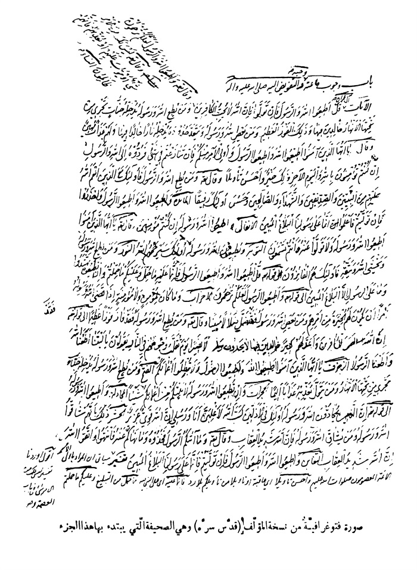

بحار الأنوار الجامعة لدرر أخبار الائمة الأطهار المجلد 17

هوية الكتاب
بطاقة تعريف: مجلسي محمد باقربن محمدتقي 1037 - 1111ق.
عنوان واسم المؤلف: بحار الأنوار الجامعة لدرر أخبار الأئمة الأطهار المجلد 17: تأليف محمد باقربن محمدتقي المجلسي.
عنوان واسم المؤلف: بيروت داراحياء التراث العربي [ -13].
مظهر: ج - عينة.
ملاحظة: عربي.
ملاحظة: فهرس الكتابة على أساس المجلد الرابع والعشرين، 1403ق. [1360].
ملاحظة: المجلد108،103،94،91،92،87،67،66،65،52،24(الطبعة الثالثة: 1403ق.=1983م.=[1361]).
ملاحظة: فهرس.
محتويات: ج.24.كتاب الامامة. ج.52.تاريخ الحجة. ج67،66،65.الإيمان والكفر. ج.87.كتاب الصلاة. ج.92،91.الذكر و الدعا. ج.94.كتاب السوم. ج.103.فهرست المصادر. ج.108.الفهرست.-
عنوان: أحاديث الشيعة — قرن 11ق
ترتيب الكونجرس: BP135/م3ب31300 ي ح
تصنيف ديوي: 297/212
رقم الببليوغرافيا الوطنية: 1680946
ص: 1

تتمة كتاب تاریخ نبینا صلی اللّٰه علیه و آله

باب 13 وجوب طاعته و حبه و التفویض إلیه صلی اللّٰه علیه و آله
الآیات؛ 
آل عمران: «قُلْ أَطِیعُوا اللَّهَ وَ الرَّسُولَ فَإِنْ تَوَلَّوْا فَإِنَّ اللَّهَ لا یُحِبُّ الْكافِرِینَ»(32) 
(و قال تعالی): «وَ أَطِیعُوا اللَّهَ وَ الرَّسُولَ لَعَلَّكُمْ تُرْحَمُونَ»(132) 
(و قال تعالی): «لَیْسَ لَكَ مِنَ الْأَمْرِ شَیْ ءٌ أَوْ یَتُوبَ عَلَیْهِمْ أَوْ یُعَذِّبَهُمْ فَإِنَّهُمْ ظالِمُونَ»(128) 
النساء: «وَ مَنْ یُطِعِ اللَّهَ وَ رَسُولَهُ یُدْخِلْهُ جَنَّاتٍ تَجْرِی مِنْ تَحْتِهَا الْأَنْهارُ خالِدِینَ فِیها وَ ذلِكَ الْفَوْزُ الْعَظِیمُ* وَ مَنْ یَعْصِ اللَّهَ وَ رَسُولَهُ وَ یَتَعَدَّ حُدُودَهُ یُدْخِلْهُ ناراً خالِداً فِیها وَ لَهُ (1) عَذابٌ مُهِینٌ»(13-14) (و قال تعالی): «یا أَیُّهَا الَّذِینَ آمَنُوا أَطِیعُوا اللَّهَ وَ أَطِیعُوا الرَّسُولَ وَ أُولِی الْأَمْرِ مِنْكُمْ فَإِنْ تَنازَعْتُمْ فِی شَیْ ءٍ فَرُدُّوهُ إِلَی اللَّهِ وَ الرَّسُولِ إِنْ كُنْتُمْ تُؤْمِنُونَ بِاللَّهِ وَ الْیَوْمِ الْآخِرِ ذلِكَ خَیْرٌ وَ أَحْسَنُ تَأْوِیلًا»(59) (و قال تعالی): «وَ مَنْ یُطِعِ اللَّهَ وَ الرَّسُولَ فَأُولئِكَ مَعَ الَّذِینَ أَنْعَمَ اللَّهُ عَلَیْهِمْ مِنَ النَّبِیِّینَ وَ الصِّدِّیقِینَ وَ الشُّهَداءِ وَ الصَّالِحِینَ وَ حَسُنَ أُولئِكَ رَفِیقاً»(69) 
المائدة: «وَ أَطِیعُوا اللَّهَ وَ أَطِیعُوا الرَّسُولَ وَ احْذَرُوا فَإِنْ تَوَلَّیْتُمْ فَاعْلَمُوا أَنَّما عَلی رَسُولِنَا الْبَلاغُ الْمُبِینُ»(92)
ص: 1

> **پاورقی**: 1- هكذا فی النسخة، و الصحیح كما فی غیرها و فی المصحف الشریف له.

الأنفال: «وَ أَطِیعُوا اللَّهَ وَ رَسُولَهُ إِنْ كُنْتُمْ مُؤْمِنِینَ»(1) 
(و قال تعالی): «یا أَیُّهَا الَّذِینَ آمَنُوا أَطِیعُوا اللَّهَ وَ رَسُولَهُ وَ لا تَوَلَّوْا عَنْهُ وَ أَنْتُمْ تَسْمَعُونَ»(20) 
التوبة: «وَ یُطِیعُونَ اللَّهَ وَ رَسُولَهُ أُولئِكَ سَیَرْحَمُهُمُ اللَّهُ»(71) 
النور: «وَ مَنْ یُطِعِ اللَّهَ وَ رَسُولَهُ وَ یَخْشَ اللَّهَ وَ یَتَّقْهِ فَأُولئِكَ هُمُ الْفائِزُونَ»(52) (إلی قوله تعالی): «قُلْ أَطِیعُوا اللَّهَ وَ أَطِیعُوا الرَّسُولَ ... فَإِنَّما عَلَیْهِ (1) ما حُمِّلَ وَ عَلَیْكُمْ ما حُمِّلْتُمْ وَ إِنْ تُطِیعُوهُ تَهْتَدُوا وَ ما عَلَی الرَّسُولِ إِلَّا الْبَلاغُ الْمُبِینُ»(54) 
(إلی قوله تعالی): «وَ أَطِیعُوا الرَّسُولَ لَعَلَّكُمْ تُرْحَمُونَ»(56) 
الأحزاب: «وَ ما كانَ لِمُؤْمِنٍ وَ لا مُؤْمِنَةٍ إِذا قَضَی اللَّهُ وَ رَسُولُهُ أَمْراً أَنْ یَكُونَ لَهُمُ الْخِیَرَةُ مِنْ أَمْرِهِمْ وَ مَنْ یَعْصِ اللَّهَ وَ رَسُولَهُ فَقَدْ ضَلَّ ضَلالًا مُبِیناً»(36) 
(و قال تعالی): «وَ مَنْ یُطِعِ اللَّهَ وَ رَسُولَهُ فَقَدْ فازَ فَوْزاً عَظِیماً»(71) (إلی قوله تعالی): (2) «إِنَّ اللَّهَ لَعَنَ الْكافِرِینَ وَ أَعَدَّ لَهُمْ سَعِیراً *خالِدِینَ فِیها أَبَداً لا یَجِدُونَ وَلِیًّا وَ لا نَصِیراً* یَوْمَ تُقَلَّبُ وُجُوهُهُمْ فِی النَّارِ یَقُولُونَ یا لَیْتَنا أَطَعْنَا اللَّهَ وَ أَطَعْنَا الرَّسُولَا»(64-66) 
الزخرف: (3) «یا أَیُّهَا الَّذِینَ آمَنُوا أَطِیعُوا اللَّهَ وَ أَطِیعُوا الرَّسُولَ وَ لا تُبْطِلُوا أَعْمالَكُمْ»(33) 
الفتح: «وَ مَنْ یُطِعِ اللَّهَ وَ رَسُولَهُ یُدْخِلْهُ جَنَّاتٍ تَجْرِی مِنْ تَحْتِهَا الْأَنْهارُ وَ مَنْ یَتَوَلَّ یُعَذِّبْهُ عَذاباً أَلِیماً»(17) 
الحجرات: «وَ إِنْ تُطِیعُوا اللَّهَ وَ رَسُولَهُ لا یَلِتْكُمْ مِنْ أَعْمالِكُمْ شَیْئاً»(14) 
المجادلة: «وَ أَطِیعُوا اللَّهَ وَ رَسُولَهُ»(13) (إلی قوله تعالی): «إِنَّ الَّذِینَ یُحَادُّونَ اللَّهَ وَ رَسُولَهُ أُولئِكَ فِی الْأَذَلِّینَ *كَتَبَ اللَّهُ لَأَغْلِبَنَّ أَنَا وَ رُسُلِی إِنَّ اللَّهَ قَوِیٌّ عَزِیزٌ»(21) 
الحشر: «ذلِكَ بِأَنَّهُمْ شَاقُّوا اللَّهَ وَ رَسُولَهُ وَ مَنْ یُشَاقِّ اللَّهَ فَإِنَّ اللَّهَ شَدِیدُ الْعِقابِ»(4)
ص: 2

> **پاورقی**: 1- الصحیح: فان تولوا فانما علیه.

> **پاورقی**: 2- فیه وهم لان الآیات الآتیة متقدمة ترتیبا علی قوله: و من یطع اللّٰه.

> **پاورقی**: 3- فیه وهم، و الصحیح: محمّد: 47، لان الآیات مذكورة فی هذه السورة.

(و قال تعالی): «وَ ما آتاكُمُ الرَّسُولُ فَخُذُوهُ وَ ما نَهاكُمْ عَنْهُ فَانْتَهُوا وَ اتَّقُوا اللَّهَ إِنَّ اللَّهَ شَدِیدُ الْعِقابِ»(7) 
التغابن: «وَ أَطِیعُوا اللَّهَ وَ أَطِیعُوا الرَّسُولَ فَإِنْ تَوَلَّیْتُمْ فَإِنَّما عَلی رَسُولِنَا الْبَلاغُ الْمُبِینُ»(12) 
تفسیر: أقول: أوردنا تفسیر لَیْسَ لَكَ مِنَ الْأَمْرِ شَیْ ءٌ فی باب العصمة و سیأتی أن المراد بأولی الأمر الأئمة المعصومون علیهم السلام. 
وَ أَحْسَنُ تَأْوِیلًا أی عاقبة أو تأویلا من تأویلكم بلا رد فَإِنَّما عَلَیْهِ أی علی النبی صلی اللّٰه علیه و آله ما حُمِّلَ من التبلیغ وَ عَلَیْكُمْ ما حُمِّلْتُمْ من الامتثال إِذا قَضَی اللَّهُ وَ رَسُولُهُ أَمْراً أی قضی رسول اللّٰه و ذكر اللّٰه للتعظیم و الإشعار بأن قضاءه قضاء اللّٰه قیل نزل فی زینب بنت جحش بنت عمته أمیمة بنت عبد المطلب خطبها رسول اللّٰه صلی اللّٰه علیه و آله لزید بن حارثة فأبت هی و أخوها عبد اللّٰه و قیل فی أم كلثوم بنت عقبة وَهَبَتْ نَفْسَها لِلنَّبِیِّ صلی اللّٰه علیه و آله فزوجها من زید أَنْ یَكُونَ لَهُمُ الْخِیَرَةُ مِنْ أَمْرِهِمْ أی أن یختاروا من أمرهم شیئا بل یجب علیهم أن یجعلوا اختیارهم تبعا لاختیار اللّٰه و رسوله یَوْمَ تُقَلَّبُ وُجُوهُهُمْ فِی النَّارِ أی تصرف من جهة إلی أخری كاللحم یشوی بالنار أو من حال إلی حال لا یَلِتْكُمْ مِنْ أَعْمالِكُمْ أی لا ینقصكم من أجورها شیئا من لات لیتا إذا نقص و المحادة المخالفة و المضادة و المشاقة الخلاف و العداوة.
«1»-كا، الكافی مُحَمَّدُ بْنُ یَحْیَی عَنْ أَحْمَدَ بْنِ أَبِی زَاهِرٍ عَنْ عَلِیِّ بْنِ إِسْمَاعِیلَ عَنْ صَفْوَانَ بْنِ یَحْیَی عَنْ عَاصِمِ بْنِ حُمَیْدٍ عَنْ أَبِی إِسْحَاقَ النَّحْوِیِّ (1) قَالَ: دَخَلْتُ عَلَی أَبِی عَبْدِ اللَّهِ علیه السلام فَسَمِعْتُهُ یَقُولُ إِنَّ اللَّهَ عَزَّ وَ جَلَّ أَدَّبَ نَبِیَّهُ عَلَی مَحَبَّتِهِ فَقَالَ وَ إِنَّكَ لَعَلی خُلُقٍ عَظِیمٍ (2) ثُمَّ فَوَّضَ إِلَیْهِ فَقَالَ عَزَّ وَ جَلَّ وَ ما آتاكُمُ الرَّسُولُ فَخُذُوهُ وَ ما نَهاكُمْ عَنْهُ فَانْتَهُوا (3)
ص: 3

> **پاورقی**: 1- أبو إسحاق النحوی هو ثعلبة الآتی، و الرجل هو ثعلبة بن میمون الأسدی الكوفیّ، كان وجها من أصحابنا، قاریا فقیها نحویا لغویا راویا، و كان حسن العمل، كثیر العبادة و الزهد، روی عن أبی عبد اللّٰه و أبی الحسن علیهما السلام.

> **پاورقی**: 2- القلم: 4.

> **پاورقی**: 3- الحشر: 7.

وَ قَالَ عَزَّ وَ جَلَّ مَنْ یُطِعِ الرَّسُولَ فَقَدْ أَطاعَ اللَّهَ (1) ثُمَّ قَالَ وَ إِنَّ نَبِیَّ اللَّهِ فَوَّضَ إِلَی عَلِیٍّ علیه السلام وَ ائْتَمَنَهُ فَسَلَّمْتُمْ وَ جَحَدَ النَّاسُ فَوَ اللَّهِ لَنُحِبُّكُمْ أَنْ تَقُولُوا إِذَا قُلْنَا وَ تَصْمُتُوا إِذَا صَمَتْنَا وَ نَحْنُ فِیمَا بَیْنَكُمْ وَ بَیْنَ اللَّهِ عَزَّ وَ جَلَّ مَا جَعَلَ اللَّهُ لِأَحَدٍ خَیْراً فِی خِلَافِ أَمْرِنَا (2).
الْعِدَّةُ عَنْ أَحْمَدَ عَنِ ابْنِ أَبِی نَجْرَانَ عَنْ عَاصِمٍ مِثْلَهُ (3).
«2»-كا، الكافی الْعِدَّةُ عَنْ أَحْمَدَ بْنِ مُحَمَّدٍ عَنِ الْحَجَّالِ عَنْ ثَعْلَبَةَ عَنْ زُرَارَةَ قَالَ سَمِعْتُ أَبَا جَعْفَرٍ وَ أَبَا عَبْدِ اللَّهِ علیه السلام یَقُولَانِ إِنَّ اللَّهَ عَزَّ وَ جَلَّ فَوَّضَ إِلَی نَبِیِّهِ صلی اللّٰه علیه و آله أَمْرَ خَلْقِهِ لِیَنْظُرَ كَیْفَ طَاعَتُهُمْ ثُمَّ تَلَا هَذِهِ الْآیَةَ (4) ما آتاكُمُ الرَّسُولُ فَخُذُوهُ وَ ما نَهاكُمْ عَنْهُ فَانْتَهُوا (5)
أَبُو عَلِیٍّ الْأَشْعَرِیُّ عَنِ ابْنِ عَبْدِ الْجَبَّارِ عَنِ ابْنِ فَضَّالٍ عَنْ ثَعْلَبَةَ مِثْلَهُ (6)- یر، بصائر الدرجات ابْنُ عَبْدِ الْجَبَّارِ مِثْلَهُ (7).
«3»-كا، الكافی عَلِیٌّ عَنْ أَبِیهِ عَنِ ابْنِ أَبِی عُمَیْرٍ عَنِ ابْنِ أُذَیْنَةَ عَنْ فُضَیْلِ بْنِ یَسَارٍ قَالَ: سَمِعْتُ أَبَا عَبْدِ اللَّهِ علیه السلام یَقُولُ لِبَعْضِ أَصْحَابِ قَیْسٍ الْمَاصِرِ إِنَّ اللَّهَ عَزَّ وَ جَلَّ أَدَّبَ نَبِیَّهُ فَأَحْسَنَ أَدَبَهُ فَلَمَّا أَكْمَلَ لَهُ الْأَدَبَ قَالَ وَ إِنَّكَ لَعَلی خُلُقٍ عَظِیمٍ (8) ثُمَّ فَوَّضَ إِلَیْهِ أَمْرَ الدِّینِ وَ الْأُمَّةِ لِیَسُوسَ (9) عِبَادَهُ فَقَالَ عَزَّ وَ جَلَّ ما آتاكُمُ الرَّسُولُ فَخُذُوهُ وَ ما نَهاكُمْ عَنْهُ فَانْتَهُوا (10) وَ إِنَّ رَسُولَ اللَّهِ صلی اللّٰه علیه و آله كَانَ مُسَدَّداً مُوَفَّقاً مُؤَیَّداً
ص: 4

> **پاورقی**: 1- النساء: 80.

> **پاورقی**: 2- أصول الكافی 1: 265.

> **پاورقی**: 3- أصول الكافی 1: 265.

> **پاورقی**: 4- الحشر: 7.

> **پاورقی**: 5- أصول الكافی 1: 266.

> **پاورقی**: 6- أصول الكافی 1: 267.

> **پاورقی**: 7- بصائر الدرجات: 111.

> **پاورقی**: 8- القلم: 4.

> **پاورقی**: 9- أی لیدبرهم و یتولی أمرهم.

> **پاورقی**: 10- الحشر: 7.

بِرُوحِ الْقُدُسِ لَا یَزِلُّ وَ لَا یُخْطِئُ فِی شَیْ ءٍ مِمَّا یَسُوسُ بِهِ الْخَلْقَ فَتَأَدَّبَ بِآدَابِ اللَّهِ ثُمَّ إِنَّ اللَّهَ عَزَّ وَ جَلَّ فَرَضَ الصَّلَاةَ رَكْعَتَیْنِ رَكْعَتَیْنِ عَشْرَ رَكَعَاتٍ فَأَضَافَ رَسُولُ اللَّهِ صلی اللّٰه علیه و آله إِلَی الرَّكْعَتَیْنِ رَكْعَتَیْنِ وَ إِلَی الْمَغْرِبِ رَكْعَةً فَصَارَتْ عَدِیلَةَ الْفَرِیضَةِ لَا یَجُوزُ تَرْكُهُنَّ إِلَّا فِی سَفَرٍ وَ أَفْرَدَ الرَّكْعَةَ فِی الْمَغْرِبِ فَتَرَكَهَا قَائِمَةً فِی السَّفَرِ وَ الْحَضَرِ فَأَجَازَ اللَّهُ لَهُ ذَلِكَ كُلَّهُ فَصَارَتِ الْفَرِیضَةُ سَبْعَ عَشْرَةَ رَكْعَةً ثُمَّ سَنَّ رَسُولُ اللَّهِ صلی اللّٰه علیه و آله النَّوَافِلَ أَرْبَعاً وَ ثَلَاثِینَ رَكْعَةً مِثْلَیِ الْفَرِیضَةِ فَأَجَازَ اللَّهُ عَزَّ وَ جَلَّ لَهُ ذَلِكَ وَ الْفَرِیضَةُ وَ النَّافِلَةُ إِحْدَی وَ خَمْسُونَ رَكْعَةً مِنْهَا رَكْعَتَانِ بَعْدَ الْعَتَمَةِ جَالِساً تُعَدُّ بِرَكْعَةٍ مَكَانَ الْوَتْرِ وَ فَرَضَ اللَّهُ فِی السَّنَةِ صَوْمَ شَهْرِ رَمَضَانَ وَ سَنَّ رَسُولُ اللَّهِ صلی اللّٰه علیه و آله صَوْمَ شَعْبَانَ وَ ثَلَاثَةِ أَیَّامٍ فِی كُلِّ شَهْرٍ مِثْلَیِ الْفَرِیضَةِ فَأَجَازَ اللَّهُ عَزَّ وَ جَلَّ لَهُ ذَلِكَ وَ حَرَّمَ اللَّهُ عَزَّ وَ جَلَّ الْخَمْرَ بِعَیْنِهَا وَ حَرَّمَ رَسُولُ اللَّهِ صلی اللّٰه علیه و آله الْمُسْكِرَ مِنْ كُلِّ شَرَابٍ فَأَجَازَ اللَّهُ لَهُ ذَلِكَ وَ عَافَ (1) رَسُولُ اللَّهِ صلی اللّٰه علیه و آله أَشْیَاءَ وَ كَرِهَهَا لَمْ یَنْهَ عَنْهَا نَهْیَ حَرَامٍ إِنَّمَا نَهَی عَنْهَا نَهْیَ عافة (2) (إِعَافَةٍ) وَ كَرَاهَةٍ ثُمَّ رَخَّصَ فِیهَا فَصَارَ الْأَخْذُ بِرُخَصِهِ وَاجِباً عَلَی الْعِبَادِ كَوُجُوبِ مَا یَأْخُذُونَ بِنَهْیِهِ وَ عَزَائِمِهِ وَ لَمْ یُرَخِّصْ لَهُمْ رَسُولُ اللَّهِ صلی اللّٰه علیه و آله فِیمَا نَهَاهُمْ عَنْهُ نَهْیَ حَرَامٍ وَ لَا فِیمَا أَمَرَ بِهِ أَمْرَ فَرْضٍ لَازِمٍ فَكَثِیرَ الْمُسْكِرِ مِنَ الْأَشْرِبَةِ نَهَاهُمْ عَنْهُ نَهْیَ حَرَامٍ لَمْ یُرَخِّصْ فِیهِ لِأَحَدٍ وَ لَمْ یُرَخِّصْ رَسُولُ اللَّهِ صلی اللّٰه علیه و آله لِأَحَدٍ تَقْصِیرَ الرَّكْعَتَیْنِ اللَّتَیْنِ ضَمَّهُمَا إِلَی مَا فَرَضَ اللَّهُ عَزَّ وَ جَلَّ بَلْ أَلْزَمَهُمْ ذَلِكَ إِلْزَاماً وَاجِباً لَمْ یُرَخِّصْ لِأَحَدٍ فِی شَیْ ءٍ مِنْ ذَلِكَ إِلَّا لِلْمُسَافِرِ وَ لَیْسَ لِأَحَدٍ أَنْ یُرَخِّصَ مَا لَمْ یُرَخِّصْهُ (3) رَسُولُ اللَّهِ صلی اللّٰه علیه و آله فَوَافَقَ أَمْرُ رَسُولُ اللَّهِ صلی اللّٰه علیه و آله أَمْرَ اللَّهِ عَزَّ وَ جَلَّ وَ نَهْیُهُ نَهْیَ اللَّهِ عَزَّ وَ جَلَّ وَ وَجَبَ عَلَی الْعِبَادِ التَّسْلِیمُ لَهُ كَالتَّسْلِیمِ لِلَّهِ تَبَارَكَ وَ تَعَالَی (4).
«4»-كا، الكافی مُحَمَّدُ بْنُ یَحْیَی عَنْ أَحْمَدَ بْنِ مُحَمَّدٍ عَنْ مُحَمَّدِ بْنِ سِنَانٍ عَنْ إِسْحَاقَ بْنِ عَمَّارٍ عَنْ أَبِی عَبْدِ اللَّهِ علیه السلام قَالَ: إِنَّ اللَّهَ تَبَارَكَ وَ تَعَالَی أَدَّبَ نَبِیَّهُ صلی اللّٰه علیه و آله (5) فَلَمَّا انْتَهَی بِهِ إِلَی
ص: 5

> **پاورقی**: 1- عاف الشی: كرهه فتركه.

> **پاورقی**: 2- فی المصدر: نهی إعافة.

> **پاورقی**: 3- فی المصدر: أن یرخص شیئا ما لم یرخصه.

> **پاورقی**: 4- أصول الكافی 1: 266 و 267.

> **پاورقی**: 5- فی البصائر: أدب نبیه صلّی اللّٰه علیه و آله علی أدبه.

مَا أَرَادَ قَالَ (1) وَ إِنَّكَ لَعَلی خُلُقٍ عَظِیمٍ (2) فَفَوَّضَ إِلَیْهِ دِینَهُ فَقَالَ وَ ما آتاكُمُ الرَّسُولُ فَخُذُوهُ وَ ما نَهاكُمْ عَنْهُ فَانْتَهُوا (3) وَ إِنَّ اللَّهَ عَزَّ وَ جَلَّ فَرَضَ الْفَرَائِضَ (4) وَ لَمْ یَقْسِمْ لِلْجَدِّ شَیْئاً وَ إِنَّ رَسُولَ اللَّهِ صلی اللّٰه علیه و آله أَطْعَمَهُ السُّدُسَ فَأَجَازَ اللَّهُ جَلَّ ذِكْرُهُ لَهُ ذَلِكَ (5) وَ ذَلِكَ قَوْلُ اللَّهِ عَزَّ وَ جَلَّ هذا (6) عَطاؤُنا فَامْنُنْ أَوْ أَمْسِكْ بِغَیْرِ حِسابٍ (7).
یر، بصائر الدرجات الْحَجَّالُ عَنِ اللُّؤْلُؤِیِّ عَنْ مُحَمَّدِ بْنِ سِنَانٍ مِثْلَهُ (8).
«5»-كا، الكافی الْحُسَیْنُ بْنُ مُحَمَّدٍ عَنِ الْمُعَلَّی عَنِ الْوَشَّاءِ عَنْ حَمَّادٍ عَنْ زُرَارَةَ عَنْ أَبِی جَعْفَرٍ علیه السلام قَالَ: وَضَعَ رَسُولُ اللَّهِ صلی اللّٰه علیه و آله دِیَةَ الْعَیْنِ وَ دِیَةَ النَّفْسِ وَ حَرَّمَ النَّبِیذَ وَ كُلَّ مُسْكِرٍ فَقَالَ لَهُ رَجُلٌ وَضَعَ رَسُولُ اللَّهِ صلی اللّٰه علیه و آله مِنْ غَیْرِ أَنْ یَكُونَ جَاءَ فِیهِ شَیْ ءٌ قَالَ نَعَمْ لِیُعْلَمَ مَنْ یُطِیعُ الرَّسُولَ مِمَّنْ یَعْصِیهِ (9).
«6»-كا، الكافی مُحَمَّدُ بْنُ یَحْیَی عَنْ مُحَمَّدِ بْنِ الْحُسَیْنِ (10) قَالَ وَجَدْتُ فِی نَوَادِرِ مُحَمَّدِ بْنِ سِنَانٍ عَنْ عَبْدِ اللَّهِ بْنِ سِنَانٍ قَالَ قَالَ أَبُو عَبْدِ اللَّهِ علیه السلام لَا وَ اللَّهِ مَا فَوَّضَ اللَّهُ إِلَی أَحَدٍ مِنْ خَلْقِهِ إِلَّا إِلَی رَسُولِ اللَّهِ صلی اللّٰه علیه و آله وَ إِلَی الْأَئِمَّةِ علیهم السلام قَالَ عَزَّ وَ جَلَّ إِنَّا أَنْزَلْنا إِلَیْكَ الْكِتابَ بِالْحَقِّ لِتَحْكُمَ بَیْنَ النَّاسِ بِما أَراكَ اللَّهُ وَ هِیَ جَارِیَةٌ فِی الْأَوْصِیَاءِ علیهم السلام (11).
«7»-كا، الكافی مُحَمَّدُ بْنُ یَحْیَی عَنْ مُحَمَّدِ بْنُ الْحَسَنِ عَنْ یَعْقُوبَ بْنِ یَزِیدَ عَنِ الْحَسَنِ بْنِ زِیَادٍ
ص: 6

> **پاورقی**: 1- فی المصدر: قال له.

> **پاورقی**: 2- القلم: 4.

> **پاورقی**: 3- الحشر: 7.

> **پاورقی**: 4- فی البصائر: فرض فی القرآن.

> **پاورقی**: 5- زاد فی البصائر بعد ذلك: و إن اللّٰه حرم الخمر بعینها، و حرم رسول اللّٰه صلّی اللّٰه علیه و آله كل مسكر فأجاز اللّٰه له.

> **پاورقی**: 6- ص: 39.

> **پاورقی**: 7- أصول الكافی 1: 267.

> **پاورقی**: 8- بصائر الدرجات: 111.

> **پاورقی**: 9- أصول الكافی 1: 267.

> **پاورقی**: 10- محمّد بن الحسن خ ل، و هو الموجود فی المصدر.

> **پاورقی**: 11- أصول الكافی 1: 268.

عَنْ مُحَمَّدِ بْنُ الْحَسَنِ الْمِیثَمِیِّ عَنْ أَبِی عَبْدِ اللَّهِ علیه السلام قَالَ سَمِعْتُهُ یَقُولُ إِنَّ اللَّهَ عَزَّ وَ جَلَّ أَدَّبَ رَسُولَهُ صلی اللّٰه علیه و آله حَتَّی قَوَّمَهُ عَلَی مَا أَرَادَ ثُمَّ فَوَّضَ إِلَیْهِ فَقَالَ عَزَّ ذِكْرُهُ ما آتاكُمُ الرَّسُولُ فَخُذُوهُ وَ ما نَهاكُمْ عَنْهُ فَانْتَهُوا (1) فَمَا فَوَّضَ اللَّهُ إِلَی رَسُولِهِ فَقَدْ فَوَّضَهُ إِلَیْنَا (2).
«8»-كا، الكافی عَلِیُّ بْنُ مُحَمَّدٍ عَنْ بَعْضِ أَصْحَابِنَا عَنِ الْحُسَیْنِ بْنِ عَبْدِ الرَّحْمَنِ عَنْ صَنْدَلٍ الْخَیَّاطِ عَنْ زَیْدٍ الشَّحَّامِ قَالَ: سَأَلْتُ أَبَا عَبْدِ اللَّهِ علیه السلام فِی قَوْلِهِ تَعَالَی هذا عَطاؤُنا فَامْنُنْ أَوْ أَمْسِكْ بِغَیْرِ حِسابٍ (3) قَالَ أَعْطَی سُلَیْمَانَ مُلْكاً عَظِیماً ثُمَّ جَرَتْ هَذِهِ الْآیَةُ فِی رَسُولِ اللَّهِ صلی اللّٰه علیه و آله فَكَانَ لَهُ أَنْ یُعْطِیَ مَا شَاءَ مَنْ شَاءَ وَ أَعْطَاهُ اللَّهُ أَفْضَلَ مِمَّا أَعْطَی سُلَیْمَانَ لِقَوْلِهِ تَعَالَی ما آتاكُمُ (4) الرَّسُولُ فَخُذُوهُ وَ ما نَهاكُمْ عَنْهُ فَانْتَهُوا (5).
«9»-ن، عیون أخبار الرضا علیه السلام مَاجِیلَوَیْهِ عَنْ عَلِیٍّ عَنْ أَبِیهِ عَنْ یَاسِرٍ الْخَادِمِ قَالَ: قُلْتُ لِلرِّضَا علیه السلام مَا تَقُولُ فِی التَّفْوِیضِ فَقَالَ إِنَّ اللَّهَ تَبَارَكَ وَ تَعَالَی فَوَّضَ إِلَی نَبِیِّهِ صلی اللّٰه علیه و آله أَمْرَ دِینِهِ فَقَالَ ما آتاكُمُ الرَّسُولُ فَخُذُوهُ وَ ما نَهاكُمْ عَنْهُ فَانْتَهُوا فَأَمَّا الْخَلْقَ وَ الرِّزْقَ فَلَا ثُمَّ قَالَ علیه السلام إِنَّ اللَّهَ عَزَّ وَ جَلَّ خالِقُ كُلِّ شَیْ ءٍ وَ هُوَ یَقُولُ عَزَّ وَ جَلَّ الَّذِی (6) خَلَقَكُمْ ثُمَّ رَزَقَكُمْ ثُمَّ یُمِیتُكُمْ ثُمَّ یُحْیِیكُمْ هَلْ مِنْ شُرَكائِكُمْ مَنْ یَفْعَلُ مِنْ ذلِكُمْ مِنْ شَیْ ءٍ سُبْحانَهُ وَ تَعالی عَمَّا یُشْرِكُونَ (7).
«10»-یر، بصائر الدرجات مُحَمَّدُ بْنُ عَبْدِ الْجَبَّارِ عَنِ الْبَرْقِیِّ عَنْ فَضَالَةَ عَنْ رِبْعِیٍّ عَنِ الْقَاسِمِ بْنِ مُحَمَّدٍ قَالَ: إِنَّ اللَّهَ أَدَّبَ نَبِیَّهُ صلی اللّٰه علیه و آله فَأَحْسَنَ تَأْدِیبَهُ فَقَالَ خُذِ الْعَفْوَ وَ أْمُرْ بِالْعُرْفِ وَ أَعْرِضْ عَنِ الْجاهِلِینَ (8) فَلَمَّا كَانَ ذَلِكَ أَنْزَلَ اللَّهُ إِنَّكَ لَعَلی خُلُقٍ عَظِیمٍ (9) وَ فَوَّضَ إِلَیْهِ
ص: 7

> **پاورقی**: 1- الحشر: 7.

> **پاورقی**: 2- أصول الكافی 1: 268.

> **پاورقی**: 3- ص: 39.

> **پاورقی**: 4- الحشر: 7.

> **پاورقی**: 5- أصول الكافی: 268.

> **پاورقی**: 6- فی المصدر: كما فی المصحف: اللّٰه الذی.

> **پاورقی**: 7- عیون الأخبار: 326. و الآیة فی سورة الروم: 40.

> **پاورقی**: 8- الأعراف: 199.

> **پاورقی**: 9- القلم: 4.

أَمْرَ دِینِهِ فَقَالَ ما آتاكُمُ الرَّسُولُ فَخُذُوهُ وَ ما نَهاكُمْ عَنْهُ فَانْتَهُوا (1) فَحَرَّمَ اللَّهُ الْخَمْرَ بِعَیْنِهَا وَ حَرَّمَ رَسُولُ اللَّهِ صلی اللّٰه علیه و آله كُلَّ مُسْكِرٍ فَأَجَازَ اللَّهُ ذَلِكَ وَ كَانَ یَضْمَنُ عَلَی اللَّهِ الْجَنَّةَ فَیُجِیزُ اللَّهُ ذَلِكَ لَهُ وَ ذَكَرَ الْفَرَائِضَ فَلَمْ یَذْكُرِ الْجَدَّ فَأَطْعَمَهُ رَسُولُ اللَّهِ صلی اللّٰه علیه و آله سَهْماً فَأَجَازَ اللَّهُ ذَلِكَ وَ لَمْ یُفَوِّضْ إِلَی أَحَدٍ مِنَ الْأَنْبِیَاءِ غَیْرِهِ (2).
«11»-یر، بصائر الدرجات مُحَمَّدُ بْنُ عِیسَی عَنْ أَبِی عَبْدِ اللَّهِ الْمُؤْمِنِ عَنْ إِسْحَاقَ بْنِ عَمَّارٍ عَنْ أَبِی عَبْدِ اللَّهِ علیه السلام قَالَ: إِنَّ اللَّهَ أَدَّبَ نَبِیَّهُ صلی اللّٰه علیه و آله حَتَّی إِذَا أَقَامَهُ عَلَی مَا أَرَادَ قَالَ لَهُ وَ أْمُرْ بِالْعُرْفِ وَ أَعْرِضْ عَنِ الْجاهِلِینَ (3) فَلَمَّا فَعَلَ ذَلِكَ لَهُ رَسُولُ اللَّهِ صلی اللّٰه علیه و آله زَكَّاهُ اللَّهُ فَقَالَ إِنَّكَ لَعَلی خُلُقٍ عَظِیمٍ (4) فَلَمَّا زَكَّاهُ فَوَّضَ إِلَیْهِ دِینَهُ فَقَالَ ما آتاكُمُ الرَّسُولُ فَخُذُوهُ وَ ما نَهاكُمْ عَنْهُ فَانْتَهُوا (5) فَحَرَّمَ اللَّهُ الْخَمْرَ وَ حَرَّمَ رَسُولُ اللَّهِ صلی اللّٰه علیه و آله كُلَّ مُسْكِرٍ فَأَجَازَ اللَّهُ ذَلِكَ كُلَّهُ وَ إِنَّ اللَّهَ أَنْزَلَ الصَّلَاةَ وَ إِنَّ رَسُولَ اللَّهِ صلی اللّٰه علیه و آله وَقَّتَ أَوْقَاتِهَا فَأَجَازَ اللَّهُ لَهُ ذَلِكَ (6).
«12»-ختص، الإختصاص یر، بصائر الدرجات ابْنُ یَزِیدَ وَ مُحَمَّدُ بْنُ عِیسَی عَنْ زِیَادٍ الْقَنْدِیِّ عَنْ مُحَمَّدِ بْنِ عُمَارَةَ عَنْ فُضَیْلِ بْنِ یَسَارٍ قَالَ: سَأَلْتُهُ كَیْفَ كَانَ یَصْنَعُ أَمِیرُ الْمُؤْمِنِینَ علیه السلام بِشَارِبِ الْخَمْرِ قَالَ كَانَ یَحُدُّهُ قُلْتُ فَإِنْ عَادَ قَالَ كَانَ یَحُدُّهُ قُلْتُ فَإِنْ عَادَ قَالَ كَانَ یَحُدُّهُ ثَلَاثَ مَرَّاتٍ فَإِنْ عَادَ كَانَ یَقْتُلُهُ قُلْتُ كَیْفَ كَانَ یَصْنَعُ بِشَارِبِ الْمُسْكِرِ قَالَ مِثْلَ ذَلِكَ قُلْتُ فَمَنْ شَرِبَ شَرْبَةَ مُسْكِرٍ كَمَنْ شَرِبَ شَرْبَةَ خَمْرٍ قَالَ سَوَاءٌ فَاسْتَعْظَمْتُ ذَلِكَ فَقَالَ لِی یَا فُضَیْلُ لَا تَسْتَعْظِمْ ذَلِكَ فَإِنَّ اللَّهَ إِنَّمَا بَعَثَ مُحَمَّداً صلی اللّٰه علیه و آله رَحْمَةً لِلْعالَمِینَ وَ اللَّهُ أَدَّبَ نَبِیَّهُ فَأَحْسَنَ تَأْدِیبَهُ فَلَمَّا ائْتَدَبَ فَوَّضَ إِلَیْهِ فَحَرَّمَ اللَّهُ الْخَمْرَ وَ حَرَّمَ رَسُولُ اللَّهِ صلی اللّٰه علیه و آله كُلَّ مُسْكِرٍ فَأَجَازَ اللَّهُ ذَلِكَ لَهُ وَ حَرَّمَ اللَّهُ مَكَّةَ وَ حَرَّمَ رَسُولُ اللَّهِ صلی اللّٰه علیه و آله
ص: 8

> **پاورقی**: 1- قد مر ذكر موضعه مرارا.

> **پاورقی**: 2- بصائر الدرجات: 111.

> **پاورقی**: 3- الأعراف: 199.

> **پاورقی**: 4- القلم: 4.

> **پاورقی**: 5- تقدم ذكر موضعه قبلا.

> **پاورقی**: 6- بصائر الدرجات: 111.

الْمَدِینَةَ فَأَجَازَ اللَّهُ كُلَّهُ لَهُ وَ فَرَضَ اللَّهُ الْفَرَائِضَ مِنَ الصُّلْبِ فَأَطْعَمَ رَسُولُ اللَّهِ صلی اللّٰه علیه و آله الْجَدَّ فَأَجَازَ ذَلِكَ كُلَّهُ لَهُ ثُمَّ قَالَ لَهُ یَا فُضَیْلُ حُرِّفَ وَ مَا حُرِّفَ مَنْ یُطِعِ الرَّسُولَ فَقَدْ أَطاعَ اللَّهَ (1).
«13»-یر، بصائر الدرجات ابْنُ یَزِیدَ عَنْ زِیَادٍ الْقَنْدِیِّ عَنْ عَبْدِ اللَّهِ بْنِ سِنَانٍ عَنْ أَبِی عَبْدِ اللَّهِ مِثْلَهُ (2).
«14»-یر، بصائر الدرجات مُحَمَّدُ بْنُ الْحَسَنِ عَنْ جَعْفَرِ بْنِ بَشِیرٍ عَنِ ابْنِ بُكَیْرٍ عَنْ زُرَارَةَ قَالَ: سَأَلْتُ أَبَا جَعْفَرٍ علیه السلام عَنْ أَشْیَاءَ مِنَ الصَّلَاةِ وَ الدِّیَاتِ وَ الْفَرَائِضِ وَ أَشْیَاءَ مِنْ أَشْبَاهِ هَذَا فَقَالَ إِنَّ اللَّهَ فَوَّضَ إِلَی نَبِیِّهِ صلی اللّٰه علیه و آله (3).
«15»-یر، بصائر الدرجات أَحْمَدُ بْنُ مُحَمَّدٍ عَنِ ابْنِ فَضَّالٍ عَنِ ابْنِ بُكَیْرٍ عَنْ زُرَارَةَ عَنْ حُمْرَانَ عَنْهُ علیه السلام مِثْلَهُ (4).
«16»-یر، بصائر الدرجات بَعْضُ أَصْحَابِنَا (5) عَنْ مُحَمَّدِ بْنِ الْحَسَنِ عَنْ عَلِیِّ بْنِ النُّعْمَانِ عَنِ ابْنِ مُسْكَانَ عَنْ إِسْمَاعِیلَ بْنِ عَبْدِ الْعَزِیزِ قَالَ: قَالَ لِی جَعْفَرُ بْنُ مُحَمَّدٍ علیهما السلام إِنَّ رَسُولَ اللَّهِ صلی اللّٰه علیه و آله كَانَ یُفَوَّضُ إِلَیْهِ إِنَّ اللَّهَ تَبَارَكَ وَ تَعَالَی فَوَّضَ إِلَی سُلَیْمَانَ علیه السلام مُلْكَهُ فَقَالَ هذا عَطاؤُنا فَامْنُنْ أَوْ أَمْسِكْ بِغَیْرِ حِسابٍ (6) وَ إِنَّ اللَّهَ فَوَّضَ إِلَی مُحَمَّدٍ صلی اللّٰه علیه و آله نَبِیِّهِ فَقَالَ ما آتاكُمُ الرَّسُولُ فَخُذُوهُ وَ ما نَهاكُمْ عَنْهُ فَانْتَهُوا فَقَالَ رَجُلٌ إِنَّمَا كَانَ رَسُولُ اللَّهِ صلی اللّٰه علیه و آله مُفَوَّضاً إِلَیْهِ فِی الزَّرْعِ وَ الضَّرْعِ فَلَوَی جَعْفَرٌ علیه السلام عَنْهُ عُنُقَهُ مُغْضَباً فَقَالَ فِی كُلِّ شَیْ ءٍ وَ اللَّهِ فِی كُلِّ شَیْ ءٍ (7).
«17»-یر، بصائر الدرجات مُحَمَّدُ بْنُ عِیسَی عَنِ النَّضْرِ عَنْ عَبْدِ اللَّهِ بْنِ سُلَیْمَانَ أَوْ عَمَّنْ رَوَاهُ عَنْ عَبْدِ اللَّهِ بْنِ سُلَیْمَانَ عَنْ أَبِی جَعْفَرٍ علیه السلام قَالَ: إِنَّ اللَّهَ أَدَّبَ مُحَمَّداً صلی اللّٰه علیه و آله تَأْدِیباً فَفَوَّضَ
ص: 9

> **پاورقی**: 1- الاختصاص: مخطوط. بصائر الدرجات: 112.

> **پاورقی**: 2- بصائر الدرجات: 112.

> **پاورقی**: 3- بصائر الدرجات: 111.

> **پاورقی**: 4- بصائر الدرجات: 111.

> **پاورقی**: 5- فی المصدر: بعض أصحابه.

> **پاورقی**: 6- ص: 39.

> **پاورقی**: 7- بصائر الدرجات: 111 و 112.

إِلَیْهِ الْأَمْرَ وَ قَالَ ما آتاكُمُ الرَّسُولُ فَخُذُوهُ وَ ما نَهاكُمْ عَنْهُ فَانْتَهُوا (1) وَ كَانَ مِمَّا أَمَرَهُ اللَّهُ فِی كِتَابِهِ فَرَائِضُ الصُّلْبِ وَ فَرَضَ رَسُولُ اللَّهِ صلی اللّٰه علیه و آله لِلْجَدِّ فَأَجَازَ اللَّهُ ذَلِكَ لَهُ وَ حَرَّمَ اللَّهُ فِی كِتَابِهِ الْخَمْرَ بِعَیْنِهَا وَ حَرَّمَ رَسُولُ اللَّهِ صلی اللّٰه علیه و آله كُلَّ مُسْكِرٍ فَأَجَازَ اللَّهُ ذَلِكَ لَهُ (2).
«18»-یر، بصائر الدرجات عَبْدُ اللَّهِ بْنُ عَامِرٍ عَنِ الْبَرْقِیِّ عَنِ الْحَسَنِ بْنِ عُثْمَانَ عَنْ مُحَمَّدِ بْنِ الْفُضَیْلِ عَنِ الثُّمَالِیِّ قَالَ: قَرَأْتُ هَذِهِ الْآیَةَ عَلَی أَبِی جَعْفَرٍ علیه السلام لَیْسَ لَكَ مِنَ الْأَمْرِ شَیْ ءٌ (3) قَوْلَ اللَّهِ لِنَبِیِّهِ صلی اللّٰه علیه و آله وَ أَنَا أُرِیدُ أَنْ أَسْأَلَهُ عَنْهَا فَقَالَ أَبُو جَعْفَرٍ علیه السلام بَلَی وَ شَیْ ءٌ وَ شَیْ ءٌ مَرَّتَیْنِ وَ كَیْفَ لَا یَكُونُ لَهُ مِنَ الْأَمْرِ شَیْ ءٌ وَ قَدْ فَوَّضَ اللَّهُ إِلَیْهِ دِینَهُ فَقَالَ ما آتاكُمُ الرَّسُولُ فَخُذُوهُ وَ ما نَهاكُمْ عَنْهُ فَانْتَهُوا فَمَا أَحَلَّ رَسُولُ اللَّهِ صلی اللّٰه علیه و آله فَهُوَ حَلَالٌ وَ مَا حَرَّمَ فَهُوَ حَرَامٌ (4).
«19»-یر، بصائر الدرجات أَحْمَدُ بْنُ مُحَمَّدٍ عَنْ مُحَمَّدِ بْنِ إِسْمَاعِیلَ عَنْ مُحَمَّدِ بْنِ عُذَافِرٍ عَنْ عَبْدِ اللَّهِ بْنِ سِنَانٍ عَنْ بَعْضِ أَصْحَابِنَا عَنْ أَبِی جَعْفَرٍ علیه السلام قَالَ: إِنَّ اللَّهَ تَبَارَكَ وَ تَعَالَی أَدَّبَ مُحَمَّداً صلی اللّٰه علیه و آله فَلَمَّا تَأَدَّبَ فَوَّضَ إِلَیْهِ فَقَالَ تَبَارَكَ وَ تَعَالَی ما آتاكُمُ الرَّسُولُ فَخُذُوهُ وَ ما نَهاكُمْ عَنْهُ فَانْتَهُوا (5) وَ قَالَ مَنْ یُطِعِ الرَّسُولَ فَقَدْ أَطاعَ اللَّهَ (6) فَكَانَ فِیمَا فَرَضَ فِی الْقُرْآنِ فَرَائِضُ الصُّلْبِ وَ فَرَضَ رَسُولُ اللَّهِ صلی اللّٰه علیه و آله فَرَائِضَ الْجَدِّ فَأَجَازَ اللَّهُ ذَلِكَ (7) لَهُ فِی أَشْیَاءَ كَثِیرَةٍ فَمَا حَرَّمَ رَسُولُ اللَّهِ صلی اللّٰه علیه و آله فَهُوَ بِمَنْزِلَةِ مَا حَرَّمَ اللَّهُ (8).
یر، بصائر الدرجات إبراهیم بن هاشم عن عمرو بن عثمان عن محمد بن عذافر عن رجل من
ص: 10

> **پاورقی**: 1- الحشر: 7.

> **پاورقی**: 2- بصائر الدرجات: 112.

> **پاورقی**: 3- آل عمران: 128.

> **پاورقی**: 4- بصائر الدرجات: 112.

> **پاورقی**: 5- الحشر: 5.

> **پاورقی**: 6- النساء: 80.

> **پاورقی**: 7- فی المصدر: فأجاز اللّٰه ذلك، و أنزل فی القرآن تحریم الخمر بعینها، فحرم رسول اللّٰه صلّی اللّٰه علیه و آله تحریم المسكر فأجاز اللّٰه له ذلك فی أشیاء كثیرة.

> **پاورقی**: 8- بصائر الدرجات: 112.

إخواننا عن أبی جعفر علیه السلام مثله (1).
«20»-یر، بصائر الدرجات أَحْمَدُ بْنُ مُحَمَّدٍ عَنِ الْحُسَیْنِ بْنِ سَعِیدٍ عَنْ عَلِیِّ بْنِ النُّعْمَانِ عَنِ ابْنِ مُسْكَانَ عَنِ ابْنِ خُنَیْسٍ عَنْ أَبِی عَبْدِ اللَّهِ علیه السلام قَالَ: مَا أَعْطَی اللَّهُ نَبِیّاً شَیْئاً إِلَّا وَ قَدْ أَعْطَاهُ مُحَمَّداً صلی اللّٰه علیه و آله قَالَ لِسُلَیْمَانَ بْنِ دَاوُدَ علیه السلام فَامْنُنْ أَوْ أَمْسِكْ بِغَیْرِ حِسابٍ (2) وَ قَالَ لِمُحَمَّدٍ صلی اللّٰه علیه و آله ما آتاكُمُ الرَّسُولُ فَخُذُوهُ وَ ما نَهاكُمْ عَنْهُ فَانْتَهُوا (3)
«21»-یر، بصائر الدرجات ابْنُ هَاشِمٍ عَنْ یَحْیَی بْنِ أَبِی عِمْرَانَ عَنْ یُونُسَ عَنْ إِبْرَاهِیمَ بْنِ عَبْدِ الْحَمِیدِ عَنْ أَبِی بَصِیرٍ عَنْ أَبِی عَبْدِ اللَّهِ علیه السلام (4) قَالَ إِنَّ اللَّهَ خَلَقَ مُحَمَّداً طَاهِراً ثُمَّ أَدَّبَهُ حَتَّی قَوَّمَهُ عَلَی مَا أَرَادَ ثُمَّ فَوَّضَ إِلَیْهِ الْأَمْرَ فَقَالَ ما آتاكُمُ الرَّسُولُ فَخُذُوهُ وَ ما نَهاكُمْ عَنْهُ فَانْتَهُوا فَحَرَّمَ اللَّهُ الْخَمْرَ بِعَیْنِهَا وَ حَرَّمَ رَسُولُ اللَّهِ صلی اللّٰه علیه و آله الْمُسْكِرَ مِنْ كُلِّ شَرَابٍ وَ فَرَضَ اللَّهُ فَرَائِضَ الصُّلْبِ وَ أَعْطَی رَسُولُ اللَّهِ صلی اللّٰه علیه و آله الْجَدَّ فَأَجَازَ اللَّهُ لَهُ ذَلِكَ وَ أَشْیَاءَ ذَكَرَهَا مِنْ هَذَا الْبَابِ (5).
«22»-شی، تفسیر العیاشی عَنْ جَابِرٍ الْجُعْفِیِّ قَالَ: قَرَأْتُ عِنْدَ أَبِی جَعْفَرٍ علیه السلام قَوْلَ اللَّهِ عَزَّ وَ جَلَّ لَیْسَ لَكَ مِنَ الْأَمْرِ شَیْ ءٌ (6) قَالَ بَلَی وَ اللَّهِ إِنَّ لَهُ مِنَ الْأَمْرِ شَیْئاً وَ شَیْئاً وَ شَیْئاً وَ لَیْسَ حَیْثُ ذَهَبْتَ وَ لَكِنِّی أُخْبِرُكَ أَنَّ اللَّهَ تَبَارَكَ وَ تَعَالَی لَمَّا أَمَرَ نَبِیَّهُ صلی اللّٰه علیه و آله أَنْ یُظْهِرَ وَلَایَةَ عَلِیٍّ علیه السلام فَكَّرَ فِی عَدَاوَةِ قَوْمِهِ لَهُ وَ مَعْرِفَتِهِ بِهِمْ وَ ذَلِكَ لِلَّذِی فَضَّلَهُ اللَّهُ بِهِ عَلَیْهِمْ فِی جَمِیعِ خِصَالِهِ كَانَ أَوَّلَ مَنْ آمَنَ بِرَسُولِ اللَّهِ صلی اللّٰه علیه و آله وَ بِمَنْ أَرْسَلَهُ وَ كَانَ أَنْصَرَ النَّاسِ لِلَّهِ وَ لِرَسُولِهِ وَ أَقْتَلَهُمْ لِعَدُوِّهِمَا وَ أَشَدَّهُمْ بُغْضاً لِمَنْ خَالَفَهُمَا وَ فَضَّلَ عِلْمَهُ الَّذِی لَمْ یُسَاوِهِ
ص: 11

> **پاورقی**: 1- بصائر الدرجات: 112. و الزیادة التی ذكرنا فی الهامش المتقدم موجودة فی هذا الطریق أیضا، و فیه أیضا: و أشیاء كثیرة و كل ما حرم.

> **پاورقی**: 2- ص: 39.

> **پاورقی**: 3- بصائر الدرجات: 112. و الآیة قد أشرنا إلی موضعها آنفا.

> **پاورقی**: 4- فی المصدر: سألت أبا عبد اللّٰه علیه السلام عن قوله: إن اللّٰه فوض الامر إلی محمّد صلّی اللّٰه علیه و آله، فقال: «ما آتاكُمُ الرَّسُولُ فَخُذُوهُ وَ ما نَهاكُمْ عَنْهُ فَانْتَهُوا» قال: إن اللّٰه اه.

> **پاورقی**: 5- بصائر الدرجات 112 و 113.

> **پاورقی**: 6- آل عمران: 128.

أَحَدٌ وَ مَنَاقِبَهُ الَّتِی لَا تُحْصَی شَرَفاً فَلَمَّا فَكَّرَ النَّبِیُّ صلی اللّٰه علیه و آله فِی عَدَاوَةِ قَوْمِهِ لَهُ فِی هَذِهِ الْخِصَالِ وَ حَسَدِهِمْ لَهُ عَلَیْهَا ضَاقَ عَنْ ذَلِكَ (1) فَأَخْبَرَ اللَّهُ أَنَّهُ لَیْسَ لَهُ مِنْ هَذَا الْأَمْرِ شَیْ ءٌ إِنَّمَا الْأَمْرُ فِیهِ إِلَی اللَّهِ أَنْ یُصَیِّرَ عَلِیّاً علیه السلام وَصِیَّهُ وَ وَلِیَّ الْأَمْرِ بَعْدَهُ فَهَذَا عَنَی اللَّهُ وَ كَیْفَ لَا یَكُونُ لَهُ مِنَ الْأَمْرِ شَیْ ءٌ وَ قَدْ فَوَّضَ اللَّهُ إِلَیْهِ أَنْ جَعَلَ مَا أَحَلَّ فَهُوَ حَلَالٌ وَ مَا حَرَّمَ فَهُوَ حَرَامٌ قَالَ ما آتاكُمُ الرَّسُولُ فَخُذُوهُ وَ ما نَهاكُمْ عَنْهُ فَانْتَهُوا (2).
«23»-شی، تفسیر العیاشی عَنْ جَابِرٍ قَالَ: قُلْتُ لِأَبِی جَعْفَرٍ علیه السلام قَوْلَهُ لِنَبِیِّهِ صلی اللّٰه علیه و آله لَیْسَ لَكَ مِنَ الْأَمْرِ شَیْ ءٌ (3) فَسِّرْهُ لِی قَالَ فَقَالَ أَبُو جَعْفَرٍ علیه السلام لِشَیْ ءٍ قَالَهُ اللَّهُ وَ لِشَیْ ءٍ أَرَادَهُ اللَّهُ یَا جَابِرُ إِنَّ رَسُولَ اللَّهِ صلی اللّٰه علیه و آله كَانَ حَرِیصاً عَلَی (4) أَنْ یَكُونَ عَلِیٌّ علیه السلام مِنْ بَعْدِهِ عَلَی النَّاسِ وَ كَانَ عِنْدَ اللَّهِ خِلَافُ مَا أَرَادَ رَسُولُ اللَّهِ صلی اللّٰه علیه و آله قَالَ قُلْتُ فَمَا مَعْنَی ذَلِكَ قَالَ نَعَمْ عَنَی بِذَلِكَ قَوْلَ اللَّهِ لِرَسُولِهِ لَیْسَ لَكَ مِنَ الْأَمْرِ شَیْ ءٌ یَا مُحَمَّدُ الْأَمْرُ (إِلَیَ) فِی عَلِیٍّ أَوْ فِی غَیْرِهِ أَ لَمْ أَتْلُ عَلَیْكَ یَا مُحَمَّدُ فِیمَا أَنْزَلْتُ مِنْ كِتَابِی إِلَیْكَ الم أَ حَسِبَ النَّاسُ أَنْ یُتْرَكُوا أَنْ یَقُولُوا آمَنَّا وَ هُمْ لا یُفْتَنُونَ (5) إِلَی قَوْلِهِ فَلَیَعْلَمَنَّ قَالَ فَوَّضَ (6) رَسُولُ اللَّهِ الْأَمْرَ إِلَیْهِ (7).
ص: 12

> **پاورقی**: 1- فی البرهان: فعاق عن ذلك صدره. أقول: الظاهر أن عاق مصحف ضاق.

> **پاورقی**: 2- تفسیر العیّاشیّ: مخطوط، و قد أخرجه البحرانیّ فی تفسیر البرهان 1: 314.

> **پاورقی**: 3- آل عمران: 128.

> **پاورقی**: 4- أی كان النبیّ صلّی اللّٰه علیه و آله و سلم حریصا علی أن تقع خلافته خارجا كما أمره اللّٰه تشریعا، و كان عند اللّٰه خلاف ذلك بأنّه علم أنّها ستغصب منه و أن الأمة تفتنون بذلك.

> **پاورقی**: 5- العنكبوت: 2.

> **پاورقی**: 6- فوض علی بناء المجهول، و رسول اللّٰه مرفوع به، و قوله: الامر إلیه بدل اشتمال، فالضمیر المجرور راجع إلی رسول اللّٰه صلّی اللّٰه علیه و آله، و یمكن أن یقرأ علی بناء المعلوم بأن یكون الضمیر راجعا إلی علیّ علیه السلام و الأول أظهر، منه رحمه اللّٰه. أقول: و یمكن أن یكون الضمیر راجعا إلی اللّٰه علی الثانی، فیكون المعنی فوض رسول اللّٰه الامر إلی اللّٰه تعالی، و فی تفسیر البرهان الحدیث هكذا: قال رسول اللّٰه: الامر إلیه.

> **پاورقی**: 7- تفسیر العیّاشیّ: مخطوط، و أخرجه البحرانیّ أیضا فی تفسیر البرهان 1: 314.

«24»-شی، تفسیر العیاشی عَنِ الْجَرْمِیِّ (1) عَنْ أَبِی جَعْفَرٍ علیه السلام أَنَّهُ قَرَأَ لَیْسَ لَكَ مِنَ الْأَمْرِ شَیْ ءٌ أَنْ تَتُوبَ عَلَیْهِمْ أَوْ تُعَذِّبَهُمْ (2) فَإِنَّهُمْ ظَالِمُونَ (3).
«25»-كشف، كشف الغمة مِنْ مَنَاقِبِ الْخُوَارِزْمِیِّ عَنْ جَابِرٍ قَالَ: قَالَ رَسُولُ اللَّهِ صلی اللّٰه علیه و آله إِنَّ اللَّهَ لَمَّا خَلَقَ السَّمَاوَاتِ وَ الْأَرْضَ دَعَاهُنَّ فَأَجَبْنَهُ فَعَرَضَ عَلَیْهِنَّ نُبُوَّتِی وَ وَلَایَةَ عَلِیِّ بْنِ أَبِی طَالِبٍ علیهما السلام فَقَبِلَتَاهُمَا ثُمَّ خَلَقَ الْخَلْقَ وَ فَوَّضَ إِلَیْنَا أَمْرَ الدِّینِ فَالسَّعِیدُ مَنْ سَعِدَ بِنَا وَ الشَّقِیُّ مَنْ شَقِیَ بِنَا نَحْنُ الْمُحِلُّونَ لِحَلَالِهِ وَ الْمُحَرِّمُونَ لِحَرَامِهِ (4).
أقول: سیأتی سائر أخبار التفویض و الكلام علیها فی كتاب الإمامة إن شاء اللّٰه تعالی.
«26»-ع، علل الشرائع الطَّالَقَانِیُّ عَنْ أَبِی صَالِحٍ الْحَذَّاءِ (5) عَنْ مُحَمَّدِ بْنِ إِدْرِیسَ الْحَنْظَلِیِّ عَنْ مُحَمَّدِ بْنِ عَبْدِ اللَّهِ (6) عَنْ حُمَیْدٍ الطَّوِیلِ عَنْ أَنَسٍ قَالَ: جَاءَ رَجُلٌ مِنْ أَهْلِ الْبَادِیَةِ وَ كَانَ یُعْجِبُنَا أَنْ یَأْتِیَ الرَّجُلُ مِنْ أَهْلِ الْبَادِیَةِ یَسْأَلُ النَّبِیَّ صلی اللّٰه علیه و آله فَقَالَ یَا رَسُولَ اللَّهِ مَتَی قِیَامُ السَّاعَةِ فَحَضَرَتِ الصَّلَاةُ فَلَمَّا قَضَی (7) صَلَاتَهُ قَالَ أَیْنَ السَّائِلُ عَنِ السَّاعَةِ قَالَ أَنَا یَا رَسُولَ اللَّهِ قَالَ فَمَا أَعْدَدْتَ لَهَا قَالَ وَ اللَّهِ مَا أَعْدَدْتُ لَهَا مِنْ كَثِیرِ عَمَلٍ صَلَاةٍ وَ لَا صَوْمٍ إِلَّا أَنِّی أُحِبُّ اللَّهَ وَ رَسُولَهُ فَقَالَ لَهُ النَّبِیُّ صلی اللّٰه علیه و آله الْمَرْءُ مَعَ مَنْ أَحَبَّ قَالَ أَنَسٌ فَمَا رَأَیْتُ الْمُسْلِمِینَ فَرِحُوا بَعْدَ الْإِسْلَامِ بِشَیْ ءٍ أَشَدَّ مِنْ فَرَحِهِمْ بِهَذَا (8).
«27»-ع، علل الشرائع بِإِسْنَادِهِ (9) عَنِ الْحَكَمِ بْنِ أَبِی لَیْلَی قَالَ قَالَ رَسُولُ اللَّهِ صلی اللّٰه علیه و آله لَا یُؤْمِنُ عَبْدٌ حَتَّی أَكُونَ أَحَبَّ إِلَیْهِ مِنْ نَفْسِهِ وَ یَكُونَ عِتْرَتِی أَحَبَّ إِلَیْهِ مِنْ عِتْرَتِهِ وَ یَكُونَ
ص: 13

> **پاورقی**: 1- لم نظفر فی أصحاب الإمام الباقر علیه السلام علی من یكون لقبه الجرمی و الرجل مجهول، و متن الحدیث یخالف ما علیه المسلمون، و هو قراءة شاذة لم تثبت عن الباقر علیه السلام.

> **پاورقی**: 2- فی البرهان: أن یتوب علیهم أو یعذبهم.

> **پاورقی**: 3- تفسیر العیّاشیّ: مخطوط، و أخرجه البحرانیّ فی تفسیر البرهان 1: 314.

> **پاورقی**: 4- كشف الغمّة: 85.

> **پاورقی**: 5- فی المصدر: حدّثنا أبو أحمد القاسم بن بندار المعروف بأبی صالح الحذاء.

> **پاورقی**: 6- فی المصدر: محمّد بن عبد اللّٰه بن المثنی بن عبد اللّٰه بن أنس بن مالك الأنصاریّ.

> **پاورقی**: 7- أی أداها.

> **پاورقی**: 8- علل الشرائع: 58.

> **پاورقی**: 9- الحدیث مسند فی المصدر، لم یذكر إسناده المصنّف اختصارا.

أَهْلِی أَحَبَّ إِلَیْهِ مِنْ أَهْلِهِ وَ یَكُونَ ذَاتِی أَحَبَّ إِلَیْهِ مِنْ ذَاتِهِ (1).
«28»-ع، علل الشرائع ابْنُ الْمُتَوَكِّلِ عَنِ السَّعْدَآبَادِیِّ عَنْ عَبْدِ الْعَظِیمِ الْحَسَنِیِّ عَنْ مُحَمَّدِ بْنِ أَبِی عُمَیْرٍ عَنْ عَبْدِ اللَّهِ بْنِ الْفَضْلِ عَنْ شَیْخٍ مِنْ أَهْلِ الْكُوفَةِ عَنْ جَدِّهِ مِنْ قِبَلِ أُمِّهِ وَ اسْمُهُ سُلَیْمَانُ بْنُ عَبْدِ اللَّهِ الْهَاشِمِیُّ قَالَ سَمِعْتُ مُحَمَّدَ بْنَ عَلِیٍّ علیهما السلام یَقُولُ قَالَ رَسُولُ اللَّهِ صلی اللّٰه علیه و آله لِلنَّاسِ وَ هُمْ مُجْتَمِعُونَ عِنْدَهُ أَحِبُّوا اللَّهَ لِمَا یَغْذُوكُمْ بِهِ مِنْ نِعَمِهِ وَ أَحِبُّونِی لِلَّهِ عَزَّ وَ جَلَّ وَ أَحِبُّوا قَرَابَتِی لِی (2).
أقول: سیأتی الأخبار الكثیرة فی باب ثواب حب آل محمد علیهم السلام.
«29»-ما، الأمالی للشیخ الطوسی جَمَاعَةٌ عَنْ أَبِی الْمُفَضَّلِ عَنْ جَعْفَرِ بْنِ مُحَمَّدِ بْنِ جَعْفَرٍ الْعَلَوِیِّ عَنْ مُوسَی بْنِ عَبْدِ اللَّهِ بْنِ الْحَسَنِ عَنْ أَبِیهِ عَنْ جَدِّهِ عَنْ أَبِیهِ عَبْدِ اللَّهِ بْنِ الْحَسَنِ عَنْ أَبِیهِ وَ خَالِهِ عَلِیِّ بْنِ الْحُسَیْنِ عَنِ الْحَسَنِ وَ الْحُسَیْنِ ابْنَیْ عَلِیِّ بْنِ أَبِی طَالِبٍ عَنْ أَبِیهِمَا عَلِیِّ بْنِ أَبِی طَالِبٍ علیهما السلام قَالَ: جَاءَ رَجُلٌ مِنَ الْأَنْصَارِ إِلَی النَّبِیِّ صلی اللّٰه علیه و آله فَقَالَ یَا رَسُولَ اللَّهِ مَا أَسْتَطِیعُ فِرَاقَكَ وَ إِنِّی لَأَدْخُلُ مَنْزِلِی فَأَذْكُرُكَ فَأَتْرُكُ ضَیْعَتِی وَ أُقْبِلُ حَتَّی أَنْظُرَ إِلَیْكَ حُبّاً لَكَ فَذَكَرْتُ إِذَا كَانَ یَوْمُ الْقِیَامَةِ وَ أُدْخِلْتَ الْجَنَّةَ فَرُفِعْتَ فِی أَعْلَی عِلِّیِّینَ فَكَیْفَ لِی بِكَ یَا نَبِیَّ اللَّهِ فَنَزَلَ وَ مَنْ یُطِعِ اللَّهَ وَ الرَّسُولَ فَأُولئِكَ مَعَ الَّذِینَ أَنْعَمَ اللَّهُ عَلَیْهِمْ مِنَ النَّبِیِّینَ وَ الصِّدِّیقِینَ وَ الشُّهَداءِ وَ الصَّالِحِینَ وَ حَسُنَ أُولئِكَ رَفِیقاً (3) فَدَعَا النَّبِیُّ صلی اللّٰه علیه و آله الرَّجُلَ فَقَرَأَهَا عَلَیْهِ وَ بَشَّرَهُ بِذَلِكَ (4).
ص: 14

> **پاورقی**: 1- علل الشرائع: 58.

> **پاورقی**: 2- علل الشرائع: 200.

> **پاورقی**: 3- النساء: 69.

> **پاورقی**: 4- مجالس الشیخ: 39 و 40.

باب 14 آداب العشرة معه صلی اللّٰه علیه و آله و تفخیمه و توقیره فی حیاته و بعد وفاته ص 
الآیات؛ 
النور: «إِنَّمَا الْمُؤْمِنُونَ الَّذِینَ آمَنُوا بِاللَّهِ وَ رَسُولِهِ وَ إِذا كانُوا مَعَهُ عَلی أَمْرٍ جامِعٍ لَمْ یَذْهَبُوا حَتَّی یَسْتَأْذِنُوهُ إِنَّ الَّذِینَ یَسْتَأْذِنُونَكَ أُولئِكَ الَّذِینَ یُؤْمِنُونَ بِاللَّهِ وَ رَسُولِهِ فَإِذَا اسْتَأْذَنُوكَ لِبَعْضِ شَأْنِهِمْ فَأْذَنْ لِمَنْ شِئْتَ مِنْهُمْ وَ اسْتَغْفِرْ لَهُمُ اللَّهَ إِنَّ اللَّهَ غَفُورٌ رَحِیمٌ* لا تَجْعَلُوا دُعاءَ الرَّسُولِ بَیْنَكُمْ كَدُعاءِ بَعْضِكُمْ بَعْضاً قَدْ یَعْلَمُ اللَّهُ الَّذِینَ یَتَسَلَّلُونَ مِنْكُمْ لِواذاً فَلْیَحْذَرِ الَّذِینَ یُخالِفُونَ عَنْ أَمْرِهِ أَنْ تُصِیبَهُمْ فِتْنَةٌ أَوْ یُصِیبَهُمْ عَذابٌ أَلِیمٌ»(62-63) 
الأحزاب: «یا أَیُّهَا الَّذِینَ آمَنُوا لا تَدْخُلُوا بُیُوتَ النَّبِیِّ إِلَّا أَنْ یُؤْذَنَ لَكُمْ إِلی طَعامٍ غَیْرَ ناظِرِینَ إِناهُ وَ لكِنْ إِذا دُعِیتُمْ فَادْخُلُوا فَإِذا طَعِمْتُمْ فَانْتَشِرُوا وَ لا مُسْتَأْنِسِینَ لِحَدِیثٍ إِنَّ ذلِكُمْ كانَ یُؤْذِی النَّبِیَّ فَیَسْتَحْیِی مِنْكُمْ وَ اللَّهُ لا یَسْتَحْیِی مِنَ الْحَقِّ وَ إِذا سَأَلْتُمُوهُنَّ مَتاعاً فَسْئَلُوهُنَّ مِنْ وَراءِ حِجابٍ ذلِكُمْ أَطْهَرُ لِقُلُوبِكُمْ وَ قُلُوبِهِنَّ وَ ما كانَ لَكُمْ أَنْ تُؤْذُوا رَسُولَ اللَّهِ وَ لا أَنْ تَنْكِحُوا أَزْواجَهُ مِنْ بَعْدِهِ أَبَداً إِنَّ ذلِكُمْ كانَ عِنْدَ اللَّهِ عَظِیماً»(53) (إلی قوله تعالی): «إِنَّ اللَّهَ وَ مَلائِكَتَهُ یُصَلُّونَ عَلَی النَّبِیِّ یا أَیُّهَا الَّذِینَ آمَنُوا صَلُّوا عَلَیْهِ وَ سَلِّمُوا تَسْلِیماً*إِنَّ الَّذِینَ یُؤْذُونَ اللَّهَ وَ رَسُولَهُ لَعَنَهُمُ اللَّهُ فِی الدُّنْیا وَ الْآخِرَةِ وَ أَعَدَّ لَهُمْ عَذاباً مُهِیناً»(57) (إلی قوله تعالی): «یا أَیُّهَا الَّذِینَ آمَنُوا لا تَكُونُوا كَالَّذِینَ آذَوْا مُوسی فَبَرَّأَهُ اللَّهُ مِمَّا قالُوا وَ كانَ عِنْدَ اللَّهِ وَجِیهاً»(69) 
الفتح: «إِنَّا أَرْسَلْناكَ شاهِداً وَ مُبَشِّراً وَ نَذِیراً* لِتُؤْمِنُوا بِاللَّهِ وَ رَسُولِهِ وَ تُعَزِّرُوهُ وَ تُوَقِّرُوهُ وَ تُسَبِّحُوهُ بُكْرَةً وَ أَصِیلًا»(8-9) 
الحجرات: «یا أَیُّهَا الَّذِینَ آمَنُوا لا تُقَدِّمُوا بَیْنَ یَدَیِ اللَّهِ وَ رَسُولِهِ وَ اتَّقُوا اللَّهَ إِنَّ اللَّهَ سَمِیعٌ عَلِیمٌ* یا أَیُّهَا الَّذِینَ آمَنُوا لا تَرْفَعُوا أَصْواتَكُمْ فَوْقَ صَوْتِ النَّبِیِّ وَ لا تَجْهَرُوا
ص: 15

لَهُ بِالْقَوْلِ كَجَهْرِ بَعْضِكُمْ لِبَعْضٍ أَنْ تَحْبَطَ أَعْمالُكُمْ وَ أَنْتُمْ لا تَشْعُرُونَ *إِنَّ الَّذِینَ یَغُضُّونَ أَصْواتَهُمْ عِنْدَ رَسُولِ اللَّهِ أُولئِكَ الَّذِینَ امْتَحَنَ اللَّهُ قُلُوبَهُمْ لِلتَّقْوی لَهُمْ مَغْفِرَةٌ وَ أَجْرٌ عَظِیمٌ *إِنَّ الَّذِینَ یُنادُونَكَ مِنْ وَراءِ الْحُجُراتِ أَكْثَرُهُمْ لا یَعْقِلُونَ*وَ لَوْ أَنَّهُمْ صَبَرُوا حَتَّی تَخْرُجَ إِلَیْهِمْ لَكانَ خَیْراً لَهُمْ وَ اللَّهُ غَفُورٌ رَحِیمٌ»(1-5) 
المجادلة: «أَ لَمْ تَرَ أَنَّ اللَّهَ یَعْلَمُ ما فِی السَّماواتِ وَ ما فِی الْأَرْضِ ما یَكُونُ مِنْ نَجْوی ثَلاثَةٍ إِلَّا هُوَ رابِعُهُمْ وَ لا خَمْسَةٍ إِلَّا هُوَ سادِسُهُمْ وَ لا أَدْنی مِنْ ذلِكَ وَ لا أَكْثَرَ إِلَّا هُوَ مَعَهُمْ أَیْنَ ما كانُوا ثُمَّ یُنَبِّئُهُمْ بِما عَمِلُوا یَوْمَ الْقِیامَةِ إِنَّ اللَّهَ بِكُلِّ شَیْ ءٍ عَلِیمٌ* أَ لَمْ تَرَ إِلَی الَّذِینَ نُهُوا عَنِ النَّجْوی ثُمَّ یَعُودُونَ لِما نُهُوا عَنْهُ وَ یَتَناجَوْنَ بِالْإِثْمِ وَ الْعُدْوانِ وَ مَعْصِیَةِ الرَّسُولِ وَ إِذا جاؤُكَ حَیَّوْكَ بِما لَمْ یُحَیِّكَ بِهِ اللَّهُ وَ یَقُولُونَ فِی أَنْفُسِهِمْ لَوْ لا یُعَذِّبُنَا اللَّهُ بِما نَقُولُ حَسْبُهُمْ جَهَنَّمُ یَصْلَوْنَها فَبِئْسَ الْمَصِیرُ* یا أَیُّهَا الَّذِینَ آمَنُوا إِذا تَناجَیْتُمْ فَلا تَتَناجَوْا بِالْإِثْمِ وَ الْعُدْوانِ وَ مَعْصِیَةِ الرَّسُولِ وَ تَناجَوْا بِالْبِرِّ وَ التَّقْوی وَ اتَّقُوا اللَّهَ الَّذِی إِلَیْهِ تُحْشَرُونَ* إِنَّمَا النَّجْوی مِنَ الشَّیْطانِ لِیَحْزُنَ الَّذِینَ آمَنُوا وَ لَیْسَ بِضارِّهِمْ شَیْئاً إِلَّا بِإِذْنِ اللَّهِ وَ عَلَی اللَّهِ فَلْیَتَوَكَّلِ الْمُؤْمِنُونَ* یا أَیُّهَا الَّذِینَ آمَنُوا إِذا قِیلَ لَكُمْ تَفَسَّحُوا فِی الْمَجالِسِ فَافْسَحُوا یَفْسَحِ اللَّهُ لَكُمْ وَ إِذا قِیلَ انْشُزُوا فَانْشُزُوا یَرْفَعِ اللَّهُ الَّذِینَ آمَنُوا مِنْكُمْ وَ الَّذِینَ أُوتُوا الْعِلْمَ دَرَجاتٍ وَ اللَّهُ بِما تَعْمَلُونَ خَبِیرٌ *یا أَیُّهَا الَّذِینَ آمَنُوا إِذا ناجَیْتُمُ الرَّسُولَ فَقَدِّمُوا بَیْنَ یَدَیْ نَجْواكُمْ صَدَقَةً ذلِكَ خَیْرٌ لَكُمْ وَ أَطْهَرُ فَإِنْ لَمْ تَجِدُوا فَإِنَّ اللَّهَ غَفُورٌ رَحِیمٌ *أَ أَشْفَقْتُمْ أَنْ تُقَدِّمُوا بَیْنَ یَدَیْ نَجْواكُمْ صَدَقاتٍ فَإِذْ لَمْ تَفْعَلُوا وَ تابَ اللَّهُ عَلَیْكُمْ فَأَقِیمُوا الصَّلاةَ وَ آتُوا الزَّكاةَ وَ أَطِیعُوا اللَّهَ وَ رَسُولَهُ وَ اللَّهُ خَبِیرٌ بِما تَعْمَلُونَ»(7-12) 
تفسیر: قال البیضاوی إِنَّمَا الْمُؤْمِنُونَ أی الكاملون فی الإیمان الَّذِینَ آمَنُوا بِاللَّهِ وَ رَسُولِهِ من صمیم قلوبهم وَ إِذا كانُوا مَعَهُ عَلی أَمْرٍ جامِعٍ كالجمعة و الأعیاد و الحروب و المشاورة فی الأمور لَمْ یَذْهَبُوا حَتَّی یَسْتَأْذِنُوهُ یستأذنوا رسول اللّٰه صلی اللّٰه علیه و آله فیأذن لهم و اعتباره فی كمال الإیمان لأنه كالمصداق لصحته و الممیز للمخلص فیه و المنافق (1)
ص: 16

> **پاورقی**: 1- فی المصدر: و الممیز للمخلص فیه عن المنافق.

فإن دیدنه التسلل (1) و الفرار و لتعظیم الجرم فی الذهاب عن مجلسه بغیر إذنه و لذلك أعاده مؤكدا علی أسلوب أبلغ فقال إِنَّ الَّذِینَ یَسْتَأْذِنُونَكَ أُولئِكَ الَّذِینَ یُؤْمِنُونَ بِاللَّهِ وَ رَسُولِهِ فإنه یفید أن المستأذن مؤمن لا محالة و أن الذاهب بغیر إذن لیس كذلك فَإِذَا اسْتَأْذَنُوكَ لِبَعْضِ شَأْنِهِمْ ما یعرض لهم من المهام و فیه أیضا مبالغة و تضییق للأمر فَأْذَنْ لِمَنْ شِئْتَ مِنْهُمْ تفویض للأمر إلی رأی الرسول صلی اللّٰه علیه و آله و استدل به علی أن بعض الأحكام مفوضة إلی رأیه و من منع ذلك قید المشیة بأن تكون تابعة لعلمه بصدقه و كأن المعنی فأذن لمن علمت أن له عذرا وَ اسْتَغْفِرْ لَهُمُ اللَّهَ بعد الإذن فإن الاستئذان و لو لعذر قصور لأنه تقدیم لأمر الدنیا علی أمر الدین إِنَّ اللَّهَ غَفُورٌ لفرطات العباد رَحِیمٌ بالتیسیر علیهم لا تَجْعَلُوا دُعاءَ الرَّسُولِ بَیْنَكُمْ كَدُعاءِ بَعْضِكُمْ بَعْضاً لا تقیسوا دعاءه إیاكم علی دعاء بعضكم بعضا فی جواز الإعراض و المساهلة فی الإجابة و الرجوع بغیر إذن فإن المبادرة إلی إجابته واجبة و المراجعة بغیر إذنه محرمة و قیل لا تجعلوا نداءه و تسمیته كنداء بعضكم بعضا باسمه و رفع الصوت (2) و النداء وراء الحجرات و لكن بلقبه المعظم مثل یا نبی اللّٰه و یا رسول اللّٰه مع التوقیر و التواضع و خفض الصوت أو لا تجعلوا دعاءه علیكم كدعاء بعضكم علی بعض فلا تبالوا بسخطه فإنه مستجاب (3) أو لا تجعلوا دعاءه لله كدعاء صغیركم كبیركم یجیبه مرة و یرده أخری فإن دعاءه موجب (4) قَدْ یَعْلَمُ اللَّهُ الَّذِینَ یَتَسَلَّلُونَ مِنْكُمْ یتسللون قلیلا قلیلا من الجماعة و نظیر تسلل تدرج (5) لِواذاً ملاوذة بأن یستتر بعضهم ببعض حتی یخرج أو یلوذ بمن یؤذن له فینطلق معه كأنه تابعة و انتصابه علی الحال فَلْیَحْذَرِ الَّذِینَ یُخالِفُونَ عَنْ أَمْرِهِ بترك مقتضاه و یذهبون سمتا علی خلاف سمته و عن لتضمنه معنی الإعراض أو یصدون عن أمره دون المؤمنین من خالفه عن الأمر إذا صد عنه دونه و حذف المفعول لأن المقصود بیان المخالف عنه و الضمیر لله فإن الأمر
ص: 17

> **پاورقی**: 1- التسلل: الخروج خفیة واحدا بعد واحد.

> **پاورقی**: 2- و رفع الصوت به.

> **پاورقی**: 3- فی المصدر: فلا تنالوا بسخطه فان دعاءه موجب.

> **پاورقی**: 4- فان دعاءه مستجاب.

> **پاورقی**: 5- فی المصدر: تدرج و تدخل.

له حقیقة أو للرسول فإنه المقصود بالذكر أَنْ تُصِیبَهُمْ فِتْنَةٌ محنة فی الدنیا أَوْ یُصِیبَهُمْ عَذابٌ أَلِیمٌ فی الآخرة. (1) و قال فی قوله تعالی یا أَیُّهَا الَّذِینَ آمَنُوا لا تَدْخُلُوا بُیُوتَ النَّبِیِّ إِلَّا أَنْ یُؤْذَنَ لَكُمْ أی إلا وقت أن یؤذن لكم أو إلا مأذونا لكم إِلی طَعامٍ متعلق بیؤذن لأنه متضمن معنی یدعی للإشعار بأنه لا یحسن الدخول علی الطعام من غیر دعوة و إن أذن كما أشعر به قوله غَیْرَ ناظِرِینَ إِناهُ غیر منتظرین وقته أو إدراكه حال (2) من فاعل لا تدخلوا أو المجرور فی لكم و قرئ بالجر صفة لطعام وَ لكِنْ إِذا دُعِیتُمْ فَادْخُلُوا فَإِذا طَعِمْتُمْ فَانْتَشِرُوا تفرقوا و لا تمكثوا و الآیة خطاب لقوم كانوا یتحینون طعام رسول اللّٰه صلی اللّٰه علیه و آله فیدخلون و یقعدون منتظرین لإدراكه مخصوصة بهم و بأمثالهم و إلا لما جاز لأحد أن یدخل بیوته بالإذن لغیر الطعام و لا اللبث بعد الطعام لمهم وَ لا مُسْتَأْنِسِینَ لِحَدِیثٍ بعضكم (3) بعضا أو لحدیث أهل البیت بالتسمع له إِنَّ ذلِكُمْ اللبث كانَ یُؤْذِی النَّبِیَّ لتضییق المنزل علیه و علی أهله و اشتغاله فی ما لا یعنیه فَیَسْتَحْیِی مِنْكُمْ من إخراجكم بقوله وَ اللَّهُ لا یَسْتَحْیِی مِنَ الْحَقِّ یعنی أن إخراجكم حق فینبغی أن لا یترك حیاء كما لم یتركه اللّٰه ترك الحیی فأمركم بالخروج وَ إِذا سَأَلْتُمُوهُنَّ مَتاعاً شیئا ینتفع به فَسْئَلُوهُنَّ المتاع مِنْ وَراءِ حِجابٍ ستر ذلِكُمْ أَطْهَرُ لِقُلُوبِكُمْ وَ قُلُوبِهِنَّ من الخواطر الشیطانیة وَ ما كانَ لَكُمْ و ما صح لكم أَنْ تُؤْذُوا رَسُولَ اللَّهِ أن تفعلوا ما یكرهه وَ لا أَنْ تَنْكِحُوا أَزْواجَهُ مِنْ بَعْدِهِ أَبَداً من بعد وفاته أو فراقه إِنَّ ذلِكُمْ یعنی إیذاءه و نكاح نسائه كانَ عِنْدَ اللَّهِ عَظِیماً ذنبا عظیما (4) إِنْ تُبْدُوا شَیْئاً لنكاحهن علی ألسنتكم أَوْ تُخْفُوهُ فی صدوركم فَإِنَّ اللَّهَ كانَ بِكُلِّ شَیْ ءٍ عَلِیماً فیعلم ذلك فیجازیكم به لا جُناحَ عَلَیْهِنَّ فِی آبائِهِنَ
ص: 18

> **پاورقی**: 1- أنوار التنزیل 2: 153 و 154.

> **پاورقی**: 2- فی المصدر: و هو حال.

> **پاورقی**: 3- فی المصدر: لحدیث بعضكم بعضا.

> **پاورقی**: 4- فی المصدر: بعد قوله عظیما: و فیه تعظیم من اللّٰه لرسوله و إیجاب لحرمته حیا و میتا، و لذلك بالغ فی الوعید علیه: فقال «إِنْ تُبْدُوا شَیْئاً» كنكاحهن علی السنتكم.

وَ لا أَبْنائِهِنَّ وَ لا إِخْوانِهِنَّ وَ لا أَبْناءِ إِخْوانِهِنَّ وَ لا أَبْناءِ أَخَواتِهِنَّ استئناف لمن لا یجب الاحتجاب عنهم
روی أنه لما نزلت آیة الحجاب قال الآباء و الأبناء و الأقارب یا رسول اللّٰه أ و نكلمهن أیضا من وراء حجاب فنزلت.
و إنما لم یذكر العم و الخال لأنهما بمنزلة الوالدین و لذلك سمی العم أبا (1) أو لأنه كره ترك الاحتجاب منهما مخافة أن یصفا لأبنائهما وَ لا نِسائِهِنَّ و لا نساء المؤمنات (2) وَ لا ما مَلَكَتْ أَیْمانُهُنَّ من العبید و الإماء و قیل من الإماء خاصة وَ اتَّقِینَ اللَّهَ فیما أمرتن به إِنَّ اللَّهَ كانَ عَلی كُلِّ شَیْ ءٍ شَهِیداً لا تخفی علیه خافیة. (3) إِنَّ اللَّهَ وَ مَلائِكَتَهُ یُصَلُّونَ عَلَی النَّبِیِّ قال الطبرسی رحمه اللّٰه معناه أن اللّٰه یصلی علی النبی و یثنی علیه بالثناء الجمیل و یبجله بأعظم التبجیل و ملائكته یصلون علیه و یثنون علیه بأحسن الثناء و یدعون له بأزكی الدعاء یا أَیُّهَا الَّذِینَ آمَنُوا صَلُّوا عَلَیْهِ وَ سَلِّمُوا تَسْلِیماً
قَالَ أَبُو حَمْزَةَ الثُّمَالِیُّ حَدَّثَنِی السُّدِّیُّ وَ حُمَیْدُ بْنُ سَعْدٍ الْأَنْصَارِیُّ وَ بُرَیْدُ بْنُ أَبِی زِیَادٍ عَنْ عَبْدِ الرَّحْمَنِ بْنِ أَبِی لَیْلَی عَنْ كَعْبِ بْنِ عُجْرَةَ قَالَ: لَمَّا نَزَلَتْ هَذِهِ الْآیَةُ قُلْنَا یَا رَسُولَ اللَّهِ هَذَا السَّلَامُ عَلَیْكَ قَدْ عَرَفْنَاهُ كَیْفَ الصَّلَاةُ عَلَیْكَ (4) قَالَ قُولُوا اللَّهُمَّ صَلِّ عَلَی مُحَمَّدٍ وَ آلِ مُحَمَّدٍ كَمَا صَلَّیْتَ عَلَی إِبْرَاهِیمَ وَ آلِ إِبْرَاهِیمَ إِنَّكَ حَمِیدٌ مَجِیدٌ وَ بَارِكْ عَلَی مُحَمَّدٍ وَ آلِ مُحَمَّدٍ كَمَا بَارَكْتَ عَلَی إِبْرَاهِیمَ وَ آلِ إِبْرَاهِیمَ إِنَّكَ حَمِیدٌ مَجِیدٌ.
وَ عَنْ أَبِی بَصِیرٍ قَالَ: سَأَلْتُ أَبَا عَبْدِ اللَّهِ علیه السلام عَنْ هَذِهِ الْآیَةِ فَقُلْتُ كَیْفَ صَلَاةُ اللَّهِ عَلَی رَسُولِهِ فَقَالَ یَا أَبَا مُحَمَّدٍ تَزْكِیَتُهُ لَهُ فِی السَّمَاوَاتِ الْعُلَی فَقُلْتُ قَدْ عَرَفْتُ صَلَاتَنَا عَلَیْهِ فَكَیْفَ التَّسْلِیمُ فَقَالَ هُوَ التَّسْلِیمُ لَهُ فِی الْأُمُورِ.
فعلی هذا یكون معنی قوله وَ سَلِّمُوا تَسْلِیماً انقادوا لأمره و ابذلوا الجهد فی
ص: 19

> **پاورقی**: 1- فی المصدر: و لذلك سمی العم أبا فی قوله تعالی: «وَ إِلهَ آبائِكَ إِبْراهِیمَ وَ إِسْماعِیلَ وَ إِسْحاقَ».

> **پاورقی**: 2- فی المصدر: یعنی نساء المؤمنات.

> **پاورقی**: 3- أنوار التنزیل 2: 278 و 279.

> **پاورقی**: 4- فی المصدر: فكیف الصلاة علیك.

طاعته و جمیع ما یأمركم به و قیل معناه سلموا علیه بالدعاء أی قولوا السلام علیك یا رسول اللّٰه.
إِنَّ الَّذِینَ یُؤْذُونَ اللَّهَ وَ رَسُولَهُ قیل هم المنافقون و الكافرون و الذین وصفوا اللّٰه بما لا یلیق به و كذبوا رسله و كذبوا علیه (1) و إن اللّٰه عز و جل لا یلحقه أذی و لكن لما كانت مخالفة الأمر فیما بیننا تسمی إیذاء خوطبنا بما نتعارفه (2) و قیل معناه یؤذون رسول اللّٰه فقدم ذكر اللّٰه علی وجه التعظیم إذ جعل أذی رسوله أذی له تشریفا له و تكریما لَعَنَهُمُ اللَّهُ فِی الدُّنْیا وَ الْآخِرَةِ أی یبعدهم اللّٰه من رحمته و یحل بهم وبال نقمته بحرمان زیادات الهدی فی الدنیا و الخلود فی النار فی الآخرة وَ أَعَدَّ لَهُمْ فی الآخرة عَذاباً مُهِیناً أی مذلا و لا تَكُونُوا كَالَّذِینَ آذَوْا مُوسی أی لا تؤذوا محمدا كما آذی بنو إسرائیل موسی علیه السلام. (3) أقول قد مضی إیذاؤهم موسی علیه السلام فی كتاب النبوة.
و قال رحمه اللّٰه فی قوله تعالی وَ تُعَزِّرُوهُ أی تنصروه بالسیف و اللسان و الهاء تعود إلی النبی صلی اللّٰه علیه و آله وَ تُوَقِّرُوهُ أی تعظموه و تبجلوه وَ تُسَبِّحُوهُ بُكْرَةً وَ أَصِیلًا أی تصلوا لله بالغدوة و العشی (4) و كثیر من القراء اختاروا الوقف علی وَ تُوَقِّرُوهُ لاختلاف الضمیر فیه و فیما بعده و قیل وَ تُعَزِّرُوهُ أی و تنصروا اللّٰه وَ تُوَقِّرُوهُ أی و تعظموه و تطیعوه فتكون الكنایات متفقة (5)
«14»- وَ قَالَ رَحِمَهُ اللَّهُ فِی قَوْلِهِ تَعَالَی یا أَیُّهَا الَّذِینَ آمَنُوا لا تُقَدِّمُوا نَزَلَتْ فِی وَفْدِ تَمِیمٍ وَ هُمْ عُطَارِدُ بْنُ حَاجِبِ بْنِ زُرَارَةَ فِی أَشْرَافٍ مِنْ بَنِی تَمِیمٍ مِنْهُمُ الْأَقْرَعُ بْنُ حَابِسٍ وَ الزِّبْرِقَانُ بْنُ بَدْرٍ وَ عَمْرُو بْنُ الْأَهْتَمِ وَ قَیْسُ بْنُ عَاصِمٍ فِی وَفْدٍ عَظِیمٍ فَلَمَّا دَخَلُوا الْمَسْجِدَ نَادَوْا
ص: 20

> **پاورقی**: 1- فی المصدر بعد قوله: كذبوا علیه: فعلی هذا یكون معنی یؤذون اللّٰه یخالفون أمره و یصفونه بما هو منزه عنه و یشبهونه بغیره، فان اللّٰه عزّ اسمه لا یلحقه أذی.

> **پاورقی**: 2- زاد فی المصدر هنا: و قیل یؤذون اللّٰه یلحدون فی أسمائه و صفاته.

> **پاورقی**: 3- مجمع البیان 8: 369- 372.

> **پاورقی**: 4- زاد هنا فی المصدر: و قیل معناه و تنزهوه عما لا یلیق به.

> **پاورقی**: 5- مجمع 9: 112.

رَسُولَ اللَّهِ صلی اللّٰه علیه و آله مِنْ وَرَاءِ الْحُجُرَاتِ أَنِ اخْرُجْ إِلَیْنَا یَا مُحَمَّدُ فَآذَی ذَلِكَ رَسُولَ اللَّهِ صلی اللّٰه علیه و آله فَخَرَجَ إِلَیْهِمْ فَقَالُوا جِئْنَاكَ لِنُفَاخِرُكَ فَأْذَنْ لِشَاعِرِنَا وَ خَطِیبِنَا قَالَ أَذِنْتُ فَقَامَ عُطَارِدُ بْنُ حَاجِبٍ وَ قَالَ الْحَمْدُ لِلَّهِ الَّذِی جَعَلَنَا مُلُوكاً الَّذِی لَهُ الْفَضْلُ عَلَیْنَا وَ الَّذِی وَهَبَ لَنَا أَمْوَالًا عِظَاماً نَفْعَلُ بِهَا الْمَعْرُوفَ وَ جَعَلَنَا أَعَزَّ أَهْلِ الْمَشْرِقِ وَ أَكْثَرَ عَدَداً وَ عُدَّةً فَمَنْ مِثْلُنَا فِی النَّاسِ فَمَنْ فَاخَرَنَا فَلْیَعُدَّ مِثْلَ مَا عَدَدْنَا وَ لَوْ شِئْنَا لَأَكْثَرْنَا مِنَ الْكَلَامِ وَ لَكِنَّا نَسْتَحْیِی مِنَ الْإِكْثَارِ ثُمَّ جَلَسَ فَقَالَ رَسُولُ اللَّهِ صلی اللّٰه علیه و آله لِثَابِتِ بْنِ قَیْسِ بْنِ شَمَّاسٍ قُمْ فَأَجِبْهُ فَقَامَ فَقَالَ الْحَمْدُ لِلَّهِ الَّذِی خَلَقَ السَّمَاوَاتِ وَ الْأَرْضَ خَلْقَةً وَ قَضَی فِیهِ أَمْرَهُ (1) وَ وَسِعَ كُرْسِیُّهُ عِلْمَهُ وَ لَمْ یَكُنْ شَیْ ءٌ قَطُّ إِلَّا مِنْ فَضْلِهِ ثُمَّ كَانَ مِنْ فَضْلِهِ أَنْ جَعَلَنَا مُلُوكاً وَ اصْطَفَی مِنْ خَیْرِ خَلْقِهِ رَسُولًا أَكْرَمَهُ نَسَباً (2) وَ أَصْدَقَهُ حَدِیثاً وَ أَفْضَلَهُ حَسَباً فَأَنْزَلَ عَلَیْهِ كِتَاباً وَ ائْتَمَنَهُ عَلَی خَلْقِهِ فَكَانَ خِیَرَةَ اللَّهِ عَلَی الْعَالَمِینَ ثُمَّ دَعَا النَّاسَ إِلَی الْإِیمَانِ بِاللَّهِ فَآمَنَ بِهِ الْمُهَاجِرُونَ مِنْ قَوْمِهِ وَ ذَوِی رَحِمِهِ أَكْرَمُ النَّاسِ أَحْسَاباً وَ أَحْسَنُهُمْ وُجُوهاً فَكَانَ (3) أَوَّلَ الْخَلْقِ إِجَابَةً وَ اسْتَجَابَ لِلَّهِ حِینَ دَعَاهُ رَسُولُ اللَّهِ صلی اللّٰه علیه و آله (4) (نَحْنُ) فَنَحْنُ أَنْصَارُ رَسُولِ اللَّهِ وَ رِدْؤُهُ نُقَاتِلُ النَّاسَ حَتَّی یُؤْمِنُوا فَمَنْ آمَنَ بِاللَّهِ وَ رَسُولِهِ مَنَعَ مَالَهُ وَ دَمَهُ وَ مَنْ نَكَثَ جَاهَدْنَاهُ فِی اللَّهِ أَبَداً وَ كَانَ قَتْلُهُ عَلَیْنَا یَسِیراً أَقُولُ هَذَا وَ أَسْتَغْفِرُ اللَّهَ لِلْمُؤْمِنِینَ وَ الْمُؤْمِنَاتِ وَ السَّلَامُ عَلَیْكُمْ ثُمَّ قَامَ الزِّبْرِقَانُ بْنُ بَدْرٍ یُنْشِدُ وَ أَجَابَهُ حَسَّانُ بْنُ ثَابِتٍ فَلَمَّا فَرَغَ حَسَّانُ مِنْ قَوْلِهِ قَالَ الْأَقْرَعُ إِنَّ هَذَا الرَّجُلَ خَطِیبُهُ أَخْطَبُ مِنْ خَطِیبِنَا وَ شَاعِرُهُ أَشْعَرُ مِنْ شَاعِرِنَا وَ
ص: 21

> **پاورقی**: 1- فی المصدر: قضی فیهن أمره.

> **پاورقی**: 2- فی المصدر: أكرمهم نسبا، و أصدقهم حدیثا، و أفضلهم حسبا.

> **پاورقی**: 3- أی فكان ذو رحمه، و المراد به علیّ علیه السلام.

> **پاورقی**: 4- فی المصدر: حین دعاه رسول اللّٰه صلّی اللّٰه علیه و آله نحن، فنحن. أقول: فیه اضطراب.

أَصْوَاتُهُمْ أَعْلَی مِنْ أَصْوَاتِنَا فَلَمَّا فَرَغُوا أَجَازَهُمْ (1) رَسُولُ اللَّهِ صلی اللّٰه علیه و آله فَأَحْسَنَ جَوَائِزَهُمْ وَ أَسْلَمُوا عَنِ ابْنِ إِسْحَاقَ وَ قِیلَ إِنَّهُمْ نَاسٌ مِنْ بَنِی الْعَنْبَرِ كَانَ النَّبِیُّ صلی اللّٰه علیه و آله أَصَابَ مِنْ ذَرَارِیِّهِمْ فَأَقْبَلُوا فِی فِدَائِهِمْ فَقَدِمُوا الْمَدِینَةَ وَ دَخَلُوا الْمَسْجِدَ وَ عَجَّلُوا أَنْ یَخْرُجَ إِلَیْهِمُ النَّبِیُّ صلی اللّٰه علیه و آله فَجَعَلُوا یَقُولُونَ یَا مُحَمَّدُ اخْرُجْ إِلَیْنَا- عَنْ أَبِی حَمْزَةَ الثُّمَالِیِّ عَنْ عِكْرِمَةَ عَنِ ابْنِ عَبَّاسٍ.
بَیْنَ یَدَیِ اللَّهِ وَ رَسُولِهِ بین الیدین عبارة عن الأمام و معناه لا تقطعوا أمرا دون اللّٰه و رسوله و لا تعجلوا به و قدم هاهنا بمعنی تقدم و هو لازم و قیل معناه لا تمكنوا أحدا یمشی أمام رسول اللّٰه صلی اللّٰه علیه و آله بل كونوا تبعا له و أخروا أقوالكم و أفعالكم عن قوله و فعله و قال الحسن نزل فی قوم ذبحوا الأضحیة قبل العید فأمرهم رسول اللّٰه صلی اللّٰه علیه و آله بالإعادة و قال ابن عباس نهوا أن یتكلموا قبل كلامه أی إذا كنتم جالسین فی مجلس رسول اللّٰه صلی اللّٰه علیه و آله فسئل عن مسألة فلا تسبقوه بالجواب حتی یجیب النبی صلی اللّٰه علیه و آله أولا و قیل معناه لا تسبقوه بقول و لا فعل حتی یأمركم به و الأولی حمل الآیة علی الجمیع لا تَرْفَعُوا أَصْواتَكُمْ فَوْقَ صَوْتِ النَّبِیِّ لأن فیه أحد شیئین إما نوع استخفاف به فهو الكفر و إما سوء الأدب فهو خلاف التعظیم المأمور به وَ لا تَجْهَرُوا لَهُ بِالْقَوْلِ أی غضوا أصواتكم عند مخاطبتكم إیاه و فی مجلسه فإنه لیس مثلكم إذ یجب تعظیمه و توقیره من كل وجه و قیل معناه لا تقولوا له یا محمد كما یخاطب بعضكم بعضا بل خاطبوه بالتعظیم و التبجیل و قولوا یا رسول اللّٰه أَنْ تَحْبَطَ أَعْمالُكُمْ أی كراهة أن تحبط أو لئلا تحبط وَ أَنْتُمْ لا تَشْعُرُونَ أنكم أحبطتم أعمالكم بجهر صوتكم علی صوته و ترك تعظیمه إِنَّ الَّذِینَ یَغُضُّونَ أَصْواتَهُمْ عِنْدَ رَسُولِ اللَّهِ أی یخفضون أصواتهم فی مجلسه إجلالا له أُولئِكَ الَّذِینَ امْتَحَنَ اللَّهُ قُلُوبَهُمْ لِلتَّقْوی أی اختبرها فأخلصها للتقوی و قیل معناه أنه علم خلوص نیاتهم و قیل معناه عاملهم معاملة المختبر بما تعبدهم به من هذه العبادة فخلصوا علی الاختبار كما یخلص جید الذهب بالنار لَهُمْ مَغْفِرَةٌ من اللّٰه لذنوبهم وَ أَجْرٌ عَظِیمٌ علی طاعاتهم إِنَّ الَّذِینَ یُنادُونَكَ مِنْ وَراءِ الْحُجُراتِ و هم
ص: 22

> **پاورقی**: 1- أی أعطاهم الجائزة.

الجفاة من بنی تمیم لم یعلموا فی أی حجرة هو فكانوا یطوفون علی الحجرات و ینادونه أَكْثَرُهُمْ لا یَعْقِلُونَ إذ لم یعرفوا مقدار النبی صلی اللّٰه علیه و آله و لا ما استحقه من التوقیر فهم بمنزلة البهائم وَ لَوْ أَنَّهُمْ صَبَرُوا حَتَّی تَخْرُجَ إِلَیْهِمْ لَكانَ خَیْراً لَهُمْ من أن ینادوك من وراء الحجرات. (1) قوله تعالی مِنْ نَجْوی ثَلاثَةٍ قال البیضاوی ما یقع من تناجی ثلاثة و یجوز أن یقدر مضاف أو یأول نجوی بمتناجین و یجعل ثلاثة صفة لها إِلَّا هُوَ رابِعُهُمْ إلا إن اللّٰه یجعلهم أربعة من حیث إنه یشاركهم فی الاطلاع علیها وَ لا خَمْسَةٍ و لا نجوی خمسة إِلَّا هُوَ سادِسُهُمْ و تخصیص العددین إما لخصوص الواقعة فإن الآیة نزلت فی تناجی المنافقین أو لأن اللّٰه وتر یحب الوتر و الثلاثة أول الأوتار أو لأن التشاور لا بد له من اثنین یكونان كالمتنازعین و ثالث یتوسط بینهما وَ لا أَدْنی مِنْ ذلِكَ و لا أقل مما ذكر كالواحد و الاثنین وَ لا أَكْثَرَ إِلَّا هُوَ مَعَهُمْ یعلم ما یجری بینهم أَیْنَ ما كانُوا فإن علمه بالأشیاء لیس لقرب مكانی حتی یتفاوت باختلاف الأمكنة ثُمَّ یُنَبِّئُهُمْ بِما عَمِلُوا یَوْمَ الْقِیامَةِ تفضیحا لهم و تقریرا لما یستحقونه من الجزاء. (2) و قال الطبرسی رحمه اللّٰه فی قوله أَ لَمْ تَرَ إِلَی الَّذِینَ نُهُوا عَنِ النَّجْوی نزلت فی الیهود و المنافقین إنهم كانوا یتناجون فیما بینهم دون المؤمنین و ینظرون إلی المؤمنین و یتغامزون بأعینهم فإذا رأی المؤمنون نجواهم قالوا ما نراهم إلا و قد بلغهم عن أقربائنا و إخواننا الذین خرجوا فی السرایا قتل أو مصیبة أو هزیمة فیقع ذلك فی قلوبهم و یحزنهم فلما طال ذلك شكوا إلی رسول اللّٰه صلی اللّٰه علیه و آله فأمرهم أن لا یتناجوا دون المسلمین فلم ینتهوا عن ذلك و عادوا إلی مناجاتهم فنزلت الآیة وَ یَتَناجَوْنَ بِالْإِثْمِ وَ الْعُدْوانِ فی مخالفة الرسول و هو قوله وَ مَعْصِیَةِ الرَّسُولِ و ذلك أنه نهاهم عن النجوی فعصوه (3) أو یوصی بعضهم بعضا بترك أمر الرسول و المعصیة له وَ إِذا جاؤُكَ حَیَّوْكَ بِما لَمْ یُحَیِّكَ بِهِ اللَّهُ و ذلك أن الیهود كانوا یأتون
ص: 23

> **پاورقی**: 1- مجمع البیان 9: 129- 131.

> **پاورقی**: 2- أنوار التنزیل 2: 504.

> **پاورقی**: 3- فی المصدر هنا زیادة هی: و یجوز أن یكون الاثم و العدوان ذلك السر الذی یجری بینهم لانه شی ء یسوء المسلمین.

النبی صلی اللّٰه علیه و آله فیقولون السام علیك و السام الموت و هم یوهمونه أنهم یقولون السلام علیك و كان النبی صلی اللّٰه علیه و آله یرد علی من قال ذلك و یقول و علیك وَ یَقُولُونَ فِی أَنْفُسِهِمْ أی یقول بعضهم لبعض لَوْ لا یُعَذِّبُنَا اللَّهُ بِما نَقُولُ أی لو كان هذا نبیا فهلا یعذبنا اللّٰه و لا یستجیب له فینا قوله علیكم (1) حَسْبُهُمْ أی كافیهم جَهَنَّمُ یَصْلَوْنَها یوم القیامة و یحترقون فیها فَبِئْسَ الْمَصِیرُ أی فبئس المرجع و المآل جهنم وَ تَناجَوْا بِالْبِرِّ وَ التَّقْوی أی بأفعال الخیر و الطاعة و اتقاء معاصی (2) اللّٰه إِنَّمَا النَّجْوی مِنَ الشَّیْطانِ یعنی نجوی المنافقین و الكفار لِیَحْزُنَ الَّذِینَ آمَنُوا بتوهمهم أنها فی نكبة أصابتهم وَ لَیْسَ الشیطان أو التناجی بِضارِّهِمْ أی المؤمنین (3) شَیْئاً إِلَّا بِإِذْنِ اللَّهِ أی بعلم اللّٰه و قیل بأمر اللّٰه لأن سببه بأمره و هو الجهاد إِذا قِیلَ لَكُمْ تَفَسَّحُوا
قَالَ قَتَادَةُ كَانُوا یَتَنَافَسُونَ فِی مَجْلِسِ رَسُولِ اللَّهِ صلی اللّٰه علیه و آله فَإِذَا رَأَوْا مَنْ جَاءَهُمْ مُقْبِلًا ضَنُّوا بِمَجَالِسِهِمْ عِنْدَ رَسُولِ اللَّهِ فَأَمَرَهُمُ اللَّهُ أَنْ یَفْسَحَ بَعْضُهُمْ لِبَعْضٍ وَ قَالَ الْمُقَاتِلَانِ كَانَ رَسُولُ اللَّهِ صلی اللّٰه علیه و آله فِی الصُّفَّةِ وَ فِی الْمَكَانِ ضِیقٌ وَ ذَلِكَ یَوْمَ الْجُمُعَةِ وَ كَانَ رَسُولُ اللَّهِ صلی اللّٰه علیه و آله یُكْرِمُ أَهْلَ بَدْرٍ مِنَ الْمُهَاجِرِینَ وَ الْأَنْصَارِ فَجَاءَ أُنَاسٌ مِنْ أَهْلِ بَدْرٍ وَ فِیهِمْ ثَابِتُ بْنُ قَیْسِ بْنِ شَمَّاسٍ وَ قَدْ سَبَقُوا فِی الْمَجْلِسِ فَقَامُوا حِیَالَ النَّبِیِّ صلی اللّٰه علیه و آله فَقَالُوا السَّلَامُ عَلَیْكَ أَیُّهَا النَّبِیُّ وَ رَحْمَةُ اللَّهِ وَ بَرَكَاتُهُ فَرَدَّ عَلَیْهِمُ النَّبِیُّ صلی اللّٰه علیه و آله ثُمَّ سَلَّمُوا عَلَی الْقَوْمِ بَعْدَ ذَلِكَ فَرَدُّوا عَلَیْهِمْ فَقَامُوا عَلَی أَرْجُلِهِمْ یَنْظُرُونَ إِلَی الْقَوْمِ فَلَمْ یَفْسَحُوا لَهُمْ (4) فَشَقَّ ذَلِكَ عَلَی النَّبِیِّ صلی اللّٰه علیه و آله فَقَالَ لِمَنْ حَوْلَهُ مِنَ الْمُهَاجِرِینَ وَ الْأَنْصَارِ مِنْ غَیْرِ أَهْلِ بَدْرٍ قُمْ یَا فُلَانُ قُمْ یَا فُلَانُ بِقَدْرِ النَّفَرِ الَّذِینَ كَانُوا بَیْنَ یَدَیْهِ مِنْ أَهْلِ بَدْرٍ فَشَقَّ ذَلِكَ عَلَی مَنْ أُقِیمَ مِنْ مَجْلِسِهِ وَ عُرِفَ الْكَرَاهِیَةُ فِی وُجُوهِهِمْ وَ قَالَ الْمُنَافِقُونَ لِلْمُسْلِمِینَ أَ لَسْتُمْ تَزْعُمُونَ أَنَّ صَاحِبَكُمْ یَعْدِلُ بَیْنَ النَّاسِ فَوَ اللَّهِ مَا عَدَلَ عَلَی هَؤُلَاءِ إِنَ
ص: 24

> **پاورقی**: 1- فی المصدر: و علیكم. یعنی السام و هو الموت، فقال سبحانه.

> **پاورقی**: 2- فی المصدر: و الطاعة و الخوف من عذاب اللّٰه و اتقاء معاصی اللّٰه.

> **پاورقی**: 3- المنقول هنا من قوله: (لِیَحْزُنَ) إلی هنا یخالف المصدر، نعم یوافق ما فی البیضاوی، و الظاهر أنّه وهم فی النسبة.

> **پاورقی**: 4- فی المصدر: ینتظرون أن یوسع لهم فلم یفسحوا لهم.

قَوْماً أَخَذُوا مَجَالِسَهُمْ وَ أَحَبُّوا الْقُرْبَ مِنْ نَبِیِّهِمْ فَأَقَامَهُمْ وَ أَجْلَسَ مَنْ أَبْطَأَ عَنْهُ مُقَامَهُمْ فَنَزَلَتِ الْآیَةُ.
و التفسح التوسع فی المجالس هو مجلس النبی صلی اللّٰه علیه و آله و قیل مجالس الذكر كلها فَافْسَحُوا یَفْسَحِ اللَّهُ لَكُمْ أی فتوسعوا یوسع اللّٰه مجالسكم فی الجنة وَ إِذا قِیلَ انْشُزُوا ارتفعوا و قوموا و وسعوا علی إخوانكم فَانْشُزُوا أی فافعلوا ذلك و قیل معناه و إذا قیل لكم انهضوا إلی الصلاة و الجهاد و عمل الخیر فَانْشُزُوا و لا تقصروا و إذا قیل لكم ارتفعوا فی المجلس و توسعوا للداخل فافعلوا أو إذا نودی للصلاة فانهضوا و قیل وردت فی قوم كانوا یطلبون (1) المكث عنده صلی اللّٰه علیه و آله فیكون كل واحد منهم یحب أن یكون آخر خارج فأمرهم اللّٰه أن یقوموا إذا قیل لهم انشزوا یَرْفَعِ اللَّهُ الَّذِینَ آمَنُوا مِنْكُمْ وَ الَّذِینَ أُوتُوا الْعِلْمَ دَرَجاتٍ قال ابن عباس یرفع اللّٰه الذین أوتوا العلم من المؤمنین علی الذین لم یؤتوا العلم درجات و قیل معناه لكی یرفع اللّٰه الذین آمنوا منكم بطاعتهم لرسول اللّٰه صلی اللّٰه علیه و آله درجة و الذین أوتوا العلم بفضل علمهم و سابقتهم درجات فی الجنة و قیل درجات فی مجلس رسول اللّٰه صلی اللّٰه علیه و آله فأمره اللّٰه سبحانه أن یقرب العلماء من نفسه فوق المؤمنین الذین لا یعلمون لیتبین (2) فضل العلماء علی غیرهم إِذا ناجَیْتُمُ الرَّسُولَ فَقَدِّمُوا بَیْنَ یَدَیْ نَجْواكُمْ صَدَقَةً أی إذا ساررتم الرسول فقدموا قبل أن تساروه صدقة و أراد بذلك تعظیم النبی صلی اللّٰه علیه و آله و أن یكون ذلك سببا لأن یتصدقوا فیؤجروا و تخفیفا عنه صلی اللّٰه علیه و آله قال المفسرون فلما نهوا عن المناجاة حتی یتصدقوا ضن (3) كثیر من الناس فكفوا عن المسألة (4) فلم یناجه أحد إلا علی بن أبی طالب علیهما السلام قال مجاهد و ما كان إلا ساعة و قال مقاتل كان ذلك لیال (لیالی) عشرا (5) ثم نسخت بما بعدها و كانت الصدقة مفوضة إلیهم غیر مقدرة (6)
ص: 25

> **پاورقی**: 1- فی المصدر: یطیلون المكث.

> **پاورقی**: 2- لیبین خ ل، و هو الموجود فی المصدر.

> **پاورقی**: 3- ضن بالشی ء: بخل.

> **پاورقی**: 4- فی المصدر: فكفوا عن المسارة.

> **پاورقی**: 5- فی المصدر: لیالی عشرا.

> **پاورقی**: 6- مجمع البیان 9: 249- 253.

وَ قَالَ الْبَیْضَاوِیُّ عَنْ عَلِیٍّ علیه السلام إِنَّ فِی كِتَابِ اللَّهِ آیَةً مَا عَمِلَ بِهَا أَحَدٌ غَیْرِی كَانَ لِی دِینَارٌ فَصَرَفْتُهُ فَكُنْتُ إِذَا نَاجَیْتُهُ تَصَدَّقْتُ بِدِرْهَمٍ.
ذلِكَ أی التصدق خَیْرٌ لَكُمْ وَ أَطْهَرُ أی لأنفسكم من الریبة و حب المال و هو یشعر بالندبیة لكن قوله فَإِنْ لَمْ تَجِدُوا فَإِنَّ اللَّهَ غَفُورٌ رَحِیمٌ أی لمن لم یجد حیث رخص لنفی المناجاة بلا تصدق أدل علی الوجوب أَ أَشْفَقْتُمْ أَنْ تُقَدِّمُوا بَیْنَ یَدَیْ نَجْواكُمْ صَدَقاتٍ أ خفتم الفقر من تقدیم الصدقة أو أ خفتم التقدیر لما یعدكم الشیطان علیه من الفقر فَإِذْ لَمْ تَفْعَلُوا وَ تابَ اللَّهُ عَلَیْكُمْ بأن رخص لكم أن لا تفعلوه و فیه إشعار بأن إشفاقهم ذنب تجاوز اللّٰه عنه لما رأی منهم مما قام مقام توبتهم و إذ علی بابها و قیل بمعنی إذا أو إن (1).
«1»-فس، تفسیر القمی قَالَ عَلِیُّ بْنُ إِبْرَاهِیمَ فِی قَوْلِهِ تَعَالَی إِنَّمَا الْمُؤْمِنُونَ الَّذِینَ آمَنُوا بِاللَّهِ وَ رَسُولِهِ إِلَی قَوْلِهِ حَتَّی یَسْتَأْذِنُوهُ فَإِنَّهَا نَزَلَتْ فِی قَوْمٍ كَانُوا إِذَا جَمَعَهُمْ رَسُولُ اللَّهِ صلی اللّٰه علیه و آله لِأَمْرٍ مِنَ الْأُمُورِ فِی بَعْثٍ یَبْعَثُهُ أَوْ حَرْبٍ قَدْ حَضَرَتْ یَتَفَرَّقُونَ بِغَیْرِ إِذْنِهِ فَنَهَاهُمُ اللَّهُ عَزَّ وَ جَلَّ عَنْ ذَلِكَ وَ قَوْلُهُ فَإِذَا اسْتَأْذَنُوكَ لِبَعْضِ شَأْنِهِمْ قَالَ نَزَلَتْ فِی حَنْظَلَةَ بْنِ أَبِی عَامِرٍ وَ ذَلِكَ أَنَّهُ تَزَوَّجَ فِی اللَّیْلَةِ الَّتِی كَانَ فِی صُبْحِهَا (2) حَرْبُ أُحُدٍ فَاسْتَأْذَنَ رَسُولَ اللَّهِ صلی اللّٰه علیه و آله أَنْ یُقِیمَ عِنْدَ أَهْلِهِ فَأَنْزَلَ اللَّهُ هَذِهِ الْآیَةَ (3) فَأَقَامَ عِنْدَ أَهْلِهِ ثُمَّ أَصْبَحَ وَ هُوَ جُنُبٌ فَحَضَرَ الْقِتَالَ فَاسْتُشْهِدَ (4) فَقَالَ رَسُولُ اللَّهِ صلی اللّٰه علیه و آله رَأَیْتُ الْمَلَائِكَةَ تَغْسِلُ حَنْظَلَةَ بِمَاءِ الْمُزْنِ فِی صِحَافِ فِضَّةٍ بَیْنَ السَّمَاءِ وَ الْأَرْضِ فَكَانَ یُسَمَّی غَسِیلَ الْمَلَائِكَةِ قَوْلُهُ لا تَجْعَلُوا دُعاءَ الرَّسُولِ بَیْنَكُمْ كَدُعاءِ بَعْضِكُمْ بَعْضاً قَالَ لَا تَدْعُوا رَسُولَ اللَّهِ كَمَا یَدْعُو بَعْضُكُمْ بَعْضاً ثُمَّ قَالَ فَلْیَحْذَرِ الَّذِینَ یُخالِفُونَ عَنْ أَمْرِهِ أَنْ تُصِیبَهُمْ فِتْنَةٌ یَعْنِی بَلِیَّةً أَوْ یُصِیبَهُمْ عَذابٌ أَلِیمٌ قَالَ الْقَتْلُ.
وَ فِی رِوَایَةِ أَبِی الْجَارُودِ عَنْ أَبِی جَعْفَرٍ علیه السلام فِی قَوْلِهِ لا تَجْعَلُوا دُعاءَ
ص: 26

> **پاورقی**: 1- أنوار التنزیل 2: 505 و 506.

> **پاورقی**: 2- صبیحتها خ ل، و هو الموجود فی المصدر.

> **پاورقی**: 3- فی المصدر: فأنزل اللّٰه هذه الآیة: «فَأْذَنْ لِمَنْ شِئْتَ مِنْهُمْ» أقول: هو موجود أیضا فی غیر نسخة المصنّف.

> **پاورقی**: 4- و استشهد خ ل، و هو الموجود: فی المصدر.

الرَّسُولِ بَیْنَكُمْ كَدُعاءِ بَعْضِكُمْ بَعْضاً یَقُولُ لَا تَقُولُوا یَا مُحَمَّدُ وَ لَا یَا أَبَا الْقَاسِمِ وَ لَكِنْ قُولُوا یَا نَبِیَّ اللَّهِ وَ یَا رَسُولَ اللَّهِ قَالَ اللَّهُ فَلْیَحْذَرِ الَّذِینَ یُخالِفُونَ عَنْ أَمْرِهِ أَیْ یَعْصُونَ أَمْرَهُ (1).
«2»-فس، تفسیر القمی قَوْلُهُ یا أَیُّهَا الَّذِینَ آمَنُوا لا تَدْخُلُوا بُیُوتَ النَّبِیِّ إِلَّا أَنْ یُؤْذَنَ لَكُمْ إِلی طَعامٍ غَیْرَ ناظِرِینَ إِناهُ فَإِنَّهُ لَمَّا تَزَوَّجَ (2) رَسُولُ اللَّهِ صلی اللّٰه علیه و آله بِزَیْنَبَ بِنْتِ جَحْشٍ وَ كَانَ یُحِبُّهَا فَأَوْلَمَ وَ دَعَا أَصْحَابَهُ وَ كَانَ أَصْحَابُهُ إِذَا أَكَلُوا كَانُوا یُحِبُّونَ أَنْ یَتَحَدَّثُوا عِنْدَ رَسُولِ اللَّهِ صلی اللّٰه علیه و آله وَ كَانَ یُحِبُّ أَنْ یَخْلُوَ مَعَ زَیْنَبَ فَأَنْزَلَ اللَّهُ یا أَیُّهَا الَّذِینَ آمَنُوا لا تَدْخُلُوا بُیُوتَ النَّبِیِّ إِلَّا أَنْ یُؤْذَنَ لَكُمْ وَ ذَلِكَ أَنَّهُمْ كَانُوا یَدْخُلُونَ بِلَا إِذْنٍ فَقَالَ عَزَّ وَ جَلَّ إِلَّا أَنْ یُؤْذَنَ لَكُمْ إِلَی قَوْلِهِ مِنْ وَراءِ حِجابٍ قَوْلُهُ وَ ما كانَ لَكُمْ أَنْ تُؤْذُوا رَسُولَ اللَّهِ الْآیَةَ فَإِنَّهُ كَانَ سَبَبَ نُزُولِهَا أَنَّهُ لَمَّا أَنْزَلَ اللَّهُ النَّبِیُّ أَوْلی بِالْمُؤْمِنِینَ مِنْ أَنْفُسِهِمْ وَ أَزْواجُهُ أُمَّهاتُهُمْ وَ حَرَّمَ اللَّهُ نِسَاءَ النَّبِیِّ عَلَی الْمُسْلِمِینَ غَضِبَ طَلْحَةُ فَقَالَ یُحَرِّمُ مُحَمَّدٌ عَلَیْنَا نِسَاءَهُ وَ یَتَزَوَّجُ هُوَ بِنِسَائِنَا لَئِنْ أَمَاتَ اللَّهُ مُحَمَّداً لَنَرْكُضَنَّ بَیْنَ خَلَاخِیلِ نِسَائِهِ كَمَا رَكَضَ بَیْنَ خَلَاخِیلِ نِسَائِنَا فَأَنْزَلَ اللَّهُ وَ ما كانَ لَكُمْ أَنْ تُؤْذُوا رَسُولَ اللَّهِ وَ لا أَنْ تَنْكِحُوا أَزْواجَهُ مِنْ بَعْدِهِ أَبَداً إِلَی قَوْلِهِ كانَ بِكُلِّ شَیْ ءٍ عَلِیماً ثُمَّ رَخَّصَ لِقَوْمٍ مَعْرُوفِینَ الدُّخُولَ عَلَیْهِنَّ بِغَیْرِ إِذْنٍ فَقَالَ لا جُناحَ عَلَیْهِنَّ إِلَی قَوْلِهِ عَلی كُلِّ شَیْ ءٍ شَهِیداً ثُمَّ ذَكَرَ مَا فَضَّلَ اللَّهُ نَبِیَّهُ فَقَالَ إِنَّ اللَّهَ وَ مَلائِكَتَهُ یُصَلُّونَ عَلَی النَّبِیِّ إِلَی قَوْلِهِ تَسْلِیماً قَالَ علیه السلام صَلَوَاتُ اللَّهِ عَلَیْهِ تَزْكِیَةٌ لَهُ وَ ثَنَاءٌ عَلَیْهِ وَ صَلَوَاتُ الْمَلَائِكَةِ مَدْحُهُمْ لَهُ وَ صَلَاةُ النَّاسِ دُعَاؤُهُمْ لَهُ وَ التَّصْدِیقُ وَ الْإِقْرَارُ بِفَضْلِهِ وَ قَوْلُهُ وَ سَلِّمُوا تَسْلِیماً یَعْنِی سَلِّمُوا لَهُ بِالْوَلَایَةِ وَ بِمَا جَاءَ بِهِ قَوْلُهُ إِنَّ الَّذِینَ یُؤْذُونَ اللَّهَ وَ رَسُولَهُ قَالَ نَزَلَتْ فِیمَنْ غَصَبَ أَمِیرَ الْمُؤْمِنِینَ علیه السلام حَقَّهُ وَ أَخَذَ حَقَّ فَاطِمَةَ علیها السلام (3) وَ آذَاهَا وَ قَدْ قَالَ النَّبِیُّ صلی اللّٰه علیه و آله مَنْ آذَاهَا فِی حَیَاتِی كَمَنْ آذَاهَا بَعْدَ مَوْتِی وَ مَنْ آذَاهَا بَعْدَ مَوْتِی كَمَنْ آذَاهَا فِی حَیَاتِی وَ مَنْ آذَاهَا فَقَدْ آذَانِی وَ مَنْ آذَانِی فَقَدْ آذَی اللَّهَ (4) وَ هُوَ
ص: 27

> **پاورقی**: 1- تفسیر القمّیّ: 462.

> **پاورقی**: 2- أن تزوج خ ل. و فی المصدر: قال: لما تزوج.

> **پاورقی**: 3- أی الآیة تشملهما بإطلاقها، و أنهما مصداقین لها.

> **پاورقی**: 4- قد أخرج البخاری نحوه فی صحیحه و سیأتی التنصیص بألفاظه فی محله.

قَوْلُ اللَّهِ تَعَالَی إِنَّ الَّذِینَ یُؤْذُونَ اللَّهَ وَ رَسُولَهُ الْآیَةَ (1).
«3»-فس، تفسیر القمی یا أَیُّهَا الَّذِینَ آمَنُوا لا تُقَدِّمُوا الْآیَةَ نَزَلَتْ فِی وَفْدِ تَمِیمٍ (2) كَانُوا إِذَا قَدِمُوا عَلَی رَسُولِ اللَّهِ صلی اللّٰه علیه و آله وَقَفُوا عَلَی بَابِ حُجْرَتِهِ فَنَادَوْا یَا مُحَمَّدُ اخْرُجْ إِلَیْنَا وَ كَانُوا إِذَا خَرَجَ رَسُولُ اللَّهِ صلی اللّٰه علیه و آله تَقَدَّمُوهُ فِی الْمَشْیِ وَ كَانُوا إِذَا كَلَّمُوهُ رَفَعُوا أَصْوَاتَهُمْ فَوْقَ صَوْتِهِ وَ یَقُولُونَ یَا مُحَمَّدُ یَا مُحَمَّدُ مَا تَقُولُ فِی كَذَا وَ كَذَا كَمَا یُكَلِّمُونَ بَعْضُهُمْ بَعْضاً فَأَنْزَلَ اللَّهُ یا أَیُّهَا الَّذِینَ آمَنُوا إِلَی قَوْلِهِ إِنَّ الَّذِینَ یُنادُونَكَ بَنُو تَمِیمٍ (فِی) وَفْدِ بَنِی تَمِیمٍ (3).
«4»-فس، تفسیر القمی قَالَ عَلِیُّ بْنُ إِبْرَاهِیمَ فِی قَوْلِهِ أَ لَمْ تَرَ إِلَی الَّذِینَ نُهُوا عَنِ النَّجْوی ثُمَّ یَعُودُونَ لِما نُهُوا عَنْهُ قَالَ كَانَ أَصْحَابُ رَسُولِ اللَّهِ صلی اللّٰه علیه و آله یَأْتُونَهُ فَیَسْأَلُونَهُ أَنْ یَسْأَلَ اللَّهَ لَهُمْ وَ كَانُوا یَسْأَلُونَ مَا لَا یَحِلُّ لَهُمْ فَأَنْزَلَ اللَّهُ وَ یَتَناجَوْنَ بِالْإِثْمِ وَ الْعُدْوانِ وَ مَعْصِیَةِ الرَّسُولِ وَ قَوْلُهُمْ لَهُ إِذَا أَتَوْهُ أَنْعِمْ صَبَاحاً وَ أَنْعِمْ مَسَاءً وَ هِیَ تَحِیَّةُ أَهْلِ الْجَاهِلِیَّةِ فَأَنْزَلَ اللَّهُ وَ إِذا جاؤُكَ حَیَّوْكَ بِما لَمْ یُحَیِّكَ بِهِ اللَّهُ فَقَالَ لَهُمْ رَسُولُ اللَّهِ صلی اللّٰه علیه و آله قَدْ أَبْدَلَنَا اللَّهُ بِخَیْرٍ مِنْ ذَلِكَ تَحِیَّةِ أَهْلِ الْجَنَّةِ السَّلَامُ عَلَیْكُمْ قَوْلُهُ فَافْسَحُوا یَفْسَحِ اللَّهُ لَكُمْ قَالَ كَانَ رَسُولُ اللَّهِ صلی اللّٰه علیه و آله إِذَا دَخَلَ الْمَسْجِدَ یَقُومُ لَهُ النَّاسُ فَنَهَاهُمُ اللَّهُ أَنْ یَقُومُوا لَهُ فَقَالَ فَافْسَحُوا أَیْ وَسِّعُوا لَهُ فِی الْمَجْلِسِ وَ إِذا قِیلَ انْشُزُوا فَانْشُزُوا یَعْنِی إِذَا قَالَ قُومُوا فَقُومُوا قَوْلُهُ یا أَیُّهَا الَّذِینَ آمَنُوا إِذا ناجَیْتُمُ الرَّسُولَ فَقَدِّمُوا بَیْنَ یَدَیْ نَجْواكُمْ صَدَقَةً قَالَ إِذَا سَأَلْتُمْ رَسُولَ اللَّهِ صلی اللّٰه علیه و آله حَاجَةً فَتَصَدَّقُوا بَیْنَ یَدَیْ حَاجَتِكُمْ لِیَكُونَ أَقْضَی لِحَوَائِجِكُمْ فَلَمْ یَفْعَلْ ذَلِكَ أَحَدٌ إِلَّا أَمِیرُ الْمُؤْمِنِینَ علیه السلام فَإِنَّهُ تَصَدَّقَ بِدِینَارٍ وَ نَاجَی رَسُولَ اللَّهِ صلی اللّٰه علیه و آله بِعَشْرِ نَجَوَاتٍ (4).
«5»-فس، تفسیر القمی أَحْمَدُ بْنُ زِیَادٍ عَنِ الْحَسَنِ بْنِ مُحَمَّدِ بْنِ سَمَاعَةَ عَنْ صَفْوَانَ عَنِ ابْنِ مُسْكَانَ عَنْ أَبِی بَصِیرٍ
ص: 28

> **پاورقی**: 1- تفسیر القمّیّ: 532 و 533، و فیه: و هو قول اللّٰه تعالی: «وَ الَّذِینَ یُؤْذُونَ الْمُؤْمِنِینَ وَ الْمُؤْمِناتِ» یعنی علیّا علیه السلام و فاطمة علیها السلام «بِغَیْرِ مَا اكْتَسَبُوا فَقَدِ احْتَمَلُوا» الآیة.

> **پاورقی**: 2- فی المصدر و غیر نسخة المصنّف: فی وفد بنی تمیم.

> **پاورقی**: 3- تفسیر القمّیّ: 638 و 639.

> **پاورقی**: 4- تفسیر القمّیّ: 468- 470.

عَنْ أَبِی جَعْفَرٍ علیه السلام قَالَ: سَأَلْتُهُ عَنْ قَوْلِ اللَّهِ تَعَالَی إِذا ناجَیْتُمُ الرَّسُولَ فَقَدِّمُوا بَیْنَ یَدَیْ نَجْواكُمْ صَدَقَةً قَالَ قَدَّمَ عَلِیُّ بْنُ أَبِی طَالِبٍ علیهما السلام بَیْنَ یَدَیْ نَجْوَاهُ صَدَقَةً ثُمَّ نَسَخَتْهَا قَوْلُهُ (1) أَ أَشْفَقْتُمْ أَنْ تُقَدِّمُوا بَیْنَ یَدَیْ نَجْواكُمْ صَدَقاتٍ (2).
«6»-فس، تفسیر القمی عَبْدُ الرَّحْمَنِ بْنُ مُحَمَّدٍ الْحَسَنِیُّ عَنِ الْحُسَیْنِ بْنِ سَعِیدٍ عَنْ مُحَمَّدِ بْنِ مَرْوَانَ عَنْ عُبَیْدِ بْنِ خُنَیْسٍ عَنْ صَبَّاحٍ عَنْ لَیْثِ بْنِ أَبِی سُلَیْمٍ عَنْ مُجَاهِدٍ قَالَ: قَالَ عَلِیٌّ علیه السلام إِنَّ فِی كِتَابِ اللَّهِ لَآیَةً مَا عَمِلَ بِهَا أَحَدٌ قَبْلِی وَ لَا یَعْمَلُ بِهَا أَحَدٌ بَعْدِی آیَةَ النَّجْوَی إِنَّهُ كَانَ لِی دِینَارٌ فَبِعْتُهُ بِعَشَرَةِ دَرَاهِمَ فَجَعَلْتُ أُقَدِّمُ بَیْنَ یَدَیْ كُلِّ نَجْوَةٍ (3) أُنَاجِیهَا النَّبِیَّ صلی اللّٰه علیه و آله دِرْهَماً قَالَ فَنَسَخَتْهَا (4) أَ أَشْفَقْتُمْ أَنْ تُقَدِّمُوا بَیْنَ یَدَیْ نَجْواكُمْ صَدَقاتٍ إِلَی قَوْلِهِ وَ اللَّهُ خَبِیرٌ بِما تَعْمَلُونَ (5)
«7»-فس، تفسیر القمی أَحْمَدُ بْنُ إِدْرِیسَ عَنْ أَحْمَدَ بْنِ مُحَمَّدٍ عَنْ عَلِیِّ بْنِ الْحَكَمِ عَنْ أَبِی بَكْرٍ الْحَضْرَمِیِّ وَ بَكْرِ بْنِ أَبِی بَكْرٍ عَنْ سُلَیْمَانَ بْنِ خَالِدٍ قَالَ: سَأَلْتُ أَبَا جَعْفَرٍ علیه السلام عَنْ قَوْلِ اللَّهِ إِنَّمَا النَّجْوی مِنَ الشَّیْطانِ قَالَ الثَّانِی قَوْلُهُ ما یَكُونُ مِنْ نَجْوی ثَلاثَةٍ إِلَّا هُوَ رابِعُهُمْ قَالَ فُلَانٌ وَ فُلَانٌ وَ أَبُو فُلَانٍ (6) أَمِینُهُمْ حِینَ اجْتَمَعُوا وَ دَخَلُوا الْكَعْبَةَ فَكَتَبُوا بَیْنَهُمْ كِتَاباً إِنْ مَاتَ مُحَمَّدٌ أَنْ لَا یَرْجِعَ الْأَمْرُ فِیهِمْ أَبَداً (7).
«8»-كا، الكافی الْحُسَیْنُ بْنُ مُحَمَّدٍ عَنِ الْمُعَلَّی عَنْ سُلَیْمَانَ بْنِ سَمَاعَةَ عَنْ عَمِّهِ عَاصِمٍ الْكُوزِیِّ عَنْ أَبِی عَبْدِ اللَّهِ علیه السلام أَنَّ النَّبِیَّ صلی اللّٰه علیه و آله قَالَ: مَنْ وُلِدَ لَهُ أَرْبَعَةُ أَوْلَادٍ لَمْ یُسَمِّ أَحَدَهُمْ بِاسْمِی فَقَدْ جَفَانِی (8).
ص: 29

> **پاورقی**: 1- ثم نسخها بقوله خ ل. و فی المصدر: ثم نسخها قوله.

> **پاورقی**: 2- تفسیر القمّیّ: 670.

> **پاورقی**: 3- نجوی خ ل، و هو الموجود فی المصدر.

> **پاورقی**: 4- فنسختها قوله خ ل.

> **پاورقی**: 5- تفسیر القمّیّ: 670.

> **پاورقی**: 6- ابن فلان خ ل و هو الموجود فی المصدر.

> **پاورقی**: 7- تفسیر القمّیّ: 669.

> **پاورقی**: 8- فروع الكافی 2: 86.

«9»-كا، الكافی مُحَمَّدُ بْنُ یَحْیَی عَنْ أَحْمَدَ بْنِ مُحَمَّدٍ عَنْ مُحَمَّدِ بْنِ سِنَانٍ عَنْ أَبِی هَارُونَ مَوْلَی آلِ جَعْدَةَ قَالَ: كُنْتُ جَلِیساً لِأَبِی عَبْدِ اللَّهِ علیه السلام بِالْمَدِینَةِ فَفَقَدَنِی أَیَّاماً ثُمَّ إِنِّی جِئْتُ إِلَیْهِ فَقَالَ لِی لَمْ أَرَكَ مُنْذُ أَیَّامٍ یَا أَبَا هَارُونَ فَقُلْتُ وُلِدَ لِی غُلَامٌ فَقَالَ بَارَكَ اللَّهُ لَكَ فِیهِ فَمَا سَمَّیْتَهُ قُلْتُ سَمَّیْتُهُ مُحَمَّداً فَأَقْبَلَ بِخَدِّهِ نَحْوَ الْأَرْضِ وَ هُوَ یَقُولُ مُحَمَّدٌ مُحَمَّدٌ مُحَمَّدٌ حَتَّی كَادَ یَلْصَقُ خَدُّهُ بِالْأَرْضِ ثُمَّ قَالَ بِنَفْسِی وَ بِوُلْدِی وَ بِأُمِّی (1) وَ بِأَبَوَیَّ وَ بِأَهْلِ الْأَرْضِ كُلِّهِمْ جَمِیعاً الْفِدَاءُ لِرَسُولِ اللَّهِ صلی اللّٰه علیه و آله لَا تَسُبَّهُ وَ لَا تَضْرِبْهُ وَ لَا تُسِئْ إِلَیْهِ وَ اعْلَمْ أَنَّهُ لَیْسَ فِی الْأَرْضِ دَارٌ فِیهَا اسْمُ مُحَمَّدٍ إِلَّا وَ هِیَ تُقَدَّسُ كُلَّ یَوْمٍ (2).
«10»-كا، الكافی مُحَمَّدُ بْنُ یَحْیَی عَنْ أَحْمَدَ بْنِ مُحَمَّدٍ عَنْ صَفْوَانَ قَالَ: كُنْتُ عِنْدَ الرِّضَا علیه السلام فَعَطَسَ فَقُلْتُ لَهُ صَلَّی اللَّهُ عَلَیْكَ ثُمَّ عَطَسَ فَقُلْتُ صَلَّی اللَّهُ عَلَیْكَ ثُمَّ عَطَسَ فَقُلْتُ صَلَّی اللَّهُ عَلَیْكَ وَ قُلْتُ لَهُ جُعِلْتُ فِدَاكَ إِذَا عَطَسَ مِثْلُكَ نَقُولُ لَهُ كَمَا یَقُولُ بَعْضُنَا لِبَعْضٍ یَرْحَمُكَ اللَّهُ أَوْ كَمَا نَقُولُ قَالَ نَعَمْ أَ لَیْسَ تَقُولُ صَلَّی اللَّهُ عَلَی مُحَمَّدٍ وَ آلِ مُحَمَّدٍ قُلْتُ بَلَی قَالَ ارْحَمْ مُحَمَّداً وَ آلَ مُحَمَّدٍ قَالَ بَلَی وَ قَدْ صَلَّی عَلَیْهِ (3) وَ رَحِمَهُ وَ إِنَّمَا صَلَوَاتُنَا عَلَیْهِ رَحْمَةٌ لَنَا وَ قُرْبَةٌ (4).
«11»-كا، الكافی الْعِدَّةُ عَنْ أَحْمَدَ بْنِ مُحَمَّدِ بْنِ خَالِدٍ عَنْ إِسْمَاعِیلَ بْنِ مِهْرَانَ عَنِ الْحَسَنِ بْنِ عَلِیِّ بْنِ أَبِی حَمْزَةَ عَنْ أَبِیهِ وَ حُسَیْنِ بْنِ أَبِی الْعَلَاءِ عَنْ أَبِی بَصِیرٍ عَنْ أَبِی عَبْدِ اللَّهِ علیه السلام قَالَ: إِذَا ذُكِرَ النَّبِیُّ صلی اللّٰه علیه و آله فَأَكْثِرُوا الصَّلَاةَ عَلَیْهِ فَإِنَّهُ مَنْ صَلَّی عَلَی النَّبِیِّ صلی اللّٰه علیه و آله صَلَاةً وَاحِدَةً صَلَّی اللَّهُ عَلَیْهِ أَلْفَ صَلَاةٍ فِی أَلْفِ صَفٍّ مِنَ الْمَلَائِكَةِ وَ لَمْ یَبْقَ شَیْ ءٌ مِمَّا خَلَقَهُ اللَّهُ إِلَّا صَلَّی عَلَی الْعَبْدِ لِصَلَاةِ اللَّهِ عَلَیْهِ وَ صَلَاةِ مَلَائِكَتِهِ فَمَنْ لَمْ یَرْغَبْ فِی هَذَا فَهُوَ جَاهِلٌ مَغْرُورٌ
ص: 30

> **پاورقی**: 1- فی المصدر: بأهلی.

> **پاورقی**: 2- فروع الكافی 2: 92.

> **پاورقی**: 3- فی المصدر: و قد صلّی اللّٰه. أقول: الكلام لا یخلو عن سقط و لعلّ الصحیح هكذا: قال:

> **پاورقی**: 4- أصول الكافی 2: 653 و 654.

قَدْ بَرِئَ اللَّهُ مِنْهُ وَ رَسُولُهُ وَ أَهْلُ بَیْتِهِ (1).
«12»-كا، الكافی أَبُو عَلِیٍّ الْأَشْعَرِیُّ عَنِ الْحَسَنِ بْنِ عَلِیٍّ عَنْ عُبَیْسِ بْنِ هِشَامٍ عَنْ ثَابِتٍ عَنْ أَبِی بَصِیرٍ عَنْ أَبِی عَبْدِ اللَّهِ علیه السلام قَالَ قَالَ رَسُولُ اللَّهِ صلی اللّٰه علیه و آله مَنْ ذُكِرْتُ عِنْدَهُ فَنَسِیَ أَنْ یُصَلِّیَ عَلَیَّ خَطَّأَ (2) اللَّهُ بِهِ طَرِیقَ الْجَنَّةِ (3).
«13»-كا، الكافی مُحَمَّدُ بْنُ الْحَسَنِ وَ عَلِیُّ بْنُ مُحَمَّدٍ عَنْ سَهْلٍ عَنْ مُحَمَّدِ بْنِ سُلَیْمَانَ عَنْ هَارُونَ بْنِ الْجَهْمِ عَنْ مُحَمَّدِ بْنِ مُسْلِمٍ عَنْ أَبِی جَعْفَرٍ علیه السلام فِی حَدِیثٍ طَوِیلٍ فِی ذِكْرِ وَفَاةِ الْحَسَنِ بْنِ عَلِیٍّ صَلَوَاتُ اللَّهِ عَلَیْهِمَا قَالَ فَلَمَّا أَنْ صُلِّیَ عَلَیْهِ حُمِلَ فَأُدْخِلَ الْمَسْجِدَ فَلَمَّا أُوقِفَ عَلَی قَبْرِ رَسُولِ اللَّهِ صلی اللّٰه علیه و آله بَلَغَ عَائِشَةَ الْخَبَرُ وَ قِیلَ لَهَا إِنَّهُمْ قَدْ أَقْبَلُوا بِالْحَسَنِ بْنِ عَلِیٍّ علیهما السلام لِیُدْفَنَ مَعَ رَسُولِ اللَّهِ صلی اللّٰه علیه و آله فَخَرَجَتْ مُبَادِرَةً عَلَی بَغْلٍ بِسَرْجٍ فَكَانَتْ أَوَّلَ امْرَأَةٍ رَكِبَتْ فِی الْإِسْلَامِ سَرْجاً فَوَقَفَتْ فَقَالَتْ نَحُّوا ابْنَكُمْ عَنْ بَیْتِی فَإِنَّهُ لَا یُدْفَنُ فِیهِ شَیْ ءٌ وَ لَا یُهْتَكُ عَلَی رَسُولِ اللَّهِ صلی اللّٰه علیه و آله حِجَابُهُ فَقَالَ لَهَا الْحُسَیْنُ بْنُ عَلِیٍّ علیهما السلام قَدِیماً هَتَكْتِ أَنْتِ وَ أَبُوكِ حِجَابَ رَسُولِ اللَّهِ صلی اللّٰه علیه و آله وَ أَدْخَلْتِ بَیْتَهُ مَنْ لَا یُحِبُّ رَسُولُ اللَّهِ صلی اللّٰه علیه و آله قُرْبَهُ وَ إِنَّ اللَّهَ سَائِلُكِ عَنْ ذَلِكِ یَا عَائِشَةُ إِنَّ أَخِی أَمَرَنِی أَنْ أُقَرِّبَهُ مِنْ أَبِیهِ رَسُولِ اللَّهِ صلی اللّٰه علیه و آله لِیُحْدِثَ بِهِ عَهْداً وَ اعْلَمِی أَنَّ أَخِی أَعْلَمُ النَّاسِ بِاللَّهِ وَ رَسُولِهِ وَ أَعْلَمُ بِتَأْوِیلِ كِتَابِهِ مِنْ أَنْ یَهْتِكَ عَلَی رَسُولِ اللَّهِ صلی اللّٰه علیه و آله سِتْرَهُ لِأَنَّ اللَّهَ تَبَارَكَ وَ تَعَالَی یَقُولُ یا أَیُّهَا الَّذِینَ آمَنُوا لا تَدْخُلُوا بُیُوتَ النَّبِیِّ إِلَّا أَنْ یُؤْذَنَ لَكُمْ وَ قَدْ أَدْخَلْتِ أَنْتِ بَیْتَ رَسُولِ اللَّهِ صلی اللّٰه علیه و آله الرِّجَالَ بِغَیْرِ إِذْنِهِ وَ قَدْ قَالَ اللَّهُ عَزَّ وَ جَلَّ یا أَیُّهَا الَّذِینَ آمَنُوا لا تَرْفَعُوا أَصْواتَكُمْ فَوْقَ صَوْتِ النَّبِیِّ وَ لَعَمْرِی لَقَدْ ضَرَبْتِ أَنْتِ لِأَبِیكِ وَ فَارُوقِهِ عِنْدَ أُذُنِ رَسُولِ اللَّهِ صلی اللّٰه علیه و آله الْمَعَاوِلَ وَ قَالَ اللَّهُ عَزَّ وَ جَلَّ إِنَّ الَّذِینَ یَغُضُّونَ أَصْواتَهُمْ عِنْدَ رَسُولِ اللَّهِ أُولئِكَ الَّذِینَ امْتَحَنَ اللَّهُ قُلُوبَهُمْ لِلتَّقْوی (4) وَ لَعَمْرِی لَقَدْ أَدْخَلَ أَبُوكِ وَ فَارُوقُهُ عَلَی رَسُولِ اللَّهِ صلی اللّٰه علیه و آله بِقُرْبِهِمَا مِنْهُ الْأَذَی وَ مَا رَعَیَا مِنْ حَقِّهِ مَا أَمَرَهُمَا اللَّهُ بِهِ عَلَی لِسَانِ رَسُولِ اللَّهِ صلی اللّٰه علیه و آله إِنَّ اللَّهَ حَرَّمَ مِنَ الْمُؤْمِنِینَ أَمْوَاتاً مَا حَرَّمَ مِنْهُمْ أَحْیَاءً وَ تَاللَّهِ یَا عَائِشَةُ
ص: 31

> **پاورقی**: 1- أصول الكافی 2: 492.

> **پاورقی**: 2- یدل علی التأكید فی الاهتمام بالصلاة علیه و التحفظ عن النسیان عنها.

> **پاورقی**: 3- أصول الكافی 2: 495.

> **پاورقی**: 4- تقدم ذكر موضع الآیة و غیرها فی صدر الباب.

لَوْ كَانَ هَذَا الَّذِی كَرِهْتِیهِ مِنْ دَفْنِ الْحَسَنِ علیه السلام عِنْدَ أَبِیهِ صَلَوَاتُ اللَّهِ عَلَیْهِمَا جَائِزاً فِیمَا بَیْنَنَا وَ بَیْنَ اللَّهِ لَعَلِمْتِ أَنَّهُ سَیُدْفَنُ وَ إِنْ رَغِمَ مَعْطِسُكِ (1).
أقول: سیأتی أخبار الصلاة علیه صلی اللّٰه علیه و آله فی كتاب الدعاء و آداب الزیارة فی كتاب المزار و عدم الإشراف علی قبره صلی اللّٰه علیه و آله و سائر الآداب فی سائر أبواب الكتاب لا سیما فی أحوال زوجاته صلی اللّٰه علیه و آله.
«14»-وَ قَالَ الْقَاضِی فِی الشِّفَاءِ فِی ذِكْرِ عَادَةِ الصَّحَابَةِ فِی تَوْقِیرِهِ صلی اللّٰه علیه و آله قَالَ رَوَی أُسَامَةُ بْنُ شَرِیكٍ أَتَیْتُ النَّبِیَّ صلی اللّٰه علیه و آله وَ أَصْحَابُهُ حَوْلَهُ كَأَنَّمَا عَلَی رُءُوسِهِمُ الطَّیْرُ.
وَ قَالَ عُرْوَةُ بْنُ مَسْعُودٍ حِینَ وَجَّهَتْهُ قُرَیْشٌ عَامَ الْقَضِیَّةِ إِلَی رَسُولِ اللَّهِ صلی اللّٰه علیه و آله وَ رَأَی مِنْ تَعْظِیمِ أَصْحَابِهِ لَهُ وَ أَنَّهُ لَا یَتَوَضَّأُ إِلَّا ابْتَدَرُوا وَضُوءَهُ وَ كَادُوا یَقْتُلُونَ عَلَیْهِ وَ لَا یَبْصُقُ بُصَاقاً وَ لَا یَتَنَخَّمُ نُخَامَةً إِلَّا تَلَقَّوْهَا بِأَكُفِّهِمْ فَدَلَكُوا بِهَا وُجُوهَهُمْ وَ أَجْسَادَهُمْ وَ لَا تَسْقُطُ مِنْهُ شَعْرَةٌ إِلَّا ابْتَدَرُوهَا وَ إِذَا أَمَرَهُمْ بِأَمْرٍ ابْتَدَرُوا أَمْرَهُ وَ إِذَا تَكَلَّمَ خَفَضُوا أَصْوَاتَهُمْ عِنْدَهُ وَ مَا یَحُدُّونَ النَّظَرَ إِلَیْهِ تَعْظِیماً لَهُ فَلَمَّا رَجَعَ إِلَی قُرَیْشٍ قَالَ یَا مَعْشَرَ قُرَیْشٍ إِنِّی أَتَیْتُ كِسْرَی فِی مُلْكِهِ وَ قَیْصَرَ فِی مُلْكِهِ وَ النَّجَاشِیَّ فِی مُلْكِهِ وَ إِنِّی وَ اللَّهِ مَا رَأَیْتُ مَلِكاً فِی قَوْمٍ قَطُّ مِثْلَ مُحَمَّدٍ فِی أَصْحَابِهِ.
وَ عَنْ أَنَسٍ لَقَدْ رَأَیْتُ رَسُولَ اللَّهِ صلی اللّٰه علیه و آله وَ الْحَلَّاقُ یَحْلِقُهُ وَ أَطَافَ بِهِ أَصْحَابُهُ فَمَا یُرِیدُونَ أَنْ یَقَعَ شَعْرُهُ إِلَّا فِی یَدِ رَجُلٍ.
وَ فِی حَدِیثِ قَیْلَةَ فَلَمَّا رَأَیْتُ رَسُولَ اللَّهِ صلی اللّٰه علیه و آله جَالِساً الْقُرْفُصَاءَ أُرْعِدْتُ مِنَ الْفَرَقِ هَیْبَةً لَهُ وَ تَعْظِیماً.
- وَ فِی حَدِیثِ الْمُغِیرَةِ كَانَ أَصْحَابُ رَسُولِ اللَّهِ صلی اللّٰه علیه و آله یَقْرَعُونَ بَابَهُ بِالْأَظَافِیرِ.
وَ قَالَ الْبَرَاءُ بْنُ عَازِبٍ لَقَدْ كُنْتُ أُرِیدُ أَنْ أَسْأَلَ رَسُولَ اللَّهِ صلی اللّٰه علیه و آله عَنِ الْأَمْرِ فَأُؤَخِّرُهُ سِنِینَ مِنْ هَیْبَتِهِ ثُمَّ قَالَ وَ اعْلَمْ أَنَّ حُرْمَةَ النَّبِیِّ صلی اللّٰه علیه و آله بَعْدَ مَوْتِهِ وَ تَوْقِیرَهُ وَ تَعْظِیمَهُ لَازِمٌ كَمَا كَانَ حَالَ حَیَاتِهِ وَ ذَلِكَ عِنْدَ ذِكْرِهِ صلی اللّٰه علیه و آله وَ ذِكْرِ حَدِیثِهِ وَ سُنَّتِهِ وَ سَمَاعِ اسْمِهِ وَ سِیرَتِهِ وَ مُعَامَلَةِ آلِهِ وَ عِتْرَتِهِ وَ تَعْظِیمِ أَهْلِ بَیْتِهِ وَ صَحَابَتِهِ.
وَ عَنِ ابْنِ حُمَیْدٍ قَالَ: نَاظَرَ أَبُو جَعْفَرٍ الْمَنْصُورُ مَالِكاً فِی مَسْجِدِ رَسُولِ اللَّهِ صلی اللّٰه علیه و آله فَقَالَ
ص: 32

> **پاورقی**: 1- أصول الكافی 1: 302 و 303.

لَهُ مَالِكٌ یَا أَمِیرَ الْمُؤْمِنِینَ لَا تَرْفَعْ صَوْتَكَ فِی هَذَا الْمَسْجِدِ فَإِنَّ اللَّهَ عَزَّ وَ جَلَّ أَدَّبَ قَوْماً فَقَالَ لا تَرْفَعُوا أَصْواتَكُمْ فَوْقَ صَوْتِ النَّبِیِّ الْآیَةَ وَ مَدَحَ قَوْماً فَقَالَ إِنَّ الَّذِینَ یَغُضُّونَ أَصْواتَهُمْ الْآیَةَ وَ ذَمَّ قَوْماً فَقَالَ إِنَّ الَّذِینَ یُنادُونَكَ مِنْ وَراءِ الْحُجُراتِ (1) وَ إِنَّ حُرْمَتَهُ مَیِّتاً كَحُرْمَتِهِ حَیّاً.
وَ قَالَ مُصْعَبُ بْنُ عَبْدِ اللَّهِ قَالَ مَالِكٌ وَ لَقَدْ كُنْتُ أَرَی جَعْفَرَ بْنَ مُحَمَّدٍ علیهما السلام وَ كَانَ كَثِیرَ الدُّعَابَةِ وَ َ التَّبَسُّمِ فَإِذَا ذُكِرَ عِنْدَهُ النَّبِیُّ صلی اللّٰه علیه و آله اصْفَرَّ وَ مَا رَأَیْتُ یُحَدِّثُ عَنْ رَسُولِ اللَّهِ صلی اللّٰه علیه و آله إِلَّا عَلَی طَهَارَةٍ وَ قَدْ كُنْتُ أَخْتَلِفُ (2) إِلَیْهِ زَمَاناً فَمَا كُنْتُ أَرَاهُ إِلَّا عَلَی ثَلَاثِ خِصَالٍ إِمَّا مُصَلِّیاً وَ إِمَّا صَامِتاً وَ إِمَّا یَقْرَأُ الْقُرْآنَ وَ لَا یَتَكَلَّمُ فِیمَا لَا یَعْنِیهِ وَ كَانَ مِنَ الْعُلَمَاءِ وَ الْعُبَّادِ الَّذِینَ یَخْشَوْنَ اللَّهَ عَزَّ وَ جَلَّ (3).
«14»-15- ن، عیون أخبار الرضا علیه السلام بِالْإِسْنَادِ إِلَی دَارِمٍ (4) عَنِ الرِّضَا علیه السلام قَالَ: سَمِعْتُ أَبِی یُحَدِّثُ عَنْ أَبِیهِ عَنْ جَدِّهِ علیه السلام عَنْ جَابِرِ بْنِ عَبْدِ اللَّهِ قَالَ كَانَ رَسُولُ اللَّهِ فِی قُبَّةٍ مِنْ أَدَمٍ وَ قَدْ رَأَیْتُ بِلَالًا الْحَبَشِیَّ وَ قَدْ خَرَجَ مِنْ عِنْدِهِ وَ مَعَهُ فَضْلُ وَضُوءِ رَسُولِ اللَّهِ صلی اللّٰه علیه و آله فَابْتَدَرَهُ النَّاسُ فَمَنْ أَصَابَ مِنْهُ شَیْئاً تَمَسَّحَ بِهِ وَجْهَهُ وَ مَنْ لَمْ یُصِبْ مِنْهُ شَیْئاً أَخَذَ مِنْ یَدَیْ صَاحِبِهِ فَمَسَحَ بِهِ وَجْهَهُ وَ كَذَلِكَ فُعِلَ بِفَضْلِ وَضُوءِ أَمِیرِ الْمُؤْمِنِینَ علیه السلام (5).
«16»-طب، طب الأئمة علیهم السلام مُحَمَّدُ بْنُ الْحُسَیْنِ عَنْ فَضَالَةَ عَنْ إِسْمَاعِیلَ عَنْ أَبِی عَبْدِ اللَّهِ عَنْ أَبِیهِ علیه السلام قَالَ: مَا اشْتَكَی رَسُولُ اللَّهِ صلی اللّٰه علیه و آله وَجَعاً قَطُّ إِلَّا كَانَ مَفْزَعُهُ إِلَی الْحِجَامَةِ.
وَ قَالَ أَبُو ظَبْیَةَ حَجَمْتُ رَسُولَ اللَّهِ صلی اللّٰه علیه و آله وَ أَعْطَانِی دِینَاراً وَ شَرِبْتُ دَمَهُ فَقَالَ رَسُولُ اللَّهِ صلی اللّٰه علیه و آله أَ شَرِبْتَ (6) قُلْتُ نَعَمْ قَالَ وَ مَا حَمَلَكَ عَلَی ذَلِكَ قُلْتُ أَتَبَرَّكُ بِهِ قَالَ أَخَذْتَ أَمَاناً مِنَ الْأَوْجَاعِ وَ الْأَسْقَامِ وَ الْفَقْرِ وَ الْفَاقَةِ وَ اللَّهِ مَا تَمَسُّكَ النَّارُ أَبَداً (7).
ص: 33

> **پاورقی**: 1- تقدم ذكر موضع الآیات فی صدر الباب.

> **پاورقی**: 2- اختلف إلی المكان: تردد.

> **پاورقی**: 3- شرح الشفاء 1: 67- 72.

> **پاورقی**: 4- تقدم إسناد دارم فی ج 1: 52. راجعه.

> **پاورقی**: 5- عیون أخبار الرضا: 227.

> **پاورقی**: 6- فی المصدر: أشربته؟.

> **پاورقی**: 7- طبّ الأئمّة: 69 و 70.

باب 15 عصمته و تأویل بعض ما یوهم خلاف ذلك 
الآیات؛ 
البقرة: «وَ لَئِنِ اتَّبَعْتَ أَهْواءَهُمْ بَعْدَ الَّذِی جاءَكَ مِنَ الْعِلْمِ ما لَكَ مِنَ اللَّهِ مِنْ وَلِیٍّ وَ لا نَصِیرٍ»(120) (و قال تعالی): «وَ لَئِنِ اتَّبَعْتَ أَهْواءَهُمْ مِنْ بَعْدِ ما جاءَكَ مِنَ الْعِلْمِ إِنَّكَ إِذاً لَمِنَ الظَّالِمِینَ»(145) (و قال تعالی): «الْحَقُّ مِنْ رَبِّكَ فَلا تَكُونَنَّ مِنَ الْمُمْتَرِینَ»(147) 
آل عمران: «الْحَقُّ مِنْ رَبِّكَ فَلا تَكُنْ مِنَ الْمُمْتَرِینَ»(60) (و قال تعالی): «لَیْسَ لَكَ مِنَ الْأَمْرِ شَیْ ءٌ أَوْ یَتُوبَ عَلَیْهِمْ أَوْ یُعَذِّبَهُمْ فَإِنَّهُمْ ظالِمُونَ»(128) 
النساء: «إِنَّا أَنْزَلْنا إِلَیْكَ الْكِتابَ بِالْحَقِّ لِتَحْكُمَ بَیْنَ النَّاسِ بِما أَراكَ اللَّهُ وَ لا تَكُنْ لِلْخائِنِینَ خَصِیماً* وَ اسْتَغْفِرِ اللَّهَ إِنَّ اللَّهَ كانَ غَفُوراً رَحِیماً* وَ لا تُجادِلْ عَنِ الَّذِینَ یَخْتانُونَ أَنْفُسَهُمْ إِنَّ اللَّهَ لا یُحِبُّ مَنْ كانَ خَوَّاناً أَثِیماً»(105-107) (إلی قوله تعالی): «وَ لَوْ لا فَضْلُ اللَّهِ عَلَیْكَ وَ رَحْمَتُهُ لَهَمَّتْ طائِفَةٌ مِنْهُمْ أَنْ یُضِلُّوكَ وَ ما یُضِلُّونَ إِلَّا أَنْفُسَهُمْ وَ ما یَضُرُّونَكَ مِنْ شَیْ ءٍ وَ أَنْزَلَ اللَّهُ عَلَیْكَ الْكِتابَ وَ الْحِكْمَةَ وَ عَلَّمَكَ ما لَمْ تَكُنْ تَعْلَمُ وَ كانَ فَضْلُ اللَّهِ عَلَیْكَ عَظِیماً»(112) 
الأنعام: «وَ إِنْ كانَ كَبُرَ عَلَیْكَ إِعْراضُهُمْ فَإِنِ اسْتَطَعْتَ أَنْ تَبْتَغِیَ نَفَقاً فِی الْأَرْضِ أَوْ سُلَّماً فِی السَّماءِ فَتَأْتِیَهُمْ بِآیَةٍ وَ لَوْ شاءَ اللَّهُ لَجَمَعَهُمْ عَلَی الْهُدی فَلا تَكُونَنَّ مِنَ الْجاهِلِینَ»(35) 
(و قال تعالی): «وَ لا تَطْرُدِ الَّذِینَ یَدْعُونَ رَبَّهُمْ بِالْغَداةِ وَ الْعَشِیِّ یُرِیدُونَ وَجْهَهُ ما عَلَیْكَ مِنْ حِسابِهِمْ مِنْ شَیْ ءٍ وَ ما مِنْ حِسابِكَ عَلَیْهِمْ مِنْ شَیْ ءٍ فَتَطْرُدَهُمْ فَتَكُونَ مِنَ الظَّالِمِینَ* وَ كَذلِكَ فَتَنَّا بَعْضَهُمْ بِبَعْضٍ لِیَقُولُوا أَ هؤُلاءِ مَنَّ اللَّهُ عَلَیْهِمْ مِنْ بَیْنِنا أَ لَیْسَ اللَّهُ بِأَعْلَمَ بِالشَّاكِرِینَ»(52-53)
ص: 34

الأعراف: «وَ إِمَّا یَنْزَغَنَّكَ مِنَ الشَّیْطانِ نَزْغٌ فَاسْتَعِذْ بِاللَّهِ إِنَّهُ سَمِیعٌ عَلِیمٌ»(200) 
الأنفال: «ما كانَ لِنَبِیٍّ أَنْ یَكُونَ لَهُ أَسْری حَتَّی یُثْخِنَ فِی الْأَرْضِ تُرِیدُونَ عَرَضَ الدُّنْیا وَ اللَّهُ یُرِیدُ الْآخِرَةَ وَ اللَّهُ عَزِیزٌ حَكِیمٌ* لَوْ لا كِتابٌ مِنَ اللَّهِ سَبَقَ لَمَسَّكُمْ فِیما أَخَذْتُمْ عَذابٌ عَظِیمٌ»(67-68) 
التوبة: «عَفَا اللَّهُ عَنْكَ لِمَ أَذِنْتَ لَهُمْ حَتَّی یَتَبَیَّنَ لَكَ الَّذِینَ صَدَقُوا وَ تَعْلَمَ الْكاذِبِینَ»(43) 
یونس: «فَإِنْ كُنْتَ فِی شَكٍّ مِمَّا أَنْزَلْنا إِلَیْكَ فَسْئَلِ الَّذِینَ یَقْرَؤُنَ الْكِتابَ مِنْ قَبْلِكَ لَقَدْ جاءَكَ الْحَقُّ مِنْ رَبِّكَ فَلا تَكُونَنَّ مِنَ المُمْتَرِینَ* وَ لا تَكُونَنَّ مِنَ الَّذِینَ كَذَّبُوا بِآیاتِ اللَّهِ فَتَكُونَ مِنَ الْخاسِرِینَ»(94-95) 
هود: «فَلا تَكُ فِی مِرْیَةٍ مِمَّا یَعْبُدُ هؤُلاءِ ما یَعْبُدُونَ إِلَّا كَما یَعْبُدُ آباؤُهُمْ مِنْ قَبْلُ وَ إِنَّا لَمُوَفُّوهُمْ نَصِیبَهُمْ غَیْرَ مَنْقُوصٍ»(109) (إلی قوله): «فَاسْتَقِمْ كَما أُمِرْتَ وَ مَنْ تابَ مَعَكَ وَ لا تَطْغَوْا إِنَّهُ بِما تَعْمَلُونَ بَصِیرٌ»(112) 
الرعد: «وَ لَئِنِ اتَّبَعْتَ أَهْواءَهُمْ بَعْدَ ما جاءَكَ مِنَ الْعِلْمِ ما لَكَ مِنَ اللَّهِ مِنْ وَلِیٍّ وَ لا واقٍ»(37) 
الإسراء: «لا تَجْعَلْ مَعَ اللَّهِ إِلهاً آخَرَ فَتَقْعُدَ مَذْمُوماً مَخْذُولًا»(22) (و قال تعالی): «وَ لا تَجْعَلْ مَعَ اللَّهِ إِلهاً آخَرَ فَتُلْقی فِی جَهَنَّمَ مَلُوماً مَدْحُوراً»(39) 
(و قال سبحانه): «وَ إِنْ كادُوا لَیَفْتِنُونَكَ عَنِ الَّذِی أَوْحَیْنا إِلَیْكَ لِتَفْتَرِیَ عَلَیْنا غَیْرَهُ وَ إِذاً لَاتَّخَذُوكَ خَلِیلًا* وَ لَوْ لا أَنْ ثَبَّتْناكَ لَقَدْ كِدْتَ تَرْكَنُ إِلَیْهِمْ شَیْئاً قَلِیلًا* إِذاً لَأَذَقْناكَ ضِعْفَ الْحَیاةِ وَ ضِعْفَ الْمَماتِ ثُمَّ لا تَجِدُ لَكَ عَلَیْنا نَصِیراً»(73-75) (و قال تعالی): «وَ لَئِنْ شِئْنا لَنَذْهَبَنَّ بِالَّذِی أَوْحَیْنا إِلَیْكَ ثُمَّ لا تَجِدُ لَكَ بِهِ عَلَیْنا وَكِیلًا* إِلَّا رَحْمَةً مِنْ رَبِّكَ إِنَّ فَضْلَهُ كانَ عَلَیْكَ كَبِیراً»(86-87) 
الحج: «وَ ما أَرْسَلْنا مِنْ قَبْلِكَ مِنْ رَسُولٍ وَ لا نَبِیٍّ إِلَّا إِذا تَمَنَّی أَلْقَی الشَّیْطانُ فِی أُمْنِیَّتِهِ فَیَنْسَخُ اللَّهُ ما یُلْقِی الشَّیْطانُ ثُمَّ یُحْكِمُ اللَّهُ آیاتِهِ وَ اللَّهُ عَلِیمٌ حَكِیمٌ* لِیَجْعَلَ ما
ص: 35

یُلْقِی الشَّیْطانُ فِتْنَةً لِلَّذِینَ فِی قُلُوبِهِمْ مَرَضٌ وَ الْقاسِیَةِ قُلُوبُهُمْ وَ إِنَّ الظَّالِمِینَ لَفِی شِقاقٍ بَعِیدٍ* وَ لِیَعْلَمَ الَّذِینَ أُوتُوا الْعِلْمَ أَنَّهُ الْحَقُّ مِنْ رَبِّكَ فَیُؤْمِنُوا بِهِ فَتُخْبِتَ لَهُ قُلُوبُهُمْ وَ إِنَّ اللَّهَ لَهادِ الَّذِینَ آمَنُوا إِلی صِراطٍ مُسْتَقِیمٍ»(52-54) 
الشعراء: «فَلا تَدْعُ مَعَ اللَّهِ إِلهاً آخَرَ فَتَكُونَ مِنَ الْمُعَذَّبِینَ»(213) 
القصص: «وَ ما كُنْتَ تَرْجُوا أَنْ یُلْقی إِلَیْكَ الْكِتابُ إِلَّا رَحْمَةً مِنْ رَبِّكَ فَلا تَكُونَنَّ ظَهِیراً لِلْكافِرِینَ* وَ لا یَصُدُّنَّكَ عَنْ آیاتِ اللَّهِ بَعْدَ إِذْ أُنْزِلَتْ إِلَیْكَ وَ ادْعُ إِلی رَبِّكَ وَ لا تَكُونَنَّ مِنَ الْمُشْرِكِینَ* وَ لا تَدْعُ مَعَ اللَّهِ إِلهاً آخَرَ لا إِلهَ إِلَّا هُوَ»(86-88) 
الأحزاب: «وَ إِذْ تَقُولُ لِلَّذِی أَنْعَمَ اللَّهُ عَلَیْهِ وَ أَنْعَمْتَ عَلَیْهِ أَمْسِكْ عَلَیْكَ زَوْجَكَ وَ اتَّقِ اللَّهَ وَ تُخْفِی فِی نَفْسِكَ مَا اللَّهُ مُبْدِیهِ وَ تَخْشَی النَّاسَ وَ اللَّهُ أَحَقُّ أَنْ تَخْشاهُ»(37) 
سبأ: «قُلْ إِنْ ضَلَلْتُ فَإِنَّما أَضِلُّ عَلی نَفْسِی وَ إِنِ اهْتَدَیْتُ فَبِما یُوحِی إِلَیَّ رَبِّی إِنَّهُ سَمِیعٌ قَرِیبٌ»(50) 
الزمر: «وَ لَقَدْ أُوحِیَ إِلَیْكَ وَ إِلَی الَّذِینَ مِنْ قَبْلِكَ لَئِنْ أَشْرَكْتَ لَیَحْبَطَنَّ عَمَلُكَ وَ لَتَكُونَنَّ مِنَ الْخاسِرِینَ»(65) حمعسق: «أَمْ یَقُولُونَ افْتَری عَلَی اللَّهِ كَذِباً فَإِنْ یَشَإِ اللَّهُ یَخْتِمْ عَلی قَلْبِكَ»(24) 
الزخرف: «وَ سْئَلْ مَنْ أَرْسَلْنا مِنْ قَبْلِكَ مِنْ رُسُلِنا أَ جَعَلْنا مِنْ دُونِ الرَّحْمنِ آلِهَةً یُعْبَدُونَ»(45) (و قال تعالی): «قُلْ إِنْ كانَ لِلرَّحْمنِ وَلَدٌ فَأَنَا أَوَّلُ الْعابِدِینَ»(81) 
الجاثیة: «ثُمَّ جَعَلْناكَ عَلی شَرِیعَةٍ مِنَ الْأَمْرِ فَاتَّبِعْها وَ لا تَتَّبِعْ أَهْواءَ الَّذِینَ لا یُوقِنُونَ- (1) إِنَّهُمْ لَنْ یُغْنُوا عَنْكَ مِنَ اللَّهِ شَیْئاً»(18-19) 
الفتح: «لِیَغْفِرَ لَكَ اللَّهُ ما تَقَدَّمَ مِنْ ذَنْبِكَ وَ ما تَأَخَّرَ»(2) 
النجم: «وَ ما یَنْطِقُ عَنِ الْهَوی* إِنْ هُوَ إِلَّا وَحْیٌ یُوحی»(2-3) 
التحریم: «یا أَیُّهَا النَّبِیُّ لِمَ تُحَرِّمُ ما أَحَلَّ اللَّهُ لَكَ تَبْتَغِی مَرْضاتَ أَزْواجِكَ وَ اللَّهُ غَفُورٌ رَحِیمٌ»(1)
ص: 36

> **پاورقی**: 1- هكذا فی النسخ، و الصحیح كما فی المصحف الشریف: لا یعلمون.

عبس: «عَبَسَ وَ تَوَلَّی* أَنْ جاءَهُ الْأَعْمی* وَ ما یُدْرِیكَ لَعَلَّهُ یَزَّكَّی* أَوْ یَذَّكَّرُ فَتَنْفَعَهُ الذِّكْری* أَمَّا مَنِ اسْتَغْنی* فَأَنْتَ لَهُ تَصَدَّی *وَ ما عَلَیْكَ أَلَّا یَزَّكَّی* وَ أَمَّا مَنْ جاءَكَ یَسْعی* وَ هُوَ یَخْشی* فَأَنْتَ عَنْهُ تَلَهَّی* كَلَّا إِنَّها تَذْكِرَةٌ *فَمَنْ شاءَ ذَكَرَهُ»(1-12) 
تفسیر: قوله لَئِنِ اتَّبَعْتَ أَهْواءَهُمْ هذه الشرطیة لا تنافی عصمته صلی اللّٰه علیه و آله فإنها تصدق مع استحالة المقدم أیضا و الغرض منه یأسهم عن أن یتبعهم صلی اللّٰه علیه و آله فی أهوائهم الباطلة و قطع أطماعهم عن ذلك و التنبیه علی سوء حالهم و شدة عذابهم لأن النبی مع غایة قربه فی جنابه تعالی إذا كان حاله علی تقدیر هذا الفعل كذلك فكیف یكون حال غیره كما ورد أنه نزل القرآن بإیاك أعنی و اسمعی یا جاره.
قوله تعالی فَلا تَكُونَنَّ مِنَ الْمُمْتَرِینَ قال البیضاوی أی الشاكین فی أنه هل من ربك أو فی كتمانهم الحق عالمین به و لیس المراد به نهی الرسول صلی اللّٰه علیه و آله عن الشك فیه لأنه غیر متوقع منه و لیس بقصد و اختیار بل إما تحقیق الأمر و أنه لا یشك فیه ناظر أو أمر الأمة باكتساب المعارف المزیحة للشك علی الوجه الأبلغ. (1) و قال فی قوله تعالی لَیْسَ لَكَ مِنَ الْأَمْرِ شَیْ ءٌ اعتراض أَوْ یَتُوبَ عَلَیْهِمْ أَوْ یُعَذِّبَهُمْ عطف علی قوله أَوْ یَكْبِتَهُمْ و المعنی أن اللّٰه مالك أمرهم فإما یهلكهم أو یكبتهم أو یتوب علیهم إن أسلموا أو یعذبهم إن أصروا و لیس لك من أمرهم شی ء و إنما أنت عبد مأمور لإنذارهم و جهادهم و یحتمل أن یكون معطوفا علی الأمر أو شی ء بإضمار أن أی لیس لك من أمرهم أو من التوبة علیهم أو من تعذیبهم شی ء أو لیس لك من أمرهم شی ء أو التوبة علیهم أو تعذیبهم و أن تكون أو بمعنی إلا أن أی لیس لك من أمرهم شی ء إلا أن یتوب علیهم فتسر به أو یعذبهم فتشتفی منهم
روی أن عتبة بن أبی وقاص شجه یوم أحد و كسر رباعیته فجعل یمسح الدم عن وجهه و یقول كیف یفلح قوم خضبوا وجه نبیهم بالدم فنزلت.
و قیل هم أن یدعو علیهم فنهاه اللّٰه لعلمه بأن فیهم من یؤمن فَإِنَّهُمْ ظالِمُونَ قد استحقوا التعذیب بظلمهم انتهی. (2)
ص: 37

> **پاورقی**: 1- أنوار التنزیل 1: 122.

> **پاورقی**: 2- أنوار التنزیل 1: 231.

أقول: كون الأمر فی الإهلاك و التعذیب و قبول التوبة إلی اللّٰه تعالی لا ینافی عصمته صلی اللّٰه علیه و آله بوجه و أما الخبران فغیر ثابتین و مع ثبوتهما أیضا لا ینافی العصمة لأن الدعاء علیهم لم یكن منهیا عنه قبل ذلك و إنما أمره تعالی بالكف لنوع من المصلحة و بعد النهی لم یدع علیهم و قد أثبتنا فی باب وجوب طاعته صلی اللّٰه علیه و آله الأخبار الواردة فی تأویل تلك الآیة.
قوله تعالی بِما أَراكَ اللَّهُ قال الرازی فی تفسیره أی بما أعلمك اللّٰه و سمی ذلك العلم بالرؤیة لأن العلم الیقینی المبرأ عن جهات الریب یكون جاریا مجری الرؤیة فی القوة و الظهور قال المحققون هذه الآیة تدل علی أنه صلی اللّٰه علیه و آله ما كان یحكم إلا بالوحی و النص و اتفق المفسرون علی أن أكثر الآیات فی طعمة (1) سرق درعا فلما طلبت الدرع منه رمی واحدا من الیهود بتلك السرقة و لما اشتدت الخصومة بین قومه و بین قوم الیهود جاءوا إلی النبی صلی اللّٰه علیه و آله و طلبوا منه أن یعینهم علی هذا المقصود و أن یلحق هذه الخیانة بالیهودی فهم الرسول صلی اللّٰه علیه و آله بذلك فنزلت الآیة.
وَ لا تَكُنْ لِلْخائِنِینَ خَصِیماً أی لا تكن لأجل الخائنین مخاصما لمن كان بریئا عن الذنب یعنی لا تخاصم الیهود لأجل المنافقین قال الطاعنون فی عصمة الأنبیاء علیهم السلام دلت هذه الآیة علی صدور الذنب من الرسول صلی اللّٰه علیه و آله فإنه لو لا أن الرسول صلی اللّٰه علیه و آله أراد أن یخاصم لأجل الخائن و یذب عنه لما ورد النهی عنه و الجواب أنه صلی اللّٰه علیه و آله كان لم یفعل ذلك و إلا لم یرد النهی عنه (2) بل ثبت فی الروایة أن قوم طعمة لما التمسوا من الرسول صلی اللّٰه علیه و آله أن یذب عن طعمة و أن یلحق السرقة بالیهودی توقف و انتظر الوحی فنزلت هذه الآیة و كان الغرض من هذا النهی تنبیه النبی صلی اللّٰه علیه و آله علی أن طعمة كذاب و أن الیهودی بری ء عن ذلك الجرم.
فإن قیل الدلیل علی أن ذلك الجرم قد وقع من النبی صلی اللّٰه علیه و آله قوله بعد هذه الآیة
ص: 38

> **پاورقی**: 1- هو طعمة بن أبیرق بن عمرو بن حارثة بن ظفر بن الخزرج بن عمرو الأنصاریّ.

> **پاورقی**: 2- الموجود فی المصدر: و الجواب أن النهی عن الشی ء لا یقتضی كون المنهی فاعلا للمنهی عنه.

وَ اسْتَغْفِرِ اللَّهَ إِنَّ اللَّهَ كانَ غَفُوراً رَحِیماً فلما أمره اللّٰه تعالی بالاستغفار دل علی سبق الذنب فالجواب من وجوه الأول لعله مال طبعه إلی نصرة طعمة بسبب أنه كان ظاهرا من المسلمین فأمر بالاستغفار لهذا القدر و حسنات الأبرار سیئات المقربین.
الثانی أن القوم لما شهدوا علی سرقة الیهودی و علی براءة طعمة من تلك السرقة و لم یظهر للرسول صلی اللّٰه علیه و آله ما یوجب القدح فی شهادتهم هم أن یقضی بالسرقة علی الیهودی ثم لما أطلعه اللّٰه علی كذب هؤلاء الشهود عرف أن ذلك القضاء لو وقع كان خطاء (1) و استغفاره كان بسبب أنه هم بذلك الحكم الذی لو وقع لكان خطاء فی نفسه و إن كان معذورا عند اللّٰه فیه.
الثالث قوله وَ اسْتَغْفِرِ اللَّهَ یحتمل أن یكون المراد و استغفر اللّٰه لأولئك الذین یذبون عن طعمة و یریدون أن یظهروا براءته عن السرقة (2) و المراد بالذین یختانون أنفسهم طعمة و من عاونه من قومه ممن علم كونه سارقا و الاختیان الخیانة و إنما قال یَخْتانُونَ أَنْفُسَهُمْ لأن من أقدم علی المعصیة فقد حرم نفسه الثواب و أوصلها إلی العقاب فكان ذلك منه خیانة مع نفسه مَنْ كانَ خَوَّاناً أَثِیماً أی طعمة حیث خان فی الدرع و أثم فی نسبة الیهودی إلی تلك السرقة. (3) قوله تعالی وَ لَوْ لا فَضْلُ اللَّهِ عَلَیْكَ وَ رَحْمَتُهُ أی لو لا أن اللّٰه خصك بالفضل و هو النبوة و بالرحمة و هی العصمة لَهَمَّتْ طائِفَةٌ مِنْهُمْ أَنْ یُضِلُّوكَ أی یلقونك فی الحكم الباطل الخطاء وَ ما یُضِلُّونَ إِلَّا أَنْفُسَهُمْ بسبب تعاونهم علی الإثم و العدوان و شهادتهم بالزور و البهتان وَ ما یَضُرُّونَكَ مِنْ شَیْ ءٍ فیه وجهان أحدهما ما یضرونك من شی ء فی المستقبل فوعده تعالی فی هذه الآیة إدامة العصمة لما یریدون (4) من إیقاعه فی الباطل.
ص: 39

> **پاورقی**: 1- فی المصدر: لكان خطاء، فكان استغفاره.

> **پاورقی**: 2- فی المصدر: بعد ذلك، ثمّ قال تعالی: وَ لا تُجادِلْ عَنِ الَّذِینَ یَخْتانُونَ أَنْفُسَهُمْ إِنَّ اللَّهَ لا یُحِبُّ مَنْ كانَ خَوَّاناً أَثِیماً.

> **پاورقی**: 3- مفاتیح الغیب 3: 307 و 308.

> **پاورقی**: 4- فی المصدر: فوعده اللّٰه تعالی فی هذه الآیة بادامة العصمة له ممّا یریدون.

و الثانی المعنی أنهم و إن سعوا فی إلقائك فی الباطل فأنت ما وقعت فی الباطل لأنك بنیت الأمر علی ظاهر الحال و أنت ما أمرت إلا ببناء الأحكام علی الظواهر وَ أَنْزَلَ اللَّهُ عَلَیْكَ الْكِتابَ وَ الْحِكْمَةَ فعلی الأول المعنی لما أنزل علیك الكتاب و الحكمة و أمرك بتبلیغ الشریعة إلی الخلق فكیف یلیق بحكمته أن لا یعصمك عن الوقوع فی الشبهات و الضلالات و علی الثانی المعنی أنزل علیك الكتاب و الحكمة و أوجب فیهما بناء أحكام الشرع علی الظاهر فكیف یضرك بناء الأمر علی الظاهر وَ عَلَّمَكَ ما لَمْ تَكُنْ تَعْلَمُ وَ كانَ فَضْلُ اللَّهِ عَلَیْكَ عَظِیماً فیه وجهان الأول أن یكون المراد ما یتعلق بالدین أی أنزل اللّٰه علیك الكتاب و الحكمة و أطلعك علی سرائرهما (1) و أوقفك علی حقائقهما مع أنك ما كنت قبل ذلك عالما بشی ء منها فكذلك یفعل بك فی مستأنف أیامك ما لا یقدر أحد من المنافقین علی إضلالك و إزلالك. (2) الثانی أن یكون المراد و علمك ما لم تكن تعلم من أخبار الأولین فكذلك یعلمك من حیل المنافقین و وجوه كیدهم ما تقدر علی الاحتراز عن وجوه كیدهم و مكرهم انتهی ملخص كلامه (3) و سیأتی شرح تلك القصة فی باب ما جری بینه صلی اللّٰه علیه و آله و بین المنافقین و أهل الكتاب.
و قال البیضاوی فی قوله تعالی وَ إِنْ كانَ كَبُرَ عَلَیْكَ أی عظم و شق إِعْراضُهُمْ عنك و عن الإیمان بما جئت به فَإِنِ اسْتَطَعْتَ إلی قوله بِآیَةٍ أی منفذا تنفذ فیه إلی جوف الأرض فتطلع لهم آیة أو مصعدا تصعد إلی السماء فتنزل منها آیة و جواب الشرط الثانی محذوف تقدیره فافعل و الجملة هو جواب الأول و المقصود بیان حرصه البالغ علی إسلام قومه و أنه لو قدر أن یأتیهم بآیة من تحت الأرض أو من فوق السماء لأتی بها رجاء إیمانهم وَ لَوْ شاءَ اللَّهُ لَجَمَعَهُمْ عَلَی الْهُدی بأن یأتیهم بآیة ملجئة و لكن لم یفعل لخروجه عن الحكمة فَلا تَكُونَنَّ مِنَ الْجاهِلِینَ بالحرص علی ما لا یكون و الجزع فی
ص: 40

> **پاورقی**: 1- فی المصدر: علی أسرارهما و هو الصحیح.

> **پاورقی**: 2- أزله أی حمله علی الزلل.

> **پاورقی**: 3- مفاتیح الغیب 3: 310.

مواطن الصبر فإن ذلك من دأب الجهلة. (1) و قال الرازی المقصود من أول الآیة أن یقطع الرسول صلی اللّٰه علیه و آله طمعه عن إیمانهم و أن لا یتأذی بسبب إعراضهم عن الإیمان و قوله فَلا تَكُونَنَّ مِنَ الْجاهِلِینَ هذا النهی لا یقتضی إقدامه علی مثل تلك الحالة كما أن قوله وَ لا تُطِعِ الْكافِرِینَ وَ الْمُنافِقِینَ لا یدل علی أنه صلی اللّٰه علیه و آله أطاعهم قبل (2) بل المقصود أنه لا ینبغی أن یشتد تحسرك علی تكذیبهم و لا یجوز أن تحزن (3) من إعراضهم عنك فإنك إن فعلت ذلك قرب حالك من حال الجاهل (4) و قال فی قوله تعالی وَ لا تَطْرُدِ الَّذِینَ یَدْعُونَ رَبَّهُمْ
رُوِیَ عَنْ عَبْدِ اللَّهِ بْنِ مَسْعُودٍ أَنَّهُ قَالَ: مَرَّ الْمَلَأُ مِنْ قُرَیْشٍ عَلَی رَسُولِ اللَّهِ صلی اللّٰه علیه و آله وَ عِنْدَهُ صُهَیْبٌ وَ خَبَّابٌ وَ بِلَالٌ وَ عَمَّارٌ وَ غَیْرُهُمْ مِنْ ضُعَفَاءِ الْمُسْلِمِینَ فَقَالُوا یَا مُحَمَّدُ أَ رَضِیتَ بِهَؤُلَاءِ عَنْ قَوْمِكَ أَ فَنَحْنُ نَكُونُ تَبَعاً لِهَؤُلَاءِ اطْرُدْهُمْ عَنْ بَیْتِكَ فَلَعَلَّكَ إِنْ طَرَدْتَهُمْ اتَّبَعْنَاكَ فَقَالَ صلی اللّٰه علیه و آله ما أَنَا بِطارِدِ الْمُؤْمِنِینَ فَقَالُوا فَأَقِمْهُمْ عَنَّا إِذَا جِئْنَا فَإِذَا قُمْنَا فَأَقْعِدْهُمْ مَعَكَ إِنْ شِئْتَ فَقَالَ نَعَمْ طَمَعاً فِی إِیمَانِهِمْ.
رُوِیَ أَنَّ عُمَرَ قَالَ لَهُ لَوْ فَعَلْتَ ذَلِكَ حَتَّی نَنْظُرَ إِلَی مَا یَصِیرُونَ (5) ثُمَّ أَلَحُّوا وَ قَالُوا لِلرَّسُولِ صلی اللّٰه علیه و آله اكْتُبْ بِذَلِكَ كِتَاباً فَدَعَا بِالصَّحِیفَةِ فَنَزَلَتِ الْآیَةُ (6) وَ اعْتَذَرَ عُمَرُ مِنْ مَقَالَتِهِ فَقَالَ سَلْمَانُ وَ خَبَّابٌ فِینَا نَزَلَتْ فَكَانَ رَسُولُ اللَّهُ یَقْعُدُ مَعَنَا وَ نَدْنُو مِنْهُ حَتَّی یَمَسَّ رُكَبُنَا رُكْبَتَهُ وَ كَانَ یَقُومُ عَنَّا إِذَا أَرَادَ الْقِیَامَ فَنَزَلَ قَوْلُهُ وَ اصْبِرْ نَفْسَكَ فَتَرَكَ الْقِیَامَ عَنَّا إِلَی أَنْ نَقُومَ عَنْهُ وَ قَالَ الْحَمْدُ لِلَّهِ الَّذِی لَمْ یُمِتْنِی حَتَّی أَمَرَنِی أَنْ أَصْبِرَ نَفْسِی مَعَ قَوْمٍ مِنْ أُمَّتِی مَعَكُمُ الْمَحْیَا وَ مَعَكُمُ الْمَمَاتُ.
ثم قال احتج الطاعنون فی عصمة الأنبیاء بهذه الآیة من وجوه.
ص: 41

> **پاورقی**: 1- أنوار التنزیل 1: 377.

> **پاورقی**: 2- فی المصدر: و قبل دینهم.

> **پاورقی**: 3- فی المصدر: أن تجزع.

> **پاورقی**: 4- مفاتیح الغیب: 4: 53.

> **پاورقی**: 5- فی المصدر: إلی ما ذا یصیرون.

> **پاورقی**: 6- فی المصدر: فدعا بالصحیفة و بعلی علیه السلام لیكتب فنزلت هذه الآیة فرمی الصحیفة.

الأول أنه صلی اللّٰه علیه و آله طردهم و اللّٰه تعالی نهاه عن ذلك الطرد و كان ذلك الطرد ذنبا.
و الثانی أنه تعالی قال فَتَطْرُدَهُمْ فَتَكُونَ مِنَ الظَّالِمِینَ و قد ثبت أنه طردهم فیلزم أن یقال إنه كان من الظالمین.
و الثالث أنه تعالی حكی عن نوح علیه السلام أنه قال وَ ما أَنَا بِطارِدِ الْمُؤْمِنِینَ (1) ثم إنه تعالی أمر محمدا صلی اللّٰه علیه و آله بمتابعة الأنبیاء فی جمیع الأعمال الحسنة أنه قال (2) أُولئِكَ الَّذِینَ هَدَی اللَّهُ فَبِهُداهُمُ اقْتَدِهْ (3) و بهذا الطریق وجب علی محمد صلی اللّٰه علیه و آله أن لا یطردهم فلما طردهم كان ذلك ذنبا.
الرابع أنه تعالی ذكر هذه الآیة فی سورة الكهف فزاد فیها فقال تُرِیدُ زِینَةَ الْحَیاةِ الدُّنْیا (4) ثم إنه تعالی نهاه عن الالتفات إلی زینة الحیاة الدنیا فی آیة أخری فقال وَ لا تَمُدَّنَّ عَیْنَیْكَ إِلی ما مَتَّعْنا بِهِ أَزْواجاً مِنْهُمْ زَهْرَةَ الْحَیاةِ الدُّنْیا (5) فكان ذلك ذنبا.
و الخامس نقل أن أولئك الفقراء كلما دخلوا علی رسول اللّٰه صلی اللّٰه علیه و آله بعد هذه الواقعة فكان صلی اللّٰه علیه و آله یقول مرحبا بمن عاتبنی ربی فیهم أو لفظا هذا معناه و ذلك یدل أیضا علی الذنب.
و الجواب عن الأول أنه صلی اللّٰه علیه و آله ما طردهم لأجل الاستخفاف بهم و الاستنكاف من فقرهم و إنما عین (6) لجلوسهم وقتا معینا سوی الوقت الذی كان یحضر فیه أكابر قریش
ص: 42

> **پاورقی**: 1- الشعراء: 114.

> **پاورقی**: 2- فی المصدر: حیث قال.

> **پاورقی**: 3- الأنعام: 90.

> **پاورقی**: 4- الكهف: 28.

> **پاورقی**: 5- طه: 132.

> **پاورقی**: 6- و قد عرفت قبلا أنّه كان بإشارة بعض أصحابه كعمر، و كان صلّی اللّٰه علیه و آله یشاور أصحابه فی الأمور، و ربما كان یعمل علی طبق آرائهم تحبیبا لهم و مصلحة لاستجماعهم، و لعله تعالی نهاه عن ذلك إشارة إلی خطاء من كان یحرصه علی ذلك.

و كان غرضه صلی اللّٰه علیه و آله منه التلطف و إدخالهم فی الإسلام و لعله صلی اللّٰه علیه و آله كان یقول هؤلاء الفقراء لا یفوتهم بسبب هذه أمرهم فی الدنیا و فی الدین و هؤلاء الكفار فإنهم یفوتهم الدین و الإسلام و كان ترجیح هذا الجانب أولی فأقصی ما یقال إن هذا الاجتهاد وقع خطأ إلا أن الخطاء فی الاجتهاد مغفور.
أما قوله ثانیا إن طردهم یوجب كونه صلی اللّٰه علیه و آله من الظالمین فجوابه أن الظلم عبارة عن وضع الشی ء فی غیر موضعه و المعنی أن أولئك الفقراء كانوا یستحقون التعظیم من الرسول صلی اللّٰه علیه و آله فإذا طردهم عن ذلك المجلس فكان ذلك ظلما إلا أنه من باب ترك الأولی و الأفضل لا من باب ترك الواجبات و كذا الجواب عن سائر الوجوه فإنا نحمل كل هذه الوجوه علی ترك الأفضل و الأكمل و الأولی و الأحری انتهی كلامه. (1) 
و أقول: جملة القول فی تلك الآیة أنها لا تدل علی وقوع الطرد عنه صلی اللّٰه علیه و آله و لعله صلی اللّٰه علیه و آله بعد ما ذكروا ذلك انتظر الوحی فنهاه اللّٰه تعالی عن ذلك و الأخبار الدالة علی ذلك غیر ثابتة فلا یحكم بها مع معارضة الأدلة العقلیة و النقلیة الدالة علی عصمته صلی اللّٰه علیه و آله و قد تقدم بعضها فی باب عصمة الأنبیاء صلوات اللّٰه علیهم و لو سلم أنه وقع منه ما ذكروه فلعله كان مأذونا فی إیقاع كل ما یراه موجبا لهدایة الخلق و ترغیبهم فی الإسلام و لما أظهروا أنهم یسلمون عند وقوع المناوبة فعله صلی اللّٰه علیه و آله رغبة فی إسلامهم و لما علم اللّٰه أنهم لا یسلمون بذلك و إنما غرضهم فی ذلك الإضرار بالمسلمین نهاه اللّٰه تعالی عن ذلك فصار بعد النهی حراما و إنما بین تعالی أنه لو ارتكب ذلك بعد النهی یكون من الظالمین لا قبله و إنما أكد ذلك لقطع أطماع الكفار عن مثل ذلك و لبیان الاعتناء بشأن فقراء المؤمنین و أما قول نوح علیه السلام ما أَنَا بِطارِدِ الْمُؤْمِنِینَ فلعل المراد الطرد بالكلیة أو علی غیر جهة المصلحة و من غیر وعد لإسلام الكافرین معلقا علیه أو یقال إنه علیه السلام لعله نهاه اللّٰه عن ذلك و لما لم ینه النبی صلی اللّٰه علیه و آله بعد كان یجوز له ذلك و أما قوله تعالی فَبِهُداهُمُ اقْتَدِهْ فلیس المراد الاقتداء فی جمیع الأمور لاختلاف الشرائع بل المراد الاقتداء بهم فی الأمور التی
ص: 43

> **پاورقی**: 1- مفاتیح الغیب 4: 71 و 72.

لا تختلف باختلاف الملل و الشرائع.
و قال البیضاوی فی قوله تعالی وَ إِمَّا یَنْزَغَنَّكَ مِنَ الشَّیْطانِ نَزْغٌ أی ینخسنك منه نخس أی وسوسة تحملك علی خلاف ما أمرت به كاعتراء غضب و فكر. (1) و قال الرازی احتج الطاعنون فی عصمة الأنبیاء علیهم السلام بهذه الآیة و قالوا لو لا أنه یجوز من الرسول الإقدام علی المعصیة و الذنب لم یقل له ذلك.
و الجواب عنه من وجوه الأول أن حاصل هذا الكلام أنه تعالی قال إن حصل فی قلبك من الشیطان نزغ و لم یدل ذلك علی الحصول كما أنه تعالی قال لَئِنْ أَشْرَكْتَ لَیَحْبَطَنَّ عَمَلُكَ (2) و لم یدل ذلك علی أنه أشرك و قال لَوْ كانَ فِیهِما آلِهَةٌ إِلَّا اللَّهُ لَفَسَدَتا (3) و لم یدل ذلك علی أنه حصل فیهما آلهة.
الثانی هب أنا سلمنا أن الشیطان یوسوس إلی الرسول صلی اللّٰه علیه و آله إلا أن هذا لا یقدح فی عصمته صلی اللّٰه علیه و آله إنما القادح فی عصمته لو قبل الرسول صلی اللّٰه علیه و آله وسوسته و الآیة لا تدل علی ذلك
وَ عَنِ الشَّعْبِیِّ قَالَ قَالَ رَسُولُ اللَّهِ صلی اللّٰه علیه و آله مَا مِنْ إِنْسَانٍ إِلَّا وَ مَعَهُ شَیْطَانٌ قَالُوا وَ أَنْتَ یَا رَسُولَ اللَّهِ قَالَ وَ أَنَا لَكِنَّهُ أَسْلَمَ بِعَوْنِ اللَّهِ وَ لَقَدْ أَتَانِی فَأَخَذْتُ بِحَلْقِهِ وَ لَوْ لَا دَعْوَةُ سُلَیْمَانَ علیه السلام لَأُصْبِحَنَّ فِی الْمَسْجِدِ طَرِیحاً.
و هذا كالدلالة علی أن الشیطان یوسوس إلی الرسول صلی اللّٰه علیه و آله.
الثالث هب أنا سلمنا أن الشیطان یوسوس إلیه و أنه صلی اللّٰه علیه و آله یقبل أثر وسوسته إلا أنا نخص هذه الحالة بترك الأفضل و الأولی
قَالَ صلی اللّٰه علیه و آله وَ إِنَّهُ لَیُرَانُ (4) عَلَی قَلْبِی وَ إِنِّی لَأَسْتَغْفِرُ اللَّهَ فِی الْیَوْمِ وَ اللَّیْلَةِ سَبْعِینَ مَرَّةً.
انتهی. (5)
ص: 44

> **پاورقی**: 1- أنوار التنزیل 1: 461.

> **پاورقی**: 2- الزمر: 65.

> **پاورقی**: 3- الأنبیاء: 22.

> **پاورقی**: 4- فی المصدر: لیغان. أقول: أی لیغشی.

> **پاورقی**: 5- مفاتیح الغیب 4: 496 و 497.

أقول: علی أنه یحتمل أن یكون من قبیل الخطاب العام أو یكون الخطاب متوجها إلیه صلی اللّٰه علیه و آله و المراد به أمته كما مر مرارا و سیأتی تأویل قوله تعالی ما كانَ لِنَبِیٍّ أَنْ یَكُونَ لَهُ أَسْری فی باب قصة بدر.
قوله تعالی عَفَا اللَّهُ عَنْكَ قال الرازی فی تفسیره احتج بعضهم بهذه الآیة علی صدور الذنب عن الرسول صلی اللّٰه علیه و آله من وجهین.
الأول أنه تعالی قال عَفَا اللَّهُ عَنْكَ و العفو یستدعی سابقة الذنب.
و الثانی أنه تعالی قال لِمَ أَذِنْتَ لَهُمْ و هذا استفهام بمعنی الإنكار فدل هذا علی أن ذلك الإذن كان معصیة.
و الجواب عن الأول لا نسلم أن قوله عَفَا اللَّهُ عَنْكَ یوجب الذنب و لم لا یجوز أن یقال إن ذلك یدل علی مبالغة اللّٰه تعالی فی تعظیمه و توقیره كما یقول الرجل لغیره إذا كان معظما عنده عفا اللّٰه عنك ما صنعت فی أمری و رضی اللّٰه عنك ما جوابك عن كلامی و عافاك اللّٰه لا عرفت حقی فلا یكون غرضه من هذا الكلام إلا مزید التبجیل و التعظیم و قال علی بن الجهم فیما یخاطب به المتوكل و قد أمر بنفیه.
عفا اللّٰه عنك أ لا حرمة یجوز. بفضلك عن أبعدا.
و الجواب عن الثانی أن نقول لا یجوز أن یكون المراد بقوله لِمَ أَذِنْتَ لَهُمْ (1) الإنكار لأنا نقول إما أن یكون صدر عن الرسل ذنب فی هذه الواقعة أو لم یصدر عنه ذنب فإن قلنا إنه ما صدر عنه امتنع علی هذا التقدیر أن یكون قوله لِمَ أَذِنْتَ لَهُمْ إنكارا علیه و إن قلنا إنه كان قد صدر عنه ذنب فقوله عَفَا اللَّهُ عَنْكَ لِمَ أَذِنْتَ لَهُمْ یدل علی حصول العفو عنه و بعد حصول العفو عنه یستحیل أن یتوجه الإنكار علیه فثبت أن علی جمیع التقادیر یمتنع أن یقال إن قوله لِمَ أَذِنْتَ لَهُمْ یدل علی كون الرسول صلی اللّٰه علیه و آله مذنبا و هذا جواب شاف قاطع و عند هذا یحمل قوله لِمَ أَذِنْتَ لَهُمْ
ص: 45

> **پاورقی**: 1- معنی الآیة: أنك لم أذنت لهم و كان الأولی أن لا تأذن لهم حتّی یتبین لك الذین صدقوا و تعلم الكاذبین، و لیس فیها عتاب علیه، بل فیها إشارة إلی أنك لو لم تكن أذنت لهم لكان یظهر لك المنافقون و الكاذبون.

علی ترك الأولی و الأكمل لا سیما و هذه الواقعة كانت من أحسن ما یتعلق بالحروب و مصالح الدنیا انتهی. (1) و قال السید المرتضی رضی اللّٰه عنه فی كتاب تنزیه الأنبیاء أما قوله تعالی عَفَا اللَّهُ عَنْكَ فلیس یقتضی وقوع معصیة و لا غفران عقاب و لا یمتنع أن یكون المقصد (2) به التعظیم و الملاطفة فی المخاطبة لأن أحدنا قد یقول لغیره إذا خاطبه أ رأیت رحمك اللّٰه و غفر اللّٰه لك و هو لا یقصد إلی الاستصفاح له عن عقاب ذنوبه بل ربما لم یخطر بباله أن له ذنبا و إنما الغرض الإجمال فی المخاطبة و استعمال ما قد صار فی العادة علما علی تعظیم المخاطب و توقیره و أما قوله تعالی لِمَ أَذِنْتَ لَهُمْ فظاهره الاستفهام و المراد به التقریر و استخراج ذكر علة إذنه و لیس بواجب حمل ذلك علی العتاب لأن أحدنا قد یقول لغیره لم فعلت كذا و كذا تارة معاتبا و أخری مستفهما و تارة مقررا فلیست هذه اللفظة خاصة للعتاب و الإنكار و أكثر ما یقتضیه و غایة ما یمكن أن یدعی فیها أن تكون دالة علی أنه صلی اللّٰه علیه و آله ترك الأولی و الأفضل و قد بینا أن ترك الأولی لیس بذنب و إن كان الثواب ینقص معه فإن الأنبیاء علیهم السلام یجوز أن یتركوا كثیرا من النوافل و قد یقول أحدنا لغیره إذا ترك الندب لم تركت الأفضل و لم عدلت عن الأولی و لا یقتضی ذلك إنكارا و لا قبیحا (3) انتهی كلامه زید إكرامه. 
أقول: یجوز أن یكون إذنه صلی اللّٰه علیه و آله لهم حسنا موافقا لأمره تعالی و یكون العتاب متوجها إلی المستأذنین الذین علم اللّٰه من قبلهم النفاق أو إلی جماعة حملوا النبی صلی اللّٰه علیه و آله علی ذلك كما مر مرارا و من هذا القبیل قوله تعالی یا عِیسَی ابْنَ مَرْیَمَ أَ أَنْتَ قُلْتَ لِلنَّاسِ اتَّخِذُونِی وَ أُمِّی إِلهَیْنِ مِنْ دُونِ اللَّهِ (4) و لا تنافی بین كون استیذانهم حراما و إذنه صلی اللّٰه علیه و آله بحسب ما یظهرونه من الأعذار ظاهرا واجبا أو مباحا أو تركا للأولی.
ص: 46

> **پاورقی**: 1- مفاتیح الغیب 4: 651.

> **پاورقی**: 2- فی المصدر: أن یكون المقصود به.

> **پاورقی**: 3- تنزیه الأنبیاء: 114.

> **پاورقی**: 4- المائدة: 116.

قوله تعالی فَإِنْ كُنْتَ فِی شَكٍّ مِمَّا أَنْزَلْنا إِلَیْكَ قال الرازی فی تفسیره اختلف المفسرون فی أن المخاطب بهذا الخطاب من هو فقیل هو النبی صلی اللّٰه علیه و آله و قیل غیره فأما من قال بالأول فاختلفوا فیه علی وجوه.
الأول أن الخطاب مع النبی صلی اللّٰه علیه و آله فی الظاهر و المراد غیره كقوله تعالی یا أَیُّهَا النَّبِیُّ إِذا طَلَّقْتُمُ النِّساءَ (1) و كقوله یا أَیُّهَا النَّبِیُّ اتَّقِ اللَّهَ وَ لا تُطِعِ الْكافِرِینَ وَ الْمُنافِقِینَ (2) و كقوله لَئِنْ أَشْرَكْتَ لَیَحْبَطَنَّ عَمَلُكَ (3) و كقوله لعیسی علیه السلام أَ أَنْتَ قُلْتَ لِلنَّاسِ (4) و من الأمثلة المشهورة إیاك أعنی و اسمعی یا جاره و الذی یدل علی صحة ما ذكرناه وجوه الأول قوله تعالی فی آخر السورة یا أَیُّهَا النَّاسُ إِنْ كُنْتُمْ فِی شَكٍّ مِنْ دِینِی (5) فبین أن المذكور فی أول الآیة علی سبیل الرمز هم المذكورون فی هذه الآیة علی سبیل التصریح.
و الثانی أن الرسول لو كان شاكا فی نبوة نفسه لكان شك غیره فی نبوته أولی و هذا یوجب سقوط الشریعة بالكلیة.
و الثالث أن بتقدیر أن یكون شاكا فی نبوة نفسه فكیف تزول ذلك الشك بإخبار أهل الكتاب عن نبوته مع أنهم فی الأكثر كانوا كفارا و إن حصل فیهم من كان مؤمنا إلا أن قوله لیس بحجة لا سیما و قد تقرر أن ما فی أیدیهم من التوراة و الإنجیل مصحف محرف فثبت أن الحق هو أن هذا الخطاب و إن كان فی الظاهر مع الرسول إلا أن المراد هو الأمة و مثل هذا معتاد فإن السلطان الكبیر إذا كان له أمیر و كان تحت رایة ذلك الأمیر جمع فإذا أراد أن یأمر الرعیة بأمر مخصوص فإنه لا یوجه خطابه علیهم بل یوجه ذلك الخطاب علی ذلك الأمیر الذی أمره علیهم (6) لیكون
ص: 47

> **پاورقی**: 1- الطلاق: 1.

> **پاورقی**: 2- الأحزاب: 1.

> **پاورقی**: 3- الزمر: 65.

> **پاورقی**: 4- المائدة: 116.

> **پاورقی**: 5- یونس: 104.

> **پاورقی**: 6- فی المصدر: علی ذلك الامیر الذی جعله أمیرا علیهم.

ذلك أقوی تأثیرا فی قلوبهم.
الثانی أنه تعالی علم أن الرسول لم یشك فی ذلك إلا أن المقصود أنه متی سمع هذا الكلام فإنه یصرح و یقول یا رب لا أشك و لا أطلب الحجة من قول أهل الكتاب بل یكفینی ما أنزلته علی من الدلائل الظاهرة و نظیره قوله تعالی للملائكة أَ هؤُلاءِ إِیَّاكُمْ كانُوا یَعْبُدُونَ (1) و كما قال لعیسی علیه السلام أَ أَنْتَ قُلْتَ (2) و المقصود منه أن یصرح عیسی علیه السلام بالبراءة من ذلك فكذا هنا و الثالث هو أن محمدا صلی اللّٰه علیه و آله كان من البشر و كان حصول الخواطر المشوشة و الأفكار المضطربة فی قلبه من الجائزات و تلك الخواطر لا تندفع إلا بإیراد الدلائل و تقریر البینات فهو تعالی أنزل هذا النوع من التقریرات حتی أن بسببها یزول (3) عن خاطره تلك الوسواس و نظیره قوله تعالی فَلَعَلَّكَ تارِكٌ بَعْضَ ما یُوحی إِلَیْكَ (4) و أقول تمام التقریر فی هذا الباب أن قوله إن كنت (5) فی شك فافعل كذا و كذا قضیة شرطیة و القضیة الشرطیة لا إشعار فیها البتة بأن الشرط وقع أو لم یقع و لا بأن الجزاء وقع أو لم یقع بل لیس فیها إلا بیان أن ماهیة ذلك الشرط مستلزمة لماهیة ذلك الجزاء فقط فالفائدة فی إنزال هذه الآیة تكثیر الدلائل و تقویتها بما یزید فی قوة الیقین و طمأنینة النفس و سكون الصدر و لهذا السبب أكثر اللّٰه فی كتابه من تقریر دلائل التوحید و النبوة.
الرابع أن المقصود استمالة قلوب الكفار و تقریبهم من قبول الإیمان و ذلك لأنهم طالبوه مرة بعد أخری بما یدل علی صحة نبوته و كأنهم استحیوا من تلك المعاودات و المطالبات فصار مانعا لهم من قبول الإیمان (6) فقال تعالی و إن كنت فی شك من نبوتك فتمسك بالدلیل الفلانی یعنی أن أولی الناس أن لا یشك فی نبوته هو نفسه ثم مع هذا إن طلب هو من نفسه دلیلا علی نبوة نفسه بعد ما سبق من الدلائل الباهرة
ص: 48

> **پاورقی**: 1- سبأ: 40.

> **پاورقی**: 2- المائدة: 116.

> **پاورقی**: 3- فی المصدر: تزول.

> **پاورقی**: 4- هود: 12.

> **پاورقی**: 5- فی المصدر: فان كنت.

> **پاورقی**: 6- فی المصدر: و ذلك الاستحیاء صار مانعا لهم عن قبول الایمان.

فإنه لیس فیه عیب و لا یحصل بسببه نقصان فإذا لم یستقبح ذلك منه فی حق نفسه فلأن لا یستقبح من غیره طلب الدلائل كان أولی فثبت أن المقصود بهذا الكلام استمالة القوم و إزالة الحیاء عنهم فی تكثیر المناظرات.
الخامس أن یكون التقدیر أنك لست بشاك البتة و لو كنت شاكا لكان لك طرق كثیرة فی إزالة ذلك الشك كقوله تعالی لَوْ كانَ فِیهِما آلِهَةٌ إِلَّا اللَّهُ لَفَسَدَتا (1) و المعنی لو فرض ذلك الممتنع واقعا لزم منه المحال الفلانی و كذلك هاهنا لو فرضنا وقوع هذا الشك فارجع إلی التوراة و الإنجیل لتعرف بهما أن هذا الشك زائل و هذه الشبهة باطلة.
السادس قال الزجاج إن اللّٰه تعالی خاطب الرسول صلی اللّٰه علیه و آله و هو یتناول الخلق كقوله إِذا طَلَّقْتُمُ النِّساءَ قال القاضی هذا بعید لأنه متی قیل الرسول داخل تحت هذا الخطاب فقد عاد السؤال. (2) السابع أن لفظ إن للنفی یعنی لا نأمرك بالسؤال لأنك شاك لكن لتزداد یقینا كما ازداد إبراهیم علیه السلام بمعاینة إحیاء الموتی یقینا و أما الوجه الثانی و هو أن یقال هذا الخطاب لیس مع الرسول و تقریره أن الناس فی زمانه كانوا فرقا ثلاثة المصدقون به و المكذبون له و المتوقفون فی أمره (3) فخاطبهم اللّٰه تعالی بهذا الخطاب فقال فإن كنت أیها الإنسان فی شك مما أنزلنا إلیك من الهدی علی لسان محمد صلی اللّٰه علیه و آله فاسأل أهل الكتاب لیدلوك علی صحة نبوته و إنما وحد اللّٰه تعالی و هو یرید الجمع
ص: 49

> **پاورقی**: 1- الأنبیاء: 22.

> **پاورقی**: 2- فی المصدر: و هو شامل للخلق و هو كقوله «یا أَیُّهَا النَّبِیُّ إِذا طَلَّقْتُمُ النِّساءَ» قال: و هذا أحسن الاقاویل، قال القاضی: هذا بعید، لانه متی كان الرسول داخلا تحت هذا الخطاب فقد عاد السؤال، سواء أرید معه غیره أو لم یرد، و إن جاز أن یراد هو مع غیره فما الذی یمنع أن یراد بانفراده كما یقتضیه الظاهر، ثمّ قال: و مثل هذا التأویل یدلّ علی قلة التحصیل انتهی أقول: الظاهر من الطبرسیّ أن الزجاج أراد الوجه الأوّل راجع مجمع البیان.

> **پاورقی**: 3- زاد فی المصدر: الشاكون فیه.

كما فی قوله یا أَیُّهَا الْإِنْسانُ ما غَرَّكَ (1) و یا أَیُّهَا الْإِنْسانُ إِنَّكَ كادِحٌ (2) و لما ذكر لهم (3) ما یزیل ذلك الشك عنهم حذرهم من أن یلتحقوا بالقسم الثانی و هم المكذبون فقال وَ لا تَكُونَنَّ مِنَ الَّذِینَ كَذَّبُوا بِآیاتِ اللَّهِ فَتَكُونَ مِنَ الْخاسِرِینَ (4) ثم اختلفوا فی أن المسئول عنه من هم فقال المحققون هم الذین آمنوا من أهل الكتاب كعبد اللّٰه بن سلام و عبد اللّٰه بن صوریا و تمیم الداری و كعب الأحبار لأنهم هم الذین یوثق بخبرهم و منهم من قال الكل سواء كانوا من المسلمین أو الكفار لأنهم إذا بلغوا عدد التواتر ثم قرءوا آیة من التوراة و الإنجیل و تلك الآیة دالة علی البشارة بمحمد صلی اللّٰه علیه و آله فقد حصل الغرض.
فإن قیل إذا كان مذهبكم أن هذه الكتب قد دخلها التحریف و التغییر فكیف یمكن التعویل علیها قلت إنما حرفوها بسبب إخفاء الآیات الدالة علی نبوة محمد صلی اللّٰه علیه و آله فإن بقیت فیها آیات دالة علی نبوته صلی اللّٰه علیه و آله كان ذلك من أقوی الدلائل علی صحة نبوته لأنها لما بقیت مع توفر دواعیهم علی إزالتها دل ذلك علی أنها كانت فی غایة الظهور و أما أن المقصود من ذلك السؤال معرفة أی الأشیاء ففیه قولان الأول أنه القرآن و معرفة نبوة الرسول صلی اللّٰه علیه و آله.
و الثانی أنه رجع ذلك إلی قوله تعالی فَمَا اخْتَلَفُوا حَتَّی جاءَهُمُ الْعِلْمُ (5) و الأول أولی لأنه هو الأهم و الحاجة إلی معرفته أتم.
و اعلم أنه تعالی لما بین هذا الطریق قال بعده لَقَدْ جاءَكَ الْحَقُّ مِنْ رَبِّكَ فَلا تَكُونَنَّ مِنَ المُمْتَرِینَ و المعنی ثبت عندك بالآیات و البراهین القاطعة أن ما أتاك هو
ص: 50

> **پاورقی**: 1- الانفطار: 6.

> **پاورقی**: 2- الانشقاق: 6.

> **پاورقی**: 3- فی المصدر: بعد الآیة الثانیة: و قوله: (فَإِذا مَسَّ الْإِنْسانَ ضُرٌّ) و لم یرد فی جمیع هذه الآیات إنسانا بعینه، بل المراد هو الجماعة، فكذا، هاهنا، و لما ذكر اللّٰه تعالی لهم إه.

> **پاورقی**: 4- یونس: 95.

> **پاورقی**: 5- یونس: 93.

الحق الذی لا مدخل فیه للمریة فلا تكونن من الممترین وَ لا تَكُونَنَّ مِنَ الَّذِینَ كَذَّبُوا بِآیاتِ اللَّهِ أی أثبت و دم علی ما أنت علیه من انتفاء المریة عنك و انتفاء التكذیب و یجوز أن یكون ذلك علی سبیل التهییج و إظهار التسدد و لذلك قال صلی اللّٰه علیه و آله عند نزوله لا أشك و لا أسأل أشهد أنه الحق انتهی. (1) و ذكر الطبرسی رحمه اللّٰه أكثر تلك الوجوه و قال بعد إیراد الوجه الأول من الوجوه الذی ذكره الرازی و روی عن الحسن و قتادة و سعید بن جبیر أنهم قالوا إن النبی صلی اللّٰه علیه و آله لم یشك و لم یسأل و هو المروی أیضا عن أبی عبد اللّٰه علیه السلام و قال بعد إیراد الوجوه فی سؤال أهل الكتاب و قال الزهری إن هذه الآیة نزلت فی السماء فإن صح ذلك فقد كفی المئونة (2) و رواه أصحابنا أیضا عن أبی عبد اللّٰه علیه السلام و قیل أیضا إن المراد بالشك الضیق و الشدة بما یعاینه من تعنتهم و أذاهم أی إن ضقت ذرعا بما تلقی من أذی قومك فاسأل الذین یقرءون الكتاب من قبلك كیف صبر الأنبیاء علی أذی قومهم فاصبر كذلك. (3) قوله تعالی فَلا تَكُ فِی مِرْیَةٍ أی فی شك و قد مر الكلام فی أن النهی عن المریة لا یدل علی حصولها مع إمكان الخطاب العام أو توجه الخطاب واقعا إلی الغیر مِمَّا یَعْبُدُ هؤُلاءِ أنه باطل و أن مصیر من یعبدهم إلی النار ما یَعْبُدُونَ إِلَّا كَما یَعْبُدُ آباؤُهُمْ مِنْ قَبْلُ أی من جهة التقلید بلا حجة وَ إِنَّا لَمُوَفُّوهُمْ نَصِیبَهُمْ من العذاب غَیْرَ مَنْقُوصٍ أی علی مقدار ما یستحقونه فآیسهم سبحانه بهذا القول عن العفو و المغفرة فَاسْتَقِمْ أی علی الوعظ و الإنذار و التمسك بالطاعة و الأمر بها و الدعاء إلیها كَما أُمِرْتَ فی القرآن و غیره وَ مَنْ تابَ مَعَكَ أی و لیستقم من تاب معك من الشرك كما أمروا أو من رجع إلی اللّٰه و إلی نبیه و قیل استقم أنت علی الأداء و لیستقیموا علی القبول وَ لا تَطْغَوْا أی لا تجاوزوا أمر اللّٰه بالزیادة و النقصان فتخرجوا عن حد الاستقامة.
ص: 51

> **پاورقی**: 1- مفاتیح الغیب 5: 26- 28.

> **پاورقی**: 2- لانه صلّی اللّٰه علیه و آله و سلم امر بالسؤال حینئذ عن أرواح الأنبیاء و مؤمنی الأمم الماضیة.

> **پاورقی**: 3- مجمع البیان 5: 133.

قال الطبرسی رحمه اللّٰه قال ابن عباس ما نزل علی رسول اللّٰه صلی اللّٰه علیه و آله آیة كانت أشد علیه و لا أشق من هذه الآیة و لذلك قال لأصحابه حین قالوا له أسرع إلیك الشیب یا رسول اللّٰه شیبتنی هود و الواقعة. (1) قوله تعالی وَ لَئِنِ اتَّبَعْتَ أَهْواءَهُمْ قد مر الكلام فی مثله فلا نعیده قال الطبرسی رحمه اللّٰه خطاب للنبی صلی اللّٰه علیه و آله و المراد به الأمة مِنْ وَلِیٍّ أی ناصر یعینك (2) علیه و یمنعك من عذابه وَ لا واقٍ یقیك منه قوله تعالی لا تَجْعَلْ مَعَ اللَّهِ إِلهاً آخَرَ قال الرازی قال المفسرون هذا فی الظاهر خطاب للنبی صلی اللّٰه علیه و آله و لكن المعنی (3) عام لجمیع المكلفین و یحتمل أیضا أن یكون الخطاب للإنسان كأنه قیل أیها الإنسان لا تجعل مع اللّٰه إلها آخر و هذا الاحتمال عندی أولی لأنه تعالی عطف علیه قوله وَ قَضی رَبُّكَ أَلَّا تَعْبُدُوا إِلَّا إِیَّاهُ إلی قوله إِمَّا یَبْلُغَنَّ عِنْدَكَ الْكِبَرَ أَحَدُهُما أَوْ كِلاهُما و هذا لا یلیق بالنبی صلی اللّٰه علیه و آله لأن أبویه ما بلغا الكبر عنده فعلمنا أن المخاطب بهذا هو نوع الإنسان و أما قوله فَتَقْعُدَ ففیه وجوه.
الأول أن معناه المكث أی فتمكث فی الناس مَذْمُوماً مَخْذُولًا و هذا معنی شائع لهذا اللفظ فی عرف العرب و الفرس. (4) الثانی أن من شأن المذموم المخذول أن یقعد نادما متفكرا علی ما فرط منه الثالث أن المتمكن من تحصیل الخیرات یسعی فی تحصیلها و السعی إنما یتأتی بالقیام و أما العاجز عن تحصیلها فإنه لا یسعی بل یبقی جالسا قاعدا عن الطلب (5)
ص: 52

> **پاورقی**: 1- مجمع البیان 5: 199.

> **پاورقی**: 2- مجمع البیان 6: 297.

> **پاورقی**: 3- فی المصدر: و لكن فی المعنی.

> **پاورقی**: 4- نقل المصنّف معنی قوله، و أمّا الفاظه فهكذا: و هذه اللفظة مستعملة فی لسان العرب و الفرس فی هذا المعنی، فإذا سأل الرجل غیره ما یصنع فلان فی تلك البلدة؟ فیقول المجیب: هو قاعد بأسوإ حال، معناه المكث سواء كان قائما أو جالسا.

> **پاورقی**: 5- هنا اختصار، و الموجود فی المصدر: فلما كان القیام علی الرجل أحد الأمور التی بها یتم الفوز بالخیرات، و كان القعود و الجلوس علامة علی عدم تلك المكنة و القدرة لا جرم جعل القیام كنایة عن القدرة علی تحصیل الخیرات، و القعود كنایة عن العجز و الضعف.

فالقعود كنایة عن العجز و الضعف انتهی. (1) و الكلام فی الآیة الثانیة كالكلام فی الأولی.
قوله مَدْحُوراً أی مطرودا مبعدا عن رحمة اللّٰه.
قوله تعالی وَ إِنْ كادُوا لَیَفْتِنُونَكَ قال الطبرسی رحمه اللّٰه فی سبب نزوله أقوال أحدها أن قریشا قالت للنبی صلی اللّٰه علیه و آله لا ندعك تستلم الحجر حتی تلم (2) بآلهتنا فحدث نفسه و قال ما علی فی أن ألم بها و اللّٰه یعلم أنی لها لكاره و یدعوننی أستلم الحجر فنزلت عن ابن جبیر.
و ثانیها أنهم قالوا كف عن شتم آلهتنا و تسفیه أحلامنا و اطرد هؤلاء العبید و السقاط الذین رائحتهم رائحة الضأن حتی نجالسك و نسمع منك فطمع فی إسلامهم فنزلت.
ثالثها أن رسول اللّٰه صلی اللّٰه علیه و آله أخرج الأصنام من المسجد فطلبت إلیه قریش أن یترك صنما كان علی المروة فهم بتركه ثم أمر بكسره (3) فنزلت و رواه العیاشی بإسناده.
و رابعها أنها نزلت فی وفد ثقیف قالوا نبایعك علی أن تعطینا ثلاث خصال لا تنحنی یعنون الصلاة (4) و لا تكسر أصنامنا بأیدینا و تمتعنا باللات سنة فقال صلی اللّٰه علیه و آله لا خیر فی دین لیس فیه ركوع و لا سجود فأما كسر أصنامكم بأیدیكم فذاك لكم و أما الطاغیة اللات (5) فإنی غیر ممتعكم بها و قام رسول اللّٰه صلی اللّٰه علیه و آله و توضأ فقال عمر ما بالكم آذیتم رسول اللّٰه صلی اللّٰه علیه و آله إنه لا یدع الأصنام فی أرض العرب فما زالوا به حتی أنزل اللّٰه هذه الآیات عن ابن عباس.
و خامسها أن وفد ثقیف قالوا أجلنا سنة حتی نقبض ما یهدی لآلهتنا فإذا
ص: 53

> **پاورقی**: 1- مفاتیح الغیب 5: 381 و 382.

> **پاورقی**: 2- ألم بالقوم و علی القوم: أتاهم فنزل بهم و زارهم زیارة غیر طویلة.

> **پاورقی**: 3- فی المصدر: ثم أمر بعد بكسره.

> **پاورقی**: 4- فی المصدر: لا ننحنی بفنون الصلاة.

> **پاورقی**: 5- فی المصدر: و أمّا الطاعة للات.

قبضنا ذلك كسرناها و أسلمنا فهم بتأجیلهم فنزلت عن الكلبی فقال وَ إِنْ كادُوا لَیَفْتِنُونَكَ عَنِ الَّذِی أَوْحَیْنا إِلَیْكَ إن مخففة عن الثقیلة و المعنی أن المشركین هموا و قاربوا أن یزیلوك و یصرفوك عن حكم القرآن لِتَفْتَرِیَ عَلَیْنا غَیْرَهُ أی لتخترع علینا غیر ما أوحیناه إلیك و المعنی لتحل محل المفتری لأنك تخبر أنك لا تنطق إلا عن وحی فإذا اتبعت أهواءهم أوهمت أنك تفعله بأمر اللّٰه فكنت كالمفتری وَ إِذاً لَاتَّخَذُوكَ خَلِیلًا أی لتولوك و أظهروا صداقتك (1) وَ لَوْ لا أَنْ ثَبَّتْناكَ أی ثبتنا قلبك علی الحق و الرشد بالنبوة و العصمة و المعجزات و قیل بالألطاف الخفیة لَقَدْ كِدْتَ تَرْكَنُ إِلَیْهِمْ شَیْئاً قَلِیلًا أی لقد قاربت أن تسكن إلیهم بعض السكون یقال كدت أفعل كذا أی قاربت أن أفعله و لم أفعله
وَ قَدْ صَحَّ عَنْهُ صلی اللّٰه علیه و آله قَوْلُهُ وُضِعَ عَنْ أُمَّتِی مَا حَدَّثَتْ بِهِ نَفْسَهَا مَا لَمْ یَعْمَلْ بِهِ أَوْ یَتَكَلَّمْ.
قال ابن عباس یرید حیث سكت عن جوابهم و اللّٰه أعلم بنیته ثم توعده سبحانه علی ذلك لو فعله فقال إِذاً لَأَذَقْناكَ ضِعْفَ الْحَیاةِ وَ ضِعْفَ الْمَماتِ أی لو فعلت ذلك لعذبناك ضعف عذاب الحیاة و ضعف عذاب الممات (2) لأن ذنبك أعظم و قیل المراد بالضعف العذاب المضاعف ألمه قال ابن عباس رسول اللّٰه صلی اللّٰه علیه و آله معصوم و لكن هذا تخفیف لأمته لئلا یركن أحد من المؤمنین إلی أحد من المشركین فی شی ء من أحكام اللّٰه و شرائعه ثُمَّ لا تَجِدُ لَكَ عَلَیْنا نَصِیراً أی ناصرا ینصرك. (3) و قال الرازی احتج الطاعنون فی عصمة الأنبیاء علیهم السلام بهذه الآیة بوجوه
ص: 54

> **پاورقی**: 1- فیه حذف و اختصار و الموجود فی المصدر هكذا: معناه و إنك لو أجبتهم إلی ما طلبوا منك لتولوك و أظهروا خلتك أی صداقتك لموافقتك معهم، و قیل: من الخلة التی، هی الحاجة أی فقیرا محتاجا إلیهم، و الأول أوجه.

> **پاورقی**: 2- فی المصدر: أی مثلی ما نعذب به المشرك فی الدنیا، و مثلی ما نعذب به المشرك فی الآخرة لان ذنبك یكون أعظم.

> **پاورقی**: 3- مجمع البیان 6: 431 و 432. أقول: الآیة و أمثالها تدلّ علی انه تعالی امتن علیه باعطائه ملكة العصمة و تثبیته بها عن الوقوع فی المعاصی: و لو لا أن اللّٰه عصمه؛ و تركه علی حالة البشریة و طبعها لركن إلیهم قلیلا، فلیس فیها دلالة علی صدور ذنب أو مقاربته له.

الأول أنها دلت علی أنه صلی اللّٰه علیه و آله قرب من أن یفتری علی اللّٰه و الفریة علی اللّٰه من أعظم الذنوب.
الثانی أنها تدل علی أنه لو لا أن اللّٰه تعالی ثبته و عصمه لقرب أن یركن إلی دینهم.
الثالث أنه لو لا سبق جرم و جنایة لم یحتج إلی ذكر هذا الوعید الشدید.
و الجواب عن الأول أن كاد معناه المقاربة فكان معنی الآیة أنه قرب وقوعه فی الفتنة و هذا لا یدل علی الوقوع.
و عن الثانی أن كلمة لو لا تفید انتفاء الشی ء لثبوت غیره تقول لو لا علی لهلك عمر و معناه أن وجود علی علیه السلام منع من حصول الهلاك لعمر فكذلك هاهنا فقوله وَ لَوْ لا أَنْ ثَبَّتْناكَ معناه لو لا حصل تثبیت اللّٰه لك یا محمد فكان تثبیت اللّٰه مانعا من حصول ذلك الركون.
و عن الثالث أن التهدید علی المعصیة لا یدل علی الإقدام علیها و الدلیل علیه آیات منها قوله تعالی وَ لَوْ تَقَوَّلَ عَلَیْنا بَعْضَ الْأَقاوِیلِ لَأَخَذْنا مِنْهُ بِالْیَمِینِ (1) الآیات و قوله تعالی لَئِنْ أَشْرَكْتَ (2) و قوله وَ لا تُطِعِ الْكافِرِینَ (3) انتهی (4) و قال الطبرسی رحمه اللّٰه فی قوله تعالی وَ لَئِنْ شِئْنا لَنَذْهَبَنَّ بِالَّذِی أَوْحَیْنا إِلَیْكَ یعنی القرآن و معناه أنی أقدر أن آخذ ما أعطیتك كما منعته غیرك و لكن دبرتك بالرحمة لك فأعطیتك ما تحتاج إلیه و منعتك ما لا تحتاج إلی النص علیه (5) ثُمَّ لا تَجِدُ لَكَ بِهِ عَلَیْنا وَكِیلًا أی ثم لو فعلنا ذلك لم تجد علینا وكیلا یستوفی ذلك منا. (6)
ص: 55

> **پاورقی**: 1- الحاقّة: 44.

> **پاورقی**: 2- الزمر: 65.

> **پاورقی**: 3- الأحزاب: 1.

> **پاورقی**: 4- مفاتیح الغیب 5: 420.

> **پاورقی**: 5- زاد فی المصدر بعد ذلك: و إن توهم قوم أنّه ممّا تحتاج إلیه فتدبر أنت بتدبیر ربك و ارض بما اختاره لك.

> **پاورقی**: 6- مجمع البیان 6: 438.

قوله تعالی وَ ما أَرْسَلْنا مِنْ قَبْلِكَ قال الرازی ذكر المفسرون فی سبب نزول هذه الآیة أن الرسول لما رأی إعراض قومه عنه شق علیه ما رأی من مباعدتهم عما جاءهم به تمنی فی نفسه أن یأتیهم من اللّٰه ما یقارب بینه و بین قومه و ذلك لحرصه علی إیمانهم فجلس ذات یوم فی ناد (1) من أندیة قریش كثیر أهله و أحب یومئذ أن لا یأتیه من اللّٰه شی ء ینفروا عنه و تمنی ذلك فأنزل تعالی سورة النَّجْمِ (2) إِذا هَوی فقرأها رسول اللّٰه صلی اللّٰه علیه و آله حتی بلغ أَ فَرَأَیْتُمُ اللَّاتَ وَ الْعُزَّی وَ مَناةَ الثَّالِثَةَ الْأُخْری ألقی الشیطان علی لسانه تلك الغرانیق (3) العلی. منها الشفاعة ترتجی. فلما سمعت قریش فرحوا و مضی رسول اللّٰه صلی اللّٰه علیه و آله فی قراءته و قرأ السورة كلها فسجد المسلمون لسجوده و سجد جمیع من فی المسجد من المشركین فلم یبق فی المسجد مؤمن و لا كافر إلا سجد سوی الولید بن المغیرة و سعید بن العاص فإنهما أخذا حفنة (4) من البطحاء و رفعاها إلی جبهتیهما و سجدا علیها لأنهما كانا شیخین كبیرین لم یستطیعا السجود و تفرقت قریش و قد سرهم ما سمعوا و قالوا قد ذكر محمد آلهتنا بأحسن الذكر فلما أمسی رسول اللّٰه صلی اللّٰه علیه و آله أتاه جبرئیل علیه السلام فقال ما ذا صنعت تلوت علی الناس ما لم آتك به عن اللّٰه و قلت ما لم أقل
ص: 56

> **پاورقی**: 1- النادی: المجلس.

> **پاورقی**: 2- فی المصدر: و النجم.

> **پاورقی**: 3- فی النهایة: الغرانیق هاهنا الأصنام، و هی فی الأصل: الذكور من طیر الماء واحدها غرنوق و غرنیق، سمی به لبیاضه، و قیل: هو الكركی، و الغرنوق أیضا الشاب الناعم الابیض، و كانوا یزعمون أن الأصنام تقربهم من اللّٰه و تشفع لهم، فشبهت بالطیور التی تعلو فی السماء و ترتفع انتهی أقول: حدیث الغرانیق من الخرافات التی روتها العامّة، و هو موضوع ممّا لا أصل له، و العجب من علماء أهل السنة كیف رووه فی كتبهم و فیه إزراء شنیع للرسول المطهر صلّی اللّٰه علیه و آله و هتك لقداسته و حرمته، فكیف یجوز لمسلم آمن باللّٰه و عرف رسوله و صدقه أن یتفوه بمثل هذا الكلام فی حق النبیّ الذی لا ینطق إلّا عن الوحی و لا یفعل إلّا ما فیه رضا الرب، فلو كان یثبت ذلك فهل یمكن أن یعتمد علی قول من هذا قوله و فعاله، أ لیس یشك كل من سمع منه حكما من أحكام الدین فی أنه هل أوحی إلیه بذلك أو ألقی الشیطان فی امنیته، نعوذ باللّٰه من الضلال و الخذلان و اتباع وساوس الشیطان.

> **پاورقی**: 4- الحفنة: مل ء الكفین. المصدر: أخذا حفنة من التراب من البطحاء.

لك فحزن رسول اللّٰه صلی اللّٰه علیه و آله حزنا شدیدا و خاف من اللّٰه خوفا عظیما حتی نزل قوله وَ ما أَرْسَلْنا مِنْ قَبْلِكَ مِنْ رَسُولٍ وَ لا نَبِیٍّ الآیة هذا روایة عامة المفسرین الظاهریین و أما أهل التحقیق فقد قالوا هذه الروایة باطلة موضوعة و احتجوا بالقرآن و السنة و المعقول أما القرآن فوجوه.
أحدها قوله تعالی وَ لَوْ تَقَوَّلَ عَلَیْنا بَعْضَ الْأَقاوِیلِ لَأَخَذْنا مِنْهُ بِالْیَمِینِ ثُمَّ لَقَطَعْنا مِنْهُ الْوَتِینَ (1) و ثانیها قُلْ ما یَكُونُ لِی أَنْ أُبَدِّلَهُ مِنْ تِلْقاءِ نَفْسِی إِنْ أَتَّبِعُ إِلَّا ما یُوحی إِلَیَّ (2) و ثالثها قوله وَ ما یَنْطِقُ عَنِ الْهَوی إِنْ هُوَ إِلَّا وَحْیٌ یُوحی (3) فلو أنه قرأ عقیب هذه الآیة تلك الغرانیق العلی لكان قد أظهر (4) كذب اللّٰه تعالی فی الحال و ذلك لا یقول به مسلم.
و رابعها قوله تعالی وَ إِنْ كادُوا لَیَفْتِنُونَكَ (5) و كاد معناه قرب أن یكون الأمر كذلك مع أنه لم یحصل.
و خامسها قوله وَ لَوْ لا أَنْ ثَبَّتْناكَ (6) و كلمة لو لا تفید انتفاء الشی ء لانتفاء غیره فدل علی أن الركون القلیل لم یحصل.
و سادسها قوله كَذلِكَ لِنُثَبِّتَ بِهِ فُؤادَكَ (7) و سابعها قوله سَنُقْرِئُكَ فَلا تَنْسی (8)
ص: 57

> **پاورقی**: 1- الحاقّة: 44- 46.

> **پاورقی**: 2- یونس: 15.

> **پاورقی**: 3- النجم: 3 و 4.

> **پاورقی**: 4- فی المصدر: و غیر نسخة المصنّف: قد ظهر.

> **پاورقی**: 5- الإسراء: 73.

> **پاورقی**: 6- الإسراء: 74.

> **پاورقی**: 7- الفرقان: 32.

> **پاورقی**: 8- الأعلی: 6.

و أما السنة فهی أنه روی عن محمد بن إسحاق بن (1) خزیمة أنه سئل عن هذه القصة قال هذا من وضع الزنادقة و صنف فیه كتابا.
و قال الإمام أبو بكر البیهقی هذه القصة غیر ثابتة من جهة النقل ثم أخذ یتكلم فی أن رواة هذه القصة مطعونون و أیضا فقد روی البخاری فی صحیحه أنه صلی اللّٰه علیه و آله قرأ سورة و النجم و سجد فیها المسلمون و المشركون و الإنس و الجن و لیس فیه حدیث الغرانیق (2) و روی هذا الحدیث من طرق كثیرة و لیس فیها البتة حدیث الغرانیق.
و أما المعقول فمن وجوه أحدها أن من جوز علی الرسول صلی اللّٰه علیه و آله تعظیم الأوثان فقد كفر لأن من المعلوم بالضرورة أن أعظم سعیه صلی اللّٰه علیه و آله كان فی نفی الأوثان.
و ثانیها أنه صلی اللّٰه علیه و آله ما كان یمكنه فی أول الأمر أن یصلی و یقرأ القرآن عند الكعبة آمنا لأذی المشركین له حتی كانوا ربما مدوا أیدیهم إلیه و إنما كان یصلی إذا لم یحضروها لیلا أو فی أوقات خلوة و ذلك یبطل قولهم.
و ثالثها أن معاداتهم للرسول صلی اللّٰه علیه و آله كانت أعظم من أن یقروا بهذا القدر من القراءة دون أن یقفوا علی حقیقة الأمر فكیف أجمعوا علی أنه عظم آلهتهم حتی خروا سجدا مع أنه لم یظهر عندهم موافقته لهم.
و رابعها قوله فَیَنْسَخُ اللَّهُ ما یُلْقِی الشَّیْطانُ ثُمَّ یُحْكِمُ اللَّهُ آیاتِهِ و ذلك أن إحكام (3) الآیات بإزالة تلقیة الشیطان عن الرسول أقوی من نسخه بهذه الآیات التی تنتفی الشبهة (4) معها فإذا أراد اللّٰه تعالی إحكام الآیات لئلا یلتبس ما لیس بقرآن قرآنا فبأن یمنع الشیطان من ذلك أصلا أولی.
و خامسها و هو أقوی الوجوه أنا لو جوزنا ذلك ارتفع الأمان عن شرعه و جوزنا
ص: 58

> **پاورقی**: 1- استظهر المصنّف فی الهامش أن الصحیح: ابن جریر. أقول: الموجود فی المصدر ما هو فی المتن.

> **پاورقی**: 2- و لعلّ البخاری قطع الحدیث فأورد موضوع السجدة فقط یؤید ذلك قوله: و المشركون.

> **پاورقی**: 3- فی المصدر: و ذلك لان إحكام الآیات بازالة ما یلقیه الشیطان.

> **پاورقی**: 4- فی المصدر: تبقی الشبهة.

فی كل واحد من الأحكام و الشرائع أن یكون كذلك و یبطل قوله تعالی بَلِّغْ ما أُنْزِلَ إِلَیْكَ مِنْ رَبِّكَ وَ إِنْ لَمْ تَفْعَلْ فَما بَلَّغْتَ رِسالَتَهُ وَ اللَّهُ یَعْصِمُكَ مِنَ النَّاسِ (1) فإنه لا فرق بین النقصان عن الوحی و بین الزیادة فیه فبهذه الوجوه عرفنا علی سبیل الإجمال أن هذه القصة موضوعة أكثر ما فی الباب أن جمعا من المفسرین ذكروها لكنهم ما بلغوا حد التواتر و خبر الواحد لا یعارض الدلائل العقلیة و النقلیة المتواترة و لنشرع الآن فی التفصیل فنقول التمنی جاء فی اللغة لأمرین أحدهما تمنی القلب و الثانی القراءة قال اللّٰه تعالی وَ مِنْهُمْ أُمِّیُّونَ لا یَعْلَمُونَ الْكِتابَ إِلَّا أَمانِیَّ (2) أی إلا قراءة لأن الأمی لا یعلم القرآن من المصحف و إنما یعلمه قراءة و قال حسان
تمنی كتاب اللّٰه أول لیلة و آخرها لاقی الحمام المقادر
فأما إذا فسرنا بالقراءة (3) ففیه قولان:
الأول أنه تعالی أراد بذلك ما یجوز أن یسهو الرسول فیه و یشتبه علی القاری دون ما رووه من قوله تلك الغرانیق العلی.
الثانی المراد فیه وقوع هذه الكلمة فی قراءته ثم اختلف القائلون بهذا علی وجوه. الأول أن النبی صلی اللّٰه علیه و آله لم یتكلم بقوله تلك الغرانیق العلی و لا الشیطان تكلم به و لا أحد تكلم به لكنه صلی اللّٰه علیه و آله لما قرأ سورة النجم اشتبه الأمر علی الكفار فحسبوا بعض ألفاظه ما رووه و ذلك علی حسب ما جرت العادة به من توهم بعض الكلمات علی غیر ما یقال و هو ضعیف لوجوه:
أحدها أن التوهم فی مثل ذلك إنما یصح فیما قد جرت العادة بسماعه فأما غیر المسموع فلا یقع ذلك فیه.
و ثانیها أنه لو كان كذلك لوقع هذا التوهم لبعض السامعین دون البعض فإن العادة
ص: 59

> **پاورقی**: 1- المائدة: 67.

> **پاورقی**: 2- البقرة: 78.

> **پاورقی**: 3- فی المصدر: فالحاصل أن الامنیة اما القراءة و اما الخاطر، أما إذا فسرناها بالقراءة.

مانعة من اتفاق الجمع العظیم فی الساعة الواحدة علی حال واحدة (1) فی المحسوسات.
و ثالثها لو كان كذلك لم یكن مضافا إلی الشیطان.
الوجه الثانی قالوا إن ذلك الكلام كلام شیطان الجن و ذلك بأن تكلم بكلام من تلقاء نفسه أوقعه فی درج تلك التلاوة (2) لیظن أنه من جنس الكلام المسموع من الرسول قالوا و الذی یؤكده أنه لا خلاف أن الجن (3) و الشیطان متكلمون فلا یمتنع أن یأتی الشیطان بصوت مثل صوت الرسول صلی اللّٰه علیه و آله فیتكلم بهذه الكلمات فی أثناء كلام الرسول صلی اللّٰه علیه و آله و عند سكوته فإذا سمع الحاضرون ظنوا أنه كلام الرسول (4) ثم لا یكون هذا قادحا فی النبوة لما لم یكن فعلا له و هذا أیضا ضعیف فإنك إذا جوزت أن یتكلم الشیطان فی أثناء كلام الرسول صلی اللّٰه علیه و آله بما یشتبه علی السامعین كونه كلاما للرسول بقی هذا الاحتمال فی كل ما یتكلم به الرسول فیفضی إلی ارتفاع الوثوق عن كل الشرع. (5) فإن قیل هذا الاحتمال قائم فی الكل لكنه لو وقع لوجب فی حكمة اللّٰه أن یشرح الحال فیه كما فی هذه الواقعة إزالة للتلبیس.
قلنا لا یجب علی اللّٰه إزالة الاحتمالات كما فی المتشابهات و إذا لم یجب علی اللّٰه ذلك یمكن الاحتمال فی الكل.
الوجه الثالث أن یقال المتكلم بذلك بعض شیاطین الإنس و هم الكفرة فإنه صلی اللّٰه علیه و آله لما انتهی فی قراءة هذه السورة إلی هذا الموضع و ذكر أسماء آلهتهم و قد علموا من عادته أنه یعیبها فقال بعض من حضر تلك الغرانیق العلی فاشتبه الأمر علی القوم لكثرة لغط (6) القوم و كثرة صیاحهم و طلبهم تغلیطه و إخفاء قراءته و لعل
ص: 60

> **پاورقی**: 1- فی المصدر: علی خیال واحد فاسد فی المحسوسات.

> **پاورقی**: 2- فی المصدر: أوقعه فی درج تلك التلاوة فی بعض وقفاته.

> **پاورقی**: 3- فی المصدر: لا خلاف فی أن الجن.

> **پاورقی**: 4- فی المصدر: فاذا سمع الحاضرون تلك الكلمة بصوت مثل صوت الرسول صلّی اللّٰه علیه و آله و ما رأوا شخصا آخر ظنّ الحاضرون أنّه كلام الرسول.

> **پاورقی**: 5- مضافا الی أنّه یجب علی النبیّ صلّی اللّٰه علیه و آله بعد ذلك إزالة الشبهة و بیان الحق.

> **پاورقی**: 6- اللغط: الصوت و الجلبة، أو أصوات مبهمة لا تفهم.

ذلك فی صلاته لأنهم كانوا یقربون منه فی حال صلاته و یسمعون قراءته و یلغون فیها و قیل إنه صلی اللّٰه علیه و آله كان إذا تلا القرآن علی قریش توقف فی فصول الآیات فألقی بعض الحاضرین ذلك الكلام فی تلك الوقفات فتوهم القوم أنه من قراءة الرسول صلی اللّٰه علیه و آله ثم أضاف اللّٰه ذلك إلی الشیطان لأنه بوسوسته یحصل أولا أو لأنه سبحانه جعل ذلك المتكلم نفسه شیطانا و هذا أیضا ضعیف لوجهین (1) أحدهما أنه لو كان كذلك لكان یجب علی الرسول صلی اللّٰه علیه و آله إزالة الشبهة و تصریح الحق و تبكیت ذلك القائل و إظهار أن هذه الكلمة منه صدرت و لو فعل ذلك (2) كان ذلك أولی بالنقل.
فإن قیل إنما لم یفعل الرسول صلی اللّٰه علیه و آله ذلك لأنه كان قد أدی السورة بكمالها إلی الأمة دون هذه الزیادة فلم یكن ذلك مؤدیا إلی التلبیس كما لم یؤد سهوه فی الصلاة بعد أن وصفها إلی اللبس.
قلنا إن القرآن لم یكن مستقرا علی حالة واحدة فی زمن حیاته لأنه كان تأتیه الآیات فیلحقها بالسور فلم یكن تأدیة تلك السورة بدون هذه الزیادة سببا لزوال اللبس و أیضا فلو كان كذلك لما استحق العقاب (3) من اللّٰه علی ما رواه القوم.
الوجه الرابع و هو أن المتكلم بهذا هو الرسول صلی اللّٰه علیه و آله ثم إن هذا یحتمل ثلاثة أوجه فإنه إما أن یكون قال هذه الكلمة سهوا أو قسرا أو اختیارا أما الأول فكما یروی عن قتادة و مقاتل أنه صلی اللّٰه علیه و آله كان یصلی عند المقام (4) فسها و جری علی لسانه هاتان الكلمتان (5) فلما فرغ من السورة سجد و سجد كل من فی المسجد و فرح المشركون مما سمعوا فأتاه جبرئیل علیه السلام فاستقرأه فلما انتهی إلی الغرانیق قال
ص: 61

> **پاورقی**: 1- مضافا الی ما مر من الاشكال. مع أن ذلك نوع تسلط من الشیطان علیه صلّی اللّٰه علیه و آله و یأتی انه لا سلطان له علیه.

> **پاورقی**: 2- فی المصدر: و ثانیهما: لو فعل ذلك لكان.

> **پاورقی**: 3- استظهر المصنّف فی الهامش أن الصواب (العتاب) أقول: هو كذلك، و المصدر أیضا یؤیده.

> **پاورقی**: 4- فی المصدر فنعس و جری علی لسانه.

> **پاورقی**: 5- حدیث سهوه صلّی اللّٰه علیه و آله فی الصلاة ممّا أطبقت الشیعة علی خلافه.

لم آتك بهذا فحزن رسول اللّٰه صلی اللّٰه علیه و آله إلی أن نزلت هذه الآیة و هذا أیضا ضعیف من وجوه أحدها أنه لو جاز هذا السهو لجاز فی سائر المواضع و حینئذ تزول الثقة عن الشرع.
و ثانیها أن الساهی لا یجوز أن یقع منه مثل هذه الألفاظ المطابقة لوزن السورة و طریقتها و معناها فإنا نعلم بالضرورة أن واحدا لو أنشد قصیدة لما جاز أن یسهو حتی یتفق منه بیت شعر فی وزنها و معناها و طریقتها.
و ثالثها هب أنه تكلم بذلك سهوا فكیف لم ینتبه (1) لذلك حین قرأها علی جبرئیل علیه السلام و ذلك ظاهر.
و أما الوجه الثانی فهو أنه صلی اللّٰه علیه و آله تكلم قسرا بذلك فهو الذی قال قوم إن الشیطان أجبر النبی صلی اللّٰه علیه و آله علی التكلم به و هذا أیضا فاسد لوجوه.
أحدها أن الشیطان لو قدر علی ذلك فی حق النبی صلی اللّٰه علیه و آله لكان اقتداره علینا أكثر فوجب أن یزیل الشیطان الناس عن الدین و لجاز فی أكثر ما یتكلم به الواحد منا أن یكون ذلك بإجبار الشیطان.
و ثانیها أن الشیطان لو قدر علی هذا الإجبار لارتفع الأمان عن الوحی لقیام هذا الاحتمال.
و ثالثها أنه باطل بدلالة قوله تعالی حاكیا عن الشیطان وَ ما كانَ لِی عَلَیْكُمْ مِنْ سُلْطانٍ إِلَّا أَنْ دَعَوْتُكُمْ فَاسْتَجَبْتُمْ لِی فَلا تَلُومُونِی وَ لُومُوا أَنْفُسَكُمْ (2) و قال تعالی إِنَّهُ لَیْسَ لَهُ سُلْطانٌ عَلَی الَّذِینَ آمَنُوا وَ عَلی رَبِّهِمْ یَتَوَكَّلُونَ إِنَّما سُلْطانُهُ عَلَی الَّذِینَ یَتَوَلَّوْنَهُ (3) و قال إِلَّا عِبادَكَ مِنْهُمُ الْمُخْلَصِینَ (4) و لا شك أنه صلی اللّٰه علیه و آله كان سید المخلصین.
و أما الوجه الثالث و هو أنه صلی اللّٰه علیه و آله تكلم بذلك اختیارا و هاهنا وجهان:
ص: 62

> **پاورقی**: 1- هكذا فی نسخة المصنّف، و الصواب كما فی غیرها و فی المصدر: لم یتنبه.

> **پاورقی**: 2- إبراهیم: 22.

> **پاورقی**: 3- النحل: 99 و 100.

> **پاورقی**: 4- الحجر: 40.

أحدهما أن نقول إن هذه الكلمة باطلة.
و الثانی أن نقول إنها لیست كلمة باطلة أما علی الوجه الأول فذكروا فیه طریقین:
الأول:
قَالَ ابْنُ عَبَّاسٍ فِی رِوَایَةِ عَطَاءٍ إِنَّ شَیْطَاناً یُقَالُ لَهُ الْأَبْیَضُ أَتَاهُ عَلَی صُورَةِ جَبْرَئِیلَ علیه السلام وَ أَلْقَی عَلَیْهِ هَذِهِ الْكَلِمَةَ فَقَرَأَهَا فَسَمِعَ الْمُشْرِكُونَ ذَلِكَ وَ أَعْجَبَهُمْ فَجَاءَهُ جَبْرَئِیلُ علیه السلام وَ اسْتَعْرَضَهُ فَقَرَأَ السُّورَةَ فَلَمَّا بَلَغَ إِلَی تِلْكَ الْكَلِمَةِ قَالَ جَبْرَئِیلُ علیه السلام أَنَا مَا جِئْتُكَ بِهَذِهِ قَالَ رَسُولُ اللَّهِ صلی اللّٰه علیه و آله إِنَّهُ أَتَانِی آتٍ عَلَی صُورَتِكَ فَأَلْقَاهُ (1) عَلَی لِسَانِی.
الطریق الثانی: 
قال بعض الجهال إنه صلی اللّٰه علیه و آله لشدة حرصه علی إیمان القوم أدخل هذه الكلمة من عند نفسه ثم رجع عنها و هذان القولان لا یرغب فیهما مسلم البتة لأن الأول یقتضی أنه صلی اللّٰه علیه و آله ما كان یمیز بین الملك المعصوم و الشیطان الخبیث.
و الثانی یقتضی أنه كان خائنا فی الوحی و كل واحد منهما خروج عن الدین.
و أما الوجه الثانی و هو أن هذه الكلمة لیست باطلة فههنا أیضا طرق الأول أن یقال الغرانیق هم الملائكة و قد كان ذلك قرآنا منزلا فی وصف الملائكة فلما توهم المشركون أنه یرید آلهتهم نسخ اللّٰه تلاوته.
الثانی أن یقال إن المراد منه الاستفهام علی سبیل الإنكار فكأنه قال أ شفاعتهن ترتجی.
الثالث أنه تعالی ذكر الإثبات و أراد النفی كقوله تعالی یُبَیِّنُ اللَّهُ لَكُمْ أَنْ تَضِلُّوا (2) أی لا تضلوا كما یذكر النفی و یرید به الإثبات كقوله تعالی قُلْ تَعالَوْا أَتْلُ ما حَرَّمَ رَبُّكُمْ عَلَیْكُمْ أَلَّا تُشْرِكُوا بِهِ (3) و المعنی أن تشركوا و هذان الوجهان الأخیران یعترض علیهما بأنه لو جاز ذلك بناء علی هذا التأویل فلم لا یجوز أن یظهروا كلمة الكفر فی جملة القرآن أو فی الصلاة بناء علی التأویل و لكن الأصل فی الدین أن
ص: 63

> **پاورقی**: 1- فی المصدر: فألقاها.

> **پاورقی**: 2- النساء: 176.

> **پاورقی**: 3- الأنعام: 151، و الصحیح كما فی المصحف الشریف و المصدر: حرم ربكم علیكم.

لا نجوز علیهم شیئا من ذلك (1) لأن اللّٰه تعالی قد نصبهم حجة و اصطفاهم للرسالة فلا یجوز علیهم ما یطعن فی ذلك أو ینفر و مثل ذلك فی النفر أعظم من الأمور التی جنبه اللّٰه تعالی (2) كنحو الكتابة و الفظاظة و قول الشعر فهذه الوجوه المذكورة فی قوله تلك الغرانیق العلی و قد ظهر علی القطع كذبها فهذا كله إذا فسرنا التمنی بالتلاوة أما إذا فسرناها بالخاطر و تمنی القلب فالمعنی أن النبی صلی اللّٰه علیه و آله متی تمنی بعض ما یتمناه من الأمور وسوس الشیطان إلیه بالباطل و یدعوه إلی ما لا ینبغی ثم إن اللّٰه تعالی ینسخ ذلك و یبطله و یهدیه إلی ترك الالتفات إلی وسوسته ثم اختلفوا فی كیفیة تلك الوسوسة علی وجوه:
أحدها أنه ما یتقرب به إلی المشركین من ذكر آلهتهم (3) قالوا إنه صلی اللّٰه علیه و آله كان یحب أن یتألفهم و كان یتردد (4) ذلك فی نفسه فعند ما لحقه النعاس زاد تلك الزیادة من حیث كانت فی نفسه و هذا أیضا خروج عن الدین و بیانه ما تقدم.
و ثانیها ما قال مجاهد من أنه صلی اللّٰه علیه و آله كان یتمنی إنزال الوحی علیه علی سرعة دون تأخیر فنسخ اللّٰه ذلك بأن عرفه أن إنزال ذلك بحسب المصالح فی الحوادث و النوازل و غیرها.
و ثالثها یحتمل أنه صلی اللّٰه علیه و آله عند نزول الوحی كان یتفكر فی تأویله إذا كان محتملا (5) فیلقی الشیطان فی جملته ما لم یرده فبین تعالی أنه ینسخ ذلك بالإبطال و یحكم ما أراده بأدلته و آیاته.
و رابعها معنی الآیة إذا تمنی أراد فعلا تقربا إلی اللّٰه (6) ألقی الشیطان فی ذكره (7)
ص: 64

> **پاورقی**: 1- فی المصدر: أن لا یجوز علیهم شی ء من ذلك.

> **پاورقی**: 2- فی المصدر: حثه اللّٰه تعالی علی تركها.

> **پاورقی**: 3- فی المصدر: من ذكر آلهتهم بالثناء.

> **پاورقی**: 4- فی المصدر: كان یردد ذلك.

> **پاورقی**: 5- فی المصدر: إذا كان مجملا.

> **پاورقی**: 6- فی المصدر: مقربا إلی اللّٰه.

> **پاورقی**: 7- فكرته خ ل و فی المصدر: فكره.

ما یخالفه فیرجع إلی اللّٰه فی ذلك و هو كقوله إِنَّ الَّذِینَ اتَّقَوْا إِذا مَسَّهُمْ طائِفٌ مِنَ الشَّیْطانِ تَذَكَّرُوا فَإِذا هُمْ مُبْصِرُونَ (1) و كقوله تعالی وَ إِمَّا یَنْزَغَنَّكَ مِنَ الشَّیْطانِ نَزْغٌ فَاسْتَعِذْ بِاللَّهِ (2) و من الناس من قال لا یجوز حمل الأمنیة علی تمنی القلب لأنه لو كان كذلك لم یكن ما یخطر ببال رسول اللّٰه صلی اللّٰه علیه و آله فتنة للكفار و ذلك یبطله قوله لِیَجْعَلَ ما یُلْقِی الشَّیْطانُ فِتْنَةً لِلَّذِینَ فِی قُلُوبِهِمْ مَرَضٌ و الجواب لا یبعد أنه إذا قوی التمنی اشتغل الخاطر به فحصل به السهو فی الأفعال الظاهرة بسببه فیصیر ذلك فتنة للكفار انتهی كلامه (3) و قال السید المرتضی قدس اللّٰه روحه فی التنزیه بعد نقل بعض الروایات السابقة قلنا أما الآیة فلا دلالة فی ظاهرها علی هذه الخرافة التی قصوا بها (4) و لیس یقتضی الظاهر إلا أحد أمرین إما أن یرید بالتمنی التلاوة كما قال حسان (5) أو تمنی القلب فإن أراد التلاوة كان المراد أن من أرسل قبلك من الرسل كان إذا تلا ما یؤدیه إلی قومه حرفوا علیه و زادوا فیما یقوله و نقصوا كما فعلت الیهود فی الكذب علی نبیهم علیه السلام فأضاف ذلك إلی الشیطان لأنه یقع بوسوسته و غروره ثم بین أن اللّٰه تعالی یزیل ذلك و یدحضه (6) بظهور حججه و ینسخه و یحسم (7) مادة الشبهة به و إنما خرجت الآیة علی هذا الوجه مخرج التسلیة له صلی اللّٰه علیه و آله لما كذب المشركون علیه و أضافوا إلی تلاوته من مدح آلهتهم ما لم یكن فیها و إن كان المراد تمنی القلب فالوجه فی الآیة أن الشیطان متی تمنی بقلبه (8) بعض ما یتمناه من الأمور یوسوس إلیه بالباطل و یحدثه
ص: 65

> **پاورقی**: 1- الأعراف: 201.

> **پاورقی**: 2- الأعراف: 200.

> **پاورقی**: 3- مفاتیح الغیب 6: 165- 168. أقول: أكثر ما ذكره من الوجوه مأخوذ من السیّد المرتضی قدّس سرّه مع تفصیل راجع تنزیه الأنبیاء، و ما أخرجه المصنّف بعد ذلك.

> **پاورقی**: 4- فی المصدر: قصوها.

> **پاورقی**: 5- فی المصدر: كما قال حسان بن ثابت:

> **پاورقی**: 6- دحض الحجة : أبطلها.

> **پاورقی**: 7- حسمه: قطعه مستأصلا إیّاه فانقطع.

> **پاورقی**: 8- فی المصدر: متی تمنی النبیّ بقلبه.

بالمعاصی و یغریه (1) بها و یدعوه إلیها و أن اللّٰه تعالی ینسخ ذلك و یبطله بما یرشده إلیه من مخالفة الشیطان و عصیانه و ترك استماع غروره فأما الأحادیث المرویة فی هذا الباب فلا یلتفت إلیها من حیث تضمنت ما قد نزهت العقول الرسل علیهم السلام عنه هذا لو لم تكن فی أنفسها مطعونة مضعفة (2) عند أصحاب الحدیث بما یستغنی عن ذكره و كیف یجیز ذلك علی النبی صلی اللّٰه علیه و آله من یسمع اللّٰه یقول كَذلِكَ لِنُثَبِّتَ بِهِ فُؤادَكَ (3) یعنی القرآن و قوله تعالی وَ لَوْ تَقَوَّلَ عَلَیْنا (4) الآیات و قوله تعالی سَنُقْرِئُكَ فَلا تَنْسی (5) علی أن من یجیز السهو علی الأنبیاء علیهم السلام یجب أن لا یجیز ما تضمنته هذه الروایة المنكرة لما فیه (6) من غایة التنفیر عن النبی صلی اللّٰه علیه و آله لأن اللّٰه تعالی قد جنب نبیه صلی اللّٰه علیه و آله من الأمور الخارجة عن باب المعاصی كالغلظة و الفظاظة و قول الشعر و غیر ذلك مما هو دون مدح الأصنام المعبودة دون اللّٰه تعالی علی أنه صلی اللّٰه علیه و آله لا یخلو و حوشی مما قرف به (7) من أن یكون تعمد ما حكوه و فعله قاصدا أو فعله ساهیا و لا حاجة بنا إلی إبطال القصد فی هذا الباب و العمد لظهوره و إن كان فعله ساهیا فالساهی لا یجوز أن یقع منه مثل هذه الألفاظ المطابقة لوزن السورة و طریقتها ثم بمعنی ما تقدمها من الكلام لأنا نعلم ضرورة أن شاعرا لو أنشد قصیدة لما جاز أن یسهو حتی یتفق منه بیت شعر فی وزنها و فی معنی البیت الذی تقدمه و علی الوجه الذی یقتضیه فائدته و هو مع ذلك یظن أنه من القصیدة التی ینشدها و هذا ظاهر فی بطلان هذه الدعوی علی النبی صلی اللّٰه علیه و آله (8) علی أن بعض أهل العلم قد قال یمكن أن یكون وجه التباس الأمر أن رسول اللّٰه صلی اللّٰه علیه و آله
ص: 66

> **پاورقی**: 1- أی یحضه بها.

> **پاورقی**: 2- فی المصدر: ضعیفة.

> **پاورقی**: 3- الفرقان: 32.

> **پاورقی**: 4- الحاقّة: 44.

> **پاورقی**: 5- الأعلی: 6.

> **پاورقی**: 6- فی المصدر: لما فیها.

> **پاورقی**: 7- أی اتهم به بالبناء للمفعول. و فی المصدر: قذف به.

> **پاورقی**: 8- فی المصدر: هنا زیادة هی: علی أن الموحی إلیه من اللّٰه النازل بالوحی و تلاوة القرآن جبرئیل علیه السلام، و كیف یجوز السهو علیه؟.

لما تلا هذه السورة فی ناد غاص بأهله (1) و كان أكثر الحاضرین من قریش المشركین فانتهی إلی قوله تعالی أَ فَرَأَیْتُمُ اللَّاتَ وَ الْعُزَّی و علم من قرب من مكانه من قریش أنه سیورد بعدها ما یقدح فیهن قال كالمعارض (2) له و الراد علیه تلك الغرانیق العلی و إن شفاعتهن لترجی فظن كثیر من حضر (3) أن ذلك من قوله صلی اللّٰه علیه و آله و اشتبه علیه (4) الأمر لأنهم كانوا یلفظون (5) عند قراءته صلی اللّٰه علیه و آله و یكثر كلامهم و ضجاجهم طلبا لتغلیطه و إخفاء قراءته و یمكن أن یكون هذا أیضا فی الصلاة لأنهم كانوا یقربون منه فی حال صلاته عند الكعبة و یسمعون قراءته و یلغون فیها و قیل أیضا إنه صلی اللّٰه علیه و آله كان إذا تلا القرآن علی قریش توقف فی فصول الآیات و أتی بكلام علی سبیل الحجاج لهم فلما تلا أَ فَرَأَیْتُمُ اللَّاتَ وَ الْعُزَّی وَ مَناةَ الثَّالِثَةَ الْأُخْری قال صلی اللّٰه علیه و آله تلك الغرانیق العلی و منها الشفاعة ترتجی علی سبیل الإنكار علیهم و أن الأمر بخلاف ما ظنوه من ذلك و لیس یمتنع أن یكون هذا فی صلاة لأن الكلام فی الصلاة حینئذ كان مباحا و إنما نسخ من بعد و قیل إن المراد بالغرانیق الملائكة و قد جاء مثل هذا فی بعض الحدیث فتوهم المشركون أنه یرید آلهتهم و قیل إن ذلك كان قرآنا منزلا فی وصف الملائكة تلاه الرسول صلی اللّٰه علیه و آله فلما ظن المشركون أن المراد به آلهتهم نسخت تلاوته و كل هذا یطابق ما ذكرناه من تأویل قوله تعالی إِذا تَمَنَّی أَلْقَی الشَّیْطانُ فِی أُمْنِیَّتِهِ لأن بغرور الشیطان و وسوسته أضیف إلی تلاوته صلی اللّٰه علیه و آله ما لم یرده بها و كل هذا واضح بحمد اللّٰه (6) انتهی.
و قال القاضی عیاض فی الشفاء بعد توهین الحدیث و القدح فی سنده بوجوه شتی
ص: 67

> **پاورقی**: 1- غص المكان بهم: امتلأ و ضاق علیهم.

> **پاورقی**: 2- فی المصدر: و علم من قرب مكانه منه من قریش أنّه سیورد بعدها ما یسوؤهم به فیهن؛ قال كالمعارض.

> **پاورقی**: 3- فی المصدر: كثیر ممن حضر.

> **پاورقی**: 4- فی المصدر: و اشتبه علیهم.

> **پاورقی**: 5- یلغطون خ ل و هو الموجود فی المصدر.

> **پاورقی**: 6- تنزیه الأنبیاء: 107- 109.

و قد قررنا بالبرهان و الإجماع عصمته صلی اللّٰه علیه و آله من جریان الكفر علی قلبه أو لسانه لا عمدا و لا سهوا أو أن یتشبه علیه ما یلقیه الملك مما یلقی الشیطان أو أن یكون للشیطان علیه سبیل أو أن یتقول علی اللّٰه لا عمدا و لا سهوا ما لم ینزل علیه ثم قال و وجه ثان و هو استحالة هذه القصة نظرا و عرفا و ذلك أن الكلام لو كان كما روی لكان بعید الالتیام متناقض الأقسام (1) ممتزج المدح بالذم متخاذل التألیف و النظم و لما كان النبی صلی اللّٰه علیه و آله و لا من بحضرته من المسلمین و صنادید قریش من المشركین (2) ممن یخفی علیه ذلك و هذا لا یخفی (3) علی أدنی متأمل فكیف بمن رجح حلمه (4) و اتسع فی باب البیان و معرفة فصیح الكلام علمه.
و وجه ثالث أنه قد علم من عادة المنافقین و معاندی المشركین و ضعفة القلوب و الجهلة من المسلمین نفورهم لأول وهلة و تخلیط العدو علی النبی صلی اللّٰه علیه و آله لأقل فتنة و ارتداد من فی قلبه مرض ممن أظهر الإسلام لأدنی شبهة و لم یحك أحد فی هذه القصة شیئا سوی هذه الروایة الضعیفة الأصل و لو كان ذلك لوجدت قریش (5) علی المسلمین الصولة و لأقامت بها الیهود علیهم الحجة كما فعلوه مكابرة فی قضیة الإسراء حتی كانت فی ذلك لبعض الضعفاء ردة و كذلك ما روی فی قصة القضیة و لا فتنة أعظم من هذه البلیة لو وجدت و لا تشغیب (6) للمعادی حینئذ أشد من هذه الحادثة لو أمكنت فما روی عن معاند فیها كلمة و لا عن مسلم بسببها شبهة (7) فدل علی بطلها و اجتثاث أصلها ثم ذكر أكثر الوجوه التی ذكرها السید و الرازی. (8)
ص: 68

> **پاورقی**: 1- فی المصدر: ان هذا الكلام لو كان صحیحا لكان بعید الالتیام، لكونه متناقض الاقسام.

> **پاورقی**: 2- فی المصدر: و صنادید المشركین.

> **پاورقی**: 3- فی المصدر: و هذا ممّا لا یخفی.

> **پاورقی**: 4- فی المصدر: فكیف ممن رجح حلمه.

> **پاورقی**: 5- فی المصدر: لوجدت قریش بها.

> **پاورقی**: 6- شغب القوم و بهم و علیهم: هیج الشر علیهم.

> **پاورقی**: 7- فی المصدر: و لا عن مسلم ببنت شفة. أقول: بنت شفة: الكلمة.

> **پاورقی**: 8- شرح الشفاء 2: 229- 231.

و قال الطبرسی رحمه اللّٰه بعد نقل ملخص كلام السید و قال البلخی و یجوز أن یكون النبی صلی اللّٰه علیه و آله سمع هاتین الكلمتین من قومه و حفظهما فلما قرأها ألقاهما الشیطان فی ذكره فكاد أن یجریها علی لسانه فعصمه اللّٰه و نبهه و نسخ وسواس الشیطان و أحكم آیاته بأن قرأها النبی صلی اللّٰه علیه و آله محكمة سلیمة مما أراد الشیطان و الغرانیق جمع غرنوق و هو الحسن الجمیل یقال شاب غرنوق و غرانق إذا كان ممتلیا ریانا ثم یحكم آیاته أی یبقی آیاته و دلائله و أوامره محكمة لا سهو فیها و لا غلط لِیَجْعَلَ ما یُلْقِی الشَّیْطانُ إلی قوله وَ الْقاسِیَةِ قُلُوبُهُمْ أی لیجعل ذلك تشدیدا فی التعبد و امتحانا علی الذین فی قلوبهم شك و علی الذین قست قلوبهم من الكفار فیلزمهم الدلالة علی الفرق بین ما یحكمه اللّٰه و بین ما یلقیه الشیطان لَفِی شِقاقٍ بَعِیدٍ أی فی معاداة و مخالفة بعیدة عن الحق وَ لِیَعْلَمَ الَّذِینَ أُوتُوا الْعِلْمَ باللّٰه و توحیده و حكمته أَنَّهُ الْحَقُّ مِنْ رَبِّكَ أی أن القرآن حق لا یجوز علیه التغییر و التبدیل فَیُؤْمِنُوا بِهِ أی فیثبتوا علی إیمانهم و قیل یزدادوا إیمانا (1) فتخبت له قلوبهم أی تخشع و تتواضع لقوة إیمانهم. (2) و قال رحمه اللّٰه فی قوله تعالی فَلا تَدْعُ مَعَ اللَّهِ المراد به سائر المكلفین و إنما أفرده بالخطاب لیعلم أن العظیم الشأن إذا أوعد فمن دونه كیف حاله و إذا حذر هو فغیره أولی بالتحذیر. (3) قوله تعالی وَ ما كُنْتَ تَرْجُوا قال الرازی فی كلمة إلا وجهان: أحدهما أنها للاستثناء ثم قال صاحب الكشاف هذا كلام محمول علی المعنی كأنه قیل و ما ألقی إلیك الكتاب إِلَّا رَحْمَةً مِنْ رَبِّكَ و یمكن أیضا إجراؤه علی ظاهره أی و ما كنت ترجو إلا أن یرحمك اللّٰه رحمة فینعم علیك بذلك أی و ما كنت ترجو إلا علی هذا الوجه و الثانی أن إلا بمعنی لكن أی و لكن رحمة من ربك ألقی إلیك ثم إنه كلفه بأمور أحدها أن لا یكون مظاهرا للكفار. (4)
ص: 69

> **پاورقی**: 1- فی المصدر: ایمانا الی ایمانهم.

> **پاورقی**: 2- مجمع البیان 7: 91 و 92.

> **پاورقی**: 3- مجمع البیان 7: 209.

> **پاورقی**: 4- فی قوله: و لا تكونن ظهیرا للكافرین.

و ثانیها (1) وَ لا یَصُدُّنَّكَ عَنْ آیاتِ اللَّهِ قال الضحاك و ذلك حین دعوه إلی دین آبائه لیزوجوه و یقاسموه شطرا من مالهم أی لا تلتفت إلی هؤلاء و لا تركن إلی قولهم فیصدك عن اتباع آیات اللّٰه.
و ثالثها قوله وَ ادْعُ إِلی رَبِّكَ أی إلی دین ربك و أراد التشدید فی الدعاء للكفار و المشركین (2) فلذلك قال وَ لا تَكُونَنَّ مِنَ الْمُشْرِكِینَ لأن من رضی بطریقتهم أو مال إلیهم كان منهم.
و رابعها قوله وَ لا تَدْعُ مَعَ اللَّهِ إِلهاً آخَرَ و هذا و إن كان واجبا علی الكل إلا أنه تعالی خاطبه به خصوصا لأجل التعظیم فإن قیل الرسول كان معلوما منه أن لا یفعل شیئا من ذلك البتة فما الفائدة فی هذا النهی.
قلت لعل الخطاب معه و لكن المراد غیره و یجوز أن یكون المعنی لا تعتمد علی غیر اللّٰه و لا تتخذ غیره وكیلا فی أمورك فإنه من وكل بغیر اللّٰه (3) فكأنه لم یكمل طریقه فی التوحید انتهی. (4) و قال البیضاوی هذا و ما قبله للتهییج و قطعه أطماع المشركین عن مساعدته لهم. (5) أقول سیأتی تأویل قوله تعالی وَ إِذْ تَقُولُ لِلَّذِی أَنْعَمَ اللَّهُ عَلَیْهِ فی باب تزویج زینب إن شاء اللّٰه.
و قال الطبرسی رحمه اللّٰه: قُلْ إِنْ ضَلَلْتُ عن الحق كما تدعون فَإِنَّما أَضِلُّ عَلی نَفْسِی أی فإنما یرجع وبال ضلالی علی لأنی مأخوذ به دون غیری وَ إِنِ اهْتَدَیْتُ فَبِما یُوحِی إِلَیَّ رَبِّی أی فبفضل ربی حیث أوحی إلی فله المنة بذلك علی دون خلقه إِنَّهُ سَمِیعٌ لأقوالنا قَرِیبٌ منا فلا یخفی علیه المحق و المبطل. (6)
ص: 70

> **پاورقی**: 1- فی المصدر: و ثانیها أن قال: و لا یصدنك.

> **پاورقی**: 2- فی المصدر: و أراد التشدد فی دعاء الكفّار و المشركین.

> **پاورقی**: 3- فی المصدر: من وثق بغیر اللّٰه.

> **پاورقی**: 4- مفاتیح الغیب 6: 426.

> **پاورقی**: 5- أنوار التنزیل 2: 226.

> **پاورقی**: 6- مجمع البیان 8: 397.

قوله تعالی لَئِنْ أَشْرَكْتَ قال السید رضی اللّٰه عنه قد قیل (1) فی هذه الآیة أن الخطاب للنبی صلی اللّٰه علیه و آله و المراد به أمته و قد روی عن ابن عباس أنه قال نزل القرآن علی إیاك (2) أعنی و اسمعی یا جاره و جواب آخر أن هذا خبر یتضمن الوعید و لیس یمتنع أن یتوعد اللّٰه علی العموم و علی سبیل الخصوص من یعلم أنه لا یقع منه ما تناوله الوعید لكنه لا بد أن یكون مقدورا له و جائزا بمعنی الصحة لا بمعنی الشك و لهذا یجعل جمیع وعید القرآن عاما لمن یقع منه ما تناوله الوعید و لمن علم اللّٰه تعالی أنه لا یقع منه و لیس قوله تعالی لَئِنْ أَشْرَكْتَ لَیَحْبَطَنَّ عَمَلُكَ علی سبیل التقدیر و الشرط بأكثر من قوله تعالی لَوْ كانَ فِیهِما آلِهَةٌ إِلَّا اللَّهُ لَفَسَدَتا (3) لأن استحالة وجود ثان معه إذا لم یمنع من تقدیر ذلك و بیان حكمه فأولی أن یسوغ تقدیر وقوع الشرك الذی هو مقدور ممكن و بیان حكمه.
و الشیعة لها فی هذه الآیة جواب تتفرد به و هو أن النبی صلی اللّٰه علیه و آله لما نص علی أمیر المؤمنین علیه السلام بالإمامة فی ابتداء الأمر (4) جاءه قوم من قریش فقالوا له یا رسول اللّٰه إن الناس قریبو عهد بالإسلام و لا یرضون أن تكون النبوة فیك و الخلافة فی ابن عمك (5) فلو عدلت بها إلی غیره لكان أولی فقال لهم النبی صلی اللّٰه علیه و آله ما فعلت ذلك برأیی فأتخیر فیه لكن اللّٰه تعالی أمرنی به و فرضه علی فقالوا له فإذا لم تفعل ذلك مخافة الخلاف علی ربك تعالی فأشرك معه فی الخلافة رجلا من قریش تسكن الناس إلیه لیتم لك أمرك و لا یخالف الناس علیك فنزلت الآیة و المعنی فیها لَئِنْ أَشْرَكْتَ فی الخلافة مع أمیر المؤمنین علیه السلام غیره لَیَحْبَطَنَّ عَمَلُكَ و علی هذا التأویل السؤال قائم لأنه إذا كان
ص: 71

> **پاورقی**: 1- فی المصدر: قد قلنا.

> **پاورقی**: 2- فی المصدر: بإیاك.

> **پاورقی**: 3- الأنبیاء: 22.

> **پاورقی**: 4- لعله حین نزل «وَ أَنْذِرْ عَشِیرَتَكَ الْأَقْرَبِینَ» فأنذرهم فی دار أبی طالب رضی اللّٰه عنه و نص علی خلافة علیّ علیه السلام حینئذ.

> **پاورقی**: 5- و لذلك غصبوا خلافته بعده، بمزعمة أن النبوّة و الخلافة لا یجتمعان فی بیت واحد.

قد علم اللّٰه تعالی أنه صلی اللّٰه علیه و آله لا یفعل ذلك و لا یخالف أمره لعصمته فما الوجه فی الوعید (1) فلا بد من الرجوع إلی ما ذكرنا. (2) و قال البیضاوی أَمْ یَقُولُونَ بل أ یقولون افْتَری عَلَی اللَّهِ كَذِباً افتری محمد بدعوی النبوة و القرآن (3) فَإِنْ یَشَإِ اللَّهُ یَخْتِمْ عَلی قَلْبِكَ استبعاد للافتراء عن مثله بالإشعار علی أنه إنما یجترئ علیه من كان مختوما علی قلبه جاهلا بربه فأما من كان ذا بصیرة و معرفة فلا فكأنه قال إن یشإ اللّٰه خذلانك یختم علی قلبك لتجترئ بالافتراء علیه و قیل یختم علی قلبك یمسك القرآن و الوحی عنه فكیف تقدر علی أن تفتری أو یربط علیه بالصبر فلا یشق علیك أذاهم. (4) قوله تعالی وَ سْئَلْ مَنْ أَرْسَلْنا قال الرازی و الطبرسی أی أمم من أرسلنا و المراد مؤمنو أهل الكتاب فإنهم سیخبرونك أنه لم یرد فی دین أحد من الأنبیاء عبادة الأصنام و إذا كان هذا متفقا علیه بین كل الأنبیاء و الرسل وجب أن لا یجعلوه سبب بغض محمد صلی اللّٰه علیه و آله و الخطاب و إن توجه إلی النبی صلی اللّٰه علیه و آله فالمراد به الأمة. (5) و القول الثانی قال عطاء عن ابن عباس لما أسری بالنبی صلی اللّٰه علیه و آله إلی المسجد الأقصی بعث اللّٰه تعالی له آدم علیه السلام و جمیع المرسلین من ولده علیه السلام فأذن جبرئیل ثم أقام و قال یا محمد تقدم فصل بهم فلما فرغ رسول اللّٰه صلی اللّٰه علیه و آله من الصلاة قال له جبرئیل علیه السلام سل یا محمد مَنْ أَرْسَلْنا مِنْ قَبْلِكَ مِنْ رُسُلِنا الآیة فقال صلی اللّٰه علیه و آله لا أسأل لأنی لست شاكا فیه.
و القول الثالث أن ذكر السؤال فی موضع لا یمكن السؤال فیه یكون المراد منه
ص: 72

> **پاورقی**: 1- الوجه فیه قطع اطماع المخالفین عن العدول عن وصایته أو اشراك غیره معه فیها. فبین أن العدول عن ذلك مساوق لابطال ما تحمل فی مدة رسالته من النصب و العناء و إحباط أجره و ثوابه، نظیر قوله تعالی: «وَ إِنْ لَمْ تَفْعَلْ فَما بَلَّغْتَ رِسالَتَهُ» فی غدیر خم، فكما أنّه لا یرضی إبطال ما عمله فی مدة نبوّته فكذلك لا یرضی بذلك.

> **پاورقی**: 2- تنزیه الأنبیاء: 119 و 120.

> **پاورقی**: 3- بل بدعوی أن أجر الرسالة هو المودة فی القربی، علی ما هو المستفاد ممّا قبله من الآیات.

> **پاورقی**: 4- أنوار التنزیل 2: 398.

> **پاورقی**: 5- فهذا اول الأقوال.

النظر و الاستدلال كقول من قال سل الأرض من شق أنهارك و غرس أشجارك و جنی ثمارك فإنها إن لم تجبك جهارا أجابتك اعتبارا و هاهنا سؤال النبی صلی اللّٰه علیه و آله عن الأنبیاء الذین كانوا قبله ممتنع و كان المراد منه انظر فی هذه المسألة بعقلك و تدبر فیه بنفسك و اللّٰه أعلم. (1) قوله تعالی فَأَنَا أَوَّلُ الْعابِدِینَ قال الطبرسی رحمه اللّٰه فیه أقوال أحدها إِنْ كانَ لِلرَّحْمنِ وَلَدٌ علی زعمكم فأنا أول من عبد اللّٰه وحده و أنكر قولكم.
و ثانیها أن إن بمعنی ما و المعنی ما كان للرحمن ولد فَأَنَا أَوَّلُ الْعابِدِینَ لله المقرین بذلك.
و ثالثها أن معناه لو كان له ولد لكنت أنا أول الآنفین من عبادته لأن من یكون له ولد لا یكون إلا جسما محدثا و من كان كذلك لا یستحق العبادة من قولهم عبدت من الأمر أی أنفت منه.
و رابعها أنه یقول كما أنی لست أول من عبد اللّٰه فكذلك لیس لله ولد.
و خامسها أن معناه لو كان له ولد لكنت أول من یعبده بأن له ولدا و لكن لا ولد له فهذا تحقیق لنفی الولد و تبعید له لأنه تعلیق محال بمحال. (2) و قال البیضاوی عَلی شَرِیعَةٍ علی طریقة مِنَ الْأَمْرِ أمر الدین فَاتَّبِعْها فاتبع شریعتك الثابتة بالحجج وَ لا تَتَّبِعْ أَهْواءَ الَّذِینَ لا یَعْلَمُونَ آراء الجهال التابعة للشهوات و هم رؤساء قریش قالوا ارجع إلی دین آبائك إِنَّهُمْ لَنْ یُغْنُوا عَنْكَ مِنَ اللَّهِ شَیْئاً مما أراد بك. (3) قوله لِیَغْفِرَ لَكَ اللَّهُ قال السید المرتضی رضی اللّٰه عنه فی التنزیه أما من نفی عنه صلی اللّٰه علیه و آله صغائر الذنوب مضافا إلی كبائرها فله عن هذه الآیة أجوبة منها أنه أراد تعالی
ص: 73

> **پاورقی**: 1- مجمع البیان 9: 49 و 50، مفاتیح الغیب 27: 216 و فیه: و تدبر فیها بعقلك.

> **پاورقی**: 2- مجمع البیان 9: 57 و 58.

> **پاورقی**: 3- أنوار التنزیل 2: 423.

بإضافة الذنب إلیه ذنب أبیه آدم علیه السلام و حسنت هذه الإضافة للاتصال و القربی و غفره (1) له من حیث أقسم علی اللّٰه تعالی به فأبر قسمه فهذا الذنب المتقدم و الذنب المتأخر هو ذنب شیعته و شیعة أخیه علیه السلام و هذا الجواب یعترضه أن صاحبه نفی عن نبی ذنبا و أضافه إلی آخر و السؤال عنه فیمن أضافه إلیه كالسؤال فیمن نفاه عنه و یمكن إذا أردنا نصرة هذا الجواب أن نجعل الذنوب كلها لأمته صلی اللّٰه علیه و آله و یكون ذكر التقدم و التأخر إنما أراد به ما تقدم زمانه و ما تأخر كما یقول القائل مؤكدا قد غفرت لك ما قدمت و ما أخرت و صفحت عن السالف و الآنف من ذنوبك و لإضافة أمته إلیه (2) وجه فی الاستعمال معروف لأن القائل قد یقول لمن حضره من بنی تمیم أو غیرهم من القبائل أنتم فعلتم كذا و كذا و قتلتم فلانا و إن كان الحاضرون ما شهدوا ذلك و لا فعلوه و حسنت الإضافة للاتصال و النسب (3) و لا سبب أوكد مما بین الرسول علیه السلام و أمته و قد یجوز توسعا و تجوزا أن یضاف ذنوبهم إلیه.
و منها أنه سمی تركه الندب ذنبا و حسن ذلك أنه صلی اللّٰه علیه و آله (4) ممن لا یخالف الأوامر إلا هذا الضرب من الخلاف و لعظم منزلته و قدره جاز أن یسمی الذنب منه ما إذا وقع من غیره لم یسم ذنبا. (5) و منها أن القول خرج مخرج التعظیم و حسن الخطاب كما قلناه فی قوله تعالی عَفَا اللَّهُ عَنْكَ و لیس هذا بشی ء لأن العادة جرت فیما یخرج هذا المخرج من الألفاظ أن یجری مجری الدعاء مثل قولهم غفر اللّٰه لك و یغفر اللّٰه لك و ما أشبه ذلك و لفظ الآیة بخلاف هذا لأن المغفرة جرت فیها مجری الجزاء و الغرض فی الفتح (6) و قد كنا
ص: 74

> **پاورقی**: 1- فی المصدر: و عفوه له.

> **پاورقی**: 2- فی المصدر: و لإضافة ذنب امته إلیه.

> **پاورقی**: 3- فی المصدر: و التسبب.

> **پاورقی**: 4- فی المصدر: لانه.

> **پاورقی**: 5- ثم ضعف ذلك بقوله: و هذا الوجه یضعفه علی بعد هذه التسمیة أنّه لا یكون معنی لقوله:

> **پاورقی**: 6- فی المصدر: و العوض فی الفتح.

ذكرنا فی هذه الآیة وجها اخترناه و هو أشبه بالظاهر مما تقدم و هو أن یكون المراد بقوله ما تَقَدَّمَ مِنْ ذَنْبِكَ الذنوب إلیك لأن الذنب مصدر و المصدر یجوز إضافته إلی الفاعل و المفعول معا ألا تری أنهم یقولون أعجبنی ضرب زید عمرو إذا أضافوه إلی المفعول و معنی المغفرة علی هذا التأویل هی الإزالة و الفسخ و النسخ لأحكام أعدائه من المشركین علیه و ذنوبهم إلیه فی منعهم إیاه عن مكة و صدهم له عن المسجد الحرام و هذا التأویل یطابق ظاهر الكلام حتی تكون المغفرة غرضا فی الفتح و وجها له و إلا فإذا أراد مغفرة ذنوبه لم یكن لقوله إِنَّا فَتَحْنا لَكَ فَتْحاً مُبِیناً لِیَغْفِرَ لَكَ اللَّهُ معنی معقول لأن المغفرة للذنوب لا تعلق لها بالفتح و لیست غرضا فیه فأما قوله ما تَقَدَّمَ مِنْ ذَنْبِكَ وَ ما تَأَخَّرَ فلا یمتنع أن یرید به ما تقدم زمانه من فعلهم القبیح بك و بقومك و ما تأخر و لیس لأحد أن یقول إن سورة الفتح نزلت علی رسول اللّٰه صلی اللّٰه علیه و آله بین مكة و المدینة و قد انصرف من الحدیبیة و قال قوم من المفسرین إن الفتح أراد به فتح خیبر لأنه كان تالیا لتلك الحال و قال آخرون بل أراد به أنا قضینا لك فی الحدیبیة قضاء حسنا فكیف تقولون ما لم یقله أحد من أن المراد بالآیة فتح مكة و السورة (1) قبل ذلك بمدة طویلة و ذلك أن السورة و إن كانت نزلت فی الوقت الذی ذكر و هو قبل فتح مكة فغیر ممتنع أن یرید بقوله تعالی إِنَّا فَتَحْنا لَكَ فَتْحاً مُبِیناً فتح مكة و یكون علی طریق البشارة له و الحكم له بأنه سیدخل مكة و ینصره اللّٰه علی أهلها و لهذا نظائر فی القرآن و مما یقوی أن الفتح فی السورة أراد به فتح مكة قوله تعالی لَتَدْخُلُنَّ الْمَسْجِدَ الْحَرامَ إِنْ شاءَ اللَّهُ آمِنِینَ مُحَلِّقِینَ رُؤُسَكُمْ وَ مُقَصِّرِینَ لا تَخافُونَ فَعَلِمَ ما لَمْ تَعْلَمُوا فَجَعَلَ مِنْ دُونِ ذلِكَ فَتْحاً قَرِیباً (2) و الفتح القریب هاهنا هو فتح خیبر فأما حمل الفتح علی القضاء الذی قضاه فی الحدیبیة فهو خلاف الظاهر و مقتضی الآیة لأن الفتح بالإطلاق الظاهر منه الظفر و النصر و یشهد له قوله تعالی وَ یَنْصُرَكَ اللَّهُ نَصْراً عَزِیزاً (3)
ص: 75

> **پاورقی**: 1- فی المصدر: و السورة نزلت قبل ذلك.

> **پاورقی**: 2- الفتح: 27.

> **پاورقی**: 3- الفتح: 3.

فإن قیل لیس یعرف إضافة المصدر إلی المفعول إلا إذا كان المصدر متعدیا بنفسه مثل قولهم أعجبنی ضرب زید عمرو و إضافة مصدر غیر متعد إلی مفعوله غیر معروفة.
قلنا هذا تحكم فی اللسان و علی أهله لأنهم فی كتب العربیة كلها أطلقوا أن المصدر یضاف إلی الفاعل و المفعول معا و لم یستثنوا متعدیا من غیره و لو كان بینهما فرق لبینوه و فصلوه كما فعلوا ذلك فی غیره و لیس قلة الاستعمال معتبرة فی هذا الباب لأن الكلام إذا كان له أصل فی العربیة استعمل علیه و إن كان قلیل الاستعمال و بعد فإن ذنبهم هاهنا إلیه إنما هو صدهم له عن المسجد الحرام و منعهم إیاه عن دخوله فمعنی الذنب متعد و إن كان معنی المصدر متعدیا جاز أن یجری مجری ما یتعدی بلفظه فإن من عادتهم أن یحملوا الكلام تارة علی معناه و أخری علی لفظه انتهی. (1) و قال الطبرسی رحمه اللّٰه لأصحابنا فیه وجهان أحدهما أن المراد لیغفر لك اللّٰه ما تقدم من ذنب أمتك و ما تأخر بشفاعتك و یؤیده
ما رواه المفضل بن عمر عن الصادق علیه السلام قال سأله رجل عن هذه الآیة فقال و اللّٰه ما كان له ذنب و لكن اللّٰه ضمن له أن یغفر ذنوب شیعة علی علیه السلام ما تقدم من ذنبهم و ما تأخر..
وَ رَوَی عُمَرُ بْنُ یَزِیدَ قَالَ: قُلْتُ لِأَبِی عَبْدِ اللَّهِ علیه السلام قَوْلُ اللَّهِ عَزَّ وَ جَلَّ لِیَغْفِرَ لَكَ اللَّهُ ما تَقَدَّمَ مِنْ ذَنْبِكَ وَ ما تَأَخَّرَ قَالَ مَا كَانَ لَهُ ذَنْبٌ وَ لَا هَمَّ بِذَنْبٍ وَ لَكِنَّ اللَّهَ حَمَّلَهُ ذُنُوبَ شِیعَتِهِ ثُمَّ غَفَرَهَا لَهُ (2).
ثم ذكر سائر الوجوه التی ذكرها السید رحمه اللّٰه و سیأتی تأویلها فی الأخبار و تأویل آیة التحریم فی باب أحوال أزواج النبی صلی اللّٰه علیه و آله. قوله تعالی عَبَسَ وَ تَوَلَّی قال الطبرسی رحمه اللّٰه قیل نزلت الآیات فی عبد اللّٰه ابن أم مكتوم و ذلك أنه أتی رسول اللّٰه صلی اللّٰه علیه و آله و هو یناجی عتبة بن ربیعة و أبا جهل بن هشام و العباس بن عبد المطلب و أبیا و أمیة ابنی خلف یدعوهم إلی اللّٰه و یرجو إسلامهم فقال یا رسول اللّٰه أقرئنی و علمنی مما علمك اللّٰه فجعل ینادیه و یكرر النداء و لا یدری أنه مشتغل مقبل علی غیره حتی ظهرت الكراهة فی وجه رسول اللّٰه صلی اللّٰه علیه و آله لقطعه
ص: 76

> **پاورقی**: 1- تنزیه الأنبیاء: 117 و 118.

> **پاورقی**: 2- مجمع البیان 9: 110.

كلامه و قال فی نفسه یقول هؤلاء الصنادید إنما أتباعه العمیان و العبید فأعرض عنه و أقبل علی القوم الذین یكلمهم فنزلت الآیات
فَكَانَ رَسُولُ اللَّهِ صلی اللّٰه علیه و آله بَعْدَ ذَلِكَ یُكْرِمُهُ وَ إِذَا رَآهُ قَالَ مَرْحَباً بِمَنْ عَاتَبَنِی فِیهِ رَبِّی وَ یَقُولُ هَلْ لَكَ مِنْ حَاجَةٍ.
و استخلفه علی المدینة مرتین فی غزوتین ثم قال بعد نقل ما سیأتی من كلام السید رحمه اللّٰه و قیل إن ما فعله الأعمی كان نوعا من سوء الأدب فحسن تأدیبه بالإعراض عنه إلا أنه كان یجوز أن یتوهم أنه إنما أعرض عنه لفقره و أقبل علیهم لرئاستهم تعظیما لهم فعاتبه اللّٰه سبحانه علی ذلك
وَ رُوِیَ عَنِ الصَّادِقِ علیه السلام أَنَّهُ قَالَ: كَانَ رَسُولُ اللَّهِ صلی اللّٰه علیه و آله إِذَا رَأَی عَبْدَ اللَّهِ ابْنَ أُمِّ مَكْتُومٍ قَالَ مَرْحَباً مَرْحَباً لَا وَ اللَّهِ لَا یُعَاتِبُنِی اللَّهُ فِیكَ أَبَداً وَ كَانَ یَصْنَعُ فِیهِ مِنَ اللُّطْفِ حَتَّی كَانَ یَكُفُّ عَنِ النَّبِیِّ صلی اللّٰه علیه و آله مِمَّا یَفْعَلُ بِهِ.
عَبَسَ أی بسر و قبض وجهه وَ تَوَلَّی أی أعرض بوجهه أَنْ جاءَهُ الْأَعْمی أی لأن جاءه وَ ما یُدْرِیكَ لَعَلَّهُ أی لعل هذا الأعمی یَزَّكَّی یتطهر بالعمل الصالح و ما یتعلمه منك أَوْ یَذَّكَّرُ أی یتذكر فیتعظ بما تعلمه من مواعظ القرآن فَتَنْفَعَهُ الذِّكْری فی دینه قالوا و فی هذا لطف عظیم لنبیه صلی اللّٰه علیه و آله إذ لم یخاطبه فی باب العبوس فلم یقل عبست فلما جاوز العبوس عاد إلی الخطاب أَمَّا مَنِ اسْتَغْنی أی من كان عظیما فی قومه و استغنی بالمال فَأَنْتَ لَهُ تَصَدَّی أی تتعرض له و تقبل علیه بوجهك وَ ما عَلَیْكَ أَلَّا یَزَّكَّی أی أیّ شی ء یلزمك إن لم یسلم فإنه لیس علیك إلا البلاغ وَ أَمَّا مَنْ جاءَكَ یَسْعی أی یعمل فی الخیر یعنی ابن أم مكتوم وَ هُوَ یَخْشی اللّٰه عز و جل فَأَنْتَ عَنْهُ تَلَهَّی أی تتغافل و تشتغل عنه بغیره كَلَّا أی لا تعد لذلك و انزجر عنه إِنَّها تَذْكِرَةٌ أی إن آیات القرآن تذكیر و موعظة للخلق فَمَنْ شاءَ ذَكَرَهُ أی ذكر التنزیل أو القرآن أو الوعظ انتهی. (1) و قال السید رضی اللّٰه عنه فی التنزیه أما ظاهر الآیة فغیر دال علی توجهها إلی النبی صلی اللّٰه علیه و آله و لا فیها ما یدل علی أنها خطاب له بل هی خبر محض لم یصرح بالمخبر عنه و فیها ما یدل عند التأمل علی أن المعنی بها غیر النبی صلی اللّٰه علیه و آله لأنه وصفه بالعبوس
ص: 77

> **پاورقی**: 1- مجمع البیان 10: 438.

و لیس هذا من صفات النبی صلی اللّٰه علیه و آله فی قرآن و لا خبر مع الأعداء المباینین (1) (المنابذین) فضلا عن المؤمنین المسترشدین ثم وصفه بأنه یتصدی للأغنیاء و یتلهی عن الفقراء و هذا مما لا یصف به نبینا صلی اللّٰه علیه و آله من یعرفه فلیس هذا مشبها لأخلاقه الواسعة و تحننه إلی قومه و تعطفه و كیف یقول له صلی اللّٰه علیه و آله وَ ما عَلَیْكَ أَلَّا یَزَّكَّی و هو صلی اللّٰه علیه و آله مبعوث للدعاء و التنبیه و كیف لا یكون ذلك علیه و كان هذا القول إغراء بترك الحرص علی إیمان قومه و قد قیل إن هذه السورة نزلت فی رجل من أصحاب رسول اللّٰه صلی اللّٰه علیه و آله كان منه هذا الفعل المنعوت فیها و نحن و إن شككنا فی عین من نزلت فیه فلا ینبغی أن نشك فی أنها لم یعن بها النبی صلی اللّٰه علیه و آله و أی تنفیر أبلغ من العبوس فی وجوه المؤمنین و التلهی عنهم و الإقبال علی الأغنیاء الكافرین (2) و قد نزه اللّٰه تعالی النبی صلی اللّٰه علیه و آله عما دون هذا فی التنفیر بكثیر انتهی. (3) 
أقول: بعد تسلیم نزولها فیه صلی اللّٰه علیه و آله كان العتاب علی ترك الأولی أو المقصود منه إیذاء الكفار و قطع أطماعهم عن موافقة النبی صلی اللّٰه علیه و آله لهم و ذمهم علی تحقیر المؤمنین كما مر مرارا.
«1»-فس، تفسیر القمی قَوْلُهُ إِنَّا أَنْزَلْنا إِلَیْكَ الْكِتابَ بِالْحَقِّ (4) الْآیَةَ فَإِنَّهُ كَانَ سَبَبَ نُزُولِهَا أَنَّ قَوْماً مِنَ الْأَنْصَارِ مِنْ بَنِی أُبَیْرِقٍ (5) إِخْوَةً ثَلَاثَةً كَانُوا مُنَافِقِینَ بُشَیْرٌ وَ مُبَشِّرٌ وَ بِشْرٌ فَنَقَبُوا عَلَی عَمِّ قَتَادَةَ بْنِ النُّعْمَانِ وَ كَانَ قَتَادَةُ بَدْرِیّاً وَ أَخْرَجُوا طَعَاماً كَانَ أَعَدَّهُ لِعِیَالِهِ وَ سَیْفاً وَ دِرْعاً فَشَكَا قَتَادَةُ ذَلِكَ إِلَی رَسُولِ اللَّهِ صلی اللّٰه علیه و آله فَقَالَ یَا رَسُولَ اللَّهِ صلی اللّٰه علیه و آله إِنَّ قَوْماً أَنْقَبُوا (6) عَلَی عَمِّی وَ أَخَذُوا طَعَاماً كَانَ أَعَدَّهُ لِعِیَالِهِ وَ دِرْعاً وَ سَیْفاً وَ هُمْ أَهْلُ بَیْتِ سَوْءٍ وَ كَانَ مَعَهُمْ فِی الرَّأْیِ رَجُلٌ مُؤْمِنٌ یُقَالُ لَهُ لَبِیدُ بْنُ سَهْلٍ فَقَالَ بَنُو أُبَیْرِقٍ لِقَتَادَةَ هَذَا عَمَلُ لَبِیدِ بْنِ سَهْلٍ فَبَلَغَ ذَلِكَ
ص: 78

> **پاورقی**: 1- فی المصدر: المنابذین.

> **پاورقی**: 2- زاد فی المصدر: و التصدی لهم.

> **پاورقی**: 3- تنزیه الأنبیاء: 118 و 119.

> **پاورقی**: 4- النساء: 105.

> **پاورقی**: 5- بنو ابیرق: بطن من الأنصار، من الازد، من القحطانیة.

> **پاورقی**: 6- هكذا فی نسخة المصنّف، و فی غیرها و فی المصدر: نقبوا و هو الصحیح.

لَبِیداً فَأَخَذَ سَیْفَهُ وَ خَرَجَ عَلَیْهِمْ فَقَالَ یَا بَنِی أُبَیْرِقٍ أَ تَرْمُونَنِی بِالسَّرَقِ (1) وَ أَنْتُمْ أَوْلَی بِهِ مِنِّی وَ أَنْتُمُ الْمُنَافِقُونَ تَهْجُونَ رَسُولَ اللَّهِ صلی اللّٰه علیه و آله وَ تَنْسُبُونَهُ إِلَی قُرَیْشٍ لَتُبَیِّنُنَّ ذَلِكَ أَوْ لَأَمْلَأَنَّ سَیْفِی مِنْكُمْ فَدَارُوهُ فَقَالُوا لَهُ (2) ارْجِعْ رَحِمَكَ اللَّهُ (3) فَإِنَّكَ بَرِی ءٌ مِنْ ذَلِكَ فَمَشَی بَنُو أُبَیْرِقٍ إِلَی رَجُلٍ مِنْ رَهْطِهِمْ یُقَالُ لَهُ أُسَیْدُ بْنُ عُرْوَةَ وَ كَانَ مِنْطِیقاً (4) بَلِیغاً فَمَشَی إِلَی رَسُولِ اللَّهِ صلی اللّٰه علیه و آله فَقَالَ یَا رَسُولَ اللَّهِ إِنَّ قَتَادَةَ بْنَ النُّعْمَانِ عَمَدَ إِلَی أَهْلِ بَیْتٍ مِنَّا أَهْلِ شَرَفٍ وَ حَسَبٍ وَ نَسَبٍ فَرَمَاهُمْ بِالسَّرَقِ وَ أَنَّبَهُمْ (5) بِمَا لَیْسَ فِیهِمْ فَاغْتَمَّ رَسُولُ اللَّهِ صلی اللّٰه علیه و آله مِنْ ذَلِكَ وَ جَاءَ إِلَیْهِ قَتَادَةُ فَأَقْبَلَ عَلَیْهِ رَسُولُ اللَّهِ صلی اللّٰه علیه و آله فَقَالَ لَهُ عَمَدْتَ إِلَی أَهْلِ بَیْتِ شَرَفٍ وَ حَسَبٍ وَ نَسَبٍ فَرَمَیْتَهُمْ بِالسَّرِقَةِ فَعَاتَبَهُ (6) عِتَاباً شَدِیداً فَاغْتَمَّ قَتَادَةُ مِنْ ذَلِكَ وَ رَجَعَ إِلَی عَمِّهِ وَ قَالَ لَیْتَنِی مِتُّ وَ لَمْ أُكَلِّمْ رَسُولَ اللَّهِ صلی اللّٰه علیه و آله فَقَدْ كَلَّمَنِی بِمَا كَرِهْتُهُ فَقَالَ عَمُّهُ اللَّهُ الْمُسْتَعَانُ فَأَنْزَلَ اللَّهُ فِی ذَلِكَ عَلَی نَبِیِّهِ صلی اللّٰه علیه و آله إِنَّا أَنْزَلْنا إِلَیْكَ الْكِتابَ بِالْحَقِّ إِلَی قَوْلِهِ وَ هُوَ مَعَهُمْ إِذْ یُبَیِّتُونَ ما لا یَرْضی مِنَ الْقَوْلِ یَعْنِی الْفِعْلَ فَوَقَعَ الْقَوْلُ مَقَامَ الْفِعْلِ ثُمَّ قَالَ ثُمَّ یَرْمِ بِهِ بَرِیئاً لَبِیدَ بْنَ سَهْلٍ.
وَ فِی رِوَایَةِ أَبِی الْجَارُودِ عَنْ أَبِی جَعْفَرٍ علیه السلام قَالَ: إِنَّ أُنَاساً مِنْ رَهْطِ بُشَیْرٍ الْأَدْنَیْنَ قَالُوا انْطَلِقُوا إِلَی رَسُولِ اللَّهِ صلی اللّٰه علیه و آله نُكَلِّمُهُ فِی صَاحِبِنَا وَ نُعْذِرُهُ فَإِنَّ صَاحِبَنَا بَرِی ءٌ فَلَمَّا أَنْزَلَ اللَّهُ یَسْتَخْفُونَ مِنَ النَّاسِ وَ لا یَسْتَخْفُونَ مِنَ اللَّهِ وَ هُوَ مَعَهُمْ إِلَی قَوْلِهِ وَكِیلًا (7) فَأَقْبَلَتْ رَهْطُ بُشَیْرٍ فَقَالُوا یَا بُشَیْرُ اسْتَغْفِرِ اللَّهَ وَ تُبْ (8) مِنَ الذَّنْبِ فَقَالَ وَ الَّذِی أَحْلِفُ بِهِ مَا سَرَقَهَا إِلَّا لَبِیدٌ فَنَزَلَتْ وَ مَنْ یَكْسِبْ خَطِیئَةً أَوْ إِثْماً ثُمَّ یَرْمِ بِهِ بَرِیئاً فَقَدِ احْتَمَلَ بُهْتاناً وَ إِثْماً مُبِیناً (9)
ص: 79

> **پاورقی**: 1- فی المصدر: بالسرقة.

> **پاورقی**: 2- و قالوا خ ل، و هو الموجود فی المصدر.

> **پاورقی**: 3- یرحمك اللّٰه خ ل.

> **پاورقی**: 4- المنطیق: البلیغ.

> **پاورقی**: 5- اتهمهم خ ل أقول: أنبه: عنفه و لامه. و فی المصدر: فرماهم بالسرقة.

> **پاورقی**: 6- و عاتبه خ ل. و هو الموجود فی المصدر.

> **پاورقی**: 7- النساء: 108 و 109.

> **پاورقی**: 8- وتب إلیه خ ل.

> **پاورقی**: 9- النساء: 112.

ثُمَّ إِنَّ بُشَیْراً كَفَرَ وَ لَحِقَ بِمَكَّةَ وَ أَنْزَلَ اللَّهُ فِی النَّفْرِ الَّذِینَ أَعْذَرُوا بُشَیْراً وَ أَتَوُا النَّبِیَّ صلی اللّٰه علیه و آله لِیُعْذِرُوهُ وَ لَوْ لا فَضْلُ اللَّهِ عَلَیْكَ وَ رَحْمَتُهُ لَهَمَّتْ طائِفَةٌ مِنْهُمْ أَنْ یُضِلُّوكَ وَ ما یُضِلُّونَ إِلَّا أَنْفُسَهُمْ وَ ما یَضُرُّونَكَ مِنْ شَیْ ءٍ وَ أَنْزَلَ اللَّهُ عَلَیْكَ الْكِتابَ وَ الْحِكْمَةَ وَ عَلَّمَكَ ما لَمْ تَكُنْ تَعْلَمُ وَ كانَ فَضْلُ اللَّهِ عَلَیْكَ عَظِیماً (1) فَنَزَلَ (2) فِی بُشَیْرٍ وَ هُوَ بِمَكَّةَ وَ مَنْ یُشاقِقِ الرَّسُولَ مِنْ بَعْدِ ما تَبَیَّنَ لَهُ الْهُدی وَ یَتَّبِعْ غَیْرَ سَبِیلِ الْمُؤْمِنِینَ نُوَلِّهِ ما تَوَلَّی وَ نُصْلِهِ جَهَنَّمَ وَ ساءَتْ مَصِیراً (3).
وَ فِی تَفْسِیرِ النُّعْمَانِیِّ بِإِسْنَادِهِ الَّذِی یَأْتِی فِی كِتَابِ الْقُرْآنِ عَنْ أَمِیرِ الْمُؤْمِنِینَ علیه السلام قَالَ: إِنَّ قَوْماً مِنَ الْأَنْصَارِ كَانُوا یُعْرَفُونَ بِبَنِی أُبَیْرِقٍ وَ سَاقَ الْحَدِیثَ نَحْواً مِمَّا رَوَاهُ عَلِیُّ بْنُ إِبْرَاهِیمَ أَوَّلًا (4).
ص: 80

> **پاورقی**: 1- النساء: 113.

> **پاورقی**: 2- فنزلت خ ل و فی المصدر: و نزلت.

> **پاورقی**: 3- تفسیر القمّیّ: 138- 140، و الآیة فی سورة النساء: 115.

> **پاورقی**: 4- تفسیر النعمانیّ: 92- 94، أقول حیث إن ألفاظه یخالف كثیرا، ما تقدم من تفسیر القمّیّ فنورد متن الخبر لمزید الفائدة، قال: إن قوما من الأنصار كانوا یعرف ببنی ابیرق و كانوا من المنافقین قد أظهروا الایمان و أسروا النفاق، و هم ثلاثة إخوة یقال لهم: بشر و مبشر و بشیر، و كان بشر یكنی أبا طعمة، و كان رجلا خبیثا شاعرا، قال: فنقبوا علی رجل من الأنصار یقال له: رفاعة بن زید بن عامر، و كان عم قتادة بن النعمان الأنصاریّ، و كان قتادة ممن شهد بدرا، فأخذوا له طعاما كان أعده لعیاله و سیفا و درعا، فقال رفاعة لابن أخیه قتادة: إن بنی ابیرق قد فعلوا بی كذا و كذا، فلما بلغ بنو ابیرق ذلك جاءوا إلیهما و قالوا لهما: إن هذا من عمل لبید بن سهل، و كان لبید بن سهل رجلا صالحا شجاعا بطلا إلّا أنّه فقیر لا مال له، فبلغ لبیدا قولهم فأخذ سیفه و خرج إلیهم، و قال لهم: یا بنی ابیرق أ ترموننی بالسرقة و أنتم أولی به منی؟ و اللّٰه و اللّٰه لتبینن ذلك أو لامكنن سیفی هذا منكم، فلم یزالوا یلاقونه حتّی رجع عنهم و قالوا له: أنت بری ء من هذا، فجاء قتادة بن النعمان إلی رسول اللّٰه صلّی اللّٰه علیه و آله فقال: بأبی أنت و امی إن أهل بیت منا نقبوا علی عمی و أخذوا له كذا و كذا و هم أهل بیت سوء، و ذكرهم بقبیح، فبلغ ذلك بنی ابیرق فمشوا إلی رسول اللّٰه صلّی اللّٰه علیه و آله و معهم رجل من بنی عمهم یقال له: اشتر بن عروة و كان فصیحا خطیبا، فقال: یا رسول اللّٰه إن قتادة بن النعمان عمد إلی أهل بیت منا لهم حسب و نسب و صلاح، و رماهم بالسرقة، و ذكرهم بالقبیح، و قال فیهم: غیر الواجب، فقال رسول اللّٰه صلّی اللّٰه علیه و آله: إن كان.

«2»-فس، تفسیر القمی فِی رِوَایَةِ أَبِی الْجَارُودِ عَنْ أَبِی جَعْفَرٍ علیه السلام فِی قَوْلِهِ تَعَالَی وَ إِنْ كانَ كَبُرَ عَلَیْكَ إِعْراضُهُمْ قَالَ كَانَ رَسُولُ اللَّهِ صلی اللّٰه علیه و آله یُحِبُّ إِسْلَامَ الْحَارِثِ بْنِ عَامِرِ بْنِ نَوْفَلِ بْنِ عَبْدِ مَنَافٍ دَعَاهُ رَسُولُ اللَّهِ صلی اللّٰه علیه و آله وَ جَهَدَ بِهِ أَنْ یُسْلِمَ فَغَلَبَ عَلَیْهِ الشَّقَاءُ فَشَقَّ ذَلِكَ عَلَی رَسُولِ اللَّهِ صلی اللّٰه علیه و آله فَأَنْزَلَ اللَّهُ وَ إِنْ كانَ كَبُرَ عَلَیْكَ إِعْراضُهُمْ إِلَی قَوْلِهِ نَفَقاً فِی الْأَرْضِ یَقُولُ سَرَباً وَ قَالَ عَلِیُّ بْنُ إِبْرَاهِیمَ فِی قَوْلِهِ نَفَقاً فِی الْأَرْضِ أَوْ سُلَّماً فِی السَّماءِ قَالَ إِنْ قَدَرْتَ أَنْ تَحْفِرَ الْأَرْضَ أَوْ تَصْعَدَ السَّمَاءَ أَیْ لَا تَقْدِرُ عَلَی ذَلِكَ ثُمَّ قَالَ وَ لَوْ شاءَ اللَّهُ لَجَمَعَهُمْ عَلَی الْهُدی أَیْ جَعَلَهُمْ كُلَّهُمْ مُؤْمِنِینَ وَ قَوْلُهُ فَلا تَكُونَنَّ مِنَ الْجاهِلِینَ (1) مُخَاطَبَةٌ لِلنَّبِیِّ صلی اللّٰه علیه و آله وَ الْمَعْنَی لِلنَّاسِ (2).
«3»-فس، تفسیر القمی قَوْلُهُ وَ لا تَطْرُدِ الَّذِینَ یَدْعُونَ رَبَّهُمْ بِالْغَداةِ وَ الْعَشِیِّ الْآیَةَ فَإِنَّهُ كَانَ سَبَبُ نُزُولِهَا أَنَّهُ كَانَ بِالْمَدِینَةِ قَوْمٌ فُقَرَاءُ مُؤْمِنُونَ یُسَمَّوْنَ أَصْحَابَ الصُّفَّةِ وَ كَانَ رَسُولُ اللَّهِ صلی اللّٰه علیه و آله أَمَرَهُمْ أَنْ یَكُونُوا فِی صُفَّةٍ یَأْوُونَ إِلَیْهَا وَ كَانَ رَسُولُ اللَّهِ صلی اللّٰه علیه و آله یَتَعَاهَدُهُمْ بِنَفْسِهِ وَ رُبَّمَا حَمَلَ إِلَیْهِمْ مَا یَأْكُلُونَ وَ كَانُوا یَخْتَلِفُونَ إِلَی رَسُولِ اللَّهِ صلی اللّٰه علیه و آله فَیَقْرَبُهُمْ وَ یَقْعُدُ مَعَهُمْ وَ یُؤْنِسُهُمْ وَ كَانَ إِذَا جَاءَ الْأَغْنِیَاءُ وَ الْمُتْرَفُونَ مِنْ أَصْحَابِهِ ینكروا (أَنْكَرُوا) عَلَیْهِ (3) ذَلِكَ وَ یقولوا (یَقُولُونَ) لَهُ اطْرُدْهُمْ عَنْكَ فَجَاءَ یَوْماً رَجُلٌ مِنَ الْأَنْصَارِ إِلَی رَسُولِ اللَّهِ صلی اللّٰه علیه و آله وَ عِنْدَهُ رَجُلٌ مِنْ
ص: 81

> **پاورقی**: 1- الأنعام: 35.

> **پاورقی**: 2- تفسیر القمّیّ: 185.

> **پاورقی**: 3- أنكروا علیه خ ل و هو الموجود فی المصدر.

أَصْحَابِ الصُّفَّةِ (1) قَدْ لَزِقَ بِرَسُولِ اللَّهِ صلی اللّٰه علیه و آله وَ رَسُولُ اللَّهِ یُحَدِّثُهُ فَقَعَدَ الْأَنْصَارِیُّ بِالْبُعْدِ مِنْهُمَا فَقَالَ لَهُ رَسُولُ اللَّهِ صلی اللّٰه علیه و آله تَقَدَّمْ فَلَمْ یَفْعَلْ فَقَالَ لَهُ رَسُولُ اللَّهِ صلی اللّٰه علیه و آله لَعَلَّكَ خِفْتَ أَنْ یَلْزَقَ فَقْرُهُ بِكَ فَقَالَ الْأَنْصَارِیُّ اطْرُدْ هَؤُلَاءِ عَنْكَ فَأَنْزَلَ اللَّهُ وَ لا تَطْرُدِ الَّذِینَ یَدْعُونَ رَبَّهُمْ الْآیَةَ ثُمَّ قَالَ وَ كَذلِكَ فَتَنَّا بَعْضَهُمْ بِبَعْضٍ أَیْ اخْتَبَرْنَا الْأَغْنِیَاءَ بِالْغِنَی لِنَنْظُرَ كَیْفَ مُوَاسَاتُهُمْ لِلْفُقَرَاءِ وَ كَیْفَ یُخْرِجُونَ مَا فَرَضَ اللَّهُ عَلَیْهِمْ فِی أَمْوَالِهِمْ وَ اخْتَبَرْنَا الْفُقَرَاءَ لِنَنْظُرَ كَیْفَ صَبْرُهُمْ عَلَی الْفَقْرِ وَ عَمَّا فِی أَیْدِی الْأَغْنِیَاءِ لِیَقُولُوا أَیِ الْفُقَرَاءُ أَ هؤُلاءِ الْأَغْنِیَاءُ مَنَّ اللَّهُ عَلَیْهِمْ مِنْ بَیْنِنا أَ لَیْسَ اللَّهُ بِأَعْلَمَ بِالشَّاكِرِینَ ثُمَّ فَرَضَ اللَّهُ عَلَی رَسُولِهِ أَنْ یُسَلِّمَ عَلَی التَّوَّابِینَ الَّذِینَ عَمِلُوا السَّیِّئَاتِ ثُمَّ تَابُوا فَقَالَ وَ إِذا جاءَكَ الَّذِینَ یُؤْمِنُونَ بِآیاتِنا فَقُلْ سَلامٌ عَلَیْكُمْ كَتَبَ رَبُّكُمْ عَلی نَفْسِهِ الرَّحْمَةَ یَعْنِی أَجِبِ الرَّحْمَةَ لِمَنْ تَابَ وَ الدَّلِیلُ عَلَی ذَلِكَ قَوْلُهُ أَنَّهُ مَنْ عَمِلَ مِنْكُمْ سُوءاً بِجَهالَةٍ ثُمَّ تابَ مِنْ بَعْدِهِ وَ أَصْلَحَ فَأَنَّهُ غَفُورٌ رَحِیمٌ (2).
«4»-فس، تفسیر القمی وَ إِمَّا یَنْزَغَنَّكَ مِنَ الشَّیْطانِ نَزْغٌ (3) قَالَ إِنْ عَرَضَ فِی قَلْبِكَ مِنْهُ شَیْ ءٌ وَ وَسْوَسَةٌ (4).
«5»-فس، تفسیر القمی فِی رِوَایَةِ أَبِی الْجَارُودِ عَنْ أَبِی جَعْفَرٍ علیه السلام فِی قَوْلِهِ عَفَا اللَّهُ عَنْكَ لِمَ أَذِنْتَ لَهُمْ حَتَّی یَتَبَیَّنَ لَكَ الَّذِینَ صَدَقُوا وَ تَعْلَمَ الْكاذِبِینَ (5) یَقُولُ تَعْرِفُ أَهْلَ الْعُذْرِ وَ الَّذِینَ جَلَسُوا بِغَیْرِ عُذْرٍ (6).
«6»-فس، تفسیر القمی أَبِی عَنْ عَمْرِو بْنِ سَعِیدٍ الرَّاشِدِیِّ (7) عَنِ ابْنِ مُسْكَانَ عَنْ أَبِی عَبْدِ اللَّهِ علیه السلام قَالَ: لَمَّا أُسْرِیَ بِرَسُولِ اللَّهِ صلی اللّٰه علیه و آله إِلَی السَّمَاءِ وَ أَوْحَی (8) اللَّهُ إِلَیْهِ فِی عَلِیٍّ علیه السلام
ص: 82

> **پاورقی**: 1- رجل من أصحابه من أصحاب الصفة خ ل.

> **پاورقی**: 2- تفسیر القمّیّ: 189 و 190. و الآیات فی سورة الأنعام: 52- 54.

> **پاورقی**: 3- الأعراف: 200.

> **پاورقی**: 4- تفسیر القمّیّ: 234.

> **پاورقی**: 5- التوبة: 43.

> **پاورقی**: 6- تفسیر القمّیّ: 269.

> **پاورقی**: 7- فی المصدر: عمران بن سعید الراشدی و لم اتحقّق أیهما صحیح.

> **پاورقی**: 8- فأوحی اللّٰه خ ل و هو الموجود فی المصدر.

مَا أَوْحَی مِنْ شَرَفِهِ وَ عِظَمِهِ عِنْدَ اللَّهِ وَ رُدَّ إِلَی الْبَیْتِ الْمَعْمُورِ وَ جَمَعَ لَهُ النَّبِیِّینَ وَ صَلَّوْا (1) خَلْفَهُ عَرَضَ فِی نَفْسِهِ (2) مِنْ عِظَمِ مَا أَوْحَی إِلَیْهِ فِی عَلِیٍّ علیه السلام فَأَنْزَلَ اللَّهُ فَإِنْ كُنْتَ فِی شَكٍّ مِمَّا أَنْزَلْنا إِلَیْكَ فَسْئَلِ الَّذِینَ یَقْرَؤُنَ الْكِتابَ مِنْ قَبْلِكَ یَعْنِی الْأَنْبِیَاءَ فَقَدْ أَنْزَلْنَا عَلَیْهِمْ فِی كُتُبِهِمْ مِنْ فَضْلِهِ مَا أَنْزَلْنَا فِی كِتَابِكَ لَقَدْ جاءَكَ الْحَقُّ مِنْ رَبِّكَ فَلا تَكُونَنَّ مِنَ المُمْتَرِینَ وَ لا تَكُونَنَّ مِنَ الَّذِینَ كَذَّبُوا بِآیاتِ اللَّهِ فَتَكُونَ مِنَ الْخاسِرِینَ (3) فَقَالَ الصَّادِقُ علیه السلام فَوَ اللَّهِ مَا شَكَّ وَ لَا سَأَلَ (4).
«7»-فس، تفسیر القمی لا تَجْعَلْ مَعَ اللَّهِ إِلهاً آخَرَ فَتَقْعُدَ مَذْمُوماً مَخْذُولًا (5) أَیْ فِی النَّارِ وَ هُوَ مُخَاطَبَةٌ لِلنَّبِیِّ صلی اللّٰه علیه و آله وَ الْمَعْنَی لِلنَّاسِ وَ هُوَ قَوْلُ الصَّادِقِ علیه السلام إِنَّ اللَّهَ بَعَثَ نَبِیَّهُ بِإِیَّاكِ أَعْنِی وَ اسْمَعِی یَا جَارَهْ (6).
«8»-فس، تفسیر القمی فَتُلْقی فِی جَهَنَّمَ مَلُوماً مَدْحُوراً (7) فَالْمُخَاطَبَةُ لِلنَّبِیِّ صلی اللّٰه علیه و آله وَ الْمَعْنَی لِلنَّاسِ قَوْلُهُ وَ إِنْ كادُوا لَیَفْتِنُونَكَ عَنِ الَّذِی أَوْحَیْنا إِلَیْكَ لِتَفْتَرِیَ عَلَیْنا غَیْرَهُ قَالَ یَعْنِی أَمِیرَ الْمُؤْمِنِینَ علیه السلام وَ إِذاً لَاتَّخَذُوكَ خَلِیلًا أَیْ صَدِیقاً لَوْ أَقَمْتَ غَیْرَهُ ثُمَّ قَالَ وَ لَوْ لا أَنْ ثَبَّتْناكَ لَقَدْ كِدْتَ تَرْكَنُ إِلَیْهِمْ شَیْئاً قَلِیلًا إِذاً لَأَذَقْناكَ ضِعْفَ الْحَیاةِ وَ ضِعْفَ الْمَماتِ (8) مِنْ یَوْمِ الْمَوْتِ إِلَی أَنْ تَقُومَ السَّاعَةُ (9).
«9»-فس، تفسیر القمی وَ لَقَدْ أُوحِیَ إِلَیْكَ إِلَی قَوْلِهِ مِنَ الْخاسِرِینَ (10) فَهَذِهِ مُخَاطَبَةٌ لِلنَّبِیِّ صلی اللّٰه علیه و آله وَ الْمَعْنَی لِأُمَّتِهِ وَ الدَّلِیلُ عَلَی ذَلِكَ قَوْلُهُ بَلِ اللَّهَ فَاعْبُدْ وَ كُنْ مِنَ
ص: 83

> **پاورقی**: 1- فی المصدر: فصلوا.

> **پاورقی**: 2- فی نفس رسول اللّٰه خ ل و هو الموجود فی المصدر.

> **پاورقی**: 3- یونس: 94 و 95.

> **پاورقی**: 4- تفسیر القمّیّ: 292 و 293.

> **پاورقی**: 5- الإسراء: 22.

> **پاورقی**: 6- تفسیر القمّیّ: 380.

> **پاورقی**: 7- الإسراء: 39.

> **پاورقی**: 8- الإسراء: 72- 75.

> **پاورقی**: 9- تفسیر القمّیّ: 382 و 386.

> **پاورقی**: 10- الزمر: 65.

الشَّاكِرِینَ (1) وَ قَدْ عَلِمَ أَنَّ نَبِیَّهُ صلی اللّٰه علیه و آله یَعْبُدُهُ وَ یَشْكُرُهُ وَ لَكِنِ اسْتَعْبَدَ نَبِیَّهُ صلی اللّٰه علیه و آله بِالدُّعَاءِ إِلَیْهِ تَأْدِیباً لِأُمَّتِهِ.
حَدَّثَنَا جَعْفَرُ بْنُ أَحْمَدَ عَنْ عَبْدِ الْكَرِیمِ بْنِ عَبْدِ الرَّحِیمِ عَنْ مُحَمَّدِ بْنِ عَلِیٍّ عَنْ مُحَمَّدِ بْنِ الْفُضَیْلِ عَنْ أَبِی حَمْزَةَ عَنْ أَبِی جَعْفَرٍ علیه السلام قَالَ: سَأَلْتُهُ عَنْ قَوْلِ اللَّهِ لِنَبِیِّهِ صلی اللّٰه علیه و آله لَئِنْ أَشْرَكْتَ لَیَحْبَطَنَّ عَمَلُكَ وَ لَتَكُونَنَّ مِنَ الْخاسِرِینَ (2) قَالَ تَفْسِیرُهَا لَئِنْ أَمَرْتَ بِوَلَایَةِ أَحَدٍ مَعَ وَلَایَةِ عَلِیٍّ علیه السلام مِنْ بَعْدِكَ لَیَحْبَطَنَّ عَمَلُكَ وَ لَتَكُونَنَّ مِنَ الْخاسِرِینَ (3).
«10»-فس، تفسیر القمی أَبِی عَنِ الْحَسَنِ بْنِ مَحْبُوبٍ عَنِ الثُّمَالِیِّ عَنْ أَبِی الرَّبِیعِ قَالَ: سَأَلَ نَافِعٌ أَبَا جَعْفَرٍ علیه السلام فَقَالَ أَخْبِرْنِی عَنْ قَوْلِ اللَّهِ وَ سْئَلْ مَنْ أَرْسَلْنا مِنْ قَبْلِكَ مِنْ رُسُلِنا أَ جَعَلْنا مِنْ دُونِ الرَّحْمنِ آلِهَةً یُعْبَدُونَ (4) مَنِ الَّذِی (5) سَأَلَ مُحَمَّدٌ صلی اللّٰه علیه و آله (6) وَ كَانَ بَیْنَهُ وَ بَیْنَ عِیسَی علیه السلام خَمْسُمِائَةِ سَنَةٍ قَالَ فَتَلَا أَبُو جَعْفَرٍ علیه السلام هَذِهِ الْآیَةَ سُبْحانَ الَّذِی أَسْری بِعَبْدِهِ لَیْلًا مِنَ الْمَسْجِدِ الْحَرامِ إِلَی الْمَسْجِدِ الْأَقْصَی الَّذِی بارَكْنا حَوْلَهُ لِنُرِیَهُ مِنْ آیاتِنا (7) فَكَانَ مِنَ الْآیَاتِ الَّتِی أَرَاهَا اللَّهُ مُحَمَّداً صلی اللّٰه علیه و آله حِینَ أَسْرَی بِهِ إِلَی بَیْتِ الْمَقْدِسِ أَنْ حَشَرَ اللَّهُ الْأَوَّلِینَ وَ الْآخِرِینَ مِنَ النَّبِیِّینَ وَ الْمُرْسَلِینَ ثُمَّ أَمَرَ جَبْرَئِیلَ فَأَذَّنَ شَفْعاً وَ أَقَامَ شَفْعاً ثُمَّ قَالَ فِی إِقَامَتِهِ حَیَّ عَلَی خَیْرِ الْعَمَلِ ثُمَّ تَقَدَّمَ مُحَمَّدٌ صلی اللّٰه علیه و آله فَصَلَّی بِالْقَوْمِ فَأَنْزَلَ اللَّهُ عَلَیْهِ وَ سْئَلْ مَنْ أَرْسَلْنا مِنْ قَبْلِكَ مِنْ رُسُلِنا أَ جَعَلْنا مِنْ دُونِ الرَّحْمنِ آلِهَةً یُعْبَدُونَ فَقَالَ لَهُمْ رَسُولُ اللَّهِ صلی اللّٰه علیه و آله عَلَامَ تَشْهَدُونَ وَ مَا كُنْتُمْ تَعْبُدُونَ قَالُوا نَشْهَدُ أَنْ لَا إِلَهَ إِلَّا اللَّهُ وَحْدَهُ لَا شَرِیكَ لَهُ وَ أَنَّكَ رَسُولُ اللَّهِ أُخِذَتْ عَلَی ذَلِكَ مَوَاثِیقُنَا وَ عُهُودُنَا قَالَ نَافِعٌ صَدَقْتَ یَا أَبَا جَعْفَرٍ (8).
ص: 84

> **پاورقی**: 1- الزمر: 66.

> **پاورقی**: 2- الزمر: 65.

> **پاورقی**: 3- تفسیر القمّیّ: 579 و 580.

> **پاورقی**: 4- الزخرف: 45.

> **پاورقی**: 5- من ذا الذی خ ل.

> **پاورقی**: 6- رسول اللّٰه خ ل فی المواضع.

> **پاورقی**: 7- الإسراء: 1.

> **پاورقی**: 8- تفسیر القمّیّ: 610 و 611 و فیه: صدقت یا محمّد یا با جعفر.

«11»-فس، تفسیر القمی قُلْ إِنْ كانَ لِلرَّحْمنِ وَلَدٌ فَأَنَا أَوَّلُ الْعابِدِینَ (1) یَعْنِی أَوَّلَ الْآنِفِینَ لَهُ أَنْ یَكُونَ لَهُ وَلَدٌ (2).
«12»-فس، تفسیر القمی قَالَ عَلِیُّ بْنُ إِبْرَاهِیمَ فِی قَوْلِهِ تَعَالَی ثُمَّ جَعَلْناكَ عَلی شَرِیعَةٍ مِنَ الْأَمْرِ إِلَی قَوْلِهِ لَنْ یُغْنُوا عَنْكَ مِنَ اللَّهِ شَیْئاً (3) فَهَذَا تَأْدِیبٌ لِرَسُولِ اللَّهِ صلی اللّٰه علیه و آله وَ الْمَعْنَی لِأُمَّتِهِ (4).
«13»-فس، تفسیر القمی عَبَسَ وَ تَوَلَّی أَنْ جاءَهُ الْأَعْمی قَالَ نَزَلَتْ فِی عُثْمَانَ وَ ابْنِ أُمِّ مَكْتُومٍ وَ كَانَ ابْنُ أُمِّ مَكْتُومٍ مُؤَذِّنَ رَسُولِ اللَّهِ صلی اللّٰه علیه و آله وَ كَانَ أَعْمَی وَ جَاءَ (5) إِلَی رَسُولِ اللَّهِ صلی اللّٰه علیه و آله وَ عِنْدَهُ أَصْحَابُهُ وَ عُثْمَانُ عِنْدَهُ فَقَدَّمَهُ رَسُولُ اللَّهِ صلی اللّٰه علیه و آله عَلَی عُثْمَانَ فَعَبَسَ عُثْمَانُ وَجْهَهُ وَ تَوَلَّی عَنْهُ فَأَنْزَلَ اللَّهُ عَبَسَ وَ تَوَلَّی یَعْنِی عُثْمَانَ أَنْ جاءَهُ الْأَعْمی وَ ما یُدْرِیكَ لَعَلَّهُ یَزَّكَّی أَیْ یَكُونُ طَاهِراً أَزْكَی أَوْ یَذَّكَّرُ قَالَ یُذَكِّرُهُ رَسُولُ اللَّهِ صلی اللّٰه علیه و آله فَتَنْفَعَهُ الذِّكْری ثُمَّ خَاطَبَ عُثْمَانَ فَقَالَ أَمَّا مَنِ اسْتَغْنی فَأَنْتَ لَهُ تَصَدَّی قَالَ أَنْتَ إِذَا جَاءَكَ غَنِیٌّ تَتَصَدَّی لَهُ وَ تَرْفَعُهُ وَ ما عَلَیْكَ أَلَّا یَزَّكَّی أَیْ لَا تُبَالِی زَكِیّاً كَانَ أَوْ غَیْرَ زَكِیٍّ إِذَا كَانَ غَنِیّاً وَ أَمَّا مَنْ جاءَكَ یَسْعی یَعْنِی ابْنَ أُمِّ مَكْتُومٍ وَ هُوَ یَخْشی فَأَنْتَ عَنْهُ تَلَهَّی (6) أَیْ تَلْهُو وَ لَا تَلْتَفِتُ إِلَیْهِ (7).
«14»-فس، تفسیر القمی وَ ما أَرْسَلْنا مِنْ قَبْلِكَ مِنْ رَسُولٍ وَ لا نَبِیٍّ إِلَی قَوْلِهِ وَ اللَّهُ عَلِیمٌ حَكِیمٌ (8) فَإِنَّ الْعَامَّةَ رَوَوْا أَنَّ رَسُولَ اللَّهِ صلی اللّٰه علیه و آله كَانَ فِی الصَّلَاةِ فَقَرَأَ سُورَةَ النَّجْمِ فِی الْمَسْجِدِ الْحَرَامِ وَ قُرَیْشٌ یَسْتَمِعُونَ لِقِرَاءَتِهِ فَلَمَّا انْتَهَی إِلَی هَذِهِ الْآیَةِ أَ فَرَأَیْتُمُ اللَّاتَ وَ الْعُزَّی وَ مَناةَ الثَّالِثَةَ الْأُخْری أَجْرَی إِبْلِیسُ عَلَی لِسَانِهِ فَإِنَّهَا الْغَرَانِیقُ الْعُلَی (9) وَ إِنَّ شَفَاعَتَهُنَّ لَتُرْتَجَی فَفَرِحَتْ قُرَیْشٌ وَ سَجَدُوا وَ كَانَ فِی الْقَوْمِ الْوَلِیدُ بْنُ الْمُغِیرَةِ الْمَخْزُومِیُّ وَ هُوَ شَیْخٌ كَبِیرٌ فَأَخَذَ كَفّاً مِنْ حَصًی فَسَجَدَ عَلَیْهِ وَ هُوَ قَاعِدٌ وَ قَالَتْ قُرَیْشٌ قَدْ أَقَرَّ مُحَمَّدٌ بِشَفَاعَةِ
ص: 85

> **پاورقی**: 1- الزخرف: 81.

> **پاورقی**: 2- تفسیر القمّیّ: 614.

> **پاورقی**: 3- الجاثیة: 18 و 19.

> **پاورقی**: 4- تفسیر القمّیّ: 618 و 619.

> **پاورقی**: 5- فجاء خ ل و هو الموجود فی المصدر.

> **پاورقی**: 6- عبس: 1- 10.

> **پاورقی**: 7- تفسیر القمّیّ: 711 و 712.

> **پاورقی**: 8- الحجّ: 52.

> **پاورقی**: 9- الأولی خ ل.

اللَّاتِ وَ الْعُزَّی قَالَ فَنَزَلَ جَبْرَئِیلُ علیه السلام فَقَالَ لَهُ قَرَأْتَ مَا لَمْ أُنْزِلْ عَلَیْكَ (1) وَ أَنْزَلَ عَلَیْهِ وَ ما أَرْسَلْنا مِنْ قَبْلِكَ مِنْ رَسُولٍ وَ لا نَبِیٍّ إِلَّا إِذا تَمَنَّی أَلْقَی الشَّیْطانُ فِی أُمْنِیَّتِهِ فَیَنْسَخُ اللَّهُ ما یُلْقِی الشَّیْطانُ (2).
وَ أَمَّا الْخَاصَّةُ (3) فَإِنَّهُ رُوِیَ عَنْ أَبِی عَبْدِ اللَّهِ علیه السلام أَنَّ رَسُولَ اللَّهِ صلی اللّٰه علیه و آله أَصَابَهُ خَصَاصَةٌ (4) فَجَاءَ إِلَی رَجُلٍ مِنَ الْأَنْصَارِ فَقَالَ لَهُ هَلْ عِنْدَكَ مِنْ طَعَامٍ فَقَالَ نَعَمْ یَا رَسُولَ اللَّهِ وَ ذَبَحَ لَهُ عَنَاقاً وَ شَوَاهُ فَلَمَّا أَدْنَاهُ مِنْهُ (5) تَمَنَّی رَسُولُ اللَّهِ صلی اللّٰه علیه و آله أَنْ یَكُونَ مَعَهُ عَلِیٌّ وَ فَاطِمَةُ وَ الْحَسَنُ وَ الْحُسَیْنُ علیهم السلام فَجَاءَ أَبُو بَكْرٍ وَ عُمَرُ ثُمَّ جَاءَ عَلِیٌّ علیه السلام بَعْدَهُمَا فَأَنْزَلَ اللَّهُ فِی ذَلِكَ وَ مَا أَرْسَلْنَا مِنْ قَبْلِكَ مِنْ رَسُولٍ وَ لَا نَبِیٍّ وَ لَا مُحَدَّثٍ (6) إِلَّا إِذَا تَمَنَّی أَلْقَی الشَّیْطَانُ فِی أُمْنِیَّتِهِ یَعْنِی أَبَا بَكْرٍ وَ عُمَرَ فَیَنْسَخُ اللَّهُ ما یُلْقِی الشَّیْطانُ یَعْنِی لَمَّا جَاءَ عَلِیٌّ علیه السلام بَعْدَهُمَا ثُمَّ یُحْكِمُ اللَّهُ آیاتِهِ لِلنَّاسِ یَعْنِی یَنْصُرُ اللَّهُ أَمِیرَ الْمُؤْمِنِینَ علیه السلام ثُمَّ قَالَ لِیَجْعَلَ ما یُلْقِی الشَّیْطانُ فِتْنَةً یَعْنِی فُلَاناً وَ فُلَاناً لِلَّذِینَ فِی قُلُوبِهِمْ مَرَضٌ وَ الْقاسِیَةِ قُلُوبُهُمْ یَعْنِی إِلَی الْإِمَامِ الْمُسْتَقِیمِ ثُمَّ قَالَ وَ لا یَزالُ الَّذِینَ كَفَرُوا فِی مِرْیَةٍ مِنْهُ أَیْ فِی شَكٍّ مِنْ أَمِیرِ الْمُؤْمِنِینَ حَتَّی تَأْتِیَهُمُ السَّاعَةُ بَغْتَةً أَوْ یَأْتِیَهُمْ عَذابُ یَوْمٍ عَقِیمٍ قَالَ الْعَقِیمُ الَّذِی لَا مِثْلَ لَهُ فِی الْأَیَّامِ ثُمَّ قَالَ الْمُلْكُ یَوْمَئِذٍ لِلَّهِ یَحْكُمُ بَیْنَهُمْ فَالَّذِینَ آمَنُوا وَ عَمِلُوا الصَّالِحاتِ فِی جَنَّاتِ النَّعِیمِ وَ الَّذِینَ كَفَرُوا وَ كَذَّبُوا بِآیاتِنا قَالَ وَ لَمْ یُؤْمِنُوا بِوَلَایَةِ أَمِیرِ الْمُؤْمِنِینَ وَ الْأَئِمَّةِ علیهم السلام فَأُولئِكَ لَهُمْ عَذابٌ مُهِینٌ (7).
أقول: قال فی النهایة الغرانیق هاهنا الأصنام و هی فی الأصل الذكور من طیر الماء واحدها غرنوق و غرنیق سمی به لبیاضه و قیل هو الكركی (8) و الغرنوق أیضا
ص: 86

> **پاورقی**: 1- ما لم أنزل به علیك خ ل.

> **پاورقی**: 2- الحجّ: 52.

> **پاورقی**: 3- الخاص خ ل.

> **پاورقی**: 4- الخصاصة: الفقر.

> **پاورقی**: 5- فی المصدر: فلما دنا منه.

> **پاورقی**: 6- قد یحتمل أن یكون قوله: و لا محدث من زیادات الراوی؟ و الا یدلّ علی التحریف و هو خلاف ما اجمع علیه الشیعة الإمامیّة بل المسلمون، و الحدیث كما تری مرسل و لو كان مسندا لما كان یوجب علما و لا عملا.

> **پاورقی**: 7- تفسیر القمّیّ: 441 و 442.

> **پاورقی**: 8- الكركی بالضم: طائر كبیر أغبر اللون طویل العنق و الرجلین، أبتر الذنب، قلیل اللحم یأوی الی الماء أحیانا.

الشاب الناعم الأبیض و كانوا یزعمون أن الأصنام تقربهم من اللّٰه تعالی و تشفع لهم فشبهت بالطیور التی تعلو فی السماء و ترتفع قوله یعنی إلی الإمام المستقیم كذا فیما عندنا من النسخ (1) و لعل فیه سقطا و الظاهر أنه تفسیر لقوله وَ إِنَّ اللَّهَ لَهادِ الَّذِینَ آمَنُوا إِلی صِراطٍ مُسْتَقِیمٍ بأن المراد بالصراط المستقیم الإمام المستقیم علی الحق و یحتمل أن یكون تفسیرا لِلْقاسِیَةِ قُلُوبُهُمْ أی قسا قلوبهم عن المیل إلی الإمام المستقیم و قبول ولایته.15- قب، المناقب لابن شهرآشوب قَالَ عَلَمُ الْهُدَی وَ النَّاصِرُ لِلْحَقِّ فِی رِوَایَاتِهِمْ إِنَّ النَّبِیَّ صلی اللّٰه علیه و آله لَمَّا بَلَغَ إِلَی قَوْلِهِ أَ فَرَأَیْتُمُ اللَّاتَ وَ الْعُزَّی وَ مَناةَ الثَّالِثَةَ الْأُخْری أَلْقَی الشَّیْطَانُ فِی تِلَاوَتِهِ تِلْكَ الْغَرَانِیقُ الْعُلَی وَ إِنَّ شَفَاعَتَهُنَّ لَتُرْتَجَی فَسَرَّ بِذَلِكَ الْمُشْرِكُونَ فَلَمَّا انْتَهَی إِلَی السَّجْدَةِ سَجَدَ الْمُسْلِمُونَ وَ الْمُشْرِكُونَ مَعاً.
إِنْ صَحَّ هَذَا الْخَبَرُ فَمَحْمُولٌ عَلَی أَنَّهُ كَانَ یَتْلُو الْقُرْآنَ فَلَمَّا بَلَغَ إِلَی هَذَا الْمَوْضِعِ قَالَ بَعْضُ الْمُشْرِكِینَ ذَلِكَ فَأَلْقَی فِی تِلَاوَتِهِ فَأَضَافَهُ اللَّهُ إِلَی الشَّیْطَانِ لِأَنَّهُ إِنَّمَا حَصَلَ بِإِغْرَائِهِ وَ وَسْوَسَتِهِ وَ هُوَ الصَّحِیحُ
لِأَنَّ الْمُفَسِّرِینَ رَوَوْا فِی قَوْلِهِ وَ ما كانَ صَلاتُهُمْ عِنْدَ الْبَیْتِ إِلَّا مُكاءً (2) كَانَ النَّبِیُّ صلی اللّٰه علیه و آله فِی الْمَسْجِدِ الْحَرَامِ فَقَامَ رَجُلَانِ مِنْ عَبْدِ الدَّارِ عَنْ یَمِینِهِ یَصْفِرَانِ وَ رَجُلَانِ عَنْ یَسَارِهِ یُصَفِّقَانِ بِأَیْدِیهِمَا فَیُخَلِّطَانِ (3) عَلَیْهِ صَلَاتَهُ فَقَتَلَهُمُ اللَّهُ جَمِیعاً بِبَدْرٍ قَوْلُهُ فَذُوقُوا الْعَذابَ (4).
وَ رُوِیَ فِی قَوْلِهِ وَ قالَ الَّذِینَ كَفَرُوا أَیْ قَالَ رُؤَسَاؤُهُمْ مِنْ قُرَیْشٍ لِأَتْبَاعِهِمْ لَمَّا عَجَزُوا عَنْ مُعَارَضَةِ الْقُرْآنِ لا تَسْمَعُوا لِهذَا الْقُرْآنِ وَ الْغَوْا فِیهِ أَیْ عَارِضُوهُ بِاللَّغْوِ وَ الْبَاطِلِ وَ الْمُكَاءِ وَ رَفْعِ الصَّوْتِ بِالشِّعْرِ لَعَلَّكُمْ تَغْلِبُونَ (5) بِاللَّغْوِ (6)
16- ع، علل الشرائع ابْنُ الْوَلِیدِ عَنِ ابْنِ أَبَانٍ عَنِ الْحُسَیْنِ بْنِ سَعِیدٍ عَنْ حَمَّادِ بْنِ عِیسَی
ص: 87

> **پاورقی**: 1- و كذا فیما عندنا من النسخ المخطوطة و المطبوعة.

> **پاورقی**: 2- الأنفال: 35.

> **پاورقی**: 3- فی المصدر: فیختلطان علیه.

> **پاورقی**: 4- الأنفال 35.

> **پاورقی**: 5- فصّلت: 16.

> **پاورقی**: 6- مناقب آل أبی طالب 1: 46.

عَنْ إِبْرَاهِیمَ بْنِ عُمَیْرٍ (1) رَفَعَهُ إِلَی أَحَدِهِمَا علیهما السلام فِی قَوْلِ اللَّهِ عَزَّ وَ جَلَّ لِنَبِیِّهِ صلی اللّٰه علیه و آله فَإِنْ كُنْتَ فِی شَكٍّ مِمَّا أَنْزَلْنا إِلَیْكَ فَسْئَلِ الَّذِینَ یَقْرَؤُنَ الْكِتابَ مِنْ قَبْلِكَ (2) قَالَ قَالَ رَسُولُ اللَّهِ صلی اللّٰه علیه و آله لَا شَكَّ وَ لَا أَشُكُّ (3).
«17»-ع، علل الشرائع الْمُظَفَّرُ الْعَلَوِیُّ عَنِ ابْنِ الْعَیَّاشِیِّ عَنْ أَبِیهِ عَنْ عَلِیِّ بْنِ عَبْدِ اللَّهِ عَنْ بَكْرِ بْنِ صَالِحٍ عَنْ أَبِی الْخَیْرِ عَنْ مُحَمَّدِ بْنِ حَسَّانَ عَنْ مُحَمَّدِ بْنِ عِیسَی عَنْ مُحَمَّدِ بْنِ إِسْمَاعِیلَ الدَّارِیِّ عَنْ مُحَمَّدِ بْنِ سَعِیدٍ الْإِذْخِرِیِّ وَ كَانَ مِمَّنْ یَصْحَبُ مُوسَی بْنَ مُحَمَّدِ بْنِ الرِّضَا علیهما السلام أَنَّ مُوسَی أَخْبَرَهُ أَنَّ یَحْیَی بْنَ أَكْثَمَ كَتَبَ إِلَیْهِ یَسْأَلُهُ عَنْ مَسَائِلَ فِیهَا وَ أَخْبِرْنِی عَنْ قَوْلِ اللَّهِ عَزَّ وَ جَلَّ فَإِنْ كُنْتَ فِی شَكٍّ مِمَّا أَنْزَلْنا إِلَیْكَ فَسْئَلِ الَّذِینَ یَقْرَؤُنَ الْكِتابَ مِنْ قَبْلِكَ (4) مَنِ الْمُخَاطَبُ بِالْآیَةِ فَإِنْ كَانَ الْمُخَاطَبُ بِهِ النَّبِیَّ صلی اللّٰه علیه و آله (5) أَ لَیْسَ قَدْ شَكَّ فِیمَا أَنْزَلَ اللَّهُ (6) عَزَّ وَ جَلَّ إِلَیْهِ وَ إِنْ كَانَ الْمُخَاطَبُ بِهِ غَیْرَهُ فَعَلَی غَیْرِهِ (7) إِذَا أُنْزِلَ الْكِتَابُ قَالَ مُوسَی فَسَأَلْتُ أَخِی عَلِیَّ بْنَ مُحَمَّدٍ علیهما السلام عَنْ ذَلِكَ قَالَ أَمَّا قَوْلُهُ فَإِنْ كُنْتَ فِی شَكٍّ مِمَّا أَنْزَلْنا إِلَیْكَ فَسْئَلِ الَّذِینَ یَقْرَؤُنَ الْكِتابَ مِنْ قَبْلِكَ فَإِنَّ الْمُخَاطَبَ بِذَلِكَ رَسُولُ اللَّهِ صلی اللّٰه علیه و آله وَ لَمْ یَكُنْ فِی شَكٍّ مِمَّا أَنْزَلَ اللَّهُ عَزَّ وَ جَلَّ وَ لَكِنْ قَالَتِ الْجَهَلَةُ كَیْفَ لَا یَبْعَثُ إِلَیْنَا نَبِیّاً مِنَ الْمَلَائِكَةِ إِنَّهُ لَمْ یُفَرِّقْ بَیْنَهُ وَ بَیْنَ غَیْرِهِ فِی الِاسْتِغْنَاءِ عَنِ الْمَأْكَلِ وَ الْمَشْرَبِ (8) وَ الْمَشْیِ فِی الْأَسْوَاقِ فَأَوْحَی اللَّهُ عَزَّ وَ جَلَّ إِلَی نَبِیِّهِ صلی اللّٰه علیه و آله فَسْئَلِ الَّذِینَ یَقْرَؤُنَ الْكِتابَ مِنْ قَبْلِكَ بِمَحْضَرٍ مِنَ الْجَهَلَةِ هَلْ بَعَثَ اللَّهُ رَسُولًا قَبْلَكَ إِلَّا وَ هُوَ یَأْكُلُ الطَّعَامَ وَ یَمْشِی فِی الْأَسْوَاقِ وَ لَكَ بِهِمْ أُسْوَةٌ وَ إِنَّمَا
ص: 88

> **پاورقی**: 1- استظهر المصنّف فی الهامش أنّه إبراهیم بن عمر، و لعله كما استظهر، فیكون هو إبراهیم بن عمر الیمانیّ الصنعانی لروایة حماد عنه.

> **پاورقی**: 2- یونس: 94.

> **پاورقی**: 3- استظهر المصنّف أن الصحیح: لا أشك و لا أسأل، قلت: و الموجود فی المصدر یطابق المتن راجع علل الشرائع: 54.

> **پاورقی**: 4- أشرنا إلی موضعه آنفا.

> **پاورقی**: 5- هو النبیّ صلّی اللّٰه علیه و آله خ ل و فی التحف: و ان كان المخاطب النبیّ فقد شك.

> **پاورقی**: 6- قد أنزل خ ل.

> **پاورقی**: 7- فی التحف: فعلی من إذا انزل الكتاب؟.

> **پاورقی**: 8- فی التحف: اذ لم یفرق بینه و بیننا فی الاستغناء عن المآكل و المشارب.

قَالَ فَإِنْ كُنْتَ فِی شَكٍّ وَ لَمْ یَكُنْ (1) وَ لَكِنْ لِیُنْصِفَهُمْ (2) كَمَا قَالَ لَهُ صلی اللّٰه علیه و آله فَقُلْ تَعالَوْا نَدْعُ أَبْناءَنا وَ أَبْناءَكُمْ وَ نِساءَنا وَ نِساءَكُمْ وَ أَنْفُسَنا وَ أَنْفُسَكُمْ ثُمَّ نَبْتَهِلْ فَنَجْعَلْ لَعْنَتَ اللَّهِ عَلَی الْكاذِبِینَ (3) وَ لَوْ قَالَ تَعَالَوْا نَبْتَهِلْ فَنَجْعَلْ لَعْنَةَ اللَّهِ عَلَیْكُمْ لَمْ یَكُونُوا یُجِیبُونَ لِلْمُبَاهَلَةِ وَ قَدْ عَرَفَ أَنَّ نَبِیَّهُ صلی اللّٰه علیه و آله مُؤَدٍّ عَنْهُ رِسَالَتَهُ وَ مَا هُوَ مِنَ الْكَاذِبِینَ وَ كَذَلِكَ عَرَفَ النَّبِیُّ صلی اللّٰه علیه و آله أَنَّهُ صَادِقٌ فِیمَا یَقُولُ وَ لَكِنْ أَحَبَّ أَنْ یُنْصِفَ مِنْ نَفْسِهِ (4).
ف، تحف العقول مُرْسَلًا مِثْلَهُ- شی، تفسیر العیاشی عَنْ مُحَمَّدِ بْنِ سَعِیدٍ مِثْلَهُ.
«18»-شی، تفسیر العیاشی عَنْ عَبْدِ الصَّمَدِ بْنِ بَشِیرٍ عَنْ أَبِی عَبْدِ اللَّهِ علیه السلام فِی قَوْلِ اللَّهِ فَإِنْ كُنْتَ فِی شَكٍّ مِمَّا أَنْزَلْنا إِلَیْكَ فَسْئَلِ الَّذِینَ یَقْرَؤُنَ الْكِتابَ مِنْ قَبْلِكَ قَالَ لَمَّا أُسْرِیَ بِالنَّبِیِّ صلی اللّٰه علیه و آله فَفَرَغَ مِنْ مُنَاجَاةِ رَبِّهِ رُدَّ إِلَی الْبَیْتِ الْمَعْمُورِ وَ هُوَ بَیْتٌ فِی السَّمَاءِ الرَّابِعَةِ بِحِذَاءِ الْكَعْبَةِ فَجَمَعَ اللَّهُ النَّبِیِّینَ وَ الرُّسُلَ وَ الْمَلَائِكَةَ وَ أَمَرَ جَبْرَئِیلَ فَأَذَّنَ وَ أَقَامَ وَ تَقَدَّمَ بِهِمْ فَصَلَّی فَلَمَّا فَرَغَ الْتَفَتَ إِلَیْهِ فَقَالَ فَسْئَلِ الَّذِینَ یَقْرَؤُنَ الْكِتابَ مِنْ قَبْلِكَ إِلَی قَوْلِهِ مِنَ الْمُهْتَدِینَ (5).
«19»-فس، تفسیر القمی مُحَمَّدُ بْنُ جَعْفَرٍ عَنْ مُحَمَّدِ بْنِ أَحْمَدَ عَنْ مُحَمَّدِ بْنِ الْحُسَیْنِ عَنْ عَلِیِّ بْنِ النُّعْمَانِ عَنْ عَلِیِّ بْنِ أَیُّوبَ عَنْ عُمَرَ بْنِ یَزِیدَ بَیَّاعِ السَّابِرِیِّ قَالَ: قُلْتُ لِأَبِی عَبْدِ اللَّهِ علیه السلام قَوْلُ اللَّهِ فِی كِتَابِهِ لِیَغْفِرَ لَكَ اللَّهُ ما تَقَدَّمَ مِنْ ذَنْبِكَ وَ ما تَأَخَّرَ قَالَ مَا كَانَ لَهُ ذَنْبٌ وَ لَا هَمَّ بِذَنْبٍ وَ لَكِنَّ اللَّهَ حَمَّلَهُ ذُنُوبَ شِیعَتِهِ ثُمَّ غَفَرَهَا لَهُ (6).
«20»-ن، عیون أخبار الرضا علیه السلام تَمِیمٌ الْقُرَشِیُّ عَنْ أَبِیهِ عَنْ حَمْدَانَ بْنِ سُلَیْمَانَ عَنْ عَلِیِّ بْنِ مُحَمَّدِ بْنِ الْجَهْمِ قَالَ: سَأَلَ الْمَأْمُونُ الرِّضَا علیه السلام عَنْ قَوْلِ اللَّهِ عَزَّ وَ جَلَّ لِیَغْفِرَ لَكَ اللَّهُ ما تَقَدَّمَ مِنْ
ص: 89

> **پاورقی**: 1- فی التحف: و لم یكن شك.

> **پاورقی**: 2- و لكن للنصفة خ ل و هو الموجود فی التحف.

> **پاورقی**: 3- آل عمران: 61.

> **پاورقی**: 4- علل الشرائع: 54.

> **پاورقی**: 5- تفسیر العیّاشیّ: مخطوط، و الآیة ذكرنا موضعها فی الآیات.

> **پاورقی**: 6- تفسیر القمّیّ: 635.

ذَنْبِكَ وَ ما تَأَخَّرَ (1) قَالَ الرِّضَا علیه السلام لَمْ یَكُنْ أَحَدٌ عِنْدَ مُشْرِكِی أَهْلِ مَكَّةَ أَعْظَمَ ذَنْباً مِنْ رَسُولِ اللَّهِ صلی اللّٰه علیه و آله لِأَنَّهُمْ كَانُوا یَعْبُدُونَ مِنْ دُونِ اللَّهِ ثَلَاثَمِائَةٍ وَ سِتِّینَ صَنَماً فَلَمَّا جَاءَهُمْ بِالدَّعْوَةِ إِلَی كَلِمَةِ الْإِخْلَاصِ كَبُرَ ذَلِكَ عَلَیْهِمْ وَ عَظُمَ وَ قَالُوا أَ جَعَلَ الْآلِهَةَ إِلهاً واحِداً إِنَّ هذا لَشَیْ ءٌ عُجابٌ وَ انْطَلَقَ الْمَلَأُ مِنْهُمْ أَنِ امْشُوا وَ اصْبِرُوا عَلی آلِهَتِكُمْ إِنَّ هذا لَشَیْ ءٌ یُرادُ ما سَمِعْنا بِهذا فِی الْمِلَّةِ الْآخِرَةِ إِنْ هذا إِلَّا اخْتِلاقٌ (2) فَلَمَّا فَتَحَ اللَّهُ عَزَّ وَ جَلَّ عَلَی نَبِیِّهِ مُحَمَّدٍ صلی اللّٰه علیه و آله مَكَّةَ قَالَ لَهُ یَا مُحَمَّدُ إِنَّا فَتَحْنا لَكَ مَكَّةَ (3) فَتْحاً مُبِیناً لِیَغْفِرَ لَكَ اللَّهُ ما تَقَدَّمَ مِنْ ذَنْبِكَ وَ ما تَأَخَّرَ عِنْدَ مُشْرِكِی أَهْلِ مَكَّةَ بِدُعَائِكَ إِلَی تَوْحِیدِ اللَّهِ عَزَّ وَ جَلَّ فِیمَا تَقَدَّمَ وَ مَا تَأَخَّرَ لِأَنَّ مُشْرِكِی مَكَّةَ أَسْلَمَ بَعْضُهُمْ وَ خَرَجَ بَعْضُهُمْ عَنْ مَكَّةَ وَ مَنْ بَقِیَ مِنْهُمْ لَمْ یَقْدِرْ عَلَی إِنْكَارِ التَّوْحِیدِ عَلَیْهِ إِذَا دَعَا النَّاسَ إِلَیْهِ فَصَارَ ذَنْبُهُ عِنْدَهُمْ فِی ذَلِكَ مَغْفُوراً بِظُهُورِهِ عَلَیْهِمْ (4) فَقَالَ الْمَأْمُونُ لِلَّهِ دَرُّكَ یَا أَبَا الْحَسَنِ فَأَخْبِرْنِی عَنْ قَوْلِ اللَّهِ عَزَّ وَ جَلَّ عَفَا اللَّهُ عَنْكَ لِمَ أَذِنْتَ لَهُمْ قَالَ الرِّضَا علیه السلام هَذَا مِمَّا نَزَلَ بِإِیَّاكِ أَعْنِی وَ اسْمَعِی یَا جَارَهْ خَاطَبَ اللَّهُ عَزَّ وَ جَلَّ بِذَلِكَ نَبِیَّهُ صلی اللّٰه علیه و آله وَ أَرَادَ بِهِ أُمَّتَهُ وَ كَذَلِكَ قَوْلُهُ عَزَّ وَ جَلَّ لَئِنْ أَشْرَكْتَ لَیَحْبَطَنَّ عَمَلُكَ وَ لَتَكُونَنَّ مِنَ الْخاسِرِینَ وَ قَوْلُهُ عَزَّ وَ جَلَّ وَ لَوْ لا أَنْ ثَبَّتْناكَ لَقَدْ كِدْتَ تَرْكَنُ إِلَیْهِمْ شَیْئاً قَلِیلًا قَالَ صَدَقْتَ یَا ابْنَ رَسُولِ اللَّهِ الْخَبَرَ (5).
«21»-فر، تفسیر فرات بن إبراهیم جَعْفَرُ بْنُ مُحَمَّدِ بْنِ بِشْرَوَیْهِ الْقَطَّانُ عَنْ مُحَمَّدِ بْنِ إِبْرَاهِیمَ الرَّازِیِّ عَنِ ابْنِ مُسْكَانَ عَنِ ابْنِ سِنَانٍ عَنْ أَبِی عَبْدِ اللَّهِ عَنْ أَمِیرِ الْمُؤْمِنِینَ عَلِیٍّ علیه السلام (6) قَالَ: لَمَّا نَزَلَتْ عَلَی رَسُولِ اللَّهِ صلی اللّٰه علیه و آله لِیَغْفِرَ لَكَ اللَّهُ ما تَقَدَّمَ مِنْ ذَنْبِكَ وَ ما تَأَخَّرَ قَالَ یَا جَبْرَئِیلُ مَا الذَّنْبُ الْمَاضِی وَ مَا الذَّنْبُ الْبَاقِی قَالَ جَبْرَئِیلُ لَیْسَ لَكَ ذَنْبٌ یَغْفِرُهَا (یَغْفِرُهُ) لَكَ (7).
ص: 90

> **پاورقی**: 1- أشرنا إلی موضع الآیة قبلا.

> **پاورقی**: 2- ص: 5- 7.

> **پاورقی**: 3- المصدر خال عن قوله: مكّة.

> **پاورقی**: 4- لا ینافی هذا المعنی ما تقدم فی الخبر السابق لان إرادة الجمیع ممكن.

> **پاورقی**: 5- عیون أخبار الرضا: 108- 112. و الآیات قد أشرنا إلی موضعها فی صدر الباب.

> **پاورقی**: 6- فی المصدر: عن أبی عبد اللّٰه، عن أبیه، عن آبائه علیهم السلام عن أمیر المؤمنین علیّ علیه السلام.

> **پاورقی**: 7- تفسیر فرات: 159.

أقول: لعل المعنی أنه لیس المراد ذنبك إذ لیس لك ذنب بل ذنوب أمتك أو نسبتهم إلیك بالذنب أو غیر ذلك مما مر.
أقول: قد مضت دلائل عصمته صلی اللّٰه علیه و آله فی كتاب أحوال الأنبیاء علیهم السلام و سیأتی فی كتاب الإمامة و سائر أبواب هذا المجلد مشحون بالأخبار و الآیات الدالة علیها و الأمر أوضح من أن یحتاج إلی البیان فلذا اكتفینا فی هذا الباب بتأویل بعض ما یوهم خلاف ذلك وَ اللَّهُ الْمُسْتَعانُ تذنیب قال السید المرتضی قدس اللّٰه روحه فی التنزیه فإن قیل ما معنی قوله تعالی وَ وَجَدَكَ ضَالًّا فَهَدی قلنا فی معنی هذه الآیة أجوبة.
أولها أنه أراد وجدك ضالا عن النبوة فهداك إلیها أو عن شریعة الإسلام التی نزلت علیه و أمر بتبلیغها إلی الخلق و بإرشاده صلی اللّٰه علیه و آله إلی ما ذكرناه أعظم النعمة علیه فالكلام فی الآیة خارج مخرج الامتنان و التذكیر بالنعم. (1) و ثانیها أن یكون أراد الضلال عن المعیشة و طریق التكسب یقال للرجل الذی لا یهتدی طریق معیشته و وجه مكسبه هو ضال لا یدری ما یصنع و لا أین یذهب فامتن اللّٰه علیه بأن رزقه و أغناه و كفاه.
و ثالثها وجدك ضالا بین مكة و المدینة عند الهجرة فهداك و سلمك من أعدائك و هذا الوجه قریب (2) لو لا أن السورة مكیة إلا أن یحمل علی أن المراد سیجدك (3) علی مذهب القرب (4) فی حمل الماضی علی المستقبل.
و رابعها وجدك مضلولا عنك فی قوم لا یعرفون حقك فهداهم إلی معرفتك یقال فلان ضال فی قومه و بین أهله إذا كان مضلولا عنه.
ص: 91

> **پاورقی**: 1- زاد فی المصدر: و لیس لاحد أن یقول: ان الظاهر بخلاف ذلك لانه لا بد فی الظاهر من تقدیر محذوف یتعلق به الضلال، لان الضلال هو الذهاب و الانصراف، فلا بد من أمر یكون منصرفا عنه، فمن ذهب الی أنّه أراد الذهاب عن الدین فلا بدّ له من أن یقدر هذه اللفظة ثمّ یحذفها لیتعلق بها لفظ الضلال، و لیس هو فی ذلك أولی منا فیما قدرناه و حذفناه.

> **پاورقی**: 2- أو وجدك ضالا حین حملتك حلیمة الی مكّة كما تقدم قصتها سابقا.

> **پاورقی**: 3- فی المصدر: لو لا أن السورة مكیة و هی مقدّمة للهجرة الی المدینة، اللّٰهمّ الا أن یحمل قوله تعالی: «وَجَدَكَ»* علی أنّه سیجدك.

> **پاورقی**: 4- كذا فی النسخ كلها و هو تصحیف و الصحیح مذهب العرب.

و خامسها أنه روی فی قراءة هذه الآیة الرفع أ لم یجدك یتیم فآوی و وجدك ضال فهدی علی أن الیتیم وجده و كذا الضال و هذا الوجه ضعیف لأن القراءة غیر معروفة لأن الكلام یفسد أكثر معانیه. (1) فإن قیل ما معنی وَ وَضَعْنا عَنْكَ وِزْرَكَ قلنا أما الوزر فی أصل اللغة فهو الثقل و إنما سمیت الذنوب بأنها أوزار لأنها یثقل كاسبها و حاملها و إذا كان أصل الوزر ما ذكرناه فكل شی ء أثقل الإنسان و غمه و كده و جهده جاز أن یسمی وزرا تشبیها بالوزر الذی هو الثقل الحقیقی و لیس یمتنع أن یكون الوزر فی الآیة إنما أراد به غمه و همه صلی اللّٰه علیه و آله بما كان علیه قومه من الشرك بأنه كان (2) هو و أصحابه بینهم مستضعفا مقهورا مغمورا فكل ذلك مما یتعب الفكر و یكد النفس فلما أن أعلی اللّٰه كلمته و نشر دعوته و بسط یده خاطبه بهذا الخطاب تذكیرا له بموقع النعمة علیه لیقابله بالشكر و الثناء و الحمد و یقوی هذا التأویل قوله تعالی وَ رَفَعْنا لَكَ ذِكْرَكَ و قوله جل و عز فَإِنَّ مَعَ الْعُسْرِ یُسْراً و العسر بالشدائد و الغموم أشبه و كذلك الیسر بتفریج الكرب و إزالة الهموم و الغموم أشبه.
فإن قیل هذا التأویل یبطله أن هذه السورة مكیة نزلت علی النبی صلی اللّٰه علیه و آله و هو فی الحال الذی (3) ذكرتم أنها كانت تغمه من ضعف الكلمة و شدة الخوف من الأعداء. (4) قلنا عن هذا السؤال جوابین (5) أحدهما أنه تعالی لما بشره بأنه یعلی دینه علی الدین كله و یظهره علیه و یشفی من أعدائه غیظه و غیظ المؤمنین به كان بذلك واضعا عنه ثقل غمه بما كان یلحقه من قومه و مطیبا لنفسه و مبدلا عسره یسرا لأنه یثق
ص: 92

> **پاورقی**: 1- تنزیه الأنبیاء 105 و 106.

> **پاورقی**: 2- فی المصدر: و انه كان.

> **پاورقی**: 3- فی المصدر: و هو فی الحال التی ذكرتم.

> **پاورقی**: 4- زاد فی المصدر هنا: و قیل أن یعلی اللّٰه كلمة المسلمین علی المشركین، فلا وجه لما ذكرتموه.

> **پاورقی**: 5- فی المصدر: جوابان:

بأن وعد اللّٰه تعالی حق لا یخلف فامتن اللّٰه علیه بنعمة سبقت الامتنان و تقدمته.
و الوجه الآخر (1) أن یكون اللفظ و إن كان ظاهره للماضی (2) فالمراد به الاستقبال و لهذا نظائر كثیرة فی القرآن و الاستعمال قال اللّٰه تعالی وَ نادی أَصْحابُ النَّارِ أَصْحابَ الْجَنَّةِ (3) و قال تعالی وَ نادَوْا یا مالِكُ لِیَقْضِ عَلَیْنا رَبُّكَ (4) إلی غیر ذلك مما شهرته تغنی عن ذكره. (5) 
تذییل: قال المحقق الطوسی قدس اللّٰه روحه فی التجرید و لا تنافی العصمة القدرة.
و قال العلامة نور اللّٰه ضریحه فی شرحه اختلف القائلون بالعصمة فی أن المعصوم هل یتمكن من فعل المعصیة أم لا فذهب قوم منهم إلی عدم تمكنه من ذلك و ذهب آخرون إلی تمكنه منها أما الأولون فمنهم من قال إن المعصوم مختص فی بدنه أو نفسه بخاصیة تقتضی امتناع إقدامه علی المعصیة و منهم من قال إن العصمة هی القدرة علی الطاعة و عدم القدرة علی المعصیة و هو قول أبی الحسین البصری و أما الآخرون الذین لم یسلبوا القدرة فمنهم من فسرها بأنه الأمر الذی یفعله اللّٰه تعالی بالعبد من الألطاف المقربة إلی الطاعات التی یعلم معها أنه لا یقدم علی المعصیة بشرط أن لا ینتهی ذلك الأمر إلی الإلجاء و منهم من فسرها بأنها ملكة نفسانیة لا یصدر عن صاحبها معها المعاصی و آخرون قالوا العصمة لطف یفعله اللّٰه لصاحبها لا یكون له معه داع إلی ترك الطاعات و ارتكاب المعصیة و أسباب هذا اللطف أمور أربعة:
أحدها أن یكون لنفسه أو لبدنه خاصیة تقتضی ملكة مانعة من الفجور و هذه الملكة مغایرة للفعل.
الثانی أن یحصل له علم بمثالب المعاصی و مناقب الطاعات.
ص: 93

> **پاورقی**: 1- فی المصدر: و الجواب الآخر.

> **پاورقی**: 2- فی المصدر: الماضی.

> **پاورقی**: 3- الأعراف: 50.

> **پاورقی**: 4- الزخرف: 77.

> **پاورقی**: 5- تنزیه الأنبیاء: 114 و 115.

الثالث تأكید هذه العلوم بتتابع الوحی أو الإلهام من اللّٰه تعالی.
الرابع مؤاخذته علی ترك الأولی بحیث یعلم أنه لا یترك مهملا بل یضیق علیه الأمر فی غیر الواجب من الأمور الحسنة فإذا اجتمعت هذه الأمور كان الإنسان معصوما و المصنف رحمه اللّٰه اختار المذهب الثانی و هو أن العصمة لا تنافی القدرة بل المعصوم قادر علی فعل المعصیة و إلا لما استحق المدح علی ترك المعصیة و لا الثواب و لبطل الثواب و العقاب فی حقه فكان خارجا عن التكلیف و ذلك باطل بالإجماع و بالنقل فی قوله تعالی قُلْ إِنَّما أَنَا بَشَرٌ مِثْلُكُمْ یُوحی إِلَیَّ انتهی. (1) و قال السید المرتضی رحمه اللّٰه فی كتاب الغرر و الدرر ما حقیقة العصمة التی یعتقد وجوبها للأنبیاء و الأئمة علیهم السلام و هل هی معنی یضطر إلی الطاعة و یمتنع من المعصیة (2) أو معنی یضامّ الاختیار فإن كان معنی یضطر إلی الطاعة و یمتنع من المعصیة فكیف یجوز الحمد و الذم لفاعلهما و إن كان معنی یضامّ الاختیار فاذكروه و دلوا علی صحة مطابقته له و وجوب اختصاص المذكورین به دون من سواهم فقد قال بعض المعتزلة إن اللّٰه تعالی عصم أنبیاءه بالشهادة لهم بالاستعصام كما ضلل قوما بنفس الشهادة (3) فإن یكن ذلك هو المعتمد أنعم بذكره و دل علی صحته و بطلان ما عساه فعله من الطعن علیه و إن یكن باطلا دل علی بطلانه و صحة الوجه المعتمد فیه دون ما سواه.
الجواب اعلم أن العصمة هی اللطف الذی یفعله اللّٰه تعالی فیختار العبد عنده الامتناع من فعل القبیح فیقال علی هذا إن اللّٰه عصمه بأن فعل له ما اختار عنده العدول عن القبیح و یقال إن العبد معصوم لأنه اختار عند هذا الداعی الذی فعل له الامتناع من القبیح و أصل العصمة فی موضوع اللغة المنع یقال عصمت فلانا من السوء إذا منعت من حلوله به غیر أن المتكلمین أجروا هذه اللفظة علی من امتنع باختیاره عند اللطف الذی یفعله اللّٰه تعالی به لأنه إذا فعل به ما یعلم أنه یمتنع عنده من فعل القبیح
ص: 94

> **پاورقی**: 1- شرح التجرید: 204 و 205.

> **پاورقی**: 2- فی المصدر: و یمنع من المعصیة. و كذا فیما بعده.

> **پاورقی**: 3- فی المصدر: بنفس الشهادة علیهم بالضلال.

فقد منعه من القبیح فأجروا علیه لفظة المانع قهرا و قسرا و أهل اللغة یتعارفون ذلك أیضا و یستعملونه لأنهم یقولون فیمن أشار علی غیره برأی فقبله منه مختارا و احتمی بذلك من ضرر یلحقه و سوء یناله أنه حماه من ذلك الضرر و منعه و عصمه منه و إن كان ذلك علی سبیل الاختیار.
فإن قیل أ فتقولون فیمن لطف له بما اختار عنده الامتناع من فعل واحد قبیح أنه معصوم قلنا نقول ذلك مضافا و لا نطلقه فنقول إنه معصوم من كذا و لا نطلق فیوهم أنه معصوم من جمیع القبائح و نطلق فی الأنبیاء و الأئمة علیهم السلام العصمة بلا تقیید لأنهم (1) لا یفعلون شیئا من القبائح بخلاف ما تقوله المعتزلة من نفی الكبائر عنهم دون الصغائر.
فإن قیل فإذا كان تفسیر العصمة ما ذكرتم فألا عصم اللّٰه جمیع المكلفین و فعل بهم ما یختارون عنده الامتناع من القبائح قلنا كل من علم اللّٰه أن له لطفا یختار عنده الامتناع من القبائح فإنه لا بد أن یفعل به و إن لم یكن نبیا و لا إماما لأن التكلیف یقتضی فعل اللطف علی ما دل علیه فی مواضع كثیرة غیر أنه یكون فی المكلفین (2) من لیس فی المعلوم أن شیئا متی فعل اختار عنده الامتناع من القبیح فیكون هذا المكلف لا عصمة له فی المعلوم و لا لطف و تكلیف من لا لطف له یحسن و لا یقبح و إنما القبیح منع اللطف فیمن له لطف مع ثبوت التكلیف فأما قول بعضهم إن العصمة هی الشهادة من اللّٰه تعالی بالاستعصام فباطل لأن الشهادة لا تجعل الشی ء علی ما هو به و إنما تتعلق به علی ما هو علیه لأن الشهادة هی الخبر و الخبر عن كون الشی ء علی صفة لا یؤثر فی كونه علیها فتحتاج أولا إلی أن یتقدم لنا العلم بأن زیدا معصوم أو معتصم و نوضح عن معنی ذلك ثم تكون الشهادة من بعد مطابقة لهذا العلم و هذا بمنزلة من سأل عن حد المتحرك فقال هو الشهادة بأنه متحرك أو المعلوم أنه علی هذه الصفة و فی هذا البیان كفایة لمن تأمله انتهی. (3)
ص: 95

> **پاورقی**: 1- فی المصدر: لانهم عندنا لا یفعلون.

> **پاورقی**: 2- فی المصدر: غیر أنّه لا یمتنع أن یكون فی المكلفین.

> **پاورقی**: 3- الغرر و الدرر: 393 و 394 ط إیران. و طبعت تلك المسألة مستقلة بعنوان مسئلة فی العصمة ضمن عدة من الكتب المسماة بكلمات المحققین راجع ص 203 من تلك المجموعة.

و قال الصدوق رحمه اللّٰه فی رسالة العقائد اعتقادنا فی الأنبیاء و الرسل و الملائكة و الأئمة صلوات اللّٰه علیهم أجمعین أنهم معصومون مطهرون من كل دنس و أنهم لا یذنبون ذنبا صغیرا و لا كبیرا و لا یَعْصُونَ اللَّهَ ما أَمَرَهُمْ وَ یَفْعَلُونَ ما یُؤْمَرُونَ و من نفی العصمة عنهم فی شی ء من أحوالهم فقد جهلهم و اعتقادنا فیهم أنهم موصوفون بالكمال و العلم من أوائل أمورهم إلی أواخرها لا یوصفون فی شی ء من أحوالهم بنقص و لا جهل. (1) و قال الشیخ المفید رفع اللّٰه درجته فی شرح هذا الكلام العصمة من اللّٰه لحججه هی التوفیق و اللطف و الاعتصام من الحجج بهما عن الذنوب و الغلط فی دین اللّٰه و العصمة تفضل من اللّٰه تعالی علی من علم أنه یتمسك بعصمته و الاعتصام فعل المعتصم و لیست العصمة مانعة من القدرة علی القبیح و لا مضطرة للمعصوم إلی الحسن و لا ملجئة له إلیه بل هی الشی ء الذی یعلم اللّٰه تعالی أنه إذا فعله بعبد من عبیده لم یؤثر معه معصیة له و لیس كل الخلق یعلم هذا من حاله بل المعلوم منهم ذلك هم الصفوة و الأخیار قال اللّٰه تعالی إِنَّ الَّذِینَ سَبَقَتْ لَهُمْ مِنَّا الْحُسْنی (2) الآیة و قال وَ لَقَدِ اخْتَرْناهُمْ عَلی عِلْمٍ عَلَی الْعالَمِینَ (3) و قال وَ إِنَّهُمْ عِنْدَنا لَمِنَ الْمُصْطَفَیْنَ الْأَخْیارِ (4) و الأنبیاء و الأئمة صلوات اللّٰه علیهم من بعدهم معصومون فی حال نبوتهم و إمامتهم من الكبائر و الصغائر كلها و العقل یجوز علیهم ترك مندوب إلیه علی غیر التعمد للتقصیر و العصیان و لا یجوز علیهم ترك مفترض إلا أن نبینا صلی اللّٰه علیه و آله و الأئمة صلوات اللّٰه علیهم من بعده كانوا سالمین من ترك المندوب و المفترض قبل حال إمامتهم علیهم السلام و بعدها و أما الوصف لهم بالكمال فی كل أحوالهم فإن المقطوع به كمالهم فی جمیع أحوالهم التی كانوا فیها حججا لله تعالی علی خلقه و قد جاء الخبر بأن رسول اللّٰه صلی اللّٰه علیه و آله و الأئمة من ذریته علیهم السلام كانوا حجج اللّٰه تعالی منذ أكمل عقولهم إلی أن قبضهم و لم یكن لهم قبل أحوال التكلیف أحوال نقص و جهل
ص: 96

> **پاورقی**: 1- اعتقادات الصدوق: 108 و 109. فیه بعد قوله فقد جهلهم: و من جهلهم فهو كافر.

> **پاورقی**: 2- الأنبیاء: 101.

> **پاورقی**: 3- الدخان: 32.

> **پاورقی**: 4- ص: 47.

و أنهم یجرون مجری عیسی و یحیی علیهما السلام فی حصول الكمال لهم مع صغر السن و قبل بلوغ الحلم و هذا أمر تجوزه العقول و لا تنكره و لیس إلی تكذیب الأخبار سبیل و الوجه أن نقطع علی كمالهم علیهم السلام فی العلم و العصمة فی أحوال النبوة و الإمامة و نتوقف فی ما قبل ذلك و هل كانت أحوال نبوة و إمامة أم لا و نقطع علی أن العصمة لازمة لهم منذ أكمل اللّٰه عقولهم إلی أن قبضهم علیهم السلام انتهی. (1) و سیأتی مزید توضیح لتلك المقاصد فی كتاب الإمامة إن شاء اللّٰه تعالی.

باب 16 سهوه و نومه صلی اللّٰه علیه و آله عن الصلاة
الآیات؛ 
الأنعام: «وَ إِذا رَأَیْتَ الَّذِینَ یَخُوضُونَ فِی آیاتِنا فَأَعْرِضْ عَنْهُمْ حَتَّی یَخُوضُوا فِی حَدِیثٍ غَیْرِهِ وَ إِمَّا یُنْسِیَنَّكَ الشَّیْطانُ فَلا تَقْعُدْ بَعْدَ الذِّكْری مَعَ الْقَوْمِ الظَّالِمِینَ»(68) 
الكهف: «وَ اذْكُرْ رَبَّكَ إِذا نَسِیتَ وَ قُلْ عَسی أَنْ یَهْدِیَنِ (2) رَبِّی لِأَقْرَبَ مِنْ هذا رَشَداً»(24) 
الأعلی: «سَنُقْرِئُكَ فَلا تَنْسی* إِلَّا ما شاءَ اللَّهُ»(6-7) 
تفسیر: قال الطبرسی رحمه اللّٰه: وَ إِذا رَأَیْتَ الَّذِینَ یَخُوضُونَ فِی آیاتِنا قیل الخطاب له و المراد غیره و معنی یَخُوضُونَ یكذبون بآیاتنا و دیننا و الخوض التخلیط فی المفاوضة علی سبیل العبث و اللعب و ترك التفهم و التبین فَأَعْرِضْ عَنْهُمْ أی فاتركهم و لا تجالسهم حَتَّی یَخُوضُوا فِی حَدِیثٍ غَیْرِهِ أی یدخلوا فی حدیث غیر الاستهزاء بالقرآن وَ إِمَّا یُنْسِیَنَّكَ الشَّیْطانُ أی و إن أنساك الشیطان نهینا إیاك عن الجلوس معهم فَلا تَقْعُدْ بَعْدَ الذِّكْری أی بعد ذكرك نهینا و ما یجب علیك من الإعراض مَعَ الْقَوْمِ الظَّالِمِینَ
ص: 97

> **پاورقی**: 1- تصحیح الاعتقادات: 60 و 61.

> **پاورقی**: 2- هكذا فی النسخ، و الصحیح كما فی المصحف الشریف: عسی أن یهدین ربی.

یعنی فی مجالس الكفار و الفساق الذین یظهرون التكذیب بالقرآن و الآیات و الاستهزاء بذلك قال الجبائی و فی هذه الآیة دلالة علی بطلان قول الإمامیة فی جواز التقیة علی الأنبیاء و الأئمة و أن النسیان لا یجوز علی الأنبیاء و هذا القول غیر صحیح و لا مستقیم لأن الإمامیة إنما تجوز التقیة علی الإمام فیما یكون علیه دلالة قاطعة توصل إلی العلم و یكون المكلف مزاح العلة فی تكلیفه ذلك فأما ما لا یعرف إلا بقول الإمام من الأحكام و لا یكون علی ذلك دلیل إلا من جهته فلا یجوز علیه التقیة فیه و هذا كما إذا تقدم من النبی صلی اللّٰه علیه و آله بیان فی شی ء من أحكام الشریعة فإنه یجوز منه أن لا یبین فی حال أخری لأمته ذلك الشی ء إذا اقتضته المصلحة و أما النسیان و السهو فلم یجوزوهما علیهم فیما یؤدونه عن اللّٰه تعالی فأما ما سواه فقد جوزوا علیهم أن ینسوه أو یسهو عنه ما لم یؤد ذلك إلی إخلال بالعقل و كیف لا یكون كذلك و قد جوزوا علیهم النوم و الإغماء و هما من قبیل السهو فهذا ظن منه فاسد و بعض الظن إثم انتهی كلامه رحمه اللّٰه. (1) و فیه من الغرابة ما لا یخفی فإنا لم نر من أصحابنا من جوز علیهم السهو مطلقا فی غیر التبلیغ و إنما جوز الصدوق و شیخه الإسهاء من اللّٰه لنوع من المصلحة و لم أر من صرح بتجویز السهو الناشی من الشیطان علیهم مع أن ظاهر كلامه یوهم عدم القول بنفی السهو مطلقا بین الإمامیة إلا أن یقال مراده عدم اتفاقهم علی ذلك و أما النوم فستعرف ما فیه فالأصوب حمل الآیة علی أن الخطاب للنبی صلی اللّٰه علیه و آله ظاهرا و المراد غیره أو هو من قبیل الخطاب العام (2) كما عرفت فی الآیات السابقة فی الباب المقدم و العجب أن الرازی تعرض لتأویل الآیة مع أنه لا یأبی عن ظاهره مذهبه و هو رحمه اللّٰه أعرض عنه.
قال الرازی فی تفسیره إنه خطاب للنبی صلی اللّٰه علیه و آله و المراد غیره و قیل الخطاب لغیره أی إِذا رَأَیْتَ أیها السامع الَّذِینَ یَخُوضُونَ فِی آیاتِنا و نقل الواحدی أن
ص: 98

> **پاورقی**: 1- مجمع البیان 4: 316 و 317.

> **پاورقی**: 2- و لا یشمله عمومه، و إلا فیعود المحذور.

المشركین كانوا إذا جالسوا المؤمنین وقعوا فی رسول اللّٰه صلی اللّٰه علیه و آله و القرآن فشتموا و استهزءوا فأمرهم أن لا یقعدوا معهم حَتَّی یَخُوضُوا فِی حَدِیثٍ غَیْرِهِ انتهی. (1) و أما النسیان فی الآیة الثانیة فیحتمل (2) أن یكون المراد به الترك كما ورد كثیرا فی الآیات و هو مصرح به فی كتب اللغة و الآیة الثالثة إخبار بعدم النسیان و أما الاستثناء بالمشیة فقال البیضاوی إِلَّا ما شاءَ اللَّهُ نسیانه بأن ینسخ تلاوته و قیل المراد به القلة و الندرة لما روی أنه صلی اللّٰه علیه و آله أسقط آیة فی قراءته فی الصلاة فحسب أبی أنها نسخت فسأله فقال نسیتها أو نفی النسیان رأسا فإن القلة تستعمل للنفی انتهی. (3) و قال الرازی فی تفسیره قال الواحدی سَنُقْرِئُكَ أی سنجعلك قارئا بأن نلهمك القراءة فَلا تَنْسی ما تقرؤه و كان جبرئیل لا یفرغ من آخر الوحی حتی یتكلم هو بأوله مخافة النسیان فقال اللّٰه سَنُقْرِئُكَ فَلا تَنْسی أی سنعلمك هذا القرآن حتی تحفظه ثم ذكروا فی كیفیة ذلك وجوها:
أحدها أن جبرئیل سیقرأ علیك القرآن مرات حتی تحفظه حفظا لا تنساه.
و ثانیها أنا نشرح صدرك و نقوی خاطرك حتی تحفظه بالمرة الواحدة حفظا لا تنساه (4) و قیل قوله فَلا تَنْسی معناه النهی و الألف مزیدة للفاصلة یعنی فلا تغفل عن قراءته و تكریره (5) أما قوله إِلَّا ما شاءَ اللَّهُ ففیه احتمالان:
أحدهما أن یقال هذه الاستثناء غیر حاصل فی الحقیقة و أنه لم ینس بعد نزول
ص: 99

> **پاورقی**: 1- مفاتیح الغیب 4: 92.

> **پاورقی**: 2- احتمال بعید لا یوافق سیاق الآیة و معناها.

> **پاورقی**: 3- أنوار التنزیل 2: 598.

> **پاورقی**: 4- فی المصدر: و ثالثها: انه تعالی لما أمره فی أول السورة بالتسبیح فكأنّه تعالی قال: واظب علی ذلك و دم علیه، فانا سنقرئك القرآن الجامع لعلوم الاولین و الآخرین، و یكون فیه ذكرك و ذكر قومك، و نجمعه فی قلبك، و نیسرك للیسری و هو العمل به.

> **پاورقی**: 5- فی المصدر: و القول المشهور أن هذا خبر، و المعنی سنقرئك الی أن تصیر بحیث لا تنسی و تأمن النسیان.

هذه الآیة شیئا فذكره إما للتبرك أو لبیان أنه لو أراد أن یصیره ناسیا لذلك لقدر علیه حتی یعلم أن عدم النسیان من فضل اللّٰه تعالی أو لأن یبالغ فی التثبت و التیقظ و التحفظ فی جمیع المواضع أو یكون الغرض منع النسیان كما یقول الرجل لصاحبه أنت سهیمی فیما أملك إلا فیما شاء اللّٰه و لا یقصد استثناء.
و ثانیهما أن یكون استثناء فی الحقیقة بأن یكون المراد إلا ما شاء اللّٰه أن تنسی ثم تذكر بعد ذلك كما روی أنه صلی اللّٰه علیه و آله نسی فی الصلاة آیة أو یكون المراد بالإنساء النسخ أو یكون المراد القلة و الندرة و یشترط أن لا یكون ذلك القلیل من واجبات الشرع بل من الآداب و السنن انتهی (1).
«1»-یب، تهذیب الأحكام الْحُسَیْنُ بْنُ سَعِیدٍ عَنِ ابْنِ أَبِی عُمَیْرٍ عَنْ جَمِیلٍ قَالَ: سَأَلْتُ أَبَا عَبْدِ اللَّهِ علیه السلام عَنْ رَجُلٍ صَلَّی رَكْعَتَیْنِ ثُمَّ قَامَ فَذَهَبَ فِی حَاجَتِهِ قَالَ یَسْتَقْبِلُ الصَّلَاةَ (2) قُلْتُ فِیمَا یَرْوِی النَّاسُ فَذَكَرَ لَهُ حَدِیثَ ذِی الشِّمَالَیْنِ فَقَالَ إِنَّ رَسُولَ اللَّهِ صلی اللّٰه علیه و آله لَمْ یَبْرَحْ مِنْ مَكَانِهِ وَ لَوْ بَرِحَ اسْتَقْبَلَ (3).
«2»-یب، تهذیب الأحكام الْحُسَیْنُ بْنُ سَعِیدٍ عَنْ فَضَالَةَ عَنِ الْحُسَیْنِ بْنِ عُثْمَانَ عَنْ سَمَاعَةَ عَنْ أَبِی بَصِیرٍ قَالَ: سَأَلْتُ أَبَا عَبْدِ اللَّهِ علیه السلام عَنْ رَجُلٍ صَلَّی رَكْعَتَیْنِ ثُمَّ قَامَ فَذَهَبَ فِی حَاجَتِهِ قَالَ یَسْتَقْبِلُ الصَّلَاةَ قُلْتُ فَمَا بَالُ رَسُولِ اللَّهِ صلی اللّٰه علیه و آله لَمْ یَسْتَقْبِلْ حِینَ صَلَّی رَكْعَتَیْنِ فَقَالَ إِنَّ رَسُولَ اللَّهِ صلی اللّٰه علیه و آله لَمْ یَنْفَتِلْ مِنْ مَوْضِعِهِ (4).
«3»-یب، تهذیب الأحكام سَعْدٌ عَنْ مُحَمَّدِ بْنِ الْحُسَیْنِ عَنْ جَعْفَرِ بْنِ بَشِیرٍ عَنِ الْحَارِثِ بْنِ الْمُغِیرَةِ قَالَ: قُلْتُ لِأَبِی عَبْدِ اللَّهِ علیه السلام إِنَّا صَلَّیْنَا الْمَغْرِبَ فَسَهَا الْإِمَامُ فَسَلَّمَ فِی الرَّكْعَتَیْنِ فَأَعَدْنَا الصَّلَاةَ فَقَالَ لِمَ أَعَدْتُمْ أَ لَیْسَ قَدِ انْصَرَفَ رَسُولُ اللَّهِ صلی اللّٰه علیه و آله فِی الرَّكْعَتَیْنِ فَأَتَمَّ بِرَكْعَتَیْنِ أَ لَا أَتْمَمْتُمْ (5).
ص: 100

> **پاورقی**: 1- مفاتیح الغیب 8: 410، و ذكر المصنّف معنی كلامه.

> **پاورقی**: 2- فی المصدر و الوسائل: ثم قام قال: یستقبل.

> **پاورقی**: 3- تهذیب الأحكام 1: 234، و فیه: لاستقبل خ ل.

> **پاورقی**: 4- تهذیب الأحكام 1: 234، و فیه: لم ینتقل (لم ینفتل خ ل).

> **پاورقی**: 5- تهذیب الأحكام 1: 186 و 187. و فیه: فی ركعتین.

«4»-یب، تهذیب الأحكام سَعْدٌ عَنْ أَحْمَدَ بْنِ مُحَمَّدٍ عَنِ الْحُسَیْنِ بْنِ سَعِیدٍ عَنْ فَضَالَةَ عَنْ سَیْفِ بْنِ عَمِیرَةَ عَنِ الْحَضْرَمِیِّ عَنْ أَبِی عَبْدِ اللَّهِ علیه السلام قَالَ: إِنَّ رَسُولَ اللَّهِ صلی اللّٰه علیه و آله سَهَا فَسَلَّمَ فِی رَكْعَتَیْنِ ثُمَّ ذَكَرَ حَدِیثَ ذِی الشِّمَالَیْنِ فَقَالَ ثُمَّ قَامَ فَأَضَافَ إِلَیْهَا رَكْعَتَیْنِ (1).
«5»-یب، تهذیب الأحكام سَعْدٌ عَنْ أَبِی الْجَوْزَاءِ عَنِ الْحُسَیْنِ بْنِ عُلْوَانَ عَنْ عَمْرِو بْنِ خَالِدٍ عَنْ زَیْدِ بْنِ عَلِیٍّ عَنْ آبَائِهِ عَنْ عَلِیٍّ علیهم السلام قَالَ: صَلَّی بِنَا رَسُولُ اللَّهِ صلی اللّٰه علیه و آله الظُّهْرَ خَمْسَ رَكَعَاتٍ ثُمَّ انْفَتَلَ فَقَالَ لَهُ بَعْضُ الْقَوْمِ یَا رَسُولَ اللَّهِ هَلْ زِیدَ فِی الصَّلَاةِ شَیْ ءٌ فَقَالَ وَ مَا ذَاكَ قَالَ صَلَّیْتَ بِنَا خَمْسَ رَكَعَاتٍ قَالَ فَاسْتَقْبَلَ الْقِبْلَةَ وَ كَبَّرَ وَ هُوَ جَالِسٌ ثُمَّ سَجَدَ سَجْدَتَیْنِ لَیْسَ فِیهِمَا قِرَاءَةٌ وَ لَا رُكُوعٌ ثُمَّ سَلَّمَ وَ كَانَ یَقُولُ هُمَا الْمُرْغِمَتَانِ (2).
«6»-یب، تهذیب الأحكام أَحْمَدُ بْنُ مُحَمَّدٍ عَنِ الْحَسَنِ بْنِ عَلِیِّ بْنِ فَضَّالٍ عَنْ أَبِی جَمِیلَةَ عَنْ زَیْدٍ الشَّحَّامِ قَالَ: قَالَ إِنَّ نَبِیَّ اللَّهِ صَلَّی بِالنَّاسِ رَكْعَتَیْنِ ثُمَّ نَسِیَ حَتَّی انْصَرَفَ فَقَالَ لَهُ ذُو الشِّمَالَیْنِ یَا رَسُولَ اللَّهِ أَ حَدَثَ فِی الصَّلَاةِ شَیْ ءٌ فَقَالَ أَیُّهَا النَّاسُ أَ صَدَقَ ذُو الشِّمَالَیْنِ فَقَالُوا نَعَمْ لَمْ تُصَلِّ إِلَّا رَكْعَتَیْنِ فَقَامَ فَأَتَمَّ مَا بَقِیَ مِنْ صَلَاتِهِ (3).
«7»-یب، تهذیب الأحكام مُحَمَّدُ بْنُ أَحْمَدَ بْنِ یَحْیَی عَنْ مُوسَی بْنِ عُمَرَ بْنِ یَزِیدَ عَنِ ابْنِ سِنَانٍ عَنْ أَبِی سَعِیدٍ الْقَمَّاطِ قَالَ: سَمِعْتُ رَجُلًا یَسْأَلُ أَبَا عَبْدِ اللَّهِ علیه السلام عَنْ رَجُلٍ وَجَدَ غَمْزاً فِی بَطْنِهِ أَوْ أَذًی وَ سَاقَهُ إِلَی أَنْ قَالَ علیه السلام كُلُّ ذَلِكَ وَاسِعٌ إِنَّمَا هُوَ بِمَنْزِلَةِ رَجُلٍ سَهَا فَانْصَرَفَ فِی رَكْعَةٍ أَوْ رَكْعَتَیْنِ أَوْ ثَلَاثٍ مِنَ الْمَكْتُوبَةِ فَإِنَّمَا عَلَیْهِ أَنْ یَبْنِیَ عَلَی صَلَاتِهِ ثُمَّ ذَكَرَ سَهْوَ النَّبِیِّ صلی اللّٰه علیه و آله (4).
ص: 101

> **پاورقی**: 1- تهذیب الأحكام 1: 186، و للحدیث صدر هو هكذا: قال: صلیت بأصحابی المغرب، فلما أن صلیت ركعتین سلمت، فقال بعضهم: انما صلیت ركعتین فأعدت، فأخبرت أبا عبد اللّٰه علیه السلام فقال: لعلك أعدت؟ فقلت: نعم، فضحك ثمّ قال: انما كان یجزیك أن تقوم و تركع ركعة، ان رسول اللّٰه صلّی اللّٰه علیه و آله اه.

> **پاورقی**: 2- تهذیب الأحكام: 236.

> **پاورقی**: 3- و للحدیث صدر لم یورده المصنّف. فراجع التهذیب 1: 236 و 237.

> **پاورقی**: 4- التهذیب 1: 237.

«8»-یب، تهذیب الأحكام مُحَمَّدُ بْنُ عَلِیِّ بْنِ مَحْبُوبٍ عَنْ أَحْمَدَ بْنِ مُحَمَّدٍ عَنِ الْحَسَنِ بْنِ مَحْبُوبٍ عَنْ عَبْدِ اللَّهِ بْنِ بُكَیْرٍ عَنْ زُرَارَةَ قَالَ: سَأَلْتُ أَبَا جَعْفَرٍ علیه السلام هَلْ سَجَدَ رَسُولُ اللَّهِ صلی اللّٰه علیه و آله سَجْدَتَیِ السَّهْوِ قَطُّ فَقَالَ لَا وَ لَا سَجَدَهُمَا (1) فَقِیهٌ (2).
أقول: قال الشیخ رحمه اللّٰه فی التهذیب بعد إیراد هذا الخبر الذی أفتی به ما تضمنه هذا الخبر (3) فأما الأخبار التی قدمناها من أن النبی صلی اللّٰه علیه و آله سها فسجد فإنها موافقة للعامة و إنما ذكرناها لأن ما یتضمنه من الأحكام معمول بها علی ما بیناه. (4) و قال رحمه اللّٰه فی مقام آخر فی الجمع بین الأخبار مع أن فی الحدیثین الأولین ما یمنع من التعلق بهما و هو حدیث ذی الشمالین و سهو النبی صلی اللّٰه علیه و آله و هذا مما تمنع العقول منه. (5) و قال رحمه اللّٰه فی الإستبصار بعد ذكر خبرین من الأخبار السابقة مع أن فی الحدیثین ما یمنع من التعلق بهما و هو حدیث ذی الشمالین و سهو النبی صلی اللّٰه علیه و آله و ذلك مما یمنع منه الأدلة القاطعة فی أنه لا یجوز علیه السهو و الغلط. (6) و قال الصدوق رحمه اللّٰه فی الفقیه إن الغلاة و المفوضة لعنهم اللّٰه ینكرون سهو النبی صلی اللّٰه علیه و آله و یقولون لو جاز أن یسهو صلی اللّٰه علیه و آله فی الصلاة جاز أن یسهو فی التبلیغ لأن الصلاة علیه فریضة كما أن التبلیغ علیه فریضة و هذا لا یلزمنا و ذلك لأن جمیع الأحوال المشتركة یقع علی النبی صلی اللّٰه علیه و آله فیها ما یقع علی غیره و هو متعبد بالصلاة كغیره ممن لیس بنبی و لیس كل من سواه بنبی كهو فالحالة التی اختص بها هی النبوة و التبلیغ من شرائطها و لا یجوز أن یقع علیه فی التبلیغ ما یقع فی الصلاة
ص: 102

> **پاورقی**: 1- یسجدهما خ ل.

> **پاورقی**: 2- التهذیب 1: 236.

> **پاورقی**: 3- و الخبر أقوی ممّا تقدم سندا، و فیما تقدم دلیل علی أن هذا المضمون كان مشهورا بین العامّة، فالاخبار واردة فی شرح ما یقولونه.

> **پاورقی**: 4- التهذیب 1: 236.

> **پاورقی**: 5- التهذیب 1: 187.

> **پاورقی**: 6- الاستبصار 1: 371.

لأنها عبادة مخصوصة و الصلاة عبادة مشتركة و بها یثبت له العبودیة و بإثبات النوم له عن خدمة ربه عز و جل من غیر إرادة له و قصد منه إلیه نفی الربوبیة عنه لأن الذی لا تَأْخُذُهُ سِنَةٌ وَ لا نَوْمٌ هو اللّٰه الحی القیوم و لیس سهو النبی صلی اللّٰه علیه و آله كسهونا لأن سهوه من اللّٰه عز و جل و إنما أسهاه لیعلم أنه بشر مخلوق فلا یتخذ ربا معبودا دونه و لیعلم الناس بسهوه حكم السهو متی سهوا و سهونا من الشیطان و لیس للشیطان علی النبی صلی اللّٰه علیه و آله و الأئمة علیهم السلام سلطان إِنَّما سُلْطانُهُ عَلَی الَّذِینَ یَتَوَلَّوْنَهُ وَ الَّذِینَ هُمْ بِهِ مُشْرِكُونَ و علی من تبعه من الغاوین و یقول الدافعون لسهو النبی إنه لم یكن فی الصحابة من یقال له ذو الیدین و إنه لا أصل للرجل و لا للخبر و كذبوا لأن الرجل معروف و هو أبو محمد عمیر بن عبد عمر المعروف بذی الیدین فقد نقل عنه المخالف و الموافق و قد أخرجت عنه أخبارا فی كتاب وصف قتال القاسطین بصفین و كان شیخنا محمد بن الحسن بن أحمد بن الولید یقول أول درجة من الغلو نفی السهو عن النبی صلی اللّٰه علیه و آله و لو جاز أن یرد الأخبار الواردة فی هذا المعنی لجاز أن یرد جمیع الأخبار و فی ردها إبطال الدین و الشریعة و أنا أحتسب الأجر فی تصنیف كتاب منفرد فی إثبات سهو النبی صلی اللّٰه علیه و آله و الرد علی منكریه إن شاء اللّٰه (1).
«9»-كا، الكافی مُحَمَّدُ بْنُ یَحْیَی عَنْ أَحْمَدَ بْنِ مُحَمَّدٍ عَنْ عُثْمَانَ بْنِ عِیسَی عَنْ سَمَاعَةَ بْنِ مِهْرَانَ قَالَ: سَأَلْتُهُ عَنْ رَجُلٍ نَسِیَ أَنْ یُصَلِّیَ الصُّبْحَ حَتَّی طَلَعَتِ الشَّمْسُ قَالَ یُصَلِّیهَا حِینَ یَذْكُرُهَا فَإِنَّ رَسُولَ اللَّهِ صلی اللّٰه علیه و آله رَقَدَ عَنْ صَلَاةِ الْفَجْرِ حَتَّی طَلَعَتِ الشَّمْسُ ثُمَّ صَلَّاهَا حِینَ
ص: 103

> **پاورقی**: 1- من لا یحضره الفقیه: 97 و 98. أقول: حاصل كلام الصدوق قدس اللّٰه روحه الشریف أن ما یجوز السهو علیه إسهاء اللّٰه إیاه لمصلحة كنفی الربوبیة عنه و إثبات أنّه بشر مخلوق، و إعلام الناس حكم سهوهم فی العبادات و أمثاله، و أمّا السهو الذی یعترینا من الشیطان فانه صلّی اللّٰه علیه و آله و سلم منه بری ء و هو ینزهه عن ذلك، و لیس للشیطان علیه سلطان و لا سبیل، فبذلك یعلم أن ما اشتهر من أن الصدوق رحمه اللّٰه كان من القائلین بجواز السهو علی النبیّ صلّی اللّٰه علیه و آله باطل غیر صحیح بل هو من القائلین بتنزهه عن ذلك، و قضیة الاسهاء لمصلحة الأمة ممّا أخذه عن الاخبار المتقدمة و الآتیة. و سیأتی من المصنّف ایعاز الی ضعف ذلك ایضا.

اسْتَیْقَظَ وَ لَكِنَّهُ تَنَحَّی عَنْ مَكَانِهِ ذَلِكَ ثُمَّ صَلَّی (1).
«10»-كا، الكافی مُحَمَّدُ بْنُ یَحْیَی عَنْ أَحْمَدَ بْنِ مُحَمَّدٍ عَنْ عَلِیِّ بْنِ النُّعْمَانِ عَنْ سَعِیدٍ الْأَعْرَجِ قَالَ سَمِعْتُ أَبَا عَبْدِ اللَّهِ علیه السلام یَقُولُ نَامَ رَسُولُ اللَّهِ صلی اللّٰه علیه و آله عَنِ الصُّبْحِ وَ اللَّهُ عَزَّ وَ جَلَّ أَنَامَهُ حَتَّی طَلَعَتِ (2) الشَّمْسُ عَلَیْهِ وَ كَانَ ذَلِكَ رَحْمَةً مِنْ رَبِّكَ لِلنَّاسِ أَ لَا تَرَی لَوْ أَنَّ رَجُلًا نَامَ حَتَّی طَلَعَتِ الشَّمْسُ لَعَیَّرَهُ النَّاسُ وَ قَالُوا لَا تَتَوَرَّعُ (3) لِصَلَاتِكَ فَصَارَتْ أُسْوَةً وَ سُنَّةً فَإِنْ قَالَ رَجُلٌ لِرَجُلٍ نِمْتَ عَنِ الصَّلَاةِ قَالَ قَدْ نَامَ رَسُولُ اللَّهِ صلی اللّٰه علیه و آله فَصَارَتْ أُسْوَةً وَ رَحْمَةً رَحِمَ اللَّهُ سُبْحَانَهُ بِهَا هَذِهِ الْأُمَّةَ (4).
«11»-كا، الكافی مُحَمَّدُ بْنُ یَحْیَی عَنْ أَحْمَدَ بْنِ مُحَمَّدِ بْنِ عِیسَی عَنْ عُثْمَانَ بْنِ عِیسَی عَنْ سَمَاعَةَ بْنِ مِهْرَانَ قَالَ قَالَ أَبُو عَبْدِ اللَّهِ علیه السلام مَنْ حَفِظَ سَهْوَهُ فَأَتَمَّهُ فَلَیْسَ عَلَیْهِ سَجْدَتَا السَّهْوِ فَإِنَّ رَسُولَ اللَّهِ صلی اللّٰه علیه و آله صَلَّی بِالنَّاسِ الظُّهْرَ رَكْعَتَیْنِ ثُمَّ سَهَا فَسَلَّمَ فَقَالَ لَهُ ذُو الشِّمَالَیْنِ یَا رَسُولَ اللَّهِ أَ نَزَلَ فِی الصَّلَاةِ شَیْ ءٌ فَقَالَ وَ مَا ذَلِكَ (5) فَقَالَ إِنَّمَا صَلَّیْتَ رَكْعَتَیْنِ فَقَالَ رَسُولُ اللَّهِ صلی اللّٰه علیه و آله أَ تَقُولُونَ مِثْلَ قَوْلِهِ قَالُوا نَعَمْ فَقَامَ رَسُولُ اللَّهِ صلی اللّٰه علیه و آله فَأَتَمَّ بِهِمُ الصَّلَاةَ وَ سَجَدَ بِهِمْ سَجْدَتَیِ السَّهْوِ قَالَ قُلْتُ أَ رَأَیْتَ مَنْ صَلَّی رَكْعَتَیْنِ وَ ظَنَّ أَنَّهُمَا (6) أَرْبَعاً فَسَلَّمَ وَ انْصَرَفَ ثُمَّ ذَكَرَ بَعْدَ مَا ذَهَبَ أَنَّهُ إِنَّمَا صَلَّی رَكْعَتَیْنِ قَالَ یَسْتَقْبِلُ الصَّلَاةَ مِنْ أَوَّلِهَا قَالَ قُلْتُ فَمَا بَالُ رَسُولِ اللَّهِ صلی اللّٰه علیه و آله لَمْ یَسْتَقْبِلِ الصَّلَاةَ وَ إِنَّمَا أَتَمَّ بِهِمْ مَا بَقِیَ مِنْ صَلَاتِهِ فَقَالَ إِنَّ رَسُولَ اللَّهِ صلی اللّٰه علیه و آله لَمْ یَبْرَحْ مِنْ مَجْلِسِهِ فَإِنْ كَانَ لَمْ یَبْرَحْ مِنْ مَجْلِسِهِ فَلْیُتِمَّ مَا نَقَصَ مِنْ صَلَاتِهِ إِذَا كَانَ قَدْ حَفِظَ الرَّكْعَتَیْنِ الْأَوَّلَتَیْنِ (7).
ص: 104

> **پاورقی**: 1- فروع الكافی 1: 81.

> **پاورقی**: 2- فی المصدر: حتی تطلع.

> **پاورقی**: 3- تفرغ خ ل.

> **پاورقی**: 4- فروع الكافی 1: 81.

> **پاورقی**: 5- ذلك خ ل و هو الموجود فی التهذیب.

> **پاورقی**: 6- أنهما أربع خ ل، و هو الموجود فی التهذیب.

> **پاورقی**: 7- فروع الكافی 1: 98 و 99.

یب، تهذیب الأحكام الْحُسَیْنُ بْنُ سَعِیدٍ عَنِ الْحَسَنِ عَنْ ذُرْعَةَ عَنْ سَمَاعَةَ مِثْلَهُ (1).
«12»-كا، الكافی الْعِدَّةُ عَنِ الْبَرْقِیِّ عَنْ مَنْصُورِ بْنِ الْعَبَّاسِ عَنْ عَمْرِو بْنِ سَعِیدٍ عَنِ الْحَسَنِ بْنِ صَدَقَةَ قَالَ: قُلْتُ لِأَبِی الْحَسَنِ الْأَوَّلِ علیه السلام أَ سَلَّمَ رَسُولُ اللَّهِ صلی اللّٰه علیه و آله فِی الرَّكْعَتَیْنِ الْأَوَّلَتَیْنِ فَقَالَ نَعَمْ قُلْتُ وَ حَالُهُ حَالُهُ قَالَ إِنَّمَا أَرَادَ اللَّهُ عَزَّ وَ جَلَّ أَنْ یُفَقِّهَهُمْ (2).
«13»-كا، الكافی مُحَمَّدُ بْنُ یَحْیَی عَنِ ابْنِ عِیسَی عَنْ عَلِیِّ بْنِ النُّعْمَانِ عَنْ سَعِیدٍ الْأَعْرَجِ قَالَ سَمِعْتُ أَبَا عَبْدِ اللَّهِ علیه السلام یَقُولُ صَلَّی رَسُولُ اللَّهِ صلی اللّٰه علیه و آله ثُمَّ سَلَّمَ فِی رَكْعَتَیْنِ فَسَأَلَهُ مَنْ خَلْفَهُ یَا رَسُولَ اللَّهِ صلی اللّٰه علیه و آله أَ حَدَثَ فِی الصَّلَاةِ شَیْ ءٌ قَالَ وَ مَا ذَاكَ قَالُوا إِنَّمَا صَلَّیْتَ رَكْعَتَیْنِ فَقَالَ أَ كَذَاكَ یَا ذَا الْیَدَیْنِ وَ كَانَ یُدْعَی ذَا الشِّمَالَیْنِ فَقَالَ نَعَمْ فَبَنَی عَلَی صَلَاتِهِ فَأَتَمَّ الصَّلَاةَ أَرْبَعاً وَ قَالَ إِنَّ اللَّهَ هُوَ الَّذِی أَنْسَاهُ رَحْمَةً لِلْأُمَّةِ أَ لَا تَرَی لَوْ أَنَّ رَجُلًا صَنَعَ هَذَا لَعُیِّرَ وَ قِیلَ مَا تُقْبَلُ صَلَاتُكَ فَمَنْ دَخَلَ عَلَیْهِ الْیَوْمَ ذَاكَ قَالَ قَدْ سَنَّ رَسُولُ اللَّهِ صلی اللّٰه علیه و آله وَ صَارَتْ أُسْوَةً وَ سَجَدَ سَجْدَتَیْنِ لِمَكَانِ الْكَلَامِ (3).
«14»-ن، عیون أخبار الرضا علیه السلام تَمِیمٌ الْقُرَشِیُّ عَنْ أَبِیهِ عَنْ أَحْمَدَ بْنِ عَلِیٍّ الْأَنْصَارِیِّ عَنِ الْهَرَوِیِّ قَالَ: قُلْتُ لِلرِّضَا علیه السلام یَا ابْنَ رَسُولِ اللَّهِ إِنَّ فِی الْكُوفَةِ (4) قَوْماً یَزْعُمُونَ أَنَّ النَّبِیَّ صلی اللّٰه علیه و آله لَمْ یَقَعْ عَلَیْهِ السَّهْوُ فِی صَلَاتِهِ فَقَالَ كَذَبُوا لَعَنَهُمُ اللَّهُ إِنَّ الَّذِی لَا یَسْهُو هُوَ اللَّهُ لَا إِلَهَ إِلَّا هُوَ الْخَبَرَ (5).
«15»-سن، المحاسن جَعْفَرُ بْنُ مُحَمَّدِ بْنِ الْأَشْعَثِ عَنِ ابْنِ الْقَدَّاحِ عَنْ أَبِی عَبْدِ اللَّهِ عَنْ أَبِیهِ عَلَیْهِمُ السَّلَامُ قَالَ: صَلَّی النَّبِیُّ صلی اللّٰه علیه و آله صَلَاةً وَ جَهَرَ فِیهَا بِالْقِرَاءَةِ فَلَمَّا انْصَرَفَ قَالَ لِأَصْحَابِهِ هَلْ أَسْقَطْتُ شَیْئاً فِی الْقُرْآنِ (6) قَالَ فَسَكَتَ الْقَوْمُ فَقَالَ النَّبِیُّ صلی اللّٰه علیه و آله أَ فِیكُمْ أُبَیُّ بْنُ كَعْبٍ فَقَالُوا نَعَمْ فَقَالَ هَلْ أَسْقَطْتُ فِیهَا بِشَیْ ءٍ قَالَ نَعَمْ یَا رَسُولَ اللَّهِ إِنَّهُ كَانَ كَذَا وَ كَذَا فَغَضِبَ صلی اللّٰه علیه و آله ثُمَّ قَالَ مَا بَالُ أَقْوَامٍ یُتْلَی عَلَیْهِمْ كِتَابُ اللَّهِ فَلَا یَدْرُونَ مَا یُتْلَی عَلَیْهِمْ
ص: 105

> **پاورقی**: 1- التهذیب 1: 235.

> **پاورقی**: 2- فروع الكافی 1: 99.

> **پاورقی**: 3- فروع الكافی 1: 99.

> **پاورقی**: 4- فی المصدر: فی سواد الكوفة.

> **پاورقی**: 5- عیون الأخبار: 326.

> **پاورقی**: 6- فی المصدر: هل أسقطت شیئا فی القراءة؟.

مِنْهُ وَ لَا مَا یُتْرَكُ هَكَذَا هَلَكَتْ بَنُو إِسْرَائِیلَ حَضَرَتْ أَبْدَانُهُمْ وَ غَابَتْ قُلُوبُهُمْ وَ لَا یَقْبَلُ اللَّهُ صَلَاةَ عَبْدٍ لَا یَحْضُرُ قَلْبُهُ مَعَ بَدَنِهِ (1).
أقول: فی هذا الحدیث مع ضعف سنده إشكال من حیث اشتماله علی التعییر بأمر مشترك (2) إلا أن یقال إنه صلی اللّٰه علیه و آله إنما فعل ذلك عمدا لینبههم علی غفلتهم و كان ذلك لجواز الاكتفاء ببعض السورة (3) كما ذهب إلیه كثیر من أصحابنا أو لأن اللّٰه تعالی أمره بذلك فی خصوص تلك الصلاة لتلك المصلحة و القرینة علیه ابتداؤه صلی اللّٰه علیه و آله بالسؤال أو یقال إنما كان الاعتراض علی اتفاقهم علی الغفلة و استمرارهم علیها.
«16»-یر، بصائر الدرجات الْحُسَیْنُ بْنُ مُحَمَّدٍ عَنِ الْمُعَلَّی عَنْ عَبْدِ اللَّهِ بْنِ إِدْرِیسَ عَنْ مُحَمَّدِ بْنِ سِنَانٍ عَنِ الْمُفَضَّلِ عَنْ أَبِی عَبْدِ اللَّهِ علیه السلام قَالَ: یَا مُفَضَّلُ إِنَّ اللَّهَ تَبَارَكَ وَ تَعَالَی جَعَلَ لِلنَّبِیِّ صلی اللّٰه علیه و آله خَمْسَةَ أَرْوَاحٍ رُوحَ الْحَیَاةِ فِیهِ دَبَّ وَ دَرَجَ (4) وَ رُوحَ الْقُوَّةِ فِیهِ نَهَضَ وَ جَاهَدَ وَ رُوحَ الشَّهْوَةِ فِیهِ أَكَلَ وَ شَرِبَ وَ أَتَی النِّسَاءَ مِنَ الْحَلَالِ وَ رُوحَ الْإِیمَانِ فِیهِ أَمَرَ وَ عَدَلَ وَ رُوحَ الْقُدُسِ فِیهِ حَمَلَ النُّبُوَّةَ فَإِذَا قُبِضَ النَّبِیُّ صلی اللّٰه علیه و آله انْتَقَلَ رُوحُ الْقُدُسِ فَصَارَ فِی الْإِمَامِ وَ رُوحُ الْقُدُسِ لَا یَنَامُ وَ لَا یَغْفُلُ وَ لَا یَلْهُو وَ لَا یَسْهُو وَ الْأَرْبَعَةُ الْأَرْوَاحِ تَنَامُ وَ تَلْهُو وَ تَغْفُلُ وَ تَسْهُو وَ رُوحُ الْقُدُسِ ثَابِتٌ یَرَی بِهِ مَا فِی شَرْقِ الْأَرْضِ وَ غَرْبِهَا وَ بَرِّهَا وَ بَحْرِهَا قُلْتُ جُعِلْتُ فِدَاكَ یَتَنَاوَلُ الْإِمَامُ مَا بِبَغْدَادَ بِیَدِهِ قَالَ نَعَمْ وَ مَا دُونَ الْعَرْشِ (5).
ختص، الإختصاص سعد عن إسماعیل بن محمد البصری عن عبد اللّٰه بن إدریس مثله أقول سیأتی أخبار كثیرة فی أن روح القدس لا یلهو و لا یسهو و لا یلعب.
«17»-یه، من لا یحضر الفقیه الْحَسَنُ بْنُ مَحْبُوبٍ عَنِ الرِّبَاطِیِّ عَنْ سَعِیدٍ الْأَعْرَجِ قَالَ سَمِعْتُ
ص: 106

> **پاورقی**: 1- المحاسن: 260 و 261.

> **پاورقی**: 2- و هو النسیان.

> **پاورقی**: 3- و قد یمكن أن یقال: إنّه قرأ سورة بتمامها، و آیات من سورة اخری.

> **پاورقی**: 4- دب: مشی علی الیدین و الرجلین درج: مشی. یقال: هو أكذب من دب و درج أی أكذب الاحیاء و الأموات.

> **پاورقی**: 5- بصائر الدرجات: 134.

أَبَا عَبْدِ اللَّهِ علیه السلام یَقُولُ إِنَّ اللَّهَ تَبَارَكَ وَ تَعَالَی أَنَامَ رَسُولَ اللَّهِ صلی اللّٰه علیه و آله عَنْ صَلَاةِ الْفَجْرِ حَتَّی طَلَعَتِ الشَّمْسُ ثُمَّ قَامَ فَبَدَأَ فَصَلَّی الرَّكْعَتَیْنِ اللَّتَیْنِ قَبْلَ الْفَجْرِ ثُمَّ صَلَّی الْفَجْرَ وَ أَسْهَاهُ فِی صَلَاتِهِ فَسَلَّمَ فِی الرَّكْعَتَیْنِ ثُمَّ وَصَفَ مَا قَالَهُ ذُو الشِّمَالَیْنِ وَ إِنَّمَا فَعَلَ ذَلِكَ بِهِ رَحْمَةً لِهَذِهِ الْأُمَّةِ لِئَلَّا یُعَیَّرَ الرَّجُلُ الْمُسْلِمُ إِذَا هُوَ نَامَ عَنْ صَلَاتِهِ أَوْ سَهَا فِیهَا فَقَالَ قَدْ أَصَابَ ذَلِكَ رَسُولَ اللَّهِ صلی اللّٰه علیه و آله (1).
أقول: قال الشهید رحمه اللّٰه فی الذكری
رَوَی زُرَارَةُ فِی الصَّحِیحِ عَنْ أَبِی جَعْفَرٍ علیه السلام قَالَ قَالَ رَسُولُ اللَّهِ صلی اللّٰه علیه و آله إِذَا دَخَلَ وَقْتُ صَلَاةٍ مَكْتُوبَةٍ فَلَا صَلَاةَ نَافِلَةً حَتَّی یُبْدَأَ بِالْمَكْتُوبَةِ قَالَ فَقَدِمْتُ الْكُوفَةَ فَأَخْبَرْتُ الْحَكَمَ بْنَ عُتَیْبَةَ وَ أَصْحَابَهُ فَقَبِلُوا ذَلِكَ مِنِّی فَلَمَّا كَانَ فِی الْقَابِلِ لَقِیتُ أَبَا جَعْفَرٍ علیه السلام فَحَدَّثَنِی أَنَّ رَسُولَ اللَّهِ صلی اللّٰه علیه و آله عَرَّسَ فِی بَعْضِ أَسْفَارِهِ وَ قَالَ مَنْ یَكْلَؤُنَا (2) فَقَالَ بِلَالٌ أَنَا فَنَامَ بِلَالٌ وَ نَامُوا حَتَّی طَلَعَتِ الشَّمْسُ فَقَالَ یَا بِلَالُ مَا أَرْقَدَكَ فَقَالَ یَا رَسُولَ اللَّهِ أَخَذَ بِنَفْسِیَ الَّذِی أَخَذَ بِأَنْفَاسِكُمْ فَقَالَ رَسُولُ اللَّهِ صلی اللّٰه علیه و آله قُومُوا فَتَحَوَّلُوا عَنْ مَكَانِكُمُ الَّذِی أَصَابَكُمْ فِیهِ الْغَفْلَةُ وَ قَالَ یَا بِلَالُ أَذِّنْ فَأَذَّنَ فَصَلَّی رَسُولُ اللَّهِ رَكْعَتَیِ الْفَجْرِ وَ أَمَرَ أَصْحَابَهُ فَصَلَّوْا رَكْعَتَیِ الْفَجْرِ ثُمَّ قَامَ فَصَلَّی بِهِمُ الصُّبْحَ ثُمَّ قَالَ مَنْ نَسِیَ شَیْئاً مِنَ الصَّلَاةِ فَلْیُصَلِّهَا إِذَا ذَكَرَهَا فَإِنَّ اللَّهَ عَزَّ وَ جَلَّ یَقُولُ وَ أَقِمِ الصَّلاةَ لِذِكْرِی (3) قَالَ زُرَارَةُ فَحَمَلْتُ الْحَدِیثَ إِلَی الْحَكَمِ وَ أَصْحَابِهِ فَقَالَ نَقَضْتَ حَدِیثَكَ الْأَوَّلَ فَقَدِمْتُ عَلَی أَبِی جَعْفَرٍ علیه السلام فَأَخْبَرْتُهُ بِمَا قَالَ الْقَوْمُ فَقَالَ یَا زُرَارَةُ أَلَّا أَخْبَرْتَهُمْ أَنَّهُ قَدْ فَاتَ الْوَقْتَانِ جَمِیعاً وَ أَنَّ ذَلِكَ كَانَ قَضَاءً مِنْ رَسُولِ اللَّهِ صلی اللّٰه علیه و آله.
ثم قال الشهید رحمه اللّٰه و لم أقف علی راد لهذا الخبر من حیث توهم القدح فی العصمة
وَ قَدْ رَوَی الْعَامَّةُ عَنْ أَبِی قَتَادَةَ وَ جَمَاعَةٍ مِنَ الصَّحَابَةِ فِی هَذِهِ الصُّورَةِ أَنَّ النَّبِیَّ صلی اللّٰه علیه و آله أَمَرَ بِلَالًا فَأَذَّنَ فَصَلَّی رَكْعَتَیِ الْفَجْرِ ثُمَّ أَمَرَهُ فَأَقَامَ فَصَلَّی صَلَاةَ الْفَجْرِ انْتَهَی.
(4)
ص: 107

> **پاورقی**: 1- من لا یحضره الفقیه: 119.

> **پاورقی**: 2- أی من یحرسنا؟.

> **پاورقی**: 3- طه: 14.

> **پاورقی**: 4- الذكری: 134.

و قال شیخنا البهائی قدس اللّٰه روحه بعد نقل هذا الخبر و خبر ابن سنان و ربما یظن تطرق الضعف إلیهما لتضمنهما لما یوهم القدح فی العصمة لكن قال شیخنا فی الذكری إنه لم یطلع علی راد لهما من هذه الجهة و هو یعطی تجویز الأصحاب صدور ذلك و أمثاله عن المعصوم و للنظر فیه مجال واسع انتهی تبیین اعلم بعد ما أحطت خبرا بما أسلفناه من الأخبار و الأقوال أنا قد قدمنا القول فی عصمة الأنبیاء صلوات اللّٰه علیهم فی كتاب النبوة و ذكرت هناك أن أصحابنا الإمامیة أجمعوا علی عصمة الأنبیاء و الأئمة صلوات اللّٰه علیهم من الذنوب الصغیرة و الكبیرة عمدا و خطأ و نسیانا قبل النبوة و الإمامة و بعدهما بل من وقت ولادتهم إلی أن یلقوا اللّٰه سبحانه و لم یخالف فیه إلا الصدوق محمد بن بابویه و شیخه ابن الولید قدس اللّٰه روحهما فجوزا الإسهاء من اللّٰه تعالی لا السهو الذی یكون من الشیطان و لعل خروجهما لا یخل بالإجماع لكونهما معروفی النسب و أما السهو فی غیر ما یتعلق بالواجبات و المحرمات كالمباحات و المكروهات فظاهر أكثر أصحابنا أیضا الإجماع علی عدم صدوره عنهم و یدل علی جملة ذلك كونه سببا لتنفیر الخلق منهم و لما عرفت من بعض الآیات و الأخبار فی ذلك لا سیما فی أقوالهم علیهم السلام لقوله تعالی وَ ما یَنْطِقُ عَنِ الْهَوی إِنْ هُوَ إِلَّا وَحْیٌ یُوحی (1) و قوله تعالی إِنْ أَتَّبِعُ إِلَّا ما یُوحی إِلَیَّ (2) و لعموم ما دل علی التأسی بهم علیهم السلام فی جمیع أقوالهم و أفعالهم و ما ورد فی وجوب متابعتهم و فی الخبر المشهور عن الرضا علیه السلام فی وصف الإمام فهو معصوم مؤید موفق مسدد قد أمن من الخطإ و الزلل و العثار
وَ سَیَأْتِی فِی تَفْسِیرِ النُّعْمَانِیِّ فِی كِتَابِ الْقُرْآنِ بِإِسْنَادِهِ عَنْ إِسْمَاعِیلَ بْنِ جَابِرٍ عَنِ الصَّادِقِ علیه السلام عَنْ أَمِیرِ الْمُؤْمِنِینَ علیه السلام فِی بَیَانِ صِفَاتِ الْإِمَامِ قَالَ: فَمِنْهَا أَنْ یُعْلَمَ الْإِمَامُ الْمُتَوَلِّی عَلَیْهِ أَنَّهُ مَعْصُومٌ مِنَ الذُّنُوبِ كُلِّهَا صَغِیرِهَا وَ كَبِیرِهَا لَا
ص: 108

> **پاورقی**: 1- النجم: 3 و 4.

> **پاورقی**: 2- الأنعام: 50.

یَزِلُّ فِی الْفُتْیَا وَ لَا یُخْطِئُ فِی الْجَوَابِ وَ لَا یَسْهُو وَ لَا یَنْسَی وَ لَا یَلْهُو بِشَیْ ءٍ (1) مِنْ أَمْرِ الدُّنْیَا وَ سَاقَ الْحَدِیثَ الطَّوِیلَ إِلَی أَنْ قَالَ وَ عَدَلُوا عَنْ أَخْذِ الْأَحْكَامِ مِنْ أَهْلِهَا مِمَّنْ فَرَضَ اللَّهُ طَاعَتَهُمْ (2) مِمَّنْ لَا یَزِلُّ وَ لَا یُخْطِئُ وَ لَا یَنْسَی (3).
و غیرها من الأخبار الدالة بفحاویها علی تنزههم عنها و كیف یسهو فی صلاته من كان یری من خلفه كما یری من بین یدیه و لم یغیر النوم منه شیئا و یعلم ما یقع فی شرق الأرض و غربها و یكون استغراقه فی الصلاة بحیث لا یشعر بسقوط الرداء عنه و لا ما یقع علیه.
و قال المحقق الطوسی رحمه اللّٰه فی التجرید و یجب فی النبی صلی اللّٰه علیه و آله العصمة لیحصل الوثوق فیحصل الغرض و لوجوب متابعته و ضدها و للإنكار علیه و كمال العقل و الذكاء و الفطنة و قوة الرأی و عدم السهو و كلما ینفر عنه من دناءة الآباء و عهر (4) الأمهات و الفظاظة و الغلظ و الأبنة و شبهها و الأكل علی الطریق و شبهه. (5) و قال العلامة الحلی قدس اللّٰه روحه فی شرح الكلام الأخیر أی یجب فی النبی كمال العقل و هو ظاهر و أن یكون فی غایة الذكاء و الفطنة و قوة الرأی بحیث لا یكون ضعیف الرأی مترددا فی الأمور متحیرا لأن ذلك من أعظم المنفرات عنه و أن لا یصح علیه السهو لئلا یسهو عن بعض ما أمر بتبلیغه و أن یكون منزها عن دناءة الآباء و عهر الأمهات لأن ذلك منفر عنه و أن یكون منزها عن الفظاظة و الغلظة لئلا تحصل النفرة عنه و أن یكون منزها عن الأمراض المنفرة نحو الأبنة و سلس الریح و الجذام و البرص و عن كثیر من المباحات الصارفة عن القبول منه القادحة فی تعظیمه نحو الأكل علی الطریق و غیر ذلك لأن كل ذلك مما ینفر عنه فیكون منافیا للغرض من البعثة انتهی. (6)
ص: 109

> **پاورقی**: 1- فی المصدر: و لا یلهوه شی ء من أمور الدنیا.

> **پاورقی**: 2- فی المصدر: ممن فرض اللّٰه طاعته علی عباده.

> **پاورقی**: 3- تفسیر النعمانیّ: 79 و 124.

> **پاورقی**: 4- العهر: الزناء و الفجور.

> **پاورقی**: 5- شرح التجرید: 195.

> **پاورقی**: 6- شرح التجرید: 195.

و قال المحقق رحمه اللّٰه فی النافع و الحق رفع منصب الإمامة عن السهو فی العبادة. (1) و قال الشیخ المفید نور اللّٰه ضریحه فیما وصل إلینا من شرحه علی عقائد الصدوق رضی اللّٰه عنه فأما نص أبی جعفر رحمه اللّٰه بالغلو علی من نسب مشایخ القمیین و علمائهم إلی التقصیر فلیس نسبة هؤلاء القوم إلی التقصیر علامة علی غلو الناس إذا و فی جملة المشار إلیهم بالشیخوخیة و العلم من كان مقصرا و إنما یجب الحكم بالغلو علی من نسب المحققین إلی التقصیر سواء كانوا من أهل قم أو غیرها من البلاد و سائر الناس و قد سمعنا حكایة ظاهرة عن أبی جعفر محمد بن الحسن بن الولید رحمه اللّٰه لم نجد لها دافعا فی التقصیر و هی ما حكی عنه أنه قال أول درجة فی الغلو نفی السهو عن النبی صلی اللّٰه علیه و آله و الإمام علیه السلام فإن صحت هذه الحكایة عنه فهو مقصر مع أنه من علماء القمیین و مشیختهم انتهی كلامه زاد اللّٰه إكرامه. (2) و قال العلامة رحمه اللّٰه فی المنتهی فی مسألة التكبیر فی سجدتی السهو احتج المخالف بما
رَوَاهُ أَبُو هُرَیْرَةَ عَنِ النَّبِیِّ صلی اللّٰه علیه و آله قَالَ: ثُمَّ كَبَّرَ وَ سَجَدَ.
و الجواب هذا الحدیث عندنا باطل لاستحالة السهو علی النبی صلی اللّٰه علیه و آله. (3) و قال فی مسألة أخری قال الشیخ و قول مالك باطل لاستحالة السهو علی النبی صلی اللّٰه علیه و آله. (4) و قال الشهید رحمه اللّٰه فی الذكری و خبر ذی الیدین متروك بین الإمامیة لقیام الدلیل العقلی علی عصمة النبی صلی اللّٰه علیه و آله عن السهو لم یصر إلی ذلك غیر ابن بابویه. (5)
ص: 110

> **پاورقی**: 1- النافع: 45.

> **پاورقی**: 2- النافع: 45. تصحیح الاعتقادات: 65 و 66.

> **پاورقی**: 3- منتهی المطلب 1: 418.

> **پاورقی**: 4- منتهی المطلب 1: 419.

> **پاورقی**: 5- الذكری: 215.

فإذا عرفت ذلك فلنتكلم فیما تقدم من الأخبار فإنها مع كثرتها مشتملة علی سهو النبی صلی اللّٰه علیه و آله فحملها الأكثر علی التقیة لاشتهارها بین العامة و بعضهم طرحها لاختلافها و مخالفتها لأصول المذهب من حیث ترك النبی صلی اللّٰه علیه و آله الصلاة الواجبة و إن كان سهوا و إخباره بالكذب فی قوله كل ذلك لم یكن علی ما رواه المخالفون و عدم الإعادة مع التكلم فیها عمدا و فی بعضها مع الاستدبار علی ما رووه و لمخالفتها لموثقة
ابْنِ بُكَیْرٍ أَنَّ النَّبِیَّ صلی اللّٰه علیه و آله لَمْ یَسْجُدْ لِلسَّهْوِ قَطُّ.
و حملها علی أنه صلی اللّٰه علیه و آله إنما فعل ذلك عمدا بأمره تعالی لتعلیم الأمة أو لبعض المصالح بعید و كذا حمل الكلام علی الإشارة أبعد.
قال العلامة رحمه اللّٰه فی المنتهی و التذكرة بعد إیراد الخبر الذی رواه المخالفون عن أبی هریرة فی قضیة ذی الیدین و الجواب أن هذا الحدیث مردود من وجوه:
أحدها أنه یتضمن إثبات السهو فی حق النبی صلی اللّٰه علیه و آله و هو محال عقلا و قد بینا فی كتب الكلام.
الثانی أن أبا هریرة أسلم بعد أن مات ذو الیدین بسنتین فإن ذا الیدین قتل یوم بدر و ذلك بعد الهجرة بسنتین و أسلم أبو هریرة بعد الهجرة بسبع سنین و اعترض علی هذا بأن الذی قتل یوم بدر ذو الشمالین و اسمه عبد بن (1) عمرو بن نضلة الخزاعی
ص: 111

> **پاورقی**: 1- فی المصدر: عبد بن عمر، و فی أسد الغابة 3: 330: عبد عمرو بن نضلة الخزاعیّ، و قال فی ج 2: 141: ذو الشمالین و اسمه عمیر بن عبد عمرو بن نضلة بن عمرو بن غبشان بن سلیم بن مالك بن أفصی بن حارثة بن عمرو بن عامر، ثمّ قال بعد كلام فی نسبه: و أسلم و شهد بدرا و قتل بها قتله أسامة الجشمی، و هذا لیس بذی الیدین الذی ذكر فی السهو فی الصلاة، لان ذا الشمالین قتل ببدر، و السهو فی الصلاة شهده أبو هریرة، و كان إسلامه بعد بدر بسنین.

و ذو الیدین عاش بعد وفاة النبی صلی اللّٰه علیه و آله و مات فی أیام معاویة و قبره بذی خشب و اسمه الخرباق و الدلیل علیه أن عمران بن حصین روی هذا الحدیث فقال فیه فقام الخرباق فقال أ قصرت الصلاة أم نسیت یا رسول اللّٰه.
و أجیب بأن الأوزاعی روی فقال فقام ذو الشمالین فقال أ قصرت الصلاة أم نسیت یا رسول اللّٰه و ذو الشمالین قتل یوم بدر لا محالة و روی الأصحاب أن ذا الیدین كان یقال له ذو الشمالین رواه سعید الأعرج عن أبی عبد اللّٰه علیه السلام.
الثَّالِثُ أَنَّهُ رُوِیَ فِی هَذَا الْخَبَرِ أَنَّ ذَا الْیَدَیْنِ قَالَ أَ قَصُرَتِ الصَّلَاةُ أَمْ نَسِیتَ یَا رَسُولَ اللَّهِ فَقَالَ كُلُّ ذَلِكَ لَمْ یَكُنْ.
وَ رُوِیَ أَنَّهُ صلی اللّٰه علیه و آله قَالَ: إِنَّمَا السَّهْوُ (1) لَكُمْ.
وَ رُوِیَ أَنَّهُ قَالَ: لَمْ أَنْسَ وَ لَمْ تَقْصُرِ الصَّلَاةُ.
انتهی. (2)
وَ رَوَی الْحُسَیْنُ بْنُ مَسْعُودٍ مِنْ عُلَمَاءِ الْمُخَالِفِینَ فِی شَرْحِ السُّنَّةِ، بِإِسْنَادِهِ عَنْ دَاوُدَ بْنِ الْحُصَیْنِ عَنْ أَبِی سُفْیَانَ قَالَ سَمِعْتُ أَبَا هُرَیْرَةَ یَقُولُ صَلَّی رَسُولُ اللَّهِ صلی اللّٰه علیه و آله صَلَاةَ الْعَصْرِ فَسَلَّمَ فِی رَكْعَتَیْنِ فَقَامَ ذُو الْیَدَیْنِ فَقَالَ أَ قَصُرَتِ الصَّلَاةُ أَمْ نَسِیتَ یَا رَسُولَ اللَّهِ فَقَالَ رَسُولُ اللَّهِ صلی اللّٰه علیه و آله كُلُّ ذَلِكَ لَمْ یَكُنْ فَقَالَ قَدْ كَانَ بَعْضُ ذَلِكَ یَا رَسُولَ اللَّهِ فَأَقْبَلَ رَسُولُ اللَّهِ صلی اللّٰه علیه و آله عَلَی النَّاسِ فَقَالَ أَ صَدَقَ ذُو الْیَدَیْنِ فَقَالُوا نَعَمْ فَأَتَمَّ رَسُولُ اللَّهِ صلی اللّٰه علیه و آله مَا بَقِیَ مِنْ صَلَاتِهِ ثُمَّ سَجَدَ سَجْدَتَیْنِ وَ هُوَ جَالِسٌ بَعْدَ التَّسْلِیمِ.
ثم قال هذا حدیث متفق علی صحته أخرجه مسلم عن قتیبة عن مالك و أخرجاه من طرق عن ابن سیرین عن أبی هریرة.
وَ بِالْإِسْنَادِ عَنِ ابْنِ سِیرِینَ عَنْ أَبِی هُرَیْرَةَ قَالَ: صَلَّی بِنَا رَسُولُ اللَّهِ صلی اللّٰه علیه و آله إِحْدَی صَلَاتَیِ الْعَشِیِّ قَالَ ابْنُ سِیرِینَ قَدْ سَمَّاهَا أَبُو هُرَیْرَةَ وَ لَكِنْ نَسِیتُ أَنَا قَالَ فَصَلَّی بِنَا رَكْعَتَیْنِ ثُمَّ سَلَّمَ فَقَامَ إِلَی خَشَبَةٍ مَعْرُوضَةٍ (3) فِی الْمَسْجِدِ فَاتَّكَأَ عَلَیْهَا كَأَنَّهُ غَضْبَانُ وَ وَضَعَ یَدَهُ الْیُمْنَی عَلَی الْیُسْرَی وَ شَبَّكَ بَیْنَ أَصَابِعِهِ وَ وَضَعَ خَدَّهُ الْأَیْمَنَ عَلَی ظَهْرِ كَفِّهِ
ص: 112

> **پاورقی**: 1- فی المنتهی: أسهو لابین لكم.

> **پاورقی**: 2- منتهی المطلب 1: 308، التذكرة 1: الفصل الثالث فی التروك.

> **پاورقی**: 3- أی موضوعة بالعرض.

الْیُسْرَی وَ خَرَجَتِ السَّرَعَانُ مِنْ أَبْوَابِ الْمَسْجِدِ فَقَالُوا أَ قَصُرَتِ الصَّلَاةُ وَ فِی الْقَوْمِ أَبُو بَكْرٍ وَ عُمَرُ فَهَابَاهُ أَنْ یُكَلِّمَاهُ وَ فِی الْقَوْمِ رَجُلٌ فِی یَدِهِ طُولٌ یُقَالُ لَهُ ذُو الْیَدَیْنِ فَقَالَ یَا رَسُولَ اللَّهِ أَ نَسِیتَ أَمْ قَصُرَتِ الصَّلَاةُ فَقَالَ لَمْ أَنْسَ وَ لَمْ تَقْصُرْ فَقَالَ أَ كَمَا قَالَ ذُو الْیَدَیْنِ فَقَالُوا نَعَمْ فَتَقَدَّمَ فَصَلَّی مَا تَرَكَ ثُمَّ سَلَّمَ ثُمَّ كَبَّرَ وَ سُجُودُهُ مِثْلُ سُجُودِهِ أَوْ أَطْوَلُ ثُمَّ رَفَعَ رَأْسَهُ وَ كَبَّرَ ثُمَّ كَبَّرَ فَرُبَّمَا سَأَلُوهُ ثُمَّ سَلَّمَ فَیَقُولُ نُبِّئْتُ أَنَّ عِمْرَانَ بْنَ حُصَیْنٍ قَالَ ثُمَّ سَلَّمَ.
هذا حدیث متفق علی صحته أخرجه مسلم عن عمرو الناقد و غیره عن ابن عیینة عن أیوب عن ابن سیرین.
و قوله خرجت السرعان هم المنصرفون عن الصلاة بسرعة و احتج الأوزاعی بهذا الحدیث علی أن كلام العمد إذا كان من مصلحة الصلاة لا یبطل الصلاة لأن ذا الیدین تكلم عامدا فكلم النبی صلی اللّٰه علیه و آله القوم عامدا و القوم أجابوا رسول اللّٰه صلی اللّٰه علیه و آله بنعم عامدین مع علمهم بأنهم لم یتموا الصلاة و من ذهب إلی أن غیر كلام الناسی یبطل الصلاة زعم أن هذا كان قبل تحریم الكلام فی الصلاة ثم نسخ و لا وجه لهذا الكلام من حیث إن تحریم الكلام فی الصلاة كان بمكة و حدوث هذا الأمر إنما كان بالمدینة لأن راویه أبو هریرة و هو متأخر الإسلام و قد رواه عمران بن حصین و هجرته متأخرة فأما كلام القوم فروی عن ابن سیرین أنهم أومئوا أی نعم و لو صح أنهم قالوا بألسنتهم فكان ذلك جوابا لرسول اللّٰه صلی اللّٰه علیه و آله و إجابة الرسول لا یبطل الصلاة و أما ذو الیدین فكلامه كان علی تقدیر النسخ و قصر الصلاة و كان الزمان زمان نسخ فكان كلامه علی هذا التوهم فی حكم كلام الناسی و كلام رسول اللّٰه صلی اللّٰه علیه و آله جری علی أنه أكمل الصلاة فكان فی حكم الناسی و قوله لم أنس دلیل علی أن من قال ناسیا لم أفعل كذا و كان فعل لا یعد كاذبا لأن الخطأ و النسیان عن الإنسان مرفوع. و بسند آخر
عَنْ عِمْرَانَ بْنِ حُصَیْنٍ أَنَّ النَّبِیَّ صلی اللّٰه علیه و آله صَلَّی الْعَصْرَ فَسَلَّمَ فِی ثَلَاثِ رَكَعَاتٍ ثُمَّ دَخَلَ مَنْزِلَهُ فَقَامَ إِلَیْهِ رَجُلٌ یُقَالُ لَهُ الْخِرْبَاقُ وَ كَانَ فِی یَدِهِ طُولٌ فَقَالَ أَ قَصُرَتِ الصَّلَاةُ فَخَرَجَ مُغْضَباً یَجُرُّ رِدَاءَهُ فَقَالَ أَ صَدَقَ هَذَا قَالُوا نَعَمْ فَصَلَّی رَكْعَةً ثُمَّ سَلَّمَ
ص: 113

ثُمَّ سَجَدَ سَجْدَتَیْنِ ثُمَّ سَلَّمَ.
و لم یذكروا التشهد و فی الحدیث دلیل علی أن من تحول عن القبلة ساهیا لا إعادة علیه انتهی.
أقول: لا یخفی علیك الاختلاف الواقع بیننا و بینهم فی نقل هذا الخبر ففی أكثر أخبارنا أنها كانت صلاة الظهر و فی أكثر أخبارهم أنها كانت صلاة العصر و فی بعض أخبارهم أنه سلم عن ركعتین و فی بعضها أنه سلم عن ثلاث و فی بعضها أنه صلی اللّٰه علیه و آله دخل منزله و هو متضمن للاستدبار المبطل عندنا مطلقا و فی بعضها ما ظاهره أنه كان فی موضع الصلاة إلی غیر ذلك من الاختلافات التی تضعف الاحتجاج بالخبر.
و قال الآبی فی إكمال الإكمال بعض شروح صحیح مسلم فی قوله فقام ذو الیدین و فی روایة رجل من بنی سلیم و فی روایة رجل یقال له الخرباق و كان فی یده طول و فی روایة رجل بسیط الیدین قال صلی بنا رسول اللّٰه صلی اللّٰه علیه و آله صلاة العصر فسلم فی ركعتین فقام ذو الیدین و فی روایة صلاة الظهر.
قال المحققون هما قضیتان و فی حدیث عمران بن الحصین و سلم فی ثلاث ركعات من العصر فهذه قضیة ثالثة فی یوم آخر و فی قوله كل ذلك لم یكن تأویلان أحدهما لم یكن المجموع و لا ینفی وجود أحدهما.
و الثانی و هو الصواب لم یكن ذاك و لا ذا فی ظنی بل ظنی أنی أكملت الصلاة أربعا ثم قال و هذا یدل علی جواز النسیان فی الأفعال و العبادات علی الأنبیاء و أنهم لا یقرون علیه و نقلوا عن الزهری أن ذا الیدین قتل یوم بدر و أن قصته فی الصلاة كانت قبل بدر قالوا و لا یمنع من هذا كون أبی هریرة رواه و هو متأخر الإسلام عن بدر لأن الصحابی قد یروی ما لا یحضره بأن یسمعه من النبی صلی اللّٰه علیه و آله أو صحابی آخر. (1) ثم أطال الكلام فی ذلك إلی أن قال و أما قولهم إن ذا الیدین قتل یوم بدر فغلط و إنما المقتول یوم بدر ذو الشمالین و لسنا ندافعهم أن ذا الشمالین قتل یوم بدر لأن ابن إسحاق و غیره من أهل السیر ذكروه فیمن قتل یوم بدر قال ابن إسحاق ذو
ص: 114

> **پاورقی**: 1- لكن حدیثه حیث روی مفصلا كما مرّ عن ابن سیرین آنفا نص علی حضوره عند النبیّ حیث یقول فقام الی خشبة معروضة فی المسجد فاتكأ علیها كانه غضبان و وضع یده الیمنی علی الیسری إلخ أ فلا تراه كیف یتورع فی نقل الحالات لئلا یفوته الأمانة فی الحدیث؟!.

الشمالین هو عمیر بن عمرو بن غیشان من خزاعة قال أبو عمرو فذو الیدین غیر ذی الشمالین المقتول ببدر بدلیل حضور أبی هریرة و ما ذكرنا من قصة ذی الیدین أن المتكلم رجل من بنی سلیم كما ذكره مسلم و فی روایة ابن الحصین اسمه الخرباق فذو الیدین الذی شهد السهو سلمی و ذو الیدین المقتول ببدر خزاعی یخالفه فی الاسم و النسب. (1) انتهی و قال القاضی عیاض فی كتاب الشفاء اعلم أن الطواری من التغییرات و الآفات علی آحاد البشر لا تخلو أن تطرأ علی جسمه أو علی حواسه بغیر قصد و اختیار كالأمراض و الأسقام أو بقصد و اختیار و كله فی الحقیقة عمل و فعل و لكن جری رسم المشایخ بتفصیله إلی ثلاثة أنواع عقد بالقلب و قول باللسان و عمل بالجوارح و جمیع البشر تطرأ علیهم الآفات و التغییرات بالاختیار و بغیر الاختیار فی هذه الوجوه كلها و النبی صلی اللّٰه علیه و آله و إن كان من البشر و یجوز علی جبلته صلی اللّٰه علیه و آله ما یجوز علی جبلة البشر فقد قامت البراهین القاطعة و تمت كلمة الإجماع علی خروجه عنهم و تنزیهه عن كثیر من الآفات التی تقع علی الاختیار و علی غیر الاختیار فأما حكم عقد قلب النبی صلی اللّٰه علیه و آله من وقت نبوته فاعلم أن ما تعلق منه بطریق التوحید و العلم باللّٰه و صفاته و الإیمان به و بما أوحی إلیه فعلی غایة المعرفة و وضوح العلم و الیقین و الانتفاء عن الجهل بشی ء من ذلك أو الشك أو الریب فیه و العصمة من كل ما یضاد المعرفة بذلك و الیقین هذا ما وقع علیه إجماع المسلمین و لا یصح بالبراهین الواضحة أن یكون فی عقود الأنبیاء سواه. (2) و أما عصمتهم من هذا الفن قبل النبوة فللناس فیه خلاف و الصواب أنهم معصومون قبل النبوة من الجهل باللّٰه و صفاته و الشك فی شی ء من ذلك. (3) و أما ما عدا هذا الباب من عقود قلوبهم فجماعها أنها مملوة علما و یقینا علی الجملة و أنها قد احتزت (4) من المعرفة بأمور الدین و الدنیا ما لا شی ء فوقه (5) و اعلم أن الأمة مجمعة علی عصمة النبی صلی اللّٰه علیه و آله من الشیطان و كفایته منه لا فی جسمه بأنواع الأذی
ص: 115

> **پاورقی**: 1- و التحقیق ان الرجل واحد و هو المقتول ببدر فراجع كتاب ابی هریرة للسیّد شرف الدین ره.

> **پاورقی**: 2- شرح الشفاء 2: 173 و 174.

> **پاورقی**: 3- شرح الشفاء 2: 199 و 200.

> **پاورقی**: 4- فی المصدر: قد احتوت.

> **پاورقی**: 5- شرح الشفاء 2: 209.

و لا علی خاطره بالوساوس. (1) و أما أقواله صلی اللّٰه علیه و آله فقامت الدلائل الواضحة بصحة المعجزة علی صدقه و أجمعت الأمة فیما كان طریقه البلاغ أنه معصوم فیه من الإخبار عن شی ء منها بخلاف ما هو به لا قصدا و لا عمدا و لا سهوا و غلطا (2) و أما ما لیس سبیله سبیل البلاغ من الأخبار التی لا مستند لها إلی الأحكام و لا أخبار المعاد و لا تضاف إلی وحی بل فی أمور الدنیا و أحوال نفسه فالذی یجب تنزیه النبی صلی اللّٰه علیه و آله عن أن یقع خبره فی شی ء من ذلك بخلاف مخبره لا عمدا و لا سهوا و لا غلطا و أنه معصوم من ذلك فی حال رضاه و فی حال سخطه و جده و مزحه و صحته و مرضه و دلیله اتفاق جمیع السلف و إجماعهم علیه و ذلك أنا نعلم من دیدن الصحابة و عادتهم و مبادرتهم إلی تصدیق جمیع أحواله و الثقة بجمیع أخباره فی أی باب كانت و عن أی شی ء وقعت و أنه لم یكن لهم توقف و لا تردد فی شی ء منها و لا استثبات عن حاله عند ذلك هل وقع فیها سهو أم لا. (3) و أیضا فإن الكذب متی عرف من أحد فی شی ء من الأخبار بخلاف ما هو علی أی وجه كان استریب بخبره و اتهم فی حدیثه و لم یقع قوله فی النفوس موقعا ثم قال و الصواب تنزیه النبوة عن قلیله و كثیره و سهوه و عمده إذ عمدة النبوة البلاغ و الإعلام و التبیین و تجویز شی ء من هذا قادح فی ذلك مشكك.
ثم قال فإن قلت فما معنی قوله صلی اللّٰه علیه و آله فی حدیث السهو كل ذلك لم یكن فاعلم أن للعلماء فی ذلك أجوبة أما علی القول بتجویز الوهم و الغلط فیما لیس طریقه من القول البلاغ و هو الذی زیفناه فلا اعتراض بهذا الحدیث و شبهه و أما علی مذهب من یمنع السهو و النسیان فی أفعاله جملة و یری أنه فی مثل هذا عامد بصورة النسیان لیسن فهو صادق فی خبره لأنه لم ینس و لا قصرت و هو قول مرغوب عنه و أما علی إحالة السهو علیه فی الأقوال و تجویز السهو علیه فیما لیس طریقه القول ففیه أجوبة.
منها أنه صلی اللّٰه علیه و آله أخبر عن اعتقاده و ضمیره أما إنكار القصر فحق و صدق باطنا و
ص: 116

> **پاورقی**: 1- شرح الشفاء 2: 213.

> **پاورقی**: 2- شرح الشفاء 2: 222.

> **پاورقی**: 3- شرح الشفاء 2: 242 و 243.

ظاهرا و أما النسیان فأخبر صلی اللّٰه علیه و آله عن اعتقاده و أنه لم ینس فی ظنه فكأنه قصد بهذا الخبر عن ظنه.
و منها أن قوله لم أنس راجع إلی السلم أی إنی سلمت قصدا و سهوت عن العدد.
و منها أن المراد لم یجتمع القصر و النسیان بل كان أحدهما و مفهوم اللفظ خلافه.
و منها أن المراد ما نسیت و لكن أنسیت كما ورد فی الحدیث لست أنسی و لكن أنسی.
و منها أنه نفی النسیان و هو غفلة و آفة و لكنه سها و السهو إنما هو شغل بال. (1) و أما ما یتعلق بالجوارح من الأعمال فأجمع المسلمون علی عصمة الأنبیاء علیهم السلام من الفواحش و الكبائر الموبقات و أما الصغائر فجوزها جماعة من السلف و غیرهم علی الأنبیاء و ذهب طائفة أخری إلی الوقف و ذهب طائفة أخری من المحققین (2) من الفقهاء و المتكلمین إلی عصمتهم من الصغائر أیضا و قال بعض أئمتنا و لا یجب علی القولین أن یختلف أنهم معصومون عن تكرار الصغائر و كثرتها إذ یلحقها ذلك بالكبائر و لا فی صغیرة أدت إلی إزالة الحشمة و أسقطت المروءة و أوجبت الإزراء و الخساسة فهذا أیضا مما یعصم عنه الأنبیاء إجماعا و قد ذهب بعضهم إلی عصمتهم من مواقعة المكروه قصدا. (3) و قد اختلف فی عصمتهم من المعاصی قبل النبوة فمنعها قوم (4) و جوزها آخرون و الصحیح تنزیههم من كل عیب و عصمتهم من كل ما یوجب الریب. (5) ثم قال هذا حكم ما یكون المخالفة فیه من الأعمال عن قصد و ما یكون بغیر قصد و تعمد كالسهو و النسیان فی الوظائف الشرعیة فأحوال الأنبیاء علیهم السلام فی ترك المؤاخذة به
ص: 117

> **پاورقی**: 1- شرح الشفاء 2: 245- 250.

> **پاورقی**: 2- و ذهبت الطائفة الإمامیّة إلی ذلك.

> **پاورقی**: 3- شرح الشفاء 2: 256- 259.

> **پاورقی**: 4- و الشیعة الإمامیّة قائلون بعصمتهم عنها أیضا.

> **پاورقی**: 5- شرح الشفاء 2: 264.

و كونه لیس بمعصیة لهم مع أممهم سواء ثم ذلك علی نوعین ما طریقه البلاغ و تعلیم الأمة بالفعل و ما هو خارج عن هذا مما یختص بنفسه أما الأول فحكمه عند جماعة من العلماء حكم السهو فی القول لا یجوز طروء المخالفة فیها لا عمدا و لا سهوا و اعتذروا عن أحادیث السهو بتوجیهات و إلی هذا مال أبو إسحاق و ذهب الأكثر من الفقهاء و المتكلمین إلی أن المخالفة فی الأفعال البلاغیة و الأحكام الشرعیة سهوا و عن غیر قصد منه جائز علیه كما تقرر من أحادیث السهو فی الصلاة و فرقوا بین الأقوال و الأفعال فی ذلك و القائلون بتجویز ذلك یشترطون أن الرسل لا تقر علی السهو و الغلط بل ینبهون علیه و یعرفون حكمه بالفور علی قول بعضهم و هو الصحیح و قبل انقراضهم علی قول الآخرین و أما ما لیس طریقه البلاغ و لا بیان الأحكام من أفعاله صلی اللّٰه علیه و آله و ما یختص به من أمور دینه و أذكار قلبه ما لم یفعله لیتبع فیه فالأكثر من طبقات علماء الأمة علی جواز السهو و الغلط فیها علی سبیل الندرة و ذهبت طائفة إلی منع السهو و النسیان و الغفلات و الفترات فی حقه صلی اللّٰه علیه و آله جملة (1) و هو مذهب جماعة المتصوفة و أصحاب علم القلوب و المقامات انتهی ملخص كلامه. (2) و قد بسط القول فیها بما لا مزید علیه و إنما أوردت هذه الكلمات منها لتطلع علی مذاهبهم فی العصمة فإذا أحطت خبرا بما تلونا علیك فاعلم أن هذه المسألة فی غایة الإشكال لدلالة كثیر من الآیات و الأخبار علی صدور السهو عنهم علیهم السلام نحو قوله تعالی وَ لَقَدْ عَهِدْنا إِلی آدَمَ مِنْ قَبْلُ فَنَسِیَ وَ لَمْ نَجِدْ لَهُ عَزْماً (3) و قوله تعالی وَ اذْكُرْ رَبَّكَ إِذا نَسِیتَ (4) و قوله تعالی فَلَمَّا بَلَغا مَجْمَعَ بَیْنِهِما نَسِیا حُوتَهُما (5) و قوله فَإِنِّی نَسِیتُ الْحُوتَ وَ ما أَنْسانِیهُ إِلَّا الشَّیْطانُ أَنْ أَذْكُرَهُ (6) و قوله لا تُؤاخِذْنِی بِما نَسِیتُ (7)
ص: 118

> **پاورقی**: 1- و إنّی ذلك ذهب أكثر الإمامیّة فیه و فیما قبله.

> **پاورقی**: 2- شرح الشفاء 2: 267- 270.

> **پاورقی**: 3- طه: 115.

> **پاورقی**: 4- الكهف: 24.

> **پاورقی**: 5- الكهف: 61.

> **پاورقی**: 6- الكهف: 63.

> **پاورقی**: 7- الكهف: 73.

و قوله تعالی فَلا تَنْسی إِلَّا ما شاءَ اللَّهُ (1) و ما أسلفنا من الأخبار و غیرها و إطباق الأصحاب إلا ما شذ منهم علی عدم جواز السهو علیهم مع دلالة بعض الآیات و الأخبار علیه فی الجملة و شهادة بعض الدلائل الكلامیة و الأصول المبرهنة علیه مع ما عرفت فی أخبار السهو من الخلل و الاضطراب و قبول الآیات للتأویل و اللّٰه یهدی إلی سواء السبیل قال السید المرتضی قدس اللّٰه روحه فی كتاب تنزیه الأنبیاء فإن قیل ما معنی قوله لا تُؤاخِذْنِی بِما نَسِیتُ (2) و عندكم أن النسیان لا یجوز علی الأنبیاء علیهم السلام.
فأجاب بأن فیه وجوها ثلاثة أحدها أنه أراد النسیان المعروف و لیس ذلك بعجب مع قصر المدة فإن الإنسان ینسی ما قرب زمانه لما یعرض له من شغل القلب و غیر ذلك.
و الوجه الثانی أنه أراد لا تؤاخذنی بما تركت و یجری ذلك مجری قوله تعالی وَ لَقَدْ عَهِدْنا إِلی آدَمَ مِنْ قَبْلُ فَنَسِیَ أی ترك
وَ قَدْ رُوِیَ هَذَا الْوَجْهُ عَنِ ابْنِ عَبَّاسٍ عَنْ أُبَیِّ بْنِ كَعْبٍ عَنْ رَسُولِ اللَّهِ صلی اللّٰه علیه و آله قَالَ: قَالَ مُوسَی علیه السلام لا تُؤاخِذْنِی بِما نَسِیتُ (3) یَقُولُ بِمَا تَرَكْتُ مِنْ عَهْدِكَ.
و الوجه الثالث أنه أراد لا تؤاخذنی بما فعلته مما یشبه النسیان فسماه نسیانا للمشابهة كما قال المؤذن لإخوة یوسف علیه السلام إِنَّكُمْ لَسارِقُونَ (4) أی إنكم تشبهون السراق و إذا حملنا هذه اللفظة علی غیر النسیان الحقیقی فلا سؤال فیها و إذا حملناه علی النسیان فی الحقیقة كان الوجه فیه أن النبی صلی اللّٰه علیه و آله إنما لا یجوز علیه النسیان فیما یؤدیه أو فی شرعه أو فی أمر یقتضی التنفیر عنه فأما فیما هو خارج عما ذكرناه فلا مانع من النسیان أ لا تری أنه إذا نسی أو سها فی مأكله أو مشربه علی وجه لا یستمر
ص: 119

> **پاورقی**: 1- الأعلی: 6 و 7.

> **پاورقی**: 2- طه: 115.

> **پاورقی**: 3- الكهف: 73.

> **پاورقی**: 4- یوسف: 70.

و لا یتصل فینسب إلی أنه مغفل أن ذلك غیر ممتنع انتهی كلامه رحمه اللّٰه. (1) و یظهر منه عدم انعقاد الإجماع من الشیعة علی نفی مطلق السهو عن الأنبیاء علیهم السلام و بعد ذلك كله فلا معدل عما علیه المعظم لوثاقة دلائلهم و كونه أنسب بعلو شأن الحجج علیهم السلام و رفعة منازلهم و أما أحادیث النوم عن الصلاة فقد روتها العامة أیضا بطرق كثیرة كما
رَوَاهُ فِی شَرْحِ السُّنَّةِ بِإِسْنَادِهِ عَنْ سَعِیدِ بْنِ الْمُسَیَّبِ أَنَّ رَسُولَ اللَّهِ صلی اللّٰه علیه و آله حِینَ قَفَلَ مِنْ (2) خَیْبَرَ أَسْرَی (3) حَتَّی إِذَا كَانَ مِنْ آخِرِ اللَّیْلِ عَرَّسَ (4) وَ قَالَ لِبِلَالٍ اكْلَأْ لَنَا الصُّبْحَ وَ نَامَ رَسُولُ اللَّهِ صلی اللّٰه علیه و آله وَ أَصْحَابُهُ وَ كَلَأَ بِلَالٌ مَا قَدَرَ لَهُ ثُمَّ اسْتَنَدَ إِلَی رَاحِلَتِهِ وَ هُوَ مُقَابِلُ الْفَجْرِ فَغَلَبَتْهُ عَیْنَاهُ فَلَمْ یَسْتَیْقِظْ رَسُولُ اللَّهِ صلی اللّٰه علیه و آله وَ لَا بِلَالٌ وَ لَا أَحَدٌ مِنَ الرَّكْبِ حَتَّی ضَرَبَتْهُمُ الشَّمْسُ فَفَزِعَ رَسُولُ اللَّهِ صلی اللّٰه علیه و آله فَقَالَ یَا بِلَالُ فَقَالَ بِلَالٌ یَا رَسُولَ اللَّهِ أَخَذَ بِنَفْسِیَ الَّذِی أَخَذَ بِنَفْسِكَ فَقَالَ رَسُولُ اللَّهِ اقْتَادُوا فَبَعَثُوا رَوَاحِلَهُمْ فَاقْتَادُوا شَیْئاً ثُمَّ أَمَرَ رَسُولُ اللَّهِ صلی اللّٰه علیه و آله بِلَالًا فَأَقَامَ الصَّلَاةَ فَصَلَّی بِهِمُ الصُّبْحَ ثُمَّ قَالَ حِینَ قَضَی الصَّلَاةَ مَنْ نَسِیَ صَلَاةً فَلْیُصَلِّهَا إِذَا ذَكَرَهَا فَإِنَّ اللَّهَ یَقُولُ أَقِمِ الصَّلاةَ لِذِكْرِی (5).
و رواه بأسانید أخری بتغییر ما.
أقول: و لم أر من قدماء الأصحاب من تعرض لردها إلا شرذمة من المتأخرین ظنوا أنه ینافی العصمة التی ادعوها و ظنی أن ما ادعوه لا ینافی هذا إذ الظاهر أن مرادهم العصمة فی حال التكلیف و التمییز و القدرة و إن كان سهوا و إن كان قبل النبوة و الإمامة و إلا فظاهر أنهم علیهم السلام كانوا لا یأتون بالصلاة و الصوم و سائر العبادات فی حال رضاعهم مع أن ترك بعضها من الكبائر و لذا قال المفید رحمه اللّٰه فیما نقلنا عنه منذ أكمل اللّٰه عقولهم و هذا لا ینافی الأخبار الواردة بأنهم علیهم السلام كانوا من الكاملین فی عالم الذر و یتكلمون فی بطون أمهاتهم و عند ولادتهم لأن اللّٰه تعالی مع أنه أكمل أرواحهم فی عالم
ص: 120

> **پاورقی**: 1- تنزیه الأنبیاء: 84.

> **پاورقی**: 2- قفل: رجع من السفر.

> **پاورقی**: 3- أسری: سار لیلا.

> **پاورقی**: 4- عرس القوم: نزلوا من السفر للاستراحة ثمّ یرتحلون.

> **پاورقی**: 5- طه: 14.

الذر و یظهر منهم الغرائب فی سائر أحوالهم علی وجه الإعجاز جعلهم مشاركین مع سائر الخلق فی النمو و حالة الصبا و الرضاع و البلوغ و إن كان بلوغهم لكمال عقولهم قبل غیرهم و لم یكلفهم فی حال رضاعهم و عدم تمكنهم من المشی و القیام بالصلاة و غیرها فإذا صاروا فی حد یتأتی ظاهرا منهم الأفعال و التروك لا یصدر منهم معصیة فعلا و تركا و عمدا و سهوا و حالة النوم أیضا مثل ذلك و لا یشمل السهو تلك الحالة لكن فیه إشكال من جهة ما تقدم من الأخبار و سیأتی أن نومه صلی اللّٰه علیه و آله كان كیقظته و كان یعلم فی النوم ما یعلم فی الیقظة فكیف ترك صلی اللّٰه علیه و آله الصلاة مع علمه بدخول الوقت و خروجه و كیف عول علی بلال فی ذلك مع أنه ما كان یحتاج إلی ذلك فمن هذه الجهة یمكن التوقف فی تلك الأخبار مع اشتهار القصة بین المخالفین و احتمال صدورها تقیة و یمكن الجواب عن الإشكال بوجوه:
الأول أن تكون تلك الحالة فی غالب منامه صلی اللّٰه علیه و آله و قد یغلب اللّٰه علیه النوم لمصلحة فلا یدری ما یقع و یكون فی نومه ذلك كسائر الناس كما یشعر به بعض تلك الأخبار.
الثانی أن یكون مطلعا علی ما یقع لكن لا یكون فی تلك الحالة مكلفا بإیقاع العبادات فإن معظم تكالیفهم تابع لتكالیف سائر الخلق فإنهم كانوا یعلمون كفر المنافقین و نجاسة أكثر الخلق و أكثر الأشیاء و ما یقع علیهم و علی غیرهم من المصائب و غیرها و لم یكونوا مكلفین بالعمل بهذا العلم.
الثالث أن یقال كان مأمورا فی ذلك الوقت من اللّٰه تعالی بترك الصلاة لمصلحة مع علمه بدخول الوقت و خروجه.
الرابع أن یقال لا ینافی اطلاعه فی النوم علی الأمور عدم قدرته علی القیام ما لم تزل عنه تلك الحالة فإن الاطلاع من الروح و النوم من أحوال الجسد.
قال القاضی عیاض فی الشفاء فإن قلت فما تقول فی نومه صلی اللّٰه علیه و آله عن الصلاة یوم الوادی
و قد قال إن عینی تنامان و لا ینام قلبی.
فاعلم أن للعلماء فی ذلك أجوبة.
ص: 121

الأول أن المراد بأن هذا حكم قلبه عند نومه و عینیه فی غالب الأوقات و قد یندر منه غیر ذلك كما یندر من غیره خلاف عادته و یصحح هذا التأویل قوله فی الحدیث إن اللّٰه قبض أرواحنا و قول بلال فیه ما ألقیت علی نومة مثلها قط و لكن مثل هذا إنما یكون منه لأمر یرید اللّٰه من إثبات حكم و تأسیس سنة و إظهار شرع و كما قال فی الحدیث الآخر و لو شاء اللّٰه لأیقظنا و لكن أراد أن یكون لمن بعدكم.
و الثانی أن قلبه لا یستغرقه النوم حتی یكون منه الحدث فیه لما
- رُوِیَ أَنَّهُ كَانَ یَنَامُ حَتَّی یَنْفُخَ وَ حَتَّی یُسْمَعَ غَطِیطُهُ ثُمَّ یُصَلِّی وَ لَمْ یَتَوَضَّأْ.
و قیل لا ینام من أجل أنه یوحی إلیه فی النوم و لیس فی قصة الوادی إلا نوم عینیه عن رؤیة الشمس و لیس هذا من فعل القلب
وَ قَدْ قَالَ علیه السلام إِنَّ اللَّهَ قَبَضَ أَرْوَاحَنَا وَ لَوْ شَاءَ لَرَدَّهَا إِلَیْنَا فِی حِینٍ غَیْرِ هَذَا.
فإن قیل فلو لا عادته من استغراق النوم لما قال لبلال اكلأ لنا الصبح.
فقیل فی الجواب إنه كان من شأنه صلی اللّٰه علیه و آله التغلیس بالصبح و مراعاة أول الفجر لا تصح ممن نامت عینه إذ هو ظاهر یدرك بالجوارح الظاهرة فوكل بلالا بمراعات أوله لیعلم بذلك كما لو شغل بشغل غیر النوم عن مراعاته انتهی كلامه. (1) و لم نتعرض لما فیه من الخطإ و الفساد لظهوره و لنختم هذا الباب بإیراد رسالة وصلت إلینا تنسب إلی الشیخ السدید المفید أو السید النقیب الجلیل المرتضی قدس اللّٰه روحهما و إلی المفید أنسب و هذه صورة الرسالة بعینها كما وجدتها.
بِسْمِ اللَّهِ الرَّحْمنِ الرَّحِیمِ الحمد لله الذی اصطفی محمدا لرسالته و اختاره علی علم للأداء عنه و فضله علی كافة خلیقته و جعله قدوة فی الدین و عصمه من الزلات و برأه من السیئات و حرسه من الشبهات و أكمل له الفضل و رفعه فی أعلی الدرجات صلی اللّٰه علیه و آله الذین بمودتهم تنم الصالحات.
و بعد وقفت أیها الأخ وفقك اللّٰه لمیاسیر الأمور و وقانا و إیاك المعسور علی ما كتبت به فی معنی ما وجدته لبعض مشایخك بسنده إلی الحسن بن محبوب عن الرباطی
ص: 122

> **پاورقی**: 1- شرح الشفاء 2: 275 و 278.

عن سعید الأعرج عن أبی عبد اللّٰه جعفر بن محمد علیهما السلام فیما یضاف إلی النبی صلی اللّٰه علیه و آله من السهو فی الصلاة و النوم عنها حتی خرج وقتها فإن الشیخ الذی ذكرته زعم أن الغلاة تنكر ذلك و تقول لو جاز أن یسهو فی الصلاة لجاز أن یسهو فی التبلیغ لأن الصلاة فریضة كما أن التبلیغ علیه فریضة فرد هذا القول بأن قال لا یلزم من قبل أن جمیع الأحوال المشتركة یقع علی النبی صلی اللّٰه علیه و آله فیها ما یقع علی غیره و هو متعبد بالصلاة كغیره من أمته و ساق كلام الصدوق إلی آخره نحوا مما أسلفنا ثم قال و سألت أعزك اللّٰه بطاعته أن أثبت لك ما عندی فیما حكیته عن هذا الرجل و أبین عن الحق فی معناه و إنا نجیبك إلی ذلك و اللّٰه الموفق للصواب.
اعلم أن الذی حكیت عنه ما حكیت مما قد أثبتناه قد تكلف ما لیس من شأنه فأبدی بذلك عن نقصه فی العلم و عجزه و لو كان ممن وفق لرشده لما تعرض لما لا یحسنه و لا هو من صناعته و لا یهتدی إلی معرفته لكن الهوی مرد لصاحبه (1) نعوذ باللّٰه من سلب التوفیق و نسأله العصمة من الضلال و نستهدیه فی سلوك نهج الحق و واضح الطریق بمنه.
الحدیث الذی روته الناصبة و المقلدة من الشیعة أن النبی صلی اللّٰه علیه و آله سها فی صلاته فسلم فی ركعتین ناسیا فلما نبه علی غلطه فیما صنع أضاف إلیهما ركعتین ثم سجد سجدتی السهو من أخبار الآحاد التی لا تثمر علما و لا توجب عملا و من عمل علی شی ء منها فعلی الظن یعتمد فی عمله بها دون الیقین و قد نهی اللّٰه تعالی عن العمل علی الظن فی الدین و حذر من القول فیه بغیر علم یقین فقال وَ أَنْ تَقُولُوا عَلَی اللَّهِ ما لا تَعْلَمُونَ (2) و قال إِلَّا مَنْ شَهِدَ بِالْحَقِّ وَ هُمْ یَعْلَمُونَ (3) و قال وَ لا تَقْفُ ما لَیْسَ لَكَ بِهِ عِلْمٌ إِنَ
ص: 123

> **پاورقی**: 1- قوله: مرد أی مهلك. أقول: یبعد عن الشیخ المفید بالنسبة إلی شیخه الصدوق ذلك التعبیر جدا.

> **پاورقی**: 2- البقرة: 169، و الآیة هكذا: إنّما یأمركم- یعنی الشیطان- بالسوء و الفحشاء و أن تقولوا علی اللّٰه ما لا تعلمون.

> **پاورقی**: 3- الزخرف: 86، تمام الآیة هكذا: و لا یملك الذین یدعون من دونه الشفاعة إلّا من شهد بالحق و هم یعلمون.

السَّمْعَ وَ الْبَصَرَ وَ الْفُؤادَ كُلُّ أُولئِكَ كانَ عَنْهُ مَسْؤُلًا (1) و قال وَ ما یَتَّبِعُ أَكْثَرُهُمْ إِلَّا ظَنًّا إِنَّ الظَّنَّ لا یُغْنِی مِنَ الْحَقِّ شَیْئاً (2) و قال إِنْ یَتَّبِعُونَ إِلَّا الظَّنَّ وَ إِنْ هُمْ إِلَّا یَخْرُصُونَ (3) و أمثال ذلك فی القرآن مما یتضمن الوعید علی القول فی دین اللّٰه بغیر علم و الذم و التهدید لمن عمل فیه بالظن و اللوم له علی ذلك و إذا كان الخبر بأن النبی صلی اللّٰه علیه و آله سها من أخبار الآحاد التی من عمل علیها كان بالظن عاملا حرم الاعتقاد لصحته و لم یجز القطع به و وجب العدول عنه إلی ما یقتضیه الیقین من كماله صلی اللّٰه علیه و آله و عصمته و حراسة اللّٰه له من الخطاء فی عمله و التوفیق له فیما قال و عمل به من شریعته و فی هذا القدر كفایة فی إبطال حكم من حكم علی النبی صلی اللّٰه علیه و آله بالسهو فی صلاته.
فصل علی أنهم اختلفوا فی الصلاة التی زعموا أنه صلی اللّٰه علیه و آله سها فیها فقال بعضهم هی الظهر و قال بعضهم هی العصر و قال بعض آخر منهم بل كانت عشاء الآخرة و اختلافهم فی الصلاة دلیل علی وهن الحدیث و حجة فی سقوطه و وجوب ترك العمل به و اطراحه فصل علی أن فی الخبر نفسه ما یدل علی اختلافه
وَ هُوَ مَا رَوَوْهُ مِنْ أَنَّ ذَا الْیَدَیْنِ قَالَ لِلنَّبِیِّ صلی اللّٰه علیه و آله لَمَّا سَلَّمَ فِی الرَّكْعَتَیْنِ الْأُولَیَیْنِ مِنَ الصَّلَاةِ الرُّبَاعِیَّةِ أَ قَصُرَتِ الصَّلَاةُ یَا رَسُولَ اللَّهِ أَمْ نَسِیتَ فَقَالَ صلی اللّٰه علیه و آله (عَلَی) مَا زَعَمَ (4) كُلُّ ذَلِكَ لَمْ یَكُنْ.
فنفی صلی اللّٰه علیه و آله أن تكون الصلاة قصرت و نفی أن یكون قد سها فیها فلیس یجوز عندنا و عند الحشویة المجیزین علیه السهو أن یكذب النبی صلی اللّٰه علیه و آله متعمدا و لا ساهیا و إذا كان أخبر أنه لم یسه و كان صادقا فی خبره فقد ثبت كذب من أضاف إلیه السهو و وضح بطلان دعواه فی ذلك بلا ارتیاب.
فصل و قد تأول بعضهم ما حكوه من قوله كل ذلك لم یكن علی ما یخرجه عن الكذب مع سهوه فی الصلاة بأن قالوا إنه صلی اللّٰه علیه و آله نفی أن یكون وقع الأمران معا
ص: 124

> **پاورقی**: 1- الإسراء: 26.

> **پاورقی**: 2- یونس: 36.

> **پاورقی**: 3- یونس: 66.

> **پاورقی**: 4- هكذا فی نسخة المصنّف، و الصحیح كما فی الطبعة الحروفیة: علی ما زعم.

یرید أنه لم یجتمع قصر الصلاة و السهو فكان قد حصل أحدهما و وقع.
و هذا باطل من وجهین أحدهما أنه لو كان أراد ذلك لم یكن جوابا عن السؤال و الجواب عن غیر السؤال لغو لا یجوز وقوعه من النبی صلی اللّٰه علیه و آله.
و الثانی أنه لو كان كما ادعوه لكان صلی اللّٰه علیه و آله ذاكرا به من غیر اشتباه فی معناه لأنه قد أحاط علما بأن أحد الشیئین كان دون صاحبه و لو كان كذلك لارتفع السهو الذی ادعوه و كانت دعواهم باطلة بلا ارتیاب و لم یكن أیضا معنی لمسألته حین سأل عن قول ذی الیدین و هل هو علی ما قال أو علی غیر ما قال لأن هذا السؤال یدل علی اشتباه الأمر علیه فیما ادعاه ذو الیدین و لا یصح وقوع مثله من متیقن لما كان فی الحال.
فصل و مما یدل علی بطلان الحدیث أیضا اختلافهم فی جبران الصلاة التی ادعوا السهو فیها و البناء علی ما مضی منها و الإعادة لها فأهل العراق یقولون إنه أعاد الصلاة لأنه تكلم فیها و الكلام فی الصلاة یوجب الإعادة عندهم و أهل الحجاز و من مال إلی قولهم یزعمون أنه بنی علی ما مضی و لم یعد شیئا و لم یقض و سجد لسهوه سجدتین و من تعلق بهذا الحدیث من الشیعة یذهب فیه إلی مذهب أهل العراق لأنه تضمن كلام النبی صلی اللّٰه علیه و آله فی الصلاة عمدا و التفاته عن القبلة إلی من خلفه و سؤاله عن حقیقة ما جری و لا یختلف فقهاؤهم فی أن ذلك یوجب الإعادة و الحدیث متضمن أن النبی صلی اللّٰه علیه و آله بنی علی ما مضی و لم یعد و هذا الاختلاف الذی ذكرناه فی هذا الحدیث أدل دلیل علی بطلانه و أوضح حجة فی وضعه و اختلاقه.
فصل علی أن الروایة له من طریق الخاصة و العامة كالروایة من الطریقین معا أن النبی صلی اللّٰه علیه و آله سها فی صلاة الفجر و كان قد قرأ فی الأولة منهما سورة النجم حتی انتهی إلی قوله أَ فَرَأَیْتُمُ اللَّاتَ وَ الْعُزَّی وَ مَناةَ الثَّالِثَةَ الْأُخْری (1) فألقی الشیطان علی لسانه تلك الغرانیق العلی و إن شفاعتهن لترتجی ثم نبه علی سهوه فخر ساجدا
ص: 125

> **پاورقی**: 1- النجم: 19 و 20.

فسجد المسلمون و كان سجودهم اقتداء به و أما المشركون فكان سجودهم سرورا بدخوله معهم فی دینهم قالوا و فی ذلك أنزل اللّٰه تعالی وَ ما أَرْسَلْنا مِنْ قَبْلِكَ مِنْ رَسُولٍ وَ لا نَبِیٍّ إِلَّا إِذا تَمَنَّی أَلْقَی الشَّیْطانُ فِی أُمْنِیَّتِهِ (1) یعنون فی قراءته و استشهدوا علی ذلك ببیت من الشعر:
تمنی كتاب اللّٰه یتلوه قائما***و أصبح ظمآن و مسد (2) (سدّ) قاریا
فصل و لیس حدیث سهو النبی صلی اللّٰه علیه و آله فی الصلاة أشهر فی الفریقین من روایتهم (3) أن یونس علیه السلام ظن أن اللّٰه تعالی یعجز عن الظفر به و لا یقدر علی التضییق علیه و تأولوا قوله تعالی فَظَنَّ أَنْ لَنْ نَقْدِرَ عَلَیْهِ (4) علی ما رووه و اعتقدوه فیه و فی أكثر روایاتهم أن داود علیه السلام هوی امرأة أوریا بن حنان فاحتال فی قتله ثم نقلها إلیه و روایاتهم أن یوسف بن یعقوب علیه السلام هم بالزنا و عزم علیه و غیر ذلك من أمثاله و من روایاتهم التشبیه لله تعالی بخلقه و التجویر له فی حكمه فیجب علی الشیخ الذی سألت أیها الأخ عنه أن یدین اللّٰه بكل ما تضمنته هذه الروایات لیخرج بذلك عن الغلو علی ما ادعاه فإن دان بها خرج عن التوحید و الشرع و إن ردها ناقض فی اعتداله و إن كان ممن لا یحسن المناقضة لضعف بصیرته و اللّٰه نسأل التوفیق.
فصل و الخبر المروی أیضا فی نوم النبی صلی اللّٰه علیه و آله عن صلاة الصبح من جنس الخبر عن سهوه فی الصلاة فإنه من أخبار الآحاد التی لا توجب علما و لا عملا و من عمل علیه فعلی الظن یعتمد فی ذلك دون الیقین و قد سلف قولنا فی نظیر ذلك ما یغنی عن إعادته فی هذا الباب مع أنه یتضمن خلاف ما علیه عصابة الحق لأنهم لا یختلفون فی أن من فاتته صلاة فریضة فعلیه أن یقضیها أی وقت ذكرها من لیل أو نهار ما لم یكن الوقت مضیقا لصلاة فریضة حاضرة و إذا حرم أن یؤدی فریضة قد دخل وقتها لیقضی فرضا قد
ص: 126

> **پاورقی**: 1- الحجّ: 52، و الصحیح كما فی المصحف الشریف: من رسول و لا نبی.

> **پاورقی**: 2- كذا فی نسخة المصنّف، و استظهر فی الهامش أنّه مصحف: و سد.

> **پاورقی**: 3- أی روایة العامّة و كذا فیما بعده.

> **پاورقی**: 4- الأنبیاء: 87.

فاته كان حظر النوافل علیه قبل قضاء ما فاته من الفرض أولی
هَذَا مَعَ الرِّوَایَةِ عَنِ النَّبِیِّ صلی اللّٰه علیه و آله أَنَّهُ قَالَ: لَا صَلَاةَ لِمَنْ عَلَیْهِ صَلَاةٌ.
یرید أنه لا نافلة لمن علیه فریضة.
فصل و لسنا ننكر أن یغلب النوم علی الأنبیاء علیهم السلام فی أوقات الصلوات حتی تخرج فیقضوها بعد ذلك و لیس علیهم فی ذلك عیب و لا نقص لأنه لیس ینفك بشر من غلبة النوم و لأن النائم لا عیب علیه و لیس كذلك السهو لأنه نقص عن الكمال فی الإنسان و هو عیب یختص به من اعتراه و قد یكون من فعل الساهی تارة كما یكون من فعل غیره و النوم لا یكون إلا من فعل اللّٰه تعالی فلیس من مقدور العباد علی حالة و لو كان من مقدورهم لم یتعلق به نقص و عیب لصاحبه لعمومه جمیع البشر و لیس كذلك السهو لأنه یمكن التحرز منه و لأنا وجدنا الحكماء یجتنبون أن یودعوا أموالهم و أسرارهم ذوی السهو و النسیان و لا یمتنعون من إیداعه من تعتریه الأمراض و الأسقام و وجدنا الفقهاء یطرحون ما یرویه ذوو السهو من الحدیث إلا أن یشركهم فیه غیرهم من ذوی الیقظة و الفطنة و الذكاء و الحذاقة فعلم فرق ما بین السهو و النوم بما ذكرناه و لو جاز أن یسهو النبی صلی اللّٰه علیه و آله فی صلاته و هو قدوة فیها حتی یسلم قبل تمامها و ینصرف عنها قبل إكمالها و یشهد الناس ذلك فیه و یحیطوا به علما من جهته لجاز أن یسهو فی الصیام حتی یأكل و یشرب نهارا فی شهر رمضان بین أصحابه و هم یشاهدونه و یستدركون علیه الغلط و ینبهونه علیه بالتوقیف علی ما جناه و لجاز أن یجامع النساء فی شهر رمضان نهارا و لم یؤمن علیه السهو فی مثل ذلك إلی وطء ذوات المحارم ساهیا و یسهو فی الحج حتی یجامع فی الإحرام و یسعی قبل الطواف و لا یحیط علما بكیفیة رمی الجمار و یتعدی من ذلك إلی السهو فی كل أعمال الشریعة حتی ینقلها عن حدودها و یضعها فی غیر أوقاتها و یأتی بها علی غیر حقائقها و لم ینكر أن یسهو عن تحریم الخمر فیشربها ناسیا أو یظنها شرابا حلالا ثم ینفصل بعد ذلك لما بین علیه من صفتها و لم ینكر أن یسهو فیما یخبر به عن نفسه و عن غیره ممن لیس بربه بعد أن یكون منصوبا فی الأداء و یكون مخصوصا بالأداء و تكون العلة فی جواز ذلك كله أنها عبادة مشتركة بینه و بین أمته كما كانت الصلاة عبادة مشتركة بینه و بینهم حسب اعتلال الرجل الذی ذكرت أیها الأخ عنه من إعلاله
ص: 127

و یكون ذلك أیضا لإعلام الخلق أنه مخلوق لیس بقدیم معبود و لیكون حجة علی الغلاة الذین اتخذوه ربا و لیكون أیضا سببا لتعلیم الخلق أحكام السهو فی جمیع ما عددناه من الشریعة كما كان سببا فی تعلیم الخلق حكم السهو فی الصلاة و هذا ما لا یذهب إلیه مسلم و لا غال و لا موحد و لا یجیزه علی التقدیر فی النبوة ملحد و هو لازم لمن حكیت عنه ما حكیت فیما أفتی به من سهو النبی صلی اللّٰه علیه و آله و اعتل به و دل علی ضعف عقله و سوء اختیاره و فساد تخیله و ینبغی أن یكون كل (1) من منع السهو علی النبی صلی اللّٰه علیه و آله غالیا خارجا عن حد الاقتصاد و كفی بمن صار إلی هذا المقال خزیا.
فصل ثم العجب حكمه بأن سهو النبی صلی اللّٰه علیه و آله من اللّٰه و سهو من سواه من أمته و كافة البشر من غیرها من الشیطان بغیر علم فیما ادعاه و لا حجة و لا شبهة یتعلق بها أحد من العقلاء اللّٰهم إلا أن یدعی الوحی فی ذلك و یتبین به عن ضعف عقله لكافة الألباء ثم العجب من قوله إن سهو النبی صلی اللّٰه علیه و آله من اللّٰه دون الشیطان، لأنه لیس للشیطان علی النبی صلی اللّٰه علیه و آله سلطان و إنما زعم أن سلطانه عَلَی الَّذِینَ یَتَوَلَّوْنَهُ وَ الَّذِینَ هُمْ بِهِ مُشْرِكُونَ و علی من اتبعه من الغاوین ثم هو یقول إن هذا السهو الذی من الشیطان یعم جمیع البشر سوی الأنبیاء و الأئمة علیهم السلام فكلهم أولیاء الشیطان و أنهم غاوون إذا كان للشیطان علیهم سلطان و كان سهوهم منه دون الرحمن و من لم یتیقظ لجهله فی هذا الباب كان فی عداد الأموات.
فصل فأما قول الرجل المذكور إن ذا الیدین معروف فإنه یقال له أبو محمد عمیر بن عبد عمرو و قد روی عنه الناس فلیس الأمر كما ذكر و قد عرفه بما یرفع معرفته من تكنیته و تسمیته بغیر معروف بذلك و لو أنه یعرفه بذی الیدین لكان أولی من تعریفه بتسمیته بعمیر فإن المنكر له یقول له من ذو الیدین و من هو عمیر و من هو عبد عمرو و هذا كله مجهول غیر معروف و دعواه أنه قد روی الناس عنه دعوی لا برهان علیها و ما وجدنا فی أصول الفقهاء و لا الرواة حدیثا عن هذا الرجل و لا ذكرا له و لو كان معروفا كمعاذ بن جبل و عبد اللّٰه بن مسعود و أبی هریرة و أمثالهم لكان ما تفرد به غیر معمول علیه
ص: 128

> **پاورقی**: 1- استظهر المصنّف فی الهامش أن الصحیح: و حكمه بكون كل من منع.

لما ذكرنا من سقوط العمل بأخبار الآحاد فكیف و قد بینا أن الرجل مجهول غیر معروف فهو متناقض باطل بما لا شبهة فیه عند العقلاء و من العجب بعد هذا كله أن خبر ذی الیدین یتضمن أن النبی صلی اللّٰه علیه و آله سها فلم یشعر بسهوه أحد من المصلین معه من بنی هاشم و المهاجرین و الأنصار و وجوه الصحابة و سادات الناس و لا نظر إلی ذلك و عرفه إلا ذو الیدین المجهول الذی لا یعرفه أحد و لعله من بعض الأعراب أو أشعر القوم به فلم ینبهه أحد منهم علی غلطه و لا رأی صلاح الدین و الدنیا بذكر ذلك له صلی اللّٰه علیه و آله إلا المجهول من الناس ثم لم یكن یستشهد علی صحة قول ذی الیدین فیما خبر به من سهوه إلا أبو بكر و عمر فإنه سألهما عما ذكره ذو الیدین لیعتمد قولهما فیه و لم یثق بغیرهما فی ذلك و لا سكن إلی أحد سواهما فی معناه و إن شیعیا یعتمد علی هذا الحدیث فی الحكم علی النبی صلی اللّٰه علیه و آله بالغلط و النقص و ارتفاع العصمة عنه من العباد لناقص العقل ضعیف الرأی قریب إلی ذوی الآفات المسقطة عنهم التكلیف وَ اللَّهُ الْمُسْتَعانُ و هو حسبنا وَ نِعْمَ الْوَكِیلُ هذا آخر ما وجدنا من تلك الرسالة و كان المنتسخ سقیما و فیما أورده رحمه اللّٰه مع متانته اعتراضات یظهر بعضها مما أسلفنا و لا یخفی علی من أمعن النظر فیها و اللّٰه الموفق للصواب.
ص: 129

باب 17 علمه صلی اللّٰه علیه و آله و ما دفع إلیه من الكتب و الوصایا و آثار الأنبیاء علیهم السلام و من دفعه إلیه و عرض الأعمال علیه و عرض أمته علیه و أنه یقدر علی معجزات الأنبیاء علیه و علیهم السلام 
«1»-كا، الكافی عَلِیُّ بْنُ مُحَمَّدٍ عَنْ عَبْدِ اللَّهِ بْنِ عَلِیٍّ عَنْ إِبْرَاهِیمَ بْنِ إِسْحَاقَ عَنْ عَبْدِ اللَّهِ بْنِ حَمَّادٍ عَنْ بُرَیْدٍ عَنْ أَحَدِهِمَا علیهما السلام فِی قَوْلِ اللَّهِ عَزَّ وَ جَلَّ وَ ما یَعْلَمُ تَأْوِیلَهُ إِلَّا اللَّهُ وَ الرَّاسِخُونَ فِی الْعِلْمِ (1) فَرَسُولُ اللَّهِ أَفْضَلُ الرَّاسِخِینَ فِی الْعِلْمِ قَدْ عَلَّمَهُ اللَّهُ عَزَّ وَ جَلَّ جَمِیعَ مَا أَنْزَلَ عَلَیْهِ مِنَ التَّنْزِیلِ وَ التَّأْوِیلِ وَ مَا كَانَ اللَّهُ لِیُنْزِلَ عَلَیْهِ شَیْئاً لَمْ یُعَلِّمْهُ تَأْوِیلَهُ وَ أَوْصِیَاؤُهُ مِنْ بَعْدِهِ یَعْلَمُونَهُ كُلَّهُ وَ الَّذِینَ لَا یَعْلَمُونَ تَأْوِیلَهُ إِذَا قَالَ الْعَالِمُ فِیهِمْ بِعِلْمٍ فَأَجَابَهُمُ اللَّهُ بِقَوْلِهِ یَقُولُونَ آمَنَّا بِهِ كُلٌّ مِنْ عِنْدِ رَبِّنا (2) وَ الْقُرْآنُ خَاصٌّ وَ عَامٌّ وَ مُحْكَمٌ وَ مُتَشَابِهٌ وَ نَاسِخٌ وَ مَنْسُوخٌ فَالرَّاسِخُونُ فِی الْعِلْمِ یَعْلَمُونَهُ (3).
أقول: قوله و الذین لا یعلمون تأویله لعل المراد بهم الشیعة إذا قال العالم فیهم بعلم أی الراسخون فی العلم الذین بین أظهرهم قوله فأجابهم اللّٰه الضمیر إما راجع إلی الذین لا یعلمون أی أجاب عنهم و من قبلهم علی الحذف و الإیصال أو إلی الرَّاسِخُونَ فِی الْعِلْمِ أی أجاب اللّٰه الراسخین من قبل الشیعة و سیأتی تمام الكلام فیه فی كتاب الإمامة.
«2»-كا، الكافی مُحَمَّدُ بْنُ یَحْیَی عَنْ مُحَمَّدِ بْنِ الْحُسَیْنِ عَنْ مُحَمَّدِ بْنِ أَسْلَمَ عَنْ إِبْرَاهِیمَ بْنِ أَیُّوبَ عَنْ عَمْرِو بْنِ شِمْرٍ عَنْ جَابِرٍ عَنْ أَبِی جَعْفَرٍ علیه السلام قَالَ قَالَ أَمِیرُ الْمُؤْمِنِینَ علیه السلام فِی قَوْلِهِ تَعَالَی إِنَّ فِی ذلِكَ لَآیاتٍ لِلْمُتَوَسِّمِینَ (4) قَالَ كَانَ رَسُولُ اللَّهِ صلی اللّٰه علیه و آله الْمُتَوَسِّمَ وَ أَنَا
ص: 130

> **پاورقی**: 1- آل عمران: 7.

> **پاورقی**: 2- آل عمران: 7.

> **پاورقی**: 3- أصول الكافی 1: 213.

> **پاورقی**: 4- الحجر: 75.

مِنْ بَعْدِهِ وَ الْأَئِمَّةُ مِنْ ذُرِّیَّتِی الْمُتَوَسِّمُونَ (1).
«3»-كا، الكافی مُحَمَّدُ بْنُ یَحْیَی عَنْ أَحْمَدَ بْنِ مُحَمَّدٍ عَنِ الْحُسَیْنِ بْنِ سَعِیدٍ عَنِ الْقَاسِمِ بْنِ مُحَمَّدٍ عَنْ عَلِیِّ بْنِ أَبِی حَمْزَةَ عَنْ أَبِی بَصِیرٍ عَنْ أَبِی عَبْدِ اللَّهِ علیه السلام قَالَ: تُعْرَضُ الْأَعْمَالُ عَلَی رَسُولِ اللَّهِ صلی اللّٰه علیه و آله أَعْمَالُ الْعِبَادِ كُلَّ صَبَاحٍ أَبْرَارُهَا وَ فُجَّارُهَا فَاحْذَرُوهَا وَ هُوَ قَوْلُ اللَّهِ عَزَّ وَ جَلَّ اعْمَلُوا فَسَیَرَی اللَّهُ عَمَلَكُمْ وَ رَسُولُهُ (2) وَ سَكَتَ (3).
أقول: لعل ضمیری أبرارها و فجارها راجعان إلی الأعمال و فیه تجوز و یحتمل إرجاعهما إلی العباد و إرجاع فاحذروها إلی الأعمال و فیه بعد (4).
«4»-كا، الكافی الْعِدَّةُ عَنْ أَحْمَدَ بْنِ مُحَمَّدٍ عَنِ الْوَشَّاءِ قَالَ سَمِعْتُ الرِّضَا علیه السلام یَقُولُ إِنَّ الْأَعْمَالَ تُعْرَضُ عَلَی رَسُولِ اللَّهِ صلی اللّٰه علیه و آله أَبْرَارَهَا وَ فُجَّارَهَا (5).
«5»-كا، الكافی عَلِیُّ بْنُ إِبْرَاهِیمَ عَنْ أَبِیهِ عَنْ عُثْمَانَ بْنِ عِیسَی عَنْ سَمَاعَةَ عَنْ أَبِی عَبْدِ اللَّهِ علیه السلام قَالَ سَمِعْتُهُ یَقُولُ مَا لَكُمْ تَسُوءُونَ رَسُولَ اللَّهِ صلی اللّٰه علیه و آله فَقَالَ لَهُ رَجُلٌ كَیْفَ نَسُوءُهُ فَقَالَ أَ مَا تَعْلَمُونَ أَنَّ أَعْمَالَكُمْ تُعْرَضُ عَلَیْهِ فَإِذَا رَأَی فِیهَا مَعْصِیَةً سَاءَهُ ذَلِكَ فَلَا تَسُوءُوا رَسُولَ اللَّهِ صلی اللّٰه علیه و آله وَ سُرُّوهُ (6).
«6»-كا، الكافی مُحَمَّدٌ عَنْ أَحْمَدَ عَنْ عَلِیِّ بْنِ النُّعْمَانِ (7) رَفَعَهُ عَنْ أَبِی جَعْفَرٍ علیه السلام قَالَ: قَالَ أَبُو جَعْفَرٍ علیه السلام یَمَصُّونَ الثِّمَادَ وَ یَدَعُونَ النَّهَرَ الْعَظِیمَ قِیلَ لَهُ وَ مَا النَّهَرُ الْعَظِیمُ قَالَ رَسُولُ اللَّهِ صلی اللّٰه علیه و آله وَ الْعِلْمُ الَّذِی أَعْطَاهُ اللَّهُ إِنَّ اللَّهَ عَزَّ وَ جَلَّ جَمَعَ لِمُحَمَّدٍ صلی اللّٰه علیه و آله سُنَنَ النَّبِیِّینَ مِنْ آدَمَ علیه السلام وَ هَلُمَّ جَرّاً إِلَی مُحَمَّدٍ صلی اللّٰه علیه و آله قِیلَ لَهُ وَ مَا تِلْكَ السُّنَنُ قَالَ عِلْمُ
ص: 131

> **پاورقی**: 1- أصول الكافی 1: 218 و 219.

> **پاورقی**: 2- التوبة: 105.

> **پاورقی**: 3- أصول الكافی 1: 219.

> **پاورقی**: 4- أقول: أبرار جمع بر كافعال جمع فعل و هو الطاعة و فجار كقطام اسم للفجور و ضمیر فاحذروها راجع إلی فجارها ای فاحذروا الفجور من الاعمال.

> **پاورقی**: 5- أصول الكافی 1: 220.

> **پاورقی**: 6- أصول الكافی 1: 219.

> **پاورقی**: 7- فی البصائر: عن بعض الصادقین رفعه.

النَّبِیِّینَ بِأَسْرِهِ وَ إِنَّ رَسُولَ اللَّهِ صلی اللّٰه علیه و آله صَیَّرَ ذَلِكَ كُلَّهُ عِنْدَ أَمِیرِ الْمُؤْمِنِینَ علیه السلام (1).
یر، بصائر الدرجات أحمد بن محمد عن علی بن النعمان مثله (2) بیان الثماد ككتاب الماء القلیل الذی لا مادة له أو ماء یظهر فی الشتاء و یذهب فی الصیف.
«7»-كا، الكافی مُحَمَّدُ بْنُ یَحْیَی عَنْ أَحْمَدَ بْنِ مُحَمَّدٍ عَنْ عَلِیِّ بْنِ الْحَكَمِ عَنْ عَبْدِ الرَّحْمَنِ بْنِ كَثِیرٍ عَنْ أَبِی جَعْفَرٍ علیه السلام قَالَ: كَانَ جَمِیعُ الْأَنْبِیَاءِ مِائَةَ أَلْفِ نَبِیٍّ (3) وَ عِشْرِینَ أَلْفَ نَبِیٍّ مِنْهُمْ خَمْسَةٌ أُولُو الْعَزْمِ نُوحٌ وَ إِبْرَاهِیمُ وَ مُوسَی وَ عِیسَی وَ مُحَمَّدٌ صَلَّی اللَّهُ عَلَیْهِ وَ عَلَیْهِمْ وَ إِنَّ عَلِیَّ بْنَ أَبِی طَالِبٍ علیهما السلام كَانَ هِبَةَ اللَّهِ لِمُحَمَّدٍ صلی اللّٰه علیه و آله وَ وَرِثَ عِلْمَ الْأَوْصِیَاءِ وَ عِلْمَ مَنْ كَانَ قَبْلَهُ أَمَا إِنَّ مُحَمَّداً وَرِثَ عِلْمَ مَنْ كَانَ قَبْلَهُ مِنَ الْأَنْبِیَاءِ وَ الْمُرْسَلِینَ (4).
«8»-كا، الكافی أَحْمَدُ بْنُ إِدْرِیسَ عَنْ مُحَمَّدِ بْنِ عَبْدِ الْجَبَّارِ عَنْ صَفْوَانَ بْنِ یَحْیَی عَنْ شُعَیْبٍ الْحَدَّادِ عَنْ ضُرَیْسٍ الْكُنَاسِیِّ قَالَ: كُنْتُ عِنْدَ أَبِی عَبْدِ اللَّهِ علیه السلام وَ عِنْدَهُ أَبُو بَصِیرٍ فَقَالَ أَبُو عَبْدِ اللَّهِ علیه السلام إِنَّ دَاوُدَ علیه السلام وَرِثَ عِلْمَ الْأَنْبِیَاءِ وَ إِنَّ سُلَیْمَانَ علیه السلام وَرِثَ دَاوُدَ علیه السلام وَ إِنَّ مُحَمَّداً صلی اللّٰه علیه و آله وَرِثَ سُلَیْمَانَ علیه السلام (5) وَ إِنَّا وَرِثْنَا مُحَمَّداً صلی اللّٰه علیه و آله وَ إِنَّ عِنْدَنَا صُحُفَ إِبْرَاهِیمَ وَ أَلْوَاحَ مُوسَی فَقَالَ أَبُو بَصِیرٍ إِنَّ هَذَا لَهُوَ الْعِلْمُ فَقَالَ یَا أَبَا مُحَمَّدٍ لَیْسَ هَذَا هُوَ الْعِلْمَ (6) إِنَّمَا الْعِلْمُ مَا یَحْدُثُ بِاللَّیْلِ وَ النَّهَارِ یَوْماً بِیَوْمٍ وَ سَاعَةً بِسَاعَةٍ (7).
یر، بصائر الدرجات أیوب بن نوح و محمد بن عیسی عن صفوان مثله (8).
ص: 132

> **پاورقی**: 1- أصول الكافی 1: 222.

> **پاورقی**: 2- بصائر الدرجات: 32 و 33، و للحدیث فی الكتابین ذیل یأتی فی باب علم أمیر المؤمنین علیه السلام.

> **پاورقی**: 3- تقدم فی باب معنی النبوّة ما ینافی هذا فی العدد.

> **پاورقی**: 4- أصول الكافی 1: 224.

> **پاورقی**: 5- فی البصائر: ورث سلیمان علیه السلام و ما هناك.

> **پاورقی**: 6- زاد فی البصائر: إنّما هذا الاثر.

> **پاورقی**: 7- أصول الكافی 1: 225.

> **پاورقی**: 8- بصائر الدرجات: 37، و أورد بعض قطعاته أیضا فی صلی اللّٰه علیه و آله 94.

«9»-كا، الكافی مُحَمَّدُ بْنُ یَحْیَی عَنْ مُحَمَّدِ بْنِ عَبْدِ الْجَبَّارِ عَنْ مُحَمَّدِ بْنِ إِسْمَاعِیلَ عَنْ عَلِیِّ بْنِ النُّعْمَانِ عَنِ ابْنِ مُسْكَانَ عَنْ أَبِی بَصِیرٍ عَنْ أَبِی عَبْدِ اللَّهِ علیه السلام قَالَ: قَالَ لِی یَا أَبَا مُحَمَّدٍ إِنَّ اللَّهَ عَزَّ وَ جَلَّ لَمْ یُعْطِ الْأَنْبِیَاءَ شَیْئاً إِلَّا وَ قَدْ أَعْطَاهُ مُحَمَّداً صلی اللّٰه علیه و آله قَالَ وَ قَدْ أَعْطَی مُحَمَّداً صلی اللّٰه علیه و آله جَمِیعَ مَا أَعْطَی الْأَنْبِیَاءَ علیهم السلام وَ عِنْدَنَا الصُّحُفُ الَّتِی قَالَ اللَّهُ عَزَّ وَ جَلَّ صُحُفِ إِبْراهِیمَ وَ مُوسی (1) قُلْتُ جُعِلْتُ فِدَاكَ هِیَ الْأَلْوَاحُ قَالَ نَعَمْ (2).
«10»-كا، الكافی مُحَمَّدُ بْنُ یَحْیَی عَنْ أَحْمَدَ بْنِ أَبِی زَاهِرٍ أَوْ غَیْرِهِ عَنْ مُحَمَّدِ بْنِ حَمَّادٍ عَنْ أَخِیهِ أَحْمَدَ عَنْ إِبْرَاهِیمَ عَنْ أَبِیهِ عَنْ أَبِی الْحَسَنِ الْأَوَّلِ علیه السلام قَالَ: قُلْتُ لَهُ جُعِلْتُ فِدَاكَ أَخْبِرْنِی عَنِ النَّبِیِّ صلی اللّٰه علیه و آله وَرِثَ النَّبِیِّینَ كُلَّهُمْ قَالَ نَعَمْ قُلْتُ مِنْ لَدُنْ آدَمَ علیه السلام حَتَّی انْتَهَی إِلَی نَفْسِهِ قَالَ مَا بَعَثَ اللَّهُ نَبِیّاً إِلَّا وَ مُحَمَّدٌ صلی اللّٰه علیه و آله أَعْلَمُ مِنْهُ قَالَ قُلْتُ إِنَّ عِیسَی ابْنَ مَرْیَمَ علیه السلام كَانَ یُحْیِی الْمَوْتَی بِإِذْنِ اللَّهِ قَالَ صَدَقْتَ وَ سُلَیْمَانُ بْنُ دَاوُدَ علیه السلام كَانَ یَفْهَمُ مَنْطِقَ الطَّیْرِ وَ كَانَ رَسُولُ اللَّهِ صلی اللّٰه علیه و آله یَقْدِرُ عَلَی هَذِهِ الْمَنَازِلِ قَالَ فَقَالَ إِنَّ سُلَیْمَانَ بْنَ دَاوُدَ علیه السلام قَالَ لِلْهُدْهُدِ حِینَ فَقَدَهُ وَ شَكَّ فِی أَمْرِهِ فَقَالَ ما لِیَ لا أَرَی الْهُدْهُدَ أَمْ كانَ مِنَ الْغائِبِینَ (3) حِینَ فَقَدَهُ فَغَضِبَ عَلَیْهِ فَقَالَ لَأُعَذِّبَنَّهُ عَذاباً شَدِیداً أَوْ لَأَذْبَحَنَّهُ أَوْ لَیَأْتِیَنِّی بِسُلْطانٍ مُبِینٍ (4) وَ إِنَّمَا غَضِبَ لِأَنَّهُ كَانَ یَدُلُّهُ عَلَی الْمَاءِ فَهَذَا وَ هُوَ طَائِرٌ قَدْ أُعْطِیَ مَا لَمْ یُعْطَ سُلَیْمَانُ وَ قَدْ كَانَتِ الرِّیحُ وَ النَّمْلُ وَ الْجِنُّ وَ الْإِنْسُ وَ الشَّیَاطِینُ وَ الْمَرَدَةُ لَهُ طَائِعِینَ وَ لَمْ یَكُنْ یَعْرِفُ الْمَاءَ تَحْتَ الْهَوَاءِ وَ كَانَ الطَّیْرُ یَعْرِفُهُ وَ إِنَّ اللَّهَ یَقُولُ فِی كِتَابِهِ وَ لَوْ أَنَّ قُرْآناً سُیِّرَتْ بِهِ الْجِبالُ أَوْ قُطِّعَتْ بِهِ الْأَرْضُ أَوْ كُلِّمَ بِهِ الْمَوْتی (5) وَ قَدْ وَرِثْنَا نَحْنُ هَذَا الْقُرْآنَ الَّذِی فِیهِ مَا تُسَیَّرُ بِهِ الْجِبَالُ وَ تُقَطَّعُ بِهِ الْبُلْدَانُ وَ تُحْیَا بِهِ الْمَوْتَی وَ نَحْنُ نَعْرِفُ الْمَاءَ تَحْتَ الْهَوَاءِ وَ إِنَّ فِی كِتَابِ اللَّهِ لَآیَاتٍ مَا یُرَادُ بِهَا أَمْرٌ إِلَّا أَنْ یَأْذَنَ اللَّهُ بِهِ مَعَ مَا قَدْ یَأْذَنُ اللَّهُ مِمَّا كَتَبَهُ الْمَاضُونَ جَعَلَهُ اللَّهُ لَنَا فِی أُمِّ الْكِتَابِ إِنَّ اللَّهَ یَقُولُ وَ ما مِنْ غائِبَةٍ
ص: 133

> **پاورقی**: 1- الأعلی: 19.

> **پاورقی**: 2- أصول الكافی 1: 225.

> **پاورقی**: 3- النمل: 20.

> **پاورقی**: 4- النمل: 21.

> **پاورقی**: 5- الرعد: 31.

فِی السَّماءِ وَ الْأَرْضِ إِلَّا فِی كِتابٍ مُبِینٍ (1) ثُمَّ قَالَ ثُمَّ أَوْرَثْنَا الْكِتابَ الَّذِینَ اصْطَفَیْنا مِنْ عِبادِنا (2) فَنَحْنُ الَّذِینَ اصْطَفَانَا اللَّهُ عَزَّ وَ جَلَّ وَ أَوْرَثَنَا هَذَا الَّذِی فِیهِ تِبْیَانُ كُلِّ شَیْ ءٍ (3).
أقول: قوله علیه السلام مع ما قد یأذن اللّٰه أی أعطانا مع ذلك الأسماء التی كان الأنبیاء علیهم السلام یتلونها للأشیاء فتحصل بإذن اللّٰه.
«11»-كا، الكافی مُحَمَّدُ بْنُ یَحْیَی عَنْ أَحْمَدَ بْنِ مُحَمَّدٍ عَنِ الْحُسَیْنِ بْنِ سَعِیدٍ وَ مُحَمَّدِ بْنِ خَالِدٍ عَنْ زَكَرِیَّا بْنِ عِمْرَانَ الْقُمِّیِّ عَنْ هَارُونَ بْنِ الْجَهْمِ عَنْ رَجُلٍ مِنْ أَصْحَابِ أَبِی عَبْدِ اللَّهِ علیه السلام لَمْ أَحْفَظْ اسْمَهُ قَالَ سَمِعْتُ أَبَا عَبْدِ اللَّهِ علیه السلام یَقُولُ إِنَّ عِیسَی ابْنَ مَرْیَمَ علیه السلام أُعْطِیَ حَرْفَیْنِ كَانَ یَعْمَلُ بِهِمَا وَ أُعْطِیَ مُوسَی علیه السلام أَرْبَعَةَ أَحْرُفٍ وَ أُعْطِیَ إِبْرَاهِیمُ علیه السلام ثَمَانِیَةَ أَحْرُفٍ وَ أُعْطِیَ نُوحٌ خَمْسَةَ عَشَرَ حَرْفاً وَ أُعْطِیَ آدَمُ خَمْسَةً وَ عِشْرِینَ حَرْفاً وَ إِنَّ اللَّهَ تَبَارَكَ وَ تَعَالَی جَمَعَ ذَلِكَ كُلَّهُ لِمُحَمَّدٍ صلی اللّٰه علیه و آله (4) وَ إِنَّ اسْمَ اللَّهِ الْأَعْظَمَ ثَلَاثَةٌ وَ سَبْعُونَ حَرْفاً أَعْطَی (5) مُحَمَّداً صلی اللّٰه علیه و آله اثْنَیْنِ وَ سَبْعِینَ حَرْفاً وَ حُجِبَ عَنْهُ حَرْفٌ وَاحِدٌ (6).
یر، بصائر الدرجات أحمد مثله (7)- 12- یر، بصائر الدرجات مُحَمَّدُ بْنُ عَبْدِ الْجَبَّارِ عَنْ مُحَمَّدٍ الْبَرْقِیِّ عَنْ فَضَالَةَ عَنْ عَبْدِ الصَّمَدِ بْنِ بَشِیرٍ عَنْهُ علیه السلام مِثْلَهُ (8)
ص: 134

> **پاورقی**: 1- النمل: 75.

> **پاورقی**: 2- فاطر: 32.

> **پاورقی**: 3- أصول الكافی 1: 226.

> **پاورقی**: 4- فی البصائر: و إنّه جمع اللّٰه ذلك لمحمّد صلّی اللّٰه علیه و آله و أهل بیته.

> **پاورقی**: 5- فی البصائر: أعطی اللّٰه. و فیه فی آخر الحدیث: حرفا واحد.

> **پاورقی**: 6- أصول الكافی 1: 230.

> **پاورقی**: 7- بصائر الدرجات: 57.

> **پاورقی**: 8- بصائر الدرجات: 57، متن الحدیث فیه هكذا: قال: كان مع عیسی بن مریم علیه السلام حرفان یعمل بهما و كان مع موسی علیه السلام أربعة أحرف، و كان مع إبراهیم علیه السلام ستة أحرف، و كان مع آدم علیه السلام خمسة و عشرین حرفا، و كان مع نوح علیه السلام ثمانیة، و جمع ذلك كله لرسول اللّٰه صلّی اللّٰه علیه و آله، ان اسم اللّٰه ثلاثة و سبعون حرفا، و حجب عنه واحدا.

أقول: سیأتی مثله فی كتاب الإمامة بأسانید.
«13»-كا، الكافی مُحَمَّدٌ عَنْ مُحَمَّدِ بْنِ الْحُسَیْنِ عَنْ مُحَمَّدِ بْنِ إِسْمَاعِیلَ عَنْ أَبِی إِسْمَاعِیلَ السَّرَّاجِ عَنْ بَشِیرِ بْنِ جَعْفَرٍ عَنْ مُفَضَّلِ بْنِ عُمَرَ عَنْ أَبِی عَبْدِ اللَّهِ علیه السلام قَالَ: كُلُّ نَبِیٍّ وَرِثَ عِلْماً أَوْ غَیْرَهُ فَقَدِ انْتَهَی إِلَی آلِ مُحَمَّدٍ صلی اللّٰه علیه و آله (1).
«14»-كا، الكافی مُحَمَّدُ بْنُ أَبِی عَبْدِ اللَّهِ وَ مُحَمَّدُ بْنُ الْحَسَنِ عَنْ سَهْلِ بْنِ زِیَادٍ وَ مُحَمَّدُ بْنُ یَحْیَی عَنْ أَحْمَدَ بْنِ مُحَمَّدٍ جَمِیعاً عَنِ الْحَسَنِ بْنِ الْعَبَّاسِ بْنِ الْحَرِیشِ عَنْ أَبِی جَعْفَرٍ الثَّانِی علیه السلام قَالَ: قَالَ رَجُلٌ لِأَبِی جَعْفَرٍ علیه السلام أَ رَأَیْتَ قَوْلَكَ فِی لَیْلَةِ الْقَدْرِ وَ تَنَزُّلِ الْمَلَائِكَةِ وَ الرُّوحِ فِیهَا إِلَی الْأَوْصِیَاءِ یَأْتُونَهُمْ بِأَمْرٍ لَمْ یَكُنْ رَسُولُ اللَّهِ صلی اللّٰه علیه و آله قَدْ عَلِمَهُ أَوْ یَأْتُونَهُمْ بِأَمْرٍ كَانَ رَسُولُ اللَّهِ صلی اللّٰه علیه و آله یَعْلَمُهُ وَ قَدْ عَلِمْتَ أَنَّ رَسُولَ اللَّهِ صلی اللّٰه علیه و آله مَاتَ وَ لَیْسَ مِنْ عِلْمِهِ شَیْ ءٌ إِلَّا وَ عَلِیٌّ علیه السلام لَهُ وَاعٍ قَالَ أَبُو جَعْفَرٍ علیه السلام مَا لِی وَ لَكَ أَیُّهَا الرَّجُلُ وَ مَنْ أَدْخَلَكَ عَلَیَّ قَالَ أَدْخَلَنِی عَلَیْكَ الْقَضَاءُ لِطَلَبِ الدِّینِ قَالَ فَافْهَمْ مَا أَقُولُ لَكَ إِنَّ رَسُولَ اللَّهِ صلی اللّٰه علیه و آله لَمَّا أُسْرِیَ بِهِ لَمْ یَهْبِطْ حَتَّی أَعْلَمَهُ اللَّهُ جَلَّ ذِكْرُهُ عِلْمَ مَا قَدْ كَانَ وَ مَا سَیَكُونُ وَ كَانَ كَثِیرٌ مِنْ عِلْمِهِ ذَلِكَ جُمَلًا یَأْتِی تَفْسِیرُهَا فِی لَیْلَةِ الْقَدْرِ وَ كَذَلِكَ كَانَ عَلِیُّ بْنُ أَبِی طَالِبٍ علیهما السلام قَدْ عَلِمَ جُمَلَ الْعِلْمِ وَ یَأْتِی تَفْسِیرُهُ فِی لَیَالِی الْقَدْرِ كَمَا كَانَ مَعَ رَسُولِ اللَّهِ صلی اللّٰه علیه و آله قَالَ السَّائِلُ أَ وَ مَا كَانَ فِی الْجُمَلِ تَفْسِیرٌ قَالَ بَلَی وَ لَكِنَّهُ إِنَّمَا یَأْتِی بِالْأَمْرِ مِنَ اللَّهِ تَبَارَكَ وَ تَعَالَی فِی لَیَالِی الْقَدْرِ إِلَی النَّبِیِّ صلی اللّٰه علیه و آله وَ إِلَی الْأَوْصِیَاءِ افْعَلْ كَذَا وَ كَذَا لِأَمْرٍ كَانُوا قَدْ عَلِمُوهُ أُمِرُوا كَیْفَ یَعْمَلُونَ فِیهِ قُلْتُ فَسِّرْ لِی هَذَا قَالَ لَمْ یَمُتْ رَسُولُ اللَّهِ صلی اللّٰه علیه و آله إِلَّا حَافِظاً لِجُمْلَةِ الْعِلْمِ وَ تَفْسِیرِهِ قُلْتُ فَالَّذِی كَانَ یَأْتِیهِ فِی لَیَالِی الْقَدْرِ عِلْمُ مَا هُوَ قَالَ الْأَمْرُ وَ الْیُسْرُ فِیمَا كَانَ قَدْ عَلِمَ.
وَ الْخَبَرُ طَوِیلٌ أَخَذْنَا مِنْهُ مَوْضِعَ الْحَاجَةِ (2).
«15»-كا، الكافی مُحَمَّدُ بْنُ یَحْیَی عَنْ أَحْمَدَ بْنِ أَبِی زَاهِرٍ عَنْ جَعْفَرِ بْنِ مُحَمَّدٍ الْكُوفِیِّ عَنْ یُوسُفَ الْأَبْزَارِیِّ عَنِ الْمُفَضَّلِ قَالَ لِی قَالَ أَبُو عَبْدِ اللَّهِ علیه السلام ذَاتَ لَیْلَةٍ (3) وَ كَانَ لَا یُكَنِّینِی
ص: 135

> **پاورقی**: 1- أصول الكافی 1: 232.

> **پاورقی**: 2- أصول الكافی 1: 242 و 251 و 252.

> **پاورقی**: 3- فی المصدر: ذات یوم.

قَبْلَ ذَلِكَ یَا بَا عَبْدِ اللَّهِ قَالَ قُلْتُ لَبَّیْكَ قَالَ إِنَّ لَنَا فِی كُلِّ لَیْلَةِ جُمُعَةٍ سُرُوراً قُلْتُ زَادَكَ اللَّهُ وَ مَا ذَاكَ قَالَ إِذَا كَانَ لَیْلَةُ الْجُمُعَةِ وَافَی رَسُولُ اللَّهِ صلی اللّٰه علیه و آله الْعَرْشَ وَ وَافَی الْأَئِمَّةُ علیهم السلام مَعَهُ وَ وَافَیْنَا مَعَهُمْ فَلَا تُرَدُّ أَرْوَاحُنَا إِلَی أَبْدَانِنَا إِلَّا بِعِلْمٍ مُسْتَفَادٍ وَ لَوْ لَا ذَلِكَ لَأَنْفَدْنَا (1).
«16»-كا، الكافی مُحَمَّدُ بْنُ یَحْیَی عَنِ ابْنِ عِیسَی عَنِ الْبَزَنْطِیِّ عَنْ ثَعْلَبَةَ عَنْ زُرَارَةَ قَالَ سَمِعْتُ أَبَا جَعْفَرٍ علیه السلام یَقُولُ لَوْ لَا أَنَّا نَزْدَادُ لَأَنْفَدْنَا قَالَ قُلْتُ تَزْدَادُونَ شَیْئاً لَا یَعْلَمُهُ رَسُولُ اللَّهِ صلی اللّٰه علیه و آله قَالَ أَمَا إِنَّهُ إِذَا كَانَ ذَلِكَ عُرِضَ عَلَی رَسُولِ اللَّهِ صلی اللّٰه علیه و آله ثُمَّ عَلَی الْأَئِمَّةِ ثُمَّ انْتَهَی الْأَمْرُ إِلَیْنَا (2).
«17»-كا، الكافی عَلِیٌّ عَنْ أَبِیهِ عَنِ ابْنِ أَبِی عُمَیْرٍ عَنِ ابْنِ أُذَیْنَةَ عَنْ زُرَارَةَ عَنْ أَبِی جَعْفَرٍ علیه السلام قَالَ: نَزَلَ جَبْرَئِیلُ عَلَی رَسُولِ اللَّهِ صلی اللّٰه علیه و آله بِرُمَّانَتَیْنِ مِنَ الْجَنَّةِ فَأَعْطَاهُ إِیَّاهُمَا فَأَكَلَ وَاحِدَةً وَ كَسَرَ الْأُخْرَی بِنِصْفَیْنِ فَأَعْطَی عَلِیّاً علیه السلام نِصْفَهَا فَأَكَلَهَا فَقَالَ یَا عَلِیُّ أَمَّا الرُّمَّانَةُ الْأُولَی الَّتِی أَكَلْتُهَا فَالنُّبُوَّةُ لَیْسَ لَكَ فِیهَا شَیْ ءٌ وَ أَمَّا الْأُخْرَی فَهُوَ الْعِلْمُ فَأَنْتَ شَرِیكِی فِیهِ (3).
«18»-یر، بصائر الدرجات أَحْمَدُ بْنُ مُحَمَّدٍ عَنْ عُمَرَ بْنِ عَبْدِ الْعَزِیزِ عَنْ مُحَمَّدِ بْنِ الْفُضَیْلِ عَنِ الثُّمَالِیِّ عَنْ عَلِیِّ بْنِ الْحُسَیْنِ علیهما السلام قَالَ: قُلْتُ لَهُ الْأَئِمَّةُ یُحْیُونَ الْمَوْتَی وَ یُبْرِءُونَ الْأَكْمَهَ وَ الْأَبْرَصَ وَ یَمْشُونَ عَلَی الْمَاءِ قَالَ مَا أَعْطَی اللَّهُ نَبِیّاً شَیْئاً قَطُّ إِلَّا وَ قَدْ أَعْطَاهُ مُحَمَّداً صلی اللّٰه علیه و آله وَ أَعْطَاهُ مَا لَمْ یَكُنْ عِنْدَهُمْ الْخَبَرَ (4).
«19»-یر، بصائر الدرجات عَلِیُّ بْنُ خَالِدٍ عَنِ ابْنِ یَزِیدَ عَنْ عَبَّاسٍ الْوَرَّاقِ عَنْ عُثْمَانَ بْنِ عِیسَی عَنِ ابْنِ مُسْكَانَ عَنْ لَیْثٍ الْمُرَادِیِّ عَنْ سَدِیرٍ (5) قَالَ: كُنْتُ عِنْدَ أَبِی جَعْفَرٍ علیه السلام
ص: 136

> **پاورقی**: 1- أصول الكافی 1: 254.

> **پاورقی**: 2- أصول الكافی 1: 255.

> **پاورقی**: 3- أصول الكافی 1: 263.

> **پاورقی**: 4- بصائر الدرجات: 76.

> **پاورقی**: 5- فی المصدر: لیث المرادی أنّه حدثه عن سدیر فأتیته فقلت: فان لیث المرادی حدّثنی عنك بحدیث، قال: و ما هو؟ قلت: جعلت فداك حدیث الیمانیّ، قال: نعم كنت عند أبی جعفر علیه السلام.

فَمَرَّ بِنَا رَجُلٌ مِنْ أَهْلِ الْیَمَنِ فَسَأَلَهُ أَبُو جَعْفَرٍ علیه السلام عَنِ الْیَمَنِ فَأَقْبَلَ یُحَدِّثُ فَقَالَ لَهُ أَبُو جَعْفَرٍ علیه السلام هَلْ تَعْرِفُ دَارَ كَذَا وَ كَذَا قَالَ نَعَمْ وَ رَأَیْتُهَا قَالَ فَقَالَ لَهُ أَبُو جَعْفَرٍ علیه السلام هَلْ تَعْرِفُ صَخْرَةً عِنْدَهَا فِی مَوْضِعِ كَذَا وَ كَذَا قَالَ نَعَمْ وَ رَأَیْتُهَا فَقَالَ الرَّجُلُ مَا رَأَیْتُ رَجُلًا أَعْرَفَ بِالْبِلَادِ مِنْكَ فَلَمَّا قَامَ الرَّجُلُ قَالَ لِی أَبُو جَعْفَرٍ علیه السلام یَا أَبَا الْفَضْلِ تِلْكَ الصَّخْرَةُ الَّتِی غَضِبَ (1) مُوسَی فَأَلْقَی الْأَلْوَاحَ فَمَا ذَهَبَ مِنَ التَّوْرَاةِ الْتَقَمَتْهُ الصَّخْرَةُ فَلَمَّا بَعَثَ اللَّهُ رَسُولَهُ أَدَّتْهُ إِلَیْهِ وَ هِیَ عِنْدَنَا (2).
«20»-یر، بصائر الدرجات عَنْ أَبِی خَالِدٍ الْقَمَّاطِ (3) عَنْ أَبِی عَبْدِ اللَّهِ علیه السلام قَالَ: عِنْدَنَا صُحُفُ إِبْرَاهِیمَ وَ مُوسَی وَرِثْنَاهَا مِنْ رَسُولِ اللَّهِ صلی اللّٰه علیه و آله (4).
«21»-یر، بصائر الدرجات أَبُو مُحَمَّدٍ عَنْ عِمْرَانَ بْنِ مُوسَی عَنْ مُوسَی بْنِ جَعْفَرٍ الْبَغْدَادِیِّ عَنْ عَلِیِّ بْنِ أَسْبَاطٍ عَنْ مُحَمَّدِ بْنِ الْفُضَیْلِ عَنِ الثُّمَالِیِّ عَنْ أَبِی عَبْدِ اللَّهِ علیه السلام قَالَ: فِی الْجَفْرِ (5) إِنَّ اللَّهَ تَعَالَی لَمَّا أَنْزَلَ أَلْوَاحَ مُوسَی علیه السلام أَنْزَلَهَا عَلَیْهِ وَ فِیهَا تِبْیَانُ كُلِّ شَیْ ءٍ كَانَ وَ هُوَ كَائِنٌ إِلَی أَنْ تَقُومَ السَّاعَةُ فَلَمَّا انْقَضَتْ أَیَّامُ مُوسَی أَوْحَی اللَّهُ إِلَیْهِ أَنْ اسْتَوْدِعِ الْأَلْوَاحَ وَ هِیَ زَبَرْجَدَةٌ مِنَ الْجَنَّةِ الْجَبَلَ فَأَتَی مُوسَی الْجَبَلَ فَانْشَقَّ لَهُ الْجَبَلُ فَجَعَلَ فِیهِ الْأَلْوَاحَ مَلْفُوفَةً فَلَمَّا جَعَلَهَا فِیهِ انْطَبَقَ الْجَبَلُ عَلَیْهَا فَلَمْ تَزَلْ فِی الْجَبَلِ حَتَّی بَعَثَ اللَّهُ نَبِیَّهُ مُحَمَّداً صلی اللّٰه علیه و آله فَأَقْبَلَ رَكْبٌ مِنَ الْیَمَنِ یُرِیدُونَ النَّبِیِّ صلی اللّٰه علیه و آله فَلَمَّا انْتَهَوْا إِلَی الْجَبَلِ انْفَرَجَ الْجَبَلُ وَ خَرَجَتِ الْأَلْوَاحُ مَلْفُوفَةً كَمَا وَضَعَهَا مُوسَی علیه السلام فَأَخَذَهَا الْقَوْمُ فَلَمَّا وَقَعَتْ فِی أَیْدِیهِمْ أُلْقِیَ فِی قُلُوبِهِمْ أَنْ لَا یَنْظُرُوا إِلَیْهَا وَ هَابُوهَا حَتَّی یَأْتُوا بِهَا رَسُولَ اللَّهِ صلی اللّٰه علیه و آله وَ أَنْزَلَ اللَّهُ
ص: 137

> **پاورقی**: 1- فی المصدر: حیث غضب.

> **پاورقی**: 2- بصائر الدرجات: 37 و 38.

> **پاورقی**: 3- الحدیث: فی المصدر مسند، و هو هكذا: حدّثنا محمّد بن عیسی، عمن رواه عن محمد، قال: حدّثنی عبد اللّٰه بن إبراهیم الأنصاریّ الهمدانیّ، عن أبی خالد القماط، عن أبی عبد اللّٰه علیه السلام قال: سمعته یقول: لنا ولادة من رسول اللّٰه صلّی اللّٰه علیه و آله طهر، و عندنا إه.

> **پاورقی**: 4- بصائر الدرجات: 38.

> **پاورقی**: 5- فی المصدر و فی غیر نسخة المصنّف: إن فی الجفر.

جَبْرَئِیلَ عَلَی نَبِیِّهِ صلی اللّٰه علیه و آله فَأَخْبَرَهُ بِأَمْرِ الْقَوْمِ وَ بِالَّذِی أَصَابُوا فَلَمَّا قَدِمُوا عَلَی النَّبِیِّ صلی اللّٰه علیه و آله ابْتَدَأَهُمُ النَّبِیُّ صلی اللّٰه علیه و آله فَسَأَلَهُمْ عَمَّا وَجَدُوا فَقَالُوا وَ مَا عِلْمُكَ بِمَا وَجَدْنَا فَقَالَ أَخْبَرَنِی بِهِ رَبِّی وَ هِیَ الْأَلْوَاحُ قَالُوا نَشْهَدُ أَنَّكَ رَسُولُ اللَّهِ صلی اللّٰه علیه و آله فَأَخْرَجُوهَا فَدَفَعُوهَا إِلَیْهِ فَنَظَرَ إِلَیْهَا وَ قَرَأَهَا وَ كِتَابُهَا بِالْعِبْرَانِیِّ ثُمَّ دَعَا أَمِیرَ الْمُؤْمِنِینَ علیه السلام فَقَالَ دُونَكَ هَذِهِ فَفِیهَا عِلْمُ الْأَوَّلِینَ وَ عِلْمُ الْآخِرِینَ وَ هِیَ أَلْوَاحُ مُوسَی علیه السلام وَ قَدْ أَمَرَنِی رَبِّی أَنْ أَدْفَعَهَا إِلَیْكَ قَالَ یَا رَسُولَ اللَّهِ لَسْتُ أُحْسِنُ قِرَاءَتَهَا قَالَ إِنَّ جَبْرَئِیلَ أَمَرَنِی أَنْ آمُرَكَ أَنْ تَضَعَهَا تَحْتَ رَأْسِكَ لَیْلَتَكَ هَذِهِ فَإِنَّكَ تُصْبِحُ وَ قَدْ عُلِّمْتَ قِرَاءَتَهَا قَالَ فَجَعَلَهَا تَحْتَ رَأْسِهِ فَأَصْبَحَ وَ قَدْ عَلَّمَهُ اللَّهُ كُلَّ شَیْ ءٍ فِیهَا فَأَمَرَهُ رَسُولُ اللَّهِ صلی اللّٰه علیه و آله أَنْ یَنْسَخَهَا فَنَسَخَهَا فِی جِلْدِ شَاةٍ وَ هُوَ الْجَفْرُ وَ فِیهِ عِلْمُ الْأَوَّلِینَ وَ الْآخِرِینَ وَ هُوَ عِنْدَنَا وَ الْأَلْوَاحُ وَ عَصَا مُوسَی عِنْدَنَا وَ نَحْنُ وَرِثْنَا النَّبِیَّ صلی اللّٰه علیه و آله (1).
شی، تفسیر العیاشی مِثْلَهُ وَ زَادَ فِی آخِرِهِ قَالَ قَالَ أَبُو جَعْفَرٍ علیه السلام تِلْكَ الصَّخْرَةُ الَّتِی حَفِظَتْ أَلْوَاحَ مُوسَی علیه السلام تَحْتَ شَجَرَةٍ فِی وَادٍ یُعْرَفُ بِكَذَا
22- یر، بصائر الدرجات مُحَمَّدُ بْنُ الْحُسَیْنِ عَنْ مُوسَی بْنِ سَعْدَانَ عَنْ عَبْدِ اللَّهِ بْنِ الْقَاسِمِ عَنْ صَبَّاحٍ الْمُزَنِیِّ عَنِ الْحَارِثِ بْنِ حَصِیرَةَ عَنْ حَبَّةَ الْعُرَنِیِّ قَالَ سَمِعْتُ أَمِیرَ الْمُؤْمِنِینَ علیه السلام یَقُولُ إِنَّ یُوشَعَ بْنَ نُونٍ علیه السلام كَانَ وَصِیَّ مُوسَی بْنِ عِمْرَانَ علیه السلام وَ كَانَتْ أَلْوَاحُ مُوسَی مِنْ زُمُرُّدٍ أَخْضَرَ فَلَمَّا غَضِبَ مُوسَی علیه السلام أَلْقَی الْأَلْوَاحَ مِنْ یَدِهِ فَمِنْهَا مَا تَكْسِرُ وَ مِنْهَا مَا بَقِیَ وَ مِنْهَا مَا ارْتَفَعَ فَلَمَّا ذَهَبَ عَنْ مُوسَی علیه السلام الْغَضَبُ قَالَ یُوشَعُ بْنُ نُونٍ أَ عِنْدَكَ تِبْیَانُ مَا فِی الْأَلْوَاحِ قَالَ نَعَمْ فَلَمْ یَزَلْ یَتَوَارَثُونَهَا (2) رَهْطٌ مِنْ بَعْدِ رَهْطٍ حَتَّی وَقَعَتْ فِی أَیْدِی أَرْبَعَةِ رَهْطٍ مِنَ الْیَمَنِ وَ بَعَثَ اللَّهُ مُحَمَّداً صلی اللّٰه علیه و آله بِتِهَامَةَ وَ بَلَغَهُمُ الْخَبَرُ فَقَالُوا مَا یَقُولُ هَذَا النَّبِیُّ قِیلَ یَنْهَی عَنِ الْخَمْرِ وَ الزِّنَا وَ یَأْمُرُ بِمَحَاسِنِ الْأَخْلَاقِ وَ كَرَمِ الْجِوَارِ فَقَالُوا هَذَا أَوْلَی بِمَا فِی أَیْدِینَا مِنَّا فَاتَّفَقُوا أَنْ یَأْتُوهُ فِی شَهْرِ كَذَا وَ كَذَا فَأَوْحَی اللَّهُ إِلَی جَبْرَئِیلَ ائْتِ النَّبِیَّ فَأَخْبِرْهُ فَأَتَاهُ فَقَالَ إِنَّ فُلَاناً وَ فُلَاناً وَ فُلَاناً وَ فُلَاناً وَرِثُوا أَلْوَاحَ مُوسَی علیه السلام
ص: 138

> **پاورقی**: 1- بصائر الدرجات: 38.

> **پاورقی**: 2- فی المصدر: فلم یزل یتوارثها.

وَ هُمْ یَأْتُونَكَ فِی شَهْرِ كَذَا وَ كَذَا فِی لَیْلَةِ كَذَا وَ كَذَا فَسَهَرَ لَهُمْ تِلْكَ اللَّیْلَةَ فَجَاءَ الرَّكْبُ فَدَقُّوا عَلَیْهِ الْبَابَ وَ هُمْ یَقُولُونَ یَا مُحَمَّدُ قَالَ نَعَمْ یَا فُلَانَ بْنَ فُلَانٍ وَ یَا فُلَانَ بْنَ فُلَانٍ وَ یَا فُلَانَ بْنَ فُلَانٍ وَ یَا فُلَانَ بْنَ فُلَانٍ أَیْنَ الْكِتَابُ الَّذِی تَوَارَثْتُمُوهُ مِنْ یُوشَعَ بْنِ نُونٍ وَصِیِّ مُوسَی بْنِ عِمْرَانَ قَالُوا نَشْهَدُ أَنْ لَا إِلَهَ إِلَّا اللَّهُ وَحْدَهُ لَا شَرِیكَ لَهُ وَ أَنَّكَ مُحَمَّداً رَسُولُ اللَّهِ صلی اللّٰه علیه و آله وَ اللَّهِ مَا عَلِمَ بِهِ أَحَدٌ قَطُّ مُنْذُ وَقَعَ عِنْدَنَا قَبْلَكَ قَالَ فَأَخَذَهُ النَّبِیُّ صلی اللّٰه علیه و آله فَإِذَا هُوَ كِتَابٌ بِالْعِبْرَانِیَّةِ دَقِیقٌ (1) فَدَفَعَهُ إِلَیَّ وَ وَضَعْتُهُ عِنْدَ رَأْسِی فَأَصْبَحْتُ بِالْغَدَاةِ (2) وَ هُوَ كِتَابٌ بِالْعَرَبِیَّةِ جَلِیلٌ فِیهِ عِلْمُ مَا خَلَقَ اللَّهُ مُنْذُ قَامَتِ السَّمَاوَاتُ وَ الْأَرْضُ إِلَی أَنْ تَقُومَ السَّاعَةُ فَعَلِمْتُ ذَلِكَ (3).
أقول: یمكن الجمع بین الخبرین بتحقق الأمرین معا و یحتمل أن یكونا واقعتین لكنه بعید.
«23»-یر، بصائر الدرجات مُعَاوِیَةُ بْنُ حُكَیْمٍ عَنْ مُحَمَّدِ بْنِ شُعَیْبِ (4) بْنِ غَزْوَانَ عَنْ رَجُلٍ عَنْ أَبِی جَعْفَرٍ علیه السلام قَالَ: دَخَلَ عَلَیْهِ رَجُلٌ مِنْ أَهْلِ الْیَمَنِ فَقَالَ یَا یَمَانِیُّ أَ تَعْرِفُ شِعْبَ كَذَا وَ كَذَا قَالَ نَعَمْ قَالَ لَهُ تَعْرِفُ شَجَرَةً فِی الشِّعْبِ صِفَتُهَا كَذَا وَ كَذَا قَالَ لَهُ نَعَمْ قَالَ لَهُ تَعْرِفُ صَخْرَةً تَحْتَ الشَّجَرَةِ قَالَ لَهُ نَعَمْ قَالَ فَتِلْكَ الصَّخْرَةُ الَّتِی حَفِظَتْ أَلْوَاحَ مُوسَی علیه السلام عَلَی مُحَمَّدٍ صلی اللّٰه علیه و آله (5).
«24»-ك، إكمال الدین أَبِی وَ ابْنُ الْوَلِیدِ مَعاً عَنْ سَعْدٍ عَنْ جَمَاعَةٍ مِنْ أَصْحَابِنَا الْكُوفِیِّینَ عَنِ ابْنِ بَزِیعٍ عَنْ أُمَیَّةَ بْنِ عَلِیٍّ عَنْ دُرُسْتَ الْوَاسِطِیِّ أَنَّهُ سَأَلَ أَبَا الْحَسَنِ مُوسَی علیه السلام كَانَ رَسُولُ اللَّهِ (6) مَحْجُوجاً بِآبِی قَالَ لَا وَ لَكِنَّهُ كَانَ مُسْتَوْدَعاً لِلْوَصَایَا فَدَفَعَهَا إِلَیْهِ قَالَ قُلْتُ فَدَفَعَهَا إِلَیْهِ عَلَی أَنَّهُ مَحْجُوجٌ بِهِ فَقَالَ لَوْ كَانَ مَحْجُوجاً بِهِ لَمَا دَفَعَ إِلَیْهِ الْوَصَایَا قُلْتُ
ص: 139

> **پاورقی**: 1- رقیق خ ل.

> **پاورقی**: 2- فی المصدر: فأصبحت بالكتاب.

> **پاورقی**: 3- بصائر الدرجات: 39. أقول: تقدم الحدیث ملخصا فی ج 13: 225 و ذكرنا هنا وجه الجمع بین الأحادیث راجع.

> **پاورقی**: 4- فی المصدر: عن شعیب بن غزوان.

> **پاورقی**: 5- بصائر الدرجات: 39.

> **پاورقی**: 6- فی المصدر و الكافی: أ كان رسول اللّٰه صلّی اللّٰه علیه و آله.

فَمَا كَانَ حَالُ آبِی قَالَ أَقَرَّ بِالنَّبِیِّ صلی اللّٰه علیه و آله وَ بِمَا جَاءَ بِهِ وَ دَفَعَ إِلَیْهِ الْوَصَایَا وَ مَاتَ آبِی مِنْ یَوْمِهِ (1).
أقول: روی الكلینی هذا الخبر عن محمد بن یحیی عن سعد عن جماعة من أصحابنا عن أحمد بن هلال عن أمیة بن علی القیسی عن درست مثله (2) إلا أن فیه كان رسول اللّٰه صلی اللّٰه علیه و آله محجوجا بأبی طالب و كذا فی آخر الخبر فما كان حال أبی طالب و الظاهر أن أحدهما تصحیف الآخر لوحدة الخبر و یحتمل أن یكون السائل سأل عن حال كلیهما و كان الجواب واحدا ثم التعلیل الوارد فی الخبر فیه إشكال ظاهر إذ دفع الوصیة لا ینافی كونه حجة علی النبی صلی اللّٰه علیه و آله كما أن النبی دفع الوصایا إلی أمیر المؤمنین علیه السلام عند موته مع أنه كان حجة علیه و یمكن أن یتكلف فیه بوجوه:
الأول أن یكون المراد بالدفع الدفع قبل ظهور آثار الموت فإن الإمام إنما یدفع الكتب و الآثار إلی الإمام الذی بعده عند ما یظهر له انتهاء مدته فیكون قوله و مات آبی من یومه أی كذا اتفق من غیر علمه بذلك أو یكون ما أعطاه عند موته غیر ما أعطاه قبل ذلك و إنما أعطی عند الموت بقیة الوصایا.
الثانی أن یكون المراد بالدفع دفعا خاصا من جهة كونه مستودعا للوصایا لا من جهة كونها له بالأصالة و دفعها إلی غیره عند انتهاء حاجته كما صرح علیه السلام أولا بقوله و لكنه كان مستودعا للوصایا فالمعنی أنه لو كان كذلك لما دفع إلیه الوصایا علی هذا الوجه.
الثالث أن یكون المراد بكونه محجوجا بأبی طالب كونه مؤاخذا بسببه و بأنه
ص: 140

> **پاورقی**: 1- كمال الدین: 374.

> **پاورقی**: 2- أصول الكافی 1: 445 أقول: أبی و مثله آبة (بامالة الیاء و التاء) من ألقاب علماء النصاری و كان آبی هذا اسمه بالط علی ما سیجی ء فصحف «ابی بالط» فی نسخ الكافی بابی طالب و لو كان ذاك المستودع للوصایا أبا طالب لما أخر الأداء و الدفع الی یوم وفاته؟! بل الظاهر أن الثانی عشر من أوصیاء عیسی علیه السلام لما لم یكن له ان یوصی الی أحد استودع الوصایا حین وفاته عند من یوصلها إلی النبیّ محمّد صلّی اللّٰه علیه و آله فكان آبی بالط آخر المستودعین الذین تناهت إلیهم الوصایا فقدم إلی النبیّ لاداء الودیعة فدفع الوصایا إلیه و الدفع انما یقال لایصال الرجل ما لیس له إلی صاحبه فلو كان النبیّ محجوجا به لما دفع إلیه الوصایا مقدما بل كان علی النبیّ ان یقدم إلیه لاخذ الوصایا.

لم یهده إلی الإسلام فأجاب علیه السلام بأنه كان مسلما و كان من الأوصیاء و كان مستودعا للوصایا و أقر به و دفع إلیه الوصایا فلم یفهم السائل و قال فدفع الوصایا یدل علی تمام الحجة علی أبی طالب فیكون أبو طالب محجوجا برسول اللّٰه صلی اللّٰه علیه و آله حیث علم ذلك و دفع إلیه الوصایا و لم یؤمن به فأجاب علیه السلام بأنه لو كان لم یؤمن به لما دفع إلیه الوصایا بل كان مؤمنا.
الرابع أن یكون المحجوج بالمعنی الأول و الضمیر فی قوله علی أنه راجعا إلی أبی طالب و فی قوله به إلی النبی صلی اللّٰه علیه و آله كما ذكرنا فی الوجه الثالث فالجواب أنه لو كان رعیة له لما كان دفع إلیه الوصایا و لا یخفی بعده و مخالفته لآخر الخبر و لما هو المعلوم من كونه حجة علی جمیع الخلق إلا أن یقال أنه لم یكن حجیته علیه مثل سائر الخلق لأنه كان حاملا للوصایا و دافعها إلیه و لا یخفی ما فیه و سیأتی بعض القول فی هذا الخبر فی باب أحوال أبی طالب رضی اللّٰه عنه.
«25»-ك، إكمال الدین أَبِی عَنْ سَعْدٍ عَنِ ابْنِ عِیسَی عَنِ ابْنِ أَبِی الْخَطَّابِ وَ ابْنِ یَزِیدَ وَ أَحْمَدَ بْنِ الْحَسَنِ جَمِیعاً عَنِ ابْنِ فَضَّالٍ عَنِ ابْنِ بُكَیْرٍ عَنْ أَبِی عَبْدِ اللَّهِ علیه السلام قَالَ: الَّذِی تَنَاهَتْ إِلَیْهِ وَصِیَّةُ عِیسَی ابْنِ مَرْیَمَ علیه السلام یُقَالُ لَهُ آبِی (1).
«26»-ك، إكمال الدین ابْنُ الْوَلِیدِ عَنِ الصَّفَّارِ وَ سَعْدٍ مَعاً عَنِ ابْنِ یَزِیدَ عَنِ ابْنِ أَبِی عُمَیْرٍ عَمَّنْ حَدَّثَهُ مِنْ أَصْحَابِنَا عَنْ أَبِی عَبْدِ اللَّهِ علیه السلام قَالَ: كَانَ آخِرَ أَوْصِیَاءِ عِیسَی علیه السلام رَجُلٌ یُقَالُ لَهُ بالط (2).
«27»-ك، إكمال الدین أَبِی وَ ابْنُ الْوَلِیدِ مَعاً عَنْ سَعْدٍ عَنِ النَّهْدِیِّ وَ مُحَمَّدِ بْنِ عَبْدِ الْجَبَّارِ مَعاً عَنْ إِسْمَاعِیلَ بْنِ سَهْلٍ عَنِ ابْنِ أَبِی عُمَیْرٍ عَنْ دُرُسْتَ الْوَاسِطِیِّ وَ غَیْرِهِ عَنْ أَبِی عَبْدِ اللَّهِ علیه السلام قَالَ: كَانَ سَلْمَانُ الْفَارِسِیُّ رَحِمَهُ اللَّهُ قَدْ أَتَی غَیْرَ وَاحِدٍ مِنَ الْعُلَمَاءِ وَ كَانَ آخِرُ مَنْ أَتَی آبِیَ فَمَكَثَ عِنْدَهُ مَا شَاءَ اللَّهُ فَلَمَّا ظَهَرَ النَّبِیُّ صلی اللّٰه علیه و آله قَالَ آبِی یَا سَلْمَانُ إِنَّ صَاحِبَكَ الَّذِی (تَطْلُبُهُ) قَدْ ظَهَرَ (3) بِمَكَّةَ فَتَوَجَّهَ إِلَیْهِ سَلْمَانُ رَحِمَهُ اللَّهِ (4).
ص: 141

> **پاورقی**: 1- كمال الدین: 373، و فیه: رجل یقال له: ابی.

> **پاورقی**: 2- كمال الدین: 373.

> **پاورقی**: 3- فی المصدر: إن صاحبك الذی تطلبه بمكّة قد ظهر.

> **پاورقی**: 4- كمال الدین: 373.

«28»-سن، المحاسن أَبُو إِسْحَاقَ الْخَفَّافُ عَمَّنْ ذَكَرَهُ عَنْ أَبِی عَبْدِ اللَّهِ علیه السلام قَالَ: كَانَ الَّذِی تَنَاهَتْ إِلَیْهِ وَصَایَا عِیسَی علیه السلام آبِیَ.
وَ رَوَاهُ عَنِ ابْنِ أَبِی عُمَیْرٍ (1) عَنْ دُرُسْتَ وَ زَادَ فِیهِ فَلَمَّا أَنْ أَتَاهُ سَلْمَانُ قَالَ لَهُ إِنَّ الَّذِی تَطْلُبُ قَدْ ظَهَرَ الْیَوْمَ بِمَكَّةَ فَتَوَجَّهَ إِلَیْهِ (2).
أقول: یحتمل أن یكون بالط و آبی واحدا و یحتمل تعددهما و یكون الوصایا من عیسی علیه السلام انتهی إلیه صلی اللّٰه علیه و آله من جهتین بل من جهات لما سیأتی أنه انتهی إلیه من جهة بردة أیضا و أما أبو طالب فإنه كان من أوصیاء إبراهیم و إسماعیل علیهما السلام و كان حافظا لكتبهم و وصایاهم من تلك الجهة لا من جهة بنی إسرائیل و موسی و عیسی علیهما السلام لم یكونا مبعوثین إلیهم بل كانوا علی ملة إبراهیم علیه السلام كما مرت الإشارة إلیه فی كتاب النبوة.
«29»-كا، الكافی مُحَمَّدُ بْنُ الْحَسَنِ وَ غَیْرُهُ عَنْ سَهْلٍ عَنْ مُحَمَّدِ بْنِ عِیسَی وَ مُحَمَّدِ بْنِ یَحْیَی عَنْ مُحَمَّدِ بْنِ الْحُسَیْنِ جَمِیعاً عَنْ مُحَمَّدِ بْنِ سِنَانٍ عَنْ إِسْمَاعِیلَ بْنِ جَابِرٍ وَ عَبْدِ الْكَرِیمِ بْنِ عَمْرٍو عَنْ عَبْدِ الْحَمِیدِ بْنِ أَبِی الدَّیْلَمِ عَنْ أَبِی عَبْدِ اللَّهِ علیه السلام قَالَ: أَوْصَی مُوسَی علیه السلام إِلَی یُوشَعَ بْنِ نُونٍ علیه السلام وَ أَوْصَی یُوشَعُ بْنُ نُونٍ علیه السلام إِلَی وُلْدِ هَارُونَ علیه السلام وَ لَمْ یُوصِ إِلَی وُلْدِهِ وَ لَا إِلَی وُلْدِ مُوسَی علیه السلام إِنَّ اللَّهَ عَزَّ وَ جَلَّ لَهُ الْخِیَرَةُ یَخْتَارُ مَنْ یَشَاءُ مِمَّنْ یَشَاءُ وَ بَشَّرَ مُوسَی وَ یُوشَعُ بِالْمَسِیحِ علیه السلام فَلَمَّا أَنْ بَعَثَ اللَّهُ الْمَسِیحَ علیه السلام قَالَ الْمَسِیحُ علیه السلام لَهُمْ إِنَّهُ سَوْفَ یَأْتِی مِنْ بَعْدِی نَبِیٌّ اسْمُهُ أَحْمَدُ مِنْ وُلْدِ إِسْمَاعِیلَ یَجِی ءُ بِتَصْدِیقِی وَ تَصْدِیقِكُمْ وَ عُذْرِی وَ عُذْرِكُمْ وَ جَرَتْ مِنْ بَعْدِهِ فِی الْحَوَارِیِّینَ فِی الْمُسْتَحْفَظِینَ وَ إِنَّمَا سَمَّاهُمُ اللَّهُ عَزَّ وَ جَلَّ الْمُسْتَحْفَظِینَ لِأَنَّهُمُ اسْتُحْفِظُوا الِاسْمَ الْأَكْبَرَ وَ هُوَ الْكِتَابُ الَّذِی یُعْلَمُ بِهِ عِلْمُ كُلِّ شَیْ ءٍ الَّذِی كَانَ مَعَ الْأَنْبِیَاءِ صَلَوَاتُ اللَّهِ عَلَیْهِمْ یَقُولُ اللَّهُ عَزَّ وَ جَلَّ وَ لَقَدْ أَرْسَلْنا رُسُلًا مِنْ قَبْلِكَ وَ أَنْزَلْنا مَعَهُمُ الْكِتابَ وَ الْمِیزانَ (3) الْكِتَابُ الِاسْمُ الْأَكْبَرُ وَ إِنَّمَا عُرِفَ مِمَّا یُدْعَی الْكِتَابَ التَّوْرَاةُ
ص: 142

> **پاورقی**: 1- فی المصدر: و رواه عن أبیه: عن ابن أبی عمیر.

> **پاورقی**: 2- المحاسن: 235.

> **پاورقی**: 3- هكذا فی النسخ، و فی المصدر: «لقد» بحذف العاطف، و فی المصحف الشریف:

وَ الْإِنْجِیلُ وَ الْفُرْقَانُ فِیهَا كِتَابُ نُوحٍ علیه السلام وَ فِیهَا كِتَابُ صَالِحٍ وَ شُعَیْبٍ وَ إِبْرَاهِیمَ علیهم السلام فَأَخْبَرَ اللَّهُ (1) عَزَّ وَ جَلَّ إِنَّ هذا لَفِی الصُّحُفِ الْأُولی صُحُفِ إِبْراهِیمَ وَ مُوسی (2) فَأَیْنَ صُحُفُ إِبْرَاهِیمَ إِنَّمَا (3) صُحُفُ إِبْرَاهِیمَ علیه السلام الِاسْمُ الْأَكْبَرُ وَ صُحُفُ مُوسَی علیه السلام الِاسْمُ الْأَكْبَرُ فَلَمْ تَزَلِ الْوَصِیَّةُ فِی عَالِمٍ بَعْدَ عَالِمٍ حَتَّی دَفَعُوهَا إِلَی مُحَمَّدٍ صلی اللّٰه علیه و آله فَلَمَّا بَعَثَ اللَّهُ عَزَّ وَ جَلَّ مُحَمَّداً أَسْلَمَ لَهُ الْعَقِبَ مِنَ الْمُسْتَحْفَظِینَ وَ كَذَّبَهُ بَنُو إِسْرَائِیلَ وَ دَعَا إِلَی اللَّهِ عَزَّ وَ جَلَّ وَ جَاهَدَ فِی سَبِیلِهِ (4).
إِلَی آخِرِ الْخَبَرِ بِطُولِهِ وَ سَیَأْتِی فِی أَبْوَابِ النُّصُوصِ عَلَی الْأَئِمَّةِ علیهم السلام.
«30»-ع، علل الشرائع الْمُظَفَّرُ الْعَلَوِیُّ عَنِ ابْنِ الْعَیَّاشِیِّ عَنْ أَبِیهِ عَنْ مُحَمَّدِ بْنِ نُصَیْرٍ عَنِ ابْنِ عِیسَی عَنِ ابْنِ مَعْرُوفٍ عَنِ ابْنِ مَهْزِیَارَ عَنْ مُحَمَّدِ بْنِ إِسْمَاعِیلَ (5) عَنْ أَبِی إِسْمَاعِیلَ السَّرَّاجِ عَنْ بِشْرِ بْنِ جَعْفَرٍ عَنْ مُفَضَّلٍ الْجُعْفِیِّ عَنْ أَبِی عَبْدِ اللَّهِ علیه السلام قَالَ سَمِعْتُهُ یَقُولُ أَ تَدْرِی مَا كَانَ قَمِیصُ یُوسُفَ علیه السلام قَالَ قُلْتُ لَا قَالَ إِنَّ إِبْرَاهِیمَ علیه السلام لَمَّا أُوقِدَتْ لَهُ النَّارُ أَتَاهُ جَبْرَئِیلُ علیه السلام بِثَوْبٍ مِنْ ثِیَابِ الْجَنَّةِ وَ أَلْبَسَهُ إِیَّاهُ فَلَمْ یَضُرَّهُ مَعَهُ رِیحٌ وَ لَا بَرْدٌ وَ لَا حَرٌّ فَلَمَّا حَضَرَ إِبْرَاهِیمَ علیه السلام الْمَوْتُ جَعَلَهُ فِی تَمِیمَةٍ (6) وَ عَلَّقَهُ عَلَی إِسْحَاقَ علیه السلام وَ عَلَّقَهُ إِسْحَاقُ علیه السلام عَلَی یَعْقُوبَ علیه السلام فَلَمَّا وُلِدَ لِیَعْقُوبَ علیه السلام یُوسُفُ عَلَّقَهُ عَلَیْهِ فَكَانَ فِی عَضُدِهِ حَتَّی كَانَ مِنْ أَمْرِهِ مَا كَانَ فَلَمَّا أَخْرَجَ یُوسُفُ علیه السلام الْقَمِیصَ مِنَ التَّمِیمَةِ وَجَدَ یَعْقُوبُ علیه السلام رِیحَهُ وَ هُوَ قَوْلُهُ تَعَالَی إِنِّی لَأَجِدُ رِیحَ یُوسُفَ لَوْ لا أَنْ تُفَنِّدُونِ (7) فَهُوَ ذَلِكَ الْقَمِیصُ الَّذِی أُنْزِلَ بِهِ مِنَ الْجَنَّةِ قُلْتُ جُعِلْتُ فِدَاكَ فَإِلَی مَنْ
ص: 143

> **پاورقی**: 1- فی المصدر: فأخبره اللّٰه.

> **پاورقی**: 2- الأعلی: 18 و 19.

> **پاورقی**: 3- إن خ ل.

> **پاورقی**: 4- أصول الكافی 1: 293.

> **پاورقی**: 5- فی المصدر: محمّد بن إسماعیل السراج، و أسقط كلمة عن أبی إسماعیل، و فیه وهم و سقط من الطابع، و الصحیح ما فی المتن، و محمّد بن إسماعیل هو ابن بزیع، و أبو إسماعیل هو عبد اللّٰه بن عثمان بن عمرو بن خالد الفزاری.

> **پاورقی**: 6- التمیمة: ما یجعل فیه العوذات و یعلق لدفع العین و غیر ذلك.

> **پاورقی**: 7- یوسف: 94.

صار هذا القمیص؟ قال : إلی أهله ، وكل نبی ورث علما أو غیره فقد انتهی إلی محمد وآله (1).
یر، بصائر الدرجات محمد بن الحسین عن محمد بن إسماعیل مثله (2).
«31»-یر، بصائر الدرجات ابْنُ مَعْرُوفٍ عَنْ حَمَّادٍ عَنْ حَرِیزٍ عَنْ أَبِی بَصِیرٍ عَنْ أَبِی جَعْفَرٍ علیه السلام قَالَ: سُئِلَ عَلِیٌّ علیه السلام عَنْ عِلْمِ النَّبِیِّ صلی اللّٰه علیه و آله فَقَالَ عِلْمُ النَّبِیِّ صلی اللّٰه علیه و آله عِلْمُ جَمِیعِ النَّبِیِّینَ وَ عِلْمُ مَا كَانَ وَ عِلْمُ مَا هُوَ كَائِنٌ إِلَی قِیَامِ السَّاعَةِ (3).
أَقُولُ رَوَی السَّیِّدُ فِی سَعْدِ السُّعُودِ عَنْ مُحَمَّدِ بْنِ الْعَبَّاسِ بْنِ مَرْوَانَ مِنْ تَفْسِیرِهِ عَنْ عَبْدِ اللَّهِ بْنِ الْعَلَاءِ عَنْ مُحَمَّدِ بْنِ الْحَسَنِ بْنِ شَمُّونٍ عَنْ عُثْمَانَ بْنِ رُشَیْدٍ عَنِ الْحَسَنِ بْنِ عَبْدِ اللَّهِ الْأَرَّجَانِیِّ عَنْ أَبِی هَارُونَ الْعَبْدِیِّ عَنْ أَبِی سَعِیدٍ الْخُدْرِیِّ أَنَّ عَمَّارَ بْنَ یَاسِرٍ قَالَ لِرَسُولِ اللَّهِ صلی اللّٰه علیه و آله وَدِدْتُ أَنَّكَ عُمِّرْتَ فِینَا عُمُرَ نُوحٍ علیه السلام فَقَالَ رَسُولُ اللَّهِ صلی اللّٰه علیه و آله یَا عَمَّارُ حَیَاتِی خَیْرٌ لَكُمْ وَ وَفَاتِی لَیْسَ بِشَرٍّ لَكُمْ أَمَّا فِی حَیَاتِی فَتُحْدِثُونَ وَ أَسْتَغْفِرُ اللَّهَ لَكُمْ وَ أَمَّا بَعْدَ وَفَاتِی فَاتَّقُوا اللَّهَ وَ أَحْسِنُوا الصَّلَاةَ عَلَیَّ وَ عَلَی أَهْلِ بَیْتِی وَ إِنَّكُمْ تُعْرَضُونَ عَلَیَّ بِأَسْمَائِكُمْ وَ أَسْمَاءِ آبَائِكُمْ وَ أَنْسَابِكُمْ وَ قَبَائِلِكُمْ فَإِنْ یَكُنْ خَیْراً حَمِدْتُ اللَّهَ وَ إِنْ یَكُنْ سِوَی ذَلِكَ اسْتَغْفَرْتُ اللَّهَ لَكُمْ فَقَالَ الْمُنَافِقُونَ وَ الشُّكَّاكُ وَ الَّذِینَ فِی قَلْبِهِمْ مَرَضٌ یَزْعُمُ أَنَّ الْأَعْمَالَ تُعْرَضُ عَلَیْهِ بَعْدَ وَفَاتِهِ بِأَسْمَاءِ الرِّجَالِ وَ أَسْمَاءِ آبَائِهِمْ وَ أَنْسَابِهِمْ إِلَی قَبَائِلِهِمْ إِنَّ هَذَا لَهُوَ الْإِفْكُ فَأَنْزَلَ اللَّهُ تَعَالَی قُلِ اعْمَلُوا فَسَیَرَی اللَّهُ عَمَلَكُمْ وَ رَسُولُهُ وَ الْمُؤْمِنُونَ فَقِیلَ لَهُ وَ مَنِ الْمُؤْمِنُونَ قَالَ عَامَّةٌ وَ خَاصَّةٌ أَمَّا الَّذِی قَالَ اللَّهُ وَ الْمُؤْمِنُونَ فَهُمْ آلُ مُحَمَّدٍ ثُمَّ قَالَ وَ سَتُرَدُّونَ إِلی عالِمِ الْغَیْبِ وَ الشَّهادَةِ فَیُنَبِّئُكُمْ بِما كُنْتُمْ تَعْمَلُونَ (4) مِنْ طَاعَةٍ وَ مَعْصِیَةٍ (5).
«32»-یر، بصائر الدرجات أَحْمَدُ بْنُ إِسْحَاقَ عَنْ عَبْدِ اللَّهِ بْنِ حَمَّادٍ عَنْ سَیْفٍ التَّمَّارِ عَنْ أَبِی عَبْدِ اللَّهِ علیه السلام قَالَ: وَ رَبِّ الْكَعْبَةِ وَ رَبِّ الْبَیْتِ ثَلَاثَ مَرَّاتٍ لَوْ كُنْتُ بَیْنَ مُوسَی وَ الْخَضِرِ علیهما السلام لَأَخْبَرْتُهُمَا أَنِّی أَعْلَمُ مِنْهُمَا وَ لَأَنْبَأْتُهُمَا بِمَا لَیْسَ فِی أَیْدِیهِمَا لِأَنَّ مُوسَی وَ الْخَضِرَ علیهما السلام
ص: 144

> **پاورقی**: 1- علل الشرائع : ٢٩.

> **پاورقی**: 2- بصائر الدرجات: 52.

> **پاورقی**: 3- بصائر الدرجات: 35.

> **پاورقی**: 4- التوبة: 105.

> **پاورقی**: 5- سعد السعود: 98 و فیه: من طاعة اللّٰه و معصیته.

أُعْطِیَا عِلْمَ مَا كَانَ وَ لَمْ یُعْطَیَا عِلْمَ مَا هُوَ كَائِنٌ وَ إِنَّ رَسُولَ اللَّهِ صلی اللّٰه علیه و آله أُعْطِیَ عِلْمَ مَا كَانَ وَ مَا هُوَ كَائِنٌ إِلَی یَوْمِ الْقِیَامَةِ فَوَرِثْنَاهُ مِنْ رَسُولِ اللَّهِ صلی اللّٰه علیه و آله وِرَاثَةً (1).
«33»-یر، بصائر الدرجات عَلِیُّ بْنُ مُحَمَّدِ بْنِ سَعِیدٍ عَنْ حَمْدَانَ بْنِ سُلَیْمَانَ (2) عَنْ عُبَیْدِ اللَّهِ بْنِ مُحَمَّدٍ الْیَمَانِیِّ (3) عَنْ مُسْلِمِ بْنِ الْحَجَّاجِ عَنْ یُونُسَ عَنِ الْحُسَیْنِ بْنِ عُلْوَانَ عَنْ أَبِی عَبْدِ اللَّهِ علیه السلام قَالَ: إِنَّ اللَّهَ خَلَقَ أُولِی الْعَزْمِ مِنَ الرُّسُلِ وَ فَضَّلَهُمْ بِالْعِلْمِ وَ أَوْرَثَنَا عِلْمَهُمْ وَ فَضَّلَنَا عَلَیْهِمْ فِی عِلْمِهِمْ وَ عَلَّمَ رَسُولَ اللَّهِ صلی اللّٰه علیه و آله مَا لَمْ یَعْلَمُوا وَ عَلَّمَنَا عِلْمَ الرَّسُولِ وَ عِلْمَهُمْ (4).
«34»-یر، بصائر الدرجات الْیَقْطِینِیُّ عَنْ مُحَمَّدِ بْنِ عُمَرَ عَنْ عَبْدِ اللَّهِ بْنِ الْوَلِیدِ السَّمَّانِ قَالَ: قَالَ لِی أَبُو جَعْفَرٍ علیه السلام یَا عَبْدَ اللَّهِ مَا تَقُولُ الشِّیعَةُ فِی عَلِیٍّ وَ مُوسَی وَ عِیسَی علیهم السلام قَالَ قُلْتُ جُعِلْتُ فِدَاكَ وَ مِنْ أَیِّ الْحَالاتِ تَسْأَلُنِی قَالَ أَسْأَلُكَ عَنِ الْعِلْمِ فَأَمَّا الْفَضْلُ فَهُمْ سَوَاءٌ قَالَ قُلْتُ جُعِلْتُ فِدَاكَ فَمَا عَسَی أَنْ أَقُولَ فِیهِمْ فَقَالَ هُوَ وَ اللَّهِ أَعْلَمُ مِنْهُمَا ثُمَّ قَالَ یَا عَبْدَ اللَّهِ أَ لَیْسَ یَقُولُونَ إِنَّ لِعَلِیٍّ مَا لِلرَّسُولِ مِنَ الْعِلْمِ قَالَ قُلْتُ بَلَی قَالَ فَخَاصِمْهُمْ فِیهِ قَالَ إِنَّ اللَّهَ تَبَارَكَ وَ تَعَالَی قَالَ لِمُوسَی وَ كَتَبْنا لَهُ فِی الْأَلْواحِ مِنْ كُلِّ شَیْ ءٍ فَأَعْلَمَنَا أَنَّهُ لَمْ یُبَیِّنْ لَهُ الْأَمْرَ كُلَّهُ وَ قَالَ اللَّهُ تَبَارَكَ وَ تَعَالَی لِمُحَمَّدٍ صلی اللّٰه علیه و آله وَ جِئْنا بِكَ عَلی هؤُلاءِ شَهِیداً وَ نَزَّلْنا عَلَیْكَ الْكِتابَ تِبْیاناً لِكُلِّ شَیْ ءٍ (5).
«35»-یر، بصائر الدرجات مُحَمَّدُ بْنُ الْحُسَیْنِ عَنِ ابْنِ سِنَانٍ عَنْ عَمَّارِ بْنِ مَرْوَانَ عَنْ جَابِرٍ عَنْ أَبِی جَعْفَرٍ علیه السلام قَالَ: أَعْطَی اللَّهُ مُحَمَّداً صلی اللّٰه علیه و آله مِثْلَ مَا أَعْطَی آدَمَ علیه السلام فَمَنْ دُونَهُ مِنَ الْأَوْصِیَاءِ
ص: 145

> **پاورقی**: 1- بصائر الدرجات: 35. صدر الحدیث هكذا: سیف التمار قال: كنا مع أبی عبد اللّٰه علیه السلام جماعة من الشیعة فی الحجر، فقال: علینا عین، فالتفتنا یمنة و یسرة فلم نر أحدا، فقلنا: لیس علینا عین، قال: و ربّ الكعبة.

> **پاورقی**: 2- فی المصدر: حمدان بن محمّد بن سلیمان النیسابوریّ، و الظاهر أن الصحیح ما فی متن الكتاب، و هو حمدان بن سلیمان بن عمیرة أبو الخیر النیسابوریّ المعروف بالتاجر.

> **پاورقی**: 3- فی المصدر: عبد اللّٰه بن محمّد الیمانیّ و لعله الصحیح. راجع التقریب و تهذیب التهذیب و فی المصدر بعد ذلك: عن یوسف.

> **پاورقی**: 4- بصائر الدرجات: 62. و فیه: أورثنا علمهم و فضلهم.

> **پاورقی**: 5- بصائر الدرجات: 62. و الآیتان فی النساء: 41 و النحل: 89.

كُلِّهِمْ یَا جَابِرُ هَلْ تَعْرِفُونَ ذَلِكَ (1).
«36»-ختص، الإختصاص ابْنُ عِیسَی عَنْ عَلِیِّ بْنِ الْحَكَمِ عَنْ عَبْدِ اللَّهِ بْنِ بُكَیْرٍ الْهَجَرِیِّ عَنْ أَبِی جَعْفَرٍ علیه السلام قَالَ: إِنَّ عَلِیَّ بْنَ أَبِی طَالِبٍ علیهما السلام كَانَ هِبَةَ اللَّهِ لِمُحَمَّدٍ صلی اللّٰه علیه و آله وَرِثَ عِلْمَ الْأَوْصِیَاءِ وَ عِلْمَ مَا كَانَ قَبْلَهُ أَمَا إِنَّ مُحَمَّداً وَرِثَ عِلْمَ مَنْ كَانَ قَبْلَهُ مِنَ الْأَنْبِیَاءِ وَ الْمُرْسَلِینَ (2).
«37»-فس، تفسیر القمی أَبِی عَنِ ابْنِ مَرَّارٍ عَنْ یُونُسَ عَنْ هِشَامٍ عَنْ أَبِی عَبْدِ اللَّهِ علیه السلام فِی قَوْلِهِ تَعَالَی وَ كَذلِكَ نُرِی إِبْراهِیمَ مَلَكُوتَ السَّماواتِ وَ الْأَرْضِ وَ لِیَكُونَ مِنَ الْمُوقِنِینَ (3) قَالَ كُشِطَ لَهُ (4) عَنِ الْأَرْضِ وَ مَنْ عَلَیْهَا وَ عَنِ السَّمَاءِ وَ مَا فِیهَا وَ الْمَلَكِ الَّذِی یَحْمِلُهَا وَ الْعَرْشِ وَ مَنْ عَلَیْهِ وَ فُعِلَ ذَلِكَ بِرَسُولِ اللَّهِ صلی اللّٰه علیه و آله وَ أَمِیرِ الْمُؤْمِنِینَ علیه السلام (5).
«38»-یر، بصائر الدرجات أَحْمَدُ بْنُ مُحَمَّدٍ عَنْ أَبِیهِ عَنِ ابْنِ الْمُغِیرَةِ عَنِ ابْنِ مُسْكَانَ قَالَ قَالَ أَبُو عَبْدِ اللَّهِ علیه السلام كَذلِكَ نُرِی إِبْراهِیمَ مَلَكُوتَ السَّماواتِ وَ الْأَرْضِ وَ لِیَكُونَ مِنَ الْمُوقِنِینَ قَالَ كُشِطَ لِإِبْرَاهِیمَ علیه السلام السَّمَاوَاتُ السَّبْعُ حَتَّی نَظَرَ إِلَی مَا فَوْقَ الْعَرْشِ وَ كُشِطَ لَهُ الْأَرْضُ حَتَّی رَأَی مَا فِی الْهَوَاءِ وَ فُعِلَ بِمُحَمَّدٍ صلی اللّٰه علیه و آله مِثْلُ ذَلِكَ وَ إِنِّی لَأَرَی صَاحِبَكُمْ وَ الْأَئِمَّةَ مِنْ بَعْدِهِ قَدْ فُعِلَ بِهِمْ مِثْلُ ذَلِكَ.
«39»-یر، بصائر الدرجات مُحَمَّدُ بْنُ عِیسَی عَنِ الْبَرْقِیِّ عَنِ النَّضْرِ عَنْ یَحْیَی الْحَلَبِیِّ عَنْ أَبِی بَصِیرٍ قَالَ: قُلْتُ لِأَبِی عَبْدِ اللَّهِ علیه السلام هَلْ رَأَی مُحَمَّدٌ صلی اللّٰه علیه و آله مَلَكُوتَ السَّمَاوَاتِ وَ الْأَرْضِ كَمَا رَأَی إِبْرَاهِیمُ قَالَ وَ صَاحِبُكُمْ (6).
أقول: سیأتی فی كتاب الإمامة مثله بأسانید كثیرة.
«40»-یر، بصائر الدرجات أَحْمَدُ بْنُ مُحَمَّدٍ عَنْ مُحَمَّدِ بْنِ إِسْمَاعِیلَ عَنْ مُحَمَّدِ بْنِ الْفُضَیْلِ عَنْ أَبِی الصَّبَّاحِ
ص: 146

> **پاورقی**: 1- یعرفون ذلك خ بصائر الدرجات: 33.

> **پاورقی**: 2- الاختصاص: مخطوط.

> **پاورقی**: 3- الأنعام: 75.

> **پاورقی**: 4- كشط الشی ء: رفع عنه شیئا قد غشاه. و عن الشی ء نزعه و كشف عنه.

> **پاورقی**: 5- تفسیر القمّیّ: 193.

> **پاورقی**: 6- بصائر الدرجات: 30 و فیه: نعم و صاحبكم.

الْكِنَانِیِّ عَنْ أَبِی جَعْفَرٍ عَنْ آبَائِهِ علیهم السلام قَالَ: خَرَجَ عَلَیْنَا رَسُولُ اللَّهِ صلی اللّٰه علیه و آله وَ فِی یَدِهِ الْیُمْنَی كِتَابٌ وَ فِی یَدِهِ الْیُسْرَی كِتَابٌ فَنَشَرَ الْكِتَابَ الَّذِی فِی یَدِهِ الْیُمْنَی فَقَرَأَ بِسْمِ اللَّهِ الرَّحْمَنِ الرَّحِیمِ كِتَابٌ لِأَهْلِ الْجَنَّةِ بِأَسْمَائِهِمْ وَ أَسْمَاءِ آبَائِهِمْ لَا یُزَادُ فِیهِمْ وَاحِدٌ وَ لَا یُنْقَصُ مِنْهُمْ وَاحِدٌ قَالَ ثُمَّ نَشَرَ الَّذِی بِیَدِهِ الْیُسْرَی فَقَرَأَ كِتَابٌ مِنَ اللَّهِ الرَّحْمَنِ الرَّحِیمِ لِأَهْلِ النَّارِ بِأَسْمَائِهِمْ وَ أَسْمَاءِ آبَائِهِمْ وَ قَبَائِلِهِمْ لَا یُزَادُ فِیهِمْ وَاحِدٌ وَ لَا یُنْقَصُ مِنْهُمْ وَاحِدٌ (1).
«41»-یر، بصائر الدرجات مُحَمَّدُ بْنُ عِیسَی عَنْ عَبْدِ الصَّمَدِ بْنِ بَشِیرٍ عَنْ أَبِی جَعْفَرٍ علیه السلام قَالَ: انْتَهَی النَّبِیُّ صلی اللّٰه علیه و آله إِلَی السَّمَاءِ السَّابِعَةِ وَ انْتَهَی إِلَی سِدْرَةِ الْمُنْتَهَی قَالَ فَقَالَتِ السِّدْرَةُ مَا جَازَنِی (2) مَخْلُوقٌ قَبْلَكَ ثُمَّ دَنا فَتَدَلَّی فَكانَ قابَ قَوْسَیْنِ أَوْ أَدْنی فَأَوْحی قَالَ فَدَفَعَ إِلَیْهِ كِتَابَ أَصْحَابِ الْیَمِینِ وَ كِتَابَ أَصْحَابِ الشِّمَالِ فَأَخَذَ كِتَابَ أَصْحَابِ الْیَمِینِ بِیَمِینِهِ وَ فَتَحَهُ وَ نَظَرَ فِیهِ فَإِذَا فِیهِ أَسْمَاءُ أَهْلِ الْجَنَّةِ وَ أَسْمَاءُ آبَائِهِمْ وَ قَبَائِلِهِمْ قَالَ وَ فَتَحَ كِتَابَ أَصْحَابِ الشِّمَالِ وَ نَظَرَ فِیهِ فَإِذَا فِیهِ أَسْمَاءُ أَهْلِ النَّارِ وَ أَسْمَاءُ آبَائِهِمْ وَ قَبَائِلِهِمْ ثُمَّ نَزَلَ وَ مَعَهُ الصَّحِیفَتَانِ فَدَفَعَهُمَا إِلَی عَلِیِّ بْنِ أَبِی طَالِبٍ علیهما السلام (3).
أَقُولُ سَیَأْتِی مِثْلُهُ فِی بَابِ الْمِعْرَاجِ وَ كِتَابِ الْإِمَامَةِ.
«42»-یر، بصائر الدرجات أَبُو الْفَضْلِ الْعَلَوِیُّ عَنْ سَعِیدِ بْنِ عِیسَی عَنْ إِبْرَاهِیمَ بْنِ الْحَكَمِ بْنِ ظُهَیْرٍ عَنْ أَبِیهِ عَنْ شَرِیكِ بْنِ عَبْدِ اللَّهِ عَنْ عَبْدِ الْأَعْلَی (4) عَنْ أَبِی وَقَّاصٍ عَنْ سَلْمَانَ الْفَارِسِیِّ قَالَ سَمِعْتُ أَمِیرَ الْمُؤْمِنِینَ علیه السلام یَقُولُ فِی قَوْلِ اللَّهِ عَزَّ وَ جَلَّ إِنَّ فِی ذلِكَ لَآیاتٍ لِلْمُتَوَسِّمِینَ (5) فَكَانَ رَسُولُ اللَّهِ صلی اللّٰه علیه و آله یَعْرِفُ الْخَلْقَ بِسِیمَاهُمْ وَ أَنَا بَعْدَهُ الْمُتَوَسِّمُ وَ الْأَئِمَّةُ مِنْ ذُرِّیَّتِی الْمُتَوَسِّمُونَ إِلَی یَوْمِ الْقِیَامَةِ (6).
ص: 147

> **پاورقی**: 1- بصائر الدرجات: 52.

> **پاورقی**: 2- فی المصدر: ما جاوزنی.

> **پاورقی**: 3- بصائر الدرجات: 53.

> **پاورقی**: 4- وصفه فی المصدر بالتغلبی.

> **پاورقی**: 5- الحجر: 75.

> **پاورقی**: 6- بصائر الدرجات: 104 و 105.

«43»-لی، الأمالی للصدوق ابْنُ الْمُتَوَكِّلِ عَنِ الْحِمْیَرِیِّ عَنِ ابْنِ عِیسَی عَنِ الْحَسَنِ بْنِ مَحْبُوبٍ عَنْ مُقَاتِلِ بْنِ سُلَیْمَانَ عَنْ أَبِی عَبْدِ اللَّهِ الصَّادِقِ علیه السلام قَالَ قَالَ رَسُولُ اللَّهِ صلی اللّٰه علیه و آله أَنَا سَیِّدُ النَّبِیِّینَ وَ وَصِیِّی سَیِّدُ الْوَصِیِّینَ وَ أَوْصِیَائِی سَادَاتُ الْأَوْصِیَاءِ إِنَّ آدَمَ علیه السلام سَأَلَ اللَّهَ عَزَّ وَ جَلَّ أَنْ یَجْعَلَ لَهُ وَصِیّاً صَالِحاً فَأَوْحَی اللَّهُ عَزَّ وَ جَلَّ إِلَیْهِ أَنِّی أَكْرَمْتُ الْأَنْبِیَاءَ بِالنُّبُوَّةِ ثُمَّ اخْتَرْتُ خَلْقِی وَ جَعَلْتُ خِیَارَهُمُ الْأَوْصِیَاءَ ثُمَّ أَوْحَی اللَّهُ عَزَّ وَ جَلَّ إِلَیْهِ یَا آدَمُ أَوْصِ إِلَی شَیْثٍ علیه السلام فَأَوْصَی آدَمُ علیه السلام إِلَی شَیْثٍ علیه السلام وَ هُوَ هِبَةُ اللَّهِ بْنُ آدَمَ وَ أَوْصَی شَیْثٌ علیه السلام إِلَی ابْنِهِ شَبَّانَ وَ هُوَ ابْنُ نَزْلَةَ الْحَوْرَاءِ الَّتِی أَنْزَلَهَا اللَّهُ عَلَی آدَمَ مِنَ الْجَنَّةِ فَزَوَّجَهَا ابْنَهُ شَیْثاً وَ أَوْصَی شَبَّانُ إِلَی محلثَ (1) وَ أَوْصَی محلثُ إِلَی محوقَ وَ أَوْصَی محوقُ إِلَی عمیشَا (2) وَ أَوْصَی عمیشَا إِلَی أَخْنُوخَ وَ هُوَ إِدْرِیسُ النَّبِیُّ علیه السلام وَ أَوْصَی إِدْرِیسُ علیه السلام إِلَی نَاحُورَ وَ دَفَعَهَا نَاحُورُ إِلَی نُوحٍ النَّبِیِّ علیه السلام وَ أَوْصَی نُوحٌ إِلَی سَامٍ وَ أَوْصَی سَامٌ إِلَی عَثَامِرَ وَ أَوْصَی عَثَامِرُ إِلَی بَرْعَیْثَاشَا (3) وَ أَوْصَی برعیثَاشَا إِلَی یَافِثَ وَ أَوْصَی یَافِثُ إِلَی بَرَّةَ وَ أَوْصَی بَرَّةُ إِلَی جفیسةَ (4) وَ أَوْصَی جفیسةُ إِلَی عِمْرَانَ وَ دَفَعَهَا عِمْرَانُ إِلَی إِبْرَاهِیمَ الْخَلِیلِ علیه السلام وَ أَوْصَی إِبْرَاهِیمُ علیه السلام إِلَی ابْنِهِ إِسْمَاعِیلَ علیه السلام وَ أَوْصَی إِسْمَاعِیلُ إِلَی إِسْحَاقَ علیه السلام وَ أَوْصَی إِسْحَاقُ إِلَی یَعْقُوبَ علیه السلام وَ أَوْصَی یَعْقُوبُ علیه السلام إِلَی یُوسُفَ علیه السلام وَ أَوْصَی یُوسُفُ علیه السلام إِلَی بثریَا وَ أَوْصَی بثریَا إِلَی شُعَیْبٍ علیه السلام وَ دَفَعَهَا شُعَیْبٌ إِلَی مُوسَی بْنِ عِمْرَانَ وَ أَوْصَی مُوسَی بْنُ عِمْرَانَ إِلَی یُوشَعَ بْنِ نُونٍ وَ أَوْصَی یُوشَعُ بْنُ نُونٍ إِلَی دَاوُدَ علیه السلام وَ أَوْصَی دَاوُدُ علیه السلام إِلَی سُلَیْمَانَ علیه السلام وَ أَوْصَی سُلَیْمَانُ علیه السلام إِلَی آصَفَ بْنِ بَرْخِیَا وَ أَوْصَی آصَفُ بْنُ بَرْخِیَا إِلَی زَكَرِیَّا علیه السلام وَ دَفَعَهَا زَكَرِیَّا إِلَی عِیسَی ابْنِ مَرْیَمَ علیه السلام وَ أَوْصَی عِیسَی علیه السلام إِلَی شَمْعُونَ بْنِ حَمُّونَ الصَّفَا علیه السلام وَ أَوْصَی شَمْعُونُ علیه السلام إِلَی یَحْیَی بْنِ زَكَرِیَّا علیه السلام وَ أَوْصَی یَحْیَی بْنُ زَكَرِیَّا إِلَی مُنْذِرٍ وَ أَوْصَی مُنْذِرٌ إِلَی سُلَیْمَةَ (5) وَ أَوْصَی سُلَیْمَةُ إِلَی بُرْدَةَ (6) ثُمَّ قَالَ رَسُولُ اللَّهِ
ص: 148

> **پاورقی**: 1- فی المصدر: مجلث، و كذا فیما بعده.

> **پاورقی**: 2- فی المصدر: غثمیشا (عثمیشاء خ ل) و كذا فیما بعده.

> **پاورقی**: 3- فی نسخة من المصدر: برعیثاثا.

> **پاورقی**: 4- فی نسخة من المصدر: جفسیة.

> **پاورقی**: 5- فی اثبات الوصیة: سلمة.

> **پاورقی**: 6- فی اثبات الوصیة: برزة. و فیه بعد برزة: أبی بن برزة و بعده دوس بن أبی برزة ثمّ اسید بن دوس ثمّ هوف ثمّ یحیی بن هوف، ثمّ محمّد صلّی اللّٰه علیه و آله و سلم.

صلی اللّٰه علیه و آله : وَ دَفَعَهَا إلیَّ بَردَةٌ ، وَ أنَا أدفَعُهَا إلَیكَ یَاعَلیُّ ، وَ أنتَ تَدفَعُهَا إلَی وَصِیِّكَ ، وَ یَدفَعُهَا وَصِیُّكَ إلَی أوصِیَائِكَ مِن وُلدِكَ ، وَاحِدٍ بَعدَ وَاحِدٍ حَتَّی یَدفَعَ إلَی خَیرِ أهلِ الاَرضِ بَعدَكَ ، وَ لَتَكفُرَنَّ بِكَ الاُمَّةُ وَ لَتَختَلِفَنَّ عَلَیكَ اختِلَافاً شَدِیداً ، الثَّابِتُ عَلَیكَ كَالمُقِیمِ مَعِی ، وَالشَّاذُ عَنكَ فِی النَّارِ ، وَ النَّارُ مَثوًی لِلكَافِرِینَ (1).
أقول: سیأتی الأخبار فی ذلك فی باب اتصال الوصیة من كتاب الإمامة.
«44»-فس، تفسیر القمی عَنْ مُحَمَّدِ بْنِ الْحَسَنِ الصَّفَّارِ عَنْ أَبِی عَبْدِ اللَّهِ علیه السلام قَالَ: إِنَّ أَعْمَالَ الْعِبَادِ تُعْرَضُ عَلَی رَسُولِ اللَّهِ صلی اللّٰه علیه و آله كُلَّ صَبَاحٍ أَبْرَارَهَا وَ فُجَّارَهَا فَاحْذَرُوا فَلْیَسْتَحْیِ أَحَدُكُمْ أَنْ یُعْرَضَ عَلَی نَبِیِّهِ الْعَمَلُ الْقَبِیحُ.
عَنْهُ علیه السلام قَالَ: مَا مِنْ مُؤْمِنٍ یَمُوتُ أَوْ كَافِرٍ یُوضَعُ فِی قَبْرِهِ حَتَّی یُعْرَضَ عَمَلُهُ عَلَی رَسُولِ اللَّهِ وَ عَلِیٍّ أَمِیرِ الْمُؤْمِنِینَ صَلَوَاتُ اللَّهِ عَلَیْهِمَا وَ هَلُمَّ جَرّاً إِلَی آخِرِ مَنْ فَرَضَ اللَّهُ طَاعَتَهُ فَذَلِكَ قَوْلُهُ وَ قُلِ اعْمَلُوا فَسَیَرَی اللَّهُ عَمَلَكُمْ وَ رَسُولُهُ وَ الْمُؤْمِنُونَ (2).
«45»-مع، معانی الأخبار عَلِیُّ بْنُ عَبْدِ اللَّهِ الْمُذَكِّرُ عَنْ عَلِیِّ بْنِ أَحْمَدَ الطَّبَرِیِّ عَنِ الْحَسَنِ بْنِ عَلِیِّ بْنِ زَكَرِیَّا عَنْ خِرَاشٍ قَالَ حَدَّثَنَا مَوْلَایَ أَنَسٌ قَالَ قَالَ رَسُولُ اللَّهِ صلی اللّٰه علیه و آله حَیَاتِی خَیْرٌ لَكُمْ وَ مَوْتِی خَیْرٌ لَكُمْ أَمَّا حَیَاتِی فَتُحَدِّثُونِّی وَ أُحَدِّثُكُمْ وَ أَمَّا مَوْتِی فَتُعْرَضُ عَلَیَّ أَعْمَالُكُمْ عَشِیَّةَ الْإِثْنَیْنِ وَ الْخَمِیسِ فَمَا كَانَ مِنْ عَمَلٍ صَالِحٍ حَمِدْتُ اللَّهَ عَلَیْهِ وَ مَا كَانَ مِنْ عَمَلٍ سَیِّئٍ اسْتَغْفَرْتُ اللَّهَ لَكُمْ (3).
«46»-فس، تفسیر القمی أَبِی عَنْ حَنَانٍ عَنْ أَبِیهِ سَدِیرٍ عَنْ أَبِی جَعْفَرٍ علیه السلام قَالَ قَالَ رَسُولُ اللَّهِ صلی اللّٰه علیه و آله مُقَامِی بَیْنَ أَظْهُرِكُمْ خَیْرٌ لَكُمْ فَإِنَّ اللَّهَ یَقُولُ وَ ما كانَ اللَّهُ لِیُعَذِّبَهُمْ
ص: 149

> **پاورقی**: 1- الامالی : ٢٤٢ ، أقول : فی الحدیث غرابة شدیدة لوجوه منها : اشتماله علی أسماء غیر معروفة غریبة مخالفة لما تقدم فی مجلدات قصص الانبیاء : ، ومنها قلة الواسطة بین یوسف وشعیب علیهما السلام ، وبین یوشع وداود علیهما السلام وبین سلیمان وزكریا علیهما السلام وبین یحیی علیه السلام ونبینا محمد صلی اللّٰه علیه و آله ، وراوی الحدیث مقاتل بن سلیمان من رجال العامة ، وغیر موثق عند أصحابنا.

> **پاورقی**: 2- تفسیر القمّیّ: 279 و 280. و الآیة فی سورة التوبة: 105.

> **پاورقی**: 3- معانی الأخبار: 117.

وَ أَنْتَ فِیهِمْ (1) وَ مُفَارَقَتِی إِیَّاكُمْ خَیْرٌ لَكُمْ فَقَالُوا یَا رَسُولَ اللَّهِ مُقَامُكَ بَیْنَ أَظْهُرِنَا خَیْرٌ لَنَا فَكَیْفَ تَكُونُ مُفَارَقَتُكَ خَیْراً لَنَا قَالَ إِنَّمَا مُفَارَقَتِی (2) إِیَّاكُمْ خَیْرٌ لَكُمْ فَإِنَّ أَعْمَالَكُمْ تُعْرَضُ عَلَیَّ كُلَّ خَمِیسٍ وَ إِثْنَیْنِ فَمَا كَانَ مِنْ حَسَنَةٍ حَمِدْتُ اللَّهَ عَلَیْهَا وَ مَا كَانَ مِنْ سَیِّئَةٍ اسْتَغْفَرْتُ اللَّهَ لَكُمْ (3).
«47»-یر، بصائر الدرجات مُحَمَّدُ بْنُ عَبْدِ الْحَمِیدِ عَنِ الْمُفَضَّلِ بْنِ صَالِحٍ عَنْ زَیْدٍ الشَّحَّامِ قَالَ: سَأَلْتُهُ (4) عَنْ أَعْمَالِ هَذِهِ الْأُمَّةِ قَالَ مَا مِنْ صَبَاحٍ یَمْضِی إِلَّا وَ هِیَ تُعْرَضُ عَلَی نَبِیِّ اللَّهِ أَعْمَالُ هَذِهِ الْأُمَّةِ (5).
«48»-یر، بصائر الدرجات أَحْمَدُ بْنُ مُحَمَّدٍ عَنِ الْأَهْوَازِیِّ عَنِ الْقَاسِمِ بْنِ مُحَمَّدٍ عَنِ الْبَطَائِنِیِّ عَنْ أَبِی بَصِیرٍ عَنْ أَبِی عَبْدِ اللَّهِ علیه السلام قَالَ: قُلْتُ لَهُ إِنَّ أَبَا الْخَطَّابِ كَانَ یَقُولُ إِنَّ رَسُولَ اللَّهِ صلی اللّٰه علیه و آله تُعْرَضُ عَلَیْهِ أَعْمَالُ أُمَّتِهِ كُلَّ خَمِیسٍ فَقَالَ أَبُو عَبْدِ اللَّهِ علیه السلام لَیْسَ هُوَ هَكَذَا وَ لَكِنَّ رَسُولَ اللَّهِ صلی اللّٰه علیه و آله تُعْرَضُ عَلَیْهِ أَعْمَالُ هَذِهِ الْأُمَّةِ كُلَّ صَبَاحٍ أَبْرَارُهَا وَ فُجَّارُهَا فَاحْذَرُوا وَ هُوَ قَوْلُ اللَّهِ عَزَّ وَ جَلَّ اعْمَلُوا فَسَیَرَی اللَّهُ عَمَلَكُمْ وَ رَسُولُهُ وَ الْمُؤْمِنُونَ (6).
«49»-یر، بصائر الدرجات أَحْمَدُ بْنُ مُحَمَّدٍ عَنِ الْوَشَّاءِ قَالَ سَمِعْتُ الرِّضَا علیه السلام یَقُولُ إِنَّ الْأَعْمَالَ تُعْرَضُ عَلَی رَسُولِ اللَّهِ صلی اللّٰه علیه و آله أَبْرَارَهَا وَ فُجَّارَهَا (7).
«50»-یر، بصائر الدرجات عَلِیُّ بْنُ إِسْمَاعِیلَ عَنْ حَمَّادِ بْنِ عِیسَی عَنِ الْحُسَیْنِ بْنِ الْمُخْتَارِ عَنْ أَبِی بَصِیرٍ عَنْ أَبِی جَعْفَرٍ علیه السلام قَالَ: الْأَعْمَالُ تُعْرَضُ كُلَّ خَمِیسٍ عَلَی رَسُولِ اللَّهِ صلی اللّٰه علیه و آله (8).
«51»-یر، بصائر الدرجات عَبْدُ اللَّهِ بْنُ جَعْفَرٍ عَنْ مُحَمَّدِ بْنِ عِیسَی عَنِ الْأَهْوَازِیِّ عَنْ جَعْفَرٍ وَ فَضَالَةَ
ص: 150

> **پاورقی**: 1- الأنفال: 33.

> **پاورقی**: 2- فی المصدر: أما مفارقتی.

> **پاورقی**: 3- تفسیر القمّیّ: 254.

> **پاورقی**: 4- الضمیر راجع اما إلی الباقر أو إلی الصادق علیهما السلام.

> **پاورقی**: 5- بصائر الدرجات: 126.

> **پاورقی**: 6- بصائر الدرجات: 126، و الآیة فی سورة التوبة: 105.

> **پاورقی**: 7- بصائر الدرجات: 126.

> **پاورقی**: 8- بصائر الدرجات: 126.

عَنْ سَعِیدٍ عَنْ عَبْدِ اللَّهِ بْنِ سِنَانٍ عَنْ أَبِی عَبْدِ اللَّهِ علیه السلام قَالَ: إِنَّ أَعْمَالَ أُمَّةِ مُحَمَّدٍ صلی اللّٰه علیه و آله تُعْرَضُ عَلَی رَسُولِ اللَّهِ صلی اللّٰه علیه و آله كُلَّ خَمِیسٍ فَلْیَسْتَحْیِ أَحَدُكُمْ مِنْ رَسُولِ اللَّهِ صلی اللّٰه علیه و آله أَنْ یُعْرَضَ عَلَیْهِ الْقَبِیحُ (1).
أقول: سیأتی أخبار كثیرة فی ذلك فی كتاب الإمامة.
«52»-یر، بصائر الدرجات أَحْمَدُ بْنُ مُوسَی عَنْ جَعْفَرِ بْنِ مُحَمَّدِ بْنِ مَالِكٍ عَنْ یُوسُفَ الْأَبْزَارِیِّ عَنِ الْمُفَضَّلِ قَالَ: قَالَ لِی أَبُو عَبْدِ اللَّهِ علیه السلام ذَاتَ یَوْمٍ (2) إِنَّ لَنَا فِی كُلِّ لَیْلَةِ جُمُعَةٍ سُرُوراً قُلْتُ زَادَكَ اللَّهُ وَ مَا ذَاكَ قَالَ إِنَّهُ إِذَا كَانَ لَیْلَةُ الْجُمُعَةِ وَافَی رَسُولُ اللَّهِ صلی اللّٰه علیه و آله الْعَرْشَ وَ وَافَی الْأَئِمَّةُ علیهم السلام مَعَهُ وَ وَافَیْنَا مَعَهُمْ فَلَا تُرَدُّ أَرْوَاحُنَا إِلَی أَبْدَانِنَا إِلَّا بِعِلْمٍ مُسْتَفَادٍ وَ لَوْ لَا ذَلِكَ لَنَفِدَ مَا عِنْدَنَا (3).
«53»-یر، بصائر الدرجات الْحَسَنُ بْنُ عَلِیِّ بْنِ مُعَاوِیَةَ عَنْ مُوسَی بْنِ سَعْدَانَ عَنْ عَبْدِ اللَّهِ بْنِ أَبِی أَیُّوبَ (4) عَنْ شَرِیكِ بْنِ مَلِیحٍ وَ حَدَّثَنِی الْخَضِرُ بْنُ عِیسَی عَنِ الْكَاهِلِیِّ عَنْ عَبْدِ اللَّهِ بْنِ أَبِی أَیُّوبَ (5) عَنْ شَرِیكٍ عَنْ أَبِی یَحْیَی الصَّنْعَانِیِّ عَنْ أَبِی عَبْدِ اللَّهِ علیه السلام قَالَ: قَالَ یَا أَبَا یَحْیَی لَنَا فِی لَیَالِی الْجُمُعَةِ لَشَأْنٌ مِنَ الشَّأْنِ قَالَ فَقُلْتُ لَهُ جُعِلْتُ فِدَاكَ وَ مَا ذَلِكَ الشَّأْنُ قَالَ یُؤْذَنُ لِأَرْوَاحِ الْأَنْبِیَاءِ الْمَوْتَی وَ أَرْوَاحِ الْأَوْصِیَاءِ الْمَوْتَی وَ رُوحِ الْوَصِیِّ الَّذِی بَیْنَ ظَهْرَانَیْكُمْ (6) یُعْرَجُ بِهَا إِلَی السَّمَاءِ حَتَّی تُوَافِیَ عَرْشَ رَبِّهَا فَتَطُوفُ بها (بِهِ) أُسْبُوعاً وَ تُصَلِّی عِنْدَ كُلِّ قَائِمَةٍ مِنْ قَوَائِمِ الْعَرْشِ رَكْعَتَیْنِ ثُمَّ تُرَدُّ إِلَی الْأَبْدَانِ الَّتِی كَانَتْ فِیهَا
ص: 151

> **پاورقی**: 1- بصائر الدرجات: 126.

> **پاورقی**: 2- فی المصدر، قال لی أبو عبد اللّٰه علیه السلام ذات یوم: و كان لا یكنینی قبل ذلك- یا با عبد اللّٰه، فقلت: لبیك جعلت فداك، قال.

> **پاورقی**: 3- بصائر الدرجات: 36.

> **پاورقی**: 4- فی المصدر: عبد اللّٰه بن أیّوب، و الحدیث یوجد فی أصول الكافی 1: 253 و فیه أیضا اعبد اللّٰه بن أیّوب، و الظاهر من الأردبیلیّ فی جامع الروات 1: 472 أنّه عبد اللّٰه بن أیوب بن راشد الزهری بیاع الزطی.

> **پاورقی**: 5- الصحیح عبد اللّٰه بن أیوب كما تقدم.

> **پاورقی**: 6- أی بینكم و وسطكم.

فَتُصْبِحُ الْأَنْبِیَاءُ وَ الْأَوْصِیَاءُ قَدْ مُلِئُوا وَ أُعْطُوا سُرُوراً وَ یُصْبِحُ الْوَصِیُّ الَّذِی بَیْنَ ظَهْرَانَیْكُمْ وَ قَدْ زِیدَ فِی عِلْمِهِ مِثْلُ جَمِّ الْغَفِیرِ (1).
«54»-یر، بصائر الدرجات مُحَمَّدُ بْنُ سَعْدٍ عَنِ الْحَسَنِ بْنِ عَبْدِ اللَّهِ بْنِ جَرِیشٍ (2) عَنْ أَبِی جَعْفَرٍ علیه السلام قَالَ قَالَ رَسُولُ اللَّهِ صلی اللّٰه علیه و آله إِنَّ أَرْوَاحَنَا وَ أَرْوَاحَ النَّبِیِّینَ تُوَافِی الْعَرْشَ كُلَّ لَیْلَةِ جُمُعَةٍ فَتُصْبِحُ الْأَوْصِیَاءُ وَ قَدْ زِیدَ فِی عِلْمِهِمْ مِثْلُ جَمِّ الْغَفِیرِ مِنَ الْعِلْمِ (3).
«55»-كا، الكافی عَلِیٌّ عَنْ أَبِیهِ عَنِ الْحَسَنِ بْنِ سَیْفٍ (4) عَنْ أَبِیهِ عَمَّنْ ذَكَرَهُ عَنْ أَبِی عَبْدِ اللَّهِ علیه السلام قَالَ: خَطَبَ رَسُولُ اللَّهِ صلی اللّٰه علیه و آله النَّاسَ ثُمَّ رَفَعَ یَدَهُ الْیُمْنَی قَابِضاً عَلَی كَفِّهِ ثُمَّ قَالَ أَ تَدْرُونَ أَیُّهَا النَّاسُ مَا فِی كَفِّی قَالُوا اللَّهُ وَ رَسُولُهُ أَعْلَمُ فَقَالَ فِیهَا أَسْمَاءُ أَهْلِ الْجَنَّةِ وَ أَسْمَاءُ آبَائِهِمْ وَ قَبَائِلِهِمْ إِلَی یَوْمِ الْقِیَامَةِ ثُمَّ رَفَعَ یَدَهُ الشِّمَالَ فَقَالَ أَیُّهَا النَّاسُ أَ تَدْرُونَ مَا فِی كَفِّی قَالُوا اللَّهُ وَ رَسُولُهُ أَعْلَمُ فَقَالَ أَسْمَاءُ أَهْلِ النَّارِ وَ أَسْمَاءُ آبَائِهِمْ وَ قَبَائِلِهِمْ إِلَی یَوْمِ الْقِیَامَةِ ثُمَّ قَالَ حَكَمَ اللَّهُ وَ عَدَلَ حَكَمَ اللَّهُ وَ عَدَلَ حَكَمَ اللَّهُ وَ عَدَلَ فَرِیقٌ فِی الْجَنَّةِ وَ فَرِیقٌ فِی السَّعِیرِ (5).
ص: 152

> **پاورقی**: 1- بصائر الدرجات: 36.

> **پاورقی**: 2- فی المصدر: الحسین بن عبد اللّٰه بن جریش، و یحتمل قویا كونهما مصحفان عن الحسن بن عباس بن حریش، و هو أبو علیّ الرازیّ المترجم فی فهرستی النجاشیّ و الشیخ، له كتاب فی شأن إنا أنزلناه فی لیلة القدر، قد أخرج عدة من أحادیثه الكلینی فی أصول الكافی، و حریش بالهاء المهملة كشریف أو زبیر، كما أنّه یحتمل كون محمّد بن إسحاق بن سعد الراوی عنه مصحفا عن أحمد بن إسحاق بن سعد الذی صرّح الشیخ فی الفهرست بأنّه یروی عن الحسن. و یؤید ذلك كله أن الصفار روی فی البصائر قبل ذلك الحدیث مختصرا بإسناده عن أحمد بن إسحاق، عن الحسن بن عباس بن جریش. بتصحیف حریش.

> **پاورقی**: 3- بصائر الدرجات: 36.

> **پاورقی**: 4- قال الأردبیلیّ فی جامع الروات 1: 396: الظاهر أن الحسن سهو، و الصواب الحسین بقرینة المواضع المذكورة، و عدم وجود الحسن بن سیف بن عمیرة فی كتب الرجال اه. أقول:

> **پاورقی**: 5- أصول الكافی 1: 444، و رواه الصفار أیضا فی بصائر الدرجات: 52 بإسناده عن إبراهیم بن هاشم عن الحسین بن سیف، عن أبیه قال: حدّثنی أبو القاسم، عن محمّد بن عبد اللّٰه قال: سمعت جعفر بن محمّد علیه السلام. و فیه ثمّ رفع یده الیسری.

«56»-یر، بصائر الدرجات مُحَمَّدُ بْنُ عِیسَی عَنْ یُونُسَ عَنْ عَلِیِّ بْنِ هَاشِمٍ عَنْ مُحَمَّدِ بْنِ عُبَیْدِ (1) اللَّهِ بْنِ أَبِی رَافِعٍ عَنْ أَبِیهِ عَنْ جَدِّهِ قَالَ قَالَ رَسُولُ اللَّهِ صلی اللّٰه علیه و آله مُثِّلَ لِی أُمَّتِی فِی الطِّینِ وَ عُلِّمْتُ الْأَسْمَاءَ كَمَا عُلِّمَ آدَمُ الْأَسْمَاءَ كُلَّهَا وَ رَأَیْتُ أَصْحَابَ الرَّایَاتِ فَكُلَّمَا مَرَرْتُ بِكَ یَا عَلِیُّ وَ بِشِیعَتِكَ اسْتَغْفَرْتُ لَكُمْ (2).
«57»-یر، بصائر الدرجات عَبَّادُ بْنُ سُلَیْمَانَ عَنْ سَعْدِ بْنِ سَعْدٍ عَنْ مُقَاتِلِ بْنِ مُقَاتِلٍ عَنْ أَبِی الْحَسَنِ الرِّضَا علیه السلام قَالَ: قَالَ أَبُو جَعْفَرٍ علیه السلام إِنَّ رَسُولَ اللَّهِ صلی اللّٰه علیه و آله مُثِّلَتْ لَهُ أُمَّتُهُ فِی الطِّینِ فَعَرَفَهُمْ بِأَسْمَائِهِمْ وَ أَسْمَاءِ آبَائِهِمْ وَ أَخْلَاقِهِمْ وَ حُلَاهُمْ (3) قَالَ قُلْنَا لَهُ جُعِلْتُ فِدَاكَ جَمِیعُ الْأُمَّةِ مِنْ أَوَّلِهَا إِلَی آخِرِهَا قَالَ هَكَذَا قَالَ أَبُو جَعْفَرٍ علیه السلام (4).
یر، بصائر الدرجات عباد بن سلیمان عن سعد بن سعد عن صفوان بن یحیی عنه علیه السلام مثله (5).
«58»-یر، بصائر الدرجات یَعْقُوبُ بْنُ یَزِیدَ عَنْ مُحَمَّدِ بْنِ سِنَانٍ عَنْ أَبِی الْجَارُودِ قَالَ سَمِعْتُ أَبَا جَعْفَرٍ علیه السلام یَقُولُ قَالَ رَسُولُ اللَّهِ صلی اللّٰه علیه و آله عُرِضَتْ عَلَیَّ أُمَّتِیَ الْبَارِحَةَ لَدَی هَذِهِ الْحُجْرَةِ أَوَّلُهَا إِلَی آخِرِهَا قَالَ قَالَ قَائِلٌ یَا رَسُولَ اللَّهِ صلی اللّٰه علیه و آله قَدْ عُرِضَ عَلَیْكَ مَنْ خُلِقَ أَ رَأَیْتَ مَنْ لَمْ یُخْلَقْ فَقَالَ صُوِّرَ لِی وَ الَّذِی یَحْلِفُ بِهِ رَسُولُ اللَّهِ فِی الطِّینِ حَتَّی لَأَنَا أَعْرَفُ بِهِمْ مِنْ أَحَبِّكُمْ (6) بِصَاحِبِهِ (7).
«59»-یر، بصائر الدرجات ابْنُ مَعْرُوفٍ عَنْ حَمَّادٍ عَنْ حَرِیزٍ عَنْ مَعْرُوفِ بْنِ خَرَّبُوذَ عَنْ أَبِی
ص: 153

> **پاورقی**: 1- فی المصدر: محمّد بن عبد اللّٰه بن أبی رافع. هو موافق لما عنونه الشیخ فی رجاله فی أصحاب الصادق علیه السلام قال: محمّد بن عبد اللّٰه بن علیّ بن أبی رافع مولی مات سنة 157، و لكن النجاشیّ عنونه مصغرا.

> **پاورقی**: 2- بصائر الدرجات: 24.

> **پاورقی**: 3- الحلی و الحلی جمع الحلیة: ما یزین به و حلیة الإنسان: ما یری من لونه و ظاهره و هیئته.

> **پاورقی**: 4- بصائر الدرجات: 24.

> **پاورقی**: 5- بصائر الدرجات: 24 و فیه: قال: هكذا قال أبو جعفر علیه السلام أو جعفر انتهی أقول:

> **پاورقی**: 6- من احدكم خ ل. و معنی صور لی فی الطین ای فی عالم الذر.

> **پاورقی**: 7- بصائر الدرجات: 24.

جَعْفَرٍ علیه السلام قَالَ: قَالَ رَسُولُ اللَّهِ صلی اللّٰه علیه و آله لِعَلِیٍّ إِنَّ رَبِّی مَثَّلَ لِی أُمَّتِی فِی الطِّینِ وَ عَلَّمَنِی أَسْمَاءَهُمْ كُلَّهَا كَمَا عَلَّمَ آدَمَ الْأَسْماءَ كُلَّها فَمَرَّ بِی أَصْحَابُ الرَّایَاتِ فَاسْتَغْفَرْتُ لَكَ وَ لِشِیعَتِكَ یَا عَلِیُّ إِنَّ رَبِّی وَعَدَنِی فِی شِیعَتِكَ خَصْلَةً قُلْتُ وَ مَا هِیَ یَا رَسُولَ اللَّهِ قَالَ الْمَغْفِرَةُ لِمَنْ آمَنَ مِنْهُمْ وَ اتَّقَی لَا یُغَادِرُ مِنْهُمْ صَغِیرَةً وَ لَا كَبِیرَةً وَ لَهُمْ تَبَدُّلُ سَیِّئَاتِهِمْ حَسَنَاتٍ (1).
«60»-كا، الكافی الْعِدَّةُ عَنْ أَحْمَدَ عَنِ ابْنِ فَضَّالٍ عَنْ أَبِی جَمِیلَةَ عَنْ مُحَمَّدٍ الْحَلَبِیِّ عَنْ أَبِی عَبْدِ اللَّهِ علیه السلام مِثْلَهُ (2)- یر، بصائر الدرجات عَبْدُ اللَّهِ بْنُ جَعْفَرٍ عَنْ مُحَمَّدِ بْنِ عِیسَی عَنْ حَمَّادٍ عَنْ حَرِیزٍ عَنِ ابْنِ خَرَّبُوذَ عَنْهُ علیه السلام مِثْلَهُ إِلَی قَوْلِهِ وَ لِشِیعَتِكَ (3).
«61»-یر، بصائر الدرجات أَحْمَدُ بْنُ مُحَمَّدٍ عَنِ الْحُسَیْنِ بْنِ سَعِیدٍ عَنْ بَعْضِ أَصْحَابِنَا عَنْ حَنَانِ بْنِ سَدِیرٍ عَنْ أَبِی جَعْفَرٍ علیه السلام قَالَ قَالَ رَسُولُ اللَّهِ صلی اللّٰه علیه و آله إِنَّ رَبِّی مَثَّلَ لِی أُمَّتِی فِی الطِّینِ وَ عَلَّمَنِی أَسْمَاءَ أُمَّتِی كَمَا عَلَّمَ آدَمَ الْأَسْماءَ كُلَّها فَمَرَّ بِی أَصْحَابُ الرَّایَاتِ فَاسْتَغْفَرْتُ لِعَلِیٍّ وَ شِیعَتِهِ (4).
یر، بصائر الدرجات أحمد بن محمد أو غیره عن ابن محبوب عن حنان عن سدیف المكی عن الباقر علیه السلام عن جابر بن عبد اللّٰه عن النبی صلی اللّٰه علیه و آله مثله (5) بیان فی الطین حال عن الفاعل أی لم یخلق بدنی بعد و لم أنتقل إلی صلب آدم أیضا أو عن المفعول و الأول أوفق بما سیأتی. (6) 
أقول: قد أوردنا بعض الأخبار فی كتاب الإیمان و الكفر فی باب فضائل الشیعة.
«62»-شی، تفسیر العیاشی عَنِ ابْنِ مُسْكَانَ عَنْ بَعْضِ أَصْحَابِهِ عَنْ أَبِی جَعْفَرٍ علیه السلام قَالَ قَالَ رَسُولُ اللَّهِ صلی اللّٰه علیه و آله إِنَّ أُمَّتِی عُرِضَ (7) عَلَیَّ فِی الْمِیثَاقِ فَكَانَ أَوَّلَ مَنْ آمَنَ بِی عَلِیٌّ وَ هُوَ أَوَّلُ مَنْ صَدَّقَنِی حِینَ بُعِثْتُ
ص: 154

> **پاورقی**: 1- بصائر الدرجات: 24.

> **پاورقی**: 2- أصول الكافی 1: 443 و 444 فیه: و ان لا یغادر.

> **پاورقی**: 3- بصائر الدرجات: 25.

> **پاورقی**: 4- بصائر الدرجات: 25 و فی الأخیر: و علمنی أسماء الأنبیاء. الأشیاء خ ل.

> **پاورقی**: 5- بصائر الدرجات: 25 و فی الأخیر: و علمنی أسماء الأنبیاء. الأشیاء خ ل.

> **پاورقی**: 6- أی بالحدیث الآتی حیث ان فیه: إن امتی عرضت علی فی المیثاق.

> **پاورقی**: 7- عرضت ظ.

وَ هُوَ الصِّدِّیقُ الْأَكْبَرُ وَ الْفَارُوقُ یُفَرِّقُ بَیْنَ الْحَقِّ وَ الْبَاطِلِ (1).
فائدة؛ أقول: قد تقدمت الأخبار المستفیضة فی كتاب العلم فی أن النبی صلی اللّٰه علیه و آله و الأئمة صلوات اللّٰه علیهم لا یتكلمون إلا بالوحی و لا یحكمون فی شی ء من الأحكام بالظن و الرأی و الاجتهاد و القیاس و هذا من ضروریات دین الإمامیة و أما الأدلة العقلیة علی ذلك فلیس هذا الكتاب محل ذكرها و هی مذكورة فی الكتب الأصولیة و الكلامیة.
قال العلامة رحمه اللّٰه فی النهایة النبی صلی اللّٰه علیه و آله لم یكن متعبدا بالاجتهاد الإمامیة و الجبائیان علی ذلك و قال الشافعی و أبو یوسف بالجواز و فصل آخرون فجوزوه فی الجزئیة دون الشرعیة و الحق الأول لنا وجوه:
الأول قوله تعالی وَ ما یَنْطِقُ عَنِ الْهَوی (2) و قوله تعالی قُلْ ما یَكُونُ لِی أَنْ أُبَدِّلَهُ مِنْ تِلْقاءِ نَفْسِی إِنْ أَتَّبِعُ إِلَّا ما یُوحی إِلَیَّ (3) الثانی الاجتهاد یفید الظن و هو صلی اللّٰه علیه و آله قادر علی معرفة الحكم علی القطع و القادر علی العلم لا یجوز له الرجوع إلی الظن.
الثالث أن مخالفته فی الحكم كفر لقوله تعالی لا یُؤْمِنُونَ حَتَّی یُحَكِّمُوكَ فِیما شَجَرَ بَیْنَهُمْ (4) و مخالفة الاجتهاد لا تكفر انتهی.
و تمام القول فی ذلك و دفع الاعتراضات و دلائل الخصوم موكول إلی محله.
ص: 155

> **پاورقی**: 1- تفسیر العیّاشیّ: مخطوط.

> **پاورقی**: 2- النجم: 3.

> **پاورقی**: 3- یونس: 15.

> **پاورقی**: 4- النساء: 65.

باب 18 فصاحته و بلاغته صلی اللّٰه علیه و آله
«1»-مع، معانی الأخبار عَبْدُ الْحَمِیدِ بْنُ عَبْدِ الرَّحْمَنِ النَّیْسَابُورِیُّ عَنْ أَبِیهِ (1) عَنْ عُبَیْدِ اللَّهِ بْنِ مُحَمَّدِ بْنِ سُلَیْمَانَ عَنْ أَبِی عَمْرٍو الضَّرِیرِ عَنْ عَبَّادِ بْنِ عَبَّادٍ الْمُهَلَّبِیِّ عَنْ مُوسَی بْنِ مُحَمَّدِ بْنِ إِبْرَاهِیمَ التَّیْمِیِّ عَنْ أَبِیهِ قَالَ: كُنَّا عِنْدَ رَسُولِ اللَّهِ صلی اللّٰه علیه و آله فَنَشَأَتْ سَحَابَةٌ (2) فَقَالُوا یَا رَسُولَ اللَّهِ صلی اللّٰه علیه و آله هَذِهِ سَحَابَةٌ نَاشِئَةٌ فَقَالَ كَیْفَ تَرَوْنَ قَوَاعِدَهَا قَالُوا یَا رَسُولَ اللَّهِ مَا أَحْسَنَهُ وَ أَشَدَّ تَمَكُّنَهَا قَالَ كَیْفَ تَرَوْنَ بَوَاسِقَهَا قَالُوا یَا رَسُولَ اللَّهِ صلی اللّٰه علیه و آله مَا أَحْسَنَهَا وَ أَشَدَّ تَرَاكُمَهَا قَالَ كَیْفَ تَرَوْنَ جَوْنَهَا قَالُوا یَا رَسُولَ اللَّهِ مَا أَحْسَنَهُ وَ أَشَدَّ سَوَادَهُ قَالَ كَیْفَ تَرَوْنَ رَحَاهَا قَالُوا یَا رَسُولَ اللَّهِ مَا أَحْسَنَهَا وَ أَشَدَّ اسْتِدَارَتَهَا قَالَ فَكَیْفَ تَرَوْنَ بَرْقَهَا أَ خَفْواً أَمْ وَمِیضاً أَمْ شَقَّ (3) شَقّاً قَالُوا یَا رَسُولَ اللَّهِ بَلْ یَشُقُّ شَقّاً قَالَ (4) رَسُولُ اللَّهِ صلی اللّٰه علیه و آله الْحَیَا فَقَالُوا یَا رَسُولَ اللَّهِ مَا أَفْصَحَكَ وَ مَا رَأَیْنَا الَّذِی هُوَ أَفْصَحُ مِنْكَ فَقَالَ وَ مَا یَمْنَعُنِی مِنْ ذَلِكَ وَ بِلِسَانِی نَزَلَ الْقُرْآنُ بِلِسانٍ عَرَبِیٍّ مُبِینٍ.
و حدثنا الحاكم (5) قال حدثنی أبی قال حدثنی أبو علی الریاحی عن أبی عمر (6) الضریر بهذا الحدیث- أخبرنی محمد بن هارون الزنجانی قال حدثنا علی بن عبد العزیز عن أبی عبید قال قال القواعد هی أصولها المعترضة فی آفاق السماء و أحسبها تشبه بقواعد البیت و هی حیطانه و الواحدة قاعدة قال اللّٰه عز و جل وَ إِذْ یَرْفَعُ إِبْراهِیمُ الْقَواعِدَ مِنَ الْبَیْتِ
ص: 156

> **پاورقی**: 1- فی المصدر: ابی سعید مكان ابیه.

> **پاورقی**: 2- أی ارتفعت.

> **پاورقی**: 3- یشق خ ل. و هو الموجود فی المصدر.

> **پاورقی**: 4- فقال خ ل. و هو الموجود فی المصدر.

> **پاورقی**: 5- یعنی عبد الحمید المتقدم.

> **پاورقی**: 6- هكذا فی نسخة المصنّف، و فی السند المتقدم و فی المصدر: أبو عمرو، نعم نسخة من المصدر توافق ذلك و لعله الصحیح، راجع تقریب التهذیب: 119.

وَ إِسْماعِیلُ (1) و أما البواسق ففروعها المستطیلة التی إلی وسط السماء إلی الأفق الآخر و كذلك كل طویل فهو باسق قال اللّٰه عز و جل وَ النَّخْلَ باسِقاتٍ لَها طَلْعٌ نَضِیدٌ (2) و الجون هو الأسود الیحمومی (3) و جمعه جون و أما قوله فكیف ترون رحاها فإن رحاها استدارة السحابة فی السماء و لهذا قیل رحی الحرب و هو الموضع الذی یستدار فیه لها و الخفو الاعتراض من البرق فی نواحی الغیم و فیه لغتان و یقال خفا البرق یخفو خفوا و یخفی خفیا و الومیض أن یلمع قلیلا ثم یسكن و لیس له اعتراض و أما الذی شق (4) شقا فاستطالته فی الجو إلی وسط السماء من غیر أن یأخذ یمینا و لا شمالا قال الصدوق و الحیاء المطر. (5) 
بیان: الجون بالفتح النبات یضرب إلی سواد من خضرته و الأحمر و الأبیض و الأسود و الجمع جون بالضم ذكره الفیروزآبادی و قال الیحموم الدخان و الجبل الأسود و المراد هنا المبالغة فی السواد و قال فی النهایة عند ذكر هذا الخبر خفا البرق یخفو و یخفی خفوا و خفیا إذا برق برقا ضعیفا و ومض ومیضا إذا لمع لمعا خفیا و لم یعترض و یقال شق البرق إذا لمع مستطیلا إلی وسط السماء و لیس له اعتراض و یشق معطوف علی الفعل الذی انتصب عنه المصدر لأن تقدیره أ یخفی أم یومض أم یشق (6).
ص: 157

> **پاورقی**: 1- البقرة: 127.

> **پاورقی**: 2- ق: 10.

> **پاورقی**: 3- المحمومی خ ل.

> **پاورقی**: 4- فی المصدر: یشق خ ل.

> **پاورقی**: 5- معانی الأخبار: 92.

> **پاورقی**: 6- قال الزمخشریّ فی الفائق: سئل النبیّ صلّی اللّٰه علیه و آله عن سحاب مرت، فقال: كیف ترون قواعدها و بواسقها و رحاها؟ أ جون أم غیر ذلك؟ ثم سأل عن البرق فقال: اخفوا أم ومیضا أم یشق شقا؟ قالوا: یشق شقا، فقال رسول اللّٰه صلّی اللّٰه علیه و آله: جاءكم الحیاء: اراد بالقواعد ما اعترض منها كقواعد البنیان، و بالبواسق ما استطال من فروعها، و بالرحی ما استدار منها، الجون فی الجون كالورد فی ورد. الخفو و الخفی: اعتراض البرق فی نواحی الغیم، قال أبو عمرو:

«2»-ختص، الإختصاص عَنْ بَعْضِ الْهَاشِمِیِّینَ رَفَعَ الْحَدِیثَ إِلَی رَسُولِ اللَّهِ صلی اللّٰه علیه و آله أَنَّ أَعْرَابِیّاً أَتَاهُ فَقَالَ یَا رَسُولَ اللَّهِ أَ یُدَالِكُ الرَّجُلُ امْرَأَتَهُ قَالَ نَعَمْ إِذَا كَانَ مُلْفَجاً فَقَالَ یَا رَسُولَ اللَّهِ مَنْ أَدَّبَكَ قَالَ اللَّهُ أَدَّبَنِی وَ أَنَا أَفْصَحُ الْعَرَبِ مَیْدَ أَنِّی مِنْ قُرَیْشٍ وَ رُبِّیتُ فِی الْفَخْرِ مِنْ هَوَازِنِ بَنِی سَعْدِ بْنِ بَكْرٍ وَ نَشَأَتْ سَحَابَةٌ فَقَالُوا هَذِهِ سَحَابَةٌ قَدْ أَظَلَّتْنَا فَقَالَ كَیْفَ تَرَوْنَ قَوَاعِدَهَا فَقَالُوا مَا أَحْسَنَهَا وَ أَشَدَّ تَمَكُّنَهَا قَالَ وَ كَیْفَ تَرَوْنَ رَحَاهَا فَقَالُوا مَا أَحْسَنَهَا وَ أَشَدَّ اسْتِدَارَتَهَا قَالَ وَ كَیْفَ تَرَوْنَ الْبَرْقَ فِیهَا وَمِیضاً أَمْ خَفْواً أَمْ شَقَّ شَقّاً (1) فَقَالَ رَسُولُ اللَّهِ صلی اللّٰه علیه و آله قَدْ جَاءَكُمُ الْحَیَاءُ فَقَالُوا یَا رَسُولَ اللَّهِ مَا رَأَیْنَا أَفْصَحَ مِنْكَ قَالَ وَ مَا یَمْنَعُنِی وَ أَنَا أَفْصَحُ الْعَرَبِ وَ أَنْزَلَ اللَّهُ الْقُرْآنَ بِلُغَتِی وَ هِیَ أَفْضَلُ اللُّغَاتِ بَیْدَ أَنِّی رُبِّیتُ فِی بَنِی سَعْدِ بْنِ بَكْرٍ.
بید و مید لغتان و فیه ثلاث لغات فی معنی سوی أنی من قریش و إلا أنی من قریش و فی معنی غیر أنی من قریش. (2) 
بیان: قال الجزری فی شرح هذا الحدیث المدالكة المماطلة یعنی مطله إیاها بالمهر و الملفج بفتح الفاء الفقیر یقال ألفج الرجل فهو ملفج علی غیر قیاس یعنی یماطلها بمهرها إذا كان فقیرا و قال مید و بید لغتان بمعنی غیر و قیل معناهما علی أن.
أقول: فصاحته صلی اللّٰه علیه و آله لا یحتاج إلی البیان و ما نقل عنه من الخطب و جوامع الكلم لا یقدر علی التكلم بواحدة منها إنس و لا جان و هی فوق طاقة الإنسان و دون كلام الرحمن.
ص: 158

> **پاورقی**: 1- هنا سقط یعلم ممّا سبق.

> **پاورقی**: 2- الاختصاص: مخطوط.

أبواب معجزاته صلی اللّٰه علیه و آله 

باب 1 إعجاز أم المعجزات القرآن الكریم و فیه بیان حقیقة الإعجاز و بعض النوادر
الآیات؛ 
البقرة: «إِنَّ الَّذِینَ كَفَرُوا سَواءٌ عَلَیْهِمْ أَ أَنْذَرْتَهُمْ أَمْ لَمْ تُنْذِرْهُمْ لا یُؤْمِنُونَ»(6) (و قال تعالی): «وَ إِنْ كُنْتُمْ فِی رَیْبٍ مِمَّا نَزَّلْنا عَلی عَبْدِنا فَأْتُوا بِسُورَةٍ مِنْ مِثْلِهِ وَ ادْعُوا شُهَداءَكُمْ مِنْ دُونِ اللَّهِ إِنْ كُنْتُمْ صادِقِینَ* فَإِنْ لَمْ تَفْعَلُوا وَ لَنْ تَفْعَلُوا»(23-24) 
(و قال سبحانه): «وَ ضُرِبَتْ عَلَیْهِمُ الذِّلَّةُ وَ الْمَسْكَنَةُ»(61) (و قال تعالی): «وَ إِذا خَلا بَعْضُهُمْ إِلی بَعْضٍ قالُوا أَ تُحَدِّثُونَهُمْ بِما فَتَحَ اللَّهُ عَلَیْكُمْ»(76) (و قال تعالی): «قُلْ إِنْ كانَتْ لَكُمُ الدَّارُ الْآخِرَةُ عِنْدَ اللَّهِ خالِصَةً مِنْ دُونِ النَّاسِ فَتَمَنَّوُا الْمَوْتَ إِنْ كُنْتُمْ صادِقِینَ* وَ لَنْ یَتَمَنَّوْهُ أَبَداً بِما قَدَّمَتْ أَیْدِیهِمْ وَ اللَّهُ عَلِیمٌ بِالظَّالِمِینَ»(94-95) 
(و قال تعالی): «عَلِمَ اللَّهُ أَنَّكُمْ كُنْتُمْ تَخْتانُونَ أَنْفُسَكُمْ فَتابَ عَلَیْكُمْ»(187) 
آل عمران: «قُلْ لِلَّذِینَ كَفَرُوا سَتُغْلَبُونَ وَ تُحْشَرُونَ إِلی جَهَنَّمَ وَ بِئْسَ الْمِهادُ»(12) (و قال تعالی): «قُلِ اللَّهُمَّ مالِكَ الْمُلْكِ تُؤْتِی الْمُلْكَ مَنْ تَشاءُ -الآیة»(26) (و قال تعالی): «وَ قالَتْ طائِفَةٌ مِنْ أَهْلِ الْكِتابِ آمِنُوا بِالَّذِی أُنْزِلَ عَلَی الَّذِینَ آمَنُوا وَجْهَ النَّهارِ وَ اكْفُرُوا آخِرَهُ لَعَلَّهُمْ یَرْجِعُونَ»(72) 
(و قال تعالی): «قُلْ فَأْتُوا بِالتَّوْراةِ فَاتْلُوها إِنْ كُنْتُمْ صادِقِینَ»(93)
ص: 159

(و قال سبحانه): «لَنْ یَضُرُّوكُمْ إِلَّا أَذیً وَ إِنْ یُقاتِلُوكُمْ یُوَلُّوكُمُ الْأَدْبارَ ثُمَّ لا یُنْصَرُونَ* ضُرِبَتْ عَلَیْهِمُ الذِّلَّةُ أَیْنَ ما ثُقِفُوا إِلَّا بِحَبْلٍ مِنَ اللَّهِ وَ حَبْلٍ مِنَ النَّاسِ وَ باؤُ بِغَضَبٍ مِنَ اللَّهِ وَ ضُرِبَتْ عَلَیْهِمُ الْمَسْكَنَةُ»(111-112) 
(و قال تعالی): «وَ إِذا خَلَوْا عَضُّوا عَلَیْكُمُ الْأَنامِلَ مِنَ الْغَیْظِ»(119) (إلی قوله تعالی): لا یَضُرُّكُمْ كَیْدُهُمْ شَیْئاً إِنَّ اللَّهَ بِما یَعْمَلُونَ مُحِیطٌ»(120) 
(و قال تعالی): «وَ لَقَدْ صَدَقَكُمُ اللَّهُ وَعْدَهُ»(152) 
النساء: «وَ یَقُولُونَ طاعَةٌ فَإِذا بَرَزُوا مِنْ عِنْدِكَ بَیَّتَ طائِفَةٌ مِنْهُمْ غَیْرَ الَّذِی تَقُولُ وَ اللَّهُ یَكْتُبُ ما یُبَیِّتُونَ»(81) 
(و قال تعالی): «أَ فَلا یَتَدَبَّرُونَ الْقُرْآنَ وَ لَوْ كانَ مِنْ عِنْدِ غَیْرِ اللَّهِ لَوَجَدُوا فِیهِ اخْتِلافاً كَثِیراً»(82) (و قال سبحانه): «سَتَجِدُونَ آخَرِینَ یُرِیدُونَ أَنْ یَأْمَنُوكُمْ وَ یَأْمَنُوا قَوْمَهُمْ كُلَّما رُدُّوا إِلَی الْفِتْنَةِ أُرْكِسُوا فِیها»(91) (و قال عز و جل): «یَسْتَخْفُونَ مِنَ النَّاسِ وَ لا یَسْتَخْفُونَ مِنَ اللَّهِ وَ هُوَ مَعَهُمْ إِذْ یُبَیِّتُونَ ما لا یَرْضی مِنَ الْقَوْلِ وَ كانَ اللَّهُ بِما یَعْمَلُونَ مُحِیطاً»(108) 
المائدة: «یا أَهْلَ الْكِتابِ قَدْ جاءَكُمْ رَسُولُنا یُبَیِّنُ لَكُمْ كَثِیراً مِمَّا كُنْتُمْ تُخْفُونَ مِنَ الْكِتابِ وَ یَعْفُوا عَنْ كَثِیرٍ»(15) (و قال تعالی): «فَعَسَی اللَّهُ أَنْ یَأْتِیَ بِالْفَتْحِ أَوْ أَمْرٍ مِنْ عِنْدِهِ فَیُصْبِحُوا عَلی ما أَسَرُّوا فِی أَنْفُسِهِمْ نادِمِینَ»(52) (و قال سبحانه): «فَسَوْفَ یَأْتِی اللَّهُ بِقَوْمٍ یُحِبُّهُمْ وَ یُحِبُّونَهُ -الآیة»(54) 
(و قال تعالی): «وَ إِذا جاؤُكُمْ قالُوا آمَنَّا وَ قَدْ دَخَلُوا بِالْكُفْرِ وَ هُمْ قَدْ خَرَجُوا بِهِ وَ اللَّهُ أَعْلَمُ بِما كانُوا یَكْتُمُونَ»(61) (و قال تعالی): «وَ أَلْقَیْنا بَیْنَهُمُ الْعَداوَةَ وَ الْبَغْضاءَ إِلی یَوْمِ الْقِیامَةِ كُلَّما أَوْقَدُوا ناراً لِلْحَرْبِ أَطْفَأَهَا اللَّهُ»(64) 
(و قال عز و جل): «وَ اللَّهُ یَعْصِمُكَ مِنَ النَّاسِ»(67)
ص: 160

الأنعام وَ قالُوا لَوْ لا نُزِّلَ عَلَیْهِ آیَةٌ مِنْ رَبِّهِ قُلْ إِنَّ اللَّهَ قادِرٌ عَلی أَنْ یُنَزِّلَ آیَةً وَ لكِنَّ أَكْثَرَهُمْ لا یَعْلَمُونَ»(37) 
(و قال تعالی): «وَ هذا كِتابٌ أَنْزَلْناهُ مُبارَكٌ مُصَدِّقُ الَّذِی بَیْنَ یَدَیْهِ»(92) (و قال سبحانه): «وَ مَنْ قالَ سَأُنْزِلُ مِثْلَ ما أَنْزَلَ اللَّهُ»(93) (و قال سبحانه): «وَ لَوْ أَنَّنا نَزَّلْنا إِلَیْهِمُ الْمَلائِكَةَ وَ كَلَّمَهُمُ الْمَوْتی وَ حَشَرْنا عَلَیْهِمْ كُلَّ شَیْ ءٍ قُبُلًا ما كانُوا لِیُؤْمِنُوا إِلَّا أَنْ یَشاءَ اللَّهُ»(111) 
(و قال تعالی): «وَ الَّذِینَ آتَیْناهُمُ الْكِتابَ یَعْلَمُونَ أَنَّهُ مُنَزَّلٌ مِنْ رَبِّكَ بِالْحَقِّ»(114) 
الأعراف: «سَأَصْرِفُ عَنْ آیاتِیَ الَّذِینَ یَتَكَبَّرُونَ فِی الْأَرْضِ بِغَیْرِ الْحَقِّ وَ إِنْ یَرَوْا كُلَّ آیَةٍ لا یُؤْمِنُوا بِها»(146) 
(و قال تعالی): «وَ إِذْ تَأَذَّنَ رَبُّكَ لَیَبْعَثَنَّ عَلَیْهِمْ إِلی یَوْمِ الْقِیامَةِ مَنْ یَسُومُهُمْ سُوءَ الْعَذابِ»(167) 
الأنفال: «وَ إِذْ یَعِدُكُمُ اللَّهُ إِحْدَی الطَّائِفَتَیْنِ أَنَّها لَكُمْ»(7) (و قال تعالی): «وَ إِذا تُتْلی عَلَیْهِمْ آیاتُنا قالُوا قَدْ سَمِعْنا لَوْ نَشاءُ لَقُلْنا مِثْلَ هذا إِنْ هذا إِلَّا أَساطِیرُ الْأَوَّلِینَ»(31) (و قال سبحانه): «فَسَیُنْفِقُونَها ثُمَّ تَكُونُ عَلَیْهِمْ حَسْرَةً ثُمَّ یُغْلَبُونَ»(36) 
براءة: «یُرِیدُونَ أَنْ یُطْفِؤُا نُورَ اللَّهِ بِأَفْواهِهِمْ وَ یَأْبَی اللَّهُ إِلَّا أَنْ یُتِمَّ نُورَهُ وَ لَوْ كَرِهَ الْكافِرُونَ* هُوَ الَّذِی أَرْسَلَ رَسُولَهُ بِالْهُدی وَ دِینِ الْحَقِّ لِیُظْهِرَهُ عَلَی الدِّینِ كُلِّهِ وَ لَوْ كَرِهَ الْمُشْرِكُونَ»(32-33) (و قال تعالی): «یَحْلِفُونَ بِاللَّهِ ما قالُوا وَ لَقَدْ قالُوا كَلِمَةَ الْكُفْرِ وَ كَفَرُوا بَعْدَ إِسْلامِهِمْ وَ هَمُّوا بِما لَمْ یَنالُوا»(74) (و قال سبحانه): «فَقُلْ (1) لَنْ تَخْرُجُوا مَعِیَ أَبَداً وَ لَنْ تُقاتِلُوا مَعِیَ عَدُوًّا»(83) (إلی قوله): «قُلْ لا تَعْتَذِرُوا لَنْ نُؤْمِنَ لَكُمْ قَدْ نَبَّأَنَا اللَّهُ مِنْ أَخْبارِكُمْ»(94) 
(و قال سبحانه): «وَ لَیَحْلِفُنَّ إِنْ أَرَدْنا إِلَّا الْحُسْنی وَ اللَّهُ یَشْهَدُ إِنَّهُمْ لَكاذِبُونَ»(107)
ص: 161

> **پاورقی**: 1- هكذا فی النسخ، و الصحیح: فقل.

(و قال تعالی): «وَ إِذا ما أُنْزِلَتْ سُورَةٌ نَظَرَ بَعْضُهُمْ إِلی بَعْضٍ هَلْ یَراكُمْ مِنْ أَحَدٍ ثُمَّ انْصَرَفُوا»(127) 
یونس: «وَ إِذا تُتْلی عَلَیْهِمْ آیاتُنا بَیِّناتٍ قالَ الَّذِینَ لا یَرْجُونَ لِقاءَنَا ائْتِ بِقُرْآنٍ غَیْرِ هذا أَوْ بَدِّلْهُ قُلْ ما یَكُونُ لِی أَنْ أُبَدِّلَهُ مِنْ تِلْقاءِ نَفْسِی إِنْ أَتَّبِعُ إِلَّا ما یُوحی إِلَیَّ إِنِّی أَخافُ إِنْ عَصَیْتُ رَبِّی عَذابَ یَوْمٍ عَظِیمٍ* قُلْ لَوْ شاءَ اللَّهُ ما تَلَوْتُهُ عَلَیْكُمْ وَ لا أَدْراكُمْ بِهِ فَقَدْ لَبِثْتُ فِیكُمْ عُمُراً مِنْ قَبْلِهِ أَ فَلا تَعْقِلُونَ»(15-16) 
(و قال تعالی): «وَ ما كانَ هذَا الْقُرْآنُ أَنْ یُفْتَری مِنْ دُونِ اللَّهِ وَ لكِنْ تَصْدِیقَ الَّذِی بَیْنَ یَدَیْهِ وَ تَفْصِیلَ الْكِتابِ لا رَیْبَ فِیهِ مِنْ رَبِّ الْعالَمِینَ* أَمْ یَقُولُونَ افْتَراهُ قُلْ فَأْتُوا بِسُورَةٍ مِثْلِهِ وَ ادْعُوا مَنِ اسْتَطَعْتُمْ مِنْ دُونِ اللَّهِ إِنْ كُنْتُمْ صادِقِینَ»(37-38) 
هود: «أَمْ یَقُولُونَ افْتَراهُ قُلْ فَأْتُوا بِعَشْرِ سُوَرٍ مِثْلِهِ مُفْتَرَیاتٍ وَ ادْعُوا مَنِ اسْتَطَعْتُمْ مِنْ دُونِ اللَّهِ إِنْ كُنْتُمْ صادِقِینَ* فَإِلَّمْ یَسْتَجِیبُوا لَكُمْ فَاعْلَمُوا أَنَّما أُنْزِلَ بِعِلْمِ اللَّهِ وَ أَنْ لا إِلهَ إِلَّا هُوَ فَهَلْ أَنْتُمْ مُسْلِمُونَ»(13-14) 
(و قال تعالی): «تِلْكَ مِنْ أَنْباءِ الْغَیْبِ نُوحِیها إِلَیْكَ ما كُنْتَ تَعْلَمُها أَنْتَ وَ لا قَوْمُكَ مِنْ قَبْلِ هذا فَاصْبِرْ إِنَّ الْعاقِبَةَ لِلْمُتَّقِینَ»(49) 
الرعد: «وَ یَقُولُ الَّذِینَ كَفَرُوا لَوْ لا أُنْزِلَ عَلَیْهِ آیَةٌ مِنْ رَبِّهِ إِنَّما أَنْتَ مُنْذِرٌ وَ لِكُلِّ قَوْمٍ هادٍ»(7) 
الحجر: «وَ لَقَدْ عَلِمْنَا الْمُسْتَقْدِمِینَ مِنْكُمْ وَ لَقَدْ عَلِمْنَا الْمُسْتَأْخِرِینَ»(24) 
النحل: «وَ إِذا قِیلَ لَهُمْ ما ذا أَنْزَلَ رَبُّكُمْ قالُوا أَساطِیرُ الْأَوَّلِینَ»(24) 
(و قال تعالی): «وَ إِذا بَدَّلْنا آیَةً مَكانَ آیَةٍ وَ اللَّهُ أَعْلَمُ بِما یُنَزِّلُ قالُوا إِنَّما أَنْتَ مُفْتَرٍ بَلْ أَكْثَرُهُمْ لا یَعْلَمُونَ* قُلْ نَزَّلَهُ رُوحُ الْقُدُسِ مِنْ رَبِّكَ بِالْحَقِّ لِیُثَبِّتَ الَّذِینَ آمَنُوا وَ هُدیً وَ بُشْری لِلْمُسْلِمِینَ* وَ لَقَدْ نَعْلَمُ أَنَّهُمْ یَقُولُونَ إِنَّما یُعَلِّمُهُ بَشَرٌ لِسانُ الَّذِی یُلْحِدُونَ إِلَیْهِ أَعْجَمِیٌّ وَ هذا لِسانٌ عَرَبِیٌّ مُبِینٌ»(101-103) 
أسری: «وَ ما مَنَعَنا أَنْ نُرْسِلَ بِالْآیاتِ إِلَّا أَنْ كَذَّبَ بِهَا الْأَوَّلُونَ»(59) (و قال سبحانه): «قُلْ لَئِنِ اجْتَمَعَتِ الْإِنْسُ وَ الْجِنُّ عَلی أَنْ یَأْتُوا بِمِثْلِ هذَا الْقُرْآنِ لا
ص: 162

یَأْتُونَ بِمِثْلِهِ وَ لَوْ كانَ بَعْضُهُمْ لِبَعْضٍ ظَهِیراً»(88) 
الكهف: «وَ لَمْ یَجْعَلْ لَهُ عِوَجاً* قَیِّماً»(1-2) 
الأنبیاء: «وَ أَسَرُّوا النَّجْوَی الَّذِینَ ظَلَمُوا هَلْ هذا إِلَّا بَشَرٌ مِثْلُكُمْ أَ فَتَأْتُونَ السِّحْرَ وَ أَنْتُمْ تُبْصِرُونَ* قالَ رَبِّی یَعْلَمُ الْقَوْلَ فِی السَّماءِ وَ الْأَرْضِ وَ هُوَ السَّمِیعُ الْعَلِیمُ*بَلْ قالُوا أَضْغاثُ أَحْلامٍ بَلِ افْتَراهُ بَلْ هُوَ شاعِرٌ فَلْیَأْتِنا بِآیَةٍ كَما أُرْسِلَ الْأَوَّلُونَ* ما آمَنَتْ قَبْلَهُمْ مِنْ قَرْیَةٍ أَهْلَكْناها أَ فَهُمْ یُؤْمِنُونَ»(2-6) 
الفرقان: «وَ قالَ الَّذِینَ كَفَرُوا إِنْ هَذا إِلَّا إِفْكٌ افْتَراهُ وَ أَعانَهُ عَلَیْهِ قَوْمٌ آخَرُونَ فَقَدْ جاؤُ ظُلْماً وَ زُوراً* وَ قالُوا أَساطِیرُ الْأَوَّلِینَ اكْتَتَبَها فَهِیَ تُمْلی عَلَیْهِ بُكْرَةً وَ أَصِیلًا* قُلْ أَنْزَلَهُ الَّذِی یَعْلَمُ السِّرَّ فِی السَّماواتِ وَ الْأَرْضِ إِنَّهُ كانَ غَفُوراً رَحِیماً»(4-6) 
(و قال تعالی): «وَ قالَ الَّذِینَ كَفَرُوا لَوْ لا نُزِّلَ عَلَیْهِ الْقُرْآنُ جُمْلَةً واحِدَةً كَذلِكَ لِنُثَبِّتَ بِهِ فُؤادَكَ وَ رَتَّلْناهُ تَرْتِیلًا»(32) 
الشعراء: «وَ إِنَّهُ لَتَنْزِیلُ رَبِّ الْعالَمِینَ* نَزَلَ بِهِ الرُّوحُ الْأَمِینُ* عَلی قَلْبِكَ لِتَكُونَ مِنَ الْمُنْذِرِینَ* بِلِسانٍ عَرَبِیٍّ مُبِینٍ* وَ إِنَّهُ لَفِی زُبُرِ الْأَوَّلِینَ* أَ وَ لَمْ یَكُنْ لَهُمْ آیَةً أَنْ یَعْلَمَهُ عُلَماءُ بَنِی إِسْرائِیلَ* وَ لَوْ نَزَّلْناهُ عَلی بَعْضِ الْأَعْجَمِینَ* فَقَرَأَهُ عَلَیْهِمْ ما كانُوا بِهِ مُؤْمِنِینَ* كَذلِكَ سَلَكْناهُ فِی قُلُوبِ الْمُجْرِمِینَ* لا یُؤْمِنُونَ بِهِ حَتَّی یَرَوُا الْعَذابَ الْأَلِیمَ»(192-201) 
النمل: «قُلْ عَسی أَنْ یَكُونَ رَدِفَ لَكُمْ بَعْضُ الَّذِی تَسْتَعْجِلُونَ»(72) 
(و قال تعالی): «إِنَّ هذَا الْقُرْآنَ یَقُصُّ عَلی بَنِی إِسْرائِیلَ أَكْثَرَ الَّذِی هُمْ فِیهِ یَخْتَلِفُونَ»(76) 
القصص: «إِنَّ الَّذِی فَرَضَ عَلَیْكَ الْقُرْآنَ لَرادُّكَ إِلی مَعادٍ»(85) 
العنكبوت: «وَ ما كُنْتَ تَتْلُوا مِنْ قَبْلِهِ مِنْ كِتابٍ وَ لا تَخُطُّهُ بِیَمِینِكَ إِذاً لَارْتابَ الْمُبْطِلُونَ»(48) 
الروم: الم* غُلِبَتِ الرُّومُ* فِی أَدْنَی الْأَرْضِ وَ هُمْ مِنْ بَعْدِ غَلَبِهِمْ سَیَغْلِبُونَ* فِی بِضْعِ سِنِینَ لِلَّهِ الْأَمْرُ مِنْ قَبْلُ وَ مِنْ بَعْدُ وَ یَوْمَئِذٍ یَفْرَحُ الْمُؤْمِنُونَ* بِنَصْرِ اللَّهِ یَنْصُرُ مَنْ
ص: 163

یَشاءُ وَ هُوَ الْعَزِیزُ الرَّحِیمُ* وَعْدَ اللَّهِ لا یُخْلِفُ اللَّهُ وَعْدَهُ وَ لكِنَّ أَكْثَرَ النَّاسِ لا یَعْلَمُونَ»(1-5) 
سبأ: «وَ یَرَی الَّذِینَ أُوتُوا الْعِلْمَ الَّذِی أُنْزِلَ إِلَیْكَ مِنْ رَبِّكَ هُوَ الْحَقَّ»(6) 
الزمر: «اللَّهُ نَزَّلَ أَحْسَنَ الْحَدِیثِ كِتاباً مُتَشابِهاً مَثانِیَ تَقْشَعِرُّ مِنْهُ جُلُودُ الَّذِینَ یَخْشَوْنَ رَبَّهُمْ»(23) (و قال تعالی): «قُرْآناً عَرَبِیًّا غَیْرَ ذِی عِوَجٍ لَعَلَّهُمْ یَتَّقُونَ»(28) 
السجدة: «وَ إِنَّهُ لَكِتابٌ عَزِیزٌ* لا یَأْتِیهِ الْباطِلُ مِنْ بَیْنِ یَدَیْهِ وَ لا مِنْ خَلْفِهِ»(41-42) (إلی قوله تعالی): «وَ لَوْ جَعَلْناهُ قُرْآناً أَعْجَمِیًّا لَقالُوا لَوْ لا فُصِّلَتْ آیاتُهُ ءَ أَعْجَمِیٌّ وَ عَرَبِیٌّ»(44) 
الدخان: «فَارْتَقِبْ یَوْمَ تَأْتِی السَّماءُ بِدُخانٍ مُبِینٍ* یَغْشَی النَّاسَ هذا عَذابٌ أَلِیمٌ *رَبَّنَا اكْشِفْ عَنَّا الْعَذابَ إِنَّا مُؤْمِنُونَ* أَنَّی لَهُمُ الذِّكْری وَ قَدْ جاءَهُمْ رَسُولٌ مُبِینٌ* ثُمَّ تَوَلَّوْا عَنْهُ وَ قالُوا مُعَلَّمٌ مَجْنُونٌ* إِنَّا كاشِفُوا الْعَذابِ قَلِیلًا إِنَّكُمْ عائِدُونَ* یَوْمَ نَبْطِشُ الْبَطْشَةَ الْكُبْری إِنَّا مُنْتَقِمُونَ»(10-16) 
الفتح: «سَیَقُولُ لَكَ الْمُخَلَّفُونَ مِنَ الْأَعْرابِ شَغَلَتْنا أَمْوالُنا وَ أَهْلُونا فَاسْتَغْفِرْ لَنا یَقُولُونَ بِأَلْسِنَتِهِمْ ما لَیْسَ فِی قُلُوبِهِمْ (إلی قوله تعالی): سَیَقُولُ الْمُخَلَّفُونَ إِذَا انْطَلَقْتُمْ إِلی مَغانِمَ لِتَأْخُذُوها ذَرُونا نَتَّبِعْكُمْ یُرِیدُونَ أَنْ یُبَدِّلُوا كَلامَ اللَّهِ قُلْ لَنْ تَتَّبِعُونا كَذلِكُمْ قالَ اللَّهُ مِنْ قَبْلُ فَسَیَقُولُونَ بَلْ تَحْسُدُونَنا بَلْ كانُوا لا یَفْقَهُونَ إِلَّا قَلِیلًا»(15) 
(و قال تعالی): «وَ أُخْری لَمْ تَقْدِرُوا عَلَیْها قَدْ أَحاطَ اللَّهُ بِها وَ كانَ اللَّهُ عَلی كُلِّ شَیْ ءٍ قَدِیراً»(21) 
(و قال تعالی): «لَقَدْ صَدَقَ اللَّهُ رَسُولَهُ الرُّؤْیا بِالْحَقِّ لَتَدْخُلُنَّ الْمَسْجِدَ الْحَرامَ إِنْ شاءَ اللَّهُ آمِنِینَ مُحَلِّقِینَ رُؤُسَكُمْ وَ مُقَصِّرِینَ لا تَخافُونَ»(27) 
الطور: «أَمْ یَقُولُونَ تَقَوَّلَهُ بَلْ لا یُؤْمِنُونَ*فَلْیَأْتُوا بِحَدِیثٍ مِثْلِهِ إِنْ كانُوا صادِقِینَ»(33-34) 
(و قال تعالی): «وَ إِنَّ لِلَّذِینَ ظَلَمُوا عَذاباً دُونَ ذلِكَ وَ لكِنَّ أَكْثَرَهُمْ لا یَعْلَمُونَ»(47) 
القمر: «سَیُهْزَمُ الْجَمْعُ وَ یُوَلُّونَ الدُّبُرَ»(45)
ص: 164

الصف: «یُرِیدُونَ لِیُطْفِؤُا نُورَ اللَّهِ بِأَفْواهِهِمْ وَ اللَّهُ مُتِمُّ نُورِهِ وَ لَوْ كَرِهَ الْكافِرُونَ* هُوَ الَّذِی أَرْسَلَ رَسُولَهُ بِالْهُدی وَ دِینِ الْحَقِّ لِیُظْهِرَهُ عَلَی الدِّینِ كُلِّهِ وَ لَوْ كَرِهَ الْمُشْرِكُونَ»(8-9) 
الجمعة: «وَ لا یَتَمَنَّوْنَهُ أَبَداً بِما قَدَّمَتْ أَیْدِیهِمْ وَ اللَّهُ عَلِیمٌ بِالظَّالِمِینَ»(7) 
الحاقة: «إِنَّهُ لَقَوْلُ رَسُولٍ كَرِیمٍ* وَ ما هُوَ بِقَوْلِ شاعِرٍ قَلِیلًا ما تُؤْمِنُونَ* وَ لا بِقَوْلِ كاهِنٍ قَلِیلًا ما تَذَكَّرُونَ»(40-42) 
المرسلات: «فَبِأَیِّ حَدِیثٍ بَعْدَهُ یُؤْمِنُونَ»(50) 
الكوثر: «إِنَّا أَعْطَیْناكَ الْكَوْثَرَ (إلی قوله): إِنَّ شانِئَكَ هُوَ الْأَبْتَرُ»(1-3) 
تبت: «سَیَصْلی ناراً ذاتَ لَهَبٍ»(3) 
تفسیر: قوله تعالی سَواءٌ عَلَیْهِمْ أقول: الظاهر أن المراد به جماعة بأعیانهم فیكون إخبارا بما سیقع و قد وقع و إلا لأنكر علیه معاندوه صلی اللّٰه علیه و آله.
قوله تعالی فَأْتُوا بِسُورَةٍ مِنْ مِثْلِهِ قال النیسابوری فی تفسیره قد ذكر فی كون القرآن معجزا طریقان:
الأول إما أن یكون مساویا لكلام سائر الفصحاء أو زائدا علیه بما لا ینقض العادة أو بما ینقضها و الأولان باطلان لأنهم مع كونهم أئمة الفصاحة تحدوا بسورة منه مجتمعین أو منفردین ثم لم یأتوا بها مع أنهم كانوا متهالكین فی إبطال أمره حتی بذلوا النفوس و الأموال و ارتكبوا المخاوف و المحن و كانوا فی الحمیة و الأنفة إلی حد لا یقبلون الحق كیف الباطل فتعین القسم الثالث.
الطریق الثانی أن یقال إن بلغت السورة المتحدی بها فی الفصاحة إلی حد الإعجاز فقد حصل المقصود و إلا فامتناعهم من المعارضة مع شدة دواعیهم إلی توهین أمره معجز فعلی التقدیرین یحصل الإعجاز.
فإن قیل و ما یدریك أنه لن یعارض فی مستقبل الزمان و إن لم یعارض إلی الآن قلت لأنه لا یحتاج إلی المعارضة أشد مما وقت التحدی و إلا لزم تقریر المشبه للحق و حیث لم تقع المعارضة وقتئذ علم أن لا معارضة و إلی هذا أشار سبحانه بقوله وَ لَنْ تَفْعَلُوا و اعلم أن شأن الإعجاز لا یدرك و لا یمكن وصفه و من فسر الإعجاز بأنه صرف
ص: 165

اللّٰه تعالی البشر عن معارضته أو بأنه هو كون أسلوبه مخالفا لأسالیب الكلام أو بأنه هو كونه مبرأ عن التناقض أو بكونه مشتملا علی الإخبار بالغیوب و بما ینخرط فی سلك هذا (هذه) الآراء فقد كذب ابن أخت خالته فإنا نقطع أن الاستغراب من سماع القرآن إنما هو من أسلوبه و نظمه المؤثر فی القلوب تأثیرا لا یمكن إنكاره لِمَنْ كانَ لَهُ قَلْبٌ أَوْ أَلْقَی السَّمْعَ وَ هُوَ شَهِیدٌ ثم إنه قد اجتمع فی القرآن وجوه كثیرة تقتضی نقصان الفصاحة و مع ذلك فإنه قد بلغ فی الفصاحة النهایة فدل ذلك علی كونه معجزا.
منها أن فصاحة العرب أكثرها فی وصف المشاهدات كبعیر أو فرس أو جاریة أو ملك أو ضربة أو طعنة أو وصف حرب و لیس فی القرآن من هذه الأشیاء مقدار كثیر.
و منها أنه تعالی راعی طریق الصدق و تبرأ عن الكذب و قد قیل إن أحسن الشعر أكذبه و لهذا فإن لبید بن ربیعة و حسان بن ثابت لما أسلما و تركا سلوك سبیل الكذب و التخییل رك شعرهما.
و منها أن الكلام الفصیح و الشعر الفصیح إنما یتفق فی بیت أو بیتین من قصیدة و القرآن كله فصیح بكل جزء منه.
و منها أن الشاعر الفصیح إذا كرر كلامه لم یكن الثانی فی الفصاحة بمنزلة الأول و كل مكرر فی القرآن فهو فی نهایة الفصاحة و غایة الملاحة.
أعد ذكر نعمان لنا إن ذكره هو المسك ما كررته یتضوع
(1) و منها أنه اقتصر علی إیجاب العبادات و تحریم المنكرات و الحث علی مكارم الأخلاق و الزهد فی الدنیا و الإقبال علی الآخرة و لا یخفی ضیق عطن البلاغة فی هذه المواد.
و منها أنهم قالوا إن شعر إمرئ القیس یحسن فی وصف النساء و صفة الخیل و شعر النابغة عند الحرب و شعر الأعشی عند الطرب و وصف الخمر و شعر زهیر عند الرغبة و الرجاء و القرآن جاء فصیحا فی كل فن من فنون الكلام.
و منها أن القرآن أصل العلوم كلها كعلم الكلام و علم الأصول و علم الفقه
ص: 166

> **پاورقی**: 1- تضوع، ای انتشرت رائحته.

و اللغة و الصرف و النحو و المعانی و البیان و علم الأحوال و علم الأخلاق و ما شئت.
و أما قوله فَإِنْ لَمْ تَفْعَلُوا وَ لَنْ تَفْعَلُوا فإنه یدل علی إعجاز القرآن و صحة نبوة محمد صلی اللّٰه علیه و آله من وجوه:
أحدها أنا نعلم بالتواتر أن العرب كانوا یعادونه أشد المعاداة و یتهالكون فی إبطال أمره و فراق الأوطان و العشیرة و بذل النفوس و المهج منهم من أقوی ما یدل علی ذلك فإذا انضاف إلیه مثل هذا التقریع و هو قوله فَإِنْ لَمْ تَفْعَلُوا وَ لَنْ تَفْعَلُوا فلو أمكنهم الإتیان بمثله لأتوا به و حیث لم یأتوا به ظهر كونه معجزا.
و ثانیها أنه صلی اللّٰه علیه و آله إن كان متهما عندهم فیما یتعلق بالنبوة فقد كان معلوم الحال فی وفور العقل فلو خاف عاقبة أمره لتهمة فیه حاشاه عن ذلك لم یبالغ فی التحدی إلی هذه الغایة.
و ثالثها أنه لو لم یكن قاطعا بنبوته لكان یجوز خلافه و بتقدیر وقوع خلافه یظهر كذبه فالمبطل المزور لا یقطع فی الكلام قطعا و حیث جزم دل علی صدقه.
و رابعها أن قوله وَ لَنْ تَفْعَلُوا و فی لن تأكید بلیغ فی نفی المستقبل إلی یوم الدین إخبار بالغیب و قد وقع كما قال لأنّ أحدا لو عارضه لامتنع أن لا یتواصفه الناس و یتناقلوه عادة لا سیما و الطاعنون فیه أكثف عددا من الذابین عنه و إذا لم تقع المعارضة إلی الآن حصل الجزم بأنها لا تقع أبدا لاستقرار الإسلام و قلة شوكة الطاعنین انتهی و قال البیضاوی مِنْ مِثْلِهِ صفة سورة أی بسورة كائنة من مثله و الضمیر لما نزلنا و من للتبعیض أو للتبیین و زائدة عند الأخفش أی بسورة مماثلة للقرآن فی البلاغة و حسن النظم أو لعبدنا و من للابتداء أی بسورة كائنة ممن هو علی حاله صلی اللّٰه علیه و آله من كونه بشرا أمیا لم یقرأ الكتب و لم یتعلم العلوم أو صلة فأتوا و الضمیر للعبد و الرد إلی المنزل أوجه وَ ادْعُوا شُهَداءَكُمْ مِنْ دُونِ اللَّهِ أمر بأن یستعینوا بكل من ینصرهم و یعینهم و الشهداء جمع شهید بمعنی الحاضر أو القائم بالشهادة أو الناصر أو الإمام و من متعلقة بادعوا و المعنی و ادعوا لمعارضته من حضركم أو رجوتم معونته
ص: 167

من إنسكم و جنكم و آلهتكم غیر اللّٰه فإنه لا یقدر أن یأتی بمثله إلا اللّٰه أو ادعوا من دون اللّٰه شهداء یشهدون لكم بأن ما آتیتم به مثله و لا تستشهدوا باللّٰه فإنه من دیدن المبهوت العاجز عن إقامة الحجة أو شهدائكم الذین اتخذتموهم من دون اللّٰه أولیاء أو آلهة و زعمتم أنها تشهد لكم یوم القیامة أو الذین یشهدون لكم بین یدی اللّٰه علی زعمكم لیعینوكم و قیل من دون اللّٰه أی من دون أولیاء اللّٰه یعنی فصحاء العرب و وجوه الشاهد لیشهدوا لكم أن ما آتیتم به مثله إِنْ كُنْتُمْ صادِقِینَ أنه من كلام البشر. (1) و قال النیشابوری فی قوله تعالی وَ ضُرِبَتْ عَلَیْهِمُ الذِّلَّةُ وَ الْمَسْكَنَةُ أی أحیطت بهم كالقبة المضروبة علی الشخص أو ألصقت بهم كما یضرب الطین علی الحائط فالیهود صاغرون أذلاء أهل مسكنة إما علی الحقیقة و إما لتصاغرهم و تفاقرهم خیفة أن تضاعف علیهم الجزیة و هذا من جملة الإخبار بالغیب الدال علی كون القرآن وحیا نازلا من السماء.
أقول: و كذا قوله وَ إِذا خَلا بَعْضُهُمْ إِلی بَعْضٍ ظاهر أن هذه الأخبار كان علی وجه الإعجاز إذ المنافقون كانوا یبذلون جهدهم فی إخفاء أسرارهم و إبداء إیمانهم و عدم اطلاع المسلمین علی بواطنهم و لو كان هذا الخبر مخالفا للواقع لأنكروا أشد الإنكار و بینوا كذبه و ظهر علی سائر الخلق بتفحص أحوالهم براءتهم من ذلك و لأنكر معاندوه صلی اللّٰه علیه و آله ذلك علیه و هذا بین من أحوال من یدعی أمرا لا یستأهل له و یخبر بأمور لا حقیقة لها.
و قال البیضاوی فی قوله تعالی قُلْ إِنْ كانَتْ لَكُمُ الدَّارُ الْآخِرَةُ عِنْدَ اللَّهِ خالِصَةً خاصة بكم كما قلتم لَنْ یَدْخُلَ الْجَنَّةَ إِلَّا مَنْ كانَ هُوداً مِنْ دُونِ النَّاسِ أی سائرهم أو المسلمین فَتَمَنَّوُا الْمَوْتَ إِنْ كُنْتُمْ صادِقِینَ لأن من أیقن أنه من أهل الجنة اشتاقها (2) كما
قَالَ عَلِیٌّ علیه السلام لَا أُبَالِی سَقَطْتُ عَلَی الْمَوْتِ أَوْ سَقَطَ الْمَوْتُ عَلَیَّ.
وَ لَنْ یَتَمَنَّوْهُ أَبَداً بِما قَدَّمَتْ أَیْدِیهِمْ من موجبات النار و هذه الجملة إخبار بالغیب و كان كما أخبر لأنهم
ص: 168

> **پاورقی**: 1- أنوار التنزیل 1: 48- 50.

> **پاورقی**: 2- فی المصدر: زیادة هی: و أحبّ التخلص إلیها من الدار ذات الشوائب.

لو تمنوا لنقل (1) و اشتهر فإن التمنی لیس من عمل القلب لیخفی بل هو أن یقول لیت كذا و إن كان بالقلب لقالوا تمنینا
وَ عَنِ النَّبِیِّ صلی اللّٰه علیه و آله لَوْ تَمَنَّوُا الْمَوْتَ لَغَصَّ كُلُّ إِنْسَانٍ بِرِیقِهِ فَمَاتَ مَكَانَهُ وَ مَا بَقِیَ عَلَی وَجْهِ الْأَرْضِ یَهُودِیٌّ. (2).
و قال الطبرسی رحمه اللّٰه: هذه القصة شبیه بقصة المباهلة و إن النبی صلی اللّٰه علیه و آله لما دعا النصاری إلی المباهلة امتنعوا لقلة ثقتهم بما هم علیه و خوفهم من صدق
النَّبِیِّ صلی اللّٰه علیه و آله لَوْ بَاهَلُونِی (3) لَرَجَعُوا لَا یَجِدُونَ أَهْلًا وَ لَا مَالًا.
فلما لم یتمن الیهود الموت افتضحوا كما أن النصاری لما أحجموا (4) عن المباهلة افتضحوا و ظهر الحق انتهی. (5) قوله تعالی عَلِمَ اللَّهُ أَنَّكُمْ كُنْتُمْ تَخْتانُونَ أَنْفُسَكُمْ أقول ظاهره أنهم كانوا یسرون خیانتهم و یخفونها فأبداها اللّٰه تعالی إذ نسبة اللّٰه تعالی هذا العلم إلی نفسه یدل علی خفائها كما لا یخفی فهذا أیضا من الإخبار بالغیب.
و قال البیضاوی فی قوله تعالی قُلْ لِلَّذِینَ كَفَرُوا سَتُغْلَبُونَ أی قل لمشركی مكة ستغلبون یعنی یوم بدر و قیل للیهود فإنه صلی اللّٰه علیه و آله جمعهم بعد بدر فی سوق بنی قینقاع (6) فحذرهم أن ینزل بهم ما نزل بقریش فقالوا لا یغرنك أنك أصبت أغمارا لا علم لهم بالحرب لئن قاتلتنا لعلمت أنا نحن الناس فنزلت و قد صدق اللّٰه وعده بقتل قریظة و إجلاء بنی النضیر و فتح خیبر و ضرب الجزیة علی من عداهم و هو من دلائل النبوة. (7) قوله تعالی قُلِ اللَّهُمَّ مالِكَ الْمُلْكِ
«14»-قَالَ الطَّبْرِسِیُّ رَحِمَهُ اللَّهُ قِیلَ لَمَّا فَتَحَ رَسُولُ اللَّهِ صلی اللّٰه علیه و آله مَكَّةَ وَ وَعَدَ أُمَّتَهُ مُلْكَ فَارِسَ وَ الرُّومِ قَالَتِ الْمُنَافِقُونَ وَ الْیَهُودُ هَیْهَاتَ مِنْ أَیْنَ لِمُحَمَّدٍ
ص: 169

> **پاورقی**: 1- فی المصدر: لو تمنوا الموت لنقل.

> **پاورقی**: 2- أنوار التنزیل 1: 98 و 99.

> **پاورقی**: 3- فی المصدر: فی قوله: لو باهلونی.

> **پاورقی**: 4- أحجم عن الشی ء: كف أو نكص هیبة.

> **پاورقی**: 5- مجمع البیان 1: 164.

> **پاورقی**: 6- بنو قینقاع بفتح القاف و تثلیث النون: شعب من الیهود كانوا بالمدینة.

> **پاورقی**: 7- أنوار التنزیل 1: 195.

مُلْكُ فَارِسَ وَ الرُّومِ أَ لَمْ تَكْفِهِ الْمَدِینَةُ وَ مَكَّةُ حَتَّی طَمِعَ فِی الرُّومِ وَ فَارِسَ فَنَزَلَتْ هَذِهِ الْآیَةُ- عَنِ ابْنِ عَبَّاسٍ وَ أَنَسٍ.
وَ قِیلَ إِنَّ النَّبِیَّ صلی اللّٰه علیه و آله خَطَّ الْخَنْدَقَ عَامَ الْأَحْزَابِ وَ قَطَعَ لِكُلِّ عَشَرَةٍ أَرْبَعِینَ ذِرَاعاً فَاحْتَجَّ الْمُهَاجِرُونَ وَ الْأَنْصَارُ فِی سَلْمَانَ وَ كَانَ رَجُلًا قَوِیّاً فَقَالَ الْمُهَاجِرُونَ سَلْمَانُ مِنَّا وَ قَالَتِ الْأَنْصَارُ سَلْمَانُ مِنَّا فَقَالَ النَّبِیُّ صلی اللّٰه علیه و آله سَلْمَانُ مِنَّا أَهْلَ الْبَیْتِ فَقَالَ عَمْرُو بْنُ عَوْفٍ كُنْتُ أَنَا وَ سَلْمَانُ وَ حُذَیْفَةُ وَ النُّعْمَانُ بْنُ مُقَرِّنٍ الْمُزَنِیِّ وَ سِتَّةٌ مِنَ الْأَنْصَارِ فِی أَرْبَعِینَ ذِرَاعاً فَحَفَرْنَا حَتَّی إِذَا كُنَّا بِجُبٍّ ذِی بَابٍ (1) أَخْرَجَ اللَّهُ مِنْ بَاطِنِ الْخَنْدَقِ صَخْرَةً مَرْوَةً كَسَرَتْ حَدِیدَنَا وَ شَقَّتْ عَلَیْنَا فَقُلْنَا یَا سَلْمَانُ ارْقَ إِلَی رَسُولِ اللَّهِ صلی اللّٰه علیه و آله وَ أَخْبِرْهُ خَبَرَ هَذِهِ الصَّخْرَةِ فَإِمَّا أَنْ نَعْدِلَ (2) عَنْهَا فَإِنَّ الْمَعْدِلَ قَرِیبٌ وَ إِمَّا أَنْ یَأْمُرَنَا فِیهِ بِأَمْرِهِ فَإِنَّا لَا نُحِبُّ أَنْ نُجَاوِزَ خَطَّهُ قَالَ فَرَقِیَ سَلْمَانُ إِلَی رَسُولِ اللَّهِ صلی اللّٰه علیه و آله وَ هُوَ ضَارِبٌ عَلَیْهِ قُبَّةً تُرْكِیَّةً فَقَالَ یَا رَسُولَ اللَّهِ خَرَجَتْ عَلَیْنَا صَخْرَةٌ بَیْضَاءُ مَرْوَةٌ (3) مِنْ بَطْنِ الْخَنْدَقِ فَكَسَرَتْ حَدِیدَنَا وَ شَقَّتْ عَلَیْنَا حَتَّی مَا یَحْتَكُّ مِنْهَا قَلِیلٌ وَ لَا كَثِیرٌ فَمُرْنَا فِیهَا بِأَمْرِكَ فَإِنَّا لَا نُحِبُّ أَنْ نَتَجَاوَزَ (4) خَطَّكَ قَالَ فَهَبَطَ رَسُولُ اللَّهِ صلی اللّٰه علیه و آله مَعَ سَلْمَانَ الْخَنْدَقَ وَ التِّسْعَةُ عَلَی شَفَةِ الْخَنْدَقِ فَأَخَذَ رَسُولُ اللَّهِ صلی اللّٰه علیه و آله الْمِعْوَلَ مِنْ یَدِ سَلْمَانَ فَضَرَبَهَا بِهِ ضَرْبَةً صَدَعَهَا (5) وَ بَرَقَ مِنْهَا بَرْقٌ أَضَاءَ مَا بَیْنَ لَابَتَیْهَا (6) حَتَّی لَكَأَنَّ مِصْبَاحاً فِی جَوْفِ بَیْتٍ مُظْلِمٍ فَكَبَّرَ رَسُولُ اللَّهِ صلی اللّٰه علیه و آله تَكْبِیرَةَ فَتَحٍ وَ كَبَّرَ الْمُسْلِمُونَ ثُمَّ ضَرَبَهَا رَسُولُ اللَّهِ صلی اللّٰه علیه و آله ثَانِیَةً (7) فَبَرَقَ مِنْهَا بَرْقٌ أَضَاءَ مَا بَیْنَ لَابَتَیْهَا حَتَّی لَكَأَنَّ مِصْبَاحاً فِی جَوْفِ بَیْتٍ مُظْلِمٍ فَكَبَّرَ رَسُولُ اللَّهِ صلی اللّٰه علیه و آله تَكْبِیرَةَ فَتَحٍ وَ كَبَّرَ الْمُسْلِمُونَ ثُمَّ ضَرَبَهَا رَسُولُ اللَّهِ صلی اللّٰه علیه و آله ثَالِثَةً فَكَسَرَهَا وَ بَرَقَ مِنْهَا بَرْقٌ أَضَاءَ مَا بَیْنَ لَابَتَیْهَا حَتَّی لَكَأَنَّ مِصْبَاحاً فِی جَوْفِ بَیْتٍ
ص: 170

> **پاورقی**: 1- فی المصدر: ذی ناب.

> **پاورقی**: 2- فی المصدر: یعدل.

> **پاورقی**: 3- المروة: حجارة صلبة تعرف بالصوان.

> **پاورقی**: 4- فی المصدر: أن نجاوز.

> **پاورقی**: 5- صدع الشی ء: شقه.

> **پاورقی**: 6- تثنیة: لابة و هی الحرة و المراد شقتاها المحترقة من البرق.

> **پاورقی**: 7- فی المصدر: الثانیة. و كذا فیما بعدها: الثالثة.

مُظْلِمٍ فَكَبَّرَ رَسُولُ اللَّهِ صلی اللّٰه علیه و آله تَكْبِیرَةَ فَتَحٍ وَ كَبَّرَ الْمُسْلِمُونَ وَ أَخَذَ بِیَدِ سَلْمَانَ فرقا (فَرَقِیَ) فَقَالَ سَلْمَانُ بِأَبِی أَنْتَ وَ أُمِّی یَا رَسُولَ اللَّهِ لَقَدْ رَأَیْتُ مِنْكَ شَیْئاً مَا رَأَیْتُهُ مِنْكَ قَطُّ فَالْتَفَتَ رَسُولُ اللَّهِ صلی اللّٰه علیه و آله إِلَی الْقَوْمِ وَ قَالَ رَأَیْتُمْ مَا یَقُولُ سَلْمَانُ فَقَالُوا نَعَمْ فَقَالَ ضَرَبْتُ ضَرْبَتِیَ الأول (الْأُولَی) فَبَرَقَ الَّذِی رَأَیْتُمْ أَضَاءَتْ لِی مِنْهُ قُصُورُ الْحِیرَةِ وَ مَدَائِنُ كِسْرَی كَأَنَّهَا أَنْیَابُ الْكِلَابِ فَأَخْبَرَنِی جَبْرَئِیلُ أَنَّ أُمَّتِی ظَاهِرَةٌ عَلَیْهَا ثُمَّ ضَرَبْتُ ضَرْبَتِیَ الثَّانِیَةَ فَبَرَقَ الَّذِی رَأَیْتُمْ أَضَاءَتْ لِی مِنْهُ قُصُورُ الْحُمْرِ (1) مِنْ أَرْضِ الرُّومِ فَكَأَنَّهَا أَنْیَابُ الْكِلَابِ فَأَخْبَرَنِی جَبْرَئِیلُ أَنَّ أُمَّتِی ظَاهِرَةٌ عَلَیْهَا ثُمَّ ضَرَبْتُ ضَرْبَتِیَ الثَّالِثَةَ فَبَرَقَ لِی مَا رَأَیْتُمْ أَضَاءَتْ لِی مِنْهُ قُصُورُ صَنْعَاءَ كَأَنَّهَا أَنْیَابُ الْكِلَابِ فَأَخْبَرَنِی جَبْرَئِیلُ أَنَّ أُمَّتِی ظَاهِرَةٌ عَلَیْهَا فَأَبْشِرُوا فَاسْتَبْشَرَ الْمُسْلِمُونَ وَ قَالُوا الْحَمْدُ لِلَّهِ مَوْعِدُ صِدْقٍ وَعَدَنَا النَّصْرَ بَعْدَ الْحَصْرِ فَقَالَ الْمُنَافِقُونَ أَ لَا تَعْجَبُونَ یُمَنِّیكُمْ وَ یَعِدُكُمُ الْبَاطِلَ وَ یُعَلِّمُكُمْ أَنَّهُ یُبْصِرُ مِنْ یَثْرِبَ قُصُورَ الْحِیرَةِ وَ مَدَائِنَ كِسْرَی وَ أَنَّهَا تُفْتَحُ لَكُمْ وَ أَنْتُمْ إِنَّمَا تَحْفِرُونَ الْخَنْدَقَ مِنَ الْفَرَقِ (2) وَ لَا تَسْتَطِیعُونَ أَنْ تَبْرُزُوا فَنَزَلَ الْقُرْآنُ إِذْ یَقُولُ الْمُنافِقُونَ وَ الَّذِینَ فِی قُلُوبِهِمْ مَرَضٌ ما وَعَدَنَا اللَّهُ وَ رَسُولُهُ إِلَّا غُرُوراً (3) وَ أَنْزَلَ اللَّهُ تَعَالَی فِی هَذِهِ الْقِصَّةَ قُلِ اللَّهُمَّ مالِكَ الْمُلْكِ الْآیَةَ.
- رواه الثعلبی بإسناده عن عمرو بن عوف. (4).
و قال فی قوله تعالی وَ قالَتْ طائِفَةٌ مِنْ أَهْلِ الْكِتابِ قال الحسن و السدی تواطأ أحد عشر (5) رجلا من أحبار یهود خیبر و قری عرینة (6) و قال بعضهم لبعض ادخلوا فی دین محمد أول النهار باللسان دون الاعتقاد و اكفروا به آخر النهار و قولوا إنا نظرنا فی كتبنا و شاورنا علماءنا فوجدنا محمدا لیس بذلك و ظهر لنا كذبه و بطلان دینه
ص: 171

> **پاورقی**: 1- فی المصدر: قصور حمر.

> **پاورقی**: 2- أی من الخوف و الفزع.

> **پاورقی**: 3- الأحزاب: 12، فیه و فی المصدر: و إذ یقول.

> **پاورقی**: 4- مجمع البیان 2: 427 و 428.

> **پاورقی**: 5- فی المصدر: اثنا عشر.

> **پاورقی**: 6- عرینة بالتصغیر: موضع ببلاد فزارة، و قیل: قری بالمدینة.

فإذا فعلتم ذلك شك أصحابه فی دینهم (1) و قالوا إنهم من أهل الكتاب و هم أعلم به منا فیرجعون عن دینه (2) إلی دینكم و قال مجاهد و المقاتل و الكلبی كان هذا فی شأن القبلة لما حولت إلی الكعبة و صلوا شق ذلك علی الیهود فقال كعب بن الأشرف لأصحابه آمنوا بما أنزل علی محمد من أمر الكعبة و صلوا إلیها وجه النهار و ارجعوا إلی قبلتكم آخره لعلهم یشكون ثم قال و فی هذه الآیات معجزة باهرة لنبینا صلی اللّٰه علیه و آله إذ فیها إخبار عن سرائر القوم التی لا یعلمها إلا علام الغیوب. (3) قوله تعالی قُلْ فَأْتُوا بِالتَّوْراةِ قال الطبرسی رحمه اللّٰه أنكر الیهود تحلیل النبی صلی اللّٰه علیه و آله لحوم الإبل فقال صلی اللّٰه علیه و آله كل ذلك كان حلالا لإبراهیم علیه السلام فقالت الیهود كل شی ء نحرمه فإنه كان محرما علی نوح و إبراهیم و هلم جرا حتی انتهی إلینا فنزلت الآیة عن الكلبی و أبی روق فقال تعالی كُلُّ الطَّعامِ كانَ حِلًّا لِبَنِی إِسْرائِیلَ إِلَّا ما حَرَّمَ إِسْرائِیلُ عَلی نَفْسِهِ مِنْ قَبْلِ أَنْ تُنَزَّلَ التَّوْراةُ معناه أن كل الطعام كان حلالا لبنی إسرائیل قبل أن تنزل التوراة علی موسی علیه السلام فإنها تضمنت تحریم ما كان (4) حلالا لبنی إسرائیل و اختلفوا فیما حرم علیهم و حالها بعد نزولها التوراة فقیل إنه حرم علیهم ما كان یحرمونه قبل نزولها اقتداء بیعقوب علیه السلام عن السدی و قیل لم یحرمه اللّٰه تعالی علیهم فی التوراة و إنما حرم علیهم بعد التوراة بظلمهم و كفرهم و قیل لم یكن شی ء من ذلك حراما علیهم فی التوراة و إنما هو شی ء حرموه علی أنفسهم اتباعا لأبیهم و أضافوا تحریمه إلی اللّٰه فكذبهم اللّٰه تعالی و قال قُلْ فَأْتُوا بِالتَّوْراةِ فَاتْلُوها حتی یتبین أنه كما قلت لا كما قلتم إِنْ كُنْتُمْ صادِقِینَ فی دعواكم فاحتج علیهم بالتوراة و أمرهم بالإتیان بها و بأن یقرءوا ما فیها فإنه كان فی التوراة أنها كانت حلالا للأنبیاء و إنما حرمها إسرائیل علی نفسه (5) فلم یجسروا علی إتیان التوراة
ص: 172

> **پاورقی**: 1- فی المصدر: فی دینه.

> **پاورقی**: 2- فی المصدر: عن دینهم.

> **پاورقی**: 3- مجمع البیان 2: 460 و 461.

> **پاورقی**: 4- فی المصدر: بعض ما كان.

> **پاورقی**: 5- فی المصدر: فان كان فی التوراة أنّها كانت حلالا للأنبیاء و إنّما حرمها إسرائیل ظهر كذبهم.

لعلمهم بصدق النبی صلی اللّٰه علیه و آله و كذبهم و كان ذلك دلیلا ظاهرا علی صحة نبوة نبینا صلی اللّٰه علیه و آله إذ علم بأن فی التوراة ما یدل علی كذبهم من غیر أن یعلم التوراة (1) و قراءتها (2) قوله تعالی لَنْ یَضُرُّوكُمْ إِلَّا أَذیً قال الطبرسی رحمه اللّٰه قال مقاتل إن رءوس الیهود مثل كعب بن الأشرف و أبی رافع و أبی ناشر (3) و كنانة و ابن صوریا عمدوا إلی مؤمنیهم كعبد اللّٰه بن سلام و أصحابه فأنبوهم (4) علی إسلامهم فنزلت لَنْ یَضُرُّوكُمْ إِلَّا أَذیً وعد اللّٰه المؤمنین أنهم منصورون و أن أهل الكتاب لا یقدرون علیهم و لا تنالهم من جهتهم مضرة إلا أذی من جهة القول و هو كذبهم علی اللّٰه و تحریفهم كتاب اللّٰه و قیل هو ما كانوا یسمعون المؤمنین من الكلام المؤذی وَ إِنْ یُقاتِلُوكُمْ یُوَلُّوكُمُ الْأَدْبارَ منهزمین ثُمَّ لا یُنْصَرُونَ أی لا یعانون (5) لكفرهم و فی هذه الآیة دلالة علی صحة نبوة نبینا صلی اللّٰه علیه و آله لوقوع مخبره علی وفق خبره لأن یهود المدینة من بنی قریظة و النضیر و بنی قینقاع و یهود خیبر الذین حاربوا النبی صلی اللّٰه علیه و آله و المسلمین لم یثبتوا لهم قط و انهزموا و لم ینالوا من المسلمین إلا بالسب و الطعن أَیْنَ ما ثُقِفُوا أی وجدوا إِلَّا بِحَبْلٍ مِنَ اللَّهِ أی بعهد من اللّٰه وَ حَبْلٍ مِنَ النَّاسِ و عهد من الناس علی وجه الذمة و غیرها من وجوه الأمان. (6) قوله تعالی عَضُّوا عَلَیْكُمُ الْأَنامِلَ أی أطراف الأصابع مِنَ الْغَیْظِ أی من الغضب و الحنق (7) لما یرون من ائتلاف المؤمنین و اجتماع كلمتهم و نصرة اللّٰه إیاهم. (8)
ص: 173

> **پاورقی**: 1- فی المصدر: من غیر تعلم التوراة.

> **پاورقی**: 2- مجمع البیان 2: 475.

> **پاورقی**: 3- فی المصدر: و أبی یاسر.

> **پاورقی**: 4- أی عنفوهم و لاموهم.

> **پاورقی**: 5- فی المصدر: أی لا یعاونون و هو الصحیح.

> **پاورقی**: 6- مجمع البیان 2: 478 و 488.

> **پاورقی**: 7- الحنق: شدة الاغتیاظ.

> **پاورقی**: 8- مجمع البیان 2: 493، و فیه بعد ذلك: و هذا مثل و لیس هناك عض كقول الشاعر: إذا رأونی أطال اللّٰه غیظهم***عضوا من الغیظ أطراف الاباهیم وقول أبی طالب : یعضون غیظا خلفنا بالانامل

أقول: و فی هذا أیضا إخبار ببواطن أمورهم و بما كانوا یخفونه عن المسلمین علی سبیل الإعجاز و كذا قوله لا یَضُرُّكُمْ كَیْدُهُمْ شَیْئاً إخبار بما سیكون و قد كان و كذا قوله لَقَدْ صَدَقَكُمُ اللَّهُ وَعْدَهُ فإنه تعالی قد أخبر بالوعد و أنه قد وقع و لو لم یكن لأنكر علیه المعاندون و لو أنكروا علیه لنقل و سیأتی تفسیره و كذا قوله بَیَّتَ طائِفَةٌ مِنْهُمْ إخبار بسرائر أمورهم.
قوله تعالی لَوَجَدُوا فِیهِ اخْتِلافاً كَثِیراً قال الرازی ذكروا فی تفسیر سلامته عن الاختلاف ثلاثة أوجه.
الأول قال أبو بكر الأصم معناه أن هؤلاء المنافقین كانوا یتواطئون فی السر علی أنواع كثیرة من المكر و الكید و اللّٰه تعالی كان یطلع الرسول علی تلك الأحوال حالا فحالا و یخبره عنها علی سبیل التفصیل و ما كانوا یجدون فی كل ذلك إلا الصدق فقیل لهم إن ذلك لو لم یكن بإخبار اللّٰه تعالی لما اطرد الصدق فیه و لظهر فی قول محمد أنواع الاختلاف و التفاوت فلما لم یظهر ذلك علمنا أن ذلك بإعلام اللّٰه تعالی.
و الثانی و هو الذی ذهب إلیه أكثر المتكلمین أن المراد منه أن القرآن كتاب كبیر و هو مشتمل علی أنواع كثیرة من العلوم فلو كان ذلك من عند غیر اللّٰه لوقع فیه أنواع من الكلمات المتناقضة لأن الكتاب الكبیر الطویل لا ینفك عن ذلك و لما لم یوجد فیه ذلك علمنا أنه لیس من عند غیر اللّٰه.
الثالث ما ذكره أبو مسلم الأصفهانی و هو أن المراد منه الاختلاف فی رتبة الفصاحة حتی لا یكون فی جملته ما یعد فی الكلام الركیك بل بقیت الفصاحة فیه من أوله إلی آخره علی نهج واحد و من المعلوم أن الإنسان و إن كان فی غایة البلاغة و نهایة الفصاحة فإذا كتب كتابا طویلا مشتملا علی المعانی الكثیرة فلا بد و أن یظهر التفاوت فی كلامه بحیث یكون بعضه قویا متینا و بعضه سخیفا نازلا و لما لم یكن القرآن كذلك علمنا أنه المعجز من عند اللّٰه تعالی انتهی. (1) 
و أقول: قوله تعالی سَتَجِدُونَ آخَرِینَ إخبار بما سیكون و الكلام فیه كالكلام
ص: 174

> **پاورقی**: 1- مفاتیح الغیب 3: 269.

فیما مر و سیأتی تفسیره و كذا قوله تعالی یَسْتَخْفُونَ مِنَ النَّاسِ و ما قبله و ما بعده یدل علی أن اللّٰه تعالی أخبر بما كانوا به مستخفین و أظهر ما كانوا له مسرین و سیأتی قصته.
قوله یُبَیِّنُ لَكُمْ كَثِیراً مِمَّا كُنْتُمْ تُخْفُونَ مِنَ الْكِتابِ قال الرازی قال ابن عباس أخفوا صفة محمد صلی اللّٰه علیه و آله و أخفوا الرجم (1) ثم إن الرسول صلی اللّٰه علیه و آله بین ذلك لهم و هذا معجز لأنه صلی اللّٰه علیه و آله لم یقرأ كتابا و لم یتعلم علما من أحد فلما أخبرهم بأسرار ما فی كتابهم كان ذلك إخبارا عن الغیب فیكون معجزا. (2) قوله وَ یَعْفُوا عَنْ كَثِیرٍ أی لا یظهر كثیرا مما تكتمونه أنتم لأنه لا حاجة إلی إظهاره فی الدین.
قوله تعالی فَعَسَی اللَّهُ أَنْ یَأْتِیَ بِالْفَتْحِ قال الطبرسی یعنی فتح مكة و قیل فتح بلاد المشركین أَوْ أَمْرٍ مِنْ عِنْدِهِ فیه إعزاز المسلمین و إذلال المشركین و قیل هو إظهار نفاق المنافقین و قیل هو القتل و سبی الذراری لبنی قریظة و الإجلاء لبنی النضیر. (3) 
أقول: و هذا أیضا إخبار بما لم یقع و قد وقع و عسی من اللّٰه موجبة.
قوله تعالی فَسَوْفَ یَأْتِی اللَّهُ بِقَوْمٍ یُحِبُّهُمْ وَ یُحِبُّونَهُ هذا أیضا إخبار بما لم یكن فكان و سیأتی الأخبار المستفیضة فی كتاب أحوال أمیر المؤمنین علیه السلام أنها نزلت فیه علیه السلام حیث قاتل الناكثین و القاسطین و المارقین.
و قوله وَ قَدْ دَخَلُوا بِالْكُفْرِ إخبار عن أسرار المنافقین و كذا قوله تعالی وَ أَلْقَیْنا بَیْنَهُمُ الْعَداوَةَ وَ الْبَغْضاءَ أی بین الیهود و النصاری أو بین فرق الیهود و فرق النصاری.
كُلَّما أَوْقَدُوا ناراً لِلْحَرْبِ أَطْفَأَهَا اللَّهُ قال الطبرسی رحمه اللّٰه أی لحرب محمد صلی اللّٰه علیه و آله و فی هذا معجزة و دلالة لأن اللّٰه أخبر فوافق خبره المخبر فقد كانت الیهود أشد أهل
ص: 175

> **پاورقی**: 1- فی المصدر: أمر الرجم.

> **پاورقی**: 2- مفاتیح الغیب 3: 382.

> **پاورقی**: 3- مجمع البیان 3: 207.

الحجاز بأسا و أمنعهم دارا حتی أن قریشا تعتضد بهم (1) و الأوس و الخزرج تستبق إلی مخالفتهم و تتكثر بنصرتهم فأباد اللّٰه خضراءهم و استأصل شأفتهم و اجتث أصلهم (2) فأجلی النبی صلی اللّٰه علیه و آله بنی النضیر و بنی قینقاع و قتل بنی قریظة و شرد أهل خیبر و غلب علی فدك و دان (3) أهل وادی القری فمحا اللّٰه سبحانه آثارهم صاغرین و قال قتادة معناه أن اللّٰه سبحانه أذلهم ذلا لا یعزون بعده أبدا.
و قال رحمه اللّٰه فی قوله تعالی وَ اللَّهُ یَعْصِمُكَ مِنَ النَّاسِ فی هذه الآیة دلالة علی صدق النبی صلی اللّٰه علیه و آله و صحة نبوته من وجهین.
أحدهما أنه وقع مخبره علی ما أخبر به.
و الثانی أنه لا یقدم علی الإخبار به إلا و هو یأمن أن یكون مخبره علی ما أخبر به
وَ رُوِیَ أَنَّ النَّبِیَّ صلی اللّٰه علیه و آله لَمَّا نَزَلَتْ هَذِهِ الْآیَةُ قَالَ لِحُرَّاسٍ مِنْ أَصْحَابِهِ كَانُوا یَحْرُسُونَهُ مِنْهُمْ سَعْدٌ وَ حُذَیْفَةُ الْحَقُوا بِمَلَاحِقِكُمْ فَإِنَّ اللَّهَ سُبْحَانَهُ عَصَمَنِی مِنَ النَّاسِ.
قوله تعالی وَ قالُوا لَوْ لا نُزِّلَ عَلَیْهِ آیَةٌ مِنْ رَبِّهِ قال الرازی هذا من شبهات منكری نبوة محمد صلی اللّٰه علیه و آله قالوا لو كان رسولا من عند اللّٰه فهلا أنزل علیه آیة قاهرة و معجزة باهرة و یروی أن بعض الملحدة طعن فقال لو كان محمد قد أتی بآیة و معجزة لما صح أن یقول أولئك الكفار لَوْ لا أُنْزِلَ عَلَیْهِ آیَةٌ و الجواب عنه أن القرآن معجزة قاهرة بدلیل أنه صلی اللّٰه علیه و آله تحداهم به فعجزوا عن معارضته و ذلك یدل علی كونه معجزا بقی أن یقال فإذا كان الأمر كذلك فكیف قالوا لَوْ لا أُنْزِلَ عَلَیْهِ آیَةٌ مِنْ رَبِّهِ فنقول الجواب عنه من وجوه:
الأول لعل القوم طعنوا فی كون القرآن معجزا علی سبیل اللجاج و العناد و
ص: 176

> **پاورقی**: 1- فی المصدر: كانت تعتضد بهم.

> **پاورقی**: 2- خضراءهم أی سوادهم و معظمهم، ذكره الجوهریّ، و قال: الشأفة: قرحة تخرج فی أصل القدم فتكوی فتذهب، یقال فی المثل: استأصل اللّٰه شأفته، أی أذهبه اللّٰه كما أذهب تلك القرحة بالكی. منه قدّس سرّه. أقول: اجتثه أی انقلعه من أصله.

> **پاورقی**: 3- فی المصدر: ودان له.

قالوا إنه من جنس الكتب و الكتاب لا یكون من جنس المعجزات فلأجل هذه الشبهة طلبوا المعجزة.
الثانی أنهم طلبوا معجزات من جنس معجزات سائر الأنبیاء مثل فلق البحر و إظلال الجبل.
الثالث أنهم طلبوا مزید الآیات و المعجزات علی سبیل التعنت و اللجاج مثل إنزال الملائكة و إسقاط السماء كسفا و سائر ما حكاه عن الكافرین فیحتمل أن یكون المراد (1) ما حكاه اللّٰه عن بعضهم فی قوله اللَّهُمَّ إِنْ كانَ هذا هُوَ الْحَقَّ مِنْ عِنْدِكَ فَأَمْطِرْ عَلَیْنا حِجارَةً مِنَ السَّماءِ أَوِ ائْتِنا بِعَذابٍ أَلِیمٍ ثم إنه تعالی أجاب عن سؤالهم بقوله قُلْ إِنَّ اللَّهَ قادِرٌ عَلی أَنْ یُنَزِّلَ آیَةً یعنی أنه تعالی قادر علی إیجاد ما طلبتموه وَ لكِنَّ أَكْثَرَهُمْ لا یَعْلَمُونَ و اختلفوا فی تفسیره علی وجوه.
فالأول أن یكون المراد أنه تعالی لما أنزل آیة باهرة و معجزة قاهرة و هی القرآن كان طلب الزیادة جاریا مجری التحكم و التعنت الباطل و اللّٰه سبحانه له الحكم و الأمر فإن شاء فعل و إن شاء لم یفعل لأن فاعلیته لا یكون إلا بحسب محض المشیة علی قول أهل السنة أو علی وفق المصلحة علی مذهب المعتزلة و علی التقدیرین فإنها لا تكون علی وفق اقتراحات الناس فإن شاء أجابهم و إن شاء لم یجبهم.
الثانی لما ظهرت المعجزة القاهرة و الدلالة الكافیة لم یبق لهم عذر و لا علة فعند ذلك لو أجابهم فی ذلك الاقتراح فلعلهم یقترحون اقتراحا ثانیا و ثالثا و رابعا و هكذا إلی ما لا غایة له و ذلك یقضی إلی أنه لا یستقر الدلیل و لا تتم الحجة فوجب فی أول الأمر سد هذا الباب و الاكتفاء بما سبق من المعجزة الباهرة.
الثالث أنه تعالی لو أعطاهم ما طلبوه فلو لم یؤمنوا عند ظهورها لاستحقوا عذاب الاستیصال فاقتضت رحمة اللّٰه صونهم عن هذا البلاء و إن كانوا لا یعلمون كیفیة هذه الرحمة و لذا قال وَ لكِنَّ أَكْثَرَهُمْ لا یَعْلَمُونَ الرابع أنه تعالی علم منهم أنهم إنما یطلبون هذه المعجزات لا لطلب الفائدة
ص: 177

> **پاورقی**: 1- فی المصدر: الرابع أن یكون المراد.

بل للعناد و التعصب و علم أنه لو أعطاهم مطلوبهم فهم لا یؤمنون و لا یفترون (1) فلهذا السبب ما أعطاهم مطلوبهم لعلمه تعالی أنه لا فائدة فی ذلك فالمراد من قوله وَ لكِنَّ أَكْثَرَهُمْ لا یَعْلَمُونَ هو أن القوم لا یعلمون أنهم لما طلبوا ذلك علی سبیل التعنت و التعصب ما أعطاهم (2) و لو كانوا عالمین لطلبوا ذلك علی سبیل طلب الفائدة فكان اللّٰه یعطیهم ذلك علی أكمل الوجوه انتهی كلامه. (3) 
أقول: یمكن أن یقال فی المقام الأول إن ما ذكروه من إنزال الآیة كالصریح فی أنهم إنما طلبوا أمرا بینا یرون نزوله من السماء كنزول الملائكة عیانا أو نزول الكتاب كذلك أو نزول كسف من السماء و هذا لا ینافی وقوع سائر المعجزات من الإخبار بالمغیبات و إحیاء الأموات و شق القمر و غیر ذلك و ورود الإنزال فی سائر الآیات فی إنزال القرآن و الأحكام و غیرها مجازا لا یوجب صرف تلك الآیة أیضا عن الحقیقة مع عدم الداعی إلیه بل وجود القرینة علی المعنی الحقیقی قوله تعالی مُصَدِّقُ الَّذِی بَیْنَ یَدَیْهِ لكونه مطابقا لها فی الأصول و لشهادته بحقیقتها و لورودها بالصفة التی نطقت بها الكتب المتقدمة قوله تعالی وَ مَنْ قالَ سَأُنْزِلُ مِثْلَ ما أَنْزَلَ اللَّهُ قال الطبرسی رحمه اللّٰه قال الزجاج هذا جواب لقولهم لَوْ نَشاءُ لَقُلْنا مِثْلَ هذا فادعوا ثم لم یفعلوا و بذلوا النفوس و الأموال و استعملوا سائر الحیل فی إطفاء نور اللّٰه و أبی اللّٰه إلا أن یتم نوره
و قیل المراد به عبد اللّٰه بن سعد بن أبی سرح أملی علیه رسول اللّٰه صلی اللّٰه علیه و آله ذات یوم وَ لَقَدْ خَلَقْنَا الْإِنْسانَ مِنْ سُلالَةٍ مِنْ طِینٍ إلی قوله ثُمَّ أَنْشَأْناهُ خَلْقاً آخَرَ (4) فجری علی لسان ابن أبی سرح فَتَبارَكَ اللَّهُ أَحْسَنُ الْخالِقِینَ فأملاه علیه و قال هكذا أنزل فارتد عدو اللّٰه و قال إن كان محمد صادقا فلقد أوحی إلی كما أوحی إلیه و لئن كان كاذبا فلقد
ص: 178

> **پاورقی**: 1- المصدر خال عن قوله: لا یفترون.

> **پاورقی**: 2- فی المصدر: فان اللّٰه لا یعطیهم مطلوبهم.

> **پاورقی**: 3- مفاتیح الغیب 4: 53- 55.

> **پاورقی**: 4- المؤمنون: 12- 14.

قلت كما قال و ارتد عن الإسلام و هدر رسول اللّٰه صلی اللّٰه علیه و آله دمه فلما كان یوم الفتح جاء به عثمان و قد أخذ بیده و رسول اللّٰه صلی اللّٰه علیه و آله فی المسجد فقال یا رسول اللّٰه اعف عنه فسكت رسول اللّٰه صلی اللّٰه علیه و آله ثم أعاد فسكت ثم أعاد فقال هو لك فلما مر قال رسول اللّٰه صلی اللّٰه علیه و آله لأصحابه أ لم أقل من رآه فلیقتله فقال عباد بن بشر كانت عینی إلیك یا رسول اللّٰه أن تشیر إلی فأقتله فقال صلی اللّٰه علیه و آله الأنبیاء لا یقتلون بالإشارة.
انتهی. (1) و فی قوله تعالی (2) ما كانُوا لِیُؤْمِنُوا إخبار عن عدم إیمان جماعة و لم یؤمنوا.
قوله إِلَّا أَنْ یَشاءَ اللَّهُ قال الطبرسی أی أن یجبرهم علی الإیمان و هو المروی عن أهل البیت علیهم السلام. (3) قوله تعالی سَأَصْرِفُ عَنْ آیاتِیَ إذا كان المراد سأصرف عن إبطال آیاتی و المنع من تبلیغها هؤلاء المتكبرین بالإهلاك أو المنع من غیر إهلاك فلا یقدرون علی القدح فیها و یكون المراد بها المكذبین من هذه الأمة لا أمة موسی علیه السلام كما ذكره جماعة من المفسرین ففیها إخبار بما لم یكن و كذا قوله لا یُؤْمِنُوا بِها و فی الآیة وجوه أخر تركنا إیرادها لعدم احتیاجنا هنا إلیها.
قوله وَ إِذْ تَأَذَّنَ رَبُّكَ قال الرازی بمعنی آذن أی أعلم و اللام فی قوله لَیَبْعَثَنَّ جواب القسم لأن قوله وَ إِذْ تَأَذَّنَ جار مجری القسم و هذه الآیة نزلت فی الیهود علی أنه لا دولة و لا عز لهم و أن الذل یلزمهم و الصغار لا یفارقهم و لما أخبر اللّٰه تعالی فی زمان محمد صلی اللّٰه علیه و آله عن هذه الواقعة ثم شاهدنا بأن الأمر كذلك كان هذا إخبارا صدقا عن المغیب فكان معجزا انتهی. (4)
ص: 179

> **پاورقی**: 1- مجمع البیان 4: 335.

> **پاورقی**: 2- لم نجده فی مجمع البیان، و الظاهر أنّه من كلام المصنّف و الا لما تكرر ذكر الطبرسیّ بعده، فعلیه فالجار فی قوله، و فی قوله زائدة.

> **پاورقی**: 3- مجمع البیان 4: 351.

> **پاورقی**: 4- مفاتیح الغیب 4: 455.

و قوله تعالی وَ إِذْ یَعِدُكُمُ اللَّهُ یدل علی أنه صلی اللّٰه علیه و آله وعدهم من قبل اللّٰه تعالی بما قد وقع و سیأتی شرحه.
قوله تعالی قالُوا قَدْ سَمِعْنا لَوْ نَشاءُ لَقُلْنا مِثْلَ هذا قال البیضاوی هو قول نضر بن الحارث و إسناده إلی الجمع إسناد ما فعله رئیس القوم إلیهم فإنه كان قاضیهم و قیل هو قول الذین ائتمروا فی أمره صلی اللّٰه علیه و آله و هذا غایة مكابرتهم و فرط عنادهم إذ لو استطاعوا من ذلك فما منعهم أن یشاءوا و قد تحداهم و قرعهم بالعجز عشر سنین ثم قارعهم بالسیف فلم یعارضوا سواه (1) مع أنفتهم و فرط استنكافهم أن یغلبوا خصوصا فی باب البیان إِنْ هذا إِلَّا أَساطِیرُ الْأَوَّلِینَ ما سطره الأولون من القصص. (2) قوله تعالی فَسَیُنْفِقُونَها قال الطبرسی رحمه اللّٰه قیل نزلت فی أبی سفیان بن حرب استأجر یوم أحد ألفین من الأحابیش (3) یقاتل بهم النبی صلی اللّٰه علیه و آله سوی من استجاشهم (4) من العرب و قیل نزلت فی المطعمین یوم بدر (5) و قیل لما أصیبت قریش یوم بدر و رجع فلهم (6) إلی مكة مشی صفوان بن أمیة و عكرمة بن أبی جهل فی رجال من قریش أصیب آباؤهم و إخوانهم ببدر فكلموا أبا سفیان بن حرب و من كانت له فی تلك العیر تجارة فقالوا یا معشر قریش إن محمدا وتركم و قتل خیاركم فأعینونا بهذا المال الذی أفلت علی حربه لعلنا أن ندرك منه ثارا بمن أصیب منا ففعلوا فأنزل اللّٰه فیهم هذه الآیة رواه محمد بن إسحاق عن رجاله.
ص: 180

> **پاورقی**: 1- فی المصدر: فلم یعارضوا سورة.

> **پاورقی**: 2- أنوار التنزیل 1: 473 و 474.

> **پاورقی**: 3- الاحابیش: الجماعة من الناس لیسوا من قبیلة واحدة.

> **پاورقی**: 4- استجاشه: طلب منه الجیش. منه.

> **پاورقی**: 5- فی المصدر: و كانوا اثنی عشر رجلا: أبو جهل بن هشام، و عتبة و شیبة ابنا ربیعة بن عبد شمس، و نبیه و منبه ابنا الحجاج، و أبو البختری بن هشام، و النضر بن الحارث، و حكیم بن حزام، و ابی بن خلف، و زمعة بن الأسود، و الحارث بن عامر بن نوفل، و العباس بن عبد المطلب، و كلهم من قریش، و كان كل یوم یطعم واحد منهم عشر جزر، و كانت النوبة یوم الهزیمة للعباس.

> **پاورقی**: 6- فل القوم: منهزموهم. منه.

ثم قال و فی هذا دلالة علی صحة نبوة النبی صلی اللّٰه علیه و آله لأنه أخبر بالشی ء قبل كونه فوجد علی ما أخبر به. (1) قوله تعالی یُرِیدُونَ أَنْ یُطْفِؤُا نُورَ اللَّهِ قال الرازی المقصود منه بیان نوع ثالث من الأفعال القبیحة الصادرة عن رؤساء الیهود و النصاری و هو سعیهم فی إبطال أمر محمد صلی اللّٰه علیه و آله و جدهم فی إخفاء الدلائل الدالة علی صحة شرعه و قوة دینه و المراد من النور الدلائل الدالة علی صحة نبوته صلی اللّٰه علیه و آله و هی أمور كثیرة.
أحدها المعجزات القاهرة التی ظهرت علی یده فإن المعجز إما أن یكون دلیلا علی الصدق أو لا یكون فعلی الأول فحیث ظهر المعجز لا بد من حصول الصدق و إن لم یدل علی الصدق قدح ذلك فی نبوة موسی و عیسی علیهما السلام.
و ثانیها القرآن العظیم الذی ظهر علی لسان محمد صلی اللّٰه علیه و آله مع أنه من أول عمره إلی آخره ما تعلم و ما استفاد و ما نظر فی كتاب و ذلك من أعظم المعجزات.
و ثالثها أن حاصل شریعته تعظیم اللّٰه و الثناء علیه و الانقیاد لطاعته و صرف النفس عن حب الدنیا و الترغیب فی سعادات الآخرة و العقل یدل علی أنه لا طریق إلی اللّٰه إلا من هذا الوجه.
و رابعها أن شرعه كان خالیا عن جمیع العیوب فلیس فیه إثبات ما لا یلیق باللّٰه و لیس فیه دعوة إلی غیر اللّٰه و قد ملك البلاد العظیمة و ما غیر طریقته فی استحقار الدنیا و عدم الالتفات إلیها و لو كان مقصوده طلب الدنیا لما بقی الأمر كذلك فهذه الأحوال دلائل نیرة و براهین باهرة علی صحة قوله و أنهم (2) بكلماتهم الركیكة و شبهاتهم السخیفة و أنواع كفرهم و مكرهم أرادوا إبطال هذه الدلائل فكان هذا جاریا مجری من یرید إبطال نور الشمس بأن ینفخ فیها ثم إنه تعالی وعد محمدا صلی اللّٰه علیه و آله مزید النصرة و إعلاء الدرجة فقال وَ یَأْبَی اللَّهُ إِلَّا أَنْ یُتِمَّ نُورَهُ وَ لَوْ كَرِهَ الْكافِرُونَ و قال فی قوله تعالی هُوَ الَّذِی أَرْسَلَ رَسُولَهُ اعلم أن كمال حال الأنبیاء لا یحصل إلا بأمور:
ص: 181

> **پاورقی**: 1- مجمع البیان 4: 541 و 542.

> **پاورقی**: 2- فی المصدر: ثم انهم.

أولها كثرة الدلائل و المعجزات و هو المراد من قوله أَرْسَلَ رَسُولَهُ بِالْهُدی و ثانیها كون دینه مشتملا علی أمور یظهر لكل أحد كونها موصوفة بالصواب و الصلاح و مطابقة الحكمة و موافقة المنفعة فی الدنیا و الآخرة و هو المراد من قوله وَ دِینِ الْحَقِّ و ثالثها صیرورة دینه مستعلیا علی سائر الأدیان غالبا لأضداده قاهرا لمنكریه و هو المراد من قوله لِیُظْهِرَهُ عَلَی الدِّینِ فإن قیل ظاهر قوله لِیُظْهِرَهُ عَلَی الدِّینِ كُلِّهِ یقتضی كونه غالبا لجمیع الأدیان و لیس الأمر كذلك فإن الإسلام لم یصر غالبا لسائر الأدیان فی أرض الهند و الروم و الصین و سائر أراضی الكفرة.
فالجواب عنه من وجوه.
الأول أنه لا دین لخلاف الإسلام (1) إلا و قد قهرهم المسلمون و ظهروا علیهم فی بعض المواضع و إن لم یكن ذلك فی جمیع مواضعهم فقهروا الیهود و أخرجوهم من بلاد العرب و غلبوا النصاری علی بلاد الشام و ما والاها إلی ناحیة الروم و غلبوا المجوس علی ملكهم و غلبوا عباد الأصنام علی كثیر من بلادهم مما یلی الترك و الهند و كذلك سائر الأدیان فثبت أن الذی أخبر اللّٰه عنه فی هذه الآیة قد وقع و حصل فكان ذلك إخبارا عن الغیب فكان معجزا.
الثانی أنه روی عن أبی هریرة أنه قال هذا وعد من اللّٰه بأنه تعالی یجعل الإسلام غالبا علی جمیع الأدیان و تمام هذا إنما یحصل عند خروج عیسی علیه السلام.
و قال السدی ذلك عند خروج المهدی لا یبقی أحد إلا دخل فی الإسلام أو أدی الخراج.
الثالث أن المراد لیظهر الإسلام علی الدین كله فی جزیرة العرب و قد حصل ذلك فإنه تعالی ما أبقی فیها أحدا من الكفار.
ص: 182

> **پاورقی**: 1- فی المصدر: بخلاف الإسلام.

الرابع أن المراد (1) الغلبة بالحجة و البیان. (2)
«14»-قوله تعالی یَحْلِفُونَ بِاللَّهِ ما قالُوا قال الطبرسی رحمه اللّٰه اختلف فیمن نزلت فیه هذه الآیة فقیل إن رسول اللّٰه صلی اللّٰه علیه و آله كان جالسا فی ظل حجرته (3) فقال إنه سیأتیكم إنسان فینظر إلیكم بعین شیطان (4) فلم یلبثوا أن طلع رجل أزرق فدعاه رسول اللّٰه صلی اللّٰه علیه و آله فقال علام تشتمنی أنت و أصحابك فانطلق الرجل فجاء بأصحابه فحلفوا باللّٰه ما قالوا فأنزل اللّٰه هذه الآیة- عن ابن عباس.
«14»-و قیل خرج المنافقون مع رسول اللّٰه صلی اللّٰه علیه و آله إلی تبوك فكانوا إذا خلا بعضهم ببعض سبوا رسول اللّٰه صلی اللّٰه علیه و آله و أصحابه و طعنوا فی الدین فنقل ذلك حذیفة إلی رسول اللّٰه صلی اللّٰه علیه و آله فقال لهم ما هذا الذی بلغنی عنكم فحلفوا باللّٰه ما قالوا شیئا من ذلك- عن الضحاك.
«14»-و قیل نزلت فی الجلاس بن سوید بن الصامت و ذلك أن رسول اللّٰه صلی اللّٰه علیه و آله خطب ذات یوم بتبوك و ذكر المنافقین فسماهم رجسا و عابهم فقال الجلاس و اللّٰه لئن كان محمد صادقا فیما یقول فنحن شر من الحمیر فسمعه عامر بن قیس فقال أجل و اللّٰه إن محمدا صادق و أنتم شر من الحمیر فلما انصرف رسول اللّٰه صلی اللّٰه علیه و آله إلی المدینة أتاه عامر بن قیس فأخبره بما قال الجلاس فقال الجلاس كذب یا رسول اللّٰه فأمرهما رسول اللّٰه أن یحلفا عند المنبر فقام الجلاس عند المنبر فحلف باللّٰه ما قاله ثم قام عامر فحلف باللّٰه لقد قاله ثم قال اللّٰهم أنزل علی نبیك الصادق منا الصدوق (5) فقال رسول اللّٰه و المؤمنون آمین فنزل جبرئیل علیه السلام قبل أن یتفرقا بهذه الآیة حتی بلغ فَإِنْ یَتُوبُوا یَكُ خَیْراً لَهُمْ فقام الجُلَاس فقال یا رسول اللّٰه اسمع اللّٰه قد عرض علی التوبة صدق عامر بن قیس فیما قال لك لقد قلته و أنا أستغفر اللّٰه و أتوب
ص: 183

> **پاورقی**: 1- هذا هو الوجه الخامس علی ما فی المصدر، و أمّا الرابع فهكذا: ان المراد من قوله: «لِیُظْهِرَهُ عَلَی الدِّینِ كُلِّهِ»* أن یوقفه علی جمیع شرائع الدین و یطلعه علیها بالكلیة حتّی لا یخفی علیه منها شی ء.

> **پاورقی**: 2- مفاتیح الغیب 4: 624- 626.

> **پاورقی**: 3- فی المصدر: فی ظل شجرة.

> **پاورقی**: 4- فی المصدر: بعینی الشیطان.

> **پاورقی**: 5- فی المصدر: منا من الصادق.

إلیه فقبل رسول اللّٰه صلی اللّٰه علیه و آله ذلك منه- عن الكلبی و محمد بن إسحاق و مجاهد.
و قیل نزلت فی عبد اللّٰه بن أبی سلول حین قال لَئِنْ رَجَعْنا إِلَی الْمَدِینَةِ لَیُخْرِجَنَّ الْأَعَزُّ مِنْهَا الْأَذَلَّ (1) عن قتادة
«14»-و قیل نزلت فی أهل العقبة فی أنهم ائتمروا فی أن یغتالوا رسول اللّٰه صلی اللّٰه علیه و آله فی عقبة مرجعهم (2) من تبوك و أرادوا أن یقطعوا أنساع راحلته ثم ینخسوا (3) فأطلعه تعالی علی ذلك و كان من جملة معجزاته لأنه لا یمكن معرفة ذلك إلا بوحی من اللّٰه فسار رسول اللّٰه صلی اللّٰه علیه و آله فی العقبة وحده و عمار و حذیفة معه أحدهما یقود ناقته و الآخر یسوقها و أمر الناس كلهم بسلوك بطن الوادی و كان الذین هموا بقتله اثنی عشر رجلا أو خمسة عشر رجلا علی الخلاف فیه عرفهم رسول اللّٰه صلی اللّٰه علیه و آله و سماهم بأسمائهم واحدا واحدا- عن الزجاج و الواقدی و الكلبی.
و قال الباقر علیه السلام كانت ثمانیة منهم من قریش و أربعة من العرب.
انتهی. (4) و أما قوله لَنْ تَخْرُجُوا مَعِیَ أَبَداً وَ لَنْ تُقاتِلُوا مَعِیَ عَدُوًّا فیحتمل الدعاء علیهم و الإخبار عن امتداد شقاوتهم و الأخیر أظهر فیكون من باب المعجزات و كذا قوله لَنْ نُؤْمِنَ لَكُمْ قَدْ نَبَّأَنَا اللَّهُ مِنْ أَخْبارِكُمْ إخبار بسرائرهم و كذا قوله وَ اللَّهُ یَشْهَدُ إِنَّهُمْ لَكاذِبُونَ و كذا قوله نَظَرَ بَعْضُهُمْ إِلی بَعْضٍ فإنها كلها إخبار عما كانوا یسرون من المسلمین قوله ائْتِ بِقُرْآنٍ غَیْرِ هذا أَوْ بَدِّلْهُ قال الرازی فی الفرق بینهما إن المراد بالأول الإتیان بكتاب آخر لا علی ترتیب هذا القرآن و لا علی نظمه و بالثانی تغییر هذا القرآن كأن یضع مكان ذم بعض الأشیاء مدحها و مكان آیة رحمة آیة عذاب أو المراد بالأول الإتیان بغیره مع كون هذا الكتاب باقیا بحاله و بالثانی أن یغیر هذا الكتاب ثم إن سؤالهم إما أن یكون علی سبیل السخریة و الاستهزاء أو كان غرضهم التماس
ص: 184

> **پاورقی**: 1- المنافقون: 8.

> **پاورقی**: 2- فی المصدر: عند مرجعهم من تبوك.

> **پاورقی**: 3- الانساع جمع النسع، و هو بالكسر سیر ینسج عریضا علی هیئة أعنة البغال، تشد به الرحال و نخس الدابّة كنصر و جعل: غرز مؤخرها أو جنبها بعود و نحوه. منه قدّس سرّه.

> **پاورقی**: 4- مجمع البیان 5: 51.

كتاب لا یشتمل علی سب آلهتهم و الطعن فی طرائقهم فأمر بأن یجیبهم بأن هذا التبدیل غیر جائز منی إِنْ أَتَّبِعُ إِلَّا ما یُوحی إِلَیَّ و إنما لم یتعرض للإتیان بقرآن غیر هذا لأنه لما بین أنه لا یجوز له أن یبدله من تلقاء نفسه لأنه وارد من اللّٰه تعالی و لا یقدر علی مثله كما لا یقدر سائر العرب علی مثله و كان ذلك متقررا فی نفوسهم بسبب ما تقدم من تحدیه لهم بمثل هذا القرآن فقد دلهم بذلك علی أنه لا یتمكن من قرآن غیر هذا ثم لما كان هذا الالتماس لأجل أنهم اتهموه بأنه هو الذی یأتی بهذا الكتاب من عند نفسه علی سبیل الاختلاق فلهذا احتج علیهم بأن أولئك الكفار كانوا قد شاهدوا رسول اللّٰه صلی اللّٰه علیه و آله من أول عمره إلی ذلك الوقت و كانوا عالمین بأحواله و أنه ما طالع كتابا و لا تلمذ (1) لأستاذ و لا تعلم من أحد ثم بعد انقراض أربعین سنة علی هذا الوجه جاءهم بهذا الكتاب العظیم المشتمل علی نفائس علم الأصول و دقائق علم الأحكام و لطائف علم الأخلاق و أسرار قصص الأولین و عجز عن معارضته العلماء و الفصحاء و البلغاء فكل من له عقل سلیم فإنه یعرف أن مثل هذا لا یحصل إلا بالوحی و الإلهام من اللّٰه فقوله لَوْ شاءَ اللَّهُ ما تَلَوْتُهُ عَلَیْكُمْ وَ لا أَدْراكُمْ بِهِ حكم منه صلی اللّٰه علیه و آله بأن هذا القرآن وحی من عند اللّٰه و قوله فَقَدْ لَبِثْتُ فِیكُمْ عُمُراً مِنْ قَبْلِهِ إشارة إلی الدلیل الذی قررناه قوله وَ لا أَدْراكُمْ بِهِ أی و لا أعلمكم به (2) و قال فی قوله تعالی وَ ما كانَ هذَا الْقُرْآنُ أَنْ یُفْتَری حاصله أن هذا القرآن لا یقدر علیه أحد إلا اللّٰه عز و جل ثم إنه احتج علی هذه الدعوی بأمور:
الأول قوله وَ لكِنْ تَصْدِیقَ الَّذِی بَیْنَ یَدَیْهِ و تقریره من وجوه الأول أنه صلی اللّٰه علیه و آله كان رجلا أمیا ما سافر إلی بلدة لأجل التعلم و ما كانت مكة بلدة العلماء و ما كان فیها شی ء من كتب العلم ثم إنه صلی اللّٰه علیه و آله أتی بهذا القرآن و كان مشتملا علی أقاصیص (3) و القوم كانوا فی غایة العداوة له فلو لم تكن هذه الأقاصیص موافقة لما فی التوراة و الإنجیل لقدحوا فیه و لبالغوا فی الطعن فیه فلما لم یفعلوا علمنا
ص: 185

> **پاورقی**: 1- علی وزن دحرج.

> **پاورقی**: 2- مفاتیح الغیب 4: 816 و 817، أقول: هذا ملخص كلامه.

> **پاورقی**: 3- فی المصدر: علی أقاصیص الاولین.

أنها مطابقة لما فی التوراة و الإنجیل مع أنه ما طالعها و لا تلمذ لأحد فیها فلیس إلا بوحی منه تعالی.
و الثانی أنّ كتب اللّٰه المنزلة دلت علی مقدم محمد صلی اللّٰه علیه و آله و إذا كان الأمر كذلك كان مجیئه صلی اللّٰه علیه و آله تصدیقا لما فی تلك الكتب.
الثالث أنه أخبر فی القرآن عن الغیوب الكثیرة فی المستقبل فوقعت مطابقة لذلك الخبر كقوله تعالی الم غُلِبَتِ الرُّومُ (1) و كقوله تعالی لَقَدْ صَدَقَ اللَّهُ رَسُولَهُ الرُّؤْیا (2) و كقوله وَعَدَ اللَّهُ الَّذِینَ آمَنُوا مِنْكُمْ وَ عَمِلُوا الصَّالِحاتِ لَیَسْتَخْلِفَنَّهُمْ فِی الْأَرْضِ (3) و ذلك یدل علی أن الإخبار عن هذه الغیوب إنما حصلت بالوحی من اللّٰه تعالی بین یدیه. (4) و النوع الثانی من الدلائل قوله تعالی وَ تَفْصِیلَ كُلِّ شَیْ ءٍ و تحقیقه أن العلوم إما أن تكون دینیة أو لا و لا شك أن الأول أرفع حالا و أعظم شأنا من الثانی و أما الدینیة فإما أن تكون علم العقائد و الأدیان و إما أن تكون علم الأعمال فالأول هو معرفة اللّٰه تعالی و ملائكته و كتبه و رسله و الیوم الآخر و أما معرفة اللّٰه فهی عبارة عن معرفة ذاته و صفة جلاله و صفة إكرامه و معرفة أفعاله و معرفة أحكامه و معرفة أسمائه و القرآن مشتمل علی دلائل هذه المسائل و تفاریعها و تفاصیلها علی وجه لا یساویه شی ء من الكتب بل لا یقرب منه شی ء من المصنفات و أما علم الأعمال فهو إما علم التكالیف المتعلقة بالظواهر و هو الفقه و معلوم أن جمیع الفقهاء إنما استنبطوا مباحثهم عن القرآن و إما علم بصفة الباطن (5) و ریاضة القلوب و قد حصل فی القرآن من مباحث هذا العلم ما لا یكاد یوجد فی غیره فثبت أن القرآن مشتمل علی تفاصیل جمیع العلوم الشریفة عقلیها و نقلیها اشتمالا یمتنع حصوله فی سائر الكتب فكان ذلك معجزا.
و أما قوله لا رَیْبَ فِیهِ مِنْ رَبِّ الْعالَمِینَ فتقریره أن الكتاب الطویل المشتمل
ص: 186

> **پاورقی**: 1- الروم: 1.

> **پاورقی**: 2- الفتح: 27.

> **پاورقی**: 3- النور: 55.

> **پاورقی**: 4- فی العبارة سقط، و الموجود فی المصدر: و ذلك یدلّ علی أن الاخبار عن هذه الغیوب المستقبلة إنّما حصل بالوحی من اللّٰه تعالی، فكان ذلك عبارة عن تصدیق الذی بین یدیه.

> **پاورقی**: 5- فی المصدر: بتصفیة الباطن.

علی هذه العلوم الكثیرة لا بد و أن یشتمل علی نوع من أنواع التناقض و حیث خلا عنه علمنا أنه من عند اللّٰه ثم بعد إیراد هذه الدلائل أعاد الكلام مرة أخری بلفظ الاستفهام علی سبیل الإنكار فقال أَمْ یَقُولُونَ افْتَراهُ ثم ذكر حجة أخری علی إبطال هذا القول فقال قُلْ فَأْتُوا بِسُورَةٍ مِثْلِهِ فإن قیل لم قال فی سورة البقرة مِنْ مِثْلِهِ و هنا بِسُورَةٍ مِثْلِهِ قلنا إن محمدا صلی اللّٰه علیه و آله كان رجلا أمیا لم یتلمذ لأحد و لم یطالع كتابا فقیل (1) فی سورة البقرة فَأْتُوا بِسُورَةٍ مِنْ مِثْلِهِ أی فلیأت إنسان یساوی محمدا صلی اللّٰه علیه و آله فی عدم التلمذ (2) و عدم مطالعة الكتب بسورة تساوی هذه السورة و حیث ظهر العجز ظهر المعجز فهذا لا یدل علی أن السورة فی نفسها معجزة و لكنه یدل علی أن ظهور مثل هذه السورة من إنسان مثل محمد صلی اللّٰه علیه و آله معجز ثم إنه تعالی بین فی هذه السورة أن تلك السورة فی نفسها معجز فإن الخلق إن تلمذوا و تعلموا و طالعوا و تفكروا فإنه لا یمكنهم الإتیان بمعارضة سورة واحدة من هذه السور فلا جرم قال تعالی فی هذه الآیة فَأْتُوا بِسُورَةٍ مِثْلِهِ فإن قیل قوله بِسُورَةٍ مِثْلِهِ هل یتناول جمیع السور الصغار و الكبار أو یخص بالسور الكبار.
قلنا هذه الآیة فی سورة یونس و هی مكیة فالمراد مثل هذه السورة لأنها أقرب ما یمكن أن یشار إلیه.
و اعلم أنه قد ظهر بما قررنا أن مراتب تحدی رسول اللّٰه صلی اللّٰه علیه و آله بالقرآن ستة.
فأولها أنه تحداهم بكل القرآن كما قال قُلْ لَئِنِ اجْتَمَعَتِ (3) الآیة و ثانیها أنه تحداهم بِعَشْرِ سُوَرٍ (4)
ص: 187

> **پاورقی**: 1- فی المصدر: فقال.

> **پاورقی**: 2- من هنا یظهر أن الرازیّ جاء بالتلمذ من باب التفعل فیما مر من تصاریفها و هو من الأغلاط المشهورة و الصحیح ان المادة رباعیة یقال تلمذ الأستاذ الولد فتلمذ له و تتلمذ (علی وزن دحرج و تدحرج) فهو تلمیذ و الكلمة من الدخیل و معناها بالفارسیة: «شاگردی» و یحتمل انه جاء بالتتلمذ او التلمذة فسقطت التاء سهوا او عمدا من المطابع.

> **پاورقی**: 3- الإسراء: 88.

> **پاورقی**: 4- فی قوله: «فَأْتُوا بِعَشْرِ سُوَرٍ مِثْلِهِ مُفْتَرَیاتٍ» هود: 13.

و ثالثها أنه تحداهم بِسُورَةٍ واحدة.
و رابعها أنه تحداهم بِحَدِیثٍ مِثْلِهِ (1) و خامسها أن فی تلك المراتب الأربعة كان یطلب أن یأتی بالمعارضة رجل یساوی رسول اللّٰه صلی اللّٰه علیه و آله فی عدم التلمذ و التعلم ثم فی سورة یونس طلب منهم معارضة سورة واحدة من أی إنسان سواه تعلم العلوم أو لم یتعلمها.
و سادسها أن فی المراتب المتقدمة تحدی كل واحد من الخلق و فی هذه المرتبة تحدی جمیعهم و جوز أن یستعین البعض بالبعض فی الإتیان بهذه المعارضة كما قال وَ ادْعُوا مَنِ اسْتَطَعْتُمْ مِنْ دُونِ اللَّهِ (2) و قال فی قوله تِلْكَ مِنْ أَنْباءِ الْغَیْبِ أی من الأخبار التی كانت غائبة عن الخلق ما كنت تعرف هذه القصة أنت و لا قومك.
فإن قیل أ لیس كان قصة نوح مشهورة عند أهل العالم.
قلنا بحسب الإجمال كانت مشهورة و أما التفاصیل المذكورة فما كانت معلومة. (3) و قال فی قوله لَوْ لا أُنْزِلَ عَلَیْهِ آیَةٌ مِنْ رَبِّهِ اعلم أن من الناس من زعم أنه لم یظهر معجز فی صدق محمد صلی اللّٰه علیه و آله سوی القرآن لدلالة هذا الكلام علیه و الجواب عنه من وجهین.
الأول لعل المراد منه طلب معجزات سوی التی شاهدوها منه صلی اللّٰه علیه و آله كحنین الجزع (الجذع) و نبوع الماء من بین أصابعه و إشباع الخلق الكثیر من الطعام القلیل و طلبوا منه معجزات غیرها مثل فلق البحر و قلب العصا ثعبانا. (4) و الثانی أنه لعل الكفار ذكروا هذا الكلام قبل مشاهدة سائر المعجزات. (5)
ص: 188

> **پاورقی**: 1- فی قوله: «فَلْیَأْتُوا بِحَدِیثٍ مِثْلِهِ» الطور: 34.

> **پاورقی**: 2- مفاتیح الغیب 4: 844- 847.

> **پاورقی**: 3- مفاتیح الغیب 5: 65.

> **پاورقی**: 4- أو طلبوا منه أمورا غیر ممكنة كنزول الملائكة عیانا.

> **پاورقی**: 5- مفاتیح الغیب 5: 182.

و قال فی قوله تعالی وَ لَقَدْ عَلِمْنَا الْمُسْتَقْدِمِینَ مِنْكُمْ وَ لَقَدْ عَلِمْنَا الْمُسْتَأْخِرِینَ بعد أن ذكر وجوها.
الرابع قال ابن عباس كانت امرأة حسناء تصلی خلف رسول اللّٰه صلی اللّٰه علیه و آله فكان قوم یتقدمون إلی الصف الأول لئلا یروها و آخرون یتخلفون و یتأخرون لیروها إذا ركعوا و یجافون أیدیهم (1) لینظروا من تحت آباطهم فأنزل اللّٰه هذه الآیة انتهی. (2) 
أقول: فعلی هذا فیه إخبار بأسرار القوم.
قوله تعالی وَ إِذا بَدَّلْنا آیَةً مَكانَ آیَةٍ المراد به النسخ وَ اللَّهُ أَعْلَمُ بِما یُنَزِّلُ اعتراض دخل فی الكلام و المعنی اللّٰه أعلم بما ینزل من الناسخ و المنسوخ و التغلیظ و التخفیف فی مصالح العباد و هذا توبیخ للكفار علی قولهم إِنَّما أَنْتَ مُفْتَرٍ بَلْ أَكْثَرُهُمْ لا یَعْلَمُونَ أی حقیقة القرآن و فائدة النسخ.
قُلْ نَزَّلَهُ رُوحُ الْقُدُسِ قال فی الكشاف أی جبرئیل أضیف إلی القدس و هو الطهر و المراد الروح المقدس لِیُثَبِّتَ الَّذِینَ آمَنُوا أی لیبلوهم بالنسخ حتی إذا قالوا فیه هو الحق من ربنا حكم لهم بثبات القدم فی الدین. (3) قوله إِنَّما یُعَلِّمُهُ بَشَرٌ قال الرازی اختلف فی هذا البشر (4) قیل هو عبد لبنی عامر بن لؤی یقال له یعیش و كان یقرأ الكتب و قیل عداس غلام عتبة بن ربیعة و قیل عبد بنی الحضرمی صاحب كتب و كان اسمه خیرا (5) و كانت قریش تقول عبد
ص: 189

> **پاورقی**: 1- فی المصدر: و إذا ركعوا جافوا أیدیهم.

> **پاورقی**: 2- مفاتیح الغیب 5: 264.

> **پاورقی**: 3- الكشّاف 2: 495.

> **پاورقی**: 4- فی المصدر: و اختلفوا فی هذا البشر الذی نسب المشركون النبیّ صلّی اللّٰه علیه و آله إلی التعلم منه.

> **پاورقی**: 5- فی المصدر: جبرا و قال الطبرسیّ: قال عبد اللّٰه بن مسلم كان غلامان فی الجاهلیة نصرانیان من أهل عین التمر، اسم احدهما یسار، و اسم الآخر خیر، كانا صیقلین یقرءان كتابا لهما بلسانهم، و كان رسول اللّٰه صلّی اللّٰه علیه و آله ربما مر بهما و استمع لقراءتهما، فقالوا: انّما یتعلم منهما.

الحضرمی یعلم خدیجة و تعلم خدیجة محمدا صلی اللّٰه علیه و آله و قیل كان بمكة نصرانی أعجمی اللسان اسمه بلعام و یقال ابن میسرة یتكلم بالرومیة و قیل سلمان الفارسی.
قوله تعالی لِسانُ الَّذِی یُلْحِدُونَ إِلَیْهِ أی یمیلون القول إلیه أَعْجَمِیٌّ قال أبو الفتح الموصلی تركیب علیهما السلام ج م وضع فی كلام العرب للإبهام و الإخفاء و ضد البیان و عجم الزبیب یسمی لاختفائه و العجماء البهیمة لأنها لا توضح ما فی نفسها ثم إن العرب تسمی كل من لا یعرف لغة (1) (لغتهم) و لا یتكلم بلسانهم أعجمی (أعجمیا) قال الفراء و أحمد بن یحیی الأعجم الذی فی لسانه عجمة و إن كان من العرب أ لا تری أنهم قالوا زیاد الأعجم لأنه كانت فی لسانه عجمة مع أنه كان عربیا و أما تقریر الجواب فاعلم أنه إنما یظهر إذا قلنا إن القرآن إنما كان معجزا لما فیه من الفصاحة العائدة إلی اللفظ و كأنه قیل هب أنه یتعلم المعانی من ذلك الأعجمی إلا أن القرآن إنما كان معجزا لما فی ألفاظه من الفصاحة فبتقدیر أن یكونوا صادقین فی أن محمدا صلی اللّٰه علیه و آله یتعلم تلك المعانی من ذلك الرجل إلا أن ذلك لا یقدح فی المقصود لأن القرآن إنما كان معجزا لفصاحته اللفظیة. (2) قوله وَ ما مَنَعَنا أَنْ نُرْسِلَ بِالْآیاتِ قال الرازی فیه وجوه.
الأول أن المعنی أنه لو أظهر تلك المعجزات ثم لم یؤمنوا بها بل بقوا مصرین علی كفرهم فحینئذ یصیرون مستحقین لعذاب الاستیصال و هو علی هذه الأمة غیر جائز لأن اللّٰه تعالی علم منهم (3) من سیؤمن أو یؤمن أولادهم فلذا ما أجابهم اللّٰه تعالی إلی مطلوبهم و ما أظهر تلك المعجزات روی ابن عباس أن أهل مكة سألوا الرسول أن یجعل الصفا ذهبا و أن یزیل عنهم الجبال حتی یزرعوا تلك الأراضی فطلب الرسول ذلك من اللّٰه تعالی فقال اللّٰه تعالی إن شئت فعلت ذلك لكن لو أنهم كفروا أهلكتهم فقال الرسول لا أرید ذلك.
ص: 190

> **پاورقی**: 1- فی المصدر: لغتهم.

> **پاورقی**: 2- مفاتیح الغیب 5: 350.

> **پاورقی**: 3- فی المصدر: علم أن فیهم من سیؤمن.

الثانی أن المراد لا نظهر هذه المعجزات لأن آباءكم الذین رأوها لم یؤمنوا بها و أنتم مقلدون لهم فأنتم لو رأیتموها لم تؤمنوا بها أیضا.
الثالث أن الأولین شاهدوا هذه المعجزات و كذبوها فعلم اللّٰه منكم أیضا أنكم لو شاهدتموها لكذبتم بها فكان إظهارها عبثا و العبث لا یفعله الحكیم. (1) قوله لَئِنِ اجْتَمَعَتِ الْإِنْسُ وَ الْجِنُّ قال الرازی فإن قیل هب أنه ظهر عجز الإنسان عن معارضته فكیف عرفتم عجز الجن و أیضا فلم لا یجوز أن یقال إن هذا القرآن نظم الجن ألقوه علی محمد صلی اللّٰه علیه و آله.
أجاب العلماء عن الأول بأن عجز البشر عن معارضته یكفی فی إثبات كونه معجزا.
و عن الثانی أن ذلك لو وقع لوجب فی حكمة اللّٰه أن یظهر ذلك التلبیس و حیث لم یظهر ذلك دل علی عدمه. (2) قوله تعالی وَ لَمْ یَجْعَلْ لَهُ عِوَجاً قال الرازی إنا قد ذكرنا أن الشی ء یجب أن یكون كاملا فی ذاته ثم یكون مكملا لغیره فقوله وَ لَمْ یَجْعَلْ لَهُ عِوَجاً إشارة إلی كونه كاملا فی ذاته و قوله قَیِّماً إلی كونه مكملا لغیره لأن القیم عبارة عن القائم بمصالح الغیر.
و فی نفی العوج وجوه:
أحدها نفی التناقض عن آیاته.
و ثانیها أن كل ما ذكره اللّٰه فیه من التوحید و النبوة و الأحكام و التكالیف فهو حق و صدق و لا خلل فی شی ء منها البتة.
و ثالثها أن الإنسان كأنه خرج من عالم الغیب متوجها إلی عالم الآخرة و إلی حضرة جلال اللّٰه و هذه الدنیا كأنها رباط بنی علی حد عالم القیامة (3) حتی
ص: 191

> **پاورقی**: 1- مفاتیح الغیب 5: 408.

> **پاورقی**: 2- مفاتیح الغیب 5: 441.

> **پاورقی**: 3- فی المصدر: كأنها رباط بنی علی طریق عالم القیامة.

أن المسافر إذا نزل فیه اشتغل بالمهمات التی تجب رعایتها فی هذا السفر ثم یرتحل منه متوجها إلی عالم الآخرة فكل ما دعاه من الدنیا إلی عالم الآخرة و من الجسمانیات إلی الروحانیات و من الخلق إلی الحق فهو السیر المستقیم و كل ما دعاه من عالم الآخرة إلی الدنیا فهو السیر المعوج و القرآن مملو من الدعوة من الخلق إلی الحق و من الدنیا إلی الآخرة و من اللذات الشهوانیة الجسدانیة إلی الاستنارة بالأنوار الصمدیة (1) فثبت أنه مبرأ من العوج و الانحراف و الباطل. (2) قوله تعالی وَ أَسَرُّوا النَّجْوَی قال البیضاوی أی بالغوا فی إخفائها هَلْ هذا إِلَّا بَشَرٌ مِثْلُكُمْ كأنهم استدلوا بكونه بشرا علی كذبه فی ادعاء الرسالة لادعائهم (3) أن الرسول لا یكون إلا ملكا و استلزموا منه أن ما جاء به من الخوارق كالقرآن سحر بَلْ قالُوا أَضْغاثُ أَحْلامٍ إضراب لهم عن قولهم هو سحر إلی أنه تخالیط الأحلام ثم إلی أنه كلام افتراه ثم إلی أنه قول شاعر و الظاهر أن بل الأولی لتمام حكایة (4) و الابتداء بأخری أو للإضراب عن تحاورهم فی شأن الرسول و ما ظهر علیه من الآیات إلی تقاولهم فی أمر القرآن و الثانیة و الثالثة لإضرابهم عن كونه أباطیل خیلت إلیه و خلطت علیه إلی كونه مفتریات اختلقها من تلقاء نفسه ثم إلی أنه كلام شعری یخیل إلی السامع معانی لا حقیقة لها و یرغبه فیها و یجوز أن یكون الكل من اللّٰه تعالی تنزیلا لأقوالهم فی درج الفساد لأن كونه شعرا أبعد من كونه مفتری لأنه مشحون بالحقائق و الحكم و لیس فیه ما یناسب قول الشعراء و هو من كونه أحلاما لأنه مشتمل علی مغیبات كثیرة طابقت الواقع و المفتری لا یكون كذلك بخلاف الأحلام و لأنهم جربوا رسول اللّٰه صلی اللّٰه علیه و آله نیفا (5) و أربعین سنة ما سمعوا منه كذبا قط و هو من كونه سحرا لأنه مجانسه من حیث إنهما من الخوارق فَلْیَأْتِنا بِآیَةٍ كَما أُرْسِلَ الْأَوَّلُونَ
ص: 192

> **پاورقی**: 1- فی المصدر: و فی غیر نسخة المصنّف من النسخ: الصمدانیة.

> **پاورقی**: 2- مفاتیح الغیب 5: 452.

> **پاورقی**: 3- فی المصدر: لاعتقادهم.

> **پاورقی**: 4- فی المصدر: لتمام الحكایة.

> **پاورقی**: 5- النیف: الزیادة، و كل ما زاد علی العقد فنیف إلی أن یبلغ العقد الثانی.

أی كما أرسل به الأولون مثل الید البیضاء و العصا و إبراء الأكمه و إحیاء الموتی ما آمَنَتْ قَبْلَهُمْ مِنْ قَرْیَةٍ أی من أهل قریة أَهْلَكْناها باقتراح الآیات لما جاءتهم أَ فَهُمْ یُؤْمِنُونَ لو جئتهم بها و هم أطغی منهم و فیه دلیل (1) علی أن عدم الإتیان بالمقترح للإبقاء علیهم إذ لو أتی به لم یؤمنوا و استوجبوا عذاب الاستیصال كمن قبلهم. (2) قوله إِنْ هَذا إِلَّا إِفْكٌ افْتَراهُ قال الرازی قال الكلبی و مقاتل نزلت فی النضر بن الحارث و هو الذی قال هذا القول وَ أَعانَهُ عَلَیْهِ قَوْمٌ آخَرُونَ یعنی عامرا (3) مولی حویطب بن عبد العزی و یسارا غلام عامر بن الحضرمی و جبیرا مولی عامر هؤلاء الثلاثة كانوا من أهل الكتاب و كانوا یقرءون التوراة و یحدثون أحادیث منها فلما أسلموا و كان النبی صلی اللّٰه علیه و آله یتعهدهم فلأجل ذلك قال النضر ما قال فأجاب اللّٰه تعالی عن هذه الشبهة بقوله فَقَدْ جاؤُ ظُلْماً وَ زُوراً و إنما كفی هذا القدر جوابا لأنه قد علم كل عاقل أنه صلی اللّٰه علیه و آله تحداهم بالقرآن و هو النهایة فی الفصاحة و قد بلغوا فی الخوض (4) علی إبطال أمره كل غایة حتی أحوجهم ذلك إلی ما وصفوه به فی هذه الآیة فلو أمكنهم أن یعارضوه لفعلوا و لكان ذلك أقرب إلی أن یبلغوا مرادهم مما أوردوه فی هذه الآیات و غیرها و لو استعان صلی اللّٰه علیه و آله بغیره فی ذلك لأمكنهم أیضا أن یستعینوا بغیرهم لأنه صلی اللّٰه علیه و آله كأولئك فی معرفة اللغة و المكنة فی العبارة (5) فلما لم یبلغوا ذلك و الحالة هذه علم أن القرآن قد بلغ الغایة فی الفصاحة و انتهی إلی حد الإعجاز و لما تقدمت هذه الدلالة مرات و كرات فی القرآن و ظهر بسببها سقوط هذا السؤال ظهر أن إعادة هذا السؤال بعد تقدم تلك الدلالة الواضحة لا یكون إلا التمادی فی الجهل و العناد فلذلك اكتفی اللّٰه فی الجواب بقوله فَقَدْ جاؤُ ظُلْماً وَ زُوراً
ص: 193

> **پاورقی**: 1- تنبیه خ ل، و فی المصدر: و هم أعتی منهم، و فیه تنبیه.

> **پاورقی**: 2- أنوار التنزیل 2: 75 و 76.

> **پاورقی**: 3- فی المصدر: عداس مولی حویطب. و فیه: جبر بدل جبیر.

> **پاورقی**: 4- فی المصدر: فی الحرص.

> **پاورقی**: 5- فی المصدر: و المكنة فی الاستعانة.

و الشبهة الثانیة لهم قوله تعالی وَ قالُوا أَساطِیرُ الْأَوَّلِینَ ما سطره المتقدمون كأحادیث رستم و إسفندیار اكْتَتَبَها انتسخها محمد صلی اللّٰه علیه و آله من أهل الكتاب یعنی عامرا و بشارا (1) و جبیرا و معنی اكتتب هنا أمر أن یكتب له كما یقال احتجم و افتصد إذا أمر بذلك فَهِیَ تُمْلی عَلَیْهِ أی یلقی علیه كتابه لیتحفظها بُكْرَةً وَ أَصِیلًا قال الضحاك ما یملی علیه بكرة و أصیلا یقرؤه علیكم (2) و قال الحسن هو قوله تعالی جوابا عن قولهم كأنه قال إن هذه الآیات تملی علیه بالوحی حالا بعد حال فكیف ینسب إلی أنه أساطیر الأولین و جمهور المفسرین علی أنه من كلام القوم فأجاب تعالی بقوله قُلْ أَنْزَلَهُ الَّذِی یَعْلَمُ السِّرَّ الآیة و تقریره ما قدمنا أنه صلی اللّٰه علیه و آله تحداهم و ظهر عجزهم فلو كان استعان بغیره لكان علیهم أن یستعینوا بأحد فلما عجزوا ثبت أنه وحی اللّٰه تعالی و كلامه فلهذا قال قُلْ أَنْزَلَهُ الَّذِی یَعْلَمُ السِّرَّ فِی السَّماواتِ وَ الْأَرْضِ و ذلك لأن القادر علی تركیب ألفاظ القرآن لا بد و أن یكون عالما بكل المعلومات ظاهرها و خفیها وَ لَوْ كانَ مِنْ عِنْدِ غَیْرِ اللَّهِ لَوَجَدُوا فِیهِ اخْتِلافاً كَثِیراً (3) و لاشتماله علی الأحكام التی هی مقتضیة لمصالح العباد و نظام العالم و ذلك لا یكون إلا من العالم بكل المعلومات و لاشتماله علی أنواع العلوم و ذلك لا یأتی إلا من العالم بكل المعلومات إلی غیر ذلك
ص: 194

> **پاورقی**: 1- هكذا فی نسخة المصنّف، و هو مصحف یسارا. كما فیما تقدم و فی المصدر، و فی المصدر:

> **پاورقی**: 2- فی المصدر: ما یملی علیه بكرة یقرؤه علیكم عشیة، و ما یتلی علیه عشیة یقرؤه علیكم بكرة.

> **پاورقی**: 3- قد لخص المصنّف هنا كلام الرازیّ و نقل معناه و لذلك وقع خلل فی العبارة، و الصحیح من كلامه هكذا: و ذلك لان القادر علی تركیب ألفاظ القرآن لا بد و أن یكون عالما بكل المعلومات ظاهرها و خافیها من وجوه: أحدها: أن مثل هذه الفصاحة لا یتأتی إلّا من العالم بكل المعلومات، و ثانیها أن القرآن مشتمل علی الاخبار عن الغیوب، و ذلك لا یتأتی إلّا من العالم بكل المعلومات.

مما مر من وجوه الإعجاز فی القرآن. (1) قوله لَوْ لا نُزِّلَ عَلَیْهِ الْقُرْآنُ جُمْلَةً واحِدَةً قال الرازی هذا هو الشبهة الخامسة لمنكری نبوة محمد صلی اللّٰه علیه و آله فإن أهل مكة قالوا تزعم أنك رسول من عند اللّٰه أ فلا تأتینا بالقرآن جملة كما أنزل التوراة جملة علی موسی و الإنجیل علی عیسی و الزبور علی داود و أجاب اللّٰه عنه بقوله كَذلِكَ لِنُثَبِّتَ بِهِ فُؤادَكَ بیانه من وجوه:
أحدها أنه صلی اللّٰه علیه و آله لم یكن من أهل القراءة و الكتابة فلو نزل علیه جملة واحدة كان لا یضبط و لجاز علیه الخطأ (2) و الغلط.
و ثانیها أن من كان الكتاب عنده فربما اعتمد علی الكتاب و تساهل فی الحفظ فاللّٰه تعالی ما أعطاه الكتاب دفعة بل كان ینزل علیه وظیفة لیكون حفظه له أكمل فیكون أبعد عن المساهلة و قلة التحصیل.
و ثالثها أنه تعالی لو أنزل الكتاب جملة لنزلت الشرائع بأسرها دفعة واحدة علی الخلق فكان یثقل علیهم ذلك لا جرم نزلت التكالیف قلیلا قلیلا فكان تحملها أسهل.
و رابعها أنه إذا شاهد جبرئیل حالا بعد حال یقوی قلبه بمشاهدته فكان أقوی علی الصبر علی عوارض النبوة و علی احتمال أذیة قومه و علی الجهاد.
و خامسها أنه لما شرط الإعجاز فیه مع كونه منجما ثبت كونه معجزا فإنه لو كان ذلك مقدورا للبشر لوجب أن یأتوا بمثله منجما مفرقا.
و سادسها كان القرآن ینزل بحسب أسئلتهم و الوقائع الواقعة لهم و كانوا یزدادون بصیرة لأن بسبب ذلك كان ینضم مع الفصاحة الإخبار عن الغیوب.
و سابعها أن القرآن لما نزل منجما مفرقا و هو صلی اللّٰه علیه و آله كان یتحداهم من أول الأمر و كان یتحداهم (3) بكل واحد من نجوم القرآن فلما عجزوا عنه فعن معارضة الكل
ص: 195

> **پاورقی**: 1- مفاتیح الغیب 6: 302 و 303.

> **پاورقی**: 2- فی المصدر: و لجاز علیه الغلط و السهو.

> **پاورقی**: 3- فی المصدر: فكأنّه تحداهم.

أولی فبهذا الطریق ثبت فی فؤاده أن القوم عاجزون عن المعارضة لا محالة.
و ثامنها أن السفارة بین اللّٰه و بین أنبیائه و تبلیغ كلامه إلی الخلق منصب عظیم فیحتمل أن یقال إنه تعالی لو أنزل القرآن علی محمد دفعة واحدة لبطل المنصب علی جبرئیل علیه السلام فلما أنزله مفرقا منجما بقی ذلك المنصب العالی علیه (1) و الترتیل فی الكلام أن یأتی بعضه علی أثر بعض علی تؤدة و مهل.
قوله تعالی عَلی قَلْبِكَ أی فهمك إیاه و أثبته فی قلبك إثبات ما لا ینسی و الباء فی قوله بِلِسانٍ إما أن یتعلق بالمنذرین فالمعنی فتكون من الذین أنذروا بهذا اللسان و إما أن یتعلق بنزل فالمعنی أنزله باللسان العربی لتنذر به لأنه لو أنزله باللسان الأعجمی لقالوا ما نصنع بما لا نفهمه.
و أما قوله وَ إِنَّهُ لَفِی زُبُرِ الْأَوَّلِینَ فیحتمل هذه الأخبار خاصة أو صفة القرآن أو صفة محمد صلی اللّٰه علیه و آله أو المراد وجوه التخویف أَ وَ لَمْ یَكُنْ لَهُمْ آیَةً حجة ثانیة علی نبوته صلی اللّٰه علیه و آله و تقریره أن جماعة من علماء بنی إسرائیل أسلموا و نصوا علی مواضع فی التوراة و الإنجیل ذكر فیها الرسول صلی اللّٰه علیه و آله بنعته و صفته و قد كان مشركو قریش یذهبون إلی الیهود و یتعرفون منهم هذا الخبر و هذا یدل دلالة ظاهرة علی نبوته صلی اللّٰه علیه و آله. (2) 
أقول: قوله تعالی لا یُؤْمِنُونَ بِهِ إخبار بعدم إیمان هؤلاء المكذبین المعاندین و كذا قوله تعالی عَسی أَنْ یَكُونَ رَدِفَ لَكُمْ أی تبعكم و لحقكم إخبار بما وقع علیهم قریبا فی غزوة بدر و قد مر أن عسی من اللّٰه تعالی موجبة.
قوله تعالی أَكْثَرَ الَّذِی هُمْ فِیهِ یَخْتَلِفُونَ قال البیضاوی كالتشبیه و التنزیه و أحوال الجنة و النار و عزیر و المسیح. (3) قوله تعالی لَرادُّكَ إِلی مَعادٍ قال الرازی قیل المراد به مكة و ارتداده إلیها یوم الفتح و تنكیره لتعظیمه لأنه كان له فیه شأن عظیم من استیلائه علیها و
ص: 196

> **پاورقی**: 1- مفاتیح الغیب 5: 318 و 319.

> **پاورقی**: 2- مفاتیح الغیب 5: 366.

> **پاورقی**: 3- أنوار التنزیل 2: 206.

قهره لأهلها و إظهار عز الإسلام و إذلال حزب الكفر و السورة مكیة فكأن اللّٰه تعالی وعده و هو بمكة فی أذی و غلبة من أهلها أنه یهاجر منها و یعیده إلیها و قال مقاتل إنه صلی اللّٰه علیه و آله خرج من الغار و سار فی غیر الطریق مخافة الطلب فلما رجع إلی الطریق و نزل بالجحفة بین مكة و المدینة و عرف الطریق إلی مكة اشتاق إلیها و ذكر مولده و مولد أبیه فنزل جبرئیل و قال تشتاق إلی بلدك و مولدك فقال صلی اللّٰه علیه و آله نعم فقال جبرئیل علیه السلام إن اللّٰه یقول إِنَّ الَّذِی فَرَضَ عَلَیْكَ الْقُرْآنَ لَرادُّكَ إِلی مَعادٍ یعنی مكة ظاهرا علیهم و هذا مما یدل علی نبوته لأنه أخبر عن الغیب و وقع كما أخبر. (1) قوله تعالی لَارْتابَ الْمُبْطِلُونَ قال الرازی فیه معنی لطیف و هو أن النبی صلی اللّٰه علیه و آله إذا كان قارئا كاتبا ما كان یوجب كون الكلام كلامه فإن جمیع كتبة الأرض و قراءها لا یقدرون علیه لكن علی ذلك التقدیر یكون للمبطل وجه ارتیاب و علی ما هو علیه لا وجه لارتیابه فهو أدخل فی البطلان. (2) قوله تعالی غُلِبَتِ الرُّومُ قال الطبرسی رحمه اللّٰه قال المفسرون غلبت فارس الروم و ظهروا علیهم علی عهد رسول اللّٰه صلی اللّٰه علیه و آله و فرح بذلك كفار قریش من حیث إن أهل فارس لم یكونوا أهل كتاب و ساء ذلك المسلمین و كان بیت المقدس لأهل الروم كالكعبة للمسلمین فدفعهم فارس عنه.
و قوله فِی أَدْنَی الْأَرْضِ أی أدنی الأرض من أرض العرب و قیل فی أدنی الأرض من أرض الشام إلی أرض فارس یرید الجزیرة و هی أقرب أرض الروم إلی فارس و قیل یرید أزرعات (3) و كسكر وَ هُمْ یعنی الروم مِنْ بَعْدِ غَلَبِهِمْ أی غلبة فارس
ص: 197

> **پاورقی**: 1- مفاتیح الغیب 6: 425.

> **پاورقی**: 2- مفاتیح الغیب 6: 457.

> **پاورقی**: 3- هكذا فی نسخة المصنّف، و الصحیح كما فی المصدر: أذرعات بالذال المعجمة، هو بلد فی أطراف الشام یجاور أرض البلقاء و عمان.

إیاهم سَیَغْلِبُونَ فارس فِی بِضْعِ سِنِینَ و هذه من الآیات الدالة علی أن القرآن من عند اللّٰه عز و جل لأن فیه أنباء ما سیكون و لا یعلم ذلك إلا اللّٰه عز و جل لِلَّهِ الْأَمْرُ مِنْ قَبْلُ وَ مِنْ بَعْدُ أی من قبل أن غلبت الروم و من بعد ما غلبت فإن شاء جعل الغلبة لأحد الفریقین علی الآخر و إن شاء جعل الغلبة للفریق الآخر علیهم و إن شاء أهلكهما جمیعا وَ یَوْمَئِذٍ یَفْرَحُ الْمُؤْمِنُونَ بِنَصْرِ اللَّهِ أی و یوم یغلب الروم فارسا (فارس) یفرح المؤمنون بدفع الروم فارسا (فارس) عن بیت المقدس لا بغلبة الروم علی بیت المقدس فإنهم كفار و یفرحون أیضا لوجه آخر و هو اغتمام المشركین بذلك و لتصدیق خبر اللّٰه و خبر رسوله و لأنه مقدمة لنصرهم علی المشركین یَنْصُرُ مَنْ یَشاءُ من عباده وَ هُوَ الْعَزِیزُ فی الانتقام من أعدائه الرَّحِیمُ بمن أناب إلیه من خلقه وَعْدَ اللَّهِ أی وعد اللّٰه ذلك لا یُخْلِفُ اللَّهُ وَعْدَهُ بظهور الروم علی فارس وَ لكِنَّ أَكْثَرَ النَّاسِ یعنی كفار مكة لا یَعْلَمُونَ صحة ما أخبرنا به لجهلهم باللّٰه.
القصة عن الزهری قال كان المشركون یجادلون المسلمین و هم بمكة یقولون إن أهل الروم أهل كتاب و قد غلبهم الفرس و أنتم تزعمون أنكم ستغلبون بالكتاب الذی أنزل علی نبیكم فسنغلبكم كما غلبت فارس الروم فأنزل اللّٰه تعالی الم غُلِبَتِ الرُّومُ إلی قوله فِی بِضْعِ سِنِینَ قال فأخبرنی عبید اللّٰه بن عتبة بن مسعود أن أبا بكر ناحب (1) بعض المشركین قبل أن یحرم القمار علی شی ء إن لم یغلب فارس فی سبع سنین فقال رسول اللّٰه صلی اللّٰه علیه و آله لم فعلت فكل ما دون العشرة بضع فكان ظهور فارس علی الروم فی تسع سنین ثم أظهر اللّٰه الروم علی فارس زمن الحدیبیة ففرح المسلمون بظهور أهل الكتاب و روی أبو عبد اللّٰه الحافظ بالإسناد عن ابن عباس فی قوله الم غُلِبَتِ الرُّومُ قال قد مضی كان ذلك فی أهل فارس و الروم و كانت فارس قد غلبت علیهم ثم غلبت الروم بعد ذلك و لقی نبی اللّٰه مشركی العرب و التقت الروم و فارس فنصر اللّٰه النبی صلی اللّٰه علیه و آله و من معه من المسلمین علی مشركی العرب و نصر أهل الكتاب علی مشركی العجم ففرح المؤمنون بنصر اللّٰه إیاهم و نصر أهل الكتاب علی العجم قال عطیة
ص: 198

> **پاورقی**: 1- المناحبة: المخاطرة و المراهنة. منه قدّس سرّه.

و سألت أبا سعید الخدری عن ذلك فقال التقینا مع رسول اللّٰه صلی اللّٰه علیه و آله و مشركو العرب و التقت الروم فارس فنصرنا اللّٰه علی مشركی العرب و نصر أهل الكتاب علی المجوس ففرحنا بنصر اللّٰه إیانا علی مشركی العرب و نصر أهل الكتاب علی المجوس فذلك قوله وَ یَوْمَئِذٍ یَفْرَحُ الْمُؤْمِنُونَ بِنَصْرِ اللَّهِ و قال سفیان الثوری سمعت أنهم ظهروا یوم بدر و قال مقاتل لما كان یوم بدر غلب المسلمون كفار مكة و أخبر اللّٰه رسوله أن الروم غلبت فارسا (فارس) ففرح المؤمنون بذلك و روی أنهم استردوا بیت المقدس و أن ملك الروم مشی إلیه شكرا بسطت له الریاحین فمشی علیها و قال الشعبی لم تمض تلك المدة التی عقدها أبو بكر مع أبی بن خلف حتی غلب الروم فارسا (فارس) و ربطوا خیولهم بالمدائن و بنوا الرومیة فأخذ أبو بكر الخطر (1) من ورثته و جاء به إلی رسول اللّٰه صلی اللّٰه علیه و آله فتصدق به و روی أن أبا بكر لما أراد الهجرة تعلق به أبی و أخذ ابنه عبد اللّٰه بن أبی بكر كفیلا فلما أراد أن یخرج أبی إلی حرب أحد تعلق به عبد اللّٰه بن أبی بكر و أخذ منه ابنه كفیلا و جرح أبی فی أحد و عاد إلی مكة و مات من تلك الجراحة جرحه رسول اللّٰه صلی اللّٰه علیه و آله
و جاءت الروایة عن النبی صلی اللّٰه علیه و آله أنه قال لفارس نطحة أو نطحتان (2) ثم لا فارس بعدها أبدا و الروم ذات القرون كلما ذهب قرن خلف قرن هبهب (3) إلی آخر الأبد.
انتهی. (4) قوله تعالی وَ یَرَی الَّذِینَ أُوتُوا الْعِلْمَ أی أهل الكتابین أو مطلق أهل العلم قوله تعالی اللَّهُ نَزَّلَ أَحْسَنَ الْحَدِیثِ قال الطبرسی رحمه اللّٰه هو أحسن الحدیث لفرط فصاحته و لإعجازه و لاشتماله علی جمیع ما یحتاج إلیه المكلف من التنبیه علی أدلة التوحید و العدل و بیان أحكام الشرع و غیر ذلك من المواعظ و قصص الأنبیاء و الترغیب و الترهیب كِتاباً مُتَشابِهاً یشبه بعضه بعضا و یصدق بعضه بعضا لیس فیه
ص: 199

> **پاورقی**: 1- الخطر: ما یراهن علیه.

> **پاورقی**: 2- من نطح الثور و نحوه: أصابه بقرنه.

> **پاورقی**: 3- الهبهب: السریع. و هبهب السراب: ترقرق.

> **پاورقی**: 4- مجمع البیان 8: 294- 296.

اختلاف و لا تناقض أو یشبه كتب اللّٰه المتقدمة و إن كان أعم و أجمع و أنفع و قیل متشابها فی حسن النظم و جزالة اللفظ و جودة المعانی مَثانِیَ سمی بذلك لأنه تثنی فیه القصص و الأخبار و الأحكام و المواعظ بتصریفها فی ضروب البیان و یثنی أیضا فی التلاوة فلا یمل لحسن مسموعه تَقْشَعِرُّ مِنْهُ جُلُودُ الَّذِینَ یَخْشَوْنَ رَبَّهُمْ أی یأخذهم قشعریرة خوفا مما فی القرآن من الوعید ثُمَّ تَلِینُ جُلُودُهُمْ وَ قُلُوبُهُمْ إِلی ذِكْرِ اللَّهِ إذا سمعوا ما فیه من الوعد بالثواب و الرحمة. (1) قوله تعالی وَ إِنَّهُ لَكِتابٌ عَزِیزٌ قال البیضاوی أی كثیر النفع عدیم النظیر أو منیع لا یتأتی إبطاله و تحریفه لا یَأْتِیهِ الْباطِلُ مِنْ بَیْنِ یَدَیْهِ وَ لا مِنْ خَلْفِهِ لا یتطرق إلیه الباطل من جهة من الجهات أو مما فیه من الأخبار الماضیة و الأمور الآتیة وَ لَوْ جَعَلْناهُ قُرْآناً أَعْجَمِیًّا جواب لقولهم هلا نزل القرآن بلغة العجم لَقالُوا لَوْ لا فُصِّلَتْ آیاتُهُ بینت بلسان نفقهه ءَ أَعْجَمِیٌّ وَ عَرَبِیٌّ أ كلام أعجمی و مخاطب عربی إنكار مقرر للتحضیض. (2) قوله تعالی فَارْتَقِبْ أی فانتظرهم یَوْمَ تَأْتِی السَّماءُ بِدُخانٍ مُبِینٍ أكثر المفسرین علی أنه إخبار بقحط و مجاعة أصابتهم بسوء أعمالهم فالمراد یوم شدة و مجاعة فإن الجائع یری بینه و بین السماء كهیئة الدخان من ضعف بصره أو لأن الهواء یظلم عام القحط لقلة الأمطار و كثرة الغبار أو لأن العرب تسمی الشر الغالب دخانا و قد قحطوا حتی أكلوا جیف الكلاب و عظامها و قیل إشارة إلی ظهور الدخان المعدود من أشراط الساعة كما مر فی كتاب المعاد یَغْشَی النَّاسَ أی یحیط بهم و قوله هذا عَذابٌ أَلِیمٌ إلی قوله مُؤْمِنُونَ مقدر بقول وقع حالا و إنا مؤمنون وعد بالإیمان إن كشف العذاب عنهم أَنَّی لَهُمُ الذِّكْری من أین لهم و كیف یتذكرون لهذه الحال وَ قَدْ جاءَهُمْ رَسُولٌ مُبِینٌ یبین لهم ما هو أعظم منها فی إیجاب الادّكار من الآیات و المعجزات ثُمَّ تَوَلَّوْا عَنْهُ وَ قالُوا مُعَلَّمٌ مَجْنُونٌ قال بعضهم یعلمه غلام أعجمی لبعض ثقیف و قال
ص: 200

> **پاورقی**: 1- مجمع البیان 8: 495.

> **پاورقی**: 2- أنوار التنزیل 2: 390.

آخرون إنه مجنون إِنَّا كاشِفُوا الْعَذابِ بدعاء النبی صلی اللّٰه علیه و آله فإنه دعا فرفع القحط قَلِیلًا كشفا قلیلا أو زمانا قلیلا و هو ما بقی من أعمارهم إِنَّكُمْ عائِدُونَ إلی الكفر غب الكشف یَوْمَ نَبْطِشُ الْبَطْشَةَ الْكُبْری یوم القیامة أو یوم بدر ظرف لفعل دل علیه إِنَّا مُنْتَقِمُونَ (1)
«14»-و قال الطبرسی رحمه اللّٰه إن رسول اللّٰه صلی اللّٰه علیه و آله دعا علی قومه لما كذبوه فقال اللّٰهم سنی (2) (سنین) كسنی یوسف فأجدبت الأرض فأصابت قریشا المجاعة و كان الرجل لما به من الجوع یری بینه و بین السماء كالدخان و أكلوا المیتة و العظام ثم جاءوا إلی النبی صلی اللّٰه علیه و آله و قالوا یا محمد جئت تأمرنا بصلة الرحم و قومك قد هلكوا فسأل اللّٰه تعالی لهم بالخصب و السعة فكشف عنهم ثم عادوا إلی الكفر- عن ابن مسعود و الضحاك.
انتهی. (3) قوله تعالی سَیَقُولُ لَكَ الْمُخَلَّفُونَ أقول هذا إخبار بما سیقع و قد وقع.
و قوله یَقُولُونَ بِأَلْسِنَتِهِمْ ما لَیْسَ فِی قُلُوبِهِمْ إخبار بما فی ضمیرهم و كذا قوله سَیَقُولُ لَكَ الْمُخَلَّفُونَ إخبار بما وقع بعد الإخبار من غزوة خیبر و قولهم ذلك كما سیأتی شرحه فی غزوة الحدیبیة و غزوة خیبر.
و كذا قوله تعالی سَتُدْعَوْنَ إِلی قَوْمٍ أُولِی بَأْسٍ شَدِیدٍ قال الطبرسی رحمه اللّٰه هم هوازن و حنین و قیل هم هوازن و ثقیف و قیل هم بنو حنیفة مع مسیلمة و قیل هم أهل فارس و قیل هم الروم و قیل هم أهل صفین أصحاب معاویة و الصحیح أن المراد بالداعی فی قوله سَتُدْعَوْنَ هو النبی صلی اللّٰه علیه و آله لأنه قد دعاهم بعد ذلك إلی غزوات كثیرة و قتال أقوام ذوی نجدة و شدة (4) مثل أهل خیبر و حنین و الطائف و مؤتة و إلی تبوك و غیرها فلا معنی لحمل ذلك علی بعد وفاته. (5) و قال فی قوله تعالی وَ أُخْری لَمْ تَقْدِرُوا عَلَیْها معناه و وعدكم اللّٰه مغانم أخری
ص: 201

> **پاورقی**: 1- أنوار التنزیل 2: 416.

> **پاورقی**: 2- فی المصدر: اللّٰهمّ سنین كسنی یوسف.

> **پاورقی**: 3- مجمع البیان 9: 62.

> **پاورقی**: 4- النجدة: الشجاعة. و الشدة: البأس.

> **پاورقی**: 5- مجمع البیان 9: 115.

لم تقدروا علیها بعد أو قریة أخری لم تقدروا علیها قد أعدها اللّٰه لكم و هی مكة و قیل هی ما فتح اللّٰه علی المسلمین بعد ذلك إلی الیوم و قیل المراد فارس و الروم قالوا إن النبی صلی اللّٰه علیه و آله بشرهم كنوز كسری و قیصر و ما كانت العرب تقدر علی قتال فارس و الروم و فتح مدائنها بل كانوا خولا (1) لهم حتی قدروا علیها بالإسلام قَدْ أَحاطَ اللَّهُ بِها أی قدر اللّٰه علیها و أحاط بها علما انتهی. (2) 
أقول: و كذا قوله تعالی لَقَدْ صَدَقَ اللَّهُ رَسُولَهُ الرُّؤْیا بِالْحَقِّ إخبار بالغیب كما سیأتی تفسیره.
قوله تعالی أَمْ یَقُولُونَ تَقَوَّلَهُ قال البیضاوی أی اختلقه من تلقاء نفسه بَلْ لا یُؤْمِنُونَ فیرمون بهذه المطاعن لكفرهم و عنادهم فَلْیَأْتُوا بِحَدِیثٍ مِثْلِهِ مثل القرآن إِنْ كانُوا صادِقِینَ فی زعمهم إذ فیهم كثیر ممن عدوا فصحاء فهو رد للأقوال المذكورة بالتحدی انتهی. (3) قوله تعالی عَذاباً دُونَ ذلِكَ أقول علی قول من قال إن المراد به القتل یوم بدر أو القحط سبع سنین فهو أیضا إخبار بالغیب و قد وقع و كذا قوله تعالی سَیُهْزَمُ الْجَمْعُ وَ یُوَلُّونَ الدُّبُرَ إشارة إلی غزوة بدر و هو من المعجزات و كذا قوله وَ اللَّهُ مُتِمُّ نُورِهِ و قوله لِیُظْهِرَهُ عَلَی الدِّینِ كُلِّهِ و قد مر بیانه و كذا قوله وَ لا یَتَمَنَّوْنَهُ أَبَداً كما مر.
قال البیضاوی وَ ما هُوَ بِقَوْلِ شاعِرٍ كما تزعمون تارة قَلِیلًا ما تُؤْمِنُونَ تصدقون لما ظهر لكم صدقه تصدیقا قلیلا لفرط عنادكم وَ لا بِقَوْلِ كاهِنٍ كما تزعمون أخری قَلِیلًا ما تَذَكَّرُونَ تذكرون تذكرا قلیلا فلذلك یلتبس الأمر علیكم و ذكر الإیمان مع نفی الشاعریة و التذكر مع الكاهنیة لأن عدم مشابهة القرآن للشعر أمر بین لا ینكرها إلا معاند بخلاف مباینته للكهانة فإنها تتوقف علی تذكر أحوال
ص: 202

> **پاورقی**: 1- الخول: العبید و الإماء و غیرهم من الحاشیة.

> **پاورقی**: 2- مجمع البیان 9: 123.

> **پاورقی**: 3- أنوار التنزیل 2: 470.

الرسول صلی اللّٰه علیه و آله و معانی القرآن المنافیة لطریقة الكهنة و معانی أقوالهم (1) فَبِأَیِّ حَدِیثٍ بَعْدَهُ أی بعد القرآن یُؤْمِنُونَ إذا لم یؤمنوا به و هو معجز فی ذاته مشتمل علی الحجج الواضحة و المعانی الشریفة. (2) قوله تعالی إِنَّا أَعْطَیْناكَ الْكَوْثَرَ أقول هو فوعل صیغة مبالغة فی الكثرة و المراد به الكثرة فی العلوم و المعارف و الفضائل و الأخلاق الكریمة و الآداب الحسنة و الذریة الطیبة و الأوصیاء و العلماء و الأتباع و الأمة و الدرجات الأخرویة و الشفاعة و لا یخفی وقوع ما یتعلق بالدنیا منها فهو من المعجزات.
«14»-و أما قوله إِنَّ شانِئَكَ هُوَ الْأَبْتَرُ فروی أنها نزلت فی العاص بن وائل السهمی و ذلك أنه رأی رسول اللّٰه صلی اللّٰه علیه و آله یخرج من المسجد فالتقیا عند باب بنی سهم و تحدثا و أناس من صنادید قریش جلوس فی المسجد فلما دخل العاص قالوا من الذی كنت تحدث معه قال ذاك الأبتر و كان قد توفی قبل ذلك عبد اللّٰه بن رسول اللّٰه صلی اللّٰه علیه و آله و هو من خدیجة و كانوا یسمون من لیس له ابن أبتر فسمته قریش عند موت ابنه أبتر و صنبورا (3)- كذا روی عن ابن عباس.
ففیه أیضا إعجاز بین و كذا سورة تبت بتمامها تدل علی عدم إیمان أبی لهب و زوجته و قد ظهر صدقه فهو أیضا من المعجزات.
«1»-فس، تفسیر القمی وَ إِنْ كُنْتُمْ فِی رَیْبٍ أَیْ فِی شَكٍّ وَ ادْعُوا شُهَداءَكُمْ یَعْنِی الَّذِینَ عَبَدُوهُمْ وَ أَطَاعُوهُمْ مِنْ دُونِ اللَّهِ (4).
«2»-فس، تفسیر القمی قُلْ لِلَّذِینَ كَفَرُوا سَتُغْلَبُونَ فَإِنَّهَا نَزَلَتْ بَعْدَ بَدْرٍ لَمَّا رَجَعَ رَسُولُ اللَّهِ صلی اللّٰه علیه و آله مِنْ بَدْرٍ أَتَی بَنِی قَیْنُقَاعَ وَ هُمْ بِنَادِیهِمْ (5) وَ كَانَ بِهَا سُوقٌ یُسَمَّی سُوقَ النَّبَطِ فَأَتَاهُمْ رَسُولُ اللَّهِ صلی اللّٰه علیه و آله فَقَالَ یَا مَعْشَرَ الْیَهُودِ قَدْ عَلِمْتُمْ مَا نَزَلَ بِقُرَیْشٍ وَ هُمْ أَكْثَرُ عَدَداً وَ سِلَاحاً وَ كُرَاعاً مِنْكُمْ فَادْخُلُوا فِی الْإِسْلَامِ فَقَالُوا یَا مُحَمَّدُ إِنَّكَ تَحْسَبُ حَرْبَنَا مِثْلَ حَرْبِ
ص: 203

> **پاورقی**: 1- أنوار التنزیل 2: 546.

> **پاورقی**: 2- أنوار التنزیل 2: 577.

> **پاورقی**: 3- الصنبور بالضم: الرجل الضعیف الذلیل بلا أهل و لا عقب و لا ناصر.

> **پاورقی**: 4- تفسیر القمّیّ: 30.

> **پاورقی**: 5- النادی: المجلس.

قَوْمِكَ وَ اللَّهِ لَوْ قَدْ لَقِیتَنَا لَلَقِیتَ رِجَالًا فَنَزَلَ عَلَیْهِ جَبْرَئِیلُ فَقَالَ یَا مُحَمَّدُ قُلْ لِلَّذِینَ كَفَرُوا الْآیَةَ (1).
«3»-فس، تفسیر القمی سَتَجِدُونَ آخَرِینَ الْآیَةُ نَزَلَتْ فِی عُیَیْنَةَ بْنِ حِصْنٍ (2) الْفَزَارِیِّ أَجْدَبَتْ بِلَادُهُمْ فَجَاءَ إِلَی رَسُولِ اللَّهِ صلی اللّٰه علیه و آله وَ وَادَعَهُ عَلَی أَنْ یُقِیمَ بِبَطْنِ نَخْلٍ وَ لَا یَتَعَرَّضَ لَهُ وَ كَانَ مُنَافِقاً مَلْعُوناً وَ هُوَ الَّذِی سَمَّاهُ رَسُولُ اللَّهِ صلی اللّٰه علیه و آله الْأَحْمَقَ الْمُطَاعَ فِی قَوْمِهِ (3).
«4»-فس، تفسیر القمی قَوْلُهُ یُبَیِّنُ لَكُمْ كَثِیراً الْآیَةَ قَالَ یُبَیِّنُ النَّبِیُّ صلی اللّٰه علیه و آله مَا أَخْفَیْتُمُوهُ مِمَّا فِی التَّوْرَاةِ مِنْ أَخْبَارِهِ وَ یَدَعُ كَثِیراً لَا یُبَیِّنُهُ (4).
«5»-فس، تفسیر القمی وَ قالُوا لَوْ لا نُزِّلَ عَلَیْهِ آیَةٌ مِنْ رَبِّهِ أَیْ هَلَّا أُنْزِلَ وَ لكِنَّ أَكْثَرَهُمْ لا یَعْلَمُونَ قَالَ لَا یَعْلَمُونَ أَنَّ الْآیَةَ إِذَا جَاءَتْ وَ لَمْ یُؤْمِنُوا بِهَا یهلكوا (لَهَلَكُوا).
وَ فِی رِوَایَةِ أَبِی الْجَارُودِ عَنْ أَبِی جَعْفَرٍ علیه السلام فِی قَوْلِهِ إِنَّ اللَّهَ قادِرٌ عَلی أَنْ یُنَزِّلَ آیَةً وَ سَیُرِیكَ (5) فِی آخِرِ الزَّمَانِ آیَاتٍ مِنْهَا دَابَّةُ الْأَرْضِ وَ الدَّجَّالُ وَ نُزُولُ عِیسَی ابْنِ مَرْیَمَ علیه السلام وَ طُلُوعُ الشَّمْسِ مِنْ مَغْرِبِهَا (6).
«6»-فس، تفسیر القمی قَوْلُهُ مُصَدِّقُ الَّذِی بَیْنَ یَدَیْهِ یَعْنِی التَّوْرَاةَ وَ الْإِنْجِیلَ وَ الزَّبُورَ (7) قَوْلُهُ وَ لِیَقُولُوا دَرَسْتَ قَالَ كَانَتْ قُرَیْشٌ تَقُولُ لِرَسُولِ اللَّهِ صلی اللّٰه علیه و آله إِنَّ الَّذِی تُخْبِرُنَا بِهِ مِنَ الْأَخْبَارِ تَتَعَلَّمُهُ مِنْ عُلَمَاءِ الْیَهُودِ وَ تَدْرُسُهُ (8) قَوْلُهُ قُبُلًا أَیْ عِیَاناً (9)
ص: 204

> **پاورقی**: 1- تفسیر القمّیّ: 88.

> **پاورقی**: 2- هكذا فی نسخة المصنّف، و فی المصدر: عیینة بن حصین.

> **پاورقی**: 3- تفسیر القمّیّ: 135.

> **پاورقی**: 4- تفسیر القمّیّ: 152. و فیه: یبین لكم النبیّ صلّی اللّٰه علیه و آله.

> **پاورقی**: 5- فی المصدر: و سیریكم.

> **پاورقی**: 6- تفسیر القمّیّ: 186.

> **پاورقی**: 7- تفسیر القمّیّ: 198.

> **پاورقی**: 8- تفسیر القمّیّ: 200.

> **پاورقی**: 9- تفسیر القمّیّ: 201.

قَوْلُهُ تَعَالَی سَأَصْرِفُ عَنْ آیاتِیَ یَعْنِی أَصْرِفُ الْقُرْآنَ عَنِ الَّذِینَ یَتَكَبَّرُونَ فِی الْأَرْضِ بِغَیْرِ الْحَقِّ (1) قَوْلُهُ مَنْ یَسُومُهُمْ سُوءَ الْعَذابِ قَالَ نَزَلَتْ فِی الْیَهُودِ لَا تَكُونُ لَهُمْ دَوْلَةٌ أَبَداً (2) قَوْلُهُ إِحْدَی الطَّائِفَتَیْنِ قَالَ الْعِیرُ أَوْ قُرَیْشٌ (3) قَوْلُهُ فَسَیُنْفِقُونَها قَالَ نَزَلَتْ فِی قُرَیْشٍ لَمَّا وَافَاهُمْ ضَمْضَمٌ وَ أَخْبَرَهُمْ بِخُرُوجِ رَسُولِ اللَّهِ صلی اللّٰه علیه و آله فِی طَلَبِ الْعِیرِ فَأَخْرَجُوا أَمْوَالَهُمْ وَ حَمَلُوا وَ أَنْفَقُوا وَ خَرَجُوا إِلَی مُحَارَبَةِ رَسُولِ اللَّهِ صلی اللّٰه علیه و آله بِبَدْرٍ فَقُتِلُوا وَ صَارُوا إِلَی النَّارِ وَ كَانَ مَا أَنْفَقُوا حَسْرَةً عَلَیْهِمْ (4) قَوْلُهُ یَحْلِفُونَ بِاللَّهِ ما قالُوا قَالَ نَزَلَتْ فِی الَّذِینَ تَحَالَفُوا فِی الْكَعْبَةِ أَنْ لَا یَرُدُّوا هَذَا الْأَمْرَ فِی بَنِی هَاشِمٍ فَهِیَ كَلِمَةُ الْكُفْرِ ثُمَّ قَعَدُوا لِرَسُولِ اللَّهِ صلی اللّٰه علیه و آله فِی الْعَقَبَةِ وَ هَمُّوا بِقَتْلِهِ وَ هُوَ قَوْلُهُ وَ هَمُّوا بِما لَمْ یَنالُوا (5) قَوْلُهُ نَظَرَ بَعْضُهُمْ إِلی بَعْضٍ یَعْنِی الْمُنَافِقِینَ ثُمَّ انْصَرَفُوا أَیْ تَفَرَّقُوا صَرَفَ اللَّهُ قُلُوبَهُمْ عَنِ الْحَقِّ إِلَی الْبَاطِلِ بِاخْتِیَارِهِمُ الْبَاطِلَ عَلَی الْحَقِّ (6) قَوْلُهُ بِقُرْآنٍ غَیْرِ هذا فَإِنَّ قُرَیْشاً قَالَتْ لِرَسُولِ اللَّهِ صلی اللّٰه علیه و آله ائْتِنَا بِقُرْآنٍ غَیْرِ هَذَا فَإِنَّ هَذَا شَیْ ءٌ تَعَلَّمْتَهُ مِنَ الْیَهُودِ وَ النَّصَارَی فَقَدْ لَبِثْتُ فِیكُمْ عُمُراً مِنْ قَبْلِهِ أَیْ قَدْ لَبِثْتُ فِیكُمْ أَرْبَعِینَ سَنَةً قَبْلَ أَنْ أُوحِیَ إِلَیَّ لَمْ آتِكُمْ بِشَیْ ءٍ مِنْهُ حَتَّی أُوحِیَ إِلَیَّ (7).
«7»-فس، تفسیر القمی وَ إِذا بَدَّلْنا آیَةً مَكانَ آیَةٍ قَالَ كَانَ إِذَا نُسِخَتْ آیَةٌ قَالُوا لِرَسُولِ اللَّهِ صلی اللّٰه علیه و آله أَنْتَ مُفْتَرٍ فَرَدَّ اللَّهُ عَلَیْهِمْ فَقَالَ قُلْ لَهُمْ یَا مُحَمَّدُ نَزَّلَهُ رُوحُ الْقُدُسِ مِنْ رَبِّكَ بِالْحَقِ
ص: 205

> **پاورقی**: 1- تفسیر القمّیّ: 223.

> **پاورقی**: 2- تفسیر القمّیّ: 228.

> **پاورقی**: 3- تفسیر القمّیّ: 236.

> **پاورقی**: 4- تفسیر القمّیّ: 254.

> **پاورقی**: 5- تفسیر القمّیّ: 277.

> **پاورقی**: 6- تفسیر القمّیّ: 283.

> **پاورقی**: 7- تفسیر القمّیّ: 285.

یَعْنِی جَبْرَئِیلَ علیه السلام.
وَ فِی رِوَایَةِ أَبِی الْجَارُودِ عَنْ أَبِی جَعْفَرٍ علیه السلام فِی قَوْلِهِ رُوحُ الْقُدُسِ قَالَ الرُّوحُ هُوَ جَبْرَئِیلُ علیه السلام وَ الْقُدُسُ الطَّاهِرُ (1) لِیُثَبِّتَ الَّذِینَ آمَنُوا هُمْ آلُ مُحَمَّدٍ قَوْلُهُ لِسانُ الَّذِی یُلْحِدُونَ إِلَیْهِ أَعْجَمِیٌّ هُوَ لِسَانُ أَبِی فُهَیْكَةَ (2) مَوْلَی ابْنِ الْحَضْرَمِیِّ كَانَ أَعْجَمِیَّ اللِّسَانِ وَ كَانَ قَدِ اتَّبَعَ نَبِیَّ اللَّهِ وَ آمَنَ بِهِ وَ كَانَ مِنْ أَهْلِ الْكِتَابِ فَقَالَتْ قُرَیْشٌ وَ اللَّهِ (3) یُعَلِّمُ مُحَمَّداً عِلْمَهُ بِلِسَانِهِ یَقُولُ اللَّهُ وَ هذا لِسانٌ عَرَبِیٌّ مُبِینٌ (4).
«8»-فس، تفسیر القمی وَ لَمْ یَجْعَلْ لَهُ عِوَجاً قَیِّماً قَالَ هَذَا مُقَدَّمٌ وَ مُؤَخَّرٌ لِأَنَّ مَعْنَاهُ الَّذِی أَنْزَلَ عَلَی عَبْدِهِ الْكِتَابَ قَیِّماً وَ لَمْ یَجْعَلْ لَهُ عِوَجاً فَقَدْ قَدَّمَ حَرْفاً عَلَی حَرْفٍ (5).
«9»-فس، تفسیر القمی وَ لَوْ نَزَّلْناهُ عَلی بَعْضِ الْأَعْجَمِینَ قَالَ الصَّادِقُ علیه السلام لَوْ نُزِّلَ الْقُرْآنُ عَلَی الْعَجَمِ مَا آمَنَتْ بِهِ الْعَرَبُ وَ قَدْ نُزِّلَ عَلَی الْعَرَبِ فَآمَنَتْ بِهِ الْعَجَمُ (6).
«10»-فس، تفسیر القمی قَالَ عَلِیُّ بْنُ إِبْرَاهِیمَ فِی قَوْلِهِ وَ ما كُنْتَ تَتْلُوا مِنْ قَبْلِهِ مِنْ كِتابٍ هُوَ مَعْطُوفٌ (7) عَلَی قَوْلِهِ فِی سُورَةِ الْفُرْقَانِ فَهِیَ تُمْلی عَلَیْهِ بُكْرَةً وَ أَصِیلًا فَرَدَّ اللَّهُ عَلَیْهِمْ فَقَالَ كَیْفَ یَدَّعُونَ أَنَّ الَّذِی تَقْرَؤُهُ أَوْ تُخْبِرُ بِهِ تَكْتُبُهُ عَنْ غَیْرِكَ وَ أَنْتَ ما كُنْتَ تَتْلُوا مِنْ قَبْلِهِ مِنْ كِتابٍ وَ لا تَخُطُّهُ بِیَمِینِكَ إِذاً لَارْتابَ الْمُبْطِلُونَ أَیْ شَكُّوا (8).
«11»-فس، تفسیر القمی أَبِی عَنِ ابْنِ أَبِی عُمَیْرٍ عَنْ جَمِیلٍ عَنْ أَبِی عُبَیْدَةَ عَنْ أَبِی جَعْفَرٍ علیه السلام قَالَ: سَأَلْتُهُ عَنْ قَوْلِ اللَّهِ الم غُلِبَتِ الرُّومُ فِی أَدْنَی الْأَرْضِ قَالَ یَا بَا عُبَیْدَةَ إِنَّ لِهَذَا تَأْوِیلًا لَا یَعْلَمُهُ إِلَّا اللَّهُ وَ الرَّاسِخُونَ فِی الْعِلْمِ مِنَ الْأَئِمَّةِ علیهم السلام إِنَّ رَسُولَ اللَّهِ صلی اللّٰه علیه و آله لَمَّا
ص: 206

> **پاورقی**: 1- الطهر خ ل.

> **پاورقی**: 2- فی المصدر: فكیهة.

> **پاورقی**: 3- فی المصدر: هذا و اللّٰه یعلم.

> **پاورقی**: 4- تفسیر القمّیّ: 365 و 366.

> **پاورقی**: 5- تفسیر القمّیّ: 391.

> **پاورقی**: 6- تفسیر القمّیّ: 474.

> **پاورقی**: 7- أی معنی.

> **پاورقی**: 8- تفسیر القمّیّ: 497.

هَاجَرَ إِلَی الْمَدِینَةِ وَ قَدْ ظَهَرَ الْإِسْلَامُ كَتَبَ إِلَی مَلِكِ الرُّومِ كِتَاباً وَ بَعَثَ إِلَیْهِ رَسُولًا یَدْعُوهُ إِلَی الْإِسْلَامِ وَ كَتَبَ إِلَی مَلِكِ فَارِسَ كِتَاباً وَ بَعَثَ إِلَیْهِ رَسُولًا یَدْعُوهُ إِلَی الْإِسْلَامِ فَأَمَّا مَلِكُ الرُّومِ فَإِنَّهُ عَظَّمَ كِتَابَ رَسُولِ اللَّهِ وَ أَكْرَمَ رَسُولَهُ وَ أَمَّا مَلِكُ فَارِسَ فَإِنَّهُ مَزَّقَ كِتَابَهُ وَ اسْتَخَفَّ بِرَسُولِ اللَّهِ صلی اللّٰه علیه و آله وَ كَانَ مَلِكُ فَارِسَ یَوْمَئِذٍ یُقَاتِلُ مَلِكَ الرُّومِ وَ كَانَ الْمُسْلِمُونَ یَهْوَوْنَ أَنْ یَغْلِبَ مَلِكُ الرُّومِ مَلِكَ فَارِسَ وَ كَانُوا لِنَاحِیَةِ مَلِكِ الرُّومِ أَرْجَی مِنْهُمْ لِمَلِكِ فَارِسَ فَلَمَّا غَلَبَ مَلِكُ فَارِسَ مَلِكَ الرُّومِ كَبَا (1) لِذَلِكَ الْمُسْلِمُونَ وَ اغْتَمُّوا فَأَنْزَلَ اللَّهُ الم غُلِبَتِ الرُّومُ فِی أَدْنَی الْأَرْضِ یَعْنِی غَلَبَتْهَا فَارِسُ فِی أَدْنَی الْأَرْضِ وَ هِیَ الشَّامَاتُ وَ مَا حَوْلَهَا ثُمَّ قَالَ وَ فَارِسُ مِنْ بَعْدِ غَلَبِهِمْ الرُّومَ (2) سَیُغْلَبُونَ فِی بِضْعِ سِنِینَ قَوْلُهُ لِلَّهِ الْأَمْرُ مِنْ قَبْلُ أَنْ یَأْمُرَ وَ مِنْ بَعْدُ أَنْ یَقْضِیَ بِمَا یَشَاءُ قَوْلُهُ وَ یَوْمَئِذٍ یَفْرَحُ الْمُؤْمِنُونَ بِنَصْرِ اللَّهِ یَنْصُرُ مَنْ یَشاءُ قُلْتُ أَ لَیْسَ اللَّهُ یَقُولُ فِی بِضْعِ سِنِینَ وَ قَدْ مَضَی لِلْمُسْلِمِینَ سِنُونَ كَثِیرَةٌ مَعَ رَسُولِ اللَّهِ صلی اللّٰه علیه و آله وَ فِی إِمَارَةِ أَبِی بَكْرٍ وَ إِنَّمَا غلبت (غَلَبَ) الْمُؤْمِنُونَ فَارِسَ فِی إِمَارَةِ عُمَرَ قَالَ أَ لَمْ أَقُلْ لَكَ إِنَّ لِهَذَا تَأْوِیلًا وَ تَفْسِیراً وَ الْقُرْآنُ یَا بَا عُبَیْدَةَ نَاسِخٌ وَ مَنْسُوخٌ أَ مَا تَسْمَعُ قَوْلَهُ لِلَّهِ الْأَمْرُ مِنْ قَبْلُ وَ مِنْ بَعْدُ یَعْنِی إِلَیْهِ الْمَشِیَّةُ فِی الْقَوْلِ أَنْ (3) یُؤَخِّرَ مَا قَدَّمَ وَ یُقَدِّمَ (4) مَا أَخَّرَ إِلَی یَوْمٍ یَحْتِمُ الْقَضَاءَ بِنُزُولِ النَّصْرِ فِیهِ عَلَی الْمُؤْمِنِینَ وَ ذَلِكَ قَوْلُهُ وَ یَوْمَئِذٍ یَفْرَحُ الْمُؤْمِنُونَ بِنَصْرِ اللَّهِ یَنْصُرُ مَنْ یَشاءُ (5).
كا، الكافی مُحَمَّدُ بْنُ یَحْیَی عَنْ أَحْمَدَ بْنِ مُحَمَّدٍ وَ الْعِدَّةُ عَنْ سَهْلٍ جَمِیعاً عَنِ ابْنِ مَحْبُوبٍ عَنْ جَمِیلِ بْنِ صَالِحٍ عَنْ أَبِی عُبَیْدَةَ إِلَی قَوْلِهِ وَ هِیَ الشَّامَاتُ وَ مَا حَوْلَهَا یَعْنِی وَ فَارِسُ (6) مِنْ بَعْدِ غَلَبِهِمْ الرُّومَ سَیُغْلَبُونَ یَعْنِی یَغْلِبُهُمُ الْمُسْلِمُونَ فِی بِضْعِ سِنِینَ لِلَّهِ الْأَمْرُ مِنْ قَبْلُ
ص: 207

> **پاورقی**: 1- فی المصدر: المطبوع كره و فی طبعه الآخر: بكی، و فی نسختین مخطوطتین مثل ما فی الصلب، و لعلّ الصحیح الثانی، و فی الكافی: كره ذلك.

> **پاورقی**: 2- للروم خ ل. و فی المصدر: سیغلبون یعنی یغلبهم المسلمون.

> **پاورقی**: 3- إن شاء یؤخر خ ل.

> **پاورقی**: 4- و إن شاء یقدم خ ل.

> **پاورقی**: 5- تفسیر القمّیّ: 498 و 499.

> **پاورقی**: 6- فی المصدر: «و هم» یعنی و فارس. و هو الصحیح.

وَ مِنْ بَعْدُ وَ یَوْمَئِذٍ یَفْرَحُ الْمُؤْمِنُونَ بِنَصْرِ اللَّهِ یَنْصُرُ مَنْ یَشاءُ عَزَّ وَ جَلَّ فَلَمَّا غَزَا الْمُسْلِمُونَ فَارِسَ وَ افْتَتَحُوهَا فَرِحَ الْمُسْلِمُونَ بِنَصْرِ اللَّهِ عَزَّ وَ جَلَّ قَالَ قُلْتُ أَ لَیْسَ اللَّهُ عَزَّ وَ جَلَّ یَقُولُ فِی بِضْعِ سِنِینَ وَ قَدْ مَضَی لِلْمُؤْمِنِینَ سِنُونَ كَثِیرَةٌ مَعَ رَسُولِ اللَّهِ صلی اللّٰه علیه و آله وَ فِی إِمَارَةِ أَبِی بَكْرٍ وَ إِنَّمَا غَلَبَ الْمُؤْمِنُونَ فَارِسَ فِی إِمَارَةِ عُمَرَ فَقَالَ أَ لَمْ أَقُلْ لَكُمْ إِنَّ لِهَذَا تَأْوِیلًا وَ تَفْسِیراً وَ الْقُرْآنُ یَا بَا عُبَیْدَةَ نَاسِخٌ وَ مَنْسُوخٌ أَ مَا تَسْمَعُ لِقَوْلِ اللَّهِ عَزَّ وَ جَلَّ لِلَّهِ الْأَمْرُ مِنْ قَبْلُ وَ مِنْ بَعْدُ یَعْنِی إِلَیْهِ الْمَشِیَّةُ فِی الْقَوْلِ أَنْ یُؤَخِّرَ مَا قَدَّمَ وَ یُقَدِّمَ مَا أَخَّرَ فِی الْقَوْلِ إِلَی یَوْمٍ یَحْتِمُ الْقَضَاءَ بِنُزُولِ النَّصْرِ فِیهِ عَلَی الْمُؤْمِنِینَ فَذَلِكَ قَوْلُهُ عَزَّ وَ جَلَّ وَ یَوْمَئِذٍ یَفْرَحُ الْمُؤْمِنُونَ بِنَصْرِ اللَّهِ أَیْ یَوْمَ یَحْتِمُ الْقَضَاءَ بِالنَّصْرِ (1).
أقول: قال الفیروزآبادی الكبوة العثرة و الوقفة منك لرجل عند الشی ء تكرهه.
و قال البیضاوی و قرئ غَلَبَتِ بالفتح و سَیُغْلَبُونَ بالضم و معناه أن الروم غلبوا علی ریف الشام و المسلمون سیغلبونهم و فی السنة التاسعة من نزوله غزاهم المسلمون و فتحوا بعض بلادهم و علی هذا یكون إضافة الغلب إلی الفاعل انتهی. (2) قوله علیه السلام یعنی غلبتها فارس أقول یحتمل وجهین:
الأول أن یكون إضافة غلبتها فی كلامه علیه السلام إضافة إلی المفعول یعنی مغلوبیة الروم من فارس أو یقرأ علی صیغة الماضی المعلوم فیكون فی قراءتهم علیهم السلام غُلِبَتِ و سَیُغْلَبُونَ كلاهما علی المجهول فیكون مركبا من القراءتین و لم ینقل عن أحد و لكنه لیس بمستبعد و مثله كثیر.
الثانی أن یكون إضافة غلبتها إلی الفاعل و یكون قراءتهم علیهم السلام موافقة لما نقلنا عن البیضاوی فیكون إشارة إلی ثلاث وقائع غلبة الروم علی فارس فی قوله غَلَبَتِ الرُّومُ و غلبة فارس علی الروم فی قوله وَ هُمْ مِنْ بَعْدِ غَلَبِهِمْ فضمیر هم راجع إلی فارس لظهوره بقرینة المقام و كذا ضمیر غلبهم و الإضافة فی غَلَبِهِمْ إضافة إلی الفاعل
ص: 208

> **پاورقی**: 1- روضة الكافی: 269 و 270.

> **پاورقی**: 2- أنوار التنزیل 2: 240.

و إلی غلبة المسلمین علی فارس بقوله سَیُغْلَبُونَ علی المجهول.
قوله أ لیس اللّٰه عز و جل یقول فِی بِضْعِ سِنِینَ أقول لما كان البضع بكسر الباء فی اللغة إنما یطلق علی ما بین الثلاث إلی التسع و كان تمام الغلبة علی فارس فی السابع عشر أو آخر السادس عشر من الهجرة فعلی المشهور بین المفسرین من نزول الآیة فی مكة قبل الهجرة لا بد من أن یكون بین نزول الآیة و بین الفتح ست عشرة سنة و علی ما هو الظاهر من الخبر من كون نزول الآیة بعد مراسلة قیصر و كسری و كانت علی الأشهر فی السنة السادسة فیزید علی البضع أیضا بقلیل اعترض السائل بذلك فأجاب علیه السلام بأن الآیة مشعرة باحتمال وقوع البداء فی المدة حیث قال لِلَّهِ الْأَمْرُ مِنْ قَبْلُ وَ مِنْ بَعْدُ أی لله أن یقدم الأمر قبل البضع و یؤخره بعده كما هو الظاهر من تفسیره علیه السلام.
«12»-فس، تفسیر القمی لا یَأْتِیهِ الْباطِلُ مِنْ بَیْنِ یَدَیْهِ قَالَ لَا یَأْتِیهِ الْبَاطِلُ مِنْ قِبَلِ التَّوْرَاةِ وَ لَا مِنْ قِبَلِ الْإِنْجِیلِ وَ الزَّبُورِ وَ أَمَّا مِنْ خَلْفِهِ (1) لَا یَأْتِیهِ مِنْ بَعْدِهِ كِتَابٌ یُبْطِلُهُ قَوْلُهُ ءَ أَعْجَمِیٌّ وَ عَرَبِیٌّ قَالَ لَوْ كَانَ هَذَا الْقُرْآنُ أَعْجَمِیّاً لَقَالُوا كَیْفَ نَتَعَلَّمُهُ وَ لِسَانُنَا عَرَبِیٌّ وَ أَتَیْتَنَا بِقُرآنٍ أَعْجَمِیٍّ فَأَحَبَّ أَنْ یُنَزَّلَ بِلِسَانِهِمْ وَ فِیهِ قَالَ اللَّهُ عَزَّ وَ جَلَّ وَ ما أَرْسَلْنا مِنْ رَسُولٍ إِلَّا بِلِسانِ قَوْمِهِ (2)
«13»-فس، تفسیر القمی قَالَ قُرَیْشٌ قَدِ اجْتَمَعْنَا لِنَنْتَصِرَ وَ نَقْتُلَكَ یَا مُحَمَّدُ فَأَنْزَلَ اللَّهُ أَمْ یَقُولُونَ یَا مُحَمَّدُ نَحْنُ جَمِیعٌ مُنْتَصِرٌ سَیُهْزَمُ الْجَمْعُ وَ یُوَلُّونَ الدُّبُرَ یَعْنِی یَوْمَ بَدْرٍ حِینَ هَزَمُوا وَ أُسِرُوا وَ قُتِلُوا (3).
«14»-فس، تفسیر القمی إِنَّا أَعْطَیْناكَ الْكَوْثَرَ قَالَ الْكَوْثَرُ نَهَرٌ فِی الْجَنَّةِ أَعْطَی (4) اللَّهُ مُحَمَّداً عِوَضاً مِنِ ابْنِهِ إِبْرَاهِیمَ قَالَ دَخَلَ رَسُولُ اللَّهِ صلی اللّٰه علیه و آله عَلَی عَمْرِو بْنِ الْعَاصِ (5) وَ الْحَكَمِ
ص: 209

> **پاورقی**: 1- فی المصدر: و ما من خلفه و لعل (ما) مصحف (لا) أو (أما) كما فی المتن.

> **پاورقی**: 2- تفسیر القمّیّ: 594 و فیه: و أحبّ أن ینزله.

> **پاورقی**: 3- تفسیر القمّیّ: 657.

> **پاورقی**: 4- فی المصدر: أعطاه اللّٰه.

> **پاورقی**: 5- فی المصدر: دخل رسول اللّٰه صلّی اللّٰه علیه و آله المسجد و فیه عمرو بن العاص.

بْنِ أَبِی الْعَاصِ فَقَالَ عَمْرٌو یَا بَا الْأَبْتَرِ وَ كَانَ الرَّجُلُ فِی الْجَاهِلِیَّةِ إِذَا لَمْ یَكُنْ لَهُ وَلَدٌ یُسَمَّی أَبْتَرَ ثُمَّ قَالَ عَمْرٌو إِنِّی لَأَشْنَأُ مُحَمَّداً أَیْ أُبْغِضُهُ فَأَنْزَلَ اللَّهُ عَلَی رَسُولِهِ صلی اللّٰه علیه و آله إِنَّ شانِئَكَ أَیْ مُبْغِضَكَ عَمْرَو بْنَ الْعَاصِ هُوَ الْأَبْتَرُ یَعْنِی لَا دِینَ لَهُ وَ لَا نَسَبَ (1).
«15»-كا، الكافی الْحُسَیْنُ بْنُ مُحَمَّدٍ عَنْ أَحْمَدَ بْنِ مُحَمَّدٍ السَّیَّارِیِّ عَنْ أَبِی یَعْقُوبَ الْبَغْدَادِیِّ قَالَ: قَالَ ابْنُ السِّكِّیتِ لِأَبِی الْحَسَنِ علیه السلام لِمَا ذَا بَعَثَ اللَّهُ مُوسَی بْنَ عِمْرَانَ علیه السلام بِالْعَصَا وَ یَدِهِ الْبَیْضَاءِ وَ آلَةِ السِّحْرِ وَ بَعَثَ عِیسَی علیه السلام بِآلَةِ الطِّبِّ وَ بَعَثَ مُحَمَّداً صلی اللّٰه علیه و آله عَلَی جَمِیعِ الْأَنْبِیَاءِ بِالْكَلَامِ وَ الْخُطَبِ فَقَالَ أَبُو الْحَسَنِ علیه السلام إِنَّ اللَّهَ لَمَّا بَعَثَ مُوسَی علیه السلام كَانَ الْغَالِبُ عَلَی أَهْلِ عَصْرِهِ السِّحْرَ فَأَتَاهُمْ مِنْ عِنْدِ اللَّهِ بِمَا لَمْ یَكُنْ فِی وُسْعِهِمْ مِثْلُهُ وَ مَا أَبْطَلَ بِهِ سِحْرَهُمْ وَ أَثْبَتَ بِهِ الْحُجَّةَ عَلَیْهِمْ وَ إِنَّ اللَّهَ بَعَثَ عِیسَی علیه السلام فِی وَقْتٍ قَدْ ظَهَرَتْ فِیهِ الزَّمَانَاتُ وَ احْتَاجَ النَّاسُ إِلَی الطِّبِّ فَأَتَاهُمْ مِنْ عِنْدِ اللَّهِ بِمَا لَمْ یَكُنْ عِنْدَهُمْ مِثْلُهُ وَ بِمَا أَحْیَا لَهُمُ الْمَوْتَی وَ أَبْرَأَ الْأَكْمَهَ وَ الْأَبْرَصَ بِإِذْنِ اللَّهِ وَ أَثْبَتَ بِهِ الْحُجَّةَ عَلَیْهِمْ وَ إِنَّ اللَّهَ بَعَثَ مُحَمَّداً صلی اللّٰه علیه و آله فِی وَقْتٍ كَانَ الْغَالِبُ عَلَی أَهْلِ عَصْرِهِ الْخُطَبَ وَ الْكَلَامَ وَ أَظُنُّهُ قَالَ الشِّعْرَ فَأَتَاهُمْ مِنْ عِنْدِ اللَّهِ مِنْ مَوَاعِظِهِ وَ أَحْكَامِهِ مَا أَبْطَلَ بِهِ قَوْلَهُمْ وَ أَثْبَتَ بِهِ الْحُجَّةَ عَلَیْهِمْ فَقَالَ ابْنُ السِّكِّیتِ تَاللَّهِ مَا رَأَیْتُ مِثْلَكَ قَطُّ (2).
أقول: قوله و آلة السحر أی ما یشبهه أو یبطله و الأول أظهر بقرینة الثانی.
«16»-ن، عیون أخبار الرضا علیه السلام الْبَیْهَقِیُّ عَنِ الصَّوْلِیِّ عَنْ مُحَمَّدِ بْنِ مُوسَی الرَّازِیِّ عَنْ أَبِیهِ قَالَ: ذَكَرَ الرِّضَا علیه السلام یَوْماً الْقُرْآنَ فَعَظَّمَ الْحُجَّةَ فِیهِ وَ الْآیَةَ (3) الْمُعْجِزَةَ فِی نَظْمِهِ فَقَالَ هُوَ حَبْلُ اللَّهِ الْمَتِینُ وَ عُرْوَتُهُ الْوُثْقَی وَ طَرِیقَتُهُ الْمُثْلَی الْمُؤَدِّی إِلَی الْجَنَّةِ وَ الْمُنْجِی مِنَ
ص: 210

> **پاورقی**: 1- تفسیر القمّیّ: 741.

> **پاورقی**: 2- أصول الكافی 1: 24 و 25، و أخرجه أیضا عن كتاب علل الشرائع و عیون أخبار الرضا و الاحتجاج فی باب «علة المعجزة و أنّه لم خص اللّٰه كلّ نبیّ بمعجزة خاصّة» مع زیادة، و ترجمنا بعض رواة الحدیث، راجع ج 11: 70.

> **پاورقی**: 3- الدلالة خ ل.

النَّارِ لَا یَخْلُقُ (1) مِنَ الْأَزْمِنَةِ وَ لَا یَغِثُّ عَلَی الْأَلْسِنَةِ لِأَنَّهُ لَمْ یُجْعَلْ لِزَمَانٍ دُونَ زَمَانٍ بَلْ جُعِلَ دَلِیلَ الْبُرْهَانِ وَ حُجَّةً عَلَی كُلِّ إِنْسَانٍ لا یَأْتِیهِ الْباطِلُ مِنْ بَیْنِ یَدَیْهِ وَ لا مِنْ خَلْفِهِ تَنْزِیلٌ مِنْ حَكِیمٍ حَمِیدٍ (2)
أقول: قال الجوهری غث اللحم یغث و یغث إذا كان مهزولا و كذلك غث حدیث القوم و أغث أی ردؤ و فسد و فلان لا یغث علیه شی ء أی لا یقول فی شی ء إنه ردی ء فیتركه انتهی.
أقول: فی هذا الحدیث إشارة إلی وجه آخر من إعجاز القرآن و هو عدم تكرره بتكرر القراءة و الاستماع بل كلما أكثر الإنسان من تلاوته یصیر أشوق إلیه و لا یوجد هذا فی كلام غیره.
«17»-عم، إعلام الوری كَانَ رَسُولُ اللَّهِ صلی اللّٰه علیه و آله لَا یَكُفُّ عَنْ عَیْبِ آلِهَةِ الْمُشْرِكِینَ وَ یَقْرَأُ عَلَیْهِمُ الْقُرْآنَ فَیَقُولُونَ هَذَا شِعْرُ مُحَمَّدٍ وَ یَقُولُ بَعْضُهُمْ بَلْ هُوَ كِهَانَةٌ وَ یَقُولُ بَعْضُهُمْ بَلْ هُوَ خُطَبٌ وَ كَانَ الْوَلِیدُ بْنُ الْمُغِیرَةِ شَیْخاً كَبِیراً وَ كَانَ مِنْ حُكَّامِ الْعَرَبِ یَتَحَاكَمُونَ إِلَیْهِ فِی الْأُمُورِ وَ یُنْشِدُونَهُ الْأَشْعَارَ فَمَا اخْتَارَهُ مِنَ الشِّعْرِ كَانَ مُخْتَاراً وَ كَانَ لَهُ بَنُونَ لَا یَبْرَحُونَ مِنْ مَكَّةَ وَ كَانَ لَهُ عَبِیدٌ عَشَرَةٌ عِنْدَ كُلِّ عَبْدٍ أَلْفُ دِینَارٍ یَتَّجِرُ بِهَا وَ مَلِكَ الْقِنْطَارَ فِی ذَلِكَ الزَّمَانِ وَ الْقِنْطَارُ جِلْدُ ثَوْرٍ مَمْلُوٌّ ذَهَباً وَ كَانَ مِنَ الْمُسْتَهْزِءِینَ بِرَسُولِ اللَّهِ صلی اللّٰه علیه و آله وَ كَانَ عَمَّ أَبِی جَهْلِ بْنِ هِشَامٍ فَقَالَ لَهُ یَا بَا عَبْدِ شَمْسٍ مَا هَذَا الَّذِی یَقُولُ مُحَمَّدٌ أَ سِحْرٌ أَمْ كِهَانَةٌ أَمْ خُطَبٌ فَقَالَ دَعُونِی أَسْمَعْ كَلَامَهُ فَدَنَا مِنْ رَسُولِ اللَّهِ صلی اللّٰه علیه و آله وَ هُوَ جَالِسٌ فِی الْحِجْرِ فَقَالَ یَا مُحَمَّدُ أَنْشِدْنِی مِنْ شِعْرِكَ قَالَ مَا هُوَ بِشِعْرٍ وَ لَكِنَّهُ كَلَامُ اللَّهِ الَّذِی بِهِ بَعَثَ أَنْبِیَاءَهُ وَ رُسُلَهُ فَقَالَ اتْلُ عَلَیَّ مِنْهُ فَقَرَأَ عَلَیْهِ رَسُولُ اللَّهِ بِسْمِ اللَّهِ الرَّحْمنِ الرَّحِیمِ فَلَمَّا سَمِعَ الرَّحْمَنَ اسْتَهَزَأَ فَقَالَ تَدْعُو إِلَی رَجُلٍ بِالْیَمَامَةِ یُسَمَّی الرَّحْمَنَ قَالَ لَا وَ لَكِنِّی أَدْعُو إِلَی اللَّهِ وَ هُوَ الرَّحْمَنُ الرَّحِیمُ ثُمَّ افْتَتَحَ سُورَةَ حم السَّجْدَةِ فَلَمَّا بَلَغَ إِلَی قَوْلِهِ فَإِنْ أَعْرَضُوا فَقُلْ أَنْذَرْتُكُمْ صاعِقَةً مِثْلَ صاعِقَةِ عادٍ وَ
ص: 211

> **پاورقی**: 1- أی لا یبلی و لا یرث. و فی المصدر: لا یخلق علی الأزمنة.

> **پاورقی**: 2- عیون أخبار الرضا: 271.

ثَمُودَ (1) وَ سَمِعَهُ اقْشَعَرَّ جِلْدُهُ (2) وَ قَامَتْ كُلُّ شَعْرَةٍ فِی رَأْسِهِ وَ لِحْیَتِهِ ثُمَّ قَامَ وَ مَضَی إِلَی بَیْتِهِ وَ لَمْ یَرْجِعْ إِلَی قُرَیْشٍ فَقَالَتْ قُرَیْشٌ یَا أَبَا الْحَكَمِ صَبَا (3) أَبُو عَبْدِ شَمْسٍ إِلَی دِینِ مُحَمَّدٍ أَ مَا تَرَاهُ لَمْ یَرْجِعْ إِلَیْنَا وَ قَدْ قَبِلَ قَوْلَهُ وَ مَضَی إِلَی مَنْزِلِهِ فَاغْتَمَّتْ قُرَیْشٌ مِنْ ذَلِكَ غَمّاً شَدِیداً وَ غَدَا عَلَیْهِ أَبُو جَهْلٍ فَقَالَ یَا عَمِّ نَكَّسْتَ بِرُءُوسِنَا وَ فَضَحْتَنَا قَالَ وَ مَا ذَاكَ یَا ابْنَ أَخِ قَالَ صَبَوْتَ إِلَی دِینِ مُحَمَّدٍ قَالَ مَا صَبَوْتُ وَ إِنِّی عَلَی دِینِ قَوْمِی وَ آبَائِی وَ لَكِنِّی سَمِعْتُ كَلَاماً صَعْباً تَقْشَعِرُّ مِنْهُ الْجُلُودُ قَالَ أَبُو جَهْلٍ أَ شِعْرٌ هُوَ قَالَ مَا هُوَ بِشِعْرٍ قَالَ فَخُطَبٌ هِیَ قَالَ لَا إِنَّ الْخُطَبَ كَلَامٌ مُتَّصِلٌ وَ هَذَا كَلَامٌ مَنْثُورٌ وَ لَا یُشْبِهُ بَعْضُهُ بَعْضاً لَهُ طُلَاوَةٌ قَالَ فَكِهَانَةٌ هِیَ قَالَ لَا قَالَ فَمَا هُوَ قَالَ دَعْنِی أُفَكِّرُ فِیهِ فَلَمَّا كَانَ مِنَ الْغَدِ قَالُوا یَا بَا عَبْدِ شَمْسٍ مَا تَقُولُ قَالَ قُولُوا هُوَ سِحْرٌ فَإِنَّهُ آخِذٌ بِقُلُوبِ النَّاسِ فَأَنْزَلَ اللَّهُ تَعَالَی فِیهِ ذَرْنِی وَ مَنْ خَلَقْتُ وَحِیداً وَ جَعَلْتُ لَهُ مالًا مَمْدُوداً وَ بَنِینَ شُهُوداً إِلَی قَوْلِهِ عَلَیْها تِسْعَةَ عَشَرَ (4).وَ فِی حَدِیثِ حَمَّادِ بْنِ زَیْدٍ عَنْ أَیُّوبَ عَنْ عِكْرِمَةَ قَالَ: جَاءَ الْوَلِیدُ بْنُ الْمُغِیرَةِ إِلَی رَسُولِ اللَّهِ صلی اللّٰه علیه و آله فَقَالَ لَهُ اقْرَأْ عَلَیَّ فَقَرَأَ عَلَیْهِ إِنَّ اللَّهَ یَأْمُرُ بِالْعَدْلِ وَ الْإِحْسانِ وَ إِیتاءِ ذِی الْقُرْبی وَ یَنْهی عَنِ الْفَحْشاءِ وَ الْمُنْكَرِ وَ الْبَغْیِ یَعِظُكُمْ لَعَلَّكُمْ تَذَكَّرُونَ (5) فَقَالَ أَعِدْ فَأَعَادَ فَقَالَ وَ اللَّهِ إِنَّ لَهُ لَحَلَاوَةً وَ إِنَّ عَلَیْهِ لَطُلَاوَةً إِنَّ أَعْلَاهُ لَمُثْمِرٌ وَ إِنَّ أَسْفَلَهُ لَمُعْذِقٌ وَ مَا یَقُولُ هَذَا بَشَرٌ (6).
أقول: صبأ فلان إذا خرج من دین إلی دین غیره و قد یترك الهمز و الطلاوة بالكسر و الفتح الرونق و الحسن و أعذق الشجر أی صارت لها عذوق و شعب أو أزهر.
ص: 212

> **پاورقی**: 1- فصّلت: 13.

> **پاورقی**: 2- فی المصدر: فلما سمعه اقشعر جلده.

> **پاورقی**: 3- أی مال و حن إلیه. و یحتمل كونه مهموزا كما یأتی من المصنّف.

> **پاورقی**: 4- المدّثّر: 11- 30.

> **پاورقی**: 5- النحل: 90.

> **پاورقی**: 6- إعلام الوری: 27 و 28.

«18»-ن، عیون أخبار الرضا علیه السلام الْبَیْهَقِیُّ عَنِ الصَّوْلِیِّ عَنْ أَبِی ذَكْوَانَ عَنْ إِبْرَاهِیمَ بْنِ الْعَبَّاسِ عَنِ الرِّضَا عَنْ أَبِیهِ علیهما السلام أَنَّ رَجُلًا سَأَلَ أَبَا عَبْدِ اللَّهِ علیه السلام مَا بَالُ الْقُرْآنِ لَا یَزْدَادُ عَلَی النَّشْرِ وَ الدَّرْسِ إِلَّا غَضَاضَةً (1) فَقَالَ لِأَنَّ اللَّهَ تَبَارَكَ وَ تَعَالَی لَمْ یَجْعَلْهُ لِزَمَانٍ دُونَ زَمَانٍ وَ لَا لِنَاسٍ دُونَ نَاسٍ فَهُوَ فِی كُلِّ زَمَانٍ جَدِیدٌ وَ عِنْدَ كُلِّ قَوْمٍ غَضٌّ إِلَی یَوْمِ الْقِیَامَةِ (2).
«19»-یج، الخرائج و الجرائح رُوِیَ أَنَّ ابْنَ أَبِی الْعَوْجَاءِ وَ ثَلَاثَةَ نَفَرٍ مِنَ الدَّهْرِیَّةِ اتَّفَقُوا عَلَی أَنْ یُعَارِضَ كُلُّ وَاحِدٍ مِنْهُمْ رُبُعَ الْقُرْآنِ وَ كَانُوا بِمَكَّةَ عَاهَدُوا عَلَی أَنْ یَجِیئُوا بِمُعَارَضَتِهِ فِی الْعَامِ الْقَابِلِ فَلَمَّا حَالَ الْحَوْلُ وَ اجْتَمَعُوا فِی مَقَامِ إِبْرَاهِیمَ أَیْضاً قَالَ أَحَدُهُمْ إِنِّی لَمَّا رَأَیْتُ قَوْلَهُ وَ قِیلَ یا أَرْضُ ابْلَعِی ماءَكِ وَ یا سَماءُ أَقْلِعِی وَ غِیضَ الْماءُ (3) كُفِفْتُ عَنِ الْمُعَارَضَةِ وَ قَالَ الْآخَرُ وَ كَذَا أَنَا لَمَّا وَجَدْتُ قَوْلَهُ فَلَمَّا اسْتَیْأَسُوا مِنْهُ خَلَصُوا نَجِیًّا (4) أَیِسْتُ مِنَ الْمُعَارَضَةِ وَ كَانُوا یُسِرُّونَ بِذَلِكَ إِذْ مَرَّ عَلَیْهِمُ الصَّادِقُ علیه السلام فَالْتَفَتَ إِلَیْهِمْ وَ قَرَأَ عَلَیْهِمْ قُلْ لَئِنِ اجْتَمَعَتِ الْإِنْسُ وَ الْجِنُّ عَلی أَنْ یَأْتُوا بِمِثْلِ هذَا الْقُرْآنِ لا یَأْتُونَ بِمِثْلِهِ (5) فَبُهِتُوا (6).
ص: 213

> **پاورقی**: 1- الغضاضة: النضارة و الطراءة.

> **پاورقی**: 2- عیون أخبار الرضا: 239، و فیه: لا یزداد عند النشر. و فیه: لم ینزله لزمان.

> **پاورقی**: 3- هود: 44.

> **پاورقی**: 4- یوسف: 80.

> **پاورقی**: 5- الإسراء: 88.

> **پاورقی**: 6- الخرائج: 242. أقول: ذكر الطبرسیّ الحدیث فی الاحتجاج: 205 مفصلا، و حیث أنه یشتمل علی زوائد نافعة أذكره بألفاظه، قال: عن هشام بن الحكم قال: اجتمع ابن أبی العوجاء و أبو شاكر الدیصانی الزندیق و عبد الملك البصری و ابن المقفع عند بیت اللّٰه الحرام یستهزءون بالحاجّ، و یطعنون بالقرآن، فقال ابن أبی العوجاء: تعالوا ننقض كل واحد منا ربع القرآن، و میعادنا من قابل فی هذا الموضع نجتمع فیه و قد نقضنا القرآن كله، فان فی نقض القرآن إبطال نبوة محمد، و فی إبطال نبوّته إبطال الإسلام، و إثبات ما نحن فیه، فاتفقوا علی ذلك و افترقوا، فلما كان من قابل اجتمعوا عند بیت اللّٰه الحرام فقال ابن أبی العوجاء: أما أنا فمفكر منذ افترقنا فی هذه الآیة: «فَلَمَّا اسْتَیْأَسُوا مِنْهُ خَلَصُوا نَجِیًّا» فما أقدر أن أضم إلیها فی فصاحتها و جمیع معانیها شیئا فشغلتنی هذه الآیة عن التفكر فیما سواها، فقال عبد الملك: و أنا منذ فارقتكم مفكر فی هذه الآیة: «یا أَیُّهَا النَّاسُ ضُرِبَ مَثَلٌ فَاسْتَمِعُوا لَهُ إِنَّ الَّذِینَ تَدْعُونَ مِنْ دُونِ اللَّهِ لَنْ یَخْلُقُوا ذُباباً وَ لَوِ اجْتَمَعُوا لَهُ وَ إِنْ یَسْلُبْهُمُ الذُّبابُ شَیْئاً لا یَسْتَنْقِذُوهُ مِنْهُ ضَعُفَ الطَّالِبُ وَ الْمَطْلُوبُ» و لم أقدر.

«20»-م، تفسیر الإمام علیه السلام وَ إِنْ كُنْتُمْ فِی رَیْبٍ مِمَّا نَزَّلْنا عَلی عَبْدِنا إِلَی قَوْلِهِ تَعَالَی أُعِدَّتْ لِلْكافِرِینَ قَالَ الْعَالِمُ مُوسَی بْنُ جَعْفَرٍ عَلَیْهِ السَّلَامُ فَلَمَّا ضَرَبَ اللَّهُ الْأَمْثَالَ لِلْكَافِرِینَ الْمُجَاهِرِینَ الدَّافِعِینَ لِنُبُوَّةِ مُحَمَّدٍ صَلَّی اللَّهُ عَلَیْهِ وَ آلِهِ وَ سَلَّمَ وَ النَّاصِبِینَ الْمُنَافِقِینَ لِرَسُولِ اللَّهِ الدَّافِعِینَ مَا قَالَهُ مُحَمَّدٌ صَلَّی اللَّهُ عَلَیْهِ وَ آلِهِ وَ سَلَّمَ فِی أَخِیهِ عَلِیٍّ عَلَیْهِ السَّلَامُ وَ الدَّافِعِینَ أَنْ یَكُونَ مَا قَالَهُ عَنِ اللَّهِ عَزَّ وَ جَلَّ وَ هِیَ آیَاتُ مُحَمَّدٍ وَ مُعْجِزَاتِهِ مُضَافَةً إِلَی آیَاتِهِ الَّتِی بَیَّنَهَا لِعَلِیٍّ علیه السلام بِمَكَّةَ وَ الْمَدِینَةِ وَ لَمْ یَزْدَادُوا إِلَّا عُتُوّاً وَ طُغْیَاناً قَالَ اللَّهُ تَعَالَی لِمَرَدَةِ أَهْلِ مَكَّةَ وَ عُتَاةِ أَهْلِ الْمَدِینَةِ إِنْ كُنْتُمْ فِی رَیْبٍ مِمَّا نَزَّلْنا عَلی عَبْدِنا حَتَّی تَجْحَدُوا أَنْ یَكُونَ مُحَمَّدٌ رَسُولَ اللَّهِ وَ أَنْ یَكُونَ هَذَا الْمُنَزَّلُ عَلَیْهِ كَلَامِی مَعَ إِظْهَارِی عَلَیْهِ بِمَكَّةَ الْبَاهِرَاتِ مِنَ الْآیَاتِ كَالْغَمَامَةِ الَّتِی كَانَتْ تُظِلُّهُ فِی أَسْفَارِهِ وَ الْجَمَادَاتِ الَّتِی كَانَتْ تُسَلِّمُ عَلَیْهِ مِنَ الْجِبَالِ وَ الصُّخُورِ وَ الْأَحْجَارِ وَ الْأَشْجَارِ وَ كَدِفَاعِهِ قَاصِدِیهِ بِالْقَتْلِ عَنْهُ وَ قَتْلِهِ إِیَّاهُمْ وَ كَالشَّجَرَتَیْنِ الْمُتَبَاعِدَتَیْنِ اللَّتَیْنِ تَلَاصَقَتَا فَقَعَدَ خَلْفَهُمَا لِحَاجَتِهِ ثُمَّ تَرَاجَعَتَا (1) إِلَی أَمْكِنَتِهِمَا كَمَا كَانَتَا وَ كَدُعَائِهِ الشَّجَرَةَ فَجَاءَتْهُ مُجِیبَةً خَاضِعَةً ذَلِیلَةً ثُمَّ أَمْرِهِ لَهَا بِالرُّجُوعِ فَرَجَعَتْ سَامِعَةً مُطِیعَةً فَأْتُوا یَا مَعَاشِرَ قُرَیْشٍ وَ الْیَهُودِ وَ یَا مَعْشَرَ النَّوَاصِبِ الْمُنْتَحِلِینَ الْإِسْلَامَ (2) الَّذِینَ هُمْ مِنْهُ بُرَآءُ وَ یَا مَعْشَرَ الْعَرَبِ الْفُصَحَاءَ الْبُلَغَاءَ ذَوِی الْأَلْسُنِ بِسُورَةٍ مِنْ مِثْلِهِ مِنْ مِثْلِ مُحَمَّدٍ صلی اللّٰه علیه و آله مِنْ مِثْلِ رَجُلٍ
ص: 214

> **پاورقی**: 1- تراجعهما خ ل.

> **پاورقی**: 2- المتحلین بالإسلام خ ل.

مِنْكُمْ لَا یَقْرَأُ وَ لَا یَكْتُبُ وَ لَمْ یَدْرُسْ كِتَاباً وَ لَا اخْتَلَفَ إِلَی عَالِمٍ وَ لَا تَعَلَّمَ مِنْ أَحَدٍ وَ أَنْتُمْ تَعْرِفُونَهُ فِی أَسْفَارِهِ وَ حَضَرِهِ بَقِیَ كَذَلِكَ أَرْبَعِینَ سَنَةً ثُمَّ أُوتِیَ جَوَامِعَ الْعِلْمِ حَتَّی عَلِمَ عِلْمَ الْأَوَّلِینَ وَ الْآخِرِینَ فَإِنْ كُنْتُمْ فِی رَیْبٍ مِنْ هَذِهِ الْآیَاتِ فَأْتُوا مِنْ مِثْلِ هَذَا الرَّجُلِ بِمِثْلِ هَذَا الْكَلَامِ لِیُبَیَّنَ أَنَّهُ كَاذِبٌ كَمَا تَزْعُمُونَ لِأَنَّ كُلَّ مَا كَانَ مِنْ عِنْدِ غَیْرِ اللَّهِ فَسَیُوجَدُ لَهُ نَظِیرٌ فِی سَائِرِ خَلْقِ اللَّهِ وَ إِنْ كُنْتُمْ مَعَاشِرَ قُرَّاءِ الْكُتُبِ مِنَ الْیَهُودِ وَ النَّصَارَی فِی شَكٍّ مِمَّا جَاءَكُمْ بِهِ مُحَمَّدٌ صَلَّی اللَّهُ عَلَیْهِ وَ آلِهِ مِنْ شَرَائِعِهِ وَ مِنْ نَصْبِهِ أَخَاهُ سَیِّدَّ الْوَصِیِّینَ وَصِیّاً بَعْدَ أَنْ أَظْهَرَ لَكُمْ مُعْجِزَاتِهِ الَّتِی مِنْهَا أَنْ كَلَّمَتْهُ الذِّرَاعُ الْمَسْمُومَةُ وَ نَاطَقَهُ ذِئْبٌ وَ حَنَّ إِلَیْهِ الْعُودُ وَ هُوَ عَلَی الْمِنْبَرِ وَ دَفَعَ اللَّهُ عَنْهُ السَّمَّ الَّذِی دَسَّتْهُ الْیَهُودُ فِی طَعَامِهِمْ وَ قَلَبَ عَلَیْهِمُ الْبَلَاءَ وَ أَهْلَكَهُمْ بِهِ وَ كَثَّرَ الْقَلِیلَ مِنَ الطَّعَامِ فَأْتُوا بِسُورَةٍ مِنْ مِثْلِهِ یَعْنِی مِنْ مِثْلِ هَذَا الْقُرْآنِ مِنَ التَّوْرَاةِ وَ الْإِنْجِیلِ وَ الزَّبُورِ وَ صُحُفِ إِبْرَاهِیمَ وَ الْكُتُبِ الْأَرْبَعَةَ عَشَرَ (1) فَإِنَّكُمْ لَا تَجِدُونَ فِی سَائِرِ كُتُبِ اللَّهِ سُورَةً كَسُورَةٍ مِنْ هَذَا الْقُرْآنِ وَ كَیْفَ یَكُونُ كَلَامُ مُحَمَّدٍ الْمُتَقَوِّلِ أَفْضَلَ مِنْ سَائِرِ كَلَامِ اللَّهِ وَ كُتُبِهِ یَا مَعْشَرَ الْیَهُودِ وَ النَّصَارَی ثُمَّ قَالَ لِجَمَاعَتِهِمْ وَ ادْعُوا شُهَداءَكُمْ مِنْ دُونِ اللَّهِ ادْعُوا أَصْنَامَكُمُ الَّتِی تَعْبُدُونَهَا أَیُّهَا الْمُشْرِكُونَ وَ ادْعُوا شَیَاطِینَكُمْ یَا أَیُّهَا الْیَهُودُ وَ النَّصَارَی وَ ادْعُوا قُرَنَاءَكُمْ مِنَ الْمُلْحِدِینَ یَا مُنَافِقِی الْمُسْلِمِینَ مِنَ النُّصَّابِ لِآلِ مُحَمَّدٍ الطَّیِّبِینَ وَ سَائِرَ أَعْوَانِكُمْ عَلَی آرَائِكُمْ (2) إِنْ كُنْتُمْ صادِقِینَ أَنَّ (3) مُحَمَّداً تَقَوَّلَ هَذَا الْقُرْآنَ مِنْ تِلْقَاءِ نَفْسِهِ لَمْ یُنْزِلُهُ اللَّهُ عَلَیْهِ وَ أَنَّ مَا ذَكَرَهُ مِنْ فَضْلِ عَلِیٍّ عَلَی جَمِیعِ أُمَّتِهِ وَ قَلَّدَهُ سِیَاسَتَهُمْ لَیْسَ بِأَمْرِ أَحْكَمِ الْحَاكِمِینَ ثُمَّ قَالَ عَزَّ وَ جَلَّ فَإِنْ لَمْ تَفْعَلُوا أَیْ لَمْ تَأْتُوا یَا أَیُّهَا الْمُقَرَّعُونَ بِحُجَّةِ رَبِّ الْعَالَمِینَ وَ لَنْ تَفْعَلُوا أَیْ وَ لَا یَكُونُ هَذَا مِنْكُمْ أَبَداً فَاتَّقُوا النَّارَ الَّتِی وَقُودُهَا حَطَبُهَا النَّاسُ وَ الْحِجارَةُ تُوقَدُ تَكُونُ عَذَاباً عَلَی أَهْلِهَا أُعِدَّتْ لِلْكافِرِینَ الْمُكَذِّبِینَ لِكَلَامِهِ وَ نَبِیِّهِ النَّاصِبِینَ الْعَدَاوَةَ لِوَلِیِّهِ وَ وَصِیِّهِ قَالَ فَاعْلَمُوا بِعَجْزِكُمْ عَنْ ذَلِكَ أَنَّهُ مِنْ قِبَلِ
ص: 215

> **پاورقی**: 1- فی المصدر: المائة و الأربعة عشر. أقول: تقدم فی باب معنی النبوّة انها مائة و أربعة كتب.

> **پاورقی**: 2- علی ارادتكم خ ل صح. أقول: هو الموجود فی المصدر.

> **پاورقی**: 3- بأن خ ل.

اللَّهِ تَعَالَی وَ لَوْ كَانَ مِنْ قِبَلِ الْمَخْلُوقِینَ لَقَدَرْتُمْ عَلَی مُعَارَضَتِهِ (1) فَلَمَّا عَجَزُوا بَعْدَ التَّقْرِیعِ وَ التَّحَدِّی (2) قَالَ اللَّهُ عَزَّ وَ جَلَّ قُلْ لَئِنِ اجْتَمَعَتِ الْإِنْسُ وَ الْجِنُّ عَلی أَنْ یَأْتُوا بِمِثْلِ هذَا الْقُرْآنِ لا یَأْتُونَ بِمِثْلِهِ وَ لَوْ كانَ بَعْضُهُمْ لِبَعْضٍ ظَهِیراً (3).
وَ قَالَ عَلِیُّ بْنُ الْحُسَیْنِ علیهما السلام قَوْلُهُ عَزَّ وَ جَلَّ وَ إِنْ كُنْتُمْ أَیُّهَا الْمُشْرِكُونَ وَ الْیَهُودُ وَ سَائِرَ النَّوَاصِبِ مِنَ الْمُكَذِّبِینَ لِمُحَمَّدٍ فِی الْقُرْآنِ فِی تَفْضِیلِهِ (4) عَلِیّاً أَخَاهُ الْمُبَرِّزَ عَلَی الْفَاضِلِینَ الْفَاضِلَ عَلَی الْمُجَاهِدِینَ الَّذِی لَا نَظِیرَ لَهُ فِی نُصْرَةِ الْمُتَّقِینَ وَ قَمْعِ الْفَاسِقِینَ وَ إِهْلَاكِ الْكَافِرِینَ وَ بَثِّ دِینِ اللَّهِ فِی الْعَالَمِینَ إِنْ كُنْتُمْ فِی رَیْبٍ مِمَّا نَزَّلْنا عَلی عَبْدِنا فِی إِبْطَالِ عِبَادَةِ الْأَوْثَانِ مِنْ دُونِ اللَّهِ وَ فِی النَّهْیِ عَنْ مُوَالاةِ أَعْدَاءِ اللَّهِ وَ مُعَادَاةِ أَوْلِیَاءِ اللَّهِ وَ فِی الْحَثِّ عَلَی الِانْقِیَادِ لِأَخِی رَسُولِ اللَّهِ صلی اللّٰه علیه و آله وَ اتِّخَاذِهِ إِمَاماً وَ اعْتِقَادِهِ فَاضِلًا رَاجِحاً لَا یَقْبَلُ اللَّهُ عَزَّ وَ جَلَّ إِیمَاناً وَ لَا طَاعَةً إِلَّا بِمُوَالاتِهِ وَ تَظُنُّونَ أَنَّ مُحَمَّداً تَقَوَّلَهُ (5) مِنْ عِنْدِهِ وَ نَسَبَهُ (6) إِلَی رَبِّهِ فَأْتُوا (7) بِسُورَةٍ مِنْ مِثْلِهِ مِثْلِ (8) مُحَمَّدٍ أُمِّیٍّ لَمْ یَخْتَلِفْ قَطُّ إِلَی أَصْحَابِ كُتُبٍ وَ عِلْمٍ وَ لَا تَلْمَذَ لِأَحَدٍ وَ لَا تَعَلَّمَ مِنْهُ وَ هُوَ مَنْ قَدْ عَرَفْتُمُوهُ فِی حَضَرِهِ وَ سَفَرِهِ لَمْ یُفَارِقْكُمْ قَطُّ إِلَی بَلَدٍ لَیْسَ مَعَهُ مِنْكُمْ جَمَاعَةٌ یُرَاعُونَ أَحْوَالَهُ وَ یَعْرِفُونَ أَخْبَارَهُ ثُمَّ جَاءَكُمْ بَعْدُ بِهَذَا الْكِتَابِ الْمُشْتَمِلِ عَلَی هَذِهِ الْعَجَائِبِ فَإِنْ كَانَ مُتَقَوِّلًا كَمَا تَزْعُمُونَهُ (9) فَأَنْتُمُ الْفُصَحَاءُ وَ الْبُلْغَاءُ وَ الشُّعَرَاءُ وَ الْأُدَبَاءُ الَّذِینَ لَا نَظِیرَ لَكُمْ فِی سَائِرِ الْأَدْیَانِ وَ مِنْ سَائِرِ الْأُمَمِ فَإِنْ كَانَ كَاذِباً فَاللُّغَةُ لُغَتُكُمْ وَ جِنْسُهُ جِنْسُكُمْ وَ طَبْعُهُ طَبْعُكُمْ (10) وَ سَیَتَّفِقُ لِجَمَاعَتِكُمْ أَوْ
ص: 216

> **پاورقی**: 1- علی معارضتی خ ل.

> **پاورقی**: 2- التقریع: التعنیف و التحدی: المباراة و المغالبة.

> **پاورقی**: 3- الإسراء: 88. التفسیر المنسوب الی الامام العسكریّ 4: 58 و 59.

> **پاورقی**: 4- فی المصدر: و سائر النواصب المكذبین لمحمّد فی القرآن و فی تفضیله.

> **پاورقی**: 5- فی المصدر: یقول.

> **پاورقی**: 6- ینسبه خ ل.

> **پاورقی**: 7- فی المصدر: فان كانوا كما یظنون فأتوا.

> **پاورقی**: 8- من مثل خ ل.

> **پاورقی**: 9- منقولا له كما تزعمون خ ل.

> **پاورقی**: 10- كطبعكم خ ل.

لِبَعْضِكُمْ مُعَارَضَةُ كَلَامِهِ هَذَا بِأَفْضَلَ مِنْهُ أَوْ مِثْلِهِ لِأَنَّ مَا كَانَ مِنْ قِبَلِ الْبَشَرِ لَا عَنِ اللَّهِ فَلَا یَجُوزُ إِلَّا أَنْ یَكُونَ (1) فِی الْبَشَرِ مَنْ یَتَمَكَّنُ مِنْ مِثْلِهِ فَأْتُوا بِذَلِكَ لِتَعْرِفُوهُ وَ سَائِرُ النُّظَّارِ إِلَیْكُمْ فِی أَحْوَالِكُمْ أَنَّهُ مُبْطِلٌ مُكَذِّبٌ (2) عَلَی اللَّهِ وَ ادْعُوا شُهَداءَكُمْ مِنْ دُونِ اللَّهِ الَّذِینَ یَشْهَدُونَ بِزَعْمِكُمْ أَنَّكُمْ مُحِقُّونَ وَ أَنَّ مَا تَجِیئُونَ بِهِ نَظِیرٌ لِمَا جَاءَ بِهِ مُحَمَّدٌ وَ شُهَدَاءَكُمُ الَّذِینَ تَزْعُمُونَ أَنَّهُمْ شُهَدَاءُكُمْ عِنْدَ رَبِّ الْعَالَمِینَ لِعِبَادَتِكُمْ لَهَا وَ تَشْفَعُ لَكُمْ إِلَیْهِ إِنْ كُنْتُمْ صادِقِینَ فِی قَوْلِكُمْ إِنَّ مُحَمَّداً تَقَوَّلَهُ ثُمَّ قَالَ اللَّهُ عَزَّ وَ جَلَّ فَإِنْ لَمْ تَفْعَلُوا هَذَا الَّذِی تَحَدَّیْتُكُمْ بِهِ وَ لَنْ تَفْعَلُوا أَیْ وَ لَا یَكُونُ ذَلِكَ مِنْكُمْ وَ لَا تَقْدِرُونَ عَلَیْهِ فَاعْلَمُوا أَنَّكُمْ مُبْطِلُونَ وَ أَنَّ مُحَمَّداً الصَّادِقُ الْأَمِینُ الْمَخْصُوصُ بِرِسَالَةِ رَبِّ الْعَالَمِینَ الْمُؤَیَّدُ بِالرُّوحِ الْأَمِینِ وَ بِأَخِیهِ أَمِیرِ الْمُؤْمِنِینَ وَ سَیِّدِ الْوَصِیِّینَ فَصَدِّقُوهُ فِیمَا یُخْبِرُ بِهِ عَنِ اللَّهِ مِنْ أَوَامِرِهِ وَ نَوَاهِیهِ وَ فِیمَا یَذْكُرُهُ مِنْ فَضْلِ عَلِیٍّ وَصِیِّهِ وَ أَخِیهِ فَاتَّقُوا (3) بِذَلِكَ عَذَابَ النَّارِ الَّتِی وَقُودُهَا حَطَبُهَا النَّاسُ وَ الْحِجارَةُ حِجَارَةُ الْكِبْرِیتِ أَشَدُّ الْأَشْیَاءِ حَرّاً أُعِدَّتْ تِلْكَ النَّارُ لِلْكافِرِینَ بِمُحَمَّدٍ وَ الشَّاكِّینَ فِی نُبُوَّتِهِ وَ الدَّافِعِینَ لِحَقِّ عَلِیٍّ أَخِیهِ وَ الْجَاحِدِینَ لِإِمَامَتِهِ (4).
إیضاح: اعلم أن هذا الخبر یدل علی أن إرجاع الضمیر فی مثله إلی النبی و إلی القرآن كلیهما مراد اللّٰه تعالی بحسب بطون الآیة الكریمة.
«21»-م، تفسیر الإمام علیه السلام الم ذلِكَ الْكِتابُ لا رَیْبَ فِیهِ قَالَ الْإِمَامُ علیه السلام كَذَّبَتْ قُرَیْشٌ وَ الْیَهُودُ بِالْقُرْآنِ وَ قَالُوا سِحْرٌ مُبِینٌ تَقَوَّلَهُ فَقَالَ اللَّهُ عَزَّ وَ جَلَّ الم ذلِكَ الْكِتابُ أَیْ یَا مُحَمَّدُ هَذَا الْكِتَابُ الَّذِی أَنْزَلْتُهُ عَلَیْكَ هُوَ (5) بِالْحُرُوفِ الْمُقَطَّعَةِ الَّتِی مِنْهَا أَلِفٌ لَامٌ مِیمٌ (6) وَ هُوَ بِلُغَتِكُمْ وَ حُرُوفِ هِجَائِكُمْ فَأْتُوْا بِمِثْلِهِ إِنْ كُنْتُمْ صَادِقِینَ وَ اسْتَعِینُوا
ص: 217

> **پاورقی**: 1- أن لا یكون خ ل و هو الموجود فی المصدر.

> **پاورقی**: 2- كاذب خ ل.

> **پاورقی**: 3- هكذا فی النسخ، و الصحیح كما فی المصحف الشریف و المصدر: «فاتقوا».

> **پاورقی**: 4- التفسیر المنسوب الی الامام العسكریّ علیه السلام: 8.

> **پاورقی**: 5- و هو خ ل.

> **پاورقی**: 6- ألف و لام و میم خ ل.

عَلَی ذَلِكَ بِسَائِرِ شُهَدَائِكُمْ ثُمَّ بَیَّنَ أَنَّهُمْ لَا یَقْدِرُونَ عَلَیْهِ بِقَوْلِهِ قُلْ لَئِنِ اجْتَمَعَتِ الْإِنْسُ وَ الْجِنُّ عَلی أَنْ یَأْتُوا بِمِثْلِ هذَا الْقُرْآنِ لا یَأْتُونَ بِمِثْلِهِ وَ لَوْ كانَ بَعْضُهُمْ لِبَعْضٍ ظَهِیراً (1) ثُمَّ قَالَ اللَّهُ تَعَالَی الم هُوَ الْقُرْآنُ الَّذِی افْتُتِحَ بِالم هُوَ ذلِكَ الْكِتابُ الَّذِی أَخْبَرْتُ بِهِ مُوسَی وَ مَنْ بَعْدَهُ مِنَ الْأَنْبِیَاءِ وَ أَخْبَرُوا بَنِی إِسْرَائِیلَ أَنِّی سَأُنْزِلُهُ (2) عَلَیْكَ یَا مُحَمَّدُ كِتَاباً عَرَبِیّاً عَزِیزاً لا یَأْتِیهِ الْباطِلُ مِنْ بَیْنِ یَدَیْهِ وَ لا مِنْ خَلْفِهِ تَنْزِیلٌ مِنْ حَكِیمٍ حَمِیدٍ لا رَیْبَ فِیهِ لَا شَكَّ فِیهِ لِظُهُورِهِ عِنْدَهُمْ كَمَا أَخْبَرَهُمْ أَنْبِیَاؤُهُمْ أَنَّ مُحَمَّداً یُنْزَلُ عَلَیْهِ الْكِتَابُ لَا یَمْحُوهُ الْمَاءُ یَقْرَؤُهُ هُوَ وَ أُمَّتُهُ عَلَی سَائِرِ أَحْوَالِهِمْ هُدیً بَیَانٌ مِنَ الضَّلَالَةِ لِلْمُتَّقِینَ الَّذِینَ یَتَّقُونَ الْمُوبِقَاتِ وَ یَتَّقُونَ تَسْلِیطَ السَّفَهِ عَلَی أَنْفُسِهِمْ حَتَّی إِذَا عَلِمُوا مَا یَجِبُ عَلَیْهِمْ عِلْمُهُ عَمِلُوا بِمَا یُوجِبُ لَهُمْ رِضَا رَبِّهِمْ.
قَالَ وَ قَالَ الصَّادِقُ علیه السلام ثُمَّ الْأَلِفُ حَرْفٌ مِنْ حُرُوفِ قَوْلِكَ اللَّهُ دُلَّ بِالْأَلِفِ عَلَی قَوْلِكَ اللَّهُ وَ دُلَّ بِاللَّامِ عَلَی قَوْلِكَ الْمَلِكُ الْعَظِیمُ الْقَاهِرُ لِلْخَلْقِ أَجْمَعِینَ وَ دُلَّ بِالْمِیمِ عَلَی أَنَّهُ الْمَجِیدُ الْمَحْمُودُ فِی كُلِّ أَفْعَالِهِ وَ جُعِلَ هَذَا الْقَوْلُ حُجَّةً عَلَی الْیَهُودِ وَ ذَلِكَ أَنَّ اللَّهَ لَمَّا بَعَثَ مُوسَی بْنَ عِمْرَانَ علیه السلام ثُمَّ مَنْ بَعْدَهُ مِنَ الْأَنْبِیَاءِ إِلَی بَنِی إِسْرَائِیلَ لَمْ یَكُنْ فِیهِمْ أَحَدٌ إِلَّا أَخَذَ عَلَیْهِمُ الْعُهُودَ وَ الْمَوَاثِیقَ لَیُؤْمِنُنَّ بِمُحَمَّدٍ الْعَرَبِیِّ الْأُمِّیِّ الْمَبْعُوثِ بِمَكَّةَ الَّذِی یُهَاجِرُ إِلَی الْمَدِینَةِ یَأْتِی بِكِتَابٍ بِالْحُرُوفِ الْمُقَطَّعَةِ افْتِتَاحَ بَعْضِ سُوَرِهِ یَحْفَظُهُ أُمَّتُهُ (3) فَیَقْرَءُونَهُ قِیَاماً وَ قُعُوداً وَ مُشَاةً (4) وَ عَلَی كُلِّ الْأَحْوَالِ یُسَهِّلُ اللَّهُ حِفْظَهُ عَلَیْهِمْ وَ یَقْرِنُ بِمُحَمَّدٍ أَخَاهُ وَ وَصِیَّهُ عَلِیَّ بْنَ أَبِی طَالِبٍ الْآخِذَ عَنْهُ عُلُومَهُ الَّتِی عَلَّمَهَا وَ الْمُتَقَلِّدَ عَنْهُ الْأَمَانَةَ الَّتِی قَلَّدَهَا وَ مُذَلِّلَ كُلِّ مَنْ عَانَدَ مُحَمَّداً بِسَیْفِهِ الْبَاتِرِ وَ مُفْحِمَ كُلِّ مَنْ جَادَلَهُ وَ خَاصَمَهُ بِدَلِیلِهِ الْقَاهِرِ یُقَاتِلُ عِبَادَ اللَّهِ عَلَی تَنْزِیلِ كِتَابِ مُحَمَّدٍ صلی اللّٰه علیه و آله (5) حَتَّی یَقُودَهُمْ إِلَی قَبُولِهِ طَائِعِینَ وَ كَارِهِینَ (6)
ص: 218

> **پاورقی**: 1- الإسراء: 88.

> **پاورقی**: 2- فی المصدر: سانزل.

> **پاورقی**: 3- و امته خ ل.

> **پاورقی**: 4- فی المصدر: و مساء أو صباحا.

> **پاورقی**: 5- فی المصدر: كتاب اللّٰه.

> **پاورقی**: 6- أو كارهین خ ل.

ثُمَّ إِذَا صَارَ مُحَمَّدٌ إِلَی رِضْوَانِ اللَّهِ وَ ارْتَدَّ كَثِیرٌ مِمَّنْ كَانَ أَعْطَاهُ ظَاهِرَ الْإِیمَانِ وَ حَرَّفُوا تَأْوِیلَاتِهِ (1) وَ غَیَّرُوا مَعَانِیَهُ وَ وَضَعُوهَا عَلَی خِلَافِ وُجُوهِهَا قَاتَلَهُمْ بَعْدُ عَلِیٌّ عَلَی تَأْوِیلَاتِهِ حَتَّی یَكُونَ إِبْلِیسُ الْغَاوِی بِهِمْ هُوَ الْخَاسِئَ الذَّلِیلَ الْمَطْرُودَ الْمَغْلُولَ قَالَ فَلَمَّا بَعَثَ اللَّهُ مُحَمَّداً صلی اللّٰه علیه و آله وَ أَظْهَرَهُ بِمَكَّةَ ثُمَّ سَیَّرَهُ مِنْهَا إِلَی الْمَدِینَةِ وَ أَظْهَرَهُ بِهَا ثُمَّ أَنْزَلَ عَلَیْهِ الْكِتَابَ وَ جَعَلَ افْتِتَاحَ سُورَتِهِ الْكُبْرَی بِ الم یَعْنِی الم ذلِكَ الْكِتابُ وَ هُوَ ذَلِكَ الْكِتَابُ الَّذِی أَخْبَرْتُ أَنْبِیَائِیَ السَّالِفِینَ أَنِّی سَأُنْزِلُهُ عَلَیْكَ یَا مُحَمَّدُ لا رَیْبَ فِیهِ فَقَدْ ظَهَرَ كَمَا أَخْبَرَهُمْ بِهِ أَنْبِیَاؤُهُمْ أَنَّ مُحَمَّداً یُنْزَلُ عَلَیْهِ كِتَابٌ مُبَارَكٌ لَا یَمْحُوهُ الْمَاءُ (2) یَقْرَؤُهُ هُوَ وَ أُمَّتُهُ عَلَی سَائِرِ أَحْوَالِهِمْ (3).
أقول: لا یمحوه الماء لعله مخصوص بالقرآن الذی بخط أمیر المؤمنین علیه السلام أو المراد عدم محو جمیعها بالماء أو إذا محی بالماء لا یذهب لأنه آیاتٌ بَیِّناتٌ فِی صُدُورِ الَّذِینَ أُوتُوا الْعِلْمَ و فی بعض النسخ لا یمحوه الزمان و هو ظاهر.
«22»-م، تفسیر الإمام علیه السلام سَواءٌ عَلَیْهِمْ أَ أَنْذَرْتَهُمْ أَمْ لَمْ تُنْذِرْهُمْ لا یُؤْمِنُونَ قَالَ الْإِمَامُ عَلَیْهِ السَّلَامُ أَخْبَرَ عَنْ عِلْمِهِ فِیهِمْ وَ هُمُ الَّذِینَ قَدْ عَلِمَ اللَّهُ أَنَّهُمْ لا یُؤْمِنُونَ (4).
«23»-م، تفسیر الإمام علیه السلام وَ إِذا خَلا بَعْضُهُمْ إِلی بَعْضٍ قَالَ الْإِمَامُ علیه السلام لَمَّا بَهَرَ رَسُولُ اللَّهِ صلی اللّٰه علیه و آله هَؤُلَاءِ الْیَهُودَ بِمُعْجِزَتِهِ وَ قَطَعَ مَعَاذِیرَهُمْ بِوَاضِحِ دَلَالَتِهِ لَمْ یُمْكِنْهُمْ مُرَاجَعَتُهُ فِی حُجَّتِهِ وَ لَا إِدْخَالُ التَّلْبِیسِ عَلَیْهِ فِی مُعْجِزَتِهِ قَالُوا یَا مُحَمَّدُ قَدْ آمَنَّا بِأَنَّكَ الرَّسُولُ الْهَادِی الْمَهْدِیُّ وَ أَنَّ عَلِیّاً أَخَاكَ (5) هُوَ الْوَصِیُّ وَ الْوَلِیُّ وَ كَانُوا إِذَا خَلَوْا بِالْیَهُودِ الْآخَرِینَ یَقُولُونَ لَهُمْ إِنَّ إِظْهَارَنَا لَهُ الْإِیمَانَ بِهِ أَمْكَنُ لَنَا مِنْ مَكْرُوهِهِ (6) وَ أَعْوَنُ لَنَا عَلَی اصْطِلَامِهِ (7) وَ اصْطِلَامِ أَصْحَابِهِ لِأَنَّهُمْ عِنْدَ اعْتِقَادِهِمْ أَنَّنَا
ص: 219

> **پاورقی**: 1- تأویله خ ل.

> **پاورقی**: 2- الزمان خ ل.

> **پاورقی**: 3- التفسیر المنسوب إلی الامام العسكریّ: 22 و 23.

> **پاورقی**: 4- التفسیر المنسوب إلی الامام العسكریّ: 33.

> **پاورقی**: 5- هكذا فی نسخة المصنّف، و هو الصحیح و فی المصدر: أخوك.

> **پاورقی**: 6- فی المصدر: علی دفع مكروهه.

> **پاورقی**: 7- الاصطلام: الاستئصال.

مَعَهُمْ یَقِفُونَنَا عَلَی أَسْرَارِهِمْ وَ لَا یَكْتُمُونَنَا شَیْئاً فَنُطْلِعُ عَلَیْهِمْ أَعْدَاءَهُمْ فَیَقْصِدُونَ أَذَاهُمْ بِمُعَاوَنَتِنَا وَ مُظَاهَرَتِنَا فِی أَوْقَاتِ اشْتِغَالِهِمْ وَ اضْطِرَابِهِمْ وَ أَحْوَالِ تَعَذُّرِ الْمُدَافَعَةِ وَ الِامْتِنَاعِ مِنَ الْأَعْدَاءِ عَلَیْهِمْ وَ كَانُوا مَعَ ذَلِكَ یُنْكِرُونَ عَلَی سَائِرِ الْیَهُودِ الْإِخْبَارَ لِلنَّاسِ عَمَّا كَانُوا یُشَاهِدُونَهُ مِنْ آیَاتِهِ وَ یُعَایِنُونَ (1) مِنْ مُعْجِزَاتِهِ فَأَظْهَرَ مُحَمَّداً صلی اللّٰه علیه و آله عَلَی سُوءِ اعْتِقَادِهِمْ وَ قُبْحِ دَخِیلَاتِهِمْ (2) وَ عَلَی إِنْكَارِهِمْ عَلَی مَنِ اعْتَرَفَ بِمَا شَاهَدَهُ مِنْ آیَاتِ مُحَمَّدٍ وَ وَاضِحَاتِ بَیِّنَاتِهِ وَ بَاهِرَاتِ مُعْجِزَاتِهِ (3).
«24»-م، تفسیر الإمام علیه السلام قُلْ إِنْ كانَتْ لَكُمُ الدَّارُ الْآخِرَةُ الْآیَاتِ قَالَ الْإِمَامُ علیه السلام قَالَ الْحَسَنُ بْنُ عَلِیِّ بْنِ أَبِی طَالِبٍ علیهم السلام إِنَّ اللَّهَ تَعَالَی لَمَّا وَبَّخَ هَؤُلَاءِ الْیَهُودَ عَلَی لِسَانِ رَسُولِ اللَّهِ صلی اللّٰه علیه و آله وَ قَطَعَ مَعَاذِیرَهُمْ وَ أَقَامَ عَلَیْهِمُ الْحُجَجَ الْوَاضِحَةَ بِأَنَّ مُحَمَّداً سَیِّدُ النَّبِیِّینَ وَ خَیْرُ الْخَلَائِقِ أَجْمَعِینَ وَ أَنَّ عَلِیّاً سَیِّدُ الْوَصِیِّینَ وَ خَیْرُ مَنْ یَخْلُفُهُ بَعْدَهُ فِی الْمُسْلِمِینَ وَ أَنَّ الطَّیِّبِینَ مِنْ آلِهِ هُمُ الْقُوَّامُ بِدِینِ اللَّهِ وَ الْأَئِمَّةُ لِعِبَادِ اللَّهِ وَ انْقَطَعَتْ مَعَاذِیرُهُمْ وَ هُمْ لَا یُمْكِنُهُمْ إِیرَادُ حُجَّةٍ وَ لَا شُبْهَةٍ فَلَجَئُوا إِلَی أَنْ كَابَرُوا فَقَالُوا لَا نَدْرِی مَا تَقُولُ وَ لَكِنَّا نَقُولُ إِنَّ الْجَنَّةَ خَالِصَةٌ لَنَا مِنْ دُونِكَ یَا مُحَمَّدُ وَ دُونِ عَلِیٍّ وَ دُونِ أَهْلِ دِینِكَ (4) وَ أُمَّتِكَ فَإِنَّا (5) بِكُمْ مُبْتَلَوْنَ مُمْتَحَنُونَ وَ نَحْنُ أَوْلِیَاءُ اللَّهِ الْمُخْلَصُونَ وَ عِبَادُهُ الْخَیِّرُونَ وَ مُسْتَجَابٌ دُعَاؤُنَا غَیْرُ مَرْدُودٍ عَلَیْنَا شَیْ ءٌ مِنْ سُؤَالِنَا فَلَمَّا قَالُوا ذَلِكَ قَالَ اللَّهُ تَعَالَی لِنَبِیِّهِ صلی اللّٰه علیه و آله قُلْ یَا مُحَمَّدُ لِهَؤُلَاءِ الْیَهُودِ إِنْ كانَتْ لَكُمُ الدَّارُ الْآخِرَةُ الْجَنَّةُ وَ نَعِیمُهَا خالِصَةً مِنْ دُونِ النَّاسِ مُحَمَّدٍ وَ عَلِیٍّ وَ الْأَئِمَّةِ وَ سَائِرِ الْأَصْحَابِ وَ مُؤْمِنِی الْأُمَّةِ وَ أَنَّكُمْ بِمُحَمَّدٍ وَ ذُرِّیَّتِهِ مُمْتَحَنُونَ وَ أَنَّ دُعَاءَكُمْ مُسْتَجَابٌ غَیْرُ مَرْدُودٍ فَتَمَنَّوُا الْمَوْتَ لِلْكَاذِبِینَ
ص: 220

> **پاورقی**: 1- یعاینونه خ ل. و هو الموجود فی المصدر.

> **پاورقی**: 2- فی المصدر: و قبح اخلاقهم، و فی نسخة مخطوطة منه: دخلاتهم. و الدخیلات الضمائر و البواطن.

> **پاورقی**: 3- التفسیر المنسوب إلی الامام العسكریّ: 117، و فی نسخة مخطوطة منه: و واضح بیناته و باهر معجزاته.

> **پاورقی**: 4- فی نسخة مخطوطة من المصدر: أهل بیتك.

> **پاورقی**: 5- و إنا خ ل.

مِنْكُمْ وَ مِنْ مُخَالِفِیكُمْ فَإِنَّ مُحَمَّداً وَ عَلِیّاً وَ ذَوِیهِمَا یَقُولُونَ إِنَّهُمْ أَوْلِیَاءُ اللَّهِ عَزَّ وَ جَلَّ مِنْ دُونِ النَّاسِ الَّذِینَ یُخَالِفُونَهُمْ فِی دِینِهِمْ وَ هُمُ الْمُجَابُ دُعَاؤُهُمْ فَإِنْ كُنْتُمْ مَعَاشِرَ الْیَهُودِ كَمَا تَدَّعُونَ فَتَمَنَّوُا الْمَوْتَ لِلْكَاذِبِ مِنْكُمْ وَ مِنْ مُخَالِفِیكُمْ إِنْ كُنْتُمْ صادِقِینَ أَنَّكُمْ أَنْتُمُ الْمُحِقُّونَ الْمُجَابُ دُعَاؤُكُمْ عَلَی مُخَالِفِیكُمْ فَقُولُوا اللَّهُمَّ أَمِتِ الْكَاذِبَ مِنَّا وَ مِنْ مُخَالِفِینَا لِیَسْتَرِیحَ مِنْهُ الصَّادِقُونَ (1) وَ لِیَزْدَادَ حُجَّتُكَ وُضُوحاً بَعْدَ أَنْ قَدْ صَحَّتْ وَ وَجَبَتْ ثُمَّ قَالَ لَهُمْ رَسُولُ اللَّهِ صلی اللّٰه علیه و آله بَعْدَ مَا عَرَضَ هَذَا عَلَیْهِمْ لَا یَقُولُهَا أَحَدٌ مِنْكُمْ إِلَّا غَصَّ بِرِیقِهِ فَمَاتَ مَكَانَهُ وَ كَانَتِ الْیَهُودُ عَالِمِینَ (2) بِأَنَّهُمْ هُمُ الْكَاذِبُونَ وَ أَنَّ مُحَمَّداً وَ عَلِیّاً وَ مُصَدِّقِیهِمَا هُمُ الصَّادِقُونَ فَلَمْ یَجْسُرُوا أَنْ یَدْعُوا بِذَلِكَ لِعِلْمِهِمْ بِأَنَّهُمْ إِنْ دَعَوْا فَهُمُ الْمَیِّتُونَ فَقَالَ اللَّهُ تَعَالَی وَ لَنْ یَتَمَنَّوْهُ أَبَداً بِما قَدَّمَتْ أَیْدِیهِمْ یَعْنِی الْیَهُودُ (3) لَنْ یَتَمَنَّوُا الْمَوْتَ بِمَا قَدَّمَتْ أَیْدِیهِمْ مِنَ الْكُفْرِ بِاللَّهِ وَ بِمُحَمَّدٍ رَسُولِهِ وَ نَبِیِّهِ وَ صَفِیِّهِ وَ بِعَلِیٍّ أَخِی نَبِیِّهِ وَ وَصِیِّهِ وَ بِالطَّاهِرِینَ مِنَ الْأَئِمَّةِ الْمُنْتَجَبِینَ فَقَالَ تَعَالَی وَ اللَّهُ عَلِیمٌ بِالظَّالِمِینَ یَعْنِی الْیَهُودَ إِنَّهُمْ لَا یَجْسُرُونَ أَنْ یَتَمَنَّوُا الْمَوْتَ لِلْكَاذِبِ لِعِلْمِهِمْ أَنَّهُمْ هُمُ الْكَاذِبُونَ وَ لِذَلِكَ أَمَرْتُكَ (4) أَنْ تَبْهَرَهُمْ (5) بِحُجَّتِكَ وَ تَأْمُرَهُمْ أَنْ یَدْعُوا عَلَی الْكَاذِبِ لِیَمْتَنِعُوا مِنَ الدُّعَاءِ وَ یَتَبَیَّنَ لِلضُّعَفَاءِ أَنَّهُمْ هُمُ الْكَاذِبُونَ (6).
أقول: قد مضی تمامه فی كتاب الاحتجاج و هو مشتمل علی معجزات غریبة ظهرت فی تلك الحال تركناها حذرا من التكرار ثم اعلم أن الآیات المشتملة علی الإخبار بالغیوب و مكنونات الضمائر و الأسرار كثیرة و كذا الأخبار المتعلقة بتفسیرها و هی مبثوثة فی سائر أبواب هذا المجلد و سائر المجلدات و فیما أوردنا فی هذا الباب غنی و كفایة لمن جانب العناد و اللّٰه یهدی إلی سبیل الرشاد.
ص: 221

> **پاورقی**: 1- الصادق خ ل.

> **پاورقی**: 2- علماء خ ل.

> **پاورقی**: 3- أن الیهود.

> **پاورقی**: 4- آمرك خ ل. و هو الموجود فی المصدر.

> **پاورقی**: 5- بهره: غلبه و فضله.

> **پاورقی**: 6- التفسیر المنسوب إلی الامام العسكریّ: 179 و 180.

تذنیب: فیه مقاصد الأول فی حقیقة المعجزة و هی أمر تظهر بخلاف العادة من المدعی للنبوة أو الإمامة عند تحری (1) المنكرین علی وجه یدل علی صدقه و لا یمكنهم معارضته و لها سبعة شروط:
الأول أن یكون فعل اللّٰه أو ما یقوم مقامه من التروك كما إذا قال معجزتی أن أضع یدی علی رأسی و أنتم لا تقدرون علیه ففعل و عجزوا.
الثانی أن یكون خارقا للعادة.
الثالث أن یتعذر معارضته فیخرج السحر و الشعبدة.
الرابع أن یكون مقرونا بالتحدی و لا یشترط التصریح بالدعوی بل تكفی قرائن الأحوال.
الخامس أن یكون موافقا للدعوی فلو قال معجزتی كذا و فعل خارقا آخر لم یدل علی صدقه كما نقل من فعل مسیلمة و أنه تفل فی البئر لیزید ماؤه فنضب (2) و یبس.
السادس أن لا یكون ما أظهره مكذبا له كما لو أنطق الضب فقال إنه كاذب فلا یعلم صدقه بل یزداد اعتقاد كذبه بخلاف أن یحیی المیت فیكذبه فإن الصحیح أنه لا یخرج عن المعجزة لأن إحیاءه معجزة و هو غیر مكذب و إنما المكذب ذلك الشخص بكلامه و هو بعد الإحیاء مختار فی تصدیقه و تكذیبه فلا یقدح تكذیبه و منهم من قدح فیه مطلقا و منهم من فرق بین استمرار حیاته و بین ما إذا خر میتا فی الحال فقدح فی الثانی دون الأول و الأظهر ما ذكرنا.
السابع أن لا تكون المعجزة متقدما علی الدعوی بل مقارنا لها أو متأخرا عنها بزمان یسیر معتاد مثله و المشهور أن الخوارق المتقدمة علی دعوی النبوة كرامات و إرهاصات أی تأسیسات للنبوة.
الثانی فی وجه دلالة المعجزة علی صدق النبی أو الإمام فذهبت المعتزلة و الإمامیة
ص: 222

> **پاورقی**: 1- التحرّی: طلب ما هو أحری بالاستعمال فی غالب الظنّ، أو طلب أحری الامرین أی أولاهما.

> **پاورقی**: 2- نضب الماء: غار فی الأرض.

إلی أن خلق المعجزة علی ید الكاذب مقدور لله تعالی لعموم قدرته لكنه ممتنع وقوعه فی حكمته لأن فیه إیهام صدقه و هو قبیح من اللّٰه فیمتنع صدوره عنه كسائر القبائح فعلی هذا یتوقف علی العلم بوجود الصانع و عموم علمه و قدرته و امتناع صدور القبیح منه و قالت الأشاعرة جرت عادة اللّٰه تعالی بخلق العلم بالصدق عقیب ظهور المعجزة فإن إظهار المعجز علی ید الكاذب و إن كان ممكنا عقلا فمعلوم انتفاؤه عادة فلا تكون دلالته عقلیة لتخلف الصدق عنه فی الكاذب بل عادیة كسائر العادیات لأن من قال أنا نبی ثم نتق الجبل (1) و أوقفه علی رءوسهم و قال إن كذبتمونی وقع علیكم و إن صدقتمونی انصرف عنكم فكلما هموا بتصدیقه بعد عنهم و إذا هموا بتكذیبه قرب منهم علم بالضرورة أنه صادق فی دعواه و العادة قاضیة بامتناع ذلك من الكاذب مع كونه ممكنا منه إمكانا عقلیا لشمول قدرته للممكنات بأسرها و قد ضربوا لذلك مثلا قالوا إذا ادعی الرجل بمشهد الجم الغفیر أنی رسول هذا الملك إلیكم ثم قال للملك إن كنت صادقا فخالف عادتك و قم من الموضع المعتاد من السریر و انتقل بمكان لا تعتاده ففعل كان ذلك نازلا منزلة التصدیق بصریح مقاله و لم یشك أحد فی صدقه بقرینة الحال و لیس هذا من باب قیاس الغائب علی الشاهد بل ندعی فی إفادته العلم بالضرورة العادیة و نذكر هذا المثال للتفهیم.
الثالث فی بیان إعجاز القرآن و وجهه زائدا علی ما تقدم و هو أنه صلی اللّٰه علیه و آله تحدی بالقرآن و دعا إلی الإتیان بسورة مثله مصاقع (2) البلغاء و الفصحاء من العرب العرباء (3) مع كثرتهم كثرة رمال الدهناء (4) و حصی البطحاء و شهرتهم بغایة العصبیة و حمیة الجاهلیة و تهالكهم علی المباهاة و المباراة و الدفاع عن الأحساب و ركوب الشطط فی هذا الباب فعجزوا حتی آثروا المقارعة علی المعارضة و بذلوا المهج و الأرواح دون المدافعة فلو قدروا علی المعارضة لعارضوا و لو عارضوا لنقل إلینا لتوفر الدواعی و عدم الصارف و العلم
ص: 223

> **پاورقی**: 1- أی قلع الجبل إشارة و رفعه فوق رءوسهم.

> **پاورقی**: 2- المصاقع جمع المصقع: البلیغ. العالی الصوت. من لا یرتج علیه فی كلامه.

> **پاورقی**: 3- العرب العرباء: الصرحاء الخلص.

> **پاورقی**: 4- الدهناء: الفلاة.

بجمیع ذلك قطعی كسائر العادیات لا یقدح فیه احتمال أنهم تركوا المعارضة مع القدرة علیها أو عارضوا و لم ینقل إلینا لمانع كعدم المبالاة و قلة الالتفات و الاشتغال بالمهمات.
و أما وجه إعجازه فالجمهور من العامة و الخاصة و منهم الشیخ المفید قدس اللّٰه روحه علی أن إعجاز القرآن بكونه فی الطبقة العلیا من الفصاحة و الدرجة القصوی من البلاغة علی ما یعرفه فصحاء العرب بسلیقتهم و علماء الفرق بمهارتهم فی فن البیان و إحاطتهم بأسالیب الكلام هذا مع اشتماله علی الإخبار عن المغیبات الماضیة و الآتیة و علی دقائق العلوم الإلهیة و أحوال المبدإ و المعاد و مكارم الأخلاق و الإرشاد إلی فنون الحكمة العلمیة و العملیة و المصالح الدینیة و الدنیویة علی ما یظهر للمتدبرین و یتجلی للمتفكرین و قیل وجه إعجازه اشتماله علی النظم الغریب و الأسلوب العجیب المخالف لنظم العرب و نثرهم فی مطالعه و مقاطعه و فواصله فإنها وقعت فی القرآن علی وجه لم یعهد فی كلامهم و كانوا عاجزین عنه و علیه بعض المعتزلة و قال الباقلانی وجه الإعجاز مجموع الأمرین البلاغة و النظم الغریب و قیل هو اشتماله علی الإخبار بالغیب و قیل عدم اختلافه و تناقضه مع ما فیه من الطول و الامتداد و ذهب السید المرتضی منا و جماعة من العامة منهم النظام إلی الصرفة علی معنی أن العرب كانت قادرة علی كلام مثل القرآن قبل البعثة لكن اللّٰه صرفهم عن معارضته و اختلفوا فی كیفیته فقال النظام و أتباعه صرفهم اللّٰه تعالی عنها مع قدرتهم علیها و ذلك بصرف دعاویهم إلیها مع توفر الأسباب الداعیة فی حقهم كالتقریع بالعجز و الاستنزال عن الرئاسات و التكلیف بالانقیاد فهذا الصرف خارق للعادة فیكون معجزا و قال السید رحمه اللّٰه فیما نسب إلیه كان عندهم العلم بنظم القرآن و العلم بأنه كیف یؤلف كلام یساویه أو یدانیه و المعتاد أن من كان عنده هذان العلمان یتمكن من الإتیان بالمثل إلا أنهم كلما حاولوا ذلك أزال اللّٰه تعالی عن قلوبهم تلك العلوم و الحق هو الأول. (1)
ص: 224

> **پاورقی**: 1- و یؤید ذلك أن فصحاء العرب كانوا یستعظمون فصاحته، و لهذا أراد النابغة الإسلام حین سمع القرآن و عرف فصاحته فصده أبو جهل و قال له: یحرم علیك الاطیبین، و أن المشركین لما.

أقول: و للشیخ الراوندی قدس اللّٰه روحه هنا كلام طویل الذیل فی بیان إعجاز القرآن و دفع الشبهة الواردة علیه و الفرق بین الحیلة و المعجزة عسی أن نورده فی كتاب القرآن إن شاء اللّٰه تعالی.

باب 2 جوامع معجزاته صلی اللّٰه علیه و آله و نوادرها
«1»-ب، قرب الإسناد الْحَسَنُ بْنُ ظَرِیفٍ عَنْ مَعْمَرٍ عَنِ الرِّضَا عَنْ أَبِیهِ مُوسَی بْنِ جَعْفَرٍ علیهما السلام قَالَ: كُنْتُ عِنْدَ أَبِی عَبْدِ اللَّهِ علیه السلام ذَاتَ یَوْمٍ وَ أَنَا طِفْلٌ خُمَاسِیٌّ إِذْ دَخَلَ عَلَیْهِ نَفَرٌ مِنَ الْیَهُودِ فَقَالُوا أَنْتَ ابْنُ مُحَمَّدٍ نَبِیِّ هَذِهِ الْأُمَّةِ وَ الْحُجَّةِ عَلَی أَهْلِ الْأَرْضِ قَالَ لَهُمْ نَعَمْ قَالُوا إِنَّا نَجِدُ فِی التَّوْرَاةِ أَنَّ اللَّهَ تَبَارَكَ وَ تَعَالَی آتَی إِبْرَاهِیمَ وَ وُلْدَهُ الْكِتَابَ وَ الْحُكْمَ وَ النُّبُوَّةَ وَ جَعَلَ لَهُمُ الْمُلْكَ وَ الْإِمَامَةَ وَ هَكَذَا وَجَدْنَا ذُرِّیَّةَ الْأَنْبِیَاءِ لَا تَتَعَدَّاهُمُ النُّبُوَّةُ وَ الْخِلَافَةُ وَ الْوَصِیَّةُ فَمَا بَالُكُمْ قَدْ تَعَدَّاكُمْ ذَلِكَ وَ ثَبَتَ فِی غَیْرِكُمْ وَ نَلْقَاكُمْ مُسْتَضْعَفِینَ مَقْهُورِینَ لَا یُرْقَبُ فِیكُمْ ذِمَّةُ نَبِیِّكُمْ (1) فَدَمَعَتْ عَیْنَا أَبِی عَبْدِ اللَّهِ علیه السلام ثُمَّ قَالَ نَعَمْ لَمْ تَزَلْ أَنْبِیَاءُ اللَّهِ (2) مُضْطَهَدَةً (3) مَقْهُورَةً مَقْتُولَةً بِغَیْرِ حَقٍّ وَ الظَّلَمَةُ غَالِبَةً وَ قَلِیلٌ مِنْ عِبَادِ اللَّهِ الشَّكُورُ قَالُوا فَإِنَّ الْأَنْبِیَاءَ وَ أَوْلَادَهُمْ عَلِمُوا مِنْ غَیْرِ تَعْلِیمٍ وَ أُوتُوا الْعِلْمَ تَلْقِیناً (4) وَ كَذَلِكَ یَنْبَغِی لِأَئِمَّتِهِمْ وَ خُلَفَائِهِمْ وَ أَوْصِیَائِهِمْ فَهَلْ أُوتِیتُمُ ذَلِكَ فَقَالَ أَبُو عَبْدِ اللَّهِ علیه السلام ادْنُهْ یَا
ص: 225

> **پاورقی**: 1- أی لا یحفظ فیكم ذمّة نبیّكم. و الذمّة: العهد و الأمان. و الحرمة و الحق.

> **پاورقی**: 2- امناء اللّٰه خ ل.

> **پاورقی**: 3- اضطهده: قهره و جار علیه. أذاه و اضطره بسبب المذهب و الدین.

> **پاورقی**: 4- أی تلقینا من الملك بوحی و إلهام، و لم یكن علومهم مكتسبة من طریق یكتسب غیرهم.

مُوسَی فَدَنَوْتُ فَمَسَحَ یَدَهُ عَلَی صَدْرِی ثُمَّ قَالَ اللَّهُمَّ أَیِّدْهُ بِنَصْرِكَ بِحَقِّ مُحَمَّدٍ وَ آلِهِ ثُمَّ قَالَ سَلُوهُ عَمَّا بَدَا لَكُمْ قَالُوا وَ كَیْفَ نَسْأَلُ طِفْلًا لَا یَفْقَهُ قُلْتُ سَلُونِی تَفَقُّهاً وَ دَعُوا الْعَنَتَ (1) قَالُوا أَخْبِرْنَا عَنِ الْآیَاتِ التِّسْعِ الَّتِی أُوتِیَهَا مُوسَی بْنُ عِمْرَانَ قُلْتُ الْعَصَا وَ إِخْرَاجُهُ یَدَهُ مِنْ جَیْبِهِ بَیْضَاءَ وَ الْجَرَادُ وَ الْقُمَّلُ وَ الضَّفَادِعُ وَ الدَّمُ وَ رَفْعُ الطُّورِ وَ الْمَنُّ وَ السَّلْوَی آیَةً وَاحِدَةً وَ فَلْقُ الْبَحْرِ قَالُوا صَدَقْتَ فَمَا أُعْطِیَ نَبِیُّكُمْ مِنَ الْآیَاتِ اللَّاتِی نَفَتِ الشَّكَّ عَنْ قُلُوبِ مَنْ أُرْسِلَ إِلَیْهِ قُلْتُ آیَاتٌ كَثِیرَةٌ أَعُدُّهَا إِنْ شَاءَ اللَّهُ فَاسْمَعُوا وَ عُوا وَ افْقَهُوا أَمَّا أَوَّلُ ذَلِكَ فَإِنْ أَنْتُمْ تُقِرُّونَ أَنَّ الْجِنَّ كَانُوا یَسْتَرِقُونَ السَّمْعَ قَبْلَ مَبْعَثِهِ فَمُنِعَتْ فِی أَوَانِ (2) رِسَالَتِهِ بِالرُّجُومِ وَ انْقِضَاضِ النُّجُومِ وَ بُطْلَانِ الْكَهَنَةِ وَ السَّحَرَةِ وَ مِنْ ذَلِكَ كَلَامُ الذِّئْبِ یُخْبِرُ بِنُبُوَّتِهِ وَ اجْتِمَاعُ الْعَدُوِّ وَ الْوَلِیِّ عَلَی صِدْقِ لَهْجَتِهِ وَ صِدْقِ أَمَانَتِهِ وَ عَدَمُ جَهْلِهِ أَیَّامَ طُفُولِیَّتِهِ وَ حِینَ أَیْفَعَ وَ فَتًی (3) وَ كَهْلًا لَا یُعْرَفُ لَهُ شَكْلٌ (4) وَ لَا یُوَازِیهِ مِثْلٌ وَ مِنْ ذَلِكَ أَنَّ سَیْفَ بْنَ ذِی یَزَنَ حِینَ ظَفِرَ بِالْحَبَشَةِ وَفَدَ عَلَیْهِ (5) قُرَیْشٌ فِیهِمْ عَبْدُ الْمُطَّلِبِ فَسَأَلَهُمْ عَنْهُ وَ وَصَفَ لَهُمْ صِفَتَهُ فَأَقَرُّوا جَمِیعاً بِأَنَّ هَذِهِ الصِّفَةَ فِی مُحَمَّدٍ فَقَالَ هَذَا أَوَانُ مَبْعَثِهِ وَ مُسْتَقَرُّهُ أَرْضُ یَثْرِبَ وَ مَوْتُهُ بِهَا وَ مِنْ ذَلِكَ أَنَّ أَبْرَهَةَ بْنَ یَكْسُومَ (6) قَادَ الْفِیَلَةَ إِلَی بَیْتِ اللَّهِ الْحَرَامِ لِیَهْدِمَهُ قَبْلَ مَبْعَثِهِ فَقَالَ عَبْدُ الْمُطَّلِبِ إِنَّ لِهَذَا الْبَیْتِ رَبّاً یَمْنَعُهُ ثُمَّ جَمَعَ أَهْلَ مَكَّةَ فَدَعَا وَ هَذَا بَعْدَ مَا أَخْبَرَهُ سَیْفُ بْنُ ذِی یَزَنَ فَأَرْسَلَ اللَّهُ تَبَارَكَ وَ تَعَالَی عَلَیْهِمْ طَیْراً أَبابِیلَ وَ دَفَعَهُمْ عَنْ مَكَّةَ وَ أَهْلِهَا
ص: 226

> **پاورقی**: 1- أی و لا تسألونی متعنتا، و المتعنت: من یسأل غیره من جهة التلبیس علیه.

> **پاورقی**: 2- من أوان خ ل. و هو الموجود فی المصدر.

> **پاورقی**: 3- و فتی أی حین كان فتی. و الفتی: الشاب الحدث.

> **پاورقی**: 4- الشكل: المثل و النظیر.

> **پاورقی**: 5- وفد خ ل و فی المصدر: وفد علیه مثل وفد قریش. أقول: لعل كلمة مثل زائدة.

> **پاورقی**: 6- تقدمت قصته فی الباب الأوّل: ج 15 ص 65.

وَ مِنْ ذَلِكَ أَنَّ أَبَا جَهْلٍ عَمْرَو بْنَ هِشَامٍ الْمَخْزُومِیَّ أَتَاهُ وَ هُوَ نَائِمٌ خَلْفَ جِدَارٍ وَ مَعَهُ حَجَرٌ یُرِیدُ أَنْ یَرْمِیَهُ بِهِ فَالْتَصَقَ بِكَفِّهِ وَ مِنْ ذَلِكَ أَنَّ أَعْرَابِیّاً بَاعَ ذَوْداً لَهُ مِنْ أَبِی جَهْلٍ فَمَطَلَهُ (1) بِحَقِّهِ فَأَتَی قُرَیْشاً فَقَالَ أَعْدُونِی عَلَی أَبِی الْحَكَمِ فَقَدْ لَوَی بِحَقِّی فَأَشَارُوا إِلَی مُحَمَّدٍ صلی اللّٰه علیه و آله وَ هُوَ یُصَلِّی فِی الْكَعْبَةِ فَقَالُوا ائْتِ هَذَا الرَّجُلَ فاستعدیه (فَاسْتَعْدِ) بِهِ عَلَیْهِ وَ هُمْ یَهْزَءُونَ بِالْأَعْرَابِیِّ فَأَتَاهُ فَقَالَ لَهُ یَا عَبْدَ اللَّهِ أَعْدِنِی عَلَی عَمْرِو بْنِ هِشَامٍ فَقَدْ مَنَعَنِی حَقِّی قَالَ نَعَمْ فَانْطَلَقَ مَعَهُ فَدَقَّ عَلَی أَبِی جَهْلٍ بَابَهُ فَخَرَجَ إِلَیْهِ مُتَغَیِّراً فَقَالَ لَهُ مَا حَاجَتُكَ قَالَ أَعْطِ الْأَعْرَابِیَّ حَقَّهُ قَالَ نَعَمْ وَ جَاءَ الْأَعْرَابِیُّ إِلَی قُرَیْشٍ فَقَالَ جَزَاكُمُ اللَّهُ خَیْراً انْطَلَقَ مَعِیَ الرَّجُلُ الَّذِی دَلَلْتُمُونِی عَلَیْهِ فَأَخَذَ حَقِّی وَ جَاءَ أَبُو جَهْلٍ فَقَالُوا أَعْطَیْتَ الْأَعْرَابِیَّ حَقَّهُ قَالَ نَعَمْ قَالُوا إِنَّمَا أَرَدْنَا أَنْ نُغْرِیَكَ بِمُحَمَّدٍ (2) وَ نَهْزَأَ بِالْأَعْرَابِیِّ فَقَالَ مَا هُوَ إِلَّا دَقَّ (3) بَابِی فَخَرَجْتُ إِلَیْهِ فَقَالَ أَعْطِ الْأَعْرَابِیَّ حَقَّهُ وَ فَوْقَهُ مِثْلُ الْفَحْلِ فَاتِحاً فَاهُ كَأَنَّهُ یُرِیدُنِی فَقَالَ أَعْطِهِ حَقَّهُ فَلَوْ قُلْتُ لَا لَابْتَلَعَ رَأْسِی فَأَعْطَیْتُهُ وَ مِنْ ذَلِكَ أَنَّ قُرَیْشاً أَرْسَلَتِ النَّضْرَ بْنَ الْحَارِثِ وَ عَلْقَمَةَ بْنَ أَبِی مُعَیْطٍ بِیَثْرِبَ إِلَی الْیَهُودِ وَ قَالُوا لَهُمَا إِذَا قَدَّمْتُمَا عَلَیْهِمْ فَسَائِلُوهُمْ عَنْهُ وَ هُمَا قَدْ سَأَلُوهُمْ عَنْهُ فَقَالُوا صِفُوا لَنَا صِفَتَهُ فَوَصَفُوهُ وَ قَالُوا مَنْ تَبِعَهُ مِنْكُمْ قَالُوا سَفِلَتُنَا فَصَاحَ حِبْرٌ مِنْهُمْ فَقَالَ هَذَا النَّبِیُّ الَّذِی نَجِدُ نَعْتَهُ فِی التَّوْرَاةِ وَ نَجِدُ قَوْمَهُ أَشَدَّ النَّاسِ عَدَاوَةً لَهُ وَ مِنْ ذَلِكَ أَنَّ قُرَیْشاً أَرْسَلَتْ سُرَاقَةَ بْنَ جُعْشُمٍ حَتَّی یَخْرُجَ إِلَی الْمَدِینَةِ فِی طَلَبِهِ فَلَحِقَ بِهِ فَقَالَ صَاحِبُهُ هَذَا سُرَاقَةُ یَا نَبِیَّ اللَّهِ فَقَالَ اللَّهُمَّ اكْفِنِیهِ فَسَاخَتْ قَوَائِمُ ظَهْرِهِ (4) فَنَادَاهُ یَا مُحَمَّدُ خَلِّ عَنِّی بِمَوْثِقٍ أُعْطِیكَهُ أَنْ لَا أُنَاصِحَ غَیْرَكَ وَ كُلَّ مَنْ عَادَاكَ لَا أُصَالِحَ
ص: 227

> **پاورقی**: 1- مطله بحقه: سوفه بوعد الوفاء مرة بعد الأخری. و أعدی فلانا علی فلان: نصره و اعانه علیه و استعدی الرجل: استعان به.

> **پاورقی**: 2- أغری الرجل بكذا: حضه علیه.

> **پاورقی**: 3- قال: یا هؤلاء دق خ ل و هو الموجود فی المصدر.

> **پاورقی**: 4- ساخ فی الطین: غاص فیه و غاب. و الظهر: الركاب التی تحمل الاثقال. و فی طبعة أمین الضرب و الحروفیة: قوائم فرسه.

فَقَالَ النَّبِیُّ صلی اللّٰه علیه و آله اللَّهُمَّ إِنْ كَانَ صَادِقَ الْمَقَالِ فَأَطْلِقْ فَرَسَهُ فَأُطْلِقَ فَوَفَی وَ مَا انْثَنَی بَعْدُ (1) وَ مِنْ ذَلِكَ أَنَّ عَامِرَ بْنَ الطُّفَیْلِ وَ أَزْیَدَ (2) بْنَ قَیْسٍ أَتَیَا النَّبِیَّ صلی اللّٰه علیه و آله فَقَالَ عَامِرٌ لِأَزْیَدَ إِذَا أَتَیْنَاهُ فَأَنَا أُشَاغِلُهُ عَنْكَ فَاعْلُهُ بِالسَّیْفِ (3) فَلَمَّا دَخَلَا عَلَیْهِ قَالَ عَامِرٌ یَا مُحَمَّدُ حَالَ (4) قَالَ لَا حَتَّی تَقُولَ لَا إِلَهَ (5) إِلَّا اللَّهُ وَ إِنِّی رَسُولُ اللَّهِ وَ هُوَ یَنْظُرُ إِلَی أَزْیَدَ وَ أَزْیَدُ لَا یَخْبُرُ شَیْئاً فَلَمَّا طَالَ ذَلِكَ نَهَضَ وَ خَرَجَ وَ قَالَ لِأَزْیَدَ مَا كَانَ أَحَدٌ عَلَی وَجْهِ الْأَرْضِ أَخْوَفَ مِنْكَ عَلَی نَفْسِهِ فَتْكاً مِنْكَ وَ لَعَمْرِی لَا أَخَافُكَ بَعْدَ الْیَوْمَ قَالَ (6) لَهُ أَزْیَدُ لَا تَعْجَلْ فَإِنِّی مَا هَمَمْتُ بِمَا أَمَرْتَنِی بِهِ إِلَّا دَخَلَتِ (7) الرِّجَالُ بَیْنِی وَ بَیْنَكَ حَتَّی مَا أُبْصِرُ غَیْرَكَ فَأَضْرِبُكَ وَ مِنْ ذَلِكَ أَنَّ أَزْیَدَ بْنَ قَیْسٍ وَ النَّضْرَ بْنَ الْحَارِثِ اجْتَمَعَا عَلَی أَنْ یَسْأَلَاهُ عَنِ الْغُیُوبِ فَدَخَلَا عَلَیْهِ فَأَقْبَلَ النَّبِیُّ صلی اللّٰه علیه و آله عَلَی أَزْیَدَ فَقَالَ یَا أَزْیَدُ أَ تَذْكُرُ مَا جِئْتَ لَهُ یَوْمَ كَذَا (8) وَ مَعَكَ عَامِرُ بْنُ الطُّفَیْلِ وَ أَخْبَرَ بِمَا كَانَ مِنْهُمَا فَقَالَ أَزْیَدُ وَ اللَّهِ مَا حَضَرَنِی وَ عَامِراً أَحَدٌ وَ مَا أَخْبَرَكَ بِهَذَا إِلَّا مَلَكُ السَّمَاءِ وَ أَنَا أَشْهَدُ أَنْ لَا إِلَهَ إِلَّا اللَّهُ وَحْدَهُ لَا شَرِیكَ لَهُ وَ أَنَّكَ رَسُولُ اللَّهِ وَ مِنْ ذَلِكَ أَنَّ نَفَراً مِنَ الْیَهُودِ أَتَوْهُ فَقَالُوا لِأَبِی الْحَسَنِ جَدِّی اسْتَأْذِنْ لَنَا عَلَی ابْنِ عَمِّكَ نَسْأَلُهُ فَدَخَلَ (9) عَلِیٌّ علیه السلام فَأَعْلَمَهُ فَقَالَ النَّبِیُّ صلی اللّٰه علیه و آله وَ مَا یُرِیدُونَ مِنِّی فَإِنِّی
ص: 228

> **پاورقی**: 1- بعد ذلك خ ل.

> **پاورقی**: 2- فی نسخة من المصدر: أربد، و كذا فیما بعده.

> **پاورقی**: 3- علاه بالسیف: ضربه به.

> **پاورقی**: 4- فی المصدر: یا محمّد خائر؟.

> **پاورقی**: 5- أشهد أن لا إله خ ل.

> **پاورقی**: 6- فقال خ ل.

> **پاورقی**: 7- و دخلت خ ل.

> **پاورقی**: 8- فی المصدر: یوم كذا و كذا.

> **پاورقی**: 9- قال: فدخل خ ل.

عَبْدٌ مِنْ عَبِیدِ اللَّهِ لَا أَعْلَمُ إِلَّا مَا عَلَّمَنِی رَبِّی ثُمَّ قَالَ أَذِنَ لَهُمْ فَدَخَلُوا عَلَیْهِ فَقَالَ أَ تَسْأَلُونِّی عَمَّا جِئْتُمْ لَهُ أَمْ أُنَبِّئُكُمْ قَالُوا نَبِّئْنَا قَالَ جِئْتُمْ تَسْأَلُونِّی عَنْ ذِی الْقَرْنَیْنِ قَالُوا نَعَمْ قَالَ كَانَ غُلَاماً مِنْ أَهْلِ الرُّومِ ثُمَّ مَلَكَ وَ أَتَی مَطْلَعَ الشَّمْسِ وَ مَغْرِبَهَا ثُمَّ بَنَی السَّدَّ فِیهَا قَالُوا نَشْهَدُ أَنَّ هَذَا كَذَا وَ مِنْ ذَلِكَ أَنَّ وَابِصَةَ بْنَ مَعْبَدٍ الْأَسَدِیَّ أَتَاهُ فَقَالَ لَا أَدَعُ مِنَ الْبِرِّ وَ الْإِثْمِ شَیْئاً إِلَّا سَأَلْتُهُ عَنْهُ فَلَمَّا أَتَاهُ قَالَ لَهُ بَعْضُ أَصْحَابِهِ إِلَیْكَ یَا وَابِصَةُ عَنْ رَسُولِ اللَّهِ فَقَالَ النَّبِیُّ صَلَّی اللَّهُ عَلَیْهِ وَ آلِهِ دَعْهُ ادْنُهْ یَا وَابِصَةُ فَدَنَوْتُ فَقَالَ أَ تَسْأَلُ عَمَّا جِئْتَ لَهُ أَوْ أُخْبِرُكَ قَالَ أَخْبِرْنِی قَالَ جِئْتَ تَسْأَلُ عَنِ الْبِرِّ وَ الْإِثْمِ قَالَ نَعَمْ فَضَرَبَ بِیَدِهِ عَلَی صَدْرِهِ ثُمَّ قَالَ یَا وَابِصَةُ الْبِرُّ مَا اطْمَأَنَّتْ بِهِ النَّفْسُ وَ الْبِرُّ مَا اطْمَأَنَّ بِهِ الصَّدْرُ وَ الْإِثْمُ مَا تَرَدَّدَ فِی الصَّدْرِ وَ جَالَ فِی الْقَلْبِ وَ إِنْ أَفْتَاكَ النَّاسُ وَ أَفْتَوْكَ وَ مِنْ ذَلِكَ أَنَّهُ أَتَاهُ وَفْدُ عَبْدِ الْقَیْسِ فَدَخَلُوا عَلَیْهِ فَلَمَّا أَدْرَكُوا حَاجَتَهُمْ عِنْدَهُ قَالَ ائْتُونِی بِتَمْرِ أَهْلِكُمْ مِمَّا مَعَكُمْ فَأَتَاهُ كُلُّ رَجُلٍ مِنْهُمْ بِنَوْعٍ مِنْهُ فَقَالَ النَّبِیُّ صلی اللّٰه علیه و آله هَذَا یُسَمَّی كَذَا وَ هَذَا یُسَمَّی كَذَا فَقَالُوا أَنْتَ أَعْلَمُ بِتَمْرِ أَرْضِنَا فَوَصَفَ لَهُمْ أَرْضَهُمْ فَقَالُوا أَ دَخَلْتَهَا قَالَ لَا وَ لَكِنْ فُسِحَ لِی فَنَظَرْتُ إِلَیْهَا فَقَامَ رَجُلٌ مِنْهُمْ فَقَالَ یَا رَسُولَ اللَّهِ هَذَا خَالِی وَ بِهِ خَبَلٌ (1) فَأَخَذَ بِرِدَائِهِ ثُمَّ قَالَ اخْرُجْ عَدُوَّ اللَّهِ ثَلَاثاً ثُمَّ أَرْسَلَهُ فَبَرَأَ وَ أَتَوْهُ بِشَاةٍ هَرِمَةٍ فَأَخَذَ أَحَدَ أُذُنَیْهَا بَیْنَ أَصَابِعِهِ فَصَارَ لَهَا مِیسَماً ثُمَّ قَالَ خُذُوهَا فَإِنَّ هَذِهِ السِّمَةَ فِی آذَانِ مَا تَلِدُ إِلَی یَوْمِ الْقِیَامَةِ فَهِیَ تَوَالَدُ وَ تِلْكَ فِی آذَانِهَا مَعْرُوفَةً غَیْرَ مَجْهُولَةٍ وَ مِنْ ذَلِكَ أَنَّهُ كَانَ فِی سَفَرٍ فَمَرَّ عَلَی بَعِیرٍ قَدْ أَعْیَا (2) وَ قَامَ مُبَرِّكاً (3) عَلَی أَصْحَابِهِ فَدَعَا بِمَاءٍ فَتَمَضْمَضَ مِنْهُ فِی إِنَاءٍ وَ تَوَضَّأَ وَ قَالَ افْتَحْ فَاهُ فَصَبَّ فِی فِیهِ فَمَرَّ ذَلِكَ الْمَاءُ عَلَی رَأْسِهِ وَ حَارِكِهِ ثُمَّ قَالَ اللَّهُمَّ احْمِلْ خَلَّاداً وَ عَامِراً وَ رَفِیقَهُمَا (4) وَ هُمَا صَاحِبَا الْجَمَلِ
ص: 229

> **پاورقی**: 1- الخبل: الجنون.

> **پاورقی**: 2- أی قد تعب و كل.

> **پاورقی**: 3- فی المصدر: و قام منزلا علی أصحابه.

> **پاورقی**: 4- فی المصدر: و رفیقیهما.

فَرَكِبُوهُ وَ إِنَّهُ لَیَهْتَزُّ بِهِمْ أَمَامَ الْخَیْلِ وَ مِنْ ذَلِكَ أَنَّ نَاقَةً لِبَعْضِ أَصْحَابِهِ ضَلَّتْ فِی سَفَرٍ كَانَتْ فِیهِ فَقَالَ صَاحِبُهَا لَوْ كَانَ نَبِیّاً یَعْلَمُ أَمْرَ (1) النَّاقَةِ فَبَلَغَ ذَاكَ النَّبِیَّ صلی اللّٰه علیه و آله فَقَالَ الْغَیْبُ لَا یَعْلَمُهُ إِلَّا اللَّهُ انْطَلِقْ یَا فُلَانُ فَإِنَّ نَاقَتَكَ بِمَوْضِعِ كَذَا وَ كَذَا قَدْ تَعَلَّقَ زِمَامُهَا بِشَجَرَةٍ فَوَجَدَهَا كَمَا قَالَ وَ مِنْ ذَلِكَ أَنَّهُ مَرَّ عَلَی بَعِیرٍ سَاقِطٍ فَتَبَصْبَصَ لَهُ فَقَالَ إِنَّهُ لَیَشْكُو شَرَّ وِلَایَةِ أَهْلِهِ لَهُ وَ سَأَلَهُ أَنْ یُخْرَجَ عَنْهُمْ فَسَأَلَ عَنْ صَاحِبِهِ فَأَتَاهُ فَقَالَ بِعْهُ وَ أَخْرِجْهُ عَنْكَ فَأَنَاخَ الْبَعِیرُ یَرْغُو ثُمَّ نَهَضَ وَ تَبِعَ النَّبِیَّ صلی اللّٰه علیه و آله فَقَالَ یَسْأَلُنِی أَنْ أَتَوَلَّی أَمْرَهُ فَبَاعَهُ مِنْ عَلِیٍّ علیه السلام فَلَمْ یَزَلْ عِنْدَهُ إِلَی أَیَّامِ صِفِّینَ وَ مِنْ ذَلِكَ أَنَّهُ كَانَ فِی مَسْجِدِهِ إِذْ أَقْبَلَ جَمَلٌ نَادٌّ (2) حَتَّی وَضَعَ رَأْسَهُ فِی حِجْرِهِ ثُمَّ خَرْخَرَ (3) فَقَالَ النَّبِیُّ صلی اللّٰه علیه و آله یَزْعُمُ هَذَا أَنَّ صَاحِبَهُ یُرِیدُ أَنْ یَنْحَرَهُ فِی وَلِیمَةٍ عَلَی ابْنِهِ فَجَاءَ یَسْتَغِیثُ فَقَالَ رَجُلٌ یَا رَسُولَ اللَّهِ هَذَا لِفُلَانٍ وَ قَدْ أَرَادَ بِهِ ذَلِكَ فَأَرْسَلَ إِلَیْهِ وَ سَأَلَهُ أَنْ لَا یَنْحَرَهُ فَفَعَلَ وَ مِنْ ذَلِكَ أَنَّهُ دَعَا عَلَی مُضَرَ فَقَالَ اللَّهُمَّ اشْدُدْ وَطْأَتَكَ عَلَی مُضَرَ وَ اجْعَلْهَا عَلَیْهِمْ كَسِنِی یُوسُفَ فَأَصَابَهُمْ سِنُونَ فَأَتَاهُ رَجُلٌ فَقَالَ فَوَ اللَّهِ مَا أَتَیْتُكَ حَتَّی لَا یَخْطِرَ لَنَا فَحْلٌ وَ لَا یَتَرَدَّدَ مِنَّا رَائِحٌ (4) فَقَالَ رَسُولُ اللَّهِ صلی اللّٰه علیه و آله اللَّهُمَّ دَعَوْتُكَ فَأَجَبْتَنِی وَ سَأَلْتُكَ فَأَعْطَیْتَنِی اللَّهُمَّ فَاسْقِنَا غَیْثاً مُغِیثاً مَرِیئاً سَرِیعاً (5) طَبَقاً سِجَالًا عَاجِلًا غَیْرَ رَائِثٍ (6) نَافِعاً غَیْرَ ضَارٍّ فَمَا قَامَ حَتَّی مَلَأَ كُلُّ شَیْ ءٍ وَ دَامَ عَلَیْهِمْ جُمْعَةً فَأَتَوْهُ فَقَالُوا یَا رَسُولَ اللَّهِ انْقَطَعَتْ سُبُلُنَا وَ أَسْوَاقُنَا فَقَالَ النَّبِیُّ صلی اللّٰه علیه و آله حَوَالَیْنَا وَ لَا عَلَیْنَا فَانْجَابَتِ السَّحَابَةُ عَنِ الْمَدِینَةِ وَ صَارَ فِیمَا حَوْلَهَا وَ أُمْطِرُوا أَشْهُراً (7)
ص: 230

> **پاورقی**: 1- ابن الناقة خ ل، و فی المصدر: لعلم این الناقة.

> **پاورقی**: 2- ند البعیر: نفر و ذهب شاردا.

> **پاورقی**: 3- أی صوت.

> **پاورقی**: 4- فی نسخة من المصدر: و لا یزداد منا رابح.

> **پاورقی**: 5- مریعا خ ل.

> **پاورقی**: 6- فی المصدر: غیر زائب.

> **پاورقی**: 7- فی المصدر: و أمطروا شهرا.

وَ مِنْ ذَلِكَ أَنَّهُ تَوَجَّهَ إِلَی الشَّامِ قَبْلَ مَبْعَثِهِ مَعَ نَفَرٍ مِنْ قُرَیْشٍ فَلَمَّا كَانَ بِحِیَالِ بَحِیرٍ (1) الرَّاهِبِ نَزَلُوا بِفِنَاءِ دَیْرِهِ وَ كَانَ عَالِماً بِالْكُتُبِ وَ قَدْ كَانَ قَرَأَ فِی التَّوْرَاةِ مُرُورَ النَّبِیِّ صَلَّی اللَّهُ عَلَیْهِ وَ آلِهِ بِهِ وَ عَرَفَ أَوَانَ ذَلِكَ فَأَمَرَ فَدُعِیَ إِلَی طَعَامِهِ فَأَقْبَلَ یَطْلُبُ الصِّفَةَ فِی الْقَوْمِ فَلَمْ یَجِدْهَا فَقَالَ هَلْ بَقِیَ فِی رِحَالِكُمْ أَحَدٌ فَقَالُوا غُلَامٌ یَتِیمٌ فَقَامَ بَحِیرٌ الرَّاهِبُ فَأَطْلَعَ فَإِذَا هُوَ بِرَسُولِ اللَّهِ صلی اللّٰه علیه و آله نَائِمٌ وَ قَدْ أَظَلَّتْهُ سَحَابَةٌ فَقَالَ لِلْقَوْمِ ادْعُوا هَذَا الْیَتِیمَ فَفَعَلُوا وَ بَحِیرٌ مُشْرِفٌ عَلَیْهِ وَ هُوَ یَسِیرُ وَ السَّحَابَةُ قَدْ أَظَلَّتْهُ فَأَخْبَرَ الْقَوْمَ بِشَأْنِهِ وَ أَنَّهُ سَیُبْعَثُ فِیهِمْ رَسُولًا وَ مَا یَكُونُ مِنْ حَالِهِ وَ أَمْرِهِ فَكَانَ الْقَوْمُ بَعْدَ ذَلِكَ یَهَابُونَهُ وَ یُجِلُّونَهُ فَلَمَّا قَدِمُوا أَخْبَرُوا قُرَیْشاً بِذَلِكَ (2) وَ كَانَ مَعَهُمْ عَبْدُ خَدِیجَةَ بِنْتِ خُوَیْلِدٍ فَرَغِبَتْ فِی تَزْوِیجِهِ وَ هِیَ سَیِّدَةُ نِسَاءِ قُرَیْشٍ وَ قَدْ خَطَبَهَا كُلُّ صِنْدِیدٍ وَ رَئِیسٍ قَدْ أَبَتْهُمْ فَزَوَّجَتْهُ نَفْسَهَا بِالَّذِی بَلَغَهَا مِنْ خَبَرِ بَحِیرٍ (3) وَ مِنْ ذَلِكَ أَنَّهُ كَانَ بِمَكَّةَ قَبْلَ الْهِجْرَةِ أَیَّامَ أَلَبَّتْ عَلَیْهِ قَوْمُهُ وَ عَشَائِرُهُ فَأَمَرَ عَلِیّاً أَنْ یَأْمُرَ خَدِیجَةَ أَنْ تَتَّخِذَ لَهُ طَعَاماً فَفَعَلَتْ ثُمَّ أَمَرَهُ أَنْ یَدْعُوَ لَهُ أَقْرِبَاءَهُ مِنْ بَنِی عَبْدِ الْمُطَّلِبِ فَدَعَا أَرْبَعِینَ رَجُلًا فَقَالَ أَحْضِرْ لَهُمْ طَعَاماً یَا عَلِیُّ فَأَتَاهُ بِثَرِیدَةٍ وَ طَعَامٍ یَأْكُلُهُ الثَّلَاثَةُ وَ الْأَرْبَعَةُ فَقَدَّمَهُ إِلَیْهِمْ وَ قَالَ كُلُوا وَ سَمُّوا فَسَمَّی (4) وَ لَمْ یُسَمِّ الْقَوْمُ فَأَكَلُوا وَ صَدَرُوا شَبْعَی (5) فَقَالَ أَبُو جَهْلٍ جَادَ مَا سَحَرَكُمْ مُحَمَّدٌ یُطْعِمُ مِنْ طَعَامِ ثَلَاثَةِ رِجَالٍ أَرْبَعِینَ رَجُلًا هَذَا وَ اللَّهِ السَّحَرُ (6) الَّذِی لَا بَعْدَهُ فَقَالَ عَلِیٌّ علیه السلام ثُمَّ أَمَرَنِی بَعْدَ أَیَّامٍ فَاتَّخَذْتُ لَهُ مِثْلَهُ وَ دَعَوْتُهُمْ بِأَعْیَانِهِمْ فَطَعِمُوا وَ صَدَرُوا (7)
ص: 231

> **پاورقی**: 1- فی نسخة من المصدر: بحیراء، و كذا فیما یأتی بعد.

> **پاورقی**: 2- تقدم خبره مع بحیرا فی الباب الرابع راجع ج 15: 408.

> **پاورقی**: 3- تقدم تزوجه بخدیجة فی الباب الرابع راجع ج 16: 1- 81.

> **پاورقی**: 4- فی نسخة من المصدر: فسمیا. أقول: أی النبیّ صلّی اللّٰه علیه و آله و علیّ علیه السلام.

> **پاورقی**: 5- و شبعوا خ ل و هو الموجود فی المصدر.

> **پاورقی**: 6- هو السحر خ ل.

> **پاورقی**: 7- أی رجعوا إلی منازلهم.

وَ مِنْ ذَلِكَ أَنَّ عَلِیَّ بْنَ أَبِی طَالِبٍ علیهما السلام قَالَ دَخَلْتُ السُّوقَ فَابْتَعْتُ لَحْماً بِدِرْهَمٍ وَ ذُرَةً بِدِرْهَمٍ وَ أَتَیْتُ (1) فَاطِمَةَ علیها السلام حَتَّی إِذَا فَرَغَتْ مِنَ الْخَبْزِ وَ الطَّبْخِ قَالَتْ لَوْ دَعَوْتَ أَبِی فَأَتَیْتُهُ وَ هُوَ مُضْطَجِعٌ وَ هُوَ یَقُولُ أَعُوذُ بِاللَّهِ مِنَ الْجُوعِ ضَجِیعاً فَقُلْتُ لَهُ یَا رَسُولَ اللَّهِ إِنَّ عِنْدَنَا طَعَاماً فَقَامَ وَ اتَّكَأَ عَلَیَّ وَ مَضَیْنَا نَحْوَ فَاطِمَةَ علیها السلام فَلَمَّا دَخَلْنَا قَالَ هَلُمَّ طَعَامَكِ یَا فَاطِمَةُ فَقَدَّمَتْ إِلَیْهِ الْبُرْمَةَ وَ الْقُرْصَ فَغَطَّی الْقُرْصَ وَ قَالَ اللَّهُمَّ بَارِكْ لَنَا فِی طَعَامِنَا ثُمَّ قَالَ اغْرُفِی لِعَائِشَةَ فَغَرَفَتْ ثُمَّ قَالَ اغْرُفِی لِأُمِّ سَلَمَةَ (2) فَمَا زَالَتْ تَغْرُفُ حَتَّی وَجَّهَتْ إِلَی نِسَائِهِ التِّسْعِ قُرْصَةً قُرْصَةً وَ مَرَقاً ثُمَّ قَالَ اغْرُفِی لِابْنَیْكِ وَ بَعْلِكِ ثُمَّ قَالَ اغْرُفِی وَ كُلِی وَ أَهْدِی لِجَارَاتِكِ فَفَعَلَتْ وَ بَقِیَ عِنْدَهُمْ أَیَّاماً یَأْكُلُونَ وَ مِنْ ذَلِكَ أَنَّ امْرَأَةَ عَبْدِ اللَّهِ بْنِ مُسْلِمٍ أَتَتْهُ بِشَاةٍ مَسْمُومَةٍ وَ مَعَ النَّبِیِّ صلی اللّٰه علیه و آله بِشْرُ بْنُ الْبَرَاءِ بْنِ عَازِبٍ فَتَنَاوَلَ النَّبِیُّ صلی اللّٰه علیه و آله الذِّرَاعَ وَ تَنَاوَلَ بِشْرٌ الْكُرَاعَ فَأَمَّا النَّبِیُّ صلی اللّٰه علیه و آله فَلَاكَهَا وَ لَفَظَهَا وَ قَالَ إِنَّهَا لَتُخْبِرُنِی أَنَّهَا مَسْمُومَةٌ وَ أَمَّا بِشْرٌ فَلَاكَ الْمُضْغَةَ وَ ابْتَلَعَهَا فَمَاتَ فَأَرْسَلَ إِلَیْهَا فَأَقَرَّتْ فَقَالَ مَا حَمَلَكِ عَلَی مَا فَعَلْتِ قَالَتْ قَتَلْتَ زَوْجِی وَ أَشْرَافَ قَوْمِی فَقُلْتُ إِنْ كَانَ مَلِكاً قَتَلْتُهُ وَ إِنْ كَانَ نَبِیّاً فَسَیُطْلِعُهُ اللَّهُ تَبَارَكَ وَ تَعَالَی عَلَی ذَلِكَ وَ مِنْ ذَلِكَ أَنَّ جَابِرَ بْنَ عَبْدِ اللَّهِ الْأَنْصَارِیَّ قَالَ رَأَیْتُ النَّاسَ یَوْمَ الْخَنْدَقِ یَحْفِرُونَ وَ هُمْ خِمَاصٌ (3) وَ رَأَیْتُ النَّبِیَّ صلی اللّٰه علیه و آله یَحْفِرُ وَ بَطْنُهُ خَمِیصٌ فَأَتَیْتُ أَهْلِی فَأَخْبَرْتُهَا فَقَالَتْ مَا عِنْدَنَا إِلَّا هَذِهِ الشَّاةُ وَ مُحْرَزٌ مِنْ ذُرَةٍ قَالَ فَاخْبِزِی وَ ذَبَحَ الشَّاةَ وَ طَبَخُوا شِقَّهَا وَ شَوَوْا الْبَاقِیَ حَتَّی إِذَا أَدْرَكَ أَتَی النَّبِیَّ صلی اللّٰه علیه و آله فَقَالَ یَا رَسُولَ اللَّهِ اتَّخَذْتُ طَعَاماً فَأْتِنِی أَنْتَ وَ مَنْ أَحْبَبْتَ فَشَبَّكَ أَصَابِعَهُ فِی یَدِهِ ثُمَّ نَادَی أَلَا إِنَّ جَابِراً یَدْعُوكُمْ إِلَی طَعَامِهِ فَأَتَی أَهْلَهُ مَذْعُوراً خَجِلًا فَقَالَ لَهَا هِیَ الْفَضِیحَةُ قَدْ جَفَلَ (4) بها (بِهِمْ) أَجْمَعِینَ فَقَالَتْ أَنْتَ دَعَوْتَهُمْ أَمْ هُوَ قَالَ هُوَ قَالَتْ فَهُوَ أَعْلَمُ بِهِمْ فَلَمَّا رَآنَا أَمَرَ بِالْأَنْطَاعِ (5) فَبُسِطَتْ عَلَی الشَّوَارِعِ وَ أَمَرَهُ
ص: 232

> **پاورقی**: 1- فی المصدر: و أتیت به.

> **پاورقی**: 2- فغرفت خ ل. و هو الموجود فی المصدر أیضا.

> **پاورقی**: 3- أی و هم جیاع.

> **پاورقی**: 4- حفل خ ل و كذا فی المصدر، و فی نسخة منه: فدخل.

> **پاورقی**: 5- الانطاع جمع النطع: بساط من الجلد یفرش تحت المحكوم علیه بالعذاب أو بقطع الرأس.

أَنْ یَجْمَعَ (1) التَّوَارِیَ یَعْنِی قِصَاعاً كَانَتْ مِنْ خَشَبٍ وَ الْجِفَانَ ثُمَّ قَالَ مَا عِنْدَكُمْ مِنَ الطَّعَامِ فَأَعْلَمْتُهُ فَقَالَ غَطُّوا السِّدَانَةَ (2) وَ الْبُرْمَةَ وَ التَّنُّورَ وَ اغْرُفُوا وَ أَخْرِجُوا الْخُبْزَ وَ اللَّحْمَ وَ غَطُّوا فَمَا زَالُوا یَغْرُفُونَ وَ یَنْقُلُونَ وَ لَا یَرَوْنَهُ یَنْقُصُ شَیْئاً حَتَّی شَبِعَ الْقَوْمُ وَ هُمْ ثَلَاثَةُ آلَافٍ ثُمَّ أَكَلَ جَابِرٌ وَ أَهْلُهُ وَ أَهْدُوا وَ بَقِیَ عِنْدَهُمْ أَیَّاماً وَ مِنْ ذَلِكَ أَنَّ سَعْدَ بْنَ عِبَادَةَ الْأَنْصَارِیَّ أَتَاهُ عَشِیَّةً وَ هُوَ صَائِمٌ فَدَعَاهُ إِلَی طَعَامِهِ وَ دَعَا مَعَهُ عَلِیَّ بْنَ أَبِی طَالِبٍ علیهما السلام فَلَمَّا أَكَلُوا قَالَ النَّبِیُّ صلی اللّٰه علیه و آله نَبِیٌّ وَ وَصِیٌّ أَیَا سَعْدُ (3) أَكَلَ طَعَامَكَ الْأَبْرَارُ وَ أَفْطَرَ عِنْدَكَ الصَّائِمُونَ وَ صَلَّتْ عَلَیْكُمُ الْمَلَائِكَةُ فَحَمَلَهُ سَعْدٌ عَلَی حِمَارٍ قَطُوفٍ وَ أَلْقَی عَلَیْهِ قَطِیفَةً فَرَجَعَ الْحِمَارُ وَ إِنَّهُ لَهِمْلَاجٌ مَا یُسَایَرُ وَ مِنْ ذَلِكَ أَنَّهُ أَقْبَلَ مِنَ الْحُدَیْبِیَةِ وَ فِی الطَّرِیقِ مَاءٌ یَخْرُجُ مِنْ وَشَلٍ بِقَدْرِ مَا یُرْوِی الرَّاكِبَ وَ الرَّاكِبَیْنِ فَقَالَ مَنْ سَبَقَنَا إِلَی الْمَاءِ فَلَا یَسْتَقِیَنَّ مِنْهُ فَلَمَّا انْتَهَی إِلَیْهِ دَعَا بِقَدَحٍ فَتَمَضْمَضَ فِیهِ ثُمَّ صَبَّهُ فِی الْمَاءِ فَفَاضَ الْمَاءُ فَشَرِبُوا وَ مَلَئُوا أَدَاوَاهُمْ وَ مَیَاضِیَهُمْ وَ تَوَضَّئُوا فَقَالَ النَّبِیُّ صلی اللّٰه علیه و آله لَئِنْ بَقِیتُمْ وَ بَقِیَ (4) مِنْكُمْ لیسقین (5) (لَیَسْمَعَنَ) بِهَذَا الْوَادِی یَسْقِی مَا بَیْنَ یَدَیْهِ مِنْ كَثْرَةِ مَائِهِ فَوَجَدُوا ذَلِكَ كَمَا قَالَ وَ مِنْ ذَلِكَ إِخْبَارُهُ عَنِ الْغُیُوبِ وَ مَا كَانَ وَ مَا یَكُونُ فَوَجَدُوا ذَلِكَ مُوَافِقاً لِمَا یَقُولُ وَ مِنْ ذَلِكَ أَنَّهُ أَخْبَرَ صَبِیحَةَ اللَّیْلَةِ الَّتِی أُسْرِیَ بِهِ بِمَا رَأَی فِی سَفَرِهِ فَأَنْكَرَ ذَلِكَ بَعْضٌ وَ صَدَّقَهُ بَعْضٌ فَأَخْبَرَهُمْ بِمَا رَأَی مِنَ الْمَارَّةِ وَ الْمُمْتَارَةِ وَ هَیْئَتِهِمْ وَ مَنَازِلِهِمْ وَ مَا مَعَهُمْ مِنَ الْأَمْتِعَةِ وَ أَنَّهُ رَأَی عِیراً أَمَامَهَا بَعِیرٌ أَوْرَقُ وَ أَنَّهُ یَطْلُعُ یَوْمَ كَذَا مِنَ الْعَقَبَةِ مَعَ طُلُوعِ الشَّمْسِ فَعَدَوْا یَطْلُبُونَ تَكْذِیبَهُ لِلْوَقْتِ الَّذِی وَقَّتَهُ لَهُمْ فَلَمَّا كَانُوا هُنَاكَ طَلَعَتِ الشَّمْسُ فَقَالَ بَعْضُهُمْ كَذَبَ السَّاحِرُ وَ بَصُرَ آخَرُونَ بِالْعِیرِ قَدْ أَقْبَلَتْ یَقْدُمُهَا الْأَوْرَقُ فَقَالُوا صَدَقَ هَذِهِ نِعَمٌ قَدْ أَقْبَلَتْ
ص: 233

> **پاورقی**: 1- أمرنا أن نجمع خ ل.

> **پاورقی**: 2- السدانة: ستر الباب و المراد غطوا الباب بالستر و كذلك غطوا البرمة و التنّور لئلا یرون الناس ما فیها.

> **پاورقی**: 3- یا سعد خ ل. و هو الموجود فی المصدر.

> **پاورقی**: 4- أو بقی.

> **پاورقی**: 5- لیسمعن.

وَ مِنْ ذَلِكَ أَنَّهُ أَقْبَلَ مِنْ تَبُوكَ فَجَهَدُوا عَطَشاً وَ بَادَرَ النَّاسُ إِلَیْهِ یَقُولُونَ الْمَاءَ الْمَاءَ یَا رَسُولَ اللَّهِ فَقَالَ لِأَبِی هُرَیْرَةَ هَلْ مَعَكَ مِنَ الْمَاءِ شَیْ ءٌ قَالَ كَقَدْرِ قَدَحٍ فِی مِیضَاتِی قَالَ هَلُمَّ مِیضَاتَكَ فَصَبَّ مَا فِیهِ فِی قَدَحٍ وَ دَعَا وَ أَوْعَاهُ (1) وَ قَالَ نَادِ مَنْ أَرَادَ الْمَاءَ فَأَقْبَلُوا یَقُولُونَ الْمَاءَ یَا رَسُولَ اللَّهِ فَمَا زَالَ یَسْكُبُ وَ أَبُو هُرَیْرَةَ یَسْقِی حَتَّی رَوِیَ الْقَوْمُ أَجْمَعُونَ وَ مَلَئُوا مَا مَعَهُمْ ثُمَّ قَالَ لِأَبِی هُرَیْرَةَ اشْرَبْ فَقَالَ بَلْ آخِرُكُمْ شُرْباً فَشَرِبَ رَسُولُ اللَّهِ صلی اللّٰه علیه و آله وَ شَرِبَ وَ مِنْ ذَلِكَ أَنَّ أُخْتَ عَبْدِ اللَّهِ بْنِ رَوَاحَةَ الْأَنْصَارِیِّ مَرَّتْ بِهِ أَیَّامَ حَفْرِهِمُ الْخَنْدَقَ فَقَالَ لَهَا أَیْنَ تُرِیدِینَ (2) قَالَتْ إِلَی عَبْدِ اللَّهِ بِهَذِهِ التَّمَرَاتِ فَقَالَ هَاتِیهِنَّ فَنَثَرَتْ فِی كَفِّهِ ثُمَّ دَعَا بِالْأَنْطَاعِ وَ فَرَّقَهَا عَلَیْهَا وَ غَطَّاهَا بِالْأُزُرِ وَ قَامَ وَ صَلَّی فَفَاضَ التَّمْرُ عَلَی الْأَنْطَاعِ ثُمَّ نَادَی هَلُمُّوا وَ كُلُوا فَأَكَلُوا وَ شَبِعُوا وَ حَمَلُوا مَعَهُمْ وَ دَفَعَ مَا بَقِیَ إِلَیْهَا وَ مِنْ ذَلِكَ أَنَّهُ كَانَ فِی سَفَرٍ فَأَجْهَدُوا جُوعاً فَقَالَ مَنْ كَانَ مَعَهُ زَادٌ فَلْیَأْتِنَا بِهِ فَأَتَاهُ نَفَرٌ مِنْهُمْ بِمِقْدَارِ صَاعٍ فَدَعَا بِالْأُزُرِ وَ الْأَنْطَاعِ ثُمَّ صَبَّ (3) التَّمْرَ عَلَیْهَا (4) وَ دَعَا رَبَّهُ فَأَكْثَرَ اللَّهُ ذَلِكَ التَّمْرَ حَتَّی كَانَ أَزْوَادَهُمْ إِلَی الْمَدِینَةِ وَ مِنْ ذَلِكَ أَنَّهُ أَقْبَلَ مِنْ بَعْضِ أَسْفَارِهِ فَأَتَاهُ قَوْمٌ فَقَالُوا یَا رَسُولَ اللَّهِ إِنَّ لَنَا بِئْراً إِذَا كَانَ الْقَیْظُ (5) اجْتَمَعْنَا عَلَیْهَا وَ إِذَا كَانَ الشِّتَاءُ تَفَرَّقْنَا عَلَی مِیَاهٍ حَوْلَنَا وَ قَدْ صَارَ مَنْ حَوْلَنَا عَدُوّاً لَنَا فَادْعُ اللَّهَ فِی بِئْرِنَا فَتَفَلَ صلی اللّٰه علیه و آله فِی بِئْرِهِمْ فَفَاضَتِ الْمِیَاهُ الْمَغِیبَةُ وَ كَانُوا لَا یَقْدِرُونَ أَنْ یَنْظُرُوا إِلَی قَعْرِهَا بَعْدُ مِنْ كَثْرَةِ مَائِهَا فَبَلَغَ ذَلِكَ مُسَیْلَمَةَ الْكَذَّابَ فَحَاوَلَ مِثْلَهُ مِنْ قَلِیبٍ قَلِیلٍ مَاؤُهُ فَتَفَلَ الْأَنْكَدُ فِی الْقَلِیبِ فَغَارَ مَاؤُهُ وَ صَارَ كَالْجُبُوبِ وَ مِنْ ذَلِكَ أَنَّ سُرَاقَةَ بْنَ جُعْشُمٍ حِینَ وَجَّهَهُ قُرَیْشٌ فِی طَلَبِهِ نَاوَلَهُ نَبْلًا مِنْ كِنَانَتِهِ وَ قَالَ لَهُ سَتَمُرُّ بِرُعَاتِی فَإِذَا وَصَلْتَ إِلَیْهِمْ فَهَذَا عَلَامَتِی اطْعَمْ عِنْدَهُمْ وَ اشْرَبْ فَلَمَّا انْتَهَی 
ص: 234

> **پاورقی**: 1- و وعاه خ ل و أعاده خ ل صح، و المصدر مثل الأخیر. و معنی دعا و اوعاه: دعا بالبركة و الوفور ثمّ ستر القدح لئلا یرونه.

> **پاورقی**: 2- إلی أین تریدین خ ل. و هو الموجود فی المصدر.

> **پاورقی**: 3- صغف خ ل.

> **پاورقی**: 4- علیهما خ ل.

> **پاورقی**: 5- القیض خ ل.

إِلَیْهِمْ أَتَوْهُ بِعَنْزٍ حَائِلٍ (1) فَمَسَحَ صلی اللّٰه علیه و آله ضَرْعَهَا فَصَارَتْ حَامِلًا وَ دَرَّتْ حَتَّی مَلَئُوا الْإِنَاءَ وَ ارْتَوَوْا وَ مِنْ ذَلِكَ أَنَّهُ نَزَلَ بِأُمِّ شَرِیكٍ فَأَتَتْهُ بِعُكَّةٍ فِیهَا سَمْنٌ یَسِیرٌ فَأَكَلَ هُوَ وَ أَصْحَابُهُ ثُمَّ دَعَا لَهَا بِالْبَرَكَةِ فَلَمْ تَزَلِ الْعُكَّةُ تَصُبُّ سَمْناً أَیَّامَ حَیَاتِهَا وَ مِنْ ذَلِكَ أَنَّ أَمَّ جَمِیلٍ امْرَأَةَ أَبِی لَهَبٍ أَتَتْهُ حِینَ نَزَلَتْ سُورَةُ تَبَّتْ وَ مَعَ النَّبِیِّ صلی اللّٰه علیه و آله أَبُو بَكْرِ بْنُ أَبِی قُحَافَةَ فَقَالَ یَا رَسُولَ اللَّهِ هَذِهِ أَمُّ جَمِیلٍ مُحْفَظَةً أَیْ مُغْضَبَةً تُرِیدُكَ وَ مَعَهَا حَجَرٌ تُرِیدُ أَنْ تَرْمِیَكَ بِهِ فَقَالَ إِنَّهَا لَا تَرَانِی فَقَالَتْ لِأَبِی بَكْرٍ أَیْنَ صَاحِبُكَ قَالَ حَیْثُ شَاءَ اللَّهُ قَالَتْ لَقَدْ جِئْتُهُ وَ لَوْ أَرَاهُ لَرَمَیْتُهُ فَإِنَّهُ هَجَانِی وَ اللَّاتِ وَ الْعُزَّی إِنِّی لَشَاعِرَةٌ فَقَالَ أَبُو بَكْرٍ یَا رَسُولَ اللَّهِ لَمْ تَرَكَ قَالَ لَا ضَرَبَ اللَّهُ بَیْنِی وَ بَیْنَهَا حِجَاباً وَ مِنْ ذَلِكَ كِتَابُهُ الْمُهَیْمِنُ الْبَاهِرُ لِعُقُولِ النَّاظِرِینَ مَعَ مَا أُعْطِیَ مِنَ الْخِلَالِ (2) الَّتِی إِنْ ذَكَرْنَاهَا لَطَالَتْ فَقَالَتِ الْیَهُودُ وَ كَیْفَ لَنَا بِأَنْ (3) نَعْلَمَ أَنَّ هَذَا كَمَا وَصَفْتَ فَقَالَ لَهُمْ مُوسَی علیه السلام وَ كَیْفَ لَنَا بِأَنْ (4) نَعْلَمَ أَنَّ مَا تَذْكُرُونَ مِنْ آیَاتِ مُوسَی صَلَّی اللَّهُ عَلَیْهِ عَلَی مَا تَصِفُونَ قَالُوا عَلِمْنَا ذَلِكَ بِنَقْلِ الْبَرَرَةِ الصَّادِقِینَ قَالَ لَهُمْ فَاعْلَمُوا صِدْقَ مَا أَتَیْنَاكُمْ (5) بِهِ بِخَبَرِ طِفْلٍ (6) لَقَّنَهُ اللَّهُ مِنْ غَیْرِ تَلْقِینٍ وَ لَا مَعْرِفَةٍ عَنِ النَّاقِلِینَ فَقَالُوا نَشْهَدُ أَنْ لَا إِلَهَ إِلَّا اللَّهُ وَ أَنَّ مُحَمَّداً رَسُولُ اللَّهِ وَ أَنَّكُمُ الْأَئِمَّةُ وَ الْقَادَةُ وَ الْحُجَجُ مِنْ عِنْدِ اللَّهِ عَلَی خَلْقِهِ فَوَثَبَ أَبُو عَبْدِ اللَّهِ علیه السلام فَقَبَّلَ بَیْنَ عَیْنَیَّ ثُمَّ قَالَ أَنْتَ الْقَائِمُ مِنْ بَعْدِی فَلِهَذَا قَالَتِ الْوَاقِفَةُ إِنَّهُ حَیٌّ وَ إِنَّهُ الْقَائِمُ ثُمَّ كَسَاهُمْ أَبُو عَبْدِ اللَّهِ علیه السلام وَ وَهَبَ لَهُمْ وَ انْصَرَفُوا مُسْلِمِینَ (7).
ص: 235

> **پاورقی**: 1- من حال الأنثی: لم تحمل.

> **پاورقی**: 2- الخلال: الخصال.

> **پاورقی**: 3- أن نعلم خ ل، و هو الموجود فی المصدر.

> **پاورقی**: 4- أن نعلم خ ل، و هو الموجود فی المصدر.

> **پاورقی**: 5- أنبأتكم خ ل. و هو الموجود فی المصدر.

> **پاورقی**: 6- أراد علیه السلام نفسه.

> **پاورقی**: 7- قرب الإسناد: 132- 140.

توضیح: قال الفیروزآبادی غلام خماسی طوله خمسة أشبار و قال رقبه انتظره و الشی ء حرسه.
قوله ذمة نبیكم أی عهده أو حرمته و العنت محركة الفساد و الإثم و الهلاك و دخول المشقة علی الإنسان.
قوله علیه السلام فمنعت فی أوان رسالته لعله محمول علی المنع الشدید أو المراد بأوان الرسالة ما تقدمها أیضا إلی الولادة لئلا ینافی ما سبق من أن ظهور ذلك كان عند ولادته صلی اللّٰه علیه و آله و أیفع الغلام أی ارتفع. (1) و قوله علیه السلام و هذا بعد ما أخبره سیف بن ذی یزن خلاف ما هو المشهور من أن قصة الفیل كانت فی سنة ولادته صلی اللّٰه علیه و آله أو قبله كما مر (2) و هذا أوثق لصحة الخبر و یمكن أن یتكلف بحمل هذا الخبر من سیف علی خبر آخر غیر ما سبق أو بحمل قوله بأن هذه الصفة فی محمد علی أن المراد الصفة من حیث الأب و الأم و الآثار بأن یكون قبل مولده و لا یخفی بعدهما و الذود من الإبل ما بین الثلاث إلی العشر.
قوله أعدونی أی انصرونی و لواه بحقه أی مطله.
قوله فساخت أی دخلت و غابت.
قوله و ما انثنی أی لم ینعطف و لم یرجع إلی النبی صلی اللّٰه علیه و آله أو عن ذلك العهد.
قوله حال كذا فی أكثر النسخ بالحاء المهملة و لعله أمر من حالی یحالی یقال حالیته أی طایبته و فی بعضها بالمعجمة و لعله بتشدید اللام من المخالة بمعنی المصادقة أی كن صدیقی و خلیلی.
قوله لا یخبر شیئا كذا فی أكثر النسخ بالخاء المعجمة و الباء الموحدة فیحتمل أن یكون بضم الباء أی لا یعلم شیئا و لا یبعد أن یكون فی الأصل لا یحیر بالحاء المهملة و الیاء المثناة من قولهم طحنت فما أحارت شیئا أی ما ردت شیئا من الدقیق ذكره
ص: 236

> **پاورقی**: 1- أیفع الغلام: ترعرع و ناهز البلوغ.

> **پاورقی**: 2- تقدمت قصة الفیل، و وفد قریش مع عبد المطلب علی سیف بن ذی یزن، و تقدم هناك خبر یدل علی أن النبیّ صلّی اللّٰه علیه و آله كان ولد حین الوفود. راجع ج 15: 186. و أمّا قصة الفیل فكانت قبل ولادته صلّی اللّٰه علیه و آله.

علی سبیل المثل أو بالجیم و الزاء المعجمة أی ما یجیز القتل أو بالجیم و السین المهملة أی لا یجترئ علیه و هو أظهر و الفتك أن یأتی الرجل صاحبه و هو غار (1) غافل حتی یشد علیه فیقتله.
قوله صلی اللّٰه علیه و آله فسح لی علی المجهول أی وسع لی و رفعت الحجب عنی.
قوله فصار لها میسما أی هذا الأخذ صار لها بمنزلة المیسم حیث أثر فیها.
قوله صلی اللّٰه علیه و آله الغیب لا یعلمه إلا اللّٰه أقول یحتمل وجوها:
الأول أن عدم إخباری أولا إنما كان لعدم علمی به و لم یخبرنی اللّٰه به و إنما أخبرنی فی هذا الوقت.
الثانی أن یكون المراد بیان أن ما أخبره صلی اللّٰه علیه و آله من قبل اللّٰه لیكون دلیلا علی نبوته.
الثالث التبری عن أن ینسبوه إلی أنه یعلم الغیب بنفسه و الأوسط أظهر.
و بصبص الكلب و تبصبص حرك ذنبه و التبصبص التملق و رغا البعیر صاح و الخرخرة صوت النمر و صوت السنور استعیر هنا لصوت البعیر.
قوله صلی اللّٰه علیه و آله اللّٰهم اشدد وطأتك قال الجزری الوطأة فی الأصل الدوس بالقدم فسمی به الغزو و القتل لأن من یطأ الشی ء برجله فقد استقصی فی إهلاكه و إهانته و منه الحدیث اللّٰهم اشدد وطأتك علی مضر أی خذهم أخذا شدیدا و قال السنة الجدب و قال فی حدیث الاستسقاء ما یخطر لنا جمل أی ما یحرك ذنبه هزالا لشدة القحط و الجدب یقال خطر البعیر بذنبه یخطر إذا رفعه و حطه انتهی قوله رائح أی حیوان یأتینا عند الرواح بالبركة أو ماش من قولهم راح إذا مشی و ذهب قوله صلی اللّٰه علیه و آله مغیثا من الإغاثة بمعنی الإعانة عند الاضطرار أو یأتی بعده بغیث آخر أو معشبا فإن الغیث یطلق علی الكلاء ینبت بماء السماء و قال الجزری فی حدیث الاستسقاء اسقنا غیثا مریئا مریعا یقال مرئ الطعام و أمرأنی إذا لم یثقل علی المعدة و انحدر عنها طیبا و المریع المخصب الناجع و غیث طبق أی عام واسع و یقال سجلت الماء
ص: 237

> **پاورقی**: 1- غار الرجل: نام فی نصف النهار، و المراد هنا شدة الغفلة.

سجلا إذا صببته صبا متصلا و قال غیر رائث أی غیر بطی ء متأخر من راث إذا أبطأ و قال فیه اللّٰهم حوالینا و لا علینا یقال رأیت الناس حوله و حوالیه أی مطیفین به من جوانبه یرید اللّٰهم أنزل الغیث فی مواضع النبات لا مواضع الأبنیة و فیه فانجاب السحاب عن المدینة أی انجمع و تقبض بعضه إلی بعض و انكشف عنها. انتهی.
قوله علیه السلام فأمر أی بطعام و الصندید بالكسر السید الشجاع و یقال ألب علی كذا إذا لم یفارقه أو هو من التألیب و هو التحریض و الإفساد قوله و صدروا أی رجعوا و البرمة بالضم قدر من حجارة و الكراع كغراب مستدق الساق قوله و هم خماص بالكسر أی جیاع.
قوله و محرز علی بناء المفعول أی شی ء قلیل أحرزته لعیالی و لعل فیه تصحیفا قوله جفل بهم أی أسرع و ذهب و یقال انجفل القوم أی انقلعوا فمضوا و فی بعض النسخ بالحاء المهملة.
قال الفیروزآبادی حفل الوادی بالسیل جاء بمل ء جنبیه و السماء اشتد مطرها و الدمع كثر و القوم اجتمعوا.
قوله غطوا السدانة لم نعرف له معنی مناسبا و لعله كان فی الأصل بالسدانة البرمة فصحف و السدان بالكسر الستر و یقال قطفت الدابة أی ضاق مشیها فهی قطوف و الهملاج بالكسر السریع السیر الواسع الخطو قوله ما یسایر أی لا تسیر معه دابة و لا یسابق لسرعة سیره.
قال الجزری فی الحدیث إن رجلا من الأنصار قال حملنا رسول اللّٰه صلی اللّٰه علیه و آله علی حمار لنا قطوف فنزل عنه فإذا هو فراغ لا یسایر.
أی سریع المشی واسع الخطو انتهی و الوشل بالتحریك الماء القلیل و وشل الماء وشلا أی قطر و الأداوی بفتح الواو جمع الأدوات (الإداوة) و المیاضی جمع المیضاة و هی المطهرة.
قوله صلی اللّٰه علیه و آله یسقی ما بین یدیه أی یسقی الأراضی التی عنده للزرع و الامتیار جلب المیرة و العیر بالكسر الإبل التی تحمل المیرة و الأورق من الإبل الذی فی لونه بیاض إلی سواد قوله إذا كان القیظ اجتمعنا علیها العادة تقتضی عكس ذلك فإن فی
ص: 238

القیظ تنقص المیاه و فی الشتاء تزید و لعل المراد أن فی الشتاء لنا میاه (میاها) أخر فلا نحتاج إلی الاجتماع علی هذا الماء و أما فی الصیف فییبس تلك المیاه فنجتمع علیها و هی لا تكفینا علی حال أو المراد بالقیظ الربیع و فی بعض النسخ بالضاد یقال بئر مقیضة أی كثیر (كثیرة) الماء و الظاهر أن النساخ بدلوا فجعلوا القیظ مكان الشتاء و بالعكس و الأنكد المشئوم و الجبوب الأرض أی غلیظها أو وجهها أو التراب و العكة بالضم آنیة السمن أصغر من القربة.
و قال الجزری فی حدیث حنین أردت أن أحفظ الناس و أن یقاتلوا عن أهلیهم و أموالهم أی أغضبهم من الحفیظة الغضب.
قوله فلهذا أقول هذا كلام الراوی أو الحمیری و المعنی أنه علیه السلام قال أنت القائم أی بأمر الإمامة بعدی فتمسكت به الواقفة لعنهم اللّٰه و حملوه علی أنه القائم صاحب الغیبة و آخر الأئمة فأنكروا إمامة من بعده.
«2»-م، تفسیر الإمام علیه السلام بِالْإِسْنَادِ إِلَی أَبِی مُحَمَّدٍ الْعَسْكَرِیِّ علیه السلام أَنَّهُ قَالَ قِیلَ لِأَمِیرِ الْمُؤْمِنِینَ علیه السلام هَلْ لِمُحَمَّدٍ صلی اللّٰه علیه و آله آیَةٌ مِثْلُ آیَةِ مُوسَی علیه السلام فِی رَفْعِهِ الْجَبَلَ فَوْقَ رُءُوسِ الْمُمْتَنِعِینَ عَنْ قَبُولِ مَا أُمِرُوا بِهِ فَقَالَ أَمِیرُ الْمُؤْمِنِینَ علیه السلام إِی وَ الَّذِی بَعَثَهُ بِالْحَقِّ نَبِیّاً مَا مِنْ آیَةٍ كَانَتْ لِأَحَدٍ مِنَ الْأَنْبِیَاءِ مِنْ لَدُنْ آدَمَ علیه السلام إِلَی أَنِ انْتَهَی إِلَی مُحَمَّدٍ صلی اللّٰه علیه و آله إِلَّا وَ قَدْ كَانَ لِمُحَمَّدٍ صلی اللّٰه علیه و آله مِثْلُهَا أَوْ أَفْضَلُ مِنْهَا وَ لَقَدْ كَانَ لِمُحَمَّدٍ صلی اللّٰه علیه و آله نَظِیرُ هَذِهِ الْآیَةِ إِلَی آیَاتٍ أُخَرَ ظَهَرَتْ لَهُ وَ ذَلِكَ أَنَّ رَسُولَ اللَّهِ صلی اللّٰه علیه و آله لَمَّا أَظْهَرَ بِمَكَّةَ دَعْوَتَهُ وَ أَبَانَ عَنِ اللَّهِ مُرَادَهُ رَمَتْهُ الْعَرَبُ عَنْ قِسِیِّ عَدَاوَتِهَا بِضُرُوبِ إِمْكَانِهِمْ (1) وَ لَقَدْ قَصَدْتُهُ یَوْماً لِأَنِّی (2) كُنْتُ أَوَّلَ النَّاسِ إِسْلَاماً بُعِثَ (3) یَوْمَ الْإِثْنَیْنِ وَ صَلَّیْتُ مَعَهُ یَوْمَ الثَّلَاثَاءِ وَ بَقِیتُ مَعَهُ أُصَلِّی سَبْعَ سِنِینَ حَتَّی دَخَلَ نَفَرٌ فِی الْإِسْلَامِ وَ أَیَّدَ اللَّهُ تَعَالَی دِینَهُ مِنْ بَعْدُ فَجَاءَهُ قَوْمٌ مِنَ الْمُشْرِكِینَ فَقَالُوا لَهُ یَا مُحَمَّدُ تَزْعُمُ أَنَّكَ رَسُولُ رَبِّ الْعَالَمِینَ ثُمَّ أَنَّكَ لَا تَرْضَی بِذَلِكَ حَتَّی تَزْعُمُ أَنَّكَ
ص: 239

> **پاورقی**: 1- فی المصدر: بضروب مكانتهم.

> **پاورقی**: 2- فی المصدر: و إنّی: و فی نسخة منه: و لقد قصدوه یوما و إنّی.

> **پاورقی**: 3- بایعت خ ل، و فی المصدر: بایعته، بعث یوم الاثنین.

سَیِّدُهُمْ وَ أَفْضَلُهُمْ فَإِنْ كُنْتَ نَبِیّاً فَأْتِنَا بِآیَةٍ كَمَا تَذْكُرُهُ عَنِ الْأَنْبِیَاءِ قَبْلَكَ مِثَالَ (1) نُوحٍ الَّذِی جَاءَ بِالْغَرَقِ وَ نَجَا فِی سَفِینَتِهِ مَعَ الْمُؤْمِنِینَ وَ إِبْرَاهِیمَ الَّذِی ذَكَرْتَ أَنَّ النَّارَ جُعِلَتْ عَلَیْهِ بَرْداً وَ سَلَاماً وَ مُوسَی الَّذِی زَعَمْتَ أَنَّ الْجَبَلَ رُفِعَ فَوْقَ رُءُوسِ أَصْحَابِهِ حَتَّی انْقَادُوا لِمَا دَعَاهُمْ إِلَیْهِ صَاغِرِینَ دَاخِرِینَ (2) وَ عِیسَی الَّذِی كَانَ یُنَبِّئُهُمْ بِمَا یَأْكُلُونَ وَ مَا یَدَّخِرُونَ فِی بُیُوتِهِمْ وَ صَارَ هَؤُلَاءِ الْمُشْرِكُونَ فِرَقاً أَرْبَعَ هَذِهِ تَقُولُ أَظْهِرْ لَنَا آیَةَ نُوحٍ وَ هَذِهِ تَقُولُ أَظْهِرْ لَنَا آیَةَ مُوسَی وَ هَذِهِ تَقُولُ أَظْهِرْ لَنَا آیَةَ إِبْرَاهِیمَ وَ هَذِهِ تَقُولُ أَظْهِرْ لَنَا آیَةَ عِیسَی فَقَالَ رَسُولُ اللَّهِ صلی اللّٰه علیه و آله إِنَّما أَنَا (3) نَذِیرٌ مُبِینٌ آتَیْتُكُمْ بِآیَةٍ مُبَیِّنَةٍ هَذَا الْقُرْآنِ الَّذِی تَعْجِزُونَ أَنْتُمْ وَ الْأُمَمُ وَ سَائِرُ الْعَرَبِ عَنْ مُعَارَضَتِهِ وَ هُوَ بِلُغَتِكُمْ (4) فَهُوَ حَجَّةُ اللَّهِ وَ حَجَّةُ نَبِیِّهِ عَلَیْكُمْ (5) وَ مَا بَعْدَ ذَلِكَ فَلَیْسَ لِیَ الِاقْتِرَاحُ عَلَی رَبِّی وَ ما عَلَی الرَّسُولِ إِلَّا الْبَلاغُ الْمُبِینُ إِلَی الْمُقِرِّینَ بِحُجَّةِ صِدْقِهِ وَ آیَةِ حَقِّهِ وَ لَیْسَ عَلَیْهِ أَنْ یَقْتَرِحَ (6) بَعْدَ قِیَامِ الْحُجَّةِ عَلَی رَبِّهِ مَا یَقْتَرِحُهُ عَلَیْهِ الْمُقْتَرِحُونَ الَّذِینَ لَا یَعْلَمُونَ هَلِ الصَّلَاحُ أَوِ الْفَسَادُ فِیمَا یَقْتَرِحُونَ فَجَاءَ (7) جَبْرَئِیلُ علیه السلام فَقَالَ یَا مُحَمَّدُ إِنَّ الْعَلِیَّ الْأَعْلَی یَقْرَأُ عَلَیْكَ السَّلَامَ وَ یَقُولُ إِنِّی سَأُظْهِرُ لَهُمْ هَذِهِ الْآیَاتِ وَ إِنَّهُمْ یَكْفُرُونَ بِهَا إِلَّا مَنْ أَعْصِمُهُ مِنْهُمْ وَ لَكِنِّی أُرِیهِمْ (8) زِیَادَةً فِی الْإِعْذَارِ (9) وَ الْإِیضَاحِ لِحُجَجِكَ فَقُلْ لِهَؤُلَاءِ الْمُقْتَرِحِینَ لِآیَةِ نُوحٍ علیه السلام امْضُوا إِلَی جَبَلِ أَبِی قُبَیْسٍ فَإِذَا بَلَغْتُمْ سَفْحَهُ (10) فَسَتَرَوْنَ آیَةَ نُوحٍ علیه السلام فَإِذَا غَشِیَكُمُ الْهَلَاكُ فَاعْتَصِمُوا بِهَذَا وَ بِطِفْلَیْنِ یَكُونَانِ بَیْنَ یَدَیْهِ وَ قُلْ لِلْفَرِیقِ الثَّانِی الْمُقْتَرِحِینَ لِآیَةِ إِبْرَاهِیمَ
ص: 240

> **پاورقی**: 1- من قبلك مثل نوح خ ل.

> **پاورقی**: 2- دخر: ذل و صغر.

> **پاورقی**: 3- انالكم خ ل.

> **پاورقی**: 4- و قد بلغتكم خ ل.

> **پاورقی**: 5- فهو حجة بینة علیكم خ ل صح. و هو الموجود فی المصدر و الاحتجاج.

> **پاورقی**: 6- اقترح علیه كذا أو بكذا: تحكم و ساله إیّاه بالعنف و من غیر رویة.

> **پاورقی**: 7- فی المصدر: فجاءه جبرئیل.

> **پاورقی**: 8- اریهم ذلك خ ل، و هو الموجود فی الاحتجاج.

> **پاورقی**: 9- الاعذار اما جمع العذر و هو: الغلبة و النجح یقال فی الحرب: لمن العذر ای الغلبة و اما مصدر من باب أعذر: ای رفع عنه اللوم و العذر.

> **پاورقی**: 10- سفح الجبل: أصله و أسفله. عرضه و مضجعه الذی یسفح أی ینصب فیه الماء.

علیه السلام امْضُوا إِلَی حَیْثُ تُرِیدُونَ مِنْ ظَاهِرِ مَكَّةَ فَسَتَرَوْنَ آیَةَ إِبْرَاهِیمَ علیه السلام فِی النَّارِ فَإِذَا غَشِیَكُمُ الْبَلَاءُ (1) فَسَتَرَوْنَ فِی الْهَوَاءِ امْرَأَةً قَدْ أَرْسَلَتْ طَرَفَ (2) خِمَارِهَا فَتَعَلَّقُوا بِهِ لِتُنْجِیَكُمْ مِنَ الْهَلَكَةِ وَ تَرُدَّ عَنْكُمُ النَّارَ وَ قُلْ لِلْفَرِیقِ الثَّالِثِ الْمُقْتَرِحِینَ لِآیَةِ مُوسَی علیه السلام امْضُوا إِلَی ظِلِّ الْكَعْبَةِ فَأَنْتُمْ سَتَرَوْنَ آیَةَ مُوسَی علیه السلام وَ سَیُنْجِیكُمْ هُنَاكَ عَمِّی حَمْزَةُ وَ قُلْ لِلْفَرِیقِ الرَّابِعِ وَ رَئِیسُهُمْ أَبُو جَهْلٍ وَ أَنْتَ یَا أَبَا جَهْلٍ فَاثْبُتْ عِنْدِی لِیَتَّصِلَ بِكَ أَخْبَارُ هَؤُلَاءِ الْفِرَقِ الثَّلَاثَةِ فَإِنَّ الْآیَةَ الَّتِی اقْتَرَحْتَهَا أَنْتَ تَكُونُ بِحَضْرَتِی فَقَالَ أَبُو جَهْلٍ لِلْفِرَقِ الثَّلَاثَةِ قُومُوا فَتَفَرَّقُوا لِیَتَبَیَّنَ (3) لَكُمْ بَاطِلُ قَوْلِ مُحَمَّدٍ فَذَهَبَتِ الْفِرْقَةُ الْأُولَی إِلَی جَبَلِ أَبِی قُبَیْسٍ فَلَمَّا صَارُوا (4) إِلَی جَانِبِ الْجَبَلِ نَبَعَ الْمَاءُ مِنْ تَحْتِهِمْ وَ نَزَلَ مِنَ السَّمَاءِ الْمَاءُ مِنْ فَوْقِهِمْ مِنْ غَیْرِ غَمَامَةٍ (5) وَ لَا سَحَابٍ وَ كَثُرَ حَتَّی بَلَغَ أَفْوَاهَهُمْ فَأَلْجَمَهَا وَ أَلْجَأَهُمْ إِلَی صُعُودِ الْجَبَلِ إِذْ لَمْ یَجِدُوا مَنْجًی سِوَاهُ فَجَعَلُوا یَصْعَدُونَ الْجَبَلَ وَ الْمَاءُ یَعْلُو مِنْ تَحْتِهِمْ إِلَی أَنْ بَلَغُوا ذِرْوَتَهُ (6) وَ ارْتَفَعَ الْمَاءُ حَتَّی أَلْجَمَهُمْ وَ هُمْ عَلَی قُلَّةِ الْجَبَلِ وَ أَیْقَنُوا بِالْغَرَقِ إِذْ لَمْ یَكُنْ لَهُمْ مَفَرٌّ فَرَأَوْا عَلِیّاً علیه السلام وَاقِفاً عَلَی مَتْنِ الْمَاءِ فَوْقَ قُلَّةِ الْجَبَلِ وَ عَنْ یَمِینِهِ طِفْلٌ وَ عَنْ یَسَارِهِ طِفْلٌ فَنَادَاهُمْ عَلِیٌّ خُذُوا بِیَدِی أُنْجِكُمْ أَوْ بِیَدِ مَنْ شِئْتُمْ مِنْ هَذَیْنِ الطِّفْلَیْنِ فَلَمْ یَجِدُوا بُدّاً مِنْ ذَلِكَ فَبَعْضُهُمْ أَخَذَ بِیَدِ عَلِیٍّ وَ بَعْضُهُمْ أَخَذَ بِیَدِ أَحَدِ الطِّفْلَیْنِ وَ بَعْضُهُمْ أَخَذَ بِیَدِ الطِّفْلِ الْآخَرِ وَ جَعَلُوا یَنْزِلُونَ بِهِمْ مِنَ الْجَبَلِ وَ الْمَاءُ یَنْزِلُ وَ یَنْحَطُّ مِنْ بَیْنِ أَیْدِیهِمْ حَتَّی أَوْصَلُوهُمْ إِلَی الْقَرَارِ وَ الْمَاءُ یَدْخُلُ بَعْضُهُ فِی الْأَرْضِ وَ یَرْتَفِعُ بَعْضُهُ إِلَی السَّمَاءِ حَتَّی عَادُوا كَهَیْئَتِهِمْ إِلَی قَرَارِ الْأَرْضِ فَجَاءَ عَلِیٌّ علیه السلام بِهِمْ إِلَی رَسُولِ اللَّهِ صلی اللّٰه علیه و آله وَ هُمْ یَبْكُونَ وَ یَقُولُونَ نَشْهَدُ أَنَّكَ سَیِّدُ الْمُرْسَلِینَ وَ خَیْرُ الْخَلْقِ أَجْمَعِینَ رَأَیْنَا مِثْلَ طُوفَانِ نُوحٍ علیه السلام
ص: 241

> **پاورقی**: 1- فی الاحتجاج: فاذا غشیكم النار.

> **پاورقی**: 2- طرفی خ ل.

> **پاورقی**: 3- لیبین خ ل، و هو الموجود فی المصدر.

> **پاورقی**: 4- فلما صاروا فی الأرض.

> **پاورقی**: 5- غمام خ ل.

> **پاورقی**: 6- ذروة الجبل: أعلاه.

وَ خَلَّصَنَا هَذَا وَ طِفْلَانِ كَانَا مَعَهُ لَسْنَا نَرَاهُمَا الْآنَ فَقَالَ رَسُولُ اللَّهِ صلی اللّٰه علیه و آله أَمَا (1) إِنَّهُمَا سَیَكُونَانِ هُمَا (2) الْحَسَنُ وَ الْحُسَیْنُ سَیُولَدَانِ لِأَخِی هَذَا هُمَا سَیِّدَا شَبَابِ أَهْلِ الْجَنَّةِ وَ أَبُوهُمَا خَیْرٌ مِنْهُمَا اعْلَمُوا أَنَّ الدُّنْیَا بَحْرٌ عَمِیقٌ قَدْ غَرِقَ فِیهَا خَلْقٌ كَثِیرٌ وَ أَنَّ سَفِینَةَ نَجَاتِهَا آلُ مُحَمَّدٍ عَلِیٌّ هَذَا وَ وَلَدَاهُ اللَّذَانِ رَأَیْتُمُوهُمَا سَیَكُونَانِ وَ سَائِرُ أَفَاضِلِ أَهْلِی فَمَنْ رَكِبَ هَذِهِ السَّفِینَةَ نَجَا وَ مَنْ تَخَلَّفَ عَنْهَا غَرِقَ ثُمَّ قَالَ رَسُولُ اللَّهِ صلی اللّٰه علیه و آله فَكَذَلِكَ (3) الْآخِرَةُ حَمِیمُهَا وَ نَارُهَا كَالْبَحْرِ (4) وَ هَؤُلَاءِ سُفُنُ أُمَّتِی یَعْبُرُونَ (5) بِمُحِبِّیهِمْ وَ أَوْلِیَائِهِمْ إِلَی الْجَنَّةِ ثُمَّ قَالَ رَسُولُ اللَّهِ صلی اللّٰه علیه و آله أَ مَا سَمِعْتَ هَذَا یَا بَا جَهْلٍ قَالَ بَلَی حَتَّی أَنْظُرَ إِلَی الْفِرْقَةِ الثَّانِیَةِ وَ الثَّالِثَةِ فَجَاءَتِ الْفِرْقَةُ الثَّانِیَةُ یَبْكُونَ وَ یَقُولُونَ نَشْهَدُ أَنَّكَ رَسُولُ رَبِّ الْعَالَمِینَ وَ سَیِّدُ الْخَلْقِ أَجْمَعِینَ مَضَیْنَا إِلَی صَحْرَاءَ مَلْسَاءَ وَ نَحْنُ نَتَذَاكَرُ بَیْنَنَا قَوْلَكَ فَنَظَرْنَا السَّمَاءَ قَدْ تَشَقَّقَتْ بِجَمْرِ النِّیرَانِ تَتَنَاثَرُ عَنْهَا وَ رَأَیْنَا الْأَرْضَ قَدْ تَصَدَّعَتْ وَ لَهَبُ النِّیرَانِ یَخْرُجُ مِنْهَا فَمَا زَالَتْ كَذَلِكَ حَتَّی طَبَّقَتِ الْأَرْضَ وَ مَلَأَتْهَا وَ مَسَّنَا مِنْ شِدَّةِ حَرِّهَا حَتَّی سَمِعْنَا لِجُلُودِنَا نَشِیشاً مِنْ شِدَّةِ حَرِّهَا وَ أَیْقَنَّا بِالاشْتِوَاءِ وَ الِاحْتِرَاقِ بِتِلْكَ النِّیرَانِ فَبَیْنَمَا نَحْنُ كَذَلِكَ إِذْ رُفِعَ لَنَا فِی الْهَوَاءِ شَخْصُ (6) امْرَأَةٍ قَدْ أَرْخَتْ خِمَارَهَا فَتَدَلَّی طَرْفُهُ إِلَیْنَا بِحَیْثُ تَنَالُهُ أَیْدِینَا وَ إِذَا مُنَادٍ مِنَ السَّمَاءِ یُنَادِینَا إِنْ أَرَدْتُمُ النَّجَاةَ فَتَمَسَّكُوا بِبَعْضِ أَهْدَابِ هَذَا الْخِمَارِ فَتَعَلَّقَ كُلُّ وَاحِدٍ مِنَّا بِهُدْبَةٍ مِنْ أَهْدَابِ ذَلِكَ الْخِمَارِ فَرُفِعْنَا فِی الْهَوَاءِ وَ نَحْنُ نَشُقُّ (7) جَمْرَ النِّیرَانِ وَ لَهَبَهَا لَا یَمَسُّنَا شَرَرُهَا وَ لَا یُؤْذِینَا حَرُّهَا (8) وَ لَا نَثْقُلُ عَلَی الْهُدْبَةِ الَّتِی تَعَلَّقْنَا بِهَا وَ لَا تَنْقَطِعُ الْأَهْدَابُ فِی أَیْدِینَا عَلَی دِقَّتِهَا فَمَا زَالَتْ كَذَلِكَ حَتَّی جَازَتْ بِنَا تِلْكَ النِّیرَانَ
ص: 242

> **پاورقی**: 1- ألا خ ل.

> **پاورقی**: 2- و هما خ ل.

> **پاورقی**: 3- و كذلك خ ل، و هو الموجود فی المصدر.

> **پاورقی**: 4- فی المصدر: جنتها و نارها كالبحر.

> **پاورقی**: 5- أی یعبرون بهم علی الصراط و یصلونهم الی الجنة.

> **پاورقی**: 6- الشخص: سواد الإنسان و غیره تراه من بعد.

> **پاورقی**: 7- نشوف خ ل.

> **پاورقی**: 8- جمرها خ ل. و هو الموجود فی المصدر.

ثُمَّ وُضِعَ كُلُّ وَاحِدٍ مِنَّا فِی صَحْنِ دَارِهِ سَالِماً مُعَافًی ثُمَّ خَرَجْنَا فَالْتَقَیْنَا فَجِئنَاكَ عَالِمِینَ بِأَنَّهُ لَا مَحِیصَ عَنْ دِینِكَ وَ لَا مَعْدِلَ عَنْكَ وَ أَنْتَ أَفْضَلُ مَنْ لُجِئَ إِلَیْهِ وَ اعْتُمِدَ بَعْدَ اللَّهِ إِلَیْهِ صَادِقٌ فِی أَقْوَالِكَ حَكِیمٌ فِی أَفْعَالِكَ فَقَالَ رَسُولُ اللَّهِ صلی اللّٰه علیه و آله لِأَبِی جَهْلٍ هَذِهِ الْفِرْقَةُ الثَّانِیَةُ قَدْ أَرَاهُمُ اللَّهُ آیَةَ إِبْرَاهِیمَ علیه السلام (1) قَالَ أَبُو جَهْلٍ حَتَّی أَنْظُرَ الْفِرْقَةَ (2) الثَّالِثَةَ وَ أَسْمَعَ مَقَالَتَهَا قَالَ رَسُولُ اللَّهِ صلی اللّٰه علیه و آله لِهَذِهِ الْفِرْقَةِ الثَّانِیَةِ لَمَّا آمَنُوا یَا عِبَادَ اللَّهِ إِنَّ اللَّهَ أَغَاثَكُمْ بِتِلْكَ الْمَرْأَةِ أَ تَدْرُونَ مَنْ هِیَ قَالُوا لَا قَالَ تِلْكَ تَكُونُ ابْنَتِی فَاطِمَةَ وَ هِیَ سَیِّدَةُ النِّسَاءِ (3) إِنَّ اللَّهَ تَعَالَی إِذَا بَعَثَ الْخَلَائِقَ مِنَ الْأَوَّلِینَ وَ الْآخِرِینَ نَادَی مُنَادِی رَبِّنَا مِنْ تَحْتِ عَرْشِهِ یَا مَعْشَرَ الْخَلَائِقِ غُضُّوا أَبْصَارَكُمْ لِتَجُوزَ فَاطِمَةُ بِنْتُ مُحَمَّدٍ سَیِّدَةُ نِسَاءِ الْعَالَمِینَ عَلَی الصِّرَاطِ فَتَغُضُّ الْخَلَائِقُ كُلُّهُمْ أَبْصَارَهُمْ فَتَجُوزُ فَاطِمَةُ عَلَی الصِّرَاطِ لَا یَبْقَی أَحَدٌ فِی الْقِیَامَةِ إِلَّا غَضَّ بَصَرَهُ عَنْهَا إِلَّا مُحَمَّدٌ وَ عَلِیٌّ وَ الْحَسَنُ وَ الْحُسَیْنُ وَ الطَّاهِرُونَ مِنْ أَوْلَادِهِمْ فَإِنَّهُمْ مَحَارِمُهَا فَإِذَا دَخَلَتِ الْجَنَّةَ بَقِیَ مِرْطُهَا مَمْدُوداً عَلَی الصِّرَاطِ طَرَفٌ مِنْهُ بِیَدِهَا وَ هِیَ فِی الْجَنَّةِ وَ طَرَفٌ فِی عَرَصَاتِ الْقِیَامَةِ فَیُنَادِی مُنَادِی رَبِّنَا یَا أَیُّهَا الْمُحِبُّونَ لِفَاطِمَةَ تَعَلَّقُوا بِأَهْدَابِ مِرْطِ فَاطِمَةَ سَیِّدَةِ نِسَاءِ الْعَالَمِینَ فَلَا یَبْقَی مُحِبٌّ لِفَاطِمَةَ إِلَّا تَعَلَّقَ بِهُدْبَةٍ مِنْ أَهْدَابِ مِرْطِهَا حَتَّی یَتَعَلَّقَ بِهَا أَكْثَرُ مِنْ أَلْفِ فِئَامٍ وَ أَلْفِ فِئَامٍ (4) قَالُوا وَ كَمْ فِئَامٌ وَاحِدٌ یَا رَسُولَ اللَّهِ قَالَ أَلْفُ أَلْفٍ وَ یُنْجَوْنَ بِهَا مِنَ النَّارِ (5) قَالَ ثُمَّ جَاءَتِ الْفِرْقَةُ الثَّالِثَةُ بَاكِینَ یَقُولُونَ نَشْهَدُ یَا مُحَمَّدُ أَنَّكَ رَسُولُ رَبِّ الْعَالَمِینَ وَ سَیِّدُ الْخَلْقِ أَجْمَعِینَ وَ أَنَّ عَلِیّاً أَفْضَلُ الْوَصِیِّینَ وَ أَنَّ آلَكَ أَفْضَلُ آلِ النَّبِیِّینَ وَ صَحَابَتَكَ خَیْرُ صَحَابَةِ الْمُرْسَلِینَ وَ أَنَّ أُمَّتَكَ خَیْرُ الْأُمَمِ أَجْمَعِینَ رَأَیْنَا مِنْ آیَاتِكَ مَا لَا مَحِیصَ لَنَا عَنْهَا وَ مِنْ مُعْجِزَاتِكَ مَا لَا مَذْهَبَ لَنَا سِوَاهَا قَالَ رَسُولُ اللَّهِ صلی اللّٰه علیه و آله وَ مَا الَّذِی رَأَیْتُمْ قَالُوا كُنَّا قُعُوداً فِی ظِلِّ الْكَعْبَةِ نَتَذَاكَرُ أَمْرَكَ وَ نَهْزَأُ بِخَبَرِكَ وَ أَنَّكَ ذَكَرْتَ أَنَّ لَكَ مِثْلَ (6)
ص: 243

> **پاورقی**: 1- آیاته خ ل. و فی المصدر: قد أراهم اللّٰه آیة.

> **پاورقی**: 2- إلی الفرقة خ ل.

> **پاورقی**: 3- نساء العالمین خ ل، و هو الموجود فی المصدر.

> **پاورقی**: 4- و ألف فئام خ. و هو أیضا موجود فی المصدر.

> **پاورقی**: 5- ألف ألف من الناس. قال خ ل، و هو الموجود فی المصدر.

> **پاورقی**: 6- آیة مثل خ ل.

آیَةِ مُوسَی علیه السلام (1) فَبَیْنَا نَحْنُ كَذَلِكَ إِذَا ارْتَفَعَتِ الْكَعْبَةُ عَنْ مَوْضِعِهَا وَ صَارَتْ فَوْقَ رُءُوسِنَا فَرَكَزْنَا (2) فِی مَوَاضِعِنَا وَ لَمْ نَقْدِرْ أَنْ نَرِیمَهَا (3) فَجَاءَ عَمُّكَ حَمْزَةُ وَ قَالَ بِزُجِّ (4) رُمْحِهِ هَكَذَا تَحْتَهَا فَتَنَاوَلَهَا وَ احْتَبَسَهَا عَلَی عِظَمِهَا فَوْقَنَا فِی الْهَوَاءِ ثُمَّ قَالَ لَنَا اخْرُجُوا فَخَرَجْنَا مِنْ تَحْتِهَا فَقَالَ ابْعُدُوا فَبَعُدْنَا عَنْهَا ثُمَّ أَخْرَجَ سِنَانَ الرُّمْحِ مِنْ تَحْتِهَا فَنَزَلَتْ إِلَی مَوْضِعِهَا وَ اسْتَقَرَّتْ (5) فَجِئْنَاكَ بِذَلِكَ (6) مُسْلِمِینَ فَقَالَ رَسُولُ اللَّهِ صلی اللّٰه علیه و آله لِأَبِی جَهْلٍ هَذِهِ الْفِرْقَةُ الثَّالِثَةُ قَدْ جَاءَتْكَ وَ أَخْبَرَتْكَ بِمَا شَاهَدَتْ فَقَالَ أَبُو جَهْلٍ لَا أَدْرِی أَ صَدَقَ (7) هَؤُلَاءِ أَمْ كَذَبُوا أَمْ حُقِّقَ (8) لَهُمْ أَمْ خُیِّلَ إِلَیْهِمْ فَإِنْ رَأَیْتُ مَا أَنَا (9) أَقْتَرِحُهُ عَلَیْكَ مِنْ نَحْوِ آیَاتِ عِیسَی ابْنِ مَرْیَمَ علیه السلام فَقَدْ لَزِمَنِی الْإِیمَانُ بِكَ وَ إِلَّا فَلَیْسَ یَلْزَمُنِی تَصْدِیقُ هَؤُلَاءِ فَقَالَ رَسُولُ اللَّهِ صلی اللّٰه علیه و آله یَا أَبَا جَهْلٍ فَإِنْ كَانَ لَا یَلْزَمُكَ تَصْدِیقُ هَؤُلَاءِ عَلَی كَثْرَتِهِمْ وَ شِدَّةِ تَحْصِیلِهِمْ فَكَیْفَ تُصَدِّقُ بِمَآثِرِ آبَائِكَ وَ أَجْدَادِكَ وَ مَسَاوِی أَسْلَافِ أَعْدَائِكَ وَ كَیْفَ تُصَدِّقُ عَنِ الصِّینِ وَ الْعِرَاقِ وَ الشَّامِ إِذَا حُدِّثْتَ عَنْهَا هَلِ الْمُخْبِرُونَ عَنْ ذَلِكَ إِلَّا دُونَ هَؤُلَاءِ الْمُخْبِرِینَ لَكَ عَنْ هَذِهِ الْآیَاتِ مَعَ سَائِرِ مَنْ شَاهَدَهَا مِنْهُمْ مِنَ الْجَمْعِ الْكَثِیفِ (10) الَّذِینَ لَا یَجْتَمِعُونَ عَلَی بَاطِلٍ یَتَخَرَّصُونَهُ (11) إِلَّا كَانَ بِإِزَائِهِمْ مَنْ یُكَذِّبُهُمْ وَ یُخْبِرُ بِضِدِّ أَخْبَارِهِمْ أَلَا وَ كُلُّ فِرْقَةٍ مِنْ هَؤُلَاءِ مَحْجُوجُونَ (12) بِمَا
ص: 244

> **پاورقی**: 1- من رفع الجبل خ.

> **پاورقی**: 2- فركدنا خ ل، و هو الموجود فی المصدر.

> **پاورقی**: 3- فی المصدر: و لم نقدر أن نرمیها:.

> **پاورقی**: 4- فشال خ ل، و فی المصدر: فشال. فتناول خ ل. أقول: قوله: فقال أی فأهوی به. و أمّا فی المصدر: فشال، یقال: شال الشی ء و بالشی ء أی رفعه.

> **پاورقی**: 5- فاستقرت خ ل.

> **پاورقی**: 6- لذلك خ ل.

> **پاورقی**: 7- صدقوا خ ل.

> **پاورقی**: 8- إلیهم خ ل.

> **پاورقی**: 9- فان رأیت أنا ما أقترحه خ ل و هو الموجود فی المصدرین.

> **پاورقی**: 10- الكثیف: الكثیر.

> **پاورقی**: 11- فی المصدر: فیخر صوابه.

> **پاورقی**: 12- محتجون خ ل.

شَاهَدُوا وَ أَنْتَ یَا أَبَا جَهْلٍ مَحْجُوجٌ بِمَا سَمِعْتَ مِمَّنْ شَاهَدَ ثُمَّ أَقْبَلَ رَسُولُ اللَّهِ صلی اللّٰه علیه و آله عَلَی الْفِرْقَةِ الثَّالِثَةِ فَقَالَ لَهُمْ هَذَا حَمْزَةُ عَمُّ رَسُولِ اللَّهِ صلی اللّٰه علیه و آله بَلَّغَهُ اللَّهُ تَعَالَی الْمَنَازِلَ الرَّفِیعَةَ وَ الدَّرَجَاتِ الْعَالِیَةَ وَ أَكْرَمَهُ (1) بِالْفَضَائِلِ لِشِدَّةِ حُبِّهِ لِمُحَمَّدٍ وَ لِعَلِیِّ بْنِ أَبِی طَالِبٍ أَمَا إِنَّ حَمْزَةَ عَمَّ مُحَمَّدٍ لَیُنَحِّی جَهَنَّمَ یَوْمَ الْقِیَامَةِ عَنْ مُحِبِّیهِ كَمَا نَحَّی عَنْكُمُ الْیَوْمَ الْكَعْبَةَ أَنْ تَقَعَ عَلَیْكُمْ قِیلَ (2) وَ كَیْفَ ذَلِكَ یَا رَسُولَ اللَّهِ قَالَ رَسُولُ اللَّهِ صلی اللّٰه علیه و آله إِنَّهُ لَیُرَی یَوْمَ الْقِیَامَةِ إِلَی جَانِبِ الصِّرَاطِ عَالَمٌ كَثِیرٌ مِنَ النَّاسِ لَا یَعْرِفُ عَدَدَهُمْ إِلَّا اللَّهُ تَعَالَی هُمْ كَانُوا مُحِبِّی حَمْزَةَ وَ كَثِیرٌ مِنْهُمْ أَصْحَابُ الذُّنُوبِ وَ الْآثَامِ فَتَحُولُ (3) حِیطَانٌ بَیْنَهُمْ وَ بَیْنَ سُلُوكِ الصِّرَاطِ وَ الْعُبُورِ إِلَی الْجَنَّةِ فَیَقُولُونَ یَا حَمْزَةُ قَدْ تَرَی مَا نَحْنُ فِیهِ فَیَقُولُ حَمْزَةُ لِرَسُولِ اللَّهِ وَ لِعَلِیِّ بْنِ أَبِی طَالِبٍ صَلَوَاتُ اللَّهِ عَلَیْهِمَا قَدْ تَرَیَانِ أَوْلِیَائِی كَیْفَ یَسْتَغِیثُونَ بِی فَیَقُولُ مُحَمَّدٌ رَسُولُ اللَّهِ صلی اللّٰه علیه و آله لِعَلِیٍّ وَلِیِّ اللَّهِ یَا عَلِیُّ أَعِنْ عَمَّكَ عَلَی إِغَاثَةِ أَوْلِیَائِهِ وَ اسْتِنْقَاذِهِمْ مِنَ النَّارِ فَیَأْتِی عَلِیُّ بْنُ أَبِی طَالِبٍ عَلَیْهِ السَّلَامُ بِالرُّمْحِ (4) الَّذِی كَانَ یُقَاتِلُ بِهِ حَمْزَةُ أَعْدَاءَ اللَّهِ تَعَالَی فِی الدُّنْیَا فَیُنَاوِلُهُ إِیَّاهُ وَ یَقُولُ یَا عَمَّ رَسُولِ اللَّهِ صلی اللّٰه علیه و آله وَ عَمَّ (5) أَخِی رَسُولِ اللَّهِ ذُدِ الْجَحِیمَ عَنْ أَوْلِیَائِكَ بِرُمْحِكَ هَذَا كَمَا كُنْتَ تَذُودُ بِهِ عَنْ أَوْلِیَاءِ اللَّهِ فِی الدُّنْیَا أَعْدَاءَ اللَّهِ فَیَتَنَاوَلُ حَمْزَةُ الرُّمْحَ بِیَدِهِ فَیَضَعُ زُجَّهُ فِی حِیطَانِ النَّارِ الْحَائِلَةِ بَیْنَ أَوْلِیَائِهِ وَ بَیْنَ الْعُبُورِ إِلَی الْجَنَّةِ عَلَی الصِّرَاطِ وَ یَدْفَعُهَا دَفْعَةً فَیُنَحِّیهَا مَسِیرَةَ خَمْسِمِائَةِ عَامٍ ثُمَّ یَقُولُ لِأَوْلِیَائِهِ وَ الْمُحِبِّینَ الَّذِینَ كَانُوا لَهُ فِی الدُّنْیَا اعْبُرُوا فَیَعْبُرُونَ عَلَی الصِّرَاطِ آمِنِینَ سَالِمِینَ قَدِ انْزَاحَتْ (6) عَنْهُمُ النِّیرَانُ وَ بَعُدَتْ عَنْهُمُ الْأَهْوَالُ وَ یَرِدُونَ الْجَنَّةَ غَانِمِینَ ظَافِرِینَ ثُمَّ قَالَ رَسُولُ اللَّهِ صلی اللّٰه علیه و آله لِأَبِی جَهْلٍ یَا أَبَا جَهْلٍ هَذِهِ الْفِرْقَةُ الثَّالِثَةُ قَدْ شَاهَدَتْ آیَاتِ اللَّهِ وَ مُعْجِزَاتِ رَسُولِ اللَّهِ وَ بَقِیَ الَّذِی لَكَ فَأَیَّ آیَةٍ تُرِیدُ قَالَ أَبُو جَهْلٍ آیَةَ
ص: 245

> **پاورقی**: 1- و أكرمه اللّٰه خ ل.

> **پاورقی**: 2- قالوا خ ل. و هو الموجود فی المصدر.

> **پاورقی**: 3- فی المصدر: فیحول حیطان النار بینهم.

> **پاورقی**: 4- إلی الرمح خ ل.

> **پاورقی**: 5- و یا عم خ ل.

> **پاورقی**: 6- أی قد زالت و انكشفت عنهم النیران.

عِیسَی ابْنِ مَرْیَمَ علیه السلام كَمَا زَعَمْتَ أَنَّهُ كَانَ یُخْبِرُهُمْ بِمَا یَأْكُلُونَ وَ مَا یَدَّخِرُونَ فِی بُیُوتِهِمْ فَأَخْبِرْنِی بِمَا أَكَلْتُ الْیَوْمَ وَ مَا ادَّخَرْتُهُ فِی بَیْتِی وَ زِدْنِی عَلَی ذَلِكَ أَنْ تُحَدِّثَنِی بِمَا صَنَعْتُهُ بَعْدَ أَكْلِی لَمَّا أَكَلْتُ كَمَا زَعَمْتَ أَنَّ اللَّهَ زَادَكَ (1) فِی الْمَرْتَبَةِ فَوْقَ عِیسَی علیه السلام فَقَالَ رَسُولُ اللَّهِ صلی اللّٰه علیه و آله أَمَّا مَا أَكَلْتَ وَ مَا ادَّخَرْتَ فَأُخْبِرُكَ بِهِ وَ أُخْبِرُكَ بِمَا فَعَلْتَهُ فِی خِلَالِ أَكْلِكَ وَ مَا فَعَلْتَهُ بَعْدَ أَكْلِكَ وَ هَذَا یَوْمٌ یَفْضَحُكَ اللَّهُ فِیهِ لِاقْتِرَاحِكَ (2) فَإِنْ آمَنْتَ بِاللَّهِ لَمْ تَضُرَّكَ هَذِهِ الْفَضِیحَةُ وَ إِنْ أَصْرَرْتَ عَلَی كُفْرِكَ أُضِیفَ لَكَ إِلَی فَضِیحَةِ الدُّنْیَا وَ خِزْیِهَا خِزْیُ الْآخِرَةِ الَّذِی لَا یَبِیدُ وَ لَا یَنْفَدُ وَ لَا یَتَنَاهَی قَالَ وَ مَا هُوَ قَالَ رَسُولُ اللَّهِ صلی اللّٰه علیه و آله قَعَدْتَ یَا أَبَا جَهْلٍ تَتَنَاوَلُ مِنْ دَجَاجَةٍ مُسَمَّنَةٍ اسْتَطَبْتَهَا (3) فَلَمَّا وَضَعْتَ یَدَكَ عَلَیْهَا اسْتَأْذَنَ عَلَیْكَ أَخُوكَ أَبُو الْبَخْتَرِیِّ ابْنُ هِشَامٍ فَأَشْفَقْتَ (4) عَلَیْهِ أَنْ یَأْكُلَ مِنْهَا وَ بَخِلْتَ فَوَضَعْتَهَا تَحْتَ ذَیْلِكَ وَ أَرْخَیْتَ عَلَیْهَا ذَیْلَكَ حَتَّی انْصَرَفَ عَنْكَ فَقَالَ أَبُو جَهْلٍ كَذَبْتَ یَا مُحَمَّدُ مَا مِنْ هَذَا قَلِیلٌ وَ لَا كَثِیرٌ وَ لَا أَكَلْتُ مِنْ دَجَاجَةٍ وَ لَا ادَّخَرْتُ مِنْهَا شَیْئاً فَمَا الَّذِی فَعَلْتُهُ بَعْدَ أَكْلِیَ الَّذِی زَعَمْتَ (5) قَالَ رَسُولُ اللَّهِ صلی اللّٰه علیه و آله كَانَ عِنْدَكَ (6) ثَلَاثُمِائَةِ دِینَارٍ لَكَ وَ عَشَرَةُ آلَافِ دِینَارٍ وَدَائِعُ النَّاسِ عِنْدَكَ الْمِائَةُ وَ الْمِائَتَانِ وَ الْخَمْسُمِائَةٍ وَ السَّبْعُمِائَةٍ وَ الْأَلْفُ وَ نَحْوُ ذَلِكَ إِلَی تَمَامِ عَشَرَةِ آلَافٍ مَالُ كُلِّ وَاحِدٍ فِی صُرَّةٍ وَ كُنْتَ قَدْ عَزَمْتَ عَلَی أَنْ تَخْتَانَهُمْ وَ قَدْ كُنْتَ جَحَدْتَهُمْ وَ مَنَعْتَهُمْ وَ الْیَوْمَ لَمَّا أَكَلْتَ مِنْ هَذِهِ الدَّجَاجَةِ أَكَلْتَ زَوْرَهَا (7) وَ ادَّخَرْتَ الْبَاقِیَ وَ دَفَنْتَ هَذَا الْمَالَ أَجْمَعَ مَسْرُوراً فَرِحاً بِاخْتِیَانِكَ عِبَادَ اللَّهِ وَ وَاثِقاً بِأَنَّهُ قَدْ حَصَلَ لَكَ وَ تَدْبِیرُ اللَّهِ فِی ذَلِكَ خِلَافُ تَدْبِیرِكَ فَقَالَ أَبُو جَهْلٍ وَ هَذَا أَیْضاً یَا مُحَمَّدُ فَمَا أَصَبْتَ مِنْهُ قَلِیلًا وَ لَا كَثِیراً وَ مَا دَفَنْتُ شَیْئاً وَ قَدْ سُرِقَتْ تِلْكَ
ص: 246

> **پاورقی**: 1- قد زادك.

> **پاورقی**: 2- فی المصدر: یفضحك اللّٰه فیه باقتراحك.

> **پاورقی**: 3- هكذا فی النسخة أقول: و فی المصدر اسمطتها: ای جعلتها علی السماط و هو ما یبسط و یوضع علیه الطعام و السیاق یوافق ذلك و اماما فی نسخة المصنّف فهو اما صورة النسخة التی كانت عنده او تصحیح منه قده زعما ان الموافق للسیاق انما هو استطبتها ای وجدتها طیبة ثمّ غفل عن ذلك كله عند بیان الحدیث فنقل عن الجوهریّ معنی سمط و هو لا یوافق السیاق و لا المصدر الذی عندنا.

> **پاورقی**: 4- أشفق علیه و منه: حاذر و خاف و حرص.

> **پاورقی**: 5- عندك زعمته خ ل.

> **پاورقی**: 6- معك خ ل.

> **پاورقی**: 7- فی المصدر: أكلت ذروتها و الزور: أعلی وسط الصدر.

الْعَشَرَةُ آلَافٍ الْوَدَائِعُ الَّتِی كَانَتْ عِنْدِی فَقَالَ رَسُولُ اللَّهِ صلی اللّٰه علیه و آله یَا أَبَا جَهْلٍ مَا هَذَا مِنْ تِلْقَائِی فَتُكَذِّبَنِی وَ إِنَّمَا هَذَا جَبْرَئِیلُ الرُّوحُ الْأَمِینُ یُخْبِرُنِی بِهِ عَنْ رَبِّ الْعَالَمِینَ وَ عَلَیْهِ تَصْحِیحُ شَهَادَتِهِ وَ تَحْقِیقُ مَقَالَتِهِ ثُمَّ قَالَ رَسُولُ اللَّهِ صلی اللّٰه علیه و آله هَلُمَّ یَا جَبْرَئِیلُ بِالدَّجَاجَةِ الَّتِی أَكَلَ مِنْهَا فَإِذَا الدَّجَاجَةُ (1) بَیْنَ یَدَیْ رَسُولِ اللَّهِ صلی اللّٰه علیه و آله فَقَالَ رَسُولُ اللَّهِ صلی اللّٰه علیه و آله أَ تَعْرِفُهَا یَا أَبَا جَهْلٍ فَقَالَ أَبُو جَهْلٍ مَا أَعْرِفُهَا وَ مَا أُخْبِرْتُ عَنْ شَیْ ءٍ وَ مِثْلُ هَذِهِ الدَّجَاجَةِ الْمَأْكُولِ بَعْضُهَا فِی الدُّنْیَا كَثِیرٌ فَقَالَ رَسُولُ اللَّهِ صلی اللّٰه علیه و آله یَا أَیَّتُهَا الدَّجَاجَةُ إِنَّ أَبَا جَهْلٍ قَدْ كَذَّبَ مُحَمَّداً عَلَی جَبْرَئِیلَ وَ كَذَّبَ جَبْرَئِیلَ عَلَی رَبِّ الْعَالَمِینَ فَاشْهَدِی لِمُحَمَّدٍ بِالتَّصْدِیقِ وَ عَلَی أَبِی جَهْلٍ بِالتَّكْذِیبِ فَنَطَقَتْ وَ قَالَتْ أَشْهَدُ یَا مُحَمَّدُ أَنَّكَ رَسُولُ اللَّهِ (2) وَ سَیِّدُ الْخَلْقِ أَجْمَعِینَ وَ أَنَّ أَبَا جَهْلٍ هَذَا عَدُوُّ اللَّهِ الْمُعَانِدُ الْجَاحِدُ لِلْحَقِّ الَّذِی یَعْلَمُهُ أَكَلَ مِنِّی هَذَا الْجَانِبَ وَ ادَّخَرَ الْبَاقِیَ وَ قَدْ أَخْبَرْتَهُ بِذَلِكَ وَ أَحْضَرْتَنِیهِ فَكَذَّبَ بِهِ فَعَلَیْهِ لَعْنَةُ اللَّهِ وَ لَعْنَةُ اللَّاعِنِینَ فَإِنَّهُ مَعَ كُفْرِهِ بِخَیْلٌ اسْتَأْذَنَ عَلَیْهِ أَخُوهُ فَوَضَعَنِی تَحْتَ ذَیْلِهِ إِشْفَاقاً مِنْ أَنْ یُصِیبَ مِنِّی أَخُوهُ فَأَنْتَ یَا رَسُولَ اللَّهِ أَصْدَقُ الصَّادِقِینَ مِنَ الْخَلْقِ أَجْمَعِینَ وَ أَبُو جَهْلٍ الْكَاذِبُ الْمُفْتَرِی اللَّعِینُ فَقَالَ رَسُولُ اللَّهِ صلی اللّٰه علیه و آله أَ مَا كَفَاكَ مَا شَاهَدْتَ آمِنْ لِتَكُونَ آمِناً مِنْ عَذَابِ اللَّهِ عَزَّ وَ جَلَّ قَالَ أَبُو جَهْلٍ إِنِّی لَأَظُنُّ أَنَّ هَذَا تَخْیِیلٌ وَ إِیهَامٌ فَقَالَ رَسُولُ اللَّهِ صلی اللّٰه علیه و آله فَهَلْ تَفْرُقُ بَیْنَ مُشَاهَدَتِكَ لِهَذَا وَ سَمَاعِكَ لِكَلَامِهَا وَ بَیْنَ مُشَاهَدَتِكَ لِنَفْسِكَ وَ لِسَائِرِ قُرَیْشٍ وَ الْعَرَبِ وَ سَمَاعِكَ لِكَلَامِهِمْ قَالَ أَبُو جَهْلٍ لَا قَالَ رَسُولُ اللَّهِ صلی اللّٰه علیه و آله فَمَا یُدْرِیكَ أَنَّ جَمِیعَ مَا تُشَاهِدُ وَ تُحِسُّ بِحَوَاسِّكَ تَخْیِیلٌ قَالَ أَبُو جَهْلٍ مَا هُوَ بِتَخْیِیلٍ قَالَ رَسُولُ اللَّهِ صلی اللّٰه علیه و آله وَ لَا هَذَا بتَخْیِیلٍ وَ إِلَّا كَیْفَ تُصَحِّحُ (3) أَنَّكَ تَرَی فِی الْعَالَمِ شَیْئاً أَوْثَقَ مِنْهُ قَالَ ثُمَّ وَضَعَ رَسُولُ اللَّهِ صلی اللّٰه علیه و آله یَدَهُ عَلَی الْمَوْضِعِ الْمَأْكُولِ مِنَ الدَّجَاجَةِ فَمَسَحَ یَدَهُ عَلَیْهَا فَعَادَ اللَّحْمُ عَلَیْهِ أَوْفَرَ مَا كَانَ ثُمَّ قَالَ رَسُولُ اللَّهِ صلی اللّٰه علیه و آله یَا بَا جَهْلٍ أَ رَأَیْتَ هَذِهِ الْآیَةَ قَالَ یَا مُحَمَّدُ تَوَهَّمْتُ شَیْئاً وَ لَا أُوقِنُهُ قَالَ رَسُولُ اللَّهِ
ص: 247

> **پاورقی**: 1- بالدجاجة خ ل.

> **پاورقی**: 2- رب العالمین خ ل صح. و فی المصدر: أشهد أن لا إله إلّا اللّٰه یا محمد، و أنك رسول اللّٰه رب العالمین.

> **پاورقی**: 3- یصح خ ل.

صلی اللّٰه علیه و آله یَا جَبْرَئِیلُ فَأْتِنَا بِالْأَمْوَالِ الَّتِی دَفَنَهَا هَذَا الْمُعَانِدُ لِلْحَقِّ لَعَلَّهُ یُؤْمِنُ فَإِذَا هُوَ بِالصُّرَرِ بَیْنَ یَدَیْهِ كُلِّهَا مَا كَانَ رَسُولُ اللَّهِ صلی اللّٰه علیه و آله قَالَهُ إِلَی تَمَامِ عَشَرَةِ آلَافٍ وَ ثَلَاثِمِائَةِ دِینَارٍ (1) فَأَخَذَ رَسُولُ اللَّهِ صلی اللّٰه علیه و آله وَ أَبُو جَهْلٍ یَنْظُرُ إِلَیْهِ صُرَّةً مِنْهَا فَقَالَ ائْتُونِی بِفُلَانِ بْنِ فُلَانٍ فَأُتِیَ بِهِ وَ هُوَ صَاحِبُهَا فَقَالَ هَاكَهَا یَا فُلَانُ مَا قَدِ اخْتَانَكَ فِیهِ أَبُو جَهْلٍ فَرَدَّ عَلَیْهِ مَالَهُ وَ دَعَا بِآخَرَ ثُمَّ بِآخَرَ حَتَّی رَدَّ الْعَشَرَةَ آلَافٍ كُلَّهَا عَلَی أَرْبَابِهَا وَ فُضِحَ عِنْدَهُمْ أَبُو جَهْلٍ وَ بَقِیَتِ الثَّلَاثُمِائَةِ الدِّینَارِ (2) بَیْنَ یَدَیْ رَسُولِ اللَّهِ صلی اللّٰه علیه و آله فَقَالَ الْآنَ آمِنْ لِتَأْخُذَ الثَّلَاثَمِائَةِ دِینَارٍ (3) وَ یُبَارِكَ اللَّهُ لَكَ فِیهَا حَتَّی تَصِیرَ أَیْسَرَ (4) قُرَیْشٍ قَالَ لَا (أُومِنُ) آمن وَ لَكِنْ آخُذُهَا فَهِیَ مَالِی فَلَمَّا ذَهَبَ یَأْخُذُهَا صَاحَ رَسُولُ اللَّهِ صلی اللّٰه علیه و آله بِالدَّجَاجَةِ دُونَكِ (5) أَبَا جَهْلٍ وَ كُفِّیهِ عَنِ الدَّنَانِیرِ وَ خُذِیهِ فَوَثَبَتِ الدَّجَاجَةُ عَلَی أَبِی جَهْلٍ فَتَنَاوَلَتْهُ بِمَخَالِبِهَا وَ رَفَعَتْهُ فِی الْهَوَاءِ وَ طَارَتْ بِهِ إِلَی سَطْحِ بَیْتِهِ فَوَضَعَتْهُ عَلَیْهِ وَ دَفَعَ رَسُولُ اللَّهِ صلی اللّٰه علیه و آله تِلْكَ الدَّنَانِیرَ إِلَی بَعْضِ فُقَرَاءِ الْمُؤْمِنِینَ ثُمَّ نَظَرَ رَسُولُ اللَّهِ صلی اللّٰه علیه و آله إِلَی أَصْحَابِهِ فَقَالَ لَهُمْ مَعَاشِرَ أَصْحَابِ مُحَمَّدٍ هَذِهِ آیَةٌ أَظْهَرَهَا رَبُّنَا عَزَّ وَ جَلَّ لِأَبِی جَهْلٍ فَعَانَدَ وَ هَذَا الطَّیْرُ الَّذِی حَیِیَ یَصِیرُ مِنْ طُیُورِ الْجَنَّةِ الطَّیَّارَةِ عَلَیْكُمْ فِیهَا فَإِنَّ فِیهَا طُیُوراً كَالْبَخَاتِی عَلَیْهَا مِنْ جَمِیعِ أَنْوَاعِ الْمَوَاشِی (6) تَطِیرُ بَیْنَ سَمَاءِ الْجَنَّةِ وَ أَرْضِهَا فَإِذَا تَمَنَّی مُؤْمِنٌ مُحِبٌّ لِلنَّبِیِّ وَ آلِهِ الْأَكْلَ مِنْ شَیْ ءٍ مِنْهَا وَقَعَ ذَلِكَ بِعَیْنِهِ بَیْنَ یَدَیْهِ فَتَنَاثَرَ رِیشُهُ وَ انْسَمَطَ وَ انْشَوَی وَ انْطَبَخَ فَأَكَلَ مِنْ جَانِبٍ مِنْهُ قَدِیداً وَ مِنْ جَانِبٍ مِنْهُ مَشْوِیّاً بِلَا نَارٍ فَإِذَا قَضَی شَهْوَتَهُ وَ نَهْمَتَهُ (7) وَ قَالَ الْحَمْدُ لِلَّهِ رَبِّ الْعالَمِینَ عَادَتْ كَمَا كَانَتْ فَطَارَتْ فِی الْهَوَاءِ وَ فَخَرَتْ عَلَی سَائِرِ طُیُورِ الْجَنَّةِ تَقُولُ مَنْ مِثْلِی وَ قَدْ أَكَلَ مِنِّی وَلِیُّ اللَّهِ عَنْ أَمْرِ اللَّهِ (8).
ص: 248

> **پاورقی**: 1- مثقال خ ل و هو الموجود فی المصدر.

> **پاورقی**: 2- فی المصدر: دینار.

> **پاورقی**: 3- مثقال خ ل، و هو الموجود فی المصدر.

> **پاورقی**: 4- أمیر خ ل.

> **پاورقی**: 5- دونك اسم فعل بمعنی خذ.

> **پاورقی**: 6- الوشی خ ل.

> **پاورقی**: 7- النهمة: بلوغ الهمة و الشهوة فی الشی ء.

> **پاورقی**: 8- التفسیر المنسوب إلی الامام العسكریّ علیه السلام: 173- 178.

ج، الإحتجاج مثله مع اختصار فی وسطه و فی آخره (1) بیان قال الجزری فیه یبلغ العرق منهم ما یلجمهم أی یصل إلی أفواههم فیصیر لهم بمنزلة اللجام یمنعهم عن الكلام انتهی.
و النشیش الغلیان و هدبة الثوب بالضم طرفه مما یلی طرته و المراد هنا الخیوط المتدلیة من طرفه و المرط بالكسر كساء من صوف أو خز و الفئام بالهمز و قد تقلب یاء الجماعة من الناس و المراد هنا هذا العدد كما فسر أمیر المؤمنین علیه السلام فی خبر الغدیر بمائة ألف.
قوله فركزنا یقال ركزت الرمح أی غرزته فی الأرض و فی بعض النسخ بالدال المهملة من الركود بمعنی السكون و الهدوء و یقال لا یریم من المكان أی لا یبرح و لا یزول و الزج بالضم الحدیدة التی فی أسفل الرمح و یقال تخرص أی كذب و الذود الطرد و الدفع و الزور أعلی الصدر و البخاتی جمع البختی و هو الإبل الخراسانی و الشیة كل لون یخالف معظم لون الفرس و غیره و الهاء عوض من الواو و یقال وشیت الثوب أشیه وشیا و وشیة و وشیته توشیة شدد للكثرة فهو موشی و موشی و الوشی (2) من اللون معروف ذكره الجوهری و قال سَمَطْتُ الجدی أَسْمِطُهُ و أَسْمُطُهُ (3) سَمْطاً إذا نظفته من الشعر بالماء الحار لتشویه.
«3»-ص، قصص الأنبیاء علیهم السلام الصَّدُوقُ عَنِ الْحَسَنِ بْنِ حَمْزَةَ الْعَلَوِیِّ عَنْ مُحَمَّدِ بْنِ دَاوُدَ عَنْ عَبْدِ اللَّهِ بْنِ أَحْمَدَ الْكُوفِیِّ عَنْ سَهْلِ بْنِ صَالِحٍ عَنْ إِبْرَاهِیمَ بْنِ عَبْدِ الرَّحْمَنِ عَنْ مُوسَی بْنِ جَعْفَرٍ عَنْ آبَائِهِ صَلَوَاتُ اللَّهِ عَلَیْهِمْ قَالَ: إِنَّ أَصْحَابَ رَسُولِ اللَّهِ صلی اللّٰه علیه و آله كَانُوا جُلُوساً یَتَذَاكَرُونَ وَ فِیهِمْ أَمِیرُ الْمُؤْمِنِینَ صَلَوَاتُ اللَّهِ عَلَیْهِ إِذْ أَتَاهُمْ یَهُودِیٌّ فَقَالَ یَا أُمَّةَ مُحَمَّدٍ مَا تَرَكْتُمْ لِلْأَنْبِیَاءِ دَرَجَةً إِلَّا نَحَلْتُمُوهَا (4) لِنَبِیِّكُمْ فَقَالَ أَمِیرُ الْمُؤْمِنِینَ علیه السلام إِنْ كُنْتُمْ تَزْعُمُونَ أَنَّ مُوسَی علیه السلام
ص: 249

> **پاورقی**: 1- الاحتجاج: 18- 20.

> **پاورقی**: 2- الوشی أیضا: نقش الثوب.

> **پاورقی**: 3- هكذا فی الصحاح و قد نص علی ذلك مختار الصحاح حیث قال و بابه ضرب و نصر و اماما فی النسختین المطبوعتین «اسمطه و اسمطته» الناس علی ان اسمط من باب الافعال بمعنی سمط فوهم لا یوجد فی ای لغة و كانهم أرادوا تطبیق البیان من نسخة: اسمطتها فافهم.

> **پاورقی**: 4- أی أضفتموها إلیه و ادعیتموها له.

كَلَّمَهُ رَبُّهُ عَلَی طُورِ سَیْنَاءَ فَإِنَّ اللَّهَ كَلَّمَ مُحَمَّداً فِی السَّمَاءِ السَّابِعَةِ وَ إِنْ زَعَمَتِ النَّصَارَی أَنَّ عِیسَی أَبْرَأَ الْأَكْمَهَ وَ أَحْیَا الْمَوْتَی فَإِنَّ مُحَمَّداً صلی اللّٰه علیه و آله سَأَلَتْهُ قُرَیْشٌ أَنْ یُحْیِیَ مَیِّتاً فَدَعَانِی وَ بَعَثَنِی مَعَهُمْ إِلَی الْمَقَابِرِ فَدَعَوْتُ اللَّهَ تَعَالَی عَزَّ وَ جَلَّ فَقَامُوا مِنْ قُبُورِهِمْ یَنْفُضُونَ التُّرَابَ عَنْ رُءُوسِهِمْ بِإِذْنِ اللَّهِ عَزَّ وَ جَلَّ وَ إِنَّ أَبَا قَتَادَةَ بْنَ رِبْعِیٍّ الْأَنْصَارِیَّ شَهِدَ وَقْعَةَ أُحُدٍ فَأَصَابَتْهُ طَعْنَةٌ فِی عَیْنِهِ فَبَدَتْ (1) حَدَقَتُهُ فَأَخَذَهَا بِیَدِهِ ثُمَّ أَتَی بِهَا رَسُولَ اللَّهِ صلی اللّٰه علیه و آله فَقَالَ امْرَأَتِی الْآنَ تُبْغِضُنِی فَأَخَذَهَا رَسُولُ اللَّهِ صلی اللّٰه علیه و آله مِنْ یَدِهِ ثُمَّ وَضَعَهَا مَكَانَهَا فَلَمْ یَكُ یُعْرَفُ إِلَّا بِفَضْلِ حُسْنِهَا وَ ضَوْئِهَا عَلَی الْعَیْنِ الْأُخْرَی وَ لَقَدْ بَارَزَ عَبْدُ اللَّهِ بْنُ عَتِیكٍ فَأُبِینَ یَدُهُ فَجَاءَ إِلَی رَسُولِ اللَّهِ صلی اللّٰه علیه و آله لَیْلًا وَ مَعَهُ الْیَدُ الْمَقْطُوعَةُ فَمَسَحَ عَلَیْهَا فَاسْتَوَتْ یَدُهُ (2).
«4»-یج، الخرائج و الجرائح اعْلَمْ أَنَّ اللَّهَ تَعَالَی كَمَا أَمَرَ آدَمَ علیه السلام أَنْ یَخْرُجَ مِنَ الْجَنَّةِ إِلَی الْأَرْضِ وَ أَنْ یُهَاجِرَ إِلَیْهَا أَمَرَ مُحَمَّداً صلی اللّٰه علیه و آله أَنْ یَخْرُجَ مِنْ مَكَّةَ إِلَی الْمَدِینَةِ وَ كَمَا ابْتَلَی آدَمَ علیه السلام بِقَتْلِ ابْنِهِ هَابِیلَ ابْتَلَی مُحَمَّداً صلی اللّٰه علیه و آله بِقَتْلِ ابْنَیْهِ الْحَسَنِ وَ الْحُسَیْنِ علیهما السلام وَ كَانَ یَعْلَمُهُ لِإِعْلَامِ اللَّهِ إِیَّاهُ ذَلِكَ وَ كَمَا أَمَرَ اللَّهُ آدَمَ علیه السلام لَمَّا أَمَرَهُ بِوَضْعِ النَّوَی فِی الْأَرْضِ فَصَارَ فِی الْحَالِ نَخْلًا بَاسِقَةً عَلَیْهَا الرُّطَبُ أَكْرَمَ مُحَمَّداً بِمِثْلِهِ عِنْدَ إِسْلَامِ سَلْمَانَ وَ كَمَا قَالَ فِی وَصْفِ إِدْرِیسَ علیه السلام وَ رَفَعْناهُ مَكاناً عَلِیًّا (3) قَالَ فِی وَصْفِ مُحَمَّدٍ وَ رَفَعْنا لَكَ ذِكْرَكَ (4) یُذْكَرُ مَعَ ذِكْرِ اللَّهِ فِی الْأَذَانِ وَ الصَّلَاةِ وَ قَدْ رُفِعَ إِلَی سِدْرَةِ الْمُنْتَهَی فَشَاهَدَ مَا لَمْ یُشَاهِدْهُ بَشَرٌ وَ إِنْ أَطْعَمَ إِدْرِیسَ علیه السلام بَعْدَ وَفَاتِهِ مِنَ الْجَنَّةِ فَقَدْ أَطْعَمَ مُحَمَّداً وَ آلَهُ مِرَاراً كَثِیرَةً فِی الدُّنْیَا (5) وَ قِیلَ لِمُحَمَّدٍ صلی اللّٰه علیه و آله إِنَّكَ تُوَاصِلُ (6) قَالَ إِنِّی لَسْتُ كَأَحَدِكُمْ إِنِّی یُطْعِمُنِی رَبِّی وَ یَسْقِینِی وَ إِنْ أُوتِیَ نُوحٌ علیه السلام إِجَابَةَ الدَّعْوَةِ بِمَا قَالَ لا تَذَرْ عَلَی الْأَرْضِ مِنَ الْكافِرِینَ دَیَّاراً (7) فَلَمْ یَبْقَ
ص: 250

> **پاورقی**: 1- فندرت خ ل. أقول: ندر الشی ء: سقط من جوف شی ء فظهر.

> **پاورقی**: 2- قصص الأنبیاء: مخطوط.

> **پاورقی**: 3- مریم: 57.

> **پاورقی**: 4- الشرح: 4.

> **پاورقی**: 5- فی المصدر: فی الدنیا من الجنة.

> **پاورقی**: 6- أی تداوم الصیام من غیر إفطار و تصوم صوم الوصال.

> **پاورقی**: 7- نوح: 26.

مِنْهُمْ بَاقِیَةٌ إِلَّا الْمُؤْمِنِینَ فَقَدْ أُوتِیَ مُحَمَّدٌ صلی اللّٰه علیه و آله مِثْلَهُ حِینَ أَنْزَلَ اللَّهُ مَلَكَ الْجِبَالِ وَ أَمَرَ بِطَاعَتِهِ فِیمَا یَأْمُرُهُ بِهِ مِنْ إِهْلَاكِ قَوْمِهِ فَاخْتَارَ الصَّبْرَ عَلَی أَذَاهُمْ وَ الِابْتِهَالَ فِی الدُّعَاءِ لَهُمْ بِالْهِدَایَةِ ثُمَّ رَقَّ نُوحٌ علیه السلام عَلَی وَلَدِهِ فَقَالَ رَبِّ إِنَّ ابْنِی مِنْ أَهْلِی (1) رِقَّةَ الْقَرَابَةِ فَالْمُصْطَفَی لَمَّا أَمَرَهُ اللَّهُ بِالْقِتَالِ شَهَرَ عَلَی قَرَابَتِهِ سَیْفَ النَّقِمَةِ وَ لَمْ تُحَرِّكْهُ شَفَقَةُ الْقَرَابَةِ وَ أَخَذَ بِالْفَضْلِ مَعَهُمْ لَمَّا شَكَوُا احْتِبَاسَ الْمَطَرِ فَدَعَا فَمُطِرُوا مِنَ الْجُمُعَةِ إِلَی الْجُمُعَةِ حَتَّی سَأَلُوهُ أَنْ یُقِلَّ وَ إِنْ قَالَ فِی نُوحٍ علیه السلام إِنَّهُ كانَ عَبْداً شَكُوراً (2) فَقَدْ قَالَ فِی مُحَمَّدٍ بِالْمُؤْمِنِینَ رَؤُفٌ رَحِیمٌ (3) وَ ما أَرْسَلْناكَ إِلَّا رَحْمَةً لِلْعالَمِینَ (4) وَ إِنْ خَصَّ إِبْرَاهِیمَ علیه السلام بِالْخُلَّةِ فَفُضِّلَ بِهَا (5) فَقَالَ وَ اتَّخَذَ اللَّهُ إِبْراهِیمَ خَلِیلًا (6) فَقَدْ جَمَعَ اللَّهُ الْخُلَّةَ وَ الْمَحَبَّةَ لِمُحَمَّدٍ صلی اللّٰه علیه و آله حَتَّی قَالَ صلی اللّٰه علیه و آله وَ لَكِنْ صَاحِبُكُمْ خَلِیلُ اللَّهِ وَ حَبِیبُ اللَّهِ وَ فِی الْقُرْآنِ فَاتَّبِعُونِی یُحْبِبْكُمُ اللَّهُ (7).
وَ عَنْ عَبْدِ اللَّهِ بْنِ أَبِی الْحَمْسَاءِ قَالَ: كَانَ بَیْنِی وَ بَیْنَ مُحَمَّدٍ بَیْعٌ قَبْلَ أَنْ یُبْعَثَ فَبَقِیَتْ لِی بَقِیَّةٌ فَوَعَدْتُهُ أَنْ آتِیَهُ فِی مَكَانِهِ فَنَسِیتُ یَوْمِی وَ الْغَدَ فَأَتَیْتُهُ فِی الْیَوْمِ الثَّالِثِ وَ كَانَ مُحَمَّدٌ فِی مَكَانِهِ یَنْتَظِرُنِی فَقُلْتُ لَهُ فِی ذَلِكَ فَقَالَ أَنَا هَاهُنَا مُذْ وَعَدْتُكَ (8) أَنْتَظِرُكَ ضَاهَی جَدَّهُ إِسْمَاعِیلَ بْنَ إِبْرَاهِیمَ علیه السلام فَإِنَّهُ وَعَدَ رَجُلًا فَبَقِیَ فِی مَكَانِهِ سَنَةً فَشَكَرَ اللَّهُ لَهُ ذَلِكَ فَقَالَ وَ اذْكُرْ فِی الْكِتابِ إِسْماعِیلَ إِنَّهُ كانَ صادِقَ الْوَعْدِ (9) وَ كَانَ مُحَمَّدٌ فِی صَبَاهُ یَخْرُجُ بِغَنَمٍ لَهُمْ إِلَی الصَّحْرَاءِ فَقَالَ لَهُ بَعْضُ الرُّعَاةِ یَا مُحَمَّدُ إِنِّی وَجَدْتُ فِی مَوْضِعِ كَذَا مَرْعًی خَصِیباً فَقَالَ نَخْرُجُ غَداً إِلَیْهِ فَبَكَّرَ (10) مِنْ بَیْتِهِ إِلَی ذَلِكَ الْمَوْضِعِ وَ أَبْطَأَ الرَّجُلُ
ص: 251

> **پاورقی**: 1- هود: 45.

> **پاورقی**: 2- الإسراء: 3.

> **پاورقی**: 3- التوبة: 128.

> **پاورقی**: 4- الأنبیاء: 107.

> **پاورقی**: 5- فی المصدر: ففضله.

> **پاورقی**: 6- النساء: 125.

> **پاورقی**: 7- آل عمران: 31.

> **پاورقی**: 8- فی المصدر: مذ وعدتنی.

> **پاورقی**: 9- مریم: 54. و فی الروایات: ان إسماعیل هذا غیر إسماعیل بن إبراهیم علیهم السلام.

> **پاورقی**: 10- أی أتاه بكرة.

فِی الْوُصُولِ فَرَأَی رَسُولَ اللَّهِ صلی اللّٰه علیه و آله وَ قَدْ مَنَعَ غَنَمَهُ أَنْ تَرْعَی فِی ذَلِكَ الْمَوْضِعِ حَتَّی یَصِلَ (1) ذَلِكَ الرَّجُلُ فَرَعَیَا وَ لَا شَكَّ أَنَّ الْأَنْبِیَاءَ كُلَّهُمْ وَ أُمَمَهُمْ تَحْتَ رَایَةِ (2) نَبِیِّنَا وَ إِنْ كَلَّمَ اللَّهُ مُوسَی علیه السلام عَلَی طُورِ سَیْنَاءَ فَقَدْ كَلَّمَ مُحَمَّداً فَوْقَ سَبْعِ سَمَاوَاتٍ وَ جَعَلَ اللَّهُ الْإِمَامَةَ بَعْدَ مُحَمَّدٍ صلی اللّٰه علیه و آله فِی قَوْمِهِ عِنْدَ انْقِطَاعِ النُّبُوَّةِ حَتَّی یَأْتِیَ أَمْرُ اللَّهِ وَ یَنْزِلُ عِیسَی علیه السلام فَیُصَلِّی خَلْفَ رَجُلٍ مِنْهُمْ یُقَالُ لَهُ الْمَهْدِیُّ یَمْلَأُ الْأَرْضَ عَدْلًا وَ یَمْحُو كُلَّ جَوْرٍ كَمَا وَصَفَ رَسُولُ اللَّهِ صلی اللّٰه علیه و آله وَ إِنَّ النَّبِیَّ لَمَّا وَصَفَ عَلِیّاً علیه السلام وَ شَبَّهَهُ بِعِیسَی علیه السلام قَالَ تَعَالَی وَ لَمَّا ضُرِبَ ابْنُ مَرْیَمَ مَثَلًا إِذا قَوْمُكَ مِنْهُ یَصِدُّونَ (3) وَ إِنْ أَخْرَجَ اللَّهُ لِصَالِحٍ علیه السلام نَاقَةً مِنَ الْجَبَلِ لَهَا شِرْبٌ وَ لِقَوْمِهِ شِرْبٌ فَقَدْ أَخْرَجَ تَعَالَی لِوَصِیِّ مُحَمَّدٍ خَمْسِینَ نَاقَةً أَوْ أَرْبَعِینَ مَرَّةً (4) وَ مِائَةَ نَاقَةٍ مَرَّةً مِنَ الْجَبَلِ قَضَی بِهَا دَیْنَ مُحَمَّدٍ صلی اللّٰه علیه و آله وَ وَعْدَهُ وَ قَالَ تَعَالَی وَ إِنْ تَظاهَرا عَلَیْهِ فَإِنَّ اللَّهَ هُوَ مَوْلاهُ وَ جِبْرِیلُ وَ صالِحُ الْمُؤْمِنِینَ (5) وَ هُوَ عَلِیُّ بْنُ أَبِی طَالِبٍ عَلَی مَا رَوَی الرُّوَاةُ فِی تَفْسِیرِهِمْ وَ أَنْطَقَ اللَّهُ لِمُحَمَّدٍ الْبَعِیرَ وَ إِنَّ بِئْرَ زَمْزَمَ (6) فِی صَدْرِ الْإِسْلَامِ بِمَكَّةَ كَانَ لِلْمُسْلِمِینَ یَوْماً وَ لِلْكَافِرِینَ یَوْماً فَكَانَ یُسْتَقَی لِلْمُسْلِمِینَ مِنْهُ مَا یَكُونُ لِیَوْمَیْنِ فِی یَوْمٍ وَ لِلْمُشْرِكِینَ عَلَی مَا كَانَ عَلَیْهِ یَوْماً فَیَوْماً وَ إِنْ أَعْطَی اللَّهُ یَعْقُوبَ علیه السلام الْأَسْبَاطَ مِنْ سُلَالَةِ صُلْبِهِ وَ مَرْیَمَ بِنْتَ عِمْرَانَ مِنْ بَنَاتِهِ فَقَالَ وَ وَهَبْنا لَهُ إِسْحاقَ وَ یَعْقُوبَ وَ جَعَلْنا فِی ذُرِّیَّتِهِ النُّبُوَّةَ وَ الْكِتابَ (7) فَقَدْ أَعْطَی مُحَمَّداً صلی اللّٰه علیه و آله فَاطِمَةَ علیها السلام مِنْ صُلْبِهِ وَ هِیَ سَیِّدَةُ نِسَاءِ الْعَالَمِینَ وَ جَعَلَ الْوَصِیَّةَ وَ الْإِمَامَةَ فِی أَخِیهِ وَ ابْنِ عَمِّهِ عَلِیِّ بْنِ أَبِی طَالِبٍ علیهما السلام ثُمَّ فِی الْحَسَنِ وَ الْحُسَیْنِ وَ فِی أَوْلَادِ الْحُسَیْنِ علیهم السلام إِلَی أَنْ تَقُومَ السَّاعَةُ كُلُّهُمْ وُلْدُ (8) رَسُولِ اللَّهِ صلی اللّٰه علیه و آله مِنْ فَاطِمَةَ علیها السلام
ص: 252

> **پاورقی**: 1- وصل خ ل.

> **پاورقی**: 2- المصدر خال عن قوله: و لا شك إلی قوله: نبیّنا.

> **پاورقی**: 3- الزخرف: 57.

> **پاورقی**: 4- فی المصدر: خمسین ناقة مرة و ثمانین مرة و مائة ناقة مرة من الجبل فقضی.

> **پاورقی**: 5- التحریم: 4.

> **پاورقی**: 6- رومة خ ل صح.

> **پاورقی**: 7- العنكبوت: 27.

> **پاورقی**: 8- و ولد خ ل.

كَمَا كَانَ عِیسَی علیه السلام مِنْ وُلْدِ الْأَنْبِیَاءِ قَالَ اللَّهُ وَ مِنْ ذُرِّیَّتِهِ داوُدَ وَ سُلَیْمانَ وَ أَیُّوبَ وَ یُوسُفَ وَ مُوسی وَ هارُونَ وَ كَذلِكَ نَجْزِی الْمُحْسِنِینَ وَ زَكَرِیَّا وَ یَحْیی وَ عِیسی (1) وَ أَعْطَی مُحَمَّداً الْكِتَابَ الْمَجِیدَ وَ الْقُرْآنَ الْعَظِیمَ وَ فَتَحَ عَلَیْهِ وَ عَلَی أَهْلِ بَیْتِهِ بَابَ الْحِكْمَةِ وَ أَوْجَبَ الطَّاعَةَ لَهُمْ عَلَی الْإِطْلَاقِ بِقَوْلِهِ أَطِیعُوا اللَّهَ وَ أَطِیعُوا الرَّسُولَ وَ أُولِی الْأَمْرِ مِنْكُمْ (2) وَ إِنْ صَبَرَ یَعْقُوبُ علیه السلام عَلَی فِرَاقِ وَلَدِهِ حَتَّی كَادَ أَنْ یَكُونَ حَرَضاً (3) مِنَ الْحُزْنِ فَقَدْ فُجِعَ مُحَمَّدٌ صلی اللّٰه علیه و آله بِابْنٍ كَانَ لَهُ وَحْدَهُ فَصَبَرَ وَ وَجْدُ یَعْقُوبَ علیه السلام وَجْدُ فِرَاقٍ وَ حُزْنُ مُحَمَّدٍ صلی اللّٰه علیه و آله عَلَی قُرَّةِ عَیْنِهِ كَانَ بِوَفَاتِهِ وَ كَانَ یَعْقُوبُ علیه السلام فَقَدَ ابْناً وَاحِداً مِنْ بَنِیهِ وَ لَمْ یَتَیَقَّنْ وَفَاتَهُ وَ إِنْ أُوتِیَ یُوسُفُ شَطْرَ الْحُسْنِ فَقَدْ وُصِفَ جَمَالُ رَسُولِنَا فَقِیلَ إِذَا رَأَیْتَهُ رَأَیْتَهُ كَالشَّمْسِ الطَّالِعَةِ وَ إِنِ ابْتُلِیَ یُوسُفُ بِالْغُرْبَةِ وَ امْتُحِنَ بِالْفُرْقَةِ فَمُحَمَّدٌ فَارَقَ وَطَنَهُ مِنْ أَذَی الْمُشْرِكِینَ وَ وَقَفَ عَلَی الثَّنِیَّةِ (4) وَ حَوَّلَ وَجْهَهُ إِلَی مَكَّةَ فَقَالَ إِنِّی لَأَعْلَمُ أَنَّكِ أَحَبُّ الْبِقَاعِ إِلَی اللَّهِ وَ لَوْ لَا أَهْلُكِ أَخْرَجُونِی مَا خَرَجْتُ فَلَمَّا بَلَغَ الْجُحْفَةَ أَنْزَلَ اللَّهُ عَلَیْهِ إِنَّ الَّذِی فَرَضَ عَلَیْكَ الْقُرْآنَ لَرادُّكَ إِلی مَعادٍ (5) ثُمَّ آلُ مُحَمَّدٍ صلی اللّٰه علیه و آله شُرِّدُوا فِی الْآفَاقِ وَ امْتُحِنُوا بِمَا لَمْ یُمْتَحَنْ بِهِ أَحَدٌ غَیْرُهُمْ وَ قَدْ أُعْلِمَ مُحَمَّدٌ صلی اللّٰه علیه و آله جَمِیعَ ذَلِكَ وَ كَانَ یُخْبِرُ بِهِ وَ إِنْ بَشَّرَ اللَّهُ یُوسُفَ بِرُؤْیَا رَآهَا فَقَدْ بَشَّرَ مُحَمَّداً بِرُؤْیَا فِی قَوْلِهِ لَقَدْ صَدَقَ اللَّهُ رَسُولَهُ الرُّؤْیا بِالْحَقِّ (6) وَ إِنِ اخْتَارَ یُوسُفُ علیه السلام الْحَبْسَ تَوَقِّیاً مِنَ الْمَعْصِیَةِ فَقَدْ حُبِسَ رَسُولُ اللَّهِ صلی اللّٰه علیه و آله فِی الشِّعْبِ ثَلَاثَ سِنِینَ وَ نَیِّفاً حَتَّی (7) أَلْجَأَهُ أَقَارِبُهُ إِلَی أَضْیَقِ الضِّیقِ حَتَّی كَادَهُمُ اللَّهُ بِبَعْثِهِ أَضْعَفَ خَلْقِهِ فِی أَكْلِ عَهْدِهِمُ الَّذِی كَتَبُوهُ (8) فِی قَطِیعَةِ رَحِمِهِ (9) وَ لَئِنْ غَابَ یُوسُفُ علیه السلام
ص: 253

> **پاورقی**: 1- الأنعام: 84 و 85.

> **پاورقی**: 2- النساء: 59.

> **پاورقی**: 3- أی مشرفا علی الموت من إذابة الحزن له.

> **پاورقی**: 4- الثنیة: العقبة أو طریقها أو الجبل أو الطریقة فیه أو إلیه.

> **پاورقی**: 5- القصص: 85.

> **پاورقی**: 6- الفتح: 27.

> **پاورقی**: 7- حین خ ل.

> **پاورقی**: 8- كتموه خ ل.

> **پاورقی**: 9- فی المصدر: و لئن كان یوسف علیه السلام فی الجب فكان محمّد صلّی اللّٰه علیه و آله فی الغار.

فَقَدْ غَابَ مَهْدِیُّ آلِ مُحَمَّدٍ وَ سَیَظْهَرُ أَمْرُهُ كَمَا ظَهَرَ أَمْرُهُ وَ أَكْثَرُ مَا ذَكَرْنَاهُ یَجْرِی مَجْرَی الْمُعْجِزَاتِ وَ فِیهَا مَا هُوَ مُعْجِزَةٌ وَ إِنْ قَلَّبَ اللَّهُ لِمُوسَی علیه السلام الْعَصَا حَیَّةً فَمُحَمَّدٌ صلی اللّٰه علیه و آله دَفَعَ إِلَی عُكَّاشَةَ بْنِ مِحْصَنٍ یَوْمَ بَدْرٍ لَمَّا انْقَطَعَ سَیْفُهُ قِطْعَةَ حَطَبٍ فَتَحَوَّلَ سَیْفاً فِی یَدِهِ (1) وَ دَعَا الشَّجَرَةَ فَأَقْبَلَتْ نَحْوَهُ تَخُدُّ الْأَرْضَ (2) وَ إِنْ كَانَ مُوسَی علیه السلام ضَرَبَ الْأَرْضَ بِعَصَاهُ فَانْفَجَرَتْ مِنْهُ اثْنَتا عَشْرَةَ عَیْناً فَمُحَمَّدٌ صلی اللّٰه علیه و آله كَانَ یَنْفَجِرُ الْمَاءُ مِنْ بَیْنِ أَصَابِعِهِ وَ انْفِجَارُ الْمَاءِ مِنَ اللَّحْمِ وَ الدَّمِ أَعْجَبُ مِنْ خُرُوجِهِ مِنَ الْحَجَرِ لِأَنَّ ذَلِكَ مُعْتَادٌ (3) وَ قَدْ أَخْرَجَ أَوْصِیَاؤُهُ مِنَ الْجُبِّ الَّذِی لَا مَاءَ فِیهِ الْمَاءَ إِلَی رَأْسِهِ حَتَّی شَرِبَ النَّاسُ مِنْهُ (4) وَ قَالَ إِنَّ الْمَهْدِیَّ مِنْ وُلْدِهِ یَفْعَلُ مِثْلَ ذَلِكَ عِنْدَ خُرُوجِهِ مِنْ مَكَّةَ إِلَی الْكُوفَةِ وَ إِنْ ضَرَبَ مُوسَی بِعَصَاهُ الْبَحْرَ فَانْفَلَقَ فَكَانَ آیَةُ مُحَمَّدٍ صلی اللّٰه علیه و آله لَمَّا خَرَجَ إِلَی خَیْبَرَ إِذَا هُوَ بِوَادٍ یَشْخُبُ فَقَدَّرُوهُ أَرْبَعَ عَشْرَةَ قَامَةً وَ الْعَدُوُّ مِنْ وَرَائِهِمْ قَالَ النَّاسُ إِنَّا لَمُدْرَكُونَ قَالَ كَلَّا فَدَعَا فَعَبَرَتِ الْإِبِلُ وَ الْخَیْلُ عَلَی الْمَاءِ لَا تَنْدَی (5) حَوَافِرُهَا وَ أَخْفَافُهَا وَ لَمَّا عَبَرَ عَمْرُو بْنُ مَعْدِیكَرِبَ بِعَسْكَرِ الْإِسْلَامِ فِی الْبَحْرِ بِالْمَدَائِنِ كَانَ كَذَلِكَ وَ إِنْ مُوسَی علیه السلام قَدْ أَتَی فِرْعَوْنَ بِأَلْوَانِ الْعَذَابِ مِنَ الْجَرَادِ وَ الْقُمَّلِ وَ الضَّفَادِعِ وَ الدَّمِ فَرَسُولُنَا قَدْ أَتَی بِالدُّخَانِ عَلَی الْمُشْرِكِینَ وَ هُوَ مَا ذَكَرَهُ اللَّهُ فِی قَوْلِهِ یَوْمَ تَأْتِی السَّماءُ بِدُخانٍ مُبِینٍ (6) وَ مَا أَنْزَلَ اللَّهُ عَلَی الْفَرَاعِنَةِ یَوْمَ بَدْرٍ وَ مَا أَنْزَلَ عَلَی الْمُسْتَهْزِءِینَ بِعُقُوبَاتٍ تَسْتَأْصِلُ فِی یَوْمِ أُحُدٍ فَأَمَّا تَكْلِیمُ اللَّهِ لِمُوسَی علیه السلام فَإِنَّهُ كَانَ عَلَی الطُّورِ وَ رَسُولُنَا دَنا فَتَدَلَّی فَكانَ قابَ
ص: 254

> **پاورقی**: 1- و لما دعا محمّد أبا جهل لیؤدی ثمن بعیر الغریب و لم یعطه أتی إلیه ثعبان و قال: ان لم تخرج الی محمّد و نقض ما یأمرك لابتلعتك، حتی خرج هائما، و كذلك قد أظهر اللّٰه ثعبانا علی أعداء آل محمّد صلّی اللّٰه علیه و آله حین هموا بقتل واحد منهم علیهم السلام. خ أقول: المصدر خال عنه.

> **پاورقی**: 2- أی تشقها.

> **پاورقی**: 3- معتادة خ ل.

> **پاورقی**: 4- المصدر خال من قوله: و قد أخرج إلی هنا.

> **پاورقی**: 5- ندی الشی ء: ابتل.

> **پاورقی**: 6- الدخان: 10.

قَوْسَیْنِ أَوْ أَدْنی وَ قَدْ كَلَّمَهُ اللَّهُ هُنَاكَ وَ أَمَّا الْمَنُّ وَ السَّلْوَی وَ الْغَمَامُ وَ اسْتَضَاءَةُ النَّاسِ بِنُورٍ سَطَعَ مِنْ یَدِهِ فَقَدْ أُوتِیَ رَسُولُنَا مَا هُوَ أَفْضَلُ مِنْهُ أُحِلَّتْ لَهُ الْغَنَائِمُ وَ لَمْ تُحَلَّ لِأَحَدٍ قَبْلَهُ وَ أَصَابَ أَصْحَابَهُ مَجَاعَةٌ فِی سُرِّیَّةٍ بِنَاحِیَةِ الْبَحْرِ (1) فَقَذَفَ الْبَحْرُ لَهُمْ حُوتاً فَأَكَلُوا مِنْهُ نِصْفَ شَهْرٍ وَ قَدَّمُوا بِوَدَكِهِ (2) وَ كَانَ الْجَیْشُ خَلْقاً كَثِیراً وَ كَانَ یُطْعِمُ الْأَنْفُسَ الْكَثِیرَةَ مِنْ طَعَامٍ قَلِیلٍ وَ یَسْقِی الْجَمَاعَةَ الْجُمَّةَ مِنْ شَرْبَةٍ مِنْ لَبَنٍ حَتَّی یَرْتَوُوا.
وَ رَوَی حَمْزَةُ بْنُ عُمَرَ الْأَسْلَمِیُّ قَالَ: نَفَرْنَا مَعَ رَسُولِ اللَّهِ صلی اللّٰه علیه و آله فِی لَیْلَةٍ ظَلْمَاءَ فَأَضَاءَتْ أَصَابِعُهُ لَنَا فَانْكَشَفَتِ الظُّلْمَةُ وَ هَذَا أَعْجَبُ مِمَّا كَانَ لِمُوسَی علیه السلام وَ أَمَّا الْیَدُ الْبَیْضَاءُ لِمُوسَی علیه السلام فَقَدْ أَعْطَی (3) مُحَمَّداً أَفْضَلَ مِنْ ذَلِكَ وَ هُوَ أَنَّ نُوراً كَانَ یُضِی ءُ لَهُ أَبَداً عَنْ یَمِینِهِ وَ عَنْ یَسَارِهِ حَیْثُمَا جَلَسَ وَ قَامَ یَرَاهُ (4) النَّاسُ وَ قَدْ بَقِیَ ذَلِكَ النُّورُ إِلَی قِیَامِ السَّاعَةِ یَسْطَعُ مِنْ قَبْرِهِ وَ كَذَا كَانَ مَعَ وَصِیِّهِ وَ أَوْلَادِهِ الْمَعْصُومِینَ فِی حَیَاتِهِمْ وَ الْآنَ یَكُونُ یَسْطَعُ مِنْ قُبُورِهِمْ (5) وَ فِی كُلِّ بُقْعَةٍ مَرَّ بِهَا الْمَهْدِیُّ یُرَی نُورٌ سَاطِعٌ وَ إِنَّ مُوسَی علیه السلام أُرْسِلَ إِلَی فِرْعَوْنَ فَأَرَاهُ الْآیَةَ الْكُبْرَی وَ نَبِیَّنَا أُرْسِلَ إِلَی فَرَاعِنَةٍ شَتَّی كَأَبِی لَهَبٍ وَ أَبِی جَهْلٍ وَ شَیْبَةَ وَ عُتْبَةَ ابْنَیْ أَبِی رَبِیعَةَ وَ أُبَیِّ بْنِ خَلَفٍ وَ الْوَلِیدِ بْنِ الْمُغِیرَةِ وَ الْعَاصِ بْنِ وَائِلٍ السَّهْمِیِّ وَ النَّضْرِ بْنِ الْحَارِثِ وَ غَیْرِهِمْ فَأَرَاهُمُ الْآیَاتِ فِی الْآفاقِ وَ فِی أَنْفُسِهِمْ حَتَّی یَتَبَیَّنَ لَهُمْ أَنَّهُ الْحَقُّ وَ لَمْ یُؤْمِنُوا وَ إِنْ كَانَ اللَّهُ انْتَقَمَ لِمُوسَی علیه السلام مِنْ فِرْعَوْنَ فَقَدِ انْتَقَمَ لِمُحَمَّدٍ صلی اللّٰه علیه و آله یَوْمَ بَدْرٍ فَقُتِلُوا بِأَجْمَعِهِمْ وَ أُلْقُوا فِی الْقَلِیبِ وَ انْتَقَمَ لَهُ مِنَ الْمُسْتَهْزِءِینَ فَأَخَذَهُمْ بِأَنْوَاعِ الْبَلَاءِ وَ إِنْ كَانَ مُوسَی علیه السلام صَارَ عَصَاهُ ثُعْبَاناً فَاسْتَغَاثَ فِرْعَوْنُ مِنْهُ رَهْبَةً فَقَدْ أَعْطَی مُحَمَّداً مِثْلَهُ لَمَّا جَاءَ إِلَی أَبِی جَهْلٍ شَفِیعاً لِصَاحِبِ الدَّیْنِ فَخَافَ أَبُو جَهْلٍ وَ قَضَی دَیْنَ الْغَرِیبِ (6) ثُمَّ إِنَّهُ عُتِبَ عَلَیْهِ (7) فَقَالَ رَأَیْتُ عَنْ یَمِینِ مُحَمَّدٍ
ص: 255

> **پاورقی**: 1- فی ناصیة البحر خ.

> **پاورقی**: 2- الودك: الدسم من اللحم و الشحم.

> **پاورقی**: 3- أعطی اللّٰه.

> **پاورقی**: 4- فی المصدر: حیثما جلس، و كان یراه الناس.

> **پاورقی**: 5- فی المصدر: یسطع فی قبورهم أقول: و سقط عن المصدر قوله: من قبره الی قوله: یسطع.

> **پاورقی**: 6- فی المصدر: دین الغریم.

> **پاورقی**: 7- عیب علیه خ ل.

وَ یَسَارِهِ ثُعْبَانَیْنِ تَصْطَكُّ أَسْنَانُهُمَا وَ تَلْمَعُ النِّیرَانُ مِنْ أَبْصَارِهِمَا لَوِ امْتَنَعْتُ لَمْ آمَنْ أَنْ یَبْتَلِعَنِی الثُّعْبَانُ وَ قَالَ تَعَالَی لِمُوسَی علیه السلام وَ أَلْقَیْتُ عَلَیْكَ مَحَبَّةً مِنِّی وَ قَالَ فِی وَصِیِّهِ وَ أَوْلَادِهِ سَیَجْعَلُ لَهُمُ الرَّحْمنُ وُدًّا وَ إِنْ كَانَ دَاوُدُ علیه السلام سُخِّرَ لَهُ الْجِبَالُ وَ الطَّیْرُ یُسَبِّحْنَ لَهُ (1) وَ سَارَتْ بِأَمْرِهِ فَالْجَبَلُ نَطَقَ لِمُحَمَّدٍ صلی اللّٰه علیه و آله إِذْ جَادَلَهُ الْیَهُودُ وَ شَهِدَ لَهُ بِالنُّبُوَّةِ ثُمَّ سَأَلُوهُ أَنْ یَسِیرَ الْجَبَلُ (2) فَدَعَا فَسَارَ الْجَبَلُ إِلَی فَضَاءٍ كَمَا تَقَدَّمَ وَ سَبَّحَ (3) الْحَصَی فِی یَدِ رَسُولِ اللَّهِ صلی اللّٰه علیه و آله وَ سُخِّرَتْ لَهُ الْحَیَوَانَاتُ كَمَا ذَكَرْنَا وَ إِنْ لَانَ الْحَدِیدُ لِدَاوُدَ علیه السلام فَقَدْ لَیَّنَ لِرَسُولِنَا الْحِجَارَةَ الَّتِی لَا تَلِینُ بِالنَّارِ وَ الْحَدِیدُ تَلِینُ بِالنَّارِ وَ قَدْ لَیَّنَ اللَّهُ الْعَمُودَ الَّذِی جَعَلَهُ وَصِیُّهُ عَلِیُّ بْنُ أَبِی طَالِبٍ عَلَیْهِ السَّلَامُ فِی عُنُقِ خَالِدِ بْنِ وَلِیدٍ فَلَمَّا اسْتَشْفَعَ إِلَیْهِ أَخَذَهُ مِنْ عُنُقِهِ وَ إِنَّ مُحَمَّداً لَمَّا اسْتَتَرَ مِنَ الْمُشْرِكِینَ یَوْمَ أُحُدٍ مَالَ بِرَأْسِهِ نَحْوَ الْجَبَلِ حَتَّی خَرَقَهُ بِمِقْدَارِ رَأْسِهِ وَ هُوَ مَوْضِعٌ مَعْرُوفٌ مَقْصُودٌ فِی شِعْبٍ وَ أَثَّرَ سَاعِدَا مُحَمَّدٍ صلی اللّٰه علیه و آله فِی جَبَلٍ أَصَمَّ مِنْ جِبَالِ مَكَّةَ لَمَّا اسْتَرْوَحَ فِی صَلَاتِهِ فَلَانَ لَهُ الْحَجَرُ حَتَّی ظَهَرَ أَثَرُ ذِرَاعَیْهِ فِیهِ كَمَا أَثَّرَ قَدَمَا إِبْرَاهِیمَ علیه السلام فِی الْمَقَامِ وَ لَانَتِ الصَّخْرَةُ تَحْتَ یَدِ (4) مُحَمَّدٍ صلی اللّٰه علیه و آله بِبَیْتِ الْمَقْدِسِ حَتَّی صَارَ كَالْعَجِینِ وَ رُئِیَ ذَلِكَ مِنْ مَقَامِ دَابَّتِهِ وَ النَّاسُ یَلْمَسُونَهُ بِأَیْدِیهِمْ إِلَی یَوْمِنَا هَذَا (5) وَ إِنَّ الرِّضَا علیه السلام مِنْ وُلْدِهِ دَعَا فِی خُرَاسَانَ فَلَیَّنَ اللَّهُ لَهُ جَبَلًا یُؤْخَذُ مِنْهُ الْقُدُورُ وَ غَیْرُهَا وَ احْتَاجَ الرِّضَا علیه السلام هُنَاكَ إِلَی الطَّهُورِ فَمَسَّ بِیَدِهِ الْأَرْضَ فَنَبَعَ لَهُ عَیْنٌ وَ كِلَاهُمَا مَعْرُوفٌ (6) وَ آثَارُ وَصِیِّ مُحَمَّدٍ صلی اللّٰه علیه و آله فِی الْأَرْضِ أَكْثَرُ مِنْ أَنْ تُحْصَی مِنْهَا بِئْرُ عَبَّادَانَ فَإِنَ
ص: 256

> **پاورقی**: 1- معه خ ل.

> **پاورقی**: 2- فی المصدر: أن یسیر الجبل من مكانه إه و هو خال عن قوله: الی فضاء كما تقدم.

> **پاورقی**: 3- سبحت خ ل صح.

> **پاورقی**: 4- قدم خ ل.

> **پاورقی**: 5- المصدر خلا عن قوله: و رئی إلی هنا.

> **پاورقی**: 6- فی المصدر: و هی معروفة.

الْمُخَالِفَ وَ الْمُؤَالِفَ یَرْوِی أَنَّ مَنْ قَالَ عِنْدَهَا بِحَقِّ عَلِیٍّ یَفُورُ الْمَاءُ مِنْ قَعْرِهَا إِلَی رَأْسِهَا وَ لَا یَفُورُ بِذِكْرِ غَیْرِهِ وَ بِحَقِّ غَیْرِهِ وَ إِنَّ سُورَ حَلَبَ مِنْ أَصْلَبِ الْحِجَارَةِ فَضَرَبَهُ عَلِیُّ بْنُ أَبِی طَالِبٍ بِسَیْفِهِ فَأَثَرُهُ مِنْ فَوْقِهِ إِلَی الْأَرْضِ ظَاهِرٌ وَ إِنَّهُ صلی اللّٰه علیه و آله لَمَّا خَرَجَ إِلَی صِفِّینَ فَكَانَ (1) بَیْنَهُ وَ بَیْنَ دِمَشْقَ مِائَةُ فَرْسَخٍ وَ أَكْثَرُ وَ قَدْ نَزَلَ بِبَرِّیَّةٍ فَكَانَ یُصَلِّی فِیهَا فَلَمَّا فَرَغَ وَ رَفَعَ رَأْسَهُ مِنْ سَجْدَةِ الشُّكْرِ قَالَ أَسْمَعُ صَوْتَ بُوقِ التَّبْرِیزِ لِمُعَاوِیَةَ مِنْ دِمَشْقَ فَكَتَبُوا التَّارِیخَ فَكَانَ كَمَا قَالَ وَ قَدْ بُنِیَ هُنَاكَ مَشْهَدٌ یُقَالُ لَهُ مَشْهَدُ الْبُوقِ وَ بَكَی دَاوُدُ علیه السلام عَلَی خَطِیئَتِهِ حَتَّی سَارَتِ الْجِبَالُ مَعَهُ وَ مُحَمَّدٌ صلی اللّٰه علیه و آله قَامَ إِلَی الصَّلَاةِ فَسُمِعَ لِجَوْفِهِ أَزِیزٌ كَأَزِیزِ الْمِرْجَلِ عَلَی الْأَثَافِیِّ (2) مِنْ شِدَّةِ الْبُكَاءِ وَ قَدْ آمَنَهُ اللَّهُ مِنْ عِقَابِهِ فَأَرَادَ أَنْ یَتَخَشَّعَ وَ قَامَ عَلَی أَطْرَافِ أَصَابِعِ رِجْلَیْهِ عَشْرَ سِنِینَ حَتَّی تَوَرَّمَتْ قَدَمَاهُ وَ اصْفَرَّ وَجْهُهُ مِنْ قِیَامِ اللَّیْلِ فَأَنْزَلَ اللَّهُ طه ما أَنْزَلْنا عَلَیْكَ الْقُرْآنَ لِتَشْقی (3) وَ كَانَ یَبْكِی حَتَّی یُغْشَی عَلَیْهِ فَقِیلَ لَهُ أَ لَیْسَ قَدْ غَفَرَ اللَّهُ لَكَ ما تَقَدَّمَ مِنْ ذَنْبِكَ وَ ما تَأَخَّرَ فَقَالَ أَ فَلَا أَكُونُ عَبْداً شَكُوراً وَ كَذَلِكَ كَانَتْ غَشَیَاتُ عَلِیِّ بْنِ أَبِی طَالِبٍ وَصِیِّهِ فِی مَقَامَاتِهِ (4) وَ إِنَّ سُلَیْمَانَ علیه السلام سَأَلَ اللَّهَ فَأُعْطِیَ مُلْكاً لَا یَنْبَغِی لِأَحَدٍ مِنْ بَعْدِهِ وَ مُحَمَّدٌ صلی اللّٰه علیه و آله عُرِضَتْ عَلَیْهِ مَفَاتِیحُ خَزَائِنِ كُنُوزِ الْأَرْضِ فَأَبَی اسْتِحْقَاراً لَهَا فَاخْتَارَ التَّقَلُّلَ وَ الْقُرْبَی (5) فَآتَاهُ اللَّهُ الشَّفَاعَةَ وَ الْكَوْثَرَ وَ هِیَ أَعْظَمُ مِنْ مُلْكِ الدُّنْیَا مِنْ أَوَّلِهَا إِلَی آخِرِهَا سَبْعِینَ مَرَّةً فَوَعَدَ اللَّهُ لَهُ الْمَقَامَ الْمَحْمُودَ الَّذِی یَغْبِطُهُ بِهِ الْأَوَّلُونَ وَ الْآخِرُونَ وَ سَارَ فِی لَیْلَةٍ إِلَی بَیْتِ الْمَقْدِسِ وَ مِنْهُ إِلَی سِدْرَةِ الْمُنْتَهَی وَ سُخِّرَ لَهُ الرِّیحُ حَتَّی حَمَلَتْ بِسَاطَهُ بِأَصْحَابِهِ إِلَی غَارِ أَصْحَابِ الْكَهْفِ وَ إِنْ كَانَ لِسُلَیْمَانَ علیه السلام غُدُوُّها شَهْرٌ وَ رَواحُها شَهْرٌ فَكَذَلِكَ كَانَتْ لِأَوْصِیَاءِ مُحَمَّدٍ وَ سُخِّرَتْ لَهُ الْجِنُّ وَ آمَنَتْ بِهِ مُنْقَادَةً طَائِعَةً فِی قَوْلِهِ وَ إِذْ (6) صَرَفْنا إِلَیْكَ نَفَراً مِنَ
ص: 257

> **پاورقی**: 1- و كان خ ل.

> **پاورقی**: 2- الاثافی جمع الاثفیة: الحجر توضع علیه القدر.

> **پاورقی**: 3- طه: 1.

> **پاورقی**: 4- خلا المصدر من قوله: و بحق غیره إلی هنا.

> **پاورقی**: 5- و القوت خ ل.

> **پاورقی**: 6- الأحقاف: 29.

الْجِنِّ (1) وَ قَبَضَ صلی اللّٰه علیه و آله عَلَی حَلْقِ جِنِّیٍّ فَخَنَقَهُ (2) وَ مُحَارَبَةُ وَصِیِّهِ مِنَ الْجِنِّ وَ قَتْلُهُ إِیَّاهُمْ مَعْرُوفَةٌ وَ كَذَلِكَ إِتْیَانُهُمْ إِلَیْهِ وَ إِلَی أَوْلَادِهِ الْمَعْصُومِینَ علیهم السلام لِأَخْذِ الْعِلْمِ مِنْهُمْ مَشْهُورٌ وَ إِنَّ سُلَیْمَانَ علیه السلام سَخَّرَهُمْ لِلْأَبْنِیَةِ وَ الصَّنَائِعِ وَ اسْتِنْبَاطِ الْقَنَی (3) مَا عَجَزَ عَنْهُ جَمِیعُ النَّاسِ وَ مُحَمَّدٌ لَمْ یَحْتَجْ إِلَی هَذِهِ الْأَشْیَاءِ فَلَوْ أَرَادَ مِنْهُمْ ذَلِكَ لَفَعَلُوا عَلَی أَنَّ مُؤْمِنِی الْجِنِّ یَخْدُمُونَ الْأَئِمَّةَ علیهم السلام وَ أَنَّهُمْ علیهم السلام كَانُوا یَبْعَثُونَهُمْ فِی أَمْرٍ یُرِیدُونَهُ عَلَی الْعَجَلَةِ وَ أَنَّ اللَّهَ سَخَّرَ الْمَلَائِكَةَ الْمُقَرَّبِینَ لِمُحَمَّدٍ صلی اللّٰه علیه و آله وَ أَهْلِ بَیْتِهِ وَ ذُرِّیَّتِهِ الطَّاهِرِینَ علیهم السلام فَقَدْ كَانُوا یَنْصُرُونَ (4) مُحَمَّداً وَ یُقَاتِلُونَ بَیْنَ یَدَیْهِ كِفَاحاً وَ یَمْنَعُونَ مِنْهُ وَ یَدْفَعُونَ وَ كَذَلِكَ كَانُوا مَعَ عَلِیِّ بْنِ أَبِی طَالِبٍ وَ یَكُونُونَ مَعَ بَقِیَّةِ آلِ مُحَمَّدٍ علیهم السلام عَلَی مَا رُوِیَ وَ إِنْ سُلَیْمَانُ علیه السلام كَانَ یَفْهَمُ كَلَامَ الطَّیْرِ وَ مَنْطِقَهَا فَكَذَلِكَ نَبِیُّنَا كَانَ یَفْهَمُ مَنْطِقَ الطَّیْرِ فَقَدْ كَانَ فِی بَرِّیَّةٍ وَ رَأَی طَیْراً أَعْمَی عَلَی شَجَرَةٍ فَقَالَ لِلنَّاسِ إِنَّهُ قَالَ یَا رَبِّی (5) إِنَّنِی جَائِعٌ لَا یُمْكِنُنِی أَنْ أَطْلُبَ الرِّزْقَ فَوَقَعَ جَرَادَةٌ عَلَی مِنْقَارِهِ فَأَكَلَهَا وَ كَذَا فَهِمَ مَنْطِقَهَا أَهْلُ بَیْتِهِ وَ إِنَّ عِیسَی علیه السلام مَرَّ بِكَرْبَلَاءَ فَرَأَی ظِبَاءً فَدَعَاهَا فَقَالَ هَاهُنَا لَا مَاءَ وَ لَا مَرْعَی فَلِمَ مَقَامُكُنَّ فِیهَا قَالَتْ یَا رُوحَ اللَّهِ إِنَّ اللَّهَ أَلْهَمَنَا أَنَّ هَذِهِ الْبُقْعَةَ حَرَمُ الْحُسَیْنِ علیه السلام فَأَوَیْنَا إِلَیْهَا فَدَعَا اللَّهَ عِیسَی علیه السلام أَنْ یَبْقَی أَثَرٌ (6) یَعْلَمُ بِهِ آلُ مُحَمَّدٍ أَنَّ عِیسَی كَانَ مُسَاعِداً لَهُمْ فِی مُصِیبَتِهِمْ فَلَمَّا مَرَّ عَلِیُّ بْنُ أَبِی طَالِبٍ علیهما السلام بِهَا جَعَلَ یَقُولُ هَاهُنَا مُنَاخُ رِكَابِهِمْ وَ هَاهُنَا مُهَرَاقُ دِمَائِهِمْ فَسَأَلَهُ ابْنُ عَبَّاسٍ عَنْهُ فَأَخْبَرَهُ بِقَتْلِ الْحُسَیْنِ علیه السلام فِیهَا وَ أَنَّ عِیسَی علیه السلام كَانَ (7) هَاهُنَا وَ دَعَا وَ مِنْ قِصَّتِهِ كَیْتَ وَ كَیْتَ فَاطْلُبْ بَعَرَاتِ تِلْكَ الظِّبَاءِ فَإِنَّهَا بَاقِیَةٌ فَوَجَدُوا كَثِیراً مِنَ الْبَعَرِ قَدْ صَارَ مِثْلَ الزَّعْفَرَانِ وَ إِنَّ الظِّبَاءَ نَطَقَتْ مَعَ مُحَمَّدٍ صلی اللّٰه علیه و آله وَ عِتْرَتِهِ فِی مَوَاضِعَ شَتَّی
ص: 258

> **پاورقی**: 1- قل أوحی الی أنّه استمع نفر من الجن خ.

> **پاورقی**: 2- خنقه: شد علی حلقه حتّی یموت.

> **پاورقی**: 3- القنی جمع القناة: ما یحفر فی الأرض یجری فیه الماء و فی المصدر: و استنباط العین.

> **پاورقی**: 4- ینظرون خ ل.

> **پاورقی**: 5- یا رب خ ل، و فی المصدر: فروی من كان معه أنّه قال: یا ربی انی جائع.

> **پاورقی**: 6- یبقی أثرا خ ل.

> **پاورقی**: 7- مر خ ل صح.

وَ إِنَّ یَحْیَی بْنَ زَكَرِیَّا أُوتِیَ الْحُكْمَ صَبِیّاً وَ كَانَ یَبْكِی مِنْ غَیْرِ ذَنْبٍ وَ یُوَاصِلُ الصَّوْمَ وَ لَمْ یَتَزَوَّجْ (1) وَ إِنَّمَا اخْتَارَ نَبِیُّنَا التَّزَوُّجَ لِأَنَّهُ كَانَ قُدْوَةً فِی فِعْلِهِ وَ قَوْلِهِ وَ النِّكَاحُ مِمَّا أَمَرَ اللَّهُ بِهِ آدَمَ علیه السلام لِلتَّنَاسُلِ وَ كَانَ لِسُلَیْمَانَ علیه السلام مِنَ النِّسَاءِ وَ الْجَوَارِی مَا لَا یُحْصَی وَ قَالَ النَّبِیُّ صلی اللّٰه علیه و آله تَنَاكَحُوا تَكْثُرُوا فَإِنِّی أُبَاهِی بِكُمُ الْأُمَمَ وَ قَالَ مُبَاضَعَتُكَ أَهْلَكَ صَدَقَةٌ فَقِیلَ یَا رَسُولَ اللَّهِ نَأْتِی شَهْوَتَنَا وَ نَفْرَحُ أَ فَنُؤْجَرُ فَقَالَ أَ رَأَیْتَ لَوْ جَعَلْتَهَا فِی بَاطِلٍ أَ فَكُنْتَ تَأْثَمُ قَالَ نَعَمْ قَالَ أَ فَتُحَاسَبُونَ بِالشَّرِّ وَ لَا تُحَاسَبُونَ بِالْخَیْرِ وَ قَدْ عَلِمَ اللَّهُ أَنْ یَكُونُ لَهُ ذُرِّیَّةٌ طَیِّبَةٌ بَاقِیَةٌ إِلَی یَوْمِ الْقِیَامَةِ وَ قَدْ وَصَفَ اللَّهُ عِیسَی علیه السلام بِمَا لَمْ یَصِفْ بِهِ أَحَداً مِنْ أَنْبِیَائِهِ فَقَالَ وَجِیهاً فِی الدُّنْیا وَ الْآخِرَةِ وَ مِنَ الْمُقَرَّبِینَ وَ یُكَلِّمُ النَّاسَ فِی الْمَهْدِ وَ كَهْلًا وَ مِنَ الصَّالِحِینَ (2) وَ رَسُولُنَا وَ أَهْلُ بَیْتِهِ وَ عِتْرَتُهُ وَسِیلَةُ آدَمَ علیه السلام وَ دَعْوَةُ إِبْرَاهِیمَ علیه السلام وَ بُشْرَی عِیسَی علیه السلام وَ إِنْ قَدَّرَ عِیسَی علیه السلام مِنَ الطِّینِ كَهَیْئَةِ الطَّیْرِ فَیَجْعَلُهَا (3) اللَّهُ طَیْراً فَإِنَّ اللَّهَ أَحْیَا الْمَوْتَی لِمُحَمَّدٍ صلی اللّٰه علیه و آله وَ عِتْرَتِهِ علیهم السلام وَ إِنْ كَانَ یُبْرِئُ الْأَكْمَهَ وَ الْأَبْرَصَ بِإِذْنِ اللَّهِ فَكَذَا كَانَ مِنْهُمْ علیهم السلام وَ الْآنَ رُبَّمَا یَدْخُلُ الْعُمْیَانُ وَ مَنْ بِهِ بَرَصٌ مَشَاهِدَهُمْ فَیَهَبُ اللَّهُ لَهُمْ نُورَ أَعْیُنِهِمْ وَ یُذْهِبُ الْبَرَصَ عَنْهُمْ بِبَرَكَةِ تُرْبَتِهِمْ وَ هَذَا مَعْرُوفٌ مَا بَیْنَ خُرَاسَانَ إِلَی بَغْدَادَ إِلَی الْكُوفَةِ إِلَی الْحِجَازِ (4).
إیضاح: الشخب السیلان و الودك بالتحریك دسم اللحم و بوق التبریز أی البوق الذی ینفخ فیه لخروج العسكر إلی الغزو و الأزیز صوت غلیان القدر و المرجل بالكسر القدر من النحاس و یقال كافحوهم إذا استقبلوهم فی الحرب بوجوههم لیس دونها ترس و لا غیره و یقال فلان یكافح الأمور إذا باشرها بنفسه.
«5»-م، تفسیر الإمام علیه السلام قَالَ الْإِمَامُ علیه السلام مَا أَظْهَرَ اللَّهُ عَزَّ وَ جَلَّ لِنَبِیٍّ تَقَدَّمَ آیَةً إِلَّا وَ قَدْ جَعَلَ
ص: 259

> **پاورقی**: 1- و أهدی برأسه الی بغیة خ ل.

> **پاورقی**: 2- آل عمران: 45.

> **پاورقی**: 3- فجعله خ ل صح، و فی المصدر: فجعلها.

> **پاورقی**: 4- الخرائج: 259- 261 و قد سقطت عن المصدر جمل من ذیل الحدیث.

لِمُحَمَّدٍ صلی اللّٰه علیه و آله وَ عَلِیٍّ علیه السلام مِثْلَهَا وَ أَعْظَمَ مِنْهَا قِیلَ یَا ابْنَ رَسُولِ اللَّهِ فَأَیَّ شَیْ ءٍ جَعَلَ لِمُحَمَّدٍ وَ عَلِیٍّ مَا یَعْدِلُ آیَاتِ عِیسَی إِحْیَاءَ (1) الْمَوْتَی وَ إِبْرَاءَ الْأَكْمَهِ وَ الْأَبْرَصِ وَ الْإِنْبَاءَ بِمَا یَأْكُلُونَ وَ مَا یَدَّخِرُونَ قَالَ إِنَّ رَسُولَ اللَّهِ صلی اللّٰه علیه و آله كَانَ یَمْشِی بِمَكَّةَ وَ أَخُوهُ عَلِیٌّ علیه السلام یَمْشِی مَعَهُ وَ عَمُّهُ أَبُو لَهَبٍ خَلْفَهُ یَرْمِی عَقِبَهُ بِالْأَحْجَارِ وَ قَدْ أَدْمَاهُ یُنَادِی مَعَاشِرَ قُرَیْشٍ هَذَا سَاحِرٌ كَذَّابٌ فَاقْذِفُوهُ (2) وَ اهْجُرُوهُ وَ اجْتَنِبُوهُ وَ حَرَّشَ عَلَیْهِ أَوْبَاشَ قُرَیْشٍ فَتَبِعُوهُمَا یَرْمُونَهُمَا بِالْأَحْجَارِ فَمَا مِنْهَا (3) حَجَرٌ أَصَابَهُ إِلَّا أَصَابَ عَلِیّاً علیه السلام فَقَالَ بَعْضُهُمْ یَا عَلِیُّ أَ لَسْتَ الْمُتَعَصِّبَ لِمُحَمَّدٍ وَ الْمُقَاتِلَ عَنْهُ وَ الشُّجَاعَ (4) لَا نَظِیرَ لَكَ مَعَ حَدَاثَةِ سِنِّكَ وَ أَنَّكَ لَمْ تُشَاهِدِ الْحُرُوبَ مَا بَالُكَ لَا تَنْصُرُ مُحَمَّداً وَ لَا تَدْفَعُ عَنْهُ فَنَادَاهُمْ عَلِیٌّ علیه السلام مَعَاشِرَ أَوْبَاشِ قُرَیْشٍ لَا أُطِیعُ مُحَمَّداً بِمَعْصِیَتِی لَهُ لَوْ أَمَرَنِی لَرَأَیْتُمُ الْعَجَبَ وَ مَا زَالُوا یَتَّبِعُونَهُ حَتَّی خَرَجَ مِنْ مَكَّةَ فَأَقْبَلَتِ الْأَحْجَارُ عَلَی حَالِهَا تَتَدَحْرَجُ فَقَالُوا الْآنَ تَشْدَخُ (5) هَذِهِ الْأَحْجَارُ مُحَمَّداً وَ عَلِیّاً وَ نَتَخَلَّصُ مِنْهُمَا وَ تَنَحَّتْ قُرَیْشٌ عَنْهُ خَوْفاً عَلَی أَنْفُسِهِمْ مِنْ تِلْكَ الْأَحْجَارِ فَرَأَوْا تِلْكَ الْأَحْجَارَ قَدْ أَقْبَلَتْ عَلَی مُحَمَّدٍ وَ عَلِیٍّ كُلُّ حَجَرٍ مِنْهَا یُنَادِی السَّلَامُ عَلَیْكَ یَا مُحَمَّدَ بْنَ عَبْدِ اللَّهِ بْنِ عَبْدِ الْمُطَّلِبِ بْنِ هَاشِمِ بْنِ عَبْدِ مَنَافٍ السَّلَامُ عَلَیْكَ یَا عَلِیَّ بْنَ أَبِی طَالِبِ بْنِ عَبْدِ الْمُطَّلِبِ بْنِ هَاشِمِ بْنِ عَبْدِ مَنَافٍ السَّلَامُ عَلَیْكَ یَا رَسُولَ رَبِّ الْعَالَمِینَ وَ خَیْرَ الْخَلْقِ أَجْمَعِینَ السَّلَامُ عَلَیْكَ یَا سَیِّدَ الْوَصِیِّینَ وَ یَا خَلِیفَةَ رَسُولِ رَبِّ الْعَالَمِینَ وَ سَمِعَهَا جَمَاعَاتُ قُرَیْشٍ فَوَجَمُوا فَقَالَ عَشَرَةٌ مِنْ مَرَدَتِهِمْ وَ عُتَاتِهِمْ مَا هَذِهِ الْأَحْجَارُ تُكَلِّمُهُمَا وَ لَكِنَّهُمْ رِجَالٌ فِی حُفْرَةٍ بِحَضْرَةِ الْأَحْجَارِ قَدْ خَبَأَهُمْ مُحَمَّدٌ تَحْتَ الْأَرْضِ فَهِیَ تُكَلِّمُهُمَا لِتَغُرَّنَا وَ تَخْدَعَنَا (6) فَأَقْبَلَتْ عِنْدَ ذَلِكَ أَحْجَارٌ عَشَرَةٌ مِنْ تِلْكَ الصُّخُورِ وَ تَحَلَّقَتْ وَ ارْتَفَعَتْ فَوْقَ الْعَشَرَةِ الْمُتَكَلِّمِینَ بِهَذَا الْكَلَامِ فَمَا زَالَتْ تَقَعُ بِهَامَاتِهِمْ (7) وَ تَرْتَفِعُ وَ تُرَضِّضُهَا (8) حَتَّی مَا بَقِیَ مِنَ الْعَشَرَةِ أَحَدٌ إِلَّا سَالَ دِمَاغُهُ وَ دِمَاؤُهُ
ص: 260

> **پاورقی**: 1- باحیاء خ ل. و فی المصدر: من أحیاء.

> **پاورقی**: 2- فافقدوه خ ل. و هو الموجود فی المصدر.

> **پاورقی**: 3- فی المصدر: فما حجر.

> **پاورقی**: 4- فی المصدر: و الشجاع الذی لا نظیر لك.

> **پاورقی**: 5- شدخ الحجر الرجل: أصاب مشدخه: ای كسرها من حیث یصیبها.

> **پاورقی**: 6- فهم یكلمونهما لیغرونا و یختدعونا خ ل ظ.

> **پاورقی**: 7- الهامات جمع الهامة: رأس كل شی ء.

> **پاورقی**: 8- أی تبالغ فی رضها و دقها.

مِنْ مَنْخِرَیْهِ وَ قَدْ تَخَلْخَلَ رَأْسُهُ وَ هَامَتُهُ وَ یَافُوخُهُ فَجَاءَ أَهْلُوهُمْ وَ عَشَائِرُهُمْ یَبْكُونَ وَ یَضِجُّونَ یَقُولُونَ أَشَدُّ مِنْ مُصَابِنَا بِهَؤُلَاءِ تَبَجُّحُ مُحَمَّدٍ وَ تَبَذُّخُهُ بِأَنَّهُمْ قُتِلُوا بِهَذِهِ الْأَحْجَارِ آیَةً لَهُ وَ دَلَالَةً وَ مُعْجِزَةً فَأَنْطَقَ اللَّهُ عَزَّ وَ جَلَّ جَنَائِزَهُمْ صَدَقَ مُحَمَّدٌ وَ مَا كَذَبَ وَ كَذَبْتُمْ (1) وَ مَا صَدَقْتُمْ وَ اضْطَرَبَتِ الْجَنَائِزُ وَ رَمَتْ مَنْ عَلَیْهَا وَ سَقَطُوا الْأَرْضَ وَ نَادَتْ (2) مَا كُنَّا لِنَنْقَادَ لِیُحْمَلَ عَلَیْنَا أَعْدَاءُ اللَّهِ إِلَی عَذَابِ اللَّهِ فَقَالَ أَبُو جَهْلٍ لَعَنَهُ اللَّهُ إِنَّمَا سَحَرَ مُحَمَّدٌ هَذِهِ الْجَنَائِزَ كَمَا سَحَرَ تِلْكَ الْأَحْجَارَ وَ الْجَلَامِیدَ وَ الصُّخُورَ حَتَّی وُجِدَ مِنْهَا مِنَ النُّطْقِ مَا وُجِدَ فَإِنْ كَانَتْ قَتْلُ (3) هَذِهِ الْأَحْجَارِ هَؤُلَاءِ لِمُحَمَّدٍ آیَةً لَهُ وَ تَصْدِیقاً لِقَوْلِهِ وَ تَبْیِیناً (4) لِأَمْرِهِ فَقُولُوا لَهُ یَسْأَلُ مَنْ خَلَقَهُمْ أَنْ یُحْیِیَهُمْ فَقَالَ رَسُولُ اللَّهِ صلی اللّٰه علیه و آله یَا أَبَا الْحَسَنِ قَدْ سَمِعْتَ اقْتِرَاحَ الْجَاهِلِینَ وَ هَؤُلَاءِ عَشَرَةُ قَتْلَی كَمْ جُرِحْتَ بِهَذِهِ الْأَحْجَارِ الَّتِی رَمَانَا بِهَا الْقَوْمُ یَا عَلِیُّ قَالَ عَلِیٌّ علیه السلام جُرِحْتُ أَرْبَعَ جِرَاحَاتٍ وَ قَالَ رَسُولُ اللَّهِ صلی اللّٰه علیه و آله جُرِحْتُ أَنَا سِتَّ جِرَاحَاتٍ فَلْیَسْأَلْ كُلُّ وَاحِدٍ مِنَّا رَبَّهُ أَنْ یُحْیِیَ مِنَ الْعَشَرَةِ بِقَدْرِ جِرَاحَاتِهِ فَدَعَا رَسُولُ اللَّهِ صلی اللّٰه علیه و آله لِسِتَّةٍ مِنْهُمْ فَنُشِرُوا وَ دَعَا عَلِیٌّ علیه السلام لِأَرْبَعَةٍ مِنْهُمْ فَنُشِرُوا ثُمَّ نَادَی الْمُحْیَوْنَ مَعَاشِرَ الْمُسْلِمِینَ إِنَّ لِمُحَمَّدٍ وَ عَلِیٍّ شَأْناً عَظِیماً فِی الْمَمَالِكِ الَّتِی كُنَّا فِیهَا لَقَدْ رَأَیْنَا لِمُحَمَّدٍ صلی اللّٰه علیه و آله مِثَالًا عَلَی سَرِیرٍ عِنْدَ الْبَیْتِ الْمَعْمُورِ وَ عِنْدَ الْعَرْشِ وَ لِعَلِیٍّ علیه السلام مِثَالًا عِنْدَ الْبَیْتِ الْمَعْمُورِ وَ عِنْدَ الْكُرْسِیِّ وَ أَمْلَاكُ السَّمَاوَاتِ وَ الْحُجُبِ وَ أَمْلَاكُ الْعَرْشِ یَحُفُّونَ بِهِمَا وَ یُعَظِّمُونَهُمَا وَ یُصَلُّونَ عَلَیْهِمَا وَ یَصْدُرُونَ عَنْ أَوَامِرِهِمَا وَ یُقْسِمُونَ عَلَی اللَّهِ عَزَّ وَ جَلَّ لِحَوَائِجِهِمْ إِذَا سَأَلُوهُ بِهِمَا فَآمَنَ مِنْهُمْ سَبْعَةُ نَفَرٍ وَ غَلَبَ الشَّقَاءُ عَلَی الْآخَرِینَ وَ أَمَّا تَأْیِیدُ اللَّهِ عَزَّ وَ جَلَّ لِعِیسَی علیه السلام بِرُوحِ الْقُدُسِ فَإِنَّ جَبْرَئِیلَ هُوَ الَّذِی لَمَّا حَضَرَ رَسُولَ اللَّهِ صلی اللّٰه علیه و آله وَ هُوَ قَدِ اشْتَمَلَ بِعَبَاءَتِهِ الْقَطَوَانِیَّةِ (5) عَلَی نَفْسِهِ وَ عَلَی عَلِیٍّ وَ فَاطِمَةَ
ص: 261

> **پاورقی**: 1- و كذبتم أنتم خ ل.

> **پاورقی**: 2- و قالت خ ل.

> **پاورقی**: 3- قتلت خ ل كما فی نسخة من المصدر. و الصحیح ما فی الصلب و تأنیث «كانت» لرعایة الخبر: آیة.

> **پاورقی**: 4- و تثبیتا خ ل.

> **پاورقی**: 5- قطوانیة: عباءة بیضاء قصیرة الخمل.

وَ الْحَسَنِ وَ الْحُسَیْنِ علیهم السلام وَ قَالَ اللَّهُمَّ هَؤُلَاءِ أَهْلِی أَنَا حَرْبٌ لِمَنْ حَارَبَهُمْ وَ سِلْمٌ لِمَنْ سَالَمَهُمْ مُحِبٌّ لِمَنْ أَحَبَّهُمْ وَ مُبْغِضٌ لِمَنْ أَبْغَضَهُمْ فَكُنْ لِمَنْ حَارَبَهُمْ حَرْباً وَ لِمَنْ سَالَمَهُمْ سِلْماً وَ لِمَنْ أَحَبَّهُمْ مُحِبّاً وَ لِمَنْ أَبْغَضَهُمْ مُبْغِضاً فَقَالَ اللَّهُ عَزَّ وَ جَلَّ لَقَدْ أَجَبْتُكَ إِلَی ذَلِكَ یَا مُحَمَّدُ فَرَفَعَتْ أَمُّ سَلَمَةَ جَانِبَ الْعَبَاءِ لِتَدْخُلَ فَجَذَبَهُ رَسُولُ اللَّهِ صلی اللّٰه علیه و آله وَ قَالَ لَسْتِ هُنَاكِ وَ إِنْ كُنْتِ فِی خَیْرٍ وَ إِلَی خَیْرٍ (1) وَ جَاءَ جَبْرَئِیلُ علیه السلام مُدَّثِّراً (2) وَ قَالَ یَا رَسُولَ اللَّهِ اجْعَلْنِی مِنْكُمْ قَالَ أَنْتَ مِنَّا قَالَ فَأَرْفَعُ الْعَبَاءَ وَ أَدْخُلُ مَعَكُمْ قَالَ بَلَی فَدَخَلَ فِی الْعَبَاءِ ثُمَّ خَرَجَ وَ صَعِدَ إِلَی السَّمَاءِ إِلَی الْمَلَكُوتِ الْأَعْلَی وَ قَدْ تَضَاعَفَ حُسْنُهُ وَ بَهَاؤُهُ وَ قَالَتِ الْمَلَائِكَةُ قَدْ رَجَعْتَ بِجَمَالٍ خِلَافِ مَا ذَهَبْتَ بِهِ مِنْ عِنْدِنَا قَالَ فَكَیْفَ (3) لَا أَكُونُ كَذَلِكَ وَ قَدْ شُرِّفْتُ بِأَنْ جُعِلْتُ مِنْ آلِ مُحَمَّدٍ وَ أَهْلِ بَیْتِهِ قَالَتِ الْأَمْلَاكُ فِی مَلَكُوتِ السَّمَاوَاتِ وَ الْحُجُبِ وَ الْكُرْسِیِّ وَ الْعَرْشِ حَقٌّ لَكَ هَذَا الشَّرَفُ أَنْ تَكُونَ كَمَا قُلْتَ وَ كَانَ عَلِیٌّ علیه السلام مَعَهُ جَبْرَئِیلُ عَنْ یَمِینِهِ فِی الْحُرُوبِ وَ مِیكَائِیلُ عَنْ یَسَارِهِ وَ إِسْرَافِیلُ خَلْفَهُ وَ مَلَكُ الْمَوْتِ أَمَامَهُ وَ أَمَّا إِبْرَاءُ الْأَكْمَهِ وَ الْأَبْرَصِ وَ الْإِنْبَاءُ بِمَا یَأْكُلُونَ وَ مَا یَدَّخِرُونَ فِی بُیُوتِهِمْ فَإِنَّ رَسُولَ اللَّهِ صلی اللّٰه علیه و آله لَمَّا كَانَ بِمَكَّةَ قَالُوا یَا مُحَمَّدُ رَبُّنَا (4) هُبَلُ الَّذِی یَشْفِی مَرْضَانَا وَ یُنْقِذُ هَلْكَانَا وَ یُعَالِجُ جَرْحَانَا قَالَ صلی اللّٰه علیه و آله كَذَبْتُمْ مَا یَفْعَلُ هُبَلُ مِنْ ذَلِكَ شَیْئاً بَلِ اللَّهُ تَعَالَی یَفْعَلُ بِكُمْ مَا یَشَاءُ (5) مِنْ ذَلِكَ قَالَ علیه السلام فَكَبُرَ هَذَا عَلَی مَرَدَتِهِمْ فَقَالُوا لَهُ یَا مُحَمَّدُ مَا أَخْوَفَنَا (6) عَلَیْكَ مِنْ هُبَلَ أَنْ یُضِرَّ بِكَ بِاللَّقْوَةِ وَ الْفَالِجِ وَ الْجُذَامِ وَ الْعَمَی وَ ضُرُوبِ الْعَاهَاتِ لِدُعَائِكَ إِلَی خِلَافِهِ قَالَ صلی اللّٰه علیه و آله لَا یَقْدِرُ (7) عَلَی شَیْ ءٍ مِمَّا ذَكَرْتُمُوهُ إِلَّا اللَّهُ عَزَّ وَ جَلَّ قَالُوا یَا مُحَمَّدُ فَإِنْ كَانَ لَكَ رَبٌّ تَعْبُدُهُ وَ لَا رَبَّ سِوَاهُ فَاسْأَلْهُ أَنْ یُضِرَّ بِنَا بِهَذِهِ الْآفَاتِ الَّتِی ذَكَرْنَاهَا لَكَ
ص: 262

> **پاورقی**: 1- و علی خیر خ ل.

> **پاورقی**: 2- فی نسخة من المصدر: متدثرا.

> **پاورقی**: 3- و كیف خ ل. و هو الموجود فی المصدر.

> **پاورقی**: 4- إن ربّنا خ ل. و هو الموجود فی المصدر.

> **پاورقی**: 5- كما یشاء خ ل.

> **پاورقی**: 6- إنا نخاف خ ل.

> **پاورقی**: 7- لن یقدر خ ل، و هو الموجود فی المصدر.

حَتَّی نَسْأَلَ نَحْنُ هُبَلَ أَنْ یُبْرِئَنَا مِنْهَا لِتَعْلَمَ أَنَّ هُبَلَ هُوَ شَرِیكُ رَبِّكَ الَّذِی إِلَیْهِ تُومِئُ وَ تُشِیرُ فَجَاءَ (1) جَبْرَئِیلُ علیه السلام فَقَالَ ادْعُ أَنْتَ عَلَی بَعْضِهِمْ وَ لْیَدْعُ عَلِیٌّ عَلَی بَعْضٍ فَدَعَا رَسُولُ اللَّهِ صلی اللّٰه علیه و آله عَلَی عِشْرِینَ مِنْهُمْ وَ دَعَا عَلِیٌّ عَلَی عَشَرَةٍ فَلَمْ یَرِیمُوا (2) مَوَاضِعَهُمْ حَتَّی بَرِصُوا وَ جُذِمُوا وَ فَلِجُوا وَ لُقُوا وَ عَمُوا وَ انْفَصَلَتْ عَنْهُمُ الْأَیْدِی وَ الْأَرْجُلُ وَ لَمْ یَبْقَ فِی شَیْ ءٍ مِنْ أَبْدَانِهِمْ عُضْوٌ صَحِیحٌ إِلَّا أَلْسِنَتُهُمْ وَ آذَانُهُمْ فَلَمَّا أَصَابَهُمْ ذَلِكَ صِیرَ بِهِمْ إِلَی هُبَلَ وَ دَعَوْهُ لِیَشْفِیَهُمْ وَ قَالُوا (3) دَعَا عَلَی هَؤُلَاءِ مُحَمَّدٌ وَ عَلِیٌّ فَفُعِلَ بِهِمْ مَا تَرَی فَاشْفِهِمْ فَنَادَاهُمْ هُبَلُ یَا أَعْدَاءَ اللَّهِ وَ أَیُّ قُدْرَةٍ لِی عَلَی شَیْ ءٍ مِنَ الْأَشْیَاءِ وَ الَّذِی بَعَثَهُ إِلَی الْخَلْقِ أَجْمَعِینَ وَ جَعَلَهُ أَفْضَلَ النَّبِیِّینَ وَ الْمُرْسَلِینَ لَوْ دَعَا عَلَیَّ لَتَهَافَتَتْ (4) أَعْضَائِی وَ تَفَاصَلَتْ أَجْزَائِی وَ احْتَمَلَتْنِی الرِّیَاحُ تَذْرُونِی حَتَّی لَا یُرَی لِشَیْ ءٍ مِنِّی عَیْنٌ وَ لَا أَثَرٌ یَفْعَلُ اللَّهُ ذَلِكَ بِی حَتَّی یَكُونَ أَكْبَرُ جُزْءٍ مِنِّی دُونَ عُشْرِ عَشِیرِ خَرْدَلَةٍ (5) فَلَمَّا سَمِعُوا ذَلِكَ مِنْ هُبَلَ ضَجُّوا إِلَی رَسُولِ اللَّهِ صلی اللّٰه علیه و آله فَقَالُوا (6) انْقَطَعَ الرَّجَاءُ عَمَّنْ سِوَاكَ فَأَغِثْنَا وَ ادْعُ اللَّهَ لِأَصْحَابِنَا فَإِنَّهُمْ لَا یَعُودُونَ إِلَی أَذَاكَ فَقَالَ رَسُولُ اللَّهِ صلی اللّٰه علیه و آله شِفَاؤُهُمْ یَأْتِیهِمْ مِنْ حَیْثُ أَتَاهُمْ (7) دَاؤُهُمْ عِشْرُونَ عَلَیَّ وَ عَشَرَةٌ عَلَی عَلِیٍّ فَجَاءُوا بِعِشْرِینَ أَقَامُوهُمْ (8) بَیْنَ یَدَیْهِ وَ بِعَشَرَةٍ أَقَامُوهُمْ بَیْنَ یَدَیْ عَلِیٍّ علیه السلام فَقَالَ رَسُولُ اللَّهِ صلی اللّٰه علیه و آله لِلْعِشْرِینَ غُضُّوا (9) أَعْیُنَكُمْ وَ قُولُوا اللَّهُمَّ بِجَاهِ مَنْ بِجَاهِهِ ابْتَلَیْتَنَا فَعَافِنَا بِمُحَمَّدٍ وَ عَلِیٍّ وَ الطَّیِّبِینَ مِنْ آلِهِمَا وَ كَذَلِكَ قَالَ عَلِیٌّ علیه السلام لِلْعَشَرَةِ الَّذِینَ بَیْنَ یَدَیْهِ فَقَالُوهَا فَقَامُوا كَأَنَّمَا (10) نَشِطُوا مِنْ عِقَالٍ مَا بِأَحَدٍ مِنْهُمْ نَكْبَةٌ
ص: 263

> **پاورقی**: 1- فجاءه خ ل.

> **پاورقی**: 2- أی فلم یزل عن مواضعهم و لم یفارقوها.

> **پاورقی**: 3- فی المصدر: و قالوا له.

> **پاورقی**: 4- أی تساقطت.

> **پاورقی**: 5- من خردلة خ ل.

> **پاورقی**: 6- و قالوا خ ل.

> **پاورقی**: 7- أتتهم خ ل.

> **پاورقی**: 8- فاقاموهم خ ل. و هو الموجود فی المصدر.

> **پاورقی**: 9- غمضوا خ ل.

> **پاورقی**: 10- كأنهم نشطوا خ ل. أقول: انشط البعیر من عقاله: اطلق.

وَ هُوَ أَصَحُّ مِمَّا كَانَ قَبْلَ أَنْ أُصِیبَ بِمَا أُصِیبَ فَآمَنَ الثَّلَاثُونَ وَ بَعْضُ أَهْلِیهِمْ وَ غَلَبَ الشَّقَاءُ عَلَی أَكْثَرِ الْبَاقِینَ وَ أَمَّا الْإِنْبَاءُ بِمَا یَأْكُلُونَ (1) وَ مَا یَدَّخِرُونَ فِی بُیُوتِهِمْ فَإِنَّ رَسُولَ اللَّهِ صلی اللّٰه علیه و آله لَمَّا بَرَءُوا قَالَ (2) لَهُمْ آمِنُوا فَقَالُوا آمَنَّا فَقَالَ أَ لَا أَزِیدُكُمْ بَصِیرَةً قَالُوا بَلَی قَالَ أُخْبِرُكُمْ بِمَا تَغَدَّی (3) بِهِ هَؤُلَاءِ وَ تَدَاوَوْا (4) تَغَدَّی فُلَانٌ بِكَذَا وَ تَدَاوَی فُلَانٌ بِكَذَا وَ بَقِیَ عِنْدَهُ كَذَا حَتَّی ذَكَرَهُمْ أَجْمَعِینَ ثُمَّ قَالَ یَا مَلَائِكَةَ رَبِّی أَحْضِرُونِی بَقَایَا غَدَائِهِمْ وَ دَوَائِهِمْ عَلَی أَطْبَاقِهِمْ وَ سُفَرِهِمْ (5) فَأَحْضَرَتِ الْمَلَائِكَةُ ذَلِكَ وَ أَنْزَلَتْ مِنَ السَّمَاءِ بَقَایَا طَعَامِ أُولَئِكَ وَ دَوَائِهِمْ فَقَالُوا هَذِهِ الْبَقَایَا مِنَ الْمَأْكُولِ كَذَا وَ الْمُدَاوَی بِهِ كَذَا ثُمَّ قَالَ یَا أَیُّهَا الطَّعَامُ أَخْبِرْنَا كَمْ أُكِلَ مِنْكَ فَقَالَ الطَّعَامُ أُكِلَ مِنِّی كَذَا وَ تُرِكَ مِنِّی كَذَا وَ هُوَ مَا تَرَوْنَ وَ قَالَ بَعْضُ ذَلِكَ الطَّعَامِ أَكَلَ صَاحِبِی هَذَا مِنِّی كَذَا وَ بَقِیَ مِنِّی كَذَا وَ جَاءَ بِهِ الْخَادِمُ فَأَكَلَ مِنِّی كَذَا وَ أَنَا الْبَاقِی فَقَالَ رَسُولُ اللَّهِ صلی اللّٰه علیه و آله فَمَنْ أَنَا قَالَ الطَّعَامُ وَ الدَّوَاءُ أَنْتَ رَسُولُ اللَّهِ فَقَالَ فَمَنْ هَذَا یُشِیرُ إِلَی عَلِیٍّ علیه السلام فَقَالَ الطَّعَامُ وَ الدَّوَاءُ هَذَا أَخُوكَ سَیِّدُ الْأَوَّلِینَ وَ الْآخِرِینَ وَ وَزِیرُكَ أَفْضَلُ الْوُزَرَاءِ وَ خَلِیفَتُكَ سَیِّدُ الْخُلَفَاءِ (6).
أقول: التحریش الإغراء بین القوم و الأوباش من الناس الأخلاط و وجم أی أمسك و سكت و الیافوخ ملتقی عظم مقدم الرأس و مؤخره و التبجح بتقدیم الجیم علی الحاء إظهار الفرح و التبذخ التكبر و العلو و الجلامید جمع الجُلْمُود بالضم و هو الصخر و یقال فُلِجَ علی بناء المجهول أی أصابه الفالج فهو مفلوج و كذا لُقِیَ علی المجهول أصابه اللقوة.
ص: 264

> **پاورقی**: 1- بما كانوا یأكلون خ ل. و هو الموجود فی المصدر.

> **پاورقی**: 2- فقال خ ل.

> **پاورقی**: 3- تغدی: أكل أول النهار. و فی المصدر: تغذی.

> **پاورقی**: 4- فی المصدر المطبوع: و تداووا به، فقال (لواظ): قل یا رسول اللّٰه، فقال: احصروا تغذی فلان.

> **پاورقی**: 5- السفر جمع السفرة: ما یبسط علیه الطعام.

> **پاورقی**: 6- التفسیر المنسوب إلی الامام العسكریّ علیه السلام: 149 و 150.

«6»-م، تفسیر الإمام علیه السلام قَالَ أَبُو یَعْقُوبَ قُلْتُ لِلْإِمَامِ علیه السلام هَلْ كَانَ لِرَسُولِ اللَّهِ صلی اللّٰه علیه و آله وَ لِأَمِیرِ الْمُؤْمِنِینَ علیه السلام آیَاتٌ تُضَاهِی آیَاتِ مُوسَی علیه السلام فَقَالَ علیه السلام عَلِیٌّ نَفْسُ رَسُولِ اللَّهِ صلی اللّٰه علیه و آله وَ آیَاتُ رَسُولِ اللَّهِ آیَاتُ عَلِیٍّ علیه السلام وَ آیَاتُ عَلِیٍّ آیَاتُ رَسُولِ اللَّهِ صلی اللّٰه علیه و آله وَ مَا آیَةٌ أَعْطَاهَا اللَّهُ مُوسَی علیه السلام وَ لَا غَیْرَهُ مِنَ الْأَنْبِیَاءِ إِلَّا وَ قَدْ أَعْطَی اللَّهُ مُحَمَّداً مِثْلَهَا أَوْ أَعْظَمَ مِنْهَا أَمَّا الْعَصَا الَّتِی كَانَتْ لِمُوسَی علیه السلام فَانْقَلَبَتْ ثُعْبَاناً فَتَلَقَّفَتْ مَا أَلْقَتْهُ (1) السَّحَرَةُ مِنْ عِصِیِّهِمْ وَ حِبَالِهِمْ فَلَقَدْ كَانَ لِمُحَمَّدٍ صلی اللّٰه علیه و آله أَفْضَلُ مِنْهَا وَ هُوَ أَنَّ قَوْماً مِنَ الْیَهُودِ أَتَوْا مُحَمَّداً صلی اللّٰه علیه و آله فَسَأَلُوهُ وَ جَادَلُوهُ فَمَا أَتَوْهُ بِشَیْ ءٍ إِلَّا أَتَاهُمْ فِی جَوَابِهِ بِمَا بَهَرَهُمْ فَقَالُوا لَهُ یَا مُحَمَّدُ إِنْ كُنْتَ نَبِیّاً فَأْتِنَا بِمِثْلِ عَصَا مُوسَی فَقَالَ رَسُولُ اللَّهِ صلی اللّٰه علیه و آله إِنَّ الَّذِی أَتَیْتُكُمْ بِهِ أَفْضَلُ (2) مِنْ عَصَا مُوسَی علیه السلام لِأَنَّهُ بَاقٍ بَعْدِی إِلَی یَوْمِ الْقِیَامَةِ مُتَعَرِّضٌ (3) لِجَمِیعِ الْأَعْدَاءِ الْمُخَالِفِینَ (4) لَا یَقْدِرُ أَحَدٌ (5) عَلَی مُعَارَضَةِ سُورَةٍ مِنْهُ وَ إِنَّ عَصَا مُوسَی زَالَتْ وَ لَمْ تَبْقَ بَعْدَهُ فَتُمْتَحَنَ كَمَا یَبْقَی الْقُرْآنُ فَیُمْتَحَنُ ثُمَّ إِنِّی سَآتِیكُمْ بِمَا هُوَ أَعْظَمُ مِنْ عَصَا مُوسَی وَ أَعْجَبُ فَقَالُوا فَأْتِنَا فَقَالَ إِنَّ مُوسَی علیه السلام كَانَتْ عَصَاهُ بِیَدِهِ یُلْقِیهَا (6) وَ كَانَتِ الْقِبْطُ یَقُولُ كَافِرُهُمْ هَذَا یَحْتَالُ فِی الْعَصَا بِحِیلَةٍ وَ إِنَّ اللَّهَ سَوْفَ یُقَلِّبُ خَشَباً لِمُحَمَّدٍ ثَعَابِینَ بِحَیْثُ لَا یَمَسُّهَا یَدُ مُحَمَّدٍ وَ لَا یَحْضُرُهَا إِذَا رَجَعْتُمْ إِلَی بُیُوتِكُمْ وَ اجْتَمَعْتُمْ اللَّیْلَةَ فِی مَجْمَعِكُمْ فِی ذَلِكَ الْبَیْتِ قَلَّبَ اللَّهُ جُذُوعَ سُقُوفِكُمْ كُلَّهَا أَفَاعِیَ وَ هِیَ أَكْثَرُ مِنْ مِائَةِ جِذْعٍ فَتَتَصَدَّعُ مَرَارَاتُ (7) أَرْبَعَةٍ مِنْكُمْ فَیَمُوتُونَ وَ یُغْشَی عَلَی الْبَاقِینَ مِنْكُمْ إِلَی غَدَاةِ غَدٍ فَیَأْتِیكُمْ یَهُودُ فَتُخْبِرُونَهُمْ بِمَا رَأَیْتُمْ فَلَا یُصَدِّقُونَكُمْ فَتَعُودُ بَیْنَ أَیْدِیهِمْ وَ یَمْلَأُ أَعْیُنَهُمْ ثَعَابِینُ كَمَا كَانَتْ فِی بَارِحَتِكُمْ فَیَمُوتُ مِنْهُمْ جَمَاعَةٌ وَ تُخْبَلُ جَمَاعَةٌ وَ
ص: 265

> **پاورقی**: 1- ما أتته خ ل، و هو الموجود فی المصدر.

> **پاورقی**: 2- أعظم خ ل،وهو الموجود فی المصدر.

> **پاورقی**: 3- معرض خ ل، وهو الموجود فی المصدر.

> **پاورقی**: 4- و المخالفین خ ل و هو الموجود فی المصدر.

> **پاورقی**: 5- لا یقدر أحد منهم أبدا علی معارضة. و هو الموجود فی المصدر.

> **پاورقی**: 6- فیلقیها خ ل.

> **پاورقی**: 7- مرارات جمع المرارة: هنة شبه كیس لازقة بالكبد تكون فیها مادة صفراء هی المرة.

یَغُشَی عَلَی أَكْثَرِهِمْ قَالَ فَوَ الَّذِی بَعَثَهُ بِالْحَقِّ نَبِیّاً لَقَدْ ضَحِكَ الْقَوْمُ كُلُّهُمْ بَیْنَ یَدَیْ رَسُولِ اللَّهِ صلی اللّٰه علیه و آله لَا یَحْتَشِمُونَهُ وَ لَا یَهَابُونَهُ وَ یَقُولُ بَعْضُهُمْ لِبَعْضٍ انْظُرُوا مَا ادَّعَی وَ كَیْفَ عَدَا طَوْرَهُ (1) فَقَالَ رَسُولُ اللَّهِ صلی اللّٰه علیه و آله إِنْ كُنْتُمْ الْآنَ تَضْحَكُونَ فَسَوْفَ تَبْكُونَ وَ تَتَحَیَّرُونَ إِذَا شَاهَدْتُمْ مَا عَنْهُ تُخْبَرُونَ أَلَا فَمَنْ هَالَهُ ذَلِكَ مِنْكُمْ وَ خَشِیَ عَلَی نَفْسِهِ أَنْ یَمُوتَ أَوْ یُخْبَلَ فَلْیَقُلْ اللَّهُمَّ بِجَاهِ مُحَمَّدٍ الَّذِی اصْطَفَیْتَهُ وَ عَلِیٍّ الَّذِی ارْتَضَیْتَهُ وَ أَوْلِیَائِهِمَا الَّذِینَ مَنْ سَلَّمَ لَهُمْ أَمْرَهُمْ اجْتَبَیْتَهُ لَمَّا قَوَّیْتَنِی عَلَی مَا أَرَی وَ إِنْ كَانَ مَنْ یَمُوتُ هُنَاكَ مِمَّنْ یُحِبُّهُ (2) وَ یُرِیدُ حَیَاتَهُ فَلْیَدْعُ لَهُ بِهَذَا الدُّعَاءِ یَنْشُرُهُ اللَّهُ تَعَالَی وَ یُقَوِّیهِ قَالَ علیه السلام فَانْصَرَفُوا وَ اجْتَمَعُوا فِی ذَلِكَ الْمَوْضِعِ وَ جَعَلُوا یَهْزَءُونَ بِمُحَمَّدٍ صلی اللّٰه علیه و آله وَ قَوْلِهِ إِنَّ تِلْكَ الْجُذُوعَ تَنْقَلِبُ أَفَاعِیَ فَسَمِعُوا حَرَكَةً مِنَ السَّقْفِ فَإِذَا بِتِلْكَ الْجُذُوعِ انْقَلَبَتْ (3) أَفَاعِیَ وَ قَدْ لَوَّتْ (4) رُءُوسَهَا عَنِ الْحَائِطِ وَ قَصَدَتْ نَحْوَهُمْ تَلْتَقِمُهُمْ (5) فَلَمَّا وَصَلَتْ إِلَیْهِمْ كَفَّتْ عَنْهُمْ وَ عَدَلَتْ إِلَی مَا فِی الدَّارِ مِنْ حُبَابٍ وَ جِرَارٍ وَ كِیزَانٍ (6) وَ صَلَایَاتٍ وَ كَرَاسِیَّ وَ خَشَبٍ وَ سَلَالِیمَ (7) وَ أَبْوَابٍ فَالْتَقَمَتْهَا وَ أَكَلَتْهَا فَأَصَابَهُمْ مَا قَالَ رَسُولُ اللَّهِ علیه السلام إِنَّهُ یُصِیبُهُمْ فَمَاتَ (8) مِنْهُمْ أَرْبَعَةٌ وَ خَبِلَ جَمَاعَةٌ وَ جَمَاعَةٌ خَافُوا عَلَی أَنْفُسِهِمْ فَدَعَوْا بِمَا قَالَ رَسُولُ اللَّهِ صلی اللّٰه علیه و آله فَقَوِیَتْ قُلُوبُهُمْ وَ كَانَتِ الْأَرْبَعَةُ أَتَی بَعْضُهُمْ فَدَعَا لَهُمْ بِهَذَا الدُّعَاءِ فَنُشِرُوا فَلَمَّا رَأَوْا ذَلِكَ قَالُوا إِنَّ هَذَا الدُّعَاءَ مُجَابٌ بِهِ وَ إِنَّ مُحَمَّداً صَادِقٌ وَ إِنْ كَانَ یَثْقُلُ عَلَیْنَا تَصْدِیقُهُ (9) أَ فَلَا نَدْعُو بِهِ لِتَلِینَ لِلْإِیمَانِ بِهِ وَ التَّصْدِیقِ لَهُ وَ الطَّاعَةِ لِأَوَامِرِهِ وَ زَوَاجِرِهِ قُلُوبُنَا فَدَعَوْا بِذَلِكَ الدُّعَاءِ فَحَبَّبَ اللَّهُ
ص: 266

> **پاورقی**: 1- أی جاوز حده.

> **پاورقی**: 2- فی المصدر المطبوع: و ان كان من یموت هناك و كان ممن یحبه. و فی نسخة مخطوطة منه: و ان كان من یموت هناك فمن یحبه اه و لعله الصحیح.

> **پاورقی**: 3- تنقلب خ ل.

> **پاورقی**: 4- و قد ولت خ ل، و هو الموجود فی المصدر. و فیه: الی الحائط.

> **پاورقی**: 5- أی لتأكلهم و تبتلعهم.

> **پاورقی**: 6- الحباب: جمع الحب و الجرار: جمع الجرة و الكیزان جمع الكوز.

> **پاورقی**: 7- جمع السلم.

> **پاورقی**: 8- و مات خ ل.

> **پاورقی**: 9- فی المصدر: تصدیقه و اتباعه.

تَعَالَی إِلَیْهِمُ الْإِیمَانَ وَ طَیَّبَهُ فِی قُلُوبِهِمْ وَ كَرَّهَ إِلَیْهِمُ الْكُفْرَ فَآمَنُوا بِاللَّهِ وَ رَسُولِهِ فَلَمَّا أَصْبَحُوا مِنْ غَدٍ جَاءَتِ الْیَهُودُ وَ قَدْ عَادَتِ الْجُذُوعُ ثَعَابِینَ كَمَا كَانَتْ فَشَاهَدُوهَا وَ تَحَیَّرُوا وَ مَاتَ مِنْهُمْ جَمَاعَةٌ وَ غَلَبَ الشَّقَاءُ عَلَی الْآخَرِینَ (1) وَ قَالَ وَ أَمَّا الْیَدُ فَلَقَدْ كَانَ لِمُحَمَّدٍ صلی اللّٰه علیه و آله مِثْلُهَا وَ أَفْضَلُ مِنْهَا وَ أَكْثَرُ مِنْهَا أَلْفَ مَرَّةٍ (2) كَانَ صلی اللّٰه علیه و آله یُحِبُّ أَنْ یَأْتِیَهُ الْحَسَنُ وَ الْحُسَیْنُ علیهما السلام وَ كَانَا یَكُونَانِ عِنْدَ أَهْلِهِمَا (3) أَوْ مَوَالِیهِمَا أَوْ دَایَتِهِمَا (4) وَ كَانَ یَكُونُ فِی ظُلْمَةِ اللَّیْلِ فَیُنَادِیهِمَا رَسُولُ اللَّهِ صلی اللّٰه علیه و آله یَا بَا مُحَمَّدٍ یَا بَا عَبْدِ اللَّهِ هَلُمَّا إِلَیَّ فَیُقْبِلَانِ نَحْوَهُ مِنْ ذَلِكَ الْبُعْدِ قَدْ بَلَغَهُمَا (5) صَوْتُهُ فَیَقُولُ (6) رَسُولُ اللَّهِ صلی اللّٰه علیه و آله بِسَبَّابَتِهِ هَكَذَا یُخْرِجُهَا مِنَ الْبَابِ فَتُضِی ءُ لَهُمَا أَحْسَنَ مِنْ ضَوْءِ الْقَمَرِ وَ الشَّمْسِ فَیَأْتِیَانِ فَتَعُودُ (7) الْإِصْبَعُ كَمَا كَانَتْ فَإِذَا قَضَی وَطَرَهُ (8) مِنْ لِقَائِهِمَا وَ حَدِیثِهِمَا قَالَ ارْجِعَا إِلَی مَوْضِعِكُمَا فَقَالَ (9) بَعْدُ بِسَبَّابَتِهِ هَكَذَا فَأَضَاءَتْ أَحْسَنَ مِنْ ضِیَاءِ الْقَمَرِ وَ الشَّمْسِ قَدْ أَحَاطَ بِهِمَا إِلَی أَنْ یَرْجِعَا إِلَی مَوْضِعِهِمَا ثُمَّ تَعُودُ إِصْبَعُهُ صلی اللّٰه علیه و آله كَمَا كَانَتْ مِنْ لَوْنِهَا فِی سَائِرِ الْأَوْقَاتِ وَ أَمَّا الطُّوفَانُ الَّذِی أَرْسَلَهُ اللَّهُ تَعَالَی عَلَی الْقِبْطِ فَقَدْ أَرْسَلَ اللَّهُ مِثْلَهُ عَلَی قَوْمٍ مُشْرِكِینَ آیَةً لِمُحَمَّدٍ صلی اللّٰه علیه و آله فَقَالَ إِنَّ رَجُلًا مِنْ أَصْحَابِ رَسُولِ اللَّهِ صلی اللّٰه علیه و آله یُقَالُ لَهُ ثَابِتُ بْنُ الْأَفْلَحِ (10) قَتَلَ رَجُلًا مِنَ الْمُشْرِكِینَ فِی بَعْضِ الْمَغَازِی فَنَذَرَتْ امْرَأَةُ ذَلِكَ الْمُشْرِكِ الْمَقْتُولِ لَتَشْرَبَنَّ فِی قِحْفِ رَأْسِ ذَلِكَ الْقَاتِلِ الْخَمْرَ فَلَمَّا وَقَعَ بِالْمُسْلِمِینَ یَوْمَ أُحُدٍ مَا وَقَعَ قُتِلَ ثَابِتٌ هَذَا عَلَی رَبْوَةٍ مِنَ الْأَرْضِ فَانْصَرَفَ الْمُشْرِكُونَ وَ اشْتَغَلَ رَسُولُ اللَّهِ صلی اللّٰه علیه و آله وَ أَصْحَابُهُ
ص: 267

> **پاورقی**: 1- فی المصدر: و تحیروا و غلب الشقاء علیهم. قال: و اما الید.

> **پاورقی**: 2- فی المصدر: و أكثر من الف مرة.

> **پاورقی**: 3- فی المصدر: عند أهلیهما.

> **پاورقی**: 4- الدایة: القابلة.

> **پاورقی**: 5- و قد بلغهما خ ل.

> **پاورقی**: 6- أی یشیر بها.

> **پاورقی**: 7- ثم تعود خ ل.

> **پاورقی**: 8- الوطر: الحاجة و البغیة.

> **پاورقی**: 9- و قال خ ل.

> **پاورقی**: 10- فی نسخة من المصدر: ثابت بن أبی الافلح.

بِدَفْنِ أَصْحَابِهِ فَجَاءَتِ الْمَرْأَةُ إِلَی أَبِی سُفْیَانَ تَسْأَلُهُ أَنْ یَبْعَثَ رَجُلًا مَعَ عَبْدٍ لَهَا إِلَی مَكَانِ ذَلِكَ الْمَقْتُولِ لِیَجْتَزَّ رَأْسَهُ فَیُؤْتَی بِهِ لِتَفِیَ بِنَذْرِهَا فَتَشْرَبَ فِی قِحْفِهِ خَمْراً وَ قَدْ كَانَتِ الْبِشَارَةُ أَتَتْهَا بِقَتْلِهِ أَتَاهَا بِهَا عَبْدٌ لَهَا فَأَعْتَقَتْهُ وَ أَعْطَتْهُ جَارِیَةً لَهَا ثُمَّ سَأَلَتْ أَبَا سُفْیَانَ فَبَعَثَ إِلَی ذَلِكَ الْمَقْتُولِ مِائَتَیْنِ مِنْ أَصْحَابِ (1) الْجَلْدِ فِی جَوْفِ اللَّیْلِ لِیَجْتَزُّوا رَأْسَهُ فَیَأْتُوهَا بِهِ فَذَهَبُوا فَجَاءَتْ رِیحٌ فَدَحْرَجَتِ الرَّجُلَ إِلَی حَدُورٍ (2) فَتَبِعُوهُ لِیَقْطَعُوا رَأْسَهُ فَجَاءَ مِنَ الْمَطَرِ وَابِلٌ عَظِیمٌ فَغَرَّقَ الْمِائَتَیْنِ وَ لَمْ یُوقَفْ لِذَلِكَ الْمَقْتُولِ وَ لَا لِوَاحِدٍ مِنَ الْمِائَتَیْنِ عَلَی عَیْنٍ وَ لَا أَثَرٍ وَ مَنَعَ اللَّهُ الْكَافِرَةَ مِمَّا أَرَادَتْ فَهَذَا أَعْظَمُ مِنَ الطُّوفَانِ آیَةً لَهُ صلی اللّٰه علیه و آله وَ أَمَّا الْجَرَادُ الْمُرْسَلُ عَلَی بَنِی إِسْرَائِیلَ فَقَدْ فَعَلَ اللَّهُ أَعْظَمَ وَ أَعْجَبَ مِنْهُ بِأَعْدَاءِ مُحَمَّدٍ صلی اللّٰه علیه و آله فَإِنَّهُ أَرْسَلَ عَلَیْهِمْ جَرَاداً أَكَلَهُمْ وَ لَمْ یَأْكُلْ جَرَادُ مُوسَی علیه السلام رِجَالَ الْقِبْطِ وَ لَكِنَّهُ أَكَلَ زُرُوعَهُمْ وَ ذَلِكَ أَنَّ رَسُولَ اللَّهِ صلی اللّٰه علیه و آله كَانَ فِی بَعْضِ أَسْفَارِهِ إِلَی الشَّامِ وَ قَدْ تَبِعَهُ مِائَتَانِ مِنْ یَهُودِهَا فِی خُرُوجِهِ عَنْهَا وَ إِقْبَالِهِ نَحْوَ مَكَّةَ یُرِیدُونَ قَتْلَهُ مَخَافَةَ أَنْ یُزِیلَ اللَّهُ دَوْلَةَ الْیَهُودِ عَلَی یَدِهِ فَرَامُوا قَتْلَهُ وَ كَانَ فِی الْقَافِلَةِ فَلَمْ یَجْسُرُوا عَلَیْهِ وَ كَانَ رَسُولُ اللَّهِ صلی اللّٰه علیه و آله إِذَا أَرَادَ حَاجَةً أَبْعَدَ وَ اسْتَتَرَ بِأَشْجَارٍ تَكْنِفُهُ (3) أَوْ بَرِّیَّةٍ بَعِیدَةٍ فَخَرَجَ ذَاتَ یَوْمٍ لِحَاجَتِهِ فَأَبْعَدَ وَ تَبِعُوهُ وَ أَحَاطُوا بِهِ وَ سَلُّوا سُیُوفَهُمْ عَلَیْهِ فَأَثَارَ اللَّهُ جَلَّ وَ عَلَا مِنْ تَحْتِ رِجْلِ مُحَمَّدٍ مِنْ ذَلِكَ الرَّمْلِ جَرَاداً (4) فَاحْتَوَشَتْهُمْ وَ جَعَلَتْ تَأْكُلُهُمْ فَاشْتَغَلُوا بِأَنْفُسِهِمْ عَنْهُ فَلَمَّا فَرَغَ رَسُولُ اللَّهِ صلی اللّٰه علیه و آله مِنْ حَاجَتِهِ وَ هُمْ یَأْكُلُهُمُ الْجَرَادُ وَ رَجَعَ إِلَی أَهْلِ الْقَافِلَةِ فَقَالُوا لَهُ مَا بَالُ الْجَمَاعَةِ خَرَجُوا خَلْفَكَ لَمْ یَرْجِعْ مِنْهُمْ أَحَدٌ فَقَالَ رَسُولُ اللَّهِ صلی اللّٰه علیه و آله جَاءُوا یَقْتُلُونَنِی فَسَلَّطَ اللَّهُ عَلَیْهِمُ الْجَرَادَ فَجَاءُوا وَ نَظَرُوا إِلَیْهِمْ فَبَعْضُهُمْ قَدْ مَاتَ وَ بَعْضُهُمْ قَدْ كَادَ یَمُوتُ وَ الْجَرَادُ یَأْكُلُهُمْ فَمَا زَالُوا یَنْظُرُونَ إِلَیْهِمْ حَتَّی أَتَی الْجَرَادُ عَلَی أَعْیَانِهِمْ فَلَمْ تُبْقِ مِنْهُمْ شَیْئاً وَ أَمَّا الْقَمْلُ فَأَظْهَرَ اللَّهُ قُدْرَتَهُ عَلَی أَعْدَاءِ مُحَمَّدٍ صلی اللّٰه علیه و آله بِالْقَمْلِ وَ قِصَّةُ ذَلِكَ أَنَّ رَسُولَ اللَّهِ
ص: 268

> **پاورقی**: 1- أصحابه خ ل. أقول أی من أصحابه الشدید القوی.

> **پاورقی**: 2- الحدور: المكان الذی ینحدر منه.

> **پاورقی**: 3- باشجار ملتفة أو بخربة بعیدة خ ل.

> **پاورقی**: 4- كثیرا خ ل.

صلی اللّٰه علیه و آله لَمَّا ظَهَرَ بِالْمَدِینَةِ أَمْرُهُ وَ عَلَا بِهَا شَأْنُهُ حَدَّثَ یَوْماً أَصْحَابَهُ عَنِ امْتِحَانِ اللَّهِ عَزَّ وَ جَلَّ لِلْأَنْبِیَاءِ وَ عَنْ صَبْرِهِمْ عَلَی الْأَذَی فِی طَاعَةِ اللَّهِ فَقَالَ فِی حَدِیثِهِ إِنَّ بَیْنَ الرُّكْنِ وَ الْمَقَامِ قُبُورَ سَبْعِینَ نَبِیّاً مَا مَاتُوا إِلَّا بِضُرِّ الْجُوعِ وَ الْقَمْلِ (1) فَسَمِعَ بِذَلِكَ بَعْضُ الْمُنَافِقِینَ مِنَ الْیَهُودِ وَ بَعْضُ مَرَدَةِ (2) قُرَیْشٍ فَتَآمَرُوا (3) بَیْنَهُمْ لَیُلْحِقُنَّ مُحَمَّداً بِهِمْ فَیَقْتُلُوهُ (4) بِسُیُوفِهِمْ حَتَّی لَا یَكْذِبَ فَتَآمَرُوا بَیْنَهُمْ وَ هُمْ مِائَتَانِ عَلَی الْإِحَاطَةِ بِهِ یَوْماً یَجِدُونَهُ مِنَ الْمَدِینَةِ خَارِجاً (5) فَخَرَجَ رَسُولُ اللَّهِ صلی اللّٰه علیه و آله یَوْماً خَالِیاً فَتَبِعَهُ الْقَوْمُ وَ نَظَرَ أَحَدُهُمْ إِلَی ثِیَابِ نَفْسِهِ وَ فِیهَا قَمْلٌ ثُمَّ جَعَلَ بَدَنَهُ وَ ظَهْرَهُ یَحُكُّهُ مِنَ الْقَمْلِ فَأَنِفَ مِنْ أَصْحَابِهِ وَ اسْتَحْیَا فَانْسَلَّ عَنْهُمْ (6) وَ أَبْصَرَ آخَرُ ذَلِكَ مِنْ نَفْسِهِ وَ فِیهَا قَمْلٌ مِثْلُ ذَلِكَ فَانْسَلَّ فَمَا زَالَ كَذَلِكَ حَتَّی وَجَدَ ذَلِكَ كُلُّ وَاحِدٍ مِنْ نَفْسِهِ فَرَجَعُوا ثُمَّ زَادَ ذَلِكَ عَلَیْهِمْ حَتَّی اسْتَوْلَی عَلَیْهِمُ الْقَمْلُ وَ انْطَبَقَتْ حُلُوقُهُمْ (7) فَلَمْ یَدْخُلْ فِیهَا طَعَامٌ وَ لَا شَرَابٌ فَمَاتُوا كُلُّهُمْ فِی شَهْرَیْنِ مِنْهُمْ مَنْ مَاتَ فِی خَمْسَةِ أَیَّامٍ وَ مِنْهُمْ مَنْ مَاتَ فِی عَشَرَةِ أَیَّامٍ وَ أَقَلَّ وَ أَكْثَرَ فَلَمْ یَزِدْ عَلَی شَهْرَیْنِ حَتَّی مَاتُوا بِأَجْمَعِهِمْ بِذَلِكَ الْقَمْلِ وَ الْجُوعِ وَ الْعَطَشِ فَهَذَا الْقَمْلُ الَّذِی أَرْسَلَهُ اللَّهُ تَعَالَی عَلَی أَعْدَاءِ مُحَمَّدٍ صلی اللّٰه علیه و آله آیَةً لَهُ وَ أَمَّا الضَّفَادِعُ فَقَدْ أَرْسَلَ اللَّهُ مِثْلَهَا عَلَی أَعْدَاءِ مُحَمَّدٍ صلی اللّٰه علیه و آله حِینَ قَصَدُوا قَتْلَهُ فَأَهْلَكَهُمْ بِالْجُرَذِ (8) وَ ذَلِكَ أَنَّ مِائَتَیْنِ بَعْضُهُمْ كُفَّارُ الْعَرَبِ وَ بَعْضُهُمْ یَهُودُ وَ بَعْضُهُمْ أَخْلَاطٌ مِنَ النَّاسِ اجْتَمَعُوا بِمَكَّةَ فِی أَیَّامِ الْمَوْسِمِ وَ هَمُّوا فِیمَا بَیْنَهُمْ لَنَقْتُلَنَّ مُحَمَّداً فَخَرَجُوا نَحْوَ الْمَدِینَةِ فَبَلَغُوا بَعْضَ تِلْكَ الْمَنَازِلِ وَ إِذَا هُنَاكَ مَاءٌ فِی بِرْكَةٍ (9) أَطْیَبُ مِنْ مَائِهِمُ الَّذِی كَانَ مَعَهُمْ فَصَبُّوا مَا
ص: 269

> **پاورقی**: 1- أی عند الاسر و طول الحبس.

> **پاورقی**: 2- كفار خ ل.

> **پاورقی**: 3- أی فتشاوروا.

> **پاورقی**: 4- فلیقتلنه خ ل و هو الموجود فی المصدر.

> **پاورقی**: 5- فی المصدر: خالیا خارجا.

> **پاورقی**: 6- أی فانطلق فی استخفاء.

> **پاورقی**: 7- و نقبت حلقومهم خ ل صح. أقول: فی المصدر المطبوع: و انطبقت حلقومهم، و فی نسخة مخطوطة مثل ما فی الصلب. و الحلوق جمع الحلق.

> **پاورقی**: 8- فاهلكهم بها خ ل و فی المصدر: فاهلكهم اللّٰه بالجرذ.

> **پاورقی**: 9- أو حوض خ ل، و هو الموجود فی المصدر.

كَانَ مَعَهُمْ مِنْهُ وَ مَلَئُوا رَوَایَاهُمْ وَ مَزَاوِدَهُمْ مِنْ ذَلِكَ الْمَاءِ وَ ارْتَحَلُوا (1) فَبَلَغُوا أَرْضاً ذَاتَ جُرَذٍ كَثِیرٍ (2) فَحَطُّوا رَوَاحِلَهُمْ عِنْدَهَا فَسُلِّطَتْ عَلَی مَزَاوِدِهِمْ وَ رَوَایَاهُمْ وَ سَطَائِحِهِمُ الْجُرَذُ (3) وَ خَرَقَتْهَا وَ نَقَبَتْهَا (4) وَ سَالَ مِیَاهُهَا فِی تِلْكَ الْحَرَّةِ (5) فَلَمْ یَشْعُرُوا إِلَّا وَ قَدْ عَطِشُوا وَ لَا مَاءَ مَعَهُمْ فَرَجَعُوا الْقَهْقَرَی إِلَی تِلْكَ الْبِرْكَةِ (6) الَّتِی كَانُوا تَزَوَّدُوا مِنْهَا تِلْكَ الْمِیَاهَ وَ إِذَا الْجُرَذُ (7) قَدْ سَبَقَهُمْ إِلَیْهَا فَنَقَبَتْ أَفْوَاهَهَا (8) وَ سَالَتْ (9) فِی الْحَرَّةِ مِیَاهُهَا فَوَقَفُوا آیِسِینَ مِنَ الْمَاءِ وَ تَمَاوَتُوا وَ لَمْ یُفْلِتْ مِنْهُمْ أَحَدٌ إِلَّا وَاحِدٌ كَانَ لَا یَزَالُ یَكْتُبُ عَلَی لِسَانِهِ مُحَمَّداً وَ عَلَی بَطْنِهِ مُحَمَّداً وَ یَقُولُ یَا رَبَّ مُحَمَّدٍ وَ آلِ مُحَمَّدٍ قَدْ تُبْتُ مِنْ أَذَی مُحَمَّدٍ فَفَرِّجْ عَنِّی بِجَاهِ مُحَمَّدٍ وَ آلِ مُحَمَّدٍ فَسَلِمَ وَ كَفَّ (10) عَنْهُ الْعَطَشُ فَوَرَدَتْ عَلَیْهِ قَافِلَةٌ فَسَقَوْهُ وَ حَمَلُوهُ وَ أَمْتِعَةَ الْقَوْمِ وَ جِمَالَهُمْ وَ كَانَتْ أَصْبَرَ عَلَی الْعَطَشِ مِنْ رِجَالِهَا فَآمَنَ بِرَسُولِ اللَّهِ صلی اللّٰه علیه و آله وَ جَعَلَ رَسُولُ اللَّهِ صلی اللّٰه علیه و آله تِلْكَ الْجِمَالَ وَ الْأَمْوَالَ لَهُ قَالَ وَ أَمَّا الدَّمُ فَإِنَّ رَسُولَ اللَّهِ صلی اللّٰه علیه و آله احْتَجَمَ مَرَّةً فَدَفَعَ الدَّمَ الْخَارِجَ مِنْهُ إِلَی أَبِی سَعِیدٍ الْخُدْرِیِّ وَ قَالَ لَهُ غَیِّبْهُ فَذَهَبَ فَشَرِبَهُ فَقَالَ لَهُ صلی اللّٰه علیه و آله مَا صَنَعْتَ (11) بِهِ قَالَ شَرِبْتُهُ یَا رَسُولَ اللَّهِ قَالَ أَ وَ لَمْ أَقُلْ لَكَ غَیِّبْهُ فَقَالَ غَیَّبْتُهُ (12) فِی وِعَاءٍ حَرِیزٍ فَقَالَ رَسُولُ اللَّهِ صلی اللّٰه علیه و آله إِیَّاكَ وَ أَنْ تَعُودَ لِمِثْلِ هَذَا ثُمَّ اعْلَمْ أَنَّ اللَّهَ قَدْ حَرَّمَ عَلَی النَّارِ لَحْمَكَ وَ دَمَكَ لِمَا اخْتَلَطَ بِدَمِی وَ لَحْمِی فَجَعَلَ أَرْبَعُونَ مِنَ الْمُنَافِقِینَ یَهْزَءُونَ بِرَسُولِ اللَّهِ صلی اللّٰه علیه و آله وَ یَقُولُونَ زَعَمَ أَنَّهُ قَدْ أَعْتَقَ
ص: 270

> **پاورقی**: 1- و ارتجعوا خ ل.

> **پاورقی**: 2- و ضفادع خ.

> **پاورقی**: 3- الضفادع و الجرذ خ ل.

> **پاورقی**: 4- فی المصدر: و ثقبتها.

> **پاورقی**: 5- الحرة: الأرض ذات حجارة نخرة سود كأنها أحرقت بالنار.

> **پاورقی**: 6- الحیاض خ ل.

> **پاورقی**: 7- و الضفادع خ.

> **پاورقی**: 8- اصولها خ ل، و فی المصدر: فثقبت اصولها.

> **پاورقی**: 9- و سیلت خ ل.

> **پاورقی**: 10- و كف اللّٰه خ و هو الموجود فی المصدر.

> **پاورقی**: 11- ما ذا صنعت به خ. و هو الموجود فی المصدر.

> **پاورقی**: 12- قد غیبته: خ.

الْخُدْرِیَّ مِنَ النَّارِ لِاخْتِلَاطِ دَمِهِ بِدَمِهِ وَ مَا هُوَ إِلَّا كَذَّابٌ مُفْتَرٍ وَ أَمَّا نَحْنُ فَنَسْتَقْذِرُ دَمَهُ فَقَالَ رَسُولُ اللَّهِ صلی اللّٰه علیه و آله أَمَا إِنَّ اللَّهَ یُعَذِّبُهُمْ بِالدَّمِ وَ یُمِیتُهُمْ بِهِ وَ إِنْ كَانَ لَمْ یُمِتِ الْقِبْطَ فَلَمْ یَلْبَثُوا إِلَّا یَسِیراً حَتَّی لَحِقَهُمُ الرُّعَافُ الدَّائِمُ وَ سَیَلَانُ الدِّمَاءِ مِنْ أَضْرَاسِهِمْ فَكَانَ طَعَامُهُمْ وَ شَرَابُهُمْ یَخْتَلِطُ بِالدَّمِ فَیَأْكُلُونَهُ فَبَقُوا كَذَلِكَ أَرْبَعِینَ صَبَاحاً مُعَذَّبِینَ ثُمَّ هَلَكُوا وَ أَمَّا السِّنِینُ وَ نَقْصٌ مِنَ الثَّمَرَاتِ فَإِنَّ رَسُولَ اللَّهِ صلی اللّٰه علیه و آله دَعَا عَلَی مُضَرَ فَقَالَ اللَّهُمَّ اشْدُدْ وَطْأَتَكَ عَلَی مُضَرَ وَ اجْعَلْهَا عَلَیْهِمْ سِنِینَ كَسِنِی یُوسُفَ فَابْتَلَاهُمُ اللَّهُ بِالْقَحْطِ وَ الْجُوعِ فَكَانَ الطَّعَامُ یُجْلَبُ إِلَیْهِمْ مِنْ كُلِّ نَاحِیَةٍ فَإِذَا اشْتَرَوْهُ وَ قَبَضُوهُ لَمْ یَصِلُوا بِهِ إِلَی بُیُوتِهِمْ حَتَّی یُسَوَّسَ (1) وَ یُنْتِنَ وَ یَفْسُدَ فَتَذْهَبُ أَمْوَالُهُمْ وَ لَا یَحْصُلُ لَهُمْ فِی الطَّعَامِ نَفْعٌ حَتَّی أَضَرَّ بِهِمُ الْأَزْمُ وَ الْجُوعُ الشَّدِیدُ الْعَظِیمُ حَتَّی أَكَلُوا الْكِلَابَ الْمَیْتَةَ وَ أَحْرَقُوا عِظَامَ الْمَوْتَی فَأَكَلُوهَا وَ حَتَّی نَبَشُوا عَنْ قُبُورِ الْمَوْتَی فَأَكَلُوهُمْ وَ حَتَّی رُبَّمَا أَكَلَتِ الْمَرْأَةُ طِفْلَهَا إِلَی أَنْ مَشَی جَمَاعَةٌ (2) مِنْ رُؤَسَاءِ قُرَیْشٍ إِلَی رَسُولِ اللَّهِ صلی اللّٰه علیه و آله فَقَالُوا یَا مُحَمَّدُ هَبْكَ (3) عَادَیْتَ الرِّجَالَ فَمَا بَالُ النِّسَاءِ وَ الصِّبْیَانِ وَ الْبَهَائِمِ فَقَالَ رَسُولُ اللَّهِ صلی اللّٰه علیه و آله أَنْتُمْ بِهَذَا مُعَاقَبُونَ وَ أَطْفَالُكُمْ وَ حَیَوَانَاتُكُمْ بِهَذَا غَیْرُ مُعَاقَبَةٍ بَلْ هِیَ مُعَوَّضَةٌ لِجَمِیعِ الْمَنَافِعِ حَیْثُ (4) یَشَاءُ رَبُّنَا فِی الدُّنْیَا وَ الْآخِرَةِ فَسَوْفَ یُعَوِّضُهَا اللَّهُ تَعَالَی عَمَّا أَصَابَهَا (5) ثُمَّ عَفَا عَنْ مُضَرَ وَ قَالَ اللَّهُمَّ افرِجْ عَنْهُمْ فَعَادَ إِلَیْهِمُ الْخِصْبُ وَ الدَّعَةُ وَ الرَّفَاهِیَةُ فَذَلِكَ قَوْلُهُ عَزَّ وَ جَلَّ فِیهِمْ یُعَدِّدُ عَلَیْهِمْ نِعَمَهُ فَلْیَعْبُدُوا رَبَّ هذَا الْبَیْتِ الَّذِی أَطْعَمَهُمْ مِنْ جُوعٍ وَ آمَنَهُمْ مِنْ خَوْفٍ (6) قَالَ الْإِمَامُ (7) علیه السلام وَ أَمَّا الطَّمْسُ لِأَمْوَالِ قَوْمِ فِرْعَوْنَ فَقَدْ كَانَ مِثْلُهُ آیَةً لِمُحَمَّدٍ صلی اللّٰه علیه و آله وَ
ص: 271

> **پاورقی**: 1- یتسوس خ ل. و هو الموجود فی المصدر.

> **پاورقی**: 2- جماعات خ ل، و هو الموجود فی المصدر.

> **پاورقی**: 3- هب: فعل أمر من وهب، و یقال: هبنی فعلت أی احسبنی، و انما یستعمل من المادة بهذا المعنی كلمة «هب» للامر فقط فتنصب مفعولین.

> **پاورقی**: 4- حین خ ل.

> **پاورقی**: 5- علی ما أصابها خ ل.

> **پاورقی**: 6- القریش: 4.

> **پاورقی**: 7- قال أمیر المؤمنین علیه السلام خ ل. و هو الموجود فی المصدر.

عَلِیٍّ علیه السلام وَ ذَلِكَ أَنَّ شَیْخاً كَبِیراً جَاءَ بِابْنِهِ إِلَی رَسُولِ اللَّهِ صلی اللّٰه علیه و آله وَ الشَّیْخُ یَبْكِی وَ یَقُولُ یَا رَسُولَ اللَّهِ ابْنِی هَذَا غَذَوْتُهُ صَغِیراً وَ مُنْتُهُ (1) طِفْلًا عَزِیزاً وَ أَعَنْتُهُ (2) بِمَالِی كَثِیراً حَتَّی اشْتَدَّ أَزْرُهُ (3) وَ قَوِیَ ظَهْرُهُ وَ كَثُرَ مَالُهُ وَ فَنِیَتْ قُوَّتِی وَ ذَهَبَ مَالِی عَلَیْهِ وَ صِرْتُ مِنَ الضَّعْفِ إِلَی مَا تَرَی (4) فَلَا یُوَاسِینِی بِالْقُوتِ الْمُمْسِكِ لِرَمَقِی فَقَالَ رَسُولُ اللَّهِ صلی اللّٰه علیه و آله لِلشَّابِّ مَا ذَا تَقُولُ قَالَ یَا رَسُولَ اللَّهِ لَا فَضْلَ مَعِی عَنْ قُوتِی وَ قُوتِ عِیَالِی فَقَالَ رَسُولُ اللَّهِ صلی اللّٰه علیه و آله لِلْوَالِدِ مَا تَقُولُ فَقَالَ یَا رَسُولَ اللَّهِ إِنَّ لَهُ أَنَابِیرَ (5) حِنْطَةٍ وَ شَعِیرٍ وَ تَمْرٍ وَ زَبِیبٍ وَ بِدَرَ (6) الدَّرَاهِمِ وَ الدَّنَانِیرِ وَ هُوَ غَنِیٌّ فَقَالَ رَسُولُ اللَّهِ صلی اللّٰه علیه و آله لِلِابْنِ مَا تَقُولُ قَالَ الِابْنُ یَا رَسُولَ اللَّهِ مَا لِی شَیْ ءٌ مِمَّا قَالَ قَالَ رَسُولُ اللَّهِ صلی اللّٰه علیه و آله اتَّقِ اللَّهَ یَا فَتَی وَ أَحْسِنْ إِلَی وَالِدِكَ الْمُحْسِنِ إِلَیْكَ یُحْسِنِ اللَّهُ إِلَیْكَ قَالَ لَا شَیْ ءَ لِی قَالَ رَسُولُ اللَّهِ صلی اللّٰه علیه و آله فَنَحْنُ نُعْطِیهِ عَنْكَ فِی هَذَا الشَّهْرِ فَأَعْطِهِ أَنْتَ فِیمَا بَعْدَهُ وَ قَالَ لِأُسَامَةَ أَعْطِ الشَّیْخَ مِائَةَ دِرْهَمٍ نَفَقَةً لِشَهْرِهِ لِنَفْسِهِ وَ عِیَالِهِ فَفَعَلَ فَلَمَّا كَانَ رَأْسُ الشَّهْرِ جَاءَ الشَّیْخُ وَ الْغُلَامُ وَ قَالَ الْغُلَامُ لَا شَیْ ءَ لِی فَقَالَ رَسُولُ اللَّهِ صلی اللّٰه علیه و آله لَكَ مَالٌ كَثِیرٌ وَ لَكِنَّكَ الْیَوْمَ تُمْسِی وَ أَنْتَ فَقِیرٌ وَقِیرٌ (7) أَفْقَرُ مِنْ أَبِیكَ هَذَا لَا شَیْ ءَ لَكَ فَانْصَرَفَ الشَّابُّ فَإِذَا جِیرَانُ أَنَابِیرِهِ قَدِ اجْتَمَعُوا عَلَیْهِ یَقُولُونَ حَوِّلْ هَذِهِ الْأَنَابِیرَ عَنَّا فَجَاءَ إِلَی أَنَابِیرَ وَ إِذَا الْحِنْطَةُ وَ الشَّعِیرُ وَ التَّمْرُ وَ الزَّبِیبُ قَدْ نَتُنَ جَمِیعُهُ وَ فَسَدَ وَ هَلَكَ وَ أَخَذُوهُ بِتَحْوِیلِ ذَلِكَ عَنْ جِوَارِهِمْ فَاكْتَرَی أُجَرَاءَ بِأَمْوَالٍ كَثِیرَةٍ فَحَوَّلُوهُ وَ أَخْرَجُوهُ بَعِیداً عَنِ الْمَدِینَةِ ثُمَّ ذَهَبَ یُخْرِجُ إِلَیْهِمُ الكری (الْكِرَاءَ) مِنْ أَكْیَاسِهِ الَّتِی فِیهَا دَرَاهِمُهُ وَ دَنَانِیرُهُ فَإِذَا هِیَ قَدْ طُمِسَتْ وَ مُسِخَتْ حِجَارَةً وَ أَخَذَهُ الْحَمَّالُونَ بِالْأُجْرَةِ فَبَاعَ مَا كَانَ لَهُ مِنْ كِسْوَةٍ وَ فُرُشٍ وَ
ص: 272

> **پاورقی**: 1- ربیته خ ل: و فی المصدر: صنته؛ و فی النسختین المطبوعتین: مننته من من فلانا: بلغ ممنونه و هو أقصی ما عنده.

> **پاورقی**: 2- فی نسخة من المصدر: و أغنیته.

> **پاورقی**: 3- الازر: الظهر.

> **پاورقی**: 4- إلی ما قعد بی خ ل، و فی المصدر: و صرت من الضعف إلی ما تری، فعدل بی فلا یواسینی.

> **پاورقی**: 5- الانابیر جمع الانبار: بیت التاجر الذی تنضد فیه الغلال و المتاع.

> **پاورقی**: 6- البدر: جمع البدرة: الكیس الموضوعة فیه الدراهم و الدنانیر. كمیة عظیمة من المال.

> **پاورقی**: 7- و تصیر خ ل.

دَارٍ وَ أَعْطَاهُمْ فِی الْكِرَاءِ وَ خَرَجَ مِنْ ذَلِكَ كُلِّهِ صِفْراً ثُمَّ بَقِیَ فَقِیراً وَقِیراً لَا یَهْتَدِی إِلَی قُوتِ یَوْمِهِ فَسَقُمَ لِذَلِكَ جَسَدُهُ وَ ضَنِیَ فَقَالَ رَسُولُ اللَّهِ صلی اللّٰه علیه و آله یَا أَیُّهَا الْعَاقُّونَ لِلْآبَاءِ وَ الْأُمَّهَاتِ اعْتَبِرُوا وَ اعْلَمُوا أَنَّهُ كَمَا طُمِسَ فِی الدُّنْیَا عَلَی أَمْوَالِهِ فَكَذَلِكَ جُعِلَ بَدَلُ مَا كَانَ أُعِدَّ لَهُ فِی الْجَنَّةِ مِنَ الدَّرَجَاتِ مُعَدّاً لَهُ فِی النَّارِ مِنَ الدَّرَكَاتِ ثُمَّ قَالَ رَسُولُ اللَّهِ صلی اللّٰه علیه و آله إِنَّ اللَّهَ ذَمَّ الْیَهُودَ بِعِبَادَةِ الْعِجْلِ مِنْ دُونِ اللَّهِ بَعْدَ رَؤْیَتِهِمْ لِتِلْكَ الْآیَاتِ فَإِیَّاكُمْ وَ أَنْ تُضَاهُوهُمْ فِی ذَلِكَ قَالُوا وَ كَیْفَ نُضَاهِیهِمْ یَا رَسُولَ اللَّهِ قَالَ بِأَنْ تُطِیعُوا مَخْلُوقاً فِی مَعْصِیَةِ اللَّهِ وَ تَتَوَكَّلُوا عَلَیْهِ مِنْ دُونِ اللَّهِ تَكُونُوا قَدْ ضَاهَیْتُمُوهُمْ (1).
توضیح: خبل كفرح جن و لوی برأسه أمال و الصلایة مدق الطیب و القحف بالكسر العظم فوق الدماغ و الجَلَد بالتحریك القوة و الشدة و احتوش القوم الصید أنفره بعضهم علی بعض و علی فلان جعلوه وسطهم و السطیحة المزادة.
قوله علیه السلام یسوس أی یقع فیه السوس و هو دود یقع فی الطعام و قال الجوهری الأزمة الشدة و القحط یقال أصابتهم سنة أزمتهم أزما أی استأصلتهم و أزم علینا الدهر یأزم أزما أی اشتد و قل خیره و قال مانه یمونه مونا احتمل مونته (2) (مئونته) و قام بكفایته و قال فقیر وقیر (3) إتباع له و یقال معناه أنه قد أوقره الدَّیْنُ أی أثقله و ضَنِیَ بالكسر مرض و فی النهایة المضاهاة المشابهة و قد تهمز و قرئ بهما.
«7»-ج، الإحتجاج رُوِیَ عَنْ مُوسَی بْنِ جَعْفَرٍ علیهما السلام عَنْ أَبِیهِ عَنْ آبَائِهِ عَنِ الْحُسَیْنِ بْنِ عَلِیٍّ علیهم السلام أَنَّ یَهُودِیّاً مِنْ یَهُودِ الشَّامِ وَ أَحْبَارِهِمْ كَانَ قَدْ قَرَأَ التَّوْرَاةَ وَ الْإِنْجِیلَ وَ الزَّبُورَ وَ صُحُفَ الْأَنْبِیَاءِ علیهم السلام وَ عَرَفَ دَلَائِلَهُمْ جَاءَ إِلَی مَجْلِسٍ فِیهِ أَصْحَابُ رَسُولِ اللَّهِ صلی اللّٰه علیه و آله وَ فِیهِمْ عَلِیُّ بْنُ أَبِی طَالِبٍ علیهما السلام وَ ابْنُ عَبَّاسٍ وَ أَبُو مَعْبَدٍ الْجُهَنِیُّ (4) فَقَالَ یَا أُمَّةَ
ص: 273

> **پاورقی**: 1- التفسیر المنسوب الی الامام العسكریّ علیه السلام: 165- 170.

> **پاورقی**: 2- و یستعمل مهموزا أیضا یقال: مأن یمأن مأنا. و المئونة: القوت.

> **پاورقی**: 3- الوقیر: الذلیل المهان.

> **پاورقی**: 4- فی المصدر: و ابن مسعود و أبو سعید، و الظاهر أن الأخیر مصحف راجع ما علقنا علی الحدیث فی ج 10: 28.

مُحَمَّدٍ مَا تَرَكْتُمْ لِنَبِیٍّ دَرَجَةً وَ لَا لِمُرْسَلٍ فَضِیلَةً إِلَّا نَحَلْتُمُوهَا نَبِیَّكُمْ فَهَلْ تُجِیبُونِی عَمَّا أَسْأَلُكُمْ عَنْهُ فَكَاعَ (1) الْقَوْمُ عَنْهُ فَقَالَ عَلِیُّ بْنُ أَبِی طَالِبٍ علیهما السلام نَعَمْ مَا أَعْطَی اللَّهُ عَزَّ وَ جَلَّ نَبِیّاً دَرَجَةً وَ لَا مُرْسَلًا فَضِیلَةً إِلَّا وَ قَدْ جَمَعَهَا لِمُحَمَّدٍ صلی اللّٰه علیه و آله وَ زَادَ مُحَمَّداً صلی اللّٰه علیه و آله عَلَی الْأَنْبِیَاءِ أَضْعَافاً مُضَاعَفَةً قَالَ لَهُ الْیَهُودِیُّ فَهَلْ أَنْتَ مُجِیبِی قَالَ لَهُ نَعَمْ سَأَذْكُرُ لَكَ الْیَوْمَ مِنْ فَضَائِلِ رَسُولِ اللَّهِ صلی اللّٰه علیه و آله مَا یُقِرُّ اللَّهُ بِهِ أَعْیُنَ الْمُؤْمِنِینَ وَ یَكُونُ فِیهِ إِزَالَةٌ لِشَكِّ الشَّاكِّینَ فِی فَضَائِلِهِ إِنَّهُ صلی اللّٰه علیه و آله كَانَ إِذَا ذَكَرَ لِنَفْسِهِ فَضِیلَةً قَالَ وَ لَا فَخْرَ وَ أَنَا أَذْكُرُ لَكَ فَضَائِلَهُ غَیْرَ مُزْرٍ (2) بِالْأَنْبِیَاءِ وَ لَا مُتَنَقِّصٍ لَهُمْ وَ لَكِنْ شُكْراً لِلَّهِ عَزَّ وَ جَلَّ عَلَی مَا أَعْطَی مُحَمَّداً صلی اللّٰه علیه و آله مِثْلَ مَا أَعْطَاهُمْ وَ مَا زَادَهُ اللَّهُ وَ مَا فَضَّلَهُ عَلَیْهِمْ قَالَ لَهُ الْیَهُودِیُّ إِنِّی أَسْأَلُكَ فَأَعِدَّ لَهُ جَوَاباً قَالَ لَهُ عَلِیٌّ علیه السلام هَاتِ قَالَ لَهُ الْیَهُودِیُّ هَذَا آدَمُ علیه السلام أَسْجَدَ اللَّهُ لَهُ مَلَائِكَتَهُ فَهَلْ فَعَلَ بِمُحَمَّدٍ شَیْئاً مِنْ هَذَا فَقَالَ لَهُ عَلِیٌّ علیه السلام لَقَدْ كَانَ ذَلِكَ وَ لَئِنْ أَسْجَدَ اللَّهُ لآِدَمَ مَلَائِكَتَهُ فَإِنَّ سُجُودَهُمْ لَمْ یَكُنْ سُجُودَ طَاعَةٍ أَنَّهُمْ عَبَدُوا آدَمَ (3) مِنْ دُونِ اللَّهِ عَزَّ وَ جَلَّ وَ لَكِنِ اعْتِرَافاً لآِدَمَ بِالْفَضِیلَةِ وَ رَحْمَةً مِنَ اللَّهِ لَهُ وَ مُحَمَّدٌ صلی اللّٰه علیه و آله أُعْطِیَ أَفْضَلَ مِنْ هَذَا (4) إِنَّ اللَّهَ عَزَّ وَ جَلَّ صَلَّی عَلَیْهِ فِی جَبَرُوتِهِ (5) وَ الْمَلَائِكَةَ بِأَجْمَعِهَا وَ تَعَبَّدَ الْمُؤْمِنِینَ بِالصَّلَاةِ عَلَیْهِ فَهَذِهِ زِیَادَةٌ لَهُ یَا یَهُودِیُّ قَالَ لَهُ الْیَهُودِیُّ فَإِنَّ آدَمَ علیه السلام تَابَ اللَّهُ عَلَیْهِ مِنْ بَعْدِ خَطِیئَتِهِ قَالَ لَهُ عَلِیٌّ علیه السلام لَقَدْ كَانَ كَذَلِكَ وَ مُحَمَّدٌ صلی اللّٰه علیه و آله نَزَلَ فِیهِ مَا هُوَ أَكْبَرُ مِنْ هَذَا مِنْ غَیْرِ ذَنْبٍ أَتَی قَالَ اللَّهُ عَزَّ وَ جَلَّ لِیَغْفِرَ لَكَ اللَّهُ ما تَقَدَّمَ مِنْ ذَنْبِكَ وَ ما تَأَخَّرَ (6) إِنَّ مُحَمَّداً غَیْرُ
ص: 274

> **پاورقی**: 1- كاع عنه: جبن عنه و هابه.

> **پاورقی**: 2- أزری به و أزراه: عابه و وضع من حقه.

> **پاورقی**: 3- فی المصدر: و انهم عبدوا آدم.

> **پاورقی**: 4- فی المصدر و فی كتاب الاحتجاجات: اعطی ما هو أفضل من هذا.

> **پاورقی**: 5- الجبروت: صیغة مبالغة بمعنی القدرة و السلطة و العظمة.

> **پاورقی**: 6- الفتح: 2.

مُوَافٍ الْقِیَامَةَ (1) بِوِزْرٍ وَ لَا مَطْلُوبٍ فِیهَا بِذَنْبٍ قَالَ لَهُ الْیَهُودِیُّ فَإِنَّ هَذَا إِدْرِیسُ علیه السلام رَفَعَهُ اللَّهُ عَزَّ وَ جَلَّ مَكَاناً عَلِیّاً وَ أَطْعَمَهُ مِنْ تُحَفِ الْجَنَّةِ بَعْدَ وَفَاتِهِ قَالَ لَهُ عَلِیٌّ علیه السلام لَقَدْ كَانَ كَذَلِكَ وَ مُحَمَّدٌ صلی اللّٰه علیه و آله أُعْطِیَ مَا هُوَ أَفْضَلُ مِنْ هَذَا إِنَّ اللَّهَ جَلَّ ثَنَاؤُهُ قَالَ فِیهِ وَ رَفَعْنا لَكَ ذِكْرَكَ (2) فَكَفَی بِهَذَا مِنَ اللَّهِ رِفْعَةً وَ لَئِنْ أُطْعِمَ إِدْرِیسُ مِنْ تُحَفِ الْجَنَّةِ بَعْدَ وَفَاتِهِ فَإِنَّ مُحَمَّداً صلی اللّٰه علیه و آله أُطْعِمَ فِی الدُّنْیَا فِی حَیَاتِهِ بَیْنَمَا یَتَضَوَّرُ (3) جُوعاً فَأَتَاهُ جَبْرَئِیلُ علیه السلام بِجَامٍ مِنَ الْجَنَّةِ فِیهِ تُحْفَةٌ فَهَلَّلَ الْجَامُ وَ هَلَّلَتِ التُّحْفَةُ فِی یَدِهِ وَ سَبَّحَا وَ كَبَّرَا وَ حَمَّدَا فَنَاوَلَهَا أَهْلَ بَیْتِهِ فَفَعَلَ الْجَامُ مِثْلَ ذَلِكَ فَهَمَّ أَنْ یُنَاوِلَهَا بَعْضُ أَصْحَابِهِ فَتَنَاوَلَهَا جَبْرَئِیلُ علیه السلام فَقَالَ لَهُ كُلْهَا فَإِنَّهَا تُحْفَةٌ مِنَ الْجَنَّةِ أَتْحَفَكَ اللَّهُ بِهَا وَ إِنَّهَا لَا تَصْلُحُ إِلَّا لِنَبِیٍّ أَوْ وَصِیِّ نَبِیٍّ فَأَكَلَ صلی اللّٰه علیه و آله وَ أَكَلْنَا مَعَهُ وَ إِنِّی لَأَجِدُ حَلَاوَتَهَا سَاعَتِی هَذِهِ قَالَ لَهُ الْیَهُودِیُّ فَهَذَا نُوحٌ علیه السلام صَبَرَ فِی ذَاتِ اللَّهِ عَزَّ وَ جَلَّ وَ أَعْذَرَ قَوْمَهُ إِذْ كُذِّبَ قَالَ لَهُ عَلِیٌّ علیه السلام لَقَدْ كَانَ كَذَلِكَ وَ مُحَمَّدٌ صلی اللّٰه علیه و آله صَبَرَ فِی ذَاتِ اللَّهِ وَ أَعْذَرَ قَوْمَهُ إِذْ كُذِّبَ وَ شُرِّدَ وَ حُصِبَ بِالْحَصَی وَ عَلَاهُ أَبُو لَهَبٍ بِسَلَا شَاةٍ (4) فَأَوْحَی اللَّهُ تَبَارَكَ وَ تَعَالَی إِلَی جَابِیلَ (5) مَلَكِ الْجِبَالِ أَنْ شُقَّ الْجِبَالَ وَ انْتَهِ إِلَی أَمْرِ مُحَمَّدٍ صلی اللّٰه علیه و آله فَأَتَاهُ فَقَالَ لَهُ إِنِّی قَدْ أُمِرْتُ لَكَ بِالطَّاعَةِ فَإِنْ أَمَرْتَ أَطْبَقْتُ (6) عَلَیْهِمُ الْجِبَالَ فَأَهْلَكْتُهُمْ بِهَا قَالَ صلی اللّٰه علیه و آله
ص: 275

> **پاورقی**: 1- فی كتاب الاحتجاجات: فی القیامة، و فی المصدر: یوم القیامة.

> **پاورقی**: 2- الشرح: 4.

> **پاورقی**: 3- أی یتلوی من وجع الجوع.

> **پاورقی**: 4- فی المصدر: بسلا ناقة و شاة. أقول: السلی: جلدة یكون فیها الولد فی بطن أمه و إذا انقطع فی البطن هلكت الام و الولد.

> **پاورقی**: 5- قد ذكرنا فی كتاب الاحتجاجات أن مكان جابیل فی نسخة من الكتاب: حامل، و فی أخری جاجائیل، و فی ثالثة: حبابیل.

> **پاورقی**: 6- فی المصدر و فی نسخة من كتاب الاحتجاجات فان امرت أن اطبق.

إِنَّمَا بُعِثْتُ رَحْمَةً رَبِّ اهْدِ أُمَّتِی فَإِنَّهُمْ لَا یَعْلَمُونَ وَیْحَكَ یَا یَهُودِیُّ إِنَّ نُوحاً لَمَّا شَاهَدَ غَرَقَ قَوْمِهِ رَقَّ عَلَیْهِمْ رِقَّةَ الْقَرَابَةِ وَ أَظْهَرَ عَلَیْهِمْ شَفَقَةً فَقَالَ رَبِّ إِنَّ ابْنِی مِنْ أَهْلِی (1) فَقَالَ اللَّهُ تَبَارَكَ اسْمُهُ إِنَّهُ لَیْسَ مِنْ أَهْلِكَ إِنَّهُ عَمَلٌ غَیْرُ صالِحٍ (2) أَرَادَ جَلَّ ذِكْرُهُ أَنْ یُسَلِّیَهُ بِذَلِكَ وَ مُحَمَّدٌ صلی اللّٰه علیه و آله لَمَّا عَلَنَتْ مِنْ قَوْمِهِ الْمُعَانَدَةُ (3) شَهَرَ عَلَیْهِمْ سَیْفَ النَّقِمَةِ وَ لَمْ تُدْرِكْهُ فِیهِمْ رِقَّةُ الْقَرَابَةِ وَ لَمْ یَنْظُرْ إِلَیْهِمْ بِعَیْنِ مَقْتٍ قَالَ لَهُ الْیَهُودِیُّ فَإِنَّ نُوحاً دَعَا رَبَّهُ فَهَطَلَتْ لَهُ السَّمَاءُ بِمَاءٍ مُنْهَمِرٍ (4) قَالَ لَهُ علیه السلام لَقَدْ كَانَ كَذَلِكَ وَ كَانَتْ دَعْوَتُهُ دَعْوَةَ غَضَبٍ وَ مُحَمَّدٌ صلی اللّٰه علیه و آله هَطَلَتْ لَهُ السَّمَاءُ بِمَاءٍ مُنْهَمِرٍ رَحْمَةً إِنَّهُ صلی اللّٰه علیه و آله (5) لَمَّا هَاجَرَ إِلَی الْمَدِینَةِ أَتَاهُ أَهْلُهَا فِی یَوْمِ جُمُعَةٍ فَقَالُوا لَهُ یَا رَسُولَ اللَّهِ احْتَبَسَ الْقَطْرُ وَ اصْفَرَّ الْعُودُ وَ تَهَافَتَ الْوَرَقُ (6) فَرَفَعَ یَدَهُ الْمُبَارَكَةَ حَتَّی رُئِیَ بَیَاضُ إِبْطَیْهِ وَ مَا تُرَی فِی السَّمَاءِ سَحَابَةٌ فَمَا بَرِحَ حَتَّی سَقَاهُمُ اللَّهُ حَتَّی إِنَّ الشَّابَّ الْمُعْجَبَ بِشَبَابِهِ لَتَهُمُّهُ نَفْسُهُ فِی الرُّجُوعِ إِلَی مَنْزِلِهِ فَمَا یَقْدِرُ مِنْ شِدَّةِ السَّیْلِ فَدَامَ أُسْبُوعاً فَأَتَوْهُ فِی الْجُمُعَةِ الثَّانِیَةِ فَقَالُوا یَا رَسُولَ اللَّهِ لَقَدْ تَهَدَّمَتِ الْجُدُرُ وَ احْتَبَسَ الرَّكْبُ وَ السَّفْرُ فَضَحِكَ صلی اللّٰه علیه و آله وَ قَالَ هَذِهِ سُرْعَةُ مَلَالَةِ ابْنِ آدَمَ ثُمَّ قَالَ اللَّهُمَّ حَوَالَیْنَا وَ لَا عَلَیْنَا اللَّهُمَّ فِی أُصُولِ الشِّیحِ وَ مَرَاتِعِ الْبُقَعِ فَرُئِیَ حَوَالَیِ الْمَدِینَةِ الْمَطَرُ یَقْطُرُ قَطْراً وَ مَا یَقَعُ فِی الْمَدِینَةِ قَطْرَةٌ لِكَرَامَتِهِ عَلَی اللَّهِ عَزَّ وَ جَلَّ قَالَ لَهُ الْیَهُودِیُّ فَإِنَّ هَذَا هُودٌ قَدِ انْتَصَرَ اللَّهُ لَهُ مِنْ أَعْدَائِهِ بِالرِّیحِ فَهَلْ فَعَلَ بِمُحَمَّدٍ صلی اللّٰه علیه و آله شَیْئاً مِنْ هَذَا قَالَ لَهُ عَلِیٌّ علیه السلام لَقَدْ كَانَ كَذَلِكَ وَ مُحَمَّدٌ صلی اللّٰه علیه و آله أُعْطِیَ
ص: 276

> **پاورقی**: 1- هود. 45.

> **پاورقی**: 2- هود: 46.

> **پاورقی**: 3- فی المصدر: لما غلبت علیه من قومه المعاندة.

> **پاورقی**: 4- هطل المطر: نزل متتابعا متفرقا عظیم القطر. و المنهمر: الغزیر، أی ماء شدید الانصاب سریع التهطال.

> **پاورقی**: 5- فی المصدر: و ذلك أنّه علیه السلام.

> **پاورقی**: 6- أی تساقطت.

مَا هُوَ أَفْضَلُ مِنْ هَذَا إِنَّ اللَّهَ عَزَّ وَ جَلَّ ذِكْرُهُ انْتَصَرَ (1) لَهُ مِنْ أَعْدَائِهِ بِالرِّیحِ یَوْمَ الْخَنْدَقِ إِذْ أَرْسَلَ عَلَیْهِمْ رِیحاً تَذْرُو الْحَصَی وَ جُنُوداً لَمْ یَرَوْهَا فَزَادَ اللَّهُ تَبَارَكَ وَ تَعَالَی مُحَمَّداً صلی اللّٰه علیه و آله عَلَی هُودٍ بِثَمَانِیَةِ آلَافِ مَلَكٍ وَ فَضَّلَهُ عَلَی هُودٍ بِأَنَّ رِیحَ عَادٍ رِیحُ سَخَطٍ وَ رِیحَ مُحَمَّدٍ صلی اللّٰه علیه و آله رِیحُ رَحْمَةٍ قَالَ اللَّهُ تَبَارَكَ وَ تَعَالَی یا أَیُّهَا الَّذِینَ آمَنُوا اذْكُرُوا نِعْمَةَ اللَّهِ عَلَیْكُمْ إِذْ جاءَتْكُمْ جُنُودٌ فَأَرْسَلْنا عَلَیْهِمْ رِیحاً وَ جُنُوداً لَمْ تَرَوْها (2) قَالَ لَهُ الْیَهُودِیُّ فَإِنَّ هَذَا صَالِحاً أَخْرَجَ اللَّهُ لَهُ نَاقَةً جَعَلَهَا لِقَوْمِهِ عِبْرَةً قَالَ عَلِیٌّ علیه السلام لَقَدْ كَانَ كَذَلِكَ وَ مُحَمَّدٌ صلی اللّٰه علیه و آله أُعْطِیَ مَا هُوَ أَفْضَلُ مِنْ ذَلِكَ إِنَّ نَاقَةَ صَالِحٍ لَمْ تُكَلِّمْ صَالِحاً وَ لَمْ تُنَاطِقْهُ وَ لَمْ تَشْهَدْ لَهُ بِالنُّبُوَّةِ وَ مُحَمَّدٌ صلی اللّٰه علیه و آله بَیْنَمَا نَحْنُ مَعَهُ فِی بَعْضِ غَزَوَاتِهِ إِذَا هُوَ بِبَعِیرٍ قَدْ دَنَا ثُمَّ رَغَا (3) فَأَنْطَقَهُ اللَّهُ عَزَّ وَ جَلَّ فَقَالَ یَا رَسُولَ اللَّهِ إِنَّ فُلَاناً اسْتَعْمَلَنِی حَتَّی كَبِرْتُ وَ یُرِیدُ نَحْرِی فَأَنَا أَسْتَعِیذُ بِكَ مِنْهُ فَأَرْسَلَ رَسُولُ اللَّهِ صلی اللّٰه علیه و آله إِلَی صَاحِبِهِ فَاسْتَوْهَبَهُ مِنْهُ فَوَهَبَهُ لَهُ وَ خَلَّاهُ وَ لَقَدْ كُنَّا مَعَهُ فَإِذَا نَحْنُ بِأَعْرَابِیٍّ مَعَهُ نَاقَةٌ لَهُ یَسُوقُهَا وَ قَدِ اسْتَسْلَمَ لِلْقَطْعِ لِمَا زُوِّرَ (4) عَلَیْهِ مِنَ الشُّهُودِ فَنَطَقَتْ لَهُ النَّاقَةُ فَقَالَتْ یَا رَسُولَ اللَّهِ إِنَّ فُلَاناً مِنِّی بَرِی ءٌ وَ إِنَّ الشُّهُودَ یَشْهَدُونَ عَلَیْهِ بِالزُّورِ وَ إِنَّ سَارِقِی فُلَانٌ الْیَهُودِیُّ قَالَ لَهُ الْیَهُودِیُّ فَإِنَّ هَذَا إِبْرَاهِیمُ قَدْ تَیَقَّظَ بِالاعْتِبَارِ عَلَی مَعْرِفَةِ اللَّهِ تَعَالَی وَ أَحَاطَتْ دَلَالَتُهُ (5) بِعِلْمِ الْإِیمَانِ بِهِ قَالَ لَهُ علیه السلام لَقَدْ كَانَ كَذَلِكَ وَ أُعْطِیَ مُحَمَّدٌ صلی اللّٰه علیه و آله أَفْضَلَ مِنْ ذَلِكَ قَدْ تَیَقَّظَ بِالاعْتِبَارِ عَلَی مَعْرِفَةِ اللَّهِ تَعَالَی وَ أَحَاطَتْ دَلَالَتُهُ (6) بِعِلْمِ الْإِیمَانِ بِهِ وَ تَیَقَّظَ إِبْرَاهِیمُ علیه السلام وَ هُوَ ابْنُ خَمْسَ عَشْرَةَ سَنَةً وَ مُحَمَّدٌ صلی اللّٰه علیه و آله كَانَ ابْنَ سَبْعِ سِنِینَ قَدِمَ تُجَّارٌ مِنَ النَّصَارَی فَنَزَلُوا
ص: 277

> **پاورقی**: 1- فی كتاب الاحتجاجات: قد انتصر.

> **پاورقی**: 2- الأحزاب: 9.

> **پاورقی**: 3- رغا البعیر: صوت و ضج.

> **پاورقی**: 4- زور علیه: قال علیه: الزور.

> **پاورقی**: 5- دلائله خ ل.

> **پاورقی**: 6- دلائله خ ل.

بِتِجَارَتِهِمْ بَیْنَ الصَّفَا وَ الْمَرْوَةِ فَنَظَرَ إِلَیْهِ بَعْضُهُمْ فَعَرَفَهُ بِصِفَتِهِ وَ نَعْتِهِ وَ خَبَرِ مَبْعَثِهِ وَ آیَاتِهِ صلی اللّٰه علیه و آله فَقَالُوا لَهُ یَا غُلَامُ مَا اسْمُكَ قَالَ مُحَمَّدٌ قَالُوا مَا اسْمُ أَبِیكَ قَالَ عَبْدُ اللَّهِ قَالُوا مَا اسْمُ هَذِهِ وَ أَشَارُوا بِأَیْدِیهِمْ إِلَی الْأَرْضِ قَالَ الْأَرْضُ قَالُوا فَمَا اسْمُ هَذِهِ وَ أَشَارُوا بِأَیْدِیهِمْ إِلَی السَّمَاءِ قَالَ السَّمَاءُ قَالُوا فَمَنْ رَبُّهُمَا قَالَ اللَّهُ ثُمَّ انْتَهَرَهُمْ وَ قَالَ أَ تُشَكِّكُونَنِی فِی اللَّهِ عَزَّ وَ جَلَّ وَیْحَكَ یَا یَهُودِیُّ لَقَدْ تَیَقَّظَ بِالاعْتِبَارِ عَلَی مَعْرِفَةِ اللَّهِ عَزَّ وَ جَلَّ مَعَ كُفْرِ قَوْمِهِ إِذْ هُوَ بَیْنَهُمْ یَسْتَقْسِمُونَ بِالْأَزْلَامِ وَ یَعْبُدُونَ الْأَوْثَانَ وَ هُوَ یَقُولُ لَا إِلَهَ إِلَّا اللَّهُ قَالَ الْیَهُودِیُّ فَإِنَّ إِبْرَاهِیمَ علیه السلام حُجِبَ عَنْ نُمْرُودَ بِحُجُبٍ ثَلَاثَةٍ (1) فَقَالَ عَلِیٌّ علیه السلام لَقَدْ كَانَ كَذَلِكَ وَ مُحَمَّدٌ صلی اللّٰه علیه و آله حُجِبَ عَمَّنْ أَرَادَ قَتْلَهُ بِحُجُبٍ خَمْسَةٍ فَثَلَاثَةٌ بِثَلَاثَةٍ وَ اثْنَانِ فَضْلٌ قَالَ اللَّهُ عَزَّ وَ جَلَّ وَ هُوَ یَصِفُ أَمْرَ مُحَمَّدٍ صلی اللّٰه علیه و آله فَقَالَ وَ جَعَلْنا مِنْ بَیْنِ أَیْدِیهِمْ سَدًّا فَهَذَا الْحِجَابُ الْأَوَّلُ وَ مِنْ خَلْفِهِمْ سَدًّا فَهَذَا الْحِجَابُ الثَّانِی فَأَغْشَیْناهُمْ فَهُمْ لا یُبْصِرُونَ (2) فَهَذَا الْحِجَابُ الثَّالِثُ ثُمَّ قَالَ وَ إِذا قَرَأْتَ الْقُرْآنَ جَعَلْنا بَیْنَكَ وَ بَیْنَ الَّذِینَ لا یُؤْمِنُونَ بِالْآخِرَةِ حِجاباً مَسْتُوراً (3) فَهَذَا الْحِجَابُ الرَّابِعُ ثُمَّ قَالَ فَهِیَ إِلَی الْأَذْقانِ فَهُمْ مُقْمَحُونَ (4) فَهَذِهِ حُجُبٌ خَمْسَةٌ قَالَ الْیَهُودِیُّ فَإِنَّ إِبْرَاهِیمَ علیه السلام قَدْ بَهَتَ الَّذِی كَفَرَ بِبُرْهَانِ نُبُوَّتِهِ قَالَ لَهُ عَلِیٌّ علیه السلام لَقَدْ كَانَ كَذَلِكَ وَ مُحَمَّدٌ صلی اللّٰه علیه و آله أَتَاهُ مُكَذِّبٌ بِالْبَعْثِ بَعْدَ الْمَوْتِ وَ هُوَ أُبَیُّ بْنُ خَلَفٍ الْجُمَحِیُّ مَعَهُ عَظْمٌ نَخِرٌ فَفَرَكَهُ (5) ثُمَّ قَالَ یَا مُحَمَّدُ مَنْ یُحْیِ الْعِظامَ وَ هِیَ رَمِیمٌ فَأَنْطَقَ اللَّهُ مُحَمَّداً بِمُحْكَمِ آیَاتِهِ وَ بَهَتَهُ بِبُرْهَانِ نُبُوَّتِهِ فَقَالَ یُحْیِیهَا الَّذِی أَنْشَأَها أَوَّلَ مَرَّةٍ وَ هُوَ بِكُلِّ خَلْقٍ عَلِیمٌ (6) فَانْصَرَفَ مَبْهُوتاً
ص: 278

> **پاورقی**: 1- تقدم تفسیرها فی كتاب الاحتجاجات راجع.

> **پاورقی**: 2- یس: 9.

> **پاورقی**: 3- الإسراء: 45.

> **پاورقی**: 4- یس: 8.

> **پاورقی**: 5- نخر العظم: بلی و تفتت، فهو ناخر و نخر. فرك الشی ء: حكه حتّی تفتت.

> **پاورقی**: 6- یس: 78 و 79.

قَالَ لَهُ الْیَهُودِیُّ فَإِنَّ هَذَا إِبْرَاهِیمُ (1) جَذَّ أَصْنَامَ قَوْمِهِ غَضَباً لِلَّهِ عَزَّ وَ جَلَّ قَالَ لَهُ عَلِیٌّ علیه السلام لَقَدْ كَانَ كَذَلِكَ وَ مُحَمَّدٌ صلی اللّٰه علیه و آله قَدْ نَكَسَ عَنِ الْكَعْبَةِ ثَلَاثَمِائَةٍ وَ سِتِّینَ صَنَماً وَ نَفَاهَا مِنْ جَزِیرَةِ الْعَرَبِ وَ أَذَلَّ مَنْ عَبَدَهَا بِالسَّیْفِ قَالَ لَهُ الْیَهُودِیُّ فَإِنَّ إِبْرَاهِیمَ قَدْ أَضْجَعَ وَلَدَهُ وَ تَلَّهُ لِلْجَبِینِ (2) فَقَالَ لَهُ عَلِیٌّ علیه السلام لَقَدْ كَانَ كَذَلِكَ وَ لَقَدْ أُعْطِیَ إِبْرَاهِیمُ بَعْدَ الْإِضْجَاعِ الْفِدَاءَ وَ مُحَمَّدٌ صلی اللّٰه علیه و آله أُصِیبَ بِأَفْجَعَ مِنْهُ فَجِیعَةً إِنَّهُ وَقَفَ صلی اللّٰه علیه و آله عَلَی عَمِّهِ حَمْزَةَ أَسَدِ اللَّهِ وَ أَسَدِ رَسُولِهِ وَ نَاصِرِ دِینِهِ وَ قَدْ فُرِّقَ بَیْنَ رُوحِهِ وَ جَسَدِهِ فَلَمْ یُبَیِّنْ عَلَیْهِ حُرْقَةً وَ لَمْ یُفِضْ عَلَیْهِ عِبْرَةً وَ لَمْ یَنْظُرْ إِلَی مَوْضِعِهِ مِنْ قَلْبِهِ وَ قُلُوبِ أَهْلِ بَیْتِهِ لِیُرْضِیَ اللَّهَ عَزَّ وَ جَلَّ بِصَبْرِهِ وَ یَسْتَسْلِمَ لِأَمْرِهِ فِی جَمِیعِ الْفِعَالِ وَ قَالَ صلی اللّٰه علیه و آله لَوْ لَا أَنْ تَحْزَنَ صَفِیَّةُ لَتَرَكْتُهُ حَتَّی یُحْشَرَ مِنْ بُطُونِ السِّبَاعِ وَ حَوَاصِلِ الطَّیْرِ وَ لَوْ لَا أَنْ یَكُونَ سُنَّةً بَعْدِی لَفَعَلْتُ ذَلِكَ قَالَ لَهُ الْیَهُودِیُّ فَإِنَّ إِبْرَاهِیمَ علیه السلام قَدْ أَسْلَمَهُ قَوْمُهُ إِلَی الْحَرِیقِ فَصَبَرَ فَجَعَلَ اللَّهُ عَزَّ وَ جَلَّ النَّارَ عَلَیْهِ بَرْداً وَ سَلَاماً فَهَلْ فَعَلَ بِمُحَمَّدٍ شَیْئاً مِنْ ذَلِكَ قَالَ لَهُ علیه السلام لَقَدْ كَانَ كَذَلِكَ وَ مُحَمَّدٌ صلی اللّٰه علیه و آله لَمَّا نَزَلَ بِخَیْبَرَ سَمَّتْهُ الْخَیْبَرِیَّةُ فَصَیَّرَ اللَّهُ السَّمَّ فِی جَوْفِهِ بَرْداً وَ سَلَاماً إِلَی مُنْتَهَی أَجَلِهِ فَالسَّمُّ یُحْرِقُ إِذَا اسْتَقَرَّ فِی الْجَوْفِ كَمَا أَنَّ النَّارَ تُحْرِقُ فَهَذَا مِنْ قُدْرَتِهِ لَا تُنْكِرْهُ قَالَ لَهُ الْیَهُودِیُّ فَإِنَّ هَذَا یَعْقُوبُ علیه السلام أُعْظِمَ فِی الْخَیْرِ نَصِیبُهُ إِذْ جُعِلَ الْأَسْبَاطُ مِنْ سُلَالَةِ صُلْبِهِ وَ مَرْیَمُ ابْنَةُ عِمْرَانَ مِنْ بَنَاتِهِ قَالَ لَهُ عَلِیٌّ علیه السلام لَقَدْ كَانَ كَذَلِكَ وَ مُحَمَّدٌ صلی اللّٰه علیه و آله أَعْظَمُ فِی الْخَیْرِ نَصِیباً مِنْهُ إِذْ جُعِلَ فَاطِمَةُ سَیِّدَةُ نِسَاءِ الْعَالَمِینَ مِنْ بَنَاتِهِ وَ الْحَسَنُ وَ الْحُسَیْنُ مِنْ حَفَدَتِهِ قَالَ لَهُ الْیَهُودِیُّ فَإِنَّ یَعْقُوبَ قَدْ صَبَرَ عَلَی فِرَاقِ وَلَدِهِ حَتَّی كَادَ یَحْرُضُ مِنَ (3) الْحُزْنِ
ص: 279

> **پاورقی**: 1- جذه: كسره فانكسر.

> **پاورقی**: 2- تله: صرعه.

> **پاورقی**: 3- أی حتّی كاد یشرف علی الهلاك من الحزن.

قَالَ لَهُ عَلِیٌّ علیه السلام لَقَدْ كَانَ كَذَلِكَ وَ كَانَ حُزْنُ یَعْقُوبَ علیه السلام حُزْناً بَعْدَهُ تَلَاقٍ وَ مُحَمَّدٌ صلی اللّٰه علیه و آله قُبِضَ وَلَدُهُ إِبْرَاهِیمُ قُرَّةُ عَیْنِهِ فِی حَیَاةٍ مِنْهُ وَ خَصَّهُ بِالاخْتِبَارِ لِیُعَظِّمَ لَهُ الِادِّخَارَ فَقَالَ صلی اللّٰه علیه و آله تَحْزَنُ النَّفْسُ وَ یَجْزَعُ الْقَلْبُ وَ إِنَّا عَلَیْكَ یَا إِبْرَاهِیمُ لَمَحْزُونُونَ وَ لَا نَقُولُ مَا یُسْخِطُ الرَّبَّ فِی كُلِّ ذَلِكَ یُؤْثِرُ الرِّضَا عَنِ اللَّهِ عَزَّ ذِكْرُهُ وَ الِاسْتِسْلَامَ لَهُ فِی جَمِیعِ الْفِعَالِ فَقَالَ لَهُ الْیَهُودِیُّ فَإِنَّ هَذَا یُوسُفُ قَاسَی مَرَارَةَ الْفُرْقَةِ وَ حُبِسَ فِی السِّجْنِ تَوَقِّیاً لِلْمَعْصِیَةِ فَأُلْقِیَ فِی الْجُبِّ وَحِیداً قَالَ لَهُ عَلِیٌّ علیه السلام لَقَدْ كَانَ كَذَلِكَ وَ مُحَمَّدٌ صلی اللّٰه علیه و آله قَاسَی مَرَارَةَ الْغُرْبَةِ وَ فَارَقَ الْأَهْلَ (1) وَ الْأَوْلَادَ وَ الْمَالَ مُهَاجِراً مِنْ حَرَمِ اللَّهِ تَعَالَی وَ أَمْنِهِ فَلَمَّا رَأَی اللَّهُ عَزَّ وَ جَلَّ كَآبَتَهُ وَ اسْتِشْعَارَهُ (2) الْحُزْنَ أَرَاهُ تَبَارَكَ وَ تَعَالَی اسْمُهُ رُؤْیَا تُوَازِی رُؤْیَا یُوسُفَ علیه السلام فِی تَأْوِیلِهَا وَ أَبَانَ لِلْعَالَمِینَ صِدْقَ تَحْقِیقِهَا فَقَالَ لَقَدْ صَدَقَ اللَّهُ رَسُولَهُ الرُّؤْیا بِالْحَقِّ لَتَدْخُلُنَّ الْمَسْجِدَ الْحَرامَ إِنْ شاءَ اللَّهُ آمِنِینَ مُحَلِّقِینَ رُؤُسَكُمْ وَ مُقَصِّرِینَ لا تَخافُونَ (3) وَ لَئِنْ كَانَ یُوسُفُ علیه السلام حُبِسَ فِی السِّجْنِ فَلَقَدْ حَبَسَ رَسُولُ اللَّهِ صلی اللّٰه علیه و آله نَفْسَهُ فِی الشِّعْبِ ثَلَاثَ سِنِینَ وَ قَطَعَ مِنْهُ أَقَارِبُهُ وَ ذَوُو الرَّحِمِ وَ أَلْجَئُوهُ إِلَی أَضْیَقِ الْمَضِیقِ فَلَقَدْ كَادَهُمُ اللَّهُ عَزَّ ذِكْرُهُ لَهُ كَیْداً مُسْتَبِیناً (4) إِذْ بَعَثَ أَضْعَفَ خَلْقِهِ فَأَكَلَ عَهْدَهُمُ الَّذِی كَتَبُوهُ بَیْنَهُمْ فِی قَطِیعَةِ رَحِمِهِ وَ لَئِنْ كَانَ یُوسُفُ علیه السلام أُلْقِیَ فِی الْجُبِّ فَلَقَدْ حَبَسَ مُحَمَّدٌ صلی اللّٰه علیه و آله نَفْسَهُ مَخَافَةَ عَدُوِّهِ فِی الْغَارِ حَتَّی قَالَ لِصَاحِبِهِ لا تَحْزَنْ إِنَّ اللَّهَ مَعَنا (5) وَ مَدَحَهُ اللَّهُ بِذَلِكَ فِی كِتَابِهِ فَقَالَ لَهُ الْیَهُودِیُّ فَهَذَا مُوسَی بْنُ عِمْرَانَ علیه السلام آتَاهُ اللَّهُ التَّوْرَاةَ الَّتِی فِیهَا حُكْمُهُ قَالَ لَهُ علیه السلام لَقَدْ كَانَ كَذَلِكَ وَ مُحَمَّدٌ صلی اللّٰه علیه و آله أُعْطِیَ مَا هُوَ أَفْضَلُ مِنْهُ أُعْطِیَ مُحَمَّدٌ
ص: 280

> **پاورقی**: 1- فی المصدر: و فراق الاهل.

> **پاورقی**: 2- الكأبة: الغم و سوء الحال و الانكسار من الحزن. استشعر الخوف أی جعله شعار قلبه.

> **پاورقی**: 3- الفتح: 27.

> **پاورقی**: 4- متینا خ ل.

> **پاورقی**: 5- التوبة: 40.

صلی اللّٰه علیه و آله سُورَةَ الْبَقَرَةِ وَ الْمَائِدَةِ بِالْإِنْجِیلِ وَ طَوَاسِینَ وَ طَهَ وَ نِصْفَ الْمُفَصَّلِ وَ الْحَوَامِیمَ بِالتَّوْرَاةِ وَ أُعْطِیَ نِصْفَ الْمُفَصَّلِ وَ التَّسَابِیحَ بِالزَّبُورِ وَ أُعْطِیَ سُورَةَ بَنِی إِسْرَائِیلَ وَ بَرَاءَةَ بِصُحُفِ إِبْرَاهِیمَ علیه السلام وَ صُحُفِ مُوسَی علیه السلام وَ زَادَ اللَّهُ عَزَّ ذِكْرُهُ مُحَمَّداً صلی اللّٰه علیه و آله السَّبْعَ (1) الطِّوَالَ وَ فَاتِحَةَ الْكِتَابِ وَ هِیَ السَّبْعُ الْمَثَانِی وَ الْقُرْآنُ الْعَظِیمُ وَ أُعْطِیَ الْكِتَابَ وَ الْحِكْمَةَ قَالَ لَهُ الْیَهُودِیُّ فَإِنَّ مُوسَی علیه السلام نَاجَاهُ اللَّهُ عَزَّ وَ جَلَّ عَلَی طُورِ سَیْنَاءَ قَالَ لَهُ عَلِیٌّ علیه السلام لَقَدْ كَانَ كَذَلِكَ وَ لَقَدْ أَوْحَی اللَّهُ عَزَّ وَ جَلَّ إِلَی مُحَمَّدٍ صلی اللّٰه علیه و آله عِنْدَ سِدْرَةِ الْمُنْتَهَی فَمَقَامُهُ فِی السَّمَاءِ مَحْمُودٌ وَ عِنْدَ مُنْتَهَی الْعَرْشِ مَذْكُورٌ قَالَ لَهُ الْیَهُودِیُّ فَلَقَدْ أَلْقَی اللَّهُ عَلَی مُوسَی علیه السلام مَحَبَّةً مِنْهُ قَالَ لَهُ عَلِیٌّ علیه السلام لَقَدْ كَانَ كَذَلِكَ وَ لَقَدْ أَعْطَی اللَّهُ مُحَمَّداً صلی اللّٰه علیه و آله مَا هُوَ أَفْضَلُ مِنْهُ لَقَدْ أَلْقَی اللَّهُ عَزَّ وَ جَلَّ عَلَیْهِ مَحَبَّةً مِنْهُ فَمَنْ هَذَا الَّذِی یَشْرَكُهُ فِی هَذَا الِاسْمِ إِذْ تَمَّ مِنَ اللَّهِ عَزَّ وَ جَلَّ بِهِ الشَّهَادَةُ فَلَا تَتِمُّ الشَّهَادَةُ إِلَّا أَنْ یُقَالَ أَشْهَدُ أَنْ لَا إِلَهَ إِلَّا اللَّهُ وَ أَشْهَدُ أَنَّ مُحَمَّداً رَسُولُ اللَّهِ یُنَادَی بِهِ عَلَی الْمَنَابِرِ فَلَا یُرْفَعُ صَوْتٌ بِذِكْرِ اللَّهِ عَزَّ وَ جَلَّ إِلَّا رُفِعَ بِذِكْرِ مُحَمَّدٍ صلی اللّٰه علیه و آله مَعَهُ قَالَ لَهُ الْیَهُودِیُّ فَلَقَدْ أَوْحَی اللَّهُ إِلَی أُمِّ مُوسَی لِفَضْلِ مَنْزِلَةِ مُوسَی علیه السلام عِنْدَ اللَّهِ عَزَّ وَ جَلَّ قَالَ لَهُ عَلِیٌّ علیه السلام لَقَدْ كَانَ كَذَلِكَ وَ لَقَدْ لَطَفَ اللَّهُ جَلَّ ثَنَاؤُهُ لِأُمِّ مُحَمَّدٍ صلی اللّٰه علیه و آله بِأَنْ أَوْصَلَ إِلَیْهَا اسْمَهُ حَتَّی قَالَتْ أَشْهَدُ وَ الْعَالَمُونَ أَنَّ مُحَمَّداً رَسُولُ اللَّهِ مُنْتَظَرٌ
ص: 281

> **پاورقی**: 1- قال الطریحی فی مجمع البحرین: المفصل سمی به لكثرة ما یقع فیه من فصول التسمیة بین السور و قیل لقصر سورة، و اختلف فی اوله فقیل من سورة ق، و قیل: من سورة محمد، و قیل:

وَ شَهِدَ الْمَلَائِكَةُ عَلَی الْأَنْبِیَاءِ أَنَّهُمْ أَثْبَتُوهُ فِی الْأَسْفَارِ (1) وَ بِلُطْفٍ مِنَ اللَّهِ عَزَّ وَ جَلَّ سَاقَهُ إِلَیْهَا وَ وَصَلَ (2) إِلَیْهَا اسْمَهُ لِفَضْلِ مَنْزِلَتِهِ عِنْدَهُ حَتَّی رَأَتْ فِی الْمَنَامِ أَنَّهُ قِیلَ لَهَا إِنَّ مَا فِی بَطْنِكِ سَیِّدٌ فَإِذَا وَلَدْتِهِ فَسَمِّیهِ مُحَمَّداً فَاشْتَقَّ اللَّهُ لَهُ اسْماً مِنْ أَسْمَائِهِ فَاللَّهُ مَحْمُودٌ (3) وَ هَذَا مُحَمَّدٌ قَالَ لَهُ الْیَهُودِیُّ فَإِنَّ هَذَا مُوسَی بْنُ عِمْرَانَ علیه السلام قَدْ أَرْسَلَهُ اللَّهُ إِلَی فِرْعَوْنَ وَ أَرَاهُ الْآیَةَ الْكُبْرَی قَالَ لَهُ عَلِیٌّ علیه السلام لَقَدْ كَانَ كَذَلِكَ وَ مُحَمَّدٌ أَرْسَلَهُ إِلَی فَرَاعِنَةٍ شَتَّی مِثْلَ أَبِی جَهْلِ بْنِ هِشَامٍ وَ عُتْبَةَ بْنِ رَبِیعَةَ وَ شَیْبَةَ وَ أَبِی الْبَخْتَرِیِّ وَ النَّضْرِ بْنِ الْحَارِثِ وَ أُبَیِّ بْنِ خَلَفٍ وَ مُنَبِّهٍ وَ نُبَیْهٍ ابْنَیِ الْحَجَّاجِ وَ إِلَی الْخَمْسَةِ الْمُسْتَهْزِءِینَ الْوَلِیدِ بْنِ الْمُغِیرَةِ الْمَخْزُومِیِّ وَ الْعَاصِ بْنِ وَائِلٍ السَّهْمِیِّ وَ الْأَسْوَدِ بْنِ عَبْدِ یَغُوثَ الزُّهْرِیِّ وَ الْأَسْوَدِ بْنِ الْمُطَّلِبِ وَ الْحَارِثِ بْنِ الطَّلَاطِلَةِ (4) فَأَرَاهُمُ الْآیَاتِ فِی الْآفَاقِ وَ فِی أَنْفُسِهِمْ حَتَّی تَبَیَّنَ لَهُمْ أَنَّهُ الْحَقُّ قَالَ لَهُ الْیَهُودِیُّ لَقَدِ انْتَقَمَ اللَّهُ لِمُوسَی علیه السلام مِنْ فِرْعَوْنَ قَالَ لَهُ عَلِیٌّ علیه السلام لَقَدْ كَانَ كَذَلِكَ وَ لَقَدِ انْتَقَمَ اللَّهُ جَلَّ اسْمُهُ لِمُحَمَّدٍ صلی اللّٰه علیه و آله مِنَ الْفَرَاعِنَةِ فَأَمَّا الْمُسْتَهْزِءُونَ فَقَدْ قَالَ اللَّهُ عَزَّ وَ جَلَّ إِنَّا كَفَیْناكَ الْمُسْتَهْزِئِینَ (5) فَقَتَلَ اللَّهُ خَمْسَتَهُمْ كُلَّ وَاحِدٍ مِنْهُمْ بِغَیْرِ قِتْلَةِ صَاحِبِهِ فِی یَوْمٍ وَاحِدٍ فَأَمَّا الْوَلِیدُ بْنُ الْمُغِیرَةِ فَمَرَّ بِنَبْلٍ لِرَجُلٍ مِنْ خُزَاعَةَ قَدْ رَاشَهُ وَ وَضَعَهُ فِی الطَّرِیقِ فَأَصَابَهُ شَظِیَّةٌ مِنْهُ فَانْقَطَعَ أَكْحَلُهُ حَتَّی أَدْمَاهُ فَمَاتَ وَ هُوَ یَقُولُ قَتَلَنِی رَبُّ مُحَمَّدٍ وَ أَمَّا الْعَاصُ بْنُ وَائِلٍ فَإِنَّهُ خَرَجَ فِی حَاجَةٍ لَهُ إِلَی مَوْضِعٍ فَتَدَهْدَهَ (6) تَحْتَهُ حَجَرٌ فَسَقَطَ فَتَقَطَّعَ قِطْعَةً قِطْعَةً فَمَاتَ وَ هُوَ یَقُولُ قَتَلَنِی رَبُّ مُحَمَّدٍ
ص: 282

> **پاورقی**: 1- الاسفار جمع السفر بالكسر فالسكون: التوراة.

> **پاورقی**: 2- فی المصدر: و أوصل.

> **پاورقی**: 3- فی المصدر: فاللّٰه المحمود.

> **پاورقی**: 4- فی المصدر: و الحارث بن أبی الطلالة و كذا فیما یأتی و الموجود فی مجمع البیان و السیرة لابن هشام أیضا الحارث بن الطلاطلة مثل المتن و فی المحبر و المنمق للبغدادیّ الحارث بن قیس بن عدی الكعبی و لعلّ ذلك نسبة الی الأب و الأول الی الام.

> **پاورقی**: 5- الحجر: 95.

> **پاورقی**: 6- أی فتدحرج.

وَ أَمَّا الْأَسْوَدُ بْنُ عَبْدِ یَغُوثَ فَإِنَّهُ خَرَجَ یَسْتَقْبِلُ ابْنَهُ زَمْعَةَ فَاسْتَظَلَّ بِشَجَرَةٍ فَأَتَاهُ جَبْرَئِیلُ علیه السلام فَأَخَذَ رَأْسَهُ فَنَطَحَ بِهِ الشَّجَرَةَ فَقَالَ لِغُلَامِهِ امْنَعْ عَنِّی هَذَا فَقَالَ مَا أَرَی أَحَداً یَصْنَعُ بِكَ شَیْئاً إِلَّا نَفْسَكَ فَقَتَلَهُ وَ هُوَ یَقُولُ قَتَلَنِی رَبُّ مُحَمَّدٍ وَ أَمَّا الْأَسْوَدُ بْنُ الْمُطَّلِبِ فَإِنَّ النَّبِیَّ صلی اللّٰه علیه و آله دَعَا عَلَیْهِ أَنْ یُعْمِیَ اللَّهُ بَصَرَهُ وَ أَنْ یُثْكِلَهُ وُلْدَهُ فَلَمَّا كَانَ فِی ذَلِكَ الْیَوْمِ خَرَجَ حَتَّی صَارَ إِلَی مَوْضِعٍ فَأَتَاهُ جَبْرَئِیلُ علیه السلام بِوَرَقَةٍ خَضْرَاءَ فَضَرَبَ بِهَا وَجْهَهُ فَعَمِیَ وَ بَقِیَ حَتَّی أَثْكَلَهُ اللَّهُ وُلْدَهُ وَ أَمَّا الْحَارِثُ بْنُ الطَّلَاطِلَةِ فَإِنَّهُ خَرَجَ مِنْ بَیْتِهِ فِی السَّمُومِ (1) فَتَحَوَّلَ حَبَشِیّاً فَرَجَعَ إِلَی أَهْلِهِ فَقَالَ أَنَا الْحَارِثُ فَغَضِبُوا عَلَیْهِ فَقَتَلُوهُ وَ هُوَ یَقُولُ قَتَلَنِی رَبُّ مُحَمَّدٍ وَ رُوِیَ أَنَّ الْأَسْوَدَ بْنَ الْحَارِثِ أَكَلَ حُوتاً مَالِحاً فَأَصَابَهُ الْعَطَشُ فَلَمْ یَزَلْ یَشْرَبُ الْمَاءَ حَتَّی انْشَقَّ بَطْنُهُ فَمَاتَ وَ هُوَ یَقُولُ قَتَلَنِی رَبُّ مُحَمَّدٍ كُلُّ ذَلِكَ فِی سَاعَةٍ وَاحِدَةٍ وَ ذَلِكَ أَنَّهُمْ كَانُوا بَیْنَ یَدَیْ رَسُولِ اللَّهِ صلی اللّٰه علیه و آله فَقَالُوا لَهُ یَا مُحَمَّدُ نَنْتَظِرُ بِكَ إِلَی الظُّهْرِ فَإِنْ رَجَعْتَ عَنْ قَوْلِكَ وَ إِلَّا قَتَلْنَاكَ فَدَخَلَ النَّبِیُّ صلی اللّٰه علیه و آله مَنْزِلَهُ فَأَغْلَقَ عَلَیْهِ بَابَهُ مُغْتَمّاً لِقَوْلِهِمْ فَأَتَاهُ جَبْرَئِیلُ عَنِ اللَّهِ سَاعَتَهُ (2) فَقَالَ لَهُ یَا مُحَمَّدُ السَّلَامُ یَقْرَأُ عَلَیْكَ السَّلَامَ وَ هُوَ یَقُولُ فَاصْدَعْ بِما تُؤْمَرُ وَ أَعْرِضْ عَنِ الْمُشْرِكِینَ (3) یَعْنِی أَظْهِرْ أَمْرَكَ لِأَهْلِ مَكَّةَ وَ ادْعُهُمْ إِلَی الْإِیمَانِ قَالَ یَا جَبْرَئِیلُ كَیْفَ أَصْنَعُ بِالْمُسْتَهْزِءِینَ وَ مَا أَوْعَدُونِی قَالَ لَهُ إِنَّا كَفَیْناكَ الْمُسْتَهْزِئِینَ (4) قَالَ یَا جَبْرَئِیلُ كَانُوا السَّاعَةَ بَیْنَ یَدَیَّ قَالَ قَدْ كُفِیتَهُمْ فَأَظْهَرَ أَمْرَهُ عِنْدَ ذَلِكَ وَ أَمَّا بَقِیَّتُهُمْ مِنَ الْفَرَاعِنَةِ (5) فَقُتِلُوا یَوْمَ بَدْرٍ بِالسَّیْفِ وَ هَزَمَ اللَّهُ الْجَمْعَ وَ وَلَّوُا الدُّبُرَ
ص: 283

> **پاورقی**: 1- السموم: الریح الحارة.

> **پاورقی**: 2- فی المصدر: فأتاه جبرئیل من اللّٰه من ساعته. و فی كتاب الاحتجاجات: عن اللّٰه ساعته.

> **پاورقی**: 3- الحجر: 94.

> **پاورقی**: 4- الحجر: 95.

> **پاورقی**: 5- فی المصدر: و أمّا بقیة الفراعنة.

قَالَ لَهُ الْیَهُودِیُّ فَإِنَّ هَذَا مُوسَی بْنُ عِمْرَانَ علیه السلام قَدْ أُعْطِیَ الْعَصَا فَكَانَتْ تَتَحَوَّلُ ثُعْبَاناً قَالَ لَهُ علیه السلام لَقَدْ كَانَ كَذَلِكَ وَ مُحَمَّدٌ صلی اللّٰه علیه و آله أُعْطِیَ مَا هُوَ أَفْضَلُ مِنْ هَذَا إِنَّ رَجُلًا كَانَ یُطَالِبُ أَبَا جَهْلِ بْنَ هِشَامٍ بِدَیْنِ ثَمَنِ جَزُورٍ قَدِ اشْتَرَاهُ فَاشْتَغَلَ عَنْهُ وَ جَلَسَ یَشْرَبُ فَطَلَبَهُ الرَّجُلُ فَلَمْ یَقْدِرْ عَلَیْهِ فَقَالَ لَهُ بَعْضُ الْمُسْتَهْزِءِینَ مَنْ تَطْلُبُ قَالَ عَمْرَو بْنَ هِشَامٍ یَعْنِی أَبَا جَهْلٍ لِی عَلَیْهِ دَیْنٌ قَالَ فَأَدُلُّكَ عَلَی مَنْ یَسْتَخْرِجُ الْحُقُوقَ قَالَ نَعَمْ فَدَلَّهُ عَلَی النَّبِیِّ صلی اللّٰه علیه و آله وَ كَانَ أَبُو جَهْلٍ یَقُولُ لَیْتَ لِمُحَمَّدٍ إِلَیَّ حَاجَةً فَأَسْخَرَ بِهِ وَ أَرُدَّهُ فَأَتَی الرَّجُلُ النَّبِیَّ صلی اللّٰه علیه و آله فَقَالَ لَهُ یَا مُحَمَّدُ بَلَغَنِی أَنَّ بَیْنَكَ وَ بَیْنَ عَمْرِو بْنِ هِشَامٍ حَسَنٌ (1) وَ أَنَا أَسْتَشْفِعُ بِكَ إِلَیْهِ فَقَامَ مَعَهُ رَسُولُ اللَّهِ صلی اللّٰه علیه و آله فَأَتَی بَابَهُ فَقَالَ لَهُ قُمْ یَا أَبَا جَهْلٍ فَأَدِّ إِلَی الرَّجُلِ حَقَّهُ وَ إِنَّمَا كَنَّاهُ أَبَا جَهْلٍ (2) ذَلِكَ الْیَوْمَ فَقَامَ مُسْرِعاً حَتَّی أَدَّی إِلَیْهِ حَقَّهُ فَلَمَّا رَجَعَ إِلَی مَجْلِسِهِ قَالَ لَهُ بَعْضُ أَصْحَابِهِ فَعَلْتَ ذَلِكَ فَرَقاً (3) مِنْ مُحَمَّدٍ قَالَ وَیْحَكُمْ أَعْذِرُونِی إِنَّهُ لَمَّا أَقْبَلَ رَأَیْتُ عَنْ یَمِینِهِ رِجَالًا بِأَیْدِیهِمْ حِرَابٌ تَتَلَأْلَأُ وَ عَنْ یَسَارِهِ ثُعْبَانَانِ (4) تَصْطَكُّ أَسْنَانُهُمَا وَ تَلْمَعُ النِّیرَانُ مِنْ أَبْصَارِهِمَا لَوِ امْتَنَعْتُ لَمْ آمَنْ أَنْ یَبْعَجُوا (5) بِالْحِرَابِ بَطْنِی وَ یَقْضَمَنِی الثُّعْبَانَانِ هَذَا أَكْبَرُ مِمَّا أُعْطِیَ مُوسَی علیه السلام ثُعْبَانٌ بِثُعْبَانِ مُوسَی علیه السلام وَ زَادَ اللَّهُ مُحَمَّداً صلی اللّٰه علیه و آله ثُعْبَاناً وَ ثَمَانِیَةَ أَمْلَاكٍ مَعَهُمُ الْحِرَابُ وَ لَقَدْ كَانَ النَّبِیُّ صلی اللّٰه علیه و آله یُؤْذِی قُرَیْشاً بِالدُّعَاءِ فَقَامَ یَوْماً فَسَفَّهَ أَحْلَامَهُمْ (6) وَ عَابَ دِینَهُمْ وَ شَتَمَ أَصْنَامَهُمْ وَ ضَلَّلَ آبَاءَهُمْ فَاغْتَمُّوا مِنْ ذَلِكَ غَمّاً شَدِیداً فَقَالَ أَبُو جَهْلٍ وَ اللَّهِ لَلْمَوْتُ خَیْرٌ لَنَا مِنَ الْحَیَاةِ فَلَیْسَ فِیكُمْ مَعَاشِرَ قُرَیْشٍ أَحَدٌ یَقْتُلُ مُحَمَّداً صلی اللّٰه علیه و آله فَیُقْتَلَ بِهِ فَقَالُوا لَهُ لَا قَالَ فَأَنَا أَقْتُلُهُ فَإِنْ شَاءَتْ بَنُو عَبْدِ الْمُطَّلِبِ قَتَلُونِی بِهِ وَ إِلَّا تَرَكُونِی قَالُوا إِنَّكَ
ص: 284

> **پاورقی**: 1- هكذا فی الأصل و هو خبران و اسمه: البین بمعنی الصداقة فلیس بظرف و فیه: حسنا ظ و خشن خ ل و فی المصدر: حسن صداقة.

> **پاورقی**: 2- فی المصدر: و انما كناه بأبی جهل.

> **پاورقی**: 3- أی خوفا و فزعا منه.

> **پاورقی**: 4- فی المصدر: ثعبانین.

> **پاورقی**: 5- أی یشقوا.

> **پاورقی**: 6- سفه الرجل: نسبه الی السفه. الاحلام: العقول.

إِنْ فَعَلْتَ ذَلِكَ اصْطَنَعْتَ إِلَی أَهْلِ الْوَادِی مَعْرُوفاً لَا تَزَالُ تُذْكَرُ بِهِ قَالَ إِنَّهُ كَثِیرُ السُّجُودِ حَوْلَ الْكَعْبَةِ فَإِذَا جَاءَ وَ سَجَدَ أَخَذْتُ حَجَراً فَشَدَخْتُهُ بِهِ فَجَاءَ رَسُولُ اللَّهِ صلی اللّٰه علیه و آله فَطَافَ بِالْبَیْتِ أُسْبُوعاً ثُمَّ صَلَّی وَ أَطَالَ السُّجُودَ فَأَخَذَ أَبُو جَهْلٍ حَجَراً فَأَتَاهُ مِنْ قِبَلِ رَأْسِهِ فَلَمَّا أَنْ قَرُبَ مِنْهُ أَقْبَلَ فَحْلٌ مِنْ قِبَلِ رَسُولِ اللَّهِ صلی اللّٰه علیه و آله فَاغِراً فَاهُ (1) نَحْوَهُ فَلَمَّا أَنْ رَآهُ أَبُو جَهْلٍ فَزِعَ مِنْهُ وَ ارْتَعَدَتْ یَدُهُ وَ طَرَحَ الْحَجَرَ فَشَدَخَ رِجْلَهُ فَرَجَعَ مُدْمًی مُتَغَیِّرَ اللَّوْنِ یُفِیضُ عَرَقاً فَقَالَ لَهُ أَصْحَابُهُ مَا رَأَیْنَا كَالْیَوْمِ (2) قَالَ وَیْحَكُمْ أَعْذِرُونِی فَإِنَّهُ أَقْبَلَ مِنْ عِنْدِهِ فَحْلٌ فَاغِراً فَاهُ فَكَادَ یَبْلَعُنِی (3) فَرَمَیْتُ بِالْحَجَرِ فَشَدَخْتُ رِجْلِی قَالَ لَهُ الْیَهُودِیُّ فَإِنَّ مُوسَی علیه السلام قَدْ أُعْطِیَ الْیَدَ الْبَیْضَاءَ فَهَلْ فُعِلَ بِمُحَمَّدٍ شَیْ ءٌ مِنْ هَذَا قَالَ لَهُ عَلِیٌّ علیه السلام لَقَدْ كَانَ كَذَلِكَ وَ مُحَمَّدٌ صلی اللّٰه علیه و آله أُعْطِیَ مَا هُوَ أَفْضَلُ مِنْ هَذَا إِنَّ نُوراً كَانَ یُضِی ءُ عَنْ یَمِینِهِ حَیْثُمَا جَلَسَ وَ عَنْ یَسَارِهِ أَیْنَمَا جَلَسَ وَ كَانَ یَرَاهُ النَّاسُ كُلُّهُمْ قَالَ لَهُ الْیَهُودِیُّ فَإِنَّ مُوسَی علیه السلام قَدْ ضُرِبَ لَهُ فِی الْبَحْرِ طَرِیقٌ فَهَلْ فُعِلَ بِمُحَمَّدٍ شَیْ ءٌ مِنْ هَذَا فَقَالَ لَهُ عَلِیٌّ علیه السلام لَقَدْ كَانَ كَذَلِكَ وَ مُحَمَّدٌ صلی اللّٰه علیه و آله أُعْطِیَ مَا هُوَ أَفْضَلُ مِنْ هَذَا خَرَجْنَا مَعَهُ إِلَی حُنَیْنٍ فَإِذَا نَحْنُ بِوَادٍ یَشْخُبُ (4) فَقَدَّرْنَاهُ فَإِذَا هُوَ أَرْبَعَ عَشْرَةَ قَامَةً فَقَالُوا یَا رَسُولَ اللَّهِ الْعَدُوُّ مِنْ وَرَائِنَا وَ الْوَادِی أَمَامَنَا كَمَا قالَ أَصْحابُ مُوسی إِنَّا لَمُدْرَكُونَ فَنَزَلَ رَسُولُ اللَّهِ صلی اللّٰه علیه و آله ثُمَّ قَالَ اللَّهُمَّ إِنَّكَ جَعَلْتَ لِكُلِّ مُرْسَلٍ دَلَالَةً فَأَرِنِی قُدْرَتَكَ وَ رَكِبَ صَلَوَاتُ اللَّهِ عَلَیْهِ وَ آلِهِ فَعَبَرَتِ الْخَیْلُ لَا تَنْدَی (5) حَوَافِرُهَا وَ الْإِبِلُ لَا تَنْدَی أَخْفَافُهَا
ص: 285

> **پاورقی**: 1- فغرفاه: فتحه.

> **پاورقی**: 2- فی المصدر: ما رأیناك كالیوم.

> **پاورقی**: 3- فی المصدر و كتاب الاحتجاجات: یبتلعنی.

> **پاورقی**: 4- أی یسیل.

> **پاورقی**: 5- أی لا تبتل.

فَرَجَعْنَا فَكَانَ فَتْحُنَا (1) قَالَ لَهُ الْیَهُودِیُّ فَإِنَّ مُوسَی علیه السلام قَدْ أُعْطِیَ الْحَجَرَ فَانْبَجَسَتْ مِنْهُ اثْنَتا عَشْرَةَ عَیْناً قَالَ لَهُ عَلِیٌّ علیه السلام لَقَدْ كَانَ كَذَلِكَ وَ مُحَمَّدٌ صلی اللّٰه علیه و آله لَمَّا نَزَلَ الْحُدَیْبِیَةَ وَ حَاصَرَهُ أَهْلُ مَكَّةَ قَدْ أُعْطِیَ أَفْضَلَ مِنْ (2) ذَلِكَ وَ ذَلِكَ أَنَّ أَصْحَابَهُ شَكَوْا إِلَیْهِ الظَّمَاءَ وَ أَصَابَهُمْ ذَلِكَ حَتَّی الْتَقَتْ خَوَاصِرُ الْخَیْلِ فَذَكَرُوا لَهُ ذَلِكَ فَدَعَا بِرَكْوَةٍ یَمَانِیَّةٍ ثُمَّ نَصَبَ یَدَهُ الْمُبَارَكَةَ فِیهَا فَتَفَرَّجَتْ مِنْ بَیْنِ أَصَابِعِهِ عُیُونُ الْمَاءِ فَصَدَرْنَا (3) وَ صَدَرَتِ الْخَیْلُ رِوَاءً وَ مَلَأْنَا كُلَّ مَزَادَةٍ (4) وَ سِقَاءٍ وَ لَقَدْ كُنَّا مَعَهُ بِالْحُدَیْبِیَةِ وَ إِذَا ثَمَّ قَلِیبٌ (5) جَافَّةٌ فَأَخْرَجَ صلی اللّٰه علیه و آله سَهْماً مِنْ كِنَانَتِهِ فَنَاوَلَهُ الْبَرَاءَ بْنَ عَازِبٍ فَقَالَ لَهُ اذْهَبْ بِهَذَا السَّهْمِ إِلَی تِلْكَ الْقَلِیبِ الْجَافَّةِ فَاغْرِسْهُ فِیهَا فَفَعَلَ ذَلِكَ فَتَفَجَّرَتْ مِنْهُ اثْنَتَا عَشْرَةَ عَیْناً مِنْ تَحْتِ السَّهْمِ وَ لَقَدْ كَانَ یَوْمُ الْمِیضَاةِ (6) عِبْرَةً وَ عَلَامَةً لِلْمُنْكِرِینَ لِنُبُوَّتِهِ كَحَجَرِ مُوسَی علیه السلام حَیْثُ دَعَا بِالْمِیضَاةِ فَنَصَبَ یَدَهُ فِیهَا فَفَاضَتْ بِالْمَاءِ وَ ارْتَفَعَ حَتَّی تَوَضَّأَ مِنْهُ ثَمَانِیَةُ آلَافِ رَجُلٍ وَ شَرِبُوا حَاجَتَهُمْ وَ سَقَوْا دَوَابَّهُمْ وَ حَمَلُوا مَا أَرَادُوا قَالَ لَهُ الْیَهُودِیُّ فَإِنَّ مُوسَی علیه السلام قَدْ أُعْطِیَ الْمَنَّ وَ السَّلْوَی فَهَلْ فُعِلَ بِمُحَمَّدٍ نَظِیرُ هَذَا قَالَ لَهُ عَلِیٌّ علیه السلام لَقَدْ كَانَ كَذَلِكَ وَ مُحَمَّدٌ صلی اللّٰه علیه و آله أُعْطِیَ مَا هُوَ أَفْضَلُ مِنْ هَذَا إِنَّ اللَّهَ عَزَّ وَ جَلَّ أَحَلَّ لَهُ الْغَنَائِمَ وَ لِأُمَّتِهِ وَ لَمْ تَحِلَّ لِأَحَدٍ قَبْلَهُ فَهَذَا أَفْضَلُ مِنَ الْمَنِّ وَ السَّلْوَی ثُمَّ زَادَهُ أَنْ جَعَلَ النِّیَّةَ لَهُ وَ لِأُمَّتِهِ عَمَلًا صَالِحاً (7) وَ لَمْ یَجْعَلْ لِأَحَدٍ مِنَ الْأُمَمِ
ص: 286

> **پاورقی**: 1- فكان فتحا خ ل، و فی كتاب الاحتجاجات: فكان فتحنا فتحا.

> **پاورقی**: 2- فی المصدر و كتاب الاحتجاجات: قد أعطی ما هو أفضل من ذلك.

> **پاورقی**: 3- صدر عن الماء: رجع عنه.

> **پاورقی**: 4- المزادة: ما یوضع فیه الزاد.

> **پاورقی**: 5- القلیب: البئر. و قیل: البئر القدیمة.

> **پاورقی**: 6- المیضأة و المیضاءة: الموضع یتوضأ فیه. المطهرة یتوضأ منها.

> **پاورقی**: 7- فی المصدر: ثم زاده أن جعل النیة له و لامته بلا عمل عملا صالحا.

ذَلِكَ قَبْلَهُ فَإِذَا هَمَّ أَحَدُهُمْ بِحَسَنَةٍ وَ لَمْ یَعْمَلْهَا كُتِبَتْ لَهُ حَسَنَةٌ وَ إِنْ عَمِلَهَا كُتِبَتْ لَهُ عَشْرٌ قَالَ لَهُ الْیَهُودِیُّ فَإِنَّ مُوسَی علیه السلام قَدْ ظُلِّلَ عَلَیْهِ الْغَمَامُ قَالَ لَهُ علیه السلام لَقَدْ كَانَ كَذَلِكَ وَ قَدْ فُعِلَ ذَلِكَ لِمُوسَی علیه السلام فِی التِّیهِ وَ أُعْطِیَ مُحَمَّدٌ صلی اللّٰه علیه و آله أَفْضَلَ مِنْ هَذَا إِنَّ الْغَمَامَةَ كَانَتْ تُظَلِّلُهُ مِنْ یَوْمَ وُلِدَ إِلَی یَوْمَ قُبِضَ فِی حَضَرِهِ وَ أَسْفَارِهِ فَهَذَا أَفْضَلُ مِمَّا أُعْطِیَ مُوسَی علیه السلام قَالَ لَهُ الْیَهُودِیُّ فَهَذَا دَاوُدُ علیه السلام قَدْ أَلَانَ اللَّهُ (1) عَزَّ وَ جَلَّ لَهُ الْحَدِیدَ فَعَمِلَ مِنْهُ الدُّرُوعَ قَالَ لَهُ عَلِیٌّ علیه السلام لَقَدْ كَانَ كَذَلِكَ وَ مُحَمَّدٌ أُعْطِیَ مَا هُوَ أَفْضَلُ مِنْهُ إِنَّهُ لَیَّنَ اللَّهُ عَزَّ وَ جَلَّ لَهُ الصُّمَّ الصُّخُورَ الصِّلَابَ وَ جَعَلَهَا (2) غَاراً وَ لَقَدْ غَارَتِ الصَّخْرَةُ تَحْتَ یَدِهِ بِبَیْتِ الْمَقْدِسِ لِینَةً حَتَّی صَارَتْ كَهَیْئَةِ الْعَجِینِ قَدْ رَأَیْنَا ذَلِكَ وَ الْتَمَسْنَاهُ تَحْتَ رَایَتِهِ قَالَ لَهُ الْیَهُودِیُّ فَإِنَّ هَذَا دَاوُدُ علیه السلام بَكَی عَلَی خَطِیئَتِهِ حَتَّی سَارَتِ الْجِبَالُ مَعَهُ لِخَوْفِهِ قَالَ لَهُ عَلِیٌّ علیه السلام لَقَدْ كَانَ كَذَلِكَ وَ مُحَمَّدٌ أُعْطِیَ مَا هُوَ أَفْضَلُ مِنْ هَذَا إِنَّهُ كَانَ إِذَا قَامَ إِلَی الصَّلَاةِ سُمِعَ لِصَدْرِهِ وَ جَوْفِهِ أَزِیزٌ كَأَزِیزِ الْمِرْجَلِ عَلَی الْأَثَافِیِّ مِنْ شِدَّةِ الْبُكَاءِ وَ قَدْ آمَنَهُ اللَّهُ عَزَّ وَ جَلَّ مِنْ عِقَابِهِ فَأَرَادَ أَنْ یَتَخَشَّعَ لِرَبِّهِ بِبُكَائِهِ وَ یَكُونَ إِمَاماً لِمَنِ اقْتَدَی بِهِ وَ لَقَدْ قَامَ صلی اللّٰه علیه و آله عَشْرَ سِنِینَ عَلَی أَطْرَافِ أَصَابِعِهِ حَتَّی تَوَرَّمَتْ قَدَمَاهُ وَ اصْفَرَّ وَجْهُهُ یَقُومُ اللَّیْلَ أَجْمَعَ حَتَّی عُوتِبَ فِی ذَلِكَ فَقَالَ اللَّهُ عَزَّ وَ جَلَّ طه ما أَنْزَلْنا عَلَیْكَ الْقُرْآنَ لِتَشْقی (3) بَلْ لِتَسْعَدَ بِهِ وَ لَقَدْ كَانَ یَبْكِی حَتَّی یُغْشَی عَلَیْهِ فَقِیلَ لَهُ یَا رَسُولَ اللَّهِ أَ لَیْسَ اللَّهُ عَزَّ وَ جَلَّ قَدْ غَفَرَ لَكَ ما تَقَدَّمَ مِنْ ذَنْبِكَ وَ ما تَأَخَّرَ قَالَ بَلَی أَ فَلَا أَكُونُ عَبْداً شَكُوراً وَ لَئِنْ سَارَتِ الْجِبَالُ وَ سَبَّحَتْ مَعَهُ لَقَدْ عَمِلَ مُحَمَّدٌ صلی اللّٰه علیه و آله مَا هُوَ أَفْضَلُ مِنْ هَذَا إِذْ كُنَّا مَعَهُ عَلَی جَبَلِ
ص: 287

> **پاورقی**: 1- فی المصدر: قد لین اللّٰه له الحدید.

> **پاورقی**: 2- و استظهر المصنّف فی الهامش أنّه مصحف هارا: ای منصدعا.

> **پاورقی**: 3- طه: 1 و 2.

حِرَاءَ إِذْ تَحَرَّكَ الْجَبَلُ فَقَالَ لَهُ قِرَّ فَلَیْسَ عَلَیْكَ (1) إِلَّا نَبِیٌّ وَ صِدِّیقٌ شَهِیدٌ فَقَرَّ الْجَبَلُ مُجِیباً لِأَمْرِهِ وَ مُنْتَهِیاً إِلَی طَاعَتِهِ وَ لَقَدْ مَرَرْنَا مَعَهُ بِجَبَلٍ وَ إِذَا الدُّمُوعُ تَخْرُجُ مِنْ بَعْضِهِ فَقَالَ لَهُ (2) مَا یُبْكِیكَ یَا جَبَلُ فَقَالَ یَا رَسُولَ اللَّهِ كَانَ الْمَسِیحُ مَرَّ بِی وَ هُوَ یُخَوِّفُ النَّاسَ بِنَارٍ (3) وَقُودُهَا النَّاسُ وَ الْحِجارَةُ فَأَنَا أَخَافُ أَنْ أَكُونَ مِنْ تِلْكَ الْحِجَارَةِ قَالَ لَهُ لَا تَخَفْ تِلْكَ حِجَارَةُ (4) الْكِبْرِیتِ فَقَرَّ الْجَبَلُ وَ سَكَنَ وَ هَدَأَ وَ أَجَابَ لِقَوْلِهِ قَالَ لَهُ الْیَهُودِیُّ فَإِنَّ هَذَا سُلَیْمَانُ علیه السلام أُعْطِیَ مُلْكاً لَا یَنْبَغِی لِأَحَدٍ مِنْ بَعْدِهِ فَقَالَ لَهُ عَلِیٌّ علیه السلام لَقَدْ كَانَ كَذَلِكَ وَ مُحَمَّدٌ صلی اللّٰه علیه و آله أُعْطِیَ مَا هُوَ أَفْضَلُ مِنْ هَذَا إِنَّهُ هَبَطَ إِلَیْهِ مَلَكٌ لَمْ یَهْبِطْ إِلَی الْأَرْضِ قَبْلَهُ وَ هُوَ مِیكَائِیلُ فَقَالَ لَهُ یَا مُحَمَّدُ عِشْ مَلِكاً مُنْعَماً وَ هَذِهِ مَفَاتِیحُ خَزَائِنِ الْأَرْضِ مَعَكَ وَ تَسِیرُ (5) مَعَكَ جِبَالُهَا ذَهَباً وَ فِضَّةً وَ لَا یَنْقُصُ لَكَ فِیمَا ادُّخِرَ (6) لَكَ فِی الْآخِرَةِ شَیْ ءٌ فَأَوْمَأَ إِلَی جَبْرَئِیلَ علیه السلام وَ كَانَ خَلِیلَهُ مِنَ الْمَلَائِكَةِ فَأَشَارَ إِلَیْهِ أَنْ تَوَاضَعْ فَقَالَ بَلْ أَعِیشُ نَبِیّاً عَبْداً آكُلُ یَوْماً وَ لَا آكُلُ یَوْمَیْنِ وَ أَلْحَقُ بِإِخْوَانِی مِنَ الْأَنْبِیَاءِ مِنْ قَبْلِی فَزَادَهُ اللَّهُ تَعَالَی الْكَوْثَرَ وَ أَعْطَاهُ الشَّفَاعَةَ وَ ذَلِكَ أَعْظَمُ مِنْ مُلْكِ الدُّنْیَا مِنْ أَوَّلِهَا إِلَی آخِرِهَا سَبْعِینَ مَرَّةً وَ وَعَدَهُ الْمَقَامَ الْمَحْمُودَ فَإِذَا كَانَ یَوْمُ الْقِیَامَةِ أَقْعَدَهُ اللَّهُ تَعَالَی عَلَی الْعَرْشِ فَهَذَا أَفْضَلُ مِمَّا أُعْطِیَ سُلَیْمَانُ بْنُ دَاوُدَ علیه السلام قَالَ لَهُ الْیَهُودِیُّ فَإِنَّ هَذَا سُلَیْمَانُ علیه السلام قَدْ سُخِّرَتْ لَهُ الرِّیَاحُ فَسَارَتْ بِهِ فِی بِلَادِهِ غُدُوُّها شَهْرٌ وَ رَواحُها شَهْرٌ فَقَالَ لَهُ عَلِیٌّ علیه السلام لَقَدْ كَانَ كَذَلِكَ وَ مُحَمَّدٌ صلی اللّٰه علیه و آله أُعْطِیَ مَا هُوَ أَفْضَلُ مِنْ هَذَا إِنَّهُ أُسْرِیَ بِهِ مِنَ الْمَسْجِدِ الْحَرامِ إِلَی الْمَسْجِدِ الْأَقْصَی مَسِیرَةَ شَهْرٍ وَ عُرِجَ بِهِ فِی مَلَكُوتِ
ص: 288

> **پاورقی**: 1- فی المصدر: قر، فانه لیس علیك.

> **پاورقی**: 2- فی المصدر: و كتاب الاحتجاجات: فقال له النبیّ صلّی اللّٰه علیه و آله.

> **پاورقی**: 3- فی المصدر: و هو یخوف الناس من نار.

> **پاورقی**: 4- الحجارة خ ل.

> **پاورقی**: 5- و یسیر خ ل.

> **پاورقی**: 6- فی المصدر: و لا ینقص ممّا ادخر لك.

السَّمَاوَاتِ مَسِیرَةَ خَمْسِینَ أَلْفَ عَامٍ فِی أَقَلَّ مِنْ ثُلُثِ لَیْلَةٍ حَتَّی انْتَهَی إِلَی سَاقِ الْعَرْشِ فَ دَنا بِالْعِلْمِ فَتَدَلَّی فَدُلِّیَ لَهُ مِنَ الْجَنَّةِ رَفْرَفٌ أَخْضَرُ وَ غَشِیَ النُّورُ بَصَرَهُ فَرَأَی عَظَمَةَ رَبِّهِ عَزَّ وَ جَلَّ بِفُؤَادِهِ وَ لَمْ یَرَهَا بِعَیْنِهِ فَكانَ قابَ قَوْسَیْنِ بَیْنَهَا وَ بَیْنَهُ أَوْ أَدْنی فَأَوْحی (1) إِلی عَبْدِهِ ما أَوْحی فَكَانَ فِیمَا أَوْحَی إِلَیْهِ الْآیَةُ الَّتِی فِی سُورَةِ الْبَقَرَةِ قَوْلُهُ لِلَّهِ ما فِی السَّماواتِ وَ ما فِی الْأَرْضِ وَ إِنْ تُبْدُوا ما فِی أَنْفُسِكُمْ أَوْ تُخْفُوهُ یُحاسِبْكُمْ بِهِ اللَّهُ فَیَغْفِرُ لِمَنْ یَشاءُ وَ یُعَذِّبُ مَنْ یَشاءُ وَ اللَّهُ عَلی كُلِّ شَیْ ءٍ قَدِیرٌ وَ كَانَتِ الْآیَةُ قَدْ عُرِضَتْ عَلَی الْأَنْبِیَاءِ مِنْ لَدُنْ آدَمَ علیه السلام إِلَی أَنْ بَعَثَ اللَّهُ تَبَارَكَ اسْمُهُ مُحَمَّداً وَ عُرِضَتْ عَلَی الْأُمَمِ فَأَبَوْا أَنْ یَقْبَلُوهَا مِنْ ثِقْلِهَا وَ قَبِلَهَا رَسُولُ اللَّهِ صلی اللّٰه علیه و آله وَ عَرَضَهَا عَلَی أُمَّتِهِ فَقَبِلُوهَا فَلَمَّا رَأَی اللَّهُ تَبَارَكَ وَ تَعَالَی مِنْهُمُ الْقَبُولَ عَلِمَ أَنَّهُمْ لَا یُطِیقُونَهَا فَلَمَّا أَنْ صَارَ إِلَی سَاقِ الْعَرْشِ كَرَّرَ عَلَیْهِ الْكَلَامَ لِیُفْهِمَهُ فَقَالَ آمَنَ الرَّسُولُ بِما أُنْزِلَ إِلَیْهِ مِنْ رَبِّهِ فَأَجَابَ صلی اللّٰه علیه و آله مُجِیباً عَنْهُ وَ عَنْ أُمَّتِهِ فَقَالَ وَ الْمُؤْمِنُونَ كُلٌّ آمَنَ بِاللَّهِ وَ مَلائِكَتِهِ وَ كُتُبِهِ وَ رُسُلِهِ لا نُفَرِّقُ بَیْنَ أَحَدٍ مِنْ رُسُلِهِ فَقَالَ جَلَّ ذِكْرُهُ لَهُمُ الْجَنَّةُ وَ الْمَغْفِرَةُ عَلَی أَنْ فَعَلُوا ذَلِكَ فَقَالَ النَّبِیُّ صلی اللّٰه علیه و آله أَمَّا إِذْ فَعَلْتَ (2) بِنَا ذَلِكَ فَ غُفْرانَكَ رَبَّنا وَ إِلَیْكَ الْمَصِیرُ یَعْنِی الْمَرْجِعَ فِی الْآخِرَةِ قَالَ فَأَجَابَهُ اللَّهُ جَلَّ ثَنَاؤُهُ وَ قَدْ فَعَلْتُ ذَلِكَ بِكَ وَ بِأُمَّتِكَ ثُمَّ قَالَ عَزَّ وَ جَلَّ أَمَّا إِذْ (3) قَبِلْتَ الْآیَةَ بِتَشْدِیدِهَا وَ عِظَمِ مَا فِیهَا وَ قَدْ عَرَضْتُهَا عَلَی الْأُمَمِ فَأَبَوْا أَنْ یَقْبَلُوهَا وَ قَبِلَتْهَا أُمَّتُكَ فَحَقَّ عَلَیَّ أَنْ أَرْفَعَهَا عَنْ أُمَّتِكَ فَقَالَ لا یُكَلِّفُ اللَّهُ نَفْساً إِلَّا وُسْعَها لَها ما كَسَبَتْ مِنْ خَیْرٍ وَ عَلَیْها مَا اكْتَسَبَتْ مِنْ شَرٍّ فَقَالَ النَّبِیُّ صلی اللّٰه علیه و آله لَمَّا سَمِعَ ذَلِكَ أَمَّا إِذْ فَعَلْتَ ذَلِكَ بِی وَ بِأُمَّتِی فَزِدْنِی قَالَ سَلْ قَالَ رَبَّنا لا تُؤاخِذْنا إِنْ نَسِینا أَوْ أَخْطَأْنا قَالَ اللَّهُ عَزَّ وَ جَلَّ لَسْتُ أُؤَاخِذُ أُمَّتَكَ بِالنِّسْیَانِ وَ الْخَطَإِ لِكَرَامَتِكَ عَلَیَّ وَ كَانَتِ الْأُمَمُ السَّالِفَةُ إِذَا نَسُوا مَا ذُكِّرُوا بِهِ فَتَحْتُ عَلَیْهِمْ أَبْوَابَ الْعَذَابِ وَ قَدْ رَفَعْتُ ذَلِكَ عَنْ أُمَّتِكَ وَ كَانَتِ الْأُمَمُ السَّالِفَةُ إِذَا أَخْطَئُوا أُخِذُوا بِالْخَطَإِ وَ عُوقِبُوا عَلَیْهِ وَ قَدْ رَفَعْتُ ذَلِكَ عَنْ أُمَّتِكَ لِكَرَامَتِكَ عَلَیَ
ص: 289

> **پاورقی**: 1- فی المصدر: فأوحی اللّٰه.

> **پاورقی**: 2- إذا فعلت خ ل.

> **پاورقی**: 3- إذا قبلت خ ل.

فَقَالَ النَّبِیُّ صلی اللّٰه علیه و آله اللَّهُمَّ إِذْ أَعْطَیْتَنِی ذَلِكَ فَزِدْنِی فَقَالَ اللَّهُ تَعَالَی لَهُ سَلْ قَالَ رَبَّنا وَ لا تَحْمِلْ عَلَیْنا إِصْراً كَما حَمَلْتَهُ عَلَی الَّذِینَ مِنْ قَبْلِنا یَعْنِی بِالْإِصْرِ الشَّدَائِدَ الَّتِی كَانَتْ عَلَی مَنْ كَانَ قَبْلَنَا فَأَجَابَهُ اللَّهُ إِلَی ذَلِكَ فَقَالَ تَبَارَكَ اسْمُهُ قَدْ رَفَعْتُ عَنْ أُمَّتِكَ الْآصَارَ الَّتِی كَانَتْ عَلَی الْأُمَمِ السَّالِفَةِ كُنْتُ لَا أَقْبَلُ صَلَاتَهُمْ إِلَّا فِی بِقَاعٍ مِنَ الْأَرْضِ مَعْلُومَةٍ (1) اخْتَرْتُهَا لَهُمْ وَ إِنْ بَعُدَتْ وَ قَدْ جَعَلْتُ الْأَرْضَ كُلَّهَا لِأُمَّتِكَ مَسْجِداً وَ طَهُوراً فَهَذِهِ مِنَ الْآصَارِ الَّتِی كَانَتْ عَلَی الْأُمَمِ قَبْلَكَ فَرَفَعْتُهَا عَنْ أُمَّتِكَ وَ كَانَتِ الْأُمَمُ السَّالِفَةُ إِذَا أَصَابَهُمْ أَذًی مِنْ نَجَاسَةٍ قَرَضُوهَا مِنْ أَجْسَادِهِمْ وَ قَدْ جَعَلْتُ الْمَاءَ لِأُمَّتِكَ طَهُوراً فَهَذِهِ مِنَ الْآصَارِ الَّتِی كَانَتْ عَلَیْهِمْ فَرَفَعْتُهَا عَنْ أُمَّتِكَ وَ كَانَتِ الْأُمَمُ السَّالِفَةُ تَحْمِلُ قَرَابِینَهَا عَلَی أَعْنَاقِهَا إِلَی بَیْتِ الْمَقْدِسِ فَمَنْ قَبِلْتُ ذَلِكَ مِنْهُ أَرْسَلْتُ عَلَیْهِ نَاراً فَأَكَلَتْهُ فَرَجَعَ مَسْرُوراً وَ مَنْ لَمْ أَقْبَلْ ذَلِكَ مِنْهُ رَجَعَ مَثْبُوراً (2) وَ قَدْ جَعَلْتُ قُرْبَانَ أُمَّتِكَ فِی بُطُونِ فُقَرَائِهَا وَ مَسَاكِینِهَا فَمَنْ قَبِلْتُ ذَلِكَ مِنْهُ أَضْعَفْتُ ذَلِكَ لَهُ أَضْعَافاً مُضَاعَفَةً وَ مَنْ لَمْ أَقْبَلْ ذَلِكَ مِنْهُ رَفَعْتُ عَنْهُ عُقُوبَاتِ الدُّنْیَا وَ قَدْ رَفَعْتُ ذَلِكَ عَنْ أُمَّتِكَ وَ هِیَ مِنَ الْآصَارِ الَّتِی كَانَتْ عَلَی مَنْ كَانَ قَبْلَكَ وَ كَانَتِ الْأُمَمُ السَّالِفَةُ صَلَوَاتُهَا مَفْرُوضَةٌ عَلَیْهَا فِی ظُلَمِ اللَّیْلِ وَ أَنْصَافِ النَّهَارِ وَ هِیَ مِنَ الشَّدَائِدِ الَّتِی كَانَتْ عَلَیْهِمْ فَرَفَعْتُهَا عَنْ أُمَّتِكَ وَ فَرَضْتُ عَلَیْهِمْ صَلَاتَهُمْ فِی أَطْرَافِ اللَّیْلِ وَ النَّهَارِ فِی (3) أَوْقَاتِ نَشَاطِهِمْ وَ كَانَتِ الْأُمَمُ السَّالِفَةُ قَدْ فَرَضْتُ عَلَیْهِمْ خَمْسِینَ صَلَاةً فِی خَمْسِینَ وَقْتاً وَ هِیَ مِنَ الْآصَارِ الَّتِی كَانَتْ عَلَیْهِمْ فَرَفَعْتُهَا عَنْ أُمَّتِكَ وَ جَعَلْتُهَا خَمْساً فِی خَمْسَةِ أَوْقَاتٍ وَ هِیَ إِحْدَی وَ خَمْسُونَ رَكْعَةً وَ جَعَلْتُ لَهُمْ أَجْرَ خَمْسِینَ صَلَاةً وَ كَانَتِ الْأُمَمُ السَّالِفَةُ حَسَنَتُهُمْ بِحَسَنَةٍ وَ سَیِّئَتُهُمْ بِسَیِّئَةٍ وَ هِیَ مِنَ الْآصَارِ الَّتِی كَانَتْ عَلَیْهِمْ فَرَفَعْتُهَا عَنْ أُمَّتِكَ وَ جَعَلْتُ الْحَسَنَةَ بِعَشَرَةٍ وَ السَّیِّئَةَ بِوَاحِدَةٍ وَ كَانَتِ الْأُمَمُ السَّالِفَةُ إِذَا نَوَی أَحَدُهُمْ حَسَنَةً ثُمَّ لَمْ یَعْمَلْهَا لَمْ تُكْتَبْ لَهُ وَ إِنْ عَمِلَهَا كُتِبَتْ لَهُ حَسَنَةٌ وَ إِنَّ أُمَّتَكَ إِذَا هَمَّ أَحَدُهُمْ بِحَسَنَةٍ ثُمَّ لَمْ یَعْمَلْهَا كُتِبَتْ لَهُ حَسَنَةٌ وَ إِنْ عَمِلَهَا كُتِبَتْ لَهُ عَشْراً وَ هِیَ مِنَ الْآصَارِ الَّتِی كَانَتْ عَلَیْهِمْ فَرَفَعْتُهَا عَنْ أُمَّتِكَ وَ كَانَتِ
ص: 290

> **پاورقی**: 1- فی المصدر: الا فی بقاع معلومة من الأرض.

> **پاورقی**: 2- المثبور: الخائب: المصروف عن الخیر.

> **پاورقی**: 3- و فی اوقات خ ل.

الْأُمَمُ السَّالِفَةُ إِذَا هَمَّ أَحَدُهُمْ بِسَیِّئَةٍ ثُمَّ لَمْ یَعْمَلْهَا لَمْ تُكْتَبْ عَلَیْهِ وَ إِنْ عَمِلَهَا كُتِبَتْ عَلَیْهِ سَیِّئَةٌ وَ إِنَّ أُمَّتَكَ إِذَا هَمَّ أَحَدُهُمْ بِسَیِّئَةٍ ثُمَّ لَمْ یَعْمَلْهَا كُتِبَتْ لَهُ حَسَنَةٌ وَ هَذِهِ مِنَ الْآصَارِ الَّتِی كَانَتْ عَلَیْهِمْ فَرَفَعْتُ ذَلِكَ عَنْ أُمَّتِكَ وَ كَانَتِ الْأُمَمُ السَّالِفَةُ إِذَا أَذْنَبُوا كَتَبْتُ ذُنُوبَهُمْ عَلَی أَبْوَابِهِمْ وَ جَعَلْتُ تَوْبَتَهُمْ مِنَ الذُّنُوبِ أَنْ حَرَّمْتُ عَلَیْهِمْ بَعْدَ التَّوْبَةِ أَحَبَّ الطَّعَامِ إِلَیْهِمْ وَ قَدْ رَفَعْتُ ذَلِكَ عَنْ أُمَّتِكَ وَ جَعَلْتُ ذُنُوبَهُمْ فِیمَا بَیْنِی وَ بَیْنَهُمْ وَ جَعَلْتُ عَلَیْهِمْ سُتُوراً كَثِیفَةً وَ قَبِلْتُ تَوْبَتَهُمْ بِلَا عُقُوبَةٍ وَ لَا أُعَاقِبُهُمْ بِأَنْ أُحَرِّمَ عَلَیْهِمْ أَحَبَّ الطَّعَامِ إِلَیْهِمْ وَ كَانَتِ الْأُمَمُ السَّالِفَةُ یَتُوبُ أَحَدُهُمْ مِنَ الذَّنْبِ الْوَاحِدِ مِائَةَ سَنَةٍ أَوْ ثَمَانِینَ سَنَةً أَوْ خَمْسِینَ سَنَةً ثُمَّ لَا أَقْبَلُ تَوْبَتَهُ دُونَ أَنْ أُعَاقِبَهُ فِی الدُّنْیَا بِعُقُوبَةٍ وَ هِیَ مِنَ الْآصَارِ الَّتِی كَانَتْ عَلَیْهِمْ فَرَفَعْتُهَا عَنْ أُمَّتِكَ وَ إِنَّ الرَّجُلَ مِنْ أُمَّتِكَ لَیُذْنِبُ عِشْرِینَ سَنَةً أَوْ ثَلَاثِینَ سَنَةً أَوْ أَرْبَعِینَ سَنَةً أَوْ مِائَةَ سَنَةٍ ثُمَّ یَتُوبُ وَ یَنْدَمُ طَرْفَةَ عَیْنٍ فَأَغْفِرُ لَهُ ذَلِكَ كُلَّهُ فَقَالَ النَّبِیُّ صلی اللّٰه علیه و آله اللَّهُمَّ إِذْ أَعْطَیْتَنِی (1) ذَلِكَ كُلَّهُ فَزِدْنِی قَالَ سَلْ قَالَ رَبَّنا وَ لا تُحَمِّلْنا ما لا طاقَةَ لَنا بِهِ قَالَ تَبَارَكَ اسْمُهُ قَدْ فَعَلْتُ ذَلِكَ بِأُمَّتِكَ وَ قَدْ رَفَعْتُ عَنْهُمْ عِظَمَ (2) بَلَایَا الْأُمَمِ وَ ذَلِكَ حُكْمِی فِی جَمِیعِ الْأُمَمِ أَنْ لَا أُكَلِّفَ خَلْقاً فَوْقَ طَاقَتِهِمْ فَقَالَ النَّبِیُّ صلی اللّٰه علیه و آله وَ اعْفُ عَنَّا وَ اغْفِرْ لَنا وَ ارْحَمْنا أَنْتَ مَوْلانا قَالَ اللَّهُ عَزَّ وَ جَلَّ قَدْ فَعَلْتُ ذَلِكَ بِتَائِبِی أُمَّتِكَ ثُمَّ قَالَ صلی اللّٰه علیه و آله فَانْصُرْنا عَلَی الْقَوْمِ الْكافِرِینَ (3) قَالَ اللَّهُ عَزَّ اسْمُهُ إِنَّ أُمَّتَكَ فِی الْأَرْضِ كَالشَّامَةِ (4) الْبَیْضَاءِ فِی الثَّوْرِ الْأَسْوَدِ هُمُ الْقَادِرُونَ وَ هُمُ الْقَاهِرُونَ یَسْتَخْدِمُونَ وَ لَا یُسْتَخْدَمُونَ لِكَرَامَتِكَ عَلَیَّ وَ حَقٌّ عَلَیَّ أَنْ أُظْهِرَ دِینَكَ عَلَی الْأَدْیَانِ حَتَّی لَا یَبْقَی فِی شَرْقِ الْأَرْضِ وَ غَرْبِهَا دِینٌ إِلَّا دِینُكَ أَوْ یُؤَدُّونَ إِلَی أَهْلِ دِینِكَ الْجِزْیَةَ قَالَ لَهُ الْیَهُودِیُّ فَإِنَّ هَذَا سُلَیْمَانُ علیه السلام سُخِّرَتْ لَهُ الشَّیَاطِینُ یَعْمَلُونَ لَهُ ما یَشاءُ مِنْ مَحارِیبَ وَ تَماثِیلَ
ص: 291

> **پاورقی**: 1- اذا أعطیتنی خ ل.

> **پاورقی**: 2- عظیم خ ل.

> **پاورقی**: 3- البقرة: 284- 286.

> **پاورقی**: 4- الشامة: الخال: بثرة سوداء فی البدن.

قَالَ لَهُ عَلِیٌّ علیه السلام لَقَدْ كَانَ كَذَلِكَ وَ لَقَدْ أُعْطِیَ مُحَمَّدٌ صلی اللّٰه علیه و آله أَفْضَلَ مِنْ هَذَا إِنَّ الشَّیَاطِینَ سُخِّرَتْ لِسُلَیْمَانَ علیه السلام وَ هِیَ مُقِیمَةٌ عَلَی كُفْرِهَا وَ قَدْ سُخِّرَتْ لِنُبُوَّةِ مُحَمَّدٍ صلی اللّٰه علیه و آله الشَّیَاطِینُ بِالْإِیمَانِ فَأَقْبَلَ إِلَیْهِ الْجِنُّ التِّسْعَةُ مِنْ أَشْرَافِهِمْ مِنْ جِنِّ نَصِیبِینَ وَ الْیَمَنِ مِنْ بَنِی عَمْرِو بْنِ عَامِرٍ (1) مِنَ الْأَحِجَّةِ (2) مِنْهُمْ شضاه وَ مضاه (3) وَ الهملكان وَ الْمَرْزُبَانُ وَ المازمان وَ نضاه وَ هَاصِبٌ وَ هَاضِبٌ (4) وَ عَمْرٌو وَ هُمُ الَّذِینَ یَقُولُ اللَّهُ تَبَارَكَ اسْمُهُ فِیهِمْ وَ إِذْ صَرَفْنا إِلَیْكَ نَفَراً مِنَ الْجِنِّ وَ هُمُ التِّسْعَةُ یَسْتَمِعُونَ الْقُرْآنَ (5) فَأَقْبَلَ إِلَیْهِ الْجِنُّ وَ النَّبِیُّ صلی اللّٰه علیه و آله بِبَطْنِ النَّخْلِ فَاعْتَذَرُوا بِ أَنَّهُمْ ظَنُّوا كَما ظَنَنْتُمْ أَنْ لَنْ یَبْعَثَ اللَّهُ أَحَداً وَ لَقَدْ أَقْبَلَ إِلَیْهِ أَحَدٌ وَ سَبْعُونَ أَلْفاً مِنْهُمْ فَبَایَعُوهُ عَلَی الصَّوْمِ وَ الصَّلَاةِ وَ الزَّكَاةِ وَ الْحَجِّ وَ الْجِهَادِ وَ نُصْحِ الْمُسْلِمِینَ فَاعْتَذَرُوا بِأَنَّهُمْ قَالُوا عَلَی اللَّهِ شَطَطاً وَ هَذَا أَفْضَلُ مِمَّا أُعْطِیَ سُلَیْمَانُ علیه السلام سُبْحَانَ مَنْ سَخَّرَهَا لِنُبُوَّةِ مُحَمَّدٍ صلی اللّٰه علیه و آله بَعْدَ أَنْ كَانَتْ تَتَمَرَّدُ وَ تَزْعُمُ أَنَّ لِلَّهِ وَلَداً فَلَقَدْ شَمِلَ مَبْعَثُهُ (6) مِنَ الْجِنِّ وَ الْإِنْسِ مَا لَا یُحْصَی قَالَ لَهُ الْیَهُودِیُّ فَهَذَا یَحْیَی بْنُ زَكَرِیَّا علیه السلام یُقَالُ إِنَّهُ أُوتِیَ الْحُكْمَ صَبِیّاً وَ الْحِلْمَ وَ الْفَهْمَ (7) وَ إِنَّهُ كَانَ یَبْكِی مِنْ غَیْرِ ذَنْبٍ وَ كَانَ یُوَاصِلُ الصَّوْمَ قَالَ لَهُ عَلِیٌّ علیه السلام لَقَدْ كَانَ كَذَلِكَ وَ مُحَمَّدٌ صلی اللّٰه علیه و آله أُعْطِیَ مَا هُوَ أَفْضَلُ مِنْ هَذَا إِنَّ یَحْیَی بْنَ زَكَرِیَّا كَانَ فِی عَصْرٍ لَا أَوْثَانَ فِیهِ وَ لَا جَاهِلِیَّةَ وَ مُحَمَّدٌ صلی اللّٰه علیه و آله أُوتِیَ الْحُكْمَ وَ الْفَهْمَ صَبِیّاً بَیْنَ عَبَدَةِ الْأَوْثَانِ وَ حِزْبِ الشَّیْطَانِ وَ لَمْ یَرْغَبْ لَهُمْ فِی صَنَمٍ قَطُّ وَ لَمْ یَنْشَطْ لِأَعْیَادِهِمْ وَ لَمْ یُرَ مِنْهُ كَذِبٌ قَطُّ صلی اللّٰه علیه و آله
ص: 292

> **پاورقی**: 1- فی المصدر: فأقبل إلیه من الجن التسعة من أشرافهم، واحد من جن نصیبین، و الثمان من بنی عمرو بن عامر.

> **پاورقی**: 2- من الاجنحة خ ل.

> **پاورقی**: 3- شصاه و مصاه خ ل.

> **پاورقی**: 4- فی المصدر: و هاضب و هضب.

> **پاورقی**: 5- الأحقاف: 29.

> **پاورقی**: 6- بعثه خ ل.

> **پاورقی**: 7- و الحكم: الفهم خ ل صح.

وَ كَانَ أَمِیناً صَدُوقاً حَلِیماً وَ كَانَ یُوَاصِلُ صَوْمَ الْأُسْبُوعِ وَ الْأَقَلِّ وَ الْأَكْثَرِ فَیُقَالُ لَهُ فِی ذَلِكَ فَیَقُولُ إِنِّی لَسْتُ كَأَحَدِكُمْ إِنِّی أَظَلُّ عِنْدَ رَبِّی فَیُطْعِمُنِی وَ یَسْقِینِی وَ كَانَ یَبْكِی صلی اللّٰه علیه و آله حَتَّی یَبْتَلَّ مُصَلَّاهُ خَشْیَةً مِنَ اللَّهِ عَزَّ وَ جَلَّ مِنْ غَیْرِ جُرْمٍ قَالَ لَهُ الْیَهُودِیُّ فَإِنَّ هَذَا عِیسَی ابْنُ مَرْیَمَ علیه السلام یَزْعُمُونَ أَنَّهُ تَكَلَّمَ فِی الْمَهْدِ صَبِیًّا قَالَ لَهُ عَلِیٌّ علیه السلام لَقَدْ كَانَ كَذَلِكَ وَ مُحَمَّدٌ صلی اللّٰه علیه و آله سَقَطَ مِنْ بَطْنِ أُمِّهِ وَاضِعاً یَدَهُ الْیُسْرَی عَلَی الْأَرْضِ وَ رَافِعاً یَدَهُ الْیُمْنَی إِلَی السَّمَاءِ یُحَرِّكُ شَفَتَیْهِ بِالتَّوْحِیدِ وَ بَدَا مِنْ فِیهِ نُورٌ رَأَی أَهْلُ مَكَّةَ مِنْهُ قُصُورَ بُصْرَی (1) مِنَ الشَّامِ وَ مَا یَلِیهَا وَ الْقُصُورَ الْحُمْرَ مِنْ أَرْضِ الْیَمَنِ وَ مَا یَلِیهَا وَ الْقُصُورَ الْبِیضَ مِنْ إِصْطَخْرَ وَ مَا یَلِیهَا وَ لَقَدْ أَضَاءَتِ الدُّنْیَا لَیْلَةَ وُلِدَ النَّبِیُّ صلی اللّٰه علیه و آله حَتَّی فَزِعَتِ الْجِنُّ وَ الْإِنْسُ وَ الشَّیَاطِینُ وَ قَالُوا حَدَثَ فِی الْأَرْضِ حَدَثٌ وَ لَقَدْ رُئِیَتِ الْمَلَائِكَةُ لَیْلَةَ وُلِدَ تَصْعَدُ وَ تَنْزِلُ وَ تُسَبِّحُ وَ تُقَدِّسُ وَ تَضْطَرِبُ النُّجُومُ وَ تَتَسَاقَطُ عَلَامَةً (2) لِمِیلَادِهِ وَ لَقَدْ هَمَّ إِبْلِیسُ بِالظَّعْنِ فِی السَّمَاءِ لِمَا رَأَی مِنَ الْأَعَاجِیبِ فِی تِلْكَ اللَّیْلَةِ وَ كَانَ لَهُ مَقْعَدٌ فِی السَّمَاءِ الثَّالِثَةِ وَ الشَّیَاطِینُ یَسْتَرِقُونَ السَّمْعَ فَلَمَّا رَأَوُا الْأَعَاجِیبَ أَرَادُوا أَنْ یَسْتَرِقُوا السَّمْعَ فَإِذَا هُمْ قَدْ حُجِبُوا مِنَ السَّمَاوَاتِ كُلِّهَا وَ رُمُوا بِالشُّهُبِ دَلَالَةً لِنُبُوَّتِهِ صلی اللّٰه علیه و آله قَالَ لَهُ الْیَهُودِیُّ فَإِنَّ عِیسَی یَزْعُمُونَ أَنَّهُ قَدْ أَبْرَأَ الْأَكْمَهَ وَ الْأَبْرَصَ بِإِذْنِ اللَّهِ عَزَّ وَ جَلَّ فَقَالَ لَهُ عَلِیٌّ علیه السلام لَقَدْ كَانَ كَذَلِكَ وَ مُحَمَّدٌ (3) أَبْرَأَ ذَا الْعَاهَةِ مِنْ عَاهَتِهِ فَبَیْنَمَا هُوَ جَالِسٌ صلی اللّٰه علیه و آله إِذْ سَأَلَ عَنْ رَجُلٍ مِنْ أَصْحَابِهِ فَقَالُوا یَا رَسُولَ اللَّهِ إِنَّهُ قَدْ صَارَ مِنَ الْبَلَاءِ كَهَیْئَةِ الْفَرْخِ لَا رِیشَ عَلَیْهِ (4) فَأَتَاهُ صلی اللّٰه علیه و آله فَإِذَا هُوَ كَهَیْئَةِ الْفَرْخِ مِنْ شِدَّةِ الْبَلَاءِ فَقَالَ قَدْ كُنْتَ تَدْعُو فِی صِحَّتِكَ دُعَاءً قَالَ نَعَمْ كُنْتُ أَقُولُ یَا رَبِّ أَیُّمَا عُقُوبَةٍ أَنْتَ مُعَاقِبِی
ص: 293

> **پاورقی**: 1- بصری بالضم: من أعمال دمشق، و هی قصبة كورة حوران.

> **پاورقی**: 2- علامات خ ل.

> **پاورقی**: 3- فی المصدر و كتاب الاحتجاجات: و محمّد أعطی ما هو أفضل من ذلك، أبرأ إه.

> **پاورقی**: 4- فی المصدر و كتاب الاحتجاجات: الذی لا ریش علیه.

بِهَا فِی الْآخِرَةِ فَعَجِّلْهَا لِی فِی الدُّنْیَا فَقَالَ لَهُ النَّبِیُّ صلی اللّٰه علیه و آله أَلَا قُلْتَ اللَّهُمَّ آتِنا فِی الدُّنْیا حَسَنَةً وَ فِی الْآخِرَةِ حَسَنَةً وَ قِنا عَذابَ النَّارِ فَقَالَهَا (1) فَكَأَنَّمَا نَشِطَ مِنْ عِقَالٍ وَ قَامَ صَحِیحاً وَ خَرَجَ مَعَنَا وَ لَقَدْ أَتَاهُ رَجُلٌ مِنْ جُهَیْنَةَ أَجْذَمُ یَتَقَطَّعُ مِنَ الْجُذَامِ فَشَكَا إِلَیْهِ صلی اللّٰه علیه و آله فَأَخَذَ قَدَحاً مِنْ مَاءٍ فَتَفَلَ فِیهِ ثُمَّ قَالَ امْسَحْ بِهِ جَسَدَكَ فَفَعَلَ فَبَرَأَ حَتَّی لَمْ یُوجَدْ فِیهِ شَیْ ءٌ وَ لَقَدْ أَتَی الْعَرَبِیُّ (2) أَبْرَصَ فَتَفَلَ مِنْ فِیهِ عَلَیْهِ فَمَا قَامَ مِنْ عِنْدِهِ إِلَّا صَحِیحاً وَ لَئِنْ زَعَمْتَ أَنَّ عِیسَی علیه السلام أَبْرَأَ ذَوِی الْعَاهَاتِ مِنْ عَاهَاتِهِمْ فَإِنَّ مُحَمَّداً صلی اللّٰه علیه و آله بَیْنَمَا هُوَ فِی بَعْضِ أَصْحَابِهِ إِذَا هُوَ بِامْرَأَةٍ فَقَالَتْ یَا رَسُولَ اللَّهِ إِنَّ ابْنِی قَدْ أَشْرَفَ عَلَی حِیَاضِ الْمَوْتِ كُلَّمَا أَتَیْتُهُ بِطَعَامٍ وَقَعَ عَلَیْهِ التَّثَاؤُبُ فَقَامَ النَّبِیُّ صلی اللّٰه علیه و آله وَ قُمْنَا مَعَهُ فَلَمَّا أَتَیْنَاهُ قَالَ لَهُ جَانِبْ (3) یَا عَدُوَّ اللَّهِ وَلِیَّ اللَّهِ فَأَنَا رَسُولُ اللَّهِ فَجَانَبَهُ الشَّیْطَانُ فَقَامَ صَحِیحاً وَ هُوَ مَعَنَا فِی عَسْكَرِنَا وَ لَئِنْ زَعَمْتَ أَنَّ عِیسَی علیه السلام أَبْرَأَ الْعُمْیَانَ فَإِنَّ مُحَمَّداً صلی اللّٰه علیه و آله قَدْ فَعَلَ مَا هُوَ أَكْثَرُ مِنْ ذَلِكَ (4) إِنَّ قَتَادَةَ بْنَ رِبْعِیٍّ كَانَ رَجُلًا صَبِیحاً فَلَمَّا أَنْ كَانَ یَوْمُ أُحُدٍ أَصَابَتْهُ طَعْنَةٌ فِی عَیْنِهِ فَبَدَرَتْ (5) حَدَقَتُهُ فَأَخَذَهَا بِیَدِهِ ثُمَّ أَتَی بِهَا النَّبِیَّ صلی اللّٰه علیه و آله فَقَالَ یَا رَسُولَ اللَّهِ إِنَّ امْرَأَتِی الْآنَ تُبْغِضُنِی فَأَخَذَهَا رَسُولُ اللَّهِ صلی اللّٰه علیه و آله مِنْ یَدِهِ ثُمَّ وَضَعَهَا مَكَانَهَا فَلَمْ تَكُنْ تُعْرَفُ إِلَّا بِفَضْلِ حُسْنِهَا وَ فَضْلِ ضَوْئِهَا عَلَی الْعَیْنِ الْأُخْرَی وَ لَقَدْ جُرِحَ عَبْدُ اللَّهِ بْنُ عَتِیكٍ وَ بَانَتْ یَدُهُ یَوْمَ ابْنِ أَبِی الْحُقَیْقِ فَجَاءَ إِلَی النَّبِیِّ صلی اللّٰه علیه و آله لَیْلًا فَمَسَحَ عَلَیْهِ (6) یَدَهُ فَلَمْ تَكُنْ تُعْرَفُ مِنَ الْیَدِ الْأُخْرَی
ص: 294

> **پاورقی**: 1- فی المصدر: فقالها الرجل.

> **پاورقی**: 2- أعرابی خ ل، و فی المصدر: و لقد اتی النبیّ باعرابی أبرص.

> **پاورقی**: 3- أی باعد عن ولی اللّٰه و التثاؤب: فتح الفم واسعا مسترخیا من غیر قصد او هو التثاوب: رجع المأكول و المشروب بلا ریث.

> **پاورقی**: 4- فی المصدر: قد فعل أكبر من ذلك.

> **پاورقی**: 5- فی المصدر: فندرت بالنون من ندر الشی ء: سقط من جوف شی ء فظهر، من موضعه:

> **پاورقی**: 6- فی المصدر: و بانت یده یوم حنین فجاء الی النبیّ صلّی اللّٰه علیه و آله یمسح علیه یده.

وَ لَقَدْ أَصَابَ مُحَمَّدَ بْنَ مَسْلَمَةَ یَوْمَ كَعْبِ بْنِ الْأَشْرَفِ مِثْلُ ذَلِكَ فِی عَیْنِهِ وَ یَدِهِ فَمَسَحَهُ رَسُولُ اللَّهِ صلی اللّٰه علیه و آله فَلَمْ تَسْتَبِینَا وَ لَقَدْ أَصَابَ عَبْدَ اللَّهِ بْنَ أُنَیْسٍ مِثْلُ ذَلِكَ فِی عَیْنِهِ فَمَسَحَهَا فَمَا عُرِفَتْ مِنَ الْأُخْرَی فَهَذِهِ كُلُّهَا دَلَالَةٌ لِنُبُوَّتِهِ صلی اللّٰه علیه و آله قَالَ لَهُ الْیَهُودِیُّ فَإِنَّ عِیسَی یَزْعُمُونَ أَنَّهُ قَدْ أَحْیَا الْمَوْتَی بِإِذْنِ اللَّهِ قَالَ لَهُ عَلِیٌّ علیه السلام لَقَدْ كَانَ ذَلِكَ وَ مُحَمَّدٌ صلی اللّٰه علیه و آله سَبَّحَتْ فِی یَدِهِ تِسْعُ حَصَیَاتٍ تُسْمَعُ نَغَمَاتُهَا فِی جُمُودِهَا وَ لَا رُوحَ فِیهَا لِتَمَامِ حُجَّةِ نُبُوَّتِهِ وَ لَقَدْ كَلَّمَتْهُ الْمَوْتَی مِنْ بَعْدِ مَوْتِهِمْ وَ اسْتَغَاثُوهُ مِمَّا خَافُوا مِنْ تَبِعَتِهِ (1) وَ لَقَدْ صَلَّی بِأَصْحَابِهِ ذَاتَ یَوْمٍ فَقَالَ مَا هَاهُنَا مِنْ بَنِی النَّجَّارِ أَحَدٌ وَ صَاحِبُهُمْ مُحْتَبَسٌ عَلَی بَابِ الْجَنَّةِ بِثَلَاثَةِ دَرَاهِمَ لِفُلَانٍ الْیَهُودِیِّ وَ كَانَ شَهِیداً وَ لَئِنْ زَعَمْتَ أَنَّ عِیسَی علیه السلام كَلَّمَ الْمَوْتَی فَلَقَدْ كَانَ لِمُحَمَّدٍ صلی اللّٰه علیه و آله مَا هُوَ أَعْجَبُ مِنْ هَذَا إِنَّ النَّبِیَّ صلی اللّٰه علیه و آله لَمَّا نَزَلَ بِالطَّائِفِ وَ حَاصَرَ أَهْلَهَا بَعَثُوا إِلَیْهِ بِشَاةٍ مَسْلُوخَةٍ مَطْلِیَّةٍ بِسَمٍّ (2) فَنَطَقَ الذِّرَاعُ مِنْهَا فَقَالَتْ یَا رَسُولَ اللَّهِ لَا تَأْكُلْنِی فَإِنِّی مَسْمُومَةٌ فَلَوْ كَلَّمَتْهُ الْبَهِیمَةُ وَ هِیَ حَیَّةٌ لَكَانَتْ مِنْ أَعْظَمِ حُجَجِ اللَّهِ عَزَّ ذِكْرُهُ عَلَی الْمُنْكِرِینَ لِنُبُوَّتِهِ فَكَیْفَ وَ قَدْ كَلَّمَتْهُ مِنْ بَعْدِ ذَبْحٍ وَ سَلْخٍ وَ شَیٍّ (3) وَ لَقَدْ كَانَ صلی اللّٰه علیه و آله یَدْعُو بِالشَّجَرَةِ فَتُجِیبُهُ وَ تُكَلِّمُهُ الْبَهِیمَةُ وَ تُكَلِّمُهُ السِّبَاعُ وَ تَشْهَدُ لَهُ بِالنُّبُوَّةِ وَ تُحَذِّرُهُمْ عِصْیَانَهُ فَهَذَا أَكْثَرُ مِمَّا أُعْطِیَ عِیسَی علیه السلام قَالَ لَهُ الْیَهُودِیُّ إِنَّ عِیسَی یَزْعُمُونَ أَنَّهُ أَنْبَأَ قَوْمَهُ بِمَا یَأْكُلُونَ وَ مَا یَدَّخِرُونَ فِی بُیُوتِهِمْ قَالَ لَهُ عَلِیٌّ علیه السلام لَقَدْ كَانَ كَذَلِكَ وَ مُحَمَّدٌ صلی اللّٰه علیه و آله فَعَلَ مَا هُوَ أَكْثَرُ مِنْ هَذَا (4) إِنَ
ص: 295

> **پاورقی**: 1- بیعته خ ل.

> **پاورقی**: 2- مطبوخة بالسم خ ل.

> **پاورقی**: 3- بالفتح: مصدر شوی اللحم یشویه: عرضه للنار حتّی نضج.

> **پاورقی**: 4- فی المصدر: و محمّد صلّی اللّٰه علیه و آله كان له أكثر من هذا.

عِیسَی علیه السلام أَنْبَأَ قَوْمَهُ بِمَا كَانَ مِنْ وَرَاءِ حَائِطٍ وَ مُحَمَّدٌ أَنْبَأَ عَنْ مُؤْتَةَ (1) وَ هُوَ عَنْهَا غَائِبٌ وَ وَصَفَ حَرْبَهُمْ وَ مَنِ اسْتُشْهِدَ مِنْهُمْ وَ بَیْنَهُ وَ بَیْنَهُمْ مَسِیرَةُ شَهْرٍ وَ كَانَ یَأْتِیهِ الرَّجُلُ یُرِیدُ أَنْ یَسْأَلَهُ عَنْ شَیْ ءٍ فَیَقُولُ صلی اللّٰه علیه و آله تَقُولُ أَوْ أَقُولُ فَیَقُولُ بَلْ قُلْ یَا رَسُولَ اللَّهِ فَیَقُولُ جِئْتَنِی فِی كَذَا وَ كَذَا حَتَّی یَفْرُغَ مِنْ حَاجَتِهِ وَ لَقَدْ كَانَ صلی اللّٰه علیه و آله یُخْبِرُ أَهْلَ مَكَّةَ بِأَسْرَارِهِمْ بِمَكَّةَ حَتَّی لَا یَتْرُكَ مِنْ أَسْرَارِهِمْ (2) شَیْئاً مِنْهَا مَا كَانَ بَیْنَ صَفْوَانَ بْنِ أُمَیَّةَ وَ بَیْنَ عُمَیْرِ بْنِ وَهْبٍ إِذْ أَتَاهُ عُمَیْرٌ فَقَالَ جِئْتُ فِی فَكَاكِ ابْنِی فَقَالَ لَهُ كَذِبْتَ بَلْ قُلْتَ لِصَفْوَانَ وَ قَدِ اجْتَمَعْتُمْ فِی الْحَطِیمِ وَ ذَكَرْتُمْ قَتْلَی بَدْرٍ وَ اللَّهِ لَلْمَوْتُ خَیْرٌ لَنَا مِنَ الْبَقَاءِ (3) مَعَ مَا صَنَعَ مُحَمَّدٌ بِنَا وَ هَلْ حَیَاةٌ بَعْدَ أَهْلِ الْقَلِیبِ فَقُلْتَ أَنْتَ لَوْ لَا عِیَالِی وَ دَیْنٌ عَلَیَّ لَأَرَحْتُكَ مِنْ مُحَمَّدٍ فَقَالَ صَفْوَانُ عَلَیَّ أَنْ أَقْضِیَ دَیْنَكَ وَ أَنْ أَجْعَلَ بَنَاتِكَ مَعَ بَنَاتِی یُصِیبُهُنَّ مَا یُصِیبُهُنَّ مِنْ خَیْرٍ أَوْ شَرٍّ فَقُلْتَ أَنْتَ فَاكْتُمْهَا عَلَیَّ وَ جَهِّزْنِی حَتَّی أَذْهَبَ فَأَقْتُلَهُ فَجِئْتَ لِتَقْتُلَنِی فَقَالَ صَدَقْتَ یَا رَسُولَ اللَّهِ فَأَنَا أَشْهَدُ أَنْ لَا إِلَهَ إِلَّا اللَّهُ وَ أَنَّكَ رَسُولُ اللَّهِ وَ أَشْبَاهُ هَذَا مِمَّا لَا یُحْصَی قَالَ لَهُ الْیَهُودِیُّ فَإِنَّ عِیسَی یَزْعُمُونَ أَنَّهُ خُلِقَ (4) مِنَ الطِّینِ كَهَیْئَةِ الطَّیْرِ فَیَنْفُخُ فِیهِ فَیَكُونُ طَیْراً بِإِذْنِ اللَّهِ عَزَّ وَ جَلَّ فَقَالَ لَهُ عَلِیٌّ علیه السلام لَقَدْ كَانَ كَذَلِكَ وَ مُحَمَّدٌ صلی اللّٰه علیه و آله قَدْ فَعَلَ مَا هُوَ شَبِیهٌ بِهَذَا إِذْ أَخَذَ (5) یَوْمَ حُنَیْنٍ حَجَراً فَسَمِعْنَا لِلْحَجَرِ تَسْبِیحاً وَ تَقْدِیساً ثُمَّ قَالَ لِلْحَجَرِ انْفَلِقْ فَانْفَلَقَ ثَلَاثَ فِلَقٍ نَسْمَعُ لِكُلِّ فِلْقَةٍ مِنْهَا تَسْبِیحاً لَا یُسْمَعُ لِلْأُخْرَی وَ لَقَدْ بَعَثَ إِلَی شَجَرَةٍ یَوْمَ الْبَطْحَاءِ فَأَجَابَتْهُ وَ لِكُلِّ غُصْنٍ مِنْهَا تَسْبِیحٌ وَ تَهْلِیلٌ وَ تَقْدِیسٌ
ص: 296

> **پاورقی**: 1- مؤتة بضم المیم و سكون الهمزة و فتح التاء: قریة من قری البلقاء فی حدود الشام، قتل فیها جعفر بن أبی طالب رضی اللّٰه عنه و بها قبره.

> **پاورقی**: 2- فی المصدر: من سرائرهم.

> **پاورقی**: 3- فی المصدر: و قلتم: و اللّٰه للموت أهون علینا من البقاء.

> **پاورقی**: 4- كان یخلق خ ل.

> **پاورقی**: 5- اذا أخذ خ ل و هو الموجود فی المصدر.

ثُمَّ قَالَ لَهَا انْشَقِّی فَانْشَقَّتْ نِصْفَیْنِ ثُمَّ قَالَ لَهَا الْتَزِقِی فَالْتَزَقَتْ ثُمَّ قَالَ لَهَا اشْهَدِی لِی بِالنُّبُوَّةِ فَشَهِدَتْ ثُمَّ قَالَ لَهَا ارْجِعِی إِلَی مَكَانِكِ بِالتَّسْبِیحِ وَ التَّهْلِیلِ وَ التَّقْدِیسِ فَفَعَلَتْ وَ كَانَ مَوْضِعُهَا بِجَنْبِ (1) الْجَزَّارِینَ بِمَكَّةَ قَالَ لَهُ الْیَهُودِیُّ فَإِنَّ عِیسَی علیه السلام یَزْعُمُونَ أَنَّهُ كَانَ سَیَّاحاً قَالَ لَهُ عَلِیٌّ علیه السلام لَقَدْ كَانَ كَذَلِكَ وَ مُحَمَّدٌ صلی اللّٰه علیه و آله كَانَتْ سِیَاحَتُهُ فِی الْجِهَادِ وَ اسْتَنْفَرَ فِی عَشْرِ سِنِینَ مَا لَا یُحْصَی مِنْ حَاضِرٍ وَ بَادٍ وَ أَفْنَی فِئَاماً مِنَ الْعَرَبِ مِنْ مَنْعُوتٍ بِالسَّیْفِ لَا یُدَارِی بِالْكَلَامِ وَ لَا یَنَامُ إِلَّا عَنْ دَمٍ وَ لَا یُسَافِرُ إِلَّا وَ هُوَ مُتَجَهِّزٌ لِقِتَالِ عَدُوِّهِ وَ قَالَ لَهُ الْیَهُودِیُّ فَإِنَّ عِیسَی علیه السلام یَزْعُمُونَ أَنَّهُ كَانَ زَاهِداً قَالَ لَهُ عَلِیٌّ علیه السلام لَقَدْ كَانَ كَذَلِكَ وَ مُحَمَّدٌ صلی اللّٰه علیه و آله أَزْهَدُ الْأَنْبِیَاءِ علیهم السلام كَانَ لَهُ ثَلَاثَ عَشْرَةَ زَوْجَةً سِوَی مَنْ یُطِیفُ بِهِ مِنَ الْإِمَاءِ مَا رُفِعَتْ لَهُ مَائِدَةٌ قَطُّ وَ عَلَیْهَا طَعَامٌ وَ مَا أَكَلَ خُبْزَ بُرٍّ قَطُّ وَ لَا شَبِعَ مِنْ خُبْزِ شَعِیرٍ ثَلَاثَ لَیَالٍ مُتَوَالِیَاتٍ قَطُّ تُوُفِّیَ صلی اللّٰه علیه و آله وَ دِرْعُهُ مَرْهُونَةٌ عِنْدَ یَهُودِیٍّ بِأَرْبَعَةِ دَرَاهِمَ مَا تَرَكَ صَفْرَاءَ وَ لَا بَیْضَاءَ مَعَ مَا وُطِّئَ لَهُ مِنَ الْبِلَادِ وَ مُكِّنَ لَهُ مِنْ غَنَائِمِ الْعِبَادِ وَ لَقَدْ كَانَ یَقْسِمُ فِی الْیَوْمِ الْوَاحِدِ ثَلَاثَمِائَةِ أَلْفٍ وَ أَرْبَعَمِائَةِ أَلْفٍ وَ یَأْتِیهِ السَّائِلُ بِالْعَشِیِّ فَیَقُولُ وَ الَّذِی بَعَثَ مُحَمَّداً بِالْحَقِّ مَا أَمْسَی فِی آلِ مُحَمَّدٍ صَاعٌ مِنْ شَعِیرٍ وَ لَا صَاعٌ مِنْ بُرٍّ وَ لَا دِرْهَمٌ وَ لَا دِینَارٌ وَ قَالَ لَهُ الْیَهُودِیُّ فَإِنِّی أَشْهَدُ أَنْ لَا إِلَهَ إِلَّا اللَّهُ وَ أَشْهَدُ أَنَّ مُحَمَّداً رَسُولُ اللَّهِ صلی اللّٰه علیه و آله وَ أَشْهَدُ أَنَّهُ مَا أَعْطَی نَبِیّاً دَرَجَةً وَ لَا مُرْسَلًا فَضِیلَةً إِلَّا وَ قَدْ جَمَعَهَا لِمُحَمَّدٍ رَسُولِ اللَّهِ صلی اللّٰه علیه و آله وَ زَادَ مُحَمَّداً صلی اللّٰه علیه و آله عَلَی الْأَنْبِیَاءِ صَلَوَاتُ اللَّهِ عَلَیْهِمْ أَضْعَافَ دَرَجَاتٍ فَقَالَ ابْنُ عَبَّاسٍ لِعَلِیِّ بْنِ أَبِی طَالِبٍ علیهما السلام أَشْهَدُ یَا أَبَا الْحَسَنِ أَنَّكَ مِنَ الرَّاسِخِینَ فِی الْعِلْمِ فَقَالَ وَیْحَكَ وَ مَا لِی لَا أَقُولُ مَا قُلْتُ فِی نَفْسِ مَنِ اسْتَعْظَمَهُ اللَّهُ عَزَّ وَ جَلَّ فِی عَظَمَتِهِ جَلَّتْ (2) فَقَالَ وَ إِنَّكَ (3) لَعَلی خُلُقٍ عَظِیمٍ (4).
ص: 297

> **پاورقی**: 1- فی المصدر: حیث.

> **پاورقی**: 2- فی المصدر: فقال جلت عظمته.

> **پاورقی**: 3- القلم: 4.

> **پاورقی**: 4- الاحتجاج: 111- 120.

أقول: أقول قد مضی الخبر بشرحه فی المجلد الرابع (1) و إنما أعدناه لكونه أنسب بهذا المجلد و اللّٰه المؤید.
«8»-یج، الخرائج و الجرائح رُوِیَ أَنَّ جَارِیَةً یُقَالُ لَهَا زَائِدَةُ كَانَتْ تَأْتِی رَسُولَ اللَّهِ صلی اللّٰه علیه و آله كَثِیراً فَأَتَتْهُ لَیْلَةً وَ قَالَتْ عَجَنْتُ عَجِیناً لِأَهْلِی فَخَرَجْتُ أَحْتَطِبُ فَرَأَیْتُ فَارِساً لَمْ أَرَ أَحْسَنَ مِنْهُ فَقَالَ لِی كَیْفَ مُحَمَّدٌ قُلْتُ بِخَیْرٍ یُنْذِرُ النَّاسَ بِأَیَّامِ اللَّهِ (2) فَقَالَ إِذَا أَتَیْتِ مُحَمَّداً فَأَقْرِئِیهِ السَّلَامَ وَ قُولِی لَهُ رِضْوَانُ خَازِنُ الْجَنَّةِ یَقُولُ إِنَّ اللَّهَ قَسَمَ الْجَنَّةَ لِأُمَّتِكَ أَثْلَاثاً فَثُلُثٌ یَدْخُلُونَ الْجَنَّةَ ... بِغَیْرِ حِسابٍ وَ ثُلُثٌ یُحَاسَبُونَ حِساباً یَسِیراً وَ ثُلُثٌ تَشْفَعُ لَهُمْ فَتُشَفَّعُ (3) فِیهِمْ قَالَتْ فَمَضَی (4) فَأَخَذْتُ الْحَطَبَ أَحْمِلُهُ فَثَقُلَ عَلَیَّ فَالْتَفَتَ وَ نَظَرَ إِلَیَّ وَ قَالَ ثَقُلَ عَلَیْكِ حَطَبُكِ فَقُلْتُ نَعَمْ فَأَخَذَ قَضِیباً أَحْمَرَ كَانَ فِی یَدِهِ فَغَمَزَ الْحَطَبَ ثُمَّ نَظَرَ (5) فَإِذَا هُوَ بِصَخْرَةٍ ثَابِتَةٍ (6) فَقَالَ أَیَّتُهَا الصَّخْرَةُ احْمِلِ الْحَطَبَ مَعَهَا فَقَالَتْ یَا رَسُولَ اللَّهِ خَفَّ (7) عَنِّی وِقْرِی (8) فَإِنِّی (9) رَأَیْتُهَا تَذْكُرُكَ حَتَّی رَجَعْتُ فَأَلْقَتِ الْحَطَبَ وَ انْصَرَفَتْ (10).
«9»-یج، الخرائج و الجرائح رُوِیَ أَنَّ رَسُولَ اللَّهِ صلی اللّٰه علیه و آله انْتَهَی إِلَی رَجُلٍ قَدْ فَوَّقَ سَهْماً لِیَرْمِیَ بَعْضَ الْمُشْرِكِینَ فَوَضَعَ صلی اللّٰه علیه و آله یَدَهُ فَوْقَ السَّهْمِ (11) وَ قَالَ ارْمِهِ فَرَمَی ذَلِكَ الْمُشْرِكَ بِهِ فَهَرَبَ الْمُشْرِكُ مِنَ السَّهْمِ وَ جَعَلَ یَرُوغُ مِنَ السَّهْمِ یَمْنَةً وَ یَسْرَةً وَ السَّهْمُ یَتْبَعُهُ حَیْثُمَا رَاغَ حَتَّی
ص: 298

> **پاورقی**: 1- راجع ج 10 ص 49- 51، من طبعنا هذا.

> **پاورقی**: 2- فی المصدر: ینذر الناس بآیات اللّٰه.

> **پاورقی**: 3- أی فتقبل شفاعتك فیهم.

> **پاورقی**: 4- فی المصدر: فمضیت.

> **پاورقی**: 5- ثم نظر الی خ ل.

> **پاورقی**: 6- ناتئة خ ل. و الناتی: البارز.

> **پاورقی**: 7- حملت خ ل.

> **پاورقی**: 8- الوقر: الحمل الثقیل.

> **پاورقی**: 9- و انی خ ل.

> **پاورقی**: 10- الخرائج: 183 و 184. أقول: قال الراوندیّ: هو من أحادیث العامّة.

> **پاورقی**: 11- علی السهم خ ل.

سَقَطَ السَّهْمُ فِی رَأْسِهِ فَسَقَطَ الْمُشْرِكُ مَیِّتاً فَأَنْزَلَ اللَّهُ فَلَمْ تَقْتُلُوهُمْ وَ لكِنَّ اللَّهَ قَتَلَهُمْ وَ ما رَمَیْتَ إِذْ رَمَیْتَ وَ لكِنَّ اللَّهَ رَمی (1).
أقول: یروغ أی یمیل و یحید.
«10»-یج، الخرائج و الجرائح كَانَ لِكُلِّ عُضْوٍ مِنْ أَعْضَاءِ النَّبِیِّ صلی اللّٰه علیه و آله مُعْجِزَةٌ فَمُعْجِزَةُ رَأْسِهِ أَنَّ الْغَمَامَةَ ظَلَّتْ (2) عَلَی رَأْسِهِ وَ مُعْجِزَةُ عَیْنَیْهِ أَنَّهُ كَانَ یَرَی مِنْ خَلْفِهِ كَمَا یَرَی مِنْ أَمَامِهِ وَ مُعْجِزَةُ أُذُنَیْهِ هِیَ أَنَّهُ كَانَ یَسْمَعُ الْأَصْوَاتَ فِی النَّوْمِ كَمَا یَسْمَعُ فِی الْیَقَظَةِ وَ مُعْجِزَةُ لِسَانِهِ أَنَّهُ قَالَ لِلظَّبْیِ مَنْ أَنَا قَالَ أَنْتَ رَسُولُ اللَّهِ وَ مُعْجِزَةُ یَدِهِ أَنَّهُ أَخْرَجَ مِنْ بَیْنِ أَصَابِعِهِ الْمَاءَ وَ مُعْجِزَةُ رِجْلَیْهِ أَنَّهُ كَانَ لِجَابِرٍ بِئْرٌ مَاؤُهَا زُعَاقٌ (3) فَشَكَا إِلَی النَّبِیِّ صلی اللّٰه علیه و آله فَغَسَلَ رِجْلَیْهِ فِی طَشْتٍ وَ أَمَرَ بِإِهْرَاقِ ذَلِكَ الْمَاءِ فِیهَا فَصَارَ مَاؤُهَا عَذْباً وَ مُعْجِزَةُ عَوْرَتِهِ أَنَّهُ وُلِدَ مَخْتُوناً وَ مُعْجِزَةُ بَدَنِهِ أَنَّهُ لَمْ یَقَعْ ظِلُّهُ عَلَی الْأَرْضِ لِأَنَّهُ كَانَ نُوراً وَ لَا یَكُونُ مِنَ النُّورِ الظِّلُّ كَالسِّرَاجِ وَ مُعْجِزَةُ ظَهْرِهِ خَتْمُ النُّبُوَّةِ كَانَ عَلَی كَتِفِهِ مَكْتُوباً (4) لَا إِلَهَ إِلَّا اللَّهُ مُحَمَّدٌ رَسُولُ اللَّهِ (5).
«11»-قب، المناقب لابن شهرآشوب مِنْ أَوْضَحِ الدَّلَالاتِ عَلَی نُبُوَّتِهِ صلی اللّٰه علیه و آله اسْتِیقَانُ كَافَّتِهِمْ بِحُدُودِهِ وَ تَمَكُّنُ مُوجِبَاتِهَا فِی غَوَامِضِ صُدُورِهِمْ حَتَّی إِنَّهُمْ یَشْتِمُونَ بِالْفُسُوقِ مَنْ خَرَجَ عَنْ حَدٍّ مِنْ حُدُودِهِ وَ بِالْجَهْلِ مَنْ لَمْ یَعْرِفْهُ وَ بِالْكُفْرِ مَنْ أَعْرَضَ عَنْهُ وَ یُقِیمُونَ الْحُدُودَ وَ یَحْكُمُونَ بِالْقَتْلِ وَ الضَّرْبِ وَ الْأَسْرِ لِمَنْ خَرَجَ عَنْ شَرِیعَتِهِ وَ یَتَبَرَّأُ الْأَقَارِبُ بَعْضُهُمْ مِنْ بَعْضٍ فِی مَحَبَّتِهِ وَ إِنَّهُ صلی اللّٰه علیه و آله بَقِیَ فِی نُبُوَّتَهُ نَیِّفاً وَ عِشْرِینَ سَنَةً بَیْنَ ظَهْرَانَیْ قَوْمٍ مَا یَمْلِكُ مِنَ الْأَرْضِ إِلَّا جَزِیرَةَ الْعَرَبِ فَاتَّسَقَتْ (6) دَعْوَتُهُ بَرّاً وَ بَحْراً مُنْذُ خَمْسِمِائَةٍ وَ سَبْعِینَ سَنَةً (7) مَقْرُوناً بِاسْمِ
ص: 299

> **پاورقی**: 1- الأنفال: 17.

> **پاورقی**: 2- أظلت خ ل.

> **پاورقی**: 3- زعق الماء: كان مرا لا یطاق شربه.

> **پاورقی**: 4- فی المصدر: خاتم النبوّة بین كتفیه مكتوبا فیه.

> **پاورقی**: 5- الخرائج: 221.

> **پاورقی**: 6- اتسقت الامر: انتظم و استوی. و لعلّ الصحیح: اتسعت كما فی الطبعة الحروفیة.

> **پاورقی**: 7- و هی عصر مؤلف الكتاب أعنی ابن شهرآشوب.

رَبِّهِ یُنَادَی بِأَقْصَی الصِّینِ وَ الْهِنْدِ وَ التُّرْكِ وَ الْخَزَرِ وَ الصَّقَالِبَةِ وَ الشَّرْقِ وَ الْغَرْبِ وَ الْجَنُوبِ وَ الشِّمَالِ فِی كُلِّ یَوْمٍ خَمْسَ مَرَّاتٍ بِالشَّهَادَتَیْنِ بِأَعْلَی صَوْتٍ بِلَا أُجْرَةٍ وَ خَضَعَتِ الْجَبَابِرَةُ لَهَا وَ لَا تَبْقَی لِمَلَكٍ نَوْبَتُهُ بَعْدَ مَوْتِهِ (1) وَ عَلَی ذَلِكَ فَسَّرَ الْحَسَنُ وَ مُجَاهِدٌ قَوْلَهُ تَعَالَی وَ رَفَعْنا لَكَ ذِكْرَكَ (2) مَا یَقُولُ الْمُؤَذِّنُونَ عَلَی الْمَنَائِرِ وَ الْخُطَبَاءُ عَلَی الْمَنَابِرِ قَالَ الشَّاعِرُ
وَ ضَمَّ الْإِلَهُ اسْمَ النَّبِیِّ إِلَی اسْمِهِ إِذَا قَالَ فِی الْخَمْسِ الْمُؤَذِّنُ أَشْهَدُ
وَ مِنْ تَمَامِ قُوَّتِهِ أَنَّهَا تَجْذِبُ الْعَالَمَ مِنْ أَدْنَی الْأَرْضِ وَ أَقْصَی أَطْرَافِهَا فِی كُلِّ عَامٍ إِلَی الْحَجِّ حَتَّی تُخْرِجُ الْعَذْرَاءَ مِنْ خِدْرِهَا وَ الْعَجُوزَ فِی ضَعْفِهَا وَ مَنْ حَضَرَتْهُ وَفَاتُهُ یُوصِی بِأَدَائِهَا وَ قَدْ نَرَی الصَّائِمَ فِی شَهْرِ رَمَضَانَ یَتَلَهَّبُ عَطَشاً حَتَّی یَخُوضُ الْمَاءَ (3) إِلَی حَلْقِهِ وَ لَا یَسْتَطِیعُ أَنْ یَجْرَعَ مِنْهُ جُرْعَةً وَ كُلَّ یَوْمٍ خَمْسَ مَرَّاتٍ یَسْجُدُونَ خَوْفاً وَ تَضَرُّعاً وَ كَذَلِكَ أَكْثَرُ الشَّرَائِعِ وَ قَدْ تَحَزَّبَ النَّاسُ فِی مَحَبَّتِهِ حَتَّی یَقُولُ كُلُّ وَاحِدٍ أَنَا عَلَی الْحَقِّ وَ أَنْتَ لَسْتَ عَلَی دِینِهِ (4).
«12»-قب، المناقب لابن شهرآشوب صِیدَ سَمَكَةٌ فَوُجِدَ عَلَی إِحْدَی أُذُنَیْهَا لَا إِلَهَ إِلَّا اللَّهُ وَ عَلَی الْأُخْرَی مُحَمَّدٌ رَسُولُ اللَّهِ.
كِتَابُ شَرَفِ الْمُصْطَفَی أَنَّهُ أُتِیَ بِسَخْلَةٍ مُنَقَّشَةٍ فَنَظَرْتُ إِلَی بَیَاضِ شَحْمَةِ أُذُنَیْهَا فَإِذَا فِی إِحْدَاهُمَا لَا إِلَهَ إِلَّا اللَّهُ مُحَمَّدٌ رَسُولُ اللَّهِ وَ قَالَ أَعْرَابِیٌّ لِلنَّبِیِّ صلی اللّٰه علیه و آله یَا مُحَمَّدُ إِنَّنِی كُنْتُ وَ أَخٌ لِی خَلْفَ هَذَا الْجَبَلِ نَحْتَطِبُ حَطَباً فَرَأَیْنَا الْجُمُوعَ قَدْ زَحَفَ بَعْضُهَا إِلَی بَعْضٍ فَقُلْتُ لِأَخِی اقْعُدْ حَتَّی نَنْظُرَ لِمَنْ تَكُونُ الْغَلَبَةُ وَ عَلَی مَنْ تَدُورُ الدَّائِرَةُ (5) فَإِذَا قَدْ كَشَفَ اللَّهُ عَنْ أَبْصَارِنَا فَرَأَیْنَا خُیُولًا قَدْ نَزَلَتْ مِنَ السَّمَاءِ إِلَی الْأَرْضِ أَرْجُلُهَا فِی الْأَرْضِ وَ أَعْنَاقُهَا فِی السَّمَاءِ وَ عَلَیْهَا قَوْمٌ
ص: 300

> **پاورقی**: 1- النوبة: الدولة.

> **پاورقی**: 2- الشرح: 4.

> **پاورقی**: 3- خاض الماء: دخله.

> **پاورقی**: 4- مناقب آل أبی طالب 1: 110.

> **پاورقی**: 5- یقال: دارت علیهم الدوائر، أی نزلت بهم النوائب و الدواهی.

جَبَّارُونَ وَ مَعَهُمْ أَلْوِیَةٌ قَدْ سَدَّتْ مَا بَیْنَ الْخَافِقَیْنِ (1) فَأَمَّا أَخِی فَإِنَّهُ انْشَقَّتْ مَرَارَتُهُ فَمَاتَ مِنْ وَقْتِهِ وَ سَاعَتِهِ وَ أَمَّا أَنَا فَقَدْ جِئْتُكَ ثُمَّ أَسْلَمَ وَ مِثْلُ الْمَلَائِكَةِ الَّذِینَ ظَهَرُوا عَلَی الْخَیْلِ الْبُلْقِ بِالثِّیَابِ الْبِیضِ یَوْمَ بَدْرٍ تَقَدَّمَهُمْ جَبْرَئِیلُ عَلَی فَرَسٍ یُقَالُ لَهَا حَیْزُومُ.
أَنَسٌ إِنَّ النَّبِیَّ صلی اللّٰه علیه و آله سَمِعَ صَوْتاً مِنْ قُلَّةِ جَبَلٍ اللَّهُمَّ اجْعَلْنِی مِنَ الْأُمَّةِ الْمَرْحُومَةِ الْمَغْفُورَةِ فَأَتَی رَسُولُ اللَّهِ صلی اللّٰه علیه و آله فَإِذَا بِشَیْخٍ أَشْیَبَ قَامَتُهُ ثَلَاثُمِائَةِ ذِرَاعٍ فَلَمَّا رَأَی رَسُولَ اللَّهِ صلی اللّٰه علیه و آله عَانَقَهُ ثُمَّ قَالَ إِنَّنِی آكُلُ فِی كُلِّ سَنَةٍ مَرَّةً وَاحِدَةً وَ هَذَا أَوَانُهُ فَإِذَا هُوَ بِمَائِدَةٍ أُنْزِلَ مِنَ السَّمَاءِ فَأَكَلَا وَ كَانَ إِلْیَاسَ علیه السلام (2).
أقول: الأشیب المبیض الرأس.
«13»-قب، المناقب لابن شهرآشوب كَانَ لِلنَّبِیِّ صلی اللّٰه علیه و آله مِنَ الْمُعْجِزَاتِ مَا لَمْ یَكُنْ لِغَیْرِهِ مِنَ الْأَنْبِیَاءِ وَ ذَكَرَ أَنَّ لَهُ أَرْبَعَةَ آلَافٍ وَ أَرْبَعَمِائَةٍ وَ أربعون (3) (أَرْبَعِینَ) مُعْجِزَةً ذُكِرَتْ مِنْهَا ثَلَاثَةُ آلَافٍ تَتَنَوَّعُ أَرْبَعَةَ أَنْوَاعٍ مَا كَانَ قَبْلَهُ وَ بَعْدَ مِیلَادِهِ وَ بَعْدَ بَعْثِهِ وَ بَعْدَ وَفَاتِهِ وَ أَقْوَاهَا وَ أَبْقَاهَا الْقُرْآنُ لِوُجُوهٍ أَحَدُهَا أَنَّ مُعْجِزَةَ كُلِّ رَسُولٍ مُوَافِقٌ لِلْأَغْلَبِ مِنْ أَحْوَالِ عَصْرِهِ كَمَا بَعَثَ اللَّهُ مُوسَی علیه السلام فِی عَصْرِ السَّحَرَةِ بِالْعَصَا فَإِذَا هِیَ تَلْقَفُ وَ فَلَقَ الْبَحْرَ یَبَساً وَ قَلَّبَ الْعَصَا حَیَّةً فَأَبْهَرَ كُلَّ سَاحِرٍ وَ أَذَلَّ كُلَّ كَافِرٍ وَ قَوْمُ عِیسَی علیه السلام أَطِبَّاءُ فَبَعَثَهُ اللَّهُ بِإِبْرَاءِ الزَّمْنَی وَ إِحْیَاءِ الْمَوْتَی بِمَا دَهَشَ كُلَّ طَبِیبٍ وَ أَذْهَلَ كُلَّ لَبِیبٍ وَ قَوْمُ مُحَمَّدٍ صلی اللّٰه علیه و آله فُصَحَاءُ فَبَعَثَهُ اللَّهُ بِالْقُرْآنِ فِی إِیجَازِهِ وَ إِعْجَازِهِ بِمَا عَجَزَ عَنْهُ الْفُصَحَاءُ وَ أَذْعَنَ لَهُ الْبُلَغَاءُ وَ تَبَلَّدَ فِیهِ الشُّعَرَاءُ لِیَكُونَ الْعَجْزُ عَنْهُ أَقْهَرَ وَ التَّقْصِیرُ فِیهِ أَظْهَرَ وَ الثَّانِی أَنَّ الْمُعْجِزَ فِی كُلِّ قَوْمٍ بِحَسَبِ أَفْهَامِهِمْ عَلَی قَدْرِ عُقُولِهِمْ وَ أَذْهَانِهِمْ وَ كَانَ فِی بَنِی إِسْرَائِیلَ مِنْ قَوْمِ مُوسَی علیه السلام وَ عِیسَی علیه السلام بَلَادَةٌ وَ غَبَاوَةٌ لِأَنَّهُ لَمْ یُنْقَلْ عَنْهُمْ مِنْ
ص: 301

> **پاورقی**: 1- الخافقان: المشرق و المغرب.

> **پاورقی**: 2- مناقب آل أبی طالب 1: 117 و 118.

> **پاورقی**: 3- فی المصدر: أربعین و هو الصحیح.

كَلَامٍ جَزْلٍ أَوْ مَعْنًی بِكْرٍ وَ قَالُوا لِنَبِیِّهِمْ حِینَ مَرُّوا عَلی قَوْمٍ یَعْكُفُونَ عَلی أَصْنامٍ لَهُمْ ...
اجْعَلْ لَنا إِلهاً وَ الْعَرَبُ أَصَحُّ النَّاسِ أَفْهَاماً وَ أَحَدُّهُمْ أَذْهَاناً فَخُصُّوا بِالْقُرْآنِ بِمَا یُدْرِكُونَهُ بِالْفِطْنَةِ دُونَ الْبَدِیهَةِ لِتُخَصَّ كُلُّ أُمَّةٍ بِمَا یُشَاكِلُ طَبْعَهَا وَ الثَّالِثُ أَنَّ مُعْجِزَ الْقُرْآنِ أَبْقَی عَلَی الْأَعْصَارِ وَ أَنْشَرُ فِی الْأَقْطَارِ وَ مَا دَامَ إِعْجَازُهُ فَهُوَ أَحَجُّ وَ بِالاخْتِصَاصِ أَحَقُّ فَانْتَشَرَ ذَلِكَ بَعْدَهُ فِی أَقْطَارِ الْعَالَمِ شَرْقاً وَ غَرْباً قَرْناً بَعْدَ قَرْنٍ وَ عَصْراً بَعْدَ عَصْرٍ وَ قَدِ انْقَرَضَ الْقَوْمُ وَ هَذِهِ سَنَةُ سَبْعِینَ وَ خَمْسِمِائَةٍ مِنْ مَبْعَثِهِ فَلَمْ یَقْدِرْ أَحَدٌ عَلَی مُعَارَضَتِهِ (1).
«14»-م، تفسیر الإمام علیه السلام قَالَ مُحَمَّدُ بْنُ عَلِیٍّ الْبَاقِرُ علیهما السلام إِنَّ رَسُولَ اللَّهِ صلی اللّٰه علیه و آله لَمَّا قَدِمَ الْمَدِینَةَ وَ ظَهَرَتْ آثَارُ صِدْقِهِ وَ آیَاتُ حَقِّهِ وَ بَیِّنَاتُ نُبُوَّتِهِ كَادَتْهُ الْیَهُودُ أَشَدَّ كَیْدٍ وَ قَصَدُوهُ أَقْبَحَ قَصْدٍ یَقْصِدُونَ أَنْوَارَهُ لِیَطْمِسُوهَا وَ حُجَجَهُ لِیُبْطِلُوهَا وَ كَانَ مِمَّنْ قَصَدَهُ لِلرَّدِّ عَلَیْهِ وَ تَكْذِیبِهِ مَالِكُ بْنُ الصَّیْفِ وَ كَعْبُ بْنُ الْأَشْرَفِ وَ حُیَیُّ بْنُ أَخْطَبَ وَ جُدَیُّ بْنُ أَخْطَبَ وَ أَبُو یَاسِرِ بْنُ أَخْطَبَ وَ أَبُو لُبَابَةَ بْنُ عَبْدِ الْمُنْذِرِ وَ شُعْبَةُ فَقَالَ مَالِكٌ لِرَسُولِ اللَّهِ صلی اللّٰه علیه و آله یَا مُحَمَّدُ تَزْعُمُ أَنَّكَ رَسُولُ اللَّهِ قَالَ رَسُولُ اللَّهِ صلی اللّٰه علیه و آله كَذَلِكَ قَالَ اللَّهُ خَالِقُ الْخَلْقِ أَجْمَعِینَ قَالَ یَا مُحَمَّدُ لَنْ نُؤْمِنَ أَنَّكَ رَسُولُ اللَّهِ (2) حَتَّی یُؤْمِنَ لَكَ هَذَا الْبِسَاطُ الَّذِی تَحْتَنَا (3) وَ لَنْ نَشْهَدَ أَنَّكَ عَنِ اللَّهِ (4) جِئْتَنَا حَتَّی یَشْهَدَ لَكَ هَذَا الْبِسَاطُ وَ قَالَ أَبُو لُبَابَةَ بْنُ عَبْدِ الْمُنْذِرِ لَنْ نُؤْمِنَ لَكَ یَا مُحَمَّدُ أَنَّكَ رَسُولُهُ وَ لَا نَشْهَدُ لَكَ بِهِ حَتَّی یُؤْمِنَ (5) وَ یَشْهَدَ لَكَ هَذَا السَّوْطُ الَّذِی فِی یَدِی وَ قَالَ كَعْبُ بْنُ الْأَشْرَفِ لَنْ نُؤْمِنَ لَكَ أَنَّكَ رَسُولُ اللَّهِ وَ لَنْ نُصَدِّقَكَ (6) حَتَّی یُؤْمِنَ لَكَ هَذَا الْحِمَارُ وَ أَشَارَ لِحِمَارِهِ الَّذِی كَانَ رَاكِبَهُ (7) فَقَالَ رَسُولُ اللَّهِ صلی اللّٰه علیه و آله إِنَّهُ لَیْسَ لِلْعِبَادِ
ص: 302

> **پاورقی**: 1- مناقب آل أبی طالب 1: 125 و 126.

> **پاورقی**: 2- فی المصدر: لن نؤمن لك أنك رسول اللّٰه.

> **پاورقی**: 3- تحتی خ ل.

> **پاورقی**: 4- و لن نشهد لك بأنك عن اللّٰه خ ل. و فی المصدر: و لن نشهد لك أنك عن اللّٰه.

> **پاورقی**: 5- حتی یؤمن لك خ ل و فی المصدر: حتی یؤمن و یشهد لك به.

> **پاورقی**: 6- فی المصدر: و لن نصدقك به.

> **پاورقی**: 7- هذا الحمار الذی أركبه خ ل. و فی المصدر: حتی یؤمن لك هذا الحمار الذی أركبه.

الِاقْتِرَاحُ عَلَی اللَّهِ بَلْ عَلَیْهِمُ التَّسْلِیمُ لِلَّهِ وَ الِانْقِیَادُ لِأَمْرِهِ وَ الِاكْتِفَاءُ بِمَا جَعَلَهُ كَافِیاً أَ مَا كَفَاكُمْ أَنْ أَنْطَقَ التَّوْرَاةَ وَ الْإِنْجِیلَ وَ الزَّبُورَ وَ صُحُفَ إِبْرَاهِیمَ بِنُبُوَّتِی وَ دَلَّ عَلَی صِدْقِی وَ تَبَیَّنَ لَكُمْ فِیهَا (1) ذِكْرَ أَخِی وَ وَصِیِّی وَ خَلِیفَتِی فِی أُمَّتِی وَ خَیْرِ مَنْ أَتْرُكُهُ عَلَی الْخَلَائِقِ بَعْدِی عَلِیِّ بْنِ أَبِی طَالِبٍ فَأَنْزَلَ (2) عَلَیَّ هَذَا الْقُرْآنَ الْبَاهِرَ لِلْخَلْقِ أَجْمَعِینَ الْمُعْجِزَ لَهُمْ عَنْ أَنْ یَأْتُوا بِمِثْلِهِ وَ أَنْ یَتَكَلَّفُوا شِبْهَهُ فَأَمَّا (3) هَذَا الَّذِی اقْتَرَحْتُمُوهُ فَلَسْتُ أَقْتَرِحُهُ عَلَی رَبِّی عَزَّ وَ جَلَّ بَلْ أَقُولُ إِنَّ مَا أَعْطَانِیهِ رَبِّی مِنْ دَلَالَةٍ هُوَ حَسْبِی وَ حَسْبُكُمْ فَإِنْ فَعَلَ عَزَّ وَ جَلَّ مَا اقْتَرَحْتُمُوهُ فَذَاكَ زَائِدٌ فِی تَطَوُّلِهِ (4) عَلَیْنَا وَ عَلَیْكُمْ وَ إِنْ مَنَعَنَا ذَلِكَ فَلِعِلْمِهِ بِأَنَّ الَّذِی فَعَلَهُ كَافٍ فِیمَا أَرَادَهُ مِنَّا فَلَمَّا فَرَغَ رَسُولُ اللَّهِ صلی اللّٰه علیه و آله مِنْ كَلَامِهِ هَذَا أَنْطَقَ اللَّهُ الْبِسَاطَ فَقَالَ أَشْهَدُ أَنْ لَا إِلَهَ إِلَّا اللَّهُ وَحْدَهُ لَا شَرِیكَ لَهُ إِلَهاً وَاحِداً أَحَداً صَمَداً قَیُّوماً أَبَداً لَمْ یَتَّخِذْ صَاحِبَةً وَ لَا وَلَداً وَ لَمْ یُشْرِكْ فِی حُكْمِهِ أَحَداً وَ أَشْهَدُ أَنَّكَ یَا مُحَمَّدُ عَبْدُهُ وَ رَسُولُهُ أَرْسَلَكَ بِالْهُدَی وَ دِینِ الْحَقِّ لِیُظْهِرَكَ عَلَی الدِّینِ كُلِّهِ وَ لَوْ كَرِهَ الْمُشْرِكُونَ وَ أَشْهَدُ أَنَّ عَلِیَّ بْنَ أَبِی طَالِبِ بْنِ عَبْدِ الْمُطَّلِبِ بْنِ هَاشِمِ بْنِ عَبْدِ مَنَافٍ أَخُوكَ وَ وَصِیُّكَ وَ خَلِیفَتُكَ فِی أُمَّتِكَ وَ خَیْرُ مَنْ تَتْرُكُهُ عَلَی الْخَلَائِقِ بَعْدَكَ وَ أَنَّ مَنْ وَالاهُ فَقَدْ وَالاكَ وَ مَنْ عَادَاهُ فَقَدْ عَادَاكَ وَ مَنْ أَطَاعَهُ فَقَدْ أَطَاعَكَ وَ مَنْ عَصَاهُ فَقَدْ عَصَاكَ وَ أَنَّ مَنْ أَطَاعَكَ فَقَدْ أَطَاعَ اللَّهَ وَ اسْتَحَقَّ السَّعَادَةَ بِرِضْوَانِهِ وَ أَنَّ مَنْ عَصَاكَ فَقَدْ عَصَی اللَّهَ وَ اسْتَحَقَّ أَلِیمَ الْعَذَابِ بِنِیرَانِهِ قَالَ فَعَجِبَ الْقَوْمُ فَقَالَ (5) بَعْضُهُمْ لِبَعْضٍ مَا هَذَا إِلَّا سِحْرٌ مُبِینٌ فَاضْطَرَبَ (6) الْبِسَاطُ وَ ارْتَفَعَ وَ نَكَسَ مَالِكَ بْنَ الصَّیْفِ وَ أَصْحَابَهُ (7) حَتَّی وَقَعُوا عَلَی رُءُوسِهِمْ وَ وُجُوهِهِمْ ثُمَّ أَنْطَقَ اللَّهُ تَعَالَی
ص: 303

> **پاورقی**: 1- بین فیها خ ل، و هو الموجود فی المصدر.

> **پاورقی**: 2- و أنزل خ ل.

> **پاورقی**: 3- و أمّا خ ل.

> **پاورقی**: 4- تطول علیه: امتن علیه.

> **پاورقی**: 5- و قال خ ل.

> **پاورقی**: 6- و اضطرب خ ل.

> **پاورقی**: 7- و أصحابه عنه خ ل. و هو الموجود فی المصدر.

الْبِسَاطَ ثَانِیاً فَقَالَ أَنَا بِسَاطٌ أَنْطَقَنِیَ اللَّهُ (1) وَ أَكْرَمَنِی بِالنُّطْقِ بِتَوْحِیدِهِ وَ تَمْجِیدِهِ وَ الشَّهَادَةِ لِمُحَمَّدٍ نَبِیِّهِ وَ أَنَّهُ سَیِّدُ الْأَنْبِیَاءِ (2) وَ رَسُولُهُ إِلَی خَلْقِهِ وَ الْقَائِمُ بَیْنَ عِبَادِ اللَّهِ بِحَقِّهِ وَ إِمَامَةِ أَخِیهِ وَ وَصِیِّهِ وَ وَزِیرِهِ وَ شَقِیقِهِ (3) وَ خَلِیلِهِ وَ قَاضِی دُیُونِهِ وَ مُنْجِزِ عِدَاتِهِ وَ نَاصِرِ أَوْلِیَائِهِ وَ قَامِعِ أَعْدَائِهِ وَ الِانْقِیَادِ لِمَنْ نَصَبَهُ إِمَاماً وَ وَلِیّاً وَ الْبَرَاءَةِ مِمَّنِ اتَّخَذَهُ مُنَابِذاً وَ عَدُوّاً فَمَا یَنْبَغِی لِكَافِرٍ أَنْ یَطَأَنِی وَ لَا یَجْلِسَ (4) عَلَیَّ إِنَّمَا (5) یَجْلِسُ عَلَیَّ الْمُؤْمِنُونَ فَقَالَ رَسُولُ اللَّهِ صلی اللّٰه علیه و آله لِسَلْمَانَ وَ الْمِقْدَادِ وَ أَبِی ذَرٍّ وَ عَمَّارٍ قُومُوا فَاجْلِسُوا عَلَیْهِ فَإِنَّكُمْ بِجَمِیعِ مَا شَهِدَ بِهِ هَذَا الْبِسَاطُ لَمُؤْمِنُونَ (6) فَجَلَسُوا ثُمَّ أَنْطَقَ اللَّهُ سَوْطَ أَبِی لُبَابَةَ بْنِ عَبْدِ الْمُنْذِرِ فَقَالَ أَشْهَدُ أَنْ لَا إِلَهَ إِلَّا اللَّهُ خَالِقُ الْخَلْقِ وَ بَاسِطُ الرِّزْقِ وَ مُدَبِّرُ الْأُمُورِ (7) وَ الْقَادِرُ عَلَی كُلِّ شَیْ ءٍ وَ أَشْهَدُ أَنَّكَ یَا مُحَمَّدُ عَبْدُهُ وَ رَسُولُهُ وَ صَفِیُّهُ وَ خَلِیلُهُ وَ حَبِیبُهُ وَ وَلِیُّهُ وَ نَجِیُّهُ (8) جَعَلَكَ السَّفِیرَ بَیْنَهُ وَ بَیْنَ عِبَادِهِ لِیُنْجِیَ بِكَ السُّعَدَاءَ وَ یُهْلِكَ بِكَ الْأَشْقِیَاءَ وَ أَشْهَدُ أَنَّ عَلِیَّ بْنَ أَبِی طَالِبٍ الْمَذْكُورُ فِی الْمَلَإِ الْأَعْلَی بِأَنَّهُ سَیِّدُ الْخَلْقِ بَعْدَكَ وَ أَنَّهُ الْمُقَاتِلُ عَلَی تَنْزِیلِ كِتَابِكَ لِیَسُوقَ مُخَالِفِیهِ إِلَی قَبُولِهِ طَائِعِینَ وَ كَارِهِینَ ثُمَّ الْمُقَاتِلُ بَعْدَهُ عَلَی تَأْوِیلِهِ الْمُنْحَرِفِینَ (9) الَّذِینَ غَلَبَتْ أَهْوَاؤُهُمْ عُقُولَهُمْ فَحَرَّفُوا تَأْوِیلَ كِتَابِ اللَّهِ وَ غَیَّرُوهُ وَ السَّابِقُ إِلَی رِضْوَانِ اللَّهِ أَوْلِیَاءَ اللَّهِ بِفَضْلِ عَطِیَّتِهِ وَ الْقَاذِفُ فِی نِیرَانِ اللَّهِ أَعْدَاءَ اللَّهِ بِسَیْفِ نَقِمَتِهِ وَ الْمُؤْثِرِینَ لِمَعْصِیَتِهِ وَ مُخَالَفَتِهِ قَالَ ثُمَّ انْجَذَبَ السَّوْطُ مِنْ یَدِ (10) أَبِی لُبَابَةَ وَ جَذَبَ أَبَا لُبَابَةَ فَخَرَّ لِوَجْهِهِ (11) ثُمَّ قَامَ بَعْدُ فَجَذَبَهُ السَّوْطُ فَخَرَّ لِوَجْهِهِ
ص: 304

> **پاورقی**: 1- أكرمنی اللّٰه بالنطق خ ل.

> **پاورقی**: 2- أنبیائه خ ل، و فی المصدر: بأنه سید أنبیائه. و فیه: و بامامة اخیه.

> **پاورقی**: 3- الشقیق: النظیر. الأخ.

> **پاورقی**: 4- فی المصدر: و لا أن یجلس.

> **پاورقی**: 5- و انما خ ل.

> **پاورقی**: 6- المؤمنون خ ل. و فی المصدر بعد ذلك: فجلسوا علیه.

> **پاورقی**: 7- الامر خ ل.

> **پاورقی**: 8- و نجیبه خ ل.

> **پاورقی**: 9- المحرفین خ ل و هو الموجود فی المصدر.

> **پاورقی**: 10- من یدی خ ل.

> **پاورقی**: 11- ثم قام فخر لوجهه.

ثُمَّ لَمْ یَزَلْ كَذَلِكَ مِرَاراً حَتَّی قَالَ أَبُو لُبَابَةَ وَیْلِی مَا لِی فَأَنْطَقَ (1) اللَّهُ عَزَّ وَ جَلَّ السَّوْطَ فَقَالَ یَا بَا لُبَابَةَ إِنِّی سَوْطٌ قَدْ أَنْطَقَنِیَ اللَّهُ بِتَوْحِیدِهِ وَ أَكْرَمَنِی بِتَحْمِیدِهِ وَ شَرَّفَنِی بِتَصْدِیقِ نُبُوَّةِ مُحَمَّدٍ سَیِّدِ عَبِیدِهِ وَ جَعَلَنِی مِمَّنْ یُوَالِی خَیْرَ خَلْقِ اللَّهِ بَعْدَهُ وَ أَفْضَلَ أَوْلِیَاءِ اللَّهِ مِنَ الْخَلْقِ حَاشَاهُ (2) وَ الْمَخْصُوصَ بِابْنَتِهِ سَیِّدَةِ النِّسْوَانِ الْمُشَرَّفَ (3) بِبِیْتُوتَتِهِ عَلَی فِرَاشِهِ أَفْضَلَ الْجِهَادِ وَ الْمُذِلَّ لِأَعْدَائِهِ بِسَیْفِ الِانْتِقَامِ وَ الْبَائِنَ فِی أُمَّتِهِ بِعُلُومِ الْحَلَالِ وَ الْحَرَامِ وَ الشَّرَائِعِ وَ الْأَحْكَامِ لَا یَنْبَغِی (4) لِكَافِرٍ مُجَاهِرٍ بِالْخِلَافِ عَلَی مُحَمَّدٍ أَنْ یَبْتَذِلَنِی وَ یَسْتَعْمِلَنِی لَا أَزَالُ أَجْذِبُكَ حَتَّی أُثْخِنَكَ ثُمَّ أَقْتُلُكَ وَ أَزُولُ عَنْ یَدِكَ أَوْ تُظْهِرَ الْإِیمَانَ بِمُحَمَّدٍ صلی اللّٰه علیه و آله فَقَالَ أَبُو لُبَابَةَ (5) فَأَشْهَدُ بِجَمِیعِ مَا شَهِدْتَ بِهِ أَیُّهَا السَّوْطُ وَ أَعْتَقِدُهُ وَ أُومِنُ بِهِ فَنَطَقَ السَّوْطُ هَا لذا (6) (أَنَا ذَا) قَدْ تَقَرَّرْتُ فِی یَدِكَ لِإِظْهَارِكَ الْإِیمَانَ وَ اللَّهُ أَعْلَمُ بِسَرِیرَتِكَ وَ هُوَ الْحَاكِمُ لَكَ أَوْ عَلَیْكَ فِی یَوْمِ الْوَقْتِ الْمَعْلُومِ قَالَ علیه السلام وَ لَمْ یَحْسُنْ إِسْلَامُهُ وَ كَانَتْ (7) مِنْهُ هَنَاتٌ وَ هَنَاتٌ فَقَامَ الْقَوْمُ (8) مِنْ عِنْدِ رَسُولِ اللَّهِ صلی اللّٰه علیه و آله فَجَعَلَتِ (9) الْیَهُودُ یُسِرُّ بَعْضُهَا (10) إِلَی بَعْضٍ بِأَنَّ مُحَمَّداً لَمُؤْتَی لَهُ (11) وَ مَبْخُوتٌ فِی أَمْرِهِ وَ لَیْسَ بِنَبِیٍّ صَادِقٍ وَ جَاءَ كَعْبُ بْنُ الْأَشْرَفِ یَرْكَبُ حِمَارَهُ فَشَبَّ بِهِ
ص: 305

> **پاورقی**: 1- قال: فأنطق خ ل و هو الموجود فی المصدر.

> **پاورقی**: 2- غیره خ ل.

> **پاورقی**: 3- و المشرف خ ل، و هو الموجود فی المصدر.

> **پاورقی**: 4- ما ینبغی خ ل و هو الموجود فی المصدر.

> **پاورقی**: 5- أشهد خ ل.

> **پاورقی**: 6- فی المصدر: ها أنا ذا.

> **پاورقی**: 7- و كان خ ل.

> **پاورقی**: 8- فلما قام القوم خ ل. و هو الموجود فی المصدر.

> **پاورقی**: 9- جعلت خ ل، و هو الموجود فی المصدر.

> **پاورقی**: 10- بعضهم خ ل.

> **پاورقی**: 11- و فی المصدر المطبوع و نسخة مخطوطة: لمتأله. و فی أخری مثل المتن. و المبخوت:

الْحِمَارُ وَ صَرَعَهُ عَلَی رَأْسِهِ فَأَوْجَعَهُ ثُمَّ عَادَ لِیَرْكَبَهُ (1) فَعَادَ إِلَیْهِ (2) الْحِمَارُ بِمِثْلِ صَنِیعِهِ ثُمَّ عَادَ لِیَرْكَبَهُ فَعَادَ عَلَیْهِ الْحِمَارُ بِمِثْلِ صَنِیعِهِ فَلَمَّا كَانَ فِی السَّابِعَةِ أَوْ الثَّامِنَةِ أَنْطَقَ اللَّهُ تَعَالَی الْحِمَارَ فَقَالَ یَا عَبْدَ اللَّهِ بِئْسَ الْعَبْدُ أَنْتَ شَاهَدْتَ آیَاتِ اللَّهِ وَ كَفَرْتَ بِهَا أَنَا حِمَارٌ قَدْ أَكْرَمَنِیَ اللَّهُ بِتَوْحِیدِهِ فَأَنَا (3) أَشْهَدُ أَنْ لَا إِلَهَ إِلَّا اللَّهُ وَحْدَهُ لَا شَرِیكَ لَهُ خَالِقُ الْأَنَامِ ذُو الْجَلالِ وَ الْإِكْرامِ وَ أَشْهَدُ أَنَّ مُحَمَّداً عَبْدُهُ وَ رَسُولُهُ سَیِّدُ أَهْلِ دَارِ السَّلَامِ مَبْعُوثٌ لِإِسْعَادِ مَنْ سَبَقَ عِلْمُ (4) اللَّهِ لَهُ بِالسَّعَادَةِ وَ إِشْقَاءِ مَنْ سَبَقَ الْكِتَابُ عَلَیْهِ بِالشَّقَاوَةِ وَ أَشْهَدُ أَنَّ بِعَلِیِّ بْنِ أَبِی طَالِبٍ وَلِیِّهِ وَ وَصِیِّ رَسُولِهِ یُسْعِدُ اللَّهُ مَنْ یُسْعِدُ (5) إِذَا وَفَّقَهُ لِقَبُولِ مَوْعِظَتِهِ وَ التَّأَدُّبِ بِأَدَبِهِ وَ الِایتِمَارِ بِأَوَامِرِهِ وَ الِانْزِجَارِ بِزَوَاجِرِهِ وَ أَنَّ اللَّهَ تَعَالَی بِسُیُوفِ سَطْوَتِهِ وَ صَوْلَاتِ نَقِمَتِهِ یَكْبِتُ وَ یُخْزِی أَعْدَاءَ مُحَمَّدٍ حَتَّی یَسُوقَهُمْ بِسَیْفِهِ الْبَاتِرِ وَ دَلِیلِهِ الْوَاضِحِ الْبَاهِرِ إِلَی الْإِیمَانِ بِهِ أَوْ یَقْذِفَهُ (6) فِی الْهَاوِیَةِ إِذَا أَبَی إِلَّا تَمَادِیاً فِی غَیِّهِ وَ امْتِدَاداً فِی طُغْیَانِهِ وَ عَمَهِهِ (7) مَا یَنْبَغِی لِكَافِرٍ أَنْ یَرْكَبَنِی بَلْ لَا یَرْكَبُنِی إِلَّا مُؤْمِنٌ بِاللَّهِ مُصَدِّقٌ بِمُحَمَّدٍ رَسُولِ اللَّهِ فِی أَقْوَالِهِ (8) مُتَصَوِّبٌ (9) لَهُ فِی جَمِیعِ أَفْعَالِهِ وَ فِی فِعْلِ أَشْرَفِ الطَّاعَاتِ فِی نَصْبِهِ أَخَاهُ عَلِیّاً وَصِیّاً وَ وَلِیّاً وَ لِعِلْمِهِ وَارِثاً وَ بِدِینِهِ قَیِّماً وَ عَلَی أُمَّتِهِ مُهَیْمِناً (10) وَ لِدُیُونِهِ قَاضِیاً وَ لِعِدَاتِهِ مُنْجِزاً وَ لِأَوْلِیَائِهِ مُوَالِیاً وَ لِأَعْدَائِهِ مُعَادِیاً فَقَالَ رَسُولُ اللَّهِ صلی اللّٰه علیه و آله یَا
ص: 306

> **پاورقی**: 1- فركبه خ ل.

> **پاورقی**: 2- فی المصدر: فعاد علیه.

> **پاورقی**: 3- و أنا خ ل.

> **پاورقی**: 4- فی علم اللّٰه خ ل و هو الموجود فی المصدر.

> **پاورقی**: 5- فی المصدر: من یسعده.

> **پاورقی**: 6- فی المصدر: أو یقذفه اللّٰه.

> **پاورقی**: 7- العمه: عمی البصیرة و التردد فی الضلال، و التحیر فی الامر.

> **پاورقی**: 8- فی جمیع أقواله خ ل.

> **پاورقی**: 9- أی متطأطئ منخفض له و فی المصدر: مصوب.

> **پاورقی**: 10- أی رقیبا و حافظا.

كَعْبَ بْنَ أشرف (الْأَشْرَفِ) (1) حِمَارُكَ أَعْقَلُ مِنْكَ (2) قَدْ أَبَی أَنْ تَرْكَبَهُ فَلَنْ تَرْكَبَهُ أَبَداً فَبِعْهُ مِنْ بَعْضِ إِخْوَانِنَا الْمُؤْمِنِینَ فَقَالَ كَعْبٌ فَلَا حَاجَةَ لِی فِیهِ بَعْدَ أَنْ ضُرِبَ (3) بِسِحْرِكَ فَنَادَاهُ حِمَارُهُ یَا عَدُوَّ اللَّهِ كُفَّ عَنْ تَجَهُّمِ مُحَمَّدٍ رَسُولِ اللَّهِ وَ اللَّهِ لَوْ لَا كَرَاهِیَةُ مُخَالَفَتِهِ (4) لَقَتَلْتُكَ وَ وَطِیتُكَ بِحَوَافِرِی وَ لَقَطَعْتُ رَأْسَكَ بِأَسْنَانِی فَخَزِیَ وَ سَكَتَ وَ اشْتَدَّ جَزَعُهُ مِمَّا سَمِعَ مِنَ الْحِمَارِ وَ مَعَ ذَلِكَ غَلَبَ عَلَیْهِ الشَّقَاءُ وَ اشْتَرَی الْحِمَارَ مِنْهُ ثَابِتُ بْنُ قَیْسٍ بِمِائَةِ دِرْهَمٍ (5) وَ كَانَ یَرْكَبُهُ وَ یَجِی ءُ (6) إِلَی رَسُولِ اللَّهِ صلی اللّٰه علیه و آله وَ هُوَ تَحْتَهُ هَیِّنٌ لَیِّنٌ ذَلِیلٌ كَرِیمٌ یَقِیهِ الْمَتَالِفَ وَ یَرْفُقُ بِهِ فِی الْمَسَالِكِ فَكَانَ رَسُولُ اللَّهِ صلی اللّٰه علیه و آله یَقُولُ لَهُ یَا ثَابِتُ هَذَا لَكَ وَ أَنْتَ مُؤْمِنٌ مُرْتَفِقٌ بِمُرْتَفِقِینَ (7) فَلَمَّا انْصَرَفَ (8) الْقَوْمُ مِنْ عِنْدِ رَسُولِ اللَّهِ صلی اللّٰه علیه و آله وَ لَمْ یُؤْمِنُوا أَنْزَلَ اللَّهُ یَا مُحَمَّدُ إِنَّ الَّذِینَ كَفَرُوا سَواءٌ عَلَیْهِمْ فِی الْعِظَةِ أَ أَنْذَرْتَهُمْ فَوَعَظْتَهُمْ وَ خَوَّفْتَهُمْ أَمْ لَمْ تُنْذِرْهُمْ لا یُؤْمِنُونَ لَا یُصَدِّقُونَ بِنُبُوَّتِكَ وَ هُمْ قَدْ شَاهَدُوا هَذِهِ الْآیَاتِ وَ كَفَرُوا فَكَیْفَ یُؤْمِنُونَ بِكَ عِنْدَ قَوْلِكَ وَ دُعَائِكَ (9).
أقول: یقال أثخنته الجراحة أی أوهنته قاله الجوهری و قال فی فلان هنات أی خصال شر و قال الشباب نشاط الفرس و رفع یدیه جمیعا تقول شب الفرس یشب و یشب شبابا و شبیبا إذا قمص (10) و لعب انتهی و تجهمه استقبله بوجه كریه.
«15»-م، تفسیر الإمام علیه السلام قَالَ الْإِمَامُ الْحَسَنُ علیه السلام قُلْتُ لِأَبِی عَلِیِّ بْنِ مُحَمَّدٍ علیهما السلام كَیْفَ كَانَتِ
ص: 307

> **پاورقی**: 1- الأشرف خ ل و هو الموجود فی المصدر.

> **پاورقی**: 2- خیر منك خ ل، و هو الموجود فی المصدر.

> **پاورقی**: 3- أن قد ضرب خ ل.

> **پاورقی**: 4- فی المصدر: مخالفة رسول اللّٰه.

> **پاورقی**: 5- دینار خ ل و هو الموجود فی المصدر.

> **پاورقی**: 6- و یجی ء علیه الی رسول اللّٰه خ ل. و فی المصدر المطبوع: یأتی علیه.

> **پاورقی**: 7- بمتن مؤمن خ ل. و فی المصدر المطبوع: ترتفق بمرتفق.

> **پاورقی**: 8- قال: فلما انصرف خ ل.

> **پاورقی**: 9- التفسیر المنسوب الی الامام العسكریّ علیه السلام: 33- 36.

> **پاورقی**: 10- قمص الفرس و غیره: رفع یدیه معا و طرحهما معا و عجن برجلیه.

الْأَخْبَارُ (1) فِی هَذِهِ الْآیَاتِ الَّتِی ظَهَرَتْ عَلَی رَسُولِ اللَّهِ صلی اللّٰه علیه و آله بِمَكَّةَ وَ الْمَدِینَةِ فَقَالَ یَا بُنَیَّ اسْتَأْنِفْ لَهَا النَّهَارَ فَلَمَّا كَانَ مِنْ غَدٍ (2) قَالَ یَا بُنَیَّ أَمَّا الْغَمَامَةُ فَإِنَّ رَسُولَ اللَّهِ صلی اللّٰه علیه و آله كَانَ یُسَافِرُ إِلَی الشَّامِ مُضَارِباً لِخَدِیجَةَ بِنْتِ خُوَیْلِدٍ وَ كَانَ مِنْ مَكَّةَ إِلَی بَیْتِ الْمَقْدِسِ مَسِیرَةَ شَهْرٍ فَكَانُوا (3) فِی حَمَارَّةِ الْقَیْظِ یُصِیبُهُمْ حَرُّ تِلْكَ الْبَوَادِی وَ رُبَّمَا عَصَفَتْ عَلَیْهِمْ فِیهَا الرِّیَاحُ وَ سَفَتْ (4) عَلَیْهِمُ الرِّمَالَ وَ التُّرَابَ وَ كَانَ اللَّهُ تَعَالَی فِی تِلْكَ الْأَحْوَالِ یَبْعَثُ لِرَسُولِ اللَّهِ صلی اللّٰه علیه و آله غَمَامَةً تُظِلُّهُ فَوْقَ رَأْسِهِ تَقِفُ بِوُقُوفِهِ وَ تَزُولُ بِزَوَالِهِ إِنْ تَقَدَّمَ تَقَدَّمَتْ وَ إِنْ تَأَخَّرَ تَأَخَّرَتْ وَ إِنْ تَیَامَنَ تَیَامَنَتْ وَ إِنْ تَیَاسَرَ تَیَاسَرَتْ فَكَانَتْ تَكُفُّ عَنْهُ حَرَّ الشَّمْسِ مِنْ فَوْقِهِ وَ كَانَتْ تِلْكَ الرِّیَاحُ الْمُثِیرَةُ لِتِلْكَ الرِّمَالِ وَ التُّرَابِ تَسْفِیهَا فِی وُجُوهِ قُرَیْشٍ وَ رَوَاحِلِهَا (5) حَتَّی إِذَا دَنَتْ مِنْ مُحَمَّدٍ صلی اللّٰه علیه و آله هَدَأَتْ وَ سَكَنَتْ وَ لَمْ تَحْمِلْ شَیْئاً مِنْ رَمْلٍ وَ لَا تُرَابٍ وَ هَبَّتْ عَلَیْهِ رِیحٌ بَارِدَةٌ لَیِّنَةٌ حَتَّی كَانَتْ قَوَافِلُ قُرَیْشٍ یَقُولُ قَائِلُهَا جِوَارُ مُحَمَّدٍ أَفْضَلُ مِنْ خَیْمَةٍ فَكَانُوا یَلُوذُونَ بِهِ وَ یَتَقَرَّبُونَ إِلَیْهِ فَكَانَ الرَّوْحُ یُصِیبُهُمْ بِقُرْبِهِ وَ إِنْ كَانَتِ الْغَمَامَةُ مَقْصُورَةً عَلَیْهِ وَ كَانَ إِذَا اخْتَلَطَ بِتِلْكَ الْقَوَافِلِ غُرَبَاءُ فَإِذَا الْغَمَامَةُ تَسِیرُ بَعِیداً مِنْهُمْ (6) قَالُوا إِلَی مَنْ قُرِنَتْ هَذِهِ الْغَمَامَةُ فَقَدْ شُرِّفَ وَ كُرِّمَ فَتُخَاطِبُهُمْ أَهْلُ الْقَافِلَةِ انْظُرُوا إِلَی الْغَمَامَةِ تَجِدُوا عَلَیْهَا اسْمَ صَاحِبِهَا وَ اسْمَ صَاحِبِهِ (7) وَ صَفِیِّهِ وَ شَقِیقِهِ فَیَنْظُرُونَ فَیَجِدُونَ مَكْتُوباً عَلَیْهَا لَا إِلَهَ إِلَّا اللَّهُ مُحَمَّدٌ رَسُولُ اللَّهِ أَیَّدْتُهُ بِعَلِیٍّ سَیِّدِ الْوَصِیِّینَ وَ شَرَّفْتُهُ بِآلِهِ (8) الْمُوَالِینَ لَهُ وَ لِعَلِیٍّ وَ أَوْلِیَائِهِمَا وَ الْمُعَادِینَ لِأَعْدَائِهِمَا فَیَقْرَأُ ذَلِكَ وَ یَفْهَمُهُ مَنْ یُحْسِنُ أَنْ یَكْتُبَ وَ یَقْرَأَ مَنْ لَا یُحْسِنُ ذَلِكَ
ص: 308

> **پاورقی**: 1- هذه الأخبار خ ل و هو الموجود فی المصدر.

> **پاورقی**: 2- فی غد خ ل. و فی المصدر: فی الغد.

> **پاورقی**: 3- و كانوا خ ل.

> **پاورقی**: 4- سفت و أسفت الریح التراب: ذرته أو حملته.

> **پاورقی**: 5- و وجوه رواحلها خ ل. و فی المصدر المطبوع: و وجوه رواحلهم.

> **پاورقی**: 6- تسیر فی موضع بعید خ ل. و هو الموجود فی المصدر.

> **پاورقی**: 7- الضمیر یعود الی صاحب الغمامة.

> **پاورقی**: 8- بأصحابه خ ل. و هو الموجود فی المصدر.

قَالَ عَلِیُّ بْنُ مُحَمَّدٍ علیهما السلام وَ أَمَّا تَسْلِیمُ الْجِبَالِ وَ الصُّخُورِ وَ الْأَحْجَارِ عَلَیْهِ فَإِنَّ رَسُولَ اللَّهِ صلی اللّٰه علیه و آله لَمَّا تَرَكَ التِّجَارَةَ إِلَی الشَّامِ وَ تَصَدَّقَ بِكُلِّ مَا رَزَقَهُ اللَّهُ تَعَالَی مِنْ تِلْكَ التِّجَارَاتِ كَانَ یَغْدُو كُلَّ یَوْمٍ إِلَی حرا (حِرَاءَ) (1) یَصْعَدُهُ وَ یَنْظُرُ مِنْ قُلَلِهِ إِلَی آثَارِ رَحْمَةِ اللَّهِ وَ أَنْوَاعِ (2) عَجَائِبِ رَحْمَتِهِ وَ بَدَائِعِ حِكْمَتِهِ وَ یَنْظُرُ إِلَی أَكْنَافِ السَّمَاءِ وَ أَقْطَارِ الْأَرْضِ وَ الْبِحَارِ (3) وَ الْمَفَاوِزِ وَ الْفَیَافِی فَیَعْتَبِرُ بِتِلْكَ الْآثَارِ وَ یَتَذَكَّرُ بِتِلْكَ الْآیَاتِ وَ یَعْبُدُ اللَّهَ حَقَّ عِبَادَتِهِ فَلَمَّا اسْتَكْمَلَ أَرْبَعِینَ سَنَةً وَ نَظَرَ اللَّهُ عَزَّ وَ جَلَّ إِلَی قَلْبِهِ فَوَجَدَهُ أَفْضَلَ الْقُلُوبِ وَ أَجَلَّهَا وَ أَطْوَعَهَا وَ أَخْشَعَهَا وَ أَخْضَعَهَا أَذِنَ لِأَبْوَابِ السَّمَاءِ فَفُتِحَتْ وَ مُحَمَّدٌ یَنْظُرُ إِلَیْهَا وَ أَذِنَ لِلْمَلَائِكَةِ فَنَزَلُوا وَ مُحَمَّدٌ یَنْظُرُ إِلَیْهِمْ وَ أَمَرَ بِالرَّحْمَةِ فَأُنْزِلَتْ عَلَیْهِ مِنْ لَدُنْ سَاقِ الْعَرْشِ إِلَی رَأْسِ مُحَمَّدٍ وَ غَمَرَتْهُ وَ نَظَرَ إِلَی جَبْرَئِیلَ الرُّوحِ الْأَمِینِ الْمُطَوَّقِ بِالنُّورِ طَاوُسِ الْمَلَائِكَةِ هَبَطَ إِلَیْهِ وَ أَخَذَ بِضَبْعِهِ وَ هَزَّهُ (4) وَ قَالَ یَا مُحَمَّدُ اقْرَأْ قَالَ وَ مَا أَقْرَأُ قَالَ یَا مُحَمَّدُ اقْرَأْ بِاسْمِ رَبِّكَ الَّذِی خَلَقَ خَلَقَ الْإِنْسانَ مِنْ عَلَقٍ اقْرَأْ وَ رَبُّكَ الْأَكْرَمُ الَّذِی عَلَّمَ بِالْقَلَمِ عَلَّمَ الْإِنْسانَ ما لَمْ یَعْلَمْ (5) ثُمَّ أَوْحَی إِلَیْهِ مَا أَوْحَی إِلَیْهِ رَبُّهُ عَزَّ وَ جَلَّ ثُمَّ صَعِدَ إِلَی عُلْوٍ وَ نَزَلَ مُحَمَّدٌ صلی اللّٰه علیه و آله مِنَ الْجَبَلِ وَ قَدْ غَشِیَهُ مِنْ تَعْظِیمِ جَلَالِ اللَّهِ وَ وَرَدَ عَلَیْهِ مِنْ كَبِیرِ (6) شَأْنِهِ مَا رَكِبَهُ الْحُمَّی (7) وَ النَّافِضُ وَ قَدِ اشْتَدَّ عَلَیْهِ مَا یَخَافُهُ مِنْ تَكْذِیبِ قُرَیْشٍ فِی خَبَرِهِ وَ نَسَبِهِمْ إِیَّاهُ إِلَی الْجُنُونِ وَ أَنَّهُ یَعْتَرِیهِ شَیَاطِینُ وَ كَانَ مِنْ أَوَّلِ أَمْرِهِ أَعْقَلَ خَلْقِ اللَّهِ (8) وَ أَكْرَمَ بَرَایَاهُ وَ أَبْغَضُ الْأَشْیَاءِ إِلَیْهِ الشَّیْطَانَ وَ أَفْعَالَ الْمَجَانِینِ وَ أَقْوَالَهُمْ فَأَرَادَ اللَّهُ عَزَّ وَ جَلَّ أَنْ یَشْرَحَ
ص: 309

> **پاورقی**: 1- حرا، بالكسر و التخفیف و حراء بالمد: جبل من جبال مكّة علی ثلاثة أمیال.

> **پاورقی**: 2- و الی أنواع خ ل.

> **پاورقی**: 3- و أقطار البحار خ ل.

> **پاورقی**: 4- أی حركه.

> **پاورقی**: 5- كلا خ ل. العلق: 1- 5.

> **پاورقی**: 6- فی المصدر المطبوع: من كبریاء شأنه.

> **پاورقی**: 7- ما ركبه به الحمی خ ل. و هو الموجود فی المصدر. قوله: النافض. أی حمی الرعدة.

> **پاورقی**: 8- أعقل خلیقة اللّٰه خ ل. و هو الموجود فی المصدر.

صَدْرَهُ وَ یُشَجِّعَ قَلْبَهُ فَأَنْطَقَ (1) الْجِبَالَ وَ الصُّخُورَ وَ الْمَدَرَ وَ كُلَّمَا وَصَلَ إِلَی شَیْ ءٍ مِنْهَا نَادَاهُ السَّلَامُ عَلَیْكَ یَا مُحَمَّدُ السَّلَامُ عَلَیْكَ یَا وَلِیَّ اللَّهِ السَّلَامُ عَلَیْكَ یَا رَسُولَ اللَّهِ أَبْشِرْ فَإِنَّ اللَّهَ عَزَّ وَ جَلَّ قَدْ فَضَّلَكَ وَ جَمَّلَكَ وَ زَیَّنَكَ وَ أَكْرَمَكَ فَوْقَ الْخَلَائِقِ أَجْمَعِینَ مِنَ الْأَوَّلِینَ وَ الْآخِرِینَ لَا یَحْزُنْكَ أَنْ تَقُولَ (2) قُرَیْشٌ إِنَّكَ مَجْنُونٌ وَ عَنِ الدِّینِ مَفْتُونٌ فَإِنَّ الْفَاضِلَ مَنْ فَضَّلَهُ رَبُّ الْعَالَمِینَ وَ الْكَرِیمَ مَنْ كَرَّمَهُ خَالِقُ الْخَلْقِ أَجْمَعِینَ فَلَا یَضِیقَنَّ صَدْرُكَ مِنْ تَكْذِیبِ قُرَیْشٍ وَ عُتَاةِ الْعَرَبِ لَكَ فَسَوْفَ یُبَلِّغُكَ رَبُّكَ أَقْصَی مُنْتَهَی الْكَرَامَاتِ وَ یَرْفَعُكَ إِلَی أَرْفَعِ الدَّرَجَاتِ وَ سَوْفَ یُنَعِّمُ وَ یُفَرِّحُ أَوْلِیَاءَكَ بِوَصِیِّكَ عَلِیِّ بْنِ أَبِی طَالِبٍ وَ سَوْفَ یَبُثُّ عُلُومَكَ فِی الْعِبَادِ وَ الْبِلَادِ بِمِفْتَاحِكَ (3) وَ بَابِ مَدِینَةِ حِكْمَتِكَ (4) عَلِیِّ بْنِ أَبِی طَالِبٍ وَ سَوْفَ یُقِرُّ عَیْنَكَ بِبِنْتِكَ فَاطِمَةَ وَ سَوْفَ یُخْرِجُ مِنْهَا وَ مِنْ عَلِیٍّ الْحَسَنَ وَ الْحُسَیْنَ سَیِّدَیْ شَبَابِ أَهْلِ الْجَنَّةِ وَ سَوْفَ یَنْشُرُ فِی الْبِلَادِ دِینَكَ وَ سَوْفَ یُعَظِّمُ أَجْوَدَ الْمُحِبِّینَ لَكَ وَ لِأَخِیكَ وَ سَوْفَ یَضَعُ (5) فِی یَدِكَ لِوَاءَ الْحَمْدِ فَتَضَعُهُ فِی یَدِ أَخِیكَ عَلِیٍّ فَیَكُونُ تَحْتَهُ كُلُّ نَبِیٍّ وَ صِدِّیقٍ وَ شَهِیدٍ یَكُونُ قَائِدَهُمْ أَجْمَعِینَ إِلَی جَنَّاتِ النَّعِیمِ فَقُلْتُ فِی سِرِّی یَا رَبِّ مَنْ عَلِیُّ بْنُ أَبِی طَالِبٍ الَّذِی وَعَدْتَنِی بِهِ وَ ذَلِكَ بَعْدَ مَا وُلِدَ عَلِیٌّ وَ هُوَ طِفْلٌ أَ وَ هُوَ وَلَدُ عَمِّی وَ قَالَ بَعْدَ ذَلِكَ لَمَّا تَحَرَّكَ عَلِیٌّ قَلِیلًا (6) وَ هُوَ مَعَهُ أَ هُوَ هَذَا فَفِی كُلِّ مَرَّةٍ مِنْ ذَلِكَ أُنْزِلَ عَلَیْهِ مِیزَانُ الْجَلَالِ فَجُعِلَ مُحَمَّدٌ فِی كَفَّةٍ مِنْهُ وَ مُثِّلَ لَهُ عَلِیٌّ علیه السلام وَ سَائِرُ الْخَلْقِ مِنْ أُمَّتِهِ إِلَی یَوْمِ الْقِیَامَةِ فِی كَفَّةٍ فَوُزِنَ بِهِمْ فَرَجَحَ ثُمَّ أُخْرِجَ مُحَمَّدٌ مِنَ الْكَفَّةِ وَ تُرِكَ عَلِیٌّ فِی كَفَّةِ مُحَمَّدٍ الَّتِی كَانَ فِیهَا فَوُزِنَ بِسَائِرِ أُمَّتِهِ فَرَجَحَ بِهِمْ فَعَرَفَهُ (7) رَسُولُ اللَّهِ بِعَیْنِهِ وَ صِفَتِهِ وَ نُودِیَ فِی سِرِّهِ یَا مُحَمَّدُ هَذَا عَلِیُ
ص: 310

> **پاورقی**: 1- فأنطق اللّٰه خ ل.

> **پاورقی**: 2- فی المصدر: لا یحزنك قول قریش.

> **پاورقی**: 3- فمفتاحك خ ل.

> **پاورقی**: 4- فی المصدر المطبوع: علمك.

> **پاورقی**: 5- فی المصدر المطبوع: یوضع.

> **پاورقی**: 6- ولیدا خ ل.

> **پاورقی**: 7- و عرفه خ ل.

بْنُ أَبِی طَالِبٍ صَفِیِّیَ الَّذِی أُؤَیِّدُ بِهِ هَذَا الدِّینَ یَرْجَحُ عَلَی جَمِیعِ أُمَّتِكَ بَعْدَكَ فَذَلِكَ حِینَ شَرَحَ اللَّهُ صَدْرِی بِأَدَاءِ الرِّسَالَةِ وَ خَفَّفَ عَنِّی (1) مُكَافَحَةَ الْأُمَّةِ وَ سَهَّلَ عَلَیَّ مُبَارَزَةَ الْعُتَاةِ وَ الْجَبَابِرَةِ مِنْ قُرَیْشٍ قَالَ عَلِیُّ بْنُ مُحَمَّدٍ علیه السلام وَ أَمَّا دِفَاعُ اللَّهِ الْقَاصِدِینَ لِمُحَمَّدٍ صلی اللّٰه علیه و آله إِلَی قَتْلِهِ وَ إِهْلَاكِهِ إِیَّاهُمْ كَرَامَةً لِنَبِیِّهِ وَ تَصْدِیقُهُ إِیَّاهُ فِیهِ فَإِنَّ رَسُولَ اللَّهِ صلی اللّٰه علیه و آله كَانَ وَ هُوَ ابْنُ سَبْعِ سِنِینَ (2) بِمَكَّةَ قَدْ نَشَأَ فِی الْخَیْرِ نَشْواً لَا نَظِیرَ لَهُ فِی سَائِرِ صِبْیَانِ قُرَیْشٍ حَتَّی وَرَدَ مَكَّةَ قَوْمٌ مِنْ یَهُودِ الشَّامِ فَنَظَرُوا إِلَی مُحَمَّدٍ صلی اللّٰه علیه و آله وَ شَاهَدُوا نَعْتَهُ وَ صِفَتَهُ فَأَسَرَّ بَعْضُهُمْ إِلَی بَعْضٍ هَذَا وَ اللَّهِ مُحَمَّدٌ الْخَارِجُ فِی آخِرِ الزَّمَانِ الْمُدَالُ (3) عَلَی الْیَهُودِ وَ سَائِرِ أَهْلِ الْأَدْیَانِ یُزِیلُ اللَّهُ تَعَالَی بِهِ دَوْلَةَ الْیَهُودِ وَ یُذِلُّهُمْ وَ یَقْمَعُهُمْ (4) وَ قَدْ كَانُوا وَجَدُوهُ فِی كُتُبِهِمُ النَّبِیَّ الْأُمِّیَّ الْفَاضِلَ الصَّادِقَ فَحَمَلَهُمُ الْحَسَدُ عَلَی أَنْ كَتَمُوا ذَلِكَ وَ تَفَاوَضُوا (5) فِی أَنَّهُ مُلْكٌ یُزَالُ ثُمَّ قَالَ بَعْضُهُمْ لِبَعْضٍ تَعَالَوْا نحتال (6) (نَحْتَلْ) عَلَیْهِ فَنَقْتُلْهُ فَإِنَّ اللَّهَ یَمْحُو مَا یَشَاءُ وَ یُثْبِتُ لَعَلَّنَا نُصَادِفُهُ مِمَّنْ یَمْحُو فَهَمُّوا بِذَلِكَ ثُمَّ قَالَ بَعْضُهُمْ لِبَعْضٍ لَا تَعْجَلُوا حَتَّی نَمْتَحِنَهُ وَ نُجَرِّبَهُ بِأَفْعَالِهِ فَإِنَّ الْحِلْیَةَ قَدْ تُوَافِقُ الْحِلْیَةَ وَ الصُّورَةَ قَدْ تُشَاكِلُ الصُّورَةَ إِنَّ مَا وَجَدْنَاهُ فِی كُتُبِنَا أَنَّ مُحَمَّداً یُجَنِّبُهُ رَبُّهُ مِنَ الْحَرَامِ وَ الشُّبُهَاتِ فَصَادِفُوهُ وَ الْقَوْهُ وَ ادْعُوهُ إِلَی دَعْوَةٍ وَ قَدِّمُوا إِلَیْهِ الْحَرَامَ وَ الشُّبْهَةَ فَإِنِ انْبَسَطَ فِیهِمَا أَوْ فِی أَحَدِهِمَا فَأَكَلَهُ فَاعْلَمُوا أَنَّهُ غَیْرُ مَنْ تَظُنُّونَ وَ إِنَّمَا الْحِلْیَةُ وَافَقَتِ الْحِلْیَةَ وَ الصُّورَةُ سَاوَتِ الصُّورَةَ وَ إِنْ لَمْ یَكُنِ الْأَمْرُ كَذَلِكَ وَ لَمْ یَأْكُلْ مِنْهُمَا فَاعْلَمُوا أَنَّهُ هُوَ فَاحْتَالُوا لَهُ فِی تَطْهِیرِ الْأَرْضِ مِنْهُ لِتَسْلَمَ لِلْیَهُودِ دَوْلَتُهُمْ
ص: 311

> **پاورقی**: 1- علی خ ل. و المكافحة: المدافعة.

> **پاورقی**: 2- تسع سنین خ ل.

> **پاورقی**: 3- أدال اللّٰه بنی فلان من عدوهم: جعل الكرة لهم علیه. و أدال اللّٰه زیدا من عمرو: نزع الدولة من عمرو و حولها الی زید.

> **پاورقی**: 4- قمعه و أقمعه: قهره و ذلّله.

> **پاورقی**: 5- أی تحادثوا و تذاكروا و انتهت أنظارهم الی أن الرئاسة ملك یزول، و قل ما یتفق حصولها لشخص.

> **پاورقی**: 6- نحتل خ ل.

قَالَ فَجَاءُوا إِلَی أَبِی طَالِبٍ فَصَادَفُوهُ وَ دَعَوْهُ إِلَی دَعْوَةٍ لَهُمْ فَلَمَّا حَضَرَ رَسُولُ اللَّهِ صلی اللّٰه علیه و آله قَدَّمُوا إِلَیْهِ وَ إِلَی أَبِی طَالِبٍ وَ الْمَلَإِ (1) مِنْ قُرَیْشٍ دَجَاجَةً مُسَمَّنَةً كَانُوا قَدْ وَقَذُوهَا (2) وَ شَوَوْهَا فَجَعَلَ أَبُو طَالِبٍ وَ سَائِرُ قُرَیْشٍ یَأْكُلُونَ مِنْهَا وَ رَسُولُ اللَّهِ صلی اللّٰه علیه و آله یَمُدُّ یَدَهُ نَحْوَهَا فَیُعْدَلُ بِهَا یَمْنَةً ثُمَّ (3) یَسْرَةً ثُمَّ أَمَاماً ثُمَّ خَلْفاً ثُمَّ فَوْقاً ثُمَّ تَحْتاً لَا تُصِیبُهَا یَدُهُ فَقَالُوا مَا لَكَ یَا مُحَمَّدُ لَا تَأْكُلُ مِنْهَا فَقَالَ یَا مَعْشَرَ الْیَهُودِ قَدْ جَهَدْتُ أَنْ أَتَنَاوَلَ مِنْهَا وَ هَذِهِ یَدِی یُعْدَلُ (4) بِهَا عَنْهَا وَ مَا أَرَاهَا إِلَّا حَرَاماً یَصُونُنِی رَبِّی عَزَّ وَ جَلَّ عَنْهَا (5) فَقَالُوا مَا هِیَ إِلَّا حَلَالٌ فَدَعْنَا نُلْقِمْكَ فَقَالَ رَسُولُ اللَّهِ صلی اللّٰه علیه و آله فَافْعَلُوا إِنْ قَدَرْتُمْ فَذَهَبُوا لِیَأْخُذُوا مِنْهَا وَ یُطْعِمُوهُ فَكَانَتْ أَیْدِیهِمْ یُعْدَلُ بِهَا إِلَی الْجِهَاتِ كَمَا كَانَتْ یَدُ رَسُولِ اللَّهِ صلی اللّٰه علیه و آله تَعْدِلُ عَنْهَا فَقَالَ رَسُولُ اللَّهِ صلی اللّٰه علیه و آله فَهَذِهِ قَدْ مُنِعْتُ مِنْهَا فَأْتُونِی بِغَیْرِهَا إِنْ كَانَتْ لَكُمْ فَجَاءُوهُ بِدَجَاجَةٍ أُخْرَی مُسَمَّنَةٍ مَشْوِیَّةٍ قَدْ أَخَذُوهَا لِجَارٍ لَهُمْ غَائِبٍ لَمْ یَكُونُوا اشْتَرَوْهَا وَ عَمِلُوهَا (6) عَلَی أَنْ یَرُدُّوا عَلَیْهِ ثَمَنَهَا إِذَا حَضَرَ فَتَنَاوَلَ رَسُولُ اللَّهِ صلی اللّٰه علیه و آله لُقْمَةً فَلَمَّا ذَهَبَ (7) یَرْفَعُهَا ثَقُلَتْ عَلَیْهِ وَ نَصَلَتْ (8) حَتَّی سَقَطَتْ مِنْ یَدِهِ وَ كُلَّمَا ذَهَبَ یَرْفَعُ مَا قَدْ تَنَاوَلَهُ بَعْدَهَا ثَقُلَتْ وَ سَقَطَتْ فَقَالُوا یَا مُحَمَّدُ فَمَا بَالُ هَذِهِ لَا تَأْكُلُ مِنْهَا قَالَ رَسُولُ اللَّهِ صلی اللّٰه علیه و آله وَ هَذِهِ أَیْضاً قَدْ مُنِعْتُ مِنْهَا وَ مَا أَرَاهَا إِلَّا مِنْ شُبْهَةٍ یَصُونُنِی رَبِّی عَزَّ وَ جَلَّ عَنْهَا قَالُوا مَا هِیَ شُبْهَةً فَدَعْنَا نُلْقِمْكَ مِنْهَا فَقَالَ افْعَلُوا (9) إِنْ قَدَرْتُمْ عَلَیْهِ فَكُلَّمَا (10) تَنَاوَلُوا لُقْمَةً لِیُلْقِمُوهُ ثَقُلَتْ كَذَلِكَ فِی أَیْدِیهِمْ ثُمَ
ص: 312

> **پاورقی**: 1- و الی الملا خ ل.

> **پاورقی**: 2- أی ضربوها ضربا شدیدا حتّی ماتت.

> **پاورقی**: 3- و یسرة خ ل. و هو الموجود فی المصدر.

> **پاورقی**: 4- فی المصدر: تعدل. و كذا فیما یأتی.

> **پاورقی**: 5- منها خ ل.

> **پاورقی**: 6- و عمدوا خ ل. و هو الموجود فی المصدر.

> **پاورقی**: 7- فی المصدر المطبوع: أن یرفعها.

> **پاورقی**: 8- و فصلت خ ل.

> **پاورقی**: 9- قال: فافعلوا خ ل و هو الموجود فی المصدر.

> **پاورقی**: 10- فلما خ ل.

سَقَطَتْ وَ لَمْ یَقْدِرُوا أَنْ یُلْقِمُوهَا (1) فَقَالَ رَسُولُ اللَّهِ صلی اللّٰه علیه و آله هُوَ مَا قُلْتُ لَكُمْ شُبْهَةٌ (2) یَصُونُنِی رَبِّی عَزَّ وَ جَلَّ عَنْهَا فَتَعَجَّبَتْ قُرَیْشٌ مِنْ ذَلِكَ وَ كَانَ ذَلِكَ مِمَّا یُقِیمُهُمْ عَلَی اعْتِقَادِ عَدَاوَتِهِ إِلَی أَنْ أَظْهَرُوهَا (3) لَمَّا أَنْ أَظْهَرَهُ اللَّهُ عَزَّ وَ جَلَّ بِالنُّبُوَّةِ وَ أَغَرَّتْهُمُ الْیَهُودُ أَیْضاً فَقَالَتْ لَهُمُ الْیَهُودُ أَیُّ شَیْ ءٍ یُرَدُّ عَلَیْكُمْ مِنْ هَذَا الطِّفْلِ مَا نَرَاهُ إِلَّا یُسَالِبُكُمْ (4) نِعَمَكُمْ وَ أَرْوَاحَكُمْ (5) سَوْفَ یَكُونُ لِهَذَا شَأْنٌ عَظِیمٌ وَ قَالَ أَمِیرُ الْمُؤْمِنِینَ عَلِیُّ بْنُ أَبِی طَالِبٍ علیهما السلام فَتَوَاطَأَتِ الْیَهُودُ عَلَی قَتْلِهِ فِی طَرِیقِهِ عَلَی جَبَلِ حرا (حِرَاءَ) وَ هُمْ سَبْعُونَ (6) فَعَمَدُوا إِلَی سُیُوفِهِمْ فَسَمُّوهَا ثُمَّ قَعَدُوا لَهُ ذَاتَ غَلَسٍ فِی طَرِیقِهِ عَلَی جَبَلِ حرا (حِرَاءَ) فَلَمَّا صَعِدَهُ صَعِدُوا إِلَیْهِ وَ سَلُّوا سُیُوفَهُمْ وَ هُمْ سَبْعُونَ رَجُلًا مِنْ أَشَدِّ الْیَهُودِ وَ أَجْلَدِهِمْ وَ ذَوِی النَّجْدَةِ مِنْهُمْ فَلَمَّا أَهْوَوْا بِهَا إِلَیْهِ لِیَضْرِبُوهُ بِهَا الْتَقَی طَرَفَا الْجَبَلِ بَیْنَهُمْ وَ بَیْنَهُ فَانْضَمَّا (7) وَ صَارَ ذَلِكَ حَائِلًا بَیْنَهُمْ وَ بَیْنَ مُحَمَّدٍ صلی اللّٰه علیه و آله وَ انْقَطَعَ طَمَعُهُمْ عَنِ الْوُصُولِ إِلَیْهِ بِسُیُوفِهِمْ فَغَمَدُوهَا فَانْفَرَجَ الطَّرَفَانِ بَعْدَ مَا كَانَا انْضَمَّا فَسَلُّوا بَعْدُ سُیُوفَهُمْ وَ قَصَدُوهُ فَلَمَّا (8) هَمُّوا بِإِرْسَالِهَا عَلَیْهِ انْضَمَّ طَرَفَا الْجَبَلِ وَ حِیلَ (9) بَیْنَهُمْ وَ بَیْنَهُ فَیَغْمِدُونَهَا ثُمَّ یَنْفَرِجَانِ فَیَسُلُّونَهَا إِلَی أَنْ بَلَغَ ذِرْوَةَ (10) الْجَبَلِ فَكَانَ (11) ذَلِكَ سَبْعاً وَ أَرْبَعِینَ مَرَّةً فَصَعِدُوا الْجَبَلَ وَ دَارُوا خَلْفَهُ (12) لِیَقْصِدُوهُ بِالْقَتْلِ فَطَالَ عَلَیْهِمُ الطَّرِیقُ وَ مَدَّ اللَّهُ عَزَّ وَ جَلَ
ص: 313

> **پاورقی**: 1- أن یقلوها خ ل و فی المصدر المطبوع: أن یرفعوها. و فی نسخة مخطوطة: أن یعلوها.

> **پاورقی**: 2- فی المصدر: هذه شبهة.

> **پاورقی**: 3- أن یظهروها خ ل.

> **پاورقی**: 4- سالبكم خ ل.

> **پاورقی**: 5- و أزواجكم خ ل.

> **پاورقی**: 6- فی المصدر: سبعون رجلا.

> **پاورقی**: 7- و انضما خ ل.

> **پاورقی**: 8- فكلما هموا خ ل.

> **پاورقی**: 9- یحول خ ل.

> **پاورقی**: 10- ذروة الجبل: أعلاه.

> **پاورقی**: 11- و كان خ ل.

> **پاورقی**: 12- حلقة خ ل.

الْجَبَلَ فَأَبْطَئُوا عَنْهُ حَتَّی فَرَغَ رَسُولُ اللَّهِ صلی اللّٰه علیه و آله مِنْ ذِكْرِهِ وَ ثَنَائِهِ عَلَی رَبِّهِ وَ اعْتِبَارِهِ بِعِبَرِهِ ثُمَّ انْحَدَرَ عَنِ الْجَبَلِ فَانْحَدَرُوا خَلْفَهُ وَ لَحِقُوهُ وَ سَلُّوا سُیُوفَهُمْ عَلَیْهِ لِیَضْرِبُوهُ بِهَا فَانْضَمَّ طَرَفَا الْجَبَلِ وَ حَالَ بَیْنَهُمْ وَ بَیْنَهُ فَغَمَدُوهَا ثُمَّ انْفَرَجَ فَسَلُّوهَا ثُمَّ انْضَمَّ فَغَمَدُوهَا وَ كَانَ ذَلِكَ سَبْعاً وَ أَرْبَعِینَ مَرَّةً كُلَّمَا انْفَرَجَ سَلُّوهَا فَإِذَا انْضَمَّ غَمَدُوهَا فَلَمَّا كَانَ فِی آخِرِ مَرَّةٍ وَ قَدْ قَارَبَ رَسُولُ اللَّهِ صلی اللّٰه علیه و آله الْقَرَارَ سَلُّوا (1) سُیُوفَهُمْ عَلَیْهِ فَانْضَمَّ طَرَفَا الْجَبَلِ وَ ضَغَطَهُمُ الْجَبَلُ وَ رَضَّضَهُمْ (2) وَ مَا زَالَ یَضْغَطُهُمْ حَتَّی مَاتُوا أَجْمَعِینَ ثُمَّ نُودِیَ یَا مُحَمَّدُ انْظُرْ خَلْفَكَ إِلَی بُغَاتِكَ السَّوْءِ (3) مَا ذَا صَنَعَ بِهِمْ رَبُّهُمْ فَنَظَرَ فَإِذَا طَرَفَا الْجَبَلِ مِمَّا یَلِیهِ مُنْضَمَّانِ فَلَمَّا نَظَرَ انْفَرَجَ الطَّرَفَانِ وَ سَقَطَ أُولَئِكَ الْقَوْمُ وَ سُیُوفُهُمْ بِأَیْدِیهِمْ وَ قَدْ هُشِمَتْ (4) وُجُوهُهُمْ وَ ظُهُورُهُمْ وَ جُنُوبُهُمْ وَ أَفْخَاذُهُمْ وَ سُوقُهُمْ وَ أَرْجُلُهُمْ وَ خَرُّوا مَوْتَی تَشْخُبُ أَوْدَاجُهُمْ دَماً وَ خَرَجَ رَسُولُ اللَّهِ صلی اللّٰه علیه و آله مِنْ ذَلِكَ (5) الْمَوْضِعِ سَالِماً مَكْفِیّاً مَصُوناً مَحْفُوظاً تُنَادِیهِ الْجِبَالُ وَ مَا عَلَیْهَا مِنَ الْأَحْجَارِ (6) هَنِیئاً لَكَ یَا مُحَمَّدُ نُصْرَةُ اللَّهِ عَزَّ وَ جَلَّ لَكَ عَلَی أَعْدَائِكَ بِنَا وَ سَیَنْصُرُكَ (7) إِذَا ظَهَرَ أَمْرُكَ عَلَی جَبَابِرَةِ أُمَّتِكَ وَ عُتَاتِهِمْ بِعَلِیِّ بْنِ أَبِی طَالِبٍ وَ یَشُدُّ یَدَهُ (8) لِإِظْهَارِ دِینِكَ وَ إِعْزَازِهِ وَ إِكْرَامِ أَوْلِیَائِكَ وَ قَمْعِ أَعْدَائِكَ وَ سَیَجْعَلُهُ تَالِیَكَ وَ ثَانِیَكَ وَ نَفْسَكَ الَّتِی بَیْنَ جَنْبَیْكَ وَ سَمْعَكَ الَّذِی بِهِ تَسْمَعُ وَ بَصَرَكَ الَّذِی بِهِ تُبْصِرُ وَ یَدَكَ الَّتِی بِهَا تَبْطِشُ وَ رِجْلَكَ الَّتِی عَلَیْهَا تَعْتَمِدُ وَ سَیَقْضِی عَنْكَ دُیُونَكَ وَ یَفِی عَنْكَ بِعِدَاتِكَ وَ سَیَكُونُ جَمَالَ أُمَّتِكَ وَ زَیْنَ أَهْلِ مِلَّتِكَ وَ سَیُسْعِدُ رَبُّكَ عَزَّ وَ جَلَّ بِهِ مُحِبِّیهِ وَ یُهْلِكُ بِهِ شَانِئِیهِ قَالَ عَلِیُّ بْنُ مُحَمَّدٍ علیهما السلام وَ أَمَّا الشَّجَرَتَانِ اللَّتَانِ تَلَاصَقَتَا فَإِنَّ رَسُولَ اللَّهِ صلی اللّٰه علیه و آله
ص: 314

> **پاورقی**: 1- أرسلوا خ ل.

> **پاورقی**: 2- ضغطه: عصره، رضض الشی ء: بالغ فی رضه ای دقه و جرشه.

> **پاورقی**: 3- بالسوء خ ل و هو الموجود فی المصدر.

> **پاورقی**: 4- هشمه: كسره.

> **پاورقی**: 5- عن ذلك خ ل و هو الموجود فی المصدر.

> **پاورقی**: 6- من الاحجار و الاشجار خ ل. و هو الموجود فی المصدر.

> **پاورقی**: 7- و سینصرك اللّٰه خ ل.

> **پاورقی**: 8- فی المصدر: و تشدیده. تسدیده خ ل.

كَانَ ذَاتَ یَوْمٍ فِی طَرِیقٍ لَهُ بَیْنَ مَكَّةَ وَ الْمَدِینَةِ وَ فِی عَسْكَرِهِ مُنَافِقُونَ مِنَ الْمَدِینَةِ وَ كَافِرُونَ مِنْ مَكَّةَ وَ مُنَافِقُونَ لَهَا (1) وَ كَانُوا یَتَحَدَّثُونَ فِیمَا بَیْنَهُمْ بِمُحَمَّدٍ صلی اللّٰه علیه و آله (2) وَ آلِهِ الطَّیِّبِینَ وَ أَصْحَابِهِ الْخَیِّرِینَ فَقَالَ بَعْضُهُمْ لِبَعْضٍ یَأْكُلُ كَمَا نَأْكُلُ وَ یَنْفُضُ كَرِشَهُ مِنَ الْغَائِطِ وَ الْبَوْلِ كَمَا نَنْفُضُ وَ یَدَّعِی أَنَّهُ رَسُولُ اللَّهِ فَقَالَ بَعْضُ مَرَدَةِ الْمُنَافِقِینَ هَذِهِ صَحْرَاءُ مَلْسَاءُ لَأَتَعَمَّدَنَّ النَّظَرَ إِلَی اسْتِهِ إِذَا قَعَدَ لِحَاجَتِهِ حَتَّی أَنْظُرَ هَلِ الَّذِی یَخْرُجُ مِنْهُ كَمَا یَخْرُجُ مِنَّا أَمْ لَا فَقَالَ آخَرُ (3) لَكِنَّكَ إِنْ ذَهَبْتَ تَنْظُرُ مَعَهُ مَنَعَهُ مِنْ أَنْ یَقْعُدَ لِأَنَّهُ (4) أَشَدُّ حَیَاءً مِنَ الْجَارِیَةِ الْعَذْرَاءِ الْمُحْرِمَةِ (5) قَالَ فَعَرَّفَ اللَّهُ عَزَّ وَ جَلَّ ذَلِكَ (6) نَبِیَّهُ صلی اللّٰه علیه و آله فَقَالَ لِزَیْدِ بْنِ ثَابِتٍ اذْهَبْ إِلَی تَیْنِكَ الشَّجَرَتَیْنِ الْمُتَبَاعِدَتَیْنِ یُومِئُ إِلَی شَجَرَتَیْنِ بَعِیدَتَیْنِ قَدْ أَوْغَلَتَا (7) فِی الْمَفَازَةِ وَ بَعُدَتَا عَنِ الطَّرِیقِ قَدْرَ مِیلٍ فَقِفْ بَیْنَهُمَا وَ نَادِ أَنَّ رَسُولَ اللَّهِ صلی اللّٰه علیه و آله یَأْمُرُكُمَا أَنْ تَلْتَصِقَا وَ تَنْضَمَّا لِیَقْضِیَ رَسُولُ اللَّهِ صلی اللّٰه علیه و آله خَلْفَكُمَا حَاجَتَهُ فَفَعَلَ ذَلِكَ زَیْدٌ وَ قَالَهُ (8) فَوَ الَّذِی بَعَثَ مُحَمَّداً بِالْحَقِّ نَبِیّاً إِنَّ الشَّجَرَتَیْنِ انْقَلَعَتَا بِأُصُولِهِمَا مِنْ مَوَاضِعِهِمَا وَ سَعَتْ كُلُّ وَاحِدَةٍ مِنْهُمَا إِلَی الْأُخْرَی سَعْیَ الْمُتَحَابَّیْنِ كُلِّ وَاحِدٍ مِنْهُمَا إِلَی الْآخَرِ الْتَقَیَا بَعْدَ طُولِ غَیْبَةٍ وَ شِدَّةِ اشْتِیَاقٍ ثُمَّ تَلَاصَقَتَا وَ انْضَمَّتَا انْضِمَامَ مُتَحَابَّیْنِ فِی فِرَاشٍ فِی صَمِیمِ (9) الشِّتَاءِ وَ قَعَدَ رَسُولُ اللَّهِ صلی اللّٰه علیه و آله خَلْفَهُمَا فَقَالَ أُولَئِكَ الْمُنَافِقُونَ قَدِ اسْتَتَرَ عَنَّا فَقَالَ بَعْضُهُمْ لِبَعْضٍ فَدُورُوا خَلْفَهُ لِتَنْظُرُوا إِلَیْهِ فَذَهَبُوا یَدُورُونَ خَلْفَهُ فَدَارَتِ الشَّجَرَتَانِ كُلَّمَا دَارُوا وَ مَنَعَتَاهُمْ مِنَ النَّظَرِ إِلَی عَوْرَتِهِ فَقَالُوا تَعَالَوْا نَتَحَلَّقْ حَوْلَهُ لِتَرَاهُ طَائِفَةٌ مِنَّا فَلَمَّا ذَهَبُوا
ص: 315

> **پاورقی**: 1- بها خ ل و فی المصدر: منها.

> **پاورقی**: 2- لمحمد خ ل.

> **پاورقی**: 3- الآخر خ ل.

> **پاورقی**: 4- فانه خ ل.

> **پاورقی**: 5- فی المصدر: العذراء الممتنعة المحرمة.

> **پاورقی**: 6- محمّدا خ ل و هو الموجود فی المصدر المطبوع، و فی المخطوط: نبیه محمّدا.

> **پاورقی**: 7- أی التفتا و اختلط و نشب بعض اغصانهما ببعض.

> **پاورقی**: 8- و قالوا خ ل و فی المصدر المطبوع: و قال له. و فی المخطوط: فقاله.

> **پاورقی**: 9- الصمیم من البرد: شدیده، و من كل شی ء: خالصه و محضه.

یَتَحَلَّقُونَ تَحَلَّقَتِ الشَّجَرَتَانِ فَأَحَاطَتَا بِهِ كَالْأُنْبُوبَةِ حَتَّی فَرَغَ وَ تَوَضَّأَ وَ خَرَجَ مِنْ هُنَاكَ وَ عَادَ إِلَی الْعَسْكَرِ وَ قَالَ لِزَیْدِ بْنِ ثَابِتٍ عُدْ إِلَی الشَّجَرَتَیْنِ وَ قُلْ لَهُمَا إِنَّ رَسُولَ اللَّهِ صلی اللّٰه علیه و آله یَأْمُرُكُمَا أَنْ تَعُودَا إِلَی أَمَاكِنِكُمَا فَقَالَ لَهُمَا وَ سَعَتْ (1) كُلُّ وَاحِدَةٍ مِنْهُمَا إِلَی مَوْضِعِهِمَا وَ الَّذِی بَعَثَهُ بِالْحَقِّ نَبِیّاً سَعْیَ الْهَارِبِ النَّاجِی بِنَفْسِهِ مِنْ رَاكِضٍ شَاهِرٍ سَیْفَهُ خَلْفَهُ حَتَّی عَادَتْ كُلُّ شَجَرَةٍ إِلَی مَوْضِعِهَا فَقَالَ الْمُنَافِقُونَ قَدِ امْتَنَعَ مُحَمَّدٌ مِنْ أَنْ یُبْدِیَ لَنَا عَوْرَتَهُ وَ أَنْ نَنْظُرَ إِلَی اسْتِهِ فَتَعَالَوُا نَنْظُرْ إِلَی مَا خَرَجَ مِنْهُ لِنَعْلَمَ (2) أَنَّهُ وَ نَحْنُ سِیَّانِ فَجَاءُوا إِلَی الْمَوْضِعِ فَلَمْ یَرَوْا شَیْئاً الْبَتَّةَ لَا عَیْناً وَ لَا أَثَراً قَالَ وَ عَجِبَ أَصْحَابُ رَسُولِ اللَّهِ صلی اللّٰه علیه و آله مِنْ ذَلِكَ فَنُودُوا مِنَ السَّمَاءِ أَ وَ عَجِبْتُمْ لِسَعْیِ الشَّجَرَتَیْنِ إِحْدَاهُمَا إِلَی الْأُخْرَی إِنَّ سَعْیَ الْمَلَائِكَةِ بِكَرَامَاتِ اللَّهِ عَزَّ وَ جَلَّ إِلَی مُحِبِّی مُحَمَّدٍ وَ مُحِبِّی عَلِیٍّ أَشَدُّ مِنْ سَعْیِ هَاتَیْنِ الشَّجَرَتَیْنِ إِحْدَاهُمَا إِلَی الْأُخْرَی وَ إِنَّ تَنَكُّبَ نَفَحَاتِ النَّارِ یَوْمَ الْقِیَامَةِ عَنْ مُحِبِّی عَلِیٍّ (3) وَ الْمُتَبَرِّءِینَ مِنْ أَعْدَائِهِ أَشَدُّ مِنْ تَنَكُّبِ هَاتَیْنِ الشَّجَرَتَیْنِ إِحْدَاهُمَا عَنِ الْأُخْرَی قَالَ عَلِیُّ بْنُ مُحَمَّدٍ صَلَوَاتُ اللَّهِ عَلَیْهِمَا وَ أَمَّا دُعَاؤُهُ صلی اللّٰه علیه و آله الشَّجَرَةَ فَإِنَّ رَجُلًا مِنْ ثَقِیفٍ كَانَ أَطَبَّ النَّاسِ یُقَالُ لَهُ الْحَارِثُ بْنُ كَلَدَةَ الثَّقَفِیُّ جَاءَ إِلَی رَسُولِ اللَّهِ صلی اللّٰه علیه و آله فَقَالَ یَا مُحَمَّدُ جِئْتُ أُدَاوِیكَ مِنْ جُنُونِكَ فَقَدْ دَاوَیْتُ مَجَانِینَ كَثِیرَةً فَشُفُوا عَلَی یَدِی فَقَالَ رَسُولُ اللَّهِ (4) صلی اللّٰه علیه و آله أَنْتَ تَفْعَلُ أَفْعَالَ الْمَجَانِینِ وَ تَنْسُبُنِی إِلَی الْجُنُونِ قَالَ الْحَارِثُ وَ مَا ذَا فَعَلْتُهُ مِنْ أَفْعَالِ الْمَجَانِینِ قَالَ نِسْبَتُكَ إِیَّایَ إِلَی الْجُنُونِ مِنْ غَیْرِ مِحْنَةٍ (5) مِنْكَ وَ لَا تَجْرِبَةٍ وَ لَا نَظَرٍ فِی صِدْقِی أَوْ كَذِبِی فَقَالَ الْحَارِثُ أَ وَ لَیْسَ قَدْ عَرَفْتُ كَذِبَكَ وَ جُنُونَكَ بِدَعْوَاكَ النُّبُوَّةَ الَّتِی لَا تَقْدِرُ لَهَا فَقَالَ رَسُولُ اللَّهِ صلی اللّٰه علیه و آله وَ قَوْلُكَ لَا تَقْدِرُ لَهَا فِعْلُ الْمَجَانِینِ (6) لِأَنَّكَ لَمْ
ص: 316

> **پاورقی**: 1- فی المصدر: فسعت.

> **پاورقی**: 2- لتعلموا خ ل.

> **پاورقی**: 3- محمّد خ ل.

> **پاورقی**: 4- یا حارث خ ل، و هو الموجود فی المصدر.

> **پاورقی**: 5- محن فلانا: اختبره و جربه.

> **پاورقی**: 6- أفعال المجانین خ ل و هو الموجود فی المصدر.

تَقُلْ لِمَ قُلْتَ كَذَا وَ لَا طَالَبْتَنِی بِحُجَّةٍ فَعَجَزْتُ عَنْهَا فَقَالَ الْحَارِثُ صَدَقْتَ أَنَا أَمْتَحِنُ أَمْرَكَ بِآیَةٍ أُطَالِبُكَ بِهَا إِنْ كُنْتَ نَبِیّاً فَادْعُ تِلْكَ الشَّجَرَةَ یُشِیرُ بِشَجَرَةٍ عَظِیمَةٍ بَعِیدٍ عُمْقُهَا فَإِنْ أَتَتْكَ عَلِمْتُ أَنَّكَ رَسُولُ اللَّهِ صلی اللّٰه علیه و آله وَ شَهِدْتُ لَكَ بِذَلِكَ وَ إِلَّا فَأَنْتَ ذَلِكَ الْمَجْنُونُ الَّذِی قِیلَ لِی فَرَفَعَ رَسُولُ اللَّهِ یَدَهُ إِلَی تِلْكَ الشَّجَرَةِ وَ أَشَارَ إِلَیْهَا أَنْ تَعَالَیْ فَانْقَلَعَتْ تِلْكَ الشَّجَرَةُ بِأُصُولِهَا وَ عُرُوقِهَا وَ جَعَلَتْ تَخُدُّ فِی الْأَرْضِ أُخْدُوداً (1) عَظِیماً كَالنَّهْرِ حَتَّی دَنَتْ مِنْ رَسُولِ اللَّهِ صلی اللّٰه علیه و آله فَوَقَفَتْ بَیْنَ یَدَیْهِ وَ نَادَتْ بِصَوْتٍ فَصِیحٍ هَا (2) أَنَا ذَا یَا رَسُولَ اللَّهِ مَا تَأْمُرُنِی فَقَالَ لَهَا رَسُولُ اللَّهِ صلی اللّٰه علیه و آله دَعَوْتُكِ لِتَشْهَدَ لِی بِالنُّبُوَّةِ بَعْدَ شَهَادَتِكِ لِلَّهِ بِالتَّوْحِیدِ ثُمَّ تَشْهَدِی بَعْدَ شَهَادَتِكِ لِی لِعَلِیٍّ هَذَا بِالْإِمَامَةِ وَ أَنَّهُ سَنَدِی وَ ظَهْرِی وَ عَضُدِی وَ فَخْرِی وَ عِزِّی (3) وَ لَوْلَاهُ مَا خَلَقَ اللَّهُ (4) عَزَّ وَ جَلَّ شَیْئاً مِمَّا خَلَقَ فَنَادَتْ أَشْهَدُ أَنْ لَا إِلَهَ إِلَّا اللَّهُ وَحْدَهُ لَا شَرِیكَ لَهُ وَ أَشْهَدُ أَنَّكَ یَا مُحَمَّدُ عَبْدُهُ وَ رَسُولُهُ أَرْسَلَكَ بِالْحَقِّ بَشِیراً وَ نَذِیراً وَ داعِیاً إِلَی اللَّهِ بِإِذْنِهِ وَ سِراجاً مُنِیراً وَ أَشْهَدُ أَنَّ عَلِیّاً ابْنَ عَمِّكَ هُوَ أَخُوكَ فِی دِینِكَ أَوْفَرُ خَلْقِ اللَّهِ مِنَ الدِّینِ حَظّاً وَ أَجْزَلُهُمْ مِنَ الْإِسْلَامِ نَصِیباً وَ أَنَّهُ سَنَدُكَ وَ ظَهْرُكَ قَامِعُ أَعْدَائِكَ نَاصِرُ (5) أَوْلِیَائِكَ بَابُ عُلُومِكَ فِی أُمَّتِكَ وَ أَشْهَدُ أَنَّ أَوْلِیَاءَكَ الَّذِینَ یُوَالُونَهُ وَ یُعَادُونَ أَعْدَاءَهُ حَشْوُ الْجَنَّةِ وَ أَنَّ أَعْدَاءَهُ الَّذِینَ یُوَالُونَ أَعْدَاءَهُ وَ یُعَادُونَ أَوْلِیَاءَهُ (6) حَشْوُ النَّارِ فَنَظَرَ رَسُولُ اللَّهِ صلی اللّٰه علیه و آله إِلَی الْحَارِثِ بْنِ كَلَدَةَ فَقَالَ یَا حَارِثُ أَ وَ مَجْنُوناً یُعَدُّ مَنْ هَذِهِ آیَاتُهُ فَقَالَ الْحَارِثُ بْنُ كَلَدَةَ لَا وَ اللَّهِ یَا رَسُولَ اللَّهِ وَ لَكِنِّی أَشْهَدُ أَنَّكَ رَسُولُ (7) رَبِّ الْعَالَمِینَ وَ سَیِّدُ الْخَلْقِ أَجْمَعِینَ وَ حَسُنَ إِسْلَامُهُ وَ أَمَّا كَلَامُ الذِّرَاعِ الْمَسْمُومَةِ فَإِنَّ رَسُولَ اللَّهِ صلی اللّٰه علیه و آله لَمَّا رَجَعَ مِنْ خَیْبَرَ إِلَی الْمَدِینَةِ
ص: 317

> **پاورقی**: 1- خد الأرض: شقها. و الاخدود: الحفرة المستطیلة.

> **پاورقی**: 2- فها خ ل.

> **پاورقی**: 3- المصدر خال عن قوله: و عزی.

> **پاورقی**: 4- لما خلق خ ل. و هو الموجود فی المصدر.

> **پاورقی**: 5- و ناصر خ ل.

> **پاورقی**: 6- و أن أعداءك الذین یوالون أعداءك و یعادون أولیاءك خ ل و هو الموجود فی المصدر.

> **پاورقی**: 7- رسول اللّٰه خ ل.

وَ قَدْ فَتَحَ اللَّهُ لَهُ جَاءَتْهُ امْرَأَةٌ مِنَ الْیَهُودِ قَدْ أَظْهَرَتِ (1) الْإِیمَانَ وَ مَعَهَا ذِرَاعٌ مَسْمُومَةٌ مَشْوِیَّةٌ وَضَعَتْهَا بَیْنَ یَدَیْهِ فَقَالَ رَسُولُ اللَّهِ صلی اللّٰه علیه و آله مَا هَذِهِ قَالَتْ لَهُ بِأَبِی أَنْتَ وَ أُمِّی یَا رَسُولَ اللَّهِ هَمَّنِی أَمْرُكَ فِی خُرُوجِكَ إِلَی خَیْبَرَ فَإِنِّی عَلِمْتُهُمْ رِجَالًا جَلْداً وَ هَذَا حَمَلٌ كَانَ لِی ربیبة (رَبَّیْتُهُ) أَعُدُّهُ كَالْوَلَدِ لِی وَ عَلِمْتُ أَنَّ أَحَبَّ الطَّعَامِ إِلَیْكَ الشِّوَاءُ وَ أَحَبَّ الشِّوَاءِ إِلَیْكَ الذِّرَاعُ وَ نَذَرْتُ لِلَّهِ لَئِنْ سَلَّمَكَ اللَّهُ مِنْهُمْ لَأَذْبَحَنَّهُ وَ لَأُطْعِمَنَّكَ مِنْ شِوَاءَةِ ذِرَاعَیْهِ وَ الْآنَ فَقَدْ سَلَّمَكَ اللَّهُ مِنْهُمْ وَ أَظْفَرَكَ عَلَیْهِمْ (2) وَ قَدْ جِئْتُكَ بِنَذْرِی (3) وَ كَانَ مَعَ رَسُولِ اللَّهِ صلی اللّٰه علیه و آله الْبَرَاءُ بْنُ مَعْرُورٍ وَ عَلِیُّ بْنُ أَبِی طَالِبٍ علیهما السلام فَقَالَ رَسُولُ اللَّهِ صلی اللّٰه علیه و آله ایتُونِی (4) بِالْخُبْزِ فَأُتِیَ بِهِ فَمَدَّ الْبَرَاءُ بْنُ الْمَعْرُورِ یَدَهُ وَ أَخَذَ مِنْهُ لُقْمَةً فَوَضَعَهَا فِی فِیهِ فَقَالَ (5) عَلِیُّ بْنُ أَبِی طَالِبٍ علیهما السلام یَا بَرَاءُ لَا تَتَقَدَّمْ رَسُولَ اللَّهِ صلی اللّٰه علیه و آله فَقَالَ الْبَرَاءُ وَ كَانَ أَعْرَابِیّاً یَا عَلِیُّ كَأَنَّكَ تُبَخِّلُ رَسُولَ اللَّهِ صلی اللّٰه علیه و آله فَقَالَ عَلِیٌّ علیه السلام مَا أُبَخِّلُ رَسُولَ اللَّهِ صلی اللّٰه علیه و آله وَ لَكِنِّی أُبَجِّلُهُ وَ أُوَقِّرُهُ لَیْسَ لِی وَ لَا لَكَ وَ لَا لِأَحَدٍ مِنْ خَلْقِ اللَّهِ أَنْ یَتَقَدَّمَ رَسُولَ اللَّهِ صلی اللّٰه علیه و آله بِقَوْلٍ وَ لَا فِعْلٍ وَ لَا أَكْلٍ وَ لَا شُرْبٍ فَقَالَ الْبَرَاءُ مَا أُبَخِّلُ (6) رَسُولَ اللَّهِ صلی اللّٰه علیه و آله قَالَ عَلِیٌّ علیه السلام مَا لِذَلِكَ قُلْتُ وَ لَكِنْ هَذَا جَاءَتْ بِهِ هَذِهِ وَ كَانَتْ یَهُودِیَّةً وَ لَسْنَا نَعْرِفُ حَالَهَا فَإِذَا أَكَلْتَهُ بِأَمْرِ رَسُولِ اللَّهِ صلی اللّٰه علیه و آله فَهُوَ الضَّامِنُ لِسَلَامَتِكَ مِنْهُ وَ إِذَا أَكَلْتَهُ بِغَیْرِ إِذْنِهِ وُكِلْتَ (7) إِلَی نَفْسِكَ یَقُولُ عَلِیٌّ هَذَا وَ الْبَرَاءُ یَلُوكُ (8) اللُّقْمَةَ إِذْ (9) أَنْطَقَ اللَّهُ الذِّرَاعَ فَقَالَتْ (10) یَا رَسُولَ اللَّهِ
ص: 318

> **پاورقی**: 1- و قد أظهرت خ ل.

> **پاورقی**: 2- بهم خ ل. و هو الموجود فی المصدر.

> **پاورقی**: 3- و قد جئتك بهذا أفی بنذری خ ل و هو الموجود فی المصدر.

> **پاورقی**: 4- ایتونا خ ل.

> **پاورقی**: 5- فقال له خ ل.

> **پاورقی**: 6- ما ابجل خ ل.

> **پاورقی**: 7- و كلك خ ل.

> **پاورقی**: 8- لاك اللقمة: مضغها أهون المضغ و أدارها فی فیه.

> **پاورقی**: 9- إذا خ ل.

> **پاورقی**: 10- و قالت خ ل.

لَا تَأْكُلْنِی فَإِنِّی مَسْمُومَةٌ وَ سَقَطَ الْبَرَاءُ فِی سَكَرَاتِ الْمَوْتِ وَ لَمْ یُرْفَعْ إِلَّا مَیِّتاً فَقَالَ رَسُولُ اللَّهِ صلی اللّٰه علیه و آله ایتُونِی بِالْمَرْأَةِ فَأُتِیَ بِهَا فَقَالَ مَا حَمَلَكِ عَلَی مَا صَنَعْتِ فَقَالَتْ وَتَرْتَنِی وَتْراً عَظِیماً (1) قَتَلْتَ أَبِی وَ عَمِّی وَ زَوْجِی وَ أَخِی وَ ابْنِی فَفَعَلْتُ هَذَا وَ قُلْتُ إِنْ كَانَ مَلِكاً فَسَأَنْتَقِمُ مِنْهُ وَ إِنْ كَانَ نَبِیّاً كَمَا یَقُولُ وَ قَدْ وُعِدَ فَتْحَ مَكَّةَ وَ النَّصْرَ وَ الظَّفَرَ فَیَمْنَعُهُ اللَّهُ (2) مِنْهُ وَ یَحْفَظُهُ وَ لَنْ یَضُرَّهُ فَقَالَ رَسُولُ اللَّهِ صلی اللّٰه علیه و آله أَیَّتُهَا الْمَرْأَةُ لَقَدْ صَدَقْتِ ثُمَّ قَالَ لَهَا رَسُولُ اللَّهِ صلی اللّٰه علیه و آله لَا یَغُرَّكِ مَوْتُ الْبَرَاءِ فَإِنَّمَا امْتَحَنَهُ اللَّهُ لِتَقَدُّمِهِ بَیْنَ یَدَیْ رَسُولِ اللَّهِ صلی اللّٰه علیه و آله وَ لَوْ كَانَ بِأَمْرِ رَسُولِ اللَّهِ أَكَلَ مِنْهُ لَكُفِیَ شَرَّهُ وَ سَمَّهُ ثُمَّ قَالَ رَسُولُ اللَّهِ صلی اللّٰه علیه و آله ادْعُ لِی فُلَاناً وَ فُلَاناً وَ ذَكَرَ قَوْماً مِنْ خِیَارِ أَصْحَابِهِ فِیهِمْ سَلْمَانُ وَ الْمِقْدَادُ وَ أَبُو ذَرٍّ وَ عَمَّارٌ وَ صُهَیْبٌ وَ بِلَالٌ وَ قَوْمٌ مِنْ سَائِرِ الصَّحَابَةِ تَمَامُ عَشَرَةٍ وَ عَلِیٌّ علیه السلام حَاضِرٌ مَعَهُمْ فَقَالَ اقْعُدُوا وَ تَحَلَّقُوا عَلَیْهِ وَ وَضَعَ (3) رَسُولُ اللَّهِ صلی اللّٰه علیه و آله یَدَهُ عَلَی الذِّرَاعِ الْمَسْمُومَةِ وَ نَفَثَ عَلَیْهِ وَ قَالَ (4) بِسْمِ اللَّهِ الشَّافِی بِسْمِ اللَّهِ الْكَافِی بِسْمِ اللَّهِ الْمُعَافِی بِسْمِ اللَّهِ الَّذِی لَا یَضُرُّ مَعَ اسْمِهِ شَیْ ءٌ وَ لَا دَاءٌ فِی الْأَرْضِ وَ لَا فِی السَّمَاءِ وَ هُوَ السَّمِیعُ الْعَلِیمُ ثُمَّ قَالَ كُلُوا عَلَی اسْمِ اللَّهِ فَأَكَلَ رَسُولُ اللَّهِ صلی اللّٰه علیه و آله وَ أَكَلُوا حَتَّی شَبِعُوا ثُمَّ شَرِبُوا عَلَیْهِ الْمَاءَ ثُمَّ أَمَرَ بِهَا فَحُبِسَتْ فَلَمَّا كَانَ الْیَوْمُ الثَّانِی جَاءَ بِهَا (5) فَقَالَ أَ لَیْسَ هَؤُلَاءِ أَكَلُوا ذَلِكِ السَّمَّ بِحَضْرَتِكِ فَكَیْفَ رَأَیْتِ دَفْعَ اللَّهِ عَنْ نَبِیِّهِ وَ صَحَابَتِهِ فَقَالَتْ یَا رَسُولَ اللَّهِ كُنْتُ إِلَی الْآنَ فِی نُبُوَّتِكَ شَاكَّةً وَ الْآنَ قَدْ (6) أَیْقَنْتُ أَنَّكَ رَسُولُ اللَّهِ حَقّاً فَأَنَا أَشْهَدُ أَنْ لَا إِلَهَ إِلَّا اللَّهُ وَحْدَهُ لَا شَرِیكَ لَهُ وَ أَنَّكَ عَبْدُهُ وَ رَسُولُهُ وَ حَسُنَ إِسْلَامُهَا.
فَقَالَ عَلِیُّ بْنُ الْحُسَیْنِ علیه السلام وَ لَقَدْ حَدَّثَنِی أَبِی عَنْ جَدِّی أَنَّ رَسُولَ اللَّهِ صلی اللّٰه علیه و آله
ص: 319

> **پاورقی**: 1- وتر فلانا: أصابه بظلم أو مكروه.

> **پاورقی**: 2- فسیمنعه اللّٰه خ ل صح. و هو الموجود فی المصدر المخطوط.

> **پاورقی**: 3- فوضع خ ل. و هو الموجود فی المصدر.

> **پاورقی**: 4- زاد فی المصدر المطبوع: بسم اللّٰه الرحمن الرحیم.

> **پاورقی**: 5- فی المصدر المطبوع: جی ء بها.

> **پاورقی**: 6- فقد خ ل.

لَمَّا حُمِلَتْ إِلَیْهِ جِنَازَةُ الْبَرَاءِ بْنِ مَعْرُورٍ لِیُصَلِّیَ عَلَیْهِ قَالَ أَیْنَ عَلِیُّ بْنُ أَبِی طَالِبٍ قَالُوا یَا رَسُولَ اللَّهِ إِنَّهُ ذَهَبَ فِی حَاجَةِ رَجُلٍ مِنَ الْمُسْلِمِینَ إِلَی قُبَاءَ فَجَلَسَ رَسُولُ اللَّهِ صلی اللّٰه علیه و آله وَ لَمْ یُصَلِّ عَلَیْهِ قَالُوا یَا رَسُولَ اللَّهِ مَا لَكَ لَا تُصَلِّی عَلَیْهِ فَقَالَ رَسُولُ اللَّهِ صلی اللّٰه علیه و آله إِنَّ اللَّهَ عَزَّ وَ جَلَّ أَمَرَنِی أَنْ أُؤَخِّرَ الصَّلَاةَ عَلَیْهِ إِلَی أَنْ یَحْضُرَهُ عَلِیٌّ (1) فَیَجْعَلَهُ فِی حِلٍّ مِمَّا كَلَّمَهُ بِهِ بِحَضْرَةِ رَسُولِ اللَّهِ صلی اللّٰه علیه و آله لِیَجْعَلَ اللَّهُ مَوْتَهُ بِهَذَا السَّمِّ كَفَّارَةً لَهُ فَقَالَ بَعْضُ (2) مَنْ حَضَرَ رَسُولَ اللَّهِ صلی اللّٰه علیه و آله وَ شَاهَدَ الْكَلَامَ الَّذِی تَكَلَّمَ بِهِ الْبَرَاءُ یَا رَسُولَ اللَّهِ إِنَّمَا كَانَ مَزْحاً مَازَحَ بِهِ عَلِیّاً لَمْ یَكُنْ مِنْهُ جِدّاً فَیُؤَاخِذَهُ اللَّهُ عَزَّ وَ جَلَّ بِذَلِكَ قَالَ رَسُولُ اللَّهِ صلی اللّٰه علیه و آله لَوْ كَانَ ذَلِكَ مِنْهُ جِدّاً لَأَحْبَطَ اللَّهُ تَعَالَی أَعْمَالَهُ كُلَّهَا وَ لَوْ كَانَ تَصَدَّقَ بِمِثْلِ (3) مَا بَیْنَ الثَّرَی إِلَی الْعَرْشِ ذَهَباً وَ فِضَّةً وَ لَكِنَّهُ كَانَ مَزْحاً وَ هُوَ فِی حِلٍّ مِنْ ذَلِكَ إِلَّا أَنَّ رَسُولَ اللَّهِ صلی اللّٰه علیه و آله یُرِیدُ أَنْ لَا یَعْتَقِدَ أَحَدٌ مِنْكُمْ أَنَّ عَلِیّاً علیه السلام وَاجِدٌ (4) عَلَیْهِ فَیُجَدِّدَ بِحَضْرَتِكُمْ إِحْلَالًا (5) وَ یَسْتَغْفِرَ لَهُ لِیَزِیدَهُ اللَّهُ عَزَّ وَ جَلَّ بِذَلِكَ قُرْبَةً وَ رِفْعَةً فِی جِنَانِهِ فَلَمْ یَلْبَثْ أَنْ حَضَرَ عَلِیُّ بْنُ أَبِی طَالِبٍ علیهما السلام فَوَقَفَ قُبَالَةَ الْجِنَازَةِ وَ قَالَ رَحِمَكَ اللَّهُ یَا بَرَاءُ فَلَقَدْ كُنْتَ صَوَّاماً قَوَّاماً وَ لَقَدْ مِتَّ فِی سَبِیلِ اللَّهِ وَ قَالَ رَسُولُ اللَّهِ صلی اللّٰه علیه و آله وَ لَوْ كَانَ أَحَدٌ مِنَ الْمَوْتَی یَسْتَغْنِی عَنْ صَلَاةِ رَسُولِ اللَّهِ لَاسْتَغْنَی صَاحِبُكُمْ هَذَا بِدُعَاءِ عَلِیٍّ علیهما السلام لَهُ ثُمَّ قَامَ فَصَلَّی عَلَیْهِ وَ دُفِنَ فَلَمَّا انْصَرَفَ وَ قَعَدَ فِی الْعَزَاءِ (6) قَالَ أَنْتُمْ یَا أَوْلِیَاءَ الْبَرَاءِ بِالتَّهْنِیَةِ أَوْلَی مِنْكُمْ بِالتَّعْزِیَةِ لِأَنَّ صَاحِبَكُمْ عُقِدَ لَهُ فِی الْحُجُبِ قِبَابٌ مِنَ السَّمَاءِ الدُّنْیَا إِلَی السَّمَاءِ السَّابِعَةِ وَ بِالْحُجُبِ كُلِّهَا إِلَی الْكُرْسِیِّ إِلَی سَاقِ الْعَرْشِ
ص: 320

> **پاورقی**: 1- علی بن أبی طالب خ ل.

> **پاورقی**: 2- فقال له خ ل.

> **پاورقی**: 3- و لو تصدق علی ما بین الثری خ ل. و فی المصدر المطبوع: و لو كان تصدق بملاء ما بین الثری و فی المخطوط: و لو تصدق ما بین الثری.

> **پاورقی**: 4- وجد علیه: غضب.

> **پاورقی**: 5- احلالا له خ ل.

> **پاورقی**: 6- المعزی خ ل، و هو الموجود فی المصدر المطبوع.

لِرُوحِهِ الَّتِی عُرِجَ بِهَا فِیهَا ثُمَّ ذُهِبَ بِهَا إِلَی رَبَضِ الْجِنَانِ (1) وَ تَلَقَّاهَا كُلُّ مَنْ كَانَ فِیهَا مِنْ خُزَّانِهَا (2) وَ اطَّلَعَ إِلَیْهِ كُلُّ مَنْ كَانَ فِیهَا مِنْ حُورِ حِسَانِهَا (3) فَقَالُوا بِأَجْمَعِهِمْ لَهُ (4) طُوبَاكَ طُوبَاكَ یَا رُوحَ الْبَرَاءِ انْتَظَرَ عَلَیْكَ رَسُولُ اللَّهِ عَلِیّاً صَلَوَاتُ اللَّهِ وَ سَلَامُهُ عَلَیْهِمَا وَ آلِهِمَا الْكِرَامِ حَتَّی تَرَحَّمَ عَلَیْكَ عَلِیٌّ وَ اسْتَغْفَرَ لَكَ أَمَا إِنَّ حَمَلَةَ عَرْشِ رَبِّنَا حَدَّثُونَا عَنْ رَبِّنَا أَنَّهُ قَالَ یَا عَبْدِیَ الْمَیِّتَ فِی سَبِیلِی لَوْ كَانَ (5) عَلَیْكَ مِنَ الذُّنُوبِ بِعَدَدِ الْحَصَی وَ الثَّرَی وَ قَطْرِ الْمَطَرِ وَ وَرَقِ الشَّجَرِ وَ عَدَدِ شُعُورِ الْحَیَوَانَاتِ وَ لَحَظَاتِهِمْ وَ أَنْفَاسِهِمْ وَ حَرَكَاتِهِمْ وَ سَكَنَاتِهِمْ لَكَانَتْ مَغْفُورَةً بِدُعَاءِ عَلِیٍّ علیهما السلام لَكَ قَالَ رَسُولُ اللَّهِ صلی اللّٰه علیه و آله فَتَعَرَّضُوا عِبَادَ اللَّهِ (6) لِدُعَاءِ عَلِیٍّ لَكُمْ وَ لَا تَتَعَرَّضُوا لِدُعَاءِ عَلِیٍّ عَلَیْكُمْ فَإِنَّ مَنْ دَعَا عَلَیْهِ أَهْلَكَهُ اللَّهُ وَ لَوْ كَانَتْ حَسَنَاتُهُ عَدَدَ مَا خَلَقَ اللَّهُ كَمَا أَنَّ مَنْ دَعَا لَهُ أَسْعَدَهُ اللَّهُ وَ لَوْ كَانَتْ سَیِّئَاتُهُ بِعَدَدِ مَا خَلَقَ اللَّهُ وَ أَمَّا كَلَامُ الذِّئْبِ لَهُ فَإِنَّ رَسُولَ اللَّهِ صلی اللّٰه علیه و آله كَانَ جَالِساً ذَاتَ یَوْمٍ إِذْ جَاءَهُ رَاعٍ تَرْتَعِدُ فَرَائِصُهُ قَدِ اسْتَفْزَعَهُ (7) الْعَجَبُ فَلَمَّا رَآهُ (8) مِنْ بَعِیدٍ قَالَ لِأَصْحَابِهِ إِنَّ لِصَاحِبِكُمْ هَذَا شَأْناً عَجِیباً فَلَمَّا وَقَفَ قَالَ لَهُ رَسُولُ اللَّهِ صلی اللّٰه علیه و آله حَدِّثْنَا بِمَا أَزْعَجَكَ قَالَ الرَّاعِی یَا رَسُولَ اللَّهِ أَمْرٌ (9) عَجِیبٌ كُنْتُ فِی غَنَمِی إِذْ جَاءَ ذِئْبٌ فَحَمَلَ حَمَلًا فَرَمَیْتُهُ بِمِقْلَاعَتِی (10) فَانْتَزَعْتُهُ مِنْهُ ثُمَّ جَاءَ إِلَی الْجَانِبِ الْأَیْمَنِ فَتَنَاوَلَ (11) حَمَلًا فَرَمَیْتُهُ بِمِقْلَاعَتِی فَانْتَزَعْتُهُ
ص: 321

> **پاورقی**: 1- فی المصدر المطبوع: أرض الجنان، و فی المخطوط: روض الجنان.

> **پاورقی**: 2- من الخزان خ ل.

> **پاورقی**: 3- من الحور الحسان خ ل.

> **پاورقی**: 4- فی المصدر: و قالوا بأجمعهم له قولا عقله و فهم: طوباك إه.

> **پاورقی**: 5- لك خ ل.

> **پاورقی**: 6- یا عباد اللّٰه خ ل. و هو الموجود فی المصدر.

> **پاورقی**: 7- استفرغه خ ل: و هو الموجود فی المصدر المطبوع، و فی المخطوط: استقرعه.

> **پاورقی**: 8- فی المصدر المطبوع: فلما رآه رسول اللّٰه صلّی اللّٰه علیه و آله.

> **پاورقی**: 9- أمری خ ل.

> **پاورقی**: 10- بمقذافتی خ ل فی المواضع.

> **پاورقی**: 11- فحمل خ ل.

مِنْهُ ثُمَّ جَاءَ إِلَی الْجَانِبِ الْأَیْسَرِ فَتَنَاوَلَ حَمَلًا فَرَمَیْتُهُ بِمِقْلَاعَتِی فَانْتَزَعْتُهُ ثُمَّ جَاءَ إِلَی الْجَانِبِ الْآخَرِ فَتَنَاوَلَ حَمَلًا فَرَمَیْتُهُ بِمِقْلَاعَتِی فَانْتَزَعْتُهُ مِنْهُ ثُمَّ جَاءَ الْخَامِسَةَ هُوَ وَ أُنْثَاهُ یُرِیدُ أَنْ یَتَنَاوَلَ (1) حَمَلًا فَأَرَدْتُ أَنْ أَرْمِیَهُ فَأَقْعَی (2) عَلَی ذَنَبِهِ وَ قَالَ أَ مَا تَسْتَحْیِی تَحُولُ (3) بَیْنِی وَ بَیْنَ رِزْقٍ قَدْ قَسَمَهُ اللَّهُ لِی أَ فَمَا أَحْتَاجُ أَنَا إِلَی غَدَاءٍ أَتَغَدَّی بِهِ فَقُلْتُ مَا أَعْجَبَ هَذَا ذِئْبٌ أَعْجَمُ یُكَلِّمُنِی كَلَامَ الْآدَمِیِّینَ فَقَالَ لِیَ الذِّئْبُ أَ لَا أُنَبِّئُكَ بِمَا هُوَ أَعْجَبُ مِنْ كَلَامِی لَكَ مُحَمَّدٌ رَسُولُ رَبِّ الْعَالَمِینَ بَیْنَ الْحَرَّتَیْنِ یُحَدِّثُ النَّاسَ بِأَنْبَاءِ مَا قَدْ سَبَقَ مِنَ الْأَوَّلِینَ وَ مَا لَمْ یَأْتِ مِنَ الْآخِرِینَ ثُمَّ الْیَهُودُ مَعَ عِلْمِهِمْ بِصِدْقِهِ وَ وُجُودِهِمْ (4) لَهُ فِی كُتُبِ رَبِّ الْعَالَمِینَ بِأَنَّهُ أَصْدَقُ الصَّادِقِینَ وَ أَفْضَلُ الْفَاضِلِینَ یُكَذِّبُونَهُ وَ یَجْحَدُونَهُ وَ هُوَ بَیْنَ الْحَرَّتَیْنِ وَ هُوَ الشِّفَاءُ النَّافِعُ وَیْحَكَ یَا رَاعِی آمِنْ بِهِ تَأْمَنْ مِنْ عَذَابِ اللَّهِ وَ أَسْلِمْ لَهُ تَسْلَمْ مِنْ سُوءِ الْعَذَابِ الْأَلِیمِ فَقُلْتُ لَهُ وَ اللَّهِ لَقَدْ عَجِبْتُ مِنْ كَلَامِكَ وَ اسْتَحْیَیْتُ مِنْ مَنْعِی لَكَ مَا تَعَاطَیْتَ أَكْلَهُ فَدُونَكَ غَنَمِی فَكُلْ مِنْهَا مَا شِئْتَ لَا أُدَافِعُكَ وَ لَا أُمَانِعُكَ فَقَالَ لِیَ الذِّئْبُ یَا عَبْدَ اللَّهِ احْمَدِ اللَّهَ (5) إِذْ كُنْتَ مِمَّنْ یَعْتَبِرُ بِآیَاتِ اللَّهِ وَ یَنْقَادُ لِأَمْرِهِ لَكِنَّ (6) الشَّقِیَّ كُلَّ الشَّقِیِّ مَنْ یُشَاهِدُ آیَاتِ مُحَمَّدٍ فِی أَخِیهِ عَلِیِّ بْنِ أَبِی طَالِبٍ علیهما السلام وَ مَا یُؤَدِّیهِ عَنِ اللَّهِ عَزَّ وَ جَلَّ مِنْ فَضَائِلِهِ وَ مَا یَرَاهُ مِنْ وُفُورِ حَظِّهِ مِنَ الْعِلْمِ (7) الَّذِی لَا نَظِیرَ لَهُ فِیهِ وَ الزُّهْدِ الَّذِی لَا یُحَاذِیهِ أَحَدٌ فِیهِ وَ الشَّجَاعَةِ الَّتِی لَا عِدْلَ لَهُ فِیهَا وَ نُصْرَتِهِ لِلْإِسْلَامِ الَّتِی لَا حَظَّ لِأَحَدٍ فِیهَا مِثْلَ حَظِّهِ ثُمَّ یَرَی مَعَ ذَلِكَ كُلِّهِ رَسُولَ اللَّهِ یَأْمُرُ بِمُوَالاتِهِ وَ مُوَالاةِ أَوْلِیَائِهِ وَ التَّبَرِّی مِنْ أَعْدَائِهِ وَ یُخْبِرُ أَنَّ اللَّهَ تَعَالَی لَا یَقْبَلُ مِنْ أَحَدٍ عَمَلًا وَ إِنْ جَلَّ وَ عَظُمَ مِمَّنْ یُخَالِفُهُ (8) ثُمَّ هُوَ مَعَ
ص: 322

> **پاورقی**: 1- یریدان أن یتناولا خ ل.

> **پاورقی**: 2- أقعی علی ذنبه: جلس علی استه.

> **پاورقی**: 3- فی المصدر: أن تحول.

> **پاورقی**: 4- مصدر وجد یجد من افعال القلوب تنصب مفعولین.

> **پاورقی**: 5- فاحمد اللّٰه خ ل.

> **پاورقی**: 6- و لكن خ ل.

> **پاورقی**: 7- من العمل خ ل.

> **پاورقی**: 8- خالفه خ ل.

ذَلِكَ یُخَالِفُهُ وَ یَدْفَعُهُ عَنْ حَقِّهِ وَ یَظْلِمُهُ وَ یُوَالِی أَعْدَاءَهُ وَ یُعَادِی أَوْلِیَاءَهُ إِنَّ هَذَا لَأَعْجَبُ مِنْ مَنْعِكَ إِیَّایَ قَالَ الرَّاعِی فَقُلْتُ أَیُّهَا الذِّئْبُ أَ وَ كَائِنٌ هَذَا قَالَ بَلَی وَ مَا هُوَ أَعْظَمُ مِنْهُ سَوْفَ یَقْتُلُونَهُ بَاطِلًا وَ یَقْتُلُونَ وُلْدَهُ وَ یَسْبُونَ حَرِیمَهُمْ (1) وَ هُمْ مَعَ ذَلِكَ یَزْعُمُونَ أَنَّهُمْ مُسْلِمُونَ فَدَعْوَاهُمْ أَنَّهُمْ عَلَی دِینِ الْإِسْلَامِ مَعَ صَنِیعِهِمْ هَذَا بِسَادَةِ أَهْلِ الْإِسْلَامِ أَعْجَبُ مِنْ مَنْعِكَ لِی لَا جَرَمَ أَنَّ اللَّهَ قَدْ جَعَلَنَا مَعَاشِرَ الذِّئَابِ أَنَا وَ نُظَرَائِی مِنَ الْمُؤْمِنِینَ نَمْزِقُهُمْ فِی النِّیرَانِ یَوْمَ فَصْلِ الْقَضَاءِ وَ جَعَلَ فِی تَعْذِیبِهِمْ شَهَوَاتِنَا وَ فِی شَدَائِدِ آلَامِهِمْ لَذَّاتِنَا قَالَ الرَّاعِی فَقُلْتُ وَ اللَّهِ لَوْ لَا هَذِهِ الْغَنَمُ بَعْضُهَا لِی وَ بَعْضُهَا أَمَانَةٌ فِی رَقَبَتِی لَقَصَدْتُ مُحَمَّداً حَتَّی أَرَاهُ فَقَالَ لِیَ الذِّئْبُ یَا عَبْدَ اللَّهِ فَامْضِ إِلَی مُحَمَّدٍ وَ اتْرُكْ عَلَیَّ غَنَمَكَ لِأَرْعَاهَا لَكَ فَقُلْتُ كَیْفَ أَثِقُ بِأَمَانَتِكَ فَقَالَ لِی یَا عَبْدَ اللَّهِ إِنَّ الَّذِی أَنْطَقَنِی بِمَا سَمِعْتَ هُوَ الَّذِی یَجْعَلُنِی قَوِیّاً أَمِیناً عَلَیْهَا أَ وَ لَسْتُ مُؤْمِناً بِمُحَمَّدٍ مُسَلِّماً لَهُ مَا أَخْبَرَ بِهِ عَنِ اللَّهِ تَعَالَی فِی أَخِیهِ عَلِیٍّ علیهما السلام فَامْضِ لِشَأْنِكَ فَإِنِّی رَاعِیكَ وَ اللَّهُ عَزَّ وَ جَلَّ ثُمَّ مَلَائِكَتُهُ الْمُقَرَّبُونَ رُعَاةٌ لِی إِذْ كُنْتُ خَادِماً لِوَلِیِّ (2) عَلِیٍّ فَتَرَكْتُ غَنَمِی عَلَی الذِّئْبِ وَ الذِّئْبَةِ وَ جِئْتُكَ یَا رَسُولَ اللَّهِ فَنَظَرَ رَسُولُ اللَّهِ صلی اللّٰه علیه و آله فِی وُجُوهِ الْقَوْمِ وَ فِیهَا مَا یَتَهَلَّلُ سُرُوراً بِهِ وَ تَصْدِیقاً وَ فِیهَا مَنْ یَعْبِسُ (3) شَكّاً فِیهِ وَ تَكْذِیباً وَ یُسِرُّ مُنَافِقُونَ إِلَی أَمْثَالِهِمْ هَذَا قَدْ وَاطَأَهُ مُحَمَّدٌ عَلَی هَذَا الْحَدِیثِ لِیَخْتَدِعَ (4) بِهِ الضُّعَفَاءَ الْجُهَّالَ فَتَبَسَّمَ رَسُولُ اللَّهِ صلی اللّٰه علیه و آله وَ قَالَ لَئِنْ شَكَكْتُمْ أَنْتُمْ فِیهِ فَقَدْ تَیَقَّنْتُهُ أَنَا وَ صَاحِبِیَ الْكَائِنُ مَعِی فِی أَشْرَفِ الْمَحَالِّ مِنْ عَرْشِ الْمَلِكِ الْجَبَّارِ وَ الْمَطُوفُ بِهِ مَعِی فِی أَنْهَارِ الْحَیَوَانِ مِنْ دَارِ الْقَرَارِ وَ الَّذِی هُوَ تَلْوِی (5) فِی قِیَادَةِ الْأَخْیَارِ وَ الْمُتَرَدِّدُ مَعِی فِی الْأَصْلَابِ الزَّاكِیَاتِ الْمُتَقَلِّبُ مَعِی فِی الْأَرْحَامِ الطَّاهِرَاتِ الرَّاكِضُ مَعِی فِی مَسَالِكِ الْفَضْلِ وَ الَّذِی كُسِیَ مَا كُسِیتُهُ مِنَ الْعِلْمِ وَ الْحِلْمِ وَ الْعَقْلِ وَ شَقِیقِیَ الَّذِی انْفَصَلَ مِنِّی عِنْدَ الْخُرُوجِ إِلَی صُلْبِ عَبْدِ اللَّهِ
ص: 323

> **پاورقی**: 1- حرمهم خ ل. و فی المصدر المطبوع: حرمه.

> **پاورقی**: 2- لولی اللّٰه خ ل.

> **پاورقی**: 3- ما تعبس خ ل.

> **پاورقی**: 4- لیخدع خ ل.

> **پاورقی**: 5- أی و الذی هو تابعی و خلفی فی قیادة الأخیار.

وَ صُلْبِ أَبِی طَالِبٍ وَ عَدِیلِی فِی اقْتِنَاءِ الْمَحَامِدِ وَ الْمَنَاقِبِ عَلِیُّ بْنُ أَبِی طَالِبٍ آمَنْتُ بِهِ أَنَا وَ الصِّدِّیقُ الْأَكْبَرُ وَ سَاقِی أَوْلِیَائِی مِنْ نَهَرِ الْكَوْثَرِ آمَنْتُ بِهِ أَنَا وَ الْفَارُوقُ الْأَعْظَمُ وَ نَاصِرُ أَوْلِیَائِی السَّیِّدُ الْأَكْرَمُ آمَنْتُ بِهِ أَنَا وَ مَنْ جَعَلَهُ اللَّهُ مِحْنَةً لِأَوْلَادِ الْغَیِّ وَ الرِّشْدَةِ (1) وَ جَعَلَهُ لِلْمُوَالِینَ لَهُ أَفْضَلَ الْعُدَّةِ آمَنْتُ بِهِ أَنَا وَ مَنْ جَعَلَهُ اللَّهُ لِدِینِی قِوَاماً وَ لِعُلُومِی عَلَّاماً وَ فِی الْحُرُوبِ مِقْدَاماً وَ عَلَی أَعْدَائِی ضِرْغَاماً أَسَداً قَمْقَاماً (2) آمَنْتُ بِهِ أَنَا وَ مَنْ سَبَقَ النَّاسَ إِلَی الْإِیمَانِ فَتَقَدَّمَهُمْ إِلَی رِضَا الرَّحْمَنِ وَ تَفَرَّدَ دُونَهُمْ بِقَمْعِ أَهْلِ الطُّغْیَانِ وَ قَطَعَ بِحُجَجِهِ وَ وَاضِحِ بَیَانِهِ (3) مَعَاذِیرَ أَهْلِ الْبُهْتَانِ آمَنْتُ بِهِ أَنَا وَ عَلِیُّ بْنُ أَبِی طَالِبٍ الَّذِی جَعَلَهُ اللَّهُ لِی سَمْعاً وَ بَصَراً وَ یَداً وَ مُؤَیِّداً وَ سَنَداً وَ عَضُداً لَا أُبَالِی مَنْ (4) خَالَفَنِی إِذَا وَافَقَنِی وَ لَا أَحْفِلُ بِمَنْ خَذَلَنِی إِذَا وَازَرَنِی وَ لَا أَكْتَرِثُ (5) بِمَنِ ازْوَرَّ عَنِّی إِذَا سَاعَدَنِی آمَنْتُ بِهِ أَنَا وَ مَنْ زَیَّنَ اللَّهُ بِهِ الْجِنَانَ وَ بِمُحِبِیهِ وَ مَلَأَ طَبَقَاتِ النِّیرَانِ بِشَانِئِیهِ (6) وَ لَمْ یَجْعَلْ أَحَداً مِنْ أُمَّتِی یُكَافِیهِ وَ لَا یُدَانِیهِ لَمْ یَضُرَّنِی عُبُوسُ الْمُعَبِّسِ (7) مِنْكُمْ إِذَا تَهَلَّلَ وَجْهُهُ وَ لَا إِعْرَاضُ الْمُعْرِضِ (8) مِنْكُمْ إِذَا خَلَصَ لِی وُدُّهُ ذَاكَ عَلِیُّ بْنُ أَبِی طَالِبٍ الَّذِی لَوْ كَفَرَ الْخَلْقُ كُلُّهُمْ مِنْ أَهْلِ السَّمَاوَاتِ وَ الْأَرَضِینَ (9) لَنَصَرَ اللَّهُ عَزَّ وَ جَلَّ بِهِ وَحْدَهُ هَذَا الدِّینَ وَ الَّذِی لَوْ عَادَاهُ الْخَلْقُ كُلُّهُمْ لَبَرَزَ إِلَیْهِمْ أَجْمَعِینَ بَاذِلًا رُوحَهُ فِی نُصْرَةِ كَلِمَةِ اللَّهِ رَبِّ الْعَالَمِینَ وَ تَسْفِیلِ كَلِمَاتِ إِبْلِیسَ اللَّعِینِ قَالَ صلی اللّٰه علیه و آله هَذَا الرَّاعِی (10) لَمْ یَبْعُدْ شَاهِدُهُ فَهَلُمُّوا بِنَا إِلَی قَطِیعِهِ نَنْظُرْ إِلَی الذِّئْبَینِ 
ص: 324

> **پاورقی**: 1- و الرشد خ ل. و فی المصدر المطبوع: و رحمة لاولاد الرشد.

> **پاورقی**: 2- القمقام بفتح القاف و ضمها: السیّد الكثیر العطاء.

> **پاورقی**: 3- فی المصدر: و واضح بیناته.

> **پاورقی**: 4- فی المصدر المطبوع: ممن، و فی المخطوط: بمن.

> **پاورقی**: 5- أی لا أعبأ به و لا أبالیه.

> **پاورقی**: 6- فی المصدر: بمبغضیه و شانئیه.

> **پاورقی**: 7- المتعبسین خ ل و فی المصدر: المتعبس.

> **پاورقی**: 8- المعرضین خ ل. و هو الموجود فی المصدر المطبوع.

> **پاورقی**: 9- و أهل الأرضین خ ل.

> **پاورقی**: 10- لم یباعد مشاهده خ ل. و فی المصدر المطبوع: ثم قال: هذا الراعی لم یباعد شاهده. و فی المخطوط: لم یبعد.

فَإِنْ كَلَّمَانَا (1) وَ وَجَدْنَاهُمَا یَرْعَیَانِ غَنَمَهُ وَ إِلَّا كُنَّا عَلَی رَأْسِ أَمْرِنَا فَقَامَ رَسُولُ اللَّهِ صلی اللّٰه علیه و آله وَ مَعَهُ جَمَاعَةٌ كَثِیرَةٌ مِنَ الْمُهَاجِرِینَ وَ الْأَنْصَارِ فَلَمَّا رَأَوُا الْقَطِیعَ مِنْ بَعِیدٍ قَالَ الرَّاعِی ذَاكَ قَطِیعِی فَقَالَ الْمُنَافِقُونَ فَأَیْنَ الذِّئْبَانِ فَلَمَّا قَرُبُوا رَأَوُا الذِّئْبَیْنِ یَطُوفَانِ حَوْلَ الْغَنَمِ یَرُدَّانِ عَنْهَا كُلَّ شَیْ ءٍ یُفْسِدُهَا فَقَالَ لَهُمْ رَسُولُ اللَّهِ صلی اللّٰه علیه و آله أَ تُحِبُّونَ أَنْ تَعْلَمُوا أَنَّ الذِّئْبَ مَا عَنَی غَیْرِی بِكَلَامِهِ قَالُوا بَلَی یَا رَسُولَ اللَّهِ قَالَ أَحِیطُوا بِی حَتَّی لَا یَرَانِیَ الذِّئْبَانِ فَأَحَاطُوا بِهِ فَقَالَ لِلرَّاعِی یَا رَاعِی قُلْ لِلذِّئْبِ مَنْ مُحَمَّدٌ الَّذِی ذَكَرْتَهُ مِنْ بَیْنِ (2) هَؤُلَاءِ قَالَ فَجَاءَ الذِّئْبُ إِلَی وَاحِدٍ مِنْهُمْ وَ تَنَحَّی عَنْهُ ثُمَّ جَاءَ إِلَی آخَرَ (3) وَ تَنَحَّی عَنْهُ فَمَا زَالَ (4) حَتَّی دَخَلَ وَسْطَهُمْ فَوَصَلَ إِلَی رَسُولِ اللَّهِ صلی اللّٰه علیه و آله هُوَ وَ أُنْثَاهُ وَ قَالا السَّلَامُ عَلَیْكَ یَا رَسُولَ اللَّهِ رَبِّ الْعَالَمِینَ (5) وَ سَیِّدَ الْخَلْقِ أَجْمَعِینَ وَ وَضَعَا خُدُودَهُمَا عَلَی التُّرَابِ وَ مَرَّغَاهَا (6) بَیْنَ یَدَیْهِ وَ قَالا نَحْنُ كُنَّا دُعَاةً إِلَیْكَ بَعَثْنَا إِلَیْكَ هَذَا الرَّاعِیَ وَ أَخْبَرْنَاهُ بِخَبَرِكَ فَنَظَرَ رَسُولُ اللَّهِ صلی اللّٰه علیه و آله إِلَی الْمُنَافِقِینَ مَعَهُ فَقَالَ مَا لِلْكَافِرِینَ عَنْ هَذَا مَحِیصٌ وَ لَا لِلْمُنَافِقِینَ عَنْ هَذَا (7) مَوْئِلٌ وَ لَا مَعْدِلٌ ثُمَّ قَالَ رَسُولُ اللَّهِ صلی اللّٰه علیه و آله هَذِهِ وَاحِدَةٌ قَدْ عَلِمْتُمْ صِدْقَ الرَّاعِی فِیهَا أَ فَتُحِبُّونَ أَنْ تَعْلَمُوا صِدْقَهُ فِی الثَّانِیَةِ قَالُوا بَلَی یَا رَسُولَ اللَّهِ قَالَ أَحِیطُوا بِعَلِیِّ بْنِ أَبِی طَالِبٍ فَفَعَلُوا ثُمَّ نَادَی رَسُولُ اللَّهِ أَیُّهَا (8) الذِّئْبَانِ إِنَّ هَذَا مُحَمَّدٌ قَدْ أَشَرْتُمَا لِلْقَوْمِ إِلَیْهِ وَ عَیَّنْتُمَا عَلَیْهِ فَأَشِیرَا وَ عَیِّنَا عَلِیَّ بْنَ أَبِی طَالِبٍ الَّذِی ذَكَرْتُمَاهُ بِمَا ذَكَرْتُمَاهُ قَالَ فَجَاءَ (9) الذِّئْبَانِ وَ تَخَلَّلَا الْقَوْمَ وَ جَعَلَا یَتَأَمَّلَانِ الْوُجُوهَ وَ الْأَقْدَامَ وَ كُلُّ مَنْ تَأَمَّلَاهُ أَعْرَضَا عَنْهُ حَتَّی بَلَغَا عَلِیّاً فَلَمَّا تَأَمَّلَاهُ مَرَّغَا فِی
ص: 325

> **پاورقی**: 1- فی المصدر: و إن كانا.

> **پاورقی**: 2- زاد فی المصدر: فقال الراعی للذئب ما قاله رسول اللّٰه صلّی اللّٰه علیه و آله.

> **پاورقی**: 3- الآخر خ ل.

> **پاورقی**: 4- فی المصدر: فما زال كذلك.

> **پاورقی**: 5- خلا المصدر من قوله: رب العالمین.

> **پاورقی**: 6- مرغ وجهه فی التراب: قلبه فیه.

> **پاورقی**: 7- من هذا خ ل.

> **پاورقی**: 8- یا أیها الذئبان ح ل.

> **پاورقی**: 9- فجاءه خ ل.

التُّرَابِ أَبْدَانَهُمَا وَ وَضَعَا عَلَی الْأَرْضِ بَیْنَ یَدَیْهِ خُدُودَهُمَا وَ قَالا السَّلَامُ عَلَیْكَ یَا حَلِیفَ النَّدَی وَ مَعْدِنَ النُّهَی وَ مَحَلَّ الْحِجَی وَ عَالِماً بِمَا فِی الصُّحُفِ الْأُولَی وَ وَصِیَّ الْمُصْطَفَی السَّلَامُ عَلَیْكَ یَا مَنْ أَسْعَدَ اللَّهُ بِهِ مُحِبِّیهِ وَ أَشْقَی بِعَدَاوَتِهِ شَانِئِیهِ وَ جَعَلَهُ (1) سَیِّدَ آلِ مُحَمَّدٍ وَ ذَوِیهِ السَّلَامُ عَلَیْكَ یَا مَنْ لَوْ أَحَبَّهُ أَهْلُ الْأَرْضِ كَمَا یُحِبُّهُ أَهْلُ السَّمَاءِ لَصَارُوا خِیَارَ الْأَصْفِیَاءِ وَ یَا مَنْ لَوْ أَحَسَّ بِأَقَلِّ قَلِیلٍ مِنْ بُغْضِهِ مَنْ أَنْفَقَ فِی سَبِیلِ اللَّهِ مَا بَیْنَ الْعَرْشِ إِلَی الثَّرَی لَانْقَلَبَ بِأَعْظَمِ الْخِزْیِ وَ الْمَقْتِ مِنَ الْعَلِیِّ الْأَعْلَی قَالَ فَعَجِبَ أَصْحَابُ رَسُولِ اللَّهِ الَّذِینَ كَانُوا مَعَهُ وَ قَالُوا یَا رَسُولَ اللَّهِ مَا ظَنَنَّا أَنَّ لِعَلِیٍّ هَذَا الْمَحَلَّ مِنَ السِّبَاعِ مَعَ مَحَلِّهِ مِنْكَ قَالَ رَسُولُ اللَّهِ صلی اللّٰه علیه و آله فَكَیْفَ لَوْ رَأَیْتُمْ مَحَلَّهُ مِنْ سَائِرِ الْحَیَوَانَاتِ الْمَبْثُوثَاتِ فِی الْبَرِّ وَ الْبَحْرِ وَ فِی السَّمَاوَاتِ وَ الْأَرْضِ وَ الْحُجُبِ وَ الْعَرْشِ وَ الْكُرْسِیِّ وَ اللَّهِ لَقَدْ رَأَیْتُ مِنْ تَوَاضُعِ أَمْلَاكِ سِدْرَةِ الْمُنْتَهَی لِمِثَالِ عَلِیٍّ الْمَنْصُوبِ بِحَضْرَتِهِمْ لِیَشْبَعُوا بِالنَّظَرِ إِلَیْهِ بَدَلًا مِنَ النَّظَرِ إِلَی عَلِیٍّ كُلَّمَا اشْتَاقُوا إِلَیْهِ مَا یَصْغَرُ فِی جَنْبِهِ تَوَاضُعُ هَذَیْنِ الذِّئْبَیْنِ وَ كَیْفَ لَا یَتَوَاضَعُ الْأَمْلَاكُ وَ غَیْرُهُمْ مِنَ الْعُقَلَاءِ لِعَلِیٍّ وَ هَذَا رَبُّ الْعِزَّةِ قَدْ آلَی عَلَی نَفْسِهِ قَسَماً (2) لَا یَتَوَاضَعُ أَحَدٌ لِعَلِیٍّ قِیسَ (3) شَعْرَةٍ إِلَّا رَفَعَهُ اللَّهُ فِی عُلْوِ الْجِنَانِ مَسِیرَةَ مِائَةِ أَلْفِ سَنَةٍ وَ إِنَّ التَّوَاضُعَ الَّذِی تُشَاهِدُونَهُ یَسِیرٌ قَلِیلٌ فِی جَنْبِ هَذِهِ الْجَلَالَةِ وَ الرِّفْعَةِ اللَّتَیْنِ عَنْهُمَا تُخْبِرُونَ وَ أَمَّا حَنِینُ الْعُودِ إِلَی رَسُولِ اللَّهِ صلی اللّٰه علیه و آله فَإِنَّ رَسُولَ اللَّهِ صلی اللّٰه علیه و آله كَانَ یَخْطُبُ بِالْمَدِینَةِ إِلَی جِذْعِ (4) نَخْلَةٍ فِی صَحْنِ مَسْجِدِهَا فَقَالَ لَهُ بَعْضُ أَصْحَابِهِ (5) یَا رَسُولَ اللَّهِ إِنَّ النَّاسَ قَدْ كَثُرُوا وَ إِنَّهُمْ یُحِبُّونَ النَّظَرَ إِلَیْكَ إِذَا خَطَبْتَ فَلَوْ أَذِنْتَ أَنْ نَعْمَلَ لَكَ مِنْبَراً لَهُ مَرَاقِی (6) تَرْقَاهَا فَیَرَاكَ النَّاسُ إِذَا خَطَبْتَ فَأَذِنَ فِی ذَلِكَ فَلَمَّا كَانَ یَوْمُ الْجُمُعَةِ مَرَّ بِالْجِذْعِ فَتَجَاوَزَهُ إِلَی الْمِنْبَرِ فَصَعِدَهُ فَلَمَّا اسْتَوَی عَلَیْهِ حَنَّ ذَلِكَ الْجِذْعُ حَنِیْنَ الثَّكْلَی وَ أَنَّ أَنِینَ الْحُبْلَی
ص: 326

> **پاورقی**: 1- جعلك خ ل.

> **پاورقی**: 2- فی المصدر: قسما حقا.

> **پاورقی**: 3- فی المصدر: قدر شعرة و المعنی واحد.

> **پاورقی**: 4- فی المصدر: علی جذع.

> **پاورقی**: 5- أهله خ ل.

> **پاورقی**: 6- مراق خ ل.

فَارْتَفَعَ بُكَاءُ النَّاسِ وَ حَنِینُهُمْ وَ أَنِینُهُمْ وَ ارْتَفَعَ حَنِینُ الْجِذْعِ وَ أَنِینُهُ فِی حَنِینِ النَّاسِ وَ أَنِینِهِمْ ارْتِفَاعاً بَیِّناً فَلَمَّا رَأَی رَسُولُ اللَّهِ صلی اللّٰه علیه و آله ذَلِكَ نَزَلَ عَنِ الْمِنْبَرِ وَ أَتَی الْجِذْعَ فَاحْتَضَنَهُ وَ مَسَحَ عَلَیْهِ یَدَهُ وَ قَالَ اسْكُنْ فَمَا تَجَاوَزَكَ رَسُولُ اللَّهِ تَهَاوُناً بِكَ وَ لَا اسْتِخْفَافاً بِحُرْمَتِكَ وَ لَكِنْ لِیَتِمَّ لِعِبَادِ اللَّهِ مَصْلَحَتُهُمْ وَ لَكَ جَلَالُكَ وَ فَضْلُكَ إِذْ كُنْتَ مُسْتَنَدَ مُحَمَّدٍ رَسُولِ اللَّهِ فَهَدَأَ حَنِینُهُ وَ أَنِینُهُ وَ عَادَ رَسُولُ اللَّهِ صلی اللّٰه علیه و آله إِلَی مِنْبَرِهِ ثُمَّ قَالَ مَعَاشِرَ الْمُسْلِمِینَ هَذَا الْجِذْعُ یَحِنُّ إِلَی رَسُولِ رَبِّ الْعَالَمِینَ وَ یَحْزَنُ لِبُعْدِهِ عَنْهُ فَفِی (1) عِبَادِ اللَّهِ الظَّالِمِینَ أَنْفُسَهُمْ مَنْ لَا یُبَالِی قَرُبَ مِنْ رَسُولِ اللَّهِ أَمْ بَعُدَ وَ لَوْ لَا (2) أَنِّی احْتَضَنْتُ هَذَا الْجِذْعَ وَ مَسَحْتُ یَدِی (3) عَلَیْهِ مَا هَدَأَ حَنِینُهُ إِلَی یَوْمِ الْقِیَامَةِ وَ إِنَّ مِنْ عِبَادِ اللَّهِ وَ إِمَائِهِ لَمَنْ یَحِنُّ إِلَی مُحَمَّدٍ رَسُولِ اللَّهِ وَ إِلَی عَلِیٍّ وَلِیِّ اللَّهِ كَحَنِینِ هَذَا الْجِذْعِ وَ حَسْبُ الْمُؤْمِنِ أَنْ یَكُونَ قَلْبُهُ عَلَی مُوَالاةِ مُحَمَّدٍ وَ عَلِیٍّ وَ آلِهِمَا الطَّیِّبِینَ مُنْطَوِیاً أَ رَأَیْتُمْ شِدَّةَ حَنِینِ هَذَا الْجِذْعِ إِلَی مُحَمَّدٍ رَسُولِ اللَّهِ وَ كَیْفَ هَدَأَ لَمَّا احْتَضَنَهُ مُحَمَّدٌ رَسُولُ اللَّهِ وَ مَسَحَ یَدَهُ (4) عَلَیْهِ قَالُوا بَلَی یَا رَسُولَ اللَّهِ قَالَ رَسُولُ اللَّهِ صلی اللّٰه علیه و آله وَ الَّذِی بَعَثَنِی بِالْحَقِّ نَبِیّاً إِنَّ حَنِینَ خُزَّانِ جِنَانٍ وَ حُورِ عِینِهَا وَ سَائِرِ قُصُورِهَا وَ مَنَازِلِهَا إِلَی مَنْ یُوَالِی (5) مُحَمَّداً وَ عَلِیّاً وَ آلَهُمَا الطَّیِّبِینَ وَ یَبْرَأُ (6) مِنْ أَعْدَائِهِمَا لَأَشَدُّ مِنْ حَنِینِ هَذَا الْجِذْعِ الَّذِی رَأَیْتُمُوهُ إِلَی رَسُولِ اللَّهِ صلی اللّٰه علیه و آله وَ إِنَّ الَّذِی یُسَكِّنُ حَنِینَهُمْ وَ أَنِینَهُمْ مَا یَرِدُ عَلَیْهِمْ مِنْ صَلَاةِ أَحَدِكُمْ مَعَاشِرَ شِیعَتِنَا عَلَی مُحَمَّدٍ وَ آلِهِ الطَّیِّبِینَ أَوْ صَلَاةِ (7) نَافِلَةٍ أَوْ صَوْمٍ أَوْ صَدَقَةٍ وَ إِنَّ مِنْ عَظِیمِ مَا یُسَكِّنُ حَنِینَهُمْ إِلَی شِیعَةِ مُحَمَّدٍ وَ عَلِیٍّ مَا یَتَّصِلُ بِهِمْ مِنْ إِحْسَانِهِمْ إِلَی إِخْوَانِهِمُ الْمُؤْمِنِینَ وَ مَعُونَتِهِمْ لَهُمْ عَلَی دَهْرِهِمْ یَقُولُ أَهْلُ الْجِنَانِ بَعْضُهُمْ لِبَعْضٍ لَا تَسْتَعْجِلُوا
ص: 327

> **پاورقی**: 1- و فی خ ل.

> **پاورقی**: 2- أو بعد، لو لا خ ل.

> **پاورقی**: 3- بیدی خ ل.

> **پاورقی**: 4- بیده خ ل.

> **پاورقی**: 5- یتولی خ ل.

> **پاورقی**: 6- و یتبرأ خ ل. و فی المصدر المطبوع: و یتبرأ من أعدائهم.

> **پاورقی**: 7- أو صلاته للّٰه خ ل.

صَاحِبَكُمْ فَمَا یُبْطِئُ عَنْكُمْ إِلَّا لِلزِّیَادَةِ فِی الدَّرَجَاتِ الْعَالِیَاتِ فِی هَذِهِ الْجِنَانِ بِإِسْدَاءِ (1) الْمَعْرُوفِ إِلَی إِخْوَانِهِ الْمُؤْمِنِینَ وَ أَعْظَمُ مِنْ ذَلِكَ مِمَّا یُسَكِّنُ حَنِیْنَ سُكَّانِ الْجِنَانِ وَ حُورِهَا إِلَی شِیعَتِنَا مَا یُعَرِّفُهُمُ اللَّهُ مِنْ صَبْرِ شِیعَتِنَا عَلَی التَّقِیَّةِ وَ اسْتِعْمَالِهِمُ التَّوْرِیَةَ لِیَسْلَمُوا (2) مِنْ كَفَرَةِ عِبَادِ اللَّهِ وَ فَسَقَتِهِمْ فَحِینَئِذٍ تَقُولُ خُزَّانُ الْجِنَانِ وَ حُورُهَا لَنَصْبِرَنَّ عَلَی شَوْقِنَا إِلَیْهِمْ (3) كَمَا یَصْبِرُونَ عَلَی سَمَاعِ الْمَكْرُوهِ فِی سَادَاتِهِمْ وَ أَئِمَّتِهِمْ وَ كَمَا یَتَجَرَّعُونَ الْغَیْظَ وَ یَسْكُتُونَ عَنْ إِظْهَارِ الْحَقِّ لِمَا یُشَاهِدُونَ مِنْ ظُلْمِ مَنْ لَا یَقْدِرُونَ عَلَی دَفْعِ مَضَرَّتِهِ فَعِنْدَ ذَلِكَ یُنَادِیهِمْ رَبُّنَا عَزَّ وَ جَلَّ یَا سُكَّانَ جَنَّاتِی وَ یَا خُزَّانَ رَحْمَتِی مَا لِبُخْلٍ أَخَّرْتُ عَنْكُمْ أَزْوَاجَكُمْ وَ سَادَاتِكُمْ وَ لَكِنْ لِیَسْتَكْمِلُوا (4) نَصِیبَهُمْ مِنْ كَرَامَتِی بِمُوَاسَاتِهِمْ إِخْوَانَهُمُ الْمُؤْمِنِینَ وَ الْأَخْذِ بِأَیْدِی الْمَلْهُوفِینَ وَ التَّنْفِیسِ عَنِ الْمَكْرُوبِینَ وَ بِالصَّبْرِ عَلَی التَّقِیَّةِ مِنَ الْفَاسِقِینَ الْكَافِرِینَ حَتَّی إِذَا اسْتَكْمَلُوا أَجْزَلَ كَرَامَاتِی نَقَلْتُهُمْ إِلَیْكُمْ عَلَی أَسَرِّ الْأَحْوَالِ وَ أَغْیَظِهَا فَأَبْشِرُوا فَعِنْدَ ذَلِكَ یَسْكُنُ حَنِینُهُمْ وَ أَنِینُهُمْ وَ أَمَّا قَلْبُ اللَّهِ السَّمَّ عَلَی الْیَهُودِ الَّذِینَ قَصَدُوهُ بِهِ وَ أَهْلَكَهُمْ (5) بِهِ فَإِنَّ رَسُولَ اللَّهِ صلی اللّٰه علیه و آله لَمَّا ظَهَرَ بِالْمَدِینَةِ اشْتَدَّ حَسَدُ ابْنِ أُبَیٍّ لَهُ فَدَبَّرَ عَلَیْهِ أَنْ یَحْفِرَ لَهُ حَفِیرَةً فِی مَجْلِسٍ مِنْ مَجَالِسِ دَارِهِ وَ یَبْسُطَ فَوْقَهَا بِسَاطاً وَ یَنْصِبَ فِی أَسْفَلِ الْحَفِیرَةِ أَسِنَّةَ رِمَاحٍ وَ نَصَبَ (6) سَكَاكِینَ مَسْمُومَةً وَ شَدَّ أَحَدَ جَوَانِبِ الْبِسَاطِ وَ الْفِرَاشِ إِلَی الْحَائِطِ لِیَدْخُلَ رَسُولُ اللَّهِ صلی اللّٰه علیه و آله وَ خَوَاصُّهُ مَعَ عَلِیٍّ علیهما السلام فَإِذَا وَضَعَ رَسُولُ اللَّهِ صلی اللّٰه علیه و آله رِجْلَهُ عَلَی الْبِسَاطِ وَقَعَ فِی الْحَفِیرَةِ وَ كَانَ قَدْ نَصَبَ فِی دَارِهِ وَ خَبَأَ رِجَالًا بِسُیُوفٍ مَشْهُورَةٍ یَخْرُجُونَ عَلَی عَلِیٍّ علیهما السلام وَ مَنْ مَعَهُ عِنْدَ وُقُوعِ مُحَمَّدٍ فِی الْحَفِیرَةِ فَیَقْتُلُونَهُمْ بِهَا وَ دَبَّرَ أَنَّهُ إِنْ لَمْ یَنْشَطْ لِلْقُعُودِ عَلَی ذَلِكَ
ص: 328

> **پاورقی**: 1- أی باعطاء المعروف و اهدائه.

> **پاورقی**: 2- لیسلموا بها خ ل. و هو الموجود فی المصدر.

> **پاورقی**: 3- و حنیننا خ ل صح، و هو الموجود فی المصدر المطبوع، و فی المخطوط: علی شوقنا إلیهم و حنیننا إلیهم.

> **پاورقی**: 4- إلا لیستكملوا خ ل.

> **پاورقی**: 5- و إهلاكهم به خ ل.

> **پاورقی**: 6- و ینصب خ ل.

الْبِسَاطِ أَنْ یُطْعِمُوهُ مِنْ طَعَامِهِمُ الْمَسْمُومِ لِیَمُوتَ هُوَ وَ أَصْحَابُهُ مَعَهُ جَمِیعاً فَجَاءَهُ جَبْرَئِیلُ علیهما السلام وَ أَخْبَرَهُ (1) بِذَلِكَ وَ قَالَ لَهُ إِنَّ اللَّهَ یَأْمُرُكَ أَنْ تَقْعُدَ حَیْثُ یُقْعِدُكَ وَ تَأْكُلَ مِمَّا یُطْعِمُكَ فَإِنَّهُ مُظْهِرٌ عَلَیْكَ آیَاتِهِ وَ مُهْلِكٌ أَكْثَرَ مَنْ تَوَاطَأَ عَلَی ذَلِكَ فِیكَ فَدَخَلَ رَسُولُ اللَّهِ صلی اللّٰه علیه و آله وَ قَعَدَ عَلَی الْبِسَاطِ وَ قَعَدُوا عَنْ یَمِینِهِ وَ شِمَالِهِ وَ حَوَالَیْهِ وَ لَمْ یَقَعْ فِی الْحَفِیرَةِ فَتَعَجَّبَ ابْنُ أُبَیٍّ وَ نَظَرَ (2) وَ إِذَا قَدْ صَارَ مَا تَحْتَ الْبِسَاطِ أَرْضاً مُلْتَئِمَةً فَأَتَی رَسُولَ اللَّهِ صلی اللّٰه علیه و آله وَ عَلِیّاً علیهما السلام وَ صَحْبَهُمَا بِالطَّعَامِ الْمَسْمُومِ فَلَمَّا أَرَادَ رَسُولُ اللَّهِ صلی اللّٰه علیه و آله وَضْعَ یَدِهِ فِی الطَّعَامِ قَالَ یَا عَلِیُّ ارْقِ (3) هَذَا الطَّعَامَ بِالرُّقْیَةِ النَّافِعَةِ فَقَالَ عَلِیٌّ علیهما السلام بِسْمِ اللَّهِ الشَّافِی بِسْمِ اللَّهِ الْكَافِی بِسْمِ اللَّهِ الْمُعَافِی بِسْمِ اللَّهِ الَّذِی لَا یَضُرُّ مَعَ اسْمِهِ شَیْ ءٌ (4) فِی الْأَرْضِ وَ لَا فِی السَّمَاءِ وَ هُوَ السَّمِیعُ الْعَلِیمُ ثُمَّ أَكَلَ رَسُولُ اللَّهِ صلی اللّٰه علیه و آله وَ عَلِیٌّ علیهما السلام وَ مَنْ مَعَهُمَا حَتَّی شَبِعُوا ثُمَّ جَاءَ أَصْحَابُ عَبْدِ اللَّهِ بْنِ أُبَیٍّ وَ خَوَاصُّهُ فَأَكَلُوا فَضَلَاتِ رَسُولِ اللَّهِ صلی اللّٰه علیه و آله وَ صَحْبِهِ ظَنُّوا أَنَّهُ (5) قَدْ غَلِطَ وَ لَمْ یَجْعَلْ فِیهِ سُمُوماً لَمَّا رَأَوْا مُحَمَّداً وَ صَحْبَهُ لَمْ یُصِبْهُمْ مَكْرُوهٌ وَ جَاءَتْ بِنْتُ عَبْدِ اللَّهِ بْنِ أُبَیٍّ إِلَی ذَلِكَ الْمَجْلِسِ الْمَحْفُورِ تَحْتَهُ الْمَنْصُوبِ فِیهِ (6) مَا نُصِبَ وَ هِیَ كَانَتْ دَبَّرَتْ ذَلِكَ وَ نَظَرَتْ فَإِذَا (7) مَا تَحْتَ الْبِسَاطِ أَرْضٌ مُلْتَئِمَةٌ فَجَلَسَتْ عَلَی الْبِسَاطِ وَاثِقَةً فَأَعَادَ اللَّهُ الْحَفِیرَةَ بِمَا فِیهَا فَسَقَطَتْ فِیهَا وَ هَلَكَتْ فَوَقَعَتِ الصَّیْحَةُ فَقَالَ عَبْدُ اللَّهِ بْنُ أُبَیٍّ إِیَّاكُمْ وَ أَنْ تَقُولُوا إِنَّهَا سَقَطَتْ فِی الْحَفِیرَةِ فَیَعْلَمَ مُحَمَّدٌ مَا كُنَّا قَدْ دَبَّرْنَا عَلَیْهِ فَبَكَوْا وَ قَالُوا مَاتَتِ الْعَرُوسُ وَ بِعِلَّةِ عُرْسِهَا كَانُوا دَعَوْا رَسُولَ اللَّهِ صلی اللّٰه علیه و آله وَ مَاتَ الْقَوْمُ الَّذِینَ أَكَلُوا فَضْلَةَ رَسُولِ اللَّهِ صلی اللّٰه علیه و آله فَسَأَلَ رَسُولُ اللَّهِ عَنْ سَبَبِ مَوْتِ الِابْنَةِ وَ الْقَوْمِ فَقَالَ ابْنُ أُبَیٍّ سَقَطَتْ مِنَ السَّطْحِ وَ لَحِقَ الْقَوْمَ
ص: 329

> **پاورقی**: 1- فأخبره خ ل.

> **پاورقی**: 2- و نظر ابن أبی خ ل. و فی المصدر المخطوط: فنظر الی ابن أبی و إذا صار.

> **پاورقی**: 3- رقاه و رقی علیه: استعمل الرقیة نفعا له أو إضرارا به. و الرقیة: العوذة التی یرقی بها صاحب الآفة.

> **پاورقی**: 4- و لا داء خ ل.

> **پاورقی**: 5- فی المصدر: ظنا منهم انه قد غلط.

> **پاورقی**: 6- فیها خ ل.

> **پاورقی**: 7- و إذا خ ل.

تُخَمَةٌ فَقَالَ رَسُولُ اللَّهِ صلی اللّٰه علیه و آله اللَّهُ أَعْلَمُ بِمَا ذَا مَاتُوا وَ تَغَافَلَ عَنْهُمْ وَ أَمَّا تَكْثِیرُ اللَّهِ الْقَلِیلَ مِنَ الطَّعَامِ لِمُحَمَّدٍ صلی اللّٰه علیه و آله فَإِنَّ رَسُولَ اللَّهِ صلی اللّٰه علیه و آله كَانَ ذَاتَ یَوْمٍ (1) جَالِساً هُوَ وَ أَصْحَابُهُ بِحَضْرَةِ جَمْعٍ مِنْ خِیَارِ الْمُهَاجِرِینَ وَ الْأَنْصَارِ إِذْ قَالَ رَسُولُ اللَّهِ صلی اللّٰه علیه و آله إِنَّ شِدْقِی یَتَحَلَّبُ وَ أَجِدُنِی أَشْتَهِی حَرِیرَةً مَدُوسَةً مُلَبَّقَةً بِسَمْنٍ وَ عَسَلٍ فَقَالَ عَلِیٌّ علیهما السلام وَ أَنَا أَشْتَهِی مَا یَشْتَهِیهِ رَسُولُ اللَّهِ صلی اللّٰه علیه و آله قَالَ رَسُولُ اللَّهِ صلی اللّٰه علیه و آله لِأَبِی الْفَصِیلِ مَا (2) تَشْتَهِی أَنْتَ فَقَالَ خَاصِرَةَ حَمَلٍ مَشْوِیٍّ وَ قَالَ لِأَبِی الشُّرُورِ وَ أَبِی الدَّوَاهِی مَا (3) تَشْتَهِیَانِ أَنْتُمَا قَالا صَدْرَ حَمَلٍ مَشْوِیٍّ قَالَ (4) رَسُولُ اللَّهِ صلی اللّٰه علیه و آله أَیُّ عَبْدٍ مُؤْمِنٍ یُضِیفُ الْیَوْمَ رَسُولَ اللَّهِ صلی اللّٰه علیه و آله وَ صَحْبَهُ وَ یُطْعِمُهُمْ شَهَوَاتِهِمْ فَقَالَ عَبْدُ اللَّهِ بْنُ أُبَیٍّ (5) هَذَا وَ اللَّهِ الْیَوْمُ الَّذِی نَكِیدُ (6) فِیهِ مُحَمَّداً وَ صَحْبَهُ وَ نَقْتُلُهُ وَ نُخَلِّصُ الْعِبَادَ مِنْهُ وَ قَالَ یَا رَسُولَ اللَّهِ أَنَا أُضِیفُكُمْ عِنْدِی شَیْ ءٌ مِنْ بُرٍّ وَ سَمْنٍ وَ عَسَلٍ وَ عِنْدِی حَمَلٌ أَشْوِیهِ (7) لَكُمْ قَالَ رَسُولُ اللَّهِ صلی اللّٰه علیه و آله فَافْعَلْ فَذَهَبَ عَبْدُ اللَّهِ بْنُ أُبَیٍّ وَ أَكْثَرَ السَّمَّ فِی ذَلِكَ الْبُرِّ الْمُلَبَّقِ بِالسَّمْنِ وَ الْعَسَلِ وَ فِی ذَلِكَ الْحَمَلِ الْمَشْوِیِّ ثُمَّ عَادَ إِلَی رَسُولِ اللَّهِ صلی اللّٰه علیه و آله وَ قَالَ هَلُمُّوا إِلَی مَا اشْتَهَیْتُمْ قَالَ (8) رَسُولُ اللَّهِ صلی اللّٰه علیه و آله مَعَ هَؤُلَاءِ قَالَ ابْنُ أُبَیٍّ أَنْتَ وَ عَلِیٌّ وَ سَلْمَانُ وَ الْمِقْدَادُ وَ أَبُو ذَرٍّ وَ عَمَّارٌ فَأَشَارَ رَسُولُ اللَّهِ صلی اللّٰه علیه و آله إِلَی أَبِی الشُّرُورِ وَ أَبِی الدَّوَاهِی وَ أَبِی الْمَلَاهِی وَ أَبِی النَّكْثِ وَ قَالَ یَا ابْنَ أُبَیٍّ دُونَ هَؤُلَاءِ فَقَالَ ابْنُ أُبَیٍّ نَعَمْ دُونَ هَؤُلَاءِ وَ كَرِهَ أَنْ یَكُونُوا مَعَهُ (9) لِأَنَّهُمْ كَانُوا مُوَاطِئِینَ لِابْنِ أُبَیٍّ عَلَی النِّفَاقِ فَقَالَ رَسُولُ اللَّهِ صلی اللّٰه علیه و آله لَا حَاجَةَ لِی فِی شَیْ ءٍ أَسْتَبِدُّ بِهِ دُونَ هَؤُلَاءِ الْمُهَاجِرِینَ (10) وَ الْأَنْصَارِ الْحَاضِرِینَ لِی فَقَالَ عَبْدُ اللَّهِ یَا رَسُولَ اللَّهِ إِنَّ الشَّیْ ءَ قَلِیلٌ
ص: 330

> **پاورقی**: 1- كان یوما خ ل. و هو الموجود فی المصدر.

> **پاورقی**: 2- ما ذا خ ل.

> **پاورقی**: 3- ما ذا خ ل.

> **پاورقی**: 4- فقال خ ل.

> **پاورقی**: 5- فی نفسه خ ل.

> **پاورقی**: 6- أكید خ ل.

> **پاورقی**: 7- اشوی لكم خ ل.

> **پاورقی**: 8- فقال رسول اللّٰه: أنا و من؟ خ ل صح مثل ما فی المصدر.

> **پاورقی**: 9- معهم خ ل.

> **پاورقی**: 10- فی المصدر: دون هؤلاء و دون المهاجرین.

لَا یُشْبِعُ (1) أَكْثَرَ مِنْ عَشَرَةٍ إِلَی خَمْسَةٍ (2) فَقَالَ رَسُولُ اللَّهِ صلی اللّٰه علیه و آله (3) إِنَّ اللَّهَ أَنْزَلَ مَائِدَةً عَلَی عِیسَی علیهما السلام وَ بَارَكَ لَهُ فِی أَرْغِفَةٍ (4) وَ سُمَیْكَاتٍ حَتَّی أَكَلَ وَ شَبِعَ مِنْهَا أَرْبَعَةُ آلَافٍ وَ سَبْعُمِائَةٍ فَقَالَ شَأْنَكَ ثُمَّ نَادَی رَسُولُ اللَّهِ صلی اللّٰه علیه و آله یَا مَعَاشِرَ الْمُهَاجِرِینَ وَ الْأَنْصَارِ هَلُمُّوا إِلَی مَائِدَةِ (5) عَبْدِ اللَّهِ بْنِ أُبَیٍّ فَجَاءُوا مَعَ رَسُولِ اللَّهِ وَ هُمْ سَبْعَةُ (6) آلَافٍ وَ ثَمَانُمِائَةٍ فَقَالَ عَبْدُ اللَّهِ لِأَصْحَابٍ لَهُ كَیْفَ نَصْنَعُ هَذَا مُحَمَّدٌ وَ صَحْبُهُ وَ إِنَّمَا نُرِیدُ أَنْ نَقْتُلَ مُحَمَّداً وَ نَفَراً مِنْ أَصْحَابِهِ (7) وَ لَكِنْ إِذَا مَاتَ مُحَمَّدٌ وَقَعَ بَأْسُ هَؤُلَاءِ بَیْنَهُمْ فَلَا یَلْتَقِی اثْنَانِ مِنْهُمْ فِی طَرِیقٍ وَ بَعَثَ ابْنُ أُبَیٍّ إِلَی أَصْحَابِهِ وَ الْمُتَعَصِّبِینَ لَهُ لِیَتَسَلَّحُوا وَ یَتَجَمَّعُوا قَالَ وَ مَا (8) هُوَ إِلَّا أَنْ یَمُوتَ مُحَمَّدٌ حَتَّی یَلْقَانَا أَصْحَابُهُ (9) وَ یَتَهَالَكُوا فَلَمَّا دَخَلَ رَسُولُ اللَّهِ صلی اللّٰه علیه و آله دَارَهُ أَوْمَأَ عَبْدُ اللَّهِ إِلَی بَیْتٍ لَهُ صَغِیرٍ فَقَالَ یَا رَسُولَ اللَّهِ أَنْتَ وَ هَؤُلَاءِ الْأَرْبَعَةُ یَعْنِی عَلِیّاً وَ سَلْمَانَ وَ الْمِقْدَادَ وَ عَمَّاراً فِی هَذَا الْبَیْتِ وَ الْبَاقُونَ فِی الدَّارِ وَ الْحُجْرَةِ وَ الْبُسْتَانِ وَ یَقِفُ مِنْهُمْ قَوْمٌ عَلَی الْبَابِ حَتَّی یَفْرُغَ أَقْوَامٌ وَ یَخْرُجُونَ ثُمَّ یَدْخُلَ بَعْدَهُمْ أَقْوَامٌ فَقَالَ رَسُولُ اللَّهِ صلی اللّٰه علیه و آله إِنَّ الَّذِی یُبَارِكُ فِی هَذَا الطَّعَامِ الْقَلِیلِ لَیُبَارِكُ فِی هَذَا الْبَیْتِ الصَّغِیرِ الضَّیِّقِ ادْخُلْ یَا عَلِیُّ وَ یَا سَلْمَانُ (10) وَ یَا مِقْدَادُ وَ یَا عَمَّارُ ادْخُلُوا (11) مَعَاشِرَ الْمُهَاجِرِینَ وَ الْأَنْصَارِ فَدَخَلُوا أَجْمَعِینَ وَ قَعَدُوا حَلْقَةً وَاحِدَةً كَمَا یَسْتَدِیرُونَ حَوْلَ تَرَابِیعِ الْكَعْبَةِ وَ إِذَا الْبَیْتُ قَدْ وَسِعَهُمْ أَجْمَعِینَ حَتَّی إِنَّ بَیْنَ كُلِّ رَجُلَیْنِ مِنْهُمْ مَوْضِعَ رَجُلٍ فَدَخَلَ عَبْدُ اللَّهِ بْنُ أُبَیٍّ فَرَأَی عَجَباً عَجِیباً
ص: 331

> **پاورقی**: 1- لا یسع خ ل.

> **پاورقی**: 2- هكذا فی النسخ: و الصحیح كما فی المصدر: أكثر من أربعة إلی خمسة.

> **پاورقی**: 3- یا عبد اللّٰه خ ل، و هو الموجود فی المصدر.

> **پاورقی**: 4- فی المصدر: أربعة أرغفة.

> **پاورقی**: 5- مأدبة خ ل، و هو الموجود فی المصدر المطبوع.

> **پاورقی**: 6- ستة خ ل صح. و هو الموجود فی نسخة من المصدر.

> **پاورقی**: 7- من صحبه خ ل.

> **پاورقی**: 8- و قال: ما خ ل.

> **پاورقی**: 9- حتی یبقی لی خ ل.

> **پاورقی**: 10- و یا با ذر خ ل.

> **پاورقی**: 11- و ادخلوا خ ل.

مِنْ سَعَةِ الْبَیْتِ الَّذِی كَانَ ضَیِّقاً فَقَالَ رَسُولُ اللَّهِ صلی اللّٰه علیه و آله ایتِنَا بِمَا عَمِلْتَهُ فَجَاءَهُ بِالْحَرِیرَةِ الْمُلَبَّقَةِ بِالسَّمْنِ وَ الْعَسَلِ وَ بِالْحَمَلِ الْمَشْوِیِّ فَقَالَ ابْنُ أُبَیٍّ یَا رَسُولَ اللَّهِ صلی اللّٰه علیه و آله كُلْ أَنْتَ أَوَّلًا قَبْلَهُمْ ثُمَّ لْیَأْكُلْ صَحْبُكَ هَؤُلَاءِ عَلِیٌّ وَ مَنْ مَعَهُ ثُمَّ یَطْعَمُ هَؤُلَاءِ فَقَالَ رَسُولُ اللَّهِ صلی اللّٰه علیه و آله كَذَلِكَ أَفْعَلُ فَوَضَعَ رَسُولُ اللَّهِ صلی اللّٰه علیه و آله یَدَهُ عَلَی الطَّعَامِ وَ وَضَعَ عَلِیٌّ علیهما السلام یَدَهُ مَعَهُ فَقَالَ ابْنُ أُبَیٍّ أَ لَمْ یَكُنِ الْأَمْرُ عَلَی أَنْ یَأْكُلَ عَلِیٌّ مَعَ أَصْحَابِكَ (1) فَقَالَ رَسُولُ اللَّهِ صلی اللّٰه علیه و آله یَا عَبْدَ اللَّهِ إِنَّ عَلِیّاً أَعْلَمُ بِاللَّهِ وَ بِرَسُولِهِ مِنْكَ إِنَّ اللَّهَ مَا فَرَّقَ فِیمَا مَضَی بَیْنَ مُحَمَّدٍ وَ بَیْنَ عَلِیٍّ وَ لَا یُفَرِّقُ فِیمَا یَأْتِی أَیْضاً بَیْنَهُمَا إِنَّ عَلِیّاً كَانَ وَ أَنَا مَعَهُ نُوراً وَاحِداً عَرَضَنَا اللَّهُ عَزَّ وَ جَلَّ عَلَی أَهْلِ سَمَاوَاتِهِ وَ أَرَضِیهِ وَ سَائِرِ حُجُبِهِ وَ جِنَانِهِ وَ هَوَائِهِ (2) وَ أَخَذَ لَنَا عَلَیْهِمُ الْعُهُودَ وَ الْمَوَاثِیقَ لِیَكُونَنَّ لَنَا وَ لِأَوْلِیَائِنَا مُوَالِینَ وَ لِأَعْدَائِنَا مُعَانِدِینَ وَ لِمَنْ نُحِبُّهُ مُحِبِّینَ وَ لِمَنْ نُبْغِضُهُ مُبْغِضِینَ (3) مَا زَالَتْ إِرَادَتُنَا وَاحِدَةً وَ لَا تَزَالُ لَا أُرِیدُ إِلَّا مَا یُرِیدُ وَ لَا یُرِیدُ إِلَّا مَا أُرِیدُ یَسُرُّنِی مَا یَسُرُّهُ وَ یُؤْلِمُنِی مَا یُؤْلِمُهُ فَدَعْ یَا ابْنَ أُبَیٍّ عَلِیّاً فَإِنَّهُ أَعْلَمُ بِنَفْسِهِ وَ بِی مِنْكَ قَالَ ابْنُ أُبَیٍّ نَعَمْ یَا رَسُولَ اللَّهِ وَ أَفْضَی إِلَی جَدٍّ وَ مُعَتِّبٍ (4) فَقَالَ أَرَدْنَا وَاحِداً فَصَارَا اثْنَیْنِ الْآنَ یَمُوتَانِ جَمِیعاً وَ نُكْفَاهُمَا جَمِیعاً وَ هَذَا لِحَیْنُهُمَا (5) وَ سَعَادَتُنَا فَلَوْ بَقِیَ عَلِیٌّ بَعْدَهُ لَعَلَّهُ كَانَ یُجَالِدُ أَصْحَابَنَا هَؤُلَاءِ وَ عَبْدُ اللَّهِ بْنُ أُبَیٍّ قَدْ جَمَعَ أَصْحَابَهُ وَ مُتَعَصِّبِیهِ حَوْلَ دَارِهِ لِیَضَعُوا السَّیْفَ عَلَی (6) أَصْحَابِ رَسُولِ اللَّهِ صلی اللّٰه علیه و آله إِذَا مَاتَ بِالسَّمِّ ثُمَّ وَضَعَ رَسُولُ اللَّهِ صلی اللّٰه علیه و آله وَ عَلِیٌّ علیهما السلام یَدَهُمَا (7) فِی الْحَرِیرَةِ الْمُلَبَّقَةِ بِالسَّمْنِ وَ الْعَسَلِ فَأَكَلَا حَتَّی شَبِعَا ثُمَّ وَضَعَ مَنِ اشْتَهَی خَاصِرَةَ الْحَمَلِ وَ مَنِ اشْتَهَی صَدْرَهُ مِنْهُمْ فَأَكَلَا (8) حَتَّی شَبِعَا وَ عَبْدُ اللَّهِ یَنْظُرُ وَ یَظُنُّ أَنْ لَا یُلْبِثُهُمُ (9) السَّمُّ فَإِذَا هُمْ لَا
ص: 332

> **پاورقی**: 1- أن تأكل مع أصحابك و تفرد رسول اللّٰه صلّی اللّٰه علیه و آله فقال خ ل.

> **پاورقی**: 2- فی المصدر: و هو أمه.

> **پاورقی**: 3- باغضین خ ل.

> **پاورقی**: 4- فی المصدر: نعم یا رسول اللّٰه، و أفضل منی، و أشار إلی جد و معتب.

> **پاورقی**: 5- بختنا خ ل. و فی المصدر: و نكف شرهما جمیعا، و هذا لخیبتهما و سعادتنا.

> **پاورقی**: 6- لیقعوا علی أصحاب خ ل.

> **پاورقی**: 7- أیدیهما خ ل.

> **پاورقی**: 8- و أكلا خ ل.

> **پاورقی**: 9- فی المصدر: أنه لا یلبثهم.

یَزْدَادُونَ إِلَّا نَشَاطاً ثُمَّ قَالَ رَسُولُ اللَّهِ صلی اللّٰه علیه و آله هَاتِ الْحَمَلَ فَلَمَّا أَتَی بِهِ قَالَ رَسُولُ اللَّهِ صلی اللّٰه علیه و آله یَا أَبَا الْحَسَنِ ضَعِ الْحَمَلَ فِی وَسَطِ الْبَیْتِ فَوَضَعَهُ فَقَالَ عَبْدُ اللَّهِ یَا رَسُولَ اللَّهِ كَیْفَ تَنَالُهُ أَیْدِیهِمْ فَقَالَ رَسُولُ اللَّهِ إِنَّ الَّذِی وَسَّعَ هَذَا الْبَیْتَ وَ عَظَّمَهُ حَتَّی وَسِعَ جَمَاعَتَهُمْ وَ فَضَلَ عَنْهُمْ هُوَ الَّذِی یُطِیلُ أَیْدِیَهُمْ حَتَّی تَنَالَ هَذَا الْحَمَلَ قَالَ فَأَطَالَ اللَّهُ تَعَالَی أَیْدِیَهُمْ حَتَّی نَالَتْ ذَلِكَ فَتَنَاوَلُوا مِنْهُ وَ بَارَكَ (1) فِی ذَلِكَ الْحَمَلِ حَتَّی وَسِعَهُمْ وَ أَشْبَعَهُمْ وَ كَفَاهُمْ فَإِذَا هُوَ بَعْدَ أَكْلِهِمْ لَمْ یَبْقَ مِنْهُ إِلَّا عِظَامُهُ فَلَمَّا فَرَغُوا مِنْهُ طَرَحَ عَلَیْهِ رَسُولُ اللَّهِ صلی اللّٰه علیه و آله مِنْدِیلًا لَهُ ثُمَّ قَالَ یَا عَلِیُّ اطْرَحْ عَلَیْهِ الْحَرِیرَةَ الْمُلَبَّقَةَ (2) بِالسَّمْنِ وَ الْعَسَلِ فَفَعَلَ فَأَكَلُوا مِنْهُ حَتَّی شَبِعُوا كُلُّهُمْ وَ أَنْفَدُوهُ ثُمَّ قَالُوا یَا رَسُولَ اللَّهِ نَحْتَاجُ إِلَی لَبَنٍ أَوْ شَرَابٍ نَشْرَبُهُ عَلَیْهِ فَقَالَ رَسُولُ اللَّهِ صلی اللّٰه علیه و آله إِنَّ صَاحِبَكُمْ أَكْرَمُ عَلَی اللَّهِ مِنْ عِیسَی علیهما السلام أَحْیَا اللَّهُ تَعَالَی لَهُ الْمَوْتَی وَ سَیَفْعَلُ ذَلِكَ لِمُحَمَّدٍ ثُمَّ بَسَطَ مِنْدِیلَهُ وَ مَسَحَ یَدَهُ عَلَیْهِ وَ قَالَ اللَّهُمَّ كَمَا بَارَكْتَ فِیهَا فَأَطْعَمْتَنَا مِنْ لَحْمِهَا فَبَارِكْ فِیهَا وَ اسْقِنَا مِنْ لَبَنِهَا قَالَ فَتَحَرَّكَتْ وَ بَرَكَتْ وَ قَامَتْ وَ امْتَلَأَ ضَرْعُهَا فَقَالَ رَسُولُ اللَّهِ صلی اللّٰه علیه و آله ایتُونِی بِأَزْقَاقٍ وَ ظُرُوفٍ وَ أَوْعِیَةٍ وَ مَزَادَاتٍ فَجَاءُوا بِهَا (3) فَمَلَأَهَا فَسَقَاهُمْ حَتَّی شَرِبُوا (4) وَ رَوُوا ثُمَّ قَالَ رَسُولُ اللَّهِ صلی اللّٰه علیه و آله لَوْ لَا أَنِّی أَخَافُ أَنْ یُفْتَتَنَ بِهَا أُمَّتِی كَمَا افْتُتِنَ بَنُو إِسْرَائِیلَ بِالْعِجْلِ فَاتَّخَذُوهُ رَبّاً مِنْ دُونِ اللَّهِ لَتَرَكْتُهَا تَسْعَی فِی أَرْضِ اللَّهِ وَ تَأْكُلُ مِنْ حَشَائِشِهَا وَ لَكِنَّ اللَّهُمَّ أَعِدْهَا عِظَاماً كَمَا أَنْشَأْتَهَا فَعَادَتْ عِظَاماً مَأْكُولًا مَا عَلَیْهَا مِنَ اللَّحْمِ شَیْ ءٌ وَ هُمْ یَنْظُرُونَ قَالَ فَجَعَلَ أَصْحَابُ رَسُولِ اللَّهِ صلی اللّٰه علیه و آله یَتَذَاكَرُونَ بَعْدَ ذَلِكَ تَوْسِعَةَ اللَّهِ الْبَیْتَ وَ تَكْثِیرَهُ الطَّعَامَ وَ دَفْعَهُ غَائِلَةَ السَّمِّ فَقَالَ رَسُولُ اللَّهِ صلی اللّٰه علیه و آله إِنِّی إِذَا تَذَكَّرْتُ ذَلِكَ الْبَیْتَ كَیْفَ وَسَّعَهُ اللَّهُ بَعْدَ ضِیقِهِ وَ فِی تَكْثِیرِ ذَلِكَ الطَّعَامِ بَعْدَ قِلَّتِهِ وَ فِی ذَلِكَ السَّمِّ كَیْفَ أَزَالَ اللَّهُ تَعَالَی غَائِلَتَهُ عَنْ
ص: 333

> **پاورقی**: 1- و بارك اللّٰه خ ل. و هو الموجود فی المصدر.

> **پاورقی**: 2- فی المصدر المطبوع: اطرح علی الحریرة. و فی المخطوط: اطرح مندیلك علی الحریرة.

> **پاورقی**: 3- فجاءوه خ ل.

> **پاورقی**: 4- حتی شبعوا خ ل.

مُحَمَّدٍ وَ عَنْ ذَوِیهِ (1) وَ كَیْفَ وَسَّعَهُ وَ كَثَّرَهُ أَذْكُرُ مَا یَزِیدُهُ (2) اللَّهُ تَعَالَی فِی مَنَازِلِ شِیعَتِنَا وَ خَیْرَاتِهِمْ فِی جَنَّاتِ (3) عَدْنٍ وَ فِی الْفِرْدَوْسِ إِنَّ فِی شِیعَتِنَا (4) لَمَنْ یَهَبُ اللَّهُ تَعَالَی لَهُ فِی الْجِنَانِ مِنَ الدَّرَجَاتِ وَ الْمَنَازِلِ وَ الْخَیْرَاتِ مَا لَا یَكُونُ الدُّنْیَا وَ خَیْرَاتُهَا فِی جَنْبِهَا إِلَّا كَالرَّمْلَةِ فِی الْبَادِیَةِ الْفَضْفَاضَةِ (5) فَمَا هُوَ إِلَّا أَنْ یَرَی أَخاً لَهُ مُؤْمِناً فَقِیراً فَیَتَوَاضَعَ لَهُ وَ یُكْرِمَهُ وَ یُعِینَهُ وَ یَمُونَهُ وَ یَصُونَهُ عَنْ بَذْلِ وَجْهِهِ لَهُ حَتَّی یَرَی الْمَلَائِكَةَ الْمُوَكَّلِینَ بِتِلْكَ الْمَنَازِلِ وَ الْقُصُورِ وَ قَدْ تَضَاعَفَتْ حَتَّی صَارَتْ فِی الزِّیَادَةِ كَمَا كَانَ هَذَا الزَّائِدُ فِی هَذَا الْبَیْتِ الصَّغِیرِ الَّذِی رَأَیْتُمُوهُ فِیمَا صَارَ إِلَیْهِ مِنْ كِبَرِهِ وَ عِظَمِهِ وَ سَعَتِهِ فَیَقُولُ الْمَلَائِكَةُ یَا رَبَّنَا لَا طَاقَةَ لَنَا بِالْخِدْمَةِ فِی هَذِهِ الْمَنَازِلِ فَامْدُدْنَا بِمَلَائِكَةٍ (6) یُعَاوِنُونَنَا فَیَقُولُ اللَّهُ مَا كُنْتُ لِأَحْمِلَكُمْ مَا لَا تُطِیقُونَ فَكَمْ تُرِیدُونَ مَدَداً فَیَقُولُونَ أَلْفَ ضِعْفِنَا وَ فِیهِمْ مِنَ الْمُؤْمِنِینَ مَنْ یَقُولُ الْمَلَائِكَةُ (7) نَسْتَزِیدُ مَدَداً أَلْفَ أَلْفِ ضِعْفِنَا (8) وَ أَكْثَرَ مِنْ ذَلِكَ عَلَی قَدْرِ قُوَّةِ إِیمَانِ صَاحِبِهِمْ وَ زِیَادَةِ إِحْسَانِهِ إِلَی أَخِیهِ الْمُؤْمِنِ فَیُمِدُّهُمُ اللَّهُ تَعَالَی بِتِلْكَ الْأَمْلَاكِ وَ كُلَّمَا لَقِیَ هَذَا الْمُؤْمِنُ أَخاً (9) فَبَرَّهُ زَادَ اللَّهُ فِی مَمَالِكِهِ وَ فِی خَدَمِهِ فِی الْجَنَّةِ كَذَلِكَ ثُمَّ قَالَ رَسُولُ اللَّهِ صلی اللّٰه علیه و آله وَ إِذَا تَفَكَّرْتُ فِی الطَّعَامِ المَسْمُومِ الَّذِی صَبَرْنَا عَلَیْهِ كَیْفَ أَزَالَ اللَّهُ عَنَّا غَائِلَتَهُ وَ كَثَّرَهُ وَ وَسَّعَهُ ذَكَرْتُ صَبْرَ شِیعَتِنَا عَلَی التَّقِیَّةِ وَ عِنْدَ ذَلِكَ یُؤَدِّیهِمُ اللَّهُ بِذَلِكَ الصَّبْرِ إِلَی أَشْرَفِ الْعَاقِبَةِ وَ أَكْمَلِ السَّعَادَةِ طَالَمَا یَغْتَبِطُونَ فِی تِلْكَ الْجِنَانِ بِتِلْكَ الطَّیِّبَاتِ فَیُقَالُ لَهُمْ كُلُوا هَنِیئاً بِتَقِیَّتِكُمْ (10) لِأَعْدَائِكُمْ وَ صَبْرِكُمْ عَلَی أَذَاهُمْ (11).
ص: 334

> **پاورقی**: 1- و من دونه خ ل. و هو الموجود فی المصدر.

> **پاورقی**: 2- ما یزید اللّٰه خ ل.

> **پاورقی**: 3- فی منازل عدن خ ل.

> **پاورقی**: 4- فی المصدر المطبوع: من شیعتنا لمن یهبه اللّٰه.

> **پاورقی**: 5- الفضفاضة: الواسعة.

> **پاورقی**: 6- بأملاك خ ل. تعاونوننا خ ل.

> **پاورقی**: 7- تقول أملاكه خ ل.

> **پاورقی**: 8- ضعفها خ ل و هو الموجود فی المصدر.

> **پاورقی**: 9- أخاه خ ل. و هو الموجود فی المصدر.

> **پاورقی**: 10- جزاء علی تقیتكم خ ل و فی المصدر: كلوا هنیئا جزاء علی تقیتكم.

> **پاورقی**: 11- التفسیر المنسوب إلی الامام العسكریّ علیه السلام: 59- 79.

توضیح: قال الجوهری حمارَّة القیظ بتشدید الراء شدة حره و قال الضبع العضد.
قوله و نصلت أی خرجت.
قوله أی شی ء یُرَدُّ علیكم علی بناء المجهول أی لا یَرُدُّ علیكم شیئا ذهب عنكم أو علی بناء المعلوم أی لا ینفعكم یقال هذا أردُّ أی أنفع و لا رادَّةَ فیه أی لا فائدة فیه و الكرش للحیوان بمنزلة المعدة للإنسان و نفضه كنایة عن استخراج ما فیه من البول و الغائط و الإیغال الإمعان فی السیر و ربض الدار بالتحریك ما حولها و القمقام السید و یقال لا یحفل بكذا بالكسر أی لا یبالی و الازورار العدول و الانحراف.
قوله صلی اللّٰه علیه و آله و إلا كنا علی رأس أمرنا إن لم نشاهد ذلك لا یبطل أمرنا بل نكون علی ما كنا علیه من الدلائل و المعجزات و الموئل الملجأ قوله حلیف الندی أی ملازم الجود لا یفارقه كما لا یفارق الحلیف صاحبه و قِیسُ كذا بالكسر قدره قال الفیروزآبادی تحلب عینه و فوه سالا قوله مدوسة الدوس الوطء بالرجل و إخراج الحب من السنبل و لعل المراد هنا المبالغة فی التقیة أو الدق أو الخلط و یقال لبقها أی خلطها خلطا شدیدا ذكره الجزری.
و قال الجوهری الثرید الملبق الشدید التثرید الملین بالدسم.
و أبو الفصیل أبو بكر و كان یكنی به لموافقة البكر و الفصیل فی المعنی و أبو الشرور عمر و أبو الدواهی عثمان و فی الأخیر یحتمل أن یكون المراد بأبی الشرور أبا بكر علی الترتیب إلی معاویة أو عمر علی الترتیب إلی معاویة ثم علی هذا أبو النكث إما أبو بكر أو طلحة بترك ذكر أبی بكر و الحَیْن بالفتح الهلاك.
«16»-م، تفسیر الإمام علیه السلام لَمَّا نَزَلَتْ هَذِهِ الْآیَةُ ثُمَّ قَسَتْ قُلُوبُكُمْ مِنْ بَعْدِ ذلِكَ فَهِیَ كَالْحِجارَةِ أَوْ أَشَدُّ قَسْوَةً فِی حَقِّ الْیَهُودِ وَ النَّوَاصِبِ قَالُوا لَهُ یَا مُحَمَّدُ زَعَمْتَ أَنَّهُ مَا فِی قُلُوبِنَا شَیْ ءٌ مِنْ مُوَاسَاةِ الْفُقَرَاءِ وَ مُعَاوَنَةِ الضُّعَفَاءِ وَ النَّفَقَةِ فِی إِبْطَالِ الْبَاطِلِ وَ إِحْقَاقِ الْحَقِّ وَ أَنَّ الْأَحْجَارَ أَلْیَنُ مِنْ قُلُوبِنَا وَ أَطْوَعُ لِلَّهِ مِنَّا وَ هَذِهِ الْجِبَالُ بِحَضْرَتِنَا فَهَلُمَّ بِنَا إِلَی بَعْضِهَا فَاسْتَشْهِدْهُ عَلَی
ص: 335

تَصْدِیقِكَ وَ تَكْذِیبِنَا فَإِنْ نَطَقَ بِتَصْدِیقِكَ فَأَنْتَ الْمُحِقُّ یَلْزَمُنَا اتِّبَاعُكَ وَ إِنْ نَطَقَ بِتَكْذِیبِكَ أَوْ صَمَتَ فَلَمْ یَرُدَّ جَوَابَكَ فَاعْلَمْ أَنَّكَ الْمُبْطِلُ فِی دَعْوَاكَ الْمُعَانِدُ لِهَوَاكَ فَقَالَ رَسُولُ اللَّهِ صلی اللّٰه علیه و آله نَعَمْ هَلُمُّوا بِنَا إِلَی أَیِّهَا شِئْتُمْ فَأَسْتَشْهِدَهُ لِیَشْهَدَ لِی عَلَیْكُمْ فَخَرَجُوا إِلَی أَوْعَرِ جَبَلٍ رَأَوْهُ فَقَالُوا یَا مُحَمَّدُ هَذَا الْجَبَلُ فَاسْتَشْهِدْهُ فَقَالَ رَسُولُ اللَّهِ صلی اللّٰه علیه و آله لِلْجَبَلِ إِنِّی أَسْأَلُكَ بِجَاهِ مُحَمَّدٍ وَ آلِهِ الطَّیِّبِینَ الَّذِینَ بِذِكْرِ أَسْمَائِهِمْ خَفَّفَ اللَّهُ الْعَرْشَ عَلَی كَوَاهِلِ ثَمَانِیَةٍ مِنَ الْمَلَائِكَةِ بَعْدَ أَنْ لَمْ یَقْدِرُوا عَلَی تَحْرِیكِهِ وَ هُمْ خَلْقٌ كَثِیرٌ لَا یَعْرِفُ عَدَدَهُمْ إِلَّا اللَّهُ (1) عَزَّ وَ جَلَّ وَ بِحَقِّ مُحَمَّدٍ وَ آلِهِ الطَّیِّبِینَ الَّذِینَ بِذِكْرِ أَسْمَائِهِمْ تَابَ اللَّهُ عَلَی آدَمَ علیهما السلام وَ غَفَرَ خَطِیئَتَهُ وَ أَعَادَهُ إِلَی مَرْتَبَتِهِ وَ بِحَقِّ مُحَمَّدٍ وَ آلِهِ الطَّیِّبِینَ الَّذِینَ بِذِكْرِ أَسْمَائِهِمْ وَ سُؤَالِ اللَّهِ بِهِمْ رَفَعَ إِدْرِیسَ علیهما السلام فِی الْجَنَّةِ مَكَاناً عَلِیّاً لَمَّا شَهِدْتَ لِمُحَمَّدٍ بِمَا أَوْدَعَكَ اللَّهُ بِتَصْدِیقِهِ عَلَی هَؤُلَاءِ الْیَهُودِ فِی ذِكْرِ قَسَاوَةِ قُلُوبِهِمْ وَ تَكْذِیبِهِمْ فِی جَحْدِهِمْ (2) لِقَوْلِ مُحَمَّدٍ رَسُولِ اللَّهِ فَتَحَرَّكَ الْجَبَلُ وَ تَزَلْزَلَ وَ فَاضَ عَنْهُ الْمَاءُ وَ نَادَی یَا مُحَمَّدُ أَشْهَدُ أَنَّكَ رَسُولُ رَبِّ الْعَالَمِینَ وَ سَیِّدُ الْخَلَائِقِ (3) أَجْمَعِینَ وَ أَشْهَدُ أَنَّ قُلُوبَ هَؤُلَاءِ الْیَهُودِ كَمَا وَصَفْتَ أَقْسَی مِنَ الْحِجَارَةِ لَا یَخْرُجُ مِنْهَا خَیْرٌ كَمَا قَدْ یَخْرُجُ مِنَ الْحِجَارَةِ الْمَاءُ سَیْلًا أَوْ تَفَجُّراً (4) وَ أَشْهَدُ أَنَّ هَؤُلَاءِ كَاذِبُونَ عَلَیْكَ فِیمَا بِهِ یَقْذِفُونَكَ (5) مِنَ الْفِرْیَةِ عَلَی رَبِّ الْعَالَمِینَ ثُمَّ قَالَ رَسُولُ اللَّهِ صلی اللّٰه علیه و آله وَ أَسْأَلُكَ أَیُّهَا الْجَبَلُ أَ أَمَرَكَ اللَّهُ تَعَالَی بِطَاعَتِی فِیمَا أَلْتَمِسُهُ مِنْكَ بِجَاهِ مُحَمَّدٍ وَ آلِهِ الطَّیِّبِینَ الَّذِینَ بِهِمْ نَجَّی اللَّهُ تَعَالَی نُوحاً علیهما السلام مِنَ الْكَرْبِ الْعَظِیمِ وَ بَرَّدَ اللَّهُ النَّارَ عَلَی إِبْرَاهِیمَ علیهما السلام وَ جَعَلَهَا عَلَیْهِ سَلَاماً (6) وَ مَكَّنَهُ فِی جَوْفِ النَّارِ عَلَی سَرِیرٍ وَ فِرَاشٍ وَثِیرٍ لَمْ یَرَ ذَلِكَ الطَّاغِیَةُ مِثْلَهُ لِأَحَدٍ مِنْ مُلُوكِ الْأَرْضِ أَجْمَعِینَ فَأَنْبَتَتْ حَوَالَیْهِ (7) مِنَ
ص: 336

> **پاورقی**: 1- غیر اللّٰه خ ل.

> **پاورقی**: 2- فی المصدر: و جحدهم.

> **پاورقی**: 3- الخلق خ ل.

> **پاورقی**: 4- فی المصدر: أو تفجیرا.

> **پاورقی**: 5- یقرفونك خ ل. أقول: قرف فلانا بكذا: عابه أو اتهمه به.

> **پاورقی**: 6- فی المصدر: و جعلها علیه بردا و سلاما.

> **پاورقی**: 7- من حوالیه خ ل.

الْأَشْجَارِ الْخَضِرَةِ النَّضِرَةِ النَّزِهَةِ وَ غَمَرَ (1) مَا حَوْلَهُ مِنْ أَنْوَاعِ النُّورِ (2) بِمَا لَا یُوجَدُ إِلَّا فِی فُصُولٍ أَرْبَعَةٍ مِنَ السَّنَةِ (3) قَالَ الْجَبَلُ بَلَی (4) أَشْهَدُ لَكَ یَا مُحَمَّدُ بِذَلِكَ وَ أَشْهَدُ أَنَّكَ لَوِ اقْتَرَحْتَ عَلَی رَبِّكَ أَنْ یَجْعَلَ رِجَالَ الدُّنْیَا قِرَداً وَ خَنَازِیرَ لَفَعَلَ أَوْ یَجْعَلَهُمْ مَلَائِكَةً لَفَعَلَ وَ أَنْ یُقَلِّبَ النِّیرَانَ جَلِیداً (5) وَ الْجَلِیدَ نِیرَاناً لَفَعَلَ أَوْ یُهْبِطَ السَّمَاءَ إِلَی الْأَرْضِ أَوْ یَرْفَعَ الْأَرْضَ إِلَی السَّمَاءِ لَفَعَلَ أَوْ یُصَیِّرَ أَطْرَافَ الْمَشَارِقِ وَ الْمَغَارِبِ وَ الْوِهَادِ (6) كُلِّهَا صُرَّةً كَصُرَّةِ الْكِیسِ لَفَعَلَ وَ أَنَّهُ قَدْ جَعَلَ الْأَرْضَ وَ السَّمَاءَ طَوْعَكَ وَ الْجِبَالَ وَ الْبِحَارَ تَنْصَرِفُ بِأَمْرِكَ وَ سَائِرَ مَا خَلَقَ اللَّهُ مِنَ الرِّیَاحِ وَ الصَّوَاعِقِ وَ جَوَارِحِ الْإِنْسَانِ وَ أَعْضَاءِ الْحَیَوَانِ لَكَ مُطِیعَةً وَ مَا أَمَرْتَهَا بِهِ مِنْ شَیْ ءٍ ائْتَمَرَتْ فَقَالَتِ الْیَهُودُ یَا مُحَمَّدُ أَ عَلَیْنَا تُشَبِّهُ وَ تُلَبِّسُ (7) قَدْ أَجْلَسْتَ مَرَدَةً مِنْ أَصْحَابِكَ خَلْفَ صُخُورِ هَذَا (8) الْجَبَلِ فَهُمْ یَنْطِقُونَ بِهَذَا الْكَلَامِ وَ نَحْنُ لَا نَدْرِی أَ نَسْمَعُ مِنَ الرِّجَالِ أَمْ مِنَ الْجِبَالِ لَا یَغْتَرُّ بِمِثْلِ هَذَا إِلَّا ضُعَفَاؤُكَ الَّذِینَ تَبَحْبَحُ (9) فِی عُقُولِهِمْ فَإِنْ كُنْتَ صَادِقاً فَتَنَحَّ مِنْ مَوْضِعِكَ هَذَا إِلَی ذَلِكَ الْقَرَارِ وَ أْمُرْ هَذَا الْجَبَلَ أَنْ یَنْقَلِعَ مِنْ أَصْلِهِ فَیَسِیرَ إِلَیْكَ إِلَی هُنَاكَ فَإِذَا حَضَرَكَ وَ نَحْنُ نُشَاهِدُهُ فَأْمُرْهُ أَنْ یَنْقَطِعَ نِصْفَیْنِ مِنِ ارْتِفَاعِ سَمْكِهِ ثُمَّ تَرْتَفِعَ السُّفْلَی مِنْ قِطْعَتِهِ فَوْقَ الْعُلْیَا وَ تَنْخَفِضَ الْعُلْیَا تَحْتَ السُّفْلَی فَإِذَا أَصْلُ الْجَبَلِ قُلَّتُهُ (10) وَ قُلَّتُهُ أَصْلُهُ لِنَعْلَمَ (11) أَنَّهُ مِنَ اللَّهِ لَا یَتَّفِقُ بِمُوَاطَأَةٍ وَ لَا بِمُعَاوَنَةِ مُمَوِّهِینَ مُتَمَرِّدِینَ
ص: 337

> **پاورقی**: 1- عمر خ ل.

> **پاورقی**: 2- فی نسخة من المصدر: المنثور.

> **پاورقی**: 3- فی جمیع السنة خ ل. و هو الموجود فی المصدر.

> **پاورقی**: 4- بل خ ل.

> **پاورقی**: 5- الجلید: ما یجمد علی الأرض من الماء. یقال له بالفارسیة: یخ.

> **پاورقی**: 6- الوهاد جمع الوهدة: الأرض المنخفضة. الهوة فی الأرض.

> **پاورقی**: 7- علینا تشتبه و تلتبس خ ل.

> **پاورقی**: 8- علی هذا الجبل خ ل.

> **پاورقی**: 9- تنجنج خ ل.

> **پاورقی**: 10- القلة: أعلی الجبل.

> **پاورقی**: 11- فحینئذ نعرف خ ل.

فَقَالَ رَسُولُ اللَّهِ صلی اللّٰه علیه و آله وَ أَشَارَ إِلَی حَجَرٍ فِیهِ قَدْرِ خَمْسَةِ أَرْطَالٍ (1) یَا أَیُّهَا الْحَجَرُ تَدَحْرَجْ فَتَدَحْرَجَ فَقَالَ (2) لِمُخَاطِبِهِ خُذْهُ وَ قَرِّبْهُ مِنْ أُذُنِكَ فَسَیُعِیدُ عَلَیْكَ مَا سَمِعْتَ فَإِنَّ هَذَا جُزْءٌ مِنْ ذَلِكَ الْجَبَلِ فَأَخَذَهُ الرَّجُلُ فَأَدْنَاهُ إِلَی أُذُنِهِ فَنَطَقَ الْحَجَرُ بِمِثْلِ مَا نَطَقَ بِهِ الْجَبَلُ أَوَّلًا مِنْ تَصْدِیقِ رَسُولِ اللَّهِ صلی اللّٰه علیه و آله وَ فِیمَا (3) ذَكَرَهُ عَنْ قُلُوبِ الْیَهُودِ فِیمَا (4) أَخْبَرَ بِهِ مِنْ أَنَّ نَفَقَاتِهِمْ فِی دَفْعِ أَمْرِ مُحَمَّدٍ بَاطِلٌ وَ وَبَالٌ عَلَیْهِمْ فَقَالَ لَهُ رَسُولُ اللَّهِ صلی اللّٰه علیه و آله أَ سَمِعْتَ هَذَا أَ خَلْفَ هَذَا الْحَجَرِ أَحَدٌ یُكَلِّمُكَ یُوهِمُكَ (5) أَنَّهُ الْحَجَرُ یُكَلِّمُكَ قَالَ لَا فَأْتِنِی بِمَا اقْتَرَحْتُ فِی الْجَبَلِ فَتَبَاعَدَ رَسُولُ اللَّهِ إِلَی فَضَاءٍ وَاسِعٍ ثُمَّ نَادَی الْجَبَلَ یَا أَیُّهَا الْجَبَلُ بِحَقِّ مُحَمَّدٍ وَ آلِهِ الطَّیِّبِینَ الَّذِینَ بِجَاهِهِمْ وَ مَسْأَلَةِ عِبَادِ اللَّهِ بِهِمْ أَرْسَلَ اللَّهُ عَلَی قَوْمِ عَادٍ رِیحاً صَرْصَراً عَاتِیَةً تَنْزِعُ النَّاسَ كَأَنَّهُمْ أَعْجازُ نَخْلٍ خاوِیَةٍ وَ أَمَرَ جَبْرَئِیلَ أَنْ یَصِیحَ صَیْحَةً فِی قَوْمِ صَالِحٍ علیهما السلام حَتَّی صَارُوا كَهَشِیمِ الْمُحْتَظِرِ لَمَّا انْقَلَعْتَ مِنْ مَكَانِكَ بِإِذْنِ اللَّهِ وَ جِئْتَ إِلَی حَضْرَتِی هَذِهِ وَ وَضَعَ یَدَهُ عَلَی الْأَرْضِ بَیْنَ یَدَیْهِ فَتَزَلْزَلَ الْجَبَلُ وَ سَارَ كَالْقَارِحِ الْهِمْلَاجِ (6) حَتَّی دَنَا مِنْ إِصْبَعِهِ أَصْلُهُ فَلَزِقَ (7) بِهَا وَ وَقَفَ وَ نَادَی هَا أَنَا ذَا سَامِعٌ لَكَ مُطِیعٌ یَا رَسُولَ رَبِّ الْعَالَمِینَ وَ إِنْ رَغِمَتْ أُنُوفُ هَؤُلَاءِ الْمُعَانِدِینَ فَأْمُرْنِی آتَمِرْ بِأَمْرِكَ فَقَالَ رَسُولُ اللَّهِ صلی اللّٰه علیه و آله إِنَّ هَؤُلَاءِ اقْتَرَحُوا عَلَیَّ أَنْ آمُرَكَ أَنْ تَنْقَلِعَ مِنْ أَصْلِكَ فَتَصِیرَ نِصْفَیْنِ ثُمَّ یَنْحَطَّ أَعْلَاكَ وَ یَرْتَفِعَ أَسْفَلُكَ فَتَصِیرَ ذِرْوَتُكَ (8) أَصْلَكَ وَ أَصْلُكَ ذِرْوَتَكَ فَقَالَ الْجَبَلُ أَ فَتَأْمُرُنِی بِذَلِكَ یَا رَسُولَ رَبِّ الْعَالَمِینَ قَالَ بَلَی فَانْقَطَعَ نِصْفَیْنِ وَ انْحَطَّ أَعْلَاهُ إِلَی الْأَرْضِ وَ ارْتَفَعَ أَسْفَلُهُ فَوْقَ أَعْلَاهُ فَصَارَ فَرْعُهُ أَصْلَهُ وَ أَصْلُهُ فَرْعَهُ ثُمَّ نَادَی الْجَبَلُ مَعَاشِرَ الْیَهُودِ
ص: 338

> **پاورقی**: 1- فقال خ ل.

> **پاورقی**: 2- ثم قال خ ل. و هو الموجود فی المصدر المخطوط.

> **پاورقی**: 3- فیما خ ل.

> **پاورقی**: 4- فی المصدر: و فیما أخبر به.

> **پاورقی**: 5- فی المصدر المطبوع: و یوهمك.

> **پاورقی**: 6- دابة هملاج: حسنة السیرفی سرعة و بخترة.

> **پاورقی**: 7- فی المصدر: حتی صار بین یدیه و دنا من اصبعه أصله فلصق بها.

> **پاورقی**: 8- الذروة بالضم و الكسر: أعلی الشی ء.

هَذَا الَّذِی تَرَوْنَ دُونَ مُعْجِزَاتِ مُوسَی الَّذِی تَزْعُمُونَ أَنَّكُمْ بِهِ تُؤْمِنُونَ فَنَظَرَ الْیَهُودُ بَعْضُهُمْ إِلَی بَعْضٍ فَقَالَ بَعْضٌ (1) مَا عَنْ هَذَا مَحِیصٌ وَ قَالَ آخَرُونَ مِنْهُمْ هَذَا رَجُلٌ مَبْخُوتٌ مُؤْتَی لَهُ وَ الْمَبْخُوتُ تُؤْتَی (2) لَهُ الْعَجَائِبُ وَ لَا یَغُرَّنَّكُمْ مَا تُشَاهِدُونَ فَنَادَاهُمُ الْجَبَلُ یَا أَعْدَاءَ اللَّهِ قَدْ أَبْطَلْتُمْ بِمَا تَقُولُونَ نُبُوَّةَ مُوسَی علیهما السلام هَلَّا قُلْتُمْ لِمُوسَی إِنَّ قَلْبَ الْعَصَا ثُعْبَاناً وَ انْفِلَاقَ الْبَحْرِ طُرُقاً وَ وُقُوفَ الْجَبَلِ كَالظُّلَّةِ فَوْقَكُمْ (3) إِنَّمَا تأتی (تُؤْتَی) لَكَ لِأَنَّكَ مُؤَاتًی لَكَ یَأْتِیكَ جَدُّكَ بِالْعَجَائِبِ فَلَا یَغُرُّنَا مَا نُشَاهِدُهُ فَأَلْقَمَتْهُمُ الْجِبَالُ بِمَقَالَتِهَا الصُّخُورَ وَ لَزِمَتْهُمْ (4) حُجَّةُ رَبِّ الْعَالَمِینَ قَوْلُهُ عَزَّ وَ جَلَّ أَ فَتَطْمَعُونَ أَنْ یُؤْمِنُوا لَكُمْ وَ قَدْ كانَ فَرِیقٌ مِنْهُمْ یَسْمَعُونَ كَلامَ اللَّهِ ثُمَّ یُحَرِّفُونَهُ مِنْ بَعْدِ ما عَقَلُوهُ وَ هُمْ یَعْلَمُونَ وَ إِذا لَقُوا الَّذِینَ آمَنُوا قالُوا آمَنَّا وَ إِذا خَلا بَعْضُهُمْ إِلی بَعْضٍ قالُوا أَ تُحَدِّثُونَهُمْ بِما فَتَحَ اللَّهُ عَلَیْكُمْ لِیُحَاجُّوكُمْ بِهِ عِنْدَ رَبِّكُمْ أَ فَلا تَعْقِلُونَ أَ وَ لا یَعْلَمُونَ أَنَّ اللَّهَ یَعْلَمُ ما یُسِرُّونَ وَ ما یُعْلِنُونَ (5) قَالَ الْإِمَامُ علیهما السلام فَلَمَّا بَهَرَ رَسُولُ اللَّهِ صلی اللّٰه علیه و آله هَؤُلَاءِ الْیَهُودَ بِمُعْجِزَتِهِ وَ قَطَعَ مَعَاذِیرَهُمْ بِوَاضِحِ دَلَالَتِهِ لَمْ یُمْكِنْهُمْ مُرَاجَعَتُهُمْ فِی حُجَّتِهِ وَ لَا إِدْخَالُ التَّلْبِیسِ عَلَیْهِ مِنْ مُعْجِزَتِهِ قَالُوا یَا مُحَمَّدُ قَدْ آمَنَّا بِأَنَّكَ الرَّسُولُ الْهَادِی الْمَهْدِیُّ وَ أَنَّ عَلِیّاً أَخُوكَ هُوَ الْوَلِیُّ وَ الْوَصِیُّ وَ كَانُوا إِذَا خَلَوْا بِالْیَهُودِ الْآخَرِینَ یَقُولُونَ لَهُمْ إِنَّ إِظْهَارَنَا لَهُ الْإِیمَانَ بِهِ أَمْكَنُ لَنَا مِنْ مَكْرُوهِهِ وَ أَعْوَنُ لَنَا عَلَی اصْطِلَامِهِ وَ اصْطِلَامِ أَصْحَابِهِ لِأَنَّهُمْ عِنْدَ اعْتِقَادِهِمْ أَنَّنَا مِنْهُمْ (6) یَقِفُونَنَا عَلَی أَسْرَارِهِمْ وَ لَا یَكْتُمُونَنَا شَیْئاً فَنُطْلِعُ عَلَیْهِمْ (7) أَعْدَاءَهُمْ فَیَقْصِدُونَ أَذَاهُمْ بِمُعَاوَنَتِنَا وَ مُظَاهَرَتِنَا فِی أَوْقَاتِ اشْتِغَالِهِمْ وَ اضْطِرَابِهِمْ وَ فِی أَحْوَالِ تَعَذُّرِ الْمُدَافَعَةِ وَ الِامْتِنَاعِ مِنَ الْأَعْدَاءِ
ص: 339

> **پاورقی**: 1- بعضهم خ ل. و هو الموجود فی المصدر.

> **پاورقی**: 2- تتأتی خ ل أقول: البخت كلمة فارسیة معناها الجد و الحظ و المبخوت هو الذی یؤاتیه بخته بما یرید.

> **پاورقی**: 3- فوقهم خ ل.

> **پاورقی**: 4- و ألزمتهم خ ل.

> **پاورقی**: 5- البقرة: 75- 77.

> **پاورقی**: 6- معهم خ ل.

> **پاورقی**: 7- علیها خ ل.

عَلَیْهِمْ وَ كَانُوا مَعَ ذَلِكَ یُنْكِرُونَ عَلَی سَائِرِ الْیَهُودِ الْإِخْبَارَ لِلنَّاسِ عَمَّا كَانُوا یُشَاهِدُونَهُ مِنْ آیَاتِهِ وَ یُعَایِنُونَهُ مِنْ مُعْجِزَاتِهِ فَأَظْهَرَ اللَّهُ تَعَالَی مُحَمَّداً رَسُولَهُ عَلَی سُوءِ اعْتِقَادَاتِهِمْ وَ قُبْحِ دَخِیلَاتِهِمْ (1) وَ عَلَی إِنْكَارِهِمْ عَلَی مَنِ اعْتَرَفَ بِمَا شَاهَدَهُ مِنْ آیَاتِ مُحَمَّدٍ وَ وَاضِحَاتِ (2) بَیِّنَاتِهِ وَ بَاهِرَاتِ مُعْجِزَاتِهِ فَقَالَ یَا مُحَمَّدُ أَ فَتَطْمَعُونَ أَنْتَ وَ أَصْحَابُكَ مِنْ عَلِیٍّ وَ آلِهِ الطَّیِّبِینَ أَنْ یُؤْمِنُوا لَكُمْ هَؤُلَاءِ الْیَهُودُ الَّذِینَ هُمْ بِحُجَجِ اللَّهِ قَدْ بَهَرْتُمُوهُمْ وَ بِآیَاتِ اللَّهِ وَ دَلَائِلِهِ الْوَاضِحَةِ قَدْ قَهَرْتُمُوهُمْ أَنْ یُؤْمِنُوا لَكُمْ یُصَدِّقُوكُمْ (3) بِقُلُوبِهِمْ وَ یُبْدُوا فِی الْخَلَوَاتِ لِشَیَاطِینِهِمْ شَرَائِفَ (4) أَحْوَالِكُمْ وَ قَدْ كانَ فَرِیقٌ مِنْهُمْ یَعْنِی مِنْ هَؤُلَاءِ الْیَهُودِ مِنْ بَنِی إِسْرَائِیلَ یَسْمَعُونَ كَلامَ اللَّهِ فِی أَصْلِ جَبَلِ طُورِ سَیْنَاءَ وَ أَوَامِرَهُ وَ نَوَاهِیَهُ ثُمَّ یُحَرِّفُونَهُ عَمَّا سَمِعُوهُ إِذَا أَدَّوْهُ إِلَی مَنْ وَرَاءَهُمْ مِنْ سَائِرِ بَنِی إِسْرَائِیلَ مِنْ بَعْدِ ما عَقَلُوهُ وَ عَلِمُوا أَنَّهُمْ فِیمَا یَقُولُونَهُ كَاذِبُونَ وَ هُمْ یَعْلَمُونَ أَنَّهُمْ فِی قَلْبِهِمْ (5) كَاذِبُونَ وَ ذَلِكَ أَنَّهُمْ لَمَّا سَارُوا مَعَ مُوسَی علیهما السلام إِلَی الْجَبَلِ فَسَمِعُوا كَلَامَ اللَّهِ وَ وَقَفُوا عَلَی أَوَامِرِهِ وَ نَوَاهِیهِ رَجَعُوا فَأَدَّوْهُ إِلَی مَنْ بَعْدَهُمْ فَشَقَّ عَلَیْهِمْ فَأَمَّا الْمُؤْمِنُونَ مِنْهُمْ فَثَبَتُوا عَلَی إِیمَانِهِمْ وَ صَدَقُوا فِی نِیَّاتِهِمْ وَ أَمَّا أَسْلَافُ هَؤُلَاءِ الْیَهُودِ الَّذِینَ نَافَقُوا رَسُولَ اللَّهِ صلی اللّٰه علیه و آله فِی هَذِهِ الْقِصَّةِ فَإِنَّهُمْ قَالُوا لِبَنِی إِسْرَائِیلَ إِنَّ اللَّهَ تَعَالَی قَالَ لَنَا هَذَا وَ أَمَرَنَا بِمَا ذَكَرْنَاهُ لَكُمْ وَ نَهَانَا وَ أَتْبَعَ (6) ذَلِكَ بِأَنَّكُمْ إِنْ صَعُبَ عَلَیْكُمْ مَا أَمَرْتُكُمْ بِهِ فَلَا عَلَیْكُمْ أَنْ لَا تَفْعَلُوهُ وَ إِنْ صَعُبَ (7) مَا عَنْهُ نَهَیْتُكُمْ فَلَا عَلَیْكُمْ أَنْ تَرْتَكِبُوهُ (8) وَ تُوَاقِعُوهُ هَذَا وَ هُمْ یَعْلَمُونَ أَنَّهُمْ بِقَوْلِهِمْ هَذَا كَاذِبُونَ
ص: 340

> **پاورقی**: 1- دخیلة المرء: باطنه و ضمیره. و فی المصدر المخطوط: دخلاتهم: و فی المطبوع:

> **پاورقی**: 2- و واضح خ ل.

> **پاورقی**: 3- فی المصدر: و یصدقوكم.

> **پاورقی**: 4- شریف خ ل.

> **پاورقی**: 5- فی قولهم خ ل. و فی المصدر: فی قیلهم.

> **پاورقی**: 6- وسع خ ل.

> **پاورقی**: 7- فی المصدر: صعب علیكم.

> **پاورقی**: 8- أن تركتموه خ ل.

ثُمَّ أَظْهَرَ اللَّهُ نِفَاقَهُمْ عَلَی الْآخَرِینَ (1) مَعَ جَهْلِهِمْ فَقَالَ عَزَّ وَ جَلَّ وَ إِذا لَقُوا الَّذِینَ آمَنُوا قالُوا آمَنَّا كَانُوا إِذَا لَقُوا سَلْمَانَ وَ الْمِقْدَادَ وَ أَبَا ذَرٍّ وَ عَمَّاراً قَالُوا آمَنَّا كَإِیْمَانِكُمْ إِیمَاناً بِنُبُوَّةِ مُحَمَّدٍ مَقْرُوناً بِالْإِیمَانِ بِإِمَامَةِ أَخِیهِ عَلِیِّ بْنِ أَبِی طَالِبٍ وَ بِأَنَّهُ أَخُوهُ الْهَادِی وَ وَزِیرُهُ الْمُوَافِی وَ خَلِیفَتُهُ عَلَی أُمَّتِهِ وَ مُنْجِزُ عِدَتِهِ (2) وَ الْوَافِی بِذِمَّتِهِ وَ النَّاهِضُ بِأَعْبَاءِ (3) سِیَاسَتِهِ وَ قَیِّمُ الْخَلْقِ الذَّائِدُ (4) لَهُمْ عَنْ سَخَطِ الرَّحْمَنِ الْمُوجِبُ لَهُمْ إِنْ أَطَاعُوهُ رِضَی الرَّحْمَنِ وَ أَنَّ خَلَفَاءَهُ مِنْ بَعْدِهِ هُمُ النُّجُومُ الزَّاهِرَةُ وَ الْأَقْمَارُ الْمُنِیرَةُ (5) وَ الشَّمُوسُ الْمُضِیئَةُ الْبَاهِرَةُ وَ أَنَّ أَوْلِیَاءَهُمْ أَوْلِیَاءُ اللَّهِ وَ أَنَّ أَعْدَاءَهُمْ أَعْدَاءُ اللَّهِ وَ یَقُولُ بَعْضُهُمْ نَشْهَدُ أَنَّ مُحَمَّداً صَاحِبُ الْمُعْجِزَاتِ وَ مُقِیمُ الدَّلَالاتِ الْوَاضِحَاتِ هُوَ الَّذِی لَمَّا تَوَاطَأَتْ قُرَیْشٌ عَلَی قَتْلِهِ وَ طَلَبُوهُ فَقْداً (6) لِرُوحِهِ أَیْبَسَ اللَّهُ أَیْدِیَهُمْ فَلَمْ تَعْمَلْ وَ أَرْجُلَهُمْ فَلَمْ تَنْهَضْ حَتَّی رَجَعُوا عَنْهُ خَائِبِینَ مَغْلُوبِینَ لَوْ شَاءَ مُحَمَّدٌ وَحْدَهُ قَتَلَهُمْ أَجْمَعِینَ وَ هُوَ الَّذِی لَمَّا جَاءَتْهُ قُرَیْشٌ وَ أَشْخَصَتْهُ إِلَی هُبَلَ لِیَحْكُمَ عَلَیْهِ بِصِدْقِهِمْ وَ كِذْبِهِ خَرَّ هُبَلُ لِوَجْهِهِ وَ شَهِدَ لَهُ بِنُبُوَّتِهِ وَ لِعَلِیٍّ (7) أَخِیهِ بِإِمَامَتِهِ وَ لِأَوْلِیَائِهِ مِنْ بَعْدِهِ بِوِرَاثَتِهِ وَ الْقِیَامِ بِسِیَاسَتِهِ وَ إِمَامَتِهِ وَ هُوَ الَّذِی لَمَّا أَلْجَأَتْهُ قُرَیْشٌ إِلَی الشِّعْبِ وَ وَكَّلُوا بِبَابِهِ مَنْ یَمْنَعُ مِنْ إِیصَالِ قُوتٍ وَ مِنْ خُرُوجِ أَحَدٍ عَنْهُ خَوْفاً أَنْ یَطْلُبَ لَهُمْ قُوتاً غَذَّی هُنَاكَ كَافِرَهُمْ وَ مُؤْمِنَهُمْ أَفْضَلَ مِنَ الْمَنِّ وَ السَّلْوَی كُلَّمَا اشْتَهَی كُلُّ وَاحِدٍ مِنْهُمْ مِنْ أَنْوَاعِ الْأَطْعِمَةِ الطَّیِّبَاتِ وَ مِنْ أَصْنَافِ الْحَلَاوَاتِ وَ كَسَاهُمْ أَحْسَنَ الْكِسْوَاتِ وَ كَانَ رَسُولُ اللَّهِ صلی اللّٰه علیه و آله بَیْنَ أَظْهُرِهِمْ إِذَا رَآهُمْ (8) وَ قَدْ ضَاقَ لِضِیقِ فَجِّهِمْ صُدُورُهُمْ قَالَ (9) بِیَدِهِ هَكَذَا بِیُمْنَاهُ إِلَی الْجِبَالِ وَ هَكَذَا بِیُسْرَاهُ إِلَی الْجِبَالِ وَ قَالَ لَهَا انْدَفِعِی فَتَنْدَفِعُ وَ تَتَأَخَّرُ حَتَّی یَصِیرُوا بِذَلِكَ
ص: 341

> **پاورقی**: 1- نفاقهم الآخر خ ل. و هو الموجود فی المصدر المخطوط.

> **پاورقی**: 2- فی المصدر: عداته.

> **پاورقی**: 3- الاعباء جمع العب ء: الثقل و الحمل.

> **پاورقی**: 4- الذائد: الطارد و الدافع.

> **پاورقی**: 5- النیرة خ ل. و هو الموجود فی المصدر المخطوط.

> **پاورقی**: 6- قصدا خ ل و هو الموجود فی نسخة من المصدر.

> **پاورقی**: 7- و شهد لعلی خ ل. و هو الموجود فی المصدر المخطوط.

> **پاورقی**: 8- إذ رآهم خ ل.

> **پاورقی**: 9- فشال خ ل.

فِی صَحْرَاءَ لَا یُرَی طَرَفَاهَا ثُمَّ یَقُولُ بِیَدِهِ هَكَذَا (1) وَ یَقُولُ أَطْلِعِی یَا أَیَّتُهَا الْمُودَعَاتُ لِمُحَمَّدٍ وَ أَنْصَارِهِ مَا أَوْدَعَكِهَا اللَّهُ مِنَ الْأَشْجَارِ وَ الْأَثْمَارِ (2) وَ أَنْوَاعِ الزَّهْرِ وَ النَّبَاتِ فَتَطْلُعُ مِنَ الْأَشْجَارِ الْبَاسِقَةِ وَ الرَّیَاحِینِ الْمُونِقَةِ وَ الْخَضِرَاتِ النَّزِهَةِ مَا یَتَمَتَّعُ بِهِ الْقُلُوبُ وَ الْأَبْصَارُ وَ یَتَجَلَّی (3) بِهِ الْهُمُومُ وَ الْأَفْكَارُ وَ یَعْلَمُونَ أَنَّهُ لَیْسَ لِأَحَدٍ مِنْ مُلُوكِ الْأَرْضِ مِثْلُ صَحْرَائِهِمْ عَلَی مَا تَشْتَمِلُ عَلَیْهِ مِنْ عَجَائِبِ أَشْجَارِهَا وَ تَهَدُّلِ أَثْمَارِهَا (4) وَ اطِّرَادِ أَنْهَارِهَا وَ غَضَارَةِ رَیَاحِینِهَا وَ حُسْنِ نَبَاتِهَا وَ مُحَمَّدٌ هُوَ الَّذِی لَمَّا جَاءَهُ رَسُولُ أَبِی جَهْلٍ یَتَهَدَّدُهُ وَ یَقُولُ یَا مُحَمَّدُ إِنَّ الْخُیُوطَ الَّتِی فِی رَأْسِكَ هِیَ الَّتِی ضَیَّقَتْ عَلَیْكَ مَكَّةَ وَ رَمَتْ بِكَ إِلَی یَثْرِبَ وَ إِنَّهَا لَا تَزَالُ بِكَ حَتَّی تُنْفِرَكَ (5) وَ تَحُثَّكَ عَلَی مَا یُفْسِدُكَ وَ یُتْلِفُكَ (6) إِلَی أَنْ تُفْسِدَهَا عَلَی أَهْلِهَا وَ تَصْلِیَهُمْ حَرَّ نَارِ (7) تَعَدِّیكَ طَوْرَكَ وَ مَا أَرَی ذَلِكَ إِلَّا وَ سَیَئُولُ إِلَی أَنْ تَثُورَ عَلَیْكَ قُرَیْشٌ ثَوْرَةَ رَجُلٍ وَاحِدٍ لِقَصْدِ آثَارِكَ (8) وَ دَفْعِ ضَرَرِكَ وَ بَلَائِكَ فَتَلْقَاهُمْ بِسُفَهَائِكَ الْمُغْتَرِّینَ بِكَ وَ یُسَاعِدُ (9) عَلَی ذَلِكَ مَنْ هُوَ كَافِرٌ بِكَ مُبْغِضٌ لَكَ فَیُلْجِئُهُ إِلَی مُسَاعَدَتِكَ وَ مُظَاهَرَتِكَ خَوْفُهُ لِأَنْ یَهْلِكَ بِهَلَاكِكَ وَ یَعْطَبَ عِیَالُهُ بِعَطَبِكَ وَ یَفْتَقِرَ هُوَ وَ مَنْ یَلِیهِ بِفَقْرِكَ وَ بِفَقْرِ مُتَّبِعِیكَ (10) إِذْ یَعْتَقِدُونَ أَنَّ أَعْدَاءَكَ إِذَا قَهَرُوكَ وَ دَخَلُوا دِیَارَهُمْ عَنْوَةً لَمْ یُفَرِّقُوا بَیْنَ مَنْ وَالاكَ وَ عَادَاكَ وَ اصْطَلَمُوهُمْ بِاصْطِلَامِهِمْ لَكَ وَ أَتَوْا عَلَی عِیَالِهِمْ وَ أَمْوَالِهِمْ بِالسَّبْیِ وَ النَّهْبِ كَمَا یَأْتُونَ عَلَی عِیَالِكَ وَ أَمْوَالِكَ وَ قَدْ أَعْذَرَ مَنْ أَنْذَرَ (11) وَ بَالَغَ مَنْ أَوْضَحَ أُدِّیَتْ هَذِهِ الرِّسَالَةُ إِلَی مُحَمَّدٍ وَ هُوَ بِظَاهِرِ
ص: 342

> **پاورقی**: 1- بیده هكذا و بیده هكذا خ ل.

> **پاورقی**: 2- الثمار خ ل. و فی المصدر المخطوط: و الأنهار.

> **پاورقی**: 3- و ینجلی خ ل.

> **پاورقی**: 4- ثمارها خ ل.

> **پاورقی**: 5- و تنفرك خ ل.

> **پاورقی**: 6- فی المصدر المطبوع: و تبلغك. و لعله الأصحّ.

> **پاورقی**: 7- فی المصدر و تصلیهم حرنا.

> **پاورقی**: 8- دمارك خ ل صح.

> **پاورقی**: 9- و یساعدهم خ ل.

> **پاورقی**: 10- شیعتك خ ل.

> **پاورقی**: 11- أی من حذرك ما یحل بك فقد أعذر إلیك، أی صار معذورا عندك.

الْمَدِینَةِ بِحَضْرَةِ كَافَّةِ أَصْحَابِهِ وَ عَامَّةِ الْكُفَّارِ بِهِ مِنْ یَهُودِ بَنِی إِسْرَائِیلَ وَ هَكَذَا أُمِرَ الرَّسُولُ لِیُجَبِّنَ (1) الْمُؤْمِنِینَ وَ یُغْرِیَ (2) بِالْوُثُوبِ عَلَیْهِ سَائِرَ مَنْ هُنَاكَ مِنَ الْكَافِرِینَ فَقَالَ رَسُولُ اللَّهِ صلی اللّٰه علیه و آله لِلرَّسُولِ قَدْ أَطْرَیْتَ (3) مَقَالَتَكَ وَ اسْتَكْمَلْتَ رِسَالَتَكَ قَالَ بَلَی قَالَ فَاسْمَعِ الْجَوَابَ إِنَّ أَبَا جَهْلٍ بِالْمَكَارِهِ وَ الْعَطَبِ یَتَهَدَّدُنِی وَ رَبَّ الْعَالَمِینَ بِالنَّصْرِ وَ الظَّفَرِ یَعِدُنِی وَ خَبَرُ اللَّهِ أَصْدَقُ وَ الْقَبُولُ مِنَ اللَّهِ أَحَقُّ لَنْ یَضُرَّ مُحَمَّداً مَنْ یَخْذُلُهُ أَوْ یَغْضَبُ عَلَیْهِ بَعْدَ أَنْ یَنْصُرَهُ اللَّهُ وَ یَتَفَضَّلَ بِجُودِهِ وَ كَرَمِهِ عَلَیْهِ قُلْ لَهُ یَا أَبَا جَهْلٍ إِنَّكَ رَاسَلْتَنِی (4) بِمَا أَلْقَاهُ فِی خَلَدِكَ (5) الشَّیْطَانُ وَ أَنَا أُجِیبُكَ بِمَا أَلْقَاهُ فِی خَاطِرِی (6) الرَّحْمَنُ إِنَّ الْحَرْبَ بَیْنَنَا وَ بَیْنَكَ كَائِنَةٌ إِلَی تِسْعَةٍ وَ عِشْرِینَ یَوْماً وَ إِنَّ اللَّهَ سَیَقْتُلُكَ فِیهَا بِأَضْعَفِ أَصْحَابِی وَ سَتُلْقَی أَنْتَ وَ عُتْبَةُ وَ شَیْبَةُ وَ الْوَلِیدُ وَ فُلَانٌ وَ فُلَانٌ وَ ذَكَرَ عَدَداً مِنْ قُرَیْشٍ فِی قَلِیبِ بَدْرٍ مُقَتَّلِینَ (7) أَقْتُلُ مِنْكُمْ سَبْعِینَ وَ آسَرُ مِنْكُمْ سَبْعِینَ أَحْمِلُهُمْ عَلَی الْفِدَاءِ (8) الْعَظِیمِ الثَّقِیلِ ثُمَّ نَادَی جَمَاعَةَ مَنْ بِحَضْرَتِهِ مِنَ الْمُؤْمِنِینَ وَ الْیَهُودِ (9) وَ سَائِرِ الْأَخْلَاطِ أَ لَا تُحِبُّونَ أَنْ أُرِیَكُمْ مَصْرَعَ كُلٍّ مِنْ هَؤُلَاءِ هَلُمُّوا إِلَی بَدْرٍ فَإِنَّ هُنَاكَ الْمُلْتَقَی وَ الْمَحْشَرَ وَ هُنَاكَ الْبَلَاءَ الْأَكْبَرَ لِأَضَعَ قَدَمِی عَلَی مَوَاضِعِ مَصَارِعِهِمْ ثُمَّ سَتَجِدُونَهَا لَا تَزِیدُ وَ لَا تَنْقُصُ وَ لَا تَتَغَیَّرُ وَ لَا تَتَقَدَّمُ وَ لَا تَتَأَخَّرُ لَحْظَةً وَ لَا قَلِیلًا وَ لَا كَثِیراً فَلَمْ یَخْفَ ذَلِكَ عَلَی أَحَدٍ مِنْهُمْ وَ لَمْ یُجِبْهُ (10) إِلَّا عَلِیُّ بْنُ أَبِی طَالِبٍ وَحْدَهُ وَ قَالَ نَعَمْ بِسْمِ اللَّهِ وَ قَالَ الْبَاقُونَ نَحْنُ نَحْتَاجُ إِلَی مَرْكُوبٍ وَ آلَاتٍ وَ نَفَقَاتٍ فَلَا یُمْكِنُنَا الْخُرُوجُ إِلَی هُنَاكَ وَ هُوَ مَسِیرَةُ أَیَّامٍ فَقَالَ رَسُولُ اللَّهِ صلی اللّٰه علیه و آله لِسَائِرِ
ص: 343

> **پاورقی**: 1- لیخیب خ ل. و فی المصدر: المخطوط: لیجیبوا، و فی نسخة: لیخبتوا.

> **پاورقی**: 2- فی المصدر المخطوط: لیغروا بالوثوب. بالثبوت خ ل.

> **پاورقی**: 3- اطردت خ ل.

> **پاورقی**: 4- قد راسلتنی خ ل.

> **پاورقی**: 5- الخلد: البال و القلب.

> **پاورقی**: 6- فی نسخة من المصدر: خلدی.

> **پاورقی**: 7- متقلبین خ ل.

> **پاورقی**: 8- فی المصدر المطبوع: القید.

> **پاورقی**: 9- و الیهود و النصاری خ ل. و هو الموجود فی المصدر.

> **پاورقی**: 10- و لم یجبه أحد خ ل.

الْیَهُودِ فَأَنْتُمْ مَا ذَا تَقُولُونَ قَالُوا نَحْنُ نُرِیدُ أَنْ نَسْتَقِرَّ فِی بُیُوتِنَا وَ لَا حَاجَةَ لَنَا فِی مُشَاهَدَةِ مَا أَنْتَ فِی ادِّعَائِهِ مُحِیلٌ فَقَالَ رَسُولُ اللَّهِ صلی اللّٰه علیه و آله لَا نَصَبَ عَلَیْكُمْ فِی الْمَسِیرِ إِلَی هُنَاكَ اخْطُوا خُطْوَةً وَاحِدَةً فَإِنَّ اللَّهَ یَطْوِی الْأَرْضَ لَكُمْ وَ یُوصِلُكُمْ فِی الْخُطْوَةِ الثَّانِیَةِ إِلَی هُنَاكَ فَقَالَ الْمُؤْمِنُونَ صَدَقَ رَسُولُ اللَّهِ صلی اللّٰه علیه و آله فَلْنَتَشَرَّفْ بِهَذِهِ الْآیَةِ وَ قَالَ الْكَافِرُونَ وَ الْمُنَافِقُونَ سَوْفَ نَمْتَحِنُ هَذَا الْكَذِبَ لِیُقْطَعَ (1) عُذْرُ مُحَمَّدٍ وَ یَصِیرَ دَعْوَاهُ حُجَّةً عَلَیْهِ وَ فَاضِحَةً لَهُ فِی كَذِبِهِ قَالَ فَخَطَا الْقَوْمُ خُطْوَةً ثُمَّ الثَّانِیَةَ فَإِذَا هُمْ عِنْدَ بِئْرِ بَدْرٍ فَعَجِبُوا فَجَاءَ رَسُولُ اللَّهِ صلی اللّٰه علیه و آله فَقَالَ اجْعَلُوا (2) الْبِئْرَ الْعَلَامَةَ وَ اذْرَعُوا مِنْ عِنْدِهَا كَذَا ذِرَاعاً فَذَرَعُوا فَلَمَّا انْتَهَوْا إِلَی آخِرِهَا قَالَ هَذَا مَصْرَعُ أَبِی جَهْلٍ یَجْرَحُهُ فُلَانٌ الْأَنْصَارِیُّ وَ یُجَهِّزُ (3) عَلَیْهِ عَبْدُ اللَّهِ بْنُ مَسْعُودٍ أَضْعَفُ أَصْحَابِی ثُمَّ قَالَ اذْرَعُوا مِنَ الْبِئْرِ مِنْ جَانِبٍ آخَرَ ثُمَّ مِنْ جَانِبٍ آخَرَ (4) كَذَا وَ كَذَا ذِرَاعاً وَ ذِرَاعاً وَ ذَكَرَ أَعْدَادَ الْأَذْرُعِ مُخْتَلِفَةً فَلَمَّا انْتَهَی كُلُّ عَدَدٍ إِلَی آخِرِهِ قَالَ مُحَمَّدٌ صلی اللّٰه علیه و آله هَذَا مَصْرَعُ عُتْبَةَ وَ ذَلِكَ مَصْرَعُ شَیْبَةَ وَ ذَلِكَ مَصْرَعُ الْوَلِیدِ وَ سَیُقْتَلُ فُلَانٌ وَ فُلَانٌ إِلَی أَنْ سَمَّی تَمَامَ سَبْعِینَ مِنْهُمْ بِأَسْمَائِهِمْ وَ سَیُؤْسَرُ فُلَانٌ وَ فُلَانٌ إِلَی أَنْ ذَكَرَ سَبْعِینَ بِأَسْمَائِهِمْ وَ أَسْمَاءِ آبَائِهِمْ وَ صِفَاتِهِمْ وَ نَسَبَ الْمَنْسُوبِینَ إِلَی الْآبَاءِ مِنْهُمْ وَ نَسَبَ الْمَوَالِیَ مِنْهُمْ إِلَی مَوَالِیهِمْ ثُمَّ قَالَ رَسُولُ اللَّهِ صلی اللّٰه علیه و آله أَ وَقَفْتُمْ عَلَی مَا أَخْبَرْتُكُمْ بِهِ قَالُوا بَلَی قَالَ إِنَّ ذَلِكَ لَحَقٌّ كَائِنٌ إِلَی ثَمَانِیَةٍ (5) وَ عِشْرِینَ یَوْماً مِنَ الْیَوْمِ فِی الْیَوْمِ التَّاسِعِ (6) وَ الْعِشْرِینَ وَعْداً مِنَ اللَّهِ مَفْعُولًا وَ قَضَاءً حَتْماً لَازِماً ثُمَّ قَالَ رَسُولُ اللَّهِ صلی اللّٰه علیه و آله یَا مَعْشَرَ الْمُسْلِمِینَ وَ الْیَهُودِ اكْتُبُوا بِمَا سَمِعْتُمْ فَقَالُوا یَا
ص: 344

> **پاورقی**: 1- لینقطع خ ل و هو الموجود فی المصدر المخطوط.

> **پاورقی**: 2- و اجعلوا خ ل.

> **پاورقی**: 3- جهز علی الجریح، شد علیه و أتم قتله.

> **پاورقی**: 4- ثم من جانب آخر خ.

> **پاورقی**: 5- بعد ثمانیة خ ل و هو الموجود فی المصدر.

> **پاورقی**: 6- فی المصدر: من الیوم التاسع و العشرین.

رَسُولَ اللَّهِ قَدْ سَمِعْنَا وَ وَعَیْنَا وَ لَا نَنْسَی فَقَالَ رَسُولُ اللَّهِ صلی اللّٰه علیه و آله الْكِتَابَةُ أَذْكَرُ لَكُمْ فَقَالُوا یَا رَسُولَ اللَّهِ وَ أَیْنَ الدَّوَاةُ وَ الْكَتِفُ فَقَالَ رَسُولُ اللَّهِ صلی اللّٰه علیه و آله ذَلِكَ لِلْمَلَائِكَةِ (1) ثُمَّ قَالَ یَا مَلَائِكَةَ رَبِّی اكْتُبُوا مَا سَمِعْتُمْ مِنْ هَذِهِ الْقِصَّةِ فِی أَكْتَافٍ وَ اجْعَلُوا فِی كُمِّ كُلِّ وَاحِدٍ مِنْهُمْ كَتِفاً مِنْ ذَلِكَ ثُمَّ قَالَ مَعَاشِرَ الْمُسْلِمِینَ تَأَمَّلُوا أَكْمَامَكُمْ وَ مَا فِیهَا وَ أَخْرِجُوهُ وَ اقْرَءُوهُ فَتَأَمَّلُوهَا فَإِذَا فِی كُمِّ كُلِّ وَاحِدٍ مِنْهُمْ صَحِیفَةٌ قَرَأَهَا وَ إِذَا فِیهَا ذِكْرُ مَا قَالَ رَسُولُ اللَّهِ صلی اللّٰه علیه و آله فِی ذَلِكَ سَوَاءً لَا یَزِیدُ وَ لَا یَنْقُصُ وَ لَا یَتَقَدَّمُ وَ لَا یَتَأَخَّرُ فَقَالَ أَعِیدُوهَا فِی أَكْمَامِكُمْ تَكُنْ (2) حُجَّةً عَلَیْكُمْ وَ شَرَفاً لِلْمُؤْمِنِینَ مِنْكُمْ وَ حُجَّةً عَلَی أَعْدَائِكُمْ فَكَانَتْ مَعَهُمْ فَلَمَّا كَانَ یَوْمُ بَدْرٍ جَرَتِ الْأُمُورُ كُلُّهَا بِبَدْرٍ وَ وَجَدُوهَا كَمَا قَالَ (3) صلی اللّٰه علیه و آله لَا یَزِیدُ وَ لَا یَنْقُصُ قَابَلُوا بِهَا مَا فِی كُتُبِهِمْ فَوَجَدُوهَا كَمَا كَتَبَتْهُ الْمَلَائِكَةُ فِیهَا لَا یَزِیدُ وَ لَا یَنْقُصُ وَ لَا یَتَقَدَّمُ وَ لَا یَتَأَخَّرُ فَقَبِلَ الْمُسْلِمُونَ ظَاهِرَهُمْ (4) وَ وَكَلُوا بَاطِنَهُمْ إِلَی خَالِقِهِمْ فَلَمَّا أَفْضَی بَعْضُ هَؤُلَاءِ الْیَهُودِ إِلَی بَعْضٍ قَالُوا أَیَّ شَیْ ءٍ صَنَعْتُمْ أَخْبَرْتُمُوهُمْ بِمَا فَتَحَ اللَّهُ عَلَیْكُمْ مِنَ الدَّلَالاتِ عَلَی صِدْقِ نُبُوَّةِ مُحَمَّدٍ وَ إِمَامَةِ أَخِیهِ عَلِیٍّ لِیُحَاجُّوكُمْ بِهِ عِنْدَ رَبِّكُمْ بِأَنَّكُمْ كُنْتُمْ قَدْ عَلِمْتُمْ هَذَا وَ شَاهَدْتُمُوهُ فَلَمْ تُؤْمِنُوا بِهِ وَ لَمْ تُطِیعُوهُ وَ قَدَرُوا بِجَهْلِهِمْ أَنَّهُمْ إِنْ لَمْ یُخْبِرُوهُمْ بِتِلْكَ الْآیَاتِ لَمْ یَكُنْ لَهُمْ (5) عَلَیْهِمْ حُجَّةٌ فِی غَیْرِهَا ثُمَّ قَالَ عَزَّ وَ جَلَّ أَ فَلا تَعْقِلُونَ أَنَّ هَذَا الَّذِی تُخْبِرُونَهُمْ بِهِ بِمَا فَتَحَ اللَّهُ عَلَیْكُمْ مِنْ دَلَائِلِ نُبُوَّةِ مُحَمَّدٍ حُجَّةٌ عَلَیْكُمْ عِنْدَ رَبِّكُمْ قَالَ (6) اللَّهُ عَزَّ وَ جَلَّ أَ وَ لا یَعْلَمُونَ یَعْنِی أَ وَ لَا یَعْلَمُ هَؤُلَاءِ الْقَائِلُونَ لِإِخْوَانِهِمْ أَ تُحَدِّثُونَهُمْ بِما فَتَحَ اللَّهُ عَلَیْكُمْ أَنَّ اللَّهَ یَعْلَمُ ما یُسِرُّونَ مِنْ عَدَاوَةِ مُحَمَّدٍ وَ یُضْمِرُونَهُ مِنْ أَنَّ إِظْهَارَهُمُ الْإِیمَانَ بِهِ أَمْكَنُ لَهُمْ مِنِ اصْطِلَامِهِ وَ إِبَارَةِ (7) أَصْحَابِهِ وَ ما یُعْلِنُونَ مِنَ الْإِیمَانِ ظَاهِراً لِیُؤْنِسُوهُمْ وَ یَقِفُوا بِهِ عَلَی
ص: 345

> **پاورقی**: 1- إلی الملائكة خ ل.

> **پاورقی**: 2- تكون خ ل.

> **پاورقی**: 3- كما قال رسول اللّٰه صلّی اللّٰه علیه و آله خ ل.

> **پاورقی**: 4- أی فأقرت الیهود بما رأوا و أظهروا التصدیق بذلك فقبل المسلمون ما أظهروا.

> **پاورقی**: 5- له خ ل.

> **پاورقی**: 6- ثم قال خ ل.

> **پاورقی**: 7- و إبادة خ ل. أقول هو الموجود فی المصدر المخطوط، و الابارة و الإبادة: الاهلاك.

أَسْرَارِهِمْ فَیُذِیعُونَهَا بِحَضْرَةِ مَنْ یَضُرُّهُمْ وَ أَنَّ اللَّهَ لَمَّا عَلِمَ ذَلِكَ دَبَّرَ لِمُحَمَّدٍ تَمَامَ أَمْرِهِ وَ بُلُوغَ غَایَةِ مَا أَرَادَ اللَّهُ (1) بِبَعْثِهِ وَ أَنَّهُ یُتِمُّ أَمْرَهُ وَ أَنَّ نِفَاقَهُمْ وَ كِیَادَهُمْ (2) لَا یَضُرُّهُ (3).
أقول: الوثیر اللین الموافق قوله تبحبح فی عقولهم فی بعض النسخ بالباء الموحدة التحتانیة فی الموضعین و الحاءین المهملتین أی تتمكن و تستقر فی عقولهم من قولهم بحبح فی المكان أی تمكن فیه و فی بعضها بالنونین و الجیمین من قولهم تنجنج إذا تحرك و تجبر و القارح من الخیل هو الذی دخل فی السنة الخامسة و المؤاتی بالهمز و قد یقلب واوا من المؤاتاة و هی حسن المطاوعة و الموافقة و الفج الطریق الواسع بین الجبلین.
«17»-كا، الكافی عَلِیُّ بْنُ مُحَمَّدٍ وَ غَیْرُهُ عَنْ سَهْلِ بْنِ زِیَادٍ عَنْ مُحَمَّدِ بْنِ الْوَلِیدِ شَبَابٍ الصَّیْرَفِیِّ عَنْ مَالِكِ بْنِ إِسْمَاعِیلَ النَّهْدِیِّ عَنْ عَبْدِ السَّلَامِ بْنِ حَارِثٍ عَنْ سَالِمِ بْنِ أَبِی حَفْصَةَ الْعِجْلِیِّ عَنْ أَبِی جَعْفَرٍ علیهما السلام قَالَ: كَانَ فِی رَسُولِ اللَّهِ صلی اللّٰه علیه و آله ثَلَاثَةٌ لَمْ تَكُنْ فِی أَحَدٍ غَیْرِهِ لَمْ یَكُنْ لَهُ فَیْ ءٌ وَ كَانَ لَا یَمُرُّ فِی طَرِیقٍ فَیُمَرَّ فِیهِ بَعْدَ یَوْمَیْنِ أَوْ ثَلَاثَةٍ إِلَّا عُرِفَ أَنَّهُ قَدْ مَرَّ فِیهِ لِطِیبِ عَرْفِهِ وَ كَانَ لَا یَمُرُّ بِحَجَرٍ وَ لَا شَجَرٍ إِلَّا سَجَدَ لَهُ (4).
«18»-كا، الكافی عَلِیٌّ عَنْ أَبِیهِ عَنِ ابْنِ أَبِی عُمَیْرٍ عَنْ أَبِی الْمَغْرَاءِ عَنْ عَمَّارٍ السِّجِسْتَانِیِّ عَنْ أَبِی عَبْدِ اللَّهِ علیهما السلام عَنْ أَبِیهِ علیهما السلام أَنَّ رَسُولَ اللَّهِ صلی اللّٰه علیه و آله وَضَعَ حَجَراً عَلَی الطَّرِیقِ یَرُدُّ الْمَاءَ عَنْ أَرْضِهِ فَوَ اللَّهِ مَا نَكَبَ بَعِیراً وَ لَا إِنْسَاناً حَتَّی السَّاعَةِ (5).
ص: 346

> **پاورقی**: 1- ما أراده اللّٰه خ ل. و هو الموجود فی المصدر.

> **پاورقی**: 2- و كیدهم خ ل.

> **پاورقی**: 3- التفسیر المنسوب الی الامام العسكریّ علیه السلام: 115- 120.

> **پاورقی**: 4- أصول الكافی 1: 442.

> **پاورقی**: 5- فروع الكافی 1: 348. أقول: نكبت الحجارة رجله: لثمتها او اصابتها و خدشتها.

باب 3 ما ظهر له صلی اللّٰه علیه و آله شاهدا علی حقیته من المعجزات السماویة و الغرائب العلویة من انشقاق القمر و رد الشمس و حبسها و إظلال الغمامة و ظهور الشهب و نزول الموائد و النعم من السماء و ما یشاكل ذلك زائدا علی ما مضی فی باب جوامع المعجزات 
الآیات؛ 
القمر: «اقْتَرَبَتِ السَّاعَةُ وَ انْشَقَّ الْقَمَرُ* وَ إِنْ یَرَوْا آیَةً یُعْرِضُوا وَ یَقُولُوا سِحْرٌ مُسْتَمِرٌّ»(1-2) 
تفسیر: قال الطبرسی رحمه اللّٰه: اقْتَرَبَتِ السَّاعَةُ أی قربت الساعة التی تموت فیها الخلائق و تكون القیامة و المراد فاستعدوا لها قبل هجومها وَ انْشَقَّ الْقَمَرُ قال
ابْنُ عَبَّاسٍ اجْتَمَعَ الْمُشْرِكُونَ إِلَی رَسُولِ اللَّهِ صلی اللّٰه علیه و آله فَقَالُوا إِنْ كُنْتَ صَادِقاً فَشُقَّ لَنَا الْقَمَرَ فِلْقَتَیْنِ (1) فَقَالَ لَهُمْ رَسُولُ اللَّهِ صلی اللّٰه علیه و آله إِنْ فَعَلْتُ تُؤْمِنُونَ قَالُوا نَعَمْ وَ كَانَتْ لَیْلَةُ بَدْرٍ فَسَأَلَ رَسُولُ اللَّهِ صلی اللّٰه علیه و آله رَبَّهُ أَنْ یُعْطِیَهُ مَا قَالُوا فَانْشَقَّ الْقَمَرُ فِلْقَتَیْنِ (2) وَ رَسُولُ اللَّهِ صلی اللّٰه علیه و آله یُنَادِی یَا فُلَانُ یَا فُلَانُ اشْهَدُوا..
وَ قَالَ ابْنُ مَسْعُودٍ انْشَقَّ الْقَمَرُ عَلَی عَهْدِ رَسُولِ اللَّهِ صلی اللّٰه علیه و آله شِقَّتَیْنِ فَقَالَ لَنَا رَسُولُ اللَّهِ صلی اللّٰه علیه و آله اشْهَدُوا اشْهَدُوا.
وَ رُوِیَ أَیْضاً عَنِ ابْنِ مَسْعُودٍ أَنَّهُ قَالَ: وَ الَّذِی نَفْسِی بِیَدِهِ لَقَدْ رَأَیْتُ الْحَرَاءَ (3) بَیْنَ فِلْقَیِ الْقَمَرِ.
وَ عَنْ جُبَیْرِ بْنِ مُطْعِمٍ قَالَ: انْشَقَّ الْقَمَرُ عَلَی عَهْدِ رَسُولِ اللَّهِ صلی اللّٰه علیه و آله حَتَّی صَارَ فِرْقَتَیْنِ
ص: 347

> **پاورقی**: 1- فرقتین خ ل و هو الموجود فی المصدر و الفلقتین: القطعتین.

> **پاورقی**: 2- فی المصدر: فرقتین.

> **پاورقی**: 3- فی المصدر: حراء و هو الصحیح.

عَلَی هَذَا الْجَبَلِ فَقَالَ أُنَاسٌ سَحَرَنَا مُحَمَّدٌ فَقَالَ رَجُلٌ إِنْ كَانَ سَحَرَكُمْ فَلَمْ یَسْحَرِ النَّاسَ كُلَّهُمْ.
و قد روی حدیث انشقاق القمر جماعة كثیرة من الصحابة منهم عبد اللّٰه بن مسعود و أنس بن مالك و حذیفة بن الیمان و ابن عمر و ابن عباس و جبیر بن مطعم و عبد اللّٰه بن عمر و علیه جماعة من المفسرین إلا ما روی عن عثمان بن عطاء عن أبیه أنه قال معناه و سینشق القمر و روی ذلك عن الحسن و أنكره أیضا البلخی و هذا لا یصح لأن المسلمین أجمعوا علی ذلك فلا یعتد بخلاف من خالف فیه و لأن اشتهاره بین الصحابة یمنع من القول بخلافه و من طعن فی ذلك بأنه لو وقع لما كان یخفی علی أحد من أهل الأقطار فقوله باطل لأنه یجوز أن یكون اللّٰه تعالی قد حجبه عن أكثرهم بغیم و ما یجری مجراه و لأنه قد وقع ذلك لیلا فیجوز أن یكون الناس كانوا نیاما فلم یعلموا بذلك علی أن الناس لیس كلهم یتأملون ما یحدث فی السماء و فی الجو من آیة و علامة فیكون مثل انقضاض الكواكب و غیره مما یغفل الناس عنه و إنما ذكر سبحانه اقْتَرَبَتِ السَّاعَةُ مع انْشَقَّ الْقَمَرُ (1) لأن انشقاقه من علامة نبوة نبینا صلی اللّٰه علیه و آله و نبوته و زمانه من أشراط الساعة (2) وَ إِنْ یَرَوْا آیَةً یُعْرِضُوا هذا إخبار من اللّٰه تعالی عن عناد كفار قریش و أنهم إذا رأوا آیة معجزة أعرضوا عن تأملها و الانقیاد لصحتها عنادا و حسدا وَ یَقُولُوا سِحْرٌ مُسْتَمِرٌّ أی قوی شدید یعلو علی كل سحر و هو من إمرار الحبل و هو شدة فتله و استمر الشی ء إذا قوی و استحكم و قیل معناه ذاهب (3) مضمحل لا یبقی.
و قال المفسرون لما انشق القمر قال مشركو قریش سحرنا محمد فقال اللّٰه سبحانه وَ إِنْ یَرَوْا آیَةً یُعْرِضُوا عن التصدیق و الإیمان بها قال الزجاج و فی هذا دلالة علی أن ذلك قد كان و وقع.
و أقول و لأنه تعالی قد بین أنه یكون آیة علی وجه الإعجاز و إنما یحتاج
ص: 348

> **پاورقی**: 1- فی المصدر: مما یغفل أكثر الناس عنه، و إنّما ذكر سبحانه اقتراب الساعة مع انشقاقه.

> **پاورقی**: 2- فی المصدر: من أشراط اقتراب الساعة. أقول: الاشراط: العلامات.

> **پاورقی**: 3- فی المصدر: سحر ذاهب.

إلی الآیة المعجزة فی الدنیا لیستدل الناس بها علی صحة النبوة و یعرفوا صدق الصادق لا فی حال انقطاع التكلیف و الوقت الذی یكون الناس فیه ملجئین إلی المعرفة و لأنه سبحانه قال وَ یَقُولُوا سِحْرٌ مُسْتَمِرٌّ و فی وقت الإلجاء لا یقولون للمعجز إنه سحر. (1) و قال الرازی المفسرون بأسرهم علی أن المراد أن القمر حصل فیه الانشقاق و دلت الأخبار علی حدوث الانشقاق و فی الصحاح خبر مشهور
رواه جمع من الصحابة قالوا سئل رسول اللّٰه صلی اللّٰه علیه و آله انشقاق القمر معجزة فسأل ربه فشقه.
و قول بعض المفسرین المراد سینشق بعید و لا معنی له لأن من منع ذلك و هو الطبیعی یمنعه فی الماضی و المستقبل و من جوزه لا حاجة إلی التأویل و إنما ذهب إلیه ذلك الذاهب لأن الانشقاق أمر هائل فلو وقع لعم وجه الأرض فكان ینبغی أن یبلغ حد التواتر فنقول إن النبی صلی اللّٰه علیه و آله لما كان یتحدی بالقرآن و كانوا یقولون إنا نأتی بأفصح ما یكون من الكلام و عجزوا عنه و كان القرآن معجزة باقیة إلی قیام الساعة لا یتمسك بمعجزة أخری فلم ینقله العلماء بحیث یبلغ حد التواتر و أما المؤرخون تركوه لأن التواریخ فی أكثر الأمر یستعملها المنجمون و هم لما وقع الأمر قالوا بأنه مثل خسوف القمر و ظهور شی ء فی الجو علی شكل نصف القمر فی موضع آخر فلذا تركوا حكایته فی تواریخهم و القرآن أدل دلیل و أقوی مثبت له و إمكانه لا یشك فیه و قد أخبر عنه الصادق فیجب اعتقاد وقوعه و حدیث امتناع الخرق و الالتیام حدیث اللئام و قد ثبت جواز الخرق و التخریب علی السماوات ثم قال و أما كون الانشقاق آیة للساعة فلأن منكر خراب العالم ینكر انشقاق السماء و انفطارها و كذلك قوله فی كل جسم سماوی من الكواكب فإذا انشق بعضها ثبت خلاف ما یقول به من عدم جواز خراب العالم انتهی. (2)
و قال القاضی فی الشفاء أجمع المفسرون و أهل السنة علی وقوع الانشقاق و روی البخاری بإسناده عن أبی معمر عن ابن مسعود قال انشق القمر علی عهد رسول اللّٰه
ص: 349

> **پاورقی**: 1- مجمع البیان 9: 186.

> **پاورقی**: 2- مفاتیح الغیب ج 7 مع اختلاف یسیر فراجع.

صلی اللّٰه علیه و آله فرقتین فرقة فوق الجبل و فرقة دونه فقال رسول اللّٰه صلی اللّٰه علیه و آله اشهدوا.
و فی روایة مجاهد و نحن مع النبی صلی اللّٰه علیه و آله و فی بعض طرق الأعمش بمنی و رواه أیضا عن ابن مسعود الأسود و قال حتی رأیت الجبل بین فرجتی القمر و رواه عنه مسروق أنه كان بمكة و زاد فقال كفار قریش سحركم ابن أبی كبشة فقال رجل منهم إن محمدا إن كان سحر القمر فإنه لا یبلغ من سحره أن یسحر الأرض كلها فاسألوا من یأتیكم من بلد آخر هل رأوا هذا فأتوا فسألوا (1) فأخبروهم أنهم رأوا مثل ذلك و حكی السمرقندی عن الضحاك نحوه و قال فقال أبو جهل هذا سحر فابعثوا إلی أهل الآفاق حتی ینظروا أ رأوا ذلك أم لا فأخبر أهل الآفاق أنهم رأوه منشقا فقالوا یعنی الكفار هذا سحر مستمر و رواه أیضا عن ابن مسعود علقمة فهؤلاء أربعة عن عبد اللّٰه.
و قد رواه غیر ابن مسعود منهم أنس و ابن عباس و ابن عمر و حذیفة و جبیر بن مطعم و علی
فقال علی علیهما السلام من روایة أبی حذیفة الأرحبی (2) انشق القمر و نحن مع النبی صلی اللّٰه علیه و آله.
و عن أنس سأل أهل مكة النبی صلی اللّٰه علیه و آله أن یریهم آیة فأراهم انشقاق القمر فرقتین حتی رأوا حراء بینهما.
رواه عن أنس قتادة و فی روایة معمر و غیره عن قتادة عنه أراهم القمر مرتین (3) انشقاقه فنزلت اقْتَرَبَتِ السَّاعَةُ و رواه عن جبیر بن مطعم ابنه محمد
ص: 350

> **پاورقی**: 1- فی المصدر: فسألوهم.

> **پاورقی**: 2- بفتح الهمزة و سكون الراء و فتح الحاء المهملة و فی آخرها الباء نسبة إلی بنی أرحب و هم بطن من همدان.

> **پاورقی**: 3- قال شارح الشفاء: أی شقین أو فلقتین، و یؤیده انه فی نسخه فرقتین، و قیل بمعنی كرتین و فی صحیح مسلم: فأراهم انشقاق القمر مرتین، قال الحلبیّ هذه المسألة فتشت عنها كثیرا حتّی وجدتها فی كلام أبی عبد اللّٰه ابن امام الجوزیة ذكرها فی كتابه إغاثة اللّٰهفان فذكر كلاما و فیه: إن المرات یراد بها الافعال تارة و الأعیان تارة، و أكثر ما تستعمل فی الافعال، و أمّا الأعیان فكقوله فی الحدیث «انشق القمر علی عهد رسول اللّٰه صلّی اللّٰه علیه و آله مرتین» أی شقین و فلقتین، و لما خفی هذا علی من لم یحط به علما زعم أن الانشقاق وقع مرة بعد مرة فی زمانین، و هذا ممّا یعلم أهل الحدیث و من له خبرة بأحوال الرسول صلّی اللّٰه علیه و آله و سیرته انه غلط و أنّه لم یقع الانشقاق الا مرة واحدة إه ثمّ ذكر عن شیخه العراقی تعدّد الانشقاق و رده.

و ابن ابنه جبیر بن محمد و رواه عن ابن عباس عبید اللّٰه بن عبد اللّٰه بن عتبة و رواه عن ابن عمر مجاهد و رواه عن حذیفة أبو عبد الرحمن السلمی و مسلم بن أبی عمران الأزدی و أكثر طرق هذه الأحادیث صحیحة و الآیة مصرحة فلا یلتفت إلی اعتراض مخذول بأنه لو كان هذا لم یخف علی أهل الأرض إذ لم ینقل عن أهل الأرض أنهم رصدوه فی تلك اللیلة و لم یروه و لو نقل إلینا من لا یجوز تمالؤهم (1) لكثرتهم علی الكذب لما كانت علینا به حجة إذ لیس القمر فی حد واحد لجمیع الأرض فقد یطلع علی قوم قبل أن یطلع علی آخرین و قد یكون من قوم بضد ما هو من مقابلهم من أقطار الأرض أو یحول بین قوم و بینه سحابة أو جبال و لهذا نجد الكسوفات فی بعض البلاد دون بعض و فی بعضها جزئیة و فی بعضها كلیة و فی بعضها لا یعرفها إلا المدعون لعلمها و آیة القمر كانت لیلا و العادة من الناس باللیل الهدوء و السكون و إیجاف الأبواب (2) و قطع التصرف و لا یكاد یعرف من أمور السماء شیئا إلا من رصد ذلك و لذلك ما یكون الكسوف القمری كثیرا فی البلاد و أكثرهم لا یعلم به حتی یخبر و كثیرا ما یحدث الثقات بعجائب یشاهدونها من أنوار و نجوم طوالع عظام یظهر بالأحیان باللیل فی السماء و لا علم عند أحد منها انتهی (3).
«1»-فس، تفسیر القمی اقْتَرَبَتِ السَّاعَةُ قَالَ قَرُبَتِ الْقِیَامَةُ فَلَا یَكُونُ بَعْدَ رَسُولِ اللَّهِ صلی اللّٰه علیه و آله إِلَّا الْقِیَامَةُ وَ قَدِ انْقَضَتِ النُّبُوَّةُ وَ الرِّسَالَةُ قَوْلُهُ وَ انْشَقَّ الْقَمَرُ فَإِنَّ قُرَیْشاً سَأَلَتْ رَسُولَ اللَّهِ صلی اللّٰه علیه و آله أَنْ یُرِیَهُمْ آیَةً فَدَعَا اللَّهَ فَانْشَقَّ الْقَمَرُ بِنِصْفَیْنِ (4) حَتَّی نَظَرُوا إِلَیْهِ ثُمَّ الْتَأَمَ فَقَالُوا هَذَا سِحْرٌ مُسْتَمِرٌّ أَیْ صَحِیحٌ وَ رُوِیَ أَیْضاً فِی قَوْلِهِ اقْتَرَبَتِ السَّاعَةُ قَالَ خُرُوجُ الْقَائِمِ علیه السلام.
حَدَّثَنَا حَبِیبُ بْنُ الْحَسَنِ (5) بْنِ أَبَانٍ الْآجُرِّیُّ قَالَ حَدَّثَنِی مُحَمَّدُ بْنُ هِشَامٍ عَنْ
ص: 351

> **پاورقی**: 1- أی توافقهم و تواطؤهم.

> **پاورقی**: 2- أی اغلاقها.

> **پاورقی**: 3- شرح الشفاء 1: 584- 589.

> **پاورقی**: 4- نصفین خ ل.

> **پاورقی**: 5- الحصین خ ل. و هو الموجود فی المصدر.

مُحَمَّدٍ (1) قَالَ حَدَّثَنِی یُونُسُ قَالَ: قَالَ لِی أَبُو عَبْدِ اللَّهِ علیهما السلام اجْتَمَعُوا أَرْبَعَةَ عَشَرَ رَجُلًا أَصْحَابُ الْعَقَبَةِ لَیْلَةَ أَرْبَعَةَ عَشَرَ مِنْ ذِی الْحِجَّةِ فَقَالُوا لِلنَّبِیِّ صلی اللّٰه علیه و آله مَا مِنْ نَبِیٍّ إِلَّا وَ لَهُ آیَةٌ فَمَا آیَتُكَ فِی لَیْلَتِكَ هَذِهِ فَقَالَ النَّبِیُّ صلی اللّٰه علیه و آله مَا الَّذِی تُرِیدُونَ فَقَالُوا إِنْ یَكُنْ لَكَ عِنْدَ رَبِّكَ قَدْرٌ فَأْمُرِ الْقَمَرَ (2) أَنْ یَنْقَطِعَ قِطْعَتَیْنِ فَهَبَطَ جَبْرَئِیلُ علیهما السلام فَقَالَ یَا مُحَمَّدُ اللَّهُ (3) یُقْرِئُكَ السَّلَامَ وَ یَقُولُ لَكَ إِنِّی قَدْ أَمَرْتُ كُلَّ شَیْ ءٍ بِطَاعَتِكَ فَرَفَعَ رَأْسَهُ فَأَمَرَ الْقَمَرَ (4) أَنْ یَنْقَطِعَ قِطْعَتَیْنِ فَانْقَطَعَ قِطْعَتَیْنِ فَسَجَدَ النَّبِیُّ صلی اللّٰه علیه و آله شُكْراً لِلَّهِ وَ سَجَدَ شِیعَتُنَا ثُمَّ رَفَعَ النَّبِیُّ رَأْسَهُ وَ رَفَعُوا رُءُوسَهُمْ فَقَالُوا (5) یَعُودُ كَمَا كَانَ فَعَادَ كَمَا كَانَ ثُمَّ قَالُوا یَنْشَقُّ رَأْسُهُ فَأَمَرَهُ فَانْشَقَّ فَسَجَدَ النَّبِیُّ صلی اللّٰه علیه و آله شُكْراً لِلَّهِ وَ سَجَدَ (6) شِیعَتُنَا فَقَالُوا یَا مُحَمَّدُ حِینَ تَقَدَّمَ سُفَّارُنَا (7) مِنَ الشَّامِ وَ الْیَمَنِ نَسْأَلُهُمْ (8) مَا رَأَوْا فِی هَذِهِ اللَّیْلَةِ فَإِنْ یَكُونُوا رَأَوْا مِثْلَ مَا رَأَیْنَا عَلِمْنَا أَنَّهُ مِنْ رَبِّكَ وَ إِنْ لَمْ یَرَوْا مِثْلَ مَا رَأَیْنَا عَلِمْنَا أَنَّهُ سِحْرٌ سَحَرْتَنَا بِهِ فَأَنْزَلَ اللَّهُ اقْتَرَبَتِ السَّاعَةُ إِلَی آخِرِ السُّورَةِ (9).
«2»-م، تفسیر الإمام علیه السلام ج، الإحتجاج بِالْإِسْنَادِ إِلَی أَبِی مُحَمَّدٍ الْعَسْكَرِیِّ علیهما السلام فِی احْتِجَاجِ النَّبِیِّ صلی اللّٰه علیه و آله عَلَی قُرَیْشٍ إِنَّ اللَّهَ یَا أَبَا جَهْلٍ إِنَّمَا دَفَعَ عَنْكَ الْعَذَابَ لِعِلْمِهِ بِأَنَّهُ سَیَخْرُجُ مِنْ صُلْبِكَ ذُرِّیَّةٌ طَیِّبَةٌ عِكْرِمَةُ ابْنُكَ وَ سَیَلِی مِنْ أُمُورِ الْمُسْلِمِینَ مَا إِنْ أَطَاعَ اللَّهَ فِیهِ كَانَ عِنْدَ اللَّهِ خَلِیلًا وَ إِلَّا فَالْعَذَابُ نَازِلٌ عَلَیْكَ وَ كَذَلِكَ سَائِرُ قُرَیْشٍ السَّائِلِینَ لَمَّا سَأَلُوا مِنْ هَذَا إِنَّمَا أُمْهِلُوا لِأَنَّ اللَّهَ عَلِمَ أَنَّ بَعْضَهُمْ سَیُؤْمِنُ بِمُحَمَّدٍ وَ یَنَالُ بِهِ السَّعَادَةَ فَهُوَ لَا یَقْطَعُهُ عَنْ تِلْكَ السَّعَادَةِ
ص: 352

> **پاورقی**: 1- و قال خ.

> **پاورقی**: 2- الهلال خ ل.

> **پاورقی**: 3- إن اللّٰه خ ل. و هو الموجود فی المصدر.

> **پاورقی**: 4- الهلال خ ل.

> **پاورقی**: 5- فقالوا أ یعود خ ل.

> **پاورقی**: 6- و سجدوا خ ل.

> **پاورقی**: 7- أسفارنا خ ل. أقول: الاسفار و السفر جمع السافر: المسافر.

> **پاورقی**: 8- فنسألهم خ ل.

> **پاورقی**: 9- تفسیر القمّیّ: 656 و 657.

وَ لَا یَبْخَلُ بِهَا عَلَیْهِ أَوْ مَنْ یُولَدُ مِنْهُ مُؤْمِنٌ فَهُوَ یُنْظِرُ (1) أَبَاهُ لِإِیصَالِ ابْنِهِ إِلَی السَّعَادَةِ وَ لَوْ لَا ذَلِكَ لَنَزَلَ الْعَذَابُ بِكَافَّتِكُمْ فَانْظُرْ نَحْوَ السَّمَاءِ فَنَظَرَ أَكْنَافَهَا فَإِذَا أَبْوَابُهَا مُفَتَّحَةٌ وَ إِذَا النِّیرَانُ نَازِلَةٌ مِنْهَا مُسَامِتَةٌ لِرُءُوسِ الْقَوْمِ حَتَّی تَدْنُوَ مِنْهُمْ حَتَّی وَجَدُوا حَرَّهَا بَیْنَ أَكْتَافِهِمْ فَارْتَعَدَتْ فَرَائِصُ (2) أَبِی جَهْلٍ وَ الْجَمَاعَةِ فَقَالَ رَسُولُ اللَّهِ صلی اللّٰه علیه و آله لَا تَرُوعَنَّكُمْ فَإِنَّ اللَّهَ لَا یُهْلِكُكُمْ بِهَا وَ إِنَّمَا أَظْهَرَهَا عِبْرَةً ثُمَّ نَظَرُوا وَ إِذَا قَدْ خَرَجَ مِنْ ظُهُورِ الْجَمَاعَةِ أَنْوَارٌ قَابَلَتْهَا وَ دَفَعَتْهَا حَتَّی أَعَادَتْهَا فِی السَّمَاءِ كَمَا جَاءَتْ مِنْهَا فَقَالَ رَسُولُ اللَّهِ صلی اللّٰه علیه و آله بَعْضُ هَذِهِ الْأَنْوَارِ أَنْوَارُ مَنْ قَدْ عَلِمَ اللَّهُ أَنَّهُ سَیُسْعِدُهُ بِالْإِیمَانِ فِی كُلٍّ مِنْكُمْ مِنْ بَعْدُ (3) وَ بَعْضُهَا أَنْوَارٌ طَیِّبَةٌ سَیَخْرُجُ عَنْ بَعْضِكُمْ مِمَّنْ لَا یُؤْمِنُ وَ هُمْ مُؤْمِنُونَ (4).
«3»-ما، الأمالی للشیخ الطوسی ابْنُ الصَّلْتِ عَنِ ابْنِ عُقْدَةَ عَنْ عَلِیِّ بْنِ مُحَمَّدِ بْنِ عَلِیٍّ الْحُسَیْنِیِّ عَنْ جَعْفَرِ بْنِ مُحَمَّدِ بْنِ عِیسَی عَنْ عُبَیْدِ اللَّهِ بْنِ عَلِیٍّ عَنِ الرِّضَا عَنْ آبَائِهِ عَنْ عَلِیٍّ علیهما السلام قَالَ: انْشَقَّ الْقَمَرُ بِمَكَّةَ فِلْقَتَیْنِ فَقَالَ رَسُولُ اللَّهِ صلی اللّٰه علیه و آله اشْهَدُوا اشْهَدُوا (5).
«4»-ما، الأمالی للشیخ الطوسی جَمَاعَةٌ عَنْ أَبِی الْمُفَضَّلِ عَنْ نَصْرِ بْنِ الْقَاسِمِ وَ عُمَرَ بْنِ أَبِی حَسَّانَ عَنْ إِسْحَاقَ بْنِ أَبِی إِسْرَائِیلَ عَنْ دَیْلَمِ بْنِ غَزْوَانَ الْعَبْدِیِّ وَ عَلِیِّ بْنِ أَبِی سَارَةَ الشَّیْبَانِیِّ عَنْ ثَابِتٍ الْبُنَانِیِّ عَنْ أَنَسِ بْنِ مَالِكٍ أَنَّ رَسُولَ اللَّهِ صلی اللّٰه علیه و آله بَعَثَ رَجُلًا إِلَی فِرْعَوْنٍ مِنْ فَرَاعِنَةِ الْعَرَبِ یَدْعُوهُ إِلَی اللَّهِ عَزَّ وَ جَلَّ فَقَالَ لِرَسُولِ النَّبِیِّ صلی اللّٰه علیه و آله أَخْبِرْنِی عَنْ هَذَا الَّذِی یَدْعُونِی (6) إِلَیْهِ أَ مِنْ فِضَّةٍ هُوَ أَمْ مِنْ ذَهَبٍ أَمْ مِنْ حَدِیدٍ فَرَجَعَ إِلَی النَّبِیِّ صلی اللّٰه علیه و آله فَأَخْبَرَهُ بِقَوْلِهِ فَقَالَ النَّبِیُّ صلی اللّٰه علیه و آله ارْجِعْ إِلَیْهِ فَادْعُهُ فَقَالَ یَا نَبِیَّ اللَّهِ إِنَّهُ أَعْتَی (7) مِنْ ذَلِكَ قَالَ ارْجِعْ إِلَیْهِ
ص: 353

> **پاورقی**: 1- أی یمهل أباه.

> **پاورقی**: 2- الفرائص جمع الفریصة: اللحمة بین الجنب و الكتف، أو بین الثدی و الكتف ترعد عند الفزع.

> **پاورقی**: 3- فی المصدر: سیسعده بالایمان بی منكم من بعد.

> **پاورقی**: 4- التفسیر المنسوب إلی الامام العسكریّ علیه السلام: 212، الاحتجاج: 18.

> **پاورقی**: 5- أمالی ولد الشیخ: 218، و فیه: اشهدوا اشهدوا بهذا.

> **پاورقی**: 6- فی المصدر: تدعونی إلیه.

> **پاورقی**: 7- من عتا الرجل: استكبر و جاوز الحد. و العاتی: الجبار.

فَقَالَ (1) كَقَوْلِهِ فَبَیْنَا هُوَ یُكَلِّمُهُ إِذْ رَعَدَتْ سَحَابَةٌ رَعْدَةً فَأَلْقَتْ عَلَی رَأْسِهِ صَاعِقَةً ذَهَبَتْ بِقِحْفِ (2) رَأْسِهِ فَأَنْزَلَ اللَّهُ جَلَّ ثَنَاؤُهُ وَ یُرْسِلُ (3) الصَّواعِقَ فَیُصِیبُ بِها مَنْ یَشاءُ وَ هُمْ یُجادِلُونَ فِی اللَّهِ وَ هُوَ شَدِیدُ الْمِحالِ (4).
«5»-ص، قصص الأنبیاء علیهم السلام الصَّدُوقُ بِإِسْنَادِهِ عَنِ ابْنِ عَبَّاسٍ رَضِیَ اللَّهُ عَنْهُ أَنَّهُ سُئِلَ عَنْ قَوْلِهِ تَعَالَی اقْتَرَبَتِ السَّاعَةُ وَ انْشَقَّ الْقَمَرُ (5) قَالَ انْشَقَّ الْقَمَرُ عَلَی عَهْدِ رَسُولِ اللَّهِ صلی اللّٰه علیه و آله حَتَّی صَارَ بِنِصْفَیْنِ وَ نَظَرَ إِلَیْهِ النَّاسُ وَ أَعْرَضَ أَكْثَرُهُمْ فَأَنْزَلَ اللَّهُ تَعَالَی جَلَّ ذِكْرُهُ وَ إِنْ یَرَوْا آیَةً یُعْرِضُوا وَ یَقُولُوا سِحْرٌ مُسْتَمِرٌّ (6) فَقَالَ الْمُشْرِكُونَ سَحَرَ الْقَمَرَ سَحَرَ الْقَمَرَ (7).
«6»-یج، الخرائج و الجرائح رُوِیَ أَنَّ أَهْلَ الْمَدِینَةِ مُطِرُوا مَطَراً عَظِیماً فَخَافُوا الْغَرَقَ فَشَكَوْا إِلَیْهِ فَقَالَ اللَّهُمَّ حَوَالَیْنَا وَ لَا عَلَیْنَا فَانْجَابَتِ السَّحَابُ عَنِ الْمَدِینَةِ عَلَی هَیْئَةِ الْإِكْلِیلِ لَا تَمْطُرُ فِی الْمَدِینَةِ وَ تَمْطُرُ حَوَالَیْهَا فَعَایَنَ مُؤْمِنُهُمْ وَ كَافِرُهُمْ أَمْراً لَمْ یُعَایِنُوا مِثْلَهُ.
«7»-یج، الخرائج و الجرائح رُوِیَ أَنَّهُ كَانَ فِی سَفَرَیْنِ مِنْ أَسْفَارِهِ قَبْلَ الْبِعْثَةِ مَعْرُوفَیْنِ مَذْكُورَیْنِ عِنْدَ عَشِیرَتِهِ وَ غَیْرِهِمْ لَا یَدْفَعُونَ حَدْیثَهُمَا (8) فَكَانَتْ سَحَابَةٌ أَظَلَّتْ عَلَیْهِ حِینَ یَمْشِی تَدُورُ مَعَهُ حَیْثُمَا دَارَ وَ تَزُولُ حَیْثُ زَالَ یَرَاهَا رُفَقَاؤُهُ وَ مُعَاشِرُوهُ.
«8»-یج، الخرائج و الجرائح رُوِیَ أَنَّ الْقَمَرَ انْشَقَّ وَ هُوَ بِمَكَّةَ أَوَّلَ مَبْعَثِهِ یَرَاهُ أَهْلُ الْأَرْضِ طُرّاً فَتَلَا بِهِ عَلَیْهِمْ قُرْآناً فَمَا أَنْكَرُوا ذَلِكَ عَلَیْهِ وَ كَانَ مَا أَخْبَرَهُمْ بِهِ مِنَ الْأَمْرِ الَّذِی لَا یَخْفَی أَثَرُهُ وَ لَا یَنْدَرِسُ ذِكْرُهُ وَ قَوْلُ بَعْضِ النَّاسِ إِنَّهُ لَمْ یَرَهُ إِلَّا وَاحِدٌ خَطَأٌ بَلْ شُهْرَتُهُ أَغْنَتْ
ص: 354

> **پاورقی**: 1- فی المصدر: قال ارجع إلیه فرجع إلیه فقال.

> **پاورقی**: 2- القحف بالكسر: العظم الذی فوق الدماغ ما انفلق من الجمجمة فانفصل.

> **پاورقی**: 3- الرعد: 13.

> **پاورقی**: 4- أمالی ابن الشیخ: 309.

> **پاورقی**: 5- القمر: 1.

> **پاورقی**: 6- القمر: 2.

> **پاورقی**: 7- قصص الأنبیاء: مخطوط.

> **پاورقی**: 8- أی لا یردون ما رأوا فی هذین السفرین من كراماته و فضائله، بل كانوا یقرون بوقوعها و صحتها، أو لا یتركون ذكر ما رأوا فیهما من الكرامات بل كانوا یذكرونها كثیرا فی أندیتهم و محافلهم و یذیعونها. و قوله: معروفین مذكورین صفة لسفرین.

عَنْ نَقْلِهِ عَلَی أَنَّهُ إِنْ لَمْ یَرَهُ إِلَّا وَاحِدٌ كَانَ أَعْجَبَ- وَ رَوَی ذَلِكَ خَمْسَةُ نَفَرٍ ابْنُ مَسْعُودٍ وَ ابْنُ عَبَّاسٍ وَ ابْنُ جُبَیْرٍ وَ ابْنُ مُطْعِمٍ عَنْ أَبِیهِ وَ حُذَیْفَةُ وَ غَیْرُهُمْ.
«9»-یج، الخرائج و الجرائح مِنْ مُعْجِزَاتِهِ صلی اللّٰه علیه و آله أَنَّ أَبَا طَالِبٍ سَافَرَ بِمُحَمَّدٍ صلی اللّٰه علیه و آله فَقَالَ كُلَّمَا كُنَّا نَسِیرُ فِی الشَّمْسِ تَسِیرُ الْغَمَامَةُ بِسَیْرِنَا وَ تَقِفُ بِوُقُوفِنَا فَنَزَلْنَا یَوْماً عَلَی رَاهِبٍ بِأَطْرَافِ الشَّامِ فِی صَوْمَعَةٍ فَلَمَّا قَرُبْنَا مِنْهُ نَظَرَ إِلَی الْغَمَامَةِ تَسِیرُ بِسَیْرِنَا قَالَ فِی هَذِهِ الْقَافِلَةِ شَیْ ءٌ فَنَزَلَ فَأَضَافَنَا وَ كَشَفَ (1) عَنْ كَتِفَیْهِ فَنَظَرَ إِلَی الشَّامَةِ بَیْنَ كَتِفَیْهِ فَبَكَی وَ قَالَ یَا أَبَا طَالِبٍ لَمْ تَجِبْ (2) أَنْ تُخْرِجَهُ مِنْ مَكَّةَ وَ بَعْدَ إِذْ أَخْرَجْتَهُ فَاحْتَفِظْ بِهِ وَ احْذَرْ عَلَیْهِ الْیَهُودَ فَلَهُ شَأْنٌ عَظِیمٌ وَ لَیْتَنِی أُدْرِكُهُ فَأَكُونَ أَوَّلَ مُجِیبٍ لِدَعْوَتِهِ.
«10»-یج، الخرائج و الجرائح مِنْ مُعْجِزَاتِ النَّبِیِّ صلی اللّٰه علیه و آله أَنَّهُ كَانَ لَیْلَةً جَالِساً فِی الْحِجْرِ وَ كَانَتْ قُرَیْشٌ فِی مَجَالِسِهَا یَتَسَامَرُونَ فَقَالَ بَعْضُهُمْ لِبَعْضٍ قَدْ أَعْیَانَا أَمْرُ مُحَمَّدٍ فَمَا نَدْرِی مَا نَقُولُ فِیهِ فَقَالَ بَعْضُهُمْ قُومُوا بِنَا جَمِیعاً إِلَیْهِ نَسْأَلْهُ أَنْ یُرِیَنَا آیَةً مِنَ السَّمَاءِ فَإِنَّ السِّحْرَ قَدْ یَكُونُ فِی الْأَرْضِ وَ لَا یَكُونُ فِی السَّمَاءِ فَصَارُوا إِلَیْهِ فَقَالُوا یَا مُحَمَّدُ إِنْ لَمْ یَكُنْ هَذَا الَّذِی نَرَی مِنْكَ سِحْراً فَأَرِنَا آیَةً فِی السَّمَاءِ فَإِنَّا نَعْلَمُ أَنَّ السِّحْرَ لَا یَسْتَمِرُّ فِی السَّمَاءِ كَمَا یَسْتَمِرُّ فِی الْأَرْضِ فَقَالَ لَهُمْ أَ لَسْتُمْ تَرَوْنَ هَذَا الْقَمَرَ فِی تَمَامِهِ لِأَرْبَعَ عَشْرَةَ فَقَالُوا بَلَی قَالَ فَتُحِبُّونَ (3) أَنْ تَكُونَ الْآیَةُ مِنْ قِبَلِهِ وَ جِهَتِهِ قَالُوا قَدْ أَحْبَبْنَا ذَلِكَ فَأَشَارَ إِلَیْهِ بِإِصْبَعِهِ فَانْشَقَّ بِنِصْفَیْنِ فَوَقَعَ نِصْفُهُ عَلَی ظَهْرِ الْكَعْبَةِ وَ نِصْفُهُ الْآخَرُ عَلَی جَبَلِ أَبِی قُبَیْسٍ وَ هُمْ یَنْظُرُونَ إِلَیْهِ فَقَالَ بَعْضُهُمْ فَرُدَّهُ إِلَی مَكَانِهِ فَأَوْمَأَ بِیَدِهِ إِلَی النِّصْفِ الَّذِی كَانَ عَلَی جَبَلِ أَبِی قُبَیْسٍ فَطَارَا جَمِیعاً فَالْتَقَیَا فِی الْهَوَاءِ فَصَارَا وَاحِداً وَ اسْتَقَرَّ الْقَمَرُ فِی مَكَانِهِ عَلَی مَا كَانَ فَقَالُوا قُومُوا فَقَدِ اسْتَمَرَّ سِحْرُ مُحَمَّدٍ فِی السَّمَاءِ وَ الْأَرْضِ فَأَنْزَلَ اللَّهُ اقْتَرَبَتِ السَّاعَةُ وَ انْشَقَ
ص: 355

> **پاورقی**: 1- ظهر خ ل.

> **پاورقی**: 2- فی نسخة: لم نحب. و فی طبعة أمین الضرب: لم تحب. أقول: فعلی الأخیر لعله استفهام انكاری.

> **پاورقی**: 3- أ فتحبون خ ل.

الْقَمَرُ وَ إِنْ یَرَوْا آیَةً یُعْرِضُوا وَ یَقُولُوا سِحْرٌ مُسْتَمِرٌّ (1).
«11»-قب، المناقب لابن شهرآشوب أَجْمَعَ الْمُفَسِّرُونَ وَ الْمُحَدِّثُونَ سِوَی عَطَاءٍ وَ الْحُسَیْنِ وَ الْبَلْخِیِّ فِی قَوْلِهِ اقْتَرَبَتِ السَّاعَةُ وَ انْشَقَّ الْقَمَرُ أَنَّهُ اجْتَمَعَ الْمُشْرِكُونَ لَیْلَةَ بَدْرٍ إِلَی النَّبِیِّ صلی اللّٰه علیه و آله فَقَالُوا إِنْ كُنْتَ صَادِقاً فَشُقَّ لَنَا الْقَمَرَ فِرْقَتَیْنِ قَالَ صلی اللّٰه علیه و آله إِنْ فَعَلْتُ تُؤْمِنُونَ قَالُوا نَعَمْ فَأَشَارَ إِلَیْهِ بِإِصْبَعِهِ فَانْشَقَّ شِقَّتَیْنِ رُئِیَ حَرَی (2) بَیْنَ فَلْقَیْهِ.
وَ فِی رِوَایَةٍ نِصْفاً عَلَی أَبِی قُبَیْسٍ وَ نِصْفاً عَلَی قیقعان (قُعَیْقِعَانَ) (3).
وَ فِی رِوَایَةٍ نِصْفٌ عَلَی الصَّفَا وَ نِصْفٌ عَلَی الْمَرْوَةِ فَقَالَ صلی اللّٰه علیه و آله اشْهَدُوا اشْهَدُوا فَقَالَ نَاسٌ سَحَرَنَا مُحَمَّدٌ فَقَالَ رَجُلٌ إِنْ كَانَ سَحَرَكُمْ فَلَمْ یَسْحَرِ النَّاسَ كُلَّهُمْ وَ كَانَ ذَلِكَ قَبْلَ الْهِجْرَةِ وَ بَقِیَ قَدْرَ مَا بَیْنَ الْعَصْرِ إِلَی اللَّیْلِ وَ هُمْ یَنْظُرُونَ إِلَیْهِ وَ یَقُولُونَ هَذَا سِحْرٌ مُسْتَمِرٌّ فَنَزَلَ وَ إِنْ یَرَوْا آیَةً یُعْرِضُوا الْآیَاتِ.
وَ فِی رِوَایَةٍ أَنَّهُ قَدِمَ السُّفَّارُ مِنْ كُلِّ وَجْهٍ فَمَا مِنْ أَحَدٍ قَدِمَ إِلَّا أَخْبَرَهُمْ أَنَّهُمْ رَأَوْا مِثْلَ مَا رَأَوْا (4).
«12»-قب، المناقب لابن شهرآشوب أَبُو رَجَاءٍ الْعُطَارِدِیُّ (5) قَالَ: أَوَّلُ مَا أَنْكَرْنَا عِنْدَ مَبْعَثِ النَّبِیِّ صلی اللّٰه علیه و آله انْقِضَاضُ الْكَوَاكِبِ.
قال الزجاج فی قوله ف اسْتَرَقَ السَّمْعَ ... فَأَتْبَعَهُ شِهابٌ ثاقِبٌ (6) الشهاب من
ص: 356

> **پاورقی**: 1- لم نجد الحدیث و ما قبله و ما یأتی بعد ذلك فی الخرائج المطبوع: و قد أشرنا سابقا إلی أن النسخة التی كانت عند المصنّف كانت فیها زیادات لا تكون فی المطبوعة، و ذكر العلامة الرازیّ فی الذریعة أنّه توجد نسخة منه فی مكتبة سلطان العلماء بطهران تخالف النسخة المطبوعة.

> **پاورقی**: 2- حری لغة فی حراء قال الفیروزآبادی: حراء ككتاب و كعلی عن عیاض و یؤنث و یمنع:

> **پاورقی**: 3- هكذا فی نسخة المصنّف، و الصحیح كما فی المصدر: قعیقعان بالتصغیر: جبل بمكّة وجهه إلی أبی قبیس.

> **پاورقی**: 4- مناقب آل أبی طالب 1: 106 طبعة النجف.

> **پاورقی**: 5- أبو رجاء العطاردی هو عمران بن ملحان مخضرم مات سنة 105 و له 120 سنة.

> **پاورقی**: 6- هكذا فی الكتاب و مصدره، و لا یوجد ذلك فی المصحف الشریف، فهو ملفق عن قوله تعالی فی سورة الحجر الآیة: 18: «إِلَّا مَنِ اسْتَرَقَ السَّمْعَ فَأَتْبَعَهُ شِهابٌ مُبِینٌ» و قوله فی سورة الصافّات الآیة 10: «إِلَّا مَنْ خَطِفَ الْخَطْفَةَ فَأَتْبَعَهُ شِهابٌ ثاقِبٌ».

معجزات نبینا صلی اللّٰه علیه و آله لأنه لم یر قبل زمانه و الدلیل علیه أن الشعراء كانوا یمثلون فی السرعة بالبرق و السیل و لم یوجد فی أشعارها بیت واحد فیه ذكر الكواكب المنقضة فلما حدثت بعد مولده استعملت قال ذو الرمة
كأنه كوكب فی إثر عفریة مسوم فی سواد اللیل منقضب
الضحاك (1) فی قوله فَارْتَقِبْ یَوْمَ تَأْتِی السَّماءُ بِدُخانٍ الآیات كان الرجل لما به من الجوع یری بینه و بین السماء كالدخان و أكلوا المیتة و العظام (2) ثم جاءوا إلی النبی صلی اللّٰه علیه و آله و قالوا یا محمد جئت تأمر بصلة الرحم و قومك قد هلكوا فسأل اللّٰه تعالی لهم الخصب و السعة فكشف اللّٰه عنهم ثم عادوا إلی الكفر. (3) بیان قال الجزری العفارة الخبث و الشیطنة و منه
الحدیث إِنَّ اللَّهَ یُبْغِضُ الْعِفْرِیَةَ النِّفْرِیَةَ.
هو الداعی الخبیث الشریر انتهی.
قوله مسوم أی مرسل و قال الجوهری انقضب الشی ء انقطع و تقول انقضب الكوكب من مكانه ثم ذكر هذا الشعر مستشهدا به.
«13»-عم، إعلام الوری مِنْ مُعْجِزَاتِهِ صلی اللّٰه علیه و آله أَنَّ الْقَمَرَ انْشَقَّ لَهُ بِنِصْفَیْنِ بِمَكَّةَ فِی أَوَّلِ مَبْعَثِهِ وَ قَدْ نَطَقَ بِهِ الْقُرْآنُ (4) وَ قَدْ صَحَّ عَنْ عَبْدِ اللَّهِ بْنِ مَسْعُودٍ أَنَّهُ قَالَ انْشَقَّ الْقَمَرُ حَتَّی صَارَ
ص: 357

> **پاورقی**: 1- أی قال الضحّاك. و كثیرا ما یسقط صاحب المناقب كلمة (قال) اعتمادا علی الوضوح و دلالة السیاق.

> **پاورقی**: 2- و ذلك حین دعا صلّی اللّٰه علیه و آله و سلم علیهم و قال: اللّٰهمّ اشدد وطأتك علی مضر و اجعلها علیهم سنین كسنی یوسف علیه السلام فابتلاهم اللّٰه بالقحط و الجوع. تقدمت قصته.

> **پاورقی**: 3- مناقب آل أبی طالب 1: 92 و 93 طبعة النجف.

> **پاورقی**: 4- اقول القرآن نطق بان النبیّ قد شق القمر آیة و معجزة بمكّة من اقتراح الناس فطاوعه القمر و انشق و لكن الناس الحاضرین رأوا و قالوا هذا سحر مستمر فیدل علی ان القمر قد انشق:

فِرْقَتَیْنِ فَقَالَ كُفَّارُ أَهْلِ مَكَّةَ هَذَا سِحْرٌ سَحَرَكُمْ بِهِ ابْنُ أَبِی كَبْشَةَ انْظُرُوا السُّفَّارَ فَإِنْ كَانُوا رَأَوْا مَا رَأَیْتُمْ فَقَدْ صَدَقَ وَ إِنْ كَانُوا لَمْ یَرَوْا مَا رَأَیْتُمْ فَهُوَ سِحْرٌ سَحَرَكُمْ بِهِ قَالَ فَسُئِلَ السُّفَّارُ وَ قَدْ قَدِمُوا مِنْ كُلِّ وَجْهٍ فَقَالُوا رَأَیْنَاهُ.
اسْتَشْهَدَ الْبُخَارِیُّ فِی الصَّحِیحِ بِهَذَا الْخَبَرِ فِی أَنَّ ذَلِكَ كَانَ بِمَكَّةَ (1) 
أقول: قد مرت الأخبار المستفیضة فی إظلال السحاب علیه صلی اللّٰه علیه و آله فی باب منشئه صلی اللّٰه علیه و آله و باب احتجاج أمیر المؤمنین علیهما السلام علی الیهود و سائر الأبواب لا سیما أبواب هذا المجلد و سیأتی رد الشمس بدعائه صلی اللّٰه علیه و آله لأمیر المؤمنین علیهما السلام فی أبواب معجزات أمیر المؤمنین علیهما السلام و كذا إجابة السحاب له صلی اللّٰه علیه و آله فی أبواب فضائل أمیر المؤمنین علیهما السلام و كذا تطوق السحاب و بعده عن المدینة بإشارته صلی اللّٰه علیه و آله قد مر فی باب المتقدم و سیأتی فی باب استجابة دعائه صلی اللّٰه علیه و آله.
وَ قَالَ الْقَاضِی فِی الشِّفَاءِ خَرَجَ الطَّحَاوِیُّ (2) فِی مُشْكِلِ الْحَدِیثِ عَنْ أَسْمَاءَ بِنْتِ عُمَیْسٍ مِنْ طَرِیقَیْنِ (3) أَنَّ النَّبِیَّ صلی اللّٰه علیه و آله كَانَ یُوحَی إِلَیْهِ وَ رَأْسُهُ فِی حِجْرِ عَلِیٍّ فَلَمْ یُصَلِّ الْعَصْرَ حَتَّی غَرَبَتِ الشَّمْسُ فَقَالَ رَسُولُ اللَّهِ صلی اللّٰه علیه و آله أَ صَلَّیْتَ یَا عَلِیُّ قَالَ لَا فَقَالَ رَسُولُ اللَّهِ صلی اللّٰه علیه و آله اللَّهُمَّ إِنَّهُ كَانَ فِی طَاعَتِكَ وَ فِی طَاعَةِ رَسُولِكَ فَارْدُدْ عَلَیْهِ الشَّمْسَ قَالَ أَسْمَاءُ فَرَأَیْتُهَا غَرَبَتْ ثُمَّ رَأَیْتُهَا طَلَعَتْ بَعْدَ مَا غَرَبَتْ وَ وَقَعَتْ (4) عَلَی الْأَرْضِ وَ ذَلِكَ بِالصَّهْبَاءِ فِی خَیْبَرَ.
ص: 358

> **پاورقی**: 1- إعلام الوری: 19.

> **پاورقی**: 2- قال شارح الشفاء: هو الامام الحافظ العلامة صاحب التصانیف المهمة روی عنه الطبرانی و غیره من الأئمّة و هو مصری من أكابر علماء الحنفیة، لم یخلف مثله بین الأئمّة الحنفیة، و كان أولا شافعیا یقرأ علی خاله المزنی، ثمّ صار حنفیا، توفّی سنة 321، إه. أقول: هو أبو جعفر أحمد بن محمّد بن سلامة الأزدیّ الطحاوی، و كتابه مشكل الأحادیث قد طبع بحیدرآباد فی 4 مجلدات.

> **پاورقی**: 3- و قال شارح الشفاء: و كذا الطبرانی رواه بأسانید رجال بعضها ثقاة. أقول: هی من الروایات المشهورة بین العامّة و الخاصّة و سیأتی بأسانیدها فی محله.

> **پاورقی**: 4- فی شرح الشفاء: و وقفت علی الجبال و الأرض، و یروی وقعت.

قال و هذان الحدیثان ثابتان و رواتهما ثقات و حكی الطحاوی أن أحمد بن (1) صالح كان یقول لا ینبغی لمن سبیله العلم التخلف عن حفظ حدیث الأسماء (2) لأنه من علامات النبوة.
وَ رَوَی یُونُسُ بْنُ بُكَیْرٍ (3) فِی زِیَادَةِ الْمَغَازِی رِوَایَتَهُ عَنِ ابْنِ إِسْحَاقَ لَمَّا أُسْرِیَ بِرَسُولِ اللَّهِ صلی اللّٰه علیه و آله وَ أَخْبَرَ قَوْمَهُ بِالرِّفْقَةِ وَ الْعَلَامَةِ الَّتِی فِی الْعِیرِ قَالُوا مَتَی تَجِی ءُ قَالَ یَوْمَ الْأَرْبِعَاءِ فَلَمَّا كَانَ ذَلِكَ الْیَوْمُ أَشْرَفَتْ قُرَیْشٌ یَنْظُرُونَ وَ قَدْ وَلَّی النَّهَارُ وَ لَمْ تَجِئْ فَدَعَا رَسُولُ اللَّهِ صلی اللّٰه علیه و آله فَزِیدَ لَهُ فِی النَّهَارِ سَاعَةٌ وَ حُبِسَتْ عَلَیْهِ الشَّمْسُ (4)
14- یج، الخرائج و الجرائح عَنْ أَسْمَاءَ بِنْتِ عُمَیْسٍ قَالَتْ إِنَّ عَلِیّاً بَعَثَهُ رَسُولُ اللَّهِ صلی اللّٰه علیه و آله فِی حَاجَةٍ فِی غَزْوَةِ حُنَیْنٍ وَ قَدْ صَلَّی النَّبِیُّ صلی اللّٰه علیه و آله الْعَصْرَ وَ لَمْ یُصَلِّهَا عَلِیٌّ فَلَمَّا رَجَعَ وَضَعَ رَأْسَهُ فِی حِجْرِ عَلِیٍّ علیهما السلام وَ قَدْ أَوْحَی اللَّهُ إِلَیْهِ فَجَلَّلَهُ بِثَوْبِهِ فَلَمْ یَزَلْ كَذَلِكَ حَتَّی كَادَتِ الشَّمْسُ تَغِیبُ ثُمَّ إِنَّهُ سُرِّیَ عَنِ النَّبِیِّ صلی اللّٰه علیه و آله فَقَالَ أَ صَلَّیْتَ یَا عَلِیُّ قَالَ لَا فَقَالَ النَّبِیُّ صلی اللّٰه علیه و آله اللَّهُمَّ رُدَّ عَلَی عَلِیٍّ الشَّمْسَ فَرَجَعَتْ حَتَّی بَلَغَتْ نِصْفَ الْمَسْجِدِ قَالَتْ أَسْمَاءُ وَ ذَلِكَ بِالصَّهْبَاءِ.
«15»-یج، الخرائج و الجرائح رُوِیَ عَنْ أُمِّ سَلَمَةَ أَنَّ فَاطِمَةَ علیهما السلام جَاءَتْ إِلَی النَّبِیِّ صلی اللّٰه علیه و آله حَامِلَةً حَسَناً وَ حُسَیْناً وَ فَخَّاراً فِیهِ حَرِیرَةٌ فَقَالَ ادْعِی ابْنَ عَمِّكِ وَ أَجْلَسَ أَحَدَهُمَا عَلَی فَخِذِهِ الْیُمْنَی وَ الْآخَرَ عَلَی فَخِذِهِ الْیُسْرَی وَ عَلِیّاً وَ فَاطِمَةَ أَحَدَهُمَا بَیْنَ یَدَیْهِ وَ الْآخَرَ خَلْفَهُ
ص: 359

> **پاورقی**: 1- قال شارح الشفاء: هو أبو جعفر الطبریّ المصری الحافظ سمع ابن عیینة و نحوه، و روی عنه البخاری و غیره، و قد كتب عن ابن وهب خمسین الف حدیث، و كان جامعا یحفظ و یعرف الحدیث و الفقه و النحو مات بمصر سنة 248، و كان أبوه من أهل طبرستان. و قد جرت بین أحمد هذا و ابن حنبل مذاكرات، و كتب كل واحد منهما عن صاحبه: و كان یصلّی بالشافعی.

> **پاورقی**: 2- فی المصدر: أسماء بلا لام تعریف.

> **پاورقی**: 3- قال شارح الشفاء: هو الحافظ أبو بكر الشیبانی، یروی عن هشام بن عروة و الأعمش و محمّد بن إسحاق امام المغازی، و عنه أبو كریب و ابن نمیر و العطاردی، قال ابن معین: صدوق، و قال ابن داود: لیس بحجة یوصل كلام ابن إسحاق بالاحادیث، اخرج له مسلم متابعة، و قد خرج له البخاری فی الشواهد، و أخرج له أبو داود و الترمذی و ابن ماجة.

> **پاورقی**: 4- شرح الشفاء 1: 589- 591.

فَقَالَ اللَّهُمَّ هَؤُلَاءِ أَهْلُ بَیْتِی فَأَذْهِبْ عَنْهُمُ الرِّجْسَ وَ طَهِّرْهُمْ تَطْهِیراً ثَلَاثَ مَرَّاتٍ وَ أَنَا عِنْدَ عَتَبَةِ الْبَابِ فَقُلْتُ وَ أَنَا مِنْهُمْ فَقَالَ أَنْتِ إِلَی خَیْرٍ وَ مَا فِی الْبَیْتِ غَیْرُ هَؤُلَاءِ وَ جَبْرَئِیلُ ثُمَّ أَغْدَفَ عَلَیْهِمْ كِسَاءً خَیْبَرِیّاً فَجَلَّلَهُمْ بِهِ وَ هُوَ مَعَهُمْ ثُمَّ أَتَاهُ جَبْرَئِیلُ بِطَبَقٍ فِیهِ رُمَّانٌ وَ عِنَبٌ فَأَكَلَ النَّبِیُّ صلی اللّٰه علیه و آله فَسَبَّحَ الْعِنَبُ وَ الرُّمَّانُ ثُمَّ أَكَلَ الْحَسَنُ وَ الْحُسَیْنُ فَتَنَاوَلَا فَسَبَّحَ الْعِنَبُ وَ الرُّمَّانُ فِی أَیْدِیهِمَا ثُمَّ دَخَلَ عَلِیٌّ فَتَنَاوَلَ مِنْهُ فَسَبَّحَ أَیْضاً ثُمَّ دَخَلَ رَجُلٌ مِنَ الصَّحَابَةِ وَ أَرَادَ أَنْ یَتَنَاوَلَ فَقَالَ جَبْرَئِیلُ إِنَّمَا یَأْكُلُ مِنْ هَذَا نَبِیٌّ أَوْ وَلَدُ نَبِیٍّ أَوْ وَصِیُّ نَبِیٍّ.
أقول: فی النهایة فیه إنه أغدف علی علی سترا أی أرسله.
«16»-یج، الخرائج و الجرائح رَوَتْ عَائِشَةُ أَنَّ رَسُولَ اللَّهِ صلی اللّٰه علیه و آله بَعَثَ عَلِیّاً یَوْماً فِی حَاجَةٍ فَانْصَرَفَ عَلِیٌّ إِلَی رَسُولِ اللَّهِ صلی اللّٰه علیه و آله وَ هُوَ فِی حُجْرَتِی فَلَمَّا دَخَلَ عَلِیٌّ مِنْ بَابِ الْحُجْرَةِ اسْتَقْبَلَهُ رَسُولُ اللَّهِ صلی اللّٰه علیه و آله إِلَی الْفَضَاءِ بَیْنَ الْحُجَرِ (1) فَعَانَقَهُ وَ أَظَلَّتْهُمَا غَمَامَةٌ سَتَرَتْهُمَا عَنِّی ثُمَّ زَالَتْ عَنْهُمَا الْغَمَامَةُ فَرَأَیْتُ فِی یَدِ رَسُولِ اللَّهِ صلی اللّٰه علیه و آله عُنْقُودَ عِنَبٍ أَبْیَضَ وَ هُوَ یَأْكُلُ وَ یُطْعِمُ عَلِیّاً فَقُلْتُ یَا رَسُولَ اللَّهِ تَأْكُلُ وَ تُطْعِمُ عَلِیّاً وَ لَا تُطْعِمُنِی قَالَ هَذَا مِنْ ثِمَارِ الْجَنَّةِ لَا یَأْكُلُهَا إِلَّا نَبِیٌّ أَوْ وَصِیُّ نَبِیٍّ فِی الدُّنْیَا.
«17»-ما، الأمالی للشیخ الطوسی الْفَحَّامُ عَنْ عَمِّهِ عُمَرَ بْنِ یَحْیَی عَنْ مُحَمَّدِ بْنِ سُلَیْمَانَ بْنِ عَاصِمٍ عَنْ أَحْمَدَ بْنِ مُحَمَّدٍ الْعَبْدِیِّ عَنْ عَلِیِّ بْنِ الْحَسَنِ الْأُمَوِیِّ عَنْ مُحَمَّدِ بْنِ جَرِیرٍ عَنْ عَبْدِ الْجَبَّارِ بْنِ الْعَلَاءِ عَنْ یُوسُفَ بْنِ عَطِیَّةَ عَنْ ثَابِتٍ عَنْ أَنَسٍ قَالَ: أَمَرَنِی رَسُولُ اللَّهِ صلی اللّٰه علیه و آله أَنْ أُسْرِجَ بَغْلَتَهُ الدُّلْدُلَ وَ حِمَارَهُ الْیَعْفُورَ فَفَعَلْتُ مَا أَمَرَنِی بِهِ رَسُولُ اللَّهِ صلی اللّٰه علیه و آله فَاسْتَوَی عَلَی بَغْلَتِهِ وَ اسْتَوَی عَلِیٌّ عَلَی حِمَارِهِ وَ سَارَا وَ سِرْتُ مَعَهُمَا فَأَتَیْنَا سَفْحَ (2) جَبَلٍ فَنَزَلَا وَ صَعِدَا حَتَّی صَارَا عَلَی ذِرْوَةِ الْجَبَلِ ثُمَّ رَأَیْتُ غَمَامَةً بَیْضَاءَ كَدَارَةِ الْكُرْسِیِّ (3) وَ قَدْ أَظَلَّتْهُمَا وَ رَأَیْتُ النَّبِیَّ صلی اللّٰه علیه و آله وَ قَدْ مَدَّ یَدَهُ إِلَی شَیْ ءٍ یَأْكُلُ وَ أَطْعَمَ عَلِیّاً حَتَّی تَوَهَّمْتُ أَنَّهُمَا قَدْ شَبِعَا
ص: 360

> **پاورقی**: 1- جمع الحجرة و فضائها صحن الحجرات وسط واسع الحجرة خ ل صح.

> **پاورقی**: 2- سفح الجبل: أصله و أسفله. عرضه و مضجعه الذی یسفح أی ینصب فیه الماء.

> **پاورقی**: 3- كدارة الترس خ ل.

ثُمَّ رَأَیْتُ النَّبِیَّ صلی اللّٰه علیه و آله وَ قَدْ مَدَّ یَدَهُ إِلَی شَیْ ءٍ وَ قَدْ شَرِبَ وَ سَقَی عَلِیّاً حَتَّی قَدَّرْتُ أَنَّهُمَا قَدْ شَرِبَا رَیَّهُمَا ثُمَّ رَأَیْتُ الْغَمَامَةَ وَ قَدِ ارْتَفَعَتْ وَ نَزَلَا فَرَكِبَا وَ سَارَا وَ سِرْتُ مَعَهُمَا وَ الْتَفَتَ النَّبِیُّ صلی اللّٰه علیه و آله فَرَأَی فِی وَجْهِی تَغَیُّراً فَقَالَ مَا لِی أَرَی وَجْهَكَ مُتَغَیِّراً فَقُلْتُ ذَهَلْتُ (1) مِمَّا رَأَیْتُ فَقَالَ فَرَأَیْتَ مَا كَانَ فَقُلْتُ نَعَمْ فِدَاكَ أَبِی وَ أُمِّی یَا رَسُولَ اللَّهِ قَالَ یَا أَنَسُ وَ الَّذِی خَلَقَ مَا یَشَاءُ لَقَدْ أَكَلَ مِنْ تِلْكَ الْغَمَامَةِ ثَلَاثُمِائَةٍ وَ ثَلَاثَةَ عَشَرَ نَبِیّاً وَ ثَلَاثُمِائَةٍ وَ ثَلَاثَةَ عَشَرَ وَصِیّاً مَا فِیهِمْ نَبِیٌّ أَكْرَمُ عَلَی اللَّهِ مِنِّی وَ لَا فِیهِمْ وَصِیٌّ أَكْرَمُ عَلَی اللَّهِ مِنْ عَلِیٍّ (2).
أقول: الدارة ما أحاط بالشی ء قوله ذهلت أی غفلت عن كل شی ء لدهشة ما رأیت و فی بعض النسخ وهلت أی فزعت و هو أظهر.
«18»-ما، الأمالی للشیخ الطوسی ابْنُ حَشِیشٍ عَنْ عَلِیِّ بْنِ الْقَاسِمِ بْنِ یَعْقُوبَ عَنْ مُحَمَّدِ بْنِ الْحُسَیْنِ بْنِ مُطَاعٍ عَنْ أَحْمَدَ بْنِ حَسَنٍ الْقَوَّاسِ (3) عَنْ مُحَمَّدِ بْنِ سَلَمَةَ الْوَاسِطِیِّ عَنْ یَزِیدَ بْنِ هَارُونَ عَنْ حَمَّادِ بْنِ سَلَمَةَ عَنْ ثَابِتٍ عَنْ أَنَسِ بْنِ مَالِكٍ قَالَ: رَكِبَ رَسُولُ اللَّهِ صلی اللّٰه علیه و آله ذَاتَ یَوْمٍ بَغْلَتَهُ فَانْطَلَقَ إِلَی جَبَلِ آلِ فُلَانٍ وَ قَالَ یَا أَنَسُ خُذِ الْبَغْلَةَ وَ انْطَلِقْ إِلَی مَوْضِعِ كَذَا وَ كَذَا تَجِدْ عَلِیّاً جَالِساً یُسَبِّحُ بِالْحَصَی فَأَقْرِئْهُ مِنِّی السَّلَامَ وَ احْمِلْهُ عَلَی الْبَغْلَةِ وَ أْتِ بِهِ إِلَیَّ قَالَ أَنَسٌ فَذَهَبْتُ فَوَجَدْتُ عَلِیّاً علیهما السلام كَمَا قَالَ رَسُولُ اللَّهِ صلی اللّٰه علیه و آله فَحَمَلْتُهُ عَلَی الْبَغْلَةِ فَأَتَیْتُ بِهِ إِلَیْهِ فَلَمَّا أَنْ بَصُرَ بِرَسُولِ اللَّهِ صلی اللّٰه علیه و آله قَالَ السَّلَامُ عَلَیْكَ یَا رَسُولَ اللَّهِ قَالَ وَ عَلَیْكَ السَّلَامُ یَا أَبَا الْحَسَنِ اجْلِسْ فَإِنَّ هَذَا مَوْضِعٌ قَدْ جَلَسَ فِیهِ سَبْعُونَ نَبِیّاً مُرْسَلًا مَا جَلَسَ فِیهِ مِنَ الْأَنْبِیَاءِ أَحَدٌ إِلَّا وَ أَنَا خَیْرٌ مِنْهُ وَ قَدْ جَلَسَ فِی مَوْضِعِ كُلِّ نَبِیٍّ أَخٌ لَهُ مَا جَلَسَ مِنَ الْإِخْوَةِ أَحَدٌ إِلَّا وَ أَنْتَ خَیْرٌ مِنْهُ قَالَ أَنَسٌ فَنَظَرْتُ إِلَی سَحَابَةٍ قَدْ أَظَلَّتْهُمَا وَ دَنَتْ مِنْ رُءُوسِهِمَا فَمَدَّ النَّبِیُّ صلی اللّٰه علیه و آله یَدَهُ إِلَی السَّحَابَةِ فَتَنَاوَلَ عُنْقُودَ عِنَبٍ فَجَعَلَهُ بَیْنَهُ وَ بَیْنَ عَلِیٍّ وَ قَالَ كُلْ یَا أَخِی فَهَذِهِ هَدِیَّةٌ مِنَ اللَّهِ تَعَالَی إِلَیَّ ثُمَّ إِلَیْكَ قَالَ أَنَسٌ فَقُلْتُ یَا رَسُولَ اللَّهِ عَلِیٌ
ص: 361

> **پاورقی**: 1- وهلت خ ل.

> **پاورقی**: 2- أمالی ابن الشیخ: 177 و 178.

> **پاورقی**: 3- فی المصدر: أبی العباس أحمد بن حبر القواس خال ابن كردی. و فیه ابن خشیش بالخاء المعجمة.

أَخُوكَ قَالَ نَعَمْ عَلِیٌّ أَخِی قُلْتُ یَا رَسُولَ اللَّهِ صِفْ لِی كَیْفَ عَلِیٌّ أَخُوكَ قَالَ إِنَّ اللَّهَ عَزَّ وَ جَلَّ خَلَقَ مَاءً تَحْتَ الْعَرْشِ قَبْلَ أَنْ یَخْلُقَ آدَمَ بِثَلَاثَةِ آلَافِ عَامٍ وَ أَسْكَنَهُ فِی لُؤْلُؤَةٍ خَضْرَاءَ فِی غَامِضِ عِلْمِهِ إِلَی أَنْ خَلَقَ آدَمَ فَلَمَّا أَنْ خَلَقَ آدَمَ نَقَلَ ذَلِكَ الْمَاءَ مِنَ اللُّؤْلُؤَةِ فَأَجْرَاهُ فِی صُلْبِ آدَمَ إِلَی أَنْ قَبَضَهُ اللَّهُ ثُمَّ نَقَلَهُ فِی صُلْبِ شَیْثٍ (1) فَلَمْ یَزَلْ ذَلِكَ الْمَاءُ یَنْتَقِلُ مِنْ ظَهْرٍ إِلَی ظَهْرٍ حَتَّی صَارَ فِی عَبْدِ الْمُطَّلِبِ (2) ثُمَّ شَقَّهُ اللَّهُ عَزَّ وَ جَلَّ نِصْفَیْنِ فَصَارَ نِصْفُهُ فِی أَبِی عَبْدِ اللَّهِ بْنِ عَبْدِ الْمُطَّلِبِ وَ نِصْفٌ فِی أَبِی طَالِبٍ فَأَنَا مِنْ نِصْفِ الْمَاءِ وَ عَلِیٌّ مِنَ النِّصْفِ الْآخَرِ فَعَلِیٌّ أَخِی فِی الدُّنْیَا وَ الْآخِرَةِ ثُمَّ قَرَأَ رَسُولُ اللَّهِ صلی اللّٰه علیه و آله وَ هُوَ الَّذِی (3) خَلَقَ مِنَ الْماءِ بَشَراً فَجَعَلَهُ نَسَباً وَ صِهْراً وَ كانَ رَبُّكَ قَدِیراً (4).
«19»-كا، الكافی الْحُسَیْنُ بْنُ مُحَمَّدٍ عَنِ الْمُعَلَّی بْنِ مُحَمَّدٍ عَنْ بِسْطَامِ بْنِ مُرَّةَ الْفَارِسِیِّ (5) قَالَ حَدَّثَنَا عَبْدُ الرَّحْمَنِ بْنُ یَزِیدَ الْفَارِسِیُّ عَنْ مُحَمَّدِ بْنِ مَعْرُوفٍ عَنْ صَالِحِ بْنِ رَزِینٍ عَنْ أَبِی عَبْدِ اللَّهِ علیهما السلام قَالَ قَالَ أَمِیرُ الْمُؤْمِنِینَ صَلَوَاتُ اللَّهِ عَلَیْهِ عَلَیْكُمْ بِالْهَرِیسَةِ فَإِنَّهَا تُنَشِّطُ لِلْعِبَادَةِ أَرْبَعِینَ یَوْماً وَ هِیَ مِنَ الْمَائِدَةِ الَّتِی أُنْزِلَتْ عَلَی رَسُولِ اللَّهِ صلی اللّٰه علیه و آله (6).
أقول: سیأتی فی باب فضائل أصحاب الكساء و أبواب فضائل أمیر المؤمنین علیهما السلام و أبواب فضائل فاطمة علیهما السلام نزول المائدة بطرق عدیدة و إیرادها هنا موجب للتكرار.
ص: 362

> **پاورقی**: 1- فی المصدر: ثم نقله الی صلب شیث.

> **پاورقی**: 2- فی المصدر: حتی صار فی صلب عبد المطلب.

> **پاورقی**: 3- الفرقان: 54.

> **پاورقی**: 4- أمالی ابن الشیخ: 197 و 198.

> **پاورقی**: 5- فی المصدر: عبد الرحمن بن عمر بن یزید الفارسیّ، و عده الأردبیلیّ كذلك فی جامع الرواة فیمن یروی عن محمّد بن معروف.

> **پاورقی**: 6- فروع الكافی 2: 170.

باب 4 معجزاته صلی اللّٰه علیه و آله فی إطاعة الأرضیات من الجمادات و النباتات له و تكلمها معه 
«1»-یج، الخرائج و الجرائح رُوِیَ عَنْ فَاطِمَةَ بِنْتِ أَسَدٍ أَنَّهُ لَمَّا ظَهَرَتْ أَمَارَةُ وَفَاةِ عَبْدِ الْمُطَّلِبِ قَالَ لِأَوْلَادِهِ مَنْ یَكْفُلُ مُحَمَّداً قَالُوا هُوَ أَكْیَسُ مِنَّا فَقُلْ لَهُ یَخْتَارُ لِنَفْسِهِ فَقَالَ عَبْدُ الْمُطَّلِبِ یَا مُحَمَّدُ جَدُّكَ عَلَی جَنَاحِ السَّفَرِ إِلَی الْقِیَامَةِ أَیَّ عُمُومَتِكَ وَ عَمَّاتِكَ تُرِیدُ أَنْ یَكْفُلَكَ فَنَظَرَ فِی وُجُوهِهِمْ ثُمَّ زَحَفَ إِلَی عِنْدِ أَبِی طَالِبٍ (1) فَقَالَ لَهُ عَبْدُ الْمُطَّلِبِ یَا أَبَا طَالِبٍ إِنِّی قَدْ عَرَفْتُ دِیَانَتَكَ وَ أَمَانَتَكَ فَكُنْ لَهُ كَمَا كُنْتُ لَهُ قَالَتْ فَلَمَّا تُوُفِّیَ أَخَذَهُ أَبُو طَالِبٍ وَ كُنْتُ أَخْدُمُهُ وَ كَانَ یَدْعُونِی الْأُمَّ قَالَتْ (2) وَ كَانَ فِی بُسْتَانِ دَارِنَا نَخَلَاتٌ وَ كَانَ أَوَّلُ إِدْرَاكِ الرُّطَبِ وَ كَانَ أَرْبَعُونَ صَبِیّاً مِنْ أَتْرَابِ (3) مُحَمَّدٍ یَدْخُلُونَ عَلَیْنَا كُلَّ یَوْمٍ فِی الْبُسْتَانِ وَ یَلْتَقِطُونَ مَا یَسْقُطُ فَمَا رَأَیْتُ قَطُّ مُحَمَّداً یَأْخُذُ رُطَبَةً مِنْ یَدِ صَبِیٍّ سَبَقَ إِلَیْهَا وَ الْآخَرُونَ یَخْتَلِسُ بَعْضُهُمْ مِنْ بَعْضٍ وَ كُنْتُ كُلَّ یَوْمٍ أَلْتَقِطُ لِمُحَمَّدٍ حَفْنَةً (4) فَمَا فَوْقَهَا وَ كَذَلِكَ جَارِیَتِی فَاتَّفَقَ یَوْماً أَنْ نَسِیتُ أَنْ أَلْتَقِطَ لَهُ شَیْئاً وَ نَسِیَتْ جَارِیَتِی وَ كَانَ مُحَمَّدٌ نَائِماً وَ دَخَلَ الصِّبْیَانُ وَ أَخَذُوا كُلَّ مَا سَقَطَ مِنَ الرُّطَبِ وَ انْصَرَفُوا فَنِمْتُ فَوَضَعْتُ الْكُمَّ عَلَی وَجْهِی حَیَاءً مِنْ مُحَمَّدٍ إِذَا انْتَبَهَ قَالَتْ فَانْتَبَهَ مُحَمَّدٌ وَ دَخَلَ الْبُسْتَانَ فَلَمْ یَرَ رُطَبَةً عَلَی وَجْهِ الْأَرْضِ فَانْصَرَفَ فَقَالَتْ لَهُ الْجَارِیَةُ إِنَّا نَسِینَا أَنْ نَلْتَقِطَ شَیْئاً وَ الصِّبْیَانُ دَخَلُوا وَ أَكَلُوا جَمِیعَ مَا كَانَ قَدْ سَقَطَ قَالَتْ فَانْصَرَفَ مُحَمَّدٌ إِلَی الْبُسْتَانِ وَ أَشَارَ إِلَی نَخْلَةٍ وَ قَالَ أَیَّتُهَا الشَّجَرَةُ أَنَا جَائِعٌ قَالَتْ
ص: 363

> **پاورقی**: 1- فی المصدر: ثم قال. الی أبی طالب.

> **پاورقی**: 2- و قالت خ ل.

> **پاورقی**: 3- الاتراب جمع التربة: من ولد معك أو تربی معك.

> **پاورقی**: 4- الحفنة: مل ء الكفین، و فی المصدر: الجفنة بالجیم.

فَرَأَیْتُ الشَّجَرَةَ (1) قَدْ وَضَعَتْ أَغْصَانَهَا الَّتِی عَلَیْهَا الرُّطَبُ حَتَّی أَكَلَ مِنْهَا مُحَمَّدٌ مَا أَرَادَ ثُمَّ ارْتَفَعَتْ إِلَی مَوْضِعِهَا قَالَتْ فَاطِمَةُ فَتَعَجَّبْتُ وَ كَانَ أَبُو طَالِبٍ قَدْ خَرَجَ مِنَ الدَّارِ وَ كُلَّ یَوْمٍ إِذَا رَجَعَ وَ قَرَعَ الْبَابَ كُنْتُ أَقُولُ لِلْجَارِیَةِ حَتَّی تَفْتَحَ الْبَابَ فَقَرَعَ أَبُو طَالِبٍ (2) فَعَدَوْتُ حَافِیَةً إِلَیْهِ وَ فَتَحْتُ الْبَابَ وَ حَكَیْتُ لَهُ مَا رَأَیْتُ فَقَالَ هُوَ إِنَّمَا یَكُونُ نَبِیّاً وَ أَنْتِ تَلِدِینَ لَهُ وَزِیراً بَعْدَ ثَلَاثِینَ (3) فَوَلَدْتُ عَلِیّاً كَمَا قَالَ (4).
«2»-یج، الخرائج و الجرائح رُوِیَ عَنْ جَابِرٍ قَالَ: كُنْتُ إِذَا مَشَیْتُ فِی شِعَابِ مَكَّةَ مَعَ مُحَمَّدٍ صلی اللّٰه علیه و آله لَمْ یَكُنْ یَمُرُّ بِحَجَرٍ وَ لَا شَجَرٍ إِلَّا قَالَ السَّلَامُ عَلَیْكَ یَا رَسُولَ اللَّهِ.
«3»-یج، الخرائج و الجرائح رُوِیَ عَنْ عَمَّارِ بْنِ یَاسِرٍ أَنَّهُ كَانَ مَعَ رَسُولِ اللَّهِ صلی اللّٰه علیه و آله فِی بَعْضِ أَسْفَارِهِ قَالَ فَنَزَلْنَا یَوْماً فِی بَعْضِ الصَّحَارِی الْقَلِیلَةِ الشَّجَرِ فَنَظَرَ إِلَی شَجَرَتَیْنِ صَغِیرَتَیْنِ فَقَالَ لِی یَا عَمَّارُ صِرْ إِلَی الشَّجَرَتَیْنِ فَقُلْ لَهُمَا یَأْمُرُكُمَا رَسُولُ اللَّهِ أَنْ تَلْتَقِیَا حَتَّی یَقْعُدَ تَحْتَكُمَا فَأَقْبَلَتْ كُلُّ وَاحِدَةٍ إِلَی الْأُخْرَی حَتَّی الْتَقَتَا فَصَارَتَا كَالشَّجَرَةِ الْوَاحِدَةِ وَ مَضَی رَسُولُ اللَّهِ صلی اللّٰه علیه و آله خَلْفَهُمَا فَقَضَی حَاجَتَهُ فَلَمَّا أَرَادَ الْخُرُوجَ قَالَ لِتَرْجِعْ كُلُّ وَاحِدَةٍ إِلَی مَكَانِهَا فَرَجَعَتَا كَذَلِكَ.
«4»-قب، المناقب لابن شهرآشوب یج، الخرائج و الجرائح عَنْ یَعْلَی بْنِ سَیَابَةَ مِثْلَهُ (5).
«5»-یج، الخرائج و الجرائح مِنْ مُعْجِزَاتِهِ صلی اللّٰه علیه و آله لَمَّا غَزَا بِتَبُوكَ كَانَ مَعَهُ مِنَ الْمُسْلِمِینَ خَمْسَةٌ وَ عِشْرُونَ أَلْفاً سِوَی خَدَمِهِمْ فَمَرَّ صلی اللّٰه علیه و آله فِی مَسِیرِهِ بِجَبَلٍ یَرْشَحُ الْمَاءُ مِنْ أَعْلَاهُ إِلَی أَسْفَلِهِ مِنْ غَیْرِ سَیَلَانٍ فَقَالُوا مَا أَعْجَبَ رَشْحَ هَذَا الْجَبَلِ فَقَالَ إِنَّهُ یَبْكِی قَالُوا وَ الْجَبَلُ یَبْكِی قَالَ أَ تُحِبُّونَ أَنْ تَعْلَمُوا ذَلِكَ قَالُوا نَعَمْ قَالَ أَیُّهَا الْجَبَلُ مِمَّ بُكَاؤُكَ فَأَجَابَهُ الْجَبَلُ وَ قَدْ سَمِعَهُ الْجَمَاعَةُ بِلِسَانٍ فَصِیحٍ یَا رَسُولَ اللَّهِ مَرَّ بِی عِیسَی ابْنُ مَرْیَمَ وَ هُوَ یَتْلُو ناراً وَقُودُهَا
ص: 364

> **پاورقی**: 1- فی المصدر: فرأیت النخلة.

> **پاورقی**: 2- فی المصدر: فقرع أبو طالب الباب.

> **پاورقی**: 3- بعد یأس خ ل.

> **پاورقی**: 4- الخرائج: 186 و فیه: و تلدین وزیره، فولدت علیا وزیره كما قال.

> **پاورقی**: 5- مناقب آل أبی طالب 1: 117 طبعة النجف.

النَّاسُ وَ الْحِجارَةُ (1) فَأَنَا أَبْكِی مُنْذُ ذَلِكَ الْیَوْمِ خَوْفاً مِنْ أَنْ أَكُونَ مِنْ تِلْكَ الْحِجَارَةِ (2) فَقَالَ اسْكُنْ مَكَانَكَ فَلَسْتَ مِنْهَا إِنَّمَا تِلْكَ حِجَارَةُ الْكِبْرِیتِ فَجَفَّ ذَلِكَ الرَّشْحُ مِنَ الْجَبَلِ فِی الْوَقْتِ حَتَّی لَمْ یُرَ شَیْ ءٌ مِنْ ذَلِكَ الرَّشْحِ وَ مِنْ تِلْكَ الرُّطُوبَةِ الَّتِی كَانَتْ (3).
«6»-یج، الخرائج و الجرائح رُوِیَ أَنَّ نَبِیَّ اللَّهِ صلی اللّٰه علیه و آله لَمَّا بَنَی مَسْجِدَهُ كَانَ فِیهِ جِذْعُ نَخْلٍ إِلَی جَانِبِ الْمِحْرَابِ یَابِسٌ عَتِیقٌ إِذَا خَطَبَ یَسْتَنِدُ عَلَیْهِ فَلَمَّا اتُّخِذَ لَهُ الْمِنْبَرُ وَ صَعِدَ حَنَّ ذَلِكَ الْجِذْعُ كَحَنِینِ النَّاقَةِ إِلَی فَصِیلِهَا فَنَزَلَ رَسُولُ اللَّهِ صلی اللّٰه علیه و آله فَاحْتَضَنَهُ فَسَكَنَ مِنَ الْحَنِینِ ثُمَّ رَجَعَ رَسُولُ اللَّهِ صلی اللّٰه علیه و آله وَ یُسَمَّی الحَنَّانَةَ إِلَی أَنْ هَدَمَ بَنُو أُمَیَّةَ الْمَسْجِدَ وَ جَدَّدُوا بِنَاءَهُ فَقَلَعُوا (4) الْجِذْعَ.
«7»-یج، الخرائج و الجرائح رُوِیَ أَنَّهُ كَانَ لِیَهُودِیٍّ حَقٌّ عَلَی مُسْلِمٍ وَ قَدْ عَقَدَ عَلَی أَنْ یَغْرِسَ الْمُسْلِمُ لَهُ عِدَّةَ خَطٍّ مِنَ النَّخِیلِ وَ یُرَبِّیَهَا إِلَی أَنْ تُرْطِبَ أَلْوَاناً كَثِیرَةً فَإِنَّهُ صلی اللّٰه علیه و آله أَمَرَ عَلِیّاً أَنْ یَأْخُذَ النَّوَی عَلَی عَدَدِ تِلْكَ الْأَشْجَارِ الَّتِی ضَمِنَهَا الْمُسْلِمُ لِلْیَهُودِیِّ فَصَارَ یَضَعُ رَسُولُ اللَّهِ صلی اللّٰه علیه و آله النَّوَی فِی فِیهِ ثُمَّ یُعْطِیهِ عَلِیّاً فَیَدْفِنُهُ فِی الْأَرْضِ فَإِذَا اشْتَغَلَ بِالثَّانِی نَبَتَ الْأَوَّلُ حَتَّی تَمَّتْ أَشْجَارُ النَّخْلِ عَلَی الْأَلْوَانِ الْمُخْتَلِفَةِ مِنَ الصُّفْرَةِ وَ الْحُمْرَةِ وَ الْبَیَاضِ وَ السَّوَادِ وَ غَیْرِهَا وَ كَانَ النَّبِیُّ صلی اللّٰه علیه و آله یَمْشِی یَوْماً بَیْنَ نَخَلَاتٍ وَ مَعَهُ عَلِیٌّ علیهما السلام فَنَادَتْ نَخْلَةٌ إِلَی نَخْلَةٍ هَذَا رَسُولُ اللَّهِ صلی اللّٰه علیه و آله وَ هَذَا وَصِیُّهُ فَسُمِّیَتِ الصَّیْحَانِیَّةَ.
«8»-قب، المناقب لابن شهرآشوب أَمِیرُ الْمُؤْمِنِینَ علیهما السلام قَالَ: لَمَّا غَزَوْنَا خَیْبَرَ وَ مَعَنَا مِنْ یَهُودِ فَدَكٍ جَمَاعَةٌ فَلَمَّا أَشْرَفْنَا عَلَی الْقَاعِ إِذَا نَحْنُ بِالْوَادِی وَ الْمَاءُ یَقْلَعُ الشَّجَرَ وَ یُدَهْدِهُ الْجِبَالَ قَالَ فَقَدَّرْنَا الْمَاءَ فَإِذَا هُوَ أَرْبَعَ عَشْرَةَ قَامَةً فَقَالَ بَعْضُ النَّاسِ یَا رَسُولَ اللَّهِ الْعَدُوُّ مِنْ وَرَائِنَا وَ الْوَادِی قُدَّامَنَا فَنَزَلَ النَّبِیُّ صلی اللّٰه علیه و آله فَسَجَدَ وَ دَعَا ثُمَّ قَالَ سِیرُوا عَلَی اسْمِ اللَّهِ قَالَ فَعَبَرَتِ الْخَیْلُ وَ الْإِبِلُ وَ الرُّجَّالُ (5).
ص: 365

> **پاورقی**: 1- التحریم: 6.

> **پاورقی**: 2- الحجارة خ ل.

> **پاورقی**: 3- الخرائج: 189.

> **پاورقی**: 4- فقطعوا خ ل.

> **پاورقی**: 5- مناقب آل أبی طالب 1: 114.

«9»-جَابِرٌ، خَرَجَ النَّبِیُّ صلی اللّٰه علیه و آله إِلَی الْمُسْلِمِینَ وَ قَالَ جُدُّوا فِی الْحَفْرِ فَجَدُّوا وَ اجْتَهَدُوا وَ لَمْ یَزَالُوا یَحْفِرُونَ حَتَّی فُرِغَ مِنَ الْحَفْرِ وَ التُّرَابُ حَوْلَ الْخَنْدَقِ تَلٌّ عَالٍ فَأَخْبَرْتُهُ بِذَلِكَ فَقَالَ لَا تَفْزَعْ یَا جَابِرُ فَسَوْفَ تَرَی عَجَباً مِنَ التُّرَابِ قَالَ وَ أَقْبَلَ اللَّیْلُ وَ وَجَدْتُ عِنْدَ التُّرَابِ جَلَبَةً وَ ضَجَّةً عَظِیمَةً وَ قَائِلٌ یَقُولُ:
انْتَسِفُوا التُّرَابَ وَ الصَّعِیدَا*** وَ اسْتَوْدِعُوهُ بَلَداً بَعِیداً
وَ عَاوِنُوا مُحَمَّدَ الرَّشِیدَا*** قَدْ جَعَلَ اللَّهُ لَهُ عَمِیدَا
أَخَاهُ وَ ابْنَ عَمِّهِ الصِّنْدِیدَا
فَلَمَّا أَصْبَحْتُ لَمْ أَجِدْ مِنَ التُّرَابِ كَفّاً وَاحِداً (1).
أقول: الصندید السید الشجاع.
«10»-قب، المناقب لابن شهرآشوب اسْتَنَدَ النَّبِیُّ صلی اللّٰه علیه و آله عَلَی شَجَرَةٍ یَابِسَةٍ فَأَوْرَقَتْ وَ أَثْمَرَتْ (2).
«11»-وَ نَزَلَ النَّبِیُّ صلی اللّٰه علیه و آله بِالْجُحْفَةِ تَحْتَ شَجَرَةٍ قَلِیلَةِ الظِّلِّ وَ نَزَلَ أَصْحَابُهُ حَوْلَهُ فَتَدَاخَلَهُ شَیْ ءٌ مِنْ ذَلِكَ فَأَذِنَ اللَّهُ تَعَالَی لِتِلْكَ الشَّجَرَةِ الصَّغِیرَةِ حَتَّی ارْتَفَعَتْ وَ ظَلَّلَتِ الْجَمِیعَ فَأَنْزَلَ اللَّهُ تَعَالَی ذِكْرُهُ أَ لَمْ تَرَ إِلی (3) رَبِّكَ كَیْفَ مَدَّ الظِّلَّ وَ لَوْ شاءَ لَجَعَلَهُ ساكِناً (4).
«12»-شی، تفسیر العیاشی عَنْ إِسْمَاعِیلَ رَفَعَهُ إِلَی سَعِیدِ بْنِ جُبَیْرٍ قَالَ: كَانَ عَلَی الْكَعْبَةِ ثَلَاثُمِائَةٍ وَ سِتُّونَ صَنَماً لِكُلِّ حَیٍّ مِنْ أَحْیَاءِ الْعَرَبِ الْوَاحِدُ وَ الِاثْنَانِ فَلَمَّا نَزَلَتْ هَذِهِ الْآیَةُ شَهِدَ اللَّهُ أَنَّهُ لا إِلهَ إِلَّا هُوَ إِلَی قَوْلِهِ الْعَزِیزُ الْحَكِیمُ (5) خَرَّتْ فِی الْكَعْبَةِ سُجَّداً (6).
«13»-یر، بصائر الدرجات أَحْمَدُ بْنُ مُحَمَّدٍ عَنِ الْحُسَیْنِ بْنِ سَعِیدٍ وَ عَلِیِّ بْنِ الْحَكَمِ جَمِیعاً عَنْ مُحَمَّدِ بْنِ أَبِی عُمَیْرٍ عَنْ حَمَّادِ بْنِ عُثْمَانَ عَنْ أَبِی عَبْدِ اللَّهِ علیهما السلام قَالَ: إِنَّ مِنَ النَّاسِ مَنْ یُؤْمِنُ بِالْكَلَامِ وَ مِنْهُمْ مَنْ لَا یُؤْمِنُ إِلَّا بِالنَّظَرِ إِنَّ رَجُلًا أَتَی النَّبِیَّ صلی اللّٰه علیه و آله فَقَالَ لَهُ أَرِنِی آیَةً فَقَالَ
ص: 366

> **پاورقی**: 1- مناقب آل أبی طالب 1: 115.

> **پاورقی**: 2- مناقب آل أبی طالب 1: 117.

> **پاورقی**: 3- الفرقان: 45.

> **پاورقی**: 4- مناقب آل أبی طالب 1: 117.

> **پاورقی**: 5- آل عمران: 18.

> **پاورقی**: 6- تفسیر العیّاشیّ: مخطوط.

رَسُولُ اللَّهِ صلی اللّٰه علیه و آله لِشَجَرَتَیْنِ اجْتَمِعَا فَاجْتَمَعَتَا ثُمَّ قَالَ تَفَرَّقَا فَافْتَرَقَتَا وَ رَجَعَتْ كُلُّ وَاحِدَةٍ مِنْهُمَا إِلَی مَكَانِهِمَا قَالَ فَآمَنَ الرَّجُلُ (1).
یر، بصائر الدرجات إِبْرَاهِیمُ بْنُ هَاشِمٍ عَنْ یَحْیَی بْنِ أَبِی عِمْرَانَ عَنْ یُونُسَ عَنْ حَمَّادٍ عَنْ خَالِدِ بْنِ عَبْدِ اللَّهِ عَنْهُ علیهما السلام مِثْلَهُ (2)- یر، بصائر الدرجات أَحْمَدُ بْنُ مُحَمَّدٍ عَنِ الْحُسَیْنِ بْنِ سَعِیدٍ عَنِ الْبَزَنْطِیِّ عَنْ حَمَّادٍ مِثْلَهُ (3).
«14»-یر، بصائر الدرجات أَحْمَدُ بْنُ مُحَمَّدٍ عَنِ الْحُسَیْنِ بْنِ سَعِیدٍ عَنْ بَعْضِ أَصْحَابِهِ عَنْ قَاسِمِ بْنِ مُحَمَّدٍ عَنْ إِبْرَاهِیمَ بْنِ إِسْحَاقَ عَنْ هَارُونَ عَنْ أَبِی عَبْدِ اللَّهِ علیهما السلام قَالَ: قَالَ أَمِیرُ الْمُؤْمِنِینَ علیهما السلام لِأَبِی بَكْرٍ أَ هَلْ أَجْمَعُ بَیْنَكَ وَ بَیْنَ رَسُولِ اللَّهِ وَ الْحَدِیثُ طَوِیلٌ فَأَخْبَرَ أَبُو بَكْرٍ عُمَرَ فَقَالَ لَهُ أَ مَا تَذْكُرُ یَوْماً كُنَّا مَعَ النَّبِیِّ صلی اللّٰه علیه و آله فَقَالَ لِلشَّجَرَتَیْنِ الْتَقِیَا فَالْتَقَتَا فَقَضَی حَاجَتَهُ خَلْفَهُمَا ثُمَّ أَمَرَهُمَا فَتَفَرَّقَتَا (4).
«15»-یر، بصائر الدرجات مُحَمَّدُ بْنُ الْحُسَیْنِ عَنْ جَعْفَرِ بْنِ مُحَمَّدِ بْنِ یُونُسَ عَنْ حَمَّادِ بْنِ عُثْمَانَ عَنْ أَبِی عَبْدِ اللَّهِ علیهما السلام قَالَ: إِنَّ النَّبِیَّ صلی اللّٰه علیه و آله فِی مَكَانٍ وَ مَعَهُ رَجُلٌ مِنْ أَصْحَابِهِ وَ أَرَادَ قَضَاءَ حَاجَةٍ فَقَالَ ائْتِ الْأَشَاءَتَیْنِ یَعْنِی النَّخْلَتَیْنِ فَقُلْ لَهُمَا اجْتَمِعَا فَاسْتَتَرَ (5) بِهِمَا النَّبِیُّ صلی اللّٰه علیه و آله فَقَضَی حَاجَتَهُ ثُمَّ قَامَ فَجَاءَ الرَّجُلُ فَلَمْ یَرَ شَیْئاً (6).
أقول: قال الفیروزآبادی أشاء النخل صغاره أو عامته الواحدة أشاءة (7).
«16»-ص، قصص الأنبیاء علیهم السلام الصَّدُوقُ عَنْ أَبِیهِ عَنْ سَعْدٍ عَنْ مُحَمَّدِ بْنِ عَبْدِ الْجَبَّارِ عَنْ جَعْفَرِ بْنِ مُحَمَّدٍ الْكُوفِیِّ عَنْ رَجُلٍ مِنْ أَصْحَابِنَا عَنْ أَبِی عَبْدِ اللَّهِ صَلَوَاتُ اللَّهِ عَلَیْهِ قَالَ: لَمَّا انْتَهَی رَسُولُ اللَّهِ صلی اللّٰه علیه و آله إِلَی الرُّكْنِ الْغَرْبِیِّ فَجَازَهُ فَقَالَ لَهُ الرُّكْنُ یَا رَسُولَ اللَّهِ أَ لَسْتُ قَعِیداً مِنْ قَوَاعِدِ بَیْتِ رَبِّكَ فَمَا بَالِی
ص: 367

> **پاورقی**: 1- بصائر الدرجات: 71.

> **پاورقی**: 2- بصائر الدرجات: 71.

> **پاورقی**: 3- بصائر الدرجات: 71.

> **پاورقی**: 4- بصائر الدرجات: 70.

> **پاورقی**: 5- فی المصدر: فقل لهما: اجتمعا بأمر رسول اللّٰه فقال لهما: اجتمعا بامر رسول اللّٰه صلّی اللّٰه علیه و آله فاجتمعا فاستتر. اه.

> **پاورقی**: 6- بصائر الدرجات: 71.

> **پاورقی**: 7- هكذا فی الكتاب و فی القاموس: أشاء النخل: صغاره أو عامته، الواحدة أشاءة. و ذكر الجوهریّ نحوه فی الصحاح.

لَا أُسْتَلَمُ فَدَنَا مِنْهُ رَسُولُ اللَّهِ صلی اللّٰه علیه و آله فَقَالَ اسْكُنْ عَلَیْكَ السَّلَامُ (1) غَیْرَ مَهْجُورٍ وَ دَخَلَ حَائِطاً فَنَادَتْهُ الْعَرَاجِینُ مِنْ كُلِّ جَانِبٍ السَّلَامُ عَلَیْكَ یَا رَسُولَ اللَّهِ وَ كُلُّ وَاحِدٍ مِنْهَا یَقُولُ خُذْ مِنِّی فَأَكَلَ وَ دَنَا مِنَ الْعَجْوَةِ فَسَجَدَتْ فَقَالَ اللَّهُمَّ بَارِكْ عَلَیْهَا وَ انْفَعْ بِهَا فَمِنْ ثَمَّ رُوِیَ أَنَّ الْعَجْوَةَ مِنَ الْجَنَّةِ وَ قَالَ صلی اللّٰه علیه و آله إِنِّی لَأَعْرِفُ حَجَراً بِمَكَّةَ كَانَ یُسَلِّمُ عَلَیَّ قَبْلَ أَنْ أُبْعَثَ إِنِّی لَأَعْرِفُهُ الْآنَ وَ لَمْ یَكُنْ صلی اللّٰه علیه و آله یَمُرُّ فِی طَرِیقٍ یَتْبَعُهُ أَحَدٌ إِلَّا عَرَفَ أَنَّهُ سَلَكَهُ مِنْ طِیبِ عَرْفِهِ وَ لَمْ یَكُنْ یَمُرُّ بِحَجَرٍ وَ لَا شَجَرٍ إِلَّا سَجَدَ لَهُ (2).
یر، بصائر الدرجات مُحَمَّدُ بْنُ عَبْدِ الْجَبَّارِ إِلَی قَوْلِهِ غَیْرَ مَهْجُورٍ (3).
«17»-ص، قصص الأنبیاء علیهم السلام الصَّدُوقُ عَنْ عَبْدِ اللَّهِ بْنِ حَامِدٍ عَنْ حَامِدِ بْنِ مُحَمَّدٍ عَنْ عَلِیِّ بْنِ عَبْدِ الْعَزِیزِ عَنْ مُحَمَّدِ بْنِ سَعِیدٍ الْأَصْفَهَانِیِّ عَنْ شَرِیكٍ عَنْ سِمَاكٍ عَنْ أَبِی ظَبْیَانَ عَنِ ابْنِ عَبَّاسٍ رَضِیَ اللَّهُ عَنْهُ قَالَ: جَاءَ أَعْرَابِیٌّ إِلَی النَّبِیِّ صلی اللّٰه علیه و آله وَ قَالَ بِمَ أَعْرِفُ أَنَّكَ رَسُولُ اللَّهِ قَالَ أَ رَأَیْتَ إِنْ دَعَوْتُ هَذَا الْعِذْقَ مِنْ هَذِهِ النَّخْلَةِ فَأَتَانِی أَ تَشْهَدُ أَنِّی رَسُولُ اللَّهِ قَالَ نَعَمْ قَالَ فَدَعَا الْعِذْقَ فَجَعَلَ الْعِذْقُ یَنْزِلُ مِنَ النَّخْلِ حَتَّی سَقَطَ عَلَی الْأَرْضِ فَجَعَلَ یَبْقُرُ حَتَّی أَتَی النَّبِیَّ صلی اللّٰه علیه و آله ثُمَّ قَالَ ارْجِعْ فَرَجَعَ حَتَّی عَادَ إِلَی مَكَانِهِ فَقَالَ أَشْهَدُ أَنَّكَ لَرَسُولُ اللَّهِ وَ آمَنَ فَخَرَجَ الْعَامِرِیُّ یَقُولُ یَا آلَ عَامِرِ بْنِ صَعْصَعَةَ وَ اللَّهِ لَا أُكَذِّبُهُ بِشَیْ ءٍ أَبَداً وَ كَانَ رَجُلٌ مِنْ بَنِی هَاشِمٍ یُقَالُ لَهُ رُكَانَةُ وَ كَانَ كَافِراً مِنْ أَفْتَكِ النَّاسِ یَرْعَی غَنَماً لَهُ بِوَادٍ یُقَالُ لَهُ وَادِی إِضَمٍ (4) فَخَرَجَ النَّبِیُّ صلی اللّٰه علیه و آله إِلَی ذَلِكَ الْوَادِی فَلَقِیَهُ رُكَانَةُ فَقَالَ لَوْ لَا رَحِمٌ بَیْنِی وَ بَیْنَكَ مَا كَلَّمْتُكَ حَتَّی قَتَلْتُكَ أَنْتَ الَّذِی تَشْتِمُ آلِهَتَنَا ادْعُ إِلَهَكَ ینجیك (یُنْجِكَ) مِنِّی ثُمَّ قَالَ صَارِعْنِی فَإِنْ أَنْتَ صَرَعْتَنِی فَلَكَ عَشَرَةٌ مِنْ غَنَمِی فَأَخَذَهُ النَّبِیُّ صلی اللّٰه علیه و آله وَ صَرَعَهُ وَ جَلَسَ عَلَی صَدْرِهِ فَقَالَ رُكَانَةُ فَلَسْتَ بِی فَعَلْتَ هَذَا إِنَّمَا فَعَلَهُ إِلَهُكَ
ص: 368

> **پاورقی**: 1- السلام علی فعال بمعنی التسلیم لا السلام بالكسر بمعنی الاستلام إذ لم یرد فی اللغة بمعناه، و یأبی عنه التعدیة بعلی أیضا منه قدّس سرّه.

> **پاورقی**: 2- قصص الأنبیاء: مخطوط.

> **پاورقی**: 3- بصائر الدرجات: 148.

> **پاورقی**: 4- ذكره یاقوت بالكسر ثمّ الفتح و أنّه اسم لمواضع منها ماء یطؤه الطریق بین مكّة و الیمامة عند السمینة. و منها واد یشق الحجاز حتّی یفرغ فی البحر.

ثُمَّ قَالَ رُكَانَةُ عُدْ فَإِنْ أَنْتَ صَرَعْتَنِی فَلَكَ عَشَرَةٌ أُخْرَی تَخْتَارُهَا فَصَرَعَهُ النَّبِیُّ صلی اللّٰه علیه و آله الثَّانِیَةَ فَقَالَ إِنَّمَا فَعَلَهُ إِلَهُكَ عُدْ فَإِنْ أَنْتَ صَرَعْتَنِی فَلَكَ عَشَرَةٌ أُخْرَی فَصَرَعَهُ النَّبِیُّ صلی اللّٰه علیه و آله الثَّالِثَةَ فَقَالَ رُكَانَةُ خَذَلْتَ اللَّاتَ وَ الْعُزَّی فَدُونَكَ ثَلَاثِینَ شَاةً فَاخْتَرْهَا فَقَالَ لَهُ النَّبِیُّ صلی اللّٰه علیه و آله مَا أُرِیدُ ذَلِكَ وَ لَكِنِّی أَدْعُوكَ إِلَی الْإِسْلَامِ یَا رُكَانَةُ وَا نَفْسَ رُكَانَةَ یَصِیرُ إِلَی النَّارِ إِنَّكَ إِنْ تُسْلِمْ تَسْلَمْ فَقَالَ رُكَانَةُ لَا إِلَّا أَنْ تُرِیَنِی آیَةً فَقَالَ نَبِیُّ اللَّهِ صلی اللّٰه علیه و آله اللَّهُ شَهِیدٌ عَلَیْكَ الْآنَ إِنْ دَعَوْتُ رَبِّی فَأَرَیْتُكَ آیَةً لَتُجِیبُنِی إِلَی مَا أَدْعُوكَ قَالَ نَعَمْ وَ قَرُبَتْ مِنْهُ شَجَرَةٌ ثمرة (1) (مُثْمِرَةٌ) قَالَ أَقْبِلِی بِإِذْنِ اللَّهِ فَانْشَقَّتْ بِاثْنَیْنِ وَ أَقْبَلَتْ عَلَی نِصْفِهَا بِسَاقِهَا حَتَّی كَانَتْ بَیْنَ یَدَیْ نَبِیِّ اللَّهِ فَقَالَ رُكَانَةُ أَرَیْتَنِی شَیْئاً عَظِیماً فَمُرْهَا فَلْتَرْجِعْ فَقَالَ لَهُ النَّبِیُّ صلی اللّٰه علیه و آله اللَّهُ شَهِیدٌ إِنْ أَنَا دَعَوْتُ رَبِّی یَأْمُرُهَا فَرَجَعَتْ لَتُجِیبُنِی إِلَی مَا أَدْعُوكَ إِلَیْهِ قَالَ نَعَمْ فَأَمَرَهَا فَرَجَعَتْ حَتَّی الْتَأَمَتْ بِشِقِّهَا فَقَالَ لَهُ النَّبِیُّ صلی اللّٰه علیه و آله تُسْلِمُ فَقَالَ رُكَانَةُ أَكْرَهُ أَنْ تَتَحَدَّثَ نِسَاءُ مَدِینَةَ أَنِّی إِنَّمَا أَجَبْتُكَ لِرُعْبٍ دَخَلَ فِی قَلْبِی مِنْكَ وَ لَكِنْ فَاخْتَرْ غَنَمَكَ فَقَالَ صلی اللّٰه علیه و آله لَیْسَ لِی حَاجَةٌ إِلَی غَنَمِكَ إِذَا أَبَیْتَ أَنْ تُسْلِمَ (2).
أقول: بقره كمنعه شقه و یبقر (3) مشی كالمتكبر وا نفس ركانة وا كلمة نداء للندبة و نفس مضاف إلی ركانة و یمكن أن یقرأ أنفس علی صیغة المتكلم علی الحذف و الإیصال من قولهم نفس به كفرح أی ضن- یج، الخرائج و الجرائح مُرْسَلًا مِثْلَهُ إِلَی قَوْلِهِ أَشْهَدُ إِنَّكَ لَرَسُولُ اللَّهِ
«18»-قب، المناقب لابن شهرآشوب عَنِ ابْنِ عَبَّاسٍ مِثْلَهُ قَالَ وَ فِی رِوَایَةٍ فَدَعَا الْعِذْقَ فَلَمْ یَزَلْ یَأْتِی وَ یَسْجُدُ حَتَّی انْتَهَی إِلَی النَّبِیِّ صلی اللّٰه علیه و آله یَتَكَلَّمُ (4)
19- ص، قصص الأنبیاء علیهم السلام الصَّدُوقُ عَنْ عَبْدِ اللَّهِ بْنِ حَامِدٍ عَنْ مُحَمَّدِ بْنِ الْحُسَیْنِ عَنْ أَحْمَدَ بْنِ مَنْصُورٍ
ص: 369

> **پاورقی**: 1- سمرة خ ل ظ.

> **پاورقی**: 2- قصص الأنبیاء: مخطوط. و ذكر مختصره الشیخ الحرّ العاملیّ فی اثبات الهداة 2: 130 و كذا ما تقدم قبل ذلك عن القصص.

> **پاورقی**: 3- أقول هذا بیان ما فی بعض النسخ و هو: یبیقر بدل یبقر و قد فاتنا الایعاز إلیه.

> **پاورقی**: 4- مناقب آل أبی طالب 1: 112.

عَنْ عَمْرِو بْنِ یُونُسَ عَنْ عِكْرِمَةَ بْنِ عَمَّارٍ عَنْ إِسْحَاقَ بْنِ عَبْدِ اللَّهِ عَنْ أَنَسٍ قَالَ: كَانَ رَسُولُ اللَّهِ صلی اللّٰه علیه و آله یَقُومُ فَیُسْنِدُ ظَهْرَهُ إِلَی جِذْعٍ مَنْصُوبٍ فِی الْمَسْجِدِ یَوْمَ الْجُمُعَةِ فَیَخْطُبُ بِالنَّاسِ فَجَاءَهُ رُومِیٌّ فَقَالَ یَا رَسُولَ اللَّهِ أَصْنَعُ لَكَ شَیْئاً تَقْعُدُ عَلَیْهِ فَصَنَعَ لَهُ مِنْبَراً لَهُ دَرَجَتَانِ وَ یَقْعُدُ عَلَی الثَّالِثَةِ فَلَمَّا صَعِدَ رَسُولُ اللَّهِ صلی اللّٰه علیه و آله خَارَ الْجِذْعُ كَخُوَارِ الثَّوْرِ فَنَزَلَ إِلَیْهِ رَسُولُ اللَّهِ صلی اللّٰه علیه و آله فَسَكَتَ (1) فَقَالَ وَ الَّذِی نَفْسِی بِیَدِهِ لَوْ لَمْ أَلْتَزِمْهُ لَمَا زَالَ كَذَا إِلَی یَوْمِ الْقِیَامَةِ ثُمَّ أَمَرَ بِهَا فَاقْتُلِعَتْ (2) فَدُفِنَتْ تَحْتَ مِنْبَرِهِ (3).
«20»-قب، المناقب لابن شهرآشوب لَمَّا سَارَ النَّبِیُّ صلی اللّٰه علیه و آله إِلَی قِتَالِ الْمُقَفَّعِ بْنِ الْهَمَیْسَعِ الْبَنْهَانِیِّ (4) كَانَ فِی طَرِیقِ الْمُسْلِمِینَ جَبَلٌ عَظِیمٌ هَائِلٌ تَتْعَبُ فِیهِ الْمَطَایَا وَ تَقِفُ فِیهِ الْخَیْلُ فَلَمَّا وَصَلَ الْمُسْلِمُونَ شَكَوْا أَمْرَهُ إِلَی رَسُولِ اللَّهِ صلی اللّٰه علیه و آله وَ مَا یَلْقَوْنَ فِیهِ مِنَ التَّعَبِ وَ النَّصَبِ فَدَعَا النَّبِیُّ صلی اللّٰه علیه و آله بِدَعَوَاتٍ فَسَاخَ الْجَبَلُ فِی الْأَرْضِ وَ تَقَطَّعَ قِطَعاً (5).
«21»-لی، الأمالی للصدوق أَبِی عَنْ سَعْدٍ عَنِ الْبَرْقِیِّ عَنْ أَبِیهِ عَنْ خَلَفِ بْنِ حَمَّادٍ عَنْ أَبِی الْحَسَنِ الْعَبْدِیِّ عَنِ الْأَعْمَشِ عَنْ عَبَایَةَ بْنِ رِبْعِیٍّ عَنْ عَبْدِ اللَّهِ بْنِ عَبَّاسٍ عَنْ أَبِیهِ قَالَ: قَالَ أَبُو طَالِبٍ لِرَسُولِ اللَّهِ صلی اللّٰه علیه و آله یَا ابْنَ أَخِ اللَّهُ أَرْسَلَكَ قَالَ نَعَمْ قَالَ فَأَرِنِی آیَةً قَالَ ادْعُ لِی تِلْكَ الشَّجَرَةَ فَدَعَاهَا فَأَقْبَلَتْ حَتَّی سَجَدَتْ بَیْنَ یَدَیْهِ ثُمَّ انْصَرَفَتْ فَقَالَ أَبُو طَالِبٍ أَشْهَدُ أَنَّكَ صَادِقٌ یَا عَلِیُّ صِلْ جَنَاحَ ابْنِ عَمِّكَ (6).
«22»-ج، الإحتجاج بِالْإِسْنَادِ إِلَی أَبِی مُحَمَّدٍ الْعَسْكَرِیِّ عَنْ آبَائِهِ عَنْ عَلِیٍّ علیهما السلام قَالَ:
ص: 370

> **پاورقی**: 1- فی اثبات الهداة: فلما صعد رسول اللّٰه صلّی اللّٰه علیه و آله حن الجذع إلیه فالتزمه فسكت اه أقول: لعلهما لا یخلوان عن سقط، و لعلّ الصحیح: فنزل إلیه رسول اللّٰه صلّی اللّٰه علیه و آله فالتزمه فسكت. و فی اثبات الهداة: لو لم ألتزمه ما زال یحن إلی یوم القیامة.

> **پاورقی**: 2- ذلك ینافی ما تقدم من أنّه كان باقیا الی أن هدم بنو أمیّة المسجد فقطعوه.

> **پاورقی**: 3- قصص الأنبیاء: مخطوط، و الحدیث موجود فی اثبات الهداة 2: 131.

> **پاورقی**: 4- هكذا فی الكتاب و مصدره، و لعله مصحف النبهانی بتقدیم النون علی الباء. نسبة إلی نبهان و اسمه سودان بن عمرو بن الغوث من طیئ او مصحف البنهائی نسبة الی بنها بلدة علی ستة فراسخ من فسطاط مصر.

> **پاورقی**: 5- مناقب آل أبی طالب 1: 69.

> **پاورقی**: 6- الأمالی: 365 (م 89).

إِنَّ النَّبِیَّ صلی اللّٰه علیه و آله أَتَاهُ ثَقَفِیٌّ كَانَ أَطَبَّ الْعَرَبِ فَقَالَ لَهُ إِنْ كَانَ بِكَ جُنُونٌ دَاوَیْتُكَ فَقَالَ لَهُ مُحَمَّدٌ صلی اللّٰه علیه و آله أَ تُحِبُّ أَنْ أَرَاكَ آیَةً تَعْلَمُ بِهَا غِنَایَ عَنْ طِبِّكَ وَ حَاجَتَكَ إِلَی طِبِّی فَقَالَ نَعَمْ قَالَ أَیَّ آیَةٍ تُرِیدُ قَالَ تَدْعُو ذَلِكَ الْعَذْقَ وَ أَشَارَ إِلَی نَخْلَةٍ سَحُوقٍ (1) فَدَعَاهَا فَانْقَلَعَ أُصُولُهَا (2) مِنَ الْأَرْضِ وَ هِیَ تَخُدُّ الْأَرْضَ خَدّاً حَتَّی وَقَفَ بَیْنَ یَدَیْهِ فَقَالَ لَهُ أَ كَفَاكَ قَالَ لَا قَالَ فَتُرِیدُ مَا ذَا قَالَ تَأْمُرُهَا أَنْ تَرْجِعَ إِلَی حَیْثُ جَاءَتْ مِنْهُ وَ لِتَسْتَقِرَّ (3) فِی مَقَرِّهَا الَّذِی انْقَلَعَتْ مِنْهُ فَأَمَرَهَا فَرَجَعَتْ وَ اسْتَقَرَّتْ فِی مَقَرِّهَا (4).
أقول: سحقت النخلة ككرم طالت و فی بعض النسخ سموق بمعناه.
«23»-لی، الأمالی للصدوق أَبِی عَنْ سَعْدٍ عَنْ عَلِیِّ بْنِ حَمَّادٍ الْبَغْدَادِیِّ عَنْ بِشْرِ بْنِ غِیَاثٍ الْمَرِیسِیِّ عَنْ أَبِی یُوسُفَ یَعْقُوبَ بْنِ إِبْرَاهِیمَ عَنْ أَبِی حَنِیفَةَ عَنْ عَبْدِ الرَّحْمَنِ السَّلْمَانِیِّ عَنْ جَیْشِ (5) بْنِ الْمُعْتَمِرِ عَنْ عَلِیِّ بْنِ أَبِی طَالِبٍ علیهما السلام قَالَ: دَعَانِی رَسُولُ اللَّهِ صلی اللّٰه علیه و آله فَوَجَّهَنِی إِلَی الْیَمَنِ لِأُصْلِحَ بَیْنَهُمْ فَقُلْتُ یَا رَسُولَ اللَّهِ إِنَّهُمْ قَوْمٌ كَثِیرٌ وَ لَهُمْ سِنٌّ وَ أَنَا شَابٌّ حَدَثٌ فَقَالَ یَا عَلِیُّ إِذَا صِرْتَ بِأَعْلَی عَقَبَةِ أَفِیقٍ فَنَادِ بِأَعْلَی صَوْتِكَ یَا شَجَرُ یَا مَدَرُ یَا ثَرَی مُحَمَّدٌ رَسُولُ اللَّهِ یُقْرِئُكُمُ السَّلَامَ قَالَ فَذَهَبْتُ فَلَمَّا صِرْتُ بِأَعْلَی الْعَقَبَةِ أَشْرَفْتُ عَلَی أَهْلِ الْیَمَنِ فَإِذَا هُمْ بِأَسْرِهِمْ مُقْبِلُونَ نَحْوِی مُشْرِعُونَ رِمَاحَهُمْ مُسَوِّرُونَ أَسِنَّتَهُمْ مُتَنَكِّبُونَ قِسِیَّهُمْ شَاهِرُونَ سِلَاحَهُمْ فَنَادَیْتُ بِأَعْلَی صَوْتِی یَا شَجَرُ یَا مَدَرُ (6) یَا ثَرَی مُحَمَّدٌ رَسُولُ اللَّهِ یُقْرِئُكُمُ السَّلَامَ قَالَ فَلَمْ یَبْقَ (7) شَجَرَةٌ وَ لَا مَدَرَةٌ وَ لَا ثَرَی إِلَّا ارْتَجَّ بِصَوْتٍ وَاحِدٍ وَ عَلَی
ص: 371

> **پاورقی**: 1- سموق خ ل.

> **پاورقی**: 2- فی المصدر: فانقلع أصلها من الأرض.

> **پاورقی**: 3- فی المصدر: و تستقر فی مقرها.

> **پاورقی**: 4- الاحتجاج: 123.

> **پاورقی**: 5- هكذا فی الكتاب، و فی المصدر: حنش بالحاء المهملة بعدها النون و هو الصحیح. راجع تقریب ابن حجر: 130 و تنقیح المقال 1: 381.

> **پاورقی**: 6- و یا مدر خ ل. و هو الموجود فی المصدر.

> **پاورقی**: 7- فی المصدر: فلم تبق.

مُحَمَّدٍ رَسُولِ اللَّهِ وَ عَلَیْكَ السَّلَامُ فَاضْطَرَبَتْ قَوَائِمُ الْقَوْمِ وَ ارْتَعَدَتْ رُكَبُهُمْ (1) وَ وَقَعَ السِّلَاحُ مِنْ أَیْدِیهِمْ وَ أَقْبَلُوا إِلَیَّ مُسْرِعِینَ فَأَصْلَحْتُ بَیْنَهُمْ وَ انْصَرَفْتُ (2)».
«24»-یر، بصائر الدرجات أَحْمَدُ بْنُ مُوسَی عَنْ مُحَمَّدِ بْنِ أَحْمَدَ مَوْلَی حَرِیزِ بْنِ زَیَّاتٍ عَنْ مُحَمَّدِ بْنِ عُمَیْرٍ الْجُرْجَانِیِّ عَنْ رَجُلٍ مِنْ أَصْحَابِ بَشِیرٍ (3) الْمَرِیسِیِّ عَنْ أَبِی یُوسُفَ عَنْ أَبِی حَنِیفَةَ عَنْ عَبْدِ الرَّحْمَنِ عَنْ عِیسَی (4) عَنْ أَمِیرِ الْمُؤْمِنِینَ علیهما السلام مِثْلَهُ (5)- یر، بصائر الدرجات أحمد بن موسی عن أحمد بن محمد المعروف بغزال عن محمد بن عمر الجرجانی یرفعه إلی عبد الرحمن بن أحمد السلمانی عنه صلوات اللّٰه علیه مثله- یج، الخرائج و الجرائح مرسلا مثله (6) 
بیان: انتكب قوسه و تنكب ألقاه علی منكبه.
«25»-فس، تفسیر القمی لَمَّا أَتَی رَسُولُ اللَّهِ صلی اللّٰه علیه و آله حِصْنَ بَنِی قُرَیْظَةَ كَانَ حَوْلَ الْحِصْنِ نَخْلٌ كَثِیرٌ فَأَشَارَ إِلَیْهِ رَسُولُ اللَّهِ صلی اللّٰه علیه و آله فَتَبَاعَدَ عَنْهُ وَ تَفَرَّقَ فِی الْمَفَازَةِ (7).
«26»-ما، الأمالی للشیخ الطوسی ابْنُ الصَّلْتِ عَنِ ابْنِ عُقْدَةَ عَنْ عَلِیِّ بْنِ مُحَمَّدِ بْنِ عَلِیٍّ الْحُسَیْنِیِّ عَنْ جَعْفَرِ بْنِ مُحَمَّدِ بْنِ عِیسَی عَنْ عُبَیْدِ اللَّهِ بْنِ عَلِیٍّ عَنِ الرِّضَا عَنْ آبَائِهِ علیهما السلام عَنِ النَّبِیِّ صلی اللّٰه علیه و آله قَالَ: إِنِّی لَأَعْرِفُ حَجَراً كَانَ یُسَلِّمُ عَلَیَّ بِمَكَّةَ قَبْلَ أَنْ أُبْعَثَ إِنِّی لَأَعْرِفُهُ الْآنَ (8).
یج، الخرائج و الجرائح مرسلا مثله.
«27»-ما، الأمالی للشیخ الطوسی الْفَحَّامُ عَنْ عَمِّهِ عُمَرَ بْنِ یَحْیَی عَنْ مُحَمَّدِ بْنِ سُلَیْمَانَ بْنِ عَاصِمٍ عَنْ أَحْمَدَ بْنِ
ص: 372

> **پاورقی**: 1- فی نسخة من المصدر: فارتعدت فرائصهم و ركبهم.

> **پاورقی**: 2- الامالی : ١٣٤ و ١٣٥.

> **پاورقی**: 3- هكذا فی الكتاب و مصدره، و تقدم فی الحدیث السابق بشر و هو الصحیح و الرجل هو أبو عبد الرحمن بشر بن غیاث المریسی الفقیه الحنفیّ المتكلم، المتوفّی سنة 218، أخذ الفقه من أبی یوسف، و اشتغل بالكلام و كان مرجئیا، و حكی عنه أقوال شنیعة، تنسب إلیه الفرقة المریسیة.

> **پاورقی**: 4- فی المصدر: عبد الرحمن عن أمیر المؤمنین علیه السلام.

> **پاورقی**: 5- بصائر الدرجات: 148.

> **پاورقی**: 6- بصائر الدرجات: 147.

> **پاورقی**: 7- تفسیر القمّیّ: 528.

> **پاورقی**: 8- أمالی ابن الشیخ: 217 و 218.

مُحَمَّدٍ الْعَبْدِیِّ عَنْ عَلِیِّ بْنِ الْحَسَنِ الْأُمَوِیِّ عَنْ جَعْفَرٍ الْأُمَوِیِّ عَنْ عَبَّاسِ بْنِ عَبْدِ اللَّهِ عَنْ سَعْدِ بْنِ ظَرِیفٍ (1) عَنِ الْأَصْبَغِ بْنِ نُبَاتَةَ عَنْ أَبِی مَرْیَمَ عَنْ سَلْمَانَ قَالَ: كُنَّا جُلُوساً عِنْدَ النَّبِیِّ صلی اللّٰه علیه و آله إِذْ أَقْبَلَ عَلِیُّ بْنُ أَبِی طَالِبٍ علیهما السلام فَنَاوَلَهُ (2) حَصَاةً فَمَا اسْتَقَرَّتِ الْحَصَاةُ فِی كَفِّ عَلِیٍّ علیهما السلام حَتَّی نَطَقَتْ وَ هِیَ تَقُولُ لَا إِلَهَ إِلَّا اللَّهُ مُحَمَّدٌ رَسُولُ اللَّهِ صلی اللّٰه علیه و آله رَضِیتُ بِاللَّهِ رَبّاً وَ بِمُحَمَّدٍ نَبِیّاً وَ بِعَلِیِّ بْنِ أَبِی طَالِبٍ وَلِیّاً ثُمَّ قَالَ النَّبِیُّ صلی اللّٰه علیه و آله مَنْ أَصْبَحَ مِنْكُمْ رَاضِیاً بِاللَّهِ (3) وَ بِوِلَایَةِ عَلِیِّ بْنِ أَبِی طَالِبٍ فَقَدْ أَمِنَ خَوْفَ اللَّهِ وَ عِقَابَهُ (4).
«28»-ید، التوحید أَبِی عَنْ سَعْدٍ عَنِ ابْنِ عِیسَی وَ ابْنِ هَاشِمٍ عَنِ الْحَسَنِ بْنِ عَلِیٍّ عَنْ دَاوُدَ بْنِ عَلِیٍّ الْیَعْقُوبِیِّ (5) عَنْ بَعْضِ أَصْحَابِنَا عَنْ عَبْدِ الْأَعْلَی مَوْلَی آلِ سَامٍ عَنْ أَبِی عَبْدِ اللَّهِ علیهما السلام قَالَ: أَتَی رَسُولَ اللَّهِ یَهُودِیٌّ یُقَالُ لَهُ سجت (6) (سُبَّخْتُ) فَقَالَ لَهُ یَا مُحَمَّدُ جِئْتُ أَسْأَلُكَ عَنْ رَبِّكَ فَإِنْ أَجَبْتَنِی عَمَّا أَسْأَلُكَ عَنْهُ (7) وَ إِلَّا رَجَعْتُ فَقَالَ لَهُ سَلْ عَمَّا شِئْتَ فَقَالَ أَیْنَ رَبُّكَ فَقَالَ هُوَ فِی كُلِّ مَكَانٍ وَ لَیْسَ هُوَ فِی شَیْ ءٍ مِنَ الْمَكَانِ مَحْدُودٍ (8) قَالَ فَكَیْفَ هُوَ فَقَالَ وَ كَیْفَ أَصِفُ رَبِّی بِالْكَیْفِ وَ الْكَیْفُ مَخْلُوقٌ وَ اللَّهُ لَا یُوصَفُ بِخَلْقِهِ قَالَ فَمَنْ یَعْلَمُ أَنَّكَ نَبِیٌّ (9) قَالَ فَمَا بَقِیَ حَوْلَهُ حَجَرٌ وَ لَا مَدَرٌ وَ لَا غَیْرُ ذَلِكَ إِلَّا تَكَلَّمَ بِلِسَانٍ عَرَبِیٍّ مُبِینٍ یَا شَیْخُ (10) إِنَّهُ رَسُولُ اللَّهِ فَقَالَ سجت (11) (سُبَّخْتُ) بِاللَّهِ مَا رَأَیْتُ كَالْیَوْمِ أَبْیَنَ ثُمَّ قَالَ أَشْهَدُ أَنْ
ص: 373

> **پاورقی**: 1- هكذا فی الكتاب، و فی المصدر: طریف بالطاء المهملة و هو الصحیح.

> **پاورقی**: 2- فی المصدر: فناوله النبیّ صلّی اللّٰه علیه و آله.

> **پاورقی**: 3- و بنبیه ظ.

> **پاورقی**: 4- أمالی ابن الشیخ: 178.

> **پاورقی**: 5- ذكرنا ضبطه فی كتاب التوحید: باب نفی الزمان و المكان: ج 3: 332.

> **پاورقی**: 6- شخت خ ل. أقول: ذكرنا ما قیل فی ضبطه و ما وجد من اختلاف النسخ فی باب نفی الزمان و المكان ج 3: 332.

> **پاورقی**: 7- فی المصدر: فان أجبتنی عما أسألك عنه اتبعتك.

> **پاورقی**: 8- المحدود خ ل. هكذا فی نسخة المصنّف، و الموجود فی التوحید: و لیس هو فی شی ء من المكان بمحدود، و أخرجه المصنّف هكذا فی كتاب التوحید.

> **پاورقی**: 9- فی نسخة من التوحید: فمن أین یعلم أنك نبی؟.

> **پاورقی**: 10- یا شبخ خ ل، أقول: فی التوحید: یا سبخ، و فی البصائر: یا سجت.

> **پاورقی**: 11- شخت خ ل.

لَا إِلَهَ إِلَّا اللَّهُ وَ أَنَّكَ رَسُولُ اللَّهِ (1).
یر، بصائر الدرجات ابن هاشم عن الحسن بن علی مثله (2)- 29- ص، قصص الأنبیاء علیهم السلام الصَّدُوقُ عَنِ الطَّالَقَانِیِّ عَنْ أَحْمَدَ بْنِ مُحَمَّدِ بْنِ رُمَیْحٍ عَنْ أَحْمَدَ بْنِ جَعْفَرٍ عَنْ أَحْمَدَ بْنِ عَلِیٍّ عَنْ مُحَمَّدِ بْنِ عَلِیٍّ الْخُزَاعِیِّ عَنْ عَبْدِ اللَّهِ بْنِ جَعْفَرٍ عَنْ أَبِیهِ عَنِ الصَّادِقِ عَنْ آبَائِهِ عَنْ أَمِیرِ الْمُؤْمِنِینَ صَلَوَاتُ اللَّهِ عَلَیْهِمْ مِثْلَهُ مَعَ زِیَادَةٍ وَ قَدْ أَوْرَدْنَاهُ فِی بَابِ النَّصِّ عَلَی عَلِیٍّ علیهما السلام (3).
«30»-یر، بصائر الدرجات أَحْمَدُ بْنُ الْحُسَیْنِ عَنْ مُحَمَّدِ بْنِ إِبْرَاهِیمَ عَنْ عَبْدِ اللَّهِ بْنِ أَحْمَدَ بْنِ كُلَیْبٍ عَنْ مُحَمَّدِ بْنِ مِسْمَعٍ عَنْ صَالِحِ بْنِ حَسَّانَ عَنْ إِبْرَاهِیمَ بْنِ عَبْدِ الْأَكْرَمِ الْأَنْصَارِیِّ ثُمَّ النَّجَّارِیِّ أَنَّ رَسُولَ اللَّهِ دَخَلَ هُوَ وَ سَهْلُ بْنُ حُنَیْفٍ وَ خَالِدُ بْنُ أَیُّوبَ الْأَنْصَارِیُّ حَائِطاً مِنْ حِیطَانِ بَنِی النَّجَّارِ لَمَّا دَخَلَ نَادَاهُ حَجَرٌ عَلَی رَأْسِ بِئْرٍ لَهُمْ عَلَیْهَا السَّوَانِی (4) یَصِیحُ عَلَیْكَ السَّلَامُ یَا مُحَمَّدُ اشْفَعْ إِلَی رَبِّكَ أَنْ لَا یَجْعَلَنِی مِنْ حِجَارَةِ جَهَنَّمَ الَّتِی یُعَذِّبُ بِهَا الْكَفَرَةَ فَقَالَ النَّبِیُّ صلی اللّٰه علیه و آله وَ رَفَعَ یَدَیْهِ اللَّهُمَّ لَا تَجْعَلْ هَذَا الْحَجَرَ مِنْ أَحْجَارِ جَهَنَّمَ ثُمَّ نَادَاهُ الرَّمْلُ السَّلَامُ عَلَیْكَ یَا مُحَمَّدُ وَ رَحْمَةُ اللَّهِ وَ بَرَكَاتُهُ ادْعُ اللَّهَ رَبَّكَ أَنْ لَا یَجْعَلَنِی مِنْ كِبْرِیتِ جَهَنَّمَ فَرَفَعَ النَّبِیُّ صلی اللّٰه علیه و آله یَدَیْهِ وَ قَالَ اللَّهُمَّ لَا تَجْعَلْ هَذَا الرَّمْلَ مِنْ كِبْرِیتِ جَهَنَّمَ قَالَ فَلَمَّا دَنَا رَسُولُ اللَّهِ إِلَی النَّخْلِ تَدَلَّتِ الْعَرَاجِینُ فَأَخَذَ مِنْهَا رَسُولُ اللَّهِ صلی اللّٰه علیه و آله فَأَكَلَ وَ أَطْعَمَ ثُمَّ دَنَا مِنَ الْعَجْوَةِ فَلَمَّا أَحَسَّتْهُ سَجَدَتْ فَبَارَكَ عَلَیْهَا رَسُولُ اللَّهِ صلی اللّٰه علیه و آله قَالَ اللَّهُمَّ بَارِكْ عَلَیْهَا وَ انْفَعْ بِهَا.
فمن ثم روت العامة أن الكمأة من المن و ماؤها شفاء للعین و العجوة من الجنة (5).
«31»-یج، الخرائج و الجرائح رُوِیَ أَنَّهُ صلی اللّٰه علیه و آله مَرَّ بِسَمُرَةٍ غَلِیظَةِ الشَّوْكِ مُتْقَنَةِ الْفُرُوعِ ثَابِتَةِ الْأَصْلِ
ص: 374

> **پاورقی**: 1- التوحید: 326، أقول: رواه الكلینی أیضا فی كتابه الكافی.

> **پاورقی**: 2- بصائر الدرجات: 147. أقول: أورد المصنّف الحدیث أیضا فی ج 3: 332 و 333.

> **پاورقی**: 3- قصص الأنبیاء: مخطوط.

> **پاورقی**: 4- السوانی جمع السانیة: ما یعرف بالساقیة أو الناعورة.

> **پاورقی**: 5- بصائر الدرجات: 148.

فَدَعَاهَا فَأَقْبَلَتْ تَخُدُّ الْأَرْضَ إِلَیْهِ طَوْعاً ثُمَّ أَذِنَ لَهَا فَرَجَعَتْ إِلَی مَكَانِهَا فَأَیَّةُ آیَةٍ أَبْیَنُ وَ أَوْضَحُ مِنْ مَوَاتٍ یَقْبَلُ مُطِیعاً لِأَمْرِهِ مُقْبِلًا وَ مُدْبِراً.
«32»-قب، المناقب لابن شهرآشوب یج، الخرائج و الجرائح رُوِیَ أَنَّهُ صلی اللّٰه علیه و آله فِی غَزْوَةِ الطَّائِفِ مَرَّ فِی كَثِیرٍ مِنْ طَلْحٍ (1) فَمَشَی وَ هُوَ وَسِنٌ (2) فَاعْتَرَضَتْهُ سِدْرَةٌ فَانْفَرَجَتِ السِّدْرَةُ لَهُ نِصْفَیْنِ فَمَرَّ بَیْنَ نِصْفَیْهَا وَ بَقِیَتِ السِّدْرَةُ مُنْفَرِدَةً عَلَی سَاقَیْنِ إِلَی زَمَانِنَا هَذَا وَ هِیَ مَعْرُوفَةٌ بِذَلِكَ الْبَلَدِ مَشْهُورَةٌ یُعَظِّمُهَا أَهْلُهُ وَ غَیْرُهُمْ مِمَّنْ عَرَفَ شَأْنَهَا لِأَجْلِهِ وَ تُسَمَّی سِدْرَةَ النَّبِیِّ صلی اللّٰه علیه و آله (3) وَ إِذَا انْتَجَعَ الْأَعْرَابُ الْغَیْثَ عَضَدُوا (4) مِنْهُ مَا أَمْكَنَهُمْ وَ عَلَّقُوهُ عَلَی إِبِلِهِمْ وَ أَغْنَامِهِمْ وَ یَقْلَعُونَ شَجَرَ هَذَا الْوَادِی وَ لَا یَنَالُونَ هَذِهِ السِّدْرَةَ بِقَطْعٍ وَ لَا شَیْ ءٍ مِنَ الْمَكْرُوهِ مَعْرِفَةً بِحَالِهَا وَ تَعْظِیماً لِشَأْنِهَا فَصَارَتْ لَهُ آیَةً بَیِّنَةً وَ حُجَّةً بَاقِیَةً هُنَاكَ (5).
عم، إعلام الوری أورده الشیخ أبو سعید الواعظ فی كتاب شرف النبی صلی اللّٰه علیه و آله (6)
«33»-یج، الخرائج و الجرائح رُوِیَ أَنَّهُ صلی اللّٰه علیه و آله كَانَ فِی مَسْجِدِهِ جِذْعٌ كَانَ إِذَا خَطَبَ فَتَعِبَ أَسْنَدَ إِلَیْهِ ظَهْرَهُ فَلَمَّا اتُّخِذَ لَهُ مِنْبَرٌ حَنَّ الْجِذْعُ فَدَعَاهُ فَأَقْبَلَ یَخُدُّ الْأَرْضَ وَ النَّاسُ حَوْلَهُ یَنْظُرُونَ إِلَیْهِ فَالْتَزَمَهُ وَ كَلَّمَهُ فَسَكَنَ ثُمَّ قَالَ لَهُ عُدْ إِلَی مَكَانِكَ وَ هُمْ یَسْمَعُونَ فَمَرَّ حَتَّی صَارَ فِی مَكَانِهِ فَازْدَادَ الْمُؤْمِنُونَ یَقِیناً.
«34»-یج، الخرائج و الجرائح رُوِیَ أَنَّهُ صلی اللّٰه علیه و آله انْتَهَی إِلَی نَخْلَتَیْنِ بَیْنَهُمَا فَجْوَةٌ مِنَ الْأَرْضِ فَقَالَ انْضَمَّا وَ أَصْحَابُهُ حُضُورٌ فَأَقْبَلَتَا تَخُدَّانِ الْأَرْضَ حَتَّی انْضَمَّتَا.
ص: 375

> **پاورقی**: 1- فی المناقب: من طلح و سدر. و فی إعلام الوری: كان فی غزاة الطائف و مسیره لیلا علی راحلته بواد بقرب الطائف یقال له: نجیب، ذو شجر كثیر من سدر و طلح.

> **پاورقی**: 2- فی المناقب: و هو وسن من النوم. و فی إعلام الوری: و هو فی وسن النوم. أقول:

> **پاورقی**: 3- فی المناقب: و بقیت منفرجة علی ساقین الی زماننا هذا یتبرك بها كل مار، و یسمونها سدرة النبیّ. أقول: و نحوه فی إعلام الوری. و لم یذكر أزید من هذا فیهما.

> **پاورقی**: 4- عضد الشجرة: نثر ورقها لابله و انتجع الغیث: أی ذهب فی طلب الكلاء الذی ینبت بماء الغیث.

> **پاورقی**: 5- مناقب آل أبی طالب 1: 117 طبعة النجف.

> **پاورقی**: 6- إعلام الوری: 20 و 40 من طبعه الجدید.

«35»-یج، الخرائج و الجرائح رُوِیَ أَنَّ قَوْماً مِنَ الْعَرَبِ اجْتَمَعُوا عِنْدَ صَنَمٍ لَهُمْ فَفَاجَأَهُمْ صَوْتٌ مِنْ جَوْفِهِ یُنَادِیهِمْ بِكَلَامٍ فَصِیحٍ أَتَاكُمْ مُحَمَّدٌ یَدْعُوكُمْ إِلَی الْحَقِّ فَانْجَفَلُوا فَزِعِینَ (1) وَ ذَلِكَ حِینَ بُعِثَ صلی اللّٰه علیه و آله فَأَسْلَمَ أَكْثَرُ مَنْ حَضَرَ.
أقول: انجفل القوم أی انقلعوا كلهم و مضوا.
«36»-یج، الخرائج و الجرائح رُوِیَ أَنَّهُ كَانَ عَلَی جَبَلِ حِرَاءَ فَتَحَرَّكَ الْجَبَلُ فَقَالَ النَّبِیُّ صلی اللّٰه علیه و آله اسْكُنْ فَمَا عَلَیْكَ إِلَّا نَبِیٌّ أَوْ وَصِیٌّ وَ كَانَ مَعَهُ عَلِیٌّ علیهما السلام فَسَكَنَ.
«37»-یج، الخرائج و الجرائح رُوِیَ أَنَّهُ انْصَرَفَ لَیْلَةً مِنَ الْعِشَاءِ فَأَضَاءَتْ لَهُ بَرْقَةٌ فَنَظَرَ إِلَی قَتَادَةَ بْنِ النُّعْمَانِ فَعَرَفَهُ وَ كَانَتْ لَیْلَةً مَطِیرَةً فَقَالَ یَا نَبِیَّ اللَّهِ أَحْبَبْتُ أَنْ أُصَلِّیَ مَعَكَ فَأَعْطَاهُ عُرْجُوناً وَ قَالَ خُذْ هَذَا فَإِنَّهُ سَیُضِی ءُ لَكَ أَمَامَكَ عَشْراً فَإِذَا أَتَیْتَ بَیْتَكَ فَإِنَّ الشَّیْطَانَ قَدْ خَلَفَكَ فَانْظُرْ إِلَی الزَّاوِیَةِ عَلَی یَسَارِكَ حِینَ تَدْخُلُ فَاعْلُهُ بِسَیْفِكَ فَدَخَلْتُ فَنَظَرْتُ حَیْثُ قَالَ رَسُولُ اللَّهِ صلی اللّٰه علیه و آله فَإِذَا أَنَا بِسَوَادٍ فَعَلَوْتُهُ بِسَیْفِی فَقَالَ أَهْلِی مَا ذَا تَمْنَعُ (2) وَ فِیهِ مُعْجِزَتَانِ إِحْدَاهُمَا إِضَاءَةُ الْعُرْجُونِ بِلَا نَارٍ جُعِلَتْ فِی رَأْسِهِ وَ الثَّانِیَةُ خَبَرُهُ عَنِ الْجِنِّیِّ عَلَی مَا كَانَ.
«38»-یج، الخرائج و الجرائح رُوِیَ أَنَّ جَبْرَئِیلَ أَتَاهُ فَرَآهُ حَزِیناً فَقَالَ مَا لَكَ قَالَ فَعَلَ بِیَ الْكُفَّارُ كَذَا وَ كَذَا قَالَ جَبْرَئِیلُ فَتُحِبُّ أَنْ أُرِیَكَ آیَةً قَالَ نَعَمْ فَنَظَرَ رَسُولُ اللَّهِ صلی اللّٰه علیه و آله إِلَی شَجَرَةٍ مِنْ وَرَاءِ الْوَادِی قَالَ ادْعُ تِلْكَ الشَّجَرَةَ فَدَعَاهَا النَّبِیُّ صلی اللّٰه علیه و آله فَجَاءَتْ حَتَّی قَامَتْ بَیْنَ یَدَیْهِ قَالَ مُرْهَا فَلْتَرْجِعْ فَأَمَرَهَا فَرَجَعَتْ فَقَالَ النَّبِیُّ صلی اللّٰه علیه و آله حَسْبِی.
«39»-یج، الخرائج و الجرائح رُوِیَ أَنَّهُ صلی اللّٰه علیه و آله كَانَ فِی سَفَرٍ فَأَقْبَلَ إِلَیْهِ أَعْرَابِیٌّ فَقَالَ صلی اللّٰه علیه و آله هَلْ أَدُلُّكَ إِلَی خَیْرٍ فَقَالَ مَا هُوَ قَالَ تَشْهَدُ أَنْ لَا إِلَهَ إِلَّا اللَّهُ وَ أَنَّ مُحَمَّداً رَسُولُ اللَّهِ فَقَالَ الْأَعْرَابِیُّ هَلْ مِنْ شَاهِدٍ قَالَ هَذِهِ الشَّجَرَةُ فَدَعَاهَا النَّبِیُّ صلی اللّٰه علیه و آله فَأَقْبَلَتْ تَخُدُّ الْأَرْضَ فَقَامَتْ بَیْنَ یَدَیْهِ فَاسْتَشْهَدَهَا فَشَهِدَتْ كَمَا قَالَ وَ أَمَرَهَا فَرَجَعَتْ إِلَی مَنْبِتِهَا وَ رَجَعَ الْأَعْرَابِیُّ إِلَی قَوْمِهِ وَ قَدْ أَسْلَمَ فَقَالَ إِنْ یَتَّبِعُونِی أَتَیْتُكَ بِهِمْ وَ إِلَّا رَجَعْتُ إِلَیْكَ وَ كُنْتُ مَعَكَ.
ص: 376

> **پاورقی**: 1- مسرعین خ ل.

> **پاورقی**: 2- تصنع خ ل صح.

«40»-یج، الخرائج و الجرائح رُوِیَ أَنَّ أَعْرَابِیّاً جَاءَ إِلَی النَّبِیِّ صلی اللّٰه علیه و آله فَقَالَ هَلْ مِنْ آیَةٍ فِیمَا تَدْعُو إِلَیْهِ فَقَالَ نَعَمْ ائْتِ تِلْكَ الشَّجَرَةَ فَقُلْ لَهَا یَدْعُوكَ رَسُولُ اللَّهِ فَمَالَتْ عَنْ یَمِینِهَا وَ شِمَالِهَا وَ بَیْنَ یَدَیْهَا فَقَطَعَتْ عُرُوقَهَا ثُمَّ جَاءَتْ تَخُدُّ الْأَرْضَ حَتَّی وَقَفَتْ بَیْنَ یَدَیْ رَسُولِ اللَّهِ صلی اللّٰه علیه و آله قَالَ فَمُرْهَا فَلْتَرْجِعْ إِلَی مَنْزِلِهَا فَأَمَرَهَا فَرَجَعَتْ إِلَی مَنْبِتِهَا فَقَالَ الْأَعْرَابِیُّ ائْذَنْ لِی أَسْجُدْ لَكَ فَقَالَ لَوْ أَمَرْتُ أَحَداً أَنْ یَسْجُدَ لِأَحَدٍ لَأَمَرْتُ الْمَرْأَةَ أَنْ تَسْجُدَ لِزَوْجِهَا قَالَ فَأْذَنْ لِی أَنْ أُقَبِّلَ یَدَیْكَ (1) فَأَذِنَ لَهُ.
«41»-یج، الخرائج و الجرائح رُوِیَ عَنْ جَابِرٍ قَالَ: لَمْ یَمُرَّ النَّبِیُّ صلی اللّٰه علیه و آله فِی طَرِیقٍ فَیَتْبَعُهُ أَحَدٌ إِلَّا عَرَفَ أَنَّهُ قَدْ سَلَكَهُ مِنْ طِیبِ عَرْفِهِ وَ لَمْ یَمُرَّ بِحَجَرٍ وَ لَا شَجَرٍ إِلَّا سَجَدَ.
«42»-یج، الخرائج و الجرائح رُوِیَ عَنْ أَنَسٍ أَنَّ النَّبِیَّ صلی اللّٰه علیه و آله أَخَذَ كَفّاً مِنَ الْحَصَی فَسَبَّحْنَ فِی یَدِهِ صلی اللّٰه علیه و آله ثُمَّ صَبَّهُنَّ فِی یَدِ عَلِیٍّ علیهما السلام فَسَبَّحْنَ فِی یَدِهِ حَتَّی سَمِعْنَا التَّسْبِیحَ فِی أَیْدِیهِمَا ثُمَّ صَبَّهُنَّ فِی أَیْدِینَا فَمَا سَبَّحَتْ.
«43»-یج، الخرائج و الجرائح رَوَی أَبُو أُسَیْدٍ أَنَّ رَسُولَ اللَّهِ صلی اللّٰه علیه و آله قَالَ لِلْعَبَّاسِ یَا أَبَا الْفَضْلِ الْزَمْ مَنْزِلَكَ غَداً أَنْتَ وَ بَنُوكَ فَإِنَّ لِی فِیكُمْ حَاجَةً فَصَبَّحَهُمْ وَ قَالَ تَقَارَبُوا فَزَحَفَ بَعْضُهُمْ إِلَی بَعْضٍ حَتَّی إِذَا أَمْكَنُوا اشْتَمَلَ عَلَیْهِمْ بِمَلَاءَةٍ (2) وَ قَالَ یَا رَبِّ هَذَا عَمِّی صِنْوُ (3) أَبِی وَ هَؤُلَاءِ بَنُو عَمِّی فَاسْتُرْهُمْ مِنَ النَّارِ كَسَتْرِی إِیَّاهُمْ فَأَمَّنَتْ أُسْكُفَّةُ (4) الْبَابِ وَ حَوَائِطُ الْبَیْتِ آمِینَ آمِینَ.
«44»-یج، الخرائج و الجرائح رُوِیَ عَنْ أَبِی عَبْدِ اللَّهِ علیهما السلام أَنَّهُ قَالَ: مِنَ النَّاسِ مَنْ لَا یُؤْمِنُ إِلَّا بِالْمُعَایَنَةِ وَ مِنْهُمْ مِنْ یُؤْمِنُ بِغَیْرِهَا إِنَّ رَجُلًا أَتَی النَّبِیَّ صلی اللّٰه علیه و آله فَقَالَ أَرِنِی آیَةً فَقَالَ بِیَدِهِ إِلَی النَّخْلِ فَذَهَبَتْ یَمْنَةً ثُمَّ قَالَ هَكَذَا فَذَهَبَتْ یَسْرَةً فَآمَنَ الرَّجُلُ.
«45»-یج، الخرائج و الجرائح رُوِیَ أَنَّ رَجُلًا مَاتَ وَ إِذَا الْحَفَّارُونَ لَمْ یَحْفِرُوا شَیْئاً فَشَكَوْا إِلَی
ص: 377

> **پاورقی**: 1- بین یدیك خ ل.

> **پاورقی**: 2- الملاءة: ثوب یشبه الملحفة.

> **پاورقی**: 3- الصنو: الأخ الشقیق.

> **پاورقی**: 4- الاسكفة: خشبة الباب التی یوطأ علیها.

رَسُولِ اللَّهِ صلی اللّٰه علیه و آله وَ قَالُوا حَدِیدُنَا لَا یَعْمَلُ فِی الْأَرْضِ كَمَا نَضْرِبُ فِی الصَّفَا قَالَ وَ لِمَ إِنْ كَانَ صَاحِبُكُمْ لَحَسَنَ الْخُلُقِ ائْتُونِی بِقَدَحٍ مِنْ مَاءٍ فَأَدْخَلَ یَدَهُ فِیهِ ثُمَّ رَشَّهُ عَلَی الْأَرْضِ رَشّاً فَحَفَرَ الْحَفَّارُونَ فَكَأَنَّمَا رَمْلٌ یَتَهَایَلُ عَلَیْهِمْ (1).
«46»-یج، الخرائج و الجرائح رُوِیَ عَنْ أَبِی عَبْدِ اللَّهِ علیهما السلام أَنَّ رَسُولَ اللَّهِ صلی اللّٰه علیه و آله خَرَجَ فِی غَزَاةٍ فَلَمَّا انْصَرَفَ رَاجِعاً نَزَلَ فِی بَعْضِ الطَّرِیقِ فَبَیْنَمَا رَسُولُ اللَّهِ صلی اللّٰه علیه و آله یَطْعَمُ وَ النَّاسُ مَعَهُ إِذْ أَتَاهُ جَبْرَئِیلُ فَقَالَ یَا مُحَمَّدُ قُمْ فَارْكَبْ فَقَامَ النَّبِیُّ صلی اللّٰه علیه و آله فَرَكِبَ وَ جَبْرَئِیلُ مَعَهُ فَطُوِیَتْ لَهُ الْأَرْضُ كَطَیِّ الثَّوْبِ حَتَّی انْتَهَی إِلَی فَدَكَ فَلَمَّا سَمِعَ أَهْلُ فَدَكَ وَقْعَ الْخَیْلِ ظَنُّوا أَنَّ عَدُوَّهُمْ قَدْ جَاءَهُمْ فَغَلَّقُوا أَبْوَابَ الْمَدِینَةِ وَ دَفَعُوا الْمَفَاتِیحَ إِلَی عَجُوزٍ لَهُمْ فِی بَیْتٍ لَهُمْ خَارِجٍ مِنَ الْمَدِینَةِ وَ لَحِقُوا بِرُءُوسِ الْجِبَالِ فَأَتَی جَبْرَئِیلُ الْعَجُوزَ حَتَّی أَخَذَ الْمَفَاتِیحَ (2) ثُمَّ فَتَحَ أَبْوَابَ الْمَدِینَةِ وَ دَارَ النَّبِیُّ فِی بُیُوتِهَا وَ قُرَاهَا فَقَالَ جَبْرَئِیلُ یَا مُحَمَّدُ هَذَا مَا خَصَّكَ اللَّهُ بِهِ (3) أَعْطَاكَهُ دُونَ النَّاسِ وَ هُوَ قَوْلُهُ ما أَفاءَ اللَّهُ عَلی رَسُولِهِ مِنْ أَهْلِ الْقُری فَلِلَّهِ وَ لِلرَّسُولِ وَ لِذِی الْقُرْبی (4) وَ ذَلِكَ قَوْلُهُ فَما أَوْجَفْتُمْ عَلَیْهِ مِنْ خَیْلٍ وَ لا رِكابٍ وَ لكِنَّ اللَّهَ یُسَلِّطُ رُسُلَهُ عَلی مَنْ یَشاءُ (5) وَ لَمْ یَعْرِفِ الْمُسْلِمُونَ وَ لَمْ یَطَئُوهَا وَ لَكِنَّ اللَّهَ أَفَاءَهَا عَلَی رَسُولِهِ وَ طَوَّفَ بِهِ جَبْرَئِیلُ فِی دُورِهَا وَ حِیطَانِهَا وَ غَلَّقَ الْبَابَ وَ دَفَعَ الْمَفَاتِیحَ إِلَیْهِ فَجَعَلَهَا رَسُولُ اللَّهِ صلی اللّٰه علیه و آله فِی غِلَافِ سَیْفِهِ وَ هُوَ مُعَلَّقٌ بِالرَّحْلِ ثُمَّ رَكِبَ وَ طُوِیَتْ لَهُ الْأَرْضُ كَطَیِّ الثَّوْبِ ثُمَّ أَتَاهُمْ رَسُولُ اللَّهِ صلی اللّٰه علیه و آله وَ هُمْ عَلَی مَجَالِسِهِمْ وَ لَمْ یَتَفَرَّقُوا وَ لَمْ یَبْرَحُوا فَقَالَ رَسُولُ اللَّهِ صلی اللّٰه علیه و آله قَدِ انْتَهَیْتُ إِلَی فَدَكَ وَ إِنِّی قَدْ أَفَاءَهَا اللَّهُ عَلَیَّ فَغَمَزَ الْمُنَافِقُونَ بَعْضُهُمْ بَعْضاً فَقَالَ رَسُولُ اللَّهِ صلی اللّٰه علیه و آله هَذِهِ مَفَاتِیحُ فَدَكَ ثُمَّ أَخْرَجَهَا مِنْ غِلَافِ سَیْفِهِ ثُمَّ رَكِبَ رَسُولُ اللَّهِ صلی اللّٰه علیه و آله وَ رَكِبَ مَعَهُ النَّاسُ فَلَمَّا دَخَلَ الْمَدِینَةَ دَخَلَ عَلَی فَاطِمَةَ فَقَالَ یَا بُنَیَّةِ إِنَّ اللَّهَ قَدْ أَفَاءَ عَلَی أَبِیكِ بِفَدَكَ وَ اخْتَصَّهُ بِهَا فَهِیَ لَهُ خَاصَّةً دُونَ الْمُسْلِمِینَ أَفْعَلُ بِهَا مَا أَشَاءُ وَ إِنَّهُ قَدْ كَانَ لِأُمِّكِ خَدِیجَةَ عَلَی أَبِیكِ مَهْرٌ وَ إِنَّ أَبَاكِ قَدْ جَعَلَهَا لَكِ بِذَلِكِ وَ أَنْحَلْتُكِهَا (6)
ص: 378

> **پاورقی**: 1- أی ینصب علیهم. و لم نجد الحدیث و ما قبله فی المصدر.

> **پاورقی**: 2- فی المصدر: و أخذ المفاتیح.

> **پاورقی**: 3- فی المصدر: انظر الی ما خصك اللّٰه به.

> **پاورقی**: 4- الحشر: 7 و 8.

> **پاورقی**: 5- الحشر: 7 و 8.

> **پاورقی**: 6- فی المصدر: و انحلك ایاها.

تَكُونُ لَكِ وَ لِوُلْدِكِ بَعْدَكِ قَالَ فَدَعَا بِأَدِیمٍ (1) وَ دَعَا عَلِیَّ بْنَ أَبِی طَالِبٍ فَقَالَ اكْتُبْ لِفَاطِمَةَ بِفَدَكَ نِحْلَةً مِنْ رَسُولِ اللَّهِ فَشَهِدَ عَلَی ذَلِكَ عَلِیُّ بْنُ أَبِی طَالِبٍ وَ مَوْلًی لِرَسُولِ اللَّهِ وَ أُمُّ أَیْمَنَ فَقَالَ رَسُولُ اللَّهِ إِنَّ أُمَّ أَیْمَنَ امْرَأَةٌ مِنْ أَهْلِ الْجَنَّةِ وَ جَاءَ أَهْلُ فَدَكَ إِلَی النَّبِیِّ صلی اللّٰه علیه و آله فَقَاطَعَهُمْ عَلَی أَرْبَعَةٍ وَ عِشْرِینَ أَلْفَ دِینَارٍ فِی كُلِّ سَنَةٍ (2).
«47»-یج، الخرائج و الجرائح رُوِیَ عَنِ الصَّادِقِ علیهما السلام أَنَّ رَسُولَ اللَّهِ صلی اللّٰه علیه و آله أَقْبَلَ إِلَی الْجِعْرَانَةِ فَقَسَمَ فِیهَا الْأَمْوَالَ وَ جَعَلَ النَّاسُ یَسْأَلُونَهُ فَیُعْطِیهِمْ حَتَّی أَلْجَئُوهُ إِلَی شَجَرَةٍ فَأَخَذَتْ بُرْدَهُ وَ خَدَشَتْ ظَهْرَهُ حَتَّی جَلَّوْهُ عَنْهَا وَ هُمْ یَسْأَلُونَهُ فَقَالَ أَیُّهَا النَّاسُ رُدُّوا عَلَیَّ بُرْدِی وَ اللَّهِ لَوْ كَانَ عِنْدِی عَدَدُ شَجَرِ تِهَامَةَ نَعَماً لَقَسَمْتُهُ بَیْنَكُمْ ثُمَّ مَا أَلْفَیْتُمُونِی جَبَاناً وَ لَا بَخِیلًا ثُمَّ خَرَجَ مِنَ الْجِعْرَانَةِ فِی ذِی الْقَعْدَةِ قَالَ فَمَا رَأَیْتُ تِلْكَ الشَّجَرَةَ إِلَّا خَضْرَاءَ كَأَنَّمَا یُرَشُّ عَلَیْهِ الْمَاءُ.
وَ فِی رِوَایَةٍ أُخْرَی حَتَّی انْتَزَعَتِ الشَّجَرَةُ رِدَاهُ وَ خَدَشَتْ ظَهْرَهُ (3).
«48»-یج، الخرائج و الجرائح مِنْ مُعْجِزَاتِهِ صلی اللّٰه علیه و آله أَنَّهُ أَخَذَ الْحَصَی فِی كَفِّهِ فَقَالَتْ كُلُّ وَاحِدَةٍ سُبْحَانَ اللَّهِ وَ الْحَمْدُ لِلَّهِ وَ لَا إِلَهَ إِلَّا اللَّهُ وَ اللَّهُ أَكْبَرُ.
«49»-قب، المناقب لابن شهرآشوب عَلْقَمَةُ وَ ابْنُ مَسْعُودٍ كُنَّا نَجْلِسُ مَعَ النَّبِیِّ صلی اللّٰه علیه و آله وَ نَسْمَعُ الطَّعَامَ یُسَبِّحُ وَ رَسُولُ اللَّهِ یَأْكُلُ وَ أَتَاهُ مُكْرَزٌ الْعَامِرِیُّ وَ سَأَلَهُ آیَةً فَدَعَا بِتِسْعِ حَصَیَاتٍ فَسَبَّحْنَ فِی یَدِهِ.
وَ فِی حَدِیثِ أَبِی ذَرٍّ فَوَضَعَهُنَّ عَلَی الْأَرْضِ فَلَمْ یُسَبِّحْنَ وَ سَكَتْنَ ثُمَّ عَادَ وَ أَخَذَهُنَّ فَسَبَّحْنَ (4).
ابْنُ عَبَّاسٍ قَالَ: قَدِمَ مُلُوكُ حَضْرَمَوْتَ عَلَی النَّبِیِّ صلی اللّٰه علیه و آله فَقَالُوا كَیْفَ نَعْلَمُ أَنَّكَ رَسُولُ اللَّهِ فَأَخَذَ كَفّاً مِنْ حَصًی فَقَالَ هَذَا یَشْهَدُ أَنِّی رَسُولُ اللَّهِ فَسَبَّحَ الْحَصَی فِی یَدِهِ وَ شَهِدَ أَنَّهُ رَسُولُ اللَّهِ
ص: 379

> **پاورقی**: 1- فی المصدر: بأدیم عكاظی.

> **پاورقی**: 2- الخرائج: 185.

> **پاورقی**: 3- و خدشت الشجرة ظهره خ ل.

> **پاورقی**: 4- مناقب آل أبی طالب 1: 80.

النَّبِیُّ صلی اللّٰه علیه و آله قَالَ إِنِّی لَأَعْرِفُ حَجَراً بِمَكَّةَ مَا مَرَرْتُ عَلَیْهِ إِلَّا سَلَّمَ عَلَیَّ.
أَبُو هُرَیْرَةَ وَ جَابِرٌ الْأَنْصَارِیُّ وَ ابْنُ عَبَّاسٍ وَ أُبَیُّ بْنُ كَعْبٍ وَ زَیْنُ الْعَابِدِینَ علیهما السلام أَنَّ النَّبِیَّ صلی اللّٰه علیه و آله كَانَ یَخْطُبُ بِالْمَدِینَةِ إِلَی بَعْضِ الْأَجْذَاعِ فَلَمَّا كَثُرَ النَّاسُ وَ اتَّخَذُوا لَهُ مِنْبَراً وَ تَحَوَّلَ إِلَیْهِ حَنَّ كَمَا تَحِنُّ النَّاقَةُ فَلَمَّا جَاءَ إِلَیْهِ وَ الْتَزَمَهُ كَانَ یَئِنُّ أَنِینَ الصَّبِیِّ الَّذِی یَسْكُتُ.
وَ فِی رِوَایَةٍ فَاحْتَضَنَهُ رَسُولُ اللَّهِ صلی اللّٰه علیه و آله فَقَالَ لَوْ لَمْ أَحْتَضِنْهُ لَحَنَّ إِلَی یَوْمِ الْقِیَامَةِ.
وَ فِی رِوَایَةٍ فَدَعَاهُ النَّبِیُّ صلی اللّٰه علیه و آله فَأَقْبَلَ یَخُدُّ الْأَرْضَ وَ الْتَزَمَهُ وَ قَالَ عُدْ إِلَی مَكَانِكَ فَمَرَّ كَأَحَدِ الْخَیْلِ.
وَ فِی مُسْنَدِ الْأَنْصَارِ عَنْ أَحْمَدَ قَالَ أُبَیُّ بْنُ كَعْبٍ قَالَ النَّبِیُّ صلی اللّٰه علیه و آله اسْكُنْ اسْكُنْ إِنْ تَشَأْ غَرَسْتُكَ فِی الْجَنَّةِ فَیَأْكُلُ مِنْكَ الصَّالِحُونَ وَ إِنْ تَشَأْ أعیدك (أُعِدْكَ) كَمَا كُنْتَ رَطْباً فَاخْتَارَ الْآخِرَةَ عَلَی الدُّنْیَا.
وَ فِی سُنَنِ ابْنِ مَاجَةَ أَنَّهُ لَمَّا هُدِمَ الْمَسْجِدُ أَخَذَ أُبَیُّ بْنُ كَعْبٍ الْجِذْعَ الحَنَّانَةَ وَ كَانَ عِنْدَهُ فِی بَیْتِهِ حَتَّی بَلِیَ فَأَكَلَتْهُ الْأَرَضَةُ وَ عَادَ رُفَاتاً (1).
«50»-قب، المناقب لابن شهرآشوب تَكْمِلَةُ اللَّطَائِفِ، أَنَّهُ كَانَ النَّبِیُّ صلی اللّٰه علیه و آله یَبْنِی مَسْجِداً فِی الْمَدِینَةِ فَدَعَا شَجَرَةً مِنْ مَكَّةَ فَخَدَّتِ الْأَرْضَ حَتَّی وَقَفَتْ بَیْنَ یَدَیْهِ وَ نَطَقَتْ بِالشَّهَادَةِ عَلَی نُبُوَّتِهِ (2) أَبُو هُرَیْرَةَ قَالَ انْصَرَفَ النَّبِیُّ صلی اللّٰه علیه و آله لَیْلَةً مِنَ الْعِشَاءِ فَأَضَاءَتْ لَهُ بَرْقَةٌ فَنَظَرَ إِلَی قَتَادَةَ بْنِ النُّعْمَانِ فَعَرَفَهُ فَقَالَ یَا نَبِیَّ اللَّهِ كَانَتْ لَیْلَةً مَطِیرَةً فَأَحْبَبْتُ أَنْ أُصَلِّیَ مَعَكَ فَأَعْطَاهُ النَّبِیُّ صلی اللّٰه علیه و آله عُرْجُوناً وَ قَالَ خُذْ هَذَا تَسْتَضِئُ بِهِ لَیْلَتَكَ الْخَبَرَ وَ أَعْطَی صلی اللّٰه علیه و آله عَبْدَ اللَّهِ (3) بْنَ الطُّفَیْلِ الْأَزْدِیَّ نُوراً فِی جَبِینِهِ لِیَدْعُوَ بِهِ قَوْمَهُ فَقَالَ
ص: 380

> **پاورقی**: 1- مناقب آل أبی طالب 1: 80 و 81 طبعة النجف.

> **پاورقی**: 2- مناقب آل أبی طالب 1: 83.

> **پاورقی**: 3- هكذا فی الكتاب و مصدره: و لم نجد من كان مسمی بذاك فی الصحابة، و الظاهر أنّه مصحف الطفیل بن عمرو، حیث ذكر ابن هشام فی السیرة و ابن أثیر فی أسد الغابة و المقریزی فی امتاع الاسماع تلك القصة فی ترجمته و سبب إسلامه، و الرجل هو الطفیل بن عمرو بن طریف بن العاص بن ثعلبة بن سلیم بن فهم بن غنم الدوسی الأزدیّ یلقب ذا النور.

یَا رَسُولَ اللَّهِ هَذِهِ مُثْلَةٌ (1) فَجَعَلَهُ رَسُولُ اللَّهِ فِی سَوْطِهِ وَ اهْتَدَی بِهِ أَبُو هُرَیْرَةَ وَ رَوَی أَبُو هُرَیْرَةَ أَنَّ الطُّفَیْلَ بْنَ عَمْرٍو نَهَتْهُ قُرَیْشٌ عَنْ قُرْبِ النَّبِیِّ صلی اللّٰه علیه و آله فَدَخَلَ الْمَسْجِدَ فَحَشَا (2) أُذُنَیْهِ بِكُرْسُفٍ لِكَیْلَا یَسْمَعَ صَوْتَهُ فَكَانَ یَسْمَعُ فَأَسْلَمَ وَ قَالَ:
یُحَذِّرُنِی مُحَمَّدَهَا قُرَیْشٌ ***وَ مَا أَنَا بِالْهَیُوبِ (3) لَدَی الْخِصَامِ
فَقَامَ إِلَی الْمَقَامِ وَ قُمْتُ مِنْهُ*** بَعِیداً حَیْثُ أَنْجُو مِنْ مَلَامٍ
وَ أُسْمِعْتُ الْهُدَی وَ سَمِعْتُ قَوْلًا*** كَرِیماً لَیْسَ مِنْ سَجْعِ الْأَنَامِ
وَ صَدَّقْتُ الرَّسُولَ وَ هَانَ قَوْمٌ ***عَلَیَّ رَمَوْهُ بِالْبُهْتِ الْعِظَامِ
ثُمَّ قَالَ یَا رَسُولَ اللَّهِ إِنِّی امْرُؤٌ مُطَاعٌ فِی قَوْمِی فَادْعُ اللَّهَ أَنْ یَجْعَلَ لِی آیَةً تَكُونُ لِی عَوْناً عَلَی مَا أَدْعُوهُمْ إِلَی الْإِسْلَامِ فَقَالَ صلی اللّٰه علیه و آله اللَّهُمَّ اجْعَلْ لَهُ آیَةً فَانْصَرَفَ إِلَی قَوْمِهِ إِذْ رَأَی نُوراً فِی طَرَفِ سَوْطِهِ كَالْقِنْدِیلِ فَأَنْشَأَ قَصِیدَةً مِنْهَا:
أَ لَا أُبَلِّغُ لَدَیْكَ بَنِی لُوَیٍّ ***عَلَی الشَّنَآنِ وَ الْغَضَبِ الْمَرَدِّ
بِأَنَّ اللَّهَ رَبَّ النَّاسِ فَرْدٌ ***تَعَالَی جَدُّهُ (4) عَنْ كُلِّ جَدٍّ
وَ أَنَّ مُحَمَّداً عَبْدٌ رَسُولٌ*** دَلِیلُ هُدًی وَ مُوضِحُ كُلِّ رُشْدٍ
رَأَیْتُ لَهُ دَلَائِلَ أَنْبَأَتْنِی*** بِأَنَّ سَبِیلَهُ یَهْدِی لِقَصْدٍ (5)
أَبُو عَبْدِ اللَّهِ الْحَافِظُ قَالَ خَطَّ النَّبِیُّ صلی اللّٰه علیه و آله عَامَ الْأَحْزَابِ أَرْبَعِینَ ذِرَاعاً بَیْنَ كُلِّ عَشْرَةٍ فَكَانَ سَلْمَانُ وَ حُذَیْفَةُ یَقْطَعُونَ نَصِیبَهُمْ فَبَلَغُوا كُدْیاً عَجَزُوا عَنْهُ فَذَكَرَ سَلْمَانُ لِلنَّبِیِّ صلی اللّٰه علیه و آله ذَلِكَ فَهَبَطَ صلی اللّٰه علیه و آله وَ أَخَذَ مِعْوَلَةً وَ ضَرَبَ ثَلَاثَ ضَرَبَاتٍ فِی كُلِّ ضَرْبَةٍ لُمْعَةٌ وَ هُوَ یُكَبِّرُ وَ یُكَبِّرُ النَّاسُ مَعَهُ فَقَالَ یَا أَصْحَابِی هَذَا مَا یُبَلِّغُ اللَّهُ شَرِیعَتِی الْأُفُقَ
ص: 381

> **پاورقی**: 1- فی امتاع الاسماع: «فقال یا رسول اللّٰه أخشی أن یقولوا: هذه مثلة» و فی السیرة و أسد الغابة بعد ما ذكرا أنّه وقع ذلك النور بین عینیه حین خرج الی قومه بین الطریق قالا: «فقال:

> **پاورقی**: 2- فی المصدر: محشوا اذنیه.

> **پاورقی**: 3- الهیوب: الخائف.

> **پاورقی**: 4- أی جلاله و عظمته.

> **پاورقی**: 5- فی المصدر: بأن سبیله للفضل یهدی.

وَ فِی خَبَرٍ بِالْأُولَی الْیَمَنَ وَ بِالثَّانِیَةِ الشَّامَ وَ الْمَغْرِبَ وَ بِالثَّالِثَةِ الْمَشْرِقَ فَنَزَلَ لِیُظْهِرَهُ عَلَی الدِّینِ كُلِّهِ الْآیَةَ جَابِرُ بْنُ عَبْدِ اللَّهِ اشْتَدَّ عَلَیْنَا فِی حَفْرِ الْخَنْدَقِ كُدْیَةٌ فَشَكَوْا (1) إِلَی النَّبِیِّ صلی اللّٰه علیه و آله فَدَعَا بِإِنَاءٍ مِنْ مَاءٍ فَتَفَلَ فِیهِ ثُمَّ دَعَا بِمَا شَاءَ اللَّهُ أَنْ یَدْعُوَ ثُمَّ نَضَحَ الْمَاءَ عَلَی تِلْكَ الْكُدْیَةِ فَعَادَتْ كَالْكُنْدُرِ وَ رُوِیَ أَنَّ عُكَّاشَةَ انْقَطَعَ سَیْفُهُ یَوْمَ بَدْرٍ فَنَاوَلَهُ رَسُولُ اللَّهِ صلی اللّٰه علیه و آله خَشَبَةً وَ قَالَ قَاتِلْ بِهَا الْكُفَّارَ فَصَارَتْ سَیْفاً قَاطِعاً یُقَاتِلُ بِهِ حَتَّی قَتَلَ بِهِ طُلَیْحَةَ فِی الرِّدَّةِ وَ أَعْطَی عَبْدَ اللَّهِ بْنَ جَحْشٍ یَوْمَ أُحُدٍ عَسِیباً (2) مِنْ نَخْلٍ فَرَجَعَ فِی یَدِهِ سَیْفاً وَ رُوِیَ فِی ذِی الْفَقَارِ مِثْلُهُ رِوَایَةً وَ أَعْطَی صلی اللّٰه علیه و آله یَوْمَ أُحُدٍ لِأَبِی دُجَانَةَ سَعَفَةَ نَخْلٍ فَصَارَتْ سَیْفاً فَأَنْشَأَ أَبُو دُجَانَةَ:
نَصَرْنَا النَّبِیَّ بِسَعَفِ النَّخِیلِ*** فَصَارَ الْجَرِیدُ حُسَاماً صَقِیلًا
وَ ذَا عَجَبٌ مِنْ أُمُورِ الْإِلَهِ*** وَ مِنْ عَجَبِ اللَّهِ ثُمَّ الرَّسُولَا
غَیْرُهُ: (3)
وَ مَنْ هَزَّ الْجَرِیدَةَ فَاسْتَحَالَتْ*** رَهِیفَ الْحَدِّ (4) لَمْ یَلْقَ الْفُتُونَا (5)
وَ رُوِیَ أَنَّهُ صلی اللّٰه علیه و آله قَالَ أَعْطِنِی یَا عَلِیُّ كَفّاً مِنَ الْحَصَی فَرَمَاهَا وَ هُوَ یَقُولُ جاءَ الْحَقُّ وَ زَهَقَ الْباطِلُ قَالَ الْكَلْبِیُّ فَجَعَلَ الصَّنَمُ یَنْكَبُّ لِوَجْهِهِ إِذَا قَالَ ذَلِكَ وَ أَهْلُ مَكَّةَ یَقُولُونَ مَا رَأَیْنَا رَجُلًا أَسْحَرَ مِنْ مُحَمَّدٍ أَبُو هُرَیْرَةَ إِنَّ رَجُلًا أَهْدَی إِلَیْهِ قَوْساً عَلَیْهِ تِمْثَالُ عُقَابٍ فَوَضَعَ یَدَهُ عَلَیْهِ فَأَذْهَبَهُ اللَّهُ
ص: 382

> **پاورقی**: 1- فی المصدر: فشكونا.

> **پاورقی**: 2- العسیب: جریدة من النخل كشط خوصها.

> **پاورقی**: 3- أی و قال غیره.

> **پاورقی**: 4- أی رقیق الحد، یقال: سیف مرهف أی محدد مرقق الحد.

> **پاورقی**: 5- فی المصدر: لم یلق الغلولا. و یحتمل أن یكون مصحف الفلولا. و الفل، الكسر أو الثلمة فی حدّ السیف.

وَ كَانَ خَبَّابُ بْنُ الْأَرَتِّ (1) فِی سَفَرٍ فَأَتَتْ بُنَیَّتُهُ إِلَی الرَّسُولِ صلی اللّٰه علیه و آله وَ شَكَتْ نَفَادَ النَّفَقَةِ فَقَالَ ایتِینِی بِشُوَیَّةٍ لَكُمْ فَمَسَحَ یَدَهُ عَلَی ضَرْعِهَا فَكَانَتْ تَدِرُّ إِلَی انْصِرَافِ خَبَّابٍ (2).
أقول: الكدیة بالضم الأرض الصلبة.
«51»-م، تفسیر الإمام علیه السلام قَالَ عَمَّارُ بْنُ یَاسِرٍ إِنِّی قَصَدْتُ النَّبِیَّ صلی اللّٰه علیه و آله یَوْماً وَ أَنَا فِیهِ شَاكٌّ فَقُلْتُ یَا مُحَمَّدُ لَا سَبِیلَ إِلَی التَّصْدِیقِ بِكَ مَعَ اسْتِیلَاءِ الشَّكِّ فِیكَ عَلَی قَلْبِی فَهَلْ مِنْ دَلَالَةٍ قَالَ بَلَی قُلْتُ مَا هِیَ قَالَ إِذَا رَجَعْتَ إِلَی مَنْزِلِكَ فَسَلْ عَنِّی مَا لَقِیتَ مِنَ الْأَحْجَارِ وَ الْأَشْجَارِ تُصَدِّقُنِی بِرِسَالَتِی وَ تَشْهَدُ عِنْدَكَ بِنُبُوَّتِی فَرَجَعْتُ فَمَا مِنْ حَجَرٍ لَقِیتُهُ وَ لَا شَجَرٍ رَأَیْتُهُ إِلَّا سَأَلْتُهُ (3) یَا أَیُّهَا الْحَجَرُ وَ یَا أَیُّهَا الشَّجَرُ إِنَّ مُحَمَّداً یَدَّعِی شَهَادَتَكَ بِنُبُوَّتِهِ وَ تَصْدِیقَكَ لَهُ بِرِسَالَتِهِ فَبِمَا ذَا تَشْهَدُ لَهُ فَنَطَقَ (4) الْحَجَرُ وَ الشَّجَرُ أَشْهَدُ أَنَّ مُحَمَّداً رَسُولُ رَبِّنَا (5).
«52»-م، تفسیر الإمام علیه السلام جَاءَ رَجُلٌ مِنَ الْمُؤْمِنِینَ إِلَی النَّبِیِّ صلی اللّٰه علیه و آله فَقَالَ لَهُ كَیْفَ تَجِدُ قَلْبَكَ لِإِخْوَانِكَ الْمُؤْمِنِینَ الْمُوَافِقِینَ لَكَ فِی مَحَبَّةِ مُحَمَّدٍ وَ عَلِیٍّ وَ عَدَاوَةِ أَعْدَائِهِمَا قَالَ فَإِنِّی أَرَاهُمْ كَنَفْسِی یُؤْلِمُنِی مَا یُؤْلِمُهُمْ وَ یَسُرُّنِی مَا یَسُرُّهُمْ وَ یُهِمُّنِی مَا یُهِمُّهُمْ فَقَالَ رَسُولُ اللَّهِ صلی اللّٰه علیه و آله فَأَنْتَ إِذاً وَلِیُّ اللَّهِ لَا تُبَالِ فَإِنَّكَ قَدْ یُوَفَّرُ عَلَیْكَ مَا ذَكَرْتَ مَا أَعْلَمُ أَحَداً مِنْ خَلْقِ اللَّهِ لَهُ رِبْحٌ كَرِبْحِكَ إِلَّا مَنْ كَانَ عَلَی مِثْلِ حَالِكَ فَلْیَكُنْ لَكَ مَا أَنْتَ عَلَیْهِ بَدَلًا مِنَ الْأَمْوَالِ فَافْرَحْ بِهِ وَ بَدَلًا مِنَ الْوَلَدِ وَ الْعِیَالِ (6) فَأَبْشِرْ بِهِ فَإِنَّكَ مِنْ أَغْنَی الْأَغْنِیَاءِ وَ أَحْیِ أَوْقَاتِكَ بِالصَّلَاةِ عَلَی مُحَمَّدٍ وَ عَلِیٍّ وَ آلِهِمَا الطَّیِّبِینَ فَفَرِحَ الرَّجُلُ وَ جَعَلَ یَقُولُهَا فَقَالَ ابْنُ أَبِی هَقَاقِمَ وَ قَدْ رَآهُ یَا فُلَانُ قَدْ زَوَّدَكَ مُحَمَّدٌ الْجُوعَ وَ الْعَطَشَ وَ قَالَ لَهُ أَبُو الشُّرُورِ قَدْ زَوَّدَكَ مُحَمَّدٌ الْأَمَانِیَ الْبَاطِلَةَ مَا أَكْثَرَ مَا یَقُولُهَا وَ لَا یَحْلَی بِطَائِلٍ وَ قَدْ حَضَرَ الرَّجُلُ السُّوقَ فِی غَدٍ وَ قَدْ
ص: 383

> **پاورقی**: 1- بفتح الخاء و تشدید الباء. و الارت بفتح الهمزة و الراء و تشدید التاء.

> **پاورقی**: 2- مناقب آل أبی طالب 1: 103 و 104.

> **پاورقی**: 3- نادیته خ ل. و هو الموجود فی المصدر.

> **پاورقی**: 4- فینطق خ ل.

> **پاورقی**: 5- التفسیر المنسوب إلی الامام العسكریّ علیه السلام: 253.

> **پاورقی**: 6- و بدلا من الولدان و الجواری خ ل.

حَضَرَاهُ فَقَالَ أَحَدُهُمَا لِلْآخَرِ هَلُمَّ نَطْنِزُ بِهَذَا الْمَغْرُورِ (1) بِمُحَمَّدٍ فَقَالَ لَهُ أَبُو الشُّرُورِ یَا عَبْدَ اللَّهِ قَدِ اتَّجَرَ النَّاسُ الْیَوْمَ وَ رَبِحُوا فَمَا ذَا كَانَتْ تِجَارَتُكَ قَالَ الرَّجُلُ كُنْتُ مِنَ النَّظَّارَةِ وَ لَمْ یَكُنْ لِی مَا أَشْتَرِی وَ لَا مَا أَبِیعُ وَ لَكِنِّی كُنْتُ أُصَلِّی عَلَی مُحَمَّدٍ وَ عَلِیٍّ وَ آلِهِمَا الطَّیِّبِینَ فَقَالَ لَهُ أَبُو الشُّرُورِ قَدْ رَبِحْتَ الْخَیْبَةَ وَ اكْتَسَبْتَ الْحِرْمَانَ وَ سَبَقَكَ (2) إِلَی مَنْزِلِكَ مَائِدَةُ الْجُوعِ عَلَیْهَا طَعَامٌ مِنَ الْمُنَی وَ إِدَامٌ وَ أَلْوَانٌ مِنْ أَطْعِمَةِ الْخَیْبَةِ (3) الَّتِی تَتَّخِذُهَا لَكَ الْمَلَائِكَةُ الَّذِینَ یَنْزِلُونَ عَلَی أَصْحَابِ مُحَمَّدٍ بِالْخَیْبَةِ وَ الْجُوعِ وَ الْعَطَشِ وَ الْعُرْیِ وَ الذِّلَّةِ فَقَالَ الرَّجُلُ كَلَّا وَ اللَّهِ إِنَّ مُحَمَّداً رَسُولُ اللَّهِ وَ إِنَّ مَنْ آمَنَ بِهِ فَمِنَ الْمُحِقِّینَ السَّعِیدِینَ سَیُوَفِّرُ (4) اللَّهُ مَنْ آمَنَ بِهِ بِمَا یَشَاءُ مِنْ سَعَةٍ یَكُونُ بِهَا مُتَفَضِّلًا وَ مِنْ ضِیقٍ (5) یَكُونُ بِهِ عَادِلًا وَ مُحْسِناً لِلنَّظَرِ لَهُ وَ أَفْضَلُهُمْ عِنْدَهُ أَحْسَنُهُمْ تَسْلِیماً لِحُكْمِهِ فَلَمْ یَلْبَثِ الرَّجُلُ أَنْ مَرَّ بِهِمْ رَجُلٌ بِیَدِهِ سَمَكَةٌ قَدْ أَرَاحَتْ (6) فَقَالَ أَبُو الشُّرُورِ وَ هُوَ یَطْنِزُ بِعْ هَذِهِ السَّمَكَةَ مِنْ صَاحِبِنَا هَذَا یَعْنِی صَاحِبَ رَسُولِ اللَّهِ فَقَالَ الرَّجُلُ اشْتَرِهَا مِنِّی فَقَدْ بَارَتْ (7) عَلَیَّ فَقَالَ لَا شَیْ ءَ مَعِی فَقَالَ أَبُو الشُّرُورِ اشْتَرِهَا (8) لَیُؤَدِّی ثَمَنَهَا رَسُولُ اللَّهِ صلی اللّٰه علیه و آله وَ هُوَ یَطْنِزُ أَ لَسْتَ تَثِقُ بِرَسُولِ اللَّهِ أَ فَلَا تَنْبَسِطُ إِلَیْهِ فِی هَذَا الْقَدْرِ فَقَالَ نَعَمْ بِعْنِیهَا قَالَ الرَّجُلُ قَدْ بِعْتُكَهَا بِدَانِقَیْنِ فَاشْتَرَاهَا بِدَانِقَیْنِ عَلَی أَنْ یَجْعَلَهُ عَلَی رَسُولِ اللَّهِ صلی اللّٰه علیه و آله (9) فَبَعَثَ بِهِ إِلَی رَسُولِ اللَّهِ فَأَمَرَ رَسُولُ اللَّهِ أُسَامَةَ أَنْ یُعْطِیَهُ دِرْهَماً فَجَاءَ الرَّجُلُ فَرِحاً مَسْرُوراً بِالدِّرْهَمِ وَ قَالَ إِنَّهُ أَضْعَافُ قِیمَةِ سَمَكَتِی فَشَقَّهَا الرَّجُلُ بَیْنَ أَیْدِیهِمْ (10) فَوَجَدَ فِیهَا جَوْهَرَتَیْنِ نَفِیسَتَیْنِ قُوِّمَتَا مِائَتَیْ أَلْفِ دِرْهَمٍ فَعَظُمَ ذَلِكَ
ص: 384

> **پاورقی**: 1- أی نسخر به.

> **پاورقی**: 2- سبق خ ل.

> **پاورقی**: 3- فی المصدر: من الاطعمة التی.

> **پاورقی**: 4- سیؤمن خ ل سیكرم خ ل.

> **پاورقی**: 5- منفصلا من ضیق خ ل. و هو الموجود فی نسختنا المخطوطة من المصدر.

> **پاورقی**: 6- أی انتنت.

> **پاورقی**: 7- أی كسدت.

> **پاورقی**: 8- فی المصدر: اشترها بدانق.

> **پاورقی**: 9- فی المصدر: علی أن یحیله علی رسول اللّٰه صلّی اللّٰه علیه و آله.

> **پاورقی**: 10- فشق الرجل السمكة بین أیدیهم.

عَلَی أَبِی الشُّرُورِ وَ ابْنِ أَبِی هَقَاقِمَ فَتَبِعَا الرَّجُلَ صَاحِبَ السَّمَكَةِ فَقَالا أَ لَمْ تَرَ الْجَوْهَرَتَیْنِ إِنَّمَا بِعْتَهُ السَّمَكَةَ لَا مَا فِی جَوْفِهَا فَخُذْهُمَا مِنْهُ فَتَنَاوَلَهُمَا الرَّجُلُ مِنَ الْمُشْتَرِی فَأَخَذَ إِحْدَاهَا بِیَمِینِهِ وَ الْأُخْرَی بِشِمَالِهِ فَحَوَّلَهُمَا اللَّهُ عَقْرَبَتَیْنِ (1) لَدَغَتَاهُ فَتَأَوَّهَ وَ صَاحَ وَ رَمَی بِهِمَا مِنْ یَدِهِ فَقَالا مَا أَعْجَبَ سِحْرَ مُحَمَّدٍ (2) ثُمَّ أَعَادَ الرَّجُلُ نَظَرَهُ إِلَی بَطْنِ السَّمَكَةِ فَإِذَا جَوْهَرَتَانِ أُخْرَیَانِ فَأَخَذَهُمَا فَقَالَ لِصَاحِبِ السَّمَكَةِ خُذْهُمَا فَهُمَا لَكَ أَیْضاً فَذَهَبَ یَأْخُذُهُمَا فَتَحَوَّلَتَا حَیَّتَیْنِ وَ وَثَبَتَا عَلَیْهِ وَ لَسَعَتَاهُ فَصَاحَ وَ تَأَوَّهَ وَ صَرَخَ وَ قَالَ لِلرَّجُلِ خُذْهُمَا عَنِّی فَقَالَ الرَّجُلُ هُمَا لَكَ عَلَی مَا زَعَمْتَ وَ أَنْتَ أَوْلَی بِهِمَا فَقَالَ الرَّجُلُ خُذْ وَ اللَّهِ جَعَلْتُهُمَا لَكَ فَتَنَاوَلَهُمَا الرَّجُلُ عَنْهُ (3) وَ خَلَّصَهُ مِنْهُمَا وَ إِذَا هُمَا (4) قَدْ عَادَتَا جَوْهَرَتَیْنِ وَ تَنَاوَلَ الْعَقْرَبَتَیْنِ (5) فَعَادَتَا جَوْهَرَتَیْنِ فَقَالَ أَبُو الشُّرُورِ لِأَبِی الدَّوَاهِی أَ مَا تَرَی سِحْرَ مُحَمَّدٍ وَ مَهَارَتَهُ فِیهِ وَ حَذْقَهُ بِهِ فَقَالَ الرَّجُلُ الْمُسْلِمُ یَا عَدُوَّ اللَّهِ أَ وَ سِحْراً تَرَی هَذَا لَئِنْ كَانَ هَذَا سِحْراً فَالْجَنَّةُ وَ النَّارُ أَیْضاً یَكُونَانِ (6) بِالسِّحْرِ فَالْوَیْلُ لَكُمَا فِی مَقَامِكُمَا عَلَی تَكْذِیبِ مَنْ یَسْحَرُ بِمِثْلِ الْجَنَّةِ وَ النَّارِ فَانْصَرَفَ الرَّجُلُ صَاحِبُ السَّمَكَةِ وَ تَرَكَ الْجَوَاهِرَ الْأَرْبَعَةَ عَلَی الرَّجُلِ فَقَالَ الرَّجُلُ لِأَبِی الشُّرُورِ وَ أَبِی الدَّوَاهِی یَا وَیْلَكُمَا آمِنَا بِمَنْ آثَارُ (7) نِعَمِ اللَّهِ عَلَیْهِ وَ عَلَی مَنْ یُؤْمِنُ بِهِ أَ مَا رَأَیْتُمَا الْعَجَبَ (8) ثُمَّ جَاءَ بِالْجَوَاهِرِ الْأَرْبَعَةِ إِلَی رَسُولِ اللَّهِ صلی اللّٰه علیه و آله وَ جَاءَهُ تُجَّارٌ غُرَبَاءُ یَتَّجِرُونَ فَاشْتَرَوْهَا مِنْهُ بِأَرْبَعِمِائَةِ أَلْفٍ (9) فَقَالَ الرَّجُلُ مَا كَانَ أَعْظَمَ بَرَكَةَ الْیَوْمِ (10) یَا رَسُولَ اللَّهِ فَقَالَ رَسُولُ اللَّهِ صلی اللّٰه علیه و آله هَذَا بِتَوْقِیرِكَ مُحَمَّداً رَسُولَ اللَّهِ وَ تَعْظِیمِكَ
ص: 385

> **پاورقی**: 1- فی المصدر: عقربین.

> **پاورقی**: 2- ما أعجب من سحر محمّد خ ل.

> **پاورقی**: 3- فتناولهما الرجل منه خ ل.

> **پاورقی**: 4- فی المصدر المطبوع: فإذا هما.

> **پاورقی**: 5- فی المصدر: العقربین.

> **پاورقی**: 6- فی المصدر: تكونان.

> **پاورقی**: 7- اثر خ ل.

> **پاورقی**: 8- العجیب خ ل. و فی المصدر: أ ما رایتما العجب العجیب.

> **پاورقی**: 9- بأربعمائة ألف درهم خ ل و هو الموجود فی المصدر.

> **پاورقی**: 10- فی المصدر: ما كان أعظم بركة سوقی الیوم.

عَلِیّاً أَخَا رَسُولِ اللَّهِ وَ وَصِیَّهُ وَ هُوَ جَاعِلُ (1) (عَاجِلُ) ثَوَابِ اللَّهِ لَكَ وَ رِبْحُ عَمَلِكَ الَّذِی عَمِلْتَهُ أَ فَتُحِبُّ أَنِّی أَدُلُّكَ عَلَی تِجَارَةٍ تَشْغَلُ (2) هَذِهِ الْأَمْوَالَ بِهَا قَالَ بَلَی یَا رَسُولَ اللَّهِ قَالَ صلی اللّٰه علیه و آله اجْعَلْهَا بُذُورَ أَشْجَارِ الْجِنَانِ قَالَ كَیْفَ أَجْعَلُهَا قَالَ وَاسِ مِنْهَا إِخْوَانَكَ (3) الْمُؤْمِنِینَ الْمُقَصِّرِینَ عَنْكَ فِی رُتَبِ مَحَبَّتِنَا وَ سَاوِ فِیهَا إِخْوَانَكَ الْمُؤْمِنِینَ الْمُسَاوِینَ لَكَ فِی مُوَالاتِنَا وَ مُوَالاةِ أَوْلِیَائِنَا وَ مُعَادَاةِ أَعْدَائِنَا وَ آثِرْ بِهَا إِخْوَانَكَ الْمُؤْمِنِینَ الْفَاضِلِینَ عَلَیْكَ فِی الْمَعْرِفَةِ بِحَقِّنَا وَ التَّوْقِیرِ لِشَأْنِنَا وَ التَّعْظِیمِ لِأَمْرِنَا وَ مُعَادَاةِ أَعْدَائِنَا لِیَكُونَ ذَلِكَ بَذْرَ شَجَرِ الْجِنَانِ أَ مَا إِنَّ كُلَّ حَبَّةٍ تُنْفِقُهَا عَلَی إِخْوَانِكَ الَّذِینَ ذَكَرْتُهُمْ لَتُرَبَّی لَكَ حَتَّی تُجْعَلَ كَأَلْفِ ضِعْفِ أَبِی قُبَیْسٍ وَ أَلْفِ ضِعْفِ أُحُدٍ وَ ثَوْرٍ وَ ثَبِیرٍ (4) فَتُبْنَی لَكَ بِهَا قُصُورٌ- (5) فِی الْجَنَّةِ شُرَفُهَا الْیَاقُوتُ وَ قُصُورُ الذَّهَبِ (6) شُرَفُهَا الزَّبَرْجَدُ فَقَامَ رَجُلٌ وَ قَالَ یَا رَسُولَ اللَّهِ فَإِنِّی فَقِیرٌ وَ لَمْ أَجِدْ مِثْلَ مَا وَجَدَ هَذَا فَمَا لِی فَقَالَ رَسُولُ اللَّهِ صلی اللّٰه علیه و آله لَكَ مِنَّا الْحُبُّ الْخَالِصُ وَ الشَّفَاعَةُ النَّافِعَةُ الْمُبَلِّغَةُ أَرْفَعَ الدَّرَجَاتِ الْعُلَی بِمُوَالاتِكَ لَنَا أَهْلَ الْبَیْتِ وَ مُعَادَاتِكَ لِأَعْدَائِنَا (7).
أقول: لعل المراد بابن أبی الهقاقم و أبی الدواهی كلیهما عمر و یحتمل أن یكون المراد بابن أبی الهقاقم عثمان (8) یقال هَقِمَ كفرح اشتد جوعه فهو هَقِمٌ ككتف و الهِقَّمُ بكسر الهاء و فتح القاف المشددة الكثیر الأكل و قال الجوهری قولهم لم
ص: 386

> **پاورقی**: 1- و هو جاء علی ثواب اللّٰه لك خ ل و هو الموجود فی المصدر. و استظهر المصنّف فی الهامش أن الصحیح: عاجل ثواب اللّٰه لك أقول و كأنّه مصحف جعل بالضم ای الاجر.

> **پاورقی**: 2- تشتغل خ ل.

> **پاورقی**: 3- أی عاون بها إخوانك.

> **پاورقی**: 4- ثور بالفتح و ثبیر وزان شریف: جبلان بمكّة.

> **پاورقی**: 5- قصور الفضة خ ل.

> **پاورقی**: 6- هكذا فی الكتاب و مصدره المطبوع، و فی نسختین مخطوطتین من المصدر: و قصور الجنة شرفها الزبرجد. و لعلّ الصحیح: و قصور فی الجنة.- أو فیها- شرفها الزبرجد: أو الصحیح كما تقدم: فتبنی لك بها قصور الفضة شرفها الیاقوت، و قصور الذهب شرفها الزبرجد.

> **پاورقی**: 7- التفسیر المنسوب الی الامام العسكریّ علیه السلام: 254- 256.

> **پاورقی**: 8- قد مر نظیر ذلك فی الحدیث 15 ص 335 و أقول الظاهر ان تلك الكنی و الألقاب من مخترعات رواة الاخبار و ناقلی الآثار حین یروونها فی المجالس العامّة.

یَحْلَ منه بطائل أی لم یستفد منه كبیر فائدة و لا یتكلم به إلا مع الجحد.
«53»-یج، الخرائج و الجرائح عم، إعلام الوری مِنْ مُعْجِزَاتِهِ صلی اللّٰه علیه و آله خَبَرُ سُرَاقَةَ بْنِ جُعْشُمٍ الَّذِی اشْتَهَرَ فِی الْعَرَبِ یَتَقَاوَلُونَ فِیهِ الْأَشْعَارَ وَ یَتَفَاوَضُونَهُ فِی الدِّیَارِ أَنَّهُ تَبِعَهُ وَ هُوَ مُتَوَجِّهٌ إِلَی الْمَدِینَةِ طَالِباً لِغِرَّتِهِ لِیَحْظَی (1) بِذَلِكَ عِنْدَ قُرَیْشٍ حَتَّی إِذَا أَمْكَنَتْهُ الْفُرْصَةُ فِی نَفْسِهِ وَ أَیْقَنَ أَنَّ قَدْ ظَفِرَ بِبُغْیَتِهِ سَاخَتْ قَوَائِمُ فَرَسِهِ حَتَّی تَغَیَّبَتْ بِأَجْمَعِهَا فِی الْأَرْضِ وَ هُوَ بِمَوْضِعٍ جَدْبٍ وَ قَاعٍ صَفْصَفٍ (2) فَعَلِمَ أَنَّ الَّذِی أَصَابَهُ أَمْرٌ سَمَاوِیٌّ فَنَادَی یَا مُحَمَّدُ ادْعُ رَبَّكَ یُطْلِقْ لِی فَرَسِی وَ ذِمَّةُ اللَّهِ عَلَیَّ أَنْ لَا أَدُلَّ عَلَیْكَ أَحَداً فَدَعَا لَهُ فَوَثَبَ جَوَادُهُ كَأَنَّهُ أَفْلَتَ مِنْ أُنْشُوطَةٍ (3) وَ كَانَ رَجُلًا دَاهِیَةً وَ عَلِمَ بِمَا رَأَی أَنَّهُ سَیَكُونُ لَهُ نَبَأٌ فَقَالَ اكْتُبْ لِی أَمَاناً فَكَتَبَ لَهُ فَانْصَرَفَ (4).
«54»-عم، إعلام الوری قَالَ مُحَمَّدُ بْنُ إِسْحَاقَ إِنَّ أَبَا جَهْلٍ قَالَ فِی أَمْرِ سُرَاقَةَ أَبْیَاتاً فَأَجَابَهُ سُرَاقَةُ:
أَبَا حَكَمٍ وَ اللَّاتِ لَوْ كُنْتَ شَاهِداً*** لِأَمْرِ جَوَادِی أَنْ تَسِیخَ قَوَائِمُهُ
عَجِبْتَ وَ لَمْ تَشُكَّ بِأَنَّ مُحَمَّداً*** نَبِیٌّ وَ بُرْهَانٌ (5) فَمَنْ ذَا یُكَاتِمُهُ
عَلَیْكَ فَكُفَّ النَّاسَ عَنْهُ فَإِنَّنِی*** أَرَی أَمْرَهُ یَوْماً سَتَبْدُو مَعَالِمُهُ (6)
«55»-عم، إعلام الوری أَحْمَدُ بْنُ الْحُسَیْنِ الْبَیْهَقِیُّ فِی كِتَابِ دَلَائِلِ النُّبُوَّةِ عَنْ أَبِی عَبْدِ اللَّهِ الْحَافِظِ (7) عَنْ أَحْمَدَ بْنِ عَبْدِ اللَّهِ (8) الْمُزَنِیِّ عَنْ یُوسُفَ بْنِ مُوسَی (9) عَنْ عَبَّادِ بْنِ یَعْقُوبَ عَنْ یُوسُفَ بْنِ
ص: 387

> **پاورقی**: 1- أی لیصیر بذلك ذا منزلة و حظ و مكانة عندهم.

> **پاورقی**: 2- قاع صفصف: مستو مطمئن.

> **پاورقی**: 3- الانشوطة: العقدة التی یسهل انحلالها.

> **پاورقی**: 4- إعلام الوری: 16 ط 1 و 33 و 34 ط 2.

> **پاورقی**: 5- فی المصدر: ببرهان و كذا: أبا حكم و اللّٰه لو كنت شاهدا.

> **پاورقی**: 6- إعلام الوری: 16.

> **پاورقی**: 7- أی محمّد بن عبد اللّٰه الحاكم النیسابوریّ الحافظ صاحب المستدرك، و الحدیث یوجد فی المستدرك 2: 620.

> **پاورقی**: 8- فی المصدر: محمّد بن أحمد بن عبد اللّٰه المزنی. و فی المستدرك: أبو محمّد أحمد بن عبد اللّٰه المزكی، لكن فی ص 481: المزنی.

> **پاورقی**: 9- فی المصدر و المستدرك: یوسف بن موسی المروزی.

أَبِی نُورٍ (1) عَنِ السُّدِّیِّ (2) عَنْ عَبَّادِ بْنِ عَبْدِ اللَّهِ عَنْ عَلِیٍّ علیهما السلام قَالَ: كُنَّا مَعَ رَسُولِ اللَّهِ صلی اللّٰه علیه و آله بِمَكَّةَ فَخَرَجَ فِی بَعْضِ نَوَاحِیهَا فَمَا اسْتَقْبَلَهُ شَجَرٌ وَ لَا جَبَلٌ إِلَّا قَالَ لَهُ السَّلَامُ عَلَیْكَ یَا رَسُولَ اللَّهِ.
قَالَ وَ أَخْبَرَنَا أَبُو الْحُسَیْنِ بْنُ بُشْرَانَ عَنْ مُحَمَّدِ بْنِ جَعْفَرٍ عَنْ مُحَمَّدِ بْنِ عَبْدِ اللَّهِ عَنْ مُحَمَّدِ بْنِ الْعَلَاءِ عَنْ یُونُسَ بْنِ عُیَیْنَةَ عَنْ إِسْمَاعِیلَ بْنِ عَبْدِ الرَّحْمَنِ (3) عَنْ عَبَّادٍ قَالَ سَمِعْتُ عَلِیّاً علیهما السلام یَقُولُ لَقَدْ رَأَیْتُنِی أَدْخُلُ مَعَهُ یَعْنِی النَّبِیَّ صلی اللّٰه علیه و آله الْوَادِیَ فَلَا یَمُرُّ بِحَجَرٍ وَ لَا شَجَرٍ إِلَّا قَالَ السَّلَامُ عَلَیْكَ یَا رَسُولَ اللَّهِ وَ أَنَا أَسْمَعُهُ (4).
یج عنه علیهما السلام مثله.
«56»-كا، الكافی الْعِدَّةُ عَنِ الْبَرْقِیِّ عَنِ التَّفْلِیسِیِّ عَنِ السَّمَنْدِیِّ عَنْ أَبِی عَبْدِ اللَّهِ علیهما السلام قَالَ: كَانَ رَسُولُ اللَّهِ صلی اللّٰه علیه و آله یَمَصُّ النَّوَی بِفِیهِ وَ یَغْرِسُهُ فَیَطْلُعُ مِنْ سَاعَتِهِ (5).
«57»-ین، كتاب حسین بن سعید و النوادر عُثْمَانُ بْنُ عِیسَی عَنْ سَمَاعَةَ قَالَ: ذَكَرَ أَبُو عَبْدِ اللَّهِ علیهما السلام یَوْماً حُسْنَ الْخُلُقِ فَقَالَ مَاتَ مَوْلًی لِرَسُولِ اللَّهِ صلی اللّٰه علیه و آله فَأَمَرَ أَنْ یَحْفِرُوا لَهُ فَانْطَلَقُوا فَحَفَرُوا فَعَرَضَتْ لَهُمْ صَخْرَةٌ فِی الْقَبْرِ فَلَمْ یَسْتَطِیعُوا أَنْ یَحْفِرُوا فَأَتَوُا النَّبِیَّ صلی اللّٰه علیه و آله فَقَالُوا یَا رَسُولَ اللَّهِ إِنَّا حَفَرْنَا لِفُلَانٍ فَعَرَضَتْ لَنَا صَخْرَةٌ فَجَعَلْنَا نَضْرِبُ حَتَّی تَثَلَّمَتْ مَعَاوِلُنَا فَقَالَ النَّبِیُّ صلی اللّٰه علیه و آله وَ كَیْفَ وَ قَدْ كَانَ حَسَنَ الْخُلُقِ ارْجِعُوا فَاحْفِرُوا فَرَجَعُوا فَحَفَرُوا فَسَهَّلَ اللَّهُ حَتَّی أَمْكَنَهُمْ دَفْنُهُ (6).
ص: 388

> **پاورقی**: 1- هكذا فی الكتاب و مصدره، و فی المستدرك: الولید بن أبی ثور، و هو الصحیح: و الرجل هو الولید بن عبد اللّٰه بن أبی ثور الهمدانیّ الكوفیّ، قد ینسب إلی جده، ترجمه ابن حجر فی التقریب: 540 و قال: مات فی 172.

> **پاورقی**: 2- هو إسماعیل بن عبد الرحمن الواقع فی الاسناد الآتی.

> **پاورقی**: 3- هو السدی المتقدم. ترجمه ابن حجر فی التقریب 43 و المامقانی فی تنقیح المقال 1:

> **پاورقی**: 4- إعلام الوری: 25 ط 1 و 48 ط 2.

> **پاورقی**: 5- فروع الكافی 1: 348.

> **پاورقی**: 6- مخطوط.

«58»-یج، الخرائج و الجرائح رُوِیَ أَنَّ عَبْدَ اللَّهِ قَالَ إِنَّكُمْ تَعُدُّونَ الْآیَاتِ عَذَاباً وَ إِنَّا كُنَّا نَعُدُّهَا بَرَكَةً عَلَی عَهْدِ النَّبِیِّ صلی اللّٰه علیه و آله لَقَدْ كُنَّا نَأْكُلُ مَعَ النَّبِیِّ وَ نَحْنُ نَسْمَعُ التَّسْبِیحَ مِنَ الطَّعَامِ.
«59»-عم، إعلام الوری نهج، نهج البلاغة قَالَ أَمِیرُ الْمُؤْمِنِینَ علیهما السلام فِی خُطْبَتِهِ الْقَاصِعَةِ وَ لَقَدْ كُنْتُ مَعَهُ لَمَّا أَتَاهُ الْمَلَأُ مِنْ قُرَیْشٍ فَقَالُوا لَهُ یَا مُحَمَّدُ إِنَّكَ قَدِ ادَّعَیْتَ عَظِیماً لَمْ یَدَّعِهِ آبَاؤُكَ وَ لَا أَحَدٌ مِنْ بَیْتِكَ وَ نَحْنُ نَسْأَلُكَ أَمْراً إِنْ أَجَبْتَنَا إِلَیْهِ وَ أَرَیْتَنَاهُ عَلِمْنَا أَنَّكَ نَبِیٌّ وَ رَسُولٌ وَ إِنْ لَمْ تَفْعَلْ عَلِمْنَا أَنَّكَ سَاحِرٌ كَذَّابٌ فَقَالَ صلی اللّٰه علیه و آله لَهُمْ وَ مَا تَسْأَلُونَ قَالُوا تَدْعُو لَنَا هَذِهِ الشَّجَرَةَ حَتَّی تَنْقَلِعَ بِعُرُوقِهَا وَ تَقِفَ بَیْنَ یَدَیْكَ فَقَالَ صلی اللّٰه علیه و آله إِنَّ اللَّهَ عَلی كُلِّ شَیْ ءٍ قَدِیرٌ فَإِنْ فَعَلَ اللَّهُ ذَلِكَ لَكُمْ أَ تُؤْمِنُونَ وَ تَشْهَدُونَ بِالْحَقِّ قَالُوا نَعَمْ قَالَ فَإِنِّی سَأُرِیكُمْ مَا تَطْلُبُونَ وَ إِنِّی لَأَعْلَمُ أَنَّكُمْ لَا تَفِیئُونَ إِلَی خَیْرٍ (1) وَ أَنَّ فِیكُمْ مَنْ یُطْرَحُ فِی الْقَلِیبِ (2) وَ مَنْ یُحَزِّبُ الْأَحْزَابَ ثُمَّ قَالَ صلی اللّٰه علیه و آله یَا أَیَّتُهَا الشَّجَرَةُ إِنْ كُنْتِ تُؤْمِنِینَ بِاللَّهِ وَ الْیَوْمِ الْآخِرِ وَ تَعْلَمِینَ أَنِّی رَسُولُ اللَّهِ فَانْقَلِعِی بِعُرُوقِكِ حَتَّی تَقِفِی بَیْنَ یَدَیَّ بِإِذْنِ اللَّهِ فَوَ الَّذِی بَعَثَهُ بِالْحَقِّ لَانْقَلَعَتْ بِعُرُوقِهَا وَ جَاءَتْ وَ لَهَا دَوِیٌّ شَدِیدٌ وَ قَصْفٌ كَقَصْفِ (3) أَجْنِحَةِ الطَّیْرِ حَتَّی وَقَفَتْ بَیْنَ یَدَیْ رَسُولِ اللَّهِ صلی اللّٰه علیه و آله مُرَفْرِفَةً وَ أَلْقَتْ بِغُصْنِهَا الْأَعْلَی عَلَی رَأْسِ رَسُولِ اللَّهِ صلی اللّٰه علیه و آله وَ بِبَعْضِ أَغْصَانِهَا عَلَی مَنْكِبِی وَ كُنْتُ عَنْ یَمِینِهِ صلی اللّٰه علیه و آله فَلَمَّا نَظَرَ الْقَوْمُ إِلَی ذَلِكَ قَالُوا عُلُوّاً وَ اسْتِكْبَاراً فَمُرْهَا فَلْیَأْتِكَ نِصْفُهَا وَ یَبْقَی نِصْفُهَا فَأَمَرَهَا بِذَلِكَ فَأَقْبَلَ إِلَیْهِ نِصْفُهَا كَأَعْجَبِ (4) إِقْبَالٍ وَ أَشَدِّهِ دَوِیّاً فَكَادَتْ تَلْتَفُّ بِرَسُولِ اللَّهِ صلی اللّٰه علیه و آله فَقَالُوا كُفْراً وَ عُتُوّاً فَمُرْ هَذَا النِّصْفَ فَلْیَرْجِعْ إِلَی نِصْفِهِ كَمَا كَانَ فَأَمَرَهُ صلی اللّٰه علیه و آله فَرَجَعَ فَقُلْتُ أَنَا لَا إِلَهَ إِلَّا اللَّهُ إِنِّی أَوَّلُ مُؤْمِنٍ بِكَ یَا رَسُولَ اللَّهِ وَ أَوَّلُ مَنْ أَقَرَّ بِأَنَّ الشَّجَرَةَ فَعَلَتْ مَا فَعَلَتْ بِأَمْرِ اللَّهِ تَعَالَی تَصْدِیقاً لِنُبُوَّتِكَ (5) وَ إِجْلَالًا لِكَلِمَتِكَ فَقَالَ الْقَوْمُ كُلُّهُمْ بَلْ سَاحِرٌ كَذَّابٌ
ص: 389

> **پاورقی**: 1- أی لا ترجعون إلیه.

> **پاورقی**: 2- القلیب كامیر: البئر، و المراد منه قلیب بدر طرح فیه عدة من أكابر قریش.

> **پاورقی**: 3- و قصیف كقصیف خ ل.

> **پاورقی**: 4- بأعجب. عم.

> **پاورقی**: 5- فی المصدر: تصدیقا بنبوتك.

عَجِیبُ السِّحْرِ خَفِیفٌ فِیهِ وَ هَلْ یُصَدِّقُكَ فِی أَمْرِكَ إِلَّا مِثْلُ هَذَا یَعْنُونَنِی (1).
قب، المناقب لابن شهرآشوب مرسلا مثله مع اختصار (2) بیان الدوی صوت لیس بالعالی كصوت النحل و نحوه و قصف الرعد و غیره قصیفا اشتد صوته و رفرف الطائر بجناحیه إذا بسطهما عند السقوط علی شی ء یحوم علیه لیقع فوقه و العتو التكبر و التجبر.

باب 5 ما ظهر من إعجازه صلی اللّٰه علیه و آله فی الحیوانات بأنواعها و إخبارها بحقیته و فیه كلام الشاة المسمومة زائدا علی ما مر فی باب جوامع المعجزات 
«1»-قب، المناقب لابن شهرآشوب مُحَمَّدُ بْنُ إِسْحَاقَ مَرَّتِ امْرَأَةٌ مِنَ الْمُشْرِكِینَ شَدِیدَةُ الْقَوْلِ فِی النَّبِیِّ صلی اللّٰه علیه و آله وَ مَعَهَا صَبِیٌّ لَهَا ابْنُ شَهْرَیْنِ فَقَالَ الصَّبِیُّ السَّلَامُ عَلَیْكَ یَا رَسُولَ اللَّهِ مُحَمَّدَ بْنَ عَبْدِ اللَّهِ فَأَنْكَرَتِ الْأُمُّ ذَلِكَ مِنِ ابْنِهَا فَقَالَ لَهُ النَّبِیُّ صلی اللّٰه علیه و آله یَا غُلَامُ مِنْ أَیْنَ تَعْلَمُ أَنِّی رَسُولُ اللَّهِ وَ أَنِّی مُحَمَّدُ بْنُ عَبْدِ اللَّهِ قَالَ أَعْلَمَنِی رَبِّی رَبُّ الْعَالَمِینَ وَ الرُّوحُ الْأَمِینُ فَقَالَ النَّبِیُّ مَنِ الرُّوحُ الْأَمِینُ قَالَ جَبْرَئِیلُ وَ هَا هُوَ قَائِمٌ عَلَی رَأْسِكَ یَنْظُرُ إِلَیْكَ فَقَالَ لَهُ النَّبِیُّ صلی اللّٰه علیه و آله مَا اسْمُكَ یَا غُلَامُ فَقَالَ عَبْدُ الْعُزَّی وَ أَنَا كَافِرٌ بِهِ فَسَمِّنِی مَا شِئْتَ یَا رَسُولَ اللَّهِ قَالَ أَنْتَ عَبْدُ اللَّهِ فَقَالَ یَا رَسُولَ اللَّهِ ادْعُ اللَّهَ أَنْ یَجْعَلَنِی مِنْ خَدَمِكَ فِی الْجَنَّةِ فَدَعَا لَهُ فَقَالَ سَعِدَ مَنْ آمَنَ بِكَ وَ شَقِیَ مَنْ كَفَرَ بِكَ ثُمَّ شَهَقَ شَهْقَةً فَمَاتَ.
شِمْرُ بْنُ عَطِیَّةَ أَنَّهُ أُتِیَ النَّبِیُّ صلی اللّٰه علیه و آله بِصَبِیٍّ قَدْ شَبَّ وَ لَمْ یَتَكَلَّمْ قَطُّ فَقَالَ ادْنُ (3) فَدَنَا فَقَالَ مَنْ أَنَا قَالَ أَنْتَ رَسُولُ اللَّهِ.
ص: 390

> **پاورقی**: 1- نهج البلاغة 1: 417 و 418، إعلام الوری: 15 ط 1 و 32 ط 2.

> **پاورقی**: 2- مناقب آل أبی طالب 1: 112.

> **پاورقی**: 3- فی المصدر: ادن منی.

الْوَاقِدِیُّ عَنِ الْمُطَّلِبِ بْنِ عَبْدِ اللَّهِ قَالَ: بَیْنَمَا رَسُولُ اللَّهِ صلی اللّٰه علیه و آله جَالِسٌ بِالْمَدِینَةِ فِی أَصْحَابِهِ إِذْ أَقْبَلَ ذِئْبٌ فَوَقَفَ بَیْنَ یَدَیِ النَّبِیِّ صلی اللّٰه علیه و آله یَعْوِی فَقَالَ النَّبِیُّ صلی اللّٰه علیه و آله هَذَا وَافِدُ السِّبَاعِ إِلَیْكُمْ فَإِنْ أَحْبَبْتُمْ أَنْ تُفْرِضُوا لَهُ شَیْئاً لَا یَعْدُوهُ إِلَی غَیْرِهِ وَ إِنْ أَحْبَبْتُمْ تَرَكْتُمُوهُ وَ أَحْرَزْتُمْ مِنْهُ فَمَا أَخَذَ فَهُوَ رِزْقُهُ فَقَالُوا یَا رَسُولَ اللَّهِ مَا تَطِیبُ أَنْفُسُنَا لَهُ بِشَیْ ءٍ فَأَوْمَأَ النَّبِیُّ صلی اللّٰه علیه و آله بِأَصَابِعِهِ الثَّلَاثَةِ أَیْ خَالِسْهُمْ (1) فَوَلَّی وَ لَهُ عَسَلَانٌ.
وَ فِی حِكَایَةِ عَمْرِو بْنِ الْمُنْتَشِرِ أَنَّهُ سَأَلَ النَّبِیَّ صلی اللّٰه علیه و آله أَنْ یَدْفَعَ الْحَیَّةَ عَنِ الْوَادِی وَ یَرُدَّ النَّخْلَةَ (2) مِنْ سَاعَتِهِ فَخَرَجَ النَّبِیُّ صلی اللّٰه علیه و آله فَإِذَا الْحَیَّةُ تُجَرْجِرُ وَ تُكَشْكِشُ كَالْبَعِیرِ الْهَائِجِ وَ تُخُورُ كَمَا یَخُورُ الثَّوْرُ فَلَمَّا نَظَرَتْ إِلَی النَّبِیِّ صلی اللّٰه علیه و آله قَامَتْ وَ سَلَّمَتْ عَلَیْهِ ثُمَّ وَقَفَ عَلَی النَّخْلَةِ وَ أَمَرَّ یَدَهُ عَلَیْهَا وَ قَالَ بِسْمِ اللَّهِ الَّذِی قَدَّرَ فَهَدَی وَ أَمَاتَ وَ أَحْیَا فَصَارَتْ بِطُولِ النَّبِیِّ صلی اللّٰه علیه و آله وَ أَثْمَرَتْ وَ نَبَعَ الْمَاءُ مِنْ أَصْلِهَا (3) وَ أَكَلَ النَّبِیُّ صلی اللّٰه علیه و آله یَوْماً رُطَباً كَانَ فِی یَمِینِهِ وَ كَانَ یَحْفَظُ النَّوَی فِی یَسَارِهِ فَمَرَّتْ شَاةٌ فَأَشَارَ إِلَیْهَا بِالنَّوَی فَجَعَلَتْ تَأْكُلُ فِی كَفِّهِ الْیُسْرَی وَ هُوَ یَأْكُلُ بِیَمِینِهِ حَتَّی فَرَغَ وَ انْصَرَفَ الشَّاةُ (4).
مُعْرِضُ بْنُ عَبْدِ اللَّهِ عَنْ أَبِیهِ عَنْ جَدِّهِ قَالَ: أُتِیَ بِصَبِیٍّ فِی خِرْقَةٍ إِلَی النَّبِیِّ صلی اللّٰه علیه و آله فِی حَجَّةِ الْوَدَاعِ فَوَضَعَهُ فِی كَفِّهِ ثُمَّ قَالَ لَهُ مَنْ أَنَا یَا صَبِیُّ فَقَالَ أَنْتَ مُحَمَّدٌ رَسُولُ اللَّهِ قَالَ صَدَقْتَ یَا مُبَارَكُ فَكُنَّا نُسَمِّیهِ مُبَارَكَ الْیَمَامَةِ.
ابْنُ عَبَّاسٍ أَنَّ النَّبِیَّ صلی اللّٰه علیه و آله خَلَعَ خُفَّیْهِ وَقْتَ الْمَسْحِ فَلَمَّا أَرَادَ أَنْ یَلْبَسَهُمَا تَصَوَّبَ عُقَابٌ مِنَ الْهَوَاءِ وَ سَلَبَهُ وَ حَلَّقَ (5) فِی الْهَوَاءِ ثُمَّ أَرْسَلَهُ فَوَقَعَتْ مِنْ بَیْنِهِ حَیَّةٌ فَقَالَ النَّبِیُّ صلی اللّٰه علیه و آله أَعُوذُ بِاللَّهِ مِنْ شَرِّ مَنْ یَمْشِی (6) عَلی بَطْنِهِ وَ مِنْ شَرِّ مَنْ یَمْشِی عَلی رِجْلَیْنِ
ص: 391

> **پاورقی**: 1- خلس الشی ء: اختطفه بسرعة علی غفلة.

> **پاورقی**: 2- أی تخرج النخلة طلعها من ساعته. و فی المصدر: و یرد النخلة عن عادتها.

> **پاورقی**: 3- مناقب آل أبی طالب 1: 88.

> **پاورقی**: 4- مناقب آل أبی طالب 1: 104.

> **پاورقی**: 5- حلق الطائر: ارتفع فی طیرانه و استدار كالحلقة. و فی المصدر: و علق فی الهواء.

> **پاورقی**: 6- فی المصدر: ما یمشی.

ثُمَّ نَهَی أَنْ یُلْبَسَ إِلَّا أَنْ یُسْتَبْرَأَ (1).
توضیح العسلان بالتحریك ضرب من العدو یقال عسل الذئب یعسل عسلا و عسلانا إذا أعنق و أسرع و الجرجرة صوت یردده البعیر فی حنجرته كشیش الأفعی صوتها من جلدها یقال كشت و كشكشت و التصوب المجی ء من العلو.
«2»-عم، إعلام الوری مِنْ مُعْجِزَاتِهِ صلی اللّٰه علیه و آله حَدِیثُ الْغَارِ وَ أَنَّهُ صلی اللّٰه علیه و آله لَمَّا آوَی إِلَی غَارٍ بِقُرْبِ مَكَّةَ یَعْتَوِرُهُ النُّزَّالُ وَ یَأْوِی إِلَیْهِ الرِّعَاءُ مُتَوَجِّهَةً (2) إِلَی الْهِجْرَةِ فَخَرَجَ الْقَوْمُ فِی طَلَبِهِ فَعَمَّی اللَّهُ أَثَرَهُ (3) وَ هُوَ نُصْبَ أَعْیُنِهِمْ وَ صَدَّهُمْ عَنْهُ وَ أَخَذَ بِأَبْصَارِهِمْ دُونَهُ وَ هُمْ دُهَاةُ الْعَرَبِ وَ بَعَثَ سُبْحَانَهُ الْعَنْكَبُوتَ فَنَسَجَتْ فِی وَجْهِ النَّبِیِّ صلی اللّٰه علیه و آله فَسَتَرَتْهُ وَ آیَسَهُمْ ذَلِكَ مِنَ الطَّلَبِ فِیهِ وَ فِی ذَلِكَ یَقُولُ السَّیِّدُ الْحِمْیَرِیُّ فِی قَصِیدَتِهِ الْمَعْرُوفَةِ بِالْمُذَهَّبَةِ:
حَتَّی إِذَا قَصَدُوا لُبَابَ مَغَارِهِ*** أَلْفَوْا عَلَیْهِ نَسْجَ (4) غَزْلِ الْعَنْكَبِ
صَنْعَ الْإِلَهِ لَهُ فَقَالَ فَرِیقُهُمْ*** مَا فِی الْمَغَارِ لِطَالِبٍ مِنْ مَطْلَبٍ
مِیلُوا وَ صَدَّهُمُ الْمَلِیكُ وَ مَنْ یُرِدْ*** عَنْهُ الدِّفَاعَ مَلِیكُهُ لَا یُعْطِبُ (لَمْ) یُعْطِبْ (5)
وَ بَعَثَ اللَّهُ حَمَامَتَیْنِ وَحْشِیَّتَیْنِ فَوَقَعَتَا بِفَمِ الْغَارِ فَأَقْبَلَ فِتْیَانُ قُرَیْشٍ مِنْ كُلِّ بَطْنٍ رَجُلٌ بِعِصِیِّهِمْ وَ هَرَاوَاهُمْ (6) وَ سُیُوفِهِمْ حَتَّی إِذَا كَانُوا مِنَ النَّبِیِّ بِقَدْرِ أَرْبَعِینَ ذِرَاعاً تَعَجَّلَ (7) رَجُلٌ مِنْهُمْ لِیَنْظُرَ مَنْ فِی الْغَارِ فَرَجَعَ إِلَی أَصْحَابِهِ فَقَالُوا لَهُ مَا لَكَ لَا تَنْظُرُ فِی الْغَارِ فَقَالَ رَأَیْتُ حَمَامَتَیْنِ بِفَمِ الْغَارِ فَعَلِمْتُ أَنْ لَیْسَ فِیهِ أَحَدٌ وَ سَمِعَ النَّبِیُّ صلی اللّٰه علیه و آله مَا قَالَ فَدَعَا لَهُنَّ (8)
ص: 392

> **پاورقی**: 1- مناقب آل أبی طالب 1: 118.

> **پاورقی**: 2- فی المصدر: متوجه الی الهجرة.

> **پاورقی**: 3- أی أخفاه.

> **پاورقی**: 4- فی المصدر: نسیج.

> **پاورقی**: 5- فی المصدر: لم یعطب.

> **پاورقی**: 6- الهراوی جمع الهراوة: العصا الضخمة كهراوة الفأس و المعول.

> **پاورقی**: 7- فی المصدر: فعجل.

> **پاورقی**: 8- أی للحمامات و جنسها.

النَّبِیُّ صلی اللّٰه علیه و آله وَ فَرَضَ جَزَاءَهُنَّ فَانْحَدَرْنَ فِی الْحَرَمِ (1).
«3»-كا، الكافی عِدَّةٌ مِنْ أَصْحَابِنَا عَنْ سَهْلِ بْنِ زِیَادٍ عَنْ جَعْفَرِ بْنِ مُحَمَّدٍ الْأَشْعَرِیِّ عَنِ ابْنِ الْقَدَّاحِ عَنْ أَبِی عَبْدِ اللَّهِ علیهما السلام قَالَ: سَمَّتِ الْیَهُودِیَّةُ النَّبِیَّ صلی اللّٰه علیه و آله فِی ذِرَاعٍ وَ كَانَ النَّبِیُّ صلی اللّٰه علیه و آله یُحِبُّ الذِّرَاعَ وَ الْكَتِفَ وَ یَكْرَهُ الْوَرِكَ لِقُرْبِهَا مِنَ الْمَبَالِ (2).
«4»-كا، الكافی مُحَمَّدُ بْنُ یَحْیَی عَنْ أَحْمَدَ بْنِ مُحَمَّدٍ عَنْ أَبِی یَحْیَی الْوَاسِطِیِّ عَنْ بَعْضِ أَصْحَابِنَا عَنْ أَبِی عَبْدِ اللَّهِ علیهما السلام قَالَ: إِنَّ مِنْ وَرَاءِ الْیَمَنِ وَادِیاً یُقَالُ لَهُ وَادِی بَرَهُوتَ وَ لَا یُجَاوِرُ ذَلِكَ الْوَادِیَ إِلَّا الْحَیَّاتُ السُّودُ وَ الْبُومُ مِنَ الطَّیْرِ فِی ذَلِكَ الْوَادِی بِئْرٌ یُقَالُ لَهَا بَلَهُوتُ یُغْدَی وَ یُرَاحُ إِلَیْهَا بِأَرْوَاحِ الْمُشْرِكِینَ یُسْقَوْنَ مِنْ مَاءِ الصَّدِیدِ خَلْفَ ذَلِكَ الْوَادِی قَوْمٌ یُقَالُ لَهُمُ الذَّرِیحُ لَمَّا أَنْ بَعَثَ اللَّهُ عَزَّ وَ جَلَّ مُحَمَّداً صلی اللّٰه علیه و آله صَاحَ عِجْلٌ لَهُمْ فِیهِمْ وَ ضَرَبَ بِذَنَبِهِ فَنَادَی فِیهِمْ یَا آلَ الذَّرِیحِ بِصَوْتٍ فَصِیحٍ أَتَی رَجُلٌ بِتِهَامَةَ یَدْعُو إِلَی شَهَادَةِ أَنْ لَا إِلَهَ إِلَّا اللَّهُ قَالُوا لِأَمْرٍ مَا أَنْطَقَ اللَّهُ هَذَا الْعِجْلَ قَالَ فَنَادَی فِیهِمْ ثَانِیَةً فَعَزَمُوا عَلَی أَنْ یَبْنُوا سَفِینَةً فَبَنَوْهَا وَ نَزَلَ فِیهَا سَبْعَةٌ مِنْهُمْ وَ حَمَلُوا مِنَ الزَّادِ مَا قَذَفَ اللَّهُ فِی قُلُوبِهِمْ ثُمَّ رَفَعُوا شِرَاعاً (3) وَ سَیَّبُوهَا فِی الْبَحْرِ فَمَا زَالَتْ تَسِیرُ بِهِمْ حَتَّی رَمَتْ بِهِمْ بِجُدَّةَ فَأَتَوُا النَّبِیَّ صلی اللّٰه علیه و آله فَقَالَ لَهُمُ النَّبِیُّ صلی اللّٰه علیه و آله أَنْتُمْ أَهْلُ الذَّرِیحِ نَادَی فِیكُمُ الْعِجْلُ قَالُوا نَعَمْ قَالُوا اعْرِضْ عَلَیْنَا یَا رَسُولَ اللَّهِ الدِّینَ وَ الْكِتَابَ فَعَرَضَ عَلَیْهِمْ رَسُولُ اللَّهِ صلی اللّٰه علیه و آله الدِّینَ وَ الْكِتَابَ وَ السُّنَنَ وَ الْفَرَائِضَ وَ الشَّرَائِعَ كَمَا جَاءَ مِنْ عِنْدِ اللَّهِ عَزَّ ذِكْرُهُ وَ وَلَّی عَلَیْهِمْ رَجُلًا مِنْ بَنِی هَاشِمٍ سَیَّرَهُ مَعَهُمْ فَمَا بَیْنَهُمُ اخْتِلَافٌ حَتَّی السَّاعَةِ (4).
«5»-كَنْزُ الْكَرَاجُكِیِّ، رُوِیَ أَنَّ ذِئْباً شَدَّ عَلَی غَنَمٍ لِأُهْبَانَ بْنِ أَنَسٍ فَأَخَذَ مِنْهَا شَاةً فَصَاحَ بِهِ فَخَلَّاهَا ثُمَّ نَطَقَ الذِّئْبُ فَقَالَ أَخَذْتَ مِنِّی رِزْقاً رَزَقَنِیهِ اللَّهُ فَقَالَ أُهْبَانُ سُبْحَانَ اللَّهِ ذِئْبٌ یَتَكَلَّمُ فَقَالَ الذِّئْبُ أَعْجَبُ مِنْ كَلَامِی أَنَّ مُحَمَّداً یَدْعُو النَّاسَ إِلَی التَّوْحِیدِ
ص: 393

> **پاورقی**: 1- إعلام الوری: 16 و 17 ط 1 و 34 ط 2. و فیهما: حماما، و فیهما فانحدرت.

> **پاورقی**: 2- فروع الكافی 1: 169.

> **پاورقی**: 3- فی المصدر: ثم رفعوا شرعها.

> **پاورقی**: 4- روضة الكافی: 261 و 262.

بِیَثْرِبَ وَ لَا یُجَابُ فَسَاقَ أُهْبَانُ غَنَمَهُ وَ أَتَی إِلَی الْمَدِینَةِ فَأَخْبَرَ رَسُولَ اللَّهِ صلی اللّٰه علیه و آله بِمَا رَآهُ فَقَالَ هَذِهِ غَنَمِی طُعْمَةً لِأَصْحَابِكَ فَقَالَ أَمْسِكْ عَلَیْكَ غَنَمَكَ فَقَالَ لَا وَ اللَّهِ لَا أَسْرَحُهَا (1) أَبَداً بَعْدَ یَوْمِی هَذَا فَقَالَ اللَّهُمَّ بَارِكْ عَلَیْهِ وَ بَارِكْ لَهُ طُعْمَتَهُ فَأَخَذَهَا أَهْلُ الْمَدِینَةِ فَلَمْ یَبْقَ فِی الْمَدِینَةِ بَیْتٌ إِلَّا نَالَهُ مِنْهَا (2).
«6»-ما، الأمالی للشیخ الطوسی الْمُفِیدُ عَنْ عَلِیِّ بْنِ مَالِكٍ النَّحْوِیِّ عَنْ مُحَمَّدِ بْنِ عَبْدِ الْوَاحِدِ الزَّاهِدِ عَنْ أَحْمَدَ بْنِ عَبْدِ الْجَبَّارِ عَنْ یُونُسَ بْنِ بُكَیْرٍ عَنْ عَبْدِ الْحَمِیدِ بْنِ بَهْرَامَ عَنْ شَهْرِ بْنِ حَوْشَبٍ عَنْ أَبِی سَعِیدٍ الْخُدْرِیِّ أَنَّهُ قَالَ بَیْنَمَا رَجُلٌ مِنْ أَسْلَمَ (3) فِی غُنَیْمَةٍ لَهُ یَهُشُّ عَلَیْهَا بِبَیْدَاءَ ذِی الْحُلَیْفَةِ إِذْ عَدَا عَلَیْهِ الذِّئْبُ فَانْتَزَعَ شَاةً مِنْ غَنَمِهِ فَهَجْهَجَ بِهِ الرَّجُلُ وَ رَمَاهُ بِالْحِجَارَةِ حَتَّی اسْتَنْقَذَ مِنْهُ شَاتَهُ قَالَ فَأَقْبَلَ الذِّئْبُ حَتَّی أَقْعَی مُسْتَثْفِراً بِذَنَبِهِ مُقَابِلًا لِلرَّجُلِ ثُمَّ قَالَ لَهُ أَ مَا اتَّقَیْتَ اللَّهَ جَلَّ وَ عَزَّ حُلْتَ بَیْنِی وَ بَیْنَ شَاةٍ رَزَقَنِیهَا اللَّهُ فَقَالَ الرَّجُلُ تَاللَّهِ مَا سَمِعْتُ كَالْیَوْمِ قَطُّ فَقَالَ الذِّئْبُ مِمَّ تَعْجَبُ فَقَالَ أَعْجَبُ مِنْ مُخَاطَبَتِكَ إِیَّایَ فَقَالَ الذِّئْبُ أَعْجَبُ مِنْ ذَلِكَ رَسُولُ اللَّهِ بَیْنَ الْحَرَّتَیْنِ فِی النَّخَلَاتِ یُحَدِّثُ النَّاسَ بِمَا خَلَا وَ یُحَدِّثُهُمْ بِمَا هُوَ آتٍ وَ أَنْتَ هَاهُنَا تَتْبَعُ غَنَمَكَ فَلَمَّا سَمِعَ الرَّجُلُ قَوْلَ الذِّئْبِ سَاقَ غَنَمَهُ یَحُوزُهَا حَتَّی إِذَا أَحَلَّهَا فِنَاءَ قَرْیَةِ الْأَنْصَارِ سَأَلَ عَنْ رَسُولِ اللَّهِ صلی اللّٰه علیه و آله فَصَادَفَهُ فِی بَیْتِ أَبِی أَیُّوبَ فَأَخْبَرَهُ خَبَرَ الذِّئْبِ فَقَالَ لَهُ رَسُولُ اللَّهِ صَدَقْتَ احْضُرِ الْعَشِیَّةَ فَإِذَا رَأَیْتَ النَّاسَ قَدِ اجْتَمَعُوا فَأَخْبِرْهُمْ ذَلِكَ فَلَمَّا صَلَّی رَسُولُ اللَّهِ صلی اللّٰه علیه و آله الظُّهْرَ وَ اجْتَمَعَ النَّاسُ إِلَیْهِ أَخْبَرَهُمُ الْأَسْلَمِیُّ خَبَرَ الذِّئْبِ فَقَالَ (4) رَسُولُ اللَّهِ صلی اللّٰه علیه و آله صَدَقَ صَدَقَ صَدَقَ تِلْكَ الْأَعَاجِیبُ بَیْنَ یَدَیِ السَّاعَةِ أَمَا وَ الَّذِی نَفْسُ مُحَمَّدٍ بِیَدِهِ لَیُوشِكُ الرَّجُلُ أَنْ یَغِیبَ عَنْ أَهْلِهِ الرَّوْحَةَ أَوِ الْغَدْوَةَ فَیُخْبِرَهُ سَوْطُهُ أَوْ عَصَاهُ أَوْ نَعْلُهُ بِمَا أَحْدَثَ أَهْلُهُ مِنْ بَعْدِهِ (5).
ص: 394

> **پاورقی**: 1- سرح المواشی: أرسلها ترعی.

> **پاورقی**: 2- كنز الكراجكیّ: 92.

> **پاورقی**: 3- أسلم: بطن من العرب.

> **پاورقی**: 4- فی المصدر: فقال لهم.

> **پاورقی**: 5- أمالی ابن الشیخ: 8.

یج، الخرائج و الجرائح عن أبی سعد مثله بیان هش الورق یَهُشُّهُ و یَهِشُّهُ ضربه بعصا لتسقط و هجهج بالسبع صاح و الاستثفار إدخال الكلب ذنبه بین فخذیه حتی یلزقه ببطنه قوله بما خلا أی مضی.
«7»-لی، الأمالی للصدوق ابْنُ الْمُتَوَكِّلِ عَنِ السَّعْدَآبَادِیِّ عَنِ الْبَرْقِیِّ عَنْ أَبِیهِ عَنْ أَحْمَدَ بْنِ النَّضْرِ عَنْ أَبِی جَمِیلَةَ عَنْ سَعْدِ بْنِ ظَرِیفٍ (1) عَنِ الْأَصْبَغِ عَنْ عَلِیٍّ علیهما السلام قَالَ: إِنَّ الْیَهُودَ أَتَتِ امْرَأَةً مِنْهُمْ یُقَالُ لَهَا عَبْدَةُ فَقَالُوا یَا عَبْدَةُ قَدْ عَلِمْتِ أَنَّ مُحَمَّداً قَدْ هَدَّ رُكْنَ بَنِی إِسْرَائِیلَ وَ هَدَمَ الْیَهُودِیَّةَ وَ قَدْ غَالَی (2) الْمَلَأُ مِنْ بَنِی إِسْرَائِیلَ بِهَذَا السَّمِّ لَهُ وَ هُمْ جَاعِلُونَ لَكِ جُعْلًا (3) عَلَی أَنْ تَسُمِّیهِ فِی هَذِهِ الشَّاةِ فَعَمَدَتْ عَبْدَةُ إِلَی الشَّاةِ فَشَوَتْهَا ثُمَّ جَمَعَتِ الرُّؤَسَاءَ فِی بَیْتِهَا وَ أَتَتْ رَسُولَ اللَّهِ صلی اللّٰه علیه و آله فَقَالَتْ یَا مُحَمَّدُ قَدْ عَلِمْتَ مَا تُوجِبُ لِی مِنْ حَقِّ الْجِوَارِ وَ قَدْ حَضَرَنِی رُؤَسَاءُ الْیَهُودِ فَزَیِّنِّی بِأَصْحَابِكَ فَقَامَ رَسُولُ اللَّهِ صلی اللّٰه علیه و آله وَ مَعَهُ عَلِیٌّ علیهما السلام وَ أَبُو دُجَانَةَ وَ أَبُو أَیُّوبَ وَ سَهْلُ بْنُ حُنَیْفٍ وَ جَمَاعَةٌ مِنَ الْمُهَاجِرِینَ فَلَمَّا دَخَلُوا وَ أَخْرَجَتِ الشَّاةَ سَدَّتِ الْیَهُودُ آنَافَهَا بِالصُّوفِ وَ قَامُوا عَلَی أَرْجُلِهِمْ وَ تَوَكَّئُوا عَلَی عِصِیِّهِمْ فَقَالَ لَهُمْ رَسُولُ اللَّهِ صلی اللّٰه علیه و آله اقْعُدُوا فَقَالُوا إِنَّا إِذَا زَارَنَا نَبِیٌّ لَمْ یَقْعُدْ مِنَّا أَحَدٌ وَ كَرِهْنَا أَنْ یَصِلَ إِلَیْهِ مِنْ أَنْفَاسِنَا مَا یَتَأَذَّی بِهِ وَ كَذَبَتِ الْیَهُودُ عَلَیْهَا لَعْنَةُ اللَّهِ إِنَّمَا فَعَلَتْ ذَلِكَ مَخَافَةَ سَوْرَةِ (4) السَّمِّ وَ دُخَانِهِ فَلَمَّا وُضِعَتِ الشَّاةُ بَیْنَ یَدَیْهِ تَكَلَّمَ كَتِفُهَا فَقَالَتْ مَهْ یَا مُحَمَّدُ لَا تَأْكُلْنِی فَإِنِّی مَسْمُومَةٌ فَدَعَا رَسُولُ اللَّهِ صلی اللّٰه علیه و آله عَبْدَةَ فَقَالَ لَهَا مَا حَمَلَكِ عَلَی مَا صَنَعْتِ فَقَالَتْ قُلْتُ إِنْ كَانَ نَبِیّاً لَمْ یَضُرَّهُ وَ إِنْ كَانَ كَاذِباً أَوْ سَاحِراً أَرَحْتُ قَوْمِی مِنْهُ فَهَبَطَ جَبْرَئِیلُ علیهما السلام فَقَالَ السَّلَامُ یُقْرِئُكَ السَّلَامَ وَ یَقُولُ قُلْ بِسْمِ اللَّهِ الَّذِی یُسَمِّیهِ بِهِ كُلُّ مُؤْمِنٍ وَ بِهِ عِزُّ كُلِّ مُؤْمِنٍ وَ بِنُورِهِ الَّذِی أَضَاءَتْ بِهِ السَّمَاوَاتُ وَ الْأَرْضُ وَ بِقُدْرَتِهِ الَّتِی خَضَعَ لَهَا كُلُ
ص: 395

> **پاورقی**: 1- هكذا فی الكتاب، و الصحیح: سعد بن طریف بالطاء المهملة كما فی المصدر: و كتب التراجم.

> **پاورقی**: 2- غالی الشی ء و بالشی ء: اشتراه بثمن غال.

> **پاورقی**: 3- الجعل بالضم: أجر العامل.

> **پاورقی**: 4- سورة السم: حدته.

جَبَّارٍ عَنِیدٍ وَ انْتَكَسَ كُلُّ شَیْطَانٍ مَرِیدٍ مِنْ شَرِّ السَّمِّ وَ السِّحْرِ وَ اللَّمَمِ بِسْمِ الْعَلِیِّ (1) الْمَلِكِ الْفَرْدِ الَّذِی لَا إِلَهَ إِلَّا هُوَ وَ نُنَزِّلُ مِنَ الْقُرْآنِ ما هُوَ شِفاءٌ وَ رَحْمَةٌ لِلْمُؤْمِنِینَ وَ لا یَزِیدُ الظَّالِمِینَ إِلَّا خَساراً فَقَالَ النَّبِیُّ صلی اللّٰه علیه و آله ذَلِكَ وَ أَمَرَ أَصْحَابَهُ فَتَكَلَّمُوا بِهِ ثُمَّ قَالَ كُلُوا (2) ثُمَّ أَمَرَهُمْ أَنْ یَحْتَجِمُوا (3).
«8»-قب، المناقب لابن شهرآشوب عَنْ أَمِیرِ الْمُؤْمِنِینَ علیهما السلام مِثْلَهُ وَ زَادَ بَعْدَ قَوْلِهِ وَ سَهْلُ بْنُ حُنَیْفٍ
وَ فِی خَبَرٍ وَ سَلْمَانُ وَ الْمِقْدَادُ وَ عَمَّارٌ وَ صُهَیْبٌ وَ أَبُو ذَرٍّ وَ بِلَالٌ وَ الْبَرَاءُ بْنُ مَعْرُورٍ.
ثُمَّ قَالَ بَعْدَ تَمَامِ الْخَبَرِ وَ فِی خَبَرٍ أَنَّ الْبَرَاءَ بْنَ مَعْرُورٍ أَخَذَ مِنْهُ لُقْمَةً أَوَّلَ الْقَوْمِ فَوَضَعَهَا فِی فِیهِ فَقَالَ لَهُ أَمِیرُ الْمُؤْمِنِینَ علیهما السلام لَا تَتَقَدَّمْ رَسُولَ اللَّهِ فِی كَلَامٍ (4) لَهُ جَاءَتْ بِهِ هَذِهِ وَ كَانَتْ یَهُودِیَّةً وَ لَسْنَا نَعْرِفُ حَالَهَا فَإِنْ أَكَلْتَهُ بِأَمْرِ رَسُولِ اللَّهِ فَهُوَ الضَّامِنُ لِسَلَامَتِكَ مِنْهُ وَ إِذَا أَكَلْتَهُ بِغَیْرِ إِذْنِهِ وَكَلَكَ إِلَی نَفْسِكَ فَنَطَقَ الذِّرَاعُ وَ سَقَطَ الْبَرَاءُ وَ مَاتَ.
وَ رُوِیَ أَنَّهَا كَانَتْ زَیْنَبَ بِنْتَ الْحَارِثِ زَوْجَةَ سَلَّامِ بْنِ مُسْلِمٍ وَ الْآكِلُ كَانَ بِشْرَ بْنَ الْبَرَاءِ بْنِ مَعْرُورٍ وَ أَنَّهُ دَخَلَتْ أُمُّهُ عَلَی النَّبِیِّ صلی اللّٰه علیه و آله عِنْدَ وَفَاتِهِ فَقَالَ یَا أُمَّ بِشْرٍ مَا زَالَتْ أُكْلَةُ خَیْبَرَ الَّتِی أَكَلْتُ مَعَ ابْنِكِ تُعَاوِدُنِی فَهَذَا أَوَانُ قَطَعَتْ أَبْهَرِی.
وَ لِذَلِكَ یُقَالُ إِنَّ النَّبِیَّ صلی اللّٰه علیه و آله مَاتَ شَهِیداً
وَ عَنْ عُرْوَةَ بْنِ الزُّبَیْرِ أَنَّ النَّبِیَّ صلی اللّٰه علیه و آله بَقِیَ بَعْدَ ذَلِكَ ثَلَاثَ سِنِینَ حَتَّی كَانَ وَجَعُهُ الَّذِی مَاتَ فِیهِ:
وَ فِی رِوَایَةٍ أَرْبَعَ سِنِینَ.
وَ هُوَ الصَّحِیحُ (5) 
بیان: قوله قد غالی الیهود أی أخذوه بالثمن الغالی و بالغوا فیه و اللمم
ص: 396

> **پاورقی**: 1- فی نسخة من المصدر: بسم اللّٰه العلی.

> **پاورقی**: 2- حمله بعض علمائنا علی أن الاكل كان قبل تحریم ذبائح الیهود، و بعضهم علی علمه صلّی اللّٰه علیه و آله یكون الذابح مسلما.

> **پاورقی**: 3- الأمالی للصدوق: 135 (م 40).

> **پاورقی**: 4- هكذا فی الكتاب و مصدره، أی قال علیّ علیه السلام ذلك فی جملة كلام له، و تقدم ذلك الكلام عن تفسیر الإمام العسكریّ قبلا، و یحتمل كونه مصحفا عن قوله فی طعام له.

> **پاورقی**: 5- مناقب آل أبی طالب 1: 80 و 81.

بالتحریك طرف من الجنون و مس الجن و صغائر الذنوب و الأبهر عرق إذا انقطع مات صاحبه و هما أبهران یخرجان من القلب ثم ینشعب منهما سائر الشرایین.
«9»-ما، الأمالی للشیخ الطوسی الْمُفِیدُ عَنْ عُمَرَ بْنِ مُحَمَّدٍ الصَّیْرَفِیِّ عَنِ الْحُسَیْنِ بْنِ إِسْمَاعِیلَ الضَّبِّیِّ عَنْ عَبْدِ اللَّهِ بْنِ شَبِیبٍ عَنْ هَارُونَ بْنِ یَحْیَی بْنِ عَبْدِ الرَّحْمَنِ بْنِ حَاطِبِ بْنِ أَبِی بَلْتَعَةَ عَنْ زَكَرِیَّا بْنِ إِسْمَاعِیلَ الزَّیْدِیِّ مِنْ وُلْدِ زَیْدِ بْنِ ثَابِتٍ عَنْ أَبِیهِ عَنْ عَمِّهِ سَلْمَانَ بْنِ زَیْدِ بْنِ ثَابِتٍ عَنْ زَیْدِ بْنِ ثَابِتٍ قَالَ: خَرَجْنَا جَمَاعَةً مِنَ الصَّحَابَةِ فِی غَزَاةٍ مِنَ الْغَزَوَاتِ مَعَ رَسُولِ اللَّهِ صلی اللّٰه علیه و آله حَتَّی وَقَفْنَا فِی مَجْمَعِ طُرُقٍ فَطَلَعَ أَعْرَابِیٌّ بِخِطَامِ بَعِیرٍ حَتَّی وَقَفَ عَلَی رَسُولِ اللَّهِ وَ قَالَ السَّلَامُ عَلَیْكَ یَا رَسُولَ اللَّهِ وَ رَحْمَةُ اللَّهِ وَ بَرَكَاتُهُ فَقَالَ لَهُ رَسُولُ اللَّهِ صلی اللّٰه علیه و آله وَ عَلَیْكَ السَّلَامُ قَالَ كَیْفَ أَصْبَحْتَ بِأَبِی أَنْتَ وَ أُمِّی یَا رَسُولَ اللَّهِ قَالَ لَهُ أَحْمَدُ اللَّهَ إِلَیْكَ كَیْفَ أَصْبَحْتَ قَالَ كَانَ وَرَاءَ الْبَعِیرِ الَّذِی یَقُودُهُ الْأَعْرَابِیُّ رَجُلٌ فَقَالَ یَا رَسُولَ اللَّهِ إِنَّ هَذَا الْأَعْرَابِیَّ سَرَقَ الْبَعِیرَ فَرَغَا الْبَعِیرُ (1) سَاعَةً وَ أَنْصَتَ لَهُ رَسُولُ اللَّهِ صلی اللّٰه علیه و آله یَسْتَمِعُ رُغَاءَهُ قَالَ ثُمَّ أَقْبَلَ رَسُولُ اللَّهِ عَلَی الرَّجُلِ فَقَالَ انْصَرِفْ عَنْهُ فَإِنَّ الْبَعِیرَ یَشْهَدُ عَلَیْكَ أَنَّكَ كَاذِبٌ قَالَ فَانْصَرَفَ الرَّجُلُ وَ أَقْبَلَ رَسُولُ اللَّهِ صلی اللّٰه علیه و آله عَلَی الْأَعْرَابِیِّ فَقَالَ أَیَّ شَیْ ءٍ قُلْتَ حِینَ جِئْتَنِی قَالَ قُلْتُ اللَّهُمَّ صَلِّ عَلَی مُحَمَّدٍ حَتَّی لَا تَبْقَی صَلَاةٌ اللَّهُمَّ بَارِكْ عَلَی مُحَمَّدٍ حَتَّی لَا تَبْقَی بَرَكَةٌ اللَّهُمَّ سَلِّمْ عَلَی مُحَمَّدٍ حَتَّی لَا یَبْقَی سَلَامٌ اللَّهُمَّ ارْحَمْ مُحَمَّداً حَتَّی لَا تَبْقَی رَحْمَةٌ فَقَالَ رَسُولُ اللَّهِ صلی اللّٰه علیه و آله إِنِّی أَقُولُ مَا لِی أَرَی الْبَعِیرَ یَنْطِقُ بِعُذْرِهِ وَ أَرَی الْمَلَائِكَةَ قَدْ سَدُّوا الْأُفُقَ (2).
«10»-ما، الأمالی للشیخ الطوسی جَمَاعَةٌ عَنْ أَبِی الْمُفَضَّلِ عَنْ أَحْمَدَ بْنِ عَبْدِ اللَّهِ بْنِ عَمَّارٍ الثَّقَفِیِّ الْكَاتِبِ عَنْ عَلِیِّ بْنِ مُحَمَّدٍ النَّوْفَلِیِّ عَنْ مُحَمَّدِ بْنِ الْحَارِثِ الدُّهْنِیِّ عَنِ الْقَاسِمِ بْنِ الْفَضْلِ عَنْ عَبَّادٍ الْمِنْقَرِیِّ (3)
ص: 397

> **پاورقی**: 1- رغا البعیر: صوت.

> **پاورقی**: 2- أمالی ابن الشیخ: 79 و 80.

> **پاورقی**: 3- فی المصدر: محمّد بن الحارث بن بشیر الرحبی قال: حدّثنی القاسم بن الفضل بن عمیرة العبسی، عن حماد (عباد خ ل) المنقریّ.

عَنِ الصَّادِقِ عَنْ آبَائِهِ عَنْ عَلِیٍّ علیهما السلام قَالَ: مَرَّ رَسُولُ اللَّهِ صلی اللّٰه علیه و آله بِظَبْیَةٍ مَرْبُوطَةٍ بِطُنُبِ فُسْطَاطٍ فَلَمَّا رَأَتْ رَسُولَ اللَّهِ صلی اللّٰه علیه و آله أَطْلَقَ اللَّهُ عَزَّ وَ جَلَّ لَهَا مِنْ لِسَانِهَا (1) فَكَلَّمَتْهُ فَقَالَتْ یَا رَسُولَ اللَّهِ إِنِّی أُمُّ خِشْفَیْنِ عَطْشَانَیْنِ وَ هَذَا ضَرْعِی قَدِ امْتَلَأَ لَبَناً فَخَلِّنِی حَتَّی أَنْطَلِقَ فَأُرْضِعَهُمَا ثُمَّ أَعُودَ فَتَرْبُطَنِی كَمَا كُنْتُ فَقَالَ لَهَا رَسُولُ اللَّهِ صلی اللّٰه علیه و آله كَیْفَ وَ أَنْتَ رَبِیطَةُ قَوْمٍ وَ صَیْدُهُمْ قَالَتْ بَلَی یَا رَسُولَ اللَّهِ أَنَا أَجِی ءُ فَتَرْبُطُنِی كَمَا كُنْتُ أَنْتَ بِیَدِكَ (2) فَأَخَذَ عَلَیْهَا مَوْثِقاً مِنَ اللَّهِ لَتَعُودَنَّ وَ خَلَّی سَبِیلَهَا فَلَمْ تَلْبَثْ إِلَّا یَسِیراً حَتَّی رَجَعَتْ قَدْ فَرَغَتْ (3) مَا فِی ضَرْعِهَا فَرَبَطَهَا نَبِیُّ اللَّهِ كَمَا كَانَتْ ثُمَّ سَأَلَ لِمَنْ هَذَا الصَّیْدُ قَالُوا یَا رَسُولَ اللَّهِ هَذِهِ لِبَنِی فُلَانٍ (4) فَأَتَاهُمُ النَّبِیُّ صلی اللّٰه علیه و آله وَ كَانَ الَّذِی اقْتَنَصَهَا مِنْهُمْ مُنَافِقاً فَرَجَعَ عَنْ نِفَاقِهِ وَ حَسُنَ إِسْلَامُهُ فَكَلَّمَهُ النَّبِیُّ صلی اللّٰه علیه و آله لِیَشْتَرِیَهَا مِنْهُ قَالَ بَلَی (5) أُخَلِّی سَبِیلَهَا فِدَاكَ أَبِی وَ أُمِّی یَا نَبِیَّ اللَّهِ فَقَالَ رَسُولُ اللَّهِ صلی اللّٰه علیه و آله لَوْ أَنَّ الْبَهَائِمَ یَعْلَمُونَ مِنَ الْمَوْتِ مَا تَعْلَمُونَ أَنْتُمْ مَا أَكَلْتُمْ مِنْهَا سَمِیناً (6).
إیضاح: الطنب بضمتین حبل الخباء و الخشف مثلثة ولد الظبی أول ما یولد أو أول مشیه و اقتنصه اصطاده.
«11»-ص، قصص الأنبیاء علیهم السلام الصَّدُوقُ عَنْ أَبِیهِ عَنْ سَعْدٍ عَنِ الْحَسَنِ بْنِ مُوسَی الْخَشَّابِ عَنْ عَلِیِّ بْنِ حَسَّانَ عَنْ عَمِّهِ عَبْدِ الرَّحْمَنِ عَنْ أَبِی عَبْدِ اللَّهِ علیهما السلام قَالَ: كَانَ رَسُولُ اللَّهِ صلی اللّٰه علیه و آله ذَاتَ یَوْمٍ قَاعِداً إِذْ مَرَّ بِهِ بَعِیرٌ فَبَرَكَ بَیْنَ یَدَیْهِ وَ رَغَا فَقَالَ عُمَرُ یَا رَسُولَ اللَّهِ أَ یَسْجُدُ لَكَ هَذَا الْجَمَلُ فَإِنْ سَجَدَ لَكَ فَنَحْنُ أَحَقُّ أَنْ نَفْعَلَ فَقَالَ لَا بَلِ اسْجُدُوا لِلَّهِ إِنَّ هَذَا الْجَمَلَ یَشْكُو أَرْبَابَهُ وَ یَزْعُمُ أَنَّهُمْ أَنْتَجُوهُ صَغِیراً وَ اعْتَمَلُوهُ فَلَمَّا كَبِرَ وَ صَارَ أَعْوَنَ (7)
ص: 398

> **پاورقی**: 1- فی المصدر: أطلق اللّٰه عزّ و جلّ لسانها.

> **پاورقی**: 2- فی المصدر: انی ساجئ فتربطنی انت بیدك كما كنت.

> **پاورقی**: 3- فی المصدر: قد أفرغت.

> **پاورقی**: 4- فی المصدر فقیل له: هذه لبنی فلان.

> **پاورقی**: 5- بل خ ل.

> **پاورقی**: 6- أمالی ابن الشیخ: 289.

> **پاورقی**: 7- أعور خ ل.

كَبِیراً ضَعِیفاً أَرَادُوا نَحْرَهُ وَ لَوْ أَمَرْتُ أَحَداً أَنْ یَسْجُدَ لِأَحَدٍ لَأَمَرْتُ الْمَرْأَةَ أَنْ تَسْجُدَ لِزَوْجِهَا ثُمَّ قَالَ أَبُو عَبْدِ اللَّهِ صَلَوَاتُ اللَّهِ عَلَیْهِ ثَلَاثَةٌ مِنَ الْبَهَائِمِ أَنْطَقَهَا اللَّهُ تَعَالَی عَلَی عَهْدِ النَّبِیِّ صلی اللّٰه علیه و آله الْجَمَلُ وَ كَلَامُهُ الَّذِی سَمِعْتَ وَ الذِّئْبُ فَجَاءَ إِلَی النَّبِیِّ صلی اللّٰه علیه و آله فَشَكَا إِلَیْهِ الْجُوعَ فَدَعَا رَسُولُ اللَّهِ صلی اللّٰه علیه و آله أَصْحَابَ الْغَنَمِ فَقَالَ افْرُضُوا لِلذِّئْبِ شَیْئاً فَشَحُّوا فَذَهَبَ ثُمَّ عَادَ إِلَیْهِ الثَّانِیَةَ فَشَكَا الْجُوعَ فَدَعَاهُمْ فَشَحُّوا ثُمَّ جَاءَ الثَّالِثَةَ فَشَكَا الْجُوعَ فَدَعَاهُمْ فَشَحُّوا فَقَالَ رَسُولُ اللَّهِ صلی اللّٰه علیه و آله اخْتَلِسْ وَ لَوْ أَنَّ رَسُولَ اللَّهِ صلی اللّٰه علیه و آله فَرَضَ لِلذِّئْبِ شَیْئاً مَا زَادَ الذِّئْبُ عَلَیْهِ شَیْئاً حَتَّی تَقُومَ السَّاعَةُ وَ أَمَّا الْبَقَرَةُ فَإِنَّهَا آذَنَتْ بِالنَّبِیِّ صلی اللّٰه علیه و آله وَ دَلَّتْ عَلَیْهِ وَ كَانَتْ فِی نَخْلٍ لِبَنِی سَالِمٍ مِنَ الْأَنْصَارِ فَقَالَتْ یَا آلَ ذَرِیحٍ عَمَلٌ نَجِیحٌ صَائِحٌ یَصِیحُ بِلِسَانٍ عَرَبِیٍّ فَصِیحٍ بِأَنْ لَا إِلَهَ إِلَّا اللَّهُ رَبُّ الْعَالَمِینَ وَ مُحَمَّدٌ رَسُولُ اللَّهِ سَیِّدُ النَّبِیِّینَ وَ عَلِیٌّ وَصِیُّهُ سَیِّدُ الْوَصِیِّینَ (1).
ختص، الإختصاص الخشاب مثله (2) 
بیان: قوله أعون لعله مأخوذ من العوان و هو النصف (3) من كل حیوان و من البقر و الخیل التی نتجت بعد بطنها البكر و المتعاونة المرأة الطاعنة فی السن و فی بعض النسخ بالواو و الراء و هو الذی ذهب حس إحدی عینیه و الضعیف الجبان و ذریح أبو حی قولها عمل نجیح خبر مبتدإ محذوف أی ما أدلكم علیه عمل یوجب النجح و الظفر بالمطلوب و النجیح الصواب من الرأی و نجح أمره تیسر و سهل- قب، المناقب لابن شهرآشوب یج، الخرائج و الجرائح عَنِ الصَّادِقِ علیهما السلام إِلَی قَوْلِهِ أَنْ تَسْجُدَ لِزَوْجِهَا (4).
«12»-ختص، الإختصاص یر، بصائر الدرجات أَحْمَدُ بْنُ مُحَمَّدٍ عَنِ ابْنِ فَضَّالٍ عَنِ ابْنِ بُكَیْرٍ عَنْ بَعْضِ أَصْحَابِنَا عَنْ أَبِی عَبْدِ اللَّهِ علیهما السلام قَالَ: إِنَّ الذِّئَابَ جَاءَتْ إِلَی النَّبِیِّ صلی اللّٰه علیه و آله تَطْلُبُ أَرْزَاقَهَا فَقَالَ لِأَصْحَابِ الْغَنَمِ إِنْ شِئْتُمْ صَالَحْتُهَا عَلَی شَیْ ءٍ تُخْرِجُوهُ إِلَیْهَا وَ لَا یَرْزَأُ (5) مِنْ أَمْوَالِكُمْ شَیْئاً
ص: 399

> **پاورقی**: 1- قصص الأنبیاء: مخطوط.

> **پاورقی**: 2- الاختصاص: مخطوط.

> **پاورقی**: 3- أی ما كان فی منتصف السن.

> **پاورقی**: 4- مناقب آل أبی طالب 1: 85.

> **پاورقی**: 5- فی المصدر: و لا ترزأ.

وَ إِنْ شِئْتُمْ تَرَكْتُمُوهَا تعدوا (تَعْدُو) وَ عَلَیْكُمْ حِفْظُ أَمْوَالِكُمْ قَالُوا بَلْ نَتْرُكُهَا كَمَا هِیَ تُصِیبُ مِنَّا مَا أَصَابَتْ وَ نَمْنَعُهَا مَا اسْتَطَعْنَا (1).
أقول: قال الفیروزآبادی رزأه ماله كجعله و عمله رزأ بالضم أصاب منه شیئا.
«13»-ختص، الإختصاص یر، بصائر الدرجات أَحْمَدُ بْنُ الْحَسَنِ بْنِ فَضَّالٍ عَنْ أَبِیهِ وَ أَحْمَدُ بْنُ مُحَمَّدٍ عَنِ ابْنِ فَضَّالٍ عَنِ ابْنِ بُكَیْرٍ عَنْ زُرَارَةَ عَنْ أَبِی عَبْدِ اللَّهِ علیهما السلام قَالَ: إِنَّ نَاضِحاً (2) كَانَ لِرَجُلٍ مِنَ النَّاسِ فَلَمَّا أَسَنَّ قَالَ بَعْضُ أَصْحَابِهِ لَوْ نَحَرْتُمُوهُ فَجَاءَ الْبَعِیرُ إِلَی رَسُولِ اللَّهِ صلی اللّٰه علیه و آله فَجَعَلَ یَرْغُو فَأَرْسَلَ رَسُولُ اللَّهِ صلی اللّٰه علیه و آله إِلَی صَاحِبِهِ فَلَمَّا جَاءَ قَالَ لَهُ النَّبِیُّ صلی اللّٰه علیه و آله إِنَّ هَذَا یَزْعُمُ أَنَّهُ كَانَ لَكُمْ شَابّاً حَتَّی هَرِمَ وَ أَنَّهُ قَدْ نَفَعَكُمْ وَ أَنَّكُمْ أَرَدْتُمْ نَحْرَهُ قَالَ فَقَالَ صَدَقَ فَقَالَ رَسُولُ اللَّهِ صلی اللّٰه علیه و آله لَا تَنْحَرُوهُ وَ دَعُوهُ قَالَ فَتَرَكُوهُ (3).
«14»-ختص، الإختصاص یر، بصائر الدرجات الْحَجَّالُ عَنِ اللُّؤْلُؤِیِّ عَنِ ابْنِ سِنَانٍ عَنْ أَبِی الْجَارُودِ عَنْ عَدِیِّ بْنِ ثَابِتٍ (4) عَنْ جَابِرِ بْنِ عَبْدِ اللَّهِ الْأَنْصَارِیِّ قَالَ: بَیْنَا نَحْنُ قُعُودٌ مَعَ رَسُولِ اللَّهِ صلی اللّٰه علیه و آله إِذْ أَقْبَلَ بَعِیرٌ حَتَّی بَرَكَ وَ رَغَا وَ تَسَافَلَتْ (5) دُمُوعُهُ عَلَی عَیْنَیْهِ (6) فَقَالَ رَسُولُ اللَّهِ صلی اللّٰه علیه و آله لِمَنْ هَذَا الْبَعِیرُ فَقِیلَ لِفُلَانٍ الْأَنْصَارِیِّ قَالَ عَلَیَّ بِهِ قَالَ فَأُتِیَ بِهِ فَقَالَ لَهُ بَعِیرُكَ هَذَا یَشْكُوكَ قَالَ وَ یَقُولُ مَا ذَا یَا رَسُولَ اللَّهِ قَالَ یَزْعُمُ أَنَّكَ تَسْتَكِدُّهُ وَ تُجَوِّعُهُ قَالَ صَدَقَ یَا رَسُولَ اللَّهِ لَیْسَ لَنَا نَاضِحٌ غَیْرُهُ وَ أَنَا رَجُلٌ مُعِیلٌ قَالَ فَهُوَ یَقُولُ لَكَ اسْتَكِدَّنِی وَ أَشْبِعْنِی فَقَالَ یَا رَسُولَ اللَّهِ نُخَفِّفُ عَنْهُ وَ نُشْبِعُهُ قَالَ فَقَامَ الْبَعِیرُ فَانْصَرَفَ (7).
ص: 400

> **پاورقی**: 1- الاختصاص: مخطوط بصائر الدرجات: 101.

> **پاورقی**: 2- الناضح: البعیر یستقی علیه.

> **پاورقی**: 3- الاختصاص: مخطوط. بصائر الدرجات: 101.

> **پاورقی**: 4- علی بن ثابت خ ل، أقول: الصحیح ما فی المتن.

> **پاورقی**: 5- تناثرت خ ل.

> **پاورقی**: 6- من عینیه خ ل.

> **پاورقی**: 7- الاختصاص: مخطوط بصائر الدرجات: 101.

أقول: استكده أی طلب منه الكد و الشدة و الإلحاح فی العمل.
«15»-ختص، الإختصاص یر، بصائر الدرجات بِهَذَا الْإِسْنَادِ عَنْ جَابِرٍ قَالَ: بَیْنَا نَحْنُ یَوْماً مِنَ الْأَیَّامِ عِنْدَ رَسُولِ اللَّهِ صلی اللّٰه علیه و آله قُعُودٌ إِذْ أَقْبَلَ بَعِیرٌ حَتَّی بَرَكَ وَ رَغَا وَ تَسِیلُ دُمُوعُهُ قَالَ صلی اللّٰه علیه و آله لِمَنْ هَذَا الْبَعِیرُ قَالُوا لِفُلَانٍ قَالَ عَلَیَّ بِهِ فَقَالَ لَهُ بَعِیرُكَ هَذَا یَزْعُمُ أَنَّهُ رَبَّی صَغِیرَكُمْ وَ كَدَّ عَلَی كَبِیرِكُمْ ثُمَّ أَرَدْتُمْ أَنْ تَنْحَرُوهُ قَالُوا یَا رَسُولَ اللَّهِ لَنَا وَلِیمَةٌ فَأَرَدْنَا أَنْ نَنْحَرَهُ قَالَ فَدَعُوهُ لِی قَالَ فَتَرَكُوهُ فَأَعْتَقَهُ رَسُولُ اللَّهِ صلی اللّٰه علیه و آله فَكَانَ یَأْتِی دُورَ الْأَنْصَارِ مِثْلَ السَّائِلِ یُشْرِفُ عَلَی الْحُجَرِ فَكَانَ الْعَوَاتِقُ یَجْبِینَ لَهُ حَتَّی یَجِی ءَ (1) فَیَقُلْنَ هَذَا عَتِیقُ رَسُولِ اللَّهِ صلی اللّٰه علیه و آله فَسَمِنَ حَتَّی تَضَایَقَ بِهِ جِلْدُهُ.
أقول: العاتق الجاریة أول ما أدركت.
«16»-ختص، الإختصاص یر، بصائر الدرجات ابْنُ یَزِیدَ عَنْ عَبْدِ الْحَمِیدِ بْنَ سَالِمٍ عَنْ هَارُونَ بْنِ خَارِجَةَ أَوْ غَیْرِهِ عَنْ أَبِی عَبْدِ اللَّهِ علیهما السلام قَالَ: قَالَتِ النَّاقَةُ لَیْلَةَ نَفَّرُوا بِالنَّبِیِّ لِرَسُولِ اللَّهِ صلی اللّٰه علیه و آله لَا وَ اللَّهِ لَا أَزَلْتُ خُفّاً عَنْ خُفٍّ وَ لَوْ قُطِّعْتُ إِرْباً إِرْباً (2).
أقول: الإرب بالكسر العضو.
«17»-ص، قصص الأنبیاء علیهم السلام عَنِ ابْنِ عَبَّاسٍ قَالَ: جَاءَ أَعْرَابِیٌّ مِنْ بَنِی سُلَیْمٍ وَ مَعَهُ ضَبٌّ اصْطَادَهُ فِی الْبَرِّیَّةِ فِی كُمِّهِ فَقَالَ لَا أُومِنُ بِكَ حَتَّی یَنْطِقَ هَذَا الضَّبُّ فَقَالَ النَّبِیُّ صلی اللّٰه علیه و آله یَا ضَبُّ مَنْ أَنَا فَقَالَ أَنْتَ مُحَمَّدُ بْنُ عَبْدِ اللَّهِ اصْطَفَاكَ اللَّهُ حَبِیباً فَأَسْلَمَ السُّلَمِیُّ (3).
یج، الخرائج و الجرائح مثله.
«18»-ختص، الإختصاص یر، بصائر الدرجات السِّنْدِیُّ بْنُ مُحَمَّدٍ عَنْ أَبَانِ بْنِ عُثْمَانَ عَنْ عَمْرِو بْنِ صُهْبَانَ عَنْ عَبْدِ اللَّهِ بْنِ الْفَضْلِ الْهَاشِمِیِّ عَنْ جَابِرِ بْنِ عَبْدِ اللَّهِ قَالَ: لَمَّا أَقْبَلَ رَسُولُ اللَّهِ صلی اللّٰه علیه و آله مِنْ غَزْوَةِ ذَاتِ الرِّقَاعِ وَ هِیَ غَزْوَةُ بَنِی ثَعْلَبَةَ مِنْ غَطَفَانَ حَتَّی إِذَا كَانَ قَرِیباً مِنَ الْمَدِینَةِ إِذَا بَعِیرٌ حَلَّ یُرْقِلُ حَتَّی انْتَهَی إِلَی رَسُولِ اللَّهِ صلی اللّٰه علیه و آله فَوَضَعَ جِرَانَهُ عَلَی الْأَرْضِ ثُمَّ خَرْخَرَ (4) فَقَالَ رَسُولُ اللَّهِ
ص: 401

> **پاورقی**: 1- حتی یأتی خ ل.

> **پاورقی**: 2- الاختصاص: مخطوط، بصائر الدرجات: 101.

> **پاورقی**: 3- قصص الأنبیاء: مخطوط.

> **پاورقی**: 4- جرجر خ ل. أقول: خرخر: صوت. و جرجر الجمل: ردد صوته فی حنجرته.

صلی اللّٰه علیه و آله هَلْ تَدْرُونَ مَا یَقُولُ هَذَا الْبَعِیرُ قَالُوا اللَّهُ وَ رَسُولُهُ أَعْلَمُ قَالَ إِنَّهُ أَخْبَرَنِی أَنَّ صَاحِبَهُ عَمِلَ عَلَیْهِ حَتَّی إِذَا أَكْبَرَهُ وَ أَدْبَرَهُ وَ أَهْزَلَهُ أَرَادَ أَنْ یَنْحَرَهُ وَ یَبِیعَ لَحْمَهُ ثُمَّ قَالَ رَسُولُ اللَّهِ صلی اللّٰه علیه و آله یَا جَابِرُ اذْهَبْ بِهِ إِلَی صَاحِبِهِ فَأْتِنِی بِهِ فَقُلْتُ لاَ أَعْرِفُ صَاحِبَهُ قَالَ هُوَ یَدُلُّكَ قَالَ فَخَرَجْتُ مَعَهُ حَتَّی انْتَهَیْتُ إِلَی بَنِی وَاقِفٍ فَدَخَلَ فِی زُقَاقٍ فَإِذَا بِمَجْلِسٍ فَقَالُوا یَا جَابِرُ كَیْفَ تَرَكْتَ رَسُولَ اللَّهِ صلی اللّٰه علیه و آله وَ كَیْفَ تَرَكْتَ الْمُسْلِمِینَ قُلْتُ صَالِحُونَ وَ لَكِنْ أَیُّكُمْ صَاحِبُ هَذَا الْبَعِیرِ فَقَالَ بَعْضُهُمْ أَنَا فَقُلْتُ أَجِبْ رَسُولَ اللَّهِ صلی اللّٰه علیه و آله قَالَ مَا لِی قُلْتُ اسْتَعْدَی عَلَیْكَ بَعِیرُكَ قَالَ فَجِئْتُ أَنَا وَ هُوَ وَ الْبَعِیرُ إِلَی رَسُولِ اللَّهِ صلی اللّٰه علیه و آله فَقَالَ إِنَّ بَعِیرَكَ أَخْبَرَنِی أَنَّكَ عَمِلْتَ عَلَیْهِ حَتَّی إِذَا أَكْبَرْتَهُ وَ أَدْبَرْتَهُ وَ أَهْزَلْتَهُ أَرَدْتَ نَحْرَهُ وَ بَیْعَ لَحْمِهِ قَالَ الرَّجُلُ قَدْ كَانَ ذَلِكَ یَا رَسُولَ اللَّهِ صلی اللّٰه علیه و آله قَالَ بِعْهُ مِنِّی قَالَ بَلْ هُوَ لَكَ یَا رَسُولَ اللَّهِ صلی اللّٰه علیه و آله قَالَ بَلْ بِعْهُ مِنِّی فَاشْتَرَاهُ رَسُولُ اللَّهِ صلی اللّٰه علیه و آله ثُمَّ ضَرَبَ عَلَی صَفْحَتِهِ فَتَرَكَهُ یَرْعَی فِی ضَوَاحِی اَلْمَدِینَةِ فَكَانَ الرَّجُلُ مِنَّا إِذَا أَرَادَ الرَّوْحَةَ وَ الْغَدْوَةَ مَنَحَهُ رَسُولُ اللَّهِ صلی اللّٰه علیه و آله فَقَالَ جَابِرٌ رَأَیْتُهُ وَ قَدْ ذَهَبَ عَنْهُ دُبُرُهُ وَ صَلَحَ (1) .
إیضاح: أرقل أسرع و جِرَانُ البعیر بالكسر مقدم عنقه و الضواحی النواحی و دبر و أدبر صار ذا دبر بالتحریك و هو قرحة الدابة.
«19»-ص، قصص الأنبیاء علیهم السلام الصَّدُوقُ عَنْ عَبْدِ اللَّهِ بْنِ حَامِدٍ عَنْ إِسْمَاعِیلَ بْنِ سَعِیدٍ عَنْ أَحْمَدَ بْنِ عَبْدِ اللَّهِ بْنِ نَصْرٍ عَنْ إِبْرَاهِیمَ بْنِ سَهْلٍ عَنْ حَسَّانَ بْنِ أَغْلَبَ بْنِ تَمِیمٍ عَنْ أَبِیهِ عَنْ هِشَامِ بْنِ حَسَّانَ عَنِ الْحَسَنِ بْنِ ظَبْیَةِ بْنِ مِحْصَنٍ عَنْ أُمِّ سَلَمَةَ رَضِیَ اللَّهُ عَنْهَا قَالَتْ كَانَ النَّبِیُّ صلی اللّٰه علیه و آله یَمْشِی فِی الصَّحْرَاءِ فَنَادَاهُ مُنَادٍ یَا رَسُولَ اللَّهِ مَرَّتَیْنِ فَالْتَفَتَ فَلَمْ یَرَ أَحَداً ثُمَّ نَادَاهُ فَالْتَفَتَ فَإِذَا هُوَ بِظَبْیَةٍ مُوثَقَةٍ (2) فَقَالَتْ إِنَّ هَذَا الْأَعْرَابِیَّ صَادَنِی وَ لِی خِشْفَانِ فِی ذَلِكَ الْجَبَلِ أَطْلِقْنِی حَتَّی أَذْهَبَ وَ أُرْضِعَهُمَا وَ أَرْجِعَ فَقَالَ وَ تَفْعَلِینَ قَالَتْ نَعَمْ إِنْ لَمْ أَفْعَلْ عَذَّبَنِیَ اللَّهُ عَذَابَ الْعَشَّارِ فَأَطْلَقَهَا فَذَهَبَتْ فَأَرْضَعَتْ خِشْفَیْهَا ثُمَّ رَجَعَتْ فَأَوْثَقَهَا فَأَتَاهُ الْأَعْرَابِیُ
ص: 402

> **پاورقی**: 1- الاختصاص:مخطوط.بصائر الدرجات:102.

> **پاورقی**: 2- فی الخرائج: موثوقة. و فیه بعد ذلك: قال: ما حاجتك، فقالت.

فَقَالَ یَا رَسُولَ اللَّهِ أَطْلِقْهَا فَأَطْلَقَهَا (1) فَخَرَجَتْ تَعْدُو وَ تَقُولُ أَشْهَدُ أَنْ لَا إِلَهَ إِلَّا اللَّهُ وَ أَنَّكَ رَسُولُ اللَّهِ (2).
یج، الخرائج و الجرائح عن أم سلمة مثله (3).
«20»-ص، قصص الأنبیاء علیهم السلام الصَّدُوقُ عَنْ أَبِی حَامِدٍ (4) عَنِ ابْنِ سَعْدَانَ عَنْ أَبِی الْخَیْرِ بْنِ بُنْدَارَ بْنِ یَعْقُوبَ عَنْ جَعْفَرِ بْنِ دُرُسْتَوَیْهِ عَنِ الْیَمَانِ بْنِ سَعِیدٍ عَنْ یَحْیَی بْنِ عَبْدِ اللَّهِ عَنْ عَبْدِ الرَّزَّاقِ عَنْ مَعْمَرٍ عَنِ الزُّهْرِیِّ عَنْ سَالِمِ بْنِ عَبْدِ اللَّهِ عَنِ ابْنِ عُمَرَ قَالَ: كُنَّا جُلُوساً عِنْدَ رَسُولِ اللَّهِ صلی اللّٰه علیه و آله إِذْ دَخَلَ أَعْرَابِیٌّ عَلَی نَاقَةٍ حَمْرَاءَ فَسَلَّمَ ثُمَّ قَعَدَ فَقَالَ بَعْضُهُمْ (5) إِنَّ النَّاقَةَ الَّتِی تَحْتَ الْأَعْرَابِیِّ سَرَقَهَا قَالَ أَقِمْ بَیِّنَةً فَقَالَتِ (6) النَّاقَةُ الَّتِی تَحْتَ الْأَعْرَابِیِّ وَ الَّذِی بَعَثَكَ بِالْكَرَامَةِ (7) یَا رَسُولَ اللَّهِ إِنَّ هَذَا مَا سَرَقَنِی وَ لَا مَلَكَنِی أَحَدٌ سِوَاهُ فَقَالَ رَسُولُ اللَّهِ صلی اللّٰه علیه و آله یَا أَعْرَابِیُّ مَا الَّذِی قُلْتَ حَتَّی أَنْطَقَهَا اللَّهُ بِعُذْرِكَ قَالَ قُلْتُ اللَّهُمَّ إِنَّكَ لَسْتَ بِرَبٍّ (8) اسْتَحْدَثْنَاكَ وَ لَا مَعَكَ إِلَهٌ أَعَانَكَ عَلَی خَلْقِنَا وَ لَا مَعَكَ رَبٌّ فَیَشْرَكَكَ فِی رُبُوبِیَّتِكَ أَنْتَ رَبُّنَا كَمَا تَقُولُ وَ فَوْقَ مَا یَقُولُ الْقَائِلُونَ أَسْأَلُكَ أَنْ تُصَلِّیَ عَلَی مُحَمَّدٍ وَ آلِ مُحَمَّدٍ وَ أَنْ تُبَرِّئَنِی بِبَرَاءَتِی فَقَالَ النَّبِیُّ صلی اللّٰه علیه و آله وَ الَّذِی بَعَثَنِی بِالْكَرَامَةِ (9) یَا
ص: 403

> **پاورقی**: 1- فی الخرائج: فانتبه الاعرابی فأخبره النبیّ صلّی اللّٰه علیه و آله بحالها فاطلقها.

> **پاورقی**: 2- قصص الأنبیاء: مخطوط.

> **پاورقی**: 3- الخرائج: 184.

> **پاورقی**: 4- هكذا فی الكتاب، و لعلّ الصحیح: عبد اللّٰه بن حامد او ابن حامد.

> **پاورقی**: 5- فی الخرائج: إن اعرابیا یمانیا أتی النبیّ صلّی اللّٰه علیه و آله علی ناقة حمراء فلما قضی نحبه قالوا إه. أقول: النحب: الحاجة.

> **پاورقی**: 6- قال: أثم بینة؟ قالوا: نعم، قال: یا علی خذ حقّ اللّٰه من الاعرابی ان قامت علیه البینة، فأطرق الاعرابی ساعة، فقال علیّ علیه السلام: قم یا أعرابی و إلا فادل بحجتك، فقالت یج، اقول هكذا أورده المصنّف فی هامش النسخة، و فی الخرائج: قم یا اعرابی لامر اللّٰه و الا فادل بحجتك.

> **پاورقی**: 7- فی الخرائج: و الذی بعثك بالحق نبیا.

> **پاورقی**: 8- باله خ ل.

> **پاورقی**: 9- فی الخرائج: و الذی بعثنی بالحق نبیا.

أَعْرَابِیُّ لَقَدْ رَأَیْتُ الْمَلَائِكَةَ (1) یَكْتُبُونَ مَقَالَتَكَ أَلَا وَ مَنْ نَزَلَ بِهِ مِثْلُ مَا نَزَلَ بِكَ فَلْیَقُلْ مِثْلَ مَقَالَتِكَ وَ لْیُكْثِرِ الصَّلَاةَ عَلَیَّ (2).
یج، الخرائج و الجرائح مرسلا مثله (3).
«21»-ص، قصص الأنبیاء علیهم السلام الصَّدُوقُ عَنْ عَبْدِ اللَّهِ بْنِ حَامِدٍ عَنْ أَحْمَدَ بْنِ حَمْدَانَ عَنْ عَمْرِو بْنِ مُحَمَّدٍ عَنْ مُحَمَّدِ بْنِ مُؤَیَّدٍ عَنْ عَبْدِ اللَّهِ بْنِ مُحَمَّدِ بْنِ عُقْبَةَ عَنْ أَبِی حُذَیْفَةَ عَنْ عَبْدِ اللَّهِ بْنِ حَبِیبٍ الْهُذَلِیِّ عَنْ أَبِی عَبْدِ الرَّحْمَنِ السُّلَمِیِّ عَنْ أَبِی مَنْصُورٍ قَالَ: لَمَّا فَتَحَ اللَّهُ عَلَی نَبِیِّهِ خَیْبَرَ أَصَابَهُ حِمَارٌ أَسْوَدُ فَكَلَّمَ النَّبِیُّ الْحِمَارَ فَكَلَّمَهُ وَ قَالَ أَخْرَجَ اللَّهُ مِنْ نَسْلِ جَدِّی سِتِّینَ حِمَاراً لَمْ یَرْكَبْهَا إِلَّا نَبِیٌّ وَ لَمْ یَبْقَ مِنْ نَسْلِ جَدِّی غَیْرِی وَ لَا مِنَ الْأَنْبِیَاءِ غَیْرُكَ وَ قَدْ كُنْتُ أَتَوَقَّعُكَ كُنْتُ قَبْلَكَ لِیَهُودِیٍّ أَعْثِرُ بِهِ عَمْداً فَكَانَ یَضْرِبُ بَطْنِی وَ یَضْرِبُ ظَهْرِی فَقَالَ النَّبِیُّ صلی اللّٰه علیه و آله سَمَّیْتُكَ یعفور (یَعْفُوراً) ثُمَّ قَالَ تَشْتَهِی الْإِنَاثَ یَا یَعْفُورُ قَالَ لَا وَ كُلَّمَا قِیلَ أَجِبْ رَسُولَ اللَّهِ صلی اللّٰه علیه و آله خَرَجَ إِلَیْهِ فَلَمَّا قُبِضَ رَسُولُ اللَّهِ صلی اللّٰه علیه و آله جَاءَ إِلَی بِئْرٍ فَتَرَدَّی فِیهَا فَصَارَتْ قَبْرَهُ جَزَعاً (4).
«22»-كا، الكافی مُحَمَّدُ بْنُ الْحَسَنِ وَ عَلِیُّ بْنُ مُحَمَّدٍ عَنْ سَهْلِ بْنِ زِیَادٍ عَنْ مُحَمَّدِ بْنِ الْوَلِیدِ شَبَابٍ الصَّیْرَفِیِّ عَنْ أَبَانِ بْنِ عُثْمَانَ عَنْ أَبِی عَبْدِ اللَّهِ علیهما السلام وَ ذَكَرَ وَصِیَّةَ النَّبِیِّ صلی اللّٰه علیه و آله وَ مَا أَعْطَاهُ أَمِیرَ الْمُؤْمِنِینَ إِلَی أَنْ قَالَ وَ الْحِمَارُ عُفَیْرٌ فَقَالَ اقْبِضْهَا فِی حَیَاتِی فَذَكَرَ أَمِیرُ الْمُؤْمِنِینَ علیهما السلام أَنَّ أَوَّلَ شَیْ ءٍ مِنَ الدَّوَابِّ تُوُفِّیَ عُفَیْرٌ سَاعَةَ قُبِضَ رَسُولُ اللَّهِ صلی اللّٰه علیه و آله قَطَعَ خِطَامَهُ ثُمَّ مَرَّ یَرْكُضُ حَتَّی أَتَی بِئْرَ بَنِی حَطْمَةَ (5) بِقُبَا فَرَمَی بِنَفْسِهِ فِیهَا فَكَانَتْ قَبْرَهُ (6).
ص: 404

> **پاورقی**: 1- یبتدرون أفواه الازقة یكتبون خ أقول: هو الموجود فی الخرائج.

> **پاورقی**: 2- قصص الأنبیاء: مخطوط.

> **پاورقی**: 3- الخرائج: 184 و فیه: فی آخره: فینقذه اللّٰه تعالی.

> **پاورقی**: 4- قصص الأنبیاء: مخطوط، و الحدیث عامی السند أخرجه الصدوق بطریقه الی العامّة، قوله فتردی ای فسقط.

> **پاورقی**: 5- هكذا فی الكتاب، و الصحیح: خطمه بالخاء المعجمة كما فی المصدر، و هم حی من الاوس من القحطانیة و هم بنو خطمة بن جشم بن مالك بن الاوس بن حارثة.

> **پاورقی**: 6- أصول الكافی 1: 236 و 237.

«23»-وَ رُوِیَ أَنَّ أَمِیرَ الْمُؤْمِنِینَ علیهما السلام قَالَ إِنَّ ذَلِكَ الْحِمَارَ كَلَّمَ رَسُولَ اللَّهِ صلی اللّٰه علیه و آله فَقَالَ بِأَبِی أَنْتَ وَ أُمِّی إِنَّ أَبِی حَدَّثَنِی عَنْ أَبِیهِ عَنْ جَدِّهِ عَنْ أَبِیهِ أَنَّهُ كَانَ مَعَ نُوحٍ فِی السَّفِینَةِ فَقَامَ إِلَیْهِ (1) فَمَسَحَ عَلَی كَفَلِهِ ثُمَّ قَالَ یَخْرُجُ مِنْ صُلْبِ هَذَا الْحِمَارِ حِمَارٌ یَرْكَبُهُ سَیِّدُ النَّبِیِّینَ وَ خَاتَمُهُمْ وَ الْحَمْدُ لِلَّهِ الَّذِی جَعَلَنِی ذَلِكَ الْحِمَارَ (2).
«24»-ص، قصص الأنبیاء علیهم السلام الصَّدُوقُ عَنْ أَحْمَدَ بْنِ الْحُسَیْنِ عَنْ جَعْفَرِ بْنِ شَاذَانَ عَنْ جَعْفَرِ بْنِ عَلِیِّ بْنِ نَجِیحٍ عَنْ إِبْرَاهِیمَ بْنِ مُحَمَّدِ بْنِ مَیْمُونٍ عَنْ مُصْعَبٍ عَنْ عِكْرِمَةَ عَنِ ابْنِ عَبَّاسٍ رَضِیَ اللَّهُ عَنْهُ قَالَ: كَانَ رَسُولُ اللَّهِ صلی اللّٰه علیه و آله إِذَا أَرَادَ حَاجَةً أَبْعَدَ فِی الْمَشْیِ فَأَتَی یَوْماً وَادِیاً لِحَاجَةٍ فَنَزَعَ خُفَّهُ وَ قَضَی حَاجَتَهُ ثُمَّ تَوَضَّأَ وَ أَرَادَ لُبْسَ خُفِّهِ فَجَاءَ طَائِرٌ أَخْضَرُ فَحَمَلَ الْخُفَّ فَارْتَفَعَ بِهِ ثُمَّ طَرَحَهُ فَخَرَجَ مِنْهُ أَسْوَدُ فَقَالَ رَسُولُ اللَّهِ صلی اللّٰه علیه و آله هَذِهِ كَرَامَةٌ أَكْرَمَنِیَ اللَّهُ بِهَا اللَّهُمَّ إِنِّی أَعُوذُ بِكَ مِنْ شَرِّ مَنْ یَمْشِی عَلی بَطْنِهِ وَ مِنْ شَرِّ مَنْ یَمْشِی عَلی رِجْلَیْنِ وَ مِنْ شَرِّ مَنْ یَمْشِی عَلی أَرْبَعٍ وَ مِنْ شَرِّ كُلِّ ذِی شَرٍّ وَ مِنْ شَرِّ كُلِّ دَابَّةٍ أَنْتَ آخِذٌ بِناصِیَتِها إِنَّ رَبِّی عَلی صِراطٍ مُسْتَقِیمٍ (3).
«25»-یر، بصائر الدرجات أَحْمَدُ بْنُ مُحَمَّدٍ عَنِ الْأَهْوَازِیِّ عَنِ الْقَاسِمِ بْنِ مُحَمَّدٍ عَنْ عَلِیٍّ عَنْ أَبِی بَصِیرٍ عَنْ أَبِی عَبْدِ اللَّهِ علیهما السلام قَالَ: سُمَّ رَسُولُ اللَّهِ یَوْمَ خَیْبَرَ فَتَكَلَّمَ اللَّحْمُ فَقَالَ یَا رَسُولَ اللَّهِ إِنِّی مَسْمُومٌ قَالَ فَقَالَ النَّبِیُّ صلی اللّٰه علیه و آله عِنْدَ مَوْتِهِ الْیَوْمَ قَطَعَتْ مَطَایَایَ (4) الْأُكْلَةُ الَّتِی أَكَلْتُ بِخَیْبَرَ وَ مَا مِنْ نَبِیٍّ وَ لَا وَصِیٍّ إِلَّا شَهِیدٌ (5).
أقول: المطایا جمع المطیة و هی الدابة و لعلها استعیرت هنا لما یعتمد علیه الإنسان من الأعضاء و القوی و یحتمل أن یكون فی الأصل (6) مطای أی ظهری فصحف.
«26»-یر، بصائر الدرجات إِبْرَاهِیمُ بْنُ هَاشِمٍ عَنْ جَعْفَرِ بْنِ مُحَمَّدٍ عَنْ عَبْدِ اللَّهِ بْنِ مَیْمُونٍ الْقَدَّاحِ
ص: 405

> **پاورقی**: 1- فی المصدر: فقام إلیه نوح.

> **پاورقی**: 2- أصول الكافی 1: 236 و 237، اقول: و الحدیث مرسل كما تری و فیه غرابة.

> **پاورقی**: 3- قصص الأنبیاء: مخطوط.

> **پاورقی**: 4- اخرج الشیخ الحرّ العاملیّ الحدیث فی اثبات الهداة 1: 604 و فیه: مطای.

> **پاورقی**: 5- بصائر الدرجات: 146.

> **پاورقی**: 6- و قد عرفت انه المتعین الموجود فی اثبات الهداة.

عَنْ أَبِی عَبْدِ اللَّهِ علیهما السلام قَالَ: سَمَّتِ الْیَهُودِیَّةُ النَّبِیَّ صلی اللّٰه علیه و آله فِی ذِرَاعٍ قَالَ وَ كَانَ رَسُولُ اللَّهِ صلی اللّٰه علیه و آله یُحِبُّ الذِّرَاعَ وَ الْكَتِفَ وَ یَكْرَهُ الْوَرِكَ لِقُرْبِهَا مِنَ الْمَبَالِ قَالَ لَمَّا أُوتِیَ بِالشِّوَاءِ أَكَلَ مِنَ الذِّرَاعِ وَ كَانَ یُحِبُّهَا فَأَكَلَ مَا شَاءَ اللَّهُ ثُمَّ قَالَ الذِّرَاعُ یَا رَسُولَ اللَّهِ إِنِّی مَسْمُومٌ فَتَرَكَهُ وَ مَا زَالَ یَنْتَفِضُ (1) بِهِ سَمُّهُ حَتَّی مَاتَ صلی اللّٰه علیه و آله (2).
«27»-یج، الخرائج و الجرائح رُوِیَ أَنَّ رَجُلًا كَانَ فِی غَنَمِهِ یَرْعَاهَا فَأَغْفَلَهَا سُوَیْعَةً مِنْ نَهَارِهِ فَأَخَذَ الذِّئْبُ مِنْهَا شَاةً فَجَعَلَ یَتَلَهَّفُ وَ یَتَعَجَّبُ فَطَرَحَ الذِّئْبُ الشَّاةَ ثُمَّ كَلَّمَهُ بِكَلَامٍ فَصِیحٍ أَنْتُمْ أَعْجَبُ هَذَا مُحَمَّدٌ یَدْعُو إِلَی الْحَقِّ بِبَطْنِ مَكَّةَ (3) وَ أَنْتُمْ عَنْهُ لَاهُونَ فَأَبْصَرَ الرَّجُلُ رُشْدَهُ فَأَقْبَلَ حَتَّی أَسْلَمَ وَ حَدَّثَ الْقَوْمُ بِقِصَّتِهِ وَ أَوْلَادُهُ یَفْتَخِرُونَ عَلَی الْعَرَبِ بِذَلِكَ فَیَقُولُ أَحَدُهُمْ أَنَا ابْنُ (4) مُكَلَّمِ الذِّئْبِ (5).
«28»-یج، الخرائج و الجرائح رُوِیَ أَنَّهُ صلی اللّٰه علیه و آله أُتِیَ بِشَاةٍ مَسْمُومَةٍ أَهْدَتْهَا لَهُ امْرَأَةٌ یَهُودِیَّةٌ وَ مَعَهُ أَصْحَابُهُ فَرَفَعَ یَدَهُ ثُمَّ قَالَ ارْفَعُوا أَیْدِیَكُمْ فَإِنَّهَا لَتُخْبِرُنِی أَنَّهَا مَسْمُومَةٌ.
«29»-قب، المناقب لابن شهرآشوب یج، الخرائج و الجرائح رُوِیَ أَنَّ قَوْماً مِنْ عَبْدِ الْقَیْسِ أَتَوْهُ بِغَنَمٍ لَهُمْ فَسَأَلُوهُ أَنْ یَجْعَلَ لَهُمْ عَلَامَةً یَعْرِفُونَهَا بِهَا فَغَمَزَ بِإِصْبَعِهِ فِی أُصُولِ آذَانِهَا فَابْیَضَّتْ فَهِیَ إِلَی الْیَوْمِ مَعْرُوفَةُ النَّسْلِ (6).
«30»-یج، الخرائج و الجرائح رُوِیَ أَنَّ النَّبِیَّ صلی اللّٰه علیه و آله كَانَ فِی أَصْحَابِهِ إِذْ جَاءَهُ أَعْرَابِیٌّ مَعَهُ ضَبٌّ قَدْ صَادَهُ وَ جَعَلَهُ فِی كُمِّهِ قَالَ مَنْ هَذَا قَالُوا هَذَا النَّبِیُّ (7) قَالَ وَ اللَّاتِ وَ الْعُزَّی مَا أَحَدٌ أَبْغَضَ إِلَیَّ مِنْكَ وَ لَوْ لَا أَنْ تُسَمِّیَنِی قَوْمِی عَجُولًا لَعَجَّلْتُ عَلَیْكَ فَقَتَلْتُكَ فَقَالَ مَا
ص: 406

> **پاورقی**: 1- ینتقض خ ل و هو الموجود فی المصدر.

> **پاورقی**: 2- بصائر الدرجات: 146.

> **پاورقی**: 3- فی المصدر: انتم اعجب منی، هذا محمّد یدعو الی الحق و ینطق بالصدق و هو بمكّة.

> **پاورقی**: 4- فی المصدر: و كان أولاده یفتخرون علی العرب بذلك، فیقولون: نحن بنو مكلم الذئب.

> **پاورقی**: 5- الخرائج: 183.

> **پاورقی**: 6- مناقب آل أبی طالب 1: 104.

> **پاورقی**: 7- فی المصدر: قال: ما هذا؟ قال النبیّ صلّی اللّٰه علیه و آله: هذا ضب. و فیه: ما اجد احدا ابغض الی منك.

حَمَلَكَ عَلَی مَا قُلْتَ آمِنْ بِاللَّهِ قَالَ لَا آمَنْتُ أَوْ یُؤْمِنَ بِكَ هَذَا الضَّبُّ وَ طَرَحَهُ فَقَالَ النَّبِیُّ صلی اللّٰه علیه و آله یَا ضَبُّ فَأَجَابَهُ الضَّبُّ بِلِسَانٍ عَرَبِیٍّ یَسْمَعُهُ الْقَوْمُ لَبَّیْكَ وَ سَعْدَیْكَ یَا زَیْنَ مَنْ وَافَی الْقِیَامَةَ قَالَ مَنْ تَعْبُدُ قَالَ الَّذِی فِی السَّمَاءِ عَرْشُهُ وَ فِی الْأَرْضِ سُلْطَانُهُ وَ فِی الْبَحْرِ سَبِیلُهُ وَ فِی الْجَنَّةِ رَحْمَتُهُ وَ فِی النَّارِ عِقَابُهُ قَالَ فَمَنْ أَنَا یَا ضَبُّ قَالَ رَسُولُ رَبِّ الْعَالَمِینَ وَ خَاتَمُ النَّبِیِّینَ وَ قَدْ أَفْلَحَ مَنْ صَدَّقَكَ وَ خَابَ مَنْ كَذَّبَكَ قَالَ الْأَعْرَابِیُّ لَا أَتَّبِعُ أَثَراً بَعْدَ عَیْنٍ لَقَدْ جِئْتُكَ وَ مَا عَلَی ظَهْرِ الْأَرْضِ (1) أَحَدٌ أَبْغَضَ إِلَیَّ مِنْكَ وَ إِنَّكَ الْآنَ أَحَبُّ إِلَیَّ مِنْ نَفْسِی وَ وَالِدَیَّ (2) أَشْهَدُ أَنْ لَا إِلَهَ إِلَّا اللَّهُ وَ أَنَّكَ مُحَمَّدٌ رَسُولُ اللَّهِ فَرَجَعَ إِلَی قَوْمِهِ وَ كَانَ مِنْ بَنِی سُلَیْمٍ فَأَخْبَرَهُمْ بِالْقِصَّةِ فَآمَنَ أَلْفُ إِنْسَانٍ مِنْهُمْ (3).
«31»-یج، الخرائج و الجرائح رُوِیَ أَنَّ النَّبِیَّ صلی اللّٰه علیه و آله بَعَثَ بِرَجُلٍ یُقَالُ لَهُ سَفِینَةُ بِكِتَابٍ إِلَی مُعَاذٍ وَ هُوَ بِالْیَمَنِ فَلَمَّا صَارَ فِی بَعْضِ الطَّرِیقِ إِذَا هُوَ بِأَسَدٍ رَابِضٍ (4) فِی الطَّرِیقِ فَخَافَ أَنْ یَجُوزَ فَقَالَ أَیُّهَا الْأَسَدُ إِنِّی رَسُولُ رَسُولِ اللَّهِ إِلَی مُعَاذٍ وَ هَذَا كِتَابُهُ إِلَیْهِ فَهَرْوَلَ الْأَسَدُ قُدَّامَهُ غَلْوَةً (5) ثُمَّ هَمْهَمَ ثُمَّ خَرَجَ ثُمَّ تَنَحَّی عَنِ الطَّرِیقِ فَلَمَّا رَجَعَ بِجَوَابِ الْكِتَابِ فَإِذَا بِالسَّبُعِ فِی الطَّرِیقِ فَفَعَلَ مِثْلَ ذَلِكَ فَلَمَّا قَدِمَ عَلَی النَّبِیِّ صلی اللّٰه علیه و آله أَخْبَرَهُ بِذَلِكَ فَقَالَ إِنَّهُ قَالَ فِی الْمَرَّةِ الْأُولَی كَیْفَ رَسُولُ اللَّهِ وَ قَالَ فِی الْمَرَّةِ الثَّانِیَةِ أَقْرِئْ رَسُولَ اللَّهِ السَّلَامَ.
«32»-یج، الخرائج و الجرائح رُوِیَ أَنَّ النَّبِیَّ صلی اللّٰه علیه و آله كَانَ فِی سَفَرٍ إِذْ جَاءَ بَعِیرٌ فَضَرَبَ الْأَرْضَ بِجِرَانِهِ وَ بَكَی حَتَّی ابْتَلَّ مَا حَوْلَهُ مِنَ الدُّمُوعِ فَقَالَ هَلْ تَدْرُونَ مَا یَقُولُ إِنَّهُ یَزْعُمُ أَنَّ صَاحِبَهُ یُرِیدُ نَحْرَهُ غَداً فَقَالَ النَّبِیُّ صلی اللّٰه علیه و آله لِصَاحِبِهِ تَبِیعُهُ فَقَالَ مَا لِی مَالٌ أَحَبَّ (6) إِلَیَّ مِنْهُ فَاسْتَوْصَی بِهِ خَیْراً (7).
ص: 407

> **پاورقی**: 1- فی المصدر: و ما علی وجه الأرض.

> **پاورقی**: 2- و ولدی خ ل.

> **پاورقی**: 3- الخرائج: 184.

> **پاورقی**: 4- ربض الأسد: برك، و هو ان یلصق صدره بالارض.

> **پاورقی**: 5- عنوة خ ل.

> **پاورقی**: 6- لعله قال ذلك لما رای یفعل ذلك عند النبیّ صلّی اللّٰه علیه و آله.

> **پاورقی**: 7- قال: فاستوص به خیرا خ ل.

«33»-یج، الخرائج و الجرائح رُوِیَ أَنَّ ثَوْراً أُخِذَ لِیُذْبَحَ فَتَكَلَّمَ فَقَالَ رَجُلٌ یَصِیحُ لِأَمْرٍ نَجِیحٍ بِلِسَانٍ فَصِیحٍ بِأَعْلَی مَكَّةَ لَا إِلَهَ إِلَّا اللَّهُ فَخُلِّیَ عَنْهُ.
«34»-قب، المناقب لابن شهرآشوب یج، الخرائج و الجرائح رُوِیَ عَنْ أَنَسٍ قَالَ: إِنَّ النَّبِیَّ صلی اللّٰه علیه و آله دَخَلَ حَائِطاً لِلْأَنْصَارِ وَ فِیهِ غَنَمٌ (1) فَسَجَدَتْ لَهُ فَقَالَ أَبُو بَكْرٍ نَحْنُ أَحَقُّ لَكَ بِالسُّجُودِ مِنْ هَذَا الْغَنَمِ (2) فَقَالَ إِنَّهُ لَا یَنْبَغِی أَنْ یَسْجُدَ أَحَدٌ لِأَحَدٍ وَ لَوْ جَازَ ذَلِكَ لَأَمَرْتُ الْمَرْأَةَ أَنْ تَسْجُدَ لِزَوْجِهَا (3).
«35»-یج، الخرائج و الجرائح رُوِیَ أَنَّ عَبْدَ اللَّهِ بْنَ أَبِی أَوْفَی قَالَ بَیْنَمَا نَحْنُ قُعُودٌ عِنْدَ النَّبِیِّ صلی اللّٰه علیه و آله إِذَا أَتَاهُ آتٍ فَقَالَ نَاضِحُ آلِ فُلَانٍ قَدْ نَدَّ (4) عَلَیْهِمْ فَنَهَضَ وَ نَهَضْنَا مَعَهُ فَقُلْنَا (5) لَا تَقْرَبْهُ فَإِنَّا نَخَافُهُ عَلَیْكَ فَدَنَا مِنَ الْبَعِیرِ فَلَمَّا رَآهُ سَجَدَ لَهُ ثُمَّ وَضَعَ رَسُولُ اللَّهِ یَدَهُ عَلَی رَأْسِ الْبَعِیرِ فَقَالَ هَاتِ الشِّكَالَ (6) فَوَضَعَهُ فِی رَأْسِهِ وَ أَوْصَاهُمْ بِهِ خَیْراً.
«36»-یج، الخرائج و الجرائح رُوِیَ أَنَّهُ صلی اللّٰه علیه و آله مَرَّ عَلَی بَعِیرٍ سَاقِطٍ فَبَصْبَصَ لَهُ فَقَالَ إِنَّهُ یَشْكُو وِلَایَةَ أَهْلِهِ وَ سَأَلَهُ أَنْ یُخْرَجَ عَنْهُمْ فَسَأَلَ عَنْ أَصْحَابِهِ فَأَتَاهُ صَاحِبُهُ فَقَالَ بِعْهُ وَ أَخْرِجْهُ عَنْكَ وَ الْبَعِیرُ یَرْغُو ثُمَّ نَهَضَ وَ تَبِعَ النَّبِیَّ صلی اللّٰه علیه و آله فَقَالَ یَسْأَلُنِی أَنْ أَتَوَلَّی أَمْرَهُ فَبَاعَهُ مِنْ عَلِیٍّ علیهما السلام فَلَمْ یَزَلْ عِنْدَهُ إِلَی أَیَّامِ صِفِّینَ.
«37»-یج، الخرائج و الجرائح رُوِیَ أَنَّ امْرَأَةَ عَبْدِ اللَّهِ بْنِ مِشْكَمٍ أَتَتْهُ بِشَاةٍ مَسْمُومَةٍ وَ مَعَ النَّبِیِّ صلی اللّٰه علیه و آله بِشْرُ بْنُ الْبَرَاءِ بْنِ عَازِبٍ فَتَنَاوَلَ النَّبِیُّ صلی اللّٰه علیه و آله الذِّرَاعَ فَتَنَاوَلَ بِشْرٌ الْكُرَاعَ فَأَمَّا النَّبِیُّ صلی اللّٰه علیه و آله فَلَاكَهَا وَ لَفَظَهَا وَ قَالَ إِنَّهَا لَتُخْبِرُنِی أَنَّهَا مَسْمُومَةٌ وَ أَمَّا بِشْرٌ فَلَاكَ الْمُضْغَةَ وَ ابْتَلَعَهَا فَمَاتَ فَأَرْسَلَ إِلَیْهَا فَأَقَرَّتْ فَقَالَ مَا حَمَلَكِ عَلَی مَا فَعَلْتِ قَالَتْ قَتَلْتَ زَوْجِی وَ أَشْرَافَ قَوْمِی فَقُلْتُ إِنْ كَانَ مَلِكاً قَتَلْتُهُ وَ إِنْ كَانَ نَبِیّاً فَسَیُطْلِعُهُ اللَّهُ.
ص: 408

> **پاورقی**: 1- فی المناقب: و فیه عنز.

> **پاورقی**: 2- فی المناقب: من هذه العنز.

> **پاورقی**: 3- مناقب آل أبی طالب 1: 86.

> **پاورقی**: 4- ند البعیر: نفر و ذهب شاردا. و الناضح: البعیر یستقی علیه.

> **پاورقی**: 5- أی لرسول اللّٰه صلّی اللّٰه علیه و آله.

> **پاورقی**: 6- الشكال: وثاق یوثق به البعیر. و الشكال فی الخیل: ان تكون ثلاث قوائم مقیدة، و واحدة مطلقة.

«38»-یج، الخرائج و الجرائح رُوِیَ أَنَّ سَعْدَ بْنَ عُبَادَةَ أَتَاهُ عَشِیَّةً وَ هُوَ صَائِمٌ فَدَعَاهُ إِلَی طَعَامِهِ وَ دَعَا مَعَهُ عَلِیّاً علیهما السلام فَلَمَّا أَكَلُوا قَالَ النَّبِیُّ صلی اللّٰه علیه و آله نَبِیٌّ وَ وَصِیٌّ أَفْطَرَا عِنْدَكَ وَ أَكَلَ طَعَامَكَ الْأَبْرَارُ وَ أَفْطَرَ عِنْدَكَ الصَّائِمُونَ وَ صَلَّتْ عَلَیْكَ الْمَلَائِكَةُ فَحَمَلَهُ سَعْدٌ عَلَی حِمَارٍ قَطُوفٍ وَ أَلْقَی عَلَیْهِ قَطِیفَةً وَ إِنَّهُ لَهِمْلَاجٌ لَا یُسَایَرُ (1).
«39»-یج، الخرائج و الجرائح رُوِیَ عَنِ ابْنِ الْأَعْرَابِیِّ أَنَّ سَفِینَةَ مَوْلَی رَسُولِ اللَّهِ صلی اللّٰه علیه و آله قَالَ خَرَجْتُ غَازِیاً فَكُسِرَ بِی فَغَرِقَ الْمَرْكَبُ وَ مَا فِیهِ وَ أَقْبَلْتُ (2) وَ مَا عَلَیَّ إِلَّا خِرْقَةٌ قَدِ اتَّزَرْتُ بِهَا وَ كُنْتُ (3) عَلَی لَوْحٍ وَ أَقْبَلَ اللَّوْحُ یَرْمِی (4) بِی عَلَی جَبَلٍ فِی الْبَحْرِ فَإِذَا صَعِدْتُ وَ ظَنَنْتُ أَنِّی نَجَوْتُ جَاءَتْنِی مَوْجَةٌ فَانْتَسَفَتْنِی (5) فَفَعَلَتْ بِی مِرَاراً ثُمَّ إِنِّی خَرَجْتُ أَسْتَنِدُ (6) عَلَی شَاطِئِ الْبَحْرِ فَلَمْ یَلْحَقْنِی (7) فَحَمِدْتُ اللَّهَ عَلَی سَلَامَتِی فَبَیْنَمَا أَنَا أَمْشِی إِذْ بَصُرَ بِی أَسَدٌ فَأَقْبَلَ نَحْوِی یُرِیدُ أَنْ یَفْتَرِسَنِی (8) فَرَفَعْتُ یَدِی إِلَی السَّمَاءِ فَقُلْتُ اللَّهُمَّ إِنِّی عَبْدُكَ وَ مَوْلَی نَبِیِّكَ نَجَّیْتَنِی مِنَ الْغَرَقِ أَ فَتُسَلِّطُ عَلَیَّ سَبُعَكَ فَأُلْهِمْتُ أَنْ قُلْتُ أَیُّهَا السَّبُعُ أَنَا سَفِینَةُ مَوْلَی رَسُولِ اللَّهِ احْفَظْ رَسُولَ اللَّهِ فِی مَوْلَاهُ فَوَ اللَّهِ إِنَّهُ لَتَرَكَ الزَّئِیرَ (9) وَ أَقْبَلَ كَالسِّنَّوْرِ یَمْسَحُ خَدَّهُ بِهَذِهِ السَّاقِ مَرَّةً وَ بِهَذِهِ السَّاقِ أُخْرَی وَ هُوَ یَنْظُرُ فِی وَجْهِی مَلِیّاً ثُمَّ طَأْطَأَ ظَهْرَهُ وَ أَوْمَأَ إِلَیَّ أَنِ ارْكَبْ فَرَكِبْتُ ظَهْرَهُ فَخَرَجَ یَخُبُّ بِی فَمَا كَانَ بِأَسْرَعَ
ص: 409

> **پاورقی**: 1- القطوف من الدوابّ التی تسی ء السیر و تبطئ. و دابة هملاج ای حسنة السیرفی سرعة و بخترة. قوله: لا یسایر ای لا تسیر معه دابة و لا یسابق لسرعة سیره.

> **پاورقی**: 2- فی المصدر: و افلت، و هو الصحیح ای تخلصت.

> **پاورقی**: 3- و ركبت خ ل.

> **پاورقی**: 4- فی المصدر: یرقی بی و هو الصحیح.

> **پاورقی**: 5- أی نقضتنی و اسقطتنی.

> **پاورقی**: 6- اشتد خ ل.

> **پاورقی**: 7- فی المصدر: فلم تلحقنی ای الامواج.

> **پاورقی**: 8- فأقبل یزأر الی ان یفترسنی خ ل. و فی المصدر: فأقبل یبربر علی یرید ان یفرسنی أقول البربرة: الصیاح مع غضب و نفور.

> **پاورقی**: 9- فی المصدر: فترك البربرة.

مِنْ أَنْ هَبَطَ (1) جَزِیرَةً وَ إِذَا فِیهَا مِنَ الشَّجَرِ وَ الثِّمَارِ وَ عَیْنٍ عَذْبَةٍ (2) مِنْ مَاءٍ فَدَهِشْتُ فَوَقَفَ وَ أَوْمَأَ إِلَیَّ أَنِ انْزِلْ فَنَزَلْتُ فَبَقِیَ وَاقِفاً حِذَایَ یَنْظُرُ فَأَخَذْتُ مِنْ تِلْكَ الثِّمَارِ وَ أَكَلْتُ وَ شَرِبْتُ مِنْ ذَلِكَ الْمَاءِ فَرَوِیتُ فَعَمَدْتُ إِلَی وَرَقَةٍ فَجَعَلْتُهَا لِی مِئْزَراً وَ اتَّزَرْتُ بِهَا وَ تَلَحَّفْتُ بِأُخْرَی وَ جَعَلْتُ وَرَقَةً شَبِیهاً بِالْمِزْوَدِ فَمَلَأْتُهَا مِنْ تِلْكَ الثِّمَارِ وَ بَلَلْتُ الْخِرْقَةَ الَّتِی كَانَتْ مَعِی لِأَعْصِرَهَا إِذَا احْتَجْتُ إِلَی الْمَاءِ فَأَشْرَبَهُ فَلَمَّا فَرَغْتُ مِمَّا أَرَدْتُ أَقْبَلَ إِلَیَّ فَطَأْطَأَ ظَهْرَهُ ثُمَّ أَوْمَأَ إِلَیَّ أَنِ ارْكَبْ فَلَمَّا رَكِبْتُ أَقْبَلَ بِی نَحْوَ الْبَحْرِ فِی غَیْرِ الطَّرِیقِ الَّذِی أَقْبَلْتُ مِنْهُ فَلَمَّا جُزْتُ عَلَی الْبَحْرِ (3) إِذَا مَرْكَبٌ سَائِرٌ فِی الْبَحْرِ فَلَوَّحْتُ لَهُمْ فَاجْتَمَعَ أَهْلُ الْمَرْكَبِ یُسَبِّحُونَ وَ یُهَلِّلُونَ وَ یَرَوْنَ رَجُلًا رَاكِباً أَسَداً فَصَاحُوا یَا فَتَی مَنْ أَنْتَ أَ جِنِّیٌّ أَمْ إِنْسِیٌّ قُلْتُ أَنَا سَفِینَةُ مَوْلَی رَسُولِ اللَّهِ صلی اللّٰه علیه و آله رَعَی الْأَسَدُ فِیَّ حَقَّ (4) رَسُولِ اللَّهِ فَفَعَلَ مَا تَرَوْنَ فَلَمَّا سَمِعُوا ذِكْرَ رَسُولِ اللَّهِ حَطُّوا الشِّرَاعَ وَ حَمَلُوا رَجُلَیْنِ فِی قَارِبٍ صَغِیرٍ وَ دَفَعُوا إِلَیْهِمَا ثِیَاباً فَجَاءَا إِلَیَّ وَ نَزَلْتُ مِنَ الْأَسَدِ وَ وَقَفَ نَاحِیَةً مُطْرِقاً یَنْظُرُ مَا أَصْنَعُ فَرَمَیَا إِلَیَّ بِالثِّیَابِ وَ قَالا الْبَسْهَا فَلَبِسْتُهَا فَقَالَ أَحَدُهُمَا ارْكَبْ ظَهْرِی حَتَّی أَحْمِلَكَ إِلَی الْقَارِبِ (5) أَ یَكُونُ السَّبُعُ أَرْعَی لِحَقِّ رَسُولِ اللَّهِ مِنْ أُمَّتِهِ فَأَقْبَلْتُ عَلَی الْأَسَدِ فَقُلْتُ جَزَاكَ اللَّهُ خَیْراً عَنْ رَسُولِ اللَّهِ فَوَ اللَّهِ لَنَظَرْتُ إِلَی دُمُوعِهِ تَسِیلُ عَلَی خَدِّهِ مَا یَتَحَرَّكُ حَتَّی دَخَلْتُ الْقَارِبَ وَ أَقْبَلَ یَلْتَفِتُ (6) إِلَیَّ سَاعَةً (7) حَتَّی غِبْنَا عَنْهُ (8).
أقول: انتسفه قلعه و الزئیر صوت الأسد من صدره و الخبب بالتحریك
ص: 410

> **پاورقی**: 1- فی المصدر: هبط بی.

> **پاورقی**: 2- و الثمر و عین غزیرة خ ل.

> **پاورقی**: 3- فی المصدر: فلما صرت علی ساحل البحر.

> **پاورقی**: 4- أی حفظ حقه صلّی اللّٰه علیه و آله.

> **پاورقی**: 5- حتی ادخلك القارب خ ل. و فی المصدر بعد ذلك: فما یكون الأسد ارعی لحق رسول اللّٰه صلّی اللّٰه علیه و آله من امته.

> **پاورقی**: 6- فی المصدر: و ما تحرك حتّی دخلت القارب و هو یلتفت.

> **پاورقی**: 7- بعد ساعة خ.

> **پاورقی**: 8- الخرائج: 187 و 188. و لم نجد فیه عدة من الأحادیث المتقدمة و الآتیة، و قد أشرنا سابقا الی تخالف نسخة المصنّف و النسخة المطبوعة و كأنّ المطبوعة مختصرة منها.

ضرب من العدو و لَوَّحَ بالشی ء أشار به و القارِب السفینة الصغیرة.
«40»-یج، الخرائج و الجرائح رُوِیَ عَنْ جَابِرٍ عَنْ عَمَّارِ بْنِ یَاسِرٍ أَنَّهُ كَانَ مَعَ رَسُولِ اللَّهِ صلی اللّٰه علیه و آله فِی بَعْضِ غَزَوَاتِهِ قَالَ فَلَمَّا خَرَجْنَا مِنَ الْمَدِینَةِ تَأَخَّرَ عَنَّا رَسُولُ اللَّهِ صلی اللّٰه علیه و آله ثُمَّ أَقْبَلَ خَلْفَنَا فَانْتَهَی (1) إِلَیَّ وَ قَدْ قَامَ (2) جَمَلِی وَ بَرَكَ فِی الطَّرِیقِ وَ تَخَلَّفْتُ عَنِ النَّاسِ بِسَبَبِ ذَلِكَ فَنَزَلَ رَسُولُ اللَّهِ صلی اللّٰه علیه و آله عَنْ رَاحِلَتِهِ فَأَخَذَ مِنَ الْإِدَاوَةِ (3) مَاءً فِی فَمِهِ ثُمَّ رَشَّهُ عَلَی الْجَمَلِ وَ صَاحَ بِهِ فَنَهَضَ كَأَنَّهُ ظَبْیٌ فَقَالَ لِی ارْكَبْهُ وَ سِرْ (4) فَرَكِبْتُهُ وَ سِرْتُ مَعَ رَسُولِ اللَّهِ صلی اللّٰه علیه و آله فَوَ اللَّهِ مَا كَانَتْ نَاقَةُ رَسُولِ اللَّهِ الْعَضْبَاءُ تَفُوتُهُ (5) فَقَالَ لِی مَا تَبِیعُنِی الْجَمَلَ قُلْتُ هُوَ لَكَ یَا رَسُولَ اللَّهِ قَالَ لَا إِلَّا بِثَمَنٍ قُلْتُ تُعْطِی مِنَ الثَّمَنِ مَا شِئْتَ قَالَ مِائَةَ دِرْهَمٍ قُلْتُ قَدْ بِعْتُكَ قَالَ وَ لَكَ ظَهْرُهُ إِلَی الْمَدِینَةِ فَلَمَّا رَجَعْنَا وَ نَزَلْنَا الْمَدِینَةَ حَطَطْتُ عَنْهُ رَحْلِی وَ أَخَذْتُ بِزِمَامِهِ فَقَدِمْتُ (6) إِلَی بَابِ دَارِ رَسُولِ اللَّهِ صلی اللّٰه علیه و آله فَقَالَ وَفَیْتَ یَا عَمَّارُ فَقُلْتُ الْوَاجِبُ هَذَا یَا رَسُولَ اللَّهِ فَقَالَ یَا أَنَسُ ادْفَعْ إِلَی عَمَّارٍ مِائَةَ دِرْهَمٍ لِثَمَنِ الْجَمَلِ وَ رُدَّ عَلَیْهِ الْجَمَلَ هَدِیَّةً مِنَّا إِلَیْهِ لِیَنْتَفِعَ بِهِ قَالَ جَابِرٌ وَ كُنَّا یَوْماً جُلُوساً حَوْلَهُ صلی اللّٰه علیه و آله فِی مَسْجِدِهِ فَأَخَذَ كَفّاً مِنْ حَصَی الْمَسْجِدِ فَنَطَقَتِ الْحَصَیَاتُ كُلُّهَا فِی یَدِهِ بِالتَّسْبِیحِ ثُمَّ قَذَفَ بِهَا إِلَی مَوْضِعِهَا فِی الْمَسْجِدِ (7).
«41»-یج، الخرائج و الجرائح رُوِیَ أَنَّ قَوْماً أَتَوُا النَّبِیَّ شَكَوْا بَعِیراً لَهُمْ جُنَّ وَ قَدْ خَرَّبَ بُسْتَاناً لَهُمْ فَمَشَی صلی اللّٰه علیه و آله إِلَی بُسْتَانِهِمْ فَلَمَّا فَتَحُوا الْبَابَ صُدِمَ الْبَعِیرُ فَلَمَّا رَأَی النَّبِیَّ صلی اللّٰه علیه و آله وَقَعَ فِی التُّرَابِ وَ جَعَلَ یَصِیحُ بِحَنِینٍ فَقَالَ النَّبِیُّ إِنَّهُ یَشْكُوكُمْ وَ یَقُولُ عَمِلْتُ سِنِینَ وَ أَتْعَبْتُمُونِی فِی حَوَائِجِكُمْ فَلَمَّا أَنْ كَبِرْتُ أَرَدْتُمْ أَنْ تَنْحَرُونِی قَالُوا قَدْ كَانَ كَذَلِكَ وَ قَدْ
ص: 411

> **پاورقی**: 1- و انتهی خ ل.

> **پاورقی**: 2- أی وقف، او كل فلم یسر.

> **پاورقی**: 3- الاداوة بالكسر: اناء صغیر من جلد یتخذ للماء.

> **پاورقی**: 4- و سر علیه خ ل.

> **پاورقی**: 5- تفوقه خ ل. أقول: تفوته ای تجاوزه و العضباء بالعین المهملة و الضاد المعجمة.

> **پاورقی**: 6- فقدمته خ ل.

> **پاورقی**: 7- من المسجد خ ل.

وَهَبْنَاهُ لَكَ یَا رَسُولَ اللَّهِ قَالَ صلی اللّٰه علیه و آله بَلْ بِیعُونِیهِ فَابْتَاعَهُ وَ أَعْتَقَهُ فَكَانَ یَطُوفُ فِی الْمَدِینَةِ وَ یَعْلِفُهُ أَهْلُهَا وَ یَقُولُونَ عَتِیقُ رَسُولِ اللَّهِ.
أقول: الصدم الدفع.
«42»-یج، الخرائج و الجرائح رُوِیَ أَنَّ الْوَلِیدَ بْنَ (1) عُبَادَةَ بْنِ الصَّامِتِ قَالَ بَیْنَمَا جَابِرُ بْنُ عَبْدِ اللَّهِ یُصَلِّی فِی الْمَسْجِدِ إِذْ قَامَ إِلَیْهِ أَعْرَابِیٌّ فَقَالَ أَخْبِرْنِی هَلْ تَكَلَّمَ بَهِیمَةٌ (2) عَلَی عَهْدِ رَسُولِ اللَّهِ صلی اللّٰه علیه و آله قَالَ نَعَمْ دَعَا النَّبِیُّ صلی اللّٰه علیه و آله عَلَی عُتْبَةَ بْنِ أَبِی لَهَبٍ فَقَالَ أَكَلَكَ (3) كَلْبُ اللَّهِ فَخَرَجَ رَسُولُ اللَّهِ صلی اللّٰه علیه و آله یَوْماً فِی صَحْبٍ لَهُ حَتَّی إِذَا نَزَلْنَا عَلَی مَبْقَلَةٍ بِمَكَّةَ خَرَجَ عُتْبَةُ مُسْتَخْفِیاً فَنَزَلَ فِی أَقَاصِی أَصْحَابِ النَّبِیِّ صلی اللّٰه علیه و آله وَ النَّاسُ لَا یَعْلَمُونَ لِیَقْتُلَ مُحَمَّداً (4) فَلَمَّا هَجَمَ اللَّیْلُ إِذَا أَسَدٌ قَبَضَ عَلَی عُتْبَةَ ثُمَّ أَخْرَجَهُ خَارِجَ الرَّكْبِ ثُمَّ زَأَرَ زَئِیراً لَمْ یَبْقَ أَحَدٌ مِنَ الرَّكْبِ إِلَّا أَنْصَتَ لَهُ ثُمَّ نَطَقَ بِلِسَانٍ طَلْقٍ (5) وَ هُوَ یَقُولُ هَذَا عُتْبَةُ بْنُ أَبِی لَهَبٍ خَرَجَ مِنْ مَكَّةَ مُسْتَخْفِیاً یَزْعُمُ أَنَّهُ یَقْتُلُ مُحَمَّداً ثُمَّ مَزَّقَهُ (6) قِطَعاً قِطَعاً فَلَمْ یَأْكُلْ مِنْهُ ثُمَّ قَالَ جَابِرٌ وَ قَدْ تَثَمَّلَ (7) قَوْمٌ مِنْ آلِ ذَرِیحٍ وَ فَتَیَاتٌ (8) لَهُمْ لَیْلَةً فَبَیْنَمَا هُمْ فِی لَهْوِهِمْ وَ لَعِبِهِمْ إِذْ صَعِدَ عِجْلٌ عَلَی رَابِیَةٍ وَ قَالَ لَهُمْ بِلِسَانٍ ذَلِقٍ (9) یَا آلَ ذَرِیحٍ أَمْرٌ نَجِیحٌ صَائِحٌ یَصِیحُ بِلِسَانٍ فَصِیحٍ بِبَطْنِ مَكَّةَ یَدْعُوهُمْ إِلَی قَوْلِ لَا إِلَهَ إِلَّا اللَّهُ فَأَجِیبُوهُ فَتَرَكَ الْقَوْمُ لَهْوَهُمْ وَ لَعِبَهُمْ وَ أَقْبَلُوا إِلَی مَكَّةَ فَدَخَلُوا فِی الْإِسْلَامِ مَعَ رَسُولِ اللَّهِ ثُمَّ قَالَ جَابِرٌ لَقَدْ تَكَلَّمَ ذِئْبٌ أَتَی غَنَماً لِیُصِیبَ مِنْهَا فَجَعَلَ الرَّاعِی یَصُدُّهُ وَ یَمْنَعُهُ
ص: 412

> **پاورقی**: 1- فی المصدر: روی عن الولید.

> **پاورقی**: 2- فی المصدر: هل تكلمت بهیمة.

> **پاورقی**: 3- قتلك خ ل.

> **پاورقی**: 4- فی المصدر: و الناس لا یعلمون انه جاء لقتل محمّد صلّی اللّٰه علیه و آله.

> **پاورقی**: 5- أی فصیح.

> **پاورقی**: 6- فرقه خ ل.

> **پاورقی**: 7- تمثل خ ل و هو الموجود فی المصدر. و هو مصحف.

> **پاورقی**: 8- و فتیان خ ل. و فی المصدر: و قینات.

> **پاورقی**: 9- الذلق من الالسنة: ذو الحدة، یقال: لسان ذلق طلق ای ذو حدة. البلیغ الفصیح.

فَلَمْ یَنْتَهِ فَقَالَ عَجَباً لِهَذَا الذِّئْبِ فَقَالَ یَا هَذَا أَعْجَبُ (1) مِنِّی مُحَمَّدُ بْنُ عَبْدِ اللَّهِ الْقُرَشِیُّ یَدْعُوكُمْ بِبَطْنِ مَكَّةَ إِلَی قَوْلِ لَا إِلَهَ إِلَّا اللَّهُ یَضْمَنُ لَكُمْ عَلَیْهِ الْجَنَّةَ وَ تَأْبَوْنَ عَلَیْهِ فَقَالَ الرَّاعِی یَا لَكَ مِنْ طَامَّةٍ مَنْ یَرْعَی الْغَنَمَ حَتَّی آتِیَهُ فَأُؤْمِنَ بِهِ قَالَ الذِّئْبُ أَنَا أَرْعَی الْغَنَمَ فَخَرَجَ وَ دَخَلَ مَعَ رَسُولِ اللَّهِ فِی الْإِسْلَامِ ثُمَّ قَالَ جَابِرٌ وَ لَقَدْ تَكَلَّمَ بَعِیرٌ كَانَ لِآلِ النَّجَّارِ شَرَدَ عَنْهُمْ (2) وَ مَنَعَهُمْ ظَهْرَهُ فَاحْتَالُوا لَهُ بِكُلِّ حِیلَةٍ فَلَمْ یَجِدُوا إِلَی أَخْذِهِ مِنْ سَبِیلٍ فَأَخْبَرُوا النَّبِیَّ صلی اللّٰه علیه و آله فَخَرَجَ إِلَیْهِ فَلَمَّا بَصُرَ بِهِ الْبَعِیرُ بَرَكَ خَاضِعاً بَاكِیاً فَالْتَفَتَ النَّبِیُّ إِلَی بَنِی النَّجَّارِ فَقَالَ أَلَا إِنَّهُ یَشْكُوكُمْ أَنَّكُمْ قَلَلْتُمْ عَلَفَهُ وَ أَثْقَلْتُمْ ظَهْرَهُ فَقَالُوا إِنَّهُ ذُو مَنْعَةٍ لَا یَتَمَكَّنُ مِنْهُ (3) فَقَالَ انْطَلِقْ مَعَ أَهْلِكَ فَانْطَلَقَ ذَلِیلًا ثُمَّ قَالَ جَابِرٌ لَقَدْ تَكَلَّمَ ظَبْیَةٌ اصْطَادَهَا قَوْمٌ مِنَ الصَّحَابَةِ فَشَدُّوهَا إِلَی جَانِبِ رَحْلِهِمْ فَمَرَّ النَّبِیُّ صلی اللّٰه علیه و آله فَنَادَتْهُ یَا نَبِیَّ اللَّهِ یَا رَسُولَ اللَّهِ فَقَالَ أَیَّتُهَا النَّجْدَاءُ مَا شَأْنُكِ قَالَتْ إِنِّی حَافِلٌ وَ لِی خِشْفَانِ فَخَلِّنِی حَتَّی أُرْضِعَهُمَا وَ أَعُودَ (4) فَأَطْلَقَهَا ثُمَّ مَضَی فَلَمَّا رَجَعَ إِذَا الظَّبْیَةُ قَائِمَةٌ فَجَعَلَ النَّبِیُّ صلی اللّٰه علیه و آله یُوثِقُهَا فَحَسَّ أَهْلُ الرَّحْلِ بِهِ فَحَدَّثَهُمْ بِحَدِیثِهَا قَالُوا وَ هِیَ لَكَ فَأَطْلَقَهَا فَتَكَلَّمَتْ بِالشَّهَادَتَیْنِ (5).
أقول: المبقلة موضع البقل و یقال كل نبات اخضرت له الأرض فهو بقل و الثمل محركة السكر و تثمل ما فی الإناء تحساه و الرابیة ما ارتفع من الأرض قوله یا لك من طامة النداء للتعجب نحو یا للماء و من للبیان و الطامة الأمر العظیم و الداهیة الكبری و النجد ما أشرف من الأرض و الدلیل الماهر و الشجاع الماضی فیما یعجز غیره و الكرب و الغم و النجود من الإبل و الأتن الطویلة العنق
ص: 413

> **پاورقی**: 1- فی المصدر: یا هذا أنتم أعجب منی.

> **پاورقی**: 2- فی المصدر: شرد علیهم. اقول: ای خرج عن طاعتهم. و فیه: فاحتالوا علیه.

> **پاورقی**: 3- فی المصدر: لا نتمكن منه.

> **پاورقی**: 4- فی المصدر: فخلنی حتّی امضی و ارضعهما و اعود.

> **پاورقی**: 5- الخرائج: 222، و هو خال عن قوله: فتكلمت بالشهادتین.

و الناقة الماضیة و المتقدمة و النجدة الشجاعة و الشدة و الهول و الفزع و الحافل الممتلئ ضرعها لبنا.
«43»-یج، الخرائج و الجرائح رُوِیَ عَنْ سَلْمَانَ قَالَ: كُنْتُ قَاعِداً عِنْدَ النَّبِیِّ صلی اللّٰه علیه و آله إِذْ أَقْبَلَ أَعْرَابِیٌّ فَقَالَ یَا مُحَمَّدُ أَخْبِرْنِی بِمَا فِی بَطْنِ نَاقَتِی حَتَّی أَعْلَمَ أَنَّ الَّذِی جِئْتَ بِهِ حَقٌّ وَ أُومِنَ بِإِلَهِكَ وَ أَتَّبِعَكَ فَالْتَفَتَ النَّبِیُّ صلی اللّٰه علیه و آله إِلَی عَلِیٍّ علیهما السلام فَقَالَ حَبِیبِی عَلِیٌّ یَدُلُّكَ (1) فَأَخَذَ علیهما السلام بِخِطَامِ النَّاقَةِ ثُمَّ مَسَحَ یَدَهُ عَلَی نَحْرِهَا ثُمَّ رَفَعَ طَرْفَهُ إِلَی السَّمَاءِ وَ قَالَ اللَّهُمَّ إِنِّی أَسْأَلُكَ بِحَقِّ مُحَمَّدٍ وَ أَهْلِ بَیْتِ مُحَمَّدٍ وَ بِأَسْمَائِكَ الْحُسْنَی وَ بِكَلِمَاتِكَ التَّامَّاتِ لَمَّا أَنْطَقْتَ هَذِهِ النَّاقَةَ حَتَّی تُخْبِرَ بِمَا فِی بَطْنِهَا فَإِذَا النَّاقَةُ قَدِ الْتَفَتَ إِلَی عَلِیٍّ علیهما السلام وَ هُوَ یَقُولُ یَا أَمِیرَ الْمُؤْمِنِینَ إِنَّهُ رَكِبَنِی یَوْماً وَ هُوَ یُرِیدُ زِیَارَةَ ابْنِ عَمٍّ لَهُ فَلَمَّا انْتَهَی بِی إِلَی وَادٍ یُقَالُ لَهُ وَادِی الْحَسَكِ نَزَلَ عَنِّی وَ أَبْرَكَنِی فِی الْوَادِی وَ وَاقَعَنِی فَقَالَ الْأَعْرَابِیُّ وَیْحَكُمْ أَیُّكُمُ النَّبِیُّ هَذَا أَوْ هَذَا قِیلَ هَذَا النَّبِیُّ وَ هَذَا أَخُوهُ وَ وَصِیُّهُ فَقَالَ الْأَعْرَابِیُّ أَشْهَدُ أَنْ لَا إِلَهَ إِلَّا اللَّهُ وَ أَنَّكَ رَسُولُ اللَّهِ وَ سَأَلَ النَّبِیَّ صلی اللّٰه علیه و آله أَنْ یَسْأَلَ اللَّهَ لِیَكْفِیَهُ مَا فِی بَطْنِ نَاقَتِهِ فَكَفَاهُ وَ أَسْلَمَ وَ حَسُنَ إِسْلَامُهُ.
«44»-قب، المناقب لابن شهرآشوب یج، الخرائج و الجرائح رُوِیَ (2) عَنْ أَبِی ذَرٍّ قَالَ: دَخَلْتُ عَلَی النَّبِیِّ صلی اللّٰه علیه و آله یَوْماً فَقَالَ مَا فَعَلَتْ غُنَیْمَاتُكَ قُلْتُ إِنَّ لَهَا قِصَّةً عَجِیبَةً بَیْنَمَا أَنَا فِی صَلَاتِی إِذْ عَدَا (3) الذِّئْبُ عَلَی غَنَمِی فَقُلْتُ فِی نَفْسِی لَا أَقْطَعُ الصَّلَاةَ فَأَخَذَ حَمَلًا فَذَهَبَ بِهِ وَ أَنَا أَحُسُّ بِهِ إِذْ أَقْبَلَ عَلَی الذِّئْبِ أَسَدٌ فَاسْتَنْقَذَ الْحَمَلَ (4) وَ رَدَّهُ فِی الْقَطِیعِ ثُمَّ نَادَانِی یَا أَبَا ذَرٍّ أَقْبِلْ عَلَی صَلَاتِكَ فَإِنَّ اللَّهَ قَدْ وَكَّلَنِی بِغَنَمِكَ (5) فَلَمَّا فَرَغْتُ قَالَ لِیَ الْأَسَدُ امْضِ إِلَی مُحَمَّدٍ
ص: 414

> **پاورقی**: 1- خبره یا علی بذلك خ ل.

> **پاورقی**: 2- فی المناقب: و اتی أبو ذر الی النبیّ صلّی اللّٰه علیه و آله فقال: ان لی غنیمات و اكره ان افارق حضرتك، فقال صلّی اللّٰه علیه و آله: انك فیها، فلما كان یوم السابع جاءه فقال: بینما انا فی صلاتی اذ أخذ ذئب حملا فاستقبله اسد فقطعه بنصفین، و استنقذ الحمل و رده الی القطیع، ثم نادانی.

> **پاورقی**: 3- اذا عدا خ ل.

> **پاورقی**: 4- فی الخرائج: فاستنقذ الحمل من یده.

> **پاورقی**: 5- فی المناقب: قد وكلنی بغنمك الی ان تصلی.

فَأَخْبِرْهُ (1) أَنَّ اللَّهَ أَكْرَمَ صَاحِبَكَ الْحَافِظَ لِشَرِیعَتِكَ وَ وَكَّلَ أَسَداً بِغَنَمِهِ فَعَجِبَ (2) مَنْ حَوْلَ النَّبِیِّ صلی اللّٰه علیه و آله (3).
«45»-قب، المناقب لابن شهرآشوب أَبُو هُرَیْرَةَ وَ عَائِشَةُ جَاءَ أَعْرَابِیٌّ إِلَی النَّبِیِّ صلی اللّٰه علیه و آله وَ فِی یَدِهِ ضَبٌّ فَقَالَ یَا مُحَمَّدُ لَا أُسْلِمُ حَتَّی تُسْلِمَ هَذِهِ الْحَیَّةُ فَقَالَ النَّبِیُّ صلی اللّٰه علیه و آله (4) مَنْ رَبُّكَ فَقَالَ الَّذِی فِی السَّمَاءِ مُلْكُهُ وَ فِی الْأَرْضِ سُلْطَانُهُ وَ فِی الْبَحْرِ عَجَائِبُهُ وَ فِی الْبَرِّ بَدَائِعُهُ وَ فِی الْأَرْحَامِ عِلْمُهُ ثُمَّ قَالَ یَا ضَبُّ مَنْ أَنَا قَالَ أَنْتَ رَسُولُ رَبِّ الْعَالَمِینَ وَ زَیْنُ الْخَلْقِ یَوْمَ الْقِیَامَةِ أَجْمَعِینَ وَ قَائِدُ الْغُرِّ الْمُحَجَّلِینَ قَدْ أَفْلَحَ مَنْ آمَنَ بِكَ وَ أَسْعَدَ فَقَالَ الْأَعْرَابِیُّ أَشْهَدُ أَنْ لَا إِلَهَ إِلَّا اللَّهُ وَ أَشْهَدُ أَنَّ مُحَمَّداً رَسُولُ اللَّهِ ثُمَّ ضَحِكَ وَ قَالَ دَخَلْتُ عَلَیْكَ وَ كُنْتَ أَبْغَضَ الْخَلْقِ إِلَیَّ وَ أَخْرُجُ وَ أَنْتَ أَحَبُّهُمْ إِلَیَّ فَلَمَّا بَلَغَ الْأَعْرَابِیُّ مَنْزِلَهُ اسْتَجْمَعَ أَصْحَابَهُ (5) وَ أَخْبَرَهُمْ بِمَا رَأَی فَقَصَدُوا نَحْوَ النَّبِیِّ صلی اللّٰه علیه و آله بِأَجْمَعِهِمْ فَاسْتَقْبَلَهُمُ النَّبِیُّ صلی اللّٰه علیه و آله فَأَنْشَأَ الْأَعْرَابِیُ:
أَلَا یَا رَسُولَ اللَّهِ إِنَّكَ صَادِقٌ ***فَبُورِكْتَ مَهْدِیّاً وَ بُورِكْتَ هَادِیاً
شَرَعْتَ لَنَا دِینَ الْحَنِیفِیِّ بَعْدَ مَا*** عَنِدْنَا كَأَمْثَالِ الْحَمِیرِ الطَّوَاغِیَا
فَیَا خَیْرَ مَدْعُوٍّ وَ یَا خَیْرَ مُرْسَلٍ ***إِلَی الْإِنْسِ ثُمَّ الْجِنِّ لَبَّیْكَ دَاعِیاً
أَتَیْتَ بِبُرْهَانٍ مِنَ اللَّهِ وَاضِحٍ*** فَأَصْبَحْتَ فِینَا صَادِقَ الْقَوْلِ رَاضِیاً
فَبُورِكْتَ فِی الْأَقْوَامِ حَیّاً وَ مَیِّتاً*** وَ بُورِكْتَ مَوْلُوداً وَ بُورِكْتَ نَاشِیاً
وَ رُوِیَ أَنَّ اسْمَ الْأَعْرَابِیِّ سَعْدُ بْنُ مُعَاذٍ السُّلَمِیُّ فَسَرَّ النَّبِیُّ صلی اللّٰه علیه و آله بِإِسْلَامِهِمْ وَ أَمَّرَ الْأَعْرَابِیَّ عَلَیْهِمْ.
زَیْدُ بْنُ أَرْقَمَ وَ أَنَسٌ وَ أُمُّ سَلَمَةَ وَ الصَّادِقُ علیهما السلام أَنَّهُ مَرَّ بِظَبْیَةٍ مَرْبُوطَةٍ بِطُنُبِ خَیْمَةِ یَهُودِیٍّ فَقَالَتْ یَا رَسُولَ اللَّهِ إِنِّی أُمُّ خِشْفَیْنِ عَطْشَانَیْنِ وَ هَذَا ضَرْعِی قَدِ امْتَلَأَ لَبَناً فَخَلِّنِی
ص: 415

> **پاورقی**: 1- فی المناقب: فاخبره بحفظی لغنمك. اقول: هذا آخر الحدیث فی المناقب.

> **پاورقی**: 2- فی الخرائج: فتعجب من كان حول النبیّ صلّی اللّٰه علیه و آله من ذلك.

> **پاورقی**: 3- مناقب آل أبی طالب 1: 87. الخرائج: 222.

> **پاورقی**: 4- أی فقال النبیّ للضب.

> **پاورقی**: 5- فی المصدر: اجتمع بأصحابه.

حَتَّی أُرْضِعَهَا ثُمَّ أَعُودَ فَتَرْبِطَنِی فَقَالَ أَخَافُ أَنْ لَا تَعُودِی قَالَتْ جَعَلَ اللَّهُ عَلَیَّ عَذَابَ الْعَشَّارِینَ إِنْ لَمْ أَعُدْ فَخَلَّی سَبِیلَهَا فَخَرَجَتْ وَ حَكَتْ لِخِشْفَیْهَا مَا جَرَی فَقَالا لَا نَشْرَبُ اللَّبَنَ وَ ضَامِنُكِ رَسُولُ اللَّهِ فِی أَذًی مِنْكِ فَخَرَجَتْ مَعَ خِشْفَیْهَا إِلَی رَسُولِ اللَّهِ صلی اللّٰه علیه و آله وَ أَثْنَتْ عَلَیْهِ وَ جَعَلَا یَمْسَحَانِ رُءُوسَهُمَا بِرَسُولِ اللَّهِ فَبَكَی الْیَهُودِیُّ وَ أَسْلَمَ وَ قَالَ قَدْ أَطْلَقْتُهَا وَ اتَّخَذَ هُنَاكَ مَسْجِداً فَخَنَقَ (1) رَسُولُ اللَّهِ صلی اللّٰه علیه و آله فِی أَعْنَاقِهَا بِسِلْسِلَةٍ وَ قَالَ حَرَّمْتُ لُحُومَكُمْ عَلَی الصَّیَّادِینَ ثُمَّ قَالَ لَوْ أَنَّ الْبَهَائِمَ یَعْلَمُونَ مِنَ الْمَوْتِ الْخَبَرَ.
وَ فِی رِوَایَةِ زَیْدٍ فَأَنَا وَ اللَّهِ رَأَیْتُهَا تُسَبِّحُ فِی الْبَرِّیَّةِ وَ هِیَ تَقُولُ لَا إِلَهَ إِلَّا اللَّهُ مُحَمَّدٌ رَسُولُ اللَّهِ.
وَ رُوِیَ أَنَّ الرَّجُلَ اسْمُهُ أُهَیْبُ بْنُ سَمَاعٍ (2).
عُرْوَةُ بْنُ الزُّبَیْرِ أَنَّهُ لَمَّا فُتِحَ خَیْبَرُ كَانَ فِی سَهْمِ رَسُولِ اللَّهِ صلی اللّٰه علیه و آله أَرْبَعَةُ أَزْوَاجٍ ثِقَالًا وَ أَرْبَعَةُ أَزْوَاجٍ خِفَافاً وَ عَشْرَةُ أَوَاقِیَّ ذَهَباً وَ فِضَّةً وَ حِمَارٌ أَقْمَرُ (3) فَلَمَّا رَكِبَهُ رَسُولُ اللَّهِ نَطَقَ وَ قَالَ یَا رَسُولَ اللَّهِ أَنَا عُفَیْرٌ مَلَكَنِی مَلِكُ الْیَهُودِ وَ كُنْتُ عَضُوضاً جَمُوحاً (4) غَیْرَ طَائِعٍ فَقَالَ لَهُ هَلْ لَكَ مِنْ أَبٍ (5) قَالَ لَا لِأَنَّهُ كَانَ مِنَّا سَبْعُونَ مَرْكَباً لِلْأَنْبِیَاءِ وَ الْآنَ نَسْلُنَا مُنْقَطِعٌ لَمْ یَبْقَ غَیْرِی وَ لَمْ یَبْقَ غَیْرُكَ مِنَ الْأَنْبِیَاءِ وَ بَشَّرَنَا بِذَلِكَ زَكَرِیَّا علیهما السلام فَكَانَ رَسُولُ اللَّهِ صلی اللّٰه علیه و آله یَبْعَثُهُ إِلَی بَابِ الرَّجُلِ فَیَأْتِی الْبَابَ فَیَقْرَعُهُ بِرَأْسِهِ فَإِذَا خَرَجَ إِلَیْهِ صَاحِبُ الدَّارِ أَوْمَأَ إِلَیْهِ أَنْ أَجِبْ رَسُولَ اللَّهِ صلی اللّٰه علیه و آله فَلَمَّا قُبِضَ النَّبِیُّ صلی اللّٰه علیه و آله أَتْلَفَ نَفْسَهُ فِی بِئْرٍ لِأَبِی (6) الْهَیْثَمِ بْنِ التَّیِّهَانِ فَصَارَ قَبْرَهُ.
وَ رَوَی أَبُو جَعْفَرٍ نَحْواً مِنْهُ فِی عِلَلِ الشَّرَائِعِ.
ص: 416

> **پاورقی**: 1- أی فطوق و قلد. و منه المخنقة بكسر المیم ای القلادة.

> **پاورقی**: 2- مناقب آل أبی طالب 1: 83 و 84.

> **پاورقی**: 3- الاقمر: ما لونه القمرة: و القمرة: لون البیاض الی الخضرة.

> **پاورقی**: 4- العضوض: الكثیر العض. و الجموح: الذی یركب رأسه لا ینثنیه شی ء و هو عیب.

> **پاورقی**: 5- یحتمل أن یكون مكان قوله: من اب «من ابن»، او «من اتان» او «من اناث» كما فی الخرائج منه قدّس سرّه أقول: و لعلّ المراد هل أبوك حی او قد مات.

> **پاورقی**: 6- اسم ابی الهیثم مالك.

عَبْدُ الرَّحْمَنِ الْعَنْبَرِیُّ خَطَبَ النَّبِیُّ صلی اللّٰه علیه و آله یَوْمَ عَرَفَةَ وَ حَثَّ عَلَی الصَّدَقَةِ فَقَالَ رَجُلٌ یَا رَسُولَ اللَّهِ إِنَّ إِبِلِی هَذِهِ لِلْفُقَرَاءِ فَنَظَرَ النَّبِیُّ صلی اللّٰه علیه و آله إِلَیْهَا فَقَالَ اشْتَرُوهَا لِی فَاشْتُرِیَتْ فَأَتَتْ لَیْلَةً إِلَی حُجْرَةِ النَّبِیِّ صلی اللّٰه علیه و آله (1) فَقَالَ النَّبِیُّ صلی اللّٰه علیه و آله بَارَكَ اللَّهُ فِیكِ قَالَتْ كُنْتُ حَامِیاً فَاسْتُعِرْتُ مِنْ صَاحِبِی فَشَرَدْتُ مِنْهُمْ وَ كُنْتُ أَرْعَی فَكَانَ النَّبَاتُ یَدْعُونِی وَ السِّبَاعُ تَصِیحُ عَلَیَّ إِنَّهُ لِمُحَمَّدٍ فَسَأَلَهَا النَّبِیُّ صلی اللّٰه علیه و آله عَنِ اسْمِ مَوْلَاهَا فَقَالَتْ عَضْبَا فَسَمَّاهَا عَضْبَا (2) قَالَ عُمَرُ بْنُ الْخَطَّابِ فَلَمَّا حَضَرَ النَّبِیَّ صلی اللّٰه علیه و آله الْوَفَاةُ قَالَتْ لِمَنْ تُوصِی بِی بَعْدَكَ قَالَ یَا عَضْبَا بَارَكَ اللَّهُ فِیكِ أَنْتِ لِابْنَتِی فَاطِمَةَ تَرْكَبُكِ فِی الدُّنْیَا وَ الْآخِرَةِ فَلَمَّا قُبِضَ النَّبِیُّ صلی اللّٰه علیه و آله أَتَتْ إِلَی فَاطِمَةَ علیهما السلام لَیْلًا فَقَالَتْ السَّلَامُ عَلَیْكِ یَا بِنْتَ رَسُولِ اللَّهِ قَدْ حَانَ فِرَاقِیَ الدُّنْیَا وَ اللَّهِ مَا تَهَنَّأْتُ بِعَلَفٍ وَ لَا شَرَابٍ بَعْدَ رَسُولِ اللَّهِ صلی اللّٰه علیه و آله وَ مَاتَتْ بَعْدَ النَّبِیِّ صلی اللّٰه علیه و آله بِثَلَاثَةِ أَیَّامٍ (3).
«46»-قب، المناقب لابن شهرآشوب جَابِرٌ الْأَنْصَارِیُّ وَ عُبَادَةُ بْنُ الصَّامِتِ قَالا كَانَ فِی حَائِطِ بَنِی النَّجَّارِ جَمَلٌ قَطِمٌ (4) لَا یَدْخُلُ الْحَائِطَ أَحَدٌ إِلَّا شَدَّ عَلَیْهِ فَدَخَلَ النَّبِیُّ صلی اللّٰه علیه و آله الْحَائِطَ وَ دَعَاهُ فَجَاءَهُ وَ وَضَعَ مِشْفَرَهُ عَلَی الْأَرْضِ وَ نَزَلَ بَیْنَ یَدَیْهِ فَخَطَمَهُ وَ دَفَعَهُ إِلَی أَصْحَابِهِ فَقِیلَ الْبَهَائِمُ یَعْرِفُونَ نُبُوَّتَكَ فَقَالَ مَا مِنْ شَیْ ءٍ إِلَّا وَ هُوَ عَارِفٌ بِنُبُوَّتِی سِوَی أَبِی جَهْلٍ وَ قُرَیْشٍ فَقَالُوا نَحْنُ أَحْرَی بِالسُّجُودِ لَكَ مِنَ الْبَهَائِمِ قَالَ إِنِّی أَمُوتُ فَاسْجُدُوا لِلْحَیِّ الَّذِی لَا یَمُوتُ وَ جَاءَ جَمَلٌ آخَرُ یُحَرِّكُ شَفَتَیْهِ ثُمَّ أَصْغَی إِلَی الْجَمَلِ وَ ضَحِكَ ثُمَّ قَالَ هَذَا یَشْكُو قِلَّةَ الْعَلَفِ وَ ثِقَلَ الْحِمْلِ یَا جَابِرُ اذْهَبْ مَعَهُ إِلَی صَاحِبِهِ فَأْتِنِی بِهِ قُلْتُ وَ اللَّهِ مَا أَعْرِفُ صَاحِبَهُ قَالَ هُوَ یَدُلُّكَ قَالَ فَخَرَجْتُ مَعَهُ إِلَی بَعْضِ بَنِی حَنْظَلَةَ وَ أَتَیْتُ بِهِ إِلَی رَسُولِ اللَّهِ صلی اللّٰه علیه و آله فَقَالَ بَعِیرُكَ هَذَا یُخْبِرُنِی بِكَذَا وَ كَذَا قَالَ إِنَّمَا كَانَ ذَلِكَ لِعِصْیَانِهِ
ص: 417

> **پاورقی**: 1- الصحیح: فسلمت كما فی المصدر.

> **پاورقی**: 2- فی المصدر: عضباء بالمد. و كذا فیما بعده.

> **پاورقی**: 3- مناقب آل أبی طالب 1: 85 و 86.

> **پاورقی**: 4- قطیم خ ل.

فَفَعَلْنَا بِهِ ذَلِكَ لَیْلَتَیْنِ فَوَاجَهَهُ رَسُولُ اللَّهِ صلی اللّٰه علیه و آله وَ قَالَ انْطَلِقْ مَعَ أَهْلِكَ فَكَانَ یَتَقَدَّمُهُمْ مُتَذَلِّلًا فَقَالُوا یَا رَسُولَ اللَّهِ أَعْتَقْنَاهُ لِحُرْمَتِكَ فَكَانَ یَدُورُ فِی الْأَسْوَاقِ وَ النَّاسُ یَقُولُونَ هَذَا عَتِیقُ رَسُولِ اللَّهِ (1).
أقول: قطمه یقطمه عضه و كفرح اشتهی الضراب و النكاح و اللحم أو غیره فهو قطم ككتف و القطیم كإردب الفحل الصئول.
«47»-م، تفسیر الإمام علیه السلام قَوْلُهُ عَزَّ وَ جَلَّ أَمْ تُرِیدُونَ أَنْ تَسْئَلُوا رَسُولَكُمْ كَما سُئِلَ مُوسی مِنْ قَبْلُ وَ مَنْ یَتَبَدَّلِ الْكُفْرَ بِالْإِیمانِ فَقَدْ ضَلَّ سَواءَ السَّبِیلِ (2) قَالَ الْإِمَامُ علیهما السلام قَالَ عَلِیُّ بْنُ مُحَمَّدِ بْنِ عَلِیِّ بْنِ مُوسَی صَلَوَاتُ اللَّهِ عَلَیْهِمْ أَمْ تُرِیدُونَ بَلْ تُرِیدُونَ یَا كُفَّارَ قُرَیْشٍ وَ الْیَهُودَ أَنْ تَسْئَلُوا رَسُولَكُمْ مَا تَقْتَرِحُونَهُ مِنَ الْآیَاتِ الَّتِی لَا تَعْلَمُونَ هَلْ فِیهِ صَلَاحُكُمْ أَوْ فَسَادُكُمْ كَما سُئِلَ مُوسی مِنْ قَبْلُ وَ اقْتُرِحَ عَلَیْهِ لَمَّا قِیلَ لَهُ لَنْ نُؤْمِنَ لَكَ حَتَّی نَرَی اللَّهَ جَهْرَةً فَأَخَذَتْهُمُ الصَّاعِقَةُ (3) وَ مَنْ یَتَبَدَّلِ الْكُفْرَ بِالْإِیمانِ (4) بِأَنْ لَا یُؤْمِنَ عِنْدَ مُشَاهَدَةِ مَا یَقْتَرِحُ مِنَ الْآیَاتِ أَوْ لَا یُؤْمِنَ إِذَا عَرَفَ أَنَّهُ لَیْسَ لَهُ أَنْ یَقْتَرِحَ وَ أَنَّهُ یَجِبُ عَلَیْهِ أَنْ یَكْتَفِیَ بِمَا قَدْ أَقَامَهُ اللَّهُ تَعَالَی مِنَ الدَّلَالاتِ وَ أَوْضَحَهُ مِنَ الْآیَاتِ الْبَیِّنَاتِ فَیَتَبَدَّلَ الْكُفْرَ بِالْإِیمَانِ بِأَنْ یُعَانِدَ وَ لَا یَلْتَزِمَ الْحُجَّةَ الْقَائِمَةَ (5) فَقَدْ ضَلَّ سَواءَ السَّبِیلِ أَخْطَأَ طَرِیقَ الْقَصْدِ الْمُؤَدِّیَةِ إِلَی الْجِنَانِ وَ أَخَذَ فِی الطَّرِیقِ الْمُؤَدِّیَةِ إِلَی النِّیرَانِ (6) قَالَ علیهما السلام قَالَ اللَّهُ تَعَالَی یَا أَیُّهَا الْیَهُودُ أَمْ تُرِیدُونَ بَلْ تُرِیدُونَ مِنْ بَعْدِ مَا آتَیْنَاكُمْ
ص: 418

> **پاورقی**: 1- الخرائج: 84.

> **پاورقی**: 2- البقرة: 108.

> **پاورقی**: 3- البقرة: 55.

> **پاورقی**: 4- زاد فی المصدر: بعد جواب الرسول له ان ما سأله لا یصلح اقتراحه علی اللّٰه، أو بعد ما یظهر اللّٰه له ما اقترح إن كان صوابا، «وَ مَنْ یَتَبَدَّلِ الْكُفْرَ بِالْإِیمانِ» بأن لا یؤمن.

> **پاورقی**: 5- فی المصدر: الحجة القائمة علیه.

> **پاورقی**: 6- فی المصدر: أخطأ قصد الطرق المؤدیة الی الجنان، و أخذ فی الطرق: المودیة إلی النیران.

أَنْ تَسْئَلُوا رَسُولَكُمْ وَ ذَلِكَ أَنَّ النَّبِیَّ صلی اللّٰه علیه و آله قَصَدَهُ عَشَرَةٌ مِنَ الْیَهُودِ یُرِیدُونَ أَنْ یَتَعَنَّتُوهُ (1) وَ یَسْأَلُوهُ عَنْ أَشْیَاءَ یُرِیدُونَ أَنْ یُعَانِتُوهُ بِهَا فَبَیْنَمَا هُمْ كَذَلِكَ إِذْ جَاءَ أَعْرَابِیٌّ كَأَنَّهُ یُدْفَعُ فِی قَفَاهُ قَدْ عَلَّقَ عَلَی عَصًا عَلَی عَاتِقِهِ جِرَاباً مَشْدُودَ الرَّأْسِ فِیهِ شَیْ ءٌ قَدْ مَلَأَهُ لَا یَدْرُونَ مَا هُوَ فَقَالَ یَا مُحَمَّدُ أَجِبْنِی عَمَّا أَسْأَلُكَ فَقَالَ رَسُولُ اللَّهِ صلی اللّٰه علیه و آله یَا أَخَا الْعَرَبِ قَدْ سَبَقَكَ الْیَهُودُ (2) أَ فَتَأْذَنُ لَهُمْ حَتَّی أَبْدَأَ بِهِمْ قَالَ الْأَعْرَابِیُّ لَا فَإِنِّی غَرِیبٌ مُجْتَازٌ فَقَالَ رَسُولُ اللَّهِ فَأَنْتَ إِذاً أَحَقُّ مِنْهُمْ لِغُرْبَتِكَ وَ اجْتِیَازِكَ فَقَالَ الْأَعْرَابِیُّ وَ لَفْظَةٌ أُخْرَی قَالَ رَسُولُ اللَّهِ صلی اللّٰه علیه و آله مَا هِیَ قَالَ إِنَّ هَؤُلَاءِ أَهْلَ الْكِتَابِ یَدَّعُونَهُ بِزَعْمِهِمْ (3) حَقّاً وَ لَسْتُ آمَنُ أَنْ تَقُولَ شَیْئاً یُوَاطِئُونَكَ عَلَیْهِ وَ یُصَدِّقُونَكَ لِیَفْتِنُوا (4) النَّاسَ عَنْ دِینِهِمْ وَ أَنَا لَا أَقْنَعُ بِمِثْلِ هَذَا لَا أَقْنَعُ إِلَّا بِأَمْرٍ بَیِّنٍ فَقَالَ رَسُولُ اللَّهِ صلی اللّٰه علیه و آله أَیْنَ عَلِیُّ بْنُ أَبِی طَالِبٍ فَدُعِیَ بِعَلِیٍّ علیهما السلام فَجَاءَ حَتَّی قَرُبَ مِنْ رَسُولِ اللَّهِ صلی اللّٰه علیه و آله فَقَالَ الْأَعْرَابِیُّ یَا مُحَمَّدُ وَ مَا تَصْنَعُ بِهَذَا فِی مُحَاوَرَتِی وَ إِیَّاكَ (5) قَالَ یَا أَعْرَابِیٌّ سَأَلْتَ الْبَیَانَ وَ هَذَا الْبَیَانُ الشَّافِی وَ صَاحِبُ الْعِلْمِ الْكَافِی أَنَا مَدِینَةُ الْحِكْمَةِ وَ هَذَا بَابُهَا فَمَنْ أَرَادَ الْحِكْمَةَ وَ الْعِلْمَ فَلْیَأْتِ الْبَابَ فَلَمَّا مَثُلَ بَیْنَ یَدَیْ رَسُولِ اللَّهِ صلی اللّٰه علیه و آله قَالَ رَسُولُ اللَّهِ بِأَعْلَی صَوْتِهِ یَا عِبَادَ اللَّهِ مَنْ أَرَادَ أَنْ یَنْظُرَ إِلَی آدَمَ فِی جَلَالَتِهِ وَ إِلَی شَیْثٍ فِی حِكْمَتِهِ وَ إِلَی إِدْرِیسَ فِی نَبَاهَتِهِ وَ مَهَابَتِهِ وَ إِلَی نُوحٍ فِی شُكْرِهِ لِرَبِّهِ وَ عِبَادَتِهِ وَ إِلَی إِبْرَاهِیمَ فِی وَفَائِهِ وَ خُلَّتِهِ وَ إِلَی مُوسَی فِی بُغْضِ كُلِّ عَدُوٍّ لِلَّهِ وَ مُنَابَذَتِهِ وَ إِلَی عِیسَی فِی حُبِّ كُلِّ مُؤْمِنٍ وَ مُعَاشَرَتِهِ (6) فَلْیَنْظُرْ إِلَی عَلِیِّ بْنِ أَبِی طَالِبٍ هَذَا فَأَمَّا الْمُؤْمِنُونَ فَازْدَادُوا بِذَلِكَ إِیمَاناً وَ أَمَّا الْمُنَافِقُونَ فَازْدَادَ نِفَاقُهُمْ فَقَالَ الْأَعْرَابِیُّ یَا مُحَمَّدُ هَكَذَا مَدْحُكَ لِابْنِ عَمِّكَ إِنَّ شَرَفَهُ شَرَفُكَ وَ عِزَّهُ عِزُّكَ وَ لَسْتُ أَقْبَلُ مِنْ هَذَا شَیْئاً إِلَّا بِشَهَادَةِ مَنْ لَا یَحْتَمِلُ شَهَادَتُهُ بُطْلَاناً وَ لَا فَسَاداً بِشَهَادَةِ هَذَا
ص: 419

> **پاورقی**: 1- أن یعنتوه خ ل.

> **پاورقی**: 2- قد سبقتك الیهود خ ل.

> **پاورقی**: 3- فی المصدر: ان لهولاء كتابا یدعونه و یزعمونه حقا.

> **پاورقی**: 4- لیفتتن خ ل.

> **پاورقی**: 5- لك و ایاك خ ل.

> **پاورقی**: 6- فی المصدر: و حسن معاشرته.

الضَّبِّ فَقَالَ رَسُولُ اللَّهِ صلی اللّٰه علیه و آله یَا أَخَا الْعَرَبِ فَأَخْرِجْهُ مِنْ جِرَابِكَ أَسْتَشْهِدْهُ (1) فَیَشْهَدَ لِی بِالنُّبُوَّةِ وَ لِأَخِی هَذَا بِالْفَضِیلَةِ فَقَالَ الْأَعْرَابِیُّ لَقَدْ تَعِبْتُ فِی اصْطِیَادِهِ وَ أَنَا خَائِفٌ أَنْ یَطْفِرَ (2) وَ یَهْرُبَ فَقَالَ رَسُولُ اللَّهِ لَا تَخَفْ فَإِنَّهُ لَا یَطْفِرُ وَ لَا یَهْرُبُ بَلْ یَقِفُ وَ یَشْهَدُ لَنَا بِتَصْدِیقِنَا وَ تَفْضِیلِنَا فَقَالَ الْأَعْرَابِیُّ أَخَافُ أَنْ یَطْفِرَ فَقَالَ رَسُولُ اللَّهِ صلی اللّٰه علیه و آله فَإِنْ طَفَرَ فَقَدْ كَفَاكَ بِهِ تَكْذِیباً لَنَا وَ احْتِجَاجاً عَلَیْنَا وَ لَنْ یَطْفِرَ وَ لَكِنَّهُ سَیَشْهَدُ لَنَا بِشَهَادَةِ الْحَقِّ فَإِذَا فَعَلَ ذَلِكَ فَخَلِّ سَبِیلَهُ فَإِنَّ مُحَمَّداً یُعَوِّضُكَ عَنْهُ مَا هُوَ خَیْرٌ لَكَ مِنْهُ فَأَخْرَجَهُ الْأَعْرَابِیُّ مِنَ الْجِرَابِ وَ وَضَعَهُ عَلَی الْأَرْضِ فَوَقَفَ وَ اسْتَقْبَلَ رَسُولَ اللَّهِ صلی اللّٰه علیه و آله وَ مَرَّغَ خَدَّیْهِ فِی التُّرَابِ ثُمَّ رَفَعَ رَأْسَهُ وَ أَنْطَقَهُ اللَّهُ تَعَالَی فَقَالَ أَشْهَدُ أَنْ لَا إِلَهَ إِلَّا اللَّهُ وَحْدَهُ لَا شَرِیكَ لَهُ وَ أَشْهَدُ أَنَّ مُحَمَّداً عَبْدُهُ وَ رَسُولُهُ وَ صَفِیُّهُ وَ سَیِّدُ الْمُرْسَلِینَ وَ أَفْضَلُ الْخَلْقِ أَجْمَعِینَ وَ خَاتَمُ النَّبِیِّینَ وَ قَائِدُ الْغُرِّ الْمُحَجَّلِینَ وَ أَشْهَدُ أَنَّ أَخَاكَ عَلِیَّ بْنَ أَبِی طَالِبٍ عَلَی الْوَصْفِ الَّذِی وَصَفْتَهُ وَ بِالْفَضْلِ الَّذِی ذَكَرْتَهُ وَ أَنَّ أَوْلِیَاءَهُ فِی الْجِنَانِ مُكْرَمُونَ وَ أَنَّ أَعْدَاءَهُ فِی النَّارِ خَالِدُونَ (3) فَقَالَ الْأَعْرَابِیُّ وَ هُوَ یَبْكِی یَا رَسُولَ اللَّهِ وَ أَنَا أَشْهَدُ بِمَا شَهِدَ بِهِ هَذَا الضَّبُّ فَقَدْ رَأَیْتُ وَ شَاهَدْتُ وَ سَمِعْتُ مَا لَیْسَ لِی عَنْهُ مَعْدِلٌ وَ لَا مَحِیصٌ ثُمَّ أَقْبَلَ الْأَعْرَابِیُّ عَلَی الْیَهُودِ فَقَالَ وَیْلَكُمْ أَیَّ آیَةٍ بَعْدَ هَذِهِ تُرِیدُونَ وَ مُعْجِزَةٍ بَعْدَ هَذِهِ تَقْتَرِحُونَ لَیْسَ إِلَّا أَنْ تُؤْمِنُوا أَوْ تَهْلِكُوا أَجْمَعِینَ فَآمَنَ أُولَئِكَ الْیَهُودُ كُلُّهُمْ وَ قَالُوا عَظُمَتْ بَرَكَةُ ضَبِّكَ عَلَیْنَا یَا أَخَا الْعَرَبِ ثُمَّ قَالَ رَسُولُ اللَّهِ صلی اللّٰه علیه و آله یَا أَخَا الْعَرَبِ خَلِّ الضَّبَّ عَلَی أَنْ یُعَوِّضَكَ اللَّهُ عَزَّ وَ جَلَّ عَنْهُ مَا هُوَ خَیْرٌ مِنْهُ فَإِنَّهُ ضَبٌّ مُؤْمِنٌ بِاللَّهِ وَ بِرَسُولِهِ وَ بِأَخِی رَسُولِهِ شَاهِدٌ بِالْحَقِّ مَا یَنْبَغِی أَنْ یَكُونَ مَصِیداً وَ لَا أَسِیراً وَ لَكِنَّهُ یَكُونُ مُخَلًّی سَرْبُهُ تَكُونُ لَهُ مَزِیَّةٌ (4) عَلَی سَائِرِ الضِّبَابِ بِمَا فَضَّلَهُ اللَّهُ أَمِیراً فَنَادَاهُ الضَّبُّ یَا رَسُولَ اللَّهِ فَخَلِّنِی وَ وَلِّنِی تَعْوِیضَهُ لِأُعَوِّضَهُ فَقَالَ الْأَعْرَابِیُّ وَ مَا عَسَاكَ تُعَوِّضُنِی قَالَ تَذْهَبُ بِی إِلَی الْجُحْرِ الَّذِی أَخَذْتَنِی مِنْهُ فَفِیهِ عَشْرَةُ آلَافِ دِینَارٍ
ص: 420

> **پاورقی**: 1- فی المصدر: لتستشهده.

> **پاورقی**: 2- طفر: وثب فی ارتفاع.

> **پاورقی**: 3- یهانون خ.

> **پاورقی**: 4- المصدر خال عن قوله: تكون له مزیة.

خُسْرَوَانِیَّةٍ وَ ثَلَاثُمِائَةِ (1) أَلْفِ دِرْهَمٍ فَخُذْهَا فَقَالَ الْأَعْرَابِیُّ كَیْفَ أَصْنَعُ قَدْ سَمِعَ هَذَا مِنَ الضَّبِّ جَمَاعَاتُ الْحَاضِرِینَ هَاهُنَا وَ أَنَا تَعِبٌ فَإِنَّ مَنْ هُوَ مُسْتَرِیحٌ یَذْهَبُ إِلَی هُنَاكَ فَیَأْخُذُهُ فَقَالَ الضَّبُّ یَا أَخَا الْعَرَبِ إِنَّ اللَّهَ قَدْ جَعَلَهُ عِوَضاً مِنِّی فَمَا كَانَ لِیَتْرُكَ أَحَداً یَسْبِقُكَ إِلَیْهِ وَ لَا یَرُومُ أَحَدٌ أَخْذَهُ إِلَّا أَهْلَكَهُ اللَّهُ وَ كَانَ الْأَعْرَابِیُّ تَعِباً فَمَشَی قَلِیلًا وَ سَبَقَهُ إِلَی الْجُحْرِ جَمَاعَةٌ مِنَ الْمُنَافِقِینَ كَانُوا بِحَضْرَةِ رَسُولِ اللَّهِ فَأَدْخَلُوا أَیْدِیَهُمْ إِلَی الْجُحْرِ لِیَتَنَاوَلُوا مِنْهُ مَا سَمِعُوا فَخَرَجَتْ عَلَیْهِمْ أَفْعًی عَظِیمَةٌ فَلَسَعَتْهُمْ وَ قَتَلَتْهُمْ وَ وَقَفَتْ حَتَّی حَضَرَ الْأَعْرَابِیُّ فَنَادَتْهُ یَا أَخَا الْعَرَبِ انْظُرْ إِلَی هَؤُلَاءِ كَیْفَ أَمَرَنِیَ اللَّهُ بِقَتْلِهِمْ دُونَ مَالِكَ الَّذِی هُوَ عِوَضُكَ (2) مِنْ ضَبِّكَ وَ جَعَلَنِی هُوَ حَافِظَهُ (3) فَتَنَاوَلَهُ فَاسْتَخْرَجَ الْأَعْرَابِیُّ الدَّرَاهِمَ وَ الدَّنَانِیرَ فَلَمْ یُطِقِ احْتِمَالَهَا فَنَادَتْهُ الْأَفْعَی خُذِ الْحَبْلَ الَّذِی فِی وَسَطِكَ وَ شُدَّهُ بِالْكِیسِ (4) ثُمَّ شُدَّ الْحَبْلَ فِی ذَنَبِی فَإِنِّی سَأَجُرُّهُ (5) لَكَ إِلَی مَنْزِلِكَ وَ أَنَا فِیهِ خَادِمُكَ (6) وَ حَارِسُ مَالِكَ هَذَا فَجَاءَتِ الْأَفْعَی فَمَا زَالَتْ تَحْرُسُهُ وَ الْمَالَ إِلَی أَنْ فَرَّقَهُ الْأَعْرَابِیُّ فِی ضِیَاعٍ وَ عَقَارٍ وَ بَسَاتِینَ اشْتَرَاهَا ثُمَّ انْصَرَفَتِ الْأَفْعَی (7).
بیان: عنته تعنیتا شدد علیه و ألزمه ما یصعب علیه أداؤه و یقال جاءه متعنتا أی طالبا زلته و النَّبَاهَةُ الشرف.

تنبیه و اصلاح

ص 91 ، ص 17 : مذهب القرب كذا فی النسخ كلّها و هو تصحیف 
و الصحیح: «مذهب العرب»
ص: 421

> **پاورقی**: 1- ثمانمائة خ ل.

> **پاورقی**: 2- فی المصدر: الذی هو عوض عن ضبك.

> **پاورقی**: 3- حافظا خ ل. و فی نسخة من المصدر: حائطة، و فی أخری: حائطا.

> **پاورقی**: 4- بالكیسین خ ل.

> **پاورقی**: 5- سأجره إلیك.

> **پاورقی**: 6- فی المصدر: حارسك.

> **پاورقی**: 7- التفسیر المنسوب الی الامام العسكریّ: 203- 205.

تصویر

صورة فتوغرافیة من نسخة المؤلف (قدس سره) و هی الصحیفة التی یبتدء بهذا الجزء.
ص: 422

مراجع التصحیح و التخریج و التعلیق 
بسم اللّٰه الرحمن الرحیم و الصلاة علی سیّدنا و آله الطاهرین
اما بعد: فقد وفّقنا اللّٰه تعالی- و له الشكر و المنّة- لتصحیح الكتاب و تنمیقه و تحقیق نصوصه و أسانیده و مراجعة مصادره و مآخذه، مزداناً بتعالیق مختصرة لا غنی عنها فی فهم غرائب ألفاظه و مشكلاته و كان مرجعنا فی المقابلة و التصحیح مضافاً إلی أصول الكتاب و النسخة المطبوعة المشهورة بطبعة أمین الضرب، الطبعة الحروفیّة عدة نسخ مخطوطة جیّدة فی غایة الدقّة و الإتقان:
منها النسخة الثمینة الأصلیّة التی هی بخطّ المؤلّف رضوان اللّٰه علیه تفضّل بها العالم العامل حجّة الإسلام الحاجّ السیّد مهدیّ الصدر العاملیّ الأصبهانیّ صاحب الوعظ و إمام الجماعة فی عاصمة طهران و هی ممّا ورثه من أبیه الفقید السعید الخطیب المشهور الحاجّ السیّد (صدر الدین العاملیّ) رحمة اللّٰه علیه.
و النسخة مخطوطة بخطّ جیّد فی غایة الدقّة و الإتقان معلّمة بخطوط أفقیّة بالحمرة كتب المصنّف قدسّ سرّه بخطّه الشریف عناوین أبوابها و رموز مصادرها و تفسیر الآیات و شروح ألفاظ الحدیث كلّها و أمّا متون الأحادیث فهی بخطّ غیره (و كان علیها اعتمادی فی التصحیح) یری القاری ء صحیفة من صورتها الفتوغرافیّة فی الصفحة الآتیة.
و منها: نسخة مخطوطة بخط نعمة اللّٰه بن محمّد مهدیّ الإصطهباناتیّ استكتبها عام 1278 ه.
ومنها: نسخة مخطوطة أخری مصحّحة بتصحیح محمّد محسن ابن أبی تراب مؤرّخة بعام 1226 تفضّل بهما الفاضل البارع الأستاذ المعظّم السیّد جلال الدین الأرمویّ الشهیر بالمحدّث و یأتی مزید توضیح بالنسبة إلی هاتین النسختین مع صورهما الفتوغرافیّة فی الجزء الذی یتمّ به تاریخ نبیّنا الأكرم صّلی الّله علیه و آله إنشاء اللّٰه تعالی.
و كان مرجعنا فی تخریج أحادیثه و تعالیقه كتباً أوعزنا إلی بعضها فی المجلّدات السابقة و نذكر هنا بعضاً آخر:
«1»-إثبات الهداة للحرّ العاملیّ طبع بقم فی سنة 1378. ق
«2»-الاحتجاج للطبرسیّ طبع بالنجف فی سنة: 1350
«3»-أسرار الصلاة للشهید الثانیّ طبع بإیران فی 1313
ص: 423

«4»-إعلام الوری للطبرسیّ طبع بإیران فی سنة 1312
«5»-إعلام الوری ط 2 للطبرسیّ طبع بطهران فی سنة 1338
«6»-الأمالی للشیخ و ولده طبع إیران فی سنة: 1313
«7»-الأمالی للشریف المرتضی طبع بمصر فی سنة: 1325
«8»-التجرید للمحقّق الطوسیّ و شرحه للعلّامة طبع بهند فی سنة 1310
«9»-التفسیر المنسوب إلی الإمام العسكریّ علیه السلام طبع بإیران فی سنة: 1315
«10»-التفسیر المنسوب إلی الإمام العسكریّ علیه السلام مخطوطة بخزانة كتبی المخصوصة كتب فی 1132
«11»-التفسیر لعلیّ بن إبراهیم القمیّ طبع بإیران فی سنة: 1313
«12»-التفسیر لعلیّ بن إبراهیم القمیّ مخطوطة بخزانة كتبی المخصوصة كتب فی 1063
«13»-التفسیر لعلیّ بن إبراهیم القمیّ مخطوطة بخزانة كتبی المخصوصة كتب دون تاریخ
«14»-شرح نهج البلاغة لابن أبی الحدید طبع بمصر.
«15»-الشفاء للقاضی عیاض و شرحه لعلیّ القاری ء طبع باسلامبول فی سنة 1308
«16»-قرب الإسناد للحمیریّ طبع بطهران فی سنة: 1370
«17»-كشف الیقین لابن طاوس طبع بالنجف فی سنة 1369
«18»-كنز جامع الفوائد نسخة مخطوطة أرسلها إلینا الأستاذ المرتضی المدرّسیّ.
«19»-مناقب آل أبی طالب لابن شهر آشوب طبع بالنجف فی سنة 1376
«20»-النوادر للراوندیّ طبع بالنجف.
و الختام لاننسی الثناء علی عدّة من الأفاضل الكرام و نخبة من العلماء العظام الذین ساعدونی فی مشروعی هذا؛ و هم: فضیلة الشیخ محمّد علیّ الذاكریّ الشیرازیّ ساعدنی فی مقابلة الكتاب و فضیلة الشیخ حسین الدارابیّ المشتهر بالكرمانیّ و الشیخ حسین المؤمن الشیرازیّ ساعدنی فی مقابلة الكتاب علی الخطّیّة و فی مقابلته علی المصادر و المآخذ كما أنّا لا ننسی الثناء علی العالم الفاضل الشیخ محمّد مهدیّ العمید الیزدیّ حیث ساعدنی فی مقابلة المجلّدات الأولی و نسأل اللّٰه تعالی أن یوفّقنا و إخواننا لمرضاته و لخدمة الدین و أهله.
لجنة التحقیق و التصحیح لدار الكتب الإسلامیّة عبد الرحیم الربانیّ الشیرازی.
ص: 424

فهرست ما فی هذا الجزء
الموضوع/ الصفحه
باب 13 وجوب طاعته و حبّه و التفویض إلیه صّلی الّله علیه و آله؛ و فیه 29 حدیثاً. 1- 14
باب 14 آداب العشرة معه و تفخیمه و توقیره فی حیاته و بعد وفاته صّلی الّله علیه و آله؛ و فیه 16 حدیثاً. 15- 33
باب 15 عصمته و تأویل بعض ما یوهم خلاف ذلك؛ و فیه 21 حدیثاً. 34- 97
باب 16 سهوه و نومه صّلی الّله علیه و آله عن الصلاة؛ و فیه 17 حدیثاً. 97- 129
باب 17 علمه صّلی الّله علیه و آله و ما دفع إلیه من الكتب و الوصایا و آثار الأنبیاء علیهم السلام و من دفعه إلیه و عرض الأعمال علیه و عرض أمّته علیه و أنّه یقدّر علی معجزات الأنبیاء؛ و فیه 62 حدیثاً. 130- 155
باب 18 فصاحته و بلاغته صّلی الّله علیه و آله و فیه حدیثان 156- 158
أبواب معجزاته صّلی الّله علیه و آله
باب 1 إعجاز أمّ المعجزات: القرآن الكریم و فیه بیان حقیقة الإعجاز و بعض النوادر؛ و فیه 24 حدیثاً. 159- 225
باب 2 جوامع معجزاته صلی اللّٰه علیه و آله و نوادرها؛ و فیه 18 حدیثاً. 225- 346
باب 3 ما ظهر له صّلی الّله علیه و آله شاهداً علی حقّیّته من المعجزات السماویّة و الغرائب العلویّة من انشقاق القمر و ردّ الشمس و حبسها و إظلال الغمامة و ظهور الشهب و نزول الموائد و النعم من السماء و ما یشاكل ذلك زائداً علی ما مضی فی باب جوامع المعجزات؛ و فیه 19 حدیثاً. 347- 362
باب 4 معجزاته صّلی الّله علیه و آله فی إطاعة الأرضیات من الجمادات و النباتات له و تكلّمها معه صّلی الّله علیه و آله؛ و فیه 59 حدیثاً. 363- 390
باب 5 ما ظهر من إعجازه صّلی الّله علیه و آله فی الحیوانات بأنواعها و إخبارها بحقّیّته و فیه كلام الشاة المسمومة زائداً علی ما مرّ فی باب جوامع المعجزات؛ و فیه 47 حدیثاً. 390- 421
ص: 425

**ص: 426**

رموز الكتاب
ب: لقرب الإسناد.
بشا: لبشارة المصطفی.
تم: لفلاح السائل.
ثو: لثواب الأعمال.
ج: للإحتجاج.
جا: لمجالس المفید.
جش: لفهرست النجاشیّ.
جع: لجامع الأخبار.
جم: لجمال الأسبوع.
جُنة: للجُنة.
حة: لفرحة الغریّ.
ختص: لكتاب الإختصاص.
خص: لمنتخب البصائر.
د: للعَدَد.
سر: للسرائر.
سن: للمحاسن.
شا: للإرشاد.
شف: لكشف الیقین.
شی: لتفسیر العیاشیّ
ص: لقصص الأنبیاء.
صا: للإستبصار.
صبا: لمصباح الزائر.
صح: لصحیفة الرضا (علیه السلام).
ضا: لفقه الرضا (علیه السلام).
ضوء: لضوء الشهاب.
ضه: لروضة الواعظین.
ط: للصراط المستقیم.
طا: لأمان الأخطار.
طب: لطبّ الأئمة.
ع: لعلل الشرائع.
عا: لدعائم الإسلام.
عد: للعقائد.
عدة: للعُدة.
عم: لإعلام الوری.
عین: للعیون و المحاسن.
غر: للغرر و الدرر.
غط: لغیبة الشیخ.
غو: لغوالی اللئالی.
ف: لتحف العقول.
فتح: لفتح الأبواب.
فر: لتفسیر فرات بن إبراهیم.
فس: لتفسیر علیّ بن إبراهیم.
فض: لكتاب الروضة.
ق: للكتاب العتیق الغرویّ
قب: لمناقب ابن شهر آشوب.
قبس: لقبس المصباح.
قضا: لقضاء الحقوق.
قل: لإقبال الأعمال.
قیة: للدُروع.
ك: لإكمال الدین.
كا: للكافی.
كش: لرجال الكشیّ.
كشف: لكشف الغمّة.
كف: لمصباح الكفعمیّ.
كنز: لكنز جامع الفوائد و تأویل الآیات الظاهرة معا.
ل: للخصال.
لد: للبلد الأمین.
لی: لأمالی الصدوق.
م: لتفسیر الإمام العسكریّ (علیه السلام).
ما: لأمالی الطوسیّ.
محص: للتمحیص.
مد: للعُمدة.
مص: لمصباح الشریعة.
مصبا: للمصباحین.
مع: لمعانی الأخبار.
مكا: لمكارم الأخلاق.
مل: لكامل الزیارة.
منها: للمنهاج.
مهج: لمهج الدعوات.
ن: لعیون أخبار الرضا (علیه السلام).
نبه: لتنبیه الخاطر.
نجم: لكتاب النجوم.
نص: للكفایة.
نهج: لنهج البلاغة.
نی: لغیبة النعمانیّ.
هد: للهدایة.
یب: للتهذیب.
یج: للخرائج.
ید: للتوحید.
یر: لبصائر الدرجات.
یف: للطرائف.
یل: للفضائل.
ین: لكتابی الحسین بن سعید او لكتابه و النوادر.
یه: لمن لا یحضره الفقیه.
ص: 427