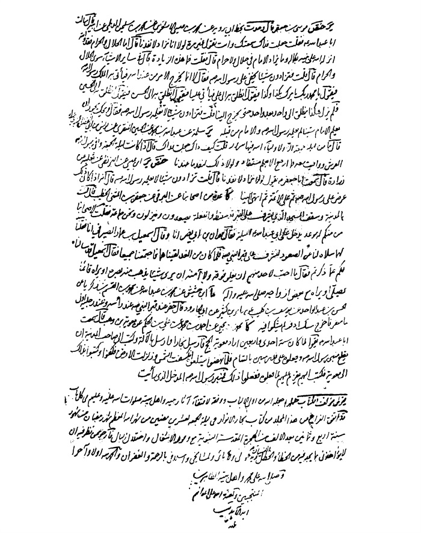

بحار الانوار الجامعة لدرر اخبار الائمة الاطهار المجلد 22

هوية الكتاب
بطاقة تعريف: مجلسي محمد باقربن محمدتقي 1037 - 1111ق.
عنوان واسم المؤلف: بحار الأنوار الجامعة لدرر أخبار الأئمة الأطهار المجلد 22: تأليف محمد باقربن محمدتقي المجلسي.
عنوان واسم المؤلف: بيروت داراحياء التراث العربي [ -13].
مظهر: ج - عينة.
ملاحظة: عربي.
ملاحظة: فهرس الكتابة على أساس المجلد الرابع والعشرين، 1403ق. [1360].
ملاحظة: المجلد108،103،94،91،92،87،67،66،65،52،24(الطبعة الثالثة: 1403ق.=1983م.=[1361]).
ملاحظة: فهرس.
محتويات: ج.24.كتاب الامامة. ج.52.تاريخ الحجة. ج67،66،65.الإيمان والكفر. ج.87.كتاب الصلاة. ج.92،91.الذكر و الدعا. ج.94.كتاب السوم. ج.103.فهرست المصادر. ج.108.الفهرست.-
عنوان: أحاديث الشيعة — قرن 11ق
ترتيب الكونجرس: BP135/م3ب31300 ي ح
تصنيف ديوي: 297/212
رقم الببليوغرافيا الوطنية: 1680946
ص: 1

تتمة كتاب تاریخ نبینا صلی اللّٰه علیه و آله

تتمة أبواب أحواله صلی اللّٰه علیه و آله من البعثة إلی نزول المدینة

باب 37 ما جری بینه و بین أهل الكتاب و المشركین بعد الهجرة و... 
فیه نوادر أخباره و أحوال أصحابه صلی اللّٰه علیه و آله زائدا علی ما تقدم فی باب المبعث و كتاب الاحتجاج و ما سیأتی فی الأبواب الآتیة*
الآیات؛ 
البقرة: «ما یَوَدُّ الَّذِینَ كَفَرُوا مِنْ أَهْلِ الْكِتابِ وَ لَا الْمُشْرِكِینَ أَنْ یُنَزَّلَ عَلَیْكُمْ مِنْ خَیْرٍ مِنْ رَبِّكُمْ وَ اللَّهُ یَخْتَصُّ بِرَحْمَتِهِ مَنْ یَشاءُ وَ اللَّهُ ذُو الْفَضْلِ الْعَظِیمِ»(105) 
(و قال تعالی): «وَدَّ كَثِیرٌ مِنْ أَهْلِ الْكِتابِ لَوْ یَرُدُّونَكُمْ مِنْ بَعْدِ إِیمانِكُمْ كُفَّاراً حَسَداً مِنْ عِنْدِ أَنْفُسِهِمْ مِنْ بَعْدِ ما تَبَیَّنَ لَهُمُ الْحَقُّ فَاعْفُوا وَ اصْفَحُوا حَتَّی یَأْتِیَ اللَّهُ بِأَمْرِهِ إِنَّ اللَّهَ عَلی كُلِّ شَیْ ءٍ قَدِیرٌ»(109) 
(و قال سبحانه): «إِنَّ الَّذِینَ یَكْتُمُونَ ما أَنْزَلَ اللَّهُ مِنَ الْكِتابِ وَ یَشْتَرُونَ بِهِ ثَمَناً قَلِیلًا أُولئِكَ ما یَأْكُلُونَ فِی بُطُونِهِمْ إِلَّا النَّارَ وَ لا یُكَلِّمُهُمُ اللَّهُ یَوْمَ الْقِیامَةِ وَ لا یُزَكِّیهِمْ وَ لَهُمْ عَذابٌ أَلِیمٌ *أُولئِكَ الَّذِینَ اشْتَرَوُا الضَّلالَةَ بِالْهُدی وَ الْعَذابَ بِالْمَغْفِرَةِ فَما أَصْبَرَهُمْ عَلَی النَّارِ* ذلِكَ بِأَنَّ اللَّهَ نَزَّلَ الْكِتابَ بِالْحَقِّ وَ إِنَّ الَّذِینَ اخْتَلَفُوا فِی الْكِتابِ لَفِی شِقاقٍ بَعِیدٍ»(174-176) 
(و قال تعالی): «وَ مِنَ النَّاسِ مَنْ یُعْجِبُكَ قَوْلُهُ فِی الْحَیاةِ الدُّنْیا وَ یُشْهِدُ اللَّهَ عَلی ما فِی قَلْبِهِ وَ هُوَ أَلَدُّ الْخِصامِ* وَ إِذا تَوَلَّی سَعی فِی الْأَرْضِ لِیُفْسِدَ فِیها وَ یُهْلِكَ الْحَرْثَ
ص: 1

وَ النَّسْلَ وَ اللَّهُ لا یُحِبُّ الْفَسادَ* وَ إِذا قِیلَ لَهُ اتَّقِ اللَّهَ أَخَذَتْهُ الْعِزَّةُ بِالْإِثْمِ فَحَسْبُهُ جَهَنَّمُ وَ لَبِئْسَ الْمِهادُ»(204-206) 
(و قال تعالی): «لا إِكْراهَ فِی الدِّینِ قَدْ تَبَیَّنَ الرُّشْدُ مِنَ الْغَیِّ»(256) 
آل عمران: «كَیْفَ یَهْدِی اللَّهُ قَوْماً كَفَرُوا بَعْدَ إِیمانِهِمْ وَ شَهِدُوا أَنَّ الرَّسُولَ حَقٌّ وَ جاءَهُمُ الْبَیِّناتُ وَ اللَّهُ لا یَهْدِی الْقَوْمَ الظَّالِمِینَ* أُولئِكَ جَزاؤُهُمْ أَنَّ عَلَیْهِمْ لَعْنَةَ اللَّهِ وَ الْمَلائِكَةِ وَ النَّاسِ أَجْمَعِینَ* خالِدِینَ فِیها لا یُخَفَّفُ عَنْهُمُ الْعَذابُ وَ لا هُمْ یُنْظَرُونَ إِلَّا الَّذِینَ تابُوا مِنْ بَعْدِ ذلِكَ وَ أَصْلَحُوا فَإِنَّ اللَّهَ غَفُورٌ رَحِیمٌ *إِنَّ الَّذِینَ كَفَرُوا بَعْدَ إِیمانِهِمْ ثُمَّ ازْدادُوا كُفْراً لَنْ تُقْبَلَ تَوْبَتُهُمْ وَ أُولئِكَ هُمُ الضَّالُّونَ»(86-90) 
(و قال تعالی): «وَ لَوْ آمَنَ أَهْلُ الْكِتابِ لَكانَ خَیْراً لَهُمْ مِنْهُمُ الْمُؤْمِنُونَ وَ أَكْثَرُهُمُ الْفاسِقُونَ* لَنْ یَضُرُّوكُمْ إِلَّا أَذیً وَ إِنْ یُقاتِلُوكُمْ یُوَلُّوكُمُ الْأَدْبارَ ثُمَّ لا یُنْصَرُونَ* ضُرِبَتْ عَلَیْهِمُ الذِّلَّةُ أَیْنَ ما ثُقِفُوا إِلَّا بِحَبْلٍ مِنَ اللَّهِ وَ حَبْلٍ مِنَ النَّاسِ وَ باؤُ بِغَضَبٍ مِنَ اللَّهِ وَ ضُرِبَتْ عَلَیْهِمُ الْمَسْكَنَةُ ذلِكَ بِأَنَّهُمْ كانُوا یَكْفُرُونَ بِآیاتِ اللَّهِ وَ یَقْتُلُونَ الْأَنْبِیاءَ بِغَیْرِ حَقٍّ ذلِكَ بِما عَصَوْا وَ كانُوا یَعْتَدُونَ* لَیْسُوا سَواءً مِنْ أَهْلِ الْكِتابِ أُمَّةٌ قائِمَةٌ یَتْلُونَ آیاتِ اللَّهِ آناءَ اللَّیْلِ وَ هُمْ یَسْجُدُونَ* یُؤْمِنُونَ بِاللَّهِ وَ الْیَوْمِ الْآخِرِ وَ یَأْمُرُونَ بِالْمَعْرُوفِ وَ یَنْهَوْنَ عَنِ الْمُنْكَرِ وَ یُسارِعُونَ فِی الْخَیْراتِ وَ أُولئِكَ مِنَ الصَّالِحِینَ»(110-114) 
(و قال تعالی): «یا أَیُّهَا الَّذِینَ آمَنُوا لا تَتَّخِذُوا بِطانَةً مِنْ دُونِكُمْ لا یَأْلُونَكُمْ خَبالًا وَدُّوا ما عَنِتُّمْ قَدْ بَدَتِ الْبَغْضاءُ مِنْ أَفْواهِهِمْ وَ ما تُخْفِی صُدُورُهُمْ أَكْبَرُ قَدْ بَیَّنَّا لَكُمُ الْآیاتِ إِنْ كُنْتُمْ تَعْقِلُونَ* ها أَنْتُمْ أُولاءِ تُحِبُّونَهُمْ وَ لا یُحِبُّونَكُمْ وَ تُؤْمِنُونَ بِالْكِتابِ كُلِّهِ وَ إِذا لَقُوكُمْ قالُوا آمَنَّا وَ إِذا خَلَوْا عَضُّوا عَلَیْكُمُ الْأَنامِلَ مِنَ الْغَیْظِ قُلْ مُوتُوا بِغَیْظِكُمْ إِنَّ اللَّهَ عَلِیمٌ بِذاتِ الصُّدُورِ* إِنْ تَمْسَسْكُمْ حَسَنَةٌ تَسُؤْهُمْ وَ إِنْ تُصِبْكُمْ سَیِّئَةٌ یَفْرَحُوا بِها وَ إِنْ تَصْبِرُوا وَ تَتَّقُوا لا یَضُرُّكُمْ كَیْدُهُمْ شَیْئاً إِنَّ اللَّهَ بِما یَعْمَلُونَ مُحِیطٌ»(118-120) 
(و قال تعالی): «وَ إِنَّ مِنْ أَهْلِ الْكِتابِ لَمَنْ یُؤْمِنُ بِاللَّهِ وَ ما أُنْزِلَ إِلَیْكُمْ وَ ما أُنْزِلَ إِلَیْهِمْ خاشِعِینَ لِلَّهِ لا یَشْتَرُونَ بِآیاتِ اللَّهِ ثَمَناً قَلِیلًا أُولئِكَ لَهُمْ أَجْرُهُمْ عِنْدَ رَبِّهِمْ
ص: 2

إِنَّ اللَّهَ سَرِیعُ الْحِسابِ»(199) 
النساء: أَ لَمْ تَرَ إِلَی الَّذِینَ أُوتُوا نَصِیباً مِنَ الْكِتابِ یَشْتَرُونَ الضَّلالَةَ وَ یُرِیدُونَ أَنْ تَضِلُّوا السَّبِیلَ* وَ اللَّهُ أَعْلَمُ بِأَعْدائِكُمْ وَ كَفی بِاللَّهِ وَلِیًّا وَ كَفی بِاللَّهِ نَصِیراً* مِنَ الَّذِینَ هادُوا یُحَرِّفُونَ الْكَلِمَ عَنْ مَواضِعِهِ وَ یَقُولُونَ سَمِعْنا وَ عَصَیْنا وَ اسْمَعْ غَیْرَ مُسْمَعٍ وَ راعِنا لَیًّا بِأَلْسِنَتِهِمْ وَ طَعْناً فِی الدِّینِ وَ لَوْ أَنَّهُمْ قالُوا سَمِعْنا وَ أَطَعْنا وَ اسْمَعْ وَ انْظُرْنا لَكانَ خَیْراً لَهُمْ وَ أَقْوَمَ وَ لكِنْ لَعَنَهُمُ اللَّهُ بِكُفْرِهِمْ فَلا یُؤْمِنُونَ إِلَّا قَلِیلًا»(44-46) 
(و قال تعالی): «فَلا وَ رَبِّكَ لا یُؤْمِنُونَ حَتَّی یُحَكِّمُوكَ فِیما شَجَرَ بَیْنَهُمْ ثُمَّ لا یَجِدُوا فِی أَنْفُسِهِمْ حَرَجاً مِمَّا قَضَیْتَ وَ یُسَلِّمُوا تَسْلِیماً *وَ لَوْ أَنَّا كَتَبْنا عَلَیْهِمْ أَنِ اقْتُلُوا أَنْفُسَكُمْ أَوِ اخْرُجُوا مِنْ دِیارِكُمْ ما فَعَلُوهُ إِلَّا قَلِیلٌ مِنْهُمْ وَ لَوْ أَنَّهُمْ فَعَلُوا ما یُوعَظُونَ بِهِ لَكانَ خَیْراً لَهُمْ وَ أَشَدَّ تَثْبِیتاً* وَ إِذاً لَآتَیْناهُمْ مِنْ لَدُنَّا أَجْراً عَظِیماً *وَ لَهَدَیْناهُمْ صِراطاً مُسْتَقِیماً»(65-68) 
(إلی قوله): «وَ یَقُولُونَ طاعَةٌ فَإِذا بَرَزُوا مِنْ عِنْدِكَ بَیَّتَ طائِفَةٌ مِنْهُمْ غَیْرَ الَّذِی تَقُولُ وَ اللَّهُ یَكْتُبُ ما یُبَیِّتُونَ فَأَعْرِضْ عَنْهُمْ وَ تَوَكَّلْ عَلَی اللَّهِ وَ كَفی بِاللَّهِ وَكِیلًا»(81) 
(و قال تعالی): «وَ ما كانَ لِمُؤْمِنٍ أَنْ یَقْتُلَ مُؤْمِناً إِلَّا خَطَأً (إلی قوله): وَ كانَ اللَّهُ عَلِیماً حَكِیماً»(92)
(و قال تعالی): «وَ مَنْ یَقْتُلْ مُؤْمِناً مُتَعَمِّداً (إلی قوله): عَظِیماً»(93) 
(و قال تعالی): «إِنَّا أَنْزَلْنا إِلَیْكَ الْكِتابَ بِالْحَقِّ لِتَحْكُمَ بَیْنَ النَّاسِ بِما أَراكَ اللَّهُ وَ لا تَكُنْ لِلْخائِنِینَ خَصِیماً* وَ اسْتَغْفِرِ اللَّهَ إِنَّ اللَّهَ كانَ غَفُوراً رَحِیماً* وَ لا تُجادِلْ عَنِ الَّذِینَ یَخْتانُونَ أَنْفُسَهُمْ إِنَّ اللَّهَ لا یُحِبُّ مَنْ كانَ خَوَّاناً أَثِیماً* یَسْتَخْفُونَ مِنَ النَّاسِ وَ لا یَسْتَخْفُونَ مِنَ اللَّهِ وَ هُوَ مَعَهُمْ إِذْ یُبَیِّتُونَ ما لا یَرْضی مِنَ الْقَوْلِ وَ كانَ اللَّهُ بِما یَعْمَلُونَ مُحِیطاً* ها أَنْتُمْ هؤُلاءِ جادَلْتُمْ عَنْهُمْ فِی الْحَیاةِ الدُّنْیا فَمَنْ یُجادِلُ اللَّهَ عَنْهُمْ یَوْمَ الْقِیامَةِ أَمْ مَنْ یَكُونُ عَلَیْهِمْ وَكِیلًا* وَ مَنْ یَعْمَلْ سُوءاً أَوْ یَظْلِمْ نَفْسَهُ ثُمَّ یَسْتَغْفِرِ اللَّهَ یَجِدِ اللَّهَ
ص: 3

غَفُوراً رَحِیماً* وَ مَنْ یَكْسِبْ إِثْماً فَإِنَّما یَكْسِبُهُ عَلی نَفْسِهِ وَ كانَ اللَّهُ عَلِیماً حَكِیماً* وَ مَنْ یَكْسِبْ خَطِیئَةً أَوْ إِثْماً ثُمَّ یَرْمِ بِهِ بَرِیئاً فَقَدِ احْتَمَلَ بُهْتاناً وَ إِثْماً مُبِیناً* وَ لَوْ لا فَضْلُ اللَّهِ عَلَیْكَ وَ رَحْمَتُهُ لَهَمَّتْ طائِفَةٌ مِنْهُمْ أَنْ یُضِلُّوكَ وَ ما یُضِلُّونَ إِلَّا أَنْفُسَهُمْ وَ ما یَضُرُّونَكَ مِنْ شَیْ ءٍ وَ أَنْزَلَ اللَّهُ عَلَیْكَ الْكِتابَ وَ الْحِكْمَةَ وَ عَلَّمَكَ ما لَمْ تَكُنْ تَعْلَمُ وَ كانَ فَضْلُ اللَّهِ عَلَیْكَ عَظِیماً* لا خَیْرَ فِی كَثِیرٍ مِنْ نَجْواهُمْ إِلَّا مَنْ أَمَرَ بِصَدَقَةٍ أَوْ مَعْرُوفٍ أَوْ إِصْلاحٍ بَیْنَ النَّاسِ وَ مَنْ یَفْعَلْ ذلِكَ ابْتِغاءَ مَرْضاتِ اللَّهِ فَسَوْفَ نُؤْتِیهِ أَجْراً عَظِیماً* وَ مَنْ یُشاقِقِ الرَّسُولَ مِنْ بَعْدِ ما تَبَیَّنَ لَهُ الْهُدی وَ یَتَّبِعْ غَیْرَ سَبِیلِ الْمُؤْمِنِینَ نُوَلِّهِ ما تَوَلَّی وَ نُصْلِهِ جَهَنَّمَ وَ ساءَتْ مَصِیراً»(105-115) 
(و قال تعالی): «إِنَّ الَّذِینَ آمَنُوا ثُمَّ كَفَرُوا ثُمَّ آمَنُوا ثُمَّ كَفَرُوا ثُمَّ ازْدادُوا كُفْراً لَمْ یَكُنِ اللَّهُ لِیَغْفِرَ لَهُمْ وَ لا لِیَهْدِیَهُمْ سَبِیلًا* بَشِّرِ الْمُنافِقِینَ بِأَنَّ لَهُمْ عَذاباً أَلِیماً* الَّذِینَ یَتَّخِذُونَ الْكافِرِینَ أَوْلِیاءَ مِنْ دُونِ الْمُؤْمِنِینَ»(137-139) 
(إلی قوله تعالی): «إِنَّ اللَّهَ جامِعُ الْمُنافِقِینَ وَ الْكافِرِینَ فِی جَهَنَّمَ جَمِیعاً* الَّذِینَ یَتَرَبَّصُونَ بِكُمْ فَإِنْ كانَ لَكُمْ فَتْحٌ مِنَ اللَّهِ قالُوا أَ لَمْ نَكُنْ مَعَكُمْ وَ إِنْ كانَ لِلْكافِرِینَ نَصِیبٌ قالُوا أَ لَمْ نَسْتَحْوِذْ عَلَیْكُمْ وَ نَمْنَعْكُمْ مِنَ الْمُؤْمِنِینَ فَاللَّهُ یَحْكُمُ بَیْنَكُمْ یَوْمَ الْقِیامَةِ وَ لَنْ یَجْعَلَ اللَّهُ لِلْكافِرِینَ عَلَی الْمُؤْمِنِینَ سَبِیلًا»(140-141) 
المائدة: «یا أَیُّهَا الرَّسُولُ لا یَحْزُنْكَ الَّذِینَ یُسارِعُونَ فِی الْكُفْرِ مِنَ الَّذِینَ قالُوا آمَنَّا بِأَفْواهِهِمْ وَ لَمْ تُؤْمِنْ قُلُوبُهُمْ وَ مِنَ الَّذِینَ هادُوا سَمَّاعُونَ لِلْكَذِبِ سَمَّاعُونَ لِقَوْمٍ آخَرِینَ لَمْ یَأْتُوكَ یُحَرِّفُونَ الْكَلِمَ مِنْ بَعْدِ مَواضِعِهِ یَقُولُونَ إِنْ أُوتِیتُمْ هذا فَخُذُوهُ وَ إِنْ لَمْ تُؤْتَوْهُ فَاحْذَرُوا وَ مَنْ یُرِدِ اللَّهُ فِتْنَتَهُ فَلَنْ تَمْلِكَ لَهُ مِنَ اللَّهِ شَیْئاً أُولئِكَ الَّذِینَ لَمْ یُرِدِ اللَّهُ أَنْ یُطَهِّرَ قُلُوبَهُمْ لَهُمْ فِی الدُّنْیا خِزْیٌ وَ لَهُمْ فِی الْآخِرَةِ عَذابٌ عَظِیمٌ* سَمَّاعُونَ لِلْكَذِبِ أَكَّالُونَ لِلسُّحْتِ فَإِنْ جاؤُكَ فَاحْكُمْ بَیْنَهُمْ أَوْ أَعْرِضْ عَنْهُمْ وَ إِنْ تُعْرِضْ عَنْهُمْ فَلَنْ یَضُرُّوكَ شَیْئاً وَ إِنْ حَكَمْتَ فَاحْكُمْ بَیْنَهُمْ بِالْقِسْطِ إِنَّ اللَّهَ یُحِبُّ الْمُقْسِطِینَ* وَ كَیْفَ یُحَكِّمُونَكَ وَ عِنْدَهُمُ التَّوْراةُ فِیها حُكْمُ اللَّهِ ثُمَّ یَتَوَلَّوْنَ مِنْ بَعْدِ ذلِكَ وَ ما أُولئِكَ بِالْمُؤْمِنِینَ* إِنَّا أَنْزَلْنَا التَّوْراةَ فِیها هُدیً وَ نُورٌ یَحْكُمُ بِهَا النَّبِیُّونَ الَّذِینَ أَسْلَمُوا
ص: 4

لِلَّذِینَ هادُوا وَ الرَّبَّانِیُّونَ وَ الْأَحْبارُ بِمَا اسْتُحْفِظُوا مِنْ كِتابِ اللَّهِ وَ كانُوا عَلَیْهِ شُهَداءَ فَلا تَخْشَوُا النَّاسَ وَ اخْشَوْنِ وَ لا تَشْتَرُوا بِآیاتِی ثَمَناً قَلِیلًا وَ مَنْ لَمْ یَحْكُمْ بِما أَنْزَلَ اللَّهُ فَأُولئِكَ هُمُ الْكافِرُونَ»(41-44) 
(إلی قوله تعالی): «وَ أَنْزَلْنا إِلَیْكَ الْكِتابَ بِالْحَقِّ مُصَدِّقاً لِما بَیْنَ یَدَیْهِ مِنَ الْكِتابِ وَ مُهَیْمِناً عَلَیْهِ فَاحْكُمْ بَیْنَهُمْ بِما أَنْزَلَ اللَّهُ وَ لا تَتَّبِعْ أَهْواءَهُمْ عَمَّا جاءَكَ مِنَ الْحَقِّ لِكُلٍّ جَعَلْنا مِنْكُمْ شِرْعَةً وَ مِنْهاجاً وَ لَوْ شاءَ اللَّهُ لَجَعَلَكُمْ أُمَّةً واحِدَةً وَ لكِنْ لِیَبْلُوَكُمْ فِی ما آتاكُمْ فَاسْتَبِقُوا الْخَیْراتِ إِلَی اللَّهِ مَرْجِعُكُمْ جَمِیعاً فَیُنَبِّئُكُمْ بِما كُنْتُمْ فِیهِ تَخْتَلِفُونَ* وَ أَنِ احْكُمْ بَیْنَهُمْ بِما أَنْزَلَ اللَّهُ وَ لا تَتَّبِعْ أَهْواءَهُمْ وَ احْذَرْهُمْ أَنْ یَفْتِنُوكَ عَنْ بَعْضِ ما أَنْزَلَ اللَّهُ إِلَیْكَ فَإِنْ تَوَلَّوْا فَاعْلَمْ أَنَّما یُرِیدُ اللَّهُ أَنْ یُصِیبَهُمْ بِبَعْضِ ذُنُوبِهِمْ وَ إِنَّ كَثِیراً مِنَ النَّاسِ لَفاسِقُونَ* أَ فَحُكْمَ الْجاهِلِیَّةِ یَبْغُونَ وَ مَنْ أَحْسَنُ مِنَ اللَّهِ حُكْماً لِقَوْمٍ یُوقِنُونَ»(48-50) 
(و قال تعالی): «یا أَیُّهَا الَّذِینَ آمَنُوا لا تَتَّخِذُوا الَّذِینَ اتَّخَذُوا دِینَكُمْ هُزُواً وَ لَعِباً مِنَ الَّذِینَ أُوتُوا الْكِتابَ مِنْ قَبْلِكُمْ وَ الْكُفَّارَ أَوْلِیاءَ وَ اتَّقُوا اللَّهَ إِنْ كُنْتُمْ مُؤْمِنِینَ* وَ إِذا نادَیْتُمْ إِلَی الصَّلاةِ اتَّخَذُوها هُزُواً وَ لَعِباً ذلِكَ بِأَنَّهُمْ قَوْمٌ لا یَعْقِلُونَ* قُلْ یا أَهْلَ الْكِتابِ هَلْ تَنْقِمُونَ مِنَّا إِلَّا أَنْ آمَنَّا بِاللَّهِ وَ ما أُنْزِلَ إِلَیْنا وَ ما أُنْزِلَ مِنْ قَبْلُ وَ أَنَّ أَكْثَرَكُمْ فاسِقُونَ* قُلْ هَلْ أُنَبِّئُكُمْ بِشَرٍّ مِنْ ذلِكَ مَثُوبَةً عِنْدَ اللَّهِ مَنْ لَعَنَهُ اللَّهُ وَ غَضِبَ عَلَیْهِ وَ جَعَلَ مِنْهُمُ الْقِرَدَةَ وَ الْخَنازِیرَ وَ عَبَدَ الطَّاغُوتَ أُولئِكَ شَرٌّ مَكاناً وَ أَضَلُّ عَنْ سَواءِ السَّبِیلِ* وَ إِذا جاؤُكُمْ قالُوا آمَنَّا وَ قَدْ دَخَلُوا بِالْكُفْرِ وَ هُمْ قَدْ خَرَجُوا بِهِ وَ اللَّهُ أَعْلَمُ بِما كانُوا یَكْتُمُونَ* وَ تَری كَثِیراً مِنْهُمْ یُسارِعُونَ فِی الْإِثْمِ وَ الْعُدْوانِ وَ أَكْلِهِمُ السُّحْتَ لَبِئْسَ ما كانُوا یَعْمَلُونَ* لَوْ لا یَنْهاهُمُ الرَّبَّانِیُّونَ وَ الْأَحْبارُ عَنْ قَوْلِهِمُ الْإِثْمَ وَ أَكْلِهِمُ السُّحْتَ لَبِئْسَ ما كانُوا یَصْنَعُونَ»(57-63) 
(و قال تعالی): «وَ أَلْقَیْنا بَیْنَهُمُ الْعَداوَةَ وَ الْبَغْضاءَ إِلی یَوْمِ الْقِیامَةِ كُلَّما أَوْقَدُوا ناراً لِلْحَرْبِ أَطْفَأَهَا اللَّهُ وَ یَسْعَوْنَ فِی الْأَرْضِ فَساداً وَ اللَّهُ لا یُحِبُّ الْمُفْسِدِینَ»(64) 
(إلی قوله تعالی): «مِنْهُمْ أُمَّةٌ مُقْتَصِدَةٌ وَ كَثِیرٌ مِنْهُمْ ساءَ ما یَعْمَلُونَ»(66)
ص: 5

(إلی قوله تعالی): «قُلْ یا أَهْلَ الْكِتابِ لَسْتُمْ عَلی شَیْ ءٍ حَتَّی تُقِیمُوا التَّوْراةَ وَ الْإِنْجِیلَ وَ ما أُنْزِلَ إِلَیْكُمْ مِنْ رَبِّكُمْ وَ لَیَزِیدَنَّ كَثِیراً مِنْهُمْ ما أُنْزِلَ إِلَیْكَ مِنْ رَبِّكَ طُغْیاناً وَ كُفْراً فَلا تَأْسَ عَلَی الْقَوْمِ الْكافِرِینَ»(68) 
(و قال تعالی): «یا أَیُّهَا الَّذِینَ آمَنُوا لا تَسْئَلُوا عَنْ أَشْیاءَ إِنْ تُبْدَ لَكُمْ تَسُؤْكُمْ وَ إِنْ تَسْئَلُوا عَنْها حِینَ یُنَزَّلُ الْقُرْآنُ تُبْدَ لَكُمْ عَفَا اللَّهُ عَنْها وَ اللَّهُ غَفُورٌ حَلِیمٌ* قَدْ سَأَلَها قَوْمٌ مِنْ قَبْلِكُمْ ثُمَّ أَصْبَحُوا بِها كافِرِینَ»(101-102) 
(و قال تعالی): «یا أَیُّهَا الَّذِینَ آمَنُوا شَهادَةُ بَیْنِكُمْ إِذا حَضَرَ أَحَدَكُمُ الْمَوْتُ حِینَ الْوَصِیَّةِ اثْنانِ ذَوا عَدْلٍ مِنْكُمْ أَوْ آخَرانِ مِنْ غَیْرِكُمْ إِنْ أَنْتُمْ ضَرَبْتُمْ فِی الْأَرْضِ فَأَصابَتْكُمْ مُصِیبَةُ الْمَوْتِ تَحْبِسُونَهُما مِنْ بَعْدِ الصَّلاةِ فَیُقْسِمانِ بِاللَّهِ إِنِ ارْتَبْتُمْ لا نَشْتَرِی بِهِ ثَمَناً وَ لَوْ كانَ ذا قُرْبی وَ لا نَكْتُمُ شَهادَةَ اللَّهِ إِنَّا إِذاً لَمِنَ الْآثِمِینَ* فَإِنْ عُثِرَ عَلی أَنَّهُمَا اسْتَحَقَّا إِثْماً فَآخَرانِ یَقُومانِ مَقامَهُما مِنَ الَّذِینَ اسْتَحَقَّ عَلَیْهِمُ الْأَوْلَیانِ فَیُقْسِمانِ بِاللَّهِ لَشَهادَتُنا أَحَقُّ مِنْ شَهادَتِهِما وَ مَا اعْتَدَیْنا إِنَّا إِذاً لَمِنَ الظَّالِمِینَ* ذلِكَ أَدْنی أَنْ یَأْتُوا بِالشَّهادَةِ عَلی وَجْهِها أَوْ یَخافُوا أَنْ تُرَدَّ أَیْمانٌ بَعْدَ أَیْمانِهِمْ وَ اتَّقُوا اللَّهَ وَ اسْمَعُوا وَ اللَّهُ لا یَهْدِی الْقَوْمَ الْفاسِقِینَ»(106-108) 
الأنعام: «وَ لا تَطْرُدِ الَّذِینَ یَدْعُونَ رَبَّهُمْ بِالْغَداةِ وَ الْعَشِیِّ یُرِیدُونَ وَجْهَهُ ما عَلَیْكَ مِنْ حِسابِهِمْ مِنْ شَیْ ءٍ وَ ما مِنْ حِسابِكَ عَلَیْهِمْ مِنْ شَیْ ءٍ فَتَطْرُدَهُمْ فَتَكُونَ مِنَ الظَّالِمِینَ* وَ كَذلِكَ فَتَنَّا بَعْضَهُمْ بِبَعْضٍ لِیَقُولُوا أَ هؤُلاءِ مَنَّ اللَّهُ عَلَیْهِمْ مِنْ بَیْنِنا أَ لَیْسَ اللَّهُ بِأَعْلَمَ بِالشَّاكِرِینَ* وَ إِذا جاءَكَ الَّذِینَ یُؤْمِنُونَ بِآیاتِنا فَقُلْ سَلامٌ عَلَیْكُمْ كَتَبَ رَبُّكُمْ عَلی نَفْسِهِ الرَّحْمَةَ أَنَّهُ مَنْ عَمِلَ مِنْكُمْ سُوءاً بِجَهالَةٍ ثُمَّ تابَ مِنْ بَعْدِهِ وَ أَصْلَحَ فَأَنَّهُ غَفُورٌ رَحِیمٌ»(52-54) 
(و قال تعالی): «وَ مَنْ أَظْلَمُ مِمَّنِ افْتَری عَلَی اللَّهِ كَذِباً أَوْ قالَ أُوحِیَ إِلَیَّ وَ لَمْ یُوحَ إِلَیْهِ شَیْ ءٌ وَ مَنْ قالَ سَأُنْزِلُ مِثْلَ ما أَنْزَلَ اللَّهُ»(93) 
الأعراف: «وَ اتْلُ عَلَیْهِمْ نَبَأَ الَّذِی آتَیْناهُ آیاتِنا فَانْسَلَخَ مِنْها فَأَتْبَعَهُ الشَّیْطانُ فَكانَ مِنَ الْغاوِینَ* وَ لَوْ شِئْنا لَرَفَعْناهُ بِها وَ لكِنَّهُ أَخْلَدَ إِلَی الْأَرْضِ وَ اتَّبَعَ هَواهُ
ص: 6

فَمَثَلُهُ كَمَثَلِ الْكَلْبِ إِنْ تَحْمِلْ عَلَیْهِ یَلْهَثْ أَوْ تَتْرُكْهُ یَلْهَثْ ذلِكَ مَثَلُ الْقَوْمِ الَّذِینَ كَذَّبُوا بِآیاتِنا فَاقْصُصِ الْقَصَصَ لَعَلَّهُمْ یَتَفَكَّرُونَ»(175-176) 
الأنفال: «یا أَیُّهَا الَّذِینَ آمَنُوا لا تَخُونُوا اللَّهَ وَ الرَّسُولَ وَ تَخُونُوا أَماناتِكُمْ وَ أَنْتُمْ تَعْلَمُونَ *وَ اعْلَمُوا أَنَّما أَمْوالُكُمْ وَ أَوْلادُكُمْ فِتْنَةٌ وَ أَنَّ اللَّهَ عِنْدَهُ أَجْرٌ عَظِیمٌ»(27-28) 
(و قال تعالی): «قُلْ لِلَّذِینَ كَفَرُوا إِنْ یَنْتَهُوا یُغْفَرْ لَهُمْ ما قَدْ سَلَفَ وَ إِنْ یَعُودُوا فَقَدْ مَضَتْ سُنَّتُ الْأَوَّلِینَ* وَ قاتِلُوهُمْ حَتَّی لا تَكُونَ فِتْنَةٌ وَ یَكُونَ الدِّینُ كُلُّهُ لِلَّهِ فَإِنِ انْتَهَوْا فَإِنَّ اللَّهَ بِما یَعْمَلُونَ بَصِیرٌ* وَ إِنْ تَوَلَّوْا فَاعْلَمُوا أَنَّ اللَّهَ مَوْلاكُمْ نِعْمَ الْمَوْلی وَ نِعْمَ النَّصِیرُ»(38-40) 
التوبة: «ما كانَ لِلْمُشْرِكِینَ أَنْ یَعْمُرُوا مَساجِدَ اللَّهِ شاهِدِینَ عَلی أَنْفُسِهِمْ بِالْكُفْرِ أُولئِكَ حَبِطَتْ أَعْمالُهُمْ وَ فِی النَّارِ هُمْ خالِدُونَ* إِنَّما یَعْمُرُ مَساجِدَ اللَّهِ مَنْ آمَنَ بِاللَّهِ وَ الْیَوْمِ الْآخِرِ وَ أَقامَ الصَّلاةَ وَ آتَی الزَّكاةَ وَ لَمْ یَخْشَ إِلَّا اللَّهَ فَعَسی أُولئِكَ أَنْ یَكُونُوا مِنَ الْمُهْتَدِینَ* أَ جَعَلْتُمْ سِقایَةَ الْحاجِّ وَ عِمارَةَ الْمَسْجِدِ الْحَرامِ كَمَنْ آمَنَ بِاللَّهِ وَ الْیَوْمِ الْآخِرِ وَ جاهَدَ فِی سَبِیلِ اللَّهِ لا یَسْتَوُونَ عِنْدَ اللَّهِ وَ اللَّهُ لا یَهْدِی الْقَوْمَ الظَّالِمِینَ* الَّذِینَ آمَنُوا وَ هاجَرُوا وَ جاهَدُوا فِی سَبِیلِ اللَّهِ بِأَمْوالِهِمْ وَ أَنْفُسِهِمْ أَعْظَمُ دَرَجَةً عِنْدَ اللَّهِ وَ أُولئِكَ هُمُ الْفائِزُونَ»(17-20) 
(و قال تعالی): «یُرِیدُونَ أَنْ یُطْفِؤُا نُورَ اللَّهِ بِأَفْواهِهِمْ وَ یَأْبَی اللَّهُ إِلَّا أَنْ یُتِمَّ نُورَهُ وَ لَوْ كَرِهَ الْكافِرُونَ»(32) 
(و قال سبحانه): «یا أَیُّهَا الَّذِینَ آمَنُوا إِنَّ كَثِیراً مِنَ الْأَحْبارِ وَ الرُّهْبانِ لَیَأْكُلُونَ أَمْوالَ النَّاسِ بِالْباطِلِ وَ یَصُدُّونَ عَنْ سَبِیلِ اللَّهِ»(34) 
(و قال تعالی): «إِنَّمَا النَّسِی ءُ زِیادَةٌ فِی الْكُفْرِ یُضَلُّ بِهِ الَّذِینَ كَفَرُوا یُحِلُّونَهُ عاماً وَ یُحَرِّمُونَهُ عاماً لِیُواطِؤُا عِدَّةَ ما حَرَّمَ اللَّهُ فَیُحِلُّوا ما حَرَّمَ اللَّهُ زُیِّنَ لَهُمْ سُوءُ أَعْمالِهِمْ وَ اللَّهُ لا یَهْدِی الْقَوْمَ الْكافِرِینَ»(37)
ص: 7

(و قال سبحانه): «وَ مِنْهُمْ مَنْ یَلْمِزُكَ فِی الصَّدَقاتِ فَإِنْ أُعْطُوا مِنْها رَضُوا وَ إِنْ لَمْ یُعْطَوْا مِنْها إِذا هُمْ یَسْخَطُونَ* وَ لَوْ أَنَّهُمْ رَضُوا ما آتاهُمُ اللَّهُ وَ رَسُولُهُ وَ قالُوا حَسْبُنَا اللَّهُ سَیُؤْتِینَا اللَّهُ مِنْ فَضْلِهِ وَ رَسُولُهُ إِنَّا إِلَی اللَّهِ راغِبُونَ»(58-59) 
(و قال تعالی): «وَ مِنْهُمُ الَّذِینَ یُؤْذُونَ النَّبِیَّ وَ یَقُولُونَ هُوَ أُذُنٌ قُلْ أُذُنُ خَیْرٍ لَكُمْ یُؤْمِنُ بِاللَّهِ وَ یُؤْمِنُ لِلْمُؤْمِنِینَ وَ رَحْمَةٌ لِلَّذِینَ آمَنُوا مِنْكُمْ وَ الَّذِینَ یُؤْذُونَ رَسُولَ اللَّهِ لَهُمْ عَذابٌ أَلِیمٌ* یَحْلِفُونَ بِاللَّهِ لَكُمْ لِیُرْضُوكُمْ وَ اللَّهُ وَ رَسُولُهُ أَحَقُّ أَنْ یُرْضُوهُ إِنْ كانُوا مُؤْمِنِینَ* أَ لَمْ یَعْلَمُوا أَنَّهُ مَنْ یُحادِدِ اللَّهَ وَ رَسُولَهُ فَأَنَّ لَهُ نارَ جَهَنَّمَ خالِداً فِیها ذلِكَ الْخِزْیُ الْعَظِیمُ»(61-63) 
(إلی قوله تعالی): «الْمُنافِقُونَ وَ الْمُنافِقاتُ بَعْضُهُمْ مِنْ بَعْضٍ یَأْمُرُونَ بِالْمُنْكَرِ وَ یَنْهَوْنَ عَنِ الْمَعْرُوفِ وَ یَقْبِضُونَ أَیْدِیَهُمْ نَسُوا اللَّهَ فَنَسِیَهُمْ إِنَّ الْمُنافِقِینَ هُمُ الْفاسِقُونَ* وَعَدَ اللَّهُ الْمُنافِقِینَ وَ الْمُنافِقاتِ وَ الْكُفَّارَ نارَ جَهَنَّمَ خالِدِینَ فِیها هِیَ حَسْبُهُمْ وَ لَعَنَهُمُ اللَّهُ وَ لَهُمْ عَذابٌ مُقِیمٌ* كَالَّذِینَ مِنْ قَبْلِكُمْ كانُوا أَشَدَّ مِنْكُمْ قُوَّةً وَ أَكْثَرَ أَمْوالًا وَ أَوْلاداً فَاسْتَمْتَعُوا بِخَلاقِهِمْ فَاسْتَمْتَعْتُمْ بِخَلاقِكُمْ كَمَا اسْتَمْتَعَ الَّذِینَ مِنْ قَبْلِكُمْ بِخَلاقِهِمْ وَ خُضْتُمْ كَالَّذِی خاضُوا أُولئِكَ حَبِطَتْ أَعْمالُهُمْ فِی الدُّنْیا وَ الْآخِرَةِ وَ أُولئِكَ هُمُ الْخاسِرُونَ* أَ لَمْ یَأْتِهِمْ نَبَأُ الَّذِینَ مِنْ قَبْلِهِمْ قَوْمِ نُوحٍ وَ عادٍ وَ ثَمُودَ وَ قَوْمِ إِبْراهِیمَ وَ أَصْحابِ مَدْیَنَ وَ الْمُؤْتَفِكاتِ أَتَتْهُمْ رُسُلُهُمْ بِالْبَیِّناتِ فَما كانَ اللَّهُ لِیَظْلِمَهُمْ وَ لكِنْ كانُوا أَنْفُسَهُمْ یَظْلِمُونَ»(67-70) 
(إلی قوله تعالی): «یَحْلِفُونَ بِاللَّهِ ما قالُوا وَ لَقَدْ قالُوا كَلِمَةَ الْكُفْرِ وَ كَفَرُوا بَعْدَ إِسْلامِهِمْ وَ هَمُّوا بِما لَمْ یَنالُوا وَ ما نَقَمُوا إِلَّا أَنْ أَغْناهُمُ اللَّهُ وَ رَسُولُهُ مِنْ فَضْلِهِ فَإِنْ یَتُوبُوا یَكُ خَیْراً لَهُمْ وَ إِنْ یَتَوَلَّوْا یُعَذِّبْهُمُ اللَّهُ عَذاباً أَلِیماً فِی الدُّنْیا وَ الْآخِرَةِ وَ ما لَهُمْ فِی الْأَرْضِ مِنْ وَلِیٍّ وَ لا نَصِیرٍ* وَ مِنْهُمْ مَنْ عاهَدَ اللَّهَ لَئِنْ آتانا مِنْ فَضْلِهِ لَنَصَّدَّقَنَّ وَ لَنَكُونَنَّ مِنَ الصَّالِحِینَ* فَلَمَّا آتاهُمْ مِنْ فَضْلِهِ بَخِلُوا بِهِ وَ تَوَلَّوْا وَ هُمْ مُعْرِضُونَ* فَأَعْقَبَهُمْ نِفاقاً فِی قُلُوبِهِمْ إِلی یَوْمِ یَلْقَوْنَهُ بِما أَخْلَفُوا اللَّهَ ما وَعَدُوهُ وَ بِما كانُوا یَكْذِبُونَ* أَ لَمْ یَعْلَمُوا أَنَّ اللَّهَ یَعْلَمُ سِرَّهُمْ وَ نَجْواهُمْ وَ أَنَّ اللَّهَ عَلَّامُ الْغُیُوبِ* الَّذِینَ یَلْمِزُونَ
ص: 8

الْمُطَّوِّعِینَ مِنَ الْمُؤْمِنِینَ فِی الصَّدَقاتِ وَ الَّذِینَ لا یَجِدُونَ إِلَّا جُهْدَهُمْ فَیَسْخَرُونَ مِنْهُمْ سَخِرَ اللَّهُ مِنْهُمْ وَ لَهُمْ عَذابٌ أَلِیمٌ* اسْتَغْفِرْ لَهُمْ أَوْ لا تَسْتَغْفِرْ لَهُمْ إِنْ تَسْتَغْفِرْ لَهُمْ سَبْعِینَ مَرَّةً فَلَنْ یَغْفِرَ اللَّهُ لَهُمْ ذلِكَ بِأَنَّهُمْ كَفَرُوا بِاللَّهِ وَ رَسُولِهِ وَ اللَّهُ لا یَهْدِی الْقَوْمَ الْفاسِقِینَ»(74-80) 
(و قال تعالی): «الْأَعْرابُ أَشَدُّ كُفْراً وَ نِفاقاً وَ أَجْدَرُ أَلَّا یَعْلَمُوا حُدُودَ ما أَنْزَلَ اللَّهُ عَلی رَسُولِهِ وَ اللَّهُ عَلِیمٌ حَكِیمٌ* وَ مِنَ الْأَعْرابِ مَنْ یَتَّخِذُ ما یُنْفِقُ مَغْرَماً وَ یَتَرَبَّصُ بِكُمُ الدَّوائِرَ عَلَیْهِمْ دائِرَةُ السَّوْءِ وَ اللَّهُ سَمِیعٌ عَلِیمٌ* وَ مِنَ الْأَعْرابِ مَنْ یُؤْمِنُ بِاللَّهِ وَ الْیَوْمِ الْآخِرِ وَ یَتَّخِذُ ما یُنْفِقُ قُرُباتٍ عِنْدَ اللَّهِ وَ صَلَواتِ الرَّسُولِ أَلا إِنَّها قُرْبَةٌ لَهُمْ سَیُدْخِلُهُمُ اللَّهُ فِی رَحْمَتِهِ إِنَّ اللَّهَ غَفُورٌ رَحِیمٌ»(97-99) 
(و قال تعالی): «وَ مِمَّنْ حَوْلَكُمْ مِنَ الْأَعْرابِ مُنافِقُونَ وَ مِنْ أَهْلِ الْمَدِینَةِ مَرَدُوا عَلَی النِّفاقِ لا تَعْلَمُهُمْ نَحْنُ نَعْلَمُهُمْ سَنُعَذِّبُهُمْ مَرَّتَیْنِ ثُمَّ یُرَدُّونَ إِلی عَذابٍ عَظِیمٍ* وَ آخَرُونَ اعْتَرَفُوا بِذُنُوبِهِمْ خَلَطُوا عَمَلًا صالِحاً وَ آخَرَ سَیِّئاً عَسَی اللَّهُ أَنْ یَتُوبَ عَلَیْهِمْ إِنَّ اللَّهَ غَفُورٌ رَحِیمٌ»(101-102) 
(إلی قوله تعالی): «وَ آخَرُونَ مُرْجَوْنَ لِأَمْرِ اللَّهِ إِمَّا یُعَذِّبُهُمْ وَ إِمَّا یَتُوبُ عَلَیْهِمْ وَ اللَّهُ عَلِیمٌ حَكِیمٌ»(109) 
(و قال سبحانه): «ما كانَ لِلنَّبِیِّ وَ الَّذِینَ آمَنُوا أَنْ یَسْتَغْفِرُوا لِلْمُشْرِكِینَ وَ لَوْ كانُوا أُولِی قُرْبی مِنْ بَعْدِ ما تَبَیَّنَ لَهُمْ أَنَّهُمْ أَصْحابُ الْجَحِیمِ»(113) 
(إلی قوله تعالی): «وَ ما كانَ اللَّهُ لِیُضِلَّ قَوْماً بَعْدَ إِذْ هَداهُمْ حَتَّی یُبَیِّنَ لَهُمْ ما یَتَّقُونَ»(115) (إلی قوله تعالی): «وَ إِذا ما أُنْزِلَتْ سُورَةٌ فَمِنْهُمْ مَنْ یَقُولُ أَیُّكُمْ زادَتْهُ هذِهِ إِیماناً فَأَمَّا الَّذِینَ آمَنُوا فَزادَتْهُمْ إِیماناً وَ هُمْ یَسْتَبْشِرُونَ* وَ أَمَّا الَّذِینَ فِی قُلُوبِهِمْ مَرَضٌ فَزادَتْهُمْ رِجْساً إِلَی رِجْسِهِمْ وَ ماتُوا وَ هُمْ كافِرُونَ* أَ وَ لا یَرَوْنَ أَنَّهُمْ یُفْتَنُونَ فِی كُلِّ عامٍ مَرَّةً أَوْ مَرَّتَیْنِ ثُمَّ لا یَتُوبُونَ وَ لا هُمْ یَذَّكَّرُونَ* وَ إِذا ما أُنْزِلَتْ سُورَةٌ نَظَرَ بَعْضُهُمْ إِلی بَعْضٍ هَلْ یَراكُمْ مِنْ أَحَدٍ ثُمَّ انْصَرَفُوا صَرَفَ اللَّهُ قُلُوبَهُمْ بِأَنَّهُمْ قَوْمٌ لا یَفْقَهُونَ»(124-127)
ص: 9

هود: «أَلا إِنَّهُمْ یَثْنُونَ صُدُورَهُمْ لِیَسْتَخْفُوا مِنْهُ أَلا حِینَ یَسْتَغْشُونَ ثِیابَهُمْ یَعْلَمُ ما یُسِرُّونَ وَ ما یُعْلِنُونَ إِنَّهُ عَلِیمٌ بِذاتِ الصُّدُورِ»(5) 
الرعد: «وَ الَّذِینَ آتَیْناهُمُ الْكِتابَ یَفْرَحُونَ بِما أُنْزِلَ إِلَیْكَ وَ مِنَ الْأَحْزابِ مَنْ یُنْكِرُ بَعْضَهُ قُلْ إِنَّما أُمِرْتُ أَنْ أَعْبُدَ اللَّهَ وَ لا أُشْرِكَ بِهِ إِلَیْهِ أَدْعُوا وَ إِلَیْهِ مَآبِ»(36) 
الكهف: «وَ اصْبِرْ نَفْسَكَ مَعَ الَّذِینَ یَدْعُونَ رَبَّهُمْ بِالْغَداةِ وَ الْعَشِیِّ یُرِیدُونَ وَجْهَهُ وَ لا تَعْدُ عَیْناكَ عَنْهُمْ تُرِیدُ زِینَةَ الْحَیاةِ الدُّنْیا وَ لا تُطِعْ مَنْ أَغْفَلْنا قَلْبَهُ عَنْ ذِكْرِنا وَ اتَّبَعَ هَواهُ وَ كانَ أَمْرُهُ فُرُطاً وَ قُلِ الْحَقُّ مِنْ رَبِّكُمْ فَمَنْ شاءَ فَلْیُؤْمِنْ وَ مَنْ شاءَ فَلْیَكْفُرْ»(28) 
النور: «وَ الَّذِینَ یَرْمُونَ أَزْواجَهُمْ وَ لَمْ یَكُنْ لَهُمْ شُهَداءُ إِلَّا أَنْفُسُهُمْ فَشَهادَةُ أَحَدِهِمْ أَرْبَعُ شَهاداتٍ بِاللَّهِ إِنَّهُ لَمِنَ الصَّادِقِینَ.. الآیات. 
(و قال تعالی): «وَ یَقُولُونَ آمَنَّا بِاللَّهِ وَ بِالرَّسُولِ وَ أَطَعْنا ثُمَّ یَتَوَلَّی فَرِیقٌ مِنْهُمْ مِنْ بَعْدِ ذلِكَ وَ ما أُولئِكَ بِالْمُؤْمِنِینَ* وَ إِذا دُعُوا إِلَی اللَّهِ وَ رَسُولِهِ لِیَحْكُمَ بَیْنَهُمْ إِذا فَرِیقٌ مِنْهُمْ مُعْرِضُونَ* وَ إِنْ یَكُنْ لَهُمُ الْحَقُّ یَأْتُوا إِلَیْهِ مُذْعِنِینَ* أَ فِی قُلُوبِهِمْ مَرَضٌ أَمِ ارْتابُوا أَمْ یَخافُونَ أَنْ یَحِیفَ اللَّهُ عَلَیْهِمْ وَ رَسُولُهُ بَلْ أُولئِكَ هُمُ الظَّالِمُونَ* إِنَّما كانَ قَوْلَ الْمُؤْمِنِینَ إِذا دُعُوا إِلَی اللَّهِ وَ رَسُولِهِ لِیَحْكُمَ بَیْنَهُمْ أَنْ یَقُولُوا سَمِعْنا وَ أَطَعْنا وَ أُولئِكَ هُمُ الْمُفْلِحُونَ* وَ مَنْ یُطِعِ اللَّهَ وَ رَسُولَهُ وَ یَخْشَ اللَّهَ وَ یَتَّقْهِ فَأُولئِكَ هُمُ الْفائِزُونَ* وَ أَقْسَمُوا بِاللَّهِ جَهْدَ أَیْمانِهِمْ لَئِنْ أَمَرْتَهُمْ لَیَخْرُجُنَّ قُلْ لا تُقْسِمُوا طاعَةٌ مَعْرُوفَةٌ إِنَّ اللَّهَ خَبِیرٌ بِما تَعْمَلُونَ»(47-53) 
القصص: «الَّذِینَ آتَیْناهُمُ الْكِتابَ مِنْ قَبْلِهِ هُمْ بِهِ یُؤْمِنُونَ* وَ إِذا یُتْلی عَلَیْهِمْ قالُوا آمَنَّا بِهِ إِنَّهُ الْحَقُّ مِنْ رَبِّنا إِنَّا كُنَّا مِنْ قَبْلِهِ مُسْلِمِینَ* أُولئِكَ یُؤْتَوْنَ أَجْرَهُمْ مَرَّتَیْنِ بِما صَبَرُوا»(52-54) 
العنكبوت: الم* أَ حَسِبَ النَّاسُ أَنْ یُتْرَكُوا أَنْ یَقُولُوا آمَنَّا وَ هُمْ لا یُفْتَنُونَ»(1-2)
ص: 10

(إلی قوله تعالی): «وَ مِنَ النَّاسِ مَنْ یَقُولُ آمَنَّا بِاللَّهِ فَإِذا أُوذِیَ فِی اللَّهِ جَعَلَ فِتْنَةَ النَّاسِ كَعَذابِ اللَّهِ وَ لَئِنْ جاءَ نَصْرٌ مِنْ رَبِّكَ لَیَقُولُنَّ إِنَّا كُنَّا مَعَكُمْ أَ وَ لَیْسَ اللَّهُ بِأَعْلَمَ بِما فِی صُدُورِ الْعالَمِینَ* وَ لَیَعْلَمَنَّ اللَّهُ الَّذِینَ آمَنُوا وَ لَیَعْلَمَنَّ الْمُنافِقِینَ»(11) 
لقمان: «*وَ إِذا غَشِیَهُمْ مَوْجٌ كَالظُّلَلِ دَعَوُا اللَّهَ مُخْلِصِینَ لَهُ الدِّینَ فَلَمَّا نَجَّاهُمْ إِلَی الْبَرِّ فَمِنْهُمْ مُقْتَصِدٌ وَ ما یَجْحَدُ بِآیاتِنا إِلَّا كُلُّ خَتَّارٍ كَفُورٍ»(32) 
الأحزاب: «یا أَیُّهَا النَّبِیُّ اتَّقِ اللَّهَ وَ لا تُطِعِ الْكافِرِینَ وَ الْمُنافِقِینَ إِنَّ اللَّهَ كانَ عَلِیماً حَكِیماً* وَ اتَّبِعْ ما یُوحی إِلَیْكَ مِنْ رَبِّكَ إِنَّ اللَّهَ كانَ بِما تَعْمَلُونَ خَبِیراً* وَ تَوَكَّلْ عَلَی اللَّهِ وَ كَفی بِاللَّهِ وَكِیلًا* ما جَعَلَ اللَّهُ لِرَجُلٍ مِنْ قَلْبَیْنِ فِی جَوْفِهِ»(1-4) 
(و قال تعالی): «لَئِنْ لَمْ یَنْتَهِ الْمُنافِقُونَ وَ الَّذِینَ فِی قُلُوبِهِمْ مَرَضٌ وَ الْمُرْجِفُونَ فِی الْمَدِینَةِ لَنُغْرِیَنَّكَ بِهِمْ ثُمَّ لا یُجاوِرُونَكَ فِیها إِلَّا قَلِیلًا* مَلْعُونِینَ أَیْنَما ثُقِفُوا أُخِذُوا وَ قُتِّلُوا تَقْتِیلًا* سُنَّةَ اللَّهِ فِی الَّذِینَ خَلَوْا مِنْ قَبْلُ وَ لَنْ تَجِدَ لِسُنَّةِ اللَّهِ تَبْدِیلًا»(60-62) 
سبأ: «وَ قالَ الَّذِینَ كَفَرُوا لَنْ نُؤْمِنَ بِهذَا الْقُرْآنِ وَ لا بِالَّذِی بَیْنَ یَدَیْهِ»(31) 
الأحقاف: «قُلْ أَ رَأَیْتُمْ إِنْ كانَ مِنْ عِنْدِ اللَّهِ وَ كَفَرْتُمْ بِهِ وَ شَهِدَ شاهِدٌ مِنْ بَنِی إِسْرائِیلَ عَلی مِثْلِهِ فَآمَنَ وَ اسْتَكْبَرْتُمْ إِنَّ اللَّهَ لا یَهْدِی الْقَوْمَ الظَّالِمِینَ* وَ قالَ الَّذِینَ كَفَرُوا لِلَّذِینَ آمَنُوا لَوْ كانَ خَیْراً ما سَبَقُونا إِلَیْهِ وَ إِذْ لَمْ یَهْتَدُوا بِهِ فَسَیَقُولُونَ هذا إِفْكٌ قَدِیمٌ»(11-12) 
محمد: «وَ مِنْهُمْ مَنْ یَسْتَمِعُ إِلَیْكَ حَتَّی إِذا خَرَجُوا مِنْ عِنْدِكَ قالُوا لِلَّذِینَ أُوتُوا الْعِلْمَ ما ذا قالَ آنِفاً أُولئِكَ الَّذِینَ طَبَعَ اللَّهُ عَلی قُلُوبِهِمْ وَ اتَّبَعُوا أَهْواءَهُمْ»(16) (إلی قوله تعالی): «وَ یَقُولُ الَّذِینَ آمَنُوا لَوْ لا نُزِّلَتْ سُورَةٌ فَإِذا أُنْزِلَتْ سُورَةٌ مُحْكَمَةٌ وَ ذُكِرَ فِیهَا الْقِتالُ رَأَیْتَ الَّذِینَ فِی قُلُوبِهِمْ مَرَضٌ یَنْظُرُونَ إِلَیْكَ نَظَرَ الْمَغْشِیِّ عَلَیْهِ مِنَ الْمَوْتِ فَأَوْلی لَهُمْ* طاعَةٌ وَ قَوْلٌ مَعْرُوفٌ فَإِذا عَزَمَ الْأَمْرُ فَلَوْ صَدَقُوا اللَّهَ لَكانَ خَیْراً لَهُمْ *فَهَلْ عَسَیْتُمْ إِنْ تَوَلَّیْتُمْ أَنْ تُفْسِدُوا فِی الْأَرْضِ وَ تُقَطِّعُوا أَرْحامَكُمْ*
ص: 11

أُولئِكَ الَّذِینَ لَعَنَهُمُ اللَّهُ فَأَصَمَّهُمْ وَ أَعْمی أَبْصارَهُمْ* أَ فَلا یَتَدَبَّرُونَ الْقُرْآنَ أَمْ عَلی قُلُوبٍ أَقْفالُها* إِنَّ الَّذِینَ ارْتَدُّوا عَلی أَدْبارِهِمْ مِنْ بَعْدِ ما تَبَیَّنَ لَهُمُ الْهُدَی الشَّیْطانُ سَوَّلَ لَهُمْ* وَ أَمْلی لَهُمْ ذلِكَ بِأَنَّهُمْ قالُوا لِلَّذِینَ كَرِهُوا ما نَزَّلَ اللَّهُ سَنُطِیعُكُمْ فِی بَعْضِ الْأَمْرِ وَ اللَّهُ یَعْلَمُ إِسْرارَهُمْ* فَكَیْفَ إِذا تَوَفَّتْهُمُ الْمَلائِكَةُ یَضْرِبُونَ وُجُوهَهُمْ وَ أَدْبارَهُمْ ذلِكَ بِأَنَّهُمُ اتَّبَعُوا ما أَسْخَطَ اللَّهَ وَ كَرِهُوا رِضْوانَهُ فَأَحْبَطَ أَعْمالَهُمْ* أَمْ حَسِبَ الَّذِینَ فِی قُلُوبِهِمْ مَرَضٌ أَنْ لَنْ یُخْرِجَ اللَّهُ أَضْغانَهُمْ* وَ لَوْ نَشاءُ لَأَرَیْناكَهُمْ فَلَعَرَفْتَهُمْ بِسِیماهُمْ وَ لَتَعْرِفَنَّهُمْ فِی لَحْنِ الْقَوْلِ وَ اللَّهُ یَعْلَمُ أَعْمالَكُمْ *وَ لَنَبْلُوَنَّكُمْ حَتَّی نَعْلَمَ الْمُجاهِدِینَ مِنْكُمْ وَ الصَّابِرِینَ وَ نَبْلُوَا أَخْبارَكُمْ»(16-31) 
(و قال تعالی): «وَ إِنْ تَتَوَلَّوْا یَسْتَبْدِلْ قَوْماً غَیْرَكُمْ ثُمَّ لا یَكُونُوا أَمْثالَكُمْ»(38) 
الحجرات: «یا أَیُّهَا الَّذِینَ آمَنُوا إِنْ جاءَكُمْ فاسِقٌ بِنَبَإٍ فَتَبَیَّنُوا أَنْ تُصِیبُوا قَوْماً بِجَهالَةٍ فَتُصْبِحُوا عَلی ما فَعَلْتُمْ نادِمِینَ* وَ اعْلَمُوا أَنَّ فِیكُمْ رَسُولَ اللَّهِ لَوْ یُطِیعُكُمْ فِی كَثِیرٍ مِنَ الْأَمْرِ لَعَنِتُّمْ وَ لكِنَّ اللَّهَ حَبَّبَ إِلَیْكُمُ الْإِیمانَ وَ زَیَّنَهُ فِی قُلُوبِكُمْ وَ كَرَّهَ إِلَیْكُمُ الْكُفْرَ وَ الْفُسُوقَ وَ الْعِصْیانَ أُولئِكَ هُمُ الرَّاشِدُونَ* فَضْلًا مِنَ اللَّهِ وَ نِعْمَةً وَ اللَّهُ عَلِیمٌ حَكِیمٌ* وَ إِنْ طائِفَتانِ مِنَ الْمُؤْمِنِینَ اقْتَتَلُوا فَأَصْلِحُوا بَیْنَهُما فَإِنْ بَغَتْ إِحْداهُما عَلَی الْأُخْری فَقاتِلُوا الَّتِی تَبْغِی حَتَّی تَفِی ءَ إِلی أَمْرِ اللَّهِ فَإِنْ فاءَتْ فَأَصْلِحُوا بَیْنَهُما بِالْعَدْلِ وَ أَقْسِطُوا إِنَّ اللَّهَ یُحِبُّ الْمُقْسِطِینَ* إِنَّمَا الْمُؤْمِنُونَ إِخْوَةٌ فَأَصْلِحُوا بَیْنَ أَخَوَیْكُمْ وَ اتَّقُوا اللَّهَ لَعَلَّكُمْ تُرْحَمُونَ* یا أَیُّهَا الَّذِینَ آمَنُوا لا یَسْخَرْ قَوْمٌ مِنْ قَوْمٍ عَسی أَنْ یَكُونُوا خَیْراً مِنْهُمْ وَ لا نِساءٌ مِنْ نِساءٍ عَسی أَنْ یَكُنَّ خَیْراً مِنْهُنَّ وَ لا تَلْمِزُوا أَنْفُسَكُمْ وَ لا تَنابَزُوا بِالْأَلْقابِ بِئْسَ الِاسْمُ الْفُسُوقُ بَعْدَ الْإِیمانِ وَ مَنْ لَمْ یَتُبْ فَأُولئِكَ هُمُ الظَّالِمُونَ* یا أَیُّهَا الَّذِینَ آمَنُوا اجْتَنِبُوا كَثِیراً مِنَ الظَّنِّ إِنَّ بَعْضَ الظَّنِّ إِثْمٌ وَ لا تَجَسَّسُوا وَ لا یَغْتَبْ بَعْضُكُمْ بَعْضاً أَ یُحِبُّ أَحَدُكُمْ أَنْ یَأْكُلَ لَحْمَ أَخِیهِ مَیْتاً فَكَرِهْتُمُوهُ وَ اتَّقُوا اللَّهَ إِنَّ اللَّهَ تَوَّابٌ رَحِیمٌ* یا أَیُّهَا النَّاسُ إِنَّا خَلَقْناكُمْ مِنْ ذَكَرٍ وَ أُنْثی وَ جَعَلْناكُمْ شُعُوباً وَ قَبائِلَ لِتَعارَفُوا إِنَّ أَكْرَمَكُمْ عِنْدَ اللَّهِ أَتْقاكُمْ إِنَّ اللَّهَ عَلِیمٌ خَبِیرٌ* قالَتِ الْأَعْرابُ آمَنَّا قُلْ لَمْ تُؤْمِنُوا وَ لكِنْ قُولُوا أَسْلَمْنا وَ لَمَّا یَدْخُلِ الْإِیمانُ
ص: 12

فِی قُلُوبِكُمْ وَ إِنْ تُطِیعُوا اللَّهَ وَ رَسُولَهُ لا یَلِتْكُمْ مِنْ أَعْمالِكُمْ شَیْئاً إِنَّ اللَّهَ غَفُورٌ رَحِیمٌ»(6-14) 
النجم: «أَ فَرَأَیْتَ الَّذِی تَوَلَّی* وَ أَعْطی قَلِیلًا وَ أَكْدی* أَ عِنْدَهُ عِلْمُ الْغَیْبِ فَهُوَ یَری* أَمْ لَمْ یُنَبَّأْ بِما فِی صُحُفِ مُوسی* وَ إِبْراهِیمَ الَّذِی وَفَّی* أَلَّا تَزِرُ وازِرَةٌ وِزْرَ أُخْری* وَ أَنْ لَیْسَ لِلْإِنْسانِ إِلَّا ما سَعی»(33-39) 
الحدید: «یا أَیُّهَا الَّذِینَ آمَنُوا اتَّقُوا اللَّهَ وَ آمِنُوا بِرَسُولِهِ یُؤْتِكُمْ كِفْلَیْنِ مِنْ رَحْمَتِهِ وَ یَجْعَلْ لَكُمْ نُوراً تَمْشُونَ بِهِ وَ یَغْفِرْ لَكُمْ وَ اللَّهُ غَفُورٌ رَحِیمٌ* لِئَلَّا یَعْلَمَ أَهْلُ الْكِتابِ أَلَّا یَقْدِرُونَ عَلی شَیْ ءٍ مِنْ فَضْلِ اللَّهِ وَ أَنَّ الْفَضْلَ بِیَدِ اللَّهِ یُؤْتِیهِ مَنْ یَشاءُ وَ اللَّهُ ذُو الْفَضْلِ الْعَظِیمِ»(28-29) 
المجادلة: «قَدْ سَمِعَ اللَّهُ قَوْلَ الَّتِی تُجادِلُكَ فِی زَوْجِها وَ تَشْتَكِی إِلَی اللَّهِ وَ اللَّهُ یَسْمَعُ تَحاوُرَكُما إِنَّ اللَّهَ سَمِیعٌ بَصِیرٌ»(2) 
(و قال تعالی): «أَ لَمْ تَرَ إِلَی الَّذِینَ تَوَلَّوْا قَوْماً غَضِبَ اللَّهُ عَلَیْهِمْ ما هُمْ مِنْكُمْ وَ لا مِنْهُمْ وَ یَحْلِفُونَ عَلَی الْكَذِبِ وَ هُمْ یَعْلَمُونَ* أَعَدَّ اللَّهُ لَهُمْ عَذاباً شَدِیداً إِنَّهُمْ ساءَ ما كانُوا یَعْمَلُونَ»(14-15) 
الممتحنة: «یا أَیُّهَا الَّذِینَ آمَنُوا لا تَتَوَلَّوْا قَوْماً غَضِبَ اللَّهُ عَلَیْهِمْ قَدْ یَئِسُوا مِنَ الْآخِرَةِ كَما یَئِسَ الْكُفَّارُ مِنْ أَصْحابِ الْقُبُورِ»(13) 
الجمعة: «یا أَیُّهَا الَّذِینَ (1) هادُوا إِنْ زَعَمْتُمْ أَنَّكُمْ أَوْلِیاءُ لِلَّهِ مِنْ دُونِ النَّاسِ فَتَمَنَّوُا الْمَوْتَ إِنْ كُنْتُمْ صادِقِینَ* وَ لا یَتَمَنَّوْنَهُ أَبَداً بِما قَدَّمَتْ أَیْدِیهِمْ وَ اللَّهُ عَلِیمٌ بِالظَّالِمِینَ* قُلْ إِنَّ الْمَوْتَ الَّذِی تَفِرُّونَ مِنْهُ فَإِنَّهُ مُلاقِیكُمْ ثُمَّ تُرَدُّونَ إِلی عالِمِ الْغَیْبِ وَ الشَّهادَةِ فَیُنَبِّئُكُمْ بِما كُنْتُمْ تَعْمَلُونَ»(6-8) 
(و قال تعالی): «وَ إِذا رَأَوْا تِجارَةً أَوْ لَهْواً انْفَضُّوا إِلَیْها وَ تَرَكُوكَ قائِماً قُلْ ما عِنْدَ اللَّهِ خَیْرٌ مِنَ اللَّهْوِ وَ مِنَ التِّجارَةِ وَ اللَّهُ خَیْرُ الرَّازِقِینَ»(11)
ص: 13

> **پاورقی**: 1- الصحیح كما فی المصحف الشریف: قل یا أیها الذین هادوا.

القلم: «وَ إِنْ یَكادُ الَّذِینَ كَفَرُوا لَیُزْلِقُونَكَ بِأَبْصارِهِمْ لَمَّا سَمِعُوا الذِّكْرَ وَ یَقُولُونَ إِنَّهُ لَمَجْنُونٌ* وَ ما هُوَ إِلَّا ذِكْرٌ لِلْعالَمِینَ»(51-52) 
اللیل: «فَأَمَّا مَنْ أَعْطی وَ اتَّقی* وَ صَدَّقَ بِالْحُسْنی* فَسَنُیَسِّرُهُ لِلْیُسْری* وَ أَمَّا مَنْ بَخِلَ وَ اسْتَغْنی* وَ كَذَّبَ بِالْحُسْنی* فَسَنُیَسِّرُهُ لِلْعُسْری* وَ ما یُغْنِی عَنْهُ مالُهُ إِذا تَرَدَّی»(5-11) (إلی آخر السورة) 
التكاثر: «أَلْهاكُمُ التَّكاثُرُ* حَتَّی زُرْتُمُ الْمَقابِرَ»(1-2) (إلی آخر السورة).
تفسیر: قوله تعالی: أَنْ یُنَزَّلَ عَلَیْكُمْ مِنْ خَیْرٍ مِنْ رَبِّكُمْ قال الطبرسی رحمه اللّٰه الخیر الذی تمنوا أن لا ینزله اللّٰه علیهم ما أوحی إلی نبیه صلی اللّٰه علیه و آله و أنزل علیه من القرآن و الشرائع بغیا منهم و حسدا 
وَ اللَّهُ یَخْتَصُّ بِرَحْمَتِهِ مَنْ یَشاءُ- روی عن أمیر المؤمنین و أبی جعفر الباقر علیهما السلام أن المراد برحمته هاهنا النبوة. (1).
وَدَّ كَثِیرٌ مِنْ أَهْلِ الْكِتابِ نزلت فی حیی بن أخطب و أخیه أبی یاسر بن أخطب و قد دخلا علی النبی صلی اللّٰه علیه و آله حین قدم المدینة فلما خرجا قیل لحیی هو نبی فقال هو هو فقیل ما له عندك قال العداوة إلی الموت و هو الذی نقض العهد و أثار الحرب یوم الأحزاب عن ابن عباس و قیل نزلت فی كعب بن الأشرف عن الزهری و قیل فی جماعة الیهود عن الحسن فَاعْفُوا وَ اصْفَحُوا أی تجاوزوا عنهم و قیل أرسلوهم فإنهم لا یعجزون اللّٰه حَتَّی یَأْتِیَ اللَّهُ بِأَمْرِهِ أی بأمره لكم بعقابهم أو یعاقبهم هو علی ذلك ثم أتاهم بأمره فقال قاتِلُوا الَّذِینَ لا یُؤْمِنُونَ (2) الآیة و قیل بأمره أی بآیة القتل و السبی لبنی قریظة و الإجلاء لبنی النضیر و قیل هذه الآیة منسوخة بقوله قاتِلُوا الَّذِینَ لا یُؤْمِنُونَ بِاللَّهِ وَ لا بِالْیَوْمِ الْآخِرِ(3) و قیل نسخت بقوله فَاقْتُلُوا الْمُشْرِكِینَ حَیْثُ وَجَدْتُمُوهُمْ(4)
ص: 14

> **پاورقی**: 1- مجمع البیان 1: 179.

> **پاورقی**: 2- براءة: 30.

> **پاورقی**: 3- براءة: 30.

> **پاورقی**: 4- براءة: 5 و فیها: «فاقتلوا».

وَ رُوِیَ عَنِ الْبَاقِرِ علیه السلام أَنَّهُ قَالَ: لَمْ یُؤْمَرْ رَسُولُ اللَّهِ صلی اللّٰه علیه و آله بِقِتَالٍ وَ لَا أُذِنَ لَهُ فِیهِ حَتَّی نَزَلَ جَبْرَئِیلُ علیه السلام بِهَذِهِ الْآیَةِ أُذِنَ لِلَّذِینَ یُقاتَلُونَ بِأَنَّهُمْ ظُلِمُوا(1) وَ قَلَّدَهُ سَیْفاً. (2).
و قال فی قوله تعالی إِنَّ الَّذِینَ یَكْتُمُونَ المعنی بهذه الآیة أهل الكتاب بإجماع المفسرین إلا أنها متوجهة علی قول كثیر منهم إلی جماعة من الیهود قلیلة(3) و هم علماؤهم ككعب بن الأشرف و حیی بن أخطب و كعب بن أسید و كانوا یصیبون من سفلتهم الهدایا و یرجون كون النبی منهم فلما بعث من غیرهم خافوا زوال مأكلتهم (4) فغیروا صفته فأنزل اللّٰه هذه الآیة ما أَنْزَلَ اللَّهُ مِنَ الْكِتابِ أی صفة محمد و البشارة به وَ یَشْتَرُونَ بِهِ ثَمَناً قَلِیلًا أی یستبدلون به عوضا(5) قلیلا أی كل ما یأخذونه فی مقابلة ذلك فهو قلیل أُولئِكَ ما یَأْكُلُونَ فِی بُطُونِهِمْ إِلَّا النَّارَ أی یؤدیهم ما یأكلونه إلی النار و قیل یأكلون النار حقیقة فی جهنم وَ لا یُكَلِّمُهُمُ اللَّهُ یَوْمَ الْقِیامَةِ بما یحبون أو لا یكلمهم أصلا لغایة الغضب بل تكلمهم الملائكة من قبل اللّٰه تعالی وَ لا یُزَكِّیهِمْ أی لا یثنی علیهم أو لا یقبل أعمالهم أو لا یطهرهم بالمغفرة وَ لَهُمْ عَذابٌ أَلِیمٌ أی مؤلم أُولئِكَ الَّذِینَ اشْتَرَوُا الضَّلالَةَ بِالْهُدی أی استبدلوا الكفر بالنبی صلی اللّٰه علیه و آله بالإیمان به وَ الْعَذابَ بِالْمَغْفِرَةِ فَما أَصْبَرَهُمْ عَلَی النَّارِ أی ما أجرأهم علی النار
رُوِیَ عَنْ أَبِی عَبْدِ اللَّهِ علیه السلام (6) أَوْ مَا أَعْمَلَهُمْ بِأَعْمَالِ أَهْلِ النَّارِ.
وَ هُوَ الْمَرْوِیُّ أَیْضاً عَنْ أَبِی عَبْدِ اللَّهِ علیه السلام أَوْ مَا أَبْقَاهُمْ وَ أَدْوَمَهُمْ عَلَی النَّارِ.
و علی الوجوه ظاهر الكلام التعجب (7) ذلِكَ أی الحكم بالنار أو العذاب أو الضلال بِأَنَ
ص: 15

> **پاورقی**: 1- الحجّ: 39

> **پاورقی**: 2- مجمع البیان 1: 185.

> **پاورقی**: 3- فی المصدر: الی جماعة قلیلة من الیهود.

> **پاورقی**: 4- فی المصدر: زوال مملكتهم.

> **پاورقی**: 5- عرضا خ ل أقول یوجد ذلك فی المصدر.

> **پاورقی**: 6- فی المصدر: رواه علیّ بن إبراهیم بإسناده عن أبی عبد اللّٰه علیه السلام.

> **پاورقی**: 7- زاد فی المصدر: و التعجب لا یجوز علی القدیم سبحانه لانه عالم بجمیع الأشیاء لا یخفی علیه شی ء، و التعجب انما یكون ممّا لا یعرف سببه، و إذا ثبت ذلك فالغرض ان یدلنا علی ان الكفّار حلوا محل من یتعجب منه فهو تعجیب لنا منهم.

اللَّهَ نَزَّلَ الْكِتابَ أی القرآن أو التوراة بِالْحَقِّ وَ إِنَّ الَّذِینَ اخْتَلَفُوا فِی الْكِتابِ أی الكفار أجمع أو أهل الكتاب لأنهم حرفوا الكتاب و كتموا صفة النبی صلی اللّٰه علیه و آله لَفِی شِقاقٍ بَعِیدٍ أی عن الألفة بالاجتماع علی الصواب.(1)قوله تعالی وَ مِنَ النَّاسِ مَنْ یُعْجِبُكَ یروقك و یعظم فی نفسك قَوْلُهُ فِی الْحَیاةِ الدُّنْیا أی ما یقوله فی أمور الدنیا أو متعلق بیعجبك أی یعجبك قوله فی الدنیا حلاوة و فصاحة لا فی الآخرة وَ یُشْهِدُ اللَّهَ عَلی أن ما فِی قَلْبِهِ موافق لكلامه وَ هُوَ أَلَدُّ الْخِصامِ شدید العداوة و الجدال للمسلمین قیل نزلت فی الأخنس بن شریق الثقفی و كان حسن المنظر حلو المنطق یوالی رسول اللّٰه و یدعی الإسلام و قیل فی المنافقین كلهم وَ إِذا تَوَلَّی أدبر و انصرف عنك و قیل إذا غلب و صار والیا سَعی فِی الْأَرْضِ لِیُفْسِدَ فِیها وَ یُهْلِكَ الْحَرْثَ وَ النَّسْلَ كما فعله الأخنس بثقیف إذ بیتهم و أحرق زرعهم و أهلك مواشیهم أو كما یفعله ولاة السوء بالقتل و الإتلاف أو بالظلم حتی یمنع اللّٰه بشومه القطر فیهلك الحرث و النسل وَ اللَّهُ لا یُحِبُّ الْفَسادَ لا یرتضیه فاحذروا غضبه علیه وَ إِذا قِیلَ لَهُ اتَّقِ اللَّهَ أَخَذَتْهُ الْعِزَّةُ بِالْإِثْمِ حملته الأنفة و حمیته الجاهلیة علی الإثم الذی یؤمر باتقائه لجاجا فَحَسْبُهُ جَهَنَّمُ كفته جزاء و عذابا وَ لَبِئْسَ الْمِهادُ المهاد الفراش و قیل ما یوطأ للجنب.
قوله تعالی لا إِكْراهَ فِی الدِّینِ قال الطبرسی رحمه اللّٰه قیل نزلت فی رجل من الأنصار كان له غلام أسود یقال له صبح (2) و كان یكرهه علی الإسلام و قیل فی رجل من الأنصار یدعی أبا الحصین و كان له ابنان فقدم تجار الشام إلی المدینة یحملون الزیت فلما أرادوا الرجوع أتاهم ابنا أبی الحصین فدعوهما إلی النصرانیة فتنصرا و مضیا إلی الشام فأخبر أبو الحصین رسول اللّٰه صلی اللّٰه علیه و آله فأنزل اللّٰه سبحانه لا إِكْراهَ فِی الدِّینِ فقال رسول اللّٰه صلی اللّٰه علیه و آله أبعدهما اللّٰه هما أول من كفر فوجد أبو الحصین فی نفسه علی النبی صلی اللّٰه علیه و آله حیث لم یبعث فی طلبهما فأنزل اللّٰه
ص: 16

> **پاورقی**: 1- مجمع البیان 1: 258- 260.

> **پاورقی**: 2- فی المصدر: صبیح.

سبحانه فَلا وَ رَبِّكَ لا یُؤْمِنُونَ (1)الآیة قال و كان هذا قبل أن یؤمر النبی صلی اللّٰه علیه و آله بقتال أهل الكتاب ثم نسخ و أمر بقتال أهل الكتاب فی سورة براءة عن السدی و هكذا قال ابن مسعود و ابن زید إنها منسوخة بآیة السیف و قال الباقون هی محكمة. (2) قوله تعالی كَیْفَ یَهْدِی اللَّهُ قیل نزلت الآیات فی رجل من الأنصار یقال له الحارث بن (3) سوید بن الصامت و كان قتل المحذر بن زیاد البلوی غدرا و هرب و ارتد عن الإسلام و لحق بمكة ثم ندم فأرسل إلی قومه أن یسألوا رسول اللّٰه صلی اللّٰه علیه و آله هل من توبة قالوا فنزلت الآیات إلی قوله إِلَّا الَّذِینَ تابُوا فحملها إلیه رجل من قومه فقال إنی لأعلم أنك لصدوق و إن رسول اللّٰه لأصدق منك و إن اللّٰه تعالی أصدق الثلاثة و رجع إلی المدینة و تاب و حسن إسلامه عن مجاهد و السدی و هو المروی عن أبی عبد اللّٰه علیه السلام و قیل نزلت فی أهل الكتاب الذین كانوا یؤمنون بالنبی صلی اللّٰه علیه و آله قبل مبعثه ثم كفروا بعد البعث حسدا و بغیا عن الحسن و الجبائی و أبی مسلم. (4)و قال رحمه اللّٰه فی قوله تعالی إِنَّ الَّذِینَ كَفَرُوا بَعْدَ إِیمانِهِمْ قیل نزلت فی أهل الكتاب الذین آمنوا برسول اللّٰه قبل مبعثه ثم كفروا به بعد مبعثه عن الحسن و قیل نزلت فی الیهود كفروا بعیسی و الإنجیل بعد إیمانهم بأنبیائهم و كتبهم ثُمَّ ازْدادُوا كُفْراً بكفرهم بمحمد صلی اللّٰه علیه و آله و القرآن عن قتادة و عطا و قیل نزلت فی الأحد عشر من أصحاب الحارث بن سوید لما رجع الحارث قالوا نقیم بمكة علی الكفر ما بدا لنا فمتی ما أردنا الرجعة رجعنا فنزلت فینا ما نزلت فی الحارث فلما فتح (5)رسول اللّٰه صلی اللّٰه علیه و آله مكة دخل فی الإسلام من دخل منهم فقبلت توبته فنزل فیمن مات منهم كافرا إِنَّ الَّذِینَ كَفَرُوا وَ ماتُوا وَ هُمْ كُفَّارٌ الآیة.
ص: 17

> **پاورقی**: 1- النساء: 64

> **پاورقی**: 2- مجمع البیان 2: 363 و 364.

> **پاورقی**: 3- سهیل خ ل.

> **پاورقی**: 4- مجمع البیان 2: 471.

> **پاورقی**: 5- فی المصدر: فینزل فینا ما نزل فی الحارث، فلما افتتح.

قوله تعالی لَنْ تُقْبَلَ تَوْبَتُهُمْ لأنها لم تقع علی وجه الإخلاص و یدل علیه قوله وَ أُولئِكَ هُمُ الضَّالُّونَ و لو حققوا التوبة لكانوا مهتدین و قیل لن تقبل توبتهم عند رؤیة البأس إذ لم یؤمنوا إلا عند حضور الموت و قیل لأنها أظهرت الإسلام توریة فأطلع اللّٰه رسوله (1) علی سرائرهم عن ابن عباس. (2)قوله تعالی لَنْ یَضُرُّوكُمْ إِلَّا أَذیً قال الطبرسی رحمه اللّٰه قال مقاتل إن رءوس الیهود مثل كعب بن الأشرف و أبی رافع و أبی ناشر و كنانة و ابن صوریا عمدوا إلی مؤمنیهم كعبد اللّٰه بن سلام و أصحابه فأنبوهم علی إسلامهم فنزلت الآیة.
و قال فی قوله تعالی لَیْسُوا سَواءً قیل سبب نزول الآیة أنه لما أسلم عبد اللّٰه بن سلام و جماعة قالت أحبار الیهود ما آمن بمحمد إلا أشرارنا فأنزل اللّٰه تعالی لَیْسُوا سَواءً إلی قوله مِنَ الصَّالِحِینَ عن ابن عباس و قتادة و ابن جریح (3)و قیل إنها نزلت فی أربعین من أهل نجران و اثنین و ثلاثین من الحبشة و ثمانیة من الروم كانوا علی عهد عیسی علیه السلام فصدقوا محمدا صلی اللّٰه علیه و آله عن عطا. (4) و قال رحمه اللّٰه فی قوله تعالی یا أَیُّهَا الَّذِینَ آمَنُوا لا تَتَّخِذُوا نزلت فی رجال من المسلمین كانوا یواصلون رجالا من الیهود لما كان بینهم من الصداقة و القرابة و الجوار و الحلف و الرضاع عن ابن عباس و قیل نزلت فی قوم من المؤمنین كانوا یصادقون المنافقین و یخالطونهم عن مجاهد بِطانَةً البطانة خاصة الرجل الذین یستبطنون أمره مِنْ دُونِكُمْ من غیر أهل ملتكم لا یَأْلُونَكُمْ خَبالًا أی لا یقصرون فیما یؤدی إلی فساد أمركم و الخبال الشر و الفساد وَدُّوا ما عَنِتُّمْ تمنوا إدخال المشقة علیكم أو إضلالكم عن دینكم إِنْ تَمْسَسْكُمْ حَسَنَةٌ أی نعمة من اللّٰه تعالی وَ إِنْ تُصِبْكُمْ سَیِّئَةٌ أی محنة و بلیة. (5) و قال رحمه اللّٰه فی قوله تعالی وَ إِنَّ مِنْ أَهْلِ الْكِتابِ أقول قد مر سبب
ص: 18

> **پاورقی**: 1- فی المصدر: فاطلع اللّٰه و رسوله.

> **پاورقی**: 2- مجمع البیان 2: 471 و 472.

> **پاورقی**: 3- الصحیح كما فی المصدر: ابن جریج بالجیم فی آخره ایضا.

> **پاورقی**: 4- مجمع البیان 2: 487 و 488.

> **پاورقی**: 5- مجمع البیان 2: 492- 494.

نزولها فی باب الهجرة إلی الحبشة. قوله تعالی أَ لَمْ تَرَ إِلَی الَّذِینَ أُوتُوا نَصِیباً قال الطبرسی رحمه اللّٰه نزلت فی رفاعة بن زید بن سائب و مالك بن دخشم كانا إذا تكلم رسول اللّٰه صلی اللّٰه علیه و آله لویا بلسانهما و عاباه عن ابن عباس. (1) و قال البیضاوی فی قوله تعالی وَ یَقُولُونَ سَمِعْنا أی قولك وَ عَصَیْنا أمرك وَ اسْمَعْ غَیْرَ مُسْمَعٍ أی مدعوا علیك بلا سمعة بصمم أو موت أو اسمع غیر مجاب إلی ما تدعو إلیه أو اسمع غیر مسمع كلاما ترضاه أو اسمع كلاما غیر مسمع إیاك لأن أذنك تنبو عنه فیكون مفعولا به أو اسمع غیر مسمع مكروها من قولهم أسمعه فلان إذا سبه و إنما قالوه نفاقا وَ راعِنا انظرنا نكلمك أو نفهم كلامك لَیًّا بِأَلْسِنَتِهِمْ فتلا بها و صرفا للكلام علی ما یشبه السب حیث وضعوا راعنا المشابه لما یتسابون به موضع انظرنا و غیر مسمع موضع لا أسمعت (2) مكروها أو فتلا بها و ضما ما یظهرون من الدعاء و التوقیر إلی ما یضمرون من السب و التحقیر نفاقا وَ طَعْناً فِی الدِّینِ استهزاء به و سخریة. (3)قوله تعالی فَلا وَ رَبِّكَ لا یُؤْمِنُونَ قال الطبرسی رحمه اللّٰه قیل نزلت فی الزبیر و رجل من الأنصار خاصمه إلی رسول اللّٰه صلی اللّٰه علیه و آله فی شراج من الحرة كانا یسقیان بها النخل كلاهما فقال النبی صلی اللّٰه علیه و آله للزبیر اسق ثم أرسل إلی جارك فغضب الأنصاری و قال یا رسول اللّٰه صلی اللّٰه علیه و آله لأن كان ابن عمتك فتلون وجه رسول اللّٰه صلی اللّٰه علیه و آله ثم قال للزبیر اسق ثم احبس الماء حتی یرجع إلی الجدر (4) و استوف حقك ثم أرسل الماء إلی جارك و كان رسول اللّٰه صلی اللّٰه علیه و آله أشار علی الزبیر (5) برأی فیه السعة له و لخصمه فلما أحفظ (6) رسول اللّٰه صلی اللّٰه علیه و آله استوعب للزبیر حقه من صریح الحكم.
ص: 19

> **پاورقی**: 1- مجمع البیان 3: 53 و فیه: السائب.

> **پاورقی**: 2- فی المصدر: لا سمعت.

> **پاورقی**: 3- أنوار التنزیل 1: 279.

> **پاورقی**: 4- الشرجة: مسیل الماء من الوادی. و الجدر جمع جدار، و هو ما یرفع حول المزارع من التراب.

> **پاورقی**: 5- فی المصدر: اشار الی الزبیر.

> **پاورقی**: 6- أحفظه: أغضبه و أحفظ، مجهولا أی غضب.

و یقال إن الرجل كان حاطب بن أبی بلتعة.
قال الراوی ثم خرجا فمرا علی المقداد فقال لمن كان القضاء یا أبا بلتعة قال قضی لابن عمته و لوی شدقه ففطن لذلك یهودی كان مع المقداد فقال قاتل اللّٰه هؤلاء یزعمون أنه رسول (1) ثم یتهمونه فی قضاء یقضی بینهم و ایم اللّٰه لقد أذنبنا مرة واحدة فی حیاة موسی فدعانا موسی إلی التوراة فقال فَاقْتُلُوا أَنْفُسَكُمْ (2) ففعلنا فبلغ قتلانا سبعین ألفا فی طاعة ربنا حتی رضی عنا فقال ثابت بن قیس بن شماس أما و اللّٰه إن اللّٰه لیعلم منی الصدق و لو أمرنی محمد أن أقتل نفسی لفعلت فأنزل اللّٰه فی حاطب بن أبی بلتعة و لیه شدقه هذه الآیة فِیما شَجَرَ بَیْنَهُمْ أی فیما وقع بینهم من الخصومة و التبس علیهم من أركان الشریعة (3) حَرَجاً أی ضیقا بشك أو إثم.
إِلَّا قَلِیلٌ مِنْهُمْ قیل إن القلیل الذین(4) استثنی اللّٰه تعالی هو ثابت بن قیس و قیل هو جماعة من أصحاب رسول اللّٰه صلی اللّٰه علیه و آله قالوا و اللّٰه لو أمرنا لفعلنا و الحمد لله(5) الذی عافانا و منهم عبد اللّٰه بن مسعود و عمار بن یاسر فقال النبی صلی اللّٰه علیه و آله إن من أمتی رجالا الإیمان أثبت فی قلوبهم من الجبال الرواسی وَ یَقُولُونَ طاعَةٌ یعنی به المنافقین و قیل المسلمین الذین حكی عنهم أنهم یخشون الناس كخشیة اللّٰه. (6)و قال البیضاوی طاعَةٌ أی أمرنا طاعة أو منا طاعة فَإِذا بَرَزُوا أی خرجوا مِنْ عِنْدِكَ بَیَّتَ طائِفَةٌ أی زورت خلاف ما قلت لها أو ما قالت لك من القبول و ضمان الطاعة. (7) قوله تعالی وَ ما كانَ لِمُؤْمِنٍ قال الطبرسی رحمه اللّٰه نزلت فی عیاش بن
ص: 20

> **پاورقی**: 1- فی المصدر: یزعمون انه رسول اللّٰه.

> **پاورقی**: 2- البقرة: 54.

> **پاورقی**: 3- فی المصدر: و التبس علیهم من احكام الشریعة.

> **پاورقی**: 4- فی المصدر: ان القلیل الذی.

> **پاورقی**: 5- فی المصدر: فالحمد للّٰه.

> **پاورقی**: 6- مجمع البیان 3: 69 و 70 و 80.

> **پاورقی**: 7- أنوار التنزیل 1: 290.

أبی ربیعة المخزومی أخی أبی جهل لأمه لأنه كان أسلم و قتل بعد إسلامه رجلا مسلما و هو لا یعلم بإسلامه (1) و المقتول الحارث بن یزید أبو أنیسة (2)العامری عن مجاهد و عكرمة و السدی قال قتله بالحرة بعد الهجرة و كان أحد (3)من رده عن الهجرة و كان یعذب عیاشا مع أبی جهل و هو المروی عن أبی جعفر علیه السلام و قیل نزلت فی رجل قتله أبو الدرداء كانوا (4) فی سریة فعدل أبو الدرداء إلی شعب یرید حاجة فوجد رجلا من القوم فی غنم له فحمل علیه بالسیف فقال لا إله إلا اللّٰه فبدر فضربه حتی جاء بغنمه إلی القوم (5) ثم وجد فی نفسه شیئا فأتی رسول اللّٰه صلی اللّٰه علیه و آله فذكر له ذلك فقال له رسول اللّٰه صلی اللّٰه علیه و آله أ لا شققت عن قلبه و قد أخبرك بلسانه فلم تصدقه قال كیف بی (6) یا رسول اللّٰه قال فكیف بلا إله إلا اللّٰه قال أبو درداء فتمنیت أن ذلك الیوم مبتدأ إیمانی فنزلت الآیة عن ابن زید. (7) قوله تعالی وَ مَنْ یَقْتُلْ مُؤْمِناً مُتَعَمِّداً قال رحمه اللّٰه نزلت فی مقیس (8)بن صبابة الكنانی وجد أخاه هشاما قتیلا فی بنی النجار فذكر ذلك لرسول اللّٰه صلی اللّٰه علیه و آله فأرسل معه قیس بن هلال الفهری و قال له قل لبنی النجار إن علمتم قاتل هشام فادفعوه إلی أخیه لیقتص منه و إن لم تعلموا فادفعوا إلیه دیته فبلغ الفهری الرسالة فأعطوه الدیة فلما انصرف و معه الفهری وسوس إلیه الشیطان فقال ما صنعت شیئا أخذت دیة أخیك فیكون سبة علیك اقتل الذی معك لتكون نفس بنفس و الدیة فضل فرماه بصخرة فقتله و ركب بعیرا و رجع إلی مكة كافرا و أنشد یقول
ص: 21

> **پاورقی**: 1- فی المصدر: و هو لا یعلم إسلامه.

> **پاورقی**: 2- نبیشة خ ل. أقول: فی المصدر: ابی نبشة: و فی أسد الغابة: الحارث بن یزید بن أنسة، و قیل: انیسة.

> **پاورقی**: 3- فی المصدر: و كان من احد.

> **پاورقی**: 4- فی المصدر: كان.

> **پاورقی**: 5- فی المصدر: فبدر بضربة ثمّ جاء بغنمه الی القوم.

> **پاورقی**: 6- كیف لی خ ل.

> **پاورقی**: 7- مجمع البیان 3: 90.

> **پاورقی**: 8- قیس خ ل. اقول: الصحیح: مقیس.

قتلت به فهرا و حملت عقله*** سراة بنی النجار أرباب فارع (1)
فأدركت ثاری و اضطجعت موسدا*** و كنت إلی الأوثان أول راجع
فقال النبی صلی اللّٰه علیه و آله لا أؤمنه فی حل و لا حرم فقتل یوم الفتح رواه الضحاك و جماعة من المفسرین.(2) و قال رحمه اللّٰه فی قوله تعالی إِنَّا أَنْزَلْنا إِلَیْكَ الْكِتابَ بِالْحَقِّ نزلت فی بنی أبیرق كانوا ثلاثة إخوة بشر و بشیر و مبشر و كان بشیر یكنی أبا طعمة و كان یقول الشعر یهجو به أصحاب رسول اللّٰه صلی اللّٰه علیه و آله ثم یقول قاله فلان و كانوا أهل حاجة فی الجاهلیة و الإسلام فنقب أبو طعمة علی علیة رفاعة بن زید و أخذ له طعاما و سیفا و درعا فشكا ذلك إلی ابن أخیه قتادة بن النعمان و كان قتادة بدریا فتحسسا (3)فی الدار و سألا أهل الدار فی ذلك فقال بنو أبیرق و اللّٰه ما صاحبكم إلا لبید بن سهل رجل ذو حسب و نسب فأصلت علیهم لبید بن سهل سیفه و خرج إلیهم و قال یا بنی أبیرق أ ترموننی بالسرقة و أنتم أولی بها منی و أنتم المنافقون تهجون رسول اللّٰه صلی اللّٰه علیه و آله و تنسبون ذلك إلی قریش لتبینن ذلك أو لأضعن سیفی فیكم فداروه و أتی قتادة رسول اللّٰه صلی اللّٰه علیه و آله فقال یا رسول اللّٰه إن أهل بیت منا أهل بیت سوء عدوا علی عمی فخرقوا علیة له من ظهرها و أصابوا له طعاما و سلاحا فقال رسول اللّٰه صلی اللّٰه علیه و آله انظروا فی شأنكم فلما سمع بذلك رجل من بطنهم الذی هم منه یقال له أسید بن عروة جمع رجالا من أهل الدار ثم انطلق إلی رسول اللّٰه صلی اللّٰه علیه و آله فقال إن قتادة بن النعمان و عمه عمدا إلی أهل بیت منا لهم حسب و نسب و صلاح و أنبوهم بالقبیح و قالوا لهم ما لا ینبغی و انصرف فلما أتی قتادة رسول اللّٰه صلی اللّٰه علیه و آله بعد ذلك لیكلمه جبهه رسول اللّٰه صلی اللّٰه علیه و آله جبها شدیدا و قال عمدت إلی أهل بیت لهم حسب و نسب تؤنبهم بالقبیح و تقول ما لا ینبغی قال فقام
ص: 22

> **پاورقی**: 1- و فی القاموس: الفارع حصن بالمدینة و قریة بوادی السراة قرب سایه و موضع بالطائف، و قال: السراة أعلی كل شی ء و سراة مضافة إلی بجیلة و زهر ان و عنز- إلی قوله- مواضع معروفة، منه.

> **پاورقی**: 2- مجمع البیان 3: 29.

> **پاورقی**: 3- فی المصدر: فتجسسا.

قتادة من عند رسول اللّٰه صلی اللّٰه علیه و آله و رجع إلی عمه فقال لیتنی مت و لم أكن كلمت رسول اللّٰه صلی اللّٰه علیه و آله فقد قال لی ما كرهت فقال عمه رفاعة اللّٰه المستعان فنزلت الآیات إِنَّا أَنْزَلْنا إِلَیْكَ الْكِتابَ إلی قوله إِنَّ اللَّهَ لا یَغْفِرُ أَنْ یُشْرَكَ بِهِ فبلغ بشیرا ما نزل فیه من القرآن فهرب إلی مكة و ارتد كافرا فنزل علی سلافة بنت سعد بن شهید و كانت امرأة من الأوس من بنی عمرو بن عوف نكحت فی بنی عبد الدار فهجاها حسان فقال:
و قد أنزلته بنت سعد و أصبحت*** ینازعها جلد استها و تنازعه
ظننتم بأن یخفی الذی قد صنعتم*** و فینا نبی عندنا الوحی واضعه
فحملت رحله علی رأسها و ألقته فی الأبطح و قالت ما كنت تأتینی بخیر أهدیت إلی شعر حسان هذا قول مجاهد و قتادة و عكرمة و ابن جریح (1)إلا
أن قتادة و عكرمة قالا (2)إن بنی أبیرق طرحوا ذلك علی یهودی یقال له زید بن السمین (3)فجاء الیهودی إلی رسول اللّٰه صلی اللّٰه علیه و آله و جاء بنو أبیرق إلیه و كلموه أن یجادل عنهم فهم رسول اللّٰه صلی اللّٰه علیه و آله أن یفعل و أن یعاقب الیهودی فنزلت الآیة- و به قال ابن عباس.
و قال الضحاك نزلت فی رجل من الأنصار استودع درعا فجحد صاحبها فخونه رجال من أصحاب رسول اللّٰه صلی اللّٰه علیه و آله فغضب له قومه و قالوا یا نبی اللّٰه خون صاحبنا و هو مسلم أمین فعذره النبی صلی اللّٰه علیه و آله و ذب عنه و هو یری أنه بری ء مكذوب علیه فأنزل اللّٰه فیه الآیات.
و اختار الطبری هذا الوجه قال لأن الخیانة إنما تكون فی الودیعة لا فی السرقة. (4)قوله تعالی وَ لا تَكُنْ لِلْخائِنِینَ أی لأجلهم و الذب عنهم.
قوله یَخْتانُونَ أَنْفُسَهُمْ أی یخونونها فإن وبال خیانتهم یعود إلیهم أو جعل المعصیة خیانة لها.
قوله تعالی إِذْ یُبَیِّتُونَ أی یدبرون و یزورون ما لا یَرْضی مِنَ الْقَوْلِ
ص: 23

> **پاورقی**: 1- هكذا فی نسخة المصنّف و هو وهم و الصحیح: ابن جریج.

> **پاورقی**: 2- فی المصدر: الا ان عكرمة قال.

> **پاورقی**: 3- فی المصدر: زید بن السهین.

> **پاورقی**: 4- مجمع البیان 3: 105.

من رمی البری ء و الحلف الكاذب و شهادة الزور.
أقول قد مر بعض الكلام فی تلك الآیات فی باب العصمة. (1)قوله تعالی لا خَیْرَ قال الطبرسی قدس اللّٰه روحه قیل نزلت فی بنی أبیرق و قد مضت قصتهم عن أبی صالح عن ابن عباس و قیل نزلت فی وفد ثقیف قدموا علی رسول اللّٰه صلی اللّٰه علیه و آله و قالوا یا محمد جئناك نبایعك علی أن لا تكسر (2)أصناما بأیدینا و علی أن نتمتع باللات و العزی سنة (3)فلم یجبهم إلی ذلك و عصمه اللّٰه منه عن ابن عباس.
و قال فی قوله تعالی وَ مَنْ یُشاقِقِ الرَّسُولَ قیل نزلت فی شأن ابن أبیرق سارق الدرع و لما أنزل اللّٰه فی تقریعه و تقریع قومه الآیات كفر و ارتد و لحق بالمشركین من أهل مكة ثم نقب حائطا للسرقة فوقع علیه الحائط فقتله عن الحسن و قیل إنه خرج من مكة نحو الشام فنزل منزلا و سرق بعض المتاع و هرب فأخذ و رمی بالحجارة حتی قتل عن الكلبی. (4)قوله نُوَلِّهِ ما تَوَلَّی أی نجعله والیا لما تولی من الضلال و نخلی بینه و بین ما اختاره.
قوله تعالی إِنَّ الَّذِینَ آمَنُوا ثُمَّ كَفَرُوا قال الطبرسی رحمه اللّٰه قیل فی معناه أقوال أحدها أنه عنی به أن الذین آمنوا بموسی علیه السلام ثم كفروا بعبادة العجل و غیر ذلك ثُمَّ آمَنُوا یعنی النصاری بعیسی علیه السلام ثُمَّ كَفَرُوا به ثُمَّ ازْدادُوا كُفْراً بمحمد صلی اللّٰه علیه و آله عن قتادة.
و ثانیها أن المراد آمنوا بموسی علیه السلام ثم كفروا بعده ثم آمنوا بعزیر ثم كفروا بعیسی ثم ازدادوا كفرا بمحمد صلی اللّٰه علیه و آله عن الزجاج و الفراء.
و ثالثها أنه عنی به طائفة من أهل الكتاب أرادوا تشكیك نفر من أصحاب
ص: 24

> **پاورقی**: 1- راجع ج 17: ص 38 و 39 و 78- 80.

> **پاورقی**: 2- فی المصدر: علی ان لانكسر.

> **پاورقی**: 3- فی المصدر: «و علی ان نتمتع بالعزی سنة» و لم یذكر اللات.

> **پاورقی**: 4- مجمع البیان: 3: 109 و 110.

رسول اللّٰه صلی اللّٰه علیه و آله فكانوا یظهرون الإیمان بحضرتهم ثم یقولون قد عرضت لنا شبهة فی أمره و نبوته فیظهرون الكفر ثم یظهرون الإیمان ثم یقولون عرضت لنا شبهة أخری فیكفرون ثم ازدادوا الكفر علیه إلی الموت عن الحسن و ذلك معنی قوله تعالی وَ قالَتْ طائِفَةٌ مِنْ أَهْلِ الْكِتابِ آمِنُوا بِالَّذِی أُنْزِلَ عَلَی الَّذِینَ آمَنُوا وَجْهَ النَّهارِ وَ اكْفُرُوا آخِرَهُ لَعَلَّهُمْ یَرْجِعُونَ (1)و رابعها أن المراد به المنافقون آمنوا ثم ارتدوا ثم آمنوا ثم ارتدوا ثم ماتوا علی كفرهم عن مجاهد و ابن زید و قال ابن عباس دخل فی هذه الآیة كل منافق كان فی عهد النبی صلی اللّٰه علیه و آله فی البحر و البر. (2)قوله الَّذِینَ یَتَرَبَّصُونَ بِكُمْ قال البیضاوی أی ینتظرون وقوع أمر بكم أَ لَمْ نَكُنْ مَعَكُمْ مظاهرین لكم فأسهموا لنا فیما غنمتم أی (3)نصیب من الحرب قالُوا أی للكفرة أَ لَمْ نَسْتَحْوِذْ عَلَیْكُمْ أ لم نغلبكم و نتمكن من قتلكم فأبقینا علیكم وَ نَمْنَعْكُمْ مِنَ الْمُؤْمِنِینَ بأن أخذلناهم (4)بتخییل ما ضعفت به قلوبهم و توانینا فی مظاهرتهم فأشركونا فیما أصبتم. (5)قوله تعالی یا أَیُّهَا الرَّسُولُ لا یَحْزُنْكَ
قَالَ الطَّبْرِسِیُّ رَحِمَهُ اللَّهُ قَالَ الْبَاقِرُ علیه السلام وَ جَمَاعَةٌ مِنَ الْمُفَسِّرِینَ إِنَّ امْرَأَةً مِنْ خَیْبَرَ ذَاتَ شَرَفٍ بَیْنَهُمْ زَنَتْ مَعَ رَجُلٍ مِنْ أَشْرَافِهِمْ وَ هُمَا مُحْصَنَانِ فَكَرِهُوا رَجْمَهُمَا فَأَرْسَلُوا إِلَی یَهُودِ الْمَدِینَةِ وَ كَتَبُوا لَهُمْ أَنْ یَسْأَلُوا النَّبِیَّ صلی اللّٰه علیه و آله عَنْ ذَلِكَ طَمَعاً فِی أَنْ یَأْتِیَ لَهُمْ بِرُخْصَةٍ فَانْطَلَقَ قَوْمٌ مِنْهُمْ كَعْبُ بْنُ الْأَشْرَفِ وَ كَعْبُ بْنُ أُسَیْدٍ وَ شُعْبَةُ بْنُ عَمْرٍو وَ مَالِكُ بْنُ الضَّیْفِ (6)وَ كِنَانَةُ بْنُ أَبِی الْحُقَیْقِ وَ غَیْرُهُمْ فَقَالُوا یَا مُحَمَّدُ أَخْبِرْنَا عَنِ الزَّانِیَةِ وَ الزَّانِی إِذَا أُحْصِنَا مَا حَدُّهُمَا فَقَالَ وَ هَلْ تَرْضَوْنَ بِقَضَائِی فِی ذَلِكَ قَالُوا نَعَمْ فَنَزَلَ جَبْرَئِیلُ علیه السلام بِالرَّجْمِ فَأَخْبَرَهُمْ بِذَلِكَ فَأَبَوْا أَنْ یَأْخُذُوا بِهِ فَقَالَ جَبْرَئِیلُ اجْعَلْ بَیْنَكَ وَ بَیْنَهُمْ
ص: 25

> **پاورقی**: 1- آل عمران: 72.

> **پاورقی**: 2- مجمع البیان 3: 126.

> **پاورقی**: 3- فی المصدر: فیما غنمتم «نصیب» من الحرب.

> **پاورقی**: 4- فی المصدر: بان خذلناهم.

> **پاورقی**: 5- أنوار التنزیل 1: 311.

> **پاورقی**: 6- فی المصدر: مالك بن الصیف.

ابْنَ صُورِیَا (وَ) وَصَفَهُ لَهُ (1)فَقَالَ النَّبِیُّ صلی اللّٰه علیه و آله هَلْ تَعْرِفُونَ شَابّاً أَمْرَدَ أَبْیَضَ أَعْوَرَ سَكَنَ فَدَكَ (2)یُقَالُ لَهُ ابْنُ صُورِیَا قَالُوا نَعَمْ قَالَ فَأَیُّ رَجُلٍ هُوَ فِیكُمْ قَالُوا أَعْلَمُ یَهُودِیٍّ عَلَی وَجْهِ الْأَرْضِ (3)بِمَا أَنْزَلَ اللَّهُ عَلَی مُوسَی قَالَ فَأَرْسِلُوا إِلَیْهِ فَفَعَلُوا فَأَتَاهُمْ عَبْدُ اللَّهِ بْنُ صُورِیَا فَقَالَ لَهُ النَّبِیُّ إِنِّی أَنْشُدُكَ اللَّهَ الَّذِی لَا إِلَهَ إِلَّا هُوَ الَّذِی أَنْزَلَ التَّوْرَاةَ عَلَی مُوسَی وَ فَلَقَ لَكُمُ الْبَحْرَ فَأَنْجَاكُمْ وَ أَغْرَقَ آلَ فِرْعَوْنَ وَ ظَلَّلَ عَلَیْكُمُ الْغَمَامَ وَ أَنْزَلَ عَلَیْكُمُ الْمَنَّ وَ السَّلْوَی هَلْ تَجِدُونَ فِی كِتَابِكُمُ الرَّجْمَ عَلَی مَنْ أُحْصِنَ قَالَ ابْنُ صُورِیَا نَعَمْ وَ الَّذِی ذَكَّرْتَنِی بِهِ لَوْ لَا خَشْیَةُ أَنْ یُحْرِقَنِی رَبُّ التَّوْرَاةِ إِنْ كَذَبْتُ أَوْ غَیَّرْتُ مَا اعْتَرَفْتُ لَكَ وَ لَكِنْ أَخْبِرْنِی كَیْفَ هِیَ فِی كِتَابِكَ یَا مُحَمَّدُ قَالَ إِذَا شَهِدَ أَرْبَعَةُ رَهْطٍ عُدُولٍ أَنَّهُ قَدْ أَدْخَلَهُ فِیهَا كَمَا یَدْخُلُ الْمِیلُ فِی الْمُكْحُلَةِ وَجَبَ عَلَیْهِ الرَّجْمُ فَقَالَ ابْنُ صُورِیَا هَكَذَا أَنْزَلَ اللَّهُ فِی التَّوْرَاةِ عَلَی مُوسَی فَقَالَ لَهُ النَّبِیُّ فَمَا ذَا كَانَ أَوَّلَ مَا تَرَخَّصْتُمْ بِهِ أَمْرَ اللَّهِ قَالَ كُنَّا إِذَا زَنَی الشَّرِیفُ تَرَكْنَاهُ وَ إِذَا زَنَی الضَّعِیفُ أَقَمْنَا عَلَیْهِ الْحَدَّ فَكَثُرَ الزِّنَی فِی أَشْرَافِنَا حَتَّی زَنَی ابْنُ عَمِّ مَلِكٍ لَنَا فَلَمْ نَرْجُمْهُ ثُمَّ زَنَی رَجُلٌ آخَرُ فَأَرَادَ رَجْمَهُ (4)فَقَالَ لَهُ قَوْمُهُ لَا حَتَّی تَرْجُمَ فُلَاناً یَعْنُونَ ابْنَ عَمِّهِ فَقُلْنَا تَعَالَوْا نَجْتَمِعْ فَلْنَضَعْ شَیْئاً دُونَ الرَّجْمِ یَكُونُ عَلَی الشَّرِیفِ وَ الْوَضِیعِ فَوَضَعْنَا الْجَلْدَ وَ التَّحْمِیمَ وَ هُوَ أَنْ یُجْلَدَا أَرْبَعِینَ جَلْدَةً ثُمَّ یُسَوَّدُ وُجُوهُهُمَا ثُمَّ یُحْمَلَانِ عَلَی حِمَارَیْنِ وَ یُجْعَلُ وُجُوهُهُمَا مِنْ قِبَلِ دُبُرِ الْحِمَارِ وَ یُطَافُ بِهِمَا فَجَعَلُوا هَذَا مَكَانَ الرَّجْمِ فَقَالَتِ الْیَهُودُ لِابْنِ صُورِیَا مَا أَسْرَعَ مَا أَخْبَرْتَهُ بِهِ وَ مَا كُنْتَ لِمَا أَثْنَیْنَا عَلَیْكَ بِأَهْلٍ وَ لَكِنَّكَ كُنْتَ غَائِباً فَكَرِهْنَا أَنْ نَغْتَابَكَ فَقَالَ إِنَّهُ أَنْشَدَنِی بِالتَّوْرَاةِ وَ لَوْ لَا ذَلِكَ لَمَا أَخْبَرْتُهُ بِهِ فَأَمَرَ بِهِمَا النَّبِیُّ صلی اللّٰه علیه و آله فَرُجِمَا عِنْدَ بَابِ مَسْجِدِهِ وَ قَالَ أَنَا أَوَّلُ مَنْ أَحْیَا أَمْرَكَ إِذَا أَمَاتُوهُ فَأَنْزَلَ اللَّهُ سُبْحَانَهُ فِیهِ یا أَهْلَ الْكِتابِ قَدْ جاءَكُمْ رَسُولُنا یُبَیِّنُ لَكُمْ كَثِیراً مِمَّا كُنْتُمْ تُخْفُونَ مِنَ الْكِتابِ وَ یَعْفُوا عَنْ كَثِیرٍ فَقَامَ ابْنُ صُورِیَا فَوَضَعَ یَدَیْهِ عَلَی رُكْبَتَیْ رَسُولِ
ص: 26

> **پاورقی**: 1- فی المصدر: و وصفه له.

> **پاورقی**: 2- فی المصدر: یسكن فدكا.

> **پاورقی**: 3- فی المصدر: اعلم یهودی بقی علی ظهر الأرض.

> **پاورقی**: 4- فی المصدر: فاراد الملك رجمه.

اللَّهِ صلی اللّٰه علیه و آله ثُمَّ قَالَ هَذَا مَقَامُ الْعَائِذِ بِاللَّهِ وَ بِكَ أَنْ تَذْكُرَ لَنَا الْكَثِیرَ الَّذِی أُمِرْتَ أَنْ تَعْفُوَ عَنْهُ فَأَعْرَضَ النَّبِیُّ صلی اللّٰه علیه و آله عَنْ ذَلِكَ ثُمَّ سَأَلَهُ ابْنُ صُورِیَا عَنْ نَوْمِهِ فَقَالَ تَنَامُ عَیْنَایَ وَ لَا یَنَامُ قَلْبِی فَقَالَ صَدَقْتَ فَأَخْبِرْنِی عَنْ شَبَهِ الْوَلَدِ بِأَبِیهِ لَیْسَ فِیهِ مِنْ شَبَهِ أُمِّهِ شَیْ ءٌ أَوْ بِأُمِّهِ لَیْسَ فِیهِ مِنْ شَبَهِ أَبِیهِ شَیْ ءٌ فَقَالَ أَیُّهُمَا عَلَا وَ سَبَقَ مَاؤُهُ مَاءَ صَاحِبِهِ كَانَ الشَّبَهُ لَهُ قَالَ صَدَقْتَ فَأَخْبِرْنِی مَا لِلرَّجُلِ مِنَ الْوَلَدِ وَ مَا لِلْمَرْأَةِ مِنْهُ قَالَ فَأُغْمِیَ عَلَی رَسُولِ اللَّهِ صلی اللّٰه علیه و آله طَوِیلًا ثُمَّ خُلِّیَ عَنْهُ مُحْمَرّاً وَجْهُهُ یُفِیضُ عَرَقاً فَقَالَ اللَّحْمُ وَ الدَّمُ وَ الظُّفُرُ وَ الشَّعْرُ (1)لِلْمَرْأَةِ وَ الْعَظْمُ وَ الْعَصَبُ وَ الْعُرُوقُ لِلرَّجُلِ قَالَ لَهُ صَدَقْتَ أَمْرُكَ أَمْرُ نَبِیٍّ فَأَسْلَمَ ابْنُ صُورِیَا عِنْدَ ذَلِكَ وَ قَالَ یَا مُحَمَّدُ مَنْ یَأْتِیكَ مِنَ الْمَلَائِكَةِ قَالَ جَبْرَئِیلُ قَالَ صِفْهُ لِی فَوَصَفَهُ لَهُ النَّبِیُّ صلی اللّٰه علیه و آله فَقَالَ أَشْهَدُ أَنَّهُ فِی التَّوْرَاةِ كَمَا قُلْتَ وَ أَنَّكَ رَسُولُ اللَّهِ حَقّاً فَلَمَّا أَسْلَمَ ابْنُ صُورِیَا وَقَعَتْ فِیهِ الْیَهُودُ وَ شَتَمُوهُ فَلَمَّا أَرَادُوا أَنْ یَنْهَضُوا تَعَلَّقَتْ بَنُو قُرَیْظَةَ بِبَنِی النَّضِیرِ فَقَالُوا یَا مُحَمَّدُ إِخْوَانُنَا بَنُو النَّضِیرِ أَبُونَا وَاحِدٌ وَ دِینُنَا وَاحِدٌ وَ نَبِیُّنَا وَاحِدٌ إِذَا قَتَلُوا مِنَّا قَتِیلًا لَمْ یَفْدُونَا (2)وَ أَعْطَوْنَا دِیَتَهُ سَبْعِینَ وَسْقاً مِنْ تَمْرٍ وَ إِذَا قَتَلْنَا مِنْهُمْ قَتِیلًا قَتَلُوا الْقَاتِلَ وَ أَخَذُوا مِنَّا الضِّعْفَ مِائَةً وَ أَرْبَعِینَ وَسْقاً مِنْ تَمْرٍ وَ إِنْ كَانَ الْقَتِیلُ امْرَأَةً قَتَلُوا بِهَا الرَّجُلَ مِنَّا وَ بِالرَّجُلِ مِنْهُمُ الرَّجُلَیْنِ مِنَّا وَ بِالْعَبْدِ الْحُرَّ مِنَّا وَ جِرَاحَاتُنَا عَلَی النِّصْفِ مِنْ جِرَاحَاتِهِمْ فَاقْضِ بَیْنَنَا وَ بَیْنَهُمْ فَأَنْزَلَ اللَّهُ فِی الرَّجْمِ وَ الْقِصَاصِ الْآیَاتِ (3)
قوله تعالی سَمَّاعُونَ لِلْكَذِبِ قال البیضاوی خبر محذوف أی هم سماعون و الضمیر للفریقین أو للذین یسارعون و یجوز أن یكون مبتدأ و من الذین خبره و اللام فی للكذب إما مزیدة أو لتضمین (4)معنی القبول أی قابلون لما تفتریه الأحبار أو للعلة و المفعول محذوف أی سماعون كلامك لیكذبوا علیك فیه سَمَّاعُونَ لِقَوْمٍ آخَرِینَ لَمْ یَأْتُوكَ أی لجمع آخر من الیهود لم
ص: 27

> **پاورقی**: 1- فی المصدر: «الشحم» مكان «الشعر».

> **پاورقی**: 2- فی المصدر: لم یقد.

> **پاورقی**: 3- مجمع البیان 3: 193 و 194.

> **پاورقی**: 4- فی المصدر: او لتضمین السماع معنی القبول.

یحضروا مجلسك و تجافوا عنك تكبرا أو إفراطا فی البغضاء و المعنی علی الوجهین أی مصغون لهم قابلون كلامهم أو سماعون منك لأجلهم و للإنهاء إلیهم و یجوز أن یتعلق اللام بالكذب لأن سماعون الثانی مكرر للتأكید أی سماعون لیكذبوا لقوم آخرین یُحَرِّفُونَ الْكَلِمَ مِنْ بَعْدِ مَواضِعِهِ أی یمیلونه عن مواضعه التی وضعه اللّٰه فیها إما لفظا بإهماله أو تغییر وصفه (1)و إما معنی بحمله علی غیر المراد و إجرائه فی غیر مورده یَقُولُونَ إِنْ أُوتِیتُمْ هذا فَخُذُوهُ أی إن أوتیتم هذا المحرف فاقبلوه و اعملوا به وَ إِنْ لَمْ تُؤْتَوْهُ بل أفتاكم محمد بخلافه فَاحْذَرُوا أی فاحذروا قبول ما أفتاكم به وَ كَیْفَ یُحَكِّمُونَكَ تعجیب من تحكیمهم من لا یؤمنون به و الحال أن الحكم منصوص علیه فی الكتاب الذی هو عندهم و تنبیه علی أنهم ما قصدوا بالتحكیم معرفة الحق و إنما طلبوا به ما یكون أهون علیهم ثُمَّ یَتَوَلَّوْنَ مِنْ بَعْدِ ذلِكَ ثم یعرضون عن حكمك الموافق لكتابهم بعد التحكیم الَّذِینَ أَسْلَمُوا صفة أجریت علی النبیین مدحا لهم و تنویها بشأن المؤمنین و تعریضا بالیهود لِلَّذِینَ هادُوا متعلق بأنزل أو بیحكم بِمَا اسْتُحْفِظُوا بسبب أمر اللّٰه إیاهم بأن یحفظوا كتابه من التضییع و التحریف وَ كانُوا عَلَیْهِ شُهَداءَ رقباء لا یتركون أن یغیروا أو یبینون ما یخفی منه كما فعل ابن صوریا عَمَّا جاءَكَ أی منحرفا عما جاءك شِرْعَةً شریعة و هی الطریقة إلی الماء شبه بها الدین وَ مِنْهاجاً و طریقا واضحا أُمَّةً واحِدَةً جماعة متفقة علی دین واحد فی جمیع الأعصار من غیر نسخ. (2)قوله تعالی وَ أَنِ احْكُمْ بَیْنَهُمْ بِما أَنْزَلَ اللَّهُ قال الطبرسی إنما كرر سبحانه الأمر بالحكم بینهم لأمرین أحدهما أنهما حكمان أمر بهما جمیعا لأنهم احتكموا إلیه فی زنی المحصن ثم احتكموا إلیه فی قتیل كان بینهم عن جماعة من المفسرین و هو المروی عن أبی جعفر علیه السلام.
و الثانی أن الأمر الأول مطلق و الثانی یدل علی أنه منزل وَ احْذَرْهُمْ
ص: 28

> **پاورقی**: 1- فی المصدر: او تغییر وضعه.

> **پاورقی**: 2- أنوار التنزیل 1: 338 و 339 و 341.

أَنْ یَفْتِنُوكَ فیه قولان أحدهما احذرهم أن یضلوك عن ذلك إلی ما یهوون من الأحكام بأن یطمعوك منهم فی الإجابة إلی الإسلام عن ابن عباس. و الثانی احذرهم أن یضلوك بالكذب علی التوراة أنه (1)لیس كذلك الحكم فیها فإنی قد بینت لك حكمها. (2)و قال البیضاوی روی أن أحبار الیهود قالوا اذهبوا بنا إلی محمد صلی اللّٰه علیه و آله لعلنا نفتنه عن دینه فقالوا یا محمد قد عرفت أنا أحبار الیهود و إن اتبعناك اتبعك الیهود كلهم و إن بیننا و بین قومنا خصومة فتحكم لنا علیهم و نحن نؤمن بك و نصدقك فأبی ذلك رسول اللّٰه صلی اللّٰه علیه و آله فنزلت. (3) أَ فَحُكْمَ الْجاهِلِیَّةِ یَبْغُونَ قیل نزلت فی بنی قریظة و النضیر طلبوا رسول اللّٰه صلی اللّٰه علیه و آله أن یحكم بما كان یحكم به أهل الجاهلیة من التفاضل بین القتلی.(4) قوله تعالی یا أَیُّهَا الَّذِینَ آمَنُوا لا تَتَّخِذُوا الَّذِینَ اتَّخَذُوا قال الطبرسی رحمه اللّٰه قیل كان رفاعة بن زید بن التابوت و سوید بن الحارث قد أظهرا الإسلام ثم نافقا و كان رجال من المسلمین یوادونهم فنزلت الآیة عن ابن عباس. (5)و قال فی قوله اتَّخَذُوها هُزُواً وَ لَعِباً قیل فی معناه قولان أحدهما أنهم كانوا إذا أذن المؤذن للصلاة تضاحكوا فیما بینهم و تغامزوا علی طریق السخف و المجون تجهیلا لأهلها و تنفیرا للناس عنها و عن الداعی إلیها و الآخر أنهم كانوا یرون المنادی إلیها بمنزلة اللاعب الهاذی بفعلها جهلا منهم بمنزلتها قال السدی كان رجل من النصاری بالمدینة فسمع المؤذن ینادی أشهد أن لا إله إلا اللّٰه و أشهد أن محمدا رسول اللّٰه فقال حرق الكاذب فدخلت خادمة له لیلة بنار و هو
ص: 29

> **پاورقی**: 1- فی المصدر: لانه لیس كذلك.

> **پاورقی**: 2- مجمع البیان 3: 204.

> **پاورقی**: 3- فی المصدر: فنزلت (فَإِنْ تَوَلَّوْا) عن الحكم المنزل و أرادوا غیره (فَاعْلَمْ أَنَّما یُرِیدُ اللَّهُ أَنْ یُصِیبَهُمْ بِبَعْضِ ذُنُوبِهِمْ» اه.

> **پاورقی**: 4- انوار التنزیل ١ : ٣٤١ و ٣٤٢.

> **پاورقی**: 5- مجمع البیان 3: 212 فیه: یوادونهما و هو الصحیح.

نائم و أهله فسقطت شررة فاحترق هو و أهله و احترق البیت. (1) قوله تعالی هَلْ تَنْقِمُونَ مِنَّا أی تنكرون منا و تعیبون بِشَرٍّ مِنْ ذلِكَ مَثُوبَةً أی بشر مما نقمتم من إیماننا جزاء أی إن كان ذلك عندكم شرا فأنا أخبركم بشر منه عاقبة أو بشر من الذین طعنتم علیهم من المسلمین علی الإنصاف فی المخاصمة و المظاهرة فی الحجاج وَ عَبَدَ الطَّاغُوتَ عطف علی قوله لَعَنَهُ اللَّهُ و قال الفراء تأویله و من جعل منهم القردة و من عبد الطاغوت.
وَ إِذا جاؤُكُمْ قالُوا آمَنَّا قال البیضاوی نزلت فی یهود نافقوا رسول اللّٰه أو فی عامة المنافقین وَ قَدْ دَخَلُوا بِالْكُفْرِ وَ هُمْ قَدْ خَرَجُوا بِهِ أی یخرجون من عندك كما دخلوا لا یؤثر فیهم ما سمعوا منك. (2)قوله تعالی مِنْهُمْ أُمَّةٌ مُقْتَصِدَةٌ قال الطبرسی أی من هؤلاء قوم معتدلون فی العمل من غیر غلو و لا تقصیر قال الجبائی و هم الذین أسلموا منهم و تابعوا النبی صلی اللّٰه علیه و آله و هو المروی فی تفسیر أهل البیت و قیل یرید به النجاشی و أصحابه و قیل إنهم قوم لم یناصبوا النبی صلی اللّٰه علیه و آله مناصبة هؤلاء حكاه الزجاج و یحتمل أن یكون أراد به من یقر منهم بأن المسیح عبد اللّٰه و لا یدعی فیه الإلهیة. (3)و قال فی قوله لَسْتُمْ عَلی شَیْ ءٍ قال ابن عباس جاء جماعة من الیهود إلی رسول اللّٰه صلی اللّٰه علیه و آله فقالوا له أ لست تقر أن التوراة من عند اللّٰه قال بلی قالوا فإنا نؤمن بها و لا نؤمن بما عداها فنزلت الآیة. (4)و فی قوله تعالی لا تَسْئَلُوا عَنْ أَشْیاءَ اختلف فی نزولها
فَقِیلَ سَأَلَ النَّاسُ رَسُولَ اللَّهِ صلی اللّٰه علیه و آله حَتَّی أَخْفَوْهُ بِالْمَسْأَلَةِ فَقَامَ مُغْضَباً خَطِیباً فَقَالَ سَلُونِی فَوَ اللَّهِ لَا تَسْأَلُونِّی عَنْ شَیْ ءٍ إِلَّا بَیَّنْتُهُ لَكُمْ فَقَامَ رَجُلٌ مِنْ بَنِی سَهْمٍ یُقَالُ لَهُ عَبْدُ اللَّهِ بْنُ حُذَافَةَ وَ كَانَ یُطْعَنُ فِی نَسَبِهِ فَقَالَ یَا نَبِیَّ اللَّهِ مَنْ أَبِی فَقَالَ أَبُوكَ حُذَافَةُ بْنُ قَیْسٍ فَقَامَ إِلَیْهِ رَجُلٌ آخَرُ فَقَالَ یَا رَسُولَ اللَّهِ أَیْنَ أَبِی فَقَالَ فِی النَّارِ فَقَامَ عُمَرُ وَ قَبَّلَ رِجْلَ
ص: 30

> **پاورقی**: 1- مجمع البیان 3: 213.

> **پاورقی**: 2- أنوار التنزیل 1: 347.

> **پاورقی**: 3- مجمع البیان 3: 222.

> **پاورقی**: 4- مجمع البیان 3: 224.

رَسُولِ اللَّهِ صلی اللّٰه علیه و آله وَ قَالَ إِنَّا یَا رَسُولَ اللَّهِ صلی اللّٰه علیه و آله حَدِیثُو عَهْدٍ بِجَاهِلِیَّةٍ وَ شِرْكٍ فَاعْفُ عَنَّا عَفَا اللَّهُ عَنْكَ فَسَكَنَ غَضَبُهُ فَقَالَ أَمَا وَ الَّذِی نَفْسِی بِیَدِهِ لَقَدْ صُوِّرَتْ لِیَ الْجَنَّةُ وَ النَّارُ آنِفاً فِی عَرْضِ هَذَا الْحَائِطِ فَلَمْ أَرَ كَالْیَوْمِ فِی الْخَیْرِ وَ الشَّرِّ- عَنِ الزُّهْرِیِّ وَ قَتَادَةَ عَنْ أَنَسٍ.
وَ قِیلَ كَانَ قَوْمٌ یَسْأَلُونَ رَسُولَ اللَّهِ صلی اللّٰه علیه و آله اسْتِهْزَاءً مَرَّةً وَ امْتِحَاناً مَرَّةً فَیَقُولُ لَهُ بَعْضُهُمْ مَنْ أَبِی وَ یَقُولُ الْآخَرُ أَیْنَ أَبِی وَ یَقُولُ الْآخَرُ إِذَا ضَلَّتْ نَاقَتُهُ أَیْنَ نَاقَتِی فَأَنْزَلَ اللَّهُ عَزَّ وَ جَلَّ هَذِهِ الْآیَةَ- عَنِ ابْنِ عَبَّاسٍ.
وَ قِیلَ خَطَبَ رَسُولُ اللَّهِ صلی اللّٰه علیه و آله فَقَالَ إِنَّ اللَّهَ كَتَبَ عَلَیْكُمُ الْحَجَّ فَقَامَ عُكَّاشَةُ بْنُ مِحْصَنٍ وَ یُرْوَی سُرَاقَةُ بْنُ مَالِكٍ فَقَالَ أَ فِی كُلِّ عَامٍ یَا رَسُولَ اللَّهِ فَأَعْرَضَ عَنْهُ حَتَّی عَادَ مَرَّتَیْنِ أَوْ ثَلَاثاً فَقَالَ رَسُولُ اللَّهِ صلی اللّٰه علیه و آله وَیْحَكَ وَ مَا یُؤْمِنُكَ أَنْ أَقُولَ نَعَمْ وَ اللَّهِ وَ لَوْ قُلْتُ نَعَمْ لَوَجَبَتْ وَ لَوْ وَجَبَتْ مَا اسْتَطَعْتُمْ وَ لَوْ تَرَكْتُمْ كَفَرْتُمْ فَاتْرُكُونِی مَا تَرَكْتُكُمْ فَإِنَّمَا هَلَكَ مَنْ كَانَ قَبْلَكُمْ بِكَثْرَةِ سُؤَالِهِمْ وَ اخْتِلَافِهِمْ عَلَی أَنْبِیَائِهِمْ فَإِذَا أَمَرْتُكُمْ بِشَیْ ءٍ فَأْتُوا مِنْهُ مَا اسْتَطَعْتُمْ وَ إِذَا نَهَیْتُكُمْ عَنْ شَیْ ءٍ فَاجْتَنِبُوهُ- عن علی بن أبی طالب علیهما السلام و أبی أمامة الباهلی.
و قیل نزلت حین سألوا رسول اللّٰه صلی اللّٰه علیه و آله عن البحیرة و السائبة و الوصیلة و الحامی عن مجاهد. (1)و فی قوله قَدْ سَأَلَها قَوْمٌ مِنْ قَبْلِكُمْ فیه أقوال أحدها أنهم قوم عیسی علیه السلام سألوه إنزال المائدة ثم كفروا بها عن ابن عباس.
و ثانیها أنهم قوم صالح و ثالثها قریش حین سألوا النبی صلی اللّٰه علیه و آله أن یحول الصفا ذهبا و رابعها أنهم كانوا سألوا النبی صلی اللّٰه علیه و آله عن مثل هذه الأشیاء یعنی من أبی و نحوه فلما أخبرهم بذلك قالوا لیس الأمر كذلك فكفروا به فیكون علی هذا نهیا عن سؤال النبی صلی اللّٰه علیه و آله عن أنساب الجاهلیة لأنهم لو سألوا عنها ربما ظهر الأمر فیها علی خلاف حكمهم فیحملهم ذلك علی تكذیبه عن الجبائی. (2)و قال رحمه اللّٰه فی قوله تعالی شَهادَةُ بَیْنِكُمْ سبب نزول هذه الآیة أن ثلاثة نفر خرجوا من المدینة تجارا إلی الشام تمیم بن أوس الداری و أخوه
ص: 31

> **پاورقی**: 1- مجمع البیان 3: 250.

> **پاورقی**: 2- مجمع البیان 3: 251 و 252.

عدی و هما نصرانیان و ابن أبی ماریة مولی عمرو بن العاص السهمی و كان مسلما حتی إذا كانوا ببعض الطریق مرض ابن أبی ماریة فكتب وصیة (1)بیده و دسها فی متاعه و أوصی إلیهما و دفع المال إلیهما و قال أبلغا هذا أهلی فلما مات فتحا المتاع و أخذا ما أعجبهما منه ثم رجعا بالمال إلی الورثة فلما فتش القوم المال فقدوا بعض ما كان خرج به صاحبهم فنظروا إلی الوصیة فوجدوا المال فیها تاما فكلموا تمیما و صاحبه فقالا لا علم لنا به و ما دفعه إلینا أبغلناه كما هو فرفعوا أمرهم إلی النبی صلی اللّٰه علیه و آله فنزلت الآیة عن الواقدی عن أسامة بن زید عن أبیه و عن جماعة المفسرین و هو المروی عن أبی جعفر علیه السلام قالوا فلما نزلت الآیة الأولی صلی رسول اللّٰه صلی اللّٰه علیه و آله العصر و دعا بتمیم و عدی فاستحلفهما عند المنبر باللّٰه ما قبضنا له غیر هذا و لا كتمناه و خلی رسول اللّٰه صلی اللّٰه علیه و آله سبیلهما ثم اطلع (2)علی إناء من فضة منقوش بذهب معهما فقالوا هذا من متاعه فقالا اشتریناه منه و نسینا أن نخبركم به فرفعوا أمرهما إلی رسول اللّٰه صلی اللّٰه علیه و آله فنزل قوله فَإِنْ عُثِرَ عَلی أَنَّهُمَا اسْتَحَقَّا إلی آخره فقام رجلان من أولیاء المیت أحدهما عمرو بن العاص و الآخر المطلب بن أبی وداعة السهمی فحلفا باللّٰه أنهما خانا و كذبا فدفع الإناء إلیهما و إلی أولیاء المیت و كان تمیم الداری بعد ما أسلم یقول صدق اللّٰه و صدق رسوله أنا أخذت الإناء فأتوب إلی اللّٰه و أستغفره. (3)و قال رحمه اللّٰه فی قوله تعالی وَ لا تَطْرُدِ الَّذِینَ یَدْعُونَ رَبَّهُمْ
رَوَی الثَّعْلَبِیُّ بِإِسْنَادِهِ عَنْ عَبْدِ اللَّهِ بْنِ مَسْعُودٍ قَالَ: مَرَّ الْمَلَأُ مِنْ قُرَیْشٍ عَلَی رَسُولِ اللَّهِ صلی اللّٰه علیه و آله وَ عِنْدَهُ صُهَیْبٌ وَ خَبَّابٌ وَ بِلَالٌ وَ عَمَّارٌ وَ غَیْرُهُمْ مِنْ ضُعَفَاءِ الْمُسْلِمِینَ فَقَالُوا یَا مُحَمَّدُ أَ رَضِیتَ بِهَؤُلَاءِ مِنْ قَوْمِكَ أَ فَنَحْنُ نَكُونُ تَبَعاً لَهُمْ أَ هَؤُلَاءِ الَّذِینَ مَنَّ اللَّهُ عَلَیْهِمْ اطْرُدْهُمْ عَنْكَ فَلَعَلَّكَ إِنْ طَرَدْتَهُمْ اتَّبَعْنَاكَ فَأَنْزَلَ اللَّهُ تَعَالَی وَ لا تَطْرُدِ إِلَی آخِرِهِ وَ قَالَ سَلْمَانُ وَ خَبَّابٌ فِینَا نَزَلَتْ هَذِهِ الْآیَةُ جَاءَ الْأَقْرَعُ بْنُ حَابِسٍ التَّمِیمِیُّ وَ عُیَیْنَةُ
ص: 32

> **پاورقی**: 1- فی المصدر: فكتب وصیته بیده.

> **پاورقی**: 2- فی المصدر: ثم اطلعوا.

> **پاورقی**: 3- مجمع البیان 3: 256 و 259.

بْنُ حِصْنٍ الْفَزَارِیُّ وَ ذَوُوهُمْ مِنَ الْمُؤَلَّفَةِ قُلُوبُهُمْ فَوَجَدُوا النَّبِیَّ صلی اللّٰه علیه و آله قَاعِداً مَعَ بِلَالٍ وَ صُهَیْبٍ وَ عَمَّارٍ وَ خَبَّابٍ فِی نَاسٍ مِنْ ضُعَفَاءِ الْمُؤْمِنِینَ فَحَقَّرُوهُمْ فَقَالُوا یَا رَسُولَ اللَّهِ لَوْ نَحَّیْتَ هَؤُلَاءِ عَنْكَ حَتَّی نَخْلُوَ بِكَ فَإِنَّ وُفُودَ الْعَرَبِ تَأْتِیكَ فَنَسْتَحْیِی أَنْ یَرَوْنَا مَعَ هَؤُلَاءِ الْأَعْبُدِ ثُمَّ إِذَا انْصَرَفْنَا فَإِنْ شِئْتَ فَأَعِدْهُمْ إِلَی مَجْلِسِكَ فَأَجَابَهُمُ النَّبِیُّ صلی اللّٰه علیه و آله إِلَی ذَلِكَ فَقَالا لَهُ اكْتُبْ لَنَا بِهَذَا عَلَی نَفْسِكَ كِتَاباً فَدَعَا بِصَحِیفَةٍ وَ أَحْضَرَ عَلِیّاً علیه السلام لِیَكْتُبَ قَالَ وَ نَحْنُ قُعُودٌ فِی نَاحِیَةٍ إِذْ نَزَلَ جَبْرَئِیلُ علیه السلام بِقَوْلِهِ وَ لا تَطْرُدِ الَّذِینَ یَدْعُونَ إِلَی قَوْلِهِ أَ لَیْسَ اللَّهُ بِأَعْلَمَ بِالشَّاكِرِینَ فَنَحَّی رَسُولُ اللَّهِ صلی اللّٰه علیه و آله الصَّحِیفَةَ وَ أَقْبَلَ عَلَیْنَا وَ دَنَوْنَا مِنْهُ وَ هُوَ یَقُولُ كَتَبَ رَبُّكُمْ عَلی نَفْسِهِ الرَّحْمَةَ فَكُنَّا نَقْعُدُ مَعَهُ فَإِذَا أَرَادَ أَنْ یَقُومَ قَامَ وَ تَرَكْنَا فَأَنْزَلَ اللَّهُ وَ اصْبِرْ نَفْسَكَ مَعَ الَّذِینَ الْآیَةَ قَالَ فَكَانَ رَسُولُ اللَّهِ صلی اللّٰه علیه و آله یَقْعُدُ مَعَنَا وَ یَدْنُو حَتَّی كَادَتْ رُكْبَتُنَا تَمَسُّ رُكْبَتَهُ فَإِذَا بَلَغَ السَّاعَةَ الَّتِی یَقُومُ فِیهَا قُمْنَا وَ تَرَكْنَاهُ حَتَّی یَقُومَ وَ قَالَ لَنَا الْحَمْدُ لِلَّهِ الَّذِی لَمْ یُمِتْنِی حَتَّی أَمَرَنِی أَنْ أَصْبِرَ نَفْسِی مَعَ قَوْمٍ مِنْ أُمَّتِی مَعَكُمُ الْمَحْیَا وَ مَعَكُمُ الْمَمَاتُ (1).
قوله تعالی ما عَلَیْكَ مِنْ حِسابِهِمْ مِنْ شَیْ ءٍ قال البیضاوی أی لیس علیك حساب إیمانهم فلعل إیمانهم عند اللّٰه كان أعظم من إیمان من تطردهم بسؤالهم طمعا فی إیمانهم لو آمنوا و لیس علیك اعتبار بواطنهم و قیل ما علیك من حساب رزقهم أی من فقرهم و قیل الضمیر للمشركین أی لا تؤاخذ بحسابهم و لا هم بحسابك حتی یهمك إیمانهم بحیث تطرد المؤمنین طمعا فیه وَ كَذلِكَ فَتَنَّا بَعْضَهُمْ بِبَعْضٍ أی و مثل ذلك الفتن و هو اختلاف أحوال الناس فی أمر الدنیا فَتَنَّا أی ابتلینا بعضهم ببعض فی أمر الدین فقدمنا هؤلاء الضعفاء علی أشراف قریش بالسبق إلی الإیمان. (2)و قال الطبرسی فی قوله تعالی وَ إِذا جاءَكَ الَّذِینَ یُؤْمِنُونَ اختلف فیمن
ص: 33

> **پاورقی**: 1- مجمع البیان 4: 305.

> **پاورقی**: 2- أنوار التنزیل 1: 380 و 381.

نزلت هذه الآیة
فقیل نزلت فی الذین نهی اللّٰه عز و جل نبیه عن طردهم وَ كَانَ النَّبِیُّ صلی اللّٰه علیه و آله إِذَا رَآهُمْ بَدَأَهُمْ بِالسَّلَامِ وَ قَالَ الْحَمْدُ لِلَّهِ الَّذِی جَعَلَ فِی أُمَّتِی مَنْ أَمَرَنِی أَنْ أَبْدَأَهُمْ بِالسَّلَامِ- عن عكرمة.
و قیل نزلت فی جماعة من الصحابة منهم حمزة و جعفر و مصعب بن عمیر و عمار و غیرهم عن عطاء و قیل نزلت فی التائبین و هو المروی عن أبی عبد اللّٰه علیه السلام. (1)و قال فی قوله تعالی وَ مَنْ أَظْلَمُ مِمَّنِ افْتَری عَلَی اللَّهِ كَذِباً أَوْ قالَ أُوحِیَ إِلَیَّ اختلفوا فیمن نزلت هذه الآیة فقیل نزلت فی مسیلمة حیث ادعی النبوة إلی قوله وَ لَمْ یُوحَ إِلَیْهِ شَیْ ءٌ و قوله وَ مَنْ قالَ سَأُنْزِلُ مِثْلَ ما أَنْزَلَ اللَّهُ فی عبد اللّٰه بن سعد بن أبی سرح فإنه كان یكتب الوحی للنبی صلی اللّٰه علیه و آله فكان إذا قال له اكتب عَلِیماً حَكِیماً كتب غفورا رحیما و إذا قال له اكتب غَفُوراً رَحِیماً كتب علیما حكیما و ارتد و لحق بمكة و قال إنی أنزل مثل ما أنزل اللّٰه عن عكرمة و ابن عباس و مجاهد و السدی و إلیه ذهب الفراء و الزجاج و الجبائی و هو المروی عن أبی جعفر علیه السلام و قال قوم نزلت فی ابن أبی سرح خاصة و قال قوم نزلت فی مسیلمة خاصة وَ مَنْ قالَ سَأُنْزِلُ
قیل المراد به عبد اللّٰه بن سعد بن أبی سرح أملی علیه رسول اللّٰه صلی اللّٰه علیه و آله ذات یوم وَ لَقَدْ خَلَقْنَا الْإِنْسانَ مِنْ سُلالَةٍ مِنْ طِینٍ إلی قوله ثُمَّ أَنْشَأْناهُ خَلْقاً آخَرَ فجری علی لسان ابن أبی سرح فَتَبارَكَ اللَّهُ أَحْسَنُ الْخالِقِینَ فأملاه علیه و قال هكذا أنزل فارتد عدو اللّٰه و قال إن كان محمد صادقا فلقد أوحی إلی كما أوحی إلیه و لئن كان كاذبا فلقد قلت كما قال و ارتد عن الإسلام و هدر رسول اللّٰه صلی اللّٰه علیه و آله دمه فلما كان یوم الفتح جاء به عثمان و قد أخذ بیده و رسول اللّٰه صلی اللّٰه علیه و آله فی المسجد فقال یا رسول اللّٰه اعف عنه فسكت رسول اللّٰه صلی اللّٰه علیه و آله ثم أعاد فسكت ثم أعاد فقال هو لك فلما مر قال رسول اللّٰه صلی اللّٰه علیه و آله لأصحابه أ لم أقل من رآه فلیقتله فقال
ص: 34

> **پاورقی**: 1- مجمع البیان 4: 307.

عبد اللّٰه بن بشر (1)كانت عینی إلیك یا رسول اللّٰه أن تشیر إلی فأقتله فقال صلی اللّٰه علیه و آله الأنبیاء لا یقتلون بالإشارة. (2).
قوله تعالی وَ اتْلُ عَلَیْهِمْ نَبَأَ الَّذِی آتَیْناهُ آیاتِنا قال الطبرسی نور اللّٰه ضریحه اختلف فی المعنی به فقیل هو بلعام بن باعور (3)عن ابن عباس و ابن مسعود و أبی حمزة الثمالی قال أبو حمزة و بلغنا أیضا و اللّٰه أعلم أنه أمیة بن أبی الصلت الثقفی الشاعر و روی ذلك عن جماعة و كان قصته أنه قد قرأ الكتب و علم أنه سبحانه مرسل رسولا فی ذلك الوقت و رجا أن یكون هو ذلك الرسول فلما أرسل محمد صلی اللّٰه علیه و آله حسده و مر علی قتلی بدر فسأل عنهم فقیل قتلهم محمد فقال لو كان نبیا ما قتل أقرباءه و استنشد رسول اللّٰه صلی اللّٰه علیه و آله أخته شعره بعد موته فأنشدته:
لك الحمد و النعماء و الفضل ربنا***و لا شی ء أعلی منك جدا و أمجد
ملیك علی عرش السماء مهیمن*** لعزته تعنو الوجوه و تسجد
و هی قصیدة طویلة حتی أتت علی آخرها ثم أنشدته قصیدته التی فیها:
وقف الناس للحساب جمیعا*** فشقی معذب و سعید
و التی فیها:
عند ذی العرش یعرضون علیه*** یعلم الجهر و السرار الخفیا
یوم یأتی الرحمن و هو رحیم*** إنه كان وعده مأتیا
رب إن تعف فالمعافاة ظنّی*** أو تعاقب فلم تعاقب بریا
فقال رسول اللّٰه صلی اللّٰه علیه و آله آمن شعره و كفر قلبه و أنزل اللّٰه فیه قوله وَ اتْلُ ُ عَلَیْهِمْ الآیة.
ص: 35

> **پاورقی**: 1- الصحیح كما فی المصدر: عباد بن بشر.

> **پاورقی**: 2- مجمع البیان 4: 335.

> **پاورقی**: 3- فی المصدر: و كان رجلا علی دین موسی علیه السلام و كان فی المدینة التی قصدها موسی و كانوا كفّارا، و كان عنده اسم اللّٰه الأعظم، و كان إذا دعا اللّٰه اجابه، و قیل: هو بلعم ابن باعورا من بنی هاب بن لوط.

و قیل إنه أبو عامر النعمان بن صیفی الراهب الذی سماه النبی صلی اللّٰه علیه و آله الفاسق كان قد ترهب فی الجاهلیة و لبس المسوح فقدم المدینة فقال للنبی صلی اللّٰه علیه و آله ما هذا الذی جئت به قال جئت بالحنیفیة دین إبراهیم قال فأنا علیها فقال صلی اللّٰه علیه و آله لست علیها لكنك أدخلت فیها ما لیس منها فقال أبو عامر أمات اللّٰه الكاذب منا طریدا وحیدا فخرج إلی الشام و أرسل إلی المنافقین أن استعدوا السلاح ثم أتی قیصر و أتی بجند لیخرج النبی صلی اللّٰه علیه و آله من المدینة فمات بالشام طریدا وحیدا عن سعید بن المسیب و قیل المعنی به منافقو أهل الكتاب الذین كانوا یعرفون النبی صلی اللّٰه علیه و آله كَما یَعْرِفُونَ أَبْناءَهُمْ
وَ قَالَ أَبُو جَعْفَرٍ علیه السلام الْأَصْلُ فِی ذَلِكَ بَلْعَمُ ثُمَّ ضَرَبَهُ اللَّهُ مَثَلًا لِكُلِّ مُؤْثِرٍ هَوَاهُ عَلَی هُدَی اللَّهِ مِنْ أَهْلِ الْقِبْلَةِ.
(1)و قال رحمه اللّٰه فی قوله تعالی لا تَخُونُوا اللَّهَ قال عطا سمعت جابر بن عبد اللّٰه یقول إن أبا سفیان خرج من مكة فأتی جبرئیل النبی صلی اللّٰه علیه و آله فقال إن أبا سفیان فی مكان كذا و كذا فاخرجوا إلیه و اكتموا قال فكتب إلیه رجل من المنافقین أن محمدا یریدكم فخذوا حذركم فأنزل اللّٰه هذه الآیة و قال السدی كانوا یسمعون الشی ء من النبی صلی اللّٰه علیه و آله فیفشونه حتی یبلغ المشركین و قال الكلبی و الزهری نزلت فی أبی لبابة بن عبد المنذر الأنصاری و ذلك أن رسول اللّٰه صلی اللّٰه علیه و آله حاصر یهود قریظة إحدی و عشرین لیلة فسألوا رسول اللّٰه صلی اللّٰه علیه و آله الصلح علی ما صالح إخوانهم من بنی النضیر علی أن یسیروا إلی إخوانهم إلی أذرعات و أریحا من أرض الشام فأبی أن یعطیهم ذلك رسول اللّٰه صلی اللّٰه علیه و آله إلا أن ینزلوا علی حكم سعد بن معاذ فقالوا أرسل إلینا أبا لبابة و كان مناصحا لهم لأن عیاله و ولده و ماله كانت عندهم فبعثه رسول اللّٰه صلی اللّٰه علیه و آله فأتاهم فقالوا ما تری یا أبا لبابة أ ننزل علی حكم سعد بن معاذ فأشار أبو لبابة بیده إلی حلقه أنه الذبح فلا تفعلوا فأتاه جبرئیل فأخبره بذلك قال أبو لبابة فو اللّٰه ما زالت قدمای من مكانهما حتی عرفت أنی قد خنت اللّٰه و رسوله فنزلت الآیة فیه فلما نزلت شد
ص: 36

> **پاورقی**: 1- مجمع البیان 4: 499 و 500.

نفسه علی ساریة من سواری المسجد و قال و اللّٰه لا أذوق طعاما و لا شرابا حتی أموت أو یتوب اللّٰه علی فمكث سبعة أیام لا یذوق فیها طعاما و لا شرابا حتی خر مغشیا علیه ثم تاب اللّٰه علیه فقیل له یا أبا لبابة قد تیب علیك فقال لا و اللّٰه لا أحل نفسی حتی یكون رسول اللّٰه صلی اللّٰه علیه و آله هو الذی یحلنی فجاءه فحله بیده ثم قال أبو لبابة إن من تمام توبتی أن أهجر دار قومی التی أصبت فیها الذنب و أن أنخلع من مالی فقال النبی صلی اللّٰه علیه و آله یجزیك الثلث أن تتصدق به و هو المروی عن أبی جعفر و أبی عبد اللّٰه علیه السلام. (1)و قال فی قوله تعالی ما كانَ لِلْمُشْرِكِینَ أَنْ یَعْمُرُوا أی بالدخول و اللزوم أو باستصلاحها و رم ما استرم منها أو بأن یكونوا من أهلها مَساجِدَ اللَّهِ قیل المراد به المسجد الحرام خاصة و قیل عامة فی كل المساجد.
أقول: سیأتی فی كتاب أحوال أمیر المؤمنین علیه السلام أن قوله تعالی أَ جَعَلْتُمْ سِقایَةَ الْحاجِّ إلی آخر الآیة نزلت فی أمیر المؤمنین علیه السلام و عباس و طلحة بن شیبة حین افتخروا فقال طلحة أنا صاحب البیت و بیدی مفتاحه و قال عباس أنا صاحب السقایة
وَ قَالَ عَلِیٌّ علیه السلام مَا أَدْرِی مَا تَقُولَانِ لَقَدْ صَلَّیْتُ إِلَی الْقِبْلَةِ سِتَّةَ أَشْهُرٍ قَبْلَ النَّاسِ وَ أَنَا صَاحِبُ الْجِهَادِ.
فنزلت.
و قال رحمه اللّٰه فی قوله تعالی یُرِیدُونَ أی الیهود و النصاری أَنْ یُطْفِؤُا نُورَ اللَّهِ و هو القرآن و الإسلام أو الدلالة و البرهان.
و فی قوله بِالْباطِلِ أی یأخذون الرشا علی الحكم وَ یَصُدُّونَ عَنْ سَبِیلِ اللَّهِ أی یمنعون غیرهم عن اتباع الإسلام. (2)أقول قد مر تفسیر النسی ء فی باب ولادته صلی اللّٰه علیه و آله.
قوله تعالی وَ مِنْهُمْ مَنْ یَلْمِزُكَ
قَالَ الطَّبْرِسِیُّ عَنْ أَبِی سَعِیدٍ الْخُدْرِیِّ قَالَ: بَیْنَا رَسُولُ اللَّهِ صلی اللّٰه علیه و آله یَقْسِمُ قِسْماً وَ قَالَ ابْنُ عَبَّاسٍ كَانَتْ غَنَائِمَ هَوَازِنَ یَوْمَ
ص: 37

> **پاورقی**: 1- مجمع البیان 4: 535 و 536.

> **پاورقی**: 2- مجمع البیان 5: 24 و 25 و 26.

حُنَیْنٍ إِذْ جَاءَهُ ابْنُ أَبِی الْخُوَیْصِرَةِ (1) التَّمِیمِیُّ وَ هُوَ حُرْقُوصُ بْنُ زُهَیْرٍ أَصْلُ الْخَوَارِجِ فَقَالَ اعْدِلْ یَا رَسُولَ اللَّهِ فَقَالَ وَیْلَكَ وَ مَنْ یَعْدِلُ إِذَا لَمْ أَعْدِلْ فَقَالَ عُمَرُ یَا رَسُولَ اللَّهِ ائْذَنْ لِی فَأَضْرِبَ عُنُقَهُ فَقَالَ النَّبِیُّ صلی اللّٰه علیه و آله دَعْهُ فَإِنَّ لَهُ أَصْحَاباً یَحْتَقِرُ أَحَدُكُمْ صَلَاتَهُ عِنْدَ صَلَاتِهِمْ وَ صِیَامَهُ مَعَ صِیَامِهِمْ یَمْرُقُونَ مِنَ الدِّینِ كَمَا یَمْرُقُ السَّهْمُ مِنَ الرَّمِیَّةِ فَیَنْظُرُ فِی قُذَذِهِ فَلَا یُوجَدُ فِیهِ شَیْ ءٌ ثُمَّ یَنْظُرُ فِی رِصَافِهِ فَلَا یُوجَدُ فِیهِ شَیْ ءٌ ثُمَّ یَنْظُرُ فِی نَصْلِهِ (2)فَلَا یُوجَدُ فِیهِ شَیْ ءٌ قَدْ سَبَقَ الْفَرْثَ وَ الدَّمَ آیَتُهُمْ رَجُلٌ أَسْوَدُ فِی إِحْدَی ثَدْیَیْهِ أَوْ قَالَ إِحْدَی ثَدْیِهِ (3)مِثْلُ ثَدْیِ الْمَرْأَةِ أَوْ مِثْلُ الْبَضْعَةِ تَدَرْدَرُ یَخْرُجُونَ عَلَی فَتْرَةٍ مِنَ النَّاسِ.
و فی حدیث آخر فإذا خرجوا فاقتلوهم (4)ثم إذا خرجوا فاقتلوهم فنزلت الآیة قال أبو سعید الخدری أشهد أنی سمعت هذا من رسول اللّٰه صلی اللّٰه علیه و آله و أشهد أن علیا علیه السلام حین قتلهم و أنا معه جی ء بالرجل علی النعت الذی نعته رسول اللّٰه صلی اللّٰه علیه و آله رواه الثعلبی بالإسناد فی تفسیره و قال الكلبی نزلت فی المؤلفة قلوبهم و هم المنافقون قال رجل منهم یقال له ابن الحواظ (5)لم تقسم بالسویة فأنزل اللّٰه الآیة و قال الحسن أتاه رجل و هو یقسم فقال أ لست تزعم أن اللّٰه أمرك أن تضع الصدقات فی الفقراء و المساكین قال بلی قال فما بالك تضعها فی رعاة الغنم قال إن نبی اللّٰه موسی كان راعی غنم فلما ولی الرجل قال احذروا هذا و قال ابن زید قال المنافقون ما یعطیها محمد إلا من أحب و لا یؤثر بها إلا هواه فنزلت الآیة و قال أبو عبد اللّٰه علیه السلام أهل هذه الآیة أكثر من ثلثی الناس یَلْمِزُكَ أی یعیبك و یطعن علیك. (6)و قال رحمه اللّٰه فی قوله تعالی وَ مِنْهُمُ الَّذِینَ یُؤْذُونَ قیل نزلت فی جماعة
ص: 38

> **پاورقی**: 1- فی المصدر: ابن ذی الخویصرة.

> **پاورقی**: 2- القذذ جمع قذه: ریش السهم. و الرصف: عقب یلوی علی مدخل النصل. و النصل: حدیدة الرمح.

> **پاورقی**: 3- فی المصدر: او قال فی احدی یدیه.

> **پاورقی**: 4- نعم إذا خرجوا فاقتلوهم خ.

> **پاورقی**: 5- فی المصدر: ابن الجواظ.

> **پاورقی**: 6- مجمع البیان 5: 40 و 41.

من المنافقین منهم الخلاس بن سوید (1)و شاس بن قیس و مخشی بن حمیر و رفاعة بن عبد المنذر و غیرهم قالوا ما لا ینبغی فقال رجل منهم لا تفعلوا فإنا نخاف أن یبلغ محمدا ما تقولون فیقع بنا (2)قال الخلاس (3)بل نقول ما شئنا ثم نأتیه فیصدقنا بما نقول فإن محمدا صلی اللّٰه علیه و آله أذن سامعة فأنزل اللّٰه الآیة.
و قیل نزلت فی رجل من المنافقین یقال له نبتل بن الحارث و كان رجلا أدلم أحمر العینین أسفع الخدین (4)مشوه الخلقة و كان ینم حدیث النبی صلی اللّٰه علیه و آله إلی المنافقین فقیل له لا تفعل فقال إنما محمد أذن من حدثه شیئا صدقه نقول ما شئنا ثم نأتیه فنحلف له فیصدقنا و هو الذی قال فیه النبی صلی اللّٰه علیه و آله من أراد أن ینظر إلی الشیطان فلینظر إلی نبتل بن الحارث عن محمد بن إسحاق و غیره و قیل إنها نزلت فی رهط من المنافقین تخلفوا عن غزاة تبوك فلما رجع رسول اللّٰه صلی اللّٰه علیه و آله من تبوك أتوا المؤمنین یعتذرون إلیهم من تخلفهم و یعتلون و یحلفون فنزلت عن مقاتل و قیل نزلت فی خلاس بن سوید (5)و غیره من المنافقین قالوا لئن كان ما یقول محمد حقا فنحن شر من الحمیر و كان عندهم غلام من الأنصار یقال له عامر بن قیس فقال و اللّٰه إن ما یقول محمد حق و أنتم شر من الحمیر ثم أتی النبی صلی اللّٰه علیه و آله و أخبره فدعاهم فسألهم فحلفوا أن عامرا كذاب فنزلت الآیة عن قتادة و السدی هُوَ أُذُنٌ معناه أنه یستمع إلی ما یقال له و یصغی إلیه و یقبله. (6)قوله تعالی وَ یَقْبِضُونَ أَیْدِیَهُمْ أی عن الإنفاق أو عن الجهاد نَسُوا اللَّهَ فَنَسِیَهُمْ أی تركوا طاعته فتركهم فی النار أو ترك رحمتهم و إثابتهم بِخَلاقِهِمْ أی بنصیبهم و حظهم من الدنیا وَ خُضْتُمْ أی فی الكفر و الاستهزاء.
ص: 39

> **پاورقی**: 1- فی المصدر: الجلاس بن سوید.

> **پاورقی**: 2- فی المصدر: فیوقع بنا.

> **پاورقی**: 3- فی المصدر: الجلاس.

> **پاورقی**: 4- الادلم: من اشتد سواده فی ملوسة. و الاسفع: من كان لونه السود مشربا بالحمرة.

> **پاورقی**: 5- فی المصدر: جلاس بن سوید.

> **پاورقی**: 6- مجمع البیان 5: 44.

أقول: قد مر سبب نزول قوله تعالی یَحْلِفُونَ بِاللَّهِ ما قالُوا فی باب إعجاز القرآن.
قوله تعالی وَ هَمُّوا بِما لَمْ یَنالُوا أی بقتل النبی صلی اللّٰه علیه و آله لیلة العقبة و التنفیر بناقته أو بإخراجه من المدینة أو بالإفساد بین أصحابه.
قوله تعالی وَ مِنْهُمْ مَنْ عاهَدَ اللَّهَ
قَالَ الطَّبْرِسِیُّ رَحِمَهُ اللَّهُ قِیلَ نَزَلَتْ فِی ثَعْلَبَةَ بْنِ حَاطِبٍ وَ كَانَ مِنَ الْأَنْصَارِ قَالَ لِلنَّبِیِّ صلی اللّٰه علیه و آله ادْعُ اللَّهَ أَنْ یَرْزُقَنِی مَالًا فَقَالَ یَا ثَعْلَبَةُ قَلِیلٌ تُؤَدِّی شُكْرَهُ خَیْرٌ مِنْ كَثِیرٍ لَا تُطِیقُهُ أَ مَا لَكَ فِی رَسُولِ اللَّهِ صلی اللّٰه علیه و آله أُسْوَةٌ وَ الَّذِی نَفْسِی بِیَدِهِ لَوْ أَرَدْتُ أَنْ تَسِیرَ الْجِبَالُ مَعِی ذَهَباً وَ فِضَّةً لَسَارَتْ ثُمَّ أَتَاهُ بَعْدَ ذَلِكَ فَقَالَ یَا رَسُولَ اللَّهِ ادْعُ اللَّهَ أَنْ یَرْزُقَنِی مَالًا وَ الَّذِی بَعَثَكَ بِالْحَقِّ لَئِنْ رَزَقَنِیَ اللَّهُ مَالًا لَأُعْطِیَنَّ كُلَّ ذِی حَقٍّ حَقَّهُ فَقَالَ صلی اللّٰه علیه و آله اللَّهُمَّ ارْزُقْ ثَعْلَبَةَ مَالًا قَالَ فَاتَّخَذَ غَنَماً فَنَمَتْ كَمَا یَنْمِی الدُّودُ فَضَاقَتْ عَلَیْهِ الْمَدِینَةُ فَتَنَحَّی عَنْهَا فَنَزَلَ وَادِیاً مِنْ أَوْدِیَتِهَا ثُمَّ كَثُرَتْ نُمُوّاً حَتَّی تَبَاعَدَ مِنَ الْمَدِینَةِ فَاشْتَغَلَ بِذَلِكَ عَنِ الْجُمُعَةِ وَ الْجَمَاعَةِ وَ بَعَثَ رَسُولُ اللَّهِ صلی اللّٰه علیه و آله الْمُصَدِّقَ لِیَأْخُذَ الصَّدَقَةَ فَأَبَی وَ بَخِلَ وَ قَالَ مَا هَذِهِ إِلَّا أُخْتُ الْجِزْیَةِ فَقَالَ رَسُولُ اللَّهِ صلی اللّٰه علیه و آله یَا وَیْحَ ثَعْلَبَةَ یَا وَیْحَ ثَعْلَبَةَ فَأَنْزَلَ اللَّهُ الْآیَاتِ- عن أبی أمامة الباهلی و روی ذلك مرفوعا.
و قیل إن ثعلبة أتی مجلسا من الأنصار فأشهدهم فقال لئن آتانی اللّٰه من فضله تصدقت منه و آتیت كل ذی حق حقه و وصلت منه القرابة فابتلاه اللّٰه فمات ابن عم له فورثه مالا و لم یف بما قال فنزلت الآیات عن ابن عباس و ابن جبیر و قتادة و قیل نزلت فی ثعلبة بن حاطب و معتب بن قشیر و هما من بنی عمرو بن عوف قالا لئن رزقنا اللّٰه مالا لنصدقن فلما رزقهما المال بخلا به عن الحسن و مجاهد و قیل نزلت فی رجال من المنافقین نبتل بن الحارث و جد بن قیس و ثعلبة بن حاطب و معتب بن قشیر عن الضحاك و قیل نزلت فی حاطب بن أبی بلتعة كان له بالشام مال فأبطأ علیه و جهد لذلك جهدا شدیدا فحلف لئن آتاه اللّٰه ذلك المال لیصدقن فآتاه
ص: 40

اللّٰه تعالی فلم یفعل عن الكلبی. (1)و قال فی قوله تعالی الَّذِینَ یَلْمِزُونَ أی یعیبون الْمُطَّوِّعِینَ أی المتطوعین بالصدقة وَ الَّذِینَ لا یَجِدُونَ إِلَّا جُهْدَهُمْ أی و یعیبون الذین لا یجدون إلا طاقتهم فیتصدقون بالقلیل سَخِرَ اللَّهُ مِنْهُمْ أی جازاهم جزاء سخریتهم سَبْعِینَ مَرَّةً هو علی المبالغة و لیس المراد العدد المخصوص فإن العرب تبالغ بالسبعة و السبعین. (2)الْأَعْرابُ أی سكان البوادی أَشَدُّ كُفْراً وَ نِفاقاً یرید الأعراب الذین كانوا حول المدینة و معناه أن سكان البوادی إذا كانوا كفارا أو منافقین فهم أشد كفرا من أهل الحضر لبعدهم عن مواضع العلم و عن استماع الحجج و بركات الوحی (3)وَ أَجْدَرُ أی أحری و أولی وَ مِنَ الْأَعْرابِ مَنْ یَتَّخِذُ ما یُنْفِقُ مَغْرَماً أی و من منافقی الأعراب من یعد ما ینفق فی الجهاد و فی سبیل الخیر غرما لحقه لأنه لا یرجو به ثوابا وَ یَتَرَبَّصُ بِكُمُ الدَّوائِرَ أی و ینتظر بكم صروف الزمان و حوادث الأیام و العواقب المذمومة كانوا ینتظرون (4)موت النبی صلی اللّٰه علیه و آله لیرجعوا إلی دین المشركین عَلَیْهِمْ دائِرَةُ السَّوْءِ أی علی هؤلاء المنافقین دائرة البلاء یعنی أن ما ینتظرون بكم هو لاحق بهم و هم المغلوبون أبدا وَ صَلَواتِ الرَّسُولِ أی یرغب بذلك فی دعاء الرسول و استغفاره أَلا إِنَّها أی صلوات الرسول صلی اللّٰه علیه و آله أو نفقتهم قُرْبَةٌ لَهُمْ تقربهم إلی ثواب اللّٰه. (5)و قال فی قوله تعالی وَ مِمَّنْ حَوْلَكُمْ أی من جملة من حول مدینتكم قیل إنهم جهینة و مزینة و أسلم و أشجع و غفار و كانت منازلهم حول المدینة وَ مِنْ أَهْلِ الْمَدِینَةِ أی منهم أیضا منافقون مَرَدُوا عَلَی النِّفاقِ أی مرنوا و تجرءوا علیه أو أقاموا علیه و لجوا فیه سَنُعَذِّبُهُمْ مَرَّتَیْنِ أی فی الدنیا بالفضیحة فإن النبی صلی اللّٰه علیه و آله ذكر رجالا منهم و أخرجهم من المسجد یوم الجمعة فی خطبته و قال
ص: 41

> **پاورقی**: 1- مجمع البیان 5: 53.

> **پاورقی**: 2- مجمع البیان 5: 54 و 55.

> **پاورقی**: 3- فی المصدر: و استماع الحجج و مشاهدة المعجزات و بركات الوحی.

> **پاورقی**: 4- فی المصدر: یتربصون.

> **پاورقی**: 5- مجمع البیان 5: 63.

اخرجوا إنكم (1)منافقون و یعذبهم فی القبر و قیل مرة فی الدنیا بالقتل و السبی و مرة بعذاب القبر و قیل إنهم عذبوا بالجوع مرتین و قیل إحداهما أخذ الزكاة منهم و الأخری عذاب القبر و قیل إحداهما غیظهم من الإسلام و الأخری عذاب القبر و قیل إن الأولی إقامة الحدود علیهم و الأخری عذاب القبر (2)وَ آخَرُونَ اعْتَرَفُوا قال أبو حمزة الثمالی بلغنا أنهم ثلاثة نفر من الأنصار أبو لبابة بن عبد المنذر و ثعلبة بن ودیعة و أوس بن حذام تخلفوا عن رسول اللّٰه صلی اللّٰه علیه و آله عند مخرجه إلی تبوك فلما بلغهم ما أنزل فیمن تخلف عن نبیه صلی اللّٰه علیه و آله أیقنوا بالهلاك و أوثقوا أنفسهم بسواری المسجد فلم یزالوا كذلك حتی قدم رسول اللّٰه صلی اللّٰه علیه و آله فسأل عنهم فذكر أنهم أقسموا لا یحلون (3)أنفسهم حتی یكون رسول اللّٰه صلی اللّٰه علیه و آله یحلهم فقال رسول اللّٰه صلی اللّٰه علیه و آله و أنا أقسم لا أكون أول من حلهم إلا أن أؤمر فیهم بأمر فلما نزل عَسَی اللَّهُ أَنْ یَتُوبَ عَلَیْهِمْ عمد رسول اللّٰه صلی اللّٰه علیه و آله إلیهم فحلهم فانطلقوا فجاءوا بأموالهم إلی رسول اللّٰه صلی اللّٰه علیه و آله فقالوا هذه أموالنا التی خلفتنا عنك فخذها و تصدق بها عنا فقال صلی اللّٰه علیه و آله ما أمرت فیها بأمر فنزل خُذْ مِنْ أَمْوالِهِمْ صَدَقَةً الآیات و قیل إنهم كانوا عشرة رهط منهم أبو لبابة عن علی بن أبی طلحة عن ابن عباس و قیل كانوا ثمانیة منهم أبو لبابة و هلال و كردم و أبو قیس عن ابن جبیر و زید بن أسلم و قیل كانوا سبعة عن قتادة و قیل كانوا خمسة و روی عن أبی جعفر الباقر علیهما السلام أنها نزلت فی أبی لبابة و لم یذكر معه غیره و سبب نزولها فیه ما جری منه فی بنی قریظة حین قال إن نزلتم علی حكمه فهو الذبح و به قال مجاهد و قیل نزلت فیه خاصة حین تأخر عن النبی صلی اللّٰه علیه و آله فی غزوة تبوك فربط نفسه بساریة علی ما تقدم ذكره عن الزهری قال ثم قال أبو لبابة یا رسول اللّٰه إن من توبتی أن أهجر دار
ص: 42

> **پاورقی**: 1- فی المصدر: فانكم.

> **پاورقی**: 2- زاد فی المصدر وجها آخر و هو ان الأولی اقامة الحدود علیهم، و الأخری عذاب القبر.

> **پاورقی**: 3- فی المصدر: ان لا یحلون.

قومی التی أصبت فیها الذنب و أن أنخلع من مالی كله قال یجزیك یا أبا لبابة الثلث و فی جمیع الأقوال أخذ رسول اللّٰه صلی اللّٰه علیه و آله ثلث أموالهم و ترك الثلثین لأن اللّٰه تعالی قال خُذْ مِنْ أَمْوالِهِمْ و لم یقل خذ أموالهم. (1)و قال فی قوله تعالی ما كانَ لِلنَّبِیِّ فی تفسیر الحسن أن المسلمین قالوا للنبی صلی اللّٰه علیه و آله أ لا تستغفر لآبائنا الذین ماتوا فی الجاهلیة فأنزل اللّٰه هذه الآیة و بین أنه لا ینبغی لنبی و لا مؤمن أن یدعو للكافر و یستغفر له.
و فی قوله تعالی وَ ما كانَ اللَّهُ لِیُضِلَّ قَوْماً قیل مات قوم من المسلمین علی الإسلام قبل أن تنزل الفرائض فقال المسلمون یا رسول اللّٰه إخواننا الذین ماتوا قبل الفرائض ما منزلتهم فنزل وَ ما كانَ اللَّهُ لِیُضِلَّ قَوْماً الآیة و قیل لما نسخ بعض الشرائع و قد غاب أناس و هم یعملون بالأمر الأول إذ لم یعلموا بالأمر الثانی مثل تحویل القبلة و غیر ذلك و قد مات الأولون علی الحكم الأول سئل النبی صلی اللّٰه علیه و آله عن ذلك فأنزل اللّٰه الآیة و بین أنه لا یعذب هؤلاء علی التوجه إلی القبلة حتی یسمعوا بالنسخ و لا یعملوا بالناسخ فحینئذ یعذبهم (2)وَ إِذا ما أُنْزِلَتْ سُورَةٌ فَمِنْهُمْ أی المنافقین مَنْ یَقُولُ علی وجه الإنكار بعضهم لبعض أَیُّكُمْ زادَتْهُ هذِهِ السورة إِیماناً و قیل معناه یقول المنافقون للمؤمنین الذین فی إیمانهم ضعف أیكم زادته هذه إیمانا أی یقینا و بصیرة وَ أَمَّا الَّذِینَ فِی قُلُوبِهِمْ مَرَضٌ أی شك و نفاق فَزادَتْهُمْ رِجْساً إِلَی رِجْسِهِمْ أی نفاقا و كفرا إلی نفاقهم و كفرهم لأنهم یشكون فیها كما شكوا فیما تقدمها أَنَّهُمْ یُفْتَنُونَ أی یمتحنون فِی كُلِّ عامٍ مَرَّةً أَوْ مَرَّتَیْنِ أی دفعة أو دفعتین بالأمراض و الأوجاع أو بالجهاد مع رسول اللّٰه صلی اللّٰه علیه و آله و ما یرون من نصرة اللّٰه رسوله و ما ینال أعداءه من القتل و السبی أو بالقحط و الجوع أو بهتك أستارهم و ما یظهر من خبث سرائرهم أو بالبلاء و الجلاء و منع القطر و ذهاب الثمار نَظَرَ بَعْضُهُمْ إِلی بَعْضٍ یؤمون به هَلْ یَراكُمْ مِنْ أَحَدٍ و إنما یفعلون ذلك لأنهم منافقون یحذرون أن
ص: 43

> **پاورقی**: 1- مجمع البیان 5: 66 و 67.

> **پاورقی**: 2- مجمع البیان 5: 76 و 77.

یعلم بهم ثُمَّ انْصَرَفُوا عن المجلس أو عن الإیمان صَرَفَ اللَّهُ قُلُوبَهُمْ عن الفوائد التی یستفیدها المؤمنون أو عن رحمته و ثوابه. (1)قوله تعالی أَلا إِنَّهُمْ یَثْنُونَ صُدُورَهُمْ أقول قد مر تفسیره فی كتاب الاحتجاج و قال فی قوله وَ الَّذِینَ آتَیْناهُمُ الْكِتابَ یرید أصحاب النبی صلی اللّٰه علیه و آله الذین آمنوا به و صدقوه أعطوا القرآن و فرحوا بإنزاله وَ مِنَ الْأَحْزابِ یعنی الیهود و النصاری و المجوس أنكروا بعض معانیه و ما یخالف أحكامهم و قیل الذین آتیناهم الكتاب هم الذین آمنوا من أهل الكتاب كعبد اللّٰه بن سلام و أصحابه فرحوا بالقرآن لأنهم یصدقون به و الأحزاب بقیة أهل الكتاب و سائر المشركین عن ابن عباس. (2)و قال رحمه اللّٰه فی قوله تعالی وَ اصْبِرْ نَفْسَكَ نزلت فی سلمان و أبی ذر و صهیب و عمار و خباب و غیرهم من فقراء أصحاب النبی صلی اللّٰه علیه و آله و ذلك أن المؤلفة قلوبهم جاءوا إلی رسول اللّٰه صلی اللّٰه علیه و آله عیینة بن حصن و الأقرع بن حابس و ذووهم فقالوا یا رسول اللّٰه إن جلست فی صدر المجلس و نحیت عنا هؤلاء و روائح صنانهم (3)و كانت علیهم جبات (4)الصوف جلسنا نحن إلیك و أخذنا عنك فما یمنعنا من الدخول علیك إلا هؤلاء فلما نزلت الآیة قام النبی صلی اللّٰه علیه و آله یلتمسهم فأصابهم فی مؤخر المسجد یذكرون اللّٰه فقال الحمد لله الذی لم یمتنی حتی أمرنی أن أصبر نفسی مع رجال من أمتی معكم المحیا و معكم الممات وَ اصْبِرْ نَفْسَكَ أی احبس نفسك مَعَ الَّذِینَ یَدْعُونَ رَبَّهُمْ بِالْغَداةِ وَ الْعَشِیِّ أی یداومون علی الصلوات و الدعاء عند الصباح و المساء یُرِیدُونَ وَجْهَهُ أی رضوانه و القربة إلیه وَ لا تَعْدُ أی و لا تتجاوز عَیْناكَ عَنْهُمْ بالنظر إلی غیرهم من أبناء الدنیا تُرِیدُ
ص: 44

> **پاورقی**: 1- مجمع البیان 5: 85 و 86.

> **پاورقی**: 2- مجمع البیان 6: 296.

> **پاورقی**: 3- الصنان جمع الاصنة و الصنة: ذفر الابط و النتن عموما.

> **پاورقی**: 4- الصحیح الجباب كما فی المصدر.

زِینَةَ الْحَیاةِ الدُّنْیا فی موضع الحال أی مریدا مجالسة أهل الشرف و الغنی و كان صلی اللّٰه علیه و آله حریصا علی إیمان العظماء من المشركین طمعا فی إیمان أتباعهم و لم یمل إلی الدنیا و زینتها قط وَ لا تُطِعْ مَنْ أَغْفَلْنا قَلْبَهُ عَنْ ذِكْرِنا أی جعلنا قلبه غافلا بتعریضه للغفلة أو نسبنا قلبه إلی الغفلة أو صادفناه غافلا أو جعلناه غفلا لم نسمه بسمة المؤمنین من قولهم أغفل فلان ماشیته إذا لم یسمها بسمة تعرف أو تركنا قلبه و خذلناه و خلینا بینه و بین الشیطان بتركه أمرنا وَ اتَّبَعَ هَواهُ فی شهواته و أفعاله وَ كانَ أَمْرُهُ فُرُطاً أی سرفا و إفراطا أو ضیاعا و هلاكا وَ قُلِ الْحَقُّ مِنْ رَبِّكُمْ أی هذا القرآن أو ما آتیتكم به الحق من ربكم فَمَنْ شاءَ فَلْیُؤْمِنْ وَ مَنْ شاءَ فَلْیَكْفُرْ هذا وعید من اللّٰه سبحانه و إنذار. (1)قوله تعالی وَ الَّذِینَ یَرْمُونَ أَزْواجَهُمْ
قَالَ الطَّبْرِسِیُّ رَحِمَهُ اللَّهُ رَوَی الضَّحَّاكُ عَنِ ابْنِ عَبَّاسٍ قَالَ: لَمَّا نَزَلَتِ الْآیَةُ وَ الَّذِینَ یَرْمُونَ الْمُحْصَناتِ قَالَ عَاصِمُ بْنُ عَدِیٍّ یَا رَسُولَ اللَّهِ إِنْ رَأَی رَجُلٌ مِنَّا مَعَ امْرَأَتِهِ رَجُلًا فَإِنْ أَخْبَرَ بِمَا رَأَی جُلِدَ ثَمَانِینَ وَ إِنِ الْتَمَسَ أَرْبَعَةَ شُهَدَاءَ كَانَ الرَّجُلُ قَدْ قَضَی حَاجَتَهُ ثُمَّ مَضَی قَالَ كَذَلِكَ أُنْزِلَتِ الْآیَةُ یَا عَاصِمُ فَخَرَجَ سَامِعاً مُطِیعاً فَلَمْ یَصِلْ إِلَی مَنْزِلِهِ حَتَّی اسْتَقْبَلَهُ هِلَالُ بْنُ أُمَیَّةَ یَسْتَرْجِعُ فَقَالَ مَا وَرَاءَكَ قَالَ وَجَدْتُ (2)شَرِیكَ بْنَ سَمْحَا عَلَی بَطْنِ امْرَأَتِی خَوْلَةَ فَرَجَعَ إِلَی النَّبِیِّ صلی اللّٰه علیه و آله فَأَخْبَرَهُ هِلَالٌ بِالَّذِی كَانَ فَبَعَثَ إِلَیْهَا فَقَالَ مَا یَقُولُ زَوْجُكِ فَقَالَتْ یَا رَسُولَ اللَّهِ إِنَّ ابْنَ سَمْحَا كَانَ یَأْتِینَا فَیَنْزِلُ بِنَا فَیَتَعَلَّمُ الشَّیْ ءَ مِنَ الْقُرْآنِ فَرُبَّمَا تَرَكَهُ عِنْدِی وَ خَرَجَ زَوْجِی فَلَا أَدْرِی أَدْرَكَتْهُ الْغَیْرَةُ أَمْ بَخِلَ عَلَیَّ بِالطَّعَامِ فَأَنْزَلَ اللَّهُ تَعَالَی آیَةَ اللِّعَانِ.
وَ عَنِ الْحَسَنِ قَالَ: لَمَّا نَزَلَتْ وَ الَّذِینَ یَرْمُونَ الْمُحْصَناتِ الْآیَةَ قَالَ سَعْدُ بْنُ عُبَادَةَ یَا رَسُولَ اللَّهِ أَ رَأَیْتَ إِنْ رَأَی رَجُلٌ مَعَ امْرَأَتِهِ رَجُلًا فَقَتَلَهُ یَقْتُلُونَهُ وَ إِنْ أَخْبَرَ بِمَا رَأَی جُلِدَ ثَمَانِینَ أَ فَلَا یَضْرِبُهُ بِالسَّیْفِ فَقَالَ رَسُولُ اللَّهِ كَفَی بِالسَّیْفِ شَا أَرَادَ أَنْ یَقُولَ
ص: 45

> **پاورقی**: 1- مجمع البیان 6: 465 و 466.

> **پاورقی**: 2- فی المصدر: شر، وجدت.

شَاهِداً ثُمَّ أَمْسَكَ وَ قَالَ لَوْ لَا أَنْ یَتَتَابَعَ فِیهِ السَّكْرَانُ وَ الْغَیْرَانُ.
وَ فِی رِوَایَةِ عِكْرِمَةَ عَنِ ابْنِ عَبَّاسٍ قَالَ سَعْدُ بْنُ عُبَادَةَ لَوْ أَتَیْتُ لَكَاعِ وَ قَدْ تَفَخَّذَهَا رَجُلٌ لَمْ یَكُنْ لِی أَنْ أُهَیِّجَهُ حَتَّی آتِیَ بِأَرْبَعَةِ شُهَدَاءَ فَوَ اللَّهِ مَا كُنْتُ لِآتِیَ بِأَرْبَعَةِ شُهَدَاءَ حَتَّی یَفْرُغَ مِنْ حَاجَتِهِ وَ یَذْهَبَ وَ إِنْ قُلْتُ مَا رَأَیْتُ إِنَّ فِی ظَهْرِی لَثَمَانِینَ جَلْدَةً فَقَالَ صلی اللّٰه علیه و آله یَا مَعْشَرَ الْأَنْصَارِ أَ مَا تَسْمَعُونَ إِلَی مَا قَالَ سَیِّدُكُمْ فَقَالُوا لَا تَلُمْهُ فَإِنَّهُ رَجُلٌ غَیُورٌ مَا تَزَوَّجَ امْرَأَةً قَطُّ إِلَّا بِكْراً وَ لَا طَلَّقَ امْرَأَةً لَهُ فَاجْتَرَأَ امْرُؤٌ مِنَّا أَنْ یَتَزَوَّجَهَا فَقَالَ سَعْدُ بْنُ عُبَادَةَ یَا رَسُولَ اللَّهِ بِأَبِی أَنْتَ وَ أُمِّی وَ اللَّهِ لَأَعْتَرِفُ أَنَّهَا مِنَ اللَّهِ وَ أَنَّهَا حَقٌّ وَ لَكِنْ عَجِبْتُ مِنْ ذَلِكَ لِمَا أَخْبَرْتُكَ فَقَالَ صلی اللّٰه علیه و آله فَإِنَّ اللَّهَ یَأْبَی إِلَّا ذَاكَ فَقَالَ صَدَقَ اللَّهُ وَ رَسُولُهُ فَلَمْ یَلْبَثُوا إِلَّا یَسِیراً حَتَّی جَاءَ ابْنُ عَمٍّ لَهُ یُقَالُ لَهُ هِلَالُ بْنُ أُمَیَّةَ مِنْ حَدِیقَةٍ لَهُ قَدْ رَأَی رَجُلًا مَعَ امْرَأَتِهِ فَلَمَّا أَصْبَحَ غَدَا إِلَی رَسُولِ اللَّهِ صلی اللّٰه علیه و آله فَقَالَ إِنِّی جِئْتُ أَهْلِی عِشَاءً فَوَجَدْتُ مَعَهَا رَجُلًا رَأَیْتُهُ بِعَیْنِی وَ سَمِعْتُهُ بِأُذُنِی فَكَرِهَ رَسُولُ اللَّهِ صلی اللّٰه علیه و آله حَتَّی رَأَی الْكَرَاهَةَ فِی وَجْهِهِ فَقَالَ هِلَالٌ إِنِّی لَأَرَی الْكَرَاهَةَ فِی وَجْهِكَ وَ اللَّهُ یَعْلَمُ إِنِّی لَصَادِقٌ وَ إِنِّی لَأَرْجُو أَنْ یَجْعَلَ اللَّهُ لِی فَرَجاً فَهَمَّ رَسُولُ اللَّهِ صلی اللّٰه علیه و آله أَنْ یَضْرِبَهُ قَالَ وَ اجْتَمَعَتِ الْأَنْصَارُ وَ قَالُوا ابْتُلِینَا بِمَا قَالَ سَعْدٌ أَ یُجْلَدُ هِلَالٌ وَ تَبْطُلُ شَهَادَتُهُ فَنَزَلَ الْوَحْیُ وَ أَمْسَكُوا عَنِ الْكَلَامِ حِینَ عَرَفُوا أَنَّ الْوَحْیَ قَدْ نَزَلَ فَأَنْزَلَ اللَّهُ تَعَالَی وَ الَّذِینَ یَرْمُونَ أَزْواجَهُمْ الْآیَاتِ فَقَالَ النَّبِیُّ صلی اللّٰه علیه و آله أَبْشِرْ یَا هِلَالُ فَإِنَّ اللَّهَ قَدْ جَعَلَ فَرَجاً فَقَالَ قَدْ كُنْتُ أَرْجُو ذَلِكَ مِنَ اللَّهِ تَعَالَی فَقَالَ صلی اللّٰه علیه و آله أَرْسِلُوا إِلَیْهَا فَجَاءَتْ فَلَاعَنَ بَیْنَهُمَا فَلَمَّا انْقَضَی اللِّعَانُ فَرَّقَ بَیْنَهُمَا وَ قَضَی أَنَّ الْوَلَدَ لَهَا وَ لَا یُدْعَی لِأَبٍ وَ لَا یُرْمَی وَلَدُهَا ثُمَّ قَالَ رَسُولُ اللَّهِ صلی اللّٰه علیه و آله إِنْ جَاءَتْ بِهِ كَذَا وَ كَذَا فَهُوَ لِزَوْجِهَا وَ إِنْ جَاءَتْ بِهِ كَذَا وَ كَذَا فَهُوَ لِلَّذِی قِیلَ فِیهِ. (1)
و قال رحمه اللّٰه فی قوله تعالی وَ یَقُولُونَ آمَنَّا قیل نزلت الآیات فی رجل من المنافقین كان بینه و بین رجل من الیهود حكومة فدعاه الیهودی إلی رسول
ص: 46

> **پاورقی**: 1- مجمع البیان 7: 127 و 128.

اللّٰه صلی اللّٰه علیه و آله و دعاه المنافق إلی كعب بن الأشرف و حكی البلخی أنه كانت بین علی علیه السلام و عثمان منازعة فی أرض اشتراها من علی علیه السلام فخرجت فیها أحجار و أراد ردها بالعیب فلم یأخذها فقال بینی و بینك رسول اللّٰه صلی اللّٰه علیه و آله فقال الحكم بن أبی العاص إن حاكمته إلی ابن عمه حكم له فلا تحاكمه إلیه فنزلت الآیات و هو المروی عن أبی جعفر علیه السلام أو قریب منه وَ إِنْ یَكُنْ لَهُمُ الْحَقُّ أی و إن علموا أن الحق یقع لهم یَأْتُوا إلی النبی صلی اللّٰه علیه و آله مسرعین (1)طائعین منقادین مَرَضٌ أی شك فی نبوتك و نفاق أَنْ یَحِیفَ اللَّهُ أی یجور اللّٰه و رسوله علیهم فی الحكم وَ أَقْسَمُوا بِاللَّهِ لما بین اللّٰه سبحانه كراهتهم لحكمه قالوا للنبی صلی اللّٰه علیه و آله و اللّٰه لو أمرتنا بالخروج من دیارنا و أموالنا لفعلنا فقال اللّٰه سبحانه وَ أَقْسَمُوا بِاللَّهِ جَهْدَ أَیْمانِهِمْ أی حلفوا باللّٰه أغلظ أیمانهم و قدر طاقتهم أنك إن أمرتنا بالخروج فی غزواتك لخرجنا قُلْ لهم لا تُقْسِمُوا أی لا تحلفوا و تم الكلام طاعَةٌ مَعْرُوفَةٌ أی طاعة حسنة للنبی صلی اللّٰه علیه و آله خالصة صادقة أفضل و أحسن من قسمكم أو لیكن منكم طاعة. (2)و قال رحمه اللّٰه فی قوله تعالی الَّذِینَ آتَیْناهُمُ الْكِتابَ مِنْ قَبْلِهِ نزل فی عبد اللّٰه بن سلام و تمیم الداری و الجارود العبدی و سلمان الفارسی فإنهم لما أسلموا نزلت فیهم الآیات عن قتادة و قیل نزلت فی أربعین رجلا من أهل الإنجیل كانوا مسلمین بالنبی صلی اللّٰه علیه و آله قبل مبعثه اثنان و ثلاثون من الحبشة أقبلوا مع جعفر بن أبی طالب وقت قدومه و ثمانیة قدموا من الشام منهم بحیرا و أبرهة و الأشرف و عامر و أیمن و إدریس و نافع و تمیم مِنْ قَبْلِهِ أی من قبل محمد صلی اللّٰه علیه و آله أو من قبل القرآن مَرَّتَیْنِ مرة بتمسكهم بدینهم حتی أدركوا محمدا صلی اللّٰه علیه و آله فآمنوا به و مرة بإیمانهم به. (3)
ص: 47

> **پاورقی**: 1- فی المصدر: «مُذْعِنِینَ» مسرعین.

> **پاورقی**: 2- مجمع البیان 7: 150 و 151.

> **پاورقی**: 3- مجمع البیان 7: 358.

و قال رحمه اللّٰه فی قوله تعالی أَ حَسِبَ النَّاسُ قیل نزلت فی عمار بن یاسر و كان یعذب فی اللّٰه عن ابن جریج و قیل نزلت فی أناس مسلمین كانوا بمكة فكتب إلیهم من (1)فی المدینة أنه لا یقبل منكم الإقرار بالإسلام حتی تهاجروا فخرجوا إلی المدینة فاتبعهم المشركون فآذوهم و قاتلوهم فمنهم من قتل و منهم من نجا عن الشعبی و قیل إنه أراد بالناس الذین آمنوا بمكة سلمة بن هشام و عیاش بن أبی ربیعة و الولید بن الولید و عمار بن یاسر و غیرهم عن ابن عباس. (2)و فی قوله تعالی وَ مِنَ النَّاسِ مَنْ یَقُولُ قال الكلبی نزلت فی عیاش بن أبی ربیعة المخزومی و ذلك أنه أسلم فخاف أهل بیته فهاجر إلی المدینة قبل أن یهاجر النبی صلی اللّٰه علیه و آله فحلفت أمه أسماء بنت مخزمة بن أبی جندل التمیمی أن لا تأكل و لا تشرب و لا تغسل رأسها و لا تدخل كنّا حتی یرجع إلیها فلما رأی ابناها أبو جهل و الحارث ابنا هشام و هما أخوا عیاش لأمه جزعها ركبا فی طلبه حتی أتیا المدینة فلقیاه و ذكرا له القصة فلم یزالا به حتی أخذ علیهما المواثیق أن لا یصرفاه عن دینه و تبعهما و قد كانت أمه صبرت ثلاثة أیام ثم أكلت و شربت فلما خرجوا من المدینة أخذاه فأوثقاه كتافا و جلده كل واحد منهما مائة جلدة فبرئ من دین محمد صلی اللّٰه علیه و آله جزعا (3)من الضرب و قال ما لا ینبغی فنزلت الآیة و كان الحارث أشدهما علیه فحلف عیاش لئن قدر علیه خارجا من الحرم لیضربن عنقه فلما رجعوا إلی مكة مكثوا حینا ثم هاجر النبی صلی اللّٰه علیه و آله و المؤمنون إلی المدینة و هاجر عیاش و حسن إسلامه و أسلم الحارث بن هشام و هاجر إلی المدینة و بایع النبی صلی اللّٰه علیه و آله علی الإسلام و لم یحضر عیاش فلقیه عیاش یوما بظهر قباء لم یشعر بإسلامه فضرب عنقه فقیل له إن الرجل قد أسلم فاسترجع عیاش و بكی ثم أتی النبی صلی اللّٰه علیه و آله فأخبره بذلك فنزل وَ ما كانَ لِمُؤْمِنٍ أَنْ یَقْتُلَ مُؤْمِناً إِلَّا خَطَأً
ص: 48

> **پاورقی**: 1- فی المصدر: من كان فی المدینة.

> **پاورقی**: 2- مجمع البیان 8: 272.

> **پاورقی**: 3- خوفا خ.

الآیة و قیل نزلت الآیة فی ناس من المنافقین یقولون آمنا فإذا أوذوا رجعوا إلی الشرك عن الضحاك و قیل نزلت فی قوم ردهم المشركون إلی مكة عن قتادة. (1)و فی قوله تعالی وَ إِذا غَشِیَهُمْ مَوْجٌ
روی السدی عن مصعب بن سعید عن أبیه قال لما كان یوم فتح مكة أمن رسول اللّٰه صلی اللّٰه علیه و آله الناس إلا أربعة نفر قال اقتلوهم و إن وجدتموهم متعلقین بأستار الكعبة عكرمة بن أبی جهل و عبد اللّٰه بن أختل (2)و قیس بن صبابة و عبد اللّٰه بن أبی سرح.
فأما عكرمة فركب البحر فأصابتهم ریح عاصفة فقال أهل السفینة أخلصوا فإن آلهتكم لا تغنی عنكم شیئا هاهنا فقال عكرمة لئن لم ینجنی فی البحر إلا الإخلاص ما ینجینی فی البر غیره اللّٰهم إن لك علی عهدا إن أنت عافیتنی مما أنا فیه أنی آتی (3)محمدا حتی أضع یدی فی یده فلأجدنه عفوا كریما فجاء فأسلم. (4)
و قال فی قوله تعالی یا أَیُّهَا النَّبِیُّ اتَّقِ اللَّهَ نزلت فی أبی سفیان بن حرب و عكرمة بن أبی جهل و أبی الأعور السلمی قدموا المدینة و نزلوا علی عبد اللّٰه بن أبی بعد غزوة أحد بأمان من رسول اللّٰه صلی اللّٰه علیه و آله لیكلموه فقاموا و قام معهم عبد اللّٰه بن أبی و عبد اللّٰه بن سعد بن أبی سرح و طعمة بن أبیرق فدخلوا علی رسول اللّٰه صلی اللّٰه علیه و آله فقالوا یا محمد ارفض ذكر آلهتنا اللات و العزی و مناة و قل إن لها شفاعة لمن عبدها و ندعك و ربك فشق ذلك علی النبی صلی اللّٰه علیه و آله فقال عمر بن الخطاب ائذن لنا یا رسول اللّٰه فی قتلهم فقال إنی أعطیتهم الأمان و أمر صلی اللّٰه علیه و آله فأخرجوا من المدینة و نزلت الآیة.
وَ لا تُطِعِ الْكافِرِینَ من أهل مكة أبا سفیان و أبا الأعور و عكرمة وَ الْمُنافِقِینَ ابن أبی و ابن سعد و طعمة و قیل نزلت فی ناس من ثقیف قدموا علی رسول اللّٰه صلی اللّٰه علیه و آله فطلبوا منه أن یمتعهم باللات و العزی سنة قالوا لیعلم قریش منزلتنا منك و قوله ما جَعَلَ اللَّهُ لِرَجُلٍ مِنْ قَلْبَیْنِ فِی جَوْفِهِ نزل فی أبی معمر
ص: 49

> **پاورقی**: 1- مجمع البیان 8: 273 و 274.

> **پاورقی**: 2- فی المصدر: عبد اللّٰه بن اخطل.

> **پاورقی**: 3- فی المصدر ان آتی محمّدا.

> **پاورقی**: 4- مجمع البیان 8: 323.

حمید بن معمر بن حبیب الفهری و كان لبیبا حافظا لما یسمع و كان یقول إن فی جوفی لقلبین أعقل بكل واحد منهما أفضل من عقل محمد و كانت قریش تسمیه ذا القلبین فلما كان یوم بدر و هزم المشركون و فیهم أبو معمر تلقاه أبو سفیان بن حرب و هو آخذ بیده إحدی نعلیه و الأخری فی رجله فقال له یا أبا معمر ما حال الناس قال انهزموا قال فما بالك إحدی نعلیك فی یدك و الأخری فی رجلك فقال أبو معمر ما شعرت إلا أنهما فی رجلی فعرفوا یومئذ أنه لم یكن له إلا قلب واحد لما نسی نعله فی یده عن مجاهد و قتادة و إحدی الروایتین عن ابن عباس و قیل إن المنافقین كانوا یقولون إن لمحمد قلبین ینسبونه إلی الدهاء فأكذبهم اللّٰه تعالی بذلك عن ابن عباس. (1)و فی قوله تعالی لَئِنْ لَمْ یَنْتَهِ الْمُنافِقُونَ وَ الَّذِینَ فِی قُلُوبِهِمْ مَرَضٌ أی فجور و ضعف فی الإیمان وَ الْمُرْجِفُونَ و هم المنافقون أیضا الذین كانوا یرجفون فی المدینة بالأخبار الكاذبة المضعفة لقلوب المسلمین بأن یقولوا اجتمع المشركون فی موضع كذا قاصدین لحرب المسلمین و نحو ذلك و یقولوا لسرایا المسلمین أنهم قتلوا و هزموا و تقدیر الكلام لئن لم ینته هؤلاء عن أذی المسلمین و عن الإرجاف بما یشغل قلوبهم لَنُغْرِیَنَّكَ بِهِمْ أی لنسلطنك علیهم أی أمرناك بقتلهم حتی تقتلهم و تخلی عنهم المدینة و قد حصل الإغراء بقوله جاهِدِ الْكُفَّارَ وَ الْمُنافِقِینَ و قیل لم یحصل لأنهم انتهوا أَیْنَما ثُقِفُوا أی وجدوا و ظفر بهم. (2)و فی قوله تعالی وَ قالَ الَّذِینَ كَفَرُوا و هم الیهود و قیل هم مشركو العرب و هو الأصح وَ لا بِالَّذِی بَیْنَ یَدَیْهِ من أمر الآخرة و قیل یعنون به التوراة و الإنجیل و ذلك أنه لما قال مؤمنو أهل الكتاب إن صفة محمد صلی اللّٰه علیه و آله فی كتابنا و هو نبی مبعوث كفر المشركون بكتابهم. (3)
ص: 50

> **پاورقی**: 1- مجمع البیان 8: 335 و 336.

> **پاورقی**: 2- مجمع البیان 8: 370 و 371.

> **پاورقی**: 3- مجمع البیان 8: 391 و 392.

و فی قوله تعالی وَ شَهِدَ شاهِدٌ مِنْ بَنِی إِسْرائِیلَ (1)یعنی عبد اللّٰه بن سلام لَوْ كانَ خَیْراً اختلف فیمن قال ذلك فقیل هم الیهود قالوا لو كان دین محمد صلی اللّٰه علیه و آله خیرا ما سبقنا إلیه عبد اللّٰه بن سلام عن أكثر المفسرین و قیل إن أسلم و جهینة و مزینة و غفارا لما أسلموا قال بنو عامر بن صعصعة بن غطفان (2)و أسد و أشجع هذا القول عن الكلبی. (3)و قال البیضاوی فی قوله تعالی وَ مِنْهُمْ مَنْ یَسْتَمِعُ إِلَیْكَ یعنی المنافقین كانوا یحضرون مجلس رسول اللّٰه صلی اللّٰه علیه و آله و یسمعون كلامه فإذا خرجوا قالُوا لِلَّذِینَ أُوتُوا الْعِلْمَ أی لعلماء الصحابة ما ذا قالَ آنِفاً ما الذی قال الساعة استهزاء أو استعلاما إذ لم یلقوا إلیه آذانهم تهاونا به لَوْ لا نُزِّلَتْ سُورَةٌ أی هلا نزلت سورة فی أمر الجهاد فَإِذا أُنْزِلَتْ سُورَةٌ مُحْكَمَةٌ مبینة لا تشابه فیها وَ ذُكِرَ فِیهَا الْقِتالُ أی الأمر به رَأَیْتَ الَّذِینَ فِی قُلُوبِهِمْ مَرَضٌ ضعف فی الدین و قیل نفاق نَظَرَ الْمَغْشِیِّ عَلَیْهِ مِنَ الْمَوْتِ جبنا و مخافة فَأَوْلی لَهُمْ فویل لهم أفعل من الولی و هو القرب أو فعلی من آل و معناه الدعاء علیهم بأن یلیهم المكروه أو یئول إلیه أمرهم طاعَةٌ وَ قَوْلٌ مَعْرُوفٌ استئناف أی أمرهم طاعة أو طاعة و قول معروف خیر لهم أو حكایة قولهم فَإِذا عَزَمَ الْأَمْرُ أی جد و الإسناد مجاز فَلَوْ صَدَقُوا اللَّهَ أی فیما زعموا من الحرص علی الجهاد أو الإیمان فَهَلْ عَسَیْتُمْ فهل یتوقع منكم إِنْ تَوَلَّیْتُمْ أمور الناس و تأمرتم علیهم أو أعرضتم و تولیتم عن الإسلام أَنْ تُفْسِدُوا فِی الْأَرْضِ وَ تُقَطِّعُوا أَرْحامَكُمْ تناجزا علی الولایة و تجاذبا لها أو رجوعا إلی ما كنتم علیه فی الجاهلیة من التغاور و المقاتلة مع الأقارب أَمْ عَلی قُلُوبٍ أَقْفالُها لا یصل إلیها ذكر و لا ینكشف لها أمر و قیل أم منقطعة
ص: 51

> **پاورقی**: 1- قال الطبرسیّ فی المجمع: نزلت فی عبد اللّٰه بن سلام و هو الشاهد من بنی إسرائیل فروی ان عبد اللّٰه بن سلام جاء الی النبیّ صلّی اللّٰه علیه و آله فأسلم و قال: یا رسول اللّٰه سل الیهود عنی فانهم یقولون: هو اعلمنا، فإذا قالوا ذلك قلت لهم: ان التوراة دالة علی نبوتك و ان صفاتك فیها واضحة، فلما سألهم قالوا ذلك فحینئذ اظهر عبد اللّٰه بن سلام ایمانه فكذبوه.

> **پاورقی**: 2- فی المصدر: بنو عامر بن صعصعة و غطفان.

> **پاورقی**: 3- مجمع البیان 9: 84 و 85.

وَ أَمْلی لَهُمْ و أمد لهم فی الأمانی و الآمال ذلِكَ بِأَنَّهُمْ قالُوا لِلَّذِینَ كَرِهُوا ما نَزَّلَ اللَّهُ أی قال الیهود الذین كفروا بالنبی صلی اللّٰه علیه و آله بعد ما تبین لهم نعته للمنافقین أو المنافقون لهم أو أحد الفریقین للمشركین سَنُطِیعُكُمْ فِی بَعْضِ الْأَمْرِ فی بعض أموركم أو فی بعض ما تأمرون به كالقعود عن الجهاد و الموافقة فی الخروج معهم أن اخرجوا و التظافر (1)علی الرسول فَكَیْفَ إِذا تَوَفَّتْهُمُ الْمَلائِكَةُ فكیف یعملون و یحتالون حینئذ یَضْرِبُونَ وُجُوهَهُمْ وَ أَدْبارَهُمْ تصویر لتوفیهم بما یخافون منه و یجبنون عن القتال له ذلِكَ إشارة إلی التوفی الموصوف أَنْ لَنْ یُخْرِجَ اللَّهُ أن لن یبرز اللّٰه لرسوله و المؤمنین أَضْغانَهُمْ أحقادهم وَ لَوْ نَشاءُ لَأَرَیْناكَهُمْ لعرفناكهم بدلائل تعرفهم بأعیانهم فَلَعَرَفْتَهُمْ بِسِیماهُمْ بعلاماتهم التی نسمهم بها و لَحْنِ الْقَوْلِ أسلوبه به و إمالته إلی جهة تعریض و توریة وَ نَبْلُوَا أَخْبارَكُمْ ما یخبر به عن أعمالكم فیظهر حسنها و قبیحها أو أخبارهم عن إیمانهم و موالاتهم المؤمنین فی صدقها و كذبها یَسْتَبْدِلْ قَوْماً غَیْرَكُمْ یقم مكانكم قوما آخرین ثُمَّ لا یَكُونُوا أَمْثالَكُمْ فی التولی و الزهد فی الإیمان و هم الفرس (2)أو الأنصار أو الیمن أو الملائكة. (3)
وَ قَالَ الطَّبْرِسِیُّ رَحِمَهُ اللَّهُ وَ رَوَی أَبُو هُرَیْرَةَ أَنَّ نَاساً مِنْ أَصْحَابِ رَسُولِ اللَّهِ صلی اللّٰه علیه و آله قَالُوا یَا رَسُولَ اللَّهِ مَنْ هَؤُلَاءِ الَّذِینَ ذَكَرَ اللَّهُ فِی كِتَابِهِ وَ كَانَ سَلْمَانُ إِلَی جَنْبِ رَسُولِ اللَّهِ صلی اللّٰه علیه و آله فَضَرَبَ یَدَهُ عَلَی فَخِذِ سَلْمَانَ فَقَالَ هَذَا وَ قَوْمُهُ وَ الَّذِی نَفْسِی بِیَدِهِ لَوْ كَانَ الْإِیمَانُ مَنُوطاً بِالثُّرَیَّا لَتَنَاوَلَهُ رِجَالٌ مِنْ فَارِسَ.
وَ رَوَی أَبُو بَصِیرٍ عَنْ أَبِی جَعْفَرٍ علیه السلام قَالَ: إِنْ تَتَوَلَّوْا یَا مَعْشَرَ الْعَرَبِ یَسْتَبْدِلْ قَوْماً غَیْرَكُمْ یَعْنِی الْمَوَالِیَ.
وَ عَنْ أَبِی عَبْدِ اللَّهِ علیه السلام قَالَ: قَدْ وَ اللَّهِ أَبْدَلَ بِهِمْ خَیْراً مِنْهُمُ الْمَوَالِی (4).
ص: 52

> **پاورقی**: 1- التضافر ظ، أقول: التظافر و التضافر بمعنی واحد، و هو التعاون.

> **پاورقی**: 2- فی المصدر: و هم الفرس لانه سئل علیه الصلاة و السلام عنه و كان سلمان الی جنبه فضرب فخذه و قال: هذا و قومه.

> **پاورقی**: 3- أنوار التنزیل 2: 437- 440.

> **پاورقی**: 4- مجمع البیان 9: 108.

قوله تعالی یا أَیُّهَا الَّذِینَ آمَنُوا إِنْ جاءَكُمْ فاسِقٌ قال الطبرسی برّد اللّٰه مضجعه نزل فی الولید بن عقبة بن أبی معیط بعثه رسول اللّٰه صلی اللّٰه علیه و آله فی صدقات بنی المصطلق فخرجوا یتلقونه فرحا به و كانت بینهم عداوة فی الجاهلیة فظن أنهم هموا بقتله فرجع إلی رسول اللّٰه صلی اللّٰه علیه و آله و قال إنهم منعوا صدقاتهم و كان الأمر بخلافه فغضب النبی صلی اللّٰه علیه و آله و هم أن یغزوهم فنزلت الآیة- عن ابن عباس و مجاهد و قتادة.
و قیل إنها نزلت فیمن قال للنبی صلی اللّٰه علیه و آله إن ماریة أم إبراهیم یأتیها ابن عم لها قبطی فدعا رسول اللّٰه صلی اللّٰه علیه و آله علیا علیه السلام و قال یا أخی خذ هذا السیف فإن وجدته عندها فاقتله فقال یا رسول اللّٰه أكون فی أمرك إذا أرسلتنی كالسكة المحماة أمضی لما أمرتنی أم الشاهد یری ما لا یری الغائب فقال صلی اللّٰه علیه و آله بل الشاهد یری ما لا یری الغائب قال علی علیه السلام فأقبلت موشحا بالسیف فوجدته عندها فاخترطت السیف فلما عرف أنی أریده أتی نخلة فرقی إلیها ثم رمی بنفسه علی قفاه و شغر برجلیه فإذا أنه أجب أمسح ما له مما للرجال قلیل و لا كثیر فرجعت و أخبرت النبی صلی اللّٰه علیه و آله فقال الحمد لله الذی یصرف عنا السوء أهل البیت. (1)
و قال البیضاوی فَتَبَیَّنُوا أی فتعرفوا و تفحصوا أَنْ تُصِیبُوا كراهة إصابتكم قَوْماً بِجَهالَةٍ جاهلین بحالهم فَتُصْبِحُوا فتصیروا عَلی ما فَعَلْتُمْ نادِمِینَ مغتمین غما لازما متمنین أنه لم یقع لَعَنِتُّمْ أی لوقعتم فی الجهد. (2)قوله وَ إِنْ طائِفَتانِ مِنَ الْمُؤْمِنِینَ اقْتَتَلُوا قال الطبرسی رحمه اللّٰه نزل فی الأوس و الخزرج وقع بینهما قتال بالسعف و النعال عن ابن جبیر و قیل نزل فی رهط عبد اللّٰه بن أبی بن سلول من الخزرج و رهط عبد اللّٰه بن رواحة من الأوس و سببه أن النبی صلی اللّٰه علیه و آله وقف علی عبد اللّٰه بن أبی فراث حمار رسول اللّٰه صلی اللّٰه علیه و آله فأمسك عبد اللّٰه أنفه و قال إلیك عنی فقال عبد اللّٰه بن رواحة لحمار رسول اللّٰه صلی اللّٰه علیه و آله أطیب ریحا منك و من أبیك فغضب قومه و أعان ابن رواحة قومه و كان بینهما
ص: 53

> **پاورقی**: 1- مجمع البیان 9: 132.

> **پاورقی**: 2- أنوار التنزیل 2: 450.

ضرب بالجرید و الأیدی و النعال. (1)و قوله تعالی لا یَسْخَرْ قَوْمٌ مِنْ قَوْمٍ نزل فی ثابت بن قیس بن شماس و كان فی أذنه وقر و كان إذا دخل المسجد تفسحوا له حتی یقعد عند النبی صلی اللّٰه علیه و آله فیسمع ما یقول فدخل المسجد یوما و الناس قد فرغوا من الصلاة و أخذوا مكانهم فجعل یتخطی رقاب الناس یقول تفسحوا تفسحوا حتی انتهی إلی رجل فقال له أصبت مجلسا فاجلس فجلس خلفه مغضبا فلما انجلت الظلمة قال من هذا قال الرجل أنا فلان فقال ثابت بن فلانة ذكر أما له كان یعیر بها فی الجاهلیة فنكس الرجل رأسه حیاء فنزلت الآیة عن ابن عباس و قوله وَ لا یَغْتَبْ بَعْضُكُمْ بَعْضاً نزلت فی رجلین من أصحاب رسول اللّٰه صلی اللّٰه علیه و آله اغتابا رفیقهما و هو سلمان بعثاه إلی رسول اللّٰه صلی اللّٰه علیه و آله لیأتی لهما بطعام فبعثه إلی أسامة بن زید و كان خازن رسول اللّٰه صلی اللّٰه علیه و آله علی رحله فقال ما عندی شی ء فعاد إلیهما فقالا بخل أسامة و قالا لسلمان لو بعثناه إلی بئر سمیحة لغار ماؤها ثم انطلقا یتجسسان هل عند أسامة ما أمر لهما به رسول اللّٰه صلی اللّٰه علیه و آله فقال رسول اللّٰه صلی اللّٰه علیه و آله لهما ما لی أری خضرة اللحم فی أفواهكما قالا یا رسول اللّٰه ما تناولنا یومنا هذا لحما قال ظللتم تأكلون لحم سلمان و أسامة فنزلت الآیة.
و قوله یا أَیُّهَا النَّاسُ إِنَّا خَلَقْناكُمْ مِنْ ذَكَرٍ وَ أُنْثی
قیل نزل فی ثابت بن قیس بن شماس و قوله للرجل الذی لم یتفسح له ابن فلانة فقال صلی اللّٰه علیه و آله من الذاكر فلانة فقام ثابت فقال أنا یا رسول اللّٰه فقال انظر فی وجوه القوم فنظر إلیهم فقال ما رأیت یا ثابت فقال رأیت أسود و أبیض و أحمر قال فإنك لا تفضلهم إلا بالتقوی و الدین فنزلت هذه الآیة.
و قوله یا أَیُّهَا الَّذِینَ آمَنُوا إِذا قِیلَ لَكُمْ تَفَسَّحُوا فِی الْمَجالِسِ الآیة عن ابن عباس و قیل لما كان یوم فتح مكة أمر رسول اللّٰه بلالا حتی علا ظهر الكعبة و أذن فقال عتّاب بن أسید الحمد لله الذی قبض أبی حتی لم یر هذا الیوم و قال حارث بن هشام أ ما وجد محمد غیر هذا الغراب
ص: 54

> **پاورقی**: 1- مجمع البیان 9: 132.

الأسود مؤذنا و قال سهیل بن عمرو إن یرد اللّٰه شیئا لغیره (1)و قال أبو سفیان إنی لا أقول شیئا أخاف أن یخبره رب السماء فأتی جبرئیل رسول اللّٰه صلی اللّٰه علیه و آله فأخبره بما قالوا فدعاهم رسول اللّٰه صلی اللّٰه علیه و آله و سألهم عما قالوا فأقروا به و نزلت الآیة و زجرهم عن التفاخر بالأنساب و الازدراء بالفخر و التكاثر بالأموال. (2)و قال فی قوله تعالی أَ فَرَأَیْتَ الَّذِی تَوَلَّی نزلت الآیات السبع فی عثمان بن عفان كان یتصدق و ینفق ماله فقال له أخوه من الرضاعة عبد اللّٰه بن سعد بن أبی سرح ما هذا الذی تصنع یوشك أن لا یبقی لك شی ء فقال عثمان إن لی ذنوبا و إنی أطلب بما أصنع رضی اللّٰه و أرجو عفوه فقال له عبد اللّٰه أعطنی ناقتك برحلها و أنا أتحمل عنك ذنوبك كلها فأعطاه و أشهد علیه و أمسك عن الصدقة فنزلت أَ فَرَأَیْتَ الَّذِی تَوَلَّی أی یوم أحد حین ترك المركز وَ أَعْطی قَلِیلًا ثم قطع نفقته إلی قوله وَ أَنَّ سَعْیَهُ سَوْفَ یُری فعاد عثمان إلی ما كان علیه عن ابن عباس و السدی و الكلبی و جماعة من المفسرین و قیل نزلت فی الولید بن المغیرة و كان قد اتبع رسول اللّٰه صلی اللّٰه علیه و آله علی دینه فعیره المشركون و قالوا تركت دین الأشیاخ و ضللتهم و زعمت أنهم فی النار قال إنی خشیت عذاب اللّٰه فضمن له الذی عاتبه إن هو أعطاه شیئا من ماله و رجع إلی شركه أن یتحمل عنه عذاب اللّٰه ففعل فأعطی الذی عاتبه بعض ما كان ضمن له ثم بخل و منعه تمام ما ضمن له فنزلت أَ فَرَأَیْتَ الَّذِی تَوَلَّی عن الإیمان وَ أَعْطی صاحبه الضامن قَلِیلًا وَ أَكْدی أی بخل بالباقی عن مجاهد و ابن زید و قیل نزلت فی العاص بن وائل السهمی و ذلك أنه ربما كان یوافق رسول اللّٰه صلی اللّٰه علیه و آله فی بعض الأمور عن السدی و قیل نزلت فی رجل قال لأهله جهزونی حتی انطلق إلی هذا الرجل یرید النبی صلی اللّٰه علیه و آله فتجهز و خرج فلقیه رجل من الكفار فقال له أین ترید فقال محمدا لعلی أصیب من خیره قال له الرجل أعطنی جهازك و أحمل عنك إثمك عن عطا و قیل نزلت فی أبی جهل و ذلك أنه قال و اللّٰه
ص: 55

> **پاورقی**: 1- فی المصدر: ان یرد اللّٰه شیئا یغیره لغیره.

> **پاورقی**: 2- مجمع البیان 9: 135 و 136.

ما یأمرنا محمد إلا بمكارم الأخلاق فذلك قوله أَعْطی قَلِیلًا وَ أَكْدی أی لم یؤمن به عن محمد بن كعب. (1)و قال رحمه اللّٰه فی قوله یُؤْتِكُمْ كِفْلَیْنِ مِنْ رَحْمَتِهِ أی نصیبین نصیبا لإیمانكم بمن تقدم من الأنبیاء و نصیبا لإیمانكم بمحمد صلی اللّٰه علیه و آله عن ابن عباس وَ یَجْعَلْ لَكُمْ نُوراً تَمْشُونَ بِهِ أی هدی تهتدون به و قیل هو القرآن
ثم قال قال سعید بن جبیر بعث رسول اللّٰه صلی اللّٰه علیه و آله جعفرا فی سبعین راكبا إلی النجاشی یدعوه فقدم علیه فدعاه فاستجاب له و آمن به فلما كان عند انصرافه قال ناس ممن آمن به من أهل مملكته و هم أربعون رجلا ائذن لنا فنأتی هذا النبی فنسلم به (2)فقدموا مع جعفر فلما رأوا ما بالمسلمین من الخصاصة استأذنوا رسول اللّٰه صلی اللّٰه علیه و آله و قالوا یا نبی اللّٰه إن لنا أموالا و نحن نری ما بالمسلمین من الخصاصة فإن أذنت لنا انصرفنا فجئنا بأموالنا فواسینا المسلمین بها فأذن لهم فانصرفوا فأتوا بأموالهم فواسوا بها المسلمین.
فأنزل اللّٰه تعالی فیهم الَّذِینَ آتَیْناهُمُ الْكِتابَ مِنْ قَبْلِهِ هُمْ بِهِ یُؤْمِنُونَ إلی قوله وَ مِمَّا رَزَقْناهُمْ یُنْفِقُونَ فكانت النفقة التی واسوا بها المسلمین فلما سمع أهل الكتاب ممن لم یؤمن به قوله أُولئِكَ یُؤْتَوْنَ أَجْرَهُمْ مَرَّتَیْنِ بِما صَبَرُوا فخروا علی المسلمین فقالوا یا معشر المسلمین أما من آمن منا بكتابنا و كتابكم فله أجر كأجوركم (3)فما فضلكم علینا فنزل قوله یا أَیُّهَا الَّذِینَ آمَنُوا اتَّقُوا اللَّهَ وَ آمِنُوا بِرَسُولِهِ الآیة فجعل لهم أجرین و زادهم النور و المغفرة ثم قال لِئَلَّا یَعْلَمَ أَهْلُ الْكِتابِ و قال الكلبی كان هؤلاء أربعة و عشرین رجلا قدموا من الیمن علی رسول اللّٰه صلی اللّٰه علیه و آله و هو بمكة لم یكونوا یهودا و لا نصاری و كانوا علی دین الأنبیاء فأسلموا فقال لهم أبو جهل بئس القوم أنتم و الوفد لقومكم فردوا علیه وَ ما لَنا لا نُؤْمِنُ بِاللَّهِ الآیة فجعل اللّٰه لهم و لمؤمنی أهل الكتاب
ص: 56

> **پاورقی**: 1- مجمع البیان 9: 178 و 179.

> **پاورقی**: 2- فی المصدر: فنلم به.

> **پاورقی**: 3- فی المصدر: اما من آمن منا بكتابكم و كتابنا فله اجران، و من آمن منا بكتابنا فله اجر كأجوركم.

عبد اللّٰه بن سلام و أصحابه أجرین اثنین فجعلوا یفتخرون علی أصحاب رسول اللّٰه صلی اللّٰه علیه و آله و یقولون نحن أفضل منكم لنا أجران و لكم أجر واحد فنزل لِئَلَّا یَعْلَمَ أَهْلُ الْكِتابِ إلی آخر السورة. (1)و قال رحمه اللّٰه فی قوله تعالی قَدْ سَمِعَ اللَّهُ نزلت الآیات فی امرأة من الأنصار ثم من الخزرج اسمها خولة بنت خویلد عن ابن عباس و قیل خولة بنت ثعلبة عن قتادة و المقاتلین و زوجها أوس بن الصامت و ذلك أنها كانت حسنة الجسم فرآها زوجها ساجدة فی صلاتها (2)فلما انصرفت أرادها فأبت علیه فغضب علیها و كان امرأ فیه سرعة و لمم فقال لها أنت علی كظهر أمی ثم ندم علی ما قال و كان الظهار من طلاق أهل الجاهلیة فقال لها ما أظنك إلا و قد حرمت علی فقالت لا تقل ذلك و أت رسول اللّٰه صلی اللّٰه علیه و آله فاسأله فقال إنی أجدنی (3)أستحیی منه أن أسأله عن هذا قالت فدعنی أسأله فقال سلیه فأتت النبی صلی اللّٰه علیه و آله و عائشة تغسل شق رأسه فقالت یا رسول اللّٰه إن زوجی أوس بن الصامت تزوجنی و أنا شابة غانیة ذات مال و أهل حتی إذا أكل مالی و أفنی شبابی و تفرق أهلی و كبر سنی ظاهر منی و قد ندم فهل من شی ء تجمعنی و إیاه تنعشنی به (4)فقال صلی اللّٰه علیه و آله ما أراك إلا حرمت علیه فقالت یا رسول اللّٰه و الذی أنزل علیك الكتاب ما ذكر طلاقا و إنه أبو ولدی و أحب الناس إلی فقال صلی اللّٰه علیه و آله ما أراك إلا حرمت علیه و لم أؤمر فی شأنك بشی ء فجعلت تراجع رسول اللّٰه صلی اللّٰه علیه و آله و إذا قال لها رسول اللّٰه صلی اللّٰه علیه و آله حرمت علیه هتفت و قالت أشكو إلی اللّٰه فاقتی و حاجتی و شدة حالی اللّٰهم فأنزل علی لسان نبیك و كان هذا أول ظهار فی الإسلام فقامت عائشة تغسل شق رأسه الآخر فقالت انظر فی أمری جعلنی اللّٰه فداك یا نبی اللّٰه فقالت عائشة اقصری حدیثك و مجادلتك أ ما ترین وجه
ص: 57

> **پاورقی**: 1- مجمع البیان 9: 243 و 244.

> **پاورقی**: 2- مصلاها خ.

> **پاورقی**: 3- فی المصدر: انی اجد أنی استحیی منه.

> **پاورقی**: 4- فی المصدر: فهل من شی ء یجمعنی و إیّاه فتنعشنی به؟.

رسول اللّٰه صلی اللّٰه علیه و آله و كان صلی اللّٰه علیه و آله إذا نزل علیه الوحی أخذه مثل السبات فلما قضی الوحی قال ادعی زوجك فتلا علیه رسول اللّٰه قَدْ سَمِعَ اللَّهُ قَوْلَ الَّتِی تُجادِلُكَ فِی زَوْجِها وَ تَشْتَكِی إِلَی اللَّهِ إلی تمام الآیات قالت عائشة تبارك الذی وسع سمعه الأصوات كلها إن المرأة لتحاور رسول اللّٰه صلی اللّٰه علیه و آله و أنا فی ناحیة البیت أسمع بعض كلامها و یخفی علی بعضه إذ أنزل اللّٰه قَدْ سَمِعَ اللَّهُ فلما تلا علیه الآیات قال له هل تستطیع أن تعتق رقبة قال إذا یذهب مالی كله و الرقبة غالیة و أنا قلیل المال فقال صلی اللّٰه علیه و آله فهل تستطیع أن تصوم شهرین متتابعین فقال و اللّٰه یا رسول اللّٰه إنی إذا لم آكل فی الیوم ثلاث مرات كل بصری و خشیت أن یغشی عینی قال فهل تستطیع أن تطعم ستین مسكینا قال لا و اللّٰه إلا أن تعیننی علی ذلك یا رسول اللّٰه فقال إنی معینك بخمسة عشر صاعا و أنا داع لك بالبركة فأعانه رسول اللّٰه صلی اللّٰه علیه و آله بخمسة عشر صاعا و دعا له بالبركة فاجتمع لهما أمرهما. (1)و قال فی قوله أَ لَمْ تَرَ إِلَی الَّذِینَ تَوَلَّوْا قَوْماً غَضِبَ اللَّهُ عَلَیْهِمْ المراد بهم قوم من المنافقین كانوا یوالون الیهود و یفشون إلیهم أسرار المؤمنین و یجتمعون معهم علی ذكر مساءة النبی صلی اللّٰه علیه و آله و المؤمنین ما هُمْ مِنْكُمْ وَ لا مِنْهُمْ یعنی أنهم لیسوا من المؤمنین فی الدین و الولایة و لا من الیهود وَ یَحْلِفُونَ عَلَی الْكَذِبِ أی علی أنهم لم ینافقوا وَ هُمْ یَعْلَمُونَ أنهم منافقون. (2)و قال فی قوله تعالی قَوْماً غَضِبَ اللَّهُ عَلَیْهِمْ أی لا تتولوا الیهود و ذلك أن جماعة من فقراء المسلمین كانوا یخبرون الیهود أخبار المسلمین یتواصلون إلیهم بذلك فیصیبون من ثمارهم فنهی اللّٰه عن ذلك و قیل أراد جمیع الكفار كَما یَئِسَ الْكُفَّارُ مِنْ أَصْحابِ الْقُبُورِ أی إن الیهود بتكذیبهم محمدا صلی اللّٰه علیه و آله قد یئسوا من أن یكون لهم فی الآخرة حظ كما یئس الكفار الذین ماتوا و صاروا فی القبور من أن یكون لهم فی الآخرة حظ لأنهم قد أیقنوا بعذاب اللّٰه و قیل كما یئس
ص: 58

> **پاورقی**: 1- مجمع البیان 9: 246 و 247.

> **پاورقی**: 2- مجمع البیان 9: 253.

كفار العرب من أن یحیا أهل القبور. (1)و فی قوله تعالی یا أَیُّهَا الَّذِینَ هادُوا أی سموا یهودا إِنْ زَعَمْتُمْ أَنَّكُمْ أَوْلِیاءُ لِلَّهِ كما زعموا أنهم أَبْناءُ اللَّهِ وَ أَحِبَّاؤُهُ فَتَمَنَّوُا الْمَوْتَ الذی یوصلكم إلیه (2)و قد مر شرحه مرارا و قال رحمه اللّٰه فی قوله تعالی وَ إِذا رَأَوْا تِجارَةً
قَالَ جَابِرُ بْنُ عَبْدِ اللَّهِ أَقْبَلَتْ عِیرٌ وَ نَحْنُ نُصَلِّی مَعَ رَسُولِ اللَّهِ صلی اللّٰه علیه و آله الْجُمُعَةَ فَانْفَضَّ النَّاسُ إِلَیْهَا فَمَا بَقِیَ غَیْرُ اثْنَیْ عَشَرَ رَجُلًا أَنَا فِیهِمْ فَنَزَلَتِ الْآیَةُ وَ قَالَ الْحَسَنُ وَ أَبُو مَالِكٍ أَصَابَ أَهْلَ الْمَدِینَةِ جُوعٌ وَ غَلَاءُ سِعْرٍ فَقَدِمَ دِحْیَةُ بْنُ خَلِیفَةَ بِتِجَارَةِ زَیْتٍ مِنَ الشَّامِ وَ النَّبِیُّ صلی اللّٰه علیه و آله یَخْطُبُ یَوْمَ الْجُمُعَةِ فَلَمَّا رَأَوْهُ قَامُوا إِلَیْهِ بِالْبَقِیعِ خَشْیَةَ أَنْ یُسْبَقُوا إِلَیْهِ فَلَمْ یَبْقَ مَعَ النَّبِیِّ صلی اللّٰه علیه و آله إِلَّا رَهْطٌ فَنَزَلَتْ فَقَالَ صلی اللّٰه علیه و آله وَ الَّذِی نَفْسِی بِیَدِهِ لَوْ تَتَابَعْتُمْ حَتَّی لَا یَبْقَی أَحَدٌ مِنْكُمْ لَسَالَ بِكُمُ الْوَادِی نَاراً وَ قَالَ الْمُقَاتِلَانِ بَیْنَا رَسُولُ اللَّهِ صلی اللّٰه علیه و آله یَخْطُبُ یَوْمَ الْجُمُعَةِ إِذْ قَدِمَ دِحْیَةُ بْنُ خَلِیفَةَ بْنِ فَرْوَةَ الْكَلْبِیُّ ثُمَّ أَحَدُ بَنِی الْخَزْرَجِ ثُمَّ أَحَدُ بَنِی زَیْدِ بْنِ مَنَاةَ مِنَ الشَّامِ بِتِجَارَةٍ وَ كَانَ إِذَا قَدِمَ لَمْ یَبْقَ بِالْمَدِینَةِ عَاتِقٌ (3)إِلَّا أَتَتْهُ وَ كَانَ یَقْدَمُ إِذَا قَدِمَ بِكُلِّ مَا یَحْتَاجُ إِلَیْهِ مِنْ دَقِیقٍ أَوْ بُرٍّ أَوْ غَیْرِهِ فَیَنْزِلُ عِنْدَ أَحْجَارِ الزَّیْتِ وَ هُوَ مَكَانٌ فِی سُوقِ الْمَدِینَةِ ثُمَّ یَضْرِبُ بِالطَّبْلِ لِیُؤَذِّنَ النَّاسَ بِقُدُومِهِ فَیَخْرُجَ إِلَیْهِ النَّاسُ لِیَتَبَایَعُوا مَعَهُ فَقَدِمَ ذَاتَ جُمُعَةٍ وَ كَانَ ذَلِكَ قَبْلَ أَنْ یُسْلِمَ وَ رَسُولُ اللَّهِ صلی اللّٰه علیه و آله قَائِمٌ عَلَی الْمِنْبَرِ یَخْطُبُ فَخَرَجَ النَّاسُ فَلَمْ یَبْقَ فِی الْمَسْجِدِ إِلَّا اثْنَا عَشَرَ رَجُلًا وَ امْرَأَةً فَقَالَ صلی اللّٰه علیه و آله لَوْ لَا هَؤُلَاءِ لَسُوِّمَتْ لَهُمُ الْحِجَارَةُ مِنَ السَّمَاءِ وَ أَنْزَلَ اللَّهُ هَذِهِ الْآیَةَ.
و قیل لم یبق فی المسجد إلا ثمانیة رهط عن الكلبی عن ابن عباس و قیل إلا أحد عشر رجلا عن ابن كیسان و قیل إنهم فعلوا ذلك ثلاث مرات فی كل یوم مرة لعیر تقدم من الشام و كل ذلك یوافق یوم الجمعة عن قتادة و مقاتل.
قوله تعالی وَ إِذا رَأَوْا تِجارَةً أَوْ لَهْواً اللّٰهو هو الطبل و قیل المزامیر
ص: 59

> **پاورقی**: 1- مجمع البیان: 276.

> **پاورقی**: 2- مجمع البیان 10: 287.

> **پاورقی**: 3- العاتق: الجاریة اول ما ادركت، او التی بین الإدراك و التعنیس.

انْفَضُّوا إِلَیْها أی تفرقوا عنك خارجین إلیها و روی عن أبی عبد اللّٰه علیه السلام أنه قال انصرفوا إلیها وَ تَرَكُوكَ قائِماً تخطب علی المنبر و قیل أراد قائما فی الصلاة قُلْ ما عِنْدَ اللَّهِ من الثواب علی سماع الخطبة و حضور الموعظة و الصلاة و الثبات مع النبی صلی اللّٰه علیه و آله خَیْرٌ و أحمد عاقبة مِنَ اللَّهْوِ وَ مِنَ التِّجارَةِ وَ اللَّهُ خَیْرُ الرَّازِقِینَ یرزقكم و إن لم تتركوا الخطبة و الجمعة. (1)قوله تعالی وَ إِنْ یَكادُ الَّذِینَ كَفَرُوا قال البیضاوی إن هی المخففة و اللام دلیلها و المعنی أنهم لشدة عداوتهم ینظرون إلیك شزرا بحیث یكادون یزلون قدمك و یرمونك أو أنهم یكادون یصیبونك بالعین إذ روی أنه كان فی بنی أسد عیانون فأراد بعضهم أن یعین رسول اللّٰه صلی اللّٰه علیه و آله فنزلت. (2)
أقول: سیأتی أنها نزلت عند نصب الرسول صلی اللّٰه علیه و آله أمیر المؤمنین علیه السلام للخلافة و ما قاله المنافقون عند ذلك.
قوله تعالی فَأَمَّا مَنْ أَعْطی
قَالَ الطَّبْرِسِیُّ رَحِمَهُ اللَّهُ رَوَی الْوَاحِدِیُّ بِالْإِسْنَادِ الْمُتَّصِلِ عَنْ عِكْرِمَةَ عَنِ ابْنِ عَبَّاسٍ أَنَّ رَجُلًا كَانَتْ لَهُ نَخْلَةٌ فَرْعُهَا فِی دَارِ رَجُلٍ فَقِیرٍ ذِی عِیَالٍ وَ كَانَ الرَّجُلُ إِذَا جَاءَ فَدَخَلَ الدَّارَ وَ صَعِدَ النَّخْلَةَ لِیَأْخُذَ مِنْهَا التَّمْرَ فَرُبَّمَا سَقَطَتِ التَّمْرَةُ فَیَأْخُذُهَا صِبْیَانُ الْفَقِیرِ فَیَنْزِلُ الرَّجُلُ مِنَ النَّخْلَةِ حَتَّی یَأْخُذَ التَّمْرَ مِنْ أَیْدِیهِمْ فَإِنْ وَجَدَهَا فِی فِی أَحَدِهِمْ أَدْخَلَ إِصْبَعَهُ حَتَّی یُخْرِجَ التَّمْرَ مِنْ فِیهِ فَشَكَا ذَلِكَ الرَّجُلُ إِلَی النَّبِیِّ صلی اللّٰه علیه و آله وَ أَخْبَرَهُ بِمَا یَلْقَی مِنْ صَاحِبِ النَّخْلَةِ فَقَالَ لَهُ النَّبِیُّ صلی اللّٰه علیه و آله اذْهَبْ وَ لَقِیَ رَسُولُ اللَّهِ صلی اللّٰه علیه و آله صَاحِبَ النَّخْلَةِ فَقَالَ تعطنی (تُعْطِینِی) نَخْلَتَكَ الْمَائِلَةَ الَّتِی فَرْعُهَا فِی دَارِ فُلَانٍ وَ لَكَ بِهَا نَخْلَةٌ فِی الْجَنَّةِ فَقَالَ لَهُ الرَّجُلُ إِنَّ لِی نَخْلًا كَثِیراً وَ مَا فِیهِ نَخْلَةٌ أَعْجَبَ إِلَیَّ ثَمَرَةً مِنْهَا قَالَ ثُمَّ ذَهَبَ الرَّجُلُ فَقَالَ رَجُلٌ كَانَ یَسْمَعُ الْكَلَامَ مِنْ رَسُولِ اللَّهِ صلی اللّٰه علیه و آله یَا رَسُولَ اللَّهِ أَ تُعْطِینِی بِمَا أَعْطَیْتَ الرَّجُلَ نَخْلَةً فِی الْجَنَّةِ إِنْ أَنَا أَخَذْتُهَا قَالَ نَعَمْ فَذَهَبَ الرَّجُلُ وَ لَقِیَ صَاحِبَ النَّخْلَةِ فَسَاوَمَهَا مِنْهُ فَقَالَ لَهُ أَ شَعَرْتَ أَنَّ مُحَمَّداً أَعْطَانِی بِهَا نَخْلَةً فِی الْجَنَّةِ فَقُلْتُ لَهُ یُعْجِبُنِی تَمْرُهَا
ص: 60

> **پاورقی**: 1- مجمع البیان 10: 287 و 289.

> **پاورقی**: 2- أنوار التنزیل 2: 542.

وَ إِنَّ لِی نَخْلًا كَثِیراً فَمَا فِیهِ نَخْلَةٌ أَعْجَبَ إِلَیَّ تَمْرَةً مِنْهَا فَقَالَ لَهُ الْآخَرُ أَ تُرِیدُ بَیْعَهَا فَقَالَ لَا إِلَّا أَنْ أُعْطَی بِهَا مَا لَا أَظُنُّهُ أُعْطَی قَالَ فَمَا مُنَاكَ قَالَ أَرْبَعُونَ نَخْلَةً فَقَالَ الرَّجُلُ جِئْتَ بِعَظِیمٍ تَطْلُبُ بِنَخْلَتِكَ الْمَائِلَةِ أَرْبَعِینَ نَخْلَةً ثُمَّ سَكَتَ عَنْهُ فَقَالَ لَهُ أَنَا أُعْطِیكَ أَرْبَعِینَ نَخْلَةً فَقَالَ لَهُ أَشْهِدْ إِنْ كُنْتَ صَادِقاً فَمَرَّ إِلَی نَاسٍ فَدَعَاهُمْ فَأَشْهَدَ لَهُ بِأَرْبَعِینَ نَخْلَةً ثُمَّ ذَهَبَ إِلَی النَّبِیِّ صلی اللّٰه علیه و آله فَقَالَ یَا رَسُولَ اللَّهِ إِنَّ النَّخْلَةَ قَدْ صَارَتْ فِی مِلْكِی فَهِیَ لَكَ فَذَهَبَ رَسُولُ اللَّهِ صلی اللّٰه علیه و آله إِلَی صَاحِبِ الدَّارِ فَقَالَ لَهُ النَّخْلَةُ لَكَ وَ لِعِیَالِكَ فَأَنْزَلَ اللَّهُ تَعَالَی وَ اللَّیْلِ إِذا یَغْشی السُّورَةِ.
و عن عطا قال اسم الرجل أبو الدحداح فَأَمَّا مَنْ أَعْطی وَ اتَّقی هو أبو الدحداح وَ أَمَّا مَنْ بَخِلَ وَ اسْتَغْنی هو صاحب النخلة. و قوله لا یَصْلاها إِلَّا الْأَشْقَی هو صاحب النخلة وَ سَیُجَنَّبُهَا الْأَتْقَی أبو الدحداح وَ لَسَوْفَ یَرْضی إذا أدخله الجنة قال فكان النبی صلی اللّٰه علیه و آله یمر بذلك الحش و عذوقه دانیة فیقول عذوق و عذوق لأبی الدحداح فی الجنة و الأولی أن تكون الآیات محمولة علی عمومها فی كل من یعطی حق اللّٰه من ماله و كل من یمنع حقه سبحانه و روی العیاشی ذلك بإسناده عن سعد الإسكاف عن أبی جعفر علیه السلام. (1)أقول سیأتی الأخبار فی ذلك فی أبواب الصدقات.
قوله تعالی أَلْهاكُمُ التَّكاثُرُ قال الطبرسی رحمه اللّٰه قیل نزلت السورة فی الیهود قالوا نحن أكثر من بنی فلان و بنو فلان أكثر من بنی فلان ألهاهم ذلك حتی ماتوا ضلالا عن قتادة و قیل نزلت فی فخذ من الأنصار تفاخروا عن أبی بریدة و قیل نزلت فی حیین من قریش بنی عبد مناف بن قصی و بنی سهم بن عمرو تكاثروا و عدوا أشرافهم فكثرهم بنو عبد مناف ثم قالوا نعد موتانا حتی زاروا القبور فعدوهم فقالوا هذا قبر فلان و هذا قبر فلان فكثرهم بنو سهم لأنهم كانوا أكثر عددا فی الجاهلیة عن مقاتل و الكلبی. (2)
ص: 61

> **پاورقی**: 1- مجمع البیان 10: 501 و 502.

> **پاورقی**: 2- مجمع البیان 10: 534.

بیان: البضعة القطعة من اللحم و فی النهایة فی حدیث ذی الثدیة له یدیة (1)مثل البضعة تدردر أی ترجرج تجی ء و تذهب و الأصل تتدردر فحذفت إحدی التاءین تخفیفا و قال الأدلم الأسود الطویل و قال فیه أنا و سعفاء الخدین الحانیة علی ولدها یوم القیامة كهاتین و ضم إصبعیه السعفة نوع من السواد لیس بالكثیر و قیل هو السواد مع لون آخر أراد أنها بذلت نفسها و تركت الزینة و الترفه حتی شحب لونها و اسود إقامة علی ولدها بعد وفاة زوجها و قال اللكع عند العرب العبد ثم استعمل فی الحمق و الذم یقال للرجل لكع و للمرأة لكاع و منه حدیث سعد بن عبادة أ رأیت إن دخل رجل بیته فرأی لكاعا قد تفخذ امرأته هكذا روی فی الحدیث جعله صفة للرجل و لعله أراد لكعا فحرف.
و فی القاموس سمیحة كجهینة بئر بالمدینة غزیرة.
و فی النهایة اللمم طرف من الجنون یلم بالإنسان أی یقرب منه و یعتریه و فی حدیث جمیلة أنها كانت تحت الأوس بن الصامت و كان رجلا به لمم فإذا اشتد لممه ظاهر من امرأته اللمم هنا الإلمام بالنساء و شدة الحرص علیهن و لیس من الجنون فإنه لو ظاهر فی تلك الحال لم یلزمه شی ء.
و فی القاموس الغانیة المرأة تطلب و لا تطلب أو الغنیة بحسنها عن الزینة أو التی غنیت ببیت أبویها و لم یقع علیها سباء أو الشابة العفیفة ذات زوج أم لا و قال العاتق الجاریة أول ما أدركت و التی لم تتزوج.
لسومت أی أرسلت أو أعلمت بأسمائهم و أرسلت لهم كما أرسلت لقوم لوط.
«1»-قب، المناقب لابن شهرآشوب الزجاج فی المعانی و الثعلبی فی الكشف و الزمخشری فی الفائق و الواحدی فی أسباب نزول القرآن و الثمالی فی تفسیره و اللفظ له أنه قال عثمان لابن سلام نزل علی محمد صلی اللّٰه علیه و آله الَّذِینَ آتَیْناهُمُ الْكِتابَ یَعْرِفُونَهُ كَما یَعْرِفُونَ
ص: 62

> **پاورقی**: 1- فی المصدر: له ثدیة.

أَبْناءَهُمْ فكیف هذه قال نعرف (1)نبی اللّٰه بالنعت الذی نعته اللّٰه إذا رأیناه فیكم كما یعرف أحدنا ابنه إذا رآه بین الغلمان و ایم اللّٰه أنا بمحمد أشد معرفة منی بابنی لأنی عرفته بما نعته اللّٰه فی كتابنا و أما ابنی فإنی لا أدری ما أحدثت أمه.
ابن عباس قال كانت الیهود یستنصرون علی الأوس و الخزرج برسول اللّٰه صلی اللّٰه علیه و آله قبل مبعثه فلما بعثه اللّٰه تعالی من العرب دون بنی إسرائیل كفروا به فقال لهم بشر بن معرور و معاذ بن جبل اتقوا اللّٰه و أسلموا فقد كنتم تستفتحون علینا بمحمد و نحن أهل الشرك و تذكرون أنه مبعوث فقال سلام بن مسلم أخو بنی النضیر ما جاءنا بشی ء نعرفه و ما هو بالذی كنا نذكركم فنزل وَ لَمَّا جاءَهُمْ كِتابٌ مِنْ عِنْدِ اللَّهِ قالوا فی قوله (2)وَ كانُوا مِنْ قَبْلُ یَسْتَفْتِحُونَ (3)الآیة و كانت الیهود إذا أصابتهم شدة من الكفار یقولون اللّٰهم انصرنا بالنبی المبعوث فی آخر الزمان الذی نجد نعته فی التوراة فلما قرب خروجه صلی اللّٰه علیه و آله قالوا قد أظل زمان نبی یخرج بتصدیق ما قلنا فَلَمَّا جاءَهُمْ ما عَرَفُوا كَفَرُوا بِهِ فَلَعْنَةُ اللَّهِ عَلَی الْكافِرِینَ و هو المروی عن الصادق علیه السلام و كان لأحبار من الیهود طعمة فحرفوا (4)صفة النبی صلی اللّٰه علیه و آله فی التوراة من الممادح إلی المقابح فلما قالت عامة الیهود كان محمدا هو المبعوث فی آخر الزمان قالت الأحبار كلا و حاشا و هذه صفته فی التوراة و أسلم عبد اللّٰه بن سلام و قال یا رسول اللّٰه سل الیهود عنی فإنهم یقولون هو أعلمنا فإذا قالوا ذلك قلت لهم إن التوراة دالة علی نبوتك و إن صفاتك فیها واضحة فلما سألهم قالوا كذلك فحینئذ أظهر ابن سلام إیمانه فكذبوه فنزل قُلْ أَ رَأَیْتُمْ إِنْ كانَ مِنْ عِنْدِ اللَّهِ وَ كَفَرْتُمْ بِهِ وَ شَهِدَ شاهِدٌ (5)الآیة.
الكلبی قال كعب بن الأشرف و مالك بن الصیف (6)و وهب بن یهود أو
ص: 63

> **پاورقی**: 1- فی المصدر: یعرف.

> **پاورقی**: 2- فی المصدر: الی قوله.

> **پاورقی**: 3- البقرة: 89.

> **پاورقی**: 4- فی المصدر: و كان الاحبار من الیهود یعرفونه فحرفوا.

> **پاورقی**: 5- تقدم ذكر موضع الآیة فی صدر الباب.

> **پاورقی**: 6- فی المصدر: مالك بن الضیف.

فنحاص بن عازوراء یا محمد إِنَّ اللَّهَ عَهِدَ إِلَیْنا فی التوراة أَلَّا نُؤْمِنَ لِرَسُولٍ حَتَّی یَأْتِیَنا بِقُرْبانٍ تَأْكُلُهُ النَّارُ فإن زعمت أن اللّٰه بعثك إلینا فجئنا به نصدقك فنزلت وَ لَمَّا جاءَهُمْ كِتابٌ مِنْ عِنْدِ اللَّهِ الآیة و قوله قُلْ قَدْ جاءَكُمْ (1)أراد زكریا و یحیی و جمیع من قتلهم الیهود.
الكلبی كان النضر بن الحارث یتجر فیخرج إلی فارس فیشتری أخبار الأعاجم و یحدث بها قریشا و یقول لهم إن محمدا یحدثكم بحدیث عاد و ثمود و أنا أحدثكم بحدیث رستم و إسفندیار فیستملحون حدیثه و یتركون استماع القرآن فنزل وَ مِنَ النَّاسِ مَنْ یَشْتَرِی لَهْوَ الْحَدِیثِ (2)
«2»-فس، تفسیر القمی وَ إِنَّ مِنْ أَهْلِ الْكِتابِ لَمَنْ یُؤْمِنُ بِاللَّهِ وَ ما أُنْزِلَ إِلَیْكُمْ (3)الْآیَةَ فَهُمْ قَوْمٌ مِنَ الْیَهُودِ وَ النَّصَارَی دَخَلُوا فِی الْإِسْلَامِ مِنْهُمُ النَّجَاشِیُّ وَ أَصْحَابُهُ (4)
«3»-فس، تفسیر القمی أَ لَمْ تَرَ إِلَی الَّذِینَ أُوتُوا نَصِیباً مِنَ الْكِتابِ یُؤْمِنُونَ بِالْجِبْتِ وَ الطَّاغُوتِ (5)الْآیَةَ قَالَ نَزَلَتْ فِی الْیَهُودِ حِینَ سَأَلَهُمْ مُشْرِكُو الْعَرَبِ فَقَالُوا أَ دِینُنُا أَفْضَلُ أَمْ دِینُ مُحَمَّدٍ قَالُوا بَلْ دِینُكُمْ أَفْضَلُ (6)
«4»-فس، تفسیر القمی سَتَجِدُونَ آخَرِینَ یُرِیدُونَ أَنْ یَأْمَنُوكُمْ (7)الْآیَةَ نَزَلَتْ فِی عُیَیْنَةَ بْنِ حِصْنٍ الْفَزَارِیِّ أَجْدَبَتْ بِلَادُهُمْ فَجَاءَ إِلَی رَسُولِ اللَّهِ صلی اللّٰه علیه و آله وَ وَادَعَهُ عَلَی أَنْ یُقِیمَ بِبَطْنِ نَخْلٍ وَ لَا یَتَعَرَّضَ لَهُ وَ كَانَ مُنَافِقاً مَلْعُوناً وَ هُوَ الَّذِی سَمَّاهُ رَسُولُ اللَّهِ صلی اللّٰه علیه و آله الْأَحْمَقَ الْمُطَاعَ فِی قَوْمِهِ (8)
«5»-فس، تفسیر القمی الَّذِینَ یَتَرَبَّصُونَ بِكُمْ الْآیَةَ فَإِنَّهَا نَزَلَتْ فِی عَبْدِ اللَّهِ بْنِ أُبَیٍّ وَ أَصْحَابِهِ الَّذِینَ قَعَدُوا عَنْ رَسُولِ اللَّهِ صلی اللّٰه علیه و آله یَوْمَ أُحُدٍ فَكَانَ إِذَا ظَفِرَ رَسُولُ اللَّهِ صلی اللّٰه علیه و آله بِالْكُفَّارِ قَالُوا أَ لَمْ نَكُنْ مَعَكُمْ وَ إِذَا ظَفِرَ الْكُفَّارُ قَالُوا أَ لَمْ نَسْتَحْوِذْ عَلَیْكُمْ أَنْ نُعِینَكُمْ وَ لَمْ نُعِنْ عَلَیْكُمْ قَوْلُهُ وَ هُوَ خادِعُهُمْ قَالَ الْخَدِیعَةُ مِنَ اللَّهِ الْعَذَابُ
ص: 64

> **پاورقی**: 1- آل عمران: 183.

> **پاورقی**: 2- مناقب آل أبی طالب 1: 47 و 48.

> **پاورقی**: 3- ذكرنا موضع الآیة فی صدر الباب.

> **پاورقی**: 4- تفسیر القمّیّ: 118.

> **پاورقی**: 5- النساء: 51

> **پاورقی**: 6- تفسیر القمّیّ: 128.

> **پاورقی**: 7- النساء: 91.

> **پاورقی**: 8- تفسیر القمّیّ: 135. فیه: و واعده.

یُراؤُنَ النَّاسَ أَنَّهُمْ یُؤْمِنُونَ (1)لا إِلی هؤُلاءِ وَ لا إِلی هؤُلاءِ أَیْ لَمْ یَكُونُوا مِنَ الْمُؤْمِنِینَ وَ لَا مِنَ الْیَهُودِ ثُمَّ قَالَ إِنَّ الْمُنافِقِینَ فِی الدَّرْكِ الْأَسْفَلِ نَزَلَتْ فِی عَبْدِ اللَّهِ بْنِ أُبَیٍّ وَ جَرَتْ فِی كُلِّ مُنَافِقٍ مُشْرِكٍ(2).
«6»-فس، تفسیر القمی لِكُلٍّ جَعَلْنا مِنْكُمْ شِرْعَةً وَ مِنْهاجاً قَالَ لِكُلِّ نَبِیٍّ شَرِیعَةٌ وَ طَرِیقٌ وَ لكِنْ لِیَبْلُوَكُمْ فِی ما آتاكُمْ أَیْ یَخْتَبِرَكُمْ (3)
«7»-فس، تفسیر القمی وَ إِذا جاؤُكُمْ قالُوا آمَنَّا قَالَ نَزَلَتْ فِی عَبْدِ اللَّهِ بْنِ أُبَیٍّ لِمَا أَظْهَرَ الْإِسْلَامَ وَ قَدْ دَخَلُوا بِالْكُفْرِ قَالَ وَ هُمْ قَدْ خَرَجُوا بِهِ مِنَ الْإِیمَانِ (4)
«8»-فس، تفسیر القمی وَ لَوْ أَنَّهُمْ أَقامُوا التَّوْراةَ وَ الْإِنْجِیلَ وَ ما أُنْزِلَ إِلَیْهِمْ مِنْ رَبِّهِمْ یَعْنِی الْیَهُودَ وَ النَّصَارَی لَأَكَلُوا مِنْ فَوْقِهِمْ وَ مِنْ تَحْتِ أَرْجُلِهِمْ قَالَ مِنْ فَوْقِهِمُ الْمَطَرُ وَ مِنْ تَحْتِ أَرْجُلِهِمُ النَّبَاتُ (5)
«9»-فس، تفسیر القمی یا أَیُّهَا الَّذِینَ آمَنُوا شَهادَةُ بَیْنِكُمْ فَإِنَّهَا نَزَلَتْ فِی ابْنِ بِنْدِیٍّ وَ ابْنِ أَبِی مَارِیَةَ نَصْرَانِیَّیْنِ وَ كَانَ رَجُلٌ یُقَالُ لَهُ تَمِیمٌ الدَّارِیُّ مُسْلِمٌ (6)خَرَجَ مَعَهُمَا فِی سَفَرٍ وَ كَانَ مَعَ تَمِیمٍ خُرْجٌ وَ مَتَاعٌ وَ آنِیَةٌ مَنْقُوشَةٌ بِالذَّهَبِ وَ قِلَادَةٌ أَخْرَجَهَا إِلَی بَعْضِ أَسْوَاقِ الْعَرَبِ لِیَبِیعَهَا فَلَمَّا مَرُّوا بِالْمَدِینَةِ (7)اعْتَلَّ تَمِیمٌ فَلَمَّا حَضَرَهُ الْمَوْتُ دَفَعَ مَا كَانَ مَعَهُ إِلَی ابْنِ بِنْدِیٍّ وَ ابْنِ أَبِی مَارِیَةَ وَ أَمَرَهُمَا أَنْ یُوصِلَاهُ إِلَی وَرَثَتِهِ فَقَدِمَا الْمَدِینَةَ فَأَوْصَلَا مَا كَانَ دَفَعَهُ إِلَیْهِمَا تَمِیمٌ وَ حَبَسَا الْآنِیَةَ الْمَنْقُوشَةَ وَ الْقِلَادَةَ فَقَالَ وَرَثَةُ الْمَیِّتِ هَلْ مَرِضَ صَاحِبُنَا مَرَضاً طَوِیلًا أَنْفَقَ فِیهِ نَفَقَةً كَثِیرَةً فَقَالُوا (8)مَا مَرِضَ إِلَّا أَیَّاماً قَلِیلَةً قَالُوا فَهَلْ سُرِقَ مِنْهُ شَیْ ءٌ فِی سَفَرِهِ هَذَا قَالُوا (9)لَا قَالُوا فَهَلِ اتَّجَرَ تِجَارَةً خَسِرَ فِیهَا قَالُوا (10)لَا قَالُوا فَقَدِ افْتَقَدْنَا
ص: 65

> **پاورقی**: 1- مؤمنون خ ل.

> **پاورقی**: 2- تفسیر القمّیّ: 144 و 145 و الآیات فی سورة النساء: 141 و 142 و 145.

> **پاورقی**: 3- تفسیر القمّیّ: 157 و 158 و الآیة فی المائدة: 48.

> **پاورقی**: 4- تفسیر القمّیّ: 158 و الآیة فی المائدة: 61.

> **پاورقی**: 5- تفسیر القمّیّ: 159 و الآیة فی المائدة: 66.

> **پاورقی**: 6- مسلما خ ل.

> **پاورقی**: 7- فلما قربوا من المدینة خ ل.

> **پاورقی**: 8- فی المصدر: قالا.

> **پاورقی**: 9- فی المصدر: قالا.

> **پاورقی**: 10- فی المصدر: قالا.

أَنْبَلَ شَیْ ءٍ كَانَ مَعَهُ آنِیَةً مَنْقُوشَةً بِالذَّهَبِ مُكَلَّلَةً وَ قِلَادَةً فَقَالُوا (1)مَا دَفَعَهُ إِلَیْنَا قَدْ أَدَّیْنَاهُ إِلَیْكُمْ فَقَدَّمُوهُمَا إِلَی رَسُولِ اللَّهِ صلی اللّٰه علیه و آله فَأَوْجَبَ عَلَیْهِمَا الْیَمِینَ فَحَلَفَا وَ أَطْلَقَهُمَا ثُمَّ ظَهَرَتِ الْقِلَادَةُ وَ الْآنِیَةُ عَلَیْهِمَا فَأَخْبَرُوا رَسُولَ اللَّهِ صلی اللّٰه علیه و آله بِذَلِكَ فَانْتَظَرَ الْحُكْمَ مِنَ اللَّهِ فَأَنْزَلَ الْآیَةَ إِلَی قَوْلِهِ أَوْ آخَرانِ مِنْ غَیْرِكُمْ یَعْنِی مِنْ أَهْلِ الْكِتَابِ فَأَطْلَقَ اللَّهُ شَهَادَةَ أَهْلِ الْكِتَابِ عَلَی الْوَصِیَّةِ فَقَطْ إِذَا كَانَ فِی سَفَرٍ وَ لَمْ یَجِدِ الْمُسْلِمَ مِنْ بَعْدِ الصَّلاةِ یَعْنِی بَعْدَ صَلَاةِ الْعَصْرِ فَیُقْسِمانِ بِاللَّهِ إِلَی قَوْلِهِ إِنَّا إِذاً لَمِنَ الْآثِمِینَ فَهَذِهِ الشَّهَادَةُ الْأُولَی الَّتِی حَلَّفَهَا رَسُولُ اللَّهِ صلی اللّٰه علیه و آله ثُمَّ قَالَ عَزَّ وَ جَلَّ فَإِنْ عُثِرَ عَلی أَنَّهُمَا اسْتَحَقَّا إِثْماً أَیْ حَلْفاً عَلَی كَذِبٍ فَآخَرانِ یَقُومانِ مَقامَهُما یَعْنِی مِنْ أَوْلِیَاءِ الْمُدَّعِی فَیُقْسِمانِ بِاللَّهِ أَیْ یَحْلِفَانِ بِاللَّهِ لَشَهادَتُنا أَحَقُّ مِنْ شَهادَتِهِما وَ أَنَّهُمَا قَدْ كَذَبَا فِیمَا حَلَفَا بِاللَّهِ فَأَمَرَ رَسُولُ اللَّهِ صلی اللّٰه علیه و آله أَوْلِیَاءَ تَمِیمٍ الدَّارِیِّ أَنْ یَحْلِفُوا بِاللَّهِ عَلَی مَا أَمَرَهُمْ بِهِ فَأَخَذَ الْآنِیَةَ (2)وَ الْقِلَادَةَ مِنِ ابْنِ بِنْدِیٍّ وَ ابْنِ أَبِی مَارِیَةَ وَ رَدَّهُمَا عَلَی أَوْلِیَاءِ تَمِیمٍ (3)
«10»-فس، تفسیر القمی وَ لا تَطْرُدِ الَّذِینَ یَدْعُونَ رَبَّهُمْ الْآیَةَ فَإِنَّهُ كَانَ سَبَبَ نُزُولِهَا أَنَّهُ كَانَ بِالْمَدِینَةِ قَوْمٌ فُقَرَاءُ مُؤْمِنُونَ یُسَمَّوْنَ أَصْحَابَ الصُّفَّةِ وَ كَانَ رَسُولُ اللَّهِ صلی اللّٰه علیه و آله أَمَرَهُمْ أَنْ یَكُونُوا فِی صُفَّةٍ یَأْوُونَ إِلَیْهَا وَ كَانَ رَسُولُ اللَّهِ صلی اللّٰه علیه و آله یَتَعَاهَدُهُمْ بِنَفْسِهِ وَ رُبَّمَا حَمَلَ إِلَیْهِمْ مَا یَأْكُلُونَ وَ كَانُوا یَخْتَلِفُونَ إِلَی رَسُولِ اللَّهِ صلی اللّٰه علیه و آله فَیَقْرَبُهُمْ وَ یَقْعُدُ مَعَهُمْ وَ یُؤْنِسُهُمْ وَ كَانَ إِذَا جَاءَ الْأَغْنِیَاءُ وَ الْمُتْرَفُونَ مِنْ أَصْحَابِهِ یُنْكِرُونَ ذَلِكَ عَلَیْهِ (4)وَ یَقُولُونَ (5)لَهُ اطْرُدْهُمْ عَنْكَ فَجَاءَ یَوْماً رَجُلٌ مِنَ الْأَنْصَارِ إِلَی رَسُولِ اللَّهِ صلی اللّٰه علیه و آله وَ عِنْدَهُ رَجُلٌ مِنْ أَصْحَابِ الصُّفَّةِ قَدْ لَزِقَ بِرَسُولِ اللَّهِ صلی اللّٰه علیه و آله وَ رَسُولُ اللَّهِ صلی اللّٰه علیه و آله یُحَدِّثُهُ فَقَعَدَ الْأَنْصَارِیُّ بِالْبُعْدِ مِنْهُمَا فَقَالَ لَهُ رَسُولُ اللَّهِ صلی اللّٰه علیه و آله تَقَدَّمْ فَلَمْ یَفْعَلْ فَقَالَ لَهُ رَسُولُ اللَّهِ صلی اللّٰه علیه و آله لَعَلَّكَ خِفْتَ أَنْ یَلْزَقَ فَقْرُهُ بِكَ فَقَالَ الْأَنْصَارِیُّ اطْرُدْ هَؤُلَاءِ
ص: 66

> **پاورقی**: 1- فی المصدر: فقالا.

> **پاورقی**: 2- فأخذ رسول اللّٰه الآنیة خ.

> **پاورقی**: 3- تفسیر القمّیّ: ص 175- 177 و الآیة فی المائدة: 106 و 107.

> **پاورقی**: 4- انكروا علیه ذلك خ. أقول: یوجد ذلك فی المصدر.

> **پاورقی**: 5- و یقولوا خ ل.

عَنْكَ فَأَنْزَلَ اللَّهُ وَ لا تَطْرُدِ الَّذِینَ یَدْعُونَ رَبَّهُمْ بِالْغَداةِ وَ الْعَشِیِّ الْآیَةَ ثُمَّ قَالَ وَ كَذلِكَ فَتَنَّا بَعْضَهُمْ بِبَعْضٍ أَیِ اخْتَبَرْنَا الْأَغْنِیَاءَ بِالْغِنَی لِنَنْظُرَ كَیْفَ مُوَاسَاتُهُمْ لِلْفُقَرَاءِ وَ كَیْفَ یُخْرِجُونَ مَا فَرَضَ اللَّهُ عَلَیْهِمْ فِی أَمْوَالِهِمْ لَهُمْ وَ اخْتَبَرْنَا الْفُقَرَاءَ لِنَنْظُرَ كَیْفَ صَبْرُهُمْ عَلَی الْفَقْرِ وَ عَمَّا فِی أَیْدِی الْأَغْنِیَاءِ لِیَقُولُوا أَیِ الْفُقَرَاءُ (1)أَ هؤُلاءِ الْأَغْنِیَاءُ مَنَّ اللَّهُ عَلَیْهِمْ الْآیَةَ ثُمَّ فَرَضَ عَلَی رَسُولِ اللَّهِ صلی اللّٰه علیه و آله أَنْ یُسَلِّمَ عَلَی التَّوَّابِینَ الَّذِینَ عَمِلُوا السَّیِّئَاتِ (2)ثُمَّ تَابُوا فَقَالَ وَ إِذا جاءَكَ الَّذِینَ یُؤْمِنُونَ بِآیاتِنا فَقُلْ سَلامٌ عَلَیْكُمْ كَتَبَ رَبُّكُمْ عَلی نَفْسِهِ الرَّحْمَةَ یَعْنِی أَوْجَبَ الرَّحْمَةَ لِمَنْ تَابَ وَ الدَّلِیلُ عَلَی ذَلِكَ قَوْلُهُ أَنَّهُ مَنْ عَمِلَ مِنْكُمْ سُوءاً بِجَهالَةٍ ثُمَّ تابَ مِنْ بَعْدِهِ وَ أَصْلَحَ فَأَنَّهُ غَفُورٌ رَحِیمٌ (3)
«11»-فس، تفسیر القمی یا أَیُّهَا الَّذِینَ آمَنُوا لا تَخُونُوا اللَّهَ الْآیَةَ نَزَلَتْ فِی أَبِی لُبَابَةَ بْنِ عَبْدِ الْمُنْذِرِ فَلَفْظُ الْآیَةِ عَامٌّ وَ مَعْنَاهَا خَاصٌّ وَ نَزَلَتْ (4)فِی غَزْوَةِ بَنِی قُرَیْظَةَ فِی سَنَةِ خَمْسٍ مِنَ الْهِجْرَةِ وَ قَدْ كُتِبَتْ فِی هَذِهِ السُّورَةِ مَعَ أَخْبَارِ بَدْرٍ وَ كَانَتْ بَدْرٌ عَلَی رَأْسِ سِتَّةَ عَشَرَ شَهْراً مِنْ مَقْدَمِ رَسُولِ اللَّهِ صلی اللّٰه علیه و آله الْمَدِینَةَ وَ نَزَلَتْ مَعَ الْآیَةِ الَّتِی فِی سُورَةِ التَّوْبَةِ قَوْلُهُ وَ آخَرُونَ اعْتَرَفُوا بِذُنُوبِهِمْ خَلَطُوا عَمَلًا صالِحاً وَ آخَرَ سَیِّئاً (5)الْآیَةَ نَزَلَتْ فِی أَبِی لُبَابَةَ فَهَذَا الدَّلِیلُ عَلَی أَنَّ التَّأْلِیفَ عَلَی خِلَافِ مَا أَنْزَلَ اللَّهُ عَلَی نَبِیِّهِ صلی اللّٰه علیه و آله.
وَ فِی رِوَایَةِ أَبِی الْجَارُودِ عَنْ أَبِی جَعْفَرٍ علیه السلام قَالَ: خِیَانَةُ اللَّهِ وَ رَسُولِهِ مَعْصِیَتُهُمَا وَ أَمَّا خِیَانَةُ الْأَمَانَةِ فَكُلُّ إِنْسَانٍ مَأْمُونٌ عَلَی مَا افْتَرَضَ اللَّهُ عَلَیْهِ (6)
«12»-فس، تفسیر القمی إِنَّمَا النَّسِی ءُ زِیادَةٌ فِی الْكُفْرِ كَانَ سَبَبَ نُزُولِهَا أَنَّ رَجُلًا مِنْ كِنَانَةَ كَانَ یَقِفُ فِی الْمَوْسِمِ فَیَقُولُ قَدْ أَحْلَلْتُ دِمَاءَ الْمُحِلِّینَ طَیِّئٍ وَ خَثْعَمٍ فِی شَهْرِ الْمُحَرَّمِ وَ أَنْسَأْتُهُ وَ حَرَّمْتُ بَدَلَهُ صَفَرَ فَإِذَا كَانَ الْعَامُ الْمُقْبِلُ یَقُولُ قَدْ أَحْلَلْتُ صَفَرَ وَ أَنْسَأْتُهُ
ص: 67

> **پاورقی**: 1- فی المصدر: ای للفقراء.

> **پاورقی**: 2- فی المصدر: و الذین عملوا السیئات.

> **پاورقی**: 3- تفسیر القمّیّ: 189 و 190، و الآیة فی الانعام: 51- 54.

> **پاورقی**: 4- فی المصدر: و هذه الآیة نزلت. أقول: و یحتمل ان لا تكون هذه الجملة من تفسیر القمّیّ بل من زیادات غیره، لانه قال بعد حدیث ابی الجارود، رجع الی تفسیر علیّ بن إبراهیم.

> **پاورقی**: 5- التوبة: 102.

> **پاورقی**: 6- تفسیر القمّیّ: 249 و الآیة فی الأنفال: 27.

وَ حَرَّمْتُ بَدَلَهُ شَهْرَ الْمُحَرَّمِ فَنَزَلَتِ الْآیَةُ (1)
«13»-فس، تفسیر القمی وَ مِنْهُمْ مَنْ یَلْمِزُكَ فِی الصَّدَقاتِ فَإِنَّهَا نَزَلَتْ لَمَّا جَاءَتِ الصَّدَقَاتُ وَ جَاءَ الْأَغْنِیَاءُ وَ ظَنُّوا أَنَّ رَسُولَ اللَّهِ صلی اللّٰه علیه و آله یَقْسِمُهَا بَیْنَهُمْ فَلَمَّا وَضَعَهَا رَسُولُ اللَّهِ صلی اللّٰه علیه و آله فِی الْفُقَرَاءِ تَغَامَزُوا بِرَسُولِ اللَّهِ صلی اللّٰه علیه و آله وَ لَمَزُوهُ وَ قَالُوا نَحْنُ الَّذِینَ نَقُومُ فِی الْحَرْبِ وَ نَغْزُو مَعَهُ وَ نُقَوِّی أَمْرَهُ ثُمَّ یَدْفَعُ الصَّدَقَاتِ إِلَی هَؤُلَاءِ الَّذِینَ لَا یُعِینُونَهُ وَ لَا یُغْنُونَ عَنْهُ شَیْئاً فَأَنْزَلَ اللَّهُ وَ لَوْ أَنَّهُمْ رَضُوا إِلَی قَوْلِهِ إِنَّا إِلَی اللَّهِ راغِبُونَ (2)
«14»-فس، تفسیر القمی قَوْلُهُ وَ لَوْ كانُوا أُولِی قُرْبی أَیْ وَ لَوْ كَانُوا قَرَابَاتِهِمْ قَوْلُهُ رِجْساً إِلَی رِجْسِهِمْ أَیْ شَكّاً إِلَی شَكِّهِمْ قَوْلُهُ أَنَّهُمْ یُفْتَنُونَ أَیْ یَمْرَضُونَ قَوْلُهُ ثُمَّ انْصَرَفُوا أَیْ تَفَرَّقُوا صَرَفَ اللَّهُ قُلُوبَهُمْ عَنِ الْحَقِّ إِلَی الْبَاطِلِ بِاخْتِیَارِهِمُ الْبَاطِلَ عَلَی الْحَقِّ (3).
«15»-فس، تفسیر القمی أَلا إِنَّهُمْ یَثْنُونَ صُدُورَهُمْ لِیَسْتَخْفُوا مِنْهُ یَقُولُ یَكْتُمُونَ مَا فِی صُدُورِهِمْ مِنْ بُغْضِ عَلِیٍّ علیه السلام فَقَالَ أَلا حِینَ یَسْتَغْشُونَ ثِیابَهُمْ فَإِنَّهُ كَانَ إِذَا حَدَّثَ بِشَیْ ءٍ مِنْ فَضْلِ عَلِیٍّ علیه السلام أَوْ تَلَا عَلَیْهِمْ مَا أَنْزَلَ اللَّهُ فِیهِ نَفَضُوا ثِیَابَهُمْ ثُمَّ قَامُوا یَقُولُ اللَّهُ یَعْلَمُ ما یُسِرُّونَ وَ ما یُعْلِنُونَ حِینَ قَامُوا إِنَّهُ عَلِیمٌ بِذاتِ الصُّدُورِ (4)
«16»-فس، تفسیر القمی وَ الَّذِینَ یَرْمُونَ أَزْواجَهُمْ كَانَ (5)سَبَبَ ذَلِكَ أَنَّ رَسُولَ اللَّهِ صلی اللّٰه علیه و آله لَمَّا رَجَعَ مِنْ غَزْوَةِ تَبُوكَ جَاءَ إِلَیْهِ عُوَیْمِرُ بْنُ سَاعِدَةَ الْعَجْلَانِیُّ وَ كَانَ مِنَ الْأَنْصَارِ فَقَالَ یَا رَسُولَ اللَّهِ إِنَّ امْرَأَتِی زَنَی بِهَا شَرِیكُ بْنُ سَمْحَاءَ وَ هِیَ مِنْهُ حَامِلٌ فَأَعْرَضَ عَنْهُ رَسُولُ اللَّهِ صلی اللّٰه علیه و آله فَأَعَادَ عَلَیْهِ الْقَوْلَ فَأَعْرَضَ عَنْهُ حَتَّی فَعَلَ ذَلِكَ أَرْبَعَ مَرَّاتٍ فَدَخَلَ رَسُولُ اللَّهِ صلی اللّٰه علیه و آله مَنْزِلَهُ فَنَزَلَ عَلَیْهِ آیَةُ اللِّعَانِ وَ خَرَجَ رَسُولُ اللَّهِ صلی اللّٰه علیه و آله وَ صَلَّی
ص: 68

> **پاورقی**: 1- تفسیر القمّیّ: 265.

> **پاورقی**: 2- تفسیر القمّیّ: 273. و الآیة فی التوبة: 58 و 59.

> **پاورقی**: 3- تفسیر القمّیّ: 282 و 283 و الآیات فی التوبة: 113 و 125- 127.

> **پاورقی**: 4- تفسیر القمّیّ: 297 و الآیة فی هود: 5.

> **پاورقی**: 5- فی المصدر: قوله: «وَ الَّذِینَ یَرْمُونَ أَزْواجَهُمْ» الی قوله: «إِنْ كانَ مِنَ الصَّادِقِینَ» فانها نزلت فی اللعان، و كان.

بِالنَّاسِ الْعَصْرَ وَ قَالَ لِعُوَیْمِرٍ ایتِنِی بِأَهْلِكَ فَقَدْ أَنْزَلَ اللَّهُ فِیكُمَا قُرْآناً فَجَاءَ إِلَیْهَا فَقَالَ لَهَا رَسُولُ اللَّهِ صلی اللّٰه علیه و آله یَدْعُوكِ (1)وَ كَانَتْ فِی شَرَفٍ مِنْ قَوْمِهَا فَجَاءَ مَعَهَا جَمَاعَةٌ (2)فَلَمَّا دَخَلَتِ الْمَسْجِدَ قَالَ رَسُولُ اللَّهِ صلی اللّٰه علیه و آله لِعُوَیْمِرٍ تَقَدَّمْ إِلَی الْمِنْبَرِ وَ الْتَعِنَا فَقَالَ كَیْفَ أَصْنَعُ فَقَالَ تَقَدَّمْ وَ قُلْ أَشْهَدُ بِاللَّهِ إِنِّی (3)لَمِنَ الصَّادِقِینَ فِیمَا رَمَیْتُهَا بِهِ فَتَقَدَّمَ (4)وَ قَالَهَا فَقَالَ رَسُولُ اللَّهِ صلی اللّٰه علیه و آله أَعِدْهَا فَأَعَادَهَا ثُمَّ قَالَ أَعِدْهَا حَتَّی فَعَلَ ذَلِكَ أَرْبَعَ مَرَّاتٍ وَ قَالَ (5)فِی الْخَامِسَةِ عَلَیْكَ لَعْنَةُ اللَّهِ إِنْ كُنْتَ مِنَ الْكَاذِبِینَ فِیمَا رَمَیْتَهَا بِهِ فَقَالَ فِی الْخَامِسَةِ إِنَّ عَلَیْهِ لَعْنَةَ اللَّهِ (6)إِنْ كانَ مِنَ الْكاذِبِینَ فِیمَا رَمَاهَا بِهِ ثُمَّ قَالَ رَسُولُ اللَّهِ صلی اللّٰه علیه و آله اللَّعْنَةُ مُوجِبَةٌ (7)إِنْ كُنْتَ كَاذِباً ثُمَّ قَالَ لَهُ تَنَحَّ فَتَنَحَّی ثُمَّ قَالَ لِزَوْجَتِهِ تَشْهَدِینَ كَمَا شَهِدَ وَ إِلَّا أَقَمْتُ عَلَیْكِ حَدَّ اللَّهِ فَنَظَرَتْ فِی وُجُوهِ قَوْمِهَا فَقَالَتْ لَا أُسَوِّدُ هَذِهِ الْوُجُوهَ فِی هَذِهِ الْعَشِیَّةِ فَتَقَدَّمَتْ إِلَی الْمِنْبَرِ وَ قَالَتْ أَشْهَدُ بِاللَّهِ أَنَّ عُوَیْمِرَ بْنَ السَّاعِدَةِ مِنَ الْكَاذِبِینَ فِی مَا رَمَانِی بِهِ فَقَالَ لَهَا رَسُولُ اللَّهِ أَعِیدِیهَا فَأَعَادَتْهَا أَرْبَعَ مَرَّاتٍ (8)فَقَالَ لَهَا رَسُولُ اللَّهِ صلی اللّٰه علیه و آله الْعَنِی نَفْسَكِ فِی الْخَامِسَةِ إِنْ كَانَ مِنَ الصَّادِقِینَ فِی مَا رَمَاكِ بِهِ (9)فَقَالَتْ فِی الْخَامِسَةِ أَنَّ غَضَبَ اللَّهِ عَلَیْها إِنْ كانَ مِنَ الصَّادِقِینَ فِی مَا رَمَانِی بِهِ فَقَالَ رَسُولُ اللَّهِ صلی اللّٰه علیه و آله وَیْلَكِ إِنَّهَا مُوجِبَةٌ (10)ثُمَّ قَالَ رَسُولُ اللَّهِ صلی اللّٰه علیه و آله لِزَوْجِهَا اذْهَبْ فَلَا تَحِلُّ لَكَ أَبَداً قَالَ یَا رَسُولَ اللَّهِ فَمَالِیَ الَّذِی (11)أَعْطَیْتُهَا قَالَ إِنْ كُنْتَ كَاذِباً فَهُوَ أَبْعَدُ لَكَ مِنْهُ وَ إِنْ
ص: 69

> **پاورقی**: 1- فی المصدر: ان رسول اللّٰه صلّی اللّٰه علیه و آله یدعوك.

> **پاورقی**: 2- جماعة من قومها خ ل.

> **پاورقی**: 3- انی إذا خ ل

> **پاورقی**: 4- قال: فتقدم خ ل.

> **پاورقی**: 5- و قال له خ ل.

> **پاورقی**: 6- فی المصدر: و الخامسة أن لعنة اللّٰه علیه

> **پاورقی**: 7- لموجبة خ ل. أقول: فی المصدر: ان اللعنة لموجبة.

> **پاورقی**: 8- حتی اعادتها أربع مرّات خ ل. أقول: یوجد هذا فی المصدر.

> **پاورقی**: 9- فی المصدر: فیما رمانی به.

> **پاورقی**: 10- موجبة إن كنت كاذبة خ ل. أقول: یوجد هذا فی المصدر الا ان فیه: لموجبة.

> **پاورقی**: 11- فالذی خ ل.

كُنْتَ صَادِقاً فَهُوَ لَهَا بِمَا اسْتَحْلَلْتَ مِنْ فَرْجِهَا ثُمَّ قَالَ رَسُولُ اللَّهِ إِنْ جَاءَتْ بِالْوَلَدِ أَحْمَشَ السَّاقَیْنِ أَنْفَسَ الْعَیْنَیْنِ (1)جَعْداً قَطَطاً فَهُوَ لِلْأَمْرِ السَّیِّئِ وَ إِنْ جَاءَتْ بِهِ أَشْهَلَ أَصْهَبَ فَهُوَ لِأَبِیهِ فَیُقَالُ إِنَّهَا جَاءَتْ بِهِ عَلَی الْأَمْرِ السَّیِّئِ (2)
بیان: أحمش الساقین أی دقیقهما و النفس بالتحریك السعة و القطط الشدید الجعودة و قیل الحسن الجعودة و الشهلة حمرة فی سواد العین و الصهب محركة حمرة أو شقرة فی الشعر.
«17»-فس، تفسیر القمی فَإِذا أُوذِیَ فِی اللَّهِ أَیْ إِذَا آذَاهُ إِنْسَانٌ أَوْ أَصَابَهُ ضُرٌّ أَوْ فَاقَةٌ أَوْ خَوْفٌ مِنَ الظَّالِمِینَ دَخَلَ مَعَهُمْ فِی دِینِهِمْ فَرَأَی أَنَّ مَا یَفْعَلُونَهُ هُوَ مِثْلُ عَذَابِ اللَّهِ الَّذِی لَا یَنْقَطِعُ (3)
«18»-فس، تفسیر القمی وَ إِذا غَشِیَهُمْ مَوْجٌ كَالظُّلَلِ یَعْنِی فِی الْبَحْرِ فَمِنْهُمْ مُقْتَصِدٌ أَیْ صَالِحٌ وَ الْخَتَّارُ الْخَدَّاعُ (4)
«19»-فس، تفسیر القمی لَئِنْ لَمْ یَنْتَهِ الْمُنافِقُونَ إِلَی قَوْلِهِ تَعَالَی إِلَّا قَلِیلًا فَإِنَّهَا نَزَلَتْ فِی قَوْمٍ مُنَافِقِینَ كَانُوا فِی الْمَدِینَةِ یُرْجِفُونَ بِرَسُولِ اللَّهِ صلی اللّٰه علیه و آله إِذَا خَرَجَ فِی بَعْضِ غَزَوَاتِهِ یَقُولُونَ قُتِلَ وَ أُسِرَ فَیَغْتَمُّ الْمُسْلِمُونَ لِذَلِكَ وَ یَشْكُونَ إِلَی رَسُولِ اللَّهِ صلی اللّٰه علیه و آله فَأَنْزَلَ اللَّهُ فِی ذَلِكَ لَئِنْ لَمْ یَنْتَهِ الْمُنافِقُونَ وَ الَّذِینَ فِی قُلُوبِهِمْ مَرَضٌ أَیْ شَكٌّ ثُمَّ لا یُجاوِرُونَكَ فِیها إِلَّا قَلِیلًا أَیْ نَأْمُرُكَ بِإِخْرَاجِهِمْ مِنَ الْمَدِینَةِ إِلَّا قَلِیلًا (5)
وَ فِی رِوَایَةِ أَبِی الْجَارُودِ عَنْ أَبِی جَعْفَرٍ علیه السلام قَالَ: مَلْعُونِینَ فَوَجَبَتْ عَلَیْهِمُ اللَّعْنَةُ یَقُولُ اللَّهُ بَعْدَ اللَّعْنَةِ أَیْنَما ثُقِفُوا أُخِذُوا وَ قُتِّلُوا تَقْتِیلًا
«20»-فس، تفسیر القمی وَ مِنْهُمْ مَنْ یَسْتَمِعُ إِلَیْكَ فَإِنَّهَا نَزَلَتْ فِی الْمُنَافِقِینَ مِنْ أَصْحَابِ
ص: 70

> **پاورقی**: 1- فی المصدر: اخفش العینین.

> **پاورقی**: 2- تفسیر القمّیّ: 452 و 453 و الآیات فی النور: 6- 9.

> **پاورقی**: 3- تفسیر القمّیّ: 495 و الآیة فی العنكبوت: 10.

> **پاورقی**: 4- تفسیر القمّیّ: 510، و الآیة فی لقمان: 32.

> **پاورقی**: 5- تفسیر القمّیّ: 534 و الآیة فی سورة الأحزاب: 60 و 61.

رَسُولِ اللَّهِ صلی اللّٰه علیه و آله وَ مَنْ كَانَ إِذَا سَمِعَ شَیْئاً مِنْهُ لَمْ یُؤْمِنْ بِهِ (1)وَ لَمْ یَعِهِ فَإِذَا خَرَجَ قَالَ لِلْمُؤْمِنِینَ ما ذا قالَ مُحَمَّدٌ آنِفاً فَقَالَ اللَّهُ أُولئِكَ الَّذِینَ طَبَعَ اللَّهُ عَلی قُلُوبِهِمْ وَ اتَّبَعُوا أَهْواءَهُمْ
حَدَّثَنَا مُحَمَّدُ بْنُ أَحْمَدَ بْنِ ثَابِتٍ عَنِ الْحَسَنِ بْنِ مُحَمَّدِ بْنِ سَمَاعَةَ عَنْ وُهَیْبِ بْنِ حَفْصٍ عَنْ أَبِی بَصِیرٍ عَنْ أَبِی جَعْفَرٍ علیه السلام قَالَ سَمِعْتُهُ یَقُولُ إِنَّ رَسُولَ اللَّهِ صلی اللّٰه علیه و آله كَانَ یَدْعُو أَصْحَابَهُ فَمَنْ أَرَادَ اللَّهُ بِهِ خَیْراً سَمِعَ وَ عَرَفَ مَا یَدْعُو (2)إِلَیْهِ وَ مَنْ أَرَادَ اللَّهُ بِهِ شَرّاً طَبَعَ عَلَی قَلْبِهِ فَلَا یَسْمَعُ وَ لَا یَعْقِلُ وَ هُوَ قَوْلُ اللَّهِ تَبَارَكَ وَ تَعَالَی حَتَّی إِذا خَرَجُوا مِنْ عِنْدِكَ قالُوا لِلَّذِینَ أُوتُوا الْعِلْمَ ما ذا قالَ آنِفاً فَإِنَّهَا نَزَلَتْ فِی الْمُنَافِقِینَ مِنْ أَصْحَابِ رَسُولِ اللَّهِ وَ مَنْ كَانَ إِذَا سَمِعَ شَیْئاً مِنْهُ لَمْ یُؤْمِنْ بِهِ وَ لَمْ یَعِهِ فَإِذَا خَرَجَ قَالَ لِلْمُؤْمِنِینَ مَا ذَا قَالَ رَسُولُ اللَّهِ آنِفاً فَقَالَ أُولئِكَ الَّذِینَ طَبَعَ اللَّهُ عَلی قُلُوبِهِمْ وَ اتَّبَعُوا أَهْواءَهُمْ (3)
«21»-فس، تفسیر القمی وَ لكِنْ قُولُوا أَسْلَمْنا أَیْ اسْتَسْلَمْتُمْ بِالسَّیْفِ لا یَلِتْكُمْ أَیْ لَا یَنْقُصْكُمْ (4)
«22»-فس، تفسیر القمی قَدْ سَمِعَ اللَّهُ الْآیَةَ قَالَ كَانَ سَبَبَ نُزُولِ هَذِهِ السُّورَةِ أَنَّهُ أَوَّلُ مَنْ ظَاهَرَ فِی الْإِسْلَامِ كَانَ رَجُلًا یُقَالُ لَهُ أَوْسُ بْنُ الصَّامِتِ مِنَ الْأَنْصَارِ وَ كَانَ شَیْخاً كَبِیراً فَغَضِبَ عَلَی أَهْلِهِ یَوْماً فَقَالَ لَهَا أَنْتِ عَلَیَّ كَظَهْرِ أُمِّی ثُمَّ نَدِمَ عَلَی ذَلِكَ قَالَ وَ كَانَ الرَّجُلُ فِی الْجَاهِلِیَّةِ إِذَا قَالَ لِأَهْلِهِ أَنْتِ عَلَیَّ كَظَهْرِ أُمِّی حَرُمَتْ عَلَیْهِ آخِرَ الْأَبَدِ فَقَالَ (5)أَوْسٌ لِأَهْلِهِ یَا خَوْلَةُ إِنَّا كُنَّا نُحَرِّمُ هَذَا فِی الْجَاهِلِیَّةِ وَ قَدْ أَتَانَا اللَّهُ بِالْإِسْلَامِ فَاذْهَبِی إِلَی رَسُولِ اللَّهِ صلی اللّٰه علیه و آله فَاسْأَلِیهِ عَنْ ذَلِكِ فَأَتَتْ خَوْلَةُ رَسُولَ اللَّهِ صلی اللّٰه علیه و آله فَقَالَتْ بِأَبِی أَنْتَ وَ أُمِّی یَا رَسُولَ اللَّهِ إِنَّ أَوْسَ بْنَ الصَّامِتِ هُوَ زَوْجِی وَ أَبُو وُلْدِی وَ ابْنُ عَمِّی فَقَالَ لِی أَنْتِ عَلَیَّ كَظَهْرِ أُمِّی وَ كُنَّا نُحَرِّمُ ذَلِكَ فِی
ص: 71

> **پاورقی**: 1- فی المصدر: لم یكن یؤمن به.

> **پاورقی**: 2- ما یدعوه إلیه خ ل.

> **پاورقی**: 3- تفسیر القمّیّ: 627 و الآیة فی سورة محمد: 16.

> **پاورقی**: 4- تفسیر القمّیّ: 642 و الآیة فی الحجرات: 14.

> **پاورقی**: 5- و قال خ ل.

الْجَاهِلِیَّةِ وَ قَدْ أَتَانَا اللَّهُ الْإِسْلَامَ بِكَ.
حَدَّثَنَا عَلِیُّ بْنُ الْحُسَیْنِ عَنْ أَحْمَدَ بْنِ أَبِی عَبْدِ اللَّهِ (1)عَنِ الْحَسَنِ بْنِ مَحْبُوبٍ عَنْ أَبِی وَلَّادٍ عَنْ حُمْرَانَ عَنْ أَبِی جَعْفَرٍ علیه السلام قَالَ: إِنَّ امْرَأَةً مِنَ الْمُسْلِمَاتِ أَتَتِ النَّبِیَّ صلی اللّٰه علیه و آله فَقَالَتْ یَا رَسُولَ اللَّهِ إِنَّ فُلَاناً زَوْجِی قَدْ نَثَرْتُ لَهُ بَطْنِی وَ أَعَنْتُهُ عَلَی دُنْیَاهُ وَ آخِرَتِهِ لَمْ یَرَ مِنِّی مَكْرُوهاً أَشْكُو (2)مِنْهُ إِلَیْكَ فَقَالَ فِیمَ تَشْكِینَهُ (3)قَالَتْ إِنَّهُ قَالَ أَنْتِ عَلَیَّ حَرَامٌ كَظَهْرِ (4)أُمِّی وَ قَدْ أَخْرَجَنِی مِنْ مَنْزِلِی فَانْظُرْ فِی أَمْرِی فَقَالَ لَهَا رَسُولُ اللَّهِ صلی اللّٰه علیه و آله مَا أَنْزَلَ اللَّهُ تَبَارَكَ وَ تَعَالَی عَلَیَّ كِتَاباً (5)أَقْضِی فِیهِ بَیْنَكِ وَ بَیْنَ زَوْجِكِ وَ أَنَا أَكْرَهُ أَنْ أَكُونَ مِنَ الْمُتَكَلِّفِینَ فَجَعَلَتْ تَبْكِی وَ تَشْتَكِی (6)مَا بِهَا إِلَی اللَّهِ عَزَّ وَ جَلَّ وَ إِلَی رَسُولِ اللَّهِ صلی اللّٰه علیه و آله وَ انْصَرَفَتْ (7)قَالَ فَسَمِعَ اللَّهُ تَبَارَكَ وَ تَعَالَی مُجَادَلَتَهَا لِرَسُولِ اللَّهِ صلی اللّٰه علیه و آله فِی زَوْجِهَا وَ مَا شَكَتْ إِلَیْهِ فَأَنْزَلَ اللَّهُ فِی ذَلِكَ قُرْآناً قَدْ سَمِعَ اللَّهُ قَوْلَ الَّتِی تُجادِلُكَ فِی زَوْجِها الْآیَاتِ قَالَ فَبَعَثَ رَسُولُ اللَّهِ صلی اللّٰه علیه و آله إِلَی الْمَرْأَةِ فَأَتَتْهُ فَقَالَ لَهَا جِیئِینِی بِزَوْجِكِ فَأَتَتْهُ بِهِ فَقَالَ لَهُ أَ قُلْتَ لِامْرَأَتِكَ هَذِهِ أَنْتِ عَلَیَّ حَرَامٌ كَظَهْرِ أُمِّی فَقَالَ قَدْ قُلْتُ لَهَا ذَلِكَ فَقَالَ لَهُ رَسُولُ اللَّهِ صلی اللّٰه علیه و آله قَدْ أَنْزَلَ اللَّهُ فِیكَ وَ فِی امْرَأَتِكَ قُرْآناً وَ قَرَأَ الْآیَاتِ فَضُمَّ إِلَیْكَ امْرَأَتَكَ فَإِنَّكَ قَدْ قُلْتَ مُنْكَراً مِنَ الْقَوْلِ وَ زُوراً وَ قَدْ عَفَا اللَّهُ عَنْكَ وَ غَفَرَ لَكَ وَ لَا تَعُدْ قَالَ فَانْصَرَفَ الرَّجُلُ وَ هُوَ نَادِمٌ عَلَی مَا قَالَ لِامْرَأَتِهِ وَ كَرِهَ اللَّهُ عَزَّ وَ جَلَّ ذَلِكَ لِلْمُؤْمِنِینَ بَعْدُ (8)
بیان: قولها نثرت له بطنی أرادت أنها كانت شابة تلد الأولاد عنده و امرأة نثورة كثیرة الولد ذكره الجزری.
«23»-فس، تفسیر القمی قَوْلُهُ تَعَالَی فَتَمَنَّوُا الْمَوْتَ إِنْ كُنْتُمْ صادِقِینَ قَالَ فِی التَّوْرَاةِ
ص: 72

> **پاورقی**: 1- فی المصدر: محمّد بن أبی عبد اللّٰه.

> **پاورقی**: 2- أشكوه خ ل. أقول: یوجد ذلك فی المصدر.

> **پاورقی**: 3- فبم تشكینه خ ل.

> **پاورقی**: 4- مثل ظهر خ ل. أقول: یوجد ذلك فی المصدر.

> **پاورقی**: 5- فی المصدر: فی ذلك كتابا.

> **پاورقی**: 6- و تشكی خ ل.

> **پاورقی**: 7- ثم انصرفت خ ل.

> **پاورقی**: 8- تفسیر القمّیّ: 666- 668. و الآیة فی المجادلة: 1.

مَكْتُوبٌ أَوْلِیَاءُ اللَّهِ تَمَنَّوْنَ الْمَوْتَ قَوْلُهُ تَعَالَی وَ إِذا رَأَوْا تِجارَةً الْآیَةَ قَالَ كَانَ رَسُولُ اللَّهِ صلی اللّٰه علیه و آله یُصَلِّی بِالنَّاسِ یَوْمَ الْجُمُعَةِ وَ دَخَلَتْ مِیرَةٌ وَ بَیْنَ یَدَیْهَا قَوْمٌ یَضْرِبُونَ بِالدُّفُوفِ وَ الْمَلَاهِی فَتَرَكَ النَّاسُ الصَّلَاةَ وَ مَرُّوا یَنْظُرُونَ إِلَیْهِمْ فَأَنْزَلَ اللَّهُ وَ إِذا رَأَوْا تِجارَةً أَوْ لَهْواً انْفَضُّوا إِلَیْها وَ تَرَكُوكَ قائِماً.
أَحْمَدُ بْنُ إِدْرِیسَ عَنْ أَحْمَدَ بْنِ مُحَمَّدٍ عَنْ عَلِیِّ بْنِ الْحَكَمِ عَنْ أَبِی أَیُّوبَ عَنِ ابْنِ أَبِی یَعْفُورٍ عَنْ أَبِی عَبْدِ اللَّهِ علیه السلام قَالَ: نَزَلَتْ وَ إِذا رَأَوْا تِجارَةً أَوْ لَهْواً انْفَضُّوا (1)إِلَیْها وَ تَرَكُوكَ قائِماً قُلْ ما عِنْدَ اللَّهِ خَیْرٌ مِنَ اللَّهْوِ وَ مِنَ التِّجارَةِ لِلَّذِینَ اتَّقَوْا (2)وَ اللَّهُ خَیْرُ الرَّازِقِینَ (3)
«24»-فس، تفسیر القمی وَ إِنْ یَكادُ الَّذِینَ كَفَرُوا قَالَ لَمَّا أَخْبَرَهُمْ رَسُولُ اللَّهِ صلی اللّٰه علیه و آله بِفَضْلِ أَمِیرِ الْمُؤْمِنِینَ علیه السلام قَالُوا هُوَ مَجْنُونٌ فَقَالَ اللَّهُ سُبْحَانَهُ وَ ما هُوَ یَعْنِی أَمِیرَ الْمُؤْمِنِینَ إِلَّا ذِكْرٌ لِلْعالَمِینَ (4).
«25»-ما، الأمالی للشیخ الطوسی الْغَضَائِرِیُّ عَنِ الصَّدُوقِ عَنْ أَبِیهِ عَنْ سَعْدٍ عَنِ ابْنِ عِیسَی عَنْ مُحَمَّدٍ الْبَرْقِیِّ عَنْ أَحْمَدَ بْنِ النَّضْرِ عَنْ عَمْرِو بْنِ شِمْرٍ عَنْ جَابِرٍ عَنْ أَبِی جَعْفَرٍ علیه السلام قَالَ: كَانَ غُلَامٌ مِنَ الْیَهُودِ یَأْتِی النَّبِیَّ صلی اللّٰه علیه و آله كَثِیراً حَتَّی اسْتَخَفَّهُ وَ رُبَّمَا أَرْسَلَهُ فِی حَاجَةٍ وَ رُبَّمَا كَتَبَ لَهُ الْكِتَابَ إِلَی قَوْمٍ فَافْتَقَدَهُ أَیَّاماً فَسَأَلَ عَنْهُ فَقَالَ لَهُ قَائِلٌ تَرَكْتُهُ فِی آخِرِ یَوْمٍ مِنْ أَیَّامِ الدُّنْیَا فَأَتَاهُ النَّبِیُّ صلی اللّٰه علیه و آله فِی نَاسٍ مِنْ أَصْحَابِهِ وَ كَانَ لَهُ علیه السلام بَرَكَةٌ لَا یُكَلِّمُ أَحَداً إِلَّا أَجَابَهُ فَقَالَ یَا فُلَانُ (5)فَفَتَحَ عَیْنَهُ وَ قَالَ لَبَّیْكَ یَا أَبَا الْقَاسِمِ قَالَ قُلْ أَشْهَدُ أَنْ لَا إِلَهَ إِلَّا اللَّهُ وَ أَنِّی رَسُولُ اللَّهِ فَنَظَرَ الْغُلَامُ إِلَی أَبِیهِ فَلَمْ یَقُلْ لَهُ شَیْئاً ثُمَّ نَادَاهُ رَسُولُ اللَّهِ صلی اللّٰه علیه و آله ثَانِیَةً وَ قَالَ لَهُ مِثْلَ قَوْلِهِ الْأَوَّلِ فَالْتَفَتَ الْغُلَامُ إِلَی أَبِیهِ فَلَمْ یَقُلْ لَهُ شَیْئاً ثُمَّ نَادَاهُ رَسُولُ اللَّهِ صلی اللّٰه علیه و آله الثَّالِثَةَ فَالْتَفَتَ
ص: 73

> **پاورقی**: 1- انصرفوا خ ل أقول: فی المصدر أیضا كذلك، و الظاهر ان ذلك و ما بعده تفسیر للآیة و لا یراد أنّه منزل بذلك اللفظ.

> **پاورقی**: 2- فی المصدر: یعنی للذین اتقوا.

> **پاورقی**: 3- الوارثین خ ل. تفسیر القمّیّ: 679. و الآیتین فی الجمعة: 9 و 11.

> **پاورقی**: 4- تفسیر القمّیّ: 693. و الآیة فی سورة القلم: 51 و 52.

> **پاورقی**: 5- فی المصدر: فقال له: یا غلام.

الْغُلَامُ إِلَی أَبِیهِ فَقَالَ إِنْ شِئْتَ فَقُلْ وَ إِنْ شِئْتَ فَلَا فَقَالَ الْغُلَامُ أَشْهَدُ أَنْ لَا إِلَهَ إِلَّا اللَّهُ وَ أَنَّكَ رَسُولُ اللَّهِ وَ مَاتَ مَكَانَهُ فَقَالَ رَسُولُ اللَّهِ صلی اللّٰه علیه و آله لِأَبِیهِ اخْرُجْ عَنَّا ثُمَّ قَالَ علیه السلام لِأَصْحَابِهِ اغْسِلُوهُ وَ كَفِّنُوهُ وَ أْتُونِی بِهِ أُصَلِّی عَلَیْهِ (1)ثُمَّ خَرَجَ وَ هُوَ یَقُولُ الْحَمْدُ لِلَّهِ الَّذِی أَنْجَی بِیَ الْیَوْمَ نَسَمَةً مِنَ النَّارِ (2)
«26»-فس، تفسیر القمی إِنَّا أَنْزَلْنا إِلَیْكَ الْكِتابَ بِالْحَقِّ لِتَحْكُمَ بَیْنَ النَّاسِ بِما أَراكَ اللَّهُ وَ لا تَكُنْ لِلْخائِنِینَ خَصِیماً فَإِنَّهُ كَانَ سَبَبَ نُزُولِهَا أَنَّ قَوْماً مِنَ الْأَنْصَارِ مِنْ بَنِی أُبَیْرِقٍ إِخْوَةً ثَلَاثَةً كَانُوا مُنَافِقِینَ بُشَیْرٌ وَ مُبَشِّرٌ وَ بِشْرٌ فَنَقَبُوا عَلَی عَمِّ قَتَادَةَ بْنِ النُّعْمَانِ وَ كَانَ قَتَادَةُ بَدْرِیّاً وَ أَخْرَجُوا طَعَاماً كَانَ أَعَدَّهُ لِعِیَالِهِ وَ سَیْفاً وَ دِرْعاً فَشَكَا قَتَادَةُ ذَلِكَ إِلَی رَسُولِ اللَّهِ صلی اللّٰه علیه و آله فَقَالَ یَا رَسُولَ اللَّهِ إِنَّ قَوْماً نَقَبُوا عَلَی عَمِّی وَ أَخَذُوا طَعَاماً كَانَ أَعَدَّهُ لِعِیَالِهِ وَ دِرْعاً (3)وَ هُمْ أَهْلُ بَیْتِ سَوْءٍ وَ كَانَ مَعَهُمْ فِی الرَّأْیِ رَجُلٌ مُؤْمِنٌ یُقَالُ لَهُ لَبِیدُ بْنُ سَهْلٍ فَقَالَ بَنُو أُبَیْرِقٍ لِقَتَادَةَ هَذَا عَمَلُ لَبِیدِ بْنِ سَهْلٍ فَبَلَغَ ذَلِكَ لَبِیداً فَأَخَذَ سَیْفَهُ وَ خَرَجَ عَلَیْهِمْ فَقَالَ یَا بَنِی أُبَیْرِقٍ أَ تَرْمُونَنِی بِالسَّرَقِ وَ أَنْتُمْ أَوْلَی بِهِ مِنِّی وَ أَنْتُمُ الْمُنَافِقُونَ تَهْجُونَ رَسُولَ اللَّهِ صلی اللّٰه علیه و آله وَ تَنْسُبُونَهُ إِلَی قُرَیْشٍ لَتُبَیِّنُنَّ ذَلِكَ أَوْ لَأَمْلَأَنَّ سَیْفِی مِنْكُمْ فَدَارَوْهُ فَقَالُوا لَهُ ارْجِعْ رَحِمَكَ اللَّهُ فَإِنَّكَ بَرِی ءٌ مِنْ ذَلِكَ فَمَشَی بَنُو أُبَیْرِقٍ إِلَی رَجُلٍ مِنْ رَهْطِهِمْ یُقَالُ لَهُ أُسَیْدُ بْنُ عُرْوَةَ وَ كَانَ مِنْطِیقاً بَلِیغاً فَمَشَی إِلَی رَسُولِ اللَّهِ صلی اللّٰه علیه و آله فَقَالَ یَا رَسُولَ اللَّهِ إِنَّ قَتَادَةَ بْنَ النُّعْمَانِ عَمَدَ إِلَی أَهْلِ بَیْتٍ مِنَّا أَهْلِ شَرَفٍ وَ حَسَبٍ وَ نَسَبٍ فَرَمَاهُمْ بِالسَّرَقِ (4)وَ اتَّهَمَهُمْ بِمَا لَیْسَ فِیهِمْ فَاغْتَمَّ رَسُولُ اللَّهِ صلی اللّٰه علیه و آله مِنْ ذَلِكَ وَ جَاءَ إِلَیْهِ قَتَادَةُ فَأَقْبَلَ عَلَیْهِ رَسُولُ اللَّهِ صلی اللّٰه علیه و آله فَقَالَ لَهُ عَمَدْتَ إِلَی أَهْلِ بَیْتِ شَرَفٍ وَ حَسَبٍ وَ نَسَبٍ فَرَمَیْتَهُمْ بِالسَّرِقَةِ فَعَاتَبَهُ عِتَاباً شَدِیداً فَاغْتَمَّ قَتَادَةُ مِنْ ذَلِكَ وَ رَجَعَ إِلَی عَمِّهِ وَ قَالَ لَیْتَنِی مِتُّ وَ لَمْ أُكَلِّمْ رَسُولَ اللَّهِ صلی اللّٰه علیه و آله فَقَدْ كَلَّمَنِی بِمَا كَرِهْتُهُ فَقَالَ عَمُّهُ اللَّهُ الْمُسْتَعَانُ فَأَنْزَلَ اللَّهُ فِی ذَلِكَ عَلَی نَبِیِّهِ إِنَّا أَنْزَلْنا إِلَیْكَ الْكِتابَ بِالْحَقِّ لِتَحْكُمَ بَیْنَ النَّاسِ بِما أَراكَ اللَّهُ
ص: 74

> **پاورقی**: 1- فی المصدر: غسلوه. و فیه: لاصلی علیه.

> **پاورقی**: 2- مجالس ابن الشیخ: 280.

> **پاورقی**: 3- فی المصدر: و درعا و سیفا.

> **پاورقی**: 4- فی المصدر: فرماهم بالسرقة.

وَ لا تَكُنْ لِلْخائِنِینَ خَصِیماً وَ اسْتَغْفِرِ اللَّهَ إِنَّ اللَّهَ كانَ غَفُوراً رَحِیماً وَ لا تُجادِلْ عَنِ الَّذِینَ یَخْتانُونَ أَنْفُسَهُمْ إِنَّ اللَّهَ لا یُحِبُّ مَنْ كانَ خَوَّاناً أَثِیماً یَسْتَخْفُونَ مِنَ النَّاسِ وَ لا یَسْتَخْفُونَ مِنَ اللَّهِ وَ هُوَ مَعَهُمْ إِذْ یُبَیِّتُونَ ما لا یَرْضی مِنَ الْقَوْلِ یَعْنِی الْفِعْلَ فَوَقَعَ الْقَوْلُ مَقَامَ الْفِعْلِ ثُمَّ قَالَ ها أَنْتُمْ هؤُلاءِ إِلَی وَ مَنْ یَكْسِبْ خَطِیئَةً أَوْ إِثْماً ثُمَّ یَرْمِ بِهِ بَرِیئاً لَبِیدَ بْنَ سَهْلٍ.
وَ فِی رِوَایَةِ أَبِی الْجَارُودِ عَنْ أَبِی جَعْفَرٍ علیه السلام قَالَ: إِنَّ أُنَاساً مِنْ رَهْطِ بُشَیْرٍ الْأَدْنَیْنَ قَالُوا انْطَلِقُوا إِلَی رَسُولِ اللَّهِ صلی اللّٰه علیه و آله نُكَلِّمْهُ (1)فِی صَاحِبِنَا وَ نُعْذِرْهُ فَإِنَّ صَاحِبَنَا بَرِی ءٌ فَلَمَّا أَنْزَلَ اللَّهُ یَسْتَخْفُونَ مِنَ النَّاسِ وَ لا یَسْتَخْفُونَ مِنَ اللَّهِ وَ هُوَ مَعَهُمْ إِلَی قَوْلِهِ وَكِیلًا فَأَقْبَلَتْ رَهْطُ بُشَیْرٍ فَقَالُوا یَا بُشَیْرُ اسْتَغْفِرِ اللَّهَ وَ تُبْ مِنَ الذَّنْبِ (2)فَقَالَ وَ الَّذِی أَحْلِفُ بِهِ مَا سَرَقَهَا إِلَّا لَبِیدٌ فَنَزَلَتْ وَ مَنْ یَكْسِبْ خَطِیئَةً أَوْ إِثْماً ثُمَّ یَرْمِ بِهِ بَرِیئاً فَقَدِ احْتَمَلَ بُهْتاناً وَ إِثْماً مُبِیناً ثُمَّ إِنَّ بُشَیْراً كَفَرَ وَ لَحِقَ بِمَكَّةَ وَ أَنْزَلَ اللَّهُ فِی النَّفْرِ الَّذِینَ أَعْذَرُوا بُشَیْراً وَ أَتَوُا النَّبِیَّ صلی اللّٰه علیه و آله لِیُعْذِرُوهُ وَ لَوْ لا فَضْلُ اللَّهِ عَلَیْكَ وَ رَحْمَتُهُ لَهَمَّتْ طائِفَةٌ مِنْهُمْ أَنْ یُضِلُّوكَ وَ ما یُضِلُّونَ إِلَّا أَنْفُسَهُمْ وَ ما یَضُرُّونَكَ مِنْ شَیْ ءٍ وَ أَنْزَلَ اللَّهُ عَلَیْكَ الْكِتابَ وَ الْحِكْمَةَ وَ عَلَّمَكَ ما لَمْ تَكُنْ تَعْلَمُ وَ كانَ فَضْلُ اللَّهِ عَلَیْكَ عَظِیماً فَنَزَلَ (3)فِی بُشَیْرٍ وَ هُوَ بِمَكَّةَ وَ مَنْ یُشاقِقِ الرَّسُولَ مِنْ بَعْدِ ما تَبَیَّنَ لَهُ الْهُدی وَ یَتَّبِعْ غَیْرَ سَبِیلِ الْمُؤْمِنِینَ نُوَلِّهِ ما تَوَلَّی وَ نُصْلِهِ جَهَنَّمَ وَ ساءَتْ مَصِیراً (4)
«27»-یج، الخرائج و الجرائح رُوِیَ عَنْ أَبِی عَبْدِ اللَّهِ علیه السلام قَالَ: إِنَّ رَسُولَ اللَّهِ صلی اللّٰه علیه و آله كَانَ یَسِیرُ فِی بَعْضِ مَسِیرِهِ فَقَالَ لِأَصْحَابِهِ یَطْلُعُ عَلَیْكُمْ مِنْ بَعْضِ هَذِهِ الْفِجَاجِ شَخْصٌ لَیْسَ لَهُ عَهْدٌ بِإِبْلِیسَ (5)مُنْذُ ثَلَاثَةِ أَیَّامٍ فَمَا لَبِثُوا أَنْ أَقْبَلَ أَعْرَابِیٌّ قَدْ یَبِسَ جِلْدُهُ عَلَی عَظْمِهِ وَ غَارَتْ عَیْنَاهُ فِی رَأْسِهِ وَ اخْضَرَّتْ شَفَتَاهُ مِنْ أَكْلِ الْبَقْلِ فَسَأَلَ عَنِ النَّبِیِّ صلی اللّٰه علیه و آله فِی أَوَّلِ الرِّفَاقِ حَتَّی لَقِیَهُ فَقَالَ لَهُ اعْرِضْ عَلَیَّ الْإِسْلَامَ فَقَالَ قُلْ أَشْهَدُ أَنْ لَا
ص: 75

> **پاورقی**: 1- فی المصدر: بشیر الادنین انطلقوا إلی رسول اللّٰه صلّی اللّٰه علیه و آله و قالوا: نكلمه.

> **پاورقی**: 2- فی المصدر: و تب إلیه من الذنب.

> **پاورقی**: 3- و نزل خ ل أقول: فی المصدر و نزلت.

> **پاورقی**: 4- تفسیر القمّیّ: ص 138- 140. و الآیات فی النساء: 105- 115.

> **پاورقی**: 5- بانیس خ ل.

إِلَهَ إِلَّا اللَّهُ وَ أَنِّی مُحَمَّدٌ رَسُولُ اللَّهِ قَالَ أَقْرَرْتُ قَالَ تُصَلِّی الْخَمْسَ (1)وَ تَصُومُ شَهْرَ رَمَضَانَ قَالَ أَقْرَرْتُ قَالَ علیه السلام تَحُجُّ (2)الْبَیْتَ الْحَرَامَ وَ تُؤَدِّی الزَّكَاةَ وَ تَغْتَسِلُ مِنَ الْجَنَابَةِ قَالَ أَقْرَرْتُ فَتَخَلَّفَ بَعِیرُ الْأَعْرَابِیِّ وَ وَقَفَ النَّبِیُّ صلی اللّٰه علیه و آله فَسَأَلَ عَنْهُ فَرَجَعَ النَّاسُ فِی طَلَبِهِ فَوَجَدُوهُ فِی آخِرِ الْعَسْكَرِ قَدْ سَقَطَ خُفُّ بَعِیرِهِ فِی حُفْرَةٍ مِنْ حُفَرِ الْجِرْذَانِ فَسَقَطَ فَانْدَقَّ (3)عُنُقُ الْأَعْرَابِیِّ وَ عُنُقُ الْبَعِیرِ وَ هُمَا مَیِّتَانِ فَأَمَرَ النَّبِیُّ صلی اللّٰه علیه و آله فَضُرِبَتْ خَیْمَةٌ فَغُسِّلَ (4)فِیهِ ثُمَّ دَخَلَ النَّبِیُّ صلی اللّٰه علیه و آله فَكَفَّنَهُ فَسَمِعُوا لِلنَّبِیِّ صلی اللّٰه علیه و آله حَرَكَةً فَخَرَجَ وَ جَبِینُهُ یَتَرَشَّحُ عَرَقاً وَ قَالَ إِنَّ هَذَا الْأَعْرَابِیَّ مَاتَ وَ هُوَ جَائِعٌ وَ هُوَ مِمَّنْ آمَنَ وَ لَمْ یَلْبِسْ إِیمَانَهُ بِظُلْمٍ فَابْتَدَرَهُ الْحُورُ الْعِینُ بِثِمَارِ الْجَنَّةِ یَحْشُونَ (5)بِهَا شِدْقَهُ وَ هِیَ تَقُولُ (6) یَا رَسُولَ اللَّهِ اجْعَلْنِی فِی أَزْوَاجِهِ (7)
«28»-یج، الخرائج و الجرائح رُوِیَ أَنَّ رَسُولَ اللَّهِ صلی اللّٰه علیه و آله كَتَبَ إِلَی قَیْسِ بْنِ عُرَنَةَ الْبَجَلِیِّ یَأْمُرُهُ بِالْقُدُومِ عَلَیْهِ فَأَقْبَلَ وَ مَعَهُ خُوَیْلِدُ بْنُ الْحَارِثِ الْكَلْبِیُّ حَتَّی إِذَا دَنَا مِنَ الْمَدِینَةِ هَابَ الرَّجُلُ أَنْ یَدْخُلَ فَقَالَ لَهُ قَیْسٌ أَمَّا إِذَا أَبَیْتَ أَنْ تَدْخُلَ فَكُنْ فِی هَذَا الْجَبَلِ حَتَّی آتِیَهُ فَإِنْ رَأَیْتُ الَّذِی تُحِبُّ أَدْعُوكَ فَاتَّبِعْنِی فَأَقَامَ وَ مَضَی قَیْسٌ حَتَّی إِذَا دَخَلَ عَلَی النَّبِیِّ صلی اللّٰه علیه و آله الْمَسْجِدَ فَقَالَ یَا مُحَمَّدُ أَنَا آمِنٌ قَالَ نَعَمْ وَ صَاحِبُكَ الَّذِی تَخَلَّفَ فِی الْجَبَلِ قَالَ فَإِنِّی أَشْهَدُ أَنْ لَا إِلَهَ إِلَّا اللَّهُ وَ أَنَّكَ رَسُولُ اللَّهِ فَبَایَعَهُ وَ أَرْسَلَ إِلَی صَاحِبِهِ فَأَتَاهُ فَقَالَ لَهُ النَّبِیُّ صلی اللّٰه علیه و آله یَا قَیْسُ إِنَّ قَوْمَكَ قَوْمِی وَ إِنَّ لَهُمْ فِی اللَّهِ وَ فِی رَسُولِهِ خَلَفاً.
«29»-شا، الإرشاد لَمَّا دَخَلَ أَبُو سُفْیَانَ الْمَدِینَةَ لِتَجْدِیدِ الْعَهْدِ بَیْنَ رَسُولِ اللَّهِ صلی اللّٰه علیه و آله وَ بَیْنَ قُرَیْشٍ عِنْدَ مَا كَانَ مِنْ بَنِی بَكْرٍ فِی خُزَاعَةَ وَ قَتْلِهِمْ مَنْ قَتَلُوا مِنْهَا فَقَصَدَ أَبُو سُفْیَانَ لِیَتَلَافَی الْفَارِطَ مِنَ الْقَوْمِ وَ قَدْ خَافَ مِنْ نُصْرَةِ رَسُولِ اللَّهِ صلی اللّٰه علیه و آله لَهُمْ وَ أَشْفَقَ مِمَّا حَلَّ بِهِمْ
ص: 76

> **پاورقی**: 1- فی المصدر:ان تصلی الخمس

> **پاورقی**: 2- أ تحج خ ل.

> **پاورقی**: 3- فاندقت خ ل. أقول: یوجد ذلك فی المصدر.

> **پاورقی**: 4- فی المصدر: فغسل فیها.

> **پاورقی**: 5- یحشین خ ل.

> **پاورقی**: 6- وهن یقلن خ ل أقول : فی المصدر : وهذه تقول.

> **پاورقی**: 7- الخرائج و الجرائح: 184 و 185.

یَوْمَ الْفَتْحِ فَأَتَی النَّبِیَّ صلی اللّٰه علیه و آله وَ كَلَّمَهُ فِی ذَلِكَ فَلَمْ یَرُدَّ عَلَیْهِ جَوَاباً فَقَامَ مِنْ عِنْدِهِ فَلَقِیَهُ أَبُو بَكْرٍ فَتَشَبَّثَ بِهِ وَ ظَنَّ أَنَّهُ یُوصِلُهُ إِلَی بُغْیَتِهِ مِنَ النَّبِیِّ صلی اللّٰه علیه و آله فَسَأَلَهُ كَلَامَهُ لَهُ فَقَالَ مَا أَنَا بِفَاعِلِ ذَلِكَ لِعِلْمِ أَبِی بَكْرٍ بِأَنَّ سُؤَالَهُ فِی ذَلِكَ لَا یُغْنِی شَیْئاً فَظَنَّ أَبُو سُفْیَانَ بِعُمَرَ مَا ظَنَّهُ بِأَبِی بَكْرٍ فَكَلَّمَهُ فِی ذَلِكَ فَدَفَعَهُ بِغِلْظَةٍ وَ فَظَاظَةٍ كَادَتْ أَنْ یُفْسِدَ الرَّأْیَ عَلَی النَّبِیِّ صلی اللّٰه علیه و آله فَعَدَلَ إِلَی بَیْتِ أَمِیرِ الْمُؤْمِنِینَ علیه السلام فَاسْتَأْذَنَ عَلَیْهِ فَأَذِنَ لَهُ وَ عِنْدَهُ فَاطِمَةُ وَ الْحَسَنُ وَ الْحُسَیْنُ علیهم السلام فَقَالَ (1)یَا عَلِیُّ إِنَّكَ أَمَسُّ الْقَوْمِ بِی رَحِماً وَ أَقْرَبُهُمْ مِنِّی قَرَابَةً (2)وَ قَدْ جِئْتُكَ فَلَا أَرْجِعَنَّ كَمَا جِئْتُ خَائِباً اشْفَعْ لِی عِنْدَ (3)رَسُولِ اللَّهِ صلی اللّٰه علیه و آله فِیمَا قَصَدْتُهُ فَقَالَ لَهُ وَیْحَكَ یَا أَبَا سُفْیَانَ لَقَدْ عَزَمَ رَسُولُ اللَّهِ صلی اللّٰه علیه و آله عَلَی أَمْرٍ لَا نَسْتَطِیعُ أَنْ نُكَلِّمَهُ فِیهِ فَالْتَفَتَ أَبُو سُفْیَانَ إِلَی فَاطِمَةَ علیها السلام فَقَالَ لَهَا یَا بِنْتَ مُحَمَّدٍ صلی اللّٰه علیه و آله هَلْ لَكِ أَنْ تَأْمُرِی ابْنَیْكِ أَنْ یُجِیرَا بَیْنَ النَّاسِ فَیَكُونَا سَیِّدَیِ الْعَرَبِ إِلَی آخِرِ الدَّهْرِ فَقَالَتْ مَا بَلَغَ بُنَیَّایَ (4)أَنْ یُجِیرَا بَیْنَ النَّاسِ وَ مَا یُجِیرُ أَحَدٌ عَلَی رَسُولِ اللَّهِ صلی اللّٰه علیه و آله فَتَحَیَّرَ أَبُو سُفْیَانَ وَ أَسْقَطَ فِی یَدَیْهِ (5)ثُمَّ أَقْبَلَ عَلَی أَمِیرِ الْمُؤْمِنِینَ علیه السلام فَقَالَ یَا أَبَا الْحَسَنِ أَرَی الْأُمُورَ قَدِ الْتَبَسَتْ عَلَیَّ فَانْصَحْ لِی فَقَالَ لَهُ أَمِیرُ الْمُؤْمِنِینَ مَا أَرَی شَیْئاً یُغْنِی عَنْكَ وَ لَكِنَّكَ سَیِّدُ بَنِی كِنَانَةَ فَقُمْ وَ أَجِرْ بَیْنَ النَّاسِ ثُمَّ الْحَقْ بِأَرْضِكَ قَالَ فَتَرَی ذَلِكَ مُغْنِیاً عَنِّی شَیْئاً قَالَ لَا وَ اللَّهِ مَا أَظُنُّ وَ لَكِنْ مَا أَجِدُ لَكَ غَیْرَ ذَلِكَ فَقَامَ أَبُو سُفْیَانَ فِی الْمَسْجِدِ فَقَالَ أَیُّهَا النَّاسُ إِنِّی قَدْ أَجَرْتُ بَیْنَ النَّاسِ ثُمَّ رَكِبَ بَعِیرَهُ وَ انْطَلَقَ فَلَمَّا قَدِمَ عَلَی قُرَیْشٍ قَالُوا مَا وَرَاءَكَ قَالَ جِئْتُ مُحَمَّداً فَكَلَّمْتُهُ فَوَ اللَّهِ مَا رَدَّ عَلَیَّ شَیْئاً ثُمَّ جِئْتُ إِلَی ابْنِ أَبِی قُحَافَةَ (6)فَلَمْ أَجِدْ فِیهِ خَیْراً ثُمَّ لَقِیتُ ابْنَ الْخَطَّابِ فَوَجَدْتُهُ (7)فَظّاً غَلِیظاً لَا خَیْرَ فِیهِ ثُمَّ جِئْتُ (8)
ص: 77

> **پاورقی**: 1- فقال له خ ل.

> **پاورقی**: 2- و اقربهم الی قرابة خ ل.

> **پاورقی**: 3- فی المصدر: الی رسول اللّٰه صلّی اللّٰه علیه و آله.

> **پاورقی**: 4- ابنای خ ل.

> **پاورقی**: 5- فی المصدر: «سقط فی یدیه» اقول: سقط و اسقط فی یدیه: ندم، تحیر.

> **پاورقی**: 6- فی المصدر: ثم جئت ابن أبی قحافة.

> **پاورقی**: 7- فكان. خ ل.

> **پاورقی**: 8- ثم اتیت خ ل.

عَلِیّاً فَوَجَدْتُهُ أَلْیَنَ الْقَوْمِ لِی وَ قَدْ أَشَارَ عَلَیَّ بِشَیْ ءٍ فَصَنَعْتُهُ فَوَ اللَّهِ مَا أَدْرِی یُغْنِی عَنِّی شَیْئاً أَمْ لَا قَالُوا بِمَا أَمَرَكَ (1)قَالَ أَمَرَنِی أَنْ أُجِیرَ بَیْنَ النَّاسِ فَفَعَلْتُ فَقَالُوا هَلْ أَجَازَ ذَلِكَ مُحَمَّدٌ قَالَ لَا قَالُوا فَوَیْلَكَ فَوَ اللَّهِ إِنْ زَادَ الرَّجُلُ عَلَی أَنْ لَعِبَ بِكَ فَمَا یُغْنِی عَنْكَ فَقَالَ أَبُو سُفْیَانَ لَا وَ اللَّهِ مَا وَجَدْتُ غَیْرَ ذَلِكَ (2)
«30»-قب، المناقب لابن شهرآشوب رُوِیَ أَنَّهُ أَخَذَ بِلَالٌ جُمَانَةَ ابْنَةَ الزِّحَافِ الْأَشْجَعِیِّ فَلَمَّا كَانَ فِی وَادِی النَّعَامِ هَجَمَتْ عَلَیْهِ وَ ضَرَبَتْهُ ضَرْبَةً بَعْدَ ضَرْبَةٍ ثُمَّ جَمَعَتْ مَا كَانَ یَعِزُّ عَلَیْهَا مِنْ ذَهَبٍ وَ فِضَّةٍ فِی سَفَرِهِ (3)وَ رَكِبَتْ حِجْرَةً مِنْ خَیْلِ أَبِیهَا وَ خَرَجَتْ مِنَ الْعَسْكَرِ تَسِیرُ عَلَی وَجْهِهَا إِلَی شِهَابِ بْنِ مَازِنٍ الْمُلَقَّبِ بِالْكَوْكَبِ الدُّرِّیِّ وَ كَانَ قَدْ خَطَبَهَا مِنْ أَبِیهَا ثُمَّ إِنَّهُ أَنْفَذَ النَّبِیُّ صلی اللّٰه علیه و آله سَلْمَانَ وَ صُهَیْباً إِلَیْهِ لِإِبْطَائِهِ فَرَأَوْهُ مُلْقًی عَلَی وَجْهِ الْأَرْضِ مَیِّتاً وَ الدَّمُ یَجْرِی مِنْ تَحْتِهِ فَأَتَیَا النَّبِیَّ صلی اللّٰه علیه و آله وَ أَخْبَرَاهُ بِذَلِكَ فَقَالَ النَّبِیُّ صلی اللّٰه علیه و آله كُفُّوا عَنِ الْبُكَاءِ ثُمَّ صَلَّی رَكْعَتَیْنِ وَ دَعَا بِدَعَوَاتٍ ثُمَّ أَخَذَ كَفّاً مِنَ الْمَاءِ فَرَشَّهُ عَلَی بِلَالٍ فَوَثَبَ قَائِماً وَ جَعَلَ یُقَبِّلُ قَدَمَ النَّبِیِّ صلی اللّٰه علیه و آله فَقَالَ لَهُ النَّبِیُّ صلی اللّٰه علیه و آله مَنْ هَذَا الَّذِی فَعَلَ بِكَ هَذَا الْفِعَالَ یَا بِلَالُ فَقَالَ جُمَانَةُ بِنْتُ الزِّحَافِ وَ إِنِّی لَهَا عَاشِقٌ فَقَالَ أَبْشِرْ یَا بِلَالُ فَسَوْفَ أُنْفِذُ إِلَیْهَا وَ آتِی بِهَا فَقَالَ النَّبِیُّ صلی اللّٰه علیه و آله یَا أَبَا الْحَسَنِ هَذَا أَخِی جَبْرَئِیلُ یُخْبِرُنِی عَنْ رَبِّ الْعَالَمِینَ أَنَّ جُمَانَةَ لَمَّا قَتَلَتْ بِلَالًا مَضَتْ إِلَی رَجُلٍ یُقَالُ لَهُ شِهَابُ بْنُ مَازِنٍ وَ كَانَ قَدْ خَطَبَهَا مِنْ أَبِیهَا وَ لَمْ یُنْعِمْ لَهُ بِزِوَاجِهَا وَ قَدْ شَكَتْ حَالَهَا إِلَیْهِ وَ قَدْ سَارَ بِجُمُوعِهِ یَرُومُ حَرْبَنَا فَقُمْ وَ اقْصِدْهُ بِالْمُسْلِمِینَ فَاللَّهُ تَعَالَی یَنْصُرُكَ عَلَیْهِ وَ هَا أَنَا رَاجِعٌ إِلَی الْمَدِینَةِ قَالَ فَعِنْدَ ذَلِكَ سَارَ الْإِمَامُ بِالْمُسْلِمِینَ وَ جَعَلَ یَجِدُّ فِی السَّیْرِ حَتَّی وَصَلَ إِلَی شِهَابٍ وَ جَاهَدَهُ وَ نَصَرَ الْمُسْلِمِینَ فَأَسْلَمَ شِهَابٌ وَ أَسْلَمَتْ جُمَانَةُ وَ الْعَسْكَرُ وَ أَتَی بِهِمُ الْإِمَامُ إِلَی الْمَدِینَةِ وَ جَدَّدُوا الْإِسْلَامَ عَلَی یَدَیِ النَّبِیِّ صلی اللّٰه علیه و آله فَقَالَ النَّبِیُّ صلی اللّٰه علیه و آله یَا بِلَالُ مَا تَقُولُ فَقَالَ یَا رَسُولَ اللَّهِ قَدْ كُنْتُ
ص: 78

> **پاورقی**: 1- بم امرك خ ل.

> **پاورقی**: 2- الإرشاد: 66- 68.

> **پاورقی**: 3- فی المصدر: فی سفرة.

مُحِبّاً لَهَا فَالْآنَ شِهَابٌ أَحَقُّ بِهَا مِنِّی فَعِنْدَ ذَلِكَ وَهَبَ شِهَابٌ لِبِلَالٍ جَارِیَتَیْنِ وَ فَرَسَیْنِ وَ نَاقَتَیْنِ (1)
بیان: فی القاموس الحجر بالكسر الأنثی من الخیل و بالهاء لحن.
«31»-م، تفسیر الإمام علیه السلام قَالَ أَمِیرُ الْمُؤْمِنِینَ علیه السلام لَقَدْ بَعَثَ رَسُولُ اللَّهِ صلی اللّٰه علیه و آله جَیْشاً ذَاتَ یَوْمٍ إِلَی قَوْمٍ مِنْ أَشِدَّاءِ الْكُفَّارِ فَأَبْطَأَ عَلَیْهِمْ (2)خَبَرُهُمْ وَ تَعَلَّقَ قَلْبُهُ بِهِمْ وَ قَالَ لَیْتَ لَنَا مَنْ یَتَعَرَّفُ أَخْبَارَهُمْ وَ یَأْتِینَا بِأَنْبَائِهِمْ بَیْنَا هُوَ قَائِلٌ إِذْ جَاءَهُ الْبَشِیرُ بِأَنَّهُمْ قَدْ ظَفِرُوا بِأَعْدَائِهِمْ وَ اسْتَوْلَوْا وَ صَیَّرُوهُمْ بَیْنَ قَتِیلٍ وَ جَرِیحٍ وَ أَسِیرٍ وَ انْتَهَبُوا (3)أَمْوَالَهُمْ وَ سَبَوْا ذَرَارِیَّهُمْ وَ عِیَالَهُمْ فَلَمَّا قَرُبَ الْقَوْمُ مِنَ الْمَدِینَةِ خَرَجَ إِلَیْهِمْ رَسُولُ اللَّهِ صلی اللّٰه علیه و آله بِأَصْحَابِهِ یَتَلَقَّاهُمْ فَلَمَّا لَقِیَهُمْ وَ رَئِیسُهُمْ زَیْدُ بْنُ حَارِثَةَ وَ كَانَ قَدْ أَمَّرَهُ عَلَیْهِمْ فَلَمَّا رَأَی زَیْدٌ رَسُولَ اللَّهِ صلی اللّٰه علیه و آله نَزَلَ عَنْ نَاقَتِهِ وَ جَاءَ إِلَی رَسُولِ اللَّهِ صلی اللّٰه علیه و آله وَ قَبَّلَ رِجْلَهُ ثُمَّ قَبَّلَ یَدَهُ فَأَخَذَهُ رَسُولُ اللَّهِ صلی اللّٰه علیه و آله وَ قَبَّلَ رَأْسَهُ ثُمَّ نَزَلَ إِلَی رَسُولِ اللَّهِ صلی اللّٰه علیه و آله عَبْدُ اللَّهِ بْنُ رَوَاحَةَ فَقَبَّلَ رِجْلَهُ وَ یَدَهُ وَ ضَمَّهُ رَسُولُ اللَّهِ صلی اللّٰه علیه و آله إِلَیْهِ (4)ثُمَّ نَزَلَ إِلَیْهِ سَائِرُ الْجَیْشِ وَ وَقَفُوا یُصَلُّونَ عَلَیْهِ وَ رَدَّ عَلَیْهِمْ رَسُولُ اللَّهِ خَیْراً ثُمَّ قَالَ لَهُمْ حَدِّثُونِی خَبَرَكُمْ وَ حَالَكُمْ مَعَ أَعْدَائِكُمْ وَ كَانَ مَعَهُمْ مِنْ أُسَرَاءِ الْقَوْمِ وَ ذَرَارِیِّهِمْ (5)وَ عِیَالاتِهِمْ وَ أَمْوَالِهِمْ مِنَ الذَّهَبِ وَ الْفِضَّةِ وَ صُنُوفِ الْأَمْتِعَةِ شَیْ ءٌ عَظِیمٌ فَقَالُوا یَا رَسُولَ اللَّهِ لَوْ عَلِمْتَ كَیْفَ حَالُنَا لَعَظُمَ تَعَجُّبُكَ فَقَالَ رَسُولُ اللَّهِ صلی اللّٰه علیه و آله لَمْ أَكُنْ أَعْلَمُ ذَلِكَ حَتَّی عَرَّفَنِیهِ الْآنَ جَبْرَئِیلُ علیه السلام وَ مَا كُنْتُ أَعْلَمُ شَیْئاً مِنْ كِتَابِهِ وَ دِینِهِ أَیْضاً حَتَّی عَلَّمَنِیهِ رَبِّی قَالَ اللَّهُ عَزَّ وَ جَلَّ وَ كَذلِكَ أَوْحَیْنا إِلَیْكَ رُوحاً مِنْ أَمْرِنا ما كُنْتَ تَدْرِی مَا الْكِتابُ وَ لَا الْإِیمانُ إِلَی قَوْلِهِ صِراطٍ مُسْتَقِیمٍ (6)وَ لَكِنْ حَدِّثُوا بِذَلِكَ
ص: 79

> **پاورقی**: 1- مناقب آل أبی طالب 1: 121.

> **پاورقی**: 2- فأبطأ علیه خ ل.

> **پاورقی**: 3- و نهیوا خ ل. أقول: یوجد ذلك فی المصدر.

> **پاورقی**: 4- زاد فی المصدر: ثم نزل قیس بن عاصم المنقریّ فقبل یده و رجله و ضمه رسول اللّٰه صلّی اللّٰه علیه و آله.

> **پاورقی**: 5- و ذریاتهم خ ل.

> **پاورقی**: 6- الشوری: 52.

إِخْوَانَكُمْ هَؤُلَاءِ الْمُؤْمِنِینَ لِأُصَدِّقَكُمْ فَقَدْ أَخْبَرَنِی جَبْرَئِیلُ علیه السلام (1)فَقَالُوا (2)یَا رَسُولَ اللَّهِ صلی اللّٰه علیه و آله إِنَّا لَمَّا قَرُبْنَا مِنَ الْعَدُوِّ بَعَثْنَا عَیْناً لَنَا لِنَعْرِفَ (3)أَخْبَارَهُمْ وَ عُدَدَهُمْ لَنَا فَرَجَعَ إِلَیْنَا یُخْبِرُنَا أَنَّهُمْ قَدْرُ أَلْفِ رَجُلٍ وَ كُنَّا أَلْفَیْ رَجُلٍ وَ إِذَا الْقَوْمُ قَدْ خَرَجُوا إِلَی ظَاهِرِ بَلَدِهِمْ فِی أَلْفِ رَجُلٍ وَ تَرَكُوا فِی الْبَلَدِ ثَلَاثَةَ آلَافٍ یُوهِمُونَنَا (4)أَنَّهُمْ أَلْفٌ وَ أَخْبَرَنَا صَاحِبُنَا أَنَّهُمْ یَقُولُونَ فِی مَا بَیْنَهُمْ نَحْنُ أَلْفٌ وَ هُمْ أَلْفَانِ وَ لَسْنَا نُطِیقُ مُكَافَحَتَهُمْ وَ لَیْسَ لَنَا إِلَّا التَّحَاصُنُ (5)فِی الْبَلَدِ حَتَّی تَضِیقَ صُدُورُهُمْ مِنْ مُنَازَلَتِنَا (6)فَیَنْصَرِفُوا عَنَّا فَتَجَرَّأْنَا بِذَلِكَ عَلَیْهِمْ وَ زَحَفْنَا إِلَیْهِمْ فَدَخَلُوا بَلَدَهُمْ وَ أَغْلَقُوا دُونَنَا بَابَهُ فَقَعَدْنَا نُنَازِلُهُمْ فَلَمَّا جَنَّ عَلَیْنَا اللَّیْلُ وَ صِرْنَا إِلَی نِصْفِهِ فَتَحُوا بَابَ بَلَدِهِمْ وَ نَحْنُ غَارُّونَ نَائِمُونَ مَا كَانَ فِینَا مُنْتَبِهٌ إِلَّا أَرْبَعَةُ نَفَرٍ زَیْدُ بْنُ حَارِثَةَ فِی جَانِبٍ مِنْ جَوَانِبِ عَسْكَرِنَا یُصَلِّی وَ یَقْرَأُ الْقُرْآنَ وَ عَبْدُ اللَّهِ بْنُ رَوَاحَةَ فِی جَانِبٍ آخَرَ یُصَلِّی وَ یَقْرَأُ الْقُرْآنَ وَ قَتَادَةُ بْنُ النُّعْمَانِ فِی جَانِبٍ آخَرَ یُصَلِّی وَ یَقْرَأُ الْقُرْآنَ وَ قَیْسُ بْنُ عَاصِمٍ فِی جَانِبٍ آخَرَ یُصَلِّی وَ یَقْرَأُ الْقُرْآنَ فَخَرَجُوا فِی اللَّیْلَةِ الظَّلْمَاءِ الدَّامِسَةِ وَ رَشَقُونَا بِنِبَالِهِمْ وَ كَانَ ذَلِكَ بَلَدَهُمْ وَ هُمْ بِطُرُقِهِ وَ مَوَاضِعِهِ عَالِمُونَ وَ نَحْنُ بِهَا جَاهِلُونَ فَقُلْنَا فِیمَا بَیْنَنَا دُهِینَا وَ أُوتِینَا هَذَا لَیْلٌ مُظْلِمٌ لَا یُمْكِنُنَا أَنْ نَتَّقِیَ النِّبَالَ لِأَنَّا لَا نُبْصِرُهَا فَبَیْنَا نَحْنُ كَذَلِكَ إِذْ رَأَیْنَا ضَوْءاً خَارِجاً مِنْ فِی قَیْسِ بْنِ عَاصِمٍ الْمِنْقَرِیِّ كَالنَّارِ الْمُشْتَعِلَةِ وَ ضَوْءاً خَارِجاً مِنْ فِی قَتَادَةَ بْنِ النُّعْمَانِ كَضَوْءِ الزُّهَرَةِ وَ الْمُشْتَرِی وَ ضَوْءاً خَارِجاً مِنْ فِی عَبْدِ اللَّهِ بْنِ رَوَاحَةَ كَشُعَاعِ الْقَمَرِ فِی اللَّیْلَةِ الْمُظْلِمَةِ وَ نُوراً سَاطِعاً مِنْ فِی زَیْدِ بْنِ الْحَارِثَةِ أَضْوَأَ مِنَ الشَّمْسِ الطَّالِعَةِ وَ إِذَا تِلْكَ الْأَنْوَارُ قَدْ أَضَاءَتْ مُعَسْكَرَنَا حَتَّی إِنَّهُ أَضْوَأُ مِنْ نِصْفِ النَّهَارِ وَ أَعْدَاؤُنَا فِی ظُلْمَةٍ شَدِیدَةٍ فَأَبْصَرْنَاهُمْ وَ عَمُوا عَنَّا فَفَرَّقَنَا زَیْدٌ عَلَیْهِمْ حَتَّی أَحَطْنَا بِهِمْ وَ نَحْنُ نُبْصِرُهُمْ وَ هُمْ لَا یُبْصِرُونَنَا فَنَحْنُ بُصَرَاءُ وَ هُمْ عُمْیَانٌ فَوَضَعْنَا عَلَیْهِمُ السُّیُوفَ فَصَارُوا بَیْنَ قَتِیلٍ وَ جَرِیحٍ وَ أَسِیرٍ وَ دَخَلْنَا بَلَدَهُمْ فَاشْتَمَلْنَا عَلَی
ص: 80

> **پاورقی**: 1- فی المصدر: فقد اخبرنی جبرئیل یصدقكم.

> **پاورقی**: 2- فقال خ.

> **پاورقی**: 3- لیتعرف خ ل. أقول: فی المصدر: لیعرف.

> **پاورقی**: 4- فتوهمنا خ.

> **پاورقی**: 5- التحصن خ ل.

> **پاورقی**: 6- من مقاتلتنا خ ل.

الذَّرَارِیِّ وَ الْعِیَالِ وَ الْأَثَاثِ وَ الْأَمْوَالِ (وَ) هَذِهِ (1)عِیَالاتُهُمْ وَ ذَرَارِیُّهُمْ وَ هَذِهِ أَمْوَالُهُمْ وَ مَا رَأَیْنَا یَا رَسُولَ اللَّهِ أَعْجَبَ مِنْ تِلْكَ الْأَنْوَارِ مِنْ أَفْوَاهِ هَؤُلَاءِ الْقَوْمِ الَّتِی عَادَتْ ظُلْمَةً عَلَی أَعْدَائِنَا حَتَّی مَكَّنَنَا (2)مِنْهُمْ فَقَالَ رَسُولُ اللَّهِ صلی اللّٰه علیه و آله فَقُولُوا الْحَمْدُ لِلَّهِ رَبِّ الْعَالَمِینَ عَلَی مَا فَضَّلَكُمْ بِهِ مِنْ شَهْرِ شَعْبَانَ هَذِهِ كَانَتْ غُرَّةَ شَعْبَانَ (3)وَ قَدِ انْسَلَخَ عَنْهُمُ الشَّهْرُ الْحَرَامُ وَ هَذِهِ الْأَنْوَارُ بِأَعْمَالِ إِخْوَانِكُمْ هَؤُلَاءِ فِی غُرَّةِ شَعْبَانَ وَ أُسْلِفُوا لَهَا أَنْوَاراً فِی لَیْلَتِهَا قَبْلَ أَنْ یَقَعَ مِنْهُمُ الْأَعْمَالُ قَالُوا یَا رَسُولَ اللَّهِ وَ مَا تِلْكَ الْأَعْمَالُ لِنُثَابَ عَلَیْهَا قَالَ رَسُولُ اللَّهِ صلی اللّٰه علیه و آله أَمَّا قَیْسُ بْنُ عَاصِمٍ الْمِنْقَرِیُّ فَإِنَّهُ أَمَرَ بِمَعْرُوفٍ فِی یَوْمِ غُرَّةِ شَعْبَانَ وَ قَدْ نَهَی عَنْ مُنْكَرٍ وَ دَلَّ عَلَی خَیْرٍ فَلِذَلِكَ قُدِّمَ لَهُ النُّورُ فِی بَارِحَةِ یَوْمِهِ عِنْدَ قِرَاءَتِهِ الْقُرْآنَ وَ أَمَّا قَتَادَةُ بْنُ النُّعْمَانِ فَإِنَّهُ قَضَی دَیْناً كَانَ عَلَیْهِ فِی یَوْمِ غُرَّةِ شَعْبَانَ فَلِذَلِكَ أَسْلَفَهُ اللَّهُ النُّورَ فِی بَارِحَةِ یَوْمِهِ وَ أَمَّا عَبْدُ اللَّهِ بْنُ رَوَاحَةَ فَإِنَّهُ كَانَ بَرّاً بِوَالِدَیْهِ فَكَثُرَتْ غَنِیمَتُهُ فِی هَذِهِ اللَّیْلَةِ فَلَمَّا كَانَ مِنْ غَدِهِ قَالَ لَهُ أَبُوهُ إِنِّی وَ أُمَّكَ لَكَ مُحِبَّانِ وَ إِنَّ امْرَأَتَكَ فُلَانَةَ تُؤْذِینَا وَ تَعِیبُنَا وَ إِنَّا لَا نَأْمَنُ مِنِ انْقِلَابٍ (4)فِی بَعْضِ هَذِهِ الْمَشَاهِدِ وَ لَسْنَا نَأْمَنُ أَنْ تُسْتَشْهَدَ فِی بَعْضِهَا فَتُدَاخِلَنَا هَذِهِ فِی أَمْوَالِكَ وَ یَزْدَادَ عَلَیْنَا بَغْیُهَا وَ غَیُّهَا فَقَالَ عَبْدُ اللَّهِ مَا كُنْتُ أَعْلَمُ بَغْیَهَا عَلَیْكُمْ (5)وَ كَرَاهِیَتَكُمَا لَهَا وَ لَوْ كُنْتُ عَلِمْتُ ذَلِكَ لَأَبَنْتُهَا (6)مِنْ نَفْسِی وَ لَكِنِّی قَدْ أَبَنْتُهَا الْآنَ لِتَأْمَنَا (7)مَا تَحْذَرَانِ فَمَا كُنْتُ بِالَّذِی أُحِبُّ مَنْ تَكْرَهَانِ (8)فَلِذَلِكَ أَسْلَفَهُ اللَّهُ النُّورَ الَّذِی رَأَیْتُمْ وَ أَمَّا زَیْدُ بْنُ حَارِثَةَ الَّذِی كَانَ یَخْرُجُ مِنْ فِیهِ نُورٌ أَضْوَأُ مِنَ الشَّمْسِ الطَّالِعَةِ وَ هُوَ سَیِّدُ الْقَوْمِ وَ أَفْضَلُهُمْ فَلَقَدْ عَلِمَ اللَّهُ مَا یَكُونُ مِنْهُ فَاخْتَارَهُ وَ فَضَّلَهُ عَلَی عِلْمِهِ بِمَا یَكُونُ مِنْهُ إِنَّهُ فِی الْیَوْمِ الَّذِی وَلِیَ هَذِهِ اللَّیْلَةَ الَّتِی
ص: 81

> **پاورقی**: 1- فی المصدر: و هذه.

> **پاورقی**: 2- مكنا خ ل.

> **پاورقی**: 3- فی المصدر: هذه كانت لیلة غرة شعبان.

> **پاورقی**: 4- قضاء خ ل. أقول: فی المصدر: من ان تصاب «نصاب خ ل».

> **پاورقی**: 5- فی المصدر: علیكما.

> **پاورقی**: 6- أی طلقتها.

> **پاورقی**: 7- لتكفیا خ ل. أقول: فی نسخة من المصدر: لتكفنا.

> **پاورقی**: 8- فی نسخة من المصدر: احب ما تكرهان.

كَانَ فِیهَا ظَفَرُ الْمُؤْمِنِینَ بِالشَّمْسِ الطَّالِعَةِ مِنْ فِیهِ جَاءَهُ رَجُلٌ مِنْ مُنَافِقِی عَسْكَرِهِمْ (1)یُرِیدُ التَّضْرِیبَ (2)بَیْنَهُ وَ بَیْنَ عَلِیِّ بْنِ أَبِی طَالِبٍ علیهما السلام وَ إِفْسَادَ مَا بَیْنَهُمَا فَقَالَ لَهُ بَخْ بَخْ لَكَ أَصْبَحْتَ لَا نَظِیرَ لَكَ فِی أَهْلِ بَیْتِ رَسُولِ اللَّهِ صلی اللّٰه علیه و آله وَ صَحَابَتِهِ وَ هَذَا بَلَاؤُكَ وَ هَذَا الَّذِی شَاهَدْنَاهُ نُورُكَ فَقَالَ لَهُ زَیْدٌ یَا عَبْدَ اللَّهِ اتَّقِ اللَّهَ وَ لَا تُفْرِطْ فِی الْمَقَالِ وَ لَا تَرْفَعْنِی فَوْقَ قَدْرِی فَإِنَّكَ بِذَلِكَ مُخَالِفٌ (3)وَ بِهِ كَافِرٌ وَ إِنِّی إِنْ تَلَقَّیْتُ مَقَالَتَكَ هَذِهِ بِالْقَبُولِ كَذَلِكَ (4)یَا عَبْدَ اللَّهِ أَ لَا أُحَدِّثُكَ بِمَا كَانَ فِی أَوَائِلِ الْإِسْلَامِ وَ مَا بَعْدَهُ حَتَّی دَخَلَ رَسُولُ اللَّهِ صلی اللّٰه علیه و آله الْمَدِینَةَ وَ زَوَّجَهُ فَاطِمَةَ علیها السلام وَ وَلَدَتِ الْحَسَنَ وَ الْحُسَیْنَ علیهم السلام (5)قَالَ بَلَی قَالَ إِنَّ رَسُولَ اللَّهِ صلی اللّٰه علیه و آله كَانَ لِی شَدِیدَ الْمَحَبَّةِ حَتَّی تَبَنَّانِی لِذَلِكَ (6)فَكُنْتُ أُدْعَی زَیْدَ بْنَ مُحَمَّدٍ إِلَی أَنْ وُلِدَ لِعَلِیٍّ الْحَسَنُ وَ الْحُسَیْنُ علیهما السلام فَكَرِهْتُ ذَلِكَ لِأَجْلِهِمَا وَ قُلْتُ لِمَنْ كَانَ یَدْعُونِی أُحِبُّ أَنْ تَدْعُوَنِی زَیْداً مَوْلَی رَسُولِ اللَّهِ صلی اللّٰه علیه و آله فَإِنِّی أَكْرَهُ أَنْ أُضَاهِیَ الْحَسَنَ وَ الْحُسَیْنَ فَلَمْ یَزَلْ ذَلِكَ حَتَّی صَدَّقَ اللَّهُ ظَنِّی وَ أَنْزَلَ (7)عَلَی مُحَمَّدٍ صلی اللّٰه علیه و آله ما جَعَلَ اللَّهُ لِرَجُلٍ مِنْ قَلْبَیْنِ فِی جَوْفِهِ یَعْنِی قَلْباً یُحِبُّ مُحَمَّداً وَ آلَهُ وَ یُعَظِّمُهُمْ وَ قَلْباً یُعَظِّمُ بِهِ غَیْرَهُمْ كَتَعْظِیمِهِمْ أَوْ قَلْباً یُحِبُّ بِهِ أَعْدَاءَهُمْ بَلْ مَنْ أَحَبَّ أَعْدَاءَهُمْ فَهُوَ یُبْغِضُهُمْ وَ لَا یُحِبُّهُمْ (8)ثُمَّ قَالَ وَ ما جَعَلَ أَزْواجَكُمُ اللَّائِی تُظاهِرُونَ مِنْهُنَّ أُمَّهاتِكُمْ وَ ما جَعَلَ أَدْعِیاءَكُمْ أَبْناءَكُمْ إِلَی قَوْلِهِ وَ أُولُوا الْأَرْحامِ بَعْضُهُمْ أَوْلی بِبَعْضٍ فِی كِتابِ اللَّهِ یَعْنِی الْحَسَنُ وَ الْحُسَیْنُ علیهما السلام أَوْلَی بِبُنُوَّةِ رَسُولِ اللَّهِ صلی اللّٰه علیه و آله فِی كِتَابِ اللَّهِ وَ فَرْضِهِ مِنَ الْمُؤْمِنِینَ وَ الْمُهاجِرِینَ إِلَّا أَنْ تَفْعَلُوا إِلی أَوْلِیائِكُمْ مَعْرُوفاً إِحْسَاناً وَ إِكْرَاماً لَا یَبْلُغُ ذَلِكَ مَحَلَّ الْأَوْلَادِ كانَ
ص: 82

> **پاورقی**: 1- فی المصدر: من منافقی عسكره.

> **پاورقی**: 2- التضریب: الاغراء و ایجاد الخلاف.

> **پاورقی**: 3- فی المصدر: فانك للّٰه بذلك مخالف.

> **پاورقی**: 4- فی المصدر: لكنت كذلك.

> **پاورقی**: 5- فی المصدر: و ولد له الحسن و الحسین علیهما السلام.

> **پاورقی**: 6- أی حتّی اتخذنی ابنا لذلك.

> **پاورقی**: 7- و أنزل اللّٰه خ ل.

> **پاورقی**: 8- زاد فی المصدر: و من سوی بهم موالیهم فهو یبغضهم و لا یحبهم.

ذلِكَ فِی الْكِتابِ مَسْطُوراً (1)فَتَرَكُوا ذَلِكَ وَ جَعَلُوا یَقُولُونَ زَیْدٌ أَخُو رَسُولِ اللَّهِ صلی اللّٰه علیه و آله فَمَا زَالَ النَّاسُ یَقُولُونَ لِی هَذَا وَ أَكْرَهُهُ حَتَّی أَعَادَ رَسُولُ اللَّهِ صلی اللّٰه علیه و آله الْمُؤَاخَاةَ بَیْنَهُ وَ بَیْنَ عَلِیِّ بْنِ أَبِی طَالِبٍ علیهما السلام ثُمَّ قَالَ زَیْدٌ یَا عَبْدَ اللَّهِ إِنَّ زَیْداً مَوْلَی عَلِیِّ بْنِ أَبِی طَالِبٍ كَمَا هُوَ مَوْلَی رَسُولِ اللَّهِ صلی اللّٰه علیه و آله فَلَا تَجْعَلْهُ نَظِیرَهُ وَ لَا تَرْفَعْهُ فَوْقَ قَدْرِهِ فَتَكُونَ كَالنَّصَارَی لَمَّا رَفَعُوا عِیسَی علیه السلام فَوْقَ قَدْرِهِ فَكَفَرُوا بِاللَّهِ الْعَظِیمِ قَالَ رَسُولُ اللَّهِ صلی اللّٰه علیه و آله فَلِذَلِكَ فَضَّلَ اللَّهُ زَیْداً بِمَا رَأَیْتُمْ وَ شَرَّفَهُ بِمَا شَاهَدْتُمْ وَ الَّذِی بَعَثَنِی بِالْحَقِّ نَبِیّاً إِنَّ الَّذِی أَعَدَّهُ اللَّهُ لِزَیْدٍ فِی الْآخِرَةِ لَیَصْغُرُ فِی جَنْبِهِ مَا شَهِدْتُمْ (2)فِی الدُّنْیَا مِنْ نُورِهِ إِنَّهُ لَیَأْتِی یَوْمَ الْقِیَامَةِ وَ نُورُهُ یَسِیرُ أَمَامَهُ وَ خَلْفَهُ وَ یَمِینَهُ وَ یَسَارَهُ وَ فَوْقَهُ وَ تَحْتَهُ مِنْ كُلِّ جَانِبٍ مَسِیرَةَ مِائَتَیْ أَلْفِ سَنَةٍ (3).
«32»-كا، الكافی الْعِدَّةُ عَنْ أَحْمَدَ بْنِ مُحَمَّدٍ عَنِ ابْنِ مَحْبُوبٍ عَنْ عَبْدِ اللَّهِ بْنِ سِنَانٍ عَنْ أَبِی عَبْدِ اللَّهِ علیه السلام قَالَ قَالَ: إِنَّ رَسُولَ اللَّهِ صلی اللّٰه علیه و آله رَفَعَ رَأْسَهُ إِلَی السَّمَاءِ فَتَبَسَّمَ فَقِیلَ لَهُ یَا رَسُولَ اللَّهِ رَأَیْنَاكَ رَفَعْتَ رَأْسَكَ إِلَی السَّمَاءِ فَتَبَسَّمْتَ قَالَ نَعَمْ عَجِبْتُ لِمَلَكَیْنِ هَبَطَا مِنَ السَّمَاءِ إِلَی الْأَرْضِ یَلْتَمِسَانِ عَبْداً مُؤْمِناً صَالِحاً فِی مُصَلًّی كَانَ یُصَلِّی فِیهِ لِیَكْتُبَا لَهُ عَمَلَهُ فِی یَوْمِهِ وَ لَیْلَتِهِ فَلَمْ یَجِدَاهُ فِی مُصَلَّاهُ فَعَرَجَا إِلَی السَّمَاءِ فَقَالا رَبَّنَا عَبْدُكَ فُلَانٌ الْمُؤْمِنُ (4)الْتَمَسْنَاهُ فِی مُصَلَّاهُ لِنَكْتُبَ لَهُ عَمَلَهُ لِیَوْمِهِ وَ لَیْلَتِهِ فَلَمْ نُصِبْهُ فَوَجَدْنَاهُ فِی حِبَالِكَ فَقَالَ اللَّهُ عَزَّ وَ جَلَّ اكْتُبَا لِعَبْدِی مِثْلَ مَا كَانَ یَعْمَلُهُ فِی صِحَّتِهِ مِنَ الْخَیْرِ فِی یَوْمِهِ وَ لَیْلَتِهِ مَا دَامَ فِی حِبَالِی فَإِنَّ عَلَیَّ أَنْ أَكْتُبَ لَهُ أَجْرَ مَا كَانَ یَعْمَلُهُ إِذَا حَبَسْتُهُ عَنْهُ (5)
«33»-كا، الكافی مُحَمَّدُ بْنُ یَحْیَی عَنْ أَحْمَدَ بْنِ مُحَمَّدٍ عَنْ عَلِیِّ بْنِ الْحَكَمِ عَنِ الْحُسَیْنِ بْنِ أَبِی سَعِیدٍ الْمُكَارِی عَنْ رَجُلٍ عَنْ أَبِی عَبْدِ اللَّهِ علیه السلام قَالَ: أَتَی رَسُولَ اللَّهِ صلی اللّٰه علیه و آله (6)
ص: 83

> **پاورقی**: 1- الأحزاب: 4- 6.

> **پاورقی**: 2- فی المصدر: ما شاهدتم.

> **پاورقی**: 3- التفسیر المنسوب إلی الامام العسكریّ علیه السلام: 268- 271. و فیه: مسیرة الف سنة و فی نسخة مخطوطة: مسیرة مائة الف سنة.

> **پاورقی**: 4- فی المصدر: عبدك المؤمن فلان.

> **پاورقی**: 5- فروع الكافی 1: 31 و 32.

> **پاورقی**: 6- النبیّ خ ل.

وَفْدٌ مِنَ الْیَمَنِ وَ فِیهِمْ رَجُلٌ كَانَ أَعْظَمَهُمْ كَلَاماً وَ أَشَدَّهُمْ اسْتِقْصَاءً فِی مُحَاجَّةِ النَّبِیِّ فَغَضِبَ النَّبِیُّ صلی اللّٰه علیه و آله حَتَّی الْتَوَی عِرْقُ الْغَضَبِ بَیْنَ عَیْنَیْهِ وَ تَرَبَّدَ وَجْهُهُ وَ أَطْرَقَ إِلَی الْأَرْضِ فَأَتَاهُ جَبْرَئِیلُ علیه السلام فَقَالَ رَبُّكَ یُقْرِئُكَ السَّلَامَ وَ یَقُولُ لَكَ هَذَا رَجُلٌ سَخِیٌّ یُطْعِمُ الطَّعَامَ فَسَكَنَ عَنِ النَّبِیِّ صلی اللّٰه علیه و آله الْغَضَبُ وَ رَفَعَ رَأْسَهُ وَ قَالَ لَهُ لَوْ لَا أَنَّ جَبْرَئِیلَ أَخْبَرَنِی عَنِ اللَّهِ عَزَّ وَ جَلَّ أَنَّكَ سَخِیٌّ تُطْعِمُ الطَّعَامَ شَدَّدْتُ (1)بِكَ وَ جَعَلْتُكَ حَدِیثاً لِمَنْ خَلْفَكَ فَقَالَ لَهُ الرَّجُلُ وَ إِنَّ رَبَّكَ لَیُحِبُّ السَّخَاءَ فَقَالَ نَعَمْ قَالَ إِنِّی أَشْهَدُ أَنْ لَا إِلَهَ إِلَّا اللَّهُ وَ أَنَّكَ رَسُولُ اللَّهِ وَ الَّذِی بَعَثَكَ بِالْحَقِّ لَا رَدَدْتُ عَنْ مَالِی أَحَداً (2)
بیان: تربد وجهه تغیر.
«34»-كا، الكافی الْعِدَّةُ عَنِ الْبَرْقِیِّ عَنْ عُثْمَانَ بْنِ عِیسَی عَنْ رَجُلٍ عَنْ أَبِی عَبْدِ اللَّهِ علیه السلام قَالَ: جَاءَ رَجُلٌ إِلَی النَّبِیِّ صلی اللّٰه علیه و آله فَقَالَ إِنِّی شَیْخٌ كَثِیرُ الْعِیَالِ ضَعِیفُ الرُّكْنِ قَلِیلُ الشَّیْ ءِ فَهَلْ مِنْ مَعُونَةٍ عَلَی زَمَانِی فَنَظَرَ رَسُولُ اللَّهِ صلی اللّٰه علیه و آله إِلَی أَصْحَابِهِ وَ نَظَرَ إِلَیْهِ أَصْحَابُهُ وَ قَالَ قَدْ أَسْمَعَنَا (3)الْقَوْلَ وَ أَسْمَعَكُمْ فَقَامَ إِلَیْهِ رَجُلٌ فَقَالَ كُنْتُ مِثْلَكَ بِالْأَمْسِ فَذَهَبَ بِهِ إِلَی مَنْزِلِهِ فَأَعْطَاهُ مِرْوَداً (4)مِنْ تِبْرٍ وَ كَانُوا یَتَبَایَعُونَ بِالتِّبْرِ وَ هُوَ الذَّهَبُ وَ الْفِضَّةُ فَقَالَ الشَّیْخُ هَذَا كُلُّهُ قَالَ نَعَمْ فَقَالَ الشَّیْخُ اقْبَلْ تِبْرَكَ فَإِنِّی لَسْتُ بِجِنِّیٍّ وَ لَا إِنْسِیٍّ وَ لَكِنِّی رَسُولٌ مِنَ اللَّهِ لِأَبْلُوَكَ فَوَجَدْتُكَ شَاكِراً فَجَزَاكَ اللَّهُ خَیْراً (5)
بیان: المرود فی بعض النسخ بالراء المهملة و هو المیل أو حدیدة تدور فی اللجام و محور البكرة من حدید و فی بعض النسخ بالزاء و هو ما یجعل فیه الزاد و هو أظهر.
«35»-كا، الكافی الْحُسَیْنُ بْنُ مُحَمَّدٍ عَنْ مُعَلَّی بْنِ مُحَمَّدٍ وَ عَلِیُّ بْنُ مُحَمَّدٍ عَنْ صَالِحِ بْنِ
ص: 84

> **پاورقی**: 1- لشددت خ ل.

> **پاورقی**: 2- فروع الكافی 1: 173.

> **پاورقی**: 3- قد أسمعنی خ.

> **پاورقی**: 4- مزودا خ.

> **پاورقی**: 5- فروع الكافی 1: 175.

أَبِی حَمَّادٍ جَمِیعاً عَنِ الْوَشَّاءِ عَنْ أَحْمَدَ بْنِ عَائِذٍ عَنْ أَبِی خَدِیجَةَ عَنْ مُعَلَّی بْنِ خُنَیْسٍ عَنْ أَبِی عَبْدِ اللَّهِ علیه السلام قَالَ: قَالَ رَجُلٌ لِلنَّبِیِّ صلی اللّٰه علیه و آله یَا رَسُولَ اللَّهِ عَلِّمْنِی قَالَ اذْهَبْ وَ لَا تَغْضَبْ فَقَالَ الرَّجُلُ قَدِ اكْتَفَیْتُ بِذَلِكَ فَمَضَی إِلَی أَهْلِهِ فَإِذَا بَیْنَ قَوْمِهِ حَرْبٌ قَدْ قَامُوا صُفُوفاً وَ لَبِسُوا السِّلَاحَ فَلَمَّا رَأَی ذَلِكَ لَبِسَ سِلَاحَهُ ثُمَّ قَامَ مَعَهُمْ ثُمَّ ذَكَرَ قَوْلَ رَسُولِ اللَّهِ صلی اللّٰه علیه و آله لَا تَغْضَبْ فَرَمَی السِّلَاحَ ثُمَّ جَاءَ یَمْشِی إِلَی الْقَوْمِ الَّذِینَ هُمْ عَدُوُّ قَوْمِهِ فَقَالَ یَا هَؤُلَاءِ مَا كَانَتْ لَكُمْ مِنْ جِرَاحَةٍ أَوْ قَتْلٍ أَوْ ضَرْبٍ لَیْسَ فِیهِ أَثَرٌ فَعَلَیَّ فِی مَالِی أَنَا أُوفِیكُمُوهُ فَقَالَ الْقَوْمُ فَمَا كَانَ فَهُوَ لَكُمْ نَحْنُ أَوْلَی بِذَلِكَ مِنْكُمْ قَالَ فَاصْطَلَحَ الْقَوْمُ وَ ذَهَبَ الْغَضَبُ (1)
«36»-فر، تفسیر فرات بن إبراهیم مُحَمَّدُ بْنُ أَحْمَدَ (2)عَنْ مُحَمَّدِ بْنِ عِمَادٍ الْبَرْبَرِیِّ عَنْ مُحَمَّدِ بْنِ یَحْیَی وَ لَقَبُ أَبِیهِ دَاهِرٌ الرَّازِیُّ عَنْ عَبْدِ اللَّهِ بْنِ عَبْدِ الْقُدُّوسِ عَنِ الْأَعْمَشِ عَنْ مُوسَی بْنِ السَّیْفِ (3)عَنْ سَالِمِ بْنِ الْجَعْدِ عَنْ جَابِرِ بْنِ عَبْدِ اللَّهِ الْأَنْصَارِیِّ رَضِیَ اللَّهُ عَنْهُ قَالَ: بَعَثَ رَسُولُ اللَّهِ صلی اللّٰه علیه و آله الْوَلِیدَ بْنَ عُقْبَةَ بْنِ أَبِی مُعَیْطٍ إِلَی بَنِی وَلِیعَةَ قَالَ وَ كَانَتْ بَیْنَهُ وَ بَیْنَهُمْ شَحْنَاءُ فِی الْجَاهِلِیَّةِ قَالَ فَلَمَّا بَلَغَ إِلَی بَنِی وَلِیعَةَ اسْتَقْبَلُوهُ لِیَنْظُرُوا مَا فِی نَفْسِهِ قَالَ فَخَشِیَ الْقَوْمَ فَرَجَعَ إِلَی النَّبِیِّ صلی اللّٰه علیه و آله فَقَالَ یَا رَسُولَ اللَّهِ إِنَّ بَنِی وَلِیعَةَ أَرَادُوا قَتْلِی وَ مَنَعُونِیَ الصَّدَقَةَ فَلَمَّا بَلَغَ بَنِی وَلِیعَةَ الَّذِی قَالَ لَهُمُ الْوَلِیدُ بْنُ عُقْبَةَ عِنْدَ رَسُولِ اللَّهِ صلی اللّٰه علیه و آله لَقُوا (4)رَسُولَ اللَّهِ صلی اللّٰه علیه و آله فَقَالُوا یَا رَسُولَ اللَّهِ لَقَدْ كَذَبَ الْوَلِیدُ وَ لَكِنْ كَانَ بَیْنَنَا وَ بَیْنَهُ شَحْنَاءُ فِی الْجَاهِلِیَّةِ فَخَشِینَا أَنْ یُعَاقِبَنَا بِالَّذِی بَیْنَنَا وَ بَیْنَهُ قَالَ فَقَالَ النَّبِیُّ صلی اللّٰه علیه و آله لَتَنْتَهُنَّ یَا بَنِی وَلِیعَةَ أَوْ لَأَبْعَثَنَّ إِلَیْكُمْ رَجُلًا عِنْدِی كَنَفْسِی فَقَتَلَ مُقَاتِلِیكُمْ وَ سَبَی ذَرَارِیَّكُمْ (5)هُوَ هَذَا حَیْثُ تَرَوْنَ ثُمَّ ضَرَبَ بِیَدِهِ عَلَی كَتِفِ أَمِیرِ الْمُؤْمِنِینَ عَلِیِّ بْنِ أَبِی طَالِبٍ علیهما السلام وَ أَنْزَلَ اللَّهُ فِی الْوَلِیدِ هَذِهِ الْآیَةَ یا أَیُّهَا الَّذِینَ
ص: 85

> **پاورقی**: 1- الأصول 2: 304.

> **پاورقی**: 2- فیه: محمّد بن أحمد بن علی. و فیه: البربری أبو أحمد.

> **پاورقی**: 3- فیه: موسی بن المسیب عن سالم بن أبی الجعد. و هو الصحیح.

> **پاورقی**: 4- فی المصدر: اتوا.

> **پاورقی**: 5- فی المصدر: یقتل مقاتلكم و یسبی ذراریكم.

آمَنُوا إِنْ جاءَكُمْ فاسِقٌ بِنَبَإٍ فَتَبَیَّنُوا أَنْ تُصِیبُوا قَوْماً بِجَهالَةٍ فَتُصْبِحُوا عَلی ما فَعَلْتُمْ نادِمِینَ(1).
«37»-كا، الكافی عَلِیٌّ عَنْ أَبِیهِ عَنِ ابْنِ مَحْبُوبٍ (2) عَنْ أَبِی جَمِیلَةَ عَنْ سَعْدٍ الْإِسْكَافِ عَنْ أَبِی جَعْفَرٍ علیه السلام قَالَ: مَرَّ النَّبِیُّ صلی اللّٰه علیه و آله فِی سُوقِ الْمَدِینَةِ بِطَعَامٍ فَقَالَ لِصَاحِبِهِ مَا أَرَی طَعَامَكَ إِلَّا طَیِّباً وَ سَأَلَهُ عَنْ سِعْرِهِ فَأَوْحَی اللَّهُ عَزَّ وَ جَلَّ إِلَیْهِ أَنْ یَدُسَّ یَدَهُ (3)فِی الطَّعَامِ فَفَعَلَ فَأَخْرَجَ طَعَاماً رَدِیّاً فَقَالَ لِصَاحِبِهِ مَا أَرَاكَ إِلَّا وَ قَدْ جَمَعْتَ خِیَانَةً وَ غِشّاً لِلْمُسْلِمِینَ (4)
«38»-مع، معانی الأخبار أَبِی عَنْ مُحَمَّدٍ الْعَطَّارِ عَنِ الْأَشْعَرِیِّ عَنْ مُوسَی بْنِ عُمَرَ عَنْ مُوسَی بْنِ بَكْرٍ عَنْ رَجُلٍ عَنْ أَبِی عَبْدِ اللَّهِ علیه السلام قَالَ: أَتَی النَّبِیَّ صلی اللّٰه علیه و آله أَعْرَابِیٌّ فَقَالَ لَهُ أَ لَسْتَ خَیْرَنَا أَباً وَ أُمّاً وَ أَكْرَمَنَا عَقِباً وَ رَئِیساً (5)فِی الْجَاهِلِیَّةِ وَ الْإِسْلَامِ فَغَضِبَ النَّبِیُّ صلی اللّٰه علیه و آله وَ قَالَ یَا أَعْرَابِیُّ كَمْ دُونَ لِسَانِكَ مِنْ حِجَابٍ قَالَ اثْنَانِ شَفَتَانِ وَ أَسْنَانٌ فَقَالَ صلی اللّٰه علیه و آله أَ مَا كَانَ فِی أَحَدِ هَذَیْنِ مَا یَرُدُّ عَنَّا غَرْبَ لِسَانِكَ هَذَا أَمَا إِنَّهُ لَمْ یُعْطَ أَحَدٌ فِی دُنْیَاهُ شَیْئاً هُوَ أَضَرُّ لَهُ فِی آخِرَتِهِ مِنْ طَلَاقَةِ لِسَانِهِ یَا عَلِیُّ قُمْ فَاقْطَعْ لِسَانَهُ فَظَنَّ النَّاسُ أَنَّهُ یَقْطَعُ لِسَانَهُ فَأَعْطَاهُ دَرَاهِمَ (6)
بیان: قال الجوهری غَرْب كل شی ء حده یقال فی لسانه غرب أی حدة.
«39»-دَعَوَاتُ الرَّاوَنْدِیِّ، عَنْ رَبِیعَةَ بْنِ كَعْبٍ قَالَ: قَالَ لِی ذَاتَ یَوْمٍ رَسُولُ اللَّهِ صلی اللّٰه علیه و آله یَا رَبِیعَةَ خَدَمْتَنِی سَبْعَ سِنِینَ أَ فَلَا تَسْأَلُنِی حَاجَةً فَقُلْتُ یَا رَسُولَ اللَّهِ أَمْهِلْنِی حَتَّی أُفَكِّرَ فَلَمَّا أَصْبَحْتُ وَ دَخَلْتُ عَلَیْهِ قَالَ لِی یَا رَبِیعَةُ هَاتِ حَاجَتَكَ فَقُلْتُ تَسْأَلُ اللَّهَ أَنْ یُدْخِلَنِی مَعَكَ الْجَنَّةَ فَقَالَ لِی مَنْ عَلَّمَكَ هَذَا فَقُلْتُ یَا رَسُولَ اللَّهِ
ص: 86

> **پاورقی**: 1- تفسیر فرات: 165. و الآیة فی الحجرات: 6.

> **پاورقی**: 2- فی المصدر: عن أبیه عن ابن أبی عمیر عن ابن محبوب.

> **پاورقی**: 3- فی المصدر: ان یدس یدیه.

> **پاورقی**: 4- فروع الكافی 1: 375.

> **پاورقی**: 5- و رئیسنا خ ل.

> **پاورقی**: 6- معانی الأخبار: 53 و 54.

مَا عَلَّمَنِی أَحَدٌ لَكِنِّی فَكَّرْتُ فِی نَفْسِی وَ قُلْتُ إِنْ سَأَلْتُهُ مَالًا كَانَ إِلَی نَفَادٍ وَ إِنْ سَأَلْتُهُ عُمُراً طَوِیلًا وَ أَوْلَاداً كَانَ عَاقِبَتُهُمْ الْمَوْتَ قَالَ رَبِیعَةُ فَنَكَسَ رَأْسَهُ سَاعَةً ثُمَّ قَالَ أَفْعَلُ ذَلِكَ فَأَعِنِّی بِكَثْرَةِ السُّجُودِ.
«40»-كَنْزُ الْكَرَاجُكِیِّ، قَالَ: كَانَ أَكْثَمُ بْنُ صَیْفِیٍّ الْأَسَدِیُّ حَكِیماً مُقَدَّماً عَاشَ ثَلَاثَمِائَةِ سَنَةٍ وَ ثَلَاثِینَ وَ كَانَ مِمَّنْ أَدْرَكَ الْإِسْلَامَ وَ آمَنَ بِالنَّبِیِّ صلی اللّٰه علیه و آله وَ مَاتَ قَبْلَ أَنْ یَرَاهُ وَ رُوِیَ (1) أَنَّهُ لَمَّا سَمِعَ بِهِ صلی اللّٰه علیه و آله بَعَثَ إِلَیْهِ ابْنَهُ وَ أَوْصَاهُ بِوَصِیَّةٍ حَسَنَةٍ وَ كَتَبَ مَعَهُ كِتَاباً یَقُولُ فِیهِ بِاسْمِكَ اللَّهُمَّ مِنَ الْعَبْدِ إِلَی الْعَبْدِ فَأَبْلِغْنَا مَا (2)بَلَغَكَ فَقَدْ أَتَانَا عَنْكَ خَبَرٌ لَا نَدْرِی مَا أَصْلُهُ فَإِنْ كُنْتَ أُرِیتَ فَأَرِنَا وَ إِنْ كُنْتَ عُلِّمْتَ فَعَلِّمْنَا وَ أَشْرِكْنَا فِی كَنْزِكَ وَ السَّلَامُ فَكَتَبَ إِلَیْهِ رَسُولُ اللَّهِ صلی اللّٰه علیه و آله بِسْمِ اللَّهِ الرَّحْمَنِ الرَّحِیمِ مِنْ مُحَمَّدٍ رَسُولِ اللَّهِ إِلَی أَكْثَمَ بْنِ صَیْفِیٍّ أَحْمَدُ اللَّهَ إِلَیْكَ إِنَّ اللَّهَ أَمَرَنِی أَنْ أَقُولَ لَا إِلَهَ إِلَّا اللَّهُ أَقُولُهَا وَ آمُرُ النَّاسَ بِهَا الْخَلْقُ خَلْقُ اللَّهِ وَ الْأَمْرُ كُلُّهُ لِلَّهِ خَلَقَهُمْ وَ أَمَاتَهُمْ وَ هُوَ یَنْشُرُهُمْ وَ إِلَیْهِ الْمَصِیرُ أَدَّبْتُكُمْ (3)بِآدَابِ الْمُرْسَلِینَ وَ لَتُسْأَلُنَّ عَنِ النَّبَإِ الْعَظِیمِ وَ لَتَعْلَمُنَّ نَبَأَهُ بَعْدَ حِینٍ فَلَمَّا وَصَلَ كِتَابُ رَسُولِ اللَّهِ صلی اللّٰه علیه و آله إِلَیْهِ جَمَعَ بَنِی تَمِیمٍ وَ وَعَظَهُمْ وَ حَثَّهُمْ عَلَی الْمَسِیرِ مَعَهُ إِلَیْهِ وَ عَرَّفَهُمْ وُجُوبَ ذَلِكَ عَلَیْهِمْ فَلَمْ یُجِیبُوهُ وَ عِنْدَ ذَلِكَ سَارَ إِلَی رَسُولِ اللَّهِ صلی اللّٰه علیه و آله وَحْدَهُ وَ لَمْ یَتْبَعْهُ غَیْرُ بَنِیهِ وَ بَنِی بَنِیهِ وَ مَاتَ قَبْلَ أَنْ یَصِلَ إِلَیْهِ صلی اللّٰه علیه و آله (4)
«41»-أَقُولُ قَالَ الطَّبْرِسِیُّ رَحِمَهُ اللَّهُ فِی قَوْلِهِ تَعَالَی وَ مَنْ یُطِعِ اللَّهَ وَ الرَّسُولَ فَأُولئِكَ مَعَ الَّذِینَ أَنْعَمَ اللَّهُ عَلَیْهِمْ مِنَ النَّبِیِّینَ وَ الصِّدِّیقِینَ وَ الشُّهَداءِ وَ الصَّالِحِینَ وَ حَسُنَ أُولئِكَ رَفِیقاً قِیلَ نَزَلَتْ فِی ثَوْبَانَ مَوْلَی رَسُولِ اللَّهِ صلی اللّٰه علیه و آله وَ كَانَ شَدِیدَ الْحُبِّ لِرَسُولِ اللَّهِ صلی اللّٰه علیه و آله قَلِیلَ الصَّبْرِ عَنْهُ فَأَتَاهُ ذَاتَ یَوْمٍ وَ قَدْ تَغَیَّرَ لَوْنُهُ وَ نَحَلَ جِسْمُهُ فَقَالَ صلی اللّٰه علیه و آله یَا ثَوْبَانُ مَا غَیَّرَ لَوْنَكَ فَقَالَ یَا رَسُولَ اللَّهِ مَا بِی مِنْ مَرَضٍ وَ لَا وَجَعٍ غَیْرُ أَنِّی إِذَا لَمْ أَرَكَ اشْتَقْتُ إِلَیْكَ حَتَّی أَلْقَاكَ ثُمَّ ذَكَرْتُ الْآخِرَةَ فَأَخَافُ أَنْ لَا أَرَاكَ
ص: 87

> **پاورقی**: 1- فی المصدر: فما روی من حدیثه.

> **پاورقی**: 2- فی المصدر: فانا بلغنا ما بلغك.

> **پاورقی**: 3- آذنتكم باذانة خ ل.

> **پاورقی**: 4- كنز الفوائد: 249.

هُنَاكَ لِأَنِّی عَرَفْتُ أَنَّكَ تَرْفَعُ مَعَ النَّبِیِّینَ وَ أَنِّی إِنْ أُدْخِلْتُ الْجَنَّةَ كُنْتُ فِی مَنْزِلَةٍ أَدْنَی مِنْ مَنْزِلَتِكَ وَ إِنْ لَمْ أُدْخَلِ الْجَنَّةَ فَلَا أَحْسَبُ أَنْ أَرَاكَ أَبَداً فَنَزَلَتِ الْآیَةُ ثُمَّ قَالَ صلی اللّٰه علیه و آله وَ الَّذِی نَفْسِی بِیَدِهِ لَا یُؤْمِنَنَّ عَبْدٌ حَتَّی أَكُونَ أَحَبَّ إِلَیْهِ مِنْ نَفْسِهِ وَ أَبَوَیْهِ وَ أَهْلِهِ وَ وُلْدِهِ وَ النَّاسِ أَجْمَعِینَ وَ قِیلَ إِنَّ أَصْحَابَ رَسُولِ اللَّهِ صلی اللّٰه علیه و آله قَالُوا مَا یَنْبَغِی لَنَا أَنْ نُفَارِقَكَ فَإِنَّا لَا نَرَاكَ إِلَّا فِی الدُّنْیَا فَأَمَّا فِی الْآخِرَةِ فَإِنَّكَ تُرْفَعُ فَوْقَنَا بِفَضْلِكَ فَلَا نَرَاكَ فَنَزَلَتِ الْآیَةُ- عَنْ قَتَادَةَ وَ مَسْرُوقٍ (1)
«42»-كا، الكافی الْحُسَیْنُ بْنُ مُحَمَّدٍ عَنِ الْمُعَلَّی وَ عَلِیٌّ عَنْ أَبِیهِ جَمِیعاً عَنْ جَعْفَرِ بْنِ مُحَمَّدٍ الْأَشْعَرِیِّ عَنِ الْقَدَّاحِ عَنْ أَبِی عَبْدِ اللَّهِ عَنْ آبَائِهِ علیهم السلام قَالَ: كَانَ بِالْمَدِینَةِ رَجُلَانِ یُسَمَّی أَحَدُهُمَا هِیتَ وَ الْآخَرُ مَانِعَ (2)فَقَالا لِرَجُلٍ وَ رَسُولُ اللَّهِ صلی اللّٰه علیه و آله یَسْمَعُ إِذَا افْتَتَحْتُمُ الطَّائِفَ إِنْ شَاءَ اللَّهُ فَعَلَیْكَ بِابْنَةِ غَیْلَانَ الثَّقَفِیَّةِ فَإِنَّهَا شَمُوعٌ نَجْلَاءُ مُبَتَّلَةٌ هَیْفَاءُ شَنْبَاءُ إِذَا جَلَسَتْ تَثَنَّتْ وَ إِذَا تَكَلَّمَتْ غَنَّتْ تُقْبِلُ بِأَرْبَعٍ وَ تُدْبِرُ بِثَمَانٍ بَیْنَ رِجْلَیْهَا مِثْلُ الْقَدَحِ فَقَالَ النَّبِیُّ صلی اللّٰه علیه و آله لَا أَرَاكُمَا مِنْ أُولِی الْإِرْبَةِ مِنَ الرِّجَالِ فَأَمَرَ بِهِمَا رَسُولُ اللَّهِ صلی اللّٰه علیه و آله فَعُزِبَ بِهِمَا إِلَی مَكَانٍ یُقَالُ لَهُ الْغَرَابَا (3)وَ كَانَ یَتَسَوَّقَانِ فِی كُلِّ جُمُعَةٍ (4)
بیان: هذا الخبر مروی من طرق المخالفین أیضا قال فی المغرب هیت من مخنثی المدینة و قیل هو تصحیف هنب بالنون و الباء و خطئ قائله و فی بعض شروحهم الشموع مثل السجود اللعب و المزاح و قد شمع یشمع شمعا و شموعا و مشمعة و فی الحمل مبالغة فی كثرة لعبها و مزاحها.
أقول و یظهر من كتب اللغة أنه بفتح الشین قال فی شمس العلوم الشموع المرأة المزاحة و فی الصحاح الشموع من النساء اللعوب الضحوك نجلاء إما من نجلت الأرض اخضرت أی خضراء أو من النجل بالتحریك و هو سعة العین و الرجل أنجل و العین نجلاء و فی النهایة یقال عین نجلاء أی واسعة مبتلة
ص: 88

> **پاورقی**: 1- مجمع البیان 3: 72.

> **پاورقی**: 2- ماتع خ.

> **پاورقی**: 3- فی المصدر: العرایا.

> **پاورقی**: 4- فروع الكافی 2: 65.

یقال امرأة مبتلة بتشدید التاء مفتوحة أی تامة الخلق لم یركب لحمها بعضه علی بعض و لا یوصف به الرجل و یجوز أن یقرأ منبتلة بالنون و الباء الموحدة و التاء المكسورة نحو منقطعة لفظا و معنی أی منقطعة عن الزوج یعنی أنها باكرة هیفاء الهیف محركة ضمر البطن و الكشح و دقة الخاصرة رجل أهیف و امرأة هیفاء و فی بعض النسخ بالقاف و الأهیق الطویل العنق شنباء الشنب بالتحریك البیاض و البریق و التحدید فی الأسنان و فی الصحاح الشنب حدة فی الأسنان و یقال برد و عذوبة و امرأة شنباء بینة الشنب قال الجرمی سمعت الأصمعی یقول الشنب برد الفم و الأسنان فقلت إن أصحابنا یقولون هو حدتها حین تطلع فیراد بذلك حداثتها و طراوتها لأنها إذا أتت علیها السنون احتكت فقال ما هو إلا بردها قوله تثنت أی ترد بعض أعضائها علی بعض من ثنی الشی ء كسعی إذ رد بعضه علی بعض فتثنی فیكون كنایة عن سمنها أو من الثنی بمعنی ضم شی ء إلی شی ء و منه التثنیة فالمعنی أنها كانت تثنی رجلا واحدة و تضع الأخری علی فخذها كما هو شأن المغرور بحسنه أو بجاهه من الشبان و أهل الدنیا أو من ثنی العود إذا عطفه و معناه إذا جلست انعطفت أعضاؤها و تمایلت كما هو شأن المتبختر و المتجبر الفخور أو أنها رشیقة القد لیس لها انعطاف إلا إذا جلست و فی روایات العامة إذا مشت تثنت و إذا جلست تبنت فالمعنی أنها تتكبر فی مشیتها و تتثنی فیه و تتبختر قال الجزری فی النهایة إذا قعدت تبنت أی فرجت رجلیها لضخم ركبها كأنه شبهها بالقبة من الأدم و هی مبناة لسمنها و كثرة لحمها و قیل شبهها بها إذا ضربت و طنبت انفرجت و كذلك هذه إذا قعدت تربعت و فرشت رجلیها.
قوله و إذا تكلمت غنت أقول فی روایات العامة تغنت قال القاضی عیاض هو من الغنة لا من الغناء أی تتغنن فی كلامها و تدخل صوتها فی الخیشوم و قد عد ذلك من علامات التجبر قوله تقبل بأربع أقول یحتمل وجوها الأول ما ذكره المطرزی فی المغرب حیث قال یعنی أربع عكن تقبل بهن و
ص: 89

لهن أطراف أربعة من كل جانب فتصیر ثمانی تدبر بهن و قال المازری الأربع التی تقبل بهن هن من كل ناحیة ثنتان و لكل واحدة طرفان فإذا أدبرت ظهرت الأطراف ثمانیة.
الثانی أن یراد بالأربع الیدان و الثدیان یعنی أن هذه الأربعة بلغت فی العظمة حدا توجب مشیها مكبة مثل الحیوانات التی تمشی علی أربع فإذا أقبلت أقبلت بهذه الأربع و لم یعتبر الرجلین لأنهما محجوبتان خلف الثدیین لعظمتهما فلا تكونان مرئیتین عند الإقبال و إذا أدبرت أدبرت بها مع أربعة أخری و هی الرجلان و الألیتان لأن جمیع الثمانیة عند الإدبار مرئیة و یؤیده ما ذكره الجزری حیث قال إن سعدا خطب امرأة بمكة فقیل إنها تمشی علی ست إذا أقبلت و علی أربع إذا أدبرت یعنی بالست یدیها و رجلیها و ثدییها یعنی أنها لعظم یدیها و ثدییها كأنها تمشی مكبة و الأربع رجلاها و ألیتاها و إنهما كادتا تمسان الأرض لعظمهما و هی بنت غیلان الثقفیة التی قیل فیها تقبل بأربع و تدبر بثمان و كانت تحت عبد الرحمن بن عوف انتهی.
الثالث أن یراد بالأربع الذوائب المرسلة فی طرفی الوجه فی كل طرف اثنتان مفتول و مرسل و بالثمان الذوائب المرسلة خلفها فإنهن كثیرا ما یقسمنه ثمانیة أقسام فالمقصود وصفها بكثرة الشعر.
الرابع ما أفاده الوالد العلامة رحمه اللّٰه و هو أن یكون المراد بالأربع العینین و الحاجبین أو الحاجب و العین و الأنف و الفم أو مكان الأنف النحر أو مثل ذلك و بالثمان تلك الأربع مع قلب الناظر و لسانه و عینیه أو قلبه و عقله و لسانه و عینه أو قلبه و عینه و أذنه و لسانه و هذا معنی لطیف و إن كان الظاهر أنه لم یخطر ببال قائله.
قوله مثل القدح شبه فرجها بالقدح فی العظم و حسن الهیئة قوله صلی اللّٰه علیه و آله لا أراكما من أولی الإربة أی ما كنت أظن أنكما من أولی الإربة أی الذین لهم حاجة إلی النساء بل كنت أظن أنكما لا تشتهیان النساء و لا تعرفان من حسنهن
ص: 90

ما تذكران فلذا نفاهما عن المدینة لأنهما كانا یدخلان علی النساء و یجلسان معهن قوله فعزب بهما علی بناء المفعول بالعین المهملة و الزاء المعجمة كما فی أكثر النسخ بمعنی التبعید و الإخراج من موضع إلی آخر أو بالغین المعجمة و الراء المهملة بمعنی النفی عن البلد قوله علیه السلام یتسوقان أی یدخلان سوق المدینة للبیع و الشراء.
أقول: قد أثبتنا فی باب غزوة تبوك و قصة العقبة أحوال أصحاب العقبة و كفرهم و حال حذیفة و فی باب أحوال سلمان أحوال جماعة و فی أبواب غزوات النبی صلی اللّٰه علیه و آله أحوال جماعة لا سیما فی غزوة بدر و أحد و تبوك و حال زید بن حارثة فی باب أبی طالب و باب جعفر و باب قصة زینب و حال المستهزءین برسول اللّٰه صلی اللّٰه علیه و آله فی أبواب المعجزات و بعض أحوال جابر فی غزوة الخندق و بعض أحوال حاطب بن أبی بلتعة فی باب فتح مكة و فی باب أحوال أزواج النبی صلی اللّٰه علیه و آله و فی باب العباس حدیث الأخوات من أهل الجنة و فی باب فتح مكة خبر بدیل بن ورقاء الخزاعی و فی باب بنی المطلق ما صنع خالد بن الولید لعنه اللّٰه بهم و فی غزوة أحد حال أبی دجانة و فی غزوة خیبر بعض أحوال أسامة بن زید و فی باب غصب لصوص الخلافة الجماعة الذین أنكروا علی أبی بكر و یظهر منه أحوال جماعة أخری و فی أبواب الفتن إنكار أسامة بن زید علی أبی بكر و إنكار أبی قحافة علیه و فی احتجاج أمیر المؤمنین علیه السلام علی جماعة من الصحابة فی زمن معاویة ما یظهر منه أحوال جماعة و فی إرادة قتل خالد لأمیر المؤمنین علیه السلام أیضا كذلك و سیظهر فی أبواب احتجاجات الحسن بن علی علیهما السلام و أصحابه علی معاویة أحوال جماعة و حال أبی الدرداء فی باب عبادة علی علیه السلام و حال أم أیمن فی باب ولادة الحسین علیه السلام و شقاوة أربعة استشهدهم أمیر المؤمنین علیه السلام علی خلافته فكتموا فدعا علیهم و هم أنس بن مالك و البراء بن عازب الأنصاری و الأشعث بن قیس الكندی و خالد بن یزید البجلی فی بابه
و شقاوة سعد بن أبی وقاص فی أحوال الحسین علیه السلام و أنه قال له أمیر المؤمنین علیه السلام ما فی رأسك و لحیتك من شعرة إلا و فی أصلها
ص: 91

شیطان جالس.
و فی باب الأذان بعض أحوال بلال و فی أبواب أحوال الباقر علیه السلام بعض فضائل جابر بن عبد اللّٰه الأنصاری و حال طلحة و الزبیر لعنهما اللّٰه فی أبواب كتاب الفتن و فی أخبار الغدیر حال أبی سعید الخدری و جماعة و فی أبواب الفضائل أخبارا كثیرة عن أبی سعید و فی باب وجوب ولایتهم علیهم السلام فضلا عظیما لسعد بن معاذ و كذا فی باب فضائل أصحاب الكساء.
«43»-لی، الأمالی للصدوق مَاجِیلَوَیْهِ عَنْ أَبِیهِ عَنِ الْبَرْقِیِّ عَنْ أَبِیهِ عَنْ خَالِدِ بْنِ حَمَّادٍ الْأَسَدِیِّ عَنْ أَبِی الْحَسَنِ الْعَبْدِیِّ عَنِ الْأَعْمَشِ عَنْ سَالِمِ بْنِ أَبِی الْجَعْدِ قَالَ: سُئِلَ جَابِرُ بْنُ عَبْدِ اللَّهِ الْأَنْصَارِیُّ عَنْ عَلِیِّ بْنِ أَبِی طَالِبٍ علیهما السلام فَقَالَ ذَاكَ خَیْرُ خَلْقِ اللَّهُ مِنَ الْأَوَّلِینَ وَ الْآخِرِینَ مَا خَلَا النَّبِیِّینَ وَ الْمُرْسَلِینَ إِنَّ اللَّهَ عَزَّ وَ جَلَّ لَمْ یَخْلُقْ خَلْقاً بَعْدَ النَّبِیِّینَ وَ الْمُرْسَلِینَ أَكْرَمَ عَلَیْهِ مِنْ عَلِیِّ بْنِ أَبِی طَالِبٍ وَ الْأَئِمَّةِ مِنْ وُلْدِهِ بَعْدَهُ قُلْتُ فَمَا تَقُولُ فِیمَنْ یُبْغِضُهُ وَ یَنْتَقِصُهُ فَقَالَ لَا یُبْغِضُهُ إِلَّا كَافِرٌ وَ لَا یَنْتَقِصُهُ إِلَّا مُنَافِقٌ قُلْتُ فَمَا تَقُولُ فِیمَنْ یَتَوَلَّاهُ وَ یَتَوَلَّی الْأَئِمَّةَ مِنْ وُلْدِهِ بَعْدَهُ فَقَالَ إِنَّ شِیعَةَ عَلِیٍّ علیه السلام وَ الْأَئِمَّةِ مِنْ وُلْدِهِ هُمُ الْفَائِزُونَ الْآمِنُونَ یَوْمَ الْقِیَامَةِ ثُمَّ قَالَ مَا تَرَوْنَ لَوْ أَنَّ رَجُلًا خَرَجَ یَدْعُو النَّاسَ إِلَی ضَلَالَةٍ مَنْ كَانَ أَقْرَبَ النَّاسِ مِنْهُ قَالُوا شِیعَتُهُ وَ أَنْصَارُهُ قَالَ فَلَوْ أَنَّ رَجُلًا خَرَجَ یَدْعُو النَّاسَ إِلَی هُدًی مَنْ كَانَ أَقْرَبَ النَّاسِ مِنْهُ قَالُوا شِیعَتُهُ وَ أَنْصَارُهُ قَالَ فَكَذَلِكَ عَلِیُّ بْنُ أَبِی طَالِبٍ علیهما السلام بِیَدِهِ لِوَاءُ الْحَمْدِ یَوْمَ الْقِیَامَةِ أَقْرَبُ النَّاسِ مِنْهُ شِیعَتُهُ وَ أَنْصَارُهُ (1)
«44»-فس، تفسیر القمی یا أَیُّهَا الَّذِینَ آمَنُوا إِذا ضَرَبْتُمْ فِی سَبِیلِ اللَّهِ فَتَبَیَّنُوا وَ لا تَقُولُوا لِمَنْ أَلْقی إِلَیْكُمُ السَّلامَ لَسْتَ مُؤْمِناً تَبْتَغُونَ عَرَضَ الْحَیاةِ الدُّنْیا فَإِنَّهَا نَزَلَتْ لَمَّا رَجَعَ رَسُولُ اللَّهِ صلی اللّٰه علیه و آله مِنْ غَزْوَةِ خَیْبَرَ وَ بَعَثَ أُسَامَةَ بْنَ زَیْدٍ فِی خَیْلٍ إِلَی بَعْضِ قُرَی الْیَهُودِ فِی نَاحِیَةِ فَدَكَ لِیَدْعُوَهُمْ إِلَی الْإِسْلَامِ وَ كَانَ رَجُلٌ مِنَ الْیَهُودِ یُقَالُ لَهُ مِرْدَاسُ بْنُ نَهِیكٍ الْفَدَكِیُّ فِی بَعْضِ الْقُرَی فَلَمَّا أَحَسَّ بِخَیْلِ رَسُولِ اللَّهِ صلی اللّٰه علیه و آله جَمَعَ أَهْلَهُ وَ مَالَهُ وَ صَارَ فِی نَاحِیَةِ الْجَبَلِ فَأَقْبَلَ یَقُولُ أَشْهَدُ أَنْ لَا إِلَهَ إِلَّا اللَّهُ وَ أَنَّ مُحَمَّداً رَسُولُ
ص: 92

> **پاورقی**: 1- الأمالی: 297.

اللَّهِ فَمَرَّ بِهِ أُسَامَةُ بْنُ زَیْدٍ فَطَعَنَهُ وَ قَتَلَهُ فَلَمَّا رَجَعَ إِلَی رَسُولِ اللَّهِ صلی اللّٰه علیه و آله أَخْبَرَهُ بِذَلِكَ فَقَالَ لَهُ رَسُولُ اللَّهِ صلی اللّٰه علیه و آله قَتَلْتَ رَجُلًا شَهِدَ أَنْ لَا إِلَهَ إِلَّا اللَّهُ وَ أَنِّی رَسُولُ اللَّهِ فَقَالَ یَا رَسُولَ اللَّهِ إِنَّمَا قَالَهَا تَعَوُّذاً مِنَ الْقَتْلِ فَقَالَ رَسُولُ اللَّهِ صلی اللّٰه علیه و آله فَلَا شَقَقْتَ (1)الْغِطَاءَ عَنْ قَلْبِهِ لَا مَا قَالَ بِلِسَانِهِ قَبِلْتَ وَ لَا مَا كَانَ فِی نَفْسِهِ عَلِمْتَ فَحَلَفَ أُسَامَةُ بَعْدَ ذَلِكَ أَنَّهُ لَا یَقْتُلُ (2)أَحَداً شَهِدَ أَنْ لَا إِلَهَ إِلَّا اللَّهُ وَ أَنَّ مُحَمَّداً رَسُولُ اللَّهِ صلی اللّٰه علیه و آله فَتَخَلَّفَ عَنْ أَمِیرِ الْمُؤْمِنِینَ علیه السلام فِی حُرُوبِهِ وَ أَنْزَلَ اللَّهُ فِی ذَلِكَ وَ لا تَقُولُوا لِمَنْ أَلْقی إِلَیْكُمُ السَّلامَ لَسْتَ مُؤْمِناً تَبْتَغُونَ عَرَضَ الْحَیاةِ الدُّنْیا فَعِنْدَ اللَّهِ مَغانِمُ كَثِیرَةٌ كَذلِكَ كُنْتُمْ مِنْ قَبْلُ فَمَنَّ اللَّهُ عَلَیْكُمْ فَتَبَیَّنُوا إِنَّ اللَّهَ كانَ بِما تَعْمَلُونَ خَبِیراً (3).
«45»-فس، تفسیر القمی أَ لَمْ تَرَ إِلَی الَّذِینَ یَزْعُمُونَ أَنَّهُمْ آمَنُوا بِما أُنْزِلَ إِلَیْكَ وَ ما أُنْزِلَ مِنْ قَبْلِكَ یُرِیدُونَ أَنْ یَتَحاكَمُوا إِلَی الطَّاغُوتِ وَ قَدْ أُمِرُوا أَنْ یَكْفُرُوا بِهِ فَإِنَّهَا نَزَلَتْ فِی الزُّبَیْرِ بْنِ الْعَوَّامِ فَإِنَّهُ نَازَعَ رَجُلًا مِنَ الْیَهُودِ فِی حَدِیقَةٍ فَقَالَ الزُّبَیْرُ نَرْضَی (4)بِابْنِ شَیْبَةَ الْیَهُودِیِّ وَ قَالَ الْیَهُودِیُّ نَرْضَی (5)بِمُحَمَّدٍ وَ أَنْزَلَ اللَّهُ (6)أَ لَمْ تَرَ إِلَی الَّذِینَ یَزْعُمُونَ أَنَّهُمْ آمَنُوا بِما أُنْزِلَ إِلَیْكَ وَ ما أُنْزِلَ مِنْ قَبْلِكَ یُرِیدُونَ أَنْ یَتَحاكَمُوا إِلَی الطَّاغُوتِ وَ قَدْ أُمِرُوا أَنْ یَكْفُرُوا بِهِ وَ یُرِیدُ الشَّیْطانُ أَنْ یُضِلَّهُمْ ضَلالًا بَعِیداً وَ إِذا قِیلَ لَهُمْ تَعالَوْا إِلی ما أَنْزَلَ اللَّهُ وَ إِلَی الرَّسُولِ رَأَیْتَ الْمُنافِقِینَ یَصُدُّونَ عَنْكَ صُدُوداً وَ هُمْ أَعْدَاءُ آلِ مُحَمَّدٍ كُلُّهُمْ جَرَتْ فِیهِمْ هَذِهِ الْآیَةُ (7)
«46»-فس، تفسیر القمی وَ آخَرُونَ اعْتَرَفُوا بِذُنُوبِهِمْ خَلَطُوا عَمَلًا صالِحاً وَ آخَرَ سَیِّئاً عَسَی اللَّهُ أَنْ یَتُوبَ عَلَیْهِمْ إِنَّ اللَّهَ غَفُورٌ رَحِیمٌ نَزَلَتْ فِی أَبِی لُبَابَةَ بْنِ عَبْدِ الْمُنْذِرِ وَ كَانَ رَسُولُ اللَّهِ صلی اللّٰه علیه و آله لَمَّا حَاصَرَ بَنِی قُرَیْظَةَ قَالُوا لَهُ ابْعَثْ إِلَیْنَا (8) أَبَا لُبَابَةَ نَسْتَشِیرُهُ
ص: 93

> **پاورقی**: 1- فی المصدر: أ فلا شققت

> **پاورقی**: 2- لا یقاتل خ ل.

> **پاورقی**: 3- تفسیر القمّیّ: 136 و 137. و الآیة فی النساء: 94.

> **پاورقی**: 4- ترضی خ ل.

> **پاورقی**: 5- ترضی خ ل

> **پاورقی**: 6- فی المصدر: فانزل اللّٰه.

> **پاورقی**: 7- كلهم خ ل. تفسیر القمّیّ: 129 و 130. و الآیة فی النساء: 60 و 61.

> **پاورقی**: 8- ابعث لنا خ ل. أقول: یوجد ذلك فی المصدر.

فِی أَمْرِنَا فَقَالَ رَسُولُ اللَّهِ صلی اللّٰه علیه و آله یَا أَبَا لُبَابَةَ ائْتِ حُلَفَاءَكَ وَ مَوَالِیَكَ فَأَتَاهُمْ فَقَالُوا لَهُ یَا بَا لُبَابَةَ مَا تَرَی أَ نَنْزِلُ عَلَی حُكْمِ رَسُولِ اللَّهِ صلی اللّٰه علیه و آله فَقَالَ انْزِلُوا وَ اعْلَمُوا أَنَّ حُكْمَهُ فِیكُمْ هُوَ الذَّبْحُ وَ أَشَارَ إِلَی حَلْقِهِ ثُمَّ نَدِمَ عَلَی ذَلِكَ فَقَالَ خُنْتُ اللَّهَ وَ رَسُولَهُ وَ نَزَلَ مِنْ حِصْنِهِمْ وَ لَمْ یَرْجِعْ إِلَی رَسُولِ اللَّهِ صلی اللّٰه علیه و آله وَ مَرَّ إِلَی الْمَسْجِدِ وَ شَدَّ فِی عُنُقِهِ حَبْلًا ثُمَّ شَدَّهُ إِلَی الْأُسْطُوَانَةِ الَّتِی كَانَتْ تُسَمَّی أُسْطُوَانَةَ التَّوْبَةِ فَقَالَ لَا أَحُلُّهُ حَتَّی أَمُوتَ أَوْ یَتُوبَ اللَّهُ عَلَیَّ فَبَلَغَ رَسُولَ اللَّهِ صلی اللّٰه علیه و آله (1)فَقَالَ أَمَا لَوْ أَتَانَا لَاسْتَغْفَرْنَا اللَّهَ لَهُ فَأَمَّا إِذَا قَصَدَ إِلَی رَبِّهِ فَاللَّهُ أَوْلَی بِهِ وَ كَانَ أَبُو لُبَابَةَ یَصُومُ النَّهَارَ وَ یَأْكُلُ بِاللَّیْلِ مَا یُمْسِكُ رَمَقَهُ (2)وَ كَانَتْ بِنْتُهُ تَأْتِیهِ بِعَشَائِهِ وَ تَحُلُّهُ عِنْدَ قَضَاءِ الْحَاجَةِ فَلَمَّا كَانَ بَعْدَ ذَلِكَ وَ رَسُولُ اللَّهِ فِی بَیْتِ أُمِّ سَلَمَةَ نَزَلَتْ تَوْبَتُهُ فَقَالَ یَا أُمَّ سَلَمَةَ قَدْ تَابَ اللَّهُ عَلَی أَبِی لُبَابَةَ فَقَالَتْ یَا رَسُولَ اللَّهِ أَ فَأُؤْذِنُهُ بِذَلِكَ فَقَالَ لَتَفْعَلَنَّ (3)فَأَخْرَجَتْ رَأْسَهَا مِنَ الْحُجْرَةِ فَقَالَتْ یَا أَبَا لُبَابَةَ أَبْشِرْ قَدْ تَابَ (4)اللَّهُ عَلَیْكَ فَقَالَ الْحَمْدُ لِلَّهِ فَوَثَبَ الْمُسْلِمُونَ یَحُلُّونَهُ فَقَالَ لَا وَ اللَّهِ حَتَّی یَحُلَّنِی رَسُولُ اللَّهِ صلی اللّٰه علیه و آله بِیَدِهِ فَجَاءَ رَسُولُ اللَّهِ صلی اللّٰه علیه و آله فَقَالَ یَا أَبَا لُبَابَةَ قَدْ تَابَ اللَّهُ عَلَیْكَ تَوْبَةً لَوْ وُلِدْتَ مِنْ أُمِّكَ یَوْمَكَ هَذَا لَكَفَاكَ فَقَالَ یَا رَسُولَ اللَّهِ أَ فَأَتَصَدَّقُ بِمَالِی كُلِّهِ قَالَ لَا قَالَ فَبِثُلُثَیْهِ قَالَ لَا قَالَ فَبِنِصْفِهِ قَالَ لَا قَالَ فَبِثُلُثِهِ قَالَ نَعَمْ فَأَنْزَلَ اللَّهُ وَ آخَرُونَ اعْتَرَفُوا بِذُنُوبِهِمْ خَلَطُوا عَمَلًا صالِحاً وَ آخَرَ سَیِّئاً عَسَی اللَّهُ أَنْ یَتُوبَ عَلَیْهِمْ إِنَّ اللَّهَ غَفُورٌ رَحِیمٌ خُذْ مِنْ أَمْوالِهِمْ صَدَقَةً إِلَی قَوْلِهِ أَنَّ اللَّهَ هُوَ یَقْبَلُ التَّوْبَةَ عَنْ عِبادِهِ وَ یَأْخُذُ الصَّدَقاتِ وَ أَنَّ اللَّهَ هُوَ التَّوَّابُ الرَّحِیمُ (5)
«47»-فس، تفسیر القمی فِی رِوَایَةِ أَبِی الْجَارُودِ عَنْ أَبِی جَعْفَرٍ علیه السلام قَالَ: الْمُؤَلَّفَةِ قُلُوبُهُمْ أَبُو سُفْیَانَ بْنُ حَرْبِ بْنِ أُمَیَّةَ وَ سُهَیْلُ بْنُ عَمْرٍو وَ هُوَ مِنْ بَنِی عَامِرِ بْنِ لُؤَیٍّ وَ
ص: 94

> **پاورقی**: 1- فبلغ رسول اللّٰه صلّی اللّٰه علیه و آله ذلك خ ل.

> **پاورقی**: 2- ما یمسك به نفسه خ ل.

> **پاورقی**: 3- فافعلی خ ل.

> **پاورقی**: 4- فقد تاب اللّٰه خ ل.

> **پاورقی**: 5- تفسیر القمّیّ: ص 279 و الآیة فی التوبة: 102- 104.

هَمَّامُ بْنُ عَمْرٍو (1)وَ أَخُوهُ وَ صَفْوَانُ بْنُ أُمَیَّةَ بْنِ خَلَفٍ الْقُرَشِیُّ ثُمَّ الْجُمَحِیُّ وَ الْأَقْرَعُ بْنُ حَابِسٍ التَّمِیمِیُّ ثُمَّ أَحَدُ بَنِی حَازِمٍ (2)وَ عُیَیْنَةُ بْنُ حِصْنٍ الْفَزَارِیُّ وَ مَالِكُ بْنُ عَوْفٍ وَ عَلْقَمَةُ بْنُ عَلَانَةَ (3)بَلَغَنِی أَنَّ رَسُولَ اللَّهِ صلی اللّٰه علیه و آله كَانَ یُعْطِی الرَّجُلَ مِنْهُمْ مِائَةً مِنَ الْإِبِلِ وَ رُعَاتِهَا (4)وَ أَكْثَرَ مِنْ ذَلِكَ وَ أَقَلَّ (5).
«48»-فس، تفسیر القمی وَ مِنْهُمُ الَّذِینَ یُؤْذُونَ النَّبِیَّ وَ یَقُولُونَ هُوَ أُذُنٌ فَإِنَّهُ كَانَ سَبَبَ نُزُولِهَا أَنَّ عَبْدَ اللَّهِ بْنَ نُفَیْلٍ كَانَ مُنَافِقاً وَ كَانَ یَقْعُدُ إِلَی (6)رَسُولِ اللَّهِ صلی اللّٰه علیه و آله فَیَسْمَعُ كَلَامَهُ وَ یَنْقُلُهُ إِلَی الْمُنَافِقِینَ وَ یَنُمُّ عَلَیْهِ فَنَزَلَ جَبْرَئِیلُ عَلَی رَسُولِ اللَّهِ فَقَالَ یَا مُحَمَّدُ إِنَّ رَجُلًا مِنَ الْمُنَافِقِینَ یَنُمُّ عَلَیْكَ وَ یَنْقُلُ حَدِیثَكَ إِلَی الْمُنَافِقِینَ فَقَالَ رَسُولُ اللَّهِ صلی اللّٰه علیه و آله مَنْ هُوَ فَقَالَ الرَّجُلُ الْأَسْوَدُ (7)كَثِیرُ شَعْرِ الرَّأْسِ (8)یَنْظُرُ بِعَیْنَیْنِ كَأَنَّهُمَا قِدْرَانِ وَ یَنْطِقُ بِلِسَانِ (9)شَیْطَانٍ فَدَعَاهُ رَسُولُ اللَّهِ فَأَخْبَرَهُ فَحَلَفَ أَنَّهُ لَمْ یَفْعَلْ فَقَالَ رَسُولُ اللَّهِ صلی اللّٰه علیه و آله قَدْ قَبِلْتُ مِنْكَ فَلَا تَقْعُدْ (10)فَرَجَعَ إِلَی أَصْحَابِهِ فَقَالَ إِنَّ مُحَمَّداً أُذُنٌ أَخْبَرَهُ اللَّهُ أَنِّی أَنُمُّ عَلَیْهِ وَ أَنْقُلُ أَخْبَارَهُ فَقَبِلَ (11)وَ أَخْبَرْتُهُ أَنِّی لَمْ أَفْعَلْ فَقَبِلَ فَأَنْزَلَ اللَّهُ عَلَی نَبِیِّهِ وَ مِنْهُمُ الَّذِینَ یُؤْذُونَ النَّبِیَّ وَ یَقُولُونَ هُوَ أُذُنٌ قُلْ أُذُنُ خَیْرٍ لَكُمْ یُؤْمِنُ بِاللَّهِ وَ یُؤْمِنُ لِلْمُؤْمِنِینَ أَیْ یُصَدِّقُ اللَّهَ فِیمَا یَقُولُ لَهُ وَ یُصَدِّقُكَ فِیمَا تَعْتَذِرُ إِلَیْهِ فِی الظَّاهِرِ وَ لَا یُصَدِّقُكَ فِی الْبَاطِنِ قَوْلُهُ وَ یُؤْمِنُ لِلْمُؤْمِنِینَ یَعْنِی الْمُقِرِّینَ بِالْإِیمَانِ مِنْ غَیْرِ اعْتِقَادٍ (12)
ص: 95

> **پاورقی**: 1- فی المصدر: و همام بن عمر.

> **پاورقی**: 2- فی المصدر: ثم عمر أحد بنی حازم و لعله وهم.

> **پاورقی**: 3- فی المصدر: علقمة بن علاثة و هو الصحیح.

> **پاورقی**: 4- برعاتها خ ل.

> **پاورقی**: 5- تفسیر القمّیّ: 274.

> **پاورقی**: 6- لرسول اللّٰه خ.

> **پاورقی**: 7- الأسود الوجه خ ل.

> **پاورقی**: 8- فی المصدر: الرجل الأسود الكثیر شعر الرأس.

> **پاورقی**: 9- بلسانه خ ل.

> **پاورقی**: 10- فلا تعد خ ل.

> **پاورقی**: 11- فی المصدر: انی لم افعل ذلك فقبل

> **پاورقی**: 12- تفسیر القمّیّ: 275 و الآیة فی التوبة: 61، أقول: و لعلّ المعنی انه واقعا للمؤمنین و اما غیرهم فلا یؤمن باقوالهم و ان لم یظهر تكذیبهم تألیفا لقلوبهم.

«49»-فس، تفسیر القمی یَحْلِفُونَ بِاللَّهِ ما قالُوا وَ لَقَدْ قالُوا كَلِمَةَ الْكُفْرِ وَ كَفَرُوا بَعْدَ إِسْلامِهِمْ قَالَ نَزَلَتْ فِی الَّذِینَ تَحَالَفُوا فِی الْكَعْبَةِ أَنْ لَا یَرُدُّوا هَذَا الْأَمْرَ فِی بَنِی هَاشِمٍ فَهِیَ كَلِمَةُ الْكُفْرِ ثُمَّ قَعَدُوا لِرَسُولِ اللَّهِ صلی اللّٰه علیه و آله فِی الْعَقَبَةِ وَ هَمُّوا بِقَتْلِهِ وَ هُوَ قَوْلُهُ وَ هَمُّوا بِما لَمْ یَنالُوا ثُمَّ ذَكَرَ الْبُخَلَاءَ وَ سَمَّاهُمْ مُنَافِقِینَ وَ كَاذِبِینَ فَقَالَ وَ مِنْهُمْ مَنْ عاهَدَ اللَّهَ لَئِنْ آتانا مِنْ فَضْلِهِ إِلَی قَوْلِهِ وَ بِما كانُوا یَكْذِبُونَ.
وَ فِی رِوَایَةِ أَبِی الْجَارُودِ عَنْ أَبِی جَعْفَرٍ علیه السلام قَالَ: هُوَ ثَعْلَبَةُ بْنُ خَاطِبِ (1)بْنِ عَمْرِو بْنِ عَوْفٍ كَانَ مُحْتَاجاً فَعَاهَدَ اللَّهَ فَلَمَّا آتَاهُ اللَّهُ بَخِلَ بِهِ ثُمَّ ذَكَرَ الْمُنَافِقِینَ فَقَالَ أَ لَمْ یَعْلَمُوا أَنَّ اللَّهَ یَعْلَمُ سِرَّهُمْ وَ نَجْواهُمْ الْآیَةَ وَ أَمَّا قَوْلُهُ الَّذِینَ یَلْمِزُونَ الْمُطَّوِّعِینَ مِنَ الْمُؤْمِنِینَ فِی الصَّدَقاتِ وَ الَّذِینَ لا یَجِدُونَ إِلَّا جُهْدَهُمْ فَیَسْخَرُونَ مِنْهُمْ فَجَاءَ سَالِمُ بْنُ عُمَیْرٍ الْأَنْصَارِیُّ بِصَاعٍ مِنْ تَمْرٍ فَقَالَ یَا رَسُولَ اللَّهِ كُنْتُ لَیْلَتِی أَخْبِزُ (2)لِجَرِیرٍ حَتَّی نِلْتُ صَاعَیْنِ تَمْراً أَمَّا أَحَدُهُمَا فَأَمْسَكْتُهُ وَ أَمَّا الْآخَرُ فَأَقْرَضْتُهُ رَبِّی فَأَمَرَ رَسُولُ اللَّهِ صلی اللّٰه علیه و آله أَنْ یَنْثُرَهُ فِی الصَّدَقَاتِ فَسَخِرَ مِنْهُ الْمُنَافِقُونَ فَقَالُوا وَ اللَّهِ إِنْ كَانَ اللَّهُ یُغْنِی عَنْ هَذَا الصَّاعِ (3)مَا یَصْنَعُ اللَّهُ بِصَاعِهِ شَیْئاً وَ لَكِنَّ أَبَا عَقِیلٍ أَرَادَ أَنْ یَذْكُرَ نَفْسَهُ لِیُعْطَی مِنَ الصَّدَقَاتِ فَقَالَ سَخِرَ اللَّهُ مِنْهُمْ وَ لَهُمْ عَذابٌ أَلِیمٌ قَوْلُهُ (4)اسْتَغْفِرْ لَهُمْ أَوْ لا تَسْتَغْفِرْ لَهُمْ إِنْ تَسْتَغْفِرْ لَهُمْ سَبْعِینَ مَرَّةً فَلَنْ یَغْفِرَ اللَّهُ لَهُمْ قَالَ عَلِیُّ بْنُ إِبْرَاهِیمَ إِنَّهَا نَزَلَتْ لَمَّا رَجَعَ رَسُولُ اللَّهِ صلی اللّٰه علیه و آله إِلَی الْمَدِینَةِ وَ مَرِضَ عَبْدُ اللَّهِ بْنُ أُبَیٍّ وَ كَانَ ابْنُهُ عَبْدُ اللَّهِ بْنُ عَبْدِ اللَّهِ مُؤْمِناً فَجَاءَ إِلَی رَسُولِ اللَّهِ صلی اللّٰه علیه و آله (5)وَ أَبُوهُ یَجُودُ بِنَفْسِهِ فَقَالَ یَا رَسُولَ اللَّهِ بِأَبِی أَنْتَ وَ أُمِّی إِنَّكَ إِنْ لَمْ تَأْتِ أَبِی (6)كَانَ ذَلِكَ عَاراً عَلَیْنَا فَدَخَلَ إِلَیْهِ رَسُولُ اللَّهِ صلی اللّٰه علیه و آله
ص: 96

> **پاورقی**: 1- هكذا فی الكتاب و مصدره، و فی أسد الغابة: حاطب

> **پاورقی**: 2- أجیرا خ ل. أقول: فی المصدر اجیر و لعله مصحف اجیرا.

> **پاورقی**: 3- فی المصدر: و اللّٰه ان اللّٰه لغنی عن هذا الصاع.

> **پاورقی**: 4- لم یذكر قوله فی المصدر.

> **پاورقی**: 5- الی النبیّ خ ل.

> **پاورقی**: 6- ان لم تأت ابی عائدا كان خ ل.

وَ الْمُنَافِقُونَ عِنْدَهُ فَقَالَ ابْنُهُ عَبْدُ اللَّهِ بْنُ عَبْدِ اللَّهِ یَا رَسُولَ اللَّهِ اسْتَغْفِرِ اللَّهَ لَهُ فَاسْتَغْفَرَ لَهُ فَقَالَ عُمَرُ أَ لَمْ یَنْهَكَ اللَّهُ یَا رَسُولَ اللَّهِ أَنْ تُصَلِّیَ عَلَیْهِمْ (1)أَوْ تَسْتَغْفِرَ لَهُمْ فَأَعْرَضَ عَنْهُ رَسُولُ اللَّهِ صلی اللّٰه علیه و آله وَ أَعَادَ عَلَیْهِ فَقَالَ لَهُ وَیْلَكَ إِنِّی خُیِّرْتُ فَاخْتَرْتُ إِنَّ اللَّهَ (2) یَقُولُ اسْتَغْفِرْ لَهُمْ أَوْ لا تَسْتَغْفِرْ لَهُمْ إِنْ تَسْتَغْفِرْ لَهُمْ سَبْعِینَ مَرَّةً فَلَنْ یَغْفِرَ اللَّهُ لَهُمْ فَلَمَّا مَاتَ عَبْدُ اللَّهِ جَاءَ ابْنُهُ إِلَی رَسُولِ اللَّهِ صلی اللّٰه علیه و آله فَقَالَ بِأَبِی أَنْتَ وَ أُمِّی یَا رَسُولَ اللَّهِ إِنْ رَأَیْتَ أَنْ تَحْضُرَ جَنَازَتَهُ فَحَضَرَ (3)رَسُولُ اللَّهِ صلی اللّٰه علیه و آله وَ قَامَ عَلَی قَبْرِهِ فَقَالَ لَهُ عُمَرُ یَا رَسُولَ اللَّهِ أَ لَمْ یَنْهَكَ اللَّهُ أَنْ تُصَلِّیَ عَلی أَحَدٍ مِنْهُمْ ماتَ أَبَداً وَ أَنْ تَقُومَ (4)عَلَی قَبْرِهِ فَقَالَ لَهُ رَسُولُ اللَّهِ صلی اللّٰه علیه و آله وَیْلَكَ وَ هَلْ تَدْرِی مَا قُلْتُ إِنَّمَا قُلْتُ اللَّهُمَّ احْشُ قَبْرَهُ نَاراً وَ جَوْفَهُ نَاراً وَ أَصْلِهِ النَّارَ فَبَدَا مِنْ رَسُولِ اللَّهِ صلی اللّٰه علیه و آله مَا لَمْ یَكُنْ یُحِبُّ قَالَ وَ لَمَّا قَدِمَ النَّبِیُّ صلی اللّٰه علیه و آله مِنْ تَبُوكَ كَانَ أَصْحَابُهُ الْمُؤْمِنُونَ یَتَعَرَّضُونَ لِلْمُنَافِقِینَ وَ یُؤْذُونَهُمْ فَكَانُوا (5)یَحْلِفُونَ لَهُمْ أَنَّهُمْ عَلَی الْحَقِّ وَ لَیْسَ(6) هُمْ بِمُنَافِقِینَ لِكَیْ یُعْرِضُوا عَنْهُمْ (7)وَ یَرْضَوْا عَنْهُمْ فَأَنْزَلَ اللَّهُ سَیَحْلِفُونَ بِاللَّهِ لَكُمْ إِذَا انْقَلَبْتُمْ إِلَیْهِمْ لِتُعْرِضُوا عَنْهُمْ فَأَعْرِضُوا عَنْهُمْ إِنَّهُمْ رِجْسٌ وَ مَأْواهُمْ جَهَنَّمُ جَزاءً بِما كانُوا یَكْسِبُونَ یَحْلِفُونَ لَكُمْ لِتَرْضَوْا عَنْهُمْ فَإِنْ تَرْضَوْا عَنْهُمْ فَإِنَّ اللَّهَ لا یَرْضی عَنِ الْقَوْمِ الْفاسِقِینَ ثُمَّ وَصَفَ الْأَعْرَابَ فَقَالَ الْأَعْرابُ أَشَدُّ كُفْراً وَ نِفاقاً إِلَی قَوْلِهِ إِنَّ اللَّهَ غَفُورٌ رَحِیمٌ (8)
«50»-فس، تفسیر القمی أَبِی عَنْ یَحْیَی بْنِ عِمْرَانَ عَنْ یُونُسَ عَنْ أَبِی الطَّیَّارِ قَالَ قَالَ أَبُو عَبْدِ اللَّهِ علیه السلام الْمُرْجَوْنَ لِأَمْرِ اللَّهِ قَوْمٌ كَانُوا مُشْرِكِینَ قَتَلُوا حَمْزَةَ وَ جَعْفَراً وَ أَشْبَاهَهُمَا مِنَ الْمُؤْمِنِینَ ثُمَّ دَخَلُوا بَعْدَ ذَلِكَ فِی الْإِسْلَامِ فَوَحَّدُوا اللَّهَ وَ تَرَكُوا الشِّرْكَ
ص: 97

> **پاورقی**: 1- علی أحد منهم خ.

> **پاورقی**: 2- ان اللّٰه عز و جل خ ل.

> **پاورقی**: 3- فحضره خ.

> **پاورقی**: 4- فی المصدر: و ان تقم.

> **پاورقی**: 5- و كانوا خ ل.

> **پاورقی**: 6- و لیسوا خ ل.

> **پاورقی**: 7- فی المصدر: لكیلا یعرضوا عنهم.

> **پاورقی**: 8- تفسیر القمّیّ: 277 و 278 و الآیات فی التوبة: 74- 80 و 84 و 95- 99.

وَ لَمْ یَعْرِفُوا الْإِیمَانَ بِقُلُوبِهِمْ فَیَكُونُوا (1)مِنَ الْمُؤْمِنِینَ فَتَجِبَ لَهُمُ الْجَنَّةُ وَ لَمْ یَكُونُوا عَلَی جُحُودِهِمْ فَیَجِبَ لَهُمُ النَّارُ فَهُمْ عَلَی تِلْكَ الْحَالَةِ مُرْجَوْنَ لِأَمْرِ اللَّهِ إِمَّا یُعَذِّبُهُمْ وَ إِمَّا یَتُوبُ عَلَیْهِمْ (2)
«51»-فس، تفسیر القمی وَ لكِنْ مَنْ شَرَحَ بِالْكُفْرِ صَدْراً فَهُوَ عَبْدُ اللَّهِ بْنُ سَعْدِ بْنِ أَبِی سَرْحِ بْنِ الْحَارِثِ مِنْ بَنِی لُوَیٍّ یَقُولُ اللَّهُ فَعَلَیْهِمْ غَضَبٌ مِنَ اللَّهِ وَ لَهُمْ عَذَابٌ عَظِیمٌ ذَلِكَ بِأَنَّهُمُ اسْتَحَبُّوا الْحَیَاةَ الدُّنْیَا عَلَی الْآخِرَةِ وَ أَنَّ اللَّهَ لَا یَهْدِی الْقَوْمَ الظَّالِمِینَ (3)ذَلِكَ بِأَنَّ اللَّهَ خَتَمَ عَلَی سَمْعِهِمْ وَ أَبْصَارِهِمْ وَ قُلُوبِهِمْ وَ أُولَئِكَ هُمُ الْغَافِلُونَ (4)لَا جَرَمَ أَنَّهُمْ فِی الْآخِرَةِ هُمُ الْأَخْسَرُونَ هَكَذَا فِی قِرَاءَةِ ابْنِ مَسْعُودٍ هَذَا كُلُّهُ فِی عَبْدِ اللَّهِ بْنِ سَعْدِ بْنِ أَبِی سَرْحٍ كَانَ عَامِلًا لِعُثْمَانَ بْنِ عَفَّانَ عَلَی مِصْرَ وَ نَزَلَ فِیهِ أَیْضاً وَ مَنْ قالَ سَأُنْزِلُ مِثْلَ ما أَنْزَلَ اللَّهُ وَ لَوْ تَری إِذِ الظَّالِمُونَ فِی غَمَراتِ الْمَوْتِ (5)
«52»-فس، تفسیر القمی قَوْلُهُ وَ یَقُولُونَ آمَنَّا بِاللَّهِ وَ بِالرَّسُولِ وَ أَطَعْنا إِلَی قَوْلِهِ وَ ما أُولئِكَ بِالْمُؤْمِنِینَ
فَإِنَّهُ حَدَّثَنِی أَبِی عَنِ ابْنِ أَبِی عُمَیْرٍ عَنِ ابْنِ سِنَانٍ عَنْ أَبِی عَبْدِ اللَّهِ علیه السلام قَالَ: نَزَلَتْ هَذِهِ الْآیَةُ فِی أَمِیرِ الْمُؤْمِنِینَ علیه السلام وَ عُثْمَانَ وَ ذَلِكَ أَنَّهُ كَانَ بَیْنَهُمَا مُنَازَعَةٌ فِی حَدِیقَةٍ فَقَالَ أَمِیرُ الْمُؤْمِنِینَ علیه السلام تَرْضَی بِرَسُولِ اللَّهِ صلی اللّٰه علیه و آله فَقَالَ عَبْدُ الرَّحْمَنِ بْنُ عَوْفٍ لِعُثْمَانَ لَا تُحَاكِمْهُ إِلَی رَسُولِ اللَّهِ صلی اللّٰه علیه و آله فَإِنَّهُ یَحْكُمُ لَهُ عَلَیْكَ وَ لَكِنْ حَاكِمْهُ إِلَی ابْنِ شَیْبَةَ الْیَهُودِیِّ فَقَالَ عُثْمَانُ لِأَمِیرِ الْمُؤْمِنِینَ علیه السلام لَا أَرْضَی إِلَّا بِابْنِ شَیْبَةَ الْیَهُودِیِّ فَقَالَ ابْنُ شَیْبَةَ لِعُثْمَانَ تَأْتَمِنُونَ (6)مُحَمَّداً عَلَی وَحْیِ السَّمَاءِ وَ تَتَّهِمُونَهُ فِی الْأَحْكَامِ فَأَنْزَلَ اللَّهُ عَلَی رَسُولِهِ وَ إِذا دُعُوا إِلَی اللَّهِ وَ رَسُولِهِ
ص: 98

> **پاورقی**: 1- فی المصدر: فیكونون.

> **پاورقی**: 2- تفسیر القمّیّ: 280.

> **پاورقی**: 3- فی المصدر: و المصحف الشریف: «الكافرین».

> **پاورقی**: 4- فی المصحف الشریف. «أُولئِكَ الَّذِینَ طَبَعَ اللَّهُ عَلی قُلُوبِهِمْ وَ سَمْعِهِمْ وَ أَبْصارِهِمْ وَ أُولئِكَ هُمُ الْغافِلُونَ» راجع النحل: 106 و 107.

> **پاورقی**: 5- تفسیر القمّیّ: 366 و الآیة فی الانعام: 93.

> **پاورقی**: 6- فی المصدر: تأمنون.

لِیَحْكُمَ بَیْنَهُمْ إِلَی قَوْلِهِ بَلْ أُولئِكَ هُمُ الظَّالِمُونَ (1)
«53»-فس، تفسیر القمی أَبِی عَنْ حَمَّادٍ عَنْ حَرِیزٍ عَنْ أَبِی جَعْفَرٍ علیه السلام قَالَ: سُئِلَ عَنْ جَابِرٍ فَقَالَ رَحِمَ اللَّهُ جَابِراً بَلَغَ مِنْ فِقْهِهِ أَنَّهُ كَانَ یَعْرِفُ تَأْوِیلَ هَذِهِ الْآیَةِ إِنَّ الَّذِی فَرَضَ عَلَیْكَ الْقُرْآنَ لَرادُّكَ إِلی مَعادٍ یَعْنِی الرَّجْعَةَ (2)
«54»-فس، تفسیر القمی قَالَ رَسُولُ اللَّهِ صلی اللّٰه علیه و آله لَمَّا مَرَّ بِعَمْرِو بْنِ الْعَاصِ وَ عُقْبَةَ (3)بْنِ أَبِی مُعَیْطٍ وَ هُمَا فِی حَائِطٍ یَشْرَبَانِ وَ یُغَنِّیَانِ بِهَذَا الْبَیْتِ فِی حَمْزَةَ بْنِ عَبْدِ الْمُطَّلِبِ حِینَ قُتِلَ (4)
كَمْ مِنْ حَوَارِیَّ تَلُوحُ عِظَامَهُ*** وَرَاءَ الْحَرْبِ عَنْهُ (5)أَنْ یُجَرَّ فَیُقْبَرَا
فَقَالَ النَّبِیُّ صلی اللّٰه علیه و آله اللَّهُمَّ الْعَنْهُمَا وَ ارْكُسْهُمَا فِی الْفِتْنَةِ رَكْساً وَ دُعَّهُمَا إِلَی النَّارِ (6)دَعّاً (7)
«55»-فس، تفسیر القمی فَإِذَا اسْتَأْذَنُوكَ لِبَعْضِ شَأْنِهِمْ فَأْذَنْ لِمَنْ شِئْتَ مِنْهُمْ قَالَ نَزَلَتْ فِی حَنْظَلَةَ بْنِ أَبِی عَامِرٍ وَ ذَلِكَ أَنَّهُ تَزَوَّجَ فِی اللَّیْلَةِ الَّتِی كَانَ فِی صُبْحِهَا حَرْبُ أُحُدٍ (8)فَاسْتَأْذَنَ رَسُولَ اللَّهِ صلی اللّٰه علیه و آله أَنْ یُقِیمَ عِنْدَ أَهْلِهِ فَأَنْزَلَ اللَّهُ هَذِهِ الْآیَةَ فَأْذَنْ لِمَنْ شِئْتَ مِنْهُمْ فَأَقَامَ عِنْدَ أَهْلِهِ ثُمَّ أَصْبَحَ وَ هُوَ جُنُبٌ فَحَضَرَ الْقِتَالَ فَاسْتُشْهِدَ فَقَالَ رَسُولُ اللَّهِ صلی اللّٰه علیه و آله رَأَیْتُ الْمَلَائِكَةَ تُغَسِّلُ حَنْظَلَةَ بِمَاءِ الْمُزْنِ فِی صِحَافِ فِضَّةٍ بَیْنَ السَّمَاءِ وَ الْأَرْضِ فَكَانَ یُسَمَّی غَسِیلَ الْمَلَائِكَةِ (9)
«56»-فس، تفسیر القمی فَأَمَّا مَنْ أَعْطی وَ اتَّقی وَ صَدَّقَ بِالْحُسْنی فَسَنُیَسِّرُهُ لِلْیُسْری
ص: 99

> **پاورقی**: 1- تفسیر القمّیّ: 459 و 460 و الآیات فی النور: 47- 50.

> **پاورقی**: 2- تفسیر القمّیّ: 494 و الآیة فی القصص: 85.

> **پاورقی**: 3- و الولید بن خ. أقول: فی غزوة احد: الولید بن عقبة بن أبی معیط. و فی المصدر: عقبة كما فی المتن.

> **پاورقی**: 4- لما قتل خ ل.

> **پاورقی**: 5- عند خ ل.

> **پاورقی**: 6- فی النار خ ل.

> **پاورقی**: 7- تفسیر القمّیّ: 649 فیه: وراء الحرب ان یجر فیقبرا.

> **پاورقی**: 8- فی المصدر: فی اللیلة التی فی صبیحتها حرب احد.

> **پاورقی**: 9- تفسیر القمّیّ: 462. و الآیة فی النور: 62.

قَالَ نَزَلَتْ فِی رَجُلٍ مِنَ الْأَنْصَارِ كَانَتْ لَهُ نَخْلَةٌ فِی دَارِ رَجُلٍ فَكَانَ (1)یَدْخُلُ عَلَیْهِ بِغَیْرِ إِذْنٍ فَشَكَا ذَلِكَ إِلَی رَسُولِ اللَّهِ صلی اللّٰه علیه و آله فَقَالَ رَسُولُ اللَّهِ صلی اللّٰه علیه و آله لِصَاحِبِ النَّخْلَةِ بِعْنِی نَخْلَتَكَ هَذِهِ بِنَخْلَةٍ فِی الْجَنَّةِ فَقَالَ لَا أَفْعَلُ قَالَ فَبِعْنِیهَا بِحَدِیقَةٍ فِی الْجَنَّةِ فَقَالَ لَا أَفْعَلُ وَ انْصَرَفَ فَمَضَی إِلَیْهِ أَبُو الدَّحْدَاحِ (2)وَ اشْتَرَاهَا مِنْهُ وَ أَتَی النَّبِیَّ صلی اللّٰه علیه و آله فَقَالَ أَبُو الدَّحْدَاحِ یَا رَسُولَ اللَّهِ خُذْهَا وَ اجْعَلْ لِی فِی الْجَنَّةِ الَّتِی قُلْتَ لِهَذَا فَلَمْ یَقْبَلْهُ (3)فَقَالَ رَسُولُ اللَّهِ صلی اللّٰه علیه و آله لَكَ فِی الْجَنَّةِ حَدَائِقُ وَ حَدَائِقُ فَأَنْزَلَ اللَّهُ فِی ذَلِكَ فَأَمَّا مَنْ أَعْطی وَ اتَّقی وَ صَدَّقَ بِالْحُسْنی یَعْنِی أَبَا الدَّحْدَاحِ فَسَنُیَسِّرُهُ لِلْیُسْری وَ أَمَّا مَنْ بَخِلَ وَ اسْتَغْنی وَ كَذَّبَ بِالْحُسْنی فَسَنُیَسِّرُهُ لِلْعُسْری وَ ما یُغْنِی عَنْهُ مالُهُ إِذا تَرَدَّی یَعْنِی إِذَا مَاتَ إِنَّ عَلَیْنا لَلْهُدی قَالَ عَلَیْنَا أَنْ نُبَیِّنَ لَهُمْ قَوْلُهُ فَأَنْذَرْتُكُمْ ناراً تَلَظَّی أَیْ تَلْتَهِبُ (4)عَلَیْهِمْ لا یَصْلاها إِلَّا الْأَشْقَی یَعْنِی هَذَا الَّذِی بَخِلَ عَلَی رَسُولِ اللَّهِ صلی اللّٰه علیه و آله وَ سَیُجَنَّبُهَا الْأَتْقَی الَّذِی قَالَ أَبُو الدَّحْدَاحِ وَ قَالَ اللَّهُ وَ ما لِأَحَدٍ عِنْدَهُ مِنْ نِعْمَةٍ تُجْزی قَالَ لَیْسَ لِأَحَدٍ عِنْدَ اللَّهِ یَدَّعِی رَبَّهُ بِمَا فَعَلَهُ (5)لِنَفْسِهِ وَ إِنْ جَازَاهُ فَبِفَضْلِهِ یَفْعَلُ وَ هُوَ قَوْلُهُ إِلَّا ابْتِغاءَ وَجْهِ رَبِّهِ الْأَعْلی وَ لَسَوْفَ یَرْضی أَیْ یَرْضَی عَنْ أَمِیرِ الْمُؤْمِنِینَ وَ یَرْضَوْا كَذَا عَنْهُ (6)
«57»-فس، تفسیر القمی فَلْیَدْعُ نادِیَهُ قَالَ لَمَّا مَاتَ أَبُو طَالِبٍ فَنَادَی أَبُو جَهْلٍ وَ الْوَلِیدُ عَلَیْهِمَا لَعَائِنُ اللَّهِ هَلُمَّ (7)فَاقْتُلُوا مُحَمَّداً فَقَدْ مَاتَ الَّذِی كَانَ نَاصِرَهُ (8)فَقَالَ اللَّهُ فَلْیَدْعُ نادِیَهُ سَنَدْعُ الزَّبانِیَةَ قَالَ كَمَا دَعَا إِلَی قَتْلِ رَسُولِ اللَّهِ صلی اللّٰه علیه و آله نَحْنُ أَیْضاً نَدْعُ الزَّبَانِیَةَ (9).
ص: 100

> **پاورقی**: 1- فی دار آخر و كان خ ل و فی المصدر: فی دار رجل من الأنصار.

> **پاورقی**: 2- ابن الدحداح خ ل. فی المواضع.

> **پاورقی**: 3- فی المصدر: فلم یقبلها.

> **پاورقی**: 4- تتلهب خ ل.

> **پاورقی**: 5- یدعی علی ربّه ما فعله خ ل.

> **پاورقی**: 6- تفسیر القمّیّ: 728 فیه: و یرضی عنه، و الآیات فی سورة اللیل

> **پاورقی**: 7- فی المصدر: هلموا

> **پاورقی**: 8- فی المصدر: كان ینصره.

> **پاورقی**: 9- تفسیر القمّیّ: 731 و الآیة فی سورة العلق: 17 و 18.

«58»-ب، قرب الإسناد ابْنُ عِیسَی عَنِ الْبَزَنْطِیِّ قَالَ سَمِعْتُ الرِّضَا علیه السلام یَقُولُ فِی تَفْسِیرِ وَ اللَّیْلِ إِذا یَغْشی قَالَ إِنَّ رَجُلًا مِنَ الْأَنْصَارِ كَانَ لِرَجُلٍ فِی حَائِطِهِ نَخْلَةٌ وَ كَانَ یُضِرُّ بِهِ فَشَكَا ذَلِكَ إِلَی رَسُولِ اللَّهِ صلی اللّٰه علیه و آله فَدَعَاهُ فَقَالَ أَعْطِنِی نَخْلَتَكَ بِنَخْلَةٍ فِی الْجَنَّةِ فَأَبَی فَبَلَغَ ذَلِكَ رَجُلًا مِنَ الْأَنْصَارِ یُكَنَّی أَبَا الدَّحْدَاحِ جَاءَ (1)إِلَی صَاحِبِ النَّخْلَةِ فَقَالَ بِعْنِی نَخْلَتَكَ بِحَائِطِی فَبَاعَهُ فَجَاءَ إِلَی رَسُولِ اللَّهِ صلی اللّٰه علیه و آله فَقَالَ یَا رَسُولَ اللَّهِ قَدِ اشْتَرَیْتُ نَخْلَةَ فُلَانٍ بِحَائِطِی قَالَ فَقَالَ لَهُ رَسُولُ اللَّهِ صلی اللّٰه علیه و آله فَلَكَ بَدَلَهَا نَخْلَةٌ فِی الْجَنَّةِ فَأَنْزَلَ اللَّهُ تَبَارَكَ وَ تَعَالَی عَلَی نَبِیِّهِ صلی اللّٰه علیه و آله وَ ما خَلَقَ الذَّكَرَ وَ الْأُنْثی إِنَّ سَعْیَكُمْ لَشَتَّی فَأَمَّا مَنْ أَعْطی یَعْنِی النَّخْلَةَ وَ اتَّقی وَ صَدَّقَ بِالْحُسْنی بِوَعْدِ (2)رَسُولِ اللَّهِ صلی اللّٰه علیه و آله فَسَنُیَسِّرُهُ لِلْیُسْری ... (3)وَ ما یُغْنِی عَنْهُ مالُهُ إِذا تَرَدَّی إِنَّ عَلَیْنا لَلْهُدی فَقُلْتُ لَهُ قَوْلُ اللَّهِ تَبَارَكَ وَ تَعَالَی إِنَّ عَلَیْنا لَلْهُدی قَالَ اللَّهُ (4)یَهْدِی مَنْ یَشاءُ وَ یُضِلُّ مَنْ یَشاءُ فَقُلْتُ لَهُ أَصْلَحَكَ اللَّهُ إِنَّ قَوْماً مِنْ أَصْحَابِنَا یَزْعُمُونَ أَنَّ الْمَعْرِفَةَ مُكْتَسَبَةٌ وَ أَنَّهُمْ إِذَا نَظَرُوا مِنْ (5)وَجْهِ النَّظَرِ أَدْرَكُوا فَأَنْكَرَ ذَلِكَ وَ قَالَ فَمَا لِهَؤُلَاءِ الْقَوْمِ لَا یَكْتَسِبُونَ الْخَیْرَ لِأَنْفُسِهِمْ لَیْسَ أَحَدٌ مِنَ النَّاسِ إِلَّا وَ هُوَ یُحِبُّ أَنْ یَكُونَ هُوَ خَیْراً مِمَّنْ هُوَ مِنْهُ (6)هَؤُلَاءِ بَنِی هَاشِمٍ مَوْضِعُهُمْ مَوْضِعُهُمْ وَ قَرَابَتُهُمْ قَرَابَتُهُمْ وَ هُمْ أَحَقُّ بِهَذَا الْأَمْرِ مِنْكُمْ أَ فَتَرَوْنَ أَنَّهُمْ لَا یَنْظُرُونَ لِأَنْفُسِهِمْ وَ قَدْ عَرَفْتُمْ وَ لَمْ یَعْرِفُوا قَالَ أَبُو جَعْفَرٍ علیه السلام لَوِ اسْتَطَاعَ النَّاسُ لَأَحَبُّونَا (7).
«59»-ب، قرب الإسناد عَنْهُمَا عَنْ حَنَانٍ قَالَ: سَأَلَ صَدَقَةُ بْنُ مُسْلِمٍ أَبَا عَبْدِ اللَّهِ علیه السلام وَ أَنَا عِنْدَهُ فَقَالَ مَنِ الشَّاهِدُ عَلَی فَاطِمَةَ بِأَنَّهَا لَا تَرِثُ أَبَاهَا فَقَالَ شَهِدَتْ عَلَیْهَا عَائِشَةُ وَ حَفْصَةُ وَ رَجُلٌ مِنَ الْعَرَبِ یُقَالُ لَهُ أَوْسُ بْنُ الْحَدَثَانِ مِنْ بَنِی نَصْرٍ شَهِدُوا عِنْدَ أَبِی بَكْرٍ بِأَنَّ رَسُولَ اللَّهِ صلی اللّٰه علیه و آله قَالَ لَا أُورَثُ فَمَنَعُوا فَاطِمَةَ علیها السلام مِیرَاثَهَا مِنْ أَبِیهَا (8).
ص: 101

> **پاورقی**: 1- فی المصدر: فجاء.

> **پاورقی**: 2- بموعد خ.

> **پاورقی**: 3- سقط عنه آیات و هن: «وَ أَمَّا مَنْ بَخِلَ وَ اسْتَغْنی وَ كَذَّبَ بِالْحُسْنی فَسَنُیَسِّرُهُ لِلْعُسْری

> **پاورقی**: 4- فی المصدر: ان اللّٰه

> **پاورقی**: 5- اذا نظروا منه وجه النظر خ ل.

> **پاورقی**: 6- فی المصدر: یحب أن یكون خیرا ممن هو خیر منه.

> **پاورقی**: 7- قرب الإسناد: 156 و الآیات فی سورة اللیل.

> **پاورقی**: 8- قرب الإسناد: 47 و 48.

«60»-ل، الخصال عَنْ جَعْفَرِ بْنِ مُحَمَّدٍ علیهما السلام قَالَ: ثَلَاثَةٌ كَانُوا یَكْذِبُونَ عَلَی رَسُولِ اللَّهِ صلی اللّٰه علیه و آله أَبُو هُرَیْرَةَ وَ أَنَسُ بْنُ مَالِكٍ وَ امْرَأَةٌ (1)
أقول: سیأتی بإسناده فی باب عائشة.
«61»-ل، الخصال الْهَمْدَانِیُّ عَنْ عَلِیٍّ عَنْ أَبِیهِ عَنِ ابْنِ أَبِی عُمَیْرٍ وَ الْبَزَنْطِیِّ مَعاً عَنْ أَبَانٍ الْأَحْمَرِ عَنْ جَمَاعَةِ مَشِیخَةٍ قَالُوا اخْتَارَ رَسُولُ اللَّهِ صلی اللّٰه علیه و آله مِنْ أُمَّتِهِ اثْنَیْ عَشَرَ نَقِیباً أَشَارَ إِلَیْهِمْ جَبْرَئِیلُ وَ أَمَرَهُ بِاخْتِیَارِهِمْ كَعِدَّةِ نُقَبَاءِ مُوسَی تِسْعَةً مِنَ الْخَزْرَجِ وَ ثَلَاثَةً مِنَ الْأَوْسِ فَمِنَ الْخَزْرَجِ أَسْعَدُ بْنُ زُرَارَةَ وَ الْبَرَاءُ بْنُ مُعَاوِیَةَ (2)وَ عَبْدُ الرَّحْمَنِ بْنُ حَمَّامٍ (3)وَ جَابِرُ بْنُ عَبْدِ اللَّهِ وَ رَافِعُ بْنُ مَالِكٍ وَ سَعْدُ بْنُ عُبَادَةَ وَ الْمُنْذِرُ بْنُ عَمْرٍو وَ عَبْدُ اللَّهِ بْنُ رَوَاحَةَ وَ سَعْدُ بْنُ الرَّبِیعِ وَ مِنَ الْقَوَافِلِ عُبَادَةُ (4)بْنُ الصَّامِتِ وَ مَعْنَی الْقَوَافِلِ أَنَّ الرَّجُلَ مِنَ الْعَرَبِ كَانَ إِذَا دَخَلَ یَثْرِبَ یَجِی ءُ إِلَی رَجُلٍ مِنْ أَشْرَافِ الْخَزْرَجِ فَیَقُولُ لَهُ أَجِرْنِی مَا دُمْتُ بِهَا مِنْ أَنْ أُظْلَمَ فَیَقُولُ قوفل حَیْثُ شِئْتَ فَأَنْتَ فِی جِوَارِی فَلَا یَتَعَرَّضُ لَهُ أَحَدٌ وَ مِنَ الْأَوْسِ أَبُو الْهَیْثَمِ بْنُ التَّیِّهَانِ وَ أُسَیْدُ بْنُ حُضَیْرٍ وَ سَعْدُ بْنُ خَیْثَمَةَ.
قال الصدوق رحمه اللّٰه و قد أخرجت قصتهم فی كتاب النبوة و النقیب الرئیس من العرفاء و قد قیل إنه الضمین و قد قیل إنه الأمین و قد قیل إنه الشهید علی قومه و أصل النقیب فی اللغة من النقب و هو الثقب الواسع فقیل
ص: 102

> **پاورقی**: 1- الخصال 1: 89 و 90. أقول: لم یذكر المصنّف اسناد الحدیث اختصارا، و الاسناد هكذا: محمّد بن إبراهیم بن إسحاق الطالقانی رضی اللّٰه عنه قال: حدّثنا عبد العزیز بن یمین قال حدّثنی محمّد بن زكریا قال: حدّثنی جعفر بن محمّد بن عمارة عن أبیه قال: سمعت جعفر بن محمّد علیه السلام یقول.

> **پاورقی**: 2- هكذا فی الكتاب و المصدر و استظهر المصنّف فی الهامش ان الصحیح البراء بن معرور و نقله أیضا عن نسخة.

> **پاورقی**: 3- عبد اللّٰه بن حزام خ ل أقول: الظاهر أنّه و ما فی المتن كلاهما مصحفان و الصحیح: عبد اللّٰه بن عمرو بن حرام، و هو أبو جابر بن عبد اللّٰه الأنصاریّ.

> **پاورقی**: 4- كان ذكر عباده هنا اعتذار عن عدم إدخاله فی النقباء مع عظم شأنه، و ذكر ابن الأثیر انه من النقباء، و سنعید الكلام فیهم إنشاء اللّٰه منه عفی عنه.

نقیب القوم لأنه ینقب عن أحوالهم كما ینقب عن الأسرار و عن مكنون الإضمار و معنی قول اللّٰه عز و جل وَ بَعَثْنا مِنْهُمُ اثْنَیْ عَشَرَ نَقِیباً (1)هو أنه أخذ من كل سبط منهم ضمینا بما عقد علیهم من المیثاق فی أمر دینهم و قد قیل إنهم بعثوا إلی الجبارین لیقفوا علی أحوالهم و یرجعوا بذلك إلی نبیهم موسی علیه السلام فرجعوا ینهون قومهم عن قتالهم لما رأوا من شدة بأسهم و عظم خلقهم و القصة معروفة و كان مرادنا ذكر معنی النقیب فی اللغة و اللّٰه الموفق للصواب. (2)أقول سیأتی بعض أخبار الباب فی باب مثالب الثلاثة لعنهم اللّٰه.
«62»-ما، الأمالی للشیخ الطوسی الْمُفِیدُ عَنْ عَلِیِّ بْنِ مُحَمَّدٍ الْكَاتِبِ عَنِ الْحَسَنِ بْنِ عَلِیٍّ الزَّعْفَرَانِیِّ عَنْ إِبْرَاهِیمَ بْنِ مُحَمَّدٍ الثَّقَفِیِّ عَنْ مُحَمَّدِ بْنِ عَلِیٍّ عَنِ الْعَبَّاسِ بْنِ عَبْدِ اللَّهِ الْعَنَزِیِّ (3)عَنْ عَبْدِ الرَّحْمَنِ بْنِ الْأَسْوَدِ الْیَشْكُرِیِّ عَنْ عَوْنِ بْنِ عُبَیْدِ اللَّهِ عَنْ أَبِیهِ عَنْ جَدِّهِ أَبِی رَافِعٍ قَالَ: دَخَلْتُ عَلَی رَسُولِ اللَّهِ صلی اللّٰه علیه و آله یَوْماً وَ هُوَ نَائِمٌ وَ حَیَّةٌ فِی جَانِبِ الْبَیْتِ فَكَرِهْتُ أَنْ أَقْتُلَهَا فَأُوقِظَ النَّبِیُّ صلی اللّٰه علیه و آله فَظَنَنْتُ أَنَّهُ یُوحَی إِلَیْهِ فَاضْطَجَعْتُ بَیْنَهُ وَ بَیْنَ الْحَیَّةِ فَقُلْتُ إِنْ كَانَ مِنْهَا سُوءٌ كَانَ إِلَیَّ دُونَهُ فَمَكَثْتُ هُنَیْهَةً فَاسْتَیْقَظَ النَّبِیُّ صلی اللّٰه علیه و آله وَ هُوَ یَقْرَأُ إِنَّما وَلِیُّكُمُ اللَّهُ وَ رَسُولُهُ وَ الَّذِینَ آمَنُوا (4)حَتَّی أَتَی عَلَی آخِرِ الْآیَةِ ثُمَّ قَالَ الْحَمْدُ لِلَّهِ الَّذِی أَتَمَّ لِعَلِیٍّ نِعْمَتَهُ وَ هَنِیئاً لَهُ بِفَضْلِ اللَّهِ الَّذِی آتَاهُ ثُمَّ قَالَ لِی مَا لَكَ هَاهُنَا فَأَخْبَرْتُهُ بِخَبَرِ الْحَیَّةِ (5)فَقَالَ لِی اقْتُلْهَا فَفَعَلْتُ ثُمَّ قَالَ یَا أَبَا رَافِعٍ كَیْفَ أَنْتَ وَ قَوْمٌ یُقَاتِلُونَ عَلِیّاً وَ هُوَ عَلَی الْحَقِّ وَ هُمْ عَلَی الْبَاطِلِ جِهَادُهُمْ حَقٌّ لِلَّهِ عَزَّ اسْمُهُ فَمَنْ لَمْ یَسْتَطِعْ فَبِقَلْبِهِ لَیْسَ وَرَاءَهُ شَیْ ءٌ فَقُلْتُ یَا رَسُولَ اللَّهِ ادْعُ اللَّهَ لِی إِنْ أَدْرَكْتُهُمْ أَنْ یُقَوِّیَنِی عَلَی قِتَالِهِمْ قَالَ فَدَعَا النَّبِیُّ صلی اللّٰه علیه و آله وَ قَالَ إِنَّ لِكُلِّ نَبِیٍّ أَمِیناً وَ إِنَّ أَمِینِی أَبُو رَافِعٍ قَالَ فَلَمَّا بَایَعَ النَّاسُ عَلِیّاً بَعْدَ عُثْمَانَ وَ سَارَ طَلْحَةُ وَ الزُّبَیْرُ ذَكَرْتُ قَوْلَ النَّبِیِّ صلی اللّٰه علیه و آله فَبِعْتُ دَارِی بِالْمَدِینَةِ وَ أَرْضاً لِی
ص: 103

> **پاورقی**: 1- المائدة: 12.

> **پاورقی**: 2- الخصال 2: 87.

> **پاورقی**: 3- فی المصدر: العنبری.

> **پاورقی**: 4- المائدة: 55

> **پاورقی**: 5- فی المصدر: فاخبرته خبر الحیة.

بِخَیْبَرَ وَ خَرَجْتُ بِنَفْسِی وَ وُلْدِی مَعَ أَمِیرِ الْمُؤْمِنِینَ علیه السلام لِأُسْتَشْهَدَ بَیْنَ یَدَیْهِ فَلَمْ أُدْرِكْ مَعَهُ (1)حَتَّی عَادَ مِنَ الْبَصْرَةِ وَ خَرَجْتُ مَعَهُ إِلَی صِفِّینَ فَقَاتَلْتُ بَیْنَ یَدَیْهِ بِهَا وَ بِالنَّهْرَوَانِ أَیْضاً (2)وَ لَمْ أَزَلْ مَعَهُ حَتَّی اسْتُشْهِدَ فَرَجَعْتُ إِلَی الْمَدِینَةِ وَ لَیْسَ لِی بِهَا دَارٌ وَ لَا أَرْضٌ فَأَعْطَانِی الْحَسَنُ بْنُ عَلِیٍّ علیهما السلام أَرْضاً بِیَنْبُعَ وَ قَسَمَ لِی شَطْرَ دَارِ أَمِیرِ الْمُؤْمِنِینَ علیه السلام فَنَزَلْتُهَا وَ عِیَالِی (3)
«63»-جا، المجالس للمفید ما، الأمالی للشیخ الطوسی الْمُفِیدُ عَنِ الْجِعَابِیِّ عَنِ ابْنِ عُقْدَةَ عَنْ خَالِدِ بْنِ یَزِیدَ عَنْ أَبِی خَالِدٍ عَنْ حَنَانِ بْنِ سَدِیرٍ عَنْ أَبِی إِسْحَاقَ عَنْ رَبِیعَةَ السَّعْدِیِّ (4)قَالَ: أَتَیْتُ حُذَیْفَةَ بْنَ الْیَمَانِ فَقُلْتُ لَهُ حَدِّثْنِی بِمَا سَمِعْتَ مِنْ رَسُولِ اللَّهِ صلی اللّٰه علیه و آله وَ رَأَیْتَهُ یَعْمَلُ بِهِ (5)فَقَالَ عَلَیْكَ بِالْقُرْآنِ فَقُلْتُ لَهُ قَدْ قَرَأْتُ الْقُرْآنَ وَ إِنَّمَا جِئْتُكَ لِتُحَدِّثَنِی بِمَا لَمْ أَرَهُ وَ لَمْ أَسْمَعْهُ مِنْ رَسُولِ اللَّهِ صلی اللّٰه علیه و آله اللَّهُمَّ إِنِّی أُشْهِدُكَ عَلَی حُذَیْفَةَ أَنِّی أَتَیْتُهُ لِیُحَدِّثَنِی فَإِنَّهُ قَدْ سَمِعَ وَ كَتَمَ قَالَ فَقَالَ حُذَیْفَةُ قَدْ أَبْلَغْتَ (6)فِی الشِّدَّةِ ثُمَّ قَالَ لِی خُذْهَا قَصِیرَةٌ مِنْ طَوِیلَةٍ وَ جَامِعَةً لِكُلِّ أَمْرِكَ إِنَّ آیَةَ الْجَنَّةِ فِی هَذِهِ الْأُمَّةِ لَیَأْكُلُ الطَّعَامَ وَ یَمْشِی فِی الْأَسْوَاقِ (7)فَقُلْتُ لَهُ فَبَیِّنْ (8)لِی آیَةَ الْجَنَّةِ فَأَتَّبِعَهَا وَ آیَةَ النَّارِ فَأَتَّقِیَهَا فَقَالَ لِی وَ الَّذِی نَفْسُ حُذَیْفَةَ بِیَدِهِ إِنَّ آیَةَ
ص: 104

> **پاورقی**: 1- فی المصدر: فلم أزل معه.

> **پاورقی**: 2- المصدر خال عن كلمة ایضا.

> **پاورقی**: 3- -أمالی الشیخ: 37.

> **پاورقی**: 4- اسناد الحدیث فی المجالس یوافق ما یأتی بعد عن الأمالی.

> **پاورقی**: 5- فی المجالس و الأمالی بالاسناد الآتی: او رأیته لاعمل به.

> **پاورقی**: 6- فی المجالس و الأمالی بالاسناد الآتی: لیحدّثنی بما لم أره و لم اسمعه من رسول اللّٰه صلّی اللّٰه علیه و آله و انه قد منعنیه و كتمنیه، فقال حذیفة: یا هذا قد ابلغت فی الشدة.

> **پاورقی**: 7- فی المجالس:ان آیة الجنة فی هذه الأمة لنبیه صلّی اللّٰه علیه و آله انه لیأكل و فی الأمالی كذلك الا ان فیه: لبینه.

> **پاورقی**: 8- فی المجالس و الأمالی بالاسناد الآتی: بین لی آیة الجنة فی هذه الأمة جا اتبعها و بین لی ما آیة النار فاتقیها فقال لی: و الذی نفسی بیده ان آیة الجنة و الهداة إلیها الی یوم القیامة و آیة ائمة جا الحق لال محمّد علیهم السلام، و ان آیة النار و آیة ائمة جا الكفر و الدعاة الی النار الی یوم القیامة لغیرهم.

الْجَنَّةِ وَ الْهُدَاةَ إِلَیْهَا إِلَی یَوْمِ الْقِیَامَةِ لَأَئِمَّةُ آلِ مُحَمَّدٍ وَ إِنَّ آیَةَ النَّارِ وَ الدُّعَاةَ إِلَیْهَا إِلَی یَوْمِ الْقِیَامَةِ لَأَعْدَاؤُهُمْ (1)
ما، الأمالی للشیخ الطوسی المفید عن الجعابی عن محمد بن محمد بن سلیمان عن هارون بن حاتم عن إسماعیل بن توبة و مصعب بن سلام عن أبی إسحاق عن ربیعة مثله(2).
«64»-ما، الأمالی للشیخ الطوسی الْمُفِیدُ عَنْ عَلِیِّ بْنِ مُحَمَّدٍ الْكَاتِبِ عَنِ الْحَسَنِ بْنِ عَلِیٍّ الزَّعْفَرَانِیِّ عَنْ إِبْرَاهِیمَ بْنِ مُحَمَّدٍ الثَّقَفِیِّ عَنْ أَبِی الْوَلِیدِ الضَّبِّیِّ عَنْ أَبِی بَكْرٍ الْهُذَلِیِّ قَالَ: دَخَلَ الْحَارِثُ بْنُ حَوْطٍ اللَّیْثِیُّ عَلَی أَمِیرِ الْمُؤْمِنِینَ عَلِیِّ بْنِ أَبِی طَالِبٍ علیهما السلام فَقَالَ یَا أَمِیرَ الْمُؤْمِنِینَ مَا أَرَی طَلْحَةَ وَ الزُّبَیْرَ وَ عَائِشَةَ أَضْحَوْا (3)إِلَّا عَلَی حَقٍّ فَقَالَ یَا حَارِ إِنَّكَ نَظَرْتَ تَحْتَكَ (4)وَ لَمْ تَنْظُرْ فَوْقَكَ جُزْتَ عَنِ الْحَقِّ إِنَّ الْحَقَّ وَ الْبَاطِلَ لَا یُعْرَفَانِ بِالنَّاسِ وَ لَكِنِ اعْرِفِ الْحَقَّ بِاتِّبَاعِ مَنِ اتَّبَعَهُ وَ الْبَاطِلَ بِاجْتِنَابِ مَنِ اجْتَنَبَهُ قَالَ فَهَلَّا أَكُونُ كَعَبْدِ اللَّهِ بْنِ عُمَرَ وَ سَعْدِ بْنِ مَالِكٍ (5)فَقَالَ أَمِیرُ الْمُؤْمِنِینَ علیه السلام إِنَّ عَبْدَ اللَّهِ بْنَ عُمَرَ وَ سَعْداً خَذَلَا الْحَقَّ وَ لَمْ یَنْصُرَا الْبَاطِلَ مَتَی كَانَا إِمَامَیْنِ فِی الْخَیْرِ فَیُتَّبَعَانِ (6)
«65»-ما، الأمالی للشیخ الطوسی الْمُفِیدُ عَنْ عَلِیِّ بْنِ خَالِدٍ عَنِ الْعَبَّاسِ بْنِ الْمُغِیرَةِ عَنْ أَحْمَدَ بْنِ مَنْصُورٍ عَنْ عَبْدِ الرَّزَّاقِ عَنْ مَعْمَرٍ عَنْ قَتَادَةَ عَنْ نَصْرِ بْنِ عَاصِمٍ اللَّیْثِیِّ عَنْ خَالِدِ بْنِ خَالِدٍ الْیَشْكُرِیِّ قَالَ: خَرَجْتُ سَنَةَ فَتْحِ تُسْتَرَ حَتَّی قَدِمْتُ الْكُوفَةَ فَدَخَلْتُ الْمَسْجِدَ فَإِذَا أَنَا بِحَلْقَةٍ فِیهَا رَجُلٌ جَهْمٌ مِنَ الرِّجَالِ فَقُلْتُ مَنْ هَذَا فَقَالَ الْقَوْمُ أَ مَا تَعْرِفُهُ فَقُلْتُ لَا فَقَالُوا هَذَا حُذَیْفَةُ بْنُ الْیَمَانِ صَاحِبُ رَسُولِ اللَّهِ صلی اللّٰه علیه و آله قَالَ فَقَعَدْتُ إِلَیْهِ فَحَدَّثَ الْقَوْمَ فَقَالَ إِنَّ النَّاسَ كَانُوا یَسْأَلُونَ رَسُولَ اللَّهِ صلی اللّٰه علیه و آله عَنِ الْخَیْرِ وَ كُنْتُ أَسْأَلُهُ عَنِ الشَّرِّ فَأَنْكَرَ ذَلِكَ الْقَوْمُ عَلَیْهِ فَقَالَ سَأُحَدِّثُكُمْ بِمَا أَنْكَرْتُمْ إِنَّهُ جَاءَ
ص: 105

> **پاورقی**: 1- المجالس: 196 و 197، الأمالی: 53.

> **پاورقی**: 2- الأمالی: 69.

> **پاورقی**: 3- فی نسخة من المصدر: احتجوا.

> **پاورقی**: 4- فی المصدر: یا حارث انك ان نظرت تحتك.

> **پاورقی**: 5- و هو سعد بن أبی وقاص.

> **پاورقی**: 6- الأمالی: 83.

أَمْرُ الْإِسْلَامِ فَجَاءَ أَمْرٌ لَیْسَ كَأَمْرِ الْجَاهِلِیَّةِ وَ كُنْتُ أُعْطِیتُ مِنَ الْقُرْآنِ فِقْهاً وَ كَانَ (1)یَجِیئُونَ فَیَسْأَلُونَ النَّبِیَّ صلی اللّٰه علیه و آله فَقُلْتُ أَنَا یَا رَسُولَ اللَّهِ أَ یَكُونُ هَذَا الْخَیْرُ شَرّاً (2)قَالَ نَعَمْ قُلْتُ فَمَا الْعِصْمَةُ مِنْهُ قَالَ السَّیْفُ قَالَ قُلْتُ وَ مَا بَعْدَ السَّیْفِ بَقِیَّةٌ (3)قَالَ نَعَمْ یَكُونُ أَمَارَةٌ عَلَی أَقْذَاءٍ وَ هُدْنَةٌ عَلَی دَخَنٍ قَالَ قُلْتُ ثُمَّ مَا ذَا قَالَ ثُمَّ تَفْشُو رُعَاةُ الضَّلَالَةِ (4)فَإِنْ رَأَیْتَ یَوْمَئِذٍ خَلِیفَةَ عَدْلٍ فَالْزَمْهُ وَ إِلَّا فَمُتْ (5)عَاضّاً عَلَی جَزْلِ شَجَرَةٍ(6).
بیان: یقال رجل جهم الوجه أی كالحه و قال الجزری فی الحدیث هدنة علی دخن و جماعة علی أقذاء الدخن بالتحریك مصدر دخنت النار تدخن إذا ألقی علیها حطب رطب فكثر دخانها أی علی فساد و اختلاف تشبیها بدخان الحطب الرطب لما بینهم من الفساد الباطن تحت الصلاح الظاهر و قیل أصل الدخن أن یكون فی لون الدابة كدورة إلی سواد و جاء تفسیره فی الحدیث أنه لا ترجع قلوب قوم علی ما كانت علیه أی لا یصفو بعضها لبعض و لا ینصع حبها كالكدورة التی فی لون الدابة و الأقذاء جمع قذی و القذی جمع قذاة و هو ما یقع فی العین و الماء و الشراب من تراب أو تبن أو وسخ أو غیر ذلك أراد أن اجتماعهم یكون علی فساد فی قلوبهم فشبه بقذی العین و الماء و الشراب و قال الهدنة السكون و الصلح و الموادعة بین المسلمین انتهی و الجزل الحطب الیابس أو الغلیظ العظیم منه.
«66»-ما، الأمالی للشیخ الطوسی ابْنُ بُسْرَانَ (7)عَنْ مُحَمَّدِ بْنِ عَمْرِو بْنِ الْبَخْتَرِیِّ عَنْ سَعِیدِ بْنِ نَصْرٍ
ص: 106

> **پاورقی**: 1- فی المصدر: و كانوا.

> **پاورقی**: 2- فی المصدر: أ یكون بعد هذا الخیر شر؟.

> **پاورقی**: 3- تقیه خ ل.

> **پاورقی**: 4- فی المصدر: دعاة الضلالة.

> **پاورقی**: 5- و إلّا فمت، یحتمل أن یكون كنایة عن اعتزال الخلق، و الصبر علی الفقر و الجوع فیعض من شدة الجوع أو عن الموت غیظا، أو المراد بالعض اللزوم أی تلزم أصول الاشجار فی البراری حتّی تموت منه عفی عنه.

> **پاورقی**: 6- أمالی ابن الشیخ: 138 و 139.

> **پاورقی**: 7- فی المصدر: ابو الحسین علیّ بن محمّد بن عبد اللّٰه بن بشران المعدل.

الْبَزَّازِ (1)عَنْ سُفْیَانَ بْنِ عُیَیْنَةَ عَنْ عُمَرَ أَنَّهُ سَمِعَ جَابِرَ بْنَ عَبْدِ اللَّهِ الْأَنْصَارِیَّ یَقُولُ أَتَی رَسُولُ اللَّهِ صلی اللّٰه علیه و آله قَبْرَ عَبْدِ اللَّهِ بْنِ أُبَیٍّ بَعْدَ مَا أُدْخِلَ حُفْرَتَهُ فَأَمَرَ بِهِ فَأُخْرِجَ فَوَضَعَهُ عَلَی رُكْبَتِهِ أَوْ فَخِذِهِ فَنَفَثَ فِیهِ مِنْ رِیقِهِ وَ أَلْبَسَهُ قَمِیصَهُ اللَّهُ أَعْلَمُ (2).
«67»-لی، الأمالی للصدوق عَلِیُّ بْنُ الْحُسَیْنِ بْنِ سُفْیَانَ بْنِ یَعْقُوبَ عَنْ جَعْفَرِ بْنِ أَحْمَدَ بْنِ یُوسُفَ عَنْ عَلِیِّ بْنِ برزج (3) عَنْ عَمْرِو بْنِ الْیَسَعِ عَنْ عَبْدِ اللَّهِ بْنِ سِنَانٍ (4)عَنْ أَبِی عَبْدِ اللَّهِ جَعْفَرِ بْنِ مُحَمَّدٍ الصَّادِقِ علیهما السلام قَالَ: أُتِیَ رَسُولُ اللَّهِ صلی اللّٰه علیه و آله فَقِیلَ لَهُ (5)سَعْدُ بْنُ مُعَاذٍ قَدْ مَاتَ فَقَامَ رَسُولُ اللَّهِ صلی اللّٰه علیه و آله وَ قَامَ أَصْحَابُهُ مَعَهُ فَأَمَرَ بِغُسْلِ سَعْدٍ وَ هُوَ قَائِمٌ عَلَی عِضَادَةِ الْبَابِ فَلَمَّا حُنِّطَ وَ كُفِّنَ وَ حُمِلَ عَلَی سَرِیرِهِ تَبِعَهُ رَسُولُ اللَّهِ صلی اللّٰه علیه و آله بِلَا حِذَاءٍ وَ لَا رِدَاءٍ ثُمَّ كَانَ یَأْخُذُ یَمْنَةَ السَّرِیرِ مَرَّةً وَ یَسْرَةَ السَّرِیرِ مَرَّةً حَتَّی انْتَهَی بِهِ إِلَی الْقَبْرِ فَنَزَلَ رَسُولُ اللَّهِ صلی اللّٰه علیه و آله حَتَّی لَحَدَهُ وَ سَوَّی عَلَیْهِ اللَّبِنَ وَ جَعَلَ یَقُولُ نَاوِلُونِی حَجَراً نَاوِلُونِی تُرَاباً فَیَسُدُّ (6)بِهِ مَا بَیْنَ اللَّبِنِ فَلَمَّا أَنْ فَرَغَ وَ حَثَا عَلَیْهِ التُّرَابَ وَ سَوَّی قَبْرَهُ قَالَ رَسُولُ اللَّهِ صلی اللّٰه علیه و آله إِنِّی لَأَعْلَمُ أَنَّهُ سَیَبْلَی وَ یَصِلُ الْبَلَاءُ إِلَیْهِ وَ لَكِنَّ اللَّهَ عَزَّ وَ جَلَّ یُحِبُّ عَبْداً إِذَا عَمِلَ عَمَلًا أَحْكَمَهُ فَلَمَّا أَنْ سَوَّی التُّرْبَةَ عَلَیْهِ قَالَتْ أُمُّ سَعْدٍ مِنْ جَانِبٍ یَا سَعْدُ هَنِیئاً لَكَ الْجَنَّةُ فَقَالَ رَسُولُ اللَّهِ صلی اللّٰه علیه و آله یَا أُمَّ سَعْدٍ مَهْ لَا تَجْزِمِی عَلَی رَبِّكِ فَإِنَّ سَعْداً قَدْ أَصَابَتْهُ ضَمَّةٌ قَالَ فَرَجَعَ رَسُولُ اللَّهِ صلی اللّٰه علیه و آله وَ رَجَعَ النَّاسُ فَقَالُوا یَا رَسُولَ اللَّهِ لَقَدْ رَأَیْنَاكَ صَنَعْتَ عَلَی سَعْدٍ مَا لَمْ تَصْنَعْهُ عَلَی أَحَدٍ أَنَّكَ تَبِعْتَ جَنَازَتَهُ بِلَا حِذَاءٍ وَ لَا رِدَاءٍ فَقَالَ صلی اللّٰه علیه و آله إِنَّ الْمَلَائِكَةَ كَانَتْ بِلَا رِدَاءٍ وَ لَا حِذَاءٍ فَتَأَسَّیْتُ بِهَا قَالُوا وَ كُنْتَ تَأْخُذُ یَمْنَةَ السَّرِیرِ وَ یَسْرَتَهُ (7)قَالَ كَانَتْ یَدِی فِی یَدِ جَبْرَئِیلَ علیه السلام آخُذُ حَیْثُ یَأْخُذُ فَقَالَ (8)أَمَرْتَ بِغُسْلِهِ وَ صَلَّیْتَ
ص: 107

> **پاورقی**: 1- فی المصدر: حدّثنا سعید بن أبی النصر بن منصور أبو عثمان البزاز.

> **پاورقی**: 2- أمالی الصدوق: 251.

> **پاورقی**: 3- نوح خ ل.

> **پاورقی**: 4- فی المصدر: عمرو بن الیسع عن عبد اللّٰه بن الیسع عن عبد اللّٰه بن سنان و لعله وهم.

> **پاورقی**: 5- ان خ ل. أقول: فی أمالی الشیخ: اتی رسول اللّٰه صلّی اللّٰه علیه و آله آت فقال له.

> **پاورقی**: 6- فی المصدر: فسدد.

> **پاورقی**: 7- فی المصدر: یمنة السریر مرة و یسرة السریر مرة.

> **پاورقی**: 8- فی المصدر: فقالوا.

عَلَی جِنَازَتِهِ وَ لَحَدْتَهُ فِی قَبْرِهِ ثُمَّ قُلْتَ إِنَّ سَعْداً قَدْ أَصَابَتْهُ ضَمَّةٌ قَالَ فَقَالَ صلی اللّٰه علیه و آله نَعَمْ إِنَّهُ كَانَ فِی خُلُقِهِ مَعَ أَهْلِهِ سُوءٌ (1).
ما، الأمالی للشیخ الطوسی الغضائری عن الصدوق مثله (2).
«68»-ما، الأمالی للشیخ الطوسی ابْنُ مَخْلَدٍ عَنْ أَبِی عَمْرٍو (3)عَنْ جَعْفَرِ بْنِ مُحَمَّدِ بْنِ شَاكِرٍ عَنْ قَبِیصَةَ عَنْ عُقْبَةَ عَنْ سُفْیَانَ عَنْ أَبِی إِسْحَاقَ عَنْ حَمْزَةَ بْنِ مَالِكٍ قَالَ قَالَ عَبْدُ اللَّهِ لَقَدْ قَرَأْتُ مِنْ فِی رَسُولِ اللَّهِ صلی اللّٰه علیه و آله سَبْعِینَ سُورَةً وَ زَیْدُ بْنُ ثَابِتٍ لَهُ ذُؤَابَتَانِ یَلْعَبُ مَعَ الصِّبْیَانِ(4).
«69»-ع، علل الشرائع أَبِی عَنْ سَعْدٍ عَنِ الْبَرْقِیِّ عَنْ أَبِیهِ عَنْ حَمَّادِ بْنِ عِیسَی عَنْ مُعَاوِیَةَ بْنِ عَمَّارٍ عَنْ أَبِی عَبْدِ اللَّهِ علیه السلام قَالَ: كَانَ الْبَرَاءُ بْنُ مَعْرُورٍ الْأَنْصَارِیُّ بِالْمَدِینَةِ وَ كَانَ رَسُولُ اللَّهِ صلی اللّٰه علیه و آله بِمَكَّةَ وَ الْمُسْلِمُونَ یُصَلُّونَ إِلَی بَیْتِ الْمَقْدِسِ فَأَوْصَی إِذَا دُفِنَ أَنْ یُجْعَلَ وَجْهُهُ إِلَی رَسُولِ اللَّهِ صلی اللّٰه علیه و آله فَجَرَتْ فِیهِ السُّنَّةُ وَ نَزَلَ بِهِ الْكِتَابُ (5).
«70»-ع، علل الشرائع أَبِی عَنْ أَحْمَدَ بْنِ إِدْرِیسَ عَنِ ابْنِ عِیسَی عَنِ الْحُسَیْنِ بْنِ سَعِیدٍ عَنْ حَمَّادٍ عَنْ مُعَاوِیَةَ بْنِ عَمَّارٍ عَنْ أَبِی عَبْدِ اللَّهِ علیه السلام قَالَ: كَانَ الْبَرَاءُ بْنُ مَعْرُورٍ الْأَنْصَارِیُّ بِالْمَدِینَةِ وَ كَانَ رَسُولُ اللَّهِ صلی اللّٰه علیه و آله بِمَكَّةَ وَ إِنَّهُ حَضَرَهُ الْمَوْتُ فَأَوْصَی بِثُلُثِ مَالِهِ فَجَرَتْ بِهِ السُّنَّةُ (6).
«71»-مع، معانی الأخبار ابْنُ الْمُتَوَكِّلِ عَنْ مُحَمَّدٍ الْعَطَّارِ عَنِ الْبَرْقِیِّ عَنْ أَبِیهِ عَنْ یُونُسَ عَنِ ابْنِ أَسْبَاطٍ عَنْ عَمِّهِ عَنْ أَبِی بَصِیرٍ قَالَ: قُلْتُ لِأَبِی عَبْدِ اللَّهِ علیه السلام إِنَّ النَّاسَ یَقُولُونَ إِنَّ الْعَرْشَ اهْتَزَّ لِمَوْتِ سَعْدِ بْنِ مُعَاذٍ فَقَالَ إِنَّمَا هُوَ السَّرِیرُ الَّذِی كَانَ عَلَیْهِ (7).
ما، الأمالی للشیخ الطوسی الْغَضَائِرِیُّ عَنِ الصَّدُوقِ عَنْ أَبِیهِ عَنْ سَعْدٍ عَنِ ابْنِ هَاشِمٍ عَنِ
ص: 108

> **پاورقی**: 1- أمالی الصدوق: 231.

> **پاورقی**: 2- أمالی ابن الشیخ: 272 و 273.

> **پاورقی**: 3- فیه: ابو عمر. و هو محمّد بن عبد الواحد النحوی المعروف بالزاهد ذكر ذلك فی صلی اللّٰه علیه و آله 243.

> **پاورقی**: 4- أمالی ابن الشیخ: 246 و 247.

> **پاورقی**: 5- علل الشرائع: 109.

> **پاورقی**: 6- علل الشرائع: 189.

> **پاورقی**: 7- معانی الأخبار: 110.

النَّوْفَلِیِّ عَنِ السَّكُونِیِّ عَنْ جَعْفَرِ بْنِ مُحَمَّدٍ عَنْ أَبِیهِ علیهم السلام أَنَّ النَّبِیَّ صلی اللّٰه علیه و آله صَلَّی عَلَی سَعْدِ بْنِ مُعَاذٍ وَ قَالَ لَقَدْ وَافَی مِنَ الْمَلَائِكَةِ لِلصَّلَاةِ عَلَیْهِ تِسْعُونَ أَلْفَ مَلَكٍ وَ فِیهِمْ جَبْرَئِیلُ یُصَلُّونَ عَلَیْهِ فَقُلْتُ یَا جَبْرَئِیلُ بِمَا اسْتَحَقَّ صَلَاتَكُمْ هَذَا مِنْكُمْ (1)عَلَیْهِ قَالَ بِقِرَاءَةِ قُلْ هُوَ اللَّهُ أَحَدٌ قَائِماً وَ قَاعِداً وَ رَاكِباً وَ مَاشِیاً وَ ذَاهِباً وَ جَائِیاً(2).
كا، الكافی عَلِیٌّ عَنْ أَبِیهِ عَنِ النَّوْفَلِیِّ مِثْلَهُ وَ فِیهِ سَبْعُونَ (3)- ید، التوحید لی، الأمالی للصدوق أَبِی عَنْ سَعْدٍ مِثْلَهُ(4).
«73»-ما، الأمالی للشیخ الطوسی جَمَاعَةٌ عَنْ أَبِی الْمُفَضَّلِ عَنْ مُحَمَّدِ بْنِ جَعْفَرٍ الرَّزَّازِ عَنْ جَدِّهِ (5)مُحَمَّدِ بْنِ عِیسَی عَنْ إِسْحَاقَ بْنِ یَزِیدَ عَنْ عَبْدِ الْمُؤْمِنِ بْنِ الْقَاسِمِ عَنْ عِمْرَانَ بْنِ ظَبْیَانَ عَنْ عَبَّادِ بْنِ عَبْدِ اللَّهِ الْأَسَدِیِّ عَنْ زَیْدِ بْنِ صُوحَانَ أَنَّهُ حَدَّثَهُمْ فِی الْبَصْرَةِ عَنْ حُذَیْفَةَ بْنِ الْیَمَانِ أَنَّهُ أَنْذَرَهُمْ فِتَناً مُشْتَبِهَةً یَرْتَكِسُ (6)فِیهَا أَقْوَامٌ عَلَی وُجُوهِهِمْ قَالَ ارْقُبُوهَا قَالَ فَقُلْنَا كَیْفَ النَّجَاةُ یَا بَا عَبْدِ اللَّهِ قَالَ انْظُرُوا الْفِئَةَ الَّتِی فِیهَا عَلِیٌّ علیه السلام فَأْتُوهَا وَ لَوْ زَحْفاً (7)عَلَی رُكَبِكُمْ فَإِنِّی سَمِعْتُ رَسُولَ اللَّهِ صلی اللّٰه علیه و آله یَقُولُ عَلِیٌّ أَمِیرُ الْبَرَرَةِ وَ قَاتِلُ الْفَجَرَةِ مَنْصُورٌ مَنْ نَصَرَهُ مَخْذُولٌ مَنْ خَذَلَهُ إِلَی یَوْمِ الْقِیَامَةِ(8).
«74»-ما، الأمالی للشیخ الطوسی جَمَاعَةٌ عَنْ أَبِی الْمُفَضَّلِ عَنْ مُحَمَّدِ بْنِ جَعْفَرِ بْنِ مُحَمَّدِ بْنِ رَبَاحٍ عَنْ عَبَّادِ بْنِ یَعْقُوبَ عَنْ عَلِیِّ بْنِ هِشَامِ (9)بْنِ الْبَرِیدِ عَنْ أَبِیهِ عَنْ إِسْمَاعِیلَ بْنِ رَجَاءٍ الزُّبَیْدِیِّ عَنْ مُوسَی بْنِ عَبْدِ اللَّهِ بْنِ یَزِیدَ یَعْنِی الْخَطْمِیَّ (10)عَنْ صِلَةَ بْنِ زُفَرَ أَنَّهُ
ص: 109

> **پاورقی**: 1- فی المصدر: بما استحق صلاتكم علیه؟.

> **پاورقی**: 2- أمالی ابن الشیخ: 279.

> **پاورقی**: 3- أصول الكافی 2: 622.

> **پاورقی**: 4- التوحید: 82، الأمالی: 238.

> **پاورقی**: 5- فی المصدر: حدّثنی جدی أبو امی محمّد بن عیسی أبو جعفر القیسی.

> **پاورقی**: 6- ارتكس: وقع علی رأسه.

> **پاورقی**: 7- زحف: دب علی مقعدته او علی ركبتیه قلیلا قلیلا.

> **پاورقی**: 8- أمالی ابن الشیخ: 307 و 308.

> **پاورقی**: 9- فی نسختی المصحّحة:علی بن هاشم و هو الصحیح.

> **پاورقی**: 10- فی نسختی المصحّحة: یعنی الخطی.

أَدْخَلَ رَأْسَهُ تَحْتَ الثَّوْبِ بَعْدَ مَا سَجَّی عَلَی حُذَیْفَةَ فَقَالَ لَهُ إِنَّ هَذِهِ الْفِتْنَةَ قَدْ وَقَعَتْ فَمَا تَأْمُرُنِی قَالَ إِذَا أَنْتَ فَرَغْتَ مِنْ دَفْنِی فَشُدَّ عَلَی رَاحِلَتِكَ وَ الْحَقْ بِعَلِیٍّ علیه السلام فَإِنَّهُ عَلَی الْحَقِّ وَ الْحَقُّ لَا یُفَارِقُهُ(1).
«75»-ما، الأمالی للشیخ الطوسی جَمَاعَةٌ عَنْ أَبِی الْمُفَضَّلِ عَنْ جَعْفَرِ بْنِ مُحَمَّدِ بْنِ جَعْفَرٍ الْحَسَنِیِّ عَنْ أَحْمَدَ بْنِ عَبْدِ الْمُنْعِمِ عَنْ یَحْیَی بْنِ یَعْلَی عَنِ الصَّبَّاحِ بْنِ یَحْیَی عَنْ یَعْقُوبَ بْنِ زِیَادٍ الْعَبْسِیِّ عَنْ عَلِیِّ بْنِ عَلْقَمَةَ الْإِیَادِیِّ قَالَ: لَمَّا قَدِمَ الْحُسَیْنُ (2)بْنُ عَلِیٍّ صَلَوَاتُ اللَّهِ عَلَیْهِمَا وَ عَمَّارُ بْنُ یَاسِرٍ رَضِیَ اللَّهُ عَنْهُ یَسْتَنْفِرَانِ النَّاسَ خَرَجَ حُذَیْفَةُ رَحِمَهُ اللَّهُ وَ هُوَ مَرِیضٌ مَرَضُهُ الَّذِی قُبِضَ فِیهِ فَخَرَجَ یَتَهَادَی (3)بَیْنَ رَجُلَیْنِ فَحَرَّصَ (4)النَّاسَ عَلَی اتِّبَاعِ عَلِیٍّ علیه السلام وَ طَاعَتِهِ وَ نُصْرَتِهِ ثُمَّ قَالَ أَلَا مَنْ أَرَادَ وَ الَّذِی لَا إِلَهَ غَیْرُهُ أَنْ یَنْظُرَ إِلَی أَمِیرِ الْمُؤْمِنِینَ حَقّاً حَقّاً فَلْیَنْظُرْ إِلَی عَلِیِّ بْنِ أَبِی طَالِبٍ علیهما السلام أَلَا فَوَازِرُوهُ وَ اتَّبِعُوهُ وَ انْصُرُوهُ قَالَ یَعْقُوبُ أَنَا وَ اللَّهِ سَمِعْتُهُ مِنْ عَلِیِّ بْنِ عَلْقَمَةَ وَ مِنْ عُمُومَتِی یَذْكُرُونَهُ عَنْ حُذَیْفَةَ (5).
«76»-ما، الأمالی للشیخ الطوسی بِهَذَا الْإِسْنَادِ عَنْ یَحْیَی بْنِ یَعْلَی عَنِ الْعَلَاءِ بْنِ صَالِحٍ الْأَسَدِیِّ عَنْ عَدِیِّ بْنِ ثَابِتٍ عَنْ أَبِی رَاشِدٍ قَالَ: لَمَّا أَتَی حُذَیْفَةُ بِبَیْعَةِ عَلِیٍّ علیه السلام ضَرَبَ بِیَدِهِ وَاحِدَةً عَلَی الْأُخْرَی وَ بَایَعَ لَهُ وَ قَالَ هَذِهِ بَیْعَةُ أَمِیرِ الْمُؤْمِنِینَ حَقّاً فَوَ اللَّهِ لَا نُبَایِعُ بَعْدَهُ لِأَحَدٍ مِنْ قُرَیْشٍ إِلَّا أَصْغَرَ (6)أَوْ أَبْتَرَ یُوَلِّی الْحَقَّ اسْتُهُ (7).
ما، الأمالی للشیخ الطوسی جَمَاعَةٌ عَنْ أَبِی الْمُفَضَّلِ عَنْ عُبَیْدِ اللَّهِ بْنِ الْحُسَیْنِ الْعَلَوِیِّ عَنْ مُحَمَّدِ بْنِ عَلِیِّ بْنِ حَمْزَةَ الْعَلَوِیِّ عَنْ أَبِیهِ عَنِ الْحُسَیْنِ بْنِ زَیْدِ بْنِ عَلِیٍّ قَالَ: سَأَلْتُ أَبَا عَبْدِ اللَّهِ جَعْفَرَ بْنَ مُحَمَّدٍ علیهما السلام عَنْ سِنِّ جَدِّنَا عَلِیِّ بْنِ الْحُسَیْنِ علیهما السلام فَقَالَ أَخْبَرَنِی أَبِی عَنْ أَبِیهِ عَلِیِّ بْنِ الْحُسَیْنِ علیهما السلام قَالَ كُنْتُ أَمْشِی خَلْفَ عَمِّی وَ أَبِیَ الْحَسَنِ وَ الْحُسَیْنِ فِی
ص: 110

> **پاورقی**: 1- أمالی ابن الشیخ: 308.

> **پاورقی**: 2- الحسن خ ل.

> **پاورقی**: 3- تهادی الرجل: مشی وحده مشیا غیر قوی متمایلا.

> **پاورقی**: 4- فی نسختی المصحّحة: فحرض الناس و حثهم علی اتباع علیّ علیه السلام.

> **پاورقی**: 5- أمالی ابن الشیخ: 310.

> **پاورقی**: 6- اصفر خ ل.

> **پاورقی**: 7- أمالی ابن الشیخ: 310 و فیه: لا یبایع بعده لواحد.

بَعْضِ طُرُقَاتِ الْمَدِینَةِ فِی الْعَامِ الَّذِی قُبِضَ فِیهِ عَمِّیَ الْحَسَنُ وَ أَنَا یَوْمَئِذٍ غُلَامٌ قَدْ نَاهَزْتُ الْحُلُمَ أَوْ كِدْتُ فَلَقِیَهُمَا جَابِرُ بْنُ عَبْدِ اللَّهِ وَ أَنَسُ بْنُ مَالِكٍ الْأَنْصَارِیَّانِ فِی جَمَاعَةٍ مِنْ قُرَیْشٍ وَ الْأَنْصَارِ فَمَا تَمَالَكَ جَابِرُ بْنُ عَبْدِ اللَّهَ حَتَّی أَكَبَّ عَلَی أَیْدِیهِمَا وَ أَرْجُلِهِمَا یُقَبِّلُهَا فَقَالَ لَهُ رَجُلٌ مِنْ قُرَیْشٍ كَانَ نَسِیباً (1)لِمَرْوَانَ أَ تَصْنَعُ هَذَا یَا بَا عَبْدِ اللَّهِ فِی سِنِّكَ وَ مَوْضِعِكَ مِنْ صُحْبَةِ رَسُولِ اللَّهِ صلی اللّٰه علیه و آله وَ كَانَ جَابِرٌ قَدْ شَهِدَ بَدْراً فَقَالَ لَهُ إِلَیْكَ عَنِّی فَلَوْ عَلِمْتَ یَا أَخَا قُرَیْشٍ مِنْ فَضْلِهِمَا وَ مَكَانِهِمَا مَا أَعْلَمُ لَقَبَّلْتَ مَا تَحْتَ أَقْدَامِهِمَا مِنَ التُّرَابِ ثُمَّ أَقْبَلَ جَابِرٌ عَلَی أَنَسِ بْنِ مَالِكٍ فَقَالَ یَا بَا حَمْزَةَ أَخْبَرَنِی رَسُولُ اللَّهِ صلی اللّٰه علیه و آله فِیهِمَا بِأَمْرٍ مَا ظَنَنْتُهُ أَنْ یَكُونَ (2)فِی بَشَرٍ قَالَ لَهُ أَنَسٌ وَ مَا الَّذِی أَخْبَرَكَ یَا بَا عَبْدِ اللَّهِ قَالَ عَلِیُّ بْنُ الْحُسَیْنِ فَانْطَلَقَ الْحَسَنُ وَ الْحُسَیْنُ علیهما السلام وَ وَقَفْتُ أَنَا أَسْمَعُ مُحَاوَرَةَ الْقَوْمِ فَأَنْشَأَ جَابِرٌ یُحَدِّثُ قَالَ بَیْنَا رَسُولُ اللَّهِ صلی اللّٰه علیه و آله ذَاتَ یَوْمٍ فِی الْمَسْجِدِ وَ قَدْ خَفَّ مَنْ حَوْلَهُ إِذْ قَالَ لِی یَا جَابِرُ ادْعُ لِی ابْنَیَّ حَسَناً وَ حُسَیْناً وَ كَانَ صلی اللّٰه علیه و آله شَدِیدَ الْكَلَفِ بِهِمَا فَانْطَلَقْتُ فَدَعَوْتُهُمَا وَ أَقْبَلْتُ أَحْمِلُ هَذَا مَرَّةً وَ هَذَا مَرَّةً (3)حَتَّی جِئْتُهُ بِهِمَا فَقَالَ لِی وَ أَنَا أَعْرِفُ السُّرُورَ فِی وَجْهِهِ لِمَا رَأَی مِنْ حُنُوِّی عَلَیْهِمَا وَ تَكْرِیمِی إِیَّاهُمَا أَ تُحِبُّهُمَا یَا جَابِرُ قُلْتُ وَ مَا یَمْنَعُنِی مِنْ ذَلِكَ فِدَاكَ أَبِی وَ أُمِّی وَ مَكَانُهُمَا مِنْكَ مَكَانُهُمَا قَالَ أَ فَلَا أُخْبِرُكَ عَنْ فَضْلِهِمَا قُلْتُ بَلَی بِأَبِی أَنْتَ وَ أُمِّی قَالَ إِنَّ اللَّهَ تَعَالَی لَمَّا أَرَادَ أَنْ یَخْلُقَنِی خَلَقَنِی نُطْفَةً بَیْضَاءَ طَیِّبَةً فَأَوْدَعَهَا صُلْبَ أَبِی آدَمَ علیه السلام فَلَمْ یَزَلْ یَنْقُلُهَا مِنْ صُلْبٍ طَاهِرٍ إِلَی رَحِمٍ طَاهِرٍ إِلَی نُوحٍ وَ إِبْرَاهِیمَ علیهما السلام ثُمَّ كَذَلِكَ إِلَی عَبْدِ الْمُطَّلِبِ فَلَمْ یُصِبْنِی مِنْ دَنَسِ الْجَاهِلِیَّةِ شَیْ ءٌ ثُمَّ افْتَرَقَتْ تِلْكَ النُّطْفَةُ شَطْرَیْنِ إِلَی عَبْدِ اللَّهِ وَ أَبِی طَالِبٍ فَوَلَدَنِی أَبِی فَخَتَمَ اللَّهُ بِیَ النُّبُوَّةَ وَ وُلِدَ عَلِیٌّ فَخُتِمَتْ بِهِ الْوَصِیَّةُ ثُمَّ اجْتَمَعَتِ النُّطْفَتَانِ مِنِّی وَ مِنْ عَلِیٍّ فَوَلَّدَتَا (4)الْجُهْرَ وَ الْجَهِیرَ الْحَسَنَانِ فَخَتَمَ اللَّهُ بِهِمَا أَسْبَاطَ النُّبُوَّةِ وَ جَعَلَ ذُرِّیَّتِی مِنْهُمَا وَ الَّذِی یَفْتَحُ مَدِینَةَ أَوْ قَالَ مَدَائِنَ الْكُفْرِ (5)وَ یَمْلَأُ أَرْضَ اللَّهِ عَدْلًا بَعْدَ
ص: 111

> **پاورقی**: 1- النسیب: القریب ذو النسب.

> **پاورقی**: 2- فی المصدر: انه یكون فی بشر.

> **پاورقی**: 3- فی المصدر: و هذا اخری.

> **پاورقی**: 4- فی المصدر: فوالدنا.

> **پاورقی**: 5- فی المصدر المطبوع:و من ذرّیة هذا و أشار الی الحسین علیه السلام رجل یخرج فی آخر الزمان یملأ و لم یذكره فی نسختی المصحّحة.

مَا مُلِئَتْ (1)جَوْراً فَهُمَا طُهْرَانِ مُطَهَّرَانِ وَ هُمَا سَیِّدَا شَبَابِ أَهْلِ الْجَنَّةِ طُوبَی لِمَنْ أَحَبَّهُمَا وَ أَبَاهُمَا وَ أُمَّهُمَا وَ وَیْلٌ لِمَنْ حَادَّهُمْ وَ أَبْغَضَهُمْ (2).
بیان: ناهز الصبی البلوغ داناه قوله أو كدت أی أن أبلغ و یقال كلفت بهذا الأمر أی أولعت به و حنت المرأة علی ولدها حنوّا كعلو عطفت و الجُهر و الجهیر كأنهما من ألقابهما أو أسمائهما فی الكتب السالفة فی القاموس جهر و جهیر ذو منظر و الجهر بالضم هیئة الرجل و حسن منظره و الجهیر الجمیل و الخلیق للمعروف.
«77»-ص، قصص الأنبیاء علیهم السلام الصَّدُوقُ عَنْ عَبْدِ اللَّهِ بْنِ حَامِدٍ عَنْ مُحَمَّدِ بْنِ جَعْفَرٍ عَنْ عَلِیِّ بْنِ حَرْبٍ عَنْ مُحَمَّدِ بْنِ حُجْرٍ عَنْ عَمِّهِ سَعِیدٍ عَنْ أَبِیهِ عَنْ أُمِّهِ عَنْ وَائِلِ بْنِ حُجْرٍ قَالَ: جَاءَنَا ظُهُورُ النَّبِیِّ صلی اللّٰه علیه و آله وَ أَنَا فِی مُلْكٍ عَظِیمٍ وَ طَاعَةٍ مِنْ قَوْمِی فَرَفَضْتُ ذَلِكَ وَ آثَرْتُ اللَّهَ وَ رَسُولَهُ وَ قَدِمْتُ عَلَی رَسُولِ اللَّهِ صلی اللّٰه علیه و آله فَأَخْبَرَنِی أَصْحَابُهُ أَنَّهُ بَشَّرَهُمْ قَبْلَ قُدُومِی بِثَلَاثٍ فَقَالَ هَذَا وَائِلُ بْنُ حُجْرٍ قَدْ أَتَاكُمْ مِنْ أَرْضٍ بَعِیدَةٍ مِنْ حَضْرَمَوْتَ رَاغِباً فِی الْإِسْلَامِ طَائِعاً بَقِیَّةَ أَبْنَاءِ الْمُلُوكِ فَقُلْتُ یَا رَسُولَ اللَّهِ أَتَانَا ظُهُورُكَ وَ أَنَا فِی مُلْكٍ فَمَنَّ اللَّهُ عَلَیَّ أَنْ رَفَضْتُ ذَلِكَ وَ آثَرْتُ اللَّهَ وَ رَسُولَهُ وَ دِینَهُ رَاغِباً فِیهِ فَقَالَ صلی اللّٰه علیه و آله صَدَقْتَ اللَّهُمَّ بَارِكْ فِی وَائِلٍ وَ فِی وُلْدِهِ وَ وُلْدِ وُلْدِهِ (3).
«78»-ص، قصص الأنبیاء علیهم السلام عَنِ ابْنِ عَبَّاسٍ قَالَ: بَیْنَمَا رَسُولُ اللَّهِ صلی اللّٰه علیه و آله بِفِنَاءِ بَیْتِهِ بِمَكَّةَ جَالِسٌ إِذْ قَرِبَهُ (4)عُثْمَانُ بْنُ مَظْعُونٍ فَجَلَسَ وَ رَسُولُ اللَّهِ صلی اللّٰه علیه و آله یُحَدِّثُهُ إِذْ شَخَصَ بَصَرَهُ صلی اللّٰه علیه و آله إِلَی السَّمَاءِ فَنَظَرَ سَاعَةً ثُمَّ انْحَرَفَ فَقَالَ عُثْمَانُ تَرَكْتَنِی وَ أَخَذْتَ بِنَفْضِ رَأْسِكَ كَأَنَّكَ تَشْفَهُ شَیْئاً فَقَالَ رَسُولُ اللَّهِ صلی اللّٰه علیه و آله أَ وَ فَطَنْتَ إِلَی ذَلِكَ قَالَ نَعَمْ قَالَ رَسُولُ اللَّهِ صلی اللّٰه علیه و آله أَتَانِی جَبْرَئِیلُ علیه السلام فَقَالَ عُثْمَانُ فَمَا قَالَ قَالَ قَالَ إِنَّ اللَّهَ یَأْمُرُ بِالْعَدْلِ وَ الْإِحْسانِ وَ إِیتاءِ ذِی الْقُرْبی وَ یَنْهی عَنِ الْفَحْشاءِ وَ الْمُنْكَرِ وَ الْبَغْیِ قَالَ
ص: 112

> **پاورقی**: 1- فی المصدر: كما ملئت ظلما و جورا.

> **پاورقی**: 2- أمالی ابن الشیخ: 218 و 219

> **پاورقی**: 3- قصص الأنبیاء مخطوط لم یطبع و لیس عندی نسخته.

> **پاورقی**: 4- إذ مر به ظ.

عُثْمَانُ فَأَحْبَبْتُ مُحَمَّداً وَ اسْتَقَرَّ الْإِیمَانُ فِی قَلْبِی.
«79»-یج، الخرائج و الجرائح رُوِیَ أَنَّ أَبَا الدَّرْدَاءِ كَانَ یَعْبُدُ صَنَماً فِی الْجَاهِلِیَّةِ وَ أَنَّ عَبْدَ اللَّهِ بْنَ رَوَاحَةَ وَ مُحَمَّدَ بْنَ مُسْلِمَةَ یَنْتَظِرَانِ خَلْوَةَ أَبِی الدَّرْدَاءِ فَغَابَ فَدَخَلَا عَلَی بَیْتِهِ وَ كَسَرَا صَنَمَهُ فَلَمَّا رَجَعَ قَالَ لِأَهْلِهِ مَنْ فَعَلَ هَذَا قَالَتْ لَا أَدْرِی سَمِعْتُ صَوْتاً فَجِئْتُ وَ قَدْ خَرَجُوا ثُمَّ قَالَتْ لَوْ كَانَ الصَّنَمُ یَدْفَعُ لَدَفَعَ عَنْ نَفْسِهِ فَقَالَ أَعْطِینِی حُلَّتِی فَلَبِسَهَا فَقَالَ النَّبِیُّ صلی اللّٰه علیه و آله هَذَا أَبُو الدَّرْدَاءِ یَجِی ءُ وَ یُسْلِمُ فَإِذَا هُوَ جَاءَ وَ أَسْلَمَ.
«80»-یج، الخرائج و الجرائح رُوِیَ أَنَّ عَبْدَ اللَّهِ بْنَ الزُّبَیْرِ قَالَ: احْتَجَمَ النَّبِیُّ صلی اللّٰه علیه و آله فَأَخَذْتُ الدَّمَ لِأُهْرِیقَهُ فَلَمَّا بَرَزْتُ حَسَوْتُهُ فَلَمَّا رَجَعْتُ قَالَ مَا صَنَعْتَ قُلْتُ جَعَلْتُهُ فِی أَخْفَی مَكَانٍ قَالَ أَلْفَاكَ شَرِبْتَ الدَّمَ ثُمَّ قَالَ وَیْلٌ لِلنَّاسِ مِنْكَ وَ وَیْلٌ لَكَ مِنَ النَّاسِ.
«81»-یج، الخرائج و الجرائح رُوِیَ أَنَّهُ ذَكَرَ زَیْدَ بْنَ صُوحَانَ فَقَالَ زَیْدٌ وَ مَا زَیْدٌ یَسْبِقُ مِنْهُ عُضْوٌ إِلَی الْجَنَّةِ فَقُطِعَتْ یَدُهُ یَوْمَ نَهَاوَنْدَ فِی سَبِیلِ اللَّهِ فَكَانَ كَمَا قَالَ(1).
«82»-قب، المناقب لابن شهرآشوب حَكَی الْعَقَبِیُّ أَنَّ أَبَا أَیُّوبَ الْأَنْصَارِیَّ رُئِیَ عِنْدَ خَلِیجِ قُسْطَنْطَنِیَّةَ فَسُئِلَ عَنْ حَاجَتِهِ قَالَ أَمَّا دُنْیَاكُمْ فَلَا حَاجَةَ لِی فِیهَا وَ لَكِنْ إِنْ مِتُّ فَقَدِّمُونِی مَا اسْتَطَعْتُمْ فِی بِلَادِ الْعَدُوِّ فَإِنِّی سَمِعْتُ رَسُولَ اللَّهِ صلی اللّٰه علیه و آله یَقُولُ یُدْفَنُ عِنْدَ سُورِ الْقُسْطَنْطَنِیَّةِ رَجُلٌ صَالِحٌ مِنْ أَصْحَابِی وَ قَدْ رَجَوْتُ أَنْ أَكُونَهُ ثُمَّ مَاتَ فَكَانُوا یُجَاهِدُونَ وَ السَّرِیرُ یُحْمَلُ وَ یُقَدَّمُ فَأَرْسَلَ قَیْصَرُ فِی ذَلِكَ فَقَالُوا صَاحِبُ نَبِیِّنَا وَ قَدْ سَأَلَنَا أَنْ نَدْفِنَهُ فِی بِلَادِكَ وَ نَحْنُ مُنْفِذُونَ وَصِیَّتَهُ قَالَ فَإِذَا وَلَّیْتُمْ أَخْرَجْنَاهُ إِلَی الْكِلَابِ فَقَالُوا لَوْ نُبِشَ مِنْ قَبْرِهِ مَا تُرِكَ بِأَرْضِ الْعَرَبِ نَصْرَانِیٌّ إِلَّا قُتِلَ وَ لَا كَنِیسَةٌ إِلَّا هُدِمَتْ فَبَنَی عَلَی قَبْرِهِ قُبَّةً یُسْرَجُ فِیهَا إِلَی الْیَوْمِ وَ قَبْرُهُ إِلَی الْآنَ یُزَارُ فِی جَنْبِ سُورِ الْقُسْطَنْطَنِیَّةِ (2).
«83»-سر، السرائر مُوسَی بْنُ بَكْرٍ عَنِ الْمُفَضَّلِ قَالَ: عَرَضْتُ عَلَی أَبِی عَبْدِ اللَّهِ علیه السلام
ص: 113

> **پاورقی**: 1- لم نجد الأحادیث فی الخرائج المطبوع و ذكرنا قبلا ان ذلك المطبوع مختصر من الخرائج ظاهرا.

> **پاورقی**: 2- مناقب آل أبی طالب 1: 122.

أَصْحَابَ الرِّدَّةِ فَكُلُّ مَا سَمَّیْتُ إِنْسَاناً قَالَ اعْزُبْ حَتَّی قُلْتُ حُذَیْفَةَ قَالَ اعْزُبْ قُلْتُ ابْنَ مَسْعُودٍ قَالَ اعْزُبْ ثُمَّ قَالَ إِنْ كُنْتَ إِنَّمَا تُرِیدُ الَّذِینَ لَمْ یَدْخُلْهُمْ شَیْ ءٌ فَعَلَیْكَ بِهَؤُلَاءِ الثَّلَاثَةِ أَبُو ذَرٍّ وَ سَلْمَانُ وَ الْمِقْدَادُ(1).
بیان: اعزب أی ابعد 
أقول: لعل ما ورد فی حذیفة لبیان تزلزله أو ارتداده فی أول الأمر فلا ینافی رجوعه إلی الحق أخیرا كما یدل علیه الحصر الذی فی آخر الخبر فلا ینافی الأخبار السابقة.
«84»-م، تفسیر الإمام علیه السلام قَالَ رَسُولُ اللَّهِ صلی اللّٰه علیه و آله مَعَاشِرَ النَّاسِ أَحِبُّوا مَوَالِیَنَا مَعَ حُبِّكُمْ لِآلِنَا هَذَا زَیْدُ بْنُ حَارِثَةَ وَ ابْنُهُ أُسَامَةُ بْنُ زَیْدٍ مِنْ خَوَاصِّ مَوَالِینَا فَأَحِبُّوهُمَا فَوَ الَّذِی بَعَثَ مُحَمَّداً بِالْحَقِّ نَبِیّاً لَیَنْفَعُكُمْ حُبُّهُمَا قَالُوا وَ كَیْفَ یَنْفَعُنَا حُبُّهُمَا قَالَ إِنَّهُمَا یَأْتِیَانِ یَوْمَ الْقِیَامَةِ عَلِیّاً علیه السلام بِخَلْقٍ عَظِیمٍ أَكْثَرَ (2)مِنْ رَبِیعَةَ وَ مُضَرَ بِعَدَدِ كُلِّ وَاحِدٍ مِنْهُمَا (3)فَیَقُولَانِ یَا أَخَا رَسُولِ اللَّهِ هَؤُلَاءِ أَحَبُّونَا بِحُبِّ مُحَمَّدٍ رَسُولِ اللَّهِ وَ بِحُبِّكَ فَیَكْتُبُ لَهُمْ عَلِیٌّ علیه السلام جَوَازاً عَلَی الصِّرَاطِ فَیَعْبُرُونَ عَلَیْهِ وَ یَرِدُونَ الْجَنَّةَ سَالِمِینَ (4).
«85»-م، تفسیر الإمام علیه السلام قَالَ رَسُولُ اللَّهِ صلی اللّٰه علیه و آله یَا عِبَادَ اللَّهِ هَذَا سَعْدُ بْنُ مُعَاذٍ مِنْ خِیَارِ عِبَادِ اللَّهِ آثَرَ رِضَی اللَّهِ عَلَی سَخَطِ قَرَابَاتِهِ وَ أَصْهَارِهِ مِنَ الْیَهُودِ وَ أَمَرَ بِالْمَعْرُوفِ وَ نَهَی عَنِ الْمُنْكَرِ وَ غَضِبَ لِمُحَمَّدٍ رَسُولِ اللَّهِ صلی اللّٰه علیه و آله وَ لِعَلِیٍّ وَلِیِّ اللَّهِ وَ وَصِیِّ رَسُولِ اللَّهِ صلی اللّٰه علیه و آله فَلَمَّا مَاتَ سَعْدٌ بَعْدَ أَنْ شُفِیَ مِنْ بَنِی قُرَیْظَةَ بِأَنْ قُتِلُوا أَجْمَعِینَ قَالَ صلی اللّٰه علیه و آله یَرْحَمُكَ اللَّهُ یَا سَعْدُ فَلَقَدْ كُنْتَ شَجًا فِی حُلُوقِ الْكَافِرِینَ لَوْ بَقِیتَ لَكَفَفْتَ الْعِجْلَ الَّذِی یُرَادُ نَصْبُهُ فِی بَیْضَةِ الْإِسْلَامِ.
بیان: الشجا ما ینشب فی الحلق من عظم و غیره 
أقول: تمام الخبر فی باب احتجاج الرسول صلی اللّٰه علیه و آله علی الیهود و باب قصة أبی عامر الراهب.
ص: 114

> **پاورقی**: 1- السرائر: 468.

> **پاورقی**: 2- فی المصدر: بخلق عظیم من محبیهما أكثر.

> **پاورقی**: 3- فی المصدر: منهم.

> **پاورقی**: 4- التفسیر المنسوب إلی الامام العسكریّ علیه السلام: 178 و 179.

«86»-جا، المجالس للمفید عَلِیُّ بْنُ بِلَالٍ عَنْ عَبْدِ اللَّهِ بْنِ (1)أَسْعَدَ عَنِ الثَّقَفِیِّ عَنْ إِسْمَاعِیلَ بْنِ صَبِیحٍ عَنْ سَالِمِ بْنِ أَبِی سَالِمٍ عَنْ أَبِی هَارُونَ الْعَبْدِیِّ قَالَ: كُنْتُ أَرَی رَأْیَ الْخَوَارِجِ لَا رَأْیَ لِی غَیْرُهُ حَتَّی جَلَسْتُ إِلَی أَبِی سَعِیدٍ الْخُدْرِیِّ رَحِمَهُ اللَّهُ فَسَمِعْتُهُ یَقُولُ أُمِرَ النَّاسُ بِخَمْسٍ فَعَمِلُوا بِأَرْبَعٍ وَ تَرَكُوا وَاحِدَةً فَقَالَ لَهُ رَجُلٌ یَا بَا سَعِیدٍ مَا هَذِهِ الْأَرْبَعُ الَّتِی عَمِلُوا بِهَا قَالَ الصَّلَاةُ وَ الزَّكَاةُ وَ الْحَجُّ وَ صَوْمُ شَهْرِ رَمَضَانَ قَالَ فَمَا الْوَاحِدَةُ الَّتِی تَرَكُوهَا قَالَ وَلَایَةُ عَلِیِّ بْنِ أَبِی طَالِبٍ علیهما السلام قَالَ الرَّجُلُ وَ إِنَّهَا الْمُفْتَرَضَةُ مَعَهُنَّ (2)قَالَ أَبُو سَعِیدٍ نَعَمْ وَ رَبِّ الْكَعْبَةِ قَالَ الرَّجُلُ فَقَدْ كَفَرَ النَّاسُ إِذَنْ قَالَ أَبُو سَعِیدٍ فَمَا ذَنْبِی (3).
«87»-جا، المجالس للمفید الْحُسَیْنُ بْنُ مُحَمَّدٍ النَّحْوِیُّ عَنْ مُحَمَّدِ بْنِ الْحُسَیْنِ عَنْ أَبِی حَاتِمٍ عَنْ أَبِی عُبَیْدَةَ قَالَ: كَانَ النَّابِغَةُ الْجَعْدِیُّ مِمَّنْ یَتَأَلَّهُ فِی الْجَاهِلِیَّةِ وَ أَنْكَرَ الْخَمْرَ وَ السُّكْرَ وَ هَجَرَ الْأَوْثَانَ وَ الْأَزْلَامَ وَ قَالَ فِی الْجَاهِلِیَّةِ كَلِمَتَهُ الَّتِی قَالَ فِیهَا
الْحَمْدُ لِلَّهِ لَا شَرِیكَ لَهُ*** مَنْ لَمْ یَقُلْهَا لِنَفْسِهِ ظَلَمَا
وَ كَانَ یَذْكُرُ دِینَ إِبْرَاهِیمَ علیه السلام وَ الْحَنِیفِیَّةَ (4)وَ یَصُومُ وَ یَسْتَغْفِرُ وَ یَتَوَقَّی أَشْیَاءَ لَغَوْا فِیهَا وَ وَفَدَ عَلَی رَسُولِ اللَّهِ صلی اللّٰه علیه و آله فَقَالَ:
أَتَیْتُ رَسُولَ اللَّهِ إِذْ جَاءَ بِالْهُدَی*** وَ یَتْلُو كِتَاباً كَالْمَجَرَّةِ نُشِّرَا
وَ جَاهَدْتُ حَتَّی مَا أُحِسُّ وَ مَنْ مَعِی*** سُهَیْلًا إِذَا مَا لَاحَ ثُمَّ تَغَوَّرَا
وَ صِرْتُ إِلَی التَّقْوَی وَ لَمْ أَخْشَ كَافِراً*** وَ كُنْتُ مِنَ النَّارِ الْمَخُوفَةِ أَزْجَرَا
قَالَ وَ كَانَ النَّابِغَةُ عَلَوِیَّ الرَّأْیِ وَ خَرَجَ بَعْدَ رَسُولِ اللَّهِ صلی اللّٰه علیه و آله مَعَ أَمِیرِ الْمُؤْمِنِینَ عَلِیِّ بْنِ أَبِی طَالِبٍ علیهما السلام إِلَی صِفِّینَ فَنَزَلَ لَیْلَةً فَسَاقَ بِهِ (5)وَ هُوَ یَقُولُ:
قَدْ عَلِمَ الْمِصْرَانِ وَ الْعِرَاقُ*** أَنَّ عَلِیّاً فَحْلُهَا الْعَنَاقُ
أَبْیَضُ جَحْجَاحٌ (6)لَهُ رِوَاقٌ ***وَ أُمُّهُ غَالا بِهَا الصَّدَاقُ
ص: 115

> **پاورقی**: 1- فی المصدر: عبد اللّٰه بن راشد.

> **پاورقی**: 2- فی المصدر: و انها لمفترضة؟ قال

> **پاورقی**: 3- مجالس المفید: 82.

> **پاورقی**: 4- المصدر یخلو عن العاطف.

> **پاورقی**: 5- فی المصدر: فنزل لیلة ضاق به.

> **پاورقی**: 6- الجحجاح: السیّد المسارع إلی المكارم. و فی المصدر: الحجاج و لعله مصحف.

أَكْرَمُ مَنْ شُدَّ بِهِ نِطَاقٌ إِنَّ الْأُولَی جَارُوكَ لَا أَفَاقُوا (1)
لَكُمْ سِبَاقٌ وَ لَهُمْ سِبَاقٌ قَدْ عَلِمَتْ ذَلِكُمُ الرِّفَاقُ
سُقْتُمْ إِلَی نَهْجِ الْهُدَی وَ سَاقُوا إِلَی الَّتِی لَیْسَ لَهَا عِرَاقٌ
فِی مِلَّةٍ عَادَتُهَا النِّفَاقُ
(2).
«88»-طا، أمان الأخطار رَأَیْنَا وَ رُوِّینَا مِنْ بَعْضِ تَوَارِیخِ أَسْفَارِ النَّبِیِّ صلی اللّٰه علیه و آله أَنَّهُ كَانَ قَصَدَ (3)قَوْماً مِنْ أَهْلِ الْكِتَابِ قَبْلَ دُخُولِهِمْ فِی الذِّمَّةِ فَظَفِرَ مِنْهُمْ بِامْرَأَةٍ قَرِیبَةِ الْعُرْسِ بِزَوْجِهَا وَ عَادَ مِنْ سَفَرِهِ فَبَاتَ فِی طَرِیقِهِ وَ أَشَارَ إِلَی عَمَّارِ بْنِ یَاسِرٍ وَ عَبَّادِ بْنِ بِشْرٍ أَنْ یَحْرُسَاهُ فَاقْتَسَمَا اللَّیْلَةَ قِسْماً (4)وَ كَانَ لِعَبَّادِ بْنِ بِشْرٍ النِّصْفُ الْأَوَّلُ وَ لِعَمَّارِ بْنِ یَاسِرٍ النِّصْفُ الثَّانِی فَنَامَ عَمَّارُ بْنُ یَاسِرٍ وَ قَامَ عَبَّادُ بْنُ بِشْرٍ یُصَلِّی وَ قَدْ تَبِعَهُمُ الْیَهُودِیُّ یَطْلُبُ (5)امْرَأَتَهُ أَوْ یَغْتَنِمُ إِهْمَالًا مِنَ التَّحَفُّظِ فَیَفْتِكُ بِالنَّبِیِّ صلی اللّٰه علیه و آله فَنَظَرَ الْیَهُودِیُّ عَبَّادَ بْنَ (6)بِشْرٍ یُصَلِّی فِی مَوْضِعِ الْعُبُورِ فَلَمْ یَعْلَمْ فِی ظَلَامِ اللَّیْلِ هَلْ هُوَ شَجَرَةٌ أَوْ أَكَمَةٌ أَوْ دَابَّةٌ أَوْ إِنْسَانٌ فَرَمَاهُ بِسَهْمٍ فَأَثْبَتَهُ فِیهِ فَلَمْ یَقْطَعِ الصَّلَاةَ فَرَمَاهُ بِآخَرَ فَخَفَّفَ الصَّلَاةَ (7)وَ أَیْقَظَ عَمَّارَ بْنَ یَاسِرٍ فَرَأَی السِّهَامَ فِی جَسَدِهِ فَعَاتَبَهُ وَ قَالَ هَلَّا أَیْقَظْتَنِی فِی أَوَّلِ سَهْمٍ فَقَالَ قَدْ كُنْتُ قَدْ بَدَأْتُ فِی سُورَةِ الْكَهْفِ (8)فَكَرِهْتُ أَنْ أَقْطَعَهَا وَ لَوْ لَا خَوْفِی أَنْ یَأْتِیَ الْعَدُوُّ عَلَی نَفْسِی وَ یَصِلَ إِلَی رَسُولِ اللَّهِ صلی اللّٰه علیه و آله وَ أَكُونَ قَدْ ضَیَّعْتُ ثَغْراً مِنْ ثُغُورِ الْمُسْلِمِینَ لَمَا خَفَّفْتُ مِنْ صَلَاتِی وَ لَوْ أَتَی عَلَی نَفْسِی فَدَفَعَا الْعَدُوَّ عَمَّا أَرَادَهُ.
ثُمَّ قَالَ وَ قَدْ ذَكَرَ أَبُو نُعَیْمٍ الْحَافِظُ فِی الْجُزْءِ الثَّانِی مِنْ كِتَابِ حِلْیَةِ الْأَوْلِیَاءِ بِإِسْنَادِهِ فِی حَدِیثِ أَبِی رَیْحَانَةَ أَنَّهُ كَانَ مَعَ رَسُولِ اللَّهِ صَلَوَاتُ اللَّهِ عَلَیْهِ فِی غَزْوَةٍ قَالَ فَأَوَیْنَا ذَاتَ لَیْلَةٍ إِلَی شَرَفٍ (9)فَأَصَابَنَا فِیهِ بَرْدٌ شَدِیدٌ حَتَّی رَأَیْتُ الرِّجَالَ یَحْفِرُ أَحَدُهُمُ الْحَفِیرَةَ
ص: 116

> **پاورقی**: 1- حاروك خ.

> **پاورقی**: 2- مجالس المفید: 132.

> **پاورقی**: 3- انه كان قد قصد.

> **پاورقی**: 4- قسمین خ ل. أقول: فی المصدر: فاقتسما اللیل فكان.

> **پاورقی**: 5- فی المصدر: بطلب امرأته.

> **پاورقی**: 6- فنظر الیهودی إلی عباد بن بشر.

> **پاورقی**: 7- فی المصدر: فلم یقطع عباد بن بشر الصلاة فرماه بآخر فاثبته فیه فلم یقطع الصلاة فرماه بآخر فخفف الصلاة.

> **پاورقی**: 8- فی المصدر: بسورة الكهف.

> **پاورقی**: 9- الشرف: المكان العالی.

فَیَدْخُلُ فِیهَا وَ یَكْفَأُ عَلَیْهِ بِحَجَفَتِهِ فَلَمَّا رَأَی ذَلِكَ مِنْهُمْ قَالَ مَنْ یَحْرُسُنَا فِی هَذِهِ اللَّیْلَةِ فَأَدْعُوَ لَهُ بِدُعَاءٍ یُصِیبُ بِهِ فَضْلُهُ فَقَامَ رَجُلٌ فَقَالَ أَنَا یَا رَسُولَ اللَّهِ صلی اللّٰه علیه و آله فَقَالَ مَنْ أَنْتَ فَقَالَ فُلَانُ بْنُ فُلَانٍ الْأَنْصَارِیُّ فَقَالَ ادْنُ مِنِّی فَدَنَا مِنْهُ فَأَخَذَ بِبَعْضِ ثِیَابِهِ ثُمَّ اسْتَفْتَحَ بِدُعَاءٍ لَهُ قَالَ أَبُو رَیْحَانَةَ فَلَمَّا سَمِعْتُ مَا یَدْعُو بِهِ رَسُولُ اللَّهِ صلی اللّٰه علیه و آله لِلْأَنْصَارِیِّ فَقُمْتُ فَقُلْتُ أَنَا رَجُلٌ فَسَأَلَنِی كَمَا سَأَلَهُ فَقَالَ ادْنُ كَمَا قَالَ لَهُ وَ دَعَا بِدُعَاءٍ دُونَ مَا دَعَا بِهِ لِلْأَنْصَارِیِّ ثُمَّ قَالَ حَرُمَتِ النَّارُ عَلَی عَیْنٍ سَهِرَتْ فِی سَبِیلِ اللَّهِ وَ حَرُمَتِ النَّارُ عَلَی عَیْنٍ دَمَعَتْ مِنْ خَشْیَةِ اللَّهِ وَ قَالَ الثَّالِثَةَ أَنْسَیْتُهَا (1)قَالَ أَبُو شُرَیْحٍ بَعْدَ ذَلِكَ حَرُمَتِ النَّارُ (2)عَلَی عَیْنٍ قَدْ غُضَّتْ عَنْ مَحَارِمِ اللَّهِ (3).
«89»-كا، الكافی مُحَمَّدُ بْنُ یَحْیَی عَنِ ابْنِ عِیسَی عَنِ ابْنِ مَحْبُوبٍ عَنْ مَالِكِ بْنِ عَطِیَّةَ عَنْ أَبِی حَمْزَةَ الثُّمَالِیِّ قَالَ: كُنْتُ عِنْدَ أَبِی جَعْفَرٍ علیه السلام إِذَا اسْتَأْذَنَ عَلَیْهِ رَجُلٌ فَأَذِنَ لَهُ فَدَخَلَ عَلَیْهِ فَسَلَّمَ فَرَحَّبَ بِهِ أَبُو جَعْفَرٍ علیه السلام وَ أَدْنَاهُ وَ سَاءَلَهُ فَقَالَ الرَّجُلُ جُعِلْتُ فِدَاكَ إِنِّی خَطَبْتُ إِلَی مَوْلَاكَ فُلَانِ بْنِ أَبِی رَافِعٍ ابْنَتَهُ فُلَانَةَ فَرَدَّنِی وَ رَغِبَ عَنِّی وَ ازْدَرَأَنِی لِدَمَامَتِی وَ حَاجَتِی وَ غُرْبَتِی وَ قَدْ دَخَلَنِی مِنْ ذَلِكَ غَضَاضَةٌ هَجْمَةٌ عض (4)(غُضَ) لَهَا قَلْبِی تَمَنَّیْتُ عِنْدَهَا الْمَوْتَ فَقَالَ أَبُو جَعْفَرٍ علیه السلام اذْهَبْ فَأَنْتَ رَسُولِی إِلَیْهِ وَ قُلْ لَهُ یَقُولُ لَكَ مُحَمَّدُ بْنُ عَلِیِّ بْنِ الْحُسَیْنِ بْنِ عَلِیِّ بْنِ أَبِی طَالِبٍ علیهما السلام زَوِّجْ منحجَ (مُنْجِحَ) بْنَ رَبَاحٍ مَوْلَایَ ابْنَتَكَ فُلَانَةَ وَ لَا تَرُدَّهُ قَالَ أَبُو حَمْزَةَ فَوَثَبَ الرَّجُلُ فَرِحاً مُسْرِعاً بِرِسَالَةِ أَبِی جَعْفَرٍ علیه السلام فَلَمَّا أَنْ تَوَارَی الرَّجُلُ قَالَ أَبُو جَعْفَرٍ علیه السلام إِنَّ رَجُلًا كَانَ مِنْ أَهْلِ الْیَمَامَةِ یُقَالُ لَهُ جُوَیْبِرٌ أَتَی رَسُولَ اللَّهِ صلی اللّٰه علیه و آله مُنْتَجِعاً لِلْإِسْلَامِ فَأَسْلَمَ وَ حَسُنَ إِسْلَامُهُ وَ كَانَ رَجُلًا قَصِیراً دَمِیماً مُحْتَاجاً عَارِیاً وَ كَانَ مِنْ قِبَاحِ السُّودَانِ فَضَمَّهُ رَسُولُ اللَّهِ صلی اللّٰه علیه و آله لِحَالِ غُرْبَتِهِ وَ عُرَاهُ (5)وَ كَانَ یُجْرِی عَلَیْهِ طَعَامَهُ صَاعاً مِنْ تَمْرٍ
ص: 117

> **پاورقی**: 1- فی المصدر: نسیتها.

> **پاورقی**: 2- فی المصدر: و حرمت النار.

> **پاورقی**: 3- الامان من اخطار الاسفار و الازمان: 122- 124.

> **پاورقی**: 4- عصر خ ل. أقول: فی المصدر: غض. ای كسر.

> **پاورقی**: 5- و عریه خ ل.

بِالصَّاعِ الْأَوَّلِ وَ كَسَاهُ شَمْلَتَیْنِ وَ أَمَرَهُ أَنْ یَلْزَمَ الْمَسْجِدَ وَ یَرْقُدَ فِیهِ بِاللَّیْلِ فَمَكَثَ بِذَلِكَ مَا شَاءَ اللَّهُ حَتَّی كَثُرَ الْغُرَبَاءُ مِمَّنْ یَدْخُلُ فِی الْإِسْلَامِ مِنْ أَهْلِ الْحَاجَةِ بِالْمَدِینَةِ وَ ضَاقَ بِهِمُ الْمَسْجِدُ فَأَوْحَی اللَّهُ عَزَّ وَ جَلَّ إِلَی نَبِیِّهِ صلی اللّٰه علیه و آله أَنْ طَهِّرْ مَسْجِدَكَ وَ أَخْرِجْ مِنَ الْمَسْجِدِ مَنْ یَرْقُدُ فِیهِ بِاللَّیْلِ وَ مُرْ بِسَدِّ أَبْوَابِ كُلِّ مَنْ كَانَ لَهُ فِی مَسْجِدِكَ بَابٌ إِلَّا بَابَ عَلِیٍّ وَ مَسْكَنَ فَاطِمَةَ علیهما السلام وَ لَا یَمُرَّنَّ فِیهِ جُنُبٌ وَ لَا یَرْقُدْ فِیهِ غَرِیبٌ قَالَ فَأَمَرَ رَسُولُ اللَّهِ صلی اللّٰه علیه و آله بِسَدِّ أَبْوَابِهِمْ إِلَّا بَابَ عَلِیٍّ علیه السلام وَ أَقَرَّ مَسْكَنَ فَاطِمَةَ صَلَّی اللَّهُ عَلَیْهَا عَلَی حَالِهِ قَالَ ثُمَّ إِنَّ رَسُولَ اللَّهِ صلی اللّٰه علیه و آله أَمَرَ أَنْ یُتَّخَذَ لِلْمُسْلِمِینَ سَقِیفَةٌ فَعُمِلَتْ لَهُمْ وَ هِیَ الصُّفَّةُ ثُمَّ أَمَرَ الْغُرَبَاءَ وَ الْمَسَاكِینَ أَنْ یَظَلُّوا فِیهَا نَهَارَهُمْ وَ لَیْلَهُمْ فَنَزَلُوهَا وَ اجْتَمَعُوا فِیهَا فَكَانَ رَسُولُ اللَّهِ صلی اللّٰه علیه و آله یَتَعَاهَدُهُمْ بِالْبُرِّ وَ التَّمْرِ وَ الشَّعِیرِ وَ الزَّبِیبِ إِذَا كَانَ عِنْدَهُ وَ كَانَ الْمُسْلِمُونَ یَتَعَاهَدُونَهُمْ وَ یَرِقُّونَهُمْ (1)لِرِقَّةِ رَسُولِ اللَّهِ صلی اللّٰه علیه و آله وَ یَصْرِفُونَ صَدَقَاتِهِمْ إِلَیْهِمْ فَإِنَّ (2)رَسُولَ اللَّهِ صلی اللّٰه علیه و آله نَظَرَ إِلَی جُوَیْبِرٍ ذَاتَ یَوْمٍ بِرَحْمَةٍ مِنْهُ لَهُ وَ رِقَّةٍ عَلَیْهِ فَقَالَ یَا جُوَیْبِرُ لَوْ تَزَوَّجْتَ امْرَأَةً فَعَفَفْتَ بِهَا فَرْجَكَ وَ أَعَانَتْكَ عَلَی دُنْیَاكَ وَ آخِرَتِكَ فَقَالَ لَهُ جُوَیْبِرٌ یَا رَسُولَ اللَّهِ بِأَبِی أَنْتَ وَ أُمِّی مَنْ یَرْغَبُ فِیَّ فَوَ اللَّهِ مَا مِنْ حَسَبٍ وَ لَا نَسَبٍ وَ لَا مَالٍ وَ لَا جَمَالٍ فَأَیَّةُ امْرَأَةٍ تَرْغَبُ فِیَّ فَقَالَ لَهُ رَسُولُ اللَّهِ صلی اللّٰه علیه و آله یَا جُوَیْبِرُ إِنَّ اللَّهَ قَدْ وَضَعَ بِالْإِسْلَامِ مَنْ كَانَ فِی الْجَاهِلِیَّةِ شَرِیفاً وَ شَرَّفَ بِالْإِسْلَامِ مَنْ كَانَ فِی الْجَاهِلِیَّةِ وَضِیعاً وَ أَعَزَّ بِالْإِسْلَامِ مَنْ كَانَ فِی الْجَاهِلِیَّةِ ذَلِیلًا وَ أَذْهَبَ بِالْإِسْلَامِ مَا كَانَ مِنْ نَخْوَةِ الْجَاهِلِیَّةِ وَ تَفَاخُرِهَا بِعَشَائِرِهَا وَ بَاسِقِ أَنْسَابِهَا فَالنَّاسُ الْیَوْمَ كُلُّهُمْ أَبْیَضُهُمْ وَ أَسْوَدُهُمْ وَ قُرَشِیُّهُمْ وَ عَرَبِیُّهُمْ وَ عَجَمِیُّهُمْ مِنْ آدَمَ وَ إِنَّ آدَمَ علیه السلام خَلَقَهُ اللَّهُ مِنْ طِینٍ وَ إِنَّ أَحَبَّ النَّاسِ إِلَی اللَّهِ عَزَّ وَ جَلَّ یَوْمَ الْقِیَامَةِ أَطْوَعُهُمْ لَهُ وَ أَتْقَاهُمْ وَ مَا أَعْلَمُ یَا جُوَیْبِرُ لِأَحَدٍ مِنَ الْمُسْلِمِینَ عَلَیْكَ الْیَوْمَ فَضْلًا إِلَّا لِمَنْ كَانَ أَتْقَی لِلَّهِ مِنْكَ وَ أَطْوَعَ ثُمَّ قَالَ لَهُ انْطَلِقْ یَا جُوَیْبِرُ إِلَی زِیَادِ بْنِ لَبِیدٍ فَإِنَّهُ مِنْ أَشْرَفِ بَنِی بَیَاضَةَ حَسَباً فِیهِمْ فَقُلْ لَهُ إِنِّی رَسُولُ رَسُولِ اللَّهِ إِلَیْكَ
ص: 118

> **پاورقی**: 1- و یرقون علیهم. أقول: یوجد ذلك فی المصدر.

> **پاورقی**: 2- و ان خ ل.

وَ هُوَ یَقُولُ لَكَ زَوِّجْ جُوَیْبِراً ابْنَتَكَ الدَّلْفَاءَ قَالَ فَانْطَلَقَ جُوَیْبِرٌ بِرِسَالَةِ رَسُولِ اللَّهِ صلی اللّٰه علیه و آله إِلَی زِیَادِ بْنِ لَبِیدٍ وَ هُوَ فِی مَنْزِلِهِ وَ جَمَاعَةٌ مِنْ قَوْمِهِ عِنْدَهُ فَاسْتَأْذَنَ فَأُعْلِمَ فَأَذِنَ لَهُ وَ سَلَّمَ عَلَیْهِ ثُمَّ قَالَ یَا زِیَادَ بْنَ لَبِیدٍ إِنِّی رَسُولُ رَسُولِ اللَّهِ صلی اللّٰه علیه و آله إِلَیْكَ فِی حَاجَةٍ (1)فَأَبُوحُ بِهَا أَمْ أُسِرُّهَا إِلَیْكَ فَقَالَ لَهُ زِیَادٌ بَلْ بُحْ بِهَا فَإِنَّ ذَلِكَ شَرَفٌ لِی وَ فَخْرٌ فَقَالَ لَهُ جُوَیْبِرٌ إِنَّ رَسُولَ اللَّهِ صلی اللّٰه علیه و آله یَقُولُ لَكَ زَوِّجْ جُوَیْبِراً ابْنَتَكَ الدَّلْفَاءَ فَقَالَ لَهُ زِیَادٌ أَ رَسُولُ اللَّهِ أَرْسَلَكَ إِلَیَّ بِهَذَا یَا جُوَیْبِرُ فَقَالَ لَهُ نَعَمْ مَا كُنْتُ لِأَكْذِبَ عَلَی رَسُولِ اللَّهِ صلی اللّٰه علیه و آله فَقَالَ لَهُ زِیَادٌ إِنَّا لَا نُزَوِّجُ فَتَیَاتِنَا إِلَّا أَكْفَاءَنَا مِنَ الْأَنْصَارِ فَانْصَرِفْ یَا جُوَیْبِرُ حَتَّی أَلْقَی رَسُولَ اللَّهِ صلی اللّٰه علیه و آله فَأُخْبِرَهُ بِعُذْرِی فَانْصَرَفَ جُوَیْبِرٌ وَ هُوَ یَقُولُ وَ اللَّهِ مَا بِهَذَا أُنْزِلَ الْقُرْآنُ (2)وَ لَا بِهَذَا ظَهَرَتْ نُبُوَّةُ مُحَمَّدٍ صلی اللّٰه علیه و آله فَسَمِعَتْ مَقَالَتَهُ الدَّلْفَاءُ بِنْتُ زِیَادٍ وَ هِیَ فِی خِدْرِهَا فَأَرْسَلَتْ إِلَی أَبِیهَا ادْخُلْ إِلَیَّ فَدَخَلَ إِلَیْهَا فَقَالَتْ مَا هَذَا (3)الْكَلَامُ الَّذِی سَمِعْتُهُ مِنْكَ تُحَاوِرُ بِهِ جُوَیْبِراً فَقَالَ لَهَا ذَكَرَ لِی أَنَّ رَسُولَ اللَّهِ صلی اللّٰه علیه و آله أَرْسَلَهُ وَ قَالَ یَقُولُ لَكَ رَسُولُ اللَّهِ صلی اللّٰه علیه و آله زَوِّجْ جُوَیْبِراً ابْنَتَكَ الدَّلْفَاءَ فَقَالَتْ لَهُ وَ اللَّهِ مَا كَانَ جُوَیْبِرٌ لِیَكْذِبَ عَلَی رَسُولِ اللَّهِ صلی اللّٰه علیه و آله بِحَضْرَتِهِ فَابْعَثِ الْآنَ رَسُولًا یَرُدُّ عَلَیْكَ جُوَیْبِراً فَبَعَثَ زِیَادٌ رَسُولًا فَلَحِقَ جُوَیْبِراً فَقَالَ لَهُ زِیَادٌ یَا جُوَیْبِرُ مَرْحَباً بِكَ اطْمَئِنَّ حَتَّی أَعُودَ إِلَیْكَ ثُمَّ انْطَلَقَ زِیَادٌ إِلَی رَسُولِ اللَّهِ صلی اللّٰه علیه و آله فَقَالَ لَهُ بِأَبِی أَنْتَ وَ أُمِّی إِنَّ جُوَیْبِراً أَتَانِی بِرِسَالَتِكَ وَ قَالَ إِنَّ رَسُولَ اللَّهِ صلی اللّٰه علیه و آله یَقُولُ زَوِّجْ جُوَیْبِراً ابْنَتَكَ الدَّلْفَاءَ فَلَمْ أَلِنْ لَهُ فِی الْقَوْلِ وَ رَأَیْتُ لِقَاءَكَ وَ نَحْنُ لَا نُزَوِّجُ إِلَّا أَكْفَاءَنَا مِنَ الْأَنْصَارِ فَقَالَ لَهُ رَسُولُ اللَّهِ صلی اللّٰه علیه و آله یَا زِیَادُ جُوَیْبِرٌ مُؤْمِنٌ وَ الْمُؤْمِنُ كُفْوٌ لِلْمُؤْمِنَةِ وَ الْمُسْلِمُ كُفْوٌ لِلْمُسْلِمَةِ فَزَوِّجْهُ یَا زِیَادُ وَ لَا تَرْغَبْ عَنْهُ قَالَ فَرَجَعَ زِیَادٌ إِلَی مَنْزِلِهِ وَ دَخَلَ عَلَی ابْنَتِهِ فَقَالَ لَهَا مَا سَمِعَهُ مِنْ رَسُولِ اللَّهِ صلی اللّٰه علیه و آله فَقَالَتْ لَهُ إِنَّكَ إِنْ عَصَیْتَ رَسُولَ اللَّهِ صلی اللّٰه علیه و آله كَفَرْتَ فَزَوِّجْ جُوَیْبِراً
ص: 119

> **پاورقی**: 1- فی المصدر: فی حاجة لی.

> **پاورقی**: 2- نزل القرآن خ ل.

> **پاورقی**: 3- یا ابت ما هذا خ.

فَخَرَجَ زِیَادٌ فَأَخَذَ بِیَدِ جُوَیْبِرٍ ثُمَّ أَخْرَجَهُ إِلَی قَوْمِهِ فَزَوَّجَهُ عَلَی سُنَّةِ اللَّهِ وَ سُنَّةِ رَسُولِهِ (1)وَ ضَمِنَ صَدَاقَهَا (2)قَالَ فَجَهَّزَهَا زِیَادٌ وَ هَیَّأَهَا ثُمَّ أَرْسَلُوا إِلَی جُوَیْبِرٍ فَقَالُوا لَهُ أَ لَكَ مَنْزِلٌ فَنَسُوقَهَا إِلَیْكَ فَقَالَ وَ اللَّهِ مَا لِی مِنْ مَنْزِلٍ قَالَ فَهَیَّئُوهَا وَ هَیَّئُوا لَهَا مَنْزِلًا وَ هَیَّئُوا فِیهِ فِرَاشاً وَ مَتَاعاً وَ كَسَوْا جُوَیْبِراً ثَوْبَیْنِ وَ أُدْخِلَتِ الدَّلْفَاءُ فِی بَیْتِهَا وَ أُدْخِلَ جُوَیْبِرٌ عَلَیْهَا مُعَتِّماً (3)فَلَمَّا رَآهَا نَظَرَ إِلَی بَیْتٍ وَ مَتَاعٍ وَ رِیحٍ طَیِّبَةٍ قَامَ إِلَی زَاوِیَةِ الْبَیْتِ فَلَمْ یَزَلْ تَالِیاً لِلْقُرْآنِ رَاكِعاً وَ سَاجِداً حَتَّی طَلَعَ الْفَجْرُ فَلَمَّا سَمِعَ النِّدَاءَ خَرَجَ وَ خَرَجَتْ زَوْجَتُهُ إِلَی الصَّلَاةِ فَتَوَضَّأَتْ وَ صَلَّتِ الصُّبْحَ فَسُئِلَتْ هَلْ مَسَّكِ فَقَالَتْ مَا زَالَ تَالِیاً لِلْقُرْآنِ وَ رَاكِعاً وَ سَاجِداً حَتَّی سَمِعَ النِّدَاءَ فَخَرَجَ فَلَمَّا كَانَتِ اللَّیْلَةُ الثَّانِیَةُ فَعَلَ مِثْلَ ذَلِكَ وَ أَخْفَوْا ذَلِكَ مِنْ زِیَادٍ فَلَمَّا كَانَ الْیَوْمُ الثَّالِثُ فَعَلَ مِثْلَ ذَلِكَ فَأُخْبِرَ بِذَلِكَ أَبُوهَا فَانْطَلَقَ إِلَی رَسُولِ اللَّهِ صلی اللّٰه علیه و آله فَقَالَ لَهُ بِأَبِی أَنْتَ وَ أُمِّی یَا رَسُولَ اللَّهِ صلی اللّٰه علیه و آله أَمَرْتَنِی بِتَزْوِیجِ جُوَیْبِرٍ وَ لَا وَ اللَّهِ مَا كَانَ مِنْ مَنَاكِحِنَا وَ لَكِنْ طَاعَتُكَ أَوْجَبَتْ عَلَیَّ تَزْوِیجَهُ فَقَالَ لَهُ النَّبِیُّ صلی اللّٰه علیه و آله فَمَا الَّذِی أَنْكَرْتُمْ مِنْهُ قَالَ إِنَّا هَیَّأْنَا لَهُ بَیْتاً وَ مَتَاعاً وَ أُدْخِلَتِ ابْنَتِیَ الْبَیْتَ (4)وَ أُدْخِلَ مَعَهَا مُعَتِّماً (5)فَمَا كَلَّمَهَا (6)وَ لَا نَظَرَ إِلَیْهَا وَ لَا دَنَا مِنْهَا بَلْ قَامَ إِلَی زَاوِیَةِ الْبَیْتِ فَلَمْ یَزَلْ تَالِیاً لِلْقُرْآنِ رَاكِعاً وَ سَاجِداً حَتَّی سَمِعَ النِّدَاءَ فَخَرَجَ ثُمَّ فَعَلَ مِثْلَ ذَلِكَ فِی اللَّیْلَةِ الثَّانِیَةِ وَ مِثْلَ ذَلِكَ فِی اللَّیْلَةِ الثَّالِثَةِ وَ لَمْ یَدْنُ مِنْهَا وَ لَمْ یُكَلِّمْهَا إِلَی أَنْ جِئْتُكَ وَ مَا نَرَاهُ یُرِیدُ النِّسَاءَ فَانْظُرْ فِی أَمْرِنَا (7)فَانْصَرَفَ زِیَادٌ وَ بَعَثَ رَسُولُ اللَّهِ صلی اللّٰه علیه و آله إِلَی جُوَیْبِرٍ فَقَالَ لَهُ أَ مَا تَقْرَبُ النِّسَاءَ فَقَالَ لَهُ جُوَیْبِرٌ أَ وَ مَا أَنَا بِفَحْلٍ بَلَی یَا رَسُولَ اللَّهِ إِنِّی لَشَبِقٌ نَهِمٌ إِلَی النِّسَاءِ فَقَالَ لَهُ رَسُولُ اللَّهِ صلی اللّٰه علیه و آله قَدْ خُبِّرْتُ بِخِلَافِ مَا وَصَفْتَ بِهِ نَفْسَكَ قَدْ ذَكَرُوا لِی أَنَّهُمْ هَیَّئُوا لَكَ بَیْتاً وَ فِرَاشاً وَ مَتَاعاً وَ أُدْخِلَتْ عَلَیْكَ فَتَاةٌ حَسْنَاءُ عَطِرَةٌ وَ أَتَیْتَ مُعَتِّماً (8)فَلَمْ تَنْظُرْ إِلَیْهَا وَ لَمْ تُكَلِّمْهَا وَ لَمْ تَدْنُ مِنْهَا فَمَا دَهَاكَ إِذَنْ فَقَالَ لَهُ
ص: 120

> **پاورقی**: 1- رسول اللّٰه خ ل.

> **پاورقی**: 2- فی المصدر: و ضمن صداقه.

> **پاورقی**: 3- مغتما خ ل. أقول: یوجد ذلك فی المصدر.

> **پاورقی**: 4- فی المصدر: و ادخلت ابنتی المبیت.

> **پاورقی**: 5- مغتما خ ل. أقول: یوجد ذلك فی المصدر.

> **پاورقی**: 6- فی المصدر: فلا كلمها.

> **پاورقی**: 7- إلی امرنا خ ل.

> **پاورقی**: 8- مغتما خ ل. أقول: یوجد ذلك فی المصدر.

جُوَیْبِرٌ یَا رَسُولَ اللَّهِ دَخَلْتُ (1)بَیْتاً وَاسِعاً وَ رَأَیْتُ فِرَاشاً وَ مَتَاعاً وَ فَتَاةً حَسْنَاءَ عَطِرَةً وَ ذَكَرْتُ حَالِیَ الَّتِی كُنْتُ عَلَیْهَا وَ غُرْبَتِی وَ حَاجَتِی وَ ضَیْعَتِی وَ كَیْنُونَتِی (2)مَعَ الْغُرَبَاءِ وَ الْمَسَاكِینِ فَأَحْبَبْتُ إِذْ أَوْلَانِیَ اللَّهُ ذَلِكَ أَنْ أَشْكُرَهُ عَلَی مَا أَعْطَانِی وَ أَتَقَرَّبُ إِلَیْهِ بِحَقِیقَةِ الشُّكْرِ فَنَهَضْتُ إِلَی جَانِبِ الْبَیْتِ فَلَمْ أَزَلْ فِی صَلَاتِی تَالِیاً لِلْقُرْآنِ رَاكِعاً وَ سَاجِداً أَشْكُرُ اللَّهَ حَتَّی سَمِعْتُ النِّدَاءَ فَخَرَجْتُ فَلَمَّا أَصْبَحْتُ رَأَیْتُ أَنْ أَصُومَ ذَلِكَ الْیَوْمَ فَفَعَلْتُ ذَلِكَ ثَلَاثَةَ أَیَّامٍ وَ لَیَالِیَهَا وَ رَأَیْتُ ذَلِكَ فِی جَنْبِ مَا أَعْطَانِیَ اللَّهُ یَسِیراً وَ لَكِنِّی سَأُرْضِیهَا وَ أُرْضِیهِمُ اللَّیْلَةَ إِنْ شَاءَ اللَّهُ فَأَرْسَلَ رَسُولُ اللَّهِ صلی اللّٰه علیه و آله إِلَی زِیَادٍ فَأَتَاهُ وَ أَعْلَمَهُ مَا قَالَ جُوَیْبِرٌ فَطَابَتْ أَنْفُسُهُمْ قَالَ وَفَی لَهُمْ جُوَیْبِرٌ بِمَا قَالَ ثُمَّ إِنَّ رَسُولَ اللَّهِ صلی اللّٰه علیه و آله خَرَجَ فِی غَزْوَةٍ لَهُ وَ مَعَهُ جُوَیْبِرٌ فَاسْتُشْهِدَ رَحِمَهُ اللَّهُ فَمَا كَانَ فِی الْأَنْصَارِ أَیِّمٌ أَنْفَقُ مِنْهَا بَعْدَ جُوَیْبِرٍ (3).
بیان: رحب به ترحیبا أی قال له مرحبا أی أتیت رحبا و سعة و قیل رحب به أی دعاه إلی الرحب و السعة و الأول هو الذی صرح به اللغویون و الازدراء الاحتقار و الانتقاص و الدمامة بالمهملة الحقارة و القبح و الغضاضة الذلة و الهجمة البغتة و الهجمة من الإبل ما بین السبعین إلی المائة و من الشتاء شدة برده و من الصیف شدة حره و الانتجاع الطلب و الباسق المرتفع و باح بسره أظهره و الخدر بالكسر ستر یمد للجاریة فی ناحیة البیت قوله معتما فی بعض النسخ بالغین المعجمة و فی بعضها بالمهملة إما من الاعتمام و هو لبس العمامة أو من أعتم إذا دخل فی وقت العتمة أو من عتم علی بناء التفعیل بمعنی أبطأ و الأظهر أحد الأخیرین قوله من مناكحنا أی موضع نكاحنا و الشبق شدة شهوة الجماع و النهم الحریص و دهاه أصابه بداهیة و النفاق ضد الكساد أی رغب الناس كثیرا فی تزویجها بعد جویبر و لم یصر تزویج جویبر لها سببا لعدم رغبة الناس فیها.
ص: 121

> **پاورقی**: 1- ادخلت خ ل.

> **پاورقی**: 2- فی المصدر: و كثوثی مع الغرباء. 3 الفروع: 2: 8 و 9.

> **پاورقی**: 3- الفروع:2: 8 و 9

«90»-كا، الكافی مُحَمَّدُ بْنُ یَحْیَی عَنِ ابْنِ عِیسَی عَنِ ابْنِ مَحْبُوبٍ عَنْ مَالِكِ بْنِ عَطِیَّةَ عَنْ ضُرَیْسٍ الْكُنَاسِیِّ عَنْ أَبِی جَعْفَرٍ علیه السلام قَالَ: مَرَّ رَسُولُ اللَّهِ صلی اللّٰه علیه و آله بِرَجُلٍ یَغْرِسُ غَرْساً فِی حَائِطٍ لَهُ فَوَقَفَ عَلَیْهِ (1)فَقَالَ أَ لَا أَدُلُّكَ عَلَی غَرْسٍ أَثْبَتَ أَصْلًا وَ أَسْرَعَ إِینَاعاً وَ أَطْیَبَ ثَمَراً وَ أَبْقَی قَالَ بَلَی فَدُلَّنِی یَا رَسُولَ اللَّهِ صلی اللّٰه علیه و آله فَقَالَ إِذَا أَصْبَحْتَ وَ أَمْسَیْتَ فَقُلْ سُبْحَانَ اللَّهِ وَ الْحَمْدُ لِلَّهِ وَ لَا إِلَهَ إِلَّا اللَّهُ وَ اللَّهُ أَكْبَرُ فَإِنَّ لَكَ إِنْ قُلْتَهُ بِكُلِّ تَسْبِیحَةٍ عَشْرَ شَجَرَاتٍ فِی الْجَنَّةِ مِنْ أَنْوَاعِ الْفَاكِهَةِ وَ هُنَّ (2)مِنَ الْبَاقِیَاتِ الصَّالِحَاتِ قَالَ فَقَالَ الرَّجُلُ فَإِنِّی أُشْهِدُكَ یَا رَسُولَ اللَّهِ أَنَّ حَائِطِی هَذِهِ صَدَقَةٌ مَقْبُوضَةٌ عَلَی فُقَرَاءِ الْمُسْلِمِینَ أَهْلِ الصَّدَقَةِ فَأَنْزَلَ اللَّهُ عَزَّ وَ جَلَّ آیاً (3)مِنَ الْقُرْآنِ فَأَمَّا مَنْ أَعْطی وَ اتَّقی وَ صَدَّقَ بِالْحُسْنی فَسَنُیَسِّرُهُ لِلْیُسْری (4).
بیان: إیناع الثمرة نضجها و إدراكها.
«91»-كا، الكافی أَبُو عَلِیٍّ الْأَشْعَرِیُّ عَنْ مُحَمَّدِ بْنِ عَبْدِ الْجَبَّارِ عَنْ مُحَمَّدِ بْنِ إِسْمَاعِیلَ عَنْ حَنَانِ بْنِ سَدِیرٍ عَنْ أَبِیهِ عَنْ أَبِی جَعْفَرٍ علیه السلام قَالَ: جَاءَ رَجُلٌ إِلَی النَّبِیِّ صلی اللّٰه علیه و آله فَشَكَا إِلَیْهِ أَذَی جَارِهِ فَقَالَ لَهُ رَسُولُ اللَّهِ صلی اللّٰه علیه و آله اصْبِرْ ثُمَّ أَتَاهُ ثَانِیَةً فَقَالَ لَهُ النَّبِیُّ صلی اللّٰه علیه و آله اصْبِرْ ثُمَّ عَادَ إِلَیْهِ فَشَكَاهُ ثَالِثَةً فَقَالَ النَّبِیُّ صلی اللّٰه علیه و آله لِلرَّجُلِ الَّذِی شَكَا إِذَا كَانَ عِنْدَ رَوَاحِ النَّاسِ إِلَی الْجُمُعَةِ فَأَخْرِجْ مَتَاعَكَ إِلَی الطَّرِیقِ حَتَّی یَرَاهُ مَنْ یَرُوحُ إِلَی الْجُمُعَةِ فَإِذَا سَأَلُوكَ فَأَخْبِرْهُمْ قَالَ فَفَعَلَ فَأَتَی جَارُهُ الْمُؤْذِی لَهُ فَقَالَ لَهُ رُدَّ مَتَاعَكَ وَ لَكَ اللَّهُ عَلَیَّ أَنْ لَا أَعُودَ (5).
«92»-كا، الكافی مُحَمَّدُ بْنُ یَحْیَی عَنِ ابْنِ عِیسَی عَنِ ابْنِ مَحْبُوبٍ عَنْ هِشَامِ بْنِ سَالِمٍ عَنْ أَبِی بَصِیرٍ قَالَ سَمِعْتُ أَبَا جَعْفَرٍ علیه السلام یَقُولُ كَانَ عَلَی عَهْدِ رَسُولِ اللَّهِ صلی اللّٰه علیه و آله مُؤْمِنٌ فَقِیرٌ شَدِیدُ الْحَاجَةِ مِنْ أَهْلِ الصُّفَّةِ وَ كَانَ مُلَازِماً (6)لِرَسُولِ اللَّهِ صلی اللّٰه علیه و آله عِنْدَ مَوَاقِیتِ
ص: 122

> **پاورقی**: 1- فوقف علیه خ.

> **پاورقی**: 2- و هو خ ل.

> **پاورقی**: 3- آیات خ ل. أقول: یوجد هذا فی المصدر.

> **پاورقی**: 4- الأصول 2: 506. و الآیات فی اللیل: 5- 7.

> **پاورقی**: 5- الأصول 2: 668 فیه: فلك اللّٰه.

> **پاورقی**: 6- لازما خ ل.

الصَّلَاةِ كُلِّهَا لَا یَفْقِدُهُ فِی شَیْ ءٍ مِنْهَا وَ كَانَ رَسُولُ اللَّهِ صلی اللّٰه علیه و آله یَرِقُّ لَهُ وَ یَنْظُرُ إِلَی حَاجَتِهِ وَ غُرْبَتِهِ فَیَقُولُ یَا سَعْدُ لَوْ قَدْ جَاءَنِی شَیْ ءٌ لَأَغْنَیْتُكَ قَالَ فَأَبْطَأَ ذَلِكَ عَلَی رَسُولِ اللَّهِ صلی اللّٰه علیه و آله فَاشْتَدَّ غَمُّ رَسُولِ اللَّهِ صلی اللّٰه علیه و آله لِسَعْدٍ فَعَلِمَ اللَّهُ سُبْحَانَهُ مَا دَخَلَ عَلَی رَسُولِ اللَّهِ صلی اللّٰه علیه و آله مِنْ غَمِّهِ لِسَعْدٍ فَأَهْبَطَ عَلَیْهِ جَبْرَئِیلَ وَ مَعَهُ دِرْهَمَانِ فَقَالَ لَهُ یَا مُحَمَّدُ إِنَّ اللَّهَ عَزَّ وَ جَلَّ قَدْ عَلِمَ مَا قَدْ دَخَلَكَ (1)مِنَ الْغَمِّ بِسَعْدٍ (2)أَ فَتُحِبُّ أَنْ تُغْنِیَهُ فَقَالَ نَعَمْ فَقَالَ لَهُ فَهَاكَ هَذَیْنِ الدِّرْهَمَیْنِ فَأَعْطِهِمَا إِیَّاهُ وَ مُرْهُ أَنْ یَتَّجِرَ بِهِمَا قَالَ فَأَخَذَهُمَا رَسُولُ اللَّهِ صلی اللّٰه علیه و آله ثُمَّ خَرَجَ إِلَی صَلَاةِ الظُّهْرِ وَ سَعْدٌ قَائِمٌ عَلَی بَابِ حُجُرَاتِ رَسُولِ اللَّهِ صلی اللّٰه علیه و آله یَنْتَظِرُهُ فَلَمَّا رَآهُ رَسُولُ اللَّهِ صلی اللّٰه علیه و آله قَالَ یَا سَعْدُ أَ تُحْسِنُ التِّجَارَةَ فَقَالَ لَهُ سَعْدٌ وَ اللَّهِ مَا أَصْبَحْتُ أَمْلِكُ مَالًا أَتَّجِرُ بِهِ فَأَعْطَاهُ رَسُولُ اللَّهِ صلی اللّٰه علیه و آله الدِّرْهَمَیْنِ وَ قَالَ لَهُ اتَّجِرْ بِهِمَا وَ تَصَرَّفْ لِرِزْقِ اللَّهِ تَعَالَی فَأَخَذَهُمَا سَعْدٌ وَ مَضَی مَعَ النَّبِیِّ صلی اللّٰه علیه و آله حَتَّی صَلَّی مَعَهُ الظُّهْرَ وَ الْعَصْرَ فَقَالَ لَهُ النَّبِیُّ صلی اللّٰه علیه و آله قُمْ فَاطْلُبِ الرِّزْقَ فَقَدْ كُنْتُ بِحَالِكَ مُغْتَمّاً یَا سَعْدُ قَالَ فَأَقْبَلَ سَعْدٌ لَا یَشْتَرِی بِدِرْهَمٍ شَیْئاً إِلَّا بَاعَهُ بِدِرْهَمَیْنِ وَ لَا یَشْتَرِی شَیْئاً بِدِرْهَمَیْنِ إِلَّا بَاعَهُ بِأَرْبَعَةٍ وَ أَقْبَلَتِ الدُّنْیَا عَلَی سَعْدٍ فَكَثُرَ مَتَاعُهُ وَ مَالُهُ وَ عَظُمَتْ تِجَارَتُهُ فَاتَّخَذَ عَلَی بَابِ الْمَسْجِدِ مَوْضِعاً وَ جَلَسَ فِیهِ وَ جَمَعَ تجایره (3)(تِجَارَتَهُ) إِلَیْهِ وَ كَانَ رَسُولُ اللَّهِ صلی اللّٰه علیه و آله إِذَا أَقَامَ بِلَالٌ الصَّلَاةَ یَخْرُجُ وَ سَعْدٌ مَشْغُولٌ بِالدُّنْیَا لَمْ یَتَطَهَّرْ وَ لَمْ یَتَهَیَّأْ كَمَا كَانَ یَفْعَلُ قَبْلَ أَنْ یَتَشَاغَلَ بِالدُّنْیَا فَكَانَ النَّبِیُّ صلی اللّٰه علیه و آله یَقُولُ یَا سَعْدُ شَغَلَتْكَ الدُّنْیَا عَنِ الصَّلَاةِ فَكَانَ یَقُولُ مَا أَصْنَعُ أُضَیِّعُ مَالِی هَذَا رَجُلٌ قَدْ بِعْتُهُ فَأُرِیدُ أَنْ أَسْتَوْفِیَ مِنْهُ وَ هَذَا رَجُلٌ قَدِ اشْتَرَیْتُ مِنْهُ فَأُرِیدُ أَنْ أُوفِیَهُ قَالَ فَدَخَلَ رَسُولَ اللَّهِ صلی اللّٰه علیه و آله مِنْ أَمْرِ سَعْدٍ غَمٌّ أَشَدُّ مِنْ غَمِّهِ بِفَقْرِهِ فَهَبَطَ عَلَیْهِ جَبْرَئِیلُ علیه السلام فَقَالَ یَا مُحَمَّدُ إِنَّ اللَّهَ قَدْ عَلِمَ غَمَّكَ بِسَعْدٍ فَأَیُّمَا أَحَبُّ إِلَیْكَ حَالُهُ الْأُولَی أَوْ حَالُهُ هَذِهِ فَقَالَ لَهُ النَّبِیُّ صلی اللّٰه علیه و آله یَا جَبْرَئِیلُ بَلْ حَالُهُ الْأُولَی قَدْ ذَهَبَتْ (4)دُنْیَاهُ بِآخِرَتِهِ فَقَالَ لَهُ جَبْرَئِیلُ علیه السلام إِنَّ حُبَّ الدُّنْیَا وَ الْأَمْوَالِ فِتْنَةٌ وَ مَشْغَلَةٌ عَنِ
ص: 123

> **پاورقی**: 1- دخل علیك خ.

> **پاورقی**: 2- فی المصدر: ما قد دخلك من الغم لسعد.

> **پاورقی**: 3- تجارته خ.

> **پاورقی**: 4- فقد ذهبت خ ل.

الْآخِرَةِ قُلْ لِسَعْدٍ یَرُدُّ عَلَیْكَ الدِّرْهَمَیْنِ اللَّذَیْنِ دَفَعْتَهُمَا إِلَیْهِ فَإِنَّ أَمْرَهُ سَیَصِیرُ إِلَی الْحَالِ (1)الَّتِی كَانَ عَلَیْهَا أَوَّلًا قَالَ فَخَرَجَ النَّبِیُّ صلی اللّٰه علیه و آله فَمَرَّ بِسَعْدٍ فَقَالَ لَهُ یَا سَعْدُ أَ مَا تُرِیدُ أَنْ تَرُدَّ عَلَیَّ الدِّرْهَمَیْنِ اللَّذَیْنِ أَعْطَیْتُكَهُمَا فَقَالَ سَعْدٌ بَلَی وَ مِائَتَیْنِ فَقَالَ لَهُ لَسْتُ أُرِیدُ مِنْكَ یَا سَعْدُ إِلَّا الدِّرْهَمَیْنِ فَأَعْطَاهُ سَعْدٌ دِرْهَمَیْنِ قَالَ فَأَدْبَرَتِ الدُّنْیَا عَلَی سَعْدٍ حَتَّی ذَهَبَ مَا كَانَ جَمَعَ وَ عَادَ إِلَی حَالِهِ الَّتِی كَانَ عَلَیْهَا (2).
بیان: قال الجوهری الصرف الحیلة و منه قولهم إنه لیتصرف فی الأمور.
«93»-كا، الكافی الْعِدَّةُ عَنِ الْبَرْقِیِّ عَنْ أَبِیهِ عَنِ الْقَاسِمِ بْنِ مُحَمَّدٍ الْجَوْهَرِیِّ عَنْ إِسْحَاقَ بْنِ إِبْرَاهِیمَ الْجُعْفِیِّ قَالَ سَمِعْتُ أَبَا عَبْدِ اللَّهِ علیه السلام یَقُولُ إِنَّ رَسُولَ اللَّهِ صلی اللّٰه علیه و آله دَخَلَ بَیْتَ أُمِّ سَلَمَةَ فَشَمَّ رِیحاً طَیِّبَةً فَقَالَ أَتَتْكُمُ الْحَوْلَاءُ فَقَالَتْ هُوَ ذَا هِیَ تَشْكُو زَوْجَهَا فَخَرَجَتْ عَلَیْهِ الْحَوْلَاءُ فَقَالَتْ بِأَبِی أَنْتَ وَ أُمِّی إِنَّ زَوْجِی عَنِّی مُعْرِضٌ فَقَالَ زِیدِیهِ یَا حَوْلَاءُ فَقَالَتْ مَا أَتْرُكُ شَیْئاً طَیِّباً مِمَّا أَتَطَیَّبُ لَهُ بِهِ وَ هُوَ عَنِّی مُعْرِضٌ فَقَالَ أَمَا لَوْ یَدْرِی مَا لَهُ بِإِقْبَالِهِ عَلَیْكِ قَالَتْ وَ مَا لَهُ بِإِقْبَالِهِ عَلَیَّ فَقَالَ أَمَا إِنَّهُ إِذَا أَقْبَلَ اكْتَنَفَهُ مَلَكَانِ وَ كَانَ كَالشَّاهِرِ سَیْفَهُ فِی سَبِیلِ اللَّهِ فَإِذَا هُوَ جَامَعَ تَحَاتُّ عَنْهُ الذُّنُوبُ كَمَا تَتَحَاتُّ وَرَقُ الشَّجَرِ فَإِذَا هُوَ اغْتَسَلَ انْسَلَخَ مِنَ الذُّنُوبِ(3).
«94»-كا، الكافی الْحُسَیْنُ بْنُ مُحَمَّدٍ عَنْ مُعَلَّی بْنِ مُحَمَّدٍ عَنْ أَبِی دَاوُدَ الْمُسْتَرِقِّ عَنْ بَعْضِ رِجَالِهِ عَنْ أَبِی عَبْدِ اللَّهِ علیه السلام قَالَ: إِنَّ ثَلَاثَ نِسْوَةٍ أَتَیْنَ رَسُولَ اللَّهِ صلی اللّٰه علیه و آله فَقَالَتْ إِحْدَاهُنَّ إِنَّ زَوْجِی لَا یَأْكُلُ اللَّحْمَ وَ قَالَتِ الْأُخْرَی إِنَّ زَوْجِی لَا یَشَمُّ الطِّیبَ وَ قَالَتِ الْأُخْرَی إِنَّ زَوْجِی لَا یَقْرَبُ النِّسَاءَ فَخَرَجَ رَسُولُ اللَّهِ صلی اللّٰه علیه و آله یَجُرُّ رِدَاهُ حَتَّی صَعِدَ الْمِنْبَرَ فَحَمِدَ اللَّهَ وَ أَثْنَی عَلَیْهِ ثُمَّ قَالَ مَا بَالُ أَقْوَامٍ مِنْ أَصْحَابِی لَا یَأْكُلُونَ اللَّحْمَ وَ لَا یَشَمُّونَ الطِّیبَ وَ لَا یَأْتُونَ النِّسَاءَ أَمَا إِنِّی آكُلُ اللَّحْمَ وَ أَشَمُّ الطِّیبَ وَ آتِی النِّسَاءَ فَمَنْ رَغِبَ عَنْ سُنَّتِی فَلَیْسَ مِنِّی(4).
«95»-كا، الكافی مُحَمَّدُ بْنُ یَحْیَی عَنْ مُحَمَّدِ بْنِ الْحُسَیْنِ عَنْ عَبْدِ الرَّحْمَنِ بْنِ أَبِی هَاشِمٍ
ص: 124

> **پاورقی**: 1- فی المصدر: الی الحالة التی.

> **پاورقی**: 2- الفروع 1: 420.

> **پاورقی**: 3- الفروع 2: 57.

> **پاورقی**: 4- الفروع 2: 57.

عَنْ سَالِمِ بْنِ أَبِی سَلَمَةَ عَنْ أَبِی عَبْدِ اللَّهِ علیه السلام قَالَ: حَضَرَ رَجُلًا الْمَوْتُ فَقِیلَ یَا رَسُولَ اللَّهِ إِنَّ فُلَاناً قَدْ حَضَرَهُ الْمَوْتُ فَنَهَضَ رَسُولُ اللَّهِ صلی اللّٰه علیه و آله وَ مَعَهُ نَاسٌ (1)مِنْ أَصْحَابِهِ حَتَّی أَتَاهُ وَ هُوَ مُغْمًی عَلَیْهِ قَالَ فَقَالَ یَا مَلَكَ الْمَوْتِ كُفَّ عَنِ الرَّجُلِ حَتَّی أُسَائِلَهُ (2)فَأَفَاقَ الرَّجُلُ فَقَالَ النَّبِیُّ صلی اللّٰه علیه و آله مَا رَأَیْتَ قَالَ رَأَیْتُ بَیَاضاً كَثِیراً وَ سَوَاداً كَثِیراً فَقَالَ فَأَیُّهُمَا (3)كَانَ أَقْرَبَ إِلَیْكَ مِنْكَ فَقَالَ السَّوَادُ فَقَالَ النَّبِیُّ صلی اللّٰه علیه و آله قُلِ اللَّهُمَّ اغْفِرْ لِیَ الْكَثِیرَ مِنْ مَعَاصِیكَ وَ اقْبَلْ مِنِّی الْیَسِیرَ مِنْ طَاعَتِكَ فَقَالَ (4)ثُمَّ أُغْمِیَ عَلَیْهِ فَقَالَ یَا مَلَكَ الْمَوْتِ خَفِّفْ عَنْهُ سَاعَةً حَتَّی أُسَائِلَهُ (5)فَأَفَاقَ الرَّجُلُ فَقَالَ مَا رَأَیْتَ قَالَ رَأَیْتُ بَیَاضاً كَثِیراً وَ سَوَاداً كَثِیراً قَالَ فَأَیُّهُمَا كَانَ أَقْرَبَ إِلَیْكَ فَقَالَ الْبَیَاضُ فَقَالَ رَسُولُ اللَّهِ صلی اللّٰه علیه و آله غَفَرَ اللَّهُ لِصَاحِبِكُمْ قَالَ فَقَالَ أَبُو عَبْدِ اللَّهِ علیه السلام إِذَا حَضَرْتُمْ مَیِّتاً فَقُولُوا لَهُ هَذَا الْكَلَامَ لِیَقُولَهُ(6).
«96»-كا، الكافی الْحُسَیْنُ بْنُ مُحَمَّدٍ عَنْ مُعَلَّی بْنِ مُحَمَّدٍ عَنْ مُحَمَّدِ بْنِ أُورَمَةَ عَنْ عَلِیِّ بْنِ حَسَّانَ عَنْ عَبْدِ الرَّحْمَنِ بْنِ كَثِیرٍ عَنْ أَبِی عَبْدِ اللَّهِ علیه السلام فِی قَوْلِهِ وَ هُدُوا إِلَی الطَّیِّبِ مِنَ الْقَوْلِ وَ هُدُوا إِلی صِراطِ الْحَمِیدِ (7)قَالَ ذَاكَ حَمْزَةُ وَ جَعْفَرٌ وَ عُبَیْدَةُ وَ سَلْمَانُ وَ أَبُو ذَرٍّ وَ الْمِقْدَادُ بْنُ الْأَسْوَدِ وَ عَمَّارٌ هُدُوا إِلَی أَمِیرِ الْمُؤْمِنِینَ علیه السلام وَ قَوْلِهِ حَبَّبَ إِلَیْكُمُ الْإِیمانَ وَ زَیَّنَهُ فِی قُلُوبِكُمْ یَعْنِی أَمِیرَ الْمُؤْمِنِینَ علیه السلام وَ كَرَّهَ إِلَیْكُمُ الْكُفْرَ وَ الْفُسُوقَ وَ الْعِصْیانَ الْأَوَّلَ وَ الثَّانِیَ وَ الثَّالِثَ (8).
«97»-كا، الكافی عَلِیٌّ عَنْ أَبِیهِ عَنِ ابْنِ أَبِی عُمَیْرٍ عَنْ حَمَّادِ بْنِ عُثْمَانَ عَنِ الْحَلَبِیِّ عَنْ أَبِی عَبْدِ اللَّهِ علیه السلام قَالَ: لَمَّا مَاتَ عَبْدُ اللَّهِ بْنُ أُبَیِّ بْنِ سَلُولٍ حَضَرَ النَّبِیُّ صلی اللّٰه علیه و آله جَنَازَتَهُ فَقَالَ عُمَرُ لِرَسُولِ اللَّهِ صلی اللّٰه علیه و آله یَا رَسُولَ اللَّهِ أَ لَمْ یَنْهَكَ اللَّهُ أَنْ تَقُومَ عَلَی قَبْرِهِ فَسَكَتَ فَقَالَ یَا رَسُولَ اللَّهِ أَ لَمْ یَنْهَكَ اللَّهُ أَنْ تَقُومَ عَلَی قَبْرِهِ فَقَالَ لَهُ وَیْلَكَ وَ مَا یُدْرِیكَ مَا
ص: 125

> **پاورقی**: 1- فی المصدر: اناس.

> **پاورقی**: 2- أسأله خ ل.

> **پاورقی**: 3- فایهم خ ل.

> **پاورقی**: 4- قال خ ل. أقول: فی المصدر: فقاله.

> **پاورقی**: 5- أسأله خ ل.

> **پاورقی**: 6- الفروع 1: 35.

> **پاورقی**: 7- الحجّ: 24.

> **پاورقی**: 8- الأصول 1: 426 و الآیة فی الحجرات: 7.

قُلْتُ إِنِّی قُلْتُ اللَّهُمَّ احْشُ جَوْفَهُ نَاراً وَ امْلَأْ قَبْرَهُ نَاراً وَ أَصْلِهِ نَاراً قَالَ أَبُو عَبْدِ اللَّهِ علیه السلام فَأَبْدَی مِنْ رَسُولِ اللَّهِ صلی اللّٰه علیه و آله مَا كَانَ یَكْرَهُ (1).
«98»-كا، الكافی مُحَمَّدُ بْنُ یَحْیَی عَنْ أَحْمَدَ بْنِ مُحَمَّدٍ عَنْ مُحَمَّدِ بْنِ سِنَانٍ عَنْ عَبْدِ اللَّهِ بْنِ مُسْكَانَ عَنْ أَبِی بَصِیرٍ عَنْ أَبِی عَبْدِ اللَّهِ علیه السلام قَالَ: اسْتَقْبَلَ رَسُولُ اللَّهِ صلی اللّٰه علیه و آله حَارِثَةَ بْنَ مَالِكِ بْنِ النُّعْمَانِ الْأَنْصَارِیَّ فَقَالَ لَهُ كَیْفَ أَنْتَ یَا حَارِثَةَ بْنَ مَالِكٍ النُّعْمَانِیَّ (2)فَقَالَ یَا رَسُولَ اللَّهِ مُؤْمِنٌ حَقّاً (3)فَقَالَ لَهُ رَسُولُ اللَّهِ صلی اللّٰه علیه و آله لِكُلِّ شَیْ ءٍ حَقِیقَةٌ فَمَا حَقِیقَةُ قَوْلِكَ فَقَالَ یَا رَسُولَ اللَّهِ عَزَفَتْ نَفْسِی (4)عَنِ الدُّنْیَا فَأَسْهَرَتْ لَیْلِی وَ أَظْمَأَتْ هَوَاجِرِی (5)وَ كَأَنِّی أَنْظُرُ إِلَی عَرْشِ رَبِّی وَ قَدْ وُضِعَ لِلْحِسَابِ وَ كَأَنِّی أَنْظُرُ إِلَی أَهْلِ الْجَنَّةِ یَتَزَاوَرُونَ فِی الْجَنَّةِ وَ كَأَنِّی أَسْمَعُ عُوَاءَ أَهْلِ النَّارِ فِی النَّارِ فَقَالَ رَسُولُ اللَّهِ صلی اللّٰه علیه و آله عَبْدٌ نَوَّرَ اللَّهُ قَلْبَهُ أَبْصَرْتَ فَاثْبُتْ فَقَالَ یَا رَسُولَ اللَّهِ ادْعُ اللَّهَ لِی أَنْ یَرْزُقَنِی الشَّهَادَةَ مَعَكَ فَقَالَ اللَّهُمَّ ارْزُقْ حَارِثَةَ الشَّهَادَةَ فَلَمْ یَلْبَثْ إِلَّا أَیَّاماً حَتَّی بَعَثَ رَسُولُ اللَّهِ صلی اللّٰه علیه و آله سَرِیَّةً (6)فَبَعَثَهُ فِیهَا فَقَاتَلَ فَقَتَلَ تِسْعَةً أَوْ ثَمَانِیَةً ثُمَّ قُتِلَ- وَ فِی رِوَایَةِ الْقَاسِمِ بْنِ بُرَیْدٍ عَنْ أَبِی بَصِیرٍ قَالَ: اسْتُشْهِدَ مَعَ جَعْفَرِ بْنِ أَبِی طَالِبٍ علیهما السلام بَعْدَ تِسْعَةِ نَفَرٍ وَ كَانَ هُوَ الْعَاشِرَ(7).
«99»-كا، الكافی الْحُسَیْنُ بْنُ مُحَمَّدٍ عَنْ عَبْدِ اللَّهِ بْنِ عَامِرٍ عَنْ عَلِیِّ بْنِ مَهْزِیَارَ عَنْ
ص: 126

> **پاورقی**: 1- الفروع 1 ب 51.

> **پاورقی**: 2- لم یذكر فی المصدر لفظة النعمانیّ .

> **پاورقی**: 3- و رواه الكلینی بإسناد آخر عن إسحاق بن عمّار مفصلا و فیه: أصبحت موقنا. راجعه ففیه زیادات و اختلاف.

> **پاورقی**: 4- قال الجزریّ فی النهایة: فی حدیث حارثة: عزفت نفسی عن الدنیا، ای عافتها و كرهتها، و یروی عزفت بضم التاء ای منعتها و صرفتها.

> **پاورقی**: 5- الهواجر جمع الهاجرة: نصف النهار فی القیظ، او من عند زوال الشمس إلی العصر شدة الحر.

> **پاورقی**: 6- بسریة خ ل.

> **پاورقی**: 7- الأصول 2: 53 و 54.

حَمَّادِ بْنِ عِیسَی عَنْ مُعَاوِیَةَ بْنِ عَمَّارٍ عَنْ أَبِی عَبْدِ اللَّهِ علیه السلام قَالَ: كَانَ الْبَرَاءُ بْنُ مَعْرُورٍ التَّمِیمِیُّ الْأَنْصَارِیُّ بِالْمَدِینَةِ وَ كَانَ رَسُولُ اللَّهِ صلی اللّٰه علیه و آله بِمَكَّةَ وَ إِنَّهُ حَضَرَهُ الْمَوْتُ وَ كَانَ رَسُولُ اللَّهِ صلی اللّٰه علیه و آله وَ الْمُسْلِمُونَ یُصَلُّونَ إِلَی بَیْتِ الْمَقْدِسِ فَأَوْصَی الْبَرَاءُ إِذَا دُفِنَ أَنْ یُجْعَلَ وَجْهُهُ إِلَی رَسُولِ اللَّهِ صلی اللّٰه علیه و آله إِلَی الْقِبْلَةِ فَجَرَتْ بِهِ السُّنَّةُ وَ أَنَّهُ أَوْصَی بِثُلُثِ مَالِهِ فَنَزَلَ بِهِ الْكِتَابُ وَ جَرَتْ بِهِ السُّنَّةُ (1).
«100»-فر، تفسیر فرات بن إبراهیم عُبَیْدُ بْنُ كَثِیرٍ مُعَنْعَناً عَنْ مَالِكٍ الْمَازِنِیِّ (2)قَالَ: أَتَی تِسْعَةُ نَفَرٍ إِلَی أَبِی سَعِیدٍ الْخُدْرِیِّ فَقَالُوا یَا أَبَا سَعِیدٍ هَذَا الرَّجُلُ الَّذِی یُكْثِرُ النَّاسُ فِیهِ مَا تَقُولُ فِیهِ فَقَالَ عَمَّنْ تَسْأَلُونِّی قَالُوا نَسْأَلُ عَنْ عَلِیِّ بْنِ أَبِی طَالِبٍ علیهما السلام فَقَالَ أَمَا إِنَّكُمْ تَسْأَلُونِّی عَنْ رَجُلٍ أَمَرَّ مِنَ الدِّفْلَی وَ أَحْلَی مِنَ الْعَسَلِ وَ أَخَفَّ مِنَ الرِّیشَةِ وَ أَثْقَلَ مِنَ الْجِبَالِ أَمَّا وَ اللَّهِ مَا حَلَا إِلَّا عَلَی أَلْسِنَةِ الْمُؤْمِنِینَ وَ مَا أَخَفَّ (3)إِلَّا عَلَی قُلُوبِ الْمُتَّقِینَ فَلَا أَحَبَّهُ أَحَدٌ قَطُّ لِلَّهِ وَ لِرَسُولِهِ إِلَّا حَشَرَهُ اللَّهُ مِنَ الْآمِنِینَ وَ إِنَّهُ لَمِنْ حِزْبِ اللَّهِ وَ حِزْبُ اللَّهِ هُمُ الْغالِبُونَ وَ اللَّهِ مَا أَمَرَّ إِلَّا عَلَی لِسَانِ كَافِرٍ وَ لَا ثَقُلَ (4)إِلَّا عَلَی قَلْبِ مُنَافِقٍ وَ مَا ازْوَرَّ عَنْهُ (5)أَحَدٌ قَطُّ وَ لَا لَوَی وَ لَا تَحَزَّبَ وَ لَا عَبَسَ وَ لَا بَسَرَ وَ لَا عَسَرَ وَ لَا مَضَّرَ وَ لَا الْتَفَتَ (6)وَ لَا نَظَرَ وَ لَا تَبَسَّمَ وَ لَا یَجْرِی (7)وَ لَا ضَحِكَ إِلَی صَاحِبِهِ وَ لَا قَالَ أَعْجَبُ لِهَذَا (8)الْأَمْرِ إِلَّا حَشَرَهُ اللَّهُ مُنَافِقاً مَعَ الْمُنَافِقِینَ وَ سَیَعْلَمُ الَّذِینَ ظَلَمُوا أَیَّ مُنْقَلَبٍ یَنْقَلِبُونَ (9).
بیان: قال الفیروزآبادی الدفل بالكسر و كذكری نبت مر فارسیته خرزهره انتهی و الازورار عن الشی ء العدول عنه و لوی الرجل رأسه أمال و أعرض و تحزبوا تجمعوا و بسر الرجل وجهه كلح كعبس و عسر الغریم
ص: 127

> **پاورقی**: 1- الفروع 1: 70.

> **پاورقی**: 2- المزنی خ ل.

> **پاورقی**: 3- فی المصدر: و ما خف.

> **پاورقی**: 4- أثقل خ ل.

> **پاورقی**: 5- أی عدل و انحرف. و ما فی المصدر: و ما زوی.

> **پاورقی**: 6- لم یذكر فی المصدر: و لا التفت .

> **پاورقی**: 7- هكذا فی الكتاب و لعله مصحف تجرأ و فی نسخة: تجبر. و فی المصدر: تحری.

> **پاورقی**: 8- فی المصدر: و لا عجب لهذا الامر.

> **پاورقی**: 9- تفسیر فرات: 109.

یعسره و یعسره طلب منه علی عسرة و عسر علیه خالفه كعسره قوله و لا مضر فی بعض النسخ بالضاد المعجمة یقال مضر تمضیرا أی أهلك و تمضر تغضب لهم و یقال مضرها أی جمعها (1)و فی بعضها بالمهملة و التمصیر التقلیل و قطع العطیة قلیلا قلیلا.
«101»-كا، الكافی مُحَمَّدُ بْنُ یَحْیَی عَنْ مُحَمَّدِ بْنِ الْحُسَیْنِ عَنِ ابْنِ بَزِیعٍ عَنِ الْخَیْبَرِیِّ (2)عَنِ الْحُسَیْنِ بْنِ ثُوَیْرٍ وَ أَبِی سَلَمَةَ السَّرَّاجِ (3)قَالا سَمِعْنَا أَبَا عَبْدِ اللَّهِ علیه السلام وَ هُوَ یَلْعَنُ فِی دُبُرِ كُلِّ مَكْتُوبَةٍ أَرْبَعَةً مِنَ الرِّجَالِ وَ أَرْبَعاً مِنَ النِّسَاءِ فُلَانٌ (4)وَ فُلَانٌ وَ فُلَانٌ وَ مُعَاوِیَةُ وَ یُسَمِّیهِمْ وَ فُلَانَةَ وَ فُلَانَةَ وَ هِنْداً وَ أُمَّ الْحَكَمِ أُخْتَ مُعَاوِیَةَ(5).
«102»-كا، الكافی مُحَمَّدُ بْنُ یَحْیَی عَنْ مُحَمَّدِ بْنِ الْحُسَیْنِ عَنْ عَبْدِ الرَّحْمَنِ بْنِ مُحَمَّدٍ الْأَسَدِیِّ عَنْ سَالِمِ بْنِ مُكْرَمٍ عَنْ أَبِی عَبْدِ اللَّهِ علیه السلام قَالَ: اشْتَدَّتْ حَالُ رَجُلٍ مِنْ أَصْحَابِ النَّبِیِّ صلی اللّٰه علیه و آله فَقَالَتْ لَهُ امْرَأَتُهُ لَوْ أَتَیْتَ رَسُولَ اللَّهِ صلی اللّٰه علیه و آله فَسَأَلْتَهُ فَجَاءَ إِلَی النَّبِیِّ صلی اللّٰه علیه و آله فَلَمَّا رَآهُ النَّبِیُّ صلی اللّٰه علیه و آله قَالَ مَنْ سَأَلَنَا أَعْطَیْنَاهُ وَ مَنِ اسْتَغْنَی أَغْنَاهُ اللَّهُ فَقَالَ الرَّجُلُ مَا یَعْنِی غَیْرِی فَرَجَعَ إِلَی امْرَأَتِهِ فَأَعْلَمَهَا فَقَالَتْ إِنَّ رَسُولَ اللَّهِ صلی اللّٰه علیه و آله بَشَرٌ فَأَعْلِمْهُ فَأَتَاهُ فَلَمَّا رَآهُ رَسُولُ اللَّهِ صلی اللّٰه علیه و آله قَالَ مَنْ سَأَلَنَا أَعْطَیْنَاهُ وَ مَنِ اسْتَغْنَی أَغْنَاهُ اللَّهُ حَتَّی فَعَلَ الرَّجُلُ ذَلِكَ ثَلَاثاً ثُمَّ ذَهَبَ الرَّجُلُ فَاسْتَعَارَ مِعْوَلًا ثُمَّ أَتَی الْجَبَلَ فَصَعِدَهُ فَقَطَعَ حَطَباً ثُمَّ جَاءَ بِهِ فَبَاعَهُ بِنِصْفِ مُدٍّ مِنْ دَقِیقٍ فَرَجَعَ بِهِ فَأَكَلَهُ ثُمَّ ذَهَبَ مِنَ الْغَدِ فَجَاءَ بِأَكْثَرَ مِنْ ذَلِكَ فَبَاعَهُ فَلَمْ یَزَلْ یَعْمَلُ وَ یَجْمَعُ حَتَّی اشْتَرَی مِعْوَلًا ثُمَّ جَمَعَ حَتَّی اشْتَرَی بَكْرَیْنِ وَ غُلَاماً ثُمَّ أَثْرَی حَتَّی أَیْسَرَ فَجَاءَ إِلَی النَّبِیِّ صلی اللّٰه علیه و آله فَأَعْلَمَهُ كَیْفَ جَاءَ یَسْأَلُهُ وَ كَیْفَ سَمِعَ النَّبِیَّ فَقَالَ النَّبِیُّ صلی اللّٰه علیه و آله قُلْتُ لَكَ مَنْ سَأَلَنَا أَعْطَیْنَاهُ وَ مَنِ اسْتَغْنَی أَغْنَاهُ اللَّهُ (6).
ص: 128

> **پاورقی**: 1- و مضر اللبن كنصر: حمض.

> **پاورقی**: 2- هو خیبری بن علی الطحان الكوفیّ، قال النجاشیّ: ضعیف فی مذهبه، ذكر ذلك احمد ابن الحسین، یقال فی مذهبه ارتفاع.

> **پاورقی**: 3- لم اقف علی اسمه و لا علی حاله.

> **پاورقی**: 4- و فلان خ.

> **پاورقی**: 5- الفروع 1: 95.

> **پاورقی**: 6- الأصول 2: 139.

بیان: یقال أثری الرجل إذا كثرت أمواله.
«103»-فر، تفسیر فرات بن إبراهیم الْحُسَیْنُ بْنُ الْحَكَمِ مُعَنْعَناً عَنِ ابْنِ عَبَّاسٍ رَضِیَ اللَّهُ عَنْهُ فِی قَوْلِهِ تَعَالَی أَ فَمَنْ كانَ مُؤْمِناً یَعْنِی عَلِیَّ بْنَ أَبِی طَالِبٍ كَمَنْ كانَ فاسِقاً یَعْنِی الْوَلِیدَ بْنَ عُقْبَةَ بْنِ أَبِی مُعَیْطٍ لَعَنَهُ اللَّهُ لا یَسْتَوُونَ عِنْدَ اللَّهِ وَ فِی قَوْلِهِ تَعَالَی أَمَّا الَّذِینَ آمَنُوا وَ عَمِلُوا الصَّالِحاتِ فَلَهُمْ جَنَّاتُ الْمَأْوی نُزُلًا بِما كانُوا یَعْمَلُونَ نَزَلَتْ فِی عَلِیِّ بْنِ أَبِی طَالِبٍ علیهما السلام وَ أَمَّا الَّذِینَ فَسَقُوا فَمَأْواهُمُ النَّارُ نَزَلَتْ فِی الْوَلِیدِ بْنِ عُقْبَةَ (1).
«104»-كا، الكافی عَلِیٌّ عَنْ أَبِیهِ عَنِ ابْنِ أَبِی عُمَیْرٍ عَنْ هِشَامِ بْنِ سَالِمٍ عَنْ أَبِی بَصِیرٍ عَنْ أَبِی عَبْدِ اللَّهِ علیه السلام قَالَ: جَاءَتْ فَخِذٌ مِنَ الْأَنْصَارِ إِلَی رَسُولِ اللَّهِ صلی اللّٰه علیه و آله فَسَلَّمُوا عَلَیْهِ فَرَدَّ عَلَیْهِمُ السَّلَامَ فَقَالُوا یَا رَسُولَ اللَّهِ لَنَا إِلَیْكَ حَاجَةٌ فَقَالَ هَاتُوا حَاجَتَكُمْ قَالُوا إِنَّهَا حَاجَةٌ عَظِیمَةٌ فَقَالَ هَاتُوهَا مَا هِیَ قَالُوا تَضْمَنُ (2)لَنَا عَلَی رَبِّكَ الْجَنَّةَ قَالَ فَنَكَسَ رَسُولُ اللَّهِ صلی اللّٰه علیه و آله رَأْسَهُ ثُمَّ نَكَتَ (3)فِی الْأَرْضِ ثُمَّ رَفَعَ رَأْسَهُ فَقَالَ أَفْعَلُ ذَلِكَ بِكُمْ عَلَی أَنْ لَا تَسْأَلُوا أَحَداً شَیْئاً قَالَ فَكَانَ الرَّجُلُ مِنْهُمْ یَكُونُ فِی السَّفَرِ فَیَسْقُطُ سَوْطُهُ فَیَكْرَهُ أَنْ یَقُولَ لِإِنْسَانٍ نَاوِلْنِیهِ فِرَاراً مِنَ الْمَسْأَلَةِ فَیَنْزِلُ فَیَأْخُذُهُ وَ یَكُونُ عَلَی الْمَائِدَةِ فَیَكُونُ (4)بَعْضُ الْجُلَسَاءِ أَقْرَبَ إِلَی الْمَاءِ مِنْهُ فَلَا یَقُولُ نَاوِلْنِی حَتَّی یَقُومُ فَیَشْرَبُ (5).
بیان: قال الجوهری الفخذ فی العشائر أقل من البطن أولها الشعب ثم القبیلة ثم الفصیلة ثم العمارة ثم البطن ثم الفخذ.
«105»-كا، الكافی مُحَمَّدُ بْنُ یَحْیَی عَنِ ابْنِ عِیسَی عَنِ ابْنِ فَضَّالٍ عَنْ أَبِی جَمِیلَةَ عَنْ لَیْثٍ الْمُرَادِیِّ قَالَ قَالَ أَبُو عَبْدِ اللَّهِ علیه السلام إِنَّ رَسُولَ اللَّهِ صلی اللّٰه علیه و آله كَسَا أُسَامَةَ بْنَ
ص: 129

> **پاورقی**: 1- تفسیر فرات: 120 راجعه فان الظاهر ان المصنّف أدرج روایة فی أخری. و الآیات فی سورة السجدة: 18- 20.

> **پاورقی**: 2- ان تضمن خ ل.

> **پاورقی**: 3- نكت الأرض باصبعه او بقضیب: ضربها به حال التفكر فاثر فیها.

> **پاورقی**: 4- و یكون خ ل.

> **پاورقی**: 5- الفروع 1: 167.

زَیْدٍ حُلَّةَ حَرِیرٍ فَخَرَجَ فِیهَا فَقَالَ مَهْلًا یَا أُسَامَةُ إِنَّمَا یَلْبَسُهَا مَنْ لَا خَلَاقَ لَهُ فَاقْسِمْهَا بَیْنَ نِسَائِكَ (1).
«106»-كا، الكافی مُحَمَّدُ بْنِ یَحْیَی عَنْ أَحْمَدَ بْنِ مُحَمَّدٍ عَنِ ابْنِ أَبِی عُمَیْرٍ عَنِ الْحُسَیْنِ بْنِ أَحْمَدَ عَنْ إِسْحَاقَ بْنِ عَمَّارٍ عَنْ أَبِی عَبْدِ اللَّهِ علیه السلام قَالَ: قَالَ رَسُولُ اللَّهِ صلی اللّٰه علیه و آله لِبَنِی سَلِمَةَ یَا بَنِی سَلِمَةَ مَنْ سَیِّدُكُمْ قَالُوا (2)یَا رَسُولَ اللَّهِ سَیِّدُنَا رَجُلٌ فِیهِ بُخْلٌ فَقَالَ صلی اللّٰه علیه و آله وَ أَیُّ دَاءٍ أَدْوَأُ (3)مِنَ الْبُخْلِ ثُمَّ قَالَ بَلْ سَیِّدُكُمُ الْأَبْیَضُ الْجَسَدِ الْبَرَاءُ بْنُ مَعْرُورٍ (4).
توضیح قال فی النهایة فیه أی داء أدوی من البخل أی أی عیب أقبح منه و الصواب أدوأ بالهمزة و لكن هكذا یروی إلا أن یجعل من باب دوی (5)یدوی دواء فهو دو إذا هلك لمرض باطن.
«107»-كا، الكافی الْعِدَّةُ عَنِ الْبَرْقِیِّ عَنْ نُوحِ بْنِ شُعَیْبٍ عَنْ أَبِی دَاوُدَ الْمُسْتَرِقِّ رَفَعَهُ قَالَ قَالَ أَبُو عَبْدِ اللَّهِ علیه السلام دُعِیَ النَّبِیُّ صلی اللّٰه علیه و آله إِلَی طَعَامٍ فَلَمَّا دَخَلَ مَنْزِلَ الرَّجُلِ نَظَرَ إِلَی دَجَاجَةٍ فَوْقَ حَائِطٍ قَدْ بَاضَتْ فَتَقَعُ (6)الْبَیْضَةُ عَلَی وَتِدٍ فِی حَائِطٍ فَثَبَتَتْ عَلَیْهِ وَ لَمْ تَسْقُطْ وَ لَمْ تَنْكَسِرْ فَتَعَجَّبَ النَّبِیُّ صلی اللّٰه علیه و آله مِنْهَا فَقَالَ لَهُ الرَّجُلُ أَ عَجِبْتَ مِنْ هَذِهِ الْبَیْضَةِ فَوَ الَّذِی بَعَثَكَ بِالْحَقِّ مَا رُزِئْتُ شَیْئاً قَطُّ فَنَهَضَ رَسُولُ اللَّهِ صلی اللّٰه علیه و آله وَ لَمْ یَأْكُلْ مِنْ طَعَامِهِ شَیْئاً وَ قَالَ مَنْ لَمْ یُرْزَأْ فَمَا لِلَّهِ فِیهِ مِنْ حَاجَةٍ (7).
بیان: الرزء المصیبة و یقال ما رزأته ماله بفتح الزاء و كسرها أی ما نقصته.
«108»-كا، الكافی الْعِدَّةُ عَنِ الْبَرْقِیِّ عَنْ عُثْمَانَ بْنِ عِیسَی عَمَّنْ ذَكَرَهُ عَنْ أَبِی عَبْدِ اللَّهِ علیه السلام قَالَ: جَاءَ رَجُلٌ مُوسِرٌ إِلَی رَسُولِ اللَّهِ صلی اللّٰه علیه و آله نَقِیَّ الثَّوْبِ فَجَلَسَ إِلَی
ص: 130

> **پاورقی**: 1- الفروع 2: 206.

> **پاورقی**: 2- فقالوا خ ل.

> **پاورقی**: 3- هكذا فی نسخة المصنّف بالالف، و فی المصدر: أدوی بالیاء، و الظاهر أنّه و هم فی الكتابة.

> **پاورقی**: 4- الفروع 1: 174.

> **پاورقی**: 5- دوی الرجل: مرض. صدره: ضغن.

> **پاورقی**: 6- فوقعت خ ل.

> **پاورقی**: 7- الأصول 2: 256.

رَسُولِ اللَّهِ صلی اللّٰه علیه و آله فَجَاءَ رَجُلٌ مُعْسِرٌ دَرِنَ الثَّوْبِ فَجَلَسَ إِلَی جَنْبِ الْمُوسِرِ فَقَبَضَ الْمُوسِرُ ثِیَابَهُ مِنْ تَحْتِ فَخِذَیْهِ فَقَالَ رَسُولُ اللَّهِ صلی اللّٰه علیه و آله أَ خِفْتَ أَنْ یَمَسَّكَ مِنْ فَقْرِهِ شَیْ ءٌ قَالَ لَا قَالَ فَخِفْتَ أَنْ یُصِیبَهُ مِنْ غِنَاكَ شَیْ ءٌ قَالَ لَا قَالَ فَخِفْتَ أَنْ یُوَسِّخَ ثِیَابَكَ قَالَ لَا قَالَ فَمَا حَمَلَكَ عَلَی مَا صَنَعْتَ فَقَالَ یَا رَسُولَ اللَّهِ إِنَّ لِی قَرِیناً یُزَیِّنُ لِی كُلَّ قَبِیحٍ وَ یُقَبِّحُ لِی كُلَّ حَسَنٍ وَ قَدْ جَعَلْتُ لَهُ نِصْفَ مَالِی فَقَالَ رَسُولُ اللَّهِ صلی اللّٰه علیه و آله لِلْمُعْسِرِ أَ تَقْبَلُ قَالَ لَا فَقَالَ لَهُ الرَّجُلُ وَ لِمَ قَالَ أَخَافُ أَنْ یَدْخُلَنِی مَا دَخَلَكَ (1).
بیان: درن الثوب بالكسر أی وسخ یوسخ بالفتح.
«109»-كا، الكافی الْعِدَّةُ عَنِ الْبَرْقِیِّ عَنْ عُثْمَانَ بْنِ عِیسَی عَنْ سَمَاعَةَ عَنْ أَبِی بَصِیرٍ عَنْ أَبِی عَبْدِ اللَّهِ علیه السلام قَالَ: إِنَّ النَّبِیَّ صلی اللّٰه علیه و آله بَیْنَمَا هُوَ ذَاتَ یَوْمٍ عِنْدَ عَائِشَةَ إِذَا اسْتَأْذَنَ عَلَیْهِ رَجُلٌ فَقَالَ رَسُولُ اللَّهِ صلی اللّٰه علیه و آله بِئْسَ أَخُو الْعَشِیرَةِ فَقَامَتْ عَائِشَةُ فَدَخَلَتِ الْبَیْتَ فَأَذِنَ رَسُولُ اللَّهِ صلی اللّٰه علیه و آله لِلرَّجُلِ فَلَمَّا دَخَلَ أَقْبَلَ عَلَیْهِ رَسُولُ اللَّهِ صلی اللّٰه علیه و آله بِوَجْهِهِ وَ بِشْرِهِ إِلَیْهِ یُحَدِّثُهُ حَتَّی إِذَا فَرَغَ وَ خَرَجَ مِنْ عِنْدِهِ قَالَتْ عَائِشَةُ یَا رَسُولَ اللَّهِ بَیْنَمَا أَنْتَ تَذْكُرُ هَذَا الرَّجُلَ بِمَا ذَكَرْتَهُ بِهِ إِذْ أَقْبَلْتَ عَلَیْهِ بِوَجْهِكَ وَ بِشْرِكَ فَقَالَ رَسُولُ اللَّهِ صلی اللّٰه علیه و آله عِنْدَ ذَلِكَ إِنَّ مِنْ شِرَارِ عِبَادِ اللَّهِ مَنْ تُكْرَهُ مُجَالَسَتُهُ لِفُحْشِهِ(2).
«110»-كا، الكافی عَلِیٌّ عَنْ أَبِیهِ عَنِ النَّوْفَلِیِّ عَنِ السَّكُونِیِّ عَنْ أَبِی عَبْدِ اللَّهِ علیه السلام قَالَ: أَتَی رَسُولَ اللَّهِ صلی اللّٰه علیه و آله رَجُلٌ فَقَالَ یَا رَسُولَ اللَّهِ أَنَا فُلَانُ بْنُ فُلَانٍ حَتَّی عَدَّ تِسْعَةً فَقَالَ لَهُ رَسُولُ اللَّهِ صلی اللّٰه علیه و آله أَمَا إِنَّكَ عَاشِرُهُمْ فِی النَّارِ (3).
«111»-كا، الكافی الْعِدَّةُ عَنِ الْبَرْقِیِّ عَنْ مُحَمَّدِ بْنِ عَلِیٍّ عَنْ هَارُونَ بْنِ حَمْزَةَ عَنْ عَلِیِّ بْنِ عَبْدِ الْعَزِیزِ قَالَ: قَالَ لِی أَبُو عَبْدِ اللَّهِ علیه السلام مَا فَعَلَ عُمَرُ بْنُ مُسْلِمٍ قُلْتُ جُعِلْتُ فِدَاكَ أَقْبَلَ عَلَی الْعِبَادَةِ وَ تَرَكَ التِّجَارَةَ فَقَالَ وَیْحَهُ أَ مَا عَلِمَ أَنَّ تَارِكَ الطَّلَبِ
ص: 131

> **پاورقی**: 1- الأصول 2: 262 و 263.

> **پاورقی**: 2- الأصول 2: 326 و فیه: بینا و فیه ایضا: من شر.

> **پاورقی**: 3- الأصول 2: 329.

لَا یُسْتَجَابُ لَهُ إِنَّ قَوْماً مِنْ أَصْحَابِ رَسُولِ اللَّهِ صلی اللّٰه علیه و آله لَمَّا نَزَلَتْ وَ مَنْ یَتَّقِ اللَّهَ یَجْعَلْ لَهُ مَخْرَجاً وَ یَرْزُقْهُ مِنْ حَیْثُ لا یَحْتَسِبُ- (1)أَغْلَقُوا الْأَبْوَابَ وَ أَقْبَلُوا عَلَی الْعِبَادَةِ وَ قَالُوا قَدْ كُفِینَا فَبَلَغَ ذَلِكَ النَّبِیَّ صلی اللّٰه علیه و آله فَأَرْسَلَ إِلَیْهِمْ فَقَالَ مَا حَمَلَكُمْ عَلَی مَا صَنَعْتُمْ فَقَالُوا یَا رَسُولَ اللَّهِ تُكُفِّلَ لَنَا بِأَرْزَاقِنَا فَأَقْبَلْنَا عَلَی الْعِبَادَةِ فَقَالَ إِنَّهُ مَنْ فَعَلَ ذَلِكَ لَمْ یُسْتَجَبْ لَهُ عَلَیْكُمْ بِالطَّلَبِ (2).
«112»-كا، الكافی الْعِدَّةُ عَنِ ابْنِ عِیسَی عَنِ الْبَزَنْطِیِّ عَنْ هَارُونَ بْنِ الْجَهْمِ عَنْ مُحَمَّدِ بْنِ مُسْلِمٍ عَنْ أَبِی عَبْدِ اللَّهِ علیه السلام قَالَ: لَمَّا هَاجَرَتِ (3)النِّسَاءُ إِلَی رَسُولِ اللَّهِ صلی اللّٰه علیه و آله هَاجَرَتْ فِیهِنَّ امْرَأَةٌ یُقَالُ لَهَا أُمُّ حَبِیبٍ وَ كَانَتْ خَافِضَةً تَخْفِضُ الْجَوَارِیَ فَلَمَّا رَآهَا رَسُولُ اللَّهِ صلی اللّٰه علیه و آله قَالَ لَهَا یَا أُمَّ حَبِیبٍ الْعَمَلُ الَّذِی كَانَ فِی یَدِكِ هُوَ فِی یَدِكِ الْیَوْمَ قَالَتْ نَعَمْ یَا رَسُولَ اللَّهِ إِلَّا أَنْ یَكُونَ حَرَاماً فَتَنْهَانِی عَنْهُ قَالَ لَا بَلْ حَلَالٌ فَادْنِی مِنِّی حَتَّی أُعَلِّمَكِ قَالَ فَدَنَتْ مِنْهُ فَقَالَ یَا أُمَّ حَبِیبٍ إِذَا أَنْتِ فَعَلْتِ فَلَا تَنْهَكِی أَیْ لَا تَسْتَأْصِلِی وَ أَشِمِّی فَإِنَّهُ أَشْرَقُ لِلْوَجْهِ وَ أَحْظَی عِنْدَ الزَّوْجِ قَالَ وَ كَانَ لِأُمِّ حَبِیبٍ أُخْتٌ یُقَالُ لَهَا أُمُّ عَطِیَّةَ وَ كَانَتْ مُقَیِّنَةً یَعْنِی مَاشِطَةً فَلَمَّا انْصَرَفَتْ أُمُّ حَبِیبٍ إِلَی أُخْتِهَا أَخْبَرَتْهَا بِمَا قَالَ لَهَا رَسُولُ اللَّهِ صلی اللّٰه علیه و آله فَأَقْبَلَتْ أُمُّ عَطِیَّةَ إِلَی النَّبِیِّ صلی اللّٰه علیه و آله فَأَخْبَرَتْهُ بِمَا قَالَتْ لَهَا أُخْتُهَا فَقَالَ لَهَا رَسُولُ اللَّهِ صلی اللّٰه علیه و آله ادْنِی مِنِّی یَا أُمَّ عَطِیَّةَ إِذَا أَنْتِ قَیَّنْتِ ِ الْجَارِیَةَ فَلَا تَغْسِلِی وَجْهَهَا بِالْخِرْقَةِ فَإِنَّ الْخِرْقَةَ تَشْرَبُ مَاءَ الْوَجْهُ (4).
بیان: قوله صلی اللّٰه علیه و آله أشمی قال الجزری شبّه القطع الیسیر بإشمام الرائحة و النهك بالمبالغة فیه أی اقطعی بعض النواة و لا تستأصلیها و قال حظیت المرأة عند زوجها دنت من قلبه و أحبها انتهی و قینت الماشطة العروس تقیینا زینتها.
«113»-كا، الكافی عَلِیٌّ عَنْ أَبِیهِ عَنِ ابْنِ أَبِی عُمَیْرٍ عَنِ ابْنِ أُذَیْنَةَ عَنِ الْفُضَیْلِ وَ زُرَارَةَ عَنْ أَبِی جَعْفَرٍ علیه السلام فِی قَوْلِ اللَّهِ عَزَّ وَ جَلَّ وَ مِنَ النَّاسِ مَنْ یَعْبُدُ اللَّهَ عَلی
ص: 132

> **پاورقی**: 1- الطلاق: 2 و 3.

> **پاورقی**: 2- الفروع 1: 351.

> **پاورقی**: 3- لما هاجرن خ ل.

> **پاورقی**: 4- الفروع 1: 361.

حَرْفٍ فَإِنْ أَصابَهُ خَیْرٌ اطْمَأَنَّ بِهِ وَ إِنْ أَصابَتْهُ فِتْنَةٌ انْقَلَبَ عَلی وَجْهِهِ خَسِرَ الدُّنْیا وَ الْآخِرَةَ (1)قَالَ زُرَارَةُ سَأَلْتُ عَنْهَا أَبَا جَعْفَرٍ علیه السلام فَقَالَ هَؤُلَاءِ قَوْمٌ عَبَدُوا اللَّهَ وَ خَلَعُوا عِبَادَةَ مَنْ یُعْبَدُ مِنْ دُونِ اللَّهِ وَ شَكُّوا فِی مُحَمَّدٍ صلی اللّٰه علیه و آله وَ مَا جَاءَ بِهِ فَتَكَلَّمُوا بِالْإِسْلَامِ وَ شَهِدُوا أَنْ لَا إِلَهَ إِلَّا اللَّهُ وَ أَنَّ مُحَمَّداً رَسُولُ اللَّهِ صلی اللّٰه علیه و آله وَ أَقَرُّوا بِالْقُرْآنِ وَ هُمْ فِی ذَلِكَ شَاكُّونَ فِی مُحَمَّدٍ صلی اللّٰه علیه و آله وَ مَا جَاءَ بِهِ وَ لَیْسُوا شُكَّاكاً فِی اللَّهِ قَالَ اللَّهُ عَزَّ وَ جَلَّ وَ مِنَ النَّاسِ مَنْ یَعْبُدُ اللَّهَ عَلی حَرْفٍ یَعْنِی عَلَی شَكٍّ فِی مُحَمَّدٍ وَ مَا جَاءَ بِهِ صلی اللّٰه علیه و آله فَإِنْ أَصابَهُ خَیْرٌ یَعْنِی عَافِیَةً فِی نَفْسِهِ وَ مَالِهِ وَ وُلْدِهِ اطْمَأَنَّ بِهِ وَ رَضِیَ بِهِ وَ إِنْ أَصابَتْهُ فِتْنَةٌ بَلَاءٌ (2)فِی جَسَدِهِ أَوْ مَالِهِ تَطَیَّرَ وَ كَرِهَ الْمُقَامَ عَلَی الْإِقْرَارِ بِالنَّبِیِّ فَرَجَعَ إِلَی الْوُقُوفِ وَ الشَّكِّ فَنَصَبَ الْعَدَاوَةَ لِلَّهِ وَ لِرَسُولِهِ وَ الْجُحُودَ بِالنَّبِیِّ صلی اللّٰه علیه و آله وَ مَا جَاءَ بِهِ (3).
«114»-كا، الكافی مُحَمَّدُ بْنُ یَحْیَی عَنْ أَحْمَدَ بْنِ مُحَمَّدٍ عَنْ عَلِیِّ بْنِ الْحَكَمِ عَنْ مُوسَی بْنِ بَكْرٍ عَنْ زُرَارَةَ عَنْ أَبِی جَعْفَرٍ علیه السلام قَالَ: سَأَلْتُهُ عَنْ قَوْلِ اللَّهِ عَزَّ وَ جَلَّ وَ مِنَ النَّاسِ مَنْ یَعْبُدُ اللَّهَ عَلی حَرْفٍ قَالَ هُمْ قَوْمٌ وَحَّدُوا اللَّهَ وَ خَلَعُوا عِبَادَةَ مَنْ یُعْبَدُ مِنْ دُونِ اللَّهِ فَخَرَجُوا مِنَ الشِّرْكِ وَ لَمْ یَعْرِفُوا أَنَّ مُحَمَّداً رَسُولُ اللَّهِ فَهُمْ یَعْبُدُونَ اللَّهَ عَلَی شَكٍّ فِی مُحَمَّدٍ وَ مَا جَاءَ بِهِ فَأَتَوْا رَسُولَ اللَّهِ صلی اللّٰه علیه و آله وَ قَالُوا نَنْظُرُ فَإِنْ كَثُرَتْ أَمْوَالُنَا وَ عُوفِینَا فِی أَنْفُسِنَا وَ أَوْلَادِنَا عَلِمْنَا أَنَّهُ صَادِقٌ وَ أَنَّهُ رَسُولُ اللَّهِ وَ إِنْ كَانَ غَیْرَ ذَلِكَ نَظَرْنَا قَالَ اللَّهُ عَزَّ وَ جَلَّ فَإِنْ أَصابَهُ خَیْرٌ اطْمَأَنَّ بِهِ یَعْنِی عَافِیَةً فِی الدُّنْیَا وَ إِنْ أَصابَتْهُ فِتْنَةٌ یَعْنِی بَلَاءً فِی نَفْسِهِ وَ مَالِهِ انْقَلَبَ عَلی وَجْهِهِ انْقَلَبَ عَلَی شَكِّهِ إِلَی الشِّرْكِ خَسِرَ الدُّنْیا وَ الْآخِرَةَ ذلِكَ هُوَ الْخُسْرانُ الْمُبِینُ یَدْعُوا مِنْ دُونِ اللَّهِ ما لا یَضُرُّهُ وَ ما لا یَنْفَعُهُ (4)قَالَ یَنْقَلِبُ مُشْرِكاً یَدْعُو غَیْرَ اللَّهِ وَ یَعْبُدُ غَیْرَ اللَّهِ (5)فَمِنْهُمْ مَنْ یَعْرِفُ فَیَدْخُلُ الْإِیمَانُ قَلْبَهُ فَیُؤْمِنُ فَیُصَدِّقُ وَ یَزُولُ عَنْ مَنْزِلَتِهِ مِنَ الشَّكِّ إِلَی الْإِیمَانِ وَ مِنْهُمْ مَنْ یَثْبُتُ عَلَی شَكِّهِ وَ مِنْهُمْ مَنْ یَنْقَلِبُ إِلَی الشِّرْكِ (6).
ص: 133

> **پاورقی**: 1- الحجّ: 11 و 12.

> **پاورقی**: 2- فی المصدر: یعنی بلاء.

> **پاورقی**: 3- الأصول 2: 413.

> **پاورقی**: 4- الحجّ: 11 و 12.

> **پاورقی**: 5- فی المصدر: و یعبد غیره و فیه: و یدخل.

> **پاورقی**: 6- الأصول 2: 413 و 414.

«115»-یب، تهذیب الأحكام الشَّیْخُ عَنِ ابْنِ قُولَوَیْهِ عَنِ الْكُلَیْنِیِّ عَنِ الْعِدَّةِ عَنْ سَهْلٍ عَنْ أَیُّوبَ بْنِ نُوحٍ عَمَّنْ رَوَاهُ عَنْ أَبِی مَرْیَمَ الْأَنْصَارِیِّ عَنْ أَبِی جَعْفَرٍ علیه السلام أَنَّ الْحَسَنَ بْنَ عَلِیٍّ علیهما السلام كَفَّنَ أُسَامَةَ بْنَ زَیْدٍ بِبُرْدٍ حِبَرَةٍ (1)وَ أَنَّ عَلِیّاً كَفَّنَ سَهْلَ بْنَ حُنَیْفٍ بِبُرْدٍ أَحْمَرَ حِبَرَةٍ (2).
«116»-كا، الكافی الْعِدَّةُ عَنِ الْبَرْقِیِّ عَنْ أَبِیهِ عَنْ خَلَفِ بْنِ حَمَّادٍ عَنِ الْحُسَیْنِ بْنِ زَیْدٍ الْهَاشِمِیِّ عَنْ أَبِی عَبْدِ اللَّهِ علیه السلام قَالَ جَاءَتْ زَیْنَبُ الْعَطَّارَةُ الْحَوْلَاءُ إِلَی نِسَاءِ النَّبِیِّ صلی اللّٰه علیه و آله فَجَاءَ النَّبِیُّ صلی اللّٰه علیه و آله فَإِذَا هِیَ عِنْدَهُمْ فَقَالَ إِذَا أَتَیْتِنَا طَابَتْ بُیُوتُنَا فَقَالَتْ بُیُوتُكَ بِرِیحِكَ أَطْیَبُ یَا رَسُولَ اللَّهِ فَقَالَ إِذَا بِعْتِ فَأَحْسِنِی وَ لَا تَغُشِّی فَإِنَّهُ أَتْقَی لِلَّهِ وَ أَبْقَی لِلْمَالِ (3).
«117»-كا، الكافی الْعِدَّةُ عَنِ الْبَرْقِیِّ عَنْ أَبِیهِ عَنِ ابْنِ بُكَیْرٍ عَنْ زُرَارَةَ عَنْ أَبِی جَعْفَرٍ علیه السلام قَالَ: إِنَّ سَمُرَةَ بْنَ جُنْدَبٍ كَانَ لَهُ عَذْقٌ فِی حَائِطٍ لِرَجُلٍ مِنَ الْأَنْصَارِ وَ كَانَ مَنْزِلُ الْأَنْصَارِیِّ بِبَابِ الْبُسْتَانِ فَكَانَ یَمُرُّ بِهِ إِلَی نَخْلَتِهِ وَ لَا یَسْتَأْذِنُ فَكَلَّمَهُ الْأَنْصَارِیُّ أَنْ یَسْتَأْذِنَ إِذَا جَاءَ فَأَبَی سَمُرَةُ فَلَمَّا تَأَبَّی جَاءَ الْأَنْصَارِیُّ إِلَی رَسُولِ اللَّهِ صلی اللّٰه علیه و آله فَشَكَا إِلَیْهِ وَ خَبَّرَهُ الْخَبَرَ فَأَرْسَلَ إِلَیْهِ رَسُولُ اللَّهِ صلی اللّٰه علیه و آله وَ خَبَّرَهُ بِقَوْلِ الْأَنْصَارِیِّ وَ مَا شَكَا وَ قَالَ إِذَا أَرَدْتَ الدُّخُولَ فَاسْتَأْذِنْ فَأَبَی فَلَمَّا أَبَی سَاوَمَهُ حَتَّی بَلَغَ بِهِ مِنَ الثَّمَنِ مَا شَاءَ اللَّهُ فَأَبَی أَنْ یَبِیعَ فَقَالَ لَكَ بِهَا عَذْقٌ مُذَلَّلٌ (4)فِی الْجَنَّةِ فَأَبَی أَنْ یَقْبَلَ فَقَالَ رَسُولُ اللَّهِ صلی اللّٰه علیه و آله لِلْأَنْصَارِیِّ اذْهَبْ فَاقْلَعْهَا وَ ارْمِ بِهَا إِلَیْهِ فَإِنَّهُ لَا ضَرَرَ وَ لَا ضِرَارَ (5).
بیان: العذق بالفتح النخلة بحملها ذكره الجوهری و قال قوله تعالی وَ ذُلِّلَتْ قُطُوفُها تَذْلِیلًا (6)أی سویت عناقیدها و دلیت و قال الجزری فی
ص: 134

> **پاورقی**: 1- الحبرة من البرود: ما كان موشیا مخططا و هو برد یمان.

> **پاورقی**: 2- التهذیب 1: 84.

> **پاورقی**: 3- الفروع 1: 371. و ذكره الكلینی أیضا فی كتاب الروضة: 153 بإسناد آخر مفصلا.

> **پاورقی**: 4- یمدلك خ ل. أقول: یوجد ذلك فی المصدر.

> **پاورقی**: 5- فروع الكافی 1: 413 و 414.

> **پاورقی**: 6- الإنسان: 14.

الحدیث كم من عذق مذلل لأبی الدحداح تذلیل العذوق أنها إذا أخرجت من كوافیرها التی تغطیها عند انشقاقها عنها یعمد الآبر فیمسخها (1)و یبسرها حتی تتدلی خارجة من بین الجرید و السلاء فیسهل قطافها عند إدراكها و إن كانت العین مفتوحة فهی النخلة و تذلیلها تسهیل اجتناء ثمرها و إدناؤها من قاطفها.
«118»-كا، الكافی عَلِیُّ بْنُ مُحَمَّدِ بْنِ بُنْدَارَ عَنْ أَحْمَدَ بْنِ أَبِی عَبْدِ اللَّهِ عَنْ أَبِیهِ عَنْ بَعْضِ أَصْحَابِنَا عَنْ عَبْدِ اللَّهِ بْنِ مُسْكَانَ عَنْ زُرَارَةَ عَنْ أَبِی جَعْفَرٍ علیه السلام قَالَ: إِنَّ سَمُرَةَ بْنَ جُنْدَبٍ كَانَ لَهُ عَذْقٌ وَ كَانَ طَرِیقُهُ إِلَیْهِ فِی جَوْفِ مَنْزِلِ رَجُلٍ مِنَ الْأَنْصَارِ فَكَانَ یَجِی ءُ فَیَدْخُلُ (2)إِلَی عَذْقِهِ بِغَیْرِ إِذْنٍ مِنَ الْأَنْصَارِیِّ فَقَالَ الْأَنْصَارِیُّ یَا سَمُرَةُ لَا تَزَالُ تَفْجَأُنَا عَلَی حَالٍ لَا نُحِبُّ أَنْ تَفْجَأَنَا عَلَیْهَا فَإِذَا دَخَلْتَ فَاسْتَأْذِنْ فَقَالَ لَا أَسْتَأْذِنُ فِی طَرِیقِی وَ هُوَ طَرِیقِی إِلَی عَذْقِی قَالَ فَشَكَاهُ الْأَنْصَارِیُّ إِلَی رَسُولِ اللَّهِ صلی اللّٰه علیه و آله فَأَرْسَلَ إِلَیْهِ رَسُولُ اللَّهِ صلی اللّٰه علیه و آله فَأَتَاهُ فَقَالَ لَهُ إِنَّ فُلَاناً قَدْ شَكَاكَ وَ زَعَمَ أَنَّكَ تَمُرُّ عَلَیْهِ وَ عَلَی أَهْلِهِ بِغَیْرِ إِذْنِهِ فَاسْتَأْذِنْ عَلَیْهِ إِذَا أَرَدْتَ أَنْ تَدْخُلَ فَقَالَ یَا رَسُولَ اللَّهِ أَسْتَأْذِنُ فِی طَرِیقِی إِلَی عَذْقِی فَقَالَ لَهُ رَسُولُ اللَّهِ صلی اللّٰه علیه و آله خَلِّ عَنْهُ وَ لَكَ مَكَانَهُ عَذْقٌ فِی مَكَانِ كَذَا وَ كَذَا فَقَالَ لَا قَالَ فَلَكَ اثْنَانِ قَالَ لَا أُرِیدُ فَلَمْ یَزَلْ یَزِیدُهُ حَتَّی بَلَغَ عَشَرَةَ أَعْذَاقٍ فَقَالَ لَا قَالَ فَلَكَ عَشَرَةٌ فِی مَكَانِ كَذَا وَ كَذَا فَأَبَی فَقَالَ خَلِّ عَنْهُ وَ لَكَ مَكَانَهُ عَذْقٌ فِی الْجَنَّةِ قَالَ لَا أُرِیدُ فَقَالَ لَهُ رَسُولُ اللَّهِ صلی اللّٰه علیه و آله إِنَّكَ رَجُلٌ مُضَارٌّ وَ لَا ضَرَرَ وَ لَا ضِرَارَ عَلَی مُؤْمِنٍ قَالَ ثُمَّ أَمَرَ بِهَا رَسُولُ اللَّهِ صلی اللّٰه علیه و آله فَقُلِعَتْ ثُمَّ رُمِیَ بِهَا إِلَیْهِ وَ قَالَ لَهُ رَسُولُ اللَّهِ صلی اللّٰه علیه و آله انْطَلِقْ فَاغْرِسْهَا حَیْثُ شِئْتَ (3).
«119»-كا، الكافی عَلِیٌّ عَنْ أَبِیهِ عَنِ ابْنِ أَبِی عُمَیْرٍ عَنْ حَمَّادِ بْنِ عُثْمَانَ وَ هِشَامِ بْنِ سَالِمٍ عَنْ أَبِی عَبْدِ اللَّهِ علیه السلام قَالَ: كَانَ رَسُولُ اللَّهِ صلی اللّٰه علیه و آله یُكَبِّرُ عَلَی قَوْمٍ خَمْساً وَ عَلَی قَوْمٍ آخَرِینَ أَرْبَعاً فَإِذَا كَبَّرَ عَلَی رَجُلٍ أَرْبَعاً اتُّهِمَ یَعْنِی بِالنِّفَاقِ (4).
ص: 135

> **پاورقی**: 1- هكذا فی الكتاب، و فی النهایة: فیسمحها و فی بعض النسخ: فیمسحها.

> **پاورقی**: 2- فی المصدر: و یدخل.

> **پاورقی**: 3- فروع الكافی 1: 414.

> **پاورقی**: 4- الفروع 1: 49.

«120»-كا، الكافی أَبُو عَلِیٍّ الْأَشْعَرِیُّ عَنْ مُحَمَّدِ بْنِ سَالِمٍ وَ عَلِیٌّ عَنْ أَبِیهِ جَمِیعاً عَنْ أَحْمَدَ بْنِ النَّضْرِ وَ مُحَمَّدُ بْنُ یَحْیَی عَنْ مُحَمَّدِ بْنِ أَبِی الْقَاسِمِ عَنِ الْحُسَیْنِ بْنِ أَبِی قَتَادَةَ جَمِیعاً عَنْ عَمْرِو بْنِ شِمْرٍ عَنْ جَابِرٍ عَنْ أَبِی جَعْفَرٍ علیه السلام قَالَ: خَرَجَ رَسُولُ اللَّهِ صلی اللّٰه علیه و آله لِعَرْضِ (1)الْخَیْلِ فَمَرَّ بِقَبْرِ أَبِی أُحَیْحَةَ فَقَالَ أَبُو بَكْرٍ لَعَنَ اللَّهُ صَاحِبَ هَذَا الْقَبْرِ فَوَ اللَّهِ إِنْ كَانَ لَیَصُدُّ عَنْ سَبِیلِ اللَّهِ وَ یُكَذِّبُ رَسُولَ اللَّهِ صلی اللّٰه علیه و آله فَقَالَ خَالِدٌ ابْنُهُ بَلْ لَعَنَ اللَّهُ أَبَا قُحَافَةَ فَوَ اللَّهِ مَا كَانَ یَقْرِی الضَّیْفَ وَ لَا یُقَاتِلُ الْعَدُوَّ فَلَعَنَ اللَّهُ أَهْوَنَهُمَا عَلَی الْعَشِیرَةِ فَقْداً فَأَلْقَی رَسُولُ اللَّهِ صلی اللّٰه علیه و آله خِطَامَ رَاحِلَتِهِ عَلَی غَارِبِهَا ثُمَّ قَالَ إِذَا أَنْتُمْ تَنَاوَلْتُمُ الْمُشْرِكِینَ فَعُمُّوا وَ لَا تَخُصُّوا فَیَغْضَبَ وُلْدُهُ ثُمَّ وَقَفَ فَعُرِضَتْ عَلَیْهِ الْخَیْلُ فَمَرَّ بِهِ فَرَسٌ فَقَالَ عُیَیْنَةُ بْنُ حِصْنٍ إِنَّ مِنْ أَمْرِ هَذَا الْفَرَسِ كَیْتَ وَ كَیْتَ فَقَالَ رَسُولُ اللَّهِ صلی اللّٰه علیه و آله ذَرْنَا فَأَنَا أَعْلَمُ بِالْخَیْلِ مِنْكَ فَقَالَ عُیَیْنَةُ وَ أَنَا أَعْلَمُ بِالرِّجَالِ مِنْكَ فَغَضِبَ رَسُولُ اللَّهِ صلی اللّٰه علیه و آله حَتَّی ظَهَرَ الدَّمُ فِی وَجْهِهِ فَقَالَ لَهُ فَأَیُّ الرِّجَالِ أَفْضَلُ فَقَالَ عُیَیْنَةُ بْنُ حِصْنٍ رِجَالٌ یَكُونُونَ بِنَجْدٍ یَضَعُونَ سُیُوفَهُمْ عَلَی عَوَاتِقِهِمْ وَ رِمَاحَهُمْ عَلَی كَوَاثِبِ خَیْلِهِمْ ثُمَّ یَضْرِبُونَ بِهَا قُدُماً قُدُماً فَقَالَ رَسُولُ اللَّهِ صلی اللّٰه علیه و آله كَذَبْتَ بَلْ رِجَالُ أَهْلِ الْیَمَنِ أَفْضَلُ الْإِیمَانُ یَمَانِیٌّ (2)وَ الْحِكْمَةُ یَمَانِیَّةٌ وَ لَوْ لَا الْهِجْرَةُ لَكُنْتُ امْرَأً مِنْ أَهْلِ الْیَمَنِ الْجَفَاءُ وَ الْقَسْوَةُ فِی الْفَدَّادِینَ أَصْحَابِ الْوَبَرِ رَبِیعَةَ وَ مُضَرَ مِنْ حَیْثُ یَطْلُعُ قَرْنُ الشَّمْسِ وَ مَذْحِجٌ أَكْثَرُ قَبِیلٍ یَدْخُلُونَ الْجَنَّةَ وَ حَضْرَمَوْتُ خَیْرٌ مِنْ عَامِرِ بْنِ صَعْصَعَةَ وَ رَوَی بَعْضُهُمْ خَیْرٌ مِنَ الْحَارِثِ بْنِ مُعَاوِیَةَ وَ بَجِیلَةُ خَیْرٌ مِنْ رِعْلٍ وَ ذَكْوَانَ وَ إِنْ یَهْلِكْ لِحْیَانُ فَلَا أُبَالِی ثُمَّ قَالَ لَعَنَ اللَّهُ الْمُلُوكَ الْأَرْبَعَةَ جَمْداً وَ مِخْوَساً وَ مِشْرَحاً وَ أَبْضَعَةَ وَ أُخْتَهُمُ الْعَمَرَّدَةَ لَعَنَ اللَّهُ الْمُحَلِّلَ وَ الْمُحَلَّلَ لَهُ وَ مَنْ تَوَالَی (3)غَیْرَ مَوَالِیهِ وَ مَنِ ادَّعَی نَسَباً لَا یُعْرَفُ وَ الْمُتَشَبِّهِینَ مِنَ الرِّجَالِ بِالنِّسَاءِ وَ الْمُتَشَبِّهَاتِ مِنَ النِّسَاءِ بِالرِّجَالِ وَ مَنْ أَحْدَثَ حَدَثاً
ص: 136

> **پاورقی**: 1- یعرض خ ل.

> **پاورقی**: 2- یمان خ ل.

> **پاورقی**: 3- فی المصدر: و من یوالی غیر موالیه.

فِی الْإِسْلَامِ أَوْ آوَی مُحْدِثاً وَ مَنْ قَتَلَ غَیْرَ قَاتِلِهِ أَوْ ضَرَبَ غَیْرَ ضَارِبِهِ وَ مَنْ لَعَنَ أَبَوَیْهِ فَقَالَ رَجُلٌ یَا رَسُولَ اللَّهِ أَ یُوجَدُ رَجُلٌ یَلْعَنُ أَبَوَیْهِ فَقَالَ نَعَمْ یَلْعَنُ آبَاءَ الرِّجَالِ وَ أُمَّهَاتِهِمْ فَیَلْعَنُونَ أَبَوَیْهِ لَعَنَ اللَّهُ رِعْلًا وَ ذَكْوَانَ وَ عَضَلًا وَ لِحْیَانَ وَ الْمُجْذَمِینَ مِنْ أَسَدٍ وَ غَطَفَانَ وَ أَبَا سُفْیَانَ بْنَ حَرْبٍ وَ شهیلًا (1)ذَا الْأَسْنَانِ وَ ابْنَیْ مَلِیكَةَ بْنِ جَزِیمٍ وَ مَرْوَانَ وَ هَوْذَةَ وَ هَوْنَةَ (2).
بیان: قوله أهونهما أی من یكون فقده أسهل علی عشیرته و لا یبالون بموته و الغارب ما بین السنام و العنق و كأنه صلی اللّٰه علیه و آله ألقاه للغضب أو لأن یسیر البعیر و الكواثب جمع كاثبة و هی من الفرس مجمع كتفیه قدام السرج و یقال مضی قدما بضمتین إذا لم یعرج و لم ینثن و قال الجزری فی الحدیث الإیمان یمان و الحكمة یمانیة إنما قال صلی اللّٰه علیه و آله ذلك لأن الإیمان بدأ من مكة و هی من تهامة و تهامة من أرض الیمن و لهذا یقال الكعبة الیمانیة و قیل إنه قال هذا القول للأنصار لأنهم یمانون و هم نصروا الإیمان و المؤمنین و آووهم فنسب الإیمان إلیهم انتهی.
و قال فی شرح السنة هذا ثناء علی أهل الیمن لإسراعهم إلی الإیمان و قال الجوهری الیمن بلاد العرب و النسبة إلیه یمنی و یمان مخففة و الألف عوض من یاء النسب فلا یجتمعان قال سیبویه و بعضهم یقول یمانی بالتشدید.
قوله صلی اللّٰه علیه و آله لو لا الهجرة لعل المعنی لو لا أنی هجرت عن مكة لكنت الیوم من أهل الیمن إذ هی منها أو أنه لو لا أن المدینة كانت أولا دار هجرتی و اخترتها بأمر اللّٰه لاتخذت الیمن وطنا أو أنه لو لا أن الهجرة أشرف لعددت نفسی من الأنصار و یؤید الأخیر ما مر فی قصة حنین و لو لا الهجرة لكنت امرأ من الأنصار.
ص: 137

> **پاورقی**: 1- ذكر المصنّف فی مرآة العقول انه فی بعض النسخ بالسین المهملة و الیاء، اقول: لعله سهیل بن عمرو

> **پاورقی**: 2- الروضة: 69- 72.

قوله فی الفدادین قال الجزری الفدادون بالتشدید الذین تعلوا أصواتهم فی حروثهم و مواشیهم یقال فد الرجل یفد فدیدا إذا اشتد صوته و قیل هم المكثرون من الإبل و قیل هم الجمالون و البقارون و الحمارون و الرعیان و قیل إنما هم الفدادین مخففا واحدها فدان مشددا و هو البقر الذی یحرث بها و أهلها أهل جفاء و قسوة قوله أصحاب الوبر أی أهل البوادی فإن بیوتهم منه قوله من حیث یطلع قرن الشمس قال الجوهری قرن الشمس أعلاها و أول ما یبدو منها فی الطلوع.
أقول: لعل المراد أهل البوادی من هاتین القبیلتین الكائنتین فی شرقی المدینة و فی روایات المخالفین حیث یطلع قرن الشیطان و مذحج كمسجد أبو قبیلة من الیمن و حضرموت اسم بلد و قبیلة أیضا و عامر بن صعصعة أبو قبیلة و بجیلة كسفینة حی بالیمن و رعل بالكسر و ذكوان بالفتح قبیلتان من سلیم و لحیان أبو قبیلة و فی القاموس مخوس كمنبر و مشرح و جمد و أبضعة بنو معدیكرب الملوك الأربعة الذین لعنهم رسول اللّٰه صلی اللّٰه علیه و آله و لعن أختهم العمردة وفدوا مع الأشعث فأسلموا ثم ارتدوا فقتلوا یوم النجیر فقال نائحتهم.
یا عین بكی لی الملوك الأربعة
قوله صلی اللّٰه علیه و آله لعن اللّٰه المحلل قال فی النهایة فیه لعن اللّٰه المحلل و المحلل له و فی روایة المحل و المحل له و فی حدیث بعض الصحابة لا أوتی بحال و لا محلل إلا رجمته جعل الزمخشری هذا الأخیر حدیثا لا أثرا و فی هذه اللفظة ثلاث لغات حللت و أحللت و حللت فعلی الأولی جاء الأول یقال حلل فهو محلل و محلل له و علی الثانیة جاء الثانی تقول أحل فهو محل و محل له و علی الثالثة جاء الثالث تقول حللت فأنا حال و هو محلول له و المعنی فی الجمیع هو أن یطلق الرجل امرأته ثلاثا فیتزوجها رجل آخر علی شریطة أن یطلقها بعد وطئها لتحل لزوجها الأول و قیل سمی محللا بقصده إلی التحلیل كما یسمی مشتریا إذا قصد الشراء انتهی.
ص: 138

و قال الطیبی فی شرح المشكاة و إنما لعن لأنه هتك مروة و قلة حمیة و خسة نفس و هو بالنسبة إلی المحلل له ظاهر و أما المحلل فإنه كالتیس یعیر نفسه بالوطء لغرض الغیر انتهی.
أقول: مع الاشتراط ذهب أكثر العامة إلی بطلان النكاح و لذا أولوا التحلیل بقصده و لا یبعد القول بالبطلان علی أصول الأصحاب أیضا ثم اعلم أنه یمكن أن یؤول الخبر علی وجهین آخرین أحدهما أن یكون إشارة إلی تحلیل القتال فی الأشهر الحرم للنسی ء كما مر و قال الزمخشری كان جنادة بن عوف الكنانی مطاعا فی الجاهلیة و كان یقوم علی جمل فی الموسم فیقول بأعلی صوت إن آلهتكم قد أحلت لكم المحرم فأحلوه ثم یقوم فی القابل فیقول إن آلهتكم قد حرمت علیكم المحرم فحرموه.
و ثانیهما أن یكون المراد مطلق تحلیل ما حرم اللّٰه.
قوله صلی اللّٰه علیه و آله و من توالی فسره أكثر العامة بالانتساب إلی غیر من انتسب إلیه من ذی نسب أو معتق و خصه بعضهم بولاء العتق و فسر فی أخبارنا بالانتساب إلی غیر أئمة الحق و اتخاذ غیرهم أئمة كما سیأتی.
قوله لا یعرف علی بناء المعلوم أو المجهول قوله صلی اللّٰه علیه و آله و المتشبهین بأن یلبس الثیاب المختصة بهن و یتزین بما یخصهن و كذا العكس و المشهور بین علمائنا حرمتهما و فی بعض الأخبار أن المشتبهین من الرجال المفعولون منهم و المشتبهات من النساء الساحقات قوله حدثا أی بدعة أو أمرا منكرا و فسر فی بعض الأخبار بالقتل كما مر فی أول الكتاب و قرئ المحدث بفتح الدال أی الأمر المبتدع و إیواؤه الرضا به و الصبر علیه و عدم الإنكار علی فاعله و بكسرها أی نصر جانیا و أجاره من خصمه أو مبتدعا قوله غیر قاتله أی مرید قتله أو غیر قاتل من هو ولی دمه قوله غیر ضاربه أی مرید ضربه أو من یضربه قوله صلی اللّٰه علیه و آله و من لعن أبویه لعن النبی صلی اللّٰه علیه و آله هنا أبا بكر حیث صار سببا للعن أبیه كما مر و العضل بالتحریك أبو قبیلة قوله و المجذمین لعل المراد من انتسب
ص: 139

إلی الجذیمة و لعل أسدا و غطفان كلتیهما منسوبتان إلیها قال الجوهری جذیمة قبیلة من عبد القیس ینسب إلیهم جذمی بالتحریك و كذلك إلی جذیمة أسد و قال الفیروزآبادی غطفان محركة حی من قیس و ما بعد ذلك أسماء الرجال.
«121»-كا، الكافی عَلِیٌّ عَنْ أَبِیهِ عَنِ الْبَزَنْطِیِّ عَنْ أَبَانِ بْنِ عُثْمَانَ عَنْ زُرَارَةَ عَنْ أَبِی جَعْفَرٍ علیه السلام أَنَّ ثُمَامَةَ بْنَ أُثَالٍ أَسَرَتْهُ خَیْلُ النَّبِیِّ صلی اللّٰه علیه و آله وَ قَدْ كَانَ رَسُولُ اللَّهِ صلی اللّٰه علیه و آله قَالَ اللَّهُمَّ أَمْكِنِّی مِنْ ثُمَامَةَ فَقَالَ لَهُ رَسُولُ اللَّهِ صلی اللّٰه علیه و آله إِنِّی مُخَیِّرُكَ وَاحِدَةً مِنْ ثَلَاثٍ أَقْتُلُكَ قَالَ إِذاً تَقْتُلَ عَظِیماً أَوْ أُفَادِیكَ قَالَ إِذاً تَجِدَنِی غَالِیاً أَوْ أَمُنُّ عَلَیْكَ قَالَ إِذاً تَجِدَنِی شَاكِراً قَالَ فَإِنِّی قَدْ مَنَنْتُ عَلَیْكَ قَالَ فَإِنِّی أَشْهَدُ أَنْ لَا إِلَهَ إِلَّا اللَّهُ وَ أَنَّكَ رَسُولُ اللَّهِ وَ قَدْ وَ اللَّهِ عَلِمْتُ أَنَّكَ رَسُولُ اللَّهِ حَیْثُ رَأَیْتُ وَ مَا كُنْتُ لِأَشْهَدَ بِهَا وَ أَنَا فِی الْوَثَاقِ (1).
«122»-كا، الكافی حُمَیْدُ بْنُ زِیَادٍ عَنِ الْحَسَنِ بْنِ مُحَمَّدٍ الْكِنْدِیِّ عَنْ أَحْمَدَ بْنِ الْحَسَنِ الْمِیثَمِیِّ عَنْ أَبَانِ بْنِ عُثْمَانَ عَنْ رَجُلٍ عَنْ أَبِی عَبْدِ اللَّهِ علیه السلام قَالَ: كَانَ عَلَی عَهْدِ رَسُولِ اللَّهِ صلی اللّٰه علیه و آله رَجُلٌ یُقَالُ لَهُ ذُو النَّمِرَةِ وَ كَانَ مِنْ أَقْبَحِ النَّاسِ وَ إِنَّمَا سُمِّیَ ذَا النَّمِرَةِ مِنْ قُبْحِهِ فَأَتَی النَّبِیَّ صلی اللّٰه علیه و آله فَقَالَ یَا رَسُولَ اللَّهِ أَخْبِرْنِی مَا فَرَضَ اللَّهُ عَزَّ وَ جَلَّ عَلَیَّ فَقَالَ لَهُ رَسُولُ اللَّهِ صلی اللّٰه علیه و آله فَرَضَ اللَّهُ عَلَیْكَ سَبْعَ عَشْرَةَ رَكْعَةً فِی الْیَوْمِ وَ اللَّیْلَةِ وَ صَوْمَ شَهْرِ رَمَضَانَ إِذَا أَدْرَكْتَهُ وَ الْحَجَّ إِذَا اسْتَطَعْتَ إِلَیْهِ سَبِیلًا وَ الزَّكَاةَ وَ فَسَّرَهَا لَهُ فَقَالَ وَ الَّذِی بَعَثَكَ بِالْحَقِّ نَبِیّاً مَا أَزِیدُ رَبِّی عَلَی مَا فَرَضَ عَلَیَّ شَیْئاً فَقَالَ لَهُ النَّبِیُّ صلی اللّٰه علیه و آله وَ لِمَ یَا ذَا النَّمِرَةِ فَقَالَ كَمَا خَلَقَنِی قَبِیحاً قَالَ فَهَبَطَ جَبْرَئِیلُ علیه السلام عَلَی النَّبِیِّ صلی اللّٰه علیه و آله فَقَالَ یَا رَسُولَ اللَّهِ صلی اللّٰه علیه و آله إِنَّ رَبَّكَ یَأْمُرُكَ أَنْ تُبَلِّغَ ذَا النَّمِرَةِ عَنْهُ السَّلَامَ وَ تَقُولَ لَهُ یَقُولُ لَكَ رَبُّكَ تَبَارَكَ وَ تَعَالَی أَ مَا تَرْضَی أَنْ أَحْشُرَكَ عَلَی جَمَالِ جَبْرَئِیلَ علیه السلام یَوْمَ الْقِیَامَةِ فَقَالَ لَهُ رَسُولُ اللَّهِ صلی اللّٰه علیه و آله یَا ذَا النَّمِرَةِ
ص: 140

> **پاورقی**: 1- الروضة: 229 و 300.

هَذَا جَبْرَئِیلُ یَأْمُرُنِی أَنْ أُبَلِّغَكَ السَّلَامَ وَ یَقُولُ لَكَ رَبُّكَ أَ مَا تَرْضَی أَنْ أَحْشُرَكَ عَلَی جَمَالِ جَبْرَئِیلَ فَقَالَ ذُو النَّمِرَةِ فَإِنِّی قَدْ رَضِیتُ یَا رَبِّ فَوَ عِزَّتِكَ لَأَزِیدَنَّكَ حَتَّی تَرْضَی (1).
«123»-كا، الكافی مُحَمَّدُ بْنُ یَحْیَی عَنِ ابْنِ عِیسَی عَنِ ابْنِ حَدِیدٍ عَنْ جَمِیلِ بْنِ دَرَّاجٍ عَنْ زُرَارَةَ عَنْ أَحَدِهِمَا علیهما السلام قَالَ قَالَ رَسُولُ اللَّهِ صلی اللّٰه علیه و آله لَوْ لَا أَنِّی أَكْرَهُ أَنْ یُقَالَ إِنَّ مُحَمَّداً اسْتَعَانَ بِقَوْمٍ حَتَّی إِذَا ظَفِرَ بِعَدُوِّهِ قَتَلَهُمْ لَضَرَبْتُ أَعْنَاقَ قَوْمٍ كَثِیرٍ (2).
«124»-ختص، الإختصاص جَعْفَرُ بْنُ الْحُسَیْنِ وَ أَحْمَدُ بْنُ هَارُونَ وَ غَیْرُهُمَا عَنِ ابْنِ الْوَلِیدِ عَنِ الصَّفَّارِ عَنِ الْخَشَّابِ عَنِ ابْنِ كَلُّوبٍ عَنْ إِسْحَاقَ بْنِ عَمَّارٍ عَنْ جَعْفَرِ بْنِ مُحَمَّدٍ علیهما السلام أَنَّ رَسُولَ اللَّهِ صلی اللّٰه علیه و آله اشْتَرَی فَرَساً مِنْ أَعْرَابِیٍّ فَأَعْجَبَهُ فَقَامَ أَقْوَامٌ مِنَ الْمُنَافِقِینَ حَسَدُوا رَسُولَ اللَّهِ صلی اللّٰه علیه و آله عَلَی مَا أَخَذَ مِنْهُ فَقَالُوا لِلْأَعْرَابِیِّ لَوْ بَلَغْتَ بِهِ إِلَی السُّوقِ بِعْتَهُ بِأَضْعَافِ هَذَا فَدَخَلَ الْأَعْرَابِیَّ الشَّرَهُ فَقَالَ أَ لَا أَرْجِعُ فَأَسْتَقِیلَهُ فَقَالُوا لَا وَ لَكِنَّهُ رَجُلٌ صَالِحٌ فَإِذَا جَاءَكَ بِنَقْدِكَ فَقُلْ مَا بِعْتُكَ بِهَذَا فَإِنَّهُ سَیَرُدُّهُ عَلَیْكَ فَلَمَّا جَاءَ النَّبِیُّ صلی اللّٰه علیه و آله أَخْرَجَ إِلَیْهِ النَّقْدَ فَقَالَ مَا بِعْتُكَ بِهَذَا فَقَالَ النَّبِیُّ صلی اللّٰه علیه و آله وَ الَّذِی بَعَثَنِی بِالْحَقِّ لَقَدْ بِعْتَنِی فَجَاءَ (3)خُزَیْمَةُ بْنُ ثَابِتٍ فَقَالَ یَا أَعْرَابِیُّ أَشْهَدُ لَقَدْ بِعْتَ رَسُولَ اللَّهِ صلی اللّٰه علیه و آله بِهَذَا الثَّمَنِ الَّذِی قَالَ فَقَالَ الْأَعْرَابِیُّ لَقَدْ بِعْتُهُ وَ مَا مَعَنَا مِنْ أَحَدٍ فَقَالَ رَسُولُ اللَّهِ صلی اللّٰه علیه و آله لِخُزَیْمَةَ كَیْفَ شَهِدْتَ بِهَذَا فَقَالَ یَا رَسُولَ اللَّهِ بِأَبِی أَنْتَ وَ أُمِّی تُخْبِرُنَا عَنِ اللَّهِ وَ أَخْبَارِ السَّمَاوَاتِ فَنُصَدِّقُكَ وَ لَا نُصَدِّقُكَ فِی ثَمَنِ هَذَا فَجَعَلَ رَسُولُ اللَّهِ صلی اللّٰه علیه و آله شَهَادَتَهُ شَهَادَةَ رَجُلَیْنِ فَهُوَ ذُو الشَّهَادَتَیْنِ(4).
«125»-ختص، الإختصاص كَانَ بِلَالٌ مُؤَذِّنَ رَسُولِ اللَّهِ صلی اللّٰه علیه و آله فَلَمَّا قُبِضَ رَسُولُ اللَّهِ صلی اللّٰه علیه و آله لَزِمَ بَیْتَهُ وَ لَمْ یُؤَذِّنْ لِأَحَدٍ مِنَ الْخُلَفَاءِ وَ قَالَ فِیهِ أَبُو عَبْدِ اللَّهِ جَعْفَرُ بْنُ مُحَمَّدٍ علیهما السلام رَحِمَ
ص: 141

> **پاورقی**: 1- الروضة: 336.

> **پاورقی**: 2- الروضة: 345.

> **پاورقی**: 3- فی المصدر: لقد بعتنی بهذا فقام خزیمة.

> **پاورقی**: 4- الاختصاص: 64. و رواه الكلینی فی الكافی بإسناده عن معاویة بن وهب باختلاف فی الفاظه. راجع الفروع 7: 400 طبعة الآخوندی.

اللَّهُ بِلَالًا فَإِنَّهُ كَانَ یُحِبُّنَا أَهْلَ الْبَیْتِ وَ لَعَنَ اللَّهُ صُهَیْباً فَإِنَّهُ كَانَ یُعَادِینَا وَ فِی خَبَرٍ آخَرَ كَانَ یَبْكِی عَلَی عُمَرَ(1).
«126»-كش، رجال الكشی مُحَمَّدُ بْنُ إِبْرَاهِیمَ عَنْ عَلِیِّ بْنِ مُحَمَّدِ بْنِ یَزِیدَ الْقُمِّیِّ عَنْ عَبْدِ اللَّهِ بْنِ مُحَمَّدِ بْنِ عِیسَی عَنِ ابْنِ أَبِی عُمَیْرٍ عَنْ هِشَامِ بْنِ سَالِمٍ عَنْ أَبِی عَبْدِ اللَّهِ علیه السلام قَالَ: كَانَ بِلَالٌ عَبْداً صَالِحاً وَ كَانَ صُهَیْبٌ عَبْدَ سَوْءٍ وَ كَانَ یَبْكِی عَلَی عُمَرَ (2).
«127»-یه، من لا یحضر الفقیه عَنْ أَبِی بَصِیرٍ عَنْ أَحَدِهِمَا علیهما السلام أَنَّهُ قَالَ: إِنَّ بِلَالًا كَانَ عَبْداً صَالِحاً فَقَالَ لَا أُؤَذِّنُ لِأَحَدٍ بَعْدَ رَسُولِ اللَّهِ صلی اللّٰه علیه و آله فَتُرِكَ یَوْمَئِذٍ حَیَّ عَلَی خَیْرِ الْعَمَلِ(3).
«128»-یب، تهذیب الأحكام مُحَمَّدُ بْنُ عَلِیِّ بْنِ مَحْبُوبٍ عَنْ مُعَاوِیَةَ بْنِ حُكَیْمٍ عَنْ سُلَیْمَانَ بْنِ جَعْفَرٍ عَنْ أَبِیهِ قَالَ: دَخَلَ رَجُلٌ مِنْ أَهْلِ الشَّامِ عَلَی أَبِی عَبْدِ اللَّهِ علیه السلام فَقَالَ لَهُ إِنَّ أَوَّلَ مَنْ سَبَقَ إِلَی الْجَنَّةِ بِلَالٌ قَالَ وَ لِمَ قَالَ لِأَنَّهُ أَوَّلُ مَنْ أَذِنَ (4).
بیان: الظاهر أن القائل أولا أبو عبد اللّٰه علیه السلام فالأولیة إضافیة بالنسبة إلی جماعة من أضرابه أو المؤذنین و یحتمل أن یكون القائل الشامی فقال علیه السلام و لم علی وجه الإنكار فلما أصر القائل لم یجبه علیه السلام للمصلحة.
«129»-ما، الأمالی للشیخ الطوسی الْحُسَیْنُ بْنُ إِبْرَاهِیمَ الْقَزْوِینِیِّ عَنْ مُحَمَّدِ بْنِ وَهْبَانَ عَنْ أَحْمَدَ بْنِ إِبْرَاهِیمَ بْنِ أَحْمَدَ عَنِ الْحَسَنِ بْنِ عَلِیٍّ الزَّعْفَرَانِیِّ عَنِ الْبَرْقِیِّ عَنْ أَبِیهِ عَنِ ابْنِ أَبِی عُمَیْرٍ عَنْ هِشَامِ بْنِ سَالِمٍ عَنْ أَبِی عَبْدِ اللَّهِ علیه السلام قَالَ: إِنَّ قَوْماً أَتَوْا رَسُولَ اللَّهِ صلی اللّٰه علیه و آله فَقَالُوا یَا رَسُولَ اللَّهِ اضْمَنْ لَنَا عَلَی رَبِّكَ الْجَنَّةَ قَالَ فَقَالَ عَلَی أَنْ تُعِینُونِی بِطُولِ السُّجُودِ قَالُوا نَعَمْ یَا رَسُولَ اللَّهِ فَضَمِنَ لَهُمُ الْجَنَّةَ قَالَ فَبَلَغَ ذَلِكَ قَوْماً مِنَ الْأَنْصَارِ قَالَ (5)فَأَتَوْهُ فَقَالُوا یَا رَسُولَ اللَّهِ اضْمَنْ لَنَا الْجَنَّةَ قَالَ عَلَی أَنْ لَا تَسْأَلُوا أَحَداً شَیْئاً قَالُوا نَعَمْ یَا رَسُولَ اللَّهِ قَالَ فَضَمِنَ لَهُمُ الْجَنَّةَ فَكَانَ
ص: 142

> **پاورقی**: 1- الاختصاص: 73 فیه: كان یبكی علی ر م ع.

> **پاورقی**: 2- رجال الكشّیّ: 26.

> **پاورقی**: 3- من لا یحضره الفقیه: 76.

> **پاورقی**: 4- تهذیب الأحكام 1: 217.

> **پاورقی**: 5- لم یذكر قال فی المصدر.

الرَّجُلُ مِنْهُمْ یَسْقُطُ سَوْطُهُ وَ هُوَ عَلَی دَابَّتِهِ فَیَنْزِلُ حَتَّی یَتَنَاوَلَهُ كَرَاهِیَةَ أَنْ یَسْأَلَ أَحَداً شَیْئاً وَ إِنْ كَانَ الرَّجُلُ لَیَنْقَطِعُ شِسْعُهُ فَیَكْرَهُ أَنْ یَطْلُبَ مِنْ أَحَدٍ شَیْئاً (1).
«130»-یه، من لا یحضر الفقیه بِإِسْنَادِهِ عَنْ عَمْرِو بْنِ شِمْرٍ عَنْ جَابِرٍ عَنْ أَبِی جَعْفَرٍ علیه السلام قَالَ: احْتَجَمَ رَسُولُ اللَّهِ صلی اللّٰه علیه و آله حَجَمَهُ مَوْلًی لِبَنِی بَیَاضَةَ وَ أَعْطَاهُ لَوْ كَانَ (2)حَرَاماً مَا أَعْطَاهُ فَلَمَّا فَرَغَ قَالَ لَهُ رَسُولُ اللَّهِ صلی اللّٰه علیه و آله أَیْنَ الدَّمُ قَالَ شَرِبْتُهُ یَا رَسُولَ اللَّهِ فَقَالَ مَا كَانَ یَنْبَغِی لَكَ أَنْ تَفْعَلَهُ وَ قَدْ جَعَلَهُ اللَّهُ لَكَ حِجَاباً مِنَ النَّارِ(3).
«14»-131- كا، الكافی مُحَمَّدُ بْنُ یَحْیَی عَنِ ابْنِ عِیسَی عَنْ عَلِیِّ بْنِ الْحَكَمِ عَنْ بَعْضِ أَصْحَابِنَا عَنْ أَبِی عَبْدِ اللَّهِ علیه السلام قَالَ: كَانَ رَجُلٌ یَبِیعُ الزَّیْتَ وَ كَانَ یُحِبُّ رَسُولَ اللَّهِ صلی اللّٰه علیه و آله حُبّاً شَدِیداً كَانَ إِذَا أَرَادَ أَنْ یَذْهَبَ فِی حَاجَتِهِ لَمْ یَمْضِ حَتَّی یَنْظُرَ إِلَی رَسُولِ اللَّهِ صلی اللّٰه علیه و آله قَدْ عُرِفَ (4)ذَلِكَ مِنْهُ فَإِذَا جَاءَ تَطَاوَلَ (5)لَهُ حَتَّی یَنْظُرَ إِلَیْهِ حَتَّی إِذَا كَانَ ذَاتَ یَوْمٍ دَخَلَ (6)فَتَطَاوَلَ لَهُ رَسُولُ اللَّهِ صلی اللّٰه علیه و آله حَتَّی نَظَرَ إِلَیْهِ ثُمَّ مَضَی فِی حَاجَتِهِ فَلَمْ یَكُنْ بِأَسْرَعَ مِنْ أَنْ رَجَعَ فَلَمَّا رَآهُ رَسُولُ اللَّهِ صلی اللّٰه علیه و آله قَدْ فَعَلَ ذَلِكَ أَشَارَ إِلَیْهِ بِیَدِهِ اجْلِسْ فَجَلَسَ بَیْنَ یَدَیْهِ فَقَالَ مَا لَكَ فَعَلْتَ الْیَوْمَ شَیْئاً لَمْ تَكُنْ تَفْعَلُهُ قَبْلَ ذَلِكَ فَقَالَ یَا رَسُولَ اللَّهِ وَ الَّذِی بَعَثَكَ بِالْحَقِّ نَبِیّاً لَغَشِیَ قَلْبِی شَیْ ءٌ مِنْ ذِكْرِكَ حَتَّی مَا اسْتَطَعْتُ أَنْ أَمْضِیَ فِی حَاجَتِی حَتَّی رَجَعْتُ إِلَیْكَ فَدَعَا لَهُ وَ قَالَ لَهُ خَیْراً ثُمَّ مَكَثَ رَسُولُ اللَّهِ صلی اللّٰه علیه و آله أَیَّاماً لَا یَرَاهُ فَلَمَّا فَقَدَهُ سَأَلَ عَنْهُ فَقِیلَ یَا رَسُولَ اللَّهِ مَا رَأَیْنَاهُ مُنْذُ أَیَّامٍ فَانْتَعَلَ رَسُولُ اللَّهِ صلی اللّٰه علیه و آله وَ انْتَعَلَ مَعَهُ أَصْحَابُهُ وَ انْطَلَقَ حَتَّی أَتَی (7)سُوقَ الزَّیْتِ فَإِذَا دُكَّانُ الرَّجُلِ لَیْسَ فِیهِ أَحَدٌ فَسَأَلَ عَنْهُ جِیرَتَهُ فَقَالُوا یَا رَسُولَ اللَّهِ مَاتَ وَ لَقَدْ كَانَ عِنْدَنَا أَمِیناً صَدُوقاً إِلَّا أَنَّهُ قَدْ كَانَ فِیهِ خَصْلَةٌ قَالَ وَ مَا هِیَ
ص: 143

> **پاورقی**: 1- المجالس و الاخبار: 60 و 61.

> **پاورقی**: 2- فی المصدر: و لو كان.

> **پاورقی**: 3- من لا یحضره الفقیه: 354 طبعة طهران.

> **پاورقی**: 4- فی المصدر: و قد عرف.

> **پاورقی**: 5- یتطاول خ.

> **پاورقی**: 6- فی المصدر: فاذا كانت ذات یوم دخل علیه.

> **پاورقی**: 7- حتی أتوا خ ل أقول: یوجد ذلك فی المصدر.

قَالُوا كَانَ یَرْهَقُ یَعْنُونَ یَتْبَعُ النِّسَاءَ فَقَالَ رَسُولُ اللَّهِ صلی اللّٰه علیه و آله رَحِمَهُ اللَّهُ وَ اللَّهِ لَقَدْ كَانَ یُحِبُّنِی حُبّاً لَوْ كَانَ نَخَّاساً (1)لَغَفَرَ اللَّهُ لَهُ (2).
بیان: نخاسا فیما عندنا من النسخ بالنون و لعله محمول علی من یبیع الأحرار و ربما یقرأ بالباء الموحدة من بخس المكیال و المیزان فیناسب عمله أیضا.
«132»-محص، التمحیص عَنْ سُلَیْمَانَ الْجَعْفَرِیِّ عَنْ أَبِی الْحَسَنِ الرِّضَا عَنْ آبَائِهِ علیهم السلام قَالَ: رُفِعَ إِلَی (3)رَسُولِ اللَّهِ صلی اللّٰه علیه و آله قَوْمٌ فِی بَعْضِ غَزَوَاتِهِ فَقَالَ مَنِ الْقَوْمُ قَالُوا مُؤْمِنُونَ یَا رَسُولَ اللَّهِ قَالَ مَا بَلَغَ مِنْ إِیمَانِكُمْ قَالُوا الصَّبْرُ عِنْدَ الْبَلَاءِ وَ الشُّكْرُ عِنْدَ الرَّخَاءِ وَ الرِّضَاءُ بِالْقَضَاءِ فَقَالَ رَسُولُ اللَّهِ صلی اللّٰه علیه و آله حُلَمَاءُ عُلَمَاءُ كَادُوا مِنَ الْفِقْهِ أَنْ یَكُونُوا أَنْبِیَاءَ إِنْ كُنْتُمْ كَمَا تَقُولُونَ فَلَا تَبْنُوا مَا لَا تَسْكُنُونَ وَ لَا تَجْمَعُوا مَا لَا تَأْكُلُونَ وَ اتَّقُوا اللَّهَ الَّذِی إِلَیْهِ تُرْجَعُونَ (4).
«133»-كا، الكافی الْعِدَّةُ عَنِ الْبَرْقِیِّ عَنْ عُثْمَانَ بْنِ عِیسَی عَنِ الْبَطَائِنِیِّ عَنْ أَبِی بَصِیرٍ عَنْ أَبِی عَبْدِ اللَّهِ علیه السلام قَالَ: إِنَّ رَسُولَ اللَّهِ صلی اللّٰه علیه و آله خَرَجَ فِی جِنَازَةِ سَعْدٍ وَ قَدْ شَیَّعَهُ سَبْعُونَ أَلْفَ مَلَكٍ فَرَفَعَ رَسُولُ اللَّهِ صلی اللّٰه علیه و آله رَأْسَهُ إِلَی السَّمَاءِ ثُمَّ قَالَ مِثْلُ سَعْدٍ یُضَمُّ قَالَ قُلْتُ جُعِلْتُ فِدَاكَ إِنَّا نُحَدِّثُ أَنَّهُ كَانَ یَسْتَخِفُّ بِالْبَوْلِ فَقَالَ مَعَاذَ اللَّهِ إِنَّمَا كَانَ مِنْ زَعَارَّةٍ فِی خُلُقِهِ عَلَی أَهْلِهِ قَالَ فَقَالَتْ أُمُّ سَعْدٍ هَنِیئاً لَكَ یَا سَعْدُ قَالَ فَقَالَ لَهَا رَسُولُ اللَّهِ صلی اللّٰه علیه و آله یَا أُمَّ سَعْدٍ لَا تَحْتِمِی عَلَی اللَّهِ(5).
بیان: الزعارة بتشدید الراء (6)شكاسة الخلق.
«134»-كا، الكافی مُحَمَّدُ بْنُ یَحْیَی عَنْ أَحْمَدَ بْنِ مُحَمَّدٍ عَنْ بَعْضِ أَصْحَابِهِ عَنْ دَاوُدَ بْنِ فَرْقَدٍ عَنْ أَبِی عَبْدِ اللَّهِ علیه السلام قَالَ: أَتَی رَجُلٌ رَسُولَ اللَّهِ صلی اللّٰه علیه و آله فَقَالَ یَا رَسُولَ اللَّهِ إِنِّی خَرَجْتُ وَ امْرَأَتِی حَائِضٌ فَرَجَعْتُ وَ هِیَ حُبْلَی فَقَالَ لَهُ رَسُولُ اللَّهِ صلی اللّٰه علیه و آله مَنْ تَتَّهِمُ قَالَ أَتَّهِمُ رَجُلَیْنِ قَالَ ائْتِ بِهِمَا فَجَاءَ بِهِمَا فَقَالَ رَسُولُ اللَّهِ صلی اللّٰه علیه و آله إِنْ یَكُ ابْنَ
ص: 144

> **پاورقی**: 1- غفر خ ل.

> **پاورقی**: 2- الروضة: 77 و 78.

> **پاورقی**: 3- أی قدم إلیه.

> **پاورقی**: 4- التمحیص: مخطوط.

> **پاورقی**: 5- الفروع 1: 64.

> **پاورقی**: 6- و تخفیفه.

هَذَا فَیَخْرُجُ قَطَطاً كَذَا وَ كَذَا فَخَرَجَ كَمَا قَالَ رَسُولُ اللَّهِ صلی اللّٰه علیه و آله فَجَعَلَ مَعْقُلَتَهُ (1)عَلَی قَوْمِ أُمِّهِ وَ مِیرَاثَهُ لَهُمْ وَ لَوْ أَنَّ إِنْسَاناً قَالَ یَا ابْنَ الزَّانِیَةِ یُجْلَدُ الْحَدَّ (2).
«135»-كا، الكافی عَلِیٌّ عَنْ أَبِیهِ وَ مُحَمَّدُ بْنُ إِسْمَاعِیلَ عَنِ الْفَضْلِ بْنِ شَاذَانَ جَمِیعاً عَنِ ابْنِ أَبِی عُمَیْرٍ عَنْ عَبْدِ الرَّحْمَنِ بْنِ الْحَجَّاجِ رَفَعَهُ قَالَ: بَیْنَا رَسُولُ اللَّهِ صلی اللّٰه علیه و آله قَاعِدٌ إِذْ جَاءَتِ امْرَأَةٌ عُرْیَانَةٌ حَتَّی قَامَتْ بَیْنَ یَدَیْهِ فَقَالَتْ یَا رَسُولَ اللَّهِ إِنِّی فَجَرْتُ فَطَهِّرْنِی قَالَ وَ جَاءَ رَجُلٌ یَعْدُو فِی أَثَرِهَا وَ أَلْقَی عَلَیْهَا ثَوْباً فَقَالَ صلی اللّٰه علیه و آله مَا هِیَ مِنْكَ قَالَ صَاحِبَتِی یَا رَسُولَ اللَّهِ خَلَوْتُ بِجَارِیَتِی فَصَنَعَتْ مَا تَرَی فَقَالَ ضُمَّهَا إِلَیْكَ ثُمَّ قَالَ إِنَّ الْغَیْرَاءَ لَا تُبْصِرُ أَعْلَی الْوَادِی مِنْ أَسْفَلِهِ(3).
«136»-كا، الكافی الْعِدَّةُ عَنِ الْبَرْقِیِّ عَنْ أَبِیهِ عَنْ عَبْدِ اللَّهِ بْنِ الْقَاسِمِ الْحَضْرَمِیِّ عَنْ عَبْدِ اللَّهِ بْنِ سِنَانٍ عَنْ أَبِی عَبْدِ اللَّهِ علیه السلام قَالَ: إِنَّ رَجُلًا مِنَ الْأَنْصَارِ عَلَی عَهْدِ رَسُولِ اللَّهِ صلی اللّٰه علیه و آله خَرَجَ فِی بَعْضِ حَوَائِجِهِ فَعَهِدَ إِلَی امْرَأَتِهِ عَهْداً أَنْ لَا تَخْرُجَ مِنْ بَیْتِهَا حَتَّی یَقْدَمَ قَالَ وَ إِنَّ أَبَاهَا مَرِضَ فَبَعَثَتِ الْمَرْأَةُ إِلَی النَّبِیِّ صلی اللّٰه علیه و آله فَقَالَتْ إِنَّ زَوْجِی خَرَجَ وَ عَهِدَ إِلَیَّ أَنْ لَا أَخْرُجَ مِنْ بَیْتِی حَتَّی یَقْدَمَ وَ إِنَّ أَبِی مَرِضَ فَتَأْمُرُنِی أَنْ أَعُودَهُ فَقَالَ رَسُولُ اللَّهِ صلی اللّٰه علیه و آله اجْلِسِی فِی بَیْتِكِ وَ أَطِیعِی زَوْجَكِ قَالَ فَثَقُلَ فَأَرْسَلَتْ إِلَیْهِ ثَانِیاً بِذَلِكَ فَقَالَتْ فَتَأْمُرُنِی أَنْ أَعُودَهُ فَقَالَ اجْلِسِی فِی بَیْتِكِ وَ أَطِیعِی زَوْجَكِ قَالَ فَمَاتَ أَبُوهَا فَبَعَثَتْ إِلَیْهِ أَنَّ أَبِی قَدْ مَاتَ فَتَأْمُرُنِی أَنْ أُصَلِّیَ عَلَیْهِ فَقَالَ لَا اجْلِسِی فِی بَیْتِكِ وَ أَطِیعِی زَوْجَكِ قَالَ فَدُفِنَ الرَّجُلُ فَبَعَثَ إِلَیْهَا رَسُولُ اللَّهِ صلی اللّٰه علیه و آله أَنَّ اللَّهَ قَدْ غَفَرَ لَكِ وَ لِأَبِیكِ بِطَاعَتِكِ لِزَوْجِكِ (4).
«137»-كا، الكافی مُحَمَّدُ بْنُ یَحْیَی عَنْ أَحْمَدَ بْنِ مُحَمَّدٍ عَنِ ابْنِ مَحْبُوبٍ عَنْ عَبْدِ اللَّهِ بْنِ غَالِبٍ عَنْ جَابِرٍ الْجُعْفِیِّ عَنْ أَبِی جَعْفَرٍ علیه السلام قَالَ: خَرَجَ رَسُولُ اللَّهِ صلی اللّٰه علیه و آله یَوْمَ النَّحْرِ إِلَی ظَهْرِ الْمَدِینَةِ عَلَی جَمَلٍ عَارِی الْجِسْمِ فَمَرَّ بِالنِّسَاءِ فَوَقَفَ عَلَیْهِنَّ ثُمَّ قَالَ یَا مَعَاشِرَ
ص: 145

> **پاورقی**: 1- المعقلة: الدیة الغرامة.

> **پاورقی**: 2- فروع الكافی: 2. 55 و فیه: و لو ان إنسانا قال له.

> **پاورقی**: 3- الفروع 2: 60.

> **پاورقی**: 4- الفروع 2: 62.

النِّسَاءِ تَصَدَّقْنَ وَ أَطِعْنَ أَزْوَاجَكُنَّ فَإِنَّ أَكْثَرَكُنَّ فِی النَّارِ فَلَمَّا سَمِعْنَ ذَلِكَ بَكَیْنَ ثُمَّ قَامَتْ إِلَیْهِ امْرَأَةٌ مِنْهُنَّ فَقَالَتْ یَا رَسُولَ اللَّهِ فِی النَّارِ مَعَ الْكُفَّارِ وَ اللَّهِ مَا نَحْنُ بِكُفَّارٍ فَنَكُونَ مِنْ أَهْلِ النَّارِ فَقَالَ لَهَا رَسُولُ اللَّهِ صلی اللّٰه علیه و آله إِنَّكُنَّ كَافِرَاتٌ بِحَقِّ أَزْوَاجِكُنَّ(1).
«138»-كا، الكافی مُحَمَّدُ بْنُ یَحْیَی عَنْ أَحْمَدَ بْنِ مُحَمَّدٍ عَنْ عَلِیِّ بْنِ الْحَكَمِ عَنْ عَلِیِّ بْنِ أَبِی حَمْزَةَ عَنْ أَبِی بَصِیرٍ قَالَ سَمِعْتُ أَبَا عَبْدِ اللَّهِ علیه السلام یَقُولُ خَطَبَ رَسُولُ اللَّهِ النِّسَاءَ فَقَالَ یَا مَعَاشِرَ النِّسَاءِ تَصَدَّقْنَ وَ لَوْ مِنْ حُلِیِّكُنَّ وَ لَوْ بِتَمْرَةٍ وَ لَوْ بِشِقِّ تَمْرَةٍ فَإِنَّ أَكْثَرَكُنَّ حَطَبُ جَهَنَّمَ إِنَّكُنَّ تُكْثِرْنَ اللَّعْنَ وَ تَكْفُرْنَ الْعَشِیرَةَ فَقَالَتِ امْرَأَةٌ مِنْ بَنِی سُلَیْمٍ لَهَا عَقْلٌ یَا رَسُولَ اللَّهِ أَ لَیْسَ نَحْنُ الْأُمَّهَاتُ الْحَامِلَاتُ الْمُرْضِعَاتُ أَ لَیْسَ مِنَّا الْبَنَاتُ الْمُقِیمَاتُ وَ الْأَخَوَاتُ الْمُشْفِقَاتُ فَرَقَّ لَهَا رَسُولُ اللَّهِ صلی اللّٰه علیه و آله فَقَالَ حَامِلَاتٌ وَالِدَاتٌ مُرْضِعَاتٌ رَحِیمَاتٌ لَوْ لَا مَا یَأْتِینَ إِلَی بُعُولَتِهِنَّ مَا دَخَلَتْ مُصَلِّیَةٌ مِنْهُنَّ النَّارَ (2).
«139»-نَوَادِرُ الرَّاوَنْدِیِّ، بِإِسْنَادِهِ إِلَی مُوسَی بْنِ جَعْفَرٍ عَنْ آبَائِهِ علیهم السلام قَالَ: قَالَ رَسُولُ اللَّهِ صلی اللّٰه علیه و آله لِحَارِثِ بْنِ مَالِكٍ كَیْفَ أَصْبَحْتَ فَقَالَ أَصْبَحْتُ وَ اللَّهِ یَا رَسُولَ اللَّهِ مِنَ الْمُؤْمِنِینَ فَقَالَ رَسُولُ اللَّهِ صلی اللّٰه علیه و آله لِكُلِّ مُؤْمِنٍ حَقِیقَةٌ فَمَا حَقِیقَةُ إِیمَانِكَ قَالَ أَسْهَرْتُ لَیْلِی وَ أَنْفَقْتُ مَالِی وَ عَزَفْتُ عَنِ الدُّنْیَا وَ كَأَنِّی أَنْظُرُ إِلَی عَرْشِ رَبِّی جَلَّ جَلَالُهُ وَ قَدْ أُبْرِزَ لِلْحِسَابِ وَ كَأَنِّی أَنْظُرُ إِلَی أَهْلِ الْجَنَّةِ فِی الْجَنَّةِ یَتَزَاوَرُونَ وَ كَأَنِّی أَنْظُرُ إِلَی أَهْلِ النَّارِ یَتَعَاوَوْنَ فَقَالَ رَسُولُ اللَّهِ صلی اللّٰه علیه و آله هَذَا عَبْدٌ قَدْ نَوَّرَ اللَّهُ قَلْبَهُ قَدْ أَبْصَرْتَ فَالْزَمْ فَقَالَ یَا رَسُولَ اللَّهِ ادْعُ اللَّهَ لِی بِالشَّهَادَةِ فَدَعَا لَهُ فَاسْتُشْهِدَ یَوْمَ الثَّامِنِ (3).
«140»-وَجَدْتُ بِخَطِّ الشَّیْخِ مُحَمَّدِ بْنِ عَلِیٍّ الْجُبَعِیِّ رَحِمَهُ اللَّهُ نَقْلًا مِنْ خَطِّ الشَّهِیدِ قُدِّسَ سِرُّهُ قَالَ رُوِیَ عَنِ النَّابِغَةِ الْجَعْدِیِّ قَالَ: أَنْشَدْتُ رَسُولَ اللَّهِ صلی اللّٰه علیه و آله شِعْرَ:
ص: 146

> **پاورقی**: 1- الفروع 2: 62.

> **پاورقی**: 2- الفروع 2: 62.

> **پاورقی**: 3- نوادر الراوندیّ: 20 و تقدم الحدیث عن مصدر آخر بادنی تغییر.

بَلَغْنَا السَّمَاءَ مَجْدُنَا وَ جُدُودُنَا*** وَ إِنَّا لَنَرْجُو فَوْقَ ذَلِكَ مَظْهَراً
فَقَالَ أَیْنَ الْمَظْهَرُ یَا أَبَا لَیْلَی قُلْتُ الْجَنَّةُ قَالَ أَجَلْ إِنْ شَاءَ اللَّهُ ثُمَّ قُلْتُ شِعْرَ:
وَ لَا خَیْرَ فِی حِلْمٍ إِذَا لَمْ یَكُنْ لَهُ*** بَوَادِرُ یَحْمِی صَفْوَهُ أَنْ یُكَدَّرَا
وَ لَا خَیْرَ فِی جَهْلٍ إِذَا لَمْ یَكُنْ لَهُ*** حَلِیمٌ إِذَا مَا أَوْرَدَ الْأَمْرَ أَصْدَرَا
فَقَالَ لَهُ النَّبِیُّ صلی اللّٰه علیه و آله أَجَدْتَ لَا یَفُضَّ اللَّهُ فَاكَ مَرَّتَیْنِ.
«141»-أَقُولُ وَجَدْتُ فِی كِتَابِ سُلَیْمِ بْنِ قَیْسٍ عَنْ أَبَانِ بْنِ أَبِی عَیَّاشٍ عَنْهُ عَنْ سَلْمَانَ وَ أَبِی ذَرٍّ وَ الْمِقْدَادِ أَنَّ نَفَراً مِنَ الْمُنَافِقِینَ اجْتَمَعُوا فَقَالُوا إِنَّ مُحَمَّداً لَیُخْبِرُنَا عَنِ الْجَنَّةِ وَ مَا أَعَدَّ اللَّهُ فِیهَا مِنَ النَّعِیمِ لِأَوْلِیَائِهِ وَ أَهْلِ طَاعَتِهِ وَ عَنِ النَّارِ وَ مَا أَعَدَّ اللَّهُ فِیهَا مِنَ الْأَنْكَالِ وَ الْهَوَانِ لِأَعْدَائِهِ وَ أَهْلِ مَعْصِیَتِهِ فَلَوْ أَخْبَرَنَا بِآبَائِنَا (1)وَ أُمَّهَاتِنَا وَ مَقْعَدِنَا مِنَ الْجَنَّةِ وَ النَّارِ فَعَرَفْنَا الَّذِی یُبْنَی (2)عَلَیْهِ فِی الْعَاجِلِ وَ الْآجِلِ فَبَلَغَ ذَلِكَ رَسُولَ اللَّهِ صلی اللّٰه علیه و آله فَأَمَرَ بِلَالًا فَنَادَی بِ الصَّلَاةَ جَامِعَةً فَاجْتَمَعَ النَّاسُ حَتَّی غَصَّ الْمَسْجِدُ وَ تَضَایَقَ بِأَهْلِهِ فَخَرَجَ مُغْضَباً حَاسِراً عَنْ ذِرَاعَیْهِ وَ رُكْبَتَیْهِ حَتَّی صَعِدَ الْمِنْبَرَ فَحَمِدَ اللَّهَ وَ أَثْنَی عَلَیْهِ ثُمَّ قَالَ أَیُّهَا النَّاسُ أَنَا بَشَرٌ مِثْلُكُمْ أَوْحَی إِلَیَّ رَبِّی فَاخْتَصَّنِی بِرِسَالَتِهِ وَ اصْطَفَانِی لِنُبُوَّتِهِ (3)وَ فَضَّلَنِی عَلَی جَمِیعِ وُلْدِ آدَمَ وَ أَطْلَعَنِی عَلَی مَا شَاءَ مِنْ غَیْبِهِ فَاسْأَلُونِی عَمَّا بَدَا لَكُمْ فَوَ الَّذِی نَفْسِی بِیَدِهِ لَا یَسْأَلُنِی رَجُلٌ مِنْكُمْ عَنْ أَبِیهِ وَ أُمِّهِ وَ عَنْ مَقْعَدِهِ مِنَ الْجَنَّةِ وَ النَّارِ إِلَّا أَخْبَرْتُهُ هَذَا جَبْرَئِیلُ عَنْ یَمِینِی یُخْبِرُنِی عَنْ رَبِّی فَاسْأَلُونِی فَقَامَ رَجُلٌ مُؤْمِنٌ یُحِبُّ اللَّهَ وَ رَسُولَهُ فَقَالَ یَا نَبِیَّ اللَّهِ مَنْ أَنَا قَالَ أَنْتَ عَبْدُ اللَّهِ بْنُ جَعْفَرٍ فَنَسَبَهُ إِلَی أَبِیهِ الَّذِی كَانَ یُدْعَی بِهِ فَجَلَسَ قَرِیرَةً عَیْنُهُ ثُمَّ قَامَ مُنَافِقٌ مَرِیضُ الْقَلْبِ مُبْغِضٌ لِلَّهِ وَ لِرَسُولِهِ فَقَالَ یَا رَسُولَ اللَّهِ مَنْ أَنَا قَالَ أَنْتَ فُلَانُ بْنُ فُلَانٍ رَاعٍ لِبَنِی عِصْمَةَ وَ هُمْ شَرُّ حَیٍّ فِی ثَقِیفٍ عَصَوُا اللَّهَ فَأَخْزَاهُمْ فَجَلَسَ وَ قَدْ أَخْزَاهُ اللَّهُ وَ فَضَحَهُ عَلَی رُءُوسِ الْأَشْهَادِ وَ كَانَ قَبْلَ ذَلِكَ لَا یَشُكُّ النَّاسُ أَنَّهُ صِنْدِیدٌ مِنْ صَنَادِیدِ قُرَیْشٍ وَ نَابٌ مِنْ أَنْیَابِهِمْ ثُمَّ قَامَ ثَالِثٌ مُنَافِقٌ
ص: 147

> **پاورقی**: 1- فی المصدر: من آبائنا. و فیه: فی الجنة.

> **پاورقی**: 2- نبنی خ نحن خ ل.

> **پاورقی**: 3- لشیعته خ ل.

مَرِیضُ الْقَلْبِ فَقَالَ یَا رَسُولَ اللَّهِ أَ فِی الْجَنَّةِ أَنَا أَمْ فِی النَّارِ قَالَ فِی النَّارِ وَ رَغْماً فَجَلَسَ قَدْ أَخْزَاهُ (1)اللَّهُ وَ فَضَحَهُ عَلَی رُءُوسِ الْأَشْهَادِ فَقَامَ عُمَرُ بْنُ الْخَطَّابِ فَقَالَ رَضِینَا بِاللَّهِ رَبّاً وَ بِالْإِسْلَامِ دِیناً وَ بِكَ یَا رَسُولَ اللَّهِ نَبِیّاً وَ نَعُوذُ بِاللَّهِ مِنْ غَضَبِ اللَّهِ وَ غَضَبِ رَسُولِهِ اعْفُ عَنَّا یَا رَسُولَ اللَّهِ عَفَا اللَّهُ عَنْكَ وَ اسْتُرْ سَتَرَكَ اللَّهُ فَقَالَ عَنْ غَیْرِ هَذَا أَوْ تَطْلُبُ سِوَاهُ یَا عُمَرُ فَقَالَ یَا رَسُولَ اللَّهِ الْعَفْوَ عَنْ أُمَّتِكَ فَقَامَ عَلِیُّ بْنُ أَبِی طَالِبٍ فَقَالَ یَا رَسُولَ اللَّهِ انْسُبْنِی مَنْ أَنَا لِتَعْرِفَ النَّاسُ قَرَابَتِی مِنْكَ فَقَالَ یَا عَلِیُّ خُلِقْتُ أَنَا وَ أَنْتَ مِنْ عَمُودَیْنِ مِنْ نُورٍ مُعَلَّقَیْنِ مِنْ تَحْتِ الْعَرْشِ یُقَدِّسَانِ الْمَلِكَ مِنْ قَبْلِ أَنْ یَخْلُقَ الْخَلْقَ بِأَلْفَیْ عَامٍ ثُمَّ خَلَقَ مِنْ ذَیْنِكَ الْعَمُودَیْنِ نُطْفَتَیْنِ بَیْضَاوَیْنِ مُلْتَوِیَتَیْنِ ثُمَّ نَقَلَ تِلْكَ النُّطْفَتَیْنِ فِی الْأَصْلَابِ الْكَرِیمَةِ إِلَی الْأَرْحَامِ الزَّكِیَّةِ الطَّاهِرَةِ حَتَّی جَعَلَ نِصْفَهَا فِی صُلْبِ عَبْدِ اللَّهِ وَ نِصْفَهَا فِی صُلْبِ أَبِی طَالِبٍ فَجُزْءٌ أَنَا وَ جُزْءٌ أَنْتَ وَ هُوَ قَوْلُ اللَّهِ عَزَّ وَ جَلَّ وَ هُوَ الَّذِی خَلَقَ مِنَ الْماءِ بَشَراً فَجَعَلَهُ نَسَباً وَ صِهْراً وَ كانَ رَبُّكَ قَدِیراً (2)یَا عَلِیُّ أَنْتَ مِنِّی وَ أَنَا مِنْكَ سِیطَ لَحْمُكَ بِلَحْمِی وَ دَمُكَ بِدَمِی وَ أَنْتَ السَّبَبُ فِیمَا بَیْنَ اللَّهِ وَ بَیْنَ خَلْقِهِ بَعْدِی فَمَنْ جَحَدَ وَلَایَتَكَ قَطَعَ السَّبَبَ الَّذِی فِیمَا بَیْنَهُ وَ بَیْنَ اللَّهِ وَ كَانَ مَاضِیاً فِی الدَّرَجَاتِ (3)یَا عَلِیُّ مَا عُرِفَ اللَّهُ إِلَّا بِی ثُمَّ بِكَ مَنْ جَحَدَ وَلَایَتَكَ جَحَدَ اللَّهَ رُبُوبِیَّتَهُ یَا عَلِیُّ أَنْتَ عَلَمُ اللَّهِ بَعْدِی الْأَكْبَرُ فِی الْأَرْضِ وَ أَنْتَ الرُّكْنُ الْأَكْبَرُ فِی الْقِیَامَةِ فَمَنِ اسْتَظَلَّ بِفَیْئِكَ كَانَ فَائِزاً لِأَنَّ حِسَابَ الْخَلَائِقِ إِلَیْكَ وَ مَآبَهُمْ إِلَیْكَ وَ الْمِیزَانَ مِیزَانُكَ وَ الصِّرَاطَ صِرَاطُكَ وَ الْمَوْقِفَ مَوْقِفُكَ وَ الْحِسَابَ حِسَابُكَ فَمَنْ رَكَنَ إِلَیْكَ نَجَا وَ مَنْ خَالَفَكَ هَوَی وَ هَلَكَ اللَّهُمَّ اشْهَدْ اللَّهُمَّ اشْهَدْ ثُمَّ نَزَلَ (4).
«142»-أَبَانٌ عَنْ سُلَیْمٍ عَنْ سَلْمَانَ قَالَ: كَانَتْ قُرَیْشٌ إِذَا جَلَسَتْ فِی مَجَالِسِهَا فَرَأَتْ رَجُلًا مِنْ أَهْلِ الْبَیْتِ قَطَعَتْ حَدِیثَهَا فَبَیْنَمَا هِیَ جَالِسَةٌ إِذْ قَالَ رَجُلٌ مِنْهُمْ مَا
ص: 148

> **پاورقی**: 1- فی المصدر: و قد اخزاه اللّٰه.

> **پاورقی**: 2- الفرقان: 54.

> **پاورقی**: 3- فی المصدر: و كان ماضیا فی الدركات.

> **پاورقی**: 4- كتاب سلیم بن قیس: 215 و 216.

مَثَلُ مُحَمَّدٍ فِی أَهْلِ بَیْتِهِ إِلَّا مَثَلُ نَخْلَةٍ نَبَتَتْ فِی كُنَاسَةٍ فَبَلَغَ ذَلِكَ رَسُولَ اللَّهِ صلی اللّٰه علیه و آله فَغَضِبَ ثُمَّ خَرَجَ فَأَتَی الْمِنْبَرَ فَجَلَسَ عَلَیْهِ حَتَّی اجْتَمَعَ النَّاسُ ثُمَّ قَامَ فَحَمِدَ اللَّهَ وَ أَثْنَی عَلَیْهِ ثُمَّ قَالَ أَیُّهَا النَّاسُ مَنْ أَنَا قَالُوا أَنْتَ رَسُولُ اللَّهِ قَالَ أَنَا رَسُولُ اللَّهِ وَ أَنَا مُحَمَّدُ بْنُ عَبْدِ اللَّهِ بْنِ عَبْدِ الْمُطَّلِبِ بْنِ هَاشِمٍ ثُمَّ مَضَی فِی نَسَبِهِ حَتَّی انْتَهَی إِلَی نِزَارٍ ثُمَّ قَالَ أَلَا وَ إِنِّی وَ أَهْلَ بَیْتِی كُنَّا نُوراً نَسْعَی بَیْنَ یَدَیِ اللَّهِ قَبْلَ أَنْ یَخْلُقَ اللَّهُ آدَمَ بِأَلْفَیْ عَامٍ فَكَانَ ذَلِكَ النُّورُ إِذَا سَبَّحَ سَبَّحَتِ الْمَلَائِكَةُ لِتَسْبِیحِهِ فَلَمَّا خَلَقَ آدَمَ وَضَعَ ذَلِكَ النُّورَ فِی صُلْبِهِ ثُمَّ أَهْبَطَ إِلَی الْأَرْضِ فِی صُلْبِ آدَمَ ثُمَّ حَمَلَهُ فِی السَّفِینَةِ فِی صُلْبِ نُوحٍ ثُمَّ قَذَفَهُ فِی النَّارِ فِی صُلْبِ إِبْرَاهِیمَ ثُمَّ لَمْ یَزَلْ یَنْقُلُنَا فِی أَكَارِمِ الْأَصْلَابِ حَتَّی أَخْرَجَنَا مِنْ أَفْضَلِ الْمَعَادِنِ مَحْتِداً (1)وَ أَكْرَمِ الْمَغَارِسِ مَنْبِتاً بَیْنَ الْآبَاءِ وَ الْأُمَّهَاتِ لَمْ یَلْتَقِ (2)أَحَدٌ مِنْهُمْ عَلَی سِفَاحٍ قَطُّ أَلَا وَ نَحْنُ بَنُو عَبْدِ الْمُطَّلِبِ سَادَةُ أَهْلِ الْجَنَّةِ أَنَا وَ عَلِیٌّ وَ جَعْفَرٌ وَ حَمْزَةُ وَ الْحَسَنُ وَ الْحُسَیْنُ وَ فَاطِمَةُ وَ الْمَهْدِیُّ أَلَا وَ إِنَّ اللَّهَ نَظَرَ إِلَی أَهْلِ الْأَرْضِ نَظْرَةً فَاخْتَارَ مِنْهَا (3)رَجُلَیْنِ أَحَدُهُمَا أَنَا فَبَعَثَنِی رَسُولًا (4)وَ الْآخَرُ عَلِیُّ بْنُ أَبِی طَالِبٍ وَ أَوْحَی إِلَیَّ أَنْ أَتَّخِذَهُ أَخاً وَ خَلِیلًا وَ وَزِیراً وَ وَصِیّاً وَ خَلِیفَةً أَلَا وَ إِنَّهُ وَلِیُّ كُلِّ مُؤْمِنٍ بَعْدِی مَنْ وَالاهُ وَالاهُ اللَّهُ وَ مَنْ عَادَاهُ عَادَاهُ اللَّهُ لَا یُحِبُّهُ إِلَّا مُؤْمِنٌ وَ لَا یُبْغِضُهُ إِلَّا كَافِرٌ هُوَ زِرُّ الْأَرْضِ بَعْدِی وَ سَكَنُهَا وَ هُوَ كَلِمَةُ اللَّهِ التَّقْوَی وَ عُرْوَةُ اللَّهِ الْوُثْقَی (5)أَ تُرِیدُونَ أَنْ تُطْفِئُوا نُورَ اللَّهِ بِأَفْوَاهِكُمْ وَ اللَّهُ مُتِمُّ نُورِهِ وَ لَوْ كَرِهَ الْكافِرُونَ أَلَا وَ إِنَّ اللَّهَ نَظَرَ نَظْرَةً ثَانِیَةً فَاخْتَارَ بَعْدَنَا (6)اثْنَیْ عَشَرَ وَصِیّاً مِنْ أَهْلِ بَیْتِی فَجَعَلَهُمْ خِیَارَ أُمَّتِی وَاحِداً بَعْدَ وَاحِدٍ مِثْلَ النُّجُومِ فِی السَّمَاءِ كُلَّمَا غَابَ نَجْمٌ طَلَعَ نَجْمٌ هُمْ أَئِمَّةٌ هُدَاةٌ مُهْتَدُونَ لَا یَضُرُّهُمْ كَیْدُ مَنْ كَادَهُمْ وَ لَا خِذْلَانُ مَنْ خَذَلَهُمْ هُمْ حُجَجُ اللَّهِ فِی أَرْضِهِ وَ شُهَدَاؤُهُ عَلَی خَلْقِهِ خُزَّانُ عِلْمِهِ
ص: 149

> **پاورقی**: 1- محملا خ ل.

> **پاورقی**: 2- فی المصدر: لم یتلق.

> **پاورقی**: 3- فی المصدر: فاختار منهم.

> **پاورقی**: 4- و نبیّا خ.

> **پاورقی**: 5- فی المصدر: و عروته الوثقی و فیه: یریدون ان یطفئوا نور اللّٰه بافواههم.

> **پاورقی**: 6- و لعلّ المعنی فاختار بعدنا أهل البیت. و هم اجداده المتقدم ذكرهم، أو بنو عبد المطلب اجمالا فلا ینافی ذكر علیّ بن أبی طالب علیه السلام فی الأوصیاء بعد ذلك.

وَ تَرَاجِمَةُ وَحْیِهِ وَ مَعَادِنُ حِكْمَتِهِ مَنْ أَطَاعَهُمْ أَطَاعَ اللَّهَ وَ مَنْ عَصَاهُمْ عَصَی اللَّهَ هُمْ مَعَ الْقُرْآنِ وَ الْقُرْآنُ مَعَهُمْ لَا یُفَارِقُونَهُ حَتَّی یَرِدُوا عَلَیَّ الْحَوْضَ فَلْیُبَلِّغِ الشَّاهِدُ الْغَائِبَ اللَّهُمَّ اشْهَدْ اللَّهُمَّ اشْهَدْ ثَلَاثَ مَرَّاتٍ (1).
بیان: السوط خلط الشی ء بعضه ببعض و المحتد بكسر التاء الأصل و قال الجزری فی النهایة فی حدیث أبی ذر قال یصف علیا علیه السلام و إنه لعالم الأرض و زِرّها الذی تسكن إلیه أی قوامها و أصله من زر القلب و هو عظیم صغیر یكون قوام القلب به و أخرج الهروی هذا الحدیث عن سلمان.
قوله فاختار بعدنا اثنی عشر لعله كان بعدی فصحف أو كان أحد عشر و علی تقدیر صحة النسخة یحتمل أن یكون المراد بقوله صلی اللّٰه علیه و آله بعدنا بعد الأنبیاء أو یكون الاثنا عشر بضم أمیر المؤمنین علیه السلام مع الأحد عشر تغلیبا و هذا أحد وجوه القدح فی كتاب سلیم بن قیس مع اشتهاره بین أرباب الحدیث و هذا لا یصیر سببا للقدح إذ قلما یخلو كتاب من أضعاف هذا التصحیف و التحریف و مثل هذا موجود فی الكافی و غیره من الكتب المعتبرة كما لا یخفی علی المتتبع.
ص: 150

> **پاورقی**: 1- كتاب سلیم بن قیس: 217 و 218.

أبواب ما یتعلق به صلی اللّٰه علیه و آله من أولاده و أزواجه و عشائره و أصحابه و أمته و غیرها

باب 1 عدد أولاد النبی صلی اللّٰه علیه و آله و أحوالهم و فیه بعض أحوال أم إبراهیم 
«1»-ما، الأمالی للشیخ الطوسی ابْنُ مَخْلَدٍ عَنِ ابْنِ السِّمَاكِ عَنْ أَحْمَدَ بْنِ بِشْرٍ عَنْ مُوسَی بْنِ مُحَمَّدِ بْنِ حَنَانٍ عَنْ إِبْرَاهِیمَ بْنِ أَبِی الْعَزِیزِ عَنْ عُثْمَانَ بْنِ أَبِی الْكناتِ عَنِ ابْنِ أَبِی مُلَیْكَةَ عَنْ عَائِشَةَ قَالَتْ لَمَّا مَاتَ إِبْرَاهِیمُ بَكَی النَّبِیُّ صلی اللّٰه علیه و آله حَتَّی جَرَتْ دُمُوعُهُ عَلَی لِحْیَتِهِ فَقِیلَ لَهُ یَا رَسُولَ اللَّهِ تَنْهَی عَنِ الْبُكَاءِ وَ أَنْتَ تَبْكِی فَقَالَ لَیْسَ هَذَا بُكَاءً إِنَّمَا هَذَا رَحْمَةٌ وَ مَنْ لَا یَرْحَمْ لَا یُرْحَمْ (1).
«2»-ب، قرب الإسناد هَارُونُ عَنِ ابْنِ صَدَقَةَ عَنْ جَعْفَرٍ عَنْ أَبِیهِ علیهما السلام قَالَ: وُلِدَ لِرَسُولِ اللَّهِ صلی اللّٰه علیه و آله مِنْ خَدِیجَةَ الْقَاسِمُ وَ الطَّاهِرُ وَ أُمُّ كُلْثُومٍ وَ رُقَیَّةُ وَ فَاطِمَةُ وَ زَیْنَبُ فَتَزَوَّجَ عَلِیٌّ علیه السلام فَاطِمَةَ علیها السلام وَ تَزَوَّجَ أَبُو الْعَاصِ بْنُ رَبِیعَةَ وَ هُوَ مِنْ بَنِی أُمَیَّةَ زَیْنَبَ وَ تَزَوَّجَ عُثْمَانُ بْنُ عَفَّانَ أُمَّ كُلْثُومٍ وَ لَمْ یَدْخُلْ بِهَا حَتَّی هَلَكَتْ وَ زَوَّجَهُ رَسُولُ اللَّهِ صلی اللّٰه علیه و آله مَكَانَهَا رُقَیَّةَ ثُمَّ وُلِدَ لِرَسُولِ اللَّهِ صلی اللّٰه علیه و آله مِنْ أُمِّ إِبْرَاهِیمَ إِبْرَاهِیمُ وَ هِیَ مَارِیَةُ الْقِبْطِیَّةُ أَهْدَاهَا إِلَیْهِ صَاحِبُ الْإِسْكَنْدَرِیَّةِ مَعَ الْبَغْلَةِ الشَّهْبَاءِ وَ أَشْیَاءَ مَعَهَا (2).
«3»-ل، الخصال أَبِی وَ ابْنُ الْوَلِیدِ عَنْ سَعْدٍ عَنِ الْبَرْقِیِّ عَنْ أَبِیهِ عَنِ ابْنِ أَبِی عُمَیْرٍ عَنْ عَلِیِّ بْنِ أَبِی حَمْزَةَ عَنْ أَبِی بَصِیرٍ عَنْ أَبِی عَبْدِ اللَّهِ علیه السلام قَالَ: وُلِدَ لِرَسُولِ اللَّهِ صلی اللّٰه علیه و آله مِنْ خَدِیجَةَ الْقَاسِمُ وَ الطَّاهِرُ وَ هُوَ عَبْدُ اللَّهِ وَ أُمُّ كُلْثُومٍ وَ رُقَیَّةُ وَ زَیْنَبُ وَ فَاطِمَةُ وَ تَزَوَّجَ عَلِیُّ بْنُ أَبِی طَالِبٍ علیهما السلام فَاطِمَةَ علیها السلام وَ تَزَوَّجَ أَبُو الْعَاصِ بْنُ الرَّبِیعِ وَ
ص: 151

> **پاورقی**: 1- أمالی الشیخ: 247.

> **پاورقی**: 2- قرب الإسناد: 6 و 7.

هُوَ رَجُلٌ مِنْ بَنِی أُمَیَّةَ زَیْنَبَ وَ تَزَوَّجَ عُثْمَانُ بْنُ عَفَّانَ أُمَّ كُلْثُومٍ فَمَاتَتْ وَ لَمْ یَدْخُلْ بِهَا فَلَمَّا سَارُوا إِلَی بَدْرٍ زَوَّجَهُ رَسُولُ اللَّهِ صلی اللّٰه علیه و آله رُقَیَّةَ وَ وُلِدَ لِرَسُولِ اللَّهِ صلی اللّٰه علیه و آله إِبْرَاهِیمُ مِنْ مَارِیَةَ الْقِبْطِیَّةِ وَ هِیَ أُمُّ إِبْرَاهِیمَ أُمُّ وَلَدٍ (1).
أقول: قد مر خبر عمرو بن أبی المقدام فی أحوال خدیجة علیها السلام.
«4»-قب، المناقب لابن شهرآشوب: أولاده ولد من خدیجة القاسم و عبد اللّٰه و هما الطاهر و الطیب و أربع بنات زینب و رقیة و أم كلثوم و هی آمنة و فاطمة و هی أم أبیها و لم یكن له ولد من غیرها إلا إبراهیم من ماریة ولد بعالیة فی قبیلة مازن فی مشربة أم إبراهیم و یقال ولد بالمدینة سنة ثمان من الهجرة و مات بها و له سنة و عشرة أشهر و ثمانیة أیام و قبره بالبقیع و فی الأنوار و الكشف و اللمع و كتاب البلاذری أن زینب و رقیة كانتا ربیبتیه من جحش فأما القاسم و الطیب فماتا بمكة صغیرین قال مجاهد مكث القاسم سبع لیال و أما زینب فكانت عند أبی العاص القاسم بن الربیع فولدت أم كلثوم و تزوج بها علی و كان أبو العاص أسر یوم بدر فمن علیه النبی صلی اللّٰه علیه و آله و أطلقه من غیر فداء و أتت زینب الطائف ثم أتت النبی صلی اللّٰه علیه و آله بالمدینة فقدم أبو العاص المدینة فأسلم و ماتت زینب بالمدینة بعد مصیر النبی صلی اللّٰه علیه و آله إلیها بسبع سنین و شهرین و أما رقیة فتزوجها عتبة و أم كلثوم تزوجها عتیق و هما ابنا أبی لهب فطلقاهما فتزوج عثمان رقیة بالمدینة و ولدت له عبد اللّٰه صبیا لم یجاوز ست سنین و كان دیك نقره علی عینه فمات و بعدها أم كلثوم و لا عقب للنبی صلی اللّٰه علیه و آله إلا من ولد فاطمة علیهاالسلام(2).
«5»-كا، الكافی الْعِدَّةُ عَنْ سَهْلٍ عَنِ الْبَزَنْطِیِّ عَنْ حَمَّادِ بْنِ عُثْمَانَ عَنْ عَامِرِ بْنِ عَبْدِ اللَّهِ قَالَ سَمِعْتُ أَبَا عَبْدِ اللَّهِ علیه السلام یَقُولُ كَانَ عَلَی قَبْرِ إِبْرَاهِیمَ بْنِ رَسُولِ اللَّهِ صلی اللّٰه علیه و آله عَذْقٌ یُظِلُّهُ مِنَ الشَّمْسِ یَدُورُ حَیْثُ دَارَتِ الشَّمْسُ فَلَمَّا یَبِسَ الْعَذْقُ دَرَسَ الْقَبْرُ فَلَمْ یُعْلَمْ مَكَانُهُ(3).
«6»-ع، علل الشرائع عَلِیُّ بْنُ حَاتِمٍ الْقَزْوِینِیُّ عَنِ الْقَاسِمِ بْنِ مُحَمَّدٍ عَنْ حَمْدَانَ بْنِ الْحُسَیْنِ
ص: 152

> **پاورقی**: 1- الخصال 2: 37.

> **پاورقی**: 2- مناقب آل أبی طالب 1: 140.

> **پاورقی**: 3- الفروع 1: 70.

بْنِ الْوَلِیدِ عَنْ عَبْدِ اللَّهِ بْنِ حَمَّادٍ عَنْ عَبْدِ اللَّهِ بْنِ سِنَانٍ عَنْ أَبِی عَبْدِ اللَّهِ علیه السلام قَالَ: قُلْتُ لَهُ لِأَیِّ عِلَّةٍ لَمْ یَبْقَ لِرَسُولِ اللَّهِ صلی اللّٰه علیه و آله وَلَدٌ قَالَ لِأَنَّ اللَّهَ عَزَّ وَ جَلَّ خَلَقَ مُحَمَّداً صلی اللّٰه علیه و آله نَبِیّاً وَ عَلِیّاً علیه السلام وَصِیّاً فَلَوْ كَانَ لِرَسُولِ اللَّهِ صلی اللّٰه علیه و آله وَلَدٌ مِنْ بَعْدِهِ كَانَ أَوْلَی بِرَسُولِ اللَّهِ صلی اللّٰه علیه و آله مِنْ أَمِیرِ الْمُؤْمِنِینَ فَكَانَتْ لَا تَثْبُتُ وَصِیَّةُ أَمِیرِ الْمُؤْمِنِینَ (1).
«7»-قب، المناقب لابن شهرآشوب تَفْسِیرُ النَّقَّاشِ بِإِسْنَادِهِ عَنْ سُفْیَانَ الثَّوْرِیِّ عَنْ قَابُوسَ بْنِ أَبِی ظَبْیَانَ عَنْ أَبِیهِ عَنِ ابْنِ عَبَّاسٍ قَالَ: كُنْتُ عِنْدَ النَّبِیِّ صلی اللّٰه علیه و آله وَ عَلَی فَخِذِهِ الْأَیْسَرِ ابْنُهُ إِبْرَاهِیمُ وَ عَلَی فَخِذِهِ الْأَیْمَنِ الْحُسَیْنُ بْنُ عَلِیٍّ وَ هُوَ تَارَةً یُقَبِّلُ هَذَا وَ تَارَةً یُقَبِّلُ هَذَا إِذْ هَبَطَ جَبْرَئِیلُ بِوَحْیٍ مِنْ رَبِّ الْعَالَمِینَ فَلَمَّا سُرِّیَ عَنْهُ قَالَ أَتَانِی جَبْرَئِیلُ مِنْ رَبِّی فَقَالَ یَا مُحَمَّدُ إِنَّ رَبَّكَ یَقْرَأُ عَلَیْكَ السَّلَامَ وَ یَقُولُ لَسْتُ أَجْمَعُهُمَا فَافْدِ أَحَدَهُمَا بِصَاحِبِهِ فَنَظَرَ النَّبِیُّ صلی اللّٰه علیه و آله إِلَی إِبْرَاهِیمَ فَبَكَی وَ نَظَرَ إِلَی الْحُسَیْنِ فَبَكَی وَ قَالَ إِنَّ إِبْرَاهِیمَ أُمُّهُ أَمَةٌ وَ مَتَی مَاتَ لَمْ یَحْزَنْ عَلَیْهِ غَیْرِی وَ أُمُّ الْحُسَیْنِ فَاطِمَةُ وَ أَبُوهُ عَلِیٌّ ابْنُ عَمِّی لَحْمِی وَ دَمِی وَ مَتَی مَاتَ حَزِنَتِ ابْنَتِی وَ حَزِنَ ابْنُ عَمِّی وَ حَزِنْتُ أَنَا عَلَیْهِ وَ أَنَا أُوثِرُ حُزْنِی عَلَی حُزْنِهِمَا یَا جَبْرَئِیلُ یُقْبَضُ إِبْرَاهِیمُ فَدَیْتُهُ لِلْحُسَیْنِ قَالَ فَقُبِضَ بَعْدَ ثَلَاثٍ فَكَانَ النَّبِیُّ صلی اللّٰه علیه و آله إِذَا رَأَی الْحُسَیْنَ مُقْبِلًا قَبَّلَهُ وَ ضَمَّهُ إِلَی صَدْرِهِ وَ رَشَفَ ثَنَایَاهُ وَ قَالَ فُدِیتُ مَنْ فَدَیْتُهُ بِابْنِی إِبْرَاهِیمَ (2).
یف، الطرائف من الجمع بین الصحاح الستة عن سفیان مثله (3).
«8»-فس، تفسیر القمی یا أَیُّهَا الَّذِینَ آمَنُوا إِنْ جاءَكُمْ فاسِقٌ بِنَبَإٍ فَتَبَیَّنُوا أَنْ تُصِیبُوا قَوْماً بِجَهالَةٍ فَتُصْبِحُوا عَلی ما فَعَلْتُمْ نادِمِینَ فَإِنَّهَا نَزَلَتْ فِی مَارِیَةَ الْقِبْطِیَّةِ أُمِّ إِبْرَاهِیمَ وَ كَانَ سَبَبَ ذَلِكَ أَنَّ عَائِشَةَ قَالَتْ لِرَسُولِ اللَّهِ صلی اللّٰه علیه و آله إِنَّ إِبْرَاهِیمَ علیه السلام لَیْسَ هُوَ مِنْكَ وَ إِنَّمَا هُوَ مِنْ جَرِیحٍ الْقِبْطِیِّ فَإِنَّهُ یَدْخُلُ إِلَیْهَا فِی كُلِّ یَوْمٍ فَغَضِبَ رَسُولُ اللَّهِ صلی اللّٰه علیه و آله وَ قَالَ لِأَمِیرِ الْمُؤْمِنِینَ خُذِ السَّیْفَ وَ ائْتِنِی بِرَأْسِ جَرِیحٍ فَأَخَذَ أَمِیرُ الْمُؤْمِنِینَ علیه السلام السَّیْفَ ثُمَّ قَالَ بِأَبِی أَنْتَ وَ أُمِّی یَا رَسُولَ اللَّهِ إِنَّكَ إِذَا بَعَثْتَنِی فِی أَمْرٍ أَكُونُ فِیهِ كَالسَّفُّودِ الْمُحْمَی فِی الْوَبَرِ فَكَیْفَ تَأْمُرُنِی أَتَثَبَّتُ فِیهِ أَمْ أَمْضِی عَلَی ذَلِكَ فَقَالَ لَهُ رَسُولُ اللَّهِ صلی اللّٰه علیه و آله بَلْ تَثَبَّتْ فَجَاءَ أَمِیرُ الْمُؤْمِنِینَ صَلَوَاتُ اللَّهِ عَلَیْهِ إِلَی مَشْرَبَةِ أُمِّ إِبْرَاهِیمَ فَتَسَلَّقَ
ص: 153

> **پاورقی**: 1- علل الشرائع: 55.

> **پاورقی**: 2- مناقب آل أبی طالب 3: 234 و 235.

> **پاورقی**: 3- الطرائف: 52.

عَلَیْهَا فَلَمَّا نَظَرَ إِلَیْهِ جَرِیحٌ هَرَبَ مِنْهُ وَ صَعِدَ النَّخْلَةَ فَدَنَا مِنْهُ أَمِیرُ الْمُؤْمِنِینَ علیه السلام فَقَالَ لَهُ انْزِلْ فَقَالَ لَهُ یَا عَلِیُّ اتَّقِ اللَّهَ مَا هَاهُنَا بَأْسٌ إِنِّی مَجْبُوبٌ ثُمَّ كَشَفَ عَنْ عَوْرَتِهِ فَإِذَا هُوَ مَجْبُوبٌ فَأَتَی بِهِ إِلَی رَسُولِ اللَّهِ صلی اللّٰه علیه و آله فَقَالَ لَهُ رَسُولُ اللَّهِ مَا شَأْنُكَ یَا جَرِیحُ فَقَالَ یَا رَسُولَ اللَّهِ صلی اللّٰه علیه و آله إِنَّ الْقِبْطَ یَجُبُّونَ حَشَمَهُمْ وَ مَنْ یَدْخُلُ إِلَی أَهَالِیهِمْ وَ الْقِبْطِیُّونَ لَا یَأْنَسُونَ إِلَّا بِالْقِبْطِیِّینَ فَبَعَثَنِی أَبُوهَا لِأَدْخُلَ إِلَیْهَا وَ أَخْدُمَهَا وَ أُونِسَهَا فَأَنْزَلَ اللَّهُ عَزَّ وَ جَلَّ یا أَیُّهَا الَّذِینَ آمَنُوا إِنْ جاءَكُمْ فاسِقٌ بِنَبَإٍ الْآیَةَ.
«9»-وَ فِی رِوَایَةِ عُبَیْدِ اللَّهِ بْنِ مُوسَی عَنْ أَحْمَدَ بْنِ رُشَیْدٍ عَنْ مَرْوَانَ بْنِ مُسْلِمٍ عَنْ عَبْدِ اللَّهِ بْنِ بُكَیْرٍ قَالَ: قُلْتُ لِأَبِی عَبْدِ اللَّهِ جُعِلْتُ فِدَاكَ كَانَ رَسُولُ اللَّهِ صلی اللّٰه علیه و آله أَمَرَ بِقَتْلِ الْقِبْطِیِّ وَ قَدْ عَلِمَ أَنَّهَا قَدْ كَذَبَتْ عَلَیْهِ أَوْ لَمْ یَعْلَمْ وَ إِنَّمَا دَفَعَ اللَّهُ عَنِ الْقِبْطِیِّ الْقَتْلَ بِتَثَبُّتِ عَلِیٍّ فَقَالَ بَلَی قَدْ كَانَ وَ اللَّهِ عَلِمَ وَ لَوْ كَانَ عَزِیمَةً مِنْ رَسُولِ اللَّهِ صلی اللّٰه علیه و آله الْقَتْلُ مَا رَجَعَ عَلِیٌّ حَتَّی یَقْتُلَهُ وَ لَكِنْ إِنَّمَا فَعَلَ رَسُولُ اللَّهِ لِتَرْجِعَ عَنْ ذَنْبِهَا فَمَا رَجَعَتْ وَ لَا اشْتَدَّ عَلَیْهَا قَتْلُ رَجُلٍ مُسْلِمٍ بِكَذِبِهَا (1).
بیان: السفود كتنور حدیدة یشوی بها و المشربة بفتح الراء و ضمها الغرفة و تسلق الجدار تسوره و الجب استیصال الخصیة.
«10»-ل، الخصال فِیمَا احْتَجَّ بِهِ أَمِیرُ الْمُؤْمِنِینَ علیه السلام عَلَی أَهْلِ الشُّورَی قَالَ: نَشَدْتُكُمْ بِاللَّهِ هَلْ عَلِمْتُمْ أَنَّ عَائِشَةَ قَالَتْ لِرَسُولِ اللَّهِ صلی اللّٰه علیه و آله إِنَّ إِبْرَاهِیمَ لَیْسَ مِنْكَ وَ إِنَّهُ ابْنُ فُلَانٍ الْقِبْطِیِّ قَالَ یَا عَلِیُّ اذْهَبْ فَاقْتُلْهُ فَقُلْتُ یَا رَسُولَ اللَّهِ صلی اللّٰه علیه و آله إِذَا بَعَثْتَنِی أَكُونُ كَالْمِسْمَارِ الْمُحْمَی فِی الْوَبَرِ أَوْ أَتَثَبَّتُ قَالَ لَا بَلْ تَثَبَّتْ فَذَهَبْتُ فَلَمَّا نَظَرَ إِلَیَّ اسْتَنَدَ إِلَی حَائِطٍ فَطَرَحَ نَفْسَهُ فِیهِ فَطَرَحْتُ نَفْسِی عَلَی أَثَرِهِ فَصَعِدَ عَلَی نَخْلٍ وَ صَعِدْتُ خَلْفَهُ فَلَمَّا رَآنِی قَدْ صَعِدْتُ رَمَی بِإِزَارِهِ فَإِذَا لَیْسَ لَهُ شَیْ ءٌ مِمَّا یَكُونُ لِلرِّجَالِ فَجِئْتُ فَأَخْبَرْتُ رَسُولَ اللَّهِ صلی اللّٰه علیه و آله فَقَالَ الْحَمْدُ لِلَّهِ الَّذِی صَرَفَ عَنَّا السُّوءَ أَهْلَ الْبَیْتِ فَقَالُوا اللَّهُمَّ لَا فَقَالَ اللَّهُمَّ اشْهَدْ (2).
«11»-فس، تفسیر القمی وَ أَمَّا قَوْلُهُ إِنَّ الَّذِینَ جاؤُ بِالْإِفْكِ عُصْبَةٌ مِنْكُمْ لا تَحْسَبُوهُ شَرًّا لَكُمْ بَلْ هُوَ خَیْرٌ لَكُمْ فإن العامة روت أنها نزلت فی عائشة و ما رمیت به فی غزوة
ص: 154

> **پاورقی**: 1- تفسیر القمّیّ: 639 و 640.

> **پاورقی**: 2- الخصال 2: 125 و 126.

بنی المصطلق من خزاعة و أما الخاصة فإنهم رووا أنها نزلت فی ماریة القبطیة و ما رمتها به عائشة.
«12»-حَدَّثَنَا مُحَمَّدُ بْنُ جَعْفَرٍ قَالَ حَدَّثَنَا مُحَمَّدُ بْنُ عِیسَی عَنِ الْحَسَنِ بْنِ عَلِیِّ بْنِ فَضَّالٍ قَالَ حَدَّثَنِی عَبْدُ اللَّهِ بْنُ بُكَیْرٍ عَنْ زُرَارَةَ قَالَ سَمِعْتُ أَبَا جَعْفَرٍ علیه السلام یَقُولُ لَمَّا هَلَكَ إِبْرَاهِیمُ بْنُ رَسُولِ اللَّهِ صلی اللّٰه علیه و آله حَزِنَ عَلَیْهِ رَسُولُ اللَّهِ صلی اللّٰه علیه و آله حُزْناً شَدِیداً فَقَالَتْ عَائِشَةُ مَا الَّذِی یَحْزُنُكَ عَلَیْهِ فَمَا هُوَ إِلَّا ابْنُ جَرِیحٍ فَبَعَثَ رَسُولُ اللَّهِ صلی اللّٰه علیه و آله عَلِیّاً علیه السلام وَ أَمَرَهُ بِقَتْلِهِ فَذَهَبَ عَلِیٌّ إِلَیْهِ وَ مَعَهُ السَّیْفُ وَ كَانَ جَرِیحٌ الْقِبْطِیُّ فِی حَائِطٍ فَضَرَبَ عَلِیٌّ (1)بَابَ الْبُسْتَانِ فَأَقْبَلَ إِلَیْهِ جَرِیحٌ لِیَفْتَحَ لَهُ الْبَابَ فَلَمَّا رَأَی عَلِیّاً عَرَفَ فِی وَجْهِهِ الشَّرَّ (2)فَأَدْبَرَ رَاجِعاً وَ لَمْ یَفْتَحِ الْبَابَ فَوَثَبَ عَلِیٌّ عَلَی الْحَائِطِ وَ نَزَلَ إِلَی الْبُسْتَانِ وَ اتَّبَعَهُ وَ وَلَّی جَرِیحٌ مُدْبِراً فَلَمَّا خَشِیَ أَنْ یُرْهِقَهُ صَعِدَ فِی نَخْلَةٍ وَ صَعِدَ عَلِیٌّ فِی أَثَرِهِ فَلَمَّا دَنَا مِنْهُ رَمَی جَرِیحٌ بِنَفْسِهِ مِنْ فَوْقِ النَّخْلَةِ فَبَدَتْ عَوْرَتُهُ فَإِذَا لَیْسَ لَهُ مَا لِلرِّجَالِ وَ لَا لَهُ مَا لِلنِّسَاءِ فَانْصَرَفَ عَلِیٌّ إِلَی النَّبِیِّ صلی اللّٰه علیه و آله فَقَالَ یَا رَسُولَ اللَّهِ إِذَا بَعَثْتَنِی فِی الْأَمْرِ أَكُونُ فِیهِ كَالْمِسْمَارِ الْمُحْمَی (3)أَمْ أَثَّبَّتُ قَالَ لَا بَلِ اثَّبَّتْ (4)قَالَ وَ الَّذِی بَعَثَكَ بِالْحَقِّ مَا لَهُ مَا لِلرِّجَالِ وَ مَا لَهُ مَا لِلنِّسَاءِ (5)فَقَالَ الْحَمْدُ لِلَّهِ الَّذِی صَرَفَ عَنَّا السُّوءَ أَهْلَ الْبَیْتِ (6).
«13»-سن، المحاسن أَبُو سُمَیْنَةَ عَنْ مُحَمَّدِ بْنِ أَسْلَمَ عَنِ الْحُسَیْنِ بْنِ خَالِدٍ قَالَ سَمِعْتُ أَبَا الْحَسَنِ مُوسَی بْنَ جَعْفَرٍ علیهما السلام یَقُولُ لَمَّا قُبِضَ إِبْرَاهِیمُ بْنُ رَسُولِ اللَّهِ صلی اللّٰه علیه و آله جَرَتْ فِی مَوْتِهِ ثَلَاثُ سُنَنٍ أَمَّا وَاحِدَةٌ فَإِنَّهُ لَمَّا قُبِضَ انْكَسَفَتِ الشَّمْسُ فَقَالَ النَّاسُ إِنَّمَا انْكَسَفَتِ الشَّمْسُ لِمَوْتِ ابْنِ رَسُولِ اللَّهِ فَصَعِدَ رَسُولُ اللَّهِ صلی اللّٰه علیه و آله الْمِنْبَرَ فَحَمِدَ اللَّهَ وَ أَثْنَی عَلَیْهِ ثُمَّ قَالَ أَیُّهَا النَّاسُ إِنَّ الشَّمْسَ (7)وَ الْقَمَرَ آیَتَانِ مِنْ آیَاتِ اللَّهِ یَجْرِیَانِ
ص: 155

> **پاورقی**: 1- علیه خ ل.

> **پاورقی**: 2- الغضب خ ل.

> **پاورقی**: 3- كالمسمار المحمر فی الوبر خ ل. أقول: فی المصدر: كالمسمار المحمی فی الوبر.

> **پاورقی**: 4- تثبت خ ل.

> **پاورقی**: 5- و لا ما للنساء خ. أقول: یوجد ذلك فی المصدر.

> **پاورقی**: 6- تفسیر القمّیّ: 453.

> **پاورقی**: 7- فی المصدر: ان كسوف الشمس.

بِأَمْرِهِ مُطِیعَانِ لَهُ لَا یَنْكَسِفَانِ لِمَوْتِ أَحَدٍ وَ لَا لِحَیَاتِهِ فَإِذَا انْكَسَفَا أَوْ أَحَدُهُمَا صَلُّوا ثُمَّ نَزَلَ مِنَ الْمِنْبَرِ فَصَلَّی بِالنَّاسِ الْكُسُوفَ فَلَمَّا سَلَّمَ قَالَ یَا عَلِیُّ قُمْ فَجَهِّزِ ابْنِی قَالَ فَقَامَ عَلِیٌّ فَغَسَّلَ إِبْرَاهِیمَ وَ كَفَّنَهُ وَ حَنَّطَهُ (1)وَ مَضَی رَسُولُ اللَّهِ صلی اللّٰه علیه و آله حَتَّی انْتَهَی بِهِ إِلَی قَبْرِهِ فَقَالَ النَّاسُ إِنَّ رَسُولَ اللَّهِ نَسِیَ أَنْ یُصَلِّیَ عَلَی ابْنِهِ لِمَا دَخَلَهُ مِنَ الْجَزَعِ عَلَیْهِ فَانْتَصَبَ قَائِماً ثُمَّ قَالَ إِنَّ جَبْرَئِیلَ أَتَانِی وَ أَخْبَرَنِی بِمَا قُلْتُمْ زَعَمْتُمْ أَنِّی نَسِیتُ أَنْ أُصَلِّیَ عَلَی ابْنِی لِمَا دَخَلَنِی مِنَ الْجَزَعِ أَلَا وَ إِنَّهُ لَیْسَ كَمَا ظَنَنْتُمْ وَ لَكِنَّ اللَّطِیفَ الْخَبِیرَ فَرَضَ عَلَیْكُمْ خَمْسَ صَلَوَاتٍ وَ جَعَلَ لِمَوْتَاكُمْ مِنْ كُلِّ صَلَاةٍ تَكْبِیرَةً وَ أَمَرَنِی أَنْ لَا أُصَلِّیَ إِلَّا عَلَی مَنْ صَلَّی ثُمَّ قَالَ یَا عَلِیُّ انْزِلْ وَ أَلْحِدِ ابْنِی فَنَزَلَ عَلِیٌّ فَأَلْحَدَ إِبْرَاهِیمَ فِی لَحْدِهِ فَقَالَ النَّاسُ إِنَّهُ لَا یَنْبَغِی لِأَحَدٍ أَنْ یَنْزِلَ فِی قَبْرِ وَلَدِهِ إِذْ لَمْ یَفْعَلْ رَسُولُ اللَّهِ صلی اللّٰه علیه و آله بِابْنِهِ فَقَالَ رَسُولُ اللَّهِ صلی اللّٰه علیه و آله أَیُّهَا النَّاسُ إِنَّهُ لَیْسَ عَلَیْكُمْ بِحَرَامٍ أَنْ تَنْزِلُوا فِی قُبُورِ أَوْلَادِكُمْ وَ لَكِنْ (2)لَسْتُ آمَنُ إِذَا حَلَّ أَحَدُكُمُ الْكَفَنَ عَنْ وَلَدِهِ أَنْ یَلْعَبَ بِهِ الشَّیْطَانُ فَیَدْخُلَهُ عَنْ ذَلِكَ (3)مِنَ الْجَزَعِ مَا یُحْبِطُ أَجْرَهُ ثُمَّ انْصَرَفَ(4).
كا، الكافی علی عن أبیه عن عمرو بن سعید عن علی بن عبد اللّٰه عن أبی الحسن موسی علیه السلام مثله (5).
«14»-كا، الكافی حُمَیْدُ بْنُ زِیَادٍ عَنِ الْحَسَنِ بْنِ مُحَمَّدٍ الْكِنْدِیِّ عَنْ أَحْمَدَ بْنِ الْحَسَنِ الْمِیثَمِیِّ عَنْ أَبَانٍ عَنْ عَبْدِ اللَّهِ بْنِ رَاشِدٍ قَالَ: كُنْتُ مَعَ أَبِی عَبْدِ اللَّهِ علیه السلام حِینَ مَاتَ إِسْمَاعِیلُ ابْنُهُ فَأُنْزِلَ فِی قَبْرِهِ ثُمَّ رَمَی بِنَفْسِهِ عَلَی الْأَرْضِ مِمَّا یَلِی الْقِبْلَةَ ثُمَّ قَالَ هَكَذَا
ص: 156

> **پاورقی**: 1- فی المصدر: و حنطه و مضی، فمضی رسول اللّٰه و فی الكافی: و حنطه و كفنه ثمّ خرج به و مضی رسول اللّٰه.

> **پاورقی**: 2- فی الكافی: و لكنی لست.

> **پاورقی**: 3- فی الكافی: عند ذلك.

> **پاورقی**: 4- المحاسن: 313 و 314.

> **پاورقی**: 5- فروع الكافی 1: 57. و ذكر الكلینی قطعة من الحدیث فی باب صلاة الكسوف و فیه: عمرو بن عثمان مكان: عمرو بن سعید.

صنع رسول اللّٰه صلی اللّٰه علیه و آله بابراهیم(1).
«15»-كا، الكافی مُحَمَّدُ بْنُ یَحْیَی عَنْ أَحْمَدَ بْنِ مُحَمَّدٍ عَنِ الْحَسَنِ بْنِ عَلِیٍّ عَنِ ابْنِ بُكَیْرٍ عَنْ قُدَامَةَ بْنِ زَائِدَةَ قَالَ سَمِعْتُ أَبَا جَعْفَرٍ علیه السلام یَقُولُ إِنَّ رَسُولَ اللَّهِ صلی اللّٰه علیه و آله سَلَّ إِبْرَاهِیمَ ابْنَهُ سَلًّا وَ رَفَعَ (2)قَبْرَهُ (3).
«16»-كا، الكافی الْعِدَّةُ عَنْ سَهْلٍ عَنْ جَعْفَرِ بْنِ مُحَمَّدٍ عَنِ ابْنِ الْقَدَّاحِ عَنْ أَبِی عَبْدِ اللَّهِ علیه السلام قَالَ: سَمِعَ النَّبِیُّ صلی اللّٰه علیه و آله امْرَأَةً حِینَ مَاتَ عُثْمَانُ بْنُ مَظْعُونٍ وَ هِیَ تَقُولُ هَنِیئاً لَكَ یَا أَبَا السَّائِبِ الْجَنَّةُ فَقَالَ النَّبِیُّ صلی اللّٰه علیه و آله وَ مَا عِلْمُكِ حَسْبُكِ أَنْ تَقُولِی كَانَ یُحِبُّ اللَّهَ عَزَّ وَ جَلَّ وَ رَسُولَهُ فَلَمَّا مَاتَ إِبْرَاهِیمُ بْنُ رَسُولِ اللَّهِ صلی اللّٰه علیه و آله هَمَلَتْ عَیْنُ رَسُولِ اللَّهِ بِالدُّمُوعِ ثُمَّ قَالَ النَّبِیُّ صلی اللّٰه علیه و آله تَدْمَعُ الْعَیْنُ وَ یَحْزَنُ الْقَلْبُ وَ لَا نَقُولُ مَا یُسْخِطُ الرَّبَّ وَ إِنَّا بِكَ یَا إِبْرَاهِیمُ لَمَحْزُونُونَ ثُمَّ رَأَی النَّبِیُّ صلی اللّٰه علیه و آله فِی قَبْرِهِ خَلَلًا فَسَوَّاهُ بِیَدِهِ ثُمَّ قَالَ إِذَا عَمِلَ أَحَدُكُمْ عَمَلًا فَلْیُتْقِنْ ثُمَّ قَالَ الْحَقْ بِسَلَفِكَ الصَّالِحِ عُثْمَانَ بْنِ مَظْعُونٍ (4).
«17»-كا، الكافی مُحَمَّدُ بْنُ یَحْیَی عَنْ مُحَمَّدِ بْنِ الْحُسَیْنِ عَنْ مُحَمَّدِ بْنِ عَبْدِ اللَّهِ بْنِ هِلَالٍ عَنْ عُقْبَةَ بْنِ خَالِدٍ قَالَ: سَأَلْتُ أَبَا عَبْدِ اللَّهِ علیه السلام إِنَّا نَأْتِی الْمَسَاجِدَ الَّتِی حَوْلَ الْمَدِینَةِ فَبِأَیِّهَا أَبْدَأُ قَالَ ابْدَأْ بِقُبَا فَصَلِّ فِیهِ وَ أَكْثِرْ فَإِنَّهُ أَوَّلُ مَسْجِدٍ صَلَّی فِیهِ رَسُولُ اللَّهِ صلی اللّٰه علیه و آله فِی هَذِهِ الْعَرْصَةِ ثُمَّ ائْتِ مَشْرَبَةَ أُمِّ إِبْرَاهِیمَ فَهِیَ مَسْكَنُ رَسُولِ اللَّهِ صلی اللّٰه علیه و آله وَ مُصَلَّاهُ (5).
«18»-یه، من لا یحضر الفقیه رَوَی مُحَمَّدُ بْنُ أَحْمَدَ الْأَشْعَرِیُّ عَنِ السِّنْدِیِّ بْنِ مُحَمَّدٍ عَنْ یُونُسَ بْنِ یَعْقُوبَ عَنْ أَبِی مَرْیَمَ ذَكَرَهُ عَنْ أَبِیهِ أَنَّ أُمَامَةَ بِنْتَ أَبِی الْعَاصِ وَ أُمُّهَا زَیْنَبُ بِنْتُ رَسُولِ اللَّهِ صلی اللّٰه علیه و آله كَانَتْ تَحْتَ عَلِیِّ بْنِ أَبِی طَالِبٍ علیهما السلام بَعْدَ وَفَاةِ فَاطِمَةَ علیها السلام فَخَلَفَ عَلَیْهَا بَعْدَ عَلِیٍّ علیه السلام الْمُغِیرَةُ بْنُ نَوْفَلٍ فَذَكَرَ أَنَّهَا وَجِعَتْ وَجَعاً شَدِیداً حَتَّی اعْتُقِلَ
ص: 157

> **پاورقی**: 1- فروع الكافی ١ : ٥٣.

> **پاورقی**: 2- و ربع خ ل.

> **پاورقی**: 3- فروع الكافی 1: 55.

> **پاورقی**: 4- فروع الكافی 1: 72.

> **پاورقی**: 5- فروع الكافی 1: 318 فیه: ثم ائت مشربة أم إبراهیم فصل فیها و هی مسكن رسول اللّٰه صلّی اللّٰه علیه و آله و مصلاه.

لِسَانُهَا فَجَاءَهَا الْحَسَنُ وَ الْحُسَیْنُ ابْنَا عَلِیٍّ علیهم السلام وَ هِیَ لَا تَسْتَطِیعُ الْكَلَامَ فَجَعَلَا یَقُولَانِ لَهَا وَ الْمُغِیرَةُ كَارِهٌ لِذَلِكَ أَعْتَقْتِ فُلَاناً وَ أَهْلَهُ فَجَعَلَتْ تُشِیرُ بِرَأْسِهَا لَا (1) كَذَا وَ كَذَا فَجَعَلَتْ تُشِیرُ بِرَأْسِهَا أَنْ نَعَمْ لَا تُفْصِحُ بِالْكَلَامِ فَأَجَازَا ذَلِكَ لَهَا (2).
«19»-یج، الخرائج و الجرائح رُوِیَ عَنْ مُحَمَّدِ بْنِ عَبْدِ الْحَمِیدِ عَنْ عَاصِمِ بْنِ حُمَیْدٍ عَنْ یَزِیدَ بْنِ خَلِیفَةَ قَالَ: كُنْتُ عِنْدَ أَبِی عَبْدِ اللَّهِ علیه السلام قَاعِداً فَسَأَلَهُ رَجُلٌ مِنَ الْقُمِّیِّینَ أَ تُصَلِّی النِّسَاءُ عَلَی الْجَنَائِزِ فَقَالَ إِنَّ الْمُغِیرَةَ بْنَ أَبِی الْعَاصِ ادَّعَی أَنَّهُ رَمَی رَسُولَ اللَّهِ صلی اللّٰه علیه و آله فَكَسَرَ (3)رَبَاعِیَتَهُ وَ شَقَّ شَفَتَیْهِ وَ كَذَبَ وَ ادَّعَی أَنَّهُ قَتَلَ حَمْزَةَ وَ كَذَبَ فَلَمَّا كَانَ یَوْمُ الْخَنْدَقِ ضُرِبَ عَلَی أُذُنَیْهِ فَنَامَ فَلَمْ یَسْتَیْقِظْ حَتَّی أَصْبَحَ فَخَشِیَ أَنْ یُؤْخَذَ فَتَنَكَّرَ وَ تَقَنَّعَ بِثَوْبِهِ وَ جَاءَ إِلَی مَنْزِلِ عُثْمَانَ یَطْلُبُهُ وَ تُسَمَّی بِاسْمِ رَجُلٍ مِنْ بَنِی سُلَیْمٍ كَانَ یَجْلِبُ إِلَی عُثْمَانَ الْخَیْلَ وَ الْغَنَمَ وَ السَّمْنَ فَجَاءَ عُثْمَانُ فَأَدْخَلَهُ مَنْزِلَهُ وَ قَالَ وَیْحَكَ مَا صَنَعْتَ ادَّعَیْتَ أَنَّكَ رَمَیْتَ رَسُولَ اللَّهِ وَ ادَّعَیْتَ أَنَّكَ شَقَقْتَ شَفَتَیْهِ وَ كَسَرْتَ رَبَاعِیَتَهُ وَ ادَّعَیْتَ أَنَّكَ قَتَلْتَ حَمْزَةَ وَ أَخْبَرَهُ بِمَا لَقِیَ وَ أَنَّهُ ضُرِبَ عَلَی أُذُنِهِ فَلَمَّا سَمِعَتِ ابْنَةُ النَّبِیِّ صلی اللّٰه علیه و آله بِمَا صَنَعَ بِأَبِیهَا وَ عَمِّهَا صَاحَتْ فَأَسْكَتَهَا عُثْمَانُ ثُمَّ خَرَجَ عُثْمَانُ إِلَی رَسُولِ اللَّهِ وَ هُوَ جَالِسٌ فِی الْمَسْجِدِ فَاسْتَقْبَلَهُ بِوَجْهِهِ وَ قَالَ یَا رَسُولَ اللَّهِ إِنَّكَ آمَنْتَ عَمِّیَ الْمُغِیرَةَ فَكَذَبَ (4)فَصَرَفَ عَنْهُ رَسُولُ اللَّهِ صلی اللّٰه علیه و آله وَجْهَهُ ثُمَّ اسْتَقْبَلَهُ مِنَ الْجَانِبِ الْآخَرِ فَقَالَ یَا رَسُولَ اللَّهِ إِنَّكَ آمَنْتَ عَمِّیَ الْمُغِیرَةَ فَكَذَبَ (5)فَصَرَفَ رَسُولُ اللَّهِ صلی اللّٰه علیه و آله وَجْهَهُ عَنْهُ (6)ثُمَّ قَالَ آمَنَّاهُ وَ أَجَّلْنَاهُ ثَلَاثاً فَلَعَنَ اللَّهُ مَنْ أَعْطَاهُ رَاحِلَةً أَوْ رَحْلًا أَوْ قَتَباً (7)أَوْ سِقَاءً أَوْ قِرْبَةً أَوْ دَلْواً (8)أَوْ خُفّاً أَوْ نَعْلًا أَوْ زَاداً أَوْ مَاءً قَالَ عَاصِمٌ هَذِهِ عَشَرَةُ أَشْیَاءَ فَأَعْطَاهَا كُلَّهَا إِیَّاهُ عُثْمَانُ فَخَرَجَ فَسَارَ عَلَی نَاقَتِهِ فَنَقِبَتْ (9)ثُمَّ مَشَی فِی خُفَّیْهِ فَنَقِبَا ثُمَّ (10)مَشَی فِی نَعْلَیْهِ فَنَقِبَتَا ثُمَّ مَشَی عَلَی رِجْلَیْهِ فَنَقِبَتَا ثُمَّ مَشَی
ص: 158

> **پاورقی**: 1- نعم خ ل.

> **پاورقی**: 2- من لا یحضره الفقیه: 526 طبعة طهران.

> **پاورقی**: 3- فكسرت خ ل.

> **پاورقی**: 4- و كذب خ ل.

> **پاورقی**: 5- و كذب خ ل.

> **پاورقی**: 6- ثلاثا خ.

> **پاورقی**: 7- أو قباء خ ل.

> **پاورقی**: 8- أو اداوة خ ل.

> **پاورقی**: 9- نقب البعیر، رقت اخفافه.

> **پاورقی**: 10- ثم حبا خ ل.

عَلَی رُكْبَتَیْهِ فَنَقِبَتَا فَأَتَی شَجَرَةً فَجَلَسَ تَحْتَهَا فَجَاءَ الْمَلَكُ فَأَخْبَرَ رَسُولَ اللَّهِ صلی اللّٰه علیه و آله بِمَكَانِهِ فَبَعَثَ إِلَیْهِ رَسُولُ اللَّهِ صلی اللّٰه علیه و آله زَیْداً وَ الزُّبَیْرَ فَقَالَ لَهُمَا ائْتِیَاهُ فَهُوَ فِی مَكَانِ كَذَا وَ كَذَا فَاقْتُلَاهُ فَلَمَّا أَتَیَاهُ (1)قَالَ زَیْدٌ لِلزُّبَیْرِ إِنَّهُ ادَّعَی أَنَّهُ قَتَلَ أَخِی وَ قَدْ كَانَ رَسُولُ اللَّهِ صلی اللّٰه علیه و آله آخَی بَیْنَ حَمْزَةَ وَ زَیْداً فَاتْرُكْنِی أَقْتُلْهُ فَتَرَكَهُ الزُّبَیْرُ فَقَتَلَهُ فَرَجَعَ عُثْمَانُ مِنْ عِنْدِ النَّبِیِّ صلی اللّٰه علیه و آله فَقَالَ لِامْرَأَتِهِ إِنَّكِ أَرْسَلْتِ إِلَی أَبِیكِ فَأَعْلَمْتِهِ بِمَكَانِ عَمِّی فَحَلَفَتْ لَهُ بِاللَّهِ مَا فَعَلَتْ فَلَمْ یُصَدِّقْهَا فَأَخَذَ خَشَبَةَ الْقَتَبِ فَضَرَبَهَا ضَرْباً مُبَرِّحاً فَأَرْسَلَتْ إِلَی أَبِیهَا تَشْكُو ذَلِكَ وَ تُخْبِرُهُ بِمَا صَنَعَ فَأَرْسَلَ إِلَیْهَا إِنِّی لَأَسْتَحِی لِلْمَرْأَةِ أَنْ لَا تَزَالَ تَجُرُّ ذُیُولَهَا تَشْكُو زَوْجَهَا فَأَرْسَلَتْ إِلَیْهِ أَنَّهُ قَدْ قَتَلَنِی فَقَالَ لِعَلِیٍّ خُذِ السَّیْفَ ثُمَّ ائْتِ بِنْتَ عَمِّكَ فَخُذْ بِیَدِهَا فَمَنْ حَالَ بَیْنَكَ وَ بَیْنَهَا فَاضْرِبْهُ بِالسَّیْفِ فَدَخَلَ (2)عَلِیٌّ فَأَخَذَ بِیَدِهَا فَجَاءَ بِهَا إِلَی النَّبِیِّ صلی اللّٰه علیه و آله فَأَرَتْهُ ظَهْرَهَا فَقَالَ أَبُوهَا قَتَلَهَا قَتَلَهُ اللَّهُ فَمَكَثَتْ یَوْماً وَ مَاتَتْ فِی الثَّانِی وَ اجْتَمَعَ النَّاسُ لِلصَّلَاةِ عَلَیْهَا فَخَرَجَ رَسُولُ اللَّهِ صلی اللّٰه علیه و آله مِنْ بَیْتِهِ وَ عُثْمَانُ جَالِسٌ مَعَ الْقَوْمِ فَقَالَ رَسُولُ اللَّهِ صلی اللّٰه علیه و آله مَنْ أَلَمَّ جَارِیَتَهُ (3)اللَّیْلَةَ فَلَا یَشْهَدْ جَنَازَتَهَا قَالَهَا مَرَّتَیْنِ وَ هُوَ سَاكِتٌ فَقَالَ رَسُولُ اللَّهِ صلی اللّٰه علیه و آله لَیَقُومَنَّ أَوْ لَأُسَمِّیَنَّهُ بِاسْمِهِ وَ اسْمِ أَبِیهِ فَقَامَ یَتَوَكَّأُ عَلَی مَهِینٍ قَالَ فَخَرَجَتْ فَاطِمَةُ فِی نِسَائِهَا فَصَلَّتْ عَلَی أُخْتِهَا.
بیان: فی النهایة فیه فضرب علی آذانهم هو كنایة عن النوم و معناه حجب الصوت و الحس أن یلجا آذانهم فینتبهوا كأنها قد ضرب علیها حجاب و قال ضربا غیر مبرح أی غیر شاق و كأن مهینا اسم مولاه.
«20»-سر، السرائر أَبَانُ بْنُ تَغْلِبَ عَنْ ثَعْلَبَةَ بْنِ مَیْمُونٍ عَنْ مُحَمَّدِ بْنِ قَیْسٍ الْأَسَدِیِّ قَالَ قَالَ أَبُو جَعْفَرٍ علیه السلام إِنَّ رَسُولَ اللَّهِ صلی اللّٰه علیه و آله زَوَّجَ مُنَافِقَیْنِ أَبَا الْعَاصِ بْنَ رَبِیعٍ وَ سَكَتَ عَنِ الْآخَرِ (4).
ص: 159

> **پاورقی**: 1- فلما انتهیا إلیه خ ل.

> **پاورقی**: 2- فدخل علیها خ ل.

> **پاورقی**: 3- بجاریته خ ل.

> **پاورقی**: 4- السرائر: 471.

«21»-شی، تفسیر العیاشی عَنْ یُونُسَ رَفَعَهُ قَالَ: قُلْتُ لَهُ زَوَّجَ رَسُولُ اللَّهِ صلی اللّٰه علیه و آله ابْنَتَهُ فُلَاناً قَالَ نَعَمْ قُلْتُ فَكَیْفَ زَوَّجَهُ الْأُخْرَی قَالَ قَدْ فَعَلَ فَأَنْزَلَ اللَّهُ وَ لا یَحْسَبَنَّ الَّذِینَ كَفَرُوا أَنَّما نُمْلِی لَهُمْ خَیْرٌ لِأَنْفُسِهِمْ إِلَی عَذابٌ مُهِینٌ (1).
«22»-كا، الكافی عَلِیُّ بْنُ إِبْرَاهِیمَ عَنْ أَبِیهِ وَ أَحْمَدُ بْنُ مُحَمَّدٍ الْكُوفِیُّ عَنْ بَعْضِ أَصْحَابِهِ عَنْ صَفْوَانَ بْنِ یَحْیَی عَنْ یَزِیدَ بْنِ خَلِیفَةَ الْخَوْلَانِیِّ وَ هُوَ یَزِیدُ بْنُ خَلِیفَةَ الْحَارِثِیُّ قَالَ: سَأَلَ عِیسَی بْنُ عَبْدِ اللَّهِ أَبَا عَبْدِ اللَّهِ علیه السلام وَ أَنَا حَاضِرٌ فَقَالَ تَخْرُجُ النِّسَاءُ إِلَی الْجِنَازَةِ وَ كَانَ مُتَّكِئاً فَاسْتَوَی جَالِساً ثُمَّ قَالَ علیه السلام إِنَّ الْفَاسِقَ عَلَیْهِ لَعْنَةُ اللَّهِ آوَی عَمَّهُ الْمُغِیرَةَ بْنَ أَبِی الْعَاصِ وَ كَانَ مِمَّنْ نذر (2) (نَدَرَ) رَسُولُ اللَّهِ صلی اللّٰه علیه و آله دَمَهُ فَقَالَ لِابْنَةِ رَسُولِ اللَّهِ صلی اللّٰه علیه و آله لَا تُخْبِرِی أَبَاكِ بِمَكَانِهِ كَأَنَّهُ لَا یُوقِنُ أَنَّ الْوَحْیَ یَأْتِی مُحَمَّداً فَقَالَتْ مَا كُنْتُ لِأَكْتُمَ رَسُولَ (3)اللَّهِ صلی اللّٰه علیه و آله عَدُوَّهُ فَجَعَلَهُ بَیْنَ مِشْجَبٍ لَهُ وَ لَحَفَهُ بِقَطِیفَةٍ فَأَتَی رَسُولَ اللَّهِ صلی اللّٰه علیه و آله الْوَحْیُ فَأَخْبَرَهُ بِمَكَانِهِ فَبَعَثَ إِلَیْهِ عَلِیّاً علیه السلام وَ قَالَ اشْتَمِلْ عَلَی سَیْفِكَ وَ أْتِ بَیْتَ ابْنَةِ عَمِّكَ فَإِنْ ظَفِرْتَ بِالْمُغِیرَةِ فَاقْتُلْهُ فَأَتَی الْبَیْتَ فَجَالَ فِیهِ فَلَمْ یَظْفَرْ بِهِ فَرَجَعَ إِلَی رَسُولِ اللَّهِ صلی اللّٰه علیه و آله فَأَخْبَرَهُ فَقَالَ یَا رَسُولَ اللَّهِ لَمْ أَرَهُ فَقَالَ إِنَّ الْوَحْیَ قَدْ أَتَانِی فَأَخْبَرَنِی أَنَّهُ فِی الْمِشْجَبِ وَ دَخَلَ عُثْمَانُ بَعْدَ خُرُوجِ عَلِیٍّ علیه السلام فَأَخَذَ بِیَدِ عَمِّهِ فَأَتَی بِهِ النَّبِیَّ صلی اللّٰه علیه و آله فَلَمَّا رَآهُ أَكَبَّ (4)وَ لَمْ یَلْتَفِتْ إِلَیْهِ وَ كَانَ نَبِیُّ اللَّهِ حَنِیناً (5)كَرِیماً فَقَالَ یَا رَسُولَ اللَّهِ هَذَا عَمِّی هَذَا الْمُغِیرَةُ بْنُ أَبِی الْعَاصِ وَ قَدْ (6)وَ الَّذِی بَعَثَكَ بِالْحَقِّ آمَنْتَهُ قَالَ أَبُو عَبْدِ اللَّهِ وَ كَذَبَ وَ الَّذِی بَعَثَهُ بِالْحَقِّ نَبِیّاً مَا آمَنَهُ فَأَعَادَهَا ثَلَاثاً وَ أَعَادَهَا أَبُو عَبْدِ اللَّهِ علیه السلام ثَلَاثاً إِنِّی آمَنْتُهُ (7)إِلَّا أَنَّهُ یَأْتِیهِ عَنْ یَمِینِهِ ثُمَّ یَأْتِیهِ عَنْ یَسَارِهِ فَلَمَّا كَانَ فِی الرَّابِعَةِ
ص: 160

> **پاورقی**: 1- تفسیر العیّاشیّ 1: 207 و الآیة فی سورة آل عمران.

> **پاورقی**: 2- هدر خ ل.

> **پاورقی**: 3- فی المصدر: لاكتم عن رسول اللّٰه.

> **پاورقی**: 4- فی المصدر: فاتی به الی النبیّ صلّی اللّٰه علیه و آله فلما رآه اكب علیه.

> **پاورقی**: 5- حییا خ ل.

> **پاورقی**: 6- و قد بالذی خ ل أقول: فی المصدر: وفد بالفاء.

> **پاورقی**: 7- فی المصدر: أنی آمنه.

رَفَعَ رَأْسَهُ إِلَیْهِ فَقَالَ قَدْ جَعَلْتُ لَكَ ثَلَاثاً فَإِنْ قَدَرْتُ عَلَیْهِ بَعْدَ ثَلَاثَةٍ قَتَلْتُهُ فَلَمَّا أَدْبَرَ قَالَ رَسُولُ اللَّهِ اللَّهُمَّ الْعَنِ الْمُغِیرَةَ بْنَ أَبِی الْعَاصِ وَ الْعَنْ مَنْ یُؤْوِیهِ وَ الْعَنْ مَنْ یَحْمِلُهُ وَ الْعَنْ مَنْ یُطْعِمُهُ وَ الْعَنْ مَنْ یَسْقِیهِ وَ الْعَنْ مَنْ یُجَهِّزُهُ وَ الْعَنْ مَنْ یُعْطِیهِ سِقَاءً أَوْ حِذَاءً أَوْ رِشَاءً أَوْ وِعَاءً وَ هُوَ یَعُدُّهُنَّ بِیَمِینِهِ وَ انْطَلَقَ بِهِ عُثْمَانُ فَآوَاهُ وَ أَطْعَمَهُ وَ سَقَاهُ وَ حَمَلَهُ وَ جَهَّزَهُ حَتَّی فَعَلَ جَمِیعَ مَا لَعَنَ عَلَیْهِ النَّبِیُّ صلی اللّٰه علیه و آله مَنْ یَفْعَلُهُ بِهِ ثُمَّ أَخْرَجَهُ فِی الْیَوْمِ الرَّابِعِ یَسُوقُهُ فَلَمْ یَخْرُجْ مِنْ أَبْیَاتِ الْمَدِینَةِ حَتَّی أَعْطَبَ اللَّهُ رَاحِلَتَهُ وَ نَقِبَ حِذَاهُ وَ دَمِیَتْ (1)قَدَمَاهُ فَاسْتَعَانَ بِیَدِهِ وَ رُكْبَتِهِ (2)وَ أَثْقَلَهُ جَهَازُهُ حَتَّی وَجِرَ بِهِ (3)فَأَتَی سَمُرَةً (4)فَاسْتَظَلَّ بِهَا لَوْ أَتَاهَا بَعْضُكُمْ مَا أَبْهَرَهُ (5)فَأَتَی رَسُولَ اللَّهِ صلی اللّٰه علیه و آله الْوَحْیُ فَأَخْبَرَهُ بِذَلِكَ فَدَعَا عَلِیّاً علیه السلام فَقَالَ خُذْ سَیْفَكَ فَانْطَلِقْ أَنْتَ وَ عَمَّارٌ وَ ثَالِثٌ (6)لَهُمْ فَإِنَّ الْمُغِیرَةَ بْنَ أَبِی الْعَاصِ (7)تَحْتَ شَجَرَةِ كَذَا وَ كَذَا فَأَتَاهُ عَلِیٌّ علیه السلام فَقَتَلَهُ فَضَرَبَ عُثْمَانُ بِنْتَ رَسُولِ اللَّهِ صلی اللّٰه علیه و آله وَ قَالَ أَنْتِ أَخْبَرْتِ أَبَاكِ بِمَكَانِهِ فَبَعَثَتْ إِلَی رَسُولِ اللَّهِ صلی اللّٰه علیه و آله تَشْكُو مَا لَقِیَتْ فَأَرْسَلَ إِلَیْهَا رَسُولُ اللَّهِ صلی اللّٰه علیه و آله اقْنَیْ حَیَاءَكِ فَمَا أَقْبَحَ بِالْمَرْأَةِ ذَاتِ حَسَبٍ وَ دِینٍ فِی كُلِّ یَوْمٍ تَشْكُو زَوْجَهَا فَأَرْسَلَتْ إِلَیْهِ مَرَّاتٍ (8)كُلَّ ذَلِكَ یَقُولُ لَهَا ذَلِكَ فَلَمَّا كَانَ فِی الرَّابِعَةِ دَعَا عَلِیّاً علیه السلام وَ قَالَ خُذْ سَیْفَكَ وَ اشْتَمِلْ عَلَیْهِ ثُمَّ ائْتِ بِنْتَ ابْنِ عَمِّكَ فَخُذْ بِیَدِهَا فَإِنْ حَالَ بَیْنَكَ وَ بَیْنَهَا (9)فَاحْطِمْهُ بِالسَّیْفِ وَ أَقْبَلَ رَسُولُ اللَّهِ صلی اللّٰه علیه و آله كَالْوَالِهِ مِنْ مَنْزِلِهِ إِلَی دَارِ عُثْمَانَ فَأَخْرَجَ عَلِیٌّ علیه السلام ابْنَةَ رَسُولِ اللَّهِ صلی اللّٰه علیه و آله فَلَمَّا نَظَرَتْ إِلَیْهِ رَفَعَتْ صَوْتَهَا بِالْبُكَاءِ وَ اسْتَعْبَرَ
ص: 161

> **پاورقی**: 1- درمت خ ل. أقول: هكذا فی نسخة المصنّف و لعله مصحف و رمت كما فی المصدر.

> **پاورقی**: 2- «2»-بیدیه و ركبتیه خ ل.

> **پاورقی**: 3- حسر خ ل. و جس به خ ل. أقول: یوجد الأخیر فی المصدر.

> **پاورقی**: 4- شجرة خ ل.

> **پاورقی**: 5- فی المصدر: ما ابهره ذلك.

> **پاورقی**: 6- و ثالث لهما خ ل.

> **پاورقی**: 7- فی المصدر: فأت المغیرة بن أبی العاص تحت سمرة «شجرة خ ل» كذا و كذا.

> **پاورقی**: 8- مرارا خ ل.

> **پاورقی**: 9- فی المصدر: فان حال بینك و بینها أحد.

رَسُولُ اللَّهِ صلی اللّٰه علیه و آله وَ بَكَی ثُمَّ أَدْخَلَهَا مَنْزِلَهُ وَ كَشَفَتْ عَنْ ظَهْرِهَا فَلَمَّا أَنْ رَأَی مَا بِظَهْرِهَا قَالَ ثَلَاثَ مَرَّاتٍ مَا لَهُ قَتَلَكِ قَتَلَهُ اللَّهُ وَ كَانَ ذَلِكَ یَوْمَ الْأَحَدِ وَ بَاتَ عُثْمَانَ مُتَلَحِّفاً (1)بِجَارِیَتِهَا فَمَكَثَتِ الْإِثْنَیْنِ وَ الثَّلَاثَاءَ وَ مَاتَتْ فِی الْیَوْمِ الرَّابِعِ فَلَمَّا حَضَرَ أَنْ یَخْرُجَ بِهَا أَمَرَ رَسُولُ اللَّهِ صلی اللّٰه علیه و آله فَاطِمَةَ علیها السلام فَخَرَجَتْ وَ نِسَاءُ الْمُؤْمِنِینَ مَعَهَا وَ خَرَجَ عُثْمَانُ یُشَیِّعُ جَنَازَتَهَا فَلَمَّا نَظَرَ إِلَیْهِ النَّبِیُّ صلی اللّٰه علیه و آله قَالَ مَنْ أَطَافَ الْبَارِحَةَ بِأَهْلِهِ أَوْ بِفَتَاتِهِ فَلَا یَتْبَعَنَّ جَنَازَتَهَا قَالَ ذَلِكَ ثَلَاثاً فَلَمْ یَنْصَرِفْ فَلَمَّا كَانَ فِی الرَّابِعَةِ قَالَ لَیَنْصَرِفَنَّ أَوْ لَأُسَمِّیَنَّ بِاسْمِهِ فَأَقْبَلَ عُثْمَانُ مُتَوَكِّیاً عَلَی مَوْلًی لَهُ مُمْسِكاً بِبَطْنِهِ (2)فَقَالَ یَا رَسُولَ اللَّهِ إِنِّی أَشْتَكِی بَطْنِی فَإِنْ رَأَیْتَ أَنْ تَأْذَنَ لِی أَنْ أَنْصَرِفَ قَالَ انْصَرِفْ وَ خَرَجَتْ فَاطِمَةُ علیها السلام وَ نِسَاءُ الْمُؤْمِنِینَ وَ الْمُهَاجِرِینَ فَصَلَّیْنَ عَلَی الْجِنَازَةِ (3).
بیان: یقال ندر الشی ء أی سقط و أندره غیره و فی بعض النسخ هدر و هو أظهر و قد مر أن المشجب خشبات منصوبة توضع علیها الثیاب قوله فأعادها ثلاثا هذا من كلام الإمام علیه السلام و الضمیر راجع إلی كلام عثمان بتأویل الكلمة أو الجملة أی أعاد قوله قد و الذی بعثك بالحق آمنته و قوله و أعادها أبو عبد اللّٰه ثلاثا كلام الراوی أدخله بین كلامی الإمام أی إنه علیه السلام كلما أعاد كلام عثمان أتبعه بقوله و كذب و الذی بعثه إلخ و قوله إنی آمنته بیان لمرجع الضمیر فی قوله أعادها أولا و أحال المرجع فی الثانی علی الظهور و یحتمل أن یكون قوله إنی آمنته بدلا من الضمیر المؤنث فی الموضعین معا بأن یكون غرض الراوی أنه لم یقل فأعادها ثلاثا بل كرر القول بعینه ثلاثا فیحتمل أن یكون علیه السلام كرر و الذی بعثه أیضا و لم یذكره الراوی لظهوره أو یكون مراده إلی آخره و أن یكون علیه السلام قال ذلك مرة بعد الأولی أو بعد الثالثة و علی التقادیر قوله إلا أنه استثناء من قوله ما آمنه أی لم یكن آمنه إلا أنه أی عثمان یأتی النبی صلی اللّٰه علیه و آله عن یمینه و عن شماله و یلح و یبالغ لیأخذ منه صلی اللّٰه علیه و آله الأمان له و فی
ص: 162

> **پاورقی**: 1- ملتحفا خ ل. متخلیا خ ل.

> **پاورقی**: 2- بطنه خ ل.

> **پاورقی**: 3- فروع الكافی 1: 69 و 70.

بعض النسخ أنی آمنه علی صیغة الماضی الغائب فأنی بالفتح و التشدید للاستفهام الإنكاری و الاستثناء متعلق به لكن فی أكثر النسخ بصیغة التكلم فیدل علی أن قول اللعین سابقا آمنته بصیغة التكلم أیضا و غرضه أنی آمنته فی المعركة و أدخلته المدینة إذ الأمان بعدها لا ینفع و ربما یقرأ أمنته علی بناء التفعیل أی جعلته مؤمنا و علی النسخة الظاهرة آمنته بصیغة الخطاب أی ادعی أن رسول اللّٰه صلی اللّٰه علیه و آله آمنه فیكون موافقا لما مر فی خبر الخرائج قوله حتی وجر به قال الجوهری وجرت منه بالكسر خفت و فی بعض النسخ حسر به أی أعیا و انقطع بجهازه و فی بعضها وجس به أی فزع.
قوله ما أبهره ما نافیة لبیان قرب المسافة أو للتعجب لبیان بعدها و مشقتها و البهر انقطاع النفس من الإعیاء و بهره الحمل یبهر بهرا إذا وقع علیه البهر فانبهر أی تتابع نفسه و أبهر احترق من حر بهرة النار و قال الجوهری قنیت الحیاء بالكسر قنیانا أی لزمته قال عنترة
اقنی حیاءك لا أبا لك و اعلمی*** أنی امرؤ سأموت إن لم أقتل
و الحطم الكسر و التحف بالشی ء تغطی به و اللحاف ككتاب ما یلتحف به و زوجة الرجل.
«23»-كا، الكافی الْعِدَّةُ عَنِ الْبَرْقِیِّ عَنْ عُثْمَانَ بْنِ عِیسَی عَنْ عَلِیِّ بْنِ أَبِی حَمْزَةَ عَنْ أَبِی بَصِیرٍ قَالَ: قُلْتُ لِأَبِی عَبْدِ اللَّهِ علیه السلام أَ یُفْلِتُ مِنْ ضَغْطَةِ الْقَبْرِ أَحَدٌ قَالَ فَقَالَ نَعُوذُ بِاللَّهِ (1)مَا أَقَلَّ مَنْ یُفْلِتُ مِنْ ضَغْطَةِ الْقَبْرِ إِنَّ رُقَیَّةَ لَمَّا قَتَلَهَا عُثْمَانُ وَقَفَ رَسُولُ اللَّهِ صلی اللّٰه علیه و آله عَلَی قَبْرِهَا فَرَفَعَ رَأْسَهُ إِلَی السَّمَاءِ فَدَمَعَتْ عَیْنَاهُ وَ قَالَ لِلنَّاسِ إِنِّی ذَكَرْتُ هَذِهِ وَ مَا لَقِیَتْ فَرَقَقْتُ لَهَا وَ اسْتَوْهَبْتُهَا مِنْ ضَمَّةِ الْقَبْرِ قَالَ فَقَالَ اللَّهُمَّ هَبْ لِی رُقَیَّةَ مِنْ ضَمَّةِ الْقَبْرِ فَوَهَبَهَا اللَّهُ لَهُ قَالَ وَ إِنَّ رَسُولَ اللَّهِ صلی اللّٰه علیه و آله خَرَجَ فِی جِنَازَةِ سَعْدٍ وَ قَدْ شَیَّعَهُ سَبْعُونَ أَلْفَ مَلَكٍ فَرَفَعَ رَسُولُ اللَّهِ صلی اللّٰه علیه و آله رَأْسَهُ إِلَی السَّمَاءِ ثُمَ
ص: 163

> **پاورقی**: 1- نعوذ باللّٰه منها خ ل.

قَالَ مِثْلُ سَعْدٍ یُضَمُّ قَالَ قُلْتُ جُعِلْتُ فِدَاكَ إِنَّا نُحَدِّثُ أَنَّهُ كَانَ یَسْتَخِفُّ بِالْبَوْلِ فَقَالَ مَعَاذَ اللَّهِ إِنَّمَا كَانَ مِنْ زَعَارَّةٍ فِی خُلُقِهِ عَلَی أَهْلِهِ قَالَ فَقَالَتْ أُمُّ سَعْدٍ هَنِیئاً لَكَ یَا سَعْدُ قَالَ فَقَالَ لَهَا رَسُولُ اللَّهِ صلی اللّٰه علیه و آله یَا أُمَّ سَعْدٍ لَا تَحْتِمِی عَلَی اللَّهِ (1).
«24»-كا، الكافی حُمَیْدُ بْنُ زِیَادٍ عَنِ الْحَسَنِ بْنِ مُحَمَّدِ بْنِ سَمَاعَةَ عَنْ غَیْرِ وَاحِدٍ عَنْ أَبَانٍ عَنْ أَبِی بَصِیرٍ عَنْ أَحَدِهِمَا علیهما السلام قَالَ: لَمَّا مَاتَتْ رُقَیَّةُ ابْنَةُ رَسُولِ اللَّهِ صلی اللّٰه علیه و آله قَالَ رَسُولُ اللَّهِ الْحَقِی بِسَلَفِنَا الصَّالِحِ عُثْمَانَ بْنِ مَظْعُونٍ وَ أَصْحَابِهِ قَالَ وَ فَاطِمَةُ علیها السلام عَلَی شَفِیرِ الْقَبْرِ تَنْحَدِرُ دُمُوعُهَا فِی الْقَبْرِ وَ رَسُولُ اللَّهِ صلی اللّٰه علیه و آله یَتَلَقَّاهُ بِثَوْبِهِ قَائِمٌ (2)یَدْعُو قَالَ إِنِّی لَأَعْرِفُ ضَعْفَهَا وَ سَأَلْتُ اللَّهَ عَزَّ وَ جَلَّ أَنْ یُجِیرَهَا مِنْ ضَمَّةِ الْقَبْرِ (3).
بیان: قال الشیخ السعید المفید قدس اللّٰه روحه فی المسائل السرویة فی جواب من سأل عن تزویج النبی صلی اللّٰه علیه و آله ابنته زینب و رقیة من عثمان قال رحمه اللّٰه بعد إیراد بعض الأجوبة عن تزویج أمیر المؤمنین علیه السلام بنته من عمر و لیس ذلك بأعجب من قول لوط (4)هؤُلاءِ بَناتِی هُنَّ أَطْهَرُ لَكُمْ (5)فدعاهم إلی العقد علیهم (6)لبناته و هم كفار ضلال قد أذن اللّٰه تعالی فی هلاكهم (7)و قد زوج رسول اللّٰه صلی اللّٰه علیه و آله ابنتیه قبل البعثة كافرین كانا یعبدان الأصنام أحدهما عتبة بن أبی لهب و الآخر أبو العاص بن الربیع فلما بعث رسول اللّٰه صلی اللّٰه علیه و آله فرق بینها و بین ابنتیه فمات عتبة علی الكفر و أسلم أبو العاص فردها علیه (8)بالنكاح الأول و لم یكن صلی اللّٰه علیه و آله فی حال من الأحوال كافرا و لا موالیا لأهل الكفر و قد زوج من یتبرأ من دینه و هو معاد له فی اللّٰه عز و جل و هما اللذان (9)زوجهما عثمان بعد هلاك عتبة و موت أبی العاص
ص: 164

> **پاورقی**: 1- فروع الكافی 1: 64.

> **پاورقی**: 2- فی المصدر: قائما یدعو.

> **پاورقی**: 3- فروع الكافی 1: 66.

> **پاورقی**: 4- فی المصدر: من قوم لوط كما حكی اللّٰه عنه بقوله: هؤلاء.

> **پاورقی**: 5- هود: 78.

> **پاورقی**: 6- فی المصدر: الی العقد علیهن.

> **پاورقی**: 7- فی المصدر: و قد اذن اللّٰه تعالی فی إهلاكهم.

> **پاورقی**: 8- فی المصدر: و اسلم أبو العاص بعد ابانة الإسلام فردها علیه.

> **پاورقی**: 9- فی المصدر: و قد زوج من یتبرأ من دینه من بنی أمیّة هو یعادیه فی اللّٰه عز و جل، و هاتان هما اللتان

و إنما زوجه النبی صلی اللّٰه علیه و آله علی ظاهر الإسلام ثم إنه تغیر بعد ذلك و لم یكن علی النبی صلی اللّٰه علیه و آله تبعة فیما یحدث فی العاقبة هذا علی قول بعض أصحابنا و علی قول فریق آخر إنه زوجه علی الظاهر و كان باطنه مستورا عنه و یمكن (1)أن یستر اللّٰه عن نبیه صلی اللّٰه علیه و آله نفاق كثیر من المنافقین و قد قال اللّٰه سبحانه وَ مِنْ أَهْلِ الْمَدِینَةِ مَرَدُوا عَلَی النِّفاقِ لا تَعْلَمُهُمْ نَحْنُ نَعْلَمُهُمْ (2)فلا ینكر أن یكون فی أهل مكة كذلك و النكاح علی الظاهر دون الباطن و أیضا یمكن أن یكون اللّٰه تعالی قد أباحه مناكحة من یظاهر الإسلام (3)و إن علم من باطنه النفاق و خصه بذلك و رخص له فیه كما خصه فی أن یجمع بین أكثر من أربع حرائر فی النكاح و أباحه أن ینكح بغیر مهر و لم یحظر علیه المواصلة فی الصیام و لا الصلاة (4)بعد قیامه من النوم بغیر وضوء و أشباه ذلك مما خص به و حظر علی غیره من عامة الناس فهذه أجوبة ثلاثة عن تزویج النبی صلی اللّٰه علیه و آله عثمان و كل واحد منها كاف بنفسه مستغن عما سواه و اللّٰه الموفق للصواب انتهی كلامه طوبی له وَ حُسْنُ مَآبٍ (5)و قال السید المرتضی رحمه اللّٰه فی الشافی فإن قیل إذا كان جحد النص كفرا عندكم و كان الكافر علی مذاهبكم لا یجوز أن یتقدم منه إیمان و لا إسلام و النبی صلی اللّٰه علیه و آله عالم بكل ذلك فكیف یجوز أن ینكح ابنته من یعرف من باطنه خلاف الإیمان.
قلنا لیس كل من قال بالنص علی أمیر المؤمنین علیه السلام یكفر دافعیه و لا كل من كفر دافعیه یقول بالموافاة و إن الموافی بالكفر لا یجوز أن یتقدم منه إیمان و من قال بالأمرین لا یمتنع أن یجوز كون النبی صلی اللّٰه علیه و آله غیر عالم بحال دافعی النص علی سبیل التفصیل فإذا علم ذلك علم ما یوجب تكفیرهم و متی لم یعلم جوز أن یتوبوا كما یجوز أن یموتوا علی حالهم و ذلك یمنع من القطع فی
ص: 165

> **پاورقی**: 1- فی المصدر: و لیس بمنكر.

> **پاورقی**: 2- سورة التوبة: 101.

> **پاورقی**: 3- فی المصدر: من ظاهره الإسلام.

> **پاورقی**: 4- فی المصدر: و لا فی الصلاة.

> **پاورقی**: 5- المسائل السرویة: 62- 64.

الحال علی كفرهم و إن أظهروا الإسلام ثم لو ثبت أنه صلی اللّٰه علیه و آله كان یعلم التفصیل و العاقبة و كل شی ء جوزنا أن لا یعلمه لكان ممكنا أن یكون تزویجه قبل هذا العلم فلو كان تقدم له العلم لما زوجه فلیس معنی فی العلم إذا ثبت تاریخ انتهی. (1)
أقول: سیأتی بعض القول فی ذلك فی باب المطاعن إن شاء اللّٰه.
«25»-قال فی المنتقی، ولدت خدیجة له صلی اللّٰه علیه و آله زینب و رقیة و أم كلثوم و فاطمة و القاسم و به كان یكنی و الطاهر و الطیب و هلك هؤلاء الذكور فی الجاهلیة و أدركت الإناث الإسلام فأسلمن و هاجرن معه و قیل الطیب و الطاهر لقبان لعبد اللّٰه و ولد فی الإسلام و قال ابن عباس أول من ولد لرسول اللّٰه صلی اللّٰه علیه و آله بمكة قبل النبوة القاسم و یكنی به ثم ولد له زینب ثم رقیة ثم فاطمة ثم أم كلثوم ثم ولد له فی الإسلام عبد اللّٰه فسمی الطیب و الطاهر و أمهم جمیعا خدیجة بنت خویلد و كان أول من مات من ولده القاسم ثم مات عبد اللّٰه بمكة فقال العاص بن وائل السهمی قد انقطع ولده فهو أبتر فأنزل اللّٰه تعالی إِنَّ شانِئَكَ هُوَ الْأَبْتَرُ (2)و عن جبیر بن مطعم قال مات القاسم و هو ابن سنتین و قیل سنة (3)و قیل إن القاسم و الطیب عاشا سبع لیال و مات عبد اللّٰه بعد النبوة بسنة و أما إبراهیم فولد سنة ثمان من الهجرة و مات و له سنة و عشرة أشهر و ثمانیة أیام و قیل كان بین كل ولدین لخدیجة سنة و قیل إن الذكور من أولاده ثلاثة و البنات أربع أولهن زینب ثم القاسم ثم أم كلثوم ثم فاطمة ثم رقیة ثم عبد اللّٰه و هو الطیب و الطاهر ثم إبراهیم و یقال إن أولهم القاسم ثم زینب ثم عبد اللّٰه ثم رقیة ثم أم كلثوم ثم فاطمة و أما بناته فزینب كانت زوجة أبی العاص و اسمه القاسم بن الربیع و كان لها منه ابنة اسمها أمامة فتزوجها المغیرة بن نوفل ثم فارقها و تزوجها علی علیه السلام بعد وفاة فاطمة علیها السلام و كانت
ص: 166

> **پاورقی**: 1- الشافی: 262 و 263.

> **پاورقی**: 2- الكوثر: 3.

> **پاورقی**: 3- فی المصدر: و قیل: ابن سنة.

أوصت بذلك (1)قبل فوتها و توفیت زینب سنة ثمان من الهجرة و قیل إنها ولدت من أبی العاص ابنا اسمه علی و مات فی ولایة عمر و مات أبو العاص فی ولایة عثمان و توفیت أمامة سنة خمسین و رقیة كانت زوجة عتبة بن أبی لهب فطلقها قبل الدخول بأمر أبیه و تزوجها عثمان فی الجاهلیة فولدت له ابنا سماه عبد اللّٰه و به كان یكنی و هاجرت مع عثمان إلی الحبشة ثم هاجرت معه إلی المدینة و توفیت سنة اثنتین من الهجرة و النبی صلی اللّٰه علیه و آله فی غزوة بدر و توفی ابنها سنة أربع و له ست سنین و یقال نقره دیك علی عینیه فمات و أم كلثوم تزوجها عتیبة بن أبی لهب و فارقها قبل الدخول و تزوجها عثمان بعد رقیة سنة ثلاث و توفیت فی شعبان سنة سبع و فاطمة صلوات اللّٰه علیها تزوجها علی علیه السلام سنة اثنتین من الهجرة و دخل بها منصرفه من بدر و ولدت له حسنا و حسینا (2)و زینب الكبری و أم كلثوم الكبری و انتشر نور النبوة و العصمة حسبا و نسبا من ذریاتها و توفیت بعد وفاة أبیها صلوات اللّٰه علیهما بمائة یوم و قیل توفیت لثلاث خلون من شهر رمضان سنة إحدی عشرة و قیل غیر ذلك (3)و أما منزل خدیجة فإنه یعرف بها الیوم اشتراه معاویة فیما ذكر فجعله مسجدا یصلی فیه و بناه علی الذی هو علیه الیوم و لم یغیر (4).
«26»-الْغُرَرُ، لِلسَّیِّدِ الْمُرْتَضَی رَضِیَ اللَّهُ عَنْهُ رَوَی مُحَمَّدُ بْنُ الْحَنَفِیَّةِ عَنْ أَبِیهِ علیه السلام قَالَ: كَانَ قَدْ كَثُرَ عَلَی مَارِیَةَ الْقِبْطِیَّةِ أُمِّ إِبْرَاهِیمَ الْكَلَامُ فِی ابْنِ عَمٍّ لَهَا قِبْطِیٍّ كَانَ یَزُورُهَا وَ یَخْتَلِفُ إِلَیْهَا فَقَالَ لِیَ النَّبِیُّ صلی اللّٰه علیه و آله خُذْ هَذَا السَّیْفَ وَ انْطَلِقْ (5)فَإِنْ وَجَدْتَهُ عِنْدَهَا فَاقْتُلْهُ قُلْتُ یَا رَسُولَ اللَّهِ أَكُونُ فِی أَمْرِكَ كَالسِّكَّةِ الْمُحْمَاةِ أَمْضِی لِمَا أَمَرْتَنِی أَمِ الشَّاهِدُ یَرَی مَا لَا یَرَی الْغَائِبُ فَقَالَ لِیَ النَّبِیُّ صلی اللّٰه علیه و آله بَلِ الشَّاهِدُ یَرَی
ص: 167

> **پاورقی**: 1- فی المصدر: و كانت اوصته بذلك.

> **پاورقی**: 2- فی المصدر: و محسنا. اقول و هو الصحیح كما یأتی فی محله، و قد صرّح بذلك رجال من أهل السنة منهم ابن قتیبة فی المعارف.

> **پاورقی**: 3- یأتی الخلاف فی تاریخ وفاتها فی محله.

> **پاورقی**: 4- المنتقی فی مولد المصطفی: الباب الثامن فیما كان سنة خمس و عشرین من مولده.

> **پاورقی**: 5- فی المصدر: و انطلق به.

مَا لَا یَرَی الْغَائِبُ فَأَقْبَلْتُ مُتَوَشِّحاً بِالسَّیْفِ فَوَجَدْتُهُ عِنْدَهَا فَاخْتَرَطْتُ السَّیْفَ فَلَمَّا أَقْبَلْتُ نَحْوَهُ عَرَفَ أَنِّی أُرِیدُهُ فَأَتَی نَخْلَةً فَرَقِیَ إِلَیْهَا ثُمَّ رَمَی بِنَفْسِهِ عَلَی قَفَاهُ وَ شَغَرَ بِرِجْلَیْهِ فَإِذَا إِنَّهُ أَجَبُّ أَمْسَحُ مَا لَهُ مِمَّا لِلرَّجُلِ قَلِیلٌ وَ لَا كَثِیرٌ قَالَ فَغَمَدْتُ السَّیْفَ وَ رَجَعْتُ إِلَی النَّبِیِّ صلی اللّٰه علیه و آله فَأَخْبَرْتُهُ فَقَالَ الْحَمْدُ لِلَّهِ الَّذِی یَصْرِفُ عَنَّا أَهْلَ الْبَیْتِ (1).
قال رضی اللّٰه عنه فی هذا الخبر أحكام و غریب و نحن نبدأ بأحكامه ثم نتلوه بغریبه فأول ما فیه أن لقائل أن یقول كیف یجوز أن یأمر الرسول صلی اللّٰه علیه و آله بقتل رجل علی التهمة بغیر بینة و ما یجری مجراها.
و الجواب عن ذلك أن القبطی جائز أن یكون من أهل العهد الذین أخذ علیهم أن یجری فیهم أحكام المسلمین و أن یكون الرسول صلی اللّٰه علیه و آله تقدم إلیه بالانتهاء عن الدخول إلی ماریة فخالف و أقام علی ذلك و هذا نقض للعهد و ناقض العهود من أهل الكفر مؤذن بالمحاربة و المؤذن بها مستحق للقتل فأما قوله بل الشاهد یری ما لا یری الغائب فإنما عنی به رؤیة العلم لا رؤیة البصر لأنه لا معنی فی هذا الموضع لرؤیة البصر فكأنه صلی اللّٰه علیه و آله قال بل الشاهد یعلم و یصح له من وجه الرأی و التدبیر ما لا یصح للغائب و لو لم یقل ذلك لوجب قتل الرجل علی كل حال و إنما جاز منه أن یخیر بین قتله و الكف عنه و یفوض الأمر فی ذلك إلی أمیر المؤمنین علیه السلام من حیث لم یكن قتله من الحدود و الحقوق التی لا یجوز العفو عنها و لا یسع إلا إقامتها لأن ناقض العهد ممن إلی الإمام القائم بأمور المسلمین إذا قدر علیه قبل التوبة أن یقتله أو یمن علیه و مما فیه أیضا من الأحكام اقتضاؤه أن مجرد أمر الرسول لا یقتضی الوجوب لأنه لو اقتضی ذلك لما حسنت مراجعته و لا استفهامه و فی حسنها و وقوعها موقعها دلالة علی أنه لا یقتضی ذلك و مما فیه أیضا من الأحكام دلالته علی أنه لا بأس بالنظر إلی عورة الرجل عند الأمر ینزل فلا یوجد من النظر إلیها بد إما لحد یقام أو لعقوبة تسقط لأن العلم بأنه أمسح أجب لم یكن إلا عن تأمل و نظر و إنما جاز
ص: 168

> **پاورقی**: 1- یصرف عنا الرجس أهل البیت.

التأمل و النظر لیتبین هل هو ممن یكون منه ما قرف به أم لا و الواجب علی الإمام فیمن شهد علیه بالزنی و ادعی أنه مجبوب أن یأمر بالنظر إلیه و یتبین أمره و مثله (1)أمر النبی صلی اللّٰه علیه و آله فی قتل مقاتلة بنی قریظة لأنه صلی اللّٰه علیه و آله أمر أن ینظروا إلی مؤتزر كل من أشكل علیهم أمره فمن وجدوه قد أنبت قتلوه و لو لا جواز النظر إلی العورة عند الضرورة لما قامت شهادة الزنی لأن من رأی رجلا مع امرأة واقعا علیها متی لم یتأمل أمرهما حق التأمل لم تصح شهادته و لهذا قال النبی صلی اللّٰه علیه و آله لسعد بن عبادة و قد سأله عمن وجد مع امرأته رجلا أ یقتله فقال حتی یأتی بأربعة شهداء فلو لم یكن الشهداء إذا حضروا تعمدوا إلی النظر إلی عورتیهما لإقامة الشهادة كان حضورهم كغیبتهم و لم تقم شهادة الزنی لأن من شرطها مشاهدة العضو فی العضو كالمیل فی المكحلة.
فإن قیل كیف جاز لأمیر المؤمنین علیه السلام الكف عن القتل و من أی جهة آثره لما وجده أجب و أی تأثیر لكونه أجب فیما استحق به القتل و هو نقض العهد.
قلنا إنه صلی اللّٰه علیه و آله لما فوض إلیه الأمر فی القتل و الكف كان له أن یقتله علی كل حال و إن وجده أجب لأن كونه بهذه الصفة لا یخرجه عن نقض العهد و إنما آثر الكف الذی كان إلیه و مفوضا إلی رأیه لإزالة التهمة و الشك الواقعین فی أمر ماریة و لأنه أشفق من أن یقتله فیتحقق الظن و یلحق بذلك العار فرأی علیه السلام أن الكف أولی لما ذكرناه.
فأما غریب الحدیث فقوله شغر برجلیه یرید رفعهما و أصله فی وصف الكلب إذا رفع رجله للبول و أما قوله فإذا إنه أجب فیعنی به المقطوع الذكر لأن الجب هو القطع و منه بعیر أجب إذا كان مقطوع السنام و قد ظن بعض من تأول هذا الخبر أن الأمسح هاهنا هو قلیل لحم الألیة و هذا غلط لأن الوصف بذلك لا معنی له فی الخبر و إنما أراد تأكید الوصف له بأنه أجب و المبالغة
ص: 169

> **پاورقی**: 1- و تبیین امره، و بمثله أمر.

فیه لأن قوله أمسح یفید أنه مصطلم الذكر و یزید علی معنی الأجب زیادة ظاهرة (1)انتهی كلامه قدس سره و لم نتعرض لما یرد علی بعض ما أفاده رحمه اللّٰه أحاله علی فهم الناظرین.

باب 2 جمل أحوال أزواجه صلی اللّٰه علیه و آله و فیه قصة زینب و زید
الأحزاب: «وَ ما جَعَلَ أَدْعِیاءَكُمْ أَبْناءَكُمْ ذلِكُمْ قَوْلُكُمْ بِأَفْواهِكُمْ وَ اللَّهُ یَقُولُ الْحَقَّ وَ هُوَ یَهْدِی السَّبِیلَ* ادْعُوهُمْ لِآبائِهِمْ هُوَ أَقْسَطُ عِنْدَ اللَّهِ فَإِنْ لَمْ تَعْلَمُوا آباءَهُمْ فَإِخْوانُكُمْ فِی الدِّینِ وَ مَوالِیكُمْ وَ لَیْسَ عَلَیْكُمْ جُناحٌ فِیما أَخْطَأْتُمْ بِهِ وَ لكِنْ ما تَعَمَّدَتْ قُلُوبُكُمْ وَ كانَ اللَّهُ غَفُوراً رَحِیماً* النَّبِیُّ أَوْلی بِالْمُؤْمِنِینَ مِنْ أَنْفُسِهِمْ وَ أَزْواجُهُ أُمَّهاتُهُمْ»(4-6) 
(و قال تعالی): «یا أَیُّهَا النَّبِیُّ قُلْ لِأَزْواجِكَ إِنْ كُنْتُنَّ تُرِدْنَ الْحَیاةَ الدُّنْیا وَ زِینَتَها فَتَعالَیْنَ أُمَتِّعْكُنَّ وَ أُسَرِّحْكُنَّ سَراحاً جَمِیلًا* وَ إِنْ كُنْتُنَّ تُرِدْنَ اللَّهَ وَ رَسُولَهُ وَ الدَّارَ الْآخِرَةَ فَإِنَّ اللَّهَ أَعَدَّ لِلْمُحْسِناتِ مِنْكُنَّ أَجْراً عَظِیماً* یا نِساءَ النَّبِیِّ مَنْ یَأْتِ مِنْكُنَّ بِفاحِشَةٍ مُبَیِّنَةٍ یُضاعَفْ لَهَا الْعَذابُ ضِعْفَیْنِ وَ كانَ ذلِكَ عَلَی اللَّهِ یَسِیراً* وَ مَنْ یَقْنُتْ مِنْكُنَّ لِلَّهِ وَ رَسُولِهِ وَ تَعْمَلْ صالِحاً نُؤْتِها أَجْرَها مَرَّتَیْنِ وَ أَعْتَدْنا لَها رِزْقاً كَرِیماً* یا نِساءَ النَّبِیِّ لَسْتُنَّ كَأَحَدٍ مِنَ النِّساءِ إِنِ اتَّقَیْتُنَّ فَلا تَخْضَعْنَ بِالْقَوْلِ فَیَطْمَعَ الَّذِی فِی قَلْبِهِ مَرَضٌ وَ قُلْنَ قَوْلًا مَعْرُوفاً* وَ قَرْنَ فِی بُیُوتِكُنَّ وَ لا تَبَرَّجْنَ تَبَرُّجَ الْجاهِلِیَّةِ الْأُولی وَ أَقِمْنَ الصَّلاةَ وَ آتِینَ الزَّكاةَ وَ أَطِعْنَ اللَّهَ وَ رَسُولَهُ إِنَّما یُرِیدُ اللَّهُ لِیُذْهِبَ عَنْكُمُ الرِّجْسَ أَهْلَ الْبَیْتِ وَ یُطَهِّرَكُمْ تَطْهِیراً* وَ اذْكُرْنَ ما یُتْلی فِی بُیُوتِكُنَّ مِنْ آیاتِ اللَّهِ وَ الْحِكْمَةِ إِنَّ اللَّهَ كانَ لَطِیفاً خَبِیراً* إِنَّ الْمُسْلِمِینَ وَ الْمُسْلِماتِ
ص: 170

> **پاورقی**: 1- الغرر و الدرر و یقال له الأمالی 1: 54- 57 طبعة السعادة بمصر.

وَ الْمُؤْمِنِینَ وَ الْمُؤْمِناتِ وَ الْقانِتِینَ وَ الْقانِتاتِ وَ الصَّادِقِینَ وَ الصَّادِقاتِ وَ الصَّابِرِینَ وَ الصَّابِراتِ وَ الْخاشِعِینَ وَ الْخاشِعاتِ وَ الْمُتَصَدِّقِینَ وَ الْمُتَصَدِّقاتِ وَ الصَّائِمِینَ وَ الصَّائِماتِ وَ الْحافِظِینَ فُرُوجَهُمْ وَ الْحافِظاتِ وَ الذَّاكِرِینَ اللَّهَ كَثِیراً وَ الذَّاكِراتِ أَعَدَّ اللَّهُ لَهُمْ مَغْفِرَةً وَ أَجْراً عَظِیماً* وَ ما كانَ لِمُؤْمِنٍ وَ لا مُؤْمِنَةٍ إِذا قَضَی اللَّهُ وَ رَسُولُهُ أَمْراً أَنْ یَكُونَ لَهُمُ الْخِیَرَةُ مِنْ أَمْرِهِمْ وَ مَنْ یَعْصِ اللَّهَ وَ رَسُولَهُ فَقَدْ ضَلَّ ضَلالًا مُبِیناً* وَ إِذْ تَقُولُ لِلَّذِی أَنْعَمَ اللَّهُ عَلَیْهِ وَ أَنْعَمْتَ عَلَیْهِ أَمْسِكْ عَلَیْكَ زَوْجَكَ وَ اتَّقِ اللَّهَ وَ تُخْفِی فِی نَفْسِكَ مَا اللَّهُ مُبْدِیهِ وَ تَخْشَی النَّاسَ وَ اللَّهُ أَحَقُّ أَنْ تَخْشاهُ فَلَمَّا قَضی زَیْدٌ مِنْها وَطَراً زَوَّجْناكَها لِكَیْ لا یَكُونَ عَلَی الْمُؤْمِنِینَ حَرَجٌ فِی أَزْواجِ أَدْعِیائِهِمْ إِذا قَضَوْا مِنْهُنَّ وَطَراً وَ كانَ أَمْرُ اللَّهِ مَفْعُولًا* ما كانَ عَلَی النَّبِیِّ مِنْ حَرَجٍ فِیما فَرَضَ اللَّهُ لَهُ سُنَّةَ اللَّهِ فِی الَّذِینَ خَلَوْا مِنْ قَبْلُ وَ كانَ أَمْرُ اللَّهِ قَدَراً مَقْدُوراً* الَّذِینَ یُبَلِّغُونَ رِسالاتِ اللَّهِ وَ یَخْشَوْنَهُ وَ لا یَخْشَوْنَ أَحَداً إِلَّا اللَّهَ وَ كَفی بِاللَّهِ حَسِیباً* ما كانَ مُحَمَّدٌ أَبا أَحَدٍ مِنْ رِجالِكُمْ وَ لكِنْ رَسُولَ اللَّهِ وَ خاتَمَ النَّبِیِّینَ وَ كانَ اللَّهُ بِكُلِّ شَیْ ءٍ عَلِیماً»(29-40) 
(و قال تعالی): «یا أَیُّهَا النَّبِیُّ إِنَّا أَحْلَلْنا لَكَ أَزْواجَكَ اللَّاتِی آتَیْتَ أُجُورَهُنَّ وَ ما مَلَكَتْ یَمِینُكَ مِمَّا أَفاءَ اللَّهُ عَلَیْكَ وَ بَناتِ عَمِّكَ وَ بَناتِ عَمَّاتِكَ وَ بَناتِ خالِكَ وَ بَناتِ خالاتِكَ اللَّاتِی هاجَرْنَ مَعَكَ وَ امْرَأَةً مُؤْمِنَةً إِنْ وَهَبَتْ نَفْسَها لِلنَّبِیِّ إِنْ أَرادَ النَّبِیُّ أَنْ یَسْتَنْكِحَها خالِصَةً لَكَ مِنْ دُونِ الْمُؤْمِنِینَ قَدْ عَلِمْنا ما فَرَضْنا عَلَیْهِمْ فِی أَزْواجِهِمْ وَ ما مَلَكَتْ أَیْمانُهُمْ لِكَیْلا یَكُونَ عَلَیْكَ حَرَجٌ وَ كانَ اللَّهُ غَفُوراً رَحِیماً* تُرْجِی مَنْ تَشاءُ مِنْهُنَّ وَ تُؤْوِی إِلَیْكَ مَنْ تَشاءُ وَ مَنِ ابْتَغَیْتَ مِمَّنْ عَزَلْتَ فَلا جُناحَ عَلَیْكَ ذلِكَ أَدْنی أَنْ تَقَرَّ أَعْیُنُهُنَّ وَ لا یَحْزَنَّ وَ یَرْضَیْنَ بِما آتَیْتَهُنَّ كُلُّهُنَّ وَ اللَّهُ یَعْلَمُ ما فِی قُلُوبِكُمْ وَ كانَ اللَّهُ عَلِیماً حَلِیماً* لا یَحِلُّ لَكَ النِّساءُ مِنْ بَعْدُ وَ لا أَنْ تَبَدَّلَ بِهِنَّ مِنْ أَزْواجٍ وَ لَوْ أَعْجَبَكَ حُسْنُهُنَّ إِلَّا ما مَلَكَتْ یَمِینُكَ وَ كانَ اللَّهُ عَلی كُلِّ شَیْ ءٍ رَقِیباً* یا أَیُّهَا الَّذِینَ آمَنُوا لا تَدْخُلُوا بُیُوتَ النَّبِیِّ إِلَّا أَنْ یُؤْذَنَ لَكُمْ إِلی طَعامٍ غَیْرَ ناظِرِینَ إِناهُ وَ لكِنْ إِذا دُعِیتُمْ فَادْخُلُوا فَإِذا طَعِمْتُمْ فَانْتَشِرُوا وَ لا مُسْتَأْنِسِینَ لِحَدِیثٍ إِنَّ ذلِكُمْ كانَ یُؤْذِی النَّبِیَّ فَیَسْتَحْیِی مِنْكُمْ وَ اللَّهُ لا یَسْتَحْیِی مِنَ الْحَقِّ وَ إِذا سَأَلْتُمُوهُنَّ مَتاعاً فَسْئَلُوهُنَّ مِنْ وَراءِ حِجابٍ ذلِكُمْ
ص: 171

أَطْهَرُ لِقُلُوبِكُمْ وَ قُلُوبِهِنَّ وَ ما كانَ لَكُمْ أَنْ تُؤْذُوا رَسُولَ اللَّهِ وَ لا أَنْ تَنْكِحُوا أَزْواجَهُ مِنْ بَعْدِهِ أَبَداً إِنَّ ذلِكُمْ كانَ عِنْدَ اللَّهِ عَظِیماً *إِنْ تُبْدُوا شَیْئاً أَوْ تُخْفُوهُ فَإِنَّ اللَّهَ كانَ بِكُلِّ شَیْ ءٍ عَلِیماً* لا جُناحَ عَلَیْهِنَّ فِی آبائِهِنَّ وَ لا أَبْنائِهِنَّ وَ لا إِخْوانِهِنَّ وَ لا أَبْناءِ إِخْوانِهِنَّ وَ لا أَبْناءِ أَخَواتِهِنَّ وَ لا نِسائِهِنَّ وَ لا ما مَلَكَتْ أَیْمانُهُنَّ وَ اتَّقِینَ اللَّهَ إِنَّ اللَّهَ كانَ عَلی كُلِّ شَیْ ءٍ شَهِیداً»(50-55) 
(إلی قوله تعالی): «یا أَیُّهَا النَّبِیُّ قُلْ لِأَزْواجِكَ وَ بَناتِكَ وَ نِساءِ الْمُؤْمِنِینَ یُدْنِینَ عَلَیْهِنَّ مِنْ جَلَابِیبِهِنَّ ذلِكَ أَدْنی أَنْ یُعْرَفْنَ فَلا یُؤْذَیْنَ وَ كانَ اللَّهُ غَفُوراً رَحِیماً* لَئِنْ لَمْ یَنْتَهِ الْمُنافِقُونَ وَ الَّذِینَ فِی قُلُوبِهِمْ مَرَضٌ وَ الْمُرْجِفُونَ فِی الْمَدِینَةِ لَنُغْرِیَنَّكَ بِهِمْ ثُمَّ لا یُجاوِرُونَكَ فِیها إِلَّا قَلِیلًا»(59-60) 
تفسیر؛ 
قال الطبرسی رحمه اللّٰه فی قوله تعالی: وَ ما جَعَلَ أَدْعِیاءَكُمْ أَبْناءَكُمْ الأدعیاء جمع الدعی و هو الذی یتبناه الإنسان بین سبحانه أنه لیس ابنا علی الحقیقة و نزلت فی زید بن حارثة بن شراحیل الكلبی من بنی عبد ود تبناه رسول اللّٰه صلی اللّٰه علیه و آله قبل الوحی و كان قد وقع علیه السبی فاشتراه رسول اللّٰه صلی اللّٰه علیه و آله بسوق عكاظ و لما نبئ رسول اللّٰه صلی اللّٰه علیه و آله دعاه إلی الإسلام فأسلم فقدم أبوه حارثة مكة و أتی أبا طالب و قال سل ابن أخیك فإما أن یبیعه و إما أن یعتقه فلما قال ذلك أبو طالب لرسول اللّٰه صلی اللّٰه علیه و آله قال هو حر فلیذهب حیث شاء فأبی زید أن یفارق رسول اللّٰه صلی اللّٰه علیه و آله فقال حارثة یا معشر قریش اشهدوا أنه لیس ابنی فقال رسول اللّٰه صلی اللّٰه علیه و آله اشهدوا أن زیدا ابنی فكان یدعی زید بن محمد فلما تزوج النبی صلی اللّٰه علیه و آله زینب بنت جحش و كانت تحت زید بن حارثة قالت الیهود و المنافقون تزوج محمد امرأة ابنه و هو ینهی الناس عنها فقال اللّٰه سبحانه ما جعل اللّٰه من تدعونه ولدا و هو ثابت النسب من غیركم ولدا لكم ذلِكُمْ قَوْلُكُمْ بِأَفْواهِكُمْ أی إن قولكم الدعی ابن الرجل شی ء تقولونه بألسنتكم لا حقیقة له عند اللّٰه تعالی وَ اللَّهُ یَقُولُ الْحَقَّ الذی یلزم اعتقاده وَ هُوَ یَهْدِی السَّبِیلَ أی یرشد إلی طریق الحق
ص: 172

ادْعُوهُمْ لِآبائِهِمْ الذین ولدوهم و انسبوهم إلیهم أو إلی من ولدوا علی فراشهم هُوَ أَقْسَطُ عِنْدَ اللَّهِ أی أعدل عند اللّٰه قولا و حكما روی عن ابن عمر (1)قال ما كنا ندعو زید بن حارثة إلا زید بن محمد حتی نزل القرآن ادْعُوهُمْ لِآبائِهِمْ هُوَ أَقْسَطُ عِنْدَ اللَّهِ فَإِنْ لَمْ تَعْلَمُوا آباءَهُمْ أی لم تعرفوهم بأعیانهم فَإِخْوانُكُمْ فِی الدِّینِ أی فهم إخوانكم فی الملة فقولوا یا أخی وَ مَوالِیكُمْ أی بنی أعمامكم أو أولیاؤكم فی الدین فی وجوب النصرة أو معتقوكم و محرروكم إذا أعتقتموهم من رق فلكم ولاؤهم وَ لَیْسَ عَلَیْكُمْ جُناحٌ فِیما أَخْطَأْتُمْ بِهِ أی إذا ظننتم أنه أبوه فلا یؤاخذكم اللّٰه به وَ لكِنْ ما تَعَمَّدَتْ قُلُوبُكُمْ أی و لكن الإثم و الجناح فی الذی قصدتموه من دعائهم إلی غیر آبائهم و قیل ما أخطأتم قبل النهی و ما تعمدتموه بعد النهی وَ كانَ اللَّهُ غَفُوراً لما سلف من قولكم رَحِیماً بكم وَ أَزْواجُهُ أُمَّهاتُهُمْ أی أنهن للمؤمنین كالأمهات فی الحرمة و تحریم النكاح و لیس أمهات لهم علی الحقیقة إذ لو كانت (2)كذلك لكانت بناته أخوات المؤمنین علی الحقیقة فكان لا یحل للمؤمنین التزوج بهن أ لا تری أنه لا یحل للمؤمنین رؤیتهن و لا یرثن المؤمنین و لا یرثون. (3)یا أَیُّهَا النَّبِیُّ قُلْ لِأَزْواجِكَ قال المفسرون إن أزواج النبی صلی اللّٰه علیه و آله سألنه شیئا من عرض الدنیا و طلبن منه زیادة فی النفقة و آذینه لغیرة بعضهن علی بعض فآلی رسول اللّٰه صلی اللّٰه علیه و آله منهن شهرا فنزلت آیة التخییر و هو قوله قُلْ لِأَزْواجِكَ و كنّ یومئذ تسعا عائشة و حفصة و أم حبیبة بنت أبی سفیان و سودة بنت زمعة و أم سلمة بنت أبی أمیة فهؤلاء من قریش و صفیة بنت حیی الخیبریة و میمونة بنت الحارث الهلالیة و زینب بنت جحش الأسدیة و جویریة بنت الحارث المصطلقیة
وَ رَوَی الْوَاحِدِیُّ بِالْإِسْنَادِ عَنْ سَعِیدِ بْنِ جُبَیْرٍ عَنِ ابْنِ عَبَّاسٍ قَالَ: كَانَ رَسُولُ اللَّهِ صلی اللّٰه علیه و آله جَالِساً مَعَ حَفْصَةَ فَتَشَاجَرَ بَیْنَهُمَا فَقَالَ هَلْ لَكِ أَنْ أَجْعَلَ
ص: 173

> **پاورقی**: 1- فی المصدر: و روی سالم عن ابن عمر.

> **پاورقی**: 2- فی المصدر: اذ لو كن.

> **پاورقی**: 3- مجمع البیان 8: 336 و 337.

بَیْنِی وَ بَیْنَكِ رَجُلًا قَالَتْ نَعَمْ فَأَرْسَلَ إِلَی عُمَرَ فَلَمَّا أَنْ دَخَلَ عَلَیْهِمَا قَالَ لَهَا تَكَلَّمِی قَالَتْ یَا رَسُولَ اللَّهِ تَكَلَّمْ وَ لَا تَقُلْ إِلَّا حَقّاً فَرَفَعَ عُمَرُ یَدَهُ فَوَجَأَ وَجْهَهَا ثُمَّ رَفَعَ یَدَهُ فَوَجَأَ وَجْهَهَا فَقَالَ لَهُ النَّبِیُّ صلی اللّٰه علیه و آله كُفَّ فَقَالَ عُمَرُ یَا عَدُوَّةَ اللَّهِ النَّبِیُّ لَا یَقُولُ إِلَّا حَقّاً وَ الَّذِی بَعَثَهُ بِالْحَقِّ لَوْ لَا مَجْلِسُهُ مَا رَفَعْتُ یَدِی حَتَّی تَمُوتِی فَقَامَ النَّبِیُّ صلی اللّٰه علیه و آله فَصَعِدَ إِلَی غُرْفَةٍ فَمَكَثَ فِیهَا شَهْراً لَا یَقْرَبُ شَیْئاً مِنْ نِسَائِهِ یَتَغَدَّی وَ یَتَعَشَّی فِیهَا فَأَنْزَلَ اللَّهُ تَعَالَی هَذِهِ الْآیَاتِ.
إِنْ كُنْتُنَّ تُرِدْنَ الْحَیاةَ الدُّنْیا وَ زِینَتَها أی سعة العیش فی الدنیا و كثرة المال فَتَعالَیْنَ أُمَتِّعْكُنَّ أی أعطیكن متعة الطلاق و قیل بتوفیر المهر وَ أُسَرِّحْكُنَّ أی أطلقكن سَراحاً جَمِیلًا أی طلاقا من غیر خصومة و لا مشاجرة وَ إِنْ كُنْتُنَّ تُرِدْنَ اللَّهَ وَ رَسُولَهُ أی طاعتهما و الصبر علی ضیق العیش وَ الدَّارَ الْآخِرَةَ أی الجنة فَإِنَّ اللَّهَ أَعَدَّ لِلْمُحْسِناتِ أی العارفات المریدات الإحسان المطیعات له مِنْكُنَّ أَجْراً عَظِیماً و اختلف فی هذا التخییر فقیل إنه خیرهن بین الدنیا و الآخرة فإن هن اخترن الدنیا استأنف حینئذ طلاقهن بقوله أُمَتِّعْكُنَّ وَ أُسَرِّحْكُنَّ و قیل خیرهن بین الطلاق و المقام معه و اختلف العلماء فی حكم التخییر علی أقوال أحدها أن الرجل إذا خیر امرأته فاختارت زوجها فلا شی ء و إن اختارت نفسها تقع تطلیقة واحدة. (1)و ثانیها أنه إذا اختارت نفسها تقع ثلاث تطلیقات و إن اختارت زوجها تقع واحدة. (2)و ثالثها أنه إن نوی الطلاق كان طلاقا و إلا فلا. (3)و رابعها أنه لا یقع بالتخییر طلاق و إنما كان ذلك للنبی صلی اللّٰه علیه و آله خاصة و لو اخترن أنفسهن لبنّ منه فأما غیره فلا یجوز له ذلك و هو المروی عن أئمتنا علیهم السلام.
ص: 174

> **پاورقی**: 1- فی المصدر: و هو قول عمر بن الخطّاب و ابن مسعود و إلیه ذهب أبو حنیفة و أصحابه.

> **پاورقی**: 2- فی المصدر: و هو قول زید بن ثابت، و إلیه ذهب مالك.

> **پاورقی**: 3- فی المصدر: و هو مذهب الشافعی.

بِفاحِشَةٍ مُبَیِّنَةٍ أی بمعصیة ظاهرة یُضاعَفْ لَهَا الْعَذابُ فی الآخرة ضِعْفَیْنِ أی مثلی ما یكون علی غیرهن و ذلك لأن نعم اللّٰه سبحانه علیهن أكثر لمكان النبی صلی اللّٰه علیه و آله منهن و نزول الوحی فی بیوتهن و إذا كانت النعمة علیهن أعظم و أوفر كانت المعصیة منهن أفحش و العقوبة بها أعظم و أكثر و قال أبو عبیدة الضعفان أن یجعل الواحد ثلاثا فیكون علیهن ثلاثة حدود و قال غیره المراد بالضعف المثل فالمعنی أنها یزاد فی عذابها ضعف كما زید فی ثوابها ضعف كما قال نُؤْتِها أَجْرَها مَرَّتَیْنِ وَ كانَ ذلِكَ أی عذابها عَلَی اللَّهِ یَسِیراً أی هینا وَ مَنْ یَقْنُتْ مِنْكُنَّ لِلَّهِ وَ رَسُولِهِ القنوت الطاعة و قیل المواظبة علیها و روی أبو حمزة الثمالی عن زید بن علی أنه قال إنی لأرجو للمحسن منا أجرین و أخاف علی المسی ء منا أن یضاعف له العذاب ضعفین كما وعد أزواج النبی صلی اللّٰه علیه و آله
وَ رَوَی مُحَمَّدُ بْنُ أَبِی عُمَیْرٍ عَنْ إِبْرَاهِیمَ بْنِ عَبْدِ الْحَمِیدِ عَنْ عَلِیِّ بْنِ عَبْدِ اللَّهِ بْنِ الْحُسَیْنِ عَنْ أَبِیهِ عَنْ عَلِیِّ بْنِ الْحُسَیْنِ علیهما السلام أَنَّهُ قَالَ لَهُ رَجُلٌ إِنَّكُمْ أَهْلُ بَیْتٍ مَغْفُورٌ لَكُمْ قَالَ فَغَضِبَ وَ قَالَ نَحْنُ أَحْرَی أَنْ یَجْرِیَ فِینَا مَا أَجْرَی اللَّهُ فِی أَزْوَاجِ النَّبِیِّ صلی اللّٰه علیه و آله مِنْ أَنْ نَكُونَ كَمَا تَقُولُ إِنَّا نَرَی لِمُحْسِنِنَا ضِعْفَیْنِ مِنَ الْأَجْرِ وَ لِمُسِیئِنَا ضِعْفَیْنِ مِنَ الْعَذَابِ ثُمَّ قَرَأَ الْآیَتَیْنِ.
وَ أَعْتَدْنا لَها رِزْقاً كَرِیماً أی عظیم القدر رفیع الخطر لَسْتُنَّ كَأَحَدٍ مِنَ النِّساءِ قال ابن عباس أی لیس قدركن عندی كقدر غیركن من النساء الصالحات إِنِ اتَّقَیْتُنَّ شرط علیهن التقوی لیبین سبحانه أن فضیلتهن بالتقوی لا بمحض اتصالهن بالنبی صلی اللّٰه علیه و آله فَلا تَخْضَعْنَ بِالْقَوْلِ أی لا ترققن القول و لا تلن الكلام للرجال و لا تخاطبن الأجانب مخاطبة تؤدی إلی طمعهم فتكن كما تفعل المرأة التی تظهر الرغبة فی الرجال فَیَطْمَعَ الَّذِی فِی قَلْبِهِ مَرَضٌ أی نفاق و فجور و قیل شهوة الزنی وَ قُلْنَ قَوْلًا مَعْرُوفاً أی مستقیما جمیلا بریئا عن التهمة بعیدا من الریبة وَ قَرْنَ فِی بُیُوتِكُنَّ من القرار أو من الوقار فعلی الأول یكون الأمر اقررن فیبدل من العین الیاء كراهة التضعیف ثم تلقی الحركة علی
ص: 175

الفاء و تسقط العین فتسقط همزة الوصل و المعنی اثبتن فی منازلكن و الزمنها و إن كان من وقر یقر فمعناه كن أهل وقار و سكینة وَ لا تَبَرَّجْنَ تَبَرُّجَ الْجاهِلِیَّةِ الْأُولی أی لا تخرجن علی عادة النساء اللاتی كن فی الجاهلیة و لا تظهرن زینتكن كما كن یظهرن ذلك و قیل التبرج التبختر و التكبر فی المشی و قیل هو أن تلقی الخمار علی رأسها و لا تشده فتواری قلائدها و قرطیها فیبدو ذلك منها و المراد بالجاهلیة الأولی ما كان قبل الإسلام و قیل ما كان بین آدم و نوح ثمانمائة سنة و قیل ما بین عیسی و محمد عن الشعبی قال و هذا لا یقتضی أن یكون بعدها جاهلیة فی الإسلام لأن الأول اسم للسابق تأخر عنه غیره أو لم یتأخر و قیل إن معنی تبرج الجاهلیة الأولی أنهم كانوا یجوزون أن تجمع امرأة واحدة زوجا و خلا فتجعل لزوجها نصفها الأسفل و لخلها نصفها الأعلی یقبلها و یعانقها.
أقول سیأتی تفسیر آیة التطهیر فی المجلد التاسع.
وَ اذْكُرْنَ الآیة أی اشكرن اللّٰه إذ صیركن فی بیوت یتلی فیها القرآن و السنة أو احفظن ذلك و لیكن ذلكن منكن علی بال أبدا لتعملن بموجبه قال مقاتل لما رجعت أسماء بنت عمیس من الحبشة مع زوجها جعفر بن أبی طالب دخلت علی نساء النبی صلی اللّٰه علیه و آله فقالت هل نزل فینا شی ء من القرآن قلن لا فأتت رسول اللّٰه صلی اللّٰه علیه و آله فقالت یا رسول اللّٰه إن النساء لفی خیبة و خسار فقال و مم ذلك قالت لأنهن لا یذكرن بخیر كما یذكر الرجال فأنزل اللّٰه تعالی هذه الآیة إِنَّ الْمُسْلِمِینَ أی المخلصین الطاعة لله أو الداخلین فی الإسلام أو المستسلمین لأوامر اللّٰه و المنقادین له من الرجال و النساء وَ الْمُؤْمِنِینَ أی المصدقین بالتوحید وَ الْقانِتِینَ أی الدائمین علی الأعمال الصالحات أو الداعین وَ الْخاشِعِینَ أی المتواضعین الخاضعین لله تعالی وَ الْحافِظِینَ فُرُوجَهُمْ من الزنی و ارتكاب الفجور وَ الذَّاكِرِینَ اللَّهَ
رُوِیَ عَنْ أَبِی عَبْدِ اللَّهِ علیه السلام أَنَّهُ قَالَ: مَنْ بَاتَ عَلَی تَسْبِیحِ فَاطِمَةَ علیها السلام كَانَ مِنَ الذَّاكِرِینَ اللَّهَ كَثِیراً وَ الذَّاكِراتِ (1).
ص: 176

> **پاورقی**: 1- مجمع البیان 8: 353 و 354 و 356 و 358.

وَ ما كانَ لِمُؤْمِنٍ وَ لا مُؤْمِنَةٍ نزلت فی زینب بنت جحش الأسدیة و كانت بنت أمیمة بنت عبد المطلب عمة رسول اللّٰه صلی اللّٰه علیه و آله فخطبها رسول اللّٰه صلی اللّٰه علیه و آله علی مولاه زید بن حارثة و رأت أنه یخطبها علی نفسه فلما علمت أنه یخطبها علی زید أبت و أنكرت و قالت أنا ابنة عمتك فلم أكن لأفعل و كذلك قال أخوها عبد اللّٰه بن جحش فنزل وَ ما كانَ لِمُؤْمِنٍ وَ لا مُؤْمِنَةٍ الآیة یعنی عبد اللّٰه و أخته زینب فلما نزلت الآیة قالت رضیت یا رسول اللّٰه و جعلت أمرها بید رسول اللّٰه صلی اللّٰه علیه و آله و كذلك أخوها فأنكحها رسول اللّٰه صلی اللّٰه علیه و آله زیدا فدخل بها و ساق إلیها رسول اللّٰه صلی اللّٰه علیه و آله عشرة دنانیر و ستین درهما مهرا و خمارا و ملحفة و درعا و إزارا و خمسین مدا من طعام و ثلاثین صاعا من تمر عن ابن عباس و مجاهد و قتادة و قالت زینب خطبنی عدة من قریش فبعثت أختی حمنة بنت جحش إلی رسول اللّٰه صلی اللّٰه علیه و آله أستشیره فأشار بزید فغضبت أختی و قالت أ تزوج بنت عمتك مولاك ثم أعلمتنی فغضبت أشد من غضبها فنزلت الآیة فأرسلت إلی رسول اللّٰه صلی اللّٰه علیه و آله فقلت زوجنی ممن شئت فزوجنی من زید و قیل نزلت فی أم كلثوم بنت عقبة بن أبی معیط و كانت وهبت نفسها للنبی صلی اللّٰه علیه و آله فقال قد قبلت و زوجها زید بن حارثة فسخطت هی و أخوها و قالا إنما أردنا رسول اللّٰه صلی اللّٰه علیه و آله فزوجنا عبده فنزلت الآیة عن ابن زید إِذا قَضَی اللَّهُ وَ رَسُولُهُ أی أوجبا أَمْراً و ألزماه و حكما به أَنْ یَكُونَ لَهُمُ الْخِیَرَةُ أی الاختیار مِنْ أَمْرِهِمْ علی اختیار اللّٰه تعالی وَ إِذْ تَقُولُ أی اذكر یا محمد حین تقول لِلَّذِی أَنْعَمَ اللَّهُ عَلَیْهِ بالهدایة وَ أَنْعَمْتَ عَلَیْهِ بالعتق و قیل أنعم اللّٰه علیه بمحبة رسوله و أنعم الرسول علیه بالتبنی و هو زید بن حارثة أَمْسِكْ عَلَیْكَ زَوْجَكَ یعنی زینب تقول احبسها و لا تطلقها و هذا الكلام یقتضی مشاجرة جرت بینهما حتی وعظه الرسول صلی اللّٰه علیه و آله و قال أمسكها وَ اتَّقِ اللَّهَ فی مفارقتها و مضارتها وَ تُخْفِی فِی نَفْسِكَ مَا اللَّهُ مُبْدِیهِ وَ تَخْشَی النَّاسَ وَ اللَّهُ أَحَقُّ أَنْ تَخْشاهُ و الذی أخفاه فی نفسه هو أنه إن طلقها زید تزوجها و خشی صلی اللّٰه علیه و آله لائمة الناس أن یقولوا أمره بطلاقها ثم تزوجها و قیل الذی
ص: 177

أخفاه فی نفسه هو أن اللّٰه سبحانه أعلمه أنها ستكون من أزواجه و أن زیدا سیطلقها فلما جاء زید و قال له أرید أن أطلق زینب قال له أمسك علیك زوجك فقال سبحانه لم قلت أمسك علیك زوجك و قد أعلمتك أنها ستكون من أزواجك و روی ذلك عن علی بن الحسین علیهما السلام و هذا التأویل مطابق لتلاوة القرآن و ذلك أنه سبحانه أعلم أنه یبدی ما أخفاه و لم یظهر غیر التزویج فقال زَوَّجْناكَها فلو كان الذی أضمره محبتها أو إرادة طلاقها لأظهر اللّٰه تعالی ذلك مع وعده بأنه یبدیه فدل ذلك علی أنه عوتب علی قوله أمسك علیك زوجك مع علمه بأنها ستكون زوجته و كتمانه ما أعلمه اللّٰه به حیث استحیا أن یقول لزید إن التی تحتك ستكون امرأتی قال البلخی و یجوز أیضا أن یكون علی ما یقولونه إن النبی صلی اللّٰه علیه و آله استحسنها فتمنی أن یفارقها فیتزوجها و كتم ذلك لأن هذا التمنی قد طبع علیه البشر و لا حرج علی أحد فی أن یتمنی شیئا استحسنه و قیل إنه صلی اللّٰه علیه و آله إنما أضمر أن یتزوجها إن طلقها زید من حیث إنها كانت ابنة عمته فأراد ضمها إلی نفسه لئلا یصیبها ضیعة كما یفعل الرجل بأقاربه عن الجبائی قال فأخبر اللّٰه سبحانه الناس بما كان یضمره من إیثار ضمها إلی نفسه لیكون ظاهره مطابقا لباطنه و قیل كان النبی صلی اللّٰه علیه و آله یرید أن یتزوج بها إذا فارقها و لكنه عزم أن لا یتزوجها مخافة أن یطعنوا علیه فأنزل اللّٰه هذه الآیة كیلا یمتنع من فعل المباح خشیة الناس و لم یرد بقوله وَ اللَّهُ أَحَقُّ أَنْ تَخْشاهُ خشیة التقوی لأنه صلی اللّٰه علیه و آله كان یتقی اللّٰه حق تقاته و یخشاه فیما یجب أن یخشی فیه و لكنه أراد خشیة الاستحیاء لأن الحیاء كان غالبا علی شیمته الكریمة كما قال سبحانه إِنَّ ذلِكُمْ كانَ یُؤْذِی النَّبِیَّ فَیَسْتَحْیِی مِنْكُمْ (1)و قیل إن زینب كانت شریفة فزوجها رسول اللّٰه صلی اللّٰه علیه و آله من زید مولاه و لحقها بذلك بعض العار فأراد صلی اللّٰه علیه و آله أن یزیدها شرفا بأن یتزوجها لأنه كان السبب فی تزویجها من زید فعزم أن یتزوج بها إذا فارقها و قیل إن العرب كانوا ینزلون الأدعیاء منزلة الأبناء فی الحكم
ص: 178

> **پاورقی**: 1- الأحزاب: 53.

فأراد صلی اللّٰه علیه و آله أن یبطل ذلك بالكلیة و ینسخ سنة الجاهلیة فكان یخفی فی نفسه تزویجها لهذا الغرض كیلا یقول الناس إنه تزوج امرأة ابنه و یقرفونه (1)بما هو منزه عنه و لهذا قال أَمْسِكْ عَلَیْكَ زَوْجَكَ عن أبی مسلم و یشهد لهذا التأویل قوله فیما بعد فَلَمَّا قَضی زَیْدٌ مِنْها وَطَراً زَوَّجْناكَها الآیة و معناه فلما قضی زید حاجته من نكاحها فطلقها و انقضت عدتها فلم یكن فی قلبه میل إلیها و لا وحشة من فراقها فإن معنی القضاء هو الفراغ من الشی ء علی التمام أذنا لك فی تزویجها و إنما فعلنا ذلك توسعة علی المؤمنین حتی لا یكون (2)إثم فی أن یتزوجوا أزواج أدعیائهم الذین تبنوهم إذا قضی الأدعیاء منهن حاجتهم و فارقوهن وَ كانَ أَمْرُ اللَّهِ مَفْعُولًا أی كائنا لا محالة و فی الحدیث أن زینب كانت تفتخر علی سائر نساء النبی صلی اللّٰه علیه و آله و تقول زوجنی اللّٰه من النبی و أنتن إنما زوجكن أولیاؤكن.
وَ رَوَی ثَابِتٌ عَنْ أَنَسِ بْنِ مَالِكٍ قَالَ: لَمَّا انْقَضَتْ عِدَّةُ زَیْنَبَ قَالَ رَسُولُ اللَّهِ صلی اللّٰه علیه و آله لِزَیْدٍ اذْهَبْ فَاذْكُرْهَا عَلَیَّ قَالَ زَیْدٌ فَانْطَلَقْتُ فَقُلْتُ یَا زَیْنَبُ أَبْشِرِی قَدْ أَرْسَلَنِی رَسُولُ اللَّهِ صلی اللّٰه علیه و آله یَذْكُرُكَ وَ نَزَلَ الْقُرْآنُ وَ جَاءَ رَسُولُ اللَّهِ صلی اللّٰه علیه و آله فَدَخَلَ عَلَیْهَا بِغَیْرِ إِذْنٍ لِقَوْلِهِ زَوَّجْناكَها وَ فِی رِوَایَةٍ أُخْرَی قَالَ زَیْدٌ فَانْطَلَقْتُ فَإِذَا هِیَ تُخَمِّرُ عَجِینَهَا فَلَمَّا رَأَیْتُهَا عَظُمَتْ فِی نَفْسِی حَتَّی مَا أَسْتَطِیعُ أَنْ أَنْظُرَ إِلَیْهَا حِینَ عَلِمْتُ أَنَّ رَسُولَ اللَّهِ صلی اللّٰه علیه و آله ذَكَرَهَا فَوَلَّیْتُهَا ظَهْرِی وَ قُلْتُ یَا زَیْنَبُ أَبْشِرِی إِنَّ رَسُولَ اللَّهِ صلی اللّٰه علیه و آله یَخْطُبُكِ فَفَرِحَتْ بِذَلِكَ وَ قَالَتْ مَا أَنَا بِصَانِعَةٍ شَیْئاً حَتَّی أُوَامِرَ رَبِّی فَقَامَتْ إِلَی مَسْجِدِهَا وَ نَزَلَ زَوَّجْناكَها فَتَزَوَّجَهَا رَسُولُ اللَّهِ صلی اللّٰه علیه و آله وَ دَخَلَ بِهَا وَ مَا أَوْلَمَ عَلَی امْرَأَةٍ مِنْ نِسَائِهِ مَا أَوْلَمَ عَلَیْهَا ذَبَحَ شَاةً وَ أَطْعَمَ النَّاسَ الْخُبْزَ وَ اللَّحْمَ حَتَّی امْتَدَّ (3)النَّهَارُ.
ص: 179

> **پاورقی**: 1- فی المصدر: یقذفونه.

> **پاورقی**: 2- فی المصدر: حتی لا یكون علیهم اثم.

> **پاورقی**: 3- حتی اشتد خ ل.

وَ عَنِ الشَّعْبِیِّ قَالَ: كَانَتْ زَیْنَبُ تَقُولُ لِلنَّبِیِّ صلی اللّٰه علیه و آله إِنِّی لَأَدُلُّ (1)عَلَیْكَ بِثَلَاثٍ مَا مِنْ نِسَائِكَ امْرَأَةٌ تَدُلُّ بِهِنَّ جَدِّی وَ جَدُّكَ وَاحِدٌ وَ إِنِّی أَنْكَحَنِیكَ اللَّهُ فِی السَّمَاءِ وَ إِنَّ السَّفِیرَ لَجَبْرَئِیلُ علیه السلام.
ما كانَ عَلَی النَّبِیِّ مِنْ حَرَجٍ أی إثم و ضیق فِیما فَرَضَ اللَّهُ لَهُ أی فیما أحل له من التزویج بامرأة المتبنی أو فیما أوجب علیه من التزویج لیبطل حكم الجاهلیة فی الأدعیاء سُنَّةَ اللَّهِ فِی الَّذِینَ خَلَوْا مِنْ قَبْلُ أی كسنة اللّٰه فی الأنبیاء الماضین و طریقته و شریعته فیهم فی زوال الحرج عنهم و عن أممهم بما أحل سبحانه لهم من ملاذهم و قیل فی كثرة الأزواج كما فعله داود و سلیمان و كان لداود علیه السلام مائة امرأة و لسلیمان ثلاثمائة امرأة و سبعمائة سریة و قیل أشار بالسنة إلی أن النكاح من سنة الأنبیاء
كما قال صلی اللّٰه علیه و آله النكاح من سنتی فمن رغب عنه فقد رغب عن سنتی.
وَ كانَ أَمْرُ اللَّهِ قَدَراً مَقْدُوراً أی كان ما ینزله اللّٰه علی أنبیائه من الأمر الذی یریده قضاء مقضیا وَ لا یَخْشَوْنَ أَحَداً إِلَّا اللَّهَ أی و لا یخافون من سوی اللّٰه فیما یتعلق بالأداء و التبلیغ و متی قیل فكیف ما قال لنبینا صلی اللّٰه علیه و آله وَ تَخْشَی النَّاسَ فالقول إنه لم یكن ذلك فیما یتعلق بالتبلیغ و إنما خشی المقالة القبیحة فیه و العاقل كما یتحرز عن المضار یتحرز عن إساءة الظنون به و القول السیئ فیه و لا یتعلق شی ء من ذلك بالتكلیف وَ كَفی بِاللَّهِ حَسِیباً أی حافظا لأعمال خلقه و محاسبا مجازیا علیها و لما تزوج صلی اللّٰه علیه و آله زینب بنت جحش قال الناس إن محمدا تزوج امرأة ابنه فقال سبحانه ما كانَ مُحَمَّدٌ أَبا أَحَدٍ مِنْ رِجالِكُمْ (2)و قد مر تفسیره اللَّاتِی آتَیْتَ أُجُورَهُنَّ أی أعطیت مهورهن وَ ما مَلَكَتْ یَمِینُكَ من الإماء مِمَّا أَفاءَ اللَّهُ عَلَیْكَ من الغنائم و الأنفال فكانت من الغنائم ماریة القبطیة أم ابنه إبراهیم و من الأنفال صفیة و جویریة أعتقهما و تزوجهما وَ بَناتِ عَمِّكَ وَ بَناتِ عَمَّاتِكَ
ص: 180

> **پاورقی**: 1- دل یدل: افتخر. تغنج و تلوی: دلت المرأة علی زوجها: اظهرت جرأة علیه فی تلطیف كأنّها تخالفه و ما بها خلاف.

> **پاورقی**: 2- مجمع البیان 8: 359- 361.

یعنی نساء قریش وَ بَناتِ خالِكَ وَ بَناتِ خالاتِكَ یعنی نساء بنی زهرة اللَّاتِی هاجَرْنَ مَعَكَ إلی المدینة و هذا إنما كان قبل تحلیل غیر المهاجرات ثم نسخ شرط الهجرة فی التحلیل وَ امْرَأَةً مُؤْمِنَةً إِنْ وَهَبَتْ نَفْسَها لِلنَّبِیِّ أی و أحللنا لك امرأة مصدقة بتوحید اللّٰه تعالی وهبت نفسها منك بغیر صداق و غیر المؤمنة إن وهبت نفسها منك لا تحل (1)إِنْ أَرادَ النَّبِیُّ أَنْ یَسْتَنْكِحَها أی إن آثر النبی نكاحها و رغب فیها خالِصَةً لَكَ مِنْ دُونِ الْمُؤْمِنِینَ أی خاصة لك دون غیرك قال ابن عباس یقول لا یحل هذا لغیرك و هو لك حلال و هذا من خصائصه فی النكاح فكان ینعقد النكاح له بلفظ الهبة و لا ینعقد ذلك لأحد غیره و اختلف فی أنه هل كانت عند النبی صلی اللّٰه علیه و آله امرأة وهبت نفسها له أم لا فقیل إنه لم تكن عنده امرأة وهبت نفسها له عن ابن عباس و مجاهد و قیل بل كانت عنده میمونة بنت الحارث بلا مهر قد وهبت نفسها للنبی صلی اللّٰه علیه و آله فی روایة أخری عن ابن عباس و قتادة و قیل هی زینب بنت خزیمة أم المساكین امرأة من الأنصار عن الشعبی و قیل هی امرأة من بنی أسد یقال لها أم شریك بنت جابر عن علی بن الحسین علیهما السلام و قیل هی خولة بنت حكیم عن عروة بن الزبیر و قیل إنها لما وهبت نفسها للنبی صلی اللّٰه علیه و آله قالت عائشة ما بال النساء یبذلن أنفسهن بلا مهر فنزلت الآیة فقالت عائشة ما أری اللّٰه تعالی إلا یسارع فی هواك فقال رسول اللّٰه صلی اللّٰه علیه و آله و إنك إن أطعت اللّٰه سارع فی هواك قَدْ عَلِمْنا ما فَرَضْنا عَلَیْهِمْ فِی أَزْواجِهِمْ أی قد علمنا ما أخذنا علی المؤمنین فی أزواجهم من المهر و الحصر بعدد محصور و وضعناه عنك تخفیفا عنك وَ ما مَلَكَتْ أَیْمانُهُمْ أی و ما أخذنا علیهم فی ملك الیمین أن لا یقع لهم الملك إلا بوجوه معلومة من الشراء و الهبة و الإرث و السبی و أبحنا لك غیر ذلك و هو الصفی الذی تصطفیه لنفسك من السبی و إنما خصصناك علی علم منا بالمصلحة فیه من غیر محاباة و لا جزاف لِكَیْلا یَكُونَ عَلَیْكَ حَرَجٌ أی لیرتفع
ص: 181

> **پاورقی**: 1- فی المصدر: لا تحل لك.

عنك الحرج و هو الضیق و الإثم وَ كانَ اللَّهُ غَفُوراً لذنوب عباده رَحِیماً بهم أو بك فی رفع الحرج عنك. (1)تُرْجِی مَنْ تَشاءُ نزلت حین غار بعض أمهات المؤمنین علی النبی صلی اللّٰه علیه و آله و طلب بعضهن زیادة النفقة فهجرهن شهرا حتی نزلت آیة التخییر فأمره اللّٰه أن یخیرهن بین الدنیا و الآخرة و أن یخلی سبیل من اختار الدنیا و یمسك من اختار اللّٰه تعالی و رسوله علی أنهن أمهات المؤمنین و لا ینكحن أبدا و علی أنه یؤوی من یشاء منهن و یرجی من یشاء منهن و یرضین به قسم لهن أو لم یقسم أو قسم لبعضهن و لم یقسم لبعضهن أو فضل بعضهن علی بعض فی النفقة و القسمة و العشرة أو سوی بینهن و الأمر فی ذلك إلیه یفعل ما یشاء و هذا من خصائصه فرضین بذلك كله و اخترنه علی هذا الشرط فكان صلی اللّٰه علیه و آله یسوی بینهن مع هذا إلا امرأة منهن أراد طلاقها و هی سودة بنت زمعة فرضیت بترك القسم و جعلت یومها لعائشة عن ابن زید و غیره و قیل لما نزلت آیة التخییر أشفقن أن یطلقن فقلن یا نبی اللّٰه اجعل لنا من مالك و نفسك ما شئت و دعنا علی حالنا فنزلت الآیة و كان ممن أرجی منهن سودة و صفیة و جویریة و میمونة و أم حبیب فكان یقسم لهن ما شاء كما شاء و كان ممن آوی إلیه عائشة و حفصة و أم سلمة و زینب و كان یقسم بینهن علی السواء لا یفضل بعضهن علی بعض عن ابن رزین تُرْجِی أی تؤخر مَنْ تَشاءُ من أزواجك وَ تُؤْوِی أی تضم إِلَیْكَ مَنْ تَشاءُ منهن و اختلف فی معناه علی أقوال أحدها أن المراد تقدم من تشاء من نسائك فی الإیواء و هو الدعاء إلی الفراش و تؤخر من تشاء فی ذلك و تدخل من تشاء فی القسم و لا تدخل من تشاء عن قتادة قال و كان صلی اللّٰه علیه و آله یقسم بین أزواجه و أباح اللّٰه له ترك ذلك.
و ثانیها أن المراد تعزل من تشاء منهن بغیر طلاق و ترد إلیك من تشاء منهن بعد عزلك إیاها بلا تجدید عقد عن مجاهد و الجبائی و أبی مسلم.
ص: 182

> **پاورقی**: 1- مجمع البیان 8: 364 و 365.

و ثالثها أن المراد تطلق من تشاء منهن و تمسك من تشاء عن ابن عباس.
و رابعها أن المراد تترك نكاح من تشاء منهن من نساء أمتك و تنكح منهن من تشاء عن الحسن قال و كان صلی اللّٰه علیه و آله إذا خطب امرأة لم یكن لغیره أن یخطبها حتی یتزوجها أو یتركها. و خامسها تقبل من تشاء من المؤمنات اللاتی یهبن أنفسهن لك فتؤویها إلیك و تترك من تشاء منهن فلا تقبلها
عَنْ زَیْدِ بْنِ أَسْلَمَ وَ الطَّبَرِیِّ قَالَ أَبُو جَعْفَرٍ وَ أَبُو عَبْدِ اللَّهِ علیه السلام مَنْ أَرْجَی لَمْ یَنْكِحْ وَ مَنْ آوَی فَقَدْ نَكَحَ.
وَ مَنِ ابْتَغَیْتَ مِمَّنْ عَزَلْتَ فَلا جُناحَ عَلَیْكَ أی إن أردت أن تؤوی إلیك امرأة ممن عزلتهن و تضمها إلیك فلا سبیل علیك بلؤم و لا عیب (1)و لا إثم علیك فی ابتغائها أباح اللّٰه سبحانه له ترك القسم فی النساء حتی یؤخر من یشاء عن وقت نوبتها و یطأ من یشاء بغیر نوبتها و له أن یعزل من یشاء و له أن یرد المعزولة إن شاء فضله اللّٰه تعالی بذلك علی جمیع الخلق ذلِكَ أَدْنی أَنْ تَقَرَّ أَعْیُنُهُنَّ وَ لا یَحْزَنَّ وَ یَرْضَیْنَ بِما آتَیْتَهُنَّ كُلُّهُنَّ أی أنهن إذا علمن أن له ردهن إلی فراشه بعد ما اعتزلهن قرت أعینهن و لم یحزن و یرضین بما یفعله النبی صلی اللّٰه علیه و آله من التسویة و التفضیل لأنهن یعلمن أنهن لم یطلقن عن ابن عباس و مجاهد و قیل ذلك أطیب لنفوسهن و أقل لحزنهن إذا علمن أن لك الرخصة بذلك من اللّٰه تعالی و یرضین بما یفعله النبی صلی اللّٰه علیه و آله من التسویة و التفضیل عن قتادة و قرة العین عبارة عن السرور و قیل ذلك المعرفة بأنك إذا عزلت واحدة كان لك أن تؤویها بعد ذلك أدنی بسرورهن و قرة أعینهن عن الجبائی و قیل معناه نزول الرخصة من اللّٰه تعالی أقر لأعینهن و أدنی إلی رضاهن بذلك لعلمهن بما لهن فی ذلك من الثواب فی طاعة اللّٰه تعالی و لو كان ذلك من قبلك لحزن و حملن ذلك علی میلك إلی بعضهن وَ اللَّهُ یَعْلَمُ ما فِی قُلُوبِكُمْ من الرضا و السخط و المیل إلی بعض النساء دون بعض وَ كانَ اللَّهُ عَلِیماً بمصالح عباده حَلِیماً فی ترك معاجلتهم بالعقوبة لا یَحِلُّ لَكَ
ص: 183

> **پاورقی**: 1- فی المصدر: بلوم و لا عتب.

النِّساءُ مِنْ بَعْدُ أی من بعد النساء اللاتی أحللناهن لك فی قولنا إِنَّا أَحْلَلْنا لَكَ و هی (1)ستة أجناس النساء اللاتی آتاهن أجورهن أی أعطاهن مهورهن و بنات عمه و بنات عماته و بنات خاله و بنات خالاته اللاتی هاجرن معه و من وهبت نفسها له یجمع من یشاء من العدد و لا یحل له غیرهن من النساء عن أبی بن كعب و عكرمة و الضحاك و قیل یرید المحرمات فی سورة النساء عن أبی عبد اللّٰه علیه السلام و قیل معناه لا تحل لك الیهودیات و لا النصرانیات وَ لا أَنْ تَبَدَّلَ بِهِنَّ مِنْ أَزْواجٍ أی و لا أن تتبدل (2)الكتابیات بالمسلمات لأنه لا ینبغی أن یكن أمهات المؤمنین إلا ما ملكت یمینك من الكتابیات فأحل له أن یتسراهن و قیل معناه لا یحل لك النساء من بعد نسائك اللاتی خیرتهن فاخترن اللّٰه و رسوله و هن التسع صرت مقصورا علیهن و ممنوعا من غیرهن و من أن تستبدل بهن غیرهن وَ لَوْ أَعْجَبَكَ حُسْنُهُنَّ إِلَّا ما مَلَكَتْ یَمِینُكَ أی وقع فی قلبك حسنهن مكافأة لهن علی اختیارهن اللّٰه و رسوله و قیل إن التی أعجبه حسنها أسماء بنت عمیس بعد قتل جعفر بن أبی طالب عنها و قیل إنه منع من طلاق من اختارته من نسائه كما أمر بطلاق من لم تختره فأما تحریم النكاح علیه فلا عن الضحاك و قیل أیضا إن هذه الآیة منسوخة و أبیح له بعدها تزویج ما شاء فروی عن عائشة أنها قالت ما فارق رسول اللّٰه صلی اللّٰه علیه و آله الدنیا حتی حلل له ما أراد من النساء.
و قوله وَ لا أَنْ تَبَدَّلَ بِهِنَّ مِنْ أَزْواجٍ فقیل أیضا فی معناه أن العرب كانت تتبادل بأزواجهم فیعطی أحدهم زوجته رجلا فیأخذ بها زوجته منه بدلا عنها فنهی عن ذلك و قیل فی قوله وَ لَوْ أَعْجَبَكَ حُسْنُهُنَّ یعنی إن أعجبك حسن ما حرم علیك من جملتهن و لم یحللن لك و هو المروی عن أبی عبد اللّٰه علیه السلام وَ كانَ اللَّهُ عَلی كُلِّ شَیْ ءٍ رَقِیباً أی عالما حافظا یا أَیُّهَا الَّذِینَ آمَنُوا لا تَدْخُلُوا الآیة
ص: 184

> **پاورقی**: 1- فی المصدر: و هن ستة.

> **پاورقی**: 2- فی المصدر: و لا ان تبدل.

نهاهم سبحانه عن دخول دار النبی صلی اللّٰه علیه و آله بغیر إذن یعنی إلا أن یدعوكم إلی طعام فادخلوا غَیْرَ ناظِرِینَ إِناهُ أی غیر منتظرین إدراك الطعام فیطول مقامكم فی منزله یقال أنی الطعام یأنی إنی مقصورا إذا بلغ حالة النضج و أدرك وقته و المعنی لا تدخلوها قبل نضج الطعام انتظار نضجه فیطول مكثكم و مقامكم (1)وَ لكِنْ إِذا دُعِیتُمْ فَادْخُلُوا فَإِذا طَعِمْتُمْ فَانْتَشِرُوا أی فإذا أكلتم الطعام فتفرقوا و اخرجوا وَ لا مُسْتَأْنِسِینَ لِحَدِیثٍ أی فلا تدخلوا و تقعدوا بعد الأكل متحدثین یحدث بعضكم بعضا لیؤنسه ثم بین المعنی فی ذلك فقال إِنَّ ذلِكُمْ كانَ یُؤْذِی النَّبِیَّ فَیَسْتَحْیِی مِنْكُمْ أی طول مقامكم فی منزل النبی صلی اللّٰه علیه و آله یؤذیه لضیق منزله فیمنعه الحیاء أن یأمركم بالخروج من المنزل وَ اللَّهُ لا یَسْتَحْیِی مِنَ الْحَقِّ أی لا یترك إبانة الحق وَ إِذا سَأَلْتُمُوهُنَّ مَتاعاً فَسْئَلُوهُنَّ مِنْ وَراءِ حِجابٍ یعنی فإذا سألتم أزواج النبی صلی اللّٰه علیه و آله شیئا تحتاجون إلیه فاسألوهن من وراء ستر قال مقاتل أمر اللّٰه المؤمنین أن لا یكلموا نساء النبی صلی اللّٰه علیه و آله إلا من وراء حجاب ذلِكُمْ أی السؤال من وراء حجاب أَطْهَرُ لِقُلُوبِكُمْ وَ قُلُوبِهِنَّ من الریبة و من خواطر الشیطان وَ ما كانَ لَكُمْ أَنْ تُؤْذُوا رَسُولَ اللَّهِ بمخالفة ما أمر به فی نسائه و لا فی شی ء من الأشیاء وَ لا أَنْ تَنْكِحُوا أَزْواجَهُ مِنْ بَعْدِهِ أَبَداً أی لا یحل لكم أن تتزوجوا واحدة من نسائه بعد مماته و قیل أی من بعد فراقه فی حیاته إِنَّ ذلِكُمْ كانَ عِنْدَ اللَّهِ عَظِیماً أی إیذاء الرسول بما ذكرنا كان ذنبا عظیم الموقع عند اللّٰه تعالی إِنْ تُبْدُوا شَیْئاً أَوْ تُخْفُوهُ أی تظهروا شیئا أو تضمروه مما نهیتم عنه من تزویجهن فَإِنَّ اللَّهَ كانَ بِكُلِّ شَیْ ءٍ عَلِیماً من الظواهر و السرائر و لما نزلت آیة الحجاب قال الآباء و الأبناء و الأقارب لرسول اللّٰه صلی اللّٰه علیه و آله و نحن أیضا نكلمهم (2)من وراء حجاب فأنزل اللّٰه تعالی قوله لا جُناحَ عَلَیْهِنَّ فِی آبائِهِنَّ وَ لا أَبْنائِهِنَّ وَ لا إِخْوانِهِنَّ الآیة أی فی أن یرونهن و لا یحتجبن عنهم وَ لا نِسائِهِنَّ قیل یرید نساء المؤمنین لا نساء الیهود
ص: 185

> **پاورقی**: 1- فی المصدر: فیطول لبثكم و مقامكم.

> **پاورقی**: 2- فی المصدر: نكلمهن.

و النصاری فیصفن نساء رسول اللّٰه صلی اللّٰه علیه و آله لأزواجهن إن رأینهن عن ابن عباس و قیل یرید جمیع النساء وَ لا ما مَلَكَتْ أَیْمانُهُنَّ یعنی العبید و الإماء وَ اتَّقِینَ اللَّهَ أی اتركن معاصیه أو اتقین عذاب اللّٰه من دخول الأجانب علیكم (1)إِنَّ اللَّهَ كانَ عَلی كُلِّ شَیْ ءٍ شَهِیداً أی حفیظا لا یغیب عنه شی ء قال الشعبی و عكرمة و إنما لم یذكر العم و الخال لئلا ینعتاهن لأبنائهما. (2)یُدْنِینَ عَلَیْهِنَّ مِنْ جَلَابِیبِهِنَّ أی قل لهؤلاء فلیسترن موضع الجیب بالجلباب و هو الملاءة التی تشتمل بها المرأة و قیل الجلباب مقنعة المرأة أی یغطین جباههن و رءوسهن إذا خرجن لحاجة بخلاف الإماء اللاتی یخرجن مكشفات الرءوس و الجباه عن ابن عباس و قیل أراد بالجلابیب الثیاب و القمیص و الخمار و ما یتستر به المرأة ذلِكَ أَدْنی أَنْ یُعْرَفْنَ فَلا یُؤْذَیْنَ أی ذلك أقرب إلی أن یعرفن بزیهن أنهن حرائر و لسن بإماء فلا یؤذیهن أهل الریبة فإنهم كانوا یمازحون الإماء و ربما كان یتجاوز المنافقون إلی ممازحة الحرائر فإذا قیل لهم فی ذلك قالوا حسبناهن إماء فقطع اللّٰه عذرهم و قیل معناه ذلك أقرب إلی أن یعرفن بالستر و الصلاح فلا یتعرض لهن لأن الفاسق إذا عرف امرأة بالستر و الصلاح لم یتعرض لها لَئِنْ لَمْ یَنْتَهِ الْمُنافِقُونَ وَ الَّذِینَ فِی قُلُوبِهِمْ مَرَضٌ أی فجور و ضعف فی الإیمان و هم الذین لا امتناع لهم من مراودة النساء و إیذائهن وَ الْمُرْجِفُونَ فِی الْمَدِینَةِ و هم المنافقون الذین كانوا یرجفون فی المدینة بالأخبار الكاذبة بأن یقولوا اجتمع المشركون فی موضع كذا لحرب المسلمین و یقولوا لسرایا المسلمین أنهم قتلوا و هزموا لَنُغْرِیَنَّكَ بِهِمْ أی لنسلطنك علیهم و أمرناك بقتلهم و إخراجهم و قد حصل الإغراء بهم بقوله جاهِدِ الْكُفَّارَ وَ الْمُنافِقِینَ (3)و قیل لم یحصل لأنهم انتهوا و لو حصل لقتلوا و شردوا و أخرجوا عن المدینة ثُمَّ لا یُجاوِرُونَكَ
ص: 186

> **پاورقی**: 1- فی المصدر: علیكن.

> **پاورقی**: 2- مجمع البیان 8: 366- 368.

> **پاورقی**: 3- التوبة: 73 و التحریم: 9.

فِیها إِلَّا قَلِیلًا أی لا یساكنونك فی المدینة إلا یسیرا انتهی كلام الطبرسی رحمه اللّٰه. (1)و قال السید المرتضی رضی اللّٰه عنه فی كتاب تنزیه الأنبیاء علیهم السلام فإن قیل فما تأویل قوله تعالی وَ إِذْ تَقُولُ لِلَّذِی أَنْعَمَ اللَّهُ عَلَیْهِ الآیة أ و لیس هذا عتابا له صلی اللّٰه علیه و آله من حیث أضمر ما كان ینبغی أن یظهره و راقب من لا یجب أن یراقبه فما الوجه فی ذلك. قلنا وجه هذه الآیة معروف و هو أن اللّٰه تعالی لما أراد نسخ ما كانت علیه الجاهلیة من تحریم نكاح زوجة الدعی و الدعی هو الذی كان أحدهم یستحبه (2)و یربیه و یضیفه إلی نفسه علی طریق البنوة و كان من عادتهم أن یحرموا علی نفوسهم (3)نكاح أزواج أدعیائهم كما یحرمون نكاح أزواج أبنائهم فأوحی اللّٰه تعالی إلی نبیه أن زید بن حارثة و هو دعی رسول اللّٰه صلی اللّٰه علیه و آله سیأتیه مطلّقا زوجته و أمره أن یتزوجها بعد فراق زید لها لیكون ذلك ناسخا لسنة الجاهلیة التی تقدم ذكرها فلما حضر زید مخاصما زوجته عازما علی طلاقها أشفق الرسول صلی اللّٰه علیه و آله من أن یمسك عن وعظه و تذكیره لا سیما و قد كان ینصرف (4)علی أمره و تدبیره فیرجف المنافقون به صلی اللّٰه علیه و آله إذا تزوج المرأة و یقرفوه بما قد نزهه اللّٰه تعالی عنه فقال له أمسك علیك زوجك تبرؤا مما ذكرناه و تنزها و أخفی فی نفسه عزمه علی نكاحها بعد طلاقه لها لینتهی إلی أمر اللّٰه تعالی فیها و یشهد لصحة هذا التأویل قوله تعالی فَلَمَّا قَضی زَیْدٌ مِنْها وَطَراً زَوَّجْناكَها فدل علی أن العلة فی أمره بنكاحها ما ذكرناه من نسخ السنة المتقدمة.
فإن قیل العتاب باق علی حاله لأنه قد كان ینبغی أن یظهر ما أضمره و یخشی اللّٰه و لا یخشی الناس.
قلنا أكثر ما فی الآیة إذا سلمنا نهایة الاقتراح فیها أن یكون صلی اللّٰه علیه و آله فعل
ص: 187

> **پاورقی**: 1- فی المصدر: 8: 370 و 371.

> **پاورقی**: 2- فی المصدر: یجتبیه.

> **پاورقی**: 3- فی المصدر: علی انفسهم.

> **پاورقی**: 4- فی المصدر: و قد كان یتصرف.

ما غیره أولی منه و لیس یكون صلی اللّٰه علیه و آله بترك الأولی عاصیا و لیس یمتنع علی هذا الوجه أن یكون صبره علی قرف المنافقین و إهوانه (1)بقولهم أفضل له و أكثر ثوابا فیكون إبداء ما فی نفسه أولی من إخفائه علی أنه لیس فی ظاهر الآیة ما یقتضی العتاب و لا ترك الأولی و أما إخباره بأنه أخفی ما اللّٰه مبدیه فلا شی ء فیه من الشبهة و إنما هو خبر محض و أما قوله وَ تَخْشَی النَّاسَ وَ اللَّهُ أَحَقُّ أَنْ تَخْشاهُ ففیه أدنی شبهة و إن كان الظاهر لا یقتضی عند التحقیق ترك الأفضل لأنه خبر (2)أنه یخشی الناس و أن اللّٰه أحق بالخشیة و لم یخبر أنك لم تفعل الأحق أو عدلت إلی الأدون و لو كان فی الظاهر بعض الشبهة لوجب أن یترك و یعدل (3)عنه للقاطع من الأدلة و قد قیل إن زید بن حارثة لما خاصم زوجته ابنة جحش (4)و هی ابنة عمة رسول اللّٰه صلی اللّٰه علیه و آله و أشرف علی طلاقها أضمر رسول اللّٰه صلی اللّٰه علیه و آله أنه إن طلقها زید تزوجها من حیث كانت ابنة عمته و كان یحب ضمها إلی نفسه كما یحب أحدنا ضم قراباته إلیه حتی لا ینالهم بؤس (5)فأخبر اللّٰه تعالی رسوله و الناس بما كان یضمره من إیثار ضمها إلی نفسه لیكون ظاهر الأنبیاء و باطنهم سواء و لهذا
قال رسول اللّٰه صلی اللّٰه علیه و آله الأنصار (للأنصار) یوم فتح مكة و قد جاءه عثمان بعبد اللّٰه بن سعد بن أبی سرح و سأله أن یرضی عنه و كان رسول اللّٰه صلی اللّٰه علیه و آله قبل ذلك قد هدر دمه فأمر بقتله (6)فلما رأی عثمان استحیا من رده و سكت طویلا لیقتله بعض المؤمنین فلم یفعل المؤمنون ذلك انتظارا منهم لأمر رسول اللّٰه صلی اللّٰه علیه و آله مجددا فقال للأنصار ما كان (7)منكم رجل یقوم إلیه فیقتله فقال له عباد بن بشر یا رسول اللّٰه إن عینی
ص: 188

> **پاورقی**: 1- فی المصدر: علی قذف المنافقین و اهانته.

> **پاورقی**: 2- فی المصدر: لانه اخبر.

> **پاورقی**: 3- فی المصدر: لوجب ان نتركه و نعدل عنه.

> **پاورقی**: 4- فی المصدر: زوجته زینب ابنة جحش.

> **پاورقی**: 5- فی المصدر: من حیث انها ابنة عمه، و كان یحب ضمها الی نفسه، كما یحب احدنا ضم قرابته الی نفسه حتّی لا ینالهم بؤس و لا ضرر.

> **پاورقی**: 6- فی المصدر: قد اهدر دمه و امر بقتله.

> **پاورقی**: 7- فی المصدر: اما كان فیكم.

ما زالت فی عینك انتظارا أن تومئ إلی فأقتله فقال له رسول اللّٰه إن الأنبیاء لا تكون لهم خائنة أعین.
و هذا الوجه یقارب الأول فی المعنی.
فإن قیل فما المانع مما وردت به الروایة من أن رسول اللّٰه صلی اللّٰه علیه و آله رأی فی بعض الأحوال زینب بنت جحش فهواها فلما أن حضر زید لطلاقها أخفی فی نفسه عزمه علی نكاحها بعده و هواه لها أ و لیس الشهوة عندكم التی قد تكون عشقا علی بعض الوجوه من فعل اللّٰه تعالی و أن العباد لا یقدرون علیها و علی هذا المذهب لا یمكنكم إنكار ما تضمنه السؤال.
قلنا لم ننكر ما وردت به هذه الروایة الخبیثة من جهة أن الشهوة تتعلق بفعل العباد و أنها معصیة قبیحة بل من جهة أن عشق الأنبیاء علیهم السلام لمن لیس یحل لهم من النساء منفر عنهم و حاط من رتبتهم و منزلتهم و هذا مما لا شبهة فیه و لیس كل شی ء وجب أن یجنب عنه الأنبیاء علیهم السلام مقصورا علی أفعالهم (1)إن اللّٰه قد جنبهم الفظاظة و الغلظة و العجلة و كل ذلك لیس من فعلهم و أوجبنا أیضا أن یجنبوا الأمراض المشوهة و الخلق المشینة كالجذام و البرص و قباحة الصور و أضرابها و كل ذلك لیس من مقدورهم و لا فعلهم و كیف یذهب علی عاقل أن عشق الرجل زوجة غیره منفر عنه معدود فی جملة معایبه و مثالبه و نحن نعلم أنه لو عرف بهذه الحال بعض الأمناء أو الشهود لكان ذلك قادحا فی عدالته و خافضا من منزلته و ما یؤثر فی منزلة أحدنا أولی أن یؤثر فی منازل من طهره اللّٰه و عصمه و أكمله و أعلی منزلته و هذا بین لمن تدبره (2)انتهی كلامه رفع اللّٰه مقامه و قد مضی الكلام فی خصائصه صلی اللّٰه علیه و آله فی أمر أزواجه فی باب فضائله صلی اللّٰه علیه و آله.
«1»-فس، تفسیر القمی حُمَیْدُ بْنُ زِیَادٍ عَنْ مُحَمَّدِ بْنِ الْحُسَیْنِ عَنْ مُحَمَّدِ بْنِ یَحْیَی عَنْ طَلْحَةَ بْنِ زَیْدٍ عَنْ أَبِی عَبْدِ اللَّهِ عَنْ أَبِیهِ علیه السلام فِی قَوْلِهِ تَعَالَی وَ لا تَبَرَّجْنَ تَبَرُّجَ الْجاهِلِیَّةِ الْأُولی قَالَ أَیْ سَتَكُونُ جَاهِلِیَّةٌ أُخْرَی (3).
ص: 189

> **پاورقی**: 1- فی المصدر: و لیس كل شی ء یجب ان یجتنبه الأنبیاء علیهم السلام مقصورا علی افعالهم أ لا تری.

> **پاورقی**: 2- تنزیه الأنبیاء: 109- 112.

> **پاورقی**: 3- تفسیر القمّیّ: 530.

«2»-فس، تفسیر القمی قَوْلُهُ وَ ما كانَ لَكُمْ أَنْ تُؤْذُوا رَسُولَ اللَّهِ فَإِنَّهُ كَانَ سَبَبَ نُزُولِهَا أَنَّهُ لَمَّا أَنْزَلَ اللَّهُ النَّبِیُّ أَوْلی بِالْمُؤْمِنِینَ مِنْ أَنْفُسِهِمْ وَ أَزْواجُهُ أُمَّهاتُهُمْ وَ حَرَّمَ اللَّهُ نِسَاءَ النَّبِیِّ عَلَی الْمُسْلِمِینَ غَضِبَ طَلْحَةُ فَقَالَ یُحَرِّمُ مُحَمَّدٌ عَلَیْنَا نِسَاءَهُ وَ یَتَزَوَّجُ هُوَ بِنِسَائِنَا (1)لَئِنْ أَمَاتَ اللَّهُ مُحَمَّداً لَنَرْكُضَنَّ بَیْنَ خَلَاخِیلِ نِسَائِهِ كَمَا رَكَضَ بَیْنَ خَلَاخِیلِ نِسَائِنَا فَأَنْزَلَ اللَّهُ وَ ما كانَ لَكُمْ أَنْ تُؤْذُوا رَسُولَ اللَّهِ وَ لا أَنْ تَنْكِحُوا أَزْواجَهُ مِنْ بَعْدِهِ أَبَداً إِنَّ ذلِكُمْ كانَ عِنْدَ اللَّهِ عَظِیماً إِنْ تُبْدُوا شَیْئاً أَوْ تُخْفُوهُ الْآیَةَ ثُمَّ رَخَّصَ لِقَوْمٍ مَعْرُوفِینَ الدُّخُولَ عَلَیْهِنَّ بِغَیْرِ إِذْنٍ فَقَالَ لا جُناحَ عَلَیْهِنَّ الْآیَةَ یا أَیُّهَا النَّبِیُّ قُلْ لِأَزْواجِكَ وَ بَناتِكَ وَ نِساءِ الْمُؤْمِنِینَ یُدْنِینَ عَلَیْهِنَّ مِنْ جَلَابِیبِهِنَّ فَإِنَّهُ كَانَ سَبَبَ نُزُولِهَا أَنَّ النِّسَاءَ كُنَّ یَخْرُجْنَ إِلَی الْمَسْجِدِ وَ یُصَلِّینَ خَلْفَ رَسُولِ اللَّهِ صلی اللّٰه علیه و آله فَإِذَا كَانَ بِاللَّیْلِ وَ خَرَجْنَ إِلَی صَلَاةِ الْمَغْرِبِ وَ الْعِشَاءِ وَ الْغَدَاةِ یَقْعُدُ الشَّبَابُ لَهُنَّ فِی طَرِیقِهِنَّ فَیُؤْذُونَهُنَّ وَ یَتَعَرَّضُونَ لَهُنَّ فَنَزَلَتِ الْآیَةُ(2).
«3»-سن، المحاسن الْوَشَّاءُ عَنْ أَبِی الْحَسَنِ الرِّضَا علیه السلام یَقُولُ إِنَّ النَّجَاشِیَّ لَمَّا خَطَبَ لِرَسُولِ اللَّهِ صلی اللّٰه علیه و آله أُمَّ حَبِیبَةَ آمِنَةَ بِنْتَ أَبِی سُفْیَانَ فَزَوَّجَهُ دَعَا بِطَعَامٍ وَ قَالَ إِنَّ مِنْ سُنَنِ الْمُرْسَلِینَ الْإِطْعَامَ عِنْدَ التَّزْوِیجِ (3).
كا، الكافی العدة عن سهل و الحسین بن محمد عن المعلی جمیعا عن الوشاء مثله (4).
«4»-سن، المحاسن أَبِی عَنِ ابْنِ أَبِی عُمَیْرٍ عَنْ هِشَامِ بْنِ سَالِمٍ عَنْ أَبِی عَبْدِ اللَّهِ علیه السلام قَالَ: إِنَّ رَسُولَ اللَّهِ صلی اللّٰه علیه و آله حِینَ تَزَوَّجَ مَیْمُونَةَ بِنْتَ الْحَارِثِ أَوْلَمَ عَلَیْهَا وَ أَطْعَمَ النَّاسَ الْحَیْسَ (5).
كا، الكافی علی عن أبیه عن ابن أبی عمیر مثله. (6)بیان الحیس تمر یخلط بسمن و أقط.
ص: 190

> **پاورقی**: 1- فی المصدر: و یتزوج هو نساءنا.

> **پاورقی**: 2- تفسیر القمّیّ: 533 و 534. و تقدم ذكر موضع الآیات فی صدر الباب.

> **پاورقی**: 3- المحاسن: 418.

> **پاورقی**: 4- فروع الكافی 2: 17.

> **پاورقی**: 5- المحاسن: 418.

> **پاورقی**: 6- فروع الكافی 2: 17.

«5»-قب، المناقب لابن شهرآشوب قَالَ الصَّادِقُ علیه السلام تَزَوَّجَ رَسُولُ اللَّهِ صلی اللّٰه علیه و آله بِخَمْسَ عَشْرَةَ امْرَأَةً وَ دَخَلَ بِثَلَاثَ عَشْرَةَ مِنْهُنَّ وَ قُبِضَ عَنْ تِسْعٍ.
الْمَبْسُوطُ أَنَّهُ قَالَ أَبُو عُبَیْدَةَ تَزَوَّجَ النَّبِیُّ صلی اللّٰه علیه و آله ثَمَانِیَ عَشْرَةَ امْرَأَةً.
وَ فِی إِعْلَامِ الْوَرَی وَ نُزْهَةِ الْأَبْصَارِ وَ أَمَالِی الْحَاكِمِ وَ شَرَفِ الْمُصْطَفَی أَنَّهُ تَزَوَّجَ بِإِحْدَی وَ عِشْرِینَ امْرَأَةً.
وَ قَالَ ابْنُ جَرِیرٍ وَ ابْنُ مَهْدِیٍّ وَ اجْتَمَعَ لَهُ إِحْدَی عَشْرَةَ امْرَأَةً فِی وَقْتٍ.
ترتیب أزواجه تزوج بمكة أولا خدیجة بنت خویلد قالوا و كانت عند عتیق بن عائذ المخزومی ثم عند أبی هالة زرارة بن نباش الأسیدی و روی أحمد البلاذری و أبو القاسم الكوفی فی كتابیهما و المرتضی فی الشافی و أبو جعفر فی التلخیص أن النبی صلی اللّٰه علیه و آله تزوج بها و كانت عذراء یؤكد ذلك ما ذكر فی كتابی الأنوار و البدع أن رقیة و زینب كانتا ابنتی هالة أخت خدیجة و سودة (1)بنت زمعة بعد موتها بسنة و كانت عند السكران بن عمرو من مهاجری الحبشة فتنصر و مات بها و عائشة بنت أبی بكر و هی ابنة سبع قبل الهجرة بسنتین و یقال كانت ابنة ست و دخل بها بالمدینة فی شوال و هی ابنة تسع و لم یتزوج غیرها بكرا و توفی النبی صلی اللّٰه علیه و آله و هی ابنة ثمان عشرة سنة و بقیت إلی إمارة معاویة و قد قاربت السبعین و تزوج بالمدینة أم سلمة و اسمها هند بنت أمیة المخزومیة و هی بنت عمته عاتكة بنت عبد المطلب و كانت عند أبی سلمة بن عبد الأسد بعد وقعة بدر من سنة اثنتین من التاریخ و فی هذه السنة تزوج بحفصة بنت عمر و كانت قبله تحت خنیس بن عبد اللّٰه بن حذافة السهمی فبقیت إلی آخر خلافة علی علیه السلام و توفیت بالمدینة و زینب بنت جحش الأسدیة و هی ابنة عمته أمیمة بنت عبد المطلب و كانت عند زید بن حارثة و هی أول من ماتت من نسائه بعده فی أیام عمر بعد سنتین من التاریخ و جویریة بنت الحارث بن ضرار (2)المصطلقیة و یقال أنه اشتراها
ص: 191

> **پاورقی**: 1- أی تزوج سودة.

> **پاورقی**: 2- فی أسد الغابة: الحارث بن أبی ضرار.

فأعتقها فتزوجها و ماتت فی سنة خمسین و كانت عند مالك بن صفوان (1)بن ذی السفرتین و أم حبیبة بنت أبی سفیان و اسمها رملة و كانت عند عبد اللّٰه بن جحش فی سنة ست و بقیت إلی إمارة معاویة و صفیة بنت حیی بن أخطب النضری و كانت عند سلام بن مشكم ثم عند كنانة بن الربیع و كان بنی بها (2)و أسر بها فی سنة سبع و میمونة بنت الحارث الهلالیة خالة ابن عباس و كانت عند عمیر بن عمرو الثقفی ثم عند أبی زید بن عبد العامری خطبها للنبی صلی اللّٰه علیه و آله جعفر بن أبی طالب و كان تزویجها و زفافها و موتها و قبرها بسرف و هو علی عشرة أمیال من مكة فی سنة سبع و ماتت فی سنة ست و ثلاثین و قد دخل بهؤلاء و المطلقات أو من لم یدخل بها (3)أو من خطبها و لم یعقد علیها فاطمة بنت شریح و قیل بنت الضحاك تزوجها بعد وفاة ابنته زینب و خیرها حین أنزلت علیه آیة التخییر فاختارت الدنیا ففارقها فكانت بعد ذلك تلقط البعر و تقول أنا الشقیة اخترت الدنیا و زینب بنت خزیمة بن الحارث أم المساكین من عبد مناف و كانت عند عبیدة بن الحارث بن عبد المطلب و أسماء بنت النعمان بن الأسود الكندی من أهل الیمن و أسماء بنت النعمان لما دخلت علیه قالت أعوذ باللّٰه منك فقال أعذتك الحقی بأهلك و كان بعض أزواجه علمتها و قالت إنك تحظین (4)عنده و قتیلة أخت الأشعث بن قیس الكندی ماتت قبل أن یدخل بها و یقال طلقها فتزوجها عكرمة بن أبی جهل و هو الصحیح و أم شریك و اسمها غزیة بنت جابر من بنی النجار و سنی بنت (5)الصلت من بنی سلیم و یقال خولة بنت حكیم السلمی ماتت قبل أن تدخل علیه و كذلك سراف (6)أخت دحیة الكلبی و لم یدخل بعمرة الكلابیة و أمیمة بنت
ص: 192

> **پاورقی**: 1- صفوان بن مالك خ ل. أقول: فی أسد الغابة: كانت تحت مسافع بن صفوان المصطلقی:و ذكر عن ابن إسحاق انه قال: كانت عند ابن عم لها یقال له: ابن ذی الشفر.

> **پاورقی**: 2- فی المصدر: و كانت انی بها.

> **پاورقی**: 3- فی المصدر: او من یدخل بهن.

> **پاورقی**: 4- أی تصیر ذا منزلة عنده بذلك. فخدعتها بذلك.

> **پاورقی**: 5- فی أسد الغابة: بنت أسماء بن الصلت.

> **پاورقی**: 6- فی المصدر: صراف.

النعمان الجونیة و العالیة بنت ظبیان الكلابیة و ملیكة اللیثیة و أما عمرة بنت برید (1)رأی بها بیاضا فقال دلستم علی فردها و لیلی ابنة الحطیم (2)الأنصاریة ضربت ظهره و قالت أقلنی فأقالها فأكلها الذئب و عمرة من العرطا وصفها أبوها حتی قال إنها لم تمرض قط فقال صلی اللّٰه علیه و آله ما لهذه عند اللّٰه من خیر و التسع اللاتی قبض عنهم أم سلمة زینب بنت جحش میمونة أم حبیبة صفیة جویریة سودة عائشة حفصة قال زین العابدین علیه السلام و الضحاك و مقاتل الموهوبة امرأة من بنی أسد و فیه ستة أقوال و مات قبل النبی صلی اللّٰه علیه و آله خدیجة و أم هانئ و زینب بنت خزیمة و أفضلهن خدیجة ثم أم سلمة ثم میمونة. مبسوط الطوسی أنه اتخذ من الإماء ثلاثا عجمیتین و عربیة فأعتق العربیة و استولد إحدی العجمیتین و كان له سریتان یقسم لهما مع أزواجه ماریة بنت شمعون (3)القبطیة و ریحانة بنت (4)زید القرظیة أهداهما المقوقس صاحب الإسكندریة و كانت لماریة أخت اسمها سیرین فأعطاها حسان فولد عبد الرحمن و توفیت ماریة بعد النبی صلی اللّٰه علیه و آله بخمس سنین و یقال أنه أعتق ریحانة ثم تزوجها.
تاج التراجم أن النبی صلی اللّٰه علیه و آله اختار من سبی بنی قریظة جاریة اسمها تكانة بنت عمرو و كانت فی ملكه فلما توفی زوجها العباس و كان مهر نسائه اثنتی
ص: 193

> **پاورقی**: 1- فی أسد الغابة: بنت یزید بن الجون الكلابیة، و قیل: بنت یزید بن عبید بن رواس ابن كلاب الكلابیة، و كانت قبله عند الفضل بن العباس بن عبد المطلب.

> **پاورقی**: 2- فی المصدر: بنت الحطیم. و فی أسد الغابة: لیلی بنت الخطیم- بالخاء المعجمة ابن عدی بن عمرو بن سواد بن ظفر بن الخزرج بن عمرو الأنصاریة الظفریة اخت قیس بن الخطیم.

> **پاورقی**: 3- فی المصدر: ماریة القبطیة.

> **پاورقی**: 4- فی أسد الغابة: بنت سمعون بن زید بن قثامة من بنی قریظة و قال ابن إسحاق: بنت عمرو بن خنافة. أقول: تقدم فی غزوة بنی قریظة انه اصطفی لنفسه من نساء بنی قریظة ریحانة بنت عمرو بن خناقه.

عشرة أوقیة و نش (1).
«6»-كا، الكافی الْعِدَّةُ عَنِ الْبَرْقِیِّ (2)رَفَعَهُ قَالَ: كَانَ النَّبِیُّ صلی اللّٰه علیه و آله إِذَا أَرَادَ تَزْوِیجَ امْرَأَةٍ بَعَثَ مَنْ یَنْظُرُ إِلَیْهَا وَ یَقُولُ لِلْمَبْعُوثَةِ شَمِّی لِیتَهَا فَإِنْ طَابَ لِیتُهَا طَابَ عَرْفُهَا وَ انْظُرِی لِكَعْبِهَا فَإِنْ دَرِمَ كَعْبُهَا عَظُمَ كَعْثَبُهَا (3).
بیان: اللیت بالكسر صفحة العنق و العرف بالفتح الریح طیبة كانت أو منتنة و الدرم فی الكعب أن یواریه اللحم حتی لا یكون له حجم و الكعثب بالفتح الركب الضخم و هو منبت العانة.
«7»-ل، الخصال الطَّالَقَانِیُّ عَنْ السُّكَّرِیِّ عَنِ الْجَوْهَرِیِّ عَنِ ابْنِ عُمَارَةَ عَنْ أَبِیهِ عَنْ أَبِی عَبْدِ اللَّهِ علیه السلام قَالَ: تَزَوَّجَ رَسُولُ اللَّهِ صلی اللّٰه علیه و آله بِخَمْسَ عَشْرَةَ امْرَأَةً وَ دَخَلَ بِثَلَاثَ عَشْرَةَ مِنْهُنَّ وَ قُبِضَ عَنْ تِسْعٍ فَأَمَّا اللَّتَانِ لَمْ یَدْخُلْ بِهِمَا فَعَمْرَةُ وَ السَّنَی (4)وَ أَمَّا الثَّلَاثَ عَشْرَةَ اللَّاتِی دَخَلَ بِهِنَّ فَأَوَّلُهُنَّ خَدِیجَةُ بِنْتُ خُوَیْلِدٍ ثُمَّ سَوْدَةُ بِنْتُ زَمْعَةَ ثُمَّ أُمُّ سَلَمَةَ وَ اسْمُهَا هِنْدٌ بِنْتُ أَبِی أُمَیَّةَ ثُمَّ أُمُّ عَبْدِ اللَّهِ عَائِشَةُ بِنْتُ أَبِی بَكْرٍ ثُمَّ حَفْصَةُ بِنْتُ عُمَرَ ثُمَّ زَیْنَبُ بِنْتُ خُزَیْمَةَ بْنِ الْحَارِثِ أُمُّ الْمَسَاكِینِ ثُمَّ زَیْنَبُ بِنْتُ جَحْشٍ ثُمَّ أُمُّ حَبِیبٍ رَمْلَةُ بِنْتُ أَبِی سُفْیَانَ ثُمَّ مَیْمُونَةُ بِنْتُ الْحَارِثِ ثُمَّ زَیْنَبُ بِنْتُ عُمَیْسٍ ثُمَّ جُوَیْرِیَةُ بِنْتُ الْحَارِثِ ثُمَّ صَفِیَّةُ بِنْتُ حُیَیِّ بْنِ أَخْطَبَ وَ الَّتِی وَهَبَتْ نَفْسَهَا لِلنَّبِیِّ صلی اللّٰه علیه و آله خَوْلَةُ بِنْتُ حَكِیمٍ السُّلَمِیِّ وَ كَانَ لَهُ سُرِّیَّتَانِ یَقْسِمُ لَهُمَا مَعَ أَزْوَاجِهِ مَارِیَةُ وَ رَیْحَانَةُ الْخِنْدِفِیَّةُ وَ التِّسْعُ اللَّاتِی قُبِضَ عَنْهُنَّ عَائِشَةُ وَ حَفْصَةُ وَ أُمُّ سَلَمَةَ وَ زَیْنَبُ بِنْتُ جَحْشٍ وَ مَیْمُونَةُ بِنْتُ الْحَارِثِ وَ أُمُّ حَبِیبٍ بِنْتُ أَبِی سُفْیَانَ وَ صَفِیَّةُ بِنْتُ حُیَیِّ بْنِ أَخْطَبَ وَ جُوَیْرِیَةُ بِنْتُ الْحَارِثِ وَ سَوْدَةُ بِنْتُ زَمْعَةَ وَ أَفْضَلُهُنَّ خَدِیجَةُ بِنْتُ خُوَیْلِدٍ ثُمَّ أُمُّ سَلَمَةَ ثُمَّ مَیْمُونَةُ بِنْتُ الْحَارِثِ (5).
ص: 194

> **پاورقی**: 1- مناقب آل أبی طالب 1: 137- 140. اقول: النش: النصف.

> **پاورقی**: 2- فی المصدر: البرقی عن بعض أصحابنا.

> **پاورقی**: 3- فروع الكافی 2: 6.

> **پاورقی**: 4- السبناء خ ل الشنباء خ ل.

> **پاورقی**: 5- الخصال 2: 44 و 45.

بیان: عمرة بالفتح و السنا بالفتح و القصر قال فی القاموس السنا بنت أسماء بن الصلت ماتت قبل أن یدخل بها النبی صلی اللّٰه علیه و آله و سائر النسخ تصحیف و سودة بفتح السین و سكون الواو و زمعة بفتح الزای و سكون المیم و قیل بفتحها و رملة بالفتح.
«8»-ل، الخصال أَبِی عَنْ سَعْدٍ عَنِ ابْنِ عِیسَی عَنِ الْبَزَنْطِیِّ عَنِ ابْنِ حُمَیْدٍ عَنْ أَبِی بَصِیرٍ عَنْ أَبِی جَعْفَرٍ علیه السلام قَالَ سَمِعْتُهُ یَقُولُ رَحِمَ اللَّهُ الْأَخَوَاتِ (1)مِنْ أَهْلِ الْجَنَّةِ فَسَمَّاهُنَّ أَسْمَاءُ بِنْتُ عُمَیْسٍ الْخَثْعَمِیَّةُ وَ كَانَتْ تَحْتَ جَعْفَرِ بْنِ أَبِی طَالِبٍ علیهما السلام وَ سَلْمَی بِنْتُ عُمَیْسٍ الْخَثْعَمِیَّةُ وَ كَانَتْ تَحْتَ حَمْزَةَ وَ خَمْسٌ مِنْ بَنِی هِلَالٍ مَیْمُونَةُ بِنْتُ الْحَارِثِ كَانَتْ تَحْتَ النَّبِیِّ صلی اللّٰه علیه و آله وَ أُمُّ الْفَضْلِ عِنْدَ الْعَبَّاسِ اسْمُهَا (2)هِنْدٌ وَ الْغُمَیْصَاءُ أُمُّ خَالِدِ بْنِ الْوَلِیدِ وَ غُرَّةُ (3)كَانَتْ فِی ثَقِیفٍ عِنْدَ الْحَجَّاجِ بْنِ غِلَاظٍ (4)وَ حَمِیدَةُ لَمْ یَكُنْ لَهَا عَقِبٌ (5).
«9»-فس، تفسیر القمی وَ ما مَلَكَتْ یَمِینُكَ مِمَّا أَفاءَ اللَّهُ عَلَیْكَ یَعْنِی مِنْ الْغَنِیمَةِ إِلَی قَوْلِهِ وَ امْرَأَةً مُؤْمِنَةً إِنْ وَهَبَتْ نَفْسَها لِلنَّبِیِّ فَإِنَّهُ كَانَ سَبَبَ نُزُولِهَا أَنَّ امْرَأَةً مِنَ الْأَنْصَارِ أَتَتْ رَسُولَ اللَّهِ صلی اللّٰه علیه و آله وَ قَدْ تَهَیَّأَتْ وَ تَزَیَّنَتْ فَقَالَتْ یَا رَسُولَ اللَّهِ هَلْ لَكَ فِیَّ حَاجَةٌ فَقَدْ وَهَبْتُ نَفْسِی لَكَ فَقَالَتْ لَهَا عَائِشَةُ قَبَّحَكِ اللَّهُ مَا أَنْهَمَكِ لِلرِّجَالِ فَقَالَ لَهَا رَسُولُ اللَّهِ صلی اللّٰه علیه و آله مَهْ یَا عَائِشَةُ فَإِنَّهَا رَغِبَتْ فِی رَسُولِ اللَّهِ إِذْ زَهِدْتِی فِیهِ ثُمَّ قَالَ
ص: 195

> **پاورقی**: 1- كان السبع كلهن اخوات اما من جهة الأب او من جهة الام: فانی رأیت فی بعض الكتب ان أم الفضل و أسماء بنت عمیس اختان لمیمونة. منه عفی عنه أقول: قال ابن الأثیر فی أسد الغابة: اسماء بنت عمیس اخت میمونة بنت الحارث زوج النبیّ صلّی اللّٰه علیه و آله و اخت أم الفضل امرأة العباس و اخت اخواتها لامهم و كن عشر اخوات لام و قیل: تسع اخوات.

> **پاورقی**: 2- و اسمها خ ل أقول: فی أسد الغابة: اسمها لبابة و هی لبابة الكبری، و اختها أم خالد بن الولید اسمها أیضا لبابة و هی الصغری و قال: فی اسلامها و صحبتها ای أم خالد نظر.

> **پاورقی**: 3- فی المصدر: عزة و هو الصحیح.

> **پاورقی**: 4- الصحیح حجاج بن علاط. راجع أسد الغابة 1: 381.

> **پاورقی**: 5- الخصال 2: 13.

رَحِمَكِ اللَّهُ وَ رَحِمَكُمْ یَا مَعْشَرَ الْأَنْصَارِ نَصَرَنِی رِجَالُكُمْ وَ رَغِبَتْ فِیَّ نِسَاؤُكُمُ ارْجِعِی رَحِمَكِ اللَّهُ فَإِنِّی أَنْتَظِرُ أَمْرَ اللَّهِ فَأَنْزَلَ اللَّهُ وَ امْرَأَةً مُؤْمِنَةً إِنْ وَهَبَتْ نَفْسَها لِلنَّبِیِّ إِنْ أَرادَ النَّبِیُّ أَنْ یَسْتَنْكِحَها خالِصَةً لَكَ مِنْ دُونِ الْمُؤْمِنِینَ فَلَا تَحِلُّ الْهِبَةُ إِلَّا لِرَسُولِ اللَّهِ صلی اللّٰه علیه و آله (1).
«10»-ما، الأمالی للشیخ الطوسی الْمُفِیدُ عَنْ عَلِیِّ بْنِ خَالِدٍ الْمَرَاغِیِّ عَنْ عَلِیِّ بْنِ الْحَسَنِ الْكُوفِیِّ عَنْ جَعْفَرِ بْنِ مُحَمَّدِ بْنِ مَرْوَانَ عَنْ أَبِیهِ عَنْ شَیْخِ (2)بْنِ مُحَمَّدٍ عَنْ أَبِی عَلِیِّ بْنِ عُمَرَ (3)الْخُرَاسَانِیِّ عَنْ إِسْحَاقَ بْنِ إِبْرَاهِیمَ عَنْ أَبِی إِسْحَاقَ السَّبِیعِیِّ قَالَ: دَخَلْنَا عَلَی مَسْرُوقٍ الْأَجْدَعِ فَإِذَا عِنْدَهُ ضَیْفٌ لَهُ لَا نَعْرِفُهُ وَ هُمَا یَطْعَمَانِ مِنْ طَعَامٍ لَهُمَا فَقَالَ الضَّیْفُ كُنْتُ مَعَ رَسُولِ اللَّهِ صلی اللّٰه علیه و آله بِحُنَیْنٍ (4)فَلَمَّا قَالَهَا عَرَفْنَا أَنَّهُ كَانَتْ لَهُ صُحْبَةٌ مِنَ النَّبِیِّ صلی اللّٰه علیه و آله قَالَ جَاءَتْ صَفِیَّةُ بِنْتُ حُیَیِّ بْنِ أَخْطَبَ إِلَی النَّبِیِّ صلی اللّٰه علیه و آله فَقَالَتْ یَا رَسُولَ اللَّهِ إِنِّی لَسْتُ كَأَحَدِ نِسَائِكَ قَتَلْتَ الْأَبَ وَ الْأَخَ وَ الْعَمَّ فَإِنْ حَدَثَ بِكَ حَدَثٌ فَإِلَی مَنْ فَقَالَ لَهَا رَسُولُ اللَّهِ صلی اللّٰه علیه و آله إِلَی هَذَا وَ أَشَارَ إِلَی عَلِیِّ بْنِ أَبِی طَالِبٍ علیهما السلام (5)الْخَبَرَ.
«11»-ما، الأمالی للشیخ الطوسی جَمَاعَةٌ عَنْ أَبِی الْمُفَضَّلِ عَنْ مُحَمَّدِ بْنِ أَحْمَدَ بْنِ أَبِی شَیْخٍ (6)عَنْ عَبْدِ الْعَزِیزِ بْنِ مُحَمَّدِ بْنِ عَبْدِ اللَّهِ بْنِ مُعَادٍ (7)عَنْ أَبِیهِ وَ عَمِّهِ عَنْ مُعَادٍ وَ عُبَیْدِ اللَّهِ ابْنَیْ عَبْدِ اللَّهِ عَنْ عَمِّهِمَا یَزِیدَ بْنِ الْأَصَمِّ قَالَ: قَدِمَ سَفِیرُ (8)بْنُ شَجَرَةَ الْعَامِرِیُّ بِالْمَدِینَةِ فَاسْتَأْذَنَ عَلَی خَالَتِی مَیْمُونَةَ بِنْتِ الْحَارِثِ زَوْجِ النَّبِیِّ صلی اللّٰه علیه و آله وَ كُنْتُ عِنْدَهَا فَقَالَتِ
ص: 196

> **پاورقی**: 1- تفسیر القمّیّ: 532 و الآیة فی الأحزاب: 50.

> **پاورقی**: 2- فی أمالی المفید و نسخة من المصدر: مسیح بن محمّد.

> **پاورقی**: 3- فی أمالی المفید و نسخة من المصدر: عن ابی علیّ بن عمرة الخراسانیّ.

> **پاورقی**: 4- فی نسخة من المصدر: بخیبر و فی أمالی المفید (بخیر) و لعله مصحف بخیبر.

> **پاورقی**: 5- أمالی ابن الشیخ: 20 و 21، و رواه المفید فی الأمالی: 158.

> **پاورقی**: 6- فی المصدر: المطبوع: مسیح.

> **پاورقی**: 7- فی المصدر: معاذ و فیه: قال حدّثنی ابی قال: حدّثنی جدی عبد اللّٰه بن معاذ عن أبیه و عمه و معاذ و عبید اللّٰه ابنی عبد اللّٰه.

> **پاورقی**: 8- فی المصدر المطبوع: صفیر و فی نسخة: شقیر.

ائْذَنْ لِلرَّجُلِ فَدَخَلَ فَقَالَتْ مِنْ أَیْنَ أَقْبَلَ الرَّجُلُ قَالَ مِنَ الْكُوفَةِ قَالَتْ فَمِنْ أَیِّ القَبَائِلِ أَنْتَ قَالَ مِنْ بَنِی عَامِرٍ قَالَتْ حَیِیتَ ازْدَدْ قُرْباً فَمَا أَقْدَمَكَ قَالَ یَا أُمَّ الْمُؤْمِنِینَ رَهِبْتُ أَنْ تَكْبِسَنِی الْفِتْنَةُ لِمَا رَأَیْتُ مِنِ اخْتِلَافِ النَّاسِ فَخَرَجْتُ فَقَالَتْ هَلْ كُنْتَ بَایَعْتَ عَلِیّاً قَالَ نَعَمْ قَالَتْ فَارْجِعْ فَلَا تَزُلْ عَنْ صَفِّهِ فَوَ اللَّهِ مَا ضَلَّ وَ مَا ضُلَّ بِهِ فَقَالَ یَا أُمَّهْ فَهَلْ أَنْتِ محدثتنی (1)(مُحَدِّثَتِی) فِی عَلِیٍّ بِحَدِیثٍ سَمِعْتِیهِ مِنْ رَسُولِ اللَّهِ صلی اللّٰه علیه و آله قَالَتِ اللَّهُمَّ نَعَمْ سَمِعْتُ رَسُولَ اللَّهِ صلی اللّٰه علیه و آله یَقُولُ عَلِیٌّ آیَةُ الْحَقِّ وَ رَایَةُ الْهُدَی عَلِیٌّ سَیْفُ اللَّهِ یَسُلُّهُ عَلَی الْكُفَّارِ وَ الْمُنَافِقِینَ فَمَنْ أَحَبَّهُ فَبِحُبِّی (2)أَحَبَّهُ وَ مَنْ أَبْغَضَهُ فَبِبُغْضِی أَبْغَضَهُ أَلَا وَ مَنْ أَبْغَضَنِی أَوْ أَبْغَضَ عَلِیّاً لَقِیَ اللَّهَ عَزَّ وَ جَلَّ وَ لَا حُجَّةَ لَهُ (3).
«12»-فس، تفسیر القمی یا أَیُّهَا الَّذِینَ آمَنُوا لا یَسْخَرْ قَوْمٌ مِنْ قَوْمٍ عَسی أَنْ یَكُونُوا خَیْراً مِنْهُمْ وَ لا نِساءٌ مِنْ نِساءٍ عَسی أَنْ یَكُنَّ خَیْراً مِنْهُنَّ فَإِنَّهَا نَزَلَتْ فِی صَفِیَّةَ بِنْتِ حُیَیِّ بْنِ أَخْطَبَ وَ كَانَتْ زَوْجَةَ رَسُولِ اللَّهِ صلی اللّٰه علیه و آله وَ ذَلِكَ أَنَّ عَائِشَةَ وَ حَفْصَةَ كَانَتَا تُؤْذِیَانِهَا وَ تَشْتِمَانِهَا وَ تَقُولَانِ لَهَا یَا بِنْتَ الْیَهُودِیَّةِ فَشَكَتْ ذَلِكَ إِلَی رَسُولِ اللَّهِ صلی اللّٰه علیه و آله فَقَالَ لَهَا أَ لَا تُجِیبِنَّهُمَا (4)فَقَالَتْ بِمَا ذَا یَا رَسُولَ اللَّهِ قَالَ قُولِی إِنَّ أَبِی هَارُونُ نَبِیُّ اللَّهِ وَ عَمِّی مُوسَی كَلِیمُ اللَّهِ وَ زَوْجِی مُحَمَّدٌ رَسُولُ اللَّهِ صلی اللّٰه علیه و آله فَمَا تُنْكِرَانِ مِنِّی فَقَالَتْ لَهُمَا فَقَالَتَا هَذَا عَلَّمَكِ رَسُولُ اللَّهِ فَأَنْزَلَ اللَّهُ فِی ذَلِكَ یا أَیُّهَا الَّذِینَ آمَنُوا لا یَسْخَرْ قَوْمٌ مِنْ قَوْمٍ عَسی أَنْ یَكُونُوا خَیْراً مِنْهُمْ إِلَی قَوْلِهِ وَ لا تَنابَزُوا بِالْأَلْقابِ بِئْسَ الِاسْمُ الْفُسُوقُ بَعْدَ الْإِیمانِ (5).
«13»-ب، قرب الإسناد حَمَّادُ بْنُ عِیسَی قَالَ سَمِعْتُ أَبَا عَبْدِ اللَّهِ علیه السلام یَقُولُ قَالَ أَبِی مَا زَوَّجَ رَسُولُ اللَّهِ صلی اللّٰه علیه و آله شَیْئاً مِنْ بَنَاتِهِ وَ لَا تَزَوَّجَ شَیْئاً مِنْ نِسَائِهِ عَلَی أَكْثَرَ مِنِ اثْنَتَیْ
ص: 197

> **پاورقی**: 1- فی المصدر: تحدّثنی.

> **پاورقی**: 2- فی المصدر: فیحبنی و فیه: فیبغضنی.

> **پاورقی**: 3- أمالی ابن الشیخ: 322.

> **پاورقی**: 4- فی المصدر: الا تجیبینهما؟.

> **پاورقی**: 5- تفسیر القمّیّ: 641 و 642. و الآیة فی الحجرات: 11.

عَشْرَةَ أُوقِیَّةً وَ نَشٍّ یَعْنِی نِصْفَ أُوقِیَّةٍ(1).
«14»-مع، معانی الأخبار أَبِی عَنْ سَعْدٍ عَنِ ابْنِ عِیسَی عَنْ أَبِیهِ عَنِ ابْنِ أَبِی عُمَیْرٍ عَنْ بَعْضِ أَصْحَابِنَا عَنْ أَبِی عَبْدِ اللَّهِ علیه السلام قَالَ: مَا تَزَوَّجَ رَسُولُ اللَّهِ صلی اللّٰه علیه و آله شَیْئاً مِنْ نِسَائِهِ وَ لَا زَوَّجَ شَیْئاً مِنْ بَنَاتِهِ عَلَی أَكْثَرَ مِنِ اثْنَتَیْ عَشْرَةَ أُوقِیَّةً وَ نَشٍّ وَ الْأُوقِیَّةُ أَرْبَعُونَ دِرْهَماً وَ النَّشُّ عِشْرُونَ دِرْهَماً (2).
«15»-فس، تفسیر القمی یا أَیُّهَا النَّبِیُّ قُلْ لِأَزْواجِكَ إِنْ كُنْتُنَّ تُرِدْنَ الْحَیاةَ الدُّنْیا وَ زِینَتَها إِلَی قَوْلِهِ أَجْراً عَظِیماً فَإِنَّهُ كَانَ سَبَبَ نُزُولِهَا أَنَّهُ لَمَّا رَجَعَ رَسُولُ اللَّهِ صلی اللّٰه علیه و آله مِنْ غَزْوَةِ خَیْبَرَ وَ أَصَابَ كَنْزَ آلِ أَبِی الْحُقَیْقِ قُلْنَ أَزْوَاجُهُ أَعْطِنَا مَا أَصَبْتَ فَقَالَ لَهُنَّ رَسُولُ اللَّهِ صلی اللّٰه علیه و آله قَسَّمْتُهُ بَیْنَ الْمُسْلِمِینَ عَلَی مَا أَمَرَ اللَّهُ فَغَضِبْنَ مِنْ ذَلِكَ وَ قُلْنَ لَعَلَّكَ تَرَی أَنَّكَ إِنْ طَلَّقْتَنَا أَنْ لَا نَجِدَ الْأَكْفَاءَ مِنْ قَوْمِنَا یَتَزَّوَجُونَّا فَأَنِفَ اللَّهُ لِرَسُولِهِ فَأَمَرَهُ أَنْ یَعْتَزِلَهُنَّ فَاعْتَزَلَهُنَّ (3)رَسُولُ اللَّهِ صلی اللّٰه علیه و آله فِی مَشْرَبَةِ أُمِّ إِبْرَاهِیمَ تِسْعَةً وَ عِشْرِینَ یَوْماً حَتَّی حِضْنَ وَ طَهُرْنَ ثُمَّ أَنْزَلَ اللَّهُ هَذِهِ الْآیَةَ وَ هِیَ آیَةُ التَّخْیِیرِ فَقَالَ (4)یا أَیُّهَا النَّبِیُّ قُلْ لِأَزْواجِكَ إِنْ كُنْتُنَّ تُرِدْنَ الْحَیاةَ الدُّنْیا وَ زِینَتَها فَتَعالَیْنَ أُمَتِّعْكُنَّ إِلَی قَوْلِهِ أَجْراً عَظِیماً فَقَامَتْ أُمُّ سَلَمَةَ أَوَّلَ مَنْ قَامَتْ فَقَالَتْ قَدِ اخْتَرْتُ اللَّهَ وَ رَسُولَهُ فَقُمْنَ كُلُّهُنَّ فَعَانَقْنَهُ وَ قُلْنَ مِثْلَ ذَلِكَ فَأَنْزَلَ اللَّهُ تُرْجِی مَنْ تَشاءُ مِنْهُنَّ وَ تُؤْوِی إِلَیْكَ مَنْ تَشاءُ فَقَالَ الصَّادِقُ علیه السلام مَنْ آوَی فَقَدْ نَكَحَ وَ مَنْ أَرْجَی فَقَدْ طَلَّقَ وَ قَوْلُهُ تُرْجِی مَنْ تَشاءُ مِنْهُنَّ وَ تُؤْوِی إِلَیْكَ مَنْ تَشاءُ مَعَ هَذِهِ الْآیَةِ یا أَیُّهَا النَّبِیُّ قُلْ لِأَزْواجِكَ إِنْ كُنْتُنَّ تُرِدْنَ الْحَیاةَ الدُّنْیا وَ زِینَتَها فَتَعالَیْنَ أُمَتِّعْكُنَّ وَ أُسَرِّحْكُنَّ سَراحاً جَمِیلًا وَ إِنْ كُنْتُنَّ تُرِدْنَ اللَّهَ وَ رَسُولَهُ وَ الدَّارَ الْآخِرَةَ فَإِنَّ اللَّهَ أَعَدَّ لِلْمُحْسِناتِ مِنْكُنَّ أَجْراً عَظِیماً وَ قَدْ أُخِّرْتُ عَنْهَا فِی التَّأْلِیفِ ثُمَّ خَاطَبَ اللَّهُ عَزَّ وَ جَلَّ نِسَاءَ نَبِیِّهِ صلی اللّٰه علیه و آله فَقَالَ یا نِساءَ النَّبِیِّ مَنْ یَأْتِ مِنْكُنَّ بِفاحِشَةٍ مُبَیِّنَةٍ یُضاعَفْ لَهَا الْعَذابُ ضِعْفَیْنِ إِلَی قَوْلِهِ نُؤْتِها أَجْرَها مَرَّتَیْنِ
ص: 198

> **پاورقی**: 1- قرب الإسناد: 10.

> **پاورقی**: 2- معانی الأخبار: 64 و 65.

> **پاورقی**: 3- یعتزلهم فاعتزلهم خ ل.

> **پاورقی**: 4- و قال خ ل.

وَ أَعْتَدْنا لَها رِزْقاً كَرِیماً- وَ فِی رِوَایَةِ أَبِی الْجَارُودِ عَنْ أَبِی جَعْفَرٍ علیه السلام قَالَ أَجْرَهَا مَرَّتَیْنِ وَ الْعَذَابُ ضِعْفَیْنِ كُلُّ هَذَا فِی الْآخِرَةِ حَیْثُ یَكُونُ الْأَجْرُ یَكُونُ (1)الْعَذَابُ (2).
«16»-فس، تفسیر القمی مُحَمَّدُ بْنُ أَحْمَدَ عَنْ مُحَمَّدِ بْنِ عَبْدِ اللَّهِ بْنِ غَالِبٍ عَنِ ابْنِ أَبِی نَجْرَانَ عَنْ حَمَّادٍ عَنْ حَرِیزٍ قَالَ: سَأَلْتُ أَبَا عَبْدِ اللَّهِ علیه السلام عَنْ قَوْلِ اللَّهِ یا نِساءَ النَّبِیِّ مَنْ یَأْتِ مِنْكُنَّ بِفاحِشَةٍ مُبَیِّنَةٍ یُضاعَفْ لَهَا الْعَذابُ ضِعْفَیْنِ قَالَ الْفَاحِشَةُ (3)الْخُرُوجُ بِالسَّیْفِ (4).
«17»-سر، السرائر مُوسَی بْنُ بَكْرٍ عَنْ زُرَارَةَ عَنْ أَبِی جَعْفَرٍ علیه السلام قَالَ: مَا حَرَّمَ اللَّهُ شَیْئاً إِلَّا وَ قَدْ عُصِیَ فِیهِ لِأَنَّهُمْ تَزَوَّجُوا أَزْوَاجَ رَسُولِ اللَّهِ صلی اللّٰه علیه و آله مِنْ بَعْدِهِ فَخَیَّرَهُنَّ أَبُو بَكْرٍ بَیْنَ الْحِجَابِ وَ لَا یَتَزَوَّجْنَ أَوْ یَتَزَوَّجْنَ فَاخْتَرْنَ التَّزْوِیجَ فَتَزَوَّجْنَ قَالَ زُرَارَةُ وَ لَوْ سَأَلْتُ بَعْضَهُمْ أَ رَأَیْتَ لَوْ أَنَّ أَبَاكَ تَزَوَّجَ امْرَأَةً وَ لَمْ یَدْخُلْ بِهَا حَتَّی مَاتَ أَ تَحِلُّ لَكَ إِذَنْ لَقَالَ لَا وَ هُمْ قَدِ اسْتَحَلُّوا أَنْ یَتَزَوَّجُوا أُمَّهَاتِهِمْ إِنْ كَانُوا مُؤْمِنِینَ فَإِنَّ أَزْوَاجَ رَسُولِ اللَّهِ صلی اللّٰه علیه و آله مِثْلُ أُمَّهَاتِهِمْ (5).
بیان: إشارة إلی تزویج المستعیذة و غیرها كما سیأتی قال البیضاوی فی قوله تعالی وَ لا أَنْ تَنْكِحُوا أَزْواجَهُ مِنْ بَعْدِهِ أَبَداً و خص التی لم یدخل بها لما روی أن الأشعث بن قیس تزوج المستعیذة فی أیام عمر فهم برجمهما فأخبر بأنه فارقها قبل أن یمسها فترك من غیر نكیر (6)انتهی.
«18»-شی، تفسیر العیاشی عَنِ الْحُسَیْنِ بْنِ زَیْدٍ قَالَ سَمِعْتُ أَبَا عَبْدِ اللَّهِ علیه السلام یَقُولُ إِنَّ اللَّهَ
ص: 199

> **پاورقی**: 1- و یكون خ ل.

> **پاورقی**: 2- تفسیر القمّیّ: 529 و 530. و الآیات فی الأحزاب 28- 31.

> **پاورقی**: 3- فسرها علیه السلام باحد افرادها، حیث ان الخروج علی الإمام علیه السلام من القبائح و السیئات الكبیرة خصوصا من النساء المأمورات بقوله تعالی: وَ قَرْنَ فِی بُیُوتِكُنَّ وَ لا تَبَرَّجْنَ تَبَرُّجَ الْجاهِلِیَّةِ الْأُولی

> **پاورقی**: 4- تفسیر القمّیّ: 530.

> **پاورقی**: 5- السرائر: 468.

> **پاورقی**: 6- أنوار التنزیل 2: 279.

حَرَّمَ عَلَیْنَا نِسَاءَ النَّبِیِّ صلی اللّٰه علیه و آله یَقُولُ اللَّهُ وَ لا تَنْكِحُوا ما نَكَحَ آباؤُكُمْ مِنَ النِّساءِ (1)
بیان: لعل المراد الاستدلال بكون أولاد فاطمة علیها السلام أبناء رسول اللّٰه صلی اللّٰه علیه و آله حقیقة بكون تحریم زوجة الرجل علی أولاد بناته إنما هو بهذه الآیة كما سیأتی فی كثیر من الأخبار فالمراد حرم علینا أهل البیت و یحتمل أن یكون المراد حرم علینا كافة المسلمین فیكون إشارة إلی ما ورد فی قراءة أهل البیت علیهم السلام و هو أب لهم فالمعنی أنه كما یحرم نساؤه صلی اللّٰه علیه و آله علی المسلمین بقوله وَ أَزْواجُهُ أُمَّهاتُهُمْ فكذلك یحرم بتلك الآیة أیضا فتكون المنكوحة غیر المدخولة أیضا حراما كسائر الآباء و الأول أظهر و سیأتی ما یؤیده.
«19»-شی، تفسیر العیاشی مُحَمَّدُ بْنُ مُسْلِمٍ عَنْ أَحَدِهِمَا علیهما السلام قَالَ: قُلْتُ لَهُ أَ رَأَیْتَ قَوْلَ اللَّهِ لا یَحِلُّ لَكَ النِّساءُ مِنْ بَعْدُ وَ لا أَنْ تَبَدَّلَ بِهِنَّ مِنْ أَزْواجٍ قَالَ إِنَّمَا عَنَی بِهِ الَّتِی حَرَّمَ عَلَیْهِ فِی هَذِهِ الْآیَةِ حُرِّمَتْ عَلَیْكُمْ أُمَّهاتُكُمْ (2).
«20»-عم، إعلام الوری أول امرأة تزوجها رسول اللّٰه صلی اللّٰه علیه و آله خدیجة بنت خویلد بن أسد بن عبد العزی بن قصی تزوجها و هو ابن خمس و عشرین سنة و كانت قبله عند عتیق بن عائذ المخزومی فولدت له جاریة ثم تزوجها أبو هالة الأسدی فولدت له هند بن أبی هالة ثم تزوجها رسول اللّٰه صلی اللّٰه علیه و آله و ربی ابنها هندا و لما استوی رسول اللّٰه صلی اللّٰه علیه و آله و بلغ أشده و لیس له كثیر مال (3)استأجرته خدیجة إلی سوق خباشة فلما رجع تزوج خدیجة زوجها إیاه أبوها خویلد بن أسد و قیل زوجها عمها عمرو بن أسد و خطب أبو طالب لنكاحها و من شاهده من قریش حضور فقال الحمد لله الذی جعلنا من زرع إبراهیم و ذریة إسماعیل و جعل لنا بیتا محجوبا (4)و حَرَماً آمِناً (5)یُجْبی إِلَیْهِ ثَمَراتُ كُلِّ شَیْ ءٍ و جعلنا الحكام علی الناس فی بلدنا (6)الذی نحن فیه ثم إن ابن أخی محمد بن عبد اللّٰه بن عبد المطلب
ص: 200

> **پاورقی**: 1- تفسیر العیّاشیّ 1: 230 و الآیة فی النساء: 22.

> **پاورقی**: 2- تفسیر العیّاشیّ 1: 230، و الآیة الأولی فی الأحزاب: 52، و الثانیة فی النساء: 22.

> **پاورقی**: 3- فی المصدر: مال كثیر.

> **پاورقی**: 4- محجوجا خ ل.

> **پاورقی**: 5- فی المصدر: و انزلنا حرما آمنا.

> **پاورقی**: 6- فی المصدر: و بارك لنا فی بلدنا.

لا یوزن برجل من قریش إلا رجح (1)و لا یقاس بأحد منهم إلا عظم عنه (2)و إن كان فی المال قل فإن المال رزق حائل و ظل زائل و له فی خدیجة رغبة و لها فیه رغبة و الصداق ما سألتم عاجله و آجله من مالی و له خطر عظیم (3)و شأن رفیع و لسان شافع جسیم فزوجه و دخل بها (4)من الغد و لم یتزوج علیها رسول اللّٰه صلی اللّٰه علیه و آله حتی ماتت و أقامت معه أربعا و عشرین سنة و شهرا و مهرها اثنتا عشرة أوقیة و نش و كذلك مهر سائر نسائه فأول ما حملت ولدت عبد اللّٰه بن محمد و هو الطیب الطاهر و ولدت له القاسم و قیل إن القاسم أكبر و هو بكره (5)و به كان یكنی و الناس یغلطون فیقولون ولد له منها أربع بنین القاسم و عبد اللّٰه و الطیب و الطاهر و إنما ولد له منها ابنان و أربع بنات زینب و رقیة و أم كلثوم و فاطمة فأما زینب بنت رسول اللّٰه صلی اللّٰه علیه و آله فتزوجها أبو العاص (6)بن الربیع بن عبد العزی بن عبد شمس بن عبد مناف فی الجاهلیة فولدت لأبی العاص جاریة اسمها أمامة تزوجها علی بن أبی طالب بعد وفاة فاطمة علیها السلام و قتل علی علیه السلام و عنده أمامة فخلف علیها بعده المغیرة بن نوفل بن الحارث بن عبد المطلب (7)و توفیت عنده و أم أبی العاص هالة بنت خویلد فخدیجة خالته و ماتت زینب بالمدینة لسبع سنین من الهجرة و أما رقیة بنت رسول اللّٰه صلی اللّٰه علیه و آله فتزوجها عتبة بن أبی لهب فطلقها قبل أن یدخل بها و لحقها منه أذی
فَقَالَ النَّبِیُّ صلی اللّٰه علیه و آله اللَّهُمَ
ص: 201

> **پاورقی**: 1- فی المصدر: الارجح به.

> **پاورقی**: 2- فی المصدر: الأعظم عنه، و لا عدل له فی الخلق، و إن كان ماله قلیلا.

> **پاورقی**: 3- فی المصدر: و كان أبو طالب له خطر عظیم.

> **پاورقی**: 4- فی المصدر: و دخلها من الغد.

> **پاورقی**: 5- البكر: اول مولود لابویه.

> **پاورقی**: 6- اختلف فی اسمه فقیل: هشیم، و قیل: مهشم، و الأكثر أن اسمه لقیط.

> **پاورقی**: 7- و ذكر ابن الأثیر فی أسد الغابة 4: 41 أنّها ولدت ابنا اسمه علی، و كان مسترضعا فی بنی غاضرة فضمه رسول اللّٰه صلّی اللّٰه علیه و آله إلیه و ابوه یومئذ مشرك، و لما دخل صلّی اللّٰه علیه و آله مكّة یوم الفتح اردف علیا خلفه، و توفی علی و قد ناهز الحلم فی حیاة رسول اللّٰه صلّی اللّٰه علیه و آله.

سَلِّطْ عَلَی عُتْبَةَ كَلْباً مِنْ كِلَابِكَ.
فتناوله الأسد من بین أصحابه و تزوجها بعده بالمدینة عثمان بن عفان فولدت له عبد اللّٰه و مات صغیرا نقره دیك علی عینیه فمرض و مات و توفیت بالمدینة زمن بدر فتخلف عثمان علی دفنها و منعه ذلك أن یشهد بدرا و قد كان عثمان هاجر إلی الحبشة و معه رقیة و أما أم كلثوم فتزوجها أیضا عثمان بعد أختها رقیة و توفیت عنده و أما فاطمة علیها السلام فسنفرد لها بابا فیما بعد إن شاء اللّٰه و لم یكن لرسول اللّٰه صلی اللّٰه علیه و آله ولد من غیر خدیجة إلا إبراهیم بن رسول اللّٰه صلی اللّٰه علیه و آله من ماریة القبطیة و ولد بالمدینة سنة ثمان من الهجرة و مات بها و له سنة و ستة أشهر و أیام و قبره بالبقیع.
و الثانیة سودة بنت زمعة و كانت قبله عند السكران بن عمرو فمات عنها بالحبشة مسلما.
و الثالثة عائشة بنت أبی بكر تزوجها بمكة و هی بنت سبع و لم یتزوج بكرا غیرها و دخل بها و هی بنت تسع لسبعة أشهر من مقدمه المدینة و بقیت إلی خلافة معاویة.
و الرابعة أم شریك التی وهبت نفسها للنبی صلی اللّٰه علیه و آله و اسمها غزیة (1)بنت دودان بن عوف بن عامر و كانت قبله عند أبی العكر بن سمی الأزدی فولدت له شریكا.
و الخامسة حفصة بنت عمر بن الخطاب تزوجها بعد ما مات زوجها حنیس بن عبد اللّٰه بن حذافة السهمی و كان رسول اللّٰه صلی اللّٰه علیه و آله قد وجهه إلی كسری فمات و لا عقب له و ماتت بالمدینة فی خلافة عثمان.
و السادسة أم حبیبة بنت أبی سفیان و اسمها رملة و كانت تحت عبید اللّٰه بن جحش الأسدی فهاجر بها إلی الحبشة و تنصر بها و مات هناك فتزوجها رسول اللّٰه صلی اللّٰه علیه و آله بعده و كان وكیله عمرو بن أمیة الضمری
ص: 202

> **پاورقی**: 1- و قیل: غزیلة ایضا.

و السابعة أم سلمة و هی بنت عمته عاتكة بنت عبد المطلب و قیل هی عاتكة بنت عامر بن ربیعة من بنی فراس بن غنم و اسمها هند بنت أبی أمیة بن المغیرة بن عبد اللّٰه بن عمرو بن مخزوم و هی ابنة عم أبی جهل و روی أن رسول اللّٰه صلی اللّٰه علیه و آله أرسل إلی أم سلمة أن مری ابنك أن یزوجك فزوجها ابنها سلمة بن أبی سلمة من رسول اللّٰه صلی اللّٰه علیه و آله و هو غلام لم یبلغ و أدی عنه النجاشی صداقها أربعمائة دینار عند العقد و كانت أم سلمة من آخر أزواج النبی صلی اللّٰه علیه و آله وفاة بعده و كانت عند أبی سلمة بن عبد الأسد و أمه برة بنت عبد المطلب فهو ابن عمة رسول اللّٰه صلی اللّٰه علیه و آله و كان لأم سلمة منه زینب و عمر (1)و كان عمر مع علی یوم الجمل و ولاه البحرین و له عقب بالمدینة و من موالیها شیبة بن نصاح إمام أهل المدینة فی القراءة و خیرة أم الحسن البصری.
و الثامنة زینب بنت جحش الأسدیة و هی ابنة عمته میمونة بنت عبد المطلب و هی أول من مات من أزواجه بعده توفیت فی خلافة عمر و كانت قبله عند زید بن حارثة فطلقها زید و ذكر اللّٰه تعالی شأنه و شأن زوجته زینب فی القرآن و هی أول امرأة جعل لها النعش جعلت لها أسماء بنت عمیس یوم توفیت و كانت بأرض الحبشة رأتهم یصنعون ذلك.
و التاسعة زینب بنت خزیمة الهلالیة من ولد عبد مناف بن هلال بن عامر بن صعصعة و كانت قبله عند عبیدة بن الحارث بن عبد المطلب و قیل كانت عند أخیه الطفیل بن الحارث و ماتت قبله صلی اللّٰه علیه و آله و كان یقال لها أم المساكین.
و العاشرة میمونة بنت الحارث من ولد عبد اللّٰه بن هلال بن عامر بن صعصعة تزوجها و هو بالمدینة و كان وكیله أبو رافع (2)و بنی بها بسرف حین رجع من عمرته علی عشرة أمیال من مكة و توفیت أیضا بسرف و دفنت هناك أیضا و كانت
ص: 203

> **پاورقی**: 1- فی المصدر: عمرو و زاد فی أسد الغابة: سلمة و درة.

> **پاورقی**: 2- هكذا فی نسخة المصنّف، و الصحیح ابا رافع. كما فی المصدر.

قبله عند أبی سبرة بن أبی دهمر (1)العامری.
و الحادیة عشرة جویریة بنت الحارث من بنی المصطلق سباها فأعتقها و تزوجها و توفیت سنة ست و خمسین.
و الثانیة عشرة صفیة بنت حیی بن أخطب النضری من خیبر اصطفاها لنفسه من الغنیمة ثم أعتقها و تزوجها و جعل عتقها صداقها و توفیت سنة ست و ثلاثین.
فهذه اثنتا عشرة امرأة دخل بهن رسول اللّٰه صلی اللّٰه علیه و آله تزوج إحدی عشرة منهن و واحدة وهبت نفسها منه و قد تزوج صلی اللّٰه علیه و آله عالیة بنت ظبیان و طلقها حین أدخلت علیه و تزوج قتیلة بنت قیس أخت الأشعث بن قیس فمات قبل أن یدخل بها فتزوجها عكرمة بن أبی جهل بعده و قیل إنه طلقها قبل أن یدخل بها ثم مات علیه السلام و تزوج فاطمة بنت الضحاك بعد وفاة ابنته زینب و خیرها حین أنزلت علیه آیة التخییر فاختارت الدنیا و فارقها فكانت بعد ذلك تلقط البعر و تقول أنا الشقیة اخترت الدنیا و تزوج سنی بنت الصلت فمات قبل أن یدخل علیه (2)و تزوج أسماء بنت النعمان بن شراحیل فلما أدخلت علیه قالت أعوذ باللّٰه منك فقال قد أعذتك الحقی بأهلك و كان بعض أزواجه علمتها ذلك فطلقها و لم یدخل بها و تزوج ملیكة اللیثیة فلما دخل علیها قال لها هبی لی نفسك فقالت و هل تهب الملكة نفسها للسوقة فأهوی صلی اللّٰه علیه و آله بیده یضعها علیها (3)فقالت أعوذ باللّٰه منك فقال لقد عذت بمعاذ فسرحها و متعها و تزوج عمرة بنت یزید فرأی بها بیاضا فقال دلستم علی و ردها.
و تزوج لیلی بنت الخطیم الأنصاریة فقالت أقلنی فأقالها و خطب امرأة من بنی مرة فقال أبوها إن بها برصا و لم یكن بها فرجع فإذا هی برصاء و
ص: 204

> **پاورقی**: 1- فی المصدر: ابی رهم.

> **پاورقی**: 2- فی المصدر: فماتت قبل ان تدخل علیه.

> **پاورقی**: 3- فی المصدر: لیضعها علیها.

خطب عمرة (1)فوصفها أبوها ثم قال و أزیدك أنها لم تمرض قط فقال صلی اللّٰه علیه و آله ما لهذه عند اللّٰه من خیر و قیل إنه تزوجها فلما قال ذلك أبوها طلقها.
فهذه إحدی و عشرون امرأة و مات رسول اللّٰه صلی اللّٰه علیه و آله عن عشر واحدة منهن لم یدخل بها و قیل عن تسع عائشة و حفصة و أم سلمة و أم حبیبة و زینب بنت جحش و میمونة و صفیة و جویریة و سودة و كانت سودة قد وهبت لیلتها لعائشة حین أراد طلاقها و قالت لا رغبة لی فی الرجال و إنما أرید أن أحشر فی أزواجك (2).
«21»-كا، الكافی الْعِدَّةُ عَنْ سَهْلٍ عَنِ الْبَزَنْطِیِّ عَنْ حَمَّادِ بْنِ عُثْمَانَ وَ ابْنِ دَرَّاجٍ عَنْ حُذَیْفَةَ بْنِ مَنْصُورٍ عَنْ أَبِی عَبْدِ اللَّهِ علیه السلام قَالَ: كَانَ صَدَاقُ النَّبِیِّ صلی اللّٰه علیه و آله اثْنَتَیْ عَشْرَةَ أُوقِیَّةً وَ نَشّاً وَ الْأُوقِیَّةُ أَرْبَعُونَ دِرْهَماً وَ النَّشُّ عِشْرُونَ دِرْهَماً وَ هُوَ نِصْفُ الْأُوقِیَّةِ (3).
«22»-كا، الكافی مُحَمَّدُ بْنُ یَحْیَی عَنْ مُحَمَّدِ بْنِ عِیسَی (4)عَنْ عَلِیِّ بْنِ الْحَكَمِ عَنْ مُعَاوِیَةَ بْنِ وَهْبٍ قَالَ سَمِعْتُ أَبَا عَبْدِ اللَّهِ علیه السلام یَقُولُ سَاقَ رَسُولُ اللَّهِ صلی اللّٰه علیه و آله إِلَی أَزْوَاجِهِ اثْنَتَیْ عَشْرَةَ أُوقِیَّةً وَ نَشّاً وَ الْأُوقِیَّةُ أَرْبَعُونَ دِرْهَماً وَ النَّشُّ نِصْفُ الْأُوقِیَّةِ عِشْرُونَ دِرْهَماً فَكَانَ ذَلِكَ خَمْسَمِائَةِ دِرْهَمٍ قُلْتُ بِوَزْنِنَا (5)قَالَ نَعَمْ (6).
«23»-كا، الكافی الْعِدَّةُ عَنْ سَهْلٍ عَنِ الْبَزَنْطِیِّ عَنْ دَاوُدَ بْنِ الْحُسَیْنِ عَنْ أَبِی الْعَبَّاسِ قَالَ: سَأَلْتُ أَبَا عَبْدِ اللَّهِ علیه السلام عَنِ الصَّدَاقِ هَلْ لَهُ وَقْتٌ قَالَ لَا ثُمَّ قَالَ كَانَ صَدَاقُ النَّبِیِّ صلی اللّٰه علیه و آله اثْنَتَیْ عَشْرَةَ أُوقِیَّةً وَ نَشّاً وَ النَّشُّ نِصْفُ الْأُوقِیَّةِ وَ الْأُوقِیَّةُ أَرْبَعُونَ دِرْهَماً فَذَلِكَ خَمْسُمِائَةِ دِرْهَمٍ (7).
«24»-كا، الكافی عَلِیٌّ عَنْ أَبِیهِ عَنْ حَمَّادِ بْنِ عِیسَی عَنْ أَبِی عَبْدِ اللَّهِ علیه السلام قَالَ سَمِعْتُهُ
ص: 205

> **پاورقی**: 1- و خطب امرأة فوصفها ابوها.

> **پاورقی**: 2- إعلام الوری: 85- 88 ط 1 و 146- 150. ط 2.

> **پاورقی**: 3- فروع الكافی 2: 20.

> **پاورقی**: 4- فی المصدر: أحمد بن محمّد بن عیسی.

> **پاورقی**: 5- بوزننا هذا خ ل.

> **پاورقی**: 6- فروع الكافی 2: 20.

> **پاورقی**: 7- فروع الكافی 2: 20.

یَقُولُ قَالَ أَبِی مَا زَوَّجَ رَسُولُ اللَّهِ صلی اللّٰه علیه و آله سَائِرَ بَنَاتِهِ وَ لَا تَزَوَّجَ شَیْئاً مِنْ نِسَائِهِ عَلَی أَكْثَرَ مِنِ اثْنَتَیْ عَشْرَةَ أُوقِیَّةً وَ نَشٍّ الْأُوقِیَّةُ أَرْبَعُونَ دِرْهَماً وَ النَّشُّ عِشْرُونَ دِرْهَماً.
وَ رَوَی حَمَّادٌ عَنْ إِبْرَاهِیمَ بْنِ أَبِی یَحْیَی عَنْ أَبِی عَبْدِ اللَّهِ علیه السلام قَالَ: وَ كَانَتِ الدَّرَاهِمُ وَزْنَ سِتَّةٍ یَوْمَئِذٍ (1).
«25»-كا، الكافی الْعِدَّةُ عَنْ سَهْلٍ عَنِ الْبَزَنْطِیِّ عَنِ ابْنِ سِرْحَانَ عَنْ زُرَارَةَ عَنْ أَبِی جَعْفَرٍ علیه السلام قَالَ: سَأَلْتُهُ عَنْ قَوْلِ اللَّهِ عَزَّ وَ جَلَّ وَ امْرَأَةً مُؤْمِنَةً إِنْ وَهَبَتْ نَفْسَها لِلنَّبِیِّ فَقَالَ لَا تَحِلُّ الْهِبَةُ إِلَّا لِرَسُولِ اللَّهِ صلی اللّٰه علیه و آله وَ أَمَّا غَیْرُهُ فَلَا یَصْلُحُ نِكَاحٌ إِلَّا بِمَهْرٍ(2).
«26»-كا، الكافی مُحَمَّدُ بْنُ یَحْیَی عَنْ أَحْمَدَ بْنِ مُحَمَّدٍ عَنْ مُحَمَّدِ بْنِ إِسْمَاعِیلَ عَنْ مُحَمَّدِ بْنِ الْفُضَیْلِ عَنْ أَبِی الصَّبَّاحِ الْكِنَانِیِّ عَنْ أَبِی عَبْدِ اللَّهِ علیه السلام قَالَ: لَا تَحِلُّ الْهِبَةُ إِلَّا لِرَسُولِ اللَّهِ صلی اللّٰه علیه و آله وَ أَمَّا غَیْرُهُ فَلَا یَصْلُحُ نِكَاحٌ إِلَّا بِمَهْرٍ (3).
«27»-كا، الكافی عَلِیٌّ عَنْ أَبِیهِ عَنْ بَعْضِ أَصْحَابِهِ عَنْ عَبْدِ اللَّهِ بْنِ سِنَانٍ عَنْ أَبِی عَبْدِ اللَّهِ علیه السلام فِی امْرَأَةٍ وَهَبَتْ نَفْسَهَا لِرَجُلٍ أَوْ وَهَبَهَا لَهُ وَلِیُّهَا فَقَالَ لَا إِنَّمَا كَانَ ذَاكَ لِرَسُولِ اللَّهِ صلی اللّٰه علیه و آله وَ لَیْسَ لِغَیْرِهِ إِلَّا أَنْ یُعَوِّضَهَا شَیْئاً قَلَّ أَوْ كَثُرَ (4).
«28»-كا، الكافی عَلِیٌّ عَنْ أَبِیهِ وَ مُحَمَّدُ بْنُ یَحْیَی عَنْ أَحْمَدَ بْنِ مُحَمَّدٍ جَمِیعاً عَنِ ابْنِ أَبِی عُمَیْرٍ عَنْ حَمَّادٍ عَنِ الْحَلَبِیِّ عَنْ أَبِی عَبْدِ اللَّهِ علیه السلام قَالَ: سَأَلْتُهُ عَنْ قَوْلِ اللَّهِ عَزَّ وَ جَلَّ یا أَیُّهَا النَّبِیُّ إِنَّا أَحْلَلْنا لَكَ أَزْواجَكَ قُلْتُ كَمْ أَحَلَّ لَهُ مِنَ النِّسَاءِ قَالَ مَا شَاءَ مِنْ شَیْ ءٍ قُلْتُ قَوْلُهُ لا یَحِلُّ لَكَ النِّساءُ مِنْ بَعْدُ وَ لا أَنْ تَبَدَّلَ بِهِنَّ مِنْ أَزْواجٍ فَقَالَ لِرَسُولِ اللَّهِ صلی اللّٰه علیه و آله أَنْ یَنْكِحَ مَا شَاءَ مِنْ بَنَاتِ عَمِّهِ وَ بَنَاتِ عَمَّاتِهِ وَ بَنَاتِ خَالِهِ وَ بَنَاتِ خَالاتِهِ وَ أَزْوَاجِهِ اللَّاتِی هَاجَرْنَ مَعَهُ وَ أَحَلَّ لَهُ أَنْ یَنْكِحَ مِنْ عِرْضِ الْمُؤْمِنِینَ بِغَیْرِ مَهْرٍ وَ هِیَ الْهِبَةُ وَ لَا تَحِلُّ الْهِبَةُ إِلَّا لِرَسُولِ اللَّهِ صلی اللّٰه علیه و آله فَأَمَّا
ص: 206

> **پاورقی**: 1- فروع الكافی 2: 20.

> **پاورقی**: 2- فروع الكافی 2: 23. و تقدم الایعاز إلی موضع الآیة فی صدر الباب.

> **پاورقی**: 3- فروع الكافی 2: 23.

> **پاورقی**: 4- فروع الكافی 2: 23.

لِغَیْرِ رَسُولِ اللَّهِ صلی اللّٰه علیه و آله فَلَا یَصْلُحُ نِكَاحٌ إِلَّا بِمَهْرٍ وَ ذَلِكَ مَعْنَی قَوْلِهِ تَعَالَی وَ امْرَأَةً مُؤْمِنَةً إِنْ وَهَبَتْ نَفْسَها لِلنَّبِیِّ قُلْتُ أَ رَأَیْتَ قَوْلَهُ تُرْجِی مَنْ تَشاءُ مِنْهُنَّ وَ تُؤْوِی إِلَیْكَ مَنْ تَشاءُ قَالَ مَنْ آوَی (1)فَقَدْ نَكَحَ وَ مَنْ أَرْجَی فَلَمْ یَنْكِحْ قُلْتُ قَوْلُهُ لا یَحِلُّ لَكَ النِّساءُ مِنْ بَعْدُ قَالَ إِنَّمَا عَنَی بِهِ النِّسَاءَ اللَّاتِی حَرَّمَ عَلَیْهِ فِی هَذِهِ الْآیَةِ حُرِّمَتْ عَلَیْكُمْ أُمَّهاتُكُمْ وَ بَناتُكُمْ وَ أَخَواتُكُمْ (2)إِلَی آخِرِ الْآیَةِ وَ لَوْ كَانَ الْأَمْرُ كَمَا یَقُولُونَ (3)كَانَ قَدْ أَحَلَّ لَكُمْ مَا لَمْ یُحِلَّ لَهُ إِنَّ أَحَدَكُمْ یَسْتَبْدِلُ كُلَّمَا أَرَادَ وَ لَكِنْ لَیْسَ الْأَمْرُ كَمَا یَقُولُونَ إِنَّ اللَّهَ عَزَّ وَ جَلَّ أَحَلَّ لِنَبِیِّهِ مَا أَرَادَ مِنَ النِّسَاءِ إِلَّا مَا حَرَّمَ عَلَیْهِ فِی هَذِهِ الْآیَةِ الَّتِی فِی النِّسَاءِ (4).
«29»-كا، الكافی الْعِدَّةُ عَنْ سَهْلٍ عَنِ ابْنِ أَبِی نَجْرَانَ عَنْ عَاصِمِ بْنِ حُمَیْدٍ عَنْ أَبِی بَصِیرٍ قَالَ: سَأَلْتُ أَبَا عَبْدِ اللَّهِ علیه السلام عَنْ قَوْلِ اللَّهِ عَزَّ وَ جَلَّ لا یَحِلُّ لَكَ النِّساءُ مِنْ بَعْدُ وَ لا أَنْ تَبَدَّلَ بِهِنَّ مِنْ أَزْواجٍ وَ لَوْ أَعْجَبَكَ حُسْنُهُنَّ إِلَّا ما مَلَكَتْ یَمِینُكَ فَقَالَ أَرَاكُمْ وَ أَنْتُمْ تَزْعُمُونَ أَنَّهُ یَحِلُّ لَكُمْ مَا لَمْ یَحِلَّ لِرَسُولِ اللَّهِ صلی اللّٰه علیه و آله قَدْ أَحَلَّ (5)اللَّهُ تَعَالَی لِرَسُولِ (6)اللَّهِ صلی اللّٰه علیه و آله أَنْ یَتَزَوَّجَ مِنَ النِّسَاءِ مَا شَاءَ إِنَّمَا قَالَ لَا یَحِلُّ لَكَ النِّسَاءُ مِنْ بَعْدِ الَّذِی حَرَّمَ عَلَیْكَ قَوْلُهُ حُرِّمَتْ عَلَیْكُمْ أُمَّهاتُكُمْ وَ بَناتُكُمْ إِلَی آخِرِ الْآیَةِ (7).
«30»-كا، الكافی الْحُسَیْنُ بْنُ مُحَمَّدٍ عَنِ الْمُعَلَّی عَنِ الْوَشَّاءِ عَنِ ابْنِ دَرَّاجٍ وَ مُحَمَّدِ بْنِ حُمْرَانَ عَنْ أَبِی عَبْدِ اللَّهِ علیه السلام قَالا سَأَلْنَا أَبَا عَبْدِ اللَّهِ علیه السلام كَمْ أُحِلَّ لِرَسُولِ اللَّهِ صلی اللّٰه علیه و آله مِنَ النِّسَاءِ قَالَ مَا شَاءَ یَقُولُ بِیَدِهِ هَكَذَا وَ هِیَ لَهُ حَلَالٌ یَعْنِی یَقْبِضُ یَدَهُ (8).
«31»-كا، الكافی الْعِدَّةُ عَنْ سَهْلٍ عَنِ ابْنِ أَبِی نَجْرَانَ عَنْ عَبْدِ الْكَرِیمِ بْنِ عَمْرٍو
ص: 207

> **پاورقی**: 1- و من آوی خ.

> **پاورقی**: 2- النساء: 22.

> **پاورقی**: 3- فی المصدر: كما تقولون.

> **پاورقی**: 4- فروع الكافی 2: 24 و تقدم الایعاز إلی موضع الآیات فی صدر الباب.

> **پاورقی**: 5- فی المصدر: و قد احل.

> **پاورقی**: 6- لرسوله خ ل.

> **پاورقی**: 7- فروع الكافی 2: 24، و الآیة الأولی تقدمت فی صدر الباب و الثانیة فی النساء: 22.

> **پاورقی**: 8- فروع الكافی 2: 24.

عَنِ الْحَضْرَمِیِّ عَنْ أَبِی جَعْفَرٍ علیه السلام فِی قَوْلِ اللَّهِ عَزَّ وَ جَلَّ لِنَبِیِّهِ صلی اللّٰه علیه و آله یا أَیُّهَا النَّبِیُّ إِنَّا أَحْلَلْنا لَكَ أَزْواجَكَ كَمْ أُحِلَّ لَهُ مِنَ النِّسَاءِ قَالَ مَا شَاءَ مِنْ شَیْ ءٍ قُلْتُ (1)وَ امْرَأَةً مُؤْمِنَةً إِنْ وَهَبَتْ نَفْسَها لِلنَّبِیِّ فَقَالَ لَا تَحِلُّ الْهِبَةُ إِلَّا لِرَسُولِ اللَّهِ صلی اللّٰه علیه و آله وَ أَمَّا لِغَیْرِ رَسُولِ اللَّهِ صلی اللّٰه علیه و آله فَلَا یَصْلُحُ نِكَاحٌ إِلَّا بِمَهْرٍ قُلْتُ أَ رَأَیْتَ قَوْلَ اللَّهِ عَزَّ وَ جَلَّ لا یَحِلُّ لَكَ النِّساءُ مِنْ بَعْدُ فَقَالَ إِنَّمَا عَنَی بِهِ لَا یَحِلُّ لَكَ النِّسَاءُ الَّتِی حَرَّمَ اللَّهُ فِی هَذِهِ الْآیَةِ حُرِّمَتْ عَلَیْكُمْ أُمَّهاتُكُمْ وَ بَناتُكُمْ وَ أَخَواتُكُمْ وَ عَمَّاتُكُمْ وَ خالاتُكُمْ إِلَی آخِرِهَا- (2)وَ لَوْ كَانَ الْأَمْرُ كَمَا یَقُولُونَ (3)كَانَ قَدْ أَحَلَّ لَكُمْ مَا لَمْ یُحِلَّ لَهُ لِأَنَّ أَحَدَكُمْ یَسْتَبْدِلُ كُلَّمَا أَرَادَ وَ لَكِنْ لَیْسَ الْأَمْرُ كَمَا یَقُولُونَ إِنَّ اللَّهَ عَزَّ وَ جَلَّ أَحَلَّ لِنَبِیِّهِ صلی اللّٰه علیه و آله أَنْ یَنْكِحَ مِنَ النِّسَاءِ مَا أَرَادَ إِلَّا مَا حَرَّمَ عَلَیْهِ فِی هَذِهِ الْآیَةِ فِی سُورَةِ (4)النِّسَاءِ.
«32»-وَ عَنْهُ عَنْ عَاصِمِ بْنِ حُمَیْدٍ عَنْ أَبِی بَصِیرٍ وَ غَیْرِهِ فِی تَسْمِیَةِ نِسَاءِ النَّبِیِّ صلی اللّٰه علیه و آله وَ نَسَبِهِنَّ وَ صِفَتِهِنَّ عَائِشَةُ وَ حَفْصَةُ وَ أُمُّ حَبِیبٍ بِنْتُ أَبِی سُفْیَانَ بْنِ حَرْبٍ وَ زَیْنَبُ بِنْتُ جَحْشٍ وَ سَوْدَةُ بِنْتُ زَمْعَةَ وَ مَیْمُونَةُ بِنْتُ الْحَارِثِ وَ صَفِیَّةُ بِنْتُ حُیَیِّ بْنِ أَخْطَبَ وَ أُمُّ سَلَمَةَ بِنْتُ أَبِی أُمَیَّةَ وَ جُوَیْرِیَةُ بِنْتُ الْحَارِثِ وَ كَانَتْ عَائِشَةُ مِنْ بَنِی تَیْمٍ وَ حَفْصَةُ مِنْ بَنِی عَدِیٍّ (5)وَ أُمُّ سَلَمَةَ مِنْ بَنِی مَخْزُومٍ وَ سَوْدَةُ مِنْ بَنِی أَسَدِ بْنِ عَبْدِ الْعُزَّی وَ زَیْنَبُ بِنْتُ جَحْشٍ مِنْ بَنِی أَسَدٍ وَ عِدَادُهَا مِنْ بَنِی أُمَیَّةَ وَ أُمُّ حَبِیبٍ بِنْتُ أَبِی سُفْیَانَ مِنْ بَنِی أُمَیَّةَ وَ مَیْمُونَةُ بِنْتُ الْحَارِثِ مِنْ بَنِی هِلَالٍ وَ صَفِیَّةُ بِنْتُ حُیَیِّ بْنِ أَخْطَبَ مِنْ بَنِی إِسْرَائِیلَ وَ مَاتَ صلی اللّٰه علیه و آله عَنْ تِسْعٍ (6)وَ كَانَ لَهُ سِوَاهُنَّ الَّتِی وَهَبَتْ نَفْسَها لِلنَّبِیِّ صلی اللّٰه علیه و آله وَ خَدِیجَةُ بِنْتُ خُوَیْلِدٍ أُمُّ وَلَدِهِ
ص: 208

> **پاورقی**: 1- فی المصدر: قلت: قوله.

> **پاورقی**: 2- إلی آخر الآیة خ ل.

> **پاورقی**: 3- فی المصدر: كما تقولون.

> **پاورقی**: 4- فروع الكافی 2: 24. ذكرنا موضع الآیات فی صدر الباب، و الآیة الأخیرة فی سورة النساء: 22.

> **پاورقی**: 5- فی المصدر: من تیم و حفصة من عدی.

> **پاورقی**: 6- فی المصدر: عن تسعة نسوة.

وَ زَیْنَبُ بِنْتُ أَبِی الْجَوْنِ الَّتِی خُدِعَتْ وَ الْكِنْدِیَّةُ(1).
«33»-كا، الكافی أَحْمَدُ بْنُ مُحَمَّدٍ الْعَاصِمِیُّ عَنْ عَلِیِّ بْنِ الْحَسَنِ بْنِ فَضَّالٍ عَنْ عَلِیِّ بْنِ أَسْبَاطٍ عَنْ عَمِّهِ یَعْقُوبَ بْنِ سَالِمٍ عَنْ أَبِی بَصِیرٍ عَنْ أَبِی عَبْدِ اللَّهِ علیه السلام قَالَ: قُلْتُ لَهُ أَ رَأَیْتَ قَوْلَ اللَّهِ عَزَّ وَ جَلَّ لا یَحِلُّ لَكَ النِّساءُ مِنْ بَعْدُ فَقَالَ إِنَّمَا لَمْ یَحِلَّ لَهُ النِّسَاءُ الَّتِی حَرَّمَ اللَّهُ عَلَیْهِ فِی هَذِهِ الْآیَةِ حُرِّمَتْ عَلَیْكُمْ أُمَّهاتُكُمْ وَ بَناتُكُمْ فِی هَذِهِ الْآیَةِ كُلِّهَا وَ لَوْ كَانَ الْأَمْرُ كَمَا یَقُولُونَ لَكَانَ قَدْ أَحَلَّ لَكُمْ مَا لَمْ یُحِلَّ لَهُ هُوَ لِأَنَّ أَحَدَكُمْ یَسْتَبْدِلُ كُلَّمَا أَرَادَ وَ لَكِنْ لَیْسَ الْأَمْرُ كَمَا یَقُولُونَ أَحَادِیثُ آلِ مُحَمَّدِ خِلَافُ أَحَادِیثِ النَّاسِ إِنَّ اللَّهَ عَزَّ وَ جَلَّ أَحَلَّ لِنَبِیِّهِ صلی اللّٰه علیه و آله أَنْ یَنْكِحَ مِنَ النِّسَاءِ مَا أَرَادَ إِلَّا مَا حَرَّمَ اللَّهُ عَلَیْهِ فِی سُورَةِ النِّسَاءِ فِی هَذِهِ الْآیَةِ (2).
«34»-كا، الكافی مُحَمَّدُ بْنُ یَحْیَی عَنْ أَحْمَدَ بْنِ مُحَمَّدٍ عَنْ عَلِیِّ بْنِ الْحَكَمِ عَنِ الْعَلَاءِ عَنْ مُحَمَّدِ بْنِ مُسْلِمٍ عَنْ أَحَدِهِمَا علیهما السلام أَنَّهُ قَالَ: لَوْ لَمْ یَحْرُمْ عَلَی النَّاسِ أَزْوَاجُ النَّبِیِّ صلی اللّٰه علیه و آله لِقَوْلِ اللَّهِ عَزَّ وَ جَلَّ وَ ما كانَ لَكُمْ أَنْ تُؤْذُوا رَسُولَ اللَّهِ وَ لا أَنْ تَنْكِحُوا أَزْواجَهُ مِنْ بَعْدِهِ (3)حَرُمَ (4)عَلَی الْحَسَنِ وَ الْحُسَیْنِ علیهما السلام بِقَوْلِ اللَّهِ تَبَارَكَ وَ تَعَالَی اسْمُهُ وَ لا تَنْكِحُوا ما نَكَحَ آباؤُكُمْ مِنَ النِّساءِ (5)وَ لَا یَصْلُحُ لِلرَّجُلِ أَنْ یَنْكِحَ امْرَأَةَ جَدِّهِ (6).
«35»-كا، الكافی الْحُسَیْنُ بْنُ مُحَمَّدٍ عَنِ الْمُعَلَّی عَنِ الْحَسَنِ بْنِ عَلِیٍّ عَنْ أَبَانِ بْنِ عُثْمَانَ عَنْ أَبِی الْجَارُودِ قَالَ: سَمِعْتُ أَبَا عَبْدِ اللَّهِ علیه السلام یَقُولُ وَ ذَكَرَ هَذِهِ الْآیَةَ وَ وَصَّیْنَا الْإِنْسانَ بِوالِدَیْهِ حُسْناً (7)فَقَالَ علیه السلام رَسُولُ اللَّهِ صلی اللّٰه علیه و آله أَحَدُ الْوَالِدَیْنِ فَقَالَ عَبْدُ اللَّهِ بْنُ عَجْلَانَ مَنِ الْآخَرُ قَالَ عَلِیٌّ علیه السلام وَ نِسَاؤُهُ عَلَیْنَا حَرَامٌ و هِیَ لَنَا خَاصَّةً (8).
ص: 209

> **پاورقی**: 1- فروع الكافی 2: 24.

> **پاورقی**: 2- فروع الكافی 2: 24.

> **پاورقی**: 3- فی المصدر: من بعده ابدا راجع سورة الأحزاب: 53.

> **پاورقی**: 4- فی المصدر: حرمن.

> **پاورقی**: 5- النساء: 22.

> **پاورقی**: 6- فروع الكافی 2: 33.

> **پاورقی**: 7- العنكبوت: 8.

> **پاورقی**: 8- فروع الكافی 2: 33.

بیان: أی هذه الآیة نزلت فینا فالمراد بالإنسان الأئمة علیهم السلام و بالوالدین رسول اللّٰه صلی اللّٰه علیه و آله و أمیر المؤمنین علیه السلام أو المعنی أن هذه الحرمة لنساء النبی صلی اللّٰه علیه و آله من جهة الوالدیة مختصة بنا أولاد فاطمة و أما الجهة العامة فمشتركة.
«36»-كا، الكافی عَلِیٌّ عَنْ أَبِیهِ عَنِ ابْنِ أَبِی عُمَیْرٍ عَنْ عُمَرَ بْنِ أُذَیْنَةَ قَالَ حَدَّثَنِی سَعِیدُ بْنُ أَبِی عُرْوَةَ (1)عَنْ قَتَادَةَ عَنِ الْحَسَنِ الْبَصْرِیِّ أَنَّ رَسُولَ اللَّهِ صلی اللّٰه علیه و آله تَزَوَّجَ امْرَأَةً مِنْ بَنِی عَامِرِ بْنِ صَعْصَعَةَ یُقَالُ لَهَا سَنَاةُ (2)وَ كَانَتْ مِنْ أَجْمَلِ أَهْلِ زَمَانِهَا فَلَمَّا نَظَرَتْ إِلَیْهَا عَائِشَةُ وَ حَفْصَةُ قَالَتَا لَتَغْلِبُنَا هَذِهِ عَلَی رَسُولِ اللَّهِ صلی اللّٰه علیه و آله بِجَمَالِهَا فَقَالَتَا لَهَا لَا یَرَی مِنْكِ رَسُولُ اللَّهِ صلی اللّٰه علیه و آله حِرْصاً فَلَمَّا دَخَلَتْ عَلَی رَسُولِ اللَّهِ صلی اللّٰه علیه و آله تَنَاوَلَهَا بِیَدِهِ فَقَالَتْ أَعُوذُ بِاللَّهِ فَانْقَبَضَتْ یَدُ رَسُولِ اللَّهِ صلی اللّٰه علیه و آله عَنْهَا فَطَلَّقَهَا وَ أَلْحَقَهَا بِأَهْلِهَا وَ تَزَوَّجَ رَسُولُ اللَّهِ صلی اللّٰه علیه و آله امْرَأَةً مِنْ كِنْدَةَ بِنْتَ أَبِی الْجَوْنِ فَلَمَّا مَاتَ إِبْرَاهِیمُ بْنُ رَسُولِ اللَّهِ صلی اللّٰه علیه و آله ابْنُ مَارِیَةَ الْقِبْطِیَّةِ قَالَتْ لَوْ كَانَ نَبِیّاً مَا مَاتَ ابْنُهُ فَأَلْحَقَهَا رَسُولُ اللَّهِ صلی اللّٰه علیه و آله بِأَهْلِهَا قَبْلَ أَنْ یَدْخُلَ بِهَا فَلَمَّا قُبِضَ رَسُولُ اللَّهِ صلی اللّٰه علیه و آله وَ وُلِّیَ النَّاسَ أَبُو بَكْرٍ أَتَتْهُ الْعَامِرِیَّةُ وَ الْكِنْدِیَّةُ وَ قَدْ خُطِبَتَا فَاجْتَمَعَ أَبُو بَكْرٍ وَ عُمَرُ فَقَالا لَهُمَا اخْتَارَا إِنْ شِئْتُمَا الْحِجَابَ وَ إِنْ شِئْتُمَا الْبَاهَ فَاخْتَارَتَا الْبَاهَ فَتَزَوَّجَتَا فَجُذِمَ أَحَدُ الرَّجُلَیْنِ وَ جُنَّ الْآخَرُ.
فَقَالَ عُمَرُ بْنُ أُذَیْنَةَ فَحَدَّثْتُ بِهَذَا الْحَدِیثِ زُرَارَةَ وَ الْفُضَیْلَ فَرَوَیَا عَنْ أَبِی جَعْفَرٍ علیه السلام أَنَّهُ قَالَ: مَا نَهَی اللَّهُ عَزَّ وَ جَلَّ عَنْ شَیْ ءٍ إِلَّا وَ قَدْ عُصِیَ فِیهِ حَتَّی لَقَدْ نَكَحُوا أَزْوَاجَ رَسُولِ اللَّهِ (3)ص مِنْ بَعْدِهِ وَ ذَكَرَ هَاتَیْنِ الْعَامِرِیَّةَ وَ الْكِنْدِیَّةَ ثُمَّ قَالَ أَبُو جَعْفَرٍ علیه السلام لَوْ سَأَلْتُمْ عَنْ رَجُلٍ تَزَوَّجَ امْرَأَةً فَطَلَّقَهَا قَبْلَ أَنْ یَدْخُلَ بِهَا أَ تَحِلُّ لِابْنِهِ لَقَالُوا لَا فَرَسُولُ اللَّهِ صلی اللّٰه علیه و آله أَعْظَمُ حُرْمَةً مِنْ آبَائِهِمْ (4).
ین، كتاب حسین بن سعید و النوادر ابن أبی عمیر مثله (5)
«37»-كا، الكافی مُحَمَّدُ بْنُ یَحْیَی عَنْ أَحْمَدَ بْنِ مُحَمَّدٍ عَنْ عَلِیِّ بْنِ الْحَكَمِ عَنْ مُوسَی
ص: 210

> **پاورقی**: 1- فی المصدر: سعد بن أبی عروة و لعلّ الصحیح: سعید بن أبی عروبة.

> **پاورقی**: 2- فی الفروع المطبوع جدیدا: سنی بالقصر.

> **پاورقی**: 3- فی المصدر: أزواج النبیّ صلّی اللّٰه علیه و آله.

> **پاورقی**: 4- فروع الكافی 2: 33 و 34.

> **پاورقی**: 5- مخطوط لم یطبع بعد.

بْنِ بَكْرٍ عَنْ زُرَارَةَ بْنِ أَعْیَنَ عَنْ أَبِی جَعْفَرٍ علیه السلام نَحْوَهُ وَ قَالَ فِی حَدِیثِهِ وَ هُمْ یَسْتَحِلُّونَ (1)أَنْ یَتَزَوَّجُوا أُمَّهَاتِهِمْ إِنْ كَانُوا مُؤْمِنِینَ وَ إِنَّ أَزْوَاجَ رَسُولِ اللَّهِ صلی اللّٰه علیه و آله فِی الْحُرْمَةِ مِثْلُ أُمَّهَاتِهِمْ (2)
38- كا، الكافی الْعِدَّةُ عَنِ الْبَرْقِیِّ عَنْ أَبِیهِ أَوْ غَیْرِهِ عَنْ سَعْدِ بْنِ سَعْدٍ عَنِ الْحَسَنِ بْنِ الْجَهْمِ عَنْ أَبِی الْحَسَنِ علیه السلام قَالَ: كَانَ رَسُولُ اللَّهِ صلی اللّٰه علیه و آله لَهُ بُضْعُ أَرْبَعِینَ رَجُلًا وَ كَانَ عِنْدَهُ تِسْعُ نِسْوَةٍ وَ كَانَ یَطُوفُ عَلَیْهِنَّ فِی كُلِّ یَوْمٍ وَ لَیْلَةٍ (3).
بیان: البضع بالضم الجماع.
«39»-كا، الكافی عَلِیٌّ عَنْ أَبِیهِ عَنِ ابْنِ مَحْبُوبٍ عَنِ ابْنِ رِئَابٍ عَنْ مُحَمَّدِ بْنِ قَیْسٍ عَنْ أَبِی جَعْفَرٍ علیه السلام قَالَ: جَاءَتِ امْرَأَةٌ مِنَ الْأَنْصَارِ إِلَی رَسُولِ اللَّهِ صلی اللّٰه علیه و آله فَدَخَلَتْ عَلَیْهِ وَ هُوَ فِی مَنْزِلِ حَفْصَةَ وَ الْمَرْأَةُ مُتَلَبِّسَةٌ مُتَمَشِّطَةٌ فَدَخَلَتْ عَلَی رَسُولِ اللَّهِ صلی اللّٰه علیه و آله فَقَالَتْ یَا رَسُولَ اللَّهِ إِنَّ الْمَرْأَةَ لَا تَخْطُبُ الزَّوْجَ وَ أَنَا امْرَأَةٌ أَیِّمٌ لَا زَوْجَ لِی مُنْذُ دَهْرٍ وَ لَا وَلَدَ فَهَلْ لَكَ مِنْ حَاجَةٍ فَإِنْ تَكُ فَقَدْ وَهَبْتُ نَفْسِی لَكَ إِنْ قَبِلْتَنِی فَقَالَ لَهَا رَسُولُ اللَّهِ صلی اللّٰه علیه و آله خَیْراً وَ دَعَا لَهَا ثُمَّ قَالَ یَا أُخْتَ الْأَنْصَارِ جَزَاكُمُ اللَّهُ عَنْ رَسُولِ اللَّهِ خَیْراً فَقَدْ نَصَرَنِی رِجَالُكُمْ وَ رَغِبَتْ فِیَّ نِسَاؤُكُمْ فَقَالَتْ لَهَا حَفْصَةُ مَا أَقَلَّ حَیَاءَكِ وَ أَجْرَأَكِ وَ أَنْهَمَكِ لِلرِّجَالِ فَقَالَ رَسُولُ اللَّهِ صلی اللّٰه علیه و آله كُفِّی عَنْهَا یَا حَفْصَةُ فَإِنَّهَا خَیْرٌ مِنْكِ رَغِبَتْ فِی رَسُولِ اللَّهِ فَلُمْتِیهَا وَ عَیَّبْتِیهَا (4)ثُمَّ قَالَ لِلْمَرْأَةِ انْصَرِفِی رَحِمَكِ اللَّهُ فَقَدْ أَوْجَبَ اللَّهُ لَكِ الْجَنَّةَ بِرَغْبَتِكِ (5)فِیَّ وَ تَعَرُّضِكِ لِمَحَبَّتِی وَ سُرُورِی وَ سَیَأْتِیكِ أَمْرِی إِنْ شَاءَ اللَّهُ فَأَنْزَلَ اللَّهُ عَزَّ وَ جَلَّ وَ امْرَأَةً مُؤْمِنَةً إِنْ وَهَبَتْ نَفْسَها لِلنَّبِیِّ إِنْ أَرادَ النَّبِیُّ أَنْ یَسْتَنْكِحَها خالِصَةً لَكَ مِنْ دُونِ الْمُؤْمِنِینَ (6)قَالَ فَأَحَلَّ اللَّهُ عَزَّ وَ جَلَّ هِبَةَ الْمَرْأَةِ نَفْسَهَا لِرَسُولِ اللَّهِ صلی اللّٰه علیه و آله وَ لَا یَحِلُّ ذَلِكَ لِغَیْرِهِ (7).
ص: 211

> **پاورقی**: 1- فی المصدر: و لا هم یستحلون.

> **پاورقی**: 2- فروع الكافی 2: 34.

> **پاورقی**: 3- فروع الكافی 2: 78 و 79.

> **پاورقی**: 4- فی المصدر: فلمتها و عیبتها.

> **پاورقی**: 5- لرغبتك.

> **پاورقی**: 6- الأحزاب: 49.

> **پاورقی**: 7- فروع الكافی 2: 79.

«40»-كا، الكافی مُحَمَّدُ بْنُ أَبِی عَبْدِ اللَّهِ عَنْ مُعَاوِیَةَ بْنِ حُكَیْمٍ عَنْ صَفْوَانَ وَ عَلِیِّ بْنِ الْحَسَنِ بْنِ رِبَاطٍ عَنْ أَبِی أَیُّوبَ الْخَزَّازِ عَنْ مُحَمَّدِ بْنِ مُسْلِمٍ قَالَ: سَأَلْتُ أَبَا جَعْفَرٍ علیه السلام عَنِ الْخِیَارِ فَقَالَ وَ مَا هُوَ وَ مَا ذَاكَ إِنَّمَا ذَاكَ شَیْ ءٌ كَانَ لِرَسُولِ اللَّهِ صلی اللّٰه علیه و آله (1).
«41»-كا، الكافی حُمَیْدٌ (2)عَنِ ابْنِ سَمَاعَةَ عَنْ مُحَمَّدِ بْنِ زِیَادٍ وَ ابْنِ رِبَاطٍ عَنْ أَبِی أَیُّوبَ الْخَزَّازِ عَنْ مُحَمَّدِ بْنِ مُسْلِمٍ قَالَ: قُلْتُ لِأَبِی عَبْدِ اللَّهِ علیه السلام إِنِّی سَمِعْتُ أَبَاكَ یَقُولُ إِنَّ رَسُولَ اللَّهِ صلی اللّٰه علیه و آله خَیَّرَ نِسَاءَهُ فَاخْتَرْنَ اللَّهَ وَ رَسُولَهُ فَلَمْ (3)یُمْسِكْهُنَّ عَلَی طَلَاقٍ وَ لَوِ اخْتَرْنَ أَنْفُسَهُنَّ لَبِنَّ فَقَالَ إِنَّ هَذَا حَدِیثٌ كَانَ یَرْوِیهِ أَبِی عَنْ عَائِشَةَ وَ مَا لِلنَّاسِ وَ الْخِیَارَ إِنَّ هَذَا شَیْ ءٌ خَصَّ اللَّهُ بِهِ رَسُولَ اللَّهِ صلی اللّٰه علیه و آله (4).
«42»-كا، الكافی حُمَیْدٌ عَنِ ابْنِ سَمَاعَةَ عَنِ ابْنِ رِبَاطٍ عَنْ عِیصِ بْنِ الْقَاسِمِ عَنْ أَبِی عَبْدِ اللَّهِ علیه السلام قَالَ: سَأَلْتُهُ عَنْ رَجُلٍ خَیَّرَ امْرَأَتَهُ فَاخْتَارَتْ نَفْسَهَا بَانَتْ مِنْهُ قَالَ لَا إِنَّمَا هَذَا شَیْ ءٌ كَانَ لِرَسُولِ اللَّهِ صلی اللّٰه علیه و آله خَاصَّةً أُمِرَ بِذَلِكَ فَفَعَلَ وَ لَوِ اخْتَرْنَ أَنْفُسَهُنَّ لَطَلَّقَهُنَّ (5)وَ هُوَ قَوْلُ اللَّهِ عَزَّ وَ جَلَّ قُلْ لِأَزْواجِكَ إِنْ كُنْتُنَّ تُرِدْنَ الْحَیاةَ الدُّنْیا وَ زِینَتَها فَتَعالَیْنَ أُمَتِّعْكُنَّ وَ أُسَرِّحْكُنَّ سَراحاً جَمِیلًا (6).
«43»-كا، الكافی مُحَمَّدُ بْنُ یَحْیَی عَنْ أَحْمَدَ بْنِ مُحَمَّدٍ عَنِ ابْنِ فَضَّالٍ عَنِ ابْنِ بُكَیْرٍ عَنْ زُرَارَةَ قَالَ سَمِعْتُ أَبَا جَعْفَرٍ علیه السلام یَقُولُ إِنَّ اللَّهَ عَزَّ وَ جَلَّ أَنِفَ لِرَسُولِهِ مِنْ مَقَالَةٍ قَالَتْهَا بَعْضُ نِسَائِهِ فَأَنْزَلَ اللَّهُ آیَةَ التَّخْیِیرِ فَاعْتَزَلَ رَسُولُ اللَّهِ صلی اللّٰه علیه و آله نِسَاءَهُ تِسْعاً وَ عِشْرِینَ لَیْلَةً فِی مَشْرَبَةِ أُمِّ إِبْرَاهِیمَ ثُمَّ دَعَاهُنَّ فَخَیَّرَهُنَّ فَاخْتَرْنَهُ فَلَمْ یَكُ شَیْئاً وَ لَوِ اخْتَرْنَ أَنْفُسَهُنَّ كَانَتْ وَاحِدَةً بَائِنَةً قَالَ وَ سَأَلْتُهُ عَنْ مَقَالَةِ الْمَرْأَةِ مَا هِیَ قَالَ فَقَالَ إِنَّهَا قَالَتْ یَرَی مُحَمَّدٌ أَنَّهُ لَوْ طَلَّقَنَا أَنَّهُ لَا یَأْتِینَا الْأَكْفَاءُ مِنْ قَوْمِنَا یَتَزَّوَجُونَّا (7).
ص: 212

> **پاورقی**: 1- فروع الكافی 2: 122.

> **پاورقی**: 2- حمید بن زیاد خ.

> **پاورقی**: 3- و لم یمسكهن خ ل.

> **پاورقی**: 4- فروع الكافی 2: 122. فیه: انما هذا شی ء خص اللّٰه به رسوله.

> **پاورقی**: 5- لطلقن خ ل.

> **پاورقی**: 6- فروع الكافی 2: 122. و تقدم ذكر الآیة فی صدر الباب.

> **پاورقی**: 7- فروع الكافی 2: 122. فیه لو طلقنا لا یأتینا.

«44»-كا، الكافی مُحَمَّدُ بْنُ یَحْیَی عَنْ أَحْمَدَ بْنِ مُحَمَّدٍ عَنْ مُحَمَّدِ بْنِ إِسْمَاعِیلَ عَنْ مُحَمَّدِ بْنِ الْفُضَیْلِ عَنْ أَبِی الصَّبَّاحِ الْكِنَانِیِّ قَالَ: ذَكَرَ أَبُو عَبْدِ اللَّهِ علیه السلام أَنَّ زَیْنَبَ قَالَتْ لِرَسُولِ اللَّهِ صلی اللّٰه علیه و آله لَا تَعْدِلُ وَ أَنْتَ رَسُولُ اللَّهِ وَ قَالَتْ حَفْصَةُ إِنْ طَلَّقَنَا وَجَدْنَا أَكْفَاءَنَا (1)مِنْ قَوْمِنَا فَاحْتُبِسَ الْوَحْیُ عَنْ رَسُولِ اللَّهِ صلی اللّٰه علیه و آله عِشْرِینَ یَوْماً قَالَ فَأَنِفَ اللَّهُ عَزَّ وَ جَلَّ لِرَسُولِهِ فَأَنْزَلَ یا أَیُّهَا النَّبِیُّ قُلْ لِأَزْواجِكَ إِنْ كُنْتُنَّ تُرِدْنَ الْحَیاةَ الدُّنْیا وَ زِینَتَها فَتَعالَیْنَ إِلَی قَوْلِهِ أَجْراً عَظِیماً قَالَ فَاخْتَرْنَ اللَّهَ وَ رَسُولَهُ وَ لَوِ اخْتَرْنَ أَنْفُسَهُنَّ لَبِنَّ وَ إِنِ اخْتَرْنَ اللَّهَ وَ رَسُولَهُ فَلَیْسَ بِشَیْ ءٍ (2).
بیان: لعله سقط من الرواة لفظ التسعة فی العدد مع أنه یحتمل أن یكون احتباس الوحی بعد الأمر بالاعتزال تلك المدة فلا ینافی ما مر و ما سیأتی.
«45»-كا، الكافی الْعِدَّةُ عَنْ سَهْلٍ عَنِ ابْنِ أَبِی نَصْرٍ عَنْ حَمَّادِ بْنِ عُثْمَانَ عَنْ عَبْدِ الْأَعْلَی بْنِ أَعْیَنَ قَالَ سَمِعْتُ أَبَا عَبْدِ اللَّهِ علیه السلام یَقُولُ إِنَّ بَعْضَ نِسَاءِ النَّبِیِّ صلی اللّٰه علیه و آله قَالَتْ أَ یَرَی (3)مُحَمَّدٌ أَنَّهُ إِنْ طَلَّقَنَا لَا نَجِدُ الْأَكْفَاءَ مِنْ قَوْمِنَا قَالَ فَغَضِبَ اللَّهُ عَزَّ وَ جَلَّ لَهُ مِنْ فَوْقِ سَبْعِ (4)سَمَاوَاتِهِ فَأَمَرَهُ فَخَیَّرَهُنَّ حَتَّی انْتَهَی إِلَی زَیْنَبَ بِنْتِ جَحْشٍ فَقَامَتْ فَقَبَّلَتْهُ وَ قَالَتْ أَخْتَارُ اللَّهَ وَ رَسُولَهُ (5).
«46»-كا، الكافی حُمَیْدُ بْنُ زِیَادٍ عَنِ ابْنِ سَمَاعَةَ عَنْ عَبْدِ اللَّهِ بْنِ جَبَلَةَ عَنْ یَعْقُوبَ بْنِ سَالِمٍ عَنْ مُحَمَّدِ بْنِ مُسْلِمٍ عَنْ أَبِی عَبْدِ اللَّهِ علیه السلام فِی الرَّجُلِ إِذَا خَیَّرَ امْرَأَتَهُ فَقَالَ إِنَّمَا الْخِیَرَةُ لَنَا لَیْسَ لِأَحَدٍ وَ إِنَّمَا خَیَّرَ رَسُولُ اللَّهِ صلی اللّٰه علیه و آله لِمَكَانِ عَائِشَةَ فَاخْتَرْنَ اللَّهَ وَ رَسُولَهُ وَ لَمْ یَكُنْ لَهُنَّ أَنْ یَخْتَرْنَ غَیْرَ رَسُولِ اللَّهِ صلی اللّٰه علیه و آله (6).
ص: 213

> **پاورقی**: 1- فی قومنا اكفانا خ ل. أقول: فی المصدر: فی قومنا اكفاء.

> **پاورقی**: 2- فروع الكافی 2: 122. ذكرنا موضع الآیة فی صدر الباب.

> **پاورقی**: 3- ایری محمّدا انه لو طلقنا خ ل.

> **پاورقی**: 4- بیان لعظمته و جلالته، و انه فوق الخلائق و محیط بجمیعهن، لا یعزب عن علمه مثقال ذرة فی السماوات و الأرض و هو بكل شی ء علیم.

> **پاورقی**: 5- فروع الكافی 2: 122.

> **پاورقی**: 6- فروع الكافی 2: 123.

بیان: لعل المعنی أنه صلی اللّٰه علیه و آله إنما لم یطلقهن ابتداء بل خیرهن لأنه علیه السلام كان یحب عائشة لجمالها و كان یعلم أنهن لا یخترن غیره لحرمة الأزواج علیهن أو لغیرها من الأسباب أو أن السبب الأعظم فی تلك القضیة كان سوء معاشرة عائشة و قلة احترامها له صلی اللّٰه علیه و آله و یحتمل أن یكون المراد بقوله و لم یكن لهن أن یخترن أنه لو كن اخترن المفارقة لم یكن یقع الطلاق إلا بأن یطلقهن الرسول صلی اللّٰه علیه و آله كما یدل علیه كثیر من الأخبار لكنه خلاف المشهور.
«47»-ین، كتاب حسین بن سعید و النوادر النَّضْرُ عَنْ حُسَیْنِ بْنِ مُوسَی عَنْ زُرَارَةَ عَنْ أَحَدِهِمَا علیهما السلام قَالَ: إِنَّ عَلِیَّ بْنَ الْحُسَیْنِ علیهما السلام تَزَوَّجَ أُمَّ وَلَدِ عَمِّهِ الْحَسَنِ علیه السلام وَ زَوَّجَ أُمَّهُ (1)مَوْلَاهُ فَلَمَّا بَلَغَ ذَلِكَ عَبْدَ الْمَلِكِ بْنَ مَرْوَانَ كَتَبَ إِلَیْهِ یَا عَلِیَّ بْنَ الْحُسَیْنِ كَأَنَّكَ لَا تَعْرِفُ مَوْضِعَكَ مِنْ قَوْمِكَ وَ قَدْرَكَ عِنْدَ النَّاسِ تَزَوَّجْتَ مَوْلَاةً وَ زَوَّجْتَ مَوْلَاكَ بِأُمِّكَ فَكَتَبَ إِلَیْهِ عَلِیُّ بْنُ الْحُسَیْنِ علیهما السلام فَهِمْتُ كِتَابَكَ وَ لَنَا أُسْوَةٌ بِرَسُولِ اللَّهِ صلی اللّٰه علیه و آله فَقَدْ زَوَّجَ زَیْنَبَ بِنْتَ عَمَّتِهِ زَیْداً مَوْلَاهُ وَ تَزَوَّجَ صلی اللّٰه علیه و آله مَوْلَاتَهُ صَفِیَّةَ بِنْتَ حُیَیِّ بْنِ أَخْطَبَ.
«48»-یب، تهذیب الأحكام عَلِیُّ بْنُ الْحَسَنِ عَنْ عَلِیِّ بْنِ أَسْبَاطٍ عَنْ مُحَمَّدِ بْنِ زِیَادٍ عَنْ عُمَرَ بْنِ أُذَیْنَةَ عَنْ زُرَارَةَ عَنْ أَبِی جَعْفَرٍ علیه السلام قَالَ: خَیَّرَ رَسُولُ اللَّهِ علیه السلام نِسَاءَهُ فَاخْتَرْنَهُ فَكَانَ ذَلِكَ طَلَاقاً قَالَ فَقُلْتُ لَهُ لَوِ اخْتَرْنَ أَنْفُسَهُنَّ قَالَ فَقَالَ لِی مَا ظَنُّكَ بِرَسُولِ اللَّهِ صلی اللّٰه علیه و آله لَوِ اخْتَرْنَ أَنْفُسَهُنَّ أَ كَانَ یُمْسِكُهُنَّ (2).
«49»-فس، تفسیر القمی قَالَ عَلِیُّ بْنُ إِبْرَاهِیمَ فِی قَوْلِهِ وَ ما جَعَلَ أَدْعِیاءَكُمْ أَبْناءَكُمْ
قَالَ فَإِنَّهُ حَدَّثَنِی أَبِی عَنِ ابْنِ أَبِی عُمَیْرٍ عَنْ جَمِیلٍ عَنْ أَبِی عَبْدِ اللَّهِ علیه السلام قَالَ: كَانَ سَبَبَ ذَلِكَ أَنَّ رَسُولَ اللَّهِ صلی اللّٰه علیه و آله لَمَّا تَزَوَّجَ بِخَدِیجَةَ بِنْتِ خُوَیْلِدٍ خَرَجَ إِلَی سُوقِ عُكَاظٍ فِی تِجَارَةٍ لَهَا وَ رَأَی زَیْداً یُبَاعُ (3) وَ رَآهُ غُلَاماً كَیِّساً حَصِیفاً فَاشْتَرَاهُ فَلَمَّا نُبِّئَ
ص: 214

> **پاورقی**: 1- أی مولاة كانت تربیه.

> **پاورقی**: 2- تهذیب الأحكام 2: 274، فی الحدیث تقطیع.

> **پاورقی**: 3- خرجت أمه به تزور قومها بنی معن فاغارت علیهم خیل بنی القین ابن جسر فاخذوا زیدا فقدموا به سوق عكاظ لیبیعوه.

رَسُولُ اللَّهِ صلی اللّٰه علیه و آله دَعَاهُ إِلَی الْإِسْلَامِ فَأَسْلَمَ فَكَانَ (1)یُدْعَی زَیْدٌ مَوْلَی مُحَمَّدٍ فَلَمَّا بَلَغَ حَارِثَةَ بْنَ شَرَاحِیلَ الْكَلْبِیَّ خَبَرُ زَیْدٍ قَدِمَ مَكَّةَ وَ كَانَ رَجُلًا جَلِیلًا فَأَتَی أَبَا طَالِبٍ فَقَالَ یَا أَبَا طَالِبٍ إِنَّ ابْنِی وَقَعَ عَلَیْهِ السَّبْیُ وَ بَلَغَنِی أَنَّهُ صَارَ لِابْنِ أَخِیكَ تَسْأَلُهُ (2)إِمَّا أَنْ یَبِیعَهُ وَ إِمَّا أَنْ یُفَادِیَهُ وَ إِمَّا أَنْ یُعْتِقَهُ فَكَلَّمَ أَبُو طَالِبٍ رَسُولَ اللَّهِ صلی اللّٰه علیه و آله فَقَالَ رَسُولُ اللَّهِ صلی اللّٰه علیه و آله هُوَ حُرٌّ فَلْیَذْهَبْ حَیْثُ شَاءَ فَقَامَ حَارِثَةُ فَأَخَذَ بِیَدِ زَیْدٍ فَقَالَ لَهُ یَا بُنَیَّ الْحَقْ بِشَرَفِكَ وَ حَسَبِكَ فَقَالَ زَیْدٌ لَسْتُ أُفَارِقُ رَسُولَ اللَّهِ صلی اللّٰه علیه و آله أَبَداً فَقَالَ لَهُ أَبُوهُ فَتَدَعُ حَسَبَكَ وَ نَسَبَكَ وَ تَكُونُ عَبْداً لِقُرَیْشٍ فَقَالَ زَیْدٌ لَسْتُ أُفَارِقُ رَسُولَ اللَّهِ صلی اللّٰه علیه و آله مَا دُمْتُ حَیّاً فَغَضِبَ أَبُوهُ فَقَالَ یَا مَعْشَرَ قُرَیْشٍ اشْهَدُوا أَنِّی قَدْ بَرِئْتُ مِنْهُ وَ لَیْسَ هُوَ ابْنِی فَقَالَ رَسُولُ اللَّهِ صلی اللّٰه علیه و آله اشْهَدُوا أَنَّ زَیْداً ابْنِی أَرِثُهُ وَ یَرِثُنِی وَ كَانَ یُدْعَی زَیْدَ بْنَ مُحَمَّدٍ وَ كَانَ رَسُولُ اللَّهِ صلی اللّٰه علیه و آله یُحِبُّهُ وَ سَمَّاهُ زَیْدَ الْحُبِّ فَلَمَّا هَاجَرَ رَسُولُ اللَّهِ صلی اللّٰه علیه و آله إِلَی الْمَدِینَةِ زَوَّجَهُ زَیْنَبَ بِنْتَ جَحْشٍ وَ أَبْطَأَ عَنْهُ یَوْماً فَأَتَی رَسُولُ اللَّهِ صلی اللّٰه علیه و آله مَنْزِلَهُ یَسْأَلُ عَنْهُ فَإِذَا زَیْنَبُ جَالِسَةٌ وَسَطَ حُجْرَتِهَا تَسْحَقُ طِیباً بِفِهْرٍ لَهَا فَدَفَعَ (3)رَسُولُ اللَّهِ صلی اللّٰه علیه و آله الْبَابَ فَنَظَرَ إِلَیْهَا وَ كَانَتْ جَمِیلَةً حَسَنَةً فَقَالَ سُبْحَانَ اللَّهِ خَالِقِ النُّورِ وَ تَبَارَكَ اللَّهُ أَحْسَنُ الْخالِقِینَ ثُمَّ رَجَعَ صلی اللّٰه علیه و آله إِلَی مَنْزِلِهِ وَ وَقَعَتْ زَیْنَبُ فِی قَلْبِهِ وُقُوعاً عَجِیباً (4)وَ جَاءَ زَیْدٌ إِلَی مَنْزِلِهِ فَأَخْبَرَتْهُ زَیْنَبُ بِمَا قَالَ رَسُولُ اللَّهِ صلی اللّٰه علیه و آله فَقَالَ لَهَا زَیْدٌ هَلْ لَكِ أَنْ أُطَلِّقَكِ حَتَّی یَتَزَوَّجَكِ رَسُولُ اللَّهِ صلی اللّٰه علیه و آله فَعَلَّكِ (5)قَدْ وَقَعْتِ فِی قَلْبِهِ فَقَالَتْ أَخْشَی أَنْ تُطَلِّقَنِی وَ لَا یَتَزَوَّجَنِی رَسُولُ اللَّهِ صلی اللّٰه علیه و آله فَجَاءَ زَیْدٌ إِلَی رَسُولِ اللَّهِ صلی اللّٰه علیه و آله فَقَالَ بِأَبِی أَنْتَ وَ أُمِّی (6)أَخْبَرَتْنِی زَیْنَبُ بِكَذَا وَ كَذَا فَهَلْ لَكَ أَنْ أُطَلِّقَهَا حَتَّی تَتَزَوَّجَهَا فَقَالَ لَهُ رَسُولُ اللَّهِ صلی اللّٰه علیه و آله لَا اذْهَبْ وَ اتَّقِ اللَّهَ وَ أَمْسِكْ عَلَیْكَ زَوْجَكَ ثُمَّ حَكَی اللَّهُ فَقَالَ أَمْسِكْ عَلَیْكَ زَوْجَكَ وَ اتَّقِ اللَّهَ وَ تُخْفِی
ص: 215

> **پاورقی**: 1- و كان خ ل.

> **پاورقی**: 2- سله خ ل فسله خ ل.

> **پاورقی**: 3- فرفع خ ل.

> **پاورقی**: 4- فی المصدر: موقفا عجیبا أقول: فی الحدیث غرابة شدیدة، بل فیه ازراء بمقام النبوّة، و كذلك یشكل انتسابه الی الإمام الصّادق علیه السلام.

> **پاورقی**: 5- فلعلك خ ل.

> **پاورقی**: 6- فی المصدر: بابی انت و امی یا رسول اللّٰه.

فِی نَفْسِكَ مَا اللَّهُ مُبْدِیهِ وَ تَخْشَی النَّاسَ وَ اللَّهُ أَحَقُّ أَنْ تَخْشاهُ فَلَمَّا قَضی زَیْدٌ مِنْها وَطَراً زَوَّجْناكَها إِلَی قَوْلِهِ وَ كانَ أَمْرُ اللَّهِ مَفْعُولًا (1)فَزَوَّجَهُ اللَّهُ مِنْ فَوْقِ عَرْشِهِ فَقَالَ الْمُنَافِقُونَ یُحَرِّمُ عَلَیْنَا نِسَاءَنَا (2)وَ یَتَزَوَّجُ امْرَأَةَ ابْنِهِ زَیْدٍ فَأَنْزَلَ اللَّهُ فِی هَذَا وَ ما جَعَلَ أَدْعِیاءَكُمْ أَبْناءَكُمْ إِلَی قَوْلِهِ یَهْدِی السَّبِیلَ ثُمَّ قَالَ ادْعُوهُمْ لِآبائِهِمْ إِلَی قَوْلِهِ وَ مَوالِیكُمْ (3)فَأَعْلَمَ اللَّهُ أَنَّ زَیْداً لَیْسَ هُوَ ابْنَ مُحَمَّدٍ.
وَ إِنَّمَا ادَّعَاهُ لِلسَّبَبِ الَّذِی ذَكَرْنَاهُ وَ فِی هَذَا أَیْضاً مَا نَكْتُبُهُ فِی غَیْرِ هَذَا الْمَوْضِعِ فِی قَوْلِهِ ما كانَ مُحَمَّدٌ أَبا أَحَدٍ مِنْ رِجالِكُمْ وَ لكِنْ رَسُولَ اللَّهِ وَ خاتَمَ النَّبِیِّینَ وَ كانَ اللَّهُ بِكُلِّ شَیْ ءٍ عَلِیماً (4)ثُمَّ نَزَلَ لا یَحِلُّ لَكَ النِّساءُ بَعْدَ مَا حَرَّمَ عَلَیْهِ فِی سُورَةِ النِّسَاءِ وَ قَوْلُهُ وَ لا أَنْ تَبَدَّلَ بِهِنَّ مِنْ أَزْواجٍ مَعْطُوفٌ عَلَی قِصَّةِ امْرَأَةِ زَیْدٍ وَ لَوْ أَعْجَبَكَ حُسْنُهُنَّ (5)أَیْ لَا یَحِلُّ لَكَ امْرَأَةُ رَجُلٍ أَنْ تَتَعَرَّضَ لَهَا حَتَّی یُطَلِّقَهَا وَ تَتَزَوَّجَهَا أَنْتَ فَلَا تَفْعَلْ (6)هَذَا الْفِعْلَ بَعْدَ هَذَا (7)
بیان: عكاظ كغراب سوق بصحراء بین نخلة و الطائف كانت تقوم هلال ذی القعدة و تستمر عشرین یوما تجتمع قبائل العرب فیتعاكظون أی یتفاخرون و یتناشدون و منه الأدیم العكاظی ذكره الفیروزآبادی و قال حصف ككرم استحكم عقله فهو حصیف و الفهر الحجر قدر ما یملأ الكف أقول لعل هذا الخبر محمول علی التقیة أو مؤول بما سیأتی فی الأخبار الآتیة.
«50»-ج، الإحتجاج ن، عیون أخبار الرضا علیه السلام فِی خَبَرِ ابْنِ الْجَهْمِ أَنَّهُ سَأَلَ الْمَأْمُونُ الرِّضَا علیه السلام عَنْ قَوْلِ اللَّهِ عَزَّ وَ جَلَّ وَ إِذْ تَقُولُ لِلَّذِی أَنْعَمَ اللَّهُ عَلَیْهِ وَ أَنْعَمْتَ عَلَیْهِ أَمْسِكْ عَلَیْكَ زَوْجَكَ وَ اتَّقِ
ص: 216

> **پاورقی**: 1- الأحزاب: 37.

> **پاورقی**: 2- فی المصدر: نساء ابنائنا.

> **پاورقی**: 3- الأحزاب: 4.

> **پاورقی**: 4- الأحزاب: 40.

> **پاورقی**: 5- الأحزاب: 52.

> **پاورقی**: 6- فیه أیضا غرابة شدیدة بعد ما كنا نعلم ان تزویجه صلّی اللّٰه علیه و آله زینب بنت جحش كان لمصلحة الدین و بیان ان زوج الدعی لیست بمنزلة زوج الابن فی حرمة النكاح و غیرها فلا مجال لما یری فی الحدیث من التعریض به صلّی اللّٰه علیه و آله.

> **پاورقی**: 7- تفسیر القمّیّ: 514- 516. و فیه: «لا یَحِلُّ لَكَ النِّساءُ مِنْ بَعْدُ» ای بعد ما حرم.

اللَّهَ وَ تُخْفِی فِی نَفْسِكَ مَا اللَّهُ مُبْدِیهِ وَ تَخْشَی النَّاسَ وَ اللَّهُ أَحَقُّ أَنْ تَخْشاهُ (1)قَالَ الرِّضَا علیه السلام إِنَّ رَسُولَ اللَّهِ صلی اللّٰه علیه و آله قَصَدَ دَارَ زَیْدِ بْنِ حَارِثَةَ بْنِ شَرَاحِیلَ (2)الْكَلْبِیِّ فِی أَمْرٍ أَرَادَهُ فَرَأَی امْرَأَتَهُ تَغْتَسِلُ فَقَالَ لَهَا سُبْحَانَ الَّذِی خَلَقَكِ وَ إِنَّمَا أَرَادَ بِذَلِكَ تَنْزِیهَ اللَّهِ تَبَارَكَ وَ تَعَالَی عَنْ قَوْلِ مَنْ زَعَمَ أَنَّ الْمَلَائِكَةَ بَنَاتُ اللَّهِ فَقَالَ اللَّهُ عَزَّ وَ جَلَّ أَ فَأَصْفاكُمْ رَبُّكُمْ بِالْبَنِینَ وَ اتَّخَذَ مِنَ الْمَلائِكَةِ إِناثاً إِنَّكُمْ لَتَقُولُونَ قَوْلًا عَظِیماً (3)فَقَالَ النَّبِیُّ صلی اللّٰه علیه و آله لَمَّا رَآهَا تَغْتَسِلُ سُبْحَانَ الَّذِی خَلَقَكِ أَنْ یَتَّخِذَ وَلَداً یَحْتَاجُ إِلَی هَذَا التَّطْهِیرِ وَ الِاغْتِسَالِ فَلَمَّا عَادَ زَیْدٌ إِلَی مَنْزِلِهِ أَخْبَرَتْهُ امْرَأَتُهُ بِمَجِی ءِ رَسُولِ اللَّهِ صلی اللّٰه علیه و آله وَ قَوْلِهِ لَهَا سُبْحَانَ الَّذِی خَلَقَكِ فَلَمْ یَعْلَمْ زَیْدٌ مَا أَرَادَ بِذَلِكَ وَ ظَنَّ أَنَّهُ قَالَ ذَلِكَ لِمَا أَعْجَبَهُ مِنْ حُسْنِهَا فَجَاءَ إِلَی النَّبِیِّ صلی اللّٰه علیه و آله فَقَالَ لَهُ یَا رَسُولَ اللَّهِ إِنَّ امْرَأَتِی فِی خُلُقِهَا سُوءٌ وَ إِنِّی أُرِیدُ طَلَاقَهَا فَقَالَ لَهُ النَّبِیُّ صلی اللّٰه علیه و آله أَمْسِكْ عَلَیْكَ زَوْجَكَ وَ اتَّقِ اللَّهَ وَ قَدْ كَانَ اللَّهُ عَزَّ وَ جَلَّ عَرَّفَهُ عَدَدَ أَزْوَاجِهِ وَ أَنَّ تِلْكَ الْمَرْأَةَ مِنْهُنَّ فَأَخْفَی ذَلِكَ فِی نَفْسِهِ وَ لَمْ یُبْدِهِ لِزَیْدٍ وَ خَشِیَ النَّاسَ أَنْ یَقُولُوا إِنَّ مُحَمَّداً یَقُولُ لِمَوْلَاهُ إِنَّ امْرَأَتَكَ سَتَكُونُ لِی زَوْجَةً فَیَعِیبُونَهُ بِذَلِكَ فَأَنْزَلَ اللَّهُ عَزَّ وَ جَلَّ وَ إِذْ تَقُولُ لِلَّذِی أَنْعَمَ اللَّهُ عَلَیْهِ یَعْنِی بِالْإِسْلَامِ وَ أَنْعَمْتَ عَلَیْهِ یَعْنِی بِالْعِتْقِ أَمْسِكْ عَلَیْكَ زَوْجَكَ وَ اتَّقِ اللَّهَ وَ تُخْفِی فِی نَفْسِكَ مَا اللَّهُ مُبْدِیهِ وَ تَخْشَی النَّاسَ وَ اللَّهُ أَحَقُّ أَنْ تَخْشاهُ ثُمَّ إِنَّ زَیْدَ بْنَ حَارِثَةَ طَلَّقَهَا وَ اعْتَدَّتْ مِنْهُ فَزَوَّجَهَا اللَّهُ عَزَّ وَ جَلَّ مِنْ نَبِیِّهِ مُحَمَّدٍ صلی اللّٰه علیه و آله وَ أَنْزَلَ بِذَلِكَ قُرْآناً فَقَالَ عَزَّ وَ جَلَّ فَلَمَّا قَضی زَیْدٌ مِنْها وَطَراً زَوَّجْناكَها لِكَیْ لا یَكُونَ عَلَی الْمُؤْمِنِینَ حَرَجٌ فِی أَزْواجِ أَدْعِیائِهِمْ إِذا قَضَوْا مِنْهُنَّ وَطَراً وَ كانَ أَمْرُ اللَّهِ مَفْعُولًا ثُمَّ عَلِمَ عَزَّ وَ جَلَّ أَنْ الْمُنَافِقِینَ سَیَعِیبُونَهُ بِتَزْوِیجِهَا فَأَنْزَلَ ما كانَ عَلَی النَّبِیِّ مِنْ حَرَجٍ فِیما فَرَضَ اللَّهُ لَهُ (4).
«51»-ن، عیون أخبار الرضا علیه السلام فِی خَبَرِ عَلِیِّ بْنِ مُحَمَّدِ بْنِ الْجَهْمِ أَنَّهُ سَأَلَ الرِّضَا علیه السلام عَنْ قَوْلِ اللَّهِ عَزَّ وَ جَلَّ فِی نَبِیِّهِ مُحَمَّدٍ صلی اللّٰه علیه و آله وَ تُخْفِی فِی نَفْسِكَ مَا اللَّهُ مُبْدِیهِ فَأَجَابَ علیه السلام أَنَ
ص: 217

> **پاورقی**: 1- الأحزاب: 37.

> **پاورقی**: 2- فی المصدر: شراحیل.

> **پاورقی**: 3- الإسراء: 40.

> **پاورقی**: 4- الاحتجاج: 236 و 237، عیون الأخبار: 113، و الآیة فی الأحزاب: 37 و 38.

اللَّهَ عَرَّفَ نَبِیَّهُ صلی اللّٰه علیه و آله أَسْمَاءَ أَزْوَاجِهِ فِی دَارِ الدُّنْیَا وَ أَسْمَاءَ أَزْوَاجِهِ فِی الْآخِرَةِ وَ أَنَّهُنَّ أُمَّهَاتُ الْمُؤْمِنِینَ وَ أَحَدُ مَنْ سُمِّیَ لَهُ زَیْنَبُ بِنْتُ جَحْشٍ وَ هِیَ یَوْمَئِذٍ تَحْتَ زَیْدِ بْنِ حَارِثَةَ فَأَخْفَی صلی اللّٰه علیه و آله اسْمَهَا فِی نَفْسِهِ وَ لَمْ یُبْدِهِ لِكَیْلَا یَقُولَ أَحَدٌ مِنَ الْمُنَافِقِینَ إِنَّهُ قَالَ فِی امْرَأَةٍ فِی بَیْتِ رَجُلٍ إِنَّهَا إِحْدَی أَزْوَاجِهِ مِنْ أُمَّهَاتِ الْمُؤْمِنِینَ وَ خَشِیَ قَوْلَ الْمُنَافِقِینَ قَالَ اللَّهُ عَزَّ وَ جَلَّ وَ تَخْشَی النَّاسَ وَ اللَّهُ أَحَقُّ أَنْ تَخْشاهُ یَعْنِی فِی نَفْسِكَ وَ إِنَّ اللَّهَ عَزَّ وَ جَلَّ مَا تَوَلَّی تَزْوِیجَ أَحَدٍ مِنْ خَلْقِهِ إِلَّا تَزْوِیجَ حَوَّاءَ مِنْ آدَمَ علیه السلام وَ زَیْنَبَ مِنْ رَسُولِ اللَّهِ صلی اللّٰه علیه و آله بِقَوْلِهِ فَلَمَّا قَضی زَیْدٌ مِنْها وَطَراً زَوَّجْناكَها الْآیَةَ وَ فَاطِمَةَ مِنْ عَلِیٍّ ع(1).
أقول: قد مر هذا الخبر و الذی قبله بإسنادهما فی باب عصمة الأنبیاء علیهم السلام (2).52- فس، تفسیر القمی فِی رِوَایَةِ أَبِی الْجَارُودِ عَنْ أَبِی جَعْفَرٍ علیه السلام فِی قَوْلِهِ وَ ما كانَ لِمُؤْمِنٍ وَ لا مُؤْمِنَةٍ إِذا قَضَی اللَّهُ وَ رَسُولُهُ أَمْراً أَنْ یَكُونَ لَهُمُ الْخِیَرَةُ مِنْ أَمْرِهِمْ وَ ذَلِكَ أَنَّ رَسُولَ اللَّهِ صلی اللّٰه علیه و آله خَطَبَ عَلَی زَیْدِ بْنِ حَارِثَةَ زَیْنَبَ بِنْتَ جَحْشٍ الْأَسَدِیَّةَ مِنْ بَنِی أَسَدِ بْنِ خُزَیْمَةَ وَ هِیَ بِنْتُ عَمَّةِ النَّبِیِّ صلی اللّٰه علیه و آله فَقَالَتْ یَا رَسُولَ اللَّهِ حَتَّی أُوَامِرَ نَفْسِی فَأَنْظُرَ فَأَنْزَلَ اللَّهُ وَ ما كانَ لِمُؤْمِنٍ وَ لا مُؤْمِنَةٍ الْآیَةَ فَقَالَتْ یَا رَسُولَ اللَّهِ أَمْرِی بِیَدِكَ فَزَوَّجَهَا إِیَّاهُ فَمَكَثَتْ عِنْدَ زَیْدٍ مَا شَاءَ اللَّهُ ثُمَّ إِنَّهُمَا تَشَاجَرَا فِی شَیْ ءٍ إِلَی رَسُولِ اللَّهِ صلی اللّٰه علیه و آله فَنَظَرَ إِلَیْهَا النَّبِیُّ صلی اللّٰه علیه و آله فَأَعْجَبَتْهُ فَقَالَ زَیْدٌ یَا رَسُولَ اللَّهِ تَأْذَنُ لِی فِی طَلَاقِهَا فَإِنَّ فِیهَا كِبْراً وَ إِنَّهَا لَتُؤْذِینِی بِلِسَانِهَا فَقَالَ رَسُولُ اللَّهِ صلی اللّٰه علیه و آله اتَّقِ اللَّهَ وَ أَمْسِكْ عَلَیْكَ زَوْجَكَ وَ أَحْسِنْ إِلَیْهَا ثُمَّ إِنَّ زَیْداً طَلَّقَهَا وَ انْقَضَتْ عِدَّتُهَا فَأَنْزَلَ اللَّهُ نِكَاحَهَا عَلَی رَسُولِ اللَّهِ صلی اللّٰه علیه و آله فَلَمَّا قَضی زَیْدٌ مِنْها وَطَراً زَوَّجْناكَها وَ فِی قَوْلِهِ ما كانَ مُحَمَّدٌ أَبا أَحَدٍ مِنْ رِجالِكُمْ فَإِنَّ هَذِهِ نَزَلَتْ فِی شَأْنِ زَیْدِ بْنِ حَارِثَةَ قَالَتْ قُرَیْشٌ یُعَیِّرُنَا مُحَمَّدٌ یَدَّعِی بَعْضُنَا بَعْضاً وَ قَدِ ادَّعَی هُوَ زَیْداً فَقَالَ اللَّهُ ما كانَ مُحَمَّدٌ
ص: 218

> **پاورقی**: 1- عیون الأخبار: 108.

> **پاورقی**: 2- راجع ج 11: 72- 74 و 78- 85.

أَبا أَحَدٍ مِنْ رِجالِكُمْ یَعْنِی یَوْمَئِذٍ قَالَ إِنَّهُ لَیْسَ بِأَبِی زَیْدٍ (1)وَ خاتَمَ النَّبِیِّینَ یَعْنِی لَا نَبِیَّ بَعْدَ مُحَمَّدٍ صلی اللّٰه علیه و آله (2).
«53»-فس، تفسیر القمی یا أَیُّهَا الَّذِینَ آمَنُوا لا تَدْخُلُوا بُیُوتَ النَّبِیِّ إِلَّا أَنْ یُؤْذَنَ لَكُمْ إِلی طَعامٍ غَیْرَ ناظِرِینَ إِناهُ فَإِنَّهُ لَمَّا (3) أَنْ تَزَوَّجَ رَسُولُ اللَّهِ صلی اللّٰه علیه و آله بِزَیْنَبَ بِنْتِ جَحْشٍ وَ كَانَ یُحِبُّهَا فَأَوْلَمَ دَعَا (4)أَصْحَابَهُ وَ كَانَ (5)أَصْحَابُهُ إِذَا أَكَلُوا یُحِبُّونَ أَنْ یَتَحَدَّثُوا عِنْدَ رَسُولِ اللَّهِ صلی اللّٰه علیه و آله وَ كَانَ یُحِبُّ أَنْ یَخْلُوَ مَعَ زَیْنَبَ فَأَنْزَلَ اللَّهُ یا أَیُّهَا الَّذِینَ آمَنُوا لا تَدْخُلُوا بُیُوتَ النَّبِیِّ إِلَّا أَنْ یُؤْذَنَ لَكُمْ وَ ذَلِكَ أَنَّهُمْ كَانُوا یَدْخُلُونَ بِلَا إِذْنٍ فَقَالَ (6)عَزَّ وَ جَلَّ إِلَّا أَنْ یُؤْذَنَ إِلَی قَوْلِهِ مِنْ وَراءِ حِجابٍ (7).
«54»-كا، الكافی حُمَیْدُ بْنُ زِیَادٍ عَنِ ابْنِ سَمَاعَةَ عَنْ جَعْفَرِ بْنِ سَمَاعَةَ (8)عَنْ دَاوُدَ بْنِ سِرْحَانَ عَنْ أَبِی عَبْدِ اللَّهِ علیه السلام قَالَ: إِنَّ زَیْنَبَ بِنْتَ جَحْشٍ قَالَتْ یَرَی (9)رَسُولُ اللَّهِ صلی اللّٰه علیه و آله إِنْ خَلَّی سَبِیلَنَا أَنْ لَا نَجِدَ (10)زَوْجاً غَیْرَهُ وَ قَدْ كَانَ اعْتَزَلَ نِسَاءَهُ تِسْعاً وَ عِشْرِینَ لَیْلَةً فَلَمَّا قَالَتْ زَیْنَبُ الَّتِی قَالَتْ (11)بَعَثَ اللَّهُ عَزَّ وَ جَلَّ جَبْرَئِیلَ إِلَی مُحَمَّدٍ صلی اللّٰه علیه و آله فَقَالَ قُلْ لِأَزْواجِكَ إِنْ كُنْتُنَّ تُرِدْنَ الْحَیاةَ الدُّنْیا وَ زِینَتَها فَتَعالَیْنَ أُمَتِّعْكُنَّ الْآیَتَیْنِ كِلْتَیْهِمَا (12)فَقُلْنَ بَلْ نَخْتَارُ اللَّهَ وَ رَسُولَهُ وَ الدَّارَ الْآخِرَةَ (13).
«55»-كا، الكافی حُمَیْدُ بْنُ زِیَادٍ عَنْ حَسَنِ بْنِ سَمَاعَةَ عَنْ وَهْبِ بْنِ حَفْصٍ عَنْ أَبِی بَصِیرٍ عَنْ أَبِی جَعْفَرٍ علیه السلام قَالَ: إِنَّ زَیْنَبَ بِنْتَ جَحْشٍ قَالَتْ لِرَسُولِ اللَّهِ صلی اللّٰه علیه و آله
ص: 219

> **پاورقی**: 1- فی المصدر: انه لیس باب زید.

> **پاورقی**: 2- تفسیر القمّیّ: 531 و 532 و الآیة فی الأحزاب: 36 و 40.

> **پاورقی**: 3- قال: لما تزوج خ ل.

> **پاورقی**: 4- ودعا خ ل.

> **پاورقی**: 5- فی المصدر: فكان أصحابه.

> **پاورقی**: 6- قال خ ل.

> **پاورقی**: 7- تفسیر القمّیّ: 532 و 533. و الآیة فی الأحزاب: 53.

> **پاورقی**: 8- فی المصدر: جعفر بن محمّد بن سماعة.

> **پاورقی**: 9- فی المصدر: ایری.

> **پاورقی**: 10- فی المصدر: أنا لا نجد.

> **پاورقی**: 11- فی المصدر: الذی قالت.

> **پاورقی**: 12- كلتاهما خ ل.

> **پاورقی**: 13- فروع الكافی 2: 122 و 123 و الآیة فی الأحزاب: 28 و 29.

لَا تَعْدِلُ وَ أَنْتَ نَبِیٌّ فَقَالَ تَرِبَتْ (1)یَدَاكِ إِذَا لَمْ أَعْدِلْ فَمَنْ یَعْدِلُ قَالَتْ دَعَوْتَ اللَّهَ یَا رَسُولَ اللَّهِ لِیَقْطَعَ یَدَایَ فَقَالَ لَا وَ لَكِنْ لَتَتْرَبَانِ فَقَالَتْ إِنَّكَ إِنْ طَلَّقْتَنَا وَجَدْنَا فِی قَوْمِنَا أَكْفَاءَنَا فَاحْتُبِسَ الْوَحْیُ عَنْ رَسُولِ اللَّهِ صلی اللّٰه علیه و آله تِسْعاً وَ عِشْرِینَ لَیْلَةً ثُمَّ قَالَ أَبُو جَعْفَرٍ علیه السلام فَأَنِفَ اللَّهُ لِرَسُولِهِ صلی اللّٰه علیه و آله فَأَنْزَلَ اللَّهُ عَزَّ وَ جَلَّ یا أَیُّهَا النَّبِیُّ قُلْ لِأَزْواجِكَ إِنْ كُنْتُنَّ تُرِدْنَ الْحَیاةَ الدُّنْیا وَ زِینَتَها الْآیَتَیْنِ فَاخْتَرْنَ اللَّهَ وَ رَسُولَهُ وَ لَمْ یَكُنْ شَیْ ءٌ وَ لَوِ اخْتَرْنَ أَنْفُسَهُنَّ لَبِنَّ (2).
كا، الكافی حمید بن زیاد عن عبد اللّٰه بن جبلة عن علی بن أبی حمزة عن أبی بصیر مثله. (3) 
بیان: قال فی النهایة فی الحدیث تربت یداك یقال ترب الرجل إذا افتقر أی لصق بالتراب و أترب إذا استغنی و هذه الكلمة جاریة علی ألسن العرب لا یریدون بها الدعاء علی المخاطب و لا وقوع الأمر بها كما یقولون قاتله اللّٰه و قیل معناها لله درك و قیل أراد به المثل لیری المأمور بذلك الجد و أنه إن خالفه فقد أساء و قال بعضهم هو دعاء علی الحقیقة فإنه قد قال لعائشة تربت یمینك لأنه رأی الحاجة خیرا لها و الأول الوجه و یعضده قوله فی حدیث خزیمة أنعم صباحا تربت یداك فإن هذا دعاء له و ترغیب فی استعماله ما تقدمت الوصیة به أ لا تراه أنه قال أنعم صباحا.
ص: 220

> **پاورقی**: 1- ترتبت خ ل.

> **پاورقی**: 2- فروع الكافی 2: 123 و الآیة فی الأحزاب: 28 و 29.

> **پاورقی**: 3- فروع الكافی 2: 123 و الآیة فی الأحزاب: 28 و 29.

باب 3 أحوال أم سلمة رضی اللّٰه عنها
«1»-لی، الأمالی للصدوق ابْنُ الْوَلِیدِ عَنْ مُحَمَّدِ بْنِ أَبِی الْقَاسِمِ عَنْ مُحَمَّدِ بْنِ عَلِیٍّ الصَّیْرَفِیِّ عَنْ مُحَمَّدِ بْنِ سِنَانٍ عَنِ الْمُفَضَّلِ بْنِ عُمَرَ عَنْ أَبِی عَبْدِ اللَّهِ الصَّادِقِ عَنْ أَبِیهِ عَنْ جَدِّهِ علیه السلام قَالَ: بَلَغَ أُمَّ سَلَمَةَ زَوْجَ النَّبِیِّ صلی اللّٰه علیه و آله أَنَّ مَوْلًی لَهَا یَتَنَقَّصُ عَلِیّاً علیه السلام وَ یَتَنَاوَلُهُ فَأَرْسَلَتْ إِلَیْهِ فَلَمَّا أَنْ صَارَ إِلَیْهَا قَالَتْ لَهُ یَا بُنَیَّ بَلَغَنِی أَنَّكَ تَتَنَقَّصُ عَلِیّاً وَ تَتَنَاوَلُهُ قَالَ لَهَا نَعَمْ یَا أُمَّاهْ قَالَتْ اقْعُدْ ثَكِلَتْكَ أُمُّكَ حَتَّی أُحَدِّثَكَ بِحَدِیثٍ سَمِعْتُهُ مِنْ رَسُولِ اللَّهِ صلی اللّٰه علیه و آله ثُمَّ اخْتَرْ لِنَفْسِكَ إِنَّا كُنَّا عِنْدَ رَسُولِ اللَّهِ صلی اللّٰه علیه و آله تِسْعَ نِسْوَةٍ وَ كَانَتْ لَیْلَتِی وَ یَوْمِی مِنْ رَسُولِ اللَّهِ صلی اللّٰه علیه و آله فَدَخَلَ النَّبِیُّ صلی اللّٰه علیه و آله وَ هُوَ مُتَهَلِّلٌ أَصَابِعُهُ فِی أَصَابِعِ عَلِیٍّ وَاضِعاً یَدَهُ عَلَیْهِ فَقَالَ یَا أُمَّ سَلَمَةَ اخْرُجِی مِنَ الْبَیْتِ وَ أَخْلِیهِ لَنَا فَخَرَجْتُ وَ أَقْبَلَا یَتَنَاجَیَانِ أَسْمَعُ الْكَلَامَ وَ مَا أَدْرِی مَا یَقُولَانِ حَتَّی إِذَا قُمْتُ فَأَتَیْتُ (1)الْبَابَ فَقُلْتُ أَدْخُلُ یَا رَسُولَ اللَّهِ قَالَ لَا قَالَتْ فَكَبَوْتُ (2)كَبْوَةً شَدِیدَةً مَخَافَةَ أَنْ یَكُونَ رَدَّنِی مِنْ سَخَطِهِ أَوْ نَزَلَ فِیَّ شَیْ ءٌ مِنَ السَّمَاءِ ثُمَّ لَمْ أَلْبَثْ أَنْ أَتَیْتُ الْبَابَ الثَّانِیَةَ فَقُلْتُ أَدْخُلُ یَا رَسُولَ اللَّهِ فَقَالَ لَا فَكَبَوْتُ كَبْوَةً أَشَدَّ مِنَ الْأُولَی ثُمَّ لَمْ أَلْبَثْ حَتَّی أَتَیْتُ الْبَابَ الثَّالِثَةَ فَقُلْتُ أَدْخُلُ یَا رَسُولَ اللَّهِ فَقَالَ ادْخُلِی یَا أُمَّ سَلَمَةَ فَدَخَلْتُ وَ عَلِیٌّ جَاثٍ بَیْنَ یَدَیْهِ وَ هُوَ یَقُولُ فِدَاكَ أَبِی وَ أُمِّی یَا رَسُولَ اللَّهِ إِذَا كَانَ كَذَا وَ كَذَا فَمَا تَأْمُرُنِی قَالَ آمُرُكَ بِالصَّبْرِ ثُمَّ أَعَادَ عَلَیْهِ الْقَوْلَ الثَّانِیَةَ فَأَمَرَهُ بِالصَّبْرِ فَأَعَادَ عَلَیْهِ الْقَوْلَ الثَّالِثَةَ فَقَالَ لَهُ یَا عَلِیُّ یَا أَخِی إِذَا كَانَ ذَاكَ مِنْهُمْ فَسُلَّ سَیْفَكَ وَ ضَعْهُ عَلَی عَاتِقِكَ وَ اضْرِبْ بِهِ قُدُماً حَتَّی تَلْقَانِی وَ سَیْفُكَ شَاهِرٌ یَقْطُرُ مِنْ دِمَائِهِمْ ثُمَّ الْتَفَتَ إِلَیَّ فَقَالَ لِی وَ اللَّهِ مَا هَذِهِ الْكَأْبَةُ یَا أُمَ
ص: 221

> **پاورقی**: 1- فی المصدر: حتی إذا قلت، قد انتصف النهار فأتیت الباب.

> **پاورقی**: 2- فی المصدر: قال، لا، فكبوت.

سَلَمَةَ قُلْتُ لِلَّذِی كَانَ مِنْ رَدِّكَ لِی یَا رَسُولَ اللَّهِ (1)فَقَالَ لِی وَ اللَّهِ مَا رَدَدْتُكِ مِنْ مَوْجِدَةٍ وَ إِنَّكِ لَعَلَی خَیْرٍ مِنَ اللَّهِ وَ رَسُولِهِ وَ لَكِنْ أَتَیْتِنِی وَ جَبْرَئِیلُ عَنْ یَمِینِی وَ عَلِیٌّ عَنْ یَسَارِی وَ جَبْرَئِیلُ یُخْبِرُنِی بِالْأَحْدَاثِ الَّتِی تَكُونُ مِنْ بَعْدِی وَ أَمَرَنِی أَنْ أُوصِیَ بِذَلِكِ عَلِیّاً یَا أُمَّ سَلَمَةَ اسْمَعِی وَ اشْهَدِی هَذَا عَلِیُّ بْنُ أَبِی طَالِبٍ أَخِی فِی الدُّنْیَا وَ أَخِی فِی الْآخِرَةِ یَا أُمَّ سَلَمَةَ اسْمَعِی وَ اشْهَدِی هَذَا عَلِیُّ بْنُ أَبِی طَالِبٍ وَزِیرِی فِی الدُّنْیَا وَ وَزِیرِی فِی الْآخِرَةِ یَا أُمَّ سَلَمَةَ اسْمَعِی وَ اشْهَدِی هَذَا عَلِیُّ بْنُ أَبِی طَالِبٍ حَامِلُ لِوَائِی فِی الدُّنْیَا وَ حَامِلُ لِوَائِی غَداً فِی الْقِیَامَةِ (2)یَا أُمَّ سَلَمَةَ اسْمَعِی وَ اشْهَدِی هَذَا عَلِیُّ بْنُ أَبِی طَالِبٍ وَصِیِّی وَ خَلِیفَتِی مِنْ بَعْدِی وَ قَاضِی عِدَاتِی وَ الذَّائِدُ عَنْ حَوْضِی یَا أُمَّ سَلَمَةَ اسْمَعِی وَ اشْهَدِی هَذَا عَلِیُّ بْنُ أَبِی طَالِبٍ سَیِّدُ الْمُسْلِمِینَ وَ إِمَامُ الْمُتَّقِینَ وَ قَائِدُ الْغُرِّ الْمُحَجَّلِینَ وَ قَاتِلُ النَّاكِثِینَ وَ الْقَاسِطِینَ وَ الْمَارِقِینَ قُلْتُ یَا رَسُولَ اللَّهِ مَنِ النَّاكِثُونَ قَالَ الَّذِینَ یُبَایِعُونَهُ بِالْمَدِینَةِ وَ یَنْكُثُونَ بِالْبَصْرَةِ قُلْتُ مَنِ الْقَاسِطُونَ قَالَ مُعَاوِیَةُ وَ أَصْحَابُهُ مِنْ أَهْلِ الشَّامِ قُلْتُ مَنِ الْمَارِقُونَ قَالَ أَصْحَابُ النَّهْرَوَانِ فَقَالَ مَوْلَی أُمِّ سَلَمَةَ فَرَّجْتِ عَنِّی فَرَّجَ اللَّهُ عَنْكِ وَ اللَّهِ لَا سَبَبْتُ عَلِیّاً أَبَداً (3).
ما، الأمالی للشیخ الطوسی الغضائری عن الصدوق عن ابن الولید مثله. (4)أقول: سیأتی ما روت أم سلمة فی فضائل أهل البیت علیهم السلام فی أبواب فضائلهم و هی كثیرة لا سیما فی نزول آیة التطهیر.
«2»-ما، الأمالی للشیخ الطوسی جَمَاعَةٌ عَنْ أَبِی الْمُفَضَّلِ عَنْ عَلِیِّ بْنِ مُحَمَّدِ بْنِ مَخْلَدٍ عَنْ عَبَّادِ بْنِ سَعِیدٍ الْجُعْفِیِّ عَنْ مُحَمَّدِ بْنِ عُثْمَانَ بْنِ أَبِی الْبُهْلُولِ عَنْ صَالِحِ بْنِ أَبِی الْأَسْوَدِ عَنْ هَاشِمِ بْنِ الْبَرِیدِ عَنْ أَبِی سَعِیدٍ التَّیْمِیِّ عَنْ ثَابِتٍ مَوْلَی أَبِی ذَرٍّ رَحِمَهُ اللَّهُ قَالَ: شَهِدْتُ مَعَ عَلِیٍّ علیه السلام یَوْمَ الْجَمَلِ فَلَمَّا رَأَیْتُ عَائِشَةَ وَاقِفَةً دَخَلَنِی مِنَ الشَّكِّ بَعْضُ مَا یَدْخُلُ
ص: 222

> **پاورقی**: 1- فی المجالس: من ردك ایای یا رسول اللّٰه.

> **پاورقی**: 2- فی المجالس: و حامل لواء الحمد غدا یوم القیامة.

> **پاورقی**: 3- مجالس الشیخ: 270 و 271.

> **پاورقی**: 4- أمالی الصدوق: 228 و 229.

النَّاسَ فَلَمَّا زَالَتِ الشَّمْسُ كَشَفَ اللَّهُ ذَلِكَ عَنِّی فَقَاتَلْتُ مَعَ أَمِیرِ الْمُؤْمِنِینَ علیه السلام ثُمَّ أَتَیْتُ بَعْدَ ذَلِكَ أُمَّ سَلَمَةَ زَوْجَ النَّبِیِّ صلی اللّٰه علیه و آله وَ رَحِمَهَا فَقَصَصْتُ عَلَیْهَا قِصَّتِی فَقَالَتْ كَیْفَ صَنَعْتَ حِینَ طَارَتِ الْقُلُوبُ مَطَائِرَهَا قَالَ قُلْتُ إِلَی أَحْسَنِ ذَلِكِ وَ الْحَمْدُ لِلَّهِ كَشَفَ اللَّهُ عَزَّ وَ جَلَّ عَنِّی ذَلِكِ عِنْدَ زَوَالِ الشَّمْسِ فَقَاتَلْتُ مَعَ أَمِیرِ الْمُؤْمِنِینَ علیه السلام قِتَالًا شَدِیداً فَقَالَتْ أَحْسَنْتَ سَمِعْتُ رَسُولَ اللَّهِ صلی اللّٰه علیه و آله یَقُولُ عَلِیٌّ مَعَ الْقُرْآنِ وَ الْقُرْآنُ مَعَهُ لَا یَفْتَرِقَانِ حَتَّی یَرِدَا عَلَیَّ الْحَوْضَ (1).
«3»-ب، قرب الإسناد السِّنْدِیُّ بْنُ مُحَمَّدٍ عَنْ صَفْوَانَ الْجَمَّالِ عَنْ أَبِی عَبْدِ اللَّهِ علیه السلام قَالَ: كَانَتِ امْرَأَةٌ مِنَ الْأَنْصَارِ تُدْعَی حَسْرَةَ تَغْشَی آلَ مُحَمَّدٍ وَ تَحِنُّ (2)وَ إِنَّ زُفَرَ وَ حَبْتَرَ لَقِیَاهَا ذَاتَ یَوْمٍ فَقَالا أَیْنَ تَذْهَبِینَ یَا حَسْرَةُ فَقَالَتْ أَذْهَبُ إِلَی آلِ مُحَمَّدِ فَأَقْضِی مِنْ حَقِّهِمْ وَ أُحْدِثُ بِهِمْ عَهْداً فَقَالا وَیْلَكِ إِنَّهُ لَیْسَ لَهُمْ حَقٌّ إِنَّمَا كَانَ هَذَا عَلَی عَهْدِ رَسُولِ اللَّهِ صلی اللّٰه علیه و آله فَانْصَرَفَتْ حَسْرَةُ وَ لَبِثَتْ أَیَّاماً ثُمَّ جَاءَتْ فَقَالَتْ لَهَا أُمُّ سَلَمَةَ زَوْجَةُ النَّبِیِّ صلی اللّٰه علیه و آله مَا بَطَّأَ بِكِ (3)عَنَّا یَا حَسْرَةُ فَقَالَتِ اسْتَقْبَلَنِی زُفَرُ وَ حَبْتَرٌ فَقَالا أَیْنَ تَذْهَبِینَ یَا حَسْرَةُ فَقُلْتُ أَذْهَبُ إِلَی آلِ مُحَمَّدٍ فَأَقْضِی مِنْ حَقِّهِمُ الْوَاجِبِ فَقَالا إِنَّهُ لَیْسَ لَهُمْ حَقٌّ إِنَّمَا كَانَ هَذَا عَلَی عَهْدِ النَّبِیِّ صلی اللّٰه علیه و آله فَقَالَتْ أُمُّ سَلَمَةَ كَذِبَا لَعَنَهُمَا اللَّهُ لَا یَزَالُ حَقُّهُمْ وَاجِباً عَلَی الْمُسْلِمِینَ إِلَی یَوْمِ الْقِیَامَةِ (4).
بیان: زفر و حبتر عمر و صاحبه و الأول لموافقة الوزن و الثانی لمشابهته لحبتر و هو الثعلب فی الحیلة و المكر.
أقول: سیجی ء فی أبواب أحوال عائشة بعض فضائلها (5).
«4»-یر، بصائر الدرجات عِمْرَانُ بْنُ مُوسَی عَنْ مُحَمَّدِ بْنِ الْحُسَیْنِ عَنْ مُحَمَّدِ بْنِ عَبْدِ اللَّهِ بْنِ زُرَارَةَ عَنْ عِیسَی بْنِ عُبَیْدِ اللَّهِ (6)عَنْ أَبِیهِ عَنْ جَدِّهِ عَنْ عُمَرَ بْنِ أَبِی سَلَمَةَ عَنْ أُمِّهِ أُمِ
ص: 223

> **پاورقی**: 1- مجالس الشیخ: 294.

> **پاورقی**: 2- أی تأتیهم. و تحن إلیه ای تشتاق.

> **پاورقی**: 3- فی المصدر: ما أبطأ بك علینا.

> **پاورقی**: 4- قرب الإسناد: 29.

> **پاورقی**: 5- أی فضائل أمّ سلمة.

> **پاورقی**: 6- فی المصدر: عیسی بن عبد اللّٰه و هو عیسی بن عبد اللّٰه بن محمّد بن عمر بن علیّ بن أبی طالب علیه السلام.

سَلَمَةَ قَالَ قَالَتْ أَقْعَدَ رَسُولُ اللَّهِ صلی اللّٰه علیه و آله عَلِیّاً علیه السلام فِی بَیْتِی ثُمَّ دَعَا بِجِلْدِ شَاةٍ فَكَتَبَ فِیهِ حَتَّی مَلَأَ أَكَارِعَهُ ثُمَّ دَفَعَهُ إِلَیَّ وَ قَالَ مَنْ جَاءَكِ مِنْ بَعْدِی بِآیَةِ كَذَا وَ كَذَا فَادْفَعِیهِ إِلَیْهِ فَأَقَامَتْ أُمُّ سَلَمَةَ حَتَّی تُوُفِّیَ رَسُولُ اللَّهِ صلی اللّٰه علیه و آله وَ وُلِّیَ أَبُو بَكْرٍ أَمْرَ النَّاسِ بَعَثَتْنِی فَقَالَتْ اذْهَبْ وَ انْظُرْ مَا صَنَعَ هَذَا الرَّجُلُ فَجِئْتُ فَجَلَسْتُ فِی النَّاسِ حَتَّی خَطَبَ أَبُو بَكْرٍ ثُمَّ نَزَلَ فَدَخَلَ بَیْتَهُ فَجِئْتُ فَأَخْبَرْتُهَا فَأَقَامَتْ حَتَّی إِذَا وُلِّیَ عُمَرُ بَعَثَتْنِی فَصَنَعَ مِثْلَ مَا صَنَعَ صَاحِبُهُ فَجِئْتُ فَأَخْبَرْتُهَا ثُمَّ أَقَامَتْ حَتَّی وُلِّیَ عُثْمَانُ فَبَعَثَتْنِی فَصَنَعَ كَمَا صَنَعَ صَاحِبَاهُ فَأَخْبَرْتُهَا ثُمَّ أَقَامَتْ حَتَّی وُلِّیَ عَلِیٌّ فَأَرْسَلَتْنِی فَقَالَتِ انْظُرْ مَا یَصْنَعُ هَذَا الرَّجُلُ فَجِئْتُ فَجَلَسْتُ فِی الْمَسْجِدِ فَلَمَّا خَطَبَ عَلِیٌّ علیه السلام نَزَلَ فَرَآنِی فِی النَّاسِ فَقَالَ اذْهَبْ فَاسْتَأْذِنْ عَلَی أُمِّكَ قَالَ فَخَرَجْتُ حَتَّی جِئْتُهَا فَأَخْبَرْتُهَا وَ قُلْتُ قَالَ لِیَ اسْتَأْذِنْ عَلَی أُمِّكَ وَ هُوَ خَلْفِی یُرِیدُكِ قَالَتْ وَ أَنَا وَ اللَّهِ أُرِیدُهُ فَاسْتَأْذَنَ عَلِیٌّ فَدَخَلَ فَقَالَ أَعْطِینِی الْكِتَابَ الَّذِی دُفِعَ إِلَیْكَ بِآیَةِ كَذَا وَ كَذَا كَأَنِّی أَنْظُرُ إِلَی أُمِّی حَتَّی قَامَتْ إِلَی تَابُوتٍ لَهَا فِی جَوْفِهِ تَابُوتٌ لَهَا صَغِیرٌ (1)فَاسْتَخْرَجَتْ مِنْ جَوْفِهِ كِتَاباً فَدَفَعَتْهُ إِلَی عَلِیٍّ ثُمَّ قَالَتْ لِی أُمِّی یَا بُنَیَّ الْزَمْهُ فَلَا وَ اللَّهِ مَا رَأَیْتُ بَعْدَ نَبِیِّكَ إِمَاماً غَیْرَهُ (2).
بیان: الأكارع جمع كراع كغراب و هو مستدق الساق.
أقول: قد أوردنا مثله بأسانید فی باب جهات علوم الأئمة علیهم السلام و أوردنا فیه و فی غیره بأسانید أن الحسین علیه السلام لما أراد العراق استودعها الكتب فدفعتها إلی علی بن الحسین علیهما السلام.
«5»-كا، الكافی مُحَمَّدُ بْنُ یَحْیَی عَنْ سَلَمَةَ بْنِ الْخَطَّابِ عَنِ الْحُسَیْنِ بْنِ عَلِیِّ بْنِ یَقْطِینٍ عَنْ عَاصِمِ بْنِ حُمَیْدٍ عَنْ إِبْرَاهِیمَ بْنِ أَبِی یَحْیَی عَنْ أَبِی عَبْدِ اللَّهِ علیه السلام قَالَ: تَزَوَّجَ رَسُولُ اللَّهِ صلی اللّٰه علیه و آله أُمَّ سَلَمَةَ زَوَّجَهَا إِیَّاهُ عُمَرُ بْنُ أَبِی سَلَمَةَ وَ هُوَ صَغِیرٌ لَمْ یَبْلُغِ الْحُلُمَ (3).
ص: 224

> **پاورقی**: 1- فی المصدر: (فی جوفها تابوت صغیر) أقول، التابوت: صندوق من الخشب، و منه تابوت المیت.

> **پاورقی**: 2- بصائر الدرجات: 44.

> **پاورقی**: 3- فروع الكافی 2: 24.

كا، الكافی مُحَمَّدُ بْنُ یَحْیَی عَنْ أَحْمَدَ بْنِ مُحَمَّدٍ عَنْ عَلِیِّ بْنِ الْحَكَمِ عَنْ هِشَامِ بْنِ سَالِمٍ عَنْ أَبِی عَبْدِ اللَّهِ علیه السلام قَالَ: إِنَّ أَبَا بَكْرٍ وَ عُمَرَ أَتَیَا أُمَّ سَلَمَةَ فَقَالا لَهَا یَا أُمَّ سَلَمَةَ إِنَّكِ قَدْ كُنْتِ عِنْدَ رَجُلٍ قَبْلَ رَسُولِ اللَّهِ صلی اللّٰه علیه و آله فَكَیْفَ رَسُولُ اللَّهِ صلی اللّٰه علیه و آله مِنْ ذَاكِ (1)فَقَالَتْ مَا هُوَ إِلَّا كَسَائِرِ الرِّجَالِ ثُمَّ خَرَجَا عَنْهَا وَ أَقْبَلَ النَّبِیُّ صلی اللّٰه علیه و آله فَقَامَتْ إِلَیْهِ مُبَادِرَةً فَرَقاً (2)أَنْ یَنْزِلَ أَمْرٌ مِنَ السَّمَاءِ فَأَخْبَرَتْهُ الْخَبَرَ فَغَضِبَ رَسُولُ اللَّهِ صلی اللّٰه علیه و آله حَتَّی تَرَبَّدَ (3)وَجْهُهُ وَ الْتَوَی عِرْقُ الْغَضَبِ بَیْنَ عَیْنَیْهِ وَ خَرَجَ وَ هُوَ یَجُرُّ رِدَاءَهُ حَتَّی صَعِدَ الْمِنْبَرَ وَ بَادَرَتِ (4)الْأَنْصَارُ بِالسِّلَاحِ وَ أَمَرَ بِخَیْلِهِمْ أَنْ تَحْضُرَ فَصَعِدَ الْمِنْبَرَ فَحَمِدَ اللَّهَ وَ أَثْنَی عَلَیْهِ ثُمَّ قَالَ أَیُّهَا النَّاسُ مَا بَالُ أَقْوَامٍ یَتَّبِعُونَ عَیْبِی وَ یَسْأَلُونَ عَنْ عَیْبِی (5)وَ اللَّهِ إِنِّی لَأَكْرَمُكُمْ حَسَباً وَ أَطْهَرُكُمْ مَوْلِداً وَ أَنْصَحُكُمْ لِلَّهِ فِی الْغَیْبِ وَ لَا یَسْأَلُنِی أَحَدٌ مِنْكُمْ عَنْ أَبِیهِ إِلَّا أَخْبَرْتُهُ فَقَامَ إِلَیْهِ رَجُلٌ فَقَالَ مَنْ أَبِی فَقَالَ فُلَانٌ الرَّاعِی فَقَامَ إِلَیْهِ آخَرُ فَقَالَ مَنْ أَبِی فَقَالَ غُلَامُكُمُ الْأَسْوَدُ فَقَامَ (6)إِلَیْهِ الثَّالِثُ فَقَالَ مَنْ أَبِی فَقَالَ الَّذِی تُنْسَبُ إِلَیْهِ فَقَالَتِ الْأَنْصَارُ یَا رَسُولَ اللَّهِ اعْفُ عَنَّا عَفَا اللَّهُ عَنْكَ فَإِنَّ اللَّهَ بَعَثَكَ رَحْمَةً فَاعْفُ عَنَّا عَفَا اللَّهُ عَنْكَ وَ كَانَ النَّبِیُّ صلی اللّٰه علیه و آله إِذَا كُلِّمَ اسْتَحْیَا وَ عَرِقَ وَ غَضَّ طَرْفَهُ عَنِ النَّاسِ حَیَاءً حِینَ كَلَّمُوهُ فَنَزَلَ فَلَمَّا كَانَ فِی السَّحَرِ هَبَطَ عَلَیْهِ جَبْرَئِیلُ علیه السلام بِصَحْفَةٍ مِنَ الْجَنَّةِ فِیهَا هَرِیسَةٌ فَقَالَ یَا مُحَمَّدُ هَذِهِ عَمِلَهَا لَكَ الْحُورُ الْعِینُ فَكُلْهَا أَنْتَ وَ عَلِیٌّ وَ ذُرِّیَّتُكُمَا فَإِنَّهُ لَا یَصْلُحُ أَنْ یَأْكُلَهَا غَیْرُكُمْ فَجَلَسَ رَسُولُ اللَّهِ صلی اللّٰه علیه و آله وَ عَلِیٌّ وَ فَاطِمَةُ وَ الْحَسَنُ وَ الْحُسَیْنُ علیهم السلام فَأَكَلُوا فَأُعْطِیَ رَسُولُ اللَّهِ صلی اللّٰه علیه و آله فِی الْمُبَاضَعَةِ مِنْ تِلْكَ الْأَكْلَةِ قُوَّةَ أَرْبَعِینَ رَجُلًا فَكَانَ إِذَا شَاءَ غَشِیَ نِسَاءَهُ كُلَّهُنَّ فِی لَیْلَةٍ وَاحِدَةٍ (7).
- كا، الكافی الْعِدَّةُ عَنْ أَحْمَدَ بْنِ مُحَمَّدٍ عَنْ عَلِیِّ بْنِ الْحَكَمِ عَنْ مَالِكِ بْنِ عَطِیَّةَ
ص: 225

> **پاورقی**: 1- من ذلك فی الخلوة خ ل. أقول: فی المصدر: من ذاك فی الخلوة.

> **پاورقی**: 2- أی خوفا و فزعا.

> **پاورقی**: 3- أی تغیر من الغضب.

> **پاورقی**: 4- و سارت خ ل.

> **پاورقی**: 5- فی المصدر: و یسألون عن غیبی.

> **پاورقی**: 6- و قام خ ل.

> **پاورقی**: 7- فروع الكافی 2: 78.

عَنْ أَبِی حَمْزَةَ عَنْ أَبِی جَعْفَرٍ علیه السلام قَالَ: مَاتَ الْوَلِیدُ بْنُ الْمُغِیرَةِ (1)فَقَالَتْ أُمُّ سَلَمَةَ لِلنَّبِیِّ إِنَّ آلَ الْمُغِیرَةِ قَدْ أَقَامُوا مَنَاحَةً فَأَذْهَبُ إِلَیْهِمْ فَأَذِنَ لَهَا فَلَبِسَتْ ثِیَابَهَا وَ تَهَیَّأَتْ وَ كَانَتْ مِنْ حُسْنِهَا كَأَنَّهَا جَانٌّ وَ كَانَتْ إِذَا قَامَتْ فَأَرْخَتْ شَعْرَهَا جَلَّلَ جَسَدَهَا وَ عَقَدَ (2)بِطَرَفَیْهِ خَلْخَالَهَا فَنَدَبَتِ ابْنَ عَمِّهَا بَیْنَ یَدَیْ رَسُولِ اللَّهِ صلی اللّٰه علیه و آله فَقَالَتْ
أَنْعَی الْوَلِیدَ بْنَ الْوَلِیدِ*** أَبَا الْوَلِیدِ فَتَی الْعَشِیرَةِ
حَامِی الْحَقِیقَةِ مَاجِدٌ*** یَسْمُو إِلَی طَلَبِ الْوَتِیرَةِ
قَدْ كَانَ غَیْثاً فِی السِّنِینَ*** وَ جَعْفَراً غَدَقاً وَ مِیرَةً
(3)فَمَا عَابَ النَّبِیُّ صلی اللّٰه علیه و آله (4)فِی ذَلِكَ وَ لَا قَالَ شَیْئاً (5).
بیان: الحقیقة ما یحق علی الرجل أن یحمیه و الوتیرة الطریقة و الوتر طلب الدم و الجعفر النهر الصغیر و الماء الغدق الكثیر و المیرة بالكسر الطعام یمتاره الإنسان.
«8»-كا، الكافی عَلِیٌّ عَنْ أَبِیهِ عَنْ حَمَّادٍ عَنْ حَرِیزٍ عَنْ أَبِی الْجَارُودِ عَنْ أَبِی جَعْفَرٍ علیه السلام قَالَ: دَخَلَ رَسُولُ اللَّهِ صلی اللّٰه علیه و آله عَلَی أُمِّ سَلَمَةَ فَقَالَ لَهَا مَا لِی (6)لَا أَرَی فِی بَیْتِكِ الْبَرَكَةَ قَالَتْ بَلَی وَ الْحَمْدُ لِلَّهِ إِنَّ الْبَرَكَةَ لَفِی بَیْتِی فَقَالَ إِنَّ اللَّهَ عَزَّ وَ جَلَّ أَنْزَلَ ثَلَاثَ بَرَكَاتٍ الْمَاءَ وَ النَّارَ وَ الشَّاةَ (7).
ص: 226

> **پاورقی**: 1- هو ولید بن الولید بن المغیرة المخزومی أخو خالد بن الولید.

> **پاورقی**: 2- فی المصدر: و عقدت.

> **پاورقی**: 3- فی أسد الغابة: یا عین فابكی للولید*** بن الولید بن المغیرة قد كان غیثا فی السنین*** و رحمة فینا و میره ضخم الدسیعة ماجدا*** یسمو الی طلب الوتیره مثل الولید بن الولید*** ابی الولید كفی العشیرة

> **پاورقی**: 4- فما عاب علیها رسول اللّٰه خ. اقول: فی المصدر: فما عاب ذلك خ علیها النبیّ صلّی اللّٰه علیه و آله.

> **پاورقی**: 5- فروع الكافی 1: 360.

> **پاورقی**: 6- فی المصدر: مالك.

> **پاورقی**: 7- فروع الكافی 2: 231.

«9»-كا، الكافی الْحُسَیْنُ بْنُ مُحَمَّدٍ عَنِ الْمُعَلَّی عَنِ الْوَشَّاءِ عَنْ حَمَّادِ بْنِ عُثْمَانَ عَنْ أَبِی عَبْدِ اللَّهِ علیه السلام قَالَ: رَأَی رَسُولُ اللَّهِ صلی اللّٰه علیه و آله امْرَأَةً فَأَعْجَبَتْهُ فَدَخَلَ عَلَی أُمِّ سَلَمَةَ وَ كَانَ یَوْمُهَا فَأَصَابَ مِنْهَا وَ خَرَجَ إِلَی النَّاسِ وَ رَأْسُهُ یَقْطُرُ فَقَالَ أَیُّهَا النَّاسُ إِنَّمَا النَّظَرُ مِنَ الشَّیْطَانِ فَمَنْ وَجَدَ مِنْ ذَلِكَ شَیْئاً فَلْیَأْتِ أَهْلَهُ (1).
«10»-دَعَوَاتُ الرَّاوَنْدِیِّ، عَنْ أُمِّ سَلَمَةَ قَالَ رَسُولُ اللَّهِ صلی اللّٰه علیه و آله مَنْ أُصِیبَ بِمُصِیبَةٍ فَقَالَ كَمَا أَمَرَهُ اللَّهُ إِنَّا لِلَّهِ وَ إِنَّا إِلَیْهِ راجِعُونَ اللَّهُمَّ أْجُرْنِی مِنْ مُصِیبَتِی وَ أَعْقِبْنِی خَیْراً مِنْهُ فَعَلَ اللَّهُ ذَلِكَ بِهِ قَالَتْ فَلَمَّا تُوُفِّیَ أَبُو سَلَمَةَ قُلْتُهُ ثُمَّ قُلْتُ وَ مَنْ مِثْلُ أَبِی سَلَمَةَ فَأَعْقَبَنِیَ اللَّهُ بِرَسُولِهِ صلی اللّٰه علیه و آله فَتَزَوَّجَنِی (2).

باب 4 أحوال عائشة و حفصة
الآیات؛ 
الحجرات: «یا أَیُّهَا الَّذِینَ آمَنُوا لا یَسْخَرْ قَوْمٌ مِنْ قَوْمٍ عَسی أَنْ یَكُونُوا خَیْراً مِنْهُمْ وَ لا نِساءٌ مِنْ نِساءٍ عَسی أَنْ یَكُنَّ خَیْراً مِنْهُنَّ»(11) 
التحریم: «یا أَیُّهَا النَّبِیُّ لِمَ تُحَرِّمُ ما أَحَلَّ اللَّهُ لَكَ تَبْتَغِی مَرْضاتَ أَزْواجِكَ وَ اللَّهُ غَفُورٌ رَحِیمٌ* قَدْ فَرَضَ اللَّهُ لَكُمْ تَحِلَّةَ أَیْمانِكُمْ وَ اللَّهُ مَوْلاكُمْ وَ هُوَ الْعَلِیمُ الْحَكِیمُ* وَ إِذْ أَسَرَّ النَّبِیُّ إِلی بَعْضِ أَزْواجِهِ حَدِیثاً فَلَمَّا نَبَّأَتْ بِهِ وَ أَظْهَرَهُ اللَّهُ عَلَیْهِ عَرَّفَ بَعْضَهُ وَ أَعْرَضَ عَنْ بَعْضٍ فَلَمَّا نَبَّأَها بِهِ قالَتْ مَنْ أَنْبَأَكَ هذا قالَ نَبَّأَنِیَ الْعَلِیمُ الْخَبِیرُ *إِنْ تَتُوبا إِلَی اللَّهِ فَقَدْ صَغَتْ قُلُوبُكُما وَ إِنْ تَظاهَرا عَلَیْهِ فَإِنَّ اللَّهَ هُوَ مَوْلاهُ وَ جِبْرِیلُ وَ صالِحُ الْمُؤْمِنِینَ وَ الْمَلائِكَةُ بَعْدَ ذلِكَ ظَهِیرٌ عَسی رَبُّهُ إِنْ طَلَّقَكُنَّ أَنْ یُبْدِلَهُ أَزْواجاً خَیْراً مِنْكُنَّ مُسْلِماتٍ مُؤْمِناتٍ قانِتاتٍ تائِباتٍ عابِداتٍ سائِحاتٍ ثَیِّباتٍ وَ أَبْكاراً»(1-5)
ص: 227

> **پاورقی**: 1- فروع الكافی 2: 56.

> **پاورقی**: 2- دعوات الراوندیّ: مخطوط.

(إلی قوله تعالی): «ضَرَبَ اللَّهُ مَثَلًا لِلَّذِینَ كَفَرُوا امْرَأَتَ نُوحٍ وَ امْرَأَتَ لُوطٍ كانَتا تَحْتَ عَبْدَیْنِ مِنْ عِبادِنا صالِحَیْنِ فَخانَتاهُما فَلَمْ یُغْنِیا عَنْهُما مِنَ اللَّهِ شَیْئاً وَ قِیلَ ادْخُلَا النَّارَ مَعَ الدَّاخِلِینَ»(10) 
تفسیر؛ 
قال الطبرسی طیب اللّٰه رمسه: قوله وَ لا نِساءٌ مِنْ نِساءٍ نزل فی نساء النبی صلی اللّٰه علیه و آله یسخرن من أم سلمة عن أنس و ذلك أنها ربطت حقویها بسبنیة (1)و هی ثوب أبیض و سدلت طرفیها خلفها و كانت تجر (2)فقالت عائشة لحفصة انظری ما ذا تجر خلفها كأنه لسان كلب فهذا كانت سخریتها (3)و قیل إنها عیرتها بالقصر و أشارت بیدها أنها قصیرة عن الحسن (4)و قال رحمه اللّٰه فی قوله تعالی یا أَیُّهَا النَّبِیُّ لِمَ تُحَرِّمُ اختلف أقوال المفسرین فی سبب نزول الآیات
فقیل إن رسول اللّٰه صلی اللّٰه علیه و آله كان إذا صلی الغداة یدخل علی أزواجه امرأة امرأة و كان قد أهدیت لحفصة عكة من عسل فكانت إذا دخل علیها رسول اللّٰه صلی اللّٰه علیه و آله مسلما (5)حبسته و سقته منها و إن عائشة أنكرت احتباسه عندها فقالت لجویریة حبشیة عندها إذا دخل رسول اللّٰه صلی اللّٰه علیه و آله علی حفصة فادخلی علیها فانظری ما تصنع فأخبرتها الخبر و شأن العسل فغارت عائشة و أرسلت إلی صواحبها فأخبرتهن و قالت إذا دخل علیكن رسول اللّٰه صلی اللّٰه علیه و آله فقلن إنا نجد منك ریح المغافیر و هو صمغ العرفط كریه الرائحة و كان رسول اللّٰه صلی اللّٰه علیه و آله یكره و یشق علیه أن توجد منه ریح غیر طیبة لأنه یأتیه الملك قال فدخل رسول اللّٰه صلی اللّٰه علیه و آله علی سودة قالت فما أردت أن أقول ذلك لرسول اللّٰه صلی اللّٰه علیه و آله ثم إنی فرقت (6)من عائشة فقلت یا رسول اللّٰه ما هذه الریح التی أجدها منك أكلت المغافیر فقال
ص: 228

> **پاورقی**: 1- قال فی النهایة: السبنیة: ضرب من الثیاب، تتخذ من مشاقة الكتان، منسوب إلی موضع بناحیة المغرب یقال له: سبن، و قال: المغافیر: شی ء ینضحه شجر العرفط حلو كالناطف و قال: العكة من السمن أو العسل هی وعاء من جلود مستدیر یختص بهما و هو بالسمن أخص- منه-.

> **پاورقی**: 2- فی المصدر: و كانت تجره.

> **پاورقی**: 3- فی المصدر: سخریتهما.

> **پاورقی**: 4- مجمع البیان 9: 135.

> **پاورقی**: 5- المصدر یخلو عن قوله، مسلما.

> **پاورقی**: 6- أی خفت و خشیت.

لا و لكن حفصة سقتنی عسلا ثم دخل علی امرأة امرأة و هن یقلن له ذلك فدخل علی عائشة فأخذت بأنفها فقال لها ما شأنك قالت أجد ریح المغافیر أكلتها یا رسول اللّٰه قال لا بل سقتنی حفصة عسلا فقالت جرست (1)إذا نحلها العرفط فقال صلی اللّٰه علیه و آله و اللّٰه لا أطعمه أبدا فحرمه علی نفسه و قیل إن التی كانت تسقی رسول اللّٰه (2)ص أم سلمة- عن عطا.
و قیل بل كانت زینب بنت جحش قالت عائشة إن رسول اللّٰه صلی اللّٰه علیه و آله كان یمكث عند زینب و یشرب عندها عسلا فتواطیت أنا و حفصة أیّتنا دخل علیها النبی صلی اللّٰه علیه و آله فلتقل إنی أجد منك ریح المغافیر أكلت مغافیر فدخل صلی اللّٰه علیه و آله علی إحداهما فقالت له ذلك فقال لا بل شربت عسلا عند زینب بنت جحش و لن أعود إلیه فنزلت الآیات.
و قیل إن رسول اللّٰه صلی اللّٰه علیه و آله قسم الأیام بین نسائه فلما كان یوم حفصة قالت یا رسول اللّٰه إن لی إلی أبی حاجة فأذن لی أن أزوره فأذن لها فلما خرجت أرسل رسول اللّٰه صلی اللّٰه علیه و آله إلی جاریته ماریة القبطیة و كان قد أهداها له المقوقس فأدخلها بیت حفصة فوقع علیها فأتت حفصة فوجدت الباب مغلقا فجلست عند الباب فخرج رسول اللّٰه صلی اللّٰه علیه و آله و وجهه یقطر عرقا فقالت حفصة إنما أذنت لی من أجل هذا أدخلت أمتك بیتی ثم وقعت علیها فی یومی و علی فراشی أ ما رأیت لی حرمة و حقا فقال صلی اللّٰه علیه و آله أ لیس هی جاریتی قد أحل اللّٰه ذلك لی اسكتی فهی حرام علی ألتمس بذاك رضاك فلا تخبری بهذا امرأة منهن و هو عندك أمانة فلما خرج صلی اللّٰه علیه و آله قرعت حفصة الجدار الذی بینها و بین عائشة فقالت أ لا أبشرك أن رسول اللّٰه صلی اللّٰه علیه و آله قد حرم علیه أمته ماریة و قد أراحنا اللّٰه منها و أخبرت عائشة بما رأت و كانتا متصادقتین متظاهرتین علی سائر أزواجه فنزلت یا أَیُّهَا النَّبِیُّ لِمَ تُحَرِّمُ فطلق حفصة و اعتزل سائر نسائه تسعة و عشرین یوما و قعد فی مشربة أم إبراهیم ماریة حتی
ص: 229

> **پاورقی**: 1- قال فی النهایة. فیه جرست نحلة العرفط، أی اكلت یقال للنحل الجوارس و الجرس فی الأصل: الصوت الخفی، و العرفط: شجر- منه عفی عنه.

> **پاورقی**: 2- فی المصدر: تسقی رسول اللّٰه صلّی اللّٰه علیه و آله العسل أمّ سلمة.

نزلت آیة التخییر.
- و قیل إن النبی خلا فی یوم لعائشة مع جاریته أم إبراهیم فوقفت حفصة علی ذلك فقال لها رسول اللّٰه صلی اللّٰه علیه و آله لا تعلمی لعائشة ذلك و حرم ماریة علی نفسه فأعلمت حفصة عائشة بالخبر و استكتمتها (1)إیاه فأطلع اللّٰه نبیه علی ذلك.
و هو قوله وَ إِذْ أَسَرَّ النَّبِیُّ إِلی بَعْضِ أَزْواجِهِ حَدِیثاً یعنی حفصة عن الزجاج و قال و لما حرم ماریة القبطیة أخبر حفصة أنه یملك من بعده أبو بكر ثم عمر فعرفها بعض ما أفشت من الخبر و أعرض عن بعض أن أبا بكر و عمر یملكان من بعدی و قریب من ذلك ما رواه العیاشی بالإسناد عن عبد اللّٰه بن عطاء المكی عن أبی جعفر إلا أنه زاد فی ذلك أن كل واحدة منهما حدثت أباها بذلك فعاتبهما فی أمر ماریة و ما أفشتا علیه من ذلك و أعرض (2)أن یعاتبهما فی الأمر الآخر ما أَحَلَّ اللَّهُ لَكَ من الملاذّ تَبْتَغِی أی تطلب مَرْضاتَ أَزْواجِكَ و هن أحق بطلب مرضاتك و لیس فی هذا دلالة علی وقوع ذنب منه صغیر أو كبیر لأن تحریم الرجل بعض نسائه أو بعض الملاذّ بسبب أو لغیر سبب لیس بقبیح و لا داخل فی جملة الذنوب و لا یمتنع أن یكون خرج هذا القول مخرج التوجع له صلی اللّٰه علیه و آله إذ بالغ فی إرضاء أزواجه و تحمل فی ذلك المشقة و لو أن إنسانا أرضی بعض نسائه بتطلیق بعضهن لجاز أن یقال له لم فعلت ذلك و تحملت فیه المشقة و إن كان لم یفعل قبیحا و لو قلنا إنه صلی اللّٰه علیه و آله عوتب علی ذلك لأن ترك التحریم كان أفضل من فعله لم یمتنع لأنه یحسن أن یقال لتارك النفل لم لم تفعله و لم عدلت عنه و لأن تطییب قلوب النساء مما لا تنكره العقول.
و اختلف العلماء فیمن قال لامرأته أنت علی حرام (3)و قال أصحابنا إنه لا یلزم به شی ء و وجوده كعدمه و إنما أوجب اللّٰه فیه الكفارة لأن النبی صلی اللّٰه علیه و آله كان حلف أنه لا یقرب جاریته أو لا یشرب الشراب المذكور فأوجب اللّٰه علیه أن یكفر عن یمینه و یعود إلی استباحة ما كان حرمه و بین أن
ص: 230

> **پاورقی**: 1- و استكتمها خ ل.

> **پاورقی**: 2- فی المصدر: و اعرض عن ان یعاتبهما.

> **پاورقی**: 3- ذكر فی المصدر قول العامّة فی ذلك، و لم یذكره المصنّف اختصارا.

التحریم لا یحصل إلا بأمر اللّٰه و نهیه و لا یصیر الشی ء حراما بتحریم من یحرمه علی نفسه إلا إذا حلف علی تركه وَ اللَّهُ غَفُورٌ لعباده رَحِیمٌ بهم إذا رجعوا إلی ما هو الأولی و الألیق بالتقوی قَدْ فَرَضَ اللَّهُ لَكُمْ تَحِلَّةَ أَیْمانِكُمْ أی قد قدر اللّٰه لكم ما تحللون به أیمانكم إذا فعلتموها و شرع لكم الحنث فیها لأن الیمین ینحل بالحنث فسمی ذلك تحلة و قیل أی بین اللّٰه لكم كفارة أیمانكم فی سورة المائدة عن مقاتل قال أمر اللّٰه نبیه أن یكفر یمینه و یراجع ولیدته فأعتق رقبة و عاد إلی ماریة و قیل أی فرض اللّٰه علیكم كفارة أیمانكم وَ اللَّهُ مَوْلاكُمْ أی ولیكم یحفظكم و ینصركم و هو أولی بأن تتبعوا (1)رضاه وَ هُوَ الْعَلِیمُ بمصالحكم الْحَكِیمُ فی أوامره و نواهیه لكم و قیل هو العلیم بما قالت حفصة لعائشة الحكیم فی تدبیره وَ إِذْ أَسَرَّ النَّبِیُّ إِلی بَعْضِ أَزْواجِهِ و هی حفصة حَدِیثاً كلاما أمرها بإخفائه فَلَمَّا نَبَّأَتْ بِهِ أی أخبرت غیرها بما خبرها به فأفشت سره وَ أَظْهَرَهُ اللَّهُ عَلَیْهِ أی و أطلع اللّٰه نبیه علی ما جری من إفشاء سره عَرَّفَ بَعْضَهُ وَ أَعْرَضَ عَنْ بَعْضٍ أی عرف النبی صلی اللّٰه علیه و آله حفصة بعض ما ذكرت و أخبرها ببعض ما ذكرت و أعرض عن بعض ما ذكرت أو عن بعض ما جری من الأمر فلم یخبرها و كان صلی اللّٰه علیه و آله قد علم جمیع ذلك لأن الإعراض إنما یكون بعد المعرفة لكنه صلی اللّٰه علیه و آله أخذ بمكارم الأخلاق و التغافل من شیم الكرام فَلَمَّا نَبَّأَها بِهِ أی فلما أخبر رسول اللّٰه صلی اللّٰه علیه و آله حفصة بما أظهره اللّٰه علیه قالَتْ حفصة مَنْ أَنْبَأَكَ هذا أی من أخبرك بهذا قالَ رسول اللّٰه صلی اللّٰه علیه و آله نَبَّأَنِیَ الْعَلِیمُ بجمیع الأمور الْخَبِیرُ بسرائر الصدور ثم خاطب سبحانه عائشة و حفصة فقال إِنْ تَتُوبا إِلَی اللَّهِ من التعاون علی النبی صلی اللّٰه علیه و آله بالإیذاء و التظاهر علیه فقد حق علیكما التوبة و وجب علیكما الرجوع إلی الحق فَقَدْ صَغَتْ قُلُوبُكُما أی مالت قلوبكما إلی الإثم عن ابن عباس و مجاهد و قیل زاغت قلوبكما عن سبیل الاستقامة
ص: 231

> **پاورقی**: 1- فی المصدر: بان تبتغوا رضاه.

و عدلت عن الصواب إلی ما یوجب الإثم و قیل إنه شرط فی معنی الأمر أی توبا إلی اللّٰه فقد صغت قلوبكما وَ إِنْ تَظاهَرا عَلَیْهِ أی و إن تتعاونا علی النبی صلی اللّٰه علیه و آله بالإیذاء و عن ابن عباس قال قلت لعمر بن الخطاب من المرأتان اللتان تظاهرتا علی رسول اللّٰه صلی اللّٰه علیه و آله قال عائشة و حفصة أورده البخاری فی الصحیح (1)فَإِنَّ اللَّهَ هُوَ مَوْلاهُ الذی یتولی حفظه و حیاطته و نصرته وَ جِبْرِیلُ أیضا معین له وَ صالِحُ الْمُؤْمِنِینَ یعنی خیار المؤمنین و قیل یعنی الأنبیاء و وردت الروایة من طریق الخاص و العام أن المراد بصالح المؤمنین أمیر المؤمنین علی علیه السلام و هو قول مجاهد
وَ فِی كِتَابِ شَوَاهِدِ التَّنْزِیلِ بِالْإِسْنَادِ عَنْ سَدِیرٍ الصَّیْرَفِیِّ عَنْ أَبِی جَعْفَرٍ علیه السلام قَالَ: لَقَدْ عَرَّفَ رَسُولُ اللَّهِ صلی اللّٰه علیه و آله عَلِیّاً علیه السلام أَصْحَابَهُ مَرَّتَیْنِ أَمَّا مَرَّةً فَحَیْثُ قَالَ مَنْ كُنْتُ مَوْلَاهُ فَعَلِیٌّ مَوْلَاهُ وَ أَمَّا الثَّانِیَةَ فَحَیْثُ نَزَلَتْ هَذِهِ الْآیَةُ فَإِنَّ اللَّهَ هُوَ مَوْلاهُ وَ جِبْرِیلُ وَ صالِحُ الْمُؤْمِنِینَ الْآیَةَ أَخَذَ رَسُولُ اللَّهِ صلی اللّٰه علیه و آله بِیَدِ عَلِیٍّ علیه السلام فَقَالَ أَیُّهَا النَّاسُ هَذَا صَالِحُ الْمُؤْمِنِینَ.
وَ قَالَتْ أَسْمَاءُ بِنْتُ عُمَیْسٍ سَمِعْتُ النَّبِیَّ صلی اللّٰه علیه و آله یَقُولُ وَ صالِحُ الْمُؤْمِنِینَ عَلِیُّ بْنُ أَبِی طَالِبٍ.
وَ الْمَلائِكَةُ بَعْدَ ذلِكَ أی بعد اللّٰه و جبرئیل و صالح المؤمنین ظَهِیرٌ أی أعوان للنبی صلی اللّٰه علیه و آله و هذا من الواحد الذی یؤدی معنی الجمع عَسی رَبُّهُ أی واجب من اللّٰه ربه إِنْ طَلَّقَكُنَّ یا معاشر أزواج النبی صلی اللّٰه علیه و آله أَنْ یُبْدِلَهُ أَزْواجاً خَیْراً مِنْكُنَّ أی أصلح له منكن مُسْلِماتٍ أی مستسلمات لما أمر اللّٰه به مُؤْمِناتٍ أی مصدقات لله و رسوله و قیل مصدقات فی أفعالهن و أقوالهن قانِتاتٍ أی مطیعات لله تعالی و لأزواجهن و قیل خاضعات متذللات لأمر اللّٰه تعالی و قیل ساكتات عن
ص: 232

> **پاورقی**: 1- صحیح البخاریّ 6: 195- 197 أقول: ذكر البخاری و غیره من ائمة الحدیث و جماعة من مفسری العامّة ما سمعت من المصنّف فی تفسیر الآیة، و انی لا ینقضی تعجبی منهم، انهم صرحوا بذلك فی شأن عائشة و حفصة و غیرهما من أزواج النبیّ صلّی اللّٰه علیه و آله و مع ذلك یتمسكون باحادیثهم، و یجعلونها حجة بینهم و بین خالقهم، و یأمرون الناس بالاخذ عنهن و العمل بما روین، فكانهم لم یروا الكذب و الافتراء و ایذاء النبیّ صلّی اللّٰه علیه و آله و مخالفته مباینة للعدالة، و جارحة للراوی. اعاذنا اللّٰه عن التعصب و الحمیة حمیة الجاهلیة.

الخناء و الفضول تائِباتٍ عن الذنوب و قیل راجعات إلی أمر رسول اللّٰه صلی اللّٰه علیه و آله تاركات لمحاب أنفسهن و قیل نادمات علی تقصیر وقع منهن عابِداتٍ اللّٰه تعالی بما تعبدهن به من الفرائض و السنن علی الإخلاص و قیل متذللات للرسول صلی اللّٰه علیه و آله بالطاعة سائِحاتٍ أی ماضیات فی طاعة اللّٰه و قیل صائمات و قیل مهاجرات. (1)قوله تعالی ضَرَبَ اللَّهُ مَثَلًا أقول: لا یخفی علی الناقد البصیر و الفطن الخبیر ما فی تلك الآیات من التعریض بل التصریح بنفاق عائشة و حفصة و كفرهما و هل یحتمل التمثیل بامرأتی نوح و لوط فی تلك السورة التی سیقت أكثرها فی معاتبة زوجتی الرسول صلی اللّٰه علیه و آله و ما صدر عنهما باتفاق المفسرین أن یكون لغیرهما و لو كان التمثیل لسائر الكفار لكان التمثیل بابن نوح و سائر الكفار الذین كانوا من أقارب الرسل أولی و أحری و العجب من أكثر المفسرین كیف طووا عن مثل ذلك كشحا مع تعرضهم لأدنی إیماء و أخفی إشارة فی سائر الآیات و هل هذا إلا من تعصبهم و رسوخهم فی باطلهم و لما رأی الزمخشری أن الإعراض عن ذلك رأسا لیس إلا كتطیین الشمس و إخفاء الأمس قال فی الكشاف فی تفسیر تلك الآیة مثل اللّٰه عز و جل حال الكفار فی أنهم یعاقبون علی كفرهم و عداوتهم للمؤمنین معاقبة مثلهم من غیر إبقاء و لا محاباة و لا ینفعهم مع عداوتهم لهم ما كان بینهم و بینهم من لحمة نسب أو وصلة صهر لأن عداوتهم لهم و كفرهم باللّٰه و رسوله قطع العلائق و بث الوصل و جعلهم أبعد من الأجانب و أبعد و إن كان المؤمن الذی یتصل به الكافر نبیا من أنبیاء اللّٰه تعالی بحال امرأة نوح و امرأة لوط لما نافقتا و خانتا الرسولین لم یغن الرسولان عنهما بحق ما بینهما و بینهما من وصلة الزواج إغناء ما من عذاب اللّٰه و قیل لهما عند موتهما أو یوم القیامة ادْخُلَا النَّارَ مَعَ الدَّاخِلِینَ الذین لا وصلة بینهم و بین الأنبیاء أو مع داخلها (2)من إخوانكما من قوم نوح و من قوم لوط صلوات اللّٰه علیهما و مثل حال المؤمنین فی أن وصلة الكافرین لا یضرهم و لا ینقص شیئا من ثوابهم و زلفاهم عند اللّٰه بحال امرأة فرعون و
ص: 233

> **پاورقی**: 1- مجمع البیان 10: 313- 316.

> **پاورقی**: 2- فی المصدر: او مع داخلیها.

منزلتها عند اللّٰه مع كونها زوجة أعدی أعداء اللّٰه الناطق بالكلمة العظمی و مریم ابنة عمران و ما أوتیت من كرامة الدنیا و الآخرة و الاصطفاء علی نساء العالمین مع أن قومها كانوا كفارا و فی طی هذین التمثیلین تعریض بأمی المؤمنین المذكورتین فی أول السورة و ما فرط منهما من التظاهر علی رسول اللّٰه صلی اللّٰه علیه و آله بما كرهه و تحذیر لهما علی أغلظ وجه و أشده لما فی التمثیل من ذكر الكفر و نحوه فی التغلیظ قوله وَ مَنْ كَفَرَ فَإِنَّ اللَّهَ غَنِیٌّ عَنِ الْعالَمِینَ فإشارة إلی أن من حقهما أن تكونا فی الإخلاص و الكمال فیه كمثل هاتین المؤمنتین و لم تتكلا (1)علی أنهما زوجا رسول اللّٰه صلی اللّٰه علیه و آله فإن ذلك الفضل لا ینفعهما إلا أن تكونا مخلصین (2)و التعریض بحفصة أرجح لأن امرأة لوط أفشت علیه كما أفشت حفصة علی رسول اللّٰه صلی اللّٰه علیه و آله و أسرار التنزیل و رموزه فی كل باب بالغة من اللطف و الخفاء حدا تدق عن تفطن العالم و تزل عن تبصّره (3)انتهی كلامه بعبارته.
و قد أومأ إمامهم الرازی أیضا فی تفسیره إلی ذلك إیماء لطیفا حیث قال و أما ضرب المثل بامرأة نوح و امرأة لوط فمشتمل علی فوائد متعددة لا یعرفها بتمامها إلا اللّٰه تعالی و الظاهر منها تنبیه الرجال و النساء علی الثواب العظیم و العذاب الألیم و منها العلم بأن صلاح الغیر لا ینفع المفسد و فساد الغیر لا یضر المصلح (4)إلی آخر ما قال.
«1»-یف، الطرائف رَوَی الثَّعْلَبِیُّ فِی تَفْسِیرِ قَوْلِهِ تَعَالَی وَ إِنْ تَظاهَرا عَلَیْهِ فَإِنَّ اللَّهَ هُوَ مَوْلاهُ وَ جِبْرِیلُ وَ صالِحُ الْمُؤْمِنِینَ قَالَ هُوَ عَلِیُّ بْنُ أَبِی طَالِبٍ (5).
«2»-نهج، نهج البلاغة فَأَمَّا فُلَانَةُ فَأَدْرَكَهَا رَأْیُ النِّسَاءِ وَ ضِغْنٌ غَلَا فِی صَدْرِهَا كَمِرْجَلِ الْقَیْنِ وَ لَوْ دُعِیَتْ لِتَنَالَ مِنْ غَیْرِی مَا أَتَتْ إِلَیَّ لَمْ تَفْعَلْ وَ لَهَا بَعْدُ حُرْمَتُهَا الْأُولَی وَ الْحِسَابُ عَلَی اللَّهِ (6).
ص: 234

> **پاورقی**: 1- فی المصدر: و ان لا تتكلا.

> **پاورقی**: 2- فی المصدر: الا مع كونهما مخلصتین.

> **پاورقی**: 3- الكشّاف 4: 457 و 458.

> **پاورقی**: 4- راجع مفاتیح الغیب، سورة التحریم.

> **پاورقی**: 5- الطرائف: 24.

> **پاورقی**: 6- نهج البلاغة 1: 302.

بیان: قال ابن أبی الحدید فی شرح هذا القول الضغن الحقد و المرجل قدر كبیر و القین الحداد أی كغلیان قدر من حدید و فلانة كنایة عن عائشة أبوها أبو بكر و أمها أم رومان ابنة عامر بن عویمر بن عبد شمس تزوجها رسول اللّٰه صلی اللّٰه علیه و آله قبل الهجرة بسنتین بعد وفاة خدیجة رضی اللّٰه عنها و هی بنت سبع سنین و بنی علیها بالمدینة و هی بنت تسع سنین و عشرة أشهر و كانت قبله تذكر لجبیر بن مطعم و كان نكاحه إیاها فی شوال و بناؤه علیها فی شوال و توفی رسول اللّٰه صلی اللّٰه علیه و آله عنها و هی بنت عشرین سنة و كانت ذات حظ من رسول اللّٰه صلی اللّٰه علیه و آله و میل ظاهر إلیها و كانت لها علیه جرأة و إدلال حتی كان (1)منها فی أمره فی قصة ماریة ما كان من الحدیث الذی أسره الأخری (2)و أدی إلی تظاهرهما علیه و أنزل فیهما قرآن یتلی فی المحاریب یتضمن وعیدا غلیظا عقیب تصریح بوقوع الذنب و صغو القلب و أعقبتها تلك الجرأة و ذلك الانبساط أن حدث منها فی أیام الخلافة العلویة ما حدث
الْإِسْتِیعَابُ (3)فِی بَابِ عَائِشَةَ بِإِسْنَادِهِ عَنِ ابْنِ عَبَّاسٍ قَالَ: قَالَ رَسُولُ اللَّهِ صلی اللّٰه علیه و آله لِنِسَائِهِ أَیَّتُكُنَّ صَاحِبَةُ الْجَمَلِ الْأَدْبَبِ یُقْتَلُ حَوْلَهَا قَتْلَی كَثِیرٌ وَ تَنْجُو بَعْدَ مَا كَادَتْ.
قال ابن عبد البر هذا من أعلام نبوته صلی اللّٰه علیه و آله (4)و لم تحمل عائشة من رسول اللّٰه علیه السلام و لا ولد له ولد من مهیرة إلا من خدیجة و من السراری من ماریة و قذفت عائشة فی أیام رسول اللّٰه صلی اللّٰه علیه و آله بصفوان بن المعطل السلمی و القصة مشهورة فأنزل اللّٰه
ص: 235

> **پاورقی**: 1- فی المصدر: لم یزل ینمی و یستسری حتّی كان أقول: ینمی الحدیث أی یبلغه علی جهة الافساد.

> **پاورقی**: 2- فی المصدر: اسره الی الزوجة الأخری.

> **پاورقی**: 3- فی المصدر: و روی أبو عمر بن عبد البرفی كتاب الاستیعاب فی باب عائشة عن سعید ابن نصر عن قاسم بن اصبغ عن محمّد بن و ضاح عن أبی بكر بن أبی شیبة عن وكیع عن عصام بن قدامة عن عكرمة عن ابن عبّاس. اقول: راجع الاستیعاب 4: 351.

> **پاورقی**: 4- زاد فی المصدر: قال: و عصام بن قدامة ثقة، و سائر الاسناد فثقة رجاله أشهر من ان تذكر.

براءتها فی قرآن یتلی و ینقل و جلد قاذفوها الحد و توفیت فی سنة سبع و خمسین للهجرة و عمرها أربع و ستون سنة و دفنت بالبقیع فی ملك معاویة.
أقول: ثم ذكر ابن أبی الحدید عن شیخه أبی یعقوب یوسف بن إسماعیل اللمعانی أسبابا للعداوة بین عائشة و بین أمیر المؤمنین و فاطمة صلوات اللّٰه علیهما و بسط الكلام فی ذلك إلی أن قال
و أكرم رسول اللّٰه صلی اللّٰه علیه و آله فاطمة إكراما عظیما أكثر مما كان الناس یظنونه و أكثر من إكرام الرجال لبناتهم فقال بمحضر الخاص و العام مرارا لا مرة واحدة و فی مقامات مختلفة لا فی مقام واحد إِنَّهَا سَیِّدَةُ نِسَاءِ الْعَالَمِینَ وَ إِنَّهَا عَدِیلَةُ مَرْیَمَ بِنْتِ عِمْرَانَ وَ إِنَّهَا إِذَا مَرَّتْ فِی الْمَوْقِفِ نَادَی مُنَادٍ مِنْ جِهَةِ الْعَرْشِ یَا أَهْلَ الْمَوْقِفِ غُضُّوا أَبْصَارَكُمْ لِتَعْبُرَ فَاطِمَةُ بِنْتُ مُحَمَّدٍ.
و هذه من الأحادیث الصحیحة و لیس من الأخبار المستنقحة (1)و إن إنكاحه علیا إیاها لم یكن إلا بعد أن أنكحه اللّٰه تعالی إیاها فی السماء بشهادة الملائكة و كم قال مرة (2)یؤذینی ما یؤذیها و یغضبنی ما یغضبها و إنها بضعة منی یریبنی ما رابها فكان هذا و أمثاله یوجب زیادة الضغن عند الزوجة و النفوس البشریة تغیظ علی ما هو دون (3)هذا ثم كان بینها و بین علی علیه السلام فی حیاة رسول اللّٰه صلی اللّٰه علیه و آله
ص: 236

> **پاورقی**: 1- فی المصدر: المستضعفة.

> **پاورقی**: 2- فی المصدر: كم قال لا مرة.

> **پاورقی**: 3- فی المصدر: (ثم حصل عند بعلها ما هو حاصل عندها، اعنی علیّا علیه السلام فان النساء كثیرا ما یحصلن الاحقاد فی قلوب الرجال، لا سیما و هن محدثات اللیل كما قیل فی المثل، و كانت تكثر الشكوی من عائشة و یغشاها نساء المدینة و جیران بیتها فینقلن إلیها كلمات عن عائشة ثمّ یذهبن الی بیت عائشة فینقلن إلیها كلمات عن فاطمة و كما كانت فاطمة تشكو الی بعلها كانت عائشة تشكو إلی ابیها لعلمها ان بعلها لا یشكیها علی ابنته، فحصل فی نفس أبی بكر من ذلك اثر ما، ثمّ تزاید تقریظ رسول اللّٰه صلّی اللّٰه علیه و آله لعلی علیه السلام و تقریبه و اختصاصه فاحدث ذلك حسدا له و غبطة فی نفس أبی بكر عنه و هو ابوها، و فی نفس طلحة و هو ابن عمها و هی تجلس الیهما و تسمع كلامهما و هما یجلسان إلیها و یحادثانها فاعدی إلیها منهما كما اعدتهما) أقول: ذكرت كلامه بطوله- و ان كان فیه ما یضاد نفسیة بضعة الرسول صلّی اللّٰه علیه و آله، و نفسیة الامام المرتضی نفس الرسول صلّی اللّٰه علیه و آله و اخیه المنتجب صلوات اللّٰه علیه و علی آله، لانهما كانا لا یؤثران علی طاعة اللّٰه شیئا، و لا یقربان ما فیه سخط اللّٰه و سخط الرسول صلّی اللّٰه علیه و آله، و لذا كان لا یسمع قولهما فیهما و لا یشكیها علی ابنته- لما فیه من بغضها و بغض ابیها و ابن عمها طلحة ایاهما، و انهم كانوا یجلسون و یغتابون النبیّ صلّی اللّٰه علیه و آله و اخیه و بضعته، و یدبرون علیهم، فكان من تدبیرهم و سوء صنیعتهم ما وقع بعد موته صلّی اللّٰه علیه و آله من غصب الخلافة، و وقوع الفتن فی حرب الجمل.

ما یقتضی تهییج ما فی النفوس نحو قولها له و قد استدناه رسول اللّٰه صلی اللّٰه علیه و آله فجاء حتی قعد بینه و بینها و هما متلاصقان أ ما وجدت مقعدا لكذا لا یكنی عنه (1)إلا فخذی و نحوه ما روی أنه سایره یوما و أطال مناجاته فجاءت و هی سائرة خلفهما حتی دخلت بینهما و قالت فیم أنتما فقد أطلتما فیقال إن رسول اللّٰه صلی اللّٰه علیه و آله غضب ذلك الیوم و ما روی من حدیث الجفنة من الثرید التی أمرت الخادم فوقفت لها فأكفأتها و نحو ذلك مما یكون بین الأهل و بین المرأة و أحمائها ثم اتفق أن فاطمة ولدت أولادا كثیرة بنین و بنات و لم تلد هی ولدا و أن رسول اللّٰه صلی اللّٰه علیه و آله كان یقیم بنی فاطمة مقام بنیه و یسمی الواحد منهم ابنی و یقول دعوا إلی ابنی و لا ترزموا (2)علی ابنی و ما فعل ابنی (3)ثم اتفق أن رسول اللّٰه صلی اللّٰه علیه و آله سد باب أبیها إلی المسجد و فتح باب صهره ثم بعث أباها ببراءة إلی مكة ثم عزله عنها بصهره فقدح ذلك أیضا فی نفسها و ولد لرسول اللّٰه صلی اللّٰه علیه و آله إبراهیم من ماریة فأظهر علی علیه السلام بذلك سرورا كثیرا و كان یتعصب لماریة و یقوم بأمرها عند رسول اللّٰه صلی اللّٰه علیه و آله میلا علی غیرها و جرت لماریة نكبة مناسبة لنكبة عائشة فبرّأها علی علیه السلام منها و كشف بطلانها أو كشفه اللّٰه تعالی علی یده و كان ذلك كشفا محسا بالبصر لا یتهیأ
ص: 237

> **پاورقی**: 1- لما تكنی عنه خ ل.

> **پاورقی**: 2- هكذا فی الكتاب و مصدره، و فیه وهم، و الصیح: (لا تزرموا) بتقدیم المعجمة قال الجزریّ فی النهایة: فیه انه بال علیه الحسن بن علیّ فاخذ من حجزه فقال: لا تزرموا ابنی، ای لا تقطعوا علیه بوله.

> **پاورقی**: 3- زاد فی المصدر: فما ظنك بالزوجة إذا حرمت الولد من البعل ثمّ رأت البعل یتبنی بنی ابنته من غیرها و یحنو علیهم حنو الوالد المشفق هل تكون محبة لاولئك البنین و لامهم و لابیهم أم مبغضة، و هل تود دوام ذلك و استمراره أم زواله و انقضاءه؟.

للمنافقین أن یقولوا فیه ما قالوه فی القرآن المنزل ببراءة عائشة و كل ذلك مما كان یوغر صدر عائشة ثم مات إبراهیم فأبطنت شماتة و إن أظهرت كآبة و وجم علی و فاطمة علیها السلام من ذلك. (1)أقول ثم ساق كلامه بطوله فلما ختمه قال هذه خلاصة كلام أبی یعقوب و لم یكن یتشیع و كان شدیدا فی الاعتزال إلا أنه فی التفضیل كان بغدادیا (2).
«3»-مع، معانی الأخبار الْقَاسِمُ بْنُ مُحَمَّدِ بْنِ أَحْمَدَ الْهَمْدَانِیُّ عَنْ أَحْمَدَ بْنِ الْحُسَیْنِ عَنْ إِبْرَاهِیمَ بْنِ أَحْمَدَ الْبَغْدَادِیِّ عَنْ أَبِیهِ عَنْ عَبْدِ السَّلَامِ (3)عَنْ إِسْحَاقَ بْنِ عَبْدِ اللَّهِ بْنِ أَبِی فَرْوَةَ (4)عَنْ زَیْدِ بْنِ أَسْلَمَ عَنْ عَطَاءِ بْنِ یَسَارٍ عَنْ أَبِی هُرَیْرَةَ قَالَ: كَانَ الْبَدَلَ فِی الْجَاهِلِیَّةِ أَنْ یَقُولَ الرَّجُلُ لِلرَّجُلِ بَادِلْنِی بِامْرَأَتِكَ وَ أُبَادِلُكَ بِامْرَأَتِی (5)تَنْزِلُ لِی عَنِ امْرَأَتِكَ فَأَنْزِلُ (6)لَكَ عَنِ امْرَأَتِی فَأَنْزَلَ اللَّهُ عَزَّ وَ جَلَّ وَ لا أَنْ تَبَدَّلَ بِهِنَّ مِنْ أَزْواجٍ وَ لَوْ أَعْجَبَكَ حُسْنُهُنَّ (7)قَالَ فَدَخَلَ عُیَیْنَةُ بْنُ حُصَیْنٍ (8)عَلَی النَّبِیِّ صلی اللّٰه علیه و آله وَ عِنْدَهُ عَائِشَةُ فَدَخَلَ بِغَیْرِ إِذْنٍ فَقَالَ لَهُ النَّبِیُّ صلی اللّٰه علیه و آله فَأَیْنَ الِاسْتِئْذَانُ قَالَ مَا اسْتَأْذَنْتُ عَلَی رَجُلٍ مِنْ مُضَرَ مُنْذُ أَدْرَكْتُ ثُمَّ قَالَ مَنْ هَذِهِ الْحُمَیْرَاءُ إِلَی جَنْبِكَ فَقَالَ رَسُولُ اللَّهِ صلی اللّٰه علیه و آله هَذِهِ عَائِشَةُ أُمُّ الْمُؤْمِنِینَ قَالَ عُیَیْنَةُ أَ فَلَا أَنْزِلُ (9)لَكَ عَنْ أَحْسَنِ الْخَلْقِ وَ تَنْزِلُ (10)عَنْهَا فَقَالَ رَسُولُ اللَّهِ صلی اللّٰه علیه و آله إِنَّ اللَّهَ عَزَّ وَ جَلَ
ص: 238

> **پاورقی**: 1- ثم ذكر ما وقع فی مرضه صلّی اللّٰه علیه و آله و بعد موته راجعه.

> **پاورقی**: 2- شرح نهج البلاغة: 2: 456- 460.

> **پاورقی**: 3- فی المصدر: إبراهیم بن أحمد بن نعیس البغدادیّ قال: حدّثنا ابن الحمانی قال: حدّثنا عبد السلام.

> **پاورقی**: 4- قروب خ ل. أقول: فی نسخة ایضا: فروب و الصحیح ما اخترناه فی المتن، و و هو مذكور فی رجال العامّة.

> **پاورقی**: 5- تترك خ ل.

> **پاورقی**: 6- فاترك خ ل.

> **پاورقی**: 7- الأحزاب: 52.

> **پاورقی**: 8- استظهر المصنّف فی الهامش ان الصحیح: حصن و هو كما استظهر.

> **پاورقی**: 9- أ فلا اترك خ ل.

> **پاورقی**: 10- تترك خ ل.

قَدْ حَرَّمَ ذَلِكَ عَلَیَّ فَلَمَّا خَرَجَ قَالَتْ لَهُ عَائِشَةُ مَنْ هَذَا یَا رَسُولَ اللَّهِ قَالَ هَذَا أَحْمَقُ مُطَاعٌ وَ إِنَّهُ عَلَی مَا تَرَیْنَ سَیِّدُ قَوْمِهِ (1).
«4»-فس، تفسیر القمی أَحْمَدُ بْنُ إِدْرِیسَ عَنْ أَحْمَدَ بْنِ مُحَمَّدٍ عَنِ الْحُسَیْنِ بْنِ سَعِیدٍ عَنِ ابْنِ سَیَّارٍ عَنْ أَبِی عَبْدِ اللَّهِ علیه السلام فِی قَوْلِهِ (2)تَعَالَی یا أَیُّهَا النَّبِیُّ لِمَ تُحَرِّمُ ما أَحَلَّ اللَّهُ لَكَ الْآیَةَ قَالَ اطَّلَعَتْ عَائِشَةُ وَ حَفْصَةُ عَلَی النَّبِیِّ صلی اللّٰه علیه و آله وَ هُوَ مَعَ مَارِیَةَ فَقَالَ النَّبِیُّ وَ اللَّهِ مَا أَقْرَبُهَا (3)فَأَمَرَهُ اللَّهُ أَنْ یُكَفِّرَ عَنْ یَمِینِهِ.
وَ قَالَ عَلِیُّ بْنُ إِبْرَاهِیمَ كَانَ سَبَبَ نُزُولِهَا أَنَّ رَسُولَ اللَّهِ كَانَ فِی بَعْضِ بُیُوتِ نِسَائِهِ وَ كَانَتْ مَارِیَةُ الْقِبْطِیَّةُ تَكُونُ مَعَهُ تَخْدُمُهُ وَ كَانَ ذَاتَ یَوْمٍ فِی بَیْتِ حَفْصَةَ فَذَهَبَتْ حَفْصَةُ فِی حَاجَةٍ لَهَا فَتَنَاوَلَ رَسُولُ اللَّهِ صلی اللّٰه علیه و آله مَارِیَةَ فَعَلِمَتْ حَفْصَةُ بِذَلِكَ فَغَضِبَتْ وَ أَقْبَلَتْ عَلَی رَسُولِ اللَّهِ صلی اللّٰه علیه و آله فَقَالَتْ یَا رَسُولَ اللَّهِ هَذَا فِی یَوْمِی وَ فِی دَارِی وَ عَلَی فِرَاشِی فَاسْتَحْیَا رَسُولُ اللَّهِ صلی اللّٰه علیه و آله مِنْهَا فَقَالَ كُفِّی فَقَدْ حَرَّمْتُ مَارِیَةَ عَلَی نَفْسِی وَ لَا أَطَؤُهَا بَعْدَ هَذَا أَبَداً وَ أَنَا أُفْضِی إِلَیْكِ سِرّاً فَإِنْ أَنْتِ أَخْبَرْتِ بِهِ فَعَلَیْكِ لَعْنَةُ اللَّهِ وَ الْمَلائِكَةِ وَ النَّاسِ أَجْمَعِینَ فَقَالَتْ نَعَمْ مَا هُوَ فَقَالَ إِنَّ أَبَا بَكْرٍ یَلِی الْخِلَافَةَ بَعْدِی (4)ثُمَّ بَعْدَهُ أَبُوكِ (5)فَقَالَتْ مَنْ أَخْبَرَكَ بِهَذَا قَالَ اللَّهُ أَخْبَرَنِی فَأَخْبَرَتْ حَفْصَةُ عَائِشَةَ فِی یَوْمِهَا بِذَلِكَ وَ أَخْبَرَتْ عَائِشَةُ أَبَا بَكْرٍ فَجَاءَ أَبُو بَكْرٍ إِلَی عُمَرَ فَقَالَ لَهُ إِنَّ عَائِشَةَ أَخْبَرَتْنِی عَنْ حَفْصَةَ بِشَیْ ءٍ وَ لَا أَثِقُ بِقَوْلِهَا فَاسْأَلْ أَنْتَ حَفْصَةَ فَجَاءَ عُمَرُ إِلَی حَفْصَةَ فَقَالَ لَهَا مَا هَذَا الَّذِی أَخْبَرَتْ عَنْكِ عَائِشَةُ فَأَنْكَرَتْ ذَلِكَ وَ قَالَتْ لَهُ مَا قُلْتُ لَهَا مِنْ ذَلِكَ شَیْئاً فَقَالَ لَهَا عُمَرُ إِنْ كَانَ هَذَا حَقّاً فَأَخْبِرِینَا حَتَّی نَتَقَدَّمَ فِیهِ فَقَالَتْ نَعَمْ قَدْ قَالَ رَسُولُ اللَّهِ صلی اللّٰه علیه و آله ذَلِكَ فَاجْتَمَعُوا أَرْبَعَةً عَلَی أَنْ یَسُمُّوا (6)رَسُولَ اللَّهِ صلی اللّٰه علیه و آله فَنَزَلَ جَبْرَئِیلُ عَلَی رَسُولِ اللَّهِ صلی اللّٰه علیه و آله بِهَذِهِ السُّورَةِ.یا أَیُّهَا النَّبِیُّ لِمَ تُحَرِّمُ
ص: 239

> **پاورقی**: 1- معانی الأخبار: 97 و 80.

> **پاورقی**: 2- فی قول اللّٰه تعالی خ ل.

> **پاورقی**: 3- لا أقر بها خ ل.

> **پاورقی**: 4- من بعدی خ ل.

> **پاورقی**: 5- ثم من بعده ابوك خ ل. أقول: اراد ان أبا بكر و عمر یغتصبان الخلافة بعدی یدلّ علیه ما بعده و روایة تقریب المعارف.

> **پاورقی**: 6- أی یسقونه سما.

ما أَحَلَّ اللَّهُ لَكَ إلی قوله تَحِلَّةَ أَیْمانِكُمْ یعنی قد أباح اللّٰه لك أن تكفر عن یمینك وَ اللَّهُ مَوْلاكُمْ وَ هُوَ الْعَلِیمُ الْحَكِیمُ وَ إِذْ أَسَرَّ النَّبِیُّ إِلی بَعْضِ أَزْواجِهِ حَدِیثاً فَلَمَّا نَبَّأَتْ بِهِ أی أخبرت به وَ أَظْهَرَهُ اللَّهُ عَلَیْهِ یعنی أظهر اللّٰه نبیه علی ما أخبرت به و ما هموا به من قتله عَرَّفَ بَعْضَهُ أی خبرها و قال لم أخبرت بما أخبرتك (1)و قوله وَ أَعْرَضَ عَنْ بَعْضٍ قال لم یخبرهم بما یعلم مما هموا به من قتله قالَتْ مَنْ أَنْبَأَكَ هذا قالَ نَبَّأَنِیَ الْعَلِیمُ الْخَبِیرُ إِنْ تَتُوبا إِلَی اللَّهِ فَقَدْ صَغَتْ قُلُوبُكُما وَ إِنْ تَظاهَرا عَلَیْهِ فَإِنَّ اللَّهَ هُوَ مَوْلاهُ وَ جِبْرِیلُ وَ صالِحُ الْمُؤْمِنِینَ یعنی أمیر المؤمنین علیه السلام وَ الْمَلائِكَةُ بَعْدَ ذلِكَ ظَهِیرٌ یعنی لأمیر المؤمنین علیه السلام ثم خاطبها فقال عَسی رَبُّهُ إِنْ طَلَّقَكُنَّ أَنْ یُبْدِلَهُ أَزْواجاً خَیْراً مِنْكُنَّ مُسْلِماتٍ مُؤْمِناتٍ قانِتاتٍ تائِباتٍ عابِداتٍ سائِحاتٍ ثَیِّباتٍ وَ أَبْكاراً عائشة (2)لأنه لم یتزوج ببكر غیر عائشة قال علی بن إبراهیم فی قوله وَ ضَرَبَ اللَّهُ مَثَلًا ثم ضرب اللّٰه فیهما مثلا فقال ضَرَبَ اللَّهُ مَثَلًا لِلَّذِینَ كَفَرُوا امْرَأَتَ نُوحٍ وَ امْرَأَتَ لُوطٍ كانَتا تَحْتَ عَبْدَیْنِ مِنْ عِبادِنا صالِحَیْنِ فَخانَتاهُما قال و اللّٰه ما عنی بقوله فَخانَتاهُما إلا الفاحشة و لیقیمن الحد علی فلانة (3)فیما أتت فی طریق البصرة و كان فلان یحبها فلما أرادت أن تخرج إلی البصرة قال لها فلان لا یحل لك أن تخرجین (4)من غیر محرم فزوجت نفسها من فلان ثم ضَرَبَ اللَّهُ مَثَلًا لِلَّذِینَ آمَنُوا امْرَأَتَ فِرْعَوْنَ إلی قوله الَّتِی أَحْصَنَتْ فَرْجَها
ص: 240

> **پاورقی**: 1- فی المصدر: بما اخبرتك به.

> **پاورقی**: 2- اعرض عائشة خ ل. أقول: فی المصدر المطبوع: عرض و لعلّ المراد ان قوله: (و ابكارا) عرض بعائشة، أی یبدله زوجا خیرا من عائشة.

> **پاورقی**: 3- فیه شناعة شدیدة، و غرابة عجیبة، نستبعد صدور مثله عن شیخنا علیّ بن إبراهیم بل نظن قریبا انه من زیادات غیره، لان التفسیر الموجود لیس بتمامه منه قدّس سرّه، بل فیه زیادات كثیرة من غیره، فعلی ای هذه مقالة یخالفها المسلمون باجمعهم من الخاصّة و العامّة و كلهم یقرون بقداسة اذیال أزواج النبیّ صلّی اللّٰه علیه و آله ممّا ذكر، نعم بعضهم یعتقدون عصیان بعضهن لمخالفتها أمیر المؤمنین علیّ علیه السلام.

> **پاورقی**: 4- هكذا فی الكتاب و مصدره، و استظهر المصنّف فی الهامش ان الصحیح: ان تخرجی.

قال لم ینظر إلیها فَنَفَخْنا فِیهِ مِنْ رُوحِنا أی روح اللّٰه (1)مخلوقة وَ كانَتْ مِنَ الْقانِتِینَ أی من الداعین. (2)بیان قوله أربعة أی أبو بكر و عمر و بنتاهما قوله إلا الفاحشة لعلها مؤولة بمحض التزویج (3)قوله و لیقیمن الحد أی القائم فی الرجعة كما سیأتی و المراد بفلان طلحة كما مر ما یومئ إلیه من إظهاره ذلك فی حیاة الرسول صلی اللّٰه علیه و آله و فی هذا الخبر غرائب لا نعلم حقیقتها فطوینا علی غرها و اللّٰه یعلم و حججه صلوات اللّٰه علیهم جهة صدورها.
«5»-ما، الأمالی للشیخ الطوسی الْمُفِیدُ عَنْ عُمَرَ بْنِ مُحَمَّدٍ عَنِ الْحُسَیْنِ بْنِ إِسْمَاعِیلَ عَنْ عَبْدِ اللَّهِ بْنِ شَبِیبٍ عَنْ مُحَمَّدِ بْنُ مُحَمَّدِ بْنِ عَبْدِ الْعَزِیزِ قَالَ وَجَدْتُ فِی كِتَابِ أَبِی عَنِ الزُّهْرِیِّ عَنْ عُبَیْدِ اللَّهِ بْنِ عَبْدِ اللَّهِ بْنِ عَبَّاسٍ قَالَ: وَجَدَتْ حَفْصَةُ رَسُولَ اللَّهِ صلی اللّٰه علیه و آله مَعَ أُمِّ إِبْرَاهِیمَ فِی یَوْمِ عَائِشَةَ فَقَالَتْ لَأُخْبِرَنَّهَا فَقَالَ رَسُولُ اللَّهِ صلی اللّٰه علیه و آله اكْتُمِی ذَلِكِ وَ هِیَ عَلَیَّ حَرَامٌ فَأَخْبَرَتْ حَفْصَةُ عَائِشَةَ بِذَلِكَ فَأَعْلَمَ اللَّهُ نَبِیَّهُ صلی اللّٰه علیه و آله فَعَرَّفَ حَفْصَةَ أَنَّهَا أَفْشَتْ سِرَّهُ فَقَالَتْ لَهُ مَنْ أَنْبَأَكَ هذا قالَ نَبَّأَنِیَ الْعَلِیمُ الْخَبِیرُ فَآلَی رَسُولُ اللَّهِ مِنْ نِسَائِهِ شَهْراً فَأَنْزَلَ اللَّهُ عَزَّ اسْمُهُ إِنْ تَتُوبا إِلَی اللَّهِ فَقَدْ صَغَتْ قُلُوبُكُما قَالَ ابْنُ عَبَّاسٍ فَسَأَلْتُ عُمَرَ بْنَ الْخَطَّابِ مَنِ اللَّتَانِ تَظَاهَرَتَا عَلَی رَسُولِ اللَّهِ صلی اللّٰه علیه و آله فَقَالَ حَفْصَةُ وَ عَائِشَةُ (4).
«6»-ما، الأمالی للشیخ الطوسی الْفَحَّامُ عَنْ عَمِّهِ عَنْ إِسْحَاقَ بْنِ عُبْدُوسٍ عَنْ مُحَمَّدِ بْنِ بِهَارِ بْنِ عَمَّارٍ عَنْ زَكَرِیَّا بْنِ یَحْیَی عَنْ جَابِرٍ عَنْ إِسْحَاقَ بْنِ عَبْدِ اللَّهِ بْنِ الْحَارِثِ عَنْ أَبِیهِ عَنْ أَمِیرِ الْمُؤْمِنِینَ صَلَوَاتُ اللّٰه عَلَیْهِ وَ آلِهِ قَالَ: أَتَیْتُ النَّبِیَّ صلی اللّٰه علیه و آله وَ عِنْدَهُ أَبُو بَكْرٍ وَ عُمَرُ فَجَلَسْتُ
ص: 241

> **پاورقی**: 1- قال: روح مخلوقة خ ل.

> **پاورقی**: 2- الراغبین خ ل. تفسیر القمّیّ: 686- 688 و الآیات فی سورة التحریم: 1- 5 و 10- 12.

> **پاورقی**: 3- لم یرد غیر ذاك، و لكنه أیضا فیه غرابة شدیدة، لان نكاح أزواج النبیّ صلّی اللّٰه علیه و آله كان محرما، و المسلمون باجمعهم قائلون بعدم وقوع ذلك منها.

> **پاورقی**: 4- مجالس ابن الشیخ: 93.

بَیْنَهُ وَ بَیْنَ عَائِشَةَ فَقَالَتْ لِی عَائِشَةُ مَا وَجَدْتَ إِلَّا فَخِذِی أَوْ فَخِذَ رَسُولِ اللَّهِ صلی اللّٰه علیه و آله فَقَالَ مَهْ یَا عَائِشَةُ لَا تُؤْذِینِی فِی عَلِیٍّ فَإِنَّهُ أَخِی فِی الدُّنْیَا وَ أَخِی فِی الْآخِرَةِ وَ هُوَ أَمِیرُ الْمُؤْمِنِینَ یُجْلِسُهُ اللَّهُ یَوْمَ الْقِیَامَةِ عَلَی الصِّرَاطِ فَیُدْخِلُ أَوْلِیَاءَهُ الْجَنَّةَ وَ أَعْدَاءَهُ النَّارَ (1).
شف، كشف الیقین إبراهیم بن محمد الثقفی عن إسماعیل بن أبان عن صباح المزنی عن جابر عن إبراهیم عن إسحاق بن عبد اللّٰه عن أبیه مثله (2).
«7»-ل، الخصال الطَّالَقَانِیُّ عَنِ الْجَلُودِیِّ عَنِ الْجَوْهَرِیِّ عَنِ ابْنِ عُمَارَةَ عَنْ أَبِیهِ قَالَ سَمِعْتُ جَعْفَرَ بْنَ مُحَمَّدٍ علیهما السلام یَقُولُ ثَلَاثَةٌ كَانُوا یَكْذِبُونَ عَلَی رَسُولِ اللَّهِ صلی اللّٰه علیه و آله أَبُو هُرَیْرَةَ وَ أَنَسُ بْنُ مَالِكٍ وَ امْرَأَةٌ (3).
أقول: قد مر فی أحوال خدیجة ما یدل علی شقاوتها.
«8»-ع، علل الشرائع مَاجِیلَوَیْهِ عَنْ عَمِّهِ عَنِ الْبَرْقِیِّ عَنْ أَبِیهِ عَنْ مُحَمَّدِ بْنِ سُلَیْمَانَ عَنْ دَاوُدَ بْنِ النُّعْمَانِ عَنْ عَبْدِ الرَّحِیمِ الْقَصِیرِ قَالَ: قَالَ لِی أَبُو جَعْفَرٍ علیه السلام أَمَا لَوْ قَامَ قَائِمُنَا لَقَدْ رُدَّتْ إِلَیْهِ الْحُمَیْرَاءُ (4)حَتَّی یَجْلِدَهَا الْحَدَّ وَ حَتَّی یَنْتَقِمَ لِابْنَةِ مُحَمَّدٍ فَاطِمَةَ علیها السلام مِنْهَا قُلْتُ جُعِلْتُ فِدَاكَ وَ لِمَ یَجْلِدُهَا الْحَدَّ قَالَ لِفِرْیَتِهَا عَلَی أُمِّ إِبْرَاهِیمَ قُلْتُ فَكَیْفَ أَخَّرَهُ اللَّهُ لِلْقَائِمِ علیه السلام فَقَالَ لَهُ لِأَنَّ (5)اللَّهَ تَبَارَكَ وَ تَعَالَی بَعَثَ مُحَمَّداً صلی اللّٰه علیه و آله رَحْمَةً وَ بَعَثَ الْقَائِمَ علیه السلام نَقِمَةً (6).
ص: 242

> **پاورقی**: 1- مجالس ابن الشیخ: 182.

> **پاورقی**: 2- الیقین فی إمرة أمیر المؤمنین: 39 لفظ الحدیث فیه هكذا: (عن علیّ علیه السلام انه دخل علی رسول اللّٰه صلّی اللّٰه علیه و آله و عنده أبو بكر و عمر فجلس بین رسول اللّٰه صلّی اللّٰه علیه و آله و عائشة، فقالت: ما وجدت لاستك مجلسا غیر فخذی او فخذ رسول اللّٰه صلّی اللّٰه علیه و آله، فقال صلّی اللّٰه علیه و آله: مهلا لا تؤذینی فی اخی فانه أمیر المؤمنین و سید المسلمین و امیر الغر المحجلین یوم القیامة، یقعده اللّٰه علی الصراط فیدخل اولیاءه الجنة و اعداءه النار) و رواه بإسناد آخر فی ص 11.

> **پاورقی**: 3- الخصال 1: 89. و المراد بالمرأة عائشة.

> **پاورقی**: 4- الحمراء خ ل.

> **پاورقی**: 5- ان اللّٰه خ ل.

> **پاورقی**: 6- علل الشرائع: 193.

سن، المحاسن أبی عن محمد بن سلیمان مثله(1).
«9»-ما، الأمالی للشیخ الطوسی جَمَاعَةٌ عَنْ أَبِی الْمُفَضَّلِ عَنْ مُحَمَّدِ بْنِ مَحْمُودِ بْنِ بِنْتِ الْأَشَجِّ عَنْ أَحْمَدَ بْنِ عَبْدِ الرَّحْمَنِ الذُّهْلِیِّ عَنْ عَمَّارِ بْنِ الصَّبَّاحِ عَنْ عَبْدِ الْغَفُورِ أَبِی الصَّبَّاحِ الْوَاسِطِیِّ عَنْ عَبْدِ الْعَزِیزِ بْنِ سَعِیدٍ الْأَنْصَارِیِّ عَنْ أَبِیهِ عَنْ جَدِّهِ وَ كَانَتْ لَهُ صُحْبَةٌ عَنْ أُمِّ سَلَمَةَ زَوْجِ النَّبِیِّ صلی اللّٰه علیه و آله قَالَتْ حَجَّ رَسُولُ اللَّهِ صلی اللّٰه علیه و آله عَامَ حَجَّةِ الْوَدَاعِ بِأَزْوَاجِهِ فَكَانَ یَأْوِی فِی كُلِّ یَوْمٍ وَ لَیْلَةٍ إِلَی امْرَأَةٍ مِنْهُنَّ وَ هُوَ حَرَامٌ یَبْتَغِی بِذَلِكَ الْعَدْلَ بَیْنَهُنَّ قَالَتْ فَلَمَّا أَنْ كَانَتْ لَیْلَةُ عَائِشَةَ وَ یَوْمُهَا خَلَا رَسُولُ اللَّهِ صلی اللّٰه علیه و آله بِعَلِیِّ بْنِ أَبِی طَالِبٍ علیهما السلام یُنَاجِیهِ وَ هُمَا یَسِیرَانِ فَأَطَالَ مُنَاجَاتَهُ فَشَقَّ ذَلِكَ عَلَی عَائِشَةَ فَقَالَتْ إِنِّی أُرِیدُ أَنْ أَذْهَبَ إِلَی عَلِیٍّ فَأَنَالَهُ أَوْ قَالَتْ أَتَنَاوَلَهُ بِلِسَانِی فِی حَبْسِهِ رَسُولَ اللَّهِ صلی اللّٰه علیه و آله عَنِّی فَنَهَیْتُهَا فَنَصَّتْ نَاقَتَهَا فِی السَّیْرِ ثُمَّ إِنَّهَا رَجَعَتْ إِلَیَّ وَ هِیَ تَبْكِی فَقُلْتُ مَا لَكِ فَقَالَتْ إِنِّی أَتَیْتُ النَّبِیَّ صلی اللّٰه علیه و آله فَقُلْتُ یَا ابْنَ أَبِی طَالِبٍ مَا تَزَالُ تَحْبِسُ عَنِّی رَسُولَ اللَّهِ صلی اللّٰه علیه و آله فَقَالَ رَسُولُ اللَّهِ صلی اللّٰه علیه و آله لَا تَحُولِی بَیْنِی وَ بَیْنَ عَلِیٍّ إِنَّهُ لَا یَخَافُهُ فِیَّ أَحَدٌ وَ إِنَّهُ لَا یُبْغِضُهُ وَ الَّذِی نَفْسِی بِیَدِهِ مُؤْمِنٌ وَ لَا یُحِبُّهُ كَافِرٌ أَلَا إِنَّ الْحَقَّ بَعْدِی مَعَ عَلِیٍّ یَمِیلُ مَعَهُ حَیْثُ مَا مَالَ لَا یَفْتَرِقَانِ جَمِیعاً حَتَّی یَرِدَا عَلَیَّ الْحَوْضَ قَالَتْ أُمُّ سَلَمَةَ فَقُلْتُ لَهَا قَدْ كُنْتُ نَهَیْتُكِ فَأَبَیْتِ إِلَّا مَا صَنَعْتِ (2).
بیان: نص ناقته بالصاد المهملة استخرج أقصی ما عندها من السیر.
«10»-شف، كشف الیقین مِنْ كِتَابِ إِبْرَاهِیمَ بْنِ مُحَمَّدِ بْنِ سَعِیدٍ الثَّقَفِیِّ قَالَ أَخْبَرَنَا إِسْمَاعِیلُ بْنُ أُمَیَّةَ الْمُقْرِی عَنْ عَبْدِ الْغَفَّارِ بْنِ الْقَاسِمِ الْأَنْصَارِیِّ عَنْ عَبْدِ اللَّهِ بْنِ شَرِیكٍ الْعَامِرِیِّ عَنْ جُنْدَبٍ الْأَزْدِیِّ عَنْ عَلِیٍّ علیه السلام قَالَ وَ حَدَّثَنَا سُفْیَانُ بْنُ إِبْرَاهِیمَ عَنْ عَبْدِ الْمُؤْمِنِ بْنِ الْقَاسِمِ عَنْ عَبْدِ اللَّهِ بْنِ شَرِیكٍ عَنْ جُنْدَبٍ عَنْ عَلِیٍّ علیه السلام قَالَ: دَخَلْتُ عَلَی رَسُولِ اللَّهِ صلی اللّٰه علیه و آله وَ عِنْدَهُ أُنَاسٌ قَبْلَ أَنْ یَحْجُبَ النِّسَاءَ فَأَشَارَ بِیَدِهِ أَنِ اجْلِسْ
ص: 243

> **پاورقی**: 1- المحاسن: 339 فیه: و هو ینتقم لامه و فیه: (و لم تجلد الحد) و فیه: و یبعث القائم علیه السلام نقمة.

> **پاورقی**: 2- مجالس ابن الشیخ: 302.

بَیْنِی وَ بَیْنَ عَائِشَةَ فَجَلَسْتُ فَقَالَتْ تَنَحَّ كَذَا فَقَالَ رَسُولُ اللَّهِ صلی اللّٰه علیه و آله مَا ذَا تُرِیدِینَ إِلَی أَمِیرِ الْمُؤْمِنِینَ (1).
«11»-شف، كشف الیقین مُحَمَّدُ بْنُ جَعْفَرٍ الرَّزَّازُ عَنْ مُحَمَّدِ بْنِ عِیسَی (2)عَنْ إِسْحَاقَ بْنِ زَیْدٍ عَنْ عَبْدِ الْغَفَّارِ بْنِ الْقَاسِمِ عَنْ عَبْدِ اللَّهِ بْنِ شَرِیكٍ الْعَامِرِیِّ عَنْ جُنْدَبِ بْنِ عَبْدِ اللَّهِ الْبَجَلِیِّ عَنْ عَلِیِّ بْنِ أَبِی طَالِبٍ علیهما السلام قَالَ: دَخَلْتُ عَلَی رَسُولِ اللَّهِ صلی اللّٰه علیه و آله قَبْلَ أَنْ یَضْرِبَ الْحِجَابَ وَ هُوَ فِی مَنْزِلِ عَائِشَةَ فَجَلَسْتُ بَیْنَهُ وَ بَیْنَهَا فَقَالَتْ یَا ابْنَ أَبِی طَالِبٍ مَا وَجَدْتَ مَكَاناً لِاسْتِكَ غَیْرَ فَخِذِی أَمِطْ عَنِّی فَضَرَبَ رَسُولُ اللَّهِ صلی اللّٰه علیه و آله بَیْنَ كَتِفَیْهَا ثُمَّ قَالَ لَهَا وَیْكِ مَا ترید (تُرِیدِینَ) مِنْ أَمِیرِ الْمُؤْمِنِینَ وَ سَیِّدِ الْوَصِیِّینَ وَ قَائِدِ الْغُرِّ الْمُحَجَّلِینَ (3).
ما، الأمالی للشیخ الطوسی جماعة عن أبی المفضل عن محمد بن جعفر مثله. (4)
توضیح: أماط جاء بمعنی بعد و أبعد و المراد هنا الأول.
«12»-كا، الكافی الْعِدَّةُ عَنِ الْبَرْقِیِّ قَالَ: اسْتَأْذَنَ ابْنُ أُمِّ مَكْتُومٍ عَلَی النَّبِیِّ صلی اللّٰه علیه و آله وَ عِنْدَهُ عَائِشَةُ وَ حَفْصَةُ فَقَالَ لَهُمَا قُومَا فَادْخُلَا الْبَیْتَ فَقَالَتَا إِنَّهُ أَعْمَی فَقَالَ إِنْ لَمْ یَرَكُمَا فَإِنَّكُمَا تَرَیَانِهِ (5).
«13»-كا، الكافی عَلِیُّ بْنُ إِبْرَاهِیمَ عَنْ هَارُونَ بْنِ مُسْلِمٍ عَنْ مَسْعَدَةَ بْنِ صَدَقَةَ (6)قَالَ: سَمِعْتُهُ یَقُولُ وَ سُئِلَ عَنِ التَّزْوِیجِ فِی شَوَّالٍ فَقَالَ إِنَّ النَّبِیَّ صلی اللّٰه علیه و آله تَزَوَّجَ بِعَائِشَةَ فِی شَوَّالٍ (7).
ص: 244

> **پاورقی**: 1- الیقین فی إمرة أمیر المؤمنین: 39.

> **پاورقی**: 2- فی المصدر: حدّثنا محمّد بن جعفر بن الحسن الرزاز أبو العباس قال: حدّثنی أبو امی محمّد بن عیسی بن جعفر القیسی.

> **پاورقی**: 3- الیقین فی إمرة أمیر المؤمنین: 174، و قد ذكر روایات اخری نحوه باسانید مختلفة و اختلاف فی الألفاظ فی ص 11 و 42 و 161 راجعه.

> **پاورقی**: 4- المجالس و الاخبار: 30.

> **پاورقی**: 5- فروع الكافی 2: 68.

> **پاورقی**: 6- فی المصدر: مسعدة بن صدقة عن أبی عبد اللّٰه علیه السلام.

> **پاورقی**: 7- فروع الكافی 2: 77. فیه: تزوج عائشة.

«14»-كا، الكافی جَمَاعَةٌ مِنْ أَصْحَابِنَا عَنِ ابْنِ عِیسَی عَنِ الْحُسَیْنِ بْنِ سَعِیدٍ عَنِ الْقَاسِمِ بْنِ مُحَمَّدٍ عَنْ عَلِیِّ بْنِ أَبِی حَمْزَةَ عَنْ أَبِی بَصِیرٍ عَنْ أَبِی جَعْفَرٍ علیه السلام قَالَ: كَانَ رَسُولُ اللَّهِ صلی اللّٰه علیه و آله عِنْدَ عَائِشَةَ ذَاتَ لَیْلَةٍ فَقَامَ یَتَنَفَّلُ فَاسْتَیْقَظَتْ عَائِشَةُ فَضَرَبَتْ بِیَدِهَا فَلَمْ تَجِدْهُ فَظَنَّتْ أَنَّهُ قَدْ قَامَ إِلَی جَارِیَتِهَا فَقَامَتْ تَطُوفُ عَلَیْهِ فَوَطِئَتْ عَلَی عُنُقِهِ (1)وَ هُوَ سَاجِدٌ بَاكٍ یَقُولُ سَجَدَ لَكَ سَوَادِی وَ خَیَالِی وَ آمَنَ بِكَ فُؤَادِی أَبُوءُ إِلَیْكَ بِالنِّعَمِ وَ أَعْتَرِفُ لَكَ بِالذَّنْبِ الْعَظِیمِ عَمِلْتُ سُوءاً وَ ظَلَمْتُ نَفْسِی فَاغْفِرْ لِی إِنَّهُ لَا یَغْفِرُ الذَّنْبَ الْعَظِیمَ إِلَّا أَنْتَ أَعُوذُ بِعَفْوِكَ مِنْ عُقُوبَتِكَ وَ أَعُوذُ بِرِضَاكَ مِنْ سَخَطِكَ وَ أَعُوذُ بِرَحْمَتِكَ مِنْ نَقِمَتِكَ وَ أَعُوذُ بِكَ مِنْكَ لَا أَبْلُغُ مَدْحَكَ وَ الثَّنَاءَ عَلَیْكَ أَنْتَ كَمَا أَثْنَیْتَ عَلَی نَفْسِكَ أَسْتَغْفِرُكَ وَ أَتُوبُ إِلَیْكَ فَلَمَّا انْصَرَفَ قَالَ یَا عَائِشَةُ لَقَدْ أَوْجَعْتِ عُنُقِی أَیَّ شَیْ ءٍ خَشِیتِ أَنْ أَقُومَ إِلَی جَارِیَتَكِ (2).
أقول: قد مر بعض أحوال عائشة فی باب تزویج خدیجة و فی باب أحوال أولاده صلی اللّٰه علیه و آله فی قصص ماریة و أنها قذفها (قذفتها) فنزلت فیها آیات الإفك و سیأتی أكثر أحوالها فی قصة الجمل.
«15»-وَ وَجَدْتُ فِی كِتَابِ سُلَیْمِ بْنِ قَیْسٍ الْهِلَالِیِّ قَالَ: سَمِعْتُ سَلْمَانَ وَ أَبَا ذَرٍّ وَ الْمِقْدَادَ وَ سَأَلْتُ عَلِیَّ بْنَ أَبِی طَالِبٍ عَنْ ذَلِكَ (3)فَقَالَ صَدَقُوا قَالُوا دَخَلَ عَلِیٌّ علیه السلام عَلَی رَسُولِ اللَّهِ صلی اللّٰه علیه و آله وَ عَائِشَةُ قَاعِدَةٌ خَلْفَهُ وَ الْبَیْتُ غَاصٌّ بِأَهْلِهِ فِیهِمُ الْخَمْسَةُ أَصْحَابُ الْكِسَاءِ وَ الْخَمْسَةُ أَصْحَابُ الشُّورَی وَ لَمْ یَجِدْ مَكَاناً فَأَشَارَ إِلَیْهِ رَسُولُ اللَّهِ صلی اللّٰه علیه و آله هَاهُنَا یَعْنِی خَلْفَهُ وَ عَائِشَةُ قَاعِدَةٌ خَلْفَهُ وَ عَلَیْهَا كِسَاءٌ فَجَاءَ عَلِیٌّ علیه السلام فَقَعَدَ بَیْنَ رَسُولِ اللَّهِ صلی اللّٰه علیه و آله وَ بَیْنَ عَائِشَةَ فَغَضِبَتْ عَائِشَةُ وَ أَقْعَتْ كَمَا یُقْعِی الْأَعْرَابِیُّ (4)قَدْ قَدَعَتْهُ عَائِشَةُ وَ غَضِبَتْ وَ قَالَتْ مَا وَجَدْتَ لِاسْتِكَ مَوْضِعاً غَیْرَ حَجْرِی فَغَضِبَ رَسُولُ اللَّهِ صلی اللّٰه علیه و آله وَ قَالَ مَهْ یَا حُمَیْرَاءُ لَا تُؤْذِینِی فِی أَخِی عَلِیٍّ فَإِنَّهُ أَمِیرُالْمُؤْمِنِینَ وَ سَیِّدُ
ص: 245

> **پاورقی**: 1- فی المصدر: فوطئت عنقه.

> **پاورقی**: 2- فروع الكافی 1: 89.

> **پاورقی**: 3- أی ما أقول بعد ذلك.

> **پاورقی**: 4- اقعی الكلب: جلس علی استه.

الْمُسْلِمِینَ وَ صَاحِبُ الْغُرِّ الْمُحَجَّلِینَ یَوْمَ الْقِیَامَةِ یَجْعَلُهُ اللَّهُ عَلَی الصِّرَاطِ وَ فِی رِوَایَةٍ أُخْرَی یُقْعِدُهُ اللَّهُ یَوْمَ الْقِیَامَةِ عَلَی الصِّرَاطِ فَیُقَاسِمُ النَّارَ فَیُدْخِلُ أَوْلِیَاءَهُ الْجَنَّةَ وَ یُدْخِلُ أَعْدَاءَهُ النَّارَ (1).
إیضاح: فی بعض النسخ قدعته بالدال المهملة و القدع الكف و المنع و فی بعضها بالمعجمة یقال قذعه كمنعه رماه بالفحش و سوء القول و بالعصا ضربه.
«16»-تَقْرِیبُ الْمَعَارِفِ، عَنْ أَبِی جَعْفَرٍ علیه السلام فِی قَوْلِهِ عَزَّ وَ جَلَّ وَ إِذْ أَسَرَّ النَّبِیُّ إِلی بَعْضِ أَزْواجِهِ حَدِیثاً (2)قَالَ أَسَرَّ إِلَیْهِمَا أَمْرَ الْقِبْطِیَّةِ وَ أَسَرَّ إِلَیْهِمَا أَنَّ أَبَا بَكْرٍ وَ عُمَرَ یَلِیَانِ أَمْرَ الْأُمَّةِ مِنْ بَعْدِهِ ظَالِمَیْنِ فَاجِرَیْنِ غَادِرَیْنِ(3).
«17»-الصِّرَاطُ الْمُسْتَقِیمُ، فِی حَدِیثِ الْحُسَیْنِ بْنِ عُلْوَانَ وَ الدَّیْلَمِیِّ عَنِ الصَّادِقِ علیه السلام فِی قَوْلِهِ تَعَالَی وَ إِذْ أَسَرَّ النَّبِیُّ إِلی بَعْضِ أَزْواجِهِ حَدِیثاً (4)هِیَ حَفْصَةُ قَالَ الصَّادِقُ علیه السلام كَفَرَتْ فِی قَوْلِهَا مَنْ أَنْبَأَكَ هذا وَ قَالَ اللَّهُ فِیهَا وَ فِی أُخْتِهَا إِنْ تَتُوبا إِلَی اللَّهِ فَقَدْ صَغَتْ قُلُوبُكُما أَیْ زَاغَتْ وَ الزَّیْغُ الْكُفْرُ وَ فِی رِوَایَةٍ أَنَّهُ أَعْلَمَ حَفْصَةَ أَنَّ أَبَاهَا وَ أَبَا بَكْرٍ یَلِیَانِ الْأَمْرَ فَأَفْشَتْ إِلَی عَائِشَةَ فَأَفْشَتْ إِلَی أَبِیهَا فَأَفْشَی إِلَی صَاحِبِهِ فَاجْتَمَعَا عَلَی أَنْ یَسْتَعْجِلَا ذَلِكَ عَلَی أَنْ یَسْقِیَاهُ سَمّاً فَلَمَّا أَخْبَرَهُ اللَّهُ بِفِعْلِهِمَا هَمَّ بِقَتْلِهِمَا فَحَلَفَا لَهُ أَنَّهُمَا لَمْ یَفْعَلَا فَنَزَلَ یا أَیُّهَا الَّذِینَ كَفَرُوا لا تَعْتَذِرُوا الْیَوْمَ (5)
ملحة: قال ناصبی لشیعی أ تحب أم المؤمنین قال لا قال و لم قال یقول النبی صلی اللّٰه علیه و آله لم تجد امرأة غیر امرأتی تحبها ما لی و لزوجة النبی صلی اللّٰه علیه و آله أ فترضی أن أحب امرأتك.
ص: 246

> **پاورقی**: 1- كتاب سلیم بن قیس: 159.

> **پاورقی**: 2- تقدم موضع الآیة فی صدر الباب.

> **پاورقی**: 3- تقریب المعارف: مخطوط لم نظفر علی نسخته.

> **پاورقی**: 4- تقدم موضع الآیة فی صدر الباب.

> **پاورقی**: 5- التحریم: 7.

باب 5 أحوال عشائره و أقربائه و خدمه و موالیه لا سیما حمزة و جعفر و الزبیر و عباس و عقیل زائدا علی ما مر فی باب نسبه صلی اللّٰه علیه و آله 
«1»-قب، المناقب لابن شهرآشوب كان لعبد المطلب عشرة بنین الحارث و الزبیر و حجل و هو الغیداق و ضرار و هو نوفل و المقوم و أبو لهب و هو عبد العزی و عبد اللّٰه و أبو طالب و حمزة و العباس و هو أصغرهم سنا و كانوا من أمهات شتی إلا عبد اللّٰه و أبو طالب فإنهما كانا ابنی أم و أمهما فاطمة بنت عمرو بن عائذ و أعقب منهم البنون أربعة أبو طالب و عباس و الحارث و أبو لهب.
و عماته ست عاتكة أمیمة البیضاء و هی أم حكیم صفیة و هی أم الزبیر أروی برة و یقال و زیدة و أسلم من أعمامه أبو طالب و حمزة و العباس و من عماته صفیة و أروی و عاتكة و آخر من مات من أعمامه العباس و من عماته صفیة.
جدته لأبیه فاطمة بنت عمرو المخزومی و جدته لأمه برة بنت عبد العزی بن عثمان بن عبد الدار.
إخوته من الرضاعة عبد اللّٰه و أنیسة.
و خدامه أولاد الحارث و كان له أخ فی الجاهلیة اسمه الخلاص بن علقمة و كان النبی صلی اللّٰه علیه و آله یقرظه و أخوه و وزیره و وصیه و ختنه علی علیه السلام و ربیبه هند بن أبی هالة الأسدی من خدیجة و عمر بن أبی سلمة و زینب أخته من أم سلمة.
رفقاؤه علی و ابناه و حمزة و جعفر و سلمان و أبو ذر و المقداد و عمار و
ص: 247

حذیفة و ابن مسعود و بلال و أبو بكر و عمر كتّابه كان علی علیه السلام یكتب أكثر الوحی و یكتب أیضا غیر الوحی و كان أبی بن كعب و زید بن ثابت یكتبان الوحی و كان زید و عبد اللّٰه بن الأرقم یكتبان إلی الملوك و علاء بن عقبة و عبد اللّٰه بن أرقم یكتبان القبالات و الزبیر بن العوام و جهم بن (1)الصلت یكتبان الصدقات و حذیفة یكتب صدقات التمر و قد كتب له عثمان و خالد و أبان ابنا سعید بن العاص و المغیرة بن شعبة و الحصین بن نمیر و العلاء بن الحضرمی و شرحبیل بن حسنة الطانحی و حنظلة بن ربیع الأسیدی و عبد اللّٰه بن سعد بن أبی سرح و هو الخائن فی الكتابة فلعنه رسول اللّٰه صلی اللّٰه علیه و آله و قد ارتد
وَ فِی تَارِیخِ الْبَلَاذُرِیِّ أَنَّهُ أَنْفَذَ النَّبِیُّ صلی اللّٰه علیه و آله ابْنَ عَبَّاسٍ إِلَی مُعَاوِیَةَ لِیَكْتُبَ لَهُ فَقَالَ إِنَّهُ یَأْكُلُ ثُمَّ بَعَثَ إِلَیْهِ وَ لَمْ یَفْرُغْ مِنْ أَكْلِهِ فَقَالَ النَّبِیُّ صلی اللّٰه علیه و آله لَا أَشْبَعَ اللَّهُ بَطْنَهُ.
حاجبه أنس بن مالك.
مؤذنه بلال و هو أول من أذّن له و عمرو ابن أم مكتوم و اسم أبیه قیس و زیاد بن الحارث الصدائی و أبو محذورة أوس بن مغیر (2)كان لا یؤذن إلا فی الفجر و عبد اللّٰه بن زید الأنصاری و أذن له سعید القرظی فی مسجد قباء.
منادیه أبو طلحة.
و من كان یضرب أعناق الكفار بین یدیه علی و الزبیر و محمد بن مسلمة و عاصم بن الأفلح و المقداد.
حراسه سعد بن معاذ حرسه یوم بدر و هو فی العریش و قد حرسه ذكوان بن عبد اللّٰه و بأحد محمد بن مسلمة و بالخندق الزبیر و لیلة بنی بصفیة و هو بخیبر سعد بن أبی وقاص و أبو أیوب الأنصاری و بلال بوادی القری و زیاد بن أسد
ص: 248

> **پاورقی**: 1- لعل الصحیح: جهیم بن الصلت.

> **پاورقی**: 2- فی أسد الغابة، اوس بن معیر.

لیلة فتح مكة و كان سعد بن عبادة یلی حرسه فلما نزل وَ اللَّهُ یَعْصِمُكَ مِنَ النَّاسِ (1)ترك الحرس.
و من قدمهم للصلاة فأمیر المؤمنین كان یصلی بالمدینة أیام تبوك و فی غزوة الطائف و فدك و سعد بن عبادة علی المدینة فی الأبواء و ودان و سعد بن معاذ فی بواط و زید بن حارثة فی صفوان و بنی المصطلق إلی تمام سبع مرات و أبا سلمة المخزومی فی ذی العشیرة و أبا لبابة فی بدر القتال و بنی قینقاع و السویق و عثمان فی بنی غطفان و ذی أمر و ذات الرقاع و ابن أم مكتوم فی قرقرة الكدر و بنی سلیم و أحد و حمراء الأسد و بنی النضیر و الخندق و بنی قریظة و بنی لحیان و ذی قرد و حجة الوداع و الأكیدر و سباع بن عرفطة فی الحدیبیة و دومة الجندل و أبا ذر فی حنین و عمرة القضاء و ابن رواحة فی بدر الموعد و محمد بن مسلمة ثلاث مرات و قد قدم عبد الرحمن بن عوف و معاذ بن جبل و أبا عبیدة و عائشة بن محصن و مرثد الغنوی.
عماله ولی عمرو بن حزم الأنصاری نجران و زیاد بن أسید حضرموت و خالد بن سعید العاص صنعاء و أبا أمیة المخزومی كندة و الصدق (2)و أبا موسی الأشعری زبید و زمعة عدن و الساحل و معاذ بن جبل الجبلة و الفضا (3)من أعمال الیمن و عمرو بن العاص عمان و معه أبو زید الأنصاری و یزید بن أبی سفیان علی نجران و حذیفة دبا (4)و بلالا علی صدقات الثمار و عباد بن بشیر الأنصاری علی صدقات بنی المصطلق و الأقرع بن حابس علی صدقات بنی دارم و الزبرقان بن بدر علی صدقات عوف و مالك بن نویرة علی صدقات بنی یربوع
ص: 249

> **پاورقی**: 1- المائدة: 17.

> **پاورقی**: 2- لم نعرف موضعه. و لعله مصحف: سرف و هو موضع قرب التنعیم او صدف و هی قبیلة من حمیر.

> **پاورقی**: 3- فی المصدر: الغضا. و فی القاموس: ارض لبنی كلاب. و واد بنجد. و الفضا: موضع بالمدینة.

> **پاورقی**: 4- فی القاموس: دبی كعلی، سوق للعرب.

و عدی بن حاتم علی صدقات طی ء و أسد و عیینة بن حصن علی صدقات فزارة و أبا عبیدة بن الجراح علی صدقات مزینة و هذیل و كنانة.
رسله بعث خاطب بن أبی بلتعة إلی المقوقس و شجاع بن وهب الأسدی إلی الحارث بن شمر (1)و دحیة الكلبی إلی قیصر و سلیط بن عمرو العامری إلی هوذة بن علی الحنفی و عبد اللّٰه بن حذافة السهمی إلی كسری و عمرو بن أمیة الضمری إلی النجاشی. (2)المشبهون به جعفر الطیار و الحسن بن علی (3)و قثم بن العباس (4)و أبو سفیان (5)بن الحارث بن عبد المطلب و هاشم بن (6)عبد المطلب و مسلم بن معتب بن أبی لهب.
ص: 250

> **پاورقی**: 1- فی المحبر: إلی جبلة بن الایهم الغسانی. اقول: الصحیح: الحارث بن أبی شمر.

> **پاورقی**: 2- زاد البغدادیّ فی المحبر: 75 جریر بن عبد اللّٰه البجلیّ إلی ذی الكلاع و ذی عمرو إلی الیمن. و العلاء بن الحضرمی إلی أهل البحرین، و عمرو بن العاص السهمی إلی جیفر و عبد ابنی الجلندی: و عبد اللّٰه بن حذافة السهمی إلی كسری بن هرمز أقول: و له رسل غیرهم یطول ذكرهم، فمن شاء فلیراجع كتبه إلی الملوك و غیرهم.

> **پاورقی**: 3- ذكر البغدادیّ المشبهون به صلّی اللّٰه علیه و آله فی المحبر: 46 و فیه: و كانت فاطمة صلوات اللّٰه علیها إذا رقصته قالت: وا بأبی شبه ابی*** غیر شبیه بعلی

> **پاورقی**: 4- فی المحبر: و كان العباس یرقصه و یقول: ایا بنی یا قثم*** ایا شبیه ذی الكرم

> **پاورقی**: 5- اسمه مغیرة.

> **پاورقی**: 6- لم یذكره البغدادیّ، و أضاف، محمّد بن جعفر بن أبی طالب، و عبد اللّٰه بن نوفل بن الحارث بن عبد المطلب، و السائب بن عبد یزید بن المطلب بن هاشم بن عبد مناف، و كابس ابن ربیعة بن مالك بن عدی بن الأسود بن حشم بن ربیعة بن الحارث بن سامة بن لؤی، و كان بلغ معاویة ان بالبصرة رجلا یشبه برسول اللّٰه صلّی اللّٰه علیه و آله فكتب إلی عامله عبد اللّٰه ابن عامر بن كریز ان یوفده إلیه فاوفد كابسا، فلما دخل إلی معاویة نزل عن سریره و مشی إلیه حتی قبل بین عینیه و اقطعه المرغاب انتهی. أقول: یفعل به ذلك، و یقتل الحسن بن علیّ علیه السلام شبیه النبیّ صلّی اللّٰه علیه و آله و ریحانته و سید شباب أهل الجنة، و یحارب اباه أخا الرسول صلّی اللّٰه علیه و آله و زوج البتول و ابا السبطین الذی كان یحب اللّٰه و رسوله و یحبه اللّٰه و رسوله. لعن اللّٰه الدهاء و المكر.

من هاجر معه من مكة إلی المدینة أبو بكر و عامر بن فهیرة و دلیلهم عبد اللّٰه بن أریقط اللیثی و خلف علیا علی الودائع فلما سلمها إلی أصحابها لحق به فخرج إلی الغار و منها إلی المدینة و فی روایة أنه أدرك النبی صلی اللّٰه علیه و آله بقباء.
خدامه من الأحرار أنس و هند و أسماء ابنتا خارجة الأسلمیة و أبو الحمراء و أبو خلف.
عیونه الخزاعی و عبد اللّٰه بن حدرد. (1)الذی حلق رأسه یوم الحدیبیة خراش بن أمیة الخزاعی و فی حجته معمر بن عبد اللّٰه بن حارثة بن نضر.
الذی حجمه أبو طیبة الذی شرب دم النبی صلی اللّٰه علیه و آله فخطب فی الأشراف و أبو هند مولی فروة بن عمرو البیاضی الذی قال له النبی صلی اللّٰه علیه و آله إنما أبو هند رجل منكم فأنكحوه و انكحوا إلیه و أبو موسی الأشعری.
شعراؤه كعب بن مالك قوله:
و إنی و إن عنفتمونی لقائل*** فدی لرسول اللّٰه نفسی و مالیا
أطعناه لم نعدله فینا بغیره*** شهابا لنا فی ظلمة اللیل هادیا
و له
و فینا رسول اللّٰه نتبع أمره*** إذا قال فینا القول لا نتطلع (2)
تدلی علیه الروح من عند ربه*** ینزل من جو السماء و یرفع
و عبد اللّٰه بن رواحة قوله:
و كذلك قد ساد النبی محمد*** كل الأنام و كان آخر مرسل
و حسان بن ثابت قوله:
ص: 251

> **پاورقی**: 1- ذكر البغدادیّ فی المحبر: 285: عینه علی أهل بدر و غیره فقال: بسبس بن عمرو ابن ثعلبة الخزرجی، و عدی بن أبی الزغباء من الخزرج، و انس بن فضالة، كان عینه علی أصحاب احد، و اخوه مویس بن فضالة.

> **پاورقی**: 2- فی المصدر: لا یتطلع.

أ لم تر أن اللّٰه أرسل عبده*** ببرهانه و اللّٰه أعلی و أمجد
فشق له من اسمه لیجلّه*** فذو العرش محمود و هذا محمد
نبی أتانا بعد یأس و فترة*** من الرسل و الأوثان فی الأرض تعبد
تعالیت رب العرش من كل فاحش*** فإیاك نستهدی و إیاك نعبد
و أمره النبی صلی اللّٰه علیه و آله أن یجیب أبا سفیان فقال:
أ لا أبلغ أبا سفیان عنی*** مغلغلة و قد برح الخفاء
بأن سیوفنا تركتك عبدا*** و عبد الدار سادتها الإماء
أ تهجوه و لست له بندّ*** فشركما لخیركما الفداء
هجوت محمدا برا حنیفا*** أمین اللّٰه شیمته الوفاء
أ من یهجو رسول اللّٰه منكم*** و یمدحه و ینصره سواء
فإن أبی و والدتی و عرضی*** لعرض محمد منكم وقاء
و النابغة الجعدی قوله:
أتیت رسول اللّٰه إذ جاء بالهدی*** و یتلو كتابا كالمجرة نیرا
بلغنا السماء مجدنا و سناؤنا (1)***و إنا لنرجو فوق ذلك مظهرا
فقال النبی صلی اللّٰه علیه و آله إلی أین قال الجنة فقال صلی اللّٰه علیه و آله أجل.
كعب بن زهیر:
إن الرسول لنور یستضاء به (2)***مهند من سیوف اللّٰه مسلول
فی فتیة من قریش قال قائلهم*** ببطن مكة لما أسلموا زولوا
شم العرانین أبطال لبوسهم*** من نسج داود فی الهیجا سرابیل
مهلا هداك الذی أعطاك نافلة*** القرآن فیه مواعیظ و تفصیل (3)
لا تأخذنی بأقوال الوشاة و لم*** أذنب و لو كثرت فی الأقاویل
ص: 252

> **پاورقی**: 1- و جدودنا خ ل. أقول: فی المصدر: بلغنا السما فی مجدنا و سنائنا.

> **پاورقی**: 2- لسیف خ ل. أقول: یوجد ذلك فی المصدر.

> **پاورقی**: 3- و تفضیل خ ل. أقول: فی المصدر: مواعید و تفصیل.

نبئت أن رسول اللّٰه أوعدنی*** و العفو عند رسول اللّٰه مأمول
قیس بن صرمة من بنی النجار:
ثوی فی قریش بضع عشرة حجة*** یذكر لو یلقی (1)صدیقا مواتیا
و یعرض فی أهل المواسم نفسه*** فلم یر من یؤوی و لم یر داعیا
فلما أتاها أظهر اللّٰه دینه*** فأصبح مسرورا بطیبة راضیا
و ألقی صدیقا و اطمأنت به النوی*** و كان له عونا من اللّٰه بادیا
یقص لنا ما قال نوح لقومه*** و ما قال موسی إذ أجاب المنادیا
و لم یقل لبید بعد إسلامه إلا كلمة:
زال الشباب فلم أحفل به بالا (2)***و أقبل الشیب بالإسلام إقبالا
الحمد لله إذ لم یأتنی أجلی*** حتی لبست من الإسلام سربالا
ابن الزبعری:
یا رسول الملیك إن لسانی*** راتق ما فتقت إذ أنا بور
إذا جاری الشیطان فی سنن*** الغی و من مال میله مثبور (3)
شهد اللحم و العظام بربی*** ثم قلبی الشهید أنت النذیر
یعتذر من الهجاء فأمر له النبی صلی اللّٰه علیه و آله بحلّة.
و له:
و لقد شهدت بأن دینك صادق*** حقا و أنك فی العباد جسیم
و اللّٰه یشهد أن أحمد مصطفی*** مستقبل فی الصالحین كریم
و له:
فالآن أخضع للنبی محمد*** بید مطاوعة و قلب تائب
و محمد أوفی البریة ذمة*** و أعز مطلوبا و أظفر طالب
هادی العباد إلی الرشاد و قائد*** للمؤمنین بضوء نور ثاقب
ص: 253

> **پاورقی**: 1- لو ألفی خ ل. أقول: فی المصدر: یذكر من یلقی صدیقا موالیا.

> **پاورقی**: 2- لم احفل به ای لم اهتم له.

> **پاورقی**: 3- الغی انا فی ذاك حاسر مثبور خ ل.

إنی رأیتك یا محمد عصمة*** للعالمین من العذاب الواصب
و أمیة بن الصلت:
و أحمد أرسله ربنا*** فعاش الذی عاش لم یهتضم
و قد علموا أنه خیرهم*** و فی بیته ذی الندی و الكرم
نبی الهدی طیب صادق*** رحیم رءوف بوصل الرحم
عطاء من اللّٰه أعطیته*** و خص به اللّٰه أهل الحرم
العباس بن مرداس:
رأیتك یا خیر البریة كلها*** نشرت كتابا جاء بالحق معلما
سننت لنا فیه الهدی بعد جورنا*** عن الحق لما أصبح الحق مظلما
و نورت بالبرهان أمرا مدمسّا*** و أطفأت بالبرهان جمرا تضرما
أقمت سبیل الحق بعد اعوجاجها*** و دانت قدیما وجهها قد تهدما
طفیل الغنوی:
فأبصرت الهدی و سمعت قولا*** كریما لیس من شجع الأنام
فصدقت الرسول و هان قوم*** علی رموه بالبهت العظام
كعب بن نمط:
و ما حملت من ناقة فوق رحلها*** أبر و أوفی ذمة من محمد
و لا وضعت أنثی لأحمد مشبها ***من الناس فی التقوی و لا فی التعبد
مالك بن عوف:
ما إن رأیت و لا سمعت بواحد*** فی الناس كلهم شبیه محمد
قیس بن بحر الأشجعی:
رسولا یضاهی البدر یتلو كتابه*** و لما أتی بالحق لم یتلعثم
عبد اللّٰه بن الحرب الأسهمی:
فینا الرسول و فینا الحق نتبعه*** حتی الممات و نصر غیر محدود(1)
ص: 254

> **پاورقی**: 1- فی المصدر: غیر مجذوذ.

أبو دهبل الجمحی:
إن البیوت معادن فنجاره*** ذهب و كل نبوته (1)ضخم
عقم النساء فلا یلدن شبیهه*** إن النساء بمثله عقم
متهلل بنعم (2)بلا متباعد*** سیان (3)منه الوفر و العدم
بحیر بن أبی سلمی:
إلی اللّٰه وجهی و الرسول و من یقم*** إلی اللّٰه یوما وجهه لا یخیب
و أتی الأعشی مكة فقالت قریش إن محمدا یحرم الخمر و الزنی فانصرف فسقط عن بعیره و مات و یقال إنه قال:
نبی یری ما لا یرون و ذكره*** أغار لعمری فی البلاد و أنجدا
و من هجاته ابن الزبعری السهمی و هبیرة بن أبی وهب المخزومی و مسافع بن عبد مناف الجمحی و عمرو بن العاص و أمیة بن الصلت الثقفی و أبو سفیان بن أبی حارث و من قوله:
فأصبحت قد راجعت حلمی و ردّنی*** إلی اللّٰه من طردت كل مطرد
أصد و أنأی جاهدا (4)عن محمد*** و أدعی و إن لم أنتسب من محمد
فضرب النبی صلی اللّٰه علیه و آله یده فی صدره و قال متی طردتنی یا با سفیان.
موالیه سلمان الفارسی و زید بن حارثة و ابنه أسامة و أبو رافع أسلم و یقال اسمه بندویه العجمی وهبه العباس و أعتقه النبی صلی اللّٰه علیه و آله لما بشر بإسلام عباس و زوّجه سلمی فولد له عبید اللّٰه كاتب أمیر المؤمنین علیه السلام و بلال الحبشی و صهیب الرومی و سفینة اسمه مفلح الأسود و یقال رومان البلخی و كان لأم سلمة فأعتقته و اشترطت علیه خدمة النبی صلی اللّٰه علیه و آله و ثوبان الحمیری اشتراه النبی صلی اللّٰه علیه و آله و أعتقه و بقی فی خدمته و خدمة أولاده إلی أیام معاویة و یسار النوبی أسر فی غزوة بنی ثعلبة فأعتقه و هو الذی قتله العرنیون و شقران و
ص: 255

> **پاورقی**: 1- فی المصدر: و كل بیوته.

> **پاورقی**: 2- فی المصدر: نعم.

> **پاورقی**: 3- شتان خ ل.

> **پاورقی**: 4- فی المصدر: جاهلا.

اسمه صالح بن عدی الحبشی ورثه عن أبیه و یقال هو من أولاد دهاقین الری و مدعم الجشعمی (1)و هو هدیة فروة بنت عمرو الجذامی و أبو مویهبة من مولدی مزینة أعتقه النبی صلی اللّٰه علیه و آله و أبو كبشة و اسمه سلیم من مولدی أرض دوس أو مكة فاشتراه و أعتقه مات فی أول یوم من جلوس عمر و أبو بكرة و اسمه نفیع تدلی من الحصن علی بكرة و نزل من حصن الطائف إلی النبی صلی اللّٰه علیه و آله فانعتق و أبو أیمن و اسمه رباح و كان أسود و كان یستأذن علی النبی صلی اللّٰه علیه و آله ثم صیره مكان یسار حین قتل و أبو لبابة القرظی اشتراه النبی صلی اللّٰه علیه و آله فأعتقه و فضالة وهبه رفاعة بن زید الجذامی و قتل بوادی القری و أنیسة (2)بن كردی من العجم قتل فی بدر و قیل توفی فی أیام أبی بكر و كركرة أهدی له فأعتقه و یقال مات و هو مملوك و أبو ضمرة كان مما أفاء اللّٰه علیه من العرب و هو أبو ضمیرة و یقال اشترته أم سلمة للنبی صلی اللّٰه علیه و آله فأعتقه و یقال هو روح بن شیرزاد من ولد كشتاسف (3)الملك و نبیه (4)من مولدی السراة و أسلم الأصفر الرومی و الحبشة الحبشی و ماهر كان المقوقس أهداه إلیه و أبو ثابت و أبو نیرز (5)أبو سلمی و أبو عسیب و أبو رافع الأصغر و أبو لقیط و أبو البشر و مهران و عبید و أفلح و رفیع و یسار الأكبر.
إماؤه حارثة بنت شمعون أهداها له ملك الحبشة سلمی و رضوی و أم أیمن اسمها بركة و أسلمة و آنسة و أبو مویهبة (6)و قیل هما من موالیه و كان له خصی یقال له مابورا. (7)
ص: 256

> **پاورقی**: 1- فی المصدر: الخثعمیّ.

> **پاورقی**: 2- فی المصدر: انبسة و فی أسد الغابة: أنسة.

> **پاورقی**: 3- فی المصدر: كشتاسب.

> **پاورقی**: 4- فی أسد الغابة: نبیة، و قیل: النبیة بالالف و اللام و ضم النون و قیل: بالفتح.

> **پاورقی**: 5- فی المصدر: ابو نیزر.

> **پاورقی**: 6- فی المصدر: مویهبة و عده ابن الأثیر فی أسد الغابة فی الرجال و قال: ابو مویهبة.

> **پاورقی**: 7- مناقب آل أبی طالب 1: 137 و 140- 149.

بیان: منهم من جعل أعمامه اثنی عشر بجعل الغیداق و الحجل اثنین و زیادة قثم و عبد الكعبة فعبد اللّٰه ثالث عشرهم كذا فی جامع الأصول و من جعلهم عشرة أسقط عبد الكعبة و قال هو المقوم و جعل الغیداق و حجلا واحدا و من جعلهم تسعة أسقط قثم و لم أر من ذكر من عماته سوی الست و الغیداق بفتح الغین المعجمة و الدال المهملة و المقوم بضم المیم و فتح القاف و الواو المشددة و ضرار بالكسر و التخفیف و قثم بضم القاف و فتح الثاء المثلثة و حجل بفتح حاء المهملة و سكون الجیم و صحح ابن عبد البر بتقدیم الجیم علی الحاء و برة بفتح الباء و تشدید الراء و أنیسة كانت تعرف بالشیماء و هی التی كانت تحضن النبی صلی اللّٰه علیه و آله و التقریظ مدح الإنسان و هو حی بحق أو باطل و ذكر الأكثر لأم سلمة من أبی سلمة أربعة أولاد زینب ولدت بأرض الحبشة ثم سلمة و عمر و درة و العوام كشداد و أبو محذورة بالحاء المهملة و الدال المعجمة قیل اسمه سمرة بن مغیر (1)و قیل أوس بن مغیر و قیل سلیمان (2)بن سمرة و قیل سلمة بن مغیر و رجح ابن عبد البر (3)أنه أوس (4)و مغیر بكسر المیم و سكون الغین المعجمة و فتح الیاء المثناة التحتانیة و ودان موضع قرب الأبواء قوله إلی تمام سبع مرات أی استخلف زیدا علی المدینة فی سبع غزوات و قیل إنه خرج فی سبع سرایا و عمرو ابن أم مكتوم قال بعضهم استخلفه رسول اللّٰه صلی اللّٰه علیه و آله ثلاث عشرة مرة فی غزواته علی المدینة و كان ضریرا و فی الإستیعاب (5)أن سباع بن عرفطة استعمله صلی اللّٰه علیه و آله علی المدینة حین خرج إلی خیبر و إلی دومة الجندل و أبو طیبة صححه الأكثر بالطاء المهملة ثم الیاء المثناة التحتانیة ثم الباء
ص: 257

> **پاورقی**: 1- فی أسد الغابة: معیر و كذا فیما یأتی، و قال ضبطه بعضهم: معین بضم المیم و تشدید الیاء. و آخره نون، و الاكثر یقولون: معیر، بكسر المیم و سكون العین و آخره راء.

> **پاورقی**: 2- فی أسد الغابة: سلمان بن معیر.

> **پاورقی**: 3- راجع الاستیعاب 4: 176.

> **پاورقی**: 4- زاد فی أسد الغابة علی اسمه فی قول: معیر بن محیریز.

> **پاورقی**: 5- الاستیعاب 2: 126.

الموحدة و كان حجاما و اسمه نافع و قیل دینار و قیل میسرة و هو مولی محیصة بن مسعود الأنصاری و قوله فخطب فی الأشراف أی صار ذلك سببا لشرفه حتی خطب فی الأشراف و زوجوه قوله لا نتطلع أی لا ننتظر و لا نستكشف وقوعه و حقیته لعلمنا بمحض قوله أو لا نعترض علیه كقولهم عافی اللّٰه من لم یتطلع فی فمك أی لم یتعقب كلامك.
و قال الجوهری الغلغلة سرعة السیر و المغلغلة الرسالة المحمولة من بلد إلی بلد و قال برح الخفاء أی وضح الأمر كأنه ذهب الستر و زال و قال الند بالكسر المثل و النظیر و النابغة قیس بن عبد اللّٰه و قیل حیان بن قیس و ابن (1)عبد البر روی أولا
بلغنا السماء مجدنا و سناؤنا
ثم قال و فی روایة:
علونا علی طر العباد تكرّما*** و إنا لنرجو فوق ذلك مظهرا
ثم قال و فی سائر الروایات مجدنا و جدودنا.
و فی النهایة الشمم ارتفاع قصبة الأنف و استواء أعلاها و إشراف الأرنبة قلیلا و منه قصیدة كعب شم العرانین إبطال لبوسهم شم جمع أشم و العرانین الأنوف و هو كنایة عن الرفعة و العلو و شرف الأنفس و منه قولهم للمتكبر المتعالی شمخ بأنفه قوله نافلة أی زائدة و الوشاة بالضم جمع الواشی یقال وشی به إلی السلطان أی نم و سعی و ثوی بالمكان أطال الإقامة به فلما أتاها الضمیر لطیبة.
و فی الصحاح النوی الوجه الذی ینویه المسافر من قرب أو بعد و هی مؤنثة لا غیر و استقرت نواهم أقاموا.
ص: 258

> **پاورقی**: 1- الاستیعاب 3: 554.

و البور بالضم الفاسد و الهالك لا خیر فیه و یكون للواحد و الجمع و دمس الظلام اشتد و دمسه فی الأرض دفنه كدمسه و الموضع درس و علی الخبر كتمه و دان یدون ضعف و صار دونا خسیسا و دان یدین خضع و ذل و تهدمت الناقة اشتدت ضیعتها و تلعثم تمكث و توقف و تأنی أو نكص عنه و تبصره و النجار بالكسر و الضم الأصل و الحسب. و قال الجوهری اختلفوا فی قول الأعشی أغار إلخ قال الأصمعی أغار بمعنی أسرع و أنجد أی ارتفع و لم یرد أتی الغور و لا نجدا و لیس عنده فی إتیان الغور إلا غار و زعم الفراء أنها لغة و احتج بهذا البیت و ناس یقولون أغار و أنجد فإذا أفردوا قالوا غار كما قالوا هنأنی الطعام و مرأنی فإذا أفردوا قالوا أمرأنی و التغویر إتیان الغور.
و قال ابن عبد البر أبو سفیان بن الحارث بن عبد المطلب ابن عم رسول اللّٰه صلی اللّٰه علیه و آله كان من الشعراء المطبوعین و كان سبق له هجاء فی رسول اللّٰه صلی اللّٰه علیه و آله و إیاه عارض حسان یقوله أ لا أبلغ أبا سفیان إلخ.
ثم أسلم فحسن إسلامه فیقال إنه ما رفع رأسه إلی رسول اللّٰه صلی اللّٰه علیه و آله حیاء منه
وَ قَالَ عَلِیٌّ علیه السلام لَهُ ائْتِ رَسُولَ اللَّهِ صلی اللّٰه علیه و آله مِنْ قِبَلِ وَجْهِهِ فَقُلْ لَهُ مَا قَالَ إِخْوَةُ یُوسُفَ لِیُوسُفَ تَاللَّهِ لَقَدْ آثَرَكَ اللَّهُ عَلَیْنا وَ إِنْ كُنَّا لَخاطِئِینَ (1)فَإِنَّهُ لَا یَرْضَی أَنْ یَكُونَ أَحَدٌ أَحْسَنَ قَوْلًا مِنْهُ فَفَعَلَ ذَلِكَ أَبُو سُفْیَانَ فَقَالَ لَهُ رَسُولُ اللَّهِ صلی اللّٰه علیه و آله لا تَثْرِیبَ عَلَیْكُمُ الْیَوْمَ یَغْفِرُ اللَّهُ لَكُمْ وَ هُوَ أَرْحَمُ الرَّاحِمِینَ (2).
أقول: ثم ذكر أبیاتا منه فی الاعتذار منها:
هدانی هاد غیر نفسی و دلّنی*** علی اللّٰه من طردته كل مطرد
أصد و أنأی جاهلا عن محمد*** و أدعی و إن لم أنتسب من محمد
ثم قال و كان رسول اللّٰه صلی اللّٰه علیه و آله یجبه و شهد له بالجنة انتهی. (3)
ص: 259

> **پاورقی**: 1- یوسف: 91.

> **پاورقی**: 2- یوسف: 92.

> **پاورقی**: 3- الاستیعاب 4: 83.

و مدعم بكسر المیم و فتح العین و كركرة بفتح الكافین و كسرهما و أبو ضمیرة قیل اسمه سعد و قیل روح بن سعد و قیل ابن شیرزاد (1)و المشهور أنه كان من العرب فأعتقه رسول اللّٰه صلی اللّٰه علیه و آله و كتب له كتابا یوصی به و هو بید ولده قیل و قدم حسین بن عبد اللّٰه بن ضمیرة بن أبی ضمیرة بكتاب رسول اللّٰه صلی اللّٰه علیه و آله بالإیصاء بآل ضمیرة و ولده علی المهدی فوضعه علی عینیه و وصله بمال كثیر. (2)و أسلم ذكروا أنه كان حبشیا أسود مملوكا لیهودی فأسلم و قاتل فقتل و أبو سلمی اثنان أحدهما راعی رسول اللّٰه صلی اللّٰه علیه و آله و قیل هما واحد و أبو رافع اسمه أسلم و قیل إبراهیم و قیل هرمز و قیل ثابت و لم أر وصفه بما ذكر فی كتبهم و المشهور أن آنسة و أبا مویهبة من الموالی من الرجال و كون الأخیر من المولیات أو الإماء فی غایة البعد.
«2»-عم، إعلام الوری كان لرسول اللّٰه صلی اللّٰه علیه و آله تسعة أعمام هم بنو عبد المطلب الحارث و الزبیر و أبو طالب و الغیداق و الضرار و المقوم و أبو لهب و اسمه عبد العزی و العباس و لم یعقب منهم إلا أربعة الحارث و أبو طالب و العباس و أبو لهب فأما الحارث فهو أكبر ولد عبد المطلب و به كان یكنی و شهد معه حفر زمزم و ولده أبو سفیان و المغیرة و نوفل و ربیعة و عبد شمس أما أبو سفیان فأسلم عام الفتح و لم یعقب و أما نوفل فكان أسن من حمزة و العباس و أسلم أیام الخندق و له عقب و أما عبد شمس فسماه رسول اللّٰه صلی اللّٰه علیه و آله عبد اللّٰه و عقبه بالشام و أما أبو طالب عم النبی صلی اللّٰه علیه و آله فكان مع أبیه (3)عبد اللّٰه ابنی أم و أمهما فاطمة بنت عمرو بن عائذ بن عمران بن مخزوم و اسمه عبد مناف له أربعة أولاد ذكور طالب و عقیل و جعفر و علی و من
ص: 260

> **پاورقی**: 1- فی أسد الغابة: روح بن سندر، و قیل: روح بن شیرزاد و قال بعد ذكر الكتاب: و هو اسناد لا یقوم به حجة.

> **پاورقی**: 2- فی أسد الغابة: بثلاثمائة دینار.

> **پاورقی**: 3- فی المصدر: مع اخیه.

الإناث أم هانی و اسمها فاختة و جمانة أمهم جمیعا فاطمة بنت أسد و كان عقیل أسن من جعفر بعشر سنین و أعقبوا إلا طالبا و توفی قبل أن یهاجر النبی صلی اللّٰه علیه و آله بثلاث سنین و لم یزل رسول اللّٰه صلی اللّٰه علیه و آله ممنوعا من الأذی بمكة موقی له حتی توفی أبو طالب فنبت به مكة و لم یستقر له بها دعوة حتی جاءه جبرئیل علیه السلام فقال إن اللّٰه یقرئك السلام و یقول لك اخرج من مكة فقد مات ناصرك و لما قبض أبو طالب أتی علی رسول اللّٰه صلی اللّٰه علیه و آله فأعلمه بموته فقال له امض یا علی فتول غسله و تكفینه و تحنیطه فإذا رفعته علی سریره فأعلمنی ففعل ذلك فلما رفعه علی السریر اعترضه النبی صلی اللّٰه علیه و آله و قال وصلتك رحم و جزیت خیرا یا عم فلقد ربیت و كفلت صغیرا و وازرت و نصرت كبیرا (1)ثم أقبل علی الناس و قال أما و اللّٰه لأشفعن لعمی شفاعة یعجب لها أهل الثقلین. و أما العباس فكان یكنی أبا الفضل و كانت له السقایة و زمزم و أسلم یوم البدر و استقبل النبی صلی اللّٰه علیه و آله عام الفتح بالأبواء و كان معه حین فتح و به ختمت الهجرة و مات بالمدینة فی أیام عثمان و قد كف بصره و كان له من الولد تسعة ذكور و ثلاث إناث عبد اللّٰه و عبید اللّٰه و الفضل و قثم و معبد و عبد الرحمن و أم حبیب أمهم لبابة بنت الفضل بن الحارث الهلالیة أخت میمونة بنت الحارث زوج النبی صلی اللّٰه علیه و آله و تمام و كثیر و الحارث و آمنة و صفیة لأمهات أولاد شتی و أما أبو لهب فولده عتبة و عتیبة (2)و معتب و أمهم أم جمیل بنت حرب أخت أبی سفیان حمالة الحطب و كانت عماته صلی اللّٰه علیه و آله ستا من أمهات شتی و هن أمیمة و أم حكیمة و برة و عاتكة و صفیة و أروی و كانت أمیمة عند جحش بن رباب الأسدی و كانت أم حكیمة و هی البیضاء عند كریز بن ربیعة
ص: 261

> **پاورقی**: 1- و كان أبو طالب یخفی ایمانه عن قومه، لیتیسر له الدفاع عن النبیّ صلّی اللّٰه علیه و آله و ان كانت اشعاره تنادی بالایمان باللّٰه و برسالته، و كان قول النبیّ صلّی اللّٰه علیه و آله هذا اشارة إلی ایمانه، و انه كان عونا و وزیرا فی أداء رسالته.

> **پاورقی**: 2- زاد فی المصدر: و عقبة.

بن حبیب بن عبد شمس و كانت برة عند عبد الأسد بن هلال المخزومی فولدت له أبا سلمة الذی كان تزوج أم سلمة و كانت عاتكة عند أبی أمیة بن المغیرة المخزومی و كانت صفیة عند الحارث بن حرب بن أمیة ثم خلف علیها العوام بن خویلد فولدت له الزبیر و كانت أروی عند عمیر بن عبد العزی بن قصی و لم یسلم منهن غیر صفیة و قیل أسلم منهن ثلاث صفیة و أروی و عاتكة.
ذكر قراباته من جهة أمه من الرضاعة لم یكن لرسول اللّٰه صلی اللّٰه علیه و آله قرابة من جهة أمه إلا من الرضاعة فإن أمه آمنة بنت وهب لم یكن لها أخ و لا أخت فیكون خالا له أو خالة إلا أن بنی زهرة یقولون نحن أخواله لأن آمنة منهم و لم یكن لأبویه عبد اللّٰه و آمنة ولد غیره فیكون له أخ أو أخت من النسب و كان له خالة من الرضاعة یقال لها سلمی و هی أخت حلیمة بنت أبی ذؤیب له أخوان من الرضاعة عبد اللّٰه بن الحارث و أنیسة بن الحارث أبوهما الحارث بن عبد العزی بن سعد بن بكر بن هوازن فهما أخواه من الرضاعة.
ذكر موالیه و مولیاته و جواریه أما موالیه فزید بن حارثة و كان لخدیجة اشتراه لها حكیم بن حزام بسوق عكاظ بأربع مائة درهم فوهبته لرسول اللّٰه صلی اللّٰه علیه و آله بعد أن تزوجها فأعتقه فزوجه أم أیمن فولدت له أسامة و تبناه رسول اللّٰه صلی اللّٰه علیه و آله فكان یدعی زید بن رسول اللّٰه حتی أنزل اللّٰه تعالی ادْعُوهُمْ لِآبائِهِمْ (1)و أبو رافع و اسمه أسلم و كان للعباس فوهبه له فلما أسلم العباس بشر أبو رافع النبی صلی اللّٰه علیه و آله بإسلامه فأعتقه و زوجه سلمی مولاته فولدت له عبید اللّٰه بن أبی رافع فلم یزل كاتبا لعلی أیام خلافته و سفینة و اسمه رباح اشتراه رسول اللّٰه صلی اللّٰه علیه و آله فأعتقه و ثوبان یكنی أبا عبد اللّٰه من حمیر أصابه سبی فاشتراه رسول اللّٰه صلی اللّٰه علیه و آله فأعتقه و یسار و كان عبدا نوبیا أعتقه رسول اللّٰه صلی اللّٰه علیه و آله فقتله العرنیون الذین أغاروا علی لقاح رسول اللّٰه صلی اللّٰه علیه و آله و شقران و اسمه صالح و أبو كبشة و اسمه سلیمان و أبو ضمیرة أعتقه و كتب له كتابا فهو فی ید ولده و مدعم أصابه سهم فی وادی القری فمات و
ص: 262

> **پاورقی**: 1- الأحزاب: 5.

أبو مویهبة و أنیسة و فضالة و طهمان و أبو أیمن و أبو هند و أنجشة و هو الذی قال فیه صلی اللّٰه علیه و آله رویدك یا أنجشة رفقا بالقواریر و صالح و أبو سلمی و أبو عسیب و عبید و أفلح و رویفع و أبو لقیط و أبو رافع الأصغر و یسار الأكبر و كركرة أهداه هوذة بن علی الحنفی إلی النبی صلی اللّٰه علیه و آله فأعتقه و رباح و أبو لبابة و أبو الیسر و له عقب.
و أما مولیاته فإن المقوقس صاحب الإسكندریة أهدی إلیه جاریتین إحداهما ماریة القبطیة ولدت له إبراهیم و ماتت بعده بخمس سنین سنة ست عشرة و وهب الأخری لحسان بن ثابت و أم أیمن حاضنة النبی صلی اللّٰه علیه و آله و كانت سوداء ورثها عن أمه و كان اسمها بركة فأعتقها و زوجها عبید الخزرجی بمكة فولدت له أیمن فمات زوجها فزوجها النبی صلی اللّٰه علیه و آله من زید فولدت له أسامة أسود یشبهها فأسامة و أیمن أخوان لأم و ریحانة بنت شمعون غنمها من بنی قریظة.
و أما خدمه من الأحرار فأنس بن مالك و هند و أسماء ابنتا خارجة الأسلمیتان. (1)
بیان: نبا بفلان منزله إذا لم یوافقه و فی النهایة فی حدیث أنجشة رویدك رفقا بالقواریر أی أمهل و تأن و هو تصغیر رود یقال رود به اروادا و یقال روید زید و رویدك زیدا و هی مصدر مضاف و قد یكون صفة نحو ساروا سیرا رویدا و حالا نحو ساروا رویدا و هی من أسماء الأفعال المتعدیة و أراد بالقواریر النساء شبههن بالقواریر من الزجاج لأنه یسرع إلیها الكسر و كان أنجشة یحدو و ینشد القریض و الرجز فلم یؤمن أن یصیبهن أو یقع فی قلوبهن حداؤه فأمره بالكف عن ذلك و فی المثل الغناء رقیة الزنی و قیل أراد أن الإبل إذا سمعت الحداء أسرعت فی المشی و اشتدت فأزعجت الراكب و أتعبته فنهاه عن ذلك لأن النساء یضعفن عن شدة الحركة.
«3»-كا، الكافی الْعِدَّةُ عَنْ سَهْلٍ عَنْ جَعْفَرِ بْنِ مُحَمَّدٍ الْأَشْعَرِیِّ عَنِ ابْنِ الْقَدَّاحِ
ص: 263

> **پاورقی**: 1- إعلام الوری: 88- 90 ط 1 و 151- 154.

عَنْ أَبِی عَبْدِ اللَّهِ علیه السلام قَالَ: جَاءَتِ امْرَأَةُ عُثْمَانَ بْنِ مَظْعُونٍ إِلَی النَّبِیِّ صلی اللّٰه علیه و آله فَقَالَتْ یَا رَسُولَ اللَّهِ إِنَّ عُثْمَانَ یَصُومُ النَّهَارَ وَ یَقُومُ اللَّیْلَ فَخَرَجَ رَسُولُ اللَّهِ صلی اللّٰه علیه و آله مُغْضَباً یَحْمِلُ نَعْلَیْهِ حَتَّی جَاءَ إِلَی عُثْمَانَ فَوَجَدَهُ یُصَلِّی فَانْصَرَفَ عُثْمَانُ حِینَ رَأَی رَسُولَ اللَّهِ صلی اللّٰه علیه و آله فَقَالَ لَهُ یَا عُثْمَانُ لَمْ یُرْسِلْنِی اللَّهُ بِالرَّهْبَانِیَّةِ وَ لَكِنْ بَعَثَنِی بِالْحَنِیفِیَّةِ السَّهْلَةِ السَّمْحَةِ أَصُومُ وَ أُصَلِّی وَ أَلْمِسُ أَهْلِی فَمَنْ أَحَبَّ فِطْرَتِی فَلْیَسْتَنَّ بِسُنَّتِی وَ مِنْ سُنَّتِیَ النِّكَاحُ (1).
«4»-كا، الكافی مُحَمَّدُ بْنُ یَحْیَی عَنْ أَحْمَدَ بْنِ مُحَمَّدٍ عَنِ الْحُسَیْنِ بْنِ سَعِیدٍ عَنْ فَضَالَةَ بْنِ أَیُّوبَ عَنْ إِسْمَاعِیلَ بْنِ أَبِی زِیَادٍ عَنْ أَبِی عَبْدِ اللَّهِ علیه السلام قَالَ: إِنَّ رَسُولَ اللَّهِ صلی اللّٰه علیه و آله قَبَّلَ عُثْمَانَ بْنَ مَظْعُونٍ بَعْدَ مَوْتِهِ (2).
«5»-كا، الكافی الْعِدَّةُ (3)عَنْ سَهْلٍ عَنْ جَعْفَرِ بْنِ مُحَمَّدٍ عَنِ ابْنِ الْقَدَّاحِ عَنْ أَبِی عَبْدِ اللَّهِ علیه السلام قَالَ: سَمِعَ النَّبِیُّ صلی اللّٰه علیه و آله امْرَأَةً حِینَ مَاتَ عُثْمَانُ بْنُ مَظْعُونٍ وَ هِیَ تَقُولُ هَنِیئاً لَكَ یَا أَبَا السَّائِبِ الْجَنَّةُ فَقَالَ النَّبِیُّ صلی اللّٰه علیه و آله وَ مَا عِلْمُكِ حَسْبُكِ أَنْ تَقُولِی كَانَ یُحِبُّ اللَّهَ عَزَّ وَ جَلَّ وَ رَسُولَهُ فَلَمَّا مَاتَ إِبْرَاهِیمُ بْنُ رَسُولِ اللَّهِ صلی اللّٰه علیه و آله هَمَلَتْ عَیْنُ رَسُولِ اللَّهِ صلی اللّٰه علیه و آله بِالدُّمُوعِ ثُمَّ قَالَ النَّبِیُّ صلی اللّٰه علیه و آله تَدْمَعُ الْعَیْنُ وَ یَحْزَنُ الْقَلْبُ وَ لَا نَقُولُ مَا یُسْخِطُ الرَّبَّ وَ إِنَّا بِكَ یَا إِبْرَاهِیمُ لَمَحْزُونُونَ ثُمَّ رَأَی النَّبِیُّ صلی اللّٰه علیه و آله فِی قَبْرِهِ خَلَلًا فَسَوَّاهُ بِیَدِهِ ثُمَّ قَالَ إِذَا عَمِلَ أَحَدُكُمْ عَمَلًا فَلْیُتْقِنْ ثُمَّ قَالَ الْحَقْ بِسَلَفِكَ الصَّالِحِ عُثْمَانَ بْنِ مَظْعُونٍ (4).
«6»-كا، الكافی مُحَمَّدُ بْنُ یَحْیَی عَنْ مُحَمَّدِ بْنِ الْحُسَیْنِ عَنِ الْعَلَاءِ بْنِ رَزِینٍ عَنْ مُوسَی بْنِ بَكْرٍ عَنْ زُرَارَةَ عَنْ أَبِی عَبْدِ اللَّهِ علیه السلام قَالَ: أَذَّنَ ابْنُ أُمِّ مَكْتُومٍ لِصَلَاةِ الْغَدَاةِ وَ مَرَّ رَجُلٌ بِرَسُولِ اللَّهِ صلی اللّٰه علیه و آله وَ هُوَ یَتَسَحَّرُ فَدَعَاهُ أَنْ یَأْكُلَ مَعَهُ فَقَالَ یَا رَسُولَ اللَّهِ قَدْ أَذَّنَ الْمُؤَذِّنُ لِلْفَجْرِ فَقَالَ إِنَّ هَذَا ابْنُ أُمِّ مَكْتُومٍ وَ هُوَ یُؤَذِّنُ بِلَیْلٍ فَإِذَا
ص: 264

> **پاورقی**: 1- فروع الكافی 2: 56 و 57.

> **پاورقی**: 2- فروع الكافی 1: 45.

> **پاورقی**: 3- تقدم فی باب أحوال إبراهیم متنا و سندا.

> **پاورقی**: 4- فروع الكافی 1: 72 و 73.

أَذَّنَ بِلَالٌ فَعِنْدَ ذَلِكَ فَأَمْسِكْ (1).
«7»-كا، الكافی عَلِیٌّ عَنْ أَبِیهِ وَ مُحَمَّدُ بْنُ یَحْیَی عَنْ أَحْمَدَ بْنِ مُحَمَّدٍ جَمِیعاً عَنِ ابْنِ أَبِی عُمَیْرٍ عَنْ حَمَّادٍ عَنِ الْحَلَبِیِّ قَالَ: سَأَلْتُ أَبَا عَبْدِ اللَّهِ علیه السلام عَنِ الْخَیْطِ الْأَبْیَضِ مِنَ الْخَیْطِ الْأَسْوَدِ فَقَالَ بَیَاضُ النَّهَارِ مِنْ سَوَادِ اللَّیْلِ قَالَ وَ كَانَ بِلَالٌ یُؤَذِّنُ لِلنَّبِیِّ صلی اللّٰه علیه و آله وَ ابْنُ أُمِّ مَكْتُومٍ وَ كَانَ أَعْمَی یُؤَذِّنُ بِلَیْلٍ وَ یُؤَذِّنُ بِلَالٌ حِینَ یَطْلُعُ الْفَجْرُ فَقَالَ النَّبِیُّ صلی اللّٰه علیه و آله إِذَا سَمِعْتُمْ صَوْتَ بِلَالٍ فَدَعُوا الطَّعَامَ وَ الشَّرَابَ فَقَدْ أَصْبَحْتُمْ (2).
«8»-كا، الكافی الْحُسَیْنُ بْنُ مُحَمَّدٍ عَنِ الْمُعَلَّی عَنِ الْوَشَّاءِ عَنِ الْمُثَنَّی عَنْ إِسْمَاعِیلَ الْجُعْفِیِّ عَنْ أَبِی جَعْفَرٍ علیه السلام قَالَ: أَ رَأَیْتَ أُمَّ أَیْمَنَ فَإِنِّی أَشْهَدُ أَنَّهَا مِنْ أَهْلِ الْجَنَّةِ وَ مَا كَانَتْ تَعْرِفُ مَا أَنْتُمْ عَلَیْهِ (3).
«9»-كا، الكافی الْعِدَّةُ عَنِ ابْنِ عِیسَی عَنْ عَلِیِّ بْنِ الْحَكَمِ عَنْ هِشَامِ بْنِ سَالِمٍ عَنْ رَجُلٍ عَنْ أَبِی عَبْدِ اللَّهِ علیه السلام أَنَّ رَسُولَ اللَّهِ صلی اللّٰه علیه و آله زَوَّجَ الْمِقْدَادَ بْنَ الْأَسْوَدِ ضُبَاعَةَ بِنْتَ الزُّبَیْرِ بْنِ عَبْدِ الْمُطَّلِبِ ثُمَّ قَالَ إِنَّمَا زَوَّجْتُهَا (4)الْمِقْدَادَ لِتَتَّضِعَ الْمَنَاكِحُ وَ لِتَتَأَسَّوْا (5)بِسُنَّةِ رَسُولِ اللَّهِ صلی اللّٰه علیه و آله وَ لِتَعْلَمُوا أَنَّ أَكْرَمَكُمْ عِنْدَ اللَّهِ أَتْقَاكُمْ (6)وَ كَانَ الزُّبَیْرُ أَخَا عَبْدِ اللَّهِ وَ أَبِی طَالِبٍ لِأَبِیهِمَا وَ أُمِّهِمَا (7).
«10»-كا، الكافی مُحَمَّدُ بْنُ یَحْیَی عَنِ ابْنَیْ عِیسَی وَ عَلِیٌّ عَنْ أَبِیهِ مَعاً عَنِ ابْنِ أَبِی عُمَیْرٍ عَنِ الْحُسَیْنِ بْنِ أَبِی حَمْزَةَ عَنْ أَبِی عَبْدِ اللَّهِ علیه السلام قَالَ: لَمَّا أَرَادَتْ قُرَیْشٌ قَتْلَ النَّبِیِّ صلی اللّٰه علیه و آله قَالَتْ كَیْفَ لَنَا بِأَبِی لَهَبٍ فَقَالَتْ أُمُّ جَمِیلٍ أَنَا أَكْفِیكُمُوهُ أَنَا أَقُولُ لَهُ إِنِّی إِنْ تَقْعُدِ (8)الْیَوْمَ فِی الْبَیْتِ نَصْطَبِحْ فَلَمَّا أَنْ كَانَ مِنَ الْغَدِ وَ تَهَیَّأَ الْمُشْرِكُونَ لِلنَّبِیِّ صلی اللّٰه علیه و آله قَعَدَ أَبُو لَهَبٍ وَ أُمُّ جَمِیلٍ (9)یَشْرَبَانِ فَدَعَا أَبُو طَالِبٍ عَلِیّاً علیه السلام فَقَالَ
ص: 265

> **پاورقی**: 1- فروع الكافی 1: 190.

> **پاورقی**: 2- فروع الكافی 1: 190.

> **پاورقی**: 3- أصول الكافی 2: 405. و للحدیث صدر تركه المصنّف.

> **پاورقی**: 4- زوجها خ ل.

> **پاورقی**: 5- و لیتأسوا خ ل. أقول: فی المصدر: لیتأسوا برسول اللّٰه.

> **پاورقی**: 6- و لیعلموا ان اكرمهم عند اللّٰه اتقاهم.

> **پاورقی**: 7- فروع الكافی 2: 9 و 10.

> **پاورقی**: 8- فی المصدر: انی أحبّ ان تقعد.

> **پاورقی**: 9- فی المصدر: و امرأته.

لَهُ یَا بُنَیَّ اذْهَبْ إِلَی عَمِّكَ أَبِی لَهَبٍ فَاسْتَفْتِحْ عَلَیْهِ فَإِنْ فُتِحَ لَكَ فَادْخُلْ وَ إِنْ لَمْ یُفْتَحْ لَكَ فَتَحَامَلْ عَلَی الْبَابِ وَ اكْسِرْهُ وَ ادْخُلْ عَلَیْهِ فَإِذَا دَخَلْتَ عَلَیْهِ فَقُلْ لَهُ یَقُولُ لَكَ أَبِی إِنَّ امْرَأً عَمُّهُ عَیْنُهُ فِی الْقَوْمِ لَیْسَ بِذَلِیلٍ قَالَ فَذَهَبَ أَمِیرُ الْمُؤْمِنِینَ علیه السلام فَوَجَدَ الْبَابَ مُغْلَقاً فَاسْتَفْتَحَ فَلَمْ یُفْتَحْ لَهُ فَتَحَامَلَ عَلَی الْبَابِ فَكَسَرَهُ وَ دَخَلَ فَلَمَّا رَآهُ أَبُو لَهَبٍ قَالَ لَهُ مَا لَكَ یَا ابْنَ أَخِی فَقَالَ لَهُ (1)أَبِی یَقُولُ لَكَ إِنَّ امْرَأً عَمُّهُ عَیْنُهُ فِی الْقَوْمِ لَیْسَ بِذَلِیلٍ فَقَالَ لَهُ صَدَقَ أَبُوكَ فَمَا ذَاكَ یَا ابْنَ أَخِی فَقَالَ لَهُ یُقْتَلُ ابْنُ أَخِیكَ وَ أَنْتَ تَأْكُلُ وَ تَشْرَبُ فَوَثَبَ فَأَخَذَ سَیْفَهُ فَتَعَلَّقَتْ بِهِ أُمُّ جَمِیلٍ فَرَفَعَ یَدَهُ وَ لَطَمَ وَجْهَهَا لَطْمَةً فَفَقَأَ عَیْنَهَا فَمَاتَتْ وَ هِیَ عَوْرَاءُ وَ خَرَجَ أَبُو لَهَبٍ وَ مَعَهُ السَّیْفُ فَلَمَّا رَأَتْهُ قُرَیْشٌ عَرَفَتِ الْغَضَبَ فِی وَجْهِهِ فَقَالَتْ مَا لَكَ یَا أَبَا لَهَبٍ فَقَالَ أُبَایِعُكُمْ عَلَی ابْنِ أَخِی ثُمَّ تُرِیدُونَ قَتْلَهُ وَ اللَّاتِ وَ الْعُزَّی لَقَدْ هَمَمْتُ أَنْ أُسْلِمَ ثُمَّ تَرَوْنَ مَا أَصْنَعُ فَاعْتَذَرُوا إِلَیْهِ وَ رَجَعَ (2).
بیان: اصطبح أی شرب صبوحا قوله عمه عینه المراد بالعم أبو لهب أو نفسه و الأول أظهر و المراد بالعین السید أو الرقیب أو الحافظ و الحاصل أن من كان عمه مثلك سید القوم و زعیمهم لا ینبغی أن یكون ذلیلا بینهم و كأنه كان مكان عینه أبو عتبة أو أبو عتیبة فإنه كان یكنی بأبی عتبة و أبی عتیبة و أبی معتب أسماء أبنائه و وجدت فی دیوان أبی طالب أنه بعث إلیه هذه الأبیات:
و إن امرأ أبو عتیبة عمّه*** لفی معزل من أن یسام المظالما
أقول له و أین منه نصیحتی*** أبا معتب ثبت سوادك قائما
إلی آخر ما سیأتی فی باب أحوال أبی طالب رضی اللّٰه عنه.
«11»-كا، الكافی مُحَمَّدُ بْنُ یَحْیَی عَنْ أَحْمَدَ بْنِ مُحَمَّدِ بْنِ عِیسَی عَنْ عَلِیِّ بْنِ الْحَكَمِ وَ عِدَّةٌ مِنْ أَصْحَابِنَا عَنْ أَحْمَدَ بْنِ أَبِی عَبْدِ اللَّهِ عَنْ إِسْمَاعِیلَ بْنِ مِهْرَانَ جَمِیعاً عَنْ سَیْفِ بْنِ عَمِیرَةَ عَنْ عَبْدِ اللَّهِ بْنِ مُسْكَانَ عَنْ عَمَّارِ بْنِ حَیَّانَ عَنْ أَبِی عَبْدِ اللَّهِ علیه السلام
ص: 266

> **پاورقی**: 1- فی المصدر: فقال له: ان أبی.

> **پاورقی**: 2- روضة الكافی: 276 و 277 فیه: ثم تنظرون ما اصنع.

قَالَ: إِنَّ رَسُولَ اللَّهِ صلی اللّٰه علیه و آله أَتَتْهُ أُخْتٌ لَهُ مِنَ الرَّضَاعَةِ فَلَمَّا نَظَرَ إِلَیْهَا سُرَّ بِهَا وَ بَسَطَ مِلْحَفَتَهُ لَهَا فَأَجْلَسَهَا عَلَیْهَا ثُمَّ أَقْبَلَ یُحَدِّثُهَا وَ یَضْحَكُ فِی وَجْهِهَا ثُمَّ قَامَتْ فَذَهَبَتْ فَجَاءَ أَخُوهَا (1)فَلَمْ یَصْنَعْ بِهِ مَا صَنَعَ بِهَا فَقِیلَ لَهُ یَا رَسُولَ اللَّهِ صَنَعْتَ بِأُخْتِهِ مَا لَمْ تَصْنَعْ بِهِ وَ هُوَ رَجُلٌ فَقَالَ لِأَنَّهَا كَانَتْ أَبَرَّ بِوَالِدَیْهَا مِنْهُ (2).
«12»-مِنَ الدِّیوَانِ الْمَنْسُوبِ إِلَی أَمِیرِ الْمُؤْمِنِینَ علیه السلام رَوَی الشَّارِحُ أَنَّ عُثْمَانَ (3)كَانَ قَبْلَ الْهِجْرَةِ فِی جِوَارِ الْوَلِیدِ بْنِ الْمُغِیرَةِ فَلَمَّا رَأَی مَا یَلْقَی سَائِرُ الصَّحَابَةِ مِنَ الْأَذَی خَرَجَ مِنْ جِوَارِهِ لِیَكُونَ أُسْوَةً لَهُمْ فَقَرَأَ فِی ذَلِكَ الْمَجْلِسِ لَبِیدُ بْنُ الْمُغِیرَةِ:
أَلَا كُلُّ شَیْ ءٍ مَا خَلَا اللَّهَ بَاطِلٌ*** وَ كُلُّ نَعِیمٍ لَا مَحَالَةَ زَائِلٌ
فَصَدَّقَ عُثْمَانُ الْمِصْرَاعَ الْأَوَّلَ وَ أَنْكَرَ الثَّانِیَ وَ وَقَعَ التَّشَاجُرُ بَیْنَهُمْ فَلَطَمَ شَابٌّ مِنَ الْقُرَیْشِ عُثْمَانَ فَأُصِیبَ بِإِحْدَی عَیْنَیْهِ فَقَالَ لَهُ الْوَلِیدُ یَا ابْنَ أَخِ كَانَتْ عَیْنُكَ عَمَّا أَصَابَهَا لَغَنِیَّةً وَ كُنْتَ فِی ذِمَّةٍ مَنِیعَةٍ فَقَالَ عُثْمَانُ وَ اللَّهِ إِنَّ عَیْنِیَ الصَّحِیحَةَ لَفَقِیرَةٌ إِلَی مَا أَصَابَ أُخْتَهَا فِی اللَّهِ ثُمَّ أَنْشَدَ:
فَإِنْ تَكُ عَیْنِی فِی رِضَا الرَّبِّ نَالَهَا*** یَدَا مُلْحِدٍ فِی الدِّینِ لَیْسَ بِمُهْتَدِی
فَقَدْ عَوَّضَ الرَّحْمَنُ مِنْهَا ثَوَابَهُ*** وَ مَنْ یَرْضَهُ الرَّحْمَنُ یَا قَوْمِ یَسْعَدْ
وَ إِنِّی وَ إِنْ قُلْتُمْ غَوِیٌّ مُضَلَّلٌ*** سَفِیهٌ عَلَی دَیْنِ الرَّسُولِ مُحَمَّدٍ
أُرِیدُ بِذَاكَ اللَّهَ وَ الْحَقُّ دِینُنَا*** عَلَی رَغْمِ مَنْ یَبْغِی عَلَیْنَا وَ یَعْتَدِی
فَمَهْلًا بَنِی فِهْرٍ فَلَا تَنْطِقُوا الْخَنَا*** فَتَسْتَوْخِمُوا غِبَّ الْأَحَادِیثِ (4)فِی غَدٍ
وَ تَدْعُوا بِوَیْلٍ فِی الْجَحِیمِ وَ أَنْتُمْ*** لَدَی مَقْعَدٍ فِی مُلْتَقَی النَّارِ مُوصَدٌ
إِذَا دَعَوْتُمْ بِالشَّرَابِ سُقِیتُمْ*** حَمِیماً وَ مَاءً آجِناً لَمْ یُبَرَّدْ
فَأَنْشَدَ أَمِیرُ الْمُؤْمِنِینَ علیه السلام هَذِهِ الْأَبْیَاتَ غَضَباً لَهُ وَ قِیلَ إِنَّ هَذَا أَوَّلُ شِعْرٍ أَنْشَدَهُ شِعْرٌ
ص: 267

> **پاورقی**: 1- فی المصدر: و ذهبت و جاء اخوها.

> **پاورقی**: 2- أصول الكافی 2: 161.

> **پاورقی**: 3- أی عثمان بن مظعون.

> **پاورقی**: 4- استوخمه: وجده وخیما. غب الأحادیث: فاسدها.

أَ مِنْ تَذَكُّرِ قَوْمٍ غَیْرِ مَلْعُونٍ*** أَصْبَحْتَ مُكْتَئِباً تَبْكِی كَمَحْزُونٍ
أَ مِنْ تَذَكُّرِ أَقْوَامٍ ذَوِی سَفَهٍ*** یَغْشَوْنَ بِالظُّلْمِ مَنْ یَدْعُو إِلَی الدِّینِ
لَا یَنْتَهُونَ عَنِ الْفَحْشَاءِ مَا أُمِرُوا*** وَ الْغَدْرُ فِیهِمْ سَبِیلٌ غَیْرُ مَأْمُونٍ (1)
أَ لَا یَرَوْنَ أَقَلَّ اللَّهُ خَیْرَهُمْ ***إِنَّا غَضِبْنَا لِعُثْمَانَ بْنِ مَظْعُونٍ
إِذْ یَلْطِمُونَ وَ لَا یَخْشَوْنَ مُقْلَتَهُ*** طَعْناً دِرَاكاً وَ ضَرْباً غَیْرَ مَوْهُونٍ
فَسَوْفَ نَجْزِیهِمْ إِنْ لَمْ نَمُتْ عَجَلًا*** كَیْلًا بِكَیْلٍ جَزَاءً غَیْرَ مَغْبُونٍ
أَوْ یَنْتَهُونَ عَنِ الْأَمْرِ الَّذِی وُقِفُوا*** فِیهِ وَ یَرْضَوْنَ مِنَّا بَعْدُ بِالدُّونِ (2)
وَ نَمْنَعُ الضَّیْمَ مَنْ یَرْجُو هَضِیمَتَنَا*** بِكُلِّ مُطَّرِدٍ فِی الْكَفِّ مَسْنُونٍ
وَ مُرْهِفَاتٍ كَأَنَّ الْمِلْحَ خَالَطَهَا*** یَشْفِی بِهَا الدَّاءَ مِنْ هَامِ الْمَجَانِینِ (3)
حَتَّی یُقِرَّ رِجَالٌ لَا حُلُومَ لَهُمْ (4)***بَعْدَ الصُّعُوبَةِ بِالْإِسْمَاحِ وَ اللِّینِ
أَوْ یُؤْمِنُوا بِكِتَابٍ مُنْزَلٍ عَجَبٍ*** عَلَی نَبِیٍّ كَمُوسَی أَوْ كَذِی النُّونِ
یَأْتِی بِأَمْرٍ جَلِیٍّ غَیْرِ ذِی عِوَجٍ*** كَمَا تَبَیَّنَ فِی آیَاتِ یَاسِینٍ (5)
بیان: لعل وصفهم بغیر ملعون للتقیة و المصلحة أو للتعریض و الخطاب مع النفس و المقلة شحمة العین التی تجمع السواد و البیاض و الدراك المتتابع و الهضیمة الظلم و اطرد الشی ء تبع بعضه بعضا و جری و سننت السكین أحددته.
«13»-كا، الكافی الْعِدَّةُ عَنْ سَهْلٍ عَنْ أَحْمَدَ بْنِ هِلَالٍ عَنْ زُرْعَةَ عَنْ سَمَاعَةَ قَالَ: تَعَرَّضَ رَجُلٌ مِنْ وُلْدِ عُمَرَ بْنِ الْخَطَّابِ لِجَارِیَةِ رَجُلٍ عَقِیلِیٍّ فَقَالَتْ لَهُ إِنَّ هَذَا الْعُمَرِیَّ قَدْ آذَانِی فَقَالَ لَهَا عِدِیهِ وَ أَدْخِلِیهِ الدِّهْلِیزَ فَأَدْخَلَتْهُ فَشَدَّ عَلَیْهِ فَقَتَلَهُ وَ أَلْقَاهُ فِی الطَّرِیقِ فَاجْتَمَعَ الْبَكْرِیُّونَ وَ الْعُمَرِیُّونَ وَ الْعُثْمَانِیُّونَ وَ قَالُوا مَا لِصَاحِبِنَا
ص: 268

> **پاورقی**: 1- فی المصدر: و الغدر منهم.

> **پاورقی**: 2- فی المصدر: بالدین.

> **پاورقی**: 3- فی المصدر: نشفی.

> **پاورقی**: 4- فی المصدر: حتی تقر رجال.

> **پاورقی**: 5- الدیوان المنسوب إلی أمیر المؤمنین علیه السلام: 140.

كُفْوٌ لَنْ نَقْتُلَ بِهِ إِلَّا جَعْفَرَ بْنَ مُحَمَّدٍ وَ مَا قَتَلَ صَاحِبَنَا غَیْرُهُ وَ كَانَ أَبُو عَبْدِ اللَّهِ علیه السلام قَدْ مَضَی نَحْوَ قُبَا فَلَقِیتُهُ بِمَا اجْتَمَعَ الْقَوْمُ عَلَیْهِ فَقَالَ دَعْهُمْ فَلَمَّا جَاءَ وَ رَأَوْهُ وَثَبُوا عَلَیْهِ وَ قَالُوا مَا قَتَلَ صَاحِبَنَا أَحَدٌ غَیْرُكَ وَ لَا نَقْتُلُ (1)بِهِ أَحَداً غَیْرَكَ فَقَالَ لِیُكَلِّمْنِی مِنْكُمْ جَمَاعَةٌ فَاعْتَزَلَ قَوْمٌ مِنْهُمْ فَأَخَذَ بِأَیْدِیهِمْ وَ أَدْخَلَهُمُ الْمَسْجِدَ فَخَرَجُوا وَ هُمْ یَقُولُونَ شَیْخُنَا أَبُو عَبْدِ اللَّهِ جَعْفَرُ بْنُ مُحَمَّدٍ مَعَاذَ اللَّهِ أَنْ یَكُونَ مِثْلُهُ یَفْعَلُ هَذَا وَ لَا یَأْمُرُ بِهِ فَانْصَرَفُوا (2)قَالَ فَمَضَیْتُ مَعَهُ فَقُلْتُ جُعِلْتُ فِدَاكَ مَا كَانَ أَقْرَبَ رِضَاهُمْ مِنْ سَخَطِهِمْ قَالَ نَعَمْ دَعَوْتُهُمْ فَقُلْتُ أَمْسِكُوا وَ إِلَّا أَخْرَجْتُ الصَّحِیفَةَ فَقُلْتُ مَا هَذِهِ الصَّحِیفَةُ جَعَلَنِیَ اللَّهُ فِدَاكَ فَقَالَ إِنَّ أُمَّ الْخَطَّابِ كَانَتْ أَمَةً لِلزُّبَیْرِ بْنِ عَبْدِ الْمُطَّلِبِ فَسَطَّرَ بِهَا نُفَیْلٌ فَأَحْبَلَهَا فَطَلَبَهُ الزُّبَیْرُ فَخَرَجَ هَارِباً إِلَی الطَّائِفِ فَخَرَجَ الزُّبَیْرُ خَلْفَهُ فَبَصُرَتْ بِهِ ثَقِیفٌ فَقَالُوا یَا أَبَا عَبْدِ اللَّهِ مَا تَعْمَلُ هَاهُنَا قَالَ جَارِیَتِی سَطَّرَ بِهَا نُفَیْلُكُمْ فَهَرَبَ مِنْهُ إِلَی الشَّامِ وَ خَرَجَ الزُّبَیْرُ فِی تِجَارَةٍ لَهُ إِلَی الشَّامِ فَدَخَلَ عَلَی مَلِكِ الدُّومَةِ (3)فَقَالَ لَهُ یَا بَا عَبْدِ اللَّهِ لِی إِلَیْكَ حَاجَةٌ قَالَ وَ مَا حَاجَتُكَ أَیُّهَا الْمَلِكُ فَقَالَ رَجُلٌ (4)مِنْ أَهْلِكَ قَدْ أَخَذْتَ وَلَدَهُ فَأُحِبُّ أَنْ تَرُدَّهُ عَلَیْهِ فَقَالَ لِیَظْهَرْ لِی حَتَّی أَعْرِفَهُ فَلَمَّا أَنْ كَانَ مِنَ الْغَدِ دَخَلَ الْمَلِكَ فَلَمَّا رَآهُ الْمَلِكُ ضَحِكَ قَالَ مَا یُضْحِكُكَ أَیُّهَا الْمَلِكُ قَالَ مَا أَظُنُّ هَذَا الرَّجُلَ وَلَدَتْهُ عَرَبِیَّةٌ لَمَّا رَآكَ قَدْ دَخَلْتَ لَمْ یَمْلِكِ اسْتَهُ أَنْ جَعَلَ یَضْرِطُ فَقَالَ أَیُّهَا الْمَلِكُ إِذَا صِرْتُ إِلَی مَكَّةَ قَضَیْتُ حَاجَتَكَ فَلَمَّا قَدِمَ الزُّبَیْرُ تَحَمَّلَ عَلَیْهِ بِبُطُونِ قُرَیْشٍ كُلِّهَا أَنْ یَدْفَعَ إِلَیْهِ ابْنَهُ فَأَبَی ثُمَّ تَحَمَّلَ عَلَیْهِ بِعَبْدِ الْمُطَّلِبِ فَقَالَ مَا بَیْنِی وَ بَیْنَهُ عَمَلٌ أَ مَا عَلِمْتُمْ مَا فَعَلَ فِی ابْنِی فُلَانٍ وَ لَكِنِ امْضُوا أَنْتُمْ إِلَیْهِ فَكَلِّمُوهُ فَقَصَدُوهُ وَ كَلَّمُوهُ فَقَالَ لَهُمُ الزُّبَیْرُ إِنَّ الشَّیْطَانَ لَهُ دَوْلَةٌ وَ إِنَّ ابْنَ هَذَا ابْنُ الشَّیْطَانِ وَ لَسْتُ آمَنُ أَنْ یَتَرَأَّسَ عَلَیْنَا وَ لَكِنْ أَدْخِلُوهُ مِنْ بَابِ الْمَسْجِدِ عَلَیَّ عَلَی أَنْ أُحْمِیَ لَهُ حَدِیدَةً وَ أَخُطَّ فِی وَجْهِهِ خُطُوطاً وَ أَكْتُبَ عَلَیْهِ وَ عَلَی ابْنِهِ أَنْ لَا یَتَصَدَّرَ فِی مَجْلِسٍ وَ لَا یَتَأَمَّرَ عَلَی أَوْلَادِنَا وَ لَا یَضْرِبَ
ص: 269

> **پاورقی**: 1- فی المصدر: و ما نقتل.

> **پاورقی**: 2- فی المصدر: انصرفوا.

> **پاورقی**: 3- أی دومة الجندل.

> **پاورقی**: 4- أراد به نفیلا.

مَعَنَا بِسَهْمٍ قَالَ فَفَعَلُوا وَ خَطَّ وَجْهَهُ بِالْحَدِیدَةِ وَ كَتَبَ عَلَیْهِ الْكِتَابَ وَ ذَلِكَ الْكِتَابُ عِنْدَنَا فَقُلْتُ لَهُمْ إِنْ أَمْسَكْتُمْ وَ إِلَّا أَخْرَجْتُ الْكِتَابَ فَفِیهِ فَضِیحَتُكُمْ فَأَمْسَكُوا.
وَ تُوُفِّیَ مَوْلًی لِرَسُولِ اللَّهِ صلی اللّٰه علیه و آله لَمْ یُخَلِّفْ وَارِثاً فَخَاصَمَ فِیهِ وُلْدُ الْعَبَّاسِ أَبَا عَبْدِ اللَّهِ علیه السلام وَ كَانَ هِشَامُ بْنُ عَبْدِ الْمَلِكِ قَدْ حَجَّ فِی تِلْكَ السَّنَةِ فَجَلَسَ لَهُمْ فَقَالَ دَاوُدُ بْنُ عَلِیٍّ الْوَلَاءُ لَنَا وَ قَالَ أَبُو عَبْدِ اللَّهِ علیه السلام بَلِ الْوَلَاءُ لِی فَقَالَ دَاوُدُ بْنُ عَلِیٍّ إِنَّ أَبَاكَ قَاتَلَ مُعَاوِیَةَ فَقَالَ إِنْ كَانَ قَاتَلَ أَبِی مُعَاوِیَةَ (1)فَقَدْ كَانَ حَظُّ أَبِیكَ فِیهِ الْأَوْفَرَ ثُمَّ فَرَّ بِجِنَایَتِهِ (2)وَ قَالَ وَ اللَّهِ لَأُطَوِّقَنَّكَ غَداً طَوْقَ الْحَمَامَةِ فَقَالَ (3)دَاوُدُ بْنُ عَلِیٍّ كَلَامُكَ هَذَا أَهْوَنُ عَلَیَّ مِنْ بَعْرَةٍ فِی وَادِی الْأَزْرَقِ فَقَالَ أَمَا إِنَّهُ وَادٍ لَیْسَ لَكَ وَ لَا لِأَبِیكَ فِیهِ حَقٌّ قَالَ فَقَالَ هِشَامٌ إِذَا كَانَ غَداً جَلَسْتُ لَكُمْ فَلَمَّا أَنْ كَانَ مِنَ الْغَدِ خَرَجَ أَبُو عَبْدِ اللَّهِ علیه السلام وَ مَعَهُ كِتَابٌ فِی كِرْبَاسَةٍ وَ جَلَسَ لَهُمْ هِشَامٌ فَوَضَعَ أَبُو عَبْدِ اللَّهِ علیه السلام الْكِتَابَ بَیْنَ یَدَیْهِ فَلَمَّا أَنْ (4)قَرَأَ قَالَ ادْعُوا لِی جَنْدَلَ الْخُزَاعِیَّ وَ عُكَّاشَةَ الضَّمْرِیَّ (5)وَ كَانَا شَیْخَیْنِ قَدْ أَدْرَكَا الْجَاهِلِیَّةَ فَرَمَی بِالْكِتَابِ إِلَیْهِمَا فَقَالَ تَعْرِفَانِ هَذِهِ الْخُطُوطَ قَالا نَعَمْ هَذَا خَطُّ الْعَاصِ بْنِ أُمَیَّةَ وَ هَذَا خَطُّ فُلَانٍ وَ فُلَانٍ لِقَوْمِ فُلَانٍ مِنْ قُرَیْشٍ (6)وَ هَذَا خَطُّ حَرْبِ بْنِ أُمَیَّةَ فَقَالَ هِشَامٌ یَا أَبَا عَبْدِ اللَّهِ أَرَی خُطُوطَ أَجْدَادِی عِنْدَكُمْ فَقَالَ نَعَمْ قَالَ قَدْ قَضَیْتُ بِالْوَلَاءِ لَكَ قَالَ فَخَرَجَ وَ هُوَ یَقُولُ:
إِنْ عَادَتِ الْعَقْرَبُ عُدْنَا لَهَا*** وَ كَانَتِ النَّعْلُ لَهَا حَاضِرَةً
قَالَ فَقُلْتُ مَا هَذَا الْكِتَابُ جُعِلْتُ فِدَاكَ قَالَ إِنَّ نُثَیْلَةَ كَانَتْ أَمَةً لِأُمِّ الزُّبَیْرِ وَ لِأَبِی طَالِبٍ وَ عَبْدِ اللَّهِ فَأَخَذَهَا عَبْدُ الْمُطَّلِبِ فَأَوْلَدَهَا فُلَاناً فَقَالَ لَهُ الزُّبَیْرُ هَذِهِ الْجَارِیَةُ وَرِثْنَاهَا مِنْ أُمِّنَا وَ ابْنُكَ هَذَا عَبْدٌ لَنَا فَتَحَمَّلَ عَلَیْهِ بِبُطُونِ قُرَیْشٍ
ص: 270

> **پاورقی**: 1- فی المصدر: ان كان ابی قاتل معاویة.

> **پاورقی**: 2- بجناحیه خ ل. أقول: فی المصدر: بخیانته.

> **پاورقی**: 3- فی المصدر: فقال له داود بن علی.

> **پاورقی**: 4- فی المصدر: فلما ان قرأه.

> **پاورقی**: 5- فی المصدر: الضمیری.

> **پاورقی**: 6- فی المصدر: و هذا خطّ فلان و فلان لفلان من قریش.

قَالَ فَقَالَ لَهُ قَدْ أَجَبْتُكَ عَلَی خَلَّةٍ عَلَی أَنْ لَا یَتَصَدَّرَ ابْنُكَ هَذَا فِی مَجْلِسٍ وَ لَا یَضْرِبَ مَعَنَا فِی سَهْمٍ (1)فَكَتَبَ عَلَیْهِ كِتَاباً وَ أَشْهَدَ عَلَیْهِ فَهُوَ هَذَا الْكِتَابُ (2).
بیان: فشد علیه أی حمل علیه قوله فسطر بالسین المهملة أی زخرف لها الكلام و خدعها قال الجزری سطر فلانا علی فلان إذا زخرف له الأقاویل و نمقها و فی بعض النسخ بالشین المعجمة قال الفیروزآبادی شطر شطره أی قصد قصده قوله تحمل علیه أی كلفهم الشفاعة عند الزبیر لیدفع إلیه الخطاب ثم إنه لما یئس من تأثیر شفاعتهم ذهب إلی عبد المطلب لیتحمل علیه عبد المطلب مضافا إلی بطون قریش قوله عمل أی معاملة و ألفة قوله فی ابنی فلان یعنی العباس و أشار بذلك إلی ما سیأتی فی آخر الخبر قوله و لكن امضوا یعنی نفیلا مع بطون قریش قوله أن لا یتصدر أی لا یجلس فی صدر المجلس قوله و لا یضرب معنا بسهم أی لا یشترك معنا فی قسمة میراث و لا غیره قوله علیه السلام فقد كان حظ أبیك أی جدك عبد اللّٰه بن العباس فیه الأوفر أی أخذ حظا وافرا من غنائم تلك الغزوة و كان من أعوانه علیه السلام علیها قوله ثم فر بجنایته إشارة إلی ما سیأتی من خیانة عبد اللّٰه فی بیت مال البصرة (3)و فراره إلی الحجاز قوله علیه السلام طوق الحمامة أی طوقا لازما لا یفارقك عاره قوله أما إنه واد لیس لك أی و إلا ادعیت بعرة تلك الوادی و أخذتها و لم تتركها و یحتمل أن یكون اسما لواد كانت المنازعة فیها فأجاب علیه السلام عن سفهه بكلام حق مفید فی الحجاج قوله فأولدها فلانا یعنی العباس قال الحارث بن سعید التغلبی فی قصیدته المیمیة التی مدح بها أهل البیت علیهم السلام یخاطب بنی العباس فی أبیات:
و لا لجدكم مسعاة جدهم*** و لا نثیلتكم من أمهم أمم
و قیل كانت نثیلة بنت كلیب بن مالك بن حباب و كانت تعان فی الجاهلیة قوله علیه السلام فأخذها عبد المطلب الظاهر أنه كان أخذها برضا مولاتها أو كان
ص: 271

> **پاورقی**: 1- فی المصدر: و لا یضرب معنا بسهم.

> **پاورقی**: 2- روضة الكافی: 258 و 260.

> **پاورقی**: 3- و كان مبلغه الفی ألف درهم.

قومها علی نفسه ولایة بعد موت أم الزبیر و إنما كانت منازعة زبیر لجهله إذ جلالة عبد المطلب و وصایته تمنع نسبة الذنب إلیه.
«14»-نهج، نهج البلاغة فِی كِتَابٍ كَتَبَهُ أَمِیرُ الْمُؤْمِنِینَ علیه السلام إِلَی مُعَاوِیَةَ أَنَّ قَوْماً اسْتُشْهِدُوا فِی سَبِیلِ اللَّهِ مِنَ الْمُهَاجِرِینَ وَ لِكُلٍّ فَضْلٌ حَتَّی إِذَا اسْتُشْهِدَ شَهِیدُنَا قِیلَ سَیِّدُ الشُّهَدَاءِ وَ خَصَّهُ رَسُولُ اللَّهِ صلی اللّٰه علیه و آله بِسَبْعِینَ تَكْبِیرَةً عِنْدَ صَلَاتِهِ عَلَیْهِ أَ وَ لَا تَرَی أَنَّ قَوْماً قُطِّعَتْ أَیْدِیهِمْ فِی سَبِیلِ اللَّهِ وَ لِكُلٍّ فَضْلٌ حَتَّی إِذَا فُعِلَ بِوَاحِدِنَا كَمَا فُعِلَ (1)بِوَاحِدِهِمْ قِیلَ الطَّیَّارُ فِی الْجَنَّةِ وَ ذُو الْجَنَاحَیْنِ وَ سَاقَ علیه السلام الْكَلَامَ إِلَی أَنْ قَالَ مِنَّا أَسَدُ اللَّهِ وَ مِنْكُمْ أَسَدُ الْأَحْلَافِ (2).
«15»-فس، تفسیر القمی نَزَلَتِ النُّبُوَّةُ عَلَی رَسُولِ اللَّهِ صلی اللّٰه علیه و آله یَوْمَ الْإِثْنَیْنِ وَ أَسْلَمَ عَلِیٌّ علیه السلام یَوْمَ الثَّلَاثَاءِ ثُمَّ أَسْلَمَتْ خَدِیجَةُ بِنْتُ خُوَیْلِدٍ زَوْجَةُ النَّبِیِّ صلی اللّٰه علیه و آله ثُمَّ دَخَلَ أَبُو طَالِبٍ إِلَی النَّبِیِّ صلی اللّٰه علیه و آله وَ هُوَ یُصَلِّی وَ عَلِیٌّ بِجَنْبِهِ وَ كَانَ مَعَ أَبِی طَالِبٍ جَعْفَرٌ فَقَالَ لَهُ أَبُو طَالِبٍ صِلْ جَنَاحَ ابْنِ عَمِّكَ فَوَقَفَ جَعْفَرٌ عَلَی یَسَارِ رَسُولِ اللَّهِ صلی اللّٰه علیه و آله فَبَدَرَ رَسُولُ اللَّهِ صلی اللّٰه علیه و آله مِنْ بَیْنِهِمَا فَكَانَ یُصَلِّی رَسُولُ اللَّهِ صلی اللّٰه علیه و آله وَ عَلِیٌّ وَ جَعْفَرٌ وَ زَیْدُ بْنُ حَارِثَةَ وَ خَدِیجَةُ إِلَی أَنْ أَنْزَلَ (3)اللَّهُ عَلَیْهِ فَاصْدَعْ بِما تُؤْمَرُ الْآیَةَ (4).
«16»-ع، علل الشرائع أَبِی عَنْ سَعْدٍ عَنِ الْبَرْقِیِّ عَنْ أَبِیهِ عَنْ أَحْمَدَ بْنِ النَّضْرِ الْخَزَّازِ عَنْ عَمْرِو بْنِ شِمْرٍ عَنْ جَابِرِ بْنِ یَزِیدَ الْجُعْفِیِّ عَنْ أَبِی جَعْفَرٍ علیه السلام قَالَ: أَوْحَی اللَّهُ عَزَّ وَ جَلَّ إِلَی رَسُولِهِ أَنِّی شَكَرْتُ لِجَعْفَرِ بْنِ أَبِی طَالِبٍ أَرْبَعَ خِصَالٍ فَدَعَاهُ النَّبِیُّ صلی اللّٰه علیه و آله فَأَخْبَرَهُ فَقَالَ لَوْ لَا أَنَّ اللَّهَ تَبَارَكَ وَ تَعَالَی أَخْبَرَكَ مَا أَخْبَرْتُكَ مَا شَرِبْتُ خَمْراً قَطُّ لِأَنِّی عَلِمْتُ أَنِّی إِنْ شَرِبْتُهَا زَالَ عَقْلِی وَ مَا كَذَبْتُ قَطُّ لِأَنَّ الْكَذِبَ
ص: 272

> **پاورقی**: 1- فی المصدر: ما فعل.

> **پاورقی**: 2- نهج البلاغة 2: 32 و 33 أقول: اسد اللّٰه حمزة، و اسد الاحلاف أبو سفیان، لانه حزب الأحزاب و حالفهم علی قتال النبیّ صلّی اللّٰه علیه و آله فی غزوة الخندق و غیرها.

> **پاورقی**: 3- فی المصدر: فلما اتی لذلك سنتین أنزل اللّٰه علیه.

> **پاورقی**: 4- تفسیر القمّیّ: 353 و الآیة فی سورة الحجر: 94 و فیه: فاصدع.

یَنْقُصُ (1)الْمُرُوَّةَ وَ مَا زَنَیْتُ قَطُّ لِأَنِّی خِفْتُ أَنِّی إِذَا عَمِلْتُ عُمِلَ بِی وَ مَا عَبَدْتُ صَنَماً قَطُّ لِأَنِّی عَلِمْتُ أَنَّهُ لَا یَضُرُّ وَ لَا یَنْفَعُ قَالَ فَضَرَبَ النَّبِیُّ صلی اللّٰه علیه و آله یَدَهُ عَلَی عَاتِقِهِ وَ قَالَ حَقٌّ لِلَّهِ (2)عَزَّ وَ جَلَّ أَنْ یَجْعَلَ لَكَ جَنَاحَیْنِ تَطِیرُ بِهِمَا مَعَ الْمَلَائِكَةِ فِی الْجَنَّةِ (3).
لی، الأمالی للصدوق أبی عن محمد بن أحمد بن علی بن الصلت عن عمه عبد اللّٰه بن الصلت عن یونس بن عبد الرحمن عن عمرو بن شمر مثله (4).
«17»-ما، الأمالی للشیخ الطوسی الْمُفِیدُ عَنِ إِسْمَاعِیلَ بْنِ یَحْیَی عَنْ مُحَمَّدِ بْنِ جَرِیرٍ الطَّبَرِیِّ عَنْ مُحَمَّدِ بْنِ إِسْمَاعِیلَ الصواری عَنْ أَبِی الصَّلْتِ الْهَرَوِیِّ عَنِ الْحُسَیْنِ الْأَشْفَرِ (5)عَنْ قَیْسِ بْنِ الرَّبِیعِ عَنِ الْأَعْمَشِ عَنْ عَبَایَةَ بْنِ رِبْعِیٍّ عَنْ أَبِی أَیُّوبَ الْأَنْصَارِیِّ عَنِ النَّبِیِّ صلی اللّٰه علیه و آله أَنَّهُ قَالَ لِفَاطِمَةَ شَهِیدُنَا أَفْضَلُ الشُّهَدَاءِ وَ هُوَ عَمُّكَ وَ مِنَّا مَنْ جَعَلَ اللَّهُ لَهُ جَنَاحَیْنِ یَطِیرُ بِهِمَا مَعَ الْمَلَائِكَةِ وَ هُوَ ابْنُ عَمِّكَ الْخَبَرَ (6).
ل، الخصال الطالقانی عن الحسن بن علی العدوی عن عمرو بن المختار عن یحیی الحمانی عن قیس بن الربیع مثله. (7)أقول قد مرت الأخبار الكثیرة فی باب الركبان یوم القیامة و سیأتی فی أبواب فضائل أمیر المؤمنین علیه السلام أنه قال النبی صلی اللّٰه علیه و آله من الركبان یوم القیامة عمی حمزة أسد اللّٰه و أسد رسوله علی ناقتی العضباء.
«18»-ن، عیون أخبار الرضا علیه السلام بِالْأَسَانِیدِ الثَّلَاثَةِ عَنِ الرِّضَا علیه السلام عَنْ آبَائِهِ عَنِ الْحُسَیْنِ بْنِ عَلِیٍّ علیهم السلام قَالَ: رَأَیْتُ النَّبِیَّ صلی اللّٰه علیه و آله كَبَّرَ عَلَی حَمْزَةَ خَمْسَ تَكْبِیرَاتٍ وَ كَبَّرَ عَلَی الشُّهَدَاءِ بَعْدَ حَمْزَةَ خَمْسَ تَكْبِیرَاتٍ فَلَحِقَ حَمْزَةَ سَبْعُونَ تَكْبِیرَةً (8).
ص: 273

> **پاورقی**: 1- ینقض خ ل.

> **پاورقی**: 2- علی اللّٰه خ ل.

> **پاورقی**: 3- علل الشرائع: 187.

> **پاورقی**: 4- أمالی الصدوق: 46.

> **پاورقی**: 5- فی الأصل الاشعر بغیر الاعجام، و لعلّ الصحیح: الاشقر، و هو الحسین بن الحسن الفزاری أبو عبد اللّٰه الاشقر الكوفیّ المتوفی 208.

> **پاورقی**: 6- أمالی ابن الشیخ: 95 و 96.

> **پاورقی**: 7- الخصال 2: 41.

> **پاورقی**: 8- عیون الأخبار: 210.

«19»-ن، عیون أخبار الرضا علیه السلام بِإِسْنَادِ التَّمِیمِیِّ عَنِ الرِّضَا عَنْ آبَائِهِ علیهم السلام عَنِ النَّبِیِّ صلی اللّٰه علیه و آله أَنَّهُ قَالَ: خَیْرُ إِخْوَانِی عَلِیٌّ وَ خَیْرُ أَعْمَامِی حَمْزَةُ وَ الْعَبَّاسُ صِنْوُ أَبِی (1).
«20»-لی، الأمالی للصدوق الْعَطَّارُ عَنْ سَعْدٍ عَنِ ابْنِ أَبِی الْخَطَّابِ عَنِ الْأَصَمِّ عَنْ عَبْدِ اللَّهِ الْبَطَلِ عَنْ عَمْرِو بْنِ أَبِی الْمِقْدَامِ عَنْ أَبِیهِ عَنْ سَعِیدِ بْنِ جُبَیْرٍ عَنِ ابْنِ عَبَّاسٍ قَالَ: خَرَجَ رَسُولُ اللَّهِ صلی اللّٰه علیه و آله ذَاتَ یَوْمٍ وَ هُوَ آخِذٌ بِیَدِ عَلِیِّ بْنِ أَبِی طَالِبٍ علیهما السلام وَ هُوَ یَقُولُ یَا مَعْشَرَ الْأَنْصَارِ یَا مَعْشَرَ بَنِی هَاشِمٍ یَا مَعْشَرَ بَنِی عَبْدِ الْمُطَّلِبِ أَنَا مُحَمَّدٌ أَنَا رَسُولُ اللَّهِ إِلَّا أَنِّی خُلِقْتُ مِنْ طِینَةٍ مَرْحُومَةٍ فِی أَرْبَعَةٍ مِنْ أَهْلِ بَیْتِی أَنَا وَ عَلِیٌّ وَ حَمْزَةُ وَ جَعْفَرٌ الْخَبَرَ(2).
«21»-لی، الأمالی للصدوق الْهَمْدَانِیُّ عَنْ عَلِیِّ بْنِ إِبْرَاهِیمَ عَنِ الْیَقْطِینِیِّ عَنْ یُونُسَ عَنِ ابْنِ أَسْبَاطٍ عَنْ عَلِیِّ بْنِ سَالِمٍ عَنْ أَبِیهِ عَنْ ثَابِتِ بْنِ أَبِی صَفِیَّةَ قَالَ: نَظَرَ عَلِیُّ بْنُ الْحُسَیْنِ سَیِّدُ الْعَابِدِینَ صَلَّی اللَّهُ عَلَیْهِ إِلَی عُبَیْدِ اللَّهِ بْنِ عَبَّاسِ بْنِ عَلِیِّ بْنِ أَبِی طَالِبٍ علیهما السلام فَاسْتَعْبَرَ ثُمَّ قَالَ مَا مِنْ یَوْمٍ أَشَدَّ عَلَی رَسُولِ اللَّهِ صلی اللّٰه علیه و آله مِنْ یَوْمِ أُحُدٍ قُتِلَ فِیهِ عَمُّهُ حَمْزَةُ بْنُ عَبْدِ الْمُطَّلِبِ أَسَدُ اللَّهِ وَ أَسَدُ رَسُولِهِ وَ بَعْدَهُ یَوْمُ مُؤْتَةَ قُتِلَ فِیهِ ابْنُ عَمِّهِ جَعْفَرُ بْنُ أَبِی طَالِبٍ ثُمَّ قَالَ علیه السلام وَ لَا یَوْمَ كَیَوْمِ الْحُسَیْنِ صَلَّی اللَّهُ عَلَیْهِ ازْدَلَفَ إِلَیْهِ (3)ثَلَاثُونَ أَلْفَ رَجُلٍ یَزْعُمُونَ أَنَّهُمْ مِنْ هَذِهِ الْأُمَّةِ كُلٌّ یَتَقَرَّبُ إِلَی اللَّهِ عَزَّ وَ جَلَّ بِدَمِهِ وَ هُوَ بِاللَّهِ یُذَكِّرُهُمْ فَلَا یَتَّعِظُونَ حَتَّی قَتَلُوهُ بَغْیاً وَ ظُلْماً وَ عُدْوَاناً ثُمَّ قَالَ علیه السلام رَحِمَ اللَّهُ الْعَبَّاسَ فَلَقَدْ آثَرَ وَ أَبْلَی وَ فَدَی أَخَاهُ بِنَفْسِهِ حَتَّی قُطِعَتْ یَدَاهُ فَأَبْدَلَهُ اللَّهُ عَزَّ وَ جَلَّ بِهِمَا جَنَاحَیْنِ یَطِیرُ بِهِمَا مَعَ الْمَلَائِكَةِ فِی الْجَنَّةِ كَمَا جَعَلَ لِجَعْفَرِ بْنِ أَبِی طَالِبٍ وَ إِنَّ لِلْعَبَّاسِ عِنْدَ اللَّهِ تَبَارَكَ وَ تَعَالَی مَنْزِلَةً یَغْبِطُهُ بِهَا جَمِیعُ الشُّهَدَاءِ یَوْمَ الْقِیَامَةِ (4).ل، الخصال مثله مع اختصار (5).
ص: 274

> **پاورقی**: 1- عیون الأخبار: 222.

> **پاورقی**: 2- أمالی الصدوق: 124.

> **پاورقی**: 3- فی المصدر: ازدلف علیه.

> **پاورقی**: 4- أمالی الصدوق: 277.

> **پاورقی**: 5- الخصال 1: 37.

«22»-لی، الأمالی للصدوق الطَّالَقَانِیُّ عَنْ إِسْمَاعِیلَ بْنِ إِبْرَاهِیمَ الْحُلْوَانِیِّ عَنْ أَحْمَدَ بْنِ مَنْصُورٍ عَنْ هُدْبَةَ بْنِ عَبْدِ الْوَهَّابِ عَنْ سَعْدِ بْنِ عَبْدِ الْحَمِیدِ عَنْ عَبْدِ اللَّهِ بْنِ زِیَادٍ الْیَمَانِیِّ عَنْ عِكْرِمَةَ بْنِ عَمَّارٍ عَنْ إِسْحَاقَ بْنِ عَبْدِ اللَّهِ بْنِ أَبِی طَلْحَةَ عَنْ أَنَسِ بْنِ مَالِكٍ قَالَ قَالَ رَسُولُ اللَّهِ صلی اللّٰه علیه و آله نَحْنُ بَنُو عَبْدِ الْمُطَّلِبِ سَادَةُ أَهْلِ الْجَنَّةِ رَسُولُ اللَّهِ وَ حَمْزَةُ سَیِّدُ الشُّهَدَاءِ وَ جَعْفَرٌ ذُو الْجَنَاحَیْنِ وَ عَلِیٌّ وَ فَاطِمَةُ وَ الْحَسَنُ وَ الْحُسَیْنُ وَ الْمَهْدِیُّ (1).
أقول: سیأتی بعض فضائل جعفر فی باب فضائل أبی طالب علیه السلام.
«23»-لی، الأمالی للصدوق ابْنُ الْمُغِیرَةِ عَنْ جَدِّهِ عَنْ جَدِّهِ عَنِ السَّكُونِیِّ عَنِ الصَّادِقِ عَنْ آبَائِهِ علیهم السلام قَالَ قَالَ رَسُولُ اللَّهِ صلی اللّٰه علیه و آله أَحَبُّ إِخْوَانِی إِلَیَّ عَلِیُّ بْنُ أَبِی طَالِبٍ وَ أَحَبُّ أَعْمَامِی إِلَیَّ حَمْزَةُ (2).
«24»-ب، قرب الإسناد مُحَمَّدُ بْنُ عِیسَی عَنِ الْقَدَّاحِ عَنْ جَعْفَرٍ عَنْ أَبِیهِ علیه السلام قَالَ قَالَ عَلِیُّ بْنُ أَبِی طَالِبٍ علیهما السلام مِنَّا سَبْعَةٌ خَلَقَهُمُ اللَّهُ عَزَّ وَ جَلَّ لَمْ یَخْلُقْ فِی الْأَرْضِ مِثْلَهُمْ مِنَّا رَسُولُ اللَّهِ صلی اللّٰه علیه و آله سَیِّدُ الْأَوَّلِینَ وَ الْآخِرِینَ وَ خَاتَمُ النَّبِیِّینَ وَ وَصِیُّهُ خَیْرُ الْوَصِیِّینَ وَ سِبْطَاهُ خَیْرُ الْأَسْبَاطِ حَسَناً وَ حُسَیْناً وَ سَیِّدُ الشُّهَدَاءِ حَمْزَةُ عَمُّهُ وَ مَنْ طَارَ مَعَ الْمَلَائِكَةِ جَعْفَرٌ وَ الْقَائِمُ علیه السلام (3).
«25»-الْإِسْتِیعَابُ، رُوِیَ عَنِ النَّبِیِّ صلی اللّٰه علیه و آله أَنَّهُ قَالَ: حَمْزَةُ سَیِّدُ الشُّهَدَاءِ وَ رُوِیَ خَیْرُ الشُّهَدَاءِ وَ لَوْ لَا أَنْ تَجِدَهُ (4)صَفِیَّةُ لَتَرَكْتُ دَفْنَهُ حَتَّی یُحْشَرَ مِنْ بُطُونِ الطَّیْرِ وَ السِّبَاعِ وَ كَانَ قَدْ مُثِّلَ بِهِ وَ بِأَصْحَابِهِ یَوْمَئِذٍ (5)قَالَ وَ كَانَ جَعْفَرُ بْنُ أَبِی طَالِبٍ أَشْبَهَ النَّاسِ خَلْقاً وَ خُلُقاً بِرَسُولِ اللَّهِ صلی اللّٰه علیه و آله وَ كَانَ جَعْفَرٌ أَكْبَرَ مِنْ عَلِیٍّ بِعَشْرِ سِنِینَ وَ كَانَ عَقِیلٌ أَكْبَرَ مِنْ جَعْفَرٍ بِعَشْرِ سِنِینَ
ص: 275

> **پاورقی**: 1- أمالی الصدوق: 284 و 285.

> **پاورقی**: 2- أمالی الصدوق: 330.

> **پاورقی**: 3- قرب الإسناد: 13 و 14.

> **پاورقی**: 4- فی المصدر: و لو لا ان تجد صفیة اقول، وجده: اصابه. و وجد له: حزن.

> **پاورقی**: 5- الاستیعاب 1: 273.

وَ كَانَ طَالِبٌ أَكْبَرَ مِنْ عَقِیلٍ بِعَشْرِ سِنِینَ وَ كَانَ جَعْفَرٌ مِنَ الْمُهَاجِرِینَ الْأَوَّلِینَ هَاجَرَ إِلَی أَرْضِ الْحَبَشَةِ وَ قَدِمَ مِنْهَا عَلَی رَسُولِ اللَّهِ صلی اللّٰه علیه و آله حِینَ فَتْحِ خَیْبَرَ فَتَلَقَّاهُ النَّبِیُّ صلی اللّٰه علیه و آله وَ اعْتَنَقَهُ وَ قَالَ مَا أَدْرِی بِأَیِّهِمَا أَنَا أَشَدُّ فَرَحاً بِقُدُومِ جَعْفَرٍ أَمْ بِفَتْحِ خَیْبَرَ وَ كَانَ قُدُومُهُ وَ أَصْحَابُهُ مِنْ أَرْضِ الْحَبَشَةِ فِی السَّنَةِ السَّابِعَةِ مِنَ الْهِجْرَةِ وَ اخْتَطَّ لَهُ رَسُولُ اللَّهِ صلی اللّٰه علیه و آله إِلَی جَنْبِ الْمَسْجِدِ ثُمَّ غَزَا غَزْوَةَ مُؤْتَةَ فِی سَنَةِ ثَمَانٍ مِنَ الْهِجْرَةِ وَ قَاتَلَ فِیهَا حَتَّی قُطِعَتْ یَدَاهُ جَمِیعاً ثُمَّ قُتِلَ فَقَالَ رَسُولُ اللَّهِ صلی اللّٰه علیه و آله إِنَّ اللَّهَ أَبْدَلَهُ بِیَدَیْهِ جَنَاحَیْنِ یَطِیرُ بِهِمَا فِی الْجَنَّةِ حَیْثُ شَاءَ فَمِنْ هُنَالِكَ قِیلَ لَهُ جَعْفَرٌ ذُو الْجَنَاحَیْنِ.
وَ عَنْ سَالِمِ بْنِ أَبِی الْجَعْدِ قَالَ: أُرِیَ رَسُولُ اللَّهِ صلی اللّٰه علیه و آله فِی النَّوْمِ جَعْفَرَ بْنَ أَبِی طَالِبٍ ذَا جَنَاحَیْنِ مُضَرَّجاً بِالدَّمِ.
وَ عَنِ ابْنِ عُمَرَ قَالَ: وَجَدْنَا مَا بَیْنَ صَدْرِ جَعْفَرٍ وَ مَنْكِبَیْهِ وَ مَا أَقْبَلَ مِنْهُ تِسْعِینَ جِرَاحَةً مَا بَیْنَ ضَرْبَةٍ بِالسَّیْفِ وَ طَعْنَةٍ بِالرُّمْحِ وَ لَمَّا أَتَی النَّبِیَّ صلی اللّٰه علیه و آله نَعْیُ جَعْفَرٍ أَتَی امْرَأَتَهُ أَسْمَاءَ بِنْتَ عُمَیْسٍ فَعَزَّاهَا فِی زَوْجِهَا جَعْفَرٍ وَ دَخَلَتْ فَاطِمَةُ وَ هِیَ تَبْكِی وَ تَقُولُ وَا عَمَّاهْ فَقَالَ رَسُولُ اللَّهِ صلی اللّٰه علیه و آله عَلَی مِثْلِ جَعْفَرٍ فَلْتَبْكِ الْبَوَاكِی.
وَ عَنْ عَلِیٍّ علیه السلام أَنَّ النَّبِیَّ صلی اللّٰه علیه و آله قَالَ لِجَعْفَرٍ أَشْبَهْتَ خَلْقِی وَ خُلُقِی یَا جَعْفَرُ.
وَ عَنِ ابْنِ عَبَّاسٍ قَالَ قَالَ رَسُولُ اللَّهِ صلی اللّٰه علیه و آله دَخَلْتُ الْبَارِحَةَ الْجَنَّةَ فَإِذَا فِیهَا جَعْفَرٌ یَطِیرُ مَعَ الْمَلَائِكَةِ وَ إِذَا حَمْزَةُ مَعَ أَصْحَابِهِ (1).
«26»-فس، تفسیر القمی الْحَسَنُ (2)بْنُ عَلِیٍّ عَنْ أَبِیهِ عَنِ الْحَسَنِ بْنِ سَعِیدٍ عَنِ الْحُسَیْنِ بْنِ عُلْوَانَ عَنْ عَلِیِّ بْنِ الْحُسَیْنِ (3)الْعَبْدِیِّ عَنْ أَبِی هَارُونَ الْعَبْدِیِّ عَنْ رَبِیعَةَ السَّعْدِیِّ عَنْ حُذَیْفَةَ بْنِ الْیَمَانِ أَنَّ رَسُولَ اللَّهِ صلی اللّٰه علیه و آله قَالَ: إِنَّ إِلَهِی اخْتَارَنِی فِی
ص: 276

> **پاورقی**: 1- الاستیعاب 1: 211- 213.

> **پاورقی**: 2- الحسین خ ل.

> **پاورقی**: 3- علی بن الحسن خ ل.

ثَلَاثَةٍ مِنْ أَهْلِ بَیْتِی وَ أَنَا سَیِّدُ الثَّلَاثَةِ وَ أَتْقَاهُمْ لِلَّهِ وَ لَا فَخْرَ اخْتَارَنِی وَ عَلِیّاً وَ جَعْفَراً ابْنَیْ أَبِی طَالِبٍ وَ حَمْزَةَ بْنَ عَبْدِ الْمُطَّلِبِ كُنَّا رُقُوداً بِالْأَبْطَحِ لَیْسَ مِنَّا إِلَّا مُسَجًّی بِثَوْبِهِ عَلَی وَجْهِهِ عَلِیُّ بْنُ أَبِی طَالِبٍ عَنْ یَمِینِی وَ جَعْفَرُ بْنُ أَبِی طَالِبٍ عَنْ یَسَارِی وَ حَمْزَةُ بْنُ عَبْدِ الْمُطَّلِبِ عِنْدَ رِجْلِی فَمَا نَبَّهَنِی عَنْ رَقْدَتِی غَیْرُ حَفِیفِ (1)أَجْنِحَةِ الْمَلَائِكَةِ وَ بَرْدِ ذِرَاعِ عَلِیِّ بْنِ أَبِی طَالِبٍ علیهما السلام فِی صَدْرِی فَانْتَبَهْتُ مِنْ رَقْدَتِی وَ جَبْرَئِیلُ فِی ثَلَاثَةِ أَمْلَاكٍ یَقُولُ لَهُ أَحَدُ الْأَمْلَاكِ الثَّلَاثَةِ یَا جَبْرَئِیلُ إِلَی أَیِّ هَؤُلَاءِ الْأَرْبَعَةِ أُرْسِلْتَ فَرَفَسَنِی (2)بِرِجْلِهِ فَقَالَ إِلَی هَذَا قَالَ وَ مَنْ هَذَا یَسْتَفْهِمُهُ فَقَالَ هَذَا مُحَمَّدٌ سَیِّدُ النَّبِیِّینَ صلی اللّٰه علیه و آله وَ هَذَا عَلِیُّ بْنُ أَبِی طَالِبٍ سَیِّدُ الْوَصِیِّینَ وَ هَذَا جَعْفَرُ بْنُ أَبِی طَالِبٍ لَهُ جَنَاحَانِ خَضِیبَانِ یَطِیرُ بِهِمَا فِی الْجَنَّةِ وَ هَذَا حَمْزَةُ بْنُ عَبْدِ الْمُطَّلِبِ سَیِّدُ الشُّهَدَاءِ علیه السلام (3).
«27»-ما، الأمالی للشیخ الطوسی بِإِسْنَادِهِ عَنْ إِبْرَاهِیمَ بْنِ صَالِحٍ عَنْ زَیْدِ بْنِ الْحَسَنِ عَنْ أَبِیهِ عَنْ أَبِی عَبْدِ اللَّهِ علیه السلام قَالَ قَالَ رَسُولُ اللَّهِ صلی اللّٰه علیه و آله وَ ذَكَرَ نَحْوَهُ (4)وَ قَدْ مَرَّ فِی بَابِ الْمَبْعَثِ (5).
«28»-فس، تفسیر القمی فِی رِوَایَةِ أَبِی الْجَارُودِ عَنْ أَبِی جَعْفَرٍ علیه السلام فِی قَوْلِهِ مِنَ الْمُؤْمِنِینَ رِجالٌ صَدَقُوا ما عاهَدُوا اللَّهَ عَلَیْهِ أَلَّا یَفِرُّوا أَبَداً فَمِنْهُمْ مَنْ قَضی نَحْبَهُ أَیْ أَجَلَهُ وَ هُوَ حَمْزَةُ وَ جَعْفَرُ بْنُ أَبِی طَالِبٍ وَ مِنْهُمْ مَنْ یَنْتَظِرُ أَجَلَهُ (6)یَعْنِی عَلِیّاً علیه السلام یَقُولُ اللَّهُ وَ ما بَدَّلُوا تَبْدِیلًا الْآیَةَ (7).
«29»-فس، تفسیر القمی إِنَّكَ لا تَهْدِی مَنْ أَحْبَبْتَ قَالَ نَزَلَتْ فِی أَبِی طَالِبٍ فَإِنَّ رَسُولَ اللَّهِ صلی اللّٰه علیه و آله كَانَ یَقُولُ یَا عَمِّ قُلْ لَا إِلَهَ إِلَّا اللَّهُ (8)أَنْفَعْكَ بِهَا یَوْمَ الْقِیَامَةِ
ص: 277

> **پاورقی**: 1- الحفیف: الصوت.

> **پاورقی**: 2- أی ضربنی برجله.

> **پاورقی**: 3- تفسیر القمّیّ: 662.

> **پاورقی**: 4- مجالس الشیخ: 89.

> **پاورقی**: 5- راجع بحار الأنوار 18: 193.

> **پاورقی**: 6- فی المصدر: ای اجله.

> **پاورقی**: 7- تفسیر القمّیّ: 527. و الآیة فی الأحزاب: 23.

> **پاورقی**: 8- فی المصدر المطبوع: قل: لا إله إلّا اللّٰه بالجهر، أقول: أخذه القمّیّ من تفاسیر العامّة، و هذا مزعمتهم فی أبی طالب شیخ الابطح، و اما الشیعة الإمامیّة فمجمعون علی انه آمن بالنبی صلّی اللّٰه علیه و آله، و روایات أهل بیت العصمة ناطقة بذلك، و اشعاره مصرحة به.

فَیَقُولُ یَا ابْنَ أَخِ أَنَا أَعْلَمُ بِنَفْسِی فَلَمَّا مَاتَ شَهِدَ الْعَبَّاسُ بْنُ عَبْدِ الْمُطَّلِبِ عِنْدَ رَسُولِ اللَّهِ صلی اللّٰه علیه و آله أَنَّهُ تَكَلَّمَ بِهَا عِنْدَ الْمَوْتِ (1)فَقَالَ رَسُولُ اللَّهِ صلی اللّٰه علیه و آله أَمَّا أَنَا فَلَمْ أَسْمَعْهَا مِنْهُ وَ أَرْجُو أَنْ أَنْفَعَهُ یَوْمَ الْقِیَامَةِ وَ قَالَ رَسُولُ اللَّهِ صلی اللّٰه علیه و آله لَوْ قُمْتُ الْمَقَامَ الْمَحْمُودَ لَشَفَعْتُ فِی أَبِی وَ أُمِّی وَ عَمِّی وَ أَخٍ كَانَ لِی مُؤَاخِیاً فِی الْجَاهِلِیَّةِ (2).
«30»-فس، تفسیر القمی أُذِنَ لِلَّذِینَ یُقاتَلُونَ بِأَنَّهُمْ ظُلِمُوا وَ إِنَّ اللَّهَ عَلی نَصْرِهِمْ لَقَدِیرٌ قَالَ نَزَلَتْ فِی عَلِیٍّ وَ حَمْزَةَ وَ جَعْفَرٍ ثُمَّ جَرَتْ (3).
«31»-ل، الخصال ابْنُ الْوَلِیدِ عَنْ مُحَمَّدٍ الْعَطَّارِ عَنْ سَهْلٍ عَنِ اللُّؤْلُؤِیِّ عَنْ عَلِیِّ بْنِ حَفْصٍ الْعِیسِیِّ عَنِ الصَّلْتِ بْنِ الْعَلَاءِ عَنْ أَبِی الْحَزَوَّرِ عَنْ أَبِی جَعْفَرٍ علیه السلام قَالَ قَالَ رَسُولُ اللَّهِ صلی اللّٰه علیه و آله خُلِقَ النَّاسُ مِنْ شَجَرٍ شَتَّی وَ خُلِقْتُ أَنَا وَ ابْنُ أَبِی طَالِبٍ مِنْ شَجَرَةٍ وَاحِدَةٍ أَصْلِی عَلِیٌّ وَ فَرْعِی جَعْفَرٌ (4).
«32»-كِتَابُ الطُّرَفِ، لِلسَّیِّدِ ابْنِ طَاوُسٍ قَدَّسَ اللَّهُ رُوحَهُ نَقْلًا مِنْ كِتَابِ الْوَصِیَّةِ لِعِیسَی بْنِ الْمُسْتَفَادِ عَنْ مُوسَی بْنِ جَعْفَرٍ عَنْ أَبِیهِ علیه السلام قَالَ: لَمَّا هَاجَرَ النَّبِیُّ صلی اللّٰه علیه و آله إِلَی الْمَدِینَةِ وَ حَضَرَ (5)خُرُوجُهُ إِلَی بَدْرٍ دَعَا النَّاسَ إِلَی الْبَیْعَةِ فَبَایَعَ كُلُّهُمْ عَلَی السَّمْعِ وَ الطَّاعَةِ وَ كَانَ رَسُولُ اللَّهِ صلی اللّٰه علیه و آله إِذَا خَلَا دَعَا عَلِیّاً فَأَخْبَرَهُ مَنْ یَفِی مِنْهُمْ وَ مَنْ لَا یَفِی وَ یَسْأَلُهُ كِتْمَانَ ذَلِكَ ثُمَّ دَعَا رَسُولُ اللَّهِ صلی اللّٰه علیه و آله عَلِیّاً وَ حَمْزَةَ وَ فَاطِمَةَ علیهم السلام فَقَالَ لَهُمْ بَایِعُونِی بَیْعَةَ الرِّضَا فَقَالَ حَمْزَةُ بِأَبِی أَنْتَ وَ أُمِّی عَلَی مَا نُبَایِعُ أَ لَیْسَ قَدْ بَایَعْنَا فَقَالَ یَا أَسَدَ اللَّهِ وَ أَسَدَ رَسُولِهِ تُبَایِعُ لِلَّهِ وَ لِرَسُولِهِ بِالْوَفَاءِ وَ الِاسْتِقَامَةِ لِابْنِ أَخِیكَ إِذَنْ تَسْتَكْمِلَ الْإِیمَانَ قَالَ نَعَمْ سَمْعاً وَ طَاعَةً وَ بَسَطَ یَدَهُ فَقَالَ لَهُمْ یَدُ اللَّهِ فَوْقَ أَیْدِیكُمْ (6)عَلِیٌّ أَمِیرُ الْمُؤْمِنِینَ علیه السلام وَ حَمْزَةُ سَیِّدُ
ص: 278

> **پاورقی**: 1- فی المصدر المطبوع: تكلم بها باعلی صوته عند الموت.

> **پاورقی**: 2- تفسیر القمّیّ: 490. و الآیة فی سورة القصص: 56.

> **پاورقی**: 3- تفسیر القمّیّ: 240 و الآیة فی الحجّ: 39.

> **پاورقی**: 4- الخصال 1: 13.

> **پاورقی**: 5- فی المصدر: لما هاجر النبیّ صلّی اللّٰه علیه و آله إلی المدینة اجتمع الناس و سكن رسول اللّٰه صلّی اللّٰه علیه و آله و حضر.

> **پاورقی**: 6- فی المصدر: ثم قال لهم ید اللّٰه فوق ایدیهم.

الشُّهَدَاءِ وَ جَعْفَرٌ الطَّیَّارُ فِی الْجَنَّةِ وَ فَاطِمَةُ سَیِّدَةُ نِسَاءِ الْعَالَمِینَ وَ السِّبْطَانِ الْحَسَنُ وَ الْحُسَیْنُ سَیِّدَا شَبَابِ أَهْلِ الْجَنَّةِ هَذَا شَرْطٌ مِنَ اللَّهِ عَلَی جَمِیعِ الْمُسْلِمِینَ مِنَ الْجِنِّ وَ الْإِنْسِ أَجْمَعِینَ فَمَنْ نَكَثَ فَإِنَّما یَنْكُثُ عَلی نَفْسِهِ وَ مَنْ أَوْفی بِما عاهَدَ عَلَیْهُ اللَّهَ فَسَیُؤْتِیهِ أَجْراً عَظِیماً ثُمَّ قَرَأَ إِنَّ الَّذِینَ یُبایِعُونَكَ إِنَّما یُبایِعُونَ اللَّهَ (1)قَالَ وَ لَمَّا كَانَتِ اللَّیْلَةُ الَّتِی أُصِیبَ حَمْزَةُ فِی یَوْمِهَا دَعَا بِهِ رَسُولُ اللَّهِ صلی اللّٰه علیه و آله فَقَالَ یَا حَمْزَةُ یَا عَمَّ رَسُولِ اللَّهِ یُوشِكُ أَنْ تَغِیبَ غَیْبَةً بَعِیدَةً فَمَا تَقُولُ لَوْ وَرَدْتَ عَلَی اللَّهِ تَبَارَكَ وَ تَعَالَی وَ سَأَلَكَ عَنْ شَرَائِعِ الْإِسْلَامِ وَ شُرُوطِ الْإِیمَانِ فَبَكَی حَمْزَةُ وَ قَالَ بِأَبِی أَنْتَ وَ أُمِّی أَرْشِدْنِی وَ فَهِّمْنِی فَقَالَ یَا حَمْزَةُ تَشْهَدُ أَنْ لَا إِلَهَ إِلَّا اللَّهُ مُخْلِصاً وَ أَنِّی رَسُولُ اللَّهِ تَعَالَی بِالْحَقِّ (2)قَالَ حَمْزَةُ شَهِدْتُ قَالَ وَ أَنَّ الْجَنَّةَ حَقٌّ وَ أَنَّ النَّارَ حَقٌّ وَ أَنَّ السَّاعَةَ آتِیَةٌ لا رَیْبَ فِیها وَ أَنَّ الصِّرَاطَ حَقٌّ وَ الْمِیزَانَ حَقٌّ وَ مَنْ یَعْمَلْ مِثْقالَ ذَرَّةٍ خَیْراً یَرَهُ وَ مَنْ یَعْمَلْ مِثْقالَ ذَرَّةٍ شَرًّا یَرَهُ وَ فَرِیقٌ فِی الْجَنَّةِ وَ فَرِیقٌ فِی السَّعِیرِ وَ أَنَّ عَلِیّاً أَمِیرُ الْمُؤْمِنِینَ قَالَ حَمْزَةُ شَهِدْتُ وَ أَقْرَرْتُ وَ آمَنْتُ وَ صَدَّقْتُ وَ قَالَ الْأَئِمَّةَ مِنْ ذُرِّیَّتِهِ الْحَسَنُ وَ الْحُسَیْنُ وَ الْإِمَامَةَ فِی ذُرِّیَّتِهِ (3)قَالَ حَمْزَةُ آمَنْتُ وَ صَدَّقْتُ وَ قَالَ فَاطِمَةَ سَیِّدَةُ نِسَاءِ الْعَالَمِینَ (4)قَالَ نَعَمْ صَدَّقْتُ وَ قَالَ حَمْزَةَ سَیِّدُ الشُّهَدَاءِ وَ أَسَدُ اللَّهِ وَ أَسَدُ رَسُولِهِ وَ عَمُّ نَبِیِّهِ فَبَكَی حَمْزَةُ (5)حَتَّی سَقَطَ عَلَی وَجْهِهِ وَ جَعَلَ یُقَبِّلُ عَیْنَیْ رَسُولِ اللَّهِ صلی اللّٰه علیه و آله وَ قَالَ جعفر (جَعْفَراً) ابْنَ أَخِیكَ طَیَّارٌ فِی الْجَنَّةِ مَعَ الْمَلَائِكَةِ وَ أَنَّ مُحَمَّداً وَ آلَهُ خَیْرُ الْبَرِیَّةِ تُؤْمِنُ یَا حَمْزَةُ بِسِرِّهِمْ وَ عَلَانِیَتِهِمْ وَ ظَاهِرِهِمْ وَ بَاطِنِهِمْ وَ تَحْیَا عَلَی ذَلِكَ وَ تَمُوتُ تُوَالِی مَنْ وَالاهُمْ وَ تُعَادِی مَنْ عَادَاهُمْ قَالَ نَعَمْ یَا رَسُولَ اللَّهِ أُشْهِدُ اللَّهَ وَ أُشْهِدُكَ وَ كَفی بِاللَّهِ شَهِیداً فَقَالَ رَسُولُ اللَّهِ
ص: 279

> **پاورقی**: 1- فی المصدر: یبایعون اللّٰه ید اللّٰه فوق ایدیهم أقول: الآیة فی سورة الفتح: 10.

> **پاورقی**: 2- فی المصدر: و انی رسول اللّٰه بعثنی بالحق.

> **پاورقی**: 3- فی المصدر: و فی ذرّیة ولده.

> **پاورقی**: 4- فی المصدر: سیدة نساء العالمین من الاولین و الآخرین.

> **پاورقی**: 5- فی المصدر: فبكی حمزة و قال: نعم صدقت و بررت یا رسول اللّٰه و بكی حمزة حتّی سقط.

صلی اللّٰه علیه و آله : سددك اللّٰه ووفقك(1).
«33»-ل، الخصال مُحَمَّدُ بْنُ عَلِیِّ بْنِ الشَّاهِ عَنْ إِبْرَاهِیمَ بْنِ عَبْدِ اللَّهِ بْنِ الْوَرَّاقِ عَنْ یَحْیَی بْنِ الْمُسْتَفَادِ عَنْ یَزِیدَ بْنِ سَلَمَةَ النُّمَیْرِیِّ عَنْ عِیسَی بْنِ یُونُسَ عَنْ زَكَرِیَّا بْنِ أَبِی زَائِدَةَ عَنْ زَاذَانَ عَنْ زِرِّ بْنِ حُبَیْشٍ قَالَ سَمِعْتُ مُحَمَّدَ بْنَ الْحَنَفِیَّةِ رَضِیَ اللَّهُ عَنْهُ یَقُولُ فِینَا سِتُّ خِصَالٍ لَمْ تَكُنْ فِی أَحَدٍ مِمَّنْ كَانَ قَبْلَنَا وَ لَا تَكُونُ فِی أَحَدٍ بَعْدَنَا مِنَّا مُحَمَّدٌ سَیِّدُ الْمُرْسَلِینَ وَ عَلِیٌّ سَیِّدُ الْوَصِیِّینَ وَ حَمْزَةُ سَیِّدُ الشُّهَدَاءِ وَ الْحَسَنُ وَ الْحُسَیْنُ سَیِّدَا شَبَابِ أَهْلِ الْجَنَّةِ وَ جَعْفَرُ بْنُ أَبِی طَالِبٍ الْمُزَیَّنُ بِالْجَنَاحَیْنِ یَطِیرُ بِهِمَا فِی الْجَنَّةِ حَیْثُ یَشَاءُ وَ مَهْدِیُّ هَذِهِ الْأُمَّةِ الَّذِی یُصَلِّی خَلْفَهُ عِیسَی ابْنُ مَرْیَمَ (2).
«34»-ج، الإحتجاج ل، الخصال فِی احْتِجَاجِ أَمِیرِ الْمُؤْمِنِینَ علیه السلام عَلَی أَهْلِ الشُّورَی نَشَدْتُكُمْ بِاللَّهِ هَلْ فِیكُمْ أَحَدٌ لَهُ أَخٌ مِثْلُ أَخِی جَعْفَرٍ الْمُزَیَّنِ بِالْجَنَاحَیْنِ فِی الْجَنَّةِ یَحُلُّ فِیهَا حَیْثُ یَشَاءُ غَیْرِی قَالُوا اللَّهُمَّ لَا قَالَ نَشَدْتُكُمْ هَلْ فِیكُمْ أَحَدٌ لَهُ عَمٌّ مِثْلُ عَمِّی حَمْزَةَ أَسَدِ اللَّهِ وَ أَسَدِ رَسُولِهِ وَ سَیِّدِ الشُّهَدَاءِ غَیْرِی قَالُوا اللَّهُمَّ لَا (3).
«35»-یر، بصائر الدرجات أَحْمَدُ بْنُ مُحَمَّدٍ عَنْ عَلِیِّ بْنِ الْحَكَمِ عَنْ عَبْدِ الرَّحْمَنِ بْنِ بُكَیْرٍ عَنْ أَبِی جَعْفَرٍ علیه السلام قَالَ: عَلَی قَائِمَةِ الْعَرْشِ مَكْتُوبٌ حَمْزَةُ أَسَدُ اللَّهِ وَ أَسَدُ رَسُولِهِ وَ سَیِّدُ الشُّهَدَاءِ الْخَبَرَ (4).
«36»-ك، إكمال الدین ابْنُ الْوَلِیدِ عَنِ الصَّفَّارِ عَنِ ابْنِ یَزِیدَ عَنْ حَمَّادٍ عَنِ ابْنِ أُذَیْنَةَ عَنْ أَبَانِ بْنِ أَبِی عَیَّاشٍ وَ إِبْرَاهِیمَ بْنِ عُمَرَ عَنْ سُلَیْمِ بْنِ قَیْسٍ عَنْ سَلْمَانَ قَالَ: قَالَ النَّبِیُّ صلی اللّٰه علیه و آله لِفَاطِمَةَ شَهِیدُنَا سَیِّدُ الشُّهَدَاءِ وَ هُوَ حَمْزَةُ بْنُ عَبْدِ الْمُطَّلِبِ وَ هُوَ عَمُّ أَبِیكِ قَالَتْ یَا رَسُولَ اللَّهِ وَ هُوَ سَیِّدُ الشُّهَدَاءِ الَّذِینَ قُتِلُوا مَعَكَ قَالَ لَا بَلْ سَیِّدُ شُهَدَاءِ الْأَوَّلِینَ وَ الْآخِرِینَ مَا خَلَا الْأَنْبِیَاءَ وَ الْأَوْصِیَاءَ وَ جَعْفَرُ بْنُ أَبِی طَالِبٍ ذُو الْجَنَاحَیْنِ الطَّیَّارُ فِی الْجَنَّةِ مَعَ الْمَلَائِكَةِ (5).
ص: 280

> **پاورقی**: 1- الطرف : ٨ _ ١٠.

> **پاورقی**: 2- الخصال 1: 155.

> **پاورقی**: 3- الاحتجاج: 72. الخصال 2: 120.

> **پاورقی**: 4- بصائر الدرجات: 34.

> **پاورقی**: 5- اكمال الدین: 153.

أقول: تمامه فی باب إخبار النبی صلی اللّٰه علیه و آله بمظلومیة أهل بیته علیهم السلام.
«37»-م، تفسیر الإمام علیه السلام قَالَ رَسُولُ اللَّهِ صلی اللّٰه علیه و آله إِنَّهُ لَیُرَی یَوْمَ الْقِیَامَةِ إِلَی جَانِبِ الصِّرَاطِ عَالَمٌ كَثِیرٌ مِنَ النَّاسِ لَا یَعْرِفُ عَدَدَهُمْ إِلَّا اللَّهُ تَعَالَی هُمْ كَانُوا مُحِبِّی حَمْزَةَ وَ كَثِیرٌ مِنْهُمْ أَصْحَابُ الذُّنُوبِ وَ الْآثَامِ فَتَحُولُ حِیطَانٌ بَیْنَهُمْ وَ بَیْنَ سُلُوكِ الصِّرَاطِ وَ الْعُبُورِ إِلَی الْجَنَّةِ فَیَقُولُونَ یَا حَمْزَةُ قَدْ تَرَی مَا نَحْنُ فِیهِ فَیَقُولُ حَمْزَةُ لِرَسُولِ اللَّهِ وَ لِعَلِیِّ بْنِ أَبِی طَالِبٍ قَدْ تَرَیَانِ أَوْلِیَائِی یَسْتَغِیثُونَ بِی فَیَقُولُ مُحَمَّدٌ رَسُولُ اللَّهِ صلی اللّٰه علیه و آله لِعَلِیٍّ وَلِیِّ اللَّهِ علیه السلام یَا عَلِیُّ أَعِنْ عَمَّكَ عَلَی إِغَاثَةِ أَوْلِیَائِهِ وَ اسْتِنْقَاذِهِمْ مِنَ النَّارِ فَیَأْتِی عَلِیُّ بْنُ أَبِی طَالِبٍ علیهما السلام إِلَی الرُّمْحِ الَّذِی كَانَ یُقَاتِلُ بِهِ حَمْزَةُ أَعْدَاءَ اللَّهِ فِی الدُّنْیَا فَیُنَاوِلُهُ إِیَّاهُ وَ یَقُولُ یَا عَمَّ رَسُولِ اللَّهِ وَ یَا عَمَّ أَخِی رَسُولِ اللَّهِ ذُدِ الْجَحِیمَ بِالرَّمْیِ عَنْ أَوْلِیَائِكَ بِرُمْحِكَ هَذَا كَمَا كُنْتَ تَذُودُ بِهِ عَنْ أَوْلِیَاءِ اللَّهِ فِی الدُّنْیَا أَعْدَاءَ اللَّهِ فَیُنَاوِلُ حَمْزَةُ الرُّمْحَ بِیَدِهِ فَیَضَعُ زُجَّهُ فِی حِیطَانِ النَّارِ الْحَائِلَةِ بَیْنَ أَوْلِیَائِهِ وَ بَیْنَ الْعُبُورِ إِلَی الْجَنَّةِ عَلَی الصِّرَاطِ وَ یَدْفَعُهَا دَفْعَةً فَیُنَحِّیهَا مَسِیرَةَ خَمْسِمِائَةِ عَامٍ ثُمَّ یَقُولُ لِأَوْلِیَائِهِ وَ الْمُحِبِّینَ الَّذِینَ كَانُوا لَهُ فِی الدُّنْیَا اعْبُرُوا فَیَعْبُرُونَ عَلَی الصِّرَاطِ آمِنِینَ سَالِمِینَ قَدِ انْزَاحَتْ عَنْهُمُ النِّیرَانُ وَ بُعِّدَتْ عَنْهُمُ الْأَهْوَالُ وَ یَرِدُونَ الْجَنَّةَ غَانِمِینَ ظَافِرِینَ (1).
«38»-كا، الكافی الْعِدَّةُ عَنْ سَهْلٍ عَنِ الْبَزَنْطِیِّ عَنْ مُثَنَّی بْنِ الْوَلِیدِ عَنْ زُرَارَةَ عَنْ أَبِی جَعْفَرٍ علیه السلام قَالَ: صَلَّی رَسُولُ اللَّهِ عَلَی حَمْزَةَ سَبْعِینَ صَلَاةً (2).
«39»-كا، الكافی عَلِیٌّ عَنْ أَبِیهِ عَنْ حَمَّادٍ عَنْ حَرِیزٍ عَنْ إِسْمَاعِیلَ بْنِ جَابِرٍ وَ زُرَارَةَ عَنْ أَبِی جَعْفَرٍ علیه السلام قَالَ: دَفَنَ رَسُولُ اللَّهِ صلی اللّٰه علیه و آله عَمَّهُ حَمْزَةَ فِی ثِیَابِهِ بِدِمَائِهِ الَّتِی أُصِیبَ فِیهَا وَ رَدَّاهُ النَّبِیُّ صلی اللّٰه علیه و آله بِرِدَائِهِ (3)فَقَصُرَ عَنْ رِجْلَیْهِ فَدَعَا لَهُ بِإِذْخِرٍ فَطَرَحَهُ عَلَیْهِ فَصَلَّی عَلَیْهِ سَبْعِینَ صَلَاةً وَ كَبَّرَ عَلَیْهِ سَبْعِینَ تَكْبِیرَةً (4).
ص: 281

> **پاورقی**: 1- التفسیر المنسوب إلی الامام العسكریّ علیه السلام: 176.

> **پاورقی**: 2- فروع الكافی 1: 51 فی نسخة: سبعین تكبیرة.

> **پاورقی**: 3- فی المصدر: برداء.

> **پاورقی**: 4- فروع الكافی 1: 58.

«40»-فر، تفسیر فرات بن إبراهیم عَلِیُّ بْنُ مُحَمَّدٍ الزُّهْرِیُّ مُعَنْعَناً عَنْ أَبِی عَبْدِ اللَّهِ علیه السلام فِی قَوْلِ اللَّهِ تَعَالَی الَّذِینَ أُخْرِجُوا مِنْ دِیارِهِمْ بِغَیْرِ حَقٍّ إِلَّا أَنْ یَقُولُوا رَبُّنَا اللَّهُ عَلِیٌّ وَ الْحَسَنُ وَ الْحُسَیْنُ وَ جَعْفَرٌ وَ حَمْزَةُ علیهم السلام (1).
«41»-كا، الكافی مُحَمَّدُ بْنُ یَحْیَی عَنْ أَحْمَدَ بْنِ مُحَمَّدٍ عَنِ ابْنِ فَضَّالٍ عَنِ الْحُسَیْنِ بْنِ عُلْوَانَ الْكَلْبِیِّ عَنْ عَلِیِّ بْنِ الْحَزَوَّرِ الْغَنَوِیِّ عَنْ أَصْبَغَ بْنِ نُبَاتَةَ الْحَنْظَلِیِّ قَالَ: رَأَیْتُ أَمِیرَ الْمُؤْمِنِینَ علیه السلام یَوْمَ افْتَتَحَ الْبَصْرَةَ وَ رَكِبَ بَغْلَةَ رَسُولِ اللَّهِ صلی اللّٰه علیه و آله ثُمَّ قَالَ یَا أَیُّهَا النَّاسُ أَ لَا أُخْبِرُكُمْ بِخَیْرِ الْخَلْقِ یَوْمَ یَجْمَعُهُمُ اللَّهُ فَقَامَ إِلَیْهِ أَبُو أَیُّوبَ الْأَنْصَارِیُّ فَقَالَ بَلَی یَا أَمِیرَ الْمُؤْمِنِینَ حَدِّثْنَا فَإِنَّكَ كُنْتَ تَشْهَدُ وَ نَغِیبُ (2)فَقَالَ إِنَّ خَیْرَ الْخَلْقِ یَوْمَ یَجْمَعُهُمُ اللَّهُ سَبْعَةٌ مِنْ وُلْدِ عَبْدِ الْمُطَّلِبِ لَا یُنْكِرُ فَضْلَهُمْ إِلَّا كَافِرٌ وَ لَا یَجْحَدُ بِهِ إِلَّا جَاحِدٌ فَقَامَ عَمَّارُ بْنُ یَاسِرٍ رَحِمَهُ اللَّهُ فَقَالَ یَا أَمِیرَ الْمُؤْمِنِینَ سَمِّهِمْ لَنَا لِنَعْرِفَهُمْ فَقَالَ إِنَّ خَیْرَ الْخَلْقِ یَوْمَ یَجْمَعُهُمُ اللَّهُ الرُّسُلُ وَ إِنَّ أَفْضَلَ الرُّسُلِ مُحَمَّدٌ وَ إِنَّ أَفْضَلَ كُلِّ أُمَّةٍ بَعْدَ نَبِیِّهَا وَصِیُّ نَبِیِّهَا حَتَّی یُدْرِكَهُ نَبِیٌّ أَلَا وَ إِنَّ أَفْضَلَ الْأَوْصِیَاءِ وَصِیُّ مُحَمَّدٍ صلی اللّٰه علیه و آله أَلَا وَ إِنَّ أَفْضَلَ الْخَلْقِ بَعْدَ الْأَوْصِیَاءِ الشُّهَدَاءُ أَلَا وَ إِنَّ أَفْضَلَ الشُّهَدَاءِ حَمْزَةُ بْنُ عَبْدِ الْمُطَّلِبِ وَ جَعْفَرُ بْنُ أَبِی طَالِبٍ لَهُ جَنَاحَانِ خَضِیبَانِ یَطِیرُ بِهِمَا فِی الْجَنَّةِ لَمْ یُنْحَلْ (3)أَحَدٌ مِنْ هَذِهِ الْأَمَةِ جناحان (جَنَاحَیْنِ) غَیْرُهُ شَیْ ءٌ كَرَّمَ اللَّهُ بِهِ مُحَمَّداً صلی اللّٰه علیه و آله وَ شَرَّفَهُ وَ السِّبْطَانِ الْحَسَنُ وَ الْحُسَیْنُ وَ الْمَهْدِیُّ علیهم السلام یَجْعَلُهُ اللَّهُ مَنْ شَاءَ مِنَّا أَهْلَ الْبَیْتِ ثُمَّ تَلَا هَذِهِ الْآیَةَ وَ مَنْ یُطِعِ اللَّهَ وَ الرَّسُولَ فَأُولئِكَ مَعَ الَّذِینَ أَنْعَمَ اللَّهُ عَلَیْهِمْ مِنَ النَّبِیِّینَ وَ الصِّدِّیقِینَ وَ الشُّهَداءِ وَ الصَّالِحِینَ وَ حَسُنَ أُولئِكَ رَفِیقاً ذلِكَ الْفَضْلُ مِنَ اللَّهِ وَ كَفی بِاللَّهِ عَلِیماً (4).
«42»-ما، الأمالی للشیخ الطوسی جَمَاعَةٌ عَنْ أَبِی الْمُفَضَّلِ بِإِسْنَادِهِ إِلَی أَبِی الطُّفَیْلِ قَالَ: قَالَ عَلِیٌّ علیه السلام یَوْمَ الشُّورَی فَأَنْشُدُكُمُ اللَّهَ (5)هَلْ فِیكُمْ أَحَدٌ لَهُ مِثْلُ عَمِّی حَمْزَةَ أَسَدِ اللَّهِ
ص: 282

> **پاورقی**: 1- تفسیر فرات: 99 و الآیة فی الحجّ: 40.

> **پاورقی**: 2- و تغیب خ ل.

> **پاورقی**: 3- أی لم یعط احد.

> **پاورقی**: 4- أصول الكافی 1: 450. و الآیة فی سورة النساء: 69 و 70.

> **پاورقی**: 5- فی المصدر: فانشدكم باللّٰه فی الموضعین.

وَ أَسَدِ رَسُولِهِ قَالُوا اللَّهُمَّ لَا قَالَ فَأَنْشُدُكُمُ اللَّهَ هَلْ فِیكُمْ أَحَدٌ لَهُ أَخٌ مِثْلُ أَخِی جَعْفَرٍ ذِی الْجَنَاحَیْنِ مُضَرَّجٍ بِالدِّمَاءِ الطَّیَّارِ فِی الْجَنَّةِ قَالُوا اللَّهُمَّ لَا الْخَبَرَ (1).
«43»-ما، الأمالی للشیخ الطوسی بِإِسْنَادِهِ عَنِ الصَّادِقِ عَنْ أَبِیهِ عَنْ جَدِّهِ علیه السلام قَالَ: قَالَ الْحَسَنُ بْنُ عَلِیٍّ علیهما السلام فِیمَا احْتَجَّ عَلَی مُعَاوِیَةَ وَ كَانَ مِمَّنِ اسْتَجَابَ لِرَسُولِ اللَّهِ صلی اللّٰه علیه و آله عَمُّهُ حَمْزَةُ وَ ابْنُ عَمِّهِ جَعْفَرٌ فَقُتِلَا شَهِیدَیْنِ رَضِیَ اللَّهُ عَنْهُمَا فِی قَتْلَی كَثِیرَةٍ مَعَهُمَا مِنْ أَصْحَابِ رَسُولِ اللَّهِ صلی اللّٰه علیه و آله فَجَعَلَ اللَّهُ تَعَالَی حَمْزَةَ سَیِّدَ الشُّهَدَاءِ مِنْ بَیْنِهِمْ وَ جَعَلَ لِجَعْفَرٍ جَنَاحَیْنِ یَطِیرُ بِهِمَا مَعَ الْمَلَائِكَةِ كَیْفَ یَشَاءُ مِنْ بَیْنِهِمْ وَ ذَلِكَ لِمَكَانِهِمَا مِنْ رَسُولِ اللَّهِ صلی اللّٰه علیه و آله وَ مَنْزِلَتِهِمَا وَ قَرَابَتِهِمَا مِنْهُ صلی اللّٰه علیه و آله وَ صَلَّی رَسُولُ اللَّهِ صلی اللّٰه علیه و آله عَلَی حَمْزَةَ سَبْعِینَ صَلَاةً مِنْ بَیْنِ الشُّهَدَاءِ الَّذِینَ اسْتُشْهِدُوا مَعَهُ الْخَبَرَ (2).
بیان: لعل الجناح فی الجسد المثالی و لا یبعد الأصلی أیضا.
«44»-فر، تفسیر فرات بن إبراهیم الْحُسَیْنُ بْنُ سَعِیدٍ مُعَنْعَناً عَنِ ابْنِ عَبَّاسٍ فِی قَوْلِهِ تَعَالَی مَنْ كانَ یَرْجُوا لِقاءَ اللَّهِ فَإِنَّ أَجَلَ اللَّهِ لَآتٍ قَالَ نَزَلَتْ فِی بَنِی هَاشِمٍ مِنْهُمْ حَمْزَةُ بْنُ عَبْدِ الْمُطَّلِبِ وَ عُبَیْدَةُ بْنُ الْحَارِثِ وَ فِیهِمْ نَزَلَتْ وَ مَنْ جاهَدَ فَإِنَّما یُجاهِدُ لِنَفْسِهِ (3)
«45»-كا، الكافی الْعِدَّةُ عَنِ الْبَرْقِیِّ عَنِ الْبَزَنْطِیِّ عَنْ صَفْوَانَ بْنِ مِهْرَانَ عَنْ عَامِرِ بْنِ السِّمْطِ عَنْ حَبِیبِ بْنِ أَبِی ثَابِتٍ عَنْ عَلِیِّ بْنِ الْحُسَیْنِ علیهما السلام قَالَ: لَمْ یُدْخِلِ الْجَنَّةَ حَمِیَّةٌ غَیْرُ حَمِیَّةِ حَمْزَةَ بْنِ عَبْدِ الْمُطَّلِبِ وَ ذَلِكَ حِینَ أَسْلَمَ غَضَباً لِلنَّبِیِّ صلی اللّٰه علیه و آله فِی حَدِیثِ السَّلَی الَّذِی أُلْقِیَ عَلَی النَّبِیِّ صلی اللّٰه علیه و آله (4).
بیان: لم یدخل علی بناء الإفعال و یحتمل المجرد فالإسناد مجازی.
«46»-دَعَوَاتُ الرَّاوَنْدِیِّ، عَنِ ابْنِ عَبَّاسٍ قَالَ: قَالَ لِیَ النَّبِیُّ صلی اللّٰه علیه و آله رَأَیْتُ
ص: 283

> **پاورقی**: 1- مجالس الطوسیّ: 7.

> **پاورقی**: 2- مجالس الطوسیّ: 7.

> **پاورقی**: 3- تفسیر فرات: 118. و الآیتان فی سورة العنكبوت: 5 و 6.

> **پاورقی**: 4- أصول الكافی 2: 308.

فِیمَا یَرَی النَّائِمُ عَمِّی حَمْزَةَ بْنَ عَبْدِ الْمُطَّلِبِ وَ أَخِی جَعْفَرَ بْنَ أَبِی طَالِبٍ وَ بَیْنَ أَیْدِیهِمَا طَبَقٌ مِنْ نَبَقٍ (1)فَأَكَلَا سَاعَةً فَتَحَوَّلَ الْعِنَبُ لَهُمَا رُطَباً فَأَكَلَا سَاعَةً فَدَنَوْتُ مِنْهُمَا وَ قُلْتُ بِأَبِی أَنْتُمَا أَیَّ الْأَعْمَالِ وَجَدْتُمَا أَفْضَلَ قَالا فَدَیْنَاكَ بِالْآبَاءِ وَ الْأُمَّهَاتِ وَجَدْنَا أَفْضَلَ الْأَعْمَالِ الصَّلَاةَ عَلَیْكَ وَ سَقْیَ الْمَاءِ وَ حُبَّ عَلِیِّ بْنِ أَبِی طَالِبٍ علیهما السلام (2).
أقول: قد مضی كثیر من فضائل حمزة و جعفر و عبیدة رضی اللّٰه عنهم فی باب غزوة بدر و باب غزوة أحد و باب غزوة مؤتة و سیأتی فی أبواب الجنائز.
«47»-ج، الإحتجاج عَنْ إِسْحَاقَ بْنِ مُوسَی عَنْ أَبِیهِ مُوسَی بْنِ جَعْفَرٍ عَنْ آبَائِهِ علیهم السلام عَنْ أَمِیرِ الْمُؤْمِنِینَ علیه السلام فِی خُطْبَةٍ یَعْتَذِرُ فِیهَا عَنِ الْقُعُودِ عَنْ قِتَالِ مَنْ تَقَدَّمَ عَلَیْهِ قَالَ وَ ذَهَبَ مَنْ كُنْتُ أَعْتَضِدُ بِهِمْ عَلَی دِینِ اللَّهِ مِنْ أَهْلِ بَیْتِی وَ بَقِیتُ بَیْنَ خَفِیرَتَیْنِ (3)قَرِیبَیْ عَهْدٍ بِجَاهِلِیَّةٍ عَقِیلٍ وَ عَبَّاسٍ (4).
بیان: الخفیر المجار و المجیر و المراد هنا الأول أی اللذین أسرا فأجیرا من القتل فصارا من الطلقاء فلیسا كالمهاجرین الأولین كما كتب أمیر المؤمنین علیه السلام فی بعض كتبه إلی معاویة لیس المهاجر كالطلیق و فی كتاب آخر إلیه ما للطلقاء و أبناء الطلقاء و التمیز بین المهاجرین الأولین.
«48»-ب، قرب الإسناد الْیَقْطِینِیُّ عَنِ الْقَدَّاحِ عَنْ جَعْفَرٍ عَنْ أَبِیهِ علیه السلام قَالَ أُتِیَ (5)النَّبِیُّ صلی اللّٰه علیه و آله بِمَالٍ دَرَاهِمَ فَقَالَ النَّبِیُّ صلی اللّٰه علیه و آله لِلْعَبَّاسِ یَا عَبَّاسُ ابْسُطْ رِدَاءَكَ وَ خُذْ مِنْ هَذَا الْمَالِ طَرَفاً فَبَسَطَ رِدَاءَهُ فَأَخَذَ مِنْهُ طَائِفَةً ثُمَّ قَالَ رَسُولُ اللَّهِ صلی اللّٰه علیه و آله یَا عَبَّاسُ هَذَا مِنَ الَّذِی قَالَ اللَّهُ تَبَارَكَ وَ تَعَالَی یا أَیُّهَا النَّبِیُّ قُلْ لِمَنْ فِی أَیْدِیكُمْ مِنَ الْأَسْری إِنْ یَعْلَمِ اللَّهُ فِی قُلُوبِكُمْ خَیْراً یُؤْتِكُمْ خَیْراً مِمَّا أُخِذَ مِنْكُمْ وَ یَغْفِرْ لَكُمْ وَ اللَّهُ غَفُورٌ رَحِیمٌ (6).
ص: 284

> **پاورقی**: 1- النبق: حمل شجر الصدر.

> **پاورقی**: 2- دعوات الراوندیّ: مخطوط.

> **پاورقی**: 3- خفیرین خ ل.

> **پاورقی**: 4- الاحتجاج: 101.

> **پاورقی**: 5- فی المصدر: اوتی.

> **پاورقی**: 6- قرب الإسناد: 12. و الآیة فی سورة الأنفال: 70.

«49»-شی، تفسیر العیاشی عَنْ أَبِی الطُّفَیْلِ عَنْ أَبِی جَعْفَرٍ عَنْ أَبِیهِ علیهما السلام فِی قَوْلِهِ تَعَالَی وَ لا یَنْفَعُكُمْ نُصْحِی إِنْ أَرَدْتُ أَنْ أَنْصَحَ لَكُمْ قَالَ نَزَلَتْ فِی الْعَبَّاسِ (1).
«50»-ما، الأمالی للشیخ الطوسی أَبُو عَمْرٍو عَنِ ابْنِ عُقْدَةَ عَنْ مُحَمَّدِ بْنِ سُلَیْمَانَ عَنْ نَصْرٍ عَنْ شَرِیكٍ عَنْ إِسْمَاعِیلَ الْمَكِّیِّ عَنْ سُلَیْمَانَ الْأَحْوَلِ عَنْ أَبِی رَافِعٍ قَالَ: بَعَثَ النَّبِیُّ صلی اللّٰه علیه و آله عُمَرَ سَاعِیاً عَلَی الصَّدَقَةِ فَأَتَی الْعَبَّاسَ یَطْلُبُ صَدَقَةَ مَالِهِ فَأَتَی النَّبِیَّ صلی اللّٰه علیه و آله وَ ذَكَرَ ذَلِكَ (2)فَقَالَ لَهُ النَّبِیُّ صلی اللّٰه علیه و آله یَا عُمَرُ أَ مَا عَلِمْتَ أَنَّ عَمَّ الرَّجُلِ صِنْوُ أَبِیهِ إِنَّ الْعَبَّاسَ أَسْلَفَنَا صَدَقَةً لِلْعَامِ عَامَ أَوَّلَ (3).
بیان: قال فی النهایة فی حدیث العباس فإن عم الرجل صنو أبیه و فی روایة العباس صنو أبی و فی روایة صنوی الصنو المثل و أصله أن تطلع نخلتان من عرق واحد یرید أن أصل العباس و أصل أبی واحد و هو مثل أبی أو مثلی.
«51»-ما، الأمالی للشیخ الطوسی جَمَاعَةٌ عَنْ أَبِی الْمُفَضَّلِ عَنِ الْحَسَنِ بْنِ مُحَمَّدِ بْنِ إِشْكَابَ (4)عَنْ أَبِیهِ عَنْ عَلِیِّ بْنِ حَفْصٍ عَنْ أَیُّوبَ بْنِ (5)سَیَّارٍ عَنْ مُحَمَّدِ بْنِ الْمُنْكَدِرِ عَنْ جَابِرِ بْنِ عَبْدِ اللَّهِ الْأَنْصَارِیِّ قَالَ: أَقْبَلَ الْعَبَّاسُ ذَاتَ یَوْمٍ إِلَی رَسُولِ اللَّهِ صلی اللّٰه علیه و آله وَ كَانَ الْعَبَّاسُ طُوَالًا حَسَنَ الْجِسْمِ فَلَمَّا رَآهُ النَّبِیُّ صلی اللّٰه علیه و آله تَبَسَّمَ إِلَیْهِ فَقَالَ إِنَّكَ یَا عَمِّ لَجَمِیلٌ فَقَالَ الْعَبَّاسُ مَا الْجَمَالُ بِالرَّجُلِ یَا رَسُولَ اللَّهِ قَالَ بِصَوَابِ الْقَوْلِ بِالْحَقِّ قَالَ فَمَا الْكَمَالُ قَالَ تَقْوَی اللَّهِ عَزَّ وَ جَلَّ وَ حُسْنُ الْخُلُقِ (6).
«52»-ما، الأمالی للشیخ الطوسی ابْنُ (7)بُسْرَانَ عَنْ مُحَمَّدِ بْنِ عَمْرٍو الْبَخْتَرِیِّ عَنْ سَعْدَانَ بْنِ نَصْرٍ عَنْ سُفْیَانَ بْنِ عُیَیْنَةَ عَنْ عُمَرَ أَنَّهُ سَمِعَ جَابِرَ بْنَ عَبْدِ اللَّهِ یَقُولُ لَمَّا كَانَ الْعَبَّاسُ
ص: 285

> **پاورقی**: 1- تفسیر العیّاشیّ 2: 144 و الآیة فی سورة هود: 34 أقول: و لعلّ المراد ان الآیة ینطبق نزولها علی العباس ایضا، و انه كان قبل ان یؤمن.

> **پاورقی**: 2- فی المصدر: و ذكر ذلك له.

> **پاورقی**: 3- أمالی ابن الشیخ: 156.

> **پاورقی**: 4- فی المصدر: اسكاف.

> **پاورقی**: 5- فی نسخة من المصدر: ایوب بن یسار.

> **پاورقی**: 6- أمالی ابن الشیخ: 317.

> **پاورقی**: 7- فی المصدر: ابن بشران.

بِالْمَدِینَةِ وَ طَلَبَتِ الْأَنْصَارُ ثَوْباً یَكْسُونَهُ فَلَمْ یَجِدُوا قَمِیصاً یَصْلُحُ عَلَیْهِ إِلَّا قَمِیصَ عَبْدِ اللَّهِ بْنِ أُبَیٍّ فَكَسَوْهُ إِیَّاهُ (1).
«53»-ما، الأمالی للشیخ الطوسی بِإِسْنَادِ أَخِی دِعْبِلٍ عَنِ الرِّضَا عَنْ آبَائِهِ عَنْ عَلِیِّ بْنِ أَبِی طَالِبٍ علیهم السلام قَالَ قَالَ رَسُولُ اللَّهِ صلی اللّٰه علیه و آله احْفَظُونِی فِی عَمِّیَ الْعَبَّاسِ فَإِنَّهُ بَقِیَّةُ آبَائِی (2).
«54»-ما، الأمالی للشیخ الطوسی أَبُو عَمْرٍو عَنْ أَحْمَدَ بْنِ یُوسُفَ الْجُعْفِیِّ عَنْ مُحَمَّدِ بْنِ إِسْحَاقَ عَنِ الْحَسَنِ بْنِ مُحَمَّدٍ اللَّیْثِیِّ قَالَ حَدَّثَنِی أَبُو جَعْفَرٍ الْمَنْصُورُ عَنْ أَبِیهِ عَنْ جَدِّهِ عَنِ ابْنِ عَبَّاسٍ قَالَ قَالَ رَسُولُ اللَّهِ صلی اللّٰه علیه و آله مَنْ آذَی الْعَبَّاسَ فَقَدْ آذَانِی إِنَّمَا عَمُّ الرَّجُلِ صِنْوُ أَبِیهِ (3).
«55»-ن، عیون أخبار الرضا علیه السلام بِإِسْنَادِ التَّمِیمِیِّ عَنِ الرِّضَا عَنْ آبَائِهِ علیهم السلام قَالَ: قَالَ رَسُولُ اللَّهِ صلی اللّٰه علیه و آله لِعَلِیٍّ وَ فَاطِمَةَ وَ الْحَسَنِ وَ الْحُسَیْنِ وَ الْعَبَّاسِ بْنِ عَبْدِ الْمُطَّلِبِ وَ عَقِیلٍ أَنَا حَرْبٌ لِمَنْ حَارَبَكُمْ وَ سِلْمٌ لِمَنْ سَالَمَكُمْ.
قال الصدوق رحمه اللّٰه ذكر العباس و عقیل غریب فی هذا الحدیث لم أسمعه إلا عن محمد بن عمر الجعابی فی هذا الحدیث (4).
«56»-ن، عیون أخبار الرضا علیه السلام وَ بِهَذَا الْإِسْنَادِ عَنِ النَّبِیِّ صلی اللّٰه علیه و آله قَالَ: خَیْرُ إِخْوَانِی عَلِیٌّ وَ خَیْرُ أَعْمَامِی حَمْزَةُ وَ الْعَبَّاسُ صِنْوُ أَبِی (5).
«57»-قب، المناقب لابن شهرآشوب أنشد العباس فی النبی صلی اللّٰه علیه و آله:
من قبلها طبت فی الظلال و فی*** مستودع حیث یخصف الورق
ثم هبطت البلاد لا بشر*** أنت و لا مضغة و لا علق
بل نطفة تركب السفین و قد*** ألجم نسرا و أهله الغرق
تنقل من صالب إلی رحم*** إذا مضی عالم بدا طبق
ص: 286

> **پاورقی**: 1- أمالی ابن الشیخ: 251.

> **پاورقی**: 2- أمالی ابن الشیخ: 231.

> **پاورقی**: 3- أمالی ابن الشیخ: 171 و 172.

> **پاورقی**: 4- عیون أخبار الرضا: 220.

> **پاورقی**: 5- عیون أخبار الرضا: 222.

حتی احتوی بیتك المهیمن من*** خندف علیاء تحتها النطق
و أنت لما ولدت أشرقت الأر***ض و ضاءت بنورك الأفق
فنحن فی ذلك الضیاء و فی*** النور و سبل الرشاد نخترق
فَقَالَ رَسُولُ اللَّهِ صلی اللّٰه علیه و آله لَا یَفْضُضِ اللَّهُ فَاكَ. (1).
بیان: من قبلها قال فی النهایة أی من قبل نزولك إلی الأرض فكنی عنها و لم یتقدم لها ذكر لبیان المعنی أی كنت طیبا فی صلب آدم حیث كان فی الجنة و قال فی الفائق أراد بالظلال ظلال الجنة یعنی كونه فی صلب آدم نطفة حین كان فی الجنة و المستودع المكان الذی جعل فیه آدم و حواء من الجنة و استودعاه یخصف الورق عنی به قول اللّٰه تعالی وَ طَفِقا یَخْصِفانِ عَلَیْهِما مِنْ وَرَقِ الْجَنَّةِ (2)و الخصف أن تضم الشی ء إلی الشی ء و تشكه معه و أراد بالسفین سفینة نوح علیه السلام.
و نسر صنم لقوم نوح و الصالب الصلب و الطبق القرن من الناس و فی النهایة یقول إذا مضی قرن بدا قرن و قیل للقرن طبق لأنهم طبق للأرض ثم ینقرضون و یأتی طبق آخر و قال حتی احتوی بیتك أراد شرفه فجعله فی أعلی خندف بیتا و المهیمن الشاهد أی الشاهد بفضلك و فی الفائق أراد ببیته شرفه و المهیمن نعته أی حتی احتوی شرفك الشاهد علی فضلك أفضل مكان و أرفعه من نسب خندف و فی النهایة خندف لقب لیلی بنت عمران بن الحاف بن قضاعة سمیت بها القبیلة.
و قال علیاء اسم للمكان المرتفع كالیفاع (3)و لیست بتأنیث الأعلی لأنها جاءت منكرة و فعلی (4)أفعل یلزمها التعریف و النطق جمع نطاق و هی أعراض
ص: 287

> **پاورقی**: 1- مناقب آل أبی طالب 1: 27.

> **پاورقی**: 2- الأعراف: 22. و طه: 121.

> **پاورقی**: 3- فی المصدر: كالبقاع.

> **پاورقی**: 4- فی المصدر: و فعلاء.

من جبال بعضها فوق بعض أی نواح و أوساط منها شبهت بالنطق التی تشد بها أوساط الناس ضربه له مثلا فی ارتفاعه و توسطه فی عشیرته و جعلهم تحته بمنزلة أوساط الجبال و فی الفائق یقال ضاء القمر و السراج یضوء نحو ساء یسوء و أنث الأفق ذهابا إلی الناحیة كما أنث الأعرابی الكتاب علی تأویل الصحیفة أو لأنه أراد أفق السماء فأجری مجری ذهبت بعض أصابعه أو أراد الآفاق أو جمع أفقا علی أفق كما جمع فلك علی فلك.
و فی القاموس اخترق مر و مخترق الریاح مهبها.
و فی النهایة و الفائق فی حدیث العباس أنه قال یا رسول اللّٰه إنی امتدحتك و فی الفائق إنی أرید أن أمتدحك فقال قل لا یفضض اللّٰه فاك فأنشده الأبیات القافیة فی النهایة أی لا یسقط اللّٰه أسنانك و تقدیره لا یسقط اللّٰه أسنان فیك فحذف المضاف یقال فضه إذا كسره و فی الفائق و الفم یقام مقام الأسنان یقال سقط فم فلان.
«58»-لی، الأمالی للصدوق ابْنُ إِدْرِیسَ عَنْ أَبِیهِ عَنْ جَعْفَرِ بْنِ مُحَمَّدِ بْنِ مَالِكٍ عَنْ مُحَمَّدِ بْنِ الْحُسَیْنِ بْنِ زَیْدٍ عَنْ مُحَمَّدِ بْنِ زِیَادٍ عَنْ زِیَادِ بْنِ الْمُنْذِرِ عَنْ سَعِیدِ بْنِ جُبَیْرٍ عَنِ ابْنِ عَبَّاسٍ قَالَ: قَالَ عَلِیٌّ علیه السلام لِرَسُولِ اللَّهِ صلی اللّٰه علیه و آله یَا رَسُولَ اللَّهِ إِنَّكَ لَتُحِبُّ عَقِیلًا قَالَ إِی وَ اللَّهِ إِنِّی لَأُحِبُّهُ حُبَّیْنِ حُبّاً لَهُ وَ حُبّاً لِحُبِّ أَبِی طَالِبٍ لَهُ وَ إِنَّ وَلَدَهُ لَمَقْتُولٌ فِی مَحَبَّةِ وَلَدِكَ فَتَدْمَعُ عَلَیْهِ عُیُونُ الْمُؤْمِنِینَ وَ تُصَلِّی عَلَیْهِ الْمَلَائِكَةُ الْمُقَرَّبُونَ ثُمَّ بَكَی رَسُولُ اللَّهِ صلی اللّٰه علیه و آله حَتَّی جَرَتْ دُمُوعُهُ عَلَی صَدْرِهِ ثُمَّ قَالَ إِلَی اللَّهِ أَشْكُو مَا تَلْقَی عِتْرَتِی مِنْ بَعْدِی (1).
«59»-فس، تفسیر القمی أَبِی عَنْ صَفْوَانَ عَنِ ابْنِ مُسْكَانَ عَنْ أَبِی بَصِیرٍ عَنْ أَبِی جَعْفَرٍ علیه السلام قَالَ: نَزَلَتْ فِی عَلِیٍّ وَ الْعَبَّاسِ وَ شَیْبَةَ قَالَ الْعَبَّاسُ أَنَا أَفْضَلُ لِأَنَّ سِقَایَةَ الْحَاجِّ بِیَدِی وَ قَالَ شَیْبَةُ أَنَا أَفْضَلُ لِأَنَّ حِجَابَةَ الْبَیْتِ بِیَدِی وَ قَالَ عَلِیٌّ أَنَا أَفْضَلُ فَإِنِّی آمَنْتُ قَبْلَكُمَا ثُمَّ هَاجَرْتُ وَ جَاهَدْتُ فَرَضُوا بِرَسُولِ اللَّهِ صلی اللّٰه علیه و آله (2)
ص: 288

> **پاورقی**: 1- أمالی الصدوق: 78.

> **پاورقی**: 2- تفسیر القمّیّ: 260، و الآیات فی سورة التوبة: 19- 22.

فَأَنْزَلَ اللَّهُ أَ جَعَلْتُمْ سِقایَةَ الْحاجِّ وَ عِمارَةَ الْمَسْجِدِ الْحَرامِ كَمَنْ آمَنَ بِاللَّهِ وَ الْیَوْمِ الْآخِرِ وَ جاهَدَ فِی سَبِیلِ اللَّهِ لا یَسْتَوُونَ عِنْدَ اللَّهِ إِلَی قَوْلِهِ إِنَّ اللَّهَ عِنْدَهُ أَجْرٌ عَظِیمٌ.
«60»-فس، تفسیر القمی أَبِی عَنْ مُحَمَّدِ بْنِ الْفُضَیْلِ عَنْ أَبِی الْحَسَنِ علیه السلام قَالَ: جَاءَ الْعَبَّاسُ إِلَی أَمِیرِ الْمُؤْمِنِینَ صَلَوَاتُ اللَّهِ عَلَیْهِ فَقَالَ انْطَلِقْ نُبَایِعْ لَكَ النَّاسَ فَقَالَ لَهُ أَمِیرُ الْمُؤْمِنِینَ علیه السلام أَ تَرَاهُمْ فاعلون (فَاعِلِینَ) قَالَ نَعَمْ قَالَ فَأَیْنَ قَوْلُ اللَّهِ الم أَ حَسِبَ النَّاسُ أَنْ یُتْرَكُوا أَنْ یَقُولُوا آمَنَّا وَ هُمْ لا یُفْتَنُونَ وَ لَقَدْ فَتَنَّا الَّذِینَ مِنْ قَبْلِهِمْ أَیِ اخْتَبَرْنَاهُمْ فَلَیَعْلَمَنَّ اللَّهُ الَّذِینَ صَدَقُوا وَ لَیَعْلَمَنَّ الْكاذِبِینَ (1).
«61»-فس، تفسیر القمی أَبِی عَنْ حَمَّادِ بْنِ عِیسَی عَنْ إِبْرَاهِیمَ بْنِ عُمَرَ الْیَمَانِیِّ عَنْ أَبِی الطُّفَیْلِ عَنْ أَبِی جَعْفَرٍ علیه السلام قَالَ: جَاءَ رَجُلٌ إِلَی أَبِی عَلِیِّ بْنِ الْحُسَیْنِ علیهما السلام فَقَالَ لَهُ إِنَّ ابْنَ عَبَّاسٍ یَزْعُمُ أَنَّهُ یَعْلَمُ كُلَّ آیَةٍ نَزَلَتْ فِی الْقُرْآنِ فِی أَیِّ یَوْمٍ نَزَلَتْ وَ فِیمَنْ نَزَلَتْ فَقَالَ أَبِی علیه السلام سَلْهُ فِی مَنْ نَزَلَتْ وَ مَنْ كانَ فِی هذِهِ أَعْمی فَهُوَ فِی الْآخِرَةِ أَعْمی وَ أَضَلُّ سَبِیلًا (2)وَ فِیمَنْ نَزَلَتْ وَ لا یَنْفَعُكُمْ نُصْحِی إِنْ أَرَدْتُ أَنْ أَنْصَحَ لَكُمْ إِنْ كانَ اللَّهُ یُرِیدُ أَنْ یُغْوِیَكُمْ (3)وَ فِیمَنْ نَزَلَتْ یا أَیُّهَا الَّذِینَ آمَنُوا اصْبِرُوا وَ صابِرُوا وَ رابِطُوا (4)فَأَتَاهُ الرَّجُلُ فَسَأَلَهُ فَقَالَ وَدِدْتُ أَنَّ الَّذِی أَمَرَكَ بِهَذَا وَاجَهَنِی بِهِ فَأَسْأَلُهُ عَنِ الْعَرْشِ مِمَّ خَلَقَهُ اللَّهُ وَ مَتَی خَلَقَ وَ كَمْ هُوَ وَ كَیْفَ هُوَ فَانْصَرَفَ الرَّجُلُ إِلَی أَبِی علیه السلام فَقَالَ أَبِی علیه السلام فَهَلْ أَجَابَكَ بِالْآیَاتِ قَالَ لَا قَالَ أَبِی لَكِنْ أُجِیبُكَ فِیهَا بِعِلْمٍ وَ نُورٍ غَیْرِ الْمُدَّعَی وَ لَا الْمُنْتَحَلِ أَمَّا قَوْلُهُ وَ مَنْ كانَ فِی هذِهِ أَعْمی فَهُوَ فِی الْآخِرَةِ أَعْمی وَ أَضَلُّ سَبِیلًا فَفِیهِ نَزَلَ وَ فِی أَبِیهِ وَ أَمَّا قَوْلُهُ وَ لا یَنْفَعُكُمْ نُصْحِی إِنْ أَرَدْتُ أَنْ أَنْصَحَ لَكُمْ فَفِی أَبِیهِ نَزَلَتْ وَ أَمَّا الْأُخْرَی فَفِی ابْنِهِ نَزَلَتْ وَ فِینَا وَ لَمْ یَكُنِ الرِّبَاطُ الَّذِی أُمِرْنَا بِهِ وَ سَیَكُونُ ذَلِكَ مِنْ نَسْلِنَا الْمُرَابِطُ (5)
ص: 289

> **پاورقی**: 1- تفسیر القمّیّ: 494 و الآیات فی العنكبوت 1- 3.

> **پاورقی**: 2- الإسراء: 72.

> **پاورقی**: 3- هود: 34.

> **پاورقی**: 4- آل عمران: 200.

> **پاورقی**: 5- المرابطة خ ل. أقول: یوجد ذلك فی المصدر.

وَ مِنْ نَسْلِهِ الْمُرَابِطُ الْخَبَرَ (1).
«62»-الْإِسْتِیعَابُ، لِابْنِ عَبْدِ الْبِرِّ رَوَی ابْنُ عَبَّاسٍ وَ أَنَسُ بْنُ مَالِكٍ أَنَّ عُمَرَ بْنَ الْخَطَّابِ كَانَ إِذَا قُحِطَ أَهْلُ الْمَدِینَةِ اسْتَسْقَی بِالْعَبَّاسِ قَالَ أَبُو عُمَرَ وَ كَانَ سَبَبَ ذَلِكَ أَنَّ الْأَرْضَ أَجْدَبَتْ إِجْدَاباً شَدِیداً عَلَی عَهْدِ عُمَرَ سَنَةَ سَبْعَ عَشْرَةَ فَقَالَ كَعْبٌ إِنَّ بَنِی إِسْرَائِیلَ كَانُوا إِذَا قُحِطُوا وَ أَصَابَهُمْ مِثْلُ هَذَا اسْتَسْقَوْا بِعَصَبَةِ (2)الْأَنْبِیَاءِ فَقَالَ عُمَرُ هَذَا عَمُّ النَّبِیِّ صلی اللّٰه علیه و آله وَ صِنْوُ أَبِیهِ وَ سَیِّدُ بَنِی هَاشِمٍ فَمَضَی إِلَیْهِ عُمَرُ فَشَكَا إِلَیْهِ مَا فِیهِ النَّاسُ ثُمَّ صَعِدَ الْمِنْبَرَ وَ مَعَهُ الْعَبَّاسُ فَقَالَ اللَّهُمَّ إِنَّا قَدْ تَوَجَّهْنَا إِلَیْكَ بِعَمِّ نَبِیِّنَا وَ صِنْوِ أَبِیهِ فَاسْقِنَا الْغَیْثَ وَ لَا تَجْعَلْنَا مِنَ الْقَانِطِینَ ثُمَّ قَالَ یَا أَبَا الْفَضْلِ قُمْ فَادْعُ اللَّهَ فَقَامَ الْعَبَّاسُ فَقَالَ بَعْدَ حَمْدِ اللَّهِ وَ الثَّنَاءِ عَلَیْهِ اللَّهُمَّ إِنَّ عِنْدَكَ سَحَاباً وَ عِنْدَكَ مَاءً فَانْشُرِ السَّحَابَ ثُمَّ أَنْزِلِ الْمَاءَ مِنْهُ عَلَیْنَا فَاشْدُدْ بِهِ الْأَصْلَ وَ أَطِلْ بِهِ الْفَرْعَ وَ أَدِرَّ بِهِ الضَّرْعَ اللَّهُمَّ إِنَّكَ لَمْ تُنْزِلْ بَلَاءً إِلَّا بِذَنْبٍ وَ لَمْ تَكْشِفْهُ إِلَّا بِتَوْبَةٍ وَ قَدْ تَوَجَّهَ الْقَوْمُ بِی إِلَیْكَ فَاسْقِنَا الْغَیْثَ اللَّهُمَّ شَفِّعْنَا فِی أَنْفُسِنَا وَ أَهْلِنَا اللَّهُمَّ إِنَّا شُفَعَاءُ عَمَّنْ لَا یَنْطِقُ مِنْ بَهَائِمِنَا وَ أَنْعَامِنَا اللَّهُمَّ اسْقِنَا سَقْیاً وَادِعاً نَافِعاً طَبَقاً (3)سَحّاً عَامّاً اللَّهُمَّ لَا نَرْجُو إِلَّا إِیَّاكَ وَ لَا نَدْعُو غَیْرَكَ وَ لَا نَرْغَبُ إِلَّا إِلَیْكَ اللَّهُمَّ إِلَیْكَ نَشْكُو جُوعَ كُلِّ جَائِعٍ وَ عُرْیَ كُلِّ عَارٍ وَ خَوْفَ كُلِّ خَائِفٍ وَ ضَعْفَ كُلِّ ضَعِیفٍ فِی دُعَاءٍ كَثِیرٍ وَ هَذِهِ الْأَلْفَاظُ كُلُّهَا لَمْ تَجِئْ فِی حَدِیثٍ وَاحِدٍ وَ لَكِنَّهَا جَاءَتْ فِی أَحَادِیثَ جَمَعْتُهَا وَ اخْتَصَرْتُهَا قَالَ فَأَرْخَتِ السَّمَاءُ عَزَالَهَا (4)وَ أَخْصَبَتِ الْأَرْضُ فَقَالَ عُمَرُ هَذِهِ وَ اللَّهِ الْوَسِیلَةُ إِلَی اللَّهِ وَ الْمَكَانُ مِنْهُ (5).
«63»-ل، الخصال أَبِی عَنْ سَعْدٍ عَنِ ابْنِ عِیسَی عَنِ الْبَزَنْطِیِّ عَنِ ابْنِ حُمَیْدٍ عَنْ
ص: 290

> **پاورقی**: 1- تفسیر القمّیّ: 385.

> **پاورقی**: 2- العصبة: قوم الرجل الذین یتعصبون له.

> **پاورقی**: 3- سح الماء: صبه صبا متتابعا سحابة سحوح: شدیدة المطر.

> **پاورقی**: 4- هكذا فی الأصل و لعله مصحف (عزالیها) كما فی المصدر: أو عزالاها، و العزالی و العزالی جمع العزلاء: مصب الماء من القربة و نحوها. و هذا إشارة الی شدة وقع المطر.

> **پاورقی**: 5- الاستیعاب 3: 98 و 99.

أَبِی بَصِیرٍ عَنْ أَبِی جَعْفَرٍ علیه السلام قَالَ سَمِعْتُهُ یَقُولُ رَحِمَ اللَّهُ الْأَخَوَاتِ مِنْ أَهْلِ الْجَنَّةِ فَسَمَّاهُنَّ أَسْمَاءُ بِنْتُ عُمَیْسٍ الْخَثْعَمِیَّةُ وَ كَانَتْ تَحْتَ جَعْفَرِ بْنِ أَبِی طَالِبٍ وَ سَلْمَی بِنْتُ عُمَیْسٍ الْخَثْعَمِیَّةُ وَ كَانَتْ تَحْتَ حَمْزَةَ وَ خَمْسٌ مِنْ بَنِی هِلَالٍ مَیْمُونَةُ بِنْتُ الْحَارِثِ كَانَتْ تَحْتَ النَّبِیِّ صلی اللّٰه علیه و آله وَ أُمُّ الْفَضْلِ عِنْدَ الْعَبَّاسِ وَ اسْمُهَا هِنْدٌ وَ الْغُمَیْصَاءُ أَمُّ خَالِدِ بْنِ الْوَلِیدِ وَ غُرَّةُ كَانَتْ فِی ثَقِیفٍ عِنْدَ الْحَجَّاجِ بْنِ غِلَاظٍ (1)وَ حَمِیدَةُ لَمْ یَكُنْ لَهَا عَقِبٌ (2).
«64»-یه، من لا یحضر الفقیه رُوِیَ أَنَّهُ هَبَطَ جَبْرَئِیلُ علیه السلام عَلَی رَسُولِ اللَّهِ صلی اللّٰه علیه و آله وَ عَلَیْهِ قَبَاءٌ (3)أَسْوَدُ وَ مِنْطَقَةٌ فِیهَا خَنْجَرٌ فَقَالَ یَا جَبْرَئِیلُ مَا هَذَا الزِّیُّ فَقَالَ زِیُّ وُلْدِ عَمِّكَ الْعَبَّاسِ فَخَرَجَ النَّبِیُّ صلی اللّٰه علیه و آله إِلَی الْعَبَّاسِ فَقَالَ یَا عَمِّ وَیْلٌ لِوُلْدِی مِنْ وُلْدِكَ فَقَالَ یَا رَسُولَ اللَّهِ أَ فَأَجُبُّ نَفْسِی قَالَ (4)جَرَی الْقَلَمُ بِمَا فِیهِ (5).
«65»-كِتَابُ الطُّرَفِ، لِلسَّیِّدِ عَلِیِّ بْنِ طَاوُسٍ نَقْلًا عَنْ كِتَابِ الْوَصِیَّةِ لِعِیسَی بْنِ الْمُسْتَفَادِ قَالَ: دَعَا رَسُولُ اللَّهِ صلی اللّٰه علیه و آله الْعَبَّاسَ عِنْدَ مَوْتِهِ فَخَلَا بِهِ وَ قَالَ لَهُ یَا أَبَا الْفَضْلِ اعْلَمْ أَنَّ مِنِ احْتِجَاجِ رَبِّی عَلَیَّ (6)تَبْلِیغِیَ النَّاسَ عَامَّةً وَ أَهْلَ بَیْتِی خَاصَّةً وَلَایَةَ عَلِیٍّ علیه السلام (7)فَمَنْ شَاءَ فَلْیُؤْمِنْ وَ مَنْ شَاءَ فَلْیَكْفُرْ یَا أَبَا الْفَضْلِ جَدِّدْ لِلْإِسْلَامِ عَهْداً وَ مِیثَاقاً وَ سَلِّمْ لِوَلِیِّ الْأَمْرِ إِمْرَتَهُ وَ لَا تَكُنْ كَمَنْ یُعْطِی بِلِسَانِهِ وَ یَكْفُرُ بِقَلْبِهِ یُشَاقُّنِی فِی أَهْلِ بَیْتِی وَ یَتَقَدَّمُهُمْ وَ یَسْتَأْمِرُ عَلَیْهِمْ وَ یَتَسَلَّطُ عَلَیْهِمْ لِیُذِلَّ قَوْماً أَعَزَّهُمُ اللَّهُ وَ لِیُعِزَّ قَوْماً (8)لَمْ یَبْلُغُوا وَ لَا یَبْلُغُونَ مَا مَدُّوا إِلَیْهِ أَعْیُنَهُمْ یَا أَبَا الْفَضْلِ إِنَّ رَبِّی عَهِدَ إِلَیَّ عَهْداً أَمَرَنِی أَنْ أُبَلِّغَهُ الشَّاهِدَ مِنَ الْإِنْسِ وَ الْجِنِّ وَ أَنْ آمُرَ شَاهِدَهُمْ أَنْ یُبَلِّغُوا (9)غَائِبَهُمْ فَمَنْ صَدَّقَ عَلِیّاً وَ وَازَرَهُ وَ أَطَاعَهُ وَ نَصَرَهُ وَ قَبِلَهُ وَ أَدَّی مَا عَلَیْهِ
ص: 291

> **پاورقی**: 1- الصحیح: علاط.

> **پاورقی**: 2- الخصال 2: 13.

> **پاورقی**: 3- فی المصدر: فی قباء اسود.

> **پاورقی**: 4- جف خ ل.

> **پاورقی**: 5- من لا یحضره الفقیه: 68 طبعة طهران.

> **پاورقی**: 6- زاد فی المصدر: یوم القیامة.

> **پاورقی**: 7- زاد فی المصدر: و طاعته، علی انی قد بلغت رسالة ربی فمن.

> **پاورقی**: 8- فی المصدر: اقواما.

> **پاورقی**: 9- ان یبلغه خ ل.

مِنَ الْفَرَائِضِ (1)لِلَّهِ فَقَدْ بَلَغَ حَقِیقَةَ الْإِیمَانِ وَ مَنْ أَبَی الْفَرَائِضَ فَقَدْ أَحْبَطَ اللَّهُ عَمَلَهُ حَتَّی یَلْقَی اللَّهَ وَ لَا حُجَّةَ لَهُ عِنْدَهُ یَا أَبَا الْفَضْلِ فَمَا أَنْتَ قَائِلٌ قَالَ قَبِلْتُ مِنْكَ یَا رَسُولَ اللَّهِ وَ آمَنْتُ بِمَا جِئْتَ بِهِ وَ صَدَّقْتُ وَ سَلَّمْتُ فَاشْهَدْ عَلَیَّ (2).
أقول: سیأتی بعض أحوال العباس فی باب وفاة النبی صلی اللّٰه علیه و آله و باب صدقاته و فی باب غصب الخلافة و باب شهادة فاطمة علیها السلام و أحوال عقیل فی باب أحوال عشائر أمیر المؤمنین و قد مر بعض أحوال عباس فی باب أحوال عبد المطلب علیه السلام و باب غزوة بدر و باب غزوة حنین و باب فتح مكة و غیرها (3).

باب 6 نادر فی قصة صدیقه علیه السلام قبل البعثة
«1»-ب، قرب الإسناد السِّنْدِیُّ بْنُ مُحَمَّدٍ عَنْ صَفْوَانَ الْجَمَّالِ عَنْ أَبِی عَبْدِ اللَّهِ علیه السلام قَالَ: نَزَلَ رَسُولُ اللَّهِ صلی اللّٰه علیه و آله عَلَی رَجُلٍ فِی الْجَاهِلِیَّةِ فَأَكْرَمَهُ فَلَمَّا بُعِثَ مُحَمَّدٌ صلی اللّٰه علیه و آله قِیلَ لَهُ یَا فُلَانُ مَا تَدْرِی مَنْ هَذَا النَّبِیُّ الْمَبْعُوثُ قَالَ لَا قَالُوا هَذَا الَّذِی نَزَلَ بِكَ یَوْمَ كَذَا وَ كَذَا فَأَكْرَمْتَهُ فَأَكَلَ كَذَا وَ كَذَا فَخَرَجَ حَتَّی أَتَی رَسُولَ اللَّهِ صلی اللّٰه علیه و آله فَقَالَ یَا رَسُولَ اللَّهِ تَعْرِفُنِی فَقَالَ مَنْ أَنْتَ قَالَ أَنَا الَّذِی نَزَلْتَ بِی یَوْمَ كَذَا وَ كَذَا فِی مَكَانِ كَذَا وَ كَذَا فَأَطْعَمْتُكَ كَذَا وَ كَذَا فَقَالَ مَرْحَباً بِكَ سَلْنِی قَالَ ثَمَانِینَ ضَائِنَةً بِرُعَاتِهَا فَأَطْرَقَ رَسُولُ اللَّهِ صلی اللّٰه علیه و آله سَاعَةً ثُمَّ أَمَرَ لَهُ بِمَا سَأَلَ ثُمَّ قَالَ لِلْقَوْمِ مَا كَانَ عَلَی هَذَا الرَّجُلِ أَنْ یَسْأَلَ سُؤَالَ عَجُوزِ بَنِی (4)إِسْرَائِیلَ قَالُوا یَا رَسُولَ اللَّهِ
ص: 292

> **پاورقی**: 1- فی المصدر: من فرائض اللّٰه.

> **پاورقی**: 2- الطرف: 17.

> **پاورقی**: 3- ذكر البغدادیّ فی المحبر اسلافه و امراءه و عیونه و نقباءه و بشراءه و حواریه. راجعه و تقدم بعض ما یتعلق بابی طالب فی احوالاته صلّی اللّٰه علیه و آله، و یأتی بعض آخر فی باب أحوال والدی أمیر المؤمنین علیه السلام.

> **پاورقی**: 4- موسی خ ل.

وَ مَا سُؤَالُ عَجُوزِ بَنِی إِسْرَائِیلَ (1)قَالَ إِنَّ اللَّهَ تَبَارَكَ وَ تَعَالَی أَوْحَی إِلَی مُوسَی علیه السلام أَنْ یَحْمِلَ عِظَامَ یُوسُفَ علیه السلام فَسَأَلَ عَنْ قَبْرِهِ فَجَاءَهُ شَیْخٌ فَقَالَ إِنْ كَانَ أَحَدٌ یَعْلَمُ فَفُلَانَةُ فَأَرْسَلَ إِلَیْهَا فَجَاءَتْ فَقَالَ أَ تَعْلَمِینَ مَوْضِعَ قَبْرِ یُوسُفَ فَقَالَتْ نَعَمْ قَالَ فَدُلِّینِی عَلَیْهِ وَ لَكِ الْجَنَّةُ قَالَتْ لَا وَ اللَّهِ لَا أَدُلُّكَ عَلَیْهِ إِلَّا أَنْ تُحَكِّمَنِی قَالَ وَ لَكِ الْجَنَّةُ قَالَتْ لَا وَ اللَّهِ لَا أَدُلُّكَ عَلَیْهِ حَتَّی تُحَكِّمَنِی قَالَ فَأَوْحَی اللَّهُ تَبَارَكَ وَ تَعَالَی إِلَیْهِ مَا یَعْظُمُ عَلَیْكَ أَنْ تُحَكِّمَهَا قَالَ فَلَكِ حُكْمُكِ قَالَتْ أَحْكُمُ عَلَیْكَ أَنْ أَكُونَ مَعَكَ فِی دَرَجَتِكَ الَّتِی تَكُونُ فِیهَا قَالَ صلی اللّٰه علیه و آله فَمَا كَانَ عَلَی هَذَا أَنْ یَسْأَلَنِی أَنْ یَكُونَ مَعِی فِی الْجَنَّةِ (2).
كا، الكافی عَلِیٌّ عَنْ أَبِیهِ عَنِ ابْنِ مَحْبُوبٍ عَنْ جَمِیلِ بْنِ صَالِحٍ عَنْ یَزِیدَ الْكُنَاسِیِّ عَنْ أَبِی جَعْفَرٍ علیه السلام مِثْلَهُ إِلَّا أَنَّ فِیهِ أَنَّهُ قَالَ أَسْأَلُكَ مِائَتَیْ شَاةٍ بِرُعَاتِهَا (3)
3- كا، الكافی مُحَمَّدُ بْنُ یَحْیَی عَنْ مُوسَی بْنِ جَعْفَرٍ الْبَغْدَادِیِّ عَنْ عُبَیْدِ اللَّهِ بْنِ عَبْدِ اللَّهِ عَنْ وَاصِلِ بْنِ سُلَیْمَانَ عَنْ عَبْدِ اللَّهِ سِنَانٍ عَنْ أَبِی عَبْدِ اللَّهِ علیه السلام قَالَ: كَانَ لِلنَّبِیِّ صلی اللّٰه علیه و آله خَلِیطٌ فِی الْجَاهِلِیَّةِ فَلَمَّا بُعِثَ صلی اللّٰه علیه و آله لَقِیَهُ خَلِیطُهُ فَقَالَ لِلنَّبِیِّ صلی اللّٰه علیه و آله جَزَاكَ اللَّهُ مِنْ خَلِیطٍ خَیْراً فَقَدْ كُنْتَ تُوَاتِی وَ لَا تُمَارِی فَقَالَ لَهُ النَّبِیُّ صلی اللّٰه علیه و آله وَ أَنْتَ فَجَزَاكَ اللَّهُ مِنْ خَلِیطٍ خَیْراً فَإِنَّكَ لَمْ تَكُنْ تَرُدُّ رِبْحاً وَ لَا تُمْسِكُ ضِرْساً (4).
بیان: لعل المعنی أنك كنت وسطا فی المخالطة لم تكن ترد ربحا تستحقه و لا تمسك ضرسا علی ما فی یدیك من حقی فتخوننی فیه و یحتمل أن یكون المعنی لم تكن ترد ربحا أعطیك لقلته فتتهمنی فیه و لم تكن بخیلا فی مالك أیضا (5)و المواتاة الموافقة.
ص: 293

> **پاورقی**: 1- موسی خ ل.

> **پاورقی**: 2- قرب الإسناد: 28.

> **پاورقی**: 3- روضة الكافی: 155 و فیه اختلافات راجعه و راجع أیضا ما یأتی تحت الرقم 5.

> **پاورقی**: 4- فروع الكافی 1: 418.

> **پاورقی**: 5- او المعنی انه قال للنبی صلّی اللّٰه علیه و آله: انك لم تكن تخالف القوم و تجادلهم قبل ذلك، فكیف صرت الآن الی خلاف ذلك فتخالفهم؟ فاجاب عنه بانك أیضا فیما مضی لن ترد ربحا فكیف ترد الآن ربحا عظیما اعرض علیك و هو الإسلام، و كنت لا تبخل فی قبول نصحی فیما مضی، و الآن كیف تبخل فی قبول ما اشیر إلیك ممّا فیه صلاح دنیاك، و نجاة الآخرة.

«4»-كا، الكافی الْعِدَّةُ عَنْ سَهْلٍ وَ أَحْمَدَ بْنِ مُحَمَّدٍ مَعاً عَنِ ابْنِ مَحْبُوبٍ عَنِ ابْنِ عَمِیرَةَ عَنِ الْحَضْرَمِیِّ عَنْ أَبِی عَبْدِ اللَّهِ علیه السلام قَالَ: كَانَتِ الْعَرَبُ فِی الْجَاهِلِیَّةِ عَلَی فِرْقَتَیْنِ الْحُلِّ وَ الْحُمْسِ (1)فَكَانَتِ الْحُمْسُ قُرَیْشاً وَ كَانَتِ الْحُلُّ سَائِرَ الْعَرَبِ فَلَمْ یَكُنْ أَحَدٌ مِنَ الْحُلِّ إِلَّا وَ لَهُ حَرَمِیٌّ مِنَ الْحُمْسِ وَ مَنْ لَمْ یَكُنْ لَهُ حَرَمِیٌّ مِنَ الْحُمْسِ لَمْ یُتْرَكْ یَطُوفُ (2)بِالْبَیْتِ إِلَّا عُرْیَاناً وَ كَانَ رَسُولُ اللَّهِ صلی اللّٰه علیه و آله حَرَمِیّاً لِعِیَاضِ بْنِ حِمَارٍ (3)الْمُجَاشِعِیِّ وَ كَانَ عِیَاضٌ رَجُلًا عَظِیمَ الْخَطَرِ وَ كَانَ قَاضِیاً لِأَهْلِ عُكَاظٍ فِی الْجَاهِلِیَّةِ فَكَانَ عِیَاضٌ إِذَا دَخَلَ مَكَّةَ أَلْقَی عَنْهُ ثِیَابَ الذُّنُوبِ وَ الرَّجَاسَةِ وَ أَخَذَ ثِیَابَ رَسُولِ اللَّهِ صلی اللّٰه علیه و آله لِطُهْرِهَا فَلَبِسَهَا فَطَافَ (4)بِالْبَیْتِ ثُمَّ یَرُدُّهَا عَلَیْهِ إِذَا فَرَغَ مِنْ طَوَافِهِ فَلَمَّا أَنْ ظَهَرَ رَسُولُ اللَّهِ صلی اللّٰه علیه و آله أَتَاهُ عِیَاضٌ بِهَدِیَّةٍ فَأَبَی رَسُولُ اللَّهِ صلی اللّٰه علیه و آله أَنْ یَقْبَلَهَا وَ قَالَ یَا عِیَاضُ لَوْ أَسْلَمْتَ لَقَبِلْتُ هَدِیَّتَكَ إِنَّ اللَّهَ عَزَّ وَ جَلَّ أَبَی لِی زَبْدَ الْمُشْرِكِینَ ثُمَّ إِنَّ عِیَاضاً بَعْدَ ذَلِكَ أَسْلَمَ وَ حَسُنَ إِسْلَامُهُ فَأَهْدَی إِلَی رَسُولِ اللَّهِ صلی اللّٰه علیه و آله هَدِیَّةً فَقَبِلَهَا مِنْهُ (5).
بیان: قال الجزری الحمس جمع الأحمس و هم قریش و من ولدت قریش و كنانة و جدیلة قیس سموا حمسا لأنهم تحمسوا فی دینهم أی تشددوا و قال الزبد بسكون الباء الرفد و العطاء.
«5»-دَعَوَاتُ الرَّاوَنْدِیِّ، عَنْ أَمِیرِ الْمُؤْمِنِینَ علیه السلام قَالَ: كَانَ النَّبِیُّ صلی اللّٰه علیه و آله إِذَا سُئِلَ شَیْئاً فَأَرَادَ أَنْ یَفْعَلَ قَالَ نَعَمْ وَ إِذَا أَرَادَ أَنْ لَا یَفْعَلَ سَكَتَ وَ كَانَ لَا یَقُولُ لِشَیْ ءٍ لَا فَأَتَاهُ أَعْرَابِیٌّ فَسَأَلَهُ فَسَكَتَ ثُمَّ سَأَلَهُ فَسَكَتَ ثُمَّ سَأَلَهُ فَسَكَتَ فَقَالَ صلی اللّٰه علیه و آله كَهَیْئَةِ
ص: 294

> **پاورقی**: 1- الحل و الحمس بالضم جمع الاحل و الاحمس.

> **پاورقی**: 2- فی المصدر: ان یطوف.

> **پاورقی**: 3- حمان خ ل. اقول: فی المصدر: حماز، و فی هامش النسخة: صحح فی رجال العامّة عیاض بن حمار بن أبی حمار بن ناجیة بن عقال التمیمی المجاشعی. عیاض بكسر العین و تخفیف الیاء، و حمار فی الموضعین بالحاء و الراء المهملتین منه رحمه اللّٰه و فی أسد الغابة: عیاض بن حماد بن أبی حماد بالدال.

> **پاورقی**: 4- فی المصدر: و طاف بالبیت.

> **پاورقی**: 5- فروع الكافی 1: 368.

الْمُسْتَرْسِلِ مَا شِئْتَ یَا أَعْرَابِیُّ فَقُلْنَا الْآنَ یَسْأَلُ الْجَنَّةَ فَقَالَ الْأَعْرَابِیُّ أَسْأَلُكَ نَاقَةً وَ رَحْلَهَا وَ زَاداً قَالَ لَكَ ذَلِكَ ثُمَّ قَالَ صلی اللّٰه علیه و آله كَمْ بَیْنَ مَسْأَلَةِ الْأَعْرَابِیِّ وَ عَجُوزِ بَنِی إِسْرَائِیلَ ثُمَّ قَالَ إِنَّ مُوسَی لَمَّا أُمِرَ أَنْ یَقْطَعَ الْبَحْرَ (1).
و ساق الحدیث قریبا مما فی أول الباب أوردته فی باب من المجلد الخامس (2).

باب 7 صدقاته و أوقافه صلی اللّٰه علیه و آله
«1»-ما، الأمالی للشیخ الطوسی أَبُو عَمْرٍو عَنِ ابْنِ عُقْدَةَ عَنْ أَحْمَدَ بْنِ یَحْیَی عَنْ عَبْدِ الرَّحْمَنِ عَنْ أَبِیهِ عَنْ مُحَمَّدِ بْنِ إِسْحَاقَ عَنْ عَبْدِ اللَّهِ بْنِ أَبِی بَكْرِ بْنِ عَمْرِو بْنِ حَزْمٍ عَنْ أَبِیهِ قَالَ: عَرَضَ فِی نَفْسِ عُمَرَ بْنِ عَبْدِ الْعَزِیزِ شَیْ ءٌ مِنْ فَدَكَ فَكَتَبَ إِلَی أَبِی بَكْرٍ (3)وَ هُوَ عَلَی الْمَدِینَةِ انْظُرْ سِتَّةَ آلَافِ دِینَارٍ فَزِدْ عَلَیْهَا غَلَّةَ فَدَكَ أَرْبَعَةَ آلَافِ دِینَارٍ فَاقْسِمْهَا فِی وُلْدِ فَاطِمَةَ رَضِیَ اللَّهُ عَنْهُمْ مِنْ بَنِی هَاشِمٍ وَ كَانَتْ (4)فَدَكُ لِلنَّبِیِّ صلی اللّٰه علیه و آله خَاصَّةً فَكَانَتْ مِمَّا لَمْ یُوجَفْ عَلَیْهَا بِخَیْلٍ وَ لَا رِكَابٍ قَالَ وَ كَانَتْ لِلنَّبِیِّ صلی اللّٰه علیه و آله أَمْوَالٌ سَمَّاهَا مِنْهَا الْعَوَافُ وَ بُرْقَطُ وَ الْمِیثَبُ وَ الْكَلَا وَ حَسْنَا (5)وَ الصَّانِعَةُ (6)وَ بَیْتُ أُمِّ إِبْرَاهِیمَ فَأَمَّا الْعَوَافُ فَمِنْ سَهْمِهِ مِنْ بَنِی قُرَیْظَةَ (7).
بیان: الظاهر أن أكثر هذه الأسماء مما صحفه النساخ و العواف صحیح مذكور فی تاریخ المدینة لكن فی أكثر روایاته الأعواف و فی بعضها العواف
ص: 295

> **پاورقی**: 1- دعوات الراوندیّ: مخطوط.

> **پاورقی**: 2- فی الحدیث 33 من الباب الرابع راجع ج 3: 130.

> **پاورقی**: 3- أی الی عامله أبی بكر بن عمرو بن حزم.

> **پاورقی**: 4- فی المصدر: قال: و كانت.

> **پاورقی**: 5- هكذا فی نسخة المصنّف و الصحیح: حسنی.

> **پاورقی**: 6- فی المصدر: و الضائفة.

> **پاورقی**: 7- أمالی ابن الشیخ: 167. و فیه: فهو سهمه من بنی قریظة.

و الظاهر أن برقط تصحیف برقة و فی النهایة هو بضم الباء و سكون (1)الراء موضع بالمدینة به مال كانت صدقات رسول اللّٰه صلی اللّٰه علیه و آله منها و الكلا غیر مذكور و الكلاب بالضم و التخفیف اسم ماء بالمدینة و كأنه تصحیف الدلال و الحسنی (2)بضم الحاء و سكون السین و قیل بفتح الحاء ذكره فی التاریخ من الصدقات و ذكر بدل الصانعة الصافیة.
«2»-ب، قرب الإسناد ابْنُ عِیسَی عَنِ الْبَزَنْطِیِّ قَالَ: سَأَلْتُ الرِّضَا علیه السلام عَنِ الْحِیطَانِ السَّبْعَةِ فَقَالَ كَانَتْ مِیرَاثاً مِنْ رَسُولِ اللَّهِ صلی اللّٰه علیه و آله وَقَفَ وَ كَانَ (3)رَسُولُ اللَّهِ صلی اللّٰه علیه و آله یَأْخُذُ مِنْهَا مَا یُنْفِقُ عَلَی أَضْیَافِهِ وَ النَّائِبَةُ یَلْزَمُهُ فِیهَا فَلَمَّا قُبِضَ جَاءَ الْعَبَّاسُ یُخَاصِمُ فَاطِمَةَ علیها السلام فَشَهِدَ عَلِیٌّ علیه السلام وَ غَیْرُهُ أَنَّهَا وَقْفٌ وَ هِیَ الدَّلَالُ وَ الْعَوَافُ وَ الْحَسْنَی وَ الصَّافِیَةُ وَ مَا لِأُمِّ (4)إِبْرَاهِیمَ وَ الْمِیثَبُ وَ بُرْقَةُ (5).
«3»-كا، الكافی عَلِیٌّ عَنْ أَبِیهِ عَنِ ابْنِ أَبِی عُمَیْرٍ عَنْ حَمَّادٍ عَنِ الْحَلَبِیِّ وَ مُحَمَّدِ بْنِ مُسْلِمٍ عَنْ أَبِی عَبْدِ اللَّهِ علیه السلام قَالا سَأَلْنَاهُ عَنْ صَدَقَةِ رَسُولِ اللَّهِ صلی اللّٰه علیه و آله وَ صَدَقَةِ فَاطِمَةَ علیها السلام قَالَ صَدَقَتُهُمَا لِبَنِی هَاشِمٍ وَ بَنِی الْمُطَّلِبِ (6).
«4»-كا، الكافی عَلِیٌّ عَنْ أَبِیهِ عَنِ ابْنِ أَبِی نَجْرَانَ عَنْ عَاصِمِ بْنِ حُمَیْدٍ عَنْ إِبْرَاهِیمَ بْنِ أَبِی یَحْیَی الْمَدَنِیِّ عَنْ أَبِی عَبْدِ اللَّهِ علیه السلام قَالَ: الْمِیثَبُ هُوَ الَّذِی كَاتَبَ رَسُولُ اللَّهِ صلی اللّٰه علیه و آله عَلَیْهِ سَلْمَانَ فَأَفَاءَهُ اللَّهُ عَلَی رَسُولِهِ فَهُوَ فِی صَدَقَاتِهَا (7).
بیان: الضمیر لفاطمة علیها السلام لكونها معهودة بینه علیه السلام و بین المخاطب و رواه الكشی (8)و زاد بعد تمام الخبر یعنی فاطمة علیها السلام.
ص: 296

> **پاورقی**: 1- و روی أیضا بالفتح.

> **پاورقی**: 2- فی وفاء الوفاء: حسنی مقصورا بلا حرف التعریف. و فی كتاب تحقیق النصرة: (حسناء) بالمد، و قال: كذا رأیته و لعله تصحیف من (الحناء) بالنون، و رده السمهودی كما یأتی.

> **پاورقی**: 3- فكان خ ل.

> **پاورقی**: 4- و مال أم إبراهیم خ ل. أقول: یوجد ذلك فی المصدر.

> **پاورقی**: 5- قرب الإسناد: 160.

> **پاورقی**: 6- فروع الكافی 2: 247.

> **پاورقی**: 7- فروع الكافی 2: 247.

> **پاورقی**: 8- رجال الكشّیّ: 12.

«5»-كا، الكافی مُحَمَّدُ بْنُ یَحْیَی عَنْ أَحْمَدَ بْنِ مُحَمَّدٍ عَنِ ابْنِ فَضَّالٍ عَنْ أَحْمَدَ بْنِ عُمَرَ عَنْ أَبِیهِ عَنْ أَبِی مَرْیَمَ قَالَ: سَأَلْتُ أَبَا عَبْدِ اللَّهِ علیه السلام عَنْ صَدَقَةِ رَسُولِ اللَّهِ صلی اللّٰه علیه و آله وَ صَدَقَةِ عَلِیٍّ علیه السلام فَقَالَ هِیَ لَنَا حَلَالٌ وَ قَالَ إِنَّ فَاطِمَةَ جَعَلَتْ صَدَقَتَهَا لِبَنِی هَاشِمٍ وَ بَنِی الْمُطَّلِبِ (1).
«6»-كا، الكافی مُحَمَّدُ بْنُ یَحْیَی عَنْ أَحْمَدَ بْنِ مُحَمَّدٍ عَنْ أَبِی الْحَسَنِ الثَّانِی علیه السلام قَالَ: سَأَلْتُهُ عَنِ الْحِیطَانِ السَّبْعَةِ الَّتِی كَانَتْ مِیرَاثَ رَسُولِ اللَّهِ صلی اللّٰه علیه و آله لِفَاطِمَةَ علیها السلام فَقَالَ لَا إِنَّمَا كَانَتْ وَقْفاً فَكَانَ رَسُولُ اللَّهِ صلی اللّٰه علیه و آله یَأْخُذُ إِلَیْهِ مِنْهَا مَا یُنْفِقُ عَلَی أَضْیَافِهِ وَ التَّابِعَةُ تَلْزَمُهُ فِیهَا فَلَمَّا قُبِضَ صلی اللّٰه علیه و آله جَاءَ الْعَبَّاسُ یُخَاصِمُ فَاطِمَةَ علیها السلام فِیهَا فَشَهِدَ عَلِیٌّ علیه السلام وَ غَیْرُهُ أَنَّهَا وَقْفٌ عَلَی فَاطِمَةَ علیها السلام وَ هِیَ الدَّلَالُ وَ الْعَوَافُ وَ الْحَسْنَی وَ الصَّافِیَةُ وَ مَا لِأُمِّ إِبْرَاهِیمَ وَ الْمِیثَبُ وَ الْبُرْقَةُ (2).
بیان: المیثب كمنبر بثاء مثلثة بعد الیاء المثناة التحتانیة قال أهل اللغة هی إحدی الصدقات النبویة و برقة بضم الباء و سكون الراء و قال الصدوق رحمه اللّٰه فی الفقیه المسموع من ذكر أحد الحوائط المیثب و لكنی سمعت السید أبا عبد اللّٰه محمد بن الحسن الموسوی أدام اللّٰه توفیقه یذكر أنها تعرف عندهم بالمیثم انتهی. (3)و أقول ذكر السمهودی فی تاریخ المدینة المسمی بالوفاء بأخبار دار المصطفی المیثب بالباء أیضا و قال هو من أودیة العقیق (4)و قال قال ابن شهاب كانت
ص: 297

> **پاورقی**: 1- الفروع: 2: 247.

> **پاورقی**: 2- الفروع: 2: 247.

> **پاورقی**: 3- الفقیه 2: 291 طبعة لكنهو، و 541 طبعة طهران.

> **پاورقی**: 4- وفاء الوفاء باخبار دار المصطفی 4: 1316 و فیه: ذو المیثب. و قال فی ص 1298 المئثب مهموز كمنبر و الثاء مثلثة، فی اللغة: ما ارتفع من الأرض، و كذا الأرض السهلة، و هو اسم لاحدی صدقات النبیّ صلّی اللّٰه علیه و آله، و فی القاموس: هو جبل او موضع كان به صدقة النبیّ صلّی اللّٰه علیه و آله، قلت: و وقع فی كتاب یحیی: میثم بمیم فی آخره بدل الموحدة و الأول اصوب. و قال یاقوت: انه بكسر المیم و الیاء الساكنة و المثلثة و الباء الموحدة، و مقتضی كلامه انه غیر مهموز.

صدقات رسول اللّٰه صلی اللّٰه علیه و آله أموالا لمخیریق الیهودی بالخاء المعجمة و القاف مصغرا و قال عبد العزیز بن عمران بلغنی أنه كان من بقایا بنی قینقاع.
و نقل الذهبی عن الواقدی أنه قال حبرا عالما من بنی النضیر آمن بالنبی صلی اللّٰه علیه و آله و لذا عده الذهبی من الصحابة لكن رأیت فی أوقاف الحصاف قال الواقدی مخیریق لم یسلم و لكنه قاتل و هو یهودی فلما مات دفن فی ناحیة من مقبرة المسلمین و لم یصل علیه انتهی.
و قال ابن شهاب أوصی بأمواله للنبی صلی اللّٰه علیه و آله و شهد أحدا فقتل به
فَقَالَ رَسُولُ اللَّهِ صلی اللّٰه علیه و آله مُخَیْرِیقٌ سَابِقُ الْیَهُودِ وَ سَلْمَانُ سَابِقُ فَارِسَ وَ بِلَالٌ سَابِقُ الْحَبَشَةِ.
قال و أسماء أموال مخیریق التی صارت للنبی صلی اللّٰه علیه و آله الدلال و برقة و الأعواف و الصافیة و المیثب و حسنا (1)و مشربة أم إبراهیم فأما الصافیة و برقة و الدلال و المیثب فمجاورات بأعلی الصورین (2)من خلف قصر مروان بن الحكم و یسقیها مهزور (3)و أما مشربة أم إبراهیم سمیت بها لأن أم إبراهیم بن النبی صلی اللّٰه علیه و آله ولدت فیها و تعلقت حین ضربها المخاض بخشبة من خشب تلك المشربة فتلك الخشبة الیوم معروفة (4)و كان النبی صلی اللّٰه علیه و آله أسكن ماریة هناك و
ص: 298

> **پاورقی**: 1- فی المصدر: حسنی.

> **پاورقی**: 2- فی المصدر: اعلی الصورین.

> **پاورقی**: 3- وفاء الوفاء: 988.

> **پاورقی**: 4- فی المصدر بعد ذلك: قال ابن النجار: و هذا الموضع بالعوالی من المدینة بین النخیل و هو اكمة قد حوط علیها بلبن، و المشربة: البستان، و اظنه قد كان بستانا لماریة القبطیة أم إبراهیم ابن النبیّ صلّی اللّٰه علیه و آله، قلت. قال فی الصحاح: المشربة بالكسر: اناء یشرب فیه، و المشربة بالفتح: الغرفة، و المشارب: العلالی، و لیس فی كلامه اطلاق ذلك علی البستان، و الظاهر أنّها كانت علیه فی ذلك البستان، و فی الاستیعاب ذكر الزبیر أن ماریة ولدت إبراهیم علیه السلام بالعالیة فی المال الذی یقال له الیوم مشربة أم إبراهیم بالقف و روت عمرة عن عائشة حدیثا فیه ذكر غیرتها من ماریة و انها كانت جمیلة، قالت: و اعجب بها رسول اللّٰه صلّی اللّٰه علیه و آله و كان انزلها اول ما قدم بها فی بیت لحارثة بن النعمان و كانت جارتنا، و كان رسول اللّٰه صلّی اللّٰه علیه و آله عامة النهار و اللیل عندها حتّی قذعنا لها- و القذع الشتم- فحولها الی العالیة، و كان یختلف إلیها هناك، فكان ذلك اشد، ثمّ رزقها اللّٰه الولد و حرمنا منه. راجع وفاء الوفاء: 825.

المشربة الغرفة فكان ذلك المكان سمی باسمها (1)و أما حسنا (2)و الأعواف فیسقیهما مهزور انتهی. (3)و قال أبو غسان اختلف فی الصدقات فقال بعض الناس هی من أموال بنی قریظة و النضیر.
وَ عَنْ جَعْفَرِ بْنِ مُحَمَّدٍ عَنْ أَبِیهِ علیهم السلام قَالَ: كَانَ الدَّلَالُ لِامْرَأَةٍ مِنْ بَنِی النَّضِیرِ وَ كَانَ لَهَا سَلْمَانُ الْفَارِسِیُّ فَكَاتَبَتْهُ عَلَی أَنْ یُحْیِیَهَا لَهَا ثُمَّ هُوَ حُرٌّ فَأَعْلَمَ بِذَلِكَ النَّبِیَّ صلی اللّٰه علیه و آله فَخَرَجَ إِلَیْهَا فَجَلَسَ عَلَی فَقِیرٍ ثُمَّ جَعَلَ یَحْمِلُ إِلَیْهِ الْوَدِیَّ فَیَضَعُهُ بِیَدِهِ فَمَا عَدَتْ مِنْهَا وَدِیَّةٌ أَنْ أَطْلَعَتْ (4)قَالَ ثُمَّ أَفَاءَهَا اللَّهُ عَلَی رَسُولِهِ صلی اللّٰه علیه و آله.
قال أبو غسان الذی تظاهر عندنا أن الصدقات المذكورة من أموال بنی النضیر (5)و یؤیده ما فی سنن أبی داود أنه كانت نخل بنی النضیر لرسول اللّٰه صلی اللّٰه علیه و آله خاصة أعطاه اللّٰه إیاه فقال ما أَفاءَ اللَّهُ عَلی رَسُولِهِ (6)الآیة فأعطی أكثرها المهاجرین و بقی منها صدقة رسول اللّٰه صلی اللّٰه علیه و آله التی فی أیدی بنی فاطمة الحوائط السبعة. (7)ثم قال و أما الصدقات السبع فالصافیة معروفة الیوم شرقی المدینة بجزع زهیرة و برقة معروفة الیوم أیضا فی قبلة المدینة مما یلی المشرق و الدلال جزع معروف أیضا قبل الصافیة و المیثب غیر معروف الیوم و الأعواف جزع معروف الیوم بالعالیة (8)و مشربة أم إبراهیم أیضا معروفة بالعالیة و حسنا (9)ضبطه
ص: 299

> **پاورقی**: 1- و قال فی ص 989: و اما مشربة أم إبراهیم فیسقیها مهزور، فإذا بلغت بیت مدراس الیهود فحیث مال ابی عبیدة بن عبد اللّٰه بن زمعة الأسدی فمشربة أم إبراهیم الی جنبه.

> **پاورقی**: 2- فی المصدر: و اما حسنی فیسقیها مهزور، و هی من ناحیة القف، و اما الاعواف فیسقیها مهزور، و هی من اموال بنی محمم.

> **پاورقی**: 3- لفظة انتهی زائدة، لان بعده أیضا من كلام السمهودی.

> **پاورقی**: 4- فی المصدر: ان طلعت أقول: الفقیر: الحفرة تغرس فیها فسیلة النخل.

> **پاورقی**: 5- وفاء الوفاء: 988 و 989. و فیه: و الذی یظهر عندنا.

> **پاورقی**: 6- الحشر: 6.

> **پاورقی**: 7- سنن ابی داود 2: 140. و لم یذكر فیه: (الحوائط السبعة) و لعله سقط عن الطبع.

> **پاورقی**: 8- زاد فی المصدر: بقرب المربوع.

> **پاورقی**: 9- فی المصدر: و حسنی.

المراغی بخطه بضم الحاء و سكون السین المهملتین ثم نون مفتوحة و لا یعرف الیوم و لعله تصحیف من الحناء بالنون بعد الحاء و هو معروف الیوم قلت هو خطأ لأنه مخالف للضبط و لا تشرب من مهزور (1)و الذی یظهر أن الحسنا هی الموضع المعروف الیوم بالحسینیار قرب جزع الدلال (2)و هو یشرب من مهزور و هذه الصدقات مما طلبته فاطمة علیها السلام من أبی بكر مع سهمه صلی اللّٰه علیه و آله بخیبر و فدك كما فی الصحیح فأبی أبو بكر علیها ذلك ثم دفع عمر صدقته بالمدینة إلی علی و العباس و أمسك خیبر و فدك و قال هما صدقة رسول اللّٰه صلی اللّٰه علیه و آله و كانتا لحقوقه التی تعروه و كانت هذه الصدقة بید علی منعها العباس فغلبه علیها ثم كانت بید الحسن ثم بید الحسین (3)ثم بید عبد اللّٰه بن الحسن حتی ولی بنو العباس فقبضوها انتهی. (4)و فی القاموس الجزع بالكسر منعطف الوادی و وسطه أو منقطعه أو منحناه أو هو مكان بالوادی لا شجر فیه و ربما كان رملا و محلة القوم و المشرف من الأرض إلی جنبه طمأنینة و قال الفقیر البئر التی تغرس فیها الفسیلة.
ص: 300

> **پاورقی**: 1- فی المصدر: قلت: حمل ذلك علی التصحیف المذكور متعذر، لانی رأیته بحاء ثمّ سین ثمّ نون فی عدة مواضع من كتاب ابن شبة و من كتاب ابن زبالة و غیرهما، و ان اراد ان أهل زمانه صحفوه، بالحناء فلا یصحّ ایضا، لان الموضع المعروف الیوم بالحناء فی شرقیّ الماجشونیة لا یشرب بمهزور، و قد تقدم ان حسنی یسقیها مهزور، و انها بالقف: و سیأتی فی بیان القف ما یقتضی انه لیس بجهته الحناء.

> **پاورقی**: 2- فی المصدر: فانه بجهة القف و یشرب بمهزور.

> **پاورقی**: 3- فی المصدر: ثم بید علیّ بن الحسین و الحسن بن الحسن ثمّ بید زید بن الحسن. و روی عبد الرزاق عن معمر عن الزهری مثله و زاد: قال معمر: ثم كانت بید عبد اللّٰه بن حسن حتّی ولی بنو العباس فقبضوها.

> **پاورقی**: 4- وفاء الوفاء: 993- 998 و فی الحدیث اختصار راجع المصدر.

باب 8 فضل المهاجرین و الأنصار و سائر الصحابة و التابعین و جمل أحوالهم 
الآیات؛ 
البقرة: «إِنَّ الَّذِینَ آمَنُوا وَ الَّذِینَ هاجَرُوا وَ جاهَدُوا فِی سَبِیلِ اللَّهِ أُولئِكَ یَرْجُونَ رَحْمَتَ اللَّهِ»(218) 
آل عمران: «فَالَّذِینَ هاجَرُوا وَ أُخْرِجُوا مِنْ دِیارِهِمْ وَ أُوذُوا فِی سَبِیلِی وَ قاتَلُوا وَ قُتِلُوا لَأُكَفِّرَنَّ عَنْهُمْ سَیِّئاتِهِمْ وَ لَأُدْخِلَنَّهُمْ جَنَّاتٍ تَجْرِی مِنْ تَحْتِهَا الْأَنْهارُ ثَواباً مِنْ عِنْدِ اللَّهِ وَ اللَّهُ عِنْدَهُ حُسْنُ الثَّوابِ»(195) 
التوبة: «وَ السَّابِقُونَ الْأَوَّلُونَ مِنَ الْمُهاجِرِینَ وَ الْأَنْصارِ وَ الَّذِینَ اتَّبَعُوهُمْ بِإِحْسانٍ رَضِیَ اللَّهُ عَنْهُمْ وَ رَضُوا عَنْهُ وَ أَعَدَّ لَهُمْ جَنَّاتٍ تَجْرِی تَحْتَهَا الْأَنْهارُ خالِدِینَ فِیها أَبَداً ذلِكَ الْفَوْزُ الْعَظِیمُ»(100) 
الفتح: «مُحَمَّدٌ رَسُولُ اللَّهِ وَ الَّذِینَ مَعَهُ أَشِدَّاءُ عَلَی الْكُفَّارِ رُحَماءُ بَیْنَهُمْ تَراهُمْ رُكَّعاً سُجَّداً یَبْتَغُونَ فَضْلًا مِنَ اللَّهِ وَ رِضْواناً سِیماهُمْ فِی وُجُوهِهِمْ مِنْ أَثَرِ السُّجُودِ ذلِكَ مَثَلُهُمْ فِی التَّوْراةِ وَ مَثَلُهُمْ فِی الْإِنْجِیلِ كَزَرْعٍ أَخْرَجَ شَطْأَهُ فَآزَرَهُ فَاسْتَغْلَظَ فَاسْتَوی عَلی سُوقِهِ یُعْجِبُ الزُّرَّاعَ لِیَغِیظَ بِهِمُ الْكُفَّارَ وَعَدَ اللَّهُ الَّذِینَ آمَنُوا وَ عَمِلُوا الصَّالِحاتِ مِنْهُمْ مَغْفِرَةً وَ أَجْراً عَظِیماً»(26) 
الحشر: «لِلْفُقَراءِ الْمُهاجِرِینَ الَّذِینَ أُخْرِجُوا مِنْ دِیارِهِمْ وَ أَمْوالِهِمْ یَبْتَغُونَ فَضْلًا مِنَ اللَّهِ وَ رِضْواناً وَ یَنْصُرُونَ اللَّهَ وَ رَسُولَهُ أُولئِكَ هُمُ الصَّادِقُونَ* وَ الَّذِینَ تَبَوَّؤُا الدَّارَ وَ الْإِیمانَ مِنْ قَبْلِهِمْ یُحِبُّونَ مَنْ هاجَرَ إِلَیْهِمْ وَ لا یَجِدُونَ فِی صُدُورِهِمْ حاجَةً مِمَّا أُوتُوا وَ یُؤْثِرُونَ عَلی أَنْفُسِهِمْ وَ لَوْ كانَ بِهِمْ خَصاصَةٌ وَ مَنْ یُوقَ شُحَّ نَفْسِهِ فَأُولئِكَ هُمُ الْمُفْلِحُونَ* وَ الَّذِینَ جاؤُ مِنْ بَعْدِهِمْ یَقُولُونَ رَبَّنَا اغْفِرْ لَنا وَ لِإِخْوانِنَا
ص: 301

الَّذِینَ سَبَقُونا بِالْإِیمانِ وَ لا تَجْعَلْ فِی قُلُوبِنا غِلًّا لِلَّذِینَ آمَنُوا رَبَّنا إِنَّكَ رَؤُفٌ رَحِیمٌ»(8-10) 
تفسیر؛ 
قال الطبرسی نور اللّٰه ضریحه فی قوله تعالی: فَالَّذِینَ هاجَرُوا أی إلی المدینة و فارقوا قومهم من أهل الكفر وَ أُخْرِجُوا مِنْ دِیارِهِمْ أخرجهم المشركون من مكة وَ قاتَلُوا وَ قُتِلُوا فی سبیل اللّٰه ثَواباً أی جزاء لهم مِنْ عِنْدِ اللَّهِ علی أعمالهم وَ اللَّهُ عِنْدَهُ حُسْنُ الثَّوابِ أی عنده من حسن الجزاء علی الأعمال ما لا یبلغه وصف واصف (1)وَ السَّابِقُونَ الْأَوَّلُونَ أی السابقون إلی الإیمان و إلی الطاعات مِنَ الْمُهاجِرِینَ الذین هاجروا من مكة إلی المدینة و إلی الحبشة وَ الْأَنْصارِ أی و من الأنصار الذین سبقوا نظراءهم من أهل المدینة إلی الإسلام وَ الَّذِینَ اتَّبَعُوهُمْ بِإِحْسانٍ أی بأفعال الخیر و الدخول فی الإسلام بعدهم و سلوك مناهجهم و یدخل فی ذلك من یجی ء بعدهم إلی یوم القیامة رَضِیَ اللَّهُ عَنْهُمْ أی رضی أفعالهم وَ رَضُوا عَنْهُ لما أجزل لهم من الثواب و فیها دلالة علی فضل السابقین و مزیتهم علی غیرهم لما لحقهم من أنواع المشقة فی نصرة الدین فمنها مفارقة العشائر و الأقربین و منها مباینة المألوف من الدین و منها نصرة الإسلام مع قلة العدد و كثرة العدو و منها السبق إلی الإسلام و الدعاء إلیه.
وَ فِی مُسْنَدِ السَّیِّدِ أَبِی طَالِبٍ الْهَرَوِیِّ مَرْفُوعاً إِلَی أَبِی أَیُّوبَ عَنِ النَّبِیِّ صلی اللّٰه علیه و آله قَالَ: صَلَّتِ الْمَلَائِكَةُ عَلَیَّ وَ عَلَی عَلِیٍّ سَبْعَ سِنِینَ وَ ذَلِكَ أَنَّهُ لَمْ یُصَلِّ فِیهَا أَحَدٌ غَیْرِی وَ غَیْرُهُ.
وَ رَوَی الْحَاكِمُ الْحَسْكَانِیُّ مَرْفُوعاً إِلَی عَبْدِ الرَّحْمَنِ بْنِ عَوْفٍ فِی قَوْلِهِ سُبْحَانَهُ وَ السَّابِقُونَ الْأَوَّلُونَ قَالَ هُمْ عَشَرَةٌ مِنْ قُرَیْشٍ أَوَّلُهُمْ إِسْلَاماً عَلِیُّ بْنُ أَبِی طَالِبٍ علیهما السلام (2).
أَشِدَّاءُ عَلَی الْكُفَّارِ رُحَماءُ بَیْنَهُمْ قال الحسن بلغ من شدتهم علی الكفار
ص: 302

> **پاورقی**: 1- مجمع البیان 2: 559.

> **پاورقی**: 2- مجمع البیان 5: 64 و 65.

أنهم كانوا یتحرزون من ثیاب المشركین حتی لا تلتزق بثیابهم و عن أبدانهم حتی لا تمس أبدانهم و بلغ تراحمهم فیما بینهم أن كانوا لا یری مؤمن مؤمنا إلا صافحه و عانقه.
و مثله قوله أَذِلَّةٍ عَلَی الْمُؤْمِنِینَ أَعِزَّةٍ عَلَی الْكافِرِینَ (1)تَراهُمْ رُكَّعاً سُجَّداً هذا إخبار عن كثرة صلاتهم و مداومتهم علیها یَبْتَغُونَ فَضْلًا مِنَ اللَّهِ وَ رِضْواناً أی یلتمسون بذلك زیادة نعمهم من اللّٰه و یطلبون مرضاته سِیماهُمْ فِی وُجُوهِهِمْ مِنْ أَثَرِ السُّجُودِ أی علامتهم یوم القیامة أن یكون مواضع سجودهم أشد بیاضا عن ابن عباس و عطیة قال شهر بن حوشب تكون مواضع سجودهم كالقمر لیلة البدر و قیل هو التراب علی الجباه لأنهم یسجدون علی التراب لا علی الأثواب عن عكرمة و ابن جبیر و أبی العالیة.
و قیل هو الصفرة و النحول قال الحسن إذا رأیتهم حسبتهم مرضی و ما هم بمرضی ذلِكَ مَثَلُهُمْ فِی التَّوْراةِ یعنی أن ما ذكر من وصفهم هو ما وصفوا به فی التوراة أیضا ثم ذكر نعتهم فی الإنجیل فقال وَ مَثَلُهُمْ فِی الْإِنْجِیلِ كَزَرْعٍ أَخْرَجَ شَطْأَهُ أی فراخه و قیل لیس بینهما وقف و المعنی ذلك مثلهم فی التوراة و الإنجیل جمیعا.
فَآزَرَهُ أی شده و أعانه و قواه قال المبرد یعنی أن هذه الأفراخ لحقت الأمهات حتی صارت مثلها فَاسْتَغْلَظَ أی غلظ ذلك الزرع فَاسْتَوی عَلی سُوقِهِ أی قام علی قصبه و أصوله فاستوی الصغار مع الكبار و السوق جمع الساق و المعنی أنه تناهی و بلغ الغایة یُعْجِبُ الزُّرَّاعَ أی یروق (2)ذلك الزرع الأكرة الذین زرعوه قال الواحدی هذا مثل ضربه اللّٰه تعالی لمحمد صلی اللّٰه علیه و آله و أصحابه فالزرع محمد و الشطأ أصحابه و المؤمنون حوله و كانوا فی ضعف و قلة كما یكون أول الزرع دقیقا ثم غلظ و قوی و تلاحق فكذلك المؤمنون
ص: 303

> **پاورقی**: 1- المائدة: 54.

> **پاورقی**: 2- فی المصدر: ای یروع. قلت: راعه الامر: اعجبه.

قوی بعضهم بعضا حتی استغلظوا و استووا علی أثرهم (1)لِیَغِیظَ بِهِمُ الْكُفَّارَ أی إنما كثرهم اللّٰه و قواهم لیكونوا غیظا للكافرین بتوافرهم و تظاهرهم و اتفاقهم علی الطاعة وَعَدَ اللَّهُ الَّذِینَ آمَنُوا وَ عَمِلُوا الصَّالِحاتِ مِنْهُمْ أی من أقام علی الإیمان و الطاعة منهم. (2)لِلْفُقَراءِ الْمُهاجِرِینَ الذین هاجروا من مكة إلی المدینة و من دار الحرب إلی دار الإسلام وَ یَنْصُرُونَ اللَّهَ أی دینه أُولئِكَ هُمُ الصَّادِقُونَ فی الحقیقة عند اللّٰه قال الزجاج بین سبحانه من المساكین الذین لهم الحق فقال لِلْفُقَراءِ الْمُهاجِرِینَ ثم ثنی سبحانه بوصف الأنصار و مدحهم حتی طابت أنفسهم عن الفی ء فقال وَ الَّذِینَ مبتدأ خبره یحبون أو فی موضع جر عطفا علی الفقراء فقوله یحبون حال تَبَوَّؤُا الدَّارَ یعنی المدینة و هی دار الهجرة تبوأها الأنصار قبل المهاجرین و تقدیر الآیة و الذین تبوؤا الدار من قبلهم وَ الْإِیمانَ لأن الأنصار لم یؤمنوا قبل المهاجرین و عطف الإیمان علی الدار فی الظاهر لا فی المعنی لأن الإیمان لیس بمكان یتبوأ و التقدیر و آثروا الإیمان و قیل مِنْ قَبْلِهِمْ أی من قبل قدوم المهاجرین علیهم و قیل قبل إیمان المهاجرین و المراد بهم أصحاب العقبة و هم سبعون رجلا بایعوا النبی صلی اللّٰه علیه و آله علی حرب الأحمر و الأبیض یُحِبُّونَ مَنْ هاجَرَ إِلَیْهِمْ لأنهم أحسنوا إلی المهاجرین و أسكنوهم دورهم و أشركوهم فی أموالهم وَ لا یَجِدُونَ فِی صُدُورِهِمْ حاجَةً مِمَّا أُوتُوا أی لا یجدون فی قلوبهم حسدا و غیظا مما أعطی المهاجرون دونهم من مال بنی النضیر وَ یُؤْثِرُونَ عَلی أَنْفُسِهِمْ أی یقدمون المهاجرین علی أنفسهم بأموالهم و منازلهم وَ لَوْ كانَ بِهِمْ خَصاصَةٌ أی فقر و حاجة و الشح البخل ثم ثلث سبحانه بوصف التابعین فقال وَ الَّذِینَ جاؤُ مِنْ بَعْدِهِمْ أی بعد المهاجرین و الأنصار و هم جمیع التابعین لهم إلی یوم القیامة غِلًّا أی حقدا و عداوة (3).
ص: 304

> **پاورقی**: 1- فی المصدر: علی امرهم.

> **پاورقی**: 2- مجمع البیان 9: 127 و 128.

> **پاورقی**: 3- مجمع البیان 9: 261 و 262.

«1»-ل، الخصال ابْنُ بُنْدَارَ عَنْ أَبِی الْعَبَّاسِ الْحَمَّادِیِّ عَنْ أَبِی جَعْفَرٍ الْحَضْرَمِیِّ عَنْ هُدْبَةَ بْنِ خَالِدٍ عَنْ هَمَّامِ بْنِ یَحْیَی عَنْ قَتَادَةَ عَنْ أَیْمَنَ عَنْ أَبِی أُمَامَةَ قَالَ قَالَ رَسُولُ اللَّهِ صلی اللّٰه علیه و آله طُوبَی لِمَنْ رَآنِی وَ آمَنَ بِی وَ طُوبَی ثُمَّ طُوبَی یَقُولُهَا سَبْعَ مَرَّاتٍ لِمَنْ لَمْ یَرَنِی وَ آمَنَ بِی (1).
«2»-ل، الخصال الْهَمْدَانِیُّ عَنْ عَلِیٍّ عَنْ أَبِیهِ عَنِ ابْنِ أَبِی عُمَیْرٍ عَنْ هِشَامِ بْنِ سَالِمٍ عَنْ أَبِی عَبْدِ اللَّهِ علیه السلام قَالَ: كَانَ أَصْحَابُ رَسُولِ اللَّهِ صلی اللّٰه علیه و آله اثْنَیْ عَشَرَ أَلْفاً ثَمَانِیَةُ آلَافٍ مِنَ الْمَدِینَةِ وَ أَلْفَانِ مِنْ أَهْلِ مَكَّةَ وَ أَلْفَانِ مِنَ الطُّلَقَاءِ لَمْ یُرَ فِیهِمْ قَدَرِیٌّ وَ لَا مُرْجِئٌ وَ لَا حَرُورِیٌّ وَ لَا مُعْتَزِلِیٌّ وَ لَا صَاحِبُ رَأْیٍ كَانُوا یَبْكُونَ اللَّیْلَ وَ النَّهَارَ وَ یَقُولُونَ اقْبِضْ أَرْوَاحَنَا مِنْ قَبْلِ أَنْ نَأْكُلَ (2)خُبْزَ الْخَمِیرِ (3).
بیان: الخمیر هو ما یجعل فی العجین لیجود و كأنهم كانوا لا یفعلون ذلك لعدم اعتنائهم بجودة الغذاء و یؤیده
ما رواه العامة عن النبی صلی اللّٰه علیه و آله لا آكل الخمیر.
قال الكرمانی أی خبزا جعل فی عجینه الخمیر.
«3»-لی، الأمالی للصدوق أَبِی وَ ابْنُ الْمُتَوَكِّلِ وَ مَاجِیلَوَیْهِ وَ ابْنُ نَاتَانَةَ جَمِیعاً عَنْ عَلِیِّ بْنِ إِبْرَاهِیمَ عَنْ أَبِی هُدْبَةَ (4)عَنْ أَنَسٍ قَالَ قَالَ النَّبِیُّ صلی اللّٰه علیه و آله طُوبَی لِمَنْ رَآنِی وَ طُوبَی لِمَنْ رَأَی مَنْ رَآنِی وَ طُوبَی لِمَنْ رَأَی مَنْ رَأَی مَنْ رَآنِی.
و قد أخرج علی بن إبراهیم هذا الحدیث و حدیث الطیر بهذا الإسناد فی كتاب قرب الإسناد (5)ما، الأمالی للشیخ الطوسی الغضائری عن الصدوق مثله (6).
«4»-ما، الأمالی للشیخ الطوسی بِإِسْنَادِ الْمُجَاشِعِیِّ عَنِ الصَّادِقِ عَنْ آبَائِهِ عَنْ عَلِیٍّ علیهم السلام قَالَ: أُوصِیكُمْ
ص: 305

> **پاورقی**: 1- الخصال 2: 2.

> **پاورقی**: 2- ان نسمع خبر الحسین خ ل.

> **پاورقی**: 3- الخصال 2: 172.

> **پاورقی**: 4- الظاهر هو إبراهیم بن هدبة أبو هدبة الفارسیّ ثمّ البصری، بقی الی سنة مائتین، و كان یروی عن انس، و قال فی ترجمة إبراهیم بن هاشم بن الخلیل ابی إسحاق القمّیّ: روی عن ابی هدبة الراوی عن انس.

> **پاورقی**: 5- أمالی الصدوق: 240 و 241.

> **پاورقی**: 6- أمالی ابن الشیخ: 281 و 282.

بِأَصْحَابِ نَبِیِّكُمْ لَا تَسُبُّوهُمُ الَّذِینَ (1)لَمْ یُحْدِثُوا بَعْدَهُ حَدَثاً وَ لَمْ یُؤْوُوا مُحْدِثاً فَإِنَّ رَسُولَ اللَّهِ صلی اللّٰه علیه و آله أَوْصَی بِهِمْ الْخَبَرَ (2).
«5»-ما، الأمالی للشیخ الطوسی الْمُفِیدُ عَنِ ابْنِ قُولَوَیْهِ عَنْ أَبِیهِ عَنْ سَعْدٍ عَنِ ابْنِ عِیسَی عَنِ ابْنِ مَحْبُوبٍ عَنْ عَبْدِ اللَّهِ بْنِ سِنَانٍ عَنْ مَعْرُوفِ بْنِ خَرَّبُوذَ عَنْ أَبِی جَعْفَرٍ الْبَاقِرِ علیهما السلام قَالَ: صَلَّی أَمِیرُ الْمُؤْمِنِینَ عَلِیُّ بْنُ أَبِی طَالِبٍ علیهما السلام بِالنَّاسِ الصُّبْحَ بِالْعِرَاقِ فَلَمَّا انْصَرَفَ وَعَظَهُمْ فَبَكَی وَ أَبْكَاهُمْ مِنْ خَوْفِ اللَّهِ تَعَالَی ثُمَّ قَالَ أَمَ وَ اللَّهِ لَقَدْ عَهِدْتُ أَقْوَاماً عَلَی عَهْدِ خَلِیلِی رَسُولِ اللَّهِ صلی اللّٰه علیه و آله وَ إِنَّهُمْ لَیُصْبِحُونَ وَ یُمْسُونَ شُعْثاً غُبْراً خُمْصاً بَیْنَ أَعْیُنِهِمْ كَرُكَبِ الْمِعْزَی یَبِیتُونَ لِرَبِّهِمْ سُجَّداً وَ قِیَاماً یُرَاوِحُونَ بَیْنَ أَقْدَامِهِمْ وَ جِبَاهِهِمْ یُنَاجُونَ رَبَّهُمْ وَ یَسْأَلُونَهُ فَكَاكَ رِقَابِهِمْ مِنَ النَّارِ وَ اللَّهِ لَقَدْ رَأَیْتُهُمْ وَ هُمْ جَمِیعٌ (3)مُشْفِقُونَ مِنْهُ خَائِفُونَ (4).
بیان: جمیع أی مجتمعون علی الحق لم یتفرقوا كتفرقكم.
«6»-ما، الأمالی للشیخ الطوسی أَبُو عَمْرٍو عَنِ ابْنِ عُقْدَةَ عَنْ أَحْمَدَ بْنِ یَحْیَی عَنْ عَبْدِ الرَّحْمَنِ عَنْ أَبِیهِ عَنْ مُحَمَّدِ بْنِ إِسْحَاقَ (5)قَالَ وَ حَدَّثَنَا ابْنُ عُقْدَةَ عَنْ مُحَمَّدِ بْنِ عُبَیْدٍ عَنْ مُحَمَّدِ بْنِ إِسْحَاقَ عَنْ یَزِیدَ بْنِ أَبِی حَبِیبٍ عَنْ مَرْثَدِ بْنِ عَبْدِ اللَّهِ عَنْ أَبِی عَبْدِ الرَّحْمَنِ الْجُهَنِیِّ قَالَ: بَیْنَمَا نَحْنُ عِنْدَ رَسُولِ اللَّهِ صلی اللّٰه علیه و آله إِذْ طَلَعَ رَاكِبَانِ فَلَمَّا رَآهُمَا نَبِیُّ اللَّهِ قَالَ كِنْدِیَّانِ مَذْحِجِیَّانِ فَإِذَا رَجُلَانِ مِنْ مَذْحِجٍ فَأَتَی أَحَدُهُمَا إِلَیْهِ لِیُبَایِعَهُ فَلَمَّا أَخَذَ رَسُولُ اللَّهِ صلی اللّٰه علیه و آله بِیَدِهِ لِیُبَایِعَهُ قَالَ یَا رَسُولَ اللَّهِ أَ رَأَیْتَ مَنْ رَآكَ فَآمَنَ بِكَ وَ صَدَّقَكَ وَ اتَّبَعَكَ مَا ذَا لَهُ قَالَ طُوبَی لَهُ قَالَ فَمَسَحَ عَلَی یَدِهِ وَ انْصَرَفَ قَالَ وَ أَقْبَلَ الْآخَرُ حَتَّی أَخَذَ بِیَدِهِ لِیُبَایِعَهُ قَالَ یَا رَسُولَ اللَّهِ أَ رَأَیْتَ مَنْ آمَنَ بِكَ فَصَدَّقَكَ وَ اتَّبَعَكَ وَ لَمْ یَرَكَ مَا ذَا لَهُ قَالَ طُوبَی لَهُ ثُمَّ طُوبَی لَهُ قَالَ ثُمَّ مَسَحَ عَلَی یَدِهِ ثُمَّ انْصَرَفَ (6).
ص: 306

> **پاورقی**: 1- فی المصدر: لا تسبوهم و هم الذین.

> **پاورقی**: 2- أمالی ابن الشیخ: 332.

> **پاورقی**: 3- فی المصدر: لقد رایتهم مع ذلك و هم جمیع.

> **پاورقی**: 4- أمالی ابن الشیخ: 62.

> **پاورقی**: 5- أی أبا عمرو.

> **پاورقی**: 6- أمالی ابن الشیخ: 166.

«7»-ما، الأمالی للشیخ الطوسی ابْنُ مَخْلَدٍ عَنْ مُحَمَّدِ بْنِ عَمْرِو بْنِ الْبَخْتَرِیِّ عَنْ سَعْدَانَ بْنِ نَصْرٍ عَنْ مُحَمَّدِ بْنِ مُصْعَبٍ عَنِ الْأَوْزَاعِیِّ عَنْ أَسِیدِ بْنِ خَالِدٍ عَنْ عَبْدِ اللَّهِ بْنِ مُحَیْرِیزٍ قَالَ: قُلْتُ لِرَجُلٍ مِنْ أَصْحَابِ النَّبِیِّ صلی اللّٰه علیه و آله قَالَ الْأَوْزَاعِیُّ حَسِبْتُ أَنَا أَنَّهُ یُكَنَّی أَبَا جُمُعَةَ حَدِّثْنَا حَدِیثاً سَمِعْتَهُ مِنْ رَسُولِ اللَّهِ صلی اللّٰه علیه و آله قَالَ لَأُحَدِّثَنَّكَ حَدِیثاً جَیِّداً تَغَدَّیْنَا (1)مَعَ رَسُولِ اللَّهِ صلی اللّٰه علیه و آله وَ مَعَنَا أَبُو عُبَیْدَةَ بْنُ الْجَرَّاحِ فَقُلْنَا یَا رَسُولَ اللَّهِ هَلْ أَحَدٌ خَیْرٌ مِنَّا أَسْلَمْنَا مَعَكَ وَ جَاهَدْنَا مَعَكَ قَالَ بَلَی قَوْمٌ مِنْ أُمَّتِی یَأْتُونَ بَعْدِی یُؤْمِنُونَ بِی (2).
«8»-مع، معانی الأخبار ابْنُ الْوَلِیدِ عَنِ الصَّفَّارِ عَنِ الْخَشَّابِ عَنِ ابْنِ كَلُّوبٍ عَنْ إِسْحَاقَ بْنِ عَمَّارٍ عَنْ جَعْفَرٍ عَنْ آبَائِهِ علیهم السلام قَالَ قَالَ رَسُولُ اللَّهِ صلی اللّٰه علیه و آله مَا وَجَدْتُمْ فِی كِتَابِ اللَّهِ عَزَّ وَ جَلَّ فَالْعَمَلُ لَكُمْ بِهِ لَا عُذْرَ لَكُمْ فِی تَرْكِهِ وَ مَا لَمْ یَكُنْ فِی كِتَابِ اللَّهِ عَزَّ وَ جَلَّ وَ كَانَتْ فِیهِ سُنَّةٌ مِنِّی فَلَا عُذْرَ لَكُمْ فِی تَرْكِ سُنَّتِی وَ مَا لَمْ یَكُنْ فِیهِ سُنَّةٌ مِنِّی فَمَا قَالَ أَصْحَابِی فَقُولُوا بِهِ فَإِنَّمَا مَثَلُ أَصْحَابِی فِیكُمْ كَمَثَلِ النُّجُومِ بِأَیِّهَا (3)أُخِذَ اهْتُدِیَ وَ بِأَیِّ أَقَاوِیلِ أَصْحَابِی أَخَذْتُمُ اهْتَدَیْتُمْ وَ اخْتِلَافُ أَصْحَابِی لَكُمْ رَحْمَةٌ فَقِیلَ یَا رَسُولَ اللَّهِ وَ مَنْ أَصْحَابُكَ قَالَ أَهْلُ بَیْتِی.
قال الصدوق رحمه اللّٰه إن أهل البیت علیهم السلام لا یختلفون و لكن یفتون الشیعة بمر الحق و ربما أفتوهم (4)بالتقیة فما یختلف من قولهم فهو للتقیة و التقیة رحمة للشیعة (5).
ص: 307

> **پاورقی**: 1- فی المصدر: تغدینا یوما.

> **پاورقی**: 2- أمالی ابن الشیخ: 249 فیه: یأتون بعدكم فیؤمنون بی.

> **پاورقی**: 3- بایما خ ل.

> **پاورقی**: 4- قد كان كثیرا أهل السنة یحضرون مجلس الامام ابی عبد اللّٰه علیه السلام فیسألونه عن مسائل، فكان علیه السلام یعلم انهم لیسوا من شیعته و مقلدیه فیجیبهم علی مذهبهم علی قول مالك، او ابی حنیفة مثلا، مخالفا لنظره و فتواه، و ربما كان بعض الحاضرین فی المجلس ینقل ما سمع إلی غیره من دون ان یبین وجه الخلاف غفلة عن حقیقة الحال، فهذا وجه ما یری من الاختلاف فی الأحادیث، و معنی ما یقال: ان الحكم الفلانی صدر تقیة.

> **پاورقی**: 5- معانی الأخبار: 50.

«9»-كا، الكافی عَلِیٌّ عَنْ أَبِیهِ عَنْ بَكْرِ بْنِ صَالِحٍ عَنِ الْقَاسِمِ بْنِ بُرَیْدٍ عَنْ أَبِی عَمْرٍو الزُّبَیْرِیِّ عَنْ أَبِی عَبْدِ اللَّهِ علیه السلام قَالَ: قُلْتُ لَهُ إِنَّ لِلْإِیمَانِ دَرَجَاتٍ وَ مَنَازِلَ یَتَفَاضَلُ الْمُؤْمِنُونَ فِیهَا عِنْدَ اللَّهِ قَالَ نَعَمْ قُلْتُ صِفْهُ لِی رَحِمَكَ اللَّهُ حَتَّی أَفْهَمَهُ قَالَ إِنَّ اللَّهَ سَبَّقَ بَیْنَ الْمُؤْمِنِینَ كَمَا یُسَبَّقُ بَیْنَ الْخَیْلِ یَوْمَ الرِّهَانِ ثُمَّ فَضَّلَهُمْ عَلَی دَرَجَاتِهِمْ فِی السَّبْقِ إِلَیْهِ فَجَعَلَ كُلَّ امْرِئٍ مِنْهُمْ عَلَی دَرَجَةِ سَبْقِهِ لَا یَنْقُصُهُ فِیهَا مِنْ حَقِّهِ وَ لَا یَتَقَدَّمُ مَسْبُوقٌ سَابِقاً وَ لَا مَفْضُولٌ فَاضِلًا تَفَاضَلَ بِذَلِكَ أَوَائِلُ هَذِهِ الْأُمَّةِ أَوَاخِرَهَا وَ لَوْ لَمْ یَكُنْ لِلسَّابِقِ إِلَی الْإِیمَانِ فَضْلٌ عَلَی الْمَسْبُوقِ إِذاً لَلَحِقَ آخِرُ هَذِهِ الْأُمَّةِ أَوَّلَهَا نَعَمْ وَ لَتَقَدَّمُوهُمْ إِذَا لَمْ یَكُنْ لِمَنْ سَبَقَ إِلَی الْإِیمَانِ الْفَضْلُ عَلَی مَنْ أَبْطَأَ عَنْهُ وَ لَكِنْ بِدَرَجَاتِ الْإِیمَانِ قَدَّمَ اللَّهُ السَّابِقِینَ وَ بِالْإِبْطَاءِ عَنِ الْإِیمَانِ أَخَّرَ اللَّهُ الْمُقَصِّرِینَ لِأَنَّا نَجِدُ مِنَ الْمُؤْمِنِینَ مِنَ الْآخِرِینَ مَنْ هُوَ أَكْثَرُ عَمَلًا مِنَ الْأَوَّلِینَ وَ أَكْثَرُهُمْ صَلَاةً وَ صَوْماً وَ حَجّاً وَ زَكَاةً وَ جِهَاداً وَ إِنْفَاقاً وَ لَوْ لَمْ یَكُنْ سَوَابِقُ یَفْضُلُ بِهَا الْمُؤْمِنُونَ بَعْضُهُمْ بَعْضاً عِنْدَ اللَّهِ لَكَانَ الْآخِرُونَ بِكَثْرَةِ الْعَمَلِ مُقَدَّمِینَ عَلَی الْأَوَّلِینَ وَ لَكِنْ أَبَی اللَّهُ عَزَّ وَ جَلَّ أَنْ یُدْرِكَ آخِرُ دَرَجَاتِ الْإِیمَانِ أَوَّلَهَا وَ یُقَدَّمَ فِیهَا مَنْ أَخَّرَ اللَّهُ أَوْ یُؤَخَّرَ فِیهَا مَنْ قَدَّمَ اللَّهُ قُلْتُ أَخْبِرْنِی عَمَّا نَدَبَ اللَّهُ الْمُؤْمِنِینَ إِلَیْهِ مِنَ الِاسْتِبَاقِ إِلَی الْإِیمَانِ فَقَالَ قَوْلُ اللَّهِ عَزَّ وَ جَلَّ سابِقُوا إِلی مَغْفِرَةٍ مِنْ رَبِّكُمْ وَ جَنَّةٍ عَرْضُها كَعَرْضِ السَّماءِ وَ الْأَرْضِ أُعِدَّتْ لِلَّذِینَ آمَنُوا بِاللَّهِ وَ رُسُلِهِ (1)وَ قَالَ السَّابِقُونَ السَّابِقُونَ أُولئِكَ الْمُقَرَّبُونَ (2)وَ قَالَ السَّابِقُونَ الْأَوَّلُونَ مِنَ الْمُهاجِرِینَ وَ الْأَنْصارِ وَ الَّذِینَ اتَّبَعُوهُمْ بِإِحْسانٍ رَضِیَ اللَّهُ عَنْهُمْ وَ رَضُوا عَنْهُ (3)فَبَدَأَ بِالْمُهَاجِرِینَ الْأَوَّلِینَ عَلَی دَرَجَةِ سَبْقِهِمْ ثُمَّ ثَنَّی بِالْأَنْصَارِ ثُمَّ ثَلَّثَ بِالتَّابِعِینَ لَهُمْ بِإِحْسَانٍ فَوَضَعَ كُلَّ قَوْمٍ عَلَی قَدْرِ دَرَجَاتِهِمْ وَ مَنَازِلِهِمْ عِنْدَهُ ثُمَّ ذَكَرَ مَا فَضَّلَ اللَّهُ عَزَّ وَ جَلَّ بِهِ أَوْلِیَاءَهُ بَعْضَهُمْ عَلَی بَعْضٍ فَقَالَ تِلْكَ الرُّسُلُ فَضَّلْنا بَعْضَهُمْ عَلی بَعْضٍ مِنْهُمْ مَنْ كَلَّمَ اللَّهُ وَ رَفَعَ بَعْضَهُمْ فَوْقَ بَعْضٍ
ص: 308

> **پاورقی**: 1- الحدید: 21.

> **پاورقی**: 2- الواقعة: 10 و 11.

> **پاورقی**: 3- التوبة: 100.

دَرَجاتٍ (1)إِلَی آخِرِ الْآیَةِ وَ قَالَ وَ لَقَدْ فَضَّلْنا بَعْضَ النَّبِیِّینَ عَلی بَعْضٍ (2)وَ قَالَ انْظُرْ كَیْفَ فَضَّلْنا بَعْضَهُمْ عَلی بَعْضٍ وَ لَلْآخِرَةُ أَكْبَرُ دَرَجاتٍ وَ أَكْبَرُ تَفْضِیلًا (3)وَ قَالَ هُمْ دَرَجاتٌ عِنْدَ اللَّهِ (4)وَ قَالَ وَ یُؤْتِ كُلَّ ذِی فَضْلٍ فَضْلَهُ (5)وَ قَالَ الَّذِینَ آمَنُوا وَ هاجَرُوا وَ جاهَدُوا فِی سَبِیلِ اللَّهِ بِأَمْوالِهِمْ وَ أَنْفُسِهِمْ أَعْظَمُ دَرَجَةً عِنْدَ اللَّهِ (6)وَ قَالَ وَ فَضَّلَ اللَّهُ الْمُجاهِدِینَ عَلَی الْقاعِدِینَ أَجْراً عَظِیماً دَرَجاتٍ مِنْهُ وَ مَغْفِرَةً وَ رَحْمَةً (7)وَ قَالَ لا یَسْتَوِی مِنْكُمْ مَنْ أَنْفَقَ مِنْ قَبْلِ الْفَتْحِ وَ قاتَلَ أُولئِكَ أَعْظَمُ دَرَجَةً مِنَ الَّذِینَ أَنْفَقُوا مِنْ بَعْدُ وَ قاتَلُوا (8)وَ قَالَ یَرْفَعِ اللَّهُ الَّذِینَ آمَنُوا مِنْكُمْ وَ الَّذِینَ أُوتُوا الْعِلْمَ دَرَجاتٍ (9)وَ قَالَ ذلِكَ بِأَنَّهُمْ لا یُصِیبُهُمْ ظَمَأٌ وَ لا نَصَبٌ إِلَی قَوْلِهِ إِنَّ اللَّهَ لا یُضِیعُ أَجْرَ الْمُحْسِنِینَ (10)وَ قَالَ وَ ما تُقَدِّمُوا لِأَنْفُسِكُمْ مِنْ خَیْرٍ تَجِدُوهُ عِنْدَ اللَّهِ (11)وَ قَالَ فَمَنْ یَعْمَلْ مِثْقالَ ذَرَّةٍ خَیْراً یَرَهُ وَ مَنْ یَعْمَلْ مِثْقالَ ذَرَّةٍ شَرًّا یَرَهُ (12)فَهَذَا ذِكْرُ دَرَجَاتِ الْإِیمَانِ وَ مَنَازِلِهِ عِنْدَ اللَّهِ جَلَّ وَ عَزَّ (13).
«10»-نَوَادِرُ الرَّاوَنْدِیِّ، بِإِسْنَادِهِ عَنْ مُوسَی بْنِ جَعْفَرٍ عَنْ آبَائِهِ علیهم السلام قَالَ قَالَ رَسُولُ اللَّهِ صلی اللّٰه علیه و آله الْقُرُونُ أَرْبَعَةٌ أَنَا فِی أَفْضَلِهَا قَرْناً ثُمَّ الثَّانِی ثُمَّ الثَّالِثُ فَإِذَا كَانَ الرَّابِعُ الْتَقَی الرِّجَالُ (14)بِالرِّجَالِ وَ النِّسَاءُ بِالنِّسَاءِ فَقَبَضَ اللَّهُ كِتَابَهُ مِنْ صُدُورِ بَنِی آدَمَ فَیَبْعَثُ اللَّهُ رِیحاً سَوْدَاءَ ثُمَّ لَا یَبْقَی أَحَدٌ سِوَی اللَّهِ تَعَالَی إِلَّا قَبَضَهُ اللَّهُ إِلَیْهِ (15).
«11»-وَ بِهَذَا الْإِسْنَادِ قَالَ قَالَ رَسُولُ اللَّهِ صلی اللّٰه علیه و آله أَنَا أَمَنَةٌ لِأَصْحَابِی فَإِذَا قُبِضْتُ دَنَا مِنْ أَصْحَابِی مَا یُوعَدُونَ وَ أَصْحَابِی أَمَنَةٌ لِأُمَّتِی فَإِذَا قُبِضَ أَصْحَابِی دَنَا مِنْ 
ص: 309

> **پاورقی**: 1- الصحیح كما فی المصحف الشریف: و رفع بعضهم درجات و لعلّ السهو من الراوی او النسّاخ. راجع سورة البقرة: 253.

> **پاورقی**: 2- الإسراء: 55.

> **پاورقی**: 3- الإسراء: 21.

> **پاورقی**: 4- آل عمران: 163.

> **پاورقی**: 5- هود: 3.

> **پاورقی**: 6- التوبة: 2.

> **پاورقی**: 7- النساء: 95 و 96.

> **پاورقی**: 8- الحدید: 10.

> **پاورقی**: 9- المجادلة: 11.

> **پاورقی**: 10- التوبة: 120.

> **پاورقی**: 11- البقرة: 110 و المزّمّل: 20.

> **پاورقی**: 12- الزلزلة: 7 و 8.

> **پاورقی**: 13- أصول الكافی 2: 40- 42.

> **پاورقی**: 14- فی المصدر: اكتفی الرجال.

> **پاورقی**: 15- نوادر الراوندیّ: 16.

أُمَّتِی مَا یُوعَدُونَ وَ لَا یَزَالُ هَذَا الدِّینُ ظَاهِراً عَلَی الْأَدْیَانِ كُلِّهَا مَا دَامَ فِیكُمْ مَنْ قَدْ رَآنِی (1).
«12»-وَ بِهَذَا الْإِسْنَادِ عَنْ جَعْفَرِ بْنِ مُحَمَّدٍ عَنْ آبَائِهِ علیهم السلام قَالَ: كَانَ رَسُولُ اللَّهِ صلی اللّٰه علیه و آله یَأْتِی أَهْلَ الصُّفَّةِ وَ كَانُوا ضِیفَانَ رَسُولِ اللَّهِ صلی اللّٰه علیه و آله كَانُوا هَاجَرُوا مِنْ أَهَالِیهِمْ وَ أَمْوَالِهِمْ إِلَی الْمَدِینَةِ فَأَسْكَنَهُمْ رَسُولُ اللَّهِ صلی اللّٰه علیه و آله صُفَّةَ الْمَسْجِدِ وَ هُمْ أَرْبَعُمِائَةِ رَجُلٍ فَكَانَ یُسَلِّمُ عَلَیْهِمْ بِالْغَدَاةِ وَ الْعَشِیِّ فَأَتَاهُمْ ذَاتَ یَوْمٍ فَمِنْهُمْ مَنْ یَخْصِفُ نَعْلَهُ وَ مِنْهُمْ مَنْ یَرْقَعُ ثَوْبَهُ وَ مِنْهُمْ مَنْ یَتَفَلَّی (2)وَ كَانَ رَسُولُ اللَّهِ صلی اللّٰه علیه و آله یَرْزُقُهُمْ مُدّاً مُدّاً مِنْ تَمْرٍ فِی كُلِّ یَوْمٍ فَقَامَ رَجُلٌ مِنْهُمْ فَقَالَ یَا رَسُولَ اللَّهِ التَّمْرُ الَّذِی تَرْزُقُنَا قَدْ أَحْرَقَ بُطُونَنَا فَقَالَ رَسُولُ اللَّهِ صلی اللّٰه علیه و آله أَمَا إِنِّی لَوِ اسْتَطَعْتُ أَنْ أُطْعِمَكُمُ الدُّنْیَا لَأَطْعَمْتُكُمْ وَ لَكِنْ مَنْ عَاشَ مِنْكُمْ مِنْ بَعْدِی یُغْدَی عَلَیْهِ بِالْجِفَانِ وَ یُرَاحُ عَلَیْهِ بِالْجِفَانِ وَ یَغْدُو أَحَدُكُمْ فِی خَمِیصَةٍ وَ یَرُوحُ فِی أُخْرَی وَ تُنَجِّدُونَ (3)بُیُوتَكُمْ كَمَا تُنَجَّدُ الْكَعْبَةُ فَقَامَ رَجُلٌ فَقَالَ یَا رَسُولَ اللَّهِ إِنَّا إِلَی ذَلِكَ الزَّمَانِ بِالْأَشْوَاقِ فَمَتَی هُوَ قَالَ صلی اللّٰه علیه و آله زَمَانُكُمْ هَذَا خَیْرٌ مِنْ ذَلِكَ الزَّمَانِ إِنَّكُمْ إِنْ مَلَأْتُمْ بُطُونَكُمْ مِنَ الْحَلَالِ تُوشِكُونَ أَنْ تَمْلَئُوهَا مِنَ الْحَرَامِ فَقَامَ سَعْدُ بْنُ أَشَجَّ فَقَالَ یَا رَسُولَ اللَّهِ مَا یُفْعَلُ بِنَا بَعْدَ الْمَوْتِ قَالَ الْحِسَابُ وَ الْقَبْرُ ثُمَّ ضِیقُهُ بَعْدَ ذَلِكَ أَوْ سَعَتُهُ فَقَالَ یَا رَسُولَ اللَّهِ هَلْ تَخَافُ أَنْتَ ذَلِكَ فَقَالَ لَا وَ لَكِنْ أَسْتَحْیِی مِنَ النِّعَمِ الْمُتَظَاهِرَةِ الَّتِی لَا أُجَازِیهَا وَ لَا جُزْءاً مِنْ سَبْعَةٍ فَقَالَ سَعْدُ بْنُ أَشَجَّ إِنِّی أُشْهِدُ اللَّهَ وَ أُشْهِدُ رَسُولَهُ وَ مَنْ حَضَرَنِی أَنَّ نَوْمَ اللَّیْلِ عَلَیَّ حَرَامٌ وَ الْأَكْلَ بِالنَّهَارِ عَلَیَّ حَرَامٌ وَ لِبَاسَ اللَّیْلِ عَلَیَّ حَرَامٌ وَ مُخَالَطَةَ النَّاسِ عَلَیَّ حَرَامٌ وَ إِتْیَانَ النِّسَاءِ عَلَیَّ حَرَامٌ فَقَالَ رَسُولُ اللَّهِ صلی اللّٰه علیه و آله یَا سَعْدُ لَمْ تَصْنَعْ شَیْئاً كَیْفَ تَأْمُرُ بِالْمَعْرُوفِ وَ تَنْهَی عَنِ الْمُنْكَرِ إِذَا لَمْ تُخَالِطِ النَّاسَ وَ سُكُونُ الْبَرِّیَّةِ بَعْدَ الْحَضَرِ كُفْرٌ لِلنِّعْمَةِ نَمْ بِاللَّیْلِ وَ كُلْ
ص: 310

> **پاورقی**: 1- نوادر الراوندیّ: 23.

> **پاورقی**: 2- فلی رأسه او ثوبه: نقاها من القمل.

> **پاورقی**: 3- الخمیصة: ثوب اسود مربع. نجد البیت، زینه. انجد البناء: ارتفع.

بِالنَّهَارِ وَ الْبَسْ مَا لَمْ یَكُنْ ذَهَباً أَوْ حَرِیراً أَوْ مُعَصْفَراً وَ أْتِ النِّسَاءَ یَا سَعْدُ اذْهَبْ إِلَی بَنِی الْمُصْطَلِقِ فَإِنَّهُمْ قَدْ رَدُّوا رَسُولِی فَذَهَبَ إِلَیْهِمْ فَجَاءَ بِصَدَقَةٍ فَقَالَ رَسُولُ اللَّهِ صلی اللّٰه علیه و آله كَیْفَ رَأَیْتَهُمْ قَالَ خَیْرَ قَوْمٍ مَا رَأَیْتُ قَوْماً قَطُّ أَحْسَنَ أَخْلَاقاً فِیمَا بَیْنَهُمْ مِنْ قَوْمٍ بَعَثْتَنِی إِلَیْهِمْ فَقَالَ رَسُولُ اللَّهِ صلی اللّٰه علیه و آله إِنَّهُ لَا یَنْبَغِی لِأَوْلِیَاءِ اللَّهِ تَعَالَی مِنْ أَهْلِ دَارِ الْخُلُودِ الَّذِینَ كَانَ لَهَا (1)سَعْیُهُمْ وَ فِیهَا رَغْبَتُهُمْ أَنْ یَكُونُوا أَوْلِیَاءَ الشَّیْطَانِ مِنْ أَهْلِ دَارِ الْغُرُورِ الَّذِینَ لَهَا سَعْیُهُمْ وَ فِیهَا رَغْبَتُهُمْ ثُمَّ قَالَ بِئْسَ الْقَوْمُ قَوْمٌ لَا یَأْمُرُونَ بِالْمَعْرُوفِ وَ لَا یَنْهَوْنَ عَنِ الْمُنْكَرِ بِئْسَ الْقَوْمُ قَوْمٌ یَقْذِفُونَ الْآمِرِینَ بِالْمَعْرُوفِ وَ النَّاهِینَ عَنِ الْمُنْكَرِ بِئْسَ الْقَوْمُ قَوْمٌ لَا یَقُومُونَ لِلَّهِ تَعَالَی بِالْقِسْطِ بِئْسَ الْقَوْمُ قَوْمٌ یَقْتُلُونَ الَّذِینَ یَأْمُرُونَ النَّاسَ بِالْقِسْطِ فِی النَّاسِ بِئْسَ الْقَوْمُ قَوْمٌ یَكُونُ الطَّلَاقُ عِنْدَهُمْ أَوْثَقَ مِنْ عَهْدِ اللَّهِ تَعَالَی بِئْسَ الْقَوْمُ قَوْمٌ جَعَلُوا طَاعَةَ إِمَامِهِمْ (2)دُونَ طَاعَةِ اللَّهِ بِئْسَ الْقَوْمُ قَوْمٌ یَخْتَارُونَ الدُّنْیَا عَلَی الدِّینِ بِئْسَ الْقَوْمُ قَوْمٌ یَسْتَحِلُّونَ الْمَحَارِمَ وَ الشَّهَوَاتِ وَ الشُّبُهَاتِ قِیلَ یَا رَسُولَ اللَّهِ فَأَیُّ الْمُؤْمِنِینَ أَكْیَسُ قَالَ أَكْثَرُهُمْ لِلْمَوْتِ ذِكْراً وَ أَحْسَنُهُمْ لَهُ اسْتِعْدَاداً أُولَئِكَ هُمُ الْأَكْیَاسُ(3).
«13»-ما، الأمالی للشیخ الطوسی أَبُو عَمْرٍو عَنِ ابْنِ عُقْدَةَ عَنْ أَحْمَدَ بْنِ یَحْیَی عَنْ عَبْدِ الرَّحْمَنِ عَنْ أَبِیهِ عَنْ عَاصِمِ بْنِ أَبِی النَّجُودِ عَنْ أَبِی وَائِلٍ عَنْ جَرِیرِ بْنِ عَبْدِ اللَّهِ عَنِ النَّبِیِّ صلی اللّٰه علیه و آله قَالَ: الْمُهَاجِرُونَ وَ الْأَنْصَارُ بَعْضُهُمْ أَوْلِیَاءُ بَعْضٍ فِی الدُّنْیَا وَ الْآخِرَةِ (4)وَ الطُّلَقَاءُ مِنْ قُرَیْشٍ وَ الْعُتَقَاءُ مِنْ ثَقِیفٍ بَعْضُهُمْ أَوْلِیَاءُ بَعْضٍ فِی الدُّنْیَا وَ الْآخِرَةِ.
ما، الأمالی للشیخ الطوسی بالإسناد عن عبد الرحمن عن أبیه عن الأعمش عن تمیم بن سلمة عن عبد الرحمن بن هلال عن جریر عن النبی صلی اللّٰه علیه و آله مثله (5).
«14»-ما، الأمالی للشیخ الطوسی أَبُو عَمْرٍو عَنِ ابْنِ عُقْدَةَ عَنْ عَبْدِ اللَّهِ بْنِ أَحْمَدَ عَنْ إِسْمَاعِیلَ بْنِ صَبِیحٍ عَنْ سُفْیَانَ عَنْ عَبْدِ الْمُؤْمِنِ عَنِ الْحَسَنِ بْنِ عَطِیَّةَ عَنْ أَبِیهِ عَنْ أَبِی سَعِیدٍ الْخُدْرِیِّ أَنَّهُ سَمِعَ رَسُولَ اللَّهِ صلی اللّٰه علیه و آله یَقُولُ إِنِّی تَارِكٌ فِیكُمُ الثَّقَلَیْنِ إِلَّا أَنَّ أَحَدَهُمَا
ص: 311

> **پاورقی**: 1- فی المصدر: الذین كان لها.

> **پاورقی**: 2- آبائهم خ ل.

> **پاورقی**: 3- نوادر الراوندیّ: 25 و 26.

> **پاورقی**: 4- أمالی ابن الشیخ: 168.

> **پاورقی**: 5- أمالی ابن الشیخ: 168.

أَكْبَرُ مِنَ الْآخَرِ كِتَابُ اللَّهِ مَمْدُودٌ مِنَ السَّمَاءِ إِلَی الْأَرْضِ وَ عِتْرَتِی أَهْلُ بَیْتِی وَ إِنَّهُمَا لَنْ یَفْتَرِقَا حَتَّی یَرِدَا عَلَیَّ الْحَوْضَ وَ قَالَ أَلَا إِنَّ أَهْلَ بَیْتِی عَیْنِیَ الَّتِی آوِی إِلَیْهَا أَلَا وَ إِنَّ الْأَنْصَارَ تُرْسِی (1)فَاعْفُوا عَنْ مُسِیئِهِمْ وَ أَعِینُوا مُحْسِنَهُمْ (2).
«15»-ع، علل الشرائع أَبِی عَنْ مُحَمَّدٍ الْعَطَّارِ عَنِ الْأَشْعَرِیِّ عَنْ مُحَمَّدِ بْنِ حَسَّانَ عَنْ مُحَمَّدِ بْنِ یَزِیدَ عَنْ أَبِی الْبَخْتَرِیِّ عَنْ أَبِی عَبْدِ اللَّهِ علیه السلام قَالَ قَالَ رَسُولُ اللَّهِ صلی اللّٰه علیه و آله لَمَّا دَخَلَ النَّاسُ فِی الدِّینِ أَفْوَاجاً أَتَتْهُمُ الْأَزْدُ أَرَقُّهَا قُلُوباً وَ أَعْذَبُهَا أَفْوَاهاً قِیلَ یَا رَسُولَ اللَّهِ هَذِهِ أَرَقُّهَا قُلُوباً عَرَفْنَاهُ فَلِمَ صَارَتْ أَعْذَبَهَا أَفْوَاهاً قَالَ لِأَنَّهَا كَانَتْ تَسْتَاكُ فِی الْجَاهِلِیَّةِ.
قَالَ وَ قَالَ جَعْفَرٌ علیه السلام لِكُلِّ شَیْ ءٍ طَهُورٌ وَ طَهُورُ الْفَمِ السِّوَاكُ (3).
«16»-قب، المناقب لابن شهرآشوب حِلْیَةُ الْأَوْلِیَاءِ فِی خَبَرٍ عَنْ كَعْبِ بْنِ عُجْرَةَ أَنَّ الْمُهَاجِرِینَ وَ الْأَنْصَارَ وَ بَنِی هَاشِمٍ اخْتَصَمُوا فِی رَسُولِ اللَّهِ صلی اللّٰه علیه و آله أَیُّنَا أَوْلَی بِهِ وَ أَحَبُّ إِلَیْهِ فَقَالَ صلی اللّٰه علیه و آله أَمَّا أَنْتُمْ یَا مَعْشَرَ الْأَنْصَارِ فَإِنَّمَا أَنَا أَخُوكُمْ فَقَالُوا اللَّهُ أَكْبَرُ ذَهَبْنَا بِهِ وَ رَبِّ الْكَعْبَةِ وَ أَمَّا أَنْتُمْ مَعْشَرَ الْمُهَاجِرِینَ فَإِنَّمَا أَنَا مِنْكُمْ فَقَالُوا اللَّهُ أَكْبَرُ ذَهَبْنَا بِهِ وَ رَبِّ الْكَعْبَةِ وَ أَمَّا أَنْتُمْ یَا بَنِی هَاشِمٍ فَأَنْتُمْ مِنِّی وَ إِلَیَّ فَقُمْنَا وَ كُلُّنَا رَاضٍ مُغْتَبِطٌ بِرَسُولِ اللَّهِ صلی اللّٰه علیه و آله (4).
«17»-أَقُولُ قَالَ الطَّبْرِسِیُّ رَحِمَهُ اللَّهُ فِی مَجْمَعِ الْبَیَانِ رَوَی زُرَارَةُ عَنْ أَبِی جَعْفَرٍ علیه السلام أَنَّهُ قَالَ: مَا سُلَّتِ السُّیُوفُ وَ لَا أُقِیمَتِ الصُّفُوفُ فِی صَلَاةٍ وَ لَا زُحُوفٍ وَ لَا جُهِرَ بِأَذَانٍ وَ لَا أَنْزَلَ اللَّهُ یا أَیُّهَا الَّذِینَ آمَنُوا حَتَّی أَسْلَمَ أَبْنَاءُ الْقَیْلَةِ الْأَوْسُ وَ الْخَزْرَجُ (5).
«18»-نهج، نهج البلاغة قَالَ علیه السلام فِی مَدْحِ الْأَنْصَارِ هُمْ وَ اللَّهِ رَبَّوُا الْإِسْلَامَ كَمَا یُرَبَّی الْفَلُوُّ مَعَ غَنَائِهِمْ (6)بِأَیْدِیهِمُ السِّبَاطِ وَ أَلْسِنَتِهِمُ السِّلَاطِ (7).
ص: 312

> **پاورقی**: 1- فی المصدر: الا ان أهل بیتی عیبتی التی آوی إلیها، و ان الأنصار كرشی.

> **پاورقی**: 2- أمالی ابن الشیخ: 160.

> **پاورقی**: 3- علل الشرائع: 107.

> **پاورقی**: 4- مناقب آل أبی طالب.

> **پاورقی**: 5- مجمع البیان.

> **پاورقی**: 6- مع عنائهم خ ل.

> **پاورقی**: 7- نهج البلاغة 2: 252.

بیان: الفلو المهر الصغیر و رجل سبط الیدین سخی و رجل سلیط أی فصیح حدید اللسان.
«19»-ما، الأمالی للشیخ الطوسی الْمُفِیدُ عَنْ إِبْرَاهِیمَ بْنِ الْحَسَنِ بْنِ جُمْهُورٍ عَنْ أَبِی بَكْرٍ الْمُفِیدِ الْجَرْجَرَائِیِّ عَنِ الْمُعَمَّرِ أَبِی الدُّنْیَا عَنْ أَمِیرِ الْمُؤْمِنِینَ علیه السلام قَالَ سَمِعْتُ رَسُولَ اللَّهِ صلی اللّٰه علیه و آله یَقُولُ طُوبَی لِمَنْ رَآنِی أَوْ رَأَی مَنْ رَآنِی أَوْ رَأَی مَنْ رَأَی مَنْ رَآنِی (1).
أقول: قد مر بعض أحوال الأنصار فی باب غزوة حنین و غیره و قد ذكر سید الساجدین علیه السلام فی الدعاء الرابع من الصحیفة الكاملة فی فضل الصحابة و التابعین ما یغنی اشتهاره عن إیراده و ینبغی أن تعلم أن هذه الفضائل إنما هی لمن كان مؤمنا منهم لا للمنافقین كغاصبی الخلافة و أضرابهم و أتباعهم و لمن ثبت منهم علی الإیمان و اتباع الأئمة الراشدین لا للناكثین الذین ارتدوا عن الدین و سیأتی تمام الكلام فی ذلك فی كتاب الفتن إن شاء اللّٰه تعالی.

باب 9 قریش و سائر القبائل ممن یحبه الرسول صلی اللّٰه علیه و آله و یبغضه 
«1»-ع، علل الشرائع أَبِی عَنْ سَعْدٍ عَنِ ابْنِ هَاشِمٍ عَنْ عَبْدِ اللَّهِ بْنِ حَمَّادٍ عَنْ شَرِیكٍ عَنْ جَابِرٍ عَنْ أَبِی جَعْفَرٍ علیه السلام قَالَ قَالَ رَسُولُ اللَّهِ صلی اللّٰه علیه و آله لَا تَسُبُّوا قُرَیْشاً وَ لَا تُبْغِضُوا الْعَرَبَ وَ لَا تُذِلُّوا الْمَوَالِیَ وَ لَا تُسَاكِنُوا الْخُوزَ وَ لَا تَزَوَّجُوا إِلَیْهِمْ فَإِنَّ لَهُمْ عِرْقاً یَدْعُوهُمْ إِلَی غَیْرِ الْوَفَاءِ (2).
بیان: قال الفیروزآبادی الخوز بالضم جیل من الناس و فی النهایة
ص: 313

> **پاورقی**: 1- أمالی ابن الشیخ: 281 و 282.

> **پاورقی**: 2- علل الشرائع: 137.

فیه ذكر خوز كرمان و روی خوز و كرمان الخوز جیل معروف و كرمان صقع معروف فی العجم و یروی بالراء المهملة و هو من أرض فارس و صوبه الدارقطنی و قیل إذا أضفت فبالراء و إذا عطفت فبالزای.
«2»-ع، علل الشرائع ابْنُ إِدْرِیسَ عَنْ أَبِیهِ عَنِ الْأَشْعَرِیِّ عَنْ أَحْمَدَ بْنِ مُحَمَّدٍ عَنِ الْأَصْبَغِ عَمَّنْ رَوَاهُ عَنْ أَبِی عَبْدِ اللَّهِ علیه السلام قَالَ: سَمِعَ أَبُو عَبْدِ اللَّهِ رَجُلًا مِنْ قُرَیْشٍ یُكَلِّمُ رَجُلًا مِنْ أَصْحَابِنَا فَاسْتَطَالَ عَلَیْهِ الْقُرَشِیُّ بِالْقُرَشِیَّةِ وَ اسْتَخْزَی الرَّجُلَ لِقُرَشِیَّتِهِ فَقَالَ لَهُ أَبُو عَبْدِ اللَّهِ علیه السلام أَجِبْهُ فَإِنَّكَ بِالْوَلَایَةِ أَشْرَفُ مِنْهُ نِسْبَةً (1).
بیان: خزی ذل و هان أو استحیا.
«3»-ل، الخصال أَبِی عَنْ سَعْدٍ عَنِ الْیَقْطِینِیِّ عَنِ الْجَعْفَرِیِّ عَنِ الرِّضَا عَنْ آبَائِهِ علیهم السلام أَنَّ رَسُولَ اللَّهِ صلی اللّٰه علیه و آله كَانَ یُحِبُّ أَرْبَعَ قَبَائِلَ كَانَ یُحِبُّ الْأَنْصَارَ وَ عَبْدَ الْقَیْسِ وَ أَسْلَمَ وَ بَنِی تَمِیمٍ وَ كَانَ یُبْغِضُ بَنِی أُمَیَّةَ وَ بَنِی حُنَیْفٍ وَ بَنِی ثَقِیفٍ وَ بَنِی هُذَیْلٍ وَ كَانَ علیه السلام یَقُولُ لَمْ تَلِدْنِی أُمِّی بَكْرِیَّةً وَ لَا ثَقَفِیَّةً وَ كَانَ علیه السلام یَقُولُ فِی كُلِّ حَیٍّ نَجِیبٌ إِلَّا فِی بَنِی أُمَیَّةَ (2).
«4»-ما، الأمالی للشیخ الطوسی الْمُفِیدُ عَنْ عَلِیِّ بْنِ مُحَمَّدٍ الْكَاتِبِ عَنِ الْحَسَنِ بْنِ عَلِیٍّ الزَّعْفَرَانِیِّ عَنْ إِبْرَاهِیمَ بْنِ مُحَمَّدٍ الثَّقَفِیِّ عَنْ یُوسُفَ بْنِ كُلَیْبٍ عَنْ مُعَاوِیَةَ بْنِ هِشَامٍ عَنِ الصَّبَّاحِ بْنِ یَحْیَی الْمُزَنِیِّ عَنِ الْحَارِثِ بْنِ حَصِیرَةَ قَالَ حَدَّثَنِی جَمَاعَةٌ مِنْ أَصْحَابِ أَمِیرِ الْمُؤْمِنِینَ علیه السلام أَنَّهُ قَالَ: ادْعُوا غَنِیّاً وَ بَاهِلَةَ وَ حَیّاً آخَرَ قَدْ سَمَّاهَا فَلْیَأْخُذُوا عَطِیَّاتِهِمْ فَوَ الَّذِی فَلَقَ الْحَبَّةَ وَ بَرَأَ النَّسَمَةَ مَا لَهُمْ فِی الْإِسْلَامِ نَصِیبٌ وَ أَنَا شَاهِدٌ فِی مَنْزِلِی عِنْدَ الْحَوْضِ وَ عِنْدَ الْمَقَامِ الْمَحْمُودِ أَنَّهُمْ أَعْدَاءٌ لِی فِی الدُّنْیَا وَ الْآخِرَةِ لَآخُذَنَّ غَنِیّاً أَخْذَةً تَضْرِطُ بَاهِلَةُ وَ لَئِنْ ثَبَتَتْ قَدَمَایَ لَأَرُدَّنَّ قَبَائِلَ إِلَی قَبَائِلَ وَ قَبَائِلَ إِلَی قَبَائِلَ وَ لَأُبَهْرِجَنَّ سِتِّینَ قَبِیلَةً مَا لَهَا فِی الْإِسْلَامِ نَصِیبٌ (3).
بیان: تضرط باهلة لعله كنایة عن شدة الخوف كما هو المعروف أی تخاف من تلك الأخذة قبیلة باهلة و یمكن أن یقرأ بأهله بإضافة الأهل إلی الضمیر و یقال بهرج دمه أی أبطله.
ص: 314

> **پاورقی**: 1- علل الشرائع: 137.

> **پاورقی**: 2- الخصال 1: 108.

> **پاورقی**: 3- أمالی ابن الشیخ: 72.

باب 10 فضائل سلمان و أبی ذر و مقداد و عمار رضی اللّٰه عنهم أجمعین و فیه فضائل بعض أكابر الصحابة
«1»-كِتَابُ الطُّرَفِ، لِلسَّیِّدِ عَلِیِّ بْنِ طَاوُسٍ نَقْلًا مِنْ كِتَابِ الْوَصِیَّةِ لِعِیسَی بْنِ الْمُسْتَفَادِ عَنْ مُوسَی بْنِ جَعْفَرٍ عَنْ أَبِیهِ علیهم السلام قَالَ: دَعَا رَسُولُ اللَّهِ صلی اللّٰه علیه و آله أَبَا ذَرٍّ وَ سَلْمَانَ وَ الْمِقْدَادَ فَقَالَ لَهُمْ تَعْرِفُونَ شَرَائِعَ الْإِسْلَامِ وَ شُرُوطَهُ قَالُوا نَعْرِفُ مَا عَرَّفَنَا اللَّهُ وَ رَسُولُهُ فَقَالَ هِیَ وَ اللَّهِ أَكْثَرُ مِنْ أَنْ تُحْصَی أَشْهِدُونِی (1)عَلَی أَنْفُسِكُمْ وَ كَفی بِاللَّهِ شَهِیداً وَ مَلَائِكَتُهُ عَلَیْكُمْ شُهُودٌ بِشَهَادَةِ أَنْ لَا إِلَهَ إِلَّا اللَّهُ مُخْلِصاً لَا شَرِیكَ لَهُ فِی سُلْطَانِهِ وَ لَا نَظِیرَ لَهُ فِی مُلْكِهِ وَ أَنِّی رَسُولُ اللَّهِ بَعَثَنِی بِالْحَقِّ وَ أَنَّ الْقُرْآنَ إِمَامٌ مِنَ اللَّهِ وَ حَكَمٌ عَدْلٌ وَ أَنَّ الْقِبْلَةَ قِبْلَتِی (2)شَطْرَ الْمَسْجِدِ الْحَرَامِ لَكُمْ قِبْلَةٌ وَ أَنَّ عَلِیَّ بْنَ أَبِی طَالِبٍ علیهما السلام وَصِیُّ مُحَمَّدٍ وَ أَمِیرُ الْمُؤْمِنِینَ (3)وَ مَوْلَاهُمْ وَ أَنَّ حَقَّهُ مِنَ اللَّهِ مَفْرُوضٌ وَاجِبٌ وَ طَاعَتَهُ طَاعَةُ اللَّهِ وَ رَسُولِهِ وَ الْأَئِمَّةِ مِنْ وُلْدِهِ وَ أَنَّ مَوَدَّةَ أَهْلِ بَیْتِی (4)مَفْرُوضَةٌ وَاجِبَةٌ عَلَی كُلِّ مُؤْمِنٍ وَ مُؤْمِنَةٍ مَعَ إِقَامَةِ الصَّلَاةِ لِوَقْتِهَا وَ إِخْرَاجِ الزَّكَاةِ مِنْ حِلِّهَا وَ وَضْعِهَا فِی أَهْلِهَا وَ إِخْرَاجِ الْخُمُسِ مِنْ كُلِّ مَا یَمْلِكُهُ أَحَدٌ مِنَ النَّاسِ حَتَّی یَرْفَعَهُ إِلَی وَلِیِّ الْمُؤْمِنِینَ وَ أَمِیرِهِمْ وَ بَعْدَهُ إِلَی وُلْدِهِ (5)فَمَنْ عَجَزَ وَ لَمْ یَقْدِرْ إِلَّا عَلَی الْیَسِیرِ مِنَ الْمَالِ فَلْیَدْفَعْ ذَلِكَ إِلَی الضُّعَفَاءِ مِنْ أَهْلِ بَیْتِی مِنْ وُلْدِ الْأَئِمَّةِ فَإِنْ لَمْ یَقْدِرْ فَلِشِیعَتِهِمْ مِمَّنْ لَا یَأْكُلُ بِهِمُ النَّاسُ وَ لَا یُرِیدُ بِهِمْ إِلَّا اللَّهُ وَ مَا وَجَبَ عَلَیْهِمْ مِنْ حَقِّی وَ الْعَدْلِ فِی الرَّعِیَّةِ وَ الْقَسْمِ بِالسَّوِیَّةِ وَ الْقَوْلِ بِالْحَقِ
ص: 315

> **پاورقی**: 1- فی المصدر: اشهدوا.

> **پاورقی**: 2- فی المصدر: و ان قبلتی.

> **پاورقی**: 3- فی المصدر: أمیر المؤمنین ولی المؤمنین.

> **پاورقی**: 4- فی المصدر: اهل بیته.

> **پاورقی**: 5- فی المصدر: حتی یدفعه الی ولی المؤمنین و امیرهم و من بعده من الأئمّة من ولده.

وَ أَنْ یَحْكُمَ بِالْكِتَابِ عَلَی مَا عَمِلَ عَلَیْهِ أَمِیرُ الْمُؤْمِنِینَ علیه السلام وَ بِالْفَرَائِضِ (1)عَلَی كِتَابِ اللَّهِ وَ أَحْكَامِهِ وَ إِطْعَامِ الطَّعَامِ عَلَی حُبِّهِ وَ حَجِّ الْبَیْتِ- وَ الْجِهَادِ فِی سَبِیلِ اللَّهِ وَ صَوْمِ شَهْرِ رَمَضَانَ وَ غُسْلِ الْجَنَابَةِ وَ الْوُضُوءِ الْكَامِلِ عَلَی الْیَدَیْنِ وَ الْوَجْهِ وَ الذِّرَاعَیْنِ إِلَی الْمَرَافِقِ وَ الْمَسْحِ عَلَی الرَّأْسِ وَ الْقَدَمَیْنِ إِلَی الْكَعْبَیْنِ لَا عَلَی خُفٍّ وَ لَا عَلَی خِمَارٍ وَ لَا عَلَی عِمَامَةٍ وَ الْحُبِّ لِأَهْلِ بَیْتِی فِی اللَّهِ وَ حُبِّ شِیعَتِهِمْ لَهُمْ وَ الْبُغْضِ لِأَعْدَائِهِمْ وَ بُغْضِ مَنْ وَالاهُمْ (2)وَ الْعَدَاوَةِ فِی اللَّهِ وَ لَهُ وَ الْإِیمَانِ بِالْقَدَرِ خَیْرِهِ وَ شَرِّهِ وَ حُلْوِهِ وَ مُرِّهِ وَ عَلَی أَنْ یُحَلِّلُوا (3)حَلَالَ الْقُرْآنِ وَ یُحَرِّمُوا حَرَامَهُ وَ یَعْمَلُوا بِالْأَحْكَامِ وَ یَرُدُّوا الْمُتَشَابِهَ إِلَی أَهْلِهِ فَمَنْ عَمِیَ عَلَیْهِ مِنْ عِلْمِهِ شَیْ ءٌ لَمْ یَكُنْ عَلِمَهُ مِنِّی وَ لَا سَمِعَهُ فَعَلَیْهِ بِعَلِیِّ بْنِ أَبِی طَالِبٍ علیهما السلام فَإِنَّهُ قَدْ عَلِمَ كَمَا قَدْ عَلِمْتُهُ (4)ظَاهِرَهُ وَ بَاطِنَهُ وَ مُحْكَمَهُ وَ مُتَشَابِهَهُ وَ هُوَ یُقَاتِلُ عَلَی تَأْوِیلِهِ كَمَا قَاتَلْتُ (5)عَلَی تَنْزِیلِهِ وَ مُوَالاةِ أَوْلِیَاءِ اللَّهِ مُحَمَّدٍ وَ ذُرِّیَّتِهِ الْأَئِمَّةِ خَاصَّةً (6)وَ یَتَوَالَی مَنْ وَالاهُمْ وَ شَایَعَهُمْ وَ الْبَرَاءَةِ وَ الْعَدَاوَةِ لِمَنْ عَادَاهُمْ وَ شَاقَّهُمْ كَعَدَاوَةِ الشَّیْطَانِ الرَّجِیمِ وَ الْبَرَاءَةِ مِمَّنْ شَایَعَهُمْ وَ تَابَعَهُمْ وَ الِاسْتِقَامَةِ عَلَی طَرِیقَةِ الْإِمَامِ وَ اعْلَمُوا أَنِّی لَا أُقَدِّمُ عَلَی عَلِیٍّ أَحَداً فَمَنْ تَقَدَّمَهُ فَهُوَ ظَالِمٌ وَ الْبَیْعَةُ بَعْدِی لِغَیْرِهِ ضَلَالَةٌ وَ فَلْتَةٌ وَ ذِلَّةٌ الْأَوَّلِ ثُمَّ الثَّانِی ثُمَّ الثَّالِثِ وَ وَیْلٌ لِلرَّابِعِ ثُمَّ الْوَیْلُ لَهُ وَ وَیْلٌ لَهُ وَ لِأَبِیهِ مَعَ وَیْلٍ لِمَنْ كَانَ قَبْلَهُ وَ وَیْلٌ لَهُمَا وَ لِأَصْحَابِهِمَا (7)لَا غَفَرَ اللَّهُ لَهُمَا فَهَذِهِ شُرُوطُ الْإِسْلَامِ وَ مَا بَقِیَ أَكْثَرُ قَالُوا سَمِعْنَا وَ أَطَعْنَا وَ قَبِلْنَا وَ صَدَّقْنَا وَ نَقُولُ مِثْلَ ذَلِكَ وَ نَشْهَدُ لَكَ عَلَی أَنْفُسِنَا بِالرِّضَا بِهِ أَبَداً حَتَّی نَقْدَمَ عَلَیْكَ آمَنَّا بِسِرِّهِمْ وَ عَلَانِیَتِهِمْ وَ رَضِینَا بِهِمْ أَئِمَّةً وَ هُدَاةً وَ مَوَالِیَ قَالَ وَ أَنَا مَعَكُمْ شَهِیدٌ ثُمَّ قَالَ نَعَمْ وَ تَشْهَدُونَ أَنَّ الْجَنَّةَ حَقٌّ وَ هِیَ مُحَرَّمَةٌ عَلَی الْخَلَائِقِ حَتَّی أَدْخُلَهَا
ص: 316

> **پاورقی**: 1- و الفرائض خ ل.

> **پاورقی**: 2- فی المصدر: و حب من والاهم.

> **پاورقی**: 3- فی المصدر: (ان تحللوا) بصیغة الخطاب و كذا فیما بعده.

> **پاورقی**: 4- فی المصدر: كل ما قد علمته.

> **پاورقی**: 5- فی المصدر: كما قاتل علی تنزیله.

> **پاورقی**: 6- فی المصدر: و الأئمّة خاصّة.

> **پاورقی**: 7- فی المصدر: و لصاحبهما.

قَالُوا نَعَمْ قَالَ وَ تَشْهَدُونَ أَنَّ النَّارَ حَقٌّ وَ هِیَ مُحَرَّمَةٌ عَلَی الْكَافِرِینَ حَتَّی یَدْخُلَهَا أَعْدَاءُ أَهْلِ بَیْتِی وَ النَّاصِبُونَ لَهُمْ حَرْباً وَ عَدَاوَةً وَ لَاعِنُهُمْ وَ مُبْغِضُهُمْ وَ قَاتِلُهُمْ (1)كَمَنْ لَعَنَنِی أَوْ أَبْغَضَنِی أَوْ قَاتَلَنِی وَ هُمْ فِی النَّارِ قَالُوا شَهِدْنَا وَ عَلَی ذَلِكَ أَقْرَرْنَا قَالَ وَ تَشْهَدُونَ أَنَّ عَلِیّاً صَاحِبُ حَوْضِی وَ الذَّائِدُ عَنْهُ وَ هُوَ قَسِیمُ النَّارِ یَقُولُ (2)ذَلِكَ لَكَ فَاقْبِضْهُ (3)ذَمِیماً وَ هَذَا لِی فَلَا تَقْرَبَنَّهُ فَیَنْجُو سَلِیماً قَالُوا شَهِدْنَا عَلَی ذَلِكَ وَ نُؤْمِنُ بِهِ قَالَ وَ أَنَا عَلَی ذَلِكَ شَهِیدٌ (4).
«2»-لی، الأمالی للصدوق الْعَطَّارُ عَنْ أَبِیهِ عَنِ ابْنِ عِیسَی عَنْ نُوحِ بْنِ شُعَیْبٍ عَنِ الدِّهْقَانِ عَنْ عُرْوَةَ ابْنِ أَخِی شُعَیْبٍ عَنْ شُعَیْبٍ عَنْ أَبِی بَصِیرٍ قَالَ سَمِعْتُ الصَّادِقَ جَعْفَرَ بْنَ مُحَمَّدٍ علیهما السلام یُحَدِّثُ عَنْ أَبِیهِ عَنْ آبَائِهِ علیهم السلام قَالَ: قَالَ رَسُولُ اللَّهِ صلی اللّٰه علیه و آله یَوْماً لِأَصْحَابِهِ أَیُّكُمْ یَصُومُ الدَّهْرَ فَقَالَ سَلْمَانُ رَحْمَةُ اللَّهِ عَلَیْهِ أَنَا یَا رَسُولَ اللَّهِ فَقَالَ رَسُولُ اللَّهِ صلی اللّٰه علیه و آله فَأَیُّكُمْ یُحْیِی اللَّیْلَ قَالَ سَلْمَانُ أَنَا یَا رَسُولَ اللَّهِ قَالَ فَأَیُّكُمْ یَخْتِمُ الْقُرْآنَ فِی كُلِّ یَوْمٍ فَقَالَ سَلْمَانُ أَنَا یَا رَسُولَ اللَّهِ فَغَضِبَ بَعْضُ أَصْحَابِهِ فَقَالَ یَا رَسُولَ اللَّهِ إِنَّ سَلْمَانَ رَجُلٌ مِنَ الْفُرْسِ یُرِیدُ أَنْ یَفْتَخِرَ عَلَیْنَا مَعَاشِرَ قُرَیْشٍ قُلْتَ أَیُّكُمْ یَصُومُ الدَّهْرَ فَقَالَ أَنَا وَ هُوَ أَكْثَرَ أَیَّامِهِ یَأْكُلُ وَ قُلْتَ أَیُّكُمْ یُحْیِی اللَّیْلَ فَقَالَ أَنَا وَ هُوَ أَكْثَرَ لَیْلَتِهِ نَائِمٌ وَ قُلْتَ أَیُّكُمْ یَخْتِمُ الْقُرْآنَ فِی كُلِّ یَوْمٍ فَقَالَ أَنَا وَ هُوَ أَكْثَرَ نَهَارِهِ صَامِتٌ فَقَالَ النَّبِیُّ صلی اللّٰه علیه و آله مَهْ یَا فُلَانُ أَنَّی لَكَ بِمِثْلِ لُقْمَانَ الْحَكِیمِ سَلْهُ فَإِنَّهُ یُنَبِّئُكَ فَقَالَ الرَّجُلُ لِسَلْمَانَ یَا أَبَا عَبْدِ اللَّهِ أَ لَیْسَ زَعَمْتَ أَنَّكَ تَصُومُ الدَّهْرَ فَقَالَ نَعَمْ فَقَالَ رَأَیْتُكَ فِی أَكْثَرِ نَهَارِكَ تَأْكُلُ فَقَالَ لَیْسَ حَیْثُ تَذْهَبُ إِنِّی أَصُومُ الثَّلَاثَةَ فِی الشَّهْرِ وَ قَالَ اللَّهُ عَزَّ وَ جَلَّ مَنْ جاءَ بِالْحَسَنَةِ فَلَهُ عَشْرُ أَمْثالِها (5)وَ أَصِلُ شَعْبَانَ بِشَهْرِ رَمَضَانَ فَذَلِكَ صَوْمُ الدَّهْرِ فَقَالَ أَ لَیْسَ زَعَمْتَ أَنَّكَ تُحْیِی اللَّیْلَ فَقَالَ نَعَمْ فَقَالَ أَنْتَ أَكْثَرَ لَیْلَتِكَ نَائِمٌ فَقَالَ لَیْسَ حَیْثُ تَذْهَبُ وَ لَكِنِّی سَمِعْتُ
ص: 317

> **پاورقی**: 1- فی المصدر: و ان لاعنیهم و مبغضیهم و قاتلیهم.

> **پاورقی**: 2- أی یقول للنار.

> **پاورقی**: 3- فی المصدر: فاقبضیه. و فیه، فلا تقربیه.

> **پاورقی**: 4- الطرف: 11- 13.

> **پاورقی**: 5- الأنعام: 160.

حَبِیبِی رَسُولَ اللَّهِ صلی اللّٰه علیه و آله یَقُولُ مَنْ بَاتَ عَلَی طُهْرٍ فَكَأَنَّمَا أَحْیَا اللَّیْلَ كُلَّهُ فَأَنَا أَبِیتُ عَلَی طُهْرٍ فَقَالَ أَ لَیْسَ زَعَمْتَ أَنَّكَ تَخْتِمُ الْقُرْآنَ فِی كُلِّ یَوْمٍ قَالَ نَعَمْ قَالَ فَأَنْتَ أَكْثَرَ أَیَّامِكَ صَامِتٌ فَقَالَ لَیْسَ حَیْثُ تَذْهَبُ وَ لَكِنِّی سَمِعْتُ حَبِیبِی رَسُولَ اللَّهِ صلی اللّٰه علیه و آله یَقُولُ لِعَلِیٍّ علیه السلام یَا أَبَا الْحَسَنِ مَثَلُكَ فِی أُمَّتِی مَثَلُ قُلْ هُوَ اللَّهُ أَحَدٌ فَمَنْ قَرَأَهَا مَرَّةً قَرَأَ (1)ثُلُثَ الْقُرْآنِ وَ مَنْ قَرَأَهَا مَرَّتَیْنِ فَقَدْ قَرَأَ ثُلُثَیِ الْقُرْآنِ وَ مَنْ قَرَأَهَا ثَلَاثاً فَقَدْ خَتَمَ الْقُرْآنَ فَمَنْ أَحَبَّكَ بِلِسَانِهِ فَقَدْ كَمَلَ لَهُ ثُلُثُ الْإِیمَانِ وَ مَنْ أَحَبَّكَ بِلِسَانِهِ وَ قَلْبِهِ فَقَدْ كَمَلَ لَهُ ثُلُثَا الْإِیمَانِ وَ مَنْ أَحَبَّكَ بِلِسَانِهِ وَ قَلْبِهِ وَ نَصَرَكَ بِیَدِهِ فَقَدِ اسْتَكْمَلَ الْإِیمَانَ وَ الَّذِی بَعَثَنِی بِالْحَقِّ یَا عَلِیُّ لَوْ أَحَبَّكَ أَهْلُ الْأَرْضِ كَمَحَبَّةِ أَهْلِ السَّمَاءِ لَكَ لَمَا عُذِّبَ أَحَدٌ بِالنَّارِ وَ أَنَا أَقْرَأُ قُلْ هُوَ اللَّهُ أَحَدٌ فِی كُلِّ یَوْمٍ ثَلَاثَ مَرَّاتٍ فَقَامَ وَ كَأَنَّهُ قَدْ أُلْقِمَ حَجَراً (2).
«3»-لی، الأمالی للصدوق أَبِی عَنْ عَلِیِّ بْنِ إِبْرَاهِیمَ عَنْ جَعْفَرِ بْنِ سَلَمَةَ عَنْ إِبْرَاهِیمَ بْنِ مُحَمَّدٍ الثَّقَفِیِّ عَنْ عُبَیْدِ اللَّهِ بْنِ مُوسَی الْعَبْسِیِّ عَنْ مُهَلْهَلٍ الْعَبْدِیِّ عَنْ كریزَةَ بْنِ صَالِحٍ الْهَجَرِیِّ عَنْ أَبِی ذَرٍّ جُنْدَبِ بْنِ جُنَادَةَ رَضِیَ اللَّهُ عَنْهُ قَالَ: سَمِعْتُ رَسُولَ اللَّهِ صلی اللّٰه علیه و آله یَقُولُ لِعَلِیٍّ كَلِمَاتٍ ثلاث (ثَلَاثاً) لَأَنْ تَكُونَ لِی وَاحِدَةٌ مِنْهُنَّ أَحَبُّ إِلَیَّ مِنَ الدُّنْیَا وَ مَا فِیهَا سَمِعْتُهُ یَقُولُ اللَّهُمَّ أَعِنْهُ وَ اسْتَعِنْ بِهِ اللَّهُمَّ انْصُرْهُ وَ انْتَصِرْ بِهِ فَإِنَّهُ عَبْدُكَ وَ أَخُو رَسُولِكَ ثُمَّ قَالَ أَبُو ذَرٍّ رَحْمَةُ اللَّهِ عَلَیْهِ أَشْهَدُ لِعَلِیٍّ بِالْوَلَاءِ وَ الْإِخَاءِ وَ الْوَصِیَّةِ قَالَ كریزَةُ بْنُ صَالِحٍ وَ كَانَ یَشْهَدُ لَهُ بِمِثْلِ ذَلِكَ سَلْمَانُ الْفَارِسِیُّ وَ الْمِقْدَادُ وَ عَمَّارٌ وَ جَابِرُ بْنُ عَبْدِ اللَّهِ الْأَنْصَارِیُّ وَ أَبُو الْهَیْثَمِ بْنُ التَّیِّهَانِ وَ خُزَیْمَةُ بْنُ ثَابِتٍ ذُو الشَّهَادَتَیْنِ وَ أَبُو أَیُّوبَ صَاحِبُ مَنْزِلِ رَسُولِ اللَّهِ صلی اللّٰه علیه و آله وَ هَاشِمُ بْنُ عُتْبَةَ الْمِرْقَالُ كُلُّهُمْ مِنْ أَفَاضِلِ أَصْحَابِ رَسُولِ اللَّهِ صلی اللّٰه علیه و آله (3).
«4»-لی، الأمالی للصدوق أَبِی عَنْ عَبْدِ اللَّهِ بْنِ الْحَسَنِ الْمُؤَدِّبِ عَنْ أَحْمَدَ بْنِ عَلِیٍّ الْأَصْفَهَانِیِّ عَنْ إِبْرَاهِیمَ بْنِ مُحَمَّدٍ الثَّقَفِیِّ عَنْ أَبِی غَسَّانَ النَّهْدِیِّ عَنْ یَحْیَی بْنِ سَلَمَةَ بْنِ كُهَیْلٍ
ص: 318

> **پاورقی**: 1- فی المصدر: فقد قرأ.

> **پاورقی**: 2- أمالی الصدوق: 21 و 22.

> **پاورقی**: 3- أمالی الصدوق: 32 و 33.

عَنْ أَبِیهِ عَنْ أَبِی إِدْرِیسَ عَنِ الْمُسَیَّبِ بْنِ نَجِیَّةَ عَنْ عَلِیٍّ علیه السلام أَنَّهُ قِیلَ لَهُ حَدِّثْنَا عَنْ أَبِی ذَرٍّ الْغِفَارِیِّ قَالَ عَلِمَ الْعِلْمَ ثُمَّ أَوْكَاهُ وَ رَبَطَ عَلَیْهِ رِبَاطاً شَدِیداً قَالُوا فَعَنْ حُذَیْفَةَ قَالَ یَعْلَمُ أَسْمَاءَ الْمُنَافِقِینَ قَالُوا فَعَنْ عَمَّارِ بْنِ یَاسِرٍ قَالَ مُؤْمِنٌ مَلِی ءٌ مُشَاشُهُ إِیمَاناً نَسِیٌّ إِذَا ذُكِّرَ ذَكَرَ قِیلَ فَعَنْ عَبْدِ اللَّهِ بْنِ مَسْعُودٍ قَالَ قَرَأَ الْقُرْآنَ فَنَزَلَ عِنْدَهُ قَالُوا فَحَدِّثْنَا عَنْ سَلْمَانَ الْفَارِسِیِّ قَالَ أَدْرَكَ الْعِلْمَ الْأَوَّلَ وَ الْآخِرَ وَ هُوَ بَحْرٌ لَا یُنْزَحُ وَ هُوَ مِنَّا أَهْلَ الْبَیْتِ قَالُوا فَحَدِّثْنَا عَنْكَ یَا أَمِیرَ الْمُؤْمِنِینَ قَالَ كُنْتُ إِذَا سَأَلْتُ أُعْطِیتُ وَ إِذَا سَكَتُّ ابْتُدِیتُ (1).
بیان: أوكی القربة شد رأسها و قال الجوهری المشاش رءوس العظام اللینة التی یمكن مضغها قال فی النهایة و منه الحدیث ملی ء عمار إیمانا إلی مشاشه قوله فنزل عنده أی عند القرآن فلم یتجاوزه و فی بعض النسخ فبرك عنده من بروك الناقة و كان فیه إشعارا بعدم توسله بأهل البیت علیهم السلام و یحتمل علی الأول عود ضمیر نزل إلی القرآن و ضمیر عنده إلی ابن مسعود إشارة إلی كونه من كتاب الوحی.
«5»-لی، الأمالی للصدوق ابْنُ مُوسَی عَنِ الْأَسَدِیِّ عَنِ النَّخَعِیِّ عَنْ إِبْرَاهِیمَ بْنِ الْحَكَمِ عَنْ مُحَمَّدِ بْنِ الْفُضَیْلِ عَنْ مَسْعُودٍ الْمُلَائِیِّ عَنْ حَبَّةَ الْعُرَنِیِّ قَالَ: أَبْصَرَ عَبْدُ اللَّهِ بْنُ عُمَرَ رَجُلَیْنِ یَخْتَصِمَانِ فِی رَأْسِ عَمَّارٍ یَقُولُ هَذَا أَنَا قَتَلْتُهُ وَ یَقُولُ هَذَا أَنَا قَتَلْتُهُ فَقَالَ ابْنُ عُمَرَ یَخْتَصِمَانِ أَیُّهُمَا یَدْخُلُ النَّارَ أَوَّلًا ثُمَّ قَالَ سَمِعْتُ رَسُولَ اللَّهِ صلی اللّٰه علیه و آله یَقُولُ قَاتِلُهُ وَ سَالِبُهُ فِی النَّارِ فَبَلَغَ ذَلِكَ مُعَاوِیَةَ لَعَنَهُ اللَّهُ فَقَالَ مَا نَحْنُ قَتَلْنَاهُ قَتَلَهُ مَنْ جَاءَ بِهِ (2).
قال الشیخ أبو جعفر بن بابویه أدام اللّٰه عزه یلزمه علی هذا أن یكون النبی صلی اللّٰه علیه و آله قاتل حمزة رضی اللّٰه عنه و قاتل الشهداء معه لأنه علیه السلام هو الذی جاء بهم- ضه، روضة الواعظین مرسلا مثله (3).
ص: 319

> **پاورقی**: 1- أمالی الصدوق: 152.

> **پاورقی**: 2- أمالی الصدوق: 243.

> **پاورقی**: 3- روضة الواعظین: 245.

«6»-لی، الأمالی للصدوق بِهَذَا الْإِسْنَادِ عَنْ إِبْرَاهِیمَ بْنِ الْحَكَمِ عَنْ عُبَیْدِ اللَّهِ بْنِ مُوسَی عَنْ سَعْدِ بْنِ أَوْسٍ عَنْ بِلَالِ بْنِ یَحْیَی الْعَبْسِیِّ قَالَ: لَمَّا قُتِلَ عَمَّارٌ رَضِیَ اللَّهُ عَنْهُ أَتَوْا حُذَیْفَةَ فَقَالُوا یَا أَبَا عَبْدِ اللَّهِ قُتِلَ هَذَا الرَّجُلُ وَ قَدِ اخْتَلَفَ النَّاسُ فَمَا تَقُولُ قَالَ إِذَا أَتَیْتُمْ فَأَجْلِسُونِی قَالَ فَأَسْنَدُوهُ إِلَی صَدْرِ رَجُلٍ مِنْهُمْ فَقَالَ سَمِعْتُ رَسُولَ اللَّهِ صلی اللّٰه علیه و آله یَقُولُ أَبُو الْیَقْظَانِ عَلَی الْفِطْرَةِ ثَلَاثَ مَرَّاتٍ لَنْ یَدَعَهَا حَتَّی یَمُوتَ (1).
ضه، روضة الواعظین مرسلا مثله (2).
«7»-لی، الأمالی للصدوق بِهَذَا الْإِسْنَادِ عَنْ إِبْرَاهِیمَ بْنِ الْحَكَمِ عَنْ عُبَیْدِ اللَّهِ بْنِ مُوسَی عَنْ عَبْدِ الْعَزِیزِ بْنِ سِیَاهٍ عَنْ حَبِیبِ بْنِ أَبِی ثَابِتٍ عَنْ عَطَاءِ بْنِ یَسَارٍ عَنْ عَائِشَةَ قَالَتْ قَالَ رَسُولُ اللَّهِ صلی اللّٰه علیه و آله مَا خُیِّرَ عَمَّارٌ بَیْنَ أَمْرَیْنِ إِلَّا اخْتَارَ أَشَدَّهُمَا (3).
ضه، روضة الواعظین مرسلا مثله (4)
«8»-ن، عیون أخبار الرضا علیه السلام الدَّقَّاقُ عَنِ الصُّوفِیِّ عَنِ الرُّویَانِیِّ عَنْ عَبْدِ الْعَظِیمِ الْحَسَنِیِّ عَنْ أَبِی جَعْفَرٍ الثَّانِی عَنْ آبَائِهِ علیهم السلام قَالَ: دَعَا سَلْمَانُ أَبَا ذَرٍّ رَحْمَةُ اللَّهِ عَلَیْهِمَا إِلَی مَنْزِلِهِ فَقَدَّمَ إِلَیْهِ رَغِیفَیْنِ فَأَخَذَ أَبُو ذَرٍّ الرَّغِیفَیْنِ یَقْلِبُهُمَا فَقَالَ لَهُ سَلْمَانُ یَا بَا ذَرٍّ لِأَیِّ شَیْ ءٍ تَقْلِبُ هَذَیْنِ الرَّغِیفَیْنِ قَالَ خِفْتُ أَنْ لَا یَكُونَا نَضِیجَیْنِ فَغَضِبَ سَلْمَانُ مِنْ ذَلِكَ غَضَباً شَدِیداً ثُمَّ قَالَ مَا أَجْرَأَكَ حَیْثُ تَقْلِبُ هَذَیْنِ الرَّغِیفَیْنِ فَوَ اللَّهِ لَقَدْ عَمِلَ فِی هَذَا الْخُبْزِ الْمَاءُ الَّذِی تَحْتَ الْعَرْشِ وَ عَمِلَتْ فِیهِ الْمَلَائِكَةُ حَتَّی أَلْقَوْهُ إِلَی الرِّیحِ وَ عَمِلَتْ فِیهِ الرِّیحُ حَتَّی أَلْقَتْهُ إِلَی السَّحَابِ وَ عَمِلَ فِیهِ السَّحَابُ حَتَّی أَمْطَرَهُ إِلَی الْأَرْضِ وَ عَمِلَ فِیهِ الرَّعْدُ (5)وَ الْمَلَائِكَةُ حَتَّی وَضَعُوهُ مَوَاضِعَهُ وَ عَمِلَتْ فِیهِ الْأَرْضُ وَ الْخَشَبُ وَ الْحَدِیدُ وَ الْبَهَائِمُ وَ النَّارُ وَ الْحَطَبُ وَ الْمِلْحُ وَ مَا لَا أُحْصِیهِ أَكْثَرُ فَكَیْفَ لَكَ أَنْ تَقُومَ بِهَذَا الشُّكْرِ فَقَالَ أَبُو ذَرٍّ إِلَی اللَّهِ أَتُوبُ وَ أَسْتَغْفِرُ اللَّهَ مِمَّا أَحْدَثْتُ وَ إِلَیْكَ أَعْتَذِرُ مِمَّا كَرِهْتَ قَالَ وَ دَعَا سَلْمَانُ أَبَا ذَرٍّ رَحْمَةُ اللَّهِ عَلَیْهِمَا ذَاتَ یَوْمٍ إِلَی ضِیَافَةٍ فَقَدَّمَ إِلَیْهِ مِنْ جِرَابِهِ كِسَراً (6)یَابِسَةً
ص: 320

> **پاورقی**: 1- أمالی الصدوق: 243.

> **پاورقی**: 2- روضة الواعظین: 245.

> **پاورقی**: 3- أمالی الصدوق: 243.

> **پاورقی**: 4- روضة الواعظین: 245.

> **پاورقی**: 5- فی المصدر: و عمل فیه الرعد و البرق و الملائكة.

> **پاورقی**: 6- فی المصدر: كسرة.

وَ بَلَّهَا مِنْ رَكْوَتِهِ فَقَالَ أَبُو ذَرٍّ مَا أَطْیَبَ هَذَا الْخُبْزَ لَوْ كَانَ مَعَهُ مِلْحٌ فَقَامَ سَلْمَانُ وَ خَرَجَ فَرَهَنَ رَكْوَتَهُ بِمِلْحٍ وَ حَمَلَهُ إِلَیْهِ فَجَعَلَ أَبُو ذَرٍّ یَأْكُلُ ذَلِكَ الْخُبْزَ وَ یَذُرُّ عَلَیْهِ ذَلِكَ الْمِلْحَ وَ یَقُولُ الْحَمْدُ لِلَّهِ الَّذِی رَزَقَنَا هَذِهِ الْقَنَاعَةَ فَقَالَ سَلْمَانُ لَوْ كَانَتْ قَنَاعَةً لَمْ تَكُنْ رَكْوَتِی مَرْهُونَةً (1).
لی، الأمالی للصدوق ابْنُ مُوسَی عَنِ الصُّوفِیِّ إِلَی قَوْلِهِ مِمَّا كَرِهْتَ (2)
«9»- لی، الأمالی للصدوق ابْنُ نَاتَانَةَ عَنْ عَلِیِّ بْنِ إِبْرَاهِیمَ عَنْ جَعْفَرِ بْنِ سَلَمَةَ الْأَهْوَازِیِّ عَنْ إِبْرَاهِیمَ بْنِ مُحَمَّدٍ الثَّقَفِیِّ عَنِ الْمَسْعُودِیِّ عَنْ یَحْیَی بْنِ سَالِمٍ الْعَبْدِیِّ عَنْ إِسْرَائِیلَ عَنْ مَیْسَرَةَ عَنِ الْمِنْهَالِ بْنِ عَمْرٍو عَنْ زِرِّ بْنِ حُبَیْشٍ قَالَ: مَرَّ عَلِیٌّ علیه السلام عَلَی بَغْلَةِ رَسُولِ اللَّهِ صلی اللّٰه علیه و آله وَ سَلْمَانُ فِی مَلَإٍ فَقَالَ سَلْمَانُ رَحْمَةُ اللَّهِ عَلَیْهِ أَ لَا تَقُومُونَ تَأْخُذُونَ بِحُجْزَتِهِ تَسْأَلُونَهُ فَوَ الَّذِی فَلَقَ الْحَبَّةَ وَ بَرَأَ النَّسَمَةَ إِنَّهُ لَا یُخْبِرُكُمْ بِسَیْرِ نَبِیِّكُمْ صلی اللّٰه علیه و آله أَحَدٌ غَیْرُهُ وَ إِنَّهُ لَعَالِمُ الْأَرْضِ وَ رَبَّانِیُّهَا وَ إِلَیْهِ تَسْكُنُ وَ لَوْ فَقَدْتُمُوهُ لَفَقَدْتُمُ الْعِلْمَ وَ أَنْكَرْتُمُ النَّاسَ(3).
بیان: و أنكرتم الناس أی عبتم أعمالهم و رأیتم منهم ما تنكرون.
«10»-ب، قرب الإسناد السِّنْدِیُّ بْنُ مُحَمَّدٍ عَنْ صَفْوَانَ الْجَمَّالِ قَالَ قَالَ أَبُو عَبْدِ اللَّهِ علیه السلام قَالَ رَسُولُ اللَّهِ صلی اللّٰه علیه و آله إِنَّ اللَّهَ تَبَارَكَ وَ تَعَالَی أَمَرَنِی بِحُبِّ أَرْبَعَةٍ قَالُوا مَنْ هُمْ یَا رَسُولَ اللَّهِ قَالَ عَلِیُّ بْنُ أَبِی طَالِبٍ مِنْهُمْ ثُمَّ سَكَتَ ثُمَّ قَالَ إِنَّ اللَّهَ تَبَارَكَ تَعَالَی أَمَرَنِی بِحُبِّ أَرْبَعَةٍ قَالُوا مَنْ هُمْ یَا رَسُولَ اللَّهِ قَالَ عَلِیُّ بْنُ أَبِی طَالِبٍ وَ الْمِقْدَادُ بْنُ الْأَسْوَدِ وَ أَبُو ذَرٍّ الْغِفَارِیُّ وَ سَلْمَانُ الْفَارِسِیُّ(4).
«11»-ب، قرب الإسناد هَارُونُ عَنِ ابْنِ صَدَقَةَ عَنْ جَعْفَرٍ عَنْ آبَائِهِ علیهم السلام أَنَّهُ لَمَّا نَزَلَتْ هَذِهِ الْآیَةُ عَلَی رَسُولِ اللَّهِ صلی اللّٰه علیه و آله قُلْ لا أَسْئَلُكُمْ عَلَیْهِ أَجْراً إِلَّا الْمَوَدَّةَ فِی الْقُرْبی (5)قَامَ رَسُولُ اللَّهِ صلی اللّٰه علیه و آله فَقَالَ أَیُّهَا النَّاسُ إِنَّ اللَّهَ تَبَارَكَ وَ تَعَالَی قَدْ فَرَضَ لِی عَلَیْكُمْ فَرْضاً فَهَلْ
ص: 321

> **پاورقی**: 1- عیون أخبار الرضا: 215 و 216.

> **پاورقی**: 2- أمالی الصدوق: 265 و 266.

> **پاورقی**: 3- أمالی الصدوق: 327.

> **پاورقی**: 4- قرب الإسناد: 27.

> **پاورقی**: 5- الشوری: 23.

أَنْتُمْ مُؤَدُّوهُ قَالَ فَلَمْ یُجِبْهُ أَحَدٌ مِنْهُمْ فَانْصَرَفَ فَلَمَّا كَانَ مِنَ الْغَدِ قَامَ فِیهِمْ فَقَالَ مِثْلَ ذَلِكَ ثُمَّ قَامَ فِیهِمْ فَقَالَ مِثْلَ ذَلِكَ فِی الْیَوْمِ الثَّالِثِ فَلَمْ یَتَكَلَّمْ أَحَدٌ فَقَالَ یَا أَیُّهَا النَّاسُ إِنَّهُ لَیْسَ مِنْ ذَهَبٍ وَ لَا فِضَّةٍ وَ لَا مَطْعَمٍ وَ لَا مَشْرَبٍ قَالُوا فَأَلْقِهِ إِذَنْ قَالَ إِنَّ اللَّهَ تَبَارَكَ وَ تَعَالَی أَنْزَلَ عَلَیَّ قُلْ لا أَسْئَلُكُمْ عَلَیْهِ أَجْراً إِلَّا الْمَوَدَّةَ فِی الْقُرْبی فَقَالُوا أَمَّا هَذِهِ فَنَعَمْ فَقَالَ أَبُو عَبْدِ اللَّهِ فَوَ اللَّهِ مَا وَفَی بِهَا إِلَّا سَبْعَةُ نَفَرٍ سَلْمَانُ وَ أَبُو ذَرٍّ وَ عَمَّارٌ وَ الْمِقْدَادُ بْنُ الْأَسْوَدِ الْكِنْدِیُّ وَ جَابِرُ بْنُ عَبْدِ اللَّهِ الْأَنْصَارِیُّ وَ مَوْلًی لِرَسُولِ اللَّهِ یُقَالُ لَهُ الثُّبَیْتُ وَ زَیْدُ بْنُ أَرْقَمَ (1).
«12»-ختص، الإختصاص جَعْفَرُ بْنُ الْحُسَیْنِ عَنْ مُحَمَّدٍ الْحِمْیَرِیِّ عَنْ أَبِیهِ عَنْ هَارُونَ بْنِ مُسْلِمٍ عَنْ أَبِی الْحَسَنِ اللَّیْثِیِّ عَنْ جَعْفَرِ بْنِ مُحَمَّدٍ عَنْ آبَائِهِ علیهم السلام مِثْلَهُ (2).
«13»-فس، تفسیر القمی فِی رِوَایَةِ أَبِی الْجَارُودِ عَنْ أَبِی جَعْفَرٍ علیه السلام فِی قَوْلِهِ تَعَالَی وَ اصْبِرْ نَفْسَكَ مَعَ الَّذِینَ یَدْعُونَ رَبَّهُمْ بِالْغَداةِ وَ الْعَشِیِّ یُرِیدُونَ وَجْهَهُ وَ لا تَعْدُ عَیْناكَ عَنْهُمْ تُرِیدُ زِینَةَ الْحَیاةِ الدُّنْیا (3)فَهَذِهِ نَزَلَتْ فِی سَلْمَانَ الْفَارِسِیِّ كَانَ عَلَیْهِ كِسَاءٌ فِیهِ یَكُونُ طَعَامُهُ وَ هُوَ دِثَارُهُ وَ رِدَاؤُهُ وَ كَانَ كِسَاؤُهُ مِنْ صُوفٍ فَدَخَلَ عُیَیْنَةُ بْنُ حِصْنٍ عَلَی النَّبِیِّ صلی اللّٰه علیه و آله وَ سَلْمَانُ عِنْدَهُ فَتَأَذَّی عُیَیْنَةُ بِرِیحِ كِسَاءِ سَلْمَانَ وَ قَدْ كَانَ عَرِقَ (4)وَ كَانَ یَوْمٌ شَدِیدُ الْحَرِّ فَعَرِقَ فِی الْكِسَاءِ فَقَالَ یَا رَسُولَ اللَّهِ إِذَا نَحْنُ دَخَلْنَا عَلَیْكَ فَأَخْرِجْ هَذَا وَ اصْرِفْهُ مِنْ عِنْدِكَ فَإِذَا نَحْنُ خَرَجْنَا فَأَدْخِلْ مَنْ شِئْتَ فَأَنْزَلَ اللَّهُ وَ لا تُطِعْ مَنْ أَغْفَلْنا قَلْبَهُ عَنْ ذِكْرِنا (5)وَ هُوَ عُیَیْنَةُ بْنُ حِصْنِ بْنِ حُذَیْفَةَ بْنِ بَدْرٍ الْفَزَارِیُّ (6).
«14»-فس، تفسیر القمی إِنَّمَا الْمُؤْمِنُونَ الَّذِینَ إِذا ذُكِرَ اللَّهُ وَجِلَتْ قُلُوبُهُمْ إِلَی قَوْلِهِ لَهُمْ دَرَجاتٌ عِنْدَ رَبِّهِمْ وَ مَغْفِرَةٌ وَ رِزْقٌ كَرِیمٌ (7)فَإِنَّهَا نَزَلَتْ فِی أَمِیرِ الْمُؤْمِنِینَ علیه السلام
ص: 322

> **پاورقی**: 1- قرب الإسناد: 38.

> **پاورقی**: 2- الاختصاص: 63.

> **پاورقی**: 3- الكهف: 28.

> **پاورقی**: 4- فی المصدر: عرق فیه.

> **پاورقی**: 5- الكهف: 28.

> **پاورقی**: 6- تفسیر القمّیّ: 395 و 396.

> **پاورقی**: 7- الأنفال: 2- 4.

وَ أَبِی ذَرٍّ وَ سَلْمَانَ وَ الْمِقْدَادِ علیهم السلام (1).
«15»-فس، تفسیر القمی لَقَدْ تَابَ اللَّهُ بِالنَّبِیِّ عَلَی الْمُهَاجِرِینَ وَ الْأَنْصَارِ الَّذِینَ اتَّبَعُوهُ فِی سَاعَةِ الْعُسْرَةِ قَالَ الصَّادِقُ علیه السلام هَكَذَا (2)نَزَلَتْ وَ هُوَ أَبُو ذَرٍّ وَ أَبُو خَیْثَمَةَ وَ عَمْرُو بْنُ وَهْبٍ الَّذِینَ تَخَلَّفُوا ثُمَّ لَحِقُوا بِرَسُولِ اللَّهِ صلی اللّٰه علیه و آله فِی غَزْوَةِ تَبُوكَ (3).
«16»-فس، تفسیر القمی مَنْ كَفَرَ بِاللَّهِ (4)مِنْ بَعْدِ إِیمانِهِ إِلَّا مَنْ أُكْرِهَ وَ قَلْبُهُ مُطْمَئِنٌّ بِالْإِیمانِ فَهُوَ عَمَّارُ بْنُ یَاسِرٍ أَخَذَتْهُ قُرَیْشٌ بِمَكَّةَ یعذبوه (فَعَذَّبُوهُ) بِالنَّارِ حَتَّی أَعْطَاهُمْ بِلِسَانِهِ مَا أَرَادُوا وَ قَلْبُهُ مُقِرٌّ (5)بِالْإِیمَانِ وَ قَالَ عَلِیُّ بْنُ إِبْرَاهِیمَ ثُمَّ قَالَ فِی عَمَّارٍ ثُمَّ إِنَّ رَبَّكَ لِلَّذِینَ هاجَرُوا مِنْ بَعْدِ ما فُتِنُوا ثُمَّ جاهَدُوا وَ صَبَرُوا إِنَّ رَبَّكَ مِنْ بَعْدِها لَغَفُورٌ رَحِیمٌ (6)
«17»-فس، تفسیر القمی جَعْفَرُ بْنُ أَحْمَدَ (7)عَنْ عُبَیْدِ اللَّهِ بْنِ مُوسَی عَنِ الْحَسَنِ بْنِ عَلِیِّ بْنِ أَبِی حَمْزَةَ عَنْ أَبِیهِ عَنْ أَبِی بَصِیرٍ عَنْ أَبِی عَبْدِ اللَّهِ علیه السلام فِی قَوْلِهِ إِنَّ الَّذِینَ آمَنُوا وَ عَمِلُوا الصَّالِحاتِ كانَتْ لَهُمْ جَنَّاتُ الْفِرْدَوْسِ نُزُلًا قَالَ هَذِهِ نَزَلَتْ فِی أَبِی ذَرٍّ وَ الْمِقْدَادِ وَ سَلْمَانَ الْفَارِسِیِّ وَ عَمَّارِ بْنِ یَاسِرٍ جَعَلَ اللَّهُ لَهُمْ جَنَّاتِ الْفِرْدَوْسِ نُزُلًا مَأْوًی وَ مَنْزِلًا الْخَبَرَ (8).
«18»-ل، الخصال عَلِیُّ بْنُ مُحَمَّدِ بْنِ الْحَسَنِ عَنْ عَبْدِ اللَّهِ بْنِ عَبْدِ الرَّحْمَنِ عَنْ إِسْمَاعِیلَ بْنِ مُوسَی عَنْ شَرِیكٍ عَنْ أَبِی رَبِیعَةَ الْإِیَادِیِّ عَنِ ابْنِ بُرَیْدَةَ عَنْ أَبِیهِ أَنَّ رَسُولَ اللَّهِ
ص: 323

> **پاورقی**: 1- تفسیر القمّیّ: 236.

> **پاورقی**: 2- فی المصحف الشریف: لقد تاب اللّٰه علی النبیّ و المهاجرین و الحدیث مرسل لا یوجب علما و لا عملا و یخالف ما علیه الشیعة الإمامیّة من عدم التحریف.

> **پاورقی**: 3- تفسیر القمّیّ: 273، و الآیة فی التوبة: 117.

> **پاورقی**: 4- الصحیح كما فی المصحف الشریف و المصدر: من بعد.

> **پاورقی**: 5- مطمئن خ ملی ء خ ل.

> **پاورقی**: 6- تفسیر القمّیّ: 366 و الآیتان فی النحل: 106 و 110.

> **پاورقی**: 7- فی المصدر: محمّد بن أحمد.

> **پاورقی**: 8- تفسیر القمّیّ: 407 فیه: ای مأوی. و الآیة فی الكهف: 107.

صلی اللّٰه علیه و آله قال : إن اللّٰه عزوجل أمرنی بحب أربعة ، فقلنا یا رسول اللّٰه من هم؟ سمهم لنا ، فقال : علی منهم ، وسلمان وأبوذر والمقداد ، أمرنی بحبهم ، وأخبرنی أنه یحبهم(1).
«19»-ل، الخصال الْأُشْنَانِیُّ عَنْ جَدِّهِ عَنْ إِبْرَاهِیمَ بْنِ نَصْرٍ عَنْ مُحَمَّدِ بْنِ سَعِیدٍ عَنْ شَرِیكٍ عَنْ أَبِی رَبِیعَةَ الْإِیَادِیِّ عَنِ ابْنِ بُرَیْدَةَ عَنْ أَبِیهِ قَالَ قَالَ رَسُولُ اللَّهِ صلی اللّٰه علیه و آله إِنَّ اللَّهَ عَزَّ وَ جَلَّ أَمَرَنِی بِحُبِّ أَرْبَعَةٍ مِنْ أَصْحَابِی وَ أَخْبَرَنِی أَنَّهُ یُحِبُّهُمْ قُلْنَا یَا رَسُولَ اللَّهِ فَمَنْ هُمْ فَكُلُّنَا نُحِبُّ أَنْ نَكُونَ مِنْهُمْ فَقَالَ أَلَا إِنَّ عَلِیّاً مِنْهُمْ ثُمَّ سَكَتَ ثُمَّ قَالَ أَلَا إِنَّ عَلِیّاً مِنْهُمْ ثُمَّ سَكَتَ ثُمَّ قَالَ أَلَا إِنَّ عَلِیّاً مِنْهُمْ وَ أَبُو ذَرٍّ وَ سَلْمَانُ الْفَارِسِیُّ وَ الْمِقْدَادُ بْنُ الْأَسْوَدِ الْكِنْدِیُّ (2).
جا، المجالس للمفید المرزبانی عن أحمد بن محمد بن عیسی المكی عن عبد اللّٰه بن أحمد بن حنبل عن أبیه عن الحسین بن الحسین عن شریك مثله (3).
«20»-أَقُولُ وَ رَوَی ابْنُ عَبْدِ الْبِرِّ فِی الْإِسْتِیعَابِ عَنْ سُلَیْمَانَ وَ عَبْدِ اللَّهِ ابْنَیْ بُرَیْدَةَ عَنْ أَبِیهِمَا قَالَ قَالَ رَسُولُ اللَّهِ صلی اللّٰه علیه و آله إِنَّ اللَّهَ تَعَالَی أَمَرَنِی بِحُبِّ أَرْبَعَةٍ مِنْ أَصْحَابِی وَ أَخْبَرَنِی أَنَّهُ یُحِبُّهُمْ فَقِیلَ یَا رَسُولَ اللَّهِ مَنْ هُمْ قَالَ عَلِیٌّ وَ الْمِقْدَادُ وَ سَلْمَانُ وَ أَبُو ذَرٍّ (4).
«21»- ل، الخصال أَبِی عَنْ سَعْدٍ عَنِ الْأَصْفَهَانِیِّ عَنِ الْمِنْقَرِیِّ عَنْ حَفْصٍ عَنْ أَبِی عَبْدِ اللَّهِ علیه السلام عَنْ أَبِیهِ علیه السلام قَالَ قَالَ عَمَّارُ بْنُ یَاسِرٍ قَاتَلْتُ تَحْتَ هَذِهِ الرَّایَةِ مَعَ رَسُولِ اللَّهِ صلی اللّٰه علیه و آله وَ أَهْلِ بَیْتِهِ ثَلَاثاً وَ هَذِهِ الرَّابِعَةُ وَ اللَّهِ لَوْ ضَرَبُونَا حَتَّی یَبْلُغُوا بِنَا السَّعَفَاتِ مِنْ هَجَرَ لَعَلِمْنَا أَنَّا عَلَی الْحَقِّ وَ أَنَّهُمْ عَلَی الْبَاطِلِ الْخَبَرَ (5).
«22»-ل، الخصال مُحَمَّدُ بْنُ عُمَرَ بْنِ مُحَمَّدِ بْنِ سَالِمٍ عَنِ الْحَسَنِ بْنِ عَبْدِ اللَّهِ بْنِ مُحَمَّدٍ الرَّازِیِّ عَنْ أَبِیهِ عَنِ الرِّضَا عَنْ آبَائِهِ علیهم السلام عَنْ أَمِیرِ الْمُؤْمِنِینَ علیه السلام قَالَ قَالَ النَّبِیُّ صلی اللّٰه علیه و آله
ص: 324

> **پاورقی**: 1- الخصال ١ : ١٢١.

> **پاورقی**: 2- الخصال 1: 121.

> **پاورقی**: 3- مجالس المفید: 73.

> **پاورقی**: 4- الاستیعاب 2: 56.

> **پاورقی**: 5- الخصال 1: 132 و 133.

الْجَنَّةُ تَشْتَاقُ إِلَیْكَ یَا عَلِیُّ وَ إِلَی عَمَّارٍ وَ سَلْمَانَ وَ أَبِی ذَرٍّ وَ الْمِقْدَادِ (1).
«23»-ل، الخصال مُحَمَّدُ بْنُ عَلِیِّ بْنِ إِسْمَاعِیلَ بْنِ الْبُحَیْرِیِّ عَنْ مُحَمَّدِ بْنِ حَرْبٍ الْوَاسِطِیِّ عَنْ یَزِیدَ بْنِ هَارُونَ عَنْ أَبِی شَیْبَةَ عَنْ رَجُلٍ مِنْ هَمْدَانَ عَنْ أَبِیهِ قَالَ قَالَ عَلِیُّ بْنُ أَبِی طَالِبٍ علیهما السلام السُّبَّاقُ خَمْسَةٌ فَأَنَا سَابِقُ الْعَرَبِ وَ سَلْمَانُ سَابِقُ فَارِسَ وَ صُهَیْبٌ سَابِقُ الرُّومِ وَ بِلَالٌ سَابِقُ الْحَبَشِ (2)وَ خَبَّابٌ سَابِقُ النَّبَطِ (3).
بیان خباب هو ابن الأرت بفتح الخاء و تشدید الباء و فتح الهمزة و الراء و تشدید التاء قال ابن عبد البر و غیره و كان فاضلا من المهاجرین الأولین شهد بدرا و ما بعدها من المشاهد مع رسول اللّٰه صلی اللّٰه علیه و آله و كان قدیم الإسلام ممن عذب فی اللّٰه و صبر علی دینه نزل الكوفة و مات بها سنة سبع و ثلاثین (4)بعد أن شهد مع علی علیه السلام صفین و النهروان و صلی علیه علی و كان سنه إذ مات ثلاثا و ستین و قیل أكثر و عن الشعبی أنه سأل عمر خبابا عما لقی من المشركین فقال انظر إلی ظهری فنظر فقال ما رأیت كالیوم ظهر رجل فقال خباب لقد أوقدت لی نار و سحبت علیها فما أطفأها إلا ودك ظهری (5).
«24»-ل، الخصال فِی خَبَرِ الْأَعْمَشِ عَنِ الصَّادِقِ علیه السلام قَالَ: الْوَلَایَةُ لِلْمُؤْمِنِینَ الَّذِینَ لَمْ یُغَیِّرُوا وَ لَمْ یُبَدِّلُوا بَعْدَ نَبِیِّهِمْ صلی اللّٰه علیه و آله وَاجِبَةً مِثْلِ سَلْمَانَ الْفَارِسِیِّ وَ أَبِی ذَرٍّ الْغِفَارِیِّ وَ الْمِقْدَادِ بْنِ الْأَسْوَدِ الْكِنْدِیِّ وَ عَمَّارِ بْنِ یَاسِرٍ وَ جَابِرِ بْنِ عَبْدِ اللَّهِ الْأَنْصَارِیِّ وَ حُذَیْفَةَ بْنِ الْیَمَانِ وَ أَبِی الْهَیْثَمِ بْنِ التَّیِّهَانِ وَ سَهْلِ بْنِ حُنَیْفٍ وَ أَبِی أَیُّوبَ الْأَنْصَارِیِّ وَ عَبْدِ اللَّهِ بْنِ الصَّامِتِ وَ عُبَادَةَ بْنِ الصَّامِتِ وَ خُزَیْمَةَ بْنِ ثَابِتٍ ذِی الشَّهَادَتَیْنِ وَ أبو (6)(أَبِی سَعِیدٍ) الْخُدْرِیِّ وَ مَنْ نَحَا نَحْوَهُمْ وَ فَعَلَ مِثْلَ فِعْلِهِمْ (7).
ص: 325

> **پاورقی**: 1- الخصال 1: 145.

> **پاورقی**: 2- الحبشة خ ل.

> **پاورقی**: 3- القبط خ ل الخصال 1: 150.

> **پاورقی**: 4- فی الاستیعاب: و قیل: بل سنة تسع و ثلاثین، و قیل: مات سنة تسع عشرة بالمدینة.

> **پاورقی**: 5- الاستیعاب 1: 423 و 424.

> **پاورقی**: 6- الصحیح كما فی المصدر: و ابی سعید.

> **پاورقی**: 7- عیون أخبار الرضا: 269.

«25»-ن، عیون أخبار الرضا علیه السلام فِیمَا كَتَبَ الرِّضَا علیه السلام لِلْمَأْمُونِ مِنْ شَرَائِعِ الدِّینِ مِثْلَهُ.
«26»-ل، الخصال مُحَمَّدُ بْنُ عُمَیْرٍ الْبَغْدَادِیُّ عَنْ أَحْمَدَ بْنِ الْحَسَنِ بْنِ عَبْدِ الْكَرِیمِ عَنْ عَبَّادِ بْنِ صُهَیْبٍ عَنْ عِیسَی بْنِ عَبْدِ اللَّهِ الْعُمَرِیِّ عَنْ أَبِیهِ عَنْ جَدِّهِ عن جده عَنْ عَلِیٍّ علیه السلام قَالَ: خُلِقَتِ الْأَرْضُ لِسَبْعَةٍ (1)بِهِمْ یُرْزَقُونَ وَ بِهِمْ یُمْطَرُونَ وَ بِهِمْ یُنْصَرُونَ أَبُو ذَرٍّ وَ سَلْمَانُ وَ الْمِقْدَادُ وَ عَمَّارٌ وَ حُذَیْفَةُ وَ عَبْدُ اللَّهِ بْنُ مَسْعُودٍ قَالَ عَلِیٌّ وَ أَنَا إِمَامُهُمْ وَ هُمُ الَّذِینَ شَهِدُوا الصَّلَاةَ عَلَی فَاطِمَةَ علیها السلام.
قال الصدوق رضی اللّٰه عنه معنی قوله خلقت الأرض لسبعة نفر لیس یعنی من ابتدائها إلی انتهائها و إنما یعنی بذلك أن الفائدة فی الأرض قدرت فی ذلك الوقت لمن شهد الصلاة علی فاطمة علیها السلام و هذا خلق تقدیر لا خلق تكوین (2).
«27»-ن، عیون أخبار الرضا علیه السلام بِالْأَسَانِیدِ الثَّلَاثَةِ عَنِ الرِّضَا عَنْ آبَائِهِ علیهم السلام قَالَ قَالَ رَسُولُ اللَّهِ صلی اللّٰه علیه و آله إِنَّ اللَّهَ أَمَرَنِی بِحُبِّ أَرْبَعَةٍ عَلِیٍّ وَ سَلْمَانَ وَ أَبِی ذَرٍّ وَ الْمِقْدَادِ بْنِ الْأَسْوَدِ (3).
صح : عنه علیه السلام مثله(4).
«28»-ن، عیون أخبار الرضا علیه السلام بِإِسْنَادِ التَّمِیمِیِّ عَنِ الرِّضَا عَنْ عَلِیٍّ علیه السلام قَالَ قَالَ النَّبِیُّ صلی اللّٰه علیه و آله سَلْمَانُ مِنَّا أَهْلَ الْبَیْتِ (5).
«29»-ن، عیون أخبار الرضا علیه السلام بِهَذَا الْإِسْنَادِ عَنِ النَّبِیِّ صلی اللّٰه علیه و آله قَالَ: تَقْتُلُ عَمَّاراً الْفِئَةُ الْبَاغِیَةُ (6).
«30»-ن، عیون أخبار الرضا علیه السلام بِهَذَا الْإِسْنَادِ عَنِ النَّبِیِّ صلی اللّٰه علیه و آله قَالَ: عَمَّارٌ عَلَی الْحَقِّ حَتَّی (7)یُقْتَلَ بَیْنَ فِئَتَیْنِ إِحْدَی الْفِئَتَیْنِ عَلَی سَبِیلِی وَ سُنَّتِی وَ الْآخَرُونَ مَارِقَةٌ مِنَ الدِّینِ خَارِجَةٌ عَنْهُ (8).
«31»-ما، الأمالی للشیخ الطوسی أَبُو الْقَاسِمِ بْنُ شِبْلٍ عَنْ ظَفْرِ بْنِ حُمْدُونٍ عَنْ إِبْرَاهِیمَ بْنِ إِسْحَاقَ
ص: 326

> **پاورقی**: 1- لانهم اكمل من فی الأرض فی عصرهم، فبقاء الأرض فی زمانهم یكون لاجلهم.

> **پاورقی**: 2- الخصال 2: 12.

> **پاورقی**: 3- عیون أخبار الرضا: 200.

> **پاورقی**: 4- صحیفة الرضا : ٣١.

> **پاورقی**: 5- عیون أخبار الرضا: 224.

> **پاورقی**: 6- عیون أخبار الرضا: 223.

> **پاورقی**: 7- حین یقتل خ ل.

> **پاورقی**: 8- عیون أخبار الرضا: 225.

الْأَحْمَرِیِّ عَنِ ابْنِ مَعْرُوفٍ وَ ابْنِ عِیسَی مَعاً عَنِ الْحُسَیْنِ بْنِ سَعِیدٍ عَنْ حَمَّادِ بْنِ عِیسَی عَنِ الْحُسَیْنِ بْنِ مُخْتَارٍ عَنْ أَبِی بَصِیرٍ عَنْ أَبِی عَبْدِ اللَّهِ علیه السلام قَالَ: كَانَ عَلِیٌّ مُحَدَّثاً وَ كَانَ سَلْمَانُ (1)مُحَدَّثاً قَالَ قُلْتُ فَمَا آیَةُ الْمُحَدَّثِ قَالَ یَأْتِیهِ مَلَكٌ فَیَنْكُتُ فِی قَلْبِهِ كَیْتَ وَ كَیْتَ (2).
«32»-فس، تفسیر القمی وَ السَّابِقُونَ الْأَوَّلُونَ مِنَ الْمُهاجِرِینَ وَ الْأَنْصارِ (3)وَ هُمُ النُّقَبَاءُ وَ أَبُو ذَرٍّ وَ الْمِقْدَادُ وَ سَلْمَانُ وَ عَمَّارٌ وَ مَنْ آمَنَ وَ صَدَّقَ وَ ثَبَتَ عَلَی وَلَایَةِ أَمِیرِ الْمُؤْمِنِینَ علیه السلام (4).
«33»-ما، الأمالی للشیخ الطوسی الْمُفِیدُ عَنِ ابْنِ قُولَوَیْهِ عَنْ أَبِیهِ عَنْ مُحَمَّدِ بْنِ یَحْیَی وَ أَحْمَدَ بْنِ إِدْرِیسَ مَعاً عَنْ عَلِیِّ بْنِ مُحَمَّدِ بْنِ عَلِیٍّ الْأَشْعَرِیِّ عَنْ مُحَمَّدِ بْنِ سَالِمِ (5)بْنِ أَبِی سَلَمَةَ عَنْ أَبِیهِ عَنِ الْحَسَنِ بْنِ عَلِیٍّ (6)الْوَشَّاءِ عَنْ مُحَمَّدِ بْنِ یُوسُفَ عَنْ مَنْصُورٍ بُزُرْجَ قَالَ: قُلْتُ لِأَبِی عَبْدِ اللَّهِ الصَّادِقِ علیه السلام مَا أَكْثَرَ مَا أَسْمَعُ مِنْكَ سَیِّدِی ذِكْرَ سَلْمَانَ الْفَارِسِیِّ فَقَالَ لَا تَقُلْ سَلْمَانَ الْفَارِسِیَّ وَ لَكِنْ قُلْ سَلْمَانَ الْمُحَمَّدِیَّ أَ تَدْرِی مَا كَثْرَةُ ذِكْرِی لَهُ قُلْتُ لَا قَالَ لِثَلَاثِ خِلَالٍ إِحْدَاهَا إِیثَارُهُ هَوَی أَمِیرِ الْمُؤْمِنِینَ علیه السلام عَلَی هَوَی نَفْسِهِ وَ الثَّانِیَةُ حُبُّهُ الْفُقَرَاءَ وَ اخْتِیَارُهُ إِیَّاهُمْ عَلَی أَهْلِ الثَّرْوَةِ وَ الْعُدَدِ وَ الثَّالِثَةُ حُبُّهُ لِلْعِلْمِ وَ الْعُلَمَاءِ إِنَّ سَلْمَانَ كَانَ عَبْداً صَالِحاً حَنِیفاً مُسْلِماً وَ ما كانَ مِنَ الْمُشْرِكِینَ (7).
«34»-م، تفسیر الإمام علیه السلام ج، الإحتجاج بِالْإِسْنَادِ إِلَی أَبِی مُحَمَّدٍ الْعَسْكَرِیِّ قَالَ: قَالَ سَلْمَانُ لِعَبْدِ اللَّهِ بْنِ صُورِیَا عِنْدَ مَا قَالَ جَبْرَئِیلُ عَدُوُّنَا مِنْ بَیْنِ الْمَلَائِكَةِ إِنِّی أَشْهَدُ أَنَّ مَنْ كَانَ عَدُوّاً لِجَبْرَئِیلَ فَإِنَّهُ عَدُوٌّ لِمِیكَائِیلَ وَ إِنَّهُمَا جَمِیعاً عَدُوَّانِ لِمَنْ عَادَاهُمَا سِلْمَانِ لِمَنْ سَالَمَهُمَا فَأَنْزَلَ اللَّهُ تَعَالَی عِنْدَ ذَلِكَ مُوَافِقاً لِقَوْلِ سَلْمَانَ رَحْمَةُ اللَّهِ عَلَیْهِ قُلْ مَنْ كانَ عَدُوًّا لِجِبْرِیلَ
ص: 327

> **پاورقی**: 1- فیه غرابة جدة الا ان یحمل علی ما یأتی فی الحدیث: 41.

> **پاورقی**: 2- أمالی ابن الشیخ: 260.

> **پاورقی**: 3- التوبة: 101.

> **پاورقی**: 4- تفسیر القمّیّ: سورة التوبة.

> **پاورقی**: 5- سلم خ ل.

> **پاورقی**: 6- الواسطی.

> **پاورقی**: 7- أمالی ابن الشیخ: 83 فیه حبّه للفقراء.

فِی مُظَاهَرَتِهِ لِأَوْلِیَاءِ اللَّهِ عَلَی أَعْدَائِهِ وَ نُزُولِهِ بِفَضَائِلِ عَلِیٍّ وَلِیِّ اللَّهِ مِنْ عِنْدِ اللَّهِ فَإِنَّهُ نَزَّلَهُ فَإِنَّ جَبْرَئِیلَ نَزَّلَ هَذَا الْقُرْآنَ عَلی قَلْبِكَ بِإِذْنِ اللَّهِ وَ أَمْرِهِ (1)مُصَدِّقاً لِما بَیْنَ یَدَیْهِ مِنْ سَائِرِ كُتُبِ اللَّهِ وَ هُدیً مِنَ الضَّلَالَةِ وَ بُشْری لِلْمُؤْمِنِینَ بِنُبُوَّةِ مُحَمَّدٍ وَ وَلَایَةِ عَلِیٍّ وَ مَنْ بَعْدَهُ مِنَ الْأَئِمَّةِ بِأَنَّهُمْ أَوْلِیَاءُ اللَّهِ حَقّاً إِذَا مَاتُوا عَلَی مُوَالاتِهِمْ لِمُحَمَّدٍ وَ عَلِیٍّ وَ آلِهِمَا الطَّیِّبِینَ ثُمَّ قَالَ رَسُولُ اللَّهِ صلی اللّٰه علیه و آله یَا سَلْمَانُ إِنَّ اللَّهَ صَدَّقَ قِیلَكَ (2)وَ وَفِقَ رَأْیَكَ فَإِنَّ جَبْرَئِیلَ عَنِ اللَّهِ یَقُولُ یَا مُحَمَّدُ سَلْمَانُ وَ الْمِقْدَادُ أَخَوَانِ مُتَصَافِیَانِ فِی وِدَادِكَ وَ وِدَادِ عَلِیٍّ أَخِیكَ وَ وَصِیِّكَ وَ صَفِیِّكَ وَ هُمَا فِی أَصْحَابِكَ كَجَبْرَئِیلَ وَ مِیكَائِیلَ فِی الْمَلَائِكَةِ عَدُوَّانِ (3)لِمَنْ أَبْغَضَ أَحَدَهُمَا وَلِیَّانِ لِمَنْ وَالاهُمَا وَ وَالَی مُحَمَّداً وَ عَلِیّاً عَدُوَّانِ لِمَنْ عَادَی مُحَمَّداً وَ عَلِیّاً وَ أَوْلِیَاءَهُمَا وَ لَوْ أَحَبَّ أَهْلُ الْأَرْضِ سَلْمَانَ وَ الْمِقْدَادَ كَمَا تُحِبُّهُمَا مَلَائِكَةُ السَّمَاوَاتِ وَ الْحُجُبِ وَ الْكُرْسِیِّ وَ الْعَرْشِ لِمَحْضِ وِدَادِهِمَا لِمُحَمَّدٍ وَ عَلِیٍّ وَ مُوَالاتِهِمَا لِأَوْلِیَائِهِمَا وَ مُعَادَاتِهِمَا لِأَعْدَائِهِمَا لَمَا عَذَّبَ اللَّهُ تَعَالَی أَحَداً مِنْهُمْ بِعَذَابٍ الْبَتَّةَ (4).
«35»-ج، الإحتجاج عَنْ إِسْحَاقَ بْنِ مُوسَی عَنْ أَبِیهِ مُوسَی بْنِ جَعْفَرٍ عَنْ آبَائِهِ علیهم السلام فِی حَدِیثٍ طَوِیلٍ ذَكَرَ فِیهِ أَمِیرُ الْمُؤْمِنِینَ علیه السلام الْعُذْرَ فِی تَرْكِ قِتَالِ مَنْ تَقَدَّمَ عَلَیْهِ قَالَ فَلَمَّا تُوُفِّیَ رَسُولُ اللَّهِ صلی اللّٰه علیه و آله اشْتَغَلْتُ بِدَفْنِهِ وَ الْفَرَاغِ مِنْ شَأْنِهِ ثُمَّ آلَیْتُ یَمِیناً أَنِّی لَا أَرْتَدِی إِلَّا لِلصَّلَاةِ وَ جَمْعِ الْقُرْآنِ (5)فَفَعَلْتُ ثُمَّ أَخَذْتُ بِیَدِ فَاطِمَةَ وَ ابْنَیَّ الْحَسَنِ وَ الْحُسَیْنِ ثُمَّ دُرْتُ عَلَی أَهْلِ بَدْرٍ وَ أَهْلِ السَّابِقَةِ فَنَاشَدْتُهُمْ حَقِّی وَ دَعَوْتُهُمْ إِلَی نُصْرَتِی فَمَا أَجَابَنِی مِنْهُمْ إِلَّا أَرْبَعَةُ رَهْطٍ سَلْمَانُ وَ عَمَّارٌ وَ الْمِقْدَادُ وَ أَبُو ذَرٍّ (6).
«36»-ج، الإحتجاج فِی رِوَایَةِ سُلَیْمِ بْنِ قَیْسٍ الْهِلَالِیِّ عَنْ سَلْمَانَ قَالَ: لَمَّا فَرَغَ أَمِیرُ الْمُؤْمِنِینَ علیه السلام مِنْ تَغْسِیلِ رَسُولِ اللَّهِ صلی اللّٰه علیه و آله وَ تَكْفِینِهِ أَدْخَلَنِی وَ أَدْخَلَ أَبَا ذَرٍّ وَ
ص: 328

> **پاورقی**: 1- بامره خ ل.

> **پاورقی**: 2- قولك خ ل.

> **پاورقی**: 3- عدوان ای: سلمان و المقداد، أحدهما، أی: جبرئیل و میكائیل، و العكس بعید. منه.

> **پاورقی**: 4- تفسیر العسكریّ 185 و 186، الاحتجاج: 23 راجعه، و الآیة فی البقرة: 97.

> **پاورقی**: 5- فی المصدر: حتی اجمع القرآن.

> **پاورقی**: 6- الاحتجاج: 101.

الْمِقْدَادَ وَ فَاطِمَةَ وَ حَسَناً وَ حُسَیْناً علیهم السلام فَتَقَدَّمَ وَ صَفَفْنَا خَلْفَهُ وَ صَلَّی عَلَیْهِ وَ عَائِشَةُ فِی الْحُجْرَةِ لَا تَعْلَمُ قَدْ أَخَذَ جَبْرَئِیلُ بِبَصَرِهَا ثُمَّ قَالَ سَلْمَانُ بَعْدَ ذِكْرِ بَیْعَةِ أَبِی بَكْرٍ وَ مَا جَرَی فِیهَا فَلَمَّا كَانَ اللَّیْلُ حَمَلَ عَلِیٌّ علیه السلام فَاطِمَةَ علیها السلام عَلَی حِمَارٍ وَ أَخَذَ بِیَدِ ابْنَیْهِ حَسَنٍ وَ حُسَیْنٍ (1)فَلَمْ یَدَعْ أَحَداً مِنْ أَهْلِ بَدْرٍ مِنَ الْمُهَاجِرِینَ وَ لَا مِنَ الْأَنْصَارِ إِلَّا أَتَاهُ فِی مَنْزِلِهِ وَ ذَكَّرَهُ حَقَّهُ وَ دَعَاهُ إِلَی نُصْرَتِهِ فَمَا اسْتَجَابَ لَهُ مِنْ جَمِیعِهِمْ إِلَّا أَرْبَعَةٌ وَ عِشْرُونَ (2)رَجُلًا فَأَمَرَهُمْ أَنْ یُصْبِحُوا بُكْرَةً مُحَلِّقِینَ رُءُوسَهُمْ مَعَ سِلَاحِهِمْ قَدْ بَایَعُوهُ عَلَی الْمَوْتِ فَأَصْبَحَ وَ لَمْ یُوَافِهِ مِنْهُمْ أَحَدٌ غَیْرُ أَرْبَعَةٍ قُلْتُ لِسَلْمَانَ مَنِ الْأَرْبَعَةُ قَالَ أَنَا وَ أَبُو ذَرٍّ وَ الْمِقْدَادُ وَ الزُّبَیْرُ بْنُ الْعَوَّامِ ثُمَّ أَتَاهُمْ مِنَ اللَّیْلِ (3)فَنَاشَدَهُمْ فَقَالُوا نُصْبِحُكَ بُكْرَةً فَمَا مِنْهُمْ أَحَدٌ وَفَی غَیْرُنَا ثُمَّ لَیْلَةَ الثَّالِثَةِ فَمَا وَفَی غَیْرُنَا فَلَمَّا رَأَی عَلِیٌّ علیه السلام غَدْرَهُمْ وَ قِلَّةَ وَفَائِهِمْ لَزِمَ بَیْتَهُ وَ أَقْبَلَ عَلَی الْقُرْآنِ یُؤَلِّفُهُ وَ یَجْمَعُهُ الْخَبَرَ (4).
«37»-ج، الإحتجاج سُلَیْمُ بْنُ قَیْسٍ عَنْ عَبْدِ اللَّهِ بْنِ جَعْفَرٍ أَنَّهُ قَالَ عَبْدُ اللَّهِ بْنُ الْعَبَّاسِ فِیمَا احْتَجَّ عَلَی مُعَاوِیَةَ قَدْ بَقِیَ مَعَ صَاحِبِنَا الَّذِی هُوَ مِنْ نَبِیِّنَا بِمَنْزِلَةِ هَارُونَ مِنْ مُوسَی مِنْ أَهْلِ بَیْتِهِ سَلْمَانُ وَ أَبُو ذَرٍّ وَ مِقْدَادٌ وَ الزُّبَیْرُ ثُمَّ رَجَعَ الزُّبَیْرُ وَ ثَبَتَ هَؤُلَاءِ الثَّلَاثَةُ حَتَّی لَقُوا اللَّهَ الْخَبَرَ (5).
«38»-ج، الإحتجاج الْأَصْبَغُ قَالَ: سَأَلَ ابْنُ الْكَوَّاءِ أَمِیرَ الْمُؤْمِنِینَ علیه السلام عَنْ أَصْحَابِ رَسُولِ اللَّهِ صلی اللّٰه علیه و آله فَقَالَ عَنْ أَیِّ أَصْحَابِ رَسُولِ اللَّهِ تَسْأَلُنِی قَالَ یَا أَمِیرَ الْمُؤْمِنِینَ أَخْبِرْنِی عَنْ أَبِی ذَرٍّ الْغِفَارِیِّ قَالَ سَمِعْتُ رَسُولَ اللَّهِ صلی اللّٰه علیه و آله یَقُولُ مَا أَظَلَّتِ الْخَضْرَاءُ وَ لَا أَقَلَّتِ الْغَبْرَاءُ ذَا لَهْجَةٍ (6)أَصْدَقَ مِنْ أَبِی ذَرٍّ قَالَ یَا أَمِیرَ الْمُؤْمِنِینَ أَخْبِرْنِی عَنْ سَلْمَانَ الْفَارِسِیِ
ص: 329

> **پاورقی**: 1- فی المصدر: الحسن و الحسین.

> **پاورقی**: 2- فی المصدر: و أربعون رجلا. و فیه، معهم سلاحهم و قد.

> **پاورقی**: 3- فی المصدر: من اللیل الثانی.

> **پاورقی**: 4- الاحتجاج: 52 و 53. و فیه: فما و فی أحد غیرنا.

> **پاورقی**: 5- الاحتجاج. 155 فیه: و المقداد و فیه: مع امامهم حتّی لقوا اللّٰه.

> **پاورقی**: 6- فی المصدر: علی ذی لهجة.

قَالَ بَخْ بَخْ سَلْمَانُ مِنَّا أَهْلَ الْبَیْتِ وَ مَنْ لَكُمْ بِمِثْلِ لُقْمَانَ الْحَكِیمِ عَلِمَ عِلْمَ الْأَوَّلِ وَ عِلْمَ الْآخِرِ قَالَ یَا أَمِیرَ الْمُؤْمِنِینَ فَأَخْبِرْنِی عَنْ عَمَّارِ بْنِ یَاسِرٍ قَالَ ذَلِكَ امْرُؤٌ حَرَّمَ اللَّهُ لَحْمَهُ وَ دَمَهُ عَلَی النَّارِ وَ أَنْ تَمَسَّ شَیْئاً مِنْهُمَا قَالَ یَا أَمِیرَ الْمُؤْمِنِینَ فَأَخْبِرْنِی عَنْ حُذَیْفَةَ بْنِ الْیَمَانِ قَالَ ذَلِكَ امْرُؤٌ عَلِمَ أَسْمَاءَ الْمُنَافِقِینَ إِنْ تَسْأَلُوهُ عَنْ حُدُودِ اللَّهِ تَجِدُوهُ بِهَا عَارِفاً عَالِماً قَالَ یَا أَمِیرَ الْمُؤْمِنِینَ فَأَخْبِرْنِی عَنْ نَفْسِكَ قَالَ كُنْتُ إِذَا سَأَلْتُ أُعْطِیتُ وَ إِذَا سَكَتُّ ابْتُدِیتُ(1).
بیان: قال فی النهایة
فی الحدیث ما أظلت الخضراء و لا أقلت الغبراء أصدق لهجة من أبی ذر.
الخضراء السماء و الغبراء الأرض للونهما أراد أنه متناه فی الصدق إلی الغایة فجاء به علی اتساع الكلام و المجاز انتهی و تخصیصه بغیر المعصومین ظاهر.
«39»-ج، الإحتجاج بِالْإِسْنَادِ إِلَی أَبِی مُحَمَّدٍ الْعَسْكَرِیِّ علیه السلام قَالَ: قَدِمَ جَمَاعَةٌ فَاسْتَأْذَنُوا عَلَی الرِّضَا علیه السلام وَ قَالُوا نَحْنُ مِنْ شِیعَةِ عَلِیٍّ فَمَنَعَهُمْ أَیَّاماً ثُمَّ لَمَّا دَخَلُوا قَالَ لَهُمْ وَیْحَكُمْ إِنَّمَا شِیعَةُ أَمِیرِ الْمُؤْمِنِینَ الْحَسَنُ وَ الْحُسَیْنُ وَ سَلْمَانُ وَ أَبُو ذَرٍّ وَ الْمِقْدَادُ وَ عَمَّارٌ وَ مُحَمَّدُ بْنُ أَبِی بَكْرٍ الَّذِینَ لَمْ یُخَالِفُوا شَیْئاً مِنْ أَوَامِرِهِ (2).
أقول: سیأتی الخبر بتمامه فی باب صفات الشیعة.
«40»-ما، الأمالی للشیخ الطوسی الْمُفِیدُ عَنْ مُحَمَّدِ بْنِ الْحَسَنِ الْمُقْرِی عَنِ الْحَسَنِ بْنِ عَلِیِّ بْنِ عَبْدِ اللَّهِ الْبَغْدَادِیِّ عَنْ عِیسَی بْنِ مِهْرَانَ عَنْ نُعَیْمِ بْنِ دُكَیْنٍ عَنْ مُوسَی بْنِ قَیْسٍ عَنِ الْحُسَیْنِ بْنِ أَسْبَاطٍ الْعَبْدِیِّ قَالَ: سَمِعْتُ عَمَّارَ بْنَ یَاسِرٍ رَحِمَهُ اللَّهُ یَقُولُ عِنْدَ تَوَجُّهِهِ إِلَی صِفِّینَ اللَّهُمَّ لَوْ أَعْلَمُ أَنَّهُ أَرْضَی لَكَ أَنْ أَرْمِیَ بِنَفْسِی مِنْ فَوْقِ هَذَا الْجَبَلِ لَرَمَیْتُ بِهَا وَ لَوْ أَعْلَمُ أَنَّهُ أَرْضَی لَكَ أَنْ أُوقِدَ لِنَفْسِی نَاراً فَأُوقَعَ (3)فِیهَا لَفَعَلْتُ وَ إِنِّی لَا أُقَاتِلُ أَهْلَ الشَّامِ إِلَّا وَ أَنَا أُرِیدُ بِذَلِكَ وَجْهَكَ وَ أَنَا أَرْجُو أَنْ لَا تُخَیِّبَنِی وَ أَنَا أُرِیدُ وَجْهَكَ الْكَرِیمَ (4).
ص: 330

> **پاورقی**: 1- الاحتجاج: 139.

> **پاورقی**: 2- الاحتجاج: 234.

> **پاورقی**: 3- فی المصدر: فأقع.

> **پاورقی**: 4- أمالی ابن الشیخ: 111.

«41»-ع، علل الشرائع رُوِیَ أَنَّ سَلْمَانَ الْفَارِسِیَّ كَانَ مُحَدَّثاً فَسُئِلَ الصَّادِقُ علیه السلام عَنْ ذَلِكَ وَ قِیلَ لَهُ مَنْ كَانَ یُحَدِّثُهُ فَقَالَ رَسُولُ اللَّهِ صلی اللّٰه علیه و آله وَ أَمِیرُ الْمُؤْمِنِینَ علیه السلام وَ إِنَّمَا صَارَ مُحَدَّثاً دُونَ غَیْرِهِ مِمَّنْ كَانَ یُحَدِّثَانِهِ لِأَنَّهُمَا كَانَا یُحَدِّثَانِهِ بِمَا لَا یَحْتَمِلُهُ غَیْرُهُ مِنْ مَخْزُونِ عِلْمِ اللَّهِ وَ مَكْنُونِهِ (1).
بیان: لعله علیه السلام إنما ذكر هذا المعنی للمحدث هاهنا لضعف عقل السائل (2)أو لأن الغالب من حدیثه كان علی هذا الوجه فلا ینافی ما مر و ما سیأتی من حدیث الملك معه نادرا.
«42»-یر، بصائر الدرجات یَعْقُوبُ بْنُ یَزِیدَ وَ مُحَمَّدُ بْنُ عِیسَی عَنْ زِیَادٍ الْقَنْدِیِّ عَنِ الْفَضْلِ بْنِ عِیسَی الْهَاشِمِیِّ قَالَ: دَخَلْتُ عَلَی أَبِی عَبْدِ اللَّهِ علیه السلام أَنَا وَ أَبِی فَقَالَ لَهُ أَ مِنْ قَوْلِ رَسُولِ اللَّهِ صلی اللّٰه علیه و آله سَلْمَانُ رَجُلٌ مِنَّا أَهْلَ الْبَیْتِ فَقَالَ نَعَمْ فَقَالَ أَیْ مِنْ وُلْدِ عَبْدِ الْمُطَّلِبِ فَقَالَ مِنَّا أَهْلَ الْبَیْتِ فَقَالَ لَهُ أَیْ مِنْ وُلْدِ أَبِی طَالِبٍ فَقَالَ مِنَّا أَهْلَ الْبَیْتِ فَقَالَ لَهُ إِنِّی لَا أَعْرِفُهُ فَقَالَ فَاعْرِفْهُ یَا عِیسَی فَإِنَّهُ مِنَّا أَهْلَ الْبَیْتِ ثُمَّ أَوْمَأَ بِیَدِهِ إِلَی صَدْرِهِ ثُمَّ قَالَ لَیْسَ حَیْثُ تَذْهَبُ إِنَّ اللَّهَ خَلَقَ طِینَتَنَا مِنْ عِلِّیِّینَ وَ خَلَقَ طِینَةَ شِیعَتِنَا مِنْ دُونِ ذَلِكَ فَهُمْ مِنَّا وَ خَلَقَ طِینَةَ عَدُوِّنَا مِنْ سِجِّینٍ وَ خَلَقَ طِینَةَ شِیعَتِهِمْ مِنْ دُونِ ذَلِكَ وَ هُمْ مِنْهُمْ وَ سَلْمَانُ خَیْرٌ مِنْ لُقْمَانَ (3).
«43»-شف، كشف الیقین أَحْمَدُ بْنُ مَرْدَوَیْهِ عَنْ أَحْمَدَ بْنِ مُحَمَّدٍ الْخَیَّاطِ عَنِ الْخَضِرِ بْنِ أَبَانٍ عَنْ أَبِی هَدِیَّةَ إِبْرَاهِیمَ (4)عَنْ أَنَسِ بْنِ مَالِكٍ قَالَ قَالَ رَسُولُ اللَّهِ صلی اللّٰه علیه و آله الْجَنَّةُ مُشْتَاقَةٌ إِلَی أَرْبَعَةٍ مِنْ أُمَّتِی فَهِبْتُ أَنْ أَسْأَلَهُ مَنْ هُمْ فَأَتَیْتُ أَبَا بَكْرٍ فَقُلْتُ لَهُ إِنَ
ص: 331

> **پاورقی**: 1- علل الشرائع: 72.

> **پاورقی**: 2- لعله كان فی نظر السائل ان المحدث عن اللّٰه تعالی لا یكون إلّا الحجة كما یأتی فی حدیث المروزی، فقرره علیه السلام علی ذلك و ذكر المعنی الصحیح، من كون سلمان محدثا، فعلیه یحمل ما تقدم، و اما الحدیث الوارد من ان الملك كان یحدثه ففیه غرابة مع ضعف سنده.

> **پاورقی**: 3- بصائر الدرجات: 6.

> **پاورقی**: 4- هكذا فی الكتاب و مصدره و الصحیح: هدبة بالباء الموحدة.

النَّبِیَّ صلی اللّٰه علیه و آله قَالَ إِنَّ الْجَنَّةَ تَشْتَاقُ (1)إِلَی أَرْبَعَةٍ مِنْ أُمَّتِی فَاسْأَلْهُ مَنْ هُمْ فَقَالَ أَخَافُ أَنْ لَا أَكُونَ مِنْهُمْ فَیُعَیِّرَنِی بِهِ بَنُو تَیْمٍ فَأَتَیْتُ عُمَرَ فَقُلْتُ لَهُ مِثْلَ ذَلِكَ فَقَالَ أَخَافُ أَنْ لَا أَكُونَ مِنْهُمْ فَیُعَیِّرَنِی بِهِ بَنُو عَدِیٍّ فَأَتَیْتُ عُثْمَانَ فَقُلْتُ لَهُ مِثْلَ ذَلِكَ فَقَالَ أَخَافُ أَنْ لَا أَكُونَ مِنْهُمْ فَیُعَیِّرَنِی بِهِ بَنُو أُمَیَّةَ فَأَتَیْتُ عَلِیّاً وَ هُوَ فِی نَاضِحٍ لَهُ فَقُلْتُ إِنَّ النَّبِیَّ صلی اللّٰه علیه و آله قَالَ إِنَّ الْجَنَّةَ مُشْتَاقَةٌ إِلَی أَرْبَعَةٍ مِنْ أُمَّتِی فَاسْأَلْهُ مَنْ هُمْ فَقَالَ وَ اللَّهِ لَأَسْأَلَنَّهُ فَإِنْ كُنْتُ مِنْهُمْ لَأَحْمَدَنَّ اللَّهَ عَزَّ وَ جَلَّ وَ إِنْ لَمْ أَكُنْ مِنْهُمْ لَأَسْأَلَنَّ اللَّهَ أَنْ یَجْعَلَنِی مِنْهُمْ وَ أَوَدُّهُمْ فَجَاءَ وَ جِئْتُ مَعَهُ إِلَی النَّبِیِّ صلی اللّٰه علیه و آله فَدَخَلْنَا عَلَی النَّبِیِّ صلی اللّٰه علیه و آله وَ رَأْسُهُ فِی حَجْرِ دِحْیَةَ الْكَلْبِیِّ فَلَمَّا رَآهُ دِحْیَةُ قَامَ إِلَیْهِ وَ سَلَّمَ عَلَیْهِ وَ قَالَ خُذْ بِرَأْسِ ابْنِ عَمِّكَ یَا أَمِیرَ الْمُؤْمِنِینَ فَأَنْتَ أَحَقُّ بِهِ فَاسْتَیْقَظَ النَّبِیُّ صلی اللّٰه علیه و آله وَ رَأْسُهُ فِی حَجْرِ عَلِیٍّ علیه السلام فَقَالَ لَهُ یَا أَبَا الْحَسَنِ مَا جِئْتَنَا إِلَّا فِی حَاجَةٍ قَالَ بِأَبِی (2)وَ أُمِّی یَا رَسُولَ اللَّهِ دَخَلْتُ وَ رَأْسُكَ فِی حَجْرِ دِحْیَةَ الْكَلْبِیِّ فَقَامَ إِلَیَّ وَ سَلَّمَ عَلَیَّ وَ قَالَ خُذْ بِرَأْسِ ابْنِ عَمِّكَ إِلَیْكَ فَأَنْتَ أَحَقُّ بِهِ مِنِّی یَا أَمِیرَ الْمُؤْمِنِینَ فَقَالَ لَهُ النَّبِیُّ صلی اللّٰه علیه و آله فَهَلْ عَرَفْتَهُ فَقَالَ هُوَ دِحْیَةُ الْكَلْبِیُّ فَقَالَ لَهُ ذَاكَ جَبْرَئِیلُ فَقَالَ لَهُ بِأَبِی وَ أُمِّی یَا رَسُولَ اللَّهِ أَعْلَمَنِی أَنَسٌ أَنَّكَ قُلْتَ إِنَّ الْجَنَّةَ مُشْتَاقَةٌ إِلَی أَرْبَعَةٍ مِنْ أُمَّتِی فَمَنْ هُمْ فَأَوْمَأَ إِلَیْهِ بِیَدِهِ فَقَالَ أَنْتَ وَ اللَّهِ أَوَّلُهُمْ أَنْتَ وَ اللَّهِ أَوَّلُهُمْ أَنْتَ وَ اللَّهِ أَوَّلُهُمْ ثَلَاثاً فَقَالَ لَهُ بِأَبِی وَ أُمِّی فَمَنِ الثَّلَاثَةُ فَقَالَ لَهُ الْمِقْدَادُ وَ سَلْمَانُ وَ أَبُو ذَرٍّ (3).
«44»-سر، السرائر مُوسَی بْنُ بَكْرٍ عَنِ الْمُفَضَّلِ قَالَ: عَرَضْتُ عَلَی أَبِی عَبْدِ اللَّهِ علیه السلام أَصْحَابَ الرِّدَّةِ فَكُلُّ مَا سَمَّیْتُ إِنْسَاناً قَالَ اعْزُبْ حَتَّی قُلْتُ حُذَیْفَةَ قَالَ اعْزُبْ قُلْتُ ابْنَ مَسْعُودٍ قَالَ اعْزُبْ ثُمَّ قَالَ إِنْ كُنْتَ إِنَّمَا تُرِیدُ الَّذِینَ لَمْ یَدْخُلْهُمْ شَیْ ءٌ فَعَلَیْكَ بِهَؤُلَاءِ الثَّلَاثَةِ أَبُو ذَرٍّ وَ سَلْمَانُ وَ الْمِقْدَادُ (4).
ص: 332

> **پاورقی**: 1- فی المصدر: مشتاقة.

> **پاورقی**: 2- فی المصدر: بابی انت و امی.

> **پاورقی**: 3- الیقین فی إمرة أمیر المؤمنین: 17 و 18.

> **پاورقی**: 4- السرائر: 468.

بیان: اعزب أی ابعد و لا تذكره فإنه لیس كذلك قال الجوهری عَزَبَ عنی فلان یَعْزُبُ و یَعْزِبُ أی بعد و غاب.
«45»-شی، تفسیر العیاشی حَنَانُ بْنُ سَدِیرٍ عَنْ أَبِیهِ عَنْ أَبِی جَعْفَرٍ علیه السلام قَالَ: كَانَ النَّاسُ أَهْلَ رِدَّةٍ بَعْدَ النَّبِیِّ صلی اللّٰه علیه و آله إِلَّا ثَلَاثَةً فَقُلْتُ وَ مَنِ الثَّلَاثَةُ قَالَ الْمِقْدَادُ وَ أَبُو ذَرٍّ وَ سَلْمَانُ الْفَارِسِیُّ ثُمَّ عَرَفَ أُنَاسٌ بَعْدَ یَسِیرٍ فَقَالَ هَؤُلَاءِ الَّذِینَ دَارَتْ عَلَیْهِمُ الرَّحَی وَ أَبَوْا أَنْ یُبَایِعُوا حَتَّی جَاءُوا بِأَمِیرِ الْمُؤْمِنِینَ علیه السلام مُكْرَهاً فَبَایَعَ وَ ذَلِكَ قَوْلُ اللَّهِ وَ ما مُحَمَّدٌ إِلَّا رَسُولٌ قَدْ خَلَتْ مِنْ قَبْلِهِ الرُّسُلُ أَ فَإِنْ ماتَ أَوْ قُتِلَ انْقَلَبْتُمْ عَلی أَعْقابِكُمْ وَ مَنْ یَنْقَلِبْ عَلی عَقِبَیْهِ فَلَنْ یَضُرَّ اللَّهَ شَیْئاً وَ سَیَجْزِی اللَّهُ الشَّاكِرِینَ (1).
«46»-شی، تفسیر العیاشی الْفُضَیْلُ بْنُ یَسَارٍ عَنْ أَبِی جَعْفَرٍ علیه السلام قَالَ: إِنَّ رَسُولَ اللَّهِ صلی اللّٰه علیه و آله لَمَّا قُبِضَ صَارَ النَّاسُ كُلُّهُمْ أَهْلَ جَاهِلِیَّةً إِلَّا أَرْبَعَةً عَلِیٌّ وَ الْمِقْدَادُ وَ سَلْمَانُ وَ أَبُو ذَرٍّ فَقُلْتُ فَعَمَّارٌ فَقَالَ إِنْ كُنْتَ تُرِیدُ الَّذِینَ لَمْ یَدْخُلْهُمْ شَیْ ءٌ فَهَؤُلَاءِ الثَّلَاثَةُ (2).
«47»-شی، تفسیر العیاشی عَنْ أَبِی جَمِیلَةَ عَنْ بَعْضِ أَصْحَابِهِ عَنْ أَحَدِهِمَا علیهما السلام قَالَ إِنَّ رَسُولَ اللَّهِ صلی اللّٰه علیه و آله قَالَ: إِنَّ اللَّهَ أَوْحَی إِلَیَّ أَنْ أُحِبَّ أَرْبَعَةً عَلِیّاً وَ أَبَا ذَرٍّ وَ سَلْمَانَ وَ الْمِقْدَادَ فَقُلْتُ أَلَا فَمَا كَانَ مِنْ كَثْرَةِ النَّاسِ أَ مَا كَانَ أَحَدٌ یَعْرِفُ هَذَا الْأَمْرَ فَقَالَ بَلَی ثَلَاثَةٌ قُلْتُ هَذِهِ الْآیَاتُ الَّتِی أُنْزِلَتْ إِنَّما وَلِیُّكُمُ اللَّهُ وَ رَسُولُهُ وَ الَّذِینَ آمَنُوا وَ قَوْلُهُ أَطِیعُوا اللَّهَ وَ أَطِیعُوا الرَّسُولَ وَ أُولِی الْأَمْرِ مِنْكُمْ أَ مَا كَانَ أَحَدٌ یَسْأَلُ فِیمَ نَزَلَتْ فَقَالَ مِنْ ثَمَّ أَتَاهُمْ لَمْ یَكُونُوا (3)یَسْأَلُونَ.
«48»-م، تفسیر الإمام علیه السلام أَصْبَحَ رَسُولُ اللَّهِ صلی اللّٰه علیه و آله یَوْماً وَ قَدْ غَصَّ مَجْلِسُهُ بِأَهْلِهِ فَقَالَ أَیُّكُمُ الْیَوْمَ نَفَعَ بِجَاهِهِ أَخَاهُ الْمُؤْمِنَ فَقَالَ عَلِیٌّ علیه السلام أَنَا قَالَ صَنَعْتَ مَا ذَا(4) قَالَ مَرَرْتُ بِعَمَّارِ بْنِ یَاسِرٍ وَ قَدْ لَازَمَهُ بَعْضُ الْیَهُودِ فِی ثَلَاثِینَ دِرْهَماً كَانَتْ لَهُ عَلَیْهِ فَقَالَ
ص: 333

> **پاورقی**: 1- تفسیر العیّاشیّ 1: 199 و الآیة فی آل عمران: 144.

> **پاورقی**: 2- تفسیر العیّاشیّ 1: 199.

> **پاورقی**: 3- تفسیر العیّاشیّ 1: 328 و الآیة الأولی فی المائدة: 58 و الثانیة فی النساء: 59.

> **پاورقی**: 4- فی المصدر: ما ذا صنعت؟.

عَمَّارٌ یَا أَخَا رَسُولِ اللَّهِ صلی اللّٰه علیه و آله یُلَازِمُنِی (1)وَ لَا یُرِیدُ إِلَّا أَذَایَ وَ إِذْلَالِی لِمَحَبَّتِی لَكُمْ أَهْلَ الْبَیْتِ فَخَلِّصْنِی مِنْهُ بِجَاهِكَ فَأَرَدْتُ أَنْ أُكَلِّمَ لَهُ الْیَهُودِیَّ فَقَالَ یَا أَخَا رَسُولِ اللَّهِ أَنَا أُجِلُّكَ (2)فِی قَلْبِی وَ عَیْنِی مِنْ أَنْ أَبْذُلَكَ (3)لِهَذَا الْكَافِرِ وَ لَكِنِ اشْفَعْ لِی إِلَی مَنْ لَا یَرُدُّكَ عَنْ طَلِبَةٍ فَلَوْ أَرَدْتَ جَمِیعَ جَوَانِبِ الْعَالَمِ أَنْ یُصَیِّرَهَا كَأَطْرَافِ السُّفْرَةِ لَفَعَلَ فَاسْأَلْهُ أَنْ یُعِینَنِی عَلَی أَدَاءِ دَیْنِهِ وَ یُغْنِیَنِی عَنِ الِاسْتِدَانَةِ فَقُلْتُ اللَّهُمَّ افْعَلْ ذَلِكَ بِهِ ثُمَّ قُلْتُ لَهُ اضْرِبْ (4)إِلَی مَا بَیْنَ یَدَیْكَ مِنْ شَیْ ءٍ حَجَرٍ أَوْ مَدَرٍ (5)فَإِنَّ اللَّهَ یَقْلِبُهُ لَكَ ذَهَباً إِبْرِیزاً فَضَرَبَ یَدَهُ فَتَنَاوَلَ حَجَراً فِیهِ أَمْنَانٌ فَتَحَوَّلَ فِی یَدِهِ ذَهَباً ثُمَّ أَقْبَلَ عَلَی الْیَهُودِیِّ فَقَالَ وَ كَمْ دَیْنُكَ قَالَ ثَلَاثُونَ دِرْهَماً قَالَ فَكَمْ قِیمَتُهَا مِنَ الذَّهَبِ قَالَ ثَلَاثَةُ دَنَانِیرَ فَقَالَ عَمَّارٌ اللَّهُمَّ بِجَاهِ مَنْ بِجَاهِهِ قَلَبْتَ هَذَا الْحَجَرَ لَیِّنْ لِی هَذَا الذَّهَبَ لِأَفْصِلَ قَدْرَ حَقِّهِ فَأَلَانَهُ اللَّهُ عَزَّ وَ جَلَّ لَهُ فَفَصَلَ ثَلَاثَةَ مَثَاقِیلَ وَ أَعْطَاهُ ثُمَّ جَعَلَ یَنْظُرُ إِلَیْهِ وَ قَالَ اللَّهُمَّ إِنِّی سَمِعْتُكَ تَقُولُ كَلَّا إِنَّ الْإِنْسانَ لَیَطْغی أَنْ رَآهُ اسْتَغْنی (6)وَ لَا أُرِیدُ غِنًی یُطْغِینِی اللَّهُمَّ فَأَعِدْ هَذَا الذَّهَبَ حَجَراً بِجَاهِ مَنْ بِجَاهِهِ جَعَلْتَهُ ذَهَباً بَعْدَ أَنْ كَانَ حَجَراً فَعَادَ حَجَراً فَرَمَاهُ مِنْ یَدِهِ وَ قَالَ حَسْبِی مِنَ الدُّنْیَا وَ الْآخِرَةِ مُوَالاتِی لَكَ یَا أَخَا رَسُولِ اللَّهِ فَقَالَ رَسُولُ اللَّهِ صلی اللّٰه علیه و آله فَتَعَجَّبَتْ (7)مَلَائِكَةُ السَّمَاوَاتِ مِنْ قِیلِهِ وَ عَجَّتْ إِلَی اللَّهِ تَعَالَی بِالثَّنَاءِ عَلَیْهِ فَصَلَوَاتُ اللَّهِ مِنْ فَوْقِ عَرْشِهِ تَتَوَالَی عَلَیْهِ فَأَبْشِرْ یَا أَبَا الْیَقْظَانِ فَإِنَّكَ أَخُو عَلِیٍّ فِی دِیَانَتِهِ (8)وَ مِنْ أَفَاضِلِ أَهْلِ وَلَایَتِهِ وَ مِنَ الْمَقْتُولِینَ فِی مَحَبَّتِهِ تَقْتُلُكَ الْفِئَةُ الْبَاغِیَةُ وَ آخِرُ زَادِكَ مِنَ الدُّنْیَا صَاعٌ (9)مِنْ لَبَنٍ وَ یَلْحَقُ رُوحُكَ بِأَرْوَاحِ مُحَمَّدٍ وَ آلِهِ الْفَاضِلِینَ فَأَنْتَ مِنْ خِیَارِ شِیعَتِی (10).
ص: 334

> **پاورقی**: 1- فی المصدر: هذا یلازمنی.

> **پاورقی**: 2- انك اجل خ ل. أقول: یوجد ذلك فی المصدر.

> **پاورقی**: 3- فی المصدر: من ان اذلك.

> **پاورقی**: 4- فی المصدر: اضرب یدك.

> **پاورقی**: 5- حجرا او مدرا خ ل. أقول: فی المصدر. بحجر او مدر.

> **پاورقی**: 6- العلق: 6.

> **پاورقی**: 7- تعجبت خ ل.

> **پاورقی**: 8- فی دنیاه خ ل.

> **پاورقی**: 9- فی المصدر: ضیاح : و الضیح و الضیاح، اللبن الممزوج بالماء و لعله مصحف.

> **پاورقی**: 10- التفسیر المنسوب الی العسكریّ علیه السلام: 30 و 31.

«49»-م، تفسیر الإمام علیه السلام إِنَّ الْمُسْلِمِینَ لَمَّا أَصَابَهُمْ یَوْمَ أُحُدٍ مِنَ الْمِحَنِ مَا أَصَابَهُمْ لَقِیَ قَوْمٌ مِنَ الْیَهُودِ بَعْدَهُ بِأَیَّامٍ عَمَّارَ بْنَ یَاسِرٍ وَ حُذَیْفَةَ بْنَ الْیَمَانِ فَقَالُوا لَهُمَا أَ لَمْ تَرَیَا مَا أَصَابَكُمْ یَوْمَ أُحُدٍ إِنَّمَا یَحْرُبُ كَأَحَدِ طُلَّابِ مُلْكِ الدُّنْیَا حَرْبُهُ سِجَالٌ (1)تَارَةً لَهُ وَ تَارَةً عَلَیْهِ فَارْجِعُوا عَنْ دِینِهِ فَأَمَّا حُذَیْفَةُ فَقَالَ لَعَنَكُمُ اللَّهُ لَا أُقَاعِدُكُمْ وَ لَا أَسْمَعُ مَقَالَتَكُمْ (2)أَخَافُ عَلَی نَفْسِی وَ دِینِی فَأَفِرُّ بِهِمَا مِنْكُمْ وَ قَامَ عَنْهُمْ یَسْعَی وَ أَمَّا عَمَّارُ بْنُ یَاسِرٍ فَلَمْ یَقُمْ عَنْهُمْ وَ لَكِنْ قَالَ لَهُمْ مَعَاشِرَ الْیَهُودِ إِنَّ مُحَمَّداً وَعَدَ أَصْحَابَهُ الظَّفَرَ یَوْمَ بَدْرٍ إِنْ یَصْبِرُوا فَصَبَرُوا وَ ظَفِرُوا وَ وَعَدَهُمُ الظَّفَرَ یَوْمَ أُحُدٍ أَیْضاً إِنْ صَبَرُوا فَفَشِلُوا وَ خَالَفُوا فَلِذَلِكَ أَصَابَهُمْ مَا أَصَابَهُمْ وَ لَوْ أَنَّهُمْ أَطَاعُوا (3)فَصَبَرُوا وَ لَمْ یُخَالِفُوا غَلَبُوا فَقَالَتْ لَهُ الْیَهُودُ یَا عَمَّارُ وَ إِذَا أَطَعْتَ أَنْتَ غَلَبَ مُحَمَّدٌ سَادَاتِ قُرَیْشٍ مَعَ دِقَّةِ سَاقَیْكَ فَقَالَ نَعَمْ وَ اللَّهِ الَّذِی لَا إِلَهَ إِلَّا هُوَ بَاعِثُهُ (4)بِالْحَقِّ نَبِیّاً لَقَدْ وَعَدَنِی مُحَمَّدٌ (5)مِنَ الْفَضْلِ وَ الْحِكْمَةِ مَا عَرَّفَنِیهِ مِنْ نُبُوَّتِهِ وَ فَهَّمَنِیهِ مِنْ فَضْلِ أَخِیهِ وَ وَصِیِّهِ (6)وَ خَیْرِ مَنْ یَخْلُفُهُ بَعْدَهُ وَ التَّسْلِیمِ لِذُرِّیَّتِهِ الطَّیِّبِینَ الْمُنْتَجَبِینَ وَ أَمَرَنِی بِالدُّعَاءِ بِهِمْ عِنْدَ شَدَائِدِی وَ مُهِمَّاتِی وَ وَعَدَنِی أَنَّهُ لَا یَأْمُرُنِی بِشَیْ ءٍ فَاعْتَقَدْتُ فِیهِ طَاعَتَهُ إِلَّا بَلَغْتُهُ حَتَّی لَوْ أَمَرَنِی بِحَطِّ السَّمَاءِ إِلَی الْأَرْضِ أَوْ رَفْعِ الْأَرَضِینَ إِلَی السَّمَاوَاتِ لَقَوَّی عَلَیْهِ رَبِّی بِسَاقَیَّ هَاتَیْنِ الدَّقِیقَتَیْنِ فَقَالَتِ الْیَهُودُ كَلَّا وَ اللَّهِ یَا عَمَّارُ مُحَمَّدٌ أَقَلُّ عِنْدَ اللَّهِ مِنْ ذَلِكَ وَ أَنْتَ أَوْضَعُ عِنْدَ اللَّهِ وَ عِنْدَ مُحَمَّدٍ مِنْ ذَلِكَ وَ كَانَ فِیهَا أَرْبَعُونَ مُنَافِقاً فَقَامَ عَمَّارٌ عَنْهُمْ وَ قَالَ لَقَدْ أَبْلَغْتُكُمْ حُجَّةَ رَبِّی وَ نَصَحْتُ لَكُمْ وَ لَكِنَّكُمْ لِلنَّصِیحَةِ كَارِهُونَ وَ جَاءَ إِلَی رَسُولِ اللَّهِ صلی اللّٰه علیه و آله فَقَالَ لَهُ رَسُولُ اللَّهِ یَا عَمَّارُ قَدْ وَصَلَ إِلَیَّ خَبَرُكُمَا أَمَّا حُذَیْفَةُ فَرَّ (7)بِدِینِهِ مِنَ الشَّیْطَانِ وَ أَوْلِیَائِهِ فَهُوَ مِنْ عِبَادِ اللَّهِ الصَّالِحِینَ وَ أَمَّا أَنْتَ یَا عَمَّارُ
ص: 335

> **پاورقی**: 1- سجالا خ ل أقول: الحرب بینهم سجال ای تارة لهم و تارة علیهم.

> **پاورقی**: 2- كلامكم خ ل.

> **پاورقی**: 3- فی المصدر: و لم یخالفوا لما غلبوا بل غلبوا.

> **پاورقی**: 4- فی المصدر: و بعثه.

> **پاورقی**: 5- لقد ورد علی محمّد خ ل.

> **پاورقی**: 6- فی المصدر: و وصیه و صفیه.

> **پاورقی**: 7- فی المصدر: فانه فرّ بدینه.

فَإِنَّكَ قَدْ نَاضَلْتَ (1)عَنْ دِینِ اللَّهِ وَ نَصَحْتَ لِمُحَمَّدٍ رَسُولِ اللَّهِ فَأَنْتَ مِنَ الْمُجَاهِدِینَ فِی سَبِیلِ اللَّهِ الْفَاضِلِینَ فَبَیْنَا رَسُولُ اللَّهِ صلی اللّٰه علیه و آله وَ عَمَّارٌ یَتَحَادَثَانِ إِذَا حَضَرَتِ الْیَهُودُ الَّذِینَ كَانُوا كَلَّمُوهُ فَقَالُوا یَا مُحَمَّدُ هَا صَاحِبُكَ یَزْعُمُ (2)أَنَّهُ إِنْ أَمَرْتَهُ بِحَطِّ السَّمَاءِ إِلَی الْأَرْضِ أَوْ رَفْعِ الْأَرْضِ إِلَی السَّمَاءِ فَاعْتَقَدَ طَاعَتَكَ وَ عَزَمَ عَلَی الِایتِمَارِ لَكَ لَأَعَانَهُ اللَّهُ عَلَیْهِ وَ نَحْنُ نَقْتَصِرُ مِنْكَ وَ مِنْهُ عَلَی مَا هُوَ دُونَ هَذَا إِنْ كُنْتَ نَبِیّاً فَقَدْ قَنِعْنَا أَنْ یَحْمِلَ عَمَّارٌ مَعَ دِقَّةِ سَاقَیْهِ هَذَا الْحَجَرَ وَ كَانَ الْحَجَرُ مَطْرُوحاً بَیْنَ یَدَیْ رَسُولِ اللَّهِ صلی اللّٰه علیه و آله بِظَاهِرِ الْمَدِینَةِ یَجْتَمِعُ عَلَیْهِ مِائَتَا رَجُلٍ لِیُحَرِّكُوهُ فَلَمْ یَقْدِرُوا فَقَالُوا لَهُ یَا مُحَمَّدُ إِنْ رَامَ احْتِمَالَهُ لَمْ یُحَرِّكْهُ وَ لَوْ حَمَلَ فِی ذَلِكَ عَلَی نَفْسِهِ لَانْكَسَرَتْ سَاقَاهُ وَ تَهَدَّمَ جِسْمُهُ فَقَالَ رَسُولُ اللَّهِ صلی اللّٰه علیه و آله لَا تَحْتَقِرُوا سَاقَیْهِ فَإِنَّهُمَا أَثْقَلُ فِی مِیزَانِ حَسَنَاتِهِ مِنْ ثَوْرٍ وَ ثَبِیرٍ وَ حِرَاءَ وَ أَبِی قُبَیْسٍ بَلْ مِنَ الْأَرْضِ كُلِّهَا وَ مَا عَلَیْهَا وَ إِنَّ اللَّهَ قَدْ خَفَّفَ بِالصَّلَاةِ عَلَی مُحَمَّدٍ وَ آلِهِ الطَّیِّبِینَ مَا هُوَ أَثْقَلُ مِنْ هَذِهِ الصَّخْرَةِ خَفَّفَ الْعَرْشَ عَلَی كَوَاهِلِ ثَمَانِیَةٍ مِنَ الْمَلَائِكَةِ بَعْدَ أَنْ كَانَ لَا یُطِیقُهُ مَعَهُمُ الْعَدَدُ الْكَثِیرُ وَ الْجَمُّ الْغَفِیرُ ثُمَّ قَالَ رَسُولُ اللَّهِ صلی اللّٰه علیه و آله یَا عَمَّارُ اعْتَقِدْ طَاعَتِی وَ قُلِ اللَّهُمَّ بِجَاهِ مُحَمَّدٍ وَ آلِهِ (3)الطَّیِّبِینَ قَوِّنِی لِیُسَهِّلَ اللَّهُ عَلَیْكَ (4)مَا أَمَرَكَ بِهِ كَمَا سَهَّلَ عَلَی كَالِبِ بْنِ یُوحَنَّا (5)عُبُورَ الْبَحْرِ عَلَی مَتْنِ الْمَاءِ وَ هُوَ عَلَی فَرَسِهِ یَرْكُضُ عَلَیْهِ بِسُؤَالِهِ اللَّهَ تَعَالَی بِجَاهِنَا أَهْلَ الْبَیْتِ فَقَالَهَا عَمَّارٌ وَ اعْتَقَدَهَا فَحَمَلَ الصَّخْرَةَ فَوْقَ رَأْسِهِ وَ قَالَ بِأَبِی أَنْتَ وَ أُمِّی یَا رَسُولَ اللَّهِ وَ الَّذِی بَعَثَكَ بِالْحَقِّ نَبِیّاً هِیَ أَخَفُّ فِی یَدِی مِنْ خِلَالَةٍ أُمْسِكُهَا بِهَا فَقَالَ رَسُولُ اللَّهِ صلی اللّٰه علیه و آله حَلِّقْ بِهَا فِی الْهَوَاءِ فَسَتَبْلُغُ بِهَا قُلَّةَ ذَلِكَ الْجَبَلِ وَ أَشَارَ بِیَدِهِ إِلَی جَبَلٍ بَعِیدٍ عَلَی قَدْرِ فَرْسَخٍ فَرَمَی بِهَا عَمَّارٌ وَ تَحَلَّقَتْ فِی الْهَوَاءِ حَتَّی انْحَطَّتْ عَلَی ذِرْوَةِ ذَلِكَ الْجَبَلِ ثُمَّ قَالَ رَسُولُ اللَّهِ صلی اللّٰه علیه و آله لِلْیَهُودِ أَ وَ رَأَیْتُمْ قَالُوا بَلَی فَقَالَ رَسُولُ اللَّهِ صلی اللّٰه علیه و آله یَا عَمَّارُ قُمْ إِلَی ذِرْوَةِ الْجَبَلِ فَتَجِدُ هُنَاكَ صَخْرَةً أَضْعَافَ مَا كَانَتْ
ص: 336

> **پاورقی**: 1- أی حامیت و جادلت و دافعت عنه.

> **پاورقی**: 2- فی المصدر: انك ان امرته.

> **پاورقی**: 3- الطاهرین خ.

> **پاورقی**: 4- فی المصدر: لك.

> **پاورقی**: 5- یوفنا خ ل. أقول: فی التوراة: كالب بن یفنه.

فَاحْتَمِلْهَا وَ أَعِدْهَا إِلَی حَضْرَتِی فَخَطَا عَمَّارٌ خُطْوَةً فَطُوِیَتْ لَهُ الْأَرْضُ وَ وَضَعَ قَدَمَیْهِ فِی الْخُطْوَةِ الثَّانِیَةِ عَلَی ذِرْوَةِ الْجَبَلِ وَ تَنَاوَلَ الصَّخْرَةَ الْمُضَاعَفَةَ وَ عَادَ إِلَی رَسُولِ اللَّهِ صلی اللّٰه علیه و آله بِالْخُطْوَةِ الثَّالِثَةِ ثُمَّ قَالَ رَسُولُ اللَّهِ صلی اللّٰه علیه و آله لِعَمَّارٍ اضْرِبْ (1)بِهَا الْأَرْضَ ضَرْبَةً شَدِیدَةً فَتَهَابَتِ الْیَهُودُ وَ خَافُوا فَضَرَبَ بِهَا عَمَّارٌ عَلَی الْأَرْضِ فَتَفَتَّتَتْ حَتَّی صَارَتْ كَالْهَبَاءِ الْمَنْثُورِ وَ تَلَاشَتْ فَقَالَ رَسُولُ اللَّهِ صلی اللّٰه علیه و آله آمِنُوا أَیُّهَا الْیَهُودُ فَقَدْ شَاهَدْتُمْ آیَاتِ اللَّهِ فَآمَنَ بَعْضُهُمْ وَ غَلَبَ الشَّقَاءُ عَلَی بَعْضِهِمْ ثُمَّ قَالَ رَسُولُ اللَّهِ صلی اللّٰه علیه و آله أَ تَدْرُونَ مَعَاشِرَ الْمُسْلِمِینَ مَا مَثَلُ هَذِهِ الصَّخْرَةِ فَقَالُوا لَا یَا رَسُولَ اللَّهِ فَقَالَ رَسُولُ اللَّهِ صلی اللّٰه علیه و آله وَ الَّذِی بَعَثَنِی بِالْحَقِّ نَبِیّاً إِنَّ رِجَالًا (2)مِنْ شِیعَتِنَا تَكُونُ لَهُمْ ذُنُوبٌ وَ خَطَایَا أَعْظَمُ مِنْ جِبَالِ الْأَرْضِ وَ الْأَرْضِ كُلِّهَا وَ السَّمَاءِ (3)أَضْعَافاً كَثِیرَةً فَمَا هُوَ إِلَّا أَنْ یَتُوبَ وَ یُجَدِّدَ (4)عَلَی نَفْسِهِ وَلَایَتَنَا أَهْلَ الْبَیْتِ إِلَّا كَانَ قَدْ ضَرَبَ بِذُنُوبِهِ الْأَرْضَ أَشَدَّ مِنْ ضَرْبِ عَمَّارٍ هَذِهِ الصَّخْرَةَ بِالْأَرْضِ وَ إِنَّ رَجُلًا یَكُونُ لَهُ طَاعَاتٌ كَالسَّمَاوَاتِ وَ الْأَرَضِینَ وَ الْجِبَالِ وَ الْبِحَارِ فَمَا هُوَ إِلَّا أَنْ یَكْفُرَ بِوَلَایَتِنَا أَهْلَ الْبَیْتِ حَتَّی یَكُونَ ضَرَبَ بِهَا الْأَرْضَ أَشَدَّ مِنْ ضَرْبِ عَمَّارٍ لِهَذِهِ الصَّخْرَةِ بِالْأَرْضِ وَ تَتَلَاشَی وَ تَتَفَتَّتُ كَتَفَتُّتِ هَذِهِ الصَّخْرَةِ فَیَرِدُ الْآخِرَةَ وَ لَا یَجِدُ حَسَنَةً وَ ذُنُوبُهُ أَضْعَافُ الْجِبَالِ وَ الْأَرْضِ وَ السَّمَاءِ فَیُشَدَّدُ حِسَابُهُ وَ یَدُومُ عَذَابُهُ قَالَ فَلَمَّا رَأَی عَمَّارٌ بِنَفْسِهِ تِلْكَ الْقُوَّةَ الَّتِی جَلَدَ بِهَا عَلَی الْأَرْضِ تِلْكَ الصَّخْرَةَ فَتَفَتَّتَتْ أَخَذَتْهُ أُرَیْحِیَّةٌ (5)وَ قَالَ أَ تَأْذَنُ لِی یَا رَسُولَ اللَّهِ أُجَادِلْ بِهَا هَؤُلَاءِ (6)الْیَهُودَ فَأَقْتُلَهُمْ أَجْمَعِینَ بِمَا أُعْطِیتُهُ مِنْ هَذِهِ الْقُوَّةِ فَقَالَ رَسُولُ اللَّهِ صلی اللّٰه علیه و آله یَا عَمَّارُ إِنَّ اللَّهَ یَقُولُ فَاعْفُوا وَ اصْفَحُوا حَتَّی یَأْتِیَ اللَّهُ بِأَمْرِهِ بِعَذَابِهِ وَ یَأْتِیَ بِفَتْحِ مَكَّةَ وَ سَائِرِ مَا وَعَدَهُ (7).
ص: 337

> **پاورقی**: 1- اذن اضرب خ ل.

> **پاورقی**: 2- ان رجلا أقول: الصحیح علی هذه النسخة: تكون له.

> **پاورقی**: 3- من الجبال و الأرض. اقول: فی المصدر: من جبال أحد و من الأرض و السماء كلها باضعاف.

> **پاورقی**: 4- الصحیح فی الافعال صیغة الجمع علی نسخة رجالا.

> **پاورقی**: 5- فی نسخة من المصدر: اخذته الحمیة.

> **پاورقی**: 6- ان اجادل هؤلاء.

> **پاورقی**: 7- التفسیر المنسوب الی العسكریّ علیه السلام: 213- 215. و فیه: ما وعدته و الآیة فی سورة البقرة: 109.

بیان: قال الجوهری راح فلان للمعروف یراح راحة إذا أخذته له خفة و أُرَیْحِیَّة و راحت یده بكذا أی خفت له.
«50»-م، تفسیر الإمام علیه السلام وَ مِنَ النَّاسِ مَنْ یَشْرِی نَفْسَهُ ابْتِغاءَ مَرْضاتِ اللَّهِ وَ اللَّهُ رَؤُفٌ بِالْعِبادِ (1)قَالَ الْإِمَامُ علیه السلام وَ مِنَ النَّاسِ مَنْ یَشْرِی نَفْسَهُ یَبِیعُهَا ابْتِغاءَ مَرْضاتِ اللَّهِ فَیَعْمَلُ بِطَاعَةِ اللَّهِ وَ یَأْمُرُ النَّاسَ بِهَا وَ یَصْبِرُ عَلَی مَا یَلْحَقُهُ مِنَ الْأَذَی فِیهَا فَیَكُونُ كَمَنْ بَاعَ نَفْسَهُ وَ سَلَّمَهَا بِرِضَی اللَّهِ (2)عِوَضاً مِنْهَا فَلَا یُبَالِی مَا حَلَّ بِهَا بَعْدَ أَنْ یَحْصُلَ لَهَا رِضَی رَبِّهَا وَ اللَّهُ رَؤُفٌ بِالْعِبادِ كُلِّهِمْ أَمَّا الطَّالِبُونَ لِرِضَاهُ فَیُبْلِغُهُمْ أَقْصَی أَمَانِیِّهِمْ وَ یَزِیدُهُمْ عَلَیْهَا مَا لَمْ تَبْلُغْهُ آمَالُهُمْ وَ أَمَّا الْفَاجِرُونَ فِی دِینِهِ فَیَتَأَنَّاهُ وَ یَرْفُقُ بِهِمْ وَ یَدْعُوهُمْ إِلَی طَاعَتِهِ وَ لَا یَمْنَعُ (3)مَنْ عَلِمَ أَنَّهُ سَیَتُوبُ عَنْ ذُنُوبِهِ التَّوْبَةَ الْمُوجِبَةَ لَهُ عَظِیمَ كَرَامَتِهِ قَالَ عَلِیُّ بْنُ الْحُسَیْنِ علیهما السلام هَؤُلَاءِ خِیَارٌ مِنْ أَصْحَابِ رَسُولِ اللَّهِ صلی اللّٰه علیه و آله عَذَّبَهُمْ أَهْلُ مَكَّةَ لِیَفْتِنُوهُمْ عَنْ دِینِهِمْ مِنْهُمْ بِلَالٌ وَ صُهَیْبٌ وَ خَبَّابٌ وَ عَمَّارُ بْنُ یَاسِرٍ وَ أَبَوَاهُ فَأَمَّا بِلَالٌ اشْتَرَاهُ أَبُو بَكْرِ بْنُ أَبِی قُحَافَةَ بِعَبْدَیْنِ لَهُ أَسْوَدَیْنِ وَ رَجَعَ إِلَی النَّبِیِّ صلی اللّٰه علیه و آله فَكَانَ تَعْظِیمُهُ لِعَلِیِّ بْنِ أَبِی طَالِبٍ علیهما السلام أَضْعَافَ تَعْظِیمِهِ لِأَبِی بَكْرٍ فَقَالَ الْمُفْسِدُونَ یَا بِلَالُ كَفَرْتَ النِّعْمَةَ وَ نَقَضْتَ تَرْتِیبَ الْفَضْلِ أَبُو بَكْرٍ مَوْلَاكَ الَّذِی اشْتَرَاكَ وَ أَعْتَقَكَ وَ أَنْقَذَكَ مِنَ الْعَذَابِ وَ رَدَّ (4)عَلَیْكَ نَفْسَكَ وَ كَسْبَكَ وَ عَلِیُّ بْنُ أَبِی طَالِبٍ لَمْ یَفْعَلْ بِكَ شَیْئاً مِنْ هَذَا وَ أَنْتَ تُوَقِّرُ أَبَا الْحَسَنِ عَلِیّاً بِمَا لَا تُوَقِّرُ أَبَا بَكْرٍ إِنَّ هَذَا كُفْرُ النِّعْمَةِ وَ جَهْلٌ بِالتَّرْتِیبِ (5)فَقَالَ بِلَالٌ أَ فَیَلْزَمُنِی أَنْ أُوَقِّرَ أَبَا بَكْرٍ فَوْقَ تَوْقِیرِی لِرَسُولِ اللَّهِ صلی اللّٰه علیه و آله قَالُوا مَعَاذَ اللَّهِ قَالَ قَدْ خَالَفَ قَوْلُكُمْ هَذَا قَوْلَكُمُ الْأَوَّلَ
ص: 338

> **پاورقی**: 1- البقرة: 207.

> **پاورقی**: 2- فی المصدر: مرضات اللّٰه.

> **پاورقی**: 3- فلا یقتطع خ ل.

> **پاورقی**: 4- وفر خ ل. أقول: فی المصدر: و قر، و لعله مصحف، یقال: وفر عرض فلان و وفر، صانه و لم یشتمه و وفر العطاء: رده. و وفر الحصة: استبقاها.

> **پاورقی**: 5- بالتربیة خ ل.

إِنْ كَانَ لَا یَجُوزُ لِی أَنْ أُفَضِّلَ عَلِیّاً عَلَی أَبِی بَكْرٍ لِأَنَّ أَبَا بَكْرٍ أَعْتَقَنِی فَكَذَلِكَ لَا یَجُوزُ لِی أَنْ أُفَضِّلَ رَسُولَ اللَّهِ عَلَی أَبِی بَكْرٍ لِأَنَّ أَبَا بَكْرٍ أَعْتَقَنِی قَالُوا لَا سَوَاءٌ إِنَّ رَسُولَ اللَّهِ أَفْضَلُ خَلْقِ اللَّهِ قَالَ بِلَالٌ وَ لَا سَوَاءٌ أَیْضاً أَبُو بَكْرٍ وَ عَلِیٌّ إِنَّ عَلِیّاً نَفْسُ أَفْضَلِ خَلْقِ اللَّهِ فَهُوَ أَیْضاً أَفْضَلُ خَلْقِ اللَّهِ بَعْدَ نَبِیِّهِ وَ أَحَبُّ الْخَلْقِ إِلَی اللَّهِ تَعَالَی لِأَكْلِهِ الطَّیْرَ مَعَ رَسُولِ اللَّهِ صلی اللّٰه علیه و آله الَّذِی دَعَا اللَّهُمَّ (1)ائْتِنِی بِأَحَبِّ خَلْقِكَ إِلَیْكَ وَ هُوَ أَشْبَهُ خَلْقِ اللَّهِ بِرَسُولِهِ لِمَا جَعَلَهُ أَخَاهُ فِی دِینِ اللَّهِ وَ أَبُو بَكْرٍ لَا یَلْتَمِسُ مِنِّی مَا تَلْتَمِسُونَ لِأَنَّهُ یَعْرِفُ مِنْ فَضْلِ عَلِیٍّ مَا تَجْهَلُونَ أَیْ یَعْرِفُ أَنَّ حَقَّ عَلِیٍّ أَعْظَمُ مِنْ حَقِّهِ لِأَنَّهُ أَنْقَذَنِی مِنْ رِقِّ الْعَذَابِ الَّذِی لَوْ دَامَ عَلَیَّ وَ صَبَرْتُ عَلَیْهِ لَصِرْتُ إِلَی جَنَّاتِ عَدْنٍ وَ عَلِیٌّ أَنْقَذَنِی مِنْ رِقِّ عَذَابِ الْأَبَدِ وَ أَوْجَبَ لِی بِمُوَالاتیِ لَهُ وَ تَفْضِیلِی إِیَّاهُ نَعِیمَ الْأَبَدِ وَ أَمَّا صُهَیْبٌ فَقَالَ أَنَا شَیْخٌ كَبِیرٌ لَا یَضُرُّكُمْ كُنْتُ مَعَكُمْ أَوْ عَلَیْكُمْ فَخُذُوا مَالِی وَ دَعُونِی وَ دِینِی فَأَخَذُوا مَالَهُ وَ تَرَكُوهُ فَقَالَ لَهُ رَسُولُ اللَّهِ صلی اللّٰه علیه و آله یَا صُهَیْبُ (2)كَمْ كَانَ مَالُكَ الَّذِی سَلَّمْتَهُ قَالَ سَبْعَةَ آلَافٍ قَالَ طَابَتْ نَفْسُكَ بِتَسْلِیمِهِ قَالَ یَا رَسُولَ اللَّهِ وَ الَّذِی بَعَثَكَ بِالْحَقِّ نَبِیّاً لَوْ كَانَتِ الدُّنْیَا كُلُّهَا ذَهَبَةً حَمْرَاءَ لَجَعَلْتُهَا عِوَضاً عَنْ نَظْرَةٍ أَنْظُرُهَا إِلَیْكَ وَ نَظْرَةٍ أَنْظُرُهَا إِلَی أَخِیكَ وَ وَصِیِّكَ عَلِیِّ بْنِ أَبِی طَالِبٍ علیهما السلام فَقَالَ رَسُولُ اللَّهِ صلی اللّٰه علیه و آله یَا صُهَیْبُ قَدْ أَعْجَزْتَ (3)خُزَّانَ الْجِنَانِ عَنْ إِحْصَاءِ مَا لَكَ فِیهَا بِمَالِكَ هَذَا وَ اعْتِقَادِكَ فَلَا یُحْصِیهَا إِلَّا خَالِقُهَا وَ أَمَّا خَبَّابُ بْنُ الْأَرَتِّ فَكَانُوا قَدْ قَیَّدُوهُ بِقَیْدٍ وَ غُلٍّ فَدَعَا اللَّهَ بِمُحَمَّدٍ وَ عَلِیٍّ وَ الطَّیِّبِینَ مِنْ آلِهِمَا فَحَوَّلَ اللَّهُ الْقَیْدَ فَرَساً رَكِبَهُ وَ حَوَّلَ الْغُلَّ سَیْفاً بِحَمَائِلَ یُقَلِّدُهُ فَخَرَجَ عَنْهُمْ مِنْ أَعْمَالِهِمْ فَلَمَّا رَأَوْا مَا ظَهَرَ عَلَیْهِ مِنْ آیَاتِ مُحَمَّدٍ لَمْ یَجْسُرْ أَحَدٌ أَنْ یَقْرَبَهُ وَ جَرَّدَ سَیْفَهُ وَ قَالَ مَنْ شَاءَ فَلْیَقْرُبْ فَإِنِّی سَأَلْتُهُ بِمُحَمَّدٍ وَ عَلِیٍّ صَلَّی اللَّهُ عَلَیْهِمَا
ص: 339

> **پاورقی**: 1- باللّٰهم خ ل.

> **پاورقی**: 2- فی المصدر: فقال له رسول اللّٰه صلّی اللّٰه علیه و آله لما جاء إلیه: یا صهیب.

> **پاورقی**: 3- فی المصدر: قد عجزت.

أَنْ لَا أُصِیبَ بِسَیْفِی أَبَا قُبَیْسٍ إِلَّا قَدَدْتُهُ نِصْفَیْنِ فَضْلًا عَنْكُمْ فَتَرَكُوهُ فَجَاءَ إِلَی رَسُولِ اللَّهِ صلی اللّٰه علیه و آله وَ أَمَّا یَاسِرٌ وَ أُمُّ عَمَّارٍ فَقُتِلَا فِی دِینِ اللَّهِ (1)وَ صَبَرَا وَ أَمَّا عَمَّارٌ فَكَانَ أَبُو جَهْلٍ یُعَذِّبُهُ فَضَیَّقَ اللَّهُ عَلَیْهِ خَاتَمَهُ فِی إِصْبَعِهِ حَتَّی أَصْرَعَهُ وَ أَذَلَّهُ وَ ثَقُلَ عَلَیْهِ قَمِیصُهُ (2)حَتَّی صَارَ أَثْقَلَ مِنْ بَدَنَاتِ حَدِیدٍ قَالَ لِعَمَّارٍ خَلِّصْنِی مِمَّا أَنَا فِیهِ فَمَا هُوَ إِلَّا مِنْ عَمَلِ صَاحِبِكَ فَخَلَعَ خَاتَمَهُ مِنْ إِصْبَعِهِ وَ قَمِیصَهُ مِنْ بَدَنِهِ وَ قَالَ الْبَسْهُ وَ لَا أَرَاكَ بِمَكَّةَ یَعِیهَا (3)عَلَیَّ فَانْصَرَفَ إِلَی مُحَمَّدٍ فَقِیلَ لِعَمَّارٍ مَا بَالُ خَبَّابٍ نَجَا بِتِلْكَ الْآیَةِ وَ أَبَوَاكَ أُسْلِمَا لِلْعَذَابِ حَتَّی قُتِلَا قَالَ عَمَّارٌ ذَاكَ حُكْمُ مَنْ أَنْقَذَ إِبْرَاهِیمَ مِنَ النَّارِ وَ امْتَحَنَ بِالْقَتْلِ یَحْیَی وَ زَكَرِیَّا قَالَ رَسُولُ اللَّهِ صلی اللّٰه علیه و آله أَنْتَ مِنْ كِبَارِ الْفُقَهَاءِ یَا عَمَّارُ فَقَالَ عَمَّارٌ حَسْبِی یَا رَسُولَ اللَّهِ مِنَ الْعِلْمِ مَعْرِفَتِی بِأَنَّكَ رَسُولُ رَبِّ الْعَالَمِینَ وَ سَیِّدُ الْخَلْقِ أَجْمَعِینَ وَ أَنَّ أَخَاكَ عَلِیّاً وَصِیُّكَ وَ خَلِیفَتُكَ وَ خَیْرُ مَنْ تُخَلِّفُهُ بَعْدَكَ وَ أَنَّ الْقَوْلَ الْحَقَّ قَوْلُكَ وَ قَوْلُهُ وَ الْفِعْلَ الْحَقَّ فِعْلُكَ وَ فِعْلُهُ وَ أَنَّ اللَّهَ عَزَّ وَ جَلَّ مَا وَفَّقَنِی لِمُوَالاتِكُمَا وَ مُعَادَاةِ أَعْدَائِكُمَا إِلَّا وَ قَدْ أَرَادَ أَنْ یَجْعَلَنِی مَعَكُمَا فِی الدُّنْیَا وَ الْآخِرَةِ قَالَ رَسُولُ اللَّهِ صلی اللّٰه علیه و آله هُوَ كَمَا قُلْتَ یَا عَمَّارُ إِنَّ اللَّهَ تَعَالَی یُؤَیِّدُ بِكَ الدِّینَ وَ یَقْطَعُ بِكَ مَعَاذِیرَ الْغَافِلِینَ وَ یُوضِحُ بِكَ عَنْ عِنَادِ الْمُعَانِدِینَ إِذَا قَتَلَتْكَ الْفِئَةُ الْبَاغِیَةُ عَلَی الْمُحِقِّینَ ثُمَّ قَالَ لَهُ یَا عَمَّارُ بِالْعِلْمِ نِلْتَ مَا نِلْتَ مِنْ هَذَا الْفَضْلِ فَازْدَدْ مِنْهُ تَزْدَدْ فَضْلًا فَإِنَّ الْعَبْدَ إِذَا خَرَجَ فِی طَلَبِ الْعِلْمِ نَادَاهُ اللَّهُ عَزَّ وَ جَلَّ مِنْ فَوْقِ الْعَرْشِ مَرْحَباً یَا عَبْدِی أَ تَدْرِی أَیَّ مَنْزِلَةٍ تَطْلُبُ وَ أَیَّةَ دَرَجَةٍ تَرُومُ تُضَاهِی مَلَائِكَتِیَ الْمُقَرَّبِینَ لِتَكُونَ لَهُمْ قَرِیناً لَأُبَلِّغَنَّكَ مُرَادَكَ وَ لَأُوصِلَنَّكَ بِحَاجَتِكَ (4).
ص: 340

> **پاورقی**: 1- فی المصدر: فی اللّٰه.

> **پاورقی**: 2- فی المصدر: و قمیصه من بدنه.

> **پاورقی**: 3- هكذا فی نسخة المصنّف، و ذكر من نسخة مكانه: تضیقها و فی نسخة المصدر: تفتنها خ ل.

> **پاورقی**: 4- التفسیر المنسوب الی العسكریّ علیه السلام: 262 و 263.

بیان: البدن بالتحریك الدرع القصیر.
«51»- جا، المجالس للمفید ابْنُ قُولَوَیْهِ عَنْ أَبِیهِ عَنْ مُحَمَّدِ بْنِ یَحْیَی وَ أَحْمَدَ بْنِ إِدْرِیسَ مَعاً عَنْ عَلِیِّ بْنِ مُحَمَّدٍ الْأَشْعَرِیِّ عَنِ الْحُسَیْنِ بْنِ نَصْرِ بْنِ مُزَاحِمٍ عَنْ أَبِیهِ عَنْ عَمْرِو بْنِ شِمْرٍ عَنْ جَابِرٍ عَنْ أَبِی جَعْفَرٍ علیه السلام قَالَ سَمِعْتُ جَابِرَ بْنَ عَبْدِ اللَّهِ بْنِ حِزَامٍ الْأَنْصَارِیَّ یَقُولُ لَوْ نَشَرَ سَلْمَانُ وَ أَبُو ذَرٍّ رَحِمَهُمَا اللَّهُ لِهَؤُلَاءِ الَّذِینَ یَنْتَحِلُونَ مَوَدَّتَكُمْ أَهْلَ الْبَیْتِ لَقَالُوا هَؤُلَاءِ كَذَّابُونَ وَ لَوْ رَأَی هَؤُلَاءِ أُولَئِكَ لَقَالُوا مَجَانِینُ (1).
«52»-ضه، روضة الواعظین قَالَ رَسُولُ اللَّهِ صلی اللّٰه علیه و آله یَا عَلِیُّ إِنَّ الْجَنَّةَ تَشْتَاقُ إِلَیْكَ وَ إِلَی عَمَّارٍ وَ سَلْمَانَ وَ أَبِی ذَرٍّ وَ الْمِقْدَادِ.
وَ قَالَ أَبُو عَبْدِ اللَّهِ علیه السلام الْإِیمَانُ عَشْرُ دَرَجَاتٍ فَالْمِقْدَادُ فِی الثَّامِنَةِ وَ أَبُو ذَرٍّ فِی التَّاسِعَةِ وَ سَلْمَانُ فِی الْعَاشِرَةِ.
وَ قَالَ ابْنُ عَبَّاسٍ رَأَیْتُ سَلْمَانَ الْفَارِسِیَّ رَحِمَهُ اللَّهُ فِی مَنَامِی فَقُلْتُ لَهُ سَلْمَانَ فَقَالَ سَلْمَانَ فَقُلْتُ أَ لَسْتَ مَوْلَی النَّبِیِّ صلی اللّٰه علیه و آله قَالَ بَلَی وَ إِذَا عَلَیْهِ تَاجٌ مِنْ یَاقُوتٍ وَ عَلَیْهِ حُلِیٌّ وَ حُلَلٌ فَقُلْتُ یَا سَلْمَانُ هَذِهِ مَنْزِلَةٌ حَسَنَةٌ أَعْطَاكَهَا اللَّهُ عَزَّ وَ جَلَّ فَقَالَ نَعَمْ فَقُلْتُ فَمَا ذَا رَأَیْتَ فِی الْجَنَّةِ أَفْضَلَ بَعْدَ الْإِیمَانِ بِاللَّهِ وَ رَسُولِهِ فَقَالَ لَیْسَ فِی الْجَنَّةِ بَعْدَ الْإِیمَانِ بِاللَّهِ وَ رَسُولِهِ شَیْ ءٌ هُوَ أَفْضَلَ مِنْ حُبِّ عَلِیِّ بْنِ أَبِی طَالِبٍ علیهما السلام وَ الِاقْتِدَاءِ بِهِ.
قَالَ رَسُولُ اللَّهِ صلی اللّٰه علیه و آله إِنَّ الْجَنَّةَ لَأَشْوَقُ إِلَی سَلْمَانَ مِنْ سَلْمَانَ إِلَی الْجَنَّةِ وَ إِنَّ الْجَنَّةَ لَأَعْشَقُ لِسَلْمَانَ مِنْ سَلْمَانَ (2)لِلْجَنَّةِ.
قَالَ الْبَاقِرُ علیه السلام جَاءَ الْمُهَاجِرُونَ وَ الْأَنْصَارُ وَ غَیْرُهُمْ بَعْدَ ذَلِكَ إِلَی عَلِیٍّ علیه السلام فَقَالُوا لَهُ أَنْتَ وَ اللَّهِ أَمِیرُ الْمُؤْمِنِینَ وَ أَنْتَ وَ اللَّهِ أَحَقُّ النَّاسِ وَ أَوْلَاهُمْ بِالنَّبِیِّ صلی اللّٰه علیه و آله هَلُمَّ یَدَكَ نُبَایِعْكَ فَوَ اللَّهِ لَنَمُوتَنَّ قُدَّامَكَ فَقَالَ عَلِیٌّ علیه السلام إِنْ كُنْتُمْ صَادِقِینَ فَاغْدُوا عَلَیَّ غَداً مُحَلِّقِینَ فَحَلَقَ عَلِیٌّ علیه السلام وَ حَلَقَ سَلْمَانُ وَ حَلَقَ مِقْدَادٌ وَ حَلَقَ أَبُو ذَرٍّ وَ لَمْ یَحْلِقْ غَیْرُهُمْ ثُمَّ انْصَرَفُوا فَجَاءُوا مَرَّةً أُخْرَی بَعْدَ ذَلِكَ فَقَالُوا لَهُ أَنْتَ وَ اللَّهِ أَمِیرُ الْمُؤْمِنِینَ وَ أَنْتَ أَحَقُّ النَّاسِ وَ أَوْلَاهُمْ بِالنَّبِیِّ صلی اللّٰه علیه و آله هَلُمَّ یَدَكَ نُبَایِعْكَ وَ حَلَفُوا
ص: 341

> **پاورقی**: 1- مجالس المفید: 124 و 125.

> **پاورقی**: 2- فی المصدر: الی الجنة.

فَقَالَ إِنْ كُنْتُمْ صَادِقِینَ فَاغْدُوا عَلَیَّ مُحَلِّقِینَ فَمَا حَلَقَ إِلَّا هَؤُلَاءِ الثَّلَاثَةُ قُلْتُ فَمَا كَانَ مِنْهُمْ عَمَّارٌ قَالَ لَا قُلْتُ فَعَمَّارٌ مِنْ أَهْلِ النَّارِ فَقَالَ إِنَّ عَمَّاراً قَدْ قَاتَلَ مَعَ عَلِیٍّ علیه السلام.
قَالَ أَبُو الْحَسَنِ مُوسَی علیه السلام إِذَا كَانَ یَوْمُ الْقِیَامَةِ نَادَی مُنَادٍ أَیْنَ حَوَارِیُّ مُحَمَّدِ بْنِ عَبْدِ اللَّهِ رَسُولِ اللَّهِ الَّذِینَ لَمْ یَنْقُضُوا الْعَهْدَ وَ مَضَوْا عَلَیْهِ فَیَقُومُ سَلْمَانُ وَ الْمِقْدَادُ وَ أَبُو ذَرٍّ ثُمَّ یُنَادِی أَیْنَ حَوَارِیُّ عَلِیِّ بْنِ أَبِی طَالِبٍ وَصِیِّ مُحَمَّدِ بْنِ عَبْدِ اللَّهِ رَسُولِ اللَّهِ صلی اللّٰه علیه و آله فَیَقُومُ عَمْرُو بْنُ الْحَمِقِ الْخُزَاعِیُّ وَ مُحَمَّدُ بْنُ أَبِی بَكْرٍ وَ مِیثَمُ بْنُ یَحْیَی التَّمَّارُ مَوْلَی بَنِی أَسَدٍ وَ أُوَیْسٌ الْقَرَنِیُّ.
وَ قِیلَ لِأَبِی جَعْفَرٍ علیه السلام مَا تَقُولُ فِی عَمَّارٍ قَالَ رَحِمَ اللَّهُ عَمَّاراً ثَلَاثاً قَاتَلَ مَعَ أَمِیرِ الْمُؤْمِنِینَ وَ قُتِلَ شَهِیداً قَالَ الرَّاوِی فَقُلْتُ فِی نَفْسِی مَا یَكُونُ مَنْزِلَةٌ أَعْظَمَ مِنْ هَذِهِ الْمَنْزِلَةِ فَالْتَفَتَ إِلَیَّ وَ قَالَ لَعَلَّكَ تَقُولُ مِثْلَ الثَّلَاثَةِ هَیْهَاتَ هَیْهَاتَ قَالَ قُلْتُ وَ مَا عِلْمُهُ أَنَّهُ یُقْتَلُ فِی ذَلِكَ الْیَوْمِ (1)قَالَ إِنَّهُ لَمَّا رَأَی الْحَرْبَ لَا یَزْدَادُ إِلَّا شِدَّةً وَ الْقَتْلَ لَا یُزَادُ إِلَّا كَثْرَةً تَرَكَ الصَّفَّ وَ جَاءَ إِلَی أَمِیرِ الْمُؤْمِنِینَ علیه السلام فَقَالَ یَا أَمِیرَ الْمُؤْمِنِینَ هُوَ هُوَ قَالَ ارْجِعْ إِلَی صَفِّكَ فَقَالَ لَهُ ذَلِكَ ثَلَاثَ مَرَّاتٍ كُلَّ ذَلِكَ یَقُولُ ارْجِعْ إِلَی صَفِّكَ فَلَمَّا كَانَ فِی الثَّالِثَةِ قَالَ لَهُ نَعَمْ فَرَجَعَ إِلَی صَفِّهِ وَ هُوَ یَقُولُ
الْیَوْمَ أَلْقَی الْأَحِبَّةَ مُحَمَّداً وَ حِزْبَهُ
وَ رُوِیَ أَنَّهُ أُتِیَ عَمَّارٌ یَوْمَئِذٍ بِلَبَنٍ فَضَحِكَ ثُمَّ قَالَ قَالَ لِی رَسُولُ اللَّهِ صلی اللّٰه علیه و آله آخِرُ شَرَابٍ تَشْرَبُهُ مِنَ الدُّنْیَا مَذْقَةٌ مِنْ لَبَنٍ.
قَالَ رَسُولُ اللَّهِ صلی اللّٰه علیه و آله إِنَّ الْجَنَّةَ تَشْتَاقُ (2)إِلَی ثَلَاثَةٍ قَالَ عَلِیٌّ علیه السلام فَمَنْ هَؤُلَاءِ الثَّلَاثَةُ قَالَ أَنْتَ مِنْهُمْ وَ أَنْتَ أَوَّلُهُمْ وَ سَلْمَانُ الْفَارِسِیُّ فَإِنَّهُ قَلِیلُ الْكِبْرِ وَ هُوَ لَكَ نَاصِحٌ فَاتَّخِذْهُ لِنَفْسِكَ وَ عَمَّارُ بْنُ یَاسِرٍ یَشْهَدُ مَعَكَ مَشَاهِدَ غَیْرَ
ص: 342

> **پاورقی**: 1- فی المصدر: فی ذلك الموضع و الیوم.

> **پاورقی**: 2- فی المصدر: لمشتاقة.

وَاحِدَةٍ لَیْسَ مِنْهَا إِلَّا وَ هُوَ كَثِیرٌ خَیْرُهُ ضَیِّئٌ نُورُهُ (1)عَظِیمٌ أَجْرُهُ.
قَالَ الصَّادِقُ علیه السلام مَا مِنْ أَهْلِ بَیْتٍ إِلَّا وَ مِنْهُمْ نَجِیبٌ وَ أَنْجَبُ النُّجَبَاءِ مِنْ أَهْلِ بَیْتِ سَوْءٍ مُحَمَّدُ بْنُ أَبِی بَكْرٍ.
قَالَ رَسُولُ اللَّهِ صلی اللّٰه علیه و آله حُذَیْفَةُ بْنُ الْیَمَانِ مِنْ أَصْفِیَاءِ الرَّحْمَنِ وَ أَبْصَرُكُمْ بِالْحَلَالِ وَ الْحَرَامِ وَ عَمَّارُ بْنُ یَاسِرٍ مِنَ السَّابِقِینَ وَ الْمِقْدَادُ بْنُ الْأَسْوَدِ مِنَ الْمُجْتَهِدِینَ وَ لِكُلِّ شَیْ ءٍ فَارِسٌ وَ فَارِسُ الْقُرْآنِ عَبْدُ اللَّهِ بْنُ عَبَّاسٍ.
وَ قَالَ رَسُولُ اللَّهِ صلی اللّٰه علیه و آله مَا أَظَلَّتِ الْخَضْرَاءُ وَ لَا أَقَلَّتِ الْغَبْرَاءُ ذَا لَهْجَةٍ (2)أَصْدَقَ مِنْ أَبِی ذَرٍّ یَعِیشُ وَحْدَهُ وَ یَمُوتُ وَحْدَهُ وَ یُبْعَثُ وَحْدَهُ وَ یَدْخُلُ الْجَنَّةَ وَحْدَهُ.
وَ قَالَ رَسُولُ اللَّهِ صلی اللّٰه علیه و آله مَنْ أَرَادَ أَنْ یَنْظُرَ إِلَی زُهْدِ عِیسَی ابْنِ مَرْیَمَ علیه السلام فَلْیَنْظُرْ إِلَی أَبِی ذَرٍّ (3).
«53»-كا، الكافی أَحْمَدُ بْنُ إِدْرِیسَ عَنْ عِمْرَانَ بْنِ مُوسَی عَنْ هَارُونَ بْنِ مُسْلِمٍ عَنْ مَسْعَدَةَ بْنِ صَدَقَةَ عَنْ أَبِی عَبْدِ اللَّهِ علیه السلام قَالَ: ذُكِرَتِ التَّقِیَّةُ یَوْماً عِنْدَ عَلِیِّ بْنِ الْحُسَیْنِ علیهما السلام فَقَالَ وَ اللَّهِ لَوْ عَلِمَ أَبُو ذَرٍّ مَا فِی قَلْبِ سَلْمَانَ لَقَتَلَهُ وَ لَقَدْ آخَی رَسُولُ اللَّهِ بَیْنَهُمَا فَمَا ظَنُّكُمْ بِسَائِرِ الْخَلْقِ إِنَّ عِلْمَ الْعُلَمَاءِ صَعْبٌ مُسْتَصْعَبٌ لَا یَحْتَمِلُهُ إِلَّا نَبِیٌّ مُرْسَلٌ أَوْ مَلَكٌ مُقَرَّبٌ أَوْ عَبْدٌ مُؤْمِنٌ امْتَحَنَ اللَّهُ قَلْبَهُ لِلْإِیمَانِ فَقَالَ وَ إِنَّمَا صَارَ سَلْمَانُ مِنَ الْعُلَمَاءِ لِأَنَّهُ امْرُؤٌ مِنَّا أَهْلَ الْبَیْتِ فَلِذَلِكَ نَسَبْتُهُ إِلَی الْعُلَمَاءِ (4).
یر، بصائر الدرجات عِمْرَانُ بْنُ مُوسَی عَنْ مُحَمَّدِ بْنِ عَلِیٍّ وَ غَیْرِهِ عَنْ هَارُونَ بْنِ مُسْلِمٍ مِثْلَهُ إِلَّا أَنَّ فِیهِ فَلِذَلِكَ نَسَبُهُ إِلَیْنَا (5)
بیان: قوله علیه السلام ما فی قلب سلمان أی من مراتب معرفة اللّٰه و معرفة النبی و الأئمة صلوات اللّٰه علیهم فلو كان أظهر سلمان له شیئا من ذلك لكان لا یحتمله و یحمله علی الكذب و ینسبه إلی الارتداد أو العلوم الغریبة و الآثار العجیبة التی لو أظهرها
ص: 343

> **پاورقی**: 1- فی المصدر: مضی ء نوره.

> **پاورقی**: 2- فی المصدر: علی ذی لهجة.

> **پاورقی**: 3- روضة الواعظین: 240- 246 و فیه: الی زهد ابی ذر.

> **پاورقی**: 4- أصول الكافی 1: 401.

> **پاورقی**: 5- بصائر الدرجات: 8.

له لحملها علی السحر فقتله أو كان یفشیه و یظهره للناس فیصیر سببا لقتل سلمان علی الوجهین و قیل الضمیر المرفوع راجع إلی العلم و المنصوب إلی أبی ذر أی لقتل و أهلك ذلك العلم أبا ذر أی كان لا یحتمله عقله فیكفر بذلك أو لا یطیق ستره و صیانته فیظهره للناس فیقتلونه. (1)و قال السید المرتضی رضی اللّٰه عنه فی بعض فوائده حیث سئل عن هذا الخبر الجواب و باللّٰه التوفیق أن هذا الخبر إذا كان من أخبار الآحاد التی لا توجب علما و لا تثلج صدرا و كان له ظاهر ینافی المقطوع و المعلوم تأولنا ظاهره علی ما یطابق الحق و یوافقه إن كان ذلك مستسهلا و إلا فالواجب اطراحه و إبطاله و إذا كان من المعلوم الذی لا یحیل سلامة سریرة كل واحد من سلمان و أبی ذر و نقاء صدر كل واحد منهما لصاحبه و أنهما ما كانا من المدغلین فی الدین و لا المنافقین فلا یجوز مع هذا المعلوم أن یعتقد أن الرسول یشهد بأن كل واحد منهما لو اطلع علی ما فی قلب صاحبه لقتله علی سبیل الاستحلال لدمه و من أجود ما قیل فی تأویله أن الهاء فی قتله راجع إلی المطلع لا المطلع علیه كأنه أراد أنه إذا اطلع علی ما فی قلبه و علم موافقة باطنه لظاهره و شدة إخلاصه له اشتد ضنه به و محبته له و تمسكه بمودته و نصرته فقتله ذلك الضن أو الود بمعنی أنه كاد یقتله كما یقولون فلان یهوی غیره و تشتد محبته له حتی أنه قد قتله حبه أو أتلف نفسه أو ما جری مجری هذا من الألفاظ و تكون فائدة هذا الخبر حسن الثناء علی الرجلین و أنه آخی بینهما و باطنهما كظاهرهما و سرهما فی النقاء و الصفاء كعلانیتهما انتهی كلامه رفع اللّٰه مقامه و لا یخفی ما فیه (2).
«54»-كا، الكافی الْعِدَّةُ عَنْ سَهْلٍ عَنْ مُحَمَّدِ بْنِ أُورَمَةَ عَنِ النَّضْرِ عَنْ یَحْیَی بْنِ
ص: 344

> **پاورقی**: 1- و یقال فی معناه ایضا: ای لكدّ فكره و خاطره كدا یجهده، و انه عبر بالقتل مبالغة عن شدة المبالغة و المشقة، كما یقول القائل: قتلنی انتظار فلان، و مت إلی ان رأیتك و هو یرید الاخبار عن شدة الكلفة و المشقة و المبالغة فی وصفها.

> **پاورقی**: 2- غرر الفوائد: 419 طبعة ایران.

أَبِی خَالِدٍ الْقَمَّاطِ عَنْ حُمْرَانَ بْنِ أَعْیَنَ قَالَ: قُلْتُ لِأَبِی جَعْفَرٍ علیه السلام جُعِلْتُ فِدَاكَ مَا أَقَلَّنَا لَوِ اجْتَمَعْنَا عَلَی شَاةٍ مَا أَفْنَیْنَاهَا فَقَالَ أَ لَا أُحَدِّثُكَ بِأَعْجَبَ مِنْ ذَلِكَ الْمُهَاجِرُونَ وَ الْأَنْصَارُ ذَهَبُوا إِلَّا وَ أَشَارَ بِیَدِهِ ثَلَاثَةً قَالَ حُمْرَانُ فَقُلْتُ جُعِلْتُ فِدَاكَ مَا حَالُ عَمَّارٍ قَالَ رَحِمَ اللَّهُ عَمَّاراً أَبَا الْیَقْظَانِ بَایَعَ وَ قُتِلَ شَهِیداً فَقُلْتُ فِی نَفْسِی مَا شَیْ ءٌ أَفْضَلَ مِنَ الشَّهَادَةِ فَنَظَرَ إِلَیَّ فَقَالَ لَعَلَّكَ تَرَی أَنَّهُ مِثْلُ الثَّلَاثَةِ أَیْهَاتَ (1)أَیْهَاتَ (2).
«55»-كا، الكافی الْعِدَّةُ عَنْ سَهْلٍ عَنْ مَنْصُورِ بْنِ الْعَبَّاسِ عَنْ سُلَیْمَانَ الْمُسْتَرِقِّ عَنْ صَالِحٍ الْأَحْوَلِ قَالَ سَمِعْتُ أَبَا عَبْدِ اللَّهِ علیه السلام یَقُولُ آخَی رَسُولُ اللَّهِ صلی اللّٰه علیه و آله بَیْنَ سَلْمَانَ وَ أَبِی ذَرٍّ وَ اشْتَرَطَ عَلَی أَبِی ذَرٍّ أَلَّا یَعْصِیَ سَلْمَانَ (3).
«56»-فر، تفسیر فرات بن إبراهیم عَلِیُّ بْنُ مُحَمَّدٍ الزُّهْرِیُّ مُعَنْعَناً عَنْ أَبِی عَبْدِ اللَّهِ علیه السلام فِی قَوْلِهِ تَعَالَی إِلَّا الَّذِینَ آمَنُوا وَ عَمِلُوا الصَّالِحاتِ فَلَهُمْ أَجْرٌ غَیْرُ مَمْنُونٍ قَالَ هُمُ الْمُؤْمِنُونَ سَلْمَانُ الْفَارِسِیُّ وَ مِقْدَادُ بْنُ الْأَسْوَدِ وَ عَمَّارٌ وَ أَبُو ذَرٍّ رَضِیَ اللَّهُ عَنْهُمْ وَ أَمِیرُ الْمُؤْمِنِینَ عَلِیُّ بْنُ أَبِی طَالِبٍ علیهما السلام لَهُمْ أَجْرٌ غَیْرُ مَمْنُونٍ (4).
«57»-فر، تفسیر فرات بن إبراهیم عُبَیْدُ بْنُ كَثِیرٍ مُعَنْعَناً عَنْ أَمِیرِ الْمُؤْمِنِینَ علیه السلام قَالَ خُلِقَتِ الْأَرْضُ لِسَبْعَةٍ بِهِمْ یُرْزَقُونَ وَ بِهِمْ یُمْطَرُونَ وَ بِهِمْ یُنْظَرُونَ (5)وَ هُمْ عَبْدُ اللَّهِ بْنُ مَسْعُودٍ وَ أَبُو ذَرٍّ وَ عَمَّارٌ وَ سَلْمَانُ الْفَارِسِیُّ وَ مِقْدَادُ بْنُ الْأَسْوَدِ وَ حُذَیْفَةُ وَ أَنَا إِمَامُهُمْ السَّابِعُ قَالَ اللَّهُ تَعَالَی وَ أَمَّا بِنِعْمَةِ رَبِّكَ فَحَدِّثْ هَؤُلَاءِ الَّذِینَ صَلَّوْا عَلَی فَاطِمَةَ الزَّهْرَاءِ علیها السلام (6).
«58»-ختص، الإختصاص جَعْفَرُ بْنُ الْحُسَیْنِ الْمُؤْمِنُ عَنِ ابْنِ الْوَلِیدِ عَنِ الصَّفَّارِ عَنِ ابْنِ عِیسَی عَنِ ابْنِ أَبِی نَجْرَانَ عَنْ صَفْوَانَ الْجَمَّالِ عَنْ أَبِی عَبْدِ اللَّهِ علیه السلام قَالَ
ص: 345

> **پاورقی**: 1- هیهات: هیهات خ ل.

> **پاورقی**: 2- أصول الكافی 2: 244 و 245.

> **پاورقی**: 3- روضة الكافی: 162.

> **پاورقی**: 4- تفسیر فرات: 207 فیه: لهم اجر غیر ممنون. قال هو أمیر المؤمنین و الآیة فی سورة التین: 6.

> **پاورقی**: 5- فی المصدر: و بهم ینصرون.

> **پاورقی**: 6- تفسیر فرات: 215.

قَالَ رَسُولُ اللَّهِ صلی اللّٰه علیه و آله إِنَّ اللَّهَ أَمَرَنِی بِحُبِّ أَرْبَعَةٍ قَالُوا وَ مَنْ هُمْ یَا رَسُولَ اللَّهِ قَالَ عَلِیُّ بْنُ أَبِی طَالِبٍ ثُمَّ سَكَتَ ثُمَّ قَالَ إِنَّ اللَّهَ أَمَرَنِی بِحُبِّ أَرْبَعَةٍ قَالُوا وَ مَنْ هُمْ یَا رَسُولَ اللَّهِ قَالَ عَلِیُّ بْنُ أَبِی طَالِبٍ ثُمَّ سَكَتَ ثُمَّ قَالَ إِنَّ اللَّهَ أَمَرَنِی بِحُبِّ أَرْبَعَةٍ قَالُوا وَ مَنْ هُمْ یَا رَسُولَ اللَّهِ قَالَ عَلِیُّ بْنُ أَبِی طَالِبٍ وَ الْمِقْدَادُ بْنُ الْأَسْوَدِ وَ أَبُو ذَرٍّ الْغِفَارِیُّ وَ سَلْمَانُ الْفَارِسِیُّ (1).
«59»-ختص، الإختصاص أَحْمَدُ بْنُ مُحَمَّدِ بْنِ یَحْیَی عَنْ أَبِیهِ عَنِ ابْنِ أَبِی الْخَطَّابِ عَنْ وُهَیْبِ بْنِ حَفْصٍ عَنْ أَبِی بَصِیرٍ عَنْ أَبِی عَبْدِ اللَّهِ علیه السلام قَالَ سَمِعْتُهُ یَقُولُ إِنَّ سَلْمَانَ عَلِمَ الِاسْمَ الْأَعْظَمَ (2).
كش، رجال الكشی جبرئیل بن أحمد عن الحسن بن خرزاد عن ابن مهران عن البطائنی عن أبی بصیر مثله (3).
«60»-ختص، الإختصاص أَحْمَدُ بْنُ مُحَمَّدِ بْنِ یَحْیَی عَنْ أَحْمَدَ بْنِ إِدْرِیسَ عَنْ عِمْرَانَ بْنِ مُوسَی عَنْ مُوسَی بْنِ جَعْفَرٍ الْبَغْدَادِیِّ عَنْ عَمْرِو بْنِ سَعِیدٍ الْمَدَائِنِیِّ عَنْ عِیسَی بْنِ حَمْزَةَ قَالَ: قُلْتُ لِأَبِی عَبْدِ اللَّهِ علیه السلام الْحَدِیثُ الَّذِی جَاءَ فِی الْأَرْبَعَةِ قَالَ وَ مَا هُوَ قُلْتُ الْأَرْبَعَةُ الَّتِی اشْتَاقَتْ إِلَیْهِمُ الْجَنَّةُ قَالَ نَعَمْ مِنْهُمْ سَلْمَانُ وَ أَبُو ذَرٍّ وَ الْمِقْدَادُ وَ عَمَّارٌ قُلْنَا فَأَیُّهُمْ أَفْضَلُ قَالَ سَلْمَانُ ثُمَّ أَطْرَقَ ثُمَّ قَالَ عَلِمَ سَلْمَانُ عِلْماً لَوْ عَلِمَهُ أَبُو ذَرٍّ كَفَرَ (4).
«61»-ختص، الإختصاص مُحَمَّدُ بْنُ الْمُحَسِّنِ عَنْ سَعْدٍ عَنْ مُحَمَّدِ بْنِ إِسْمَاعِیلَ بْنِ عِیسَی عَنِ ابْنِ أَبِی نَجْرَانَ عَنِ الْمُفَضَّلِ بْنِ صَالِحٍ عَنْ مُحَمَّدِ بْنِ مَرْوَانَ عَنْ رَجُلٍ عَنْ أَبِی جَعْفَرٍ علیه السلام قَالَ قَالَ رَسُولُ اللَّهِ صلی اللّٰه علیه و آله إِنَّ اللَّهَ أَوْحَی إِلَیَّ أَنْ أُحِبَّ أَرْبَعَةً عَلِیّاً وَ أَبَا ذَرٍّ وَ سَلْمَانَ وَ الْمِقْدَادَ (5)مُخْتَصَرٌ.
«62»-ختص، الإختصاص الصَّدُوقُ عَنِ ابْنِ الْمُتَوَكِّلِ عَنِ الْحِمْیَرِیِّ عَنْ أَحْمَدَ بْنِ مُحَمَّدٍ عَنْ أَبِیهِ عَنْ أَبِی أَحْمَدَ الْأَزْدِیِّ عَنْ أَبَانٍ الْأَحْمَرِ عَنْ أَبَانِ بْنِ تَغْلِبَ عَنِ ابْنِ
ص: 346

> **پاورقی**: 1- الاختصاص: 11.

> **پاورقی**: 2- رجال الكشّیّ: 9.

> **پاورقی**: 3- رجال الكشّیّ: 9.

> **پاورقی**: 4- الاختصاص: 12 و 13.

> **پاورقی**: 5- الاختصاص: 12 و 13.

ظَرِیفٍ عَنِ ابْنِ نُبَاتَةَ قَالَ: سَأَلْتُ أَمِیرَ الْمُؤْمِنِینَ علیه السلام عَنْ سَلْمَانَ الْفَارِسِیِّ رَحْمَةُ اللَّهِ عَلَیْهِ وَ قُلْتُ مَا تَقُولُ فِیهِ فَقَالَ مَا أَقُولُ فِی رَجُلٍ خُلِقَ مِنْ طینتا (طِینَتِنَا) وَ رُوحُهُ مَقْرُونَةٌ بِرُوحِنَا خَصَّهُ اللَّهُ تَبَارَكَ وَ تَعَالَی مِنَ الْعُلُومِ بِأَوَّلِهَا وَ آخِرِهَا وَ ظَاهِرِهَا وَ بَاطِنِهَا وَ سِرِّهَا وَ عَلَانِیَتِهَا وَ لَقَدْ حَضَرْتُ رَسُولَ اللَّهِ صلی اللّٰه علیه و آله وَ سَلْمَانُ بَیْنَ یَدَیْهِ فَدَخَلَ أَعْرَابِیٌّ فَنَحَّاهُ عَنْ مَكَانِهِ وَ جَلَسَ فِیهِ فَغَضِبَ رَسُولُ اللَّهِ صلی اللّٰه علیه و آله حَتَّی دَرَّ الْعَرَقُ بَیْنَ عَیْنَیْهِ وَ احْمَرَّتَا عَیْنَاهُ ثُمَّ قَالَ یَا أَعْرَابِیُّ أَ تُنَحِّی رَجُلًا یُحِبُّهُ اللَّهُ تَبَارَكَ وَ تَعَالَی فِی السَّمَاءِ وَ یُحِبُّهُ رَسُولُهُ فِی الْأَرْضِ یَا أَعْرَابِیُّ أَ تُنَحِّی رَجُلًا مَا حَضَرَنِی جَبْرَئِیلُ إِلَّا أَمَرَنِی عَنْ رَبِّی عَزَّ وَ جَلَّ أَنْ أُقْرِأَهُ السَّلَامَ یَا أَعْرَابِیُّ إِنَّ سَلْمَانَ مِنِّی مَنْ جَفَاهُ فَقَدْ جَفَانِی وَ مَنْ آذَاهُ فَقَدْ آذَانِی وَ مَنْ بَاعَدَهُ فَقَدْ بَاعَدَنِی وَ مَنْ قَرَّبَهُ فَقَدْ قَرَّبَنِی یَا أَعْرَابِیُّ لَا تَغْلَطَنَّ فِی سَلْمَانَ فَإِنَّ اللَّهَ تَبَارَكَ وَ تَعَالَی قَدْ أَمَرَنِی أَنْ أُطْلِعَهُ عَلَی عِلْمِ الْمَنَایَا وَ الْبَلَایَا وَ الْأَنْسَابِ وَ فَصْلِ الْخِطَابِ قَالَ فَقَالَ الْأَعْرَابِیُّ یَا رَسُولَ اللَّهِ مَا ظَنَنْتُ أَنْ یَبْلُغَ مِنْ فِعْلِ سَلْمَانَ مَا ذَكَرْتَ أَ لَیْسَ كَانَ مَجُوسِیّاً ثُمَّ أَسْلَمَ فَقَالَ النَّبِیُّ صلی اللّٰه علیه و آله یَا أَعْرَابِیٌّ أُخَاطِبُكَ عَنْ رَبِّی وَ تُقَاوِلُنِی إِنَّ سَلْمَانَ مَا كَانَ مَجُوسِیّاً وَ لَكِنَّهُ كَانَ مُظْهِراً لِلشِّرْكِ مُبْطِناً لِلْإِیمَانِ یَا أَعْرَابِیُّ أَ مَا سَمِعْتَ اللَّهَ عَزَّ وَ جَلَّ یَقُولُ فَلا وَ رَبِّكَ لا یُؤْمِنُونَ حَتَّی یُحَكِّمُوكَ فِیما شَجَرَ بَیْنَهُمْ ثُمَّ لا یَجِدُوا فِی أَنْفُسِهِمْ حَرَجاً مِمَّا قَضَیْتَ وَ یُسَلِّمُوا تَسْلِیماً (1)أَ مَا سَمِعْتَ اللَّهَ عَزَّ وَ جَلَّ یَقُولُ ما آتاكُمُ الرَّسُولُ فَخُذُوهُ وَ ما نَهاكُمْ عَنْهُ فَانْتَهُوا (2)یَا أَعْرَابِیُّ خُذْ ما آتَیْتُكَ وَ كُنْ مِنَ الشَّاكِرِینَ وَ لَا تَجْحَدْ فَتَكُونَ مِنَ الْمُعَذَّبِینَ وَ سَلِّمْ لِرَسُولِ اللَّهِ قَوْلَهُ تَكُنْ مِنَ الْآمِنِینَ (3).
«5»- 14- 63- ختص، الإختصاص الصَّدُوقُ عَنْ مَاجِیلَوَیْهِ عَنْ عَمِّهِ عَنِ الْبَرْقِیِّ عَنِ ابْنِ أَبِی نَجْرَانَ عَنِ الْعَلَاءِ عَنْ مُحَمَّدِ بْنِ مُسْلِمٍ عَنْ أَبِی جَعْفَرٍ الْبَاقِرِ قَالَ سَمِعْتُ جَابِرَ بْنَ عَبْدِ اللَّهِ الْأَنْصَارِیَّ یَقُولُ سَأَلْتُ رَسُولَ اللَّهِ صلی اللّٰه علیه و آله عَنْ سَلْمَانَالْفَارِسِیِّ فَقَالَ صلی اللّٰه علیه و آله سَلْمَانُ بَحْرُ الْعِلْمِ لَا یُقْدَرُ عَلَی نَزْحِهِ سَلْمَانُ مَخْصُوصٌ بِالْعِلْمِ الْأَوَّلِ وَ الْآخِرِ أَبْغَضَ اللَّهُ مَنْ أَبْغَضَ
ص: 347

> **پاورقی**: 1- النساء: 65.

> **پاورقی**: 2- الحشر: 8.

> **پاورقی**: 3- الاختصاص: 221 و 222.

سَلْمَانَ وَ أَحَبَّ مَنْ أَحَبَّهُ قُلْتُ فَمَا تَقُولُ فِی أَبِی ذَرٍّ قَالَ وَ ذَاكَ مِنَّا أَبْغَضَ اللَّهُ مَنْ أَبْغَضَهُ وَ أَحَبَّ مَنْ أَحَبَّهُ قُلْتُ فَمَا تَقُولُ فِی الْمِقْدَادِ قَالَ وَ ذَاكَ مِنَّا أَبْغَضَ اللَّهُ مَنْ أَبْغَضَهُ وَ أَحَبَّ مَنْ أَحَبَّهُ قُلْتُ فَمَا تَقُولُ فِی عَمَّارٍ قَالَ وَ ذَاكَ مِنَّا أَبْغَضَ اللَّهُ مَنْ أَبْغَضَهُ وَ أَحَبَّ مَنْ أَحَبَّهُ قَالَ جَابِرٌ فَخَرَجْتُ لِأُبَشِّرَهُمْ فَلَمَّا وَلَّیْتُ قَالَ إِلَیَّ یَا جَابِرُ إِلَیَّ یَا جَابِرُ وَ أَنْتَ مِنَّا أَبْغَضَ اللَّهُ مَنْ أَبْغَضَكَ وَ أَحَبَّ مَنْ أَحَبَّكَ قَالَ فَقُلْتُ یَا رَسُولَ اللَّهِ فَمَا تَقُولُ فِی عَلِیِّ بْنِ أَبِی طَالِبٍ فَقَالَ ذَاكَ نَفْسِی قُلْتُ فَمَا تَقُولُ فِی الْحَسَنِ وَ الْحُسَیْنِ قَالَ هُمَا رُوحِی وَ فَاطِمَةُ أُمُّهُمَا ابْنَتِی یَسُوؤُنِی مَا سَاءَهَا وَ یَسُرُّنِی مَا سَرَّهَا أُشْهِدُ اللَّهَ أَنِّی حَرْبٌ لِمَنْ حَارَبَهُمْ سِلْمٌ لِمَنْ سَالَمَهُمْ یَا جَابِرُ إِذَا أَرَدْتَ أَنْ تَدْعُوَ اللَّهَ فَیَسْتَجِیبَ لَكَ فَادْعُهُ بِأَسْمَائِهِمْ فَإِنَّهَا أَحَبُّ الْأَسْمَاءِ إِلَی اللَّهِ عَزَّ وَ جَلَّ (1).
«64»-ختص، الإختصاص بَلَغَنَا أَنَّ سَلْمَانَ الْفَارِسِیَّ رَضِیَ اللَّهُ عَنْهُ دَخَلَ مَجْلِسَ رَسُولِ اللَّهِ صلی اللّٰه علیه و آله ذَاتَ یَوْمٍ فَعَظَّمُوهُ وَ قَدَّمُوهُ وَ صَدَّرُوهُ إِجْلَالًا لِحَقِّهِ وَ إِعْظَاماً لِشَیْبَتِهِ وَ اخْتِصَاصِهِ بِالْمُصْطَفَی وَ آلِهِ فَدَخَلَ عُمَرُ فَنَظَرَ إِلَیْهِ فَقَالَ مَنْ هَذَا الْعَجَمِیُّ الْمُتَصَدِّرُ فِیمَا بَیْنَ الْعَرَبِ فَصَعِدَ رَسُولُ اللَّهِ صلی اللّٰه علیه و آله الْمِنْبَرَ فَخَطَبَ فَقَالَ إِنَّ النَّاسَ مِنْ آدَمَ إِلَی یَوْمِنَا هَذَا مِثْلُ أَسْنَانِ الْمُشْطِ لَا فَضْلَ لِلْعَرَبِیِّ عَلَی الْعَجَمِیِّ وَ لَا لِلْأَحْمَرِ عَلَی الْأَسْوَدِ إِلَّا بِالتَّقْوَی سَلْمَانُ بَحْرٌ لَا یُنْزَفُ وَ كَنْزٌ لَا یَنْفَدُ سَلْمَانُ مِنَّا أَهْلَ الْبَیْتِ سَلْسَلٌ یَمْنَحُ الْحِكْمَةَ وَ یُؤْتِی الْبُرْهَانَ (2).
بیان: السلسل كجعفر الماء العذب أو البارد و لا یبعد أن یكون تصحیف سلمان.
«65»-ختص، الإختصاص جَرَی ذِكْرُ سَلْمَانَ وَ ذِكْرُ جَعْفَرٍ الطَّیَّارِ بَیْنَ یَدَیْ جَعْفَرِ بْنِ مُحَمَّدٍ علیهما السلام وَ هُوَ مُتَّكِئٌ فَفَضَّلَ بَعْضُهُمْ جَعْفَراً عَلَیْهِ وَ هُنَاكَ أَبُو بَصِیرٍ فَقَالَ بَعْضُهُمْ إِنَّ سَلْمَانَ كَانَ مَجُوسِیّاً ثُمَّ أَسْلَمَ فَاسْتَوَی أَبُو عَبْدِ اللَّهِ علیه السلام جَالِساً مُغْضَباً وَ قَالَ
ص: 348

> **پاورقی**: 1- الاختصاص: 222.

> **پاورقی**: 2- الاختصاص: 341.

یَا بَا بَصِیرٍ جَعَلَهُ اللَّهُ عَلَوِیّاً بَعْدَ أَنْ كَانَ مَجُوسِیّاً وَ قُرَشِیّاً بَعْدَ أَنْ كَانَ فَارِسِیّاً فَصَلَوَاتُ اللَّهِ عَلَی سَلْمَانَ وَ إِنَّ لِجَعْفَرٍ شَأْناً عِنْدَ اللَّهِ یَطِیرُ مَعَ الْمَلَائِكَةِ فِی الْجَنَّةِ أَوْ كَلَامٌ یُشْبِهُهُ (1).
«66»-فس، تفسیر القمی قَالَ عَلِیُّ بْنُ إِبْرَاهِیمَ فِی قَوْلِهِ تَعَالَی وَ الَّذِینَ آمَنُوا وَ عَمِلُوا الصَّالِحاتِ نَزَلَتْ فِی أَبِی ذَرٍّ وَ سَلْمَانَ وَ مِقْدَادٍ وَ عَمَّارٍ لَمْ یَنْقُضُوا الْعَهْدَ وَ آمَنُوا بِما نُزِّلَ عَلی مُحَمَّدٍ أَیْ ثَبَتُوا عَلَی الْوَلَایَةِ الَّتِی أَنْزَلَهَا اللَّهُ وَ هُوَ الْحَقُّ یَعْنِی أَمِیرَ الْمُؤْمِنِینَ مِنْ رَبِّهِمْ كَفَّرَ عَنْهُمْ سَیِّئاتِهِمْ وَ أَصْلَحَ بالَهُمْ (2)
«67»-كش، رجال الكشی جَبْرَئِیلُ بْنُ أَحْمَدَ عَنِ الْحَسَنِ بْنِ خُرَّزَادَ عَنْ مُحَمَّدِ بْنِ عَلِیٍّ وَ عَلِیِّ بْنِ أَسْبَاطٍ عَنِ الْحَكَمِ بْنِ مِسْكِینٍ عَنِ الْحُسَیْنِ بْنِ صُهَیْبٍ عَنْ أَبِی جَعْفَرٍ علیه السلام قَالَ: ذُكِرَ عِنْدَهُ سَلْمَانُ الْفَارِسِیُّ قَالَ فَقَالَ أَبُو جَعْفَرٍ علیه السلام مَهْ لَا تَقُولُوا سَلْمَانَ الْفَارِسِیَّ وَ لَكِنْ قُولُوا سَلْمَانَ الْمُحَمَّدِیَّ ذَاكَ رَجُلٌ مِنَّا أَهْلَ الْبَیْتِ (3).
«68»-كش، رجال الكشی جَبْرَئِیلُ عَنِ ابْنِ خُرَّزَادَ عَنِ الْحَسَنِ بْنِ فَضَّالٍ عَنْ ثَعْلَبَةَ بْنِ مَیْمُونٍ عَنْ زُرَارَةَ عَنْ أَبِی جَعْفَرٍ علیه السلام قَالَ: كَانَ عَلِیٌّ علیه السلام مُحَدَّثاً وَ كَانَ سَلْمَانُ مُحَدَّثاً (4).
«69»-كش، رجال الكشی مُحَمَّدُ بْنُ مَسْعُودٍ عَنْ أَحْمَدَ بْنِ مَنْصُورٍ عَنْ أَحْمَدَ بْنِ الْفَضْلِ عَنْ مُحَمَّدِ بْنِ زِیَادٍ عَنْ حَمَّادِ بْنِ عُثْمَانَ عَنْ عَبْدِ الرَّحْمَنِ بْنِ أَعْیَنَ قَالَ سَمِعْتُ أَبَا جَعْفَرٍ علیه السلام یَقُولُ كَانَ سَلْمَانُ مِنَ الْمُتَوَسِّمِینَ (5).
«70»-كش، رجال الكشی طَاهِرُ بْنُ عِیسَی الْوَرَّاقُ عَنْ جَعْفَرِ بْنِ أَحْمَدَ السَّمَرْقَنْدِیِّ عَنْ عَلِیِّ بْنِ مُحَمَّدِ بْنِ شُجَاعٍ عَنْ أَحْمَدَ بْنِ حَمَّادٍ الْمَرْوَزِیِّ عَنِ الصَّادِقِ علیه السلام أَنَّهُ قَالَ: فِی الْخَبَرِ الَّذِی رُوِیَ فِیهِ أَنَّ سَلْمَانَ كَانَ مُحَدَّثاً قَالَ إِنَّهُ كَانَ مُحَدَّثاً عَنْ إِمَامِهِ لَا عَنْ رَبِّهِ لِأَنَّهُ لَا یُحَدِّثُ عَنِ اللَّهِ عَزَّ وَ جَلَّ إِلَّا الْحُجَّةُ (6).
ص: 349

> **پاورقی**: 1- الاختصاص: 341.

> **پاورقی**: 2- تفسیر القمّیّ: 625، و الآیة فی سورة محمد: 3.

> **پاورقی**: 3- رجال الكشّیّ: 8 و فیه: الحسن بن صهیب.

> **پاورقی**: 4- رجال الكشّیّ: 9 و 10.

> **پاورقی**: 5- رجال الكشّیّ: 9 و 10.

> **پاورقی**: 6- رجال الكشّیّ: 9 و 10.

بیان: یحتمل هذا الخبر زائدا علی ما ذكرناه فی الخبر السابق أن یكون المراد بالمنفی تحدیث اللّٰه تعالی من غیر توسط ملك و یحتملان أیضا أن یكون الغرض نفی نوع من التحدیث یخص الإمام و لا یوجد فی غیره.
«71»-كش، رجال الكشی بِهَذَا الْإِسْنَادِ عَنِ ابْنِ شُجَاعٍ عَنِ ابْنِ یَزِیدَ عَنِ ابْنِ أَبِی عُمَیْرٍ عَنْ حَزِیمَةَ بْنِ رَبِیعَةَ یَرْفَعُهُ قَالَ: خَطَبَ سَلْمَانُ إِلَی عُمَرَ فَرَدَّهُ ثُمَّ نَدِمَ فَعَادَ إِلَیْهِ فَقَالَ إِنَّمَا أَرَدْتُ أَنْ أَعْلَمَ ذَهَبَتْ حَمِیَّةُ الْجَاهِلِیَّةِ مِنْ قَلْبِكَ أَمْ هِیَ كَمَا هِیَ(1).
«72»-كش، رجال الكشی حَمْدَوَیْهِ بْنُ نُصَیْرٍ عَنِ الْیَقْطِینِیِّ عَنْ یُونُسَ بْنِ عَبْدِ الرَّحْمَنِ وَ مُحَمَّدِ بْنِ سِنَانٍ عَنِ الْحُسَیْنِ بْنِ الْمُخْتَارِ عَنْ أَبِی بَصِیرٍ عَنْ أَبِی عَبْدِ اللَّهِ علیه السلام قَالَ: كَانَ وَ اللَّهِ عَلِیٌّ علیه السلام مُحَدَّثاً وَ كَانَ سَلْمَانُ مُحَدَّثاً قُلْتُ اشْرَحْ لِی قَالَ یَبْعَثُ اللَّهُ إِلَیْهِ مَلَكاً یَنْقُرُ فِی أُذُنَیْهِ یَقُولُ كَیْتَ وَ كَیْتَ(2).
«73»-كش، رجال الكشی جَبْرَئِیلُ بْنُ أَحْمَدَ عَنْ مُحَمَّدِ بْنِ عِیسَی عَنْ حَمَّادٍ عَنْ حَرِیزٍ عَنِ الْفُضَیْلِ بْنِ یَسَارٍ عَنْ أَبِی جَعْفَرٍ علیه السلام قَالَ: قَالَ لِی تَرْوِی مَا یَرْوِی النَّاسُ أَنَّ عَلِیّاً علیه السلام قَالَ فِی سَلْمَانَ أَدْرَكَ عَلِمَ الْأَوَّلِ وَ عِلْمَ الْآخِرِ قُلْتُ نَعَمْ قَالَ فَهَلْ تَدْرِی مَا عَنَی قَالَ قُلْتُ یَعْنِی عِلْمَ بَنِی إِسْرَائِیلَ وَ عِلْمَ النَّبِیِّ صلی اللّٰه علیه و آله قَالَ فَقَالَ لَیْسَ هَكَذَا وَ لَكِنْ عِلْمَ النَّبِیِّ صلی اللّٰه علیه و آله وَ عِلْمَ عَلِیٍّ علیه السلام وَ أَمْرَ النَّبِیِّ صلی اللّٰه علیه و آله وَ أَمْرَ عَلِیٍّ صَلَوَاتُ اللَّهِ عَلَیْهِمَا (3).
«74»-كش، رجال الكشی نَصْرُ بْنُ الصَّبَّاحِ عَنْ إِسْحَاقَ بْنِ مُحَمَّدٍ الْبَصْرِیِّ عَنْ مُحَمَّدِ بْنِ عَبْدِ اللَّهِ بْنِ مِهْرَانَ عَنْ مُحَمَّدِ بْنِ سِنَانٍ عَنِ الْحَسَنِ بْنِ مَنْصُورٍ قَالَ: قُلْتُ لِلصَّادِقِ علیه السلام أَ كَانَ سَلْمَانُ مُحَدَّثاً قَالَ نَعَمْ قُلْتُ مَنْ یُحَدِّثُهُ قَالَ مَلَكٌ كَرِیمٌ قُلْتُ فَإِذَا كَانَ سَلْمَانُ كَذَا فَصَاحِبُهُ أَیُّ شَیْ ءٍ هُوَ قَالَ أَقْبِلْ عَلَی شَأْنِكَ (4).
«75»-ل، الخصال ابْنُ الْوَلِیدِ عَنْ أَحْمَدَ بْنِ إِدْرِیسَ عَنْ مُحَمَّدِ بْنِ أَحْمَدَ عَنْ أَبِی عَبْدِ اللَّهِ الرَّازِیِّ عَنِ ابْنِ أَبِی عُثْمَانَ عَنْ مُحَمَّدِ بْنِ حَمَّادٍ عَنْ عَبْدِ الْعَزِیزِ الْقَرَاطِیسِیِّ قَالَ: قَالَ
ص: 350

> **پاورقی**: 1- رجال الكشّیّ: 10 و 11.

> **پاورقی**: 2- رجال الكشّیّ: 10 و 11.

> **پاورقی**: 3- رجال الكشّیّ: 10 و 11.

> **پاورقی**: 4- رجال الكشّیّ: 13.

لِی أَبُو عَبْدِ اللَّهِ علیه السلام إِنَّ الْإِیمَانَ عَشْرُ دَرَجَاتٍ بِمَنْزِلَةِ السُّلَّمِ یُصْعَدُ مِنْهُ مِرْقَاةً بَعْدَ مِرْقَاةٍ فَلَا یَقُولَنَّ صَاحِبُ الْوَاحِدِ لِصَاحِبِ الِاثْنَیْنِ لَسْتُ عَلَی شَیْ ءٍ حَتَّی یَنْتَهِیَ إِلَی الْعَاشِرَةِ وَ لَا تُسْقِطْ مَنْ هُوَ دُونَكَ فَیُسْقِطَكَ الَّذِی هُوَ فَوْقَكَ فَإِذَا رَأَیْتَ مَنْ هُوَ أَسْفَلُ مِنْكَ فَارْفَعْهُ إِلَیْكَ بِرِفْقٍ وَ لَا تَحْمِلَنَّ عَلَیْهِ مَا لَا یُطِیقُ فَتَكْسِرَهُ فَإِنَّهُ مَنْ كَسَرَ مُؤْمِناً فَعَلَیْهِ جَبْرُهُ وَ كَانَ الْمِقْدَادُ فِی الثَّامِنَةِ وَ أَبُو ذَرٍّ فِی التَّاسِعَةِ وَ سَلْمَانُ فِی الْعَاشِرَةِ (1).
ل، الخصال ابن الولید عن الصفار عن الحسین بن معاویة عن محمد بن حماد مثله (2).
«76»-كش، رجال الكشی حَمْدَوَیْهِ وَ إِبْرَاهِیمُ ابْنَا نُصَیْرٍ عَنْ مُحَمَّدِ بْنِ عُثْمَانَ عَنْ حَنَانِ بْنِ سَدِیرٍ عَنْ أَبِیهِ عَنْ أَبِی جَعْفَرٍ علیه السلام قَالَ: كَانَ النَّاسُ أَهْلَ رِدَّةٍ (3)بَعْدَ النَّبِیِّ صلی اللّٰه علیه و آله سَنَةً إِلَّا ثَلَاثَةً فَقُلْتُ وَ مَنِ الثَّلَاثَةُ فَقَالَ الْمِقْدَادُ بْنُ الْأَسْوَدِ وَ أَبُو ذَرٍّ الْغِفَارِیُّ وَ سَلْمَانُ الْفَارِسِیُّ ثُمَّ عَرَفَ النَّاسُ بَعْدَ یَسِیرٍ وَ قَالَ هَؤُلَاءِ الَّذِینَ دَارَتْ عَلَیْهِمُ الرَّحَی وَ أَبَوْا أَنْ یُبَایِعُوا (4)حَتَّی جَاءُوا بِأَمِیرِ الْمُؤْمِنِینَ علیه السلام مُكْرَهاً فَبَایَعَ وَ ذَلِكَ قَوْلُ اللَّهِ عَزَّ وَ جَلَّ وَ ما مُحَمَّدٌ إِلَّا رَسُولٌ قَدْ خَلَتْ مِنْ قَبْلِهِ الرُّسُلُ أَ فَإِنْ ماتَ أَوْ قُتِلَ انْقَلَبْتُمْ عَلی أَعْقابِكُمْ (5)الْآیَةَ.
«77»-كش، رجال الكشی جَبْرَئِیلُ بْنُ أَحْمَدَ عَنِ الْحَسَنِ بْنِ خُرَّزَادَ عَنِ ابْنِ فَضَّالٍ عَنْ ثَعْلَبَةَ بْنِ مَیْمُونٍ عَنْ زُرَارَةَ عَنْ أَبِی جَعْفَرٍ علیه السلام عَنْ أَبِیهِ عَنْ جَدِّهِ عَنْ عَلِیِّ بْنِ أَبِی طَالِبٍ علیهما السلام قَالَ: ضَاقَتِ الْأَرْضُ بِسَبْعَةٍ بِهِمْ یُرْزَقُونَ وَ بِهِمْ یُنْصَرُونَ وَ بِهِمْ یُمْطَرُونَ مِنْهُمْ سَلْمَانُ الْفَارِسِیُّ وَ الْمِقْدَادُ وَ أَبُو ذَرٍّ وَ عَمَّارٌ وَ حُذَیْفَةُ رَحْمَةُ اللَّهِ عَلَیْهِمْ وَ كَانَ عَلِیٌّ علیه السلام یَقُولُ وَ أَنَا إِمَامُهُمْ وَ هُمُ الَّذِینَ صَلَّوْا عَلَی فَاطِمَةَ علیها السلام (6).
ص: 351

> **پاورقی**: 1- الخصال 2: 59 و 60.

> **پاورقی**: 2- الخصال 2: 59 و 60.

> **پاورقی**: 3- فی المصدر: اهل الردة.

> **پاورقی**: 4- فی المصدر: ان یبایعوا لابی بكر.

> **پاورقی**: 5- رجال الكشّیّ: 4 و الآیة فی سورة آل عمران: 144.

> **پاورقی**: 6- رجال الكشّیّ: 4.

«78»-كش، رجال الكشی مُحَمَّدُ بْنُ مَسْعُودٍ عَنْ عَلِیِّ بْنِ الْحَسَنِ بْنِ فَضَّالٍ عَنِ الْعَبَّاسِ بْنِ عَامِرٍ وَ جَعْفَرِ بْنِ مُحَمَّدِ بْنِ حَكِیمٍ عَنْ أَبَانِ بْنِ عُثْمَانَ عَنِ الْحَارِثِ النَّضْرِیِّ قَالَ: سَمِعْتُ عَبْدَ الْمَلِكِ بْنَ أَعْیَنَ یَسْأَلُ أَبَا عَبْدِ اللَّهِ علیه السلام قَالَ فَلَمْ یَزَلْ یَسْأَلُهُ حَتَّی قَالَ لَهُ فَهَلَكَ النَّاسُ إِذاً قَالَ إِی وَ اللَّهِ یَا ابْنَ أَعْیَنَ هَلَكَ النَّاسُ أَجْمَعُونَ قُلْتُ مَنْ فِی الْمَشْرِقِ وَ مَنْ فِی الْمَغْرِبِ قَالَ فَقَالَ إِنَّهَا فُتِحَتْ عَلَی الضَّلَالِ (1)إِی وَ اللَّهِ هَلَكُوا إِلَّا ثَلَاثَةً ثُمَّ لَحِقَ أَبُو سَاسَانَ وَ عَمَّارٌ وَ شُتَیْرَةُ وَ أَبُو عَمْرَةَ فَصَارُوا سَبْعَةً(2).
«79»-كش، رجال الكشی عَلِیُّ بْنُ مُحَمَّدٍ الْقُتَیْبِیُّ عَنْ جَعْفَرِ بْنِ مُحَمَّدٍ الرَّازِیِّ عَنْ أَبِی الْحُسَیْنِ (3)عَنْ عَمْرِو بْنِ عُثْمَانَ عَنْ رَجُلٍ عَنْ أَبِی حَمْزَةَ قَالَ سَمِعْتُ أَبَا جَعْفَرٍ علیه السلام یَقُولُ لَمَّا مَرُّوا بِأَمِیرِ الْمُؤْمِنِینَ علیه السلام فِی رَقَبَتِهِ (4)حَبْلٌ إِلَی زُرَیْقٍ ضَرَبَ أَبُو ذَرٍّ بِیَدِهِ عَلَی الْأُخْرَی ثُمَّ قَالَ لَیْتَ السُّیُوفَ عَادَتْ بِأَیْدِینَا ثَانِیَةً وَ قَالَ مِقْدَادٌ لَوْ شَاءَ لَدَعَا عَلَیْهِ رَبَّهُ عَزَّ وَ جَلَّ وَ قَالَ سَلْمَانُ مَوْلَایَ أَعْلَمُ بِمَا هُوَ فِیهِ (5).
«80»-كش، رجال الكشی مُحَمَّدُ بْنُ إِسْمَاعِیلَ عَنِ الْفَضْلِ بْنِ شَاذَانَ عَنِ ابْنِ أَبِی عُمَیْرٍ عَنْ إِبْرَاهِیمَ بْنِ عَبْدِ الْحَمِیدِ عَنْ أَبِی بَصِیرٍ قَالَ: قُلْتُ لِأَبِی عَبْدِ اللَّهِ علیه السلام ارْتَدَّ النَّاسُ إِلَّا ثَلَاثَةٌ أَبُو ذَرٍّ وَ سَلْمَانُ وَ الْمِقْدَادُ قَالَ فَقَالَ أَبُو عَبْدِ اللَّهِ علیه السلام فَأَیْنَ أَبُو سَاسَانَ وَ أَبُو عَمْرَةَ الْأَنْصَارِیُّ (6).
بیان: لعل السائل توهم أن الجمیع مضوا علی الردة و لم یرجعوا فرد علیه و أخبر باللذین رجعا عن قریب. أقول سیأتی فی باب غصب الخلافة كثیر من فضائل الثلاثة و أحوالهم.
«81»-كش، رجال الكشی رَوَی جَعْفَرٌ غُلَامُ عَبْدِ اللَّهِ بْنِ بُكَیْرٍ عَنْ عَبْدِ اللَّهِ بْنِ مُحَمَّدِ بْنِ نَهِیكٍ عَنِ النَّصِیبِیِّ عَنْ أَبِی عَبْدِ اللَّهِ علیه السلام قَالَ قَالَ أَمِیرُ الْمُؤْمِنِینَ علیه السلام یَا سَلْمَانُ اذْهَبْ إِلَی فَاطِمَةَ علیها السلام فَقُلْ لَهَا تُتْحِفُكَ بِتُحْفَةٍ مِنْ تُحَفِ الْجَنَّةِ فَذَهَبَ إِلَیْهَا سَلْمَانُ فَإِذَا بَیْنَ
ص: 352

> **پاورقی**: 1- فی المصدر: انها ان بقوا فتحت علی الضلال.

> **پاورقی**: 2- رجال الكشّیّ: 5.

> **پاورقی**: 3- فی المصدر: حدّثنی أبو الخیر.

> **پاورقی**: 4- و فی المصدر: و فی رقبته.

> **پاورقی**: 5- رجال الكشّیّ: 5.

> **پاورقی**: 6- رجال الكشّیّ: 5.

یَدَیْهَا ثَلَاثُ سِلَالٍ فَقَالَ لَهَا یَا بِنْتَ رَسُولِ اللَّهِ أَتْحِفِینِی (1)فَقَالَتْ هَذِهِ ثَلَاثُ سِلَالٍ جَاءَتْنِی بِهَا ثَلَاثُ وَصَائِفَ فَسَأَلْتُهُنَّ عَنْ أَسْمَائِهِنَّ فَقَالَتْ وَاحِدَةٌ أَنَا سَلْمَی لِسَلْمَانَ وَ قَالَتِ الْأُخْرَی أَنَا ذَرَّةُ لِأَبِی ذَرٍّ وَ قَالَتِ الْأُخْرَی أَنَا مَقْدُودَةُ لِمِقْدَادَ قَالَ سَلْمَانُ ثُمَّ قَبَضْتُ فَنَاوَلَتْنِی فَمَا مَرَرْتُ بِمَلَإٍ إِلَّا مُلِئُوا طِیباً لِرِیحِهَا (2).
أقول: سیأتی هذا فی خبر طویل أورده السید فی مهج الدعوات فی باب فضائل فاطمة صلوات اللّٰه علیها و كتاب الدعاء.
«82»-كش، رجال الكشی جَبْرَئِیلُ بْنُ أَحْمَدَ عَنْ مُحَمَّدِ بْنِ عِیسَی عَنِ ابْنِ أَبِی نَجْرَانَ عَنْ صَفْوَانَ الْجَمَّالِ عَنْ أَبِی عَبْدِ اللَّهِ علیه السلام قَالَ قَالَ رَسُولُ اللَّهِ صلی اللّٰه علیه و آله إِنَّ اللَّهَ أَمَرَنِی بِحُبِّ أَرْبَعَةٍ قَالُوا وَ مَنْ هُمْ یَا رَسُولَ اللَّهِ قَالَ عَلِیُّ بْنُ أَبِی طَالِبٍ علیهما السلام ثُمَّ سَكَتَ ثُمَّ قَالَ إِنَّ اللَّهَ أَمَرَنِی بِحُبِّ أَرْبَعَةٍ قَالُوا وَ مَنْ هُمْ یَا رَسُولَ اللَّهِ قَالَ عَلِیُّ بْنُ أَبِی طَالِبٍ وَ الْمِقْدَادُ بْنُ الْأَسْوَدِ وَ أَبُو ذَرٍّ الْغِفَارِیُّ وَ سَلْمَانُ الْفَارِسِیُّ(3).
«83»-ختص، الإختصاص أَحْمَدُ بْنُ مُحَمَّدِ بْنِ یَحْیَی عَنْ أَبِیهِ عَنْ سَعْدٍ عَنْ مُحَمَّدِ بْنِ الْحُسَیْنِ عَنْ مُحَمَّدِ بْنِ أَسْلَمَ الْجَبَلِیِّ عَنِ الْبَطَائِنِیِّ عَنْ أَبِی بَصِیرٍ عَنْ أَبِی عَبْدِ اللَّهِ علیه السلام قَالَ: قَالَ رَسُولُ اللَّهِ صلی اللّٰه علیه و آله لِسَلْمَانَ یَا سَلْمَانُ لَوْ عُرِضَ عِلْمُكَ عَلَی مِقْدَادٍ لَكَفَرَ یَا مِقْدَادُ لَوْ عُرِضَ صَبْرُكَ عَلَی سَلْمَانَ لَكَفَرَ (4).
«84»-كِتَابُ صِفِّینَ، لِنَصْرِ بْنِ مُزَاحِمٍ عَنْ مُحَمَّدِ بْنِ مَرْوَانَ عَنِ الْكَلْبِیِّ عَنْ أَبِی صَالِحٍ عَنِ ابْنِ عَبَّاسٍ فِی قَوْلِ اللَّهِ عَزَّ وَ جَلَّ وَ مِنَ النَّاسِ مَنْ یَشْرِی نَفْسَهُ ابْتِغاءَ مَرْضاتِ اللَّهِ وَ اللَّهُ رَؤُفٌ بِالْعِبادِ (5)قَالَ نَزَلَتْ فِی رَجُلٍ وَ هُوَ صُهَیْبُ بْنُ سِنَانٍ مَوْلَی عَبْدِ اللَّهِ بْنِ جُذْعَانَ أَخَذَهُ الْمُشْرِكُونَ فِی رَهْطٍ مِنَ الْمُسْلِمِینَ فِیهِمْ خَیْرٌ مَوْلَی (6)الْقُرَیْشِ لِبَنِی الْحَضْرَمِیِّ وَ خَبَّابُ بْنُ الْأَرَتِّ مَوْلَی ثَابِتِ ابْنِ أُمِّ أَنْمَارٍ وَ بِلَالٌ
ص: 353

> **پاورقی**: 1- فی المصدر: اتحفینی من تحف الجنة، قالت.

> **پاورقی**: 2- رجال الكشّیّ: 6.

> **پاورقی**: 3- رجال الكشّیّ: 7.

> **پاورقی**: 4- الاختصاص: 11 و 12.

> **پاورقی**: 5- البقرة: 203.

> **پاورقی**: 6- فی المصدر: مولی قریش.

مَوْلَی أَبِی بَكْرٍ وَ عَایِشٌ (1)مَوْلَی حُوَیْطِبِ بْنِ عَبْدِ الْعُزَّی وَ عَمَّارُ بْنُ یَاسِرٍ وَ أَبُو عَمَّارٍ وَ سُمَیَّةُ أُمُّ عَمَّارٍ فَقُتِلَ أَبُو عَمَّارٍ وَ أُمُّ عَمَّارٍ وَ هُمَا أَوَّلُ قَتِیلَیْنِ قُتِلَا مِنَ الْمُسْلِمِینَ وَ عُذِّبَ الْآخَرُونَ بَعْدَ مَا خَرَجَ رَسُولُ اللَّهِ صلی اللّٰه علیه و آله مِنْ مَكَّةَ إِلَی الْمَدِینَةِ فَأَرَادُوهُمْ عَلَی الْكُفْرِ فَأَمَّا صُهَیْبٌ فَكَانَ شَیْخاً كَبِیراً ذَا مَتَاعٍ فَقَالَ لِلْمُشْرِكِینَ هَلْ لَكُمْ إِلَی خَیْرٍ فَقَالُوا مَا هُوَ قَالَ أَنَا شَیْخٌ كَبِیرٌ ضَعِیفٌ لَا یَضُرُّكُمْ مِنْكُمْ كُنْتُ أَوْ مِنْ عَدُوِّكُمْ وَ قَدْ تَكَلَّمْتُ بِكَلَامٍ أَكْرَهُ أَنْ أَنْزِلَ عَنْهُ فَهَلْ لَكُمْ أَنْ تَأْخُذُوا مَالِی وَ تَذَرُونِی وَ دِینِی فَفَعَلُوا فَنَزَلَتْ هَذِهِ الْآیَةُ فَلَقِیَهُ أَبُو بَكْرٍ حِینَ دَخَلَ الْمَدِینَةَ فَقَالَ رَبِحَ الْبَیْعُ یَا صُهَیْبُ أَوْ قَالَ وَ بَیْعُكَ لَا یَخْسَرُ وَ قَرَأَ عَلَیْهِ هَذِهِ الْآیَةَ فَفَرِحَ بِهَا وَ أَمَّا بِلَالٌ وَ خَبَّابٌ وَ عَایِشٌ (2)وَ عَمَّارٌ وَ أَصْحَابُهُمْ فَعُذِّبُوا حَتَّی قَالُوا بَعْضَ مَا أَرَادَ الْمُشْرِكُونَ ثُمَّ أُرْسِلُوا فَفِیهِمْ نَزَلَتْ هَذِهِ الْآیَةُ وَ الَّذِینَ هاجَرُوا فِی اللَّهِ مِنْ بَعْدِ ما ظُلِمُوا لَنُبَوِّئَنَّهُمْ فِی الدُّنْیا حَسَنَةً وَ لَأَجْرُ الْآخِرَةِ أَكْبَرُ لَوْ كانُوا یَعْلَمُونَ (3).
«85»-وَ مِنْهُ، عَنْ أَیُّوبَ بْنِ خُوطٍ عَنِ الْحَسَنِ أَنَّ رَسُولَ اللَّهِ صلی اللّٰه علیه و آله لَمَّا أَخَذَ فِی بِنَاءِ الْمَسْجِدِ قَالَ ابْنُوا لِی عَرِیشاً كَعَرِیشِ مُوسَی وَ جَعَلَ یُنَاوِلُ اللَّبِنَ وَ هُوَ یَقُولُ اللَّهُمَّ لَا خَیْرَ (4)إِلَّا خَیْرُ الْآخِرَةِ فَاغْفِرْ لِلْأَنْصَارِ وَ الْمُهَاجِرَةِ وَ جَعَلَ یَتَنَاوَلُ مِنْ عَمَّارِ بْنِ یَاسِرٍ وَ یَقُولُ وَیْحَكَ یَا ابْنَ سُمَیَّةَ تَقْتُلُكَ الْفِئَةُ الْبَاغِیَةُ (5).
ص: 354

> **پاورقی**: 1- الصحیح: عابس.

> **پاورقی**: 2- الصحیح: عابس.

> **پاورقی**: 3- صفین: 168. و الآیة فی سورة النحل: 41 و الصحیح: مِنْ بَعْدِ ما ظُلِمُوا.

> **پاورقی**: 4- فی المصدر: اللّٰهمّ انه لا خیر.

> **پاورقی**: 5- صفین: 168 و 169.

باب 11 كیفیة إسلام سلمان رضی اللّٰه عنه و مكارم أخلاقه و بعض مواعظه و سائر أحواله 
«1»-لی، الأمالی للصدوق حَمْزَةُ بْنُ مُحَمَّدٍ الْعَلَوِیُّ عَنْ عَلِیِّ بْنِ إِبْرَاهِیمَ عَنِ ابْنِ أَبِی عُمَیْرٍ (1)عَنْ حَفْصِ بْنِ الْبَخْتَرِیِّ عَنِ الصَّادِقِ جَعْفَرِ بْنِ مُحَمَّدٍ عَنْ أَبِیهِ عَنْ جَدِّهِ علیه السلام قَالَ: وَقَعَ بَیْنَ سَلْمَانَ الْفَارِسِیِّ رَحِمَهُ اللَّهُ وَ بَیْنَ رَجُلٍ كَلَامٌ وَ خُصُومَةٌ فَقَالَ لَهُ الرَّجُلُ مَنْ أَنْتَ یَا سَلْمَانُ فَقَالَ سَلْمَانُ أَمَّا أَوَّلِی وَ أَوَّلُكَ فَنُطْفَةٌ قَذِرَةٌ وَ أَمَّا آخِرِی وَ آخِرُكَ فَجِیفَةٌ مُنْتِنَةٌ فَإِذَا كَانَ یَوْمُ الْقِیَامَةِ وَ وُضِعَتِ الْمَوَازِینُ فَمَنْ ثَقُلَ مِیزَانُهُ فَهُوَ الْكَرِیمُ وَ مَنْ خَفَّ مِیزَانُهُ فَهُوَ اللَّئِیمُ (2).
«2»-ك، إكمال الدین أَبِی عَنْ مُحَمَّدٍ الْعَطَّارِ وَ أَحْمَدَ بْنِ إِدْرِیسَ مَعاً عَنِ ابْنِ عِیسَی عَنْ مُحَمَّدِ بْنِ عَلِیِّ بْنِ مَهْزِیَارَ عَنْ أَبِیهِ عَمَّنْ ذَكَرَهُ عَنْ مُوسَی بْنِ جَعْفَرٍ علیهما السلام قَالَ: قُلْتُ یَا ابْنَ رَسُولِ اللَّهِ أَ لَا تُخْبِرُنَا كَیْفَ كَانَ سَبَبُ إِسْلَامِ سَلْمَانَ الْفَارِسِیِّ قَالَ نَعَمْ حَدَّثَنِی أَبِی صَلَوَاتُ اللَّهِ عَلَیْهِ أَنَّ أَمِیرَ الْمُؤْمِنِینَ عَلِیَّ بْنَ أَبِی طَالِبٍ صَلَوَاتُ اللَّهِ عَلَیْهِ وَ آلِهِ وَ سَلْمَانَ الْفَارِسِیَّ وَ أَبَا ذَرٍّ وَ جَمَاعَةً مِنْ قُرَیْشٍ كَانُوا مُجْتَمِعِینَ عِنْدَ قَبْرِ النَّبِیِّ صلی اللّٰه علیه و آله فَقَالَ أَمِیرُ الْمُؤْمِنِینَ علیه السلام لِسَلْمَانَ یَا بَا عَبْدِ اللَّهِ أَ لَا تُخْبِرُنَا بِمَبْدَإِ أَمْرِكَ فَقَالَ سَلْمَانُ وَ اللَّهِ یَا أَمِیرَ الْمُؤْمِنِینَ لَوْ أَنَّ غَیْرَكَ سَأَلَنِی مَا أَخْبَرْتُهُ أَنَا كُنْتُ رَجُلًا مِنْ أَهْلِ شِیرَازَ مِنْ أَبْنَاءِ الدَّهَاقِینِ وَ كُنْتُ عَزِیزاً عَلَی وَالِدَیَّ فَبَیْنَا أَنَا سَائِرٌ مَعَ أَبِی فِی عِیدٍ لَهُمْ إِذَا أَنَا بِصَوْمَعَةٍ وَ إِذَا فِیهَا رَجُلٌ یُنَادِی أَشْهَدُ أَنْ لَا إِلَهَ إِلَّا اللَّهُ وَ أَنَّ عِیسَی رُوحُ اللَّهِ وَ أَنَّ مُحَمَّداً حَبِیبُ اللَّهِ فَرَصُفَ حُبُّ مُحَمَّدٍ فِی لَحْمِی (3)وَ دَمِی فَلَمْ یَهْنِئْنِی طَعَامٌ وَ لَا شَرَابٌ فَقَالَتْ لِی أُمِّی یَا بُنَیَّ مَا لَكَ الْیَوْمَ لَمْ تَسْجُدْ لِمَطْلَعِ الشَّمْسِ قَالَ فَكَابَرْتُهَا حَتَّی
ص: 355

> **پاورقی**: 1- الصحیح كما فی المصدر: علی بن إبراهیم عن أبیه عن ابن أبی عمیر.

> **پاورقی**: 2- أمالی الصدوق: 363.

> **پاورقی**: 3- فی المصدر: فرسخ وصف محمّد فی لحمی.

سَكَتَتْ فَلَمَّا انْصَرَفْتُ إِلَی مَنْزِلِی إِذَا أَنَا بِكِتَابٍ مُعَلَّقٍ فِی السَّقْفِ فَقُلْتُ لِأُمِّی مَا هَذَا الْكِتَابُ فَقَالَتْ یَا رُوزْبِهُ إِنَّ هَذَا الْكِتَابَ لَمَّا رَجَعْنَا مِنْ عِیدِنَا رَأَیْنَاهُ مُعَلَّقاً فَلَا تَقْرَبْ ذَلِكَ الْمَكَانَ فَإِنَّكَ إِنْ قَرِبْتَهُ قَتَلَكَ أَبُوكَ قَالَ فَجَاهَدْتُهَا حَتَّی جَنَّ اللَّیْلُ وَ نَامَ أَبِی وَ أُمِّی فَقُمْتُ وَ أَخَذْتُ الْكِتَابَ فَإِذَا فِیهِ بِسْمِ اللَّهِ الرَّحْمَنِ الرَّحِیمِ هَذَا عَهْدٌ مِنَ اللَّهِ إِلَی آدَمَ أَنَّهُ خَالِقٌ مِنْ صُلْبِهِ نَبِیّاً یُقَالُ لَهُ مُحَمَّدٌ یَأْمُرُ بِمَكَارِمِ الْأَخْلَاقِ وَ یَنْهَی عَنْ عِبَادَةِ الْأَوْثَانِ یَا رُوزْبِهُ ائْتِ وَصِیَّ عِیسَی فَآمِنْ وَ اتْرُكِ الْمَجُوسِیَّةَ قَالَ فَصَعِقْتُ صَعْقَةً وَ زَادَنِی شِدَّةً قَالَ فَعَلِمَ أَبِی وَ أُمِّی بِذَلِكَ فَأَخَذُونِی وَ جَعَلُونِی فِی بِئْرٍ عَمِیقَةٍ وَ قَالُوا لِی إِنْ رَجَعْتَ وَ إِلَّا قَتَلْنَاكَ فَقُلْتُ لَهُمْ افْعَلُوا بِی مَا شِئْتُمْ حُبُّ مُحَمَّدٍ لَا یَذْهَبُ مِنْ صَدْرِی قَالَ سَلْمَانُ وَ اللَّهِ مَا كُنْتُ أَعْرِفُ الْعَرَبِیَّةَ قَبْلَ قِرَاءَتِیَ الْكِتَابَ وَ لَقَدْ فَهَّمَنِیَ اللَّهُ الْعَرَبِیَّةَ مِنْ ذَلِكَ الْیَوْمِ قَالَ فَبَقِیتُ فِی الْبِئْرِ فَجَعَلُوا یُنْزِلُونَ إِلَیَّ قُرَصاً صِغَاراً فَلَمَّا طَالَ أَمْرِی رَفَعْتُ یَدِی إِلَی السَّمَاءِ فَقُلْتُ یَا رَبِّ إِنَّكَ حَبَّبْتَ مُحَمَّداً وَ وَصِیَّهُ إِلَیَّ فَبِحَقِّ وَسِیلَتِهِ عَجِّلْ فَرَجِی وَ أَرِحْنِی مِمَّا أَنَا فِیهِ فَأَتَانِی آتٍ عَلَیْهِ ثِیَابٌ بِیضٌ قَالَ قُمْ یَا رُوزْبِهُ فَأَخَذَ بِیَدِی وَ أَتَی بِیَ الصَّوْمَعَةَ (1)فَأَنْشَأْتُ أَقُولُ أَشْهَدُ أَنْ لَا إِلَهَ إِلَّا اللَّهُ وَ أَنَّ عِیسَی رُوحُ اللَّهِ وَ أَنَّ مُحَمَّداً حَبِیبُ اللَّهِ فَأَشْرَفَ عَلَیَّ الدَّیْرَانِیُّ فَقَالَ أَنْتَ رُوزْبِهُ فَقُلْتُ نَعَمْ فَقَالَ اصْعَدْ فَأَصْعَدَنِی إِلَیْهِ وَ خَدَمْتُهُ حَوْلَیْنِ كَامِلَیْنِ فَلَمَّا حَضَرَتْهُ الْوَفَاةُ قَالَ إِنِّی مَیِّتٌ فَقُلْتُ لَهُ فَعَلَی مَنْ تُخَلِّفُنِی فَقَالَ لَا أَعْرِفُ أَحَداً یَقُولُ بِمَقَالَتِی إِلَّا رَاهِباً (2)بِأَنْطَاكِیَةَ فَإِذَا لَقِیتَهُ فَأَقْرِئْهُ مِنِّی السَّلَامَ وَ ادْفَعْ إِلَیْهِ هَذَا اللَّوْحَ وَ نَاوَلَنِی لَوْحاً فَلَمَّا مَاتَ غَسَّلْتُهُ وَ كَفَّنْتُهُ وَ دَفَنْتُهُ وَ أَخَذَتُ اللَّوْحَ وَ صِرْتُ بِهِ إِلَی أَنْطَاكِیَةَ وَ أَتَیْتُ الصَّوْمَعَةَ وَ أَنْشَأَتُ أَقُولُ أَشْهَدُ أَنْ لَا إِلَهَ إِلَّا اللَّهُ وَ أَنَّ عِیسَی رُوحُ اللَّهِ وَ أَنَّ مُحَمَّداً حَبِیبُ اللَّهِ فَأَشْرَفَ عَلَیَّ الدَّیْرَانِیُّ فَقَالَ لِی أَنْتَ رُوزْبِهُ فَقُلْتُ نَعَمْ فَقَالَ اصْعَدْ فَصَعِدْتُ إِلَیْهِ فَخَدَمْتُهُ
ص: 356

> **پاورقی**: 1- فی المصدر: إلی الصومعة.

> **پاورقی**: 2- راهب خ ل. أقول: فی المصدر: یقول بمقالتی هذه الا رهبانا فی انطاكیة.

حَوْلَیْنِ كَامِلَیْنِ فَلَمَّا حَضَرَتْهُ الْوَفَاةُ قَالَ لِی إِنِّی مَیِّتٌ فَقُلْتُ عَلَی مَنْ تُخَلِّفُنِی فَقَالَ لَا أَعْرِفُ أَحَداً یَقُولُ بِمَقَالَتِی (1)إِلَّا رَاهِباً (2)بِالْإِسْكَنْدَرِیَّةِ فَإِذَا أَتَیْتَهُ فَأَقْرِئْهُ مِنِّی السَّلَامَ وَ ادْفَعْ إِلَیْهِ هَذَا اللَّوْحَ فَلَمَّا تُوُفِّیَ غَسَّلْتُهُ وَ كَفَّنْتُهُ وَ دَفَنْتُهُ وَ أَخَذْتُ اللَّوْحَ وَ أَتَیْتُ الصَّوْمَعَةَ وَ أَنْشَأَتُ أَقُولُ أَشْهَدُ أَنْ لَا إِلَهَ إِلَّا اللَّهُ وَ أَنَّ عِیسَی رُوحُ اللَّهِ وَ أَنَّ مُحَمَّداً حَبِیبُ اللَّهِ فَأَشْرَفَ عَلَیَّ الدَّیْرَانِیُّ فَقَالَ أَنْتَ رُوزْبِهُ فَقُلْتُ نَعَمْ فَقَالَ اصْعَدْ فَصَعِدْتُ إِلَیْهِ وَ خَدَمْتُهُ حَوْلَیْنِ كَامِلَیْنِ فَلَمَّا حَضَرَتْهُ الْوَفَاةُ قَالَ لِی إِنِّی مَیِّتٌ قُلْتُ عَلَی مَنْ تُخَلِّفُنِی فَقَالَ لَا أَعْرِفُ أَحَداً یَقُولُ بِمَقَالَتِی (3)فِی الدُّنْیَا وَ إِنَّ مُحَمَّدَ بْنَ عَبْدِ اللَّهِ بْنِ عَبْدِ الْمُطَّلِبِ قَدْ حَانَتْ وِلَادَتُهُ فَإِذَا أَتَیْتَهُ فَأَقْرِئْهُ مِنِّی السَّلَامَ وَ ادْفَعْ إِلَیْهِ هَذَا اللَّوْحَ فَلَمَّا تُوُفِّیَ غَسَّلْتُهُ وَ كَفَّنْتُهُ وَ دَفَنْتُهُ وَ أَخَذْتُ اللَّوْحَ وَ خَرَجْتُ فَصَحِبْتُ قَوْماً فَقُلْتُ لَهُمْ یَا قَوْمُ اكْفُونِی الطَّعَامَ وَ الشَّرَابَ أَكْفِكُمُ (4)الْخِدْمَةَ قَالُوا نَعَمْ قَالَ فَلَمَّا أَرَادُوا أَنْ یَأْكُلُوا شَدُّوا عَلَی شَاةٍ فَقَتَلُوهَا بِالضَّرْبِ ثُمَّ جَعَلُوا بَعْضَهَا كَبَاباً وَ بَعْضَهَا شِوَاءً (5)فَامْتَنَعْتُ مِنَ الْأَكْلِ فَقَالُوا كُلْ فَقُلْتُ إِنِّی غُلَامٌ دَیْرَانِیٌّ وَ إِنَّ الدَّیْرَانِیِّینَ لَا یَأْكُلُونَ اللَّحْمَ فَضَرَبُونِی وَ كَادُوا یَقْتُلُونَنِی فَقَالَ بَعْضُهُمْ أَمْسِكُوا عَنْهُ حَتَّی یَأْتِیَكُمْ شَرَابٌ (6)فَإِنَّهُ لَا یَشْرَبُ فَلَمَّا أَتَوْا بِالشَّرَابِ قَالُوا اشْرَبْ فَقُلْتُ إِنِّی غُلَامٌ دَیْرَانِیٌّ وَ إِنَّ الدَّیْرَانِیِّینَ لَا یَشْرَبُونَ الْخَمْرَ فَشَدُّوا عَلَیَّ وَ أَرَادُوا قَتْلِی فَقُلْتُ لَهُمْ یَا قَوْمُ لَا تَضْرِبُونِی وَ لَا تَقْتُلُونِی فَإِنِّی أُقِرُّ لَكُمْ بِالْعُبُودِیَّةِ فَأَقْرَرْتُ لِوَاحِدٍ مِنْهُمْ وَ أَخْرَجَنِی وَ بَاعَنِی بِثَلَاثِمِائَةِ دِرْهَمٍ مِنْ رَجُلٍ یَهُودِیٍّ قَالَ فَسَأَلَنِی عَنْ قِصَّتِی فَأَخْبَرْتُهُ وَ قُلْتُ لَیْسَ لِی ذَنْبٌ إِلَّا أَنْ أَحْبَبْتُ (7)مُحَمَّداً وَ وَصِیَّهُ فَقَالَ الْیَهُودِیُّ وَ إِنِّی لَأُبْغِضُكَ وَ أُبْغِضُ مُحَمَّداً ثُمَّ أَخْرَجَنِی إِلَی خَارِجِ دَارِهِ وَ إِذَا رَمْلٌ كَثِیرٌ عَلَی بَابِهِ فَقَالَ وَ اللَّهِ یَا رُوزْبِهُ لَئِنْ أَصْبَحْتَ وَ لَمْ تَنْقُلْ هَذَا الرَّمْلَ كُلَّهُ مِنْ هَذَا الْمَوْضِعِ لَأَقْتُلَنَّكَ قَالَ فَجَعَلْتُ أَحْمِلُ طُولَ لَیْلِی فَلَمَّا أَجْهَدَنِی التَّعَبُ رَفَعْتُ یَدِی
ص: 357

> **پاورقی**: 1- فی المصدر: یقول بمقالتی هذه.

> **پاورقی**: 2- راهب خ ل.

> **پاورقی**: 3- فی المصدر: یقول بمقالتی هذه.

> **پاورقی**: 4- فی المصدر: اكفیكم الخدمة.

> **پاورقی**: 5- فی المصدر: و بعضها شویا.

> **پاورقی**: 6- فی المصدر: حتی یأتیكم شرابكم.

> **پاورقی**: 7- فی المصدر: الا انی احببت.

إِلَی السَّمَاءِ فَقُلْتُ یَا رَبِّ إِنَّكَ حَبَّبْتَ مُحَمَّداً وَ وَصِیَّهُ إِلَیَّ فَبِحَقِّ وَسِیلَتِهِ عَجِّلْ فَرَجِی وَ أَرِحْنِی مِمَّا أَنَا فِیهِ فَبَعَثَ اللَّهُ عَزَّ وَ جَلَّ رِیحاً قَلَعَتْ ذَلِكَ الرَّمْلَ مِنْ مَكَانِهِ إِلَی الْمَكَانِ الَّذِی قَالَ الْیَهُودِیُّ فَلَمَّا أَصْبَحَ نَظَرَ إِلَی الرَّمْلِ قَدْ نُقِلَ كُلُّهُ فَقَالَ یَا رُوزْبِهُ أَنْتَ سَاحِرٌ وَ أَنَا لَا أَعْلَمُ فَلَأُخْرِجَنَّكَ مِنْ هَذِهِ الْقَرْیَةِ لِئَلَّا تُهْلِكَهَا قَالَ فَأَخْرَجَنِی وَ بَاعَنِی مِنِ امْرَأَةٍ سُلَیْمِیَّةٍ فَأَحَبَّتْنِی حُبّاً شَدِیداً وَ كَانَ لَهَا حَائِطٌ فَقَالَتْ هَذَا الْحَائِطُ لَكَ كُلْ مِنْهُ مَا شِئْتَ وَ هَبْ وَ تَصَدَّقْ (1)قَالَ فَبَقِیتُ فِی ذَلِكَ الْحَائِطِ مَا شَاءَ اللَّهُ فَبَیْنَمَا أَنَا ذَاتَ یَوْمٍ فِی الْحَائِطِ إِذَا أَنَا بِسَبْعَةِ رَهْطٍ قَدْ أَقْبَلُوا تُظِلُّهُمْ غَمَامَةٌ فَقُلْتُ فِی نَفْسِی وَ اللَّهِ مَا هَؤُلَاءِ كُلُّهُمْ أَنْبِیَاءَ وَ إِنَّ فِیهِمْ نَبِیّاً قَالَ فَأَقْبَلُوا حَتَّی دَخَلُوا الْحَائِطَ وَ الْغَمَامَةُ تَسِیرُ مَعَهُمْ فَلَمَّا دَخَلُوا إِذَا فِیهِمْ رَسُولُ اللَّهِ صلی اللّٰه علیه و آله وَ أَمِیرُ الْمُؤْمِنِینَ وَ أَبُو ذَرٍّ وَ الْمِقْدَادُ وَ عَقِیلُ بْنُ أَبِی طَالِبٍ وَ حَمْزَةُ بْنُ عَبْدِ الْمُطَّلِبِ وَ زَیْدُ بْنُ حَارِثَةَ فَدَخَلُوا الْحَائِطَ فَجَعَلُوا یَتَنَاوَلُونَ مِنْ حَشَفِ النَّخْلِ وَ رَسُولُ اللَّهِ صلی اللّٰه علیه و آله یَقُولُ لَهُمْ كُلُوا الْحَشَفَ وَ لَا تُفْسِدُوا عَلَی الْقَوْمِ شَیْئاً فَدَخَلْتُ عَلَی مَوْلَاتِی فَقُلْتُ لَهَا یَا مَوْلَاتِی هَبِی لِی طَبَقاً مِنْ رُطَبٍ فَقَالَتْ لَكَ سِتَّةُ أَطْبَاقٍ قَالَ فَجِئْتُ فَحَمَلْتُ طَبَقاً مِنْ رُطَبٍ فَقُلْتُ فِی نَفْسِی إِنْ كَانَ فِیهِمْ نَبِیٌّ فَإِنَّهُ لَا یَأْكُلُ الصَّدَقَةَ وَ یَأْكُلُ الْهَدِیَّةَ فَوَضَعْتُهُ بَیْنَ یَدَیْهِ فَقُلْتُ هَذِهِ صَدَقَةٌ فَقَالَ رَسُولُ اللَّهِ صلی اللّٰه علیه و آله كُلُوا وَ أَمْسَكَ رَسُولُ اللَّهِ صلی اللّٰه علیه و آله وَ أَمِیرُ الْمُؤْمِنِینَ وَ عَقِیلُ بْنُ أَبِی طَالِبٍ وَ حَمْزَةُ بْنُ عَبْدِ الْمُطَّلِبِ وَ قَالَ لِزَیْدٍ مُدَّ یَدَكَ وَ كُلْ فَأَكَلُوا وَ قُلْتُ فِی نَفْسِی هَذِهِ عَلَامَةٌ فَدَخَلْتُ إِلَی مَوْلَاتِی فَقُلْتُ لَهَا هَبِی (2)طَبَقاً آخَرَ فَقَالَتْ لَكَ سِتَّةُ أَطْبَاقٍ قَالَ جِئْتُ فَحَمَلْتُ طَبَقاً مِنْ رُطَبٍ فَوَضَعْتُهُ بَیْنَ یَدَیْهِ فَقُلْتُ هَذِهِ هَدِیَّةٌ فَمَدَّ یَدَهُ قَالَ بِسْمِ اللَّهِ كُلُوا فَمَدَّ الْقَوْمُ جَمِیعاً أَیْدِیَهُمْ وَ أَكَلُوا فَقُلْتُ فِی نَفْسِی هَذِهِ أَیْضاً عَلَامَةٌ قَالَ فَبَیْنَا أَنَا أَدُورُ خَلْفَهُ إِذْ حَانَتْ مِنَ النَّبِیِّ صلی اللّٰه علیه و آله الْتِفَاتَةٌ فَقَالَ یَا رُوزْبِهُ تَطْلُبُ خَاتَمَ النُّبُوَّةِ فَقُلْتُ نَعَمْ فَكَشَفَ عَنْ كَتِفَیْهِ فَإِذَا أَنَا بِخَاتَمِ النُّبُوَّةِ مَعْجُونٌ بَیْنَ كَتِفَیْهِ عَلَیْهِ شَعَرَاتٌ صلی اللّٰه علیه و آله قَالَ فَسَقَطْتُ عَلَی قَدَمِ رَسُولِ اللَّهِ صلی اللّٰه علیه و آله أُقَبِّلُهَا فَقَالَ لِی یَا رُوزْبِهُ ادْخُلْ عَلَی هَذِهِ الْمَرْأَةِ وَ قُلْ لَهَا یَقُولُ لَكِ مُحَمَّدُ بْنُ عَبْدِ اللَّهِ تَبِیعِینَّا هَذَا الْغُلَامَ فَدَخَلْتُ
ص: 358

> **پاورقی**: 1- فی المصدر: و نهب و نصدق.

> **پاورقی**: 2- فی المصدر: هبی لی.

فَقُلْتُ لَهَا یَا مَوْلَاتِی إِنَّ مُحَمَّدَ بْنَ عَبْدِ اللَّهِ یَقُولُ لَكِ تَبِیعِینَّا هَذَا الْغُلَامَ فَقَالَتْ قُلْ لَهُ لَا أَبِیعُكَهُ إِلَّا بِأَرْبَعِمِائَةِ نَخْلَةٍ مِائَتَیْ نَخْلَةٍ مِنْهَا صَفْرَاءَ وَ مِائَتَیْ نَخْلَةٍ مِنْهَا حَمْرَاءَ قَالَ فَجِئْتُ إِلَی النَّبِیِّ صلی اللّٰه علیه و آله فَأَخْبَرْتُهُ فَقَالَ مَا أَهْوَنَ مَا سَأَلَتْ ثُمَّ قَالَ قُمْ یَا عَلِیُّ فَاجْمَعْ هَذَا النَّوَی كُلَّهُ فَأَخَذَهُ وَ غَرَسَهُ قَالَ اسْقِهِ فَسَقَاهُ أَمِیرُ الْمُؤْمِنِینَ علیه السلام فَمَا بَلَغَ آخِرَهُ حَتَّی خَرَجَ النَّخْلُ وَ لَحِقَ بَعْضُهُ بَعْضاً فَقَالَ لِیَ ادْخُلْ إِلَیْهَا وَ قُلْ لَهَا یَقُولُ لَكِ مُحَمَّدُ بْنُ عَبْدِ اللَّهِ خُذِی شَیْئَكِ وَ ادْفَعِی إِلَیْنَا شَیْئَنَا قَالَ فَدَخَلْتُ عَلَیْهَا وَ قُلْتُ ذَلِكَ (1) رفَخَرَجَتْ وَ نَظَرَتْ إِلَی النَّخْلِ فَقَالَتْ وَ اللَّهِ لَا أَبِیعُكَهُ إِلَّا بِأَرْبَعِمِائَةِ نَخْلَةٍ كُلُّهَا صَفْرَاءُ قَالَ فَهَبَطَ جَبْرَئِیلُ علیه السلام فَمَسَحَ جَنَاحَهُ عَلَی النَّخْلِ فَصَارَ كُلُّهُ أَصْفَرَ قَالَ ثُمَّ قَالَ لِی قُلْ لَهَا إِنَّ مُحَمَّداً یَقُولُ لَكِ خُذِی شَیْئَكِ وَ ادْفَعِی إِلَیْنَا شَیْئَنَا فَقُلْتُ لَهَا (2)فَقَالَتْ وَ اللَّهِ لَنَخْلَةٌ مِنْ هَذِهِ أَحَبُّ إِلَیَّ مِنْ مُحَمَّدٍ وَ مِنْكَ فَقُلْتُ لَهَا وَ اللَّهِ لَیَوْمٌ (3)مَعَ مُحَمَّدٍ أَحَبُّ إِلَیَّ مِنْكِ وَ مِنْ كُلِّ شَیْ ءٍ أَنْتِ فِیهِ فَأَعْتَقَنِی رَسُولُ اللَّهِ صلی اللّٰه علیه و آله وَ سَمَّانِی سَلْمَانَ.
قال الصدوق رحمه اللّٰه كان اسم سلمان روزبه بن جشبوذان (4)و ما سجد قط لمطلع الشمس و إنما كان یسجد لله عز و جل و كانت القبلة التی أمر بالصلاة إلیها شرقیة و كان أبواه یظنان أنه إنما یسجد لمطلع الشمس كهیئتهم و كان سلمان وصی وصی عیسی فی أداء ما حمل إلی من انتهت إلیه الوصیة من المعصومین و هو آبی علیه السلام و قد ذكر قوم أن آبی هو أبو طالب و إنما اشتبه الأمر به لأن أمیر المؤمنین علیه السلام سئل عن آخر أوصیاء عیسی علیه السلام فقال آبی فصحفه الناس فقالوا أبی و یقال له بردة أیضا. (5)بیان روی فی ضه (6)أیضا خبر سلمان مرسلا إلی آخره.
و قال الجوهری رصفت الحجارة فی البناء أرصفها رصفا إذا ضممت بعضها إلی بعض.
ص: 359

> **پاورقی**: 1- فی المصدر: و قلت ذلك لها.

> **پاورقی**: 2- فی المصدر: فقلت لها ذلك.

> **پاورقی**: 3- فی المصدر: لیوم واحد.

> **پاورقی**: 4- فی المصدر: خشبوذان.

> **پاورقی**: 5- اكمال الدین: 96- 99.

> **پاورقی**: 6- روضة الواعظین: 325- 328.

«2»-ل، الخصال أَبِی عَنْ مُحَمَّدٍ الْعَطَّارِ عَنِ الْأَشْعَرِیِّ عَنِ اللُّؤْلُؤِیِّ عَنْ إِسْحَاقَ الضَّحَّاكِ عَنْ مُنْذِرٍ الْجَوَّانِ عَنْ أَبِی عَبْدِ اللَّهِ علیه السلام قَالَ: قَالَ سَلْمَانُ رَحْمَةُ اللَّهِ عَلَیْهِ عَجِبْتُ بِسِتٍّ ثَلَاثٍ أَضْحَكَتْنِی وَ ثَلَاثٍ أَبْكَتْنِی فَأَمَّا الذی (1) أَبْكَتْنِی فَفِرَاقُ الْأَحِبَّةِ مُحَمَّدٍ وَ حِزْبِهِ وَ هَوْلُ الْمُطَّلَعِ وَ الْوُقُوفُ بَیْنَ یَدَیِ اللَّهِ عَزَّ وَ جَلَّ وَ أَمَّا الَّتِی أَضْحَكَتْنِی فَطَالِبُ الدُّنْیَا وَ الْمَوْتُ یَطْلُبُهُ وَ غَافِلٌ وَ لَیْسَ بِمَغْفُولٍ عَنْهُ وَ ضَاحِكٌ مِلْ ءَ فِیهِ لَا یَدْرِی أَ رِضًی لِلَّهِ أَمْ سَخَطٌ (2).
سن، المحاسن أبی رفعه إلی سلمان رضی اللّٰه عنه (3).
«3»-ما، الأمالی للشیخ الطوسی الْمُفِیدُ عَنِ الْجِعَابِیِّ عَنِ ابْنِ عُقْدَةَ عَنْ أَحْمَدَ بْنِ سَلَمَةَ عَنْ إِبْرَاهِیمَ بْنِ مُحَمَّدٍ عَنِ الْحَسَنِ بْنِ حُذَیْفَةَ عَنْ أَبِی عَبْدِ اللَّهِ علیه السلام قَالَ: مَرِضَ رَجُلٌ مِنْ أَصْحَابِ سَلْمَانَ رَحِمَهُ اللَّهُ فَافْتَقَدَهُ فَقَالَ أَیْنَ صَاحِبُكُمْ قَالُوا مَرِیضٌ قَالَ امْشُوا بِنَا نَعُودُهُ فَقَامُوا مَعَهُ فَلَمَّا دَخَلُوا عَلَیْهِ فَإِذَا هُوَ یَجُودُ بِنَفْسِهِ فَقَالَ سَلْمَانُ یَا مَلَكَ الْمَوْتِ ارْفُقْ بِوَلِیِّ اللَّهِ فَقَالَ مَلَكُ الْمَوْتِ بِكَلَامٍ یَسْمَعُهُ مَنْ حَضَرَ یَا بَا عَبْدِ اللَّهِ إِنِّی أَرْفُقُ بِالْمُؤْمِنِینَ وَ لَوْ ظَهَرْتُ لِأَحَدٍ لَظَهَرْتُ لَكَ (4).
«4»-ج، الإحتجاج احْتِجَاجُ سَلْمَانَ الْفَارِسِیِّ رِضْوَانُ اللَّهِ عَلَیْهِ عَلَی عُمَرَ بْنِ الْخَطَّابِ فِی جَوَابِ كِتَابٍ كَتَبَهُ إِلَیْهِ كَانَ حِینَ هُوَ عَامِلُهُ عَلَی الْمَدَائِنِ بَعْدَ حُذَیْفَةَ بْنِ الْیَمَانِ بِسْمِ اللَّهِ الرَّحْمنِ الرَّحِیمِ مِنْ سَلْمَانَ مَوْلَی رَسُولِ اللَّهِ صلی اللّٰه علیه و آله إِلَی عُمَرَ بْنِ الْخَطَّابِ أَمَّا بَعْدُ فَإِنَّهُ قَدْ أَتَانِی مِنْكَ كِتَابٌ یَا عُمَرُ تُؤَنِّبُنِی (5)فِیهِ وَ تُعَیِّرُنِی وَ تَذْكُرُ فِیهِ أَنَّكَ بَعَثْتَنِی أَمِیراً عَلَی أَهْلِ الْمَدَائِنِ وَ أَمَرْتَنِی أَنْ أَقُصَّ أَثَرَ حُذَیْفَةَ وَ أَسْتَقْصِیَ أَیَّامَ أَعْمَالِهِ وَ سِیَرِهِ ثُمَّ أُعَلِّمَكَ قَبِیحَهَا وَ حَسَنَهَا وَ قَدْ نَهَانِیَ اللَّهُ عَنْ ذَلِكَ یَا عُمَرُ فِی مُحْكَمِ كِتَابِهِ حَیْثُ قَالَ یا أَیُّهَا الَّذِینَ آمَنُوا اجْتَنِبُوا كَثِیراً مِنَ الظَّنِّ إِنَّ بَعْضَ الظَّنِّ إِثْمٌ وَ لا تَجَسَّسُوا وَ لا یَغْتَبْ بَعْضُكُمْ بَعْضاً أَ یُحِبُّ أَحَدُكُمْ أَنْ یَأْكُلَ لَحْمَ أَخِیهِ مَیْتاً فَكَرِهْتُمُوهُ وَ اتَّقُوا اللَّهَ (6)
ص: 360

> **پاورقی**: 1- فی المصدر: فاما التی.

> **پاورقی**: 2- الخصال 1: 158.

> **پاورقی**: 3- المحاسن: 4 راجعه.

> **پاورقی**: 4- أمالی ابن الشیخ: 80.

> **پاورقی**: 5- تنبئنی خ ل.

> **پاورقی**: 6- الحجرات: 12.

وَ مَا كُنْتُ لِأَعْصِیَ اللَّهَ فِی أَثَرِ حُذَیْفَةَ وَ أُطِیعَكَ وَ أَمَّا مَا ذَكَرْتَ أَنِّی أَقْبَلْتُ عَلَی سَفِّ الْخُوصِ وَ أَكْلِ الشَّعِیرِ فَمَا هُمَا مِمَّا یُعَیَّرُ بِهِ مُؤْمِنٌ وَ یُؤَنَّبُ عَلَیْهِ وَ ایْمُ اللَّهِ یَا عُمَرُ لَأَكْلُ الشَّعِیرِ وَ سَفُّ الْخُوصِ وَ الِاسْتِغْنَاءُ بِهِ عَنْ رَیْعِ الْمَطْعَمِ وَ الْمَشْرَبِ وَ عَنْ غَصْبِ مُؤْمِنٍ وَ ادِّعَاءِ مَا لَیْسَ لِی بِحَقٍّ (1)أَفْضَلُ وَ أَحَبُّ إِلَی اللَّهِ عَزَّ وَ جَلَّ وَ أَقْرَبُ لِلتَّقْوَی وَ لَقَدْ رَأَیْتُ رَسُولَ اللَّهِ صلی اللّٰه علیه و آله إِذَا أَصَابَ الشَّعِیرَ أَكَلَهُ وَ فَرِحَ بِهِ وَ لَمْ یَسْخَطْ (2)وَ أَمَّا مَا ذَكَرْتَ مِنْ عَطَائِی (3)فَإِنِّی قَدَّمْتُهُ لِیَوْمِ فَاقَتِی وَ حَاجَتِی وَ رَبِّ الْعِزَّةِ یَا عُمَرُ مَا أُبَالِی إِذَا جَازَ طَعَامِی لَهَوَاتِی وَ سَاغَ لِی فِی حَلْقِی أَ لُبَابَ الْبُرِّ وَ مُخَّ الْمَعْزِ كَانَ أَوْ خُشَارَةَ الشَّعِیرِ وَ أَمَّا قَوْلُكَ إِنِّی أَضْعَفْتُ سُلْطَانَ اللَّهِ وَ أَوْهَنْتُهُ وَ أَذْلَلْتُ نَفْسِی وَ امْتَهَنْتُهَا حَتَّی جَهِلَ أَهْلُ الْمَدَائِنِ إِمَارَتِی فَاتَّخَذُونِی جِسْراً یَمْشُونَ فَوْقِی وَ یَحْمِلُونَ عَلَیَّ ثِقْلَ حُمُولَتِهِمْ وَ زَعَمْتَ أَنَّ ذَلِكَ مِمَّا یُوهِنُ سُلْطَانَ اللَّهِ وَ یُذِلُّهُ فَاعْلَمْ أَنَّ التَّذَلُّلَ فِی طَاعَةِ اللَّهِ أَحَبُّ إِلَیَّ مِنَ التَّعَزُّزِ فِی مَعْصِیَةِ اللَّهِ وَ قَدْ عَلِمْتَ أَنَّ رَسُولَ اللَّهِ صلی اللّٰه علیه و آله یَتَأَلَّفُ النَّاسَ وَ یَتَقَرَّبُ مِنْهُمْ وَ یَتَقَرَّبُونَ مِنْهُ فِی نُبُوَّتِهِ وَ سُلْطَانِهِ حَتَّی كَانَ (4)بَعْضُهُمْ فِی الدُّنُوِّ مِنْهُمْ وَ قَدْ كَانَ یَأْكُلُ الْجَشِبَ وَ یَلْبَسُ الْخَشِنَ وَ كَانَ النَّاسُ عِنْدَهُ قُرَشِیُّهُمْ وَ عَرَبِیُّهُمْ وَ أَبْیَضُهُمْ وَ أَسْوَدُهُمْ سَوَاءً فِی الدِّینِ فَأَشْهَدُ أَنِّی سَمِعْتُهُ یَقُولُ مَنْ وَلِیَ سَبْعَةً مِنَ الْمُسْلِمِینَ بَعْدِی ثُمَّ لَمْ یَعْدِلْ فِیهِمْ لَقِیَ اللَّهَ وَ هُوَ عَلَیْهِ غَضْبَانُ فَلَیْتَنِی یَا عُمَرُ أَسْلَمُ مِنْ إِمَارَةِ الْمَدَائِنِ مَعَ مَا ذَكَرْتَ أَنِّی ذَلَّلْتُ نَفْسِی وَ امْتَهَنْتُهَا فَكَیْفَ یَا عُمَرُ حَالُ مَنْ وَلِیَ الْأُمَّةَ بَعْدَ رَسُولِ اللَّهِ صلی اللّٰه علیه و آله وَ إِنِّی سَمِعْتُ اللَّهَ یَقُولُ تِلْكَ الدَّارُ الْآخِرَةُ نَجْعَلُها لِلَّذِینَ لا یُرِیدُونَ عُلُوًّا فِی الْأَرْضِ وَ لا فَساداً وَ الْعاقِبَةُ لِلْمُتَّقِینَ (5)اعْلَمْ أَنِّی لَمْ أَتَوَجَّهْ أَسُوسُهُمْ وَ أُقِیمُ حُدُودَ اللَّهِ فِیهِمْ إِلَّا بِإِرْشَادِ دَلِیلٍ عَالِمٍ (6)فَنَهَجْتُ فِیهِمْ بِنَهْجِهِ وَ سِرْتُ فِیهِمْ بِسِیرَتِهِ وَ اعْلَمْ أَنَّ اللَّهَ تَبَارَكَ وَ تَعَالَی لَوْ أَرَادَ بِهَذِهِ الْأُمَّةِ خَیْراً وَ أَرَادَ بِهِمْ رُشْداً لَوَلَّی عَلَیْهِمْ أَفْضَلَهُمْ وَ أَعْلَمَهُمْ وَ لَوْ كَانَتْ هَذِهِ
ص: 361

> **پاورقی**: 1- فی المصدر: عن غصب مؤمن حقه و ادعاء ما لیس له بحق.

> **پاورقی**: 2- فی المصدر: و لم یسخطه.

> **پاورقی**: 3- فی المصدر: من اعطائی.

> **پاورقی**: 4- فی المصدر: حتی كانه.

> **پاورقی**: 5- القصص: 83.

> **پاورقی**: 6- أراد أمیر المؤمنین علیّا علیه السلام. و كذا قوله: افضلهم.

الْأُمَّةُ مِنَ اللَّهِ خَائِفِینَ وَ لِقَوْلِ نَبِیِّهَا (1)مُتَّبِعِینَ وَ بِالْحَقِّ عَالِمِینَ مَا سَمَّوْكَ أَمِیرَ الْمُؤْمِنِینَ فَاقْضِ مَا أَنْتَ قَاضٍ فَإِنَّمَا (2)تَقْضِی هَذِهِ الْحَیَاةَ الدُّنْیَا وَ لَا تَغْتَرَّ بِطُولِ عَفْوِ اللَّهِ(3) وَ تَمْدِیدِهِ لَكَ مِنْ تَعْجِیلِ عُقُوبَتِهِ وَ اعْلَمْ أَنَّهُ سَتُدْرِكُكَ عَوَاقِبُ ظُلْمِكَ فِی دُنْیَاكَ وَ أُخْرَاكَ وَ سَوْفَ تُسْأَلُ عَمَّا قَدَّمْتَ وَ أَخَّرْتَ (4).
بیان: سففت الخوص نسجته و الخوص بالضم ورق النخل و الریع الزیادة و النماء و اللّٰهوات اللحمات فی سقف أقصی الفم و ساغ الشراب سهل مدخله فی الحلق و الخشارة بالضم ما یبقی علی المائدة مما لا خیر فیه و كذلك الردی من كل شی ء و ما لا لب له من الشعیر و یقال طعام جشب أی غلیظ و یقال هو الذی لا أدم معه.
«5»-ص، قصص الأنبیاء علیهم السلام الصَّدُوقُ عَنْ عَبْدِ اللَّهِ بْنِ حَامِدٍ عَنْ مُحَمَّدِ بْنِ یَعْقُوبَ عَنْ أَحْمَدَ بْنِ عَبْدِ الْجَبَّارِ عَنْ یُونُسَ عَنِ ابْنِ إِسْحَاقَ عَنْ عَاصِمِ بْنِ عَمْرِو بْنِ قَتَادَةَ عَنْ مَحْمُودِ بْنِ أَسَدٍ عَنِ ابْنِ عَبَّاسٍ عَنْ سَلْمَانَ الْفَارِسِیِّ رَحِمَهُ اللَّهُ قَالَ: كُنْتُ رَجُلًا مِنْ أَهْلِ أَصْفَهَانَ مِنْ قَرْیَةٍ یُقَالُ لَهَا جَیٌّ وَ كَانَ أَبِی دِهْقَانَ أَرْضِهِ وَ كَانَ یُحِبُّنِی حُبّاً شَدِیداً یَحْبِسُنِی فِی الْبَیْتِ كَمَا تُحْبَسُ الْجَارِیَةُ وَ كُنْتُ صَبِیّاً لَا أَعْلَمُ مِنْ أَمْرِ النَّاسِ إِلَّا مَا أَرَی مِنَ الْمَجُوسِیَّةِ حَتَّی إِنَّ أَبِی بَنَی بُنْیَاناً وَ كَانَ لَهُ ضَیْعَةٌ فَقَالَ یَا بُنَیَّ شَغَلَنِی مِنِ اطِّلَاعِ الضَّیْعَةِ مَا تَرَی فَانْطَلِقْ إِلَیْهَا وَ مُرْهُمْ بِكَذَا وَ كَذَا وَ لَا تَحْبِسْ عَنِّی (5)فَخَرَجْتُ أُرِیدُ الضَّیْعَةَ فَمَرَرْتُ بِكَنِیسَةِ النَّصَارَی فَسَمِعْتُ أَصْوَاتَهُمْ فَقُلْتُ مَا هَذَا قَالُوا هَؤُلَاءِ النَّصَارَی یُصَلُّونَ فَدَخَلْتُ أَنْظُرُ فَأَعْجَبَنِی مَا رَأَیْتُ مِنْ حَالِهِمْ فَوَ اللَّهِ مَا زِلْتُ جَالِساً عِنْدَهُمْ حَتَّی غَرَبَتِ الشَّمْسُ وَ بَعَثَ أَبِی فِی طَلَبِی فِی كُلِّ وَجْهٍ حَتَّی جِئْتُهُ حِینَ أَمْسَیْتُ وَ لَمْ أَذْهَبْ إِلَی ضَیْعَتِهِ فَقَالَ أَبِی أَیْنَ كُنْتَ قُلْتُ مَرَرْتُ بِالنَّصَارَی فَأَعْجَبَنِی صَلَاتُهُمْ وَ دُعَاؤُهُمْ فَقَالَ أَیْ بُنَیَّ إِنَّ دِینَ آبَائِكَ خَیْرٌ
ص: 362

> **پاورقی**: 1- فی المصدر: و لقول نبی اللّٰه متبعین، و بالحق عالمین.

> **پاورقی**: 2- فی المصدر: انما.

> **پاورقی**: 3- فی المصدر: عفو اللّٰه عنك.

> **پاورقی**: 4- الاحتجاج: 71 و 72.

> **پاورقی**: 5- و لا تحتبس خ ل.

مِنْ دِینِهِمْ فَقُلْتُ لَا وَ اللَّهِ مَا هَذَا بِخَیْرٍ مِنْ دِینِهِمْ هَؤُلَاءِ قَوْمٌ یَعْبُدُونَ اللَّهَ وَ یَدْعُونَهُ وَ یُصَلُّونَ لَهُ وَ أَنْتَ إِنَّمَا تَعْبُدُ نَاراً أَوْقَدْتَهَا بِیَدِكَ إِذَا تَرَكْتَهَا مَاتَتْ فَجَعَلَ فِی رِجْلِی حَدِیداً وَ حَبَسَنِی فِی بَیْتٍ عِنْدَهُ فَبَعَثْتُ إِلَی النَّصَارَی فَقُلْتُ أَیْنَ أَصْلُ هَذَا الدِّینِ قَالُوا بِالشَّامِ قُلْتُ إِذَا قَدِمَ عَلَیْكُمْ مِنْ هُنَاكَ نَاسٌ فَآذِنُونِی قَالُوا نَفْعَلُ فَبَعَثُوا بَعْدَ أَنَّهُ قَدِمَ تُجَّارٌ فَبَعَثْتُ إِذَا قَضَوْا حَوَائِجَهُمْ وَ أَرَادُوا الْخُرُوجَ فَآذِنُونِی بِهِ قَالُوا نَفْعَلُ ثُمَّ بَعَثُوا إِلَیَّ بِذَلِكَ فَطَرَحْتُ الْحَدِیدَ مِنْ رِجْلِی وَ انْطَلَقْتُ مَعَهُمْ فَلَمَّا قَدِمْتُ الشَّامَ قُلْتُ مَنْ أَفْضَلُ هَذَا الدِّینِ قَالُوا الْأُسْقُفُّ صَاحِبُ الْكَنِیسَةِ فَجِئْتُ فَقُلْتُ إِنِّی أَحْبَبْتُ أَنْ أَكُونَ مَعَكَ وَ أَتَعَلَّمَ مِنْكَ الْخَیْرَ قَالَ فَكُنْ مَعِی فَكُنْتُ مَعَهُ وَ كَانَ رَجُلَ سَوْءٍ یَأْمُرُهُمْ بِالصَّدَقَةِ فَإِذَا جَمَعُوهَا (1)اكْتَنَزَهَا وَ لَمْ یُعْطِهَا الْمَسَاكِینَ مِنْهَا وَ لَا بَعْضَهَا فَلَمْ یَلْبَثْ أَنْ مَاتَ فَلَمَّا جَاءُوا أَنْ یَدْفِنُوهُ قُلْتُ هَذَا رَجُلُ سَوْءٍ وَ نَبَّهْتُهُمْ عَلَی كَنْزِهِ فَأَخْرَجُوا سَبْعَ قِلَالٍ مَمْلُوَّةٍ ذَهَباً فَصَلَبُوهُ عَلَی خَشَبَةٍ وَ رَمَوْهُ بِالْحِجَارَةِ وَ جَاءُوا بِرَجُلٍ آخَرَ فَجَعَلُوهُ مَكَانَهُ فَلَا وَ اللَّهِ یَا ابْنَ عَبَّاسٍ مَا رَأَیْتُ رَجُلًا قَطُّ أَفْضَلَ مِنْهُ وَ أَزْهَدَ فِی الدُّنْیَا وَ أَشَدَّ اجْتِهَاداً مِنْهُ فَلَمْ أَزَلْ مَعَهُ حَتَّی حَضَرَتْهُ الْوَفَاةُ وَ كُنْتُ أُحِبُّهُ فَقُلْتُ یَا فُلَانُ قَدْ حَضَرَكَ مَا تَرَی مِنْ أَمْرِ اللَّهِ فَإِلَی مَنْ تُوصِی بِی قَالَ أَیْ بُنَیَّ مَا أَعْلَمُ إِلَّا رَجُلًا بِالْمَوْصِلِ فَأْتِهِ فَإِنَّكَ سَتَجِدُهُ عَلَی مِثْلِ حَالِی فَلَمَّا مَاتَ وَ غُیِّبَ لَحِقْتُ بِالْمَوْصِلِ فَأَتَیْتُهُ فَوَجَدْتُهُ عَلَی مِثْلِ حَالِهِ مِنَ الِاجْتِهَادِ وَ الزَّهَادَةِ فَقُلْتُ لَهُ إِنَّ فُلَاناً أَوْصَی بِی إِلَیْكَ فَقَالَ یَا بُنَیَّ كُنْ مَعِی فَأَقَمْتُ عِنْدَهُ حَتَّی حَضَرَتْهُ الْوَفَاةُ قُلْتُ إِلَی مَنْ تُوصِی بِی قَالَ الْآنَ یَا بُنَیَّ لَا أَعْلَمُ إِلَّا رَجُلًا بِنَصِیبِینَ فَالْحَقْ بِهِ فَلَمَّا دَفَنَّاهُ لَحِقْتُ بِهِ فَقُلْتُ لَهُ إِنَّ فُلَاناً أَوْصَی بِی إِلَیْكَ فَقَالَ یَا بُنَیَّ أَقِمْ فَأَقَمْتُ عِنْدَهُ فَوَجَدْتُهُ عَلَی مِثْلِ حَالِهِمْ حَتَّی حَضَرَتْهُ الْوَفَاةُ فَقُلْتُ إِلَی مَنْ تُوصِی بِی قَالَ مَا أَعْلَمُ إِلَّا رَجُلًا بِعَمُّورِیَةَ مِنْ أَرْضِ الرُّومِ فَأْتِهِ فَإِنَّكَ سَتَجِدُهُ عَلَی مِثْلِ مَا كُنَّا عَلَیْهِ فَلَمَّا وَارَیْتُهُ خَرَجْتُ إِلَی الْعَمُّورِیَةَ فَأَقَمْتُ عِنْدَهُ فَوَجَدْتُهُ عَلَی
ص: 363

> **پاورقی**: 1- فاذا جمعوا خ ل.

مِثْلِ حَالِهِمْ وَ اكْتَسَبْتُ غُنَیْمَةً وَ بَقَرَاتٍ إِلَی أَنْ حَضَرَتْهُ الْوَفَاةُ فَقُلْتُ إِلَی مَنْ تُوصِی بِی قَالَ لَا أَعْلَمُ أَحَداً عَلَی مِثْلِ مَا كُنَّا عَلَیْهِ وَ لَكِنْ قَدْ أَظَلَّكَ زَمَانُ نَبِیٍّ یُبْعَثُ مِنَ الْحَرَمِ مُهَاجَرُهُ بَیْنَ حَرَّتَیْنِ إِلَی أَرْضٍ ذَاتِ سَبْخَةٍ ذَاتِ نَخْلٍ وَ إِنَّ فِیهِ عَلَامَاتٍ لَا تَخْفَی بَیْنَ كَتِفَیْهِ خَاتَمُ النُّبُوَّةِ یَأْكُلُ الْهَدِیَّةَ وَ لَا یَأْكُلُ الصَّدَقَةَ فَإِنِ اسْتَطَعْتَ أَنْ تَمْضِیَ إِلَی تِلْكَ الْبِلَادِ فَافْعَلْ قَالَ فَلَمَّا وَارَیْنَاهُ أَقَمْتُ حَتَّی مَرَّ رِجَالٌ مِنْ تُجَّارِ الْعَرَبِ مِنْ كَلْبٍ فَقُلْتُ لَهُمْ تَحْمِلُونِّی مَعَكُمْ حَتَّی تُقْدِمُونِی أَرْضَ الْعَرَبِ وَ أُعْطِیَكُمْ غُنَیْمَتِی هَذِهِ وَ بَقَرَاتِی قَالُوا نَعَمْ فَأَعْطَیْتُهُمْ إِیَّاهَا وَ حَمَلُونِی حَتَّی إِذَا جَاءُوا بِی وَادِیَ الْقُرَی ظَلَمُونِی وَ بَاعُونِی عَبْداً مِنْ رَجُلٍ یَهُودِیٍّ فَوَ اللَّهِ لَقَدْ رَأَیْتُ النَّخْلَ وَ طَمِعْتُ أَنْ تَكُونَ الْبَلَدَ الَّذِی نَعَتَ لِی فِیهِ صَاحِبِی حَتَّی قَدِمَ رَجُلٌ مِنْ بَنِی قُرَیْظَةَ مِنْ یَهُودِ وَادِی الْقُرَی فَابْتَاعَنِی مِنْ صَاحِبِیَ الَّذِی كُنْتُ عِنْدَهُ فَخَرَجَ حَتَّی قَدِمَ بِیَ الْمَدِینَةَ فَوَ اللَّهِ مَا هُوَ إِلَّا أَنْ رَأَیْتُهَا وَ عَرَفْتُ نَعْتَهَا فَأَقَمْتُ مَعَ صَاحِبِی وَ بَعَثَ اللَّهُ رَسُولَهُ بِمَكَّةَ لَا یُذْكَرُ لِی شَیْ ءٌ مِنْ أَمْرِهِ مَعَ مَا أَنَا فِیهِ مِنَ الرِّقِّ حَتَّی قَدِمَ رَسُولُ اللَّهِ صلی اللّٰه علیه و آله قُبَاءَ وَ أَنَا أَعْمَلُ لِصَاحِبِی فِی نَخْلٍ لَهُ فَوَ اللَّهِ إِنِّی لَكَذَلِكَ إِذْ جَاءَ ابْنُ عَمٍّ لَهُ فَقَالَ قَاتَلَ اللَّهُ بَنِی قَیْلَةَ (1)وَ اللَّهِ إِنَّهُمْ لَفِی قُبَاءَ یَجْتَمِعُونَ عَلَی رَجُلٍ جَاءَ مِنْ مَكَّةَ یَزْعُمُونَ أَنَّهُ نَبِیٌّ فَوَ اللَّهِ مَا هُوَ إِلَّا قَدْ سَمِعْتُهَا فَأَخَذَتْنِی الرِّعْدَةُ حَتَّی ظَنَنْتُ لَأَسْقُطَنَّ عَلَی صَاحِبِی وَ نَزَلْتُ أَقُولُ مَا هَذَا الْخَبَرُ مَا هُوَ فَرَفَعَ مَوْلَایَ یَدَهُ فَلَكَمَنِی فَقَالَ مَا لَكَ وَ لِهَذَا أَقْبِلْ عَلَی عَمَلِكَ فَلَمَّا أَمْسَیْتُ وَ كَانَ عِنْدِی شَیْ ءٌ مِنْ طَعَامٍ فَحَمَلْتُهُ وَ ذَهَبْتُ إِلَی رَسُولِ اللَّهِ صلی اللّٰه علیه و آله بِقُبَاءَ فَقُلْتُ بَلَغَنِی أَنَّكَ رَجُلٌ صَالِحٌ وَ أَنَّ مَعَكَ أَصْحَاباً وَ كَانَ عِنْدِی شَیْ ءٌ مِنَ الصَّدَقَةِ فَهَا هُوَ ذَا فَكُلْ مِنْهُ فَأَمْسَكَ رَسُولُ اللَّهِ صلی اللّٰه علیه و آله فَقَالَ لِأَصْحَابِهِ كُلُوا وَ لَمْ یَأْكُلْ فَقُلْتُ فِی نَفْسِی هَذِهِ خَصْلَةٌ (2)مِمَّا وَصَفَ لِی صَاحِبِی ثُمَّ رَجَعْتُ وَ تَحَوَّلَ رَسُولُ اللَّهِ صلی اللّٰه علیه و آله إِلَی الْمَدِینَةِ فَجَمَعْتُ شَیْئاً كَانَ عِنْدِی ثُمَّ جِئْتُهُ بِهِ فَقُلْتُ إِنِّی قَدْ رَأَیْتُكَ لَا تَأْكُلُ الصَّدَقَةَ وَ هَذِهِ هَدِیَّةٌ وَ كَرَامَةٌ لَیْسَتْ بِالصَّدَقَةِ فَأَكَلَ رَسُولُ اللَّهِ صلی اللّٰه علیه و آله وَ أَكَلَ أَصْحَابُهُ فَقُلْتُ هَاتَانِ خَلَّتَانِ ثُمَّ جِئْتُ
ص: 364

> **پاورقی**: 1- قیلة: ام الاوس و الخزرج.

> **پاورقی**: 2- خلة خ ل.

رَسُولَ اللَّهِ صلی اللّٰه علیه و آله وَ هُوَ یَتْبَعُ جَنَازَةً وَ عَلَیْهِ شَمْلَتَانِ وَ هُوَ فِی أَصْحَابِهِ فَاسْتَدَرْتُ بِهِ لِأَنْظُرَ إِلَی الْخَاتَمِ فِی ظَهْرِهِ فَلَمَّا رَآنِی رَسُولُ اللَّهِ صلی اللّٰه علیه و آله اسْتَدْبَرْتُهُ عَرَفَ أَنِّی أَسْتَثْبِتُ شَیْئاً قَدْ وُصِفَ لِی فَرَفَعَ رِدَاءَهُ عَنْ ظَهْرِهِ فَنَظَرْتُ إِلَی الْخَاتَمِ بَیْنَ كَتِفَیْهِ كَمَا وَصَفَ لِی صَاحِبِی فَأَكْبَبْتُ عَلَیْهِ أُقَبِّلُهُ وَ أَبْكِی فَقَالَ تَحَوَّلْ یَا سَلْمَانُ هُنَا فَتَحَوَّلْتُ وَ جَلَسْتُ بَیْنَ یَدَیْهِ وَ أَحَبَّ (1)أَنْ یَسْمَعَ أَصْحَابُهُ حَدِیثِی عَنْهُ فَحَدَّثْتُهُ یَا ابْنَ عَبَّاسٍ كَمَا حَدَّثْتُكَ فَلَمَّا فَرَغْتُ قَالَ رَسُولُ اللَّهِ صلی اللّٰه علیه و آله كَاتِبْ یَا سَلْمَانُ فَكَاتَبْتُ صَاحِبِی عَلَی ثَلَاثِمِائَةِ نَخْلَةٍ أُحْیِیهَا لَهُ وَ أَرْبَعِینَ أُوقِیَّةً فَأَعَانَنِی أَصْحَابُ رَسُولِ اللَّهِ صلی اللّٰه علیه و آله بِالنَّخْلَةِ ثَلَاثِینَ وَدِیَّةً وَ عِشْرِینَ وَدِیَّةً كُلُّ رَجُلٍ عَلَی قَدْرِ مَا عِنْدَهُ فَقَالَ لِی رَسُولُ اللَّهِ صلی اللّٰه علیه و آله أَنَا أَضَعُهَا بِیَدِی فَحَفَرْتُ لَهَا حَیْثُ تُوضَعُ ثُمَّ جِئْتُ رَسُولَ اللَّهِ صلی اللّٰه علیه و آله فَقُلْتُ قَدْ فَرَغْتُ مِنْهَا فَخَرَجَ مَعِی حَتَّی جَاءَهَا فَكُنَّا نَحْمِلُ إِلَیْهِ الْوَدِیَّ فَیَضَعُهُ بِیَدِهِ فَیُسَوِّی عَلَیْهَا فَوَ الَّذِی بَعَثَهُ بِالْحَقِّ نَبِیّاً مَا مَاتَ مِنْهَا وَدِیَّةٌ وَاحِدَةٌ وَ بَقِیَتْ عَلَیَّ الدَّرَاهِمُ فَأَتَاهُ رَجُلٌ مِنْ بَعْضِ الْمَغَازِی (2)بِمِثْلِ الْبَیْضَةِ مِنَ الذَّهَبِ فَقَالَ رَسُولُ اللَّهِ صلی اللّٰه علیه و آله أَیْنَ الْفَارِسِیُّ الْمُكَاتَبُ الْمُسْلِمُ فَدُعِیتُ لَهُ فَقَالَ خُذْ هَذِهِ یَا سَلْمَانُ فَأَدِّهَا مِمَّا عَلَیْكَ فَقُلْتُ یَا رَسُولَ اللَّهِ أَیْنَ تَقَعُ هَذِهِ مِمَّا عَلَیَّ فَقَالَ إِنَّ اللَّهَ عَزَّ وَ جَلَّ سَیُوفِی بِهَا عَنْكَ فَوَ الَّذِی نَفْسُ سَلْمَانَ بِیَدِهِ لَوَزَنْتُ لَهُمْ مِنْهَا أَرْبَعِینَ أُوقِیَّةً فَأَدَّیْتُهَا إِلَیْهِمْ وَ عَتَقَ سَلْمَانُ قَالَ وَ كَانَ الرِّقُّ قَدْ حَبَسَنِی حَتَّی فَاتَنِی مَعَ رَسُولِ اللَّهِ صلی اللّٰه علیه و آله بَدْرٌ وَ أُحُدٌ ثُمَّ عَتَقْتُ فَشَهِدْتُ الْخَنْدَقَ وَ لَمْ یَفُتْنِی مَعَهُ مَشْهَدٌ.
وَ فِی رِوَایَةٍ عَنْ سَلْمَانَ رَضِیَ اللَّهُ عَنْهُ أَنَّ صَاحِبَ عَمُّورِیَةَ لَمَّا حَضَرَتْهُ الْوَفَاةُ قَالَ ائْتِ غَیْضَتَیْنِ مِنْ أَرْضِ الشَّامِ فَإِنَّ رَجُلًا یَخْرُجُ مِنْ إِحْدَاهُمَا إِلَی الْأُخْرَی فِی كُلِّ سَنَةٍ لَیْلَةً یَعْتَرِضُهُ ذَوُو الْأَسْقَامِ فَلَا یَدْعُو لِأَحَدٍ مَرِضَ إِلَّا شُفِیَ فَاسْأَلْهُ عَنْ هَذَا الدِّینِ الَّذِی
ص: 365

> **پاورقی**: 1- أی أحبّ النبیّ ان یسمع أصحابه ما أحدث عنه، أی عن أحواله و ما سمعت من الرهابنة فیه، و یمكن ان یقرأ أحبّ بصیغة المتكلم، أی كنت أحبّ ان یخبر أحوالی بعلم النبوّة فیسمع الاصحاب عنه. لكنه لم یفعل، و الأول أظهر منه.

> **پاورقی**: 2- المعادن خ ل.

تَسْأَلُنِی عَنْهُ عَنِ الْحَنِیفِیَّةِ دِینِ إِبْرَاهِیمَ علیه السلام فَخَرَجْتُ حَتَّی أَقَمْتُ بِهَا سَنَةً حَتَّی خَرَجَ تِلْكَ اللَّیْلَةَ مِنْ إِحْدَی الْغَیْضَتَیْنِ إِلَی الْأُخْرَی وَ كَانَ فِیهَا حَتَّی مَا بَقِیَ إِلَّا مَنْكِبَیْهِ (1)فَأَخَذْتُ (2)بِهِ فَقُلْتُ رَحِمَكَ اللَّهُ الْحَنِیفِیَّةُ دِینُ إِبْرَاهِیمَ فَقَالَ إِنَّكَ تَسْأَلُ عَنْ شَیْ ءٍ مَا سَأَلَ عَنْهُ النَّاسُ الْیَوْمَ قَدْ أَظَلَّكَ نَبِیٌّ یَخْرُجُ عِنْدَ هَذَا الْبَیْتِ بِهَذَا الْحَرَمِ یُبْعَثُ بِذَلِكَ الدِّینِ فَقَالَ الرَّاوِی یَا سَلْمَانُ لَئِنْ كَانَ كَذَلِكَ لَقَدْ رَأَیْتَ عِیسَی ابْنَ مَرْیَمَ صَلَوَاتُ اللَّهِ عَلَیْهِ. (3).
بیان: لكمه كنصره ضربه بجمع كفه و الودیة الصغیرة من النخل و الغیضة مغیض ماء یجتمع فینبت فیه الشجر و كان فیها أی فی الغیضة الأخری أی لحقته حین وضع رجله فی الغیضة الثانیة و أراد أن یدخلها و لم یبق خارجا منها إلا منكبه لقد رأیت عیسی أی مثله.
«6»-یج، الخرائج و الجرائح رُوِیَ أَنَّهُ لَمَّا وَافَی رَسُولُ اللَّهِ صلی اللّٰه علیه و آله الْمَدِینَةَ مُهَاجِراً نَزَلَ بِقُبَا قَالَ لَا أَدْخُلُ الْمَدِینَةَ حَتَّی یَلْحَقَ بِی عَلِیٌّ وَ كَانَ سَلْمَانُ كَثِیرَ السُّؤَالِ عَنْ رَسُولِ اللَّهِ صلی اللّٰه علیه و آله وَ كَانَ قَدِ اشْتَرَاهُ بَعْضُ الْیَهُودِ وَ كَانَ یَخْدُمُ نَخْلًا لِصَاحِبِهِ فَلَمَّا وَافَی علیه السلام قُبَا وَ كَانَ سَلْمَانُ قَدْ عَرَفَ بَعْضَ أَحْوَالِهِ مِنْ بَعْضِ أَصْحَابِ عِیسَی وَ غَیْرِهِ فَحَمَلَ طَبَقاً مِنْ تَمْرٍ وَ جَاءَهُمْ بِهِ فَقَالَ سَمِعْنَا أَنَّكُمْ غُرَبَاءُ وَافَیْتُمْ إِلَی هَذَا الْمَوْضِعِ فَحَمَلْنَا هَذَا إِلَیْكُمْ مِنْ صَدَقَتِنَا فَكُلُوهُ فَقَالَ رَسُولُ اللَّهِ صلی اللّٰه علیه و آله سَمُّوا وَ كُلُوا وَ لَمْ یَأْكُلْ هُوَ مِنْهُ شَیْئاً وَ سَلْمَانُ وَاقِفٌ یَنْظُرُ فَأَخَذَ الطَّبَقَ وَ انْصَرَفَ وَ هُوَ یَقُولُ هَذِهِ وَاحِدَةٌ بِالْفَارِسِیَّةِ ثُمَّ جَعَلَ فِی الطَّبَقِ تَمْراً آخَرَ وَ حَمَلَهُ فَوَضَعَهُ بَیْنَ یَدَیْ رَسُولِ اللَّهِ صلی اللّٰه علیه و آله فَقَالَ رَأَیْتُكَ لَمْ تَأْكُلْ مِنْ تَمْرِ الصَّدَقَةِ وَ هَذِهِ هَدِیَّةٌ (4)فَمَدَّ یَدَهُ صلی اللّٰه علیه و آله وَ أَكَلَ وَ قَالَ لِأَصْحَابِهِ كُلُوا بِاسْمِ اللَّهِ فَأَخَذَ سَلْمَانُ الطَّبَقَ وَ یَقُولُ هَذَانِ اثْنَانِ ثُمَّ دَارَ خَلْفَ رَسُولِ اللَّهِ صلی اللّٰه علیه و آله فَعَلِمَ صلی اللّٰه علیه و آله مُرَادَهُ مِنْهُ فَأَرْخَی
ص: 366

> **پاورقی**: 1- منكبه خ ل.

> **پاورقی**: 2- بثوبه خ ل.

> **پاورقی**: 3- قصص الأنبیاء: مخطوط. و ما ظفرت بنسخته.

> **پاورقی**: 4- فحملت هذا هدیة خ ل.

رِدَاءَهُ عَنْ كَتِفَیْهِ فَرَأَی سَلْمَانُ الشَّامَةَ فَوَقَعَ عَلَیْهَا فَقَبَّلَهَا وَ قَالَ أَشْهَدُ أَنْ لَا إِلَهَ إِلَّا اللَّهُ وَ أَنَّكَ رَسُولُ اللَّهِ ثُمَّ قَالَ إِنِّی عَبْدٌ لِیَهُودِیٍّ فَمَا تَأْمُرُنِی قَالَ اذْهَبْ فَكَاتِبْهُ عَلَی شَیْ ءٍ نَدْفَعُهُ إِلَیْهِ فَصَارَ سَلْمَانُ إِلَی الْیَهُودِیِّ فَقَالَ إِنِّی أَسْلَمْتُ وَ اتَّبَعْتُ هَذَا النَّبِیَّ عَلَی دِینِهِ وَ لَا تَنْتَفِعُ بِی فَكَاتِبْنِی عَلَی شَیْ ءٍ أَدْفَعُهُ إِلَیْكَ وَ أَمْلِكُ نَفْسِی فَقَالَ الْیَهُودِیُّ أُكَاتِبُكَ عَلَی أَنْ تَغْرِسَ لِی خَمْسَمِائَةِ نَخْلَةٍ وَ تَخْدُمَهَا حَتَّی تَحْمِلَ ثُمَّ تُسَلِّمَهَا إِلَیَّ وَ عَلَی أَرْبَعِینَ أُوقِیَّةً ذَهَباً جَیِّداً وَ انْصَرَفَ إِلَی رَسُولِ اللَّهِ صلی اللّٰه علیه و آله فَأَخْبَرَهُ بِذَلِكَ قَالَ صلی اللّٰه علیه و آله اذْهَبْ فَكَاتِبْهُ عَلَی ذَلِكَ فَمَضَی سَلْمَانُ وَ كَاتَبَهُ عَلَی ذَلِكَ وَ قَدَّرَ الْیَهُودِیُّ أَنَّ هَذِهِ شَیْ ءٌ لَا یَكُونُ إِلَّا بَعْدَ سِنِینَ وَ انْصَرَفَ سَلْمَانُ بِالْكِتَابِ إِلَی رَسُولِ اللَّهِ صلی اللّٰه علیه و آله فَقَالَ اذْهَبْ فَأْتِنِی بِخَمْسِمِائَةِ نَوَاةٍ وَ فِی رِوَایَةِ الْحَشْوِیَّةِ بِخَمْسِمِائَةِ فَسِیلَةٍ فَجَاءَ سَلْمَانُ بِخَمْسِمِائَةِ نَوَاةٍ فَقَالَ سَلِّمْهَا إِلَی عَلِیٍّ ثُمَّ قَالَ لِسَلْمَانَ اذْهَبْ بِنَا إِلَی الْأَرْضِ الَّتِی طَلَبَ النَّخْلَ فِیهَا فَذَهَبُوا إِلَیْهَا فَكَانَ رَسُولُ اللَّهِ صلی اللّٰه علیه و آله یَثْقُبُ (1)الْأَرْضَ بِإِصْبَعِهِ ثُمَّ یَقُولُ لِعَلِیٍّ ضَعْ فِی الثَّقْبِ (2)نَوَاةً ثُمَّ یَرُدُّ التُّرَابَ عَلَیْهَا وَ یَفْتَحُ رَسُولُ اللَّهِ أَصَابِعَهُ فَیَنْفَجِرُ الْمَاءُ مِنْ بَیْنِهَا فَیَسْقِی ذَلِكَ الْمَوْضِعَ ثُمَّ یَصِیرُ إِلَی مَوْضِعٍ ثَانٍ (3)فَیَفْعَلُ بِهَا كَذَلِكَ فَإِذَا فَرَغَ مِنَ الثَّانِیَةِ تَكُونُ الْأُولَی قَدْ نَبَتَتْ ثُمَّ یَصِیرُ إِلَی مَوْضِعِ الثَّالِثَةِ فَإِذَا فَرَغَ مِنْهَا تَكُونُ الْأُولَی قَدْ حَمَلَتْ ثُمَّ یَصِیرُ إِلَی مَوْضِعِ الرَّابِعَةِ وَ قَدْ نَبَتَتِ الثَّالِثَةُ وَ حَمَلَتِ الثَّانِیَةُ وَ هَكَذَا حَتَّی فَرَغَ مِنْ غَرْسِ الْخَمْسِمِائَةِ وَ قَدْ حَمَلَتْ كُلُّهَا فَنَظَرَ الْیَهُودِیُّ وَ قَالَ صَدَقَتْ قُرَیْشٌ أَنَّ مُحَمَّداً سَاحِرٌ وَ قَالَ قَدْ قَبَضْتُ مِنْكَ النَّخْلَ فَأَیْنَ الذَّهَبُ فَتَنَاوَلَ رَسُولُ اللَّهِ صلی اللّٰه علیه و آله حَجَراً كَانَ بَیْنَ یَدَیْهِ فَصَارَ ذَهَباً أَجْوَدَ مَا یَكُونُ فَقَالَ الْیَهُودِیُّ مَا رَأَیْتُ ذَهَباً قَطُّ مِثْلَهُ وَ قَدَّرَهُ مِثْلَ تَقْدِیرِ عَشَرَةِ أَوَاقِیَّ فَوَضَعَهُ فِی الْكِفَّةِ فَرَجَحَ فَزَادَ عَشْراً فَرَجَحَ حَتَّی صَارَ أَرْبَعِینَ أُوقِیَّةً
ص: 367

> **پاورقی**: 1- ینقب خ ل.

> **پاورقی**: 2- فی النقب خ ل.

> **پاورقی**: 3- الثانیة خ ل.

لَا تَزِیدُ وَ لَا تَنْقُصُ قَالَ سَلْمَانُ فَانْصَرَفْتُ إِلَی رَسُولِ اللَّهِ صلی اللّٰه علیه و آله فَلَزِمْتُ خِدْمَتَهُ وَ أَنَا حُرٌّ (1).
«7»-یج، الخرائج و الجرائح رُوِیَ أَنَّ عَلِیّاً علیه السلام دَخَلَ الْمَسْجِدَ بِالْمَدِینَةِ غَدَاةَ یَوْمٍ قَالَ رَأَیْتُ فِی النَّوْمِ رَسُولَ اللَّهِ صلی اللّٰه علیه و آله وَ قَالَ لِی إِنَّ سَلْمَانَ تُوُفِّیَ وَ وَصَّانِی بِغُسْلِهِ وَ تَكْفِینِهِ وَ الصَّلَاةِ عَلَیْهِ وَ دَفْنِهِ وَ هَا أَنَا خَارِجٌ إِلَی الْمَدَائِنِ لِذَلِكَ فَقَالَ عُمَرُ خُذِ الْكَفَنَ مِنْ بَیْتِ الْمَالِ فَقَالَ عَلِیٌّ علیه السلام ذَلِكَ مَكْفِیٌّ مَفْرُوغٌ مِنْهُ فَخَرَجَ وَ النَّاسُ مَعَهُ إِلَی ظَاهِرِ الْمَدِینَةِ ثُمَّ خَرَجَ وَ انْصَرَفَ النَّاسُ فَلَمَّا كَانَ قَبْلَ ظَهِیرَةٍ رَجَعَ وَ قَالَ دَفَنْتُهُ وَ أَكْثَرُ النَّاسِ لَمْ یُصَدِّقُوا حَتَّی كَانَ بَعْدَ مُدَّةٍ وَصَلَ مِنَ الْمَدَائِنِ مَكْتُوبٌ أَنَّ سَلْمَانَ تُوُفِّیَ فِی یَوْمِ كَذَا وَ دَخَلَ عَلَیْنَا أَعْرَابِیٌّ فَغَسَّلَهُ وَ كَفَّنَهُ وَ صَلَّی عَلَیْهِ وَ دَفَنَهُ ثُمَّ انْصَرَفَ فَتَعَجَّبَ النَّاسُ كُلُّهُمْ (2).
«8»-قب، المناقب لابن شهرآشوب كَتَبَ رَسُولُ اللَّهِ صلی اللّٰه علیه و آله عَهْداً لِحَیِّ سَلْمَانَ بِكَازِرُونَ هَذَا كِتَابٌ مِنْ مُحَمَّدِ بْنِ عَبْدِ اللَّهِ رَسُولِ اللَّهِ سَأَلَهُ الْفَارِسِیُّ سَلْمَانُ وَصِیَّةً بِأَخِیهِ مِهَادِ بْنِ فَرُّوخَ بْنِ مَهْیَارَ وَ أَقَارِبِهِ وَ أَهْلِ بَیْتِهِ وَ عَقِبِهِ مِنْ بَعْدِهِ مَا تَنَاسَلُوا مَنْ أَسْلَمَ مِنْهُمْ وَ أَقَامَ عَلَی دِینِهِ سَلَامُ اللَّهِ أَحْمَدُ اللَّهَ إِلَیْكُمْ إِنَّ اللَّهَ تَعَالَی أَمَرَنِی أَنْ أَقُولَ لَا إِلَهَ إِلَّا اللَّهُ وَحْدَهُ لَا شَرِیكَ لَهُ أَقُولُهَا وَ آمُرُ النَّاسَ بِهَا وَ الْأَمْرُ كُلُّهُ لِلَّهِ خَلَقَهُمْ وَ أَمَاتَهُمُ وَ هُوَ یَنْشُرُهُمْ وَ إِلَیْهِ الْمَصِیرُ ثُمَّ ذَكَرَ فِیهِ مِنِ احْتِرَامِ سَلْمَانَ إِلَی أَنْ قَالَ وَ قَدْ رَفَعْتُ عَنْهُمْ جَزَّ النَّاصِیَةِ وَ الْجِزْیَةَ وَ الْخُمُسَ وَ الْعُشْرَ وَ سَائِرَ الْمُؤَنِ وَ الْكُلَفِ فَإِنْ سَأَلُوكُمْ فَأَعْطُوهُمْ وَ إِنِ اسْتَغَاثُوا بِكُمْ فَأَغِیثُوهُمْ وَ إِنِ اسْتَجَارُوا بِكُمْ فَأَجِیرُوهُمْ وَ إِنْ أَسَاءُوا فَاغْفِرُوا لَهُمْ وَ إِنْ أُسِی ءَ إِلَیْهِمْ فَامْنَعُوا عَنْهُمْ وَ لْیُعْطَوْا مِنْ بَیْتِ مَالِ الْمُسْلِمِینَ فِی كُلِّ سَنَةٍ مِائَتَیْ حُلَّةٍ وَ مِنَ الْأَوَاقِیِّ مِائَةً فَقَدِ اسْتَحَقَّ سَلْمَانُ ذَلِكَ مِنْ رَسُولِ اللَّهِ ثُمَّ دَعَا لِمَنْ عَمِلَ بِهِ وَ دَعَا عَلَی مَنْ آذَاهُمْ وَ كَتَبَ عَلِیُّ بْنُ أَبِی طَالِبٍ وَ الْكِتَابُ إِلَی الْیَوْمِ فِی أَیْدِیهِمْ وَ یَعْمَلُ الْقَوْمُ بِرَسْمِ النَّبِیِّ صلی اللّٰه علیه و آله فَلَوْ لَا ثِقَتُهُ بِأَنَ
ص: 368

> **پاورقی**: 1- لم نجده فی الخرائج المطبوع، و هو مختصر من الخرائج الاصلی.

> **پاورقی**: 2- لم نجده فی الخرائج المطبوع، و هو مختصر من الخرائج الاصلی.

دِینَهُ یُطْبِقُ الْأَرْضَ لَكَانَ كِتْبَةُ هَذَا السِّجِلِّ مُسْتَحِیلًا (1).
«9»-م، تفسیر الإمام علیه السلام قَالَ أَبُو مُحَمَّدٍ الْعَسْكَرِیُّ علیه السلام إِنَّ سَلْمَانَ الْفَارِسِیَّ رَحْمَةُ اللَّهِ عَلَیْهِ مَرَّ بِقَوْمٍ مِنَ الْیَهُودِ فَسَأَلُوهُ أَنْ یَجْلِسَ إِلَیْهِمْ وَ یُحَدِّثَهُمْ بِمَا سَمِعَ مِنْ مُحَمَّدٍ فِی یَوْمِهِ هَذَا فَجَلَسَ إِلَیْهِمْ لِحِرْصِهِ عَلَی إِسْلَامِهِمْ فَقَالَ سَمِعْتُ مُحَمَّداً صلی اللّٰه علیه و آله یَقُولُ إِنَّ اللَّهَ عَزَّ وَ جَلَّ یَقُولُ یَا عِبَادِی أَ وَ لَیْسَ مَنْ لَهُ إِلَیْكُمْ حَوَائِجُ كِبَارٌ لَا تَجُودُونَ بِهَا إِلَّا أَنْ یَتَحَمَّلَ عَلَیْكُمْ بِأَحَبِّ الْخَلْقِ إِلَیْكُمْ تَقْضُونَهَا كَرَامَةً لِشَفِیعِهِمْ أَلَا فَاعْلَمُوا أَنَّ أَكْرَمَ الْخَلْقِ عَلَیَّ وَ أَفْضَلَهُمْ لَدَیَّ مُحَمَّدٌ وَ أَخُوهُ عَلِیٌّ وَ مَنْ بَعْدَهُ مِنَ الْأَئِمَّةِ الَّذِینَ هُمُ الْوَسَائِلُ إِلَیَّ أَلَا فَلْیَدْعُنِی مَنْ هَمَّتْهُ حَاجَةٌ یُرِیدُ نَفْعَهَا أَوْ دَهَتْهُ (2)دَاهِیَةٌ یُرِیدُ كَشْفَ (3)ضَرَرِهَا بِمُحَمَّدٍ وَ آلِهِ الْأَفْضَلِینَ الطَّیِّبِینَ الطَّاهِرِینَ أَقْضِهَا لَهُ أَحْسَنَ مَا یَقْضِیهَا (4)مِمَّنْ تَسْتَشْفِعُونَ إِلَیْهِ بِأَعَزِّ الْخَلْقِ عَلَیْهِ فَقَالُوا لِسَلْمَانَ وَ هُمْ یَسْخَرُونَ وَ یَسْتَهْزِءُونَ بِهِ یَا بَا عَبْدِ اللَّهِ مَا بَالُكَ لَا تَقْتَرِحُ عَلَی اللَّهِ وَ تَتَوَسَّلُ بِهِمْ أَنْ یَجْعَلَكَ أَغْنَی أَهْلِ الْمَدِینَةِ فَقَالَ سَلْمَانُ قَدْ دَعَوْتُ اللَّهَ بِهِمْ وَ سَأَلْتُهُ مَا هُوَ أَجَلُّ وَ أَفْضَلُ وَ أَنْفَعُ مِنْ مُلْكِ الدُّنْیَا بِأَسْرِهَا سَأَلْتُهُ بِهِمْ صَلَّی اللَّهُ عَلَیْهِمْ أَنْ یَهَبَ لِی لِسَاناً لِتَمْجِیدِهِ وَ ثَنَائِهِ ذَاكِراً وَ قَلْباً لِآلَائِهِ شَاكِراً وَ عَلَی الدَّوَاهِی الدَّاهِیَةِ لِی صَابِراً وَ هُوَ عَزَّ وَ جَلَّ قَدْ أَجَابَنِی إِلَی مُلْتَمَسِی مِنْ ذَلِكَ وَ هُوَ أَفْضَلُ مِنْ مُلْكِ الدُّنْیَا بِحَذَافِیرِهَا وَ مَا تَشْتَمِلُ عَلَیْهِ مِنْ خَیْرَاتِهَا مِائَةَ أَلْفِ أَلْفِ مَرَّةٍ قَالَ علیه السلام فَجَعَلُوا یَهْزَءُونَ بِهِ وَ یَقُولُونَ یَا سَلْمَانُ لَقَدْ ادَّعَیْتَ مَرْتَبَةً عَظِیمَةً شَرِیفَةً نَحْتَاجُ أَنْ نَمْتَحِنَ صِدْقَكَ عَنْ كَذِبِكَ فِیهَا وَ هَا نَحْنُ أَوَّلًا قَائِمُونَ (5)
ص: 369

> **پاورقی**: 1- مناقب آل أبی طالب 1: 97. أقول: و قد ذكر صاحب مجموعة الوثائق السیاسیة نسخة هذا العهد فی القسم الرابع من كتابه: فی ذكر ما نسب الی النبیّ صلّی اللّٰه علیه و آله من العهود صلی اللّٰه علیه و آله 365- 367. اخرجها من نسخة عهد نشرها جمشید جی جیرجی من أعاظم مجوس الهند فی بومبای سنة 1221 الیزد جردیة لموافقة سنة 1851. و هی مبنیة علی أصل كان عندهم و ذكرها أیضا عن طبقات المحدثین بأصبهان لابن حبان و اخبار أصفهان لابی نعیم و قد ذكرها مفصلة، و فیها ما یخالف المذكور هاهنا عن المناقب، و الفاظ العهد و أسلوبه یغایر سائر عهوده راجعه.

> **پاورقی**: 2- او دهمته خ ل.

> **پاورقی**: 3- كف خ ل.

> **پاورقی**: 4- احسن من یقضیها خ ل.

> **پاورقی**: 5- فی المصدر: إذا قائمون.

إِلَیْكَ بِسِیَاطِنَا فَضَارِبُوكَ بِهَا فَاسْأَلْ رَبَّكَ أَنْ یَكُفَّ أَیْدِیَنَا عَنْكَ فَجَعَلَ سَلْمَانُ یَقُولُ اللَّهُمَّ اجْعَلْنِی عَلَی الْبَلَاءِ صَابِراً وَ جَعَلُوا یَضْرِبُونَهُ بِسِیَاطِهِمْ حَتَّی أَعْیَوْا وَ مَلُّوا وَ جَعَلَ سَلْمَانُ لَا یَزِیدُ عَلَی قَوْلِهِ اللَّهُمَّ اجْعَلْنِی عَلَی الْبَلَاءِ صَابِراً فَلَمَّا مَلُّوا وَ أَعْیَوْا قَالُوا لَهُ یَا سَلْمَانُ مَا ظَنَنَّا أَنَّ رُوحاً ثَبَتَ (1)فِی مَقَرِّهَا مَعَ شِدَّةِ هَذَا الْعَذَابِ الْوَارِدِ عَلَیْكَ مَا بَالُكَ لَا تَسْأَلُ (2)رَبَّكَ أَنْ یَكُفَّنَا عَنْكَ فَقَالَ لِأَنَّ سُؤَالِی ذَلِكَ رَبِّی خِلَافُ الصَّبْرِ بَلْ سَلَّمْتُ لِإِمْهَالِ اللَّهِ تَعَالَی لَكُمْ وَ سَأَلْتُهُ الصَّبْرَ فَلَمَّا اسْتَرَاحُوا قَامُوا إِلَیْهِ بَعْدُ بِسِیَاطِهِمْ فَقَالُوا لَا نَزَالُ نَضْرِبُكَ بِسِیَاطِنَا حَتَّی تَزْهَقَ رُوحُكَ أَوْ تَكْفُرَ بِمُحَمَّدٍ صلی اللّٰه علیه و آله فَقَالَ مَا كُنْتُ لِأَفْعَلَ ذَلِكَ فَإِنَّ اللَّهَ قَدْ أَنْزَلَ عَلَی مُحَمَّدٍ الَّذِینَ یُؤْمِنُونَ بِالْغَیْبِ وَ إِنَّ احْتِمَالِی لِمَكَارِهِكُمْ لِأَدْخُلَ فِی جُمْلَةِ مَنْ مَدَحَهُ اللَّهُ تَعَالَی بِذَلِكَ سَهْلٌ عَلَیَّ یَسِیرٌ فَجَعَلُوا یَضْرِبُونَهُ بِسِیَاطِهِمْ حَتَّی مَلُّوا ثُمَّ قَعَدُوا وَ قَالُوا یَا سَلْمَانُ لَوْ كَانَ لَكَ عِنْدَ رَبِّكَ قَدْرٌ لِإِیمَانِكَ بِمُحَمَّدٍ لَاسْتَجَابَ اللَّهُ دُعَاءَكَ وَ كَفَّنَا عَنْكَ فَقَالَ سَلْمَانُ مَا أَجْهَلَكُمْ كَیْفَ یَكُونُ مُسْتَجِیباً دُعَائِی إِذَا فَعَلَ بِی خِلَافَ مَا أُرِیدُ مِنْهُ أَنَا أَرَدْتُ مِنْهُ الصَّبْرَ فَقَدِ اسْتَجَابَ لِی وَ صَبَّرَنِی وَ لَمْ أَسْأَلْهُ كَفَّكُمْ عَنِّی فَیَمْنَعَنِی حَتَّی یَكُونَ ضِدَّ دُعَائِی كَمَا تَظُنُّونَ فَقَامُوا إِلَیْهِ ثَالِثَةً بِسِیَاطِهِمْ فَجَعَلُوا یَضْرِبُونَهُ وَ سَلْمَانُ لَا یَزِیدُ عَلَی قَوْلِهِ اللَّهُمَّ صَبِّرْنِی عَلَی الْبَلَاءِ فِی حُبِّ صَفِیِّكَ وَ خَلِیلِكَ (3)مُحَمَّدٍ فَقَالُوا لَهُ یَا سَلْمَانُ وَیْحَكَ أَ وَ لَیْسَ مُحَمَّدٌ قَدْ رَخَّصَ لَكَ أَنْ تَقُولَ مِنَ الْكُفْرِ بِهِ مَا تَعْتَقِدُ (4)ضِدَّهُ لِلتَّقِیَّةِ مِنْ أَعْدَائِكَ فَمَا لَكَ لَا تَقُولُ مَا نَقْتَرِحُ بِهِ عَلَیْكَ لِلتَّقِیَّةِ فَقَالَ سَلْمَانُ إِنَّ اللَّهَ قَدْ رَخَّصَ لِی فِی ذَلِكَ وَ لَمْ یَفْرِضْهُ عَلَیَّ بَلْ أَجَازَ لِی أَنْ لَا أُعْطِیَكُمْ مَا تُرِیدُونَ وَ أَحْتَمِلَ مَكَارِهَكُمْ وَ جَعَلَهُ أَفْضَلَ الْمَنْزِلَتَیْنِ وَ أَنَا لَا أَخْتَارُ غَیْرَهُ ثُمَّ قَامُوا إِلَیْهِ بِسِیَاطِهِمْ وَ ضَرَبُوهُ ضَرْباً كَثِیراً وَ سَیَّلُوا دِمَاءَهُ وَ قَالُوا لَهُ وَ هُمْ سَاخِرُونَ لَا تَسْأَلِ اللَّهَ كَفَّنَا عَنْكَ وَ لَا تُظْهِرْ لَنَا مَا نُرِیدُهُ مِنْكَ لِنَكُفَّ بِهِ عَنْكَ فَادْعُ عَلَیْنَا بِالْهَلَاكِ إِنْ كُنْتَ
ص: 370

> **پاورقی**: 1- فی المصدر: یثبت.

> **پاورقی**: 2- لم تسأل خ ل.

> **پاورقی**: 3- حبیبك خ ل.

> **پاورقی**: 4- فی المصدر: ان تقول كلمة الكفر بما تعتقد.

مِنَ الصَّادِقِینَ فِی دَعْوَاكَ أَنَّ اللَّهَ تَعَالَی لَا یَرُدُّ دُعَاءَكَ بِمُحَمَّدٍ وَ آلِهِ الطَّیِّبِینَ فَقَالَ سَلْمَانُ إِنِّی لَأَكْرَهُ أَنْ أَدْعُوَ اللَّهَ لِهَلَاكِكُمْ مَخَافَةَ أَنْ یَكُونَ فِیكُمْ مَنْ قَدْ عَلِمَ اللَّهُ أَنَّهُ سَیُؤْمِنُ بَعْدُ فَأَكُونَ قَدْ سَأَلْتُ اللَّهَ تَعَالَی اقْتِطَاعَهُ عَنِ الْإِیمَانِ فَقَالُوا قُلِ اللَّهُمَّ أَهْلِكْ مَنْ كَانَ فِی مَعْلُومِكَ (1)أَنَّهُ یَبْقَی إِلَی الْمَوْتِ عَلَی تَمَرُّدِهِ فَإِنَّكَ لَا تُصَادِفُ بِهَذَا الدُّعَاءِ مَا خِفْتَهُ قَالَ فَانْفَرَجَ لَهُ حَائِطُ الْبَیْتِ الَّذِی هُوَ فِیهِ مَعَ الْقَوْمِ وَ شَاهَدَ رَسُولَ اللَّهِ صلی اللّٰه علیه و آله وَ هُوَ یَقُولُ یَا سَلْمَانُ ادْعُ عَلَیْهِمْ بِالْهَلَاكِ فَلَیْسَ فِیهِمْ أَحَدٌ یُرْشَدُ كَمَا دَعَا نُوحٌ علیه السلام عَلَی قَوْمِهِ لَمَّا عَرَفَ أَنَّهُ لَنْ یُؤْمِنَ مِنْ قَوْمِهِ إِلَّا مَنْ قَدْ آمَنَ فَقَالَ سَلْمَانُ كَیْفَ تُرِیدُونَ أَنْ أَدْعُوَ عَلَیْكُمْ بِالْهَلَاكِ فَقَالُوا تَدْعُو أَنْ یَقْلِبَ اللَّهُ سَوْطَ كُلِّ وَاحِدٍ مِنَّا أَفْعًی تَعْطِفُ رَأْسَهَا ثُمَّ تُمَشِّشُ (2)عِظَامَ سَائِرِ بَدَنِهِ فَدَعَا اللَّهَ بِذَلِكَ فَمَا مِنْ سِیَاطِهِمْ سَوْطٌ إِلَّا قَلَبَهُ اللَّهُ تَعَالَی عَلَیْهِمْ أَفْعًی لَهَا رَأْسَانِ فَتَتَنَاوَلُ (3)بِرَأْسٍ مِنْهَا رَأْسَهُ وَ بِرَأْسٍ آخَرَ یَمِینَهُ الَّتِی كَانَ فِیهَا سَوْطُهُ ثُمَّ رَضَّضَتْهُمْ وَ مَشَّشَتْهُمْ وَ بَلَعَتْهُمْ وَ الْتَقَمَتْهُمْ فَقَالَ رَسُولُ اللَّهِ صلی اللّٰه علیه و آله وَ هُوَ فِی مَجْلِسِهِ مَعَاشِرَ الْمُسْلِمِینَ إِنَّ اللَّهَ قَدْ نَصَرَ أَخَاكُمْ سَلْمَانَ سَاعَتَكُمْ هَذِهِ عَلَی عِشْرِینَ مِنْ مَرَدَةِ الْیَهُودِ وَ الْمُنَافِقِینَ قَلَبَ سِیَاطَهُمْ أَفَاعِیَ رَضَّضَتْهُمْ وَ مَشَّشَتْهُمْ وَ هَشَّمَتْ عِظَامَهُمْ وَ الْتَقَمَتْهُمْ فَقُومُوا بِنَا نَنْظُرْ إِلَی تِلْكَ الْأَفَاعِی الْمَبْعُوثَةِ لِنُصْرَةِ سَلْمَانَ فَقَامَ رَسُولُ اللَّهِ صلی اللّٰه علیه و آله وَ أَصْحَابُهُ إِلَی تِلْكَ الدَّارِ وَ قَدِ اجْتَمَعَ إِلَیْهَا جِیرَانُهَا مِنَ الْیَهُودِ وَ الْمُنَافِقِینَ لَمَّا سَمِعُوا ضَجِیجَ الْقَوْمِ بِالْتِقَامِ الْأَفَاعِی لَهُمْ وَ إِذَا هُمْ خَائِفُونَ مِنْهَا نَافِرُونَ مِنْ قُرْبِهَا فَلَمَّا جَاءَ رَسُولُ اللَّهِ صلی اللّٰه علیه و آله خَرَجَتْ كُلُّهَا مِنَ الْبَیْتِ إِلَی شَارِعِ الْمَدِینَةِ وَ كَانَ شَارِعاً ضَیِّقاً فَوَسَّعَهُ اللَّهُ تَعَالَی وَ جَعَلَهُ عَشَرَةَ أَضْعَافِهِ ثُمَّ نَادَتِ الْأَفَاعِی السَّلَامُ عَلَیْكَ یَا مُحَمَّدُ یَا سَیِّدَ الْأَوَّلِینَ وَ الْآخِرِینَ السَّلَامُ عَلَیْكَ یَا عَلِیُّ یَا سَیِّدَ الْوَصِیِّینَ السَّلَامُ عَلَی ذُرِّیَّتِكَ الطَّیِّبِینَ الطَّاهِرِینَ الَّذِینَ جُعِلُوا عَلَی الْخَلَائِقِ قَوَّامِینَ هَا نَحْنُ سِیَاطُ هَؤُلَاءِ الْمُنَافِقِینَ قَلَبَنَا اللَّهُ تَعَالَی أَفَاعِیَ بِدُعَاءِ هَذَا الْمُؤْمِنِ سَلْمَانَ فَقَالَ رَسُولُ اللَّهِ صلی اللّٰه علیه و آله الْحَمْدُ لِلَّهِ الَّذِی جَعَلَ مِنْ أُمَّتِی
ص: 371

> **پاورقی**: 1- فی نسخة من المصدر، فی علمك.

> **پاورقی**: 2- تمش خ ل.

> **پاورقی**: 3- تناول خ ل.

مَنْ یُضَاهِی بِدُعَائِهِ عِنْدَ كَفِّهِ وَ عِنْدَ انْبِسَاطِهِ نُوحاً نَبِیَّهُ ثُمَّ نَادَتِ الْأَفَاعِی یَا رَسُولَ اللَّهِ قَدِ اشْتَدَّ غَضَبُنَا غَیْظاً عَلَی هَؤُلَاءِ الْكَافِرِینَ وَ أَحْكَامُكَ وَ أَحْكَامُ وَصِیِّكَ جَائِزَةٌ عَلَیْنَا فِی مَمَالِكِ رَبِّ الْعَالَمِینَ وَ نَحْنُ نَسْأَلُكَ أَنْ تَسْأَلَ اللَّهَ تَعَالَی أَنْ یَجْعَلَنَا مِنْ أَفَاعِی جَهَنَّمَ الَّتِی تكون (نَكُونُ) فِیهَا لِهَؤُلَاءِ مُعَذِّبِینَ كَمَا كُنَّا لَهُمْ فِی الدُّنْیَا مُلْتَقِمِینَ فَقَالَ رَسُولُ اللَّهِ صلی اللّٰه علیه و آله قَدْ أَجَبْتُكُمْ إِلَی ذَلِكَ فَالْحَقُوا بِالطَّبَقِ الْأَسْفَلِ مِنْ جَهَنَّمَ بَعْدَ أَنْ تَقْذِفُوا مَا فِی أَجْوَافِكُمْ مِنْ أَجْزَاءِ هَؤُلَاءِ (1)الْكَافِرِینَ لِیَكُونَ أَتَمَّ لِخِزْیِهِمْ وَ أَبْقَی لِلْعَارِ عَلَیْهِمْ إِذَا كَانُوا بَیْنَ أَظْهُرِهِمْ مَدْفُونِینَ یَعْتَبِرُ بِهِمُ الْمُؤْمِنُونَ الْمَارُّونَ بِقُبُورِهِمْ یَقُولُونَ هَؤُلَاءِ الْمَلْعُونُونَ الْمَخْزِیُّونَ بِدُعَاءِ وَلِیِّ مُحَمَّدٍ سَلْمَانَ الْخَیْرِ مِنَ الْمُؤْمِنِینَ فَقَذَفَتِ الْأَفَاعِی مَا فِی بُطُونِهَا مِنْ أَجْزَاءِ أَبْدَانِهِمْ فَجَاءَ أَهْلُوهُمْ فَدَفَنُوهُمْ وَ أَسْلَمَ كَثِیرٌ مِنَ الْكَافِرِینَ وَ أَخْلَصَ كَثِیرٌ مِنَ الْمُنَافِقِینَ وَ غَلَبَ الشَّقَاءُ عَلَی كَثِیرٍ مِنَ الْكَافِرِینَ وَ الْمُنَافِقِینَ وَ قَالُوا هَذَا سِحْرٌ مُبِینٌ ثُمَّ أَقْبَلَ رَسُولُ اللَّهِ صلی اللّٰه علیه و آله عَلَی سَلْمَانَ فَقَالَ یَا بَا عَبْدِ اللَّهِ أَنْتَ مِنْ خَوَاصِّ إِخْوَانِنَا الْمُؤْمِنِینَ وَ مِنْ أَحْبَابِ قُلُوبِ مَلَائِكَةِ اللَّهِ الْمُقَرَّبِینَ إِنَّكَ فِی مَلَكُوتِ السَّمَاوَاتِ وَ الْحُجُبِ وَ الْكُرْسِیِّ وَ الْعَرْشِ وَ مَا دُونَ ذَلِكَ إِلَی الثَّرَی أَشْهَرُ فِی فَضْلِكَ عِنْدَهُمْ مِنَ الشَّمْسِ الطَّالِعَةِ فِی یَوْمٍ لَا غَیْمَ فِیهِ وَ لَا قَتَرَ وَ لَا غُبَارَ فِی الْجَوِّ أَنْتَ مِنْ أَفَاضِلِ الْمَمْدُوحِینَ بِقَوْلِهِ الَّذِینَ یُؤْمِنُونَ بِالْغَیْبِ (2).
توضیح: قال الفیروزآبادی المش الخلط حتی یذوب و مسح الید بالشی ء لتنظیفها و مص أطراف العظام كالتمشش و أخذ مال الرجل شیئا بعد شی ء و القتر الغبرة.
«10»-قب، المناقب لابن شهرآشوب رَوَی حَبِیبُ بْنُ حَسَنٍ الْعَتَكِیُّ عَنْ جَابِرٍ الْأَنْصَارِیِّ قَالَ: صَلَّی بِنَا أَمِیرُ الْمُؤْمِنِینَ علیه السلام صَلَاةَ الصُّبْحِ ثُمَّ أَقْبَلَ عَلَیْنَا فَقَالَ مَعَاشِرَ النَّاسِ أَعْظَمَ اللَّهُ أَجْرَكُمْ فِی أَخِیكُمْ سَلْمَانَ فَقَالُوا فِی ذَلِكَ فَلَبِسَ عِمَامَةَ رَسُولِ اللَّهِ صلی اللّٰه علیه و آله وَ دُرَّاعَتَهُ وَ أَخَذَ قَضِیبَهُ وَ سَیْفَهُ وَ رَكِبَ عَلَی الْعَضْبَاءِ وَ قَالَ لِقَنْبَرٍ عُدَّ عَشْراً قَالَ فَفَعَلْتُ فَإِذَا
ص: 372

> **پاورقی**: 1- فی المصدر: من اجزاء اجسام هؤلاء الكافرین.

> **پاورقی**: 2- التفسیر المنسوب إلی العسكریّ علیه السلام: 24- 26 و الآیة فی البقرة: 3.

نَحْنُ عَلَی بَابِ سَلْمَانَ قَالَ زَاذَانُ فَلَمَّا أَدْرَكَتْ سَلْمَانَ الْوَفَاةُ قُلْتُ لَهُ مَنِ الْمُغَسِّلُ لَكَ قَالَ مَنْ غَسَّلَ رَسُولَ اللَّهِ فَقُلْتُ إِنَّكَ بِالْمَدَائِنِ وَ هُوَ بِالْمَدِینَةِ فَقَالَ یَا زَاذَانُ إِذَا شَدَّدْتَ لَحْیَیَّ تَسْمَعُ الْوَجْبَةَ فَلَمَّا شَدَّدْتُ لَحْیَیْهِ سَمِعْتُ الْوَجْبَةَ وَ أَدْرَكْتُ الْبَابَ فَإِذَا أَنَا بِأَمِیرِ الْمُؤْمِنِینَ علیه السلام فَقَالَ یَا زَاذَانُ قَضَی أَبُو عَبْدِ اللَّهِ سَلْمَانُ قُلْتُ نَعَمْ یَا سَیِّدِی فَدَخَلَ وَ كَشَفَ الرِّدَاءَ عَنْ وَجْهِهِ فَتَبَسَّمَ سَلْمَانُ إِلَی أَمِیرِ الْمُؤْمِنِینَ علیه السلام فَقَالَ لَهُ مَرْحَباً یَا أَبَا عَبْدِ اللَّهِ إِذَا لَقِیتَ رَسُولَ اللَّهِ صلی اللّٰه علیه و آله فَقُلْ لَهُ مَا مَرَّ عَلَی أَخِیكَ مِنْ قَوْمِكَ ثُمَّ أَخَذَ فِی تَجْهِیزِهِ فَلَمَّا صَلَّی عَلَیْهِ كُنَّا نَسْمَعُ مِنْ أَمِیرِ الْمُؤْمِنِینَ علیه السلام تَكْبِیراً شَدِیداً وَ كُنْتُ رَأَیْتُ مَعَهُ رَجُلَیْنِ فَقَالَ أَحَدُهُمَا جَعْفَرٌ أَخِی وَ الْآخَرُ الْخَضِرُ علیه السلام وَ مَعَ كُلِّ وَاحِدٍ مِنْهُمَا سَبْعُونَ صَفّاً مِنَ الْمَلَائِكَةِ فِی كُلِّ صَفٍّ أَلْفُ أَلْفِ مَلَكٍ (1).
بیان: قوله فقالوا فی ذلك أی ما قالوا قوله عشرا لعل المراد الخطوات و الوجبة السقطة مع الهدة أو صوت الساقط.
«11»-كش، رجال الكشی حَمْدَوَیْهِ بْنِ نُصَیْرٍ عَنْ أَبِی الْحُسَیْنِ بْنِ نُوحٍ عَنْ صَفْوَانَ عَنِ ابْنِ بُكَیْرٍ عَنْ زُرَارَةَ قَالَ سَمِعْتُ أَبَا عَبْدِ اللَّهِ علیه السلام یَقُولُ أَدْرَكَ سَلْمَانُ الْعِلْمَ الْأَوَّلَ وَ الْعِلْمَ الْآخِرَ وَ هُوَ بَحْرٌ لَا یُنْزَحُ وَ هُوَ مِنَّا أَهْلَ الْبَیْتِ بَلَغَ مِنْ عِلْمِهِ أَنَّهُ مَرَّ بِرَجُلٍ فِی رَهْطٍ فَقَالَ لَهُ یَا عَبْدَ اللَّهِ تُبْ إِلَی اللَّهِ عَزَّ وَ جَلَّ مِنَ الَّذِی عَمِلْتَ بِهِ فِی بَطْنِ بَیْتِكَ الْبَارِحَةَ قَالَ ثُمَّ مَضَی فَقَالَ لَهُ الْقَوْمُ لَقَدْ رَمَاكَ سَلْمَانُ بِأَمْرٍ فَمَا رَفَعْتَهُ (2)عَنْ نَفْسِكَ قَالَ إِنَّهُ أَخْبَرَنِی بِأَمْرٍ مَا اطَّلَعَ عَلَیْهِ إِلَّا اللَّهُ وَ أَنَا.
وَ فِی خَبَرٍ آخَرَ مِثْلَهُ وَ زَادَ فِی آخِرِهِ أَنَّ الرَّجُلَ كَانَ أَبَا بَكْرِ بْنَ أَبِی قُحَافَةَ (3).
ختص، الإختصاص ابْنُ قُولَوَیْهِ عَنْ أَبِیهِ وَ ابْنِ الْوَلِیدِ عَنِ الصَّفَّارِ عَنِ ابْنِ عِیسَی عَنِ ابْنِ فَضَّالٍ عَنِ ابْنِ بُكَیْرٍ مِثْلَهُ إِلَی قَوْلِهِ إِلَّا اللَّهُ رَبُّ الْعَالَمِینَ وَ أَنَا (4)
12- كش، رجال الكشی جَبْرَئِیلُ بْنُ أَحْمَدَ عَنْ سَهْلِ بْنِ زِیَادٍ عَنْ مُنَخَّلٍ عَنْ جَابِرٍ عَنْ أَبِی جَعْفَرٍ علیه السلام قَالَ: دَخَلَ أَبُو ذَرٍّ عَلَی سَلْمَانَ وَ هُوَ یَطْبَخُ قِدْراً لَهُ فَبَیْنَا هُمَا یَتَحَادَثَانِ
ص: 373

> **پاورقی**: 1- مناقب آل أبی طالب 2: 131.

> **پاورقی**: 2- فما دفعته خ ل.

> **پاورقی**: 3- رجال الكشّیّ: 8.

> **پاورقی**: 4- الاختصاص: 11.

إِذَا انْكَبَّتِ (1)الْقِدْرُ عَلَی وَجْهِهَا عَلَی الْأَرْضِ فَلَمْ یَسْقُطْ مِنْ مَرَقِهَا وَ لَا مِنْ وَدَكِهَا (2)شَیْ ءٌ فَعَجِبَ مِنْ ذَلِكَ أَبُو ذَرٍّ عَجَباً شَدِیداً وَ أَخَذَ سَلْمَانُ الْقِدْرَ فَوَضَعَهَا عَلَی حَالِهَا الْأَوَّلِ عَلَی النَّارِ ثَانِیَةً وَ أَقْبَلَا یَتَحَدَّثَانِ فَبَیْنَمَا هُمَا یَتَحَدَّثَانِ إِذَا انْكَبَّتِ الْقِدْرُ عَلَی وَجْهِهَا فَلَمْ یَسْقُطْ مِنْهَا شَیْ ءٌ مِنْ مَرَقِهَا وَ لَا مِنْ وَدَكِهَا قَالَ فَخَرَجَ أَبُو ذَرٍّ وَ هُوَ مَذْعُورٌ مِنْ عِنْدِ سَلْمَانَ فَبَیْنَمَا هُوَ مُتَفَكِّرٌ إِذْ لَقِیَ أَمِیرَ الْمُؤْمِنِینَ علیه السلام عَلَی الْبَابِ فَلَمَّا أَنْ بَصُرَ بِهِ أَمِیرُ الْمُؤْمِنِینَ علیه السلام قَالَ لَهُ یَا بَا ذَرٍّ مَا الَّذِی أَخْرَجَكَ وَ مَا الَّذِی ذَعَرَكَ (3)فَقَالَ لَهُ أَبُو ذَرٍّ یَا أَمِیرَ الْمُؤْمِنِینَ رَأَیْتُ سَلْمَانَ صَنَعَ كَذَا وَ كَذَا فَعَجِبْتُ مِنْ ذَلِكَ فَقَالَ أَمِیرُ الْمُؤْمِنِینَ علیه السلام یَا بَا ذَرٍّ إِنَّ سَلْمَانَ لَوْ حَدَّثَكَ بِمَا یَعْلَمُ لَقُلْتَ رَحِمَ اللَّهُ قَاتِلَ سَلْمَانَ یَا بَا ذَرٍّ إِنَّ سَلْمَانَ بَابُ اللَّهِ فِی الْأَرْضِ مَنْ عَرَفَهُ كَانَ مُؤْمِناً وَ مَنْ أَنْكَرَهُ كَانَ كَافِراً وَ إِنَّ سَلْمَانَ مِنَّا أَهْلَ الْبَیْتِ (4).
«13»-یل، الفضائل لابن شاذان حدثنا الإمام شیخ الإسلام أبو الحسن بن علی بن محمد المهدی بالإسناد الصحیح عن الأصبغ بن نباتة أنه قال كنت مع سلمان الفارسی رحمه اللّٰه و هو أمیر المدائن فی زمان أمیر المؤمنین علی بن أبی طالب علیهما السلام و ذلك أنه قد ولاه المدائن عمر بن الخطاب فقام إلی أن ولی الأمر علی بن أبی طالب علیهما السلام قال الأصبغ فأتیته یوما و قد مرض مرضه الذی مات فیه قال فلم أزل أعوده فی مرضه حتی اشتد به الأمر و أیقن بالموت قال فالتفت إلی و قال لی یا أصبغ عهدی برسول اللّٰه صلی اللّٰه علیه و آله یقول یا سلمان سیكلمك میت إذا دنت وفاتك و قد اشتهیت أن أدری وفاتی دنت أم لا فقال الأصبغ بما ذا تأمر یا سلمان یا أخی قال له تخرج و تأتینی بسریر و تفرش علیه ما یفرش للموتی ثم تحملنی بین أربعة فتأتون بی إلی المقبرة فقال الأصبغ حبا و كرامة فخرجت مسرعا و غبت ساعة و أتیته بسریر و فرشت علیه ما یفرش للموتی ثم أتیته بقوم حملوه حتی أتوا به إلی المقبرة
ص: 374

> **پاورقی**: 1- اذ انكفت خ ل.

> **پاورقی**: 2- الودك: الدسم من اللحم و الشحم.

> **پاورقی**: 3- فی المصدر: اذعرك.

> **پاورقی**: 4- رجال الكشّیّ: 10.

فلما وضعوه فیها قال لهم یا قوم استقبلوا بوجهی القبلة فلما استقبل القبلة بوجهه نادی بعلو (1)صوته السلام علیكم یا أهل عرصة البلاء السلام علیكم یا محتجبین عن الدنیا قال فلم یجبه أحد فنادی ثانیة السلام علیكم یا من جعلت المنایا لهم غداء السلام علیكم یا من جعلت الأرض علیكم غطاء السلام علیكم یا من لقوا أعمالهم فی دار الدنیا السلام علیكم یا منتظرین النفخة الأولی سألتكم باللّٰه العظیم و النبی الكریم إلا أجابنی منكم مجیب فأنا سلمان الفارسی مولی رسول اللّٰه صلی اللّٰه علیه و آله فإنه قال لی یا سلمان إذا دنت وفاتك سیكلمك میت و قد اشتهیت أن أدری دنت وفاتی أم لا فلما سكت سلمان من كلامه فإذا هو بمیت قد نطق من قبره و هو یقول السلام علیك و رحمة اللّٰه و بركاته یا أهل البناء و الفناء المشتغلون بعرصة الدنیا ها نحن لكلامك مستمعون و لجوابك مسرعون فسل عما بدا لك یرحمك اللّٰه تعالی قال سلمان أیها الناطق بعد الموت المتكلم بعد حسرة الفوت أ من أهل الجنة أم من أهل النار (2)فقال یا سلمان أنا ممن أنعم اللّٰه تعالی علیه بعفوه و كرمه و أدخله جنته برحمته فقال له سلمان الآن یا عبد اللّٰه صف لی الموت كیف وجدته و ما ذا لقیت منه و ما رأیت و ما عاینت قال مهلا یا سلمان فو اللّٰه إن قرضا بالمقاریض و نشرا بالمناشیر لأهون علی من غصة الموت اعلم أنی كنت فی دار الدنیا ممن ألهمنی اللّٰه تعالی الخیر و كنت أعمل به و أؤدی فرائضه و أتلو كتابه و أحرص فی بر الوالدین و أجتنب المحارم (3)و أفزع عن المظالم (4)و أكد اللیل و النهار فی طلب الحلال خوفا من وقفة السؤال فبینا أنا فی ألذ عیش و غبطة و فرح و سرور إذ مرضت و بقیت فی مرضی أیاما حتی انقضت من الدنیا مدتی فأتانی عند ذلك شخص عظیم الخلقة فظیع المنظر فوقف مقابل وجهی لا إلی السماء صاعدا و لا إلی الأرض نازلا فأشار إلی بصری فأعماه و إلی سمعی فأصمه و إلی لسانی
ص: 375

> **پاورقی**: 1- بأعلی خ ل.

> **پاورقی**: 2- فی المصدر: أ من أهل الجنة بعفوه، ام من أهل النار بعدله.

> **پاورقی**: 3- و اجتنب الحرام و المحارم خ ل.

> **پاورقی**: 4- فی المصدر: و انزع عن المظالم.

فعقره (1)فصرت لا أبصر و لا أسمع فعند ذلك بكوا أهلی و أعوانی و ظهر خبری إلی إخوانی و جیرانی فقلت له عند ذلك من أنت یا هذا الذی أشغلتنی عن مالی و أهلی و ولدی فقال أنا ملك الموت أتیتك لأنقلك من دار الدنیا إلی الآخرة فقد انقضت مدتك و جاءت منیتك فبینا هو كذلك یخاطبنی إذ أتانی شخصان و هما أحسن خلق رأیت (2)فجلس أحدهما عن یمینی و الآخر عن شمالی فقالا لی السلام علیك و رحمة اللّٰه و بركاته قد جئناك بكتابك فخذه الآن و انظر ما فیه فقلت لهم أی كتاب لی أقرؤه قالا نحن الملكان اللذان كنا معك فی دار الدنیا نكتب ما لك و ما علیك فهذا كتاب عملك فنظرت فی كتاب الحسنات و هو بید الرقیب فسرنی ما فیه و ما رأیت من الخیر فضحكت عند ذلك و فرحت فرحا شدیدا و نظرت إلی كتاب السیئات و هو بید العتید فساءنی ما رأیت و أبكانی فقالا لی أبشر فلك الخیر ثم دنا منی الشخص الأول فجذب الروح فلیس من جذبة یجذبها إلا و هی تقوم مقام كل شدة من السماء إلی الأرض فلم یزل كذلك حتی صارت الروح فی صدری ثم أشار إلی بحربة لو أنها وضعت علی الجبال لذابت فقبض روحی من عرنین أنفی فعلا (3)عند ذلك الصراخ و لیس من شی ء یقال أو یفعل إلا و أنا به عالم فلما اشتد صراخ القوم و بكاؤهم جزعا علی فالتفت (التفت) إلیهم ملك الموت بغیظ و حنق و قال معاشر القوم مم بكاؤكم فو اللّٰه ما ظلمناه فتشكوا و لا اعتدینا علیه فتصیحوا و تبكوا و لكن نحن و أنتم عند (4)رب واحد و لو أمرتم فینا كما أمرنا فیكم لامتثلتم فینا كما امتثلنا فیكم و اللّٰه ما أخذناه حتی فنی رزقه و انقطعت مدته و صار إلی رب كریم یحكم فیه ما یشاء و هو علی كل شی ء قدیر فإن صبرتم أجرتم (5)و إن جزعتم أثمتم كم لی من رجعة إلیكم أخذ (آخذ) البنین و البنات و الآباء و الأمهات ثم انصرف عند ذلك عنی و الروح معه فعند ذلك أتاه ملك
ص: 376

> **پاورقی**: 1- فی المصدر: فأخرسه ظ.

> **پاورقی**: 2- فی المصدر: ما رأیت أحسن منهما.

> **پاورقی**: 3- فی المصدر: فعلا من اهلی.

> **پاورقی**: 4- عبید خ ل. أقول: فی المصدر: عبد.

> **پاورقی**: 5- أو جرتم خ ل.

آخر فأخذها منه و تركها فی ثوب من حریر و صعد بها و وضعها بین یدی اللّٰه فی أقل من طبقة جفن فلما حصلت الروح بین یدی ربی سبحانه و تعالی و سألها عن الصغیرة و الكبیرة و عن الصلاة و الصیام فی شهر رمضان و حج بیت اللّٰه الحرام و قراءة القرآن و الزكاة و الصدقات و سائر الأوقات و الأیام و طاعة الوالدین و عن قتل النفس بغیر الحق و أكل مال الیتیم و عن مظالم العباد و عن التهجد باللیل و الناس نیام و ما یشاكل ذلك ثم من بعد ذلك ردت الروح إلی الأرض بإذن اللّٰه تعالی فعند ذلك أتانی غاسل فجردنی من أثوابی و أخذ فی تغسیلی فنادته الروح یا عبد اللّٰه رفقا بالبدن الضعیف فو اللّٰه ما خرجت من عرق إلا انقطع و لا عضو إلا انصدع فو اللّٰه لو سمع الغاسل ذلك القول لما غسل میتا أبدا ثم إنه أجری علی الماء و غسلنی ثلاثة أغسال و كفننی فی ثلاثة أثواب و حنطنی فی حنوط و هو الزاد الذی خرجت به إلی دار الآخرة ثم جذب الخاتم من یدی الیمنی بعد فراغه من الغسل و دفعه إلی الأكبر من ولدی و قال آجرك اللّٰه فی أبیك و حسن (1)لك الأجر و العزاء ثم أدرجنی فی الكفن و لقننی و نادی أهلی و جیرانی و قال هلموا إلیه بالوداع فأقبلوا عند ذلك لوداعی فلما فرغوا من وداعی حملت علی سریر من خشب و الروح عند ذلك بین وجهی و كفنی حتی وضعت للصلاة فصلوا علی فلما فرغوا من الصلاة و حملت إلی قبری و دلیت فیه فعاینت هولا عظیما یا سلمان یا عبد اللّٰه اعلم أنی قد سقطت من السماء إلی الأرض فی لحدی و شرج علی اللبن و حثا (حثی) التراب علی فعند ذلك سلبت الروح من اللسان و انقلب السمع و البصر (2)فلما نادی المنادی بالانصراف أخذت فی الندم فقلت یا لیتنی كنت من الراجعین فجاوبنی مجیب من جانب القبر كَلَّا إِنَّها كَلِمَةٌ هُوَ قائِلُها وَ مِنْ وَرائِهِمْ بَرْزَخٌ إِلی یَوْمِ یُبْعَثُونَ فقلت له من أنت یا هذا الذی تكلمنی و تحدثنی فقال أنا منبه قال أنا ملك وكلنی اللّٰه عز و جل بجمیع خلقه لأنبههم بعد مماتهم لیكتبوا أعمالهم علی أنفسهم بین یدی
ص: 377

> **پاورقی**: 1- فی المصدر : و احسن.

> **پاورقی**: 2- فعند ذلك رجعت الروح إلی اللسان و القلب و السمع خ ل.

اللّٰه عز و جل ثم إنه جذبنی و أجلسنی و قال لی اكتب عملك فقلت إنی لا أحصیه فقال لی أ ما سمعت قول ربك أَحْصاهُ اللَّهُ وَ نَسُوهُ (1)ثم قال لی اكتب و أنا أملی علیك فقلت أین البیاض فجذب جانبا من كفنی فإذا هو رق فقال هذه صحیفتك فقلت من أین القلم قال سبابتك فقلت من أین المداد قال ریقك ثم أملی علی ما فعلته فی دار الدنیا فلم یبق من أعمالی صغیرة و لا كبیرة إلا أملاها كما قال تعالی وَ یَقُولُونَ یا وَیْلَتَنا ما لِهذَا الْكِتابِ لا یُغادِرُ صَغِیرَةً وَ لا كَبِیرَةً إِلَّا أَحْصاها وَ وَجَدُوا ما عَمِلُوا حاضِراً وَ لا یَظْلِمُ رَبُّكَ أَحَداً (2)ثم إنه أخذ الكتاب و ختمه بخاتم و طوقه فی عنقی فخیل لی أن جبال الدنیا جمیعا قد طوقوها فی عنقی فقلت له یا منبه و لم تفعل بی كذا قال أ لم تسمع قول ربك وَ كُلَّ إِنسانٍ أَلْزَمْناهُ طائِرَهُ فِی عُنُقِهِ وَ نُخْرِجُ لَهُ یَوْمَ الْقِیامَةِ كِتاباً یَلْقاهُ مَنْشُوراً اقْرَأْ كِتابَكَ كَفی بِنَفْسِكَ الْیَوْمَ عَلَیْكَ حَسِیباً (3)فهذا تخاطب به یوم القیامة و یؤتی بك و كتابك بین عینیك منشورا تشهد فیه علی نفسك ثم انصرف عنی فأتانی منكر بأعظم منظر و أوحش شخص و بیده عمود من الحدید لو اجتمعت علیه الثقلان ما حركوه ثم إنه صاح بی صیحة لو سمعها أهل الأرض لماتوا جمیعا ثم قال لی یا عبد اللّٰه أخبرنی من ربك و ما دینك و من نبیك و ما علیه أنت و ما قولك فی دار الدنیا فاعتقل لسانی من فزعه و تحیرت فی أمری و ما أدری ما أقول و لیس فی جسمی عضو إلا فارقنی من الخوف فأتتنی رحمة من ربی فأمسك (4)قلبی و أطلق بها لسانی فقلت له یا عبد اللّٰه لما تفزعنی و أنا أعلم أنی أشهد أن لا إله إلا اللّٰه و أن محمدا رسول اللّٰه و أن اللّٰه ربی و محمد (5)نبیی و الإسلام دینی و القرآن كتابی و الكعبة قبلتی و علی إمامی و المؤمنون إخوانی و أشهد أن لا إله إلا اللّٰه وحده لا شریك له و أن محمدا عبده و رسوله فهذا قولی و اعتقادی و علیه ألقی ربی فی معادی فعند ذلك
ص: 378

> **پاورقی**: 1- سورة المجادلة: 6.

> **پاورقی**: 2- الكهف: 49.

> **پاورقی**: 3- الإسراء: 13 و 14.

> **پاورقی**: 4- فی المصدر: فامسك بها.

> **پاورقی**: 5- فی المصدر: و محمّدا نبیی.

قال لی الآن أبشر یا عبد اللّٰه بالسلامة فقد نجوت و مضی عنی و أتانی نكیر و صاح صیحة هائلة أعظم من الصیحة الأولی فاشتبك أعضائی بعضها فی بعض كاشتباك الأصابع ثم قال لی هات الآن عملك یا عبد اللّٰه فبقیت حائرا متفكرا فی رد الجواب فعند ذلك صرف اللّٰه عنی شدة الروع و الفزع و ألهمنی حجتی و حسن الیقین و التوفیق فقلت عند ذلك یا عبد اللّٰه رفقا بی فإنی قد خرجت من الدنیا و أنا أشهد أن لا إله إلا اللّٰه وحده لا شریك له و أشهد أن محمدا عبده و رسوله و أن الجنة حق و النار حق و الصراط حق و المیزان حق و الحساب حق و مساءلة منكر و نكیر حق و البعث حق و أن الجنة و ما وعد اللّٰه فیها من النعیم حق و أن النار و ما أوعد اللّٰه فیها من العذاب حق وَ أَنَّ السَّاعَةَ آتِیَةٌ لا رَیْبَ فِیها وَ أَنَّ اللَّهَ یَبْعَثُ مَنْ فِی الْقُبُورِ ثم قال لی یا عبد اللّٰه أبشر بالنعیم الدائم و الخیر المقیم ثم إنه أضجعنی و قال نم نومة العروس ثم إنه فتح لی بابا من عند رأسی إلی الجنة و بابا من عند رجلی إلی النار ثم قال لی یا عبد اللّٰه انظر إلی ما صرت إلیه من الجنة و النعیم و إلی ما نجوت منه من نار الجحیم ثم سد الباب الذی من عند رجلی و أبقی الباب الذی من عند رأسی مفتوحا إلی الجنة فجعل یدخل علی من روح الجنة و نعیمها و أوسع لحدی مد البصر و مضی عنی فهذا صفتی و حدیثی و ما لقیته من شدة الأهوال و أنا أشهد أن لا إله إلا اللّٰه وحده لا شریك له و أن محمدا عبده و رسوله و أشهد أن الموت حق علی طرف لسانی (1)فراقب اللّٰه أیها السائل خوفا من وقفة السائل (2)قال ثم انقطع عند ذلك كلامه قال سلمان رضی اللّٰه عنه عند ذلك حطونی رحمكم اللّٰه فحطیناه (3)إلی الأرض فقال أسندونی فأسندناه ثم رمق بطرفه إلی السماء و قال یا من بِیَدِهِ مَلَكُوتُ كُلِّ شَیْ ءٍ وَ إِلَیْهِ تُرْجَعُونَ و هو یُجِیرُ وَ لا یُجارُ عَلَیْهِ بك آمنت و لنبیك اتبعت و بكتابك صدقت و قد أتانی ما وعدتنی
ص: 379

> **پاورقی**: 1- فی المصدر: و انا اشهد باللّٰه مرارة الموت فی حلقی إلی یوم القیامة.

> **پاورقی**: 2- السؤال ظ. اقول، فی المصدر: المسائل.

> **پاورقی**: 3- فحططناه خ ل.

یا من لا یُخْلِفُ الْمِیعادَ اقبضنی إلی رحمتك و أنزلنی دار كرامتك فأنا أشهد أن لا إله إلا اللّٰه وحده لا شریك له و أشهد أن محمدا عبده و رسوله فلما كمل شهادته قضی نحبه و لقی ربه رضی اللّٰه تعالی عنه قال فبینا نحن كذلك إذ أتی رجل علی بغلة شهباء متلثما فسلم علینا فرددنا السلام علیه فَقَالَ یَا أَصْبَغُ جُدُّوا فِی أَمْرِ سَلْمَانَ فَأَخَذْنَا (1)فِی أَمْرِهِ فَأَخَذَ مَعَهُ حَنُوطاً وَ كَفَناً فَقَالَ هَلُمُّوا فَإِنَّ عِنْدِی مَا یَنُوبُ عَنْهُ فَأَتَیْنَاهُ بِمَاءٍ وَ مَغْسَلٍ فَلَمْ یَزَلْ یُغَسِّلُهُ بِیَدِهِ حَتَّی فَرَغَ وَ كَفَّنَهُ وَ صَلَّیْنَا عَلَیْهِ وَ دَفَنَّاهُ وَ لَحَدَهُ عَلِیٌّ علیه السلام بِیَدِهِ فَلَمَّا فَرَغَ مِنْ دَفْنِهِ وَ هَمَّ بِالانْصِرَافِ تَعَلَّقْتُ بِثَوْبِهِ وَ قُلْتُ لَهُ یَا أَمِیرَ الْمُؤْمِنِینَ كَیْفَ كَانَ مَجِیئُكَ وَ مَنْ أَعْلَمَكَ بِمَوْتِ سَلْمَانَ قَالَ فَالْتَفَتَ علیه السلام إِلَیَّ وَ قَالَ آخُذُ عَلَیْكَ یَا أَصْبَغُ عَهْدَ اللَّهِ وَ مِیثَاقَهُ أَنَّكَ لَا تُحَدِّثُ بِهِ أَحَداً مَا دُمْتُ حَیّاً فِی دَارِ الدُّنْیَا فَقُلْتُ یَا أَمِیرَ الْمُؤْمِنِینَ أَمُوتُ قَبْلَكَ فَقَالَ لَا یَا أَصْبَغُ بَلْ یَطُولُ عُمُرُكَ قُلْتُ لَهُ یَا أَمِیرَ الْمُؤْمِنِینَ خُذْ عَلَیَّ عَهْداً وَ مِیثَاقاً فَإِنِّی لَكَ سَامِعٌ مُطِیعٌ إِنِّی لَا أُحَدِّثُ بِهِ حَتَّی یَقْضِیَ اللَّهُ مِنْ أَمْرِكَ مَا یَقْضِی وَ هُوَ عَلی كُلِّ شَیْ ءٍ قَدِیرٌ فَقَالَ لِی یَا أَصْبَغُ بِهَذَا عَهَدَنِی رَسُولُ اللَّهِ فَإِنِّی قَدْ صَلَّیْتُ هَذِهِ السَّاعَةَ بِالْكُوفَةِ وَ قَدْ خَرَجْتُ أُرِیدُ مَنْزِلِی فَلَمَّا وَصَلْتُ إِلَی مَنْزِلِی اضْطَجَعْتُ فَأَتَانِی آتٍ فِی مَنَامِی وَ قَالَ یَا عَلِیُّ إِنَّ سَلْمَانَ قَدْ قَضَی نَحْبَهُ فَرَكِبْتُ بَغْلَتِی وَ أَخَذْتُ مَعِی مَا یَصْلُحُ لِلْمَوْتَی فَجَعَلْتُ أَسِیرُ فَقَرَّبَ اللَّهُ لِیَ الْبَعِیدَ فَجِئْتُ كَمَا تَرَانِی وَ بِهَذَا أَخْبَرَنِی رَسُولُ اللَّهِ صلی اللّٰه علیه و آله ثُمَّ إِنَّهُ دَفَنَهُ وَ وَارَاهُ فَلَمْ أَرَ صَعِدَ إِلَی السَّمَاءِ أَمْ فِی الْأَرْضِ نَزَلَ فَأَتَی الْكُوفَةَ وَ الْمُنَادِی یُنَادِی لِصَلَاةِ الْمَغْرِبِ فَحَضَرَ عِنْدَهُمْ عَلِیٌّ علیه السلام و هذا ما كان من حدیث وفاة سلمان الفارسی رضی اللّٰه عنه. (2).
بیان: العرنین بالكسر الأنف كله أو ما صلب من عظمه.
أقول: وجدت هذا الخبر فی بعض مؤلفات أصحابنا و ساقه نحوا مما مر إلی قوله و أوسع لحدی مد البصر و مضی عنی و أنا یا سلمان لم أجد عند اللّٰه شیئا
ص: 380

> **پاورقی**: 1- فی نسخة من المصدر: و اردنا ان نأخذ.

> **پاورقی**: 2- الفضائل: 113- 122.

یحبه اللّٰه أعظم من ثلاثة صلاة لیلة شدیدة البرد و صوم یوم شدید الحر و صدقة بیمینك لا تعلم بها شمالك إلی آخر ما مر من خبر فوته رضی اللّٰه عنه.
«14»-ضه، روضة الواعظین رُوِیَ أَنَّ سَعْدَ بْنَ أَبِی وَقَّاصٍ دَخَلَ عَلَی سَلْمَانَ الْفَارِسِیِّ یَعُودُهُ فَبَكَی سَلْمَانُ فَقَالَ لَهُ سَعْدٌ مَا یُبْكِیكَ یَا بَا عَبْدِ اللَّهِ تُوُفِّیَ رَسُولُ اللَّهِ وَ هُوَ عَنْكَ رَاضٍ وَ تَرِدُ عَلَیْهِ الْحَوْضَ فَقَالَ سَلْمَانُ أَمَا إِنِّی لَا أَبْكِی جَزَعاً مِنَ الْمَوْتِ وَ لَا حِرْصاً عَلَی الدُّنْیَا وَ لَكِنَّ رَسُولَ اللَّهِ صلی اللّٰه علیه و آله عَهِدَ إِلَیْنَا فَقَالَ لِیَكُنْ بُلْغَةُ أَحَدِكُمْ كَزَادِ الرَّاكِبِ وَ حَوْلِی هَذِهِ الْأَسَاوِدُ وَ إِنَّمَا حَوْلَهُ إِجَّانَةٌ وَ جَفْنَةٌ وَ مِطْهَرَةٌ (1).
بیان: قال فی النهایة فی حدیث سلمان دخل علیه سعد یعوده فجعل یبكی و یقول لا أبكی جزعا من الموت أو حزنا علی الدنیا و لكن رسول اللّٰه صلی اللّٰه علیه و آله عهد إلینا لیكن بلغة أحدكم مثل زاد الراكب و هذه الأساود حولی و ما حوله إلا مطهرة و إجانة و جفنة یرید بالأساود الشخوص من المتاع الذی كان عنده و كل شخص من إنسان أو متاع أو غیره سواد و یجوز أن یرید بالأساود الحیات جمع أسود شبهها بها لاستضراره بمكانها.
«15»-كا، الكافی عَلِیُّ بْنُ إِبْرَاهِیمَ عَنْ هَارُونَ بْنِ مُسْلِمٍ عَنْ مَسْعَدَةَ بْنِ صَدَقَةَ عَنْ جَعْفَرٍ علیه السلام قَالَ: قَالَ سَلْمَانُ رَضِیَ اللَّهُ عَنْهُ إِنَّ النَّفْسَ قَدْ تَلْتَاثُ عَلَی صَاحِبِهَا إِذَا لَمْ یَكُنْ لَهَا مِنَ الْعَیْشِ مَا تَعْتَمِدُ عَلَیْهِ فَإِذَا هِیَ أَحْرَزَتْ مَعِیشَتَهَا اطْمَأَنَّتْ.
بیان: قال الفیروزآبادی الالتیاث الاختلاط و الالتفات و الإبطاء و الحبس (2).
«16»-كا، الكافی عَلِیُّ بْنُ إِبْرَاهِیمَ عَنْ عَبْدِ اللَّهِ بْنِ مُحَمَّدِ بْنِ عِیسَی عَنْ صَفْوَانَ بْنِ یَحْیَی عَنْ حَنَانٍ قَالَ سَمِعْتُ أَبِی یَرْوِی عَنْ أَبِی جَعْفَرٍ علیه السلام قَالَ: كَانَ سَلْمَانُ جَالِساً مَعَ نَفَرٍ مِنْ قُرَیْشٍ فِی الْمَسْجِدِ فَأَقْبَلُوا یَنْتَسِبُونَ وَ یَرْفَعُونَ فِی أَنْسَابِهِمْ حَتَّی بَلَغُوا سَلْمَانَ فَقَالَ لَهُ عُمَرُ بْنُ الْخَطَّابِ أَخْبِرْنِی مَنْ أَنْتَ وَ مَنْ أَبُوكَ وَ مَا أَصْلُكَ فَقَالَ أَنَا سَلْمَانُ
ص: 381

> **پاورقی**: 1- روضة الواعظین: 564 و 565.

> **پاورقی**: 2- فروع الكافی 1: 352.

بْنُ عَبْدِ اللَّهِ كُنْتُ ضَالًّا فَهَدَانِیَ اللَّهُ جَلَّ وَ عَزَّ بِمُحَمَّدٍ صلی اللّٰه علیه و آله وَ كُنْتُ عَائِلًا فَأَغْنَانِیَ اللَّهُ بِمُحَمَّدٍ صلی اللّٰه علیه و آله وَ كُنْتُ مَمْلُوكاً فَأَعْتَقَنِیَ اللَّهُ بِمُحَمَّدٍ صلی اللّٰه علیه و آله هَذَا نَسَبِی وَ هَذَا حَسَبِی قَالَ فَخَرَجَ النَّبِیُّ صلی اللّٰه علیه و آله وَ سَلْمَانُ یُكَلِّمُهُمْ فَقَالَ لَهُ سَلْمَانُ یَا رَسُولَ اللَّهِ مَا لَقِیتُ مِنْ هَؤُلَاءِ جَلَسْتُ مَعَهُمْ فَأَخَذُوا یَنْتَسِبُونَ وَ یَرْفَعُونَ فِی أَنْسَابِهِمْ حَتَّی إِذَا بَلَغُوا إِلَیَّ قَالَ عُمَرُ بْنُ الْخَطَّابِ مَنْ أَنْتَ وَ مَا أَصْلُكَ وَ مَا حَسَبُكَ فَقَالَ النَّبِیُّ صلی اللّٰه علیه و آله فَمَا قُلْتَ لَهُ یَا سَلْمَانُ قَالَ قُلْتُ لَهُ أَنَا سَلْمَانُ بْنُ عَبْدِ اللَّهِ كُنْتُ ضَالًّا فَهَدَانِیَ اللَّهُ عَزَّ ذِكْرُهُ بِمُحَمَّدٍ صلی اللّٰه علیه و آله وَ كُنْتُ عَائِلًا فَأَغْنَانِیَ اللَّهُ عَزَّ ذِكْرُهُ بِمُحَمَّدٍ صلی اللّٰه علیه و آله وَ كُنْتُ مَمْلُوكاً فَأَعْتَقَنِیَ اللَّهُ عَزَّ ذِكْرُهُ بِمُحَمَّدٍ صلی اللّٰه علیه و آله هَذَا نَسَبِی وَ هَذَا حَسَبِی فَقَالَ رَسُولُ اللَّهِ صلی اللّٰه علیه و آله یَا مَعْشَرَ قُرَیْشٍ إِنَّ حَسَبَ الرَّجُلِ دِینُهُ وَ مُرُوَّتَهُ خُلُقُهُ وَ أَصْلَهُ عَقْلُهُ قَالَ اللَّهُ عَزَّ وَ جَلَّ إِنَّا خَلَقْناكُمْ مِنْ ذَكَرٍ وَ أُنْثی وَ جَعَلْناكُمْ شُعُوباً وَ قَبائِلَ لِتَعارَفُوا إِنَّ أَكْرَمَكُمْ عِنْدَ اللَّهِ أَتْقاكُمْ ثُمَّ قَالَ النَّبِیُّ صلی اللّٰه علیه و آله لِسَلْمَانَ لَیْسَ لِأَحَدٍ مِنْ هَؤُلَاءِ عَلَیْكَ فَضْلٌ إِلَّا بِتَقْوَی اللَّهِ عَزَّ وَ جَلَّ وَ إِنْ كَانَ التَّقْوَی لَكَ عَلَیْهِمْ فَأَنْتَ أَفْضَلُ(1).
ما، الأمالی للشیخ الطوسی المفید عن ابن قولویه عن الكلینی مثله (2)- كش، رجال الكشی حمدویه بن نصیر عن محمد بن عیسی عن حنان بن سدیر عن أبیه مثله (3).
«17»-كش، رجال الكشی جَبْرَئِیلُ بْنُ أَحْمَدَ عَنِ الْحَسَنِ بْنِ خُرَّزَادَ عَنْ إِسْمَاعِیلَ بْنِ مِهْرَانَ عَنْ أَبَانِ بْنِ جَنَاحٍ عَنِ الْحَسَنِ بْنِ حَمَّادٍ بَلَغَ بِهِ قَالَ: (كَانَ سَلْمَانُ) (4)إِذَا رَأَی الْجَمَلَ الَّذِی یُقَالُ لَهُ عَسْكَرٌ یَضْرِبُهُ فَیُقَالُ یَا أَبَا عَبْدِ اللَّهِ مَا تُرِیدُ مِنْ هَذِهِ الْبَهِیمَةِ فَیَقُولُ مَا هَذَا بَهِیمَةٌ وَ لَكِنْ هَذَا عَسْكَرُ بْنُ كَنْعَانَ الْجِنِّیُّ یَا أَعْرَابِیُّ لَا یَنْفُقُ (5)
ص: 382

> **پاورقی**: 1- روضة الكافی: 181 و 182. و الآیة فی الحجرات: 13.

> **پاورقی**: 2- أمالی ابن الشیخ: 91، راجعه.

> **پاورقی**: 3- رجال الكشّیّ: 9 و 10 راجعه.

> **پاورقی**: 4- فی المصدر: قال، كان سلمان.

> **پاورقی**: 5- فی المصدر: لا ینعق.

جَمَلُكَ (لَا یُنْفَقُ) عَلَیْكَ هَاهُنَا وَ لَكِنِ اذْهَبْ بِهِ إِلَی الْحَوْأَبِ فَإِنَّكَ تُعْطَی بِهِ مَا تُرِیدُ (1).
وَ بِالْإِسْنَادِ عَنِ ابْنِ مِهْرَانَ عَنِ الْبَطَائِنِیِّ عَنْ أَبِی بَصِیرٍ عَنْ أَبِی جَعْفَرٍ علیه السلام قَالَ: اشْتَرَوْا عَسْكَراً بِسَبْعِمِائَةِ دِرْهَمٍ وَ كَانَ شَیْطَاناً (2).
بیان: سیأتی فی غزوة الجمل أن عسكرا اسم جمل عائشة التی ركبته یوم الحرب و هذا مما أخبر به سلمان رضی اللّٰه عنه قبل وقوعه مما علم من علم المنایا و البلایا.
«18»-كش، رجال الكشی عَلِیُّ بْنُ مُحَمَّدٍ الْقُتَیْبِیُّ عَنِ الْفَضْلِ بْنِ شَاذَانَ عَنِ ابْنِ أَبِی عُمَیْرٍ عَنْ عُمَرَ بْنِ یَزِیدَ قَالَ قَالَ سَلْمَانُ قَالَ لِی رَسُولُ اللَّهِ صلی اللّٰه علیه و آله إِذَا حَضَرَكَ أَوْ أَخَذَكَ الْمَوْتُ حَضَرَ أَقْوَامٌ یَجِدُونَ الرِّیحَ وَ لَا یَأْكُلُونَ الطَّعَامَ ثُمَّ أَخْرَجَ صُرَّةً مِنْ مِسْكٍ فَقَالَ هِبَةٌ أَعْطَانِیهَا رَسُولُ اللَّهِ صلی اللّٰه علیه و آله قَالَ ثُمَّ بَلَّهَا وَ نَضَحَهَا حَوْلَهُ ثُمَّ قَالَ لِامْرَأَتِهِ قُومِی أَجِیفِی الْبَابَ فَقَامَتْ فَأَجَافَتِ الْبَابَ فَرَجَعَتْ وَ قَدْ قُبِضَ رَضِیَ اللَّهُ عَنْهُ (3).
ضه، روضة الواعظین عن ابن یزید مثله (4).
«19»-كش، رجال الكشی خَلَفُ بْنُ حَمَّادٍ الْكَشِّیُّ عَنِ الْحَسَنِ بْنِ طَلْحَةَ یَرْفَعُهُ عَنْ حَمَّادِ بْنِ عِیسَی عَنْ إِبْرَاهِیمَ بْنِ عُمَرَ الْیَمَانِیِّ عَنْ أَبِی عَبْدِ اللَّهِ علیه السلام قَالَ: تَزَوَّجَ سَلْمَانُ امْرَأَةً مِنْ كِنْدَةَ فَدَخَلَ عَلَیْهَا فَإِذَا لَهَا خَادِمَةٌ وَ عَلَی بَابِهَا عَبَاءَةٌ فَقَالَ سَلْمَانُ إِنَّ فِی بَیْتِكُمْ هَذَا لَمَرِیضاً أَوْ قَدْ تَحَوَّلَتِ الْكَعْبَةُ فِیهِ فَقِیلَ إِنَّ الْمَرْأَةَ أَرَادَتْ أَنْ تَسْتُرَ عَلَی نَفْسِهَا فِیهِ قَالَ فَمَا هَذِهِ الْجَارِیَةُ قَالُوا كَانَ لَهَا شَیْ ءٌ فَأَرَادَتْ أَنْ تَخْدُمَ قَالَ إِنِّی سَمِعْتُ رَسُولَ اللَّهِ صلی اللّٰه علیه و آله یَقُولُ أَیُّمَا رَجُلٍ كَانَتْ عِنْدَهُ جَارِیَةٌ فَلَمْ یَأْتِهَا أَوْ لَمْ یُزَوِّجْهَا مَنْ یَأْتِیهَا ثُمَّ فَجَرَتْ كَانَ عَلَیْهِ وِزْرُ مِثْلِهَا وَ مَنْ أَقْرَضَ قَرْضاً فَكَأَنَّمَا تَصَدَّقَ بِشَطْرِهِ فَإِذَا أَقْرَضَهُ الثَّانِیَةَ كَانَ بِرَأْسِ الْمَالِ وَ أَدَاءُ الْحَقِّ إِلَی صَاحِبِهِ أَنْ یَأْتِیَهُ فِی بَیْتِهِ أَوْ فِی رَحْلِهِ فَیَقُولَ هَا خُذْهُ (5).
ص: 383

> **پاورقی**: 1- رجال الكشّیّ: 9.

> **پاورقی**: 2- رجال الكشّیّ: 9.

> **پاورقی**: 3- رجال الكشّیّ: 11.

> **پاورقی**: 4- الروضة: 243.

> **پاورقی**: 5- رجال الكشّیّ: 11 و 12.

«20»-ختص، الإختصاص جَعْفَرُ بْنُ الْحُسَیْنِ عَنِ ابْنِ الْوَلِیدِ عَنِ الصَّفَّارِ عَنِ ابْنِ عِیسَی أَوْ غَیْرِهِ عَنْ بَعْضِ أَصْحَابِنَا عَنْ عَبَّاسِ بْنِ حَمْزَةَ الشَّهْرَزُورِیِّ رَفَعَهُ إِلَی أَبِی عَبْدِ اللَّهِ علیه السلام قَالَ: كَانَ سَلْمَانُ یَطْبُخُ قِدْراً فَدَخَلَ عَلَیْهِ أَبُو ذَرٍّ فَانْكَبَّتِ الْقِدْرُ فَسَقَطَتْ عَلَی وَجْهِهَا وَ لَمْ یَذْهَبْ مِنْهَا شَیْ ءٌ فَرَدَّهَا عَلَی الْأَثَافِیِّ ثُمَّ انْكَبَّتِ الثَّانِیَةَ فَلَمْ یَذْهَبْ مِنْهَا شَیْ ءٌ فَرَدَّهَا عَلَی الْأَثَافِیِّ (1)فَمَرَّ أَبُو ذَرٍّ إِلَی أَمِیرِ الْمُؤْمِنِینَ علیه السلام مُسْرِعاً قَدْ ضَاقَ صَدْرُهُ مِمَّا رَأَی وَ سَلْمَانُ یَقْفُو أَثَرَهُ حَتَّی انْتَهَی إِلَی أَمِیرِ الْمُؤْمِنِینَ علیه السلام فَنَظَرَ أَمِیرُ الْمُؤْمِنِینَ علیه السلام إِلَی سَلْمَانَ فَقَالَ یَا بَا عَبْدِ اللَّهِ ارْفُقْ بِصَاحِبِكَ (2).
«21»-مَشَارِقُ الْأَنْوَارِ، عَنْ زَاذَانَ خَادِمِ سَلْمَانَ قَالَ: لَمَّا جَاءَ أَمِیرُ الْمُؤْمِنِینَ لِیُغَسِّلَ سَلْمَانَ وَجَدَهُ قَدْ مَاتَ فَرَفَعَ الشَّمْلَةَ عَنْ وَجْهِهِ فَتَبَسَّمَ وَ هَمَّ أَنْ یَقْعُدَ فَقَالَ لَهُ أَمِیرُ الْمُؤْمِنِینَ علیه السلام عُدْ إِلَی مَوْتِكَ فَعَادَ (3).
«22»-ین، كتاب حسین بن سعید و النوادر حَمَّادُ بْنُ عِیسَی عَنْ حُسَیْنِ بْنِ الْمُخْتَارِ رَفَعَهُ إِلَی سَلْمَانَ رَضِیَ اللَّهُ عَنْهُ أَنَّهُ قَالَ: لَوْ لَا السُّجُودُ لِلَّهِ وَ مُجَالَسَةُ قَوْمٍ یَتَلَفَّظُونَ طَیِّبَ الْكَلَامِ كَمَا یُتَلَفَّظُ طَیِّبُ التَّمْرِ لَتَمَنَّیْتُ الْمَوْتَ (4).
«23»-أَقُولُ قَالَ ابْنُ أَبِی الْحَدِیدِ فِی شَرْحِ نَهْجِ الْبَلَاغَةِ قَالَ أَبُو وَائِلٍ ذَهَبْتُ أَنَا وَ صَاحِبٌ لِی إِلَی سَلْمَانَ الْفَارِسِیِّ فَجَلَسْنَا عِنْدَهُ فَقَالَ لَوْ لَا أَنَّ رَسُولَ اللَّهِ صلی اللّٰه علیه و آله نَهَی عَنِ التَّكَلُّفِ لَتَكَلَّفْتُ لَكُمْ ثُمَّ جَاءَ بِخُبْزٍ وَ مِلْحٍ سَاذِجٍ لَا أَبْزَارَ (5)عَلَیْهِ فَقَالَ صَاحِبِی لَوْ كَانَ لَنَا فِی مِلْحِنَا هَذَا سَعْتَرٌ فَبَعَثَ سَلْمَانُ بِمِطْهَرَتِهِ فَرَهَنَهَا عَلَی سَعْتَرٍ فَلَمَّا أَكَلْنَا قَالَ صَاحِبِی الْحَمْدُ لِلَّهِ الَّذِی قَنَّعَنَا بِمَا رَزَقَنَا فَقَالَ سَلْمَانُ لَوْ قَنِعْتَ بِمَا رَزَقَكَ لَمْ تَكُنْ مِطْهَرَتِی مَرْهُونَةً (6).
«24»-كش، رجال الكشی حَمْدَوَیْهِ وَ إِبْرَاهِیمُ ابْنَا نُصَیْرٍ عَنْ أَیُّوبَ بْنِ نُوحٍ عَنْ صَفْوَانَ
ص: 384

> **پاورقی**: 1- الاثافی جمع الاثفیة: الحجر توضع علیه القدر.

> **پاورقی**: 2- الاختصاص: 12.

> **پاورقی**: 3- مشارق الأنوار.

> **پاورقی**: 4- الزهد أو المؤمن: مخطوط.

> **پاورقی**: 5- لابزار علیه ای لیس معه شی ء من الحبوب التی تخلط بالملح. منه.

> **پاورقی**: 6- شرح نهج البلاغة.

بْنِ یَحْیَی عَنْ عَاصِمِ بْنِ حُمَیْدٍ عَنْ إِبْرَاهِیمَ بْنِ أَبِی یَحْیَی عَنْ أَبِی عَبْدِ اللَّهِ علیه السلام قَالَ: الْمِیثَبُ هُوَ الَّذِی كَاتَبَ عَلَیْهِ سَلْمَانُ فَأَفَاءَهُ اللَّهُ عَلَی رَسُولِهِ فَهُوَ فِی صَدَقَتِهَا یَعْنِی فَاطِمَةَ علیها السلام (1).
«25»-كش، رجال الكشی نَصْرُ بْنُ الصَّبَّاحِ عَنْ إِسْحَاقَ بْنِ مُحَمَّدٍ الْبَصْرِیِّ عَنْ أَحْمَدَ بْنِ هِلَالٍ عَنْ عَلِیِّ بْنِ أَسْبَاطٍ عَنِ الْعَلَاءِ عَنْ مُحَمَّدِ بْنِ حَكِیمٍ قَالَ: ذُكِرَ عِنْدَ أَبِی جَعْفَرٍ علیه السلام سَلْمَانُ فَقَالَ ذَاكَ سَلْمَانُ الْمُحَمَّدِیُّ إِنَّ سَلْمَانَ مِنَّا أَهْلَ الْبَیْتِ إِنَّهُ كَانَ یَقُولُ لِلنَّاسِ هَرَبْتُمْ مِنَ الْقُرْآنِ إِلَی الْأَحَادِیثِ وَجَدْتُمْ كِتَاباً دَقِیقاً حُوسِبْتُمْ فِیهِ عَلَی النَّقِیرِ وَ الْقِطْمِیرِ وَ الفَتِیلِ وَ حَبَّةِ خَرْدَلٍ فَضَاقَ ذَلِكَ عَلَیْكُمْ وَ هَرَبْتُمْ إِلَی الْأَحَادِیثِ الَّتِی اتَّسَعَتْ عَلَیْكُمْ (2).
«26»-كش، رجال الكشی عَلِیُّ بْنُ الْحَسَنِ عَنْ مُحَمَّدِ بْنِ إِسْمَاعِیلَ بْنِ مِهْرَانَ عَنْ إِسْحَاقَ بْنِ إِبْرَاهِیمَ الصوانِ (3)(الصَّوَّافِ) عَنْ یُوسُفَ بْنِ یَعْقُوبَ عَنِ النهاش (النَّهَّاسِ) بْنِ فَهْمٍ (4)عَنْ عَمْرِو بْنِ عُثْمَانَ قَالَ: دَخَلَ سَلْمَانُ عَلَی رَجُلٍ مِنْ إِخْوَانِهِ فَوَجَدَهُ فِی السِّیَاقِ فَقَالَ یَا مَلَكَ الْمَوْتِ ارْفُقْ بِصَاحِبِنَا قَالَ فَقَالَ الْآخَرُ یَا بَا عَبْدِ اللَّهِ إِنَّ مَلَكَ الْمَوْتِ یَقْرَأُ عَلَیْكَ السَّلَامَ وَ هُوَ یَقُولُ وَ عَزَّةِ هَذَا عَلَیْنَا (5)لَیْسَ إِلَیْنَا شَیْ ءٌ (6).
«27»-جا، المجالس للمفید ابْنُ قُولَوَیْهِ عَنْ مُحَمَّدٍ الْحِمْیَرِیِّ عَنْ أَبِیهِ عَنِ ابْنِ عِیسَی عَنِ ابْنِ أَبِی عُمَیْرٍ عَنْ عُمَرَ بْنِ یَزِیدَ عَنْ أَبِی عَبْدِ اللَّهِ علیه السلام قَالَ: مَرَّ سَلْمَانُ رَضِیَ اللَّهُ عَنْهُ عَلَی الْحَدَّادِینَ بِالْكُوفَةِ فَرَأَی شَابّاً قَدْ صَعِقَ وَ النَّاسُ قَدِ اجْتَمَعُوا حَوْلَهُ فَقَالُوا لَهُ یَا بَا عَبْدِ اللَّهِ هَذَا الشَّابُّ قَدْ صُرِعَ فَلَوْ قَرَأْتَ فِی أُذُنِهِ قَالَ فَدَنَا مِنْهُ سَلْمَانُ فَلَمَّا رَآهُ الشَّابُّ أَفَاقَ وَ قَالَ یَا بَا عَبْدِ اللَّهِ لَیْسَ بِی مَا یَقُولُ هَؤُلَاءِ الْقَوْمُ وَ لَكِنِّی مَرَرْتُ بِهَؤُلَاءِ
ص: 385

> **پاورقی**: 1- رجال الكشّیّ: 12 فیه: یعنی صدقة فاطمة علیها السلام.

> **پاورقی**: 2- رجال الكشّیّ: 12.

> **پاورقی**: 3- فی المصدر: الصواف.

> **پاورقی**: 4- هكذا فی الكتاب و مصدره، و لكن فی التقریب: النهاس- بتشدید الهاء- ابن قهم بفتح القاف و سكون الهاء.

> **پاورقی**: 5- الینا خ ل. أقول: فی المصدر: لا و عزة هذا البناء لیس الینا شی ء.

> **پاورقی**: 6- رجال الكشّیّ: 13 ط 1 و 24 ط 2.

الْحَدَّادِینَ وَ هُمْ یَضْرِبُونَ الْمِرْزَبَاتِ (1)فَذَكَرْتُ قَوْلَهُ تَعَالَی وَ لَهُمْ مَقامِعُ مِنْ حَدِیدٍ (2)فَذَهَبَ عَقْلِی خَوْفاً مِنْ عِقَابِ اللَّهِ تَعَالَی فَاتَّخَذَهُ سَلْمَانُ أَخاً وَ دَخَلَ قَلْبَهُ حَلَاوَةُ مَحَبَّتِهِ فِی اللَّهِ تَعَالَی فَلَمْ یَزَلْ مَعَهُ حَتَّی مَرِضَ الشَّابُّ فَجَاءَهُ سَلْمَانُ فَجَلَسَ عِنْدَ رَأْسِهِ وَ هُوَ یَجُودُ بِنَفْسِهِ فَقَالَ یَا مَلَكَ الْمَوْتِ ارْفُقْ بِأَخِی قَالَ یَا بَا عَبْدِ اللَّهِ إِنِّی بِكُلِّ مُؤْمِنٍ رَفِیقٌ (3).
كش، رجال الكشی آدم بن محمد القلانسی البلخی عن علی بن الحسین الدقاق عن محمد بن عبد الحمید عن ابن أبی عمیر عن إبراهیم بن عبد الحمید عن عمر بن یزید مثله (4).
«28»-كش، رجال الكشی جَعْفَرُ بْنُ مُحَمَّدٍ شَیْخٌ مِنْ جُرْجَانَ عَامِّیٌّ عَنْ مُحَمَّدِ بْنِ حُمَیْدٍ الرَّازِیِّ عَنْ عَلِیِّ بْنِ مُجَاهِدٍ عَنْ عَمْرِو بْنِ أَبِی قَیْسٍ عَنْ عَبْدِ الْأَعْلَی عَنْ أَبِیهِ عَنِ الْمُسَیَّبِ بْنِ نَجَبَةَ الْفَزَارِیِّ قَالَ: لَمَّا أَتَانَا سَلْمَانُ الْفَارِسِیُّ قَادِماً تَلَقَّیْنَاهُ فِیمَنْ تَلَقَّاهُ فَسَارَ حَتَّی انْتَهَی إِلَی كَرْبَلَاءَ فَقَالَ مَا تُسَمُّونَ هَذِهِ قَالُوا كَرْبَلَاءَ فَقَالَ هَذِهِ مَصَارِعُ إِخْوَانِی هَذَا مَوْضِعُ رِحَالِهِمْ وَ هَذَا مُنَاخُ رِكَابِهِمْ وَ هَذَا مُهَرَاقُ دِمَائِهِمْ یُقْتَلُ بِهَا خَیْرُ الْأَوَّلِینَ وَ یُقْتَلُ بِهَا خَیْرُ الْآخِرِینَ (5)ثُمَّ سَارَ حَتَّی انْتَهَی إِلَی حَرُورَاءَ فَقَالَ مَا تُسَمُّونَ هَذِهِ الْأَرْضَ قَالُوا حَرُورَاءَ فَقَالَ حَرُورَاءُ خَرَجَ (6)بِهَا شَرُّ الْأَوَّلِینَ وَ یَخْرُجُ بِهَا شَرُّ الْآخِرِینَ ثُمَّ سَارَ حَتَّی انْتَهَی إِلَی بَانِقْیَا وَ بِهَا جِسْرُ الْكُوفَةِ الْأَوَّلُ فَقَالَ مَا تُسَمُّونَ هَذِهِ قَالُوا بَانِقْیَا ثُمَّ سَارَ حَتَّی انْتَهَی إِلَی الْكُوفَةِ فَقَالَ هَذِهِ الْكُوفَةُ قَالُوا نَعَمْ قَالَ قُبَّةُ الْإِسْلَامِ (7).
«29»-كش، رجال الكشی مُحَمَّدُ بْنُ مَسْعُودٍ عَنِ الْحُسَیْنِ بْنِ إِشْكِیبَ عَنِ الْحَسَنِ بْنِ خُرَّزَادَ عَنْ مُحَمَّدِ بْنِ حَمَّادٍ الشَّاشِیِّ عَنْ صَالِحِ بْنِ نُوحٍ عَنْ زَیْدِ بْنِ الْمُعَدِّلِ عَنْ عَبْدِ اللَّهِ بْنِ سِنَانٍ
ص: 386

> **پاورقی**: 1- المرزبات جمع المرزبة، عصیة من حدید.

> **پاورقی**: 2- الحجّ: 21.

> **پاورقی**: 3- مجالس المفید: 79 و 80 فیه: فقال ملك الموت: انی.

> **پاورقی**: 4- رجال الكشّیّ: 12 و 13. فیه: علی بن الحسن الدقاق النیسابوریّ راجعه.

> **پاورقی**: 5- فی المصدر: یقتل بها ابن خیر الاولین.

> **پاورقی**: 6- یخرج خ ل.

> **پاورقی**: 7- رجال الكشّیّ: 13 ط 1 و 24 ط 2.

عَنْ أَبِی عَبْدِ اللَّهِ علیه السلام قَالَ: خَطَبَ سَلْمَانُ فَقَالَ الْحَمْدُ لِلَّهِ الَّذِی هَدَانِی لِدِینِهِ بَعْدَ جُحُودِی لَهُ إِذْ أَنَا مذكی (1)(مُذَكٍ) لِنَارِ الْكُفْرِ أُهِلُّ لَهَا نَصِیباً وَ أَتَیْتُ لَهَا رِزْقاً حَتَّی أَلْقَی اللَّهُ عَزَّ وَ جَلَّ فِی قَلْبِی حُبَّ تِهَامَةَ فَخَرَجْتُ جَائِعاً ظَمْآنَ قَدْ طَرَدَنِی قَوْمِی وَ أُخْرِجْتُ مِنْ مَالِی وَ لَا حَمُولَةَ تَحْمِلُنِی وَ لَا مَتَاعَ یُجَهِّزُنِی وَ لَا مَالَ یُقَوِّینِی وَ كَانَ مِنْ شَأْنِی مَا قَدْ كَانَ حَتَّی أَتَیْتُ مُحَمَّداً صلی اللّٰه علیه و آله فَعَرَفْتُ مِنَ الْعِرْفَانِ مَا كُنْتُ أَعْلَمُهُ وَ رَأَیْتُ مِنَ الْعَلَامَةِ مَا خُبِّرْتُ بِهَا فَأَنْقَذَنِی بِهِ مِنَ النَّارِ فَنِلْتُ (2)مِنَ الدُّنْیَا عَلَی الْمَعْرِفَةِ الَّتِی دَخَلْتُ عَلَیْهَا فِی الْإِسْلَامِ أَلَا أَیُّهَا النَّاسُ اسْمَعُوا مِنْ حَدِیثِی ثُمَّ اعْقِلُوهُ عَنِّی قَدْ أُوتِیتُ الْعِلْمَ كَثِیراً وَ لَوْ أَخْبَرْتُكُمْ بِكُلِّ مَا أَعْلَمُ لَقَالَتْ طَائِفَةٌ لَمَجْنُونٌ وَ قَالَتْ طَائِفَةٌ أُخْرَی اللَّهُمَّ اغْفِرْ لِقَاتِلِ سَلْمَانَ أَلَا إِنَّ لَكُمْ مَنَایَا تَتْبَعُهَا بَلَایَا فَإِنَّ عِنْدَ عَلِیٍّ علیه السلام عِلْمَ الْمَنَایَا وَ عِلْمَ الْوَصَایَا وَ فَصْلَ الْخِطَابِ عَلَی مِنْهَاجِ هَارُونَ بْنِ عِمْرَانَ قَالَ لَهُ رَسُولُ اللَّهِ صلی اللّٰه علیه و آله أَنْتَ وَصِیِّی وَ خَلِیفَتِی فِی أَهْلِی بِمَنْزِلَةِ هَارُونَ مِنْ مُوسَی وَ لَكِنَّكُمْ أَصَبْتُمْ سُنَّةَ الْأَوَّلِینَ وَ أَخْطَأْتُمْ سَبِیلَكُمْ وَ الَّذِی نَفْسُ سَلْمَانَ بِیَدِهِ لَتَرْكَبُنَّ طَبَقاً عَنْ طَبَقٍ سُنَّةَ بَنِی إِسْرَائِیلَ الْقُذَّةَ بِالْقُذَّةِ أَمَا وَ اللَّهِ لَوْ وَلَّیْتُمُوهَا عَلِیّاً لَأَكَلْتُمْ مِنْ فَوْقِكُمْ وَ مِنْ تَحْتِ أَرْجُلِكُمْ فَأَبْشِرُوا بِالْبَلَاءِ وَ اقْنَطُوا مِنَ الرَّخَاءِ وَ نَابَذْتُكُمْ عَلَی سَوَاءٍ وَ انْقَطَعَتِ الْعِصْمَةُ فِیمَا بَیْنِی وَ بَیْنَكُمْ مِنَ الْوَلَاءِ أَمَا وَ اللَّهِ لَوْ أَنِّی أَدْفَعُ (3)ضَیْماً أَوْ أُعِزُّ اللّٰه (لِلَّهِ) دِیناً لَوَضَعْتُ سَیْفِی عَلَی عَاتِقِی ثُمَّ لَضَرَبْتُ بِهِ قُدُماً قُدُماً أَلَا إِنِّی أُحَدِّثُكُمْ بِمَا تَعْلَمُونَ وَ بِمَا لَا تَعْلَمُونَ فَخُذُوهَا مِنْ سُنَّةِ التِّسْعِینَ (4)بِمَا فِیهَا أَلَا إِنَّ لِبَنِی أُمَیَّةَ فِی بَنِی هَاشِمٍ نَطَحَاتٍ وَ إِنَّ لِبَنِی أُمَیَّةَ مِنْ آلِ هَاشِمٍ نَطَحَاتٍ أَلَا وَ إِنَّ بَنِی أُمَیَّةَ كَالنَّاقَةِ الضَّرُوسِ تَعَضُّ بِفِیهَا وَ تَخْبِطُ بِیَدَیْهَا وَ تَضْرِبُ بِرِجْلَیْهَا وَ تَمْنَعُ دَرَّهَا أَلَا إِنَّهُ حَقٌّ عَلَی اللَّهِ أَنْ یُذِلَ
ص: 387

> **پاورقی**: 1- فی المصدر: مذك.

> **پاورقی**: 2- فثبت خ ل. أقول: فی المصدر: فلبثت.

> **پاورقی**: 3- ارفع خ ل. اقول: الضیم: الظلم.

> **پاورقی**: 4- السبعین خ ل. أقول: یوجد ذلك فی الطبعة الثانیة من المصدر: و لعله الصحیح.

نَادِیَهَا (1)وَ أَنْ یُظْهِرَ عَلَیْهَا عَدُوَّهَا مَعَ قَذْفٍ مِنَ السَّمَاءِ وَ خَسْفٍ وَ مَسْخٍ وَ شَوَهِ الْخَلْقِ (2)حَتَّی إِنَّ الرَّجُلَ لَیَخْرُجُ مِنْ جَانِبِ حِجْلَتِهِ إِلَی صَلَاةٍ فَمَسَخَهُ (3)اللَّهُ قِرْداً أَلَا وَ فِئَتَانِ تَلْتَقِیَانِ بِتِهَامَةَ كِلْتَاهُمَا كَافِرَتَانِ أَلَا وَ خَسَفَ بِكَلْبٍ وَ مَا أَنَا وَ كَلْبٌ وَ اللَّهِ لَوْ لَا مَا لَأَرَیْتُكُمْ (4)مَصَارِعَهُمْ أَلَا وَ هُوَ الْبَیْدَاءُ ثُمَّ یَجِی ءُ مَا یَقْرِفُونَ (5)فَإِذَا رَأَیْتُمْ أَیُّهَا النَّاسُ الْفِتَنَ كَقِطَعِ اللَّیْلِ الْمُظْلِمِ یَهْلِكُ فِیهَا الرَّاكِبُ الْمُوضِعُ (6)وَ الْخَطِیبُ الْمِصْقَعُ وَ الرَّأْسُ الْمَتْبُوعُ فَعَلَیْكُمْ بِآلِ مُحَمَّدٍ فَإِنَّهُمُ الْقَادَةُ إِلَی الْجَنَّةِ وَ الدُّعَاةُ إِلَیْهَا إِلَی یَوْمِ الْقِیَامَةِ وَ عَلَیْكُمْ بِعَلِیٍّ فَوَ اللَّهِ لَقَدْ سَلَّمْنَا عَلَیْهِ بِالْوَلَاءِ مَعَ نَبِیِّنَا فَمَا بَالُ الْقَوْمِ أَ حَسَدٌ قَدْ حَسَدَ قَابِیلُ هَابِیلَ أَوْ كُفْرٌ فَقَدِ ارْتَدَّ قَوْمُ مُوسَی عَنِ الْأَسْبَاطِ وَ یُوشَعَ وَ شَمْعُونَ وَ ابْنَیْ هَارُونَ شَبَّرَ وَ شَبِیرٍ وَ السَّبْعِینَ الَّذِینَ اتَّهَمُوا مُوسَی عَلَی قَتْلِ هَارُونَ فَأَخَذَتْهُمُ الرَّجْفَةُ مِنْ بَغْیِهِمْ ثُمَّ بَعَثَهُمُ اللَّهُ (7)أَنْبِیَاءَ مُرْسَلِینَ وَ غَیْرَ مُرْسَلِینَ فَأَمْرُ هَذِهِ الْأُمَّةِ كَأَمْرِ بَنِی إِسْرَائِیلَ فَأَیْنَ یُذْهَبُ بِكُمْ مَا أَنَا وَ فُلَانٌ وَ فُلَانٌ وَیْحَكُمْ وَ اللَّهِ مَا أَدْرِی أَ تَجْهَلُونَ أَمْ تَجَاهَلُونَ (8)أَمْ نَسِیتُمْ أَمْ تَتَنَاسَوْنَ أَنْزِلُوا آلَ مُحَمَّدٍ مِنْكُمْ مَنْزِلَةَ الرَّأْسِ مِنَ الْجَسَدِ بَلْ مَنْزِلَةَ الْعَیْنِ مِنَ الرَّأْسِ وَ اللَّهِ لَتَرْجِعُنَّ كُفَّاراً یَضْرِبُ بَعْضُكُمْ رِقَابَ بَعْضٍ بِالسَّیْفِ یَشْهَدُ الشَّاهِدُ عَلَی النَّاجِی بِالْهَلَكَةِ وَ یَشْهَدُ النَّاجِی عَلَی الْكَافِرِ بِالنَّجَاةِ أَلَا إِنِّی أَظْهَرْتُ أَمْرِی وَ آمَنْتُ بِرَبِّی وَ أَسْلَمْتُ بِنَبِیِّی وَ اتَّبَعْتُ مَوْلَایَ وَ مَوْلَی كُلِّ مُسْلِمٍ بِأَبِی وَ أُمِّی قَتِیلُ كُوفَانَ یَا لَهْفَ نَفْسِی لِأَطْفَالٍ صِغَارٍ وَ بِأَبِی صَاحِبُ الْجَفْنَةِ وَ الْخِوَانِ نَكَّاحُ النِّسَاءِ الْحَسَنُ بْنُ عَلِیٍّ أَلَا إِنَّ نَبِیَّ اللَّهِ نَحَلَهُ الْبَأْسَ وَ الْحَیَاءَ وَ نَحَلَ الْحُسَیْنَ الْمَهَابَةَ وَ الْجُودَ یَا وَیْحَ مَنْ أَحْقَرَهُ لِضَعْفِهِ وَ اسْتَضْعَفَهُ
ص: 388

> **پاورقی**: 1- بادیها خ ل. أقول: یوجد ذلك فی الطبعة الثانیة من المصدر.

> **پاورقی**: 2- شوه الخلق: قبحه. و فی المصدر: سوء الخلق.

> **پاورقی**: 3- فی المصدر: فیمسخه اللّٰه.

> **پاورقی**: 4- فی المصدر: لو لا ما لو لا لاریتكم.

> **پاورقی**: 5- فی المصدر: ما تعرفون.

> **پاورقی**: 6- الراكب الموضع: السریع العدو. و المصقع: البلیغ. العالی الصوت. من لا یرتج علیه فی كلامه.

> **پاورقی**: 7- ثم بعث اللّٰه.

> **پاورقی**: 8- فی المصدر: ام تتجاهلون.

لِقِلَّتِهِ (1)وَ ظَلَمَ مَنْ بَیْنَ وُلْدِهِ فَكَانَ بِلَادُهُمْ عَامِرَ (2)الْبَاقِینَ مِنْ آلِ مُحَمَّدٍ أَیُّهَا النَّاسُ لَا تَكِلَّ أَظْفَارُكُمْ مِنْ عَدُوِّكُمْ وَ لَا تَسْتَغْشُوا صَدِیقَكُمْ یَسْتَحْوِذِ الشَّیْطَانُ عَلَیْكُمْ وَ اللَّهِ لَتُبْتَلُنَّ بِبَلَاءٍ لَا تُغَیِّرُونَهُ بِأَیْدِیكُمْ إِلَّا إِشَارَةً بِحَوَاجِبِكُمْ ثَلَاثَةٌ خُذُوهَا بِمَا فِیهَا وَ ارْجُوا رَابِعَهَا وَ مُوَافَاهَا بِأَبِی (3)دَافِعُ الضَّیْمِ شَقَّاقِ بُطُونِ الْحَبَالَی وَ حَمَّالِ الصِّبْیَانِ عَلَی الرِّمَاحِ وَ مُغَلِّی الرِّجَالِ فِی الْقُدُورِ أَمَا إِنِّی سَأُحَدِّثُكُمْ بِالنَّفْسِ الطَّیِّبَةِ الزَّكِیَّةِ وَ تَضْرِیجِ دَمِهِ بَیْنَ الرُّكْنِ وَ الْمَقَامِ الْمَذْبُوحِ ذَبْحَ الْكَبْشِ (4)یَا وَیْحَ لِسَبْإِ (5)نِسَاءٍ مِنْ كُوفَانَ الْوَارِدُونَ الثُّوَیَّةَ (6)الْمُسْتَقِرُّونَ (7)عَشِیَّةً وَ مِیعَادُ مَا بَیْنَكُمْ وَ بَیْنَ ذَلِكَ فِتْنَةٌ شَرْقِیَّةٌ سَتَسِیرُ مُوجِئاً هَاتِفاً (8)یَسْتَغِیثُ مِنْ قِبَلِ الْمَغْرِبِ فَلَا تُغِیثُوهُ لَا أَغَاثَهُ اللَّهُ وَ مَلْحَمَةٌ بَیْنَ النَّاسِ إِلَی أَنْ تَصِیرَ مَا ذُبِحَ عَلَی شَبِیهِ الْمَقْتُولِ بِظَهْرِ الْكُوفَةِ وَ هِیَ كُوفَانُ وَ یُوشِكُ أَنْ یُبْنَی جِسْرُهَا وَ یُبْنَی (9)جُمّاً حَتَّی یَأْتِیَ زَمَانٌ لَا یَبْقَی مُؤْمِنٌ إِلَّا بِهَا أَوْ بِحَوالِیهَا (10)وَ فِتْنَةٌ مَصْبُوبَةٌ تَطَأُ فِی خِطَامِهَا لَا یَنْهَاهَا أَحَدٌ لَا یَبْقَی بَیْتٌ مِنَ الْعَرَبِ إِلَّا دَخَلَتْهُ وَ أُحَدِّثُكَ یَا حُذَیْفَةُ أَنَّ ابْنَكَ مَقْتُولٌ وَ أَنَّ عَلِیّاً أَمِیرُ الْمُؤْمِنِینَ علیه السلام فَمَنْ كَانَ مُؤْمِناً دَخَلَ فِی وَلَایَتِهِ فَیُصْبِحُ عَلَی أَمْرٍ یُمْسِی عَلَی مِثْلِهِ لَا یَدْخُلُ فِیهَا إِلَّا مُؤْمِنٌ وَ لَا یَخْرُجُ مِنْهَا إِلَّا كَافِرٌ (11).
بیان: تذكیة النار إیقادها أهل لها أی أصیح لأطلب نصیبا أی قوما لعبادة النار و فی بعض النسخ أهیل أی كنت من قوام النار أعطی النصیب عبدتها و یأتینی
ص: 389

> **پاورقی**: 1- احتقره خ ل. أقول: فی المصدر: لمن احتقره.

> **پاورقی**: 2- عامرة خ ل.

> **پاورقی**: 3- یأتی به خ ل. أقول: فی المصدر: یأتی دافع الضیم.

> **پاورقی**: 4- فی المصدر: كذبح الكبش.

> **پاورقی**: 5- فی المصدر: لسبایا نساء.

> **پاورقی**: 6- الثویة: موضع قریب من الكوفة، قیل: كانت سجنا للنعمان بن المنذر.

> **پاورقی**: 7- المستعدون خ ل. أقول: فی نسخة من المصدر: المستسعدون.

> **پاورقی**: 8- فی المصدر: فتنة شرقیة، و جاء هاتف.

> **پاورقی**: 9- و ینبأ جنیها خ ل جنبها خ. أقول: فی المصدر: و یبنی جبلیها.

> **پاورقی**: 10- فی المصدر: او یحن إلیها.

> **پاورقی**: 11- رجال الكشّیّ: 13- 16 ط 1 و 25- 27 ط 2.

الرزق لها و هو أظهر و فی النهایة القذذ ریش السهم واحدتها قذة
و منه الحدیث لَتَرْكَبُنَّ سَنَنَ مَنْ كَانَ قَبْلَكُمْ حَذْوَ الْقُذَّةِ بِالْقُذَّةِ.
أی كما یقذّ كل واحدة منهما علی قدر صاحبتها و تقطع و قال فیه لفارس نطحة أو نطحتان أی تقاتل المسلمین مرة أو مرتین و فی القاموس الضروس الناقة السیئة الخلق تعض حالبها قوله لو لا ما لعله اكتفی ببعض الكلام و لم یذكر العلة لبعض المصالح إن لم یكن سقط من الكلام شی ء (1)من بین ولده فی أكثر النسخ من بنی ولده إشارة إلی الظلم علی أولاده المعصومین و قد یطلق الولد علی الآباء أیضا و كان فی النسخ التی عندنا فی تلك الخطبة تصحیفات فأوردناها كما وجدنا.
«30»-أقول قال ابن أبی الحدید سلمان رجل من فارس من رامهرمز و قیل بل من أصفهان من قریة یقال لها جی و هو معدود من موالی رسول اللّٰه صلی اللّٰه علیه و آله و كنیته أبو عبد اللّٰه و كان إذا قیل له ابن من أنت یقول أنا سلمان ابن الإسلام أنا من بنی آدم و قد روی أنه تداوله بضعة عشر ربا عن واحد إلی آخر حتی أفضی إلی رسول اللّٰه صلی اللّٰه علیه و آله و روی أبو عمر بن عبد البر فی الإستیعاب أن رسول اللّٰه صلوات اللّٰه علیه و آله اشتراه من أربابه و هم قوم یهود (2)علی أن یغرس لهم من النخل كذا و كذا و یعمل فیها حتی یدرك (3)فغرس رسول اللّٰه صلی اللّٰه علیه و آله ذلك النخل كله بیده إلا نخلة واحدة غرسها عمر بن الخطاب فأطعم النخل كله إلا تلك النخلة فقال رسول اللّٰه صلی اللّٰه علیه و آله من غرسها فقیل عمر فقلعها و غرسها رسول اللّٰه صلی اللّٰه علیه و آله بیده فأطعمت قال أبو عمر و كان سلمان یسف الخوص و هو أمیر علی المدائن و یبیعه و یأكل منه و یقول لا أحب أن آكل إلا من عمل یدی و كان تعلم سف الخوص من المدینة و أول مشاهده الخندق و قد روی أنه شهد بدرا و أحدا و لم یفته بعد ذلك مشهد.
قال و كان سلمان خیرا فاضلا حبرا عالما زاهدا متقشفا.
ص: 390

> **پاورقی**: 1- تقدم ان الموجود فی المصدر: لو لا ما لو لا.

> **پاورقی**: 2- فی المصدر: بدراهم و علی ان یغرس.

> **پاورقی**: 3- فی المصدر: حتی تدرك.

و عن الحسن البصری قال كان عطاء سلمان خمسة آلاف و كان إذا خرج عطاؤه تصدق به و یأكل من عمل یده و كانت له عباءة یفرش بعضها و یلبس بعضها.
و قد ذكر ابن وهب و ابن نافع أن سلمان لم یكن له بیت إنما كان یستظل بالجدر و الشجر و أن رجلا قال له أ لا أبنی لك بیتا تسكن فیه قال لا حاجة لی فی ذلك فما زال به الرجل حتی قال له أنا أعرف البیت الذی یوافقك قال فصفه لی قال أبنی لك بیتا إذا أنت قمت فیه أصاب رأسك سقفه و إن أنت مددت فیه رجلیك أصابهما الجدار قال نعم فبنی له.
قال أبو عمر وَ قَدْ رُوِیَ عَنْ رَسُولِ اللَّهِ صلی اللّٰه علیه و آله عَنْ (1)وُجُوهٍ أَنَّهُ قَالَ: لَوْ كَانَ الدِّینُ فِی الثُّرَیَّا لَنَالَهُ سَلْمَانُ.
قال و قد روینا عن عائشة قالت كان لسلمان مجلس من رسول اللّٰه صلی اللّٰه علیه و آله ینفرد (2)به باللیل حتی كاد یغلبنا علی رسول اللّٰه صلی اللّٰه علیه و آله.
قَالَ وَ رُوِیَ أَنَّ رَسُولَ اللَّهِ صلی اللّٰه علیه و آله قَالَ: أَمَرَنِی رَبِّی بِحُبِّ أَرْبَعَةٍ وَ أَخْبَرَنِی أَنَّهُ یُحِبُّهُمْ عَلِیٌّ وَ أَبُو ذَرٍّ وَ الْمِقْدَادُ وَ سَلْمَانُ.
وَ عَنْ عَلِیٍّ علیه السلام أَنَّهُ قَالَ: عُلِّمَ عِلْمَ الْأَوَّلِ وَ الْعِلْمَ الْآخِرَ ذَلِكَ بَحْرٌ لَا یُنْزَفُ هُوَ مِنَّا أَهْلَ الْبَیْتِ.
وَ فِی رِوَایَةِ زَاذَانَ عَنْ عَلِیٍّ سَلْمَانُ الْفَارِسِیُّ كَلُقْمَانَ الْحَكِیمِ.
و قال فیه كعب الأحبار سلمان حشی علما و حكمة.
قال و روی أن أبا سفیان مر علی سلمان و صهیب و بلال فی نفر من المسلمین فقالوا ما أخذت السیوف من عنق عدو اللّٰه مأخذها فقال لهم أبو بكر أ تقولون هذا لشیخ قریش و سیدها و أتی النبی صلی اللّٰه علیه و آله فأخبره فقال یا با بكر لعلك أغضبتهم لئن كنت أغضبتهم لقد أغضبت اللّٰه فأتاهم أبو بكر فاعتذر منهم.
و توفی فی آخر خلافة عثمان سنة خمس و ثلاثین و قیل توفی فی أول
ص: 391

> **پاورقی**: 1- فی المصدر: من وجوه.

> **پاورقی**: 2- فی المصدر: یتفرد به باللیل.

سنة ست و ثلاثین و قال قوم توفی فی خلافة عمر و الأول أكثر.
أقول: ثم ذكر ابن أبی الحدید خبر إسلامه نحوا مما مر ثم قال و كان سلمان من شیعة علی علیه السلام و خاصته و یزعم الإمامیة أنه أحد الأربعة الذین حلقوا رءوسهم و أتوه متقلدی سیوفهم فی خبر یطول و لیس هذا موضع ذكره و أصحابنا لا یخالفونهم فی أن سلمان كان من الشیعة و إنما یخالفونهم فی أمر أزید من ذلك و ما یذكره المحدثون من قوله للمسلمین یوم السقیفة كردید و نكردید محمول عند أصحابنا علی أن المراد صنعتم شیئا و ما صنعتم أی استخلفتم خلیفة و نعم ما فعلتم (1)إلا أنكم عدلتم عن أهل البیت فلو كان الخلیفة منهم كان أولی و الإمامیة تقول (2)أسلمتم و ما أسلمتم انتهی كلامه. (3)و سیأتی جواب شبهته مع سائر أحوال سلمان فی كتاب الفتن إن شاء اللّٰه تعالی.
«31»-الصِّرَاطُ الْمُسْتَقِیمُ، جَاءَ فِی الْأَخْبَارِ الْحِسَانِ أَنَّ عَلِیّاً علیه السلام مَضَی فِی لَیْلَةٍ إِلَی الْمَدَائِنِ لِتَغْسِیلِ سَلْمَانَ (4).
ص: 392

> **پاورقی**: 1- فیه تحریف لمعنی الكلام، لان قوله: نعم ما فعلتم من زیاداته فی المعنی، و لم یفهم من قوله، و الصحیح من معنی كلامه: فعلتم ما كان خطأ و ضلالا، و ما فعلتم ما كان حقا و صوابا.

> **پاورقی**: 2- فی المصدر: یقول: معناه.

> **پاورقی**: 3- شرح نهج البلاغة 4: 224 و 225.

> **پاورقی**: 4- الصراط المستقیم: مخطوط.

باب 12 كیفیة إسلام أبی ذر رضی اللّٰه عنه و سائر أحواله إلی وفاته و ما یختص به من الفضائل و المناقب و فیه أیضا بیان أحوال بعض الصحابة
«1»-م، تفسیر الإمام علیه السلام حَدَّثَنِی أَبِی عَنْ آبَائِهِ علیهم السلام أَنَّ رَسُولَ اللَّهِ صلی اللّٰه علیه و آله كَانَ مِنْ خِیَارِ أَصْحَابِهِ عِنْدَهُ أَبُو ذَرٍّ الْغِفَارِیُّ فَجَاءَهُ ذَاتَ یَوْمٍ فَقَالَ یَا رَسُولَ اللَّهِ إِنَّ لِی غُنَیْمَاتٍ قَدْرَ سِتِّینَ شَاةً فَأَكْرَهُ أَنْ أَبْدُوَ فِیهَا وَ أُفَارِقَ حَضْرَتَكَ وَ خِدْمَتَكَ وَ أَكْرَهُ أَنْ أَكِلَهَا إِلَی رَاعٍ فَیَظْلِمَهَا وَ یُسِی ءَ رِعَایَتَهَا فَكَیْفَ أَصْنَعُ فَقَالَ رَسُولُ اللَّهِ صلی اللّٰه علیه و آله ابْدُ فِیهَا فَبَدَا فِیهَا فَلَمَّا كَانَ فِی الْیَوْمِ السَّابِعِ جَاءَ إِلَی رَسُولِ اللَّهِ صلی اللّٰه علیه و آله فَقَالَ رَسُولُ اللَّهِ صلی اللّٰه علیه و آله یَا بَا ذَرٍّ قَالَ لَبَّیْكَ یَا رَسُولَ اللَّهِ قَالَ مَا فَعَلَتْ غُنَیْمَاتُكَ قَالَ یَا رَسُولَ اللَّهِ إِنَّ لَهَا قِصَّةً عَجِیبَةً قَالَ وَ مَا هِیَ قَالَ یَا رَسُولَ اللَّهِ بَیْنَا أَنَا فِی صَلَاتِی إِذْ عَدَا الذِّئْبُ عَلَی غَنَمِی فَقُلْتُ یَا رَبِّ صَلَاتِی وَ یَا رَبِّ غَنَمِی فَآثَرْتُ صَلَاتِی عَلَی غَنَمِی وَ أَخْطَرَ الشَّیْطَانُ بِبَالِی یَا بَا ذَرٍّ أَیْنَ أَنْتَ إِنْ عَدَتِ الذِّئَابُ عَلَی غَنَمِكَ وَ أَنْتَ تُصَلِّی فَأَهْلَكَتْهَا وَ مَا یَبْقَی لَكَ فِی الدُّنْیَا مَا تَتَعَیَّشُ بِهِ فَقُلْتُ لِلشَّیْطَانِ یَبْقَی لِی تَوْحِیدُ اللَّهِ تَعَالَی وَ الْإِیمَانُ (1)بِرَسُولِ اللَّهِ صلی اللّٰه علیه و آله وَ مُوَالاةُ أَخِیهِ سَیِّدِ الْخَلْقِ بَعْدَهُ عَلِیِّ بْنِ أَبِی طَالِبٍ علیهما السلام وَ مُوَالاةُ الْأَئِمَّةِ الْهَادِینَ الطَّاهِرِینَ مِنْ وُلْدِهِ وَ مُعَادَاةُ أَعْدَائِهِمْ وَ كُلُّ مَا فَاتَ بَعْدَ ذَلِكَ جَلَلٌ (2)فَأَقْبَلْتُ عَلَی صَلَاتِی فَجَاءَ ذِئْبٌ فَأَخَذَ حَمَلًا فَذَهَبَ بِهِ وَ أَنَا أَحُسُّ بِهِ إِذْ أَقْبَلَ عَلَی الذِّئْبِ أَسَدٌ فَقَطَعَهُ (3)نِصْفَیْنِ وَ اسْتَنْقَذَ الْحَمَلَ وَ
ص: 393

> **پاورقی**: 1- بمحمد رسول اللّٰه خ ل.

> **پاورقی**: 2- فی المصدر: و كل ما فات من الدنیا بعد ذلك سهل.

> **پاورقی**: 3- بنصفین خ ل.

رَدَّهُ إِلَی الْقَطِیعِ ثُمَّ نَادَانِی یَا بَا ذَرٍّ أَقْبِلْ عَلَی صَلَاتِكَ فَإِنَّ اللَّهَ قَدْ وَكَّلَنِی بِغَنَمِكَ إِلَی أَنْ تُصَلِّیَ فَأَقْبَلْتُ عَلَی صَلَاتِی وَ قَدْ غَشِیَنِی مِنَ التَّعَجُّبِ مَا لَا یَعْلَمُهُ إِلَّا اللَّهُ تَعَالَی حَتَّی فَرَغْتُ مِنْهَا فَجَاءَنِی الْأَسَدُ وَ قَالَ لِی امْضِ إِلَی مُحَمَّدٍ فَأَخْبِرْهُ أَنَّ اللَّهَ تَعَالَی قَدْ أَكْرَمَ صَاحِبَكَ الْحَافِظَ لِشَرِیعَتِكَ وَ وَكَّلَ أَسَداً بِغَنَمِهِ یَحْفَظُهَا فَعَجِبَ (1)مَنْ حَوْلَ رَسُولِ اللَّهِ صلی اللّٰه علیه و آله فَقَالَ رَسُولُ اللَّهِ صلی اللّٰه علیه و آله صَدَقْتَ یَا أَبَا ذَرٍّ وَ لَقَدْ آمَنْتُ بِهِ أَنَا وَ عَلِیٌّ وَ فَاطِمَةُ وَ الْحَسَنُ وَ الْحُسَیْنُ فَقَالَ بَعْضُ الْمُنَافِقِینَ هَذَا لَمُوَاطَاةٌ بَیْنَ مُحَمَّدٍ وَ أَبِی ذَرٍّ یُرِیدُ أَنْ یَخْدَعَنَا بِغُرُورِهِ وَ اتَّفَقَ (2)مِنْهُمْ عِشْرُونَ رَجُلًا وَ قَالُوا نَذْهَبُ إِلَی غَنَمِهِ وَ نَنْظُرُ إِلَیْهَا وَ نَنْظُرُ إِلَیْهِ إِذَا صَلَّی هَلْ یَأْتِی الْأَسَدُ فَیَحْفَظَ غَنَمَهُ (3)فَیَتَبَیَّنُ (4)بِذَلِكَ كَذِبُهُ فَذَهَبُوا وَ نَظَرُوا وَ أَبُو ذَرٍّ قَائِمٌ یُصَلِّی وَ الْأَسَدُ یَطُوفُ حَوْلَ غَنَمِهِ وَ یَرْعَاهَا وَ یَرُدُّ إِلَی الْقَطِیعِ مَا شَذَّ عَنْهُ مِنْهَا حَتَّی إِذَا فَرَغَ مِنْ صَلَاتِهِ نَادَاهُ الْأَسَدُ هَاكَ قَطِیعَكَ مُسَلَّماً (5)وَافِرَ الْعَدَدِ سَالِماً ثُمَّ نَادَاهُمُ الْأَسَدُ مَعَاشِرَ الْمُنَافِقِینَ أَنْكَرْتُمْ لِوَلِیِّ مُحَمَّدٍ وَ عَلِیٍّ وَ آلِهِمَا الطَّیِّبِینَ (6)وَ الْمُتَوَسِّلِ إِلَی اللَّهِ بِهِمْ أَنْ یُسَخِّرَنِیَ اللَّهُ رَبِّی لِحِفْظِ غَنَمِهِ وَ الَّذِی أَكْرَمَ مُحَمَّداً وَ آلَهُ الطَّیِّبِینَ الطَّاهِرِینَ لَقَدْ جَعَلَنِیَ اللَّهُ طَوْعَ یَدِ أَبِی ذَرٍّ حَتَّی لَوْ أَمَرَنِی بِافْتِرَاسِكُمْ وَ هَلَاكِكُمْ لَأَهْلَكْتُكُمْ وَ الَّذِی لَا یُحْلَفُ بِأَعْظَمَ مِنْهُ لَوْ سَأَلَ اللَّهَ بِمُحَمَّدٍ وَ آلِهِ الطَّیِّبِینَ أَنْ یُحَوِّلَ الْبِحَارَ دُهْنَ زَنْبَقٍ وَ بَانٍ وَ الْجِبَالَ مِسْكاً وَ عَنْبَراً وَ كَافُوراً وَ قُضْبَانَ الْأَشْجَارِ قُضُبَ الزُّمُرُّدِ وَ الزَّبَرْجَدِ لَمَا مَنَعَهُ اللَّهُ ذَلِكَ فَلَمَّا جَاءَ أَبُو ذَرٍّ إِلَی رَسُولِ اللَّهِ صلی اللّٰه علیه و آله قَالَ لَهُ رَسُولُ اللَّهِ صلی اللّٰه علیه و آله یَا بَا ذَرٍّ إِنَّكَ أَحْسَنْتَ طَاعَةَ اللَّهِ فَسَخَّرَ اللَّهُ لَكَ مَنْ یُطِیعُكَ فِی كَفِّ الْعَوَادِی عَنْكَ فَأَنْتَ مِنْ أَفَاضِلِ مَنْ مَدَحَهُ اللَّهُ عَزَّ وَ جَلَّ بِأَنَّهُ یُقِیمُ الصَّلَاةَ (7).
بیان: الجلل محركة العظیم و الصغیر ضد و العوادی جمع العادیة من
ص: 394

> **پاورقی**: 1- فی المصدر: فتعجب من كان.

> **پاورقی**: 2- فاتفق منهم رجال خ ل.

> **پاورقی**: 3- غنمه له خ ل.

> **پاورقی**: 4- فی المصدر: فنبین.

> **پاورقی**: 5- مسلمة وافرة العدد، سالمة الاهل.

> **پاورقی**: 6- و الطیبین من آلهما خ ل.

> **پاورقی**: 7- التفسیر المنسوب إلی العسكریّ علیه السلام: 26 و 27.

العدوان أو من عدا علی الشی ء إذا اختلسه و فی الحدیث من كف عن مؤمن عادیة ماء و نار.
«2»-جا، المجالس للمفید عَلِیُّ بْنُ بِلَالٍ عَنْ عَلِیِّ بْنِ عَبْدِ اللَّهِ الْأَصْبَهَانِیِّ عَنِ الثَّقَفِیِّ عَنْ مُحَمَّدِ بْنِ عَلِیٍّ عَنِ الْحُسَیْنِ بْنِ سُفْیَانَ عَنْ أَبِیهِ عَنْ أَبِی جَهْضَمٍ الْأَزْدِیِّ عَنْ أَبِیهِ وَ كَانَ مِنْ أَهْلِ الشَّامِ قَالَ: لَمَّا سَیَّرَ عُثْمَانُ أَبَا ذَرٍّ مِنَ الْمَدِینَةِ إِلَی الشَّامِ كَانَ یَقُصُّ عَلَیْنَا فَیَحْمَدُ اللَّهَ فَیَشْهَدُ شَهَادَةَ الْحَقِّ وَ یُصَلِّی عَلَی النَّبِیِّ صلی اللّٰه علیه و آله وَ یَقُولُ أَمَّا بَعْدُ فَإِنَّا كُنَّا فِی جَاهِلِیَّتِنَا قَبْلَ أَنْ یُنْزَلَ عَلَیْنَا الْكِتَابُ وَ یُبْعَثَ فِینَا الرَّسُولُ وَ نَحْنُ نُوفِی بِالْعَهْدِ وَ نَصْدُقُ الْحَدِیثَ (1)وَ نُحْسِنُ الْجِوَارَ وَ نَقْرِی الضَّیْفَ وَ نُوَاسِی الْفَقِیرَ فَلَمَّا بَعَثَ اللَّهُ تَعَالَی فِینَا رَسُولَ اللَّهِ وَ أَنْزَلَ عَلَیْنَا كِتَابَهُ كَانَتْ تِلْكَ الْأَخْلَاقُ یَرْضَاهَا اللَّهُ وَ رَسُولُهُ وَ كَانَ أَحَقَّ بِهَا أَهْلُ الْإِسْلَامِ وَ أَوْلَی أَنْ یَحْفَظُوهَا فَلَبِثُوا بِذَلِكَ مَا شَاءَ اللَّهُ أَنْ یَلْبَثُوا ثُمَّ إِنَّ الْوُلَاةَ قَدْ أَحْدَثُوا أَعْمَالًا قِبَاحاً مَا نَعْرِفُهَا مِنْ سُنَّةٍ تُطْفَی وَ بِدْعَةٍ تُحْیَا وَ قَائِلٍ بِحَقٍّ مُكَذَّبٍ وَ أَثَرَةٍ لِغَیْرِ تَقِیٍّ وَ أَمِینٍ مُسْتَأْثَرٍ عَلَیْهِ مِنَ الصَّالِحِینَ اللَّهُمَّ إِنْ كَانَ مَا عِنْدَكَ خَیْراً لِی فَاقْبِضْنِی إِلَیْكَ غَیْرَ مُبَدِّلٍ وَ لَا مُغَیِّرٍ وَ كَانَ یُعِیدُ هَذَا الْكَلَامَ وَ یُبْدِیهِ فَأَتَی حَبِیبُ بْنُ مَسْلَمَةَ مُعَاوِیَةَ بْنَ أَبِی سُفْیَانَ فَقَالَ إِنَّ أَبَا ذَرٍّ یُفْسِدُ عَلَیْكَ النَّاسَ بِقَوْلِهِ كَیْتَ وَ كَیْتَ فَكَتَبَ مُعَاوِیَةُ إِلَی عُثْمَانَ بِذَلِكَ فَكَتَبَ عُثْمَانُ أَخْرِجْهُ إِلَیَّ فَلَمَّا صَارَ إِلَی الْمَدِینَةِ نَفَاهُ إِلَی الرَّبَذَةِ. (2).
«3»-جا، المجالس للمفید بِهَذَا الْإِسْنَادِ عَنْ أَبِی جَهْضَمٍ عَنْ أَبِیهِ قَالَ: لَمَّا أَخْرَجَ عُثْمَانُ أَبَا ذَرٍّ الْغِفَارِیَّ رَحِمَهُ اللَّهُ مِنَ الْمَدِینَةِ إِلَی الشَّامِ كَانَ یَقُومُ فِی كُلِّ یَوْمٍ فَیَعِظُ النَّاسَ وَ یَأْمُرُهُمْ بِالتَّمَسُّكِ بِطَاعَةِ اللَّهِ وَ یُحَذِّرُهُمْ مِنِ ارْتِكَابِ مَعَاصِیهِ وَ یَرْوِی عَنْ رَسُولِ اللَّهِ صلی اللّٰه علیه و آله مَا سَمِعَهُ مِنْهُ فِی فَضَائِلِ أَهْلِ بَیْتِهِ عَلَیْهِ وَ عَلَیْهِمُ السَّلَامُ وَ یَحُضُّهُمْ عَلَی التَّمَسُّكِ بِعِتْرَتِهِ فَكَتَبَ مُعَاوِیَةُ إِلَی عُثْمَانَ أَمَّا بَعْدُ فَإِنَّ أَبَا ذَرٍّ یُصْبِحُ إِذَا أَصْبَحَ وَ یُمْسِی إِذَا أَمْسَی وَ جَمَاعَةٌ مِنَ النَّاسِ كَثِیرَةٌ عِنْدَهُ فَیَقُولُ كَیْتَ وَ كَیْتَ فَإِنْ كَانَ لَكَ حَاجَةٌ فِی النَّاسِ قِبَلِی
ص: 395

> **پاورقی**: 1- فی المصدر: و نصدق بالحدیث.

> **پاورقی**: 2- مجالس المفید: 70 و 71.

فَأُقْدِمُ أَبَا ذَرٍّ إِلَیْكَ فَإِنِّی أَخَافُ أَنْ یُفْسِدَ النَّاسَ عَلَیْكَ وَ السَّلَامُ.
فَكَتَبَ إِلَیْهِ عُثْمَانُ أَمَّا بَعْدُ فَأَشْخِصْ إِلَیَّ أَبَا ذَرٍّ حِینَ تَنْظُرُ فِی كِتَابِی هَذَا وَ السَّلَامُ.
فَبَعَثَ مُعَاوِیَةُ إِلَی أَبِی ذَرٍّ فَدَعَاهُ وَ أَقْرَأَهُ كِتَابَ عُثْمَانَ وَ قَالَ لَهُ النَّجَاءَ السَّاعَةَ فَخَرَجَ أَبُو ذَرٍّ إِلَی رَاحِلَتِهِ فَشَدَّهَا بِكُورِهَا وَ أَنْسَاعِهَا فَاجْتَمَعَ إِلَیْهِ النَّاسُ فَقَالُوا لَهُ یَا بَا ذَرٍّ رَحِمَكَ اللَّهُ أَیْنَ تُرِیدُ قَالَ أَخْرَجُونِی إِلَیْكُمْ غَضَباً عَلَیَّ وَ أَخْرَجُونِی مِنْكُمْ إِلَیْهِمُ الْآنَ عَبَثاً بِی وَ لَا یَزَالُ هَذَا الْأَمْرُ فِیمَا أَرَی شَأْنَهُمْ فِیمَا بَیْنِی وَ بَیْنَهُمْ حَتَّی یَسْتَرِیحَ بَرّاً وَ یُسْتَرَاحَ مِنْ فَاجِرٍ وَ مَضَی وَ سَمِعَ النَّاسُ بِمَخْرَجِهِ فَاتَّبَعُوهُ حَتَّی خَرَجَ مِنْ دِمَشْقَ فَسَارُوا مَعَهُ حَتَّی انْتَهَی إِلَی دَیْرِ الْمُرَّانِ فَنَزَلَ وَ نَزَلَ مَعَهُ النَّاسُ فَاسْتَقْدَمَ فَصَلَّی بِهِمْ ثُمَّ قَالَ أَیُّهَا النَّاسُ إِنِّی مُوصِیكُمْ بِمَا یَنْفَعُكُمْ وَ تَارِكُ الْخَطْبِ وَ التَّشْقِیقِ احْمَدُوا اللَّهَ عَزَّ وَ جَلَّ قَالُوا الْحَمْدُ لِلَّهِ قَالَ أَشْهَدُ أَنْ لَا إِلَهَ إِلَّا اللَّهُ وَ أَنَّ مُحَمَّداً عَبْدُهُ وَ رَسُولُهُ فَأَجَابُوهُ بِمِثْلِ مَا قَالَ فَقَالَ أَشْهَدُ أَنَّ الْبَعْثَ حَقٌّ وَ أَنَّ الْجَنَّةَ حَقٌّ وَ أَنَّ النَّارَ حَقٌّ وَ أُقِرُّ بِمَا جَاءَ مِنْ عِنْدِ اللَّهِ وَ اشْهَدُوا عَلَیَّ بِذَلِكَ قَالُوا نَحْنُ عَلَی ذَلِكَ مِنَ الشَّاهِدِینَ قَالَ لِیُبَشَّرْ مَنْ مَاتَ مِنْكُمْ عَلَی هَذِهِ الْخِصَالِ بِرَحْمَةِ اللَّهِ وَ كَرَامَتِهِ مَا لَمْ یَكُنْ لِلْمُجْرِمِینَ ظَهِیراً وَ لَا لِأَعْمَالِ الظَّلَمَةِ مُصْلِحاً وَ لَا لَهُمْ مُعِیناً أَیُّهَا النَّاسُ اجْمَعُوا مَعَ صَلَاتِكُمْ وَ صَوْمِكُمْ غَضَباً لِلَّهِ عَزَّ وَ جَلَّ إِذَا عُصِیَ فِی الْأَرْضِ وَ لَا تُرْضُوا أَئِمَّتَكُمْ بِسَخَطِ اللَّهِ وَ إِنْ أَحْدَثُوا (1)مَا لَا تَعْرِفُونَ فَجَانِبُوهُمْ وَ ازْرَءُوا عَلَیْهِمْ وَ إِنْ عُذِّبْتُمْ وَ حُرِمْتُمْ وَ سُیِّرْتُمْ حَتَّی یَرْضَی اللَّهُ عَزَّ وَ جَلَّ فَإِنَّ اللَّهَ أَعْلَی وَ أَجَلُّ لَا یَنْبَغِی أَنْ یُسْخَطَ بِرِضَا الْمَخْلُوقِینَ غَفَرَ اللَّهُ لِی وَ لَكُمْ أَسْتَوْدِعُكُمُ اللَّهَ وَ أَقْرَأُ عَلَیْكُمُ السَّلَامَ وَ رَحْمَةَ اللَّهِ فَنَادَاهُ النَّاسُ أَنْ سَلَّمَ اللَّهُ عَلَیْكَ وَ رَحِمَكَ یَا بَا ذَرٍّ یَا صَاحِبَ رَسُولِ اللَّهِ أَ لَا نَرُدُّكَ إِنْ كَانَ هَؤُلَاءِ الْقَوْمُ أَخْرَجُوكَ أَ لَا نَمْنَعُكَ (2)فَقَالَ لَهُمُ ارْجِعُوا رَحِمَكُمُ اللَّهُ فَإِنِّی أَصْبَرُ مِنْكُمْ عَلَی الْبَلْوَی وَ إِیَّاكُمْ وَ الْفُرْقَةَ
ص: 396

> **پاورقی**: 1- فی المصدر: و إذا احدثوا.

> **پاورقی**: 2- فی المصدر: انا لا نردك ان كان هؤلاء القوم اخرجوك و لا نمنعك.

وَ الِاخْتِلَافَ فَمَضَی حَتَّی قَدِمَ عَلَی عُثْمَانَ فَلَمَّا دَخَلَ عَلَیْهِ قَالَ لَهُ لَا قَرَّبَ اللَّهُ بِعَمْرٍو عَیْناً فَقَالَ أَبُو ذَرٍّ وَ اللَّهِ مَا سَمَّانِی أَبَوَایَ عَمْراً وَ لَكِنْ لَا قَرَّبَ اللَّهُ مَنْ عَصَاهُ وَ خَالَفَ أَمْرَهُ وَ ارْتَكَبَ هَوَاهُ فَقَامَ إِلَیْهِ كَعْبُ الْأَحْبَارِ فَقَالَ لَهُ أَ لَا تَتَّقِی اللَّهَ یَا شَیْخُ تَجْبَهُ (1)أَمِیرَ الْمُؤْمِنِینَ بِهَذَا الْكَلَامِ فَرَفَعَ أَبُو ذَرٍّ عَصًا كَانَتْ فِی یَدِهِ فَضَرَبَ بِهَا رَأْسَ كَعْبٍ ثُمَّ قَالَ لَهُ یَا ابْنَ الْیَهُودِیَّیْنِ مَا كَلَامُكَ مَعَ الْمُسْلِمِینَ فَوَ اللَّهِ مَا خَرَجَتِ الْیَهُودِیَّةُ مِنْ قَلْبِكَ بَعْدُ فَقَالَ عُثْمَانُ وَ اللَّهِ لَا جَمَعَتْنِی وَ إِیَّاكَ دَارٌ قَدْ خَرِفْتَ وَ ذَهَبَ عَقْلُكَ أَخْرِجُوهُ مِنْ بَیْنِ یَدَیَّ حَتَّی تُرْكِبُوهُ قَتَبَ نَاقَتِهِ بِغَیْرِ وِطَاءٍ ثُمَّ انْجُوا بِهِ النَّاقَةَ وَ تَعْتِعُوهُ حَتَّی تُوصِلُوهُ الرَّبَذَةَ فَنَزِّلُوهُ بِهَا مِنْ غَیْرِ أَنِیسٍ حَتَّی یَقْضِیَ اللَّهُ فِیهِ مَا هُوَ قَاضٍ فَأَخْرَجُوهُ مُتَعْتَعاً مَلْهُوزاً (2)بِالْعِصِیِّ وَ تَقَدَّمَ أَلَّا یُشَیِّعَهُ أَحَدٌ مِنَ النَّاسِ فَبَلَغَ ذَلِكَ أَمِیرَ الْمُؤْمِنِینَ عَلِیَّ بْنَ أَبِی طَالِبٍ علیهما السلام فَبَكَی حَتَّی بُلَّ لِحْیَتُهُ بِدُمُوعِهِ ثُمَّ قَالَ أَ هَكَذَا یُصْنَعُ بِصَاحِبِ رَسُولِ اللَّهِ صلی اللّٰه علیه و آله إِنَّا لِلَّهِ وَ إِنَّا إِلَیْهِ راجِعُونَ ثُمَّ نَهَضَ وَ مَعَهُ الْحَسَنُ وَ الْحُسَیْنُ علیهما السلام وَ عَبْدُ اللَّهِ بْنُ الْعَبَّاسِ وَ الْفَضْلُ وَ قُثَمُ وَ عُبَیْدُ اللَّهِ حَتَّی لَحِقُوا أَبَا ذَرٍّ فَشَیَّعُوهُ فَلَمَّا بَصُرَ بِهِمْ أَبُو ذَرٍّ رَحِمَهُ اللَّهُ حَنَّ إِلَیْهِمْ وَ بَكَی عَلَیْهِمْ وَ قَالَ بِأَبِی وُجُوهٌ إِذَا رَأَیْتُهَا ذَكَرْتُ بِهَا رَسُولَ اللَّهِ صلی اللّٰه علیه و آله وَ شَمَلَتْنِی الْبَرَكَةُ بِرُؤْیَتِهَا ثُمَّ رَفَعَ یَدَیْهِ إِلَی السَّمَاءِ وَ قَالَ اللَّهُمَّ إِنِّی أُحِبُّهُمْ وَ لَوْ قُطِعْتُ إِرْباً إِرْباً فِی مَحَبَّتِهِمْ مَا زُلْتُ عَنْهَا ابْتِغَاءَ وَجْهِكَ وَ الدَّارِ الْآخِرَةِ فَارْجِعُوا رَحِمَكُمُ اللَّهُ وَ اللَّهَ أَسْأَلُ أَنْ یُخْلِفَنِی فِیكُمْ أَحْسَنَ الْخِلَافَةَ فَوَدَّعَهُ الْقَوْمُ وَ رَجَعُوا وَ هُمْ یَبْكُونَ عَلَی فِرَاقِهِ. (3).
بیان: الكور بالضم الرحل و الأنساع جمع النسع بالكسر و هو سیر ینسج عریضا علی هیئة أعنة البغال تشد به الرحال و شقق الكلام أخرجه أحسن مخرج و زری علیه عابه كأزری قوله ثم انجوا أی أسرعوا و
ص: 397

> **پاورقی**: 1- فی المصدر: و تجیب.

> **پاورقی**: 2- فی المصدر: موهونا.

> **پاورقی**: 3- مجالس المفید: 95- 98.

تعتعه أقلقه و أزعجه و لهزه بالرمح طعنه فی صدره و اللّٰهز الضرب بجمیع الید فی الصدر.
«4»-كش، رجال الكشی مُحَمَّدُ بْنُ سَعْدِ بْنِ مَزْیَدٍ وَ مُحَمَّدُ بْنُ أَبِی عَوْفٍ مَعاً عَنْ مُحَمَّدِ بْنِ أَحْمَدَ بْنِ حَمَّادٍ رَفَعَهُ قَالَ: أَبُو ذَرٍّ الَّذِی قَالَ رَسُولُ اللَّهِ صلی اللّٰه علیه و آله فِی شَأْنِهِ مَا أَظَلَّتِ الْخَضْرَاءُ وَ لَا أَقَلَّتِ الْغَبْرَاءُ عَلَی ذِی لَهْجَةٍ أَصْدَقَ مِنْ أَبِی ذَرٍّ یَعِیشُ وَحْدَهُ وَ یَمُوتُ وَحْدَهُ وَ یُبْعَثُ وَحْدَهُ وَ یَدْخُلُ الْجَنَّةَ وَحْدَهُ وَ هُوَ الْهَاتِفُ بِفَضَائِلِ أَمِیرِ الْمُؤْمِنِینَ علیه السلام وَ وَصِیِّ رَسُولِ اللَّهِ صلی اللّٰه علیه و آله وَ اسْتِخْلَافِهِ إِیَّاهُ فَنَفَاهُ الْقَوْمُ عَنْ حَرَمِ اللَّهِ وَ حَرَمِ رَسُولِهِ بَعْدَ حَمْلِهِمْ إِیَّاهُ مِنَ الشَّامِ عَلَی قَتَبٍ بِلَا وِطَاءٍ وَ هُوَ یَصِیحُ فِیهِمْ قَدْ خَابَ الْقِطَارُ (1)بِحَمْلِ النَّارِ سَمِعْتُ رَسُولَ اللَّهِ صلی اللّٰه علیه و آله یَقُولُ إِذَا بَلَغَ بَنُو أَبِی الْعَاصِ ثَلَاثِینَ رَجُلًا اتَّخَذُوا دِینَ اللَّهِ دَخَلًا وَ عِبَادَ اللَّهِ خَوَلًا وَ مَالَ اللَّهِ دُوَلًا فَقَتَلُوهُ فَقْراً وَ جُوعاً وَ ضَرّاً وَ صَبْراً (2).
«5»-كش، رجال الكشی جَعْفَرُ بْنُ مَعْرُوفٍ عَنِ الْحَسَنِ بْنِ عَلِیِّ بْنِ النُّعْمَانِ عَنْ أَبِیهِ عَنِ الْبَطَائِنِیِّ عَنْ أَبِی بَصِیرٍ قَالَ سَمِعْتُ أَبَا عَبْدِ اللَّهِ علیه السلام یَقُولُ أَرْسَلَ عُثْمَانُ إِلَی أَبِی ذَرٍّ مَوْلَیَیْنِ لَهُ وَ مَعَهُمَا مِائَتَا دِینَارٍ فَقَالَ لَهُمَا انْطَلِقَا إِلَی أَبِی ذَرٍّ فَقُولَا لَهُ إِنَّ عُثْمَانَ یُقْرِئُكَ السَّلَامَ وَ یَقُولُ لَكَ هَذِهِ مِائَتَا دِینَارٍ فَاسْتَعِنْ بِهَا عَلَی مَا نَابَكَ فَقَالَ أَبُو ذَرٍّ هَلْ أَعْطَی أَحَداً مِنَ الْمُسْلِمِینَ مِثْلَ مَا أَعْطَانِی قَالا لَا قَالَ إِنَّمَا أَنَا رَجُلٌ مِنَ الْمُسْلِمِینَ یَسَعُنِی مَا یَسَعُ الْمُسْلِمِینَ قَالا لَهُ إِنَّهُ یَقُولُ هَذَا مِنْ صُلْبِ مَالِی وَ بِاللَّهِ الَّذِی لَا إِلَهَ إِلَّا هُوَ مَا خَالَطَهَا حَرَامٌ وَ لَا بَعَثَ (3)بِهَا إِلَیْكَ إِلَّا مِنْ حَلَالٍ فَقَالَ لَا حَاجَةَ لِی فِیهَا وَ قَدْ أَصْبَحْتُ یَوْمِی هَذَا وَ أَنَا مِنْ أَغْنَی النَّاسِ فَقَالا لَهُ عَافَاكَ اللَّهُ وَ أَصْلَحَكَ مَا نَرَی فِی بَیْتِكَ قَلِیلًا وَ لَا كَثِیراً مِمَّا یُسْتَمْتَعُ (4)بِهِ فَقَالَ بَلَی تَحْتَ هَذَا الْإِكَافِ الَّذِی تَرَوْنَ رَغِیفَا شَعِیرٍ قَدْ أَتَی عَلَیْهِمَا أَیَّامٌ فَمَا أَصْنَعُ بِهَذِهِ
ص: 398

> **پاورقی**: 1- قد جاءت القطار تحمل خ ل.

> **پاورقی**: 2- رجال الكشّیّ: 16 فیه، و ذلا و ضرا و صبرا.

> **پاورقی**: 3- و لا بعثت خ ل.

> **پاورقی**: 4- فی المصدر: مما تستمتع به.

الدَّنَانِیرِ لَا وَ اللَّهِ حَتَّی یَعْلَمَ اللَّهُ أَنِّی لَا أَقْدِرُ عَلَی قَلِیلٍ وَ لَا كَثِیرٍ وَ قَدْ أَصْبَحْتُ غَنِیّاً بِوَلَایَةِ عَلِیِّ بْنِ أَبِی طَالِبٍ علیهما السلام وَ عِتْرَتِهِ الْهَادِینَ الْمَهْدِیِّینَ الرَّاضِینَ الْمَرْضِیِّینَ الَّذِینَ یَهْدُونَ بِالْحَقِّ وَ بِهِ یَعْدِلُونَ وَ كَذَلِكَ سَمِعْتُ رَسُولَ اللَّهِ صلی اللّٰه علیه و آله یَقُولُ فَإِنَّهُ لَقَبِیحٌ بِالشَّیْخِ أَنْ یَكُونَ كَذَّاباً فَرُدَّاهَا عَلَیْهِ وَ أَعْلِمَاهُ أَنِّی لَا حَاجَةَ لِی فِیهَا وَ لَا فِیمَا عِنْدَهُ حَتَّی أَلْقَی اللَّهَ رَبِّی فَیَكُونَ هُوَ الْحَاكِمَ فِیمَا بَیْنِی وَ بَیْنَهُ (1).
«6»-كش، رجال الكشی عُبَیْدُ بْنُ مُحَمَّدٍ النَّخَعِیُّ عَنْ أَبِی أَحْمَدَ الطَّرَسُوسِیِّ عَنْ خَالِدِ بْنِ طُفَیْلٍ الْغِفَارِیِّ عَنْ أَبِیهِ عَنْ حُلَّامِ بْنِ أَبِی دل (ذرٍّ) الْغِفَارِیِّ (2)وَ كَانَتْ لَهُ صُحْبَةٌ قَالَ: مَكَثَ أَبُو ذَرٍّ رَحِمَهُ اللَّهُ بِالرَّبَذَةِ حَتَّی مَاتَ فَلَمَّا حَضَرَتْهُ الْوَفَاةُ قَالَ لِامْرَأَتِهِ اذْبَحِی شَاةً مِنْ غَنَمِكِ وَ اصْنَعِیهَا فَإِذَا نَضِجَتْ فَاقْعُدِی عَلَی قَارِعَةِ الطَّرِیقِ فَأَوَّلُ رَكْبٍ تَرَیْنَهُمْ قُولِی یَا عِبَادَ اللَّهِ الْمُسْلِمِینَ هَذَا أَبُو ذَرٍّ صَاحِبُ رَسُولِ اللَّهِ صلی اللّٰه علیه و آله قَدْ قَضَی نَحْبَهُ وَ لَقِیَ رَبَّهُ فَأَعِینُونِی عَلَیْهِ وَ أَجِیبُوهُ فَإِنَّ رَسُولَ اللَّهِ صلی اللّٰه علیه و آله أَخْبَرَنِی أَنِّی أَمُوتُ فِی أَرْضِ غُرْبَةٍ وَ أَنَّهُ یَلِی غُسْلِی وَ دَفْنِی وَ الصَّلَاةَ عَلَیَّ رِجَالٌ مِنْ أُمَّتِی (3)صَالِحُونَ (4).
«7»-كش، رجال الكشی مُحَمَّدُ بْنُ عَلْقَمَةَ بْنِ الْأَسْوَدِ النَّخَعِیُّ قَالَ: خَرَجْتُ فِی رَهْطٍ أُرِیدُ الْحَجَّ مِنْهُمْ مَالِكُ بْنُ الْحَارِثِ الْأَشْتَرُ (5)حَتَّی قَدِمْنَا الرَّبَذَةَ فَإِذَا امْرَأَةٌ عَلَی قَارِعَةِ الطَّرِیقِ تَقُولُ یَا عِبَادَ اللَّهِ الْمُسْلِمِینَ هَذَا أَبُو ذَرٍّ صَاحِبُ رَسُولِ اللَّهِ صلی اللّٰه علیه و آله قَدْ هَلَكَ غَرِیباً لَیْسَ لِی أَحَدٌ یُعِینُنِی عَلَیْهِ قَالَ فَنَظَرَ بَعْضُنَا إِلَی بَعْضٍ وَ حَمِدْنَا اللَّهَ عَلَی مَا سَاقَ إِلَیْنَا وَ اسْتَرْجَعْنَا عَلَی عِظَمِ (6)الْمُصِیبَةِ ثُمَّ أَقْبَلْنَا مَعَهَا فَجَهَّزْنَاهُ وَ تَنَافَسْنَا فِی كَفَنِهِ حَتَّی خَرَجَ مِنْ بَیْنِنَا بِالسَّوَاءِ ثُمَّ تَعَاوَنَّا عَلَی غُسْلِهِ حَتَّی فَرَغْنَا مِنْهُ ثُمَّ قَدَمَنَا
ص: 399

> **پاورقی**: 1- رجال الكشّیّ: 18.

> **پاورقی**: 2- فی الطبعة الأولی من المصدر: حلام بن ركین و فی الطبعة الثانیة: حلام بن دلف و ذكر المامقانی فی تنقیح المقال 2: 49، حلام غلام خ بن دلف، كما انه ذكر: عبد العزیز بن محمّد مكان عبید بن محمّد.

> **پاورقی**: 3- من امته خ ل.

> **پاورقی**: 4- رجال الكشّیّ: 43 ط 1 و 61 ط 2.

> **پاورقی**: 5- زاد فی المصدر: و عبد اللّٰه بن الفضل التمیمی و رفاعة بن شداد البجلیّ.

> **پاورقی**: 6- عظیم خ ل.

مَالِكٌ (1)الْأَشْتَرُ فَصَلَّی بِنَا عَلَیْهِ ثُمَّ دَفَنَّاهُ فَقَامَ الْأَشْتَرُ عَلَی قَبْرِهِ ثُمَّ قَالَ اللَّهُمَّ هَذَا أَبُو ذَرٍّ صَاحِبُ رَسُولِ اللَّهِ صلی اللّٰه علیه و آله عَبَدَكَ فِی الْعَابِدِینَ وَ جَاهَدَ فِیكَ الْمُشْرِكِینَ لَمْ یُغَیِّرْ وَ لَمْ یُبَدِّلْ لَكِنَّهُ رَأَی مُنْكَراً فَغَیَّرَهُ بِلِسَانِهِ وَ قَلْبِهِ حَتَّی جُفِیَ وَ نُفِیَ وَ حُرِمَ وَ احْتُقِرَ ثُمَّ مَاتَ وَحِیداً غَرِیباً اللَّهُمَّ فَاقْصِمْ مَنْ حَرَمَهُ وَ نَفَاهُ مِنْ مُهَاجَرِهِ وَ حَرَمِ رَسُولِكَ صلی اللّٰه علیه و آله قَالَ فَرَفَعْنَا أَیْدِیَنَا جَمِیعاً وَ قُلْنَا آمِینَ ثُمَّ قَدَّمَتْ الشَّاةَ الَّتِی صَنَعَتْ فَقَالَتْ إِنَّهُ قَدْ أَقْسَمَ عَلَیْكُمْ أَلَّا تَبْرَحُوا حَتَّی تَتَغَدَّوْا فَتَغَدَّیْنَا وَ ارْتَحَلْنَا (2).
«8»-ضه، روضة الواعظین قِیلَ لَهُ عِنْدَ الْمَوْتِ یَا بَا ذَرٍّ مَا مَالُكَ قَالَ عَمَلِی قَالُوا إِنَّمَا نَسْأَلُكَ عَنِ الذَّهَبِ وَ الْفِضَّةِ قَالَ مَا أُصْبِحُ وَ لَا أُمْسِی وَ مَا أُمْسِی وَ لَا أُصْبِحُ لَنَا كُنْدُوجٌ فِیهِ حُرُّ مَتَاعِنَا سَمِعْتُ خَلِیلِی رَسُولَ اللَّهِ صلی اللّٰه علیه و آله یَقُولُ كُنْدُوجُ الْمَرْءِ قَبْرُهُ (3).
ما، الأمالی للشیخ الطوسی بإسناده عن موسی بن بكر عن أبی إبراهیم مثله (4)- كش، رجال الكشی علی بن محمد القتیبی عن الفضل بن شاذان عن أبیه عن علی بن الحكم عن موسی بن بكر مثله. (5)بیان الكندوج بالكسر شبه المخزن معرب كندو و الحر بالضم خیار كل شی ء.
«9»-كا، الكافی عَلِیٌّ عَنْ أَبِیهِ عَنِ ابْنِ مَحْبُوبٍ عَنْ مُحَمَّدِ بْنِ یَحْیَی الْخَثْعَمِیِّ عَنْ أَبِی عَبْدِ اللَّهِ علیه السلام قَالَ: إِنَّ أَبَا ذَرٍّ أَتَی رَسُولَ اللَّهِ صلی اللّٰه علیه و آله وَ مَعَهُ جَبْرَئِیلُ فِی صُورَةِ دِحْیَةَ الْكَلْبِیِّ وَ قَدِ اسْتَخْلَاهُ رَسُولُ اللَّهِ صلی اللّٰه علیه و آله فَلَمَّا رَآهُمَا انْصَرَفَ عَنْهُمَا وَ لَمْ یَقْطَعْ كَلَامَهُمَا فَقَالَ جَبْرَئِیلُ یَا مُحَمَّدُ هَذَا أَبُو ذَرٍّ قَدْ مَرَّ بِنَا وَ لَمْ یُسَلِّمْ عَلَیْنَا أَمَا لَوْ سَلَّمَ لَرَدَدْنَا عَلَیْهِ یَا مُحَمَّدُ إِنَّ لَهُ دُعَاءً یَدْعُو بِهِ مَعْرُوفاً عِنْدَ أَهْلِ السَّمَاءِ فَاسْأَلْهُ عَنْهُ إِذَا عَرَجْتُ إِلَی السَّمَاءِ فَلَمَّا ارْتَفَعَ جَبْرَئِیلُ علیه السلام جَاءَ أَبُو ذَرٍّ إِلَی النَّبِیِّ صلی اللّٰه علیه و آله فَقَالَ لَهُ رَسُولُ اللَّهِ صلی اللّٰه علیه و آله مَا
ص: 400

> **پاورقی**: 1- فی المصدر: مالكا الأشتر.

> **پاورقی**: 2- رجال الكشّیّ: 44 ط 1 ر 62 ط 2.

> **پاورقی**: 3- روضة الواعظین: 245.

> **پاورقی**: 4- أمالی الشیخ: 78.

> **پاورقی**: 5- رجال الكشّیّ: 18 و 19.

مَنَعَكَ یَا أَبَا ذَرٍّ أَنْ تَكُونَ سَلَّمْتَ عَلَیْنَا حِینَ مَرَرْتَ بِنَا فَقَالَ ظَنَنْتُ یَا رَسُولَ اللَّهِ أَنَّ الَّذِی مَعَكَ دِحْیَةُ الْكَلْبِیُّ قَدِ اسْتَخْلَیْتَهُ لِبَعْضِ شَأْنِكَ فَقَالَ ذَاكَ جَبْرَئِیلُ علیه السلام وَ قَدْ قَالَ أَمَا لَوْ سَلَّمَ عَلَیْنَا لَرَدَدْنَا عَلَیْهِ فَلَمَّا عَلِمَ أَبُو ذَرٍّ أَنَّهُ كَانَ جَبْرَئِیلَ علیه السلام دَخَلَهُ مِنَ النَّدَامَةِ حَیْثُ لَمْ یُسَلِّمْ عَلَیْهِ مَا شَاءَ اللَّهُ فَقَالَ لَهُ رَسُولُ اللَّهِ صلی اللّٰه علیه و آله مَا هَذَا الدُّعَاءُ الَّذِی تَدْعُو بِهِ فَقَدْ أَخْبَرَنِی جَبْرَئِیلُ علیه السلام أَنَّ لَكَ دُعَاءً تَدْعُو بِهِ مَعْرُوفاً فِی السَّمَاءِ فَقَالَ نَعَمْ یَا رَسُولَ اللَّهِ أَقُولُ اللَّهُمَّ إِنِّی أَسْأَلُكَ الْأَمْنَ وَ الْإِیمَانَ وَ التَّصْدِیقَ بِنَبِیِّكَ وَ الْعَافِیَةَ مِنْ جَمِیعِ الْبَلَاءِ وَ الشُّكْرَ عَلَی الْعَافِیَةِ وَ الْغِنَی عَنْ شِرَارِ النَّاسِ (1).
لی، الأمالی للصدوق أَحْمَدُ بْنُ عَلِیِّ بْنِ إِبْرَاهِیمَ بْنِ هَاشِمٍ عَنْ أَبِیهِ مِثْلَهُ إِلَّا أَنَّ فِیهِ أَسْأَلُكَ الْإِیمَانَ بِكَ وَ التَّصْدِیقَ (2)
«10»- كا، الكافی مُحَمَّدُ بْنُ یَحْیَی عَنِ ابْنِ عِیسَی عَنْ عَلِیِّ بْنِ الْحَكَمِ عَنْ مُوسَی بْنِ بَكْرٍ عَنْ أَبِی إِبْرَاهِیمَ علیه السلام قَالَ قَالَ أَبُو ذَرٍّ رَحِمَهُ اللَّهُ جَزَی اللَّهُ الدُّنْیَا عَنِّی مَذَمَّةً (3)بَعْدَ رَغِیفَیْنِ مِنَ الشَّعِیرِ أَتَغَدَّی بِأَحَدِهِمَا وَ أَتَعَشَّی بِالْآخَرِ وَ بَعْدَ شَمْلَتَیِ الصُّوفِ أَتَّزِرُ بِإِحْدَاهُمَا وَ أَرْتَدِی بِالْأُخْرَی (4).
كش، رجال الكشی علی بن محمد القتیبی عن الفضل بن شاذان عن أبیه عن علی بن الحكم مثله (5)- ما، الأمالی للشیخ الطوسی بإسناده عن موسی بن بكر مثله (6).
«11»- كا، الكافی مُحَمَّدُ بْنُ یَحْیَی عَنِ ابْنِ عِیسَی عَنْ عَلِیِّ بْنِ الْحَكَمِ عَنِ الْمُثَنَّی عَنْ أَبِی بَصِیرٍ عَنْ أَبِی عَبْدِ اللَّهِ علیه السلام قَالَ كَانَ أَبُو ذَرٍّ رَضِیَ اللَّهُ عَنْهُ یَقُولُ فِی خُطْبَتِهِ یَا مُبْتَغِیَ الْعِلْمِ كَأَنَّ شَیْئاً مِنَ الدُّنْیَا لَمْ یَكُنْ شَیْئاً إِلَّا مَا یَنْفَعُ خَیْرُهُ وَ یَضُرُّ شَرُّهُ إِلَّا
ص: 401

> **پاورقی**: 1- أصول الكافی 2: 587.

> **پاورقی**: 2- أمالی الصدوق: 208.

> **پاورقی**: 3- فی رجال الكشّیّ: من جزی اللّٰه عنه الدنیا خیرا فجزاء اللّٰه عنی مذمة بعد رغیفی شعیر.

> **پاورقی**: 4- أصول الكافی 2: 134.

> **پاورقی**: 5- رجال الكشّیّ: 18 و 19 فیه و بعد شملتی صوف.

> **پاورقی**: 6- أمالی الشیخ: 78.

مَنْ رَحِمَ اللَّهُ یَا مُبْتَغِیَ الْعِلْمِ لَا یَشْغَلُكَ أَهْلٌ وَ لَا مَالٌ عَنْ نَفْسِكَ أَنْتَ یَوْمَ تُفَارِقُهُمْ كَضَیْفٍ بِتَّ فِیهِمْ ثُمَّ غَدَوْتَ عَنْهُمْ إِلَی غَیْرِهِمْ وَ الدُّنْیَا وَ الْآخِرَةُ كَمَنْزِلٍ تَحَوَّلْتَ مِنْهُ إِلَی غَیْرِهِ وَ مَا بَیْنَ الْمَوْتِ وَ الْبَعْثِ إِلَّا كَنَوْمَةٍ نِمْتَهَا ثُمَّ اسْتَیْقَظْتَ مِنْهَا یَا مُبْتَغِیَ الْعِلْمِ قَدِّمْ لِمَقَامِكَ بَیْنَ یَدَیِ اللَّهِ عَزَّ وَ جَلَّ فَإِنَّكَ مُثَابٌ بِعَمَلِكَ كَمَا تَدِینُ تُدَانُ یَا مُبْتَغِیَ الْعِلْمِ (1).
بیان: قوله كأن شیئا من الدنیا لعل المراد أن ما یتصور فی هذه الدنیا إما شی ء ینفع خیره أو شی ء یضر شره فاختر ما ینفع دون ما یضر أو كل شی ء فی الدنیا له جهة نفع و جهة شر فاحترز عن جهة شره و یمكن أن یقرأ ألا بالتخفیف بأن تكون ما نافیة و فیه بعد.
«12»-كا، الكافی مُحَمَّدُ بْنُ یَحْیَی عَنْ مُحَمَّدِ بْنِ أَحْمَدَ عَنْ بَعْضِ أَصْحَابِهِ عَنِ الْحَسَنِ بْنِ عَلِیِّ بْنِ أَبِی عُثْمَانَ عَنْ وَاصِلٍ عَنْ عَبْدِ اللَّهِ بْنِ سِنَانٍ عَنْ أَبِی عَبْدِ اللَّهِ علیه السلام قَالَ: جَاءَ رَجُلٌ إِلَی أَبِی ذَرٍّ فَقَالَ یَا بَا ذَرٍّ مَا لَنَا نَكْرَهُ الْمَوْتَ فَقَالَ لِأَنَّكُمْ عَمَرْتُمُ الدُّنْیَا وَ أَخْرَبْتُمُ الْآخِرَةَ فَتَكْرَهُونَ أَنْ تُنْقَلُوا مِنْ عُمْرَانٍ إِلَی خَرَابٍ فَقَالَ لَهُ فَكَیْفَ تَرَی قُدُومَنَا عَلَی اللَّهِ فَقَالَ أَمَّا الْمُحْسِنُ مِنْكُمْ فَكَالْغَائِبِ یَقْدَمُ عَلَی أَهْلِهِ وَ أَمَّا الْمُسِی ءُ (2)فَكَالْآبِقِ یَرِدُ عَلَی مَوْلَاهُ قَالَ فَكَیْفَ تَرَی حَالَنَا عِنْدَ اللَّهِ قَالَ اعْرِضُوا أَعْمَالَكُمْ عَلَی الْكِتَابِ إِنَّ اللَّهَ یَقُولُ إِنَّ الْأَبْرارَ لَفِی نَعِیمٍ وَ إِنَّ الْفُجَّارَ لَفِی جَحِیمٍ (3)قَالَ فَقَالَ الرَّجُلُ فَأَیْنَ رَحْمَةُ اللَّهِ قَالَ رَحْمَةُ اللَّهِ قَرِیبٌ مِنَ الْمُحْسِنِینَ قَالَ أَبُو عَبْدِ اللَّهِ علیه السلام وَ كَتَبَ رَجُلٌ إِلَی أَبِی ذَرٍّ رَضِیَ اللَّهُ عَنْهُ یَا بَا ذَرٍّ أَطْرِفْنِی بِشَیْ ءٍ مِنَ الْعِلْمِ فَكَتَبَ إِلَیْهِ أَنَّ الْعِلْمَ كَثِیرٌ وَ لَكِنْ إِنْ قَدَرْتَ عَلَی أَنْ لَا تُسِی ءَ إِلَی مَنْ تُحِبُّهُ فَافْعَلْ فَقَالَ لَهُ الرَّجُلُ وَ هَلْ رَأَیْتَ أَحَداً یُسِی ءُ إِلَی مَنْ یُحِبُّهُ فَقَالَ نَعَمْ نَفْسُكَ أَحَبُّ الْأَنْفُسِ إِلَیْكَ فَإِذَا أَنْتَ عَصَیْتَ اللَّهَ فَقَدْ أَسَأْتَ إِلَیْهَا (4).
«13»-كا، الكافی حُمَیْدُ بْنُ زِیَادٍ عَنِ الْحَسَنِ بْنِ مُحَمَّدِ بْنِ سَمَاعَةَ عَنْ مُحَمَّدِ بْنِ أَیُّوبَ وَ
ص: 402

> **پاورقی**: 1- أصول الكافی 2: 134.

> **پاورقی**: 2- فی المصدر: و اما المسی ء منكم.

> **پاورقی**: 3- الانفطار: 13 و 14.

> **پاورقی**: 4- أصول الكافی 2: 458.

عَلِیٍّ عَنْ أَبِیهِ جَمِیعاً عَنِ الْبَزَنْطِیِّ عَنْ أَبَانِ بْنِ عُثْمَانَ عَنْ أَبِی بَصِیرٍ عَنْ أَبِی عَبْدِ اللَّهِ علیه السلام قَالَ: أَتَی أَبُو ذَرٍّ رَسُولَ اللَّهِ صلی اللّٰه علیه و آله فَقَالَ یَا رَسُولَ اللَّهِ إِنِّی قَدِ اجْتَوَیْتُ الْمَدِینَةَ أَ فَتَأْذَنُ لِی أَنْ أَخْرُجَ أَنَا وَ ابْنُ أَخِی إِلَی مُزَیْنَةَ فَنَكُونَ بِهَا فَقَالَ إِنِّی أَخْشَی أَنْ تُغِیرَ عَلَیْكَ خَیْلٌ مِنَ الْعَرَبِ فَیُقْتَلَ ابْنُ أَخِیكَ فَتَأْتِیَنِی شَعِثاً فَتَقُومَ بَیْنَ یَدَیَّ مُتَّكِئاً عَلَی عَصَاكَ فَتَقُولَ قُتِلَ ابْنُ أَخِی وَ أُخِذَ السَّرْحُ فَقَالَ یَا رَسُولَ اللَّهِ بَلْ لَا یَكُونُ إِلَّا خَیْراً إِنْ شَاءَ اللَّهُ فَأَذِنَ لَهُ رَسُولُ اللَّهِ صلی اللّٰه علیه و آله فَخَرَجَ هُوَ وَ ابْنُ أَخِیهِ وَ امْرَأَتُهُ فَلَمْ یَلْبَثْ هُنَاكَ إِلَّا یَسِیراً حَتَّی غَارَتْ خَیْلٌ لِبَنِی فَزَارَةَ فِیهَا عُیَیْنَةُ بْنُ حِصْنٍ فَأَخَذَ (1)السَّرْحَ وَ قَتَلَ ابْنَ أَخِیهِ وَ أُخِذَتِ امْرَأَتُهُ مِنْ بَنِی غِفَارٍ وَ أَقْبَلَ أَبُو ذَرٍّ یَشْتَدُّ حَتَّی وَقَفَ بَیْنَ یَدَیْ رَسُولِ اللَّهِ صلی اللّٰه علیه و آله وَ بِهِ طَعْنَةٌ جَائِفَةٌ فَاعْتَمَدَ عَلَی عَصَاهُ وَ قَالَ صَدَقَ اللَّهُ وَ رَسُولُهُ أُخِذَ السَّرْحُ وَ قُتِلَ ابْنُ أَخِی وَ قُمْتُ بَیْنَ یَدَیْكَ عَلَی عَصَایَ فَصَاحَ رَسُولُ اللَّهِ صلی اللّٰه علیه و آله فِی الْمُسْلِمِینَ فَخَرَجُوا فِی الطَّلَبِ فَرَدُّوا السَّرْحَ وَ قَتَلُوا نَفَراً مِنَ الْمُشْرِكِینَ (2).
یج، الخرائج و الجرائح مرسلا مثله. (3)
بیان: اجتوی البلد كره المقام فیه و الجائفة الطعنة التی تنفذ إلی الجوف و لعل هذا كان قبل كمال أبی ذر رحمه اللّٰه فی الإیمان أو فهم من كلامه صلی اللّٰه علیه و آله أنه راض بخروجه و إنما أخبره بذلك لیقوی إیمانه أو كان یحتمل أن یكون هذا من الأخبار البدائیة (4).
«14»-كا، الكافی الْحُسَیْنُ بْنُ مُحَمَّدٍ الْأَشْعَرِیُّ عَنْ مُعَلَّی بْنِ مُحَمَّدٍ عَنْ عَلِیِّ بْنِ أَسْبَاطٍ عَنْ سَعْدَانَ بْنِ مُسْلِمٍ عَنْ بَعْضِ أَصْحَابِنَا عَنْ أَبِی عَبْدِ اللَّهِ علیه السلام قَالَ: كَانَ رَجُلٌ بِالْمَدِینَةِ یَدْخُلُ مَسْجِدَ الرَّسُولِ صلی اللّٰه علیه و آله فَقَالَ اللَّهُمَّ آنِسْ وَحْشَتِی وَ صِلْ وَحْدَتِی وَ ارْزُقْنِی جَلِیساً صَالِحاً فَإِذَا هُوَ بِرَجُلٍ فِی أَقْصَی الْمَسْجِدِ فَسَلَّمَ عَلَیْهِ وَ قَالَ لَهُ مَنْ
ص: 403

> **پاورقی**: 1- فاخذت السرح و قتلوا خ ل.

> **پاورقی**: 2- روضة الكافی: 126 و 127.

> **پاورقی**: 3- الخرائج.

> **پاورقی**: 4- أو لم یفهم وقوع ذلك حتما، لانه صلّی اللّٰه علیه و آله قال: أخشی.

أَنْتَ یَا عَبْدَ اللَّهِ فَقَالَ أَنَا أَبُو ذَرٍّ فَقَالَ الرَّجُلُ اللَّهُ أَكْبَرُ اللَّهُ أَكْبَرُ فَقَالَ أَبُو ذَرٍّ وَ لِمَ تُكَبِّرُ یَا عَبْدَ اللَّهِ فَقَالَ إِنِّی دَخَلْتُ الْمَسْجِدَ فَدَعَوْتُ اللَّهَ عَزَّ وَ جَلَّ أَنْ یُؤْنِسَ وَحْشَتِی وَ أَنْ یَصِلَ وَحْدَتِی وَ أَنْ یَرْزُقَنِی جَلِیساً صَالِحاً فَقَالَ لَهُ أَبُو ذَرٍّ أَنَا أَحَقُّ بِالتَّكْبِیرِ مِنْكَ إِذْ كُنْتُ (1)ذَلِكَ الْجَلِیسَ فَإِنِّی سَمِعْتُ رَسُولَ اللَّهِ صلی اللّٰه علیه و آله یَقُولُ أَنَا وَ أَنْتُمْ عَلَی تُرْعَةٍ یَوْمَ الْقِیَامَةِ حَتَّی یَفْرُغَ النَّاسُ مِنَ الْحِسَابِ قُمْ یَا بَا عَبْدِ اللَّهِ فَقَدْ نَهَی السُّلْطَانُ عَنْ مُجَالَسَتِی (2).
«15»-ما، الأمالی للشیخ الطوسی بِإِسْنَادِهِ عَنْ أَسْعَدَ بْنِ زُرَارَةَ عَنْ عَبْدِ الرَّحْمَنِ بْنِ أَبِی عَمْرَةَ الْأَنْصَارِیِّ قَالَ: لَمَّا قَدِمَ أَبُو ذَرٍّ عَلَی عُثْمَانَ قَالَ أَخْبِرْنِی أَیُّ الْبِلَادِ أَحَبُّ إِلَیْكَ قَالَ مُهَاجَرِی قَالَ لَسْتَ بِمُجَاوِرِی قَالَ فَأَلْحَقُ بِحَرَمِ اللَّهِ فَأَكُونُ فِیهِ قَالَ لَا قَالَ فَالْكُوفَةُ أَرْضٌ بِهَا أَصْحَابُ رَسُولِ اللَّهِ صلی اللّٰه علیه و آله قَالَ لَا قَالَ فَلَسْتُ بِمُخْتَارٍ غَیْرَهُنَّ فَأَمَرَهُ بِالْمَسِیرِ إِلَی الرَّبَذَةِ فَقَالَ إِنَّ رَسُولَ اللَّهِ صلی اللّٰه علیه و آله قَالَ لِیَ اسْمَعْ وَ الْمَعْ وَ انْفُذْ حَیْثُ قَادُوكَ وَ لَوْ لِعَبْدٍ حَبَشِیٍّ مُجَدَّعٍ فَخَرَجَ إِلَی الرَّبَذَةِ وَ أَقَامَ مُدَّةً ثُمَّ أَتَی الْمَدِینَةَ فَدَخَلَ عَلَی عُثْمَانَ وَ النَّاسُ عِنْدَهُ سِمَاطَیْنِ فَقَالَ یَا أَمِیرَ الْمُؤْمِنِینَ إِنَّكَ أَخْرَجْتَنِی مِنْ أَرْضِی إِلَی أَرْضٍ لَیْسَ بِهَا زَرْعٌ وَ لَا ضَرْعٌ إِلَّا شُوَیْهَاتٌ وَ لَیْسَ لِی خَادِمٌ إِلَّا مُحَرَّرَةٌ وَ لَا ظِلٌّ یُظِلُّنِی إِلَّا ظِلُّ شَجَرَةٍ فَأَعْطِنِی خَادِماً وَ غُنَیْمَاتٍ أَعِیشُ فِیهَا فَحَوَّلَ وَجْهَهُ عَنْهُ فَتَحَوَّلَ إِلَی السِّمَاطِ الْآخَرِ فَقَالَ مِثْلَ ذَلِكَ فَقَالَ لَهُ حَبِیبُ بْنُ سَلَمَةَ لَكَ عِنْدِی یَا أَبَا ذَرٍّ أَلْفُ دِرْهَمٍ وَ خَادِمٌ وَ خَمْسُمِائَةِ شَاةٍ قَالَ أَبُو ذَرٍّ أَعْطِ خَادِمَكَ وَ أَلْفَكَ وَ شُوَیْهَاتِكَ مَنْ هُوَ أَحْوَجُ إِلَی ذَلِكَ مِنِّی فَإِنِّی إِنَّمَا أَسْأَلُ حَقِّی فِی كِتَابِ اللَّهِ فَجَاءَ عَلِیٌّ علیه السلام فَقَالَ لَهُ عُثْمَانُ أَ لَا تُغْنِی عَنَّا سَفِیهَكَ هَذَا قَالَ أَیُّ سَفِیهٍ قَالَ أَبُو ذَرٍّ قَالَ عَلِیٌّ علیه السلام لَیْسَ بِسَفِیهٍ سَمِعْتُ رَسُولَ اللَّهِ صلی اللّٰه علیه و آله یَقُولُ مَا أَظَلَّتِ الْخَضْرَاءُ وَ لَا أَقَلَّتِ الْغَبْرَاءُ أَصْدَقَ لَهْجَةً مِنْ أَبِی ذَرٍّ أَنْزَلَهُ بِمَنْزِلَةِ مُؤْمِنِ آلِ فِرْعَوْنَ إِنْ یَكُ كاذِباً فَعَلَیْهِ كَذِبُهُ وَ إِنْ یَكُ صادِقاً یُصِبْكُمْ بَعْضُ الَّذِی یَعِدُكُمْ (3).
ص: 404

> **پاورقی**: 1- فی المصدر: إذا كنت.

> **پاورقی**: 2- روضة الكافی: 307 فیه: قم یا عبد اللّٰه.

> **پاورقی**: 3- أمالی الشیخ: 82 و 83.

بیان: أقول سیأتی الخبر بتمامه فی كتاب الفتن و قال الفیروزآبادی لمع البرق أضاء و بالشی ء ذهب و بیده أشار و الطائر بجناحیه خفق و فلان الباب برز منه و النفاذ جواز الشی ء عن الشی ء و الخلوص منه و أنفذ الأمر قضاه و نفذ القوم جازهم و تخلفهم و الجدع قطع الأنف أو الأذن أو الید أو الشفة و حمار مجدع كمعظم مقطوع الأذنین و الشویهة تصغیر الشاة.
«16»-ما، الأمالی للشیخ الطوسی جَمَاعَةٌ عَنْ أَبِی الْمُفَضَّلِ بِإِسْنَادِهِ عَنْ شَقِیقٍ الْبَلْخِیِّ عَمَّنْ أَخْبَرَهُ مِنْ أَهْلِ الْعِلْمِ قَالَ: قِیلَ لِأَبِی ذَرٍّ رَضِیَ اللَّهُ عَنْهُ كَیْفَ أَصْبَحْتَ یَا صَاحِبَ رَسُولِ اللَّهِ قَالَ أَصْبَحْتُ بَیْنَ نِعْمَتَیْنِ بَیْنَ ذَنْبٍ مَسْتُورٍ وَ ثَنَاءٍ مَنِ اغْتَرَّ بِهِ فَهُوَ مَغْرُورٌ (1).
«17»-ن، عیون أخبار الرضا علیه السلام بِإِسْنَادِ التَّمِیمِیِّ عَنِ الرِّضَا علیه السلام عَنْ آبَائِهِ عَنْ عَلِیٍّ صَلَوَاتُ اللَّهِ عَلَیْهِمْ قَالَ قَالَ رَسُولُ اللَّهِ صلی اللّٰه علیه و آله أَبُو ذَرٍّ صِدِّیقُ هَذِهِ الْأُمَّةِ (2).
«18»-ما، الأمالی للشیخ الطوسی الْمُفِیدُ عَنِ الْحُسَیْنِ بْنِ عَلِیٍّ التَّمَّارِ عَنْ عَبْدِ اللَّهِ بْنِ مُحَمَّدٍ عَنْ أَبِی نَصْرٍ التَّمَّارِ عَنْ حَمَّادِ بْنِ سَلَمَةَ عَنْ عَلِیِّ بْنِ زَیْدٍ عَنْ أَبِی الدَّرْدَاءِ عَنْ أَبِیهِ (3)قَالَ قَالَ رَسُولُ اللَّهِ صلی اللّٰه علیه و آله مَا أَظَلَّتِ الْخَضْرَاءُ وَ لَا أَقَلَّتِ الْغَبْرَاءُ ذَا لَهْجَةٍ (4)أَصْدَقَ مِنْ أَبِی ذَرٍّ (5).
«19»-مع، معانی الأخبار ع، علل الشرائع مُحَمَّدُ بْنُ عُمَرَ بْنِ عَلِیٍّ الْبَصْرِیُّ عَنْ عَبْدِ السَّلَامِ بْنِ مُحَمَّدٍ الْهَاشِمِیِّ عَنْ مُحَمَّدِ بْنِ مُحَمَّدِ بْنِ عُقْبَةَ الشَّیْبَانِیِّ عَنِ الْخَضِرِ بْنِ أَبَانٍ عَنْ أَبِی هَدِیَّةَ (6)إِبْرَاهِیمَ بْنِ هَدِیَّةَ عَنِ النَّبِیِّ صلی اللّٰه علیه و آله فِی حَدِیثٍ طَوِیلٍ مِثْلَهُ (7)بیان قال الجزری فی النهایة
فی الحدیث ما أظلت الخضراء و لا أقلت
ص: 405

> **پاورقی**: 1- أمالی الشیخ: 49 و 50.

> **پاورقی**: 2- عیون أخبار الرضا: 224.

> **پاورقی**: 3- خلی المصدر عن كلمة (عن أبیه) .

> **پاورقی**: 4- علی ذی لهجة خ ل. أقول: یوجد ذلك فی العلل و المعانی.

> **پاورقی**: 5- أمالی الشیخ: 33.

> **پاورقی**: 6- هكذا فی الكتاب و مصدره، و الصحیح: ابی هدبة إبراهیم بن هدبة] بالباء و زاد فی العلل و المعانی: عن انس بن مالك.

> **پاورقی**: 7- معانی الأخبار: 55، علل الشرائع: 70.

الغبراء أصدق لهجة من أبی ذر الخضراء السماء و الغبراء الأرض
20- ما، الأمالی للشیخ الطوسی ابْنُ مَخْلَدٍ عَنْ مُحَمَّدِ بْنِ عَبْدِ الْوَاحِدِ النَّحْوِیِّ عَنْ بِشْرِ بْنِ مُوسَی بْنِ صَالِحٍ الْأَسَدِیِّ عَنْ أَبِی عَبْدِ الرَّحْمَنِ الْمُقْرِی عَنْ سَعِیدِ بْنِ أَیُّوبَ (1)عَنْ عُبَیْدِ اللَّهِ بْنِ أَبِی جَعْفَرٍ الْقُرَشِیِّ عَنْ سَالِمٍ الْجَیْشَانِیِّ عَنْ أَبِیهِ عَنْ أَبِی ذَرٍّ أَنَّ النَّبِیَّ صلی اللّٰه علیه و آله قَالَ: یَا بَا ذَرٍّ إِنِّی أُحِبُّ لَكَ مَا أُحِبُّ لِنَفْسِی إِنِّی أَرَاكَ ضَعِیفاً فَلَا تَأَمَّرَنَّ عَلَی اثْنَیْنِ وَ لَا تَوَلَّیَنَّ مَالَ یَتِیمٍ (2).
«21»-ع، علل الشرائع الْقَطَّانُ عَنِ السُّكَّرِیِّ عَنِ الْجَوْهَرِیِّ عَنْ عُثْمَانَ بْنِ عِمْرَانَ عَنْ عَبَّادِ بْنِ صُهَیْبٍ قَالَ: قُلْتُ لِلصَّادِقِ جَعْفَرِ بْنِ مُحَمَّدٍ علیهما السلام أَخْبِرْنِی عَنْ أَبِی ذَرٍّ أَ هُوَ أَفْضَلُ أَمْ أَنْتُمْ أَهْلَ الْبَیْتِ فَقَالَ یَا ابْنَ صُهَیْبٍ كَمْ شُهُورُ السَّنَةِ فَقُلْتُ اثْنَا عَشَرَ شَهْراً فَقَالَ وَ كَمِ الْحُرُمُ مِنْهَا قُلْتُ أَرْبَعَةُ أَشْهُرٍ قَالَ فَشَهْرُ رَمَضَانَ مِنْهَا قُلْتُ لَا قَالَ فَشَهْرُ رَمَضَانَ أَفْضَلُ أَمِ الْأَشْهُرُ الْحُرُمُ فَقُلْتُ بَلْ شَهْرُ رَمَضَانَ قَالَ فَكَذَلِكَ نَحْنُ أَهْلَ الْبَیْتِ لَا یُقَاسُ بِنَا أَحَدٌ وَ إِنَّ أَبَا ذَرٍّ كَانَ فِی قَوْمٍ مِنْ أَصْحَابِ رَسُولِ اللَّهِ صلی اللّٰه علیه و آله فَتَذَاكَرُوا فَضَائِلَ هَذِهِ الْأُمَّةِ فَقَالَ أَبُو ذَرٍّ أَفْضَلُ هَذِهِ الْأُمَّةِ عَلِیُّ بْنُ أَبِی طَالِبٍ وَ هُوَ قَسِیمُ الْجَنَّةِ وَ النَّارِ وَ هُوَ صِدِّیقُ هَذِهِ الْأُمَّةِ وَ فَارُوقُهَا وَ حُجَّةُ اللَّهِ عَلَیْهَا فَمَا بَقِیَ مِنَ الْقَوْمِ أَحَدٌ إِلَّا أَعْرَضَ عَنْهُ بِوَجْهِهِ وَ أَنْكَرَ عَلَیْهِ قَوْلَهُ وَ كَذَّبَهُ فَذَهَبَ أَبُو أُمَامَةَ الْبَاهِلِیُّ مِنْ بَیْنِهِمْ إِلَی رَسُولِ اللَّهِ صلی اللّٰه علیه و آله فَأَخْبَرَهُ بِقَوْلِ أَبِی ذَرٍّ وَ إِعْرَاضِهِمْ عَنْهُ وَ تَكْذِیبِهِمْ لَهُ فَقَالَ رَسُولُ اللَّهِ صلی اللّٰه علیه و آله مَا أَظَلَّتِ الْخَضْرَاءُ وَ لَا أَقَلَّتِ الْغَبْرَاءُ یَعْنِی مِنْكُمْ یَا أَبَا أُمَامَةَ مِنْ ذِی لَهْجَةٍ أَصْدَقَ مِنْ أَبِی ذَرٍّ (3).
«22»-مع، معانی الأخبار أَبِی عَنْ مُحَمَّدٍ الْعَطَّارِ عَنِ الْأَشْعَرِیِّ عَنْ حَمْدَانَ بْنِ سُلَیْمَانَ عَنْ أَیُّوبَ بْنِ نُوحٍ عَنْ إِسْمَاعِیلَ الْفَرَّاءِ عَنْ رَجُلٍ قَالَ: قُلْتُ لِأَبِی عَبْدِ اللَّهِ علیه السلام أَ لَیْسَ قَالَ رَسُولُ اللَّهِ صلی اللّٰه علیه و آله فِی أَبِی ذَرٍّ رَحْمَةُ اللَّهِ عَلَیْهِ مَا أَظَلَّتِ الْخَضْرَاءُ وَ لَا أَقَلَّتِ
ص: 406

> **پاورقی**: 1- فی المصدر: سعید بن أبی أیّوب عن عبد اللّٰه بن أبی جعفر.

> **پاورقی**: 2- امالی ابن الشیخ : ٢٤٤ و ٢٤٥ فیه : مال الیتیم.

> **پاورقی**: 3- علل الشرائع: 70.

الْغَبْرَاءُ عَلَی ذِی لَهْجَةٍ أَصْدَقَ مِنْ أَبِی ذَرٍّ قَالَ بَلَی قَالَ قُلْتُ فَأَیْنَ رَسُولُ اللَّهِ صلی اللّٰه علیه و آله وَ أَمِیرُ الْمُؤْمِنِینَ وَ أَیْنَ الْحَسَنُ وَ الْحُسَیْنُ قَالَ فَقَالَ لِی كَمِ السَّنَةُ شَهْراً قَالَ قُلْتُ اثْنَا عَشَرَ شَهْراً قَالَ كَمْ مِنْهَا حُرُمٌ قَالَ قُلْتُ أَرْبَعَةُ أَشْهُرٍ قَالَ فَشَهْرُ رَمَضَانَ مِنْهَا قَالَ قُلْتُ لَا قَالَ إِنَّ فِی شَهْرِ رَمَضَانَ لَیْلَةً أَفْضَلَ (1)مِنْ أَلْفِ شَهْرٍ إِنَّا أَهْلَ الْبَیْتِ لَا یُقَاسُ بِنَا أَحَدٌ (2).
ختص، الإختصاص جعفر بن الحسین عن ابن الولید عن سعد عن أیوب بن نوح مثله (3).
«23»-كش، رجال الكشی أَحْمَدُ بْنُ عَلِیٍّ الشَّلُولِیُّ (4)عَنِ الْحَسَنِ بْنِ حَمَّادٍ عَنْ أَبِی عَبْدِ اللَّهِ الْبَرْقِیِّ عَنْ عَبْدِ الرَّحْمَنِ بْنِ مُحَمَّدِ بْنِ أَبِی حَكِیمٍ عَنْ أَبِی خَدِیجَةَ الْجَمَّالِ عَنْ أَبِی عَبْدِ اللَّهِ علیه السلام قَالَ: دَخَلَ أَبُو ذَرٍّ عَلَی رَسُولِ اللَّهِ صلی اللّٰه علیه و آله وَ مَعَهُ جَبْرَئِیلُ فَقَالَ جَبْرَئِیلُ مَنْ هَذَا یَا رَسُولَ اللَّهِ قَالَ أَبُو ذَرٍّ قَالَ أَمَا إِنَّهُ فِی السَّمَاءِ أَعْرَفُ مِنْهُ فِی الْأَرْضِ وَ سَلْهُ عَنْ كَلِمَاتٍ یَقُولُهُنَّ إِذَا أَصْبَحَ قَالَ فَقَالَ یَا أَبَا ذَرٍّ كَلِمَاتٌ تَقُولُهُنَّ إِذَا أَصْبَحْتَ فَمَا هُنَّ قَالَ أَقُولُ یَا رَسُولَ اللَّهِ اللَّهُمَّ إِنِّی أَسْأَلُكَ الْإِیمَانَ بِكَ وَ التَّصْدِیقَ بِنَبِیِّكَ وَ الْعَافِیَةَ مِنْ جَمِیعِ الْبَلَاءِ وَ الشُّكْرَ عَلَی الْعَافِیَةِ وَ الْغِنَی عَنِ النَّاسِ (5).
«24»-كش، رجال الكشی حَمْدَوَیْهِ وَ إِبْرَاهِیمُ ابْنَا نُصَیْرٍ عَنْ أَیُّوبَ بْنِ نُوحٍ عَنْ صَفْوَانَ بْنِ یَحْیَی عَنْ عَاصِمِ بْنِ حُمَیْدٍ عَنْ أَبِی بَصِیرٍ عَنْ عَمْرِو بْنِ سَعِیدٍ عَنْ عَبْدِ الْمَلِكِ بْنِ أَبِی ذَرٍّ الْغِفَارِیِّ قَالَ: بَعَثَنِی أَمِیرُ الْمُؤْمِنِینَ علیه السلام یَوْمَ مَزَّقَ عُثْمَانُ الْمَصَاحِفَ فَقَالَ لِی ادْعُ أَبَاكَ فَجَاءَ أَبِی إِلَیْهِ مُسْرِعاً فَقَالَ یَا بَا ذَرٍّ أَتَی الْیَوْمَ فِی الْإِسْلَامِ أَمْرٌ عَظِیمٌ مُزِّقَ كِتَابُ اللَّهِ وَ وُضِعَ فِیهِ الْحَدِیدُ وَ حَقٌّ عَلَی اللَّهِ أَنْ یُسَلِّطَ الْحَدِیدَ عَلَی مَنْ مَزَّقَ كِتَابَهُ بِالْحَدِیدِ فَقَالَ أَبُو ذَرٍّ سَمِعْتُ رَسُولَ اللَّهِ صلی اللّٰه علیه و آله یَقُولُ إِنَ
ص: 407

> **پاورقی**: 1- العمل فیها أفضل خ ل. أقول: یوجد ذلك فی الاختصاص.

> **پاورقی**: 2- معانی الأخبار: 56.

> **پاورقی**: 3- الاختصاص: 12 و 13.

> **پاورقی**: 4- فی المصدر: السلولی.

> **پاورقی**: 5- رجال الكشّیّ: 16 و 17 فیه: و الغنی عن شرار الناس.

أَهْلَ الْجَبَرِیَّةِ مِنْ بَعْدِ مُوسَی قَاتَلُوا أَهْلَ النُّبُوَّةِ فَظَهَرُوا عَلَیْهِمْ فَقَتَلُوهُمْ زَمَاناً طَوِیلًا ثُمَّ إِنَّ اللَّهَ بَعَثَ فِتْیَةً فَهَاجَرُوا إِلَی غَیْرِ آبَائِهِمْ فَقَاتَلَتْهُمْ (1)فَقَتَلُوهُمْ وَ أَنْتَ بِمَنْزِلَتِهِمْ یَا عَلِیُّ فَقَالَ عَلِیٌّ علیه السلام قَتَلْتَنِی (2)یَا بَا ذَرٍّ فَقَالَ أَبُو ذَرٍّ أَمَا وَ اللَّهِ لَقَدْ عَلِمْتَ أَنَّهُ سَیُبْدَأُ بِكَ (3).
«25»-كش، رجال الكشی بِالْإِسْنَادِ الْمُتَقَدِّمِ عَنْ عَاصِمِ بْنِ حُمَیْدٍ عَنْ فُضَیْلٍ الرَّسَّانِ عَنْ أَبِی عُمَرَ عَنْ حُذَیْفَةَ بْنِ أَسِیدٍ قَالَ: سَمِعْتُ أَبَا ذَرٍّ یَقُولُ وَ هُوَ مُتَعَلِّقٌ بِحَلْقَةِ بَابِ الْكَعْبَةِ أَنَا جُنْدَبٌ (4)لِمَنْ عَرَفَنِی وَ أَنَا أَبُو ذَرِّ بْنُ جُنَادَةَ لِمَنْ لَمْ یَعْرِفْنِی إِنِّی سَمِعْتُ رَسُولَ اللَّهِ صلی اللّٰه علیه و آله وَ هُوَ یَقُولُ مَنْ قَاتَلَنِی فِی الْأُولَی وَ فِی الثَّانِیَةِ فَهُوَ فِی الثَّالِثَةِ مِنْ شِیعَةِ الدَّجَّالِ إِنَّمَا مَثَلُ أَهْلِ بَیْتِی فِی هَذِهِ الْأُمَّةِ مَثَلُ سَفِینَةِ نُوحٍ فِی لُجَّةِ الْبَحْرِ مَنْ رَكِبَهَا نَجَا وَ مَنْ تَخَلَّفَ عَنْهَا غَرِقَ أَلَا هَلْ بَلَّغْتُ (5).
بیان: لعل المراد بالثانیة الخروج علی أمیر المؤمنین علیه السلام.
«26»-أَقُولُ قَالَ السَّیِّدُ الْمُرْتَضَی رَضِیَ اللَّهُ عَنْهُ فِی كِتَابِ الْفُصُولِ قَالَ الشَّیْخُ رَحِمَهُ اللَّهُ قَالَ أَبُو مِخْنَفٍ وَ أَخْبَرَنِی عَبْدُ الْمَلِكِ بْنُ نَوْفَلٍ عَنْ أَبِی سَعِیدٍ الْمُغِیرِیِّ قَالَ: لَمَّا انْصَرَفَ عَلِیٌّ علیه السلام مِنْ تَشْیِیعِ أَبِی ذَرٍّ اسْتَقْبَلَهُ النَّاسُ فَقَالُوا یَا أَبَا الْحَسَنِ غَضِبَ عَلَیْكَ عُثْمَانُ لِتَشْیِیعِكَ أَبَا ذَرٍّ فَقَالَ عَلِیٌّ علیه السلام غَضِبَ الْخَیْلُ عَلَی صُمِّ اللَّجَمِ.
قال و حدثنی الصلت عن زید بن كثیر عن أبی أمامة قال كتب أبو ذر إلی حذیفة بن الیمان یشكو إلیه ما صنع به عثمان بِسْمِ اللَّهِ الرَّحْمنِ الرَّحِیمِ أما بعد یا أخی فخف اللّٰه مخافة یكثر منها بكاء عینیك و حرر قلبك و سهر لیلك و انصب بدنك فی طاعة ربك فحق لمن علم أن النار مثوی من سخط اللّٰه علیه أن یطول بكاؤه و نصبه و سهر لیله حتی یعلم أنه قد رضی اللّٰه عنه و حق لمن علم أن الجنة مثوی من رضی اللّٰه عنه أن یستقبل الحق كی
ص: 408

> **پاورقی**: 1- فی المصدر: فقاتلهم.

> **پاورقی**: 2- أی اخبرت عن قتلی.

> **پاورقی**: 3- رجال الكشّیّ: 17.

> **پاورقی**: 4- فی المصدر: انا جندب بن جنادة.

> **پاورقی**: 5- رجال الكشّیّ: 18.

یفوز بها و یستصغر فی ذات اللّٰه الخروج من أهله و ماله و قیام لیله و صیام نهاره و جهاد الظالمین الملحدین بیده و لسانه حتی یعلم أن اللّٰه أوجبها له و لیس بعالم ذلك دون لقاء ربه و كذلك ینبغی لكل من رغب فی جوار اللّٰه و مرافقة أنبیائه أن یكون یا أخی أنت ممن أستریح إلی الضریح إلیه بثی (1)و حزنی و أشكو إلیه تظاهر الظالمین علی إنی رأیت الجور یعمل به بعینی و سمعته یقال فرددته فحرمت العطاء و سیرت إلی البلاد و غربت عن العشیرة و الإخوان و حرم الرسول صلی اللّٰه علیه و آله و أعوذ بربی العظیم أن یكون هذا منی له شكوی أن ركب منی ما ركب بل أنبأتك أنی قد رضیت ما أحب لی ربی و قضاه علی و أفضیت ذلك إلیك لتدعو اللّٰه لی و لعامة المسلمین بالروح و الفرج و بما هو أعم نفعا و خیر مَغَبَّةً و عقبی و السلام.
فكتب إلیه حذیفة بِسْمِ اللَّهِ الرَّحْمنِ الرَّحِیمِ أما بعد یا أخی فقد بلغنی كتابك تخوفنی به و تحذرنی فیه منقلبی و تحثنی فیه علی حظ نفسی فقدیما یا أخی كنت بی و بالمؤمنین حفیا لطیفا و علیهم حدبا شفیقا و لهم بالمعروف آمرا و عن المنكرات ناهیا و لیس یهدی إلی رضوان اللّٰه إلا هو لا إله إلا هو و لا یتناهی من سخطه إلا بفضل رحمته و عظیم منّه فنسأل اللّٰه ربنا لأنفسنا و خاصتنا و عامتنا و جماعة أمتنا مغفرة عامة و رحمة واسعة و قد فهمت ما ذكرت من تسییرك یا أخی و تغریبك و تطریدك فعز و اللّٰه علی یا أخی ما وصل إلیك من مكروه و لو كان یفتدی ذلك بمال لأعطیت فیه مالی طیبة بذلك نفسی یصرف اللّٰه عنك بذلك المكروه و اللّٰه لو سألت لك المواساة ثم أعطیتها لأحببت احتمال شطر ما نزل بك و مواساتك فی الفقر و الأذی و الضرر لكنه لیس لأنفسنا إلا ما شاء ربنا یا أخی فافزع بنا إلی ربنا و لنجعل إلیه رغبتنا فإنا قد استحصدنا و اقترب الصرام فكأنی
ص: 409

> **پاورقی**: 1- ببثی ظ.

و إیاك قد دعینا فأجبنا و عرضنا علی أعمالنا فاحتجنا إلی ما أسلفنا یا أخی و لا تأس علی ما فاتك و لا تحزن علی ما أصابك و احتسب فیه الخیر و ارتقب فیه من اللّٰه أسنی الثواب یا أخی لا أری الموت لی و لك إلا خیرا من البقاء فإنه قد أظلتنا فتن یتلو بعضها بعضا كقطع اللیل المظلم قد ابتعثت من مركبها (1)و وطئت فی حطامها تشهر فیها السیوف و ینزل فیها الحتوف فیها یقتل من اطلع لها و التبس بها و ركض فیها و لا تبقی قبیلة من قبائل العرب من الوبر و المدر إلا دخلت علیهم فأعز أهل ذلك الزمان أشدهم عتوا و أذلهم أتقاهم فأعاذنا اللّٰه و إیاك من زمان هذه حال أهله فیه لن أدع الدعاء لك فی القیام و القعود و اللیل و النهار و قد قال اللّٰه و لا خلف لموعوده ادْعُونِی أَسْتَجِبْ لَكُمْ إِنَّ الَّذِینَ یَسْتَكْبِرُونَ عَنْ عِبادَتِی سَیَدْخُلُونَ جَهَنَّمَ داخِرِینَ (2)فنستجیر باللّٰه من التكبر عن عبادته و الاستنكاف عن طاعته جعل اللّٰه لنا و لك فرجا و مخرجا عاجلا برحمته و السلام علیك. (3).
بیان: قوله علی صم اللجم الصم جمع الأصم و یقال حجر أصم أی صلب مصمت و المراد هنا الحدیدة الصلبة التی تكون فی اللجام تدخل فی فم الفرس قوله و حرر قلبك أی من رق الشهوات و مغبة الأمر بالفتح عاقبته و یقال هو حفی بفلان أی یسر به و یكثر السؤال عن حاله و الحدب المتعطف و استحصد الزرع حان أن یحصد و الصرام قطع الثمرة.
«27»-ین، كتاب حسین بن سعید و النوادر حَنَانُ بْنُ سَدِیرٍ عَنْ أَبِیهِ عَنْ أَبِی جَعْفَرٍ علیه السلام قَالَ قَالَ: أَتَی أَبَا ذَرٍّ رَجُلٌ یُبَشِّرُهُ بِغَنَمٍ لَهُ قَدْ وَلَدَتْ فَقَالَ یَا بَا ذَرٍّ أَبْشِرْ فَقَدْ وَلَدَتْ غَنَمُكَ وَ كَثُرَتْ فَقَالَ مَا یَسُرُّنِی كَثْرَتُهَا وَ مَا أُحِبُّ ذَلِكَ فَمَا قَلَّ وَ كَفَی أَحَبُّ إِلَیَّ مِمَّا كَثُرَ وَ أَلْهَی إِنِّی سَمِعْتُ رَسُولَ اللَّهِ صلی اللّٰه علیه و آله یَقُولُ عَلَی حَافَتَیِ الصِّرَاطِ یَوْمَ الْقِیَامَةِ الرَّحِمُ وَ الْأَمَانَةُ فَإِذَا مَرَّ عَلَیْهِ الْوَصُولُ لِلرَّحِمِ الْمُؤَدِّی لِلْأَمَانَةِ لَمْ یُتَكَفَّأْ بِهِ فِی النَّارِ (4).
ص: 410

> **پاورقی**: 1- من مبركها خ ل.

> **پاورقی**: 2- غافر: 60.

> **پاورقی**: 3- لم نجده فی كتاب الفصول.

> **پاورقی**: 4- كتاب الزهد، او المؤمن: مخطوط.

«28»-ین، كتاب حسین بن سعید و النوادر ابْنُ مَحْبُوبٍ عَنِ الثُّمَالِیِّ عَنْ أَبِی جَعْفَرٍ وَ أَبِی عَبْدِ اللَّهِ علیه السلام قَالَ: إِنَّ أَبَا ذَرٍّ عَیَّرَ رَجُلًا عَلَی عَهْدِ النَّبِیِّ صلی اللّٰه علیه و آله بِأُمِّهِ فَقَالَ لَهُ یَا ابْنَ السَّوْدَاءِ وَ كَانَتْ أُمُّهُ سَوْدَاءَ فَقَالَ لَهُ رَسُولُ اللَّهِ صلی اللّٰه علیه و آله تُعَیِّرُهُ بِأُمِّهِ یَا بَا ذَرٍّ قَالَ فَلَمْ یَزَلْ أَبُو ذَرٍّ یُمَرِّغُ وَجْهَهُ فِی التُّرَابِ وَ رَأْسَهُ حَتَّی رَضِیَ رَسُولُ اللَّهِ صلی اللّٰه علیه و آله عَنْهُ (1).
«29»-كش، رجال الكشی مُحَمَّدُ بْنُ مَسْعُودٍ وَ مُحَمَّدُ بْنُ الْحَسَنِ البریانی الْبَرَاثِیُ عَنْ إِبْرَاهِیمَ بْنِ مُحَمَّدِ بْنِ فَارِسٍ عَنِ ابْنِ أَبِی الْخَطَّابِ عَنْ مُحَمَّدِ بْنِ سِنَانٍ عَنِ الْحُسَیْنِ بْنِ الْمُخْتَارِ عَنْ زَیْدٍ الشَّحَّامِ قَالَ سَمِعْتُ أَبَا عَبْدِ اللَّهِ علیه السلام یَقُولُ طَلَبَ أَبُو ذَرٍّ رَسُولَ اللَّهِ صلی اللّٰه علیه و آله فَقِیلَ إِنَّهُ فِی حَائِطِ كَذَا وَ كَذَا فَتَوَجَّهَ فِی طَلَبِهِ فَوَجَدَهُ نَائِماً فَأَعْظَمَهُ أَنْ یُنَبِّهَهُ فَأَرَادَ أَنْ یَسْتَبْرِئَ نَوْمَهُ مِنْ یَقَظَتِهِ فَتَنَاوَلَ عَسِیباً (2)یَابِساً فَكَسَرَهُ لِیُسْمِعَهُ صَوْتَهُ لِیَسْتَبْرِئَ نَوْمَهُ فَسَمِعَهُ رَسُولُ اللَّهِ صلی اللّٰه علیه و آله فَرَفَعَ رَأْسَهُ فَقَالَ یَا بَا ذَرٍّ تَخْدَعُنِی أَ مَا عَلِمْتَ أَنِّی أَرَی أَعْمَالَكُمْ فِی مَنَامِی كَمَا أَرَاكُمْ فِی یَقَظَتِی إِنَّ عَیْنَیَّ تَنَامَانِ وَ لَا یَنَامُ قَلْبِی (3).
«30»-نهج، نهج البلاغة وَ مِنْ كَلَامِهِ علیه السلام لِأَبِی ذَرٍّ لَمَّا أُخْرِجَ إِلَی الرَّبَذَةِ یَا بَا ذَرٍّ إِنَّكَ غَضِبْتَ لِلَّهِ فَارْجُ مَنْ غَضِبْتَ لَهُ إِنَّ الْقَوْمَ خَافُوكَ عَلَی دُنْیَاهُمْ وَ خِفْتَهُمْ عَلَی دِینِكَ فَاتْرُكْ فِی أَیْدِیهِمْ مَا خَافُوكَ عَلَیْهِ وَ اهْرُبْ مِنْهُمْ بِمَا خِفْتَهُمْ عَلَیْهِ فَمَا أَحْوَجَهُمْ إِلَی مَا مَنَعْتَهُمْ وَ أَغْنَاكَ عَمَّا مَنَعُوكَ وَ سَتَعْلَمُ مَنِ الرَّابِحُ غَداً وَ الْأَكْثَرُ حَسَداً وَ لَوْ أَنَّ السَّمَاوَاتِ وَ الْأَرْضَ كَانَتَا عَلَی عَبْدٍ رَتْقاً ثُمَّ اتَّقَی اللَّهَ لَجَعَلَ اللَّهُ لَهُ مِنْهُمَا مَخْرَجاً لَا یُؤْنِسَنَّكَ إِلَّا الْحَقُّ وَ لَا یُوحِشَنَّكَ إِلَّا الْبَاطِلُ فَلَوْ قَبِلْتَ دُنْیَاهُمْ لَأَحَبُّوكَ وَ لَوْ قَرَضْتَ مِنْهَا لَآمَنُوكَ (4).
بیان:
قال عبد الحمید بن أبی الحدید فی شرح هذا الكلام قد روی هذا الكلام أحمد بن عبد العزیز الجوهری فی كتاب السقیفة عن عبد الرزاق عن أبیه
ص: 411

> **پاورقی**: 1- كتاب الزهد، او المؤمن: مخطوط.

> **پاورقی**: 2- العسیب: جریدة من النخل كشط خوصها.

> **پاورقی**: 3- رجال الكشّیّ: 19. فیه: و محمّد بن الحسن البراثی و فیه: لیسمعه صوته فسمعه و فی نسخة: كما اراها.

> **پاورقی**: 4- نهج البلاغة: القسم الأوّل: 266.

عن عكرمة عن ابن عباس قال لما أخرج أبو ذر إلی الربذة أمر عثمان فنودی فی الناس أن لا یكلم أحد أبا ذر و لا یشیعه و أمر مروان بن الحكم أن یخرج (1)به فتحاماه الناس إلا علی بن أبی طالب علیهما السلام و عقیلا أخاه و حسنا و حسینا علیهما السلام و عمار بن یاسر فإنهم خرجوا معه یشیعونه فجعل الحسن علیه السلام یكلم أبا ذر فقال له مروان إیها یا حسن أ لا تعلم أن أمیر المؤمنین قد نهی عن كلام ذلك الرجل فإن كنت لا تعلم فاعلم ذلك فحمل علی علیه السلام علی مروان فضرب بالسوط بین أذنی راحلته و قال تنح لحاك اللّٰه إلی النار فرجع مروان مغضبا إلی عثمان فأخبره الخبر فتلظی علی علی علیه السلام و وقف أبو ذر فودعه القوم و معه ذكوان مولی أم هانئ بنت أبی طالب قال ذكوان فحفظت كلام القوم و كان حافظا فَقَالَ عَلِیٌّ علیه السلام یَا بَا ذَرٍّ إِنَّكَ غَضِبْتَ لِلَّهِ إِنَّ الْقَوْمَ خَافُوكَ عَلَی دُنْیَاهُمْ وَ خِفْتَهُمْ عَلَی دِینِكَ فَامْتَحَنُوكَ بِالْقَلَا وَ نَفَوْكَ إِلَی الْفَلَا وَ اللَّهِ لَوْ كَانَتِ السَّمَاوَاتُ وَ الْأَرْضُ عَلَی عَبْدٍ رَتْقاً ثُمَّ اتَّقَی اللَّهَ لَجَعَلَ لَهُ مِنْهُمَا مَخْرَجاً یَا بَا ذَرٍّ لَا یُؤْنِسَنَّكَ إِلَّا الْحَقُّ وَ لَا یُوحِشَنَّكَ إِلَّا الْبَاطِلُ ثُمَّ قَالَ لِأَصْحَابِهِ وَدِّعُوا عَمَّكُمْ وَ قَالَ لِعَقِیلٍ وَدِّعْ أَخَاكَ فتكلم عقیل فقال ما عسی أن نقول یا با ذر أنت تعلم أنا نحبك و أنت تحبنا فاتق اللّٰه فإن التقوی نجاة و اصبر فإن الصبر كرم و اعلم أن استثقالك الصبر من الجزع و استبطاءك العافیة من الیأس فدع الیأس و الجزع ثُمَّ تَكَلَّمَ الْحَسَنُ علیه السلام فَقَالَ یَا عَمَّاهْ لَوْ لَا أَنَّهُ لَا یَنْبَغِی لِلْمُوَدِّعِ أَنْ یَسْكُتَ وَ لِلْمُشَیِّعِ أَنْ یَنْصَرِفَ لَقَصُرَ الْكَلَامُ وَ إِنْ طَالَ الْأَسَفُ وَ قَدْ أَتَی الْقَوْمُ إِلَیْكَ مَا تَرَی فَضَعْ عَنْكَ الدُّنْیَا بِتَذَكُّرِ فِرَاقِهَا وَ شِدَّةَ مَا اشْتَدَّ مِنْهَا بِرَجَاءِ مَا بَعْدَهَا وَ اصْبِرْ حَتَّی تَلْقَی نَبِیَّكَ صلی اللّٰه علیه و آله وَ هُوَ عَنْكَ رَاضٍ ثُمَّ تَكَلَّمَ الْحُسَیْنُ علیه السلام فَقَالَ یَا عَمَّاهْ إِنَّ اللَّهَ تَعَالَی قَادِرٌ أَنْ یُغَیِّرَ مَا قَدْ تَرَی وَ اللَّهُ كُلَّ یَوْمٍ فِی شَأْنٍ (2)وَ قَدْ مَنَعَكَ الْقَوْمُ دُنْیَاهُمْ وَ مَنَعْتَهُمْ دِینَكَ فَمَا أَغْنَاكَ عَمَّا مَنَعُوكَ وَ أَحْوَجَهُمْ إِلَی مَا مَنَعْتَهُمْ فَاسْأَلِ اللَّهَ الصَّبْرَ وَ النَّصْرَ وَ اسْتَعِذْ بِهِ
ص: 412

> **پاورقی**: 1- زاد فی المصدر: فخرج به.

> **پاورقی**: 2- فی المصدر: كل یوم هو فی شأن.

مِنَ الْجَشَعِ وَ الْجَزَعِ فَإِنَّ الصَّبْرَ مِنَ الدِّینِ وَ الْكَرَمِ وَ إِنَّ الْجَشَعَ لَا یُقَدِّمُ رِزْقاً وَ الْجَزَعَ لَا یُؤَخِّرُ أَجَلًا ثم تكلم عمار رحمه اللّٰه مغضبا فقال لا آنس اللّٰه من أوحشك و لا آمن من أخافك أما و اللّٰه لو أردت دنیاهم لآمنوك و لو رضیت أعمالهم لأحبوك و ما منع الناس أن یقولوا بقولك إلا الرضا بالدنیا و الجزع من الموت و مالوا إلی ما سلطان جماعتهم علیه و الملك لمن غلب فوهبوا لهم دینهم و منحهم القوم دنیاهم فخسروا الدنیا و الآخرة أَلا ذلِكَ هُوَ الْخُسْرانُ الْمُبِینُ فبكی أبو ذر رحمه اللّٰه و كان شیخا كبیرا و قال رحمكم اللّٰه یا أهل بیت الرحمة إذا رأیتكم ذكرت بكم رسول اللّٰه صلی اللّٰه علیه و آله ما لی بالمدینة سكن و لا شجن غیركم إنی ثقلت علی عثمان بالحجاز كما ثقلت علی معاویة بالشام و كره أن أجاور أخاه و ابن خاله بالمصرین فأفسد الناس علیهما فسیرنی إلی بلد لیس لی به ناصر و لا دافع إلا اللّٰه و اللّٰه ما أرید إلا اللّٰه صاحبا و ما أخشی مع اللّٰه وحشة.
و رجع القوم إلی المدینة فَجَاءَ عَلِیٌّ علیه السلام إِلَی عُثْمَانَ فَقَالَ لَهُ مَا حَمَلَكَ عَلَی رَدِّ رَسُولِی وَ تَصْغِیرِ أَمْرِی فَقَالَ عَلِیٌّ علیه السلام أَمَّا رَسُولُكَ فَأَرَادَ أَنْ یَرُدَّ وَجْهِی فَرَدَدْتُهُ وَ أَمَّا أَمْرُكَ فَلَمْ أُصَغِّرْهُ قَالَ أَ مَا بَلَغَكَ نَهْیِی عَنْ كَلَامِ أَبِی ذَرٍّ قَالَ أَ وَ كُلَّمَا أَمَرْتَ بِأَمْرِ مَعْصِیَةٍ أَطَعْنَاكَ فِیهِ قَالَ عُثْمَانُ أَقِدْ مَرْوَانَ مِنْ نَفْسِكَ قَالَ مِمَّ ذَا قَالَ مِنْ شَتْمِهِ وَ جَذْبِ رَاحِلَتِهِ قَالَ أَمَّا الرَّاحِلَةُ فَرَاحِلَتِی بِهَا وَ أَمَّا شَتْمُهُ إِیَّایَ فَوَ اللَّهِ لَا یَشْتِمُنِی شَتْمَةً إِلَّا شَتَمْتُكَ لَا أَكْذِبُ عَلَیْكَ فَغَضِبَ عُثْمَانُ وَ قَالَ لِمَ لَا یَشْتِمُكَ كَأَنَّكَ خَیْرٌ مِنْهُ قَالَ عَلِیٌّ علیه السلام إِی وَ اللَّهِ وَ مِنْكَ ثُمَّ قَامَ فَخَرَجَ فَأَرْسَلَ عُثْمَانُ إِلَی وُجُوهِ الْمُهَاجِرِینَ وَ الْأَنْصَارِ وَ إِلَی بَنِی أُمَیَّةَ یَشْكُو إِلَیْهِمْ عَلِیّاً علیه السلام فَقَالَ الْقَوْمُ أَنْتَ الْوَالِی عَلَیْهِ وَ إِصْلَاحُهُ أَجْمَلُ قَالَ وَدِدْتُ ذَاكَ فَأَتَوْا عَلِیّاً علیه السلام وَ قَالُوا لَوِ اعْتَذَرْتَ إِلَی مَرْوَانَ وَ أَتَیْتَهُ فَقَالَ كَلَّا أَمَّا مَرْوَانُ فَلَا آتِیهِ وَ لَا أَعْتَذِرُ إِلَیْهِ (1)وَ لَكِنْ إِنْ أَحَبَّ عُثْمَانُ أَتَیْتُهُ فَرَجَعُوا إِلَی عُثْمَانَ فَأَخْبَرُوهُ فَأَرْسَلَ إِلَیْهِ فَأَتَاهُ وَ مَعَهُ بَنُو هَاشِمٍ فَتَكَلَّمَ عَلِیٌّ علیه السلام فَحَمِدَ اللَّهَ وَ أَثْنَی عَلَیْهِ ثُمَّ قَالَ أَمَّا مَا وَجَدْتَ
ص: 413

> **پاورقی**: 1- فی المصدر: و لا اعتذر منه.

عَلَیَّ فِیهِ مِنْ كَلَامِ أَبِی ذَرٍّ وَ وَدَاعِهِ فَوَ اللَّهِ مَا أَرَدْتُ مُنَاوَاتَكَ (1)وَ لَا الْخِلَافَ عَلَیْكَ وَ لَكِنْ أَرَدْتُ بِهِ قَضَاءَ حَقِّهِ وَ أَمَّا مَرْوَانُ فَإِنَّهُ اعْتَرَضَ یُرِیدُ رَدِّی عَنْ قَضَاءِ حَقِّ اللَّهِ عَزَّ وَ جَلَّ فَرَدَدْتُهُ رَدَّ مِثْلِی مِثْلَهُ وَ أَمَّا مَا كَانَ مِنِّی إِلَیْكَ فَإِنَّكَ أَغْضَبْتَنِی فَأَخْرَجَ الْغَضَبُ مِنِّی مَا لَمْ أُرِدْهُ.
فتكلم عثمان فحمد اللّٰه و أثنی علیه ثم قال أما ما كان منك إلی فقد وهبته لك و أما ما كان منك إلی مروان فقد عفا اللّٰه عنك و أما ما حلفت علیه فأنت البر الصادق فأدن یدك فأخذ یده فضمها إلی صدره.
فلما نهض قالت قریش و بنو أمیة لمروان أنت رجل جبهك (2)علی فضرب راحلتك و قد تفانت وائل فی ضرع ناقة و ربیان و عبس فی لطمة فرس (3)و الأوس و الخزرج فی نسعة أ فتحمل لعلی علیه السلام ما أتی إلیك فقال مروان و اللّٰه لو أردت ذلك لما قدرت علیه.
و اعلم أن الذی علیه أكثر أرباب السیر و علماء الأخبار و النقل أن عثمان نفی أبا ذر أولا إلی الشام ثم استقدمه إلی المدینة لما شكا منه معاویة ثم نفاه من المدینة إلی الربذة لما عمل بالمدینة نظیر ما كان یعمل بالشام و أصل هذه الواقعة أن عثمان لما أعطی مروان بن الحكم و غیره بیوت الأموال و اختص زید بن ثابت بشی ء منها جعل أبو ذر یقول بین الناس و فی الطرقات و الشوارع بشر الكافرین بِعَذابٍ أَلِیمٍ و یرفع بذلك صوته و یتلو قوله تعالی وَ الَّذِینَ یَكْنِزُونَ الذَّهَبَ وَ الْفِضَّةَ وَ لا یُنْفِقُونَها فِی سَبِیلِ اللَّهِ فَبَشِّرْهُمْ بِعَذابٍ أَلِیمٍ (4)فرفع ذلك إلی عثمان مرارا و هو ساكت ثم إنه أرسل إلیه مولی من موالیه أن انته عما بلغنی عنك فقال أبو ذر أ ینهانی عثمان عن قراءة كتاب اللّٰه تعالی و عیب من ترك أمر اللّٰه
ص: 414

> **پاورقی**: 1- فی المصدر: مساءتك.

> **پاورقی**: 2- جبه الرجل، ضربه علی جبهته. فاجأه. رده عن حاجته. جبهه بالمكروه، استقبله به.

> **پاورقی**: 3- وائل: كلیب بن ربیعة راجع حروب أیّام العرب یوم البسوس. و ربیان مصحف (ذبیان) وقعت بین ذبیان و عبس حروبا عظیمة، و بقیت نار الحرب مستعرة مدة مدیدة بسبب فرسین اسمهما داحس و الغبراء، و سمی بعض ایامهم بیوم داحس و یوم الغبراء.

> **پاورقی**: 4- التوبة: 34.

فو اللّٰه لأن أرضی اللّٰه بسخط عثمان أحب إلی و خیر لی من أن أسخط اللّٰه برضی عثمان فأغضب عثمان ذلك و أحفظه فتصابر و تماسك إلی أن قال عثمان یوما و الناس حوله أ یجوز للإمام أن یأخذ من بیت المال شیئا قرضا فإذا أیسر قضی فقال كعب الأحبار لا بأس بذلك فقال أبو ذر یا ابن الیهودیین أ تعلمنا دیننا فقال عثمان قد كثر أذاك لی و تولعك بأصحابی الحق بالشام فأخرجه إلیها فكان أبو ذر ینكر علی معاویة أشیاء یفعلها فبعث إلیه معاویة یوما ثلاثمائة دینار فقال أبو ذر لرسوله إن كانت من عطائی الذی حرمتمونیه عامی هذا قبلتها و إن كانت صلة فلا حاجة لی فیها و ردها علیه ثم بنی معاویة الخضراء بدمشق فقال أبو ذر یا معاویة إن كانت هذه من مال اللّٰه فهی الخیانة و إن كانت من مالك فهی الإسراف و كان أبو ذر یقول بالشام و اللّٰه لقد حدثت أعمال ما أعرفها و اللّٰه ما هی فی كتاب اللّٰه و لا سنة نبیه إنی لأری حقا یطفأ و باطلا یحیا و صادقا مكذبا و أثرة بغیر تقی و صالحا مستأثرا علیه فقال حبیب بن مسلمة الفهری لمعاویة إن أبا ذر لمفسد علیكم الشام فتدارك أهله إن كان لك فیه حاجة.
و روی أبو عثمان الجاحظ عن جلام بن جندل الغفاری قال كنت عاملا لمعاویة علی قنسرین و العواصم فی خلافة عثمان فجئت إلیه یوما أسأله عن حال عملی إذ سمعت صارخا علی باب داره یقول أتتكم القطار بحمل النار اللّٰهم العن الآمرین بالمعروف التاركین له اللّٰهم العن الناهین عن المنكر المرتكبین له فازبأر معاویة و تغیر لونه و قال یا جلام أ تعرف الصارخ فقلت اللّٰهم لا قال مَنْ عَذِیرِی من جندب بن جنادة یأتینا كل یوم فیصرخ علی باب قصرنا بما سمعت ثم قال أدخلوه فجی ء بأبی ذر بین قوم یقودونه حتی وقف بین یدیه فقال له معاویة یا عدو اللّٰه و عدو رسوله تأتینا فی كل یوم فتصنع ما تصنع أما إنی لو كنت قاتل رجل من أصحاب محمد من غیر إذن أمیر المؤمنین عثمان لقتلتك و لكنی أستأذن فیك قال جلام و كنت أحب أن أری أبا ذر لأنه رجل من قومی فالتفت إلیه فإذا رجل أسمر ضرب من الرجال خفیف العارضین فی
ص: 415

ظهره حناء فأقبل علی معاویة و قال ما أنا بعدو لله و لا لرسوله بل أنت و أبوك عدوان لله و لرسوله أظهرتما الإسلام و أبطنتما الكفر و لقد لعنك رسول اللّٰه صلی اللّٰه علیه و آله و دعا علیك مرات أن لا تشبع
سَمِعْتُ رَسُولَ اللَّهِ صلی اللّٰه علیه و آله یَقُولُ إِذَا وَلِیَ الْأُمَّةَ الْأَعْیَنُ الْوَاسِعُ الْبُلْعُومِ الَّذِی یَأْكُلُ وَ لَا یَشْبَعُ فَلْتَأْخُذِ الْأُمَّةُ حِذْرَهَا مِنْهُ.
فقال معاویة ما أنا ذلك الرجل قال أبو ذر بل أنت ذلك الرجل أخبرنی بذلك رسول اللّٰه صلی اللّٰه علیه و آله
وَ سَمِعْتُهُ یَقُولُ وَ قَدْ مَرَرْتُ بِهِ اللَّهُمَّ الْعَنْهُ وَ لَا تُشْبِعْهُ إِلَّا بِالتُّرَابِ.
وَ سَمِعْتُهُ یَقُولُ أُسَیْتُ (1)مُعَاوِیَةَ فِی النَّارِ.
فضحك معاویة و أمر بحبسه و كتب إلی عثمان فیه فكتب عثمان إلی معاویة أن احمل جنیدبا إلی علی أغلظ مركب و أوعره فوجه به من سار به (2)اللیل و النهار و حمله علی شارف لیس علیها إلا قتب حتی قدم به المدینة و قد سقط لحم فخذیه من الجهد فلما قدم بعث إلیه عثمان أن الحق بأی أرض شئت قال بمكة قال لا قال ببیت المقدس قال لا قال بأحد المصرین قال لا قال و لكنی مسیرك إلی الربذة فسیره إلیها فلم یزل بها حتی مات.
و فی روایة الواقدی أن أبا ذر لما دخل علی عثمان قال له:
لا أنعم اللّٰه بقین عینا*** نعم و لا لقاه یوما زینا
تحیة السخط إذا التقینا
فقال أبو ذر ما عرفت اسمی قینا.
و فی روایة أخری لا أنعم اللّٰه بك عینا یا جنیدب فقال أبو ذر أنا جندب و سمانی رسول اللّٰه صلی اللّٰه علیه و آله عبد اللّٰه فاخترت اسم رسول اللّٰه صلی اللّٰه علیه و آله الذی سمانی به علی اسمی فقال له عثمان أنت الذی تزعم أنا نقول ید اللّٰه مغلولة و أن اللّٰه فقیر و نحن أغنیاء فقال أبو ذر لو كنتم لا تقولون هذا لأنفقتم مال اللّٰه علی عباده
وَ لَكِنِّی أَشْهَدُ (3)لَسَمِعْتُ رَسُولَ اللَّهِ صلی اللّٰه علیه و آله یَقُولُ إِذَا بَلَغَ بَنُو أَبِی الْعَاصِ ثَلَاثِینَ
ص: 416

> **پاورقی**: 1- فی المصدر: الست.

> **پاورقی**: 2- فی المصدر: مع من ساربه.

> **پاورقی**: 3- فی المصدر: أشهد أنی سمعت.

رَجُلًا جَعَلُوا مَالَ اللَّهِ دُوَلًا وَ عِبَادَهُ خَوَلًا (1).
فقال عثمان لمن حضر أ سمعتموها من رسول اللّٰه صلی اللّٰه علیه و آله قالوا لا قال عثمان ویلك یا أبا ذر أ تكذب علی رسول اللّٰه صلی اللّٰه علیه و آله فقال أبو ذر لمن حضر ما تدرون (2)أنی صدقت قالوا لا و اللّٰه ما ندری فقال عثمان ادعوا لی علیا فلما جاء قال عثمان لأبی ذر اقصص علیه حدیثك فی بنی أبی العاص فأعاده
فقال عثمان لعلی علیه السلام أ سمعت هذا من رسول اللّٰه صلی اللّٰه علیه و آله قال لا و صدق أبو ذر فقال كیف عرفت صدقه قَالَ لِأَنِّی سَمِعْتُ رَسُولَ اللَّهِ صلی اللّٰه علیه و آله یَقُولُ مَا أَظَلَّتِ الْخَضْرَاءُ وَ لَا أَقَلَّتِ الْغَبْرَاءُ مِنْ ذِی لَهْجَةٍ أَصْدَقَ مِنْ أَبِی ذَرٍّ فقال من حضر أما هذا فسمعناه كلنا من رسول اللّٰه صلی اللّٰه علیه و آله.
فقال أبو ذر أحدثكم أنی سمعت هذا من رسول اللّٰه صلی اللّٰه علیه و آله فتتهمونی ما كنت أظن أنی أعیش حتی أسمع هذا من أصحاب محمد صلی اللّٰه علیه و آله.
و فی خبر آخر بإسناده عن صهبان مولی الأسلمیین قال رأیت أبا ذر یوم دخل به علی عثمان فقال له أنت الذی فعلت و فعلت فقال أبو ذر نصحتك فاستغششتنی و نصحت صاحبك فاستغشنی قال عثمان كذبت و لكنك ترید الفتنة و تحبها قد أنغلت الشام علینا فقال له أبو ذر اتبع سنة صاحبیك لا یكن لأحد علیك كلام فقال عثمان ما لك و ذلك لا أم لك قال أبو ذر ما وجدت لی عذرا إلا الأمر بالمعروف و النهی عن المنكر فغضب عثمان و قال أشیروا علی فی هذا الشیخ الكذاب إما أن أضربه أو أحبسه أو أقتله فإنه قد فرق جماعة المسلمین أو أنفیه من أرض الإسلام فَتَكَلَّمَ عَلِیٌّ علیه السلام وَ كَانَ حَاضِراً فَقَالَ أُشِیرُ عَلَیْكَ بِمَا قَالَ مُؤْمِنُ آلِ فِرْعَوْنَ وَ إِنْ یَكُ كاذِباً فَعَلَیْهِ كَذِبُهُ وَ إِنْ یَكُ صادِقاً یُصِبْكُمْ بَعْضُ الَّذِی یَعِدُكُمْ إِنَّ اللَّهَ لا یَهْدِی مَنْ هُوَ مُسْرِفٌ كَذَّابٌ (3)فأجابه عثمان بجواب غلیظ و أجابه علی علیه السلام بمثله.
و لم یذكر الجوابین تذمما منهما.
قال الواقدی ثم إن عثمان حظر علی الناس أن یقاعدوا أبا ذر أو یكلموه
ص: 417

> **پاورقی**: 1- زاد فی المصدر: و دینه دخلا.

> **پاورقی**: 2- فی المصدر: اما تدرون.

> **پاورقی**: 3- غافر: 28.

فمكث كذلك أیاما ثم أتی به فوقف بین یدیه فقال أبو ذر ویحك یا عثمان أ ما رأیت رسول اللّٰه صلی اللّٰه علیه و آله و رأیت أبا بكر و عمر هل هدیك كهدیهم أما إنك لتبطش بی بطش جبار فقال عثمان اخرج عنا من بلادنا فقال أبو ذر ما أبغض إلی جوارك فإلی أین أخرج قال حیث شئت قال أخرج إلی الشام أرض الجهاد قال إنما جلبتك من الشام لما قد أفسدتها أ فأردّك إلیها قال أ فأخرج إلی العراق قال لا إنك إن تخرج إلیها تقدم علی قوم أولی شبه و طعن علی الأئمة و الولاة قال أ فأخرج إلی مصر قال لا قال فإلی أین أخرج قال إلی البادیة قال أبو ذر أصیر بعد الهجرة أعرابیا قال نعم قال أبو ذر فأخرج إلی بادیة نجد قال عثمان بل إلی الشرف الأبعد فأقصی (1)امض علی وجهك هذا فلا تعدون (2)فخرج إلیها.
و روی الواقدی أیضا عن مالك بن أبی الرجا (3)عن موسی بن میسرة أن أبا الأسود الدؤلی قال كنت أحب لقاء أبی ذر لأسأله عن سبب خروجه إلی الربذة فجئته فقلت له أ لا تخبرنی أ خرجت من المدینة طائعا أم أخرجت (4)فقال كنت فی ثغر من ثغور المسلمین أغنی عنهم فأخرجت إلی المدینة فقلت دار هجرتی فأخرجت من المدینة إلی ما تری ثم قال بینا أنا ذات لیلة نائم فی المسجد علی عهد رسول اللّٰه صلی اللّٰه علیه و آله إذ مر بی صلی اللّٰه علیه و آله فضربنی برجله و قال لا أراك نائما فی المسجد فقلت بأبی أنت و أمی غلبتنی عینی فنمت فیه قال فكیف تصنع إذا أخرجوك منه قلت آخذ سیفی فأضربهم به فقال أ لا أدلك علی خیر من ذلك انسق معهم حیث ساقوك و تسمع و تطیع فسمعت و أطعت و أنا أسمع و أطیع و اللّٰه لیلقین اللّٰه عثمان و هو آثم فی جنبی (5)انتهی كلامه و إنما أوردته بطوله لتعلم أن قبائح أعمال عثمان و طغیانه علی أبی ذر و غیره متواتر بین الفریقین.
ص: 418

> **پاورقی**: 1- فی المصدر: اقصی فاقصی.

> **پاورقی**: 2- فی المصدر: فلا تعدون ربذة.

> **پاورقی**: 3- فی المصدر: مالك بن أبی الرجال.

> **پاورقی**: 4- فی المصدر: ام اخرجت كرها.

> **پاورقی**: 5- شرح نهج البلاغة 2: 375- 378.

بیان: یقال لحاه اللّٰه أی قبحه و لعنه و ازبأر الكلب تنفش و الرجل للشر تهیأ و الضرب بالفتح الرجل الخفیف اللحم و البلعوم بالضم مجری الطعام فی الحلق و اسیت كأنه تصغیر الاست و الشارف من النوق المسنة الهرمة و أنغله أفسده و فی القاموس الشرف المكان العالی و جبل قرب جبل شریف و الربذة و الشرف الأعلی جبل قرب زبید.
أقول:
قال عبد الحمید بن أبی الحدید فی شرح نهج البلاغة روی أبو عمرو (1)بن عبد البر فی كتاب الإستیعاب لما حضر أبا ذر الوفاة و هو بالربذة بكت زوجته أم ذر قالت فقال لی ما یبكیك فقلت (2)ما لی لا أبكی و أنت تموت بفلاة من الأرض و لیس عندی ثوب یسعك كفنا و لا بد لی من القیام بجهازك فقال أبشری و لا تبكی فَإِنِّی سَمِعْتُ رَسُولَ اللَّهِ صلی اللّٰه علیه و آله یَقُولُ لَا یَمُوتُ بَیْنَ امْرَءَیْنِ مُسْلِمَیْنِ وَلَدَانِ أَوْ ثَلَاثٌ فَیَصْبِرَانِ وَ یَحْتَسِبَانِ فَیَرَیَانِ النَّارَ أَبَداً و قد مات لنا ثلاثة من الولد وَ سَمِعْتُ أَیْضاً رَسُولَ اللَّهِ صلی اللّٰه علیه و آله یَقُولُ لِنَفَرٍ أَنَا فِیهِمْ لَیَمُوتَنَّ أَحَدُكُمْ بِفَلَاةٍ مِنَ الْأَرْضِ یَشْهَدُهُ عِصَابَةٌ مِنَ الْمُؤْمِنِینَ و لیس من أولئك النفر أحد إلا و قد مات فی قریة و جماعة فأنا لا أشك أنی ذلك الرجل و اللّٰه ما كذبت و لا كذبت فانظری الطریق قالت أم ذر فقلت أنی و قد ذهب الحاج و تقطعت الطرق فقال اذهبی فتبصری قالت فكنت أشتد إلی الكثیب فأصعد فأنظر ثم أرجع إلیه فأمرضه فبینا أنا و هو علی هذه الحال إذا أنا برجال علی ركابهم كأنهم الرحم تخب (3)بهم رواحلهم فأسرعوا إلی حتی وقفوا علی و قالوا یا أمة اللّٰه ما لك فقلت امرؤ من المسلمین یموت تكفنونه قالوا و من هو قلت أبو ذر قالوا صاحب رسول اللّٰه صلی اللّٰه علیه و آله قلت نعم ففدوه بآبائهم و أمهاتهم و أسرعوا إلیه حتی دخلوا علیه فقال لهم أبشروا فَإِنِّی سَمِعْتُ رَسُولَ اللَّهِ صلی اللّٰه علیه و آله
ص: 419

> **پاورقی**: 1- الصحیح: ابو عمر.

> **پاورقی**: 2- فقالت خ ل.

> **پاورقی**: 3- خب الفرس فی عدوه، راوح بین یدیه و رجلیه، ای قام علی إحداهما مرة و علی الأخری مرة.

یَقُولُ لِنَفَرٍ أَنَا فِیهِمْ لَیَمُوتَنَّ رَجُلٌ مِنْكُمْ بِفَلَاةٍ مِنَ الْأَرْضِ تَشْهَدُهُ عِصَابَةٌ مِنَ الْمُؤْمِنِینَ و لیس من أولئك النفر أحد إلا و قد هلك فی قریة و جماعة و اللّٰه ما كذبت و لا كذبت و لو كان عندی ثوب یسعنی كفنا لی أو لامرأتی لم أكفن إلا فی ثوب لی أو لها و إنی أنشدكم اللّٰه أن یكفنّی رجل منكم كان أمیرا أو عریفا أو بریدا أو نقیبا قالت و لیس فی أولئك النفر أحد إلا و قد قارف بعض ما قال إلا فتی من الأنصار قال له أنا أكفنك یا عم فی ردائی هذا و ثوبین معی فی عیبتی من غزل أمی فقال أبو ذر أنت تكفننی فمات فكفنه الأنصاری و غسله فی النفر الذین حضروه و قاموا علیه و دفنوه فی نفر كلهم یمان..
قال أبو عمرو (1)بن عبد البر قبل أن یروی هذا الحدیث كان النفر الذین حضروا موت أبی ذر الربذة مصادفة جماعة منهم حجر بن عدی الذی قتله معاویة و هو من أعلام الشیعة و عظمائها و أما الأشتر فهو أشهر فی الشیعة من أبی الهذیل فی المعتزلة و قرئ كتاب الإستیعاب علی شیخنا عبد الوهاب بن سكینة المحدث و أنا حاضر فلما انتهی القارئ إلی هذا الخبر قال أستادی عمرو بن عبد اللّٰه الدباس و كنت أحضر معه سماع الحدیث لتقل الشیعة بعد هذا ما شاءت فما قال المرتضی و المفید إلا بعض ما كان حجر و الأشتر یعتقدانه فی عثمان و من تقدمه فأشار الشیخ إلیه بالسكوت فسكت انتهی كلامه بلفظه.
فانظر فیه ببصیرة تزدد یقینا.
أقول: و قال ابن عبد البر بعد نقل الروایة الطویلة روی عنه جماعة من الصحابة و كان من أوعیة العلم المبرزین فی الزهد و الورع و القول بالحق
سُئِلَ عَلِیٌّ علیه السلام عَنْ أَبِی ذَرٍّ فَقَالَ ذَلِكَ رَجُلٌ وَعَی عِلْماً عَجَزَ عَنْهُ النَّاسُ ثُمَّ أَوْكَأَ عَلَیْهِ وَ لَمْ یُخْرِجْ شَیْئاً مِنْهُ.
وَ رُوِیَ عَنِ النَّبِیِّ صلی اللّٰه علیه و آله أَنَّهُ قَالَ: أَبُو ذَرٍّ فِی أُمَّتِی شَبِیهُ عِیسَی ابْنِ مَرْیَمَ فِی زُهْدِهِ.
وَ بَعْضُهُمْ یَرْوِیهِ مَنْ سَرَّهُ أَنْ یَنْظُرَ إِلَی تَوَاضُعِ عِیسَی ابْنِ مَرْیَمَ فَلْیَنْظُرْ إِلَی أَبِی ذَرٍّ.
و عن أبی ذر قال كان قوتی علی عهد رسول اللّٰه صلی اللّٰه علیه و آله صاعا من
ص: 420

> **پاورقی**: 1- الصحیح: ابو عمر.

تمر فلست بزائد علیه حتی ألقی اللّٰه (1).
«31»-نَوَادِرُ الرَّاوَنْدِیِّ، بِإِسْنَادِهِ عَنْ جَعْفَرِ بْنِ مُحَمَّدٍ عَنْ آبَائِهِ علیهم السلام أَنَّ أَبَا ذَرٍّ الْغِفَارِیَّ رَضِیَ اللَّهُ عَنْهُ تَمَعَّكَ فَرَسُهُ ذَاتَ یَوْمٍ فَحَمْحَمَ فِی تَمَعُّكِهِ فَقَالَ أَبُو ذَرٍّ هِیَ حَسْبُكَ الْآنَ فَقَدِ اسْتُجِیبَ لَكَ فَاسْتَرْجَعَ الْقَوْمُ وَ قَالُوا خُولِطَ أَبُو ذَرٍّ فَقَالَ لِلْقَوْمِ مَا لَكُمْ قَالُوا تُكَلِّمُ بَهِیمَةً مِنَ الْبَهَائِمِ فَقَالَ أَبُو ذَرٍّ رَضِیَ اللَّهُ عَنْهُ سَمِعْتُ رَسُولَ اللَّهِ صلی اللّٰه علیه و آله یَقُولُ إِذَا تَمَعَّكَ الْفَرَسُ دَعَا بِدَعْوَتَیْنِ فَیُسْتَجَابُ لَهُ یَقُولُ اللَّهُمَّ اجْعَلْنِی أَحَبَّ مَالِهِ إِلَیْهِ وَ الدَّعْوَةُ الثَّانِیَةُ اللَّهُمَّ ارْزُقْهُ عَلَی ظَهْرِی الشَّهَادَةَ وَ دَعْوَتَاهُ مُسْتَجَابَتَانِ (2).
«32»-لی، الأمالی للصدوق أَبِی وَ ابْنُ الْوَلِیدِ وَ ابْنُ مَسْرُورٍ جَمِیعاً عَنِ ابْنِ عَامِرٍ عَنْ عَمِّهِ عَنِ ابْنِ أَبِی عُمَیْرٍ عَنْ مُرَازِمِ بْنِ حُكَیْمٍ عَنْ أَبِی بَصِیرٍ قَالَ: قَالَ أَبُو عَبْدِ اللَّهِ علیه السلام لِرَجُلٍ مِنْ أَصْحَابِهِ أَ لَا أُخْبِرُكَ كَیْفَ كَانَ سَبَبُ إِسْلَامِ سَلْمَانَ وَ أَبِی ذَرٍّ رَحْمَةُ اللَّهِ عَلَیْهِمَا فَقَالَ الرَّجُلُ وَ أَخْطَأَ أَمَّا إِسْلَامَ سَلْمَانَ فَقَدْ عَلِمْتُ فَأَخْبِرْنِی كَیْفَ كَانَ سَبَبُ إِسْلَامِ أَبِی ذَرٍّ فَقَالَ أَبُو عَبْدِ اللَّهِ الصَّادِقُ علیه السلام إِنَّ أَبَا ذَرٍّ رَحْمَةُ اللَّهِ عَلَیْهِ كَانَ فِی بَطْنِ مَرٍّ یَرْعَی غَنَماً لَهُ إِذْ جَاءَ ذِئْبٌ عَنْ یَمِینِ غَنَمِهِ فَهَشَّ أَبُو ذَرٍّ بِعَصَاهُ عَلَیْهِ فَجَاءَ الذِّئْبُ عَنْ یَسَارِ (3)غَنَمِهِ فَهَشَّ أَبُو ذَرٍّ بِعَصَاهُ عَلَیْهِ ثُمَّ قَالَ وَ اللَّهِ مَا رَأَیْتُ ذِئْباً أَخْبَثَ مِنْكَ وَ لَا شَرّاً فَقَالَ الذِّئْبُ شَرٌّ وَ اللَّهِ مِنِّی أَهْلُ مَكَّةَ بَعَثَ اللَّهُ إِلَیْهِمْ نَبِیّاً فَكَذَّبُوهُ وَ شَتَمُوهُ فَوَقَعَ كَلَامُ الذِّئْبِ فِی أُذُنِ أَبِی ذَرٍّ فَقَالَ لِأُخْتِهِ (4)هَلُمِّی مِزْوَدِی وَ إِدَاوَتِی وَ عَصَایَ ثُمَّ خَرَجَ یَرْكُضُ حَتَّی دَخَلَ مَكَّةَ فَإِذَا هُوَ بِحَلْقَةٍ مُجْتَمِعِینَ فَجَلَسَ إِلَیْهِمْ فَإِذَا هُمْ یَشْتِمُونَ النَّبِیَّ صلی اللّٰه علیه و آله وَ یَسُبُّونَهُ كَمَا قَالَ الذِّئْبُ فَقَالَ أَبُو ذَرٍّ هَذَا وَ اللَّهِ مَا أَخْبَرَنِی بِهِ الذِّئْبُ فَمَا زَالَتْ هَذِهِ حَالَتَهُمْ حَتَّی إِذَا كَانَ آخِرُ النَّهَارِ وَ أَقْبَلَ أَبُو طَالِبٍ قَالَ بَعْضُهُمْ لِبَعْضٍ كُفُّوا فَقَدْ جَاءَ عَمُّهُ فَلَمَّا دَنَا مِنْهُمْ أَكْرَمُوهُ وَ عَظَّمُوهُ فَلَمْ یَزَلْ أَبُو طَالِبٍ مُتَكَلِّمَهُمْ وَ خَطِیبَهُمْ إِلَی أَنْ تَفَرَّقُوا فَلَمَّا قَامَ أَبُو طَالِبٍ تَبِعْتُهُ فَالْتَفَتَ إِلَیَّ فَقَالَ
ص: 421

> **پاورقی**: 1- شرح نهج البلاغة 2: 217 و 218.

> **پاورقی**: 2- نوادر الراوندیّ: 15.

> **پاورقی**: 3- عن یساره خ ل.

> **پاورقی**: 4- فی الكافی: لا مرأته.

مَا حَاجَتُكَ فَقُلْتُ هَذَا النَّبِیُّ الْمَبْعُوثُ فِیكُمْ قَالَ وَ مَا حَاجَتُكَ إِلَیْهِ فَقَالَ لَهُ أَبُو ذَرٍّ أُؤْمِنُ بِهِ وَ أُصَدِّقُهُ وَ لَا یَأْمُرُنِی بِشَیْ ءٍ إِلَّا أَطَعْتُهُ فَقَالَ أَبُو طَالِبٍ تَشْهَدُ أَنْ لَا إِلَهَ إِلَّا اللَّهُ وَ أَنَّ مُحَمَّداً رَسُولُ اللَّهِ قَالَ فَقُلْتُ نَعَمْ أَشْهَدُ أَنْ لَا إِلَهَ إِلَّا اللَّهُ وَ أَنَّ مُحَمَّداً رَسُولُ اللَّهِ صلی اللّٰه علیه و آله قَالَ فَقَالَ إِذَا كَانَ غَداً فِی هَذِهِ السَّاعَةِ فَأْتِنِی قَالَ فَلَمَّا كَانَ مِنَ الْغَدِ جَاءَ أَبُو ذَرٍّ فَإِذَا الْحَلْقَةُ مُجْتَمِعُونَ وَ إِذَا هُمْ یَسُبُّونَ النَّبِیَّ صلی اللّٰه علیه و آله وَ یَشْتِمُونَهُ كَمَا قَالَ الذِّئْبُ فَجَلَسَ مَعَهُمْ حَتَّی أَقْبَلَ أَبُو طَالِبٍ فَقَالَ بَعْضُهُمْ لِبَعْضٍ كُفُّوا فَقَدْ جَاءَ عَمُّهُ فَكَفُّوا فَجَاءَ أَبُو طَالِبٍ فَجَلَسَ فَمَا زَالَ مُتَكَلِّمَهُمْ وَ خَطِیبَهُمْ إِلَی أَنْ قَامَ فَلَمَّا قَامَ تَبِعَهُ أَبُو ذَرٍّ فَالْتَفَتَ إِلَیْهِ أَبُو طَالِبٍ فَقَالَ مَا حَاجَتُكَ فَقَالَ هَذَا النَّبِیُّ الْمَبْعُوثُ فِیكُمْ قَالَ وَ مَا حَاجَتُكَ إِلَیْهِ قَالَ فَقَالَ لَهُ أُؤْمِنُ بِهِ وَ أُصَدِّقُهُ وَ لَا یَأْمُرُنِی بِشَیْ ءٍ إِلَّا أَطَعْتُهُ فَقَالَ أَبُو طَالِبٍ تَشْهَدُ أَنْ لَا إِلَهَ إِلَّا اللَّهُ وَ أَنَّ مُحَمَّداً رَسُولُ اللَّهِ فَقَالَ نَعَمْ أَشْهَدُ أَنْ لَا إِلَهَ إِلَّا اللَّهُ وَ أَنَّ مُحَمَّداً رَسُولُ اللَّهِ قَالَ فَرَفَعَنِی إِلَی بَیْتٍ فِیهِ جَعْفَرُ بْنُ أَبِی طَالِبٍ قَالَ فَلَمَّا دَخَلْتُ سَلَّمْتُ فَرَدَّ عَلَیَّ السَّلَامَ ثُمَّ قَالَ مَا حَاجَتُكَ قَالَ فَقُلْتُ هَذَا النَّبِیُّ الْمَبْعُوثُ فِیكُمْ قَالَ وَ مَا حَاجَتُكَ إِلَیْهِ قُلْتُ أُؤْمِنُ بِهِ وَ أُصَدِّقُهُ وَ لَا یَأْمُرُنِی بِشَیْ ءٍ إِلَّا أَطَعْتُهُ قَالَ تَشْهَدُ أَنْ لَا إِلَهَ إِلَّا اللَّهُ وَ أَنَّ مُحَمَّداً رَسُولُ اللَّهِ قَالَ قُلْتُ أَشْهَدُ أَنْ لَا إِلَهَ إِلَّا اللَّهُ وَ أَنَّ مُحَمَّداً رَسُولُ اللَّهِ فَرَفَعَنِی إِلَی بَیْتٍ فِیهِ حَمْزَةُ بْنُ عَبْدِ الْمُطَّلِبِ فَلَمَّا دَخَلْتُ سَلَّمْتُ فَرَدَّ عَلَیَّ السَّلَامَ ثُمَّ قَالَ مَا حَاجَتُكَ فَقُلْتُ هَذَا النَّبِیُّ الْمَبْعُوثُ فِیكُمْ قَالَ وَ مَا حَاجَتُكَ إِلَیْهِ قُلْتُ أُؤْمِنُ بِهِ وَ أُصَدِّقُهُ وَ لَا یَأْمُرُنِی بِشَیْ ءٍ إِلَّا أَطَعْتُهُ قَالَ تَشْهَدُ أَنْ لَا إِلَهَ إِلَّا اللَّهُ وَ أَنَّ مُحَمَّداً رَسُولُ اللَّهِ قَالَ قُلْتُ أَشْهَدُ أَنْ لَا إِلَهَ إِلَّا اللَّهُ وَ أَنَّ مُحَمَّداً رَسُولُ اللَّهِ قَالَ فَرَفَعَنِی إِلَی بَیْتٍ فِیهِ عَلِیُّ بْنُ أَبِی طَالِبٍ علیهما السلام فَلَمَّا دَخَلْتُ سَلَّمْتُ فَرَدَّ عَلَیَّ السَّلَامَ ثُمَّ قَالَ مَا حَاجَتُكَ قُلْتُ هَذَا النَّبِیُّ الْمَبْعُوثُ فِیكُمْ قَالَ وَ مَا حَاجَتُكَ إِلَیْهِ قُلْتُ أُؤْمِنُ بِهِ وَ أُصَدِّقُهُ وَ لَا یَأْمُرُنِی بِشَیْ ءٍ إِلَّا أَطَعْتُهُ قَالَ تَشْهَدُ أَنْ لَا إِلَهَ إِلَّا اللَّهُ وَ أَنَّ مُحَمَّداً رَسُولُ اللَّهِ قَالَ قُلْتُ أَشْهَدُ أَنْ لَا إِلَهَ إِلَّا اللَّهُ وَ أَنَّ مُحَمَّداً رَسُولُ اللَّهِ قَالَ فَرَفَعَنِی إِلَی بَیْتٍ فِیهِ رَسُولُ اللَّهِ صلی اللّٰه علیه و آله وَ إِذَا هُوَ نُورٌ فِی نُورٍ فَلَمَّا دَخَلْتُ سَلَّمْتُ فَرَدَّ عَلَیَّ السَّلَامَ ثُمَّ قَالَ
ص: 422

مَا حَاجَتُكَ قُلْتُ هَذَا النَّبِیُّ الْمَبْعُوثُ فِیكُمْ قَالَ وَ مَا حَاجَتُكَ إِلَیْهِ فَقُلْتُ أُؤْمِنُ بِهِ وَ أُصَدِّقُهُ وَ لَا یَأْمُرُنِی بِشَیْ ءٍ إِلَّا أَطَعْتُهُ قَالَ تَشْهَدُ أَنْ لَا إِلَهَ إِلَّا اللَّهُ وَحْدَهُ لَا شَرِیكَ لَهُ وَ أَنَّ مُحَمَّداً رَسُولُ اللَّهِ قُلْتُ أَشْهَدُ أَنْ لَا إِلَهَ إِلَّا اللَّهُ وَحْدَهُ لَا شَرِیكَ لَهُ وَ أَنَّ مُحَمَّداً رَسُولُ اللَّهِ فَقَالَ صلی اللّٰه علیه و آله أَنَا رَسُولُ اللَّهِ یَا بَا ذَرٍّ انْطَلِقْ إِلَی بِلَادِكَ فَإِنَّكَ تَجِدُ ابْنَ عَمٍّ لَكَ قَدْ مَاتَ فَخُذْ مَالَهُ وَ كُنْ بِهَا حَتَّی یَظْهَرَ أَمْرِی قَالَ أَبُو ذَرٍّ فَانْطَلَقْتُ إِلَی بِلَادِی فَإِذَا ابْنُ عَمٍّ لِی قَدْ مَاتَ وَ خَلَّفَ مَالًا كَثِیراً فِی ذَلِكَ الْوَقْتِ الَّذِی أَخْبَرَنِی فِیهِ رَسُولُ اللَّهِ صلی اللّٰه علیه و آله فَاحْتَوَیْتُ عَلَی مَالِهِ وَ بَقِیتُ بِبِلَادِی حَتَّی ظَهَرَ أَمْرُ رَسُولِ اللَّهِ صلی اللّٰه علیه و آله فَأَتَیْتُهُ (1).
كا، الكافی أَبُو عَلِیٍّ الْأَشْعَرِیُّ عَنْ مُحَمَّدِ بْنِ عَبْدِ الْجَبَّارِ عَنْ عَبْدِ اللَّهِ بْنِ مُحَمَّدٍ عَنْ سَلَمَةَ اللُّؤْلُؤِیِّ عَنْ رَجُلٍ عَنْ أَبِی عَبْدِ اللَّهِ علیه السلام مِثْلَهُ إِلَی قَوْلِهِ هَلُمِّی مِزْوَدِی وَ إِدَاوَتِی وَ عَصَایَ ثُمَّ خَرَجَ عَلَی رِجْلَیْهِ یُرِیدُ مَكَّةَ لِیَعْلَمَ خَبَرَ الذِّئْبِ وَ مَا أَتَاهُ بِهِ فَمَشَی حَتَّی بَلَغَ مَكَّةَ فَدَخَلَهَا فِی سَاعَةٍ حَارَّةٍ وَ قَدْ تَعِبَ وَ نَصِبَ فَأَتَی زَمْزَمَ وَ قَدْ عَطِشَ فَاغْتَرَفَ دَلْواً فَخَرَجَ لَهُ لَبَنٌ فَقَالَ فِی نَفْسِهِ هَذَا وَ اللَّهِ یَدُلُّنِی عَلَی أَنَّ مَا خَبَّرَنِی بِهِ الذِّئْبُ وَ مَا جِئْتُ لَهُ حَقٌّ فَشَرِبَ وَ جَاءَ إِلَی جَانِبٍ مِنْ جَوَانِبِ الْمَسْجِدِ فَإِذَا حَلْقَةٌ مِنْ قُرَیْشٍ فَجَلَسَ إِلَیْهِمْ فَرَآهُمْ یَشْتِمُونَ النَّبِیَّ صلی اللّٰه علیه و آله كَمَا قَالَ الذِّئْبُ (2).
أقول: و ساق الحدیث نحوا مما مر إلی آخره إلا أنه قدم ذكر حمزة علی جعفر رضی اللّٰه عنهما.
بیان: بطن مر بفتح المیم موضع إلی مرحلة من مكة و هش الورق خبطه بعصا لیتحات فاستعمل هنا مجازا لأنه ضربه بآلة الهش و المزود كمنبر وعاء الزاد و الإداوة بالكسر المطهرة.
«33»-مع، معانی الأخبار ع، علل الشرائع السِّنَانِیُّ وَ الْقَطَّانُ وَ الْمُكَتِّبُ وَ الْوَرَّاقُ وَ الدَّقَّاقُ جَمِیعاً عَنِ ابْنِ زَكَرِیَّا الْقَطَّانِ عَنِ ابْنِ حَبِیبٍ عَنِ ابْنِ بُهْلُولٍ عَنْ أَبِیهِ عَنْ أَبِی
ص: 423

> **پاورقی**: 1- أمالی الصدوق: 287- 289.

> **پاورقی**: 2- روضة الكافی: 297 و 298 راجعه ففیه اختلافات لفظیة.

الْحَسَنِ الْعَبْدِیِّ عَنْ سُلَیْمَانَ بْنِ مِهْرَانَ عَنْ سَعِیدِ بْنِ جُبَیْرٍ عَنِ ابْنِ عَبَّاسٍ قَالَ: كَانَ النَّبِیُّ صلی اللّٰه علیه و آله ذَاتَ یَوْمٍ فِی مَسْجِدِ قُبَاءَ وَ عِنْدَهُ نَفَرٌ مِنْ أَصْحَابِهِ فَقَالَ أَوَّلُ مَنْ یَدْخُلُ عَلَیْكُمُ السَّاعَةَ رَجُلٌ مِنْ أَهْلِ الْجَنَّةِ فَلَمَّا سَمِعُوا ذَلِكَ قَامَ نَفَرٌ مِنْهُمْ فَخَرَجُوا وَ كُلُّ وَاحِدٍ مِنْهُمْ یُحِبُّ أَنْ یَعُودَ لِیَكُونَ هُوَ أَوَّلَ دَاخِلٍ فَیَسْتَوْجِبَ الْجَنَّةَ فَعَلِمَ النَّبِیُّ صلی اللّٰه علیه و آله ذَلِكَ مِنْهُمْ فَقَالَ لِمَنْ بَقِیَ عِنْدَهُ مِنْ أَصْحَابِهِ سَیَدْخُلُ عَلَیْكُمْ جَمَاعَةٌ یَسْتَبِقُونِی فَمَنْ بَشَّرَنِی بِخُرُوجِ آزَارَ (1)فَلَهُ الْجَنَّةُ فَعَادَ الْقَوْمُ وَ دَخَلُوا وَ مَعَهُمْ أَبُو ذَرٍّ فَقَالَ لَهُمْ فِی أَیِّ شَهْرٍ نَحْنُ مِنَ الشُّهُورِ الرُّومِیَّةِ فَقَالَ أَبُو ذَرٍّ قَدْ خَرَجَ آزَارُ یَا رَسُولَ اللَّهِ فَقَالَ قَدْ عَلِمْتُ ذَلِكَ یَا بَا ذَرٍّ وَ لَكِنْ أَحْبَبْتُ أَنْ یَعْلَمَ قَوْمِی أَنَّكَ رَجُلٌ مِنَ الْجَنَّةِ (2)وَ كَیْفَ لَا تَكُونُ كَذَلِكَ وَ أَنْتَ الْمَطْرُودُ عَنْ حَرَمِی بَعْدِی لِمَحَبَّتِكَ لِأَهْلِ بَیْتِی فَتَعِیشُ وَحْدَكَ وَ تَمُوتُ وَحْدَكَ وَ یَسْعَدُ بِكَ قَوْمٌ یَتَوَلَّوْنَ تَجْهِیزَكَ وَ دَفْنَكَ أُولَئِكَ رُفَقَائِی فِی جَنَّةِ الْخُلْدِ الَّتِی وُعِدَ الْمُتَّقُونَ (3).
«34»-ما، الأمالی للشیخ الطوسی الْجِعَابِیُّ عَنِ ابْنِ عُقْدَةَ عَنْ أَبِی عَوَانَةَ مُوسَی بْنِ یُوسُفَ عَنْ مُحَمَّدِ بْنِ یَحْیَی الْأَوْدِیِّ عَنْ إِسْمَاعِیلَ بْنِ أَبَانٍ عَنْ فُضَیْلِ بْنِ الزُّبَیْرِ عَنْ أَبِی عَبْدِ اللَّهِ مَوْلَی بَنِی هَاشِمٍ عَنْ أَبِی سحیلَةَ (4)(سُخَیْلَةَ) قَالَ: حَجَجْتُ أَنَا وَ سَلْمَانُ الْفَارِسِیُّ رَحِمَهُ اللَّهُ فَمَرَرْنَا بِالرَّبَذَةِ وَ جَلَسْنَا إِلَی أَبِی ذَرٍّ الْغِفَارِیِّ رَحِمَهُ اللَّهُ فَقَالَ لَنَا إِنَّهُ سَیَكُونُ (5)بَعْدِی فِتْنَةٌ فَلَا بُدَّ مِنْهَا فَعَلَیْكُمْ بِكِتَابِ اللَّهِ وَ الشَّیْخِ عَلِیِّ بْنِ أَبِی طَالِبٍ فَالْزِمُوهُمَا فَأَشْهَدُ عَلَی رَسُولِ اللَّهِ صلی اللّٰه علیه و آله أَنِّی سَمِعْتُهُ وَ هُوَ یَقُولُ عَلِیٌّ أَوَّلُ مَنْ آمَنَ بِی وَ أَوَّلُ مَنْ صَدَّقَنِی وَ أَوَّلُ مَنْ یُصَافِحُنِی یَوْمَ الْقِیَامَةِ وَ هُوَ الصِّدِّیقُ الْأَكْبَرُ وَ هُوَ فَارُوقُ هَذِهِ الْأُمَّةِ یُفَرِّقُ بَیْنَ الْحَقِّ وَ الْبَاطِلِ وَ هُوَ یَعْسُوبُ الْمُؤْمِنِینَ وَ الْمَالُ یَعْسُوبُ الْمُنَافِقِینَ (6).
كش، رجال الكشی حَمْدَوَیْهِ وَ إِبْرَاهِیمُ ابْنَا نُصَیْرٍ عَنْ أَیُّوبَ بْنِ نُوحٍ عَنْ صَفْوَانَ بْنِ
ص: 424

> **پاورقی**: 1- الصحیح: آذار بالذال.

> **پاورقی**: 2- فی المصدر: من أهل الجنة.

> **پاورقی**: 3- علل الشرائع: 69 و 70 معانی الأخبار: 62 فیه: الجنة الخلد.

> **پاورقی**: 4- فی المصدر و التقریب: عن ابی سخیلة.

> **پاورقی**: 5- فی المصدر: ستكون.

> **پاورقی**: 6- أمالی الشیخ: 91.

یَحْیَی عَنْ عَاصِمِ بْنِ حُمَیْدٍ عَنْ فُضَیْلٍ الرَّسَّانِ عَنْ أَبِی عَبْدِ اللَّهِ عَنْ أَبِی سحیلة (1)(سُخَیْلَةَ) مِثْلَهُ إِلَّا أَنَّ فِیهِ أَنَا وَ سَلْمَانُ بْنُ رَبِیعَةَ.
و لعله أظهر إذ عود سلمان الفارسی إلی المدینة بعد خروج أبی ذر إلی الربذة بعید.
«35»-مع، معانی الأخبار مُحَمَّدُ بْنُ أَحْمَدَ بْنِ تَمِیمٍ عَنْ مُحَمَّدِ بْنِ إِدْرِیسَ الشَّامِیِّ عَنْ هَاشِمِ بْنِ عَبْدِ الْعَزِیزِ عَنْ عَبْدِ الرَّزَّاقِ عَنْ مَعْمَرٍ عَنِ الْحَرِیرِیِّ عَنْ أَبِی الْعَلَاءِ بْنِ سُحَیْرٍ عَنْ نُعَیْمِ بْنِ قَعْنَبٍ قَالَ: أَتَیْتُ الرَّبَذَةَ أَلْتَمِسُ أَبَا ذَرٍّ فَقَالَتْ لِی امْرَأَةٌ ذَهَبَ یَمْتَهِنُ قَالَ فَإِذَا أَبُو ذَرٍّ قَدْ أَقْبَلَ یَقُودُ بَعِیرَیْنِ قَدْ قَطَرَ (2)أَحَدَهُمَا بِذَنَبِ الْآخَرِ قَدْ عَلَّقَ فِی عُنُقِ (3)كُلِّ وَاحِدٍ مِنْهُمَا قِرْبَةً قَالَ فَقُمْتُ فَسَلَّمْتُ عَلَیْهِ ثُمَّ جَلَسْتُ فَدَخَلَ مَنْزِلَهُ وَ كَلَّمَ امْرَأَتَهُ بِشَیْ ءٍ فَقَالَ أ و (أُفٍ مَا) (4)تَزِیدِینَ عَلَی مَا قَالَ رَسُولُ اللَّهِ صلی اللّٰه علیه و آله إِنَّمَا الْمَرْأَةُ كَالضِّلْعِ إِنْ أَقَمْتَهَا كَسَرْتَهَا وَ فِیهَا بُلْغَةٌ ثُمَّ جَاءَ بِصَحْفَةٍ فِیهَا مِثْلُ الْقَطَاةِ فَقَالَ كُلْ فَإِنِّی صَائِمٌ ثُمَّ قَامَ فَصَلَّی رَكْعَتَیْنِ ثُمَّ جَاءَ فَأَكَلَ قَالَ فَقُلْتُ سُبْحَانَ اللَّهِ مَا ظَنَنْتُ أَنْ یَكْذِبَنِی مِنَ النَّاسِ فَلَمْ أَظُنَّ أَنَّكَ تَكْذِبُنِی قَالَ وَ مَا ذَاكَ قُلْتُ إِنَّكَ قُلْتَ لِی أَنَا صَائِمٌ ثُمَّ جِئْتَ فَأَكَلْتَ قَالَ وَ أَنَا الْآنَ أَقُولُهُ إِنِّی صُمْتُ مِنْ هَذَا الشَّهْرِ ثَلَاثاً فَوَجَبَ لِی صَوْمُهُ وَ حَلَّ لِی فِطْرُهُ (5).
بیان: المهنة الخدمة و مهنت الإبل حلبتها عند الصدر و امتهنت الشی ء ابتذلته قوله أ و ما تزیدین أی لزمت ما أخبر به النبی صلی اللّٰه علیه و آله فیكن من الاعوجاج لا تفارقینه و فی بعض النسخ بالراء المهملة و لعله علی هذا كلمة علی بتشدید الیاء و فی بعض النسخ أف أما تزیدین و فی بعضها أف ما تزیدین و لعله أظهر أی كل ما فعلت بی لا تزیدین علی ما أخبر صلی اللّٰه علیه و آله فیكن قوله و فیها من تتمة كلام النبی صلی اللّٰه علیه و آله أی و فی المرأة بلغة و انتفاع إذا صبر الرجل علی سوء خلقها
ص: 425

> **پاورقی**: 1- رجال الكشّیّ: 17 و فیه: ابی سخیلة. راجعه ففیه أیضا اختلاف.

> **پاورقی**: 2- قطر البعیر: قرب بعضها الی بعض علی نسق.

> **پاورقی**: 3- فی رقبة خ ل.

> **پاورقی**: 4- اف اما تزیدین خ ل. أقول: یوجد ذلك فی المصدر.

> **پاورقی**: 5- معانی الأخبار: 88.

و یحتمل أن یكون من كلام أبی ذر فالضمیر راجع إلی الكلمة أی فی تلك الكلمة بلغة و كفایة لمن عمل بالمقصود منها قوله ما ظننت كان ما بمعنی من أی كل من أظن كذبه من جملة الناس فلا أظن كذبك و یحتمل أن یكون بمعنی ما دام أی كل وقت أظن كذب أحد من الناس فلا أظن كذبك و الأول أظهر قوله فوجب لی صومه أی ثبت و لزم لی ثواب صومه.
«36»-فس، تفسیر القمی وَ إِذْ أَخَذْنا مِیثاقَكُمْ لا تَسْفِكُونَ دِماءَكُمْ وَ لا تُخْرِجُونَ أَنْفُسَكُمْ مِنْ دِیارِكُمْ ثُمَّ أَقْرَرْتُمْ وَ أَنْتُمْ تَشْهَدُونَ (1)الْآیَةَ فَإِنَّهَا نَزَلَتْ فِی أَبِی ذَرٍّ وَ عُثْمَانَ بْنِ عَفَّانَ وَ كَانَ سَبَبُ ذَلِكَ لَمَّا أَمَرَ عُثْمَانُ بِنَفْیِ أَبِی ذَرٍّ رَحِمَهُ اللَّهُ إِلَی الرَّبَذَةِ دَخَلَ عَلَیْهِ أَبُو ذَرٍّ وَ كَانَ عَلِیلًا مُتَوَكِّیاً عَلَی عَصَاهُ وَ بَیْنَ یَدَیْ عُثْمَانَ مِائَةُ أَلْفِ دِرْهَمٍ قَدْ حُمِلَتْ إِلَیْهِ مِنْ بَعْضِ النَّوَاحِی وَ أَصْحَابُهُ حَوْلَهُ یَنْظُرُونَ إِلَیْهِ وَ یَطْمَعُونَ أَنْ یَقْسِمَهَا فِیهِمْ فَقَالَ أَبُو ذَرٍّ لِعُثْمَانَ مَا هَذَا الْمَالُ فَقَالَ عُثْمَانُ مِائَةُ أَلْفِ دِرْهَمٍ حُمِلَتْ إِلَیَّ مِنْ بَعْضِ النَّوَاحِی أُرِیدُ أَنْ أَضُمَّ إِلَیْهَا مِثْلَهَا ثُمَّ أَرَی فِیهَا رَأْیِی فَقَالَ أَبُو ذَرٍّ یَا عُثْمَانُ أَیُّمَا أَكْثَرُ مِائَةُ أَلْفِ دِرْهَمٍ أَوْ أَرْبَعَةُ دَنَانِیرَ فَقَالَ عُثْمَانُ بَلْ مِائَةُ أَلْفِ دِرْهَمٍ فَقَالَ أَ مَا تَذْكُرُ أَنَا وَ أَنْتَ وَ قَدْ دَخَلْنَا (2)عَلَی رَسُولِ اللَّهِ صلی اللّٰه علیه و آله عَشِیّاً فَرَأَیْنَاهُ كَئِیباً حَزِیناً فَسَلَّمْنَا عَلَیْهِ فَلَمْ یَرُدَّ عَلَیْنَا السَّلَامَ فَلَمَّا أَصْبَحْنَا أَتَیْنَاهُ فَرَأَیْنَاهُ ضَاحِكاً مُسْتَبْشِراً فَقُلْنَا لَهُ بِآبَائِنَا وَ أُمَّهَاتِنَا (3)دَخَلْنَا عَلَیْكَ الْبَارِحَةَ فَرَأَیْنَاكَ كَئِیباً حَزِیناً وَ عُدْنَا إِلَیْكَ الْیَوْمَ فَرَأَیْنَاكَ فَرِحاً (4)مُسْتَبْشِراً فَقَالَ نَعَمْ كَانَ قَدْ بَقِیَ عِنْدِی مِنْ فَیْ ءِ الْمُسْلِمِینَ أَرْبَعَةُ دَنَانِیرَ لَمْ أَكُنْ قَسَمْتُهَا وَ خِفْتُ أَنْ یُدْرِكَنِی الْمَوْتُ وَ هِیَ عِنْدِی وَ قَدْ قَسَمْتُهَا الْیَوْمَ فَاسْتَرَحْتُ مِنْهَا فَنَظَرَ عُثْمَانُ إِلَی كَعْبِ الْأَحْبَارِ فَقَالَ لَهُ یَا أَبَا إِسْحَاقَ مَا تَقُولُ فِی رَجُلٍ أَدَّی زَكَاةَ مَالِهِ الْمَفْرُوضَةَ هَلْ یَجِبُ عَلَیْهِ فِیمَا بَعْدَ ذَلِكَ فِیهَا شَیْ ءٌ قَالَ لَا وَ لَوِ اتَّخَذَ لَبِنَةً مِنْ ذَهَبٍ وَ لَبِنَةً مِنْ فِضَّةٍ مَا وَجَبَ عَلَیْهِ شَیْ ءٌ فَرَفَعَ أَبُو ذَرٍّ عَصَاهُ فَضَرَبَ بِهِ رَأْسَ كَعْبٍ ثُمَّ قَالَ لَهُ یَا ابْنَ الْیَهُودِیَّةِ الْكَافِرَةِ مَا أَنْتَ
ص: 426

> **پاورقی**: 1- البقرة: 84.

> **پاورقی**: 2- أ ما تذكر أنی و انت قد دخلنا خ ل.

> **پاورقی**: 3- فی المصدر: و امهاتنا انت.

> **پاورقی**: 4- ضاحكا خ ل.

وَ النَّظَرَ فِی أَحْكَامِ الْمُسْلِمِینَ قَوْلُ اللَّهِ أَصْدَقُ مِنْ قَوْلِكَ حَیْثُ قَالَ الَّذِینَ یَكْنِزُونَ الذَّهَبَ وَ الْفِضَّةَ وَ لا یُنْفِقُونَها فِی سَبِیلِ اللَّهِ فَبَشِّرْهُمْ بِعَذابٍ أَلِیمٍ یَوْمَ یُحْمی عَلَیْها فِی نارِ جَهَنَّمَ فَتُكْوی بِها جِباهُهُمْ وَ جُنُوبُهُمْ وَ ظُهُورُهُمْ هذا ما كَنَزْتُمْ لِأَنْفُسِكُمْ فَذُوقُوا ما كُنْتُمْ تَكْنِزُونَ (1)فَقَالَ عُثْمَانُ یَا بَا ذَرٍّ إِنَّكَ شَیْخٌ خَرِفْتَ وَ ذَهَبَ عَقْلُكَ وَ لَوْ لَا صُحْبَتُكَ لِرَسُولِ اللَّهِ صلی اللّٰه علیه و آله لَقَتَلْتُكَ فَقَالَ كَذَبْتَ یَا عُثْمَانُ أَخْبَرَنِی حَبِیبِی رَسُولُ اللَّهِ صلی اللّٰه علیه و آله فَقَالَ لَا یَفْتِنُونَكَ یَا أَبَا ذَرٍّ وَ لَا یَقْتُلُونَكَ وَ أَمَّا عَقْلِی فَقَدْ بَقِیَ مِنْهُ مَا أَحْفَظُ حَدِیثاً سَمِعْتُهُ مِنْ رَسُولِ اللَّهِ صلی اللّٰه علیه و آله فِیكَ وَ فِی قَوْمِكَ قَالَ وَ مَا سَمِعْتَ مِنْ رَسُولِ اللَّهِ صلی اللّٰه علیه و آله فِیَّ وَ فِی قَوْمِی قَالَ سَمِعْتُهُ یَقُولُ صلی اللّٰه علیه و آله إِذَا بَلَغَ آلُ أَبِی الْعَاصِ ثَلَاثِینَ رَجُلًا صَیَّرُوا مَالَ اللَّهِ دُوَلًا وَ كِتَابَ اللَّهِ دَغَلًا (2)وَ عِبَادَهُ خَوَلًا وَ الْفَاسِقِینَ حِزْباً وَ الصَّالِحِینَ حَرْباً فَقَالَ عُثْمَانُ یَا مَعْشَرَ أَصْحَابِ مُحَمَّدٍ هَلْ سَمِعَ أَحَدٌ مِنْكُمْ هَذَا مِنْ رَسُولِ اللَّهِ فَقَالُوا لَا مَا سَمِعْنَا هَذَا فَقَالَ عُثْمَانُ ادْعُ (3)عَلِیّاً فَجَاءَ أَمِیرُ الْمُؤْمِنِینَ فَقَالَ لَهُ عُثْمَانُ یَا أَبَا الْحَسَنِ انْظُرْ مَا یَقُولُ هَذَا الشَّیْخُ الْكَذَّابُ فَقَالَ أَمِیرُ الْمُؤْمِنِینَ علیه السلام مَهْ یَا عُثْمَانُ لَا تَقُلْ كَذَّابٌ فَإِنِّی سَمِعْتُ رَسُولَ اللَّهِ صلی اللّٰه علیه و آله یَقُولُ مَا أَظَلَّتِ الْخَضْرَاءُ وَ مَا أَقَلَّتِ الْغَبْرَاءُ عَلَی ذِی لَهْجَةٍ أَصْدَقَ مِنْ أَبِی ذَرٍّ فَقَالَ أَصْحَابُ رَسُولِ اللَّهِ صلی اللّٰه علیه و آله صَدَقَ عَلِیٌّ علیه السلام فَقَدْ سَمِعْنَا هَذَا مِنْ رَسُولِ اللَّهِ صلی اللّٰه علیه و آله فَبَكَی أَبُو ذَرٍّ عِنْدَ ذَلِكَ فَقَالَ وَیْلَكُمْ كُلُّكُمْ قَدْ مَدَّ عُنُقَهُ (4)إِلَی هَذَا الْمَالِ ظَنَنْتُمْ أَنِّی أَكْذِبُ عَلَی رَسُولِ اللَّهِ صلی اللّٰه علیه و آله ثُمَّ نَظَرَ إِلَیْهِمْ فَقَالَ مَنْ خَیْرُكُمْ فَقَالَ (5)أَنْتَ تَقُولُ أَنَّكَ خَیْرُنَا قَالَ نَعَمْ خَلَّفْتُ حَبِیبِی رَسُولَ اللَّهِ صلی اللّٰه علیه و آله فِی هَذِهِ الْجُبَّةِ وَ هِیَ عَلَیَّ بَعْدُ وَ أَنْتُمْ قَدْ أَحْدَثْتُمْ أَحْدَاثاً كَثِیرَةً- (6)وَ اللَّهُ سَائِلُكُمْ عَنْ ذَلِكَ وَ لَا یَسْأَلُنِی فَقَالَ عُثْمَانُ یَا أَبَا ذَرٍّ أَسْأَلُكَ بِحَقِّ رَسُولِ اللَّهِ صلی اللّٰه علیه و آله إِلَّا مَا أَخْبَرْتَنِی عَنْ شَیْ ءٍ أَسْأَلُكَ عَنْهُ فَقَالَ أَبُو ذَرٍّ وَ اللَّهِ لَوْ لَمْ تَسْأَلْنِی
ص: 427

> **پاورقی**: 1- التوبة: 34 و 35.

> **پاورقی**: 2- دخلا خ ل.

> **پاورقی**: 3- ادعوا خ ل.

> **پاورقی**: 4- فی المصدر: عنقكم.

> **پاورقی**: 5- فی المصدر: فقالوا.

> **پاورقی**: 6- فی المصدر: احداثا كبیرة.

بِحَقِّ رَسُولِ اللَّهِ صلی اللّٰه علیه و آله أَیْضاً لَأَخْبَرْتُكَ فَقَالَ أَیُّ الْبِلَادِ أَحَبُّ إِلَیْكَ أَنْ تَكُونَ فِیهَا فَقَالَ مَكَّةُ حَرَمُ اللَّهِ وَ حَرَمُ رَسُولِهِ أَعْبُدُ اللَّهَ فِیهَا حَتَّی یَأْتِیَنِی الْمَوْتُ فَقَالَ لَا وَ لَا كَرَامَةَ لَكَ فَقَالَ الْمَدِینَةُ حَرَمُ رَسُولِ اللَّهِ قَالَ لَا وَ لَا كَرَامَةَ لَكَ قَالَ فَسَكَتَ أَبُو ذَرٍّ فَقَالَ عُثْمَانُ أَیُّ الْبِلَادِ أَبْغَضُ إِلَیْكَ أَنْ تَكُونَ فِیهَا قَالَ الرَّبَذَةُ الَّتِی كُنْتُ فِیهَا عَلَی غَیْرِ دِینِ الْإِسْلَامِ فَقَالَ عُثْمَانُ سِرْ إِلَیْهَا فَقَالَ أَبُو ذَرٍّ قَدْ سَأَلْتَنِی فَصَدَقْتُكَ وَ أَنَا أَسْأَلُكَ فَاصْدُقْنِی قَالَ نَعَمْ فَقَالَ أَخْبِرْنِی لَوْ بَعَثْتَنِی فِی بَعْثٍ مِنْ أَصْحَابِكَ إِلَی الْمُشْرِكِینَ فَأَسَرُونِی فَقَالُوا لَا نَفْدِیهِ إِلَّا بِثُلُثِ مَا تَمْلِكُ قَالَ كُنْتُ أَفْدِیكَ قَالَ فَإِنْ قَالُوا لَا نَفْدِیهِ إِلَّا بِنِصْفِ مَا تَمْلِكُ قَالَ كُنْتُ أَفْدِیكَ قَالَ فَإِنْ قَالُوا لَا نَفْدِیهِ إِلَّا بِكُلِّ مَا تَمْلِكُ قَالَ كُنْتُ أَفْدِیكَ قَالَ أَبُو ذَرٍّ اللَّهُ أَكْبَرُ قَالَ لِی حَبِیبِی رَسُولُ اللَّهِ صلی اللّٰه علیه و آله یَوْماً یَا بَا ذَرٍّ كَیْفَ أَنْتَ إِذَا قِیلَ لَكَ أَیُّ الْبِلَادِ أَحَبُّ إِلَیْكَ أَنْ تَكُونَ فِیهَا فَتَقُولُ مَكَّةُ حَرَمُ اللَّهِ وَ حَرَمُ رَسُولِهِ أَعْبُدُ اللَّهَ فِیهَا حَتَّی یَأْتِیَنِی الْمَوْتُ فَیُقَالُ لَكَ لَا وَ لَا كَرَامَةَ لَكَ فَتَقُولُ الْمَدِینَةُ حَرَمُ رَسُولِ اللَّهِ فَیُقَالُ لَكَ لَا وَ لَا كَرَامَةَ لَكَ ثُمَّ یُقَالُ لَكَ فَأَیُّ الْبِلَادِ أَبْغَضُ إِلَیْكَ أَنْ تَكُونَ فِیهَا فَتَقُولُ الرَّبَذَةُ الَّتِی كُنْتُ فِیهَا عَلَی غَیْرِ دِینِ الْإِسْلَامِ فَیُقَالُ لَكَ سِرْ إِلَیْهَا فَقُلْتُ وَ إِنَّ هَذَا لَكَائِنٌ یَا رَسُولَ اللَّهِ فَقَالَ إِی وَ الَّذِی نَفْسِی بِیَدِهِ إِنَّهُ لَكَائِنٌ فَقُلْتُ یَا رَسُولَ اللَّهِ أَ فَلَا أَضَعُ سَیْفِی هَذَا عَلَی عَاتِقِی فَأَضْرِبَ بِهِ قُدُماً قُدُماً قَالَ لَا اسْمَعْ وَ اسْكُتْ وَ لَوْ لِعَبْدٍ حَبَشِیٍّ وَ قَدْ أَنْزَلَ اللَّهُ فِیكَ وَ فِی عُثْمَانَ آیَةً فَقُلْتُ وَ مَا هِیَ یَا رَسُولَ اللَّهِ فَقَالَ قَوْلُهُ تَبَارَكَ وَ تَعَالَی وَ إِذْ أَخَذْنا مِیثاقَكُمْ لا تَسْفِكُونَ دِماءَكُمْ وَ لا تُخْرِجُونَ أَنْفُسَكُمْ مِنْ دِیارِكُمْ ثُمَّ أَقْرَرْتُمْ وَ أَنْتُمْ تَشْهَدُونَ ثُمَّ أَنْتُمْ هؤُلاءِ تَقْتُلُونَ أَنْفُسَكُمْ وَ تُخْرِجُونَ فَرِیقاً مِنْكُمْ مِنْ دِیارِهِمْ تَظاهَرُونَ عَلَیْهِمْ بِالْإِثْمِ وَ الْعُدْوانِ وَ إِنْ یَأْتُوكُمْ أُساری تُفادُوهُمْ وَ هُوَ مُحَرَّمٌ عَلَیْكُمْ إِخْراجُهُمْ أَ فَتُؤْمِنُونَ بِبَعْضِ الْكِتابِ وَ تَكْفُرُونَ بِبَعْضٍ فَما جَزاءُ مَنْ یَفْعَلُ ذلِكَ مِنْكُمْ إِلَّا خِزْیٌ فِی الْحَیاةِ الدُّنْیا وَ یَوْمَ الْقِیامَةِ یُرَدُّونَ إِلی أَشَدِّ الْعَذابِ وَ مَا اللَّهُ بِغافِلٍ عَمَّا تَعْمَلُونَ (1).
ص: 428

> **پاورقی**: 1- تفسیر القمّیّ: 43- 46.

بیان: قوله فلم یرد علینا لعل المعنی كما یرد قبل ذلك علی جهة البشاشة و البشر و قال فی النهایة فی أشراط الساعة إذا كان المغنم دولا جمع دولة بالضم و هو ما یتداول من المال فیكون لقوم دون قوم و قال الدخل بالتحریك العیب و الغش و الفساد
و منه حدیث أبی هریرة إذا بلغ بنو أبی العاص ثلاثین كان دین اللّٰه دخلا.
و حقیقته أن یدخلوا فی الدین أمورا لم تجر بها السنة و فیه أیضا كان عباد اللّٰه خولا أی خدما و عبیدا یعنی أنهم یستخدمونهم و یستعبدونهم و قال مضی قدما بضمتین أی لم یعرج و لم ینثن.
«37»-فس، تفسیر القمی كَانَ أَبُو ذَرٍّ تَخَلَّفَ عَنْ رَسُولِ اللَّهِ صلی اللّٰه علیه و آله فِی غَزْوَةِ تَبُوكَ ثَلَاثَةَ أَیَّامٍ (1)وَ ذَلِكَ أَنَّ جَمَلَهُ كَانَ أَعْجَفَ فَلَحِقَ بَعْدَ ثَلَاثَةِ أَیَّامٍ وَ وَقَفَ عَلَیْهِ جَمَلُهُ فِی بَعْضِ الطَّرِیقِ فَتَرَكَهُ وَ حَمَلَ ثِیَابَهُ عَلَی ظَهْرِهِ فَلَمَّا ارْتَفَعَ النَّهَارُ نَظَرَ الْمُسْلِمُونَ إِلَی شَخْصٍ مُقْبِلٍ فَقَالَ رَسُولُ اللَّهِ صلی اللّٰه علیه و آله كَأَنَّ (2)أَبَا ذَرٍّ فَقَالُوا هُوَ أَبُو ذَرٍّ فَقَالَ رَسُولُ اللَّهِ صلی اللّٰه علیه و آله أَدْرِكُوهُ بِالْمَاءِ فَإِنَّهُ عَطْشَانُ فَأَدْرَكُوهُ بِالْمَاءِ وَ وَافَی أَبُو ذَرٍّ رَسُولَ اللَّهِ صلی اللّٰه علیه و آله وَ مَعَهُ إِدَاوَةٌ فِیهَا مَاءٌ فَقَالَ رَسُولُ اللَّهِ صلی اللّٰه علیه و آله یَا بَا ذَرٍّ مَعَكَ مَاءٌ وَ عَطِشْتَ فَقَالَ نَعَمْ یَا رَسُولَ اللَّهِ بِأَبِی أَنْتَ وَ أُمِّی انْتَهَیْتُ إِلَی صَخْرَةٍ وَ عَلَیْهَا (3)مَاءُ السَّمَاءِ فَذُقْتُهُ فَإِذَا هُوَ عَذْبٌ بَارِدٌ فَقُلْتُ لَا أَشْرَبُهُ حَتَّی یَشْرَبَهُ حَبِیبِی رَسُولُ اللَّهِ صلی اللّٰه علیه و آله فَقَالَ رَسُولُ اللَّهِ صلی اللّٰه علیه و آله یَا أَبَا ذَرٍّ رَحِمَكَ اللَّهُ تَعِیشُ وَحْدَكَ وَ تَمُوتُ وَحْدَكَ وَ تُبْعَثُ وَحْدَكَ وَ تَدْخُلُ الْجَنَّةَ وَحْدَكَ یَسْعَدُ بِكَ قَوْمٌ مِنْ أَهْلِ الْعِرَاقِ یَتَوَلَّوْنَ غُسْلَكَ وَ تَجْهِیزَكَ وَ الصَّلَاةَ عَلَیْكَ وَ دَفْنَكَ فَلَمَّا سَیَّرَ بِهِ عُثْمَانُ إِلَی الرَّبَذَةِ فَمَاتَ بِهَا ابْنُهُ ذَرٌّ وَقَفَ عَلَی قَبْرِهِ فَقَالَ رَحِمَكَ اللَّهُ یَا ذَرُّ لَقَدْ كُنْتَ كَرِیمَ الْخُلُقِ بَارّاً بِالْوَالِدَیْنِ وَ مَا عَلَیَّ فِی مَوْتِكَ مِنْ غَضَاضَةٍ وَ مَا لِی إِلَی غَیْرِ اللَّهِ مِنْ حَاجَةٍ وَ قَدْ شَغَلَنِی الِاهْتِمَامُ لَكَ عَنِ الِاغْتِمَامِ بِكَ وَ لَوْ لَا هَوْلُ الْمُطَّلَعِ لَأَحْبَبْتُ أَنْ أَكُونَ مَكَانَكَ فَلَیْتَ شِعْرِی مَا قَالُوا لَكَ وَ مَا قُلْتَ لَهُمْ ثُمَّ قَالَ اللَّهُمَّ إِنَّكَ فَرَضْتَ لَكَ عَلَیْهِ حُقُوقاً وَ فَرَضْتَ لِی عَلَیْهِ
ص: 429

> **پاورقی**: 1- فی المصدر: فلحق بعد ثلاثة أیّام به.

> **پاورقی**: 2- كانه أبو ذر خ ل. كن أبا ذر خ.

> **پاورقی**: 3- فی المصدر: و فیها.

حُقُوقاً فَإِنِّی قَدْ وَهَبْتُ لَهُ مَا فَرَضْتَ عَلَیْهِ مِنْ حُقُوقِی فَهَبْ لَهُ مَا فَرَضْتَ عَلَیْهِ مِنْ حُقُوقِكَ فَإِنَّكَ أَوْلَی بِالْحَقِّ وَ أَكْرَمُ (1)مِنِّی وَ كَانَتْ لِأَبِی ذَرٍّ غُنَیْمَاتٌ یَعِیشُ هُوَ وَ عِیَالُهُ مِنْهَا فَأَصَابَهَا دَاءٌ یُقَالُ لَهَا النِّقَابُ (2)فَمَاتَتْ كُلُّهَا فَأَصَابَ أَبَا ذَرٍّ وَ ابْنَتَهُ الْجُوعُ وَ مَاتَتْ أَهْلُهُ فَقَالَتِ ابْنَتُهُ أَصَابَنَا الْجُوعُ وَ بَقِینَا ثَلَاثَةَ أَیَّامٍ لَمْ نَأْكُلْ شَیْئاً فَقَالَ لِی أَبِی یَا بُنَیَّةِ قُومِی بِنَا إِلَی الرَّمْلِ نَطْلُبُ الْقَتَّ وَ هُوَ نَبْتٌ لَهُ حَبٌّ فَصِرْنَا إِلَی الرَّمْلِ فَلَمْ نَجِدْ شَیْئاً فَجَمَعَ أَبِی رَمْلًا وَ وَضَعَ رَأْسَهُ عَلَیْهِ وَ رَأَیْتُ عَیْنَیْهِ قَدْ انْقَلَبَتْ فَبَكَیْتُ فَقُلْتُ لَهُ یَا أَبَهْ كَیْفَ أَصْنَعُ بِكَ وَ أَنَا وَحِیدَةٌ فَقَالَ یَا بِنْتِی لَا تَخَافِی فَإِنِّی إِذَا مِتُّ جَاءَكِ مِنْ أَهْلِ الْعِرَاقِ مَنْ یَكْفِیكِ أَمْرِی فَإِنِّی (3)أَخْبَرَنِی حَبِیبِی رَسُولُ اللَّهِ صلی اللّٰه علیه و آله فِی غَزْوَةِ تَبُوكَ فَقَالَ لِی یَا بَا ذَرٍّ تَعِیشُ وَحْدَكَ وَ تَمُوتُ وَحْدَكَ وَ تُبْعَثُ وَحْدَكَ وَ تَدْخُلُ الْجَنَّةَ وَحْدَكَ یَسْعَدُ بِكَ أَقْوَامٌ مِنْ أَهْلِ الْعِرَاقِ یَتَوَلَّوْنَ غُسْلَكَ وَ تَجْهِیزَكَ وَ دَفْنَكَ فَإِذَا أَنَا مِتُّ فَمُدِّی الْكِسَاءَ عَلَی وَجْهِی ثُمَّ اقْعُدِی عَلَی طَرِیقِ الْعِرَاقِ فَإِذَا أَقْبَلَ رَكْبٌ فَقُومِی إِلَیْهِمْ وَ قُولِی هَذَا أَبُو ذَرٍّ صَاحِبُ رَسُولِ اللَّهِ صلی اللّٰه علیه و آله قَدْ تُوُفِّیَ قَالَتْ (4)فَدَخَلَ إِلَیْهِ قَوْمٌ مِنْ أَهْلِ الرَّبَذَةِ فَقَالُوا یَا أَبَا ذَرٍّ مَا تَشْتَكِی قَالَ ذُنُوبِی قَالُوا فَمَا تَشْتَهِی قَالَ رَحْمَةَ رَبِّی قَالُوا هَلْ لَكَ بِطَبِیبٍ (5)قَالَ الطَّبِیبُ أَمْرَضَنِی قَالَتِ ابْنَتُهُ فَلَمَّا عَایَنَ سَمِعْتُهُ یَقُولُ مَرْحَباً بِحَبِیبٍ أَتَی عَلَی فَاقَةٍ لَا أَفْلَحَ مَنْ نَدِمَ اللَّهُمَّ خَنِّقْنِی خِنَاقَكَ فَوَ حَقِّكَ إِنَّكَ لَتَعْلَمُ أَنِّی أُحِبُّ لِقَاءَكَ قَالَتِ ابْنَتُهُ فَلَمَّا مَاتَ مَدَدْتُ الْكِسَاءَ عَلَی وَجْهِهِ ثُمَّ قَعَدْتُ عَلَی طَرِیقِ الْعِرَاقِ فَجَاءَ نَفَرٌ فَقُلْتُ لَهُمْ یَا مَعْشَرَ الْمُسْلِمِینَ هَذَا أَبُو ذَرٍّ صَاحِبُ رَسُولِ اللَّهِ صلی اللّٰه علیه و آله قَدْ تُوُفِّیَ فَنَزَلُوا وَ مَشَوْا یَبْكُونَ فَجَاءُوا فَغَسَّلُوهُ وَ كَفَّنُوهُ وَ دَفَنُوهُ وَ كَانَ فِیهِمُ الْأَشْتَرُ فَرُوِیَ أَنَّهُ قَالَ كَفَّنْتُهُ فِی حُلَّةٍ كَانَتْ مَعِی قِیمَتُهَا أَرْبَعَةُ آلَافِ دِرْهَمٍ فَقَالَتِ ابْنَتُهُ فَكُنْتُ أُصَلِّی بِصَلَاتِهِ وَ أَصُومُ بِصِیَامِهِ فَبَیْنَا أَنَا ذَاتَ لَیْلَةٍ نَائِمَةٌ عِنْدَ قَبْرِهِ
ص: 430

> **پاورقی**: 1- و الكرم خ ل.

> **پاورقی**: 2- فی المصدر: یقال له: النقاز.

> **پاورقی**: 3- فی المصدر: فانه.

> **پاورقی**: 4- و كان قد دخل.

> **پاورقی**: 5- فهل لك فی طبیب خ ل.

إِذْ سَمِعْتُهُ یَتَهَجَّدُ بِالْقُرْآنِ فِی نَوْمِی كَمَا كَانَ یَتَهَجَّدُ بِهِ فِی حَیَاتِهِ فَقُلْتُ یَا أَبَهْ مَا ذَا فَعَلَ بِكَ رَبُّكَ قَالَ یَا بِنْتِی قَدِمْتُ عَلَی رَبٍّ كَرِیمٍ رَضِیَ عَنِّی وَ رَضِیتُ عَنْهُ وَ أَكْرَمَنِی وَ حَیَّانِی فَاعْمَلِی وَ لَا تَغْتَرِّی (1).
بیان: العجف الهزال و الغضاضة الذلة و المنقصة قوله یقال لها النقاب قال الفیروزآبادی النقب قرحة تخرج فی الجنب و فی بعض النسخ بالزاء المعجمة قال الفیروزآبادی النقاز كغراب داء للماشیة شبیه بالطاعون قوله خنقنی هو طلب للموت.
«38»-فس، تفسیر القمی لَقَدْ تَابَ اللَّهُ بِالنَّبِیِّ عَلَی الْمُهَاجِرِینَ وَ الْأَنْصَارِ الَّذِینَ اتَّبَعُوهُ فِی سَاعَةِ الْعُسْرَةِ قَالَ الصَّادِقُ علیه السلام هَكَذَا نَزَلَتْ وَ هُمْ أَبُو ذَرٍّ وَ أَبُو خَیْثَمَةَ وَ عَمْرُو بْنُ وَهْبٍ الَّذِینَ تَخَلَّفُوا ثُمَّ لَحِقُوا بِرَسُولِ اللَّهِ صلی اللّٰه علیه و آله (2).
«39»-ل، الخصال ابْنُ الْوَلِیدِ عَنِ الصَّفَّارِ عَنِ ابْنِ هَاشِمٍ عَنْ یَحْیَی بْنِ أَبِی عِمْرَانَ عَنْ یُونُسَ عَمَّنْ رَوَاهُ عَنْ أَبِی عَبْدِ اللَّهِ علیه السلام قَالَ: كَانَ أَكْثَرُ عِبَادَةِ أَبِی ذَرٍّ رَحْمَةُ اللَّهِ عَلَیْهِ التَّفَكُّرَ وَ الِاعْتِبَارَ (3).
«40»-ل، الخصال أَبِی عَنْ مُحَمَّدٍ الْعَطَّارِ عَنِ الْحُسَیْنِ بْنِ إِسْحَاقَ التَّاجِرِ عَنْ عَلِیِّ بْنِ مَهْزِیَارَ عَنِ الْحُسَیْنِ بْنِ سَعِیدٍ عَنْ فَضَالَةَ عَنِ السَّكُونِیِّ عَنْ أَبِی عَبْدِ اللَّهِ عَنْ أَبِیهِ علیه السلام قَالَ: بَكَی أَبُو ذَرٍّ رَحْمَةُ اللَّهِ عَلَیْهِ مِنْ خَشْیَةِ اللَّهِ عَزَّ وَ جَلَّ حَتَّی اشْتَكَی بَصَرَهُ فَقِیلَ لَهُ یَا أَبَا ذَرٍّ لَوْ دَعَوْتَ اللَّهَ أَنْ یَشْفِیَ بَصَرَكَ فَقَالَ إِنِّی عَنْهُ لَمَشْغُولٌ وَ مَا هُوَ مِنْ أَكْبَرِ هَمِّی قَالُوا وَ مَا یَشْغَلُكَ عَنْهُ قَالَ الْعَظِیمَتَانِ الْجَنَّةُ وَ النَّارُ (4).
ص: 431

> **پاورقی**: 1- تفسیر القمّیّ: 270 و 271.

> **پاورقی**: 2- تفسیر القمّیّ: 273، و الآیة فی سورة التوبة: 117، و صحیحه هكذا: لَقَدْ تابَ اللَّهُ عَلَی النَّبِیِّ وَ الْمُهاجِرِینَ وَ الْأَنْصارِ] و الحدیث كما تری مرسل شاذ یخالف بظاهره ما علیه الشیعة الإمامیّة انار اللّٰه برهانهم من بطلان القول بتحریف القرآن، و لعلّ المراد من الحدیث التأویل لا التنزیل.

> **پاورقی**: 3- الخصال 1: 23.

> **پاورقی**: 4- الخصال 1: 21.

«41»-ما، الأمالی للشیخ الطوسی عَنْ مُوسَی بْنِ بَكْرٍ عَنِ الْعَبْدِ الصَّالِحِ علیه السلام مِثْلَهُ (1)- كش، رجال الكشی علی بن محمد القتیبی عن الفضل بن شاذان عن أبیه عن علی بن الحكم عن موسی بن بكر مثله (2).
«42»-ص، قصص الأنبیاء علیهم السلام الصَّدُوقُ عَنْ أَحْمَدَ الْهَمْدَانِیِّ عَنْ عَلِیٍّ عَنْ أَبِیهِ عَنِ ابْنِ أَبِی عُمَیْرٍ عَنْ أَبَانِ بْنِ تَغْلِبَ عَنْ عِكْرِمَةَ عَنِ ابْنِ عَبَّاسٍ فِی قَوْلِهِ تَعَالَی وَ إِذْ أَخَذْنا مِیثاقَكُمْ لا تَسْفِكُونَ دِماءَكُمْ وَ لا تُخْرِجُونَ أَنْفُسَكُمْ مِنْ دِیارِكُمْ (3)دَخَلَ أَبُو ذَرٍّ عَلِیلًا مُتَوَكِّیاً عَلَی عَصَاهُ عَلَی عُثْمَانَ وَ عِنْدَهُ مِائَةُ أَلْفِ دِرْهَمٍ حُمِلَتْ إِلَیْهِ مِنْ بَعْضِ النَّوَاحِی فَقَالَ إِنِّی أُرِیدُ أَنْ أَضُمَّ إِلَیْهَا مِثْلَهَا ثُمَّ أَرَی فِیهَا رَأْیِی فَقَالَ أَبُو ذَرٍّ أَ تَذْكُرُ إِذْ رَأَیْنَا رَسُولَ اللَّهِ صلی اللّٰه علیه و آله حَزِیناً عِشَاءً فَقَالَ بَقِیَ عِنْدِی مِنْ فَیْ ءِ الْمُسْلِمِینَ أَرْبَعَةُ دَرَاهِمَ لَمْ أَكُنْ قَسَمْتُهَا ثُمَّ قَسَمَهَا فَقَالَ الْآنَ اسْتَرَحْتُ فَقَالَ عُثْمَانُ لِكَعْبِ الْأَحْبَارِ مَا تَقُولُ فِی رَجُلٍ أَدَّی زَكَاةَ مَالِهِ هَلْ یَجِبُ بَعْدَ ذَلِكَ شَیْ ءٌ قَالَ لَا لَوِ اتَّخَذَ لَبِنَةً مِنْ ذَهَبٍ وَ لَبِنَةً مِنْ فِضَّةٍ فَقَالَ أَبُو ذَرٍّ رَضِیَ اللَّهُ عَنْهُ یَا ابْنَ الْیَهُودِیَّةِ مَا أَنْتَ وَ النَّظَرَ فِی أَحْكَامِ الْمُسْلِمِینَ فَقَالَ عُثْمَانُ لَوْ لَا صُحْبَتُكَ لَقَتَلْتُكَ ثُمَّ سَیَّرَهُ إِلَی الزبدة (الرَّبَذَةِ) (4).
«43»-شف، كشف الیقین أَحْمَدُ بْنُ مَرْدَوَیْهِ عَنْ مُحَمَّدِ بْنِ عَلِیِّ بْنِ رَحِیمٍ عَنِ الْحَسَنِ بْنِ الْحَكَمِ الْخِیرِیِّ عَنْ سَعْدِ بْنِ عُثْمَانَ الْخَزَّازِ عَنْ أَبِی مَرْیَمَ عَنْ دَاوُدَ بْنِ أَبِی عَوْفٍ عَنْ مُعَاوِیَةَ بْنِ ثَعْلَبَةَ اللَّیْثِیِّ قَالَ: أَ لَا أُحَدِّثُكَ بِحَدِیثٍ لَمْ یَخْتَلِطْ قُلْتُ بَلَی قَالَ مَرِضَ أَبُو ذَرٍّ فَأَوْصَی إِلَی عَلِیٍّ علیه السلام فَقَالَ بَعْضُ مَنْ یَعُودُهُ لَوْ أَوْصَیْتَ إِلَی أَمِیرِ الْمُؤْمِنِینَ عُمَرَ كَانَ أَجْمَلَ لِوَصِیَّتِكَ مِنْ عَلِیٍّ قَالَ وَ اللَّهِ لَقَدْ أَوْصَیْتُ إِلَی أَمِیرِ الْمُؤْمِنِینَ حَقَّ أَمِیرِ الْمُؤْمِنِینَ وَ اللَّهِ إِنَّهُ لَلرَّبِیعُ الَّذِی یُسْكَنُ إِلَیْهِ وَ لَوْ قَدْ فَارَقَكُمْ لَقَدْ أَنْكَرْتُمُ النَّاسَ وَ أَنْكَرْتُمُ الْأَرْضَ قَالَ قُلْتُ یَا أَبَا ذَرٍّ إِنَّا لَنَعْلَمُ أَنَّ أَحَبَّهُمْ إِلَی رَسُولِ اللَّهِ صلی اللّٰه علیه و آله أَحَبُّهُمْ إِلَیْكَ قَالَ أَجَلْ قُلْنَا فَأَیُّهُمْ أَحَبُّ إِلَیْكَ قَالَ هَذَا الشَّیْخُ
ص: 432

> **پاورقی**: 1- أمالی الشیخ: 78. راجعه.

> **پاورقی**: 2- رجال الكشّیّ: 18 و 19 راجعه.

> **پاورقی**: 3- البقرة: 84.

> **پاورقی**: 4- قصص الأنبیاء: مخطوط.

الْمَظْلُومُ الْمُضْطَهَدُ حَقَّهُ یَعْنِی عَلِیَّ بْنَ أَبِی طَالِبٍ (1).
«44»-شف، كشف الیقین ابْنُ مَرْدَوَیْهِ عَنْ أَحْمَدَ بْنِ مُحَمَّدِ بْنِ عَاصِمٍ عَنْ عِمْرَانَ بْنِ عَبْدِ الرَّحِیمِ عَنْ أَبِی الصَّلْتِ الْهَرَوِیِّ عَنْ یَحْیَی بْنِ یَمَانٍ عَنْ سُفْیَانَ الثَّوْرِیِّ عَنْ دَاوُدَ بْنِ أَبِی عَوْفٍ عَنْ مُعَاوِیَةَ بْنِ ثَعْلَبَةَ قَالَ: دَخَلْنَا عَلَی أَبِی ذَرٍّ رَضِیَ اللَّهُ عَنْهُ نَعُودُهُ فِی مَرَضِهِ الَّذِی مَاتَ فِیهِ فَقُلْنَا أَوْصِ یَا أَبَا ذَرٍّ قَالَ قَدْ أَوْصَیْتُ قُلْنَا إِلَی مَنْ قَالَ إِلَی أَمِیرِ الْمُؤْمِنِینَ قَالَ قُلْنَا عُثْمَانَ قَالَ لَا وَ لَكِنْ إِلَی أَمِیرِ الْمُؤْمِنِینَ حَقّاً أَمِیرِ الْمُؤْمِنِینَ وَ اللَّهِ إِنَّهُ لَرَبِّیُّ الْأَرْضِ وَ إِنَّهُ لَرَبَّانِیُّ هَذِهِ الْأُمَّةِ وَ لَوْ قَدْ فَقَدْتُمُوهُ لَأَنْكَرْتُمُ الْأَرْضَ وَ مَنْ عَلَیْهَا (2).
بیان: الرِّبِّیُّ و الرَّبَّانِیُّ كلاهما منسوبان إلی الرَّبِّ أی العالم الراسخ فی العلم و الدین و سیأتی فی أكثر الروایات أنه لَزِرُّ الأرض بالزاء المكسورة المعجمة ثم الراء المشددة المهملة قال فی النهایة فی حدیث أبی ذر قال یصف علیا إِنَّهُ لَعَالِمُ الْأَرْضِ وَ زِرُّهَا الذی تسكُن إلیه أی قِوَامُهَا و قد مر فی باب سلمان أیضا.
«45»-یج، الخرائج و الجرائح عَنْ أَبِی عَبْدِ اللَّهِ علیه السلام قَالَ: قَالَ النَّاسُ فِی غَزَاةِ تَبُوكَ تَخَلَّفَ أَبُو ذَرٍّ فَنَزَلَ النَّبِیُّ صلی اللّٰه علیه و آله فَلَمْ یَبْرَحْ مَكَانَهُ حَتَّی أَصْبَحَ ثُمَّ جَعَلَ یَرْمَقُ الطَّرِیقَ حَتَّی طَلَعَ أَبُو ذَرٍّ یَحْمِلُ أَشْیَاءَهُ عَلَی عَاتِقِهِ قَالَ وَ قَدْ تَخَلَّفَ عَنْهُ بَعِیرُهُ فَتَلَوَّمَ عَلَیْهِ فَلَمَّا أَبْطَأَ عَلَیْهِ أَخَذَ مَتَاعَهُ وَ مَضَی قَالَ هَذَا أَبُو ذَرٍّ ثُمَّ قَالَ النَّبِیُّ صلی اللّٰه علیه و آله أَبُو ذَرٍّ یَمْشِی وَحْدَهُ وَ یُحْیَا وَحْدَهُ وَ یَمُوتُ وَحْدَهُ وَ یُبْعَثُ وَحْدَهُ اسْقُوهُ فَإِنَّهُ عَطْشَانُ فَقُلْنَا یَا رَسُولَ اللَّهِ هَذِهِ إِدَاوَةٌ مُعَلَّقَةٌ مَعَهُ بِعَصاً مَمْلُوَّةٌ مَاءً قَالَ فَالْتَفَتَ وَ قَالَ وَ إِیَّاكُمْ أَنْ تَقْتُلُوهُ عَطَشاً اسْقُوهُ فَإِنَّهُ عَطْشَانُ قَالَ أَبُو قَتَادَةَ فَأَخَذْتُ قَدَحِی فَمَلَأْتُهُ ثُمَّ سَعَیْتُ بِهِ نَحْوَهُ حَتَّی لَقِیتُهُ فَبَرَكَ عَلَی رُكْبَتَیْهِ ثُمَّ شَرِبَ حَتَّی أَتَی عَلَیْهِ فَقُلْتُ رَحِمَكَ اللَّهُ أَ بَلَغَ مِنْكَ الْعَطَشُ مَا أَرَی وَ هَذِهِ إِدَاوَةٌ مَعَكَ مَمْلُوَّةٌ مَاءً قَالَ إِنِّی مَرَرْتُ
ص: 433

> **پاورقی**: 1- كشف الیقین: 15 و 16.

> **پاورقی**: 2- كشف الیقین: 17.

عَلَی نَضْحَةٍ مِنَ السَّمَاءِ فَأَوْدَعْتُهَا إِدَاوَتِی وَ قُلْتُ أَسْقِیهَا رَسُولَ اللَّهِ صلی اللّٰه علیه و آله (1).
بیان: تلوم فی الأمر تمكث و انتظر.
«46»-سن، المحاسن ابْنُ فَضَّالٍ عَنْ أَبِی الْمِعْزَی عَنِ ابْنِ مُسْكَانَ عَنْ سُلَیْمَانَ بْنِ خَالِدٍ فِیمَا أَظُنُّ عَنْ أَبِی عَبْدِ اللَّهِ علیه السلام قَالَ: رُئِیَ أَبُو ذَرٍّ رَضِیَ اللَّهُ عَنْهُ یَسْقِی حِمَاراً لَهُ بِالرَّبَذَةِ فَقَالَ لَهُ بَعْضُ النَّاسِ أَ مَا لَكَ یَا بَا ذَرٍّ مَنْ یَسْقِی لَكَ هَذَا الْحِمَارَ فَقَالَ سَمِعْتُ رَسُولَ اللَّهِ صلی اللّٰه علیه و آله یَقُولُ مَا مِنْ دَابَّةٍ إِلَّا وَ هِیَ تَسْأَلُ كُلَّ صَبَاحٍ اللَّهُمَّ ارْزُقْنِی مَلِیكاً صَالِحاً یُشْبِعُنِی مِنَ الْعَلَفِ وَ یُرْوِینِی مِنَ الْمَاءِ وَ لَا یُكَلِّفُنِی فَوْقَ طَاقَتِی فَأَنَا أُحِبُّ أَنْ أَسْقِیَهُ بِنَفْسِی (2).
«47»-یج، الخرائج و الجرائح رُوِیَ عَنْ أَبِی ذَرٍّ أَنَّهُ قَالَ: كُنْتُ وَ عُثْمَانَ نَمْشِی وَ رَسُولُ اللَّهِ صلی اللّٰه علیه و آله مُتَّكِئٌ فِی الْمَسْجِدِ فَجَلَسْنَا إِلَیْهِ ثُمَّ قَامَ عُثْمَانُ وَ أَبُو ذَرٍّ جَالِسٌ فَقَالَ صلی اللّٰه علیه و آله لَهُ بِأَیِّ شَیْ ءٍ كُنْتَ تُنَاجِی عُثْمَانَ قَالَ كُنْتُ أَقْرَأُ سُورَةً مِنَ الْقُرْآنِ قَالَ أَمَا إِنَّهُ سَیُبْغِضُكَ وَ تُبْغِضُهُ وَ الظَّالِمُ مِنْكُمَا فِی النَّارِ قُلْتُ إِنَّا لِلَّهِ وَ إِنَّا إِلَیْهِ راجِعُونَ الظَّالِمُ مِنِّی وَ مِنْهُ فِی النَّارِ فَأَیُّنَا الظَّالِمُ فَقَالَ یَا أَبَا ذَرٍّ قُلِ الْحَقَّ وَ إِنْ وَجَدْتَهُ مُرّاً تَلْقَنِی عَلَی الْعَهْدِ (3).
«48»-دَعَوَاتُ الرَّاوَنْدِیِّ، عَنْ أَمِیرِ الْمُؤْمِنِینَ علیه السلام قَالَ: وُعِكَ أَبُو ذَرٍّ رَضِیَ اللَّهُ عَنْهُ فَأَتَیْتُ رَسُولَ اللَّهِ صلی اللّٰه علیه و آله فَقُلْتُ یَا رَسُولَ اللَّهِ إِنَّ أَبَا ذَرٍّ قَدْ وُعِكَ فَقَالَ امْضِ بِنَا إِلَیْهِ نَعُودُهُ فَمَضَیْنَا إِلَیْهِ جَمِیعاً فَلَمَّا جَلَسْنَا قَالَ رَسُولُ اللَّهِ صلی اللّٰه علیه و آله كَیْفَ أَصْبَحْتَ یَا أَبَا ذَرٍّ قَالَ أَصْبَحْتُ وَعِكاً یَا رَسُولَ اللَّهِ فَقَالَ أَصْبَحْتَ فِی رَوْضَةٍ مِنْ رِیَاضِ الْجَنَّةِ قَدِ انْغَمَسْتَ فِی مَاءِ الْحَیَوَانِ وَ قَدْ غَفَرَ اللَّهُ لَكَ مَا یَقْدَحُ فِی دِینِكَ فَأَبْشِرْ یَا أَبَا ذَرٍّ (4).
ص: 434

> **پاورقی**: 1- الخرائج.

> **پاورقی**: 2- المحاسن: 626.

> **پاورقی**: 3- الخرائج ... لم نجده و لا ما قبله فی المطبوع، و تذكرنا قبلا ان الخرائج المطبوع مختصر من الأصل.

> **پاورقی**: 4- دعوات الراوندیّ: مخطوط.

«49»-شف، كشف الیقین مِنْ كِتَابٍ عَتِیقٍ فِی الْمَنَاقِبِ قَالَ أَخْبَرَنِی مُخَوَّلُ بْنُ إِبْرَاهِیمَ عَنْ عَبْدِ الرَّحْمَنِ بْنِ أَبِی رَافِعٍ عَنْ أَبِیهِ عَنْ أَبِی ذَرٍّ قَالَ: لَمَّا سَیَّرَ عُثْمَانُ أَبَا ذَرٍّ إِلَی الرَّبَذَةِ أَتَیْتُهُ أُسَلِّمُ عَلَیْهِ فَقَالَ أَبُو ذَرٍّ أن اصبر (1)لِی وَ لِأُنَاسٍ مَعِی عِدَّةٍ إِنَّهَا سَتَكُونُ فِتْنَةٌ وَ لَسْتُ أُدْرِكُهَا وَ لَعَلَّكُمْ تُدْرِكُونَهَا فَاتَّقُوا اللَّهَ وَ عَلَیْكُمْ بِالشَّیْخِ عَلِیِّ بْنِ أَبِی طَالِبٍ فَإِنِّی سَمِعْتُ رَسُولَ اللَّهِ صلی اللّٰه علیه و آله وَ هُوَ یَقُولُ (2)أَنْتَ أَوَّلُ مَنْ آمَنَ بِی وَ أَوَّلُ مَنْ یُصَافِحُنِی یَوْمَ الْقِیَامَةِ وَ أَنْتَ الصِّدِّیقُ الْأَكْبَرُ وَ أَنْتَ الْفَارُوقُ الَّذِی یُفَرِّقُ بَیْنَ الْحَقِّ وَ الْبَاطِلِ وَ أَنْتَ یَعْسُوبُ الْمُؤْمِنِینَ وَ الْمَالُ یَعْسُوبُ الْكَفَرَةِ (3).
«50»-كا، الكافی عَلِیُّ بْنُ إِبْرَاهِیمَ رَفَعَهُ قَالَ: لَمَّا مَاتَ ذَرُّ بْنُ أَبِی ذَرٍّ مَسَحَ أَبُو ذَرٍّ الْقَبْرَ بِیَدِهِ ثُمَّ قَالَ رَحِمَكَ اللَّهُ یَا ذَرُّ وَ اللَّهِ إِنْ كُنْتَ بِی بَارّاً وَ لَقَدْ قُبِضْتَ وَ إِنِّی عَنْكَ لَرَاضٍ أَمَا وَ اللَّهِ مَا بِی فَقْدُكَ وَ مَا عَلَیَّ مِنْ غَضَاضَةٍ وَ مَا لِی إِلَی أَحَدٍ سِوَی اللَّهِ مِنْ حَاجَةٍ وَ لَوْ لَا هَوْلُ الْمُطَّلَعِ لَسَرَّنِی أَنْ أَكُونَ مَكَانَكَ وَ لَقَدْ شَغَلَنِی الْحُزْنُ لَكَ عَنِ الْحُزْنِ عَلَیْكَ وَ اللَّهِ مَا بَكَیْتُ لَكَ وَ لَكِنْ بَكَیْتُ عَلَیْكَ فَلَیْتَ شِعْرِی مَا ذَا قُلْتَ وَ مَا ذَا قِیلَ لَكَ ثُمَّ قَالَ اللَّهُمَّ إِنِّی قَدْ وَهَبْتُ لَهُ مَا افْتَرَضْتَ عَلَیْهِ مِنْ حَقِّی فَهَبْ لَهُ مَا افْتَرَضْتَ عَلَیْهِ مِنْ حَقِّكَ فَأَنْتَ أَحَقُّ بِالْجُودِ مِنِّی (4).
«51»-كا، الكافی الْعِدَّةُ عَنْ سَهْلٍ عَنْ مُحَمَّدِ بْنِ الْحَسَنِ عَنْ مُحَمَّدِ بْنِ حَفْصٍ التَّمِیمِیِّ عَنْ أَبِی الْجَعْفَرِ الْخَثْعَمِیِّ قَالَ قَالَ: لَمَّا سَیَّرَ عُثْمَانُ أَبَا ذَرٍّ إِلَی الرَّبَذَةِ شَیَّعَهُ أَمِیرُ الْمُؤْمِنِینَ علیه السلام وَ عَقِیلٌ وَ الْحَسَنُ وَ الْحُسَیْنُ علیهما السلام وَ عَمَّارُ بْنُ یَاسِرٍ رَضِیَ اللَّهُ عَنْهُ فَلَمَّا كَانَ عِنْدَ الْوَدَاعِ قَالَ أَمِیرُ الْمُؤْمِنِینَ علیه السلام یَا بَا ذَرٍّ إِنَّمَا غَضِبْتَ (5)لِلَّهِ عَزَّ وَ جَلَّ فَارْجُ مَنْ غَضِبْتَ لَهُ إِنَّ الْقَوْمَ خَافُوكَ عَلَی دُنْیَاهُمْ وَ خِفْتَهُمْ عَلَی دِینِكَ فَأَرْحَلُوكَ عَنِ الْفِنَاءِ وَ امْتَحَنُوكَ بِالْبَلَاءِ وَ وَ اللَّهِ لَوْ كَانَتِ السَّمَاوَاتُ وَ الْأَرْضُ عَلَی عَبْدٍ رَتْقاً ثُمَّ اتَّقَی اللَّهَ جَعَلَ لَهُ مِنْهَا مَخْرَجاً فَلَا یُؤْنِسْكَ إِلَّا الْحَقُّ وَ لَا یُوحِشْكَ إِلَّا الْبَاطِلُ
ص: 435

> **پاورقی**: 1- خلی المصدر عن قوله: ان اصبر.

> **پاورقی**: 2- فی المصدر: و هو یقول له.

> **پاورقی**: 3- كشف الیقین 201 و 202.

> **پاورقی**: 4- فروع الكافی 1: 69.

> **پاورقی**: 5- فی المصدر: انك انما غضبت.

ثُمَّ تَكَلَّمَ عَقِیلٌ فَقَالَ یَا بَا ذَرٍّ أَنْتَ تَعْلَمُ أَنَّا نُحِبُّكَ وَ نَحْنُ نَعْلَمُ أَنَّكَ تُحِبُّنَا وَ أَنْتَ قَدْ حَفِظْتَ فِینَا مَا ضَیَّعَ النَّاسُ إِلَّا الْقَلِیلَ فَثَوَابُكَ عَلَی اللَّهِ عَزَّ وَ جَلَّ وَ لِذَلِكَ أَخْرَجَكَ الْمُخْرِجُونَ وَ سَیَّرَكَ الْمُسَیِّرُونَ فَثَوَابُكَ عَلَی اللَّهِ عَزَّ وَ جَلَّ فَاتَّقِ اللَّهَ وَ اعْلَمْ أَنَّ اسْتِعْفَاءَكَ الْبَلَاءَ مِنَ الْجَزَعِ وَ اسْتِبْطَاءَكَ الْعَافِیَةَ مِنَ الْیَأْسِ فَدَعِ الْیَأْسَ وَ الْجَزَعَ وَ قُلْ حَسْبِیَ اللَّهُ وَ نِعْمَ الْوَكِیلُ ثُمَّ تَكَلَّمَ الْحَسَنُ علیه السلام فَقَالَ یَا عَمَّاهْ إِنَّ الْقَوْمَ قَدْ أَتَوْا إِلَیْكَ مَا قَدْ تَرَی وَ إِنَّ اللَّهَ عَزَّ وَ جَلَّ بِالْمَنْظَرِ الْأَعْلَی فَدَعْ عَنْكَ ذِكْرَ الدُّنْیَا بِذِكْرِ فِرَاقِهَا وَ شِدَّةَ مَا یَرِدُ عَلَیْكَ لِرَجَاءِ مَا بَعْدَهَا (1)وَ اصْبِرْ حَتَّی تَلْقَی نَبِیَّكَ صلی اللّٰه علیه و آله وَ هُوَ عَنْكَ رَاضٍ إِنْ شَاءَ اللَّهُ ثُمَّ تَكَلَّمَ الْحُسَیْنُ علیه السلام فَقَالَ یَا عَمَّاهْ إِنَّ اللَّهَ تَبَارَكَ وَ تَعَالَی قَادِرٌ أَنْ یُغَیِّرَ مَا تَرَی وَ هُوَ كُلَّ یَوْمٍ فِی شَأْنٍ إِنَّ الْقَوْمَ مَنَعُوكَ دُنْیَاهُمْ وَ مَنَعْتَهُمْ دِینَكَ فَمَا أَغْنَاكَ عَمَّا مَنَعُوكَ وَ أَحْوَجَهُمُ (2)إِلَی مَا مَنَعْتَهُمْ فَعَلَیْكَ بِالصَّبْرِ وَ إِنَّ (3)الْخَیْرَ فِی الصَّبْرِ وَ الصَّبْرَ مِنَ الْكَرْمِ وَ دَعِ الْجَزَعَ فَإِنَّ الْجَزَعَ لَا یُغْنِیكَ ثُمَّ تَكَلَّمَ عَمَّارٌ رَضِیَ اللَّهُ عَنْهُ فَقَالَ یَا بَا ذَرٍّ أَوْحَشَ اللَّهُ مَنْ أَوْحَشَكَ وَ أَخَافَ مَنْ أَخَافَكَ إِنَّهُ وَ اللَّهِ مَا مَنَعَ النَّاسَ أَنْ یَقُولُوا الْحَقَّ إِلَّا الرُّكُونُ إِلَی الدُّنْیَا وَ الْحُبُّ لَهَا أَلَا إِنَّمَا الطَّاعَةُ مَعَ الْجَمَاعَةِ وَ الْمُلْكُ لِمَنْ غَلَبَ عَلَیْهِ وَ إِنَّ هَؤُلَاءِ الْقَوْمَ دَعَوُا النَّاسَ إِلَی دُنْیَاهُمْ فَأَجَابُوهُمْ إِلَیْهَا وَ وَهَبُوا لَهُمْ دِینَهُمْ فَخَسِرُوا الدُّنْیَا وَ الْآخِرَةَ وَ ذلِكَ هُوَ الْخُسْرانُ الْمُبِینُ ثُمَّ تَكَلَّمَ أَبُو ذَرٍّ رَضِیَ اللَّهُ عَنْهُ فَقَالَ عَلَیْكُمُ السَّلَامُ وَ رَحْمَةُ اللَّهِ وَ بَرَكَاتُهُ بِأَبِی وَ أُمِّی هَذِهِ الْوُجُوهُ فَإِنِّی إِذَا رَأَیْتُكُمْ ذَكَرْتُ رَسُولَ اللَّهِ صلی اللّٰه علیه و آله بِكُمْ وَ مَا لِی بِالْمَدِینَةِ شَجَنٌ وَ لَا سَكَنٌ غَیْرُكُمْ وَ إِنَّهُ ثَقُلَ عَلَی عُثْمَانَ جِوَارِی بِالْمَدِینَةِ كَمَا ثَقُلَ عَلَی مُعَاوِیَةَ بِالشَّامِ فَآلَی أَنْ یُسَیِّرَنِی إِلَی بَلْدَةٍ فَطَلَبْتُ إِلَیْهِ أَنْ یَكُونَ ذَلِكَ إِلَی الْكُوفَةِ
ص: 436

> **پاورقی**: 1- فی المصدر: لرخاء ما بعدها.

> **پاورقی**: 2- فی المصدر: و ما أحوجهم.

> **پاورقی**: 3- فی المصدر: فان الخیر فی الصبر.

فَزَعَمَ أَنَّهُ یَخَافُ أَنْ أُفْسِدَ عَلَی أَخِیهِ النَّاسَ بِالْكُوفَةِ وَ آلَی بِاللَّهِ لَیُسَیِّرُنِی إِلَی بَلْدَةٍ لَا أَرَی فِیهَا أَنِیساً وَ لَا أَسْمَعُ بِهَا حَسِیساً وَ إِنِّی وَ اللَّهِ مَا أُرِیدُ إِلَّا اللَّهَ عَزَّ وَ جَلَّ صَاحِباً وَ مَا لِی مَعَ اللَّهِ وَحْشَةٌ حَسْبِیَ اللَّهُ لا إِلهَ إِلَّا هُوَ عَلَیْهِ تَوَكَّلْتُ وَ هُوَ رَبُّ الْعَرْشِ الْعَظِیمِ وَ صَلَّی اللَّهُ عَلَی مُحَمَّدٍ سَیِّدِنَا وَ آلِهِ الطَّیِّبِینَ (1).
بیان: الشجن بالتحریك الحاجة و الحسیس الصوت الخفی.

باب 13 أحوال مقداد رضی اللّٰه عنه و ما یخصه من الفضائل و فیه فضائل بعض الصحابة
«1»-مع، معانی الأخبار ن، عیون أخبار الرضا علیه السلام أَبِی عَنِ الْقَاسِمِ بْنِ مُحَمَّدِ بْنِ عَلِیِّ بْنِ إِبْرَاهِیمَ النَّهَاوَنْدِیِّ عَنْ صَالِحِ بْنِ رَاهَوَیْهِ عَنْ أَبِی حَیُّونٍ مَوْلَی الرِّضَا عَنِ الرِّضَا علیه السلام قَالَ: نَزَلَ جَبْرَئِیلُ عَلَی النَّبِیِّ صلی اللّٰه علیه و آله فَقَالَ یَا مُحَمَّدُ إِنَّ رَبَّكَ یُقْرِئُكَ السَّلَامَ وَ یَقُولُ إِنَّ الْأَبْكَارَ مِنَ النِّسَاءِ بِمَنْزِلَةِ الثَّمَرِ عَلَی الشَّجَرِ فَإِذَا أَیْنَعَ الثَّمَرُ فَلَا دَوَاءَ لَهُ إِلَّا اجْتِنَاؤُهُ وَ إِلَّا أَفْسَدَتْهُ الشَّمْسُ وَ غَیَّرَتْهُ الرِّیحُ وَ إِنَّ الْأَبْكَارَ إِذَا أَدْرَكْنَ مَا تُدْرِكُ النِّسَاءُ فَلَا دَوَاءَ لَهُنَّ إِلَّا الْبُعُولُ وَ إِلَّا لَمْ یُؤْمَنْ عَلَیْهِنَّ الْفِتْنَةُ فَصَعِدَ رَسُولُ اللَّهِ صلی اللّٰه علیه و آله الْمِنْبَرَ فَخَطَبَ النَّاسَ ثُمَّ أَعْلَمَهُمْ مَا أَمَرَهُمُ اللَّهُ بِهِ فَقَالُوا مِمَّنْ یَا رَسُولَ اللَّهِ فَقَالَ الْأَكْفَاءِ فَقَالُوا وَ مَنِ الْأَكْفَاءُ فَقَالَ الْمُؤْمِنُونَ بَعْضُهُمْ أَكْفَاءُ بَعْضٍ ثُمَّ لَمْ یَنْزِلْ حَتَّی زَوَّجَ ضُبَاعَةَ الْمِقْدَادَ بْنَ الْأَسْوَدِ ثُمَّ قَالَ أَیُّهَا النَّاسُ إِنَّمَا زَوَّجْتُ ابْنَةَ عَمِّی الْمِقْدَادَ لِیَتَّضِعَ النِّكَاحُ (2).
«2»-كا، الكافی عَلِیٌّ عَنْ أَبِیهِ عَنِ ابْنِ فَضَّالٍ عَنْ ثَعْلَبَةَ عَنْ عُمَرَ بْنِ أَبِی بَكَّارٍ
ص: 437

> **پاورقی**: 1- روضة الكافی: 206- 208.

> **پاورقی**: 2- علل الشرائع: 193، عیون أخبار الرضا: 160 و فیه لتتضع المناكح و لم نجد الحدیث فی المعانی، و لعل مع مصحف علیه السلام.

عَنْ أَبِی بَكْرٍ الْحَضْرَمِیِّ عَنْ أَبِی عَبْدِ اللَّهِ علیه السلام قَالَ: إِنَّ رَسُولَ اللَّهِ صلی اللّٰه علیه و آله زَوَّجَ الْمِقْدَادَ بْنَ الْأَسْوَدِ ضُبَاعَةَ ابْنَةَ الزُّبَیْرِ بْنِ عَبْدِ الْمُطَّلِبِ وَ إِنَّمَا زَوَّجَهُ لِتَتَّضِعَ الْمَنَاكِحُ وَ لِیَتَأَسَّوْا بِرَسُولِ اللَّهِ صلی اللّٰه علیه و آله وَ لِیَعْلَمُوا أَنَّ أَكْرَمَهُمْ عِنْدَ اللَّهِ أَتْقَاهُمْ (1).
«3»-كا، الكافی حُمَیْدُ بْنُ زِیَادٍ عَنْ عُبَیْدِ اللَّهِ بْنِ أَحْمَدَ الدِّهْقَانِ عَنْ عَلِیِّ بْنِ الْحَسَنِ الطَّاطَرِیِّ عَنْ مُحَمَّدِ بْنِ زِیَادٍ بَیَّاعِ السَّابِرِیِّ عَنْ أَبَانٍ عَنْ یَحْیَی عَنِ الْفُضَیْلِ بْنِ یَسَارٍ عَنْ أَبِی جَعْفَرٍ علیه السلام قَالَ: إِنَّ عُثْمَانَ قَالَ لِلْمِقْدَادِ أَمَا وَ اللَّهِ لَتَنْتَهِیَنَّ أَوْ لَأَرُدَّنَّكَ إِلَی رَبِّكَ الْأَوَّلِ قَالَ فَلَمَّا حَضَرَتِ الْمِقْدَادَ الْوَفَاةُ قَالَ لِعَمَّارٍ أَبْلِغْ عُثْمَانَ عَنِّی أَنِّی قَدْ رُدِدْتُ إِلَی رَبِّیَ الْأَوَّلِ (2).
بیان: لعله كان مراد عثمان بالرب الأول مولاه الذی أعتقه أو الذی كان تبناه أو الصنم الذی كان فی الجاهلیة یعبده و مراد مقداد رضی اللّٰه عنه الرب القدیم تعالی شأنه.
«4»-ختص، الإختصاص كُنْیَةُ الْمِقْدَادِ أَبُو مَعْبَدٍ وَ هُوَ مِقْدَادُ بْنُ عَمْرٍو الْبَهْرَانِیُّ وَ كَانَ الْأَسْوَدُ بْنُ عَبْدِ یَغُوثَ الزُّهْرِیُّ تَبَنَّاهُ فَنَسَبَ الْمِقْدَادُ إِلَیْهِ رَحْمَةُ اللَّهِ عَلَیْهِ (3).
بیان: قال الشهید الثانی رحمه اللّٰه البهرانی نسبة إلی بهر بن عمرو بن الحاف بن قضاعة انتهی و قیل منسوب إلی بهراء قبیلة علی غیر قیاس إذ القیاس بهراوی و فی رجال العامة المقداد هو أبو معبد و قیل أبو الأسود و هو ابن عمرو بن ثعلبة بن مالك بن ربیعة الكندی و قیل إنه قضاعی و قیل هو حضرمی و ذلك أن أباه حالف كندة فنسب إلیها و حالف المقداد الأسود بن عبد یغوث الزهری فقیل له زهری و إنما مكی (4)كنی ابن الأسود لأنه كان حلیفه أو لأنه كان فی حجره و قیل بل كان عبدا له فتبناه قال ابن عبد البر و الأول أصح و قال كان قدیم الإسلام شهد بدرا و أحدا و المشاهد كلها و كان
ص: 438

> **پاورقی**: 1- فروع الكافی 2: 9.

> **پاورقی**: 2- روضة الكافی: 331.

> **پاورقی**: 3- الاختصاص: 9.

> **پاورقی**: 4- هكذا فی نسخة المصنّف و لعلّ الصحیح: و انما یكنی ابن الأسود.

من الفضلاء النجباء الكبار الخیار من أصحاب النبی صلی اللّٰه علیه و آله.
«5»-ما، الأمالی للشیخ الطوسی الْمُفِیدُ عَنِ الْكَاتِبِ عَنِ الزَّعْفَرَانِیِّ عَنِ الثَّقَفِیِّ عَنْ مُحَمَّدِ بْنِ عَلِیٍّ عَنِ الْحُسَیْنِ بْنِ سُفْیَانَ عَنْ أَبِیهِ عَنْ لُوطِ بْنِ یَحْیَی عَنْ عَبْدِ الرَّحْمَنِ بْنِ جُنْدَبٍ عَنْ أَبِیهِ قَالَ: لِمَا بُویِعَ عُثْمَانُ سَمِعْتُ الْمِقْدَادَ بْنَ الْأَسْوَدِ الْكِنْدِیَّ یَقُولُ لِعَبْدِ الرَّحْمَنِ بْنِ عَوْفٍ وَ اللَّهِ یَا عَبْدَ الرَّحْمَنِ مَا رَأَیْتُ مِثْلَ مَا أَتَی إِلَی أَهْلِ هَذَا الْبَیْتِ بَعْدَ نَبِیِّهِمْ فَقَالَ لَهُ عَبْدُ الرَّحْمَنِ مَا أَنْتَ وَ ذَاكَ یَا مِقْدَادُ قَالَ إِنِّی وَ اللَّهِ أُحِبُّهُمْ لِحُبِّ رَسُولِ اللَّهِ صلی اللّٰه علیه و آله لَهُمْ وَ یَعْتَرِینِی وَ اللَّهِ وَجْدٌ لَا أَبُثُّهُ بَثَّةً لِتَشَرُّفِ قُرَیْشٍ عَلَی النَّاسِ بِشَرَفِهِمْ وَ اجْتِمَاعِهِمْ عَلَی نَزْعِ سُلْطَانِ رَسُولُ اللَّهِ صلی اللّٰه علیه و آله مِنْ أَیْدِیهِمْ فَقَالَ لَهُ عَبْدُ الرَّحْمَنِ وَیْحَكَ وَ اللَّهِ لَقَدِ اجْتَهَدَتْ (1)نَفْسِی لَكُمْ قَالَ لَهُ الْمِقْدَادُ وَ اللَّهِ لَقَدْ تَرَكْتَ رَجُلًا مِنَ الَّذِینَ یَأْمُرُونَ بِالْحَقِّ وَ بِهِ یَعْدِلُونَ أَمَا وَ اللَّهِ لَوْ أَنَّ لِی عَلَی قُرَیْشٍ أَعْوَاناً لَقَاتَلْتُهُمْ قِتَالِی إِیَّاهُمْ یَوْمَ بَدْرٍ وَ أُحُدٍ فَقَالَ لَهُ عَبْدُ الرَّحْمَنِ ثَكِلَتْكَ أُمُّكَ یَا مِقْدَادُ لَا یَسْمَعَنَّ هَذَا الْكَلَامَ مِنْكَ النَّاسُ أم (أَمَا) وَ اللَّهِ إِنِّی لَخَائِفٌ أَنْ تَكُونَ صَاحِبَ فُرْقَةٍ وَ فِتْنَةٍ قَالَ جُنْدَبٌ فَأَتَیْتُهُ بَعْدَ مَا انْصَرَفَ مِنْ مَقَامِهِ فَقُلْتُ لَهُ یَا مِقْدَادُ أَنَا مِنْ أَعْوَانِكَ فَقَالَ رَحِمَكَ اللَّهُ إِنَّ الَّذِی نُرِیدُ لَا یُغْنِی فِیهِ الرَّجُلَانِ وَ الثَّلَاثَةُ فَخَرَجْتُ مِنْ عِنْدِهِ فَأَتَیْتُ عَلِیَّ بْنَ أَبِی طَالِبٍ علیهما السلام فَذَكَرْتُ لَهُ مَا قَالَ وَ مَا قُلْتُ قَالَ فَدَعَا لَنَا بِخَیْرٍ (2).
«6»-ختص، الإختصاص أَحْمَدُ بْنُ مُحَمَّدٍ وَ مُحَمَّدُ بْنُ مُحَسِّنٍ (3)عَنْ سَعْدٍ عَنِ الْأَشْعَرِیِّ عَنْ بَعْضِ أَصْحَابِنَا عَنْ أَبِی الْقَاسِمِ الْإِیَادِیِّ عَنْ هِشَامِ بْنِ سَالِمٍ قَالَ قَالَ أَبُو عَبْدِ اللَّهِ علیه السلام إِنَّمَا مَنْزِلَةُ الْمِقْدَادِ بْنِ الْأَسْوَدِ فِی هَذِهِ الْأُمَّةِ كَمَنْزِلَةِ أَلِفٍ فِی الْقُرْآنِ لَا یَلْزَقُ بِهَا شَیْ ءٌ (4).
بیان: لعل المراد أنه فی بعض الصفات ممتاز لا یلحقه أحد فلا ینافی كون سلمان أفضل منه مع أن یحتمل أن یكون الحصر إضافیا.
ص: 439

> **پاورقی**: 1- اجهدت خ ل.

> **پاورقی**: 2- أمالی ابن الشیخ: 119 و 120.

> **پاورقی**: 3- فی المصدر: و محمّد بن الحسن.

> **پاورقی**: 4- الاختصاص: 10.

«7»-كش، رجال الكشی حَمْدَوَیْهِ بْنُ نُصَیْرٍ عَنْ مُحَمَّدِ بْنِ عِیسَی وَ مُحَمَّدِ بْنِ مَسْعُودٍ عَنْ جَبْرَئِیلَ بْنِ أَحْمَدَ عَنْ مُحَمَّدِ بْنِ عِیسَی عَنِ النَّضْرِ بْنِ سُوَیْدٍ عَنْ مُحَمَّدِ بْنِ بَشِیرٍ عَمَّنْ حَدَّثَهُ قَالَ: مَا بَقِیَ أَحَدٌ إِلَّا وَ قَدْ جَالَ جَوْلَةً إِلَّا الْمِقْدَادُ بْنُ الْأَسْوَدِ فَإِنَّ قَلْبَهُ كَانَ مِثْلَ زُبَرِ الْحَدِیدِ (1).
«8»-كش، رجال الكشی طَاهِرُ بْنُ عِیسَی الْوَرَّاقُ رَفَعَهُ إِلَی مُحَمَّدِ بْنِ سُفْیَانَ عَنْ مُحَمَّدِ بْنِ سُلَیْمَانَ الدَّیْلَمِیِّ عَنْ عَلِیِّ بْنِ أَبِی حَمْزَةَ قَالَ سَمِعْتُ أَبَا عَبْدِ اللَّهِ علیه السلام یَقُولُ قَالَ رَسُولُ اللَّهِ صلی اللّٰه علیه و آله یَا سَلْمَانُ لَوْ عُرِضَ عِلْمُكَ عَلَی مِقْدَادٍ لَكَفَرَ یَا مِقْدَادُ لَوْ عُرِضَ عِلْمُكَ عَلَی سَلْمَانَ لَكَفَرَ (2).
«9»-كش، رجال الكشی عَلِیُّ بْنُ الْحَكَمِ عَنْ سَیْفِ بْنِ عَمِیرَةَ عَنْ أَبِی بَكْرٍ الْحَضْرَمِیِّ قَالَ قَالَ أَبُو جَعْفَرٍ علیه السلام ارْتَدَّ النَّاسُ إِلَّا ثَلَاثَةُ نَفَرٍ سَلْمَانُ وَ أَبُو ذَرٍّ وَ الْمِقْدَادُ قَالَ قُلْتُ فَعَمَّارٌ قَالَ قَدْ كَانَ جَاضَ جَیْضَةً (3)ثُمَّ رَجَعَ ثُمَّ قَالَ إِنْ أَرَدْتَ الَّذِی لَمْ یَشُكَّ وَ لَمْ یَدْخُلْهُ شَیْ ءٌ فَالْمِقْدَادُ فَأَمَّا سَلْمَانُ فَإِنَّهُ عَرَضَ فِی قَلْبِهِ أَنَّ عِنْدَ أَمِیرِ الْمُؤْمِنِینَ علیه السلام اسْمَ اللَّهِ الْأَعْظَمَ لَوْ تَكَلَّمَ بِهِ لَأَخَذَتْهُمُ الْأَرْضُ وَ هُوَ هَكَذَا فَلُبِّبَ وَ وُجِئَتْ عُنُقُهُ حَتَّی تُرِكَتْ كَالسِّلْعَةِ فَمَرَّ بِهِ أَمِیرُ الْمُؤْمِنِینَ علیه السلام فَقَالَ لَهُ یَا بَا عَبْدِ اللَّهِ هَذَا مِنْ ذَاكَ بَایِعْ فَبَایَعَ وَ أَمَّا أَبُو ذَرٍّ فَأَمَرَهُ أَمِیرُ الْمُؤْمِنِینَ علیه السلام بِالسُّكُوتِ وَ لَمْ یَأْخُذْهُ فِی اللَّهِ لَوْمَةُ لَائِمٍ فَأَبَی إِلَّا أَنْ یَتَكَلَّمَ فَمَرَّ بِهِ عُثْمَانُ فَأَمَرَ بِهِ ثُمَّ أَنَابَ النَّاسُ بَعْدَهُ وَ كَانَ أَوَّلَ مَنْ أَنَابَ أَبُو سَاسَانَ الْأَنْصَارِیُّ وَ أَبُو عَمْرَةَ وَ شُتَیْرَةُ فَكَانُوا سَبْعَةً وَ لَمْ یَكُنْ یَعْرِفُ حَقَّ أَمِیرِ الْمُؤْمِنِینَ إِلَّا هَؤُلَاءِ السَّبْعَةُ (4).
بیان: جاض عنه حاد و مال و فی بعض النسخ بالحاء و الصاد المهملتین بمعناه و حاصوا عن العدو انهزموا.
ص: 440

> **پاورقی**: 1- رجال الكشّیّ: 7 و 8.

> **پاورقی**: 2- رجال الكشّیّ: 7 و 8.

> **پاورقی**: 3- قد حاص حیصة خ ل.

> **پاورقی**: 4- رجال الكشّیّ: 8.

باب 14 فضائل أمته صلی اللّٰه علیه و آله و ما أخبر بوقوعه فیهم و نوادر أحوالهم 
الآیات؛ 
البقرة: وَ كَذلِكَ جَعَلْناكُمْ أُمَّةً وَسَطاً لِتَكُونُوا شُهَداءَ عَلَی النَّاسِ وَ یَكُونَ الرَّسُولُ عَلَیْكُمْ شَهِیداً»(143) 
آل عمران: «كُنْتُمْ خَیْرَ أُمَّةٍ أُخْرِجَتْ لِلنَّاسِ تَأْمُرُونَ بِالْمَعْرُوفِ وَ تَنْهَوْنَ عَنِ الْمُنْكَرِ وَ تُؤْمِنُونَ بِاللَّهِ»(110) 
الحج: «هُوَ اجْتَباكُمْ وَ ما جَعَلَ عَلَیْكُمْ فِی الدِّینِ مِنْ حَرَجٍ مِلَّةَ أَبِیكُمْ إِبْراهِیمَ هُوَ سَمَّاكُمُ الْمُسْلِمِینَ مِنْ قَبْلُ وَ فِی هذا لِیَكُونَ الرَّسُولُ شَهِیداً عَلَیْكُمْ وَ تَكُونُوا شُهَداءَ عَلَی النَّاسِ فَأَقِیمُوا الصَّلاةَ وَ آتُوا الزَّكاةَ وَ اعْتَصِمُوا بِاللَّهِ هُوَ مَوْلاكُمْ فَنِعْمَ الْمَوْلی وَ نِعْمَ النَّصِیرُ»(78) 
تفسیر؛ 
قال الطبرسی رحمه اللّٰه فی قوله تعالی: أُمَّةً وَسَطاً الوسط العدل و قیل الخیار قال صاحب العین الوسط من كل شی ء أعدله و أفضله أو الواسطة بین الرسول و بین الناس و متی قیل إذا كان فی الأمة من لیس هذه صفته فكیف وصف جماعتهم بذلك فالجواب أن المراد به من كان بتلك الصفة لأن كل عصر لا یخلو من جماعة هذه صفتهم
وَ رَوَی بُرَیْدٌ الْعِجْلِیُّ عَنِ الْبَاقِرِ علیه السلام قَالَ: نَحْنُ الْأُمَّةُ الْوَسَطُ وَ نَحْنُ شُهَدَاءُ اللَّهِ عَلَی خَلْقِهِ وَ حُجَّتُهُ فِی أَرْضِهِ.
وَ فِی رِوَایَةٍ أُخْرَی إِلَیْنَا یَرْجِعُ الْغَالِی وَ بِنَا یَلْحَقُ الْمُقَصِّرُ.
وَ رَوَی الْحَسْكَانِیُّ فِی شَوَاهِدِ التَّنْزِیلِ بِإِسْنَادِهِ عَنْ سُلَیْمِ بْنِ قَیْسٍ عَنْ عَلِیٍّ علیه السلام أَنَّ اللَّهَ تَعَالَی إِیَّانَا عَنَی بِقَوْلِهِ لِتَكُونُوا شُهَداءَ عَلَی النَّاسِ: فَرَسُولُ اللَّهِ صلی اللّٰه علیه و آله شَاهِدٌ عَلَیْنَا وَ نَحْنُ شُهَدَاءُ اللَّهِ عَلَی خَلْقِهِ وَ حُجَّتُهُ فِی أَرْضِهِ وَ نَحْنُ الَّذِینَ قَالَ اللَّهُ وَ كَذلِكَ جَعَلْناكُمْ أُمَّةً وَسَطاً
و قوله لِتَكُونُوا شُهَداءَ عَلَی النَّاسِ فیه أقوال أحدها أن المعنی لتشهدوا
ص: 441

علی الناس بأعمالهم التی خالفوا فیها الحق فی الدنیا و الآخرة كما قال تعالی وَ جِی ءَ بِالنَّبِیِّینَ وَ الشُّهَداءِ (1)و قال وَ یَوْمَ یَقُومُ الْأَشْهادُ (2)و قیل الأشهاد أربعة الملائكة و الأنبیاء و أمة محمد صلی اللّٰه علیه و آله و الجوارح و الثانی أن المعنی لتكونوا حجة علی الناس فتبینوا لهم الحق و الدین و یكون الرسول شهیدا مؤدیا إلیكم و الثالث أنهم یشهدون للأنبیاء علی أممهم المكذبین لهم بأنهم قد بلغوا و جاز ذلك لإعلام النبی صلی اللّٰه علیه و آله إیاهم بذلك وَ یَكُونَ الرَّسُولُ عَلَیْكُمْ شَهِیداً أی شاهدا علیكم بما یكون من أعمالكم و قیل حجة علیكم و قیل شهیدا لكم بأنكم قد صدقتم یوم القیامة فیما تشهدون به (3)كُنْتُمْ خَیْرَ أُمَّةٍ قیل هم أصحاب رسول اللّٰه صلی اللّٰه علیه و آله خاصة و قیل هو خطاب للصحابة و لكنه یعم سائر الأمة (4)هُوَ اجْتَباكُمْ أی اختاركم و اصطفاكم لدینه مِنْ حَرَجٍ أی من ضیق لا مخرج منه و لا مخلص من عقابه بل جعل التوبة و الكفارات و رد المظالم مخلصا من الذنوب و قیل لم یضیق علیكم أمر الدین فلم یكلفكم ما لا تطیقون بل كلف دون الوسع و قیل یعنی الرخص عند الضرورات كالقصر و التیمم و أكل المیتة مِلَّةَ أَبِیكُمْ إِبْراهِیمَ أی دینه لأن ملة إبراهیم داخلة فی ملة محمد صلی اللّٰه علیه و آله و إنما سماه أبا للجمیع لأن حرمته علی المسلمین كحرمة الوالد علی الولد أو لأن العرب من ولد إسماعیل و أكثر العجم من ولد إسحاق فالغالب علیهم أنهم أولاده هُوَ سَمَّاكُمُ الْمُسْلِمِینَ أی اللّٰه سماكم المسلمین و قیل إبراهیم مِنْ قَبْلُ أی من قبل إنزال القرآن وَ فِی هذا أی فی القرآن لِیَكُونَ الرَّسُولُ شَهِیداً عَلَیْكُمْ بالطاعة و القبول فإذا شهد لكم به صرتم عدولا تستشهدون علی الأمم الماضیة بأن الرسل قد بلغوهم الرسالة و أنهم لم یقبلوا وَ اعْتَصِمُوا بِاللَّهِ أی تمسكوا بدین اللّٰه أو امتنعوا بطاعة اللّٰه عن معصیته أو باللّٰه من أعدائكم أو ثقوا باللّٰه و توكلوا علیه هُوَ مَوْلاكُمْ أی ولیكم و ناصركم و المتولی لأموركم و مالككم فَنِعْمَ الْمَوْلی هو لمن تولاه
ص: 442

> **پاورقی**: 1- الزمر: 69.

> **پاورقی**: 2- غافر: 51.

> **پاورقی**: 3- مجمع البیان 1: 224 و 225.

> **پاورقی**: 4- مجمع البیان 2: 486.

وَ نِعْمَ النَّصِیرُ لمن انتصره (1).
«1»-ل، الخصال سَلْمَانُ بْنُ أَحْمَدَ اللَّخْمِیُّ عَنْ مُحَمَّدِ بْنِ عُثْمَانَ بْنِ أَبِی شَیْبَةَ عَنْ مِنْجَابِ بْنِ الْحَارِثِ عَنْ أَبِی حُذَیْفَةَ الثَّعْلَبِیِّ عَنْ زِیَادِ بْنِ عِلَاقَةَ عَنْ جَابِرِ بْنِ سَمُرَةَ السَّوَانِی عَنْ عَلِیِّ بْنِ أَبِی طَالِبٍ علیهما السلام قَالَ إِنَّ النَّبِیَّ صلی اللّٰه علیه و آله قَالَ: سَأَلْتُ رَبِّی تَبَارَكَ وَ تَعَالَی ثَلَاثَ خِصَالٍ فَأَعْطَانِی اثْنَتَیْنِ وَ مَنَعَنِی وَاحِدَةً قُلْتُ یَا رَبِّ لَا تُهْلِكْ أُمَّتِی جُوعاً قَالَ لَكَ هَذِهِ قُلْتُ یَا رَبِّ لَا تُسَلِّطْ عَلَیْهِمْ عَدُوّاً مِنْ غَیْرِهِمْ یَعْنِی مِنَ الْمُشْرِكِینَ فَیَجْتَاحُوهُمْ قَالَ لَكَ ذَلِكَ قُلْتُ یَا رَبِّ لَا تَجْعَلْ بَأْسَهُمْ بَیْنَهُمْ فَمَنَعَنِی هَذِهِ.
قال سلیمان بن أحمد لا یروی هذا الحدیث عن علی علیه السلام إلا بهذا الإسناد تفرد به منجاب بن الحارث (2).
«2»-ل، الخصال أَبِی عَنْ مُحَمَّدٍ الْعَطَّارِ عَنِ الْأَشْعَرِیِّ عَنِ ابْنِ هَاشِمٍ عَنْ عَبْدِ اللَّهِ بْنِ الْقَاسِمِ عَنْ عَبْدِ اللَّهِ بْنِ سِنَانٍ عَنْ أَبِی عَبْدِ اللَّهِ علیه السلام قَالَ قَالَ النَّبِیُّ صلی اللّٰه علیه و آله لَمْ تُعْطَ أُمَّتِی أَقَلَّ مِنْ ثَلَاثٍ الْجَمَالِ وَ الصَّوْتِ الْحَسَنِ وَ الْحِفْظِ(3).
بیان: قیل المعنی أنه لم یخل واحد منهم من واحدة منها و الأظهر عندی أن المراد به أن تلك الخصال فی تلك الأمة أقل من سائر الخصال.
«3»-ل، الخصال الْعَطَّارُ عَنْ سَعْدٍ عَنِ ابْنِ یَزِیدَ عَنْ حَرِیزٍ عَنْ أَبِی عَبْدِ اللَّهِ علیه السلام قَالَ قَالَ رَسُولُ اللَّهِ صلی اللّٰه علیه و آله رُفِعَ عَنْ أُمَّتِی تِسْعَةٌ الْخَطَأُ وَ النِّسْیَانُ وَ مَا أُكْرِهُوا عَلَیْهِ وَ مَا لَا یَعْلَمُونَ وَ مَا لَا یُطِیقُونَ وَ مَا اضْطُرُّوا إِلَیْهِ وَ الْحَسَدُ وَ الطِّیَرَةُ وَ التَّفَكُّرُ فِی الْوَسْوَسَةِ فِی الْخَلْقِ مَا لَمْ یَنْطِقْ بِشَفَةٍ (4).
أقول: قد مر شرحه فی كتاب العدل.
«4»-ب، قرب الإسناد هَارُونُ عَنِ ابْنِ زِیَادٍ عَنْ جَعْفَرٍ عَنْ أَبِیهِ عَنِ النَّبِیِّ صَلَوَاتُ اللَّهِ عَلَیْهِمْ قَالَ: مِمَّا أَعْطَی اللَّهُ أُمَّتِی وَ فَضَّلَهُمْ بِهِ عَلَی سَائِرِ الْأُمَمِ أَعْطَاهُمْ ثَلَاثَ خِصَالٍ لَمْ یُعْطِهَا
ص: 443

> **پاورقی**: 1- مجمع البیان 7: 97.

> **پاورقی**: 2- الخصال 1: 41.

> **پاورقی**: 3- الخصال: 1: 67.

> **پاورقی**: 4- الخصال 2: 44.

إِلَّا أُمَّتِی وَ ذَلِكَ أَنَّ اللَّهَ تَبَارَكَ وَ تَعَالَی كَانَ إِذَا بَعَثَ نَبِیّاً قَالَ لَهُ اجْتَهِدْ فِی دِینِكَ وَ لَا حَرَجَ عَلَیْكَ وَ إِنَّ اللَّهَ تَبَارَكَ وَ تَعَالَی أَعْطَی ذَلِكَ أُمَّتِی حَیْثُ یَقُولُ وَ ما جَعَلَ عَلَیْكُمْ فِی الدِّینِ مِنْ حَرَجٍ یَقُولُ مِنْ ضِیقٍ وَ كَانَ إِذَا بَعَثَ نَبِیّاً قَالَ لَهُ إِذَا أَحْزَنَكَ أَمْرٌ تَكْرَهُهُ فَادْعُنِی أَسْتَجِبْ لَكَ وَ إِنَّ اللَّهَ تَعَالَی أَعْطَی أُمَّتِی ذَلِكَ حَیْثُ یَقُولُ ادْعُونِی أَسْتَجِبْ لَكُمْ (1)وَ كَانَ إِذَا بَعَثَ نَبِیّاً جَعَلَهُ شَهِیداً عَلَی قَوْمِهِ وَ إِنَّ اللَّهَ تَبَارَكَ وَ تَعَالَی جَعَلَ أُمَّتِی شُهَدَاءَ عَلَی الْخَلْقِ حَیْثُ یَقُولُ لِیَكُونَ الرَّسُولُ شَهِیداً عَلَیْكُمْ وَ تَكُونُوا شُهَداءَ عَلَی النَّاسِ (2)
«5»-ضه، روضة الواعظین قیل إن اللّٰه سبحانه أعطی هذه الأمة مرتبة الخلیل و مرتبة الكلیم و مرتبة الحبیب فأما مرتبة الخلیل فإن إبراهیم علیه السلام سأل ربه خمس حاجات فأعطاها إیاه بسؤاله و أعطی ذلك هذه الأمة بلا سؤال سأل الخلیل المغفرة بالتعریض فقال فی سورة الشعراء وَ الَّذِی أَطْمَعُ أَنْ یَغْفِرَ لِی خَطِیئَتِی یَوْمَ الدِّینِ (3)و أعطی هذه الأمة بلا سؤال فقال یا عِبادِیَ الَّذِینَ أَسْرَفُوا عَلی أَنْفُسِهِمْ لا تَقْنَطُوا مِنْ رَحْمَةِ اللَّهِ إِنَّ اللَّهَ یَغْفِرُ الذُّنُوبَ جَمِیعاً (4)و الثانی سأل الخلیل فقال فی الشعراء وَ لا تُخْزِنِی یَوْمَ یُبْعَثُونَ (5)و قال لهذه الأمة یَوْمَ لا یُخْزِی اللَّهُ النَّبِیَّ وَ الَّذِینَ آمَنُوا مَعَهُ (6)و الثالث سأل الخلیل الوراثة قال فی الشعراء وَ اجْعَلْنِی مِنْ وَرَثَةِ جَنَّةِ النَّعِیمِ (7)و قال لهذه الأمة أُولئِكَ هُمُ الْوارِثُونَ الَّذِینَ یَرِثُونَ الْفِرْدَوْسَ هُمْ فِیها خالِدُونَ (8)و الرابع سأل الخلیل القبول فقال رَبَّنا تَقَبَّلْ (9)مِنَّا و قال لهذه الأمة وَ هُوَ الَّذِی یَقْبَلُ التَّوْبَةَ عَنْ عِبادِهِ (10)و الخامس
ص: 444

> **پاورقی**: 1- غافر: 60.

> **پاورقی**: 2- قرب الإسناد: 41. و الصحیح كما فی المصحف الشریف: شهیدا علیكم و الظاهر أنّه من تصحیف الناسخ راجع سورة الحجّ: 78.

> **پاورقی**: 3- الشعراء: 82 و 85 و 87.

> **پاورقی**: 4- الزمر: 53.

> **پاورقی**: 5- الشعراء: 82 و 85 و 87.

> **پاورقی**: 6- التحریم: 8.

> **پاورقی**: 7- الشعراء: 82 و 85 و 87.

> **پاورقی**: 8- المؤمنون: 10 و 11.

> **پاورقی**: 9- البقرة: 127.

> **پاورقی**: 10- الشوری: 25.

سأل الخلیل الأعقاب الصالحة فقال رَبِّ هَبْ لِی مِنَ الصَّالِحِینَ (1)و قال لهذه الأمة فی سورة الأنعام هُوَ الَّذِی جَعَلَكُمْ خَلائِفَ فِی الْأَرْضِ (2)ثم أعطی الخلیل ست مراتب بلا سؤال و أعطی جمیع هذه الأمة بلا سؤال. (3)الأول قال للخلیل ما كانَ إِبْراهِیمُ یَهُودِیًّا وَ لا نَصْرانِیًّا وَ لكِنْ كانَ حَنِیفاً مُسْلِماً (4)و قال لهذه الأمة هُوَ سَمَّاكُمُ الْمُسْلِمِینَ (5)و الثانی قال للخلیل یا نارُ كُونِی بَرْداً وَ سَلاماً عَلی إِبْراهِیمَ (6)و قال لهذه الأمة وَ كُنْتُمْ عَلی شَفا حُفْرَةٍ مِنَ النَّارِ فَأَنْقَذَكُمْ مِنْها (7)و الثالث قال للخلیل فَبَشَّرْناهُ بِغُلامٍ حَلِیمٍ (8)و قال لهذه الأمة وَ بَشِّرِ الْمُؤْمِنِینَ بِأَنَّ لَهُمْ مِنَ اللَّهِ فَضْلًا كَبِیراً (9)و الرابع قال للخلیل سَلامٌ عَلی إِبْراهِیمَ (10)و قال لهذه الأمة قُلِ الْحَمْدُ لِلَّهِ وَ سَلامٌ عَلی عِبادِهِ الَّذِینَ اصْطَفی (11)و الخامس قال للخلیل وَ اذْكُرْ عِبادَنا إِبْراهِیمَ وَ إِسْحاقَ (12)و قال لأمة الحبیب وَ عِبادُ الرَّحْمنِ (13)و السادس قال للخلیل شاكِراً لِأَنْعُمِهِ اجْتَباهُ (14)و قال لهذه الأمة هُوَ اجْتَباكُمْ (15)و أما مرتبة الكلیم فإن اللّٰه تعالی أعطی الكلیم عشرة مراتب و أعطی أمة
ص: 445

> **پاورقی**: 1- الصافّات: 100.

> **پاورقی**: 2- الأنعام: 165. و الصحیح كما فی المصحف الشریف: خلائف الأرض.

> **پاورقی**: 3- فی المصدر: و أعطی هذه الأمة جمیع ذلك بلا سؤال.

> **پاورقی**: 4- آل عمران: 67.

> **پاورقی**: 5- الحجّ: 78.

> **پاورقی**: 6- الأنبیاء: 69.

> **پاورقی**: 7- آل عمران: 103.

> **پاورقی**: 8- الصافّات: 101 و الصحیح: فبشرناه.

> **پاورقی**: 9- الأحزاب: 47.

> **پاورقی**: 10- الصافّات: 109.

> **پاورقی**: 11- النحل: 59.

> **پاورقی**: 12- ص: 45.

> **پاورقی**: 13- الفرقان: 63.

> **پاورقی**: 14- النحل: 121.

> **پاورقی**: 15- الحجّ: 78.

محمد عشر أمثالها قال (1)للكلیم وَ أَنْجَیْنا مُوسی (2)و قال لأمة محمد كَذلِكَ حَقًّا عَلَیْنا نُنْجِ الْمُؤْمِنِینَ (3)و الثانی أعطی الكلیم النصرة فقال إِنَّنِی مَعَكُما أَسْمَعُ وَ أَری (4)و قال لهذه الأمة إِنَّ اللَّهَ مَعَ الَّذِینَ اتَّقَوْا (5)و الثالث القربة قال وَ قَرَّبْناهُ نَجِیًّا (6)و قال لهذه الأمة وَ نَحْنُ أَقْرَبُ إِلَیْهِ مِنْكُمْ (7)و الرابع المنة قال تعالی وَ لَقَدْ مَنَنَّا عَلی مُوسی وَ هارُونَ (8)و قال لهذه الأمة بَلِ اللَّهُ یَمُنُّ عَلَیْكُمْ (9)و الخامس الأمن و الرفعة قال اللّٰه تعالی لا تَخَفْ إِنَّكَ أَنْتَ الْأَعْلی (10)و قال لهذه الأمة وَ لا تَهِنُوا وَ لا تَحْزَنُوا وَ أَنْتُمُ الْأَعْلَوْنَ إِنْ كُنْتُمْ مُؤْمِنِینَ (11)و السادس المعرفة و الشرح فی القلب (12)فقال الكلیم رَبِّ اشْرَحْ لِی صَدْرِی (13)فأعطاه ذلك بقوله قَدْ أُوتِیتَ سُؤْلَكَ (14)و قال لأمة محمد أَ فَمَنْ شَرَحَ اللَّهُ صَدْرَهُ لِلْإِسْلامِ (15)و السابع التیسیر قال وَ یَسِّرْ لِی أَمْرِی (16)و قال لهذه الأمة یُرِیدُ اللَّهُ بِكُمُ الْیُسْرَ وَ لا یُرِیدُ بِكُمُ الْعُسْرَ (17)و الثامن الإجابة قال اللّٰه تعالی قَدْ أُجِیبَتْ دَعْوَتُكُما (18)و قال لهذه الأمة وَ یَسْتَجِیبُ الَّذِینَ آمَنُوا وَ عَمِلُوا الصَّالِحاتِ وَ یَزِیدُهُمْ مِنْ فَضْلِهِ (19)
ص: 446

> **پاورقی**: 1- فی المصدر: الأول: قال.

> **پاورقی**: 2- الشعراء: 65.

> **پاورقی**: 3- یونس: 103.

> **پاورقی**: 4- طه: 46.

> **پاورقی**: 5- النحل: 128.

> **پاورقی**: 6- مریم: 52.

> **پاورقی**: 7- الواقعة: 85.

> **پاورقی**: 8- الصافّات: 114.

> **پاورقی**: 9- الحجرات: 17.

> **پاورقی**: 10- طه: 68.

> **پاورقی**: 11- آل عمران: 139.

> **پاورقی**: 12- فی المصدر: فی المصدر.

> **پاورقی**: 13- طه: 25 و 26 و 36.

> **پاورقی**: 14- طه: 25 و 26 و 36.

> **پاورقی**: 15- الزمر: 22.

> **پاورقی**: 16- طه: 25 و 26 و 36.

> **پاورقی**: 17- البقرة: 185.

> **پاورقی**: 18- یونس: 89.

> **پاورقی**: 19- الشوری: 26.

و التاسع المغفرة قال الكلیم رَبِّ إِنِّی ظَلَمْتُ نَفْسِی فَاغْفِرْ لِی فَغَفَرَ لَهُ (1)و قال لأمة محمد صلی اللّٰه علیه و آله یَدْعُوكُمْ لِیَغْفِرَ لَكُمْ مِنْ ذُنُوبِكُمْ (2)و العاشر النجاح قال قَدْ أُوتِیتَ سُؤْلَكَ یا مُوسی (3)و قال لهذه الأمة وَ آتاكُمْ مِنْ كُلِّ ما سَأَلْتُمُوهُ (4)و فی ضمنها و ما لم تسألوه كقوله سَواءً لِلسَّائِلِینَ (5)أی لمن سأل و لمن لم یسأل.
و أما مرتبة الحبیب فإن اللّٰه سبحانه أعطی حبیبه محمدا صلی اللّٰه علیه و آله تسع مراتب و أعطی أمته مثلها تسعا الأول التوبة قال للحبیب لَقَدْ تابَ اللَّهُ عَلَی النَّبِیِّ (6)و قال لأمته وَ اللَّهُ یُرِیدُ أَنْ یَتُوبَ عَلَیْكُمْ (7)و قال ثُمَّ تابَ عَلَیْهِمْ لِیَتُوبُوا (8)و الثانی المغفرة قال اللّٰه تعالی لِیَغْفِرَ لَكَ اللَّهُ ما تَقَدَّمَ مِنْ ذَنْبِكَ (9)و قال لأمته إِنَّ اللَّهَ یَغْفِرُ الذُّنُوبَ جَمِیعاً (10)و الثالث النعمة قال له وَ یُتِمَّ نِعْمَتَهُ عَلَیْكَ (11)و قال لأمته وَ أَتْمَمْتُ عَلَیْكُمْ نِعْمَتِی (12)و الرابع النصرة قوله تعالی وَ یَنْصُرَكَ اللَّهُ نَصْراً عَزِیزاً (13)و قال لأمته وَ كانَ حَقًّا عَلَیْنا نَصْرُ الْمُؤْمِنِینَ (14)و الخامس الصلوات قال له إِنَّ اللَّهَ وَ مَلائِكَتَهُ یُصَلُّونَ عَلَی النَّبِیِّ (15)و قال لأمته هُوَ الَّذِی یُصَلِّی عَلَیْكُمْ وَ مَلائِكَتُهُ (16)و السادس الصفوة قال للحبیب اللَّهُ یَصْطَفِی مِنَ الْمَلائِكَةِ رُسُلًا وَ مِنَ
ص: 447

> **پاورقی**: 1- القصص: 16.

> **پاورقی**: 2- إبراهیم: 10. راجعها فانها لیست فی امته صلّی اللّٰه علیه و آله.

> **پاورقی**: 3- طه: 25.

> **پاورقی**: 4- إبراهیم: 34.

> **پاورقی**: 5- فصّلت: 10.

> **پاورقی**: 6- التوبة: 117 و 118.

> **پاورقی**: 7- النساء: 27.

> **پاورقی**: 8- التوبة: 117 و 118.

> **پاورقی**: 9- الفتح: 2 و 3 و 4.

> **پاورقی**: 10- الزمر: 53.

> **پاورقی**: 11- الفتح: 2 و 3 و 4.

> **پاورقی**: 12- المائدة: 3.

> **پاورقی**: 13- الفتح: 2 و 3 و 4.

> **پاورقی**: 14- الروم: 47.

> **پاورقی**: 15- الأحزاب: 46 و 43.

> **پاورقی**: 16- الأحزاب: 46 و 43.

النَّاسِ (1)یعنی محمدا و قال لأمته ثُمَّ أَوْرَثْنَا الْكِتابَ الَّذِینَ اصْطَفَیْنا مِنْ عِبادِنا (2)السابع الهدایة قال للحبیب وَ یَهْدِیَكَ صِراطاً مُسْتَقِیماً (3)و قال لأمته وَ إِنَّ اللَّهَ لَهادِ الَّذِینَ آمَنُوا إِلی صِراطٍ مُسْتَقِیمٍ (4)و الثامن السلام قال للحبیب فی لیلة المعراج السلام علیك أیها النبی و رحمة اللّٰه و بركاته و قال لأمته وَ إِذا جاءَكَ الَّذِینَ یُؤْمِنُونَ بِآیاتِنا فَقُلْ سَلامٌ عَلَیْكُمْ كَتَبَ رَبُّكُمْ عَلی نَفْسِهِ الرَّحْمَةَ (5)و التاسع الرضا قال للحبیب وَ لَسَوْفَ یُعْطِیكَ رَبُّكَ فَتَرْضی (6)و قال لأمته لَیُدْخِلَنَّهُمْ مُدْخَلًا یَرْضَوْنَهُ (7)یعنی الجنة و من رحمة اللّٰه سبحانه علی هذه الأمة و تخصیصه إیاهم دون الأمم ما خص به شریعتهم من التخفیف و التیسیر فقال سبحانه یُرِیدُ اللَّهُ أَنْ یُخَفِّفَ عَنْكُمْ (8)و قال ما یُرِیدُ اللَّهُ لِیَجْعَلَ عَلَیْكُمْ مِنْ حَرَجٍ (9)و قال وَ ما جَعَلَ عَلَیْكُمْ فِی الدِّینِ مِنْ حَرَجٍ (10)و قال یُرِیدُ اللَّهُ بِكُمُ الْیُسْرَ وَ لا یُرِیدُ بِكُمُ الْعُسْرَ (11)و قال وَ یَضَعُ عَنْهُمْ إِصْرَهُمْ وَ الْأَغْلالَ الَّتِی كانَتْ عَلَیْهِمْ (12)و كان مما أنعم اللّٰه تعالی علی هذه الأمة أن الأمم الماضیة كانوا إذا أصابهم بول أو غائط أو شی ء من النجاسات كان تكلیفهم قطعه و إبانته من أجسادهم و خفف عن هذه الأمة بأن جعل الماء طهورا (13)لما یصیب أبدانهم و أثوابهم قال اللّٰه تعالی وَ أَنْزَلْنا مِنَ السَّماءِ ماءً طَهُوراً و قال وَ یُنَزِّلُ عَلَیْكُمْ مِنَ السَّماءِ ماءً لِیُطَهِّرَكُمْ (14)و منها أنهم كانوا یعتزلون النساء فی حال الحیض فلم
ص: 448

> **پاورقی**: 1- الحجّ: 75.

> **پاورقی**: 2- فاطر: 32.

> **پاورقی**: 3- الفتح: 2.

> **پاورقی**: 4- الحجّ: 54 و 59.

> **پاورقی**: 5- الأنعام: 54.

> **پاورقی**: 6- الضحی: 5.

> **پاورقی**: 7- الحجّ: 54 و 59.

> **پاورقی**: 8- النساء: 28.

> **پاورقی**: 9- المائدة: 6.

> **پاورقی**: 10- الحجّ: 78.

> **پاورقی**: 11- البقرة: 185.

> **پاورقی**: 12- الأعراف: 157.

> **پاورقی**: 13- الفرقان: 48.

> **پاورقی**: 14- الأنفال: 11.

یكونوا یؤاكلونهن و لا یجالسونهن و ما أصاب الحائض من الثیاب و الفرش و الأوانی و غیر ذلك نجس حتی لا یجوز الانتفاع به و أباح لها (1)جمیع ذلك إلا المجامعة و منها أن صلاتهم كانت خمسین و صلاتنا خمسة و فیها ثواب الخمسین و زكاتهم ربع المال و زكاتنا العشر (2)و ثوابه ثواب ربع المال و منها أنهم كانوا إذا فرغوا من الطعام لیلة صیامهم حرم علیهم الطعام و الشراب و الجماع إلی مثلها من الغد و أحل اللّٰه (3)التسحر و الوطء فی لیالی الصوم فقال كُلُوا وَ اشْرَبُوا حَتَّی یَتَبَیَّنَ لَكُمُ الْخَیْطُ الْأَبْیَضُ مِنَ الْخَیْطِ الْأَسْوَدِ مِنَ الْفَجْرِ (4)یعنی بیاض النهار من سواد اللیل و قال أُحِلَّ لَكُمْ لَیْلَةَ الصِّیامِ الرَّفَثُ إِلی نِسائِكُمْ (5)یعنی الجماع و منها كانت الأمم السالفة تجعل قربانها علی أعناقها إلی بیت المقدس فمن قبلت ذلك منه أرسلت علیه نار فأكلته و من لم یقبل منه رجع مثبورا و قد جعل اللّٰه قربان أمة نبیه محمد صلی اللّٰه علیه و آله فی بطون فقرائها و مساكینها فمن قبل ذلك منه أضعف له أضعافا مضاعفة و من لم یقبل منه رفعت عنه عقوبات الدنیا.
و منها أن اللّٰه تعالی كتب علیهم فی التوراة القصاص و الدیة فی القتل و الجراح و لم یرخص لهم فی العفو و أخذ الدیة و لم یفرق بین الخطإ و العمد فی وجوب القصاص فقال وَ كَتَبْنا عَلَیْهِمْ فِیها أَنَّ النَّفْسَ بِالنَّفْسِ (6)ثم خفف عنا فی ذلك فخیر بین القصاص و الدیة و العفو و فرق بین الخطإ و العمد فقال تعالی یا أَیُّهَا الَّذِینَ آمَنُوا كُتِبَ عَلَیْكُمُ الْقِصاصُ فِی الْقَتْلی إلی قوله فَمَنْ عُفِیَ لَهُ مِنْ أَخِیهِ شَیْ ءٌ فَاتِّباعٌ بِالْمَعْرُوفِ وَ أَداءٌ إِلَیْهِ بِإِحْسانٍ ذلِكَ تَخْفِیفٌ مِنْ رَبِّكُمْ وَ رَحْمَةٌ (7)و من ذلك تخفیف اللّٰه عنهم فی أمر التوبة فقال لبنی إسرائیل وَ إِذْ قالَ مُوسی لِقَوْمِهِ یا قَوْمِ إِنَّكُمْ ظَلَمْتُمْ أَنْفُسَكُمْ بِاتِّخاذِكُمُ الْعِجْلَ فَتُوبُوا إِلی بارِئِكُمْ فَاقْتُلُوا أَنْفُسَكُمْ (8)
ص: 449

> **پاورقی**: 1- و اباح لنا خ ل.

> **پاورقی**: 2- و زكاتنا ربع خ ل.

> **پاورقی**: 3- فی المصدر: و احل اللّٰه لنا التسحر.

> **پاورقی**: 4- البقرة: 187.

> **پاورقی**: 5- البقرة: 187.

> **پاورقی**: 6- المائدة: 45.

> **پاورقی**: 7- البقرة: 178.

> **پاورقی**: 8- البقرة: 54.

فكانت توبتهم أن یقتل بعضهم بعضا الأب ابنه و الابن أباه و الأخ أخاه و الأم ولدها و من فر من القتل أو دفع عن نفسه أو اتقی السیف بیده أو أن ترحم علی ذی رحمه لم تقبل توبته ثم أمرهم اللّٰه بالكف عن القتل بعد أن قتلوا سبعین ألفا فی مكان واحد فهذا توبتهم و جعل توبتنا الاستغفار باللسان و الندم بالجنان و ترك العود بالأبدان فقال عز و جل وَ الَّذِینَ إِذا فَعَلُوا فاحِشَةً أَوْ ظَلَمُوا أَنْفُسَهُمْ ذَكَرُوا اللَّهَ فَاسْتَغْفَرُوا لِذُنُوبِهِمْ وَ مَنْ یَغْفِرُ الذُّنُوبَ إِلَّا اللَّهُ وَ لَمْ یُصِرُّوا عَلی ما فَعَلُوا وَ هُمْ یَعْلَمُونَ (1)و قال أَ فَلا یَتُوبُونَ إِلَی اللَّهِ (2)و قال أَ لَمْ یَأْنِ لِلَّذِینَ آمَنُوا أَنْ تَخْشَعَ قُلُوبُهُمْ لِذِكْرِ اللَّهِ (3)و من الأمم السالفة من ینظر إلی امرأة بریبة فیؤمر بقلع العین لیقبل عنه التوبة و كفارتنا فیه غض البصر و التوبة بالقلب و العزم علی ترك العود إلیه و كان منهم من یلاقی بدنه بدن امرأة حراما فیكون التوبة منه إبانة ذلك العضو من نفسه و توبتنا فیه الندم و ترك العود علیه و من یرتكب منهم الخطیئة فی خفیة و خلوة فیخرج و خطیئته مصورة علی باب داره ألا إن فلان بن فلان ارتكب البارحة خطیئة كذا و كذا و كان ینادی علیه من السماء بذلك فیفتضح و ینتهك ستره و من یرتكب منا الخطیئة و یخفیها عن الأبصار فیطلع علیه ربه فیقول للملائكة عبدی قد ستر ذنبه عن أبناء جنسه لقلة ثقته بهم و التجأ إلی لعله یتبعه رحمتی اشهدوا أنی قد غفرتها له لثقته برحمتی فإذا كان فی یوم القیامة و أوقف للعرض و الحساب یقول عبدی أنا الذی سترتها علیك فی الدنیا و أنا الذی أسترها علیك الیوم و مما فضل اللّٰه به هذه الأمة أن قیض لهم الأكرمین من الملائكة یستغفرون لهم و یسترحمون لهم منه الرحمة فقال سبحانه الَّذِینَ یَحْمِلُونَ الْعَرْشَ وَ مَنْ حَوْلَهُ یُسَبِّحُونَ بِحَمْدِ رَبِّهِمْ وَ یُؤْمِنُونَ بِهِ وَ یَسْتَغْفِرُونَ لِلَّذِینَ آمَنُوا (4)و منها أنه جعلهم شهداء علی الناس فی الدنیا و شهداء و شفعاء فی الآخرة
قَالَ صلی اللّٰه علیه و آله الْمُؤْمِنُونَ شُهَدَاءُ فِی الْأَرْضِ
ص: 450

> **پاورقی**: 1- آل عمران: 135.

> **پاورقی**: 2- المائدة: 74.

> **پاورقی**: 3- الحدید: 16.

> **پاورقی**: 4- غافر: 7.

وَ مَا رَأَوْهُ حَسَناً فَهُوَ عِنْدَ اللَّهِ حَسَنٌ وَ مَا رَأَوْهُ قَبِیحاً فَهُوَ عِنْدَ اللَّهِ قَبِیحٌ.
قَالَ رَسُولُ اللَّهِ صلی اللّٰه علیه و آله یَا لَیْتَنِی قَدْ لَقِیتُ إِخْوَانِی فَقِیلَ یَا رَسُولَ اللَّهِ أَ وَ لَسْنَا إِخْوَانَكَ آمَنَّا بِكَ وَ هَاجَرْنَا مَعَكَ وَ اتَّبَعْنَاكَ وَ نَصَرْنَاكَ قَالَ بَلَی وَ لَكِنْ إِخْوَانِی الَّذِینَ یَأْتُونَ مِنْ بَعْدِكُمْ یُؤْمِنُونَ بِی كَإِیْمَانِكُمْ وَ یُحِبُّونِی كَحُبِّكُمْ وَ یَنْصُرُونِی كَنُصْرَتِكُمْ وَ یُصَدِّقُونِی كَتَصْدِیقِكُمْ یَا لَیْتَنِی قَدْ لَقِیتُ إِخْوَانِی (1).
أقول: أوردنا كثیرا من أخبار هذا الباب فی باب خصائص النبی صلی اللّٰه علیه و آله و سیأتی فی باب فضائل الشیعة أیضا فإنهم أمة الإجابة.
«6»-ل، الخصال أَبِی عَنْ عَلِیٍّ عَنْ أَبِیهِ عَنِ الْحَسَنِ بْنِ أَبِی الْحُسَیْنِ الْفَارِسِیِّ عَنْ سُلَیْمَانَ بْنِ جَعْفَرٍ الْبَصْرِیِّ عَنْ عَبْدِ اللَّهِ بْنِ الْحُسَیْنِ بْنِ زَیْدٍ عَنْ أَبِیهِ عَنْ جَعْفَرِ بْنِ مُحَمَّدٍ عَنْ آبَائِهِ عَنْ عَلِیٍّ علیه السلام قَالَ قَالَ رَسُولُ اللَّهِ صلی اللّٰه علیه و آله أَرْبَعَةٌ لَا تَزَالُ فِی أُمَّتِی إِلَی یَوْمِ الْقِیَامَةِ الْفَخْرُ بِالْأَحْسَابِ وَ الطَّعْنُ فِی الْأَنْسَابِ وَ الِاسْتِسْقَاءُ بِالنُّجُومِ وَ النِّیَاحَةُ وَ إِنَّ النَّائِحَةَ إِذَا لَمْ تَتُبْ قَبْلَ مَوْتِهَا تَقُومُ یَوْمَ الْقِیَامَةِ وَ عَلَیْهَا سِرْبَالٌ مِنْ قَطِرَانٍ وَ دِرْعٌ مِنْ جَرَبٍ (2).
بیان: السربال بالكسر القمیص و القطران عصارة الأبهل و القطر بالكسر النحاس الذائب قال الجوهری و منه قوله تعالی مِنْ قَطِرانٍ (3)و الجرب داء معروف.
«7»-ن، عیون أخبار الرضا علیه السلام بِالْأَسَانِیدِ الثَّلَاثَةِ عَنِ الرِّضَا عَنْ آبَائِهِ علیهم السلام قَالَ قَالَ رَسُولُ اللَّهِ صلی اللّٰه علیه و آله ثَلَاثٌ (4)أَخَافُهُنَّ عَلَی أُمَّتِی مِنْ بَعْدِی الضَّلَالَةُ بَعْدَ الْمَعْرِفَةِ وَ مَضَلَّاتُ الْفِتَنِ وَ شَهْوَةُ الْبَطْنِ وَ الْفَرْجِ (5).
ما، الأمالی للشیخ الطوسی المفید عن عمر بن محمد الصیرفی عن علی بن مهرویه عن داود بن سلیمان عن الرضا عن آبائه عن النبی صلی اللّٰه علیه و آله مثله (6).
ص: 451

> **پاورقی**: 1- روضة الواعظین: 255- 258.

> **پاورقی**: 2- الخصال 2: 107 و 108.

> **پاورقی**: 3- إبراهیم: 50.

> **پاورقی**: 4- فی المصدر: ثلاثة.

> **پاورقی**: 5- عیون أخبار الرضا: 198.

> **پاورقی**: 6- أمالی ابن الشیخ: 97 و 98.

«8»-ن، عیون أخبار الرضا علیه السلام بِهَذِهِ الْأَسَانِیدِ عَنْ عَلِیٍّ علیه السلام قَالَ قَالَ رَسُولُ اللَّهِ صلی اللّٰه علیه و آله إِنِّی أَخَافُ عَلَیْكُمُ اسْتِخْفَافاً بِالدِّینِ وَ بَیْعَ (1)الْحُكْمِ وَ قَطِیعَةَ الرَّحِمِ وَ أَنْ تَتَّخِذُوا الْقُرْآنَ مَزَامِیرَ تُقَدِّمُونَ أَحَدَكُمْ وَ لَیْسَ بِأَفْضَلِكُمْ فِی الدِّینِ (2).
بیان: قوله صلی اللّٰه علیه و آله و بیع الحكم أی لا یحكمون إلا بالرشوة و فی بعض النسخ و منع الحكم أی لا یحكمون بالحق أو یمنعون الحكام عنه قوله مزامیر أی یتغنون به كأنهم جعلوه مزمارا و المراد بالتقدیم التقدیم فی إمامة الصلاة أو فی الخلافة الكبری (3).
«9»-مع، معانی الأخبار الْقَطَّانُ عَنِ ابْنِ زَكَرِیَّا عَنِ ابْنِ حَبِیبٍ عَنِ ابْنِ بُهْلُولٍ عَنْ أَبِیهِ عَنْ حَفْصٍ عَنْ جَعْفَرِ بْنِ مُحَمَّدٍ عَنْ آبَائِهِ علیهم السلام (4)قَالَ قَالَ رَسُولُ اللَّهِ صلی اللّٰه علیه و آله یَأْتِی عَلَی النَّاسِ زَمَانٌ یَكُونُ أَسْعَدَ النَّاسِ بِالدُّنْیَا لُكَعُ بْنُ لُكَعَ خَیْرُ النَّاسِ یَوْمَئِذٍ مُؤْمِنٌ بَیْنَ كَرِیمَیْنِ.
اللكع العبد و اللئیم و قد قیل إن اللكع الصغیر و قد قیل إنه الردی و مؤمن بین كریمین أی بین أبوین مؤمنین كریمین و قد قیل بین الحج و الجهاد و قد قیل بین فرسین (5)یغزو علیهما و قیل بین بعیرین یستقی علیهما (6)و یعتزل الناس. (7)بیان قال الجزری اللكع عند العرب العبد ثم استعمل فی الحمق و الذمّ و أكثر ما یقع فی النداء و هو اللئیم و قیل الوسخ و قد یطلق علی الصغیر و قال بین كریمین أی بین أبوین مؤمنین و قیل بین أب مؤمن هو أصله و ابن مؤمن هو فرعه و الكریم الذی كرم نفسه عن التدنس بشی ء من مخالفة ربه.
«10»-ما، الأمالی للشیخ الطوسی ابْنُ بُسْرَانَ عَنْ إِسْمَاعِیلَ بْنِ مُحَمَّدٍ الصَّفَّارِ عَنْ مُحَمَّدِ بْنِ إِبْرَاهِیمَ بْنِ
ص: 452

> **پاورقی**: 1- منع خ ل.

> **پاورقی**: 2- عیون أخبار الرضا: 207.

> **پاورقی**: 3- بل یمكن أن یكون معناه اشمل حتّی یشمل كل زعامة دینیة كالمرجعیة فی الافتاء و غیرها.

> **پاورقی**: 4- عن أبیه عن آبائه.

> **پاورقی**: 5- الفرسین خ ل.

> **پاورقی**: 6- بهما خ ل.

> **پاورقی**: 7- معانی الأخبار: 93.

عَبْدِ الْحَمِیدِ عَنْ عَلِیِّ بْنِ بَحْرٍ عَنْ قَتَادَةَ بْنِ الْفَضْلِ عَنْ هِشَامِ بْنِ الْعَارِ عَنْ أَبِیهِ عَنْ جَدِّهِ رَبِیعَةَ قَالَ سَمِعْتُ رَسُولَ اللَّهِ صلی اللّٰه علیه و آله یَقُولُ یَكُونُ فِی أُمَّتِی الْخَسْفُ وَ الْمَسْخُ وَ الْقَذْفُ قَالَ قُلْنَا یَا رَسُولَ اللَّهِ بِمَ قَالَ بِاتِّخَاذِهِمُ الْقَیْنَاتِ وَ شُرْبِهِمُ الْخُمُورَ (1).
«11»-جع، جامع الأخبار قَالَ رَسُولُ اللَّهِ صلی اللّٰه علیه و آله یَأْتِی عَلَی النَّاسِ زَمَانٌ وُجُوهُهُمْ وُجُوهُ الْآدَمِیِّینَ وَ قُلُوبُهُمْ قُلُوبُ الشَّیَاطِینِ كَأَمْثَالِ الذِّئَابِ الضَّوَارِی سَفَّاكُونَ لِلدِّمَاءِ لَا یَتَنَاهَوْنَ عَنْ مُنْكَرٍ فَعَلُوهُ إِنْ تَابَعْتَهُمُ ارْتَابُوكَ وَ إِنْ حَدَّثْتَهُمْ كَذَّبُوكَ وَ إِنْ تَوَارَیْتَ عَنْهُمُ اغْتَابُوكَ السُّنَّةُ فِیهِمْ بِدْعَةٌ وَ الْبِدْعَةُ فِیهِمْ سُنَّةٌ وَ الْحَلِیمُ بَیْنَهُمْ غَادِرٌ وَ الْغَادِرُ بَیْنَهُمْ حَلِیمٌ الْمُؤْمِنُ فِیمَا بَیْنَهُمْ مُسْتَضْعَفٌ وَ الْفَاسِقُ فِیمَا بَیْنَهُمْ مُشَرَّفٌ صِبْیَانُهُمْ عَارِمٌ وَ نِسَاؤُهُمْ شَاطِرٌ وَ شَیْخُهُمْ لَا یَأْمُرُ بِالْمَعْرُوفِ وَ لَا یَنْهَی عَنِ الْمُنْكَرِ الِالْتِجَاءُ إِلَیْهِمْ خِزْیٌ وَ الِاعْتِدَادُ (2)بِهِمْ ذُلٌّ وَ طَلَبُ مَا فِی أَیْدِیهِمْ فَقْرٌ فَعِنْدَ ذَلِكَ یَحْرِمُهُمُ اللَّهُ قَطْرَ السَّمَاءِ فِی أَوَانِهِ وَ یُنْزِلُهُ فِی غَیْرِ أَوَانِهِ وَ یُسَلِّطُ عَلَیْهِمْ شِرَارَهُمْ فَیَسُومُونَهُمْ سُوءَ الْعَذَابِ یُذَبِّحُونَ أَبْنَاءَهُمْ وَ یَسْتَحْیُونَ نِسَاءَهُمْ فَیَدْعُو خِیَارُهُمْ فَلَا یُسْتَجَابُ لَهُمْ.
قَالَ رَسُولُ اللَّهِ صلی اللّٰه علیه و آله یَأْتِی عَلَی النَّاسِ زَمَانٌ بُطُونُهُمْ آلِهَتُهُمْ وَ نِسَاؤُهُمْ قِبْلَتُهُمْ وَ دَنَانِیرُهُمْ دِینُهُمْ وَ شَرَفُهُمْ مَتَاعُهُمْ لَا یَبْقَی مِنَ الْإِیمَانِ إِلَّا اسْمُهُ وَ لَا مِنَ الْإِسْلَامِ إِلَّا رَسْمُهُ وَ لَا مِنَ الْقُرْآنِ إِلَّا دَرْسُهُ مَسَاجِدُهُمْ مَعْمُورَةٌ مِنَ الْبِنَاءِ وَ قُلُوبُهُمْ خَرَابٌ عَنِ الْهُدَی عُلَمَاؤُهُمْ شَرُّ خَلْقِ اللَّهِ عَلَی وَجْهِ الْأَرْضِ حِینَئِذٍ ابْتَلَاهُمُ اللَّهُ فِی هَذَا الزَّمَانِ بِأَرْبَعِ خِصَالٍ جَوْرٍ مِنَ السُّلْطَانِ وَ قَحْطٍ مِنَ الزَّمَانِ وَ ظُلْمٍ مِنَ الْوُلَاةِ وَ الْحُكَّامِ فَتَعَجَّبَتِ الصَّحَابَةُ فَقَالُوا یَا رَسُولَ اللَّهِ أَ یَعْبُدُونَ الْأَصْنَامَ قَالَ نَعَمْ كُلُّ دِرْهَمٍ عِنْدَهُمْ صَنَمٌ.
وَ قَالَ النَّبِیُّ صلی اللّٰه علیه و آله یَأْتِی فِی آخِرِ الزَّمَانِ نَاسٌ (3)مِنْ أُمَّتِی یَأْتُونَ الْمَسَاجِدَ یَقْعُدُونَ فِیهَا حَلَقاً ذِكْرُهُمُ الدُّنْیَا وَ حُبُّهُمُ (4)الدُّنْیَا لَا تُجَالِسُوهُمْ فَلَیْسَ لِلَّهِ بِهِمْ حَاجَةٌ.
وَ قَالَ رَسُولُ اللَّهِ صلی اللّٰه علیه و آله سَیَأْتِی زَمَانٌ عَلَی النَّاسِ (5)یَفِرُّونَ مِنَ الْعُلَمَاءِ كَمَا
ص: 453

> **پاورقی**: 1- أمالی ابن الشیخ: 253.

> **پاورقی**: 2- الاعتزاز خ ل.

> **پاورقی**: 3- فی المصدر: اناس.

> **پاورقی**: 4- حب الدنیا خ ل.

> **پاورقی**: 5- فی المصدر: علی امتی.

یَفِرُّ الْغَنَمُ مِنَ الذِّئْبِ ابْتَلَاهُمُ (1)اللَّهُ بِثَلَاثَةِ أَشْیَاءَ الْأَوَّلُ یَرْفَعُ الْبَرَكَةَ مِنْ أَمْوَالِهِمْ وَ الثَّانِی سَلَّطَ اللَّهُ عَلَیْهِمْ سُلْطَاناً جَائِراً وَ الثَّالِثُ یَخْرُجُونَ مِنَ الدُّنْیَا بِلَا إِیمَانٍ.
عَنْ أَنَسٍ عَنِ النَّبِیِّ صلی اللّٰه علیه و آله أَنَّهُ قَالَ: یَأْتِی عَلَی النَّاسِ زَمَانٌ الصَّابِرُ مِنْهُمْ عَلَی دِینِهِ كَالْقَابِضِ عَلَی الْجَمْرَةِ.
وَ قَالَ صلی اللّٰه علیه و آله یَأْتِی عَلَی (2)أُمَّتِی زَمَانٌ أُمَرَاؤُهُمْ یَكُونُونَ عَلَی الْجَوْرِ وَ عُلَمَاؤُهُمْ عَلَی الطَّمَعِ وَ عُبَّادُهُمْ عَلَی الرِّیَاءِ وَ تُجَّارُهُمْ عَلَی أَكْلِ الرِّبَا وَ نِسَاؤُهُمْ عَلَی زِینَةِ الدُّنْیَا وَ غِلْمَانُهُمْ فِی التَّزْوِیجِ فَعِنْدَ ذَلِكَ كَسَادُ أُمَّتِی كَكَسَادِ الْأَسْوَاقِ وَ لَیْسَ فِیهَا مُسْتَقِیمٌ الْأَمْوَاتُ (3)آیِسُونَ فِی قُبُورِهِمْ مِنْ خَیْرِهِمْ وَ لَا یُعِیشُونَ الْأَخْیَارَ فِیهِمْ فَعِنْدَ ذَلِكَ (4)الْهَرَبُ خَیْرٌ مِنَ الْقِیَامِ.
قَالَ النَّبِیُّ صلی اللّٰه علیه و آله سَیَأْتِی زَمَانٌ عَلَی أُمَّتِی لَا یَعْرِفُونَ الْعُلَمَاءَ إِلَّا بِثَوْبٍ حَسَنٍ وَ لَا یَعْرِفُونَ الْقُرْآنَ إِلَّا بِصَوْتٍ حَسَنٍ وَ لَا یَعْبُدُونَ اللَّهَ إِلَّا فِی شَهْرِ رَمَضَانَ فَإِذَا كَانَ كَذَلِكَ سَلَّطَ اللَّهُ عَلَیْهِمْ سُلْطَاناً لَا عِلْمَ لَهُ وَ لَا حِلْمَ لَهُ وَ لَا رَحْمَ لَهُ (5).
توضیح: العارم الخبیث الشریر و السیئ الخلق و الشاطر من أعیا أهله خبثا.
أقول: سیأتی كثیر من الأخبار فی ذلك فی باب أشراط الساعة و باب علامات ظهور القائم علیه السلام.
ص: 454

> **پاورقی**: 1- فی المصدر: فاذا كان كذلك ابتلاهم اللّٰه.

> **پاورقی**: 2- فی المصدر: علی الناس.

> **پاورقی**: 3- أمواتهم خ ل.

> **پاورقی**: 4- فی المصدر: فعند ذلك الزمان.

> **پاورقی**: 5- جامع الأخبار: 129 و 130.

أبواب ما یتعلق بارتحاله إلی عالم البقاء صلی اللّٰه علیه ما دامت الأرض و السماء

باب 1 وصیته صلی اللّٰه علیه و آله عند قرب وفاته و فیه تجهیز جیش أسامة و بعض النوادر
«1»-ما، الأمالی للشیخ الطوسی الْمُفِیدُ عَنِ الْجِعَابِیِّ عَنْ یُوسُفَ بْنِ الْحَكَمِ عَنْ دَاوُدَ بْنِ رُشَیْدٍ عَنْ سَلَمَةَ بْنِ صَالِحٍ عَنْ عَبْدِ الْمَلِكِ بْنِ عَبْدِ الرَّحْمَنِ عَنِ الْأَسْعَدِ بْنِ طَلِیقٍ قَالَ سَمِعْتُ الْحُسَیْنَ بْنَ الْعَرَبِیِّ (1)یُحَدِّثُ غَیْرَ مَرَّةٍ عَنْ عَبْدِ اللَّهِ بْنِ مَسْعُودٍ قَالَ: نَعَی إِلَیْنَا حَبِیبُنَا وَ نَبِیُّنَا صلی اللّٰه علیه و آله نَفْسَهُ فَأَبِی (2)وَ أُمِّی وَ نَفْسِی لَهُ الْفِدَاءُ قَبْلَ مَوْتِهِ بِشَهْرٍ فَلَمَّا دَنَا الْفِرَاقُ جَمَعَنَا فِی بَیْتٍ فَنَظَرَ إِلَیْنَا فَدَمَعَتْ عَیْنَاهُ ثُمَّ قَالَ مَرْحَباً بِكُمْ حَیَّاكُمُ اللَّهُ حَفِظَكُمُ اللَّهُ نَصَرَكُمُ اللَّهُ نَفَعَكُمُ اللَّهُ هَدَاكُمُ اللَّهُ وَفَّقَكُمُ اللَّهُ سَلَّمَكُمُ اللَّهُ قَبِلَكُمُ اللَّهُ رَزَقَكُمُ اللَّهُ رَفَعَكُمُ اللَّهُ أُوصِیكُمْ بِتَقْوَی اللَّهِ وَ أَوْصَی اللَّهُ بِكُمْ إِنِّی لَكُمْ نَذِیرٌ مُبِینٌ أَنْ لَا تَعْلُوا عَلَی اللَّهِ فِی عِبَادِهِ وَ بِلَادِهِ فَإِنَّ اللَّهَ تَعَالَی قَالَ لِی وَ لَكُمْ تِلْكَ الدَّارُ الْآخِرَةُ نَجْعَلُها لِلَّذِینَ لا یُرِیدُونَ عُلُوًّا فِی الْأَرْضِ وَ لا فَساداً وَ الْعاقِبَةُ لِلْمُتَّقِینَ (3)وَ قَالَ سُبْحَانَهُ أَ لَیْسَ فِی جَهَنَّمَ مَثْویً لِلْمُتَكَبِّرِینَ (4)قُلْنَا مَتَی یَا نَبِیَّ اللَّهِ أَجَلُكَ قَالَ دَنَا الْأَجَلُ وَ الْمُنْقَلَبُ إِلَی اللَّهِ وَ إِلَی سِدْرَةِ الْمُنْتَهَی وَ جَنَّةِ الْمَأْوَی وَ الْعَرْشِ الْأَعْلَی وَ الْكَأْسِ الْأَوْفَی وَ الْعَیْشِ الْأَهْنَإِ قُلْنَا فَمَنْ یُغَسِّلُكَ قَالَ أَخِی وَ أَهْلُ بَیْتِیَ الْأَدْنَی فَالْأَدْنَی (5).
«2»-ما، الأمالی للشیخ الطوسی ابْنُ الصَّلْتِ عَنِ ابْنِ عُقْدَةَ عَنْ مُحَمَّدِ بْنِ سُلَیْمَانَ عَنْ إِسْمَاعِیلَ بْنِ أَبَانٍ عَنْ عَبْدِ اللَّهِ بْنِ مُسْلِمٍ الْمُلَائِیِّ عَنْ أَبِیهِ عَنْ إِبْرَاهِیمَ بْنِ عَلْقَمَةَ بْنِ الْأَسْوَدِ عَنْ عَائِشَةَ قَالَتْ قَالَ رَسُولُ اللَّهِ صلی اللّٰه علیه و آله لَمَّا حَضَرَهُ الْمَوْتُ ادْعُوا لِی حَبِیبِی فَقُلْتُ
ص: 455

> **پاورقی**: 1- فی المصدر: العرنیّ.

> **پاورقی**: 2- فی المصدر: فبأبی.

> **پاورقی**: 3- القصص: 83.

> **پاورقی**: 4- الزمر: 60.

> **پاورقی**: 5- أمالی ابن الشیخ: 129.

ادْعُوا لَهُ ابْنَ أَبِی طَالِبٍ فَوَ اللَّهِ مَا یُرِیدُ غَیْرَهُ فَلَمَّا جَاءَهُ فَرَّجَ الثَّوْبَ الَّذِی كَانَ عَلَیْهِ ثُمَّ أَدْخَلَهُ فِیهِ فَلَمْ یَزَلْ مُحْتَضِنَهُ حَتَّی قُبِضَ وَ یَدُهُ عَلَیْهِ (1).
بیان: احتضن الصبی جعله فی حضنه و هو بالكسر ما دون الإبط إلی الكشح.
«3»-ع، علل الشرائع مَاجِیلَوَیْهِ عَنْ مُحَمَّدٍ الْعَطَّارِ عَنْ سَهْلٍ عَنْ مُحَمَّدِ بْنِ الْوَلِیدِ الصَّیْرَفِیِّ عَنْ أَبَانِ بْنِ عُثْمَانَ عَنْ أَبِی عَبْدِ اللَّهِ عَنْ أَبِیهِ عَنْ جَدِّهِ علیه السلام قَالَ: لَمَّا حَضَرَتْ رَسُولَ اللَّهِ صلی اللّٰه علیه و آله الْوَفَاةُ دَعَا الْعَبَّاسَ بْنَ عَبْدِ الْمُطَّلِبِ وَ أَمِیرَ الْمُؤْمِنِینَ عَلِیَّ بْنَ أَبِی طَالِبٍ علیهما السلام فَقَالَ لِلْعَبَّاسِ یَا عَمَّ مُحَمَّدٍ تَأْخُذُ تُرَاثَ مُحَمَّدٍ وَ تَقْضِی دَیْنَهُ وَ تُنْجِزُ عِدَاتِهِ فَرَدَّ عَلَیْهِ وَ قَالَ یَا رَسُولَ اللَّهِ أَنَا شَیْخٌ كَبِیرٌ كَثِیرُ الْعِیَالِ قَلِیلُ الْمَالِ مَنْ یُطِیقُكَ وَ أَنْتَ تُبَارِی الرِّیحَ قَالَ فَأَطْرَقَ علیه السلام هُنَیْهَةً ثُمَّ قَالَ یَا عَبَّاسُ أَ تَأْخُذُ تُرَاثَ (2)رَسُولِ اللَّهِ وَ تُنْجِزُ عِدَاتِهِ وَ تُؤَدِّی دَیْنَهُ فَقَالَ (3)أَنْتَ وَ أُمِّی أَنَا شَیْخٌ كَبِیرٌ كَثِیرُ الْعِیَالِ قَلِیلُ الْمَالِ مَنْ یُطِیقُكَ وَ أَنْتَ تُبَارِی الرِّیحَ فَقَالَ رَسُولُ اللَّهِ صلی اللّٰه علیه و آله أَمَّا أَنَا (4)سَأُعْطِیهَا مَنْ یَأْخُذُ بِحَقِّهَا ثُمَّ قَالَ یَا عَلِیُّ یَا أَخَا مُحَمَّدٍ أَ تُنْجِزُ عِدَاتِ مُحَمَّدٍ وَ تَقْضِی دَیْنَهُ وَ تَأْخُذُ تُرَاثَهُ قَالَ نَعَمْ بِأَبِی أَنْتَ وَ أُمِّی (5)قَالَ فَنَظَرْتُ إِلَیْهِ حَتَّی نَزَعَ خَاتَمَهُ مِنْ إِصْبَعِهِ فَقَالَ تَخَتَّمْ بِهَذَا فِی حَیَاتِی قَالَ فَنَظَرْتُ إِلَی الْخَاتَمِ حِینَ وَضَعَهُ عَلِیٌّ علیه السلام فِی إِصْبَعِهِ الْیُمْنَی فَصَاحَ رَسُولُ اللَّهِ صلی اللّٰه علیه و آله یَا بِلَالُ عَلَیَّ بِالْمِغْفَرِ وَ الدِّرْعِ وَ الرَّایَةِ وَ سَیْفِی ذِی الْفَقَارِ وَ عِمَامَتِی السَّحَابِ وَ الْبُرْدِ وَ الْأَبْرَقَةِ وَ الْقَضِیبِ (6)فَوَ اللَّهِ مَا رَأَیْتُهَا قَبْلَ سَاعَتِی تِیكَ یَعْنِی الْأَبْرَقَةَ كَادَتْ تَخْطَفُ الْأَبْصَارَ فَإِذَا هِیَ مِنْ أَبْرُقِ الْجَنَّةِ فَقَالَ یَا عَلِیُّ إِنَّ جَبْرَئِیلَ أَتَانِی بِهَا فَقَالَ یَا مُحَمَّدُ اجْعَلْهَا فِی حَلْقَةِ الدِّرْعِ وَ اسْتَوْفِرْ بِهَا مَكَانَ الْمِنْطَقَةِ ثُمَّ دَعَا بِزَوْجَیْ نِعَالٍ عَرَبِیَّیْنِ إِحْدَاهُمَا مَخْصُوفَةٌ وَ الْأُخْرَی غَیْرُ مَخْصُوفَةٍ وَ الْقَمِیصِ الَّذِی أُسْرِیَ بِهِ فِیهِ وَ الْقَمِیصِ الَّذِی خَرَجَ فِیهِ یَوْمَ أُحُدٍ وَ الْقَلَانِسِ الثَّلَاثِ قَلَنْسُوَةِ السَّفَرِ وَ قَلَنْسُوَةِ الْعِیدَیْنِ (7)وَ قَلَنْسُوَةٍ كَانَ
ص: 456

> **پاورقی**: 1- أمالی ابن الشیخ: 211، و فیه: یحتضنه.

> **پاورقی**: 2- محمّد خ ل.

> **پاورقی**: 3- انی خ ل.

> **پاورقی**: 4- انی خل.

> **پاورقی**: 5- فی الكافی: بابی انت و امی ذاك علی ولی، قال.

> **پاورقی**: 6- فی المصدر: و القضیب یقال له، الممشوق.

> **پاورقی**: 7- فی الكافی: قلنسوة العید و الجمع.

یَلْبَسُهَا وَ یَقْعُدُ مَعَ أَصْحَابِهِ ثُمَّ قَالَ رَسُولُ اللَّهِ صلی اللّٰه علیه و آله یَا بِلَالُ عَلَیَّ بِالْبَغْلَتَیْنِ الشَّهْبَاءِ وَ الدُّلْدُلِ وَ النَّاقَتَیْنِ الْعَضْبَاءِ وَ الصَّهْبَاءِ (1)وَ الْفَرَسَیْنِ- (2)الْجَنَاحِ الَّذِی كَانَ یُوقَفُ بِبَابِ مَسْجِدِ رَسُولِ اللَّهِ صلی اللّٰه علیه و آله لِحَوَائِجِ النَّاسِ یَبْعَثُ رَسُولُ اللَّهِ صلی اللّٰه علیه و آله الرَّجُلَ فِی حَاجَتِهِ فَیَرْكَبُهُ (3)وَ حَیْزُومٍ وَ هُوَ الَّذِی یَقُولُ أَقْدِمْ حَیْزُومُ وَ الْحِمَارِ الْیَعْفُورِ (4)ثُمَّ قَالَ یَا عَلِیُّ اقْبِضْهَا فِی حَیَاتِی حَتَّی لَا یُنَازِعَكَ فِیهَا أَحَدٌ بَعْدِی ثُمَّ قَالَ أَبُو عَبْدِ اللَّهِ علیه السلام إِنَّ أَوَّلَ شَیْ ءٍ مَاتَ مِنَ الدَّوَابِّ حِمَارُهُ الْیَعْفُورُ (5)تُوُفِّیَ سَاعَةَ قُبِضَ رَسُولُ اللَّهِ صلی اللّٰه علیه و آله قَطَعَ خِطَامَهُ ثُمَّ مَرَّ یَرْكُضُ وَ أَتَی (6)بِئْرَ بَنِی خَطْمَةَ بِقُبَا فَرَمَی بِنَفْسِهِ فِیهَا فَكَانَتْ قَبْرَهُ ثُمَّ قَالَ أَبُو عَبْدِ اللَّهِ علیه السلام إِنَّ یَعْفُورَ كَلَّمَ رَسُولَ اللَّهِ فَقَالَ بِأَبِی أَنْتَ وَ أُمِّی إِنَّ أَبِی حَدَّثَنِی عَنْ أَبِیهِ عَنْ جَدِّهِ أَنَّهُ كَانَ مَعَ نُوحٍ فِی السَّفِینَةِ فَنَظَرَ إِلَیْهِ یَوْماً نُوحٌ علیه السلام وَ مَسَحَ یَدَهُ عَلَی وَجْهِهِ ثُمَّ قَالَ یَخْرُجُ مِنْ صُلْبِ هَذَا الْحِمَارِ حِمَارٌ یَرْكَبُهُ سَیِّدُ النَّبِیِّینَ وَ خَاتَمُهُمْ وَ الْحَمْدُ لِلَّهِ الَّذِی جَعَلَنِی ذَلِكَ الْحِمَارَ (7).
كا، الكافی محمد بن الحسن و علی بن محمد عن سهل مثله. (8)بیان باراه عارضه و یقال فلان یباری الریح سخاء.
قوله قال فنظرت أی العباس و الأبرق الحبل الذی فیه لونان و كل شی ء اجتمع فیه سواد و بیاض قوله صلی اللّٰه علیه و آله و استوفر بها أی اطلب وفور الثیاب و كثرتها بها أو البسها وافرة كاملة و یحتمل أن یكون بالزای من قولهم استوفز فی قعدته انتصب فیها غیر مطمئن و توفز بالأمر تهیأ و فی الكافی استذفر بها من الذفر و هی الریح الطیبة لطیب ریحها و فی بعض النسخ استثفر بها من ثفر الدابة استعیر للمنطقة و لعله أظهر.
قوله و هو الذی یقول أی جبرئیل كما مر فی غزوة أحد أو النبی ص
ص: 457

> **پاورقی**: 1- فی المصدر: و القصوی.

> **پاورقی**: 2- فی المصدر: لحوائج رسول اللّٰه.

> **پاورقی**: 3- فی الكافی: فیركضه فی حاجة رسول اللّٰه.

> **پاورقی**: 4- یعفور خ ل.

> **پاورقی**: 5- یعفور خ ل.

> **پاورقی**: 6- حتی وافی خ ل.

> **پاورقی**: 7- علل الشرائع: 66 و 67.

> **پاورقی**: 8- أصول الكافی 1: 236 و 237 راجعه ففیه اختلاف.

كان یقول له أقدم حیزوم فیجیب و یقبل و علی الأول یدل علی أن خطاب جبرئیل كان لفرس النبی صلی اللّٰه علیه و آله لا لفرس نفسه كما فهمه الأكثر قال الجوهری الحیزوم اسم فرس من خیل الملائكة أقول: قد مر تفسیر سائر أجزاء الخبر من أسماء الدواب و غیرها فی باب أسمائه صلی اللّٰه علیه و آله.
«4»-فر، تفسیر فرات بن إبراهیم عُبَیْدُ بْنُ كَثِیرٍ مُعَنْعَناً عَنْ جَابِرٍ الْأَنْصَارِیِّ رَضِیَ اللَّهُ عَنْهُ قَالَ: قَالَ رَسُولُ اللَّهِ صلی اللّٰه علیه و آله فِی مَرَضِهِ الَّذِی قُبِضَ فِیهِ لِفَاطِمَةَ علیها السلام بِأَبِی وَ أُمِّی أَنْتِ (1)أَرْسِلِی إِلَی بَعْلِكِ فَادْعِیهِ لِی فَقَالَتْ فَاطِمَةُ لِلْحُسَیْنِ (2)انْطَلِقْ إِلَی أَبِیكَ فَقُلْ یَدْعُوكَ جَدِّی قَالَ فَانْطَلَقَ إِلَیْهِ الْحُسَیْنُ (3)فَدَعَاهُ فَأَقْبَلَ أَمِیرُ الْمُؤْمِنِینَ عَلِیُّ بْنُ أَبِی طَالِبٍ علیهما السلام حَتَّی دَخَلَ عَلَی رَسُولِ اللَّهِ صلی اللّٰه علیه و آله وَ فَاطِمَةُ علیها السلام عِنْدَهُ وَ هِیَ تَقُولُ وَا كَرْبَاهْ لِكَرْبِكَ یَا أَبَتَاهْ فَقَالَ لَهَا رَسُولُ اللَّهِ صلی اللّٰه علیه و آله لَا كَرْبَ عَلَی أَبِیكِ بَعْدَ الْیَوْمِ یَا فَاطِمَةُ إِنَّ النَّبِیَّ صلی اللّٰه علیه و آله لَا یُشَقُّ عَلَیْهِ الْجَیْبُ وَ لَا یُخْمَشُ عَلَیْهِ الْوَجْهُ وَ لَا یُدْعَی عَلَیْهِ بِالْوَیْلِ وَ لَكِنْ قُولِی كَمَا قَالَ أَبُوكِ عَلَی إِبْرَاهِیمَ تَدْمَعُ الْعَیْنَانِ وَ قَدْ یُوجَعُ الْقَلْبُ وَ لَا نَقُولُ مَا یُسْخِطُ الرَّبَّ وَ إِنَّا بِكَ یَا إِبْرَاهِیمُ لَمَحْزُونُونَ وَ لَوْ عَاشَ إِبْرَاهِیمُ لَكَانَ نَبِیّاً ثُمَّ قَالَ یَا عَلِیُّ ادْنُ مِنِّی فَدَنَا مِنْهُ فَقَالَ أَدْخِلْ أُذُنَكَ فِی فِیَّ فَفَعَلَ فَقَالَ یَا أَخِی أَ لَمْ تَسْمَعْ قَوْلَ اللَّهِ فِی كِتَابِهِ إِنَّ الَّذِینَ آمَنُوا وَ عَمِلُوا الصَّالِحاتِ أُولئِكَ هُمْ خَیْرُ الْبَرِیَّةِ قَالَ بَلَی یَا رَسُولَ اللَّهِ قَالَ هُمْ أَنْتَ وَ شِیعَتُكَ یَجِیئُونَ غُرّاً مُحَجَّلِینَ شِبَاعاً مَرْوِیِّینَ أَ وَ لَمْ تَسْمَعْ قَوْلَ اللَّهِ فِی كِتَابِهِ إِنَّ الَّذِینَ كَفَرُوا مِنْ أَهْلِ الْكِتابِ وَ الْمُشْرِكِینَ فِی نارِ جَهَنَّمَ خالِدِینَ فِیها أُولئِكَ هُمْ شَرُّ الْبَرِیَّةِ (4)قَالَ بَلَی یَا رَسُولَ اللَّهِ قَالَ هُمْ عَدُوُّكَ وَ شِیعَتُهُمْ یَجُوزُونَ (5)یَوْمَ الْقِیَامَةِ ظِمَاءً مُظْمَئِینَ أَشْقِیَاءَ مُعَذَّبِینَ كُفَّاراً مُنَافِقِینَ ذَلِكَ لَكَ وَ لِشِیعَتِكَ وَ هَذَا لِعَدُوِّكَ وَ لِشِیعَتِهِمْ- هَكَذَا رَوَی جَابِرٌ الْأَنْصَارِیُّ رَضِیَ اللَّهُ عَنْهُ (6).
ص: 458

> **پاورقی**: 1- فی المصدر: بابی انت و امی.

> **پاورقی**: 2- للحسن خ ل.

> **پاورقی**: 3- للحسن خ ل.

> **پاورقی**: 4- البینة: 6 و 7.

> **پاورقی**: 5- فی المصدر: یجیئون.

> **پاورقی**: 6- تفسیر فرات: 220.

أقول: روی الحسن بن سلیمان فی كتاب المحتضر من تفسیر محمد بن العباس بن مروان عن أحمد بن محمد عن محمد بن إسماعیل عن إبراهیم بن عاصم عن الحسن بن عبد اللّٰه عن مصعب بن سلام عن أبی حمزة الثمالی عن أبی جعفر علیه السلام عن جابر (1)مثله.
«5»-ع، علل الشرائع ابْنُ الْمُتَوَكِّلِ عَنْ سَعْدٍ عَنِ ابْنِ عِیسَی عَنْ مُحَمَّدِ بْنِ خَالِدٍ عَنْ إِبْرَاهِیمَ بْنِ إِسْحَاقَ الْأَزْدِیِّ عَنْ أَبِیهِ قَالَ: أَتَیْتُ الْأَعْمَشَ سُلَیْمَانَ بْنَ مِهْرَانَ أَسْأَلُهُ عَنْ وَصِیَّةِ رَسُولِ اللَّهِ صلی اللّٰه علیه و آله فَقَالَ ائْتِ مُحَمَّدَ بْنَ عَبْدِ اللَّهِ فَاسْأَلْهُ قَالَ فَأَتَیْتُهُ فَحَدَّثَنِی عَنْ زَیْدِ بْنِ عَلِیٍّ علیه السلام قَالَ لَمَّا حَضَرَتْ رَسُولَ اللَّهِ صلی اللّٰه علیه و آله الْوَفَاةُ وَ رَأْسُهُ فِی حَجْرِ عَلِیٍّ علیه السلام وَ الْبَیْتُ غَاصٌّ بِمَنْ فِیهِ مِنَ الْمُهَاجِرِینَ وَ الْأَنْصَارِ وَ الْعَبَّاسُ قَاعِدٌ قُدَّامَهُ فَقَالَ رَسُولُ اللَّهِ صلی اللّٰه علیه و آله یَا عَبَّاسُ أَ تَقْبَلُ وَصِیَّتِی وَ تَقْضِی دَیْنِی وَ تُنْجِزُ مَوْعِدِی (2)فَقَالَ إِنِّی امْرُؤٌ كَبِیرُ السِّنِّ كَثِیرُ الْعِیَالِ لَا مَالَ لِی فَأَعَادَهَا عَلَیْهِ ثَلَاثاً كُلَّ ذَلِكَ یَرُدُّهَا عَلَیْهِ فَقَالَ رَسُولُ اللَّهِ سَأُعْطِیهَا رَجُلًا یَأْخُذُهَا بِحَقِّهَا لَا یَقُولُ مِثْلَ مَا تَقُولُ ثُمَّ قَالَ یَا عَلِیُّ أَ تَقْبَلُ وَصِیَّتِی وَ تَقْضِی دَیْنِی وَ تُنْجِزُ مَوْعِدِی قَالَ فَخَنَقَتْهُ الْعَبْرَةُ وَ لَمْ یَسْتَطِعْ أَنْ یُجِیبَهُ وَ لَقَدْ رَأَی رَأْسَ رَسُولِ اللَّهِ صلی اللّٰه علیه و آله یَذْهَبُ وَ یَجِی ءُ فِی حَجْرِهِ ثُمَّ أَعَادَ عَلَیْهِ فَقَالَ لَهُ عَلِیٌّ علیه السلام نَعَمْ بِأَبِی أَنْتَ وَ أُمِّی یَا رَسُولَ اللَّهِ فَقَالَ یَا بِلَالُ ائْتِ بِدِرْعِ رَسُولِ اللَّهِ فَأَتَی بِهَا ثُمَّ قَالَ یَا بِلَالُ ائْتِ بِرَایَةِ رَسُولِ اللَّهِ صلی اللّٰه علیه و آله فَأَتَی بِهَا ثُمَّ قَالَ یَا بِلَالُ ائْتِ بِبَغْلَةِ رَسُولِ اللَّهِ بِسَرْجِهَا وَ لِجَامِهَا فَأَتَی بِهَا ثُمَّ قَالَ یَا عَلِیُّ قُمْ فَاقْبِضْ هَذَا بِشَهَادَةِ مَنْ فِی الْبَیْتِ مِنَ الْمُهَاجِرِینَ وَ الْأَنْصَارِ كَیْ لَا یُنَازِعَكَ فِیهِ أَحَدٌ مِنْ بَعْدِی قَالَ فَقَامَ عَلِیٌّ علیه السلام حَتَّی اسْتَوْدَعَ جَمِیعَ ذَلِكَ فِی مَنْزِلِهِ ثُمَّ رَجَعَ (3).
«6»-ع، علل الشرائع مَاجِیلَوَیْهِ عَنْ عَمِّهِ عَنِ الْبَرْقِیِّ عَنْ أَبِیهِ عَنْ إِبْرَاهِیمَ بْنِ إِسْحَاقَ عَنْ أَبِیهِ عَنْ عَمْرِو بْنِ خَالِدٍ عَنْ زَیْدِ بْنِ عَلِیٍّ علیه السلام قَالَ: لَمَّا حَضَرَ رَسُولَ اللَّهِ صلی اللّٰه علیه و آله
ص: 459

> **پاورقی**: 1- المحتضر: 126. یوجد فیه الحدیث مرسلا، و لم نجده بالاسناد و فیه، جائعین ظامئین.

> **پاورقی**: 2- فی المصدر: عدتی.

> **پاورقی**: 3- علل الشرائع: 67.

الْوَفَاةُ قَالَ لِلْعَبَّاسِ أَ تَقْبَلُ وَصِیَّتِی وَ تَقْضِی دَیْنِی وَ تُنْجِزُ مَوْعِدِی قَالَ إِنِّی امْرُؤٌ كَبِیرُ السِّنِّ ذُو عِیَالٍ لَا مَالَ لِی فَأَعَادَهَا عَلَیْهِ ثَلَاثاً فَرَدَّهَا فَقَالَ رَسُولُ اللَّهِ صلی اللّٰه علیه و آله لَأُعْطِیَنَّهَا رَجُلًا یَأْخُذُهَا بِحَقِّهَا لَا یَقُولُ مِثْلَ مَا تَقُولُ ثُمَّ قَالَ یَا عَلِیُّ أَ تَقْبَلُ وَصِیَّتِی وَ تَقْضِی دَیْنِی وَ تُنْجِزُ مَوْعِدِی قَالَ فَخَنَقَتْهُ الْعَبْرَةُ ثُمَّ أَعَادَ عَلَیْهِ فَقَالَ عَلِیٌّ نَعَمْ یَا رَسُولَ اللَّهِ فَقَالَ یَا بِلَالُ ائْتِ بِدِرْعِ رَسُولِ اللَّهِ فَأَتَی بِهَا ثُمَّ قَالَ یَا بِلَالُ ائْتِ بِسَیْفِ رَسُولِ اللَّهِ فَأَتَی بِهِ ثُمَّ قَالَ یَا بِلَالُ ائْتِ بِرَایَةِ رَسُولِ اللَّهِ فَأَتَی بِهَا قَالَ (1)حَتَّی تَفَقَّدَ عِصَابَةً كَانَ یَعْصِبُ بِهَا بَطْنَهُ فِی الْحَرْبِ فَأَتَی بِهَا ثُمَّ قَالَ یَا بِلَالُ ائْتِ بِبَغْلَةِ رَسُولِ اللَّهِ بِسَرْجِهَا وَ لِجَامِهَا فَأَتَی بِهَا ثُمَّ قَالَ لِعَلِیٍّ قُمْ فَاقْبِضْ هَذَا بِشَهَادَةِ مَنْ هُنَا مِنَ الْمُهَاجِرِینَ وَ الْأَنْصَارِ حَتَّی لَا یُنَازِعَكَ فِیهِ أَحَدٌ مِنْ بَعْدِی قَالَ فَقَامَ عَلِیٌّ علیه السلام وَ حَمَلَ ذَلِكَ حَتَّی اسْتَوْدَعَهُ مَنْزِلَهُ ثُمَّ رَجَعَ (2).
«7»-مع، معانی الأخبار أَبِی عَنْ أَحْمَدَ بْنِ إِدْرِیسَ عَنْ سَلَمَةَ بْنِ الْخَطَّابِ عَنِ الْحُسَیْنِ بْنِ رَاشِدِ بْنِ یَحْیَی (3)عَنْ عَلِیِّ بْنِ إِسْمَاعِیلَ عَنْ عَمْرِو بْنِ أَبِی الْمِقْدَامِ قَالَ: سَمِعْتُ أَبَا الْحَسَنِ أَنَّ أَبَا جَعْفَرٍ علیه السلام یَقُولُ فِی هَذِهِ الْآیَةِ وَ لا یَعْصِینَكَ فِی مَعْرُوفٍ قَالَ إِنَّ رَسُولَ اللَّهِ صلی اللّٰه علیه و آله قَالَ لِفَاطِمَةَ علیها السلام إِذَا أَنَا مِتُّ فَلَا تَخْمِشِی عَلَیَّ وَجْهاً وَ لَا تُرْخِی عَلَیَّ شَعْراً وَ لَا تُنَادِی بِالْوَیْلِ وَ لَا تُقِیمِی عَلَیَّ نَائِحَةً ثُمَّ قَالَ هَذَا الْمَعْرُوفُ الَّذِی قَالَ اللَّهُ عَزَّ وَ جَلَّ فِی كِتَابِهِ وَ لا یَعْصِینَكَ فِی مَعْرُوفٍ (4)
«8»-بشا، بشارة المصطفی یَحْیَی بْنُ مُحَمَّدٍ الْجَوَّانِیُّ عَنْ جَعْفَرِ بْنِ مُحَمَّدٍ الْحُسَیْنِیِّ عَنْ مُحَمَّدِ بْنِ عَبْدِ اللَّهِ الْحَافِظِ عَنْ عُمَرَ بْنِ إِبْرَاهِیمَ الْكِلَابِیِّ عَنْ حُمْدُونِ بْنِ عِیسَی عَنْ یَحْیَی بْنِ سُلَیْمَانَ عَنْ عَبَّادِ بْنِ عَبْدِ الصَّمَدِ عَنِ الْحَسَنِ عَنْ أَنَسٍ قَالَ: جَاءَتْ فَاطِمَةُ وَ مَعَهَا الْحَسَنُ وَ الْحُسَیْنُ علیهم السلام إِلَی النَّبِیِّ صلی اللّٰه علیه و آله فِی الْمَرَضِ الَّذِی قُبِضَ فِیهِ فَانْكَبَّتْ عَلَیْهِ فَاطِمَةُ وَ أَلْصَقَتْ صَدْرَهَا بِصَدْرِهِ وَ جَعَلَتْ تَبْكِی فَقَالَ لَهَا النَّبِیُّ یَا فَاطِمَةُ وَ نَهَاهَا
ص: 460

> **پاورقی**: 1- لم یذكر لفظة قال فی المصدر.

> **پاورقی**: 2- علل الشرائع: 67.

> **پاورقی**: 3- من یحیی خ ل.

> **پاورقی**: 4- معانی الأخبار، 110 و 111 و الآیة فی الممتحنة: 12.

عَنِ الْبُكَاءِ فَانْطَلَقَتْ إِلَی الْبَیْتِ فَقَالَ النَّبِیُّ صلی اللّٰه علیه و آله وَ یَسْتَعْبِرُ الدُّمُوعُ اللَّهُمَّ أَهْلَ بَیْتِی وَ أَنَا مُسْتَوْدِعُهُمْ كُلَّ مُؤْمِنٍ ثَلَاثَ مَرَّاتٍ (1).
«9»-ل، الخصال أَبِی عَنْ سَعْدٍ عَنِ ابْنِ عِیسَی وَ مُحَمَّدِ بْنِ عَبْدِ الْجَبَّارِ عَنْ مُحَمَّدٍ الْبَرْقِیِّ عَنْ فَضَالَةَ عَنِ ابْنِ عَمِیرَةَ عَنِ الْحَضْرَمِیِّ عَنْ مَوْلَاهُ (2)حَمْزَةَ بْنِ رَافِعٍ عَنْ أُمِّ سَلَمَةَ زَوْجِ النَّبِیِّ صلی اللّٰه علیه و آله قَالَتْ قَالَ رَسُولُ اللَّهِ صلی اللّٰه علیه و آله فِی مَرَضِهِ الَّذِی تُوُفِّیَ فِیهِ ادْعُوا لِی خَلِیلِی فَأَرْسَلَتْ عَائِشَةُ إِلَی أَبِیهَا فَلَمَّا جَاءَ غَطَّی رَسُولُ اللَّهِ صلی اللّٰه علیه و آله وَجْهَهُ وَ قَالَ ادْعُوا لِی خَلِیلِی فَرَجَعَ أَبُو بَكْرٍ وَ بَعَثَتْ حَفْصَةُ إِلَی أَبِیهَا فَلَمَّا جَاءَ غَطَّی رَسُولُ اللَّهِ صلی اللّٰه علیه و آله وَجْهَهُ وَ قَالَ ادْعُوا لِی خَلِیلِی فَرَجَعَ عُمَرُ وَ أَرْسَلَتْ فَاطِمَةُ إِلَی عَلِیٍّ علیهما السلام فَلَمَّا جَاءَ قَامَ رَسُولُ اللَّهِ صلی اللّٰه علیه و آله فَدَخَلَ ثُمَّ جَلَّلَ عَلِیّاً علیه السلام بِثَوْبِهِ قَالَ عَلِیٌّ علیه السلام فَحَدَّثَنِی بِأَلْفِ حَدِیثٍ یَفْتَحُ كُلُّ حَدِیثٍ أَلْفَ حَدِیثٍ (3)حَتَّی عَرِقْتُ وَ عَرِقَ رَسُولُ اللَّهِ صلی اللّٰه علیه و آله فَسَالَ (4)عَلَیَّ عَرَقُهُ وَ سَالَ عَلَیْهِ عَرَقِی (5).
یر، بصائر الدرجات محمد بن عبد الجبار مثله (6)- ختص، الإختصاص ابن عیسی و ابن عبد الجبار مثله (7).
«10»-ل، الخصال أَبِی عَنْ سَعْدٍ عَنِ الْیَقْطِینِیِّ وَ إِبْرَاهِیمَ بْنِ إِسْحَاقَ مَعاً عَنْ عَبْدِ اللَّهِ بْنِ حَمَّادٍ عَنْ صَبَّاحٍ الْمُزَنِیِّ عَنِ الْحَارِثِ بْنِ حَصِیرَةَ عَنِ الْأَصْبَغِ بْنِ نُبَاتَةَ عَنْ أَمِیرِ الْمُؤْمِنِینَ علیه السلام قَالَ سَمِعْتُهُ یَقُولُ إِنَّ رَسُولَ اللَّهِ صلی اللّٰه علیه و آله عَلَّمَنِی أَلْفَ بَابٍ مِنَ الْحَلَالِ وَ الْحَرَامِ وَ مِمَّا كَانَ وَ مَا هُوَ كَائِنٌ إِلَی یَوْمِ الْقِیَامَةِ كُلُّ بَابٍ مِنْهَا یَفْتَحُ أَلْفَ أَلْفِ بَابٍ (8)حَتَّی عَلِمْتُ عِلْمَ الْمَنَایَا وَ الْبَلَایَا وَ فَصْلَ الْخِطَابِ (9).
«11»-ل، الخصال ابْنُ مُوسَی عَنْ عَلِیِّ بْنِ الْحَسَنِ الهنجانی (الْهِسَنْجَانِیِ) عَنْ سَعْدِ (10)بْنِ كَثِیرٍ
ص: 461

> **پاورقی**: 1- بشارة المصطفی: 154. و فیه: مؤمن و مؤمنة.

> **پاورقی**: 2- فی البصائر: عن مولاة عمرة بنت ابی رافع.

> **پاورقی**: 3- فی البصائر: یفتح كل حدیث الف باب.

> **پاورقی**: 4- حتی سال خ ل.

> **پاورقی**: 5- الخصال 2: 173.

> **پاورقی**: 6- بصائر الدرجات: 90.

> **پاورقی**: 7- الاختصاص: 285.

> **پاورقی**: 8- فی المصدر: كل باب منها یفتح الف باب، فذلك الف الف باب.

> **پاورقی**: 9- الخصال 2: 173 و 174.

> **پاورقی**: 10- سعید بن كثیر.

عَنْ أَبِی لَهِیعَةَ عَنْ رُشَیْدِ بْنِ سَعْدٍ عَنْ حَرِیزِ بْنِ عَبْدِ اللَّهِ عَنْ أَبِی عَبْدِ الرَّحْمَنِ الْجَبَلِیِّ عَنْ عَبْدِ اللَّهِ بْنِ عُمَرَ قَالَ: قَالَ رَسُولُ اللَّهِ صلی اللّٰه علیه و آله فِی مَرَضِهِ الَّذِی تُوُفِّیَ فِیهِ ادْعُوا لِی أَخِی قَالَ فَأَرْسَلُوا إِلَی عَلِیٍّ علیه السلام فَدَخَلَ فَوَلَّیَا وُجُوهَهُمَا إِلَی الْحَائِطِ وَ رَدَّا عَلَیْهِمَا ثَوْباً فَأَسَرَّ (1)إِلَیْهِ وَ النَّاسُ مُحْتَوِشُونَ وَرَاءَ الْبَابِ فَخَرَجَ عَلِیٌّ علیه السلام فَقَالَ لَهُ رَجُلٌ مِنَ النَّاسِ أَسَرَّ إِلَیْكَ نَبِیُّ اللَّهِ شَیْئاً قَالَ نَعَمْ أَسَرَّ إِلَیَّ أَلْفَ بَابٍ فِی كُلِّ بَابٍ أَلْفُ بَابٍ فَقَالَ وَعَیْتَهُ قَالَ نَعَمْ وَ عَقَلْتُهُ قَالَ فَمَا السَّوَادُ الَّذِی فِی الْقَمَرِ قَالَ إِنَّ اللَّهَ عَزَّ وَ جَلَّ قَالَ وَ جَعَلْنَا اللَّیْلَ وَ النَّهارَ آیَتَیْنِ فَمَحَوْنا آیَةَ اللَّیْلِ وَ جَعَلْنا آیَةَ النَّهارِ مُبْصِرَةً قَالَ لَهُ الرَّجُلُ عَقَلْتَ یَا عَلِیُّ(2).
«12»-ل، الخصال أَبِی وَ الْعَطَّارُ وَ ابْنُ الْوَلِیدِ جَمِیعاً عَنْ سَعْدٍ عَنِ ابْنِ أَبِی الْخَطَّابِ عَنْ جَعْفَرِ بْنِ بَشِیرٍ وَ الْحَسَنِ بْنِ عَلِیِّ بْنِ فَضَّالٍ عَنِ الْمُثَنَّی بْنِ الْوَلِیدِ عَنِ ابْنِ حَازِمٍ عَنْ بَكْرِ بْنِ حَبِیبٍ عَنْ أَبِی جَعْفَرٍ علیه السلام قَالَ: قَالَ رَسُولُ اللَّهِ صلی اللّٰه علیه و آله فِی مَرَضِهِ الَّذِی قُبِضَ فِیهِ ادْعُوا لِی خَلِیلِی فَأَرْسَلَتْ عَائِشَةُ وَ حَفْصَةُ إِلَی أَبَوَیْهِمَا فَلَمَّا جَاءَا غَطَّی رَسُولُ اللَّهِ صلی اللّٰه علیه و آله وَجْهَهُ وَ رَأْسَهُ فَانْصَرَفَا فَكَشَفَ رَسُولُ اللَّهِ صلی اللّٰه علیه و آله رَأْسَهُ (3)فَقَالَ ادْعُوا لِی خَلِیلِی فَأَرْسَلَتْ حَفْصَةُ إِلَی أَبِیهَا وَ عَائِشَةُ إِلَی أَبِیهَا فَلَمَّا جَاءَا غَطَّی رَسُولُ اللَّهِ رَأْسَهُ فَانْطَلَقَا وَ قَالا مَا نَرَی رَسُولَ اللَّهِ أَرَادَنَا قَالَتَا أَجَلْ إِنَّمَا قَالَ ادْعُوا لِی خَلِیلِی أَوْ قَالَ حَبِیبِی فَرَجَوْنَا أَنْ تَكُونَا أَنْتُمَا هُمَا فَجَاءَ أَمِیرُ الْمُؤْمِنِینَ علیه السلام وَ أَلْزَقَ رَسُولُ اللَّهِ صلی اللّٰه علیه و آله صَدْرَهُ بِصَدْرِهِ وَ أَوْمَأَ إِلَی أُذُنِهِ فَحَدَّثَهُ بِأَلْفِ حَدِیثٍ لِكُلِّ حَدِیثٍ أَلْفُ بَابٍ (4).
یر، بصائر الدرجات ابن أبی الخطاب مثله (5).
«13»-ل، الخصال ابْنُ مُوسَی وَ السِّنَانِیُّ وَ الْمُكَتِّبُ وَ الْوَرَّاقُ جَمِیعاً عَنِ ابْنِ زَكَرِیَّا
ص: 462

> **پاورقی**: 1- فاسدی خ ل.

> **پاورقی**: 2- الخصال 2: 174. و الآیة فی سورة الإسراء: 12.

> **پاورقی**: 3- فی المصدر: وجهه.

> **پاورقی**: 4- الخصال 2: 179.

> **پاورقی**: 5- بصائر الدرجات الدرجات: 91.

الْقَطَّانِ عَنِ ابْنِ حَبِیبٍ عَنِ ابْنِ بُهْلُولٍ عَنْ أَبِی مُعَاوِیَةَ عَنْ سُلَیْمَانَ بْنِ مِهْرَانَ عَنْ جَعْفَرِ بْنِ مُحَمَّدٍ عَنْ آبَائِهِ عَنْ عَلِیٍّ علیهم السلام قَالَ: لَمَّا حَضَرَتْ رَسُولَ اللَّهِ صلی اللّٰه علیه و آله الْوَفَاةُ دَعَانِی فَلَمَّا دَخَلْتُ عَلَیْهِ قَالَ لِی یَا عَلِیُّ أَنْتَ وَصِیِّی وَ خَلِیفَتِی عَلَی أَهْلِی وَ أُمَّتِی فِی حَیَاتِی وَ بَعْدَ مَوْتِی وَلِیُّكَ وَلِیِّی وَ وَلِیِّی وَلِیُّ اللَّهِ وَ عَدُوُّكَ عَدُوِّی وَ عَدُوِّی عَدُوُّ اللَّهِ یَا عَلِیُّ الْمُنْكِرُ لِإِمَامَتِكَ بَعْدِی كَالْمُنْكِرِ لِرِسَالَتِی فِی حَیَاتِی لِأَنَّكَ مِنِّی وَ أَنَا مِنْكَ ثُمَّ أَدْنَانِی فَأَسَرَّ إِلَیَّ أَلْفَ بَابٍ (1)مِنَ الْعِلْمِ كُلُّ بَابٍ یَفْتَحُ أَلْفَ بَابٍ (2).
أقول: سیأتی سائر أخبار الباب فی أبواب فضائل أمیر المؤمنین علیه السلام.
«14»-ل، الخصال أَبِی عَنْ سَعْدٍ عَنِ ابْنِ عِیسَی وَ عَبْدِ اللَّهِ بْنِ عَامِرٍ عَنِ ابْنِ أَبِی نَجْرَانَ عَنْ صَفْوَانَ بْنِ یَحْیَی عَنْ بَشِیرٍ الدَّهَّانِ عَنْ أَبِی عَبْدِ اللَّهِ علیه السلام قَالَ: لَمَّا مَرِضَ رَسُولُ اللَّهِ صلی اللّٰه علیه و آله مَرَضَهُ الَّذِی تُوُفِّیَ فِیهِ بَعَثَ إِلَی عَلِیٍّ علیه السلام فَلَمَّا جَاءَ أَكَبَّ عَلَیْهِ فَلَمْ یَزَلْ یُحَدِّثُهُ وَ یُحَدِّثُهُ فَلَمَّا خَرَجَ لَقِیَاهُ فَقَالا بِمَا حَدَّثَكَ صَاحِبُكَ فَقَالَ حَدَّثَنِی بِبَابٍ یَفْتَحُ أَلْفَ بَابٍ كُلُّ بَابٍ مِنْهَا یَفْتَحُ أَلْفَ (3)بَابٍ.
یر، بصائر الدرجات عبد اللّٰه بن عامر مثله (4).
«15»-ل، الخصال الْعَطَّارُ عَنْ أَبِیهِ عَنِ ابْنِ أَبِی الْخَطَّابِ عَنْ جَعْفَرِ بْنِ بَشِیرٍ عَنْ یَحْیَی بْنِ مَعْمَرٍ عَنْ بَشِیرٍ الدَّهَّانِ عَنْ أَبِی عَبْدِ اللَّهِ علیه السلام قَالَ: قَالَ رَسُولُ اللَّهِ صلی اللّٰه علیه و آله (5)فِی مَرَضِهِ الَّذِی تُوُفِّیَ فِیهِ ادْعُوا لِی خَلِیلِی فَأَرْسَلَتَا إِلَی أَبَوَیْهِمَا فَلَمَّا نَظَرَ إِلَیْهِمَا أَعْرَضَ عَنْهُمَا وَ قَالَ ادْعُوا لِی خَلِیلِی فَأُرْسِلَ (6)إِلَی عَلِیٍّ علیه السلام فَلَمَّا نَظَرَ إِلَیْهِ أَكَبَّ عَلَیْهِ یُحَدِّثُهُ (7)فَلَمَّا خَرَجَ لَقِیَاهُ وَ قَالا مَا حَدَّثَكَ خَلِیلُكَ
ص: 463

> **پاورقی**: 1- فی المصدر: من باب العلم.

> **پاورقی**: 2- الخصال 2: 179 و 180.

> **پاورقی**: 3- الخصال 2: 175.

> **پاورقی**: 4- بصائر الدرجات: 88.

> **پاورقی**: 5- فی البصائر: قال لعائشة و حفصة.

> **پاورقی**: 6- الصحیح: فارسلتا كما فی البصائر.

> **پاورقی**: 7- یحدثه و یحدثه.

قَالَ حَدَّثَنِی أَلْفَ بَابٍ وَ كُلُّ بَابٍ یَفْتَحُ أَلْفَ (1)بَابٍ.
یر، بصائر الدرجات ابن أبی الخطاب مثله (2).
«16»-ل، الخصال أَبِی وَ الْعَطَّارُ وَ ابْنُ الْوَلِیدِ جَمِیعاً عَنْ سَعْدٍ عَنِ السِّنْدِیِّ بْنِ مُحَمَّدٍ عَنْ صَفْوَانَ عَنْ مُحَمَّدِ بْنِ بَشِیرٍ عَنْ أَبِیهِ بَشِیرٍ الدَّهَّانِ عَنْ أَبِی عَبْدِ اللَّهِ علیه السلام قَالَ: قَالَ رَسُولُ اللَّهِ صلی اللّٰه علیه و آله فِی مَرَضِهِ الَّذِی تُوُفِّیَ فِیهِ ادْعُوا لِی خَلِیلِی فَأَرْسَلَتَا إِلَی أَبَوَیْهِمَا فَلَمَّا رَآهُمَا أَعْرَضَ بِوَجْهِهِ عَنْهُمَا ثُمَّ قَالَ ادْعُوا لِی خَلِیلِی فَأَرْسَلَتَا إِلَی عَلِیٍّ علیه السلام فَلَمَّا جَاءَ أَكَبَّ عَلَیْهِ فَلَمْ یَزَلْ یُحَدِّثُهُ وَ یُحَدِّثُهُ فَلَمَّا خَرَجَ لَقِیَاهُ فَقَالا لَهُ مَا حَدَّثَكَ قَالَ حَدَّثَنِی بِبَابٍ یُفْتَحُ لَهُ أَلْفُ بَابٍ كُلُّ بَابٍ یَفْتَحُ أَلْفَ بَابٍ (3).
یر، بصائر الدرجات السندی بن محمد عن صفوان عن محمد بن بشیر و لا أعلمه إلا أنی سمعته عن بشیر مثله (4).
«17»-ل، الخصال الثَّلَاثَةُ عَنْ سَعْدٍ عَنِ ابْنِ أَبِی الْخَطَّابِ عَنِ الْحَسَنِ بْنِ عَلِیِّ بْنِ فَضَّالٍ عَنْ عَلِیِّ بْنِ عُقْبَةَ عَنِ الْحَارِثِ بْنِ الْمُغِیرَةِ عَنْ أَبِی عَبْدِ اللَّهِ علیه السلام قَالَ: جَاءَ أَبُو بَكْرٍ وَ عُمَرُ إِلَی أَمِیرِ الْمُؤْمِنِینَ علیه السلام حِینَ دَفَنَ فَاطِمَةَ علیها السلام فِی حَدِیثٍ طَوِیلٍ قَالَ لَهُمَا فِیهِ أَمَّا مَا ذَكَرْتُمَا أَنِّی لَمْ أُشْهِدْكُمَا أَمْرَ رَسُولِ اللَّهِ صلی اللّٰه علیه و آله فَإِنَّهُ قَالَ لَا یَرَی عَوْرَتِی أَحَدٌ غَیْرُكَ إِلَّا ذَهَبَ بَصَرُهُ فَلَمْ أَكُنْ لِأُرِیَكُمَا (5)بِهِ لِذَلِكَ وَ أَمَّا إِكْبَابِی عَلَیْهِ فَإِنَّهُ عَلَّمَنِی أَلْفَ حَرْفٍ الْحَرْفُ یَفْتَحُ أَلْفَ حَرْفٍ فَلَمْ أَكُنْ لِأَطَّلِعَكُمَا عَلَی سِرِّ رَسُولِ اللَّهِ صلی اللّٰه علیه و آله (6).
«18»-یر، بصائر الدرجات الْبَزَنْطِیُّ عَنْ أَبَانِ بْنِ عُثْمَانَ عَنْ عِیسَی بْنِ عَبْدِ اللَّهِ وَ ثَابِتٍ عَنْ حَنْظَلَةَ عَنْ أَبِی عَبْدِ اللَّهِ علیه السلام قَالَ: خَطَبَ رَسُولُ اللَّهِ صلی اللّٰه علیه و آله یَوْماً بَعْدَ أَنْ صَلَّی الْفَجْرَ
ص: 464

> **پاورقی**: 1- الخصال 2: 176.

> **پاورقی**: 2- بصائر الدرجات: 88. فیه: حدّثنی خلیلی الف باب ففتح لی كل باب الف باب.

> **پاورقی**: 3- الخصال 2: 177.

> **پاورقی**: 4- بصائر الدرجات: 87 فیه: قال رسول اللّٰه صلّی اللّٰه علیه و آله لعائشة و حفصة فی مرضه.

> **پاورقی**: 5- لاذیكما خ ل- أقول: یوجد ذلك فی المصدر.

> **پاورقی**: 6- الخصال 2: 177.

فِی الْمَسْجِدِ وَ عَلَیْهِ قَمِیصَةٌ سَوْدَاءُ فَأَمَرَ فِیهِ وَ نَهَی وَ وَعَظَ فِیهِ وَ ذَكَّرَ ثُمَّ قَالَ یَا فَاطِمَةُ اعْمَلِی فَإِنِّی لَا أَمْلِكُ مِنَ اللَّهِ شَیْئاً وَ سَمِعَ النَّاسُ صَوْتَهُ وَ تَسَارُّوا وَ مَرْأَی (1)رَسُولِ اللَّهِ صلی اللّٰه علیه و آله وَ سَمْعِهِمْ نِسَاءَهُ مِنْ وَرَاءِ الْجُدُرِ فَهُنَّ (2)یَمْشِطْنَ وَ قُلْنَ قَدْ بَرِئَ رَسُولُ اللَّهِ صلی اللّٰه علیه و آله فَقُلْتُ لِأَبِی عَبْدِ اللَّهِ علیه السلام تُوُفِّیَ ذَلِكَ الْیَوْمَ قَالَ نَعَمْ قُلْتُ فَأَیْنَ مَا یَرْوِیهِ النَّاسُ أَنَّهُ عَلَّمَ عَلِیّاً علیه السلام أَلْفَ بَابٍ كُلُّ بَابٍ فَتَحَ أَلْفَ بَابٍ قَالَ كَانَ ذَلِكَ قَبْلَ یَوْمَئِذٍ (3).
«19»-عم، إعلام الوری شا، الإرشاد ثم كان مما أكد النبی صلی اللّٰه علیه و آله لأمیر المؤمنین علیه السلام من الفضل و تخصصه منه بجلیل رتبته ما تلا حجة الوداع من الأمور المجددة لرسول اللّٰه صلی اللّٰه علیه و آله و الأحداث التی اتفقت بقضاء اللّٰه و قدره و ذلك أنه صلی اللّٰه علیه و آله تحقق من دنو أجله ما كان قدم الذكر به لأمته فجعل علیه السلام یقوم مقاما بعد مقام فی المسلمین یحذرهم الفتنة بعده و الخلاف علیه و یؤكد وصایتهم بالتمسك بسنته و الإجماع (4)علیها و الوفاق و یحثهم علی الاقتداء بعترته و الطاعة لهم و النصرة و الحراسة و الاعتصام بهم فی الدین و یزجرهم عن الاختلاف و الارتداد و كان فیما ذكره من ذلك ما جاءت به الروایة علی اتفاق و اجتماع قوله یا أیها الناس إنی فرطكم و أنتم واردون علی الحوض ألا و إنی سائلكم عن الثقلین فانظروا كیف تخلفونی فیهما فإن اللطیف الخبیر نبأنی أنهما لن یفترقا حتی یلقیانی و سألت ربی ذلك فأعطانیه ألا و إنی قد تركتهما فیكم كتاب اللّٰه و عترتی أهل بیتی فلا تسبقوهم فتفرقوا و لا تقصروا عنهم فتهلكوا و لا تعلموهم فإنهم أعلم منكم أیها الناس لا ألفینكم بعدی ترجعون كفارا یضرب بعضكم
ص: 465

> **پاورقی**: 1- برؤیة خ ل أقول فی المصدر: و رأی.

> **پاورقی**: 2- وهن خ ل أقول فی المصدر: فرأی یمشطن.

> **پاورقی**: 3- بصائر الدرجات: 88. أقول: قوله: قبل یومئذ: أی لم یكن فی الیوم الآخر من حیاته، بل كان قبل ذلك فی مرض موته.

> **پاورقی**: 4- و الاجتماع خ ل.

رقاب بعض فتلقونی فی كتیبة كمجر السیل الجرار ألا و إن علی بن أبی طالب أخی و وصیی یقاتل بعدی علی تأویل القرآن كما قاتلت علی تنزیله فكان صلی اللّٰه علیه و آله یقوم مجلسا بعد مجلس بمثل هذا الكلام و نحوه ثم إنه عقد لأسامة بن زید بن حارثة الإمرة و أمره و ندبه أن یخرج بجمهور الأمة إلی حیث أصیب أبوه من بلاد الروم و اجتمع رأیه علی إخراج جماعة من مقدمی (1)المهاجرین و الأنصار فی معسكره حتی لا یبقی فی المدینة عند وفاته من یختلف فی الرئاسة و یطمع فی التقدم علی الناس بالإمارة و یستتبّ (2)الأمر لمن استخلفه من بعده و لا ینازعه فی حقه منازع فعقد له الإمرة علی ما ذكرناه و جد فی إخراجهم و أمر أسامة بالبروز عن المدینة بمعسكره إلی الجرف و حث الناس علی الخروج إلیه (3)و المسیر معه و حذرهم من التلوم و الإبطاء عنه فبینا هو فی ذلك إذ عرضت له الشكاة التی توفی فیها فَلَمَّا أَحَسَّ بِالْمَرَضِ الَّذِی عَرَاهُ أَخَذَ بِیَدِ عَلِیِّ بْنِ أَبِی طَالِبٍ وَ اتَّبَعَهُ جَمَاعَةٌ مِنَ النَّاسِ وَ تَوَجَّهَ إِلَی الْبَقِیعِ فَقَالَ لِلَّذِی اتَّبَعَهُ إِنَّنِی قَدْ أُمِرْتُ بِالاسْتِغْفَارِ لِأَهْلِ الْبَقِیعِ فَانْطَلَقُوا مَعَهُ حَتَّی وَقَفَ بَیْنَ أَظْهُرِهِمْ وَ قَالَ السَّلَامُ عَلَیْكُمْ أَهْلَ الْقُبُورِ لِیَهْنِئْكُمْ مَا أَصْبَحْتُمْ فِیهِ مِمَّا فِیهِ النَّاسُ أَقْبَلَتِ الْفِتَنُ كَقِطَعِ اللَّیْلِ الْمُظْلِمِ یَتْبَعُ آخِرُهَا أَوَّلَهَا (4)ثُمَّ اسْتَغْفَرَ لِأَهْلِ الْبَقِیعِ طَوِیلًا وَ أَقْبَلَ عَلَی أَمِیرِ الْمُؤْمِنِینَ علیه السلام فَقَالَ إِنَّ جَبْرَئِیلَ علیه السلام كَانَ یَعْرِضُ عَلَیَّ الْقُرْآنَ كُلَّ سَنَةٍ مَرَّةً وَ قَدْ عَرَضَهُ عَلَیَّ الْعَامَ مَرَّتَیْنِ وَ لَا أَرَاهُ إِلَّا لِحُضُورِ أَجَلِی ثُمَّ قَالَ یَا عَلِیُّ إِنِّی خُیِّرْتُ بَیْنَ خَزَائِنِ الدُّنْیَا وَ الْخُلُودِ فِیهَا أَوْ الْجَنَّةِ (5)فَاخْتَرْتُ لِقَاءَ رَبِّی وَ الْجَنَّةَ فَإِذَا أَنَا مِتُّ فَاسْتُرْ عَوْرَتِی (6)فَإِنَّهُ لَا یَرَاهَا أَحَدٌ إِلَّا أُكْمِهَ ثُمَّ عَادَ إِلَی مَنْزِلِهِ فَمَكَثَ ثَلَاثَةَ أَیَّامٍ مَوْعُوكاً ثُمَّ خَرَجَ إِلَی الْمَسْجِدِ (7)
ص: 466

> **پاورقی**: 1- من متقدمی خ ل.

> **پاورقی**: 2- لیستتب خ ل.

> **پاورقی**: 3- علی الخروج معه خ ل.

> **پاورقی**: 4- فی المصدر: یتبع اولها آخرها.

> **پاورقی**: 5- فی المصدر: و الجنة.

> **پاورقی**: 6- فاذا انامت فاغسلنی و استر عورتی خ ل. أقول: یوجد ذلك فی إعلام الوری.

> **پاورقی**: 7- فی إعلام الوری: ثم خرج الی المسجد یوم الاربعاء.

مَعْصُوبَ الرَّأْسِ مُعْتَمِداً عَلَی أَمِیرِ الْمُؤْمِنِینَ علیه السلام بِیُمْنَی یَدَیْهِ وَ عَلَی الْفَضْلِ بْنِ عَبَّاسٍ بِالْیَدِ الْأُخْرَی حَتَّی صَعِدَ الْمِنْبَرَ فَجَلَسَ عَلَیْهِ ثُمَّ قَالَ مَعَاشِرَ النَّاسِ وَ قَدْ حَانَ مِنِّی خُفُوقٌ مِنْ بَیْنِ أَظْهُرِكُمْ فَمَنْ كَانَ لَهُ عِنْدِی عِدَةٌ فَلْیَأْتِنِی أُعْطِهِ إِیَّاهَا وَ مَنْ كَانَ لَهُ عَلَیَّ دَیْنٌ فَلْیُخْبِرْنِی بِهِ مَعَاشِرَ النَّاسِ لَیْسَ بَیْنَ اللَّهِ وَ بَیْنَ أَحَدٍ شَیْ ءٌ یُعْطِیهِ بِهِ خَیْراً أَوْ یَصْرِفُ عَنْهُ بِهِ شَرّاً إِلَّا الْعَمَلُ أَیُّهَا النَّاسُ لَا یَدَّعِی مُدَّعٍ وَ لَا یَتَمَنَّی مُتَمَنٍّ وَ الَّذِی بَعَثَنِی بِالْحَقِّ نَبِیّاً لَا یُنْجِی إِلَّا عَمَلٌ مَعَ رَحْمَةٍ وَ لَوْ عَصَیْتُ لَهَوَیْتُ اللَّهُمَّ هَلْ بَلَّغْتُ ثُمَّ نَزَلَ فَصَلَّی بِالنَّاسِ صَلَاةً خَفِیفَةً ثُمَّ دَخَلَ بَیْتَهُ و كان إذ ذاك فی بیت أم سلمة رضی اللّٰه عنها فأقام به یوما أو یومین فجاءت عائشة إلیها تسألها أن تنقله إلی بیتها لتتولی تعلیله و سألت أزواج النبی صلی اللّٰه علیه و آله فی ذلك فأذن لها فانتقل إلی البیت الذی أسكنه عائشة و استمر به المرض فیه أیاما و ثقل فجاء بلال عند صلاة الصبح و رسول اللّٰه صلی اللّٰه علیه و آله مغمور بالمرض فنادی الصلاة یرحمكم اللّٰه فأؤذن رسول اللّٰه بندائه فقال یصلی بالناس بعضهم فإنی مشغول بنفسی فقالت عائشة مروا أبا بكر و قالت حفصة مروا عمر فَقَالَ رَسُولُ اللَّهِ صلی اللّٰه علیه و آله حِینَ سَمِعَ كَلَامَهُمَا وَ رَأَی حِرْصَ كُلِّ واحد (1)(وَاحِدَةٍ) مِنْهُمَا عَلَی التَّنْوِیهِ بِأَبِیهَا وَ افْتِتَانَهُمَا بِذَلِكَ وَ رَسُولُ اللَّهِ صلی اللّٰه علیه و آله حَیٌّ اكْفُفْنَ فَإِنَّكُنَّ صُوَیْحِبَاتُ یُوسُفَ ثم قام صلی اللّٰه علیه و آله مبادرا خوفا من تقدم أحد الرجلین و قد كان صلی اللّٰه علیه و آله أمرهما بالخروج مع أسامة و لم یك عنده أنهما قد تخلفا فلما سمع من عائشة و حفصة ما سمع علم أنهما متأخران عن أمره فبدر لكف الفتنة و إزالة الشبهة فقام صلی اللّٰه علیه و آله و إنه لا یستقل علی الأرض من الضعف فأخذ بیده علی بن أبی طالب و الفضل بن العباس فاعتمد علیهما و رجلاه یخطان الأرض من الضعف فلما خرج إلی المسجد وجد أبا بكر قد سبق إلی المحراب فأومأ إلیه بیده أن تأخر عنه فتأخر أبو بكر و قام رسول اللّٰه صلی اللّٰه علیه و آله مقامه فكبر (2)و ابتدأ الصلاة التی كان ابتدأها أبو بكر و لم یبن علی ما
ص: 467

> **پاورقی**: 1- فی المصدر: كل واحدة منهما.

> **پاورقی**: 2- مقامه فقام و كبر خ ل.

مضی من فعاله فلما سلم انصرف إلی منزله وَ اسْتَدْعَی أَبَا بَكْرٍ وَ عُمَرَ وَ جَمَاعَةَ مَنْ حَضَرَ الْمَسْجِدَ مِنَ الْمُسْلِمِینَ ثُمَّ قَالَ أَ لَمْ آمُرْ أَنْ تُنَفِّذُوا جَیْشَ أُسَامَةَ فَقَالُوا بَلَی یَا رَسُولَ اللَّهِ قَالَ فَلِمَ تَأَخَّرْتُمْ عَنْ أَمْرِی قَالَ أَبُو بَكْرٍ إِنِّی كُنْتُ قَدْ خَرَجْتُ ثُمَّ رَجَعْتُ لِأُجَدِّدَ بِكَ (1)عَهْداً وَ قَالَ عُمَرُ یَا رَسُولَ اللَّهِ إِنِّی لَمْ أَخْرُجْ لِأَنَّنِی لَمْ أُحِبَّ أَنْ أَسْأَلَ عَنْكَ الرَّكْبَ فَقَالَ النَّبِیُّ صلی اللّٰه علیه و آله نَفِّذُوا جَیْشَ أُسَامَةَ نَفِّذُوا جَیْشَ أُسَامَةَ یُكَرِّرُهَا ثَلَاثَ مَرَّاتٍ ثم أغمی علیه من التعب الذی لحقه و الأسف (2)فمكث هنیهة مغمی علیه و بكی المسلمون و ارتفع النحیب من أزواجه و ولده و نساء المسلمین (3)و جمیع من حضر من المسلمین فَأَفَاقَ رَسُولُ اللَّهِ صلی اللّٰه علیه و آله فَنَظَرَ إِلَیْهِمْ ثُمَّ (4)قَالَ ایتُونِی بِدَوَاةٍ وَ كَتِفٍ لِأَكْتُبَ لَكُمْ كِتَاباً لَا تَضِلُّوا بَعْدَهُ أَبَداً ثم أغمی علیه فقام بعض من حضر یلتمس دواة و كتفا فقال له عمر ارجع فإنه یهجر فرجع و ندم من حضر علی ما كان منهم من التضجیع فی إحضار الدواة و الكتف و تلاوموا بینهم و قالوا إِنَّا لِلَّهِ وَ إِنَّا إِلَیْهِ راجِعُونَ لقد أشفقنا من خلاف رسول اللّٰه صلی اللّٰه علیه و آله فَلَمَّا أَفَاقَ صلی اللّٰه علیه و آله قَالَ بَعْضُهُمْ أَ لَا نَأْتِیكَ بِدَوَاةٍ وَ كَتِفٍ یَا رَسُولَ اللَّهِ فَقَالَ أَ بَعْدَ الَّذِی (5)قُلْتُمْ لَا وَ لَكِنِّی أُوصِیكُمْ بِأَهْلِ بَیْتِی خَیْراً
ص: 468

> **پاورقی**: 1- ثم عدت لاحدث خ ل.

> **پاورقی**: 2- فی المصدر و الاسف الذی ملكه.

> **پاورقی**: 3- و النساء المسلمات خ ل.

> **پاورقی**: 4- و كان ذلك فی یوم الخمیس، و كان ابن عبّاس بعد ذلك یقول: الخمیس و ما یوم الخمیس. الی آخر ما یأتی.

> **پاورقی**: 5- أی أبعد الذی قلتم: انه یهجر؟ لا تبقی بعد ذلك فائدة فی الكتابة، لان بعد موتی یستدلّون بخلاف ما كتبت بما قالوا فی حضوری، أقول: لا ینقضی تعجبی من اخوانی اهل السنة حیث یروون ذلك الحدیث فی صحیح البخاریّ و سائر كتبهم، و مع ذلك یدینون بخلافة عمر و قداسته، أ لیسوا یعتقدون بأن النبیّ صلّی اللّٰه علیه و آله كان أعقل البشر، أ لیسوا یتلون قول اللّٰه تعالی: «ما یَنْطِقُ عَنِ الْهَوی إِنْ هُوَ إِلَّا وَحْیٌ یُوحی عَلَّمَهُ شَدِیدُ الْقُوی صباحا و مساء فكیف یمكنهم الجمع بین قوله تعالی و قول عمر و قداسته و خلافته: أعاذنا اللّٰه تعالی من العصبیّة العمیاء.

وَ أَعْرَضَ بِوَجْهِهِ عَنِ الْقَوْمِ فنهضوا و بقی عنده العباس و الفضل بن العباس و علی بن أبی طالب و أهل بیته خاصة فقال له العباس یا رسول اللّٰه إن یكن هذا الأمر فینا مستقرا من بعدك فبشرنا و إن كنت تعلم أنا نغلب علیه فأوص بنا فقال أنتم المستضعفون من بعدی و أصمت فنهض القوم و هم یبكون قد یئسوا من النبی صلی اللّٰه علیه و آله فلما خرجوا من عنده قَالَ صلی اللّٰه علیه و آله رُدُّوا عَلَیَّ أَخِی وَ عَمِّیَ الْعَبَّاسَ فَأَنْفَذُوا مَنْ دَعَاهُمَا فَحَضَرَا فَلَمَّا اسْتَقَرَّ بِهِمَا الْمَجْلِسُ قَالَ صلی اللّٰه علیه و آله (1)یَا عَمَّ رَسُولِ اللَّهِ تَقْبَلُ وَصِیَّتِی وَ تُنْجِزُ عِدَتِی وَ تَقْضِی دَیْنِی فَقَالَ الْعَبَّاسُ یَا رَسُولَ اللَّهِ عَمُّكَ شَیْخٌ كَبِیرٌ ذُو عِیَالٍ كَثِیرٍ وَ أَنْتَ تُبَارِی الرِّیحَ سَخَاءً وَ كَرَماً وَ عَلَیْكَ وَعْدٌ لَا یَنْهَضُ بِهِ عَمُّكَ فَأَقْبَلَ عَلَی عَلِیِّ بْنِ أَبِی طَالِبٍ علیهما السلام (2)فَقَالَ لَهُ یَا أَخِی تَقْبَلُ وَصِیَّتِی وَ تُنْجِزُ عِدَتِی وَ تَقْضِی عَنِّی دَیْنِی وَ تَقُومُ بِأَمْرِ أَهْلِی مِنْ بَعْدِی فَقَالَ نَعَمْ یَا رَسُولَ اللَّهِ فَقَالَ لَهُ ادْنُ مِنِّی فَدَنَا مِنْهُ فَضَمَّهُ إِلَیْهِ ثُمَّ نَزَعَ خَاتَمَهُ مِنْ یَدِهِ فَقَالَ لَهُ خُذْ هَذَا فَضَعْهُ فِی یَدِكَ وَ دَعَا بِسَیْفِهِ وَ دِرْعِهِ وَ جَمِیعِ لَأْمَتِهِ فَدَفَعَ ذَلِكَ إِلَیْهِ وَ الْتَمَسَ عِصَابَةً كَانَ یَشُدُّهَا عَلَی بَطْنِهِ إِذَا لَبِسَ سِلَاحَهُ وَ خَرَجَ إِلَی الْحَرْبِ فَجِی ءَ بِهَا إِلَیْهِ فَدَفَعَهَا إِلَی أَمِیرِ الْمُؤْمِنِینَ علیه السلام وَ قَالَ لَهُ امْضِ عَلَی اسْمِ اللَّهِ إِلَی مَنْزِلِكَ فلما كان من الغد حجب الناس عنه و ثقل فی مرضه (3)و كان أمیر المؤمنین علیه السلام لا یفارقه إلا لضرورة فقام فی بعض شئونه فأفاق رسول اللّٰه صلی اللّٰه علیه و آله إفاقة فافتقد علیا علیه السلام فقال و أزواجه حوله ادعوا لی أخی و صاحبی و عاوده الضعف فأصمت فقالت عائشة ادعوا له أبا بكر فدعی و دخل علیه و قعد عند رأسه فلما فتح عینه نظر إلیه فأعرض عنه بوجهه فقام أبو بكر فقال لو كان له إلی حاجة لأفضی بها إلی فلما خرج أعاد رسول اللّٰه صلی اللّٰه علیه و آله القول ثانیة و قال ادعوا لی أخی و صاحبی فقالت حفصة ادعوا له عمر فدعی فلما حضر و رآه رسول اللّٰه صلی اللّٰه علیه و آله أعرض عنه فانصرف ثم قال ادعوا لی أخی و صاحبی فقالت أم سلمة
ص: 469

> **پاورقی**: 1- قال رسول اللّٰه صلّی اللّٰه علیه و آله: یا عبّاس.

> **پاورقی**: 2- علی أمیر المؤمنین علیه السلام خ ل.

> **پاورقی**: 3- فی المصدر: فی موضعه.

رضی اللّٰه عنها ادعوا له علیا علیه السلام فإنه لا یرید غیره فدعی أمیر المؤمنین علیه السلام فَلَمَّا دَنَا مِنْهُ أَوْمَأَ إِلَیْهِ فَأَكَبَّ عَلَیْهِ فَنَاجاهُ رَسُولُ اللَّهِ صلی اللّٰه علیه و آله طَوِیلًا ثُمَّ قَامَ فَجَلَسَ نَاحِیَةً حَتَّی أَغْفَی رَسُولُ اللَّهِ صلی اللّٰه علیه و آله فَلَمَّا أَغْفَی خَرَجَ فَقَالَ لَهُ النَّاسُ مَا الَّذِی أَوْعَزَ إِلَیْكَ یَا أَبَا الْحَسَنِ فَقَالَ عَلَّمَنِی أَلْفَ بَابٍ مِنَ الْعِلْمِ فَتَحَ لِی كُلُّ بَابٍ أَلْفَ بَابٍ وَ أَوْصَانِی بِمَا أَنَا قَائِمٌ بِهِ إِنْ شَاءَ اللَّهُ تَعَالَی ثُمَّ ثَقُلَ وَ حَضَرَهُ الْمَوْتُ وَ أَمِیرُ الْمُؤْمِنِینَ علیه السلام حَاضِرٌ عِنْدَهُ فَلَمَّا قَرُبَ خُرُوجُ نَفْسِهِ قَالَ لَهُ ضَعْ یَا عَلِیُّ رَأْسِی فِی حَجْرِكَ فَقَدْ جَاءَ أَمْرُ اللَّهِ تَعَالَی فَإِذَا فَاضَتْ نَفْسِی فَتَنَاوَلْهَا بِیَدِكَ وَ امْسَحْ بِهَا وَجْهَكَ ثُمَّ وَجِّهْنِی إِلَی الْقِبْلَةِ وَ تَوَلَّ أَمْرِی وَ صَلِّ عَلَیَّ أَوَّلَ النَّاسِ وَ لَا تُفَارِقْنِی حَتَّی تُوَارِیَنِی فِی رَمْسِی وَ اسْتَعِنْ بِاللَّهِ تَعَالَی فَأَخَذَ عَلِیٌّ علیه السلام رَأْسَهُ فَوَضَعَهُ فِی حَجْرِهِ فَأُغْمِیَ عَلَیْهِ فَأَكَبَّتْ فَاطِمَةُ علیها السلام تَنْظُرُ فِی وَجْهِهِ وَ تَنْدُبُهُ وَ تَبْكِی وَ تَقُولُ:
وَ أَبْیَضَ یُسْتَسْقَی الْغَمَامُ بِوَجْهِهِ*** ثِمَالُ الْیَتَامَی عِصْمَةٌ لِلْأَرَامِلِ
فَفَتَحَ رَسُولُ اللَّهِ صلی اللّٰه علیه و آله عَیْنَهُ وَ قَالَ بِصَوْتٍ ضَئِیلٍ یَا بُنَیَّةِ هَذَا قَوْلُ عَمِّكَ أَبِی طَالِبٍ لَا تَقُولِیهِ وَ لَكِنْ قُولِی وَ ما مُحَمَّدٌ إِلَّا رَسُولٌ قَدْ خَلَتْ مِنْ قَبْلِهِ الرُّسُلُ أَ فَإِنْ ماتَ أَوْ قُتِلَ انْقَلَبْتُمْ عَلی أَعْقابِكُمْ (1)فَبَكَتْ طَوِیلًا فَأَوْمَأَ إِلَیْهَا بِالدُّنُوِّ مِنْهُ فَدَنَتْ مِنْهُ فَأَسَرَّ إِلَیْهَا شَیْئاً تَهَلَّلَ وَجْهُهَا لَهُ ثُمَّ قُبِضَ صلی اللّٰه علیه و آله وَ یَدُ أَمِیرِ الْمُؤْمِنِینَ الْیُمْنَی تَحْتَ حَنَكِهِ فَفَاضَتْ نَفْسُهُ صلی اللّٰه علیه و آله فِیهَا فَرَفَعَهَا إِلَی وَجْهِهِ فَمَسَحَهُ بِهَا ثُمَّ وَجَّهَهُ وَ غَمَّضَهُ وَ مَدَّ عَلَیْهِ إِزَارَهُ وَ اشْتَغَلَ بِالنَّظَرِ فِی أَمْرِهِ فَجَاءَتِ الرِّوَایَةُ أَنَّهُ قِیلَ لِفَاطِمَةَ علیها السلام مَا الَّذِی أَسَرَّ إِلَیْكِ رَسُولُ اللَّهِ صلی اللّٰه علیه و آله فَسُرِّیَ عَنْكِ بِهِ مَا كُنْتِ عَلَیْهِ مِنَ الْحُزْنِ وَ الْقَلَقِ بِوَفَاتِهِ قَالَتْ إِنَّهُ أَخْبَرَنِی أَنَّنِی أَوَّلُ أَهْلِ بَیْتِهِ لُحُوقاً بِهِ وَ أَنَّهُ لَنْ تَطُولَ الْمُدَّةُ لِی بَعْدَهُ حَتَّی أُدْرِكَهُ (2)فَسَرَی ذَلِكَ عَنِّی. (3).
ص: 470

> **پاورقی**: 1- آل عمران: 144.

> **پاورقی**: 2- و كان فیما أسر إلیها علی ما جاءت الروایة به: أن الأئمّة الاثنی عشر خلفاءه من ولدها، و كان فیه اشادة بمناقبهم و مناقب زوجها و سبطیها.

> **پاورقی**: 3- إرشاد المفید: 94- 98، إعلام الوری: 82- 84. راجعه ففیه اختلافات و زیادات.

بیان: قال الجزری فی حدیث خطبته صلی اللّٰه علیه و آله فی مرضه قد دنا منی خفوق من بین أظهركم أی حركة و قرب ارتحال یرید الإنذار بموته و قال الجوهری التضجیع فی الأمر التقصیر فیه و قال أوعزت إلیه فی كذا أی تقدمت و قال انسری عنه الهم انكشف و سری عنه مثله.
«20»-قب، المناقب لابن شهرآشوب ابْنُ عَبَّاسٍ وَ السُّدِّیُّ لَمَّا نَزَلَ قَوْلُهُ تَعَالَی إِنَّكَ مَیِّتٌ وَ إِنَّهُمْ مَیِّتُونَ (1)قَالَ رَسُولُ اللَّهِ صلی اللّٰه علیه و آله لَیْتَنِی أَعْلَمُ مَتَی یَكُونُ ذَلِكَ فَنَزَلَ سُورَةُ النَّصْرِ فَكَانَ یَسْكُتُ بَیْنَ التَّكْبِیرِ وَ الْقِرَاءَةِ بَعْدَ نُزُولِهَا فَیَقُولُ سُبْحَانَ اللَّهِ وَ بِحَمْدِهِ أَسْتَغْفِرُ اللَّهَ وَ أَتُوبُ إِلَیْهِ فَقِیلَ لَهُ فِی ذَلِكَ فَقَالَ أَمَا إِنَّ نَفْسِی نُعِیَتْ إِلَیَّ ثُمَّ بَكَی بُكَاءً شَدِیداً فَقِیلَ یَا رَسُولَ اللَّهِ أَ وَ تَبْكِی مِنَ الْمَوْتِ وَ قَدْ غَفَرَ اللَّهُ لَكَ ما تَقَدَّمَ مِنْ ذَنْبِكَ وَ ما تَأَخَّرَ قَالَ فَأَیْنَ هَوْلُ الْمُطَّلَعِ وَ أَیْنَ ضَیْقَةُ الْقَبْرِ وَ ظُلْمَةُ اللَّحْدِ وَ أَیْنَ الْقِیَامَةُ وَ الْأَهْوَالُ فَعَاشَ بَعْدَ نُزُولِ هَذِهِ السُّورَةِ عَاماً.
الْأَسْبَابُ وَ النُّزُولُ عَنِ الْوَاحِدِیِّ أَنَّهُ رَوَی عِكْرِمَةُ عَنِ ابْنِ عَبَّاسٍ قَالَ: لَمَّا أَقْبَلَ رَسُولُ اللَّهِ صلی اللّٰه علیه و آله مِنْ غَزْوَةِ حُنَیْنٍ وَ أَنْزَلَ اللَّهُ سُورَةَ الْفَتْحِ قَالَ یَا عَلِیَّ بْنَ أَبِی طَالِبٍ وَ یَا فَاطِمَةُ إِذا جاءَ نَصْرُ اللَّهِ وَ الْفَتْحُ (2)إِلَی آخِرِ السُّورَةِ.
وَ قَالَ السُّدِّیُّ وَ ابْنُ عَبَّاسٍ ثُمَّ نَزَلَتْ لَقَدْ جاءَكُمْ رَسُولٌ مِنْ أَنْفُسِكُمْ (3)الْآیَةَ فَعَاشَ بَعْدَهَا سِتَّةَ أَشْهُرٍ فَلَمَّا خَرَجَ إِلَی حَجَّةِ الْوَدَاعِ نَزَلَتْ عَلَیْهِ فِی الطَّرِیقِ یَسْتَفْتُونَكَ قُلِ اللَّهُ یُفْتِیكُمْ فِی الْكَلالَةِ (4)الْآیَةَ فَسُمِّیَتْ آیَةَ الصَّیْفِ ثُمَّ نَزَلَ (5)عَلَیْهِ وَ هُوَ وَاقِفٌ بِعَرَفَةَ الْیَوْمَ أَكْمَلْتُ لَكُمْ دِینَكُمْ (6)فَعَاشَ بَعْدَهَا أَحَداً وَ ثَمَانِینَ یَوْماً ثُمَّ نَزَلَتْ عَلَیْهِ آیَاتُ الرِّبَا ثُمَّ نَزَلَتْ بَعْدَهَا وَ اتَّقُوا یَوْماً تُرْجَعُونَ فِیهِ (7)وَ هِیَ آخِرُ آیَةٍ نَزَلَتْ مِنَ السَّمَاءِ فَعَاشَ بَعْدَهَا أَحَداً وَ عِشْرِینَ یَوْماً قَالَ ابْنُ
ص: 471

> **پاورقی**: 1- الزمر: 30.

> **پاورقی**: 2- سورة النصر: السورة 110.

> **پاورقی**: 3- التوبة: 128.

> **پاورقی**: 4- النساء: 176.

> **پاورقی**: 5- فی المصدر: ثم نزلت علیه.

> **پاورقی**: 6- المائدة: 3.

> **پاورقی**: 7- البقرة: 281.

جَرِیحٍ (1)تِسْعَ لَیَالٍ وَ قَالَ ابْنُ جُبَیْرٍ وَ مُقَاتِلٌ سَبْعَ لَیَالٍ وَ قَالَ اللَّهُ تَعَالَی تَسْلِیَةً لِلنَّبِیِّ صلی اللّٰه علیه و آله وَ ما مُحَمَّدٌ إِلَّا رَسُولٌ قَدْ خَلَتْ مِنْ قَبْلِهِ الرُّسُلُ (2)وَ قَالَ وَ ما جَعَلْنا لِبَشَرٍ مِنْ قَبْلِكَ الْخُلْدَ أَ فَإِنْ مِتَّ فَهُمُ الْخالِدُونَ (3).
لَمَّا مَرِضَ النَّبِیُّ صلی اللّٰه علیه و آله مَرَضَهُ الَّذِی تُوُفِّیَ فِیهِ وَ ذَلِكَ یَوْمَ السَّبْتِ أَوْ یَوْمَ الْأَحَدِ مِنْ صَفَرٍ أَخَذَ بِیَدِ عَلِیٍّ وَ تَبِعَهُ جَمَاعَةٌ مِنْ أَصْحَابِهِ وَ تَوَجَّهَ إِلَی الْبَقِیعِ ثُمَّ قَالَ السَّلَامُ عَلَیْكُمْ أَهْلَ الْقُبُورِ وَ لْیَهْنِئْكُمْ مَا أَصْبَحْتُمْ فِیهِ مِمَّا فِیهِ النَّاسُ أَقْبَلَتِ الْفِتَنُ كَقِطَعِ اللَّیْلِ الْمُظْلِمِ یَتْبَعُ آخِرُهَا أَوَّلَهَا إِنَّ جَبْرَئِیلَ كَانَ یَعْرِضُ عَلَیَّ الْقُرْآنَ كُلَّ سَنَةٍ مَرَّةً وَ قَدْ عَرَضَهُ عَلَیَّ الْعَامَ مَرَّتَیْنِ وَ لَا أَرَاهُ إِلَّا لِحُضُورِ أَجَلِی ثُمَّ خَرَجَ یَوْمَ الْأَرْبِعَاءِ مَعْصُوبَ الرَّأْسِ مُتَّكِئاً عَلَی عَلِیٍّ بِیُمْنَی یَدَیْهِ وَ عَلَی الْفَضْلِ بِالْیَدِ الْأُخْرَی فَصَعِدَ الْمِنْبَرَ فَحَمِدَ اللَّهَ وَ أَثْنَی عَلَیْهِ ثُمَّ قَالَ أَمَّا بَعْدُ أَیُّهَا النَّاسُ فَإِنَّهُ قَدْ حَانَ مِنِّی خُفُوقٌ مِنْ بَیْنِ أَظْهُرِكُمْ فَمَنْ كَانَتْ لَهُ عِنْدِی عِدَةٌ فَلْیَأْتِنِی أُعْطِهِ إِیَّاهَا وَ مَنْ كَانَ لَهُ عَلَیَّ دَیْنٌ فَلْیُخْبِرْنِی بِهِ فَقَامَ رَجُلٌ فَقَالَ یَا رَسُولَ اللَّهِ إِنَّ لِی عِنْدَكَ عِدَةً إِنِّی تَزَوَّجْتُ فَوَعَدْتَنِی أَنْ تُعْطِیَنِی ثَلَاثَةَ أَوَاقِیَّ فَقَالَ انْحَلْهَا یَا فَضْلُ ثُمَّ نَزَلَ فَلَمَّا كَانَ یَوْمُ الْجُمُعَةِ صَعِدَ الْمِنْبَرَ فَخَطَبَ ثُمَّ قَالَ مَعَاشِرَ أَصْحَابِی أَیَّ نَبِیٍّ كُنْتُ لَكُمْ أَ لَمْ أُجَاهِدْ بَیْنَ أَظْهُرِكُمْ (4)إِلَی آخِرِ مَا أَوْرَدْنَا فِی بَابِ وَفَاتِهِ صلی اللّٰه علیه و آله.
«21»-قب، المناقب لابن شهرآشوب ابْنُ بَطَّةَ وَ الطَّبَرِیُّ وَ مُسْلِمٌ وَ الْبُخَارِیُّ وَ اللَّفْظُ لَهُ أَنَّهُ سَمِعَ ابْنَ عَبَّاسٍ یَقُولُ یَوْمُ الْخَمِیسِ وَ مَا یَوْمُ الْخَمِیسِ ثُمَّ بَكَی حَتَّی بَلَّ دَمْعُهُ الْحَصَی فَقَالَ اشْتَدَّ (5)بِرَسُولِ اللَّهِ صلی اللّٰه علیه و آله وَجَعُهُ یَوْمَ الْخَمِیسِ فَقَالَ ائْتُونِی بِدَوَاةٍ وَ كَتِفٍ أَكْتُبْ لَكُمْ كِتَاباً لَنْ تَضِلُّوا بَعْدَهُ أَبَداً فَتَنَازَعُوا وَ لَا یَنْبَغِی عِنْدَ نَبِیٍّ تَنَازُعٌ فَقَالُوا هَجَرَ رَسُولُ اللَّهِ صلی اللّٰه علیه و آله -و فی روایة مسلم و الطبری قالوا إن رسول اللّٰه یهجر
ص: 472

> **پاورقی**: 1- فیه تصحیف: و الصحیح: ابن جریج بالجیم مصغرا.

> **پاورقی**: 2- آل عمران: 144.

> **پاورقی**: 3- الأنبیاء: 34.

> **پاورقی**: 4- مناقب آل أبی طالب 1: 201 و 202.

> **پاورقی**: 5- فی المصدر: فقیل له: و ما یوم الخمیس؟ فقال.

- یونس الدیلمی (1)وصی النبی صلی اللّٰه علیه و آله فقال قائلهم قد ظل یهجر سید البشر- الْبُخَارِیُّ وَ مُسْلِمٌ فِی خَبَرٍ أَنَّهُ قَالَ عُمَرُ النَّبِیُّ قَدْ غَلَبَ عَلَیْهِ الْوَجَعُ وَ عِنْدَكُمُ الْقُرْآنُ حَسْبُنَا كِتَابُ اللَّهِ فَاخْتَلَفَ أَهْلُ ذَلِكَ الْبَیْتِ وَ اخْتَصَمُوا مِنْهُمْ مَنْ یَقُولُ قَرِّبُوا یَكْتُبْ لَكُمْ رَسُولُ اللَّهِ كِتَاباً لَنْ تَضِلُّوا بَعْدَهُ وَ مِنْهُمْ مَنْ یَقُولُ الْقَوْلُ مَا قَالَ عُمَرُ فَلَمَّا كَثُرَ اللَّغَطُ وَ الِاخْتِلَافُ عِنْدَ النَّبِیِّ صلی اللّٰه علیه و آله قَالَ قُومُوا فَكَانَ ابْنُ عَبَّاسٍ یَقُولُ إِنَّ الرَّزِیَّةَ كُلَّ الرَّزِیَّةِ مَا حَالَ بَیْنَ رَسُولِ اللَّهِ وَ بَیْنَ أَنْ یَكْتُبَ لَهُمْ ذَلِكَ الْكِتَابَ مِنْ اخْتِلَافِهِمْ وَ لَغَطِهِمْ- مُسْنَدُ أَبِی یَعْلَی وَ فَضَائِلُ أَحْمَدَ عَنْ أُمِّ سَلَمَةَ فِی خَبَرٍ وَ الَّذِی تَحْلِفُ بِهِ أُمُّ سَلَمَةَ أَنْ كَانَ آخِرَ (2)عَهْداً بِرَسُولِ اللَّهِ صلی اللّٰه علیه و آله عَلِیٌّ علیه السلام وَ كَانَ رَسُولُ اللَّهِ بَعَثَهُ فِی حَاجَةٍ غَدَاةَ قُبِضَ فَكَانَ یَقُولُ جَاءَ عَلِیٌّ ثَلَاثَ مَرَّاتٍ قَالَ فَجَاءَ قَبْلَ طُلُوعِ الشَّمْسِ فَخَرَجْنَا مِنَ الْبَیْتِ لَمَّا عَرَفْنَا أَنَّ لَهُ إِلَیْهِ حَاجَةً فَأَكَبَّ عَلَیْهِ عَلِیٌّ علیه السلام فَكَانَ آخِرَ النَّاسِ بِهِ عَهْداً وَ جَعَلَ یُسَارُّهُ وَ یُنَاجِیهِ.
الطَّبَرِیُّ فِی الْوَلَایَةِ وَ الدَّارَقُطْنِیُّ فِی الصَّحِیحِ وَ السَّمْعَانِیُّ فِی الْفَضَائِلِ وَ جَمَاعَةٌ مِنْ رِجَالِ الشِّیعَةِ عَنِ الْحُسَیْنِ بْنِ عَلِیِّ بْنِ الْحَسَنِ بْنِ الْحَسَنِ وَ عَبْدِ اللَّهِ بْنِ عَبَّاسٍ وَ أَبِی سَعِیدٍ الْخُدْرِیِّ وَ عَبْدِ اللَّهِ بْنِ الْحَارِثِ وَ اللَّفْظُ لِلصَّحِیحِ أَنَّ عَائِشَةَ قَالَتْ قَالَ رَسُولُ اللَّهِ صلی اللّٰه علیه و آله وَ هُوَ فِی بَیْتِهَا لَمَّا حَضَرَهُ الْمَوْتُ ادْعُوا لِی حَبِیبِی فَدَعَوْتُ لَهُ أَبَا بَكْرٍ فَنَظَرَ إِلَیْهِ ثُمَّ وَضَعَ رَأْسَهُ ثُمَّ قَالَ ادْعُوا لِی حَبِیبِی فَدَعَوْا لَهُ عُمَرَ فَلَمَّا نَظَرَ إِلَیْهِ قَالَ ادْعُوا لِی حَبِیبِی فَقُلْتُ وَیْلَكُمْ ادْعُوا لَهُ عَلِیَّ بْنَ أَبِی طَالِبٍ فَوَ اللَّهِ مَا یُرِیدُ غَیْرَهُ فَلَمَّا رَآهُ أَفْرَجَ الثَّوْبَ الَّذِی كَانَ عَلَیْهِ ثُمَّ أَدْخَلَهُ فِیهِ وَ لَمْ یَزَلْ یَحْتَضِنُهُ حَتَّی قُبِضَ وَ یَدُهُ عَلَیْهِ (3).
ص: 473

> **پاورقی**: 1- فی المصدر: قال یونس الدیلمیّ.

> **پاورقی**: 2- فی المصدر : أنه كان آخر الناس عهدا

> **پاورقی**: 3- مناقب آل أبی طالب 1: 202 و 203.

«22»-جا، المجالس للمفید عُمَرُ بْنُ مُحَمَّدٍ الصَّیْرَفِیُّ عَنِ الْعَبَّاسِ بْنِ الْمُغِیرَةِ الْجَوْهَرِیِّ عَنْ أَحْمَدَ بْنِ مَنْصُورٍ الرَّمَادِیِّ عَنْ أَحْمَدَ بْنِ صَالِحٍ عَنْ عُتَیْبَةَ عَنْ یُونُسَ عَنِ ابْنِ شِهَابٍ عَنْ عُبَیْدِ اللَّهِ بْنِ عَبْدِ اللَّهِ بْنِ عُتْبَةَ عَنْ عَبْدِ اللَّهِ بْنِ عَبَّاسٍ قَالَ: لَمَّا حَضَرَتِ النَّبِیَّ صلی اللّٰه علیه و آله الْوَفَاةُ وَ فِی الْبَیْتِ رِجَالٌ فِیهِمْ عُمَرُ بْنُ الْخَطَّابِ فَقَالَ رَسُولُ اللَّهِ صلی اللّٰه علیه و آله هَلُمُّوا أَكْتُبْ لَكُمْ كِتَاباً لَنْ تَضِلُّوا بَعْدَهُ أَبَداً فَقَالَ لَا تَأْتُوهُ بِشَیْ ءٍ فَإِنَّهُ قَدْ غَلَبَهُ الْوَجَعُ وَ عِنْدَكُمُ الْقُرْآنُ حَسْبُنَا كِتَابُ اللَّهِ فَاخْتَلَفَ أَهْلُ الْبَیْتِ وَ اخْتَصَمُوا فَمِنْهُمْ مَنْ یَقُولُ قَرِّبُوا (1)یَكْتُبْ لَكُمْ رَسُولُ اللَّهِ وَ مِنْهُمْ مَنْ یَقُولُ مَا قَالَ عُمَرُ فَلَمَّا كَثُرَ اللَّغَطُ وَ الِاخْتِلَافُ قَالَ رَسُولُ اللَّهِ صلی اللّٰه علیه و آله قُومُوا عَنِّی قَالَ عُبَیْدُ اللَّهِ بْنُ عَبْدِ اللَّهِ بْنِ عُتْبَةَ وَ كَانَ ابْنُ عَبَّاسٍ رَحِمَهُ اللَّهُ یَقُولُ الرَّزِیَّةُ كُلُّ الرَّزِیَّةِ مَا حَالَ بَیْنَ رَسُولِ اللَّهِ صلی اللّٰه علیه و آله وَ بَیْنَ أَنْ یَكْتُبَ لَنَا ذَلِكَ الْكِتَابَ مِنِ اخْتِلَافِهِمْ وَ لَغَطِهِمْ (2).
بیان: أقول: خبر طلب رسول اللّٰه صلی اللّٰه علیه و آله الدواة و الكتف و منع عمر عن ذلك مع اختلاف ألفاظه متواتر بالمعنی و أورده البخاری و مسلم و غیرهما من محدثی العامة فی صحاحهم و قد أورده البخاری فی مواضع من صحیحه منها فی الصفحة الثانیة من مفتتحه و سیأتی تمام القول فی ذلك فی باب مثالب الثلاثة إن شاء اللّٰه تعالی.
«23»-جا، المجالس للمفید عُمَرُ بْنُ مُحَمَّدٍ الصَّیْرَفِیُّ عَنْ جَعْفَرِ بْنِ مُحَمَّدٍ الْحَسَنِیِّ عَنْ عِیسَی بْنِ مِهْرَانَ عَنْ یُونُسَ بْنِ مُحَمَّدٍ عَنْ عَبْدِ الرَّحْمَنِ بْنِ الْغَسِیلِ عَنْ عَبْدِ الرَّحْمَنِ بْنِ خَلَّابٍ الْأَنْصَارِیِّ عَنْ عِكْرِمَةَ عَنْ عَبْدِ اللَّهِ بْنِ عَبَّاسٍ قَالَ: إِنَّ عَلِیَّ بْنَ أَبِی طَالِبٍ علیهما السلام وَ الْعَبَّاسَ بْنَ عَبْدِ الْمُطَّلِبِ وَ الْفَضْلَ بْنَ الْعَبَّاسِ دَخَلُوا عَلَی رَسُولِ اللَّهِ صلی اللّٰه علیه و آله فِی مَرَضِهِ الَّذِی قُبِضَ فِیهِ فَقَالُوا یَا رَسُولَ اللَّهِ هَذِهِ الْأَنْصَارُ فِی الْمَسْجِدِ تَبْكِی رِجَالُهَا وَ نِسَاؤُهَا عَلَیْكَ فَقَالَ وَ مَا یُبْكِیهِمْ قَالُوا یَخَافُونَ أَنْ تَمُوتَ فَقَالَ أَعْطُونِی أَیْدِیَكُمْ فَخَرَجَ فِی مِلْحَفَةٍ وَ عِصَابَةٍ حَتَّی جَلَسَ عَلَی الْمِنْبَرِ فَحَمِدَ اللَّهَ وَ أَثْنَی عَلَیْهِ ثُمَّ قَالَ
ص: 474

> **پاورقی**: 1- قوموا خ ل.

> **پاورقی**: 2- مجالس المفید: 22 و 23.

أَمَّا بَعْدُ أَیُّهَا النَّاسُ فَمَا تُنْكِرُونَ مِنْ مَوْتِ نَبِیِّكُمْ أَ لَمْ أُنْعَ إِلَیْكُمْ وَ تُنْعَ إِلَیْكُمْ أَنْفُسُكُمْ لَوْ خُلِّدَ أَحَدٌ قَبْلِی ثُمَّ بُعِثَ إِلَیْهِ لَخُلِّدْتُ فِیكُمْ أَلَا إِنِّی لَاحِقٌ بِرَبِّی وَ قَدْ تَرَكْتُ فِیكُمْ مَا إِنْ تَمَسَّكْتُمْ بِهِ لَنْ تَضِلُّوا كِتَابُ اللَّهِ تَعَالَی بَیْنَ أَظْهُرِكُمْ تَقْرَءُونَهُ صَبَاحاً وَ مَسَاءً فَلَا تَنَافَسُوا وَ لَا تَحَاسَدُوا وَ لَا تَبَاغَضُوا وَ كُونُوا إِخْوَاناً كَمَا أَمَرَكُمُ اللَّهُ وَ قَدْ خَلَّفْتُ فِیكُمْ عِتْرَتِی أَهْلَ بَیْتِی وَ أَنَا أُوصِیكُمْ بِهِمْ ثُمَّ أُوصِیكُمْ بِهَذَا الْحَیِّ مِنَ الْأَنْصَارِ فَقَدْ عَرَفْتُمْ بَلَاءَهُمْ عِنْدَ اللَّهِ عَزَّ وَ جَلَّ وَ عِنْدَ رَسُولِهِ وَ عِنْدَ الْمُؤْمِنِینَ أَ لَمْ یُوَسِّعُوا فِی الدِّیَارِ وَ یُشَاطِرُوا الثِّمَارَ وَ یُؤْثِرُوا وَ بِهِمُ الْخَصَاصَةُ فَمَنْ وَلِیَ مِنْكُمْ أَمْراً یَضُرُّ فِیهِ أَحَداً أَوْ یَنْفَعُهُ فَلْیَقْبَلْ (1)مِنْ مُحْسِنِ الْأَنْصَارِ وَ لْیَتَجَاوَزْ عَنْ مُسِیئِهِمْ وَ كَانَ آخِرَ مَجْلِسٍ جَلَسَهُ حَتَّی لَقِیَ اللَّهَ عَزَّ وَ جَلَّ (2).
«24»-جا، المجالس للمفید الصَّدُوقُ عَنْ أَبِیهِ عَنْ سَعْدٍ عَنِ الثَّقَفِیِّ عَنْ مُحَمَّدِ بْنِ مَرْوَانَ عَنْ زَیْدِ بْنِ أَبَانِ بْنِ عُثْمَانَ عَنْ أَبِی بَصِیرٍ عَنْ أَبِی جَعْفَرٍ الْبَاقِرِ علیهما السلام قَالَ: لَمَّا حَضَرَ النَّبِیَّ صلی اللّٰه علیه و آله الْوَفَاةُ نَزَلَ جَبْرَئِیلُ علیه السلام فَقَالَ لَهُ جَبْرَئِیلُ یَا رَسُولَ اللَّهِ هَلْ لَكَ فِی الرُّجُوعِ قَالَ لَا قَدْ بَلَّغْتُ رِسَالاتِ رَبِّی ثُمَّ قَالَ لَهُ أَ تُرِیدُ الرُّجُوعَ إِلَی الدُّنْیَا قَالَ لَا بَلِ الرَّفِیقَ الْأَعْلَی ثُمَّ قَالَ رَسُولُ اللَّهِ صلی اللّٰه علیه و آله لِلْمُسْلِمِینَ وَ هُمْ مُجْتَمِعُونَ حَوْلَهُ أَیُّهَا النَّاسُ لَا نَبِیَّ بَعْدِی وَ لَا سُنَّةَ بَعْدَ سُنَّتِی فَمَنِ ادَّعَی ذَلِكَ فَدَعْوَاهُ وَ بِدْعَتُهُ فِی النَّارِ وَ مَنِ ادَّعَی ذَلِكَ فَاقْتُلُوهُ وَ مَنِ اتَّبَعَهُ فَإِنَّهُمْ فِی النَّارِ أَیُّهَا النَّاسُ أَحْیُوا الْقِصَاصَ وَ أَحْیُوا الْحَقَّ وَ لَا تَفَرَّقُوا وَ أَسْلِمُوا وَ سَلِّمُوا تَسْلَمُوا كَتَبَ اللَّهُ لَأَغْلِبَنَّ أَنَا وَ رُسُلِی إِنَّ اللَّهَ قَوِیٌّ عَزِیزٌ (3).
«25»-جا، المجالس للمفید عَلِیُّ بْنُ مُحَمَّدٍ الْكَاتِبُ عَنِ الزَّعْفَرَانِیِّ عَنِ الثَّقَفِیِّ عَنْ حَفْصِ بْنِ عُمَرَ عَنْ زَیْدِ بْنِ الْحَسَنِ الْأَنْمَاطِیِّ عَنْ مَعْرُوفِ بْنِ خَرَّبُوذَ قَالَ سَمِعْتُ أَبَا عُبَیْدِ اللَّهِ مَوْلَی الْعَبَّاسِ یُحَدِّثُ أَبَا جَعْفَرٍ مُحَمَّدَ بْنَ عَلِیٍّ علیهما السلام قَالَ سَمِعْتُ أَبَا سَعِیدٍ الْخُدْرِیَّ یَقُولُ إِنَّ آخِرَ خُطْبَةٍ خَطَبَنَا بِهَا رَسُولُ اللَّهِ صلی اللّٰه علیه و آله لَخُطْبَةٌ خَطَبَنَا فِی مَرَضِهِ
ص: 475

> **پاورقی**: 1- فلیقبل خ ل.

> **پاورقی**: 2- مجالس المفید: 28 و 29.

> **پاورقی**: 3- مجالس المفید: 32 و 33.

الَّذِی تُوُفِّیَ فِیهِ خَرَجَ مُتَوَكِّیاً عَلَی عَلِیِّ بْنِ أَبِی طَالِبٍ وَ مَیْمُونَةَ مَوْلَاتِهِ فَجَلَسَ عَلَی الْمِنْبَرِ ثُمَّ قَالَ یَا أَیُّهَا النَّاسُ إِنِّی تَارِكٌ فِیكُمُ الثَّقَلَیْنِ وَ سَكَتَ فَقَامَ رَجُلٌ فَقَالَ یَا رَسُولَ اللَّهِ مَا هَذَانِ الثَّقَلَانِ فَغَضِبَ حَتَّی احْمَرَّ وَجْهُهُ ثُمَّ سَكَنَ وَ قَالَ مَا ذَكَرْتُهُمَا إِلَّا وَ أَنَا أُرِیدُ أَنْ أُخْبِرَكُمْ بِهِمَا وَ لَكِنْ رَبَوْتُ فَلَمْ أَسْتَطِعْ سَبَبٌ طَرَفُهُ بِیَدِ اللَّهِ وَ طَرَفٌ بِأَیْدِیكُمْ تَعْمَلُونَ فِیهِ كَذَا أَلَا وَ هُوَ الْقُرْآنُ وَ الثَّقَلُ الْأَصْغَرُ أَهْلُ بَیْتِی ثُمَّ قَالَ وَ ایْمُ اللَّهِ إِنِّی لَأَقُولُ لَكُمْ هَذَا وَ رِجَالٌ فِی أَصْلَابِ أَهْلِ الشِّرْكِ أَرْجَی عِنْدِی مِنْ كَثِیرٍ مِنْكُمْ ثُمَّ قَالَ وَ اللَّهِ لَا یُحِبُّهُمْ عَبْدٌ إِلَّا أَعْطَاهُ اللَّهُ نُوراً یَوْمَ الْقِیَامَةِ حَتَّی یَرِدَ عَلَیَّ الْحَوْضَ وَ لَا یُبْغِضُهُمْ عَبْدٌ إِلَّا احْتَجَبَ اللَّهُ عَنْهُ یَوْمَ الْقِیَامَةِ فَقَالَ أَبُو جَعْفَرٍ علیه السلام إِنَّ أَبَا عُبَیْدِ اللَّهِ یَأْتِینَا بِمَا یُعْرَفُ (1).
بیان: الربو التهیج و تواتر النفس الذی یعرض للمسرع فی مشیه و حركته.
«26»-كشف، كشف الغمة قَالَ أَبُو ثَابِتٍ مَوْلَی أَبِی ذَرٍّ سَمِعْتُ أُمَّ سَلَمَةَ رَضِیَ اللَّهُ عَنْهَا قَالَتْ سَمِعْتُ رَسُولَ اللَّهِ صلی اللّٰه علیه و آله فِی مَرَضِهِ الَّذِی قُبِضَ فِیهِ یَقُولُ وَ قَدِ امْتَلَأَتِ الْحُجْرَةُ مِنْ أَصْحَابِهِ أَیُّهَا النَّاسُ یُوشِكُ أَنْ أُقْبَضَ قَبْضاً سَرِیعاً فَیُنْطَلَقَ بِی وَ قَدْ قَدَّمْتُ إِلَیْكُمُ الْقَوْلَ مَعْذِرَةً إِلَیْكُمْ أَلَا إِنِّی مُخَلِّفٌ فِیكُمْ كِتَابَ اللَّهِ رَبِّی عَزَّ وَ جَلَّ وَ عِتْرَتِی أَهْلَ بَیْتِی ثُمَّ أَخَذَ بِیَدِ عَلِیٍّ علیه السلام فَرَفَعَهَا فَقَالَ هَذَا عَلِیٌّ مَعَ الْقُرْآنِ وَ الْقُرْآنُ مَعَ عَلِیٍّ خَلِیفَتَانِ نَصِیرَانِ لَا یفترقا (یَفْتَرِقَانِ) حَتَّی یَرِدَا عَلَیَّ الْحَوْضَ فَأَسْأَلَهُمَا مَا ذَا خُلِّفْتُ فِیهِمَا (2).
«27»-كِتَابُ الطُّرَفِ، لِلسَّیِّدِ عَلِیِّ بْنِ طَاوُسٍ نَقْلًا مِنْ كِتَابِ الْوَصِیَّةِ لِلشَّیْخِ عِیسَی بْنِ الْمُسْتَفَادِ الضَّرِیرِ عَنْ مُوسَی بْنِ جَعْفَرٍ عَنْ أَبِیهِ علیه السلام قَالَ: لَمَّا حَضَرَتْ رَسُولَ اللَّهِ صلی اللّٰه علیه و آله الْوَفَاةُ دَعَا الْأَنْصَارَ وَ قَالَ یَا مَعْشَرَ الْأَنْصَارِ قَدْ حَانَ الْفِرَاقُ وَ قَدْ دُعِیتُ وَ أَنَا مُجِیبُ الدَّاعِی وَ قَدْ جَاوَرْتُمْ فَأَحْسَنْتُمُ الْجِوَارَ وَ نَصَرْتُمْ فَأَحْسَنْتُمُ النُّصْرَةَ وَ وَاسَیْتُمْ فِی الْأَمْوَالِ وَ وَسَّعْتُمْ فِی الْمُسْلِمِینَ (3)وَ بَذَلْتُمْ لِلَّهِ مُهَجَ النُّفُوسِ
ص: 476

> **پاورقی**: 1- بما نعرف خ ل. مجالس المفید: 79.

> **پاورقی**: 2- كشف الغمّة: 43.

> **پاورقی**: 3- فی المصدر: و وسعتم فی السكنی.

وَ اللَّهُ یَجْزِیكُمْ بِمَا فَعَلْتُمُ الْجَزَاءَ الْأَوْفَی وَ قَدْ بَقِیَتْ وَاحِدَةٌ وَ هِیَ تَمَامُ الْأَمْرِ وَ خَاتِمَةُ الْعَمَلِ الْعَمَلُ مَعَهَا مَقْرُونٌ إِنِّی أَرَی أَنْ لَا أَفْتَرِقَ بَیْنَهُمَا جَمِیعاً (1)لَوْ قِیسَ بَیْنَهُمَا بِشَعْرَةٍ مَا انْقَاسَتْ مَنْ أَتَی بِوَاحِدَةٍ وَ تَرَكَ الْأُخْرَی كَانَ جَاحِداً لِلْأُولَی وَ لَا یَقْبَلُ اللَّهُ مِنْهُ صَرْفاً وَ لَا عَدْلًا قَالُوا یَا رَسُولَ اللَّهِ فَأَیْنَ لَنَا بِمَعْرِفَتِهَا (2)فَلَا نُمْسِكَ عَنْهَا فَنَضِلَّ وَ نَرْتَدَّ عَنِ الْإِسْلَامِ وَ النِّعْمَةُ مِنَ اللَّهِ وَ مِنْ رَسُولِهِ عَلَیْنَا فَقَدْ أَنْقَذَنَا اللَّهُ بِكَ مِنَ الْهَلَكَةِ یَا رَسُولَ اللَّهِ وَ قَدْ بَلَّغْتَ وَ نَصَحْتَ وَ أَدَّیْتَ وَ كُنْتَ بِنَا رَءُوفاً رَحِیماً شَفِیقاً فَقَالَ رَسُولُ اللَّهِ صلی اللّٰه علیه و آله لَهُمْ كِتَابُ اللَّهِ وَ أَهْلُ بَیْتِی فَإِنَّ الْكِتَابَ هُوَ الْقُرْآنُ وَ فِیهِ الْحُجَّةُ وَ النُّورُ وَ الْبُرْهَانُ كَلَامُ اللَّهِ جَدِیدٌ غَضٌّ طَرِیٌّ شَاهِدٌ وَ مُحْكَمٌ عَادِلٌ وَ لَنَا قَائِدٌ بِحَلَالِهِ وَ حَرَامِهِ وَ أَحْكَامِهِ یَقُومُ غَداً فَیُحَاجُّ أَقْوَاماً فَیُزِلُّ اللَّهُ بِهِ أَقْدَامَهُمْ عَنِ الصِّرَاطِ وَ احْفَظُونِی مَعَاشِرَ الْأَنْصَارِ فِی أَهْلِ بَیْتِی فَإِنَّ اللَّطِیفَ الْخَبِیرَ أَخْبَرَنِی أَنَّهُمَا لَنْ یَفْتَرِقَا حَتَّی یَرِدَا عَلَیَّ الْحَوْضَ أَلَا وَ إِنَّ الْإِسْلَامَ سَقْفٌ تَحْتَهُ دِعَامَةٌ لَا یَقُومُ السَّقْفُ إِلَّا بِهَا فَلَوْ أَنَّ أَحَدَكُمْ أَتَی بِذَلِكَ السَّقْفِ مَمْدُوداً لَا دِعَامَةَ تَحْتَهُ فَأَوْشَكَ أَنْ یَخِرَّ عَلَیْهِ سَقْفُهُ فَیَهْوِیَ فِی النَّارِ أَیُّهَا النَّاسُ الدِّعَامَةُ دِعَامَةُ الْإِسْلَامِ وَ ذَلِكَ قَوْلُهُ تَعَالَی إِلَیْهِ یَصْعَدُ الْكَلِمُ الطَّیِّبُ وَ الْعَمَلُ الصَّالِحُ یَرْفَعُهُ (3)فَالْعَمَلُ الصَّالِحُ طَاعَةُ الْإِمَامِ وَلِیِّ الْأَمْرِ وَ التَّمَسُّكُ بِحَبْلِهِ أَیُّهَا النَّاسُ أَ فَهِمْتُمْ اللَّهَ اللَّهَ فِی أَهْلِ بَیْتِی مَصَابِیحِ الظُّلَمِ وَ مَعَادِنِ الْعِلْمِ وَ یَنَابِیعِ الْحِكَمِ وَ مُسْتَقَرِّ الْمَلَائِكَةِ مِنْهُمْ وَصِیِّی وَ أَمِینِی وَ وَارِثِی وَ هُوَ مِنِّی بِمَنْزِلَةِ هَارُونَ مِنْ مُوسَی أَلَا هَلْ بَلَّغْتُ مَعَاشِرَ الْأَنْصَارِ أَلَا فَاسْمَعُوا وَ مَنْ حَضَرَ أَلَا إِنَّ فَاطِمَةَ بَابُهَا بَابِی وَ بَیْتُهَا بَیْتِی فَمَنْ هَتَكَهُ فَقَدْ هَتَكَ حِجَابَ اللَّهِ قَالَ عِیسَی فَبَكَی أَبُو الْحَسَنِ علیه السلام طَوِیلًا وَ قَطَعَ بَقِیَّةَ كَلَامِهِ (4)وَ قَالَ هُتِكَ وَ اللَّهِ حِجَابُ اللَّهِ هُتِكَ وَ اللَّهِ حِجَابُ اللَّهِ هُتِكَ وَ اللَّهِ حِجَابُ اللَّهِ یَا أُمَّهْ (5)صَلَوَاتُ اللَّهِ عَلَیْهَا
ص: 477

> **پاورقی**: 1- فی المصدر: ان لا یفرق بینهما.

> **پاورقی**: 2- فی المصدر: نعرفها.

> **پاورقی**: 3- فاطر: 10.

> **پاورقی**: 4- فی المصدر: و قطع عنه بقیة حدیثه و أكثر البكاء.

> **پاورقی**: 5- فی المصدر: یا أمه یا أمه.

ثُمَّ قَالَ علیه السلام أَخْبَرَنِی أَبِی عَنْ جَدِّی مُحَمَّدِ بْنِ عَلِیٍّ قَالَ قَدْ جَمَعَ رَسُولُ اللَّهِ صلی اللّٰه علیه و آله الْمُهَاجِرِینَ فَقَالَ لَهُمْ أَیُّهَا النَّاسُ إِنِّی قَدْ دُعِیتُ وَ إِنِّی مُجِیبُ دَعْوَةِ الدَّاعِی قَدِ اشْتَقْتُ إِلَی لِقَاءِ رَبِّی وَ اللُّحُوقِ بِإِخْوَانِی مِنَ الْأَنْبِیَاءِ وَ إِنِّی أُعَلِّمُكُمْ أَنِّی قَدْ أَوْصَیْتُ إِلَی وَصِیِّی وَ لَمْ أَهْمِلْكُمْ إِهْمَالَ الْبَهَائِمِ وَ لَمْ أَتْرُكْ مِنْ أُمُورِكُمْ شَیْئاً فَقَامَ إِلَیْهِ عُمَرُ بْنُ الْخَطَّابِ فَقَالَ یَا رَسُولَ اللَّهِ أَوْصَیْتَ بِمَا أَوْصَی بِهِ الْأَنْبِیَاءُ مِنْ قَبْلِكَ قَالَ نَعَمْ فَقَالَ لَهُ فَبِأَمْرٍ مِنَ اللَّهِ أَوْصَیْتَ أَمْ بِأَمْرِكَ قَالَ لَهُ اجْلِسْ یَا عُمَرُ أَوْصَیْتُ بِأَمْرِ اللَّهِ وَ أَمْرُهُ طَاعَتُهُ وَ أَوْصَیْتُ بِأَمْرِی وَ أَمْرِی طَاعَةُ اللَّهِ وَ مَنْ عَصَانِی فَقَدْ عَصَی اللَّهَ وَ مَنْ عَصَی وَصِیِّی فَقَدْ عَصَانِی وَ مَنْ أَطَاعَ وَصِیِّی فَقَدْ أَطَاعَنِی وَ مَنْ أَطَاعَنِی فَقَدْ أَطَاعَ اللَّهَ (1)لَا مَا تُرِیدُ أَنْتَ وَ صَاحِبُكَ ثُمَّ الْتَفَتَ إِلَی النَّاسِ وَ هُوَ مُغْضَبٌ فَقَالَ أَیُّهَا النَّاسُ اسْمَعُوا وَصِیَّتِی مَنْ آمَنَ بِی وَ صَدَّقَنِی بِالنُّبُوَّةِ وَ أَنِّی رَسُولُ اللَّهِ فَأُوصِیهِ بِوَلَایَةِ عَلِیِّ بْنِ أَبِی طَالِبٍ وَ طَاعَتِهِ وَ التَّصْدِیقِ لَهُ فَإِنَّ وَلَایَتَهُ وَلَایَتِی وَ وَلَایَةُ رَبِّی قَدْ أَبْلَغْتُكُمْ فَلْیُبْلِغِ الشَّاهِدُ الْغَائِبَ (2)أَنَّ عَلِیَّ بْنَ أَبِی طَالِبٍ هُوَ الْعَلَمُ فَمَنْ قَصَّرَ دُونَ الْعَلَمِ فَقَدْ ضَلَّ وَ مَنْ تَقَدَّمَهُ تَقَدَّمَ إِلَی النَّارِ وَ مَنْ تَأَخَّرَ عَنِ الْعَلَمِ یَمِیناً هَلَكَ وَ مَنْ أَخَذَ یَسَاراً غَوَی وَ ما تَوْفِیقِی إِلَّا بِاللَّهِ فَهَلْ سَمِعْتُمْ قَالُوا نَعَمْ.
وَ بِالْإِسْنَادِ الْمُتَقَدِّمِ عَنِ الْكَاظِمِ عَنْ أَبِیهِ علیه السلام قَالَ قَالَ أَمِیرُ الْمُؤْمِنِینَ علیه السلام دَعَانِی رَسُولُ اللَّهِ صلی اللّٰه علیه و آله عِنْدَ مَوْتِهِ وَ أَخْرَجَ مَنْ كَانَ عِنْدَهُ فِی الْبَیْتِ غَیْرِی وَ الْبَیْتُ فِیهِ جَبْرَئِیلُ وَ الْمَلَائِكَةُ (3)أَسْمَعُ الْحِسَّ وَ لَا أَرَی شَیْئاً فَأَخَذَ رَسُولُ اللَّهِ صلی اللّٰه علیه و آله كِتَابَ الْوَصِیَّةِ مِنْ یَدِ جَبْرَئِیلَ مَخْتُومَةً فَدَفَعَهَا إِلَیَّ وَ أَمَرَنِی أَنْ أَفُضَّهَا فَفَعَلْتُ وَ أَمَرَنِی أَنْ أَقْرَأَهَا فَقَرَأْتُهَا فَقَالَ إِنَّ جَبْرَئِیلَ عِنْدِی (4)أَتَانِی بِهَا السَّاعَةَ مِنْ عِنْدِ رَبِّی فَقَرَأْتُهَا فَإِذَا فِیهَا كُلُّ مَا كَانَ رَسُولُ اللَّهِ صلی اللّٰه علیه و آله یُوصِی (5)بِهِ شَیْئاً شَیْئاً مَا تُغَادِرُ حَرْفاً.
ص: 478

> **پاورقی**: 1- الا ما ترید خ ل.

> **پاورقی**: 2- فی المصدر: فلیبلغ شاهدكم غائبكم.

> **پاورقی**: 3- فی المصدر: و الملائكة معه.

> **پاورقی**: 4- المصدر خال عن كلمة: عندی.

> **پاورقی**: 5- فی المصدر: یوصینی.

وَ بِالْإِسْنَادِ الْمُتَقَدِّمِ عَنْهُ عَنْ أَبِیهِ عَنْ جَدِّهِ الْبَاقِرِ علیه السلام قَالَ قَالَ أَمِیرُ الْمُؤْمِنِینَ علیه السلام قَالَ: كُنْتُ مُسْنِدَ (1)النَّبِیِّ صلی اللّٰه علیه و آله إِلَی صَدْرِی لَیْلَةً مِنَ اللَّیَالِی فِی مَرَضِهِ وَ قَدْ فَرَغَ مِنْ وَصِیَّتِهِ وَ عِنْدَهُ فَاطِمَةُ ابْنَتُهُ وَ قَدْ أَمَرَ أَزْوَاجَهُ وَ النِّسَاءَ أَنْ یَخْرُجْنَ مِنْ عِنْدِهِ فَفَعَلْنَ فَقَالَ یَا أَبَا الْحَسَنِ تَحَوَّلْ مِنْ مَوْضِعِكَ وَ كُنْ أَمَامِی قَالَ فَفَعَلْتُ وَ أَسْنَدَهُ جَبْرَئِیلُ علیه السلام إِلَی صَدْرِهِ وَ جَلَسَ مِیكَائِیلُ علیه السلام عَلَی یَمِینِهِ فَقَالَ یَا عَلِیُّ ضُمَّ كَفَّیْكَ بَعْضَهَا إِلَی بَعْضٍ فَفَعَلْتُ فَقَالَ لِی قَدْ عَهِدْتُ إِلَیْكَ (2)أُحْدِثُ الْعَهْدَ لَكَ بِمَحْضَرِ أَمِینَیْ رَبِّ الْعَالَمِینَ جَبْرَئِیلَ وَ مِیكَائِیلَ یَا عَلِیُّ بِحَقِّهِمَا عَلَیْكَ إِلَّا أَنْفَذْتَ وَصِیَّتِی عَلَی مَا فِیهَا وَ عَلَی قَبُولِكَ إِیَّاهَا بِالصَّبْرِ (3)وَ الْوَرَعِ عَلَی مِنْهَاجِی وَ طَرِیقِی لَا طَرِیقَ فُلَانٍ وَ فُلَانٍ وَ خُذْ مَا آتَاكَ اللَّهُ بِقُوَّةٍ وَ أَدْخَلَ یَدَهُ فِیمَا بَیْنَ كَفَّیَّ وَ كَفَّایَ مَضْمُومَتَانِ فَكَأَنَّهُ أَفْرَغَ بَیْنَهُمَا شَیْئاً فَقَالَ یَا عَلِیُّ قَدْ أَفْرَغْتُ بَیْنَ یَدَیْكَ الْحِكْمَةَ وَ قَضَاءَ مَا یَرِدُ عَلَیْكَ وَ مَا هُوَ وَارِدٌ لَا یَعْزُبُ عَنْكَ مِنْ أَمْرِكَ شَیْ ءٌ (4)وَ إِذَا حَضَرَتْكَ الْوَفَاةُ فَأَوْصِ وَصِیَّتَكَ إِلَی مَنْ بَعْدَكَ عَلَی مَا أُوصِیكَ وَ اصْنَعْ هَكَذَا بِلَا كِتَابٍ وَ لَا صَحِیفَةٍ (5).
«28»-كا، الكافی الْحُسَیْنُ بْنُ مُحَمَّدٍ عَنِ الْمُعَلَّی عَنْ أَحْمَدَ بْنِ مُحَمَّدٍ عَنِ الْحَارِثِ بْنِ جَعْفَرٍ عَنْ عَلِیِّ بْنِ إِسْمَاعِیلَ بْنِ یَقْطِینٍ عَنْ عِیسَی بْنِ الْمُسْتَفَادِ أَبِی مُوسَی الضَّرِیرِ قَالَ حَدَّثَنِی مُوسَی بْنُ جَعْفَرٍ علیهما السلام قَالَ: قُلْتُ لِأَبِی عَبْدِ اللَّهِ علیه السلام أَ لَیْسَ كَانَ أَمِیرُ الْمُؤْمِنِینَ علیه السلام كَاتِبَ الْوَصِیَّةِ وَ رَسُولُ اللَّهِ صلی اللّٰه علیه و آله الْمُمْلِیَ عَلَیْهِ وَ جَبْرَئِیلُ وَ الْمَلَائِكَةُ الْمُقَرَّبُونَ شُهُودٌ قَالَ فَأَطْرَقَ طَوِیلًا ثُمَّ قَالَ یَا أَبَا الْحَسَنِ قَدْ كَانَ مَا قُلْتَ وَ لَكِنْ حِینَ نَزَلَ بِرَسُولِ اللَّهِ صلی اللّٰه علیه و آله الْأَمْرُ نَزَلَتِ الْوَصِیَّةُ مِنْ عِنْدِ اللَّهِ كِتَاباً مُسَجَّلًا نَزَلَ بِهِ جَبْرَئِیلُ مَعَ أُمَنَاءِ اللَّهِ تَبَارَكَ وَ تَعَالَی مِنَ الْمَلَائِكَةِ فَقَالَ جَبْرَئِیلُ
ص: 479

> **پاورقی**: 1- فی المصدر: كنت اسند.

> **پاورقی**: 2- فی المصدر :قداخذت العهد لك.

> **پاورقی**: 3- فی المصدر: و علیك بالصبر.

> **پاورقی**: 4- فی المصدر: حتی لا یعزب من امرك شی ء.

> **پاورقی**: 5- الطرف: 18- 21 و 27 و 28 فیه: علی ما اوصیتك.

یَا مُحَمَّدُ مُرْ بِإِخْرَاجِ مَنْ عِنْدَكَ إِلَّا وَصِیَّكَ لِیَقْبِضَهَا مِنَّا وَ تُشْهِدَنَا بِدَفْعِكَ إِیَّاهَا إِلَیْهِ ضَامِناً لَهَا یَعْنِی عَلِیّاً علیه السلام فَأَمَرَ النَّبِیُّ صلی اللّٰه علیه و آله بِإِخْرَاجِ مَنْ كَانَ فِی الْبَیْتِ مَا خَلَا عَلِیّاً وَ فَاطِمَةُ فِیمَا بَیْنَ السِّتْرِ وَ الْبَابِ فَقَالَ جَبْرَئِیلُ علیه السلام یَا مُحَمَّدُ رَبُّكَ یُقْرِئُكَ السَّلَامَ وَ یَقُولُ هَذَا كِتَابُ مَا كُنْتُ عَهِدْتُ إِلَیْكَ وَ شَرَطْتُ عَلَیْكَ وَ شَهِدْتُ بِهِ عَلَیْكَ وَ أَشْهَدْتُ بِهِ عَلَیْكَ مَلَائِكَتِی وَ كَفَی بِی یَا مُحَمَّدُ شَهِیداً قَالَ فَارْتَعَدَتْ مَفَاصِلُ النَّبِیِّ صلی اللّٰه علیه و آله وَ قَالَ یَا جَبْرَئِیلُ رَبِّی هُوَ السَّلَامُ وَ مِنْهُ السَّلَامُ وَ إِلَیْهِ یَعُودُ السَّلَامُ صَدَقَ عَزَّ وَ جَلَّ وَ بَرَّ هَاتِ الْكِتَابَ فَدَفَعَهُ إِلَیْهِ وَ أَمَرَهُ بِدَفْعِهِ إِلَی أَمِیرِ الْمُؤْمِنِینَ علیه السلام فَقَالَ لَهُ اقْرَأْهُ فَقَرَأَهُ حَرْفاً حَرْفاً فَقَالَ یَا عَلِیُّ هَذَا عَهْدُ رَبِّی تَبَارَكَ وَ تَعَالَی إِلَیَّ وَ شَرْطُهُ عَلَیَّ وَ أَمَانَتُهُ وَ قَدْ بَلَّغْتُ وَ نَصَحْتُ وَ أَدَّیْتُ فَقَالَ عَلِیٌّ علیه السلام وَ أَنَا أَشْهَدُ لَكَ بِأَبِی أَنْتَ وَ أُمِّی بِالْبَلَاغِ وَ النَّصِیحَةِ وَ التَّصْدِیقِ (1)عَلَی مَا قُلْتَ وَ یَشْهَدُ لَكَ بِهِ سَمْعِی وَ بَصَرِی وَ لَحْمِی وَ دَمِی فَقَالَ جَبْرَئِیلُ علیه السلام وَ أَنَا لَكُمَا عَلَی ذَلِكَ مِنَ الشَّاهِدِینَ فَقَالَ رَسُولُ اللَّهِ صلی اللّٰه علیه و آله یَا عَلِیُّ أَخَذْتَ وَصِیَّتِی وَ عَرَفْتَهَا وَ ضَمِنْتَ لِلَّهِ وَ لِیَ الْوَفَاءَ بِمَا فِیهَا فَقَالَ عَلِیٌّ علیه السلام نَعَمْ بِأَبِی أَنْتَ وَ أُمِّی عَلَیَّ ضَمَانُهَا وَ عَلَی اللَّهِ عَوْنِی وَ تَوْفِیقِی عَلَی أَدَائِهَا فَقَالَ رَسُولُ اللَّهِ صلی اللّٰه علیه و آله یَا عَلِیُّ إِنِّی أُرِیدُ أَنْ أُشْهِدَ عَلَیْكَ بِمُوَافَاتِی بِهَا یَوْمَ الْقِیَامَةِ فَقَالَ عَلِیٌّ نَعَمْ أَشْهِدْ فَقَالَ النَّبِیُّ صلی اللّٰه علیه و آله إِنَّ جَبْرَئِیلَ وَ مِیكَائِیلَ فِیمَا بَیْنِی وَ بَیْنَكَ الْآنَ وَ هُمَا حَاضِرَانِ مَعَهُمَا الْمَلَائِكَةُ الْمُقَرَّبُونَ لِأُشْهِدَهُمْ عَلَیْكَ فَقَالَ نَعَمْ لِیَشْهَدُوا وَ أَنَا بِأَبِی وَ أُمِّی أُشْهِدُهُمْ فَأَشْهَدَهُمْ رَسُولُ اللَّهِ صلی اللّٰه علیه و آله وَ كَانَ فِیمَا اشْتَرَطَ عَلَیْهِ النَّبِیُّ صلی اللّٰه علیه و آله بِأَمْرِ جَبْرَئِیلَ علیه السلام فِیمَا أَمَرَهُ اللَّهُ عَزَّ وَ جَلَّ أَنْ قَالَ لَهُ یَا عَلِیُّ تَفِی بِمَا فِیهَا مِنْ مُوَالاةِ مَنْ وَالَی اللَّهَ وَ رَسُولَهُ وَ الْبَرَاءَةِ وَ الْعَدَاوَةِ لِمَنْ عَادَی اللَّهَ وَ رَسُولَهُ وَ الْبَرَاءَةِ مِنْهُمْ عَلَی الصَّبْرِ مِنْكَ عَلَی كَظْمِ الْغَیْظِ (2)وَ عَلَی ذَهَابِ حَقِّكَ وَ غَصْبِ خُمُسِكَ وَ انْتِهَاكِ حُرْمَتِكَ فَقَالَ نَعَمْ یَا رَسُولَ اللَّهِ فَقَالَ أَمِیرُ الْمُؤْمِنِینَ علیه السلام وَ الَّذِی فَلَقَ الْحَبَّةَ وَ بَرَأَ النَّسَمَةَ لَقَدْ سَمِعْتُ
ص: 480

> **پاورقی**: 1- و الصدق خ ل.

> **پاورقی**: 2- فی المصدر: و علی كظم الغیظ.

جَبْرَئِیلَ یَقُولُ لِلنَّبِیِّ صلی اللّٰه علیه و آله یَا مُحَمَّدُ عَرِّفْهُ أَنَّهُ یُنْتَهَكُ الْحُرْمَةُ وَ هِیَ حُرْمَةُ اللَّهِ وَ حُرْمَةُ رَسُولِ اللَّهِ صلی اللّٰه علیه و آله وَ عَلَی أَنْ تُخْضَبَ لِحْیَتُهُ مِنْ رَأْسِهِ بِدَمٍ عَبِیطٍ قَالَ أَمِیرُ الْمُؤْمِنِینَ علیه السلام فَصَعِقْتُ حِینَ فَهِمْتُ الْكَلِمَةَ مِنَ الْأَمِینِ جَبْرَئِیلَ علیه السلام حَتَّی سَقَطْتُ عَلَی وَجْهِی وَ قُلْتُ نَعَمْ قَبِلْتُ وَ رَضِیتُ وَ إِنِ انْتُهِكَتِ (1)الْحُرْمَةُ وَ عُطِّلَتِ السُّنَنُ وَ مُزِّقَ الْكِتَابُ وَ هُدِمَتِ الْكَعْبَةُ وَ خُضِبَتْ لِحْیَتِی مِنْ رَأْسِی بِدَمٍ عَبِیطٍ صَابِراً مُحْتَسِباً أَبَداً حَتَّی أَقْدَمَ عَلَیْكَ ثُمَّ دَعَا رَسُولُ اللَّهِ صلی اللّٰه علیه و آله فَاطِمَةَ وَ الْحَسَنَ وَ الْحُسَیْنَ وَ أَعْلَمَهُمْ مِثْلَ مَا أَعْلَمَ أَمِیرَ الْمُؤْمِنِینَ علیه السلام فَقَالُوا مِثْلَ قَوْلِهِ فَخُتِمَتِ الْوَصِیَّةُ بِخَوَاتِیمَ مِنْ ذَهَبٍ لَمْ تَمَسَّهُ النَّارُ وَ دُفِعَتْ إِلَی أَمِیرِ الْمُؤْمِنِینَ علیه السلام فَقُلْتُ لِأَبِی الْحَسَنِ بِأَبِی أَنْتَ وَ أُمِّی أَ لَا تَذْكُرُ مَا كَانَ فِی الْوَصِیَّةِ فَقَالَ سُنَنُ اللَّهِ وَ سُنَنُ (2)رَسُولِهِ صلی اللّٰه علیه و آله فَقُلْتُ أَ كَانَ فِی الْوَصِیَّةِ تَوَثُّبُهُمْ وَ خِلَافُهُمْ عَلَی أَمِیرِ الْمُؤْمِنِینَ علیه السلام فَقَالَ نَعَمْ وَ اللَّهِ شَیْ ءٌ بِشَیْ ءٍ وَ حَرْفٌ بِحَرْفٍ (3)أَ مَا سَمِعْتَ قَوْلَ اللَّهِ عَزَّ وَ جَلَّ إِنَّا نَحْنُ نُحْیِ الْمَوْتی وَ نَكْتُبُ ما قَدَّمُوا وَ آثارَهُمْ وَ كُلَّ شَیْ ءٍ أَحْصَیْناهُ فِی إِمامٍ مُبِینٍ وَ اللَّهِ لَقَدْ قَالَ رَسُولُ اللَّهِ صلی اللّٰه علیه و آله لِأَمِیرِ الْمُؤْمِنِینَ وَ فَاطِمَةَ علیهما السلام أَ لَیْسَ قَدْ فَهِمْتُمَا مَا تَقَدَّمْتُ بِهِ إِلَیْكُمَا وَ قَبِلْتُمَاهُ فَقَالا بَلَی (4)وَ صَبَرْنَا عَلَی مَا سَاءَنَا وَ غَاظَنَا (5).
أقول: روی السید علی بن طاوس قدس اللّٰه روحه فی الطرف هذا الخبر مجملا من كتاب الوصیة لعیسی بن المستفاد (6)
«29»-وَ رُوِیَ أَیْضاً مِنَ الْكِتَابِ الْمَذْكُورِ عَنِ الْكَاظِمِ عَنْ أَبِیهِ علیه السلام قَالَ قَالَ عَلِیُّ بْنُ أَبِی طَالِبٍ علیهما السلام كَانَ فِی وَصِیَّةِ رَسُولِ اللَّهِ صلی اللّٰه علیه و آله فِی أَوَّلِهَا بِسْمِ اللَّهِ الرَّحْمنِ الرَّحِیمِ هَذَا مَا عَهِدَ مُحَمَّدُ بْنُ عَبْدِ اللَّهِ صلی اللّٰه علیه و آله وَ أَوْصَی بِهِ وَ أَسْنَدَهُ بِأَمْرِ اللَّهِ إِلَی وَصِیِّهِ
ص: 481

> **پاورقی**: 1- انتهكت خ ل.

> **پاورقی**: 2- فی الطرف: سر اللّٰه و سر رسوله.

> **پاورقی**: 3- شیئا شیئا و حرفا حرفا خ ل. أقول: یوجد ذلك فی المصدر.

> **پاورقی**: 4- بلی بقبوله خ ل.

> **پاورقی**: 5- أصول الكافی ج 1 ص 281- 283.

> **پاورقی**: 6- الطرف: 23 و 24.

عَلِیِّ بْنِ أَبِی طَالِبٍ أَمِیرِ الْمُؤْمِنِینَ وَ كَانَ فِی آخِرِ الْوَصِیَّةِ شَهِدَ جَبْرَئِیلُ وَ مِیكَائِیلُ وَ إِسْرَافِیلُ عَلَی مَا أَوْصَی بِهِ مُحَمَّدٌ صلی اللّٰه علیه و آله إِلَی عَلِیِّ بْنِ أَبِی طَالِبٍ علیهما السلام وَ قَبَضَهُ وَصِیُّهُ وَ ضَمَانُهُ عَلَی مَا فِیهَا عَلَی مَا ضَمِنَ یُوشَعُ بْنُ نُونٍ لِمُوسَی بْنِ عِمْرَانَ علیه السلام وَ عَلَی مَا ضَمِنَ وَ أَدَّی وَصِیُّ عِیسَی ابْنِ مَرْیَمَ وَ عَلَی مَا ضَمِنَ الْأَوْصِیَاءُ قَبْلَهُمْ عَلَی أَنَّ مُحَمَّداً أَفْضَلُ النَّبِیِّینَ وَ عَلِیّاً أَفْضَلُ الْوَصِیِّینَ وَ أَوْصَی مُحَمَّدٌ وَ سَلَّمَ إِلَی عَلِیٍّ (1)وَ أَقَرَّ عَلِیٌّ وَ قَبَضَ الْوَصِیَّةَ عَلَی مَا أَوْصَی بِهِ الْأَنْبِیَاءُ وَ سَلَّمَ مُحَمَّدٌ الْأَمْرَ إِلَی عَلِیِّ بْنِ أَبِی طَالِبٍ وَ هَذَا أَمْرُ اللَّهِ وَ طَاعَتُهُ وَ وَلَّاهُ الْأَمْرَ عَلَی أَنْ لَا نُبُوَّةَ لِعَلِیٍّ وَ لَا لِغَیْرِهِ بَعْدَ مُحَمَّدٍ وَ كَفی بِاللَّهِ شَهِیداً (2).
«30»-وَ رُوِیَ أَیْضاً نَقْلًا عَنِ السَّیِّدِ رَضِیِّ الدِّینِ الْمُوسَوِیِّ رَضِیَ اللَّهُ عَنْهُ مِنْ كِتَابِ خَصَائِصِ الْأَئِمَّةِ عَنْ هَارُونَ بْنِ مُوسَی عَنْ أَحْمَدَ بْنِ مُحَمَّدِ بْنِ عَمَّارٍ الْعِجْلِیِّ الْكُوفِیِّ عَنْ عِیسَی الضَّرِیرِ عَنِ الْكَاظِمِ عَنْ أَبِیهِ علیهما السلام قَالَ: قَالَ رَسُولُ اللَّهِ صلی اللّٰه علیه و آله لِعَلِیٍّ علیه السلام حِینَ دَفَعَ إِلَیْهِ الْوَصِیَّةَ اتَّخِذْ لَهَا جَوَاباً (3)غَداً بَیْنَ یَدَیِ اللَّهِ تَبَارَكَ وَ تَعَالَی رَبِّ الْعَرْشِ فَإِنِّی مُحَاجُّكَ یَوْمَ الْقِیَامَةِ بِكِتَابِ اللَّهِ حَلَالِهِ وَ حَرَامِهِ وَ مُحْكَمِهِ وَ مُتَشَابِهِهِ عَلَی مَا أَنْزَلَ اللَّهُ وَ عَلَی مَا أَمَرْتُكَ (4)وَ عَلَی فَرَائِضِ اللَّهِ كَمَا أُنْزِلَتْ وَ عَلَی الْأَحْكَامِ مِنَ الْأَمْرِ بِالْمَعْرُوفِ وَ النَّهْیِ عَنِ الْمُنْكَرِ وَ اجْتِنَابِهِ مَعَ إِقَامَةِ حُدُودِ اللَّهِ وَ شُرُوطِهِ وَ الْأُمُورِ كُلِّهَا وَ إِقَامِ الصَّلَاةِ لِوَقْتِهَا وَ إِیتَاءِ الزَّكَاةِ لِأَهْلِهَا وَ حِجِّ الْبَیْتِ وَ الْجِهَادِ فِی سَبِیلِ اللَّهِ فَمَا أَنْتَ قَائِلٌ یَا عَلِیُّ (5)فَقَالَ عَلِیٌّ بِأَبِی أَنْتَ وَ أُمِّی أَرْجُو بِكَرَامَةِ اللَّهِ لَكَ وَ مَنْزِلَتِكَ عِنْدَهُ وَ نِعْمَتِهِ عَلَیْكَ أَنْ یُعِینَنِی رَبِّی وَ یُثَبِّتَنِی
ص: 482

> **پاورقی**: 1- فی المصدر: و سلّم الامر الی علیّ بن أبی طالب.

> **پاورقی**: 2- الطرف: 21 و 22.

> **پاورقی**: 3- رواه الرضی فی الخصائص: 41 و فیه: اعد لهذا جوابا.

> **پاورقی**: 4- فی الخصائص: و علی تبلیغه ما امرتك بتبلیغه.

> **پاورقی**: 5- فی الخصائص: و علی احكامه كلها من الامر بالمعروف و النهی عن المنكر و الحاض علیه و احیائه مع اقامة حدود اللّٰه كلها، و طاعته فی الأمور باسرها و اقام الصلاة لاوقاتها و ایتاء الزكاة أهلها، و الحجّ الی بیت اللّٰه و الجهاد فی سبیله، فما انت صانع یا علی؟.

فَلَا أَلْقَاكَ بَیْنَ یَدَیِ اللَّهِ مُقَصِّراً وَ لَا مُتَوَانِیاً وَ لَا مُفَرِّطاً وَ لَا أمعز (1)(أَمْعَرَ) وَجْهُكَ وَقَاهُ وَجْهِی وَ وُجُوهُ آبَائِی وَ أُمَّهَاتِی بَلْ تَجِدُنِی بِأَبِی أَنْتَ وَ أُمِّی مُسْتَمِرّاً (2)مُتَّبِعاً لِوَصِیَّتِكَ وَ مِنْهَاجِكَ وَ طَرِیقِكَ مَا دُمْتُ حَیّاً حَتَّی أَقْدَمَ بِهَا عَلَیْكَ ثُمَّ الْأَوَّلَ فَالْأَوَّلَ مِنْ وُلْدِی لَا مُقَصِّرِینَ وَ لَا مُفَرِّطِینَ قَالَ عَلِیٌّ علیه السلام ثُمَّ انْكَبَبْتُ عَلَی وَجْهِهِ وَ عَلَی صَدْرِهِ (3)وَ أَنَا أَقُولُ وَا وَحْشَتَاهْ بَعْدَكَ بِأَبِی أَنْتَ وَ أُمِّی وَ وَحْشَةَ ابْنَتِكَ وَ بَنِیكَ (4)بَلْ وَ أَطْوَلَ غَمِّی بَعْدَكَ یَا أَخِی انْقَطَعَتْ مِنْ مَنْزِلِی أَخْبَارُ السَّمَاءِ وَ فَقَدْتُ بَعْدَكَ جَبْرَئِیلَ وَ مِیكَائِیلَ فَلَا أُحِسُّ أَثَراً وَ لَا أَسْمَعُ حِسّاً فَأُغْمِیَ عَلَیْهِ طَوِیلًا ثُمَّ أَفَاقَ صلی اللّٰه علیه و آله قَالَ أَبُو الْحَسَنِ فَقُلْتُ لِأَبِی فَمَا كَانَ بَعْدَ إِفَاقَتِهِ قَالَ دَخَلَ عَلَیْهِ النِّسَاءُ یَبْكِینَ وَ ارْتَفَعَتِ الْأَصْوَاتُ وَ ضَجَّ النَّاسُ بِالْبَابِ مِنَ الْمُهَاجِرِینَ وَ الْأَنْصَارِ فَبَیْنَا هُمْ كَذَلِكَ إِذْ نُودِیَ أَیْنَ عَلِیٌّ فَأَقْبَلَ حَتَّی دَخَلَ عَلَیْهِ قَالَ عَلِیٌّ علیه السلام فَانْكَبَبْتُ عَلَیْهِ فَقَالَ یَا أَخِی افْهَمْ فَهَّمَكَ اللَّهُ وَ سَدَّدَكَ وَ أَرْشَدَكَ وَ وَفَّقَكَ وَ أَعَانَكَ وَ غَفَرَ ذَنْبَكَ وَ رَفَعَ ذِكْرَكَ اعْلَمْ یَا أَخِی أَنَّ الْقَوْمَ سَیَشْغَلُهُمْ عَنِّی مَا یَشْغَلُهُمْ فَإِنَّمَا مَثَلُكَ (5)فِی الْأُمَّةِ مَثَلُ الْكَعْبَةِ نَصَبَهَا اللَّهُ لِلنَّاسِ عَلَماً وَ إِنَّمَا تُؤْتَی مِنْ كُلِّ فَجٍّ عَمِیقٍ وَ نَأْیٍ سَحِیقٍ وَ لَا تَأْتِی وَ إِنَّمَا أَنْتَ عَلَمُ الْهُدَی وَ نُورُ الدِّینِ وَ هُوَ نُورُ اللَّهِ یَا أَخِی وَ الَّذِی بَعَثَنِی بِالْحَقِّ لَقَدْ قَدَّمْتُ إِلَیْهِمْ بِالْوَعِیدِ بَعْدَ أَنْ أَخْبَرْتُهُمْ رَجُلًا رَجُلًا مَا افْتَرَضَ اللَّهُ عَلَیْهِمْ مِنْ حَقِّكَ وَ أَلْزَمَهُمْ مِنْ طَاعَتِكَ وَ كُلٌّ أَجَابَ وَ سَلَّمَ إِلَیْكَ الْأَمْرَ (6)وَ إِنِّی لَأَعْلَمُ خِلَافَ قَوْلِهِمْ فَإِذَا قُبِضْتُ وَ فَرَغْتَ مِنْ جَمِیعِ مَا أُوصِیكَ (7)بِهِ وَ غَیَّبْتَنِی فِی
ص: 483

> **پاورقی**: 1- یقال: تمعز وجهه ای تقبض و فی المصدر و الخصائص: و لا اصفر ای و لا اهلك.

> **پاورقی**: 2- فی المصدر: مشمرا.

> **پاورقی**: 3- فی الخصائص: ثم اغمی علیه صلّی اللّٰه علیه فانكببت علی صدره و وجهه.

> **پاورقی**: 4- فی الخصائص: و ابنیك.

> **پاورقی**: 5- فی المصدر و الخصائص: سیشغلهم عنی ما یریدون من عرض الدنیا و هم علی واردون فلا یشغلك عنی ما شغلهم، فانما مثلك.

> **پاورقی**: 6- فی الخصائص: فكل اجاب إلیك و سلّم الامر لك و انی لا عرف.

> **پاورقی**: 7- فی المصدر و الخصائص: ما وصیتك به.

قَبْرِی فَالْزَمْ بَیْتَكَ وَ اجْمَعِ الْقُرْآنَ عَلَی تَأْلِیفِهِ وَ الْفَرَائِضَ وَ الْأَحْكَامَ عَلَی تَنْزِیلِهِ ثُمَّ امْضِ ذَلِكَ عَلَی غیر لائمة (عَزَائِمِهِ وَ) عَلَی مَا أَمَرْتُكَ (1)بِهِ وَ عَلَیْكَ بِالصَّبْرِ عَلَی مَا یَنْزِلُ بِكَ وَ بِهَا حَتَّی تَقْدَمُوا عَلَیَّ (2).
«31»-وَ بِالْإِسْنَادِ الْمُتَقَدِّمِ عَنْ عِیسَی الضَّرِیرِ عَنِ الْكَاظِمِ علیه السلام قَالَ: قُلْتُ لِأَبِی فَمَا كَانَ بَعْدَ خُرُوجِ الْمَلَائِكَةِ عَنْ رَسُولِ اللَّهِ صلی اللّٰه علیه و آله (3)قَالَ فَقَالَ ثُمَّ دَعَا (4)عَلِیّاً وَ فَاطِمَةَ وَ الْحَسَنَ وَ الْحُسَیْنَ علیهم السلام وَ قَالَ لِمَنْ فِی بَیْتِهِ اخْرُجُوا عَنِّی وَ قَالَ لِأُمِّ سَلَمَةَ كُونِی عَلَی الْبَابِ (5)فَلَا یَقْرَبْهُ أَحَدٌ فَفَلَعَتْ ثُمَّ قَالَ یَا عَلِیُّ ادْنُ مِنِّی فَدَنَا مِنْهُ فَأَخَذَ بِیَدِ فَاطِمَةَ فَوَضَعَهَا عَلَی صَدْرِهِ طَوِیلًا وَ أَخَذَ بِیَدِ عَلِیٍّ بِیَدِهِ الْأُخْرَی فَلَمَّا أَرَادَ رَسُولُ اللَّهِ صلی اللّٰه علیه و آله الْكَلَامَ غَلَبَتْهُ عَبْرَتُهُ فَلَمْ یَقْدِرْ عَلَی الْكَلَامِ فَبَكَتْ فَاطِمَةُ بُكَاءً شَدِیداً وَ عَلِیٌّ وَ الْحَسَنُ وَ الْحُسَیْنُ علیهم السلام لِبُكَاءِ رَسُولِ اللَّهِ صلی اللّٰه علیه و آله فَقَالَتْ فَاطِمَةُ یَا رَسُولَ اللَّهِ قَدْ قَطَعْتَ قَلْبِی وَ أَحْرَقْتَ كَبِدِی لِبُكَائِكَ یَا سَیِّدَ النَّبِیِّینَ مِنَ الْأَوَّلِینَ وَ الْآخِرِینَ وَ یَا أَمِینَ رَبِّهِ وَ رَسُولَهُ وَ یَا حَبِیبَهُ وَ نَبِیَّهُ مَنْ لِوُلْدِی بَعْدَكَ وَ لِذُلٍّ یَنْزِلُ بِی بَعْدَكَ (6)مَنْ لِعَلِیٍّ أَخِیكَ وَ نَاصِرِ الدِّینِ مَنْ لِوَحْیِ اللَّهِ وَ أَمْرِهِ ثُمَّ بَكَتْ وَ أَكَبَّتْ عَلَی وَجْهِهِ فَقَبَّلَتْهُ وَ أَكَبَّ عَلَیْهِ عَلِیٌّ وَ الْحَسَنُ وَ الْحُسَیْنُ صَلَوَاتُ اللَّهِ عَلَیْهِمْ فَرَفَعَ رَأْسَهُ صلی اللّٰه علیه و آله إِلَیْهِمْ وَ یَدُهَا فِی یَدِهِ فَوَضَعَهَا فِی یَدِ عَلِیٍّ وَ قَالَ لَهُ یَا أَبَا الْحَسَنِ هَذِهِ وَدِیعَةُ اللَّهِ وَ وَدِیعَةُ رَسُولِهِ مُحَمَّدٍ عِنْدَكَ فَاحْفَظِ اللَّهَ وَ احْفَظْنِی فِیهَا وَ إِنَّكَ لِفَاعِلُهُ (7)یَا عَلِیُّ هَذِهِ وَ اللَّهِ سَیِّدَةُ نِسَاءِ أَهْلِ الْجَنَّةِ مِنَ الْأَوَّلِینَ وَ الْآخِرِینَ هَذِهِ وَ اللَّهِ مَرْیَمُ الْكُبْرَی أَمَا وَ اللَّهِ مَا بَلَغَتْ نَفْسِی هَذَا الْمَوْضِعَ حَتَّی سَأَلْتُ اللَّهَ لَهَا وَ لَكُمْ فَأَعْطَانِی مَا سَأَلْتُهُ یَا عَلِیُ
ص: 484

> **پاورقی**: 1- فی المصدر و الخصائص: ثم امض ذلك علی عزائمه و علی ما امرتك به.

> **پاورقی**: 2- الطرف: 25- 27 و فی الخصائص: و علیك بالصبر علی ما ینزل بك منهم حتّی تقدم علی.

> **پاورقی**: 3- فی المصدر: من عند رسول اللّٰه صلّی اللّٰه علیه و آله.

> **پاورقی**: 4- فی المصدر: فقال: لما كان الیوم الذی ثقل فیه وجع النبیّ صلّی اللّٰه علیه و آله و حف علیه الموت دعا.

> **پاورقی**: 5- فی المصدر: تكونی ممن علی الباب.

> **پاورقی**: 6- فی المصدر: و لذل أهل بیتك.

> **پاورقی**: 7- فی المصدر: و انك لفاعل هذا.

انْفُذْ لِمَا أَمَرَتْكَ بِهِ فَاطِمَةُ فَقَدْ أَمَرْتُهَا بِأَشْیَاءَ أَمَرَ بِهَا جَبْرَئِیلُ علیه السلام وَ اعْلَمْ یَا عَلِیُّ أَنِّی رَاضٍ عَمَّنْ رَضِیَتْ عَنْهُ ابْنَتِی فَاطِمَةُ وَ كَذَلِكَ رَبِّی وَ مَلَائِكَتُهُ یَا عَلِیُّ وَیْلٌ لِمَنْ ظَلَمَهَا وَ وَیْلٌ لِمَنِ ابْتَزَّهَا حَقَّهَا وَ وَیْلٌ لِمَنْ هَتَكَ حُرْمَتَهَا وَ وَیْلٌ لِمَنْ أَحْرَقَ بَابَهَا وَ وَیْلٌ لِمَنْ آذَی خَلِیلَهَا (1)وَ وَیْلٌ لِمَنْ شَاقَّهَا وَ بَارَزَهَا اللَّهُمَّ إِنِّی مِنْهُمْ بَرِی ءٌ وَ هُمْ مِنِّی بُرَآءُ ثُمَّ سَمَّاهُمْ رَسُولُ اللَّهِ صلی اللّٰه علیه و آله وَ ضَمَّ فَاطِمَةَ إِلَیْهِ وَ عَلِیّاً وَ الْحَسَنَ وَ الْحُسَیْنَ علیهم السلام وَ قَالَ اللَّهُمَّ إِنِّی لَهُمْ وَ لِمَنْ شَایَعَهُمْ سِلْمٌ وَ زَعِیمٌ بِأَنَّهُمْ یَدْخُلُونَ الْجَنَّةَ وَ عَدُوٌّ وَ حَرْبٌ لِمَنْ عَادَاهُمْ وَ ظَلَمَهُمْ وَ تَقَدَّمَهُمْ أَوْ تَأَخَّرَ عَنْهُمْ وَ عَنْ شِیعَتِهِمْ زَعِیمٌ بِأَنَّهُمْ یَدْخُلُونَ النَّارَ ثُمَّ وَ اللَّهِ یَا فَاطِمَةُ لَا أَرْضَی حَتَّی تَرْضَی ثُمَّ لَا وَ اللَّهِ لَا أَرْضَی حَتَّی تَرْضَی ثُمَّ لَا وَ اللَّهِ لَا أَرْضَی حَتَّی تَرْضَی قَالَ عِیسَی فَسَأَلْتُ مُوسَی علیه السلام وَ قُلْتُ إِنَّ النَّاسَ قَدْ أَكْثَرُوا فِی أَنَّ النَّبِیَّ صلی اللّٰه علیه و آله أَمَرَ أَبَا بَكْرٍ أَنْ یُصَلِّیَ بِالنَّاسِ ثُمَّ عُمَرَ فَأَطْرَقَ عَنِّی طَوِیلًا ثُمَّ قَالَ لَیْسَ كَمَا ذَكَرُوا وَ لَكِنَّكَ یَا عِیسَی كَثِیرُ الْبَحْثِ عَنِ الْأُمُورِ وَ لَا تَرْضَی عَنْهَا إِلَّا بِكَشْفِهَا فَقُلْتُ بِأَبِی أَنْتَ وَ أُمِّی إِنَّمَا أَسْأَلُ عَمَّا أَنْتَفِعُ بِهِ فِی دِینِی وَ أَتَفَقَّهُ مَخَافَةَ أَنْ أَضَلَّ وَ أَنَا لَا أَدْرِی وَ لَكِنْ مَتَی أَجِدُ مِثْلَكَ یَكْشِفُهَا (2)لِی فَقَالَ إِنَّ النَّبِیَّ صلی اللّٰه علیه و آله لَمَّا ثَقُلَ فِی مَرَضِهِ دَعَا عَلِیّاً فَوَضَعَ رَأْسَهُ فِی حَجْرِهِ وَ أُغْمِیَ عَلَیْهِ وَ حَضَرَتِ الصَّلَاةُ فَأُؤْذِنَ بِهَا فَخَرَجَتْ عَائِشَةُ فَقَالَتْ یَا عُمَرُ اخْرُجْ فَصَلِّ بِالنَّاسِ فَقَالَ أَبُوكِ أَوْلَی بِهَا فَقَالَتْ صَدَقْتَ وَ لَكِنَّهُ رَجُلٌ لَیِّنٌ وَ أَكْرَهُ أَنْ یُوَاثِبَهُ الْقَوْمُ فَصَلِّ أَنْتَ فَقَالَ لَهَا عُمَرُ بَلْ یُصَلِّی هُوَ وَ أَنَا أَكْفِیهِ إِنْ وَثَبَ وَاثِبٌ أَوْ تَحَرَّكَ مُتَحَرِّكٌ مَعَ أَنَّ مُحَمَّداً صلی اللّٰه علیه و آله مُغْمًی عَلَیْهِ لَا أَرَاهُ یُفِیقُ مِنْهَا وَ الرَّجُلُ مَشْغُولٌ بِهِ لَا یَقْدِرُ أَنْ یُفَارِقَهُ یُرِیدُ عَلِیّاً علیه السلام فَبَادِرْهُ (3)بِالصَّلَاةِ قَبْلَ أَنْ یُفِیقَ فَإِنَّهُ إِنْ أَفَاقَ
ص: 485

> **پاورقی**: 1- فی المصدر: حلیلها.

> **پاورقی**: 2- فی الخصائص: من أسأل عما انتفع به فی دینی و یهتدی به فی نفسی مخافة ان اضل غیرك؟ و هل اجد أحدا یكشف لی المشكلات مثلك؟.

> **پاورقی**: 3- فی المصدر: فبادر.

خِفْتُ أَنْ یَأْمُرَ عَلِیّاً بِالصَّلَاةِ فَقَدْ سَمِعْتُ مُنَاجَاتِهِ مُنْذُ اللَّیْلَةِ وَ فِی آخِرِ كَلَامِهِ الصَّلَاةَ الصَّلَاةَ (1)قَالَ فَخَرَجَ أَبُو بَكْرٍ لِیُصَلِّیَ بِالنَّاسِ فَأَنْكَرَ الْقَوْمُ ذَلِكَ ثُمَّ ظَنُّوا أَنَّهُ بِأَمْرِ رَسُولِ اللَّهِ صلی اللّٰه علیه و آله فَلَمْ یُكَبِّرْ حَتَّی أَفَاقَ صلی اللّٰه علیه و آله وَ قَالَ ادْعُوا لِیَ الْعَبَّاسَ فَدُعِیَ فَحَمَلَهُ هُوَ وَ عَلِیٌّ فَأَخْرَجَاهُ حَتَّی صَلَّی بِالنَّاسِ وَ إِنَّهُ لَقَاعِدٌ ثُمَّ حُمِلَ فَوُضِعَ عَلَی مِنْبَرِهِ فَلَمْ یَجْلِسْ بَعْدَ ذَلِكَ عَلَی الْمِنْبَرِ وَ اجْتَمَعَ لَهُ جَمِیعُ أَهْلِ الْمَدِینَةِ مِنَ الْمُهَاجِرِینَ وَ الْأَنْصَارِ حَتَّی بَرَزَتِ الْعَوَاتِقُ مِنْ خُدُورِهِنَّ فَبَیْنَ بَاكٍ وَ صَائِحٍ وَ صَارِخٍ وَ مُسْتَرْجِعٍ وَ النَّبِیُّ صلی اللّٰه علیه و آله یَخْطُبُ سَاعَةً وَ یَسْكُتُ سَاعَةً وَ كَانَ مِمَّا ذَكَرَ فِی خُطْبَتِهِ أَنْ قَالَ یَا مَعْشَرَ الْمُهَاجِرِینَ وَ الْأَنْصَارِ وَ مَنْ حَضَرَنِی فِی یَوْمِی هَذَا وَ فِی سَاعَتِی هَذِهِ مِنَ الْجِنِّ وَ الْإِنْسِ فَلْیُبَلِّغْ شَاهِدُكُمُ الْغَائِبَ (2)أَلَا قَدْ خَلَّفْتُ فِیكُمْ كِتَابَ اللَّهِ فِیهِ النُّورُ وَ الْهُدَی وَ الْبَیَانُ مَا فَرَّطَ اللَّهُ فِیهِ مِنْ شَیْ ءٍ حُجَّةُ اللَّهِ لِی عَلَیْكُمْ (3)وَ خَلَّفْتُ فِیكُمُ الْعَلَمَ الْأَكْبَرَ عَلَمَ الدِّینِ وَ نُورَ الْهُدَی وَصِیِّی عَلِیَّ بْنَ أَبِی طَالِبٍ أَلَا هُوَ حَبْلُ اللَّهِ فَاعْتَصِمُوا بِهِ جَمِیعاً وَ لا تَفَرَّقُوا عَنْهُ وَ اذْكُرُوا نِعْمَتَ اللَّهِ عَلَیْكُمْ إِذْ كُنْتُمْ أَعْداءً فَأَلَّفَ بَیْنَ قُلُوبِكُمْ فَأَصْبَحْتُمْ بِنِعْمَتِهِ إِخْواناً أَیُّهَا النَّاسُ هَذَا عَلِیُّ بْنُ أَبِی طَالِبٍ كَنْزُ اللَّهِ الْیَوْمَ وَ مَا بَعْدَ الْیَوْمِ مَنْ أَحَبَّهُ وَ تَوَلَّاهُ الْیَوْمَ (4)وَ مَا بَعْدَ الْیَوْمِ فَقَدْ أَوْفی بِما عاهَدَ عَلَیْهُ اللَّهَ وَ أَدَّی مَا وَجَبَ عَلَیْهِ (5)وَ مَنْ عَادَاهُ (6)الْیَوْمَ وَ مَا بَعْدَ الْیَوْمِ جَاءَ یَوْمَ الْقِیَامَةِ أَعْمَی وَ أَصَمَّ لَا حُجَّةَ لَهُ عِنْدَ اللَّهِ أَیُّهَا النَّاسُ لَا تَأْتُونِی غَداً بِالدُّنْیَا تَزِفُّونَهَا زَفّاً وَ یَأْتِی أَهْلُ بَیْتِی شُعْثاً غُبْراً مَقْهُورِینَ مَظْلُومِینَ تَسِیلُ دِمَاؤُهُمْ
ص: 486

> **پاورقی**: 1- فی المصدر: (یقول: الصلاة الصلاة) و فی الخصائص: منذ اللیلة یقول لعلی علیه السلام: الصلاة الصلاة.

> **پاورقی**: 2- فی المصدر و الخصائص: غائبكم.

> **پاورقی**: 3- فی الخصائص: و البیان لما فرض اللّٰه تعالی من شی ء، حجة اللّٰه علیكم و حجتی و حجة ولیی.

> **پاورقی**: 4- فی المصدر و الخصائص: ایها الناس هذا علی (بن أبی طالب) من احبه و تولاه الیوم.

> **پاورقی**: 5- المصدر و الخصائص خالیان عن قوله: و ادی ما وجب علیه.

> **پاورقی**: 6- فی المصدر و الخصائص: عاداه و أبغضه.

أَمَامَكُمْ (1)وَ بِیعَاتِ الضَّلَالَةِ (2)وَ الشُّورَی لِلْجَهَالَةِ أَلَا وَ إِنَّ هَذَا الْأَمْرَ لَهُ أَصْحَابٌ وَ آیَاتٌ قَدْ سَمَّاهُمُ اللَّهُ فِی كِتَابِهِ وَ عَرَّفْتُكُمْ وَ بَلَّغَتْكُمْ مَا أُرْسِلْتُ بِهِ إِلَیْكُمْ وَ لكِنِّی أَراكُمْ قَوْماً تَجْهَلُونَ لَا تَرْجِعُنَّ بَعْدِی كُفَّاراً مُرْتَدِّینَ مُتَأَوِّلِینَ لِلْكِتَابِ عَلَی غَیْرِ مَعْرِفَةٍ وَ تَبْتَدِعُونَ السُّنَّةَ بِالْهَوَی (3)لِأَنَّ كُلَّ سُنَّةٍ وَ حَدَثٍ وَ كَلَامٍ خَالَفَ الْقُرْآنَ فَهُوَ رَدٌّ وَ بَاطِلٌ (4)الْقُرْآنُ إِمَامٌ هُدًی وَ لَهُ قَائِدٌ یَهْدِی إِلَیْهِ (5)وَ یَدْعُو إِلَیْهِ بِالْحِكْمَةِ وَ الْمَوْعِظَةِ الْحَسَنَةِ وَلِیُّ الْأَمْرِ بَعْدِی وَلِیُّهُ (6)وَ وَارِثُ عِلْمِی وَ حِكْمَتِی وَ سِرِّی وَ عَلَانِیَتِی وَ مَا وَرِثَهُ النَّبِیُّونَ مِنْ قَبْلِی وَ أَنَا وَارِثٌ وَ مُوَرِّثٌ فَلَا تَكْذِبَنَّكُمْ أَنْفُسُكُمْ أَیُّهَا النَّاسُ اللَّهَ اللَّهَ فِی أَهْلِ بَیْتِی فَإِنَّهُمْ أَرْكَانُ الدِّینِ وَ مَصَابِیحُ الظُّلَمِ وَ مَعْدِنُ الْعِلْمِ عَلِیٌّ أَخِی وَ وَارِثِی وَ وَزِیرِی وَ أَمِینِی وَ الْقَائِمُ بِأَمْرِی وَ الْمُوفِی بِعَهْدِی عَلَی سُنَّتِی- (7)أَوَّلُ النَّاسِ بِی إِیمَاناً وَ آخِرُهُمْ عَهْداً عِنْدَ الْمَوْتِ وَ أَوْسَطُهُمْ (8)لِی لِقَاءً یَوْمَ الْقِیَامَةِ فَلْیُبَلِّغْ شَاهِدُكُمْ غَائِبَكُمْ أَلَا وَ مَنْ أَمَّ قَوْماً إِمَامَةً عَمْیَاءَ وَ فِی الْأُمَّةِ مَنْ هُوَ أَعْلَمُ مِنْهُ فَقَدْ كَفَرَ أَیُّهَا النَّاسُ وَ مَنْ كَانَتْ لَهُ قِبَلِی تَبِعَةٌ فَهَا أَنَا وَ مَنْ كَانَتْ لَهُ عُدَّةٌ (9)فَلْیَأْتِ فِیهَا عَلِیَّ بْنَ أَبِی طَالِبٍ فَإِنَّهُ ضَامِنٌ لِذَلِكَ كُلِّهِ حَتَّی لَا یَبْقَی لِأَحَدٍ عَلَیَّ تِبَاعَةٌ (10).
«32»-وَ بِالْإِسْنَادِ الْمُتَقَدِّمِ إِلَی عِیسَی الضَّرِیرِ عَنِ الْكَاظِمِ عَنْ أَبِیهِ علیهما السلام قَالَ: قَالَ النَّبِیُّ صلی اللّٰه علیه و آله فِی وَصِیَّتِهِ لِعَلِیٍّ علیه السلام وَ النَّاسُ حُضُورٌ حَوْلَهُ أَمَا وَ اللَّهِ یَا عَلِیُّ لَیَرْجِعَنَ
ص: 487

> **پاورقی**: 1- فی المصدر و الخصائص: إیّاكم.

> **پاورقی**: 2- فی الخصائص: و اتباع الضلالة.

> **پاورقی**: 3- فی الخصائص: بالاهواء.

> **پاورقی**: 4- فی الخصائص: فهو زور و باطل.

> **پاورقی**: 5- فی الخصائص: امام هاد و له قائد یهدی به.

> **پاورقی**: 6- فی الخصائص: و هو علیّ بن أبی طالب علیه السلام و هو ولی الامر من بعدی.

> **پاورقی**: 7- فی الخصائص: علی اخی و وزیری و امینی و القائم من بعدی بامر اللّٰه و الموفی بذمتی و محیی سنتی و هو اول.

> **پاورقی**: 8- فی المصدر و الخصائص: و اولهم.

> **پاورقی**: 9- فی الخصائص: عدة او دین.

> **پاورقی**: 10- الطرف: 29- 34 و فی الخصائص: تبعة.

أَكْثَرُ هَؤُلَاءِ كُفَّاراً یَضْرِبُ بَعْضُهُمْ رِقَابَ بَعْضٍ وَ مَا بَیْنَكَ وَ بَیْنَ أَنْ تَرَی ذَلِكَ إِلَّا أَنْ یَغِیبَ عَنْكَ شَخْصِی وَ قَالَ فِی مِفْتَاحِ الْوَصِیَّةِ یَا عَلِیُّ مَنْ شَاقَّكَ مِنْ نِسَائِی وَ أَصْحَابِی فَقَدْ عَصَانِی وَ مَنْ عَصَانِی فَقَدْ عَصَی اللَّهَ وَ أَنَا مِنْهُمْ بَرِی ءٌ فَابْرَأْ مِنْهُمْ فَقَالَ عَلِیٌّ علیه السلام نَعَمْ (1)قَدْ فَعَلْتُ فَقَالَ اللَّهُمَّ فَاشْهَدْ یَا عَلِیُّ إِنَّ الْقَوْمَ یَأْتَمِرُونَ بَعْدِی یَظْلِمُونَ وَ یُبَیِّتُونَ عَلَی ذَلِكَ وَ مَنْ بَیَّتَ عَلَی ذَلِكَ فَأَنَا مِنْهُمْ بَرِی ءٌ وَ فِیهِمْ نَزَلَتْ بَیَّتَ طائِفَةٌ مِنْهُمْ غَیْرَ الَّذِی تَقُولُ وَ اللَّهُ یَكْتُبُ ما یُبَیِّتُونَ (2).
«33»-وَ بِهَذَا الْإِسْنَادِ عَنِ الْكَاظِمِ عَنْ أَبِیهِ علیهما السلام قَالَ: قَالَ رَسُولُ اللَّهِ صلی اللّٰه علیه و آله فِی وَصِیَّتِهِ لِعَلِیٍّ علیه السلام یَا عَلِیُّ إِنَّ فُلَانَةَ وَ فُلَانَةَ سَتُشَاقَّانِكَ وَ تُبْغِضَانِكَ (3)بَعْدِی وَ تَخْرُجُ فُلَانَةُ عَلَیْكَ فِی عَسَاكِرِ الْحَدِیدِ وَ تَخْلُفُ (4)الْأُخْرَی تَجْمَعُ إِلَیْهَا الْجُمُوعَ هُمَا فِی الْأَمْرِ سَوَاءٌ فَمَا أَنْتَ صَانِعٌ یَا عَلِیُّ قَالَ یَا رَسُولَ اللَّهِ إِنْ فَعَلَتَا ذَلِكَ تَلَوْتُ عَلَیْهِمَا كِتَابَ اللَّهِ وَ هُوَ الْحُجَّةُ فِیمَا بَیْنِی وَ بَیْنَهُمَا فَإِنْ قَبِلَتَا وَ إِلَّا خَبَّرْتُهُمَا (5)بِالسُّنَّةِ وَ مَا یَجِبُ عَلَیْهِمَا مِنْ طَاعَتِی وَ حَقِّیَ الْمَفْرُوضِ عَلَیْهِمَا فَإِنْ قَبِلَتَاهُ وَ إِلَّا أَشْهَدْتُ اللَّهَ وَ أَشْهَدْتُكَ عَلَیْهِمَا وَ رَأَیْتُ قِتَالَهُمَا عَلَی ضَلَالَتِهِمَا قَالَ وَ تَعْقِرُ الْجَمَلَ وَ إِنْ وَقَعَ فِی النَّارِ قُلْتُ نَعَمْ- (6)قَالَ اللَّهُمَّ اشْهَدْ ثُمَّ قَالَ یَا عَلِیُّ إِذَا فَعَلَتَا مَا شَهِدَ عَلَیْهِمَا الْقُرْآنُ فَأَبِنْهُمَا (7)مِنِّی فَإِنَّهُمَا بَائِنَتَانِ وَ أَبَوَاهُمَا شَرِیكَانِ لَهُمَا فِیمَا عَمِلَتَا وَ فَعَلَتَا قَالَ وَ كَانَ فِی وَصِیَّتِهِ صلی اللّٰه علیه و آله یَا عَلِیُّ اصْبِرْ عَلَی ظُلْمِ الظَّالِمِینَ فَإِنَّ الْكُفْرَ (8)
ص: 488

> **پاورقی**: 1- فی المصدر: فقال علی: فقلت: نعم، فقال.

> **پاورقی**: 2- الطرف: 34 و 35 و الآیة فی النساء: 81.

> **پاورقی**: 3- فی المصدر: و تعصیانك.

> **پاورقی**: 4- فی المصدر: و تتخلف.

> **پاورقی**: 5- فی المصدر: و الا اخبرتهما.

> **پاورقی**: 6- فی المصدر: قال: و عقر الجمل؟ قال: قلت: و عقر الجمل، قال: و ان وقع؟ قلت: و ان وقع فی النار.

> **پاورقی**: 7- أی طلقهما، و معنی طلاقهما.

> **پاورقی**: 8- فی المصدر: علی ظلم المضلین ما لم تجد اعوانا فالكفر.

یُقْبِلُ وَ الرِّدَّةُ وَ النِّفَاقُ مَعَ الْأَوَّلِ مِنْهُمْ ثُمَّ الثَّانِی وَ هُوَ شَرٌّ مِنْهُ وَ أَظْلَمُ ثُمَّ الثَّالِثِ ثُمَّ یَجْتَمِعُ لَكَ شِیعَةٌ تُقَاتِلُ بِهِمُ النَّاكِثِینَ وَ الْقَاسِطِینَ وَ الْمُتَّبِعِینَ الْمُضِلِّینَ وَ اقْنُتْ عَلَیْهِمْ هُمُ الْأَحْزَابُ وَ شِیعَتُهُمْ (1).
«34»-وَ بِالْإِسْنَادِ الْمُتَقَدِّمِ عَنِ الْكَاظِمِ عَنْ أَبِیهِ صَلَوَاتُ اللَّهِ عَلَیْهِمَا قَالَ: دَعَا رَسُولُ اللَّهِ صلی اللّٰه علیه و آله عَلِیَّ بْنَ أَبِی طَالِبٍ علیهما السلام قَبْلَ وَفَاتِهِ بِقَلِیلٍ فَأَكَبَّ عَلَیْهِ فَقَالَ أَیْ أَخِی إِنَّ جَبْرَئِیلَ أَتَانِی مِنْ عِنْدِ اللَّهِ بِرِسَالَةٍ وَ أَمَرَنِی أَنْ أَبْعَثَكَ بِهَا إِلَی النَّاسِ فَاخْرُجْ إِلَیْهِمْ وَ عَلِّمْهُمْ وَ أَدِّبْهُمْ مِنَ اللَّهِ (2)وَ قُلْ مِنَ اللَّهِ وَ مِنْ رَسُولِهِ أَیُّهَا النَّاسُ یَقُولُ لَكُمْ رَسُولُ اللَّهِ صلی اللّٰه علیه و آله إِنَّ جَبْرَئِیلَ أَتَانِی مِنْ عِنْدِ اللَّهِ بِرِسَالَةٍ وَ أَمَرَنِی أَنْ أَبْعَثَ بِهَا إِلَیْكُمْ مَعَ أَمِینِی عَلِیِّ بْنِ أَبِی طَالِبٍ علیهما السلام أَلَا مَنِ ادَّعَی إِلَی غَیْرِ أَبِیهِ فَقَدْ بَرِئَ اللَّهُ مِنْهُ أَلَا مَنْ تَوَالَی إِلَی غَیْرِ مَوَالِیهِ فَقَدْ بَرِئَ اللَّهُ مِنْهُ وَ مَنْ تَقَدَّمَ عَلَی إِمَامِهِ أَوْ قَدَّمَ إِمَاماً غَیْرَ مُفْتَرَضِ الطَّاعَةِ وَ وَالَی بَائِراً جَائِراً عَنِ الْإِمَامِ فَقَدْ ضَادَّ اللَّهَ فِی مُلْكِهِ وَ اللَّهُ مِنْهُ بَرِی ءٌ إِلَی یَوْمِ الْقِیَامَةِ وَ لَا یَقْبَلُ اللَّهُ مِنْهُ صَرْفاً وَ لَا عَدْلًا أَلَا هَلْ بَلَّغْتُ ثَلَاثاً وَ مَنْ مَنَعَ أَجِیراً أُجْرَتَهُ وَ هُوَ مَنْ عَرَفْتُمْ فَعَلَیْهِ لَعْنَةُ اللَّهِ الْمُتَتَابِعَةُ إِلَی یَوْمِ (3)الْقِیَامَةِ.
«35»-قَالَ السَّیِّدُ ابْنُ طَاوُسٍ رَضِیَ اللَّهُ عَنْهُ رَوَی مُحَمَّدُ بْنُ جَرِیرٍ الطَّبَرِیُّ عَنْ یُوسُفَ بْنِ عَلِیٍّ الْبَلْخِیِّ عَنْ أَبِی سَعِیدٍ الْأَدَمِیِّ عَنْ عَبْدِ الْكَرِیمِ بْنِ هِلَالٍ عَنِ الْحُسَیْنِ بْنِ مُوسَی بْنِ جَعْفَرٍ عَنْ أَبِیهِ عَنْ جَدِّهِ علیهم السلام أَنَّ أَمِیرَ الْمُؤْمِنِینَ علیه السلام قَالَ: أَمَرَنِی رَسُولُ اللَّهِ صلی اللّٰه علیه و آله أَنْ أَخْرُجَ فَأُنَادِیَ فِی النَّاسِ أَلَا مَنْ ظَلَمَ أَجِیراً أَجْرَهُ فَعَلَیْهِ لَعْنَةُ اللَّهِ أَلَا مَنْ تَوَالَی غَیْرَ مَوَالِیهِ فَعَلَیْهِ لَعْنَةُ اللَّهِ أَلَا وَ مَنْ سَبَّ أَبَوَیْهِ فَعَلَیْهِ لَعْنَةُ اللَّهِ قَالَ عَلِیُّ بْنُ أَبِی طَالِبٍ علیهما السلام فَخَرَجْتُ فَنَادَیْتُ فِی النَّاسِ كَمَا أَمَرَنِی النَّبِیُّ صلی اللّٰه علیه و آله فَقَالَ لِی عُمَرُ بْنُ الْخَطَّابِ هَلْ لِمَا نَادَیْتَ بِهِ مِنْ تَفْسِیرٍ فَقُلْتُ اللَّهُ وَ رَسُولُهُ أَعْلَمُ قَالَ فَقَامَ عُمَرُ وَ جَمَاعَةٌ مِنْ أَصْحَابِ النَّبِیِّ صلی اللّٰه علیه و آله فَدَخَلُوا عَلَیْهِ فَقَالَ عُمَرُ یَا رَسُولَ اللَّهِ هَلْ لِمَا نَادَی عَلِیٌّ مِنْ تَفْسِیرٍ قَالَ نَعَمْ أَمَرْتُهُ
ص: 489

> **پاورقی**: 1- الطرف: 36.

> **پاورقی**: 2- فی المصدر: و ناد فیهم من اللّٰه.

> **پاورقی**: 3- الطرف: 36 و 37.

أَنْ یُنَادِیَ أَلَا مَنْ ظَلَمَ أَجِیراً أَجْرَهُ فَعَلَیْهِ لَعْنَةُ اللَّهِ وَ اللَّهُ یَقُولُ قُلْ لا أَسْئَلُكُمْ عَلَیْهِ أَجْراً إِلَّا الْمَوَدَّةَ فِی الْقُرْبی (1)فَمَنْ ظَلَمَنَا فَعَلَیْهِ لَعْنَةُ اللَّهِ وَ أَمَرْتُهُ أَنْ یُنَادِیَ مَنْ تَوَالَی غَیْرَ مَوَالِیهِ فَعَلَیْهِ لَعْنَةُ اللَّهِ وَ اللَّهُ یَقُولُ النَّبِیُّ أَوْلی بِالْمُؤْمِنِینَ مِنْ أَنْفُسِهِمْ (2)وَ مَنْ كُنْتُ مَوْلَاهُ فَعَلِیٌّ مَوْلَاهُ فَمَنْ تَوَالَی غَیْرَ عَلِیٍّ (3)فَعَلَیْهِ لَعْنَةُ اللَّهِ وَ أَمَرْتُهُ أَنْ یُنَادِیَ مَنْ سَبَّ أَبَوَیْهِ فَعَلَیْهِ لَعْنَةُ اللَّهِ وَ أَنَا أُشْهِدُ اللَّهَ وَ أُشْهِدُكُمْ أَنِّی وَ عَلِیّاً أَبَوَا الْمُؤْمِنِینَ فَمَنْ سَبَّ أَحَدَنَا فَعَلَیْهِ لَعْنَةُ اللَّهِ فَلَمَّا خَرَجُوا قَالَ عُمَرُ یَا أَصْحَابَ مُحَمَّدٍ مَا أَكَّدَ النَّبِیُّ لِعَلِیٍّ فِی الْوَلَایَةِ فِی غَدِیرِ خُمٍّ وَ لَا فِی غَیْرِهِ أَشَدَّ مِنْ تَأْكِیدِهِ فِی یَوْمِنَا هَذَا قَالَ خَبَّابُ بْنُ الْأَرَتِّ كَانَ هَذَا الْحَدِیثُ قَبْلَ وَفَاةِ النَّبِیِّ صلی اللّٰه علیه و آله بِتِسْعَةَ عَشَرَ یَوْماً (4).
«36»-وَ بِالْإِسْنَادِ الْمُقَدَّمِ عَنْ مُوسَی بْنِ جَعْفَرٍ عَنْ أَبِیهِ علیهم السلام قَالَ: لَمَّا كَانَتِ اللَّیْلَةُ الَّتِی قُبِضَ النَّبِیُّ صلی اللّٰه علیه و آله فِی صَبِیحَتِهَا دَعَا عَلِیّاً وَ فَاطِمَةَ وَ الْحَسَنَ وَ الْحُسَیْنَ علیهم السلام وَ أَغْلَقَ عَلَیْهِ وَ عَلَیْهِمُ الْبَابَ وَ قَالَ یَا فَاطِمَةُ وَ أَدْنَاهَا مِنْهُ فَنَاجَاهَا مِنَ اللَّیْلِ طَوِیلًا فَلَمَّا طَالَ ذَلِكَ خَرَجَ عَلِیٌّ وَ مَعَهُ الْحَسَنُ وَ الْحُسَیْنُ وَ أَقَامُوا بِالْبَابِ وَ النَّاسُ خَلْفَ الْبَابِ وَ نِسَاءُ النَّبِیِّ صلی اللّٰه علیه و آله یَنْظُرْنَ إِلَی عَلِیٍّ علیه السلام وَ مَعَهُ ابْنَاهُ فَقَالَتْ عَائِشَةُ لِأَمْرِ مَا أَخْرَجَكَ مِنْهُ رَسُولُ اللَّهِ صلی اللّٰه علیه و آله وَ خَلَا بِابْنَتِهِ دُونَكَ فِی هَذِهِ السَّاعَةِ فَقَالَ لَهَا عَلِیٌّ علیه السلام قَدْ عَرَفْتُ الَّذِی خَلَا بِهَا وَ أَرَادَهَا لَهُ وَ هُوَ بَعْضُ مَا كُنْتِ فِیهِ وَ أَبُوكِ وَ صَاحِبَاهُ مِمَّا قَدْ سَمَّاهُ فَوَجَمَتْ أَنْ تَرُدَّ عَلَیْهِ كَلِمَةً قَالَ عَلِیٌّ علیه السلام فَمَا لَبِثْتُ أَنْ نَادَتْنِی فَاطِمَةُ علیها السلام فَدَخَلْتُ عَلَی النَّبِیِّ صلی اللّٰه علیه و آله وَ هُوَ یَجُودُ بِنَفْسِهِ فَبَكَیْتُ وَ لَمْ أَمْلِكْ نَفْسِی حِینَ رَأَیْتُهُ بِتِلْكَ الْحَالِ یَجُودُ بِنَفْسِهِ فَقَالَ لِی مَا یُبْكِیكَ یَا عَلِیُّ لَیْسَ هَذَا أَوَانُ الْبُكَاءِ فَقَدْ حَانَ الْفِرَاقُ بَیْنِی وَ بَیْنَكَ فَأَسْتَوْدِعُكَ اللَّهَ یَا أَخِی فَقَدِ اخْتَارَنِی رَبِّی مَا عِنْدَهُ وَ إِنَّمَا بُكَائِی وَ غَمِّی (5)وَ حُزْنِی عَلَیْكَ وَ عَلَی هَذِهِ أَنْ تُضَیَّعَ بَعْدِی
ص: 490

> **پاورقی**: 1- الشوری: 23.

> **پاورقی**: 2- الأحزاب: 6.

> **پاورقی**: 3- فی المصدر: غیر علی و ذریته.

> **پاورقی**: 4- الطرف: 37 و 38.

> **پاورقی**: 5- فی المصدر: و خوفی.

فَقَدْ أَجْمَعَ الْقَوْمُ عَلَی ظُلْمِكُمْ وَ قَدْ أَسْتَوْدِعُكُمُ اللَّهَ وَ قَبِلَكُمْ مِنِّی وَدِیعَةً یَا عَلِیُّ إِنِّی قَدْ أَوْصَیْتُ فَاطِمَةَ ابْنَتِی بِأَشْیَاءَ وَ أَمَرْتُهَا أَنْ تُلْقِیَهَا إِلَیْكَ فَأَنْفِذْهَا فَهِیَ الصَّادِقَةُ الصَّدُوقَةُ ثُمَّ ضَمَّهَا إِلَیْهِ وَ قَبَّلَ رَأْسَهَا وَ قَالَ فِدَاكِ أَبُوكِ یَا فَاطِمَةُ فَعَلَا صَوْتُهَا بِالْبُكَاءِ ثُمَّ ضَمَّهَا إِلَیْهِ وَ قَالَ أَمَا وَ اللَّهِ لَیَنْتَقِمَنَّ اللَّهُ رَبِّی وَ لَیَغْضَبَنَّ لِغَضَبِكِ فَالْوَیْلُ ثُمَّ الْوَیْلُ ثُمَّ الْوَیْلُ لِلظَّالِمِینَ ثُمَّ بَكَی رَسُولُ اللَّهِ صلی اللّٰه علیه و آله قَالَ عَلِیٌّ علیه السلام فَوَ اللَّهِ لَقَدْ حَسِبْتُ (1)بَضْعَةً مِنِّی قَدْ ذَهَبَتْ لِبُكَائِهِ حَتَّی هَمَلَتْ عَیْنَاهُ مِثْلَ الْمَطَرِ حَتَّی بَلَّتْ دُمُوعُهُ لِحْیَتَهُ وَ مُلَاءَةً كَانَتْ عَلَیْهِ وَ هُوَ یَلْتَزِمُ فَاطِمَةَ لَا یُفَارِقُهَا (2)وَ رَأْسُهُ عَلَی صَدْرِی وَ أَنَا مِسْنَدُهُ وَ الْحَسَنُ وَ الْحُسَیْنُ یُقَبِّلَانِ قَدَمَیْهِ وَ یَبْكِیَانِ بِأَعْلَی أَصْوَاتِهِمَا قَالَ عَلِیٌّ علیه السلام فَلَوْ قُلْتُ إِنَّ جَبْرَئِیلَ فِی الْبَیْتِ لَصَدَقْتُ لِأَنِّی كُنْتُ أَسْمَعُ بُكَاءً وَ نَغْمَةً لَا أَعْرِفُهَا وَ كُنْتُ أَعْلَمُ أَنَّهَا أَصْوَاتُ الْمَلَائِكَةِ لَا أَشُكُّ فِیهَا لِأَنَّ جَبْرَئِیلَ لَمْ یَكُنْ فِی مِثْلِ تِلْكَ اللَّیْلَةِ یُفَارِقُ النَّبِیَّ صلی اللّٰه علیه و آله وَ لَقَدْ رَأَیْتُ بُكَاءً مِنْهَا (3)أَحْسَبُ أَنَّ السَّمَاوَاتِ وَ الْأَرَضِینَ قَدْ بَكَتْ لَهَا ثُمَّ قَالَ لَهَا یَا بُنَیَّةِ اللَّهُ خَلِیفَتِی عَلَیْكُمْ وَ هُوَ خَیْرُ خَلِیفَةٍ وَ الَّذِی بَعَثَنِی بِالْحَقِّ لَقَدْ بَكَی لِبُكَائِكِ عَرْشُ اللَّهِ وَ مَا حَوْلَهُ مِنَ الْمَلَائِكَةِ وَ السَّمَاوَاتِ وَ الْأَرَضُونَ وَ مَا فِیهِمَا یَا فَاطِمَةُ وَ الَّذِی بَعَثَنِی بِالْحَقِّ (4)لَقَدْ حُرِّمَتِ الْجَنَّةُ عَلَی الْخَلَائِقِ حَتَّی أَدْخُلَهَا وَ إِنَّكِ لَأَوَّلُ خَلْقِ اللَّهِ یَدْخُلُهَا بَعْدِی كَاسِیَةً حَالِیَةً نَاعِمَةً یَا فَاطِمَةُ هَنِیئاً لَكِ وَ الَّذِی بَعَثَنِی بِالْحَقِّ إِنَّكِ لَسَیِّدَةُ مَنْ یَدْخُلُهَا مِنَ النِّسَاءِ وَ الَّذِی بَعَثَنِی بِالْحَقِّ إِنَّ جَهَنَّمَ لَتَزْفِرُ زَفْرَةً لَا یَبْقَی مَلَكٌ مُقَرَّبٌ وَ لَا نَبِیٌّ مُرْسَلٌ إِلَّا صَعِقَ فَیُنَادَی إِلَیْهَا أَنْ یَا جَهَنَّمُ یَقُولُ لَكِ الْجَبَّارُ اسْكُنِی بِعِزِّی وَ اسْتَقِرِّی (5)حَتَّی تَجُوزَ فَاطِمَةُ بِنْتُ مُحَمَّدٍ صلی اللّٰه علیه و آله إِلَی الْجِنَانِ لَا یَغْشَاهَا قَتَرٌ وَ لا ذِلَّةٌ وَ الَّذِی بَعَثَنِی بِالْحَقِّ لَیَدْخُلَنَّ حَسَنٌ وَ حُسَیْنٌ حَسَنٌ عَنْ یَمِینِكِ وَ
ص: 491

> **پاورقی**: 1- فی المصدر: لقد حسست.

> **پاورقی**: 2- ما نفارقها خ ل.

> **پاورقی**: 3- أی من فاطمة علیها سلام اللّٰه.

> **پاورقی**: 4- فی المصدر: و الذی بعثنی بالحق نبیا.

> **پاورقی**: 5- فی المصدر: الیك ان یا جهنم یقول لك الجبار: اسكتی و استقری بعزتی.

حُسَیْنٌ عَنْ یَسَارِكِ وَ لَتُشْرِفِنَّ مِنْ أَعْلَی الْجِنَانِ بَیْنَ یَدَیِ اللَّهِ (1)فِی الْمَقَامِ الشَّرِیفِ وَ لِوَاءُ الْحَمْدِ مَعَ عَلِیِّ بْنِ أَبِی طَالِبٍ (2)ع یُكْسَی إِذَا كُسِیتُ وَ یُحْبَی إِذَا حُبِیتُ (3)وَ الَّذِی بَعَثَنِی بِالْحَقِّ لَأَقُومَنَّ بِخُصُومَةِ (4)أَعْدَائِكِ وَ لَیَنْدَمَنَّ قَوْمٌ أَخَذُوا (5)حَقَّكِ وَ قَطَعُوا مَوَدَّتَكِ وَ كَذَبُوا عَلَیَّ وَ لَیُخْتَلَجُنَّ (6)دُونِی فَأَقُولُ أُمَّتِی أُمَّتِی فَیُقَالُ إِنَّهُمْ بَدَّلُوا بَعْدَكَ وَ صَارُوا إِلَی السَّعِیرِ (7).
«37»-وَ بِالْإِسْنَادِ الْمُتَقَدِّمِ عَنْ مُوسَی بْنِ جَعْفَرٍ عَنْ أَبِیهِ علیهم السلام قَالَ قَالَ عَلِیُّ بْنُ أَبِی طَالِبٍ علیهما السلام كَانَ فِی الْوَصِیَّةِ أَنْ یُدْفَعَ إِلَیَّ الْحَنُوطُ فَدَعَانِی رَسُولُ اللَّهِ صلی اللّٰه علیه و آله قَبْلَ وَفَاتِهِ بِقَلِیلٍ فَقَالَ یَا عَلِیُّ وَ یَا فَاطِمَةُ هَذَا حَنُوطِی مِنَ الْجَنَّةِ دَفَعَهُ إِلَیَّ جَبْرَئِیلُ وَ هُوَ یُقْرِئُكُمَا السَّلَامَ وَ یَقُولُ لَكُمَا اقْسِمَاهُ وَ اعْزِلَا مِنْهُ لِی وَ لَكُمَا قَالَتْ لَكَ ثُلُثُهُ وَ لْیَكُنِ النَّاظِرُ فِی الْبَاقِی عَلِیَّ بْنَ أَبِی طَالِبٍ علیهما السلام فَبَكَی رَسُولُ اللَّهِ صلی اللّٰه علیه و آله وَ ضَمَّهَا إِلَیْهِ وَ قَالَ مُوَفَّقَةٌ رَشِیدَةٌ مَهْدِیَّةٌ مُلْهَمَةٌ یَا عَلِیُّ قُلْ فِی الْبَاقِی قَالَ نِصْفُ مَا بَقِیَ لَهَا وَ نِصْفٌ لِمَنْ تَرَی یَا رَسُولَ اللَّهِ قَالَ هُوَ لَكَ فَاقْبِضْهُ (8).
«38»-وَ بِالْإِسْنَادِ الْمُتَقَدِّمِ عَنْهُ عَنْ أَبِیهِ علیه السلام قَالَ قَالَ رَسُولُ اللَّهِ صلی اللّٰه علیه و آله یَا عَلِیُّ أَ ضَمِنْتَ دَیْنِی تَقْضِیهِ عَنِّی قَالَ نَعَمْ قَالَ اللَّهُمَّ فَاشْهَدْ ثُمَّ قَالَ یَا عَلِیُّ تُغَسِّلُنِی (9)وَ لَا یُغَسِّلُنِی غَیْرُكَ فَیَعْمَی بَصَرُهُ قَالَ عَلِیٌّ علیه السلام وَ لِمَ یَا رَسُولَ اللَّهِ قَالَ كَذَلِكَ قَالَ جَبْرَئِیلُ علیه السلام عَنْ رَبِّی إِنَّهُ لَا یَرَی عَوْرَتِی غَیْرُكَ إِلَّا عَمِیَ بَصَرُهُ قَالَ عَلِیٌّ فَكَیْفَ أَقْوَی عَلَیْكَ وَحْدِی قَالَ یُعِینُكَ جَبْرَئِیلُ وَ مِیكَائِیلُ وَ إِسْرَافِیلُ
ص: 492

> **پاورقی**: 1- فی المصدر: فینظرن إلیك بین یدی اللّٰه.

> **پاورقی**: 2- فی المصدر: مع علیّ بن أبی طالب امامی.

> **پاورقی**: 3- فی المصدر: و یحلی إذا حلیت.

> **پاورقی**: 4- فی المصدر: بالخصومة.

> **پاورقی**: 5- فی المصدر: ابتزوا.

> **پاورقی**: 6- قال الجزری فی النهایة: اصل الخلج الجذب و النزع، و منه الحدیث: لیردن علی الحوض اقوام ثمّ لیختلجن دونی ای یجتذبون و یقتطعون.

> **پاورقی**: 7- الطرف: 38- 41.

> **پاورقی**: 8- الطرف: 41 و 42.

> **پاورقی**: 9- فی المصدر: غسلنی.

وَ مَلَكُ الْمَوْتِ وَ إِسْمَاعِیلُ صَاحِبُ السَّمَاءِ الدُّنْیَا قُلْتُ فَمَنْ یُنَاوِلُنِی الْمَاءَ قَالَ الْفَضْلُ بْنُ الْعَبَّاسِ مِنْ غَیْرِ أَنْ یَنْظُرَ إِلَی شَیْ ءٍ مِنِّی فَإِنَّهُ لَا یَحِلُّ لَهُ وَ لَا لِغَیْرِهِ مِنَ الرِّجَالِ وَ النِّسَاءِ النَّظَرُ إِلَی عَوْرَتِی وَ هِیَ حَرَامٌ عَلَیْهِمْ فَإِذَا فَرَغْتَ مِنْ غُسْلِی فَضَعْنِی عَلَی لَوْحٍ وَ أَفْرِغْ عَلَیَّ مِنْ بِئْرِی بِئْرِ غَرْسٍ أَرْبَعِینَ دَلْواً مُفَتَّحَةَ الْأَفْوَاهِ قَالَ عِیسَی أَوْ قَالَ أَرْبَعِینَ قِرْبَةً شَكَكْتُ أَنَا فِی ذَلِكَ قَالَ ثُمَّ ضَعْ یَدَكَ یَا عَلِیُّ عَلَی صَدْرِی وَ أَحْضِرْ مَعَكَ فَاطِمَةَ وَ الْحَسَنَ وَ الْحُسَیْنَ علیهم السلام مِنْ غَیْرِ أَنْ یَنْظُرُوا إِلَی شَیْ ءٍ مِنْ عَوْرَتِی ثُمَّ تَفَهَّمُ عِنْدَ ذَلِكَ تَفَهُّمَ مَا كَانَ وَ مَا هُوَ كَائِنٌ إِنْ شَاءَ اللَّهُ تَعَالَی أَ قَبِلْتَ یَا عَلِیُّ قَالَ نَعَمْ قَالَ اللَّهُمَّ فَاشْهَدْ قَالَ یَا عَلِیُّ مَا أَنْتَ صَانِعٌ لَوْ قَدْ تَآمَرَ الْقَوْمُ عَلَیْكَ بَعْدِی وَ تَقَدَّمُوا عَلَیْكَ وَ بَعَثَ إِلَیْكَ طَاغِیَتُهُمْ یَدْعُوكَ إِلَی الْبَیْعَةِ ثُمَّ لُبِّبْتَ بِثَوْبِكَ تُقَادُ كَمَا یُقَادُ الشَّارِدُ مِنَ الْإِبِلِ مَذْمُوماً (1)مَخْذُولًا مَحْزُوناً مَهْمُوماً وَ بَعْدَ ذَلِكَ یَنْزِلُ بِهَذِهِ الذُّلُّ قَالَ فَلَمَّا سَمِعَتْ فَاطِمَةُ مَا قَالَ رَسُولُ اللَّهِ صلی اللّٰه علیه و آله صَرَخَتْ وَ بَكَتْ فَبَكَی رَسُولُ اللَّهِ صلی اللّٰه علیه و آله لِبُكَائِهَا وَ قَالَ یَا بُنَیَّةِ لَا تُبْكِیِنَّ وَ لَا تُؤْذِیِنَّ جُلَسَاءَكِ مِنَ الْمَلَائِكَةِ هَذَا جَبْرَئِیلُ بَكَی لِبُكَائِكِ وَ مِیكَائِیلُ وَ صَاحِبُ سِرِّ اللَّهِ إِسْرَافِیلُ یَا بُنَیَّةِ لَا تَبْكِیِنَّ فَقَدْ بَكَتِ السَّمَاوَاتُ وَ الْأَرْضُ لِبُكَائِكِ فَقَالَ عَلِیٌّ علیه السلام یَا رَسُولَ اللَّهِ أَنْقَادُ لِلْقَوْمِ وَ أَصْبِرُ عَلَی مَا أَصَابَنِی مِنْ غَیْرِ بَیْعَةٍ لَهُمْ مَا لَمْ أُصِبْ أَعْوَاناً لَمْ أُنَاجِزِ الْقَوْمَ (2)فَقَالَ رَسُولُ اللَّهِ صلی اللّٰه علیه و آله اللَّهُمَّ اشْهَدْ فَقَالَ یَا عَلِیُّ مَا أَنْتَ صَانِعٌ بِالْقُرْآنِ وَ الْعَزَائِمِ وَ الْفَرَائِضِ فَقَالَ یَا رَسُولَ اللَّهِ أَجْمَعُهُ ثُمَّ آتِیهِمْ بِهِ فَإِنْ قَبِلُوهُ وَ إِلَّا أَشْهَدْتُ اللَّهَ عَزَّ وَ جَلَّ وَ أَشْهَدْتُكَ عَلَیْهِ (3)قَالَ أَشْهَدُ قَالَ وَ كَانَ فِیمَا أَوْصَی بِهِ رَسُولُ اللَّهِ صلی اللّٰه علیه و آله أَنْ یُدْفَنَ فِی بَیْتِهِ الَّذِی قُبِضَ فِیهِ وَ یُكَفَّنَ بِثَلَاثَةِ أَثْوَابٍ أَحَدُهَا یَمَانٍ وَ لَا یَدْخُلَ قَبْرَهُ غَیْرُ عَلِیٍّ علیه السلام ثُمَّ قَالَ
ص: 493

> **پاورقی**: 1- فی المصدر: (مرمولا) أقول: رمل: هرول فی مشیه. و لم نجده متعدیا.

> **پاورقی**: 2- فی المصدر: ما لم اصب علیهم اعوانا لم اناظر القوم.

> **پاورقی**: 3- فی المصدر: اشهدت اللّٰه علیهم و اشهدتك علیهم.

یَا عَلِیُّ كُنْ أَنْتَ وَ ابْنَتِی فَاطِمَةُ وَ الْحَسَنُ وَ الْحُسَیْنُ وَ كَبِّرُوا خَمْساً وَ سَبْعِینَ تَكْبِیرَةً وَ كَبِّرْ خَمْساً وَ انْصَرِفْ وَ ذَلِكَ بَعْدَ أَنْ یُؤْذَنَ لَكَ فِی الصَّلَاةِ قَالَ عَلِیٌّ علیه السلام بِأَبِی أَنْتَ وَ أُمِّی مَنْ یُؤْذِنُ غَداً قَالَ جَبْرَئِیلُ علیه السلام یُؤْذِنُكَ قَالَ ثُمَّ مَنْ جَاءَ (1)مِنْ أَهْلِ بَیْتِی یُصَلُّونَ عَلَیَّ فَوْجاً فَوْجاً ثُمَّ نِسَاؤُهُمْ ثُمَّ النَّاسُ بَعْدَ ذَلِكَ (2) .
«39»-وَ بِهَذَا الْإِسْنَادِ قَالَ: قَالَ عَلِیٌّ علیه السلام لِرَسُولِ اللَّهِ صلی اللّٰه علیه و آله یَا رَسُولَ اللَّهِ أَمَرْتَنِی أَنْ أَصِیرَكَ فِی بَیْتِكَ إِنْ حَدَثَ بِكَ حَدَثٌ قَالَ نَعَمْ یَا عَلِیُّ بَیْتِی قَبْرِی قَالَ عَلِیٌّ علیه السلام فَقُلْتُ بِأَبِی وَ أُمِّی فَحُدَّ لِی أَیَّ النَّوَاحِی أَصِیرُكَ فِیهِ قَالَ إِنَّكَ مُسَخَّرٌ بِالْمَوْضِعِ وَ تَرَاهُ قَالَتْ لَهُ عَائِشَةُ یَا رَسُولَ اللَّهِ فَأَیْنَ أَسْكُنُ قَالَ اسْكُنِی (3)أَنْتِ بَیْتاً مِنَ الْبُیُوتِ إِنَّمَا هُوَ بَیْتِی لَیْسَ لَكِ فِیهِ مِنَ الْحَقِّ إِلَّا مَا لِغَیْرِكِ فَقِرِّی فِی بَیْتِكِ وَ لَا تَبَرَّجِی تَبَرُّجَ الْجاهِلِیَّةِ الْأُولی وَ لَا تُقَاتِلِی مَوْلَاكِ وَ وَلِیِّكِ ظَالِمَةً شَاقَّةً وَ إِنَّكِ لفاعلیه (لَفَاعِلَةٌ) فَبَلَغَ ذَلِكَ مِنْ قَوْلِهِ عُمَرَ فَقَالَ لِابْنَتِهِ حَفْصَةَ مُرِی عَائِشَةَ لَا تُفَاتِحْهُ فِی ذِكْرِ عَلِیٍّ وَ لَا تُرَادَّهُ فَإِنَّهُ قَدْ اسْتُهِیمَ فِیهِ فِی حَیَاتِهِ وَ عِنْدَ مَوْتِهِ إِنَّمَا الْبَیْتُ بَیْتُكِ لَا یُنَازِعُكِ فِیهِ أَحَدٌ فَإِذَا قَضَتِ الْمَرْأَةُ عِدَّتَهَا مِنْ زَوْجِهَا كَانَتْ أَوْلَی بِبَیْتِهَا تَسْلُكُ إِلَی أَیِّ الْمَسَالِكِ شَاءَتْ (4).
«40»-وَ بِالْإِسْنَادِ الْمُتَقَدِّمِ عَنِ الْكَاظِمِ عَنْ أَبِیهِ عَنْ جَدِّهِ الْبَاقِرِ علیه السلام قَالَ قَالَ أَمِیرُ الْمُؤْمِنِینَ علیه السلام بَیْنَمَا نَحْنُ عِنْدَ النَّبِیِّ صلی اللّٰه علیه و آله وَ هُوَ یَجُودُ بِنَفْسِهِ وَ هُوَ مُسَجًّی بِثَوْبٍ مُلَاءَةٍ (5)خَفِیفَةٍ عَلَی وَجْهِهِ فَمَكَثَ مَا شَاءَ اللَّهُ أَنْ یَمْكُثَ وَ نَحْنُ حَوْلَهُ بَیْنَ بَاكٍ وَ مُسْتَرْجِعٍ إِذْ تَكَلَّمَ وَ قَالَ ابْیَضَّتْ وُجُوهٌ وَ اسْوَدَّتْ وُجُوهٌ وَ سَعِدَ أَقْوَامٌ وَ شَقِیَ آخَرُونَ أَصْحَابُ الْكِسَاءِ (6)الْخَمْسَةِ أَنَا سَیِّدُهُمْ وَ لَا فَخْرَ عِتْرَتِی أَهْلُ بَیْتِی
ص: 494

> **پاورقی**: 1- فی المصدر: و من یأذن لی بها؟ قال: جبرئیل، قال، ثمّ من جاءك.

> **پاورقی**: 2- الطرف: 42 و 43 و 45.

> **پاورقی**: 3- فی المصدر: فاین اسكن انا؟ قال: تسكنین.

> **پاورقی**: 4- الطرف: 46.

> **پاورقی**: 5- فی المصدر: و ملاءة.

> **پاورقی**: 6- فی المصدر: سعد أصحاب الكساء الخمسة.

السَّابِقُونَ الْمُقَرَّبُونَ (1)یَسْعَدُ مَنِ اتَّبَعَهُمْ وَ شَایَعَهُمْ عَلَی دِینِی وَ دِینِ آبَائِی أَنْجَزْتَ وَعْدَكَ (2)یَا رَبِّ إِلَی یَوْمِ الْقِیَامَةِ فِی أَهْلِ بَیْتِی اسْوَدَّتْ وُجُوهُ أَقْوَامٍ وَرَدُوا ظِمَاءً مُظْمَئِینَ إِلَی نَارِ جَهَنَّمَ مَزَّقُوا (3)الثَّقَلَ الْأَوَّلَ الْأَعْظَمَ وَ أَخَّرُوا الثَّقَلَ الْأَصْغَرَ حِسَابُهُمْ عَلَی اللَّهِ كُلُّ امْرِئٍ بِمَا كَسَبَ رَهِینٌ وَ ثَالِثٌ وَ رَابِعٌ غَلَّقَتِ الرُّهُونَ وَ اسْوَدَّتِ الْوُجُوهُ أَصْحَابُ الْأَمْوَالِ هَلَكَتِ الْأَحْزَابُ قَادَةُ الْأُمَّةِ بَعْضُهَا إِلَی بَعْضٍ فِی النَّارِ (4)كِتَابٌ دَارِسٌ وَ بَابٌ مَهْجُورٌ وَ حُكْمٌ بِغَیْرِ عِلْمٍ مُبْغِضُ عَلِیٍّ وَ آلِ عَلِیٍّ فِی النَّارِ وَ مُحِبُّ عَلِیٍّ وَ آلِ عَلِیٍّ فِی الْجَنَّةِ ثُمَّ سَكَتَ(5).
انتهی ما أخرجناه من كتاب الطرف مما أخرجه من كتاب الوصیة لعیسی بن المستفاد و كتاب خصائص الأئمة للسید الرضی رضی اللّٰه عنه و أكثرها مروی فی كتاب الصراط المستقیم للشیخ زین الدین البیاضی و عیسی و كتابه مذكوران فی كتب الرجال و لی إلیه أسانید جمة و بعد اعتبار الكلینی رحمه اللّٰه الكتاب و اعتماد السیدین علیه لا عبرة بتضعیف بعضهم مع أن ألفاظ الروایات و مضامینها شاهدة علی صحتها.
«41»-كا، الكافی الْعِدَّةُ عَنْ أَحْمَدَ بْنِ مُحَمَّدٍ عَنْ عَبْدِ الرَّحْمَنِ بْنِ حَمَّادٍ وَ غَیْرِهِ عَنْ حَنَانِ بْنِ سَدِیرٍ الصَّیْرَفِیِّ قَالَ سَمِعْتُ أَبَا عَبْدِ اللَّهِ علیه السلام یَقُولُ نُعِیَتْ إِلَی النَّبِیِّ صلی اللّٰه علیه و آله نَفْسُهُ وَ هُوَ صَحِیحٌ لَیْسَ بِهِ وَجَعٌ قَالَ نَزَلَ بِهِ الرُّوحُ الْأَمِینُ فَنَادَی علیه السلام الصَّلَاةَ جَامِعَةً وَ أَمَرَ الْمُهَاجِرِینَ وَ الْأَنْصَارَ بِالسِّلَاحِ فَاجْتَمَعَ النَّاسُ فَصَعِدَ النَّبِیُّ فَنَعَی إِلَیْهِمْ نَفْسَهُ ثُمَّ قَالَ أُذَكِّرُ اللَّهَ الْوَالِیَ مِنْ بَعْدِی عَلَی أُمَّتِی أَلَّا یَرْحَمُ عَلَی جَمَاعَةِ الْمُسْلِمِینَ فَأَجَلَّ كَبِیرَهُمْ وَ رَحِمَ ضَعِیفَهُمْ وَ وَقَّرَ عَالِمَهُمْ وَ لَمْ یُضِرَّ بِهِمْ فَیُذِلَّهُمْ وَ لَمْ یُفْقِرْهُمْ فَیُكْفِرَهُمْ وَ لَمْ یُغْلِقْ بَابَهُ دُونَهُمْ فَیَأْكُلَ قَوِیُّهُمْ ضَعِیفَهُمْ وَ لَمْ یَخْبِزْهُمْ (6)فِی بُعُوثِهِمْ فَیَقْطَعَ نَسْلَ أُمَّتِی ثُمَ
ص: 495

> **پاورقی**: 1- فی المصدر: اولئك المقربون.

> **پاورقی**: 2- مواعیدك خ ل.

> **پاورقی**: 3- مزق خ ل.

> **پاورقی**: 4- فی المصدر: قادة الأمة بعضها بعضا الی النار.

> **پاورقی**: 5- الطرف: 47.

> **پاورقی**: 6- و لم یجنزهم خ ل.

قَالَ قَدْ بَلَّغْتُ وَ نَصَحْتُ فَاشْهَدُوا قَالَ أَبُو عَبْدِ اللَّهِ علیه السلام هَذَا آخِرُ كَلَامٍ تَكَلَّمَ بِهِ رَسُولُ اللَّهِ صلی اللّٰه علیه و آله عَلَی مِنْبَرِهِ (1).
بیان: قوله صلی اللّٰه علیه و آله ألا یرحم یحتمل أن یكون ألا حرف تحضیض و یحتمل أیضا أن تكون لا زائدة كما فی قوله تعالی أَلَّا تَسْجُدَ (2)أی أذكره فی أن یرحم و أن لا تكون زائدة و یكون المعنی أذكره فی عدم الرحم و یحتمل علی بعد أن یقرأ بكسر الهمزة بأن تكون إن شرطیة أو بأن یكون إلا كلمة استثناء أی أذكره فی جمیع الأحوال إلا فی حال الرحم كما فی قولهم أسألك لما فعلت قوله و لم یخبزهم كذا فی بعض النسخ و الخبز السوق الشدید و البعوث الجیوش و فی بعضها بالجیم و النون من جنزه إذا جمعه و ستره و فی قرب الإسناد و لم یجمرهم فی ثغورهم و هو أظهر قال الجزری تجمیر الجیش جمعهم فی الثغور و حبسهم عن العود إلی أهلهم.
«42»-كا، الكافی مُحَمَّدُ بْنُ یَحْیَی عَنْ سَلَمَةَ بْنِ الْخَطَّابِ عَنْ سُلَیْمَانَ بْنِ سَمَاعَةَ الْخُزَاعِیِّ عَنْ عَلِیِّ بْنِ إِسْمَاعِیلَ عَنْ عَمْرِو بْنِ أَبِی الْمِقْدَامِ قَالَ سَمِعْتُ أَبَا جَعْفَرٍ علیه السلام یَقُولُ تَدْرُونَ مَا قَوْلُهُ وَ لا یَعْصِینَكَ فِی مَعْرُوفٍ قُلْتُ لَا قَالَ إِنَّ رَسُولَ اللَّهِ صلی اللّٰه علیه و آله قَالَ لِفَاطِمَةَ علیها السلام إِذَا أَنَا مِتُّ فَلَا تَخْمِشِی عَلَیَّ وَجْهاً وَ لَا تُرْخِی عَلَیَّ شَعْراً وَ لَا تُنَادِی بِالْوَیْلِ وَ لَا تُقِیمِی عَلَیَّ نَائِحَةً قَالَ ثُمَّ قَالَ هَذَا الْمَعْرُوفُ الَّذِی قَالَ اللَّهُ عَزَّ وَ جَلَّ (3).
«43»-فر، تفسیر فرات بن إبراهیم مُحَمَّدُ بْنُ الْقَاسِمِ بْنِ عُبَیْدٍ مُعَنْعَناً عَنْ عَبْدِ اللَّهِ بْنِ عَبَّاسٍ رَضِیَ اللَّهُ عَنْهُ قَالَ سَمِعْتُ سَلْمَانَ الْفَارِسِیَّ رَضِیَ اللَّهُ عَنْهُ وَ هُوَ یَقُولُ لَمَّا أَنْ مَرِضَ (4)النَّبِیُّ صلی اللّٰه علیه و آله الْمَرْضَةَ الَّتِی قَبَضَهُ اللَّهُ فِیهَا دَخَلْتُ فَجَلَسْتُ بَیْنَ یَدَیْهِ وَ دَخَلَتْ عَلَیْهِ فَاطِمَةُ الزَّهْرَاءُ علیها السلام فَلَمَّا رَأَتْ مَا بِهِ خَنَقَتْهَا الْعَبْرَةُ حَتَّی فَاضَتْ دُمُوعُهَا عَلَی خَدَّیْهَا
ص: 496

> **پاورقی**: 1- أصول الكافی 1: 406.

> **پاورقی**: 2- الأعراف: 11.

> **پاورقی**: 3- فروع الكافی 2: 66. و الآیة فی سورة الممتحنة: 12.

> **پاورقی**: 4- فی المصدر: لما مرض.

فَلَمَّا أَنْ رَآهَا رَسُولُ اللَّهِ صلی اللّٰه علیه و آله قَالَ مَا یُبْكِیكِ یَا بُنَیَّةِ قَالَتْ وَ كَیْفَ لَا أَبْكِی وَ أَنَا أَرَی مَا بِكَ مِنَ الضَّعْفِ فَمَنْ لَنَا بَعْدَكَ یَا رَسُولَ اللَّهِ قَالَ لَهَا لَكُمُ اللَّهُ فَتَوَكَّلِی عَلَیْهِ وَ اصْبِرِی كَمَا صَبَرَ آبَاؤُكِ مِنَ الْأَنْبِیَاءِ وَ أُمَّهَاتُكِ مِنْ أَزْوَاجِهِمْ یَا فَاطِمَةُ أَ وَ مَا عَلِمْتِ أَنَّ اللَّهَ تَعَالَی اخْتَارَ أَبَاكِ فَجَعَلَهُ نَبِیّاً وَ بَعَثَهُ رَسُولًا ثُمَّ عَلِیّاً فَزَوَّجْتُكِ إِیَّاهُ وَ جَعَلَهُ وَصِیّاً فَهُوَ أَعْظَمُ النَّاسِ حَقّاً عَلَی الْمُسْلِمِینَ بَعْدَ أَبِیكِ وَ أَقْدَمُهُمْ سِلْماً وَ أَعَزُّهُمْ خَطَراً وَ أَجْمَلُهُمْ خُلُقاً وَ أَشَدُّهُمْ فِی اللَّهِ وَ فِیَّ غَضَباً وَ أَشْجَعُهُمْ قَلْباً وَ أَثْبَتُهُمْ وَ أَرْبَطُهُمْ جَأْشاً وَ أَسْخَاهُمْ كَفّاً فَفَرِحَتْ بِذَلِكَ الزَّهْرَاءُ علیها السلام فَرَحاً شَدِیداً فَقَالَ رَسُولُ اللَّهِ صلی اللّٰه علیه و آله هَلْ سُرِرْتِ (1)یَا بُنَیَّةِ قَالَتْ نَعَمْ یَا رَسُولَ اللَّهِ لَقَدْ سَرَرْتَنِی وَ أَحْزَنْتَنِی قَالَ كَذَلِكِ أُمُورُ الدُّنْیَا یَشُوبُ سُرُورُهَا بِحُزْنِهَا قَالَ أَ فَلَا أَزِیدُكِ فِی زَوْجِكِ مِنْ مَزِیدِ الْخَیْرِ كُلِّهِ قَالَتْ بَلَی یَا رَسُولَ اللَّهِ قَالَ إِنَّ عَلِیّاً أَوَّلُ مَنْ آمَنَ بِاللَّهِ وَ هُوَ ابْنُ عَمِّ رَسُولِ اللَّهِ وَ أَخُ الرَّسُولِ وَ وَصِیُّ رَسُولِ اللَّهِ وَ زَوْجُ بِنْتِ رَسُولِ اللَّهِ وَ ابْنَاهُ سِبْطَا رَسُولِ اللَّهِ وَ عَمُّهُ سَیِّدُ الشُّهَدَاءِ عَمُّ رَسُولِ اللَّهِ وَ أَخُوهُ جَعْفَرٌ الطَّیَّارُ فِی الْجَنَّةِ ابْنُ عَمِّ رَسُولِ اللَّهِ وَ الْمَهْدِیُّ الَّذِی یُصَلِّی عِیسَی خَلْفَهُ مِنْكِ وَ مِنْهُ فَهَذِهِ یَا بُنَیَّةِ خِصَالٌ لَمْ یُعْطَهَا أَحَدٌ قَبْلَهُ وَ لَا أَحَدٌ بَعْدَهُ یَا بِنْتِی هَلْ سَرَرْتُكِ قَالَتْ نَعَمْ یَا رَسُولَ اللَّهِ قَالَ أَ وَ لَا أَزِیدُكِ مَزِیدَ (2)الْخَیْرِ كُلِّهِ قَالَتْ بَلَی قَالَ إِنَّ اللَّهَ تَعَالَی خَلَقَ الْخَلْقَ قِسْمَیْنِ فَجَعَلَنِی وَ زَوْجَكِ فِی أَخْیَرِهِما قِسْماً وَ ذَلِكِ قَوْلُهُ عَزَّ وَ جَلَّ فَأَصْحابُ الْمَیْمَنَةِ ما أَصْحابُ الْمَیْمَنَةِ ثُمَّ جَعَلَ الِاثْنَیْنِ ثَلَاثاً فَجَعَلَنِی وَ زَوْجَكِ فِی أَخْیَرِهَا ثُلُثاً وَ ذَلِكِ قَوْلُهُ وَ السَّابِقُونَ السَّابِقُونَ أُولئِكَ الْمُقَرَّبُونَ فِی جَنَّاتِ النَّعِیمِ (3).
«44»- أَقُولُ وَجَدْتُ فِی كِتَابِ سُلَیْمِ بْنِ قَیْسٍ عَنْ أَبَانِ بْنِ أَبِی عَیَّاشٍ عَنْ سُلَیْمٍ قَالَ: إِنِّی لَعِنْدَ عَبْدِ اللَّهِ بْنِ عَبَّاسٍ فِی بَیْتِهِ وَ عِنْدَهُ رَهْطٌ مِنَ الشِّیعَةِ فَذَكَرُوا
ص: 497

> **پاورقی**: 1- فی المصدر: هل سررتك.

> **پاورقی**: 2- فی المصدر: أو لا ازیدك فی زوجك مزید الخیر كله؟.

> **پاورقی**: 3- تفسیر فرات: 179. و الآیة فی سورة الواقعة: 8.

رَسُولَ اللَّهِ صلی اللّٰه علیه و آله وَ مَوْتَهُ فَبَكَی ابْنُ عَبَّاسٍ وَ قَالَ قَالَ رَسُولُ اللَّهِ صلی اللّٰه علیه و آله یَوْمَ الْإِثْنَیْنِ وَ هُوَ الْیَوْمُ الَّذِی قُبِضَ فِیهِ وَ حَوْلَهُ أَهْلُ بَیْتِهِ وَ ثَلَاثُونَ رَجُلًا مِنْ أَصْحَابِهِ ایتُونِی بِكَتِفٍ أَكْتُبْ لَكُمْ كِتَاباً لَا تَضِلُّوا (1)بَعْدِی وَ لَا تَخْتَلِفُوا بَعْدِی فَقَالَ رَجُلٌ مِنْهُمْ إِنَّ رَسُولَ اللَّهِ یَهْجُرُ فَغَضِبَ رَسُولُ اللَّهِ صلی اللّٰه علیه و آله وَ قَالَ إِنِّی لَأَرَاكُمْ تَخْتَلِفُونَ وَ أَنَا حَیٌّ فَكَیْفَ بَعْدَ مَوْتِی فَتَرَكَ الْكَتِفَ قَالَ سُلَیْمٌ ثُمَّ أَقْبَلَ عَلَیَّ ابْنُ عَبَّاسٍ فَقَالَ یَا سُلَیْمُ لَوْ لَا مَا قَالَ ذَلِكَ الرَّجُلُ لَكَتَبَ لَنَا كِتَاباً لَا یَضِلُّ أَحَدٌ وَ لَا یَخْتَلِفُ فَقَالَ رَجُلٌ مِنَ الْقَوْمِ وَ مَنْ ذَلِكَ الرَّجُلُ فَقَالَ لَیْسَ إِلَی ذَلِكَ سَبِیلٌ فَخَلَوْتُ بِابْنِ عَبَّاسٍ بَعْدَ مَا قَامَ الْقَوْمُ فَقَالَ هُوَ عُمَرُ فَقُلْتُ قَدْ صَدَقْتَ قَدْ سَمِعْتُ عَلِیّاً علیه السلام وَ سَلْمَانَ وَ أَبَا ذَرٍّ وَ الْمِقْدَادَ یَقُولُونَ إِنَّهُ عُمَرُ قَالَ یَا سُلَیْمُ اكْتُمْ إِلَّا مِمَّنْ تَثِقُ بِهِ مِنْ إِخْوَانِكَ فَإِنَّ قُلُوبَ هَذِهِ الْأُمَّةِ أُشْرِبَتْ حُبَّ هَذَیْنِ الرَّجُلَیْنِ كَمَا أُشْرِبَتْ قُلُوبُ بَنِی إِسْرَائِیلَ حُبَّ الْعِجْلِ وَ السَّامِرِیِّ (2).
«45»-وَ مِنَ الْكِتَابِ الْمَذْكُورِ عَنْ أَبَانٍ عَنْ سُلَیْمٍ قَالَ سَمِعْتُ عَلِیّاً علیه السلام یَقُولُ أَسَرَّ إِلَیَّ رَسُولُ اللَّهِ صلی اللّٰه علیه و آله یَوْمَ تُوُفِّیَ وَ قَدْ أَسْنَدْتُهُ إِلَی صَدْرِی وَ رَأْسُهُ عِنْدَ أُذُنِی وَ قَدْ أَصْغَتِ الْمَرْأَتَانِ لِتَسْمَعَا الْكَلَامَ فَقَالَ رَسُولُ اللَّهِ اللَّهُمَّ سُدَّ مَسَامِعَهُمَا ثُمَّ قَالَ یَا عَلِیُّ أَ رَأَیْتَ قَوْلَ اللَّهِ تَعَالَی إِنَّ الَّذِینَ آمَنُوا وَ عَمِلُوا الصَّالِحاتِ أُولئِكَ هُمْ خَیْرُ الْبَرِیَّةِ أَ تَدْرِی مَنْ هُمْ قُلْتُ اللَّهُ وَ رَسُولُهُ أَعْلَمُ قَالَ فَإِنَّهُمْ شِیعَتُنَا (3)وَ أَنْصَارُكَ وَ مَوْعِدِی وَ مَوْعِدُهُمُ الْحَوْضُ یَوْمَ الْقِیَامَةِ إِذَا جَثَتِ الْأُمَمُ عَلَی رُكَبِهَا وَ بَدَا لِلَّهِ فِی عَرْضِ خَلْقِهِ فَیَدْعُوكَ (4)وَ شِیعَتَكَ فَتَجِیئُونِی غُرّاً مُحَجَّلِینَ شِبَاعاً مَرْوِیِّینَ یَا عَلِیُّ إِنَّ الَّذِینَ كَفَرُوا مِنْ أَهْلِ الْكِتابِ وَ الْمُشْرِكِینَ فِی نارِ جَهَنَّمَ خالِدِینَ فِیها أُولئِكَ هُمْ شَرُّ الْبَرِیَّةِ ِ فَهُمُ الْیَهُودُ وَ بَنُو أُمَیَّةَ وَ شِیعَتُهُمْ یُبْعَثُونَ یَوْمَ الْقِیَامَةِ أَشْقِیَاءَ جِیَاعاً عِطَاشاً مُسْوَدّاً وُجُوهُهُمْ (5).
ص: 498

> **پاورقی**: 1- فی المصدر: لن تضلوا.

> **پاورقی**: 2- كتاب سلیم: 186.

> **پاورقی**: 3- فی المصدر: شیعتك.

> **پاورقی**: 4- فی المصدر: قد دعا الناس الی ما لا بد لهم منه فیدعوك.

> **پاورقی**: 5- كتاب سلیم: 204 و الآیتان فی سورة البینة: 6 و 7.

«46»-ما، الأمالی للشیخ الطوسی جَمَاعَةٌ عَنْ أَبِی الْمُفَضَّلِ عَنْ مُحَمَّدِ بْنِ جَعْفَرِ بْنِ مُحَمَّدِ بْنِ رَبَاحٍ الْأَشْجَعِیِّ عَنْ عَبَّادِ بْنِ یَعْقُوبَ الْأَسَدِیِّ عَنْ إِبْرَاهِیمَ بْنِ مُحَمَّدِ بْنِ أَبِی الرُّوَاسِ الْخَثْعَمِیِّ عَنْ عَدِیِّ بْنِ زَیْدٍ الْهَجَرِیِّ عَنْ أَبِی خَالِدٍ الْوَاسِطِیِّ قَالَ إِبْرَاهِیمُ بْنُ مُحَمَّدٍ فَلَقِیتُ أَبَا خَالِدٍ عَمْرَو بْنَ خَالِدٍ فَحَدَّثَنِی عَنْ زَیْدِ بْنِ عَلِیٍّ عَنْ أَبِیهِ عَنْ جَدِّهِ عَنْ عَلِیِّ بْنِ أَبِی طَالِبٍ علیهما السلام قَالَ: كُنْتُ عِنْدَ رَسُولِ اللَّهِ صلی اللّٰه علیه و آله فِی مَرَضِهِ الَّذِی قُبِضَ فِیهِ فَكَانَ رَأْسُهُ فِی حَجْرِی وَ الْعَبَّاسُ یَذُبُّ عَنْ وَجْهِ رَسُولِ اللَّهِ صلی اللّٰه علیه و آله فَأُغْمِیَ عَلَیْهِ إِغْمَاءً ثُمَّ فَتَحَ عَیْنَیْهِ فَقَالَ یَا عَبَّاسُ یَا عَمَّ رَسُولِ اللَّهِ اقْبَلْ وَصِیَّتِی وَ اضْمَنْ دَیْنِی وَ عِدَاتِی فَقَالَ الْعَبَّاسُ یَا رَسُولَ اللَّهِ أَنْتَ أَجْوَدُ مِنَ الرِّیحِ الْمُرْسَلَةِ وَ لَیْسَ فِی مَالِی وَفَاءٌ لِدَیْنِكَ وَ عِدَاتِكَ فَقَالَ النَّبِیُّ صلی اللّٰه علیه و آله ذَلِكَ ثَلَاثاً یُعِیدُهُ عَلَیْهِ وَ الْعَبَّاسُ فِی كُلِّ ذَلِكَ یُجِیبُهُ بِمَا قَالَ أَوَّلَ مَرَّةٍ قَالَ فَقَالَ النَّبِیُّ لَأَقُولَنَّهَا لِمَنْ یَقْبَلُهَا وَ لَا یَقُولُ یَا عَبَّاسُ مِثْلَ مَقَالَتِكَ فَقَالَ یَا عَلِیُّ اقْبَلْ وَصِیَّتِی وَ اضْمَنْ دَیْنِی وَ عِدَاتِی قَالَ فَخَنَقَتْنِی الْعَبْرَةُ وَ ارْتَجَّ جَسَدِی وَ نَظَرْتُ إِلَی رَأْسِ رَسُولِ اللَّهِ صلی اللّٰه علیه و آله یَذْهَبُ وَ یَجِی ءُ فِی حَجْرِی فَقَطَرَتْ دُمُوعِی عَلَی وَجْهِهِ وَ لَمْ أَقْدِرْ أَنْ أُجِیبَهُ ثُمَّ ثَنَّی فَقَالَ یَا عَلِیُّ اقْبَلْ وَصِیَّتِی وَ اضْمَنْ دَیْنِی وَ عِدَاتِی قَالَ قُلْتُ نَعَمْ بِأَبِی وَ أُمِّی قَالَ أَجْلِسْنِی فَأَجْلَسْتُهُ فَكَانَ ظَهْرُهُ فِی صَدْرِی فَقَالَ یَا عَلِیُّ أَنْتَ أَخِی فِی الدُّنْیَا وَ الْآخِرَةِ وَ وَصِیِّی وَ خَلِیفَتِی فِی أَهْلِی ثُمَّ قَالَ یَا بِلَالُ هَلُمَّ سَیْفِی وَ دِرْعِی وَ بَغْلَتِی وَ سَرْجَهَا وَ لِجَامَهَا وَ مِنْطَقَتِیَ الَّتِی أَشُدُّهَا عَلَی دِرْعِی فَجَاءَ بِلَالٌ بِهَذِهِ الْأَشْیَاءِ فَوَقَفَ بِالْبَغْلَةِ بَیْنَ یَدَیْ رَسُولِ اللَّهِ صلی اللّٰه علیه و آله فَقَالَ یَا عَلِیُّ قُمْ فَاقْبِضْ قَالَ فَقُمْتُ وَ قَامَ الْعَبَّاسُ فَجَلَسَ مَكَانِی فَقُمْتُ فَقَبَضْتُ ذَلِكَ فَقَالَ انْطَلِقْ بِهِ إِلَی مَنْزِلِكَ فَانْطَلَقْتُ ثُمَّ جِئْتُ فَقُمْتُ بَیْنَ یَدَیْ رَسُولِ اللَّهِ صلی اللّٰه علیه و آله قَائِماً فَنَظَرَ إِلَیَّ ثُمَّ عَمَدَ إِلَی خَاتَمِهِ فَنَزَعَهُ ثُمَّ دَفَعَهُ إِلَیَّ فَقَالَ هَاكَ یَا عَلِیُّ هَذَا لَكَ فِی الدُّنْیَا وَ الْآخِرَةِ وَ الْبَیْتُ غَاصٌّ مِنْ بَنِی هَاشِمٍ وَ الْمُسْلِمِینَ فَقَالَ یَا بَنِی هَاشِمٍ یَا مَعْشَرَ الْمُسْلِمِینَ لَا تُخَالِفُوا عَلِیّاً فَتَضِلُّوا وَ لَا تَحْسُدُوهُ فَتَكْفُرُوا یَا عَبَّاسُ قُمْ مِنْ مَكَانِ عَلِیٍّ فَقَالَ تُقِیمُ الشَّیْخَ وَ تُجْلِسُ الْغُلَامَ فَأَعَادَهَا عَلَیْهِ ثَلَاثَ مَرَّاتٍ فَقَامَ الْعَبَّاسُ فَنَهَضَ مُغْضَباً وَ جَلَسْتُ مَكَانِی
ص: 499

فَقَالَ رَسُولُ اللَّهِ صلی اللّٰه علیه و آله یَا عَبَّاسُ یَا عَمَّ رَسُولِ اللَّهِ لَا أَخْرُجْ مِنَ الدُّنْیَا وَ أَنَا سَاخِطٌ عَلَیْكَ فَیُدْخِلَكَ سَخَطِی عَلَیْكَ النَّارَ فَرَجَعَ فَجَلَسَ (1).
كشف، كشف الغمة عَنْ عَلِیٍّ علیه السلام مِثْلَهُ إِلَی قَوْلِهِ فَتَكْفُرُوا
ثُمَّ قَالَ وَ عَنْ ثُمَامَةَ مِنْ حَدِیثٍ آخَرَ فِی مَعْنَاهُ فَقَالَ یَا بِلَالُ ائْتِنِی بِوَلَدَیَّ الْحَسَنِ وَ الْحُسَیْنِ فَانْطَلَقَ فَجَاءَ بِهِمَا فَأَسْنَدَهُمَا إِلَی صَدْرِهِ فَجَعَلَ یَشَمُّهُمَا قَالَ عَلِیٌّ علیه السلام فَظَنَنْتُ أَنَّهُمَا قَدْ غَمَّاهُ أَیْ أَكْرَبَاهُ فَذَهَبْتُ لِأُؤَخِّرَهُمَا عَنْهُ فَقَالَ دَعْهُمَا یَشَمَّانِی وَ أَشَمَّهُمَا وَ یَتَزَوَّدَا مِنِّی وَ أَتَزَوَّدْ مِنْهُمَا فَسَیَلْقَیَانِ مِنْ بَعْدِی زِلْزَالًا وَ أَمْراً عُضَالًا فَلَعَنَ اللَّهُ مَنْ یَحِیفُهُمَا (2)اللَّهُمَّ إِنِّی أَسْتَوْدِعُكَهُمَا وَ صَالِحَ الْمُؤْمِنِینَ(3).
بیان: الزلزال بالفتح الشدة و داء عضال و أمر عضال أی شدید أعیا الأطباء.
«47»-ما، الأمالی للشیخ الطوسی جَمَاعَةٌ عَنْ أَبِی الْمُفَضَّلِ عَنْ مُحَمَّدِ بْنِ جَعْفَرٍ الرَّزَّازِ عَنْ أَیُّوبَ بْنِ نُوحٍ عَنْ مُحَمَّدِ بْنِ سَعِیدِ بْنِ زَائِدَةَ عَنْ أَبِی الْجَارُودِ عَنْ مُحَمَّدِ بْنِ عَلِیٍّ علیهما السلام وَ عَنْ زَیْدِ بْنِ عَلِیٍّ كِلَیْهِمَا عَنْ أَبِیهِمَا عَلِیِّ بْنِ الْحُسَیْنِ عَنْ أَبِیهِ الْحُسَیْنِ عَنْ أَبِیهِ عَلِیِّ بْنِ أَبِی طَالِبٍ علیهما السلام قَالَ: لَمَّا ثَقُلَ رَسُولُ اللَّهِ صلی اللّٰه علیه و آله فِی مَرَضِهِ الَّذِی قُبِضَ فِیهِ كَانَ رَأْسُهُ فِی حَجْرِی وَ الْبَیْتُ مَمْلُوٌّ مِنْ أَصْحَابِهِ مِنَ الْمُهَاجِرِینَ وَ الْأَنْصَارِ وَ الْعَبَّاسُ بَیْنَ یَدَیْهِ یَذُبُّ عَنْهُ بِطَرَفِ رِدَائِهِ فَجَعَلَ رَسُولُ اللَّهِ صلی اللّٰه علیه و آله یُغْمَی عَلَیْهِ سَاعَةً وَ یُفِیقُ سَاعَةً ثُمَّ وَجَدَ خِفّاً فَأَقْبَلَ عَلَی الْعَبَّاسِ فَقَالَ یَا عَبَّاسُ یَا عَمَّ النَّبِیِّ اقْبَلْ وَصِیَّتِی فِی أَهْلِی وَ فِی أَزْوَاجِی وَ اقْضِ دَیْنِی وَ أَنْجِزْ عِدَاتِی وَ أَبْرِئْ ذِمَّتِی فَقَالَ الْعَبَّاسُ یَا نَبِیَّ اللَّهِ أَنَا شَیْخٌ ذُو عِیَالٍ كَثِیرٍ غَیْرُ ذِی مَالٍ مَمْدُودٍ وَ أَنْتَ أَجْوَدُ مِنَ السَّحَابِ الْهَاطِلِ وَ الرِّیحِ الْمُرْسَلَةِ فَلَوْ صَرَفْتَ ذَلِكَ عَنِّی إِلَی مَنْ هُوَ أَطْوَقُ لَهُ مِنِّی فَقَالَ رَسُولُ اللَّهِ صلی اللّٰه علیه و آله أَمَا إِنِّی سَأُعْطِیهَا مَنْ یَأْخُذُهَا بِحَقِّهَا وَ مَنْ لَا یَقُولُ مِثْلَ مَا تَقُولُ
ص: 500

> **پاورقی**: 1- أمالی الشیخ: 16 و 17.

> **پاورقی**: 2- یخیفهما خ ل.

> **پاورقی**: 3- كشف الغمّة: 123.

یَا عَلِیُّ هَاكَهَا خَالِصَةً لَا یُحَاقَّكَ أَحَدٌ (1)یَا عَلِیُّ اقْبَلْ وَصِیَّتِی وَ أَنْجِزْ مَوَاعِیدِی وَ أَدِّ دَیْنِی یَا عَلِیُّ اخْلُفْنِی فِی أَهْلِی وَ بَلِّغْ عَنِّی مِنْ بَعْدِی قَالَ عَلِیٌّ علیه السلام لَمَّا نَعَی إِلَیَّ نَفْسَهُ رَجَفَ فُؤَادِی وَ أُلْقِیَ عَلَیَّ لِقَوْلِهِ الْبُكَاءُ فَلَمْ أَقْدِرْ أَنْ أُجِیبَهُ بِشَیْ ءٍ ثُمَّ عَادَ لِقَوْلِهِ فَقَالَ یَا عَلِیُّ أَ وَ تَقْبَلُ وَصِیَّتِی قَالَ فَقُلْتُ وَ قَدْ خَنَقَتْنِی الْعَبْرَةُ وَ لَمْ أَكَدْ أَنْ أُبِینَ نَعَمْ یَا رَسُولَ اللَّهِ فَقَالَ صلی اللّٰه علیه و آله یَا بِلَالُ ایتِنِی بِسَوَادِی ایتِنِی بِذِی الْفَقَارِ وَ دِرْعِی ذَاتِ الْفُضُولِ ایتِنِی بِمِغْفَرِی ذِی الْجَبِینِ وَ رَایَتِیَ الْعُقَابِ ایتِنِی بِالْعَنْزَةِ وَ الْمَمْشُوقِ فَأَتَی بِلَالٌ بِذَلِكَ كُلِّهِ إِلَّا دِرْعَهُ كَانَتْ یَوْمَئِذٍ مُرْتَهَنَةً ثُمَّ قَالَ ایتِنِی بِالْمُرْتَجِزِ وَ الْعَضْبَاءِ ایتِنِی بِالْیَعْفُورِ وَ الدُّلْدُلِ فَأَتَی بِهَا فَوَقَّفَهَا بِالْبَابِ ثُمَّ قَالَ ایتِنِی بِالْأَتْحَمِیَّةِ وَ السَّحَابِ فَأَتَی بِهِمَا فَلَمْ یَزَلْ یَدْعُو بِشَیْ ءٍ شَیْ ءٍ فَافْتَقَدَ عِصَابَةً كَانَ یَشُدُّ بِهَا بَطْنَهُ فِی الْحَرْبِ فَطَلَبَهَا فَأُتِیَ بِهَا وَ الْبَیْتُ غَاصٌّ یَوْمَئِذٍ بِمَنْ فِیهِ مِنَ الْمُهَاجِرِینَ وَ الْأَنْصَارِ ثُمَّ قَالَ یَا عَلِیُّ قُمْ فَاقْبِضْ هَذَا وَ مَدَّ إِصْبَعَهُ وَ قَالَ فِی حَیَاةٍ مِنِّی وَ شَهَادَةِ مَنْ فِی الْبَیْتِ لِكَیْلَا یُنَازِعَكَ أَحَدٌ مِنْ بَعْدِی فَقُمْتُ وَ مَا أَكَادُ أَمْشِی عَلَی قَدَمٍ حَتَّی اسْتَوْدَعْتُ ذَلِكَ جَمِیعاً مَنْزِلِی فَقَالَ یَا عَلِیُّ أَجْلِسْنِی فَأَجْلَسْتُهُ وَ أَسْنَدْتُهُ إِلَی صَدْرِی قَالَ عَلِیٌّ علیه السلام فَلَقَدْ رَأَیْتُ رَسُولَ اللَّهِ صلی اللّٰه علیه و آله وَ إِنَّ رَأْسَهُ لَیَثْقُلُ ضَعْفاً وَ هُوَ یَقُولُ یَسْمَعُ أَقْصَی أَهْلِ الْبَیْتِ وَ أَدْنَاهُمْ إِنَّ أَخِی وَ وَصِیِّی وَ وَزِیرِی وَ خَلِیفَتِی فِی أَهْلِی عَلِیَّ بْنَ أَبِی طَالِبٍ یَقْضِی دَیْنِی وَ یُنْجِزُ مَوْعِدِی یَا بَنِی هَاشِمٍ یَا بَنِی عَبْدِ الْمُطَّلِبِ لَا تُبْغِضُوا عَلِیّاً وَ لَا تُخَالِفُوا عَنْ أَمْرِهِ فَتَضِلُّوا وَ لَا تَحْسُدُوهُ وَ تَرْغَبُوا عَنْهُ فَتَكْفُرُوا أَضْجِعْنِی یَا عَلِیُّ فَأَضْجَعْتُهُ فَقَالَ یَا بِلَالُ ایتِنِی بِوَلَدَیَّ الْحَسَنِ وَ الْحُسَیْنِ فَانْطَلَقَ فَجَاءَ بِهِمَا فَأَسْنَدَهُمَا إِلَی صَدْرِهِ فَجَعَلَ یَشَمُّهُمَا قَالَ عَلِیٌّ علیه السلام فَظَنَنْتُ أَنَّهُمَا قَدْ غَمَّاهُ قَالَ أَبُو الْجَارُودِ یَعْنِی أَكْرَبَاهُ فَذَهَبْتُ لِآخُذَهُمَا عَنْهُ فَقَالَ دَعْهُمَا یَا عَلِیُّ یَشَمَّانِی وَ أَشَمَّهُمَا وَ یَتَزَوَّدَا مِنِّی وَ أَتَزَوَّدْ مِنْهُمَا فَسَیَلْقَیَانِ مِنْ بَعْدِی زِلْزَالًا وَ أَمْراً عُضَالًا فَلَعَنَ اللَّهُ مَنْ یُخِیفُهُمَا اللَّهُمَّ إِنِّی أَسْتَوْدِعُكَهُمَا وَ صَالِحَ الْمُؤْمِنِینَ(2).
ص: 501

> **پاورقی**: 1- فی المصدر: لا یحاقك فیها احد.

> **پاورقی**: 2- أمالی الشیخ: 29 و 30.

بیان: قوله بسوادی كذا فی النسخة التی عندنا و لعل المعنی بأمتعتی و أشیائی قال الجوهری سواد الأمیر نقله و لفلان سواد أی مال كثیر انتهی و الأتحمیة ضرب من البرود.
«48»-ما، الأمالی للشیخ الطوسی جَمَاعَةٌ عَنْ أَبِی الْمُفَضَّلِ عَنْ مُحَمَّدِ بْنِ فَیْرُوزِ بْنِ غِیَاثٍ الْجَلَّابِ بِبَابِ الْأَبْوَابِ عَنْ مُحَمَّدِ بْنِ الْفَضْلِ بْنِ مُخْتَارٍ الْبَابِیِّ عَنْ أَبِیهِ عَنِ الْحَكَمِ بْنِ ظُهَیْرٍ عَنِ الثُّمَالِیِّ عَنِ الْقَاسِمِ بْنِ عَوْفٍ عَنْ أَبِی الطُّفَیْلِ عَنْ سَلْمَانَ الْفَارِسِیِّ رَحِمَهُ اللَّهُ قَالَ: دَخَلْتُ عَلَی رَسُولِ اللَّهِ صلی اللّٰه علیه و آله فِی مَرَضِهِ الَّذِی قُبِضَ فِیهِ فَجَلَسْتُ بَیْنَ یَدَیْهِ وَ سَأَلْتُهُ عَمَّا یَجِدُ وَ قُمْتُ لِأَخْرُجَ فَقَالَ لِیَ اجْلِسْ یَا سَلْمَانُ فَسَیُشْهِدُكَ اللَّهُ عَزَّ وَ جَلَّ أَمْراً إِنَّهُ لَمِنْ خَیْرِ الْأُمُورِ فَجَلَسْتُ فَبَیْنَا أَنَا كَذَلِكَ إِذْ دَخَلَ رِجَالٌ مِنْ أَهْلِ بَیْتِهِ وَ رِجَالٌ مِنْ أَصْحَابِهِ وَ دَخَلَتْ فَاطِمَةُ ابْنَتُهُ فِیمَنْ دَخَلَ فَلَمَّا رَأَتْ مَا بِرَسُولِ اللَّهِ صلی اللّٰه علیه و آله مِنَ الضَّعْفِ خَنَقَتْهَا الْعَبْرَةُ حَتَّی فَاضَ دَمْعُهَا عَلَی خَدِّهَا فَأَبْصَرَ ذَلِكَ رَسُولُ اللَّهِ صلی اللّٰه علیه و آله فَقَالَ مَا یُبْكِیكِ یَا بُنَیَّةِ أَقَرَّ اللَّهُ عَیْنَكِ وَ لَا أَبْكَاهَا قَالَتْ وَ كَیْفَ لَا أَبْكِی وَ أَنَا أَرَی مَا بِكَ مِنَ الضَّعْفِ قَالَ لَهَا یَا فَاطِمَةُ تَوَكَّلِی عَلَی اللَّهِ وَ اصْبِرِی كَمَا صَبَرَ آبَاؤُكِ مِنَ الْأَنْبِیَاءِ وَ أُمَّهَاتُكِ أَزْوَاجُهُمْ أَ لَا أُبَشِّرُكِ یَا فَاطِمَةُ قَالَتْ بَلَی یَا نَبِیَّ اللَّهِ أَوْ قَالَتْ یَا أَبَتِ قَالَ أَ مَا عَلِمْتِ أَنَّ اللَّهَ تَعَالَی اخْتَارَ أَبَاكِ فَجَعَلَهُ نَبِیّاً وَ بَعَثَهُ إِلَی كَافَّةِ الْخَلْقِ رَسُولًا ثُمَّ اخْتَارَ عَلِیّاً فَأَمَرَنِی فَزَوَّجْتُكِ إِیَّاهُ وَ اتَّخَذْتُهُ بِأَمْرِ رَبِّی وَزِیراً وَ وَصِیّاً یَا فَاطِمَةُ إِنَّ عَلِیّاً أَعْظَمُ الْمُسْلِمِینَ عَلَی الْمُسْلِمِینَ بَعْدِی حَقّاً وَ أَقْدَمُهُمْ سِلْماً وَ أَعْلَمُهُمْ عِلْماً وَ أَحْلَمُهُمْ حِلْماً وَ أَثْبَتُهُمْ فِی الْمِیزَانِ قَدْراً فَاسْتَبْشَرَتْ فَاطِمَةُ علیها السلام فَأَقْبَلَ عَلَیْهَا رَسُولُ اللَّهِ صلی اللّٰه علیه و آله فَقَالَ هَلْ سَرَرْتُكِ یَا فَاطِمَةُ قَالَتْ نَعَمْ یَا أَبَتِ قَالَ أَ فَلَا أَزِیدُكِ فِی بَعْلِكِ وَ ابْنِ عَمِّكِ مِنْ مَزِیدِ الْخَیْرِ وَ فَوَاضِلِهِ قَالَتْ بَلَی یَا نَبِیَّ اللَّهِ قَالَ إِنَّ عَلِیّاً أَوَّلُ مَنْ آمَنَ بِاللَّهِ عَزَّ وَ جَلَّ وَ رَسُولِهِ مِنْ هَذِهِ الْأُمَّةِ هُوَ وَ خَدِیجَةُ أُمُّكِ وَ أَوَّلُ مَنْ وَازَرَنِی عَلَی مَا جِئْتُ بِهِ یَا فَاطِمَةُ إِنَّ عَلِیّاً أَخِی وَ صَفِیِّی وَ أَبُو وُلْدِی إِنَّ عَلِیّاً أُعْطِیَ خِصَالًا مِنَ الْخَیْرِ لَمْ یُعْطَهَا أَحَدٌ قَبْلَهُ وَ لَا یُعْطَاهَا أَحَدٌ بَعْدَهُ فَأَحْسِنِی عَزَاكِ وَ اعْلَمِی أَنَّ أَبَاكِ لَاحِقٌ
ص: 502

بِاللَّهِ عَزَّ وَ جَلَّ قَالَتْ یَا أَبَتِ قَدْ سَرَرْتَنِی وَ أَحْزَنْتَنِی قَالَ كَذَلِكِ یَا بُنَیَّةِ أُمُورُ الدُّنْیَا یَشُوبُ سُرُورَهَا حُزْنُهَا وَ صَفْوَهَا كَدِرُهَا أَ فَلَا أَزِیدُكِ یَا بُنَیَّةِ قَالَتْ بَلَی یَا رَسُولَ اللَّهِ قَالَ إِنَّ اللَّهَ تَعَالَی خَلَقَ الْخَلْقَ فَجَعَلَهُمْ قِسْمَیْنِ فَجَعَلَنِی وَ عَلِیّاً فِی خَیْرِهِمَا قِسْماً وَ ذَلِكِ قَوْلُهُ عَزَّ وَ جَلَّ أَصْحابُ الْیَمِینِ ما أَصْحابُ الْیَمِینِ (1)ثُمَّ جَعَلَ الْقِسْمَیْنِ قَبَائِلَ فَجَعَلَنَا فِی خَیْرِهَا قَبِیلَةً وَ ذَلِكِ قَوْلُهُ عَزَّ وَ جَلَّ وَ جَعَلْناكُمْ شُعُوباً وَ قَبائِلَ لِتَعارَفُوا إِنَّ أَكْرَمَكُمْ عِنْدَ اللَّهِ أَتْقاكُمْ (2)ثُمَّ جَعَلَ القَبَائِلَ بُیُوتاً فَجَعَلَنَا فِی خَیْرِهَا بَیْتاً فِی قَوْلِهِ سُبْحَانَهُ إِنَّما یُرِیدُ اللَّهُ لِیُذْهِبَ عَنْكُمُ الرِّجْسَ أَهْلَ الْبَیْتِ وَ یُطَهِّرَكُمْ تَطْهِیراً (3)ثُمَّ إِنَّ اللَّهَ تَعَالَی اخْتَارَنِی مِنْ أَهْلِ بَیْتِی وَ اخْتَارَ عَلِیّاً وَ الْحَسَنَ وَ الْحُسَیْنَ وَ اخْتَارَكِ فَأَنَا سَیِّدُ وُلْدِ آدَمَ وَ عَلِیٌّ سَیِّدُ الْعَرَبِ وَ أَنْتِ سَیِّدَةُ النِّسَاءِ وَ الْحَسَنُ وَ الْحُسَیْنُ سَیِّدَا شَبَابِ أَهْلِ الْجَنَّةِ وَ مِنْ ذُرِّیَّتِكِ الْمَهْدِیُّ یَمْلَأُ اللَّهُ عَزَّ وَ جَلَّ بِهِ الْأَرْضَ عَدْلًا كَمَا مُلِئَتْ بِمَنْ قَبْلَهُ جَوْراً (4).

باب 2 وفاته و غسله و الصلاة علیه و دفنه صلی اللّٰه علیه و آله
«1»-كشف، كشف الغمة مِنْ تَارِیخِ أَحْمَدَ بْنِ أَحْمَدَ الْخَشَّابِ (5)عَنْ أَبِی جَعْفَرٍ الْبَاقِرِ علیهما السلام قَالَ: قُبِضَ رَسُولُ اللَّهِ صلی اللّٰه علیه و آله وَ هُوَ ابْنُ ثَلَاثٍ وَ سِتِّینَ سَنَةً فِی سَنَةِ عَشْرٍ مِنَ الْهِجْرَةِ فَكَانَ مُقَامُهُ بِمَكَّةَ أَرْبَعِینَ سَنَةً ثُمَّ نَزَلَ عَلَیْهِ الْوَحْیُ فِی تَمَامِ الْأَرْبَعِینَ وَ كَانَ بِمَكَّةَ ثَلَاثَ عَشْرَةَ سَنَةً ثُمَّ هَاجَرَ إِلَی الْمَدِینَةِ وَ هُوَ ابْنُ ثَلَاثٍ وَ خَمْسِینَ سَنَةً فَأَقَامَ بِالْمَدِینَةِ عَشْرَ سِنِینَ وَ قُبِضَ صلی اللّٰه علیه و آله فِی شَهْرِ رَبِیعٍ الْأَوَّلِ یَوْمَ الْإِثْنَیْنِ لِلَیْلَتَیْنِ خَلَتَا مِنْهُ وَ رُوِیَ لِثَمَانَیْ عَشَرَةَ لَیْلَةً مِنْهُ- رَوَاهُ الْبَغَوِیُّ وَ قِیلَ لِعَشْرٍ خَلَوْنَ مِنْهُ وَ قِیلَ لِثَمَانٍ بَقِینَ
ص: 503

> **پاورقی**: 1- الواقعة: 27.

> **پاورقی**: 2- الحجرات: 13.

> **پاورقی**: 3- الأحزاب: 33.

> **پاورقی**: 4- أمالی الشیخ: 32 و 33 فیه: و من ذریتكما.

> **پاورقی**: 5- فی المصدر: الشیخ الادیب ابی محمّد عبد اللّٰه بن أحمد بن أحمد بن الخشاب.

مِنْهُ رَوَاهُ ابْنُ الْجَوْزِیِّ وَ الْحَافِظُ أَبُو مُحَمَّدِ بْنُ حَرَمٍ (1)وَ قِیلَ لِثَمَانٍ خَلَوْنَ مِنْ رَبِیعٍ الْأَوَّلِ (2).
«2»-ص، قصص الأنبیاء علیهم السلام بِإِسْنَادِهِ عَنِ الصَّدُوقِ عَنْ أَحْمَدَ بْنِ مُوسَی الدَّقَّاقِ عَنْ أَحْمَدَ بْنِ جَعْفَرِ بْنِ نَصْرٍ الْجَمَّالِ عَنْ عُمَرَ بْنِ خَلَّادٍ وَ الْحُسَیْنِ بْنِ عَلِیٍّ عَنْ أَبِی قَتَادَةَ الْحَرَّانِیِّ عَنْ جَعْفَرِ بْنِ نُوقَانَ عَنْ مَیْمُونَةَ بْنِ مِهْرَانَ عَنْ زَاذَانَ عَنِ ابْنِ عَبَّاسٍ قَالَ: دَخَلَ أَبُو سُفْیَانَ عَلَی النَّبِیِّ صلی اللّٰه علیه و آله یَوْماً فَقَالَ یَا رَسُولَ اللَّهِ أُرِیدُ أَنْ أَسْأَلَكَ عَنْ شَیْ ءٍ فَقَالَ صلی اللّٰه علیه و آله إِنْ شِئْتَ أَخْبَرْتُكَ قَبْلَ أَنْ تَسْأَلَنِی قَالَ افْعَلْ قَالَ أَرَدْتَ أَنْ تَسْأَلَ عَنْ مَبْلَغِ عُمُرِی فَقَالَ نَعَمْ یَا رَسُولَ اللَّهِ فَقَالَ إِنِّی أَعِیشُ ثَلَاثاً وَ سِتِّینَ سَنَةً فَقَالَ أَشْهَدُ أَنَّكَ صَادِقٌ فَقَالَ صلی اللّٰه علیه و آله بِلِسَانِكَ دُونَ قَلْبِكَ (3)الْخَبَرَ.
«3»-ع، علل الشرائع أَبِی وَ ابْنُ الْوَلِیدِ مَعاً عَنْ مُحَمَّدٍ الْعَطَّارِ عَنِ الْأَشْعَرِیِّ عَنِ ابْنِ هَاشِمٍ عَنِ ابْنِ سِنَانٍ رَفَعَهُ قَالَ: السُّنَّةُ فِی الْحَنُوطِ ثَلَاثَةَ عَشَرَ دِرْهَماً وَ ثُلُثٌ (4)قَالَ مُحَمَّدُ بْنُ أَحْمَدَ وَ رَوَوْا أَنَّ جَبْرَئِیلَ علیه السلام نَزَلَ عَلَی رَسُولِ اللَّهِ صلی اللّٰه علیه و آله بِحَنُوطٍ وَ كَانَ وَزْنُهُ أَرْبَعِینَ دِرْهَماً فَقَسَّمَهُ رَسُولُ اللَّهِ صلی اللّٰه علیه و آله ثَلَاثَةَ أَجْزَاءٍ جُزْءٍ لَهُ وَ جُزْءٍ لِعَلِیٍّ وَ جُزْءٍ لِفَاطِمَةَ صَلَوَاتُ اللَّهِ عَلَیْهِمْ (5).
كا، الكافی عَلِیٌّ عَنْ أَبِیهِ رَفَعَهُ قَالَ: السُّنَّةُ فِی الْحَنُوطِ ثَلَاثَةَ عَشَرَ دِرْهَماً وَ ثُلُثٌ وَ قَالَ إِنَّ جَبْرَئِیلَ (6)إِلَی آخِرِ الْخَبَرِ.
«4»-لی، الأمالی للصدوق الطَّالَقَانِیُّ عَنْ عَبْدِ اللَّهِ بْنِ أَحْمَدَ بْنِ مُحَمَّدِ بْنِ عِیسَی عَنْ عَلِیِّ بْنِ سَعِیدِ بْنِ بَشِیرٍ عَنِ ابْنِ كَاسِبٍ عَنْ عَبْدِ اللَّهِ بْنِ مَیْمُونٍ الْمَكِّیِّ قَالَ حَدَّثَنَا جَعْفَرُ بْنُ مُحَمَّدٍ عَنْ أَبِیهِ عَنْ عَلِیِّ بْنِ الْحُسَیْنِ علیهما السلام أَنَّهُ دَخَلَ عَلَیْهِ رَجُلَانِ مِنْ قُرَیْشٍ فَقَالَ أَ لَا أُحَدِّثُكُمَا عَنْ رَسُولِ اللَّهِ صلی اللّٰه علیه و آله فَقَالا بَلَی حَدِّثْنَا عَنْ أَبِی الْقَاسِمِ قَالَ سَمِعْتُ أَبِی علیه السلام یَقُولُ لَمَّا كَانَ قَبْلَ وَفَاةِ رَسُولِ اللَّهِ صلی اللّٰه علیه و آله بِثَلَاثَةِ أَیَّامٍ هَبَطَ عَلَیْهِ
ص: 504

> **پاورقی**: 1- فی المصدر: و الحافظ أبو محمّد بن حشرم.

> **پاورقی**: 2- كشف الغمّة: 6.

> **پاورقی**: 3- قصص الأنبیاء: مخطوط. لم نظفر بنسخته.

> **پاورقی**: 4- فی المصدر: و ثلث أكثره.

> **پاورقی**: 5- علل الشرائع: 109.

> **پاورقی**: 6- فروع الكافی 1: 42.

جَبْرَئِیلُ فَقَالَ یَا أَحْمَدُ إِنَّ اللَّهَ أَرْسَلَنِی إِلَیْكَ إِكْرَاماً وَ تَفْضِیلًا لَكَ وَ خَاصَّةً یَسْأَلُكَ عَمَّا هُوَ أَعْلَمُ بِهِ مِنْكَ یَقُولُ كَیْفَ تَجِدُكَ یَا مُحَمَّدُ قَالَ النَّبِیُّ صلی اللّٰه علیه و آله أَجِدُنِی یَا جَبْرَئِیلُ مَغْمُوماً وَ أَجِدُنِی یَا جَبْرَئِیلُ مَكْرُوباً فَلَمَّا كَانَ الْیَوْمُ الثَّالِثُ هَبَطَ جَبْرَئِیلُ وَ مَلَكُ الْمَوْتِ وَ مَعَهُمَا مَلَكٌ یُقَالُ لَهُ إِسْمَاعِیلُ فِی الْهَوَاءِ عَلَی سَبْعِینَ أَلْفَ مَلَكٍ فَسَبَقَهُمْ جَبْرَئِیلُ علیه السلام فَقَالَ یَا أَحْمَدُ إِنَّ اللَّهَ عَزَّ وَ جَلَّ أَرْسَلَنِی إِلَیْكَ إِكْرَاماً لَكَ وَ تَفْضِیلًا لَكَ وَ خَاصَّةً یَسْأَلُكَ عَمَّا هُوَ أَعْلَمُ بِهِ مِنْكَ فَقَالَ كَیْفَ تَجِدُكَ یَا مُحَمَّدُ قَالَ أَجِدُنِی یَا جَبْرَئِیلُ مَغْمُوماً وَ أَجِدُنِی یَا جَبْرَئِیلُ مَكْرُوباً فَاسْتَأْذَنَ مَلَكُ الْمَوْتِ فَقَالَ جَبْرَئِیلُ یَا أَحْمَدُ هَذَا مَلَكُ الْمَوْتِ یَسْتَأْذِنُ عَلَیْكَ لَمْ یَسْتَأْذِنْ عَلَی أَحَدٍ قَبْلَكَ وَ لَا یَسْتَأْذِنُ عَلَی أَحَدٍ بَعْدَكَ قَالَ ائْذَنْ لَهُ فَأَذِنَ لَهُ جَبْرَئِیلُ علیه السلام فَأَقْبَلَ حَتَّی وَقَفَ بَیْنَ یَدَیْهِ فَقَالَ یَا أَحْمَدُ إِنَّ اللَّهَ أَرْسَلَنِی إِلَیْكَ وَ أَمَرَنِی أَنْ أُطِیعَكَ فِیمَا تَأْمُرُنِی إِنْ أَمَرْتَنِی بِقَبْضِ نَفْسِكَ قَبَضْتُهَا وَ إِنْ كَرِهْتَ تَرَكْتُهَا فَقَالَ النَّبِیُّ صلی اللّٰه علیه و آله أَ تَفْعَلْ ذَلِكَ یَا مَلَكَ الْمَوْتِ قَالَ نَعَمْ بِذَلِكَ أُمِرْتُ أَنْ أُطِیعَكَ فِیمَا تَأْمُرُنِی فَقَالَ لَهُ جَبْرَئِیلُ یَا أَحْمَدُ إِنَّ اللَّهَ تَبَارَكَ وَ تَعَالَی قَدِ اشْتَاقَ إِلَی لِقَائِكَ فَقَالَ رَسُولُ اللَّهِ صلی اللّٰه علیه و آله یَا مَلَكَ الْمَوْتِ امْضِ لِمَا أُمِرْتَ بِهِ فَقَالَ جَبْرَئِیلُ علیه السلام هَذَا آخِرُ وَطْئِیَ الْأَرْضَ إِنَّمَا كُنْتَ حَاجَتِی مِنَ الدُّنْیَا فَلَمَّا تُوُفِّیَ رَسُولُ اللَّهِ صَلَّی اللَّهُ عَلَی رُوحِهِ الطَّیِّبِ وَ عَلَی آلِهِ الطَّاهِرِینَ جَاءَتِ التَّعْزِیَةُ جَاءَهُمْ آتٍ یَسْمَعُونَ حِسَّهُ وَ لَا یَرَوْنَ شَخْصَهُ فَقَالَ السَّلَامُ عَلَیْكُمْ وَ رَحْمَةُ اللَّهِ (1)كُلُّ نَفْسٍ ذائِقَةُ الْمَوْتِ وَ إِنَّما تُوَفَّوْنَ أُجُورَكُمْ یَوْمَ الْقِیامَةِ إِنَّ فِی اللَّهِ عَزَاءً مِنْ كُلِّ مُصِیبَةٍ وَ خَلَفاً مِنْ كُلِّ هَالِكٍ وَ دَرَكاً مِنْ كُلِّ مَا فَاتَ فَبِاللَّهِ فَثِقُوا وَ إِیَّاهُ فَارْجُوا فَإِنَّ الْمُصَابَ مَنْ حُرِمَ الثَّوَابَ وَ السَّلَامُ عَلَیْكُمْ وَ رَحْمَةُ اللَّهِ (2)قَالَ عَلِیُّ بْنُ أَبِی طَالِبٍ علیهما السلام هَلْ تَدْرُونَ مَنْ هَذَا هَذَا الْخَضِرُ علیه السلام (3).
بیان: قوله علیه السلام هذا آخر وطئی الأرض لعل المراد آخر نزولی لتبلیغ الرسالة فلا ینافی الأخبار الدالة علی نزوله علیه السلام بعد ذلك و یمكن أن یكون بعد ذلك لم یطأ الأرض بل وقف فی الهواء أو مراده أنی لا أرید بعد
ص: 505

> **پاورقی**: 1- فی المصدر: و رحمة اللّٰه و بركاته.

> **پاورقی**: 2- فی المصدر: و رحمة اللّٰه و بركاته.

> **پاورقی**: 3- أمالی الصدوق: 165 و 166.

ذلك نزولا إلا أن یشاء اللّٰه قوله إن فی اللّٰه أی فی ذاته تعالی فإنه تعالی أنفع للباقی من كل هالك أو فی إطاعة أمر اللّٰه حیث أمر بالصبر أو فی التفكر فی ثواب اللّٰه و ما أعد للصابرین من عظیم الأجر.
«5»-ب، قرب الإسناد أَبُو الْبَخْتَرِیِّ عَنْ جَعْفَرٍ عَنْ أَبِیهِ عَنْ عَلِیٍّ علیهم السلام أَنَّ قَبْرَ رَسُولِ اللَّهِ صلی اللّٰه علیه و آله رُفِعَ مِنَ الْأَرْضِ قَدْرَ شِبْرٍ وَ أَرْبَعِ أَصَابِعَ وَ رُشَّ عَلَیْهِ الْمَاءُ قَالَ عَلِیٌّ علیه السلام وَ السُّنَّةُ أَنْ یُرَشَّ عَلَی الْقَبْرِ الْمَاءُ (1).
«6»-ج، الإحتجاج فِی رِوَایَةِ سُلَیْمِ بْنِ قَیْسٍ الْهِلَالِیِّ عَنْ سَلْمَانَ الْفَارِسِیِّ أَنَّهُ قَالَ: أَتَیْتُ عَلِیّاً علیه السلام وَ هُوَ یُغَسِّلُ رَسُولَ اللَّهِ صلی اللّٰه علیه و آله وَ قَدْ كَانَ أَوْصَی أَنْ لَا یُغَسِّلَهُ غَیْرُ عَلِیٍّ علیه السلام وَ أَخْبَرَ عَنْهُ أَنَّهُ (2)لَا یُرِیدُ أَنْ یُقَلِّبَ مِنْهُ عُضْواً إِلَّا قُلِّبَ لَهُ وَ قَدْ قَالَ أَمِیرُ الْمُؤْمِنِینَ علیه السلام لِرَسُولِ اللَّهِ صلی اللّٰه علیه و آله مَنْ یُعِینُنِی عَلَی غُسْلِكَ یَا رَسُولَ اللَّهِ قَالَ جَبْرَئِیلُ فَلَمَّا غَسَّلَهُ وَ كَفَّنَهُ أَدْخَلَنِی وَ أَدْخَلَ أَبَا ذَرٍّ وَ الْمِقْدَادَ وَ فَاطِمَةَ وَ حَسَناً وَ حُسَیْناً علیهم السلام فَتَقَدَّمَ وَ صَفَفْنَا خَلْفَهُ وَ صَلَّی عَلَیْهِ وَ عَائِشَةُ فِی الْحُجْرَةِ لَا تَعْلَمُ قَدْ أَخَذَ جَبْرَئِیلُ بِبَصَرِهَا ثُمَّ أَدْخَلَ عَشَرَةً مِنَ الْمُهَاجِرِینَ وَ عَشَرَةً مِنَ الْأَنْصَارِ فَیُصَلُّونَ وَ یَخْرُجُونَ حَتَّی لَمْ یَبْقَ أَحَدٌ مِنَ الْمُهَاجِرِینَ وَ الْأَنْصَارِ إِلَّا صَلَّی عَلَیْهِ الْخَبَرَ(3).
«7»-ما، الأمالی للشیخ الطوسی أَبُو عَمْرٍو عَنِ ابْنِ عُقْدَةَ عَنْ أَحْمَدَ بْنِ یَحْیَی عَنْ عَبْدِ الرَّحْمَنِ بْنِ شَرِیكٍ عَنْ أَبِیهِ عَنْ أَبِی إِسْحَاقَ (4)عَنْ عَبْدِ اللَّهِ بْنِ أَبِی بَكْرِ بْنِ عَمْرٍو عَنْ أَبِیهِ قَالَ: تُوُفِّیَ رَسُولُ اللَّهِ صلی اللّٰه علیه و آله فِی شَهْرِ رَبِیعٍ الْأَوَّلِ فِی اثْنَتَیْ عَشْرَةَ مَضَتْ مِنْ شَهْرِ رَبِیعٍ الْأَوَّلِ یَوْمَ الْإِثْنَیْنِ وَ دُفِنَ لَیْلَةَ الْأَرْبِعَاءِ (5).
«8»-ما، الأمالی للشیخ الطوسی ابْنُ مَخْلَدٍ عَنْ مُحَمَّدِ بْنِ عَبْدِ الْوَاحِدِ عَنْ مُحَمَّدِ بْنِ عَمَّارٍ الْعَبْسِیِّ عَنْ أَحْمَدَ بْنِ طَارِقٍ عَنْ عَلِیِّ بْنِ هَاشِمٍ عَنْ مُحَمَّدِ بْنِ عُبَیْدِ اللَّهِ عَنْ عَوْنِ بْنِ أَبِی رَافِعٍ عَنْ أَبِیهِ عَنْ عَلِیِّ بْنِ أَبِی طَالِبٍ علیهما السلام قَالَ: دَخَلْتُ عَلَی نَبِیِّ اللَّهِ وَ هُوَ مَرِیضٌ فَإِذَا
ص: 506

> **پاورقی**: 1- قرب الإسناد: 72.

> **پاورقی**: 2- فی المصدر: و اخبر انه.

> **پاورقی**: 3- الاحتجاج: 52.

> **پاورقی**: 4- فی المصدر: عن ابن إسحاق عن عبید اللّٰه.

> **پاورقی**: 5- أمالی ابن الشیخ: 167.

رَأْسُهُ فِی حَجْرِ رَجُلٍ أَحْسَنَ مَا رَأَیْتُ مِنَ الْخَلْقِ وَ النَّبِیُّ صلی اللّٰه علیه و آله نَائِمٌ فَلَمَّا دَخَلْتُ عَلَیْهِ قَالَ الرَّجُلُ ادْنُ إِلَی ابْنِ عَمِّكَ فَأَنْتَ أَحَقُّ بِهِ مِنِّی فَدَنَوْتُ مِنْهُمَا فَقَامَ الرَّجُلُ وَ جَلَسْتُ مَكَانَهُ وَ وَضَعْتُ رَأْسَ النَّبِیِّ صلی اللّٰه علیه و آله فِی حَجْرِی كَمَا كَانَ فِی حَجْرِ الرَّجُلِ فَمَكَثْتُ سَاعَةً ثُمَّ إِنَّ النَّبِیَّ صلی اللّٰه علیه و آله اسْتَیْقَظَ فَقَالَ أَیْنَ الرَّجُلُ الَّذِی كَانَ رَأْسِی فِی حَجْرِهِ فَقُلْتُ لَمَّا دَخَلْتُ عَلَیْكَ دَعَانِی إِلَیْكَ ثُمَّ قَالَ ادْنُ إِلَی ابْنِ عَمِّكَ فَأَنْتَ أَحَقُّ بِهِ مِنِّی ثُمَّ قَامَ فَجَلَسْتُ مَكَانَهُ فَقَالَ النَّبِیُّ صلی اللّٰه علیه و آله فَهَلْ تَدْرِی مَنِ الرَّجُلُ قُلْتُ لَا بِأَبِی وَ أُمِّی فَقَالَ النَّبِیُّ صلی اللّٰه علیه و آله ذَاكَ جَبْرَئِیلُ كَانَ یُحَدِّثُنِی حَتَّی خَفَّ عَنِّی وَجَعِی وَ نِمْتُ وَ رَأْسِی فِی حَجْرِهِ (1).
«9»-لی، الأمالی للصدوق الطَّالَقَانِیُّ عَنْ مُحَمَّدِ بْنِ حَمْدَانَ الصَّیْدَلَانِیِّ عَنْ مُحَمَّدِ بْنِ مُسْلِمٍ الْوَاسِطِیِّ عَنْ مُحَمَّدِ بْنِ هَارُونَ عَنْ خَالِدٍ الْحَذَّاءِ عَنْ أَبِی قِلَابَةَ عَنْ عَبْدِ اللَّهِ زَیْدٍ الْجَرْمِیِّ عَنِ ابْنِ عَبَّاسٍ قَالَ: لَمَّا مَرِضَ رَسُولُ اللَّهِ صلی اللّٰه علیه و آله وَ عِنْدَهُ أَصْحَابُهُ قَامَ إِلَیْهِ عَمَّارُ بْنُ یَاسِرٍ فَقَالَ لَهُ فِدَاكَ أَبِی وَ أُمِّی یَا رَسُولَ اللَّهِ مَنْ یُغَسِّلُكَ مِنَّا إِذَا كَانَ ذَلِكَ مِنْكَ قَالَ ذَاكَ عَلِیُّ بْنُ أَبِی طَالِبٍ لِأَنَّهُ لَا یَهُمُّ بِعُضْوٍ مِنْ أَعْضَائِی إِلَّا أَعَانَتْهُ الْمَلَائِكَةُ عَلَی ذَلِكَ فَقَالَ لَهُ فِدَاكَ أَبِی وَ أُمِّی یَا رَسُولَ اللَّهِ فَمَنْ یُصَلِّی عَلَیْكَ مِنَّا إِذَا كَانَ ذَلِكَ مِنْكَ قَالَ مَهْ رَحِمَكَ اللَّهُ ثُمَّ قَالَ لِعَلِیٍّ یَا ابْنَ أَبِی طَالِبٍ إِذَا رَأَیْتَ رُوحِی قَدْ فَارَقَتْ جَسَدِی فَاغْسِلْنِی وَ أَنْقِ غُسْلِی وَ كَفِّنِّی فِی طِمْرَیَّ هَذَیْنِ أَوْ فِی بَیَاضِ مِصْرَ وَ بُرْدِ یَمَانٍ وَ لَا تُغَالِ فِی كَفَنِی وَ احْمِلُونِی حَتَّی تَضَعُونِی عَلَی شَفِیرِ قَبْرِی فَأَوَّلُ مَنْ یُصَلِّی عَلَیَّ الْجَبَّارُ جَلَّ جَلَالُهُ مِنْ فَوْقِ عَرْشِهِ ثُمَّ جَبْرَئِیلُ وَ مِیكَائِیلُ وَ إِسْرَافِیلُ فِی جُنُودٍ مِنَ الْمَلَائِكَةِ لَا یُحْصِی عَدَدَهُمْ إِلَّا اللَّهُ جَلَّ وَ عَزَّ ثُمَّ الْحَافُّونَ بِالْعَرْشِ ثُمَّ سُكَّانُ أَهْلِ سَمَاءٍ فَسَمَاءٍ ثُمَّ جُلُّ أَهْلِ بَیْتِی وَ نِسَائِی الْأَقْرَبُونَ فَالْأَقْرَبُونَ یَؤُمُّونَ إِیمَاءً وَ یُسَلِّمُونَ تَسْلِیماً لَا یُؤْذُونِّی (2)بِصَوْتِ نَادِیَةٍ (3)وَ لَا مُرِنَّةٍ ثُمَّ قَالَ یَا بِلَالُ هَلُمَّ عَلَیَّ بِالنَّاسِ فَاجْتَمَعَ النَّاسُ فَخَرَجَ رَسُولُ اللَّهِ صلی اللّٰه علیه و آله مُتَعَصِّباً
ص: 507

> **پاورقی**: 1- أمالی ابن الشیخ: 245.

> **پاورقی**: 2- لا تؤذونی خ.

> **پاورقی**: 3- نائحة خ ل.

بِعِمَامَتِهِ مُتَوَكِّیاً عَلَی قَوْسِهِ حَتَّی صَعِدَ الْمِنْبَرَ فَحَمِدَ اللَّهَ وَ أَثْنَی عَلَیْهِ ثُمَّ قَالَ مَعَاشِرَ أَصْحَابِی أَیَّ نَبِیٍّ كُنْتُ لَكُمْ أَ لَمْ أُجَاهِدْ بَیْنَ أَظْهُرِكُمْ أَ لَمْ تُكْسَرْ رَبَاعِیَتِی أَ لَمْ یُعَفَّرْ جَبِینِی أَ لَمْ تَسِلِ الدِّمَاءُ عَلَی حُرِّ وَجْهِی حَتَّی كَنَفْتُ (1)لِحْیَتِی أَ لَمْ أُكَابِدِ الشِّدَّةَ وَ الْجَهْدَ مَعَ جُهَّالِ قَوْمِی أَ لَمْ أَرْبِطْ حَجَرَ الْمَجَاعَةِ عَلَی بَطْنِی قَالُوا بَلَی یَا رَسُولَ اللَّهِ لَقَدْ كُنْتَ لِلَّهِ صَابِراً وَ عَنْ مُنْكَرِ بَلَاءِ اللَّهِ نَاهِیاً فَجَزَاكَ اللَّهُ عَنَّا أَفْضَلَ الْجَزَاءِ قَالَ وَ أَنْتُمْ فَجَزَاكُمُ اللَّهُ ثُمَّ قَالَ إِنَّ رَبِّی عَزَّ وَ جَلَّ حَكَمَ وَ أَقْسَمَ أَنْ لَا یَجُوزَهُ ظُلْمُ ظَالِمٍ فَنَاشَدْتُكُمْ بِاللَّهِ أَیَّ رَجُلٍ مِنْكُمْ كَانَتْ لَهُ قِبَلَ مُحَمَّدٍ مَظْلِمَةٌ إِلَّا قَامَ فَلْیَقْتَصَّ مِنْهُ فَالْقِصَاصُ فِی دَارِ الدُّنْیَا أَحَبُّ إِلَیَّ مِنَ الْقِصَاصِ فِی دَارِ الْآخِرَةِ عَلَی رُءُوسِ الْمَلَائِكَةِ وَ الْأَنْبِیَاءِ فَقَامَ إِلَیْهِ رَجُلٌ مِنْ أَقْصَی الْقَوْمِ یُقَالُ لَهُ سَوَادَةُ بْنُ قَیْسٍ فَقَالَ لَهُ فِدَاكَ أَبِی وَ أُمِّی یَا رَسُولَ اللَّهِ إِنَّكَ لَمَّا أَقْبَلْتَ مِنَ الطَّائِفِ اسْتَقْبَلْتُكَ وَ أَنْتَ عَلَی نَاقَتِكَ الْعَضْبَاءِ وَ بِیَدِكَ الْقَضِیبُ الْمَمْشُوقُ فَرَفَعْتَ الْقَضِیبَ وَ أَنْتَ تُرِیدُ الرَّاحِلَةَ فَأَصَابَ بَطْنِی فَلَا أَدْرِی عَمْداً أَوْ خَطَأً فَقَالَ مَعَاذَ اللَّهِ أَنْ أَكُونَ تَعَمَّدْتُ ثُمَّ قَالَ یَا بِلَالُ قُمْ إِلَی مَنْزِلِ فَاطِمَةَ فَأْتِنِی بِالْقَضِیبِ الْمَمْشُوقِ فَخَرَجَ بِلَالٌ وَ هُوَ یُنَادِی فِی سِكَكِ الْمَدِینَةِ مَعَاشِرَ النَّاسِ مَنْ ذَا الَّذِی یُعْطِی الْقِصَاصَ مِنْ نَفْسِهِ قَبْلَ یَوْمِ الْقِیَامَةِ فَهَذَا مُحَمَّدٌ یُعْطِی الْقِصَاصَ مِنْ نَفْسِهِ قَبْلَ یَوْمِ الْقِیَامَةِ وَ طَرَقَ بِلَالٌ الْبَابَ عَلَی فَاطِمَةَ علیها السلام وَ هُوَ یَقُولُ یَا فَاطِمَةُ قُومِی فَوَالِدُكِ یُرِیدُ الْقَضِیبَ الْمَمْشُوقَ فَأَقْبَلَتْ فَاطِمَةُ علیها السلام وَ هِیَ تَقُولُ یَا بِلَالُ وَ مَا یَصْنَعُ وَالِدِی بِالْقَضِیبِ وَ لَیْسَ هَذَا یَوْمَ الْقَضِیبِ فَقَالَ بِلَالٌ یَا فَاطِمَةُ أَ مَا عَلِمْتِ أَنَّ وَالِدَكِ قَدْ صَعِدَ الْمِنْبَرَ وَ هُوَ یُوَدِّعُ أَهْلَ الدِّینِ وَ الدُّنْیَا فَصَاحَتْ فَاطِمَةُ علیها السلام وَ قَالَتْ وَا غَمَّاهْ لِغَمِّكَ یَا أَبَتَاهْ مَنْ لِلْفُقَرَاءِ وَ الْمَسَاكِینِ وَ ابْنِ السَّبِیلِ یَا حَبِیبَ اللَّهِ وَ حَبِیبَ الْقُلُوبِ ثُمَّ نَاوَلَتْ بِلَالًا الْقَضِیبَ فَخَرَجَ حَتَّی نَاوَلَهُ رَسُولَ اللَّهِ صلی اللّٰه علیه و آله فَقَالَ رَسُولُ اللَّهِ صلی اللّٰه علیه و آله أَیْنَ الشَّیْخُ فَقَالَ الشَّیْخُ هَا أَنَا ذَا یَا رَسُولَ اللَّهِ بِأَبِی أَنْتَ وَ أُمِّی فَقَالَ تَعَالَ فَاقْتَصَّ مِنِّی حَتَّی تَرْضَی فَقَالَ الشَّیْخُ فَاكْشِفْ لِی عَنْ بَطْنِكَ یَا رَسُولَ اللَّهِ فَكَشَفَ صلی اللّٰه علیه و آله عَنْ بَطْنِهِ فَقَالَ الشَّیْخُ بِأَبِی أَنْتَ وَ أُمِّی یَا
ص: 508

> **پاورقی**: 1- لثقت خ ل.

رَسُولَ اللَّهِ أَ تَأْذَنُ لِی أَنْ أَضَعَ فَمِی عَلَی بَطْنِكَ فَأَذِنَ لَهُ فَقَالَ أَعُوذُ بِمَوْضِعِ الْقِصَاصِ مِنْ بَطْنِ رَسُولِ اللَّهِ مِنَ النَّارِ یَوْمَ النَّارِ فَقَالَ رَسُولُ اللَّهِ صلی اللّٰه علیه و آله یَا سَوَادَةَ بْنَ قَیْسٍ أَ تَعْفُو أَمْ تَقْتَصُّ فَقَالَ بَلْ أَعْفُو یَا رَسُولَ اللَّهِ فَقَالَ صلی اللّٰه علیه و آله اللَّهُمَّ اعْفُ عَنْ سَوَادَةَ بْنِ قَیْسٍ كَمَا عَفَا عَنْ نَبِیِّكَ مُحَمَّدٍ ثُمَّ قَامَ رَسُولُ اللَّهِ صلی اللّٰه علیه و آله فَدَخَلَ بَیْتَ أُمِّ سَلَمَةَ وَ هُوَ یَقُولُ رَبِّ سَلِّمْ أُمَّةَ مُحَمَّدٍ مِنَ النَّارِ وَ یَسِّرْ عَلَیْهِمُ الْحِسَابَ فَقَالَتْ أُمُّ سَلَمَةَ یَا رَسُولَ اللَّهِ مَا لِی أَرَاكَ مَغْمُوماً مُتَغَیِّرَ اللَّوْنِ فَقَالَ نُعِیَتْ إِلَیَّ نَفْسِی هَذِهِ السَّاعَةَ فَسَلَامٌ لَكِ فِی الدُّنْیَا فَلَا تَسْمَعِینَ بَعْدَ هَذَا الْیَوْمِ صَوْتَ مُحَمَّدٍ أَبَداً فَقَالَتْ أُمُّ سَلَمَةَ وَا حُزْنَاهْ حُزْناً لَا تُدْرِكُهُ النَّدَامَةُ عَلَیْكَ یَا مُحَمَّدَاهْ ثُمَّ قَالَ علیه السلام ادْعُ لِی حَبِیبَةَ قَلْبِی وَ قُرَّةَ عَیْنِی فَاطِمَةَ تَجِی ءُ (1)فَجَاءَتْ فَاطِمَةُ علیها السلام وَ هِیَ تَقُولُ نَفْسِی لِنَفْسِكَ الْفِدَاءُ وَ وَجْهِی لِوَجْهِكَ الْوِقَاءُ یَا أَبَتَاهْ أَ لَا تُكَلِّمُنِی كَلِمَةً فَإِنِّی أَنْظُرُ إِلَیْكَ وَ أَرَاكَ مُفَارِقَ الدُّنْیَا وَ أَرَی عَسَاكِرَ الْمَوْتِ تَغْشَاكَ شَدِیداً فَقَالَ لَهَا یَا بُنَیَّةِ إِنِّی مُفَارِقُكِ فَسَلَامٌ عَلَیْكِ مِنِّی قَالَتْ یَا أَبَتَاهْ فَأَیْنَ الْمُلْتَقَی یَوْمَ الْقِیَامَةِ قَالَ عِنْدَ الْحِسَابِ قَالَتْ فَإِنْ لَمْ أَلْقَكَ عِنْدَ الْحِسَابِ قَالَ عِنْدَ الشَّفَاعَةِ لِأُمَّتِی قَالَتْ فَإِنْ لَمْ أَلْقَكَ عِنْدَ الشَّفَاعَةِ لِأُمَّتِكَ قَالَ عِنْدَ الصِّرَاطِ جَبْرَئِیلُ عَنْ یَمِینِی وَ مِیكَائِیلُ عَنْ یَسَارِی وَ الْمَلَائِكَةُ مِنْ خَلْفِی وَ قُدَّامِی یُنَادُونَ رَبِّ سَلِّمْ أُمَّةَ مُحَمَّدٍ مِنَ النَّارِ وَ یَسِّرْ عَلَیْهِمُ الْحِسَابَ قَالَتْ فَاطِمَةُ علیها السلام فَأَیْنَ وَالِدَتِی خَدِیجَةُ قَالَ فِی قَصْرٍ لَهُ أَرْبَعَةُ أَبْوَابٍ إِلَی الْجَنَّةِ ثُمَّ أُغْمِیَ عَلَی رَسُولِ اللَّهِ صلی اللّٰه علیه و آله فَدَخَلَ بِلَالٌ وَ هُوَ یَقُولُ الصَّلَاةَ رَحِمَكَ اللَّهُ فَخَرَجَ رَسُولُ اللَّهِ صلی اللّٰه علیه و آله وَ صَلَّی بِالنَّاسِ وَ خَفَّفَ الصَّلَاةَ ثُمَّ قَالَ ادْعُوا لِی عَلِیَّ بْنَ أَبِی طَالِبٍ وَ أُسَامَةَ بْنَ زَیْدٍ (2)فَجَاءَا فَوَضَعَ علیه السلام یَدَهُ عَلَی عَاتِقِ عَلِیٍّ وَ الْأُخْرَی عَلَی أُسَامَةَ ثُمَّ قَالَ انْطَلِقَا بِی إِلَی فَاطِمَةَ فَجَاءَا بِهِ حَتَّی وَضَعَ رَأْسَهُ فِی حَجْرِهَا فَإِذَا الْحَسَنُ وَ الْحُسَیْنُ علیهما السلام یَبْكِیَانِ وَ یَصْطَرِخَانِ وَ هُمَا یَقُولَانِ أَنْفُسُنَا لِنَفْسِكَ الْفِدَاءُ وَ وُجُوهُنَا لِوَجْهِكَ الْوِقَاءُ فَقَالَ
ص: 509

> **پاورقی**: 1- ثم اغمی علیه خ.

> **پاورقی**: 2- لا یخلو من وهم، لان أسامة كان قد خرج عن المدینة و عسكر فی خارجه للقتال.

رَسُولُ اللَّهِ صلی اللّٰه علیه و آله مَنْ هَذَانِ یَا عَلِیُّ قَالَ هَذَانِ ابْنَاكَ الْحَسَنُ وَ الْحُسَیْنُ فَعَانَقَهُمَا وَ قَبَّلَهُمَا وَ كَانَ الْحَسَنُ علیه السلام أَشَدَّ بُكَاءً فَقَالَ لَهُ كُفَّ یَا حَسَنُ فَقَدْ شَقَقْتَ عَلَی رَسُولِ اللَّهِ فَنَزَلَ مَلَكُ الْمَوْتِ علیه السلام وَ قَالَ السَّلَامُ عَلَیْكَ یَا رَسُولَ اللَّهِ قَالَ وَ عَلَیْكَ السَّلَامُ یَا مَلَكَ الْمَوْتِ لِی إِلَیْكَ حَاجَةٌ قَالَ وَ مَا حَاجَتُكَ یَا نَبِیَّ اللَّهِ قَالَ حَاجَتِی أَنْ لَا تَقْبِضَ رُوحِی حَتَّی یَجِیئَنِی جَبْرَئِیلُ فَیُسَلِّمَ عَلَیَّ وَ أُسَلِّمَ عَلَیْهِ فَخَرَجَ مَلَكُ الْمَوْتِ وَ هُوَ یَقُولُ یَا مُحَمَّدَاهْ فَاسْتَقْبَلَهُ جَبْرَئِیلُ فِی الْهَوَاءِ فَقَالَ یَا مَلَكَ الْمَوْتِ قَبَضْتَ رُوحَ مُحَمَّدٍ قَالَ لَا یَا جَبْرَئِیلُ سَأَلَنِی أَنْ لَا أَقْبِضَهُ حَتَّی یَلْقَاكَ فَتُسَلِّمَ عَلَیْهِ وَ یُسَلِّمَ عَلَیْكَ فَقَالَ جَبْرَئِیلُ یَا مَلَكَ الْمَوْتِ أَ مَا تَرَی أَبْوَابَ السَّمَاءِ مُفَتَّحَةً لِرُوحِ مُحَمَّدٍ أَ مَا تَرَی الْحُورَ الْعِینَ قَدْ تَزَیَّنَّ لِرُوحِ مُحَمَّدٍ ثُمَّ نَزَلَ جَبْرَئِیلُ علیه السلام فَقَالَ السَّلَامُ عَلَیْكَ یَا أَبَا الْقَاسِمِ فَقَالَ وَ عَلَیْكَ السَّلَامُ یَا جَبْرَئِیلُ ادْنُ مِنِّی حَبِیبِی جَبْرَئِیلُ فَدَنَا مِنْهُ فَنَزَلَ مَلَكُ الْمَوْتِ فَقَالَ لَهُ جَبْرَئِیلُ یَا مَلَكَ الْمَوْتِ احْفَظْ وَصِیَّةَ اللَّهِ فِی رُوحِ مُحَمَّدٍ وَ كَانَ جَبْرَئِیلُ عَنْ یَمِینِهِ وَ مِیكَائِیلُ عَنْ یَسَارِهِ وَ مَلَكُ الْمَوْتِ آخِذٌ بِرُوحِهِ صلی اللّٰه علیه و آله فَلَمَّا (1)كَشَفَ الثَّوْبَ عَنْ وَجْهِ رَسُولِ اللَّهِ نَظَرَ (2)إِلَی جَبْرَئِیلَ فَقَالَ لَهُ عِنْدَ الشَّدَائِدِ تَخْذُلُنِی فَقَالَ یَا مُحَمَّدُ إِنَّكَ مَیِّتٌ وَ إِنَّهُمْ مَیِّتُونَ كُلُّ نَفْسٍ ذائِقَةُ الْمَوْتِ.
فَرُوِیَ عَنِ ابْنِ عَبَّاسٍ أَنَّ رَسُولَ اللَّهِ صلی اللّٰه علیه و آله فِی ذَلِكَ الْمَرَضِ كَانَ یَقُولُ ادْعُوا لِی حَبِیبِی فَجَعَلَ یُدْعَی لَهُ رَجُلٌ بَعْدَ رَجُلٍ فَیَعْرِضُ عَنْهُ فَقِیلَ لِفَاطِمَةَ امْضِی إِلَی عَلِیٍّ فَمَا نَرَی رَسُولَ اللَّهِ یُرِیدُ غَیْرَ عَلِیٍّ فَبَعَثَتْ فَاطِمَةُ إِلَی عَلِیٍّ علیهما السلام فَلَمَّا دَخَلَ فَتَحَ رَسُولُ اللَّهِ صلی اللّٰه علیه و آله عَیْنَیْهِ وَ تَهَلَّلَ وَجْهُهُ ثُمَّ قَالَ إِلَیَّ یَا عَلِیُّ إِلَیَّ یَا عَلِیُّ فَمَا زَالَ یُدْنِیهِ حَتَّی أَخَذَهُ بِیَدِهِ وَ أَجْلَسَهُ عِنْدَ رَأْسِهِ ثُمَّ أُغْمِیَ عَلَیْهِ فَجَاءَ الْحَسَنُ وَ الْحُسَیْنُ علیهما السلام یَصِیحَانِ وَ یَبْكِیَانِ حَتَّی وَقَعَا عَلَی رَسُولِ اللَّهِ صلی اللّٰه علیه و آله فَأَرَادَ عَلِیٌّ علیه السلام أَنْ یُنَحِّیَهُمَا عَنْهُ فَأَفَاقَ رَسُولُ اللَّهِ صلی اللّٰه علیه و آله ثُمَّ قَالَ یَا عَلِیُّ دَعْنِی أَشَمُّهُمَا وَ یَشَمَّانِّی وَ أَتَزَوَّدُ مِنْهُمَا وَ یَتَزَوَّدَانِ مِنِّی أَمَا إِنَّهُمَا سَیُظْلَمَانِ بَعْدِی وَ یُقْتَلَانِ ظُلْماً فَلَعْنَةُ اللَّهِ عَلَی
ص: 510

> **پاورقی**: 1- كلما خ ل.

> **پاورقی**: 2- ینظر خ ل.

مَنْ یَظْلِمُهُمَا یَقُولُ ذَلِكَ ثَلَاثاً ثُمَّ مَدَّ یَدَهُ إِلَی عَلِیٍّ علیه السلام فَجَذَبَهُ إِلَیْهِ حَتَّی أَدْخَلَهُ تَحْتَ ثَوْبِهِ الَّذِی كَانَ عَلَیْهِ وَ وَضَعَ فَاهُ عَلَی فِیهِ وَ جَعَلَ یُنَاجِیهِ مُنَاجَاةً طَوِیلَةً حَتَّی خَرَجَتْ رُوحُهُ الطَّیِّبَةُ صَلَوَاتُ اللَّهِ عَلَیْهِ وَ آلِهِ فَانْسَلَّ عَلِیٌّ مِنْ تَحْتِ ثِیَابِهِ وَ قَالَ أَعْظَمَ اللَّهُ أُجُورَكُمْ فِی نَبِیِّكُمْ فَقَدْ قَبَضَهُ اللَّهُ إِلَیْهِ فَارْتَفَعَتِ الْأَصْوَاتُ بِالضَّجَّةِ وَ الْبُكَاءِ فَقِیلَ لِأَمِیرِ الْمُؤْمِنِینَ علیه السلام مَا الَّذِی نَاجَاكَ بِهِ رَسُولُ اللَّهِ صلی اللّٰه علیه و آله حِینَ أَدْخَلَكَ تَحْتَ ثِیَابِهِ فَقَالَ عَلَّمَنِی أَلْفَ بَابٍ یَفْتَحُ لِی كُلُّ بَابٍ أَلْفَ بَابٍ (1).
بیان: أرن و رن أی صاح و حر الوجه بالضم ما بدا من الوجنة قوله صلی اللّٰه علیه و آله حتی كنفت أی أحاطت و فی بعض النسخ لثقت بالثاء المثلثة و القاف یقال لثق یومنا كفرح ركدت ریحه و كثر نداه و ألثقه بلله و نداه و لثقه تلثیقا أفسده.
«10»-ل، الخصال ابْنُ الْوَلِیدِ عَنْ مُحَمَّدٍ الْعَطَّارِ عَنِ الْأَشْعَرِیِّ عَنِ ابْنِ مَعْرُوفٍ عَنِ ابْنِ أَبِی عُمَیْرٍ عَنْ أَبِی حَمْزَةَ عَنْ عُقْبَةَ بْنِ بَشِیرٍ قَالَ: جِئْتُ إِلَی أَبِی جَعْفَرٍ علیه السلام یَوْمَ الْإِثْنَیْنِ فَقَالَ كُلْ فَقُلْتُ إِنِّی صَائِمٌ فَقَالَ وَ كَیْفَ صُمْتَ قَالَ قُلْتُ لِأَنَّ رَسُولَ اللَّهِ صلی اللّٰه علیه و آله وُلِدَ فِیهِ فَقَالَ أَمَّا مَا وُلِدَ فِیهِ فَلَا تَعْلَمُونَ (2)وَ أَمَّا مَا قُبِضَ فِیهِ فَنَعَمْ ثُمَّ قَالَ فَلَا تَصُمْ وَ لَا تُسَافِرْ فِیهِ (3).
أقول: الأخبار كثیرة فی أن وفاته صلی اللّٰه علیه و آله كان فی یوم الإثنین و ستأتی فی أبواب الأسبوع.
«11»-ل، الخصال فِیمَا أَجَابَ أَمِیرُ الْمُؤْمِنِینَ علیه السلام الْیَهُودِیَّ الَّذِی سَأَلَ عَمَّا ابْتُلِیَ بِهِ علیه السلام وَ هُوَ مِنْ عَلَامَاتِ الْأَوْصِیَاءِ فَقَالَ علیه السلام أَمَّا أَوَّلُهُنَّ یَا أَخَا الْیَهُودِ فَإِنَّهُ لَمْ یَكُنْ لِی خَاصَّةً دُونَ الْمُسْلِمِینَ عَامَّةً أَحَدٌ آنَسُ بِهِ أَوْ أَعْتَمِدُ عَلَیْهِ أَوْ أَسْتَنِیمُ إِلَیْهِ أَوْ أَتَقَرَّبُ بِهِ غَیْرَ رَسُولِ اللَّهِ صلی اللّٰه علیه و آله هُوَ رَبَّانِی صَغِیراً وَ بَوَّأَنِی كَبِیراً وَ كَفَانِیَ الْعَیْلَةَ وَ جَبَرَنِی مِنَ الْیُتْمِ وَ أَغْنَانِی عَنِ الطَّلَبِ وَ وَقَانِیَ الْمَكْسَبَ وَ عَالَ لِیَ النَّفْسَ وَ الْوَلَدَ وَ الْأَهْلَ هَذَا فِی تَصَارِیفِ أَمْرِ الدُّنْیَا مَعَ مَا خَصَّنِی بِهِ مِنَ الدَّرَجَاتِ
ص: 511

> **پاورقی**: 1- أمالی الصدوق: 376- 379.

> **پاورقی**: 2- یعلمون خ ل.

> **پاورقی**: 3- الخصال 2: 26.

الَّتِی قَادَتْنِی إِلَی مَعَالِی الْحُظْوَةِ عِنْدَ اللَّهِ عَزَّ وَ جَلَّ فَنَزَلَ بِی مِنْ وَفَاةِ رَسُولِ اللَّهِ صلی اللّٰه علیه و آله مَا لَمْ أَكُنْ أَظُنُّ الْجِبَالَ لَوْ حُمِّلَتْهُ عَنْوَةً كَانَتْ تَنْهَضُ بِهِ فَرَأَیْتُ النَّاسَ مِنْ أَهْلِ بَیْتِی بَیْنَ جَازِعٍ لَا یَمْلِكُ جَزَعَهُ وَ لَا یَضْبِطُ نَفْسَهُ وَ لَا یَقْوَی عَلَی حَمْلِ فَادِحِ مَا نَزَلَ بِهِ قَدْ أَذْهَبَ الْجَزَعُ صَبْرَهُ وَ أَذْهَلَ عَقْلَهُ وَ حَالَ بَیْنَهُ وَ بَیْنَ الْفَهْمِ وَ الْإِفْهَامِ وَ الْقَوْلِ وَ الِاسْتِمَاعِ وَ سَائِرَ النَّاسِ مِنْ غَیْرِ بَنِی عَبْدِ الْمُطَّلِبِ بَیْنَ مُعَزٍّ یَأْمُرُ بِالصَّبْرِ وَ بَیْنَ مُسَاعِدٍ بَاكٍ لِبُكَائِهِمْ جَازِعٍ لِجَزَعِهِمْ وَ حَمَلْتُ نَفْسِی عَلَی الصَّبْرِ عِنْدَ وَفَاتِهِ بِلُزُومِ الصَّمْتِ وَ الِاشْتِغَالِ بِمَا أَمَرَنِی بِهِ مِنْ تَجْهِیزِهِ وَ تَغْسِیلِهِ وَ تَحْنِیطِهِ وَ تَكْفِینِهِ وَ الصَّلَاةِ عَلَیْهِ وَ وَضْعِهِ فِی حُفْرَتِهِ وَ جَمْعِ كِتَابِ اللَّهِ وَ عَهْدِهِ إِلَی خَلْقِهِ لَا یَشْغَلُنِی عَنْ ذَلِكَ بَادِرُ دَمْعَةٍ وَ لَا هَائِجُ زَفْرَةٍ وَ لَا لَاذِعُ حُرْقَةٍ وَ لَا جَزِیلُ مُصِیبَةٍ حَتَّی أَدَّیْتُ فِی ذَلِكَ الْحَقَّ الْوَاجِبَ لِلَّهِ عَزَّ وَ جَلَّ وَ لِرَسُولِهِ صلی اللّٰه علیه و آله عَلَیَّ وَ بَلَّغْتُ مِنْهُ الَّذِی أَمَرَنِی بِهِ وَ احْتَمَلْتُهُ صَابِراً مُحْتَسِباً ثُمَّ الْتَفَتَ علیه السلام إِلَی أَصْحَابِهِ فَقَالَ أَ لَیْسَ كَذَلِكَ قَالُوا بَلَی یَا أَمِیرَ الْمُؤْمِنِینَ (1).
بیان: استنام إلیه سكن الحظوة بالضم و الكسر المكانة و الزفرة التنفس الشدید و یقال لذع النار الشی ء أی أحرقته.
«12»-ك، إكمال الدین عَلِیُّ بْنُ أَحْمَدَ الدَّقَّاقُ عَنْ حَمْزَةَ بْنِ الْقَاسِمِ عَنْ عَلِیِّ بْنِ الْجُنَیْدِ الرَّازِیِّ عَنْ أَبِی عَوَانَةَ عَنِ الْحُسَیْنِ بْنِ عَلِیٍّ عَنْ عَبْدِ الرَّازِقِ عَنْ أَبِیهِ عَنْ مثیا (2)(مِینَاءَ) مَوْلَی عَبْدِ الرَّحْمَنِ بْنِ عَوْفٍ عَنْ عَبْدِ اللَّهِ بْنِ مَسْعُودٍ قَالَ: قُلْتُ لِلنَّبِیِّ صلی اللّٰه علیه و آله یَا رَسُولَ اللَّهِ مَنْ یُغَسِّلُكَ إِذَا مِتَّ فَقَالَ یُغَسِّلُ كُلَّ نَبِیٍّ وَصِیُّهُ قُلْتُ فَمَنْ وَصِیُّكَ یَا رَسُولَ اللَّهِ قَالَ عَلِیُّ بْنُ أَبِی طَالِبٍ فَقُلْتُ كَمْ یَعِیشُ بَعْدَكَ یَا رَسُولَ اللَّهِ قَالَ ثَلَاثِینَ سَنَةً فَإِنَّ یُوشَعَ بْنَ نُونٍ وَصِیَّ مُوسَی عَاشَ مِنْ بَعْدِهِ ثَلَاثِینَ سَنَةً وَ خَرَجَتْ عَلَیْهِ صَفْرَاءُ (3)(صَفُورَاءُ) بِنْتُ شُعَیْبٍ زَوْجُ مُوسَی فَقَالَتْ أَنَا أَحَقُّ بِالْأَمْرِ مِنْكَ فَقَاتَلَهَا فَقَتَلَ مُقَاتِلَتَهَا (4)وَ أَسَرَهَا فَأَحْسَنَ أَسْرَهَا وَ إِنَّ ابْنَةَ أَبِی بَكْرٍ سَتَخْرُجُ عَلَی عَلِیٍّ فِی كَذَا وَ كَذَا أَلْفاً مِنْ أُمَّتِی فَیُقَاتِلُهَا فَیَقْتُلُ مُقَاتِلَتَهَا (5)وَ یَأْسِرُهَا فَیُحْسِنُ أَسْرَهَا
ص: 512

> **پاورقی**: 1- الخصال 2: 17.

> **پاورقی**: 2- هكذا فی الكتاب و فیه وهم و الصحیح: مینا.

> **پاورقی**: 3- تقدم فی كتاب النبوّة ان اسمها صفوراء.

> **پاورقی**: 4- فی المصدر: مقاتلیها.

> **پاورقی**: 5- فی المصدر: مقاتلیها.

وَ فِیهَا أَنْزَلَ اللَّهُ تَعَالَی وَ قَرْنَ فِی بُیُوتِكُنَّ وَ لا تَبَرَّجْنَ تَبَرُّجَ الْجاهِلِیَّةِ الْأُولی یَعْنِی صَفْرَاءَ (صَفُورَاءَ) بِنْتَ شُعَیْبٍ (1).
«13»-یر، بصائر الدرجات أَحْمَدُ بْنُ مُحَمَّدٍ وَ أَحْمَدُ بْنُ إِسْحَاقَ عَنِ الْقَاسِمِ بْنِ یَحْیَی عَنْ بَعْضِ أَصْحَابِنَا عَنْ أَبِی عَبْدِ اللَّهِ علیه السلام قَالَ: لَمَّا قُبِضَ رَسُولُ اللَّهِ صلی اللّٰه علیه و آله هَبَطَ جَبْرَئِیلُ وَ مَعَهُ الْمَلَائِكَةُ وَ الرُّوحُ الَّذِینَ كَانُوا یَهْبِطُونَ فِی لَیْلَةِ الْقَدْرِ قَالَ فَفُتِحَ لِأَمِیرِ الْمُؤْمِنِینَ بَصَرُهُ فَرَآهُمْ فِی مُنْتَهَی السَّمَاوَاتِ إِلَی الْأَرْضِ یُغَسِّلُونَ النَّبِیَّ مَعَهُ وَ یُصَلُّونَ مَعَهُ عَلَیْهِ وَ یَحْفِرُونَ لَهُ وَ اللَّهِ مَا حَفَرَ لَهُ غَیْرُهُمْ حَتَّی إِذَا وُضِعَ فِی قَبْرِهِ نَزَلُوا مَعَ مَنْ نَزَلَ فَوَضَعُوهُ فَتَكَلَّمَ وَ فُتِحَ لِأَمِیرِ الْمُؤْمِنِینَ سَمْعُهُ فَسَمِعَهُ یُوصِیهِمْ بِهِ فَبَكَی وَ سَمِعَهُمْ یَقُولُونَ لَا نَأْلُوهُ جُهْداً وَ إِنَّمَا هُوَ صَاحِبُنَا بَعْدَكَ إِلَّا أَنَّهُ لَیْسَ یُعَایِنُنَا بِبَصَرِهِ بَعْدَ مَرَّتِنَا هَذِهِ حَتَّی إِذَا مَاتَ أَمِیرُ الْمُؤْمِنِینَ علیه السلام رَأَی الْحَسَنُ وَ الْحُسَیْنُ مِثْلَ ذَلِكَ الَّذِی رَأَی وَ رَأَیَا النَّبِیَّ أَیْضاً یُعِینُ الْمَلَائِكَةَ مِثْلَ الَّذِی صَنَعُوا بِالنَّبِیِّ حَتَّی إِذَا مَاتَ الْحَسَنُ رَأَی مِنْهُ الْحُسَیْنُ مِثْلَ ذَلِكَ وَ رَأَی النَّبِیَّ وَ عَلِیّاً یُعِینَانِ الْمَلَائِكَةَ حَتَّی إِذَا مَاتَ الْحُسَیْنُ رَأَی عَلِیُّ بْنُ الْحُسَیْنِ مِنْهُ مِثْلَ ذَلِكَ وَ رَأَی النَّبِیَّ وَ عَلِیّاً وَ الْحَسَنَ یُعِینُونَ الْمَلَائِكَةَ حَتَّی إِذَا مَاتَ عَلِیُّ بْنُ الْحُسَیْنِ رَأَی مُحَمَّدُ بْنُ عَلِیٍّ مِثْلَ ذَلِكَ وَ رَأَی النَّبِیَّ وَ عَلِیّاً وَ الْحَسَنَ وَ الْحُسَیْنَ یُعِینُونَ الْمَلَائِكَةَ حَتَّی إِذَا مَاتَ مُحَمَّدُ بْنُ عَلِیٍّ رَأَی جَعْفَرٌ مِثْلَ ذَلِكَ وَ رَأَی النَّبِیَّ وَ عَلِیّاً وَ الْحَسَنَ وَ الْحُسَیْنَ وَ عَلِیَّ بْنَ الْحُسَیْنِ یُعِینُونَ الْمَلَائِكَةَ حَتَّی إِذَا مَاتَ جَعْفَرٌ رَأَی مُوسَی مِنْهُ مِثْلَ ذَلِكَ هَكَذَا یَجْرِی إِلَی آخِرِنَا (2).
«14»-یر، بصائر الدرجات مُحَمَّدُ بْنُ الْحُسَیْنِ عَنْ جَعْفَرِ بْنِ بَشِیرٍ وَ عَنِ ابْنِ فَضَّالٍ جَمِیعاً عَنْ مُثَنًّی الْحَنَّاطِ وَ أَحْمَدَ بْنِ مُحَمَّدٍ عَنِ الْحَسَنِ بْنِ عَلِیٍّ الْخَزَّازِ وَ عَلِیِّ بْنِ الْحَكَمِ جَمِیعاً عَنْ مُثَنًّی الْحَنَّاطِ عَنِ الْحُسَیْنِ الْخَرَّازِ عَنِ الْحُسَیْنِ بْنِ مُعَاوِیَةَ قَالَ: قَالَ لِی
ص: 513

> **پاورقی**: 1- اكمال الدین: 17 و 18. و الآیة فی الأحزاب: 33، و الحدیث تقدم أیضا فی ج 13. 367.

> **پاورقی**: 2- بصائر الدرجات: 61 و 62.

جَعْفَرُ بْنُ مُحَمَّدٍ علیهما السلام دَعَا رَسُولُ اللَّهِ صلی اللّٰه علیه و آله عَلِیّاً علیه السلام فَقَالَ لَهُ یَا عَلِیُّ إِذَا أَنَا مِتُّ فَاسْتَقِ سِتَّ قِرَبٍ مِنْ مَاءٍ فَإِذَا اسْتَقَیْتَ فَأَنِقْ غُسْلِی وَ كَفِّنِّی وَ حَنِّطْنِی فَإِذَا كَفَّنْتَنِی وَ حَنَّطْتَنِی فَخُذْ بِی وَ أَجْلِسْنِی وَ ضَعْ یَدَكَ عَلَی صَدْرِی وَ سَلْنِی عَمَّا بَدَا لَكَ (1).
«15»-یر، بصائر الدرجات أَحْمَدُ بْنُ مُحَمَّدِ بْنِ عِیسَی عَنِ الْبَزَنْطِیِّ عَنْ فُضَیْلِ سُكَّرَةَ قَالَ: قُلْتُ لِأَبِی عَبْدِ اللَّهِ علیه السلام جُعِلْتُ فِدَاكَ هَلْ لِلْمَاءِ حَدٌّ مَحْدُودٌ قَالَ إِنَّ رَسُولَ اللَّهِ صلی اللّٰه علیه و آله قَالَ لِأَمِیرِ الْمُؤْمِنِینَ عَلِیٍّ علیه السلام إِذَا أَنَا مِتُّ فَاسْتَقِ لِی سِتَّ قِرَبٍ مِنْ مَاءِ بِئْرِ غَرْسٍ فَغَسِّلْنِی وَ كَفِّنِّی وَ حَنِّطْنِی فَإِذَا فَرَغْتَ مِنْ غُسْلِی (2)فَخُذْ بِمَجَامِعِ كَفَنِی وَ أَجْلِسْنِی ثُمَّ سَائِلْنِی (3)عَمَّا شِئْتَ فَوَ اللَّهِ لَا تَسْأَلُنِی عَنْ شَیْ ءٍ إِلَّا أَجَبْتُكَ (4).
كا، الكافی العدة عن سهل عن البزنطی مثله (5)- یج، الخرائج و الجرائح بإسناده عن سعد عن ابن أبی الخطاب عن البزنطی مثله. (6)
أقول: سیأتی مثله بأسانید فی أبواب علم أمیر المؤمنین صلوات اللّٰه علیه.
«16»-ص، قصص الأنبیاء علیهم السلام قُبِضَ النَّبِیُّ صلی اللّٰه علیه و آله یَوْمَ الْإِثْنَیْنِ- لِلَیْلَتَیْنِ بَقِیَتَا مِنْ صَفَرٍ سَنَةِ إِحْدَی عَشْرَةَ مِنَ الْهِجْرَةِ (7).
بیان: هذا هو الموافق لما ذكره أكثر الإمامیة قال الشیخ رحمه اللّٰه فی التهذیب قبض صلی اللّٰه علیه و آله مسموما یوم الإثنین للیلتین بقیتا من صفر سنة عشرة من الهجرة. (8)لكن قال الكلینی رحمه اللّٰه قبض صلی اللّٰه علیه و آله لاثنتی عشرة لیلة مضت من ربیع الأول یوم الإثنین و هو ابن ثلاث و ستین سنة. (9)و فی تفسیر الثعلبی یوم الإثنین للیلتین خلتا من ربیع الأول حین زاغت
ص: 514

> **پاورقی**: 1- بصائر الدرجات: 81.

> **پاورقی**: 2- و كفنی و تحنیطی خ ل.

> **پاورقی**: 3- ثم سلنی خ ل.

> **پاورقی**: 4- بصائر الدرجات: 81.

> **پاورقی**: 5- أصول الكافی 1: 296.

> **پاورقی**: 6- الخرائج.

> **پاورقی**: 7- قصص الأنبیاء: مخطوط.

> **پاورقی**: 8- تهذیب الأحكام 2: 2.

> **پاورقی**: 9- أصول الكافی 1: 439.

الشمس و سیأتی أقوال كثیرة من المخالفین فی ذلك.
«17»-یر، بصائر الدرجات عَلِیُّ بْنُ مُحَمَّدٍ عَنْ حَمْدَانَ بْنِ سُلَیْمَانَ النَّیْشَابُورِیِّ عَنْ عَبْدِ اللَّهِ بْنِ مُحَمَّدٍ الْیَمَانِیِّ عَنْ مَنِیعٍ عَنْ جَدِّهِ عَنْ أَبِی رَافِعٍ قَالَ: إِنَّ اللَّهَ تَعَالَی نَاجَی عَلِیّاً علیه السلام یَوْمَ غُسْلِ رَسُولِ اللَّهِ (1).
«18»-ك، إكمال الدین الْمُظَفَّرُ الْعَلَوِیُّ عَنِ ابْنِ الْعَیَّاشِیِّ عَنْ أَبِیهِ عَنْ جَعْفَرِ بْنِ أَحْمَدَ عَنِ ابْنِ فَضَّالٍ عَنِ الرِّضَا علیه السلام قَالَ: لَمَّا قُبِضَ رَسُولُ اللَّهِ صلی اللّٰه علیه و آله جَاءَ الْخَضِرُ فَوَقَفَ عَلَی بَابِ الْبَیْتِ وَ فِیهِ عَلِیٌّ وَ فَاطِمَةُ وَ الْحَسَنُ وَ الْحُسَیْنُ علیهم السلام وَ رَسُولُ اللَّهِ صلی اللّٰه علیه و آله قَدْ سُجِّیَ بِثَوْبٍ فَقَالَ السَّلَامُ عَلَیْكُمْ یَا أَهْلَ الْبَیْتِ (2)كُلُّ نَفْسٍ ذائِقَةُ الْمَوْتِ وَ إِنَّما تُوَفَّوْنَ أُجُورَكُمْ یَوْمَ الْقِیامَةِ إِنَّ فِی اللَّهِ خَلَفاً مِنْ كُلِّ هَالِكٍ وَ عَزَاءً مِنْ كُلِّ مُصِیبَةٍ وَ دَرَكاً مِنْ كُلِّ فَائِتٍ فَتَوَكَّلُوا عَلَیْهِ وَ ثِقُوا بِهِ وَ أَسْتَغْفِرُ اللَّهَ لِی وَ لَكُمْ فَقَالَ أَمِیرُ الْمُؤْمِنِینَ علیه السلام هَذَا أَخِی الْخَضِرُ جَاءَ یُعَزِّیكُمْ بِنَبِیِّكُمْ (3).
«19»-ك، إكمال الدین الطَّالَقَانِیُّ عَنْ أَحْمَدَ الْهَمْدَانِیِّ عَنْ عَلِیِّ بْنِ الْحَسَنِ بْنِ فَضَّالٍ عَنْ أَبِیهِ عَنْ أَبِی الْحَسَنِ الرِّضَا علیه السلام قَالَ: لَمَّا قُبِضَ رَسُولُ اللَّهِ صلی اللّٰه علیه و آله أَتَاهُمْ آتٍ فَوَقَفَ عَلَی بَابِ الْبَیْتِ فَعَزَّاهُمْ بِهِ وَ أَهْلُ الْبَیْتِ یَسْمَعُونَ كَلَامَهُ وَ لَا یَرَوْنَهُ فَقَالَ عَلِیُّ بْنُ أَبِی طَالِبٍ علیهما السلام هَذَا هُوَ الْخَضِرُ أَتَاكُمْ یُعَزِّیكُمْ بِنَبِیِّكُمْ (4).
«20»-ك، إكمال الدین الطَّالَقَانِیُّ عَنْ عَبْدِ اللَّهِ بْنِ أَحْمَدَ بْنِ مُحَمَّدِ بْنِ عِیسَی عَنْ عَلِیِّ بْنِ سَعِیدِ بْنِ بَشِیرٍ عَنِ ابْنِ كَاسِبٍ عَنْ عَبْدِ اللَّهِ بْنِ مَیْمُونٍ الْمَكِّیِّ عَنْ جَعْفَرِ بْنِ مُحَمَّدٍ عَنْ أَبِیهِ عَنْ عَلِیِّ بْنِ الْحُسَیْنِ علیهما السلام فِی حَدِیثٍ طَوِیلٍ یَقُولُ فِی آخِرِهِ لَمَّا تُوُفِّیَ رَسُولُ اللَّهِ صلی اللّٰه علیه و آله وَ جَاءَتِ التَّعْزِیَةُ جَاءَهُمْ آتٍ یَسْمَعُونَ حِسَّهُ وَ لَا یَرَوْنَ شَخْصَهُ فَقَالَ السَّلَامُ عَلَیْكُمْ وَ رَحْمَةُ اللَّهِ وَ بَرَكَاتُهُ كُلُّ نَفْسٍ ذائِقَةُ الْمَوْتِ وَ إِنَّما تُوَفَّوْنَ أُجُورَكُمْ یَوْمَ الْقِیامَةِ إِنَّ فِی اللَّهِ عَزَاءً مِنْ كُلِّ مُصِیبَةٍ وَ خَلَفاً مِنْ كُلِّ هَالِكٍ وَ دَرَكاً مِنْ كُلِّ مَا فَاتَ (5)فَبِاللَّهِ فَثِقُوا وَ إِیَّاهُ فَارْجُوا فَإِنَّ الْمُصَابَ مَنْ حُرِمَ الثَّوَابَ وَ
ص: 515

> **پاورقی**: 1- بصائر الدرجات: 122.

> **پاورقی**: 2- فی المصدر: بثوبه، فقال: السلام علیكم یا أهل بیت محمد.

> **پاورقی**: 3- اكمال الدین: 219.

> **پاورقی**: 4- اكمال الدین: 219.

> **پاورقی**: 5- فائت خ ل.

السَّلَامُ عَلَیْكُمْ وَ رَحْمَةُ اللَّهِ وَ بَرَكَاتُهُ قَالَ عَلِیُّ بْنُ أَبِی طَالِبٍ هَلْ تَدْرُونَ مَنْ هَذَا هَذَا الْخَضِرُ علیه السلام (1).
«21»-یر، بصائر الدرجات أَحْمَدُ بْنُ مُحَمَّدٍ عَنِ الْأَهْوَازِیِّ عَنِ الْقَاسِمِ بْنِ مُحَمَّدٍ عَنْ عَلِیٍّ عَنْ أَبِی بَصِیرٍ عَنْ أَبِی عَبْدِ اللَّهِ علیه السلام قَالَ: سُمَّ رَسُولُ اللَّهِ یَوْمَ خَیْبَرَ فَتَكَلَّمَ اللَّحْمُ فَقَالَ یَا رَسُولَ اللَّهِ إِنِّی مَسْمُومٌ قَالَ فَقَالَ النَّبِیُّ عِنْدَ مَوْتِهِ الْیَوْمَ قَطَعَتْ مَطَایَایَ (2)الْأَكْلَةُ الَّتِی أَكَلْتُ بِخَیْبَرَ وَ مَا مِنْ نَبِیٍّ وَ لَا وَصِیٍّ إِلَّا شهیدا (3)(شَهِیدٌ).
بیان: المطایا جمع مطیة و هی الدابة التی تمطو فی سیرها و كأنه استعیر هنا للأعضاء و القوی التی بها یقوم الإنسان و الأصوب مطای كما فی بعض النسخ و المطا الظهر.
«22»-یر، بصائر الدرجات إِبْرَاهِیمُ بْنُ هَاشِمٍ عَنْ جَعْفَرِ بْنِ مُحَمَّدٍ عَنِ الْقَدَّاحِ عَنْ أَبِی عَبْدِ اللَّهِ علیه السلام قَالَ: سَمَّتِ الْیَهُودِیَّةُ النَّبِیَّ فِی ذِرَاعٍ قَالَ وَ كَانَ رَسُولُ اللَّهِ صلی اللّٰه علیه و آله یُحِبُّ الذِّرَاعَ وَ الْكَتِفَ وَ یَكْرَهُ الْوَرِكَ لِقُرْبِهَا مِنَ الْمَبَالِ قَالَ لَمَّا أُتِیَ بِالشِّوَاءِ أَكَلَ مِنَ الذِّرَاعِ وَ كَانَ یُحِبُّهَا فَأَكَلَ مَا شَاءَ اللَّهُ ثُمَّ قَالَ الذِّرَاعُ یَا رَسُولَ اللَّهِ إِنِّی مَسْمُومٌ فَتَرَكَهُ وَ مَا زَالَ یَنْتَقِضُ بِهِ سَمُّهُ حَتَّی مَاتَ صلی اللّٰه علیه و آله (4).
«23»-شی، تفسیر العیاشی عَنْ عَبْدِ الصَّمَدِ بْنِ بَشِیرٍ عَنْ أَبِی عَبْدِ اللَّهِ علیه السلام قَالَ: تَدْرُونَ مَاتَ النَّبِیُّ أَوْ قُتِلَ إِنَّ اللَّهَ یَقُولُ أَ فَإِنْ ماتَ أَوْ قُتِلَ انْقَلَبْتُمْ عَلی أَعْقابِكُمْ فَسُمَّ قَبْلَ الْمَوْتِ إِنَّهُمَا سَقَتَاهُ فَقُلْنَا إِنَّهُمَا وَ أَبُوهُمَا شَرُّ مَنْ خَلَقَ اللَّهُ (5).
بیان: یحتمل أن یكون كلا السمین دخیلین فی شهادته صلی اللّٰه علیه و آله.
«24»-ضا، فقه الرضا علیه السلام رُوِیَ أَنَّ عَلِیّاً علیه السلام غَسَّلَ النَّبِیَّ صلی اللّٰه علیه و آله فِی قَمِیصٍ وَ كَفَّنَهُ فِی ثَلَاثَةِ أَثْوَابٍ ثَوْبَیْنِ صُحَارِیَّیْنِ وَ ثَوْبٍ حِبَرَةٍ یَمَنِیَّةٍ وَ لَحَدَ لَهُ أَبُو طَلْحَةَ ثُمَّ خَرَجَ أَبُو طَلْحَةَ وَ دَخَلَ عَلَی الْقَبْرِ فَبَسَطَ یَدَهُ فَوَضَعَ النَّبِیَّ صلی اللّٰه علیه و آله فَأَدْخَلَهُ اللَّحْدَ وَ قَالَ
ص: 516

> **پاورقی**: 1- اكمال الدین: 219 و 220 فیه. هذا هو الخضر.

> **پاورقی**: 2- مطای خ ل.

> **پاورقی**: 3- بصائر الدرجات: 148.

> **پاورقی**: 4- بصائر الدرجات: 148.

> **پاورقی**: 5- تفسیر العیّاشیّ 1: 200 و الآیة فی النساء: 144.

إِنَّ عَلِیّاً علیه السلام لَمَّا أَنْ غَسَّلَ رَسُولَ اللَّهِ صلی اللّٰه علیه و آله وَ فَرَغَ مِنْ غُسْلِهِ نَظَرَ فِی عَیْنَیْهِ (1)فَرَأَی فِیهِمَا (2)شَیْئاً فَانْكَبَّ عَلَیْهِ فَأَدْخَلَ لِسَانَهُ فَمَسَحَ مَا كَانَ فِیهِمَا (3)فَقَالَ بِأَبِی وَ أُمِّی یَا رَسُولَ اللَّهِ صَلَّی اللَّهُ عَلَیْكَ طِبْتَ حَیّاً وَ طِبْتَ مَیِّتاً قَالَهُ الْعَالِمُ علیه السلام.
وَ قَالَ جَعْفَرٌ علیه السلام إِنَّ رَسُولَ اللَّهِ صلی اللّٰه علیه و آله أَوْصَی إِلَی عَلِیٍّ علیه السلام أَنْ لَا یُغَسِّلَنِی غَیْرُكَ فَقَالَ عَلِیٌّ علیه السلام یَا رَسُولَ اللَّهِ مَنْ یُنَاوِلُنِی الْمَاءَ وَ إِنَّكَ رَجُلٌ ثَقِیلٌ لَا أَسْتَطِیعُ أَنْ أُقَلِّبَكَ فَقَالَ جَبْرَئِیلُ مَعَكَ یُعَاوِنُكَ وَ یُنَاوِلُكَ الْفَضْلُ الْمَاءَ وَ قُلْ لَهُ فَلْیُغَطِّ عَیْنَیْهِ فَإِنَّهُ لَا یَرَی أَحَدٌ عَوْرَتِی غَیْرُكَ إِلَّا انْفَقَأَتْ عَیْنَاهُ قَالَ كَانَ الْفَضْلُ یُنَاوِلُهُ الْمَاءَ وَ جَبْرَئِیلُ یُعَاوِنُهُ وَ عَلِیٌّ یُغَسِّلُهُ فَلَمَّا أَنْ فَرَغَ مِنْ غُسْلِهِ وَ كَفْنِهِ أَتَاهُ الْعَبَّاسُ فَقَالَ یَا عَلِیُّ إِنَّ النَّاسَ قَدِ اجْتَمَعُوا عَلَی أَنْ یَدْفِنُوا النَّبِیَّ صلی اللّٰه علیه و آله فِی بَقِیعِ الْمُصَلَّی وَ أَنْ یَؤُمَّهُمْ رَجُلٌ مِنْهُمْ فَخَرَجَ عَلِیٌّ إِلَی النَّاسِ فَقَالَ یَا أَیُّهَا النَّاسُ أَ مَا تَعْلَمُونَ أَنَّ رَسُولَ اللَّهِ صلی اللّٰه علیه و آله إِمَامُنَا حَیّاً وَ مَیِّتاً وَ هَلْ تَعْلَمُونَ أَنَّهُ صلی اللّٰه علیه و آله لَعَنَ مَنْ جَعَلَ الْقُبُورَ مُصَلًّی وَ لَعَنَ مَنْ یَجْعَلُ مَعَ اللَّهِ إِلَهاً وَ لَعَنَ مَنْ كَسَرَ رَبَاعِیَتَهُ وَ شَقَّ لِثَتَهُ قَالَ فَقَالُوا الْأَمْرُ إِلَیْكَ فَاصْنَعْ مَا رَأَیْتَ قَالَ وَ إِنِّی أَدْفِنُ رَسُولَ اللَّهِ صلی اللّٰه علیه و آله فِی الْبُقْعَةِ الَّتِی قُبِضَ فِیهَا ثُمَّ قَامَ عَلَی الْبَابِ فَصَلَّی عَلَیْهِ ثُمَّ أَمَرَ النَّاسَ عَشَرَةً عَشَرَةً یُصَلُّونَ عَلَیْهِ ثُمَّ یَخْرُجُونَ (4).
«25»-یج، الخرائج و الجرائح سَعْدٌ عَنْ إِبْرَاهِیمَ بْنِ مُحَمَّدٍ الثَّقَفِیِّ عَنْ عَبَّادِ بْنِ یَعْقُوبَ عَنِ الْحَسَنِ بْنِ الْحَسَنِ بْنِ (5)عَلِیِّ بْنِ زَیْدٍ عَنْ إِسْمَاعِیلَ بْنِ عَبْدِ اللَّهِ بْنِ جَعْفَرِ بْنِ أَبِی طَالِبٍ عَنْ أَبِیهِ قَالَ قَالَ عَلِیُّ بْنُ أَبِی طَالِبٍ أَمَرَنِی رَسُولُ اللَّهِ صلی اللّٰه علیه و آله إِذَا تُوُفِّیَ أَنْ أَسْتَقِیَ سَبْعَ قِرَبٍ مِنْ بِئْرِ غَرْسٍ فَأُغَسِّلَهُ بِهَا فَإِذَا غَسَّلْتُهُ وَ فَرَغْتُ مِنْ غُسْلِهِ أَخْرَجْتُ مَنْ فِی الْبَیْتِ قَالَ فَإِذَا أَخْرَجْتَهُمْ فَضَعْ فَاكَ عَلَی فِیَّ ثُمَّ سَلْنِی عَمَّا هُوَ كَائِنٌ إِلَی أَنْ تَقُومَ السَّاعَةُ مِنْ أَمْرِ الْفِتَنِ قَالَ عَلِیٌّ فَفَعَلْتُ ذَلِكَ فَأَنْبَأَنِی بِمَا یَكُونُ إِلَی أَنْ تَقُومَ
ص: 517

> **پاورقی**: 1- فی المصدر: فی عینه.

> **پاورقی**: 2- فیها خ ل. أقول: یوجد ذلك فی المصدر.

> **پاورقی**: 3- فیها خ ل. اقول: یوجد ذلك فی المصدر.

> **پاورقی**: 4- فقه الرضا: 20 و 21.

> **پاورقی**: 5- فی المصدر: عن الحسین بن علی.

السَّاعَةُ وَ مَا مِنْ فِئَةٍ تَكُونُ إِلَّا وَ أَنَا أَعْرِفُ أَهْلَ ضَلَالِهَا مِنْ أَهْلِ حَقِّهَا (1).
«26»-یج، الخرائج و الجرائح رَوَی سَعْدٌ عَنِ الْحَسَنِ بْنِ عَلِیٍّ الزَّیْتُونِیِّ عَنْ أَحْمَدَ بْنِ هِلَالٍ عَنِ ابْنِ أَبِی عُمَیْرٍ عَنْ حَفْصِ بْنِ الْبَخْتَرِیِّ عَنْ أَبِی عَبْدِ اللَّهِ علیه السلام قَالَ: قَالَ رَسُولُ اللَّهِ صلی اللّٰه علیه و آله لِأَمِیرِ الْمُؤْمِنِینَ علیه السلام إِذَا أَنَا مِتُّ فَغَسِّلْنِی وَ كَفِّنِّی (2)وَ مَا أُمْلِی عَلَیْكَ فَاكْتُبْ قُلْتُ فَفَعَلَ قَالَ نَعَمْ (3).
«27»-شا، الإرشاد لَمَّا أَرَادَ أَمِیرُ الْمُؤْمِنِینَ علیه السلام غُسْلَ الرَّسُولِ صلی اللّٰه علیه و آله اسْتَدْعَی الْفَضْلَ بْنَ الْعَبَّاسِ فَأَمَرَهُ أَنْ یُنَاوِلَهُ الْمَاءَ لِغُسْلِهِ (4)بَعْدَ أَنْ عَصَبَ عَیْنَهُ ثُمَّ شَقَّ قَمِیصَهُ مِنْ قِبَلِ جَیْبِهِ حَتَّی بَلَغَ بِهِ إِلَی سُرَّتِهِ وَ تَوَلَّی غُسْلَهُ وَ تَحْنِیطَهُ وَ تَكْفِینَهُ وَ الْفَضْلُ یُعَاطِیهِ (5)الْمَاءَ وَ یُعِینُهُ عَلَیْهِ فَلَمَّا فَرَغَ مِنْ غُسْلِهِ وَ تَجْهِیزِهِ تَقَدَّمَ فَصَلَّی عَلَیْهِ وَحْدَهُ وَ لَمْ یَشْرَكْهُ مَعَهُ أَحَدٌ فِی الصَّلَاةِ عَلَیْهِ وَ كَانَ الْمُسْلِمُونَ فِی الْمَسْجِدِ یَخُوضُونَ فِیمَنْ یَؤُمُّهُمْ فِی الصَّلَاةِ عَلَیْهِ وَ أَیْنَ یُدْفَنُ فَخَرَجَ إِلَیْهِمْ أَمِیرُ الْمُؤْمِنِینَ علیه السلام وَ قَالَ لَهُمْ إِنَّ رَسُولَ اللَّهِ صلی اللّٰه علیه و آله إِمَامُنَا حَیّاً وَ مَیِّتاً فَیَدْخُلُ عَلَیْهِ فَوْجٌ بَعْدَ فَوْجٍ مِنْكُمْ فَیُصَلُّونَ عَلَیْهِ بِغَیْرِ إِمَامٍ وَ یَنْصَرِفُونَ وَ إِنَّ اللَّهَ تَعَالَی لَمْ یَقْبِضْ نَبِیّاً فِی مَكَانٍ إِلَّا وَ قَدِ ارْتَضَاهُ لِرَمْسِهِ فِیهِ وَ إِنِّی لَدَافِنُهُ فِی حُجْرَتِهِ الَّتِی قُبِضَ فِیهَا فَسَلَّمَ الْقَوْمُ لِذَلِكَ وَ رَضُوا بِهِ وَ لَمَّا صَلَّی الْمُسْلِمُونَ عَلَیْهِ أَنْفَذَ الْعَبَّاسُ بْنُ عَبْدِ الْمُطَّلِبِ بِرَجُلٍ إِلَی أَبِی عُبَیْدَةَ بْنِ الْجَرَّاحِ وَ كَانَ یَحْفِرُ لِأَهْلِ مَكَّةَ وَ یَضْرَحُ وَ كَانَ ذَلِكَ عَادَةَ أَهْلِ مَكَّةَ وَ أَنْفَذَ إِلَی زَیْدِ بْنِ سَهْلٍ وَ كَانَ یَحْفِرُ لِأَهْلِ الْمَدِینَةِ وَ یُلْحِدُ فَاسْتَدْعَاهُمَا وَ قَالَ اللَّهُمَّ خِرْ لِنَبِیِّكَ فَوَجَدَ أَبُو طَلْحَةَ زَیْدُ بْنُ سَهْلٍ وَ قِیلَ لَهُ احْفِرْ لِرَسُولِ اللَّهِ صلی اللّٰه علیه و آله فَحَفَرَ لَهُ لَحْداً وَ دَخَلَ أَمِیرُ الْمُؤْمِنِینَ علیه السلام وَ الْعَبَّاسُ بْنُ عَبْدِ الْمُطَّلِبِ وَ الْفَضْلُ بْنُ الْعَبَّاسِ وَ أُسَامَةُ بْنُ زَیْدٍ لِیَتَوَلَّوْا دَفْنَ رَسُولِ اللَّهِ صلی اللّٰه علیه و آله فَنَادَتِ الْأَنْصَارُ مِنْ وَرَاءِ الْبَیْتِ یَا عَلِیُّ إِنَّا نُذَكِّرُكَ اللَّهَ وَ حَقَّنَا الْیَوْمَ مِنْ رَسُولِ اللَّهِ صلی اللّٰه علیه و آله أَنْ یَذْهَبَ أَدْخِلْ مِنَّا رَجُلًا
ص: 518

> **پاورقی**: 1- الخرائج: 248 فیه روایات اخری.

> **پاورقی**: 2- زاد فی المصدر: و حنطنی.

> **پاورقی**: 3- الخرائج: 248 فیه روایات اخری راجعه.

> **پاورقی**: 4- فغسله خ ل.

> **پاورقی**: 5- یناوله خ ل.

یَكُونُ لَنَا بِهِ حَظٌّ مِنْ مُوَارَاةِ رَسُولِ اللَّهِ صلی اللّٰه علیه و آله فَقَالَ لِیَدْخُلْ أَوْسُ بْنُ خَوَلِیٍّ وَ كَانَ بَدْرِیّاً فَاضِلًا مِنْ بَنِی عَوْفٍ مِنَ الْخَزْرَجِ فَلَمَّا دَخَلَ قَالَ لَهُ عَلِیٌّ علیه السلام انْزِلِ الْقَبْرَ فَنَزَلَ وَ وَضَعَ أَمِیرُ الْمُؤْمِنِینَ رَسُولَ اللَّهِ علیه السلام عَلَی یَدَیْهِ وَ دَلَّاهُ فِی حُفْرَتِهِ فَلَمَّا حَصَلَ فِی الْأَرْضِ قَالَ لَهُ اخْرُجْ فَخَرَجَ وَ نَزَلَ عَلَی الْقَبْرِ فَكَشَفَ عَنْ وَجْهِ رَسُولِ اللَّهِ صلی اللّٰه علیه و آله وَ وَضَعَ خَدَّهُ عَلَی الْأَرْضِ مُوَجَّهاً إِلَی الْقِبْلَةِ عَلَی یَمِینِهِ ثُمَّ وَضَعَ عَلَیْهِ اللَّبِنَ وَ أَهَالَ عَلَیْهِ التُّرَابَ وَ كَانَ ذَلِكَ فِی یَوْمِ الْإِثْنَیْنِ لِلَیْلَتَیْنِ بَقِیَتَا مِنْ صَفَرٍ سَنَةَ عَشْرٍ (1)مِنْ هِجْرَتِهِ صلی اللّٰه علیه و آله وَ هُوَ ابْنُ ثَلَاثٍ وَ سِتِّینَ سَنَةً وَ لَمْ یَحْضُرْ دَفْنَ رَسُولِ اللَّهِ صلی اللّٰه علیه و آله أَكْثَرُ النَّاسِ لِمَا جَرَی بَیْنَ الْمُهَاجِرِینَ وَ الْأَنْصَارِ مِنَ التَّشَاجُرِ فِی أَمْرِ الْخِلَافَةِ وَ فَاتَ أَكْثَرُهُمُ الصَّلَاةَ عَلَیْهِ لِذَلِكَ وَ أَصْبَحَتْ فَاطِمَةُ علیها السلام تُنَادِی وَا سَوْءَ صَبَاحَاهْ فَسَمِعَهَا أَبُو بَكْرٍ فَقَالَ لَهَا إِنَّ صَبَاحَكَ لَصَبَاحُ سَوْءٍ.
وَ اغْتَنَمَ الْقَوْمُ الْفُرْصَةَ لِشُغْلِ عَلِیِّ بْنِ أَبِی طَالِبٍ علیهما السلام بِرَسُولِ اللَّهِ صلی اللّٰه علیه و آله وَ انْقِطَاعِ بَنِی هَاشِمٍ عَنْهُمْ بِمُصَابِهِمْ بِرَسُولِ اللَّهِ صلی اللّٰه علیه و آله فَتَبَادَرُوا إِلَی وَلَایَةِ الْأَمْرِ وَ اتَّفَقَ لِأَبِی بَكْرٍ مَا اتَّفَقَ لِاخْتِلَافِ الْأَنْصَارِ فِیمَا بَیْنَهُمْ وَ كَرَاهِیَةِ الطُّلَقَاءِ وَ الْمُؤَلَّفَةِ قُلُوبُهُمْ مِنْ تَأَخُّرِ الْأَمْرِ حَتَّی یَفْرُغَ بَنُو هَاشِمٍ فَیَسْتَقِرَّ الْأَمْرُ مَقَرَّهُ فَبَایَعُوا أَبَا بَكْرٍ لِحُضُورِهِ الْمَكَانَ وَ كَانَتْ أَسْبَابٌ مَعْرُوفَةٌ تَیَسَّرَ لِلْقَوْمِ مِنْهَا مَا رَامُوهُ لَیْسَ هَذَا الْكِتَابُ مَوْضِعَ ذَكْرِهَا فَیُشْرَحَ (2)الْقَوْلُ فِیهَا عَلَی التَّفْصِیلِ وَ قَدْ جَاءَتِ الرِّوَایَةُ أَنَّهُ لَمَّا تَمَّ لِأَبِی بَكْرٍ مَا تَمَّ وَ بَایَعَهُ مَنْ بَایَعَ جَاءَ رَجُلٌ إِلَی أَمِیرِ الْمُؤْمِنِینَ علیه السلام وَ هُوَ یُسَوِّی قَبْرَ رَسُولِ اللَّهِ صلی اللّٰه علیه و آله بِمِسْحَاةٍ فِی یَدِهِ فَقَالَ لَهُ إِنَّ الْقَوْمَ قَدْ بَایَعُوا أَبَا بَكْرٍ وَ وَقَعَتِ الْخَذْلَةُ لِلْأَنْصَارِ لِاخْتِلَافِهِمْ وَ بَدَرَ الطُّلَقَاءُ بِالْعَقْدِ لِلرَّجُلِ خَوْفاً مِنْ إِدْرَاكِكُمُ الْأَمْرَ فَوَضَعَ طَرَفَ الْمِسْحَاةِ عَلَی الْأَرْضِ وَ یَدُهُ عَلَیْهَا ثُمَّ قَالَ بِسْمِ اللَّهِ الرَّحْمنِ الرَّحِیمِ الم أَ حَسِبَ النَّاسُ أَنْ یُتْرَكُوا أَنْ یَقُولُوا آمَنَّا وَ هُمْ لا یُفْتَنُونَ وَ لَقَدْ فَتَنَّا الَّذِینَ مِنْ قَبْلِهِمْ فَلَیَعْلَمَنَّ اللَّهُ الَّذِینَ صَدَقُوا وَ لَیَعْلَمَنَّ الْكاذِبِینَ أَمْ حَسِبَ الَّذِینَ
ص: 519

> **پاورقی**: 1- احدیعشره خ ل . أقول: یوجد ذلك فی المصدر.

> **پاورقی**: 2- احدی عشرة خ ل. أقول: یوجد ذلك فی المصدر.

یَعْمَلُونَ السَّیِّئاتِ أَنْ یَسْبِقُونا ساءَ ما یَحْكُمُونَ (1)وَ قَدْ كَانَ جَاءَ أَبُو سُفْیَانَ إِلَی بَابِ رَسُولِ اللَّهِ صلی اللّٰه علیه و آله وَ عَلِیٌّ وَ الْعَبَّاسُ مُتَوَفَّرَانِ عَلَی النَّظَرِ فِی أَمْرِهِ فَنَادَی:
بَنِی هَاشِمٍ لَا تُطْمِعُوا النَّاسَ فِیكُمْ*** وَ لَا سِیَّمَا تَیْمُ بْنُ مُرَّةَ أَوْ عَدِیٌّ.
فَمَا الْأَمْرُ إِلَّا فِیكُمْ وَ إِلَیْكُمْ***وَ لَیْسَ لَهَا إِلَّا أَبُو حَسَنٍ عَلِیٌّ.
أَبَا حَسَنٍ فَاشْدُدْ بِهَا كَفَّ حَازِمٍ*** فَإِنَّكَ بِالْأَمْرِ الَّذِی تَبْتَغِی (2)مَلِیٌّ.
ثُمَّ نَادَی بِأَعْلَی صَوْتِهِ یَا بَنِی هَاشِمٍ یَا بَنِی عَبْدِ مَنَافٍ أَ رَضِیتُمْ أَنْ یَلِیَ عَلَیْكُمْ أَبُو فَصِیلٍ الرَّذْلُ بْنُ الرَّذْلِ أَمَا وَ اللَّهِ لَوْ شِئْتُمْ لَأَمْلَأَنَّهَا عَلَیْهِمْ خَیْلًا وَ رَجِلًا فَنَادَاهُ أَمِیرُ الْمُؤْمِنِینَ علیه السلام ارْجِعْ یَا أَبَا سُفْیَانَ فَوَ اللَّهِ مَا تُرِیدُ اللَّهَ بِمَا تَقُولُ وَ مَا زِلْتَ تَكِیدُ الْإِسْلَامَ وَ أَهْلَهُ وَ نَحْنُ مَشَاغِیلُ بِرَسُولِ اللَّهِ صلی اللّٰه علیه و آله وَ عَلَی كُلِّ امْرِئٍ مَا اكْتَسَبَ وَ هُوَ وَلِیُّ مَا احْتَقَبَ فَانْصَرَفَ أَبُو سُفْیَانَ إِلَی الْمَسْجِدِ فَوَجَدَ بَنِی أُمَیَّةَ مُجْتَمِعِینَ فِیهِ فَحَرَّضَهُمْ عَلَی الْأَمْرِ وَ لَمْ یَنْهَضُوا لَهُ وَ كَانَتْ فِتْنَةٌ عَمَّتْ وَ بَلِیَّةٌ شَمِلَتْ وَ أَسْبَابُ سُوْءٍ اتَّفَقَتْ تَمَكَّنَ بِهَا الشَّیْطَانُ وَ تَعَاوَنَ فِیهَا (3)أَهْلُ الْإِفْكِ وَ الْعُدْوَانِ فَتَخَاذَلَ فِی إِنْكَارِهَا أَهْلُ الْإِیمَانِ وَ كَانَ ذَلِكَ تَأْوِیلَ قَوْلِ اللَّهِ عَزَّ وَ جَلَّ وَ اتَّقُوا فِتْنَةً لا تُصِیبَنَّ الَّذِینَ ظَلَمُوا مِنْكُمْ خَاصَّةً (4).
توضیح: قال الجوهری الضریح الشق فی وسط القبر و اللحد فی الجانب و قال توفر علیه أی رعی حرماته و احتقبه احتمله.
«28»-قب، المناقب لابن شهرآشوب أَقَامَ بِالْمَدِینَةِ عَشْرَ سِنِینَ ثُمَّ حَجَّ حَجَّةَ الْوَدَاعِ وَ نَصَبَ عَلِیّاً إِمَاماً یَوْمَ غَدِیرِ خُمٍّ فَلَمَّا دَخَلَ الْمَدِینَةَ بَعَثَ أُسَامَةَ بْنَ زَیْدٍ وَ أَمَرَهُ أَنْ یَقْصِدَ حَیْثُ قُتِلَ أَبُوهُ وَ جَعَلَ فِی جَیْشِهِ وَ تَحْتَ رَایَتِهِ أَبَا بَكْرٍ وَ عُمَرَ وَ أَبَا عُبَیْدَةَ وَ عَسْكَرُ أُسَامَةَ بِالْجُرْفِ فَاشْتَكَی شَكْوَاهُ الَّتِی تُوُفِّیَ فِیهَا فَكَانَ یَقُولُ فِی مَرَضِهِ نَفِّذُوا جَیْشَ أُسَامَةَ وَ یُكَرِّرُ ذَلِكَ فَلَمَّا دَخَلَ سَنَةَ إِحْدَی عَشَرَةَ أَقَامَ بِالْمَدِینَةِ الْمُحَرَّمَ وَ مَرِضَ
ص: 520

> **پاورقی**: 1- العنكبوت: 1- 4.

> **پاورقی**: 2- یرتجی خ ل. أقول: فی المصدر: ترتجی.

> **پاورقی**: 3- علیها خ ل.

> **پاورقی**: 4- إرشاد المفید: 98- 101 و الآیة فی الأنفال.

أَیَّاماً وَ تُوُفِّیَ فِی الثَّانِی مِنْ صَفَرٍ یَوْمَ الْإِثْنَیْنِ وَ یُقَالُ یَوْمَ الْجُمُعَةِ لِاثْنَتَیْ عَشَرَةَ لَیْلَةً مَضَتْ مِنْ شَهْرِ رَبِیعٍ الْأَوَّلِ وَ كَانَ بَیْنَ قُدُومِهِ الْمَدِینَةَ وَ وَفَاتِهِ عَشْرُ سِنِینَ وَ قُبِضَ قَبْلَ أَنْ تَغِیبَ الشَّمْسُ وَ هُوَ ابْنُ ثَلَاثٍ وَ سِتِّینَ سَنَةً فَغَسَّلَهُ عَلِیٌّ علیه السلام بِثَوْبَیْهِ بِوَصِیَّتِهِ مِنْهُ وَ فِی رِوَایَةٍ وَ نُودِیَ بِذَلِكَ وَ بَقِیَ غَیْرَ مَدْفُونٍ ثَلَاثَةَ أَیَّامٍ یُصَلِّی عَلَیْهِ النَّاسُ وَ حَفَرَ لَهُ لَحْداً أَبُو طَلْحَةَ زَیْدُ بْنُ سَهْلٍ الْأَنْصَارِیُّ وَ دَفَنَهُ عَلِیٌّ علیه السلام وَ عَاوَنَهُ الْعَبَّاسُ وَ الْفَضْلُ وَ أُسَامَةُ فَنَادَتِ الْأَنْصَارُ یَا عَلِیُّ نُذَكِّرُكَ اللَّهَ وَ حَقَّنَا الْیَوْمَ مِنْ رَسُولِ اللَّهِ صلی اللّٰه علیه و آله أَنْ یَذْهَبَ أَدْخِلْ مِنَّا رَجُلًا فِیهِ فَقَالَ لِیَدْخُلْ أَوْسُ بْنُ خَوَلِیٍّ فَلَمَّا دَلَّاهُ فِی حُفْرَتِهِ قَالَ لَهُ اخْرُجْ وَ رَبَّعَ قَبْرَهُ (1).
«29»-قب، المناقب لابن شهرآشوب أَحْمَدُ فِی مُسْنَدِهِ عَنِ ابْنِ عَبَّاسٍ لَمَّا مَرِضَ رَسُولُ اللَّهِ صلی اللّٰه علیه و آله مَرَضَهُ الَّذِی مَاتَ فِیهِ قَالَ ادْعُوا لِی عَلِیّاً قَالَتْ عَائِشَةُ نَدْعُو لَكَ أَبَا بَكْرٍ قَالَتْ حَفْصَةُ نَدْعُو لَكَ عُمَرَ قَالَتْ أُمُّ الْفَضْلِ نَدْعُو لَكَ الْعَبَّاسَ فَلَمَّا اجْتَمَعُوا رَفَعَ رَأْسَهُ فَلَمْ یَرَ عَلِیّاً فَسَكَتَ فَقَالَ عُمَرُ قُومُوا عَنْ رَسُولِ اللَّهِ الْخَبَرَ.
وَ مِنْ طَرِیقَةِ أَهْلِ الْبَیْتِ علیهم السلام أَنَّ عَائِشَةَ دَعَتْ أَبَاهَا فَأَعْرَضَ عَنْهُ وَ دَعَتْ حَفْصَةُ أَبَاهَا فَأَعْرَضَ عَنْهُ وَ دَعَتْ أُمُّ سَلَمَةَ عَلِیّاً فَنَاجَاهُ طَوِیلًا ثُمَّ أُغْمِیَ عَلَیْهِ فَجَاءَ الْحَسَنُ وَ الْحُسَیْنُ یَصِیحَانِ وَ یَبْكِیَانِ حَتَّی وَقَعَا عَلَی رَسُولِ اللَّهِ صلی اللّٰه علیه و آله وَ أَرَادَ عَلِیٌّ أَنْ یُنَحِّیَهُمَا عَنْهُ فَأَفَاقَ رَسُولُ اللَّهِ صلی اللّٰه علیه و آله ثُمَّ قَالَ یَا عَلِیُّ دَعْهُمَا أَشَمُّهُمَا وَ یَشَمَّانِّی وَ أَتَزَوَّدُ مِنْهُمَا وَ یَتَزَوَّدَانِ مِنِّی ثُمَّ جَذَبَ عَلِیّاً تَحْتَ ثَوْبِهِ وَ وَضَعَ فَاهُ عَلَی فِیهِ وَ جَعَلَ یُنَاجِیهِ فَلَمَّا حَضَرَهُ الْمَوْتُ قَالَ لَهُ ضَعْ رَأْسِی یَا عَلِیُّ فِی حَجْرِكَ فَقَدْ جَاءَ أَمْرُ اللَّهِ فَإِذَا فَاضَتْ نَفْسِی فَتَنَاوَلْهَا بِیَدِكَ وَ امْسَحْ بِهَا وَجْهَكَ ثُمَّ وَجِّهْنِی إِلَی الْقِبْلَةِ وَ تَوَلَّ أَمْرِی وَ صَلِّ عَلَیَّ أَوَّلَ النَّاسِ وَ لَا تُفَارِقْنِی حَتَّی تُوَارِیَنِی فِی رَمْسِی وَ اسْتَعِنْ بِاللَّهِ عَزَّ وَ جَلَّ وَ أَخَذَ عَلِیٌّ بِرَأْسِهِ فَوَضَعَهُ فِی حَجْرِهِ
ص: 521

> **پاورقی**: 1- مناقب آل أبی طالب 1: 152.

فَأُغْمِیَ عَلَیْهِ فَبَكَتْ فَاطِمَةُ فَأَوْمَأَ إِلَیْهَا بِالدُّنُوِّ مِنْهُ فَأَسَرَّ إِلَیْهَا شَیْئاً تَهَلَّلَ وَجْهُهَا الْقِصَّةَ ثُمَّ قَضَی وَ مَدَّ أَمِیرُ الْمُؤْمِنِینَ یَدَهُ الْیُمْنَی تَحْتَ حَنَكِهِ فَفَاضَتْ نَفْسُهُ فِیهَا فَرَفَعَهَا إِلَی وَجْهِهِ فَمَسَحَهُ بِهَا ثُمَّ وَجَّهَهُ وَ مَدَّ عَلَیْهِ إِزَارَهُ وَ اسْتَقْبَلَ بِالنَّظَرِ فِی أَمْرِهِ.
وَ رُوِیَ أَنَّهُ قَالَ جَبْرَئِیلُ إِنَّ مَلَكَ الْمَوْتِ یَسْتَأْذِنُ عَلَیْكَ وَ مَا اسْتَأْذَنَ أَحَداً قَبْلَكَ وَ لَا بَعْدَكَ فَأَذِنَ لَهُ فَدَخَلَ وَ سَلَّمَ عَلَیْهِ وَ قَالَ یَا أَحْمَدُ إِنَّ اللَّهَ تَعَالَی بَعَثَنِی إِلَیْكَ لِأُطِیعَكَ أَقْبِضُ أَوْ أَرْجِعُ فَأَمَرَهُ فَقَبَضَ.
الْبَاقِرُ علیه السلام لَمَّا حَضَرَ (1)رَسُولَ اللَّهِ صلی اللّٰه علیه و آله الْوَفَاةُ نَزَلَ جَبْرَئِیلُ فَقَالَ یَا رَسُولَ اللَّهِ تُرِیدُ الرُّجُوعَ إِلَی الدُّنْیَا قَالَ لَا وَ قَدْ بَلَغْتُ ثُمَّ قَالَ لَهُ یَا رَسُولَ اللَّهِ تُرِیدُ الرُّجُوعَ إِلَی الدُّنْیَا قَالَ لَا الرَّفِیقَ الْأَعْلَی.
الصَّادِقُ علیه السلام قَالَ جَبْرَئِیلُ یَا مُحَمَّدُ هَذَا آخِرُ نُزُولِی إِلَی الدُّنْیَا إِنَّمَا كُنْتَ أَنْتَ حَاجَتِی مِنْهَا.
وَ رُوِیَ أَنَّهُ اسْتَلَّ عَلِیٌّ علیه السلام مِنْ تَحْتِ ثِیَابِهِ وَ قَالَ عَظَّمَ اللَّهُ أُجُورَكُمْ فِی نَبِیِّكُمْ فَقِیلَ لَهُ مَا الَّذِی نَاجَاكَ بِهِ رَسُولُ اللَّهِ صلی اللّٰه علیه و آله تَحْتَ ثِیَابِهِ فَقَالَ عَلَّمَنِی أَلْفَ بَابٍ مِنَ الْعِلْمِ فَتَحَ لِی كُلُّ بَابٍ (2)أَلْفَ بَابٍ وَ أَوْصَانِی بِمَا أَنَا بِهِ قَائِمٌ إِنْ شَاءَ اللَّهُ.
أَبُو عَبْدِ اللَّهِ بْنُ مَاجَةَ فِی السُّنَنِ وَ أَبُو یَعْلَی الْمَوْصِلِیُّ فِی الْمُسْنَدِ قَالَ أَنَسٌ كَانَتْ فَاطِمَةُ علیها السلام تَقُولُ لَمَّا ثَقُلَ النَّبِیُّ صلی اللّٰه علیه و آله یَا أَبَتَاهْ جَبْرَئِیلُ إِلَیْنَا یَنْعَاهُ یَا أَبَتَاهْ مِن رَبِّهِ مَا أَدْنَاهُ یَا أَبَتَاهْ جَنَّةُ الْفِرْدَوْسِ مَأْوَاهُ یَا أَبَتَاهْ أَجَابَ رَبّاً دَعَاهُ.
الْكَافِی اجْتَمَعَتْ نِسْوَةُ بَنِی هَاشِمٍ وَ جَعَلْنَ یَذْكُرْنَ النَّبِیَّ صلی اللّٰه علیه و آله فَقَالَتْ فَاطِمَةُ اتْرُكْنَ التَّعْدَادَ وَ عَلَیْكُنَّ بِالدُّعَاءِ.
وَ قَالَ النَّبِیُّ صلی اللّٰه علیه و آله یَا عَلِیُّ مَنْ أُصِیبَ بِمُصِیبَةٍ فَلْیَذْكُرْ مُصِیبَتَهُ بِی فَإِنَّهَا مِنْ أَعْظَمِ الْمَصَائِبِ.
وَ أَنْشَأَ أَمِیرُ الْمُؤْمِنِینَ علیه السلام
ص: 522

> **پاورقی**: 1- فی المصدر: لما حضرت.

> **پاورقی**: 2- فی المصدر: من كل باب.

الْمَوْتُ لَا وَالِداً یُبْقِی وَ لَا وَلَداً*** هَذَا السَّبِیلُ إِلَی أَنْ لَا تَرَی أَحَداً
هَذَا النَّبِیُّ وَ لَمْ یُخْلَدْ لِأُمَّتِهِ*** لَوْ خَلَّدَ اللَّهُ خَلْقاً قَبْلَهُ خُلِدَا
لِلْمَوْتِ فِینَا سِهَامٌ غَیْرُ خَاطِئَةٍ*** مَنْ فَاتَهُ الْیَوْمَ سَهْمٌ لَمْ یَفُتْهُ غَداً
الزَّهْرَاءُ علیها السلام (1):
إِذَا مَاتَ یَوْماً مَیِّتٌ قَلَّ ذِكْرُهُ (2)***وَ ذِكْرُ أَبِی مُذْ مَاتَ وَ اللَّهِ أَزْیَدُ
تَذَكَّرْتُ لَمَّا فَرَّقَ الْمَوْتُ بَیْنَنَا*** فَعَزَّیْتُ نَفْسِی بِالنَّبِیِّ مُحَمَّدٍ
فَقُلْتُ لَهَا إِنَّ الْمَمَاتَ سَبِیلُنَا*** وَ مَنْ لَمْ یَمُتْ فِی یَوْمِهِ مَاتَ فِی غَدٍ
دیك (3)الجن:
تأمل إذا الأحزان فیك تكاثرت*** أ عاش رسول اللّٰه أم ضمه القبر
إبراهیم بن (4)المهدی:
اصبر لكل مصیبة و تجلد*** و اعلم بأن المرء غیر مخلد
أ و ما تری أن الحوادث جمّة*** و تری المنیة للرجال بمرصد
فإذا ذكرت مصیبة تشجی لها*** فاذكر مصابك بالنبی محمد
و لغیره:
فلو كانت الدنیا یدوم بقاؤها*** لكان رسول اللّٰه فیها مخلد
تَارِیخُ الطَّبَرِیِّ وَ إِبَانَةُ الْعُكْبَرِیِّ قَالَ ابْنُ مَسْعُودٍ قِیلَ لِلنَّبِیِّ صلی اللّٰه علیه و آله مَنْ یُغَسِّلُكَ یَا رَسُولَ اللَّهِ قَالَ أَهْلِیَ الْأَدْنَی..
حِلْیَةُ الْأَوْلِیَاءِ وَ تَارِیخُ الطَّبَرِیِّ إِنَّ عَلِیَّ بْنَ أَبِی طَالِبِ كَانَ یُغَسِّلُ النَّبِیَّ صلی اللّٰه علیه و آله وَ الْفَضْلُ یَصُبُّ الْمَاءَ عَلَیْهِ وَ جَبْرَئِیلُ یُعِینُهُمَا وَ كَانَ عَلِیٌّ یَقُولُ مَا أَطْیَبَكَ حَیّاً وَ مَیِّتاً.
مسند الموصلی فی خبر عن عائشة ثم خلوا بینه و بین أهل بیته فغسله علی بن أبی طالب علیهما السلام و أسامة بن زید.
ص: 523

> **پاورقی**: 1- فی المصدر: و قالت الزهراء علیها السلام.

> **پاورقی**: 2- فی المصدر: إذا مات قرم قل و اللّٰه ذكره.

> **پاورقی**: 3- زاد فی المصدر: قال.

> **پاورقی**: 4- زاد فی المصدر: قال.

الصَّفْوَانِیُّ فِی الْإِحَنِ وَ الْمِحَنِ بِإِسْنَادِهِ عَنْ إِسْمَاعِیلَ بْنِ عَبْدِ اللَّهِ عَنْ أَبِیهِ عَنْ عَلِیٍّ علیه السلام قَالَ: أَوْصَانِی رَسُولُ اللَّهِ صلی اللّٰه علیه و آله إِذَا أَنَا مِتُّ فَاغْسِلْنِی بِسَبْعِ قِرَبٍ مِنْ بِئْرِی بِئْرِ غَرْسٍ.
إِبَانَةُ ابْنِ بَطَّةَ قَالَ یَزِیدُ بْنُ بِلَالٍ قَالَ عَلِیٌّ أَوْصَی النَّبِیُّ صلی اللّٰه علیه و آله أَلَّا یُغَسِّلَهُ أَحَدٌ غَیْرِی فَإِنَّهُ لَا یَرَی أَحَدٌ عَوْرَتِی إِلَّا طَمَسَتْ عَیْنَاهُ قَالَ فَمَا تَنَاوَلْتُ عُضْواً إِلَّا كَأَنَّمَا كَانَ یقله (1)(یُقَلِّبُهُ) مَعِی ثَلَاثُونَ رَجُلًا حَتَّی فَرَغْتُ مِنْ غُسْلِهِ.
و روی أنه لما أراد علی غسله استدعی الفضل بن عباس لیعینه و كان مشدود العینین و قد أمره علی بذلك إشفاقا علیه من العمی.
الحمیری (2):
هذا الذی ولیته عورتی*** و لو رأی عورتی سواه عمی
و له:
من ذا تشاغل بالنبی و غسله*** و رأی عن الدنیا بذاك عزاء
العبدی (3):
من ولی غسل النبی و من*** لففه من بعد فی الكفن
السروجی (4):
غسله إمام صدق طاهر*** من دنس الشرك و أسباب الغیر
فأورث اللّٰه علیا علمه*** و كان من بعد إلیه یفتقر
غیره (5):
كان یغسل (6)النبی مشتغلا*** فافتتنوا و النبی لم یقبر
وَ قَالَ أَبُو جَعْفَرٍ علیه السلام قَالَ النَّاسُ كَیْفَ الصَّلَاةُ عَلَیْهِ فَقَالَ عَلِیٌّ إِنَّ رَسُولَ اللَّهِ إِمَامٌ حَیّاً وَ مَیِّتاً فَدَخَلَ عَلَیْهِ عَشَرَةً عَشَرَةً فَصَلَّوْا عَلَیْهِ یَوْمَ الْإِثْنَیْنِ وَ لَیْلَةَ الثَّلَاثَاءِ حَتَّی الصَّبَاحِ وَ یَوْمَ الثَّلَاثَاءِ حَتَّی صَلَّی عَلَیْهِ الْأَقْرِبَاءُ وَ الْخَوَاصُّ وَ لَمْ یَحْضُرْ
ص: 524

> **پاورقی**: 1- فی المصدر: یقلبه.

> **پاورقی**: 2- زاد فی المصدر: قال.

> **پاورقی**: 3- زاد فی المصدر: قال.

> **پاورقی**: 4- زاد فی المصدر: قال.

> **پاورقی**: 5- زاد فی المصدر: قال.

> **پاورقی**: 6- فی المصدر: كان بغسل النبیّ مشتغلا.

أَهْلُ السَّقِیفَةِ وَ كَانَ عَلِیٌّ أَنْفَذَ إِلَیْهِمْ بُرَیْدَةَ وَ إِنَّمَا تَمَّتْ بَیْعَتُهُمْ بَعْدَ دَفْنِهِ.
وَ قَالَ أَمِیرُ الْمُؤْمِنِینَ علیه السلام سَمِعْتُ رَسُولَ اللَّهِ صلی اللّٰه علیه و آله یَقُولُ إِنَّمَا نَزَلَتْ هَذِهِ الْآیَةُ فِی الصَّلَاةِ عَلَیَّ بَعْدَ قَبْضِ اللَّهِ لِی إِنَّ اللَّهَ وَ مَلائِكَتَهُ یُصَلُّونَ عَلَی النَّبِیِّ (1)الْآیَةَ.
وَ سُئِلَ الْبَاقِرُ علیه السلام كَیْفَ كَانَتِ الصَّلَاةُ عَلَی النَّبِیِّ صلی اللّٰه علیه و آله فَقَالَ لَمَّا غَسَّلَهُ أَمِیرُ الْمُؤْمِنِینَ وَ كَفَّنَهُ سَجَّاهُ وَ أَدْخَلَ عَلَیْهِ عَشَرَةً (2)فَدَارُوا حَوْلَهُ ثُمَّ وَقَفَ أَمِیرُ الْمُؤْمِنِینَ فِی وَسَطِهِمْ فَقَالَ إِنَّ اللَّهَ وَ مَلائِكَتَهُ (3)الْآیَةَ فَیَقُولُ الْقَوْمُ مِثْلَ مَا یَقُولُ حَتَّی صَلَّی عَلَیْهِ أَهْلُ الْمَدِینَةِ وَ أَهْلُ الْعَوَالِی.
و اختلفوا أین یدفن فقال بعضهم فی البقیع و قال آخرون فی صحن المسجد فَقَالَ أَمِیرُ الْمُؤْمِنِینَ إِنَّ اللَّهَ لَمْ یَقْبِضْ نَبِیَّهُ إِلَّا فِی أَطْهَرِ الْبِقَاعِ فَیَنْبَغِی أَنْ یُدْفَنَ فِی الْبُقْعَةِ الَّتِی قُبِضَ فِیهَا فاتفقت الجماعة علی قوله و دفن فی حجرته.
تَارِیخُ الطَّبَرِیِّ فِی حَدِیثِ ابْنِ مَسْعُودٍ قُلْنَا فَمَنْ یُدْخِلُكَ قَبْرَكَ یَا نَبِیَّ اللَّهِ قَالَ أَهْلِی..
و قال الطبری و ابن ماجة الذی نزل فی قبر رسول اللّٰه صلی اللّٰه علیه و آله علی بن أبی طالب و الفضل و قثم و شقران و لهذا قال أمیر المؤمنین علیه السلام أنا الأول أنا الآخر (4).
«30»-شی، تفسیر العیاشی الْحُسَیْنُ عَنْ أَبِی عَبْدِ اللَّهِ علیه السلام قَالَ: لَمَّا قُبِضَ رَسُولُ اللَّهِ جَاءَهُمْ جَبْرَئِیلُ وَ النَّبِیُّ صلی اللّٰه علیه و آله مُسَجًّی وَ فِی الْبَیْتِ عَلِیٌّ وَ فَاطِمَةُ وَ الْحَسَنُ وَ الْحُسَیْنُ فَقَالَ السَّلَامُ عَلَیْكُمْ یَا أَهْلَ بَیْتِ الرَّحْمَةِ كُلُّ نَفْسٍ ذائِقَةُ الْمَوْتِ إِلَی مَتاعُ الْغُرُورِ (5)إِنَّ فِی اللَّهِ عَزَاءً مِنْ كُلِّ مُصِیبَةٍ وَ دَرَكاً مِنْ كُلِّ مَا فَاتَ وَ خَلَفاً مِنْ كُلِّ هَالِكٍ فَبِاللَّهِ فَثِقُوا وَ إِیَّاهُ فَارْجُوا إِنَّمَا الْمُصَابُ مَنْ حُرِمَ
ص: 525

> **پاورقی**: 1- الأحزاب: 56.

> **پاورقی**: 2- فی المصدر: عشرة عشرة.

> **پاورقی**: 3- الأحزاب: 56.

> **پاورقی**: 4- مناقب آل أبی طالب 1: 203- 206.

> **پاورقی**: 5- أی الی قوله: متاع الغرور.

الثَّوَابَ وَ هَذَا آخِرُ وَطْئِی مِنَ الدُّنْیَا قَالَ قَالُوا فَسَمِعْنَا صَوْتاً فَلَمْ نَرَ شَخْصاً (1).
كا، الكافی محمد بن یحیی عن سلمة بن الخطاب عن سلیمان بن سماعة عن الحسین بن المختار عنه علیه السلام مثله (2).
«31»-شی، تفسیر العیاشی هِشَامُ بْنُ سَالِمٍ عَنْ أَبِی عَبْدِ اللَّهِ علیه السلام قَالَ: لَمَّا قُبِضَ رَسُولُ اللَّهِ صلی اللّٰه علیه و آله سَمِعُوا صَوْتاً مِنْ جَانِبِ الْبَیْتِ وَ لَمْ یَرَوْا شَخْصاً یَقُولُ كُلُّ نَفْسٍ ذائِقَةُ الْمَوْتِ إِلَی قَوْلِهِ فَقَدْ فازَ ثُمَّ قَالَ فِی اللَّهِ خَلَفٌ (3)وَ عَزَاءٌ مِنْ كُلِّ مُصِیبَةٍ وَ دَرَكٌ لِمَا فَاتَ فَبِاللَّهِ فَثِقُوا وَ إِیَّاهُ فَارْجُوا وَ إِنَّمَا الْمَحْرُومُ مَنْ حُرِمَ الثَّوَابَ وَ اسْتُرُوا عَوْرَةَ نَبِیِّكُمْ فَلَمَّا وَضَعَهُ عَلَی السَّرِیرِ نُودِیَ یَا عَلِیُّ لَا تَخْلَعِ الْقَمِیصَ قَالَ فَغَسَّلَهُ عَلِیٌّ علیه السلام فِی قَمِیصِهِ(4).
«32»-جا، المجالسُ للمفید عَلِیُّ بْنُ مُحَمَّدٍ الْقُرَشِیُّ عَنْ عَلِیِّ بْنِ الْحَسَنِ بْنِ فَضَّالٍ عَنِ الْحُسَیْنِ بْنِ نَصْرٍ عَنْ أَبِیهِ عَنْ أَحْمَدَ بْنِ عَبْدِ اللَّهِ بْنِ عَبْدِ الْمَلِكِ عَنْ عَمْرِو بْنِ حُرَیْثٍ (5)عَنْ الْحُسَیْنِ بْنِ سَلَمَةَ عَنْ أَبِی خَالِدٍ الْكَابُلِیِّ عَنْ أَبِی جَعْفَرٍ مُحَمَّدِ بْنِ عَلِیٍّ الْبَاقِرِ
ص: 526

> **پاورقی**: 1- تفسیر العیّاشیّ 1: 209 و الآیة فی آل عمران: 185.

> **پاورقی**: 2- فروع الكافی 1: 60 و فیه الآیة بتمامها.

> **پاورقی**: 3- فی المصدر: (خلفا و عزاء) و فیه: دركا.

> **پاورقی**: 4- تفسیر العیّاشیّ 1: 210. و الآیة فی آل عمران: 185، و روی العیّاشیّ فی التفسیر 1: 209 روایة اخری و هی: جابر عن أبی جعفر علیه السلام قال: ان علیّا علیه السلام لما غمض رسول اللّٰه صلّی اللّٰه علیه و آله قال: انا للّٰه و انا إلیه راجعون، یا لها من مصیبة خصت الاقربین و عمت المؤمنین لما یصابوا بمثلها قط، و لا عاینوا مثلها، فلما قبر رسول اللّٰه صلّی اللّٰه علیه و آله سمعوا منادیا ینادی من سقف البیت «إِنَّما یُرِیدُ اللَّهُ لِیُذْهِبَ عَنْكُمُ الرِّجْسَ أَهْلَ الْبَیْتِ وَ یُطَهِّرَكُمْ تَطْهِیراً» و السلام علیكم أهل البیت و رحمة اللّٰه و بركاته «كُلُّ نَفْسٍ ذائِقَةُ الْمَوْتِ وَ إِنَّما تُوَفَّوْنَ أُجُورَكُمْ یَوْمَ الْقِیامَةِ فَمَنْ زُحْزِحَ عَنِ النَّارِ وَ أُدْخِلَ الْجَنَّةَ فَقَدْ فازَ وَ مَا الْحَیاةُ الدُّنْیا إِلَّا مَتاعُ الْغُرُورِ» ان فی اللّٰه خلفا من كل ذاهب، و عزاء من كل مصیبة، و دركا من كل ما فات، فباللّٰه فثقوا، و علیه فتوكلوا، و إیّاه فارجوا، انما المصاب من حرم الثواب.

> **پاورقی**: 5- فی المصدر: أحمد بن عبد اللّٰه بن عبد الملك عن عبد الرحمن المسعودیّ عن عمرو بن حریث.

ع قَالَ: لَمَّا فَرَغَ أَمِیرُ الْمُؤْمِنِینَ علیه السلام مِنْ تَغْسِیلِ رَسُولِ اللَّهِ صلی اللّٰه علیه و آله وَ تَكْفِینِهِ وَ تَحْنِیطِهِ أَذِنَ لِلنَّاسِ وَ قَالَ لِیَدْخُلْ مِنْكُمْ عَشَرَةٌ عَشَرَةٌ لِیُصَلُّوا عَلَیْهِ فَدَخَلُوا وَ قَامَ أَمِیرُ الْمُؤْمِنِینَ علیه السلام بَیْنَهُ وَ بَیْنَهُمْ وَ قَالَ إِنَّ اللَّهَ وَ مَلائِكَتَهُ یُصَلُّونَ عَلَی النَّبِیِّ یا أَیُّهَا الَّذِینَ آمَنُوا صَلُّوا عَلَیْهِ وَ سَلِّمُوا تَسْلِیماً وَ كَانَ النَّاسُ یَقُولُونَ كَمَا یَقُولُ قَالَ أَبُو جَعْفَرٍ علیه السلام وَ هَكَذَا كَانَتِ الصَّلَاةُ عَلَیْهِ صلی اللّٰه علیه و آله (1).
«33»-جا، المجالس للمفید مُحَمَّدُ بْنُ الْحُسَیْنِ الْمُقْرِی عَنْ عَبْدِ اللَّهِ بْنِ یَحْیَی عَنْ أَحْمَدَ بْنِ الْحُسَیْنِ بْنِ سَعِیدٍ الْقُرَشِیِّ (2)عَنْ أَبِیهِ عَنِ الْحُسَیْنِ بْنِ مُخَارِقٍ عَنْ عَبْدِ الصَّمَدِ بْنِ عَلِیٍّ عَنْ أَبِیهِ عَنْ عَبْدِ اللَّهِ بْنِ الْعَبَّاسِ رَضِیَ اللَّهُ عَنْهُ قَالَ: لَمَّا تُوُفِّیَ رَسُولُ اللَّهِ صلی اللّٰه علیه و آله تَوَلَّی غُسْلَهُ عَلِیُّ بْنُ أَبِی طَالِبٍ علیهما السلام وَ الْعَبَّاسُ مَعَهُ وَ الْفَضْلُ بْنُ الْعَبَّاسِ فَلَمَّا فَرَغَ عَلِیٌّ علیه السلام مِنْ غُسْلِهِ كَشَفَ الْإِزَارَ عَنْ وَجْهِهِ ثُمَّ قَالَ بِأَبِی أَنْتَ وَ أُمِّی طِبْتَ حَیّاً وَ طِبْتَ مَیِّتاً انْقَطَعَ بِمَوْتِكَ مَا لَمْ یَنْقَطِعْ بِمَوْتِ أَحَدٍ مِمَّنْ سِوَاكَ مِنَ النُّبُوَّةِ وَ الْإِنْبَاءِ خَصَّصْتَ حَتَّی صِرْتَ مُسَلِّیاً عَمَّنْ سِوَاكَ وَ عَمَّمْتَ حَتَّی صَارَ النَّاسُ فِیكَ سَوَاءً وَ لَوْ لَا أَنَّكَ أَمَرْتَ بِالصَّبْرِ وَ نَهَیْتَ عَنِ الْجَزَعِ لَأَنْفَدْنَا عَلَیْكَ الشُّئُونَ وَ لَكِنَّ مَا لَا یُدْفَعُ كَمَدٌ وَ غُصَصٌ مُخَالِفَانِ وَ هُمَا دَاءُ الْأَجَلِ وَ قَلَّا لَكَ (3)بِأَبِی أَنْتَ وَ أُمِّی اذْكُرْنَا عِنْدَ رَبِّكَ وَ اجْعَلْنَا مِنْ هَمِّكَ ثُمَّ أَكَبَّ عَلَیْهِ فَقَبَّلَ وَجْهَهُ وَ الْإِزَارُ عَلَیْهِ (4).
بیان: سیأتی فی روایة النهج و یظهر منه أن فیه تصحیفات (5).
«34»-قب، المناقب لابن شهرآشوب سُهَیْلُ بْنُ أَبِی صَالِحٍ عَنِ ابْنِ عَبَّاسٍ أَنَّهُ أُغْمِیَ عَلَی النَّبِیِّ ص
ص: 527

> **پاورقی**: 1- مجالس المفید: 19 و الآیة فی الأحزاب: 52.

> **پاورقی**: 2- فی المصدر: أبی سعید.

> **پاورقی**: 3- فی المصدر: لانفذنا علیك ماء الشئون، و لكان الداء مماطلا، و الكمد محالفا و قلالك، و لكنه ما لا یملك رده لا یستطاع دفعه.

> **پاورقی**: 4- مجالس المفید: 60.

> **پاورقی**: 5- سیأتی روایة النهج تحت رقم 55، و تعرف انها توافق ما نقلناه عن المصدر، و أن نسخة المصنّف كانت مصحفة، و یأتی هناك شرح الفاظ الحدیث راجعه.

فِی مَرَضِهِ فَدُقَّ بَابُهُ فَقَالَتْ فَاطِمَةُ مَنْ ذَا قَالَ أَنَا رَجُلٌ غَرِیبٌ أَتَیْتُ أَسْأَلُ رَسُولَ اللَّهِ صلی اللّٰه علیه و آله أَ تَأْذَنُونَ لِی فِی الدُّخُولِ عَلَیْهِ فَأَجَابَتْ امْضِ رَحِمَكَ اللَّهُ لِحَاجَتِكَ فَرَسُولُ اللَّهِ عَنْكَ مَشْغُولٌ فَمَضَی ثُمَّ رَجَعَ فَدَقَّ الْبَابَ وَ قَالَ غَرِیبٌ یَسْتَأْذِنُ عَلَی رَسُولِ اللَّهِ أَ تَأْذَنُونَ لِلْغُرَبَاءِ فَأَفَاقَ رَسُولُ اللَّهِ صلی اللّٰه علیه و آله مِنْ غَشْیَتِهِ وَ قَالَ یَا فَاطِمَةُ أَ تَدْرِینَ مَنْ هَذَا قَالَتْ لَا یَا رَسُولَ اللَّهِ قَالَ هَذَا مُفَرِّقُ الْجَمَاعَاتِ وَ مُنَغِّصُ اللَّذَّاتِ هَذَا مَلَكُ الْمَوْتِ مَا اسْتَأْذَنَ وَ اللَّهِ عَلَی أَحَدٍ قَبْلِی وَ لَا یَسْتَأْذِنُ عَلَی أَحَدٍ بَعْدِی اسْتَأْذَنَ عَلَیَّ لِكَرَامَتِی عَلَی اللَّهِ ائْذَنِی لَهُ فَقَالَتْ ادْخُلْ رَحِمَكَ اللَّهُ فَدَخَلَ كَرِیحٍ هَفَّافَةٍ وَ قَالَ السَّلَامُ عَلَی أَهْلِ بَیْتِ رَسُولِ اللَّهِ فَأَوْصَی النَّبِیُّ إِلَی عَلِیٍّ بِالصَّبْرِ عَنِ الدُّنْیَا وَ بِحِفْظِ فَاطِمَةَ وَ بِجَمْعِ الْقُرْآنِ وَ بِقَضَاءِ دَیْنِهِ وَ بِغُسْلِهِ وَ أَنْ یَعْمَلَ حَوْلَ قَبْرِهِ حَائِطاً وَ بِحِفْظِ الْحَسَنِ وَ الْحُسَیْنِ (1).
بیان: فی القاموس هفت الریح تهف هفا و هفیفا هبت فسمع صوت هبوبها و ریح هفافة طیبة ساكنة.
«35»-عم، إعلام الوری قَضَی رَسُولُ اللَّهِ صلی اللّٰه علیه و آله وَ یَدُ أَمِیرِ الْمُؤْمِنِینَ علیه السلام الْیُمْنَی تَحْتَ حَنَكِهِ فَفَاضَتْ نَفْسُهُ فِیهَا فَرَفَعَهَا إِلَی وَجْهِهِ فَمَسَحَهُ بِهَا ثُمَّ وَجَّهَهُ وَ غَمَّضَهُ وَ مَدَّ عَلَیْهِ إِزَارَهُ وَ اشْتَغَلَ بِالنَّظَرِ فِی أَمْرِهِ.
وَ رُوِیَ عَنْ أُمِّ سَلَمَةَ قَالَتْ وَضَعْتُ یَدِی عَلَی صَدْرِ رَسُولِ اللَّهِ صلی اللّٰه علیه و آله یَوْمَ مَاتَ فَمَرَّ بِی جَمْعٌ آكُلُ وَ أَتَوَضَّأُ مَا تَذْهَبُ رِیحُ الْمِسْكِ (2)مِنْ یَدِی.
وَ رَوَی ثَابِتٌ عَنْ أَنَسٍ قَالَ قَالَتْ فَاطِمَةُ علیها السلام لَمَّا ثَقُلَ النَّبِیُّ صلی اللّٰه علیه و آله وَ جَعَلَ یَتَغَشَّاهُ الْكَرْبُ یَا أَبَتَاهْ إِلَی جَبْرَئِیلَ نَنْعَاهُ یَا أَبَتَاهْ (3)مِن رَبِّهِ مَا أَدْنَاهُ یَا أَبَتَاهْ جِنَانُ الْفِرْدَوْسِ مَأْوَاهُ یَا أَبَتَاهْ أَجَابَ رَبّاً دَعَاهُ.
قَالَ الْبَاقِرُ علیه السلام لَمَّا حَضَرَ رَسُولَ اللَّهِ الْوَفَاةُ نَزَلَ جَبْرَئِیلُ فَقَالَ یَا رَسُولَ اللَّهِ أَ تُرِیدُ الرُّجُوعَ إِلَی الدُّنْیَا قَالَ لَا وَ قَدْ بَلَغْتُ ثُمَّ قَالَ لَهُ یَا رَسُولَ اللَّهِ أَ تُرِیدُ
ص: 528

> **پاورقی**: 1- مناقب آل أبی طالب 3: 116.

> **پاورقی**: 2- فی المصدر: رائحة المسك.

> **پاورقی**: 3- فی المصدر: نادت یا ابتاه الی جبرئیل ینعاه.

الرُّجُوعَ إِلَی الدُّنْیَا قَالَ لَا الرَّفِیقَ الْأَعْلَی.
وَ قَالَ الصَّادِقُ علیه السلام قَالَ جَبْرَئِیلُ یَا مُحَمَّدُ هَذَا آخِرُ نُزُولِی إِلَی الدُّنْیَا إِنَّمَا كُنْتَ أَنْتَ حَاجَتِی مِنْهَا قَالَ وَ صَاحَتْ فَاطِمَةُ علیها السلام وَ صَاحَ الْمُسْلِمُونَ وَ یَضَعُونَ (1)التُّرَابَ عَلَی رُءُوسِهِمْ وَ مَاتَ صلی اللّٰه علیه و آله لِلَیْلَتَیْنِ بَقِیَتَا مِنْ صَفَرٍ سَنَةَ عَشْرٍ مِنْ هِجْرَتِهِ وَ رُوِیَ أَیْضاً لِاثْنَتَیْ عَشَرَةَ لَیْلَةً مِنْ شَهْرِ رَبِیعٍ الْأَوَّلِ یَوْمَ الْإِثْنَیْنِ وَ لَمَّا أَرَادَ عَلِیٌّ علیه السلام غُسْلَهُ اسْتَدْعَی الْفَضْلَ بْنَ الْعَبَّاسِ فَأَمَرَهُ أَنْ یُنَاوِلَهُ الْمَاءَ بَعْدَ أَنْ عَصَّبَ عَیْنَیْهِ فَشَقَّ قَمِیصَهُ مِنْ قِبَلِ جَیْبِهِ حَتَّی بَلَغَ بِهِ إِلَی سُرَّتِهِ وَ تَوَلَّی غُسْلَهُ وَ تَحْنِیطَهُ وَ تَكْفِینَهُ وَ الْفَضْلُ یُنَاوِلُهُ الْمَاءَ فَلَمَّا فَرَغَ مِنْ غُسْلِهِ وَ تَجْهِیزِهِ تَقَدَّمَ فَصَلَّی عَلَیْهِ.
قَالَ أَبَانٌ وَ حَدَّثَنِی أَبُو مَرْیَمَ عَنْ أَبِی جَعْفَرٍ علیه السلام قَالَ: قَالَ النَّاسُ كَیْفَ الصَّلَاةُ عَلَیْهِ فَقَالَ عَلِیٌّ علیه السلام إِنَّ رَسُولَ اللَّهِ إِمَامُنَا حَیّاً وَ مَیِّتاً فَدَخَلَ عَلَیْهِ عَشَرَةً عَشَرَةً فَصَلَّوْا عَلَیْهِ یَوْمَ الْإِثْنَیْنِ وَ لَیْلَةَ الثَّلَاثَاءِ حَتَّی الصَّبَاحِ وَ یَوْمَ الثَّلَاثَاءِ حَتَّی صَلَّی عَلَیْهِ كَبِیرُهُمْ وَ صَغِیرُهُمْ وَ ذَكَرُهُمْ وَ أُنْثَاهُمْ وَ ضَوَاحِی الْمَدِینَةِ بِغَیْرِ إِمَامٍ وَ خَاضَ الْمُسْلِمُونَ فِی مَوْضِعِ دَفْنِهِ فَقَالَ عَلِیٌّ علیه السلام إِنَّ اللَّهَ سُبْحَانَهُ لَمْ یَقْبِضْ نَبِیّاً فِی مَكَانٍ إِلَّا وَ ارْتَضَاهُ لِرَمْسِهِ فِیهِ وَ إِنِّی دَافِنُهُ فِی حُجْرَتِهِ الَّتِی قُبِضَ فِیهَا فَرَضِیَ الْمُسْلِمُونَ بِذَلِكَ فَلَمَّا صَلَّی الْمُسْلِمُونَ عَلَیْهِ أَنْفَذَ الْعَبَّاسُ (2)إِلَی أَبِی عُبَیْدَةَ بْنِ الْجَرَّاحِ وَ كَانَ یَحْفِرُ لِأَهْلِ مَكَّةَ وَ یَضْرَحُ وَ أَنْفَذَ إِلَی زَیْدِ بْنِ سَهْلٍ أَبِی طَلْحَةَ وَ كَانَ یَحْفِرُ لِأَهْلِ الْمَدِینَةِ وَ یُلْحِدُ فَاسْتَدْعَاهُمَا وَ قَالَ اللَّهُمَّ خِرْ لِنَبِیِّكَ فَوَجَدَ أَبُو طَلْحَةَ فَقِیلَ لَهُ احْفِرْ لِرَسُولِ اللَّهِ فَحَفَرَ لَهُ لَحْداً وَ دَخَلَ أَمِیرُ الْمُؤْمِنِینَ عَلِیٌّ علیه السلام وَ الْعَبَّاسُ وَ الْفَضْلُ وَ أُسَامَةُ بْنُ زَیْدٍ لِیَتَوَلَّوْا دَفْنَ رَسُولِ اللَّهِ فَنَادَتِ الْأَنْصَارُ مِنْ وَرَاءِ الْبَیْتِ یَا عَلِیُّ إِنَّا نُذَكِّرُكَ اللَّهَ وَ حَقَّنَا الْیَوْمَ مِنْ رَسُولِ اللَّهِ أَنْ یَذْهَبَ أَدْخِلْ مِنَّا
ص: 529

> **پاورقی**: 1- فی المصدر: و صاروا یضعون.

> **پاورقی**: 2- فی المصدر: انفذ العباس رجلا.

رَجُلًا یَكُونُ لَنَا بِهِ حَظٌّ مِنْ مُوَارَاةِ رَسُولِ اللَّهِ صلی اللّٰه علیه و آله فَقَالَ لِیَدْخُلْ أَوْسُ بْنُ خَوَلِیٍّ رَجُلٌ مِنْ بَنِی عَوْفِ بْنِ الْخَزْرَجِ وَ كَانَ بَدْرِیّاً فَدَخَلَ الْبَیْتَ وَ قَالَ لَهُ عَلِیٌّ انْزِلْ الْقَبْرَ فَنَزَلَ وَ وَضَعَ عَلِیٌّ رَسُولَ اللَّهِ عَلَی یَدَیْهِ ثُمَّ دَلَّاهُ فِی حُفْرَتِهِ ثُمَّ قَالَ لَهُ اخْرُجْ فَخَرَجَ وَ نَزَلَ عَلِیٌّ فَكَشَفَ عَنْ وَجْهِهِ وَ وَضَعَ خَدَّهُ عَلَی الْأَرْضِ مُوَجِّهاً إِلَی الْقِبْلَةِ عَلَی یَمِینِهِ ثُمَّ وَضَعَ عَلَیْهِ اللَّبِنَ وَ هَالَ عَلَیْهِ التُّرَابَ (1).
بیان: لعل قوله سنة عشر مبنی علی اعتبار سنة الهجرة من أول ربیع الأول حیث وقعت الهجرة فیه و الذین قالوا سنة إحدی عشرة بنوه علی المحرم و هو أشهر.
«36»-كشف، كشف الغمة عَاشَ ثَلَاثاً وَ سِتِّینَ سَنَةً مِنْهَا مَعَ أَبِیهِ سَنَتَانِ وَ أَرْبَعَةُ أَشْهُرٍ وَ مَعَ جَدِّهِ عَبْدِ الْمُطَّلِبِ ثَمَانِیَ سِنِینَ ثُمَّ كَفَّلَهُ عَمُّهُ أَبُو طَالِبٍ بَعْدَ وَفَاةِ عَبْدِ الْمُطَّلِبِ فَكَانَ یُكْرِمُهُ وَ یَحْمِیهِ وَ یَنْصُرُهُ بِیَدِهِ وَ لِسَانِهِ أَیَّامَ حَیَاتِهِ وَ قِیلَ إِنَّ أَبَاهُ مَاتَ وَ هُوَ حَمْلٌ وَ قِیلَ مَاتَ وَ عُمُرُهُ سَبْعَةُ أَشْهُرٍ وَ مَاتَتْ أُمُّهُ وَ عُمُرُهُ سِتُّ سِنِینَ.
وَ رَوَی مُسْلِمٌ فِی صَحِیحِهِ أَنَّهُ قَالَ: اسْتَأْذَنْتُ رَبِّی فِی زِیَارَةِ قَبْرِ أُمِّی فَأَذِنَ لِی فَزُورُوا الْقُبُورَ تُذَكِّرْكُمُ الْمَوْتَ. و تزوج خدیجة و هو ابن خمس و عشرین سنة و توفی عمه أبو طالب و عمره ست و أربعون سنة و ثمانیة أشهر و أربعة و عشرون یوما و توفیت خدیجة علیها السلام بعده بثلاثة أیام فسمی ذلك عام الحزن. (2).
وَ رَوَی هِشَامُ بْنُ عُرْوَةَ عَنْ أَبِیهِ قَالَ قَالَ رَسُولُ اللَّهِ صلی اللّٰه علیه و آله مَا زَالَتْ قُرَیْشٌ كَاعَّةً (3)حَتَّی مَاتَ أَبُو طَالِبٍ.
ص: 530

> **پاورقی**: 1- إعلام الوری: 83 و 84 ط 1 143 و 144 ط 2.

> **پاورقی**: 2- فی المصدر: فسمی ذلك العام عام الحزن.

> **پاورقی**: 3- فی المصدر: كاعة عنی. أقول: یقال كاع عنه، ای جبن عنه و هابه فهو كاع و كائع. ای كانت قریش تهاب أبی طالب و لم یكن یجترأ علی اذی النبیّ صلّی اللّٰه علیه و آله، فلما مات اجترءوا علیه.

و أقام بمكة بعد البعثة ثلاث عشرة سنة ثم هاجر إلی المدینة بعد أن استتر فی الغار ثلاثة أیام و قیل ستة أیام و دخل المدینة یوم الإثنین الحادی عشر من ربیع الأول و بقی بها عشر سنین ثم قبض للیلتین بقیتا من صفر سنة إحدی عشرة للهجرة.
عَنْ أَبِی عَبْدِ اللَّهِ جَعْفَرِ بْنِ مُحَمَّدٍ علیهما السلام قَالَ: لَمَّا حَضَرَ النَّبِیُّ صلی اللّٰه علیه و آله جَعَلَ یُغْمَی عَلَیْهِ فَقَالَتْ فَاطِمَةُ وَا كَرْبَاهْ لِكَرْبِكَ یَا أَبَتَاهْ فَفَتَحَ عَیْنَهُ وَ قَالَ لَا كَرْبَ عَلَی أَبِیكِ بَعْدَ الْیَوْمِ.
وَ قَالَ علیه السلام وَ الْمُسْلِمُونَ مُجْتَمِعُونَ حَوْلَهُ أَیُّهَا النَّاسُ إِنَّهُ لَا نَبِیَّ بَعْدِی وَ لَا سُنَّةَ بَعْدَ سُنَّتِی فَمَنِ ادَّعَی ذَلِكَ فَدَعْوَاهُ وَ بَاغِیهِ فِی النَّارِ أَیُّهَا النَّاسُ أَحْیُوا الْقِصَاصَ وَ أَحْیُوا الْحَقَّ لِصَاحِبِ الْحَقِّ وَ لَا تَفَرَّقُوا وَ أَسْلِمُوا وَ سَلِّمُوا كَتَبَ اللَّهُ لَأَغْلِبَنَّ أَنَا وَ رُسُلِی إِنَّ اللَّهَ قَوِیٌّ عَزِیزٌ
وَ مِنْ كِتَابِ أَبِی إِسْحَاقَ الثَّعْلَبِیِّ قَالَ: دَخَلَ أَبُو بَكْرٍ عَلَی النَّبِیِّ صلی اللّٰه علیه و آله وَ قَدْ ثَقُلَ (1)فَقَالَ یَا رَسُولَ اللَّهِ مَتَی الْأَجَلُ قَالَ قَدْ حَضَرَ قَالَ أَبُو بَكْرٍ اللَّهُ الْمُسْتَعَانُ عَلَی ذَلِكَ فَإِلَی مَا الْمُنْقَلَبُ قَالَ إِلَی السِّدْرَةِ الْمُنْتَهَی وَ جَنَّةِ الْمَأْوَی وَ إِلَی الرَّفِیقِ الْأَعْلَی وَ الْكَأْسِ الْأَوْفَی وَ الْعَیْشِ الْمُهَنَّی قَالَ أَبُو بَكْرٍ فَمَنْ یَلِی غُسْلَكَ قَالَ رِجَالُ أَهْلِ بَیْتِیَ الْأَدْنَی فَالْأَدْنَی قَالَ فَفِیمَ نُكَفِّنُكَ قَالَ فِی ثِیَابِی هَذِهِ الَّتِی عَلَیَّ أَوْ فِی حُلَّةٍ (2)یَمَانِیَّةٍ أَوْ فِی بَیَاضِ مِصْرَ قَالَ كَیْفَ الصَّلَاةُ عَلَیْكَ فَارْتَجَّتِ الْأَرْضُ بِالْبُكَاءِ فَقَالَ لَهُمُ النَّبِیُّ صلی اللّٰه علیه و آله مَهْلًا عَفَا اللَّهُ عَنْكُمْ إِذَا غُسِّلْتُ وَ كُفِّنْتُ فَضَعُونِی عَلَی سَرِیرِی فِی بَیْتِی هَذَا عَلَی شَفِیرِ قَبْرِی ثُمَّ اخْرُجُوا عَنِّی سَاعَةً فَإِنَّ اللَّهَ تَبَارَكَ وَ تَعَالَی أَوَّلُ مَنْ یُصَلِّی عَلَیَّ ثُمَّ یَأْذَنُ لِلْمَلَائِكَةِ فِی الصَّلَاةِ عَلَیَّ فَأَوَّلُ مَنْ یَنْزِلُ جَبْرَئِیلُ علیه السلام ثُمَّ إِسْرَافِیلُ ثُمَّ مِیكَائِیلُ ثُمَّ مَلَكُ الْمَوْتِ علیه السلام فِی جُنُودٍ كَثِیرٍ (3)مِنَ الْمَلَائِكَةِ بِأَجْمَعِهَا ثُمَّ ادْخُلُوا عَلَیَّ زُمْرَةً
ص: 531

> **پاورقی**: 1- فی المصدر: و هو قد ثقل.

> **پاورقی**: 2- فی المصدر: او حلة یمانیة خز.

> **پاورقی**: 3- فی المصدر: فی جنود كثیرة.

زُمْرَةً فَصَلُّوا عَلَیَّ وَ سَلِّمُوا تَسْلِیماً وَ لَا تُؤْذُونِی بِتَزْكِیَةٍ وَ لَا رَنَّةٍ وَ لْیَبْدَأْ بِالصَّلَاةِ عَلَیَّ الْأَدْنَی فَالْأَدْنَی مِنْ أَهْلِ بَیْتِی ثُمَّ النِّسَاءُ ثُمَّ الصِّبْیَانُ زُمَراً قَالَ أَبُو بَكْرٍ فَمَنْ یَدْخُلُ قَبْرَكَ قَالَ الْأَدْنَی فَالْأَدْنَی مِنْ أَهْلِ بَیْتِی مَعَ مَلَائِكَةٍ لَا تَرَوْنَهُمْ قُومُوا فَأَدَّوْا عَنِّی إِلَی مَنْ وَرَاءَكُمْ فَقُلْتُ لِلْحَارِثِ بْنِ مُرَّةَ مَنْ حَدَّثَكَ هَذَا الْحَدِیثَ قَالَ عَبْدُ اللَّهِ بْنُ مَسْعُودٍ.
عَنْ عَلِیٍّ علیه السلام (1)قَالَ: كَانَ جَبْرَئِیلُ یَنْزِلُ عَلَی النَّبِیِّ صلی اللّٰه علیه و آله فِی مَرَضِهِ الَّذِی قُبِضَ فِیهِ فِی كُلِّ یَوْمٍ وَ فِی كُلِّ لَیْلَةٍ فَیَقُولُ السَّلَامُ عَلَیْكَ إِنَّ رَبَّكَ یُقْرِئُكَ السَّلَامَ فَیَقُولُ كَیْفَ تَجِدُكَ وَ هُوَ أَعْلَمُ بِكَ وَ لَكِنَّهُ أَرَادَ أَنْ یَزِیدَكَ كَرَامَةً وَ شَرَفاً إِلَی مَا أَعْطَاكَ عَلَی الْخَلْقِ وَ أَرَادَ أَنْ یَكُونَ (2)عِیَادَةُ الْمَرِیضِ سُنَّةً فِی أُمَّتِكَ فَیَقُولُ لَهُ النَّبِیُّ صلی اللّٰه علیه و آله إِنْ كَانَ وَجَعاً یَا جَبْرَئِیلُ أَجِدُنِی وَجِعاً فَقَالَ لَهُ جَبْرَئِیلُ علیه السلام اعْلَمْ یَا مُحَمَّدُ إِنَّ اللَّهَ لَمْ یُشَدِّدْ عَلَیْكَ وَ مَا مِنْ أَحَدٍ مِنْ خَلْقِهِ أَكْرَمَ عَلَیْهِ مِنْكَ وَ لَكِنَّهُ أَحَبَّ أَنْ یَسْمَعَ صَوْتَكَ وَ دُعَاءَكَ حَتَّی تَلْقَاهُ مُسْتَوْجِباً لِلدَّرَجَةِ وَ الثَّوَابِ الَّذِی أَعَدَّ لَكَ وَ الْكَرَامَةِ وَ الْفَضِیلَةِ عَلَی الْخَلْقِ وَ إِنْ قَالَ لَهُ النَّبِیُّ صلی اللّٰه علیه و آله أَجِدُنِی مُرِیحاً فِی عَافِیَةٍ قَالَ لَهُ فَاحْمَدِ اللَّهَ عَلَی ذَلِكَ فَإِنَّهُ یُحِبُّ أَنْ تَحْمَدَهُ وَ تَشْكُرَهُ لِیَزِیدَكَ إِلَی مَا أَعْطَاكَ خَیْراً فَإِنَّهُ یُحِبُّ أَنْ یُحْمَدَ وَ یَزِیدُ مَنْ شَكَرَ (3)قَالَ وَ إِنَّهُ نَزَلَ عَلَیْهِ فِی الْوَقْتِ الَّذِی كَانَ یَنْزِلُ فِیهِ فَعَرَفْنَا حِسَّهُ فَقَالَ عَلِیٌّ علیه السلام فَیُخْرِجُ مَنْ كَانَ فِی الْبَیْتِ غَیْرِی فَقَالَ لَهُ جَبْرَئِیلُ علیه السلام یَا مُحَمَّدُ إِنَّ رَبَّكَ یُقْرِئُكَ السَّلَامَ وَ یَسْأَلُكَ وَ هُوَ أَعْلَمُ بِكَ كَیْفَ تَجِدُكَ فَقَالَ لَهُ النَّبِیُّ صلی اللّٰه علیه و آله أَجِدُنِی مَیِّتاً قَالَ لَهُ جَبْرَئِیلُ یَا مُحَمَّدُ أَبْشِرْ فَإِنَّ اللَّهَ إِنَّمَا أَرَادَ أَنْ یُبَلِّغَكَ بِمَا تَجِدُ مَا أَعَدَّ لَكَ مِنَ الْكَرَامَةِ قَالَ لَهُ النَّبِیُّ صلی اللّٰه علیه و آله إِنَّ مَلَكَ الْمَوْتِ اسْتَأْذَنَ عَلَیَّ فَأَذِنْتُ لَهُ فَدَخَلَ وَ اسْتَنْظَرْتُهُ مَجِیئَكَ فَقَالَ لَهُ یَا مُحَمَّدُ إِنَّ رَبَّكَ إِلَیْكَ مُشْتَاقٌ فَمَا اسْتَأْذَنَ مَلَكُ الْمَوْتِ عَلَی أَحَدٍ قَبْلَكَ وَ لَا یَسْتَأْذِنُ عَلَی أَحَدٍ بَعْدَكَ فَقَالَ النَّبِیُّ صلی اللّٰه علیه و آله لَا تَبْرَحْ یَا جَبْرَئِیلُ حَتَّی
ص: 532

> **پاورقی**: 1- فی المصدر: و عن علیّ علیه السلام.

> **پاورقی**: 2- فی المصدر: و أراد أن تكون.

> **پاورقی**: 3- فی المصدر: ان یحمده و یزیده من شكره.

یَعُودَ ثُمَّ أَذِنَ لِلنِّسَاءِ فَدَخَلْنَ عَلَیْهِ فَقَالَ لِابْنَتِهِ ادْنِی مِنِّی یَا فَاطِمَةُ فَأَكَبَّتْ عَلَیْهِ فَنَاجَاهَا فَرَفَعَتْ رَأْسَهَا وَ عَیْنَاهَا تَهْمِلَانِ دُمُوعاً فَقَالَ لَهَا ادْنِی مِنِّی فَدَنَتْ مِنْهُ فَأَكَبَّتْ عَلَیْهِ فَنَاجَاهَا فَرَفَعَتْ رَأْسَهَا وَ هِیَ تَضْحَكُ فَتَعَجَّبْنَا لِمَا رَأَیْنَا فَسَأَلْنَاهَا فَأَخْبَرَتْنَا أَنَّهُ نَعَی إِلَیْهَا نَفْسَهُ فَبَكَتْ فَقَالَ یَا بُنَیَّةِ لَا تَجْزَعِی فَإِنِّی سَأَلْتُ رَبِّی أَنْ یَجْعَلَكِ أَوَّلَ أَهْلِ بَیْتِی لَحَاقاً بِی فَأَخْبَرَنِی أَنَّهُ قَدِ اسْتَجَابَ لِی فَضَحِكْتُ قَالَ ثُمَّ دَعَا النَّبِیُّ صلی اللّٰه علیه و آله الْحَسَنَ وَ الْحُسَیْنَ علیهما السلام فَقَبَّلَهُمَا وَ شَمَّهُمَا وَ جَعَلَ یَتَرَشَّفُهُمَا وَ عَیْنَاهُ تَهْمِلَانِ.
وَ رُوِیَ عَنْ جَعْفَرِ بْنِ مُحَمَّدٍ عَنْ أَبِیهِ علیهم السلام قَالَ: أَتَی جَبْرَئِیلُ علیه السلام إِلَی رَسُولِ اللَّهِ صلی اللّٰه علیه و آله یَعُودُهُ فَقَالَ السَّلَامُ عَلَیْكَ یَا مُحَمَّدُ هَذَا آخِرُ یَوْمٍ أَهْبِطُ فِیهِ إِلَی الدُّنْیَا.
وَ عَنْ عَطَاءِ بْنِ یَسَارٍ أَنَّ رَسُولَ اللَّهِ صلی اللّٰه علیه و آله لَمَّا حَضَرَ أَتَاهُ جَبْرَئِیلُ علیه السلام فَقَالَ یَا مُحَمَّدُ الْآنَ أَصْعَدُ إِلَی السَّمَاءِ وَ لَا أَنْزِلُ إِلَی الْأَرْضِ أَبَداً.
وَ عَنْ أَبِی جَعْفَرٍ علیه السلام قَالَ: لَمَّا حَضَرَتِ النَّبِیَّ الْوَفَاةُ اسْتَأْذَنَ عَلَیْهِ رَجُلٌ فَخَرَجَ إِلَیْهِ عَلِیٌّ علیه السلام فَقَالَ حَاجَتُكَ قَالَ أَرَدْتُ (1)الدُّخُولَ إِلَی رَسُولِ اللَّهِ صلی اللّٰه علیه و آله فَقَالَ عَلِیٌّ لَسْتَ تَصِلُ إِلَیْهِ فَمَا حَاجَتُكَ فَقَالَ الرَّجُلُ إِنَّهُ لَا بُدَّ مِنَ الدُّخُولِ عَلَیْهِ فَدَخَلَ عَلِیٌّ فَاسْتَأْذَنَ النَّبِیَّ علیه السلام فَأَذِنَ لَهُ فَدَخَلَ وَ جَلَسَ عِنْدَ رَأْسِ رَسُولِ اللَّهِ ثُمَّ قَالَ یَا نَبِیَّ اللَّهِ إِنِّی رَسُولُ اللَّهِ إِلَیْكَ قَالَ وَ أَیُّ رُسُلِ اللَّهِ أَنْتَ قَالَ أَنَا مَلَكُ الْمَوْتِ أَرْسَلَنِی إِلَیْكَ یُخَیِّرُكَ (2)بَیْنَ لِقَائِهِ وَ الرُّجُوعِ إِلَی الدُّنْیَا فَقَالَ لَهُ النَّبِیُّ فَأَمْهِلْنِی حَتَّی یَنْزِلَ جَبْرَئِیلُ فَأَسْتَشِیرَهُ وَ نَزَلَ جَبْرَئِیلُ فَقَالَ یَا رَسُولَ اللَّهِ الْآخِرَةُ خَیْرٌ لَكَ مِنَ الْأُولی وَ لَسَوْفَ یُعْطِیكَ رَبُّكَ فَتَرْضی لِقَاءُ اللَّهِ خَیْرٌ لَكَ فَقَالَ صلی اللّٰه علیه و آله لِقَاءُ رَبِّی خَیْرٌ لِی فَامْضِ لِمَا أُمِرْتَ بِهِ فَقَالَ جَبْرَئِیلُ لِمَلَكِ الْمَوْتِ لَا تَعْجَلْ حَتَّی أَعْرُجَ إِلَی رَبِّی وَ أَهْبِطَ قَالَ مَلَكُ الْمَوْتِ
ص: 533

> **پاورقی**: 1- فی المصدر: ما حاجتك؟ قال: أرید الدخول علی رسول اللّٰه.

> **پاورقی**: 2- فی المصدر: نخیرك.

علیه السلام لَقَدْ صَارَتْ نَفْسُهُ فِی مَوْضِعٍ لَا أَقْدِرُ عَلَی تَأْخِیرِهَا فَعِنْدَ ذَلِكَ قَالَ جَبْرَئِیلُ یَا مُحَمَّدُ هَذَا آخِرُ هُبُوطِی إِلَی الدُّنْیَا إِنَّمَا كُنْتَ أَنْتَ حَاجَتِی فِیهَا وَ اخْتَلَفَ أَهْلُ بَیْتِهِ وَ أَصْحَابُهُ فِی دَفْنِهِ فَقَالَ عَلِیٌّ علیه السلام إِنَّ اللَّهَ لَمْ یَقْبِضْ رُوحَ نَبِیِّهِ إِلَّا فِی أَطْهَرِ الْبِقَاعِ وَ یَنْبَغِی أَنْ یُدْفَنَ حَیْثُ قُبِضَ فَأَخَذُوا بِقَوْلِهِ.
وَ رَوَی الْجُمْهُورُ مَوْتَهُ فِی الْإِثْنَیْنَ ثَانِیَ عَشَرَ رَبِیعٍ الْأَوَّلِ قَالُوا وُلِدَ یَوْمَ الْإِثْنَیْنِ وَ بُعِثَ یَوْمَ الْإِثْنَیْنِ وَ دَخَلَ الْمَدِینَةَ یَوْمَ الْإِثْنَیْنِ وَ قُبِضَ یَوْمَ الْإِثْنَیْنِ كَمَا ذَكَرْنَاهُ آنِفاً وَ دُفِنَ یَوْمَ الْأَرْبِعَاءِ وَ دَخَلَ إِلَیْهِ الْعَبَّاسُ وَ عَلِیٌّ وَ الْفَضْلُ بْنُ الْعَبَّاسِ وَ قِیلَ وَ قُثَمُ أَیْضاً وَ قَالَتْ بَنُو زُهْرَةَ نَحْنُ أَخْوَالُهُ فَأَدْخِلُوا مِنَّا وَاحِداً فَأَدْخَلُوا عَبْدَ الرَّحْمَنِ بْنَ عَوْفٍ وَ قِیلَ دَخَلَ أُسَامَةُ بْنُ زَیْدٍ وَ قَالَ الْمُغِیرَةُ بْنُ شُعْبَةَ أَنَا أَقْرَبُكُمْ عَهْداً بِهِ وَ ذَلِكَ أَنَّهُ أَلْقَی خَاتَمَهُ فِی الْقَبْرِ وَ نَزَلَ اسْتَخْرَجَهُ.
وَ لَحَدَهُ أَبُو طَلْحَةَ وَ أَلْقَی الْقَطِیفَةَ تَحْتَهُ شُقْرَانُ.
قَالَ صَاحِبُ كِتَابِ التَّنْوِیرِ ذُو النَّسَبَیْنِ بَیْنَ دِحْیَةَ وَ الْحُسَیْنِ لَا شَكَّ أَنَّهُ تُوُفِّیَ یَوْمَ الْإِثْنَیْنِ وَ اخْتَلَفَ أَصْحَابُ السِّیَرِ وَ التَّوَارِیخِ فَقَالَ ابْنُ إِسْحَاقَ لِاثْنَتَیْ عَشْرَةَ لَیْلَةً وَ هَذَا بَاطِلٌ بِیَقِینٍ وَ أُصُولِ الْعِلْمِ الْمُجْمَعِ عَلَیْهَا أَهْلُ الْكِتَابِ وَ السُّنَّةِ (1)لِأَنَّهُ قَدْ ثَبَتَ أَنَّ الْوَقْفَةَ بِعَرَفَاتٍ فِی حَجَّةِ الْوَدَاعِ كَانَتْ یَوْمَ الْجُمُعَةِ فَیَكُونُ أَوَّلُ ذِی الْحِجَّةِ الْخَمِیسَ فَیَكُونُ أَوَّلُ الْمُحَرَّمِ الْجُمُعَةَ أَوْ السَّبْتَ فَإِنْ كَانَ الْجُمُعَةَ فَصَفَرٌ إِمَّا السَّبْتَ أَوِ الْأَحَدَ وَ إِنْ كَانَ السَّبْتَ فَصَفَرٌ إِمَّا الْأَحَدَ أَوِ الْإِثْنَیْنَ فَإِنْ كَانَ أَوَّلُ صَفَرٍ السَّبْتَ فَأَوَّلُ رَبِیعٍ الْأَوَّلِ الْأَحَدَ أَوِ الْإِثْنَیْنَ (2)وَ إِنْ كَانَ الْإِثْنَیْنَ فَأَوَّلُ رَبِیعٍ إِمَّا الثَّلَاثَاءَ أَوْ الْأَرْبِعَاءَ وَ كَیْفَمَا دَارَتِ الْحَالُ عَلَی هَذَا الْحِسَابِ لَا یَكُونُ الْإِثْنَانِ ثَانِیَ عَشَرَ وَ ذَكَرَ الْقَاضِی أَبُو بَكْرٍ فِی كِتَابِ الْبُرْهَانِ أَنَّهُ تُوُفِّیَ لِلَیْلَتَیْنِ خَلَتَا مِنْ رَبِیعٍ الْأَوَّلِ وَ كَذَا ذَكَرَ الطَّبَرِیُّ عَنِ ابْنِ الْكَلْبِیِّ وَ أَبِی مِخْنَفٍ وَ هَذَا لَا یَبْعُدُ إِنْ كَانَتِ الْأَشْهُرُ الثَّلَاثَةُ الَّتِی قَبْلَهُ نَوَاقِصَ فَتَدَبَّرْ.
ص: 534

> **پاورقی**: 1- فی المصدر: و السنة مخالف له، لانه.

> **پاورقی**: 2- زاد فی المصدر: و ان كان صفر الاحد فاول ربیع الأوّل اما الاثنین او الثلثاء.

وَ ذَكَرَ الْخُوَارِزْمِیُّ أَنَّهُ تُوُفِّیَ صلی اللّٰه علیه و آله یَوْمَ الْإِثْنَیْنِ أَوَّلَ رَبِیعٍ الْأَوَّلِ وَ هَذَا أَقْرَبُ مِمَّا ذَكَرَهُ الطَّبَرِیُّ فَالَّذِی تَلَخَّصَ أَنَّهُ یَجُوزُ أَنْ یَكُونَ مَوْتُهُ فِی أَوَّلِ الشَّهْرِ أَوْ ثَانِیهِ أَوْ ثَالِثَ عَشَرَهُ أَوْ رَابِعَ عَشَرَهُ أَوْ خَامِسَ عَشَرَهُ لِإِجْمَاعِ الْمُسْلِمِینَ أَنَّ وَقْفَةَ عَرَفَةَ فِی حَجَّةِ الْوَدَاعِ كَانَتْ یَوْمَ الْجُمُعَةِ انْتَهَی كَلَامُ ذِی النَّسَبَیْنِ (1)
بیان: بتزكیة أی بذكر ما یعدونه من الفضائل و لیس منها كما كانت عادة العرب من الوصف بالحمیة و العصبیة و أمثالها أو مطلقا فإن الدعاء فی تلك الحال أفضل و الترشف المص و ترشف الإناء استقصی الشرب حتی لم یدع فیه شیئا و أقول الجمع بین ما نقلوا الاتفاق علیه من كون عرفة حجة الوداع الجمعة و بین ما اتفقوا علیه من كون وفاته صلی اللّٰه علیه و آله یوم الإثنین بناء علی القولین المشهورین من كون وفاته صلی اللّٰه علیه و آله إما فی الثامن و العشرین من صفر أو الثانی عشر من ربیع الأول غیر متیسر و كذا لا یوافق ما روی أن یوم الغدیر فی تلك السنة كان یوم الجمعة فلا بد من القدح فی بعضها.
«37»-كشف، كشف الغمة رُوِیَ عَنِ ابْنِ عَبَّاسٍ قَالَ: قَالَتْ فَاطِمَةُ علیها السلام لِلنَّبِیِّ صلی اللّٰه علیه و آله وَ هُوَ فِی سَكَرَاتِ الْمَوْتِ یَا أَبَتِ أَنَا لَا أَصْبِرُ عَنْكَ سَاعَةً مِنَ الدُّنْیَا فَأَیْنَ الْمِیعَادُ غَداً قَالَ أَمَا إِنَّكِ أَوَّلُ أَهْلِی لُحُوقاً بِی وَ الْمِیعَادُ عَلَی جِسْرِ جَهَنَّمَ قَالَتْ یَا أَبَتِ أَ لَیْسَ قَدْ حَرَّمَ اللَّهُ عَزَّ وَ جَلَّ جِسْمَكَ وَ لَحْمَكَ عَلَی النَّارِ قَالَ بَلَی وَ لَكِنِّی قَائِمٌ حَتَّی تَجُوزَ أُمَّتِی قَالَتْ فَإِنْ لَمْ أَرَكَ هُنَاكَ قَالَ تَرَیِنِّی عِنْدَ الْقَنْطَرَةِ السَّابِعَةِ مِنْ قَنَاطِرِ جَهَنَّمَ أَسْتَوْهِبُ الظَّالِمَ مِنَ الْمَظْلُومِ قَالَتْ فَإِنْ لَمْ أَرَكَ هُنَاكَ قَالَ تَرَیِنِّی فِی مَقَامِ الشَّفَاعَةِ وَ أَنَا أَشْفَعُ لِأُمَّتِی قَالَتْ فَإِنْ لَمْ أَرَكَ هُنَاكَ قَالَ تَرَیِنِّی عِنْدَ الْمِیزَانِ وَ أَنَا أَسْأَلُ (2)لِأُمَّتِی الْخَلَاصَ مِنَ النَّارِ قَالَتْ فَإِنْ لَمْ أَرَكَ هُنَاكَ قَالَ تَرَیِنِّی عِنْدَ الْحَوْضِ حَوْضِی عَرْضُهُ مَا بَیْنَ أَیْلَةَ إِلَی صَنْعَاءَ عَلَی حَوْضِی أَلْفُ غُلَامٍ بِأَلْفِ كَأْسٍ كَاللُّؤْلُؤِ الْمَنْظُومِ وَ كَالْبِیضِ الْمَكْنُونِ مَنْ تَنَاوَلَ مِنْهُ شَرْبَةً فَشَرِبَهَا لَمْ یَظْمَأْ بَعْدَهَا أَبَداً
ص: 535

> **پاورقی**: 1- كشف الغمّة: 6- 8.

> **پاورقی**: 2- فی المصدر: و انا اسأل اللّٰه.

فَلَمْ یَزَلْ یَقُولُهَا حَتَّی خَرَجَتِ الرُّوحُ مِنْ جَسَدِهِ صلی اللّٰه علیه و آله (1).
«38»-نص، كفایة الأثر عَلِیُّ بْنُ الْحَسَنِ بْنِ مُحَمَّدٍ عَنْ هَارُونَ بْنِ مُوسَی عَنْ مُحَمَّدِ بْنِ عَلِیِّ بْنِ مَعْمَرٍ عَنْ عَبْدِ اللَّهِ بْنِ مَعْبَدٍ عَنْ مُوسَی بْنِ إِبْرَاهِیمَ عَنْ عَبْدِ الْكَرِیمِ بْنِ هِلَالٍ عَنْ أَسْلَمَ عَنْ أَبِی الطُّفَیْلِ عَنْ عَمَّارٍ قَالَ: لَمَّا حَضَرَ رَسُولَ اللَّهِ صلی اللّٰه علیه و آله الْوَفَاةُ دَعَا بِعَلِیٍّ علیه السلام فَسَارَّهُ طَوِیلًا ثُمَّ قَالَ یَا عَلِیُّ أَنْتَ وَصِیِّی وَ وَارِثِی قَدْ أَعْطَاكَ اللَّهُ عِلْمِی وَ فَهْمِی فَإِذَا مِتُّ ظَهَرَتْ لَكَ ضَغَائِنُ فِی صُدُورِ قَوْمٍ وَ غُصِبْتَ عَلَی حَقِّكَ فَبَكَتْ فَاطِمَةُ علیها السلام وَ بَكَی الْحَسَنُ وَ الْحُسَیْنُ فَقَالَ لِفَاطِمَةَ یَا سَیِّدَةَ النِّسْوَانِ مِمَّ بُكَاؤُكِ قَالَتْ یَا أَبَتِ أَخْشَی الضَّیْعَةَ بَعْدَكَ قَالَ أَبْشِرِی یَا فَاطِمَةُ فَإِنَّكِ أَوَّلُ مَنْ یَلْحَقُنِی مِنْ أَهْلِ بَیْتِی لَا تَبْكِی وَ لَا تَحْزَنِی فَإِنَّكِ سَیِّدَةُ نِسَاءِ أَهْلِ الْجَنَّةِ وَ أَبَاكِ سَیِّدُ الْأَنْبِیَاءِ وَ ابْنُ عَمِّكِ خَیْرُ الْأَوْصِیَاءِ (2)وَ ابْنَاكِ سَیِّدَا شَبَابِ أَهْلِ الْجَنَّةِ وَ مِنْ صُلْبِ الْحُسَیْنِ یُخْرِجُ اللَّهُ الْأَئِمَّةَ التِّسْعَةَ مُطَهَّرُونَ مَعْصُومُونَ وَ مِنْهَا مَهْدِیُّ هَذِهِ الْأُمَّةِ ثُمَّ الْتَفَتَ إِلَی عَلِیٍّ علیه السلام فَقَالَ یَا عَلِیُّ لَا یَلِی غُسْلِی وَ تَكْفِینِی غَیْرُكَ فَقَالَ لَهُ عَلِیٌّ یَا رَسُولَ اللَّهِ مَنْ یُنَاوِلُنِی الْمَاءَ فَإِنَّكَ رَجُلٌ ثَقِیلٌ لَا أَسْتَطِیعُ أَنْ أُقَلِّبَكَ فَقَالَ لَهُ إِنَّ جَبْرَئِیلَ مَعَكَ وَ یُنَاوِلُكَ الْفَضْلُ الْمَاءَ قَالَ فَلْیُغَطِّ عَیْنَیْهِ فَإِنَّهُ لَا یَرَی أَحَدٌ عَوْرَتِی غَیْرُكَ إِلَّا انْفَقَأَتْ عَیْنَاهُ قَالَ فَلَمَّا مَاتَ رَسُولُ اللَّهِ صلی اللّٰه علیه و آله كَانَ الْفَضْلُ یُنَاوِلُهُ الْمَاءَ وَ جَبْرَئِیلُ یُعَاوِنُهُ فَلَمَّا أَنْ غَسَّلَهُ وَ كَفَّنَهُ أَتَاهُ الْعَبَّاسُ فَقَالَ یَا عَلِیُّ إِنَّ النَّاسَ قَدِ اجْتَمَعُوا عَلَی أَنْ یَدْفِنُوا النَّبِیَّ صلی اللّٰه علیه و آله بِالْبَقِیعِ وَ أَنْ یَؤُمَّهُمْ رَجُلٌ وَاحِدٌ فَخَرَجَ عَلَی النَّاسِ (3)فَقَالَ أَیُّهَا النَّاسُ إِنَّ رَسُولَ اللَّهِ كَانَ إِمَاماً حَیّاً وَ مَیِّتاً وَ هَلْ تَعْلَمُونَ أَنَّ رَسُولَ اللَّهِ صلی اللّٰه علیه و آله لَعَنَ مَنْ جَعَلَ الْقُبُورَ مُصَلًّی وَ لَعَنَ مَنْ جَعَلَ مَعَ اللَّهِ إِلَهاً آخَرَ وَ لَعَنَ مَنْ كَسَرَ رَبَاعِیَتَهُ وَ شَقَّ لِثَتَهُ قَالَ فَقَالُوا الْأَمْرُ إِلَیْكَ فَاصْنَعْ مَا رَأَیْتَ قَالَ فَإِنِّی أَدْفِنُ رَسُولَ اللَّهِ صلی اللّٰه علیه و آله فِی الْبُقْعَةِ الَّتِی قُبِضَ فِیهَا
ص: 536

> **پاورقی**: 1- كشف الغمّة: 148: فیه، یقول لها.

> **پاورقی**: 2- فی المصدر: سید الأوصیاء.

> **پاورقی**: 3- فی المصدر: فخرج علی الی الناس.

قَالَ ثُمَّ قَامَ عَلَی الْبَابِ وَ صَلَّی عَلَیْهِ ثُمَّ أَمَرَ النَّاسَ عَشْراً عَشْراً یُصَلُّونَ عَلَیْهِ ثُمَّ یَخْرُجُونَ (1).
«39»-كا، الكافی الْحُسَیْنُ بْنُ مُحَمَّدٍ عَنْ مُعَلَّی بْنِ مُحَمَّدٍ عَنْ مَنْصُورِ بْنِ الْعَبَّاسِ عَنْ عَلِیِّ بْنِ أَسْبَاطٍ عَنْ یَعْقُوبَ بْنِ سَالِمٍ عَنْ رَجُلٍ عَنْ أَبِی جَعْفَرٍ علیه السلام قَالَ: لَمَّا قُبِضَ رَسُولُ اللَّهِ صلی اللّٰه علیه و آله بَاتَ آلُ مُحَمَّدٍ صلی اللّٰه علیه و آله بِأَطْوَلَ لَیْلَةٍ حَتَّی ظَنُّوا أَنْ لَا سَمَاءَ تُظِلُّهُمْ وَ لَا أَرْضَ تُقِلُّهُمْ لِأَنَّ رَسُولَ اللَّهِ صلی اللّٰه علیه و آله وَتَرَ الْأَقْرَبِینَ وَ الْأَبْعَدِینَ فِی اللَّهِ فَبَیْنَمَا هُمْ كَذَلِكَ إِذْ أَتَاهُمْ آتٍ لَا یَرَوْنَهُ وَ یَسْمَعُونَ كَلَامَهُ فَقَالَ السَّلَامُ عَلَیْكُمْ أَهْلَ الْبَیْتِ وَ رَحْمَةُ اللَّهِ وَ بَرَكَاتُهُ إِنَّ فِی اللَّهِ عَزَاءً مِنْ كُلِّ مُصِیبَةٍ وَ نَجَاةً مِنْ كُلِّ هَلَكَةٍ وَ دَرَكاً لِمَا فَاتَ كُلُّ نَفْسٍ ذائِقَةُ الْمَوْتِ وَ إِنَّما تُوَفَّوْنَ أُجُورَكُمْ یَوْمَ الْقِیامَةِ فَمَنْ زُحْزِحَ عَنِ النَّارِ وَ أُدْخِلَ الْجَنَّةَ فَقَدْ فازَ وَ مَا الْحَیاةُ الدُّنْیا إِلَّا مَتاعُ الْغُرُورِ (2)إِنَّ اللَّهَ اخْتَارَكُمْ وَ فَضَّلَكُمْ وَ طَهَّرَكُمْ وَ جَعَلَكُمْ أَهْلَ بَیْتِ نَبِیِّهِ وَ اسْتَوْدَعَكُمْ عِلْمَهُ وَ أَوْرَثَكُمْ كِتَابَهُ وَ جَعَلَكُمْ تَابُوتَ عِلْمِهِ وَ عَصَا عِزِّهِ وَ ضَرَبَ لَكُمْ مَثَلًا مِنْ نُورِهِ وَ عَصَمَكُمْ مِنَ الزَّلَلِ وَ آمَنَكُمْ مِنَ الْفِتَنِ فَتَعَزَّوْا بِعَزَاءِ اللَّهِ فَإِنَّ اللَّهَ لَمْ یَنْزِعْ مِنْكُمْ رَحْمَتَهُ وَ لَنْ یُزِیلَ عَنْكُمْ نِعْمَتَهُ فَأَنْتُمْ أَهْلُ اللَّهِ عَزَّ وَ جَلَّ الَّذِینَ بِهِمْ تَمَّتِ النِّعْمَةُ وَ اجْتَمَعَتِ الْفُرْقَةُ وَ ائْتَلَفَتِ الْكَلِمَةُ وَ أَنْتُمْ أَوْلِیَاؤُهُ فَمَنْ تَوَلَّاكُمْ فَازَ وَ مَنْ ظَلَمَ حَقَّكُمْ زَهَقَ مَوَدَّتُكُمْ مِنَ اللَّهِ وَاجِبَةٌ فِی كِتَابِهِ عَلَی عِبَادِهِ الْمُؤْمِنِینَ ثُمَّ اللَّهُ عَلَی نَصْرِكُمْ إِذَا یَشَاءُ قَدِیرٌ فَاصْبِرُوا لِعَوَاقِبِ الْأُمُورِ فَإِنَّهَا إِلَی اللَّهِ تَصِیرُ قَدْ قَبِلَكُمُ اللَّهُ مِنْ نَبِیِّهِ وَدِیعَةً وَ اسْتَوْدَعَكُمْ أَوْلِیَاءَهُ الْمُؤْمِنِینَ فِی الْأَرْضِ فَمَنْ أَدَّی أَمَانَتَهُ أَتَاهُ اللَّهُ صِدْقَهُ فَأَنْتُمُ الْأَمَانَةُ الْمُسْتَوْدَعَةُ وَ لَكُمُ الْمَوَدَّةُ الْوَاجِبَةُ وَ الطَّاعَةُ الْمَفْرُوضَةُ وَ قَدْ قُبِضَ رَسُولُ اللَّهِ صلی اللّٰه علیه و آله وَ قَدْ أَكْمَلَ لَكُمُ الدِّینَ وَ بَیَّنَ لَكُمْ سَبِیلَ الْمَخْرَجِ فَلَمْ یَتْرُكْ لِجَاهِلٍ حُجَّةً فَمَنْ جَهِلَ أَوْ تَجَاهَلَ أَوْ أَنْكَرَ أَوْ نَسِیَ أَوْ تَنَاسَی فَعَلَی اللَّهِ حِسَابُهُ وَ اللَّهُ مِنْ وَرَاءِ حَوَائِجِكُمْ وَ أَسْتَوْدِعُكُمُ اللَّهَ وَ السَّلَامُ عَلَیْكُمْ فَسَأَلْتُ
ص: 537

> **پاورقی**: 1- كفایة الاثر: 304.

> **پاورقی**: 2- آل عمران: 185.

أَبَا جَعْفَرٍ علیه السلام مِمَّنْ أَتَاهُمُ التَّعْزِیَةُ فَقَالَ مِنَ اللَّهِ تَبَارَكَ وَ تَعَالَی (1).
بیان: قال الفیروزآبادی وتر الرجل أفزعه و القوم جعل شفعهم وترا و وتره ماله نقصه إیاه و الموتور الذی قتل له قتیل فلم یدرك بدمه تقول وتره یتره وترا فمن زحزح أی أبعد قوله تابوت علمه أی بمنزلة التابوت فی بنی إسرائیل لكونه مخزنا لعلومهم و هم خزان علوم هذه الأمة قوله و عصا عزه أی أنتم للنبی صلی اللّٰه علیه و آله بمنزلة العصا لموسی فإنها كانت سببا لعزة موسی علیه السلام و غلبته.
قوله فتعزوا بعزاء اللّٰه قال الجزری فی الحدیث من لم یتعز بعزاء اللّٰه فلیس منا قیل أراد بالتعزی التأسی و التصبر عند المصیبة و أن یقول إِنَّا لِلَّهِ وَ إِنَّا إِلَیْهِ راجِعُونَ (2)كما أمر اللّٰه تعالی فمعنی قوله بعزاء اللّٰه أی بتعزیة اللّٰه تعالی إیاه فأقام الاسم مقام المصدر قوله و استودعكم أولیاءه المؤمنین أی جعلكم ودیعة عندهم و طلب منهم حفظكم و رعایتكم قوله أو تناسی أی أظهر النسیان و لم یكن ناسیا.
«40»-كا، الكافی عَلِیٌّ عَنْ أَبِیهِ عَنْ عَمْرِو بْنِ عُثْمَانَ عَنْ مُفَضَّلِ بْنِ صَالِحٍ عَنْ زَیْدٍ الشَّحَّامِ قَالَ: سُئِلَ أَبُو عَبْدِ اللَّهِ علیه السلام عَنْ رَسُولِ اللَّهِ صلی اللّٰه علیه و آله بِمَ كُفِّنَ قَالَ فِی ثَلَاثَةِ (3)أَثْوَابٍ ثَوْبَیْنِ صُحَارِیَّیْنِ وَ بُرْدٍ حِبَرَةٍ (4).
بیان: قال الجوهری صحار بالضم قصبة عمان و قال الجزری فیه كفن رسول اللّٰه صلی اللّٰه علیه و آله فی ثوبین صحاریین صحار قریة بالیمن نسب الثوب إلیها و قیل هو من الصحرة و هی حمرة (5)خفیة كالغبرة یقال ثوب أصحر و صحاری.
«41»-كا، الكافی عَلِیٌّ عَنْ أَبِیهِ عَنِ ابْنِ أَبِی عُمَیْرٍ عَنْ حَمَّادِ بْنِ عُثْمَانَ عَنِ الْحَلَبِیِّ عَنْ أَبِی عَبْدِ اللَّهِ علیه السلام أَنَّ رَسُولَ اللَّهِ صلی اللّٰه علیه و آله لَحَدَ لَهُ أَبُو طَلْحَةَ الْأَنْصَارِیُّ (6).
ص: 538

> **پاورقی**: 1- أصول الكافی 1: 445 و 446.

> **پاورقی**: 2- البقرة: 156.

> **پاورقی**: 3- بثلاثة خ ل.

> **پاورقی**: 4- فروع الكافی 1: 40.

> **پاورقی**: 5- یخالف ما یأتی تحت الرقم 51 من انهما كانا ابیضین.

> **پاورقی**: 6- فروع الكافی 1: 46.

«42»-كا، الكافی عَلِیُّ بْنُ إِبْرَاهِیمَ عَنْ صَالِحِ بْنِ السِّنْدِیِّ عَنْ جَعْفَرِ بْنِ بَشِیرٍ عَنْ یَحْیَی بْنِ أَبِی الْعَلَاءِ عَنْ أَبِی عَبْدِ اللَّهِ علیه السلام قَالَ: أَلْقَی شُقْرَانُ مَوْلَی رَسُولِ اللَّهِ صلی اللّٰه علیه و آله فِی قَبْرِهِ الْقَطِیفَةَ (1).
«43»-كا، الكافی مُحَمَّدُ بْنُ یَحْیَی عَنْ أَحْمَدَ بْنِ مُحَمَّدٍ عَنْ عَلِیِّ بْنِ الْحَكَمِ عَنْ حُسَیْنِ بْنِ عُثْمَانَ عَنِ ابْنِ مُسْكَانَ عَنْ أَبَانِ بْنِ تَغْلِبَ قَالَ سَمِعْتُ أَبَا عَبْدِ اللَّهِ علیه السلام یَقُولُ جَعَلَ عَلِیٌّ علیه السلام عَلَی قَبْرِ النَّبِیِّ صلی اللّٰه علیه و آله لَبِناً (2).
«44»-كا، الكافی حُمَیْدُ بْنُ زِیَادٍ عَنِ الْحَسَنِ بْنِ مُحَمَّدٍ عَنْ غَیْرِ وَاحِدٍ عَنْ أَبَانٍ عَنْ بَعْضِ أَصْحَابِنَا عَنْ أَبِی عَبْدِ اللَّهِ علیه السلام قَالَ: قَبْرُ رَسُولِ اللَّهِ صلی اللّٰه علیه و آله مُحَصَّبٌ حَصْبَاءَ حَمْرَاءَ (3).
«45»-كا، الكافی مُحَمَّدُ بْنُ الْحُسَیْنِ عَنْ سَهْلِ بْنِ زِیَادٍ عَنِ ابْنِ فَضَّالٍ عَنْ عَلِیِّ بْنِ النُّعْمَانِ عَنْ أَبِی مَرْیَمَ الْأَنْصَارِیِّ عَنْ أَبِی جَعْفَرٍ علیه السلام قَالَ: قُلْتُ لَهُ كَیْفَ كَانَتِ الصَّلَاةُ عَلَی النَّبِیِّ صلی اللّٰه علیه و آله قَالَ لَمَّا غَسَّلَهُ أَمِیرُ الْمُؤْمِنِینَ علیه السلام وَ كَفَّنَهُ سَجَّاهُ ثُمَّ أَدْخَلَ عَلَیْهِ عَشَرَةً فَدَارُوا حَوْلَهُ ثُمَّ وَقَفَ أَمِیرُ الْمُؤْمِنِینَ علیه السلام فِی وَسْطِهِمْ فَقَالَ إِنَّ اللَّهَ وَ مَلائِكَتَهُ یُصَلُّونَ عَلَی النَّبِیِّ یا أَیُّهَا الَّذِینَ آمَنُوا صَلُّوا عَلَیْهِ وَ سَلِّمُوا تَسْلِیماً فَیَقُولُ الْقَوْمُ كَمَا یَقُولُ حَتَّی صَلَّی عَلَیْهِ أَهْلُ الْمَدِینَةِ وَ أَهْلُ الْعَوَالِی (4).
بیان: قال الجزری العوالی أماكن بأعلی أراضی المدینة.
«46»-كا، الكافی مُحَمَّدُ بْنُ یَحْیَی عَنْ سَلَمَةَ بْنِ الْخَطَّابِ عَنْ عَلِیِّ بْنِ یُوسُفَ عَنْ أَبِی الْمِعْزَی عَنْ عُقْبَةَ بْنِ بَشِیرٍ عَنْ أَبِی جَعْفَرٍ علیه السلام قَالَ: قَالَ النَّبِیُّ صلی اللّٰه علیه و آله لِعَلِیٍّ علیه السلام یَا عَلِیُّ ادْفِنِّی فِی هَذَا الْمَكَانِ وَ ارْفَعْ قَبْرِی مِنَ الْأَرْضِ أَرْبَعَ أَصَابِعَ وَ رُشَّ عَلَیْهِ مِنَ الْمَاءِ (5).
«47»-كا، الكافی عَلِیٌّ عَنْ أَبِیهِ عَنِ ابْنِ أَبِی عُمَیْرٍ عَنْ حَمَّادٍ عَنِ الْحَلَبِیِّ عَنْ
ص: 539

> **پاورقی**: 1- فروع الكافی 1: 54 فی نسخة، علی بن إبراهیم عن أبیه عن صالح.

> **پاورقی**: 2- فروع الكافی 1: 54 و 55.

> **پاورقی**: 3- فروع الكافی 1: 54 و 55.

> **پاورقی**: 4- أصول الكافی 1: 450. و الآیة فی الأحزاب: 56.

> **پاورقی**: 5- أصول الكافی 1: 450.

أَبِی عَبْدِ اللَّهِ علیه السلام قَالَ: أَتَی الْعَبَّاسُ أَمِیرَ الْمُؤْمِنِینَ علیه السلام فَقَالَ یَا عَلِیُّ إِنَّ النَّاسَ قَدِ اجْتَمَعُوا أَنْ یَدْفِنُوا رَسُولَ اللَّهِ صلی اللّٰه علیه و آله فِی بَقِیعِ الْمُصَلَّی وَ أَنْ یَؤُمَّهُمْ رَجُلٌ مِنْهُمْ فَخَرَجَ أَمِیرُ الْمُؤْمِنِینَ إِلَی النَّاسِ فَقَالَ یَا أَیُّهَا النَّاسُ إِنَّ رَسُولَ اللَّهِ صلی اللّٰه علیه و آله إِمَامٌ حَیّاً وَ مَیِّتاً وَ قَالَ إِنِّی أُدْفَنُ فِی الْبُقْعَةِ الَّتِی أُقْبَضُ فِیهَا ثُمَّ قَامَ عَلَی الْبَابِ فَصَلَّی عَلَیْهِ ثُمَّ أَمَرَ النَّاسَ عَشَرَةً عَشَرَةً یُصَلُّونَ عَلَیْهِ ثُمَّ یَخْرُجُونَ (1).
«48»-كا، الكافی مُحَمَّدُ بْنُ یَحْیَی عَنْ سَلَمَةَ بْنِ الْخَطَّابِ عَنْ عَلِیِّ بْنِ سَیْفٍ عَنْ عَمْرِو بْنِ شِمْرٍ عَنْ جَابِرٍ عَنْ أَبِی جَعْفَرٍ علیه السلام قَالَ: لَمَّا قُبِضَ النَّبِیُّ صلی اللّٰه علیه و آله صَلَّتْ عَلَیْهِ الْمَلَائِكَةُ وَ الْمُهَاجِرُونَ وَ الْأَنْصَارُ فَوْجاً فَوْجاً قَالَ وَ قَالَ أَمِیرُ الْمُؤْمِنِینَ علیه السلام سَمِعْتُ رَسُولَ اللَّهِ صلی اللّٰه علیه و آله یَقُولُ فِی صِحَّتِهِ وَ سَلَامَتِهِ إِنَّمَا أُنْزِلَتْ هَذِهِ الْآیَةُ عَلَیَّ فِی الصَّلَاةِ (2)بَعْدَ قَبْضِ اللَّهِ لِی إِنَّ اللَّهَ وَ مَلائِكَتَهُ یُصَلُّونَ عَلَی النَّبِیِّ یا أَیُّهَا الَّذِینَ آمَنُوا صَلُّوا عَلَیْهِ وَ سَلِّمُوا تَسْلِیماً (3)
«49»-نهج، نهج البلاغة قَالَ أَمِیرُ الْمُؤْمِنِینَ علیه السلام وَ لَقَدْ قُبِضَ رَسُولُ اللَّهِ صلی اللّٰه علیه و آله وَ إِنَّ رَأْسَهُ لَعَلَی صَدْرِی وَ قَدْ سَالَتْ نَفْسُهُ فِی كَفِّی فَأَمْرَرْتُهَا عَلَی وَجْهِی وَ لَقَدْ وُلِّیتُ غُسْلَهُ صلی اللّٰه علیه و آله وَ الْمَلَائِكَةُ أَعْوَانِی فَضَجَّتِ الدَّارُ وَ الْأَفْنِیَةُ مَلَأٌ یَهْبِطُ وَ مَلَأٌ یَعْرُجُ وَ مَا فَارَقَتْ سَمْعِی هَیْنَمَةٌ یُصَلُّونَ عَلَیْهِ حَتَّی وَارَیْنَاهُ فِی ضَرِیحِهِ فَمَنْ ذَا أَحَقُّ بِهِ مِنِّی حَیّاً وَ مَیِّتاً (4).
بیان: الهینمة الكلام الخفی لا یفهم.
«50»-یب، تهذیب الأحكام مُحَمَّدُ بْنُ الْحَسَنِ الصَّفَّارُ عَنْ مُحَمَّدِ بْنِ عِیسَی عَنِ الْقَاسِمِ الصَّیْقَلِ قَالَ: كَتَبْتُ إِلَیْهِ جُعِلْتُ فِدَاكَ هَلِ اغْتَسَلَ أَمِیرُ الْمُؤْمِنِینَ علیه السلام حِینَ غَسَّلَ رَسُولَ اللَّهِ صلی اللّٰه علیه و آله عِنْدَ مَوْتِهِ فَأَجَابَهُ النَّبِیُّ صلی اللّٰه علیه و آله طَاهِرٌ مُطَهَّرٌ وَ لَكِنَّ أَمِیرَ الْمُؤْمِنِینَ علیه السلام فَعَلَ وَ
ص: 540

> **پاورقی**: 1- أصول الكافی 1: 451.

> **پاورقی**: 2- فی المصدر: فی الصلاة علی.

> **پاورقی**: 3- أصول الكافی 1: 451. و الآیة فی الأحزاب: 56.

> **پاورقی**: 4- نهج البلاغة القسم الأوّل: 432 فیه: هیمنة منهم.

جَرَتْ بِهِ السُّنَّةُ (1).
«51»-یب، تهذیب الأحكام أَخْبَرَنِی الشَّیْخُ عَنِ ابْنِ قُولَوَیْهِ عَنْ أَبِیهِ عَنْ سَعْدٍ عَنِ ابْنِ عِیسَی عَنِ ابْنِ بَزِیعٍ عَنْ عَلِیِّ بْنِ النُّعْمَانِ عَنْ أَبِی مَرْیَمَ الْأَنْصَارِیِّ قَالَ سَمِعْتُ أَبَا جَعْفَرٍ علیه السلام یَقُولُ كُفِّنَ رَسُولُ اللَّهِ صلی اللّٰه علیه و آله فِی ثَلَاثَةِ أَثْوَابٍ بُرْدٍ أَحْمَرَ حِبَرَةٍ وَ ثَوْبَیْنِ أَبْیَضَیْنِ صُحَارِیَّیْنِ قُلْتُ لَهُ وَ كَیْفَ صُلِّیَ عَلَیْهِ قَالَ سُجِّیَ بِثَوْبٍ وَ جُعِلَ وَسَطَ الْبَیْتِ فَإِذَا دَخَلَ قَوْمٌ دَارُوا بِهِ وَ صَلَّوْا عَلَیْهِ وَ دَعَوْا لَهُ ثُمَّ یَخْرُجُونَ وَ یَدْخُلُ آخَرُونَ ثُمَّ دَخَلَ عَلِیٌّ علیه السلام الْقَبْرَ فَوَضَعَهُ عَلَی یَدَیْهِ وَ أَدْخَلَ مَعَهُ الْفَضْلَ بْنَ الْعَبَّاسِ فَقَالَ رَجُلٌ مِنَ الْأَنْصَارِ مِنْ بَنِی الْخُیَلَاءِ یُقَالُ لَهُ أَوْسُ بْنُ الْخَوَلِیِّ أَنْشُدُكُمُ اللَّهَ أَنْ تَقْطَعُوا حَقَّنَا فَقَالَ لَهُ عَلِیٌّ علیه السلام ادْخُلْ فَدَخَلَ مَعَهُمَا فَسَأَلْتُهُ أَیْنَ وُضِعَ السَّرِیرُ فَقَالَ عِنْدَ رِجْلِ الْقَبْرِ وَ سُلَّ سَلًّا (2).
بیان: یظهر من مجموع ما مر فی الأخبار فی الصلاة علیه صلی اللّٰه علیه و آله أن الصلاة الحقیقة هی التی كان أمیر المؤمنین علیه السلام صلاها أولا مع الستة المذكورین فی خبر سلیم و لم یدخل فی ذلك سوی الخواص من أهل بیته و أصحابه لئلا یتقدم أحد من لصوص الخلافة فی الصلاة أو یحضر أحد من هؤلاء المنافقین فیها ثم كان علیه السلام یدخل عشرة عشرة من الصحابة فیقرأ الآیة و یدعون و یخرجون من غیر صلاة (3).
«52»-یب، تهذیب الأحكام یَعْقُوبُ بْنُ یَزِیدَ عَنِ الْغِفَارِیِّ عَنْ إِبْرَاهِیمَ بْنِ عَلِیٍّ عَنْ جَعْفَرٍ عَنْ أَبِیهِ علیه السلام أَنَّ قَبْرَ رَسُولِ اللَّهِ صلی اللّٰه علیه و آله رُفِعَ شِبْراً مِنَ الْأَرْضِ (4).
«53»-یب، تهذیب الأحكام أَحْمَدُ بْنُ مُحَمَّدٍ عَنْ عَلِیِّ بْنِ الْحَكَمِ عَنْ أَبَانِ بْنِ عُثْمَانَ عَنِ الْحَارِثِ بْنِ یَعْلَی بْنِ مُرَّةَ عَنْ أَبِیهِ عَنْ جَدِّهِ قَالَ: قُبِضَ رَسُولُ اللَّهِ صلی اللّٰه علیه و آله فَسُتِرَ بِثَوْبٍ وَ رَسُولُ اللَّهِ صلی اللّٰه علیه و آله خَلْفَ الثَّوْبِ وَ عَلِیٌّ علیه السلام عِنْدَ طَرَفِ ثَوْبِهِ وَ قَدْ وَضَعَ
ص: 541

> **پاورقی**: 1- تهذیب الأحكام 1: 30.

> **پاورقی**: 2- تهذیب الأحكام 1: 84.

> **پاورقی**: 3- و كان ذلك أیضا یعلمهم علیّ علیه السلام، یقوم وسطهم فیقرأ و یقرءون.

> **پاورقی**: 4- تهذیب الأحكام 1: 132.

خَدَّیْهِ (1)عَلَی رَاحَتِهِ وَ الرِّیحُ یَضْرِبُ طَرَفَ الثَّوْبِ عَلَی وَجْهِ عَلِیٍّ علیه السلام قَالَ وَ النَّاسُ عَلَی الْبَابِ وَ فِی الْمَسْجِدِ یَنْتَحِبُونَ وَ یَبْكُونَ وَ إِذَا سَمِعْنَا صَوْتاً فِی الْبَیْتِ أَنَّ نَبِیَّكُمْ طَاهِرٌ مُطَهَّرٌ فَادْفِنُوهُ وَ لَا تُغَسِّلُوهُ قَالَ فَرَأَیْتُ عَلِیّاً علیه السلام حِینَ رَفَعَ رَأْسَهُ فَزِعاً فَقَالَ اخْسَأْ عَدُوَّ اللَّهِ فَإِنَّهُ أَمَرَنِی بِغُسْلِهِ وَ كَفْنِهِ وَ دَفْنِهِ وَ ذَاكَ سُنَّةٌ قَالَ ثُمَّ نَادَی مُنَادٍ آخَرُ غَیْرَ تِلْكَ النَّغْمَةِ یَا عَلِیَّ بْنَ أَبِی طَالِبٍ اسْتُرْ عَوْرَةَ نَبِیِّكَ وَ لَا تَنْزِعِ الْقَمِیصَ (2).
«54»-نهج، نهج البلاغة إِلَّا أَنَّ لِی فِی التَّأَسِّی بِعَظِیمِ فُرْقَتِكَ وَ فَادِحِ مُصِیبَتِكَ مَوْضِعَ تَعَزٍّ فَلَقَدْ وَسَّدْتُكَ فِی مَلْحُودَةِ قَبْرِكَ وَ فَاضَتْ بَیْنَ نَحْرِی وَ صَدْرِی نَفْسُكَ إِنَّا لِلَّهِ وَ إِنَّا إِلَیْهِ راجِعُونَ (3)
«55»-نهج، نهج البلاغة مِنْ كَلَامٍ لَهُ علیه السلام قَالَهُ وَ هُوَ یَلِی غُسْلَ رَسُولِ اللَّهِ صلی اللّٰه علیه و آله وَ تَجْهِیزَهُ بِأَبِی أَنْتَ وَ أُمِّی لَقَدِ انْقَطَعَ بِمَوْتِكَ مَا لَمْ یَنْقَطِعْ بِمَوْتِ غَیْرِكَ مِنَ النُّبُوَّةِ وَ الْإِنْبَاءِ وَ أَخْبَارِ السَّمَاءِ خَصَّصْتَ حَتَّی صِرْتَ مُسَلِّیاً عَمَّنْ سِوَاكَ وَ عَمَّمْتَ حَتَّی صَارَ النَّاسُ فِیكَ سَوَاءً وَ لَوْ لَا أَنَّكَ أَمَرْتَ بِالصَّبْرِ وَ نَهَیْتَ عَنِ الْجَزَعِ لَأَنْفَدْنَا (4)عَلَیْكَ مَاءَ الشُّئُونِ وَ لَكَانَ الدَّاءُ مُمَاطِلًا وَ الْكَمَدُ مُحَالِفاً وَ قَلَّا لَكَ وَ لَكِنَّهُ مَا لَا یُمْلَكُ رَدُّهُ وَ لَا یُسْتَطَاعُ دَفْعُهُ بِأَبِی أَنْتَ وَ أُمِّی اذْكُرْنَا عِنْدَ رَبِّكَ وَ اجْعَلْنَا مِنْ بَالِكَ (5).
بیان: قوله علیه السلام ما لم ینقطع إذ فی موت غیره صلی اللّٰه علیه و آله من الأنبیاء كان یرجی نزول الوحی علی غیره فأما هو صلی اللّٰه علیه و آله فلما كان خاتم الأنبیاء لم یرج ذلك قوله علیه السلام خصصت أی فی المصیبة أی اختصت و امتازت مصیبتك فی الشدة بین المصائب حتی صار تذكرها مسلیا عما سواها و عمت مصیبتك الأنام بحیث لا یختص بها أحد دون غیره قوله لأنفدنا أی أفنینا و أذهبنا حتی لا یبقی شی ء
ص: 542

> **پاورقی**: 1- الضمیران راجعان الی علیّ علیه السلام. منه رحمه اللّٰه.

> **پاورقی**: 2- تهذیب الأحكام 1: 132.

> **پاورقی**: 3- نهج البلاغة القسم الأوّل: 417. و الآیة فی البقرة: 156.

> **پاورقی**: 4- فی المصدر: (لانفذنا) و لعله مصحف.

> **پاورقی**: 5- نهج البلاغة القسم الأوّل: 491 و 492.

منه بالبكاء و شئون الرأس هی عظامه و طرائقه و مواصل قبائله قوله مماطلا أی یماطل فی الذهاب و لا یذهب و الكمد بالفتح و بالتحریك تغیر اللون و الحزن الشدید و مرض القلب منه و حالفه عاهده و لازمه قوله و قلا لك أی الداء و الكمد قلیلان فی جنب مصیبتك و إنه ینبغی لمصیبتك ما هو أعظم منهما قوله و لكنه أی الموت أو الحزن و البال القلب أی اجعلنا ممن حضر بالك و تهتم بشأنه و تدعو و تشفع له.
«56»-أَقُولُ قَالَ السَّیِّدُ بْنُ طَاوُسٍ رَحِمَهُ اللَّهُ فِی كَشْفِ الْمَحَجَّةِ ذَكَرَ الطَّبَرِیُّ فِی تَارِیخِهِ فِی رِوَایَةٍ أَنَّ النَّبِیَّ صلی اللّٰه علیه و آله تُوُفِّیَ یَوْمَ الْإِثْنَیْنِ وَ مَا دُفِنَ إِلَی یَوْمِ الْأَرْبِعَاءِ (1)وَ فِی رِوَایَةٍ أَنَّهُ صلی اللّٰه علیه و آله بَقِیَ ثَلَاثَةَ أَیَّامٍ حَتَّی دُفِنَ وَ ذَكَرَ إِبْرَاهِیمُ الثَّقَفِیُّ فِی كِتَابِ الْمَعْرِفَةِ أَنَّ النَّبِیَّ صلی اللّٰه علیه و آله بَقِیَ ثَلَاثَةَ أَیَّامٍ حَتَّی دُفِنَ لِاشْتِغَالِهِمْ بِوِلَایَةِ أَبِی بَكْرٍ وَ الْمُنَازَعَاتِ فِیهَا (2).
«57»-ما، الأمالی للشیخ الطوسی جَمَاعَةٌ عَنْ أَبِی الْمُفَضَّلِ عَنِ الْحَسَنِ بْنِ عَلِیِّ بْنِ زَكَرِیَّا عَنْ أَحْمَدَ بْنِ عُبَیْدِ اللَّهِ عَنِ الرَّبِیعِ بْنِ سَیَّارٍ (3)عَنِ الْأَعْمَشِ عَنْ سَالِمِ بْنِ أَبِی الْجَعْدِ رَفَعَهُ إِلَی أَبِی ذَرٍّ رَضِیَ اللَّهُ عَنْهُ قَالَ: قَالَ أَمِیرُ الْمُؤْمِنِینَ علیه السلام یَوْمَ الشُّورَی هَلْ فِیكُمْ أَحَدٌ غَسَّلَ رَسُولَ اللَّهِ مَعَ الْمَلَائِكَةِ الْمُقَرَّبِینَ بِالرَّوْحِ وَ الرَّیْحَانِ فَقَلَّبَهُ لِی الْمَلَائِكَةُ وَ أَنَا أَسْمَعُ قَوْلَهُمْ وَ هُمْ یَقُولُونَ اسْتُرُوا عَوْرَةَ نَبِیِّكُمْ سَتَرَكُمُ اللَّهُ غَیْرِی؟ قَالُوا لَا قَالَ فَهَلْ فِیكُمْ مَنْ كَفَّنَ رَسُولَ اللَّهِ صلی اللّٰه علیه و آله وَ وَضَعَهُ فِی حُفْرَتِهِ غَیْرِی؟ قَالُوا لَا قَالَ فَهَلْ فِیكُمْ أَحَدٌ بَعَثَ اللَّهُ عَزَّ وَ جَلَّ إِلَیْهِ بِالتَّعْزِیَةِ حَیْثُ قُبِضَ رَسُولُ اللَّهِ صلی اللّٰه علیه و آله وَ فَاطِمَةُ علیها السلام تَبْكِیهِ إِذْ سَمِعْنَا حِسّاً عَلَی الْبَابِ وَ قَائِلًا یَقُولُ نَسْمَعُ صَوْتَهُ وَ لَا نَرَی شَخْصَهُ وَ هُوَ یَقُولُ السَّلَامُ عَلَیْكُمْ أَهْلَ الْبَیْتِ وَ رَحْمَةُ اللَّهِ وَ بَرَكَاتُهُ رَبُّكُمْ عَزَّ وَ جَلَّ یُقْرِئُكُمُ السَّلَامَ وَ یَقُولُ لَكُمْ إِنَّ فِی اللَّهِ خَلَفاً مِنْ كُلِّ مُصِیبَةٍ وَ عَزَاءً مِنْ كُلِّ هَالِكٍ وَ دَرَكاً مِنْ كُلِّ فَوْتٍ فَتَعَزُّوْا بِعَزَاءِ اللَّهِ وَ اعْلَمُوا أَنَّ أَهْلَ الْأَرْضِ یَمُوتُونَ
ص: 543

> **پاورقی**: 1- فی المصدر: الی لیلة الاربعاء.

> **پاورقی**: 2- كشف المحجة: 7.

> **پاورقی**: 3- فی المصدر: یسار.

وَ أَنَّ أَهْلَ السَّمَاءِ لَا یَبْقَوْنَ وَ السَّلَامُ عَلَیْكُمْ وَ رَحْمَةُ اللَّهِ وَ بَرَكَاتُهُ وَ أَنَا فِی الْبَیْتِ وَ فَاطِمَةُ وَ الْحَسَنُ وَ الْحُسَیْنُ أَرْبَعَةٌ لَا خَامِسَ لَنَا إِلَّا رَسُولُ اللَّهِ مُسَجًّی بَیْنَنَا غَیْرِی؟ قَالُوا لَا ثُمَّ قَالَ فَهَلْ فِیكُمْ أَحَدٌ أَعْطَاهُ رَسُولُ اللَّهِ صلی اللّٰه علیه و آله حَنُوطاً مِنْ حَنُوطِ الْجَنَّةِ فَقَالَ اقْسِمْ هَذَا أَثْلَاثاً ثُلُثَا (1)حَنِّطْنِی بِهِ وَ ثُلُثاً لِابْنَتِی وَ ثُلُثاً لَكَ غَیْرِی قَالُوا لَا الْخَبَرَ (2).
«58»-ما، الأمالی للشیخ الطوسی جَمَاعَةٌ عَنْ أَبِی الْمُفَضَّلِ بِإِسْنَادِهِ إِلَی أَبِی الطُّفَیْلِ قَالَ: قَالَ عَلِیٌّ علیه السلام یَوْمَ الشُّورَی فَأَنْشُدُكُمُ اللَّهَ (3)هَلْ فِیكُمْ أَحَدٌ غَسَّلَ رَسُولَ اللَّهِ صلی اللّٰه علیه و آله غَیْرِی؟ قَالُوا اللَّهُمَّ لَا قَالَ فَأَنْشُدُكُمُ اللَّهَ هَلْ فِیكُمْ أَحَدٌ أَقْرَبُ عَهْداً بِرَسُولِ اللَّهِ مِنِّی؟ قَالُوا اللَّهُمَّ لَا قَالَ فَأَنْشُدُكُمُ اللَّهَ هَلْ فِیكُمْ أَحَدٌ نَزَلَ فِی حُفْرَةِ رَسُولِ اللَّهِ صلی اللّٰه علیه و آله غَیْرِی؟ قَالُوا اللَّهُمَّ لَا الْخَبَرَ (4).
«59»-ما، الأمالی للشیخ الطوسی الْحُسَیْنُ بْنُ إِبْرَاهِیمَ الْقَزْوِینِیُّ عَنْ مُحَمَّدِ بْنِ وَهْبَانَ عَنْ أَحْمَدَ بْنِ إِبْرَاهِیمَ بْنِ أَحْمَدَ عَنِ الْحَسَنِ بْنِ عَلِیٍّ الزَّعْفَرَانِیِّ عَنِ الْبَرْقِیِّ عَنْ أَبِیهِ عَنِ ابْنِ أَبِی عُمَیْرٍ عَنْ هِشَامِ بْنِ سَالِمٍ عَنْ أَبِی عَبْدِ اللَّهِ علیه السلام قَالَ: لَمَّا قُبِضَ رَسُولُ اللَّهِ صلی اللّٰه علیه و آله سَمِعُوا صَوْتاً مِنْ جَانِبِ الْبَیْتِ وَ لَمْ یَرَوْا شَخْصاً یَقُولُ كُلُّ نَفْسٍ ذائِقَةُ الْمَوْتِ وَ إِنَّما تُوَفَّوْنَ أُجُورَكُمْ یَوْمَ الْقِیامَةِ فَمَنْ زُحْزِحَ عَنِ النَّارِ وَ أُدْخِلَ الْجَنَّةَ فَقَدْ فازَ ثُمَّ قَالَ فِی اللَّهِ خَلَفٌ مِنْ كُلِّ هَالِكٍ وَ عَزَاءٌ مِنْ كُلِّ مُصِیبَةٍ وَ دَرَكٌ لِمَا فَاتَ فَبِاللَّهِ فَثِقُوا وَ إِیَّاهُ فَارْجُوا فَإِنَّ الْمَحْرُومَ مَنْ یَحْرُمُ الثَّوَابَ وَ اسْتُرُوا عَوْرَةَ نَبِیِّكُمْ فَلَمَّا وَضَعَهُ عَلِیٌّ علیه السلام عَلَی سَرِیرِهِ نُودِیَ یَا عَلِیُّ لَا تَخْلَعِ الْقَمِیصَ قَالَ فَغَسَّلَهُ فِی قَمِیصِهِ ثُمَّ قَالَ قَالَ رَسُولُ اللَّهِ صلی اللّٰه علیه و آله یَا عَلِیُّ إِذَا أَنَا مِتُّ فَغَسِّلْنِی فَإِنَّهُ لَا یَرَی أَحَدٌ عَوْرَتِی غَیْرُكَ إِلَّا انْفَقَأَتْ عَیْنَاهُ قَالَ فَقَالَ لَهُ عَلِیٌّ علیه السلام یَا رَسُولَ اللَّهِ إِنَّكَ رَجُلٌ ثَقِیلٌ وَ لَا بُدَّ لِی مِمَّنْ یُعِینُنِی قَالَ فَقَالَ لَهُ إِنَّ جَبْرَئِیلُ مَعَكَ یُعِینُكَ وَ لْیُنَاوِلْكَ الْفَضْلُ بْنُ الْعَبَّاسِ الْمَاءَ
ص: 544

> **پاورقی**: 1- فی المصدر: ثلثا لی.

> **پاورقی**: 2- أمالی الشیخ: 2- 4 و 6.

> **پاورقی**: 3- فی المصدر: انشدكم باللّٰه و كذا فیما یأتی بعد ذلك.

> **پاورقی**: 4- أمالی الشیخ: 7 و 8.

وَ مُرْهُ فَلْیُعَصِّبْ عَیْنَهُ فَإِنَّهُ لَا یَرَی أَحَدٌ عَوْرَتِی غَیْرُكَ إِلَّا انْفَقَأَتْ (1)عَیْنَاهُ.
«60»-ما، الأمالی للشیخ الطوسی الْحُسَیْنُ عَنِ ابْنِ وَهْبَانَ عَنْ مُحَمَّدِ بْنِ أَحْمَدَ بْنِ زَكَرِیَّا عَنِ الْحَسَنِ بْنِ فَضَّالٍ عَنْ عَلِیِّ بْنِ عُقْبَةَ عَنْ أَبِی كَهْمَشٍ عَنْ عَمْرِو بْنِ سَعِیدِ بْنِ هِلَالٍ قَالَ قَالَ أَبُو عَبْدِ اللَّهِ علیه السلام إِذَا أُصِبْتَ بِمُصِیبَةٍ فَاذْكُرْ مُصَابَكَ بِرَسُولِ اللَّهِ صلی اللّٰه علیه و آله فَإِنَّ النَّاسَ لَمْ یُصَابُوا بِمِثْلِهِ وَ لَنْ یُصَابُوا بِمِثْلِهِ أَبَداً (2).
«61»-ج، الإحتجاج عَنْ عَمْرِو بْنِ شِمْرٍ عَنْ جَابِرٍ عَنْ أَبِی جَعْفَرٍ علیه السلام قَالَ: قَالَ أَمِیرُ الْمُؤْمِنِینَ علیه السلام یَوْمَ الشُّورَی نَشَدْتُكُمْ بِاللَّهِ هَلْ فِیكُمْ أَحَدٌ غَسَّلَ رَسُولَ اللَّهِ صلی اللّٰه علیه و آله وَ كَفَّنَهُ (3)غَیْرِی قَالُوا لَا قَالَ نَشَدْتُكُمْ بِاللَّهِ هَلْ فِیكُمْ أَحَدٌ عَلَّمَهُ رَسُولُ اللَّهِ صلی اللّٰه علیه و آله أَلْفَ كَلِمَةٍ كُلُّ كَلِمَةٍ مِفْتَاحُ أَلْفِ كَلِمَةٍ غَیْرِی قَالُوا لَا قَالَ نَشَدْتُكُمْ بِاللَّهِ هَلْ فِیكُمْ أَحَدٌ أَعْطَاهُ رَسُولُ اللَّهِ صلی اللّٰه علیه و آله حَنُوطاً مِنْ حَنُوطِ الْجَنَّةِ ثُمَّ قَالَ اقْسِمْهُ أَثْلَاثاً ثُلُثاً لِی تُحَنِّطُنِی بِهِ وَ ثُلُثاً لِابْنَتِی وَ ثُلُثاً لَكَ غَیْرِی قَالُوا لَا (4).
«62»-كا، الكافی الْعِدَّةُ عَنْ أَحْمَدَ بْنِ مُحَمَّدٍ عَنْ عُمَرَ بْنِ عَبْدِ الْعَزِیزِ عَنْ حَمَّادِ بْنِ عُثْمَانَ عَنْ أَبِی عَبْدِ اللَّهِ علیه السلام قَالَ: إِنَّ اللَّهَ لَمَّا قَبَضَ نَبِیَّهُ ص- دَخَلَ عَلَی فَاطِمَةَ علیها السلام مِنْ وَفَاتِهِ مِنَ الْحُزْنِ مَا لَا یَعْلَمُهُ إِلَّا اللَّهُ عَزَّ وَ جَلَّ فَأَرْسَلَ إِلَیْهَا مَلَكاً یُسَلِّی غَمَّهَا وَ یُحَدِّثُهَا فَشَكَتْ ذَلِكَ إِلَی أَمِیرِ الْمُؤْمِنِینَ علیه السلام فَقَالَ لَهَا إِذَا أَحْسَسْتِ بِذَلِكِ وَ سَمِعْتِ الصَّوْتَ قُولِی لِی فَأَعْلَمَتْهُ ذَلِكَ وَ جَعَلَ أَمِیرُ الْمُؤْمِنِینَ علیه السلام یَكْتُبُ كُلَّ مَا سَمِعَ حَتَّی أَثْبَتَ مِنْ ذَلِكَ مُصْحَفاً قَالَ ثُمَّ قَالَ أَمَا إِنَّهُ لَیْسَ فِیهِ شَیْ ءٌ مِنَ الْحَلَالِ وَ الْحَرَامِ وَ لَكِنْ فِیهِ عِلْمُ مَا یَكُونُ (5).
«63»-كا، الكافی مُحَمَّدُ بْنُ یَحْیَی عَنْ أَحْمَدَ بْنِ مُحَمَّدٍ عَنِ ابْنِ مَحْبُوبٍ عَنِ ابْنِ رِئَابٍ عَنْ أَبِی عُبَیْدَةَ عَنْ أَبِی عَبْدِ اللَّهِ علیه السلام قَالَ: إِنَّ فَاطِمَةَ علیها السلام مَكَثَتْ بَعْدَ رَسُولِ اللَّهِ صلی اللّٰه علیه و آله خَمْسَةً وَ سَبْعِینَ یَوْماً وَ كَانَ دَخَلَهَا حُزْنٌ شَدِیدٌ عَلَی أَبِیهَا وَ كَانَ
ص: 545

> **پاورقی**: 1- أمالی الشیخ: 59 و الآیة فی سورة آل عمران: 185.

> **پاورقی**: 2- أمالی الشیخ: 68.

> **پاورقی**: 3- زاد فی المصدر: و لحده.

> **پاورقی**: 4- احتجاج الطبرسیّ: 72- 75.

> **پاورقی**: 5- أصول الكافی 1: 240.

جَبْرَئِیلُ علیه السلام یَأْتِیهَا فَیُحْسِنُ عَزَاءَهَا عَلَی أَبِیهَا وَ یُطِیبُ نَفْسَهَا وَ یُخْبِرُهَا عَنْ أَبِیهَا وَ مَكَانِهِ وَ یُخْبِرُهَا بِمَا یَكُونُ بَعْدَهَا فِی ذُرِّیَّتِهَا وَ كَانَ عَلِیٌّ علیه السلام یَكْتُبُ ذَلِكَ فَهَذَا مُصْحَفُ فَاطِمَةَ علیها السلام (1).
«64»-كِتَابُ الطُّرَفِ، لِلسَّیِّدِ عَلِیِّ بْنِ طَاوُسٍ وَ كِتَابُ مِصْبَاحِ الْأَنْوَارِ بِإِسْنَادِهِمَا إِلَی كِتَابِ الْوَصِیَّةِ لِعِیسَی الضَّرِیرِ عَنْ مُوسَی بْنِ جَعْفَرٍ علیه السلام قَالَ: قَالَ لِی أَبِی قَالَ عَلِیٌّ علیه السلام لَمَّا قَرَأْتُ صَحِیفَةَ وَصِیَّةِ رَسُولِ اللَّهِ صلی اللّٰه علیه و آله فَإِذَا فِیهَا یَا عَلِیُّ غَسِّلْنِی وَ لَا یُغَسِّلْنِی غَیْرُكَ قَالَ فَقُلْتُ لِرَسُولِ اللَّهِ صلی اللّٰه علیه و آله بِأَبِی أَنْتَ وَ أُمِّی أَنَا أَقْوَی عَلَی غُسْلِكَ وَحْدِی قَالَ بِذَا أَمَرَنِی جَبْرَئِیلُ وَ بِذَلِكَ أَمَرَهُ اللَّهُ تَبَارَكَ وَ تَعَالَی قَالَ فَقُلْتُ لَهُ فَإِنْ لَمْ أَقْوَ عَلَی غُسْلِكَ وَحْدِی فَأَسْتَعِینُ بِغَیْرِی یَكُونُ مَعِی فَقَالَ جَبْرَئِیلُ یَا مُحَمَّدُ قُلْ لِعَلِیٍّ علیه السلام إِنَّ رَبَّكَ یَأْمُرُكَ أَنْ تُغَسِّلَ ابْنَ عَمِّكَ فَإِنَّ هَذَا السُّنَّةُ (2)لَا یُغَسِّلُ الْأَنْبِیَاءَ غَیْرُ الْأَوْصِیَاءِ وَ إِنَّمَا یُغَسِّلُ كُلَّ نَبِیٍّ وَصِیُّهُ مِنْ بَعْدِهِ وَ هِیَ مِنْ حُجَجِ اللَّهِ لِمُحَمَّدٍ صلی اللّٰه علیه و آله عَلَی أُمَّتِهِ فِیمَا أَجْمَعُوا عَلَیْهِ مِنْ قَطِیعَةِ مَا أَمَرَهُمْ بِهِ وَ اعْلَمْ یَا عَلِیُّ إِنَّ لَكَ عَلَی غُسْلِی أَعْوَاناً نِعْمَ الْأَعْوَانُ وَ الْإِخْوَانُ قَالَ عَلِیٌّ علیه السلام فَقُلْتُ یَا رَسُولَ اللَّهِ مَنْ هُمْ بِأَبِی أَنْتَ وَ أُمِّی فَقَالَ جَبْرَئِیلُ وَ مِیكَائِیلُ وَ إِسْرَافِیلُ وَ مَلَكُ الْمَوْتِ وَ إِسْمَاعِیلُ صَاحِبُ السَّمَاءِ الدُّنْیَا أَعْوَانٌ لَكَ قَالَ عَلِیٌّ علیه السلام فَخَرَرْتُ لِلَّهِ سَاجِداً وَ قُلْتُ الْحَمْدُ لِلَّهِ الَّذِی جَعَلَ لِی إِخْوَاناً وَ أَعْوَاناً هُمْ أُمَنَاءُ اللَّهِ ثُمَّ قَالَ رَسُولُ اللَّهِ صلی اللّٰه علیه و آله أَمْسِكْ هَذِهِ الصَّحِیفَةَ الَّتِی كَتَبَهَا الْقَوْمُ وَ شَرَطُوا فِیهَا الشُّرُوطَ عَلَی قَطِیعَتِكَ وَ ذَهَابِ حَقِّكَ وَ مَا قَدْ أَزْمَعُوا عَلَیْهِ مِنَ الظُّلْمِ تَكُونُ عِنْدَكَ لِتُوَافِیَنِی بِهَا غَداً وَ تُحَاجَّهُمْ بِهَا فَقَالَ عَلِیٌّ علیه السلام غَسَّلْتُ رَسُولَ اللَّهِ صلی اللّٰه علیه و آله أَنَا وَحْدِی وَ هُوَ فِی قَمِیصِهِ فَذَهَبْتُ أَنْزِعُ عَنْهُ الْقَمِیصَ فَقَالَ جَبْرَئِیلُ یَا عَلِیُّ لَا تُجَرِّدْ أَخَاكَ مِنْ قَمِیصِهِ فَإِنَّ اللَّهَ لَمْ یُجَرِّدْهُ وَ تَأَیَّدْ فِی الْغُسْلِ فَأَنَا أُشَارِكُكَ فِی ابْنِ عَمِّكَ بِأَمْرِ اللَّهِ فَغَسَّلْتُهُ بِالرَّوْحِ وَ الرَّیْحَانِ وَ الرَّحْمَةِ
ص: 546

> **پاورقی**: 1- أصول الكافی 1: 241.

> **پاورقی**: 2- فی المصدر: فانها السنة.

الْمَلَائِكَةُ الْكِرَامُ الْأَبْرَارُ الْأَخْیَارُ تُبَشِّرُنِی (1)وَ تُمْسِكُ وَ أُكَلِّمُ سَاعَةً بَعْدَ سَاعَةٍ وَ لَا أُقَلِّبُ مِنْهُ (2)إِلَّا قُلِّبَ لِی فَلَمَّا فَرَغْتُ مِنْ غُسْلِهِ وَ كَفْنِهِ وَضَعْتُهُ عَلَی سَرِیرِهِ وَ خَرَجْتُ كَمَا أُمِرْتُ فَاجْتَمَعَ لَهُ مِنَ الْمَلَائِكَةِ مَا سَدَّ الْخَافِقَیْنِ فَصَلَّی عَلَیْهِ رَبُّهُ وَ الْمَلَائِكَةُ الْكِرَامُ الْمُقَرَّبُونَ وَ حَمَلَةُ عَرْشِهِ الْكَرِیمِ وَ مَا سَبَّحَ لِلَّهِ رَبِّ الْعَالَمِینَ وَ أَنْفَذْتُ جَمِیعَ مَا أُمِرْتُ ثُمَّ وَارَیْتُهُ فِی قَبْرِهِ فَسَمِعْتُ صَارِخاً یَصْرَخُ مِنْ خَلْفِی یَا آلَ تَیْمٍ وَ یَا آلَ عَدِیٍّ یَا آلَ أُمَیَّةَ أَنْتُمْ أَئِمَّةٌ تَدْعُونَ إِلَی النَّارِ وَ یَوْمَ الْقِیَامَةِ لَا تُنْصَرُونَ اصْبِرُوا آلَ مُحَمَّدِ تُؤْجَرُوا وَ لَا تَجْزَعُوا (3)فَتُوزَرُوا مَنْ كانَ یُرِیدُ حَرْثَ الْآخِرَةِ نَزِدْ لَهُ فِی حَرْثِهِ وَ مَنْ كانَ یُرِیدُ حَرْثَ الدُّنْیا نُؤْتِهِ مِنْها وَ ما لَهُ فِی الْآخِرَةِ مِنْ نَصِیبٍ (4).
«65»-مِنَ الدِّیوَانِ الْمَنْسُوبِ إِلَی أَمِیرِ الْمُؤْمِنِینَ علیه السلام فِی مَرْثِیَةِ سَیِّدِ الْمُرْسَلِینَ صلی اللّٰه علیه و آله
نَفْسِی عَلَی زَفَرَاتِهَا مَحْبُوسَةٌ*** یَا لَیْتَهَا خَرَجَتْ مَعَ الزَّفَرَاتِ
لَا خَیْرَ بَعْدَكَ فِی الْحَیَاةِ وَ إِنَّمَا*** أَبْكِی مَخَافَةَ أَنْ تَطُولَ حَیَاتِی
(5).
«66»-وَ مِنْهُ فِی الْمَرْثِیَةِ عِنْدَ زِیَارَتِهِ صلی اللّٰه علیه و آله
مَا غَاضَ (6)دَمْعِی عِنْدَ نَائِبَةٍ*** إِلَّا جَعَلْتُكَ لِلْبُكَاءِ سَبَباً
وَ إِذَا ذَكَرْتُكَ سَامَحَتْكَ بِهِ*** مِنِّی الْجُفُونُ فَغَاضَ (7)وَ انْسَكَبَا
إِنِّی أُجِلُّ ثَرَی حَلَلْتَ بِهِ*** عَنْ أَنْ أَرَی لِسِوَاهُ مُكْتَئِباً
(8).
بیان: غاض الماء قل و غار فی الأرض و الضمیر فی به راجع إلی الدمع و الجفون فاعل سامحت و الانسكاب الانصباب و ضمیر سواه راجع إلی الثری.
«67»-وَ قَالَ شَارِحُ الدِّیوَانِ لِفَاطِمَةَ علیها السلام قَرِیبٌ مِنْهَا
إِذَا اشْتَدَّ شَوْقِی زُرْتُ قَبْرَكَ بَاكِیاً*** أَنُوحُ وَ أَشْكُو لَا أَرَاكَ مُجَاوِبِی
ص: 547

> **پاورقی**: 1- فی المصدر: تشیر لی.

> **پاورقی**: 2- فی المصدر: و لا اقلب منه عضوا.

> **پاورقی**: 3- و لا تحرفوا خ ل.

> **پاورقی**: 4- الطرف: 44 و 45 و 48. و الآیة فی الشوری: 20.

> **پاورقی**: 5- الدیوان: 32.

> **پاورقی**: 6- ما فاض خ ل.

> **پاورقی**: 7- ففاض خ ل.

> **پاورقی**: 8- الدیوان: 21.

فَیَا سَاكِنَ الصَّحْرَاءِ عَلَّمْتَنِی الْبُكَا*** وَ ذِكْرُكَ أَنْسَانِی جَمِیعَ الْمَصَائِبِ
فَإِنْ كُنْتَ عَنِّی فِی التُّرَابِ مُغَیّباً*** فَمَا كُنْتَ عَنْ قَلْبِ الْحَزِینِ بِغَائِبٍ
«68»-وَ مِنْهُ، فِی مَرْثِیَتِهِ صَلَّی اللَّهُ عَلَیْهِمَا
كُنْتَ السَّوَادَ لِنَاظِرِی*** فَبَكَی عَلَیْكَ النَّاظِرُ
مَنْ شَاءَ بَعْدَكَ فَلْیَمُتْ*** فَعَلَیْكَ كُنْتُ أُحَاذِرُ
(1).
«69»-وَ مِنْهُ،
یُعَزُّونَنِی قَوْمٌ بُرَاةٌ (2)مِنَ الصَّبْرِ*** وَ فِی الصَّبْرِ أَشْیَاءُ أَمَرُّ مِنَ الصَّبْرِ
یُعَزِّی الْمُعَزِّی ثُمَّ یَمْضِی لِشَأْنِهِ*** وَ یَبْقَی الْمُعَزَّی فِی أَحَرَّ مِنَ الْجَمْرِ
(3).
بیان: الصبر الأخیر أرید به الدواء المر المعروف و إنما سكن لضرورة الشعر.
«70»-وَ مِنْهُ، أَیْضاً فِی مَرْثِیَتِهِ صَلَوَاتُ اللَّهِ عَلَیْهِمَا:
أَ مِنْ بَعْدِ تَكْفِینِ النَّبِیِّ وَ دَفْنِهِ*** بِأَثْوَابِهِ آسَی عَلَی هَالِكٍ ثَوَی
رُزِئْنَا رَسُولَ اللَّهِ فِینَا فَلَنْ نَرَی*** بِذَاكَ عَدِیلًا مَا حَیِینَا مِنَ الرَّدَی
وَ كَانَ لَنَا كَالْحِصْنِ مِنْ دُونِ أَهْلِهِ*** لَهُ مَعْقِلٌ حِرْزٌ حَرِیزٌ مِنَ الْعِدَی
وَ كُنَّا بِمِرْآةٍ (4)نَرَی النُّورَ وَ الْهُدَی*** صَبَاحَ مَسَاءَ رَاحَ فِینَا أَوِ اغْتَدَی
لَقَدْ غَشِیَتْنَا ظُلْمَةٌ بَعْدَ مَوْتِهِ*** نَهَاراً فَقَدْ زَادَتْ عَلَی ظُلْمَةِ الدُّجَی
فَیَا خَیْرَ مَنْ ضَمَّ الْجَوَانِحَ وَ الْحَشَا*** وَ یَا خَیْرَ مَیْتٍ ضَمَّهُ التُّرْبُ وَ الثَّرَی
كَأَنَّ أُمُورَ النَّاسِ بَعْدَكَ ضُمِّنَتْ*** سَفِینَةَ مَوْجٍ حِینَ فِی الْبَحْرِ قَدْ سَمَا
وَ ضَاقَ فَضَاءُ الْأَرْضِ عَنْهُمْ بِرُحْبِهِ*** لِفَقْدِ رَسُولِ اللَّهِ إِذْ قِیلَ قَدْ مَضَی
فَقَدْ نَزَلَتْ بِالْمُسْلِمِینَ مُصِیبَةٌ*** كَصَدْعِ الصَّفَا لَا شَعْبَ لِلصَّدْعِ فِی الصَّفَا
فَلَنْ یَسْتَقِلَّ النَّاسُ تِلْكَ مُصِیبَةً*** وَ لَنْ یُجْبَرَ الْعَظْمُ الَّذِی مِنْهُمْ وَهَی
وَ فِی كُلِّ وَقْتٍ لِلصَّلَاةِ یُهَیِّجُهُ*** بِلَالٌ وَ یَدْعُو بِاسْمِهِ كُلَّمَا دَعَا
وَ یَطْلُبُ أَقْوَامٌ مَوَارِیثَ هَالِكٍ*** وَ فِینَا مَوَارِیثُ النُّبُوَّةِ وَ الْهُدَی
(5).
ص: 548

> **پاورقی**: 1- الدیوان: 95 و 60.

> **پاورقی**: 2- براء خ ل.

> **پاورقی**: 3- الدیوان: 95 و 60.

> **پاورقی**: 4- برؤیاه خ ل.

> **پاورقی**: 5- الدیوان: 6 و 7.

بیان: آسی أی أحزن و ثوی بالمكان أقام به رزئنا علی بناء المجهول من قولهم رزأته مصیبة أی أصابته و ما رزأته ماله بالكسر و الفتح أی ما نقصته و الرزء بالضم المصیبة و ربما یقرأ علی بناء المعلوم من قولهم رزأت الرجل أی أصبت منه خیرا و الأول أنسب و قوله من الردی متعلق بحیینا بتضمین معنی النجاة و الردی الهلاك من دون أهله كأنه وضع الظاهر موضع الضمیر أی كان لنا كالحصن من دوننا یمنع وصول الأذی إلینا و من غیر سائر أهله و قوله معقل كأنه حال و المعقل الملجأ و الحرز الموضع الحصین و العدی جمع العدو و هو جمع لا نظیر له و المرأی المنظر و قوله صباح مساء ظرف و صباح مبنی و مساء قد یكون معربا و قد یكون مبنیا و أعرب هنا للوزن.
قال الرضی رحمه اللّٰه أصله صباحا فمساء أی كل صباح و كل مساء و الفاء یؤدی معنی العموم كما فی قولك انتظرته ساعة فساعة أی كل ساعة إذ فائدة الفاء التعقیب فیكون المعنی یوما و یوما عقیبه بلا فصل إلی ما لا یتناهی فاقتصر علی أول مراتب التكرار كما فی قوله تعالی ثُمَّ ارْجِعِ الْبَصَرَ كَرَّتَیْنِ (1)و لبیك أو أصله صباحا بعد مساء و الدجی جمع الدجیة و هی الظلمة.
و الجوانح الأضلاع التی تحت الترائب و هی مما یلی الصدر الواحدة جانحة و الحشا ما اضطمت علیه الضلوع و لعل ضم الجوانح و الحشا كنایة عن الموت كما قیل أو المعنی خیر جمیع الناس فإن كل إنسان له جوانح و حشا منضمین و الترب بالضم التراب و الثری التراب الندی و قوله قد سما فاعله الموج و الرحب بالضم السعة و الباء بمعنی مع و الصدع الشق و الصفا الحجر الصلب و الشعب الصدع فی الشی ء و إصلاحه و هو المراد هاهنا و قوله صلی اللّٰه علیه و آله لا شعب استئناف كأن سائلا سأل هل یمكن إصلاح الشعب فأجاب بعدم الإمكان و استقلال الأمر عده قلیلا و مصیبة تمییز أو حال و الوهی الكسر و الضمیر فی یهیجه راجع إلی العظم و الواو فی قوله و فی كل وقت للحال.
ص: 549

> **پاورقی**: 1- الملك: 4، و الصحیح: ثم ارجع.

باب 3 غرائب أحواله بعد وفاته و ما ظهر عند ضریحه صلی اللّٰه علیه و آله
«1»-یر، بصائر الدرجات مُحَمَّدُ بْنُ الْحُسَیْنِ عَنْ جَعْفَرِ بْنِ بَشِیرٍ عَنْ عَبْدِ اللَّهِ بْنِ سِنَانٍ عَنْ أَبِی عَبْدِ اللَّهِ علیه السلام قَالَ: قَالَ النَّبِیُّ صلی اللّٰه علیه و آله یَوْماً لِأَصْحَابِهِ حَیَاتِی خَیْرٌ لَكُمْ وَ مَمَاتِی خَیْرٌ لَكُمْ قَالَ فَقَالُوا یَا رَسُولَ اللَّهِ هَذَا حَیَاتُكَ نَعَمْ فَكَیْفَ مَمَاتُكَ قَالَ إِنَّ اللَّهَ حَرَّمَ لُحُومَنَا عَلَی الْأَرْضِ أَنْ تَطْعَمَ مِنْهَا شَیْئاً (1).
«2»-یر، بصائر الدرجات مُحَمَّدُ بْنُ عَبْدِ الْجَبَّارِ عَنْ عَبْدِ الرَّحْمَنِ بْنِ حَمَّادٍ عَنِ الْقَاسِمِ بْنِ عُرْوَةَ عَنْ عَبْدِ اللَّهِ بْنِ عُمَرَ الْمُسْلِیِّ عَنْ رَجُلٍ عَنْ أَبِی عَبْدِ اللَّهِ علیه السلام قَالَ قَالَ رَسُولُ اللَّهِ صلی اللّٰه علیه و آله حَیَاتِی خَیْرٌ لَكُمْ وَ مَمَاتِی خَیْرٌ لَكُمْ فَأَمَّا حَیَاتِی فَإِنَّ اللَّهَ هَدَاكُمْ بِی مِنَ الضَّلَالَةِ وَ أَنْقَذَكُمْ مِنْ شَفَا حُفْرَةٍ مِنَ النَّارِ وَ أَمَّا مَمَاتِی فَإِنَّ أَعْمَالَكُمْ تُعْرَضُ عَلَیَّ فَمَا كَانَ مِنْ حُسْنٍ اسْتَزَدْتُ اللَّهَ لَكُمْ وَ مَا كَانَ مِنْ قَبِیحٍ اسْتَغْفَرْتُ اللَّهَ لَكُمْ فَقَالَ لَهُ رَجُلٌ مِنَ الْمُنَافِقِینَ وَ كَیْفَ ذَاكَ یَا رَسُولَ اللَّهِ وَ قَدْ رَمَمْتَ یَعْنِی صِرْتَ رَمِیماً فَقَالَ لَهُ رَسُولُ اللَّهِ صلی اللّٰه علیه و آله كَلَّا إِنَّ اللَّهَ حَرَّمَ لُحُومَنَا عَلَی الْأَرْضِ فَلَا تَطْعَمُ مِنْهَا شَیْئاً (2).
«3»-یر، بصائر الدرجات أَحْمَدُ بْنُ مُحَمَّدٍ عَنْ عَلِیِّ بْنِ الْحَكَمِ عَنْ زِیَادِ بْنِ أَبِی الْحَلَّالِ عَنْ أَبِی عَبْدِ اللَّهِ علیه السلام قَالَ: مَا مِنْ نَبِیٍّ وَ لَا وَصِیٍّ یَبْقَی فِی الْأَرْضِ أَكْثَرَ مِنْ ثَلَاثَةِ أَیَّامٍ حَتَّی یُرْفَعَ بِرُوحِهِ وَ عَظْمِهِ وَ لَحْمِهِ إِلَی السَّمَاءِ وَ إِنَّمَا یُؤْتَی مَوَاضِعُ آثَارِهِمْ وَ یُبَلِّغُونَهُمْ مِنْ بَعِیدٍ السَّلَامَ وَ یُسْمِعُونَهُمْ عَلَی آثَارِهِمْ مِنْ قَرِیبٍ (3).
«4»-ب، قرب الإسناد مُعَاوِیَةُ بْنُ حُكَیْمٍ عَنِ الْوَشَّاءِ قَالَ: قَالَ لِیَ الرِّضَا علیه السلام بِخُرَاسَانَ رَأَیْتُ رَسُولَ اللَّهِ صلی اللّٰه علیه و آله هَاهُنَا وَ الْتَزَمْتُهُ (4).
ص: 550

> **پاورقی**: 1- بصائر الدرجات: 131. أقول: لم یضبط الراوی تمام الحدیث، و لذا تری فیه اضطرابا و فی الحدیث الآتی شرح و تفصیل لذلك.

> **پاورقی**: 2- بصائر الدرجات: 131 و 132.

> **پاورقی**: 3- بصائر الدرجات: 131 و 132.

> **پاورقی**: 4- قرب الإسناد: 152.

یر، بصائر الدرجات بهذا الإسناد مثله (1).
«5»-یر، بصائر الدرجات مُحَمَّدُ بْنُ الْحُسَیْنِ عَنِ الْحَكَمِ بْنِ الْمِسْكِینِ عَنْ أَبِی سَعِیدٍ الْمُكَارِی عَنْ أَبِی عَبْدِ اللَّهِ علیه السلام قَالَ: إِنَّ أَمِیرَ الْمُؤْمِنِینَ علیه السلام أَتَی أَبَا بَكْرٍ فَقَالَ لَهُ أَ مَا أَمَرَكَ رَسُولُ اللَّهِ صلی اللّٰه علیه و آله أَنْ تُطِیعَنِی فَقَالَ لَا وَ لَوْ أَمَرَنِی لَفَعَلْتُ قَالَ فَانْطَلِقْ بِنَا إِلَی مَسْجِدِ قُبَاءَ فَإِذَا رَسُولُ اللَّهِ صلی اللّٰه علیه و آله یُصَلِّی فَلَمَّا انْصَرَفَ قَالَ عَلِیٌّ علیه السلام یَا رَسُولَ اللَّهِ إِنِّی قُلْتُ لِأَبِی بَكْرٍ أَمَرَكَ اللَّهُ وَ رَسُولُهُ أَنْ تُطِیعَنِی فَقَالَ لَا فَقَالَ رَسُولُ اللَّهِ صلی اللّٰه علیه و آله قَدْ أَمَرْتُكَ فَأَطِعْهُ قَالَ فَخَرَجَ فَلَقِیَ عُمَرَ وَ هُوَ ذَعِرٌ فَقَالَ لَهُ مَا لَكَ فَقَالَ قَالَ لِی رَسُولُ اللَّهِ صلی اللّٰه علیه و آله كَذَا وَ كَذَا فَقَالَ تَبّاً لِأُمَّةٍ وَلَّوْكَ أَمْرَهُمْ أَ مَا تَعْرِفُ سِحْرَ بَنِی هَاشِمٍ (2).
«6»-یر، بصائر الدرجات إِبْرَاهِیمُ بْنُ هَاشِمٍ عَنْ عُثْمَانَ بْنِ عِیسَی عَنْ سَمَاعَةَ عَنْ أَبِی عَبْدِ اللَّهِ علیه السلام قَالَ سَمِعْتُهُ یَقُولُ مَا لَكُمْ تَسُوءُونَ رَسُولَ اللَّهِ صلی اللّٰه علیه و آله فَقَالَ لَهُ رَجُلٌ جُعِلْتُ فِدَاكَ وَ كَیْفَ نَسُوؤُهُ فَقَالَ أَ مَا تَعْلَمُونَ أَنَّ أَعْمَالَكُمْ تُعْرَضُ عَلَیْهِ فَإِذَا رَأَی فِیهَا مَعْصِیَةَ اللَّهِ سَاءَهُ فَلَا تَسُوءُوا رَسُولَ اللَّهِ صلی اللّٰه علیه و آله وَ سُرُّوهُ (3).
«7»-یر، بصائر الدرجات السِّنْدِیُّ بْنُ مُحَمَّدٍ عَنْ عَاصِمِ بْنِ حُمَیْدٍ عَنْ أَبِی بَصِیرٍ عَنْ أَبِی جَعْفَرٍ علیه السلام قَالَ: قَالَ رَسُولُ اللَّهِ صلی اللّٰه علیه و آله لِأَصْحَابِهِ حَیَاتِی خَیْرٌ لَكُمْ تُحَدِّثُونَ وَ نُحَدِّثُ لَكُمْ وَ مَمَاتِی خَیْرٌ لَكُمْ تُعْرَضُ عَلَیَّ أَعْمَالُكُمْ فَإِنْ رَأَیْتُ حَسَناً جَمِیلًا حَمِدْتُ اللَّهَ عَلَی ذَلِكَ وَ إِنْ رَأَیْتُ غَیْرَ ذَلِكَ اسْتَغْفَرْتُ اللَّهَ لَكُمْ (4).
یر، بصائر الدرجات أحمد بن محمد عن ابن أبی نجران عن عاصم مثله. (5)أقول سیأتی الأخبار فی ذلك فی كتاب الإمامة مع شرحها و دفع الإشكالات الواردة علیها إن شاء اللّٰه تعالی.
«8»-یر، بصائر الدرجات ختص، الإختصاص مُوسَی بْنُ جَعْفَرٍ قَالَ وَجَدْتُ بِخَطِّ أَبِی یَرْوِیهِ عَنْ مُحَمَّدِ بْنِ عِیسَی الْأَشْعَرِیِّ عَنْ مُحَمَّدِ بْنِ سُلَیْمَانَ الدَّیْلَمِیِّ عَنْ أَبِیهِ قَالَ: سَأَلْتُ أَبَا عَبْدِ اللَّهِ
ص: 551

> **پاورقی**: 1- بصائر الدرجات: 77.

> **پاورقی**: 2- بصائر الدرجات: 78.

> **پاورقی**: 3- بصائر الدرجات: 132.

> **پاورقی**: 4- بصائر الدرجات: 131.

> **پاورقی**: 5- بصائر الدرجات: 131.

علیه السلام فَقُلْتُ جُعِلْتُ فِدَاكَ سَمِعْتُكَ وَ أَنْتَ تَقُولُ غَیْرَ مَرَّةٍ لَوْ لَا أَنَّا نُزَادُ لَأَنْفَدْنَا قَالَ أَمَّا الْحَلَالُ وَ الْحَرَامُ فَقَدْ وَ اللَّهِ أَنْزَلَهُ اللَّهُ عَلَی نَبِیِّهِ بِكَمَالِهِ وَ مَا یُزَادُ الْإِمَامُ فِی حَلَالٍ وَ لَا حَرَامٍ قَالَ فَقُلْتُ فَمَا هَذِهِ الزِّیَادَةُ قَالَ فِی سَائِرِ الْأَشْیَاءِ سِوَی الْحَلَالِ وَ الْحَرَامِ قَالَ قُلْتُ فَتُزَادُونَ شَیْئاً یَخْفَی عَلَی رَسُولِ اللَّهِ فَقَالَ لَا إِنَّمَا یَخْرُجُ الْأَمْرُ مِنْ عِنْدِ اللَّهِ فَیَأْتِی بِهِ الْمَلَكُ رَسُولَ اللَّهِ صلی اللّٰه علیه و آله فَیَقُولُ یَا مُحَمَّدُ رَبُّكَ یَأْمُرُكَ بِكَذَا وَ كَذَا فَیَقُولُ انْطَلِقْ بِهِ إِلَی عَلِیٍّ فَیَأْتِی عَلِیّاً فَیَقُولُ انْطَلِقْ بِهِ إِلَی الْحَسَنِ فَیَقُولُ انْطَلِقْ بِهِ إِلَی الْحُسَیْنِ فَلَمْ یَزَلْ هَكَذَا یَنْطَلِقُ إِلَی وَاحِدٍ بَعْدَ وَاحِدٍ حَتَّی یَخْرُجَ إِلَیْنَا قُلْتُ فَتُزَادُونَ شَیْئاً لَا یَعْلَمُهُ رَسُولُ اللَّهِ صلی اللّٰه علیه و آله فَقَالَ وَیْحَكَ یَجُوزُ (1)أَنْ یَعْلَمَ الْإِمَامُ شَیْئاً لَمْ یَعْلَمْهُ رَسُولُ اللَّهِ صلی اللّٰه علیه و آله وَ الْإِمَامُ مِنْ قِبَلِهِ (2).
«9»-یر، بصائر الدرجات سَلَمَةُ عَنْ عَبْدِ اللَّهِ بْنِ مُحَمَّدٍ عَنِ الْحُسَیْنِ الْمِنْقَرِیِّ عَنْ یُونُسَ بْنِ أَبِی الْفَضْلِ عَنْ أَبِی عَبْدِ اللَّهِ علیه السلام قَالَ: مَا مِنْ لَیْلَةِ جُمُعَةٍ إِلَّا وَ لِأَوْلِیَاءِ اللَّهِ فِیهَا سُرُورٌ قُلْتُ كَیْفَ ذَاكَ جُعِلْتُ فِدَاكَ قَالَ إِذَا كَانَتْ لَیْلَةُ الْجُمُعَةِ وَافَی رَسُولُ اللَّهِ صلی اللّٰه علیه و آله الْعَرْشَ وَ وَافَیْتُ مَعَهُ فَمَا أَرْجِعُ إِلَّا بِعِلْمٍ مُسْتَفَادٍ وَ لَوْ لَا ذَلِكَ لَنَفِدَ مَا عِنْدَنَا (3).
«10»-ختص، الإختصاص یر، بصائر الدرجات ابْنُ عِیسَی عَنِ الْبَزَنْطِیِّ عَنْ ثَعْلَبَةَ عَنْ زُرَارَةَ قَالَ سَمِعْتُ أَبَا جَعْفَرٍ علیه السلام یَقُولُ لَوْ لَا نُزَادُ لَأَنْفَدْنَا قَالَ قُلْتُ تُزَادُونَ شَیْئاً لَا یَعْلَمُهُ رَسُولُ اللَّهِ صلی اللّٰه علیه و آله قَالَ إِنَّهُ إِذَا كَانَ ذَلِكَ عُرِضَ عَلَی رَسُولِ اللَّهِ صلی اللّٰه علیه و آله ثُمَّ عَلَی الْأَئِمَّةِ ثُمَّ انْتَهَی إِلَیْنَا (4).
«11»-كا، الكافی عِدَّةٌ مِنْ أَصْحَابِنَا عَنِ الْبَرْقِیِّ عَنْ جَعْفَرِ بْنِ الْمُثَنَّی الْخَطِیبِ قَالَ: كُنْتُ بِالْمَدِینَةِ وَ سَقْفُ الْمَسْجِدِ الَّذِی یُشْرِفُ عَلَی الْقَبْرِ قَدْ سَقَطَ وَ الْفَعَلَةُ یَصْعَدُونَ وَ یَنْزِلُونَ وَ نَحْنُ جَمَاعَةٌ فَقُلْتُ لِأَصْحَابِنَا مَنْ مِنْكُمْ لَهُ مَوْعِدٌ یَدْخُلُ عَلَی أَبِی عَبْدِ اللَّهِ
ص: 552

> **پاورقی**: 1- فی المصدر: كیف یجوز.

> **پاورقی**: 2- بصائر الدرجات: 116، الاختصاص: 313.

> **پاورقی**: 3- بصائر الدرجات: 36. فیه: و وافی الأئمّة العرش و وافیت معهم.

> **پاورقی**: 4- الاختصاص: 312، بصائر الدرجات: 116.

علیه السلام اللَّیْلَةَ فَقَالَ مِهْرَانُ بْنُ أَبِی نَصْرٍ أَنَا وَ قَالَ إِسْمَاعِیلُ بْنُ عَمَّارٍ الصَّیْرَفِیُّ أَنَا فَقُلْنَا لَهُمَا سَلَاهُ لَنَا عَنِ الصُّعُودِ لِنُشْرِفَ عَلَی قَبْرِ النَّبِیِّ صلی اللّٰه علیه و آله فَلَمَّا كَانَ مِنَ الْغَدِ لَقِینَاهُمَا فَاجْتَمَعْنَا جَمِیعاً فَقَالَ إِسْمَاعِیلُ قَدْ سَأَلْنَاهُ لَكُمْ عَمَّا ذَكَرْتُمْ فَقَالَ مَا أُحِبُّ لِأَحَدٍ مِنْهُمْ أَنْ یَعْلُوَ فَوْقَهُ وَ لَا آمَنُهُ أَنْ یَرَی شَیْئاً یَذْهَبُ مِنْهُ بَصَرُهُ أَوْ یَرَاهُ قَائِماً یُصَلِّی أَوْ یَرَاهُ مَعَ بَعْضِ أَزْوَاجِهِ صلی اللّٰه علیه و آله (1).
«12»-ما، الأمالی للشیخ الطوسی ابْنُ حَشِیشٍ عَنْ مُحَمَّدِ بْنِ عَبْدِ اللَّهِ عَنْ مُحَمَّدِ بْنِ الْقَاسِمِ بْنِ زَكَرِیَّا عَنِ الْحَسَنِ بْنِ عَبْدِ الْوَاحِدِ (2)عَنْ یُوسُفَ بْنِ كُلَیْبٍ عَنْ عَامِرِ بْنِ كَثِیرٍ عَنْ أَبِی الْجَارُودِ قَالَ: حُفِرَ عِنْدَ قَبْرِ النَّبِیِّ صلی اللّٰه علیه و آله (3)عِنْدَ رَأْسِهِ وَ عِنْدَ رِجْلَیْهِ أَوَّلَ مَا حُفِرَ فَأُخْرِجَ مِسْكٌ أَذْفَرُ لَمْ یَشُكُّوا فِیهِ (4).
«13»-كا، الكافی مُحَمَّدُ بْنُ یَحْیَی عَنْ أَحْمَدَ بْنِ مُحَمَّدٍ عَنْ عَلِیِّ بْنِ الْحَكَمِ عَنْ مُعَاوِیَةَ بْنِ وَهْبٍ قَالَ سَمِعْتُ أَبَا عَبْدِ اللَّهِ علیه السلام یَقُولُ لَمَّا كَانَ سَنَةُ إِحْدَی وَ أَرْبَعِینَ أَرَادَ مُعَاوِیَةُ الْحَجَّ فَأَرْسَلَ نَجَّاراً وَ أَرْسَلَ بِالْآلَةِ وَ كَتَبَ إِلَی صَاحِبِ الْمَدِینَةِ أَنْ یَقْلَعَ مِنْبَرَ رَسُولِ اللَّهِ صلی اللّٰه علیه و آله وَ یَجْعَلُوهُ عَلَی قَدْرِ مِنْبَرِهِ بِالشَّامِ فَلَمَّا نَهَضُوا لِیَقْلَعُوهُ انْكَسَفَتِ الشَّمْسُ وَ زُلْزِلَتِ الْأَرْضُ فَكَفُّوا وَ كَتَبُوا بِذَلِكَ إِلَی مُعَاوِیَةَ فَكَتَبَ إِلَیْهِمْ یَعْزِمُ عَلَیْهِمْ لَمَّا فَعَلُوهُ فَفَعَلُوا ذَلِكَ فَمِنْبَرُ رَسُولِ اللَّهِ صلی اللّٰه علیه و آله الْمَدْخَلُ الَّذِی رَأَیْتَ (5).
یقول مؤلف الكتاب جعله اللّٰه من أولی الألباب و وفقه لاقتناء آثار نبیه و أهل بیته صلوات اللّٰه علیه فی كل باب قد اتفق الفراغ من هذا المجلد من كتاب بحار الأنوار فی لیلة الجمعة لعشرین مضین من شهر اللّٰه المعظم شهر رمضان من شهور سنة أربع و ثمانین بعد الألف من الهجرة المقدسة النبویة مع وفور الأشغال و اختلال البال
ص: 553

> **پاورقی**: 1- أصول الكافی 1: 452.

> **پاورقی**: 2- فی المصدر: الحسن بن محمّد بن عبد الواحد الخزاز.

> **پاورقی**: 3- فی المصدر: عند قبر الحسین علیه السلام.

> **پاورقی**: 4- أمالی ابن الشیخ: 200.

> **پاورقی**: 5- فروع الكافی 1: 316.

فأرجو ممن نظر فیه أن لا یؤاخذنی بما یجد فیه من الخطإ و الخطل و النسیان و یدعو لی و لآبائی و لمشایخی و أسلافی بالرحمة و الغفران و الحمد لله أولا و آخرا و صلی اللّٰه علی محمد و أهل بیته الطاهرین المنتجبین و لعنة اللّٰه علی أعدائهم أبد الآبدین.
إلی هنا تمّ المجلّد السادس من كتاب بحار الأنوار حسب تجزءة المصنّف و المجلّد الثانی و العشرون علی تجزئتنا، و هو سیرة نبیّنا أبی القاسم محمّد صّلی الّله علیه و آله و لعمری هو أحسن كتاب و أجمع مؤلّف دوّن فی سیرته صّلی الّله علیه و آله و قد صحّحته علی نسخة المؤلف قدسّ سرّه و راجعت مصادره و علّقت علیه ما یحتاج إلیه غرائب ألفاظه و غامض معانیه و نرجو ممّن نظر فیه أن لا ینسانی من صالح دعواته و أن یدعو لی و لوالدیّ بالرحمة و المغفرة و الحمد للّٰه أوّلًا و آخراً و الصلاة علی خیر خلقه محمّد و عترته الطیّبین الطاهرین و اللعنة علی اعدائهم أجمعین إلی یوم الدین.
قم المشرّفة: عبد الرحیم الربّانیّ الشیرازیّ عفی عنه و عن والدیه
ص: 554

مراجع التصحیح و التخریج 
بسم اللّٰه الرحمن الرحیم و الحمد للّٰه ربّ العالمین و الصلاة علی سیّدنا محمّد و آله الطاهرین
اما بعد: فقد وفّقنا اللّٰه تعالی- و له الشكر و المنّة- لتصحیح الكتاب و تنمیقه و تحقیق نصوصه و أسانیده و مراجعة مصادره و مآخذه، مزداناً بتعالیق مختصرة لا غنی عنها و كان مرجعنا فی المقابلة و التصحیح مضافاً إلی أصول الكتاب و النسخة المطبوعة المشهورة بطبعة أمین الضرب، و الطبعة الحروفیّة عدّة نسخ مخطوطة جیّدة فی غایة الدقّة و الإتقان:
منها النسخة الثمینة الأصلیّة التی هی بخطّ المؤلّف رضوان اللّٰه علیه تفضّل بها العالم العامل حجّة الإسلام الحاجّ السیّد مهدیّ الصدر العاملیّ الأصبهانیّ صاحب الوعظ و إمام الجماعة فی عاصمة طهران و هی ممّا ورثه من أبیه الفقید السعید الخطیب المشهور الحاجّ السیّد صدر الدین العاملیّ رحمة اللّٰه علیه.
و منها نسخة مخطوطة بخطّ نعمة اللّٰه بن محمّد مهدیّ الإصطهباناتیّ استكتبها عام 1278 ه.
و منها نسخة مخطوطة أخری مصحّحة بتصحیح محمّد محسن ابن أبی تراب مؤرّخة بعام 1226.
تفضّل بهما الفاضل البارع الأستاذ المعظّم السیّد جلال الدین الأرمویّ الشهیر بالمحدّث لا زال موفّقاً و مؤیّداً.
و كان مرجعنا فی تخریج أحادیثه و تعالیقه كتباً أوعزنا إلیها فی المجلّدات السابقة
قم المشرفة- عبد الرحیم الربانیّ الشیرازیّ
ص: 555

تصویر

صورة فتوغرافیة من نسخة الاصل-نسخة المؤلف رضوان اللّٰه علیه بخط یده- و هی الصحیفتان الاخرتان منها.
ص: 556

فهرست ما فی هذا الجزء
الموضوع/ الصفحه
الباب 37 ما جری بینه و بین أهل الكتاب و المشركین بعد الهجرة و فیه نوادر أخباره و أحوال أصحابه صّلی الّله علیه و آله زائدا علی ما تقدّم فی باب المبعث و كتاب الاحتجاج و ما سیأتی فی الأبواب الآتیة 150- 1
أبواب ما یتعلق به صّلی الّله علیه و آله من أولاده و أزواجه و عشائره و أصحابه و أمته و غیرها
الباب 1 عدد أولاد النبیّ صّلی الّله علیه و آله و أحوالهم و فیه بعض أحوال أمّ إبراهیم 170- 151
الباب 2 جمل أحوال أزواجه صّلی الّله علیه و آله و فیه قصّة زینب و زید 220- 170
الباب 3 أحوال أمّ سلمة رضی اللّٰه عنها 227- 221
الباب 4 أحوال عائشة و حفصة 246- 227
الباب 5 أحوال عشائره و أقربائه و خدمه و موالیه لا سیّما حمزة و جعفر و الزبیر و عباس و عقیل زائدا علی ما مرّ فی باب نسبه صّلی الّله علیه و آله 292- 247
الباب 6 نادر فی قصّة صدیقه علیه السلام قبل البعثة 295- 292
الباب 7 صدقاته و أوقافه صّلی الّله علیه و آله 300- 295
الباب 8 فضل المهاجرین و الأنصار و سائر الصحابة و التابعین و جمل أحوالهم 313- 301
الباب 9 قریش و سائر القبائل ممّن یحبّه الرسول صّلی الّله علیه و آله و یبغضه 314- 313
الباب 10 فضائل سلمان و أبی ذر و مقداد وعمّار رضی اللّٰه عنهم أجمعین و فیه فضائل بعض أكابرالصحابة 354- 315
ص: 557

الباب 11 كیفیّة إسلام سلمان رضی اللّٰه عنه و مكارم أخلاقه و بعض مواعظه و سائر أحواله 392- 355
الباب 12 كیفیة إسلام أبی ذر رضی اللّٰه عنه و سائر أحواله إلی وفاته و ما یختصّ به من الفضائل و المناقب و فیه أیضاً بیان أحوال بعض الصحابة 437- 393
الباب 13 أحوال مقداد رضی اللّٰه عنه و ما یخصّه من الفضائل و فیه فضائل بعض الصحابة 440- 437
الباب 14 فضائل أمتّه صّلی الّله علیه و آله و ما أخبر بوقوعه فیهم و نوادر أحوالهم 454- 441
أبواب ما یتعلق بارتحاله إلی عالم البقاء صلّی اللّٰه علیه ما دامت الأرض و السماء
الباب 1 وصیّته صّلی الّله علیه و آله عند قرب وفاته و فیه تجهیز جیش أسامة و بعض النوادر 503 455
الباب 2 وفاته و غسله و الصلاة علیه و دفنه صّلی الّله علیه و آله 549- 503
الباب 3 غرائب أحواله بعد وفاته و ما ظهر عند ضریحه صّلی الّله علیه و آله 554- 550
ص: 558

رموز الكتاب
ب: لقرب الإسناد.
بشا: لبشارة المصطفی.
تم: لفلاح السائل.
ثو: لثواب الأعمال.
ج: للإحتجاج.
جا: لمجالس المفید.
جش: لفهرست النجاشیّ.
جع: لجامع الأخبار.
جم: لجمال الأسبوع.
جُنة: للجُنة.
حة: لفرحة الغریّ.
ختص: لكتاب الإختصاص.
خص: لمنتخب البصائر.
د: للعَدَد.
سر: للسرائر.
سن: للمحاسن.
شا: للإرشاد.
شف: لكشف الیقین.
شی: لتفسیر العیاشیّ
ص.: لقصص الأنبیاء.
صا: للإستبصار.
صبا: لمصباح الزائر.
صح: لصحیفة الرضا (علیه السلام).
ضا: لفقه الرضا (علیه السلام).
ضوء: لضوء الشهاب.
ضه: لروضة الواعظین.
ط: للصراط المستقیم.
طا: لأمان الأخطار.
طب: لطبّ الأئمة.
ع: لعلل الشرائع.
عا: لدعائم الإسلام.
عد: للعقائد.
عدة: للعُدة.
عم: لإعلام الوری.
عین: للعیون و المحاسن.
غر: للغرر و الدرر.
غط: لغیبة الشیخ.
غو: لغوالی اللئالی.
ف: لتحف العقول.
فتح: لفتح الأبواب.
فر: لتفسیر فرات بن إبراهیم.
فس: لتفسیر علیّ بن إبراهیم.
فض: لكتاب الروضة.
ق: للكتاب العتیق الغرویّ
قب: لمناقب ابن شهر آشوب.
قبس: لقبس المصباح.
قضا: لقضاء الحقوق.
قل: لإقبال الأعمال.
قیة: للدُروع.
ك: لإكمال الدین.
كا: للكافی.
كش: لرجال الكشیّ.
كشف: لكشف الغمّة.
كف: لمصباح الكفعمیّ.
كنز: لكنز جامع الفوائد و تأویل الآیات الظاهرة معا.
ل: للخصال.
لد: للبلد الأمین.
لی: لأمالی الصدوق.
م: لتفسیر الإمام العسكریّ (علیه السلام).
ما: لأمالی الطوسیّ.
محص: للتمحیص.
مد: للعُمدة.
مص: لمصباح الشریعة.
مصبا: للمصباحین.
مع: لمعانی الأخبار.
مكا: لمكارم الأخلاق.
مل: لكامل الزیارة.
منها: للمنهاج.
مهج: لمهج الدعوات.
ن: لعیون أخبار الرضا (علیه السلام).
نبه: لتنبیه الخاطر.
نجم: لكتاب النجوم.
نص: للكفایة.
نهج: لنهج البلاغة.
نی: لغیبة النعمانیّ.
هد: للهدایة.
یب: للتهذیب.
یج: للخرائج.
ید: للتوحید.
یر: لبصائر الدرجات.
یف: للطرائف.
یل: للفضائل.
ین: لكتابی الحسین بن سعید او لكتابه و النوادر.
یه: لمن لا یحضره الفقیه.
ص: 559