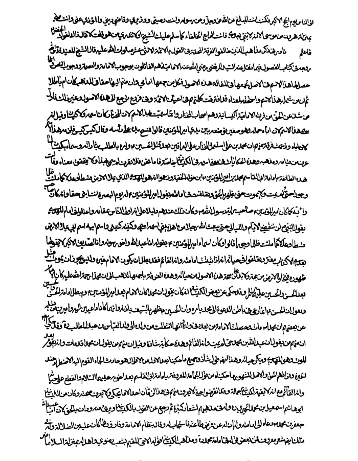

بحار الانوار الجامعة لدرر اخبار الائمة الاطهار المجلد 37

هوية الكتاب
بطاقة تعريف: مجلسي محمد باقربن محمدتقي 1037 - 1111ق.
عنوان واسم المؤلف: بحار الأنوار الجامعة لدرر أخبار الأئمة الأطهار المجلد 37: تأليف محمد باقربن محمدتقي المجلسي.
عنوان واسم المؤلف: بيروت داراحياء التراث العربي [ -13].
مظهر: ج - عينة.
ملاحظة: عربي.
ملاحظة: فهرس الكتابة على أساس المجلد الرابع والعشرين، 1403ق. [1360].
ملاحظة: المجلد108،103،94،91،92،87،67،66،65،52،24(الطبعة الثالثة: 1403ق.=1983م.=[1361]).
ملاحظة: فهرس.
محتويات: ج.24.كتاب الامامة. ج.52.تاريخ الحجة. ج67،66،65.الإيمان والكفر. ج.87.كتاب الصلاة. ج.92،91.الذكر و الدعا. ج.94.كتاب السوم. ج.103.فهرست المصادر. ج.108.الفهرست.-
عنوان: أحاديث الشيعة — قرن 11ق
ترتيب الكونجرس: BP135/م3ب31300 ي ح
تصنيف ديوي: 297/212
رقم الببليوغرافيا الوطنية: 1680946
ص: 1

تتمة كتاب تاریخ أمیر المؤمنین علیه السلام 

تتمة أبواب النصوص علی أمیر المؤمنین و النصوص علی الأئمة الاثنی عشر علیهم السلام 

باب 49 نادر فی ذكر مذاهب الذین خالفوا الفرقة المحقة فی القول بالأئمة الاثنی عشر صلوات اللّٰه علیهم
قال الشیخ المفید قدس اللّٰه روحه فی كتاب الفصول فیما نقل عنه السید المرتضی الإمامیة هم القائلون بوجوب الإمامة و العصمة و وجوب النص و إنما حصل لها هذا الاسم فی الأصل لجمعها فی المقالة هذه الأصول فكل من جمعها إمامی و إن ضم إلیها حقا فی المذهب كان أم باطلا ثم إن من شمله هذا الاسم و استحقه لمعناه قد افترقت كلمتهم فی أعیان الأئمة و فی فروع ترجع إلی هذه الأصول و غیر ذلك فأول من شذ(1) عن الحق من فرق الإمامیة الكیسانیة و هم أصحاب المختار و إنما سمیت بهذا الاسم لأن المختار كان اسمه أولا الكیسان و قیل إنه سمی (2) بهذا الاسم لأن أباه حمله و هو صغیر فوضعه بین یدی أمیر المؤمنین علیه السلام قالوا فمسح یده علی رأسه و قال كیس كیس فلزمه هذا الاسم و زعمت فرقة منهم أن محمد بن علی استعمل المختار علی العراقین بعد قتل الحسین علیه السلام و أمره بالطلب بثاراته و سماه كیسان لما عرف من قیامه و مذهبه و هذه الحكایات فی معنی اسمه فی الكیسانیة خاصة و أما نحن فلا نعرف لم سمی بهذا(3) و لا نتحقق معناه.

> **پاورقی**: 1- 1. أی خالف.

> **پاورقی**: 2- 2. فی المصدر: انما سمی.

> **پاورقی**: 3- 3. فی المصدر: و هذه الحكایات فی اسمه عن الكیسانیة خاصّة، فأما نحن فلا نعرف له الا أنّه سمی بهذا.

و قالت هذه الطائفة بإمامة أبی القاسم محمد بن أمیر المؤمنین علیه السلام ابن خولة الحنفیة و زعموا أنه هو المهدی الذی یملأ الأرض قسطا و عدلا كما ملئت ظلما و جورا و أنه حی لم یمت و لا یموت حتی یظهر بالحق (1) و تعلقت فی إمامته بقول أمیر المؤمنین علیه السلام له یوم البصرة أنت ابنی حقا و أنه كان صاحب رایته كما كان أمیر المؤمنین علیه السلام صاحب رایة رسول اللّٰه و كان ذلك عندهم دلیلا(2) علی أنه أولی الناس بمقامه
وَ اعْتَلُّوا فِی أَنَّهُ الْمَهْدِیُّ بِقَوْلِ النَّبِیِّ صلی اللّٰه علیه و آله :لَنْ تَنْقَضِیَ الْأَیَّامُ وَ اللَّیَالِی حَتَّی یَبْعَثَ اللَّهُ تَعَالَی رَجُلًا مِنْ أَهْلِ بَیْتِی اسْمُهُ اسْمِی وَ كُنْیَتُهُ كُنْیَتِی وَ اسْمُ أَبِیهِ اسْمُ أَبِی یَمْلَأُ الْأَرْضَ قِسْطاً وَ عَدْلًا كَمَا مُلِئَتْ ظُلْماً وَ جَوْراً.
قالوا و كان من أسماء أمیر المؤمنین علیه السلام عبد اللّٰه
بِقَوْلِهِ: أَنَا عَبْدُ اللَّهِ وَ أَخُو رَسُولِهِ صلی اللّٰه علیه و آله (3) وَ أَنَا الصِّدِّیقُ الْأَكْبَرُ لَا یَقُولُهَا بَعْدِی إِلَّا كَذَّابٌ مُفْتَرٍ.
و تعلقوا فی حیاته أنه إذا ثبت إمامته بأنه القائم فقد بطل أن یكون الإمام غیره و لیس یجوز أن یموت قبل ظهوره فتخلو الأرض من حجة(4) و لا بد علی صحة هذه الأصول من حیاته.
و هذه الفرقة بأجمعها تذهب إلی أن محمدا كان الإمام بعد الحسن و الحسین علیهما السلام و قد حكی عن بعض الكیسانیة أنه كان یقول إن محمدا كان الإمام بعد أمیر المؤمنین علیه السلام و یبطل إمامة الحسن و الحسین و یقول إن الحسن إنما دعا فی باطن الدعوة إلی محمد بأمره و إن الحسین ظهر بالسیف بإذنه و إنهما كانا داعیین إلیه و أمیرین من قبله و حكی عن بعضهم أن محمدا رحمة اللّٰه علیه مات و حصلت الإمامة من بعده فی ولده و أنها انتقلت من ولده إلی ولد العباس بن عبد المطلب و قد حكی أیضا أن منهم من یقول إن عبد اللّٰه بن محمد حی لم یمت (5) و أنه القائم و هذه حكایة شاذة و قیل إن منهم من یقول إن محمدا قد مات و إنه یقوم بعد الموت و هو المهدیّ
ص: 2

> **پاورقی**: 1- 1. فی المصدر: حتی یظهر الحق.

> **پاورقی**: 2- 2. فی المصدر: و كان ذلك عندهم الدلیل اه.

> **پاورقی**: 3- 3. فی المصدر: و أخو رسول اللّٰه.

> **پاورقی**: 4- 4. فی المصدر: فلا بد.

> **پاورقی**: 5- 5. فی المصدر: لا یموت.

و ینكر حیاته و هذا أیضا قول شاذ و جمیع ما حكینا بعد الأول من الأقوال هو حادث ألجأ القوم إلیه الاضطرار عند الحیرة و فراقهم الحق و الأصل المشهور ما حكیناه من قول الجماعة المعروفة بإمامة أبی القاسم بعد أخویه علیهما السلام و القطع علی حیاته و أنه القائم مع أنه لا بقیة للكیسانیة جملة و قد انقرضوا حتی لا یعرف منهم فی هذا الزمان أحد إلا ما یحكی و لا یعرف صحته.
و كان من الكیسانیة أبو هاشم إسماعیل بن محمد الحمیری رحمه اللّٰه (1) و له فی مذهبهم أشعار كثیرة ثم رجع عن القول بالكیسانیة و بری ء منه (2) و دان بالحق لأن أبا عبد اللّٰه جعفر بن محمد علیهما السلام دعاه إلی إمامته و أبان له عن فرض طاعته فاستجاب له و قال بنظام الإمامة و فارق ما كان علیه من الضلالة و له فی ذلك أیضا شعر معروف فمن بعض قوله فی إمامة محمد و مذهب الكیسانیة قوله.
ألا حی المقیم بشعب رضوی***و أهد له بمنزلة السلاما(3).
أضر بمعشر والوك منا***و سموك الخلیفة و الإماما
و عادوا فیك أهل الأرض طرا***مقامك عندهم سبعین عاما
لقد أضحی بمورق شعب رضوی***تراجعه الملائكة الكلاما
و ما ذاق ابن خولة طعم موت***و لا وارت له أرض عظاما
و إن له بها لمقیل صدق***و أندیة یحدثه الكراما
و له أیضا-وَ قَدْ رَوَی عَبْدُ اللَّهِ بْنُ عَطَاءٍ عَنْ أَبِی جَعْفَرٍ الْبَاقِرِ علیه السلام أَنَّهُ قَالَ: أَنَا دَفَنْتُ عَمِّی مُحَمَّدَ بْنَ الْحَنَفِیَّةِ وَ نَفَضْتُ یَدِی مِنْ تُرَابِ قَبْرِهِ.
فقال- :
نبئت أن ابن عطاء روی***و ربما صرح بالمنكر
لما روی أن أبا جعفر***قال و لم یصدق و لم یبرر
ص: 3

> **پاورقی**: 1- 1. فی المصدر: الحمیری الشاعر رحمه اللّٰه.

> **پاورقی**: 2- 2. فی المصدر: و تبرأ منه.

> **پاورقی**: 3- 3. رضوی- بفتح اوله و سكون ثانیه- جبل بین مكّة و المدینة قرب ینبع علی مسیرة یوم منها یزعم الكیسانیة أن محمّد بن الحنفیة مقیم به حی یرزق- هدل الشی ء: ارسله إلی اسفل و أرخاه. و فی المصدر: و أهله. و فیه بعد هذا البیت: و قل یا ابن الوصی فدتك نفسی*** أطلت بذلك الجبل المقاما .

دفنت عمی ثم غادرته(1)***صفیح لبن و تراب ثری
ما قاله قط و لو قاله*** قلت اتقاء من أبی جعفر
و له عند رجوعه إلی الحق (2).
تجعفرت باسم اللّٰه و اللّٰه أكبر***و أیقنت أن اللّٰه یعفو و یغفر
و دنت بدین غیر ما كنت دانیا***به و نهانی سید الناس جعفر
فقلت له هبنی تهودت برهة***و إلا فدینی دین من یتنصر
فلست بغال ما حییت و راجعا(3)***إلی ما علیه كنت أخفی و أضمر
و لا قائلا قولا لكیسان بعدها***و إن عاب جهال مقالی و أكبروا
و لكنه عنی مضی لسبیله***علی أحسن الحالات یقفی و یؤثر(4).
و كان كثیر عزة(5) كیسانیا و مات علی ذلك و له فی مذهب الكیسانیة قوله:
ألا إن الأئمة من قریش***ولاة الحق أربعة سواء
علی و الثلاثة من بنیه***هم الأسباط لیس بهم خفاء
فسبط سبط إیمان و بر***و سبط غیبته كربلاء
و سبط لا یذوق الموت حتی***یقود الخیل یقدمها اللواء
یغیب فلا یری فیهم زمانا***برضوی عنده غیل و ماء(6).
قال الشیخ أدام اللّٰه عزه و أنا أعترض علی أهل هذه الطائفة مع اختلافها فی مذاهبها بما أدل به علی فساد أقوالها بمختصر من القول و إشارة إلی معانی الحجاج دون استیعاب ذلك و بلوغ الغایة فیه إذ لیس غرضی القصد لنقض المذاهب الشاذة
ص: 4

> **پاورقی**: 1- 1. غادره: تركه و أخفاه.

> **پاورقی**: 2- 2. فی المصدر بعد ذلك: و فراقه الكیسانیة.

> **پاورقی**: 3- 3. فی المصدر: و راجع.

> **پاورقی**: 4- 4. فی المصدر: و لكنه من قد مضی لسبیله.

> **پاورقی**: 5- 5. هو كثیر بن عبد الرحمن بن الأسود بن عامر الخزاعیّ، اخباره مع عزة بنت جمیل الضمریة كثیرة حتّی انه انتسب إلیها و اشتهر بهذا الاسم( الأغانی 258).

> **پاورقی**: 6- 6. الغیل: الماء الجاری علی وجه الأرض و سیأتی له معنی آخر فی البیان. و فی المصدر: عسل و ماء.

النظام عن الإمامة(1) فی هذا الكتاب و إنما غرضی حكایتها فأحببت أن لا أخلیها من رسم لمع من الحجج (2) علی ما ذكرت و باللّٰه التوفیق.
مما یدل علی بطلان قول الكیسانیة فی إمامة محمد رحمة اللّٰه علیه أنه لو كان علی ما زعموا إماما معصوما یجب علی الأمة طاعته لوجب النص علیه أو ظهور العلم الدال علی صدقه إذ العصمة لا تعلم بالحس و لا تدرك من ظاهر الخلقة و إنما تعلم
بخبر علام الغیوب المطلع علی الضمائر(3) أو بدلیله سبحانه علی ذلك و فی عدم النص علی محمد من الرسول صلی اللّٰه علیه و آله أو من أبیه علیه السلام أو من أخویه علیه السلام أیضا(4) دلیل علی بطلان مقال من ذهب إلی إمامته و كذلك عدم الخبر المتواتر بمعجز ظهر علیه عند دعوته إلی إمامته أن لو كان ادعاها(5) برهان علی ما ذكرناه مع أن محمدا لم یدع قط الإمامة لنفسه و لا دعا أحدا إلی اعتقاد ذلك فیه و قد كان سئل عن ظهور المختار و ادعائه علیه أنه أمره بالخروج و الطلب بثأر الحسین علیه السلام و أنه أمره أن یدعو الناس إلی إمامته عن ذلك و صحته فأنكره و قال لهم و اللّٰه ما أمرته بذلك لكنی لا أبالی أن یأخذ بثأرنا كل أحد و ما یسوؤنی أن یكون المختار هو الذی یطلب بدمائنا فاعتمد السائلون له علی ذلك و كانوا كثیرة قد رحلوا إلیه لهذا المعنی بعینه علی ما ذكره أهل السیر و رجعوا فنصر أكثرهم المختار علی الطلب بدم أبی عبد اللّٰه الحسین علیه السلام و لم ینصروه علی القول بإمامة أبی القاسم و من قرأ الكتب و عرف الآثار و تصفح الأخبار و ما جری علیه أمر المختار لم یخف علیه هذا الفصل الذی ذكرناه فكیف یصح القول بإمامة محمد مع ما وصفناه.
فأما ما تعلقوا به فیما ادعوه من إمامته من قول أمیر المؤمنین علیه السلام له یوم البصرة و قد أقدم بالرایة أنت ابنی حقا فإنه جهل منهم بمعانی الكلام و عجرفة فی النظر
ص: 5

> **پاورقی**: 1- 1. فی المصدر: الشاذة عن النظام عن الإمامة.

> **پاورقی**: 2- 2. فی المصدر: یبلغ من الحجج.

> **پاورقی**: 3- 3.«: المطلع علی السرائر.

> **پاورقی**: 4- 4. لیست كلمة« ایضا» فی المصدر.

> **پاورقی**: 5- 5. كذا فی النسخ، و فی المصدر: اذ لو كان لكان ادعاؤها برهانا اه.

و الحجاج و ذلك أن النص لا یعقل من ظاهر هذا الكلام و لا من فحواه علی معقول أهل اللسان و لا من تأویله علی شی ء من اللغات و لا فصل بین من ادعی أن الإمامة تعقل من هذا اللفظ و أن النص بها یستفاد منه و بین من زعم أن النبوة تعقل منه و تستفاد من معناه إذ تعریه من الأمرین جمیعا علی حد واحد.
فإن قال منهم قائل إن أمیر المؤمنین علیه السلام لما كان إماما و قال لابنه محمد أنت ابنی حقا دل بذلك (1) علی أنه إنما شبهه به فی الإمامة لا غیر و كان (2) هذا القول منه تنبیها علی استخلافه له علی حسب ما رتبناه قیل له لم زعمت (3) أنه لما أضافه إلی نفسه و شبهه بها دل علی أنه أراد التشبیه له بنفسه فی الإمامة دون غیر هذه الصفة من صفاته علیه السلام و ما أنكرت (4) أنه أراد تشبیهه به فی الصورة دون ما ذكرت فإن قال إنه لم یجر فی تلك الحال (5) ذكر الصورة و لا ما یقتضی (6) أن یكون أراد تشبیهه به فیها
بالإضافة التی ذكرها فكیف یجوز حمل كلامه علی ذلك قیل له و كذلك لم یجر فی تلك الحال للإمامة ذكر فیكون إضافته له إلی نفسه (7) بالذكر دلیلا علی أنه أراد تشبیهه به فیها(8).
علی أن لكلامه علیه السلام معنی معقولا لا یذهب عنه (9) منصف و ذلك أن محمدا لما حمل الرایة ثم صبر حتی كشف أهل البصرة فأبان من شجاعته و بأسه و نجدته ما كان مستورا سر بذلك أمیر المؤمنین علیه السلام فأحب أن یعظمه (10) و یمدحه علی فعله فقال له أنت ابنی حقا یرید علیه السلام به أنك أشبهتنی فی الشجاعة و البأس و النجدة(11) و قیل
ص: 6

> **پاورقی**: 1- 1. فی المصدر: دل ذلك.

> **پاورقی**: 2- 2. فی المصدر: فكان.

> **پاورقی**: 3- 3. فی المصدر: علی حسب ما بیناه، قیل لهم: لم زعمتم اه.

> **پاورقی**: 4- 4. أی: لم أنكرت، و كذا فیما سیأتی( ب).

> **پاورقی**: 5- 5. فی المصدر: فی تلك الحالة.

> **پاورقی**: 6- 6. أی و لم یجر فی المقام ما یقتضی. و فی المصدر: و لا یقتضی.

> **پاورقی**: 7- 7. فی المصدر: فتكون اضافته إلی نفسه.

> **پاورقی**: 8- 8. أی فی الإمامة.

> **پاورقی**: 9- 9. أی لا یعرض عنه.

> **پاورقی**: 10- 10. فی المصدر: ان یعظمه بذلك.

> **پاورقی**: 11- 11. النجدة: الشجاعة. الشدة و البأس.

من أشبه أباه (1) فما ظلم و قیل إن من نعمة اللّٰه (2) علی العبد أن یشبه أباه لیصح نسبه فكان الغرض المفهوم من قول أمیر المؤمنین علیه السلام التشبیه لمحمد به فی الشجاعة و الشهادة له بطیب المولد و القطع علی طهارته و المدحة له بما تضمنه الذكر من إضافته و لم یجر للإمامة ذكر و لا كان هناك سبب یقتضی حمل الكلام علی معناها و لا تأویله علی فائدة یقتضیها و إذا كان الأمر علی ما وصفناه سقطت شبهتهم فی هذا الباب ثم یقال لهم فإن أمیر المؤمنین علیه السلام قال فی ذلك الیوم بعینه فی ذلك الموطن نفسه بعد أن قال لمحمد المقال الذی رویتموه (3) للحسن و الحسین علیهما السلام و قد رأی فیهما انكسارا عند مدحه لمحمد و أنتما ابنا رسول اللّٰه صلی اللّٰه علیه و آله فإن كان إضافة محمد رحمه اللّٰه إلیه بقوله أنت ابنی حقا یدل علی نصه علیه فإضافة الحسن و الحسین إلی رسول اللّٰه صلی اللّٰه علیه و آله یدل علی أنه قد نص علی نبوتهما إذ كان الذی أضافهما إلیه نبیا و رسولا و إماما فإن لم یجب ذلك بهذه الإضافة لم یجب بتلك ما ادعوه و هذا بین لمن تأمله.
و أما اعتمادهم علی إعطائه الرایة یوم البصرة و قیاسهم إیاه بأمیر المؤمنین علیه السلام عند ما أعطاه رسول اللّٰه صلی اللّٰه علیه و آله رایته فإن فعل النبی صلی اللّٰه علیه و آله ذلك و إعطاءه أمیر المؤمنین علیه السلام الرایة لا یدل علی أنه الخلیفة من بعده و لو دل علی ذلك لزم (4) أن یكون كل من حمل الرایة فی عصر رسول اللّٰه صلی اللّٰه علیه و آله منصوصا علیه بالإمامة و كل صاحب رایة كان لأمیر المؤمنین علیه السلام مشارا إلیه بالخلافة و هذا جهل لا یرتكبه عاقل مع أنه یلزم هذه الفرقة أن یكون محمد إماما للحسن و الحسین علیهما السلام و أن لا تكون لهما إمامة البتة لأنهما لم یحملا الرایة و كانت الرایة له دونهما و هذا قول لا یذهب إلیه إلا من شذ من الكیسانیة علی ما حكیناه و قول أولئك ینتقض (5) بالاتفاق
عَلَی قَوْلِ النَّبِیِّ صلی اللّٰه علیه و آله فِی الْحَسَنِ وَ الْحُسَیْنِ: ابْنَایَ هَذَانِ إِمَامَانِ قَامَا أَوْ قَعَدَا. و بالاتفاق علی وصیة أمیر المؤمنین
ص: 7

> **پاورقی**: 1- 1. فی المصدر: و قد قیل: إن من أشبه أباه اه.

> **پاورقی**: 2- 2.«: إن من نعم اللّٰه.

> **پاورقی**: 3- 3. فی المصدر: رسموه.

> **پاورقی**: 4- 4. فی المصدر: لوجب.

> **پاورقی**: 5- 5. فی( م) و( د) منتقض. و فی المصدر: منقوض.

إلی الحسن و وصیة الحسن إلی الحسین علیه السلام و بقیام الحسن علیه السلام بالإمامة بعد أبیه و دعائه الناس إلی بیعته علی ذلك و بقیام الحسین علیه السلام من بعده و بیعة الناس له علی الأمر(1) دون محمد حتی قتل من غیر رجوع من هذا القول مع قول رسول اللّٰه صلی اللّٰه علیه و آله فیهما الدال علی عصمتهما و أنهما لا یدعیان باطلا حَیْثُ یَقُولُ: ابْنَایَ هَذَانِ سَیِّدَا شَبَابِ أَهْلِ الْجَنَّةِ.
و أما تعلقهم بِقَوْلِ النَّبِیِّ صلی اللّٰه علیه و آله لَنْ تَنْقَضِیَ الْأَیَّامُ وَ اللَّیَالِی حَتَّی یَبْعَثَ اللَّهُ رَجُلًا مِنْ أَهْلِ بَیْتِی إلی آخر الكلام فإن بإزائهم الزیدیة یدعون ذلك فی محمد بن عبد اللّٰه بن الحسن بن الحسن و هم أولی به منهم لأن أبا محمد كان اسمه المعروف به عبد اللّٰه و كان أمیر المؤمنین اسمه علیا و إنما انضاف إلی اللّٰه بالعبودیة(2) و إن كان لإضافته فی هذا الموضع معنی یزید علی ما ذكرناه لیست بنا حاجة إلی الكشف عنه فی حجاج هؤلاء القوم مع أن الإمامیة الاثنی عشریة أولی به فی الحقیقة من الجمیع لأن صاحبهم اسمه اسم رسول اللّٰه صلی اللّٰه علیه و آله و كنیته كنیته و أبوه عبد من عبید اللّٰه و هم یقولون بالعصمة و جمیع أصول الإمامة و یضمون مع الأخبار الواردة بالنصوص علی الأئمة و ینقلون فضائل من تقدم القائم من آبائه علیهم السلام و معجزاتهم و علومهم التی بانوا بها من الرعیة و لا یدفعون ضرورة من موت حی و لا یقدمون علی تضلیل معصوم و تكذیب إمام عدل و الكیسانیة بالضد(3) مما حكیناه فلا معتبر بتعلقهم بظاهر لفظ قد تحدثته الفرق إذا المعتمد هو الحجة و البرهان و لم یأت القوم بشی ء منه فیكون عذرا لهم فیما صاروا إلیه.
و أما تعلقهم فی حیاته بما أعدوه من إمامته و بناؤهم علی ذلك أنه القائم من آل محمد فإنا قد أبطلنا ذلك بما تقدم من مختصر القول فیه فسقط بسقوطه و بطلانه و مما یدل أیضا علی فساده تواتر الخبر بنص أبی جعفر الباقر علی ابنه الصادق علیه السلام بالأمة
ص: 8

> **پاورقی**: 1- 1. فی المصدر: بالامر.

> **پاورقی**: 2- 2. فی المصدر بعد ذلك: كما انضاف جمیع العباد إلی اللّٰه بالعبودیة.

> **پاورقی**: 3- 3. فی المصدر: علی الضد.

و نص الصادق علی ابنه موسی (1) و نص موسی علی علی و بظاهر الخبر عمن ذكرناه بالعلوم الدالة علی إمامتهم و المعجزات المنبئة عن حقهم (2) و صدقهم مع الخبر عن النبی صلی اللّٰه علیه و آله بالنص علیهم من حدیث اللوح و ما رواه عبد اللّٰه بن مسعود و وصفه سلمان من ذكر أعیانهم و أعدادهم و قد أجمع من ذكرناه بأسرهم و الأئمة من ذریتهم و جمیع أهل بیتهم علی موت أبی القاسم و لیس یصح أن یكون إجماع هؤلاء باطلا و یؤید ذلك أن الكیسانیة فی وقتنا هذا لا بقیة لهم و لا یوجد عدد منهم یقطع العذر بنقله بل یوجد أحد منهم یدخل فی جملة أهل العلم بل لا نجد أحدا منهم جملة و إنما مع الناس (3) الحكایة عنهم خاصة و من كان بهذه المنزلة لم یجز أن یكون ما اعتمده من طریق الروایة حقا لأنه لو كان كذلك لما بطلت الحجة علیه بانقراض أهله و عدم تواترهم فبان بما وصفناه أن مذهب القوم باطل لم یحتج اللّٰه به علی أحد و لا ألزمه اعتقاده علی ما حكیناه.
قال الشیخ أدام اللّٰه عزه ثم لم تزل الإمامیة علی القول بنظام الإمامة حتی افترقت كلمتها بعد وفاة أبی عبد اللّٰه جعفر بن محمد علیهما السلام فقال فرقة منها إن أبا عبد اللّٰه حی لم یمت و لا یموت حتی یظهر فیملأ الأرض قسطا و عدلا كما ملئت ظلما و جورا لأنه القائم المهدی
وَ تَعَلَّقُوا بِحَدِیثٍ رَوَاهُ رَجُلٌ یُقَالُ لَهُ عَنْبَسَةُ بْنُ مُصْعَبٍ عَنْ أَبِی عَبْدِ اللَّهِ علیه السلام أَنَّهُ قَالَ: إِنْ جَاءَكُمْ مَنْ یُخْبِرُكُمْ عَنِّی بِأَنَّهُ غَسَّلَنِی وَ كَفَّنَنِی وَ دَفَنَنِی فَلَا تُصَدِّقُوهُ.
و هذه الفرقة تسمی الناووسیة و إنما سمیت بذلك لأن رئیسهم فی هذه المقالة رجل من أهل البصرة یقال له عبد اللّٰه بن ناووس.
و قالت فرقة أخری إن أبا عبد اللّٰه علیه السلام توفی و نص علی ابنه إسماعیل بن جعفر و إنه الإمام بعده و هو القائم المنتظر و إنما لبس علی الناس فی أمره لأمر رآه أبوه.
ص: 9

> **پاورقی**: 1- 1. فی المصدر: علی ابنه الكاظم.

> **پاورقی**: 2- 2. فی المصدر: عن حقوقهم.

> **پاورقی**: 3- 3. فی المصدر: و انما یقع من الناس.

و قال فریق منهم إن إسماعیل قد كان توفی علی الحقیقة فی زمن أبیه غیر أنه قبل وفاته نص علی ابنه محمد و كان (1) الإمام بعده و هؤلاء هم القرامطة و هم المباركیة فنسبهم إلی القرامطة برجل من أهل السواد یقال له قرمطویه و نسبهم إلی المباركیة برجل یسمی المبارك مولی إسماعیل بن جعفر و القرامطة أخلاف المباركیة و المباركیة سلفهم.
و قال فریق من هؤلاء إن الذی نص علی محمد بن إسماعیل هو الصادق علیه السلام دون إسماعیل و كان ذلك الواجب علیه لأنه أحق بالأمر بعد أبیه من غیره و لأن الإمامة لا یكون فی أخوین بعد الحسن و الحسین و هؤلاء الفرق الثلاث هم الإسماعیلیة و إنما سموا بذلك لادعائهم إمامة إسماعیل فأما علتهم فی النص علی إسماعیل فهی أن قالوا كان إسماعیل أكبر ولد جعفر و لیس یجوز أن ینص علی غیر الأكبر قالوا و قد أجمع من خالفنا علی أن أبا عبد اللّٰه نص علی إسماعیل غیر أنهم ادعوا أنه بدا لله فیه و هذا قول لا نقبله منهم.
و قالت فرقة أخری إن أبا عبد اللّٰه توفی و كان الإمام بعده محمد بن جعفر وَ اعْتَلُّوا فِی ذَلِكَ بِحَدِیثٍ تَعَلَّقُوا بِهِ وَ هُوَ: أَنَّ أَبَا عَبْدِ اللَّهِ عَلَی مَا زَعَمُوا كَانَ فِی دَارِهِ جَالِساً فَدَخَلَ عَلَیْهِ مُحَمَّدٌ وَ هُوَ صَبِیٌّ صَغِیرٌ فَعَدَا إِلَیْهِ فَكَبَا(2) فِی قَمِیصِهِ وَ وَقَعَ لِوَجْهِهِ (3) فَقَامَ إِلَیْهِ أَبُو عَبْدِ اللَّهِ فَقَبَّلَهُ وَ مَسَحَ التُّرَابَ عَنْ وَجْهِهِ وَ ضَمَّهُ إِلَی صَدْرِهِ وَ قَالَ سَمِعْتُ أَبِی یَقُولُ إِذَا وُلِدَ لَكَ وَلَدٌ یُشْبِهُنِی فَسَمِّهِ بِاسْمِی وَ هَذَا الْوَلَدُ شَبِیهِی وَ شَبِیهُ رَسُولِ اللَّهِ صلی اللّٰه علیه و آله وَ عَلَی سُنَّتِهِ (4).
و هذه الفرقة تسمی السبطیة(5) لنسبتها إلی رئیس لها كان یقال له یحیی بن أبی السبط(6).
ص: 10

> **پاورقی**: 1- 1. فی المصدر: فكان.

> **پاورقی**: 2- 2. أی انكب.

> **پاورقی**: 3- 3. فی المصدر: و وقع لحر وجهه.

> **پاورقی**: 4- 4. فی المصدر بعد ذلك: و شبیه علی.

> **پاورقی**: 5- 5. فی المصدر: الشمطیة( السمطیة خ ل).

> **پاورقی**: 6- 6. فی المصدر: لنسبتها إلی رجل یقال له یحیی بن أبی السمط و هو رئیسهم.

و قالت فرقة أخری إن الإمام بعد أبی عبد اللّٰه ابنه عبد اللّٰه بن جعفر و اعتلوا فی ذلك بأنه كان أكبر ولد أبی عبد اللّٰه
وَ أَنَّ أَبَا عَبْدِ اللَّهِ علیه السلام قَالَ: الْإِمَامَةُ لَا تَكُونُ إِلَّا فِی الْأَكْبَرِ مِنْ وُلْدِ الْإِمَامِ.
و هذه الفرقة تسمی الفطحیة و إنما سمیت بذلك لأن رئیسا لها یقال له عبد اللّٰه بن أفطح و یقال إنه كان أفطح الرجلین (1) و یقال بل كان أفطح الرأس و یقال إن عبد اللّٰه كان هو الأفطح.
قال الشیخ أدام اللّٰه عزه فأما الناووسیة فقد ارتكب فی إنكارها وفاة أبی عبد اللّٰه علیه السلام ضربا من دفع الضرورة و إنكار المشاهدة لأن العلم بوفاته كالعلم بوفاة أبیه من قبله و لا فرق بین هذه الفرقة و بین الغلاة الدافعین لوفاة أمیر المؤمنین علیه السلام و بین من أنكر مقتل الحسین علیه السلام و دفع ذلك و ادعی أنه كان مشبها للقوم فكل شی ء جعلوه فصلا بینهم و بین من ذكرناه فهو دلیل علی بطلان ما ذهبوا إلیه فی حیاة أبی عبد اللّٰه علیه السلام و أما الخبر الذی تعلقوا به فهو خبر واحد لا یوجب علما و لا عملا و لو رواه ألف إنسان و ألف ألف لما جاز أن یجعل ظاهره حجة فی دفع الضرورات و ارتكاب الجهالات بدفع المشاهدات علی أنه یقال لهم ما أنكرتم أن یكون هذا القول إنما صدر من أبی عبد اللّٰه عند توجهه إلی العراق لیؤمنهم من موته فی تلك الأحوال و یعرفهم رجوعه إلیهم من العراق و یحذرهم من قبول أقوال المرجفین به (2) المؤدیة إلی الفساد و لا یجب أن یكون ذلك مستغرقا لجمیع الأزمان و أن یكون علی العموم فی كل حال و یحتمل أن یكون أشار إلی جماعة علم أنهم لا یبقون بعده و أنه یتأخر عنهم فقال من جاءكم من هؤلاء فقد جاء فی بعض الأسانید من جاءكم منكم و فی بعضها من جاءكم من أصحابی و هذا یقتضی الخصوص.
و له وجه آخر و هو أنه عنی بذلك كل الخلق ما سوی الإمام القائم من بعده لأنه لیس یجوز أن یتولی غسل الإمام و تكفینه و دفنه إلا الإمام القائم مقامه علیه السلام إلا أن تدعو ضرورة إلی غیر ذلك فكأنه أنبأهم بأنه لا ضرورة تمنع القائم من بعده عن
ص: 11

> **پاورقی**: 1- 1. الأفطح: العریض.

> **پاورقی**: 2- 2. أرجف: خاض فی الاخبار السیئة و الفتن قصد أن یهیج الناس.

تولی أمره بنفسه و إذا كان الخصوص قد یكون فی كتاب اللّٰه عز و جل مع ظاهر القول للعموم و جاز أن یخص القرآن و یصرف عن ظواهره علی مذهب أصحاب العموم بالدلائل فلم لا جاز الانصراف عن ظاهر قول أبی عبد اللّٰه علیه السلام إلی معنی یلائم الصحیح و لا یحمل علی وجه یفسد المشاهدات و یسد علی العقلاء باب الضرورات و هذا كاف فی هذا الموضع إن شاء اللّٰه مع أنه لا بقیة للناووسیة و لم یكن فی الأصل أیضا كثرة و لا عرف منهم رجل مشهور بالعلم و لا قرئ لهم كتاب و إنما هی حكایة إن صحت فعن عدد یسیر لم یبرز قولهم حتی اضمحل و انتقض و فی هذا كفایة عن الإطالة فی نقضه.
و أما ما اعتلت به الإسماعیلیة من أن إسماعیل رحمه اللّٰه كان الأكبر و أن النص یجب أن یكون علی الأكبر فلعمری إن ذلك یجب إذا كان الأكبر باقیا بعد الوالد فأما إذا كان المعلوم من حاله أنه یموت فی حیاته و لا یبقی بعده فلیس یجب ما ادعوه بل لا معنی للنص علیه و لو وقع لكان كذبا لأن معنی النص أن المنصوص علیه خلیفة الماضی فیما كان یقوم به و إذا لم یبق بعده لم یكن خلیفة و یكون (1) النص حینئذ علیه كذبا لا محالة و إذا علم اللّٰه سبحانه أنه یموت قبل الأول و أمره باستخلافه كان الأمر بذلك عبثا مع كون النص كذبا لأنه لا فائدة فیه و لا غرض صحیح فبطل ما اعتمدوه فی هذا الباب.
و أما ما ادعوه من تسلیم الجماعة لهم حصول النص علیه فإنهم ادعوا فی ذلك باطلا و توهموا فاسدا من قبل أنه لیس أحد من أصحابنا یعترف بأن أبا عبد اللّٰه علیه السلام نص علی ابنه إسماعیل و لا روی راو ذلك فی شاذ من الأخبار و لا فی معروف منها و إنما كان الناس فی حیاة إسماعیل یظنون أن أبا عبد اللّٰه ینص علیه لأنه أكبر أولاده و بما كانوا یرونه من تعظیمه فلما مات إسماعیل
زالت ظنونهم و علموا أن الإمامة فی غیره فتعلق هؤلاء المبطلون بذلك الظن و جعلوه أصلا و ادعوا أنه قد وقع النص و لیس معهم فی ذلك خبر و لا أثر(2) یعرفه أحد من نقلة الشیعة و إذا كان
ص: 12

> **پاورقی**: 1- 1. فی المصدر: فیكون.

> **پاورقی**: 2- 2. فی المصدر: أثر و لا خبر.

معتمدهم علی الدعوی المجردة عن البرهان فقد سقط بما ذكرناه فأما الروایة عن أبی عبد اللّٰه علیه السلام من قوله ما بدا لله فی شی ء كما بدا له فی إسماعیل فإنها علی غیر ما توهموه أیضا من البداء فی الإمامة و إنما معناها
مَا رُوِیَ عَنْ أَبِی عَبْدِ اللَّهِ علیه السلام أَنَّهُ قَالَ: إِنَّ اللَّهَ عَزَّ وَ جَلَّ كَتَبَ الْقَتْلَ عَلَی ابْنِی إِسْمَاعِیلَ مَرَّتَیْنِ فَسَأَلْتُهُ فِیهِ فَرَقاً(1) فَمَا بَدَا لَهُ فِی شَیْ ءٍ كَمَا بَدَا لَهُ فِی إِسْمَاعِیلَ.
یعنی به ما ذكره من القتل الذی كان مكتوبا فصرفه عنه بمسألة أبی عبد اللّٰه علیه السلام فأما الإمامة فإنه لا یوصف اللّٰه عز و جل بالبداء فیها(2) و علی ذلك إجماع فقهاء الإمامیة و معهم فیه أثر عنهم علیهم السلام أنهم قالوا مهما بدا لله فی شی ء فلا یبدو له فی نقل نبی عن نبوته و لا إمام عن إمامته و لا مؤمن قد أخذ عهده بالإیمان عن إیمانه و إذا كان الأمر علی ما ذكرناه فقد بطل أیضا هذا الفصل الذی اعتمدوه و جعلوه دلالة علی نص أبی عبد اللّٰه علیه السلام علی إسماعیل.
فأما من ذهب إلی إمامة محمد بن إسماعیل بنص أبیه علیه فإنه منتقض القول فاسد الرأی من قبل أنه إذا لم یثبت لإسماعیل إمامة فی حیاة أبی عبد اللّٰه علیه السلام لاستحالة وجود إمامین بعد النبی صلی اللّٰه علیه و آله فی زمان واحد لم یجز أن یثبت إمامة محمد لأنها تكون حینئذ ثابتة بنص غیر إمام و ذلك فاسد فی النظر الصحیح.
و أما من زعم بأن أبا عبد اللّٰه علیه السلام نص علی محمد بن إسماعیل بعد وفاة أبیه فإنهم لم یتعلقوا فی ذلك بأثر و إنما قالوه قیاسا علی أصل فاسد و هو ما ذهبوا إلیه من حصول النص علی أبیه إسماعیل (3) فزعموا أن العدل یوجب بعد موت إسماعیل النص علی ابنه لأنه أحق الناس به و إذا كنا قد بینا عن بطلان قولهم فیما ادعوا من النص علی إسماعیل فقد فسد أصلهم الذی بنوا علیه الكلام علی أنه لو ثبت ما ادعوه من نص أبی عبد اللّٰه علی ابنه إسماعیل لما صح قولهم فی وجوب النص علی محمد ابنه من بعده لأن الإمامة و النصوص لیستا موروثتین علی حد میراث الأموال و لو كانت كذلك
ص: 13

> **پاورقی**: 1- 1. فی المصدر: فعفا عن ذلك.

> **پاورقی**: 2- 2. فی المصدر: و أمّا الإمامة فانه لا یوصف اللّٰه عزّ و جلّ فیه بالبداء.

> **پاورقی**: 3- 3. فی المصدر: علی ابنه إسماعیل. فیكون مرجع الضمیر أبا عبد اللّٰه علیه السلام.

لاشترك فیها ولد الإمام و إذا لم تكن موروثة و كانت إنما تجب لمن له صفات مخصوصة و من أوجبت المصلحة إمامته فقد بطل أیضا هذا المذهب.
و أما من ادعی إمامة محمد بن جعفر علیهما السلام بعد أبیه فإنهم شذاذ جدا قالوا بذلك زمانا مع قلة عددهم و إنكار الجماعة علیهم ثم انقرضوا حتی لم یبق منهم أحد یذهب إلی هذا المذاهب و فی ذلك بطلان مقالتهم (1) لأنها لو كانت حقا لما جاز أن یعدم اللّٰه تعالی أهلها(2) كافة حتی لم یبق (3) منهم من یحتج بنقله مع أن الحدیث الذی رووه لا یدل علی ما ذهبوا إلیه لو صح و ثبت فكیف و لیس هو حدیثا معروفا و لا رواه محدث مذكور و أكثر ما فیه عند ثبوت الروایة أنه خبر واحد و أخبار الآحاد لا یقطع علی اللّٰه عز و جل بصحتها و لو كان صحیحا أیضا لما كان من متضمنة(4) دلیل الإمامة لأن مسح أبی عبد اللّٰه التراب عن وجه ابنه لیس بنص علیه فی عقل و لا سمع و لا عرف و لا عادة و كذلك ضمه إلی صدره و كذلك قوله إن أبی أخبرنی أن سیولد لی ولد یشبهه و إنه أمره بتسمیته باسمه و إنه أخبره أنه یكون علی سنة رسول اللّٰه صلی اللّٰه علیه و آله (5) و لا فی مجموع هذا كله دلالة علی الإمامة فی ظاهر قول و فعل و لا فی تأویله و إذا لم یكن فی ذلك دلالة علی ما ذهبوا إلیه بأن بطلانه مع أن محمد بن جعفر خرج بالسیف بعد أبیه و دعا إلی إمامته و تسمی بإمرة المؤمنین و لم یتسم بذلك أحد ممن خرج من آل أبی طالب و لا خلاف بین أهل الإمامة أن من تسمی بهذا الاسم بعد أمیر المؤمنین علیه السلام فقد أتی منكرا فكیف یكون هذا علی سنة رسول اللّٰه صلی اللّٰه علیه و آله (6) لو لا أن الراوی لهذا الحدیث قد وهم فیه أو تعمد الكذب.
و أما الفطحیة فإن أمرها أیضا واضح و فساد قولها غیر خاف و لا مستور عمن تأمله و ذلك أنهم لم یدعوا نصا من أبی عبد اللّٰه علیه السلام علی عبد اللّٰه و إنما عملوا علی ما رووه من أن
ص: 14

> **پاورقی**: 1- 1. فی المصدر: ابطال مقالتهم.

> **پاورقی**: 2- 2. فی المصدر: لما جاز للّٰه أن یعدم أهلها.

> **پاورقی**: 3- 3. فی المصدر: لا یبقی.

> **پاورقی**: 4- 4. فی المصدر: فی متضمنه.

> **پاورقی**: 5- 5. فی المصدر: علی شبه رسول اللّٰه صلّی اللّٰه علیه و آله.

> **پاورقی**: 6- 6. فی المصدر: شبه رسول اللّٰه صلّی اللّٰه علیه و آله.

الإمامة تكون فی الأكبر و هذا حدیث لم یرو قط إلا مشروطا و هو أنه قد ورد أن الإمامة تكون فی الأكبر ما لم تكن به عاهة و أهل الإمامة القائلون بإمامة موسی علیه السلام متواترون بأن عبد اللّٰه كانت به عاهة فی الدین لأنه كان یذهب إلی مذهب المرجئة الذین یقفون فی علی علیه السلام و عثمان و أن أبا عبد اللّٰه علیه السلام قال و قد خرج من عنده عبد اللّٰه هذا مرجئ كبیر و أنه دخل علیه یوما(1) و هو یحدث أصحابه فلما رآه سكت حتی خرج فسئل عن ذلك فقال أ و ما علمتم أنه من المرجئة هذا مع أنه لم یكن له من العلم ما یتخصص به من العامة و لا روی عنه شی ء من الحلال و الحرام و لا كان بمنزلة من یستفتی فی الأحكام و قد ادعی الإمامة بعد أبیه فامتحن بمسائل صغار فلم یجب عنها و لا تأتی للجواب فأی علة أكثر مما ذكرناه تمنع من إمامة هذا الرجل مع أنه لو لم یكن علة تمنع من إمامته لما جاز من أبیه صرف النص عنه و لو لم یكن قد صرفه عنه لأظهره فیه و لو أظهره لنقل و كان معروفا فی أصحابه و فی عجز القوم عن التعلق بالنص علیه دلیل علی بطلان ما ذهبوا إلیه.
قال الشیخ أدام اللّٰه عزه ثم لم تزل الإمامیة بعد من ذكرناه علی نظام الإمامة حتی قبض موسی بن جعفر علیهما السلام فافترقت بعد وفاته فرقا قال جمهورهم بإمامة أبی الحسن الرضا علیه السلام و دانوا بالنص علیه و سلكوا الطریقة المثلی (2) فی ذلك و قال جماعة منهم بالوقف علی أبی الحسن موسی علیه السلام و ادعوا حیاته و زعموا أنه هو المهدی المنتظر و قال فریق منهم إنه قد مات و سیبعث و هو القائم بعده و اختلفت الواقفة فی الرضا علیه السلام و من قام من آل محمد بعد أبی الحسن موسی علیه السلام (3) فقال بعضهم هؤلاء خلفاء أبی الحسن و أمراؤه و قضاته إلی أوان خروجه و أنهم لیسوا بأئمة و ما ادعوا الإمامة قط و قال الباقون إنهم ضالون مخطئون ظالمون و قالوا فی الرضا علیه السلام خاصة قولا عظیما و أطلقوا تكفیره و تكفیر من قام بعده من ولده و شذت فرقة ممن كان علی الحق إلی
ص: 15

> **پاورقی**: 1- 1. فی المصدر: و انه دخل علیه عبد اللّٰه یوما.

> **پاورقی**: 2- 2. مؤنث الامثل: الافضل.

> **پاورقی**: 3- 3. فی المصدر: و اختلفت الواقفة فی الرضا علیه السلام بعد أبیه أبی الحسن موسی علیه السلام.

قول سخیف جدا فأنكروا موت أبی الحسن و حبسه و زعموا أن ذلك كان تخییلا للناس و ادعوا أنه حی غائب و أنه هو المهدی و زعموا أنه استخلف علی الأمر محمد بن بشیر(1) مولی بنی أسد و ذهبوا إلی الغلو و القول بالاتحاد(2) و دانوا بالتناسخ.
و اعتلت الواقفة فیما ذهبت إلیه بأحادیث رووها
عَنْ أَبِی عَبْدِ اللَّهِ علیه السلام مِنْهَا أَنَّهُمْ حَكَوْا عَنْهُ: أَنَّهُ لَمَّا وُلِدَ مُوسَی بْنُ جَعْفَرٍ علیهما السلام دَخَلَ أَبُو عَبْدِ اللَّهِ علیه السلام عَلَی حَمِیدَةَ الْبَرْبَرِیَّةَ أُمِّ مُوسَی علیها السلام فَقَالَ لَهَا یَا حَمِیدَةُ بَخْ بَخْ حَلَّ الْمُلْكُ فِی بَیْتِكِ.
قالوا و سئل عن اسم القائم فقال اسمه اسم حدیدة الحلاق فیقال لهذه الفرقة ما الفرق بینكم (3) و بین الناووسیة الواقفة علی أبی عبد اللّٰه علیه السلام و الكیسانیة الواقفة علی أبی القاسم بن الحنفیة و المفوّضة المنكرة لوفاة أبی عبد اللّٰه الحسین الدافعة لقتله و السبائیّة المنكرة لوفاة أمیر المؤمنین علیه السلام المدّعیة حیاته و المحمدیة النافیة لموت رسول اللّٰه صلی اللّٰه علیه و آله المتدیّنة بحیاته و كل شی ء راموا به كسر مذاهب من عددناه (4) فهو كسر لمذاهبهم و دلیل علی إبطال مقالتهم.
ثم یقال لهم فیما تعلقوا به من الحدیث الأول ما أنكرتم أن یكون الصادق علیه السلام أراد بالملك الإمامة علی الخلق و فرض الطاعة علی البشر و ملك الأمر و النهی و أی دلیل فی قوله لحمیدة حل الملك فی بیتك علی أنه نص علی أنه القائم بالسیف أ ما
سمعتم اللّٰه تعالی یقول فَقَدْ آتَیْنا آلَ إِبْراهِیمَ الْكِتابَ وَ الْحِكْمَةَ وَ آتَیْناهُمْ مُلْكاً عَظِیماً(5) و إنما أراد ملك الدین و الرئاسة علی العالمین (6) و أما قوله و قد سئل عن القائم (7) فقال اسمه اسم حدیدة الحلاق فإنه إن صح ذلك (8) علی أنه غیر معروف
ص: 16

> **پاورقی**: 1- 1. فی المصدر: محمّد بن بشر و سیأتی ترجمته فی البیان.

> **پاورقی**: 2- 2. كذا فی( ك) و( ت) و فی غیره من النسخ و كذا المصدر: و القول بالاباحة.

> **پاورقی**: 3- 3. فی المصدر: ما الفصل بینكم.

> **پاورقی**: 4- 4. فی المصدر: من عددناهم.

> **پاورقی**: 5- 5. سورة النساء: 54.

> **پاورقی**: 6- 6. فی المصدر: و الرئاسة فیه علی العالمین.

> **پاورقی**: 7- 7. فی المصدر: عن اسم القائم.

> **پاورقی**: 8- 8. فی المصدر: ان صح و ثبت ذلك.

فإنما أشار به إلی القائم بالإمامة بعده و لم یشر إلی القائم بالسیف و قد علمنا أن كل إمام فهو قائم بالأمر بعد أبیه فأی حجة فیما تعلقوا به لو لا عمی القلوب علی أنه یقال لهم (1) ما الدلیل علی إمامة أبی الحسن موسی علیه السلام و ما البرهان علی أن أباه نص علیه فبأی شی ء تعلقوا فی ذلك و اعتمدوا علیه أریناهم بمثله إمامة الرضا علیه السلام (2) و ثبوت النص من أبیه علیه السلام و هذا ما لا یجدون منه مخلصا.
و أما من زعم أن الرضا علیه السلام و من بعده كانوا خلفاء أبی الحسن موسی علیه السلام و لم یدعوا الأمر لأنفسهم فإنه قول مباهت لا یفكر فی دفعه بالضرورة(3) لأن جمیع شیعة هؤلاء القوم و غیر شیعتهم من الزیدیة الخلص و من تحقق بالنظر یعلم یقینا أنهم كانوا ینتحلون الإمامة و أن الدعاة إلی ذلك خاصتهم من الناس و لا فصل بین هذه (4) فی بهتها و بین الفرقة الشاذة من الكیسانیة فیما ادعوه من أن الحسن و الحسین علیهما السلام كانا خلفاء محمد و أن الناس لم یبایعوهما علی الإمامة لأنفسهم و هذا قول وضوح فساده یغنی عن الإطناب فیه.
و أما البشیریة(5) فإن دلیل وفاة أبی الحسن و إمامة الرضا علیه السلام و بطلان الحلول و الاتحاد و لزوم الشرائع و فساد الغلو و التناسخ یدل بمجموع ذلك و بآحاده علی فساد ما ذهبوا إلیه.
قال الشیخ أدام اللّٰه عزه ثم إن الإمامیة استمرت علی القول بأصول الإمامة طول أیام أبی الحسن الرضا علیه السلام فلما توفی و خلف ابنه أبا جعفر علیه السلام و له عند وفاة أبیه سبع سنین اختلفوا و تفرقوا ثلاث فرق فرقة مضت علی سنن القول فی الإمامة و دانت
ص: 17

> **پاورقی**: 1- 1. فی المصدر: مع أنّه یقال لهم.

> **پاورقی**: 2- 2. فی المصدر: صحة امامة الرضا علیه السلام.

> **پاورقی**: 3- 3. كذا فی( ك)؛ و فی( م) و( د): لا ینكر فی دفع الضرورة. و فی المصدر: لا یذكر فی دفع الضرورة.

> **پاورقی**: 4- 4. فی المصدر: و لا فصل بین هذه الفرق.

> **پاورقی**: 5- 5. فی المصدر: و أمّا البشریة.

بإمامة أبی جعفر علیه السلام و نقلت النص علیه و هم أكثر الفرق (1) عددا و فرقة ارتدت إلی قول الواقفة و رجعوا عما كانوا علیه من إمامة الرضا علیه السلام و فرقة قالت بإمامة أحمد بن موسی و زعموا أن الرضا علیه السلام كان وصی إلیه و نص بالإمامة علیه و اعتل الفریقان الشاذان عن أصل الإمامة بصغر سن أبی جعفر علیه السلام و قالوا لیس یجوز أن یكون الإمام (2) صبیا لم یبلغ الحلم فیقال لهم ما سوی الراجعة إلی مذاهب الوقف (3) كما قیل للواقفة دلوا بأی دلیل شئتم إلی إمامة الرضا علیه السلام حتی نریكم بمثله إمامة أبی جعفر علیه السلام و بأی شی ء طعنتم علی نقل النص علی أبی جعفر علیه السلام فإن الواقفة تطعن بمثله فی نقل النص علی أبی الحسن الرضا علیه السلام و لا فصل فی ذلك.
علی أن ما اشتبه علیهم من جهة سن أبی جعفر فإنه بین الفساد و ذلك أن كمال العقل لا یستنكر لحجج اللّٰه مع صغر السن قال اللّٰه عز و جل قالُوا كَیْفَ نُكَلِّمُ مَنْ كانَ فِی الْمَهْدِ صَبِیًّا قالَ إِنِّی عَبْدُ اللَّهِ آتانِیَ الْكِتابَ وَ جَعَلَنِی نَبِیًّا(4) فخبر عن المسیح بالكلام فی المهد و قال فی قصة یحیی وَ آتَیْناهُ الْحُكْمَ صَبِیًّا(5) و قد أجمع جمهور الشیعة مع سائر من خالفهم علی أن رسول اللّٰه صلی اللّٰه علیه و آله دعا علیا صغیر السن (6) و لم یدع من الصبیان غیره و باهل بالحسن و الحسین علیهما السلام و هما طفلان و لم یر مباهل قبله و لا بعده باهل بالأطفال و إذا كان الأمر علی ما ذكرناه من تخصیص اللّٰه تعالی حججه علی ما شرحناه بطل ما تعلق به هؤلاء القوم علی أنهم إن أقروا بظهور المعجزات عن الأئمة علیهم السلام و خرق العادات لهم و فیهم بطل أصلهم الذی اعتمدوه (7) فی إنكار إمامة أبی جعفر علیه السلام و إن أبوا ذلك لحقوا بالمعتزلة فی إنكار المعجزات (8) إلا علی الأنبیاء علیهم السلام 
ص: 18

> **پاورقی**: 1- 1. فی المصدر: و هی أكثر الفرق.

> **پاورقی**: 2- 2. فی المصدر: أن یكون إمام الزمان اه.

> **پاورقی**: 3- 3. فی المصدر: إلی التوقیف.

> **پاورقی**: 4- 4. سورة مریم: 29 و 30.

> **پاورقی**: 5- 5. سورة مریم: 12.

> **پاورقی**: 6- 6. فی المصدر: و هو صغیر السن.

> **پاورقی**: 7- 7. فی المصدر: اعتمدوا علیه.

> **پاورقی**: 8- 8. فی المصدر: فی انكار المعجز.

و كلموا بما یكلم به إخوانهم من أهل النصب (1) و هذا المقدار یكفی بمشیئة اللّٰه فی نقض ما اعتمدوه بما حكیناه قال الشیخ أدام اللّٰه عزه ثم ثبتت الإمامیة القائلون بإمامة أبی جعفر علیه السلام بأسرها علی القول بإمامة أبی الحسن علی بن محمد علیهما السلام من بعد أبیه و نقل النص علیه إلا فرقة قلیلة العدد شذوا عن جماعتهم فقالوا بإمامة موسی بن محمد أخی أبی الحسن علی بن محمد علیهما السلام ثم إنهم لم یثبتوا علی هذا القول إلا قلیلا حتی رجعوا إلی الحق و دانوا بإمامة علی بن محمد و رفضوا القول بإمامة موسی بن محمد و أقاموا جمیعا علی إمامة أبی الحسن علیه السلام فلما توفی تفرقوا بعد ذلك فقال الجمهور منهم بإمامة أبی محمد الحسن بن علی علیهما السلام و نقلوا النص (2) و أثبتوه و قال فریق منهم الإمام (3) بعد أبی الحسن محمد بن علی أخو أبی محمد و زعموا أن أباه علیا نص علیه فی حیاته و هذا محمد كان قد توفی فی حیاة أبیه فدفعت هذه الفرقة وفاته و زعموا أنه لم یمت و أنه حی و هو الإمام المنتظر و قال نفر من الجماعة شذوا أیضا عن الأصل أن الإمام بعد محمد بن علی بن محمد بن علی بن موسی أخوه جعفر بن علی و زعموا أن أباه نص علیه بعد محمد(4) و أنه قائم بعد أبیه فیقال لهذه الفرقة الأولی (5) لم زعمتم أن الإمام بعد أبی الحسن ابنه محمد و ما الدلیل علی ذلك فإن ادعوا النص طولبوا بلفظه و الحجة علیه و لن یجدوا لفظا یتعلق به (6) فی ذلك و لا تواترا یعتمدون علیه لأنهم أنفسهم من الشذوذ و القلة علی حد ینفی عنهم التواتر القاطع للعذر فی العدد مع أنهم قد انقرضوا فلا بقیة لهم و ذلك مبطل أیضا ما ادعوه و یقال لهم فی ادعاء حیاته ما قیل للكیسانیة و الناووسیة و الواقفة و یعارضون بمن ذكرناه (7) فلا یجدون فصلا
ص: 19

> **پاورقی**: 1- 1. فی المصدر: من أهل النصب و الضلال.

> **پاورقی**: 2- 2. فی المصدر: و نقلوا النصّ علیه.

> **پاورقی**: 3- 3. فی المصدر: ان الامام.

> **پاورقی**: 4- 4. فی المصدر: بعد مضی محمد.

> **پاورقی**: 5- 5. فی المصدر: للفرقة الأولی.

> **پاورقی**: 6- 6. فی المصدر: یتعلقون به.

> **پاورقی**: 7- 7. فی المصدر: بما ذكرناه.

فأما أصحاب جعفر فأمرهم (1) مبنی علی إمامة محمد و إذا سقط قول هذا الفریق لعدم الدلالة علی صحته و قیامها علی إمامة أبی محمد علیه السلام فقد بان فساد ما ذهبوا إلیه.
قال الشیخ أدام اللّٰه عزه و لما توفی أبو محمد الحسن بن علی علیهما السلام افترق أصحابه بعده علی ما حكاه أبو محمد الحسن بن موسی رحمه اللّٰه (2) أربع عشرة فرقة فقال الجمهور منهم بإمامة القائم المنتظر(3) و أثبتوا ولادته و صححوا النص علیه و قالوا هو سمی رسول اللّٰه صلی اللّٰه علیه و آله و مهدی الأنام و اعتقدوا أن له غیبتین إحداهما أطول من الأخری فالأولی منهما هی القصری و له فیها الأبواب (4) و السفراء و رووا عن جماعة من شیوخهم و ثقاتهم أن أباه الحسن علیه السلام أظهره لهم و أراهم شخصه و اختلفوا فی سنه عند وفاة أبیه فقال كثیر منهم كان سنه إذ ذاك خمس سنین لأن أباه توفی سنة ستین و مائتین و كان مولد القائم سنة خمس و خمسین و مائتین و قال بعضهم بل كان مولده سنة اثنتین و خمسین و مائتین و كان سنه عند وفاة أبیه ثمان سنین و قالوا إن أباه لم یمت حتی أكمل اللّٰه عقله و علمه الحكمة و فصل الخطاب و أبانه من سائر الخلق بهذه الصفة إذ كان خاتم الحجج و وصی الأوصیاء و قائم الزمان و احتجوا فی جواز ذلك بدلیل العقل من حیث ارتفعت إحالته و دخل تحت القدرة لقوله تعالی (5) فی قصة عیسی
وَ یُكَلِّمُ النَّاسَ فِی الْمَهْدِ وَ كَهْلًا(6) و فی قصة یحیی وَ آتَیْناهُ الْحُكْمَ صَبِیًّا(7) و قالوا إن صاحب الأمر حی لم یمت و لا یموت و لو بقی ألف عام حتی یملأ الأرض عدلا و قسطا(8) كما ملئت ظلما
ص: 20

> **پاورقی**: 1- 1. فی المصدر: فان أمرهم.

> **پاورقی**: 2- 2. سیأتی ترجمته فی البیان.

> **پاورقی**: 3- 3. فی المصدر: ابنه القائم المنتظر.

> **پاورقی**: 4- 4. فی المصدر: النواب خ ل.

> **پاورقی**: 5- 5. فی المصدر: و بقوله تعالی.

> **پاورقی**: 6- 6. سورة آل عمران: 46.

> **پاورقی**: 7- 7. سورة مریم: 12.

> **پاورقی**: 8- 8. فی المصدر: قسطا و عدلا.

و جورا إنه یكون عند ظهوره شابا قویا فی صورة أبناء(1) نیف و ثلاثین سنة و أثبتوا ذلك فی معجزاته و جعلوه فی جملة دلائله (2) و آیاته.
و قالت فرقة ممن دانت بإمامة الحسن إنه حی لم یمت و إنما غاب و هو القائم المنتظر.
و قالت فرقة أخری إن أبا محمد مات و عاش بعد موته و هو القائم المهدی
وَ اعْتَلُّوا فِی ذَلِكَ بِخَبَرٍ رَوَوْهُ: أَنَّ الْقَائِمَ إِنَّمَا سُمِّیَ بِذَلِكَ لِأَنَّهُ یَقُومُ بَعْدَ الْمَوْتِ.
و قالت فرقة أخری إن أبا محمد توفی (3) لا محالة و إن الإمام من بعده أخوه جعفر بن علی
وَ اعْتَلُّوا فِی ذَلِكَ بِالرِّوَایَةِ عَنْ أَبِی عَبْدِ اللَّهِ علیه السلام: أَنَّ الْإِمَامَ هُوَ الَّذِی لَا یُوجَدُ مِنْهُ مَلْجَأٌ إِلَّا إِلَیْهِ قَالُوا فَلَمَّا لَمْ نَرَ لِلْحَسَنِ وَلَداً ظَاهِراً الْتَجَأْنَا إِلَی الْقَوْلِ بِإِمَامَةِ جَعْفَرٍ أَخِیهِ.
و رجعت فرقة ممن كانت تقول بإمامة الحسن عن إمامته عند وفاته و قالوا لم یكن إماما و كان مدعیا مبطلا و أنكروا إمامة أخیه محمد و قالوا الإمام جعفر بن علی بنص أبیه علیه قالوا و إنما قلنا بذلك لأن محمدا مات فی حیاة أبیه و الإمام لا یموت فی حیاة أبیه و أما الحسن فلم یكن له عقب و الإمام لا یخرج من الدنیا حتی یكون له عقب.
و قالت فرقة أخری إن الإمام محمد بن علی أخو الحسن بن علی و رجعوا عن إمامة الحسن و ادعوا حیاة محمد بعد أن كانوا ینكرون ذلك.
و قالت فرقة أخری إن الإمام بعد الحسن ابنه المنتظر و أنه علی بن الحسن و لیس كما یقول القطعیة إنه محمد بن الحسن و قالوا بعد ذلك بمقال القطعیة(4) فی الغیبة و الانتظار حرفا بحرف (5).
ص: 21

> **پاورقی**: 1- 1. فی المصدر: فی صورة ابن اه.

> **پاورقی**: 2- 2. فی المصدر: من جملة دلائله.

> **پاورقی**: 3- 3. فی المصدر: قد توفی.

> **پاورقی**: 4- 4. فی المصدر: بمقالة القطعیة.

> **پاورقی**: 5- 5. فی المصدر: حرفا فحرفا.

و قالت فرقة أخری إن القائم بن الحسن ولد بعد أبیه (1) بثمانیة أشهر و هو المنتظر و أكذبوا من زعم أنه ولد فی حیاة أبیه.
و قالت فرقة أخری إن أبا محمد مات عن غیر ولد ظاهر و لكن عن حبل من بعض جواریه و القائم من بعد الحسن محمول به و ما ولدته أمه بعد و أنه یجوز أنها تبقی مائة سنة حاملا فإذا ولدته ظهرت ولادته.
و قالت فرقة أخری إن الإمامة قد بطلت بعد الحسن و ارتفعت الأئمة و لیس فی أرض (2) حجة من آل محمد صلی اللّٰه علیه و آله و إنما الحجة الأخبار الواردة عن الأئمة المتقدمین علیهم السلام و زعموا أن ذلك سائغ (3) إذا غضب اللّٰه علی العباد فجعله عقوبة لهم.
و قالت فرقة أخری إن محمد بن علی أخا الحسن بن علی كان الإمام فی الحقیقة مع أبیه علی و أنه لما حضرته الوفاة وصی إلی غلام له یقال له نفیس و كان ثقة أمینا و دفع إلیه الكتب و السلاح و وصاه أن یسلمه إلی أخیه جعفر فسلمه إلیه و كانت الإمامة فی جعفر بعد محمد علی هذا الترتیب.
و قالت فرقة أخری قد علمنا أن الحسن كان إماما فلما قبض التبس الأمر علینا فلا ندری أ جعفر كان الإمام من بعده أم غیره و الذی یجب علینا أن نقطع أنه (4) لا بد من إمام و لا نقدم علی القول بإمامة أحد بعینه حتی تبین لنا ذلك.
و قالت فرقة أخری إن الإمام (5) بعد الحسن ابنه محمد و هو المنتظر غیر أنه قد مات و سیحیا یقوم بالسیف فیملأ الأرض قسطا و عدلا كما ملئت ظلما و جورا.
و قالت الفرقة الرابعة عشر منهم إن أبا محمد كان الإمام بعد أبیه و إنه لما حضرته الوفاة نص علی أخیه جعفر بن علی بن محمد بن علی و كان الإمام من بعده بالنص علیه و الوارثة له و زعموا أن الذی دعاهم إلی ذلك ما یجب فی العقول من
ص: 22

> **پاورقی**: 1- 1. فی المصدر: ان القائم محمّد بن الحسن ولد بعد موت أبیه اه.

> **پاورقی**: 2- 2. كذا فی النسخ؛ و فی المصدر: و لیس فی الأرض.

> **پاورقی**: 3- 3. أی جائز. و فی المصدر: شائع.

> **پاورقی**: 4- 4. فی المصدر: أن نقطع علی أنه.

> **پاورقی**: 5- 5. فی المصدر: بل الامام.

وجوب الإمام (1) مع فقدهم لولد الحسن و بطلان دعوی من ادعی وجوده فیما زعموا من الإمامیة.
قال الشیخ أدام اللّٰه عزه و لیس من هؤلاء الفرق التی ذكرناها فرقة موجودة فی زماننا هذا و هو من سنة(2) ثلاث و سبعین و ثلاثمائة إلا الإمامیة الاثنا عشریة القائلة بإمامة ابن الحسن المسمی باسم رسول اللّٰه صلی اللّٰه علیه و آله القاطعة علی حیاته و بقائه إلی وقت قیامه بالسیف حسب ما شرحناه فیما تقدم عنهم و هم أكثر فرق الشیعة عددا و علما و متكلمون نظار و صالحون عباد متفقهة(3) و أصحاب حدیث و أدباء و شعراء و هم وجه الإمامیة و رؤساء جماعتهم و المعتمد علیهم فی الدیانة و من سواهم منقرضون لا یعلم أحد من الأربع عشرة(4) فرقة التی قدمنا ذكرها ظاهرا بمقالة و لا موجودا علی هذا الوصف من دیانته و إنما الحاصل منهم خبر عمن سلف (5) و أراجیف بوجود قوم منهم لا یثبت (6).
و أما الفرقة القائلة بحیاة أبی محمد علیه السلام فإنه یقال لها ما الفصل بینك و بین الواقفة و الناووسیة فلا یجدون فصلا.
و أما الفرقة التی زعمت (7) أن أبا محمد عاش من بعد موته و هو المنتظر فإنه یقال لها إذا جاز أن تخلو الدنیا من إمام حی یوما فلم لا جاز أن یخلو منه سنة و ما الفرق بین ذلك و بین أن تخلو أبدا من إمام و هذا خروج عن مذهب الإمامیة و قول بمذهب الخوارج و المعتزلة و من صار إلیه من الشیعة كلم كلام الناصبة و دل علی وجوب الإمامة(8) ثم یقال لهم ما أنكرتم أن یكون الحسن علیه السلام میتا لا محالة و لم یعش بعد و سیعیش و هذا نقض مذاهبهم فأما ما اعتلوا به من أن القائم إنما سمی بذلك
ص: 23

> **پاورقی**: 1- 1. فی المصدر: ما یجب فی العقل من وجوب الإمامة.

> **پاورقی**: 2- 2. فی المصدر: و هو سنة اه.

> **پاورقی**: 3- 3. فی المصدر: و متكلمون و نظار و صالحون و عباد و متفقهة اه.

> **پاورقی**: 4- 4. فی المصدر: من جملة الاربع عشر اه.

> **پاورقی**: 5- 5. فی المصدر: حكایة عمن سلف.

> **پاورقی**: 6- 6. فی المصدر: لا تثبت. و الاراجیف: الاخبار المختلفة الكاذبة السیئة.

> **پاورقی**: 7- 7. فی المصدر: و اما الفرقة الأخری التی زعمت.

> **پاورقی**: 8- 8. فی( ت) كلم كلام الناصبة و دل علی عدم وجوب الإمامة.

لأنه یقوم بعد الموت فإنه یحتمل أن یكون أرید به (1) بعد موت ذكره دون أن یكون المراد به موته فی الحقیقة بعدم الحیاة منه علی أنهم لا یجدون بهذا الاعتلال بینهم و بین الكیسانیة فرقا مع أن الروایة قد جاءت بأن القائم إنما سمی بذلك لأنه یقوم بدین قد اندرس و یظهر بحق كان مخفیا و یقوم بالحق من غیر تقیه تعتریه فی شی ء منه و هذا یسقط ما ادعوه.
و أما الفرقة التی زعمت أن جعفر بن علی هو الإمام بعد أخیه الحسن علیه السلام فإنهم صاروا إلی ذلك من طریق الظن و التوهم و لم یوردوا خبرا و لا أثرا یجب النظر فیه و لا فصل بین هؤلاء القوم و بین من ادعی الإمامة بعد الحسن علیه السلام لبعض الطالبیین و اعتمد علی الدعوی و التعریة من البرهان (2)
فَأَمَّا مَا اعْتَلُّوا بِهِ مِنَ الْحَدِیثِ عَنْ أَبِی عَبْدِ اللَّهِ علیه السلام: أَنَّ الْإِمَامَ هُوَ الَّذِی لَا یُوجَدُ مِنْهُ مَلْجَأٌ إِلَّا إِلَیْهِ.
فإنه یقال لهم فیه و لم زعمتم أنه لا ملجأ إلا إلی جعفر و لم أنكرتم (3) أن یكون الملجأ هو ابن الحسن الذی نقل جمهور الإمامیة النص علیه فإن قالوا لا یجب ذلك إلا إذا قامت الدلالة علی وجوده مع أنه لا یجب أن نثبت وجود من لم نشاهده قلنا لهم و لم لا یجب ذلك إذا قامت الدلالة علی وجوده مع أنه لا یجب أن یثبت الإمامة(4) لمن لا نص علیه و لا دلیل علی إمامته علی أن هذه العلة یمكن أن یعتل بها كل من یدعی الإمامة لرجل من آل أبی طالب بعد الحسن علیه السلام و یقول إنما قلت ذلك لأننی لم أجد ملجأ إلا إلیه.
و أما الفرقة الراجعة عن إمامة الحسن و المنكرة لإمامة أخیه محمد فإنها تحج (5) بدلیل إمامة الحسن من النص و التواتر عن أبیه و یطالب بالدلالة علی إمامة علی بن محمد علیهما السلام فكل شی ء اعتمدوه فی ذلك فهو العمدة علیهم فیما أبوه من إمامة الحسن علیه السلام 
ص: 24

> **پاورقی**: 1- 1. فی المصدر: أن یكون المراد به.

> **پاورقی**: 2- 2. فی المصدر: و اعتمد علی الدعوی المتعریة عن برهان.

> **پاورقی**: 3- 3. فی المصدر: و ما انكرتم.

> **پاورقی**: 4- 4. فی المصدر: لا یجب علینا أن نثبت الإمامة اه.

> **پاورقی**: 5- 5. فی المصدر: فانها تحتج علیها اه.

فأما إنكارهم لإمامة محمد بن علی أخی الحسن فقد أصابوا فی ذلك و نحن موافقوهم فی صحته و أما اعتلالهم بصوابهم فی الرجوع عن إمامة الحسن علیه السلام و أنه ممن مضی و لا عقب له فهو اعتماد علی التوهم لأن الحسن قد أعقب المنتظر و الأدلة علی إمامته أكثر من أن تحصی و لیس إذا لم نشاهد الإمام بطلت إمامته و لا إذا لم یدرك وجوده حصا و اضطرارا و لم یظهر للخاصة و العامة كان ذلك دلیلا علی عدمه.
و أما الفرقة الأخری الراجعة عن إمامة الحسن علیه السلام إلی إمامة أخیه محمد فهی كالتی قبلها و الكلام علیها نحو ما سلف مع أنهم أشد بهتا(1) و مكابرة لأنهم أنكروا إمامة من كان حیا بعد أبیه و ظهرت عنه من العلوم ما یدل علی فضله علی الكل و ادعوا إمامة رجل مات فی حیاة أبیه و لم یظهر منه علم و لا من أبیه نص علیه بعد أن كانوا یعترفون بموته و هؤلاء سقاط جدا.
و أما الفرقة التی اعترفت بولد الحسن علیه السلام و أقرت بأنه المنتظر إلا أنها زعمت أنه علی و لیس بمحمد فالخلاف بیننا و بین هؤلاء فی الاسم دون المعنی و الكلام لهم خاصة فیجب أن یطالبوا بالأثر فی الاسم فإنهم لا یجدونه و الأخبار منتشرة فی أهل الإمامة و غیرهم أن اسم القائم علیه السلام اسم رسول اللّٰه صلی اللّٰه علیه و آله و لم یكن فی أسماء رسول اللّٰه علی و لو ادعوا(2) أنه أحمد لكان أقرب إلی الحق و هذا القدر كاف فیما یحتج به علی هؤلاء.
و أما الفرقة التی زعمت أن القائم ابن الحسن علیه السلام و أنه ولد بعد أبیه بثمانیة أشهر و أنكروا أن یكون ولد فی حیاة أبیه فإنه یحتج علیهم بوجوب الإمامة من جهة العقول و كل شی ء یلزم المعتزلة و أصناف الناصبة یلزم هذه الفرقة مما ذهبوا إلیه (3) من جواز
خلو العالم من وجود إمام حی كامل ثمانیة أشهر لأنه لا فرق بین الثمانیة و الثمانین (4) علی أنه یقال لهم لم زعمتم ذلك أ بالعقل قلتموه أم بالسمع فإن
ص: 25

> **پاورقی**: 1- 1. فی المصدر: اشد بهتانا.

> **پاورقی**: 2- 2. فی المصدر: و لو ادعی.

> **پاورقی**: 3- 3. فی المصدر: فیما ذهبوا إلیه.

> **پاورقی**: 4- 4. فی المصدر: بین ثمانیة أشهر و ثمانین.

ادعوا العقل أحالوا فی القول (1) لأن العقل لا مدخل له فی ذلك و إن ادعوا السمع طولبوا بالأثر فیه و لن یجدوه و إنما صاروا إلی هذا القول من جهة الظن و الترجم بالغیب (2) و الظن لا یعتمد علیه فی الدین و أما الفرقة الأخری التی زعمت أن الحسن علیه السلام توفی عن حمل بالقائم و أنه لم یولد بعد فهی مشاركة للفرقة المتقدمة لها فی إنكار الولادة و ما دخل علی تلك داخل علی هذه و یلزمها من التجاهل ما یلزم تلك لقولها إن حملا یكون مائة سنة إذ كان هذا مما لم تجر به عادة و لا جاء به أثر من أحد(3) من سائر الأمم و لم یكن له نظیر و هو و إن كان مقدورا لله عز و جل فلیس یجوز(4) أن یثبت إلا بعد الدلیل الموجب لثبوته و من اعترف به من حیث الجواز فأوجبه یلزمه إیجاب وجود كل مقدور حتی لا یأمن لعل المیاه قد استحالت ذهبا و فضة و كذلك الأشجار و لعل كل كافر من العالم (5) إذا نام مسخه اللّٰه عز و جل قردا و كلبا و خنزیرا(6) من حیث لا یشعر به ثم یعیده (7) إلی الإنسانیة و لعل بالبلاد القصوی فیما لا نعرف (8) خبره نساء یحبلن یوما و یضعن من غده (9) و هذا كله جهل و ضلال فتحه علی نفسه من اعترف بخرق العادة من غیر حجة و اعتمد علی جواز ذلك فی المقدور(10).
و أما الفرقة التی زعمت أن الإمامة قد بطلت بعد الحسن علیه السلام فإن وجوب الإمامة بالعقل یفسد قولها و قول اللّٰه عز و جل یَوْمَ نَدْعُوا كُلَّ أُناسٍ بِإِمامِهِمْ (11)
ص: 26

> **پاورقی**: 1- 1. فی المصدر: أحالوا فی العقول.

> **پاورقی**: 2- 2. فی المصدر: و الرجم بالغیب.

> **پاورقی**: 3- 3. فی المصدر: فی أحد.

> **پاورقی**: 4- 4. فی المصدر: فلیس یجب.

> **پاورقی**: 5- 5. فی المصدر: فی العالم.

> **پاورقی**: 6- 6. فی المصدر: أو كلبا أو خنزیرا.

> **پاورقی**: 7- 7. فی المصدر: من حیث لم یشعر به، ثمّ یعود اه.

> **پاورقی**: 8- 8. فی المصدر: مما لا نعرف.

> **پاورقی**: 9- 9. فی المصدر: فی غده.

> **پاورقی**: 10- 10. فی المصدر: فی القدرة.

> **پاورقی**: 11- 11. سورة بنی إسرائیل: 71.

وَ قَوْلُ النَّبِیِّ صلی اللّٰه علیه و آله مَنْ مَاتَ وَ هُوَ لَا یَعْرِفُ إِمَامَ زَمَانِهِ مَاتَ مِیتَةً جَاهِلِیَّةً.
وَ قَوْلُ أَمِیرِ الْمُؤْمِنِینَ علیه السلام: اللَّهُمَّ إِنَّكَ لَا تُخْلِی الْأَرْضَ مِنْ حُجَّةٍ لَكَ عَلَی خَلْقِكَ إِمَّا ظَاهِراً مَشْهُوراً أَوْ خَائِفاً مَغْمُوراً كَیْلَا تَبْطُلَ حُجَجُكَ وَ بَیِّنَاتُكَ (1).
وَ قَوْلُ النَّبِیِّ صلی اللّٰه علیه و آله أَیْضاً: فِی كُلِّ خَلَفٍ مِنْ أُمَّتِی عَدْلٌ مِنْ أَهْلِ بَیْتِی یَنْفِی عَنْ هَذَا الدِّینِ تَحْرِیفَ الْغَالِینَ وَ انْتِحَالَ الْمُبْطِلِینَ.
وَ أَمَّا تَعَلُّقُهُمْ بِقَوْلِ الصَّادِقِ علیه السلام: إِنَّ اللَّهَ لَا یُخْلِی الْأَرْضَ مِنْ حُجَّةٍ إِلَّا أَنْ یَغْضَبَ عَلَی أَهْلِ الدُّنْیَا.
فالمعنی فی ذلك أنه لا یخلیها من حجة ظاهرة بدلالة ما قدمناه.
و أما الفرقة التی زعمت أن محمد بن علی (2) كان إماما مع أبیه و أنه وصی إلی غلام له یقال له نفیس و أعطاه السلاح و الكتب و أمره أن یدفعه (3) إلی جعفر فإن الذی قدمناه علی الإسماعیلیة من الدلیل علی بطلان إمامة إسماعیل بوفاته فی حیاة أبیه یكسر قول هذه الفرقة و یزیده بیانا(4) أن وصی الإمام لا یكون إلا إماما و نفیس غلام محمد لم یكن إماما و یبطل إمامة جعفر عدم الدلالة علی إمامة محمد و دلیل بطلان إمامته أیضا ما ذكرناه من وفاته فی حیاة أبیه.
و أما الفرقة التی أقرت بإمامة الحسن و وقفت بعده و اعتقدت أنه لا بد من إمام و لم یعنوا(5) علی أحد فالحجة علیهم النقل الصادق بإمامة المنتظر و النص من أبیه علیه و لیس هذا موضعه فنذكره علی النظام (6).
و أما الفرقة التی أقرت بالمنتظر و أنه ابن الحسن و زعمت أنه قد مات و سیحیا و یقوم بالسیف فإن الحجة علیها ما یجب من وجود الإمام و حیاته و كماله و كونه
ص: 27

> **پاورقی**: 1- 1. یوجد ما یضاهیه فیما قاله أمیر المؤمنین علیه السلام لكمیل بن زیاد فی كلام له أوله« یا كمیل ان هذه القلوب أوعیة» راجع نهج البلاغة( عبده 2: 180 ط مصر). و المغمور: المجهول الخامل الذكر.

> **پاورقی**: 2- 2. یعنی محمّد بن علیّ بن محمّد بن علیّ بن موسی.

> **پاورقی**: 3- 3. فی المصدر: أن یدفعها.

> **پاورقی**: 4- 4. فی المصدر: و نزیده بیانا.

> **پاورقی**: 5- 5. كذا فی( ك)؛ و فی غیره من النسخ و كذا المصدر: و لم یعینوا.

> **پاورقی**: 6- 6. و فی( ك) علی الظالم.

حیث (1) یسمع الاختلاق و یحفظ الشرع و بدلالة أنه لا فرق بین موته و عدمه.
و أما الفرقة التی اعترفت بأن أبا محمد الحسن بن علی علیهما السلام كان الإمام بعد أبیه و ادعت أنه لما حضرته الوفاة نص علی أخیه جعفر بن علی و اعتلوا فی ذلك بأن زعموا أن دعوی من ادعی النص علی ابن الحسن علیهما السلام باطلة و العقل یوجب الإمامة فلذلك
اضطروا إلی القول بإمامة جعفر فإنه یقال لم زعمتم أن نقل الإمامیة النص من الحسن علی ابنه باطل و ما أنكرتم أن یكون حقا لقیام الدلالة علی وجوب الإمامة و ثقة الناقلین و علامة صدقهم بصفات الغیبة و الخبر فیها عما یكون قبل كونه و یكون النقلة لذلك خاصة أصحاب الحسن و السفراء بینه و بین شیعته و لفساد إمامة جعفر لما كان علیه من الظاهر(2) مما یضار صفات الإمامة من نقصان العلم و قلة المعرفة و ارتكاب القبائح و الاستخفاف بحقوق اللّٰه عز و جل فی مخلفات أخیه (3) مع عدم النص علیه لفقد أحد من الخلق روی ذلك أو یأثره عن أحد من آبائه أو من أخیه خاصة فإذا كان الأمر علی ما ذكرناه فقد سقط ما تعلق به هذا الفریق أیضا علی أنه لا فصل بین هؤلاء القوم و بین من ادعی إمامة بعض الطالبیین و اعتل بعلتهم فی وجوب الإمامة و فساد قول الإمامیة و زعمهم فیما یدعونه من النص علی ابن الحسن علیهما السلام و إذا كان لا فصل بین القولین و أحدهما باطل بلا خلاف فالآخر فی البطلان و الفساد مثله.
فهذه وفقكم اللّٰه جملة كافیة فیما قصدناه و نحن نشرح هذه الأبواب و القول فیها علی الاستقصاء و البیان فی كتاب نفرده بعد و اللّٰه ولی التوفیق و إیاه نستهدی إلی سبیل الرشاد(4).
بیان: الغیل بالكسر و یفتح الشجر الكثیر الملتف و العجرفة جفوة فی الكلام و قال الجوهری فطحه فطحا جعله عریضا و یقال رأس مفطح أی عریض و رجل أفطح بین الفطح أی عریض الرأس (5).
ص: 28

> **پاورقی**: 1- 1. فی المصدر: بحیث.

> **پاورقی**: 2- 2. فی المصدر: فی الظاهر.

> **پاورقی**: 3- 3. كذا فی( ك) و( ت)؛ و فی غیره من النسخ و كذا المصدر: فی مخلفی أخیه.

> **پاورقی**: 4- 4. الفصول المختارة 2: 81- 104.

> **پاورقی**: 5- 5. صحاح اللغة ج: 1 ص: 392.

و محمد بن بشیر كان من أصحاب الكاظم علیه السلام ثم غلا و ادعی الألوهیة له علیه السلام و النبوة لنفسه من قبله و لما توفی موسی علیه السلام قال بالوقف علیه و قال إنه قائم بینهم موجود كما كان غیر أنهم محجوبون عنه و عن إدراكه و إنه هو القائم المهدی و إنه فی وقت غیبته استخلف علی الأمة محمد بن بشیر و جعله وصیه و أعطاه خاتمه و أعلمه جمیع ما تحتاج إلیه رعیته من أمر دینهم و دنیاهم و كان صاحب شعبدة و مخاریق و كانت عنده صورة قد عملها و أقامها شخصا كأنه صورة أبی الحسن علیه السلام من ثیاب الحریر قد طلاها بالأدویة(1) و عالجها بحیل عملها فیها حتی صارت شبیهة بصورة إنسان فیریها الناس و یریهم من طریق الشعبدة أنه یكلمه و یناجیه و كانت عنده أشیاء عجیبة من صنوف الشعبدة فهلك بها جماعة حتی رفع خبره إلی بعض الخلفاء و تقرب إلیه بمثل ذلك ثم قتل و تبرأ اللّٰه موسی علیه السلام و لعنه و دعا علیه و قال أذاقه اللّٰه حر الحدید و قتله أخبث ما یكون من قتله فاستجیب دعاؤه علیه السلام و سیأتی أحواله فی المجلد الحادی عشر.
و الحسن بن موسی هو الخشاب النوبختی من أعاظم متكلمی الإمامیة و عد النجاشی (2) و غیره من كتبه كتاب فرق الشیعة و كتاب الرد علی فرق الشیعة ما خلا الإمامیة و كتاب الرد علی المنجمین و حجج طبیعیة مستخرجة من كتب أرسطاطالیس فی الرد علی من زعم أن الفلك حی ناطق.
أقول: إنما أوردنا هذه الجملة من كلام الشیخ لیطلع الناظر فی كتابنا علی المذاهب النادرة فی الإمامة و أما الزیدیة فمذاهبهم مشهورة و الدلائل علی إبطالها فی الكتب مسطورة و ما أوردنا من الأخبار فی النصوص كاف فی إبطالها و جملة القول فی مذاهبهم أنهم ثلاث فرق.
الجارودیة و هم أصحاب أبی الجارود زیاد بن المنذر قالوا بالنص من النبی صلی اللّٰه علیه و آله فی الإمامة علی أمیر المؤمنین علیه السلام وصفا لا تسمیة و الصحابة كفروا بمخالفته و تركهم
ص: 29

> **پاورقی**: 1- 1. أی لطخه بها.

> **پاورقی**: 2- 2. راجع رجاله ص.

الاقتداء به بعد النبی صلی اللّٰه علیه و آله و الإمامة بعد الحسن و الحسین علیهما السلام سوی فی أولادهما فمن خرج منهم بالسیف و هو عالم شجاع فهو إمام و اختلفوا فی الإمام المنتظر أ هو محمد بن عبد اللّٰه بن الحسن الذی قتل فی المدینة أیام المنصور فذهب طائفة منهم إلی ذلك و زعموا أنه لم یقتل أو هو محمد بن القاسم بن علی بن الحسین علیهما السلام صاحب طالقان الذی حبسه المعتصم حتی مات فذهب طائفة أخری إلیه و أنكروا موته أو هو یحیی بن عمر صاحب الكوفة من أحفاد زید بن علی دعا الناس إلی نفسه و اجتمع علیه خلق كثیر و قتل فی أیام المستعین باللّٰه فذهب إلیه طائفة ثالثة و أنكروا قتله.
و الفرقة الثانیة السلیمانیة من أتباع سلیمان بن حریز قالوا الإمامة شوری فیما بین الخلق و إنما ینعقد برجلین من خیار المسلمین و تصح إمامة المفضول مع وجود الأفضل و أبو بكر و عمر إمامان و إن أخطأت الأمة فی البیعة لهما مع وجود علی علیه السلام لكنه خطأ لم ینته إلی درجة الفسق و كفروا عثمان و طلحة و عائشة.
و الفرقة الثالثة البتریة و هم وافقوا السلیمانیة إلا أنهم توقفوا فی عثمان هذا ما ذكره شارح المواقف فی تحریر مذاهبهم و رأیت فی شرح الأصول للناصر للحق الحسن بن علی بن الحسن بن علی بن عمر بن علی بن الحسین علیه السلام. 
اعلم أن أول الأئمة بعد النبی صلی اللّٰه علیه و آله عندنا علی بن أبی طالب علیه السلام ثم ابنه الحسن علیه السلام ثم أخوه الحسین علیه السلام ثم علی بن الحسین علیهما السلام ثم ابنه زید بن علی ثم محمد بن عبد اللّٰه بن الحسن ثم أخوه إبراهیم ثم الحسین بن علی صاحب الفخ ثم یحیی بن عبد اللّٰه بن الحسن ثم محمد بن إسماعیل بن إبراهیم بن الحسن ثم القاسم بن إبراهیم بن إسماعیل بن إبراهیم بن الحسن ثم الحسن بن علی بن الحسن بن علی بن عمر بن علی بن الحسین ثم یحیی بن الحسین بن القاسم بن إبراهیم بن إسماعیل بن الحسن ثم محمد بن یحیی بن الحسین ثم أحمد بن یحیی بن الحسین ثم محمد بن الحسن بن القاسم بن الحسن بن علی بن عبد الرحمن بن القاسم بن الحسن بن زید بن الحسن ثم ابنه الحسن ثم أخوه علی بن محمد ثم أحمد بن الحسین بن هارون من أولاد زید بن الحسن ثم أخوه یحیی ثم سائر أهل البیت الذین دعوا إلی الحق.
ص: 30

و هذا الكتاب من تصانیف الجارودیة و البتریة یسمون بالصالحیة أیضا لأن من رؤسائهم الحسن بن صالح قَالَ الْكَشِّیُّ فِی كِتَابِ الرِّجَالِ حَدَّثَنِی سَعْدُ بْنُ الصَّبَّاحِ الْكَشِّیُّ عَنْ عَلِیِّ بْنِ مُحَمَّدٍ عَنْ أَحْمَدَ بْنِ مُحَمَّدِ بْنِ عِیسَی عَنْ مُحَمَّدِ بْنِ إِسْمَاعِیلَ بْنِ بَزِیعٍ عَنْ مُحَمَّدِ بْنِ فُضَیْلٍ عَنِ ابْنِ أَبِی عُمَیْرٍ عَنْ سَعْدٍ الْجَلَّابِ (1) عَنْ أَبِی عَبْدِ اللَّهِ علیه السلام قَالَ: لَوْ أَنَّ الْبُتْرِیَّةَ صَفٌّ وَاحِدٌ مَا بَیْنَ الْمَشْرِقِ إِلَی الْمَغْرِبِ مَا أَعَزَّ اللَّهُ بِهِمْ دِیناً.
ثم قال الكشی و البتریة هم أصحاب كثیر النواء و الحسن بن صالح بن حی (2) و سالم بن أبی حفصة و الحكم بن عتیبة و سلمة بن كهیل و أبی المقدام ثابت الحداد و هم الذین دعوا إلی ولایة علی علیه السلام ثم خلطوها بولایة أبی بكر و عمر و یثبتون لهما إمامتهما و یبغضون عثمان و طلحة و الزبیر و عائشة و یرون الخروج مع بطون ولد علی بن أبی طالب علیه السلام و یذهبون فی ذلك إلی الأمر بالمعروف و النهی عن المنكر و یثبتون لكل من خرج من ولد علی علیه السلام عند خروجه الإمامة(3).
ثُمَّ رُوِیَ عَنْ سَعِیدِ(4) بْنِ جَنَاحٍ الْكَشِّیِّ عَنْ عَلِیِّ بْنِ مُحَمَّدِ بْنِ یَزِیدَ الْعَمِّیِ (5) عَنْ أَحْمَدَ بْنِ مُحَمَّدِ بْنِ عِیسَی عَنِ الْحُسَیْنِ بْنِ سَعِیدٍ عَنْ فَضَالَةَ بْنِ أَیُّوبَ عَنِ الْحُسَیْنِ بْنِ عُثْمَانَ الرَّوَّاسِیِ (6) عَنْ سَدِیرٍ قَالَ: دَخَلْتُ عَلَی أَبِی جَعْفَرٍ علیه السلام وَ مَعِی سَلَمَةُ بْنُ كُهَیْلٍ وَ أَبُو الْمِقْدَامِ ثَابِتٌ الْحَدَّادُ وَ سَالِمُ بْنُ أَبِی حَفْصَةَ وَ كَثِیرٌ النَّوَّاءُ وَ جَمَاعَةٌ مَعَهُمْ وَ عِنْدَ أَبِی جَعْفَرٍ أَخُوهُ زَیْدُ بْنُ عَلِیٍّ فَقَالُوا لِأَبِی جَعْفَرٍ علیه السلام نَتَوَلَّی عَلِیّاً وَ حَسَناً وَ حُسَیْناً وَ نَتَبَرَّأُ مِنْ أَعْدَائِهِمْ قَالَ نَعَمْ قَالُوا نَتَوَلَّی أَبَا بَكْرٍ وَ عُمَرَ وَ نَتَبَرَّأُ مِنْ أَعْدَائِهِمْ قَالَ فَالْتَفَتَ إِلَیْهِمْ زَیْدُ بْنُ عَلِیٍّ وَ قَالَ لَهُمْ أَ تَتَبَرَّءُونَ مِنْ فَاطِمَةَ بَتَرْتُمْ أَمْرَنَا بَتَرَكُمُ اللَّهُ فَیَوْمَئِذٍ سُمُّوا الْبُتْرِیَّةَ(7).
ص: 31

> **پاورقی**: 1- 1. فی المصدر: عن ابی عمر سعد الجلاب.

> **پاورقی**: 2- 2. فی المصدر: یحیی.

> **پاورقی**: 3- 3. رجال الكشّیّ: 152.

> **پاورقی**: 4- 4. فی المصدر: عن سعد بن جناح الكشّیّ.

> **پاورقی**: 5- 5. فی المصدر: القمّیّ.

> **پاورقی**: 6- 6. فی المصدر: عن الحسن بن عثمان الرواسی.

> **پاورقی**: 7- 7. رجال الكشّیّ: 154.

و قال عند ذكر أبی الجارود زیاد بن المنذر الأعمی السرحوب حكی أن أبا الجارود سمی سرحوبا و تنسب إلیه السرحوبیة من الزیدیة و سماه بذلك أبو جعفر علیه السلام و ذكر أن سرحوبا اسم شیطان أعمی یسكن البحر و كان أبو الجارود مكفوفا أعمی أعمی القلب
رَوَی إِسْحَاقُ بْنُ مُحَمَّدٍ الْبَصْرِیُّ عَنْ مُحَمَّدِ بْنِ جُمْهُورٍ عَنْ مُوسَی بْنِ بَشَّارٍ عَنْ أَبِی بَصِیرٍ(1) قَالَ: كُنَّا عِنْدَ أَبِی عَبْدِ اللَّهِ علیه السلام فَمَرَّتْ بِنَا جَارِیَةٌ مَعَهَا قُمْقُمٌ (2) فَقَلَبَتْهُ فَقَالَ أَبُو عَبْدِ اللَّهِ علیه السلام إِنَّ اللَّهَ عَزَّ وَ جَلَّ إِنْ كَانَ قَلَبَ (3) قَلْبَ أَبِی الْجَارُودِ كَمَا قَلَبَتْ هَذِهِ الْجَارِیَةُ هَذَا الْقُمْقُمَ فَمَا ذَنْبِی.
وَ رَوَی عَلِیُّ بْنُ مُحَمَّدٍ عَنْ مُحَمَّدِ بْنِ أَحْمَدَ عَنْ عَلِیِّ بْنِ إِسْمَاعِیلَ عَنْ حَمَّادِ بْنِ عِیسَی عَنِ الْحُسَیْنِ بْنِ الْمُخْتَارِ عَنْ أَبِی أُسَامَةَ قَالَ قَالَ (4) أَبُو عَبْدِ اللَّهِ علیه السلام: مَا فَعَلَ أَبُو الْجَارُودِ أَمَا إِنَّهُ لَا یَمُوتُ إِلَّا تَائِهاً.
وَ عَنْهُ عَنْ مُحَمَّدِ بْنِ أَحْمَدَ عَنِ الْعَبَّاسِ بْنِ مَعْرُوفٍ عَنْ أَبِی الْقَاسِمِ الْكُوفِیِّ عَنِ الْحُسَیْنِ بْنِ مُحَمَّدِ بْنِ عِمْرَانَ عَنْ زُرْعَةَ عَنْ سَمَاعَةَ عَنْ أَبِی بَصِیرٍ قَالَ: ذَكَرَ أَبُو عَبْدِ اللَّهِ علیه السلام كَثِیرَ النَّوَّاءِ وَ سَالِمَ بْنَ أَبِی حَفْصَةَ وَ أَبَا الْجَارُودِ فَقَالَ كَذَّابُونَ مُكَذِّبُونَ كُفَّارٌ عَلَیْهِمْ لَعْنَةُ اللَّهِ قَالَ قُلْتُ جُعِلْتُ فِدَاكَ كَذَّابُونَ قَدْ عَرَفْتُهُمْ فَمَا مُكَذِّبُونَ (5) فَقَالَ كَذَّابُونَ یَأْتُونَنَا فَیُخْبِرُونَنَا أَنَّهُمْ یُصَدِّقُونَّا(6) لَیْسَ كَذَلِكَ فَیَسْمَعُونَ (7) حَدِیثَنَا فَیُكَذِّبُونَ بِهِ.
وَ حَدَّثَنِی مُحَمَّدُ بْنُ الْحَسَنِ الْبَرَاثِیُّ وَ عُثْمَانُ بْنُ حَامِدٍ الْكَشْیَانُ عَنْ مُحَمَّدِ بْنِ زِیَادٍ عَنْ مُحَمَّدِ بْنِ الْحُسَیْنِ عَنْ عَبْدِ اللَّهِ بْنِ الْمُزَخْرَفِ عَنْ أَبِی سُلَیْمَانَ الْحَمَّادِ قَالَ: سَمِعْتُ أَبَا عَبْدِ اللَّهِ علیه السلام 
ص: 32

> **پاورقی**: 1- 1. فی المصدر: عن ابی نصر.

> **پاورقی**: 2- 2. القمقم: وعاء من نحاس یسخن فیه الماء.

> **پاورقی**: 3- 3. فی المصدر: قد قلب.

> **پاورقی**: 4- 4. فی المصدر: قال: قال لی.

> **پاورقی**: 5- 5. فی المصدر: فما معنی مكذبون.

> **پاورقی**: 6- 6. فی المصدر: فیخبرون انهم یصدقوننا.

> **پاورقی**: 7- 7. فی المصدر: و یسمعون.

یَقُولُ لِأَبِی الْجَارُودِ بِمِنًی فِی فُسْطَاطِهِ (1) یَا أَبَا الْجَارُودِ كَانَ وَ اللَّهِ أَبِی إِمَامَ أَهْلِ الْأَرْضِ حَیْثُ مَاتَ لَا یَجْهَلُهُ إِلَّا ضَالٌّ ثُمَّ رَأَیْتُهُ فِی الْعَامِ الْمُقْبِلِ قَالَ لَهُ مِثْلَ ذَلِكَ قَالَ فَلَقِیتُ أَبَا الْجَارُودِ بَعْدَ ذَلِكَ بِالْكُوفَةِ فَقُلْتُ لَهُ أَ لَیْسَ قَدْ سَمِعْتَ مَا قَالَ أَبُو عَبْدِ اللَّهِ مَرَّتَیْنِ قَالَ إِنَّمَا یَعْنِی أَبَاهُ عَلِیَّ بْنَ أَبِی طَالِبٍ علیه السلام (2).
و قال فی عمر بن ریاح قیل إنه كان أولا یقول بإمامة أبی جعفر علیه السلام ثم إنه فارق هذا القول و خالف أصحابه مع عدة یسیرة تابعوه علی ضلالته فإنه زعم أنه سأل أبا جعفر علیه السلام عن مسألة فأجابه فیها بجواب (3) ثم عاد إلیه فی عام آخر و زعم أنه سأله
عن تلك المسألة بعینها فأجابه فیها بخلاف الجواب الأول فقال لأبی جعفر علیه السلام هذا بخلاف ما أجبتنی فی هذه المسألة عامك الماضی فذكر له (4) أن جوابنا خرج علی وجه التقیة فشك فی أمره و إمامته فلقی رجلا من أصحاب أبی جعفر علیه السلام یقال له محمد بن قیس فقال إنی سألت أبا جعفر علیه السلام عن مسألة فأجابنی فیها بجواب ثم سألته (5) عنها فی عام آخر فأجابنی فیها بخلاف الجواب الأول فقلت له لم فعلت ذلك قال فعلته للتقیة و قد علم اللّٰه أننی ما سألته إلا و إننی (6) صحیح العزم علی التدین بما یفتینی به (7) و قبوله و العمل به و لا وجه لاتقائه إیای و هذا حاله فقال له محمد بن قیس فلعله حضرك من اتقاه فقال ما حضر مجلسه فی واحد من المجالس غیری و لكن كان جواباه جمیعا علی وجه التجنب (8) و لم یحفظ ما أجاب فیه فی العام الماضی فیجیب بمثله فرجع عن إمامته و قال لا یكون إمام یفتی بالباطل علی شی ء من الوجوه و لا فی حال من الأحوال و لا یكون إمام یفتی بالتقیة من غیر ما یجب عند اللّٰه و لا هو
ص: 33

> **پاورقی**: 1- 1. فی المصدر بعد ذلك: رافعا صوته.

> **پاورقی**: 2- 2. رجال الكشّیّ: 150.

> **پاورقی**: 3- 3. فی( ك): الجواب.

> **پاورقی**: 4- 4. فی المصدر: فذكر أنّه قال له.

> **پاورقی**: 5- 5. فی المصدر: ثم سألت.

> **پاورقی**: 6- 6. فی المصدر: إلّا و أنی.

> **پاورقی**: 7- 7. فی المصدر: بما یفتینی فیه.

> **پاورقی**: 8- 8. فی المصدر: علی وجه التخیب.

یرخی ستره (1) و لا یغلق بابه و لا یسع الإمام إلا الخروج و الأمر بالمعروف و النهی عن المنكر فمال إلی سنته بقول البتریة و مال معه نفر یسیر(2).
أقول: لا اعتماد علی نقل هذا الضال المبتدع فی دینه و علی تقدیر صحته لعله اتقی ممن علم أنه بعد خروجه سیذكره عنده و أما الدلائل علی وجوب التقیة فسنذكرها فی محلها ثم روی الكشی أیضا عن حمدویه عن ابن یزید عن محمد بن عمر عن ابن عذافر عَنْ عُمَرَ بْنِ یَزِیدَ قَالَ: سَأَلْتُ أَبَا عَبْدِ اللَّهِ علیه السلام عَنِ الصَّدَقَةِ عَلَی النَّاصِبِ وَ عَلَی الزَّیْدِیَّةِ فَقَالَ لَا تَصَدَّقْ عَلَیْهِمْ بِشَیْ ءٍ وَ لَا تُسْقِهِمْ مِنَ الْمَاءِ إِنِ اسْتَطَعْتَ وَ قَالَ لِی الزَّیْدِیَّةُ هُمُ النُّصَّابُ.
و روی عن محمد بن الحسن عن أبی علی الفارسی قال حكی منصور عن الصادق علی بن محمد بن الرضا علیه السلام أن الزیدیة و الواقفة و النصاب بمنزلة عنده سواء
وَ عَنْ مُحَمَّدِ بْنِ الْحَسَنِ عَنْ أَبِی عَلِیٍّ عَنْ یَعْقُوبَ بْنِ یَزِیدَ عَنِ ابْنِ أَبِی عُمَیْرٍ عَمَّنْ حَدَّثَهُ قَالَ: سَأَلْتُ مُحَمَّدَ بْنَ عَلِیٍّ الرِّضَا علیه السلام عَنْ هَذِهِ الْآیَةِ وُجُوهٌ یَوْمَئِذٍ خاشِعَةٌ عامِلَةٌ ناصِبَةٌ(3) قَالَ نَزَلَتْ فِی النُّصَّابِ وَ الزَّیْدِیَّةُ وَ الْوَاقِفَةُ مِنَ النُّصَّابِ (4).
أقول: كتب أخبارنا مشحونة بالأخبار الدالة علی كفر الزیدیة و أمثالهم من الفطحیة و الواقفة و غیرهم من الفرق المضلة المبتدعة و سیأتی الرد علیهم فی أبواب أحوال الأئمة علیهم السلام و ما ذكرناه فی تضاعیف كتابنا من الأخبار و البراهین الدالة علی عدد الأئمة و عصمتهم و سائر صفاتهم كافیة فی الرد علیهم و إبطال مذاهبهم السخیفة الضعیفة وَ اللَّهُ یَهْدِی مَنْ یَشاءُ إِلی صِراطٍ مُسْتَقِیمٍ.
ص: 34

> **پاورقی**: 1- 1. ارخی ستره: أسد له و أرسله.

> **پاورقی**: 2- 2. رجال الكشّیّ: 154 و 155.

> **پاورقی**: 3- 3. سورة الغاشیة: 2 و 3.

> **پاورقی**: 4- 4. رجال الكشّیّ: 149.

باب 50 مناقب أصحاب الكساء و فضلهم صلوات اللّٰه علیهم
«1»- لی، [الأمالی]: للصدوق الْهَمَدَانِیُّ عَنْ عَلِیِّ بْنِ إِبْرَاهِیمَ عَنْ جَعْفَرِ بْنِ سَلَمَةَ عَنْ إِبْرَاهِیمَ بْنِ مُحَمَّدٍ الثَّقَفِیِّ عَنْ عُثْمَانَ بْنِ أَبِی شَیْبَةَ وَ مُحْرِزِ بْنِ هِشَامٍ قَالا حَدَّثَنَا مُطَّلِبُ بْنُ زِیَادٍ عَنْ لَیْثِ بْنِ أَبِی سُلَیْمٍ قَالَ: أَتَی النَّبِیَّ صلی اللّٰه علیه و آله عَلِیٌّ وَ فَاطِمَةُ وَ الْحَسَنُ وَ الْحُسَیْنُ عَلَیْهِمُ التَّحِیَّةُ وَ الْإِكْرَامُ كُلُّهُمْ یَقُولُ أَنَا أَحَبُّ إِلَی رَسُولِ اللَّهِ صلی اللّٰه علیه و آله فَأَخَذَ صلی اللّٰه علیه و آله فَاطِمَةَ مِمَّا یَلِی بَطْنَهُ وَ عَلِیّاً مِمَّا یَلِی ظَهْرَهُ وَ الْحَسَنَ علیه السلام عَنْ یَمِینِهِ وَ الْحُسَیْنَ علیه السلام عَنْ یَسَارِهِ ثُمَّ قَالَ صلی اللّٰه علیه و آله أَنْتُمْ مِنِّی وَ أَنَا مِنْكُمْ (1).
«2»- لی، [الأمالی] للصدوق أَبِی وَ ابْنُ مَسْرُورٍ(2) عَنِ ابْنِ عَامِرٍ عَنِ الْمُعَلَّی عَنْ جَعْفَرِ بْنِ سُلَیْمَانَ عَنْ عَبْدِ اللَّهِ بْنِ الْحَكَمِ عَنْ أَبِیهِ عَنْ سَعِیدِ بْنِ جُبَیْرٍ عَنِ ابْنِ عَبَّاسٍ قَالَ قَالَ النَّبِیُّ صلی اللّٰه علیه و آله إِنَّ عَلِیّاً وَصِیِّی وَ خَلِیفَتِی وَ زَوْجَتَهُ فَاطِمَةَ(3) سَیِّدَةُ نِسَاءِ الْعَالَمِینَ ابْنَتِی وَ الْحَسَنَ وَ الْحُسَیْنَ سَیِّدَا شَبَابِ أَهْلِ الْجَنَّةِ وَلَدَایَ مَنْ وَالاهُمْ فَقَدْ وَالانِی وَ مَنْ عَادَاهُمْ فَقَدْ عَادَانِی وَ مَنْ نَاوَاهُمْ فَقَدْ نَاوَانِی وَ مَنْ جَفَاهُمْ فَقَدْ جَفَانِی وَ مَنْ بَرَّهُمْ فَقَدْ بَرَّنِی وَصَلَ اللَّهُ مَنْ وَصَلَهُمْ وَ قَطَعَ مَنْ قَطَعَهُمْ وَ نَصَرَ مَنْ أَعَانَهُمْ (4) وَ خَذَلَ مَنْ خَذَلَهُمْ اللَّهُمَّ مَنْ كَانَ لَهُ مِنْ أَنْبِیَائِكَ وَ رُسُلِكَ ثِقْلٌ وَ أَهْلُ بَیْتٍ فَعَلِیٌّ وَ فَاطِمَةُ وَ الْحَسَنُ وَ الْحُسَیْنُ أَهْلُ بَیْتِی وَ ثِقْلِی فَأَذْهِبْ عَنْهُمُ الرِّجْسَ وَ طَهِّرْهُمْ تَطْهِیراً(5).
ص: 35

> **پاورقی**: 1- 1. أمالی الصدوق: 9.

> **پاورقی**: 2- 2. لم یذكر« ابن مسرور» فی المصدر.

> **پاورقی**: 3- 3. فی المصدر: و زوج فاطمة.

> **پاورقی**: 4- 4. فی المصدر: و نصر من نصرهم، و أعان من أعانهم.

> **پاورقی**: 5- 5. أمالی الصدوق: 283.

«3»- لی، [الأمالی] للصدوق عَنْ عَلِیٍّ عَنْ أَبِیهِ عَنِ النَّوْفَلِیِّ عَنِ السَّكُونِیِّ عَنِ الصَّادِقِ جَعْفَرِ بْنِ مُحَمَّدٍ عَنْ أَبِیهِ عَنْ آبَائِهِ علیهم السلام قَالَ: كَانَ النَّبِیُّ صلی اللّٰه علیه و آله یَقِفُ عِنْدَ طُلُوعِ كُلِّ فَجْرٍ عَلَی بَابِ عَلِیٍّ وَ فَاطِمَةَ علیهما السلام فَیَقُولُ الْحَمْدُ لِلَّهِ الْمُحْسِنِ الْمُجْمِلِ الْمُنْعِمِ الْمُفْضِلِ الَّذِی بِنِعْمَتِهِ
تَتِمُّ الصَّالِحَاتُ سَمِعَ سَامِعٌ (1) بِحَمْدِ اللَّهِ وَ نِعْمَتِهِ وَ حُسْنِ بَلَائِهِ عِنْدَنَا نَعُوذُ بِاللَّهِ مِنَ النَّارِ نَعُوذُ بِاللَّهِ مِنْ صَبَاحِ النَّارِ نَعُوذُ بِاللَّهِ مِنْ مَسَاءِ النَّارِ الصَّلَاةَ یَا أَهْلَ الْبَیْتِ إِنَّما یُرِیدُ اللَّهُ لِیُذْهِبَ عَنْكُمُ الرِّجْسَ أَهْلَ الْبَیْتِ وَ یُطَهِّرَكُمْ تَطْهِیراً(2).
بیان: قال فی النهایة فی الحدیث سمع سامع بحمد اللّٰه و حسن بلائه علینا أی لیسمع السامع و لیشهد الشاهد حمدنا لله تعالی علی ما أحسن إلینا و أولانا من نعمه و حسن البلاء النعمة و الاختبار بالخیر لیتبین الشكر و بالشر لیظهر الصبر انتهی (3) و قال بعض شراح صحیح مسلم هذا یعنی سمع بكسر المیم و روی بفتحها مشددة یعنی بلغ سامع قولی هذا لغیره و قال مثله تنبیها علی الذكر و الدعاء فی السحر و قال بعضهم الذهاب إلی الخبر أولی أی من كان له سمع فقد سمع بحمدنا لله و إفضاله علینا فإن كلیهما قد اشتهر و استفاض حتی لا یكاد یخفی علی ذی سمع.
«4»- لی، [الأمالی] للصدوق مَاجِیلَوَیْهِ عَنْ عَمِّهِ عَنِ الْبَرْقِیِّ عَنْ عَلِیِّ بْنِ الْحُسَیْنِ الْبَرْقِیِّ عَنْ عَبْدِ اللَّهِ بْنِ جَبَلَةَ عَنْ مُعَاوِیَةَ بْنِ عَمَّارٍ عَنِ الْحَسَنِ بْنِ عَبْدِ اللَّهِ عَنْ أَبِیهِ عَنْ جَدِّهِ الْحُسَیْنِ بْنِ عَلِیٍّ علیهما السلام قَالَ: جَاءَ نَفَرٌ مِنَ الْیَهُودِ إِلَی رَسُولِ اللَّهِ فَسَأَلُوهُ عَنْ مَسَائِلَ فَكَانَ فِیمَا سَأَلُوهُ أَخْبِرْنِی عَنْ خَمْسَةِ أَشْیَاءَ مَكْتُوبَاتٍ فِی التَّوْرَاةِ أَمَرَ اللَّهُ بَنِی إِسْرَائِیلَ أَنْ یَقْتَدُوا بِمُوسَی فِیهَا مِنْ بَعْدِهِ قَالَ النَّبِیُّ صلی اللّٰه علیه و آله فَأَنْشَدْتُكَ بِاللَّهِ إِنْ أَنَا أَخْبَرْتُكَ تُقِرُّ لِی قَالَ الْیَهُودِیُّ نَعَمْ یَا مُحَمَّدُ قَالَ فَقَالَ النَّبِیُّ صلی اللّٰه علیه و آله أَوَّلُ مَا فِی التَّوْرَاةِ مَكْتُوبٌ (4) مُحَمَّدٌ رَسُولُ اللَّهِ وَ هِیَ بِالْعِبْرَانِیَّةِ طاب ثُمَّ تَلَا رَسُولُ اللَّهِ صلی اللّٰه علیه و آله هَذِهِ الْآیَةَ یَجِدُونَهُ
ص: 36

> **پاورقی**: 1- 1. فی المصدر: سمیع سامع.

> **پاورقی**: 2- 2. أمالی الصدوق: 88.

> **پاورقی**: 3- 3. النهایة 2: 181 و 182.

> **پاورقی**: 4- 4. فی المصدر: اما فی التوراة مكتوب.

مَكْتُوباً عِنْدَهُمْ فِی التَّوْراةِ وَ الْإِنْجِیلِ وَ مُبَشِّراً بِرَسُولٍ یَأْتِی مِنْ بَعْدِی اسْمُهُ أَحْمَدُ(1) وَ فِی السَّطْرِ الثَّانِی اسْمُ وَصِیِّی عَلِیُّ بْنُ أَبِی طَالِبٍ وَ الثَّالِثِ وَ الرَّابِعِ سِبْطَیَّ الْحَسَنُ وَ الْحُسَیْنُ وَ فِی السَّطْرِ الْخَامِسِ (2) أُمُّهُمَا فَاطِمَةُ سَیِّدَةُ نِسَاءِ الْعَالَمِینَ صَلَوَاتُ اللَّهِ عَلَیْهِمْ وَ فِی التَّوْرَاةِ اسْمُ وَصِیِّی إِلْیَا وَ اسْمُ السِّبْطَیْنِ شَبَّرَ وَ شَبِیرٍ وَ هُمَا نُورَا فَاطِمَةَ علیها السلام قَالَ الْیَهُودِیُّ: صَدَقْتَ یَا مُحَمَّدُ فَأَخْبِرْنِی عَنْ فَضْلِكُمْ أَهْلَ الْبَیْتِ قَالَ النَّبِیُّ صلی اللّٰه علیه و آله لِی فَضْلٌ عَلَی النَّبِیِّینَ فَمَا مِنْ نَبِیٍّ إِلَّا دَعَا عَلَی قَوْمِهِ بِدَعْوَةٍ وَ أَنَا أَخَّرْتُ دَعْوَتِی لِأُمَّتِی لِأَشْفَعَ لَهُمْ یَوْمَ الْقِیَامَةِ وَ أَمَّا فَضْلُ أَهْلِ بَیْتِی وَ ذُرِّیَّتِی عَلَی غَیْرِهِمْ كَفَضْلِ الْمَاءِ عَلَی كُلِّ شَیْ ءٍ وَ بِهِ حَیَاةُ كُلِّ شَیْ ءٍ وَ حُبُّ أَهْلِ بَیْتِی وَ ذُرِّیَّتِی
اسْتِكْمَالُ الدِّینِ وَ تَلَا رَسُولُ اللَّهِ هَذِهِ الْآیَةَ الْیَوْمَ أَكْمَلْتُ لَكُمْ دِینَكُمْ وَ أَتْمَمْتُ عَلَیْكُمْ نِعْمَتِی وَ رَضِیتُ لَكُمُ الْإِسْلامَ دِیناً(3) إِلَی آخِرِ الْآیَةِ قَالَ الْیَهُودِیُّ صَدَقْتَ یَا مُحَمَّدُ(4).
بیان: قال الفیروزآبادی شبر كبقم و شبیر كقمیر و مشبر كمحدث أبناء هارون علیه السلام قیل و بأسمائهم سمی النبی صلی اللّٰه علیه و آله الحسن و الحسین و المحسن (5).
«5»- لی، [الأمالی] للصدوق الْعَسْكَرِیُّ عَنْ مُحَمَّدِ بْنِ مَنْصُورٍ وَ أَبِی یَزِیدَ الْقُرَشِیِّ مَعاً عَنْ نَضْرِ بْنِ عَلِیٍّ الْجَهْضَمِیِّ عَنْ عَلِیِّ بْنِ جَعْفَرٍ عَنْ أَخِیهِ مُوسَی عَنْ آبَائِهِ عَنْ عَلِیٍّ علیه السلام قَالَ: أَخَذَ رَسُولُ اللَّهِ صلی اللّٰه علیه و آله بِیَدِ الْحَسَنِ وَ الْحُسَیْنِ علیهما السلام فَقَالَ مَنْ أَحَبَّ هَذَیْنِ وَ أَبَاهُمَا وَ أُمَّهُمَا كَانَ مَعِی فِی دَرَجَتِی یَوْمَ الْقِیَامَةِ(6).
«6»- ب، [قرب الإسناد] ابْنُ طَرِیفٍ عَنِ ابْنِ عُلْوَانَ عَنْ جَعْفَرٍ عَنْ أَبِیهِ عَنْ جَدِّهِ علیه السلام قَالَ: قَالَ رَسُولُ اللَّهِ لَمَّا أُسْرِیَ بِی إِلَی السَّمَاءِ وَ انْتَهَیْتُ إِلَی سِدْرَةِ الْمُنْتَهَی قَالَ إِنَّ الْوَرَقَةَ مِنْهَا تُظِلُّ الدُّنْیَا وَ عَلَی كُلِّ وَرَقَةٍ(7) مَلَكٌ یُسَبِّحُ اللَّهَ یَخْرُجُ مِنْ أَفْوَاهِهِمُ الدُّرُّ وَ الْیَاقُوتُ
ص: 37

> **پاورقی**: 1- 1. ملفق من آیتین إحداهما فی سورة الأعراف: 157. و الأخری فی سورة الصف: 6.

> **پاورقی**: 2- 2. فی المصدر: و فی الخامس.

> **پاورقی**: 3- 3. سورة المائدة: 3.

> **پاورقی**: 4- 4. أمالی الصدوق: 113.

> **پاورقی**: 5- 5. القاموس المحیط 2: 55.

> **پاورقی**: 6- 6. أمالی الصدوق: 138.

> **پاورقی**: 7- 7. فی المصدر: و علی كل ورق.

تُبْصَرُ اللُّؤْلُؤُ مِقْدَارَ خَمْسِ مِائَةِ عَامٍ (1) وَ مَا یَسْقُطُ مِنْ ذَلِكَ الدُّرِّ وَ الْیَاقُوتِ یُخْرِجُونَهُ (2) مَلَائِكَةٌ مُوَكَّلِینَ بِهِ یُلْقُونَهُ فِی بَحْرٍ مِنْ نُورٍ یَخْرُجُونَ كُلَّ لَیْلَةِ جُمُعَةٍ إِلَی السِّدْرَةِ الْمُنْتَهَی فَلَمَّا نَظَرُوا إِلَیَّ رَحَّبُوا بِی وَ قَالُوا یَا مُحَمَّدُ مَرْحَباً بِكَ فَسَمِعْتُ اضْطِرَابَ رِیحِ السِّدْرَةِ وَ خَفْقَةَ أَبْوَابِ الْجِنَانِ قَدِ اهْتَزَّتْ فَرَحاً لِمُحِبِّیكَ (3) فَسَمِعْتُ الْجِنَانَ تُنَادِی وَا شَوْقَاهْ إِلَی عَلِیٍّ وَ فَاطِمَةَ وَ الْحَسَنِ وَ الْحُسَیْنِ علیهم السلام (4).
«7»- ن، [عیون أخبار الرضا علیه السلام] بِالْأَسَانِیدِ الثَّلَاثَةِ عَنِ الرِّضَا عَنْ آبَائِهِ عَنْ عَلِیٍّ علیه السلام قَالَ: قَالَ لِی رَسُولُ اللَّهِ صلی اللّٰه علیه و آله یَا عَلِیُّ خُلِقَ النَّاسُ مِنْ شَجَرٍ شَتَّی وَ خُلِقْتُ أَنَا وَ أَنْتَ مِنْ شَجَرَةٍ وَاحِدَةٍ أَنَا أَصْلُهَا وَ أَنْتَ فَرْعُهَا وَ الْحَسَنُ وَ الْحُسَیْنُ أَغْصَانُهَا وَ شِیعَتُنَا أَوْرَاقُهَا(5) فَمَنْ تَعَلَّقَ بِغُصْنٍ مِنْ أَغْصَانِهَا أَدْخَلَهُ اللَّهُ الْجَنَّةَ(6).
«8»- ع، [علل الشرائع] الْعَطَّارُ عَنْ أَبِیهِ عَنْ أَبِی مُحَمَّدٍ الْعَلَوِیِّ الدِّینَوَرِیِّ بِإِسْنَادِهِ رَفَعَ الْحَدِیثَ إِلَی الصَّادِقِ علیه السلام قَالَ: قُلْتُ لَهُ لِمَ صَارَتِ الْمَغْرِبُ ثَلَاثَ رَكَعَاتٍ وَ أَرْبَعاً بَعْدَهَا لَیْسَ فِیهَا تَقْصِیرٌ فِی حَضَرٍ وَ لَا سَفَرٍ فَقَالَ إِنَّ اللَّهَ عَزَّ وَ جَلَّ أَنْزَلَ عَلَی نَبِیِّهِ صلی اللّٰه علیه و آله لِكُلِّ صَلَاةٍ رَكْعَتَیْنِ فِی الْحَضَرِ فَأَضَافَ إِلَیْهَا رَسُولُ اللَّهِ لِكُلِّ صَلَاةٍ رَكْعَتَیْنِ فِی الْحَضَرِ وَ قَصَّرَ فِیهَا فِی السَّفَرِ إِلَّا الْمَغْرِبَ فَلَمَّا صَلَّی الْمَغْرِبَ بَلَغَهُ مَوْلِدُ فَاطِمَةَ علیها السلام فَأَضَافَ إِلَیْهَا رَكْعَةً شُكْراً لِلَّهِ عَزَّ وَ جَلَّ فَلَمَّا أَنْ وُلِدَ الْحَسَنُ علیه السلام أَضَافَ إِلَیْهَا رَكْعَتَیْنِ شُكْراً لِلَّهِ عَزَّ وَ جَلَّ فَلَمَّا أَنْ وُلِدَ الْحُسَیْنُ أَضَافَ إِلَیْهَا رَكْعَتَیْنِ شُكْراً لِلَّهِ عَزَّ وَ جَلَّ فَقَالَ لِلذَّكَرِ مِثْلُ حَظِّ الْأُنْثَیَیْنِ فَتَرَكَهَا عَلَی حَالِهَا فِی الْحَضَرِ وَ السَّفَرِ(7).
«9»- ما، [الأمالی] للشیخ الطوسی الْمُفِیدُ عَنْ عَبْدِ اللَّهِ بْنِ مُحَمَّدٍ الْأَبْهَرِیِّ عَنْ عَلِیِّ بْنِ أَحْمَدَ بْنِ الصَّبَّاحِ عَنْ إِبْرَاهِیمَ بْنِ عَبْدِ اللَّهِ ابْنِ أَخِی عَبْدِ الرَّزَّاقِ عَنْ عَمِّهِ عَبْدِ الرَّزَّاقِ عَنْ أَبِیهِ هَمَّامِ بْنِ نَافِعٍ عَنْ مِینَا
ص: 38

> **پاورقی**: 1- 1. فی( ك): خمسین مائة عام.

> **پاورقی**: 2- 2. فی المصدر: و ما سقط من ذلك الدر و الیاقوت یخزنونه اه.

> **پاورقی**: 3- 3. فی المصدر: قد اهتزت فرحا لمجیئك.

> **پاورقی**: 4- 4. قرب الإسناد: 48 و 49.

> **پاورقی**: 5- 5. فی( د): و شیعتنا ورقها.

> **پاورقی**: 6- 6. لم نجد الروایة فی المصدر المطبوع، نعم یوجد مثلها فی صلی اللّٰه علیه و آله 221 منه بأدنی اختلاف.

> **پاورقی**: 7- 7. علل الشرائع: 116.

مَوْلَی عَبْدِ الرَّحْمَنِ بْنِ عَوْفٍ قَالَ: قَالَ لِی عَبْدُ الرَّحْمَنِ یَا مِینَا أَ لَا أُحَدِّثُكَ بِحَدِیثٍ سَمِعْتُهُ مِنْ رَسُولِ اللَّهِ صلی اللّٰه علیه و آله (1) قُلْتُ بَلَی قَالَ سَمِعْتُهُ یَقُولُ أَنَا شَجَرَةٌ وَ فَاطِمَةُ فَرْعُهَا وَ عَلِیٌّ لِقَاحُهَا وَ الْحَسَنُ وَ الْحُسَیْنُ ثَمَرُهَا وَ مُحِبُّوهُمْ مِنْ أُمَّتِی وَرَقُهَا(2).
بیان: أبهر كأصغر اسم بلد قال فی القاموس أبهر بلا لام معرب آب هر أی ماء الرحی بلد عظیم بین قزوین و زنجان و بلیدة بنواحی أصفهان (3) و قال اللقاح كسحاب ما تلقح به النخلة و طلع الفحال أی ذكر النخل (4).
«10»- ما، [الأمالی] للشیخ الطوسی الْمُفِیدُ عَنِ الْجِعَابِیِّ عَنْ عُمَرَ بْنِ سَعِیدٍ السِّجِسْتَانِیِّ عَنْ مُحَمَّدِ بْنِ یَزِیدَ عَنْ إِسْرَائِیلَ عَنْ مَیْسَرَةَ بْنِ حَبِیبٍ عَنِ الْمِنْهَالِ بْنِ عَمْرٍو عَنْ زِرِّ بْنِ حَبِیبٍ (5) عَنْ حُذَیْفَةَ بْنِ الْیَمَانِ قَالَ سَمِعْتُ النَّبِیَّ صلی اللّٰه علیه و آله یَقُولُ: أَتَانِی مَلَكٌ لَمْ
یَهْبِطْ إِلَی الْأَرْضِ قَبْلَ وَقْتِهِ فَعَرَّفَنِی أَنَّهُ اسْتَأْذَنَ اللَّهَ عَزَّ وَ جَلَّ فِی السَّلَامِ عَلَیَّ فَأَذِنَ لَهُ فَسَلَّمَ عَلَیَّ وَ بَشَّرَنِی أَنَّ ابْنَتِی فَاطِمَةَ سَیِّدَةُ نِسَاءِ أَهْلِ الْجَنَّةِ وَ أَنَّ الْحَسَنَ وَ الْحُسَیْنَ سَیِّدَا شَبَابِ أَهْلِ الْجَنَّةِ(6).
«11»- ما، [الأمالی] للشیخ الطوسی الْمُفِیدُ عَنْ مُحَمَّدِ بْنِ عِمْرَانَ الْمَرْزُبَانِیِّ عَنْ أَحْمَدَ بْنِ مُحَمَّدِ بْنِ عِیسَی الْمَكِّیِّ عَنْ عَبْدِ اللَّهِ بْنِ أَحْمَدَ بْنِ حَنْبَلٍ عَنْ أَبِیهِ عَنْ هَوَاذَةَ بْنِ خَلِیفَةَ(7) عَنْ عَوْفِ بْنِ عَطِیَّةَ عَنْ أَبِیهِ عَنْ أُمِّ سَلَمَةَ قَالَتْ: بَیْنَا رَسُولُ اللَّهِ صلی اللّٰه علیه و آله فِی بَیْتِی إِذْ قَالَتِ الْخَادِمُ یَا رَسُولَ اللَّهِ إِنَّ عَلِیّاً وَ فَاطِمَةَ علیهما السلام بِالسُّدَّةِ(8) فَقَالَ قُومِی فَتَنَحَّیْ لِی عَنْ أَهْلِ
ص: 39

> **پاورقی**: 1- 1. فی المصدر: سمعته عن رسول اللّٰه صلّی اللّٰه علیه و آله.

> **پاورقی**: 2- 2. أمالی الشیخ: 9.

> **پاورقی**: 3- 3. القاموس 1: 378.

> **پاورقی**: 4- 4. القاموس 1: 247 و 4: 29.

> **پاورقی**: 5- 5. كذا فی( ك)؛ و فی( م) و( د): زر بن جیش. و فی المصدر: زرّ بن خنیس. و الكل مصحف، و الصحیح: زر بن حبیش كما فی( ت).

> **پاورقی**: 6- 6. أمالی الشیخ: 52.

> **پاورقی**: 7- 7. كذا فی( ك)؛ و فی غیره من النسخ و كذا المصدر: هوذة بن خلیفة.

> **پاورقی**: 8- 8. فی المصدر: فی السدة. قال فی النهایة( 2: 153): فیه« انه قیل له: هذا علی و فاطمة قائمین بالسدة فأذن لهما» السدة كالظلمة علی الباب لتقی الباب من المطر، و قیل: هی الباب نفسه، و قیل: هی الساحة بین یدیه.

بَیْتِی (1) قَالَتْ فَقُمْتُ فَتَنَحَّیْتُ فِی الْبَیْتِ قَرِیباً فَدَخَلَ عَلِیٌّ وَ فَاطِمَةُ وَ الْحَسَنُ وَ الْحُسَیْنُ وَ هُمَا صَبِیَّانِ صَغِیرَانِ فَوَضَعَهُمَا النَّبِیُّ صلی اللّٰه علیه و آله فِی حَجْرِهِ وَ قَبَّلَهُمَا وَ اعْتَنَقَ عَلِیّاً بِإِحْدَی یَدَیْهِ وَ فَاطِمَةَ بِالْیَدِ الْأُخْرَی وَ قَبَّلَ فَاطِمَةَ وَ قَالَ اللَّهُمَّ إِلَیْكَ أَنَا وَ أَهْلُ بَیْتِی لَا إِلَی النَّارِ فَقُلْتُ یَا رَسُولَ اللَّهِ وَ أَنَا مَعَكُمْ فَقَالَ وَ أَنْتِ (2).
«12»- ما، [الأمالی] للشیخ الطوسی أَبُو عَمْرٍو عَنِ ابْنِ عُقْدَةَ عَنْ مُحَمَّدِ بْنِ أَحْمَدَ الْقَطَوَانِیِّ عَنْ عَبَّادِ بْنِ ثَابِتٍ عَنْ عَلِیِّ بْنِ صَالِحٍ عَنْ أَبِی إِسْحَاقَ الشَّیْبَانِیِّ قَالَ وَ حَدَّثَنِی یَحْیَی بْنُ عَبْدِ الْمَلِكِ وَ عَبَّادُ بْنُ الرَّبِیعِ وَ عَبْدُ اللَّهِ بْنُ أَبِی عُتْبَةَ عَنْ أَبِی إِسْحَاقَ الشَّیْبَانِیِّ عَنْ جُمَیْعِ بْنِ عُمَیْرٍ قَالَ: دَخَلْتُ مَعَ أُمِّی عَلَی عَائِشَةَ فَذَكَرْتُ لَهَا عَلِیّاً فَقَالَتْ مَا رَأَیْتُ رَجُلًا كَانَ أَحَبَّ إِلَی رَسُولِ اللَّهِ مِنْهُ وَ مَا رَأَیْتُ امْرَأَةً كَانَتْ أَحَبَّ إِلَی رَسُولِ اللَّهِ مِنِ امْرَأَتِهِ (3).
«13»- ما، [الأمالی] للشیخ الطوسی أَبُو عَمْرٍو عَنِ ابْنِ عُقْدَةَ عَنْ أَبِی الْفَضْلِ بْنِ یُوسُفَ عَنْ مُحَمَّدِ بْنِ عُكَّاشَةَ عَنْ حُمَیْدِ بْنِ الْمُثَنَّی عَنْ یَحْیَی بْنِ طَلْحَةَ عَنْ أَیُّوبَ بْنِ الْحُرِّ عَنْ أَبِی إِسْحَاقَ السَّبِیعِیِّ عَنِ الْحَارِثِ عَنْ عَلِیٍّ علیه السلام قَالَ: إِنَّ فَاطِمَةَ شَكَتْ إِلَی رَسُولِ اللَّهِ
ص: 45155155
ما، [الأمالی] للشیخ الطوسی جَمَاعَةٌ عَنْ أَبِی الْمُفَضَّلِ عَنِ ابْنِ عُقْدَةَ: مِثْلَهُ (4).
بیان: الاستثناء فی قوله صلی اللّٰه علیه و آله إلا ما جعل اللّٰه لمریم موافق لروایات العامة و سیأتی أخبار متواترة أنها سیدة نساء العالمین من الأولین و الآخرین و یمكن أن
ص: 40

> **پاورقی**: 1- 1. فی المصدر: فتنحی عن أهل بیتی.

> **پاورقی**: 2- 2. أمالی الشیخ: 85. و لا یخفی انه لا تنافی بین هذه الروایة و الروایات الواردة فی باب آیة التطهیر، فان الكون مع أهل بیت الرسول كما هو المذكور هناك غیر الكون من أهل بیته صلوات اللّٰه علیه و علیهم.

> **پاورقی**: 3- 3. أمالی الشیخ، 156.

> **پاورقی**: 4- 6. أمالی ابن الشیخ: 46.

یكون المعنی أن سیادة النساء(1) منحصرة فیها إلا مریم فإنها سیدة نساء عالمها.
«14»- ما، [الأمالی] للشیخ الطوسی ابْنُ الصَّلْتِ عَنِ ابْنِ عُقْدَةَ عَنِ الْحَسَنِ بْنِ عَلِیِّ بْنِ عَفَّانَ عَنْ عَبْدِ الْعَزِیزِ بْنِ الْخَطَّابِ عَنْ نَاصِحٍ عَنْ زَكَرِیَّا عَنْ أَنَسٍ قَالَ: اتَّكَأَ النَّبِیُّ صلی اللّٰه علیه و آله عَلَی عَلِیٍّ علیه السلام فَقَالَ یَا عَلِیُّ أَ مَا تَرْضَی أَنْ تَكُونَ أَخِی وَ أَكُونَ أَخَاكَ وَ تَكُونَ وَلِیِّی وَ وَصِیِّی وَ وَارِثِی تَدْخُلُ رَابِعَ أَرْبَعَةٍ الْجَنَّةَ أَنَا وَ أَنْتَ وَ الْحَسَنُ وَ الْحُسَیْنُ وَ ذُرِّیَّتُنَا خَلَفُ ظُهُورِنَا وَ مَنْ تَبِعَنَا مِنْ أُمَّتِنَا عَلَی أَیْمَانِهِمْ وَ شَمَائِلِهِمْ قَالَ بَلَی یَا رَسُولَ اللَّهِ (2).
«15»- ما، [الأمالی] للشیخ الطوسی الْمُفِیدُ عَنْ مُحَمَّدِ بْنِ الْحُسَیْنِ الْمِنْقَرِیِّ عَنْ عَلِیِّ بْنِ الْعَبَّاسِ عَنِ الْحُسَیْنِ بْنِ بِشْرٍ عَنْ مُحَمَّدِ بْنِ عَلِیِّ بْنِ سُلَیْمَانَ عَنْ حَنَانِ بْنِ سَدِیرٍ عَنْ أَبِیهِ عَنِ الْبَاقِرِ علیه السلام قَالَ: كَانَ النَّبِیُّ صلی اللّٰه علیه و آله جَالِساً فِی مَسْجِدِهِ فَجَاءَ عَلِیٌّ علیه السلام فَسَلَّمَ وَ جَلَسَ ثُمَّ جَاءَ الْحَسَنُ بْنُ عَلِیٍّ علیه السلام فَأَخَذَهُ النَّبِیُّ صلی اللّٰه علیه و آله وَ أَجْلَسَهُ فِی حَجْرِهِ وَ ضَمَّهُ إِلَیْهِ (3) ثُمَّ قَالَ لَهُ اذْهَبْ فَاجْلِسْ مَعَ أَبِیكَ ثُمَّ جَاءَ الْحُسَیْنُ علیه السلام فَفَعَلَ النَّبِیُّ صلی اللّٰه علیه و آله مِثْلَ ذَلِكَ وَ قَالَ لَهُ اجْلِسْ مَعَ أَبِیكَ إِذْ دَخَلَ رَجُلٌ الْمَسْجِدَ فَسَلَّمَ عَلَی النَّبِیِّ صلی اللّٰه علیه و آله خَاصَّةً وَ أَعْرَضَ عَنْ عَلِیٍّ وَ الْحَسَنِ وَ الْحُسَیْنِ علیهم السلام فَقَالَ لَهُ النَّبِیُّ صلی اللّٰه علیه و آله مَا مَنَعَكَ أَنْ تُسَلِّمَ عَلَی عَلِیٍّ وَ وُلْدِهِ (4) فَوَ الَّذِی بَعَثَنِی بِالْهُدَی وَ دِینِ الْحَقِّ لَقَدْ رَأَیْتُ الرَّحْمَةَ تَنْزِلُ عَلَیْهِ وَ عَلَی وَلَدَیْهِ (5).
«16»- ما، [الأمالی] للشیخ الطوسی الْمُفِیدُ عَنْ إِسْمَاعِیلَ بْنِ یَحْیَی الْعَبْسِیِّ عَنْ مُحَمَّدِ بْنِ جَرِیرٍ الطَّبَرِیِّ عَنْ مُحَمَّدِ بْنِ إِسْمَاعِیلَ عَنْ عَبْدِ السَّلَامِ الْهَرَوِیِّ عَنِ الْحُسَیْنِ الْأَشْقَرِ عَنْ قَیْسِ بْنِ الرَّبِیعِ عَنِ الْأَعْمَشِ عَنْ عَبَایَةَ بْنِ رِبْعِیٍّ عَنْ أَبِی أَیُّوبَ الْأَنْصَارِیِّ قَالَ:
مَرِضَ رَسُولُ اللَّهِ صلی اللّٰه علیه و آله مَرْضَةً فَأَتَتْهُ فَاطِمَةُ علیها السلام تَعُودُهُ فَلَمَّا رَأَتْ مَا بِرَسُولِ اللَّهِ مِنَ الْمَرَضِ وَ الْجَهْدِ اسْتَعْبَرَتْ وَ بَكَتْ حَتَّی سَالَتْ دُمُوعُهَا عَلَی خَدَّیْهَا فَقَالَ لَهَا النَّبِیُّ صلی اللّٰه علیه و آله یَا فَاطِمَةُ إِنِّی لِكَرَامَةِ اللَّهِ إِیَّاكِ زَوَّجْتُكِ أَقْدَمَهُمْ سِلْماً وَ أَكْثَرَهُمْ عِلْماً وَ أَعْظَمَهُمْ حِلْماً إِنَّ اللَّهَ تَعَالَی اطَّلَعَ
ص: 41

> **پاورقی**: 1- 1. فی( د): أن سیدة النساء.

> **پاورقی**: 2- 2. أمالی الشیخ: 211 و 212.

> **پاورقی**: 3- 3. فی المصدر: و ضمه إلیه و قبله.

> **پاورقی**: 4- 4. فی المصدر: و ولدیه.

> **پاورقی**: 5- 5. أمالی الشیخ: 140.

إِلَی أَهْلِ الْأَرْضِ اطِّلَاعَةً فَاخْتَارَنِی مِنْهَا فَبَعَثَنِی نَبِیّاً وَ اطَّلَعَ إِلَیْهَا ثَانِیَةً فَاخْتَارَ بَعْلَكِ فَجَعَلَهُ وَصِیّاً فَسُرَّتْ فَاطِمَةُ علیها السلام وَ اسْتَبْشَرَتْ فَأَرَادَ رَسُولُ اللَّهِ صلی اللّٰه علیه و آله أَنْ یَزِیدَهَا مَزِیدَ الْخَیْرِ فَقَالَ یَا فَاطِمَةُ إِنَّا أَهْلُ بَیْتٍ أُعْطِینَا سَبْعاً لَمْ یُعْطَهَا أَحَدٌ قَبْلَنَا وَ لَا یُعْطَاهَا أَحَدٌ بَعْدَنَا نَبِیُّنَا أَفْضَلُ الْأَنْبِیَاءِ وَ هُوَ أَبُوكِ وَ وَصِیُّنَا أَفْضَلُ الْأَوْصِیَاءِ وَ هُوَ بَعْلُكِ وَ شَهِیدُنَا أَفْضَلُ الشُّهَدَاءِ وَ هُوَ عَمُّكِ وَ مِنَّا مَنْ جَعَلَ اللَّهُ لَهُ جَنَاحَیْنِ یَطِیرُ بِهِمَا مَعَ الْمَلَائِكَةِ وَ هُوَ ابْنُ عَمِّكِ وَ مِنَّا سِبْطَا هَذِهِ الْأُمَّةِ وَ هُمَا ابْنَاكِ وَ الَّذِی نَفْسِی بِیَدِهِ لَا بُدَّ لِهَذِهِ الْأُمَّةِ مِنْ مَهْدِیٍّ وَ هُوَ وَ اللَّهِ مِنْ وُلْدِكِ (1).
«17»- ما، [الأمالی] للشیخ الطوسی الْمُفِیدُ عَنْ أَحْمَدَ بْنِ الْوَلِیدِ عَنْ أَبِیهِ عَنْ مُحَمَّدٍ الْعَطَّارِ عَنِ الْخَشَّابِ عَنْ عَلِیِّ بْنِ النُّعْمَانِ عَنْ بَشِیرٍ الدَّهَّانِ قَالَ: قُلْتُ لِأَبِی جَعْفَرٍ علیه السلام جُعِلْتُ فِدَاكَ أَیَّ الْفُصُوصِ أُرْكِبُهُ عَلَی خَاتَمِی فَقَالَ علیه السلام یَا بَشِیرُ أَیْنَ أَنْتَ عَنِ الْعَقِیقِ الْأَحْمَرِ وَ الْعَقِیقِ الْأَصْفَرِ وَ الْعَقِیقِ الْأَبْیَضِ فَإِنَّهَا ثَلَاثَةُ جِبَالٍ فِی الْجَنَّةِ فَأَمَّا الْأَحْمَرُ فَمُطِلٌ (2) عَلَی دَارِ رَسُولِ اللَّهِ صلی اللّٰه علیه و آله وَ أَمَّا الْأَصْفَرُ فَمُطِلٌّ عَلَی دَارِ فَاطِمَةَ صَلَوَاتُ اللَّهِ عَلَیْهَا وَ أَمَّا الْأَبْیَضُ فَمُطِلٌّ عَلَی دَارِ أَمِیرِ الْمُؤْمِنِینَ علیه السلام وَ الدُّورُ كُلُّهَا وَاحِدَةٌ یَخْرُجُ مِنْهَا ثَلَاثَةُ أَنْهَارٍ مِنْ تَحْتِ كُلِّ جَبَلٍ نَهَرٌ أَشَدُّ بَرْداً مِنَ الثَّلْجِ وَ أَحْلَی مِنَ الْعَسَلِ وَ أَشَدُّ بَیَاضاً مِنَ اللَّبَنِ لَا یَشْرَبُ مِنْهَا إِلَّا مُحَمَّدٌ وَ آلُهُ وَ شِیعَتُهُمْ وَ مَصَبُّهَا كُلِّهَا وَاحِدٌ وَ مَجْرَاهَا مِنَ الْكَوْثَرِ(3) وَ إِنَّ هَذِهِ الثَّلَاثَةَ جِبَالٌ تُسَبِّحُ اللَّهَ وَ تُقَدِّسُهُ وَ تُمَجِّدُهُ وَ تَسْتَغْفِرُ لِمُحِبِّی آلِ مُحَمَّدٍ صلوات اللّٰه علیهم فَمَنْ تَخَتَّمَ بِشَیْ ءٍ مِنْهَا مِنْ شِیعَةِ آلِ مُحَمَّدٍ صلوات اللّٰه علیهم لَمْ یَرَ إِلَّا الْخَیْرَ وَ الْحُسْنَی وَ السَّعَةَ فِی رِزْقِهِ وَ السَّلَامَةَ مِنْ جَمِیعِ أَنْوَاعِ الْبَلَاءِ وَ هُوَ فِی أَمَانٍ (4) مِنَ السُّلْطَانِ الْجَائِرِ وَ مِنْ كُلِّ مَا یَخَافُهُ الْإِنْسَانُ وَ یَحْذَرُهُ (5).
«18»- ما، [الأمالی] للشیخ الطوسی ابْنُ الصَّلْتِ عَنِ ابْنِ عُقْدَةَ عَنْ إِبْرَاهِیمَ بْنِ مُحَمَّدِ بْنِ إِسْحَاقَ عَنْ مُحَمَّدِ
ص: 42

> **پاورقی**: 1- 1. أمالی الشیخ: 95 و 96.

> **پاورقی**: 2- 2. أی مشرف. و فی( ك)« فمظل» فی المواضع.

> **پاورقی**: 3- 3. فی المصدر: و مخرجها من الكوثر.

> **پاورقی**: 4- 4. فی المصدر: و هو أمان.

> **پاورقی**: 5- 5. أمالی الشیخ: 24.

بْنِ إِسْحَاقَ (1) عَنْ صَبَّاحٍ عَنِ السُّدِّیِّ عَنْ صَبِیحٍ عَنْ زَیْدِ بْنِ أَرْقَمَ قَالَ: خَرَجَ رَسُولُ اللَّهِ صلی اللّٰه علیه و آله وَ إِذَا عَلِیٌّ وَ فَاطِمَةُ وَ الْحَسَنُ وَ الْحُسَیْنُ علیهم السلام فَقَالَ أَنَا حَرْبٌ لِمَنْ حَارَبَكُمْ وَ سِلْمٌ لِمَنْ سَالَمَكُمْ (2).
بشا، [بشارة المصطفی] یَحْیَی بْنُ مُحَمَّدٍ الْجَوَّانِیُّ عَنِ الْحُسَیْنِ بْنِ عَلِیٍّ الدَّاعِی عَنْ جَعْفَرِ بْنِ مُحَمَّدٍ الْحُسَیْنِیِّ عَنْ مُحَمَّدِ بْنِ عَبْدِ اللَّهِ الْحَافِظِ عَنْ مُحَمَّدِ بْنِ یَعْقُوبَ عَنِ الْعَبَّاسِ بْنِ مُحَمَّدٍ الدُّورِیِّ عَنْ مَالِكِ بْنِ إِسْمَاعِیلَ عَنْ أَسْبَاطِ بْنِ نَصْرٍ عَنِ السُّدِّیِّ: مِثْلَهُ (3).
وَ بِهَذَا الْإِسْنَادِ عَنْ مُحَمَّدِ بْنِ عَبْدِ اللَّهِ عَنِ الْمُنْذِرِ بْنِ مُحَمَّدِ بْنِ الْمُنْذِرِ عَنْ أَبِیهِ عَنْ سُلَیْمَانَ بْنِ قَرْمٍ عَنِ ابْنِ الْحَجَّافِ عَنِ إِبْرَاهِیمَ بْنِ عَبْدِ اللَّهِ بْنِ صَبِیحٍ عَنْ أَبِیهِ عَنْ جَدِّهِ عَنْ زَیْدِ بْنِ أَرْقَمَ: مِثْلَهُ (4).
«19»- ما، [الأمالی] للشیخ الطوسی الْحَفَّارُ عَنْ عَبْدِ اللَّهِ بْنِ مُحَمَّدٍ عَنْ عَبْدِ اللَّهِ بْنِ زَاذَانَ عَنْ عَبَّادِ بْنِ یَعْقُوبَ عَنْ یَحْیَی بْنِ یَسَارٍ عَنْ مُحَمَّدِ بْنِ إِسْمَاعِیلَ عَنْ أَبِی إِسْحَاقَ عَنْ عَاصِمِ بْنِ ضَمْرَةَ عَنْ عَلِیٍّ علیه السلام وَ عَنِ الْحَارِثِ عَنْ عَلِیٍّ علیه السلام (5) عَنِ النَّبِیِّ صلی اللّٰه علیه و آله أَنَّهُ قَالَ: مَثَلِی مَثَلُ شَجَرَةٍ أَنَا أَصْلُهَا وَ عَلِیٌّ فَرْعُهَا وَ الْحَسَنُ وَ الْحُسَیْنُ ثَمَرَتُهَا(6) وَ الشِّیعَةُ وَرَقُهَا فَأَبَی أَنْ یَخْرُجَ مِنَ الطَّیِّبِ إِلَّا الطَّیِّبُ (7).
«20»- ما، [الأمالی] للشیخ الطوسی عَلِیُّ بْنُ شِبْلٍ عَنْ ظَفَرِ بْنِ حُمْدُونٍ عَنْ إِبْرَاهِیمَ بْنِ إِسْحَاقَ عَنْ عَبْدِ اللَّهِ بْنِ حَمَّادٍ عَنْ صَبَّاحٍ الْمُزَنِیِّ عَنِ الْحَارِثِ بْنِ حَصِیرَةَ عَنِ الْأَصْبَغِ بْنِ نُبَاتَةَ قَالَ: سَمِعْتُ الْأَشْعَثَ بْنَ قَیْسٍ الْكِنْدِیَّ وَ جُوَیْبِرَ الْخُتَّلِیِّ قَالا لِعَلِیٍّ أَمِیرِ الْمُؤْمِنِینَ علیه السلام (8) حَدِّثْنَا
ص: 43

> **پاورقی**: 1- 1. فی المصدر: عن إبراهیم بن محمّد بن إسحاق، عن إسحاق بن یزید.

> **پاورقی**: 2- 2. أمالی الشیخ: 214.

> **پاورقی**: 3- 3. تفحصنا المصدر« بشارة المصطفی» و لم نجد فیه مثل الحدیث المنقول عن الأمالی بالسندین المذكورین فی المتن، نعم یوجد فیه مثل الحدیث عن یحیی بن محمّد الجوانی بإسناده عن زید بن أرقم لكن بین السندین اختلاف، راجع ص 143.

> **پاورقی**: 4- 4. تفحصنا المصدر« بشارة المصطفی» و لم نجد فیه مثل الحدیث المنقول عن الأمالی بالسندین المذكورین فی المتن، نعم یوجد فیه مثل الحدیث عن یحیی بن محمّد الجوانی بإسناده عن زید بن أرقم لكن بین السندین اختلاف، راجع ص 143.

> **پاورقی**: 5- 5. لیس فی المصدر« و عن الحارث عن علی ع».

> **پاورقی**: 6- 6. فی المصدر: ثمرها.

> **پاورقی**: 7- 7. أمالی الشیخ: 225.

> **پاورقی**: 8- 8. فی المصدر: قالا لعلی علیه السلام: یا أمیر المؤمنین اه.

فِی خَلَوَاتِكَ أَنْتَ وَ فَاطِمَةُ قَالَ نَعَمْ بَیْنَا أَنَا وَ فَاطِمَةُ فِی كِسَاءٍ إِذْ أَقْبَلَ رَسُولُ اللَّهُ نِصْفَ اللَّیْلِ وَ كَانَ یَأْتِیهَا بِالتَّمْرِ وَ اللَّبَنِ لِیُعِینَهَا عَلَی الْغُلَامَیْنِ فَدَخَلَ فَوَضَعَ رِجْلًا بحبالی [بِحِیَالِی] وَ رِجْلًا بحبالها [بِحِیَالِهَا] ثُمَّ إِنَّ فَاطِمَةَ علیها السلام بَكَتْ فَقَالَ لَهَا رَسُولُ اللَّهِ صلی اللّٰه علیه و آله مَا
یُبْكِیكِ یَا بُنَیَّةَ مُحَمَّدٍ فَقَالَتْ حَالُنَا كَمَا تَرَی فِی كِسَاءٍ نِصْفُهُ تَحْتَنَا وَ نِصْفُهُ فَوْقَنَا فَقَالَ رَسُولُ اللَّهِ صلی اللّٰه علیه و آله لَهَا(1) یَا فَاطِمَةُ أَ مَا تَعْلَمِینَ أَنَّ اللَّهَ تَعَالَی اطَّلَعَ اطِّلَاعَةً مِنْ سَمَائِهِ إِلَی أَرْضِهِ فَاخْتَارَ مِنْهَا أَبَاكِ فَاتَّخَذَهُ صَفِیّاً وَ ابْتَعَثَهُ بِرِسَالَتِهِ وَ ائْتَمَنَهُ عَلَی وَحْیِهِ یَا فَاطِمَةُ أَ مَا تَعْلَمِینَ أَنَّ اللَّهَ اطَّلَعَ اطِّلَاعَةً مِنْ سَمَائِهِ إِلَی أَرْضِهِ فَاخْتَارَ مِنْهَا بَعْلَكِ وَ أَمَرَنِی أَنْ أُزَوِّجَكِیهِ وَ أَنْ أَتَّخِذَهُ وَصِیّاً یَا فَاطِمَةُ أَ مَا تَعْلَمِینَ أَنَّ الْعَرْشَ سَأَلَ رَبَّهُ أَنْ یُزَیِّنَهُ بِزِینَةٍ لَمْ یُزَیِّنْ بِهَا بَشَراً مِنْ خَلْقِهِ فَزَیَّنَهُ بِالْحَسَنِ وَ الْحُسَیْنِ رُكْنَیْنِ مِنْ أَرْكَانِ الْجَنَّةِ وَ رُوِیَ رُكْنَیْنِ مِنْ أَرْكَانِ الْعَرْشِ (2).
«21»- ما، [الأمالی] للشیخ الطوسی جَمَاعَةٌ عَنْ أَبِی الْمُفَضَّلِ عَنْ مُحَمَّدِ بْنِ الْقَاسِمِ بْنِ زَكَرِیَّا عَنْ حُسَیْنِ بْنِ نَصْرِ بْنِ مُزَاحِمٍ عَنْ أَبِیهِ عَنْ أَبِی خَالِدٍ الْوَاسِطِیِّ عَنْ زَیْدِ بْنِ عَلِیٍّ عَنْ آبَائِهِ عَنْ عَلِیٍّ علیه السلام قَالَ: أَتَی رَجُلٌ النَّبِیَّ صلی اللّٰه علیه و آله (3) فَقَالَ یَا رَسُولَ اللَّهِ أَیُّ الْخَلْقِ أَحَبُّ إِلَیْكَ قَالَ رَسُولُ اللَّهِ صلی اللّٰه علیه و آله وَ أَنَا إِلَی جَنْبِهِ (4) هَذَا وَ ابْنَاهُ وَ أُمُّهُمَا هُمْ مِنِّی وَ أَنَا مِنْهُمْ وَ هُمْ مَعِی فِی الْجَنَّةِ هَكَذَا وَ جَمَعَ بَیْنَ إِصْبَعَیْهِ (5).
«22»- ما، [الأمالی] للشیخ الطوسی جَمَاعَةٌ عَنْ أَبِی الْمُفَضَّلِ عَنْ عُبَیْدِ اللَّهِ بْنِ الْحُسَیْنِ بْنِ إِبْرَاهِیمَ الْعَلَوِیِّ عَنْ مُحَمَّدِ بْنِ عَلِیِّ بْنِ حَمْزَةَ الْعَلَوِیِّ عَنْ أَبِیهِ عَنِ الْحُسَیْنِ بْنِ زَیْدِ بْنِ عَلِیٍّ قَالَ: سَأَلْتُ أَبَا عَبْدِ اللَّهِ جَعْفَرَ بْنَ مُحَمَّدٍ علیه السلام عَنْ سِنِّ جَدِّنَا عَلِیِّ بْنِ الْحُسَیْنِ علیه السلام قَالَ (6) أَخْبَرَنِی أَبِی عَنْ أَبِیهِ عَلِیِّ بْنِ الْحُسَیْنِ قَالَ كُنْتُ أَمْشِی خَلْفَ عَمِّی وَ أَبِیَ الْحَسَنِ وَ الْحُسَیْنِ (7)
ص: 44

> **پاورقی**: 1- 1. فی المصدر: فقال لها رسول اللّٰه صلّی اللّٰه علیه و آله.

> **پاورقی**: 2- 2. أمالی الشیخ: 259.

> **پاورقی**: 3- 3. فی المصدر: إلی النبیّ صلّی اللّٰه علیه و آله.

> **پاورقی**: 4- 4. فی المصدر: قال: و أنا إلی جنبه فقال اه.

> **پاورقی**: 5- 5. أمالی الشیخ: 288.

> **پاورقی**: 6- 6. فی المصدر: فقال.

> **پاورقی**: 7- 7. فی المصدر: خلف عمی الحسن و ابی الحسین.

فِی بَعْضِ طُرُقَاتِ الْمَدِینَةِ فِی الْعَامِ الَّذِی قُبِضَ فِیهِ عَمِّیَ الْحَسَنُ وَ أَنَا یَوْمَئِذٍ غُلَامٌ قَدْ نَاهَزْتُ الْحُلُمَ أَوْ كِدْتُ (1) فَلَقِیَهُمَا جَابِرُ بْنُ عَبْدِ اللَّهِ وَ أَنَسُ بْنُ مَالِكٍ الْأَنْصَارِیَّانِ فِی جَمَاعَةٍ مِنْ قُرَیْشٍ وَ الْأَنْصَارِ فَمَا تَمَالَكَ جَابِرُ بْنُ عَبْدِ اللَّهِ حَتَّی أَكَبَّ عَلَی أَیْدِیهِمَا وَ أَرْجُلِهِمَا یُقَبِّلُهُمَا فَقَالَ لَهُ رَجُلٌ مِنْ قُرَیْشٍ كَانَ نَسِیباً لِمَرْوَانَ (2) أَ تَصْنَعُ هَذَا یَا أَبَا عَبْدِ اللَّهِ فِی سِنِّكَ (3) وَ مَوْضِعِكَ مِنْ صُحْبَةِ رَسُولِ اللَّهِ صلی اللّٰه علیه و آله وَ كَانَ جَابِرٌ قَدْ شَهِدَ بَدْراً فَقَالَ لَهُ إِلَیْكَ عَنِّی فَلَوْ عَلِمْتَ یَا أَخَا قُرَیْشٍ مِنْ فَضْلِهِمَا وَ مَكَانِهِمَا مَا أَعْلَمُ لَقَبَّلْتَ مَا تَحْتَ أَقْدَامِهِمَا مِنَ التُّرَابِ ثُمَّ أَقْبَلَ جَابِرٌ عَلَی أَنَسِ بْنِ مَالِكٍ فَقَالَ یَا أَبَا حَمْزَةَ أَخْبَرَنِی رَسُولُ اللَّهِ صلی اللّٰه علیه و آله فِیهِمَا بِأَمْرٍ مَا ظَنَنْتُهُ أَنْ
یَكُونَ فِی بَشَرٍ(4) قَالَ لَهُ أَنَسٌ وَ مَا الَّذِی أَخْبَرَكَ (5) یَا أَبَا عَبْدِ اللَّهِ قَالَ عَلِیُّ بْنُ الْحُسَیْنِ فَانْطَلَقَ الْحَسَنُ وَ الْحُسَیْنُ وَ وَقَفْتُ أَنَا أَسْمَعُ مُحَاوَرَةَ الْقَوْمِ فَأَنْشَأَ جَابِرٌ یُحَدِّثُ قَالَ بَیْنَا رَسُولُ اللَّهِ صلی اللّٰه علیه و آله ذَاتَ یَوْمٍ فِی الْمَسْجِدِ وَ قَدْ خَفَّ مَنْ حَوْلَهُ (6) إِذْ قَالَ لِی یَا جَابِرُ ادْعُ لِی حَسَناً وَ حُسَیْناً وَ كَانَ صلی اللّٰه علیه و آله شَدِیدَ الْكَلَفِ بِهِمَا(7) فَانْطَلَقْتُ فَدَعَوْتُهُمَا وَ أَقْبَلْتُ أَحْمِلُ هَذَا مَرَّةً وَ هَذَا مَرَّةً(8) حَتَّی جِئْتُهُ بِهِمَا فَقَالَ لِی وَ أَنَا أَعْرِفُ السُّرُورَ فِی وَجْهِهِ لِمَا رَأَی مِنْ حُنُوِّی عَلَیْهِمَا(9) وَ تَكْرِیمِی إِیَّاهُمَا أَ تُحِبُّهُمَا یَا جَابِرُ قُلْتُ وَ مَا یَمْنَعُنِی مِنْ ذَلِكَ فِدَاكَ أَبِی وَ أُمِّی وَ مَكَانُهُمَا مِنْكَ (10) مَكَانُهُمَا قَالَ أَ فَلَا أُخْبِرُكَ عَنْ
ص: 45

> **پاورقی**: 1- 1. فی المصدر: و أنا یومئذ غلام لم اراهق أو كدت.

> **پاورقی**: 2- 2. النسیب: القریب.

> **پاورقی**: 3- 3. فی المصدر: و انت فی سنك هذا.

> **پاورقی**: 4- 4. فی المصدر: انه یكون فی بشر.

> **پاورقی**: 5- 5. فی المصدر: و بما ذا أخبرك.

> **پاورقی**: 6- 6. خف القوم: ارتحلوا مسرعین و قلوا. و فی المصدر« و قد حف من حوله» أی أحدقوا و استداروا به.

> **پاورقی**: 7- 7. كلفه: أحبه حبا شدیدا و أولع به. و الكلف- بكسر اوله و سكون ثانیه-: الرجل العاشق.

> **پاورقی**: 8- 8. فی المصدر: و هذا اخری.

> **پاورقی**: 9- 9. الحنو: العطوفة. و فی المصدر: لما رأی من محبّتی لهما.

> **پاورقی**: 10- 10. فی المصدر: و أنا اعرف مكانهما منك.

فَضْلِهِمَا قُلْتُ بَلَی بِأَبِی أَنْتَ وَ أُمِّی قَالَ صلی اللّٰه علیه و آله إِنَّ اللَّهَ تَعَالَی لَمَّا أَرَادَ(1) أَنْ یَخْلُقَنِی خَلَقَنِی نُطْفَةً بَیْضَاءَ طَیِّبَةً فَأَوْدَعَهَا صُلْبَ أَبِی آدَمَ فَلَمْ یَزَلْ یَنْقُلُهَا مِنْ صُلْبٍ طَاهِرٍ إِلَی رَحِمٍ طَاهِرٍ إِلَی نُوحٍ وَ إِبْرَاهِیمَ علیهما السلام ثُمَّ كَذَلِكَ إِلَی عَبْدِ الْمُطَّلِبِ فَلَمْ یُصِبْنِی مِنْ دَنَسِ الْجَاهِلِیَّةِ شَیْ ءٌ ثُمَّ افْتَرَقَتْ تِلْكَ النُّطْفَةُ شَطْرَیْنِ إِلَی عَبْدِ اللَّهِ وَ أَبِی طَالِبٍ فَوَلَدَنِی أَبِی فَخَتَمَ اللَّهُ بِیَ النُّبُوَّةَ وَ وُلِدَ عَلِیٌّ فَخُتِمَتْ بِهِ الْوَصِیَّةُ ثُمَّ اجْتَمَعَتِ النُّطْفَتَانِ مِنِّی وَ مِنْ عَلِیٍّ فَوَلَّدَتَا(2) الْجُهْرَ وَ الْجَهِیرَ الْحَسَنَانِ فَخَتَمَ اللَّهُ بِهِمَا(3) أَسْبَاطَ النُّبُوَّةِ وَ جَعَلَ ذُرِّیَّتِی مِنْهُمَا وَ الَّذِی یَفْتَحُ مَدِینَةَ أَوْ قَالَ مَدَائِنَ الْكُفْرِ مِنْ ذُرِّیَّةِ هَذَا وَ أَشَارَ إِلَی الْحُسَیْنِ رَجُلٌ یَخْرُجُ فِی آخِرِ الزَّمَانِ یَمْلَأُ أَرْضَ اللَّهِ عَدْلًا بَعْدَ مَا مُلِئَتْ جَوْراً فَهُمَا طُهْرَانِ مُطَهَّرَانِ (4) وَ هُمَا سَیِّدَا شَبَابِ أَهْلِ الْجَنَّةِ طُوبَی لِمَنْ أَحَبَّهُمَا وَ أَبَاهُمَا وَ أُمَّهُمَا وَ وَیْلٌ لِمَنْ حَادَّهُمْ وَ أَبْغَضَهُمْ (5).
بیان: ناهزت الحلم أو كدت أی قربت من البلوغ أو كدت أن أكون بالغا و تردیده علیه السلام إما للمصلحة أو المعنی أنی كنت فی سن لو كان غیری فی مثله لكان الأمران فیه محتملین فإن بلوغهم و حلمهم لیس كسائر الناس و علی المشهور من تاریخهم علیهم السلام كان
للسجاد علیه السلام فی تلك السنة إحدی عشرة سنة و قیل ثلاث عشرة سنة و یمكن أن یكون وجه المصلحة فی التبهیم الاختلاف فی سن البلوغ.
و قال الجزری فیه أكلفوا من العمل ما تطیقون یقال كلفت بهذا الأمر أكلف به إذا ولعت به و أحببته (6) و قال الفیروزآبادی حنت علی ولدها حنوا كعلو عطفت (7) و قال جهر و جهیر بین الجهورة و الجهارة ذو منظر و الجهر
ص: 46

> **پاورقی**: 1- 1. فی المصدر: لما أحبّ.

> **پاورقی**: 2- 2. فی المصدر: فولدنا.

> **پاورقی**: 3- 3. فی المصدر: فختم بهما.

> **پاورقی**: 4- 4. فی المصدر: و امرنی بفتح مدینة- أو قال مدائن- الكفر و من ذرّیة هذا- و أشار إلی الحسین علیه السلام- رجل یخرج فی آخر الزمان یملا الأرض عدلا كما ملئت ظلما و جورا، فهما طاهران مطهران.

> **پاورقی**: 5- 5. أمالی الشیخ: 318 و 319. و فیه: و ویل لمن حاربهم و أبغضهم.

> **پاورقی**: 6- 6. النهایة: 4 31.

> **پاورقی**: 7- 7. القاموس 4: 320. و فیه: حنت علی أولادها.

بالضم هیئة الرجل و حسن منظره و الجهیر الجمیل و الخلیق للمعروف و الأجهر الحسن المنظر و الجسم التامة(1) و فی النهایة فی صفته صلی اللّٰه علیه و آله من رآه جهره أی عظم فی عینه یقال جهرت الرجل و اجتهرته إذا رأیته عظیم المنظر و رجل جهیر أی ذو منظر(2).
«23»- مع، [معانی الأخبار] الْعِجْلِیُّ عَنِ ابْنِ زَكَرِیَّا عَنِ ابْنِ حَبِیبٍ عَنِ ابْنِ بُهْلُولٍ عَنْ أَبِیهِ عَنْ عَبْدِ اللَّهِ بْنِ الْفَضْلِ الْهَاشِمِیِّ عَنْ جَعْفَرِ بْنِ مُحَمَّدٍ عَنْ أَبِیهِ عَنْ جَدِّهِ علیه السلام قَالَ: كَانَ رَسُولُ اللَّهِ صلی اللّٰه علیه و آله ذَاتَ یَوْمٍ جَالِساً وَ عِنْدَهُ عَلِیٌّ وَ فَاطِمَةُ وَ الْحَسَنُ وَ الْحُسَیْنُ علیهم السلام فَقَالَ وَ الَّذِی بَعَثَنِی بِالْحَقِّ بَشِیراً مَا عَلَی وَجْهِ الْأَرْضِ خَلْقٌ أَحَبَّ إِلَی اللَّهِ عَزَّ وَ جَلَّ وَ لَا أَكْرَمَ عَلَیْهِ مِنَّا إِنَّ اللَّهَ تَبَارَكَ وَ تَعَالَی شَقَّ لِی اسْماً مِنْ أَسْمَائِهِ فَهُوَ مَحْمُودٌ وَ أَنَا مُحَمَّدٌ وَ شَقَّ لَكَ یَا عَلِیُّ اسْماً مِنْ أَسْمَائِهِ فَهُوَ الْعَلِیُّ الْأَعْلَی وَ أَنْتَ عَلِیٌّ وَ شَقَّ لَكَ یَا حَسَنُ اسْماً مِنْ أَسْمَائِهِ فَهُوَ الْمُحْسِنُ وَ أَنْتَ حَسَنٌ وَ شَقَّ لَكَ یَا حُسَیْنُ اسْماً مِنْ أَسْمَائِهِ فَهُوَ ذُو الْإِحْسَانِ وَ أَنْتَ حُسَیْنٌ وَ شَقَّ لَكِ یَا فَاطِمَةُ اسْماً مِنْ أَسْمَائِهِ فَهُوَ الْفَاطِرُ وَ أَنْتِ فَاطِمَةُ ثُمَّ قَالَ اللَّهُمَّ إِنِّی أُشْهِدُكَ أَنِّی سِلْمٌ لِمَنْ سَالَمَهُمْ وَ حَرْبٌ لِمَنْ حَارَبَهُمْ وَ مُحِبٌّ لِمَنْ أَحَبَّهُمْ وَ مُبْغِضٌ لِمَنْ أَبْغَضَهُمْ وَ عَدُوٌّ لِمَنْ عَادَاهُمْ وَ وَلِیٌّ لِمَنْ وَالاهُمْ لِأَنَّهُمْ مِنِّی وَ أَنَا مِنْهُمْ (3).
«24»- شف، [كشف الیقین] مِنْ كِتَابِ الْحَسَنِ بْنِ عَلِیِّ بْنِ الْحَسَنِ بْنِ عَلِیِّ بْنِ عَمَّارٍ عَنْ أَبِیهِ عَنْ أَبِی إِسْحَاقَ إِبْرَاهِیمَ وَ أَبِیهِ عَلِیِّ بْنِ الْحَسَنِ مَعاً عَنْ أَحْمَدَ بْنِ عَبْدِ الْبَاقِی عَنْ عَبْدِ الْمَلِكِ بْنِ عِیسَی الْعَسْكَرِیِّ عَنْ أَبِی الْحَسَنِ عَلِیِّ بْنِ عُثْمَانَ عَنْ أَحْمَدَ بْنِ إِدْرِیسَ عَنْ مُحَمَّدِ بْنِ مُوسَی اللُّؤْلُؤِیِّ عَنْ عَبْدِ اللَّهِ بْنِ مُسْلِمٍ عَنِ الْأَزْهَرِیِّ عَنْ عَبْدِ الرَّزَّاقِ عَنْ مَعْمَرٍ عَنِ الزُّهْرِیِّ عَنْ عُبَیْدِ اللَّهِ بْنِ عَبْدِ اللَّهِ عَنِ ابْنِ عَبَّاسٍ قَالَ قَالَ رَسُولُ اللَّهِ صلی اللّٰه علیه و آله رَأَیْتُ لَیْلَةَ أُسْرِیَ بِی إِلَی السَّمَاءِ الرَّابِعَةِ دِیكاً بَدَنُهُ دُرَّةٌ بَیْضَاءُ(4) وَ عَیْنَاهُ یَاقُوتَتَانِ حَمْرَاوَانِ وَ رِجْلَاهُ مِنَ الزَّبَرْجَدِ الْأَخْضَرِ وَ هُوَ یُنَادِی لَا إِلَهَ إِلَّا اللَّهُ مُحَمَّدٌ رَسُولُ اللَّهِ
ص: 47

> **پاورقی**: 1- 1. القاموس 1: 395.

> **پاورقی**: 2- 2. النهایة 1: 191.

> **پاورقی**: 3- 3. معانی الأخبار: 55 و 56.

> **پاورقی**: 4- 4. فی المصدر: دیكا من زبرجدة بیضاء.

عَلِیُّ بْنُ أَبِی طَالِبٍ أَمِیرُ الْمُؤْمِنِینَ وَلِیُّ اللَّهِ فَاطِمَةُ وَ وَلَدُهَا الْحَسَنُ وَ الْحُسَیْنُ صَفْوَةُ اللَّهِ یَا غَافِلِینَ اذْكُرُوا اللَّهَ عَلَی مُبْغِضِهِمْ لَعْنَةُ اللَّهِ (1).
«25»- شا، [الإرشاد] مُحَمَّدُ بْنُ الْعَبَّاسِ الرَّازِیُّ عَنْ مُحَمَّدِ بْنِ خَالِدٍ عَنْ إِبْرَاهِیمَ بْنِ عَبْدِ اللَّهِ عَنْ مُحَمَّدِ بْنِ سُلَیْمَانَ الدَّیْلَمِیِّ عَنْ جَابِرِ بْنِ یَزِیدَ الْجُعْفِیِّ عَنْ عَدِیِّ بْنِ حَكِیمٍ عَنْ عَبْدِ اللَّهِ بْنِ الْعَبَّاسِ قَالَ: قَالَ لَنَا أَهْلَ الْبَیْتِ سَبْعُ خِصَالٍ مَا مِنْهُنَّ خَصْلَةٌ فِی النَّاسِ مِنَّا النَّبِیُّ وَ مِنَّا الْوَصِیُّ خَیْرُ هَذِهِ الْأُمَّةِ بَعْدَهُ عَلِیُّ بْنُ أَبِی طَالِبٍ علیه السلام وَ مِنَّا حَمْزَةُ أَسَدُ اللَّهِ وَ أَسَدُ رَسُولِهِ وَ سَیِّدُ الشُّهَدَاءِ وَ مِنَّا جَعْفَرُ بْنُ أَبِی طَالِبٍ الْمُزَیَّنُ بِالْجَنَاحَیْنِ یَطِیرُ بِهِمَا فِی الْجَنَّةِ حَیْثُ یَشَاءُ وَ مِنَّا سِبْطَا هَذِهِ الْأُمَّةِ وَ سَیِّدَا شَبَابِ أَهْلِ الْجَنَّةِ الْحَسَنُ وَ الْحُسَیْنُ وَ مِنَّا قَائِمُ آلِ مُحَمَّدٍ الَّذِی أَكْرَمَ اللَّهُ بِهِ نَبِیَّهُ وَ مِنَّا الْمَنْصُورُ(2).
بیان: لعل المراد بالمنصور أیضا القائم علیه السلام بقرینة أن بالقائم یتم السبع و یحتمل أن یكون المراد به الحسین علیه السلام فإنه منصور فی الرجعة و سیأتی ما یؤیده.
«26»- جا، [المجالس] للمفید عُمَرُ بْنُ مُحَمَّدٍ الصَّیْرَفِیُّ عَنْ مُحَمَّدِ بْنِ إِدْرِیسَ عَنِ الْحَسَنِ بْنِ عَطِیَّةَ عَنْ إِسْرَائِیلَ بْنِ مَیْسَرَةَ عَنِ الْمِنْهَالِ عَنْ زِرِّ بْنِ حُبَیْشٍ عَنْ حُذَیْفَةَ قَالَ: قَالَ لِیَ النَّبِیُّ صلی اللّٰه علیه و آله أَ مَا رَأَیْتَ الشَّخْصَ الَّذِی اعْتَرَضَ لِی (3) قُلْتُ بَلَی یَا رَسُولَ اللَّهِ قَالَ ذَاكَ مَلَكٌ لَمْ یَهْبِطْ قَطُّ إِلَی الْأَرْضِ قَبْلَ السَّاعَةِ اسْتَأْذَنَ اللَّهَ عَزَّ وَ جَلَّ فِی السَّلَامِ عَلَی عَلِیٍّ فَأَذِنَ لَهُ فَسَلَّمَ عَلَیْهِ وَ بَشَّرَنِی أَنَّ الْحَسَنَ وَ الْحُسَیْنَ سَیِّدَا شَبَابِ أَهْلِ الْجَنَّةِ وَ أَنَّ فَاطِمَةَ سَیِّدَةُ نِسَاءِ أَهْلِ الْجَنَّةِ(4).
«27»- م، [تفسیر الإمام علیه السلام] قَالَ رَسُولُ اللَّهِ صلی اللّٰه علیه و آله مَا سَوَّی اللَّهُ قَطُّ امْرَأَةً بِرَجُلٍ إِلَّا مَا كَانَ مِنْ
ص: 48

> **پاورقی**: 1- 1. الیقین: 141. و أنت خبیر بأن المصنّف قدّس سرّه قد عین رمز« شف» عند تعیین الرموز فی أول المجلد الأول لكشف الیقین، و هو من تألیفات العلامة رحمه اللّٰه، لكن الروایات التی یوردها مرمزا ب« سف» توجد فی كتاب« الیقین فی إمرة أمیر المؤمنین» تألیف السیّد ابن طاوس، فالظاهر وقوع سهو منه قدّس سرّه او من الناسخین.

> **پاورقی**: 2- 2. بشارة المصطفی: 16 و 17.

> **پاورقی**: 3- 3. أی لقینی.

> **پاورقی**: 4- 4. أمالی الشیخ المفید: 13.

تَسْوِیَةِ اللَّهِ فَاطِمَةَ بِعَلِیٍّ علیه السلام وَ إِلْحَاقِهَا وَ هِیَ امْرَأَةٌ بِأَفْضَلِ رِجَالِ الْعَالَمِینَ (1) وَ كَذَلِكَ مَا كَانَ مِنَ الْحَسَنِ وَ الْحُسَیْنِ وَ إِلْحَاقِ اللَّهِ إِیَّاهُمَا بِالْأَفْضَلَیْنِ الْأَكْرَمَیْنِ لَمَّا أَدْخَلَهُمْ فِی الْمُبَاهَلَةِ قَالَ رَسُولُ اللَّهِ صلی اللّٰه علیه و آله فَأَلْحَقَ اللَّهُ فَاطِمَةَ بِمُحَمَّدٍ وَ عَلِیٍّ فِی الشَّهَادَةِ وَ أَلْحَقَ
الْحَسَنَ وَ الْحُسَیْنَ بِهِمْ قَالَ اللَّهُ تَعَالَی فَمَنْ حَاجَّكَ فِیهِ مِنْ بَعْدِ ما جاءَكَ مِنَ الْعِلْمِ فَقُلْ تَعالَوْا نَدْعُ أَبْناءَنا وَ أَبْناءَكُمْ وَ نِساءَنا وَ نِساءَكُمْ وَ أَنْفُسَنا وَ أَنْفُسَكُمْ ثُمَّ نَبْتَهِلْ فَنَجْعَلْ لَعْنَتَ اللَّهِ عَلَی الْكاذِبِینَ (2) فَكَانَ الْأَبْنَاءُ الْحَسَنَ وَ الْحُسَیْنَ جَاءَ بِهِمَا رَسُولُ اللَّهِ فَأَقْعَدَهُمَا بَیْنَ یَدَیْهِ كَجَرْوَیِ الْأَسَدِ(3) وَ أَمَّا النِّسَاءُ فَكَانَتْ فَاطِمَةَ جَاءَ بِهَا رَسُولُ اللَّهِ صلی اللّٰه علیه و آله وَ أَقْعَدَهَا خَلْفَهُ كَلَبْوَةِ الْأَسَدِ(4) وَ أَمَّا الْأَنْفُسُ (5) فَكَانَ عَلِیَّ بْنَ أَبِی طَالِبٍ علیه السلام جَاءَ بِهِ رَسُولُ اللَّهِ فَأَقْعَدَهُ عَلَی یَمِینِهِ (6) كَالْأَسَدِ وَ رَبَضَ (7) هُوَ كَالْأَسَدِ وَ قَالَ صلی اللّٰه علیه و آله لِأَهْلِ نَجْرَانَ هَلُمُّوا الْآنَ نَتَبَاهَلْ فَنَجْعَلْ لَعْنَتَ اللَّهِ عَلَی الْكاذِبِینَ فَقَالَ رَسُولُ اللَّهِ صلی اللّٰه علیه و آله اللَّهُمَّ هَذَا نَفْسِی وَ هُوَ عِنْدِی عِدْلُ نَفْسِی اللَّهُمَّ هَذِهِ نِسَائِی أَفْضَلُ نِسَاءِ الْعَالَمِینَ وَ قَالَ اللَّهُمَّ هَذَانِ وَلَدَایَ وَ سِبْطَایَ فَأَنَا حَرْبٌ لِمَنْ حَارَبُوا وَ سِلْمٌ لِمَنْ سَالَمُوا مَیَّزَ اللَّهُ تَعَالَی (8) عِنْدَ ذَلِكَ الصَّادِقِینَ مِنَ الْكَاذِبِینَ فَجَعَلَ مُحَمَّداً وَ عَلِیّاً وَ فَاطِمَةَ وَ الْحَسَنَ وَ الْحُسَیْنَ علیهم السلام أَصْدَقَ الصَّادِقِینَ وَ أَفْضَلَ الْمُؤْمِنِینَ فَأَمَّا مُحَمَّدٌ فَهُوَ أَفْضَلُ رِجَالِ الْعَالَمِینَ (9) وَ أَمَّا عَلِیٌّ فَهُوَ نَفْسُ مُحَمَّدٍ أَفْضَلُ رِجَالِ الْعَالَمِینَ بَعْدَهُ وَ أَمَّا فَاطِمَةُ فَأَفْضَلُ نِسَاءِ الْعَالَمِینَ وَ أَمَّا الْحَسَنُ وَ الْحُسَیْنُ فَسَیِّدَا شَبَابِ أَهْلِ الْجَنَّةِ إِلَّا مَا كَانَ مِنِ ابْنَیِ الْخَالَةِ عِیسَی وَ یَحْیَی (10)
ص: 49

> **پاورقی**: 1- 1. فی المصدر: و إلحاقها به و هی امرأة و أفضل نساء العالمین.

> **پاورقی**: 2- 2. سورة آل عمران: 61.

> **پاورقی**: 3- 3. الجرو- بتثلیث الجیم-: صغیر كل شی ء حتّی الرمان و البطیخ، و غلب علی ولد الكلب و الأسد.

> **پاورقی**: 4- 4. لبوة الأسد: انثاه.

> **پاورقی**: 5- 5. فی المصدر: فكانت.

> **پاورقی**: 6- 6. فی المصدر: فأقعده عن یمینه.

> **پاورقی**: 7- 7. ربض الأسد علی فریسته: برك.

> **پاورقی**: 8- 8. فی المصدر: یمیز اللّٰه تعالی.

> **پاورقی**: 9- 9. فی المصدر: و أمّا محمّد فأفضل رجال العالمین.

> **پاورقی**: 10- 10. فی المصدر: و یحیی بن زكریا.

فَإِنَّ اللَّهَ تَعَالَی مَا أَلْحَقَ صِبْیَاناً بِرِجَالٍ كَامِلِی الْعُقُولِ (1) إِلَّا هَؤُلَاءِ الْأَرْبَعَةَ عِیسَی ابْنَ مَرْیَمَ وَ یَحْیَی بْنَ زَكَرِیَّا وَ الْحَسَنَ وَ الْحُسَیْنَ علیهم السلام أَمَّا عِیسَی فَإِنَّ اللَّهَ تَعَالَی حَكَی قِصَّتَهُ فَأَشارَتْ إِلَیْهِ قالُوا كَیْفَ نُكَلِّمُ مَنْ كانَ فِی الْمَهْدِ صَبِیًّا(2) قَالَ اللَّهُ تَعَالَی حَاكِیاً عَنْ عِیسَی علیه السلام قالَ إِنِّی عَبْدُ اللَّهِ آتانِیَ الْكِتابَ وَ جَعَلَنِی نَبِیًّا(3) الْآیَةَ وَ قَالَ فِی قِصَّةِ یَحْیَی یا زَكَرِیَّا إِنَّا نُبَشِّرُكَ بِغُلامٍ اسْمُهُ یَحْیی لَمْ نَجْعَلْ لَهُ مِنْ قَبْلُ سَمِیًّا(4) قَالَ لَمْ یَخْلُقْ أَحَداً قَبْلَهُ اسْمُهُ یَحْیَی فَحَكَی اللَّهُ قِصَّتَهُ إِلَی قَوْلِهِ یا یَحْیی خُذِ الْكِتابَ بِقُوَّةٍ وَ آتَیْناهُ الْحُكْمَ صَبِیًّا(5) قَالَ وَ مِنْ ذَلِكَ الْحُكْمِ أَنَّهُ كَانَ صَبِیّاً فَقَالَ لَهُ الصِّبْیَانُ هَلُمَّ نَلْعَبْ (6) فَقَالَ أَوْهِ وَ اللَّهِ مَا لِلَّعِبِ خُلِقْنَا وَ إِنَّمَا خُلِقْنَا
لِلْجِدِّ لِأَمْرٍ عَظِیمٍ ثُمَّ قَالَ وَ حَناناً مِنْ لَدُنَّا یَعْنِی تَحَنُّناً وَ رَحْمَةً عَلَی وَالِدَیْهِ وَ سَائِرِ عِبَادِنَا وَ زَكاةً یَعْنِی طَهَارَةً لِمَنْ آمَنَ بِهِ وَ صَدَّقَهُ وَ كانَ تَقِیًّا یَتَّقِی الشُّرُورَ وَ الْمَعَاصِیَ وَ بَرًّا بِوالِدَیْهِ مُحْسِناً إِلَیْهِمَا مُطِیعاً لَهُمَا وَ لَمْ یَكُنْ جَبَّاراً عَصِیًّا یَقْتُلُ (7) عَلَی الْغَضَبِ وَ یَضْرِبُ عَلَی الْغَضَبِ لَكِنَّهُ مَا مِنْ عَبْدٍ عَبَدَ اللَّهَ عَزَّ وَ جَلَ (8) إِلَّا وَ قَدْ أَخْطَأَ أَوْ هَمَّ بِخَطِیئَةٍ مَا خَلَا یَحْیَی بْنَ زَكَرِیَّا فَإِنَّهُ لَمْ یُذْنِبْ وَ لَمْ یَهُمَّ بِذَنْبٍ ثُمَّ قَالَ اللَّهُ عَزَّ وَ جَلَ وَ سَلامٌ عَلَیْهِ یَوْمَ وُلِدَ وَ یَوْمَ یَمُوتُ وَ یَوْمَ یُبْعَثُ حَیًّا(9) وَ قَالَ أَیْضاً فِی قِصَّةِ یَحْیَی هُنالِكَ دَعا زَكَرِیَّا رَبَّهُ قالَ رَبِّ هَبْ لِی مِنْ لَدُنْكَ ذُرِّیَّةً طَیِّبَةً إِنَّكَ سَمِیعُ الدُّعاءِ(10) یَعْنِی لَمَّا رَأَی زَكَرِیَّا عِنْدَ مَرْیَمَ فَاكِهَةَ الشِّتَاءِ فِی
ص: 50

> **پاورقی**: 1- 1. فی المصدر: كاملی العقل.

> **پاورقی**: 2- 2. سورة مریم: 29.

> **پاورقی**: 3- 3. سورة مریم: 30.

> **پاورقی**: 4- 4. سورة مریم: 7.

> **پاورقی**: 5- 5. سورة مریم: 12.

> **پاورقی**: 6- 6. فی المصدر: هلم تلعب.

> **پاورقی**: 7- 7. فی المصدر: فیقتل.

> **پاورقی**: 8- 8. فی المصدر و فی( د): عبد للّٰه عزّ و جلّ.

> **پاورقی**: 9- 9. سورة مریم: 13- 15.

> **پاورقی**: 10- 10. سورة آل عمران: 38.

الصَّیْفِ وَ فَاكِهَةَ الصَّیْفِ فِی الشِّتَاءِ وَ قَالَ لَهَا یا مَرْیَمُ أَنَّی لَكِ هذا قالَتْ هُوَ مِنْ عِنْدِ اللَّهِ إِنَّ اللَّهَ یَرْزُقُ مَنْ یَشاءُ بِغَیْرِ حِسابٍ وَ أَیْقَنَ زَكَرِیَّا أَنَّهُ مِنْ عِنْدِ اللَّهِ إِذْ كَانَ (1) لَا یَدْخُلُ عَلَیْهَا أَحَدٌ غَیْرُهُ قَالَ عِنْدَ ذَلِكَ فِی نَفْسِهِ (2) إِنَّ الَّذِی یَقْدِرُ أَنْ یَأْتِیَ لِمَرْیَمَ بِفَاكِهَةِ الشِّتَاءِ فِی الصَّیْفِ وَ فَاكِهَةِ الصَّیْفِ فِی الشِّتَاءِ لَقَادِرٌ أَنْ یَهَبَ لِی وَلَداً وَ إِنْ كُنْتُ شَیْخاً وَ كَانَتِ امْرَأَتِی عَاقِراً فَ هُنالِكَ دَعا زَكَرِیَّا رَبَّهُ فَ قالَ رَبِّ هَبْ لِی مِنْ لَدُنْكَ ذُرِّیَّةً طَیِّبَةً إِنَّكَ سَمِیعُ الدُّعاءِ قَالَ اللَّهُ عَزَّ وَ جَلَ فَنادَتْهُ الْمَلائِكَةُ یَعْنِی نَادَتْ زَكَرِیَّا وَ هُوَ قائِمٌ یُصَلِّی فِی الْمِحْرابِ أَنَّ اللَّهَ یُبَشِّرُكَ بِیَحْیی مُصَدِّقاً بِكَلِمَةٍ مِنَ اللَّهِ قَالَ مُصَدِّقاً بِعِیسَی یُصَدِّقُ یَحْیَی بِعِیسَی (3) وَ سَیِّداً بِمَعْنَی رَئِیساً فِی طَاعَةِ اللَّهِ عَلَی أَهْلِ طَاعَتِهِ وَ حَصُوراً وَ هُوَ الَّذِی لَا یَأْتِی النِّسَاءَ وَ نَبِیًّا مِنَ الصَّالِحِینَ (4) قَالَ وَ كَانَ أَوَّلُ تَصْدِیقِ یَحْیَی بِعِیسَی علیه السلام أَنَّ زَكَرِیَّا كَانَ لَا یَصْعَدُ إِلَی مَرْیَمَ فِی تِلْكَ الصَّوْمَعَةِ غَیْرُهُ یَصْعَدُ إِلَیْهَا بِسُلَّمٍ فَإِذَا نَزَلَ أَقْفَلَ عَلَیْهَا ثُمَّ فَتَحَ لَهَا مِنْ فَوْقِ الْبَابِ كُوَّةً(5) صَغِیرَةً یَدْخُلُ عَلَیْهَا مِنْهَا الرِّیحُ فَلَمَّا وَجَدَ مَرْیَمَ وَ قَدْ حَبِلَتْ (6) سَاءَهُ ذَلِكَ وَ قَالَ فِی نَفْسِهِ مَا كَانَ یَصْعَدُ إِلَی هَذِهِ أَحَدٌ غَیْرِی وَ قَدْ حَبِلَتْ وَ الْآنَ أَفْتَضِحُ فِی بَنِی إِسْرَائِیلَ لَا یَشُكُّونَ أَنِّی أَحْبَلْتُهَا فَجَاءَ إِلَی امْرَأَتِهِ فَقَالَ لَهَا ذَلِكَ فَقَالَتْ یَا زَكَرِیَّا لَا تَخَفْ فَإِنَّ اللَّهَ لَا یَصْنَعُ بِكَ إِلَّا خَیْراً وَ ائْتِنِی بِمَرْیَمَ أَنْظُرْ إِلَیْهَا وَ أَسْأَلْهَا عَنْ حَالِهَا فَجَاءَ بِهَا زَكَرِیَّا إِلَی امْرَأَتِهِ فَكَفَی اللَّهُ مَرْیَمَ مَئُونَةَ الْجَوَابِ عَنِ السُّؤَالِ وَ لَمَّا دَخَلَتْ إِلَی أُخْتِهَا وَ هِیَ الْكُبْرَی وَ مَرْیَمُ الصُّغْرَی لَمْ تَقُمْ إِلَیْهَا امْرَأَةُ زَكَرِیَّا فَأَذِنَ اللَّهُ لِیَحْیَی وَ هُوَ فِی بَطْنِ أُمِّهِ فَنَخَسَ (7) فِی بَطْنِهَا وَ أَزْعَجَهَا وَ نَادَی أُمَّهُ (8) تَدْخُلُ إِلَیْكِ سَیِّدَةُ نِسَاءِ
ص: 51

> **پاورقی**: 1- 1. لیست كلمة« كان» فی المصدر.

> **پاورقی**: 2- 2. فی المصدر: قال فی نفسه عند ذلك. و الجملة جواب لما.

> **پاورقی**: 3- 3. لیست هذه الجملة فی المصدر.

> **پاورقی**: 4- 4. سورة آل عمران: 39.

> **پاورقی**: 5- 5. الكوة- بفتح الكاف و ضمها- الخرق فی الحائط.

> **پاورقی**: 6- 6. فی المصدر: فلما وجد مریم قد حبلت.

> **پاورقی**: 7- 7. نخسه: ازعجه و هیجه.

> **پاورقی**: 8- 8. فی المصدر: و ناداها یا أمه.

الْعَالَمِینَ مُشْتَمِلَةً عَلَی سَیِّدِ رِجَالِ الْعَالَمِینَ وَ لَا تَقُومِینَ إِلَیْهَا(1) فَانْزَعَجَتْ وَ قَامَتْ إِلَیْهَا وَ سَجَدَ یَحْیَی وَ هُوَ فِی بَطْنِ أُمِّهِ لِعِیسَی ابْنِ مَرْیَمَ فَذَلِكَ أَوَّلُ تَصْدِیقِهِ لَهُ فَذَلِكَ قَوْلُ رَسُولِ اللَّهِ صلی اللّٰه علیه و آله فِی الْحَسَنِ وَ الْحُسَیْنِ علیهما السلام إِنَّهُمَا سَیِّدَا شَبَابِ أَهْلِ الْجَنَّةِ إِلَّا مَا كَانَ مِنِ ابْنَیِ الْخَالَةِ یَحْیَی وَ عِیسَی (2) ثُمَّ قَالَ رَسُولُ اللَّهِ صلی اللّٰه علیه و آله هَؤُلَاءِ الْأَرْبَعَةُ عِیسَی وَ یَحْیَی وَ الْحَسَنُ وَ الْحُسَیْنُ وَهَبَ اللَّهُ لَهُمُ الْحِكْمَةَ(3) وَ أَبَانَهُمْ بِالصِّدْقِ مِنَ الْكَاذِبِینَ فَجَعَلَهُمْ مِنْ أَفْضَلِ الصَّادِقِینَ فِی زَمَانِهِمْ وَ أَلْحَقَهُمْ بِالرِّجَالِ الْفَاضِلِینَ الْبَالِغِینَ وَ فَاطِمَةُ جَعَلَهَا مِنْ أَفْضَلِ الصَّادِقِینَ لَمَّا مَیَّزَ الصَّادِقِینَ مِنَ الْكَاذِبِینَ وَ عَلِیٌّ علیه السلام جَعَلَهُ نَفْسَ رَسُولِ اللَّهِ وَ مُحَمَّدٌ رَسُولُ اللَّهِ جَعَلَهُ أَفْضَلَ خَلْقِ اللَّهِ (4) عَزَّ وَ جَلَّ: ثُمَّ قَالَ رَسُولُ اللَّهِ صلی اللّٰه علیه و آله إِنَّ لِلَّهِ عَزَّ وَ جَلَّ خِیَاراً مِنْ كُلِّ مَا خَلَقَهُ فَلَهُ مِنَ الْبِقَاعِ خِیَارٌ وَ لَهُ مِنَ اللَّیَالِی وَ الْأَیَّامِ خِیَارٌ وَ لَهُ مِنَ الشُّهُورِ خِیَارٌ وَ لَهُ مِنْ عِبَادِهِ خِیَارٌ وَ لَهُ مِنْ خِیَارِهِمْ خِیَارٌ فَأَمَّا خِیَارُهُ مِنَ الْبِقَاعِ فَمَكَّةُ وَ الْمَدِینَةُ وَ بَیْتُ الْمَقْدِسِ فَإِنَّ صَلَاتِی (5) فِی مَسْجِدِی هَذَا أَفْضَلُ مِنْ أَلْفِ صَلَاةٍ فِیمَا سِوَاهُ إِلَّا الْمَسْجِدَ الْحَرَامَ وَ الْمَسْجِدَ الْأَقْصَی یَعْنِی مَكَّةَ وَ بَیْتَ الْمَقْدِسِ وَ أَمَّا خِیَارُهُ مِنَ اللَّیَالِی فَلَیَالِی الْجُمَعِ (6) وَ لَیْلَةُ النِّصْفِ مِنْ شَعْبَانَ وَ لَیْلَةُ الْقَدْرِ وَ لَیْلَتَا الْعِیدَیْنِ وَ أَمَّا خِیَارُهُ مِنَ الْأَیَّامِ فَأَیَّامُ الْجُمَعِ (7) وَ الْأَعْیَادِ وَ أَمَّا خِیَارُهُ مِنَ الشُّهُورِ فَرَجَبٌ وَ شَعْبَانُ وَ شَهْرُ رَمَضَانَ وَ أَمَّا خِیَارُهُ مِنْ عِبَادِهِ فَوُلْدُ آدَمَ وَ خِیَارُهُ مِنْ وُلْدِ آدَمَ مَنِ اخْتَارَهُمْ (8) عَلَی عِلْمٍ مِنْهُ بِهِمْ فَإِنَّ اللَّهَ عَزَّ وَ جَلَّ لَمَّا اخْتَارَ خَلْقَهُ اخْتَارَ وُلْدَ آدَمَ ثُمَّ اخْتَارَ مِنْ وُلْدِ آدَمَ الْعَرَبَ ثُمَّ اخْتَارَ مِنَ الْعَرَبِ مُضَرَ ثُمَّ اخْتَارَ مِنْ
ص: 52

> **پاورقی**: 1- 1. فی المصدر: فلا تقومن إلیها.

> **پاورقی**: 2- 2. فی المصدر: عیسی و یحیی.

> **پاورقی**: 3- 3. فی المصدر: الحكم.

> **پاورقی**: 4- 4. فی( ك): اول خلق اللّٰه.

> **پاورقی**: 5- 5. الصحیح كما فی المصدر: و ان صلاة.

> **پاورقی**: 6- 6. فی المصدر: فلیالی الجمعة.

> **پاورقی**: 7- 7. فی المصدر: فأیام الجمعة.

> **پاورقی**: 8- 8. فی المصدر: من اختاره.

مُضَرَ قُرَیْشاً ثُمَّ اخْتَارَ مِنْ قُرَیْشٍ هَاشِماً ثُمَّ اخْتَارَ مِنْ هَاشِمٍ أَنَا(1) وَ أَهْلُ بَیْتِی كَذَلِكَ فَمَنْ أَحَبَّ الْعَرَبَ فَبِحُبِّی أَحَبَّهُمْ وَ مَنْ أَبْغَضَ الْعَرَبَ فَبِبُغْضِی أَبْغَضَهُمْ وَ إِنَّ اللَّهَ عَزَّ وَ جَلَّ اخْتَارَ مِنَ الشُّهُورِ شَهْرَ رَجَبٍ وَ شَعْبَانَ وَ شَهْرَ رَمَضَانَ (2) ثُمَّ قَالَ رَسُولُ اللَّهِ یَا عِبَادَ اللَّهِ فَكَمْ مِنْ سَعِیدٍ فِی شَهْرِ شَعْبَانَ فِی ذَلِكَ فَكَمْ مِنْ شَقِیٍّ بِهِ هُنَاكَ أَ لَا أُنَبِّئُكُمْ بِمَثَلِ مُحَمَّدٍ وَ آلِهِ قَالُوا بَلَی یَا رَسُولَ اللَّهِ قَالَ مُحَمَّدٌ فِی عِبَادِ اللَّهِ كَشَهْرِ رَمَضَانَ فِی الشُّهُورِ وَ آلُ مُحَمَّدٍ فِی عِبَادِ اللَّهِ كَشَهْرِ شَعْبَانَ فِی الشُّهُورِ وَ عَلِیُّ بْنُ أَبِی طَالِبٍ علیه السلام فِی آلِ مُحَمَّدٍ كَأَفْضَلِ أَیَّامِ شَعْبَانَ وَ لَیَالِیهِ وَ هُوَ لَیْلَةُ نِصْفِهِ وَ یَوْمُهُ وَ سَائِرُ الْمُؤْمِنِینَ فِی آلِ مُحَمَّدٍ كَشَهْرِ رَجَبٍ فِی شَهْرِ شَعْبَانَ هُمْ دَرَجاتٌ عِنْدَ اللَّهِ وَ طَبَقَاتٌ فَأَجَدُّهُمْ فِی طَاعَةِ اللَّهِ أَقْرَبُهُمْ شَبَهاً بِآلِ مُحَمَّدٍ أَ لَا أُنَبِّئُكُمْ بِرَجُلٍ قَدْ جَعَلَهُ اللَّهُ مِنْ آلِ مُحَمَّدٍ كَأَوَائِلِ أَیَّامِ رَجَبٍ مِنْ أَوَائِلِ أَیَّامِ شَعْبَانَ قَالُوا بَلَی یَا رَسُولَ اللَّهِ قَالَ مِنْهُمُ الَّذِی یَهْتَزُّ عَرْشُ الرَّحْمَنِ لِمَوْتِهِ (3) وَ یَسْتَبْشِرُ الْمَلَائِكَةُ فِی السَّمَاوَاتِ بِقُدُومِهِ وَ یَخْدُمُهُ فِی عَرَصَاتِ الْقِیَامَةِ وَ فِی الْجِنَانِ مِنَ الْمَلَائِكَةِ أَلْفُ ضِعْفِ عَدَدِ أَهْلِ الدُّنْیَا مِنْ أَوَّلِ الدَّهْرِ إِلَی آخِرِهِ وَ لَا یُمِیتُهُ اللَّهُ فِی هَذِهِ الدُّنْیَا حَتَّی یَشْفِیَهُ مِنْ أَعْدَائِهِ وَ یَشْفِیَ صَاحِباً لَهُ وَ أَخاً فِی اللَّهِ مُسَاعِداً لَهُ عَلَی تَعْظِیمِ آلِ مُحَمَّدٍ صلوات اللّٰه علیهم قَالُوا وَ مَنْ ذَلِكَ یَا رَسُولَ اللَّهِ قَالَ هَا هُوَ مُقْبِلٌ عَلَیْكُمْ غَضْبَانُ فَاسْأَلُوهُ عَنْ غَضَبِهِ فَإِنَّ غَضَبَهُ لِآلِ مُحَمَّدٍ صلوات اللّٰه علیهم خُصُوصاً لِعَلِیِّ بْنِ أَبِی طَالِبٍ علیه السلام فَطَمَحَ الْقَوْمُ بِأَعْنَاقِهِمْ وَ شَخَصُوا بِأَبْصَارِهِمْ (4) وَ نَظَرُوا فَإِذَا أَوَّلُ طَالِعٍ عَلَیْهِمْ سَعْدُ بْنُ مُعَاذٍ وَ هُوَ غَضْبَانُ فَأَقْبَلَ فَلَمَّا رَأَی رَسُولَ اللَّهِ صلی اللّٰه علیه و آله (5) قَالَ لَهُ یَا سَعْدُ أَمَا إِنَّ غَضَبَ اللَّهِ لِمَا غَضِبْتَ لَهُ أَشَدُّ فَمَا الَّذِی أَغْضَبَكَ حَدِّثْنَا(6) بِمَا قُلْتَهُ فِی غَضَبِكَ حَتَّی أُحَدِّثَكَ بِمَا قَالَتْهُ الْمَلَائِكَةُ لِمَنْ قُلْتَ لَهُ وَ قَالَتْهُ الْمَلَائِكَةُ لِلَّهِ عَزَّ وَ جَلَّ وَ أَجَابَهَا اللَّهُ عَزَّ وَ جَلَ
ص: 53

> **پاورقی**: 1- 1. فی المصدر: ثم اختارنی من هاشم اه.

> **پاورقی**: 2- 2. قد أسقط المصنّف من هنا ما لا یناسب المقام.

> **پاورقی**: 3- 3. فی المصدر: فهو الذی یهتز عرش الرحمن بموته.

> **پاورقی**: 4- 4. طمح بصره إلیه: ارتفع و نظره شدیدا. شخص بصره: فتح عینیه فلم یطرف.

> **پاورقی**: 5- 5. فی المصدر: فلما رآه رسول اللّٰه صلّی اللّٰه علیه و آله.

> **پاورقی**: 6- 6. فی المصدر: حدّثنی خ ل.

فَقَالَ سَعْدٌ بِأَبِی أَنْتَ وَ أُمِّی یَا رَسُولَ اللَّهِ بَیْنَا أَنَا جَالِسٌ عَلَی بَابِی وَ بِحَضْرَتِی (1) نَفَرٌ مِنْ أَصْحَابِ الْأَنْصَارِ(2) إِذْ تَمَادَی رَجُلَانِ مِنَ الْأَنْصَارِ قَدْ دَبَّ فِی أَحَدِهِمَا النِّفَاقُ (3) فَكَرِهْتُ أَنْ أَدْخُلَ بَیْنَهُمَا مَخَافَةَ أَنْ یَزْدَادَ شَرُّهُمَا وَ أَرَدْتُ أَنْ یَتَكَافَّا فَلَمْ یَتَكَافَّا(4) وَ تَمَادَیَا فِی شَرِّهِمَا حَتَّی انْتَهَیَا(5) إِلَی أَنْ جَرَّدَ كُلُّ وَاحِدٍ مِنْهُمَا السَّیْفَ عَلَی صَاحِبِهِ فَأَخَذَ هَذَا سَیْفَهُ وَ تُرْسَهُ وَ هَذَا سَیْفَهُ وَ تُرْسَهُ (6) وَ تَجَادَلَا وَ تَضَارَبَا فَجَعَلَ كُلُّ وَاحِدٍ مِنْهُمَا(7) یَتَّقِی سَیْفَ صَاحِبِهِ بِدَرَقَتِهِ (8) وَ كَرِهْتُ أَنْ أَدْخُلَ بَیْنَهُمَا مَخَافَةَ أَنْ تَمْتَدَّ إِلَیَّ یَدٌ خَاطِئَةٌ وَ قُلْتُ فِی نَفْسِی اللَّهُمَّ انْصُرْ أَحَبَّهُمَا لِنَبِیِّكَ وَ آلِهِ فَمَا زَالا یَتَجَاوَلَانِ لَا یَتَمَكَّنُ (9) وَاحِدٌ مِنْهُمَا مِنَ الْآخَرِ إِلَی أَنْ طَلَعَ عَلَیْنَا أَخُوكَ عَلِیُّ بْنُ أَبِی طَالِبٍ علیه السلام فَصِحْتُ بِهِمَا هَذَا عَلِیُّ بْنُ أَبِی طَالِبٍ لَمْ تُوَقِّرَاهُ فَوَقِّرَاهُ وَ تَكَافَّا وَ هَذَا أَخُو رَسُولِ اللَّهِ وَ أَفْضَلُ آلِ مُحَمَّدٍ فَأَمَّا أَحَدُهُمَا فَإِنَّهُ لَمَّا سَمِعَ مَقَالَتِی رَمَی بِسَیْفِهِ وَ دَرَقَتِهِ مِنْ یَدِهِ وَ أَمَّا الْآخَرُ فَلَمْ یَحْفِلْ بِذَلِكَ (10) فَتَمَكَّنَ لِاسْتِسْلَامِ صَاحِبِهِ مِنْهُ فَقَطَعَهُ بِسَیْفِهِ قِطَعاً أَصَابَهُ بِنَیِّفٍ وَ عِشْرِینَ ضَرْبَةً فَغَضِبْتُ عَلَیْهِ وَ وَجَدْتُ مِنْ ذَلِكَ وَجْداً(11) شَدِیداً وَ قُلْتُ لَهُ یَا عَبْدَ اللَّهِ بِئْسَ الْعَبْدُ أَنْتَ لَمْ تُوَقِّرْ أَخَا رَسُولِ اللَّهِ وَ أَثْخَنْتَ بِالْجِرَاحِ (12) مَنْ وَقَّرَهُ وَ قَدْ كَانَ لَكَ قَرْناً كَفِیّاً بِدِفَاعِكَ عَنْ نَفْسِهِ وَ مَا تَمَكَّنْتَ مِنْهُ إِلَّا بِتَوْقِیرِهِ أَخَا رَسُولِ اللَّهِ صلی اللّٰه علیه و آله
ص: 54

> **پاورقی**: 1- 1. فی المصدر: و یحضرنی.

> **پاورقی**: 2- 2. فی المصدر و فی( د) من أصحابی الأنصار. و فی المصدر: من الاصحاب خ ل.

> **پاورقی**: 3- 3. تمادی فی غیه: دام علی فعله ولج. دب: سری و جری. و فی المصدر: فرأیت فی أحد هما النفاق.

> **پاورقی**: 4- 4. أی أردت ان یكف كل منهما عن الآخر فلم یكف.

> **پاورقی**: 5- 5. فی المصدر: حتی تواثبا.

> **پاورقی**: 6- 6. الترس- بضم التاء-: صفحة من الفولاد تحمل للوقایة من السیف و نحوه.

> **پاورقی**: 7- 7. فی المصدر: فیجعل كل منهما.

> **پاورقی**: 8- 8. الدرقة- بالفتحات-: الترس.

> **پاورقی**: 9- 9. فی المصدر: فما زالا یتجاولان و لا یتمكن اه.

> **پاورقی**: 10- 10. أی ما بالی به و لا اهتم له.

> **پاورقی**: 11- 11. الوجد: الغضب.

> **پاورقی**: 12- 12. أثخنته الجراح: أوهنته و أضعفته.

فَقَالَ رَسُولُ اللَّهِ صلی اللّٰه علیه و آله فَمَا الَّذِی صَنَعَ عَلِیُّ بْنُ أَبِی طَالِبٍ لَمَّا كَفَّ صَاحِبُكَ وَ تَعَدَّی عَلَیْهِ الْآخَرُ قَالَ جَعَلَ یَنْظُرُ إِلَیْهِ وَ هُوَ یَضْرِبُ (1) بِسَیْفِهِ لَا یَقُولُ شَیْئاً وَ لَا یَفْعَلُهُ (2) ثُمَّ جَازَ وَ تَرَكَهُمَا وَ إِنَّ ذَلِكَ الْمَضْرُوبَ لَعَلَّهُ بِآخِرِ رَمَقٍ فَقَالَ رَسُولُ اللَّهِ صلی اللّٰه علیه و آله یَا سَعْدُ لَعَلَّكَ ظَنَنْتَ (3) أَنَّ ذَلِكَ الْبَاغِیَ الْمُتَعَدِّیَ ظَافِرٌ إِنَّهُ مَا ظَفِرَ یَغْنَمُ مَنْ ظَفِرَ بِظُلْمٍ (4) إِنَّ الْمَظْلُومَ یَأْخُذُ مِنْ دِینِ الظَّالِمِ أَكْثَرَ مِمَّا یَأْخُذُ الظَّالِمُ مِنْ دُنْیَاهُ إِنَّهُ لَا یُحْصَدُ مِنَ الْمُرِّ حُلْوٌ وَ لَا مِنَ الْحُلْوِ مُرٌّ وَ أَمَّا غَضَبُكَ لِذَلِكَ الْمَظْلُومِ عَلَی ذَلِكَ الظَّالِمِ فَغَضَبُ اللَّهِ عَلَیْهِ (5) أَشَدُّ مِنْ ذَلِكَ وَ غَضِبَ الْمَلَائِكَةُ عَلَی ذَلِكَ الظَّالِمِ لِذَلِكَ الْمَظْلُومِ وَ أَمَّا كَفُّ عَلِیِّ بْنِ أَبِی طَالِبٍ عَنْ نُصْرَةِ ذَلِكَ الْمَظْلُومِ فَإِنَّ ذَلِكَ لَمَّا أَرَادَ اللَّهُ مِنْ إِظْهَارِ آیَاتِ مُحَمَّدٍ فِی ذَلِكَ لَا أُحَدِّثُكَ یَا سَعْدُ بِمَا قَالَ اللَّهُ وَ قَالَتْهُ الْمَلَائِكَةُ لِذَلِكَ الظَّالِمِ وَ لِذَلِكَ الْمَظْلُومِ وَ لَكَ حَتَّی تَأْتِیَنِی بِالرَّجُلِ الْمُثْخَنِ فَتَرَی فِیهِ آیَاتِ اللَّهِ الْمُصَدِّقَةَ لِمُحَمَّدٍ صلی اللّٰه علیه و آله فَقَالَ سَعْدٌ یَا رَسُولَ اللَّهِ وَ كَیْفَ آتِی بِهِ وَ عُنُقُهُ مُتَعَلِّقَةٌ(6) بِجِلْدَةٍ رَقِیقَةٍ وَ یَدُهُ وَ رِجْلُهُ كَذَلِكَ وَ إِنْ حَرَّكْتُهُ تَمَیَّزَتْ أَعْضَاؤُهُ وَ تَفَاصَلَتْ قَالَ رَسُولُ اللَّهِ صلی اللّٰه علیه و آله یَا سَعْدُ إِنَّ الَّذِی یُنْشِئُ السَّحَابَ وَ لَا شَیْ ءَ مِنْهُ حَتَّی یَتَكَاثَفَ وَ یُطْبِقُ أَكْنَافَ السَّمَاءِ وَ آفَاقَهَا ثُمَّ یُلَاشِیهِ مِنْ بَعْدُ حَتَّی یَضْمَحِلَّ فَلَا تَرَی مِنْهُ شَیْئاً لَقَادِرٌ وَ إِنْ تَمَیَّزَتْ تِلْكَ الْأَعْضَاءُ أَنْ یُؤَلِّفَهَا مِنْ بَعْدُ كَمَا أَلَّفَهَا إِذَا لَمْ تَكُنْ شَیْئاً قَالَ سَعْدٌ صَدَقْتَ یَا رَسُولَ اللَّهِ وَ ذَهَبَ فَجَاءَ بِالرَّجُلِ وَ وَضَعَهُ بَیْنَ یَدَیْ رَسُولِ اللَّهِ صلی اللّٰه علیه و آله وَ هُوَ بِآخِرِ رَمَقٍ فَلَمَّا وَضَعَهُ انْفَصَلَ رَأْسُهُ عَنْ كَتِفِهِ وَ یَدُهُ عَنْ زَنْدِهِ وَ فَخِذُهُ عَنْ أَصْلِهِ فَوَضَعَ رَسُولُ اللَّهِ صلی اللّٰه علیه و آله الرَّأْسَ فِی مَوْضِعِهِ وَ الْیَدَ وَ الرِّجْلَ فِی مَوْضِعِهِمَا ثُمَّ تَفَلَ عَلَی
ص: 55

> **پاورقی**: 1- 1. فی المصدر: و هو یضربه.

> **پاورقی**: 2- 2. كذا فی النسخ، و فی المصدر: و لا یمنعه خ ل.

> **پاورقی**: 3- 3. فی المصدر: لعلك تقدر.

> **پاورقی**: 4- 4. كذا فی النسخ و المصدر، و لا بدّ لتصحیح المعنی أن یقرأ« ظفر» علی المجهول، و لعله كان فی الأصل« ما یغنم من ظفر بظلم» كما هو مقتضی سیاق العبارة فتأمل.

> **پاورقی**: 5- 5. فی المصدر: فغضب اللّٰه له علیه.

> **پاورقی**: 6- 6. فی المصدر: معلقة.

الرَّجُلِ-(1) وَ مَسَحَ یَدَهُ عَلَی مَوَاضِعِ جِرَاحَاتِهِ وَ قَالَ اللَّهُمَّ أَنْتَ الْمُحْیِی لِلْأَمْوَاتِ وَ الْمُمِیتُ لِلْأَحْیَاءِ وَ الْقَادِرُ عَلَی مَا یَشَاءُ(2) وَ عَبْدُكَ هَذَا مُثْخَنٌ بِهَذِهِ الْجِرَاحَاتِ بِتَوْقِیرِهِ (3) لِأَخِی رَسُولِ اللَّهِ عَلِیِّ بْنِ أَبِی طَالِبٍ اللَّهُمَّ فَأَنْزِلْ عَلَیْهِ شِفَاءً مِنْ شِفَائِكَ وَ دَوَاءً مِنْ دَوَائِكَ وَ عَافِیَةً مِنْ عَافِیَتِكَ قَالَ فَوَ الَّذِی بَعَثَهُ بِالْحَقِّ نَبِیّاً إِنَّهُ لَمَّا قَالَ ذَلِكَ الْتَأَمَتِ الْأَعْضَاءُ وَ الْتَصَقَتْ وَ تَرَاجَعَتِ الدِّمَاءُ إِلَی عُرُوقِهَا وَ قَامَ قَائِماً سَوِیّاً سَالِماً صَحِیحاً لَا بَلِیَّةَ بِهِ وَ لَا یَظْهَرُ عَلَی بَدَنِهِ أَثَرُ جِرَاحَةٍ(4) كَأَنَّهُ مَا أُصِیبَ بِشَیْ ءٍ الْبَتَّةَ ثُمَّ أَقْبَلَ رَسُولُ اللَّهِ صلی اللّٰه علیه و آله عَلَی سَعْدٍ وَ أَصْحَابِهِ فَقَالَ الْآنَ بَعْدَ ظُهُورِ آیَاتِ اللَّهِ لِتَصْدِیقِ مُحَمَّدٍ أُحَدِّثُكُمْ بِمَا قَالَتِ الْمَلَائِكَةُ لَكَ وَ لِصَاحِبِكَ هَذَا وَ لِذَلِكَ الظَّالِمِ (5) إِنَّكَ لَمَّا قُلْتَ لِهَذَا الْعَبْدِ أَحْسَنْتَ فِی كَفِّكَ عَنِ الْقِتَالِ تَوْقِیراً لِأَخِی مُحَمَّدٍ رَسُولِ اللَّهِ صلی اللّٰه علیه و آله كَمَا قُلْتَ لِصَاحِبِهِ أَسَأْتَ فِی تَعَدِّیكَ عَلَی مَنْ كَفَّ عَنْكَ تَوْقِیراً لِعَلِیِّ بْنِ أَبِی طَالِبٍ وَ كَانَ ذَلِكَ قَرْناً وَفِیّاً وَ كُفْواً(6) قَالَتِ الْمَلَائِكَةُ كُلُّهَا لَهُ بِئْسَ مَا صَنَعْتَ وَ بِئْسَ الْعَبْدُ(7) أَنْتَ فِی تَعَدِّیكَ عَلَی مَنْ كَفَّ عَنْ دَفْعِكَ عَنْ نَفْسِهِ تَوْقِیراً لِعَلِیِّ بْنِ أَبِی طَالِبٍ أَخِی مُحَمَّدٍ صلی اللّٰه علیه و آله (8) ثُمَّ لَعَنَهُ اللَّهُ مِنْ فَوْقِ الْعَرْشِ وَ صَلَّی عَلَیْكَ یَا سَعْدُ فِی حَثِّكَ عَلَی تَوْقِیرِ عَلِیٍّ علیه السلام وَ عَلَی صَاحِبِكَ فِی قَبُولِهِ مِنْكَ ثُمَّ قَالَتِ الْمَلَائِكَةُ یَا رَبَّنَا لَوْ أَذِنْتَ (9) لَانْتَقَمْنَا مِنْ هَذَا الْمُتَعَدِّی فَقَالَ
ص: 56

> **پاورقی**: 1- 1. أی طرح بصاقه علیه.

> **پاورقی**: 2- 2. فی المصدر: علی ما تشاء.

> **پاورقی**: 3- 3.«: لتوقیره.

> **پاورقی**: 4- 4. فی المصدر: أحد جراحاته( أثر خ ل).

> **پاورقی**: 5- 5. من هنا إلی آخر الروایة یوجد فی( ك) فقط. و فی غیره من النسخ بعد ذلك:« اقول: إلی هنا انتهی ما وصل إلینا من تفسیر الإمام علیه السلام، و لم یكن فیه تمام الخبر، فالظاهر أن المصنّف قدّس سرّه ظفر بنسخة من التفسیر بعدا قد كان فیها تمامه و ألحقه بما نقله قبلا، أو أن المصحح لطبعة« ك» ألحقه و أتمه، و فی المطبوع من التفسیر قد ذكر الخبر بتمامه.

> **پاورقی**: 6- 6. فی المصدر: قرنا كفیا كفوا.

> **پاورقی**: 7- 7. فی المصدر: بئس ما صنعت یا عدو اللّٰه اه.

> **پاورقی**: 8- 8. فی المصدر: اخی محمّد رسول اللّٰه، و قال اللّٰه عزّ و جلّ: بئس العبد انت یا عبدی فی تعدیك علی من كف عنك توقیرا لاخی محمّد صلّی اللّٰه علیه و آله.

> **پاورقی**: 9- 9. فی المصدر: لو أذنت لنا.

تَعَالَی (1) یَا عِبَادِی سَوْفَ أُمَكِّنُ سَعْدَ بْنَ مُعَاذٍ مِنَ الِانْتِقَامِ مِنْهُمْ وَ أَشْفِی غَیْظَهُ حَتَّی یَنَالَ فِیهِمْ بُغْیَتَهُ وَ أُمَكِّنُ هَذَا الْمَظْلُومَ مِنْ ذَلِكَ الظَّالِمِ (2) بِمَا هُوَ أَحَبُّ إِلَیْهِ مِنْ إِهْلَاكِكُمْ لِهَذَا الْمُتَعَدِّی إِنِّی أَعْلَمُ مَا لَا تَعْلَمُونَ فَقَالَتِ الْمَلَائِكَةُ أَ فَتَأْذَنُ (3) أَنْ نُنَزِّلَ إِلَی هَذَا الْمُثْخَنِ بِالْجِرَاحَاتِ مِنْ شَرَابِ الْجَنَّةِ وَ رَیْحَانِهَا لِیَنْزِلَ بِهِ الشِّفَاءُ(4) فَقَالَ اللَّهُ تَعَالَی سَوْفَ أَجْعَلُ لَهُ أَفْضَلَ مِنْ ذَلِكَ رِیقَ مُحَمَّدٍ یَنْفُثُ مِنْهُ عَلَیْهِ (5) وَ مَسَحَ یَدَهُ عَلَیْهِ فَیَأْتِیهِ الشِّفَاءُ وَ الْعَافِیَةُ یَا عِبَادِی إِنِّی أَنَا مَالِكُ الشِّفَاءِ(6) وَ الْإِحْیَاءِ وَ الْإِمَاتَةِ وَ الْغِنَاءِ(7) وَ الْإِفْقَارِ وَ الْإِسْقَامِ وَ الصِّحَّةِ وَ الرَّفْعِ وَ الْخَفْضِ وَ الْإِهَانَةِ وَ الْإِعْزَازِ دُونَكُمْ وَ دُونَ سَائِرِ الْخَلْقِ (8) قَالَتِ الْمَلَائِكَةُ كَذَلِكَ أَنْتَ یَا رَبَّنَا فَقَالَ سَعْدٌ یَا رَسُولَ اللَّهِ فَقَدْ أُصِیبَ أَكْحَلِی (9) هَذَا وَ رُبَّمَا یَنْفَجِرُ مِنْهُ الدَّمُ وَ أَخَافُ الْمَوْتَ وَ الضَّعْفَ قَبْلَ أَنْ أَشْفِیَ مِنْ بَنِی قُرَیْظَةَ فَدَعَا رَسُولُ اللَّهِ لَهُ فَبَقِیَ حَتَّی حُكِّمَ فِی بَنِی قُرَیْظَةَ(10) فَقُتِلُوا عَنْ آخِرِهِمْ وَ غُنِمَتْ أَمْوَالُهُمْ وَ سُبِیَتْ ذَرَارِیُّهُمْ ثُمَّ انْفَجَرَ دَمُهُ (11) وَ مَاتَ وَ صَارَ إِلَی رِضْوَانِ اللَّهِ فَلَمَّا وُقِیَ دَمُهُ مِنْ جِرَاحَاتِهِ قَالَ رَسُولُ اللَّهِ صلی اللّٰه علیه و آله یَا سَعْدُ سَوْفَ یَشْفِی اللَّهُ (12) غَیْظَ الْمُؤْمِنِینَ وَ یَزْدَادُ لَكَ (13) غَیْظُ الْمُنَافِقِینَ فَلَمْ یَلْبَثْ
ص: 57

> **پاورقی**: 1- 1. فی المصدر: فقال اللّٰه عزّ و جلّ.

> **پاورقی**: 2- 2. فی المصدر: من ذلك الظالم و ذویه.

> **پاورقی**: 3- 3. فی المصدر: فقالت الملائكة: یا ربّنا أ فتأذن لنا اه.

> **پاورقی**: 4- 4. فی المصدر: لتنزل به علیه الشفاء.

> **پاورقی**: 5- 5. نفت البصاق من فیه: رمی به.

> **پاورقی**: 6- 6. فی المصدر: أنا المالك للشفاء.

> **پاورقی**: 7- 7. فی المصدر: و الاغناء.

> **پاورقی**: 8- 8. فی المصدر: و دون سائر خلقی.

> **پاورقی**: 9- 9. فی النهایة( 4: 10) و فیه« ان سعدا رمی فی أكحله» الاكحل عرق فی وسط الذراع یكثر فصده. و فی القاموس( 4: 44) الاكحل عرق فی الید أو هو عرق الحیاة.

> **پاورقی**: 10- 10. حكمه: ولاه و أقامه حاكما و فوض إلیه الحكم. و فی المصدر: فمسح علیه رسول اللّٰه یده فبرأ إلی أن شفاه اللّٰه من بنی قریظة.

> **پاورقی**: 11- 11. فی المصدر: ثم انفجر كلمه.

> **پاورقی**: 12- 12. فی المصدر: سوف یشفی اللّٰه بك.

> **پاورقی**: 13- 13. فی المصدر: و یزداد بك.

یَسِیراً(1) حَتَّی كَانَ حُكِّمَ سَعْدٌ فِی بَنِی قُرَیْظَةَ لَمَّا نَزَلُوا(2) وَ هُمْ تِسْعُ مِائَةٍ(3) وَ خَمْسُونَ رَجُلًا جَلْداً(4) شَبَاباً ضَرَّابِینَ بِالسَّیْفِ فَقَالَ أَ رَضِیتُمْ بِحُكْمِی قَالُوا بَلَی وَ هُمْ یَتَوَهَّمُونَ أَنَّهُ یَسْتَبْقِیهِمْ لِمَا كَانَ بَیْنَهُ مِنَ الرَّضَاعِ وَ الرَّحِمِ (5) وَ الصِّهْرِ قَالَ فَضَعُوا أَسْلِحَتَكُمْ فَوَضَعُوهَا قَالَ اعْتَزِلُوا فَاعْتَزَلُوا قَالَ سَلِّمُوا حِصْنَكُمْ فَسَلَّمُوهُ قَالَ (6) رَسُولُ اللَّهِ صلی اللّٰه علیه و آله احْكُمْ فِیهِمْ یَا سَعْدُ قَالَ (7) قَدْ حَكَمْتُ فِیهِمْ بِأَنْ یُقْتَلَ رِجَالُهُمْ وَ تُسْبَی نِسَاؤُهُمْ وَ ذَرَارِیُّهُمْ وَ تُغْنَمَ أَمْوَالُهُمْ فَلَمَّا سَلَّ الْمُسْلِمُونَ سُیُوفَهُمْ لِیَضَعُوا عَلَیْهِمْ (8) قَالَ سَعْدٌ لَا أُرِیدُ هَكَذَا یَا رَسُولَ اللَّهِ قَالَ كَیْفَ تُرِیدُ اقْتَرِحْ وَ لَا تَقْتَرِحِ الْعَذَابَ فَإِنَّ اللَّهَ كَتَبَ الْإِحْسَانَ فِی كُلِّ شَیْ ءٍ حَتَّی فِی الْقَتْلِ قَالَ یَا رَسُولَ اللَّهِ لَا أَقْتَرِحُ الْعَذَابَ إِلَّا عَلَی وَاحِدٍ وَ هُوَ الَّذِی تَعَدَّی عَلَی صَاحِبِنَا هَذَا لَمَّا كَفَّ عَنْهُ تَوْقِیراً لِعَلِیِّ بْنِ أَبِی طَالِبٍ علیه السلام رَدَّهُ (9) إِلَی إِخْوَانِهِ مِنَ الْیَهُودِ فَهُوَ مِنْهُمْ (10) یُؤْتَی وَاحِدٌ وَاحِدٌ مِنْهُمْ نَضْرِبُهُ بِسَیْفٍ مُرْهِفٍ إِلَّا ذَلِكَ فَإِنَّهُ یُعَذَّبُ بِهِ فَقَالَ رَسُولُ اللَّهِ صلی اللّٰه علیه و آله یَا سَعْدُ أَلَا مَنِ اقْتَرَحَ عَلَی عَدُوِّهِ عَذَاباً بَاطِلًا فَقَدْ اقْتَرَحْتَ أَنْتَ عَذَاباً حَقّاً فَقَالَ سَعْدٌ لِلْفَتَی قُمْ بِسَیْفِكَ هَذَا إِلَی صَاحِبِكَ الْمُتَعَدِّی عَلَیْكَ فَاقْتَصَّ مِنْهُ قَالَ فَتَقَدَّمَ إِلَیْهِ فَمَا زَالَ یَضْرِبُهُ بِسَیْفِهِ حَتَّی ضَرَبَهُ بِنَیِّفٍ وَ عِشْرِینَ ضَرْبَةً كَمَا كَانَ ضَرَبَهُ هُوَ فَقَالَ هَذَا عَدَدُ مَا ضَرَبَنِی بِهِ فَقَدْ كَفَانِی ثُمَّ ضَرَبَ عُنُقَهُ ثُمَّ جَعَلَ الْفَتَی یَضْرِبُ أَعْنَاقَ قَوْمٍ یَبْعُدُونَ عَنْهُ وَ یَتْرُكُ قَوْماً یَقْرَبُونَ فِی الْمَسَافَةِ مِنْهُ ثُمَّ كَفَّ وَ قَالَ دُونَكُمْ فَقَالَ سَعْدٌ فَأَعْطِنِی السَّیْفَ فَأَعْطَاهُ فَلَمْ یُمَیِّزْ أَحَداً وَ قَتَلَ كُلَّ مَنْ كَانَ أَقْرَبَ إِلَیْهِ حَتَّی
ص: 58

> **پاورقی**: 1- 1. فی المصدر: فلم یلبث الا یسیرا.

> **پاورقی**: 2- 2. فی المصدر: لما نزلوا بحكمه.

> **پاورقی**: 3- 3. فی المصدر: و هم سبع مائة( تسع مائة خ ل).

> **پاورقی**: 4- 4. الجلد: الشدید القوی.

> **پاورقی**: 5- 5. فی المصدر: لما كان بینه و بینهم من الرحم و الرضا ع.

> **پاورقی**: 6- 6. فی المصدر: فقال.

> **پاورقی**: 7- 7. فی المصدر: فقال.

> **پاورقی**: 8- 8. وضع السلاح علی العدو: قاتلهم.

> **پاورقی**: 9- 9. فی المصدر: ورده نفاقه اه.

> **پاورقی**: 10- 10. فی المصدر: فهو فیهم.

قَتَلَ عَدَداً مِنْهُمْ ثُمَّ سَلَّ وَ رَمَی بِالسَّیْفِ وَ قَالَ دُونَكُمْ فَمَا زَالَ الْقَوْمُ یَقْتُلُونَهُمْ حَتَّی قُتِلُوا عَنْ آخِرِهِمْ فَقَالَ رَسُولُ اللَّهِ صلی اللّٰه علیه و آله لِلْفَتَی مَا لَكَ (1) قَتَلْتَ مَنْ بَعُدَ فِی الْمَسَافَةِ(2) وَ تَرَكْتَ مَنْ قَرُبَ قَالَ یَا رَسُولَ اللَّهِ كُنْتُ أَتَنَكَّبُ (3) عَنِ الْقَرَابَاتِ وَ آخُذُ فِی الْأَجْنَبِیِ (4)
قَالَ رَسُولُ اللَّهِ صلی اللّٰه علیه و آله وَ قَدْ كَانَ فِیهِمْ مَنْ كَانَ لَیْسَ بِقَرَابَةٍ وَ تَرَكْتَ (5) قَالَ یَا رَسُولَ اللَّهِ كَانَ لَهُمْ عَلَیَّ أَیَادٍ فِی الْجَاهِلِیَّةِ فَكَرِهْتُ أَنْ أَتَوَلَّی قَتْلَهُمْ وَ لَهُمْ عَلَیَّ تِلْكَ الْأَیَادِی فَقَالَ رَسُولُ اللَّهِ صلی اللّٰه علیه و آله أَمَا إِنَّكَ لَوْ شَفَعْتَ إِلَیْنَا فِیهِمْ لَشَفَّعْنَاكَ فَقَالَ یَا رَسُولَ اللَّهِ مَا كُنْتُ لِأَدْرَأَ عَذَابَ اللَّهِ مِنْ أَعْدَائِهِ وَ إِنْ كُنْتُ أَكْرَهُ أَنْ أُوَلِّیَهُ (6) بِنَفْسِی ثُمَّ قَالَ رَسُولُ اللَّهِ صلی اللّٰه علیه و آله لِسَعْدٍ وَ أَنْتَ فَمَا بَالُكَ لَمْ تُمَیِّزْ أَحَداً فَقَالَ یَا رَسُولَ اللَّهِ عَادَیْتُهُمْ فِی اللَّهِ وَ أُبْغِضُهُمْ (7) فِی اللَّهِ فَلَا أُرِیدُ مُرَاقَبَةَ(8) غَیْرِكَ وَ غَیْرِ مُحِبِّیكَ قَالَ رَسُولُ اللَّهِ صلی اللّٰه علیه و آله أَنْتَ (9) مِنَ الَّذِینَ لَا تَأْخُذُهُمْ فِی اللَّهِ لَوْمَةُ لَائِمٍ فَلَمَّا فَرَغَ مِنْ آخِرِهِمْ انْفَجَرَ كَلْمُهُ وَ مَاتَ فَقَالَ رَسُولُ اللَّهِ صلی اللّٰه علیه و آله هَذَا وَلِیٌّ مِنْ أَوْلِیَاءِ اللَّهِ حَقّاً اهْتَزَّ عَرْشُ الرَّحْمَنِ لِمَوْتِهِ وَ لَمِنْدِیلُهُ (10) فِی الْجَنَّةِ أَفْضَلُ مِنَ الدُّنْیَا وَ مَا فِیهَا إِلَی سَائِرِ مَا یُكْرَمُ بِهِ فِیهَا حَیَّاهُ اللَّهُ مَا حَیَّاهُ (11).
بیان: سیف مرهف علی بناء المفعول من الإفعال أی مرقق لیكون أسرع فی القتل.
«28»- قب، [المناقب] لابن شهرآشوب فِی الْمُحَاضَرَاتِ رَوَی أَبُو هُرَیْرَةَ: أَنَّهُ سَجَدَ رَسُولُ اللَّهِ صلی اللّٰه علیه و آله خَمْسَ
ص: 59

> **پاورقی**: 1- 1. فی المصدر: ما بالك.

> **پاورقی**: 2- 2. فی المصدر: من بعد فی المسافة عنك.

> **پاورقی**: 3- 3. تنكب عنه. عدل عنه.

> **پاورقی**: 4- 4. فی المصدر: فی الاجنبیین.

> **پاورقی**: 5- 5. فی المصدر: و قد كان فیهم من لیس بقرابة و تركته.

> **پاورقی**: 6- 6. فی المصدر: أن أتولاه.

> **پاورقی**: 7- 7. فی المصدر: و أبغضتهم.

> **پاورقی**: 8- 8. فی المصدر: فلا أرید مراقبة أحد اه.

> **پاورقی**: 9- 9. فی المصدر: یا سعد أنت.

> **پاورقی**: 10- 10. فی المصدر: و لمنادیله.

> **پاورقی**: 11- 11. تفسیر الإمام 276- 283. و فیه: حیاء اللّٰه بتوقیره أخا رسول اللّٰه.

سَجَدَاتٍ بِلَا رُكُوعٍ فَقُلْنَا لَهُ فِی ذَلِكَ فَقَالَ أَتَانِی جَبْرَئِیلُ فَقَالَ إِنَّ اللَّهَ یُحِبُّ عَلِیّاً فَسَجَدْتُ فَرَفَعْتُ رَأْسِی فَقَالَ إِنَّ اللَّهَ یُحِبُّ الْحَسَنَ فَسَجَدْتُ فَرَفَعْتُ رَأْسِی فَقَالَ إِنَّ اللَّهَ یُحِبُّ الْحُسَیْنَ فَسَجَدْتُ ثُمَّ قَالَ إِنَّ اللَّهَ یُحِبُّ فَاطِمَةَ فَسَجَدْتُ ثُمَّ قَالَ إِنَّ اللَّهَ یُحِبُّ مَنْ أَحَبَّهُمْ فَسَجَدْتُ (1).
«29»- قب، [المناقب] لابن شهرآشوب أَبُو هُرَیْرَةَ وَ ابْنُ عَبَّاسٍ وَ الصَّادِقُ علیه السلام: أَنَّ فَاطِمَةَ علیها السلام عَادَتْ رَسُولَ اللَّهِ صلی اللّٰه علیه و آله عِنْدَ مَرَضِهِ الَّذِی عُوفِیَ مِنْهُ وَ مَعَهَا الْحَسَنُ وَ الْحُسَیْنُ فَأَقْبَلَا یَغْمِزَانِ (2) مِمَّا یَلِیهِمَا مِنْ یَدِ رَسُولِ اللَّهِ حَتَّی اضْطَجَعَا عَلَی عَضُدَیْهِ وَ نَامَا فَلَمَّا انْتَبَهَا خَرَجَا فِی لَیْلَةٍ ظَلْمَاءَ مُدْلَهِمَّةٍ ذَاتِ رَعْدٍ وَ بَرْقٍ وَ قَدْ أَرْخَتِ السَّمَاءُ عَزَالِیَهَا(3) فَسَطَعَ لَهُمَا نُورٌ فَلَمْ یَزَالا یَمْشِیَانِ فِی ذَلِكَ النُّورِ وَ یَتَحَدَّثَانِ حَتَّی أَتَیَا حَدِیقَةَ بَنِی النَّجَّارِ فَاضْطَجَعَا وَ نَامَا فَانْتَبَهَ النَّبِیُّ صلی اللّٰه علیه و آله مِنْ نَوْمِهِ وَ طَلَبَهُمَا فِی مَنْزِلِ فَاطِمَةَ فَلَمْ یَكُونَا فِیهِ فَقَامَ عَلَی رِجْلَیْهِ وَ هُوَ یَقُولُ إِلَهِی وَ سَیِّدِی وَ مَوْلَایَ هَذَانِ شِبْلَایَ خَرَجَا مِنَ الْمَخْمَصَةِ وَ الْمَجَاعَةِ اللَّهُمَّ أَنْتَ وَكِیلِی عَلَیْهِمَا اللَّهُمَّ إِنْ كَانَا أَخَذَا بَرّاً أَوْ بَحْراً فَاحْفَظْهُمَا وَ سَلِّمْهُمَا فَنَزَلَ جَبْرَئِیلُ وَ قَالَ إِنَّ اللَّهَ یُقْرِئُكَ السَّلَامَ وَ یَقُولُ لَكَ لَا تَحْزَنْ وَ لَا تَغْتَمَّ لَهُمَا فَإِنَّهُمَا فَاضِلَانِ فِی الدُّنْیَا وَ الْآخِرَةِ وَ أَبُوهُمَا أَفْضَلُ مِنْهُمَا هُمَا نَائِمَانِ فِی حَدِیقَةِ بَنِی النَّجَّارِ وَ قَدْ وَكَّلَ اللَّهُ بِهِمَا مَلَكاً فَسَطَعَ لِلنَّبِیِّ صلی اللّٰه علیه و آله نُورٌ فَلَمْ یَزَلْ یَمْضِی فِی ذَلِكَ النُّورِ حَتَّی أَتَی حَدِیقَةَ بَنِی النَّجَّارِ فَإِذَا هُمَا نَائِمَانِ وَ الْحَسَنُ مُعَانِقُ الْحُسَیْنِ وَ قَدْ تَقَشَّعَتِ السَّمَاءُ(4) فَوْقَهُمَا كَطَبَقٍ وَ هِیَ تُمْطِرُ كَأَشَدِّ مَطَرٍ وَ قَدْ مَنَعَ اللَّهُ الْمَطَرَ مِنْهُمَا وَ قَدِ أكنفتهما(5) [اكْتَنَفَتْهُمَا] حَیَّةٌ لَهَا شَعَرَاتٌ كَآجَامِ الْقَصَبِ (6) وَ جَنَاحَانِ جَنَاحٌ قَدْ غَطَّتْ بِهِ الْحَسَنَ وَ جَنَاحٌ قَدْ غَطَّتْ بِهِ
ص: 60

> **پاورقی**: 1- 1. مناقب آل أبی طالب 2: 90.

> **پاورقی**: 2- 2. غمزه: كبسه و مسه.

> **پاورقی**: 3- 3. إشارة إلی شدة وقع المطر.

> **پاورقی**: 4- 4. تقشع السحاب: زال و انكشف.

> **پاورقی**: 5- 5. فی المصدر و( د) و( ت): و قد اكتنفتهما.

> **پاورقی**: 6- 6. الاجمة: الشجر الكثیر الملتف.

الْحُسَیْنَ فَانْسَابَتِ الْحَیَّةُ(1) وَ هِیَ تَقُولُ اللَّهُمَّ إِنِّی أُشْهِدُكَ وَ أُشْهِدُ مَلَائِكَتَكَ أَنَّ هَذَانِ شِبْلَا نَبِیِّكَ قَدْ حَفِظْتُهُمَا عَلَیْهِ وَ دَفَعْتُهُمَا إِلَیْهِ سَالِمَیْنِ صَحِیحَیْنِ فَمَكَثَ النَّبِیُّ صلی اللّٰه علیه و آله یُقَبِّلُهُمَا حَتَّی انْتَبَهَا فَلَمَّا اسْتَیْقَظَا حَمَلَ النَّبِیُّ صلی اللّٰه علیه و آله الْحَسَنَ وَ حَمَلَ جَبْرَئِیلُ الْحُسَیْنَ فَقَالَ أَبُو بَكْرٍ ادْفَعْهُمَا إِلَیْنَا فَقَدْ أَثْقَلَاكَ فَقَالَ أَمَا إِنَّ أَحَدَهُمَا عَلَی جَنَاحِ جَبْرَئِیلَ وَ الْآخَرَ عَلَی جَنَاحِ مِیكَائِیلَ فَقَالَ عُمَرُ ادْفَعْ إِلَیَّ أَحَدَهُمَا أُخَفِّفْ عَنْكَ فَقَالَ امْضِ فَقَدْ سَمِعَ اللَّهُ كَلَامَكَ وَ عَرَفَ مَقَامَكَ فَقَالَ أَمِیرُ الْمُؤْمِنِینَ علیه السلام ادْفَعْ إِلَیَّ أَحَدَ شِبْلَیَّ وَ شِبْلَیْكَ فَالْتَفَتَ إِلَی الْحَسَنِ فَقَالَ یَا حَسَنُ هَلْ تَمْضِی إِلَی كَتِفِ أَبِیكَ فَقَالَ وَ اللَّهِ یَا جَدَّاهْ یَا رَسُولَ اللَّهِ إِنَّ كَتِفَكَ لَأَحَبُّ إِلَیَّ مِنْ كَتِفِ أَبِی ثُمَّ الْتَفَتَ إِلَی الْحُسَیْنِ علیه السلام فَقَالَ یَا حُسَیْنُ تَمْضِی إِلَی كَتِفِ أَبِیكَ فَقَالَ أَنَا أَقُولُ كَمَا قَالَ أَخِی فَقَالَ رَسُولُ اللَّهِ صلی اللّٰه علیه و آله نِعْمَ الْمَطِیَّةُ مَطِیَّتُكُمَا(2) وَ نِعْمَ الرَّاكِبَانِ أَنْتُمَا فَلَمَّا أَتَی الْمَسْجِدَ قَالَ وَ اللَّهِ یَا حَبِیبَیَّ لَأُشَرِّفَنَّكُمَا بِمَا شَرَّفَكُمَا اللَّهُ ثُمَّ أَمَرَ مُنَادِیاً یُنَادِی فِی الْمَدِینَةِ فَاجْتَمَعَ النَّاسُ فِی الْمَسْجِدِ فَقَامَ وَ قَالَ یَا مَعْشَرَ النَّاسِ أَ لَا أَدُلُّكُمْ عَلَی خَیْرِ النَّاسِ جَدّاً وَ جَدَّةً قَالُوا بَلَی یَا رَسُولَ اللَّهِ قَالَ الْحَسَنُ وَ الْحُسَیْنُ فَإِنَّ جَدَّهُمَا مُحَمَّدٌ وَ جَدَّتَهُمَا خَدِیجَةُ ثُمَّ قَالَ یَا مَعْشَرَ النَّاسِ أَ لَا أَدُلُّكُمْ عَلَی خَیْرِ النَّاسِ أَباً وَ أُمّاً وَ هَكَذَا عَمّاً وَ عَمّةً وَ خَالًا وَ خَالَةً وَ قَدْ رَوَی الْخَرْكُوشِیُّ فِی شَرَفِ النَّبِیِّ عَنْ هَارُونَ الرَّشِیدِ عَنْ آبَائِهِ عَنِ ابْنِ عَبَّاسٍ هَذَا الْمَعْنَی (3).
بیان: فی القاموس العزلاء مصب الماء من الراویة و نحوها و الجمع عزالی (4) و فی النهایة فأرسلت السماء عزالیها العزالی جمع العزلاء و هم فم المزادة الأسفل فشبه اتساع المطر و اندفاقه بالذی یخرج من فم المزادة(5) و قال فتقشع السحاب أی تصدع و أقلع (6).
ص: 61

> **پاورقی**: 1- 1. انسابت الحیة: جرت و تدافعت فی مشیها.

> **پاورقی**: 2- 2. المطیة: المركب.

> **پاورقی**: 3- 3. مناقب آل أبی طالب 2: 162.

> **پاورقی**: 4- 4. القاموس 4: 15.

> **پاورقی**: 5- 5. النهایة 3: 93.

> **پاورقی**: 6- 6. النهایة 3: 255.

«30»- فر، [تفسیر فرات بن إبراهیم] عُبَیْدُ بْنُ كَثِیرٍ عَنْ مُحَمَّدِ بْنِ جُنَیْدٍ عَنْ یَحْیَی بْنِ یَعْلَی عَنْ إِسْرَائِیلَ عَنْ جَابِرِ بْنِ یَزِیدَ عَنْ أَبِی جَعْفَرٍ مُحَمَّدِ بْنِ عَلِیٍّ علیه السلام قَالَ: قَالَ رَسُولُ اللَّهِ صلی اللّٰه علیه و آله لَمَّا أُسْرِیَ بِی إِلَی السَّمَاءِ قَالَ لِیَ الْعَزِیزُ آمَنَ الرَّسُولُ بِما أُنْزِلَ إِلَیْهِ مِنْ رَبِّهِ قُلْتُ وَ الْمُؤْمِنُونَ قَالَ صَدَقْتَ یَا مُحَمَّدُ عَلَیْكَ السَّلَامُ مَنْ خَلَّفْتَ لِأُمَّتِكَ مِنْ بَعْدِكَ قُلْتُ خَیْرَهَا لِأَهْلِهَا قَالَ عَلِیُّ بْنُ أَبِی طَالِبٍ قُلْتُ نَعَمْ یَا رَبِّ قَالَ عَزَّ شَأْنُهُ یَا مُحَمَّدُ إِنِّی اطَّلَعْتُ إِلَی الْأَرْضِ اطِّلَاعَةً فَاخْتَرْتُكَ مِنْهَا وَ اشْتَقَقْتُ لَكَ اسْماً مِنْ أَسْمَائِی لَا أُذْكَرُ فِی مَكَانٍ إِلَّا ذُكِرْتَ مَعِی فَأَنَا مَحْمُودٌ(1) وَ أَنْتَ مُحَمَّدٌ ثُمَّ اطَّلَعْتُ الثَّانِیَةَ اطِّلَاعَةً فَاخْتَرْتُ مِنْهَا عَلِیّاً وَ اشْتَقَقْتُ لَهُ اسْماً مِنْ أَسْمَائِی فَأَنَا الْأَعْلَی وَ هُوَ عَلِیٌّ یَا مُحَمَّدُ خَلَقْتُكَ وَ خَلَقْتُ عَلِیّاً وَ فَاطِمَةَ وَ الْحَسَنَ وَ الْحُسَیْنَ أَشْبَاحَ نُورٍ مِنْ نُورِی وَ عَرَضْتُ وَلَایَتَكُمْ عَلَی السَّمَاوَاتِ (2) وَ أَهْلِهَا وَ عَلَی الْأَرَضِینَ وَ مَنْ فِیهِنَّ فَمَنْ قَبِلَ وَلَایَتَكُمْ كَانَ عِنْدِی مِنَ الْأَظْفَرِینَ (3) وَ مَنْ جَحَدَهَا كَانَ عِنْدِی مِنَ الْكُفَّارِ(4) یَا مُحَمَّدُ لَوْ أَنَّ عَبْداً عَبَدَنِی حَتَّی یَنْقَطِعَ كَالشَّنِّ الْبَالِی (5) ثُمَّ أَتَانِی جَاحِداً لِوَلَایَتِكُمْ مَا غَفَرْتُ لَهُ حَتَّی یُقِرَّ بِوَلَایَتِكُمْ (6).
وَ حَدَّثَنَا جَعْفَرُ بْنُ مُحَمَّدِ بْنِ سَعِیدٍ عَنِ الْحَسَنِ بْنِ الْحُسَیْنِ عَنْ یَحْیَی بْنِ یَعْلَی: مِثْلَهُ (7).
«31»- فر، [تفسیر فرات بن إبراهیم] أَحْمَدُ بْنُ صَالِحٍ الْهَمْدَانِیُّ عَنِ الْحَسَنِ بْنِ عَلِیٍّ عَنْ زَكَرِیَّا بْنِ یَحْیَی التُّسْتَرِیِّ عَنْ أَحْمَدَ بْنِ قُتَیْبَةَ الْهَمْدَانِیِّ عَنْ عَبْدِ الرَّحْمَنِ بْنِ زَیْدٍ عَنْ أَبِی عَبْدِ اللَّهِ علیه السلام قَالَ: إِنَّ اللَّهَ تَبَارَكَ وَ تَعَالَی كَانَ وَ لَا شَیْ ءَ فَخَلَقَ خَمْسَةً مِنْ نُورِ جَلَالِهِ وَ اشْتَقَّ لِكُلِّ وَاحِدٍ مِنْهُمُ اسْماً(8) مِنْ أَسْمَائِهِ الْمُنْزَلَةِ فَهُوَ الْحَمِیدُ وَ سَمَّانِی مُحَمَّداً وَ هُوَ الْأَعْلَی
ص: 62

> **پاورقی**: 1- 1. فی المصدر: فأنا المحمود.

> **پاورقی**: 2- 2. فی المصدر: علی السماء.

> **پاورقی**: 3- 3. فی هامش( ك): من الاطهرین ظ.

> **پاورقی**: 4- 4. فی المصدر: من الكافرین.

> **پاورقی**: 5- 5. فی المصدر: و یصیر كالشن البالی.

> **پاورقی**: 6- 6. تفسیر فرات: 5.

> **پاورقی**: 7- 7. تفسیر فرات: 7 و 8.

> **پاورقی**: 8- 8. فی المصدر: و لكل واحد منهم اسم اه.

وَ سَمَّی أَمِیرَ الْمُؤْمِنِینَ عَلِیّاً وَ لَهُ الْأَسْمَاءُ الْحُسْنَی فَاشْتَقَّ مِنْهَا حَسَناً وَ حُسَیْناً وَ هُوَ فَاطِرٌ فَاشْتَقَّ لِفَاطِمَةَ مِنْ أَسْمَائِهِ اسْماً(1) فَلَمَّا خَلَقَهُمْ جَعَلَهُمْ فِی الْمِیثَاقِ عَنْ یَمِینِ الْعَرْشِ وَ خَلَقَ الْمَلَائِكَةَ مِنْ نُورٍ فَلَمَّا أَنْ نَظَرُوا إِلَیْهِمْ عَظَّمُوا أَمْرَهُمْ وَ شَأْنَهُمْ وَ لُقِّنُوا التَّسْبِیحَ
فَذَلِكَ قَوْلُهُ تَعَالَی وَ إِنَّا لَنَحْنُ الصَّافُّونَ وَ إِنَّا لَنَحْنُ الْمُسَبِّحُونَ (2) فَلَمَّا خَلَقَ اللَّهُ تَعَالَی آدَمَ علیه السلام نَظَرَ إِلَیْهِمْ عَنْ یَمِینِ الْعَرْشِ فَقَالَ یَا رَبِّ مَنْ هَؤُلَاءِ قَالَ یَا آدَمُ هَؤُلَاءِ صَفْوَتِی وَ خَاصَّتِی خَلَقْتُهُمْ مِنْ نُورِ جَلَالِی وَ شَقَقْتُ لَهُمْ اسْماً مِنْ أَسْمَائِی قَالَ یَا رَبِّ فَبِحَقِّكَ عَلَیْهِمْ عَلِّمْنِی أَسْمَاءَهُمْ قَالَ یَا آدَمُ فَهُمْ عِنْدَكَ أَمَانَةٌ سِرٌّ مِنْ سِرِّی لَا یَطَّلِعُ عَلَیْهِ غَیْرُكَ إِلَّا بِإِذْنِی قَالَ نَعَمْ یَا رَبِّ قَالَ یَا آدَمُ أَعْطِنِی عَلَی ذَلِكَ الْعَهْدَ(3) فَأَخَذَ عَلَیْهِ الْعَهْدَ ثُمَّ عَلَّمَهُ أَسْمَاءَهُمْ ثُمَّ عَرَضَهُمْ عَلَی الْمَلائِكَةِ وَ لَمْ یَكُنْ عَلَّمَهُمْ بِأَسْمَائِهِمْ فَقالَ أَنْبِئُونِی بِأَسْماءِ هؤُلاءِ إِنْ كُنْتُمْ صادِقِینَ قالُوا سُبْحانَكَ لا عِلْمَ لَنا إِلَّا ما عَلَّمْتَنا إِنَّكَ أَنْتَ الْعَلِیمُ الْحَكِیمُ قالَ یا آدَمُ أَنْبِئْهُمْ بِأَسْمائِهِمْ فَلَمَّا أَنْبَأَهُمْ بِأَسْمائِهِمْ (4) قالَ وَ أَوْفُوا بِوَلَایَةِ عَلِیٍّ علیه السلام فَرْضاً مِنَ اللَّهِ أُوفِ لَكُمْ بِالْجَنَّةِ(5).
«32»- فر، [تفسیر فرات بن إبراهیم] مُحَمَّدُ بْنُ إِبْرَاهِیمَ الْفَزَارِیُّ مُعَنْعَناً عَنْ أَبِی مُسْلِمٍ الْخَوْلَانِیِّ قَالَ: دَخَلَ النَّبِیُّ صلی اللّٰه علیه و آله عَلَی فَاطِمَةَ الزَّهْرَاءِ علیها السلام وَ عَائِشَةَ وَ هُمَا تَفْتَخِرَانِ وَ قَدِ احْمَرَّتْ وُجُوهُهُمَا فَسَأَلَهُمَا عَنْ خَبَرِهِمَا فَأَخْبَرَتَاهُ فَقَالَ النَّبِیُّ صلی اللّٰه علیه و آله یَا عَائِشَةُ أَ وَ مَا عَلِمْتِ أَنَّ اللَّهَ اصْطَفی آدَمَ وَ نُوحاً وَ آلَ إِبْراهِیمَ وَ آلَ عِمْرانَ وَ عَلِیّاً وَ الْحَسَنَ وَ الْحُسَیْنَ وَ حَمْزَةَ وَ جَعْفَراً وَ فَاطِمَةَ وَ خَدِیجَةَ عَلَی الْعالَمِینَ (6).
«33»- فر، [تفسیر فرات بن إبراهیم] الْحُسَیْنُ مُعَنْعَناً عَنْ أُمِّ سَلَمَةَ قَالَتْ: كُنْتُ مَعَ النَّبِیِّ صلی اللّٰه علیه و آله فِی الْبَیْتِ
ص: 63

> **پاورقی**: 1- 1. فی المصدر: اسما من أسمائه.

> **پاورقی**: 2- 2. سورة الصافّات: 165 و 166.

> **پاورقی**: 3- 3. فی المصدر: أعطنی علی ذلك عهدا.

> **پاورقی**: 4- 4. كذا فی النسخ، و قد سقط ذیل الروایة عنها، و ما نقل بعد ذلك من روایة اخری منقولة فی المصدر تلو هذه الروایة فی تفسیر قوله تعالی: « أَوْفُوا بِعَهْدِی أُوفِ بِعَهْدِكُمْ» .

> **پاورقی**: 5- 5. تفسیر فرات: 11.

> **پاورقی**: 6- 6. تفسیر فرات: 23.

فَقَالَتِ الْخَادِمُ هَذَا عَلِیٌّ وَ فَاطِمَةُ وَ الْحَسَنُ وَ الْحُسَیْنُ قَائِمِینَ بِالسُّدَّةِ فَقَالَ قُومِی تَنَحَّیْ لِی عَنْ أَهْلِ بَیْتِی فَقُمْتُ فَجَلَسْتُ فِی نَاحِیَةٍ فَأَذِنَ لَهُمْ فَدَخَلُوا فَقَبَّلَ فَاطِمَةَ وَ اعْتَنَقَهَا وَ قَبَّلَ عَلِیّاً وَ اعْتَنَقَهُ وَ ضَمَّ إِلَیْهِ الْحَسَنَ وَ الْحُسَیْنَ صَبِیَّیْنِ صَغِیرَیْنِ ثُمَّ أَغْدَفَ عَلَیْهِمْ خَمِیصَةً سَوْدَاءَ ثُمَّ قَالَ اللَّهُمَّ إِلَیْكَ لَا إِلَی النَّارِ فَقُلْتُ أَنَا یَا رَسُولَ اللَّهِ قَالَ وَ أَنْتِ عَلَی خَیْرٍ(1).
بیان: قال الجوهری أغدفت المرأة قناعها أرسلته علی وجهها(2).
«34»- فر، [تفسیر فرات بن إبراهیم] أَبُو الْقَاسِمِ الْعَلَوِیُّ مُعَنْعَناً عَنِ ابْنِ عَبَّاسٍ: فِی قَوْلِهِ تَعَالَی مَرَجَ الْبَحْرَیْنِ یَلْتَقِیانِ (3) قَالَ عَلِیٌّ وَ فَاطِمَةُ بَیْنَهُما بَرْزَخٌ لا یَبْغِیانِ (4) قَالَ رَسُولُ اللَّهِ ص یَخْرُجُ مِنْهُمَا اللُّؤْلُؤُ وَ الْمَرْجانُ (5) قَالَ الْحَسَنُ وَ الْحُسَیْنُ ع.
وَ حَدَّثَنَا عَلِیُّ بْنُ عَتَّابٍ وَ الْحُسَیْنُ بْنُ سَعِیدٍ وَ جَعْفَرُ بْنُ مُحَمَّدٍ الْفَزَارِیُّ مُعَنْعَناً عَنِ الصَّادِقِ علیه السلام یَقُولُ: هَكَذَا مَعْنَی الْآیَةِ.
وَ قَالَ عَلِیُّ بْنُ مُوسَی الرِّضَا علیه السلام: هَكَذَا(6).
«35»- فر، [تفسیر فرات بن إبراهیم] عَلِیُّ بْنُ مُحَمَّدِ بْنِ مَخْلَدٍ مُعَنْعَناً عَنْ أَبِی ذَرٍّ الْغِفَارِیِّ: فِی قَوْلِهِ تَعَالَی مَرَجَ الْبَحْرَیْنِ یَلْتَقِیانِ قَالَ أَمِیرُ الْمُؤْمِنِینَ عَلِیُّ بْنُ أَبِی طَالِبٍ وَ فَاطِمَةُ علیهما السلام یَخْرُجُ مِنْهُمَا اللُّؤْلُؤُ وَ الْمَرْجانُ الْحَسَنُ وَ الْحُسَیْنُ علیهما السلام فَمَنْ رَأَی مِثْلَ هَؤُلَاءِ الْأَرْبَعَةِ لَا یُحِبُّهُمْ إِلَّا مُؤْمِنٌ وَ لَا یُبْغِضُهُمُ إِلَّا كَافِرٌ فَكُونُوا مُؤْمِنِینَ بِحُبِّ أَهْلِ الْبَیْتِ وَ لَا تَكُونُوا كُفَّاراً بِبُغْضِ أَهْلِ الْبَیْتِ فَتُلْقَوْا فِی النَّارِ(7).
«36»- یف، [الطرائف] مِنْ طَرَائِفِ مَا وَجَدْتُهُ فِی حَدِیثِ سُفْیَانَ الثَّوْرِیِّ تَأْلِیفِ سُلَیْمَانَ بْنِ أَحْمَدَ الطَّبَرَانِیِّ عَنْ هِشَامِ بْنِ عُرْوَةَ عَنْ عَائِشَةَ قَالَتْ: كُنْتُ أَرَی رَسُولَ اللَّهِ صلی اللّٰه علیه و آله یَفْعَلُ بِفَاطِمَةَ علیها السلام شَیْئاً مِنَ التَّقْبِیلِ وَ الْإِلْطَافِ فَقُلْتُ یَا رَسُولَ اللَّهِ تَفْعَلُ بِفَاطِمَةَ شَیْئاً لَمْ أَرَكَ تَفْعَلُهُ قَبْلُ فَقَالَ یَا حُمَیْرَاءُ إِنَّهُ لَمَّا كَانَتْ لَیْلَةَ أُسْرِیَ بِی إِلَی السَّمَاءِ دَخَلْتُ الْجَنَّةَ فَوَقَفْتُ عَلَی شَجَرَةٍ
ص: 64

> **پاورقی**: 1- 1. تفسیر فرات: 121.

> **پاورقی**: 2- 2. الصحاح ج: 4 ص: 1409.

> **پاورقی**: 3- 3. سورة الرحمن: 19 و 20.

> **پاورقی**: 4- 4. سورة الرحمن: 19 و 20.

> **پاورقی**: 5- 5. سورة الرحمن: 22.

> **پاورقی**: 6- 6. تفسیر فرات: 177.

> **پاورقی**: 7- 7. تفسیر فرات: 177.

مِنْ شَجَرِ الْجَنَّةِ لَمْ أَرَ شَجَرَةً فِی الْجَنَّةِ أَحْسَنَ مِنْهَا حُسْناً وَ لَا أَنْضَرَ(1) مِنْهَا وَرَقاً وَ لَا أَطْیَبَ مِنْهَا ثَمَراً فَتَنَاوَلْتُ ثَمَرَةً مِنْ ثَمَرِهَا فَأَكَلْتُهَا فَصَارَتْ نُطْفَةً فِی ظَهْرِی فَلَمَّا هَبَطْتُ إِلَی الْأَرْضِ وَاقَعْتُ خَدِیجَةَ فَحَمَلَتْ بِفَاطِمَةَ فَأَنَا إِذَا اشْتَقْتُ إِلَی الْجَنَّةِ سمعت [شَمِمْتُ] رِیحَهَا مِنْ فَاطِمَةَ یَا حُمَیْرَاءُ إِنَّ فَاطِمَةَ لَیْسَتْ كَنِسَاءِ الْآدَمِیِّینَ وَ لَا تَعْتَلُّ كَمَا یَعْتَلِلْنَ یَعْنِی بِهِ الْحَیْضَ.
وَ مِنْ ذَلِكَ مَا رَوَاهُ أَحْمَدُ بْنُ حَنْبَلٍ فِی مُسْنَدِهِ بِإِسْنَادِهِ: أَنَّ النَّبِیَّ صلی اللّٰه علیه و آله أَخَذَ بِیَدِ الْحَسَنِ وَ الْحُسَیْنِ وَ قَالَ مَنْ أَحَبَّنِی وَ أَحَبَّ هَذَیْنِ وَ أَبَاهُمَا وَ أُمَّهُمَا صَلَوَاتُ اللَّهِ عَلَیْهِمْ كَانَ مَعِی فِی دَرَجَتِی یَوْمَ الْقِیَامَةِ.
وَ مِنْ ذَلِكَ مَا رَوَاهُ الْفَقِیهُ الشَّافِعِیُّ ابْنُ الْمَغَازِلِیِّ فِی كِتَابِهِ بِإِسْنَادِهِ إِلَی جَابِرِ بْنِ عَبْدِ اللَّهِ قَالَ: قَالَ رَسُولُ اللَّهِ صلی اللّٰه علیه و آله ذَاتَ یَوْمٍ بِعَرَفَاتٍ وَ عَلِیٌّ علیه السلام تُجَاهَهُ ادْنُ مِنِّی یَا عَلِیُّ خُلِقْتُ أَنَا وَ أَنْتَ مِنْ شَجَرَةٍ فَأَنَا أَصْلُهَا وَ أَنْتَ فَرْعُهَا وَ الْحَسَنُ وَ الْحُسَیْنُ أَغْصَانُهَا فَمَنْ تَعَلَّقَ بِغُصْنٍ مِنْهَا أَدْخَلَهُ اللَّهُ الْجَنَّةَ.
وَ مِنْ ذَلِكَ مَا رَوَاهُ الشَّافِعِیُّ ابْنُ الْمَغَازِلِیِّ فِی كِتَابِ الْمَنَاقِبِ بِإِسْنَادِهِ إِلَی عَبْدِ اللَّهِ بْنِ عَبَّاسٍ قَالَ: سُئِلَ النَّبِیُّ صلی اللّٰه علیه و آله عَنِ الْكَلِمَاتِ الَّتِی تَلَقَّاهَا آدَمُ مِنْ رَبِّهِ فَتابَ عَلَیْهِ قَالَ سَأَلَهُ بِحَقِّ مُحَمَّدٍ وَ عَلِیٍّ وَ فَاطِمَةَ وَ الْحَسَنِ وَ الْحُسَیْنِ إِلَّا تُبْتَ عَلَیَّ فَتَابَ عَلَیْهِ.
وَ مِنْ ذَلِكَ مَا رَوَاهُ أَحْمَدُ بْنُ حَنْبَلٍ فِی مُسْنَدِهِ بِإِسْنَادِهِ إِلَی سَعِیدِ بْنِ جُبَیْرٍ عَنِ ابْنِ عَبَّاسٍ قَالَ: لَمَّا نَزَلَ قَوْلُهُ تَعَالَی قُلْ لا أَسْئَلُكُمْ عَلَیْهِ أَجْراً إِلَّا الْمَوَدَّةَ فِی الْقُرْبی (2) قَالُوا یَا رَسُولَ اللَّهِ مَنْ قَرَابَتُكَ الَّذِینَ وَجَبَتْ مَوَدَّتُهُمْ قَالَ عَلِیٌّ وَ فَاطِمَةُ وَ ابْنَاهُمَا رَوَاهُ الثَّعْلَبِیُّ فِی تَفْسِیرِهِ فِی تَفْسِیرِ هَذِهِ الْآیَةِ بِهَذِهِ الْأَلْفَاظِ وَ الْمَعَانِی وَ رُوِیَ أَیْضاً فِی تَفْسِیرِ هَذِهِ الْآیَةِ قَالَ نَظَرَ رَسُولُ اللَّهِ صلی اللّٰه علیه و آله إِلَی عَلِیٍّ وَ فَاطِمَةَ وَ الْحَسَنِ وَ الْحُسَیْنِ علیهم السلام وَ قَالَ أَنَا حَرْبٌ لِمَنْ حَارَبْتُمْ وَ سِلْمٌ لِمَنْ سَالَمْتُمْ (3).
«37»- یف، [الطرائف] رَوَی ابْنُ الْمَغَازِلِیِّ بِإِسْنَادِهِ فِی كِتَابِ الْمَنَاقِبِ یَرْفَعُهُ إِلَی أَبِی أَیُّوبَ الْأَنْصَارِیِّ: أَنَّ رَسُولَ اللَّهِ صلی اللّٰه علیه و آله مَرِضَ مَرْضَةً فَدَخَلَتْ عَلَیْهِ فَاطِمَةُ تَعُودُهُ وَ هُوَ نَاقِهٌ مِنْ
ص: 65

> **پاورقی**: 1- 1. نضر اللون او الوجه او الشجر: نعم و حسن و كان جمیلا.

> **پاورقی**: 2- 2. سورة الشوری: 23.

> **پاورقی**: 3- 3. الطرائف: 27.

مَرَضِهِ فَلَمَّا رَأَتْ مَا بِرَسُولِ اللَّهِ مِنَ الْجَهْدِ وَ الضَّعْفِ خَنَقَتْهَا الْعَبْرَةُ حَتَّی جَرَتْ دَمْعُهَا فَقَالَ لَهَا یَا فَاطِمَةُ إِنَّ اللَّهَ تَعَالَی اطَّلَعَ إِلَی الْأَرْضِ اطِّلَاعَةً فَاخْتَارَ مِنْهَا أَبَاكِ فَبَعَثَهُ نَبِیّاً(1) ثُمَّ اطَّلَعَ إِلَیْهَا الثَّانِیَةَ فَاخْتَارَ مِنْهَا بَعْلَكِ فَأَوْحَی اللَّهُ تَعَالَی إِلَیَّ فَأَنْكَحْتُهُ وَ اتَّخَذْتُهُ وَصِیّاً أَ مَا عَلِمْتِ أَنَّ لِكَرَامَةِ اللَّهِ إِیَّاكِ زَوَّجَكِ أَعْظَمَهُمْ حِلْماً وَ أَقْدَمَهُمْ سِلْماً وَ أَعْلَمَهُمْ عِلْماً فَسُرَّتْ بِذَلِكَ فَاطِمَةُ علیها السلام فَاسْتَبْشَرَتْ ثُمَّ قَالَ لَهَا رَسُولُ اللَّهِ صلی اللّٰه علیه و آله یَا فَاطِمَةُ لَهُ ثَمَانِیَةُ أَضْرَاسٍ ثَوَاقِبَ (2) إِیمَانُهُ بِاللَّهِ وَ رَسُولِهِ وَ تَزْوِیجُهُ فَاطِمَةَ وَ سِبْطَاهُ الْحَسَنُ وَ الْحُسَیْنُ وَ أَمْرُهُ بِالْمَعْرُوفِ وَ نَهْیُهُ عَنِ الْمُنْكَرِ وَ قَضَاؤُهُ بِكِتَابِ اللَّهِ یَا فَاطِمَةُ إِنَّا أَهْلُ بَیْتٍ أُوتِینَا سَبْعَ خِصَالٍ لَمْ یُعْطَهَا أَحَدٌ مِنَ الْأَوَّلِینَ قَبْلَنَا أَوْ قَالَ الْأَنْبِیَاءِ وَ لَا یُدْرِكُهَا أَحَدٌ مِنَ الْآخِرِینَ غَیْرُنَا نَبِیُّنَا أَفْضَلُ الْأَنْبِیَاءِ وَ هُوَ أَبُوكِ وَ وَصِیُّنَا أَفْضَلُ الْأَوْصِیَاءِ وَ هُوَ بَعْلُكِ وَ شَهِیدُنَا خَیْرُ الشُّهَدَاءِ وَ هُوَ حَمْزَةُ عَمُّكِ وَ مِنَّا مَنْ لَهُ جَنَاحَانِ یَطِیرُ بِهِمَا فِی الْجَنَّةِ حَیْثُ یَشَاءُ وَ هُوَ جَعْفَرٌ ابْنُ عَمِّكِ وَ مِنَّا سِبْطَا هَذِهِ الْأُمَّةِ وَ هُمَا ابْنَاكِ وَ مِنَّا وَ الَّذِی نَفْسِی بِیَدِهِ مَهْدِیُّ هَذِهِ الْأُمَّةِ(3).
«38»- مد، [العمدة] مِنْ صَحِیحِ الْبُخَارِیِّ: فَاطِمَةُ سَیِّدَةُ نِسَاءِ أَهْلِ الْجَنَّةِ.
وَ بِإِسْنَادِهِ عَنِ الْبُخَارِیِّ عَنْ أَبِی الْوَلِیدِ عَنِ ابْنِ عُیَیْنَةَ عَنْ عُمَرَ بْنِ دِینَارٍ عَنِ ابْنِ أَبِی مُلَیْكَةَ عَنْ مِسْوَرِ بْنِ مَخْرَمَةَ(4) أَنَّ رَسُولَ اللَّهِ صلی اللّٰه علیه و آله قَالَ: فَاطِمَةُ بَضْعَةٌ مِنِّی فَمَنْ أَغْضَبَهَا أَغْضَبَنِی.
وَ بِإِسْنَادِهِ إِلَی صَحِیحِ مُسْلِمٍ عَنْ أَبِی مَعْمَرٍ إِسْمَاعِیلَ بْنِ إِبْرَاهِیمَ الْهُذَلِیِّ عَنْ شَقِیقِ بْنِ عَمْرٍو عَنِ ابْنِ أَبِی مُلَیْكَةَ: مِثْلَهُ.
وَ بِالْإِسْنَادِ عَنْ مُسْلِمٍ عَنْ أَحْمَدَ بْنِ عَبْدِ اللَّهِ بْنِ یُونُسَ عَنْ لَیْثٍ عَنْ عَبْدِ اللَّهِ بْنِ عُبَیْدِ اللَّهِ بْنِ أَبِی مُلَیْكَةَ عَنِ الْمِسْوَرِ بْنِ مَخْرَمَةَ عَنِ النَّبِیِّ صلی اللّٰه علیه و آله أَنَّهُ قَالَ: إِنَّمَا ابْنَتِی بَضْعَةٌ مِنِّی یُرِیبُنِی مَا أَرَابَهَا وَ یُؤْذِینِی مَا آذَاهَا.
وَ بِالْإِسْنَادِ إِلَی مُسْلِمٍ عَنْ أَبِی مَعْمَرٍ عَنْ شَقِیقٍ عَنِ ابْنِ أَبِی مُلَیْكَةَ عَنِ الْمِسْوَرِ
ص: 66

> **پاورقی**: 1- 1. فی المصدر: فبعثه فی الرسالة.

> **پاورقی**: 2- 2. فی هامش( د) و( ت): ثوابت ظ.

> **پاورقی**: 3- 3. الطرائف: 32.

> **پاورقی**: 4- 4. أورد ابن الأثیر ترجمته فی أسد الغابة 4: 365 و 366 و روی أیضا عنه هذه الروایة.

قَالَ قَالَ رَسُولُ اللَّهِ صلی اللّٰه علیه و آله إِنَّمَا فَاطِمَةُ بَضْعَةٌ مِنِّی یُؤْذِینِی مَا آذَاهَا(1).
وَ بِالْإِسْنَادِ عَنْ مُسْلِمٍ عَنْ أَبِی كَامِلٍ فُضَیْلِ بْنِ حُسَیْنٍ عَنْ أَبِی عَوَانَةَ عَنْ فِرَاسٍ عَنْ عَامِرٍ عَنْ مَسْرُوقٍ عَنْ عَائِشَةَ قَالَتْ: كُنَّ أَزْوَاجُ رَسُولِ اللَّهِ صلی اللّٰه علیه و آله عِنْدَهُ لَمْ یُغَادِرْ مِنْهُنَّ وَاحِدَةٌ(2) فَأَقْبَلَتْ فَاطِمَةُ علیها السلام تَمْشِی مَا تُخْطِئُ مِشْیَتُهَا عَنْ مِشْیَةِ رَسُولِ اللَّهِ صلی اللّٰه علیه و آله شَیْئاً فَلَمَّا رَآهَا رَحَّبَ بِهَا فَقَالَ مَرْحَباً بِابْنَتِی فَأَجْلَسَهَا(3) عَنْ یَمِینِهِ أَوْ عَنْ شِمَالِهِ ثُمَّ سَارَّهَا فَبَكَتْ بُكَاءً شَدِیداً فَلَمَّا رَأَی حُزْنَهَا سَارَّهَا ثَانِیَةً(4) فَضَحِكَتْ فَقُلْتُ لَهَا خَصَّكِ رَسُولُ اللَّهِ صلی اللّٰه علیه و آله مِنْ بَیْنِ نِسَائِهِ بِالسِّرَارِ ثُمَّ أَنْتِ تَبْكِینَ فَلَمَّا قَامَ رَسُولُ اللَّهِ صلی اللّٰه علیه و آله سَأَلْتُهَا مَا قَالَ لَكِ رَسُولُ اللَّهِ قَالَتْ مَا كُنْتُ لِأُفْشِیَ عَلَی رَسُولِ اللَّهِ صلی اللّٰه علیه و آله سِرَّهُ قَالَتْ فَلَمَّا تُوُفِّیَ رَسُولُ اللَّهِ قُلْتُ عَزَمْتُ عَلَیْكِ بِمَا لِی عَلَیْكِ مِنَ الْحَقِّ لَمَّا حَدَّثْتِنِی مَا قَالَ لَكِ رَسُولُ اللَّهِ صلی اللّٰه علیه و آله فَقَالَتْ أَمَّا الْآنَ فَنَعَمْ أَمَّا حِینَ سَارَّنِی فِی الْمَرَّةِ الْأُولَی فَأَخْبَرَنِی أَنَّ جَبْرَئِیلَ كَانَ یُعَارِضُهُ الْقُرْآنَ فِی كُلِّ سَنَةٍ مَرَّةً وَ إِنَّهُ عَارَضَهُ الْآنَ مَرَّتَیْنِ وَ إِنِّی لَأَرَی الْأَجَلَ قَدِ اقْتَرَبَ (5) فَاتَّقِی اللَّهَ وَ اصْبِرِی فَإِنَّهُ نِعْمَ السَّلَفُ أَنَا لَكِ قَالَتْ فَبَكَیْتُ الْبُكَاءَ الَّذِی رَأَیْتِ (6) فَلَمَّا رَأَی حُزْنِی سَارَّنِی الثَّانِیَةَ فَقَالَ یَا فَاطِمَةُ أَ مَا تَرْضَیْنَ أَنْ تَكُونِی سَیِّدَةَ نِسَاءِ الْمُؤْمِنِینَ أَوْ سَیِّدَةَ نِسَاءِ هَذِهِ الْأُمَّةِ فَضَحِكْتُ (7) ضِحْكِیَ الَّذِی رَأَیْتِ (8).
وَ بِالْإِسْنَادِ عَنْ مُسْلِمٍ عَنْ أَبِی بَكْرِ بْنِ أَبِی شَیْبَةَ عَنْ عَبْدِ اللَّهِ بْنِ یَحْیَی عَنْ زَكَرِیَّا وَ حَدَّثَنَا ابْنُ نُمَیْرٍ عَنْ زَكَرِیَّا عَنْ فِرَاسٍ عَنْ عَامِرٍ عَنْ مَسْرُوقٍ عَنْ
ص: 67

> **پاورقی**: 1- 1. توجد الروایات مفصلة فی صحیح مسلم 7: 140- 142.

> **پاورقی**: 2- 2. غادره: تركه و أبقاه.

> **پاورقی**: 3- 3. فی المصدر و فی صحیح مسلم: ثم أجلسها.

> **پاورقی**: 4- 4. لیست كلمة« ثانیة» فی المصدر.

> **پاورقی**: 5- 5. فی المصدر و فی صحیح مسلم: و انی لا أری الأجل إلّا قد اقترب.

> **پاورقی**: 6- 6. فی المصدر و فی صحیح مسلم: فبكیت بكائی الذی رأیت.

> **پاورقی**: 7- 7. فی المصدر و فی صحیح مسلم: قالت فضحكت.

> **پاورقی**: 8- 8. توجد الروایة فی صحیح مسلم 7: 142 و 143.

عَائِشَةَ: مِثْلَهُ (1).
وَ بِالْإِسْنَادِ عَنْ مَنْصُورِ بْنِ أَبِی مُزَاحِمٍ عَنْ إِبْرَاهِیمَ بْنِ سَعْدٍ عَنْ أَبِیهِ عَنْ عُرْوَةَ عَنْ عَائِشَةَ وَ عَنْ زُهَیْرِ بْنِ حَرْبٍ عَنْ یَعْقُوبَ بْنِ إِبْرَاهِیمَ عَنْ أَبِیهِ عَنْ جَدِّهِ عَنْ عُرْوَةَ عَنْ عَائِشَةَ: مِثْلَهُ مَعَ اخْتِصَارٍ إِلَّا أَنَّهَا قَالَتْ قَالَتْ فَاطِمَةُ أَخْبَرَنِی بِمَوْتِهِ فَبَكَیْتُ ثُمَّ سَارَّنِی فَأَخْبَرَنِی أَنِّی أَوَّلُ مَنْ یَتْبَعُهُ مِنْ أَهْلِهِ فَضَحِكْتُ (2).
وَ بِإِسْنَادِهِ عَنِ الثَّعْلَبِیِّ فِی تَفْسِیرِهِ عَنِ الْحُسَیْنِ بْنِ مُحَمَّدٍ الدِّینَوَرِیِّ عَنْ أَحْمَدَ بْنِ مُحَمَّدِ بْنِ إِسْحَاقَ عَنْ عَبْدِ الْمَلِكِ بْنِ مَحْمُودٍ عَنْ مُحَمَّدِ بْنِ یَعْقُوبَ عَنْ زَكَرِیَّا بْنِ یَحْیَی عَنْ دَاوُدَ بْنِ الزُّبَیْرِ(3) عَنْ مُحَمَّدِ بْنِ حَجَّافٍ عَنْ أَبِی ذَرٍّ(4) عَنْ أَبِی هُرَیْرَةَ أَنَّ رَسُولَ اللَّهِ صلی اللّٰه علیه و آله قَالَ: حَسْبُكَ مِنْ نِسَاءِ الْعَالَمِینَ أَرْبَعٌ مَرْیَمُ بِنْتُ عِمْرَانَ وَ آسِیَةُ امْرَأَةُ فِرْعَوْنَ وَ خَدِیجَةُ بِنْتُ خُوَیْلِدٍ وَ فَاطِمَةُ بِنْتُ مُحَمَّدٍ.
وَ مِنَ الْجَمْعِ بَیْنَ الصِّحَاحِ السِّتَّةِ مِنْ سُنَنِ أَبِی دَاوُدَ بِإِسْنَادِهِ عَنِ النَّبِیِّ صلی اللّٰه علیه و آله قَالَ: إِنَّ النَّبِیَّ صلی اللّٰه علیه و آله سَارَّ فَاطِمَةَ وَ قَالَ لَهَا أَ لَا تَرْضَیْنَ أَنْ تَكُونِی سَیِّدَةَ نِسَاءِ الْعَالَمِینَ أَوْ سَیِّدَةَ نِسَاءِ هَذِهِ الْأُمَّةِ فَقَالَتْ فَأَیْنَ مَرْیَمُ بِنْتُ عِمْرَانَ وَ آسِیَةُ امْرَأَةُ فِرْعَوْنَ فَقَالَ مَرْیَمُ سَیِّدَةُ نِسَاءِ عَالَمِهَا وَ آسِیَةُ سَیِّدَةُ نِسَاءِ عَالَمِهَا.
وَ بِالْإِسْنَادِ أَیْضاً قَالَ قَالَ النَّبِیُّ صلی اللّٰه علیه و آله فَاطِمَةُ بَضْعَةٌ مِنِّی فَمَنْ أَغْضَبَهَا فَقَدْ أَغْضَبَنِی.
وَ بِالْإِسْنَادِ مِنْ سُنَنِ أَبِی دَاوُدَ وَ صَحِیحِ التِّرْمِذِیِّ عَنْ أَنَسِ بْنِ مَالِكٍ: مِثْلَ حَدِیثِ أَبِی هُرَیْرَةَ(5).
أَقُولُ: وَ رَوَی ابْنُ بِطْرِیقٍ رَحِمَهُ اللَّهُ أَیْضاً فِی كِتَابِ الْمُسْتَدْرَكِ بِإِسْنَادِهِ إِلَی كِتَابِ حِلْیَةِ الْأَوْلِیَاءِ عَنِ الْحَافِظِ أَبِی نُعَیْمٍ بِإِسْنَادِهِ عَنْ عِمْرَانَ بْنِ حُصَیْنٍ أَنَّ النَّبِیَّ صلی اللّٰه علیه و آله قَالَ: أَ لَا تَنْطَلِقُ بِنَا نَعُودُ فَاطِمَةَ فَإِنَّهَا تَشْتَكِی قُلْتُ بَلَی قَالَ فَانْطَلَقْنَا إِلَی أَنِ انْتَهَیْنَا
ص: 68

> **پاورقی**: 1- 1. و توجد فی صحیح مسلم 7: 143 و 144.

> **پاورقی**: 2- 2. و توجد فی صحیح مسلم 7: 142.

> **پاورقی**: 3- 3. فی المصدر: عن داود بن الزبرقان.

> **پاورقی**: 4- 4. كذا فی النسخ، و الصحیح كما فی المصدر: عن أبی زرعة.

> **پاورقی**: 5- 5. العمدة: 200- 202.

إِلَی بَابِهَا فَسَلَّمَ وَ اسْتَأْذَنَ (1) فَقَالَ أَدْخُلُ أَنَا وَ مَنْ مَعِی قَالَتْ نَعَمْ وَ مَنْ مَعَكَ یَا أَبَتَاهْ فَوَ اللَّهِ مَا عَلَیَّ إِلَّا عَبَاءَةٌ فَقَالَ لَهَا اصْنَعِی بِهَا كَذَا وَ اصْنَعِی بِهَا كَذَا فَعَلَّمَهَا كَیْفَ تَسْتَتِرُ فَقَالَتْ وَ اللَّهِ مَا عَلَی رَأْسِی مِنْ خِمَارٍ قَالَ فَأَخَذَ خَلَقَ مُلَاءَةٍ(2) كَانَتْ عَلَیْهِ فَقَالَ اخْتَمِرِی بِهَا ثُمَّ أَذِنَتْ لَهُمَا فَدَخَلَا فَقَالَ كَیْفَ تَجِدِینَكِ یَا بُنَیَّةِ قَالَتْ إِنِّی لَوَجِعَةٌ وَ إِنَّهُ لَیَزِیدُنِی أَنْ مَا لِی طَعَامٌ آكُلُهُ قَالَ یَا بُنَیَّةِ أَ مَا تَرْضَیْنَ أَنْ تَكُونِی سَیِّدَةَ نِسَاءِ الْعَالَمِینَ قَالَتْ یَا أَبَتِ فَأَیْنَ مَرْیَمُ ابْنَةُ عِمْرَانَ قَالَ تِلْكَ سَیِّدَةُ نِسَاءِ عَالَمِهَا وَ أَنْتِ سَیِّدَةُ نِسَاءِ عَالَمِكِ أَمَ وَ اللَّهِ لَقَدْ زَوَّجْتُكِ سَیِّداً فِی الدُّنْیَا وَ الْآخِرَةِ.
وَ مِنَ الْكِتَابِ الْمَذْكُورِ عَنْ جَابِرِ بْنِ سَمُرَةَ: مِثْلَهُ وَ قَالَ فِی آخِرِهِ إِنَّهَا سَیِّدَةُ النِّسَاءِ یَوْمَ الْقِیَامَةِ.
وَ بِالْإِسْنَادِ عَنْ أَبِی نُعَیْمٍ عَنْ مَسْرُوقٍ عَنْ عَائِشَةَ: مِثْلَ مَا مَرَّ فِی رِوَایَةِ مُسْلِمٍ.
وَ بِالْإِسْنَادِ عَنْ جَابِرٍ الْجُعْفِیِّ عَنِ الشَّعْبِیِّ وَ رَوَتْهُ فَاطِمَةُ بِنْتُ الْحُسَیْنِ وَ عَائِشَةُ بِنْتُ طَلْحَةَ عَنْ عَائِشَةَ: نَحْوَهُ.
وَ عَنْهُ أَیْضاً: مِثْلَ حَدِیثِ الْمِسْوَرِ بِثَلَاثَةِ أَسَانِیدَ.
وَ عَنْهُ أَیْضاً عَنْ سَعِیدِ بْنِ الْمُسَیَّبِ عَنْ عَلِیٍّ صَلَوَاتُ اللَّهِ عَلَیْهِ: أَنَّهُ قَالَ لِفَاطِمَةَ مَا خَیْرُ النِّسَاءِ قَالَتْ (لَا یَرَیْنَ النِّسَاءَ) وَ أَنْ لَا یَرَیْنَ الرِّجَالَ وَ لَا یَرَوْنَهُنَّ فَذَكَرَ ذَلِكَ لِلنَّبِیِّ صلی اللّٰه علیه و آله فَقَالَ إِنَّمَا فَاطِمَةُ بَضْعَةٌ مِنِّی.
وَ عَنْهُ أَیْضاً بِإِسْنَادِهِ عَنِ الْأَعْمَشِ عَنْ عَلْقَمَةَ عَنِ ابْنِ مَسْعُودٍ قَالَ: أَصَابَتْ فَاطِمَةَ صَبِیحَةَ یَوْمِ الْعُرْسِ رِعْدَةٌ فَقَالَ لَهَا النَّبِیُّ صلی اللّٰه علیه و آله یَا فَاطِمَةُ زَوَّجْتُكِ سَیِّداً فِی الدُّنْیَا وَ إِنَّهُ فِی الْآخِرَةِ لَمِنَ الصَّالِحِینَ یَا فَاطِمَةُ لَمَّا أَرَادَ اللَّهُ تَعَالَی إِمْلَاكَكِ بِعَلِیٍّ أَمَرَ جَبْرَئِیلَ علیه السلام فَقَامَ فِی السَّمَاءِ الرَّابِعَةِ فَصَفَّ الْمَلَائِكَةَ صُفُوفاً ثُمَّ خَطَبَ عَلَیْهِمْ فَزَوَّجَكِ مِنْ عَلِیٍّ ثُمَّ أَمَرَ اللَّهُ تَعَالَی شَجَرَ الْجِنَانِ فَحَمَلَتِ الْحُلِیَّ وَ الْحُلَلَ ثُمَّ أَمَرَهَا فَنَثَرَتْهُ عَلَی الْمَلَائِكَةِ فَمَنْ أَخَذَ مِنْهُمْ یَوْمَئِذٍ شَیْئاً أَكْثَرَ مِمَّا أَخَذَهُ غَیْرُهُ افْتَخَرَ بِهِ إِلَی یَوْمِ الْقِیَامَةِ قَالَتْ أُمُّ سَلَمَةَ رَضِیَ اللَّهُ عَنْهَا لَقَدْ كَانَتْ فَاطِمَةُ تَفْتَخِرُ عَلَی النِّسَاءِ لِأَنَّ أَوَّلَ مَنْ خَطَبَ عَلَیْهَا جَبْرَئِیلُ.
ص: 69

> **پاورقی**: 1- 1. فی المصدر و( د) و استأذن لی.

> **پاورقی**: 2- 2. الخلق: البالی. و الملاءة- بضم المیم- ثوب یلبس علی الفخذین.

وَ مِنْ كِتَابِ الْفِرْدَوْسِ لِابْنِ شِیرَوَیْهِ الدَّیْلَمِیِّ عَنْ أَبِی هُرَیْرَةَ قَالَ قَالَ رَسُولُ اللَّهِ صلی اللّٰه علیه و آله أَوَّلُ شَخْصٍ یَدْخُلُ الْجَنَّةَ فَاطِمَةُ مَثَلُهَا فِی هَذِهِ الْأُمَّةِ مَثَلُ مَرْیَمَ بِنْتَ عِمْرَانَ فِی بَنِی إِسْرَائِیلَ.
وَ عَنْهُ بِإِسْنَادِهِ عَنْ سَیِّدَةِ النِّسَاءِ فَاطِمَةَ علیها السلام قَالَتْ قَالَ رَسُولُ اللَّهِ صلی اللّٰه علیه و آله كُلُّ بَنِی أَبٍ یَنْتَمُونَ إِلَی عَصَبَةِ أَبِیهِمْ (1) إِلَّا وُلْدَ فَاطِمَةَ فَإِنِّی أَنَا أَبُوهُمْ وَ أَنَا عَصَبَتُهُمْ.
وَ عَنْهُ بِإِسْنَادِهِ عَنْ عَمَّارِ بْنِ یَاسِرٍ رَضِیَ اللَّهُ عَنْهُ قَالَ قَالَ رَسُولُ اللَّهِ صلی اللّٰه علیه و آله یَا عَلِیُّ إِنَّ اللَّهَ عَزَّ وَ جَلَّ زَوَّجَكَ فَاطِمَةَ وَ جَعَلَ صَدَاقَهَا الْأَرْضَ فَمَنْ مَشَی عَلَیْهَا مُبْغِضاً لَكَ مَشَی حَرَاماً.
وَ عَنْهُ بِإِسْنَادِهِ عَنْ أَمِیرِ الْمُؤْمِنِینَ علیه السلام قَالَ قَالَ رَسُولُ اللَّهِ صلی اللّٰه علیه و آله تُحْشَرُ ابْنَتِی فَاطِمَةُ وَ مَعَهَا ثِیَابٌ مَصْبُوغَةٌ بِدَمٍ فَتَتَعَلَّقُ بِقَائِمَةٍ مِنْ قَوَائِمِ الْعَرْشِ فَتَقُولُ یَا عَدْلُ احْكُمْ بَیْنِی وَ بَیْنَ قَاتِلِ وَلَدِی فَیَحْكُمُ لِابْنَتِی وَ رَبِّ الْكَعْبَةِ.
وَ مِنْ أَحَادِیثِ ابْنِ عَمَّارٍ الْمَوْصِلِیِّ بِإِسْنَادِهِ عَنْ جَعْفَرِ بْنِ مُحَمَّدٍ عَنْ آبَائِهِ عَنِ النَّبِیِّ صلی اللّٰه علیه و آله أَنَّهُ قَالَ لِفَاطِمَةَ علیها السلام إِنَّ اللَّهَ یَغْضَبُ لِغَضَبِكِ وَ یَرْضَی لِرِضَاكِ.
وَ مِنْ كِتَابِ مَنَاقِبِ الصَّحَابَةِ لِأَبِی الْمُظَفَّرِ السَّمْعَانِیِّ بِإِسْنَادِهِ عَنِ الشَّعْبِیِّ عَنْ أَبِی جُحَیْفَةَ(2) عَنْ عَلِیٍّ علیه السلام قَالَ قَالَ النَّبِیُّ صلی اللّٰه علیه و آله إِذَا كَانَ یَوْمُ الْقِیَامَةِ نَادَی مُنَادٍ مِنْ تَحْتِ الْحُجُبِ یَا أَهْلَ الْجَمْعِ نَكِّسُوا رُءُوسَكُمْ وَ غُضُّوا أَبْصَارَكُمْ حَتَّی تَجُوزَ فَاطِمَةُ بِنْتُ مُحَمَّدٍ عَلَی الصِّرَاطِ.
وَ عَنْهُ بِإِسْنَادِهِ عَنْ عِكْرِمَةَ عَنِ ابْنِ عَبَّاسٍ قَالَ: كَانَ رَسُولُ اللَّهِ إِذَا قَدِمَ مِنْ مَغَازِیهِ قَبَّلَ فَاطِمَةَ علیها السلام (3).
ص: 70

> **پاورقی**: 1- 1. انتمی فلان إلی أبیه: انتسب و اعتزی. و العصبة- بالفتحات- قوم الرجل الذین یتعصبون له.

> **پاورقی**: 2- 2. بتقدیم المعجمة كان من صغار الصحابة. ذكروا أن رسول اللّٰه صلّی اللّٰه علیه و آله توفی و أبو جحیفة لم یبلغ الحلم و لكنه سمع من رسول اللّٰه صلّی اللّٰه علیه و آله و روی عنه، و جعله أمیر المؤمنین علیه السلام علی بیت المال بالكوفة، و شهد معه مشاهده كلها، و كان یحبه و یثق إلیه.( أسد الغابة: 5: 157).

> **پاورقی**: 3- 3. مستدرك ابن بطریق مخطوط و لم نظفر بنسخته.

توضیح: و تأیید قال فی النهایة فی حدیث فاطمة یریبنی ما یریبها أی یسوؤنی ما یسوؤها و یزعجنی ما یزعجها یقال رابنی هذا الأمر و أرابنی إذا رأیت منه ما تكره (1).
و أقول: قد أخرجت أكثر أخبار فضائل فاطمة و الحسنین علیهم السلام من جامع الأصول لا سیما أخبار سیادة النساء و قد روی ما مر من روایة عائشة من صحاح البخاری و مسلم و أبی داود و الترمذی إلی قوله یا فاطمة أ ما ترضین أن تكونی سیدة نساء المؤمنین أو سیدة نساء هذه الأمة و فی روایة مسلم و الترمذی فقال أ ما ترضین أن تكونی سیدة نساء أهل الجنة و أنك أول أهلی لحوقا بی ثم قال و فی روایة الترمذی قالت ما رأیت أحدا أشبه سمتا و دلا و هدیا برسول اللّٰه فی قیامه و قعوده من فاطمة بنت رسول اللّٰه صلی اللّٰه علیه و آله قالت و كانت إذا دخلت علی النبی قام إلیها فقبلها و أجلسها فی مجلسه و كان النبی صلی اللّٰه علیه و آله إذا دخل علیها قامت
من مجلسها فقبلته و أجلسته فی مجلسها فلما مرض النبی صلی اللّٰه علیه و آله دخلت فاطمة فأكبت علیه و قبلته ثم رفعت رأسها فبكت ثم أكبت علیه ثم رفعت رأسها فضحكت فقلت إنی كنت أظن أن هذه من أعقل نسائها فإذا هی من النساء فلما توفی رسول اللّٰه صلی اللّٰه علیه و آله قلت لها أ رأیت حین أكببت علی النبی فرفعت رأسك فبكیت ثم أكببت علیه فرفعت رأسك فضحكت ما حملك علی ذلك قالت إنی إذا لبذرة أخبرنی أنه میت من وجعه هذا فبكیت ثم أخبرنی أنی أسرع أهله لحوقا به فذاك حین ضحكت.
و قال فی النهایة الدل و الهدی و السمت عبارة عن الحالة التی یكون علیها الإنسان من السكینة و الوقار و حسن السیرة و الطریقة و استقامة المنظر و الهیئة و منه أعجبنی دلها أی حسن هیئتها و قیل حسن حدیثها(2) و قال فی حدیث فاطمة عند وفاة النبی صلی اللّٰه علیه و آله قالت لعائشة إذا البذرة البذر الذی یفشی السر و یظهر ما یسمعه (3).
ص: 71

> **پاورقی**: 1- 1. النهایة 2: 117.

> **پاورقی**: 2- 2. النهایة 2: 30.

> **پاورقی**: 3- 3. النهایة 1: 69.

و قد أورد أخبارا أخر(1) تركناها مخافة الإطناب و قد أوردت الأخبار المتعلقة بمناقبها و أحوالها فی باب أحوالها علیها السلام و باب فدك و إنما أوردت قلیلا منها هاهنا استطرادا.
«39»- مد، [العمدة] بِإِسْنَادِهِ إِلَی مُسْنَدِ عَبْدِ اللَّهِ بْنِ أَحْمَدَ بْنِ حَنْبَلٍ عَنْ نَصْرِ بْنِ عَلِیٍّ عَنْ عَلِیِّ بْنِ جَعْفَرٍ عَنْ أَخِیهِ مُوسَی بْنِ جَعْفَرٍ عَنْ أَبِیهِ جَعْفَرِ بْنِ مُحَمَّدٍ عَنْ أَبِیهِ مُحَمَّدِ بْنِ عَلِیٍّ عَنْ أَبِیهِ عَنْ جَدِّهِ علیه السلام: أَنَّ رَسُولَ اللَّهِ صلی اللّٰه علیه و آله أَخَذَ بِیَدِ حَسَنٍ وَ حُسَیْنٍ (2) وَ قَالَ صلی اللّٰه علیه و آله مَنْ أَحَبَّنِی وَ أَحَبَّ هَذَیْنِ وَ أَبَاهُمَا وَ أُمَّهُمَا كَانَ مَعِی فِی دَرَجَتِی یَوْمَ الْقِیَامَةِ.
وَ بِالْإِسْنَادِ عَنْ عَبْدِ اللَّهِ عَنْ أَبِیهِ عَنْ عَفَّانَ عَنْ مُعَاذِ بْنِ مُعَاذٍ عَنْ قَیْسِ بْنِ الرَّبِیعِ عَنْ أَبِی الْمِقْدَامِ عَنْ عَبْدِ الرَّحْمَنِ الْأَزْرَقِ عَنْ عَلِیٍّ علیه السلام قَالَ: دَخَلَ عَلَیَّ رَسُولُ اللَّهِ صلی اللّٰه علیه و آله وَ أَنَا نَائِمٌ عَلَی الْمَنَامَةِ فَاسْتَسْقَی الْحَسَنُ وَ الْحُسَیْنُ علیهما السلام قَالَ فَقَامَ النَّبِیُّ صلی اللّٰه علیه و آله إِلَی شَاةٍ لَنَا بَكِی ءٍ(3) فَدَرَّتْ فَجَاءَ الْحَسَنُ فَسَقَاهُ النَّبِیُّ صلی اللّٰه علیه و آله فَقَالَتْ فَاطِمَةُ یَا رَسُولَ اللَّهِ كَأَنَّهُ أَحَبُّهُمَا إِلَیْكَ قَالَ لَا وَ لَكِنَّهُ اسْتَسْقَی قَبْلَهُ ثُمَّ قَالَ إِنِّی وَ إِیَّاكِ وَ ابْنَیْكِ وَ هَذَا الرَّاقِدُ فِی مَكَانٍ وَاحِدٍ یَوْمَ الْقِیَامَةِ(4).
بیان: قال فی النهایة بكأت الناقة و الشاة إذا قل لبنها فهی بكی ء و بكیئة و منه حدیث علی علیه السلام دَخَلَ عَلَیَّ رَسُولُ اللَّهِ صلی اللّٰه علیه و آله وَ أَنَا عَلَی الْمَنَامَةِ فَقَامَ إِلَی شَاةٍ بَكِی ءٍ فَحَلَبَهَا(5) و قال المنامة هاهنا الدكّان التی ینام علیها و فی غیر هذا هی القطیفة و المیم الأولی زائدة(6) قوله علیه السلام فدرّت أی جری لبنها.
ص: 72

> **پاورقی**: 1- 1. من قوله:« توضیح و تأیید» إلی قوله:« و یظهر ما یسمعه» یوجد فی( ك) فقط؛ و الموجود فی غیره من النسخ بعد تمام ما أورده عن مستدرك ابن بطریق هكذا: و قد أورد ابن بطریق رحمه اللّٰه فی كتابیه اخبارا أخر اه. و الظاهر ان الزیادة من المصحح، و علی أی فتكون كالمعترضة فی البین، لظهور اتصال قوله:« و قد أورد أخبارا أخر» بما أورده عن العمدة و المستدرك لابن بطریق.

> **پاورقی**: 2- 2. فی المصدر: أخذ بید الحسن و الحسین.

> **پاورقی**: 3- 3. فی المصدر: إلی شاة بكی ء لنا.

> **پاورقی**: 4- 4. العمدة: 206.

> **پاورقی**: 5- 5. النهایة 1: 90.

> **پاورقی**: 6- 6. النهایة 4: 183.

«40»- مد، [العمدة] مِنْ صَحِیحِ الْبُخَارِیِّ عَنْ صَدَقَةَ عَنِ ابْنِ عُیَیْنَةَ عَنْ أَبِی مُوسَی عَنِ الْحَسَنِ أَنَّهُ سَمِعَ أَبَا بَكْرَةَ(1) قَالَ: سَمِعْتُ النَّبِیَّ صلی اللّٰه علیه و آله عَلَی الْمِنْبَرِ وَ الْحَسَنُ إِلَی جَنْبِهِ یَنْظُرُ إِلَی النَّاسِ مَرَّةً وَ إِلَی الْحَسَنِ مَرَّةً وَ یَقُولُ ابْنِی هَذَا سَیِّدٌ.
وَ عَنْهُ عَنْ مُسَدَّدٍ عَنْ مُعَمَّرٍ عَنْ أَبِیهِ عَنْ أَبِی عُثْمَانَ عَنْ أُسَامَةَ بْنِ زَیْدٍ عَنِ النَّبِیِّ صلی اللّٰه علیه و آله :أَنَّهُ كَانَ یَأْخُذُهُ وَ الْحُسَیْنَ (2) وَ یَقُولُ اللَّهُمَّ إِنِّی أُحِبُّهُمَا فَأَحِبَّهُمَا أَوْ كَمَا قَالَ.
وَ عَنْهُ بِإِسْنَادِهِ إِلَی ابْنِ عُمَرَ عَنِ النَّبِیِّ صلی اللّٰه علیه و آله قَالَ: هُمَا رَیْحَانَتَایَ مِنَ الدُّنْیَا.
وَ مِنْ صَحِیحِ مُسْلِمٍ بِإِسْنَادِهِ عَنْ أَبِی هُرَیْرَةَ عَنِ النَّبِیِّ صلی اللّٰه علیه و آله :قَالَ لِلْحَسَنِ إِنِّی أُحِبُّهُ اللَّهُمَّ فَأَحِبَّهُ وَ أَحِبَّ مَنْ یُحِبُّهُ (3).
وَ عَنْهُ بِإِسْنَادِهِ عَنِ الْبَرَاءِ بْنِ عَازِبٍ قَالَ: رَأَیْتُ النَّبِیَّ صلی اللّٰه علیه و آله وَ الْحَسَنُ عَلَی عَاتِقِهِ (4) وَ هُوَ یَقُولُ اللَّهُمَّ إِنِّی أُحِبُّهُ فَأَحِبَّهُ.
وَ عَنِ الثَّعْلَبِیِّ فِی تَفْسِیرِهِ بِإِسْنَادِهِ عَنْ سُفْیَانَ الثَّوْرِیِّ: فِی قَوْلِ اللَّهِ عَزَّ وَ جَلَ مَرَجَ الْبَحْرَیْنِ یَلْتَقِیانِ بَیْنَهُما بَرْزَخٌ لا یَبْغِیانِ (5) قَالَ فَاطِمَةُ وَ عَلِیٌ یَخْرُجُ مِنْهُمَا اللُّؤْلُؤُ وَ الْمَرْجانُ قَالَ الْحَسَنُ وَ الْحُسَیْنُ.
قَالَ الثَّعْلَبِیُّ وَ رُوِیَ هَذَا الْقَوْلُ أَیْضاً عَنْ سَعِیدِ بْنِ جُبَیْرٍ وَ قَالَ: بَیْنَهُما بَرْزَخٌ مُحَمَّدٌ.
وَ مِنَ الْجَمْعِ بَیْنَ الصِّحَاحِ السِّتَّةِ لِرَزِینٍ الْعَبْدَرِیِّ مِنْ صَحِیحِ أَبِی دَاوُدَ وَ صَحِیحِ التِّرْمِذِیِّ بِإِسْنَادِهِمَا عَنْ أَبِی سَعِیدٍ الْخُدْرِیِّ قَالَ قَالَ رَسُولُ اللَّهِ صلی اللّٰه علیه و آله :الْحَسَنُ وَ الْحُسَیْنُ سَیِّدَا شَبَابِ أَهْلِ الْجَنَّةِ.
وَ عَنْهُ مِنْ سُنَنِ أَبِی دَاوُدَ عَنْ عَلِیٍّ علیه السلام قَالَ: كُنْتُ إِذَا سَأَلْتُ رَسُولَ اللَّهِ صلی اللّٰه علیه و آله أَعْطَانِی وَ إِذَا سَكَتُّ ابْتَدَأَنِی قَالَ وَ أَخَذَ بِیَدِ الْحَسَنِ وَ الْحُسَیْنِ وَ قَالَ مَنْ
ص: 73

> **پاورقی**: 1- 1. كان من فضلاء أصحاب رسول اللّٰه صلّی اللّٰه علیه و آله، أورد ترجمته فی أسد الغابة 5: 151.

> **پاورقی**: 2- 2. فی المصدر: انه كان یأخذ الحسن و الحسین.

> **پاورقی**: 3- 3. فی المصدر و صحیح مسلم: اللّٰهمّ إنّی احبه فأحبه.

> **پاورقی**: 4- 4. فی المصدر و صحیح مسلم، و الحسن بن علیّ علی عاتقه.

> **پاورقی**: 5- 5. سورة الرحمن: 19 و 20.

أَحَبَّنِی وَ أَحَبَّ هَذَیْنِ وَ أَبَاهُمَا وَ أُمَّهُمَا وَ كَانَ مُتَّبِعاً لِسُنَّتِی (1) كَانَ مَعِی فِی الْجَنَّةِ.
وَ مِنْ كِتَابِ الْمَصَابِیحِ بِإِسْنَادِهِ عَنْ یَعْلَی بْنِ مُرَّةَ(2) قَالَ قَالَ رَسُولُ اللَّهِ صلی اللّٰه علیه و آله :حُسَیْنٌ مِنِّی وَ أَنَا مِنْهُ (3) أَحَبَّ اللَّهُ مَنْ أَحَبَّ حُسَیْناً حُسَیْنٌ سِبْطٌ مِنَ الْأَسْبَاطِ.
وَ عَنْهُ عَنْ أُسَامَةَ بْنِ زَیْدٍ قَالَ: طَرَقْتُ النَّبِیَّ صلی اللّٰه علیه و آله ذَاتَ لَیْلَةٍ فِی بَعْضِ الْحَاجَاتِ فَخَرَجَ النَّبِیُّ صلی اللّٰه علیه و آله وَ هُوَ مُشْتَمِلٌ عَلَی شَیْ ءٍ لَا أَدْرِی (4) مَا هُوَ فَلَمَّا فَرَغْتُ مِنْ حَاجَتِی قُلْتُ مَا الَّذِی أَنْتَ مُشْتَمِلٌ عَلَیْهِ فَكَشَفَهُ فَإِذاً الْحَسَنُ وَ الْحُسَیْنُ علیهما السلام عَلَی وَرِكَیْهِ فَقَالَ صلی اللّٰه علیه و آله هَذَانِ ابْنَایَ وَ ابْنَا ابْنَتِی اللَّهُمَّ إِنِّی أُحِبُّهُمَا فَأَحِبَّهُمَا وَ أَحِبَّ مَنْ یُحِبُّهُمَا(5).
أَقُولُ رَوَی ابْنُ بِطْرِیقٍ فِی كِتَابِ الْمُسْتَدْرَكِ الْأَخْبَارَ الْمُتَقَدِّمَةَ بِأَسَانِیدَ كَثِیرَةٍ مِنْ كِتَابِ الْمَغَازِی لِمُحَمَّدِ بْنِ إِسْحَاقَ وَ كِتَابِ الْحِلْیَةِ لِلْحَافِظِ أَبِی نُعَیْمٍ وَ مِنْ كِتَابِ الْفِرْدَوْسِ لِابْنِ شِیرَوَیْهِ وَ رَوَی مِنْ كِتَابِ الْفِرْدَوْسِ بِإِسْنَادِهِ عَنِ النَّبِیِّ صلی اللّٰه علیه و آله قَالَ: إِنَّ مُوسَی بْنَ عِمْرَانَ سَأَلَ رَبَّهُ عَزَّ وَ جَلَّ فِی زِیَارَةِ الْحُسَیْنِ علیه السلام فَزَارَهُ فِی سَبْعِینَ أَلْفاً مِنَ الْمَلَائِكَةِ.
وَ عَنْهُ بِإِسْنَادِهِ عَنْ أَمِیرِ الْمُؤْمِنِینَ علیه السلام قَالَ: الْحَسَنُ وَ الْحُسَیْنُ علیهما السلام یَوْمَ الْقِیَامَةِ عَنْ جَنْبَیْ عَرْشِ الرَّحْمَنِ بِمَنْزِلَةِ الشَّنْفَیْنِ مِنَ الْوَجْهِ (6).
بیان: فی القاموس الشنفة بالضم لحن (7) القرط الأعلی أو معلاق فی فوق الأذن (8) أو ما علق فی أعلاها و أما ما علق فی أسفلها فقرط و الجمع شنوف (9).
ص: 74

> **پاورقی**: 1- 1. فی المصدر: و مات متبعا لسننی.

> **پاورقی**: 2- 2. فی المصدر: عن معلی بن مرة.

> **پاورقی**: 3- 3. فی المصدر: و أنا من حسین.

> **پاورقی**: 4- 4. فی المصدر: ما أدری.

> **پاورقی**: 5- 5. العمدة: 207- 211.

> **پاورقی**: 6- 6. مخطوط.

> **پاورقی**: 7- 7. أی ضبطه بالفتح، و الضم لحن غیر صواب. و القرط: ما یعلق فی شحمة الاذن من درة و نحوها.

> **پاورقی**: 8- 8. فی المصدر:« فی قوف الاذن» أی أعلاها.

> **پاورقی**: 9- 9. القاموس المحیط 3: 160.

المستدرك قال:
وَ مِنْ أَحَادِیثِ ابْنِ عَمَّارٍ الْمَوْصِلِیِّ بِإِسْنَادِهِ عَنْ أَنَسٍ قَالَ: قَالَ رَسُولُ اللَّهِ صلی اللّٰه علیه و آله لِعَلِیٍّ یَا عَلِیُّ إِذَا كَانَ یَوْمُ الْقِیَامَةِ أَقُومُ أَنَا مِنْ قَبْرِی وَ أَنْتَ كَهَاتَیْنِ وَ أَشَارَ بِإِصْبَعَیْهِ السَّبَّابَةِ وَ الْوُسْطَی وَ حَرَّكَهُمَا وَ صَفَّهُمَا أَنْتَ عَنْ یَمِینِی وَ فَاطِمَةُ مِنْ وَرَائِی وَ الْحَسَنُ وَ الْحُسَیْنُ قُدَّامِی حَتَّی نَأْتِیَ الْمَوْقِفَ ثُمَّ یُنَادِی مُنَادٍ مِنْ قِبَلِ اللَّهِ تَعَالَی أَلَا إِنَّ عَلِیّاً وَ شِیعَتَهُ الْآمِنُونَ یَوْمَ الْقِیَامَةِ.
وَ مِنْ كِتَابِ فَضَائِلِ الصَّحَابَةِ لِلسَّمْعَانِیِّ بِإِسْنَادِهِ عَنْ عَبْدِ الرَّحْمَنِ بْنِ سَابِطٍ قَالَ: طَلَعَ الْحُسَیْنُ بْنُ عَلِیٍّ علیه السلام مِنْ بَابِ الْمَسْجِدِ فَقَالَ جَابِرُ بْنُ عَبْدِ اللَّهِ مَنْ أَحَبَّ أَنْ یَنْظُرَ إِلَی سَیِّدِ شَبَابِ أَهْلِ الْجَنَّةِ فَلْیَنْظُرْ إِلَی هَذَا سَمِعْتُهُ مِنْ رَسُولِ اللَّهِ صلی اللّٰه علیه و آله. 
وَ عَنْهُ بِإِسْنَادِهِ عَنْ سَعِیدِ بْنِ رَاشِدٍ عَنْ یَعْلَی قَالَ: جَاءَ الْحَسَنُ وَ الْحُسَیْنُ یَسْعَیَانِ (1) إِلَی رَسُولِ اللَّهِ صلی اللّٰه علیه و آله فَأَخَذَ أَحَدَهُمَا فَضَمَّهُ إِلَی إِبْطِهِ وَ أَخَذَ الْآخَرَ فَضَمَّهُ إِلَی إِبْطِهِ الْآخَرِ ثُمَّ قَالَ هَذَانِ رَیْحَانَتَایَ مِنَ الدُّنْیَا مَنْ أَحَبَّنِی فَلْیُحِبَّهُمَا.
وَ عَنْهُ بِإِسْنَادِهِ عَنْ جَعْفَرِ بْنِ مُحَمَّدٍ عَنْ أَبِیهِ علیه السلام: أَنَّ الْحَسَنَ وَ الْحُسَیْنَ كَانَا یَصْطَرِعَانِ فَاطَّلَعَ عَلَیْهِمَا النَّبِیُّ صلی اللّٰه علیه و آله وَ هُوَ یَقُولُ إِیْهاً الْحَسَنَ (2) فَقَالَ عَلِیٌّ علیه السلام یَا رَسُولَ اللَّهِ عَلَی الْحُسَیْنِ فَقَالَ إِنَّ جَبْرَئِیلَ یَقُولُ إِیْهاً الْحُسَیْنَ.
وَ بِإِسْنَادِهِ عَنِ الْأَعْمَشِ عَنْ أَبِی صَالِحٍ عَنْ أَبِی هُرَیْرَةَ قَالَ: كَانَ الْحَسَنُ عِنْدَ النَّبِیِّ صلی اللّٰه علیه و آله وَ كَانَ یُحِبُّهُ حُبّاً شَدِیداً فَقَالَ صلی اللّٰه علیه و آله اذْهَبْ إِلَی أُمِّكَ فَقُلْتُ أَذْهَبُ مَعَهُ (3) قَالَ لَا فَجَاءَتْ بَرْقَةٌ مِنَ السَّمَاءِ فَمَشَی فِی ضَوْئِهَا حَتَّی وَصَلَ إِلَی أُمِّهِ.
وَ بِإِسْنَادِهِ عَنْ یَزِیدَ بْنِ جَابِرٍ عَنْ عُمَرَ قَالَ قَالَ رَسُولُ اللَّهِ صلی اللّٰه علیه و آله :ابْنَایَ هَذَانِ سَیِّدَا شَبَابِ أَهْلِ الْجَنَّةِ وَ أَبُوهُمَا خَیْرٌ مِنْهُمَا(4).
أقول: قد أورد أخبارا كثیرة فی مناقبهما و سنوردها من غیره من الكتب فی أبواب فضائلهما علیهما السلام.
ص: 75

> **پاورقی**: 1- 1. سعی: مشی و عدا.

> **پاورقی**: 2- 2. الصحیح« إیه» مبنیا علی الكسر، و هو اسم فعل للاستزادة من حدیث أو فعل.

> **پاورقی**: 3- 3. الظاهر وقوع هذه القضیة فی لیلة ظلماء، و لاجل ذلك استجاز أبو هریرة عن رسول اللّٰه صلّی اللّٰه علیه و آله مصاحبة الحسن علیه السلام.

> **پاورقی**: 4- 4. مخطوط.

«41»- یل، [الفضائل] لابن شاذان سُلَیْمَانُ بْنُ مِهْرَانَ عَنْ جَابِرٍ عَنْ مُجَاهِدٍ عَنِ ابْنِ عَبَّاسٍ عَنِ النَّبِیِّ صلی اللّٰه علیه و آله قَالَ: لَمَّا عُرِجَ بِی إِلَی السَّمَاءِ رَأَیْتُ عَلَی بَابِ الْجَنَّةِ مَكْتُوباً لَا إِلَهَ إِلَّا اللَّهُ مُحَمَّدٌ رَسُولُ اللَّهِ عَلِیٌّ وَلِیُّ اللَّهِ الْحَسَنُ وَ الْحُسَیْنُ سِبْطَا رَسُولِ اللَّهِ وَ فَاطِمَةُ الزَّهْرَاءُ صَفْوَةُ اللَّهِ عَلَی نَاكِرِهِمْ وَ بَاغِضِهِمْ لَعْنَةُ اللَّهِ (1).
«42»- یل، [الفضائل] لابن شاذان فض، [كتاب الروضة] بِالْأَسَانِیدِ یَرْفَعُهُ إِلَی عَمَّارِ بْنِ یَاسِرٍ قَالَ قَالَ رَسُولُ اللَّهِ صلی اللّٰه علیه و آله :لَمَّا أُسْرِیَ (2) بِی إِلَی السَّمَاءِ أَوْحَی اللَّهُ إِلَیَّ یَا مُحَمَّدُ عَلَی مَنْ تُخَلِّفُ أُمَّتَكَ (3) قُلْتُ اللَّهُمَّ عَلَیْكَ قَالَ صَدَقْتَ أَنَا خَلِیفَتُكَ عَلَی النَّاسِ أَجْمَعِینَ (4) یَا مُحَمَّدُ قُلْتُ لَبَّیْكَ وَ سَعْدَیْكَ قَالَ یَا مُحَمَّدُ إِنِّی اصْطَفَیْتُكَ بِرِسَالاتِی وَ أَنْتَ أَمِینِی عَلَی وَحْیِی ثُمَّ خَلَقْتُ مِنْ طِینَتِكَ الصِّدِّیقَ الْأَكْبَرَ سَیِّدَ الْأَوْصِیَاءِ وَ جَعَلْتُ لَهُ (5) الْحَسَنَ وَ الْحُسَیْنَ أَنْتَ یَا مُحَمَّدُ الشَّجَرَةُ وَ عَلِیٌّ غُصْنُهَا وَ فَاطِمَةُ وَرَقُهَا وَ الْحَسَنُ وَ الْحُسَیْنُ ثَمَرُهَا وَ جَعَلْتُ شِیعَتَكُمْ مِنْ بَقِیَّةِ طِینَتِكُمْ فَلِذَلِكَ قُلُوبُهُمْ وَ أَجْسَادُهُمْ تَهْوِی إِلَیْكُمْ (6).
أَقُولُ: وَ رَوَی ابْنُ الْأَثِیرِ عَنِ التِّرْمِذِیِّ عَنْ عَلِیٍّ علیه السلام: أَنَّ رَسُولَ اللَّهِ صلی اللّٰه علیه و آله أَخَذَ بِیَدِ حَسَنٍ وَ حُسَیْنٍ وَ قَالَ مَنْ أَحَبَّنِی وَ أَحَبَّ هَذَیْنِ وَ أَبَاهُمَا وَ أُمَّهُمَا كَانَ مَعِی فِی دَرَجَتِی یَوْمَ الْقِیَامَةِ وَ ذَكَرَ رَزِینٌ بَعْدَ قَوْلِهِ وَ أُمَّهُمَا وَ مَاتَ مُتَّبِعاً لِسُنَّتِی غَیْرَ مُبْتَدِعٍ كَانَ مَعِی فِی الْجَنَّةِ.
وَ مِنَ التِّرْمِذِیِّ أَیْضاً عَنْ زَیْدِ بْنِ أَرْقَمَ قَالَ: قَالَ رَسُولُ اللَّهِ صلی اللّٰه علیه و آله لِعَلِیٍّ وَ فَاطِمَةَ وَ الْحَسَنِ وَ الْحُسَیْنِ أَنَا حَرْبٌ لِمَنْ حَارَبْتُمْ وَ سِلْمٌ لِمَنْ سَالَمْتُمْ (7).
«43»- ختص، [منتخب البصائر] الصَّدُوقُ عَنْ مَاجِیلَوَیْهِ عَنْ عَمِّهِ عَنِ الْبَرْقِیِّ عَنِ ابْنِ أَبِی نَجْرَانَ عَنِ الْعَلَاءِ عَنْ مُحَمَّدٍ عَنْ أَبِی جَعْفَرٍ علیه السلام قَالَ قَالَ جَابِرُ بْنُ عَبْدِ اللَّهِ الْأَنْصَارِیُّ:
ص: 76

> **پاورقی**: 1- 1. لم نجده فی المصدر المطبوع.

> **پاورقی**: 2- 2. فی الروضة: لیلة اسری.

> **پاورقی**: 3- 3. فی الروضة: علی من تخلی امتك.

> **پاورقی**: 4- 4. خلفه ربّه فی قومه: جعله خلیفة علیهم. و فی الروضة: أنا خلقتك و فضلتك اه.

> **پاورقی**: 5- 5. فی الروضة: و جعلت منه.

> **پاورقی**: 6- 6. الروضة: 17. و لم نجده فی الفضائل المطبوع.

> **پاورقی**: 7- 7. الظاهر ان ابن الأثیر رواها فی جامع الأصول، و هو مخطوط، و لم تذكر الروایات فی تیسیر الوصول.

قُلْتُ لِرَسُولِ اللَّهِ صلی اللّٰه علیه و آله مَا تَقُولُ فِی عَلِیِّ بْنِ أَبِی طَالِبٍ قَالَ ذَاكَ نَفْسِی قُلْتُ فَمَا تَقُولُ فِی الْحَسَنِ وَ الْحُسَیْنِ قَالَ هُمَا رُوحَایَ (1) وَ فَاطِمَةُ أُمُّهُمَا ابْنَتِی یَسُوؤُنِی مَا سَاءَهَا وَ یَسُرُّنِی مَا سَرَّهَا أُشْهِدُ اللَّهَ أَنِّی حَرْبٌ لِمَنْ حَارَبَهُمْ وَ سِلْمٌ لِمَنْ سَالَمَهُمْ یَا جَابِرُ إِذَا أَرَدْتَ أَنْ تَدْعُوَ اللَّهَ فَیَسْتَجِیبَ لَكَ فَادْعُهُ بِأَسْمَائِهِمْ فَإِنَّهَا أَحَبُّ الْأَسْمَاءِ إِلَی اللَّهِ عَزَّ وَ جَلَ (2).
أقول: تمامه فی باب فضائل سلمان.
«44»- ما، [الأمالی] للشیخ الطوسی جَمَاعَةٌ عَنْ أَبِی الْمُفَضَّلِ عَنْ مُحَمَّدِ بْنِ أَحْمَدَ بْنِ سَلَّامٍ الْأَسَدِیِّ عَنِ السَّرِیِّ بْنِ خُزَیْمَةَ عَنْ یَزِیدَ بْنِ هَاشِمٍ عَنْ مِسْمَعِ بْنِ عَبْدِ الْمَلِكِ عَنْ خَالِدِ بْنِ طَلِیقٍ عَنْ أَبِیهِ عَنْ جَدَّتِهِ أُمِّ بُجَیْدٍ امْرَأَةِ عِمْرَانَ بْنِ حُصَیْنٍ عَنْ مَیْمُونَةَ وَ أُمِّ سَلَمَةَ زَوْجَیِ النَّبِیِّ صلی اللّٰه علیه و آله قَالَتَا: اسْتَسْقَی الْحَسَنُ فَقَامَ رَسُولُ اللَّهِ صلی اللّٰه علیه و آله فَجَدَحَ لَهُ فِی غُمَرٍ كَانَ لَهُمْ یَعْنِی قَدَحاً یُشْرَبُ فِیهِ ثُمَّ أَتَاهُ بِهِ
فَقَامَ الْحُسَیْنُ علیه السلام فَقَالَ اسْقِنِیهِ یَا أَبَهْ فَأَعْطَاهُ الْحَسَنَ ثُمَّ جَدَحَ لِلْحُسَیْنِ علیه السلام فَسَقَاهُ فَقَالَتْ فَاطِمَةُ علیها السلام كَأَنَّ الْحَسَنَ أَحَبُّهُمَا إِلَیْكَ قَالَ إِنَّهُ اسْتَسْقَی قَبْلَهُ وَ إِنِّی وَ إِیَّاكِ وَ هُمَا وَ هَذَا الرَّاقِدُ فِی مَكَانٍ وَاحِدٍ فِی الْجَنَّةِ(3).
بیان: قال ابن حجر فی التقریب أم بجید بالتصغیر بجیم یقال لها حرا صحابیة لها حدیث (4) و قال الجزری الجدح أن یخلط السویق بالماء و یخوض حتی یستوی و كذلك اللبن و نحوه (5) و قال الغمر بضم الغین و فتح المیم القدح الصغیر انتهی (6) و المراد بالراقد أمیر المؤمنین علیه السلام كان نائما.
«45»- یل، [الفضائل] لابن شاذان فض، [كتاب الروضة] بِالْإِسْنَادِ إِلَی أَبِی أُمَامَةَ الْبَاهِلِیِ (7) قَالَ قَالَ رَسُولُ اللَّهِ صلی اللّٰه علیه و آله: 
ص: 77

> **پاورقی**: 1- 1. فی المصدر: هما روحی.

> **پاورقی**: 2- 2. الاختصاص: 223.

> **پاورقی**: 3- 3. أمالی ابن الشیخ: 26.

> **پاورقی**: 4- 4. تقریب التهذیب: 665. و فیه: ام بجیدة. و فیه ایضا: حواء.

> **پاورقی**: 5- 5. النهایة 1: 146. و فیه: أن یحرك السویق.

> **پاورقی**: 6- 6. النهایة 3: 170.

> **پاورقی**: 7- 7. قال فی جامع الرواة( 2: 367): له صحبة، و كان معاویة وضع علیه الحراس لئلا یهرب إلی علیّ علیه السلام. و قال فی أسد الغابة( 5: 138): اسمه صدی بن عجلان كان من المكثرین فی الروایة.

إِنَّ اللَّهَ خَلَقَنِی وَ عَلِیّاً(1) مِنْ شَجَرَةٍ وَاحِدَةٍ فَأَنَا أَصْلُهَا وَ عَلِیٌّ فَرْعُهَا وَ الْحَسَنُ وَ الْحُسَیْنُ ثَمَرُهَا وَ شِیعَتُنَا وَرَقُهَا(2) فَمَنْ تَمَسَّكَ بِهَا نَجَا وَ مَنْ تَخَلَّفَ عَنْهَا هَوَی (3).
وَ بِالْإِسْنَادِ یَرْفَعُهُ إِلَی قَتَادَةَ عَنْ رَسُولِ اللَّهِ صلی اللّٰه علیه و آله :أَنَّ النَّارَ افْتَخَرَتْ عَلَی الْجَنَّةِ فَقَالَتِ النَّارُ تَسْكُنُنِی الْمُلُوكُ وَ الْجَبَابِرَةُ(4) وَ أَنْتِ تَسْكُنُكِ الْفُقَرَاءُ وَ الْمَسَاكِینُ فَشَكَتِ الْجَنَّةُ إِلَی رَبِّهَا فَأَوْحَی اللَّهُ إِلَیْهَا اسْكُنِی (5) فَإِنِّی أُزَیِّنُكِ یَوْمَ الْقِیَامَةِ بِأَرْبَعَةِ أَرْكَانٍ بِمُحَمَّدٍ سَیِّدِ الْأَنْبِیَاءِ وَ عَلِیٍّ سَیِّدِ الْأَوْصِیَاءِ وَ الْحَسَنِ وَ الْحُسَیْنِ سَیِّدَیْ شَبَابِ أَهْلِ الْجَنَّةِ وَ شِیعَتِهِمْ فِی قُصُورِكَ مَعَ الْحُورِ الْعِینِ (6).
«46»- كشف، [كشف الغمة] مِنْ مُسْنَدِ أَحْمَدَ بْنِ حَنْبَلٍ عَنْ عَلِیِّ بْنِ الْحُسَیْنِ عَنْ أَبِیهِ عَنْ جَدِّهِ: أَنَّ رَسُولَ اللَّهِ صلی اللّٰه علیه و آله أَخَذَ بِیَدِ حَسَنٍ وَ حُسَیْنٍ وَ قَالَ مَنْ أَحَبَّنِی وَ أَحَبَّ هَذَیْنِ وَ أَبَاهُمَا وَ أُمَّهُمَا كَانَ مَعِی فِی دَرَجَتِی یَوْمَ الْقِیَامَةِ(7).
وَ مِنْ كِتَابِ الْحَافِظِ أَبِی بَكْرٍ مُحَمَّدِ بْنِ أَبِی نَصْرٍ عَنْ زَیْدِ بْنِ أَرْقَمَ: أَنَّ النَّبِیَّ صلی اللّٰه علیه و آله قَالَ لِعَلِیٍّ وَ فَاطِمَةَ وَ الْحَسَنِ وَ الْحُسَیْنِ علیهم السلام أَنَا سِلْمٌ لِمَنْ سَالَمْتُمْ وَ حَرْبٌ لِمَنْ حَارَبْتُمْ.
وَ مِنْهُ عَنْ زَیْدِ بْنِ أَرْقَمَ قَالَ: مَرَّ النَّبِیُّ صلی اللّٰه علیه و آله عَلَی بَیْتٍ فِیهِ فَاطِمَةُ وَ عَلِیٌّ وَ حَسَنٌ وَ حُسَیْنٌ علیهم السلام فَقَالَ أَنَا حَرْبٌ لِمَنْ حَارَبَهُمْ وَ سِلْمٌ لِمَنْ سَالَمَهُمْ (8).
«47»- فض، [كتاب الروضة] یل، [الفضائل] لابن شاذان بِالْإِسْنَادِ یَرْفَعُهُ إِلَی عَائِشَةَ قَالَتْ: كُنْتُ عِنْدَ رَسُولِ اللَّهِ صلی اللّٰه علیه و آله فَذَكَرْتُ عَلِیّاً فَقَالَ یَا عَائِشَةُ لَمْ یَكُنْ قَطُّ فِی الدُّنْیَا أَحَبُّ إِلَی اللَّهِ مِنْهُ وَ مِنْ زَوْجَتِهِ فَاطِمَةَ ابْنَتِی وَ مِنْ وَلَدَیْهِ الْحَسَنِ وَ الْحُسَیْنِ تَعْلَمِینَ یَا عَائِشَةُ أَیَّ شَیْ ءٍ رَأَیْتُ لِابْنَتِی فَاطِمَةَ وَ لِبَعْلِهَا قُلْتُ أَخْبِرْنِی یَا رَسُولَ اللَّهِ قَالَ صلی اللّٰه علیه و آله یَا عَائِشَةُ إِنَّ ابْنَتِی سَیِّدَةُ نِسَاءِ
ص: 78

> **پاورقی**: 1- 1. فی الروضة: و خلق علیا.

> **پاورقی**: 2- 2. فی الفضائل: و شیعتنا أوراقها.

> **پاورقی**: 3- 3. الفضائل: 140 و 141. الروضة: 20 و 21.

> **پاورقی**: 4- 4. فی الروضة: تسكنی الجبابرة و الملوك.

> **پاورقی**: 5- 5. فی الروضة: فاسكتی.

> **پاورقی**: 6- 6. الروضة: 20 و 21. و لم نجده فی الفضائل المطبوع.

> **پاورقی**: 7- 7. كشف الغمّة: 27 و 135.

> **پاورقی**: 8- 8. كشف الغمّة: 28.

أَهْلِ الْجَنَّةِ وَ إِنَّ بَعْلَهَا لَا یُقَاسُ بِأَحَدٍ مِنَ النَّاسِ وَ إِنَّ وَلَدَیْهِ الْحَسَنَ وَ الْحُسَیْنَ هُمَا رَیْحَانَتَایَ فِی الدُّنْیَا وَ الْآخِرَةِ یَا عَائِشَةُ أَنَا وَ فَاطِمَةُ وَ الْحَسَنُ وَ الْحُسَیْنُ وَ ابْنُ عَمِّی عَلِیٌّ فِی غُرْفَةٍ بَیْضَاءَ(1) أَسَاسُهَا رَحْمَةُ اللَّهِ وَ أَطْرَافُهَا رِضْوَانُ اللَّهِ وَ هِیَ تَحْتَ عَرْشِ اللَّهِ وَ بَیْنَ عَلِیٍّ وَ بَیْنَ نُورِ اللَّهِ بَابٌ یَنْظُرُ إِلَی اللَّهِ وَ یَنْظُرُ اللَّهُ إِلَیْهِ وَ ذَلِكَ وَقْتٌ یُلْجِمُ اللَّهُ النَّاسَ بِالْعَرَقِ عَلَی رَأْسِهِ تَاجٌ قَدْ أَضَاءَ مَا بَیْنَ الْمَشْرِقِ وَ الْمَغْرِبِ یَرْفُلُ فِی حُلَّتَیْنِ حَمْرَاوَیْنِ وَ قَالَ اللَّهُ تَعَالَی خَلَقْتُكَ وَ عَلِیّاً مِنْ طِینَةِ الْعَرْشِ ثُمَّ خَلَقْتُ ذُرِّیَّتَهُ وَ مُحِبِّیهِ مِنْ طِینَةِ تَحْتِ الْعَرْشِ وَ خَلَقْتُ مُبْغِضِیهِ مِنْ طِینَةِ الْخَبَالِ وَ هِیَ طِینَةٌ مِنْ جَهَنَّمَ (2).
بیان: فی النهایة فی الحدیث یبلغ العرق منهم ما یلجمهم أی یصل إلی أفواههم و یصیر لهم بمنزلة اللجام و یمنعهم عن الكلام یعنی فی المحشر(3) و فی النهایة رفل رفلا أی جر ذیله و تبختر فی مشیته (4) و فی النهایة فی الحدیث الخبال عصارة أهل النار الخبال فی الأصل الفساد و یكون فی الأفعال و الأبدان و العقول (5).
«48»- كشف، [كشف الغمة] مِنْ مَنَاقِبِ الْخُوَارِزْمِیِّ عَنْ زَیْدِ بْنِ أَرْقَمَ عَنِ النَّبِیِّ صلی اللّٰه علیه و آله :أَنَّهُ قَالَ لِعَلِیٍّ وَ فَاطِمَةَ وَ حَسَنٍ وَ حُسَیْنٍ (6) أَنَا حَرْبٌ لِمَنْ حَارَبْتُمْ (7) وَ سِلْمٌ لِمَنْ سَالَمْتُمْ (8).
وَ رَوَاهُ أَحْمَدُ بْنُ حَنْبَلٍ فِی مُسْنَدِهِ عَنْ أَبِی هُرَیْرَةَ قَالَ: نَظَرَ النَّبِیُّ صلی اللّٰه علیه و آله إِلَی عَلِیٍّ وَ الْحَسَنِ وَ الْحُسَیْنِ وَ فَاطِمَةَ صَلَوَاتُ اللَّهِ عَلَیْهِمْ فَقَالَ أَنَا حَرْبٌ لِمَنْ حَارَبَكُمْ وَ سِلْمٌ لِمَنْ سَالَمَكُمْ (9).
وَ مِنَ الْمُسْنَدِ عَنْ حُذَیْفَةَ بْنِ الْیَمَانِ قَالَ: سَأَلَتْنِی أُمِّی مَتَی عَهْدُكَ بِالنَّبِیِّ صلی اللّٰه علیه و آله قَالَ فَقُلْتُ لَهَا مُنْذُ كَذَا وَ كَذَا قَالَ فَنَالَتْ مِنِّی وَ سَبَّتْنِی قَالَ فَقُلْتُ لَهَا دَعِینِی
ص: 79

> **پاورقی**: 1- 1. فی الفضائل: فی غرفة من درة بیضاء.

> **پاورقی**: 2- 2. الروضة: 39، الفضائل: 178 و 179.

> **پاورقی**: 3- 3. النهایة 4: 50. و فیه: فی المحشر یوم القیامة.

> **پاورقی**: 4- 4. النهایة 2: 93.

> **پاورقی**: 5- 5. النهایة 1: 280.

> **پاورقی**: 6- 6. فی المصدر: و الحسن و الحسین.

> **پاورقی**: 7- 7. فی المصدر: تقدیم و تأخیر بین الجملتین.

> **پاورقی**: 8- 8. كشف الغمّة: 158.

> **پاورقی**: 9- 9. كشف الغمّة: 136.

فَإِنِّی آتِی النَّبِیَّ فَأُصَلِّی مَعَهُ الْمَغْرِبَ ثُمَّ لَا أَدَعُهُ حَتَّی یَسْتَغْفِرَ لِی وَ لَكِ قَالَ فَأَتَیْتُ النَّبِیَّ صلی اللّٰه علیه و آله فَصَلَّیْتُ مَعَهُ الْمَغْرِبَ فَصَلَّی النَّبِیُّ صلی اللّٰه علیه و آله الْعِشَاءَ ثُمَّ انْفَتَلَ (1) فَتَبِعْتُهُ فَعَرَضَ لَهُ عَارِضٌ فَنَاجَاهُ ثُمَّ ذَهَبَ فَاتَّبَعَتْهُ فَسَمِعَ صَوْتِی فَقَالَ مَنْ هَذَا فَقُلْتُ حُذَیْفَةُ قَالَ مَا لَكَ فَحَدَّثْتُهُ بِالْأَمْرِ قَالَ غَفَرَ اللَّهُ لَكَ وَ لِأُمِّكَ ثُمَّ قَالَ أَ مَا رَأَیْتَ الْعَارِضَ الَّذِی عَرَضَ لِی قُبَیْلُ قَالَ قُلْتُ بَلَی قَالَ هُوَ مَلَكٌ مِنَ الْمَلَائِكَةِ لَمْ یَهْبِطْ إِلَی الْأَرْضِ قَطُّ قَبْلَ هَذِهِ اللَّیْلَةِ اسْتَأْذَنَ رَبَّهُ عَزَّ وَ جَلَّ أَنْ یُسَلِّمَ عَلَیَّ وَ یُبَشِّرَنِی أَنَّ الْحَسَنَ وَ الْحُسَیْنَ سَیِّدَا شَبَابِ أَهْلِ الْجَنَّةِ وَ أَنَّ فَاطِمَةَ سَیِّدَةُ نِسَاءِ الْعَالَمِینَ (2).
أَقُولُ: رَوَاهُ ابْنُ بِطْرِیقٍ فِی الْمُسْتَدْرَكِ مِنْ كِتَابِ الْحِلْیَةِ بِإِسْنَادِهِ عَنْ حُذَیْفَةَ: مِثْلَهُ وَ فِی آخِرِهِ وَ أَنَّ فَاطِمَةَ سَیِّدَةُ نِسَاءِ أَهْلِ الْجَنَّةِ(3).
«49»- كشف، [كشف الغمة] مِنْ كِتَابِ مَوْلِدِ فَاطِمَةَ لِأَبِی جَعْفَرِ بْنِ بَابَوَیْهِ رَوَی حَدِیثاً مَرْفُوعاً إِلَی جَابِرِ بْنِ عَبْدِ اللَّهِ الْأَنْصَارِیِّ قَالَ سَمِعْتُ رَسُولَ اللَّهِ صلی اللّٰه علیه و آله یَقُولُ: إِنَّ اللَّهَ عَزَّ وَ جَلَّ خَلَقَنِی وَ عَلِیّاً(4) وَ فَاطِمَةَ وَ الْحَسَنَ وَ الْحُسَیْنَ مِنْ نُورٍ فَعَصَرَ ذَلِكَ النُّورَ عَصْرَةً فَخَرَجَ مِنْهَا شِیعَتُنَا فَسَبَّحْنَا فَسَبَّحُوا وَ قَدَّسْنَا فَقَدَّسُوا وَ هَلَّلْنَا فَهَلَّلُوا وَ مَجَّدْنَا فَمَجَّدُوا وَ وَحَّدْنَا فَوَحَّدُوا ثُمَّ خَلَقَ السَّمَاوَاتِ وَ الْأَرَضِینَ وَ خَلَقَ الْمَلَائِكَةَ فَمَكَثَتِ الْمَلَائِكَةُ مِائَةَ عَامٍ لَا تَعْرِفُ تَسْبِیحاً وَ لَا تَقْدِیساً فَسَبَّحْنَا فَسَبَّحَتْ شِیعَتُنَا فَسَبَّحَتِ الْمَلَائِكَةُ وَ كَذَلِكَ فِی الْبَوَاقِی فَنَحْنُ الْمُوَحِّدُونَ حَیْثُ لَا مُوَحِّدَ غَیْرُنَا وَ حَقِیقٌ عَلَی اللَّهِ عَزَّ وَ جَلَّ كَمَا اخْتَصَّنَا وَ اخْتَصَّ شِیعَتَنَا أَنْ یُنْزِلَنَا وَ شِیعَتَنَا فِی أَعْلَی عِلِّیِّینَ إِنَّ اللَّهَ اصْطَفَانَا وَ اصْطَفَی شِیعَتَنَا مِنْ قَبْلِ أَنْ تَكُونَ أَجْسَاماً فَدَعَانَا فَأَجَبْنَا فَغَفَرَ لَنَا وَ لِشِیعَتِنَا مِنْ قَبْلِ أَنْ نَسْتَغْفِرَ اللَّهَ تَعَالَی.
قال قد اختصرت بعض ألفاظ هذا الحدیث بقولی و كذا فی البواقی لأن فیه و قدسنا فقدست شیعتنا فقدست الملائكة إلی آخرها و نبهت علی ذلك لتعلمه.
ص: 80

> **پاورقی**: 1- 1. أی انصرف.

> **پاورقی**: 2- 2. كشف الغمّة: 135 و 136.

> **پاورقی**: 3- 3. مخطوط.

> **پاورقی**: 4- 4. فی المصدر: و خلق علیا.

وَ رُوِیَ عَنْ عَلِیٍّ علیه السلام قَالَ سَمِعْتُ رَسُولَ اللَّهِ صلی اللّٰه علیه و آله یَقُولُ: إِنَّ اللَّهَ تَبَارَكَ وَ تَعَالَی خَلَقَنِی وَ عَلِیّاً وَ فَاطِمَةَ وَ الْحَسَنَ وَ الْحُسَیْنَ مِنْ نُورٍ وَاحِدٍ.
وَ عَنْ حُذَیْفَةَ بْنِ الْیَمَانِ قَالَ: دَخَلَتْ عَائِشَةُ عَلَی النَّبِیِّ صلی اللّٰه علیه و آله وَ هُوَ یُقَبِّلُ فَاطِمَةَ صَلَوَاتُ اللَّهِ عَلَیْهَا فَقَالَتْ (1) یَا رَسُولَ اللَّهِ أَ تُقَبِّلُهَا وَ هِیَ ذَاتُ بَعْلٍ فَقَالَ لَهَا أَمَا وَ اللَّهِ لَوْ عَلِمْتِ وُدِّی لَهَا إِذاً لَازْدَدْتِ لَهَا وُدّاً(2) إِنَّهُ لَمَّا عُرِجَ بِی إِلَی السَّمَاءِ فَصِرْتُ إِلَی السَّمَاءِ الرَّابِعَةِ أَذَّنَ جَبْرَئِیلُ وَ أَقَامَ مِیكَائِیلُ ثُمَّ قَالَ لِی ادْنُ فَقُلْتُ أَدْنُو وَ أَنْتَ بِحَضْرَتِی فَقَالَ لِی نَعَمْ إِنَّ اللَّهَ فَضَّلَ أَنْبِیَاءَهُ الْمُرْسَلِینَ عَلَی مَلَائِكَتِهِ الْمُقَرَّبِینَ وَ فَضَّلَكَ أَنْتَ خَاصَّةً فَدَنَوْتُ فَصَلَّیْتُ بِأَهْلِ السَّمَاءِ الرَّابِعَةِ فَلَمَّا صَلَّیْتُ وَ صِرْتُ إِلَی السَّمَاءِ السَّادِسَةِ إِذَا أَنَا بِمَلَكٍ مِنْ نُورٍ عَلَی سَرِیرٍ مِنْ نُورٍ عَنْ یَمِینِهِ صَفٌّ مِنَ الْمَلَائِكَةِ وَ عَنْ یَسَارِهِ صَفٌّ مِنَ الْمَلَائِكَةِ فَسَلَّمْتُ فَرَدَّ عَلَیَّ السَّلَامَ وَ هُوَ مُتَّكِئٌ فَأَوْحَی اللَّهُ عَزَّ وَ جَلَّ إِلَیْهِ أَیُّهَا الْمَلَكُ سَلَّمَ عَلَیْكَ حَبِیبِی وَ خِیَرَتِی مِنْ خَلْقِی فَرَدَدْتَ السَّلَامَ عَلَیْهِ وَ أَنْتَ مُتَّكِئٌ وَ عِزَّتِی وَ جَلَالِی لَتَقُومَنَّ وَ لَتُسَلِّمَنَّ عَلَیْهِ وَ لَا تَقْعُدُ(3) إِلَی یَوْمِ الْقِیَامَةِ فَوَثَبَ الْمَلَكُ (4) وَ هُوَ یُعَانِقُنی وَ یَقُولُ مَا أَكْرَمَكَ عَلَی رَبِّ الْعَالَمِینَ یَا مُحَمَّدُ فَلَمَّا صِرْتُ إِلَی الْحُجُبِ نُودِیتُ آمَنَ الرَّسُولُ بِما أُنْزِلَ إِلَیْهِ فَأُلْهِمْتُ فَقُلْتُ وَ الْمُؤْمِنُونَ كُلٌّ آمَنَ بِاللَّهِ وَ ... كُتُبِهِ وَ رُسُلِهِ ثُمَّ أَخَذَ جَبْرَئِیلُ علیه السلام بِیَدِی وَ أَدْخَلَنِی الْجَنَّةَ(5) وَ أَنَا مَسْرُورٌ فَإِذَا أَنَا بِشَجَرَةٍ مِنْ نُورٍ مُكَلَّلَةٍ بِالنُّورِ وَ فِی أَصْلِهَا مَلَكَانِ یَطْوِیَانِ الْحُلِیَّ وَ الْحُلَلَ إِلَی یَوْمِ الْقِیَامَةِ ثُمَّ تَقَدَّمْتُ أَمَامِی فَإِذَا أَنَا بِقَصْرٍ مِنْ لُؤْلُؤَةٍ بَیْضَاءَ لَا صَدْعَ فِیهَا وَ لَا وُصْلَ (6) فَقُلْتُ حَبِیبِی (7) لِمَنْ هَذَا الْقَصْرُ قَالَ لِابْنِكَ الْحَسَنِ ثُمَّ تَقَدَّمْتُ أَمَامِی فَإِذَا أَنَا بِتُفَّاحٍ لَمْ أَرَ تُفَّاحاً أَعْظَمَ مِنْهُ فَأَخَذْتُ تُفَّاحَةً فَفَلَقْتُهَا فَإِذَا أَنَا بِحَوْرَاءَ كَانَ أَجْفَانُهَا مَقَادِیمَ أَجْنِحَةِ
ص: 81

> **پاورقی**: 1- 1. فی المصدر: فقالت له.

> **پاورقی**: 2- 2. فی المصدر: لازددت لها حبا.

> **پاورقی**: 3- 3. فی المصدر: و لا تقعدن.

> **پاورقی**: 4- 4. وثب: نهض و قام.

> **پاورقی**: 5- 5. فی المصدر: فأدخلنی الجنة.

> **پاورقی**: 6- 6. الصدع: الشق. و الوصل بضم الواو و كسرها: كل عضو علی حدة.

> **پاورقی**: 7- 7. فی المصدر: حبیبی جبرئیل.

النُّسُورِ(1) فَقُلْتُ لَهَا لِمَنْ أَنْتِ فَبَكَتْ ثُمَّ قَالَتْ أَنَا لِابْنِكَ الْمَقْتُولِ ظُلْماً الْحُسَیْنِ بْنِ عَلِیٍّ ثُمَّ تَقَدَّمْتُ أَمَامِی فَإِذَا أَنَا بِرُطَبٍ أَلْیَنَ مِنَ الزُّبْدِ الزُّلَالِ وَ أَحْلَی مِنَ الْعَسَلِ فَأَكَلْتُ رُطَبَةً مِنْهَا وَ أَنَا أَشْتَهِیهَا فَتَحَوَّلَتِ الرُّطَبَةُ نُطْفَةً فِی صُلْبِی فَلَمَّا هَبَطْتُ إِلَی الْأَرْضِ وَاقَعْتُ خَدِیجَةَ فَحَمَلَتْ بِفَاطِمَةَ فَفَاطِمَةُ حَوْرَاءُ إِنْسِیَّةٌ فَإِذَا اشْتَقْتُ إِلَی رَائِحَةِ الْجَنَّةِ شَمِمْتُ رَائِحَةَ ابْنَتِی فَاطِمَةَ صَلَوَاتُ اللَّهِ عَلَیْهَا وَ عَلَی أَبِیهَا وَ بَعْلِهَا.
وَ مِنْهُ عَنِ ابْنِ عَبَّاسٍ: مِثْلَهُ وَ فِیهِ زِیَادَةٌ یَتَعَلَّقُ بِفَضْلِ أَمِیرِ الْمُؤْمِنِینَ علیه السلام وَ فِیهِ فَقُلْتُ لِمَنْ هَذِهِ الشَّجَرَةُ فَقَالَ لِأَخِیكَ عَلِیِّ بْنِ أَبِی طَالِبٍ وَ هَذَانِ الْمَلَكَانِ یَطْوِیَانِ الْحُلِیَّ وَ الْحُلَلَ إِلَی یَوْمِ الْقِیَامَةِ وَ لَیْسَ فِیهِ ذِكْرُ الْحَسَنِ وَ الْحُسَیْنِ علیهما السلام وَ فِیهِ فَأَخَذْتُ رُطَبَةً فَأَكَلْتُهَا فَتَحَوَّلَتْ وَ فِیهِ قَبْلَ هَذَا فَصَلَّیْتُ بِأَهْلِ السَّمَاءِ الرَّابِعَةِ ثُمَّ الْتَفَتُّ عَنْ یَمِینِی فَإِذَا أَنَا بِإِبْرَاهِیمَ فِی رَوْضَةٍ مِنْ رِیَاضِ الْجَنَّةِ قَدِ اكْتَنَفَهُ جَمَاعَةٌ مِنَ الْمَلَائِكَةِ وَ فِیهِ فَنُودِیتُ فِی السَّادِسَةِ یَا مُحَمَّدُ نِعْمَ الْأَبُ أَبُوكَ إِبْرَاهِیمُ وَ نِعْمَ الْأَخُ أَخُوكَ عَلِیٌ (2).
فر، [تفسیر فرات بن إبراهیم] مُحَمَّدُ بْنُ زَیْدٍ الثَّقَفِیُّ عَنْ أَبِی نَصْرِ بْنِ أَبِی مَسْعُودٍ(3) الْأَصْفَهَانِیِّ عَنْ جَعْفَرِ بْنِ أَحْمَدَ عَنِ الْحَسَنِ بْنِ إِسْمَاعِیلَ عَنْ عَلِیِّ بْنِ مُحَمَّدٍ الْكُوفِیِّ عَنْ مُوسَی بْنِ عَبْدِ اللَّهِ الْمَوْصِلِیِّ عَنْ أَبِی فَزَارَةَ عَنْ حُذَیْفَةَ: مِثْلَهُ (4).
«50»- بشا، [بشارة المصطفی] یَحْیَی بْنُ مُحَمَّدٍ الْجَوَّانِیُّ عَنِ الْحُسَیْنِ بْنِ عَلِیٍّ الدَّاعِی عَنْ جَعْفَرِ بْنِ مُحَمَّدٍ الْحُسَیْنِیِّ عَنْ مُحَمَّدِ بْنِ عَبْدِ اللَّهِ الْحَافِظِ عَنْ أَحْمَدَ بْنِ مُحَمَّدٍ التَّمِیمِیِّ عَنِ الْمُنْذِرِ بْنِ مُحَمَّدٍ اللَّخْمِیِّ عَنْ أَبِیهِ عَنْ عَمِّهِ عَنْ أَبِیهِ عَنْ أَبَانِ بْنِ تَغْلِبَ عَنْ أَبِی إِسْحَاقَ عَنْ زَیْدِ بْنِ أَرْقَمَ قَالَ: إِنِّی لَعِنْدَ النَّبِیِّ صلی اللّٰه علیه و آله أَنَا وَ عَلِیٌّ وَ فَاطِمَةُ وَ الْحَسَنُ وَ الْحُسَیْنُ علیهم السلام فَقَالَ رَسُولُ اللَّهِ أَنَا حَرْبٌ لِمَنْ حَارَبَهُمْ وَ سِلْمٌ لِمَنْ سَالَمَهُمْ (5).
«51»- كنز، [كنز جامع الفوائد] و تأویل الآیات الظاهرة مِنْ كِتَابِ مِصْبَاحِ الْأَنْوَارِ لِشَیْخِ الطَّائِفَةِ بِإِسْنَادِهِ عَنْ أَنَسِ بْنِ مَالِكٍ
ص: 82

> **پاورقی**: 1- 1. جمع النسر بتثلیث النون و الفتح أشهر و أفصح طائر من أشدّ الطیور و ارفعها طیرانا و أقواها جناحا.

> **پاورقی**: 2- 2. كشف الغمّة: 137 و 138.

> **پاورقی**: 3- 3. محمود خ ل.

> **پاورقی**: 4- 4. تفسیر فرات: 10.

> **پاورقی**: 5- 5. بشارة المصطفی: 143.

قَالَ: صَلَّی بِنَا رَسُولُ اللَّهِ صلی اللّٰه علیه و آله فِی بَعْضِ الْأَیَّامِ صَلَاةَ الْفَجْرِ ثُمَّ أَقْبَلَ عَلَیْنَا بِوَجْهِهِ الْكَرِیمِ فَقُلْتُ لَهُ یَا رَسُولَ اللَّهِ إِنْ رَأَیْتَ أَنْ تُفَسِّرَ لَنَا قَوْلَهُ تَعَالَی فَأُولئِكَ مَعَ الَّذِینَ أَنْعَمَ اللَّهُ عَلَیْهِمْ مِنَ النَّبِیِّینَ وَ الصِّدِّیقِینَ وَ الشُّهَداءِ وَ الصَّالِحِینَ وَ حَسُنَ أُولئِكَ رَفِیقاً(1) فَقَالَ صلی اللّٰه علیه و آله أَمَّا النَّبِیُّونَ فَأَنَا وَ أَمَّا الصِّدِّیقُونَ فَأَخِی عَلِیٌّ وَ أَمَّا الشُّهَدَاءُ فَعَمِّی حَمْزَةُ وَ أَمَّا الصَّالِحُونَ فَابْنَتِی فَاطِمَةُ وَ أَوْلَادُهَا الْحَسَنُ وَ الْحُسَیْنُ قَالَ وَ كَانَ الْعَبَّاسُ حَاضِراً فَوَثَبَ وَ جَلَسَ بَیْنَ یَدَیْ رَسُولِ اللَّهِ صلی اللّٰه علیه و آله وَ قَالَ أَ لَسْنَا أَنَا وَ أَنْتَ وَ عَلِیٌّ وَ فَاطِمَةُ وَ الْحَسَنُ وَ
الْحُسَیْنُ مِنْ نَبْعَةٍ(2) وَاحِدَةٍ قَالَ وَ مَا ذَاكَ یَا عَمِّ قَالَ لِأَنَّكَ تُعَرِّفُ بِعَلِیٍّ وَ فَاطِمَةَ وَ الْحَسَنِ وَ الْحُسَیْنِ دُونَنَا قَالَ فَتَبَسَّمَ النَّبِیُّ وَ قَالَ أَمَّا قَوْلُكَ یَا عَمِّ أَ لَسْنَا مِنْ نَبْعَةٍ وَاحِدَةٍ فَصَدَقْتَ وَ لَكِنْ یَا عَمِّ إِنَّ اللَّهَ خَلَقَنِی وَ خَلَقَ عَلِیّاً وَ فَاطِمَةَ وَ الْحَسَنَ وَ الْحُسَیْنَ قَبْلَ أَنْ یَخْلُقَ آدَمَ علیه السلام حِینَ لَا سَمَاءَ مَبْنِیَّةً وَ لَا أَرْضَ مَدْحِیَّةً وَ لَا ظُلْمَةَ وَ لَا نُورَ وَ لَا شَمْسَ وَ لَا قَمَرَ وَ لَا جَنَّةَ وَ لَا نَارَ فَقَالَ الْعَبَّاسُ وَ كَیْفَ كَانَ بَدْءُ خَلْقِكُمْ یَا رَسُولَ اللَّهِ فَقَالَ یَا عَمِّ لَمَّا أَرَادَ اللَّهُ أَنْ یَخْلُقَنَا تَكَلَّمَ بِكَلِمَةٍ خَلَقَ مِنْهَا نُوراً ثُمَّ تَكَلَّمَ بِكَلِمَةٍ أُخْرَی فَخَلَقَ مِنْهَا رُوحاً ثُمَّ مَزَجَ النُّورَ بِالرُّوحِ فَخَلَقَنِی وَ خَلَقَ عَلِیّاً وَ فَاطِمَةَ وَ الْحَسَنَ وَ الْحُسَیْنَ علیهم السلام فَكُنَّا نُسَبِّحُهُ حِینَ لَا تَسْبِیحَ وَ نُقَدِّسُهُ حِینَ لَا تَقْدِیسَ فَلَمَّا أَرَادَ اللَّهُ تَعَالَی أَنْ یُنْشِئَ الصَّنْعَةَ فَتَقَ نُورِی فَخَلَقَ مِنْهُ الْعَرْشَ فَالْعَرْشُ مِنْ نُورِی وَ نُورِی مِنْ نُورِ اللَّهِ وَ نُورِی أَفْضَلُ مِنَ الْعَرْشِ ثُمَّ فَتَقَ نُورَ أَخِی عَلِیٍّ فَخَلَقَ مِنْهُ الْمَلَائِكَةَ فَالْمَلَائِكَةُ مِنْ نُورِ أَخِی عَلِیٍّ وَ نُورُ عَلِیٍّ مِنْ نُورِ اللَّهِ وَ عَلِیٌّ أَفْضَلُ مِنَ الْمَلَائِكَةِ ثُمَّ فَتَقَ نُورَ ابْنَتِی فَاطِمَةَ فَخَلَقَ مِنْهُ السَّمَاوَاتِ وَ الْأَرْضَ فَالسَّمَاوَاتُ وَ الْأَرْضُ مِنْ نُورِ ابْنَتِی فَاطِمَةَ وَ نُورُ ابْنَتِی فَاطِمَةَ مِنْ نُورِ اللَّهِ تَعَالَی وَ ابْنَتِی فَاطِمَةُ أَفْضَلُ مِنَ السَّمَاوَاتِ وَ الْأَرْضِ ثُمَّ فَتَقَ نُورَ وَلَدِیَ الْحَسَنِ وَ خَلَقَ مِنْهُ الشَّمْسَ وَ الْقَمَرَ فَالشَّمْسُ وَ الْقَمَرُ مِنْ نُورِ وَلَدِیَ الْحَسَنِ وَ نُورُ وَلَدِیَ الْحَسَنِ مِنْ نُورِ اللَّهِ وَ الْحَسَنُ أَفْضَلُ مِنَ الشَّمْسِ وَ الْقَمَرِ ثُمَّ فَتَقَ نُورَ وَلَدِیَ الْحُسَیْنِ فَخَلَقَ مِنْهُ الْجَنَّةَ وَ الْحُورَ الْعِینَ فَالْجَنَّةُ وَ الْحُورُ الْعِینُ مِنْ نُورِ وَلَدِیَ الْحُسَیْنِ وَ نُورُ وَلَدِیَ الْحُسَیْنِ مِنْ نُورِ اللَّهِ فَوَلَدِیَ الْحُسَیْنُ أَفْضَلُ مِنَ الْجَنَّةِ وَ الْحُورِ الْعِینِ
ص: 83

> **پاورقی**: 1- 1. سورة النساء: 69.

> **پاورقی**: 2- 2. النبعة: الأصل.

ثُمَّ أَمَرَ اللَّهُ الظُّلُمَاتِ أَنْ تَمُرَّ عَلَی سَحَائِبِ النَّظَرِ(1) فَأَظْلَمَتِ السَّمَاوَاتِ عَلَی الْمَلَائِكَةِ فَضَجَّتِ الْمَلَائِكَةُ بِالتَّقْدِیسِ وَ التَّسْبِیحِ وَ قَالَتْ إِلَهَنَا وَ سَیِّدَنَا مُنْذُ خَلَقْتَنَا وَ عَرَّفْتَنَا هَذِهِ الْأَشْبَاحَ لَمْ نَرَ بَأْساً فَبِحَقِّ هَذِهِ الْأَشْبَاحِ إِلَّا مَا كَشَفْتَ عَنَّا هَذِهِ الظُّلْمَةَ فَأَخْرَجَ اللَّهُ مِنْ نُورِ ابْنَتِی فَاطِمَةَ قَنَادِیلَ فَعَلَّقَهَا فِی بُطْنَانِ الْعَرْشِ فَأَزْهَرَتِ السَّمَاوَاتِ وَ الْأَرْضَ ثُمَّ أَشْرَقَتْ بِنُورِهَا فَلِأَجْلِ ذَلِكَ سُمِّیَتِ الزَّهْرَاءَ فَقَالَتِ الْمَلَائِكَةُ إِلَهَنَا وَ سَیِّدَنَا لِمَنْ هَذَا النُّورُ الزَّاهِرُ الَّذِی قَدْ أَشْرَقْتَ بِهِ السَّمَاوَاتِ وَ الْأَرْضَ فَأَوْحَی اللَّهُ إِلَیْهَا هَذَا نُورٌ اخْتَرَعْتُهُ مِنْ نُورِ جَلَالِی لِأَمَتِی فَاطِمَةَ ابْنَةِ حَبِیبِی وَ زَوْجَةِ وَلِیِّی وَ أَخِی نَبِیِّی وَ أبو [أَبِی] حُجَجِی عَلَی عِبَادِی فِی بِلَادِی أُشْهِدُكُمْ مَلَائِكَتِی أَنِّی قَدْ جَعَلْتُ ثَوَابَ تَسْبِیحِكُمْ وَ تَقْدِیسِكُمْ لِهَذِهِ الْمَرْأَةِ وَ شِیعَتِهَا وَ مُحِبِّیهَا إِلَی یَوْمِ الْقِیَامَةِ قَالَ فَلَمَّا سَمِعَ الْعَبَّاسُ مِنْ رَسُولِ اللَّهِ صلی اللّٰه علیه و آله ذَلِكَ وَثَبَ وَ قَبَّلَ بَیْنَ عَیْنَیْ عَلِیٍّ وَ قَالَ وَ اللَّهِ یَا عَلِیُّ أَنْتَ الْحُجَّةُ الْبَالِغَةُ لِ مَنْ آمَنَ بِاللَّهِ وَ الْیَوْمِ الْآخِرِ(2).
«52»- بشا، [بشارة المصطفی] بِالْإِسْنَادِ إِلَی الصَّدُوقِ عَنِ الْهَمَدَانِیِّ عَنْ عَلِیِّ بْنِ إِبْرَاهِیمَ عَنْ جَعْفَرِ بْنِ سَلَمَةَ عَنْ إِبْرَاهِیمَ بْنِ مُحَمَّدٍ الثَّقَفِیِّ عَنْ إِبْرَاهِیمَ بْنِ مُوسَی ابْنِ أُخْتِ الْوَاقِدِیِّ عَنْ أَبِی قَتَادَةَ الْحَرَّانِیِّ عَنْ عَبْدِ الرَّحْمَنِ بْنِ العَلَاءِ الْحَضْرَمِیِّ عَنْ سَعِیدِ بْنِ الْمُسَیَّبِ عَنِ ابْنِ عَبَّاسٍ قَالَ: إِنَّ رَسُولَ اللَّهِ صلی اللّٰه علیه و آله كَانَ جَالِساً یَوْماً(3) وَ عِنْدَهُ عَلِیٌّ وَ فَاطِمَةُ وَ الْحَسَنُ وَ الْحُسَیْنُ علیهم السلام فَقَالَ اللَّهُمَّ إِنَّكَ
تَعْلَمُ أَنَّ هَؤُلَاءِ أَهْلُ بَیْتِی وَ أَكْرَمُ النَّاسِ عَلَیَّ فَأَحِبَ (4) مَنْ یُحِبُّهُمْ وَ أَبْغِضْ مَنْ یُبْغِضُهُمُ وَ وَالِ مَنْ وَالاهُمْ وَ عَادِ مَنْ عَادَاهُمْ وَ أَعِنْ مَنْ أَعَانَهُمْ وَ اجْعَلْهُمْ مُطَهَّرِینَ مِنْ كُلِّ رِجْسٍ مَعْصُومِینَ مِنْ كُلِّ ذَنْبٍ وَ أَیِّدْهُمْ بِرُوحِ الْقُدُسِ مِنْكَ ثُمَّ قَالَ یَا عَلِیُّ أَنْتَ إِمَامُ أُمَّتِی وَ خَلِیفَتِی عَلَیْهَا بَعْدِی وَ أَنْتَ قَائِدُ الْمُؤْمِنِینَ إِلَی الْجَنَّةِ وَ كَأَنِّی أَنْظُرُ إِلَی ابْنَتِی فَاطِمَةَ قَدْ أَقْبَلَتْ یَوْمَ الْقِیَامَةِ عَلَی نَجِیبٍ مِنْ نُورٍ عَنْ
ص: 84

> **پاورقی**: 1- 1. كذا فی النسخ، و فی البرهان: أن تمر بسحائب الظلم.

> **پاورقی**: 2- 2. مخطوط، و أورده فی البرهان 1: 392 و 393.

> **پاورقی**: 3- 3. فی المصدر: ذات یوم.

> **پاورقی**: 4- 4. فی المصدر: فأحبب.

یَمِینِهَا سَبْعُونَ أَلْفَ مَلَكٍ وَ عَنْ شِمَالِهَا سَبْعُونَ أَلْفَ مَلَكٍ وَ بَیْنَ یَدَیْهَا سَبْعُونَ أَلْفَ مَلَكٍ وَ خَلْفَهَا سَبْعُونَ أَلْفَ مَلَكٍ تَقُودُ مُؤْمِنَاتِ أُمَّتِی إِلَی الْجَنَّةِ فَأَیُّمَا امْرَأَةٍ صَلَّتْ فِی الْیَوْمِ وَ اللَّیْلَةِ خَمْسَ صَلَوَاتٍ وَ صَامَتْ شَهْرَ رَمَضَانَ وَ حَجَّتْ بَیْتَ اللَّهِ الْحَرَامَ وَ زَكَّتْ مَالَهَا وَ أَطَاعَتْ زَوْجَهَا وَ وَالَتْ عَلِیّاً بَعْدِی دَخَلَتِ الْجَنَّةَ بِشَفَاعَةِ ابْنَتِی فَاطِمَةَ وَ إِنَّهَا سَیِّدَةُ(1) نِسَاءِ الْعَالَمِینَ فَقِیلَ یَا رَسُولَ اللَّهِ هِیَ (2) سَیِّدَةُ نِسَاءِ عَالَمِهَا فَقَالَ ذَاكَ لِمَرْیَمَ بِنْتِ عِمْرَانَ فَأَمَّا ابْنَتِی فَاطِمَةُ فَهِیَ سَیِّدَةُ نِسَاءِ الْعَالَمِینَ مِنَ الْأَوَّلِینَ وَ الْآخِرِینَ وَ إِنَّهَا لَتَقُومُ فِی مِحْرَابِهَا فَیُسَلِّمُ عَلَیْهَا سَبْعُونَ أَلْفَ مَلَكٍ مِنَ الْمَلَائِكَةِ الْمُقَرَّبِینَ وَ یُنَادُونَهَا بِمَا نَادَتْ بِهِ الْمَلَائِكَةُ(3) مَرْیَمَ فَیَقُولُونَ یَا فَاطِمَةُ إِنَّ اللَّهَ اصْطَفاكِ وَ طَهَّرَكِ وَ اصْطَفاكِ عَلی نِساءِ الْعالَمِینَ ثُمَّ الْتَفَتَ إِلَی عَلِیٍّ علیه السلام فَقَالَ یَا عَلِیُّ إِنَّ فَاطِمَةَ بَضْعَةٌ مِنِّی وَ نُورُ عَیْنَیَ (4) وَ ثَمَرَةُ فُؤَادِی یَسُوؤُنِی مَا سَاءَهَا وَ یَسُرُّنِی مَا سَرَّهَا إِنَّهَا أَوَّلُ مَنْ تَلْحَقُنِی (5) مِنْ أَهْلِ بَیْتِی فَأَحْسِنْ إِلَیْهَا بَعْدِی وَ أَمَّا الْحَسَنُ وَ الْحُسَیْنُ فَهُمَا ابْنَایَ وَ رَیْحَانَتَایَ وَ هُمَا سَیِّدَا شَبَابِ أَهْلِ الْجَنَّةِ فَلْیَكُونَا عَلَیْكَ كَسَمْعِكَ وَ بَصَرِكَ ثُمَّ رَفَعَ یَدَیْهِ إِلَی السَّمَاءِ فَقَالَ اللَّهُمَّ إِنِّی أُشْهِدُكَ أَنِّی مُحِبٌّ لِمَنْ أَحَبَّهُمْ مُبْغِضٌ لِمَنْ أَبْغَضَهُمْ سِلْمٌ لِمَنْ سَالَمَهُمْ وَ حَرْبٌ لِمَنْ حَارَبَهُمْ وَ عَدُوٌّ لِمَنْ عَادَاهُمْ وَ وَلِیٌّ لِمَنْ وَالاهُمْ (6).
«53»- كنز، [كنز جامع الفوائد] و تأویل الآیات الظاهرة رَوَی الْحَافِظُ أَبُو نُعَیْمٍ عَنْ رِجَالِهِ عَنْ أَبِی هُرَیْرَةَ قَالَ قَالَ عَلِیُّ بْنُ أَبِی طَالِبٍ علیه السلام: یَا رَسُولَ اللَّهِ أَیُّمَا أَحَبُّ إِلَیْكَ أَنَا أَمْ فَاطِمَةُ قَالَ صلی اللّٰه علیه و آله فَاطِمَةُ أَحَبُّ إِلَیَّ مِنْكَ وَ أَنْتَ أَعَزُّ عَلَیَّ مِنْهَا فَكَأَنِّی بِكَ وَ أَنْتَ عَلَی حَوْضِی تَذُودُ(7) عَنْهُ النَّاسَ وَ إِنَّ عَلَیْهِ أَبَارِیقَ عَدَدَ نُجُومِ السَّمَاءِ وَ أَنْتَ وَ الْحَسَنُ وَ الْحُسَیْنُ وَ حَمْزَةُ وَ جَعْفَرٌ فِی الْجَنَّةِ
ص: 85

> **پاورقی**: 1- 1. فی المصدر: لسیّدة.

> **پاورقی**: 2- 2. فی المصدر: أ هی.

> **پاورقی**: 3- 3. فی المصدر: الملائكة المقربون.

> **پاورقی**: 4- 4. فی المصدر: و هی نور عینی.

> **پاورقی**: 5- 5. فی المصدر: و إنها اول لحوق یلحقنی اه.

> **پاورقی**: 6- 6. بشارة المصطفی: 218 و 219.

> **پاورقی**: 7- 7. ذاده: دفعه و طرده.

إِخْوَاناً عَلَی سُرُرٍ مُتَقَابِلِینَ وَ أَنْتَ مَعِی وَ شِیعَتُكَ ثُمَّ قَرَأَ رَسُولُ اللَّهِ صلی اللّٰه علیه و آله هَذِهِ الْآیَةَ وَ نَزَعْنا ما فِی صُدُورِهِمْ مِنْ غِلٍّ إِخْواناً عَلی سُرُرٍ مُتَقابِلِینَ (1).
«54»- أَقُولُ وَجَدْتُ فِی كِتَابِ سُلَیْمِ بْنِ قَیْسٍ الْهِلَالِیِّ عَنْ أَبَانِ بْنِ أَبِی عَیَّاشٍ عَنْهُ قَالَ حَدَّثَنِی عَلِیُّ بْنُ أَبِی طَالِبٍ علیه السلام وَ سَلْمَانُ وَ أَبُو ذَرٍّ وَ الْمِقْدَادُ وَ حَدَّثَنِی أَبُو الْجَحَّافِ (2) دَاوُدُ بْنُ أَبِی عَوْفٍ الْعَوْفِیُّ یَرْوِی عَنْ أَبِی سَعِیدٍ الْخُدْرِیِّ قَالَ: دَخَلَ رَسُولُ اللَّهِ صلی اللّٰه علیه و آله عَلَی ابْنَتِهِ فَاطِمَةَ علیها السلام وَ هِیَ تُوقِدُ تَحْتَ قِدْرٍ لَهَا تَطْبَخُ طَعَاماً لِأَهْلِهَا وَ عَلِیٌّ علیه السلام فِی نَاحِیَةِ الْبَیْتِ نَائِمٌ وَ الْحَسَنُ وَ الْحُسَیْنُ علیهما السلام نَائِمَانِ إِلَی جَنْبِهِ فَقَعَدَ رَسُولُ اللَّهِ صلی اللّٰه علیه و آله مَعَ ابْنَتِهِ یُحَدِّثُهَا وَ فِی رِوَایَةٍ أُخْرَی مَعَ فَاطِمَةَ یُحَدِّثُهَا وَ هِیَ تُوقِدُ تَحْتَ قِدْرِهَا لَیْسَ لَهَا خَادِمٌ فَإِذاً اسْتَیْقَظَ الْحَسَنُ علیه السلام فَأَقْبَلَ عَلَی رَسُولِ اللَّهِ صلی اللّٰه علیه و آله فَقَالَ یَا أَبَتِ اسْقِنِی وَ فِی رِوَایَةٍ أُخْرَی یَا جَدَّاهْ اسْقِنِی فَأَخَذَهُ رَسُولُ اللَّهِ صلی اللّٰه علیه و آله ثُمَّ قَامَ إِلَی نَعْجَةٍ(3) كَانَتْ لَهُ فَاحْتَلَبَهَا بِیَدِهِ ثُمَّ جَاءَ بِهِ (4) وَ عَلَی اللَّبَنِ رَغْوَةٌ(5) لِیُنَاوِلَهُ الْحَسَنَ فَاسْتَیْقَظَ الْحُسَیْنُ علیه السلام فَقَالَ یَا أَبَتِ اسْقِنِی فَقَالَ النَّبِیُّ صلی اللّٰه علیه و آله یَا بُنَیَّ أَخُوكَ وَ هُوَ أَكْبَرُ مِنْكَ قَدِ اسْتَسْقَانِی (6) فَقَالَ الْحُسَیْنُ علیه السلام اسْقِنِی قَبْلَهُ فَجَعَلَ رَسُولُ اللَّهِ یُلَیِّنُ لَهُ وَ یَطْلُبُ إِلَیْهِ (7) أَنْ یَدَعَ أَخَاهُ یَشْرَبُ وَ الْحُسَیْنُ یَأْبَی فَقَالَتْ فَاطِمَةُ علیها السلام یَا أَبَتِ كَأَنَّ الْحَسَنَ أَحَبُّهُمَا إِلَیْكَ قَالَ صلی اللّٰه علیه و آله مَا هُوَ بِأَحَبِّهِمَا إِلَیَّ وَ إِنَّهُمَا عِنْدِی لَسَوَاءٌ غَیْرَ أَنَّ الْحَسَنَ اسْتَسْقَانِی أَوَّلَ مَرَّةٍ وَ إِنِّی وَ إِیَّاكِ وَ إِیَّاهُمَا وَ هَذَا الرَّاقِدُ فِی الْجَنَّةِ لَفِی مَنْزِلٍ وَاحِدٍ وَ دَرَجَةٍ وَاحِدَةٍ قَالَ وَ عَلِیٌّ علیه السلام نَائِمٌ لَا یَدْرِی بِشَیْ ءٍ مِنْ ذَلِكَ قَالَ وَ مَرَّ بِهِمَا رَسُولُ اللَّهِ صلی اللّٰه علیه و آله ذَاتَ یَوْمٍ وَ هُمَا یَلْعَبَانِ فَأَخَذَهُمَا رَسُولُ اللَّهِ صلی اللّٰه علیه و آله فَاحْتَمَلَهُمَا وَ وَضَعَ كُلَّ وَاحِدٍ مِنْهُمَا عَلَی عَاتِقِهِ فَاسْتَقْبَلَهُ رَجُلٌ قَالَ وَ فِی رِوَایَةٍ
ص: 86

> **پاورقی**: 1- 1. الكنز مخطوط، و أورده فی البرهان 2: 348. و الآیة فی سورة الحجر: 47.

> **پاورقی**: 2- 2. بتقدیم المعجمة علی المهملة.

> **پاورقی**: 3- 3. فی المصدر: إلی لقحة. و هی بكسر اللام و فتحها الناقة الحلوب الغزیرة اللبن.

> **پاورقی**: 4- 4. فی المصدر: ثم جاء بالعلبة. و هی بضم العین إناء ضخم من جلد أو خشب.

> **پاورقی**: 5- 5. الرغوة من اللبن: ما علیه من الزبد.

> **پاورقی**: 6- 6. فی المصدر: و قد استسقانی.

> **پاورقی**: 7- 7. فی المصدر: فجعل رسول اللّٰه یرغبه( یقبله خ ل) و یلین له و یطلب.

أُخْرَی فَوَضَعَ أَحَدَهُمَا عَلَی مَنْكِبِهِ الْأَیْمَنِ وَ الْآخَرَ عَلَی مَنْكِبِهِ الْأَیْسَرِ ثُمَّ أَقْبَلَ بِهِمَا فَاسْتَقْبَلَهُ أَبُو بَكْرٍ فَقَالَ لَنِعْمَ الرَّاحِلَةُ أَنْتَ وَ فِی رِوَایَةٍ أُخْرَی نِعْمَ الْمَرْكَبُ رَكِبْتُمَا یَا غُلَامَیْنِ فَقَالَ رَسُولُ اللَّهِ صلی اللّٰه علیه و آله وَ نِعْمَ الرَّاكِبَانِ هُمَا إِنَّ هَذَیْنِ الْغُلَامَیْنِ رَیْحَانَتَایَ مِنَ الدُّنْیَا قَالَ فَلَمَّا أَتَی بِهِمَا مَنْزِلَ فَاطِمَةَ أَقْبَلَا یَصْطَرِعَانِ فَجَعَلَ رَسُولُ اللَّهِ صلی اللّٰه علیه و آله یَقُولُ إِیهِ یَا حَسَنُ (1) فَقَالَتْ فَاطِمَةُ علیها السلام یَا رَسُولَ اللَّهِ أَ تَقُولُ إِیهِ یَا حَسَنُ وَ هُوَ أَكْبَرُ مِنْهُ فَقَالَ هَذَا جَبْرَئِیلُ علیه السلام یَقُولُ إِیهِ یَا حُسَیْنُ (2) فَصَرَعَ الْحُسَیْنَ الْحَسَنُ قَالَ وَ نَظَرَ رَسُولُ اللَّهِ صلی اللّٰه علیه و آله إِلَیْهِمَا یَوْماً
وَ قَدْ أَقْبَلَا فَقَالَ هَذَانِ وَ اللَّهِ سَیِّدَا شَبَابِ أَهْلِ الْجَنَّةِ وَ أَبُوهُمَا خَیْرٌ مِنْهُمَا إِنَّ أَخْیَرَ النَّاسِ عِنْدِی وَ أَحَبَّهُمْ إِلَیَّ وَ أَكْرَمَهُمْ عَلَیَّ أَبُوكُمَا ثُمَّ أُمُّكُمَا وَ لَیْسَ عِنْدَ اللَّهِ أَحَدٌ أَفْضَلَ مِنِّی وَ أَخِی وَ وَزِیرِی وَ خَلِیفَتِی فِی أُمَّتِی وَ وَلِیُّ كُلِّ مُؤْمِنٍ بَعْدِی عَلِیُّ بْنُ أَبِی طَالِبٍ أَلَا إِنَّهُ خَلِیلِی وَ وَزِیرِی وَ صَفِیِّی وَ خَلِیفَتِی مِنْ بَعْدِی وَ وَلِیُّ كُلِّ مُؤْمِنٍ وَ مُؤْمِنَةٍ بَعْدِی فَإِذَا هَلَكَ فَابْنِیَ الْحَسَنُ مِنْ بَعْدِهِ فَإِذَا هَلَكَ فَابْنِیَ الْحُسَیْنُ مِنْ بَعْدِهِ ثُمَّ الْأَئِمَّةُ مِنْ عَقِبِ الْحُسَیْنِ وَ فِی رِوَایَةٍ أُخْرَی ثُمَّ الْأَئِمَّةُ التِّسْعَةُ مِنْ عَقِبِ الْحُسَیْنِ الْهُدَاةُ الْمُهْتَدُونَ هُمْ مَعَ الْحَقِّ وَ الْحَقُّ مَعَهُمْ لَا یُفَارِقُونَهُ وَ لَا یُفَارِقُهُمْ إِلَی یَوْمِ الْقِیَامَةِ وَ هُمْ زِرُّ الْأَرْضِ (3) الَّذِینَ تَسْكُنُ إِلَیْهِمُ الْأَرْضُ وَ هُمْ حَبْلُ اللَّهِ الْمَتِینُ وَ هُمْ عُرْوَةُ اللَّهِ الْوُثْقَی الَّتِی لَا انْفِصامَ لَها وَ هُمْ حُجَجُ اللَّهِ فِی أَرْضِهِ وَ شُهَدَاؤُهُ عَلَی خَلْقِهِ (4) وَ مَعَادِنُ حِكْمَتِهِ وَ هُمْ بِمَنْزِلَةِ سَفِینَةِ نُوحٍ مَنْ رَكِبَهَا نَجَا وَ مَنْ تَرَكَهَا غَرِقَ وَ هُمْ بِمَنْزِلَةِ بَابِ حِطَّةٍ فِی بَنِی إِسْرَائِیلَ مَنْ دَخَلَهُ كَانَ مُؤْمِناً وَ مَنْ خَرَجَ مِنْهُ كَانَ كَافِراً فَرَضَ اللَّهُ فِی الْكِتَابِ طَاعَتَهُمْ وَ أَمَرَ فِیهِ بِوَلَایَتِهِمْ مَنْ أَطَاعَهُمْ أَطَاعَ اللَّهَ وَ مَنْ عَصَاهُمْ عَصَی اللَّهَ قَالَ وَ كَانَ الْحُسَیْنُ علیه السلام یَجِی ءُ إِلَی رَسُولِ اللَّهِ صلی اللّٰه علیه و آله وَ هُوَ سَاجِدٌ فَیَتَخَطَّی
ص: 87

> **پاورقی**: 1- 1. فی المصدر: هی یا حسن. و كذا فیما یأتی.

> **پاورقی**: 2- 2. فی المصدر: هی یا حسین.

> **پاورقی**: 3- 3. فی النهایة( 2: 124): فی حدیث أبی ذرّ یصف علیا« و انه لعالم الأرض وزرها الذی نسكن إلیه» أی قوامها، و أصله من زر القلب و هو عظیم صغیر یكون قوام القلب به.

> **پاورقی**: 4- 4. فی المصدر بعد ذلك: و خزنة علمه.

الصُّفُوفَ (1) حَتَّی یَأْتِیَ النَّبِیَّ فَیَرْكَبَ ظَهْرَهُ فَیَقُومُ رَسُولُ اللَّهِ صلی اللّٰه علیه و آله وَ قَدْ وَضَعَ یَدَهُ عَلَی ظَهْرِ الْحُسَیْنِ وَ یَدَهُ الْأُخْرَی عَلَی رُكْبَتِهِ حَتَّی یَفْرُغَ مِنْ صَلَاتِهِ وَ كَانَ الْحَسَنُ یَأْتِیهِ وَ هُوَ عَلَی الْمِنْبَرِ یَخْطُبُ فَیَصْعَدُ إِلَیْهِ فَیَرْكَبُ عَلَی عَاتِقِ النَّبِیِّ صلی اللّٰه علیه و آله وَ یُدْلِی رِجْلَیْهِ عَلَی صَدْرِهِ حَتَّی یُرَی بَرِیقُ خَلْخَالِهِ وَ رَسُولُ اللَّهِ صلی اللّٰه علیه و آله یَخْطُبُ فَیُمْسِكُهُ كَذَلِكَ حَتَّی یَفْرُغَ مِنْ خُطْبَتِهِ (2).
بیان: قال فی النهایة إیه كلمة یراد بها الاستزادة و هی مبنیة علی الكسر فإذا وصلت نونت فقلت إیه حدثنا و إذا قلت إیها بالنصب فإنما تأمره بالسكوت و قد ترد المنصوبة بمعنی التصدیق و الرضی بالشی ء(3).
«55»- لی، [الأمالی للصدوق] حَدَّثَنَا أَحْمَدُ بْنُ الْحَسَنِ الْقَطَّانُ وَ عَلِیُّ بْنُ أَحْمَدَ بْنِ مُوسَی الدَّقَّاقُ وَ مُحَمَّدُ بْنُ أَحْمَدَ السِّنَانِیُّ وَ عَبْدُ اللَّهِ بْنِ مُحَمَّدٍ الصَّائِغُ رَضِیَ اللَّهُ عَنْهُمْ قَالُوا حَدَّثَنَا أَبُو الْعَبَّاسِ أَحْمَدُ بْنُ یَحْیَی بْنِ زَكَرِیَّا الْقَطَّانُ قَالَ حَدَّثَنَا أَبُو مُحَمَّدٍ بَكْرُ بْنُ عَبْدِ اللَّهِ بْنِ حَبِیبٍ قَالَ حَدَّثَنِی عَلِیُّ بْنُ مُحَمَّدٍ قَالَ حَدَّثَنَا الْفَضْلُ بْنُ عَبَّاسٍ قَالَ حَدَّثَنَا عَبْدُ الْقُدُّوسِ الْوَرَّاقُ قَالَ حَدَّثَنَا مُحَمَّدُ بْنُ كَثِیرٍ عَنِ الْأَعْمَشِ وَ حَدَّثَنَا الْحُسَیْنُ بْنُ إِبْرَاهِیمَ بْنِ أَحْمَدَ الْمُكَتِّبُ قَالَ حَدَّثَنَا أَحْمَدُ بْنُ یَحْیَی الْقَطَّانُ قَالَ حَدَّثَنَا بَكْرُ بْنُ عَبْدِ اللَّهِ بْنِ حَبِیبٍ قَالَ حَدَّثَنِی عَبْدُ اللَّهِ بْنُ «یَحْیَی» مُحَمَّدِ بْنِ بَاطَوَیْهِ قَالَ حَدَّثَنَا مُحَمَّدُ بْنُ كَثِیرٍ عَنِ الْأَعْمَشِ وَ أَخْبَرَنَا سُلَیْمَانُ بْنُ أَحْمَدَ بْنِ أَیُّوبَ اللَّخْمِیُّ فِیمَا كَتَبَ إِلَیْنَا مِنْ أَصْبَهَانَ قَالَ حَدَّثَنَا أَحْمَدُ بْنُ الْقَاسِمِ بْنِ مُسَاوِرٍ الْجَوْهَرِیُّ سَنَةَ سِتٍّ وَ ثَمَانِینَ وَ مِائَتَیْنِ قَالَ حَدَّثَنَا الْوَلِیدُ بْنُ الْفَضْلِ الْعَنْزِیُّ قَالَ حَدَّثَنَا مَنْدَلُ بْنُ عَلِیٍّ الْعَنْزِیُّ عَنِ الْأَعْمَشِ وَ حَدَّثَنَا مُحَمَّدُ بْنُ إِبْرَاهِیمَ بْنِ إِسْحَاقَ الطَّالَقَانِیُّ قَالَ حَدَّثَنِی أَبُو سَعِیدٍ الْحَسَنُ بْنُ عَلِیٍّ الْعَدَوِیُّ قَالَ حَدَّثَنَا عَلِیُّ بْنُ عِیسَی الْكُوفِیُّ قَالَ حَدَّثَنَا جَرِیرُ بْنُ عَبْدِ الْحَمِیدِ عَنِ الْأَعْمَشِ وَ زَادَ بَعْضُهُمْ عَلَی بَعْضٍ فِی اللَّفْظِ وَ قَالَ بَعْضُهُمْ مَا لَمْ یَقُلْ بَعْضٌ وَ سِیَاقُ الْحَدِیثِ لِمَنْدَلِ بْنِ عَلِیٍ
ص: 88

> **پاورقی**: 1- 1. تخطاه: تجاوزه و سبقه.

> **پاورقی**: 2- 2. كتاب سلیم بن قیس الكوفیّ: 97- 100.

> **پاورقی**: 3- 3. النهایة: 54 و 55.

الْعَنْزِیِّ عَنِ الْأَعْمَشِ قَالَ: بَعَثَ إِلَیَّ أَبُو جَعْفَرٍ الدَّوَانِیقِیُّ فِی جَوْفِ اللَّیْلِ أَنْ أَجِبْ قَالَ فَقُمْتُ مُتَفَكِّراً فِیمَا بَیْنِی وَ بَیْنَ نَفْسِی وَ قُلْتُ مَا بَعَثَ إِلَیَّ أَمِیرُ الْمُؤْمِنِینَ فِی هَذِهِ السَّاعَةِ إِلَّا لِیَسْأَلَنِی عَنْ فَضَائِلِ عَلِیٍّ علیه السلام وَ لَعَلِّی إِنْ أَخْبَرْتُهُ قَتَلَنِی قَالَ فَكَتَبْتُ وَصِیَّتِی وَ لَبِسْتُ كَفَنِی وَ دَخَلْتُ فِیهِ عَلَیْهِ (1) فَقَالَ ادْنُ فَدَنَوْتُ وَ عِنْدَهُ عَمْرُو بْنُ عُبَیْدٍ فَلَمَّا رَأَیْتُهُ طَابَتْ نَفْسِی شَیْئاً ثُمَّ قَالَ ادْنُ فَدَنَوْتُ حَتَّی كَادَتْ تَمَسُّ رُكْبَتِی رُكْبَتَهُ قَالَ فَوَجَدَ مِنِّی رَائِحَةَ الْحَنُوطِ فَقَالَ وَ اللَّهِ لَتَصْدُقُنِّی أَوْ لَأُصَلِّبَنَّكَ قُلْتُ مَا حَاجَتُكَ یَا أَمِیرَ الْمُؤْمِنِینَ قَالَ مَا شَأْنُكَ مُتَحَنِّطاً قُلْتُ أَتَانِی رَسُولُكَ فِی جَوْفِ اللَّیْلِ أَنْ أَجِبْ فَقُلْتُ عَسَی أَنْ یَكُونَ أَمِیرُ الْمُؤْمِنِینَ بَعَثَ إِلَیَّ فِی هَذِهِ السَّاعَةِ لِیَسْأَلَنِی عَنْ فَضَائِلِ عَلِیٍّ علیه السلام فَلَعَلِّی إِنْ أَخْبَرْتُهُ قَتَلَنِی فَكَتَبْتُ وَصِیَّتِی وَ لَبِسْتُ كَفَنِی قَالَ وَ كَانَ مُتَّكِئاً فَاسْتَوَی قَاعِداً فَقَالَ لَا حَوْلَ وَ لَا قُوَّةَ إِلَّا بِاللَّهِ سَأَلْتُكَ بِاللَّهِ یَا سُلَیْمَانُ كَمْ حَدِیثاً تَرْوِیهِ فِی فَضَائِلِ عَلِیٍّ علیه السلام قَالَ فَقُلْتُ یَسِیراً یَا أَمِیرَ الْمُؤْمِنِینَ قَالَ كَمْ قُلْتُ عَشَرَةَ آلَافِ حَدِیثٍ وَ مَا زَادَ فَقَالَ یَا سُلَیْمَانُ وَ اللَّهِ لَأُحَدِّثَنَّكَ بِحَدِیثٍ فِی فَضَائِلِ عَلِیٍّ علیه السلام تَنْسَی كُلَّ حَدِیثٍ سَمِعْتَهُ قَالَ قُلْتُ حَدِّثْنِی یَا أَمِیرَ الْمُؤْمِنِینَ قَالَ نَعَمْ كُنْتُ هَارِباً مِنْ بَنِی أُمَیَّةَ وَ كُنْتُ أَتَرَدَّدُ فِی الْبُلْدَانِ فَأَتَقَرَّبُ إِلَی النَّاسِ بِفَضَائِلِ عَلِیٍّ علیه السلام وَ كَانُوا یُطْعِمُونِّی وَ یُزَوِّدُونِّی حَتَّی وَرَدْتُ بِلَادَ الشَّامِ وَ إِنِّی لَفِی كِسَاءٍ خَلَقٍ مَا عَلَیَّ غَیْرُهُ فَسَمِعْتُ الْإِقَامَةَ وَ أَنَا جَائِعٌ فَدَخَلْتُ الْمَسْجِدَ لِأُصَلِّیَ وَ فِی نَفْسِی أَنْ أُكَلِّمَ النَّاسَ فِی عَشَاءٍ یُعَشُّونِّی فَلَمَّا سَلَّمَ الْإِمَامُ دَخَلَ الْمَسْجِدَ صَبِیَّانِ فَالْتَفَتَ الْإِمَامُ إِلَیْهِمَا وَ قَالَ مَرْحَباً بِكُمَا وَ مَرْحَباً بِمَنِ اسْمُكُمَا عَلَی اسْمِهِمَا فَكَانَ إِلَی جَنْبِی شَابٌّ فَقُلْتُ یَا شَابُّ مَا الصَّبِیَّانِ مِنَ الشَّیْخِ قَالَ هُوَ جَدُّهُمَا وَ لَیْسَ بِالْمَدِینَةِ أَحَدٌ یُحِبُّ عَلِیّاً غَیْرُ هَذَا الشَّیْخِ فَلِذَلِكَ سَمَّی أَحَدَهُمَا الْحَسَنَ وَ الْآخَرَ الْحُسَیْنَ فَقُمْتُ فَرِحاً فَقُلْتُ لِلشَّیْخِ هَلْ لَكَ فِی حَدِیثٍ أُقِرُّ بِهِ عَیْنَكَ فَقَالَ إِنْ أَقْرَرْتَ عَیْنَیَّ أَقْرَرْتُ عَیْنَكَ قَالَ فَقُلْتُ حَدَّثَنِی وَالِدِی عَنْ أَبِیهِ عَنْ جَدِّهِ قَالَ كُنَّا قُعُوداً عِنْدَ رَسُولِ اللَّهِ صلی اللّٰه علیه و آله إِذْ جَاءَتْ فَاطِمَةُ علیها السلام تَبْكِی فَقَالَ لَهَا النَّبِیُّ صلی اللّٰه علیه و آله مَا یُبْكِیكِ یَا فَاطِمَةُ قَالَتْ
ص: 89

> **پاورقی**: 1- 1. فی المصدر: و دخلت علیه.

یَا أَبَتِ خَرَجَ الْحَسَنُ وَ الْحُسَیْنُ فَمَا أَدْرِی أَیْنَ بَاتَا فَقَالَ لَهَا النَّبِیُّ صلی اللّٰه علیه و آله یَا فَاطِمَةُ لَا تَبْكِیِنَّ فَاللَّهُ الَّذِی خَلَقَهُمَا هُوَ أَلْطَفُ بِهِمَا مِنْكِ وَ رَفَعَ النَّبِیُّ صلی اللّٰه علیه و آله یَدَهُ إِلَی السَّمَاءِ فَقَالَ اللَّهُمَّ إِنْ كَانَا أَخَذَا بَرّاً أَوْ بَحْراً فَاحْفَظْهُمَا وَ سَلِّمْهُمَا فَنَزَلَ جَبْرَئِیلُ مِنَ السَّمَاءِ فَقَالَ یَا مُحَمَّدُ إِنَّ اللَّهَ یُقْرِئُكَ السَّلَامَ وَ هُوَ یَقُولُ لَا تَحْزَنْ وَ لَا تَغْتَمَّ لَهُمَا فَإِنَّهُمَا فَاضِلَانِ فِی الدُّنْیَا فَاضِلَانِ فِی الْآخِرَةِ وَ أَبُوهُمَا خَیْرٌ مِنْهُمَا(1)
هُمَا نَائِمَانِ فِی حَظِیرَةِ بَنِی النَّجَّارِ وَ قَدْ وَكَّلَ اللَّهُ بِهِمَا مَلَكاً قَالَ فَقَامَ النَّبِیُّ صلی اللّٰه علیه و آله فَرِحاً وَ مَعَهُ أَصْحَابُهُ حَتَّی أَتَوْا حَظِیرَةَ بَنِی النَّجَّارِ فَإِذَا هُمْ بِالْحَسَنِ مُعَانِقٌ لِلْحُسَیْنِ (2) وَ إِذَا الْمَلَكُ الْمُوَكَّلُ بِهِمَا قَدِ افْتَرَشَ أَحَدَ جَنَاحَیْهِ تَحْتَهُمَا وَ غَطَّاهُمَا بِالْآخَرِ قَالَ فَمَكَثَ النَّبِیُّ صلی اللّٰه علیه و آله یُقَبِّلُهُمَا حَتَّی انْتَبَهَا فَلَمَّا اسْتَیْقَظَا حَمَلَ النَّبِیُّ صلی اللّٰه علیه و آله الْحَسَنَ وَ حَمَلَ جَبْرَئِیلُ الْحُسَیْنَ فَخَرَجَ مِنَ الْحَظِیرَةِ وَ هُوَ یَقُولُ وَ اللَّهِ لَأُشَرِّفَنَّكُمَا كَمَا شَرَّفَكُمُ اللَّهُ عَزَّ وَ جَلَّ: فَقَالَ لَهُ أَبُو بَكْرٍ نَاوِلْنِی أَحَدَ الصَّبِیَّیْنِ أُخَفِّفْ عَنْكَ فَقَالَ یَا أَبَا بَكْرٍ نِعْمَ الْحَامِلَانِ وَ نِعْمَ الرَّاكِبَانِ (3) وَ أَبُوهُمَا أَفْضَلُ مِنْهُمَا فَخَرَجَ (4) حَتَّی أَتَی بَابَ الْمَسْجِدِ فَقَالَ یَا بِلَالُ هَلُمَّ عَلَیَّ بِالنَّاسِ فَنَادَی مُنَادِی رَسُولِ اللَّهِ صلی اللّٰه علیه و آله فِی الْمَدِینَةِ فَاجْتَمَعَ النَّاسُ عِنْدَ رَسُولِ اللَّهِ فِی الْمَسْجِدِ فَقَامَ عَلَی قَدَمَیْهِ فَقَالَ یَا مَعْشَرَ النَّاسِ أَ لَا أَدُلُّكُمْ عَلَی خَیْرِ النَّاسِ جَدّاً وَ جَدَّةً قَالُوا بَلَی یَا رَسُولَ اللَّهِ قَالَ الْحَسَنُ وَ الْحُسَیْنُ فَإِنَّ جَدَّهُمَا مُحَمَّدٌ وَ جَدَّتَهُمَا خَدِیجَةُ بِنْتُ خُوَیْلِدٍ یَا مَعْشَرَ النَّاسِ أَ لَا أَدُلُّكُمْ عَلَی خَیْرِ النَّاسِ أَباً وَ أُمّاً قَالُوا بَلَی یَا رَسُولَ اللَّهِ قَالَ الْحَسَنُ وَ الْحُسَیْنُ فَإِنَّ أَبَاهُمَا(5) یُحِبُّ اللَّهَ وَ رَسُولَهُ وَ یُحِبُّهُ اللَّهُ وَ رَسُولُهُ وَ أُمَّهُمَا فَاطِمَةُ بِنْتُ رَسُولِ اللَّهِ یَا مَعْشَرَ النَّاسِ أَ لَا أَدُلُّكُمْ عَلَی خَیْرِ النَّاسِ عَمّاً وَ عَمَّةً قَالُوا بَلَی یَا رَسُولَ اللَّهِ قَالَ الْحَسَنُ وَ الْحُسَیْنُ فَإِنَّ عَمَّهُمَا جَعْفَرُ بْنُ أَبِی طَالِبٍ الطَّیَّارُ فِی الْجَنَّةِ مَعَ الْمَلَائِكَةِ وَ عَمَّتَهُمَا أُمُّ هَانِئٍ بِنْتُ أَبِی طَالِبٍ یَا مَعْشَرَ النَّاسِ أَ لَا
ص: 90

> **پاورقی**: 1- 1. فی المصدر و( م): و أبوهما أفضل منهما.

> **پاورقی**: 2- 2. فی المصدر و( م): معانقا للحسین.

> **پاورقی**: 3- 3. المحمولان خ ل.

> **پاورقی**: 4- 4. فی المصدر: فخرج منها.

> **پاورقی**: 5- 5. فی المصدر: فان أباهما علی اه.

أَدُلُّكُمْ عَلَی خَیْرِ النَّاسِ خَالًا وَ خَالَةً قَالُوا بَلَی یَا رَسُولَ اللَّهِ قَالَ الْحَسَنُ وَ الْحُسَیْنُ فَإِنَّ خَالَهُمَا الْقَاسِمُ بْنُ رَسُولِ اللَّهِ صلی اللّٰه علیه و آله وَ خَالَتَهُمَا زَیْنَبُ بِنْتُ رَسُولِ اللَّهِ ثُمَّ قَالَ بِیَدِهِ هَكَذَا یَحْشُرُنَا اللَّهُ (1) ثُمَّ قَالَ اللَّهُمَّ إِنَّكَ تَعْلَمُ أَنَّ الْحَسَنَ فِی الْجَنَّةِ وَ الْحُسَیْنَ فِی الْجَنَّةِ وَ جَدَّهُمَا فِی الْجَنَّةِ وَ جَدَّتَهُمَا فِی الْجَنَّةِ وَ أَبَاهُمَا فِی الْجَنَّةِ وَ أُمَّهُمَا فِی الْجَنَّةِ وَ عَمَّهُمَا فِی الْجَنَّةِ وَ عَمَّتَهُمَا فِی الْجَنَّةِ وَ خَالَهُمَا فِی الْجَنَّةِ وَ خَالَتَهُمَا فِی الْجَنَّةِ اللَّهُمَّ إِنَّكَ تَعْلَمُ أَنَّ مَنْ یُحِبُّهُمَا فِی الْجَنَّةِ وَ مَنْ یُبْغِضُهُمَا فِی النَّارِ قَالَ فَلَمَّا قُلْتُ ذَلِكَ لِلشَّیْخِ قَالَ مَنْ أَنْتَ یَا فَتَی قُلْتُ مِنْ أَهْلِ الْكُوفَةِ قَالَ أَ عَرَبِیٌّ أَنْتَ أَمْ مَوْلًی قَالَ قُلْتُ بَلْ عَرَبِیٌّ قَالَ فَأَنْتَ تُحَدِّثُ بِهَذَا الْحَدِیثِ وَ أَنْتَ فِی هَذَا الْكِسَاءِ فَكَسَانِی خِلْعَتَهُ (2) وَ حَمَلَنِی عَلَی بَغْلَتِهِ فَبِعْتُهُمَا(3) بِمِائَةِ دِینَارٍ فَقَالَ یَا شَابُّ أَقْرَرْتَ عَیْنِی فَوَ اللَّهِ لَأُقِرَّنَّ عَیْنَكَ وَ لَأُرْشِدَنَّكَ إِلَی شَابٍّ یُقِرُّ عَیْنَكَ الْیَوْمَ قَالَ فَقُلْتُ أَرْشِدْنِی قَالَ لِی أَخَوَانِ أَحَدُهُمَا إِمَامٌ وَ الْآخَرُ مُؤَذِّنٌ أَمَّا الْإِمَامُ فَإِنَّهُ یُحِبُّ عَلِیّاً مُنْذُ خَرَجَ مِنْ بَطْنِ أُمِّهِ وَ أَمَّا الْمُؤَذِّنُ فَإِنَّهُ یُبْغِضُ عَلِیّاً مُنْذُ خَرَجَ مِنْ بَطْنِ أُمِّهِ قَالَ قُلْتُ أَرْشِدْنِی فَأَخَذَ بِیَدِی حَتَّی أَتَی بَابَ الْإِمَامِ فَإِذَا أَنَا بِرَجُلٍ قَدْ خَرَجَ إِلَیَّ فَقَالَ أَمَّا الْبَغْلَةُ وَ الْكِسْوَةُ فَأَعْرِفُهُمَا وَ اللَّهِ مَا كَانَ فُلَانٌ یَحْمِلُكَ وَ یَكْسُوكَ إِلَّا أَنَّكَ تُحِبُّ اللَّهَ عَزَّ وَ جَلَّ وَ رَسُولَهُ فَحَدِّثْنِی بِحَدِیثٍ فِی فَضَائِلِ عَلِیِّ بْنِ أَبِی طَالِبٍ علیه السلام قَالَ فَقُلْتُ أَخْبَرَنِی أَبِی عَنْ أَبِیهِ عَنْ جَدِّهِ قَالَ كُنَّا قُعُوداً عِنْدَ النَّبِیِّ صلی اللّٰه علیه و آله إِذْ جَاءَتْ فَاطِمَةُ علیها السلام تَبْكِی بُكَاءً شَدِیداً فَقَالَ لَهَا رَسُولُ اللَّهِ صلی اللّٰه علیه و آله مَا یُبْكِیكِ یَا فَاطِمَةُ قَالَتْ یَا أَبَتِ عَیَّرَتْنِی نِسَاءُ قُرَیْشٍ وَ قُلْنَ أَنَّ أَبَاكِ زَوَّجَكِ مِنْ مُعْدِمٍ (4) لَا مَالَ لَهُ فَقَالَ لَهَا النَّبِیُّ صلی اللّٰه علیه و آله لَا تَبْكِیِنَّ فَوَ اللَّهِ مَا زَوَّجْتُكِ حَتَّی زَوَّجَكِ اللَّهُ مِنْ فَوْقِ عَرْشِهِ وَ أَشْهَدَ بِذَلِكَ جَبْرَئِیلَ وَ مِیكَائِیلَ وَ إِنَّ اللَّهَ عَزَّ وَ جَلَّ اطَّلَعَ عَلَی أَهْلِ الدُّنْیَا فَاخْتَارَ
ص: 91

> **پاورقی**: 1- 1. قال بیده أو برأسه: أشار. و الظاهران معنی الجملة أن رسول اللّٰه صلّی اللّٰه علیه و آله ضمهما إلی صدره و أشار إلی الناس: هكذا یحشرنا اللّٰه.

> **پاورقی**: 2- 2. الخلعة بكسر الخاء الثوب الذی یعطی منحة. كل ثوب تخلعه عنك. خیار المال.

> **پاورقی**: 3- 3. فی المصدر و( م) فبعتها.

> **پاورقی**: 4- 4. المعدم: الفقیر.

مِنَ الْخَلَائِقِ أَبَاكِ فَبَعَثَهُ نَبِیّاً ثُمَّ اطَّلَعَ الثَّانِیَةَ فَاخْتَارَ مِنَ الْخَلَائِقِ عَلِیّاً فَزَوَّجَكِ إِیَّاهُ وَ اتَّخَذَهُ وَصِیّاً فَعَلِیٌّ أَشْجَعُ النَّاسِ قَلْباً وَ أَحْلَمُ النَّاسِ حِلْماً وَ أَسْمَحُ النَّاسِ كَفّاً وَ أَقْدَمُ النَّاسِ سِلْماً وَ أَعْلَمُ النَّاسِ عِلْماً وَ الْحَسَنُ وَ الْحُسَیْنُ ابْنَاهُ وَ هُمَا سَیِّدَا شَبَابِ أَهْلِ الْجَنَّةِ وَ اسْمُهُمَا فِی التَّوْرَاةِ شَبَّرُ وَ شَبِیرٌ لِكَرَامَتِهِمَا(1) عَلَی اللَّهِ عَزَّ وَ جَلَّ یَا فَاطِمَةُ لَا تَبْكِیِنَّ فَوَ اللَّهِ إِنَّهُ إِذَا كَانَ یَوْمُ الْقِیَامَةِ یُكْسَی أَبُوكِ حُلَّتَیْنِ وَ عَلِیٌّ حُلَّتَیْنِ وَ لِوَاءُ الْحَمْدِ بِیَدِی فَأُنَاوِلُهُ عَلِیّاً لِكَرَامَتِهِ عَلَی اللَّهِ عَزَّ وَ جَلَّ یَا فَاطِمَةُ لَا تَبْكِیِنَّ فَإِنِّی إِذَا دُعِیتُ إِلَی رَبِّ الْعَالَمِینَ یَجِی ءُ عَلِیٌّ مَعِی وَ إِذَا شَفَّعَنِیَ اللَّهُ عَزَّ وَ جَلَّ شَفَّعَ عَلِیّاً مَعِی یَا فَاطِمَةُ لَا تَبْكِیِنَّ إِذَا كَانَ یَوْمُ الْقِیَامَةِ یُنَادِی مُنَادٍ فِی أَهْوَالِ ذَلِكَ الْیَوْمِ یَا مُحَمَّدُ نِعْمَ الْجَدُّ جَدُّكَ إِبْرَاهِیمُ خَلِیلُ الرَّحْمَنِ وَ نِعْمَ الْأَخُ أَخُوكَ عَلِیُّ بْنُ أَبِی طَالِبٍ یَا فَاطِمَةُ عَلِیٌّ یُعِینُنِی عَلَی مَفَاتِیحِ الْجَنَّةِ وَ شِیعَتُهُ هُمُ الْفَائِزُونَ یَوْمَ الْقِیَامَةِ غَداً فِی الْجَنَّةِ فَلَمَّا قُلْتُ ذَلِكَ قَالَ یَا بُنَیَّ مِمَّنْ أَنْتَ قُلْتُ مِنْ أَهْلِ الْكُوفَةِ قَالَ أَ عَرَبِیٌّ أَمْ مَوْلًی قُلْتُ بَلْ عَرَبِیٌّ قَالَ فَكَسَانِی ثَلَاثِینَ ثَوْباً وَ أَعْطَانِی عَشَرَةَ آلَافِ دِرْهَمٍ ثُمَّ قَالَ یَا شَابُّ قَدْ أَقْرَرْتَ عَیْنَیَّ وَ لِی إِلَیْكَ حَاجَةٌ قُلْتُ قُضِیَتْ إِنْ شَاءَ اللَّهُ قَالَ فَإِذَا كَانَ غَداً فَأْتِ مَسْجِدَ آلِ فُلَانٍ كَیْمَا تَرَی أَخِیَ الْمُبْغِضَ لِعَلِیٍّ علیه السلام قَالَ فَطَالَتْ عَلَیَّ تِلْكَ اللَّیْلَةُ فَلَمَّا أَصْبَحْتُ أَتَیْتُ الْمَسْجِدَ الَّذِی وَصَفَ لِی فَقُمْتُ فِی الصَّفِّ فَإِذَا إِلَی جَانِبِی شَابٌّ مُتَعَمِّمٌ فَذَهَبَ لِیَرْكَعَ فَسَقَطَتْ عِمَامَتُهُ فَنَظَرْتُ فِی وَجْهِهِ فَإِذَا رَأْسُهُ رَأْسُ خِنْزِیرٍ وَ وَجْهُهُ وَجْهُ خِنْزِیرٍ فَوَ اللَّهِ مَا عَلِمْتُ مَا تَكَلَّمْتُ بِهِ فِی صَلَاتِی (2) حَتَّی سَلَّمَ الْإِمَامُ فَقُلْتُ یَا وَیْحَكَ مَا الَّذِی أَرَی بِكَ فَبَكَی وَ قَالَ لِی انْظُرْ إِلَی هَذِهِ الدَّارِ فَنَظَرْتُ فَقَالَ لِی كُنْتُ مُؤَذِّناً لِآلِ فُلَانٍ كُلَّمَا أَصْبَحْتُ لَعَنْتُ عَلِیّاً أَلْفَ مَرَّةٍ بَیْنَ الْأَذَانِ وَ الْإِقَامَةِ وَ كُلَّمَا كَانَ یَوْمَ الْجُمُعَةِ لَعَنْتُهُ أَرْبَعَةَ آلَافِ مَرَّةٍ فَخَرَجْتُ مِنْ مَنْزِلِی فَأَتَیْتُ دَارِی فَاتَّكَأْتُ عَلَی هَذَا الدُّكَّانِ الَّذِی تَرَی فَرَأَیْتُ فِی مَنَامِی كَأَنِّی بِالْجَنَّةِ وَ فِیهَا رَسُولُ اللَّهِ صلی اللّٰه علیه و آله وَ عَلِیٌّ فَرِحَیْنِ وَ رَأَیْتُ كَأَنَّ النَّبِیَّ عَنْ یَمِینِهِ الْحَسَنُ وَ عَنْ یَسَارِهِ الْحُسَیْنُ وَ مَعَهُ كَأْسٌ فَقَالَ یَا حَسَنُ
ص: 92

> **پاورقی**: 1- 1. فی المصدر: و كرامتهما.

> **پاورقی**: 2- 2. فی المصدر: فی صلاته.

اسْقِنِی فَسَقَاهُ ثُمَّ قَالَ اسْقِ الْجَمَاعَةَ فَشَرِبُوا ثُمَّ رَأَیْتُهُ كَأَنَّهُ قَالَ اسْقِ الْمُتَّكِئَ عَلَی هَذَا الدُّكَّانِ فَقَالَ لَهُ الْحَسَنُ یَا جَدُّ أَ تَأْمُرُنِی أَنْ أَسْقِیَ هَذَا وَ هُوَ یَلْعَنُ وَالِدِی فِی كُلِّ یَوْمٍ أَلْفَ مَرَّةٍ بَیْنَ الْأَذَانِ وَ الْإِقَامَةِ وَ قَدْ لَعَنَهُ فِی هَذَا الْیَوْمِ أَرْبَعَةَ آلَافِ مَرَّةٍ فَأَتَانِی النَّبِیُّ صلی اللّٰه علیه و آله فَقَالَ لِی مَا لَكَ عَلَیْكَ لَعْنَةُ اللَّهِ تَلْعَنُ عَلِیّاً وَ عَلِیٌّ مِنِّی وَ تَشْتِمُ عَلِیّاً وَ عَلِیٌّ مِنِّی فَرَأَیْتُهُ كَأَنَّهُ تَفَلَ فِی وَجْهِی وَ ضَرَبَنِی بِرِجْلِهِ وَقَالَ قُمْ غَیَّرَ اللَّهُ مَا بِكَ مِنْ نِعْمَةٍ فَانْتَبَهْتُ مِنْ نَوْمِی فَإِذَا رَأْسِی رَأْسُ خِنْزِیرٍ وَ وَجْهِی وَجْهُ خِنْزِیرٍ ثُمَّ قَالَ لِی أَبُو جَعْفَرٍ أَمِیرُ الْمُؤْمِنِینَ أَ هَذَانِ الْحَدِیثَانِ فِی یَدِكَ فَقُلْتُ لَا فَقَالَ یَا سُلَیْمَانُ حُبُّ عَلِیٍّ إِیمَانٌ وَ بُغْضُهُ نِفَاقٌ وَ اللَّهِ لَا یُحِبُّهُ إِلَّا مُؤْمِنٌ وَ لَا یُبْغِضُهُ إِلَّا مُنَافِقٌ قَالَ قُلْتُ الْأَمَانَ یَا أَمِیرَ الْمُؤْمِنِینَ قَالَ لَكَ الْأَمَانُ قُلْتُ فَمَا تَقُولُ فِی قَاتِلِ الْحُسَیْنِ علیه السلام قَالَ إِلَی النَّارِ وَ فِی النَّارِ قُلْتُ وَ كَذَلِكَ مَنْ قَتَلَ وَلَدَ رَسُولِ اللَّهِ إِلَی النَّارِ وَ فِی النَّارِ قَالَ الْمُلْكُ عَقِیمٌ یَا سُلَیْمَانُ اخْرُجْ فَحَدِّثْ بِمَا سَمِعْتَ (1).
بشا، [بشارة المصطفی] وَجَدْتُ بِخَطِّ وَالِدِی أَبِی الْقَاسِمِ حَدَّثَنَا عَبْدُ اللَّهِ بْنُ عَدِیٍّ بِجُرْجَانَ عَنْ أَبِی یَعْقُوبَ الصُّوفِیِّ عَنِ ابْنِ عَبْدِ الرَّحْمَنِ الْأَنْصَارِیِّ عَنِ الْأَعْمَشِ: وَ ذَكَرَ مِثْلَهُ بِأَدْنَی تَغْیِیرٍ وَ تَبْدِیلٍ فِی الْأَلْفَاظِ(2).
بیان: فی القاموس العشاء كسماء طعام العشی و تعشی أكله و عشاه عشوا و عشیا أطعمه إیاه كعشاه و أعشاه (3).
و أقول:و روی هذا الحدیث الخوارزمی فی مناقبه أطول و أبسط من ذلك (4) و رواه صاحب المناقب الفاخرة فی العترة الطاهرة و هو أیضا من المخالفین و ساق الحدیث نحو ما مر إلی قوله حتی سلم الإمامة فالتفت إلیه و قلت له ما هذا الذی أری بك فقال لی لعلك صاحب أخی بالأمس قلت نعم فأخذ بیدی و أقامنی و هو یبكی حتی أتینا إلی منزله فقال لی ادخل فدخلت فقال انظر إلی هذا الدكان فنظرت إلی دكة
ص: 93

> **پاورقی**: 1- 1. أمالی الصدوق: 260- 264.

> **پاورقی**: 2- 2. بشارة المصطفی: 138- 142.

> **پاورقی**: 3- 3. القاموس المحیط 4: 362.

> **پاورقی**: 4- 4. راجع ص 191- 203.

فقال كنت مؤدبا أؤدب الصبیان علی هذه الدكة و كنت ألعن علیا بین كل أذان و إقامة ألف مرة و إنه كان قد لعنته فی یوم الجمعة بین الأذان و الإقامة أربعة آلاف مرة فخرجت من المسجد و أتیت الدار فانطرحت علی هذه الدكة نائما فرأیت فی منامی إلی آخر الخبر.
«56»- یف، [الطرائف] ذَكَرَ الْحَاكِمُ النَّیْسَابُورِیُّ وَ هُوَ مِنْ ثِقَاتِ الْأَرْبَعَةِ الْمَذَاهِبِ فِی تَارِیخِ النَّیْسَابُورِیِّ فِی تَرْجَمَةِ هَارُونَ وَ بَدَأَ بِذِكْرِ هَارُونَ الرَّشِیدِ رَفَعَهُ إِلَی مَیْمُونٍ الْهَاشِمِیِّ إِلَی الرَّشِیدِ قَالَ: جَرَی ذِكْرُ آلِ أَبِی طَالِبٍ عِنْدَ الرَّشِیدِ فَقَالَ یُتَوَهَّمُ عَلَی الْعَوَامِّ أَنِّی أُبْغِضُ عَلِیّاً وَ وُلْدَهُ وَ اللَّهِ مَا ذَلِكَ كَمَا یَظُنُّونَهُ وَ إِنَّ اللَّهَ یَعْلَمُ شِدَّةَ حُبِّی لِعَلِیٍّ وَ الْحَسَنِ وَ الْحُسَیْنِ علیهم السلام وَ مَعْرِفَتِی بِفَضْلِهِمْ وَ لَكِنَّا طَلَبْنَا بِثَأْرِهِمْ حَتَّی أَقْضَی أَفْضَی اللَّهُ هَذَا الْأَمْرَ إِلَیْنَا فَقَرَّبْنَاهُمْ وَ خَلَطْنَاهُمْ فَحَسَدُونَا وَ طَلَبُوا مَا فِی أَیْدِینَا وَ سَعَوْا فِی الْأَرْضِ فَسَاداً.
وَ لَقَدْ حَدَّثَنِی أَبِی عَنْ أَبِیهِ عَنْ جَدِّهِ عَبْدِ اللَّهِ بْنِ عَبَّاسٍ قَالَ: كُنَّا ذَاتَ یَوْمٍ مَعَ رَسُولِ اللَّهِ صلی اللّٰه علیه و آله إِذْ أَقْبَلَتْ فَاطِمَةُ علیها السلام وَ هِیَ تَبْكِی وَ سَاقَ الْحَدِیثَ إِلَی قَوْلِهِ ثُمَّ قَالَ اللَّهُمَّ إِنَّكَ تَعْلَمُ أَنَّ الْحَسَنَ وَ الْحُسَیْنَ فِی الْجَنَّةِ وَ أَبَاهُمَا فِی الْجَنَّةِ وَ أُمَّهُمَا فِی الْجَنَّةِ وَ عَمَّهُمَا فِی
الْجَنَّةِ وَ عَمَّتَهُمَا فِی الْجَنَّةِ وَ خَالَهُمَا فِی الْجَنَّةِ وَ خَالَتَهُمَا فِی الْجَنَّةِ وَ مَنْ أَحَبَّهُمَا فِی الْجَنَّةِ وَ مَنْ أَبْغَضَهُما فِی النَّارِ وَ قَالَ سُلَیْمَانُ وَ كَانَ هَارُونُ یُحَدِّثُنَا وَ عَیْنَاهُ تَدْمَعَانِ وَ تَخْنُقُهُ الْعَبْرَةُ(1).
«57»- یف، [الطرائف] ابْنُ الْمَغَازِلِیِّ بِإِسْنَادِهِ قَالَ: دَخَلَ الْأَعْمَشُ عَلَی الْمَنْصُورِ وَ هُوَ جَالِسٌ لِلْمَظَالِمِ فَلَمَّا بَصُرَ بِهِ (2) قَالَ لَهُ یَا سُلَیْمَانُ تَصَدَّرْ قَالَ لَا-، أَتَصَدَّرُ حَیْثُ جَلَسْتُ (3) ثُمَّ قَالَ حَدَّثَنِی الصَّادِقُ علیه السلام قَالَ حَدَّثَنِی الْبَاقِرُ علیه السلام قَالَ حَدَّثَنِی السَّجَّادُ علیه السلام قَالَ حَدَّثَنِی الشَّهِیدُ أَبُو عَبْدِ اللَّهِ علیه السلام قَالَ حَدَّثَنِی أَبِی وَ هُوَ الْوَصِیُّ عَلِیُّ بْنُ أَبِی طَالِبٍ علیه السلام قَالَ حَدَّثَنِی النَّبِیُّ صلی اللّٰه علیه و آله قَالَ أَتَانِی جَبْرَئِیلُ آنِفاً فَقَالَ تَخَتَّمُوا بِالْعَقِیقِ فَإِنَّهُ أَوَّلُ حَجَرٍ شَهِدَ لِلَّهِ تَعَالَی بِالْوَحْدَانِیَّةِ وَ لِی بِالنُّبُوَّةِ(4) وَ لِعَلِیٍّ بِالْوَصِیَّةِ وَ لِوُلْدِهِ
ص: 94

> **پاورقی**: 1- 1. لم نجده فی الطرائف المطبوع، و الظاهر أنّه سقط عند الطبع.

> **پاورقی**: 2- 2. فی المصدر: فلما نظر به.

> **پاورقی**: 3- 3. فی المصدر و( م) قال: أنا صدر حیث جلست.

> **پاورقی**: 4- 4. فی المصدر: و لمحمّد بالنبوة.

بِالْإِمَامَةِ وَ لِشِیعَتِهِ بِالْجَنَّةِ قَالَ فَاسْتَدَارَ النَّاسُ بِوُجُوهِهِمْ نَحْوَهُ فَقِیلَ لَهُ تَذْكُرُ قَوْماً فَعَلِّمْ مَنْ لَا یَعْلَمُ فَقَالَ الصَّادِقُ جَعْفَرُ بْنُ مُحَمَّدِ بْنِ عَلِیِّ بْنِ الْحُسَیْنِ بْنِ عَلِیِّ بْنِ أَبِی طَالِبٍ وَ الْبَاقِرُ مُحَمَّدُ بْنُ عَلِیِّ بْنِ الْحُسَیْنِ بْنِ عَلِیِّ بْنِ أَبِی طَالِبٍ وَ السَّجَّادُ عَلِیُّ بْنُ الْحُسَیْنِ وَ الشَّهِیدُ الْحُسَیْنُ بْنُ عَلِیٍّ وَ الْوَصِیُّ هُوَ التَّقِیُّ عَلِیُّ بْنُ أَبِی طَالِبٍ (1).
«58»- أَقُولُ قَالَ ابْنُ أَبِی الْحَدِیدِ فِی شَرْحِ نَهْجِ الْبَلَاغَةِ رَوَی إِبْرَاهِیمُ بْنُ دَیْزِیلَ الْهَمَدَانِیُّ فِی كِتَابِ صِفِّینَ عَنْ یَحْیَی بْنِ سُلَیْمَانَ عَنْ یَعْلَی بْنِ عُبَیْدٍ الْحَنَفِیِّ عَنْ إِسْمَاعِیلَ السُّدِّیِّ عَنْ زَیْدِ بْنِ أَرْقَمَ قَالَ: كُنَّا مَعَ رَسُولِ اللَّهِ صلی اللّٰه علیه و آله وَ هُوَ فِی الْحُجْرَةِ یُوحَی إِلَیْهِ وَ نَحْنُ نَنْتَظِرُهُ حَتَّی اشْتَدَّ الْحَرُّ فَجَاءَ عَلِیُّ بْنُ أَبِی طَالِبٍ وَ مَعَهُ فَاطِمَةُ وَ حَسَنٌ وَ حُسَیْنٌ علیهم السلام فَقَعَدُوا فِی ظِلِّ حَائِطٍ یَنْتَظِرُونَهُ فَلَمَّا خَرَجَ رَسُولُ اللَّهِ صلی اللّٰه علیه و آله رَآهُمْ فَأَتَاهُمْ وَ وَقَفْنَا نَحْنُ مَكَانَنَا ثُمَّ جَاءَ إِلَیْنَا وَ هُوَ یُظَلِّلُهُمْ بِثَوْبِهِ مُمْسِكاً بِطَرَفِ الثَّوْبِ وَ عَلِیٌّ مُمْسِكٌ بِطَرَفِهِ الْآخَرِ وَ هُوَ یَقُولُ اللَّهُمَّ إِنِّی أُحِبُّهُمْ فَأَحِبَّهُمْ اللَّهُمَّ إِنِّی سِلْمٌ لِمَنْ سَالَمَهُمْ حَرْبٌ لِمَنْ حَارَبَهُمْ قَالَ فَقَالَ ذَلِكَ ثَلَاثَ مَرَّاتٍ انْتَهَی (2).
«59»- وَ رَوَی ابْنُ شِیرَوَیْهِ فِی الْفِرْدَوْسِ عَنْ عَلِیٍّ عَنِ النَّبِیِّ صلی اللّٰه علیه و آله قَالَ: لَمَّا أُسْرِیَ بِی رَأَیْتُ عَلَی بَابِ الْجَنَّةِ مَكْتُوباً بِالذَّهَبِ لَا بِمَاءِ الذَّهَبِ لَا إِلَهَ إِلَّا اللَّهُ مُحَمَّدٌ حَبِیبُ اللَّهِ (3) عَلِیٌّ وَلِیُّ اللَّهِ فَاطِمَةُ أَمَةُ اللَّهِ الْحَسَنُ وَ الْحُسَیْنُ صَفْوَةُ اللَّهِ عَلَی بَاغِضِیهِمْ لَعْنَةُ اللَّهِ.
«60»- وَ عَنْ أَبِی هُرَیْرَةَ: یُحْشَرُ الْأَنْبِیَاءُ یَوْمَ الْقِیَامَةِ لِیُوَافُوا یَوْمَهُمُ الْمَحْشَرَ وَ یُبْعَثُ صَالِحٌ عَلَی نَاقَتِهِ وَ یُبْعَثُ ابْنَایَ الْحَسَنُ وَ الْحُسَیْنُ عَلَی نَاقَتِیَ الْعَضْبَاءِ وَ أُبْعَثُ عَلَی الْبُرَاقِ خَطْوُهَا عِنْدَ أَقْصَی طَرَفِهَا.
وَ عَنْ عَلِیٍّ علیه السلام عَنْهُ صلی اللّٰه علیه و آله قَالَ: تُحْشَرُ ابْنَتِی فَاطِمَةُ وَ مَعَهَا ثِیَابٌ مَصْبُوغَةٌ بِدَمٍ فَتَتَعَلَّقُ بِقَائِمَةٍ مِنْ قَوَائِمِ الْعَرْشِ فَتَقُولُ یَا عَدْلُ احْكُمْ بَیْنِی وَ بَیْنَ قَاتِلِ وُلْدِی فَیَحْكُمُ لِابْنَتِی وَ رَبِّ الْكَعْبَةِ(4).
«61»- فس، [تفسیر القمی] مُحَمَّدُ بْنُ أَبِی عَبْدِ اللَّهِ عَنْ سَعْدِ بْنِ عَبْدِ اللَّهِ عَنِ الْأَصْفَهَانِیِّ عَنِ
ص: 95

> **پاورقی**: 1- 1. الطرائف: 32 و 33. و فیه: و التقی و هو الوصی اه.

> **پاورقی**: 2- 2. لم نظفر بموضعه فی المصدر.

> **پاورقی**: 3- 3. رسول اللّٰه خ ل.

> **پاورقی**: 4- 4. مخطوط.

الْمِنْقَرِیِّ عَنْ یَحْیَی بْنِ سَعِیدٍ الْعَطَّارِ قَالَ سَمِعْتُ أَبَا عَبْدِ اللَّهِ علیه السلام یَقُولُ: فِی قَوْلِ اللَّهِ تَبَارَكَ وَ تَعَالَی مَرَجَ الْبَحْرَیْنِ یَلْتَقِیانِ بَیْنَهُما بَرْزَخٌ لا یَبْغِیانِ (1) قَالَ عَلِیٌّ وَ فَاطِمَةُ علیهما السلام بَحْرَانِ عَمِیقَانِ لَا یَبْغِی أَحَدُهُمَا عَلَی صَاحِبِهِ یَخْرُجُ مِنْهُمَا اللُّؤْلُؤُ وَ الْمَرْجانُ (2) قَالَ الْحَسَنُ وَ الْحُسَیْنُ علیهما السلام (3).
«62»- كشف، [كشف الغمة] الْحَافِظُ أَبُو بَكْرِ بْنُ مَرْدَوَیْهِ: قَوْلُهُ تَعَالَی مَرَجَ الْبَحْرَیْنِ یَلْتَقِیانِ عَنْ أَنَسٍ قَالَ عَلِیٌّ وَ فَاطِمَةُ یَخْرُجُ مِنْهُمَا اللُّؤْلُؤُ وَ الْمَرْجانُ قَالَ الْحَسَنُ وَ الْحُسَیْنُ وَ عَنِ ابْنِ عَبَّاسٍ عَلِیٌّ وَ فَاطِمَةُ بَیْنَهُما بَرْزَخٌ النَّبِیُّ ص یَخْرُجُ مِنْهُمَا الْحَسَنُ وَ الْحُسَیْنُ صَلَوَاتُ اللَّهِ عَلَیْهِمَا(4).
«63»- كنز، [كنز جامع الفوائد] و تأویل الآیات الظاهرة مُحَمَّدُ بْنُ الْعَبَّاسِ عَنْ مُحَمَّدِ بْنِ أَحْمَدَ عَنْ مَحْفُوظِ بْنِ بِشْرٍ عَنْ عَمْرِو بْنِ شِمْرٍ عَنْ جَابِرٍ عَنْ أَبِی جَعْفَرٍ علیه السلام: فِی قَوْلِهِ تَعَالَی مَرَجَ الْبَحْرَیْنِ یَلْتَقِیانِ قَالَ عَلِیٌّ وَ فَاطِمَةُ بَیْنَهُما بَرْزَخٌ لا یَبْغِیانِ قَالَ لَا یَبْغِی عَلِیٌّ عَلَی فَاطِمَةَ وَ لَا تَبْغِی فَاطِمَةُ عَلَی عَلِیٍ یَخْرُجُ مِنْهُمَا اللُّؤْلُؤُ وَ الْمَرْجانُ قَالَ الْحَسَنُ وَ الْحُسَیْنُ علیهما السلام مَنْ رَأَی مِثْلَ هَؤُلَاءِ الْأَرْبَعَةِ عَلِیٍّ وَ فَاطِمَةَ وَ الْحَسَنِ وَ الْحُسَیْنِ لَا یُحِبُّهُمْ إِلَّا مُؤْمِنٌ وَ لَا یُبْغِضُهُمْ إِلَّا كَافِرٌ فَكُونُوا مُؤْمِنِینَ بِحُبِّ أَهْلِ الْبَیْتِ وَ لَا تَكُونُوا كُفَّاراً بِبُغْضِ أَهْلِ الْبَیْتِ فَتُلْقَوْا فِی النَّارِ(5).
فر، [تفسیر فرات بن إبراهیم] عَلِیُّ بْنُ مُحَمَّدِ بْنِ مَخْلَدٍ الْجُعْفِیُّ مُعَنْعَناً عَنْ أَبِی ذَرٍّ الْغِفَارِیِّ: مِثْلَهُ سَوَاءً(6).
فر، [تفسیر فرات بن إبراهیم] أَبُو الْقَاسِمِ الْعَلَوِیُّ مُعَنْعَناً عَنِ ابْنِ عَبَّاسٍ: فِی قَوْلِهِ تَعَالَی مَرَجَ الْبَحْرَیْنِ یَلْتَقِیانِ قَالَ قَالَ عَلِیٌّ وَ فَاطِمَةُ بَیْنَهُما بَرْزَخٌ لا یَبْغِیانِ قَالَ رَسُولُ اللَّهِ ص یَخْرُجُ مِنْهُمَا اللُّؤْلُؤُ وَ الْمَرْجانُ قَالَ الْحَسَنُ وَ الْحُسَیْنُ علیهما السلام (7).
فر، [تفسیر فرات بن إبراهیم] عَلِیُّ بْنُ عَتَّابٍ وَ الْحُسَیْنُ بْنُ سَعِیدٍ وَ جَعْفَرُ بْنُ مُحَمَّدٍ الْفَزَارِیُّ بِأَسَانِیدِهِمْ عَنِ الصَّادِقِ علیه السلام: مِثْلَهُ.
وَ رُوِیَ: مِثْلُهُ: عَنِ الرِّضَا علیه السلام (8).
ص: 96

> **پاورقی**: 1- 1. سورة الرحمن: 19 و 20.

> **پاورقی**: 2- 2. سورة الرحمن: 22.

> **پاورقی**: 3- 3. تفسیر القمّیّ: 659.

> **پاورقی**: 4- 4. كشف الغمّة: 95.

> **پاورقی**: 5- 5. الكنز مخطوط. و أوردها فی البرهان: 4: 265.

> **پاورقی**: 6- 6. تفسیر فرات: 177.

> **پاورقی**: 7- 7. تفسیر فرات: 177.

> **پاورقی**: 8- 8. تفسیر فرات: 177.

بیان: أقول رواه العلامة قدس اللّٰه روحه عن ابن عباس (1) و الطبرسی نور اللّٰه ضریحه عن سلمان الفارسی و سعید بن جبیر و سفیان الثوری ثم قال و لا غرو أن یكونا علیهما السلام بحرین لسعة فضلهما و كثرة خیرهما فإن البحر إنما یسمی بحرا لسعته و قال معنی مرج أرسل (2) و قال الجوهری الغرو العجب یقال لا غرو أی لیس بعجب (3).
أقول: قد أثبتنا كثیرا من أخبار هذا الباب فی أبواب أحوال الأنبیاء علیهم السلام لا سیما أحوال آدم علیه السلام و فی أبواب أحوال فاطمة علیها السلام و فی باب فضائل حمزة و جعفر و باب أحوال عباس و عقیل و فی كثیر من أبواب كتاب الإمامة.
وَ رَأَیْتُ فِی بَعْضِ مُؤَلَّفَاتِ أَصْحَابِنَا أَنَّ أُمَّ أَیْمَنَ قَالَتْ: مَضَیْتُ ذَاتَ یَوْمٍ إِلَی مَنْزِلِ مَوْلَاتِی فَاطِمَةَ الزَّهْرَاءِ علیها السلام لِأَزُورَهَا فِی مَنْزِلِهَا وَ كَانَ یَوْماً حَارّاً مِنْ أَیَّامِ الصَّیْفِ فَأَتَیْتُ إِلَی بَابِ دَارِهَا وَ إِذَا بِالْبَابِ مُغْلَقٌ فَنَظَرْتُ مِنْ شُقُوقِ الْبَابِ فَإِذَا بِفَاطِمَةَ الزَّهْرَاءِ نَائِمَةٌ عِنْدَ الرَّحَی وَ رَأَیْتُ الرَّحَی تَطْحَنُ الْبُرَّ وَ هِیَ تَدُورُ مِنْ غَیْرِ یَدٍ تُدِیرُهَا وَ الْمَهْدُ أَیْضاً إِلَی جَانِبِهَا وَ الْحُسَیْنُ علیه السلام نَائِمٌ فِیهِ وَ الْمَهْدُ یَهْتَزُّ وَ لَمْ أَرَ مَنْ یَهُزُّهُ (4) وَ رَأَیْتُ كَفّاً یُسَبِّحُ اللَّهَ تَعَالَی قَرِیباً مِنْ كَفِّ فَاطِمَةَ الزَّهْرَاءِ قَالَتْ أُمُّ أَیْمَنَ فَتَعَجَّبْتُ مِنْ ذَلِكَ فَتَرَكْتُهَا وَ مَضَیْتُ إِلَی سَیِّدِی رَسُولِ اللَّهِ صلی اللّٰه علیه و آله وَ سَلَّمْتُ عَلَیْهِ وَ قُلْتُ لَهُ یَا رَسُولَ اللَّهِ إِنِّی رَأَیْتُ عَجَباً مَا رَأَیْتُ مِثْلَهُ أَبَداً فَقَالَ لِی مَا رَأَیْتِ یَا أُمَّ أَیْمَنَ فَقُلْتُ إِنِّی قَصَدْتُ مَنْزِلَ سَیِّدَتِی فَاطِمَةَ الزَّهْرَاءِ فَلَقِیتُ الْبَابَ مُغْلَقاً وَ إِذَا أَنَا بِالرَّحَی تَطْحَنُ الْبُرَّ وَ هِیَ تَدُورُ مِنْ غَیْرِ یَدٍ تُدِیرُهَا وَ رَأَیْتُ مَهْدَ الْحُسَیْنِ یَهْتَزُّ مِنْ غَیْرِ یَدٍ تَهُزُّهُ وَ رَأَیْتُ كَفّاً یُسَبِّحُ اللَّهَ تَعَالَی قَرِیباً مِنْ كَفِّ فَاطِمَةَ علیها السلام وَ لَمْ أَرَ شَخْصَهُ فَتَعَجَّبْتُ مِنْ ذَلِكَ یَا سَیِّدِی فَقَالَ یَا أُمَّ أَیْمَنَ اعْلَمِی أَنَّ فَاطِمَةَ الزَّهْرَاءَ صَائِمَةٌ وَ هِیَ مُتْعَبَةٌ جَائِعَةٌ وَ الزَّمَانُ قَیْظٌ(5)
ص: 97

> **پاورقی**: 1- 1. راجع كشف الحق 1: 128. و كشف الیقین: 93.

> **پاورقی**: 2- 2. مجمع البیان 9: 201.

> **پاورقی**: 3- 3. الصحاح ج: ص:

> **پاورقی**: 4- 4. هز الشی ء و بالشی ء: حركه.

> **پاورقی**: 5- 5. القائظ و القیظ: الشدید الحر.

فَأَلْقَی اللَّهُ تَعَالَی عَلَیْهَا النُّعَاسَ فَنَامَتْ فَسُبْحَانَ مَنْ لَا یَنَامُ فَوَكَّلَ اللَّهُ مَلَكاً یَطْحَنُ عَنْهَا قُوتَ عِیَالِهَا وَ أَرْسَلَ اللَّهُ مَلَكاً آخَرَ یَهُزُّ مَهْدَ وَلَدِهَا الْحُسَیْنِ علیه السلام لِئَلَّا یُزْعِجَهَا مِنْ نَوْمِهَا وَ وَكَّلَ اللَّهُ مَلَكاً آخَرَ یُسَبِّحُ اللَّهَ عَزَّ وَ جَلَّ قَرِیباً(1) مِنْ كَفِّ فَاطِمَةَ یَكُونُ ثَوَابُ تَسْبِیحِهِ لَهَا لِأَنَّ فَاطِمَةَ لَمْ تَفْتُرْ عَنْ ذِكْرِ اللَّهِ فَإِذَا نَامَتْ جَعَلَ اللَّهُ ثَوَابَ تَسْبِیحِ ذَلِكَ الْمَلَكِ لِفَاطِمَةَ فَقُلْتُ یَا رَسُولَ اللَّهِ أَخْبِرْنِی مَنْ یَكُونُ الطَّحَّانَ وَ مَنِ الَّذِی یَهُزُّ مَهْدَ الْحُسَیْنِ وَ یُنَاغِیهِ (2) وَ مَنِ الْمُسَبِّحُ فَتَبَسَّمَ النَّبِیُّ صلی اللّٰه علیه و آله ضَاحِكاً وَ قَالَ أَمَّا الطَّحَّانُ فَجَبْرَئِیلُ وَ أَمَّا الَّذِی یَهُزُّ مَهْدَ الْحُسَیْنِ فَهُوَ مِیكَائِیلُ وَ أَمَّا الْمَلَكُ الْمُسَبِّحُ فَهُوَ إِسْرَافِیلُ.
«64»- كَنْزُ الْكَرَاجُكِیِّ، عَنْ مُحَمَّدِ بْنِ أَحْمَدَ بْنِ شَاذَانَ عَنْ سَهْلِ بْنِ أَحْمَدَ عَنْ عَبْدِ اللَّهِ الدِّیبَاجِیِ (3) عَنْ مُوسَی بْنِ جَعْفَرٍ عَنْ آبَائِهِ علیهم السلام قَالَ قَالَ رَسُولُ اللَّهِ صلی اللّٰه علیه و آله :دَخَلْتُ الْجَنَّةَ فَرَأَیْتُ عَلَی بَابِهَا مَكْتُوباً(4) لَا إِلَهَ إِلَّا اللَّهُ مُحَمَّدٌ حَبِیبُ اللَّهِ عَلِیُّ بْنُ أَبِی طَالِبٍ وَلِیُّ اللَّهِ فَاطِمَةُ أَمَةُ اللَّهِ الْحَسَنُ وَ الْحُسَیْنُ صَفْوَةُ اللَّهِ عَلَی مُبْغِضِیهِمْ لَعْنَةُ اللَّهِ.
«65»- وَ عَنِ ابْنِ شَاذَانَ عَنْ عُمَرَ بْنِ إِبْرَاهِیمَ الْمُقْرِی عَنْ عَبْدِ اللَّهِ بْنِ مُحَمَّدٍ الْبَغَوِیِّ عَنْ عَبْدِ اللَّهِ بْنِ عُمَرَ(5) عَنْ عَبْدِ الْمَلِكِ بْنِ عُمَیْرٍ عَنْ سَالِمٍ الْبَزَّازِ عَنْ أَبِی هُرَیْرَةَ قَالَ قَالَ رَسُولُ اللَّهِ صلی اللّٰه علیه و آله :خَیْرُ هَذِهِ الْأُمَّةِ مِنْ بَعْدِی عَلِیُّ بْنُ أَبِی طَالِبٍ وَ فَاطِمَةُ وَ الْحَسَنُ وَ الْحُسَیْنُ فَمَنْ قَالَ غَیْرَ هَذَا فَعَلَیْهِ لَعْنَةُ اللَّهِ (6).
ص: 98

> **پاورقی**: 1- 1. أی شبیها.

> **پاورقی**: 2- 2. ناغی الصبی: كلمه بما یعجبه و یسره.

> **پاورقی**: 3- 3. فی المصدر بعد ذلك: قال حدّثنا محمّد بن محمّد بن محمّد بن الاشعث بمصر، قال: حدّثنا موسی ابن إسماعیل، عن أبیه اه.

> **پاورقی**: 4- 4. فی المصدر: مكتوبا بالذهب.

> **پاورقی**: 5- 5. فی المصدر: عن عبید اللّٰه بن عمر.

> **پاورقی**: 6- 6. كنز الكراجكیّ: 63.

باب 51 ما نزل لهم علیهم السلام من السماء
«1»- لی، [الأمالی للصدوق] الْقَطَّانُ عَنْ عَبْدِ الرَّحْمَنِ بْنِ مُحَمَّدٍ الْحُسَیْنِیِّ عَنْ فُرَاتِ بْنِ إِبْرَاهِیمَ عَنِ الْحَسَنِ بْنِ الْحُسَیْنِ عَنْ عَلِیِّ بْنِ أَحْمَدَ بْنِ الْحُسَیْنِ عَنِ الْحَسَنِ بْنِ جَبْرَئِیلَ عَنْ إِبْرَاهِیمَ بْنِ جَبْرَئِیلَ عَنِ أَبِی عَبْدِ اللَّهِ الْجُرْجَانِیِّ عَنْ نُعَیْمٍ النَّخَعِیِّ عَنِ الضَّحَّاكِ عَنِ ابْنِ عَبَّاسٍ قَالَ: كُنْتُ جَالِساً بَیْنَ یَدَیْ رَسُولِ اللَّهِ صلی اللّٰه علیه و آله ذَاتَ یَوْمٍ وَ بَیْنَ یَدَیْهِ عَلِیُّ بْنُ أَبِی طَالِبٍ وَ فَاطِمَةُ وَ الْحَسَنُ وَ الْحُسَیْنُ علیهم السلام إِذْ هَبَطَ عَلَیْهِ جَبْرَئِیلُ (1) وَ بِیَدِهِ تُفَّاحَةٌ فَحَیَّا بِهَا النَّبِیَّ وَ حَیَّا بِهَا النَّبِیُّ صلی اللّٰه علیه و آله عَلِیّاً فَتَحَیَّا بِهَا عَلِیٌّ علیه السلام وَ رَدَّهَا إِلَی النَّبِیِّ صلی اللّٰه علیه و آله فَتَحَیَّا بِهَا النَّبِیُّ صلی اللّٰه علیه و آله وَ حَیَّا بِهَا الْحَسَنَ علیه السلام فَقَبَّلَهَا وَ رَدَّهَا إِلَی النَّبِیِّ صلی اللّٰه علیه و آله فَتَحَیَّا بِهَا النَّبِیُّ صلی اللّٰه علیه و آله وَ حَیَّا بِهَا الْحُسَیْنَ فَتَحَیَّا بِهَا الْحُسَیْنُ وَ قَبَّلَهَا وَ رَدَّهَا إِلَی النَّبِیِّ صلی اللّٰه علیه و آله فَتَحَیَّا بِهَا النَّبِیُّ صلی اللّٰه علیه و آله وَ حَیَّا بِهَا فَاطِمَةَ فَقَبَّلَتْهَا وَ رَدَّتْهَا إِلَی النَّبِیِّ وَ تَحَیَّا بِهَا النَّبِیُّ صلی اللّٰه علیه و آله ثَانِیَةً وَ حَیَّا بِهَا عَلِیّاً علیه السلام فَتَحَیَّا بِهَا عَلِیٌّ علیه السلام ثَانِیَةً فَلَمَّا هَمَّ أَنْ یَرُدَّهَا إِلَی النَّبِیِّ صلی اللّٰه علیه و آله سَقَطَتِ التُّفَّاحَةُ مِنْ أَطْرَافِ أَنَامِلِهِ فَانْفَلَقَتْ بِنِصْفَیْنِ فَسَطَعَ مِنْهَا نُورٌ حَتَّی بَلَغَ السَّمَاءَ الدُّنْیَا وَ إِذَا عَلَیْهِ سَطْرَانِ مَكْتُوبَانِ بِسْمِ اللَّهِ الرَّحْمَنِ الرَّحِیمِ هَذِهِ تَحِیَّةٌ مِنَ اللَّهِ عَزَّ وَ جَلَّ إِلَی مُحَمَّدٍ الْمُصْطَفَی وَ عَلِیٍّ الْمُرْتَضَی وَ فَاطِمَةَ الزَّهْرَاءِ وَ الْحَسَنِ وَ الْحُسَیْنِ سِبْطَیْ رَسُولِ اللَّهِ وَ أَمَانٌ لِمُحِبِّیهِمْ یَوْمَ الْقِیَامَةِ مِنَ النَّارِ(2).
بیان: فی القاموس التحیّة السلام و حیّاه تحیّة و البقاء و الملك و حیّاك اللّٰه أبقاك أو ملّكك انتهی (3) و كأن المراد بالتحیّة هنا الإتحاف و الإهداء و بالتحیّی قبولها.
ص: 99

> **پاورقی**: 1- 1. فی المصدر: إذ هبط جبرئیل.

> **پاورقی**: 2- 2. أمالی الصدوق: 355.

> **پاورقی**: 3- 3. القاموس المحیط 4: 322.

«2»- ما، [الأمالی] للشیخ الطوسی الْحَفَّارُ عَنْ عَلِیِّ بْنِ أَحْمَدَ الْحُلْوَانِیِّ عَنْ مُحَمَّدِ بْنِ الْقَاسِمِ الْمُقْرِی عَنِ الْفَضْلِ بْنِ حُبَابٍ عَنْ مُسْلِمِ بْنِ إِبْرَاهِیمَ عَنْ أَبَانٍ عَنْ قَتَادَةَ عَنْ أَبِی الْعَالِیَةِ عَنِ ابْنِ عَبَّاسٍ قَالَ: كُنَّا جُلُوساً مَعَ النَّبِیِّ صلی اللّٰه علیه و آله إِذْ هَبَطَ عَلَیْهِ الْأَمِینُ جَبْرَئِیلُ وَ مَعَهُ جَامٌ مِنَ الْبِلَّوْرِ الْأَحْمَرِ مَمْلُوءاً مِسْكاً وَ عَنْبَراً وَ كَانَ إِلَی جَنْبِ رَسُولِ اللَّهِ عَلِیُّ بْنُ أَبِی طَالِبٍ وَ وَلَدَاهُ الْحَسَنُ وَ الْحُسَیْنُ عَلَیْهِمُ التَّحِیَّةُ وَ الْإِكْرَامُ فَقَالَ لَهُ السَّلَامُ عَلَیْكَ اللَّهُ یَقْرَأُ عَلَیْكَ السَّلَامَ وَ یُحَیِّیكَ بِهَذِهِ التَّحِیَّةِ وَ یَأْمُرُكَ أَنْ تُحَیِّیَ (1) عَلِیّاً وَ وَلَدَیْهِ قَالَ ابْنُ عَبَّاسٍ فَلَمَّا صَارَتْ فِی كَفِّ رَسُولِ اللَّهِ صلی اللّٰه علیه و آله هَلَّلَتْ ثَلَاثاً وَ كَبَّرَتْ ثَلَاثاً ثُمَّ قَالَتْ بِلِسَانٍ ذَرِبٍ (2) طَلِقٍ یَعْنِی الْجَامَ بِسْمِ اللَّهِ الرَّحْمنِ الرَّحِیمِ طه ما أَنْزَلْنا عَلَیْكَ الْقُرْآنَ لِتَشْقی فَاشْتَمَّهَا النَّبِیُّ صلی اللّٰه علیه و آله وَ حَیَّا(3) بِهَا عَلِیّاً فَلَمَّا صَارَتْ فِی كَفِّ عَلِیٍّ قَالَتْ بِسْمِ اللَّهِ الرَّحْمنِ الرَّحِیمِ إِنَّما وَلِیُّكُمُ اللَّهُ وَ رَسُولُهُ وَ الَّذِینَ آمَنُوا الَّذِینَ یُقِیمُونَ الصَّلاةَ وَ یُؤْتُونَ الزَّكاةَ وَ هُمْ راكِعُونَ فَاشْتَمَّهَا عَلِیٌّ علیه السلام وَ حَیَّا بِهَا الْحَسَنَ فَلَمَّا صَارَتْ فِی كَفِّ الْحَسَنِ قَالَتْ بِسْمِ اللَّهِ الرَّحْمنِ الرَّحِیمِ عَمَّ یَتَساءَلُونَ عَنِ النَّبَإِ الْعَظِیمِ الَّذِی هُمْ فِیهِ مُخْتَلِفُونَ فَاشْتَمَّهَا الْحَسَنُ وَ حَیَّا بِهَا الْحُسَیْنَ فَلَمَّا صَارَتْ فِی كَفِّ الْحُسَیْنِ علیه السلام قَالَتْ بِسْمِ اللَّهِ الرَّحْمنِ الرَّحِیمِ قُلْ لا أَسْئَلُكُمْ عَلَیْهِ أَجْراً إِلَّا الْمَوَدَّةَ فِی الْقُرْبی وَ مَنْ یَقْتَرِفْ حَسَنَةً نَزِدْ لَهُ فِیها حُسْناً إِنَّ اللَّهَ غَفُورٌ شَكُورٌ ثُمَّ رُدَّتْ إِلَی النَّبِیِّ صلی اللّٰه علیه و آله فَقَالَتْ بِسْمِ اللَّهِ الرَّحْمنِ الرَّحِیمِ اللَّهُ نُورُ السَّماواتِ وَ الْأَرْضِ قَالَ ابْنُ عَبَّاسٍ فَلَا أَدْرِی أَ سَمَاءً صَعِدَتْ (4) أَمْ فِی الْأَرْضِ تَوَارَتْ بِقُدْرَةِ اللَّهِ تَعَالَی عَزَّ وَ جَلَ (5).
«3»- یج، [الخرائج و الجرائح] رُوِیَ عَنْ أُمِّ سَلَمَةَ: أَنَّ فَاطِمَةَ علیها السلام جَاءَتْ إِلَی النَّبِیِّ حَامِلَةً حَسَناً وَ حُسَیْناً وَ قَدْ حَمَلَتْ فَخَّاراً فِیهِ حَرِیرَةٌ فَقَالَ ادْعِی ابْنَ عَمِّكِ فَأَجْلَسَ أَحَدَهُمَا عَلَی فَخِذِهِ الْیُمْنَی وَ الْآخَرَ عَلَی فَخِذِهِ الْیُسْرَی وَ جَعَلَ عَلِیّاً وَ فَاطِمَةَ أَحَدَهُمَا بَیْنَ یَدَیْهِ وَ الْآخَرَ
ص: 100

> **پاورقی**: 1- 1. فی المصدر: أن تحیی بها اه.

> **پاورقی**: 2- 2. ذرب اللسان: حدیده.

> **پاورقی**: 3- 3. فی المصدر:« و حبا» و كذا فیما یأتی. أی أعطاه إیاه بلا جزاء.

> **پاورقی**: 4- 4. فی المصدر: أ فی السماء صعدت.

> **پاورقی**: 5- 5. أمالی الشیخ: 227 و 228.

خَلْفَهُ فَقَالَ اللَّهُمَّ هَؤُلَاءِ أَهْلُ بَیْتِی فَأَذْهِبْ عَنْهُمُ الرِّجْسَ وَ طَهِّرْهُمْ تَطْهِیراً ثَلَاثَ مَرَّاتٍ وَ أَنَا عِنْدَ عَتَبَةِ الْبَابِ فَقُلْتُ وَ أَنَا مِنْهُمْ قَالَ أَنْتِ إِلَی خَیْرٍ وَ مَا فِی الْبَیْتِ أَحَدٌ غَیْرُ هَؤُلَاءِ وَ جَبْرَئِیلُ ثُمَّ أَغْدَفَ خَمِیصَةَ كِسَاءٍ خَیْبَرِیٍّ فَجَلَّلَهُمْ بِهِ (1) وَ هُوَ مَعَهُمْ ثُمَّ أَتَاهُمْ جَبْرَئِیلُ بِطَبَقٍ فِیهِ رُمَّانٌ وَ عِنَبٌ فَأَكَلَ النَّبِیُّ صلی اللّٰه علیه و آله فَسَبَّحَ ثُمَّ أَكَلَ الْحَسَنُ وَ الْحُسَیْنُ علیهما السلام فَتَنَاوَلَا مِنْهُ فَسَبَّحَ الْعِنَبُ وَ الرُّمَّانُ فِی أَیْدِیهِمَا فَدَخَلَ عَلِیٌّ علیه السلام فَتَنَاوَلَ مِنْهُ فَسَبَّحَ أَیْضاً ثُمَّ دَخَلَ رَجُلٌ مِنْ أَصْحَابِهِ وَ أَرَادَ أَنْ یَتَنَاوَلَ فَلَمْ یُسَبِّحْ فَقَالَ جَبْرَئِیلُ إِنَّمَا یَأْكُلُ مِنْ هَذَا نَبِیٌّ وَ وَصِیٌّ وَ وَلَدُ نَبِیٍّ.
«4»- یج، [الخرائج و الجرائح] رُوِیَ عَنْ عَائِشَةَ: أَنَّ رَسُولَ اللَّهِ صلی اللّٰه علیه و آله بَعَثَ عَلِیّاً یَوْماً فِی حَاجَةٍ فَانْصَرَفَ إِلَی النَّبِیِّ صلی اللّٰه علیه و آله وَ هُوَ فِی حُجْرَتِی فَلَمَّا دَخَلَ عَلِیٌّ مِنْ بَابِ الْحُجْرَةِ اسْتَقْبَلَهُ رَسُولُ اللَّهِ صلی اللّٰه علیه و آله إِلَی وَسَطٍ وَاسِعٍ مِنَ الْحُجْرَةِ فَعَانَقَهُ وَ أَظَلَّتْهُمَا غَمَامَةٌ سَتَرَتْهُمَا عَنِّی ثُمَّ زَالَتْ عَنْهُمَا فَرَأَیْتُ فِی یَدِ رَسُولِ اللَّهِ صلی اللّٰه علیه و آله عُنْقُودَ عِنَبٍ أَبْیَضَ وَ هُوَ یَأْكُلُ وَ یُطْعِمُ عَلِیّاً فَقُلْتُ یَا رَسُولَ اللَّهِ تَأْكُلُ وَ تُطْعِمُ عَلِیّاً وَ لَا تُطْعِمُنِی قَالَ إِنَّ هَذَا مِنْ ثِمَارِ الْجَنَّةِ لَا یَأْكُلُهُ إِلَّا نَبِیٌّ أَوْ وَصِیُّ نَبِیٍّ فِی الدُّنْیَا.
«5»- یج، [الخرائج و الجرائح] رُوِیَ أَنَّ فَاطِمَةَ علیها السلام قَالَتْ: یَا رَسُولَ اللَّهِ إِنَّ الْحَسَنَ وَ الْحُسَیْنَ جَائِعَانِ قَالَ مَا لَكُمَا یَا حَبِیبَیَّ قَالا نَشْتَهِی طَعَاماً فَقَالَ اللَّهُمَّ أَطْعِمْهُمَا طَعَاماً قَالَ سَلْمَانُ فَنَظَرْتُ فَإِذَا بِیَدِ النَّبِیِّ صلی اللّٰه علیه و آله سَفَرْجَلَةٌ مُشَبَّهَةٌ بِالْجِرَّةِ الْكَبِیرَةِ(2) أَشَدُّ بَیَاضاً مِنَ اللَّبَنِ فَفَرَكَهَا(3) بِإِبْهَامِهِ فَصَیَّرَهَا نِصْفَیْنِ فَدَفَعَ نِصْفَهَا لِلْحَسَنِ وَ نِصْفَهَا لِلْحُسَیْنِ فَجَعَلْتُ أَنْظُرُ إِلَیْهَا وَ أَنَا أَشْتَهِی فَقَالَ رَسُولُ اللَّهِ صلی اللّٰه علیه و آله هَذَا طَعَامٌ مِنَ الْجَنَّةِ لَا یَأْكُلُهُ رَجُلٌ حَتَّی یَنْجُوَ مِنَ الْحِسَابِ غَیْرُنَا وَ إِنَّكَ عَلَی خَیْرٍ(4).
أقول: أوردنا بعض الأخبار فی باب سخاء أمیر المؤمنین صلوات اللّٰه علیه.
«6»- قب، [المناقب] لابن شهرآشوب الْعَلَّانِیُّ بِإِسْنَادِهِ إِلَی ابْنِ عَبَّاسٍ فِی خَبَرٍ طَوِیلٍ: أَنَّهُ اجْتَمَعَ النَّبِیُ
ص: 101

> **پاورقی**: 1- 1. أغدف: أرسل. الخمیصة: ثوب اسود مربع. جلل الشی ء: غطاه.

> **پاورقی**: 2- 2. الجرة- بفتح الجیم- إناء من خزف له بطن كبیر و عروتان و فم واسع.

> **پاورقی**: 3- 3. فرك الجوز و نحوه: دلكه و حكه حتّی ینقلع قشره. و المراد هنا الشق.

> **پاورقی**: 4- 4. لم نجد الروایات الثلاث فی المصدر المطبوع.

ص: 0
فِی إِطْعَامِ الْمَسَاكِینِ (1) فَمَدَّتْ فَاطِمَةُ یَدَهَا إِلَی رَغِیفٍ وَ وَضَعَتْ عَلَیْهِ طَیْراً وَ حَمَلَتْ بِالْجَامِ وَ أَرَادَتْ أَنْ تَدْفَعَ إِلَی السَّائِلِ فَتَبَسَّمَ رَسُولُ اللَّهِ (2) فِی وَجْهِهَا وَ قَالَ إِنَّهَا مُحَرَّمَةٌ عَلَی هَذَا السَّائِلِ ثُمَّ نَبَّأَهَا بِأَنَّهُ إِبْلِیسُ لَعَنَهُ اللَّهُ وَ أَنَّهُ لَوْ وَاسَیْنَاهُ لَصَارَ مِنْ أَهْلِ الْجَنَّةِ فَلَمَّا فَرَغُوا مِنَ الطَّعَامِ خَرَجَ عَلِیٌّ مِنَ الدَّارِ وَ وَاجَهَ إِبْلِیسَ وَ بَكَّتَهُ (3) وَ وَبَّخَهُ وَ قَالَ لَهُ الْحَكَمُ بَیْنِی وَ بَیْنَكَ السَّیْفُ أَ لَا تَعْلَمُ بِفِنَاءِ مَنْ نَزَلْتَ یَا لَعِینُ شَوَّشْتَ ضِیَافَةَ نُورِ اللَّهِ فِی أَرْضِهِ فِی كَلَامٍ لَهُ فَقَالَ النَّبِیُّ صلی اللّٰه علیه و آله كِلْ أَمْرَهُ إِلَی دَیَّانِ یَوْمِ الدِّینِ فَقَالَ إِبْلِیسُ یَا رَسُولَ اللَّهِ اشْتَقْتُ إِلَی رُؤْیَةِ عَلِیٍّ فَجِئْتُ آخُذُ مِنْهُ الْحَظَّ الْأَوْفَرَ وَ ایْمُ اللَّهِ إِنِّی مِنْ أَوِدَّائِهِ وَ إِنِّی لَأُوَالِیهِ.
أَبُو صَالِحٍ الْمُؤَذِّنُ فِی الْأَرْبَعِینَ بِإِسْنَادِهِ عَنْ زَیْنَبَ بِنْتِ جَحْشٍ: فِی حَدِیثِ دُخُولِ النَّبِیِّ صلی اللّٰه علیه و آله عَلَی فَاطِمَةَ وَ قَوْلِهِ لَهَا هَاتِی ذَلِكَ الطِّرْیَانَ (4) وَ كَانَ مِنْ مَوَائِدِ الْجَنَّةِ فَإِذَا سَائِلٌ فَقَالَ السَّلَامُ عَلَیْكُمْ یَا أَهْلَ الْبَیْتِ أَطْعِمُونَا مِمَّا رَزَقَكُمُ اللَّهُ فَرَدَّ النَّبِیُّ صلی اللّٰه علیه و آله یُطْعِمُكَ اللَّهُ یَا عَبْدَ اللَّهِ فَجَاءَ مَرَّةً أُخْرَی فَرَدَّهُ إِلَی آخِرِ الْخَبَرِ.
كِتَابُ أَبِی إِسْحَاقَ الْعَدْلِ الطَّبَرِیِّ عَنْ عُمَرَ بْنِ عَلِیٍّ عَنْ أَبِیهِ أَمِیرِ الْمُؤْمِنِینَ علیه السلام قَالَ: دَعَانَا رَسُولُ اللَّهِ صلی اللّٰه علیه و آله أَنَا وَ عَلِیٌ (5) وَ فَاطِمَةُ وَ الْحَسَنُ وَ الْحُسَیْنُ ثُمَّ نَادَی بِالصَّحْفَةِ(6) فِیهَا طَعَامٌ كَهَیْئَةِ السِّكَنْجَبِینَ وَ كَهَیْئَةِ الزَّبِیبِ الطَّائِفِیِّ الْكِبَارِ فَأَكَلْنَا مِنْهُ فَوَقَفَ سَائِلٌ
ص: 102

> **پاورقی**: 1- 2. فی المصدر: المسكین.

> **پاورقی**: 2- 3. فی المصدر و( م) نبی اللّٰه.

> **پاورقی**: 3- 4. بكته: ضربه بسیف أو عصا. غلبه بالحجة.

> **پاورقی**: 4- 5. فی المصدر: هاتی ذاك الطیرتان.

> **پاورقی**: 5- 6. كذا فی النسخ لكنه زائد( ب).

> **پاورقی**: 6- 7. الصحفة: قصعة كبیرة منبسطة تشبع الخمسة.

عَلَی الْبَابِ فَقَالَ لَهُ رَسُولُ اللَّهِ صلی اللّٰه علیه و آله اخْسَأْ ثُمَّ قَالَ ارْفَعْ مَا فَضَلَ فَرَفَعَهُ فَقَالَتْ فَاطِمَةُ علیها السلام یَا رَسُولَ اللَّهِ لَقَدْ رَأَیْتُكَ صَنَعْتَ الْیَوْمَ شَیْئاً(1) مَا كُنْتَ تَفْعَلُهُ سَأَلَ سَائِلٌ فَقُلْتَ اخْسَأْ وَ رَفَعْتَ فَضْلَ الطَّعَامِ وَ لَمْ أَرَكَ رَفَعْتَ طَعَاماً قَطُّ فَقَالَ صلی اللّٰه علیه و آله إِنَّ الطَّعَامَ كَانَ مِنْ طَعَامِ الْجَنَّةِ وَ إِنَّ السَّائِلَ كَانَ شَیْطَاناً(2).
بیان: قال الجزری فیه أنه أكل قدیدا علی طریان قال ابن السكیت هو الذی یؤكل علیه (3).
«7»- كشف، [كشف الغمة] عَنْ أَبِی سَعِیدٍ الْخُدْرِیِّ قَالَ: أَصْبَحَ عَلِیٌّ ذَاتَ یَوْمٍ فَقَالَ یَا فَاطِمَةُ عِنْدَكِ شَیْ ءٌ تُغَدِّینِیهِ قَالَتْ لَا وَ الَّذِی أَكْرَمَ أَبِی بِالنُّبُوَّةِ وَ أَكْرَمَكَ بِالْوَصِیَّةِ مَا أَصْبَحَ الْغَدَاةَ(4) عِنْدِی شَیْ ءٌ أُغَدِّیكَهُ وَ مَا كَانَ عِنْدِی شَیْ ءٌ مُنْذُ یَوْمَیْنِ إِلَّا شَیْ ءٌ كُنْتُ
أُوثِرُكَ بِهِ عَلَی نَفْسِی وَ عَلَی ابْنَیَّ هَذَیْنِ حَسَنٍ وَ حُسَیْنٍ فَقَالَ عَلِیٌّ علیه السلام یَا فَاطِمَةُ أَ لَا كُنْتِ أَعْلَمْتِینِی فَأَبْغِیَكُمْ شَیْئاً فَقَالَتْ یَا أَبَا الْحَسَنِ إِنِّی لَأَسْتَحْیِی مِنْ إِلَهِی أَنْ تُكَلِّفَ نَفْسَكَ مَا لَا تَقْدِرُ عَلَیْهِ فَخَرَجَ عَلِیٌّ علیه السلام مِنْ عِنْدِ فَاطِمَةَ علیها السلام وَاثِقاً بِاللَّهِ حَسَنَ الظَّنِّ بِهِ عَزَّ وَ جَلَّ فَاسْتَقْرَضَ دِینَاراً فَأَخَذَهُ لِیَشْتَرِیَ لِعِیَالِهِ مَا یُصْلِحُهُمْ فَعَرَضَ لَهُ الْمِقْدَادُ بْنُ الْأَسْوَدِ فِی یَوْمٍ شَدِیدِ الْحَرِّ قَدْ لَوَّحَتْهُ الشَّمْسُ مِنْ فَوْقِهِ وَ آذَتْهُ مِنْ تَحْتِهِ فَلَمَّا رَآهُ عَلِیٌّ علیه السلام أَنْكَرَ شَأْنَهُ فَقَالَ یَا مِقْدَادُ مَا أَزْعَجَكَ (5) هَذِهِ السَّاعَةَ عَنْ رَحْلِكَ فَقَالَ یَا أَبَا الْحَسَنِ خَلِّ سَبِیلِی وَ لَا تَسْأَلْنِی عَمَّا وَرَائِی قَالَ یَا أَخِی لَا یَسَعُنِی أَنْ تُجَاوِزَنِی حَتَّی أَعْلَمَ عِلْمَكَ فَقَالَ یَا أَبَا الْحَسَنِ رَغِبْتُ إِلَی اللَّهِ عَزَّ وَ جَلَّ وَ إِلَیْكَ أَنْ تُخَلِّیَ سَبِیلِی وَ لَا تَكْشِفَنِی عَنْ حَالِی فَقَالَ یَا أَخِی لَا یَسَعُكَ (6) أَنْ تَكْتُمَنِی حَالَكَ فَقَالَ یَا أَبَا الْحَسَنِ أَمَّا إِذَا أَبَیْتَ فَوَ الَّذِی أَكْرَمَ مُحَمَّداً بِالنُّبُوَّةِ وَ أَكْرَمَكَ بِالْوَصِیَّةِ مَا أَزْعَجَنِی مِنْ رَحْلِی إِلَّا الْجُهْدُ
ص: 103

> **پاورقی**: 1- 1. فی المصدر: لقد رأیتك الیوم صنعت شیئا.

> **پاورقی**: 2- 2. مناقب آل أبی طالب 1: 412 و 413.

> **پاورقی**: 3- 3. النهایة 3: 37. و القدید: اللحم المقدد. و قدد اللحم: جعله قطعا و جففه.

> **پاورقی**: 4- 4. فی المصدر: الیوم خ ل.

> **پاورقی**: 5- 5. زعجه و ازعجه: اقلقه و قلعه من مكانه.

> **پاورقی**: 6- 6. فی المصدر: إنّه لا یسعك.

وَ قَدْ تَرَكْتُ عِیَالِی جِیَاعاً فَلَمَّا سَمِعْتُ بُكَاءَهُمْ لَمْ تَحْمِلْنِی الْأَرْضُ فَخَرَجْتُ مَهْمُوماً رَاكِباً رَأْسِی هَذِهِ حَالَتِی (1) وَ قِصَّتِی فَانْهَمَلَتْ عَیْنَا عَلِیٍّ علیه السلام بِالْبُكَاءِ(2) حَتَّی بَلَّتْ دُمُوعُهُ لِحْیَتَهُ فَقَالَ أَحْلِفُ بِالَّذِی حَلَفْتَ بِهِ مَا أَزْعَجَنِی إِلَّا الَّذِی أَزْعَجَكَ وَ قَدِ اقْتَرَضْتُ دِینَاراً فَهَاكَهُ فَقَدْ آثَرْتُكَ عَلَی نَفْسِی فَدَفَعَ الدِّینَارَ إِلَیْهِ وَ رَجَعَ حَتَّی دَخَلَ الْمَسْجِدَ فَصَلَّی الظُّهْرَ وَ الْعَصْرَ وَ الْمَغْرِبَ فَلَمَّا قَضَی رَسُولُ اللَّهِ الْمَغْرِبَ مَرَّ بِعَلِیٍّ علیه السلام وَ هُوَ فِی الصَّفِّ الْأَوَّلِ فَغَمَزَهُ بِرِجْلِهِ فَقَامَ عَلِیٌّ علیه السلام فَلَحِقَهُ فِی بَابِ الْمَسْجِدِ فَسَلَّمَ عَلَیْهِ فَرَدَّ رَسُولُ اللَّهِ وَ قَالَ یَا أَبَا الْحَسَنِ هَلْ عِنْدَكَ عَشَاءٌ تُعَشِّینَاهُ فَنَمِیلَ مَعَكَ فَمَكَثَ مُطْرِقاً لَا یُحِیرُ جَوَاباً حَیَاءً مِنْ رَسُولِ اللَّهِ وَ قَدْ عَرَفَ مَا كَانَ مِنْ أَمْرِ الدنیا [الدِّینَارِ] وَ مِنْ أَیْنَ أخذ [أَخَذَهُ] وَ أَیْنَ وَجَّهَهُ بِوَحْیٍ مِنَ اللَّهِ إِلَی نَبِیِّهِ وَ أَمْرِهِ أَنْ یَتَعَشَّی عِنْدَ عَلِیٍّ علیه السلام تِلْكَ اللَّیْلَةَ فَلَمَّا نَظَرَ إِلَی سُكُوتِهِ قَالَ یَا أَبَا الْحَسَنِ مَا لَكَ لَا تَقُولُ لَا فَأَنْصَرِفَ أَوْ نَعَمْ فَأَمْضِیَ مَعَكَ فَقَالَ حَیَاءً وَ تَكَرُّماً فَاذْهَبْ بِنَا فَأَخَذَ رَسُولُ اللَّهِ صلی اللّٰه علیه و آله بِیَدِ عَلِیٍّ علیه السلام فَانْطَلَقَا حَتَّی دَخَلَا عَلَی فَاطِمَةَ وَ هِیَ فِی مُصَلَّاهَا قَدْ قَضَتْ صَلَاتَهَا وَ خَلْفَهَا جَفْنَةٌ(3) تَفُورُ دُخَاناً فَلَمَّا سَمِعَتْ كَلَامَ رَسُولِ اللَّهِ صلی اللّٰه علیه و آله خَرَجَتْ مِنْ مُصَلَّاهَا فَسَلَّمَتْ عَلَیْهِ وَ كَانَتْ أَعَزَّ النَّاسِ عَلَیْهِ فَرَدَّ السَّلَامَ وَ مَسَحَ بِیَدَیْهِ عَلَی رَأْسِهَا وَ قَالَ لَهَا یَا بِنْتَاهْ كَیْفَ أَمْسَیْتِ رَحِمَكِ اللَّهُ قَالَتْ بِخَیْرٍ قَالَ عَشِّینَا رَحِمَكِ اللَّهُ وَ قَدْ فَعَلَ فَأَخَذَتِ الْجَفْنَةَ فَوَضَعَتْهَا بَیْنَ یَدَیْ رَسُولِ اللَّهِ صلی اللّٰه علیه و آله وَ عَلِیٍّ فَلَمَّا نَظَرَ عَلِیٌّ إِلَی الطَّعَامِ وَ شَمَّ رِیحَهُ رَمَی فَاطِمَةَ بِبَصَرِهِ رَمْیاً شَحِیحاً قَالَتْ لَهُ فَاطِمَةُ سُبْحَانَ اللَّهِ مَا أَشَحَّ نَظَرَكَ وَ أَشَدَّهُ هَلْ أَذْنَبْتُ فِیمَا بَیْنِی وَ بَیْنَكَ ذَنْباً اسْتَوْجَبْتُ مِنْكَ السُّخْطَ(4) فَقَالَ وَ أَیُّ ذَنْبٍ أَعْظَمُ مِنْ ذَنْبٍ أَصَبْتِهِ (5) أَ لَیْسَ عَهْدِی بِكِ الْیَوْمَ الْمَاضِیَ وَ أَنْتِ تَحْلِفِینَ بِاللَّهِ مُجْتَهِدَةً مَا طَعِمْتِ طَعَاماً مُنْذُ یَوْمَیْنِ قَالَ فَنَظَرَتْ إِلَی السَّمَاءِ وَ قَالَتْ إِلَهِی یَعْلَمُ فِی سَمَائِهِ
ص: 104

> **پاورقی**: 1- 1. فی المصدر: هذه حالی.

> **پاورقی**: 2- 2. انهملت عینه: فاضت و سالت.

> **پاورقی**: 3- 3. الجفنة- بفتح الجیم- القصعة الكبیرة.

> **پاورقی**: 4- 4. فی المصدر: استوجبت به منك السخط.

> **پاورقی**: 5- 5. فی المصدر: اصبتیه.

وَ أَرْضِهِ أَنِّی لَمْ أَقُلْ إِلَّا حَقّاً فَقَالَ لَهَا یَا فَاطِمَةُ أَنَّی لَكِ هَذَا الطَّعَامُ الَّذِی لَمْ أَنْظُرْ إِلَی مِثْلِ لَوْنِهِ وَ لَمْ أَشَمَّ مِثْلَ رَائِحَتِهِ قَطُّ وَ لَمْ آكُلْ أَطْیَبَ مِنْهُ قَالَ فَوَضَعَ رَسُولُ اللَّهِ صلی اللّٰه علیه و آله كَفَّهُ الطَّیِّبَةَ الْمُبَارَكَةَ بَیْنَ كَتِفَیْ عَلِیٍّ فَغَمَزَهَا ثُمَّ قَالَ یَا عَلِیُّ هَذَا بَدَلٌ عَنْ دِینَارِكَ هَذَا جَزَاءُ دِینَارِكَ مِنْ عِنْدِ اللَّهِ إِنَّ اللَّهَ یَرْزُقُ مَنْ یَشاءُ بِغَیْرِ حِسابٍ ثُمَّ اسْتَعْبَرَ النَّبِیُّ صلی اللّٰه علیه و آله بَاكِیاً ثُمَّ قَالَ الْحَمْدُ لِلَّهِ الَّذِی أَبَی لَكُمَا أَنْ تَخْرُجَا مِنَ الدُّنْیَا حَتَّی یُجْرِیَكَ یَا عَلِیُّ مَجْرَی زَكَرِیَّا علیه السلام وَ یُجْرِیَ فَاطِمَةَ مَجْرَی مَرْیَمَ بِنْتِ عِمْرَانَ علیها السلام.
قلت: حدیث الطعام قد أورده الزمخشری فی كشافه (1) عند تفسیر قوله تعالی كُلَّما دَخَلَ عَلَیْها زَكَرِیَّا الْمِحْرابَ وَجَدَ عِنْدَها رِزْقاً الآیة(2).
بیان: قال الجوهری بغیتك الشی ء طلبته لك (3) و قال لوحته الشمس غیرته و سفعت وجهه (4) و فی المصباح ركب الشخص رأسه إذا مضی علی وجهه بغیر قصد(5).
«8»- ما، [الأمالی] للشیخ الطوسی جَمَاعَةٌ عَنْ أَبِی الْمُفَضَّلِ عَنْ عَبْدِ الرَّزَّاقِ بْنِ سُلَیْمَانَ عَنِ الْحَسَنِ بْنِ عَلِیٍّ الْأَزْدِیِّ عَنْ عَبْدِ الْوَهَّابِ بْنِ هَمَّامٍ الْحِمْیَرِیِّ عَنْ جَعْفَرِ بْنِ سُلَیْمَانَ عَنْ أَبِی هَارُونَ الْعَبْدِیِّ عَنْ رَبِیعَةَ السَّعْدِیِّ عَنْ حُذَیْفَةَ بْنِ الْیَمَانِ قَالَ: لَمَّا خَرَجَ جَعْفَرُ بْنُ أَبِی طَالِبٍ مِنْ أَرْضِ الْحَبَشَةِ إِلَی النَّبِیِّ صلی اللّٰه علیه و آله قَدِمَ جَعْفَرٌ وَ النَّبِیُّ صلی اللّٰه علیه و آله بِأَرْضِ خَیْبَرَ فَأَتَاهُ بِالْفَرْعِ مِنَ الْغَالِیَةِ(6) وَ الْقَطِیفَةِ فَقَالَ النَّبِیُّ صلی اللّٰه علیه و آله لَأَدْفَعَنَّ هَذِهِ الْقَطِیفَةَ إِلَی رَجُلٍ یُحِبُّ اللَّهَ وَ رَسُولَهُ وَ یُحِبُّهُ اللَّهُ وَ رَسُولُهُ فَمَدَّ أَصْحَابُ النَّبِیِّ صلی اللّٰه علیه و آله أَعْنَاقَهُمْ إِلَیْهَا فَقَالَ النَّبِیُّ صلی اللّٰه علیه و آله أَیْنَ عَلِیٌّ فَوَثَبَ عَمَّارُ بْنُ یَاسِرٍ فَدَعَا عَلِیّاً علیه السلام فَلَمَّا جَاءَ قَالَ لَهُ النَّبِیُّ صلی اللّٰه علیه و آله یَا عَلِیُّ خُذْ هَذِهِ الْقَطِیفَةَ إِلَیْكَ فَأَخَذَهَا عَلِیٌّ وَ أَمْهَلَ (7) حَتَّی قَدِمَ الْمَدِینَةَ فَانْطَلَقَ إِلَی الْبَقِیعِ
ص: 105

> **پاورقی**: 1- 1. ج 1: 303.

> **پاورقی**: 2- 2. كشف الغمّة: 141 و 142. و الآیة فی سورة آل عمران: 37.

> **پاورقی**: 3- 3. الصحاح ج: 6 ص: 2282.

> **پاورقی**: 4- 4.» ج: 1 ص: 402.

> **پاورقی**: 5- 5. المصباح المنیر 1: 127.

> **پاورقی**: 6- 6. فی المصدر: من العالیة.

> **پاورقی**: 7- 7. أی صبر.

وَ هُوَ سُوقُ الْمَدِینَةِ فَأَمَرَ صَائِغاً(1) فَفَصَّلَ الْقَطِیفَةَ سِلْكاً سِلْكاً فَبَاعَ الذَّهَبَ وَ كَانَ أَلْفَ مِثْقَالٍ فَفَرَّقَهُ عَلِیٌّ علیه السلام فِی فُقَرَاءِ الْمُهَاجِرِینَ وَ الْأَنْصَارِ ثُمَّ رَجَعَ إِلَی مَنْزِلِهِ وَ لَمْ یَتْرُكْ (2) مِنَ الذَّهَبِ قَلِیلًا وَ لَا كَثِیراً فَلَقِیَهُ النَّبِیُّ صلی اللّٰه علیه و آله مِنْ غَدٍ فِی نَفَرٍ مِنْ أَصْحَابِهِ فِیهِمْ حُذَیْفَةُ وَ عَمَّارٌ فَقَالَ یَا عَلِیُّ إِنَّكَ أَخَذْتَ بِالْأَمْسِ أَلْفَ مِثْقَالٍ فَاجْعَلْ غَدَائِیَ الْیَوْمَ وَ أَصْحَابِی هَؤُلَاءِ عِنْدَكَ وَ لَمْ یَكُنْ عَلِیٌّ علیه السلام یَرْجِعُ یَوْمَئِذٍ إِلَی شَیْ ءٍ مِنَ الْعُرُوضِ (3) ذَهَبٍ أَوْ فِضَّةٍ فَقَالَ حَیَاءً مِنْهُ وَ تَكَرُّماً نَعَمْ یَا رَسُولَ اللَّهِ وَ فِی الرَّحْبِ وَ السَّعَةِ ادْخُلْ یَا نَبِیَّ اللَّهِ أَنْتَ وَ مَنْ مَعَكَ قَالَ فَدَخَلَ النَّبِیُّ صلی اللّٰه علیه و آله ثُمَّ قَالَ لَنَا ادْخُلُوا قَالَ حُذَیْفَةُ وَ كُنَّا خَمْسَةَ نَفَرٍ أَنَا وَ عَمَّارٌ وَ سَلْمَانُ وَ أَبُو ذَرٍّ وَ الْمِقْدَادُ رَضِیَ اللَّهُ عَنْهُمْ فَدَخَلْنَا وَ دَخَلَ عَلِیٌّ عَلَی فَاطِمَةَ یَبْتَغِی عِنْدَهَا شَیْئاً مِنْ زَادٍ فَوَجَدَ فِی وَسَطِ الْبَیْتِ جَفْنَةً مِنْ ثَرِیدٍ تَفُورُ وَ عَلَیْهَا عُرَاقٌ كَثِیرٌ وَ كَانَ رَائِحَتُهَا الْمِسْكَ فَحَمَلَهَا عَلِیٌّ علیه السلام حَتَّی وَضَعَهَا بَیْنَ یَدَیْ رَسُولِ اللَّهِ صلی اللّٰه علیه و آله (4) وَ مَنْ حَضَرَ مَعَهُ فَأَكَلْنَا مِنْهَا حَتَّی تَمَلَّأْنَا وَ لَا یَنْقُصُ مِنْهَا قَلِیلٌ وَ لَا كَثِیرٌ قَامَ النَّبِیُّ صلی اللّٰه علیه و آله حَتَّی دَخَلَ عَلَی فَاطِمَةَ وَ قَالَ أَنَّی لَكِ هَذَا الطَّعَامُ یَا فَاطِمَةُ فَرَدَّتْ عَلَیْهِ وَ نَحْنُ نَسْمَعُ قَوْلَهُمَا فَقَالَتْ هُوَ مِنْ عِنْدِ اللَّهِ إِنَّ اللَّهَ یَرْزُقُ مَنْ یَشاءُ بِغَیْرِ حِسابٍ فَخَرَجَ النَّبِیُّ صلی اللّٰه علیه و آله إِلَیْنَا مُسْتَعْبِراً وَ هُوَ یَقُولُ الْحَمْدُ لِلَّهِ الَّذِی لَمْ یُمِتْنِی حَتَّی رَأَیْتُ لِابْنَتِی مَا رَأَی زَكَرِیَّا لِمَرْیَمَ علیها السلام كَانَ إِذَا دَخَلَ عَلَیْهَا الْمِحْرابَ وَجَدَ عِنْدَها رِزْقاً فَیَقُولُ لَهَا یا مَرْیَمُ أَنَّی لَكِ هذا فَتَقُولُ هُوَ مِنْ عِنْدِ اللَّهِ إِنَّ اللَّهَ یَرْزُقُ مَنْ یَشاءُ بِغَیْرِ حِسابٍ (5).
بیان: بالفرع من الغالیة و القطیفة أی بالنفیس العالی منهما و فی بعض النسخ و الغالیة فالمراد بالفرع القوس قال الفیروزآبادی فرع كل شی ء أعلاه و المال الطائل المعد و القوس عملت من طرف القضیب و القوس الغیر المشقوقة أو الفرع من
ص: 106

> **پاورقی**: 1- 1. الصائغ: من حرفته معالجة الفضة و الذهب و نحوهما بأن یعمل منهما حلی و أوانی. و فی المصدر: فأمر صابغا.

> **پاورقی**: 2- 2. فی المصدر: و لم یترك له.

> **پاورقی**: 3- 3. العرض: المتاع. حطام الدنیا. الغنیمة.

> **پاورقی**: 4- 4. فی المصدر: بین یدی النبیّ صلّی اللّٰه علیه و آله.

> **پاورقی**: 5- 5. أمالی ابن الشیخ: 36.

خیر القسی (1).
و فی الدر النظیم رواه عن حذیفة أیضا قال لما خرج جعفر بن أبی طالب من أرض الحبشة إلی النبی صلی اللّٰه علیه و آله أرسل النجاشی من غالیة و قطیفة منسوجة بالذهب هدیة إلی النبی صلی اللّٰه علیه و آله فقدم جعفر و النبی صلی اللّٰه علیه و آله بأرض خیبر فأتاه بالقدح من الغالیة و القطیفة إلی آخر الخبر.
ص: 107

> **پاورقی**: 1- 1. القاموس المحیط 3: 61 و 62. و القسی جمع القوس.

أبواب النصوص الدالة علی الخصوص علی إمامة أمیر المؤمنین صلوات اللّٰه و سلامه علیه من طرق الخاصة و العامة و بعض الدلائل التی أقیمت علیها

باب 52 أخبار الغدیر و ما صدر فی ذلك الیوم من النص الجلی علی إمامته علیه السلام و تفسیر بعض الآیات النازلة فی تلك الواقعة
أَقُولُ: رَوَی الشَّیْخُ أَحْمَدُ بْنُ فَهْدٍ فِی الْمُهَذَّبِ وَ غَیْرُهُ بِأَسَانِیدِهِمْ عَنِ الْمُعَلَّی بْنِ خُنَیْسٍ عَنْ أَبِی عَبْدِ اللَّهِ علیه السلام قَالَ: یَوْمُ النَّیْرُوزِ هُوَ الْیَوْمُ الَّذِی أَخَذَ فِیهِ النَّبِیُّ صلی اللّٰه علیه و آله لِأَمِیرِ الْمُؤْمِنِینَ علیه السلام الْعَهْدَ بِغَدِیرِ خُمٍّ فَأَقَرُّوا لَهُ بِالْوَلَایَةِ فَطُوبَی لِمَنْ ثَبَتَ عَلَیْهَا وَ الْوَیْلُ لِمَنْ نَكَثَهَا.
«1»- لی، [الأمالی] للصدوق الْحَسَنُ بْنُ مُحَمَّدِ بْنِ الْحَسَنِ السَّكُونِیُّ عَنْ إِبْرَاهِیمَ بْنِ مُحَمَّدِ بْنِ یَحْیَی عَنْ أَبِی جَعْفَرِ بْنِ السَّرِیِّ وَ أَبِی نَصْرِ بْنِ مُوسَی الْخَلَّالِ مَعاً عَنْ عَلِیِّ بْنِ سَعِیدٍ عَنْ ضَمْرَةَ بْنِ شَوْذَبٍ عَنْ مَطَرٍ عَنْ شَهْرِ بْنِ حَوْشَبٍ عَنْ أَبِی هُرَیْرَةَ قَالَ: مَنْ صَامَ یَوْمَ ثَمَانِیَةَ عَشَرَ مِنْ ذِی الْحِجَّةِ كَتَبَ اللَّهُ لَهُ صِیَامَ سِتِّینَ شَهْراً وَ هُوَ یَوْمُ غَدِیرِ خُمٍّ لَمَّا أَخَذَ رَسُولُ اللَّهِ بِیَدِ عَلِیِّ بْنِ أَبِی طَالِبٍ علیه السلام وَ قَالَ أَ لَسْتُ أَوْلَی بِالْمُؤْمِنِینَ قَالُوا نَعَمْ یَا رَسُولَ اللَّهِ قَالَ مَنْ كُنْتُ مَوْلَاهُ فَعَلِیٌّ مَوْلَاهُ فَقَالَ لَهُ عُمَرُ بَخْ بَخْ لَكَ یَا ابْنَ أَبِی طَالِبٍ أَصْبَحْتَ مَوْلَایَ وَ مَوْلَی كُلِّ مُسْلِمٍ فَأَنْزَلَ اللَّهُ عَزَّ وَ جَلَ الْیَوْمَ أَكْمَلْتُ لَكُمْ دِینَكُمْ (1).
ص: 108

> **پاورقی**: 1- 1. أمالی الصدوق: 2 و 3.

یف، [الطرائف] ابْنُ الْمَغَازِلِیِّ بِإِسْنَادِهِ إِلَی أَبِی هُرَیْرَةَ: مِثْلَهُ (1).
وَ رَوَاهُ الْخَطِیبُ فِی تَارِیخِ بَغْدَادَ: مِثْلَهُ.
«2»- لی، [الأمالی] للصدوق ابْنُ السَّعِیدِ الْهَاشِمِیِّ عَنْ فُرَاتٍ عَنْ مُحَمَّدِ بْنِ ظَهِیرٍ عَنْ عَبْدِ اللَّهِ بْنِ الْفَضْلِ عَنِ الصَّادِقِ عَنْ آبَائِهِ علیهم السلام قَالَ قَالَ رَسُولُ اللَّهِ صلی اللّٰه علیه و آله: یَوْمُ غَدِیرِ خُمٍّ أَفْضَلُ أَعْیَادِ أُمَّتِی وَ هُوَ الْیَوْمُ الَّذِی أَمَرَنِیَ اللَّهُ تَعَالَی ذِكْرُهُ فِیهِ بِنَصْبِ أَخِی عَلِیِّ بْنِ أَبِی طَالِبٍ عَلَماً لِأُمَّتِی یَهْتَدُونَ بِهِ مِنْ بَعْدِی وَ هُوَ الْیَوْمُ الَّذِی أَكْمَلَ اللَّهُ فِیهِ الدِّینَ وَ أَتَمَّ عَلَی أُمَّتِی فِیهِ النِّعْمَةَ وَ رَضِیَ لَهُمُ الْإِسْلَامَ دِیناً ثُمَّ قَالَ صلی اللّٰه علیه و آله مَعَاشِرَ النَّاسِ إِنَّ عَلِیّاً مِنِّی وَ أَنَا مِنْ عَلِیٍّ خُلِقَ مِنْ طِینَتِی وَ هُوَ إِمَامُ الْخَلْقِ بَعْدِی یُبَیِّنُ لَهُمْ مَا اخْتَلَفُوا فِیهِ مِنْ سُنَّتِی وَ هُوَ أَمِیرُ الْمُؤْمِنِینَ وَ قَائِدُ الْغُرِّ الْمُحَجَّلِینَ وَ یَعْسُوبُ الْمُؤْمِنِینَ وَ خَیْرُ الْوَصِیِّینَ وَ زَوْجُ سَیِّدَةِ نِسَاءِ الْعَالَمِینَ وَ أَبُو الْأَئِمَّةِ الْمَهْدِیِّینَ مَعَاشِرَ النَّاسِ مَنْ أَحَبَّ عَلِیّاً أَحْبَبْتُهُ وَ مَنْ أَبْغَضَ عَلِیّاً أَبْغَضْتُهُ وَ مَنْ وَصَلَ عَلِیّاً وَصَلْتُهُ وَ مَنْ قَطَعَ عَلِیّاً قَطَعْتُهُ وَ مَنْ جَفَا عَلِیّاً جَفَوْتُهُ وَ مَنْ وَالَی عَلِیّاً وَالَیْتُهُ وَ مَنْ عَادَی عَلِیّاً عَادَیْتُهُ مَعَاشِرَ النَّاسِ أَنَا مَدِینَةُ الْحِكْمَةِ وَ عَلِیُّ بْنُ أَبِی طَالِبٍ بَابُهَا وَ لَنْ تُؤْتَی الْمَدِینَةُ إِلَّا مِنْ قِبَلِ الْبَابِ وَ كَذَبَ مَنْ زَعَمَ أَنَّهُ یُحِبُّنِی وَ یُبْغِضُ عَلِیّاً مَعَاشِرَ النَّاسِ وَ الَّذِی بَعَثَنِی بِالنُّبُوَّةِ وَ اصْطَفَانِی عَلَی جَمِیعِ الْبَرِیَّةِ مَا نَصَبْتُ عَلِیّاً عَلَماً لِأُمَّتِی فِی الْأَرْضِ حَتَّی نَوَّهَ اللَّهُ بِاسْمِهِ فِی سَمَاوَاتِهِ وَ أَوْجَبَ وَلَایَتَهُ عَلَی مَلَائِكَتِهِ (2).
إیضاح: قال الجزری فیه أمتی الغر المحجلون أی بیض مواضع الوضوء من الأیدی و الأقدام استعار أثر الوضوء فی الوجه و الیدین و الرجلین للإنسان من البیاض الذی یكون فی وجه الفرس و یدیه و رجلیه (3) و قال الیعسوب السید و الرئیس و المقدم و أصلحه فحل النحل (4) و قال نوه به أی شهره و عرفه (5).
«3»- لی، [الأمالی] للصدوق أَبِی عَنْ سَعْدٍ عَنِ الْبَرْقِیِّ عَنْ أَبِیهِ عَنْ خَلَفِ بْنِ حَمَّادٍ عَنْ أَبِی الْحَسَنِ
ص: 109

> **پاورقی**: 1- 1. الطرائف: 35.

> **پاورقی**: 2- 2. أمالی الصدوق: 76 و 77.

> **پاورقی**: 3- 3. النهایة 1: 204.

> **پاورقی**: 4- 4.« 3: 94.

> **پاورقی**: 5- 5.« 5: 184.

الْعَبْدِیِّ عَنِ الْأَعْمَشِ عَنْ عَبَایَةَ بْنِ رِبْعِیٍّ عَنْ عَبْدِ اللَّهِ بْنِ عَبَّاسٍ قَالَ: إِنَّ رَسُولَ اللَّهِ صلی اللّٰه علیه و آله لَمَّا أُسْرِیَ بِهِ إِلَی السَّمَاءِ انْتَهَی بِهِ جَبْرَئِیلُ إِلَی نَهَرٍ یُقَالُ لَهُ النُّورُ وَ هُوَ قَوْلُ اللَّهِ عَزَّ وَ جَلَ جَعَلَ الظُّلُماتِ وَ النُّورَ(1) فَلَمَّا انْتَهَی بِهِ إِلَی ذَلِكَ النَّهَرِ فَقَالَ لَهُ جَبْرَئِیلُ یَا مُحَمَّدُ اعْبُرْ عَلَی بَرَكَةِ اللَّهِ فَقَدْ نَوَّرَ اللَّهُ لَكَ بَصَرَكَ وَ مَدَّ لَكَ أَمَامَكَ فَإِنَّ هَذَا نَهَرٌ لَمْ یَعْبُرْهُ أَحَدٌ لَا مَلَكٌ مُقَرَّبٌ وَ لَا نَبِیٌّ مُرْسَلٌ غَیْرَ أَنَّ لِی فِی كُلِّ یَوْمٍ اغْتِمَاسَةً فِیهِ ثُمَّ أَخْرُجُ مِنْهُ فَأَنْفُضُ أَجْنِحَتِی فَلَیْسَ مِنْ قَطْرَةٍ تَقْطُرُ مِنْ أَجْنِحَتِی إِلَّا خَلَقَ اللَّهُ تَبَارَكَ وَ تَعَالَی مِنْهَا مَلَكاً مُقَرَّباً لَهُ عِشْرُونَ أَلْفَ وَجْهٍ وَ أَرْبَعُونَ أَلْفَ لِسَانٍ كُلُّ لِسَانٍ یَلْفِظُ بِلُغَةٍ لَا یَفْقَهُهَا اللِّسَانُ الْآخَرُ فَعَبَرَ رَسُولُ اللَّهِ صلی اللّٰه علیه و آله حَتَّی انْتَهَی إِلَی الْحُجُبِ وَ الْحُجُبُ خَمْسُ مِائَةِ حِجَابٍ مِنَ الْحِجَابِ إِلَی الْحِجَابِ مَسِیرَةُ خَمْسِمِائَةِ عَامٍ ثُمَّ قَالَ تَقَدَّمْ یَا مُحَمَّدُ فَقَالَ لَهُ یَا جَبْرَئِیلُ وَ لِمَ لَا تَكُونُ مَعِی قَالَ لَیْسَ لِی أَنْ أَجُوزَ هَذَا الْمَكَانَ فَتَقَدَّمَ رَسُولُ اللَّهِ صلی اللّٰه علیه و آله مَا شَاءَ اللَّهُ أَنْ یَتَقَدَّمَ حَتَّی سَمِعَ مَا قَالَ الرَّبُّ تَبَارَكَ وَ تَعَالَی أَنَا الْمَحْمُودُ وَ أَنْتَ مُحَمَّدٌ شَقَقْتُ اسْمَكَ مِنِ اسْمِی فَمَنْ وَصَلَكَ وَصَلْتُهُ وَ مَنْ قَطَعَكَ بَتَكْتُهُ انْزِلْ إِلَی عِبَادِی فَأَخْبِرْهُمْ بِكَرَامَتِی إِیَّاكَ وَ أَنِّی لَمْ أَبْعَثْ نَبِیّاً إِلَّا جَعَلْتُ لَهُ وَزِیراً وَ أَنَّكَ رَسُولِی وَ أَنَّ عَلِیّاً وَزِیرُكَ فَهَبَطَ رَسُولُ اللَّهِ صلی اللّٰه علیه و آله فَكَرِهَ أَنْ یُحَدِّثَ النَّاسَ بِشَیْ ءٍ كَرَاهِیَةَ أَنْ یَتَّهِمُوهُ لِأَنَّهُمْ كَانُوا حَدِیثِی الْعَهْدِ(2) بِالْجَاهِلِیَّةِ حَتَّی مَضَی لِذَلِكَ سِتَّةُ أَیَّامٍ فَأَنْزَلَ اللَّهُ تَبَارَكَ وَ تَعَالَی فَلَعَلَّكَ تارِكٌ بَعْضَ ما یُوحی إِلَیْكَ وَ ضائِقٌ بِهِ صَدْرُكَ (3) فَاحْتَمَلَ رَسُولُ اللَّهِ ذَلِكَ حَتَّی كَانَ یَوْمُ الثَّامِنِ فَأَنْزَلَ اللَّهُ تَبَارَكَ وَ تَعَالَی (4) یا أَیُّهَا الرَّسُولُ بَلِّغْ ما أُنْزِلَ إِلَیْكَ مِنْ رَبِّكَ وَ إِنْ لَمْ تَفْعَلْ فَما بَلَّغْتَ رِسالَتَهُ وَ اللَّهُ یَعْصِمُكَ مِنَ النَّاسِ (5) وَ قَالَ (6) رَسُولُ اللَّهِ صلی اللّٰه علیه و آله تَهْدِیدٌ بَعْدَ وَعِیدٍ لَأُمِضیَنَّ أَمْرَ اللَّهِ عَزَّ وَ جَلَّ فَإِنْ یَتَّهِمُونِی
ص: 110

> **پاورقی**: 1- 1. هذا تفسیر الآیة، و أصلها « وَ جَعَلَ الظُّلُماتِ وَ النُّورَ» الانعام: 1.

> **پاورقی**: 2- 2. فی المصدر: حدیثی عهد.

> **پاورقی**: 3- 3. سورة هود: 12.

> **پاورقی**: 4- 4. فی المصدر: فأنزل اللّٰه تبارك و تعالی علیه.

> **پاورقی**: 5- 5. سورة المائدة: 67.

> **پاورقی**: 6- 6. فی المصدر: فقال.

وَ یُكَذِّبُونِی فَهُوَ أَهْوَنُ عَلَیَّ مِنْ أَنْ یُعَاقِبَنِی الْعُقُوبَةَ الْمُوجِعَةَ فِی الدُّنْیَا وَ الْآخِرَةِ وَ قَالَ وَ سَلَّمَ جَبْرَئِیلُ عَلَی عَلِیٍّ بِإِمْرَةِ الْمُؤْمِنِینَ فَقَالَ عَلِیٌّ علیه السلام یَا رَسُولَ اللَّهِ أَسْمَعُ الْكَلَامَ وَ لَا أَحُسُّ الرُّؤْیَةَ فَقَالَ یَا عَلِیُّ هَذَا جَبْرَئِیلُ أَتَانِی مِنْ قِبَلِ رَبِّی بِتَصْدِیقِ مَا وَعَدَنِی ثُمَّ أَمَرَ رَسُولُ اللَّهِ صلی اللّٰه علیه و آله رَجُلًا فَرَجُلًا مِنْ أَصْحَابِهِ حَتَّی سَلَّمُوا عَلَیْهِ بِإِمْرَةِ الْمُؤْمِنِینَ ثُمَّ قَالَ یَا بِلَالُ نَادِ فِی النَّاسِ أَنْ لَا یَبْقَی غَداً أَحَدٌ إِلَّا عَلِیلٌ إِلَّا خَرَجَ إِلَی غَدِیرِ خُمٍّ فَلَمَّا كَانَ مِنَ الْغَدِ خَرَجَ رَسُولُ اللَّهِ صلی اللّٰه علیه و آله بِجَمَاعَةِ أَصْحَابِهِ فَحَمِدَ اللَّهَ وَ أَثْنَی عَلَیْهِ ثُمَّ قَالَ أَیُّهَا النَّاسُ إِنَّ اللَّهَ تَبَارَكَ وَ تَعَالَی أَرْسَلَنِی إِلَیْكُمْ بِرِسَالَةٍ وَ إِنِّی ضِقْتُ بِهَا ذَرْعاً(1) مَخَافَةَ أَنْ تَتَّهِمُونِی وَ تُكَذِّبُونِی حَتَّی أَنْزَلَ اللَّهُ عَلَیَّ وَعِیداً بَعْدَ وَعِیدٍ فَكَانَ تَكْذِیبُكُمْ إِیَّایَ أَیْسَرَ عَلَیَّ مِنْ عُقُوبَةِ اللَّهِ إِیَّایَ إِنَّ اللَّهَ تَبَارَكَ وَ تَعَالَی أَسْرَی بِی وَ أَسْمَعَنِی وَ قَالَ یَا مُحَمَّدُ أَنَا الْمَحْمُودُ وَ أَنْتَ مُحَمَّدٌ شَقَقْتُ اسْمَكَ مِنِ اسْمِی فَمَنْ وَصَلَكَ وَصَلْتُهُ وَ مَنْ قَطَعَكَ بَتَكْتُهُ انْزِلْ إِلَی عِبَادِی (2) فَأَخْبِرْهُمْ بِكَرَامَتِی إِیَّاكَ وَ أَنِّی لَمْ أَبْعَثْ نَبِیّاً إِلَّا جَعَلْتُ لَهُ وَزِیراً وَ إِنَّكَ رَسُولِی وَ أَنَّ عَلِیّاً وَزِیرُكَ ثُمَّ أَخَذَ صلی اللّٰه علیه و آله بِیَدِ عَلِیِّ بْنِ أَبِی طَالِبٍ فَرَفَعَهَا حَتَّی نَظَرَ النَّاسُ إِلَی بَیَاضِ إِبْطَیْهِمَا وَ لَمْ یُرَ قَبْلَ ذَلِكَ ثُمَّ قَالَ صلی اللّٰه علیه و آله أَیُّهَا النَّاسُ إِنَّ اللَّهَ تَبَارَكَ وَ تَعَالَی مَوْلَایَ وَ أَنَا مَوْلَی الْمُؤْمِنِینَ فَمَنْ كُنْتُ مَوْلَاهُ فَعَلِیٌّ مَوْلَاهُ اللَّهُمَّ وَالِ مَنْ وَالاهُ وَ عَادِ مَنْ عَادَاهُ وَ انْصُرْ مَنْ نَصَرَهُ وَ اخْذُلْ مَنْ خَذَلَهُ فَقَالَ الشُّكَّاكُ وَ الْمُنَافِقُونَ وَ الَّذِینَ فِی قُلُوبِهِمْ مَرَضٌ وَ زَیْغٌ (3) نَبْرَأُ إِلَی اللَّهِ مِنْ مَقَالَةٍ لَیْسَ بِحَتْمٍ وَ لَا نَرْضَی أَنْ یَكُونَ عَلِیّاً وَزِیرُهُ هَذِهِ مِنْهُ عَصَبِیَّةٌ فَقَالَ سَلْمَانُ وَ الْمِقْدَادُ وَ أَبُو ذَرٍّ وَ عَمَّارُ بْنُ یَاسِرٍ رَضِیَ اللَّهُ عَنْهُمْ وَ اللَّهِ مَا بَرِحْنَا الْعَرْصَةَ حَتَّی نَزَلَتْ هَذِهِ الْآیَةُ الْیَوْمَ أَكْمَلْتُ لَكُمْ دِینَكُمْ وَ أَتْمَمْتُ عَلَیْكُمْ نِعْمَتِی وَ رَضِیتُ لَكُمُ الْإِسْلامَ دِیناً(4) فَكَرَّرَ رَسُولُ اللَّهِ صلی اللّٰه علیه و آله ذَلِكَ ثَلَاثاً ثُمَّ قَالَ إِنَّ كَمَالَ الدِّینِ وَ تَمَامَ النِّعْمَةِ وَ رِضَی الرَّبِّ بِإِرْسَالِی إِلَیْكُمْ بِالْوَلَایَةِ بَعْدِی لِعَلِیِّ بْنِ أَبِی طَالِبٍ صَلَوَاتُ اللَّهِ
ص: 111

> **پاورقی**: 1- 1. ضقت بالامر ذرعا أی لم أقدر علیه.

> **پاورقی**: 2- 2. فی المصدر و( م): انزل علی عبادی.

> **پاورقی**: 3- 3. الزیغ: المیل عن الحق. الشك.

> **پاورقی**: 4- 4. سورة المائدة: 3.

وَ سَلَامُهُ عَلَیْهِ (1).
بیان: قوله علیه السلام ثم قال تقدم لعل هذا القول كان من وراء النهر كما دل علیه قوله فیما تقدم و البتك القطع.
«4»- لی، [الأمالی] للصدوق مُحَمَّدُ بْنُ عُمَرَ الْحَافِظُ عَنْ مُحَمَّدِ بْنِ الْحُسَیْنِ (2) عَنْ حَفْصٍ عَنْ مُحَمَّدِ بْنِ هَارُونَ عَنْ قَاسِمِ بْنِ الْحَسَنِ عَنْ یَحْیَی بْنِ عَبْدِ الْحَمِیدِ عَنْ قَیْسِ بْنِ الرَّبِیعِ عَنْ أَبِی هَارُونَ عَنْ أَبِی سَعِیدٍ قَالَ: لَمَّا كَانَ یَوْمُ غَدِیرِ خُمٍّ أَمَرَ رَسُولُ اللَّهِ
صلی اللّٰه علیه و آله مُنَادِیاً فَنَادَی الصَّلَاةَ جَامِعَةً فَأَخَذَ بِیَدِ عَلِیٍّ علیه السلام وَ قَالَ اللَّهُمَّ مَنْ كُنْتُ مَوْلَاهُ فَعَلِیٌّ مَوْلَاهُ اللَّهُمَّ وَالِ مَنْ وَالاهُ وَ عَادِ مَنْ عَادَاهُ فَقَالَ حَسَّانُ بْنُ ثَابِتٍ یَا رَسُولَ اللَّهِ أَقُولُ فِی عَلِیٍّ علیه السلام شِعْراً فَقَالَ رَسُولُ اللَّهِ صلی اللّٰه علیه و آله افْعَلْ فَقَالَ
یُنَادِیهِمْ یَوْمَ الْغَدِیرِ نَبِیُّهُمْ***بِخُمٍّ وَ أَكْرِمْ بِالنَّبِیِّ مُنَادِیاً
یَقُولُ فَمَنْ مَوْلَاكُمُ وَ وَلِیُّكُمْ***فَقَالُوا وَ لَمْ یُبْدُوا هُنَاكَ التَّعَادِیَا
إِلَهُكَ مَوْلَانَا وَ أَنْتَ وَلِیُّنَا***وَ لَنْ تَجِدَنْ مِنَّا لَكَ الْیَوْمَ عَاصِیاً
فَقَالَ لَهُ قُمْ یَا عَلِیُّ فَإِنَّنِی***رَضِیتُكَ مِنْ بَعْدِی إِمَاماً وَ هَادِیاً(3)
وَ كَانَ عَلِیٌّ أَرْمَدَ الْعَیْنِ یَبْتَغِی***لِعَیْنَیْهِ مِمَّا یَشْتَكِیهِ مُدَاوِیاً(4)
فَدَاوَاهُ خَیْرُ النَّاسِ مِنْهُ بِرِیقِهِ***فَبُورِكَ مَرْقِیّاً وَ بُورِكَ رَاقِیاً(5)
«5»- فس، [تفسیر القمی] أَبِی عَنْ صَفْوَانَ بْنِ یَحْیَی عَنِ الْعَلَاءِ عَنْ مُحَمَّدِ بْنِ مُسْلِمٍ عَنْ أَبِی جَعْفَرٍ علیه السلام قَالَ: آخِرُ فَرِیضَةٍ أَنْزَلَهَا اللَّهُ تَعَالَی الْوَلَایَةُ ثُمَّ لَمْ یُنْزِلْ بَعْدَهَا فَرِیضَةً ثُمَّ نَزَّلَ الْیَوْمَ أَكْمَلْتُ لَكُمْ دِینَكُمْ بِكُرَاعِ الْغَمِیمِ (6) فَأَقَامَهَا رَسُولُ اللَّهِ بِالْجُحْفَةِ فَلَمْ یُنْزِلْ بَعْدَهَا فَرِیضَةً(7).
ص: 112

> **پاورقی**: 1- 1. أمالی الصدوق: 213 و 214.

> **پاورقی**: 2- 2. فی المصدر: عن محمّد بن الحسین بن حفص.

> **پاورقی**: 3- 3. فی المصدر: اوصیك من بعدی إماما و هادیا.

> **پاورقی**: 4- 4. رمدت العین: هاجت.

> **پاورقی**: 5- 5. أمالی الصدوق: 342 و 343.

> **پاورقی**: 6- 6. كراع الغمیم: موضع بحجاز بین مكّة و المدینة أمام عسفان بثمانیة أمیال( مراصد الاطلاع 3: 1153).

> **پاورقی**: 7- 7. تفسیر القمّیّ: 150.

«6»- فس، [تفسیر القمی]: یا أَیُّهَا الرَّسُولُ بَلِّغْ ما أُنْزِلَ إِلَیْكَ مِنْ رَبِّكَ قَالَ نَزَلَتْ هَذِهِ الْآیَةُ فِی عَلِیٍ (1) وَ إِنْ لَمْ تَفْعَلْ فَما بَلَّغْتَ رِسالَتَهُ وَ اللَّهُ یَعْصِمُكَ مِنَ النَّاسِ قَالَ نَزَلَتْ هَذِهِ الْآیَةُ فِی مُنْصَرَفِ رَسُولِ اللَّهِ صلی اللّٰه علیه و آله مِنْ حَجَّةِ الْوَدَاعِ وَ حَجَّ رَسُولُ اللَّهِ صلی اللّٰه علیه و آله حَجَّةَ الْوَدَاعِ لِتَمَامِ عَشْرِ حِجَجٍ مِنْ مَقْدَمِهِ الْمَدِینَةَ وَ كَانَ مِنْ قَوْلِهِ بِمِنًی (2) أَنْ حَمِدَ اللَّهَ وَ أَثْنَی عَلَیْهِ ثُمَّ قَالَ أَیُّهَا النَّاسُ اسْمَعُوا قَوْلِی وَ اعْقِلُوهُ عَنِّی فَإِنِّی لَا أَدْرِی لَعَلِّی لَا أَلْقَاكُمْ بَعْدَ عَامِی هَذَا ثُمَّ قَالَ هَلْ تَعْلَمُونَ أَیُّ یَوْمٍ أَعْظَمُ حُرْمَةً قَالَ النَّاسُ هَذَا الْیَوْمُ قَالَ فَأَیُّ شَهْرٍ قَالَ النَّاسُ هَذَا قَالَ صلی اللّٰه علیه و آله وَ أَیُّ بَلَدٍ أَعْظَمُ حُرْمَةً قَالَ النَّاسُ بَلَدُنَا هَذَا(3) قَالَ صلی اللّٰه علیه و آله فَإِنَّ دِمَاءَكُمْ وَ أَمْوَالَكُمْ وَ أَعْرَاضَكُمْ عَلَیْكُمْ حَرَامٌ كَحُرْمَةِ یَوْمِكُمْ هَذَا فِی شَهْرِكُمْ هَذَا فِی بَلَدِكُمْ هَذَا إِلَی یَوْمِ تَلْقَوْنَ رَبَّكُمُ فَیَسْأَلُكُمْ عَنْ أَعْمَالِكُمْ أَلَا هَلْ بَلَّغْتُ أَیُّهَا النَّاسُ قَالُوا نَعَمْ قَالَ اللَّهُمَّ اشْهَدْ. ثُمَّ قَالَ صلی اللّٰه علیه و آله أَلَا وَ كُلُّ مَأْثُرَةٍ أَوْ بِدَعٍ كَانَتْ فِی الْجَاهِلِیَّةِ أَوْ دَمٍ أَوْ مَالٍ فَإِنَّهَا(4) تَحْتَ قَدَمَیَّ هَاتَیْنِ لَیْسَ أَحَدٌ أَكْرَمَ مِنْ أَحَدٍ إِلَّا بِالتَّقْوَی أَلَا هَلْ بَلَّغْتُ قَالُوا نَعَمْ قَالَ اللَّهُمَّ اشْهَدْ ثُمَّ قَالَ أَلَا وَ كُلُّ رِبًا كَانَ فِی الْجَاهِلِیَّةِ فَهُوَ مَوْضُوعٌ وَ أَوَّلُ مَوْضُوعٍ مِنْهُ رِبَا الْعَبَّاسِ بْنِ عَبْدِ الْمُطَّلِبِ أَلَا وَ كُلُّ دَمٍ كَانَتْ فِی الْجَاهِلِیَّةِ فَهُوَ مَوْضُوعٌ وَ أَوَّلُ مَوْضُوعٍ مِنْهُ دَمُ رَبِیعَةَ أَلَا هَلْ بَلَّغْتُ قَالُوا نَعَمْ قَالَ اللَّهُمَّ اشْهَدْ ثُمَّ قَالَ أَلَا وَ إِنَّ الشَّیْطَانَ قَدْ یَئِسَ أَنْ یُعْبَدَ بِأَرْضِكُمْ هَذِهِ وَ لَكِنَّهُ رَاضٍ بِمَا تَحْتَقِرُونَ مِنْ أَعْمَالِكُمْ أَلَا وَ إِنَّهُ إِذَا أُطِیعَ فَقَدْ عُبِدَ أَلَا یَا أَیُّهَا النَّاسُ إِنَّ الْمُسْلِمَ أَخُو الْمُسْلِمِ حَقّاً وَ لَا یَحِلُّ لِامْرِئٍ مُسْلِمٍ دَمُ امْرِئٍ مُسْلِمٍ وَ مَالُهُ إِلَّا مَا أَعْطَاهُ بِطِیبَةِ نَفْسٍ مِنْهُ وَ إِنِّی أُمِرْتُ أَنْ أُقَاتِلَ النَّاسَ حَتَّی یَقُولُوا لَا إِلَهَ إِلَّا اللَّهُ فَإِذَا قَالُوهَا فَقَدْ عَصَمُوا مِنِّی دِمَاءَهُمْ وَ أَمْوَالَهُمْ إِلَّا بِحَقِّهَا وَ حِسَابُهُمْ عَلَی اللَّهِ أَلَا هَلْ بَلَّغْتُ أَیُّهَا النَّاسُ قَالُوا نَعَمْ قَالَ اللَّهُمَّ اشْهَدْ
ص: 113

> **پاورقی**: 1- 1. فی المصدر: قال نزلت فی علی.

> **پاورقی**: 2- 2. فی المصدر: من قوله بمنی فی خطبة اه.

> **پاورقی**: 3- 3. فی المصدر: قالوا: بلدنا هذا.

> **پاورقی**: 4- 4. فی المصدر: فهو.

ثُمَّ قَالَ أَیُّهَا النَّاسُ احْفَظُوا قَوْلِی تَنْتَفِعُوا بِهِ بَعْدِی وَ افْقَهُوهُ تَنْتَعِشُوا بِهِ بَعْدِی (1) أَلَا لَا تَرْجِعُوا بَعْدِی كُفَّاراً یَضْرِبُ بَعْضُكُمْ رِقَابَ بَعْضٍ بِالسَّیْفِ عَلَی الدُّنْیَا فَإِنْ أَنْتُمْ فَعَلْتُمْ ذَلِكَ وَ لَتَفْعَلُنَّ لَتَجِدُونَنِی (2) فِی كَتِیبَةٍ بَیْنَ جَبْرَئِیلَ وَ مِیكَائِیلَ أَضْرِبُ وُجُوهَكُمْ بِالسَّیْفِ ثُمَّ الْتَفَتَ عَنْ یَمِینِهِ وَ سَكَتَ سَاعَةً ثُمَّ قَالَ إِنْ شَاءَ اللَّهُ أَوْ عَلِیُّ بْنُ أَبِی طَالِبٍ ثُمَّ قَالَ أَلَا وَ إِنِّی قَدْ تَرَكْتُ فِیكُمْ أَمْرَیْنِ إِنْ أَخَذْتُمْ بِهِمَا لَنْ تَضِلُّوا- كِتَابَ اللَّهِ وَ عِتْرَتِی أَهْلَ بَیْتِی فَإِنَّهُ قَدْ نَبَّأَنِیَ اللَّطِیفُ الْخَبِیرُ أَنَّهُمَا لَنْ یَفْتَرِقَا حَتَّی یَرِدَا عَلَیَّ الْحَوْضَ أَلَا فَمَنْ اعْتَصَمَ بِهِمَا فَقَدْ نَجَا وَ مَنْ خَالَفَهُمَا فَقَدْ هَلَكَ أَلَا هَلْ بَلَّغْتُ قَالُوا نَعَمْ قَالَ اللَّهُمَّ اشْهَدْ ثُمَّ قَالَ أَلَا وَ إِنَّهُ سَیَرِدُ عَلَیَّ الْحَوْضَ مِنْكُمْ رِجَالٌ فَیُدْفَعُونَ عَنِّی فَأَقُولُ رَبِّ أَصْحَابِی فَیُقَالُ یَا مُحَمَّدُ إِنَّهُمْ أَحْدَثُوا بَعْدَكَ وَ غَیَّرُوا سُنَّتَكَ فَأَقُولُ سُحْقاً سُحْقاً فَلَمَّا كَانَ آخِرُ یَوْمٍ مِنْ أَیَّامِ التَّشْرِیقِ أَنْزَلَ اللَّهُ تَعَالَی إِذا جاءَ نَصْرُ اللَّهِ وَ الْفَتْحُ فَقَالَ رَسُولُ اللَّهِ صلی اللّٰه علیه و آله نُعِیَتْ إِلَیَّ نَفْسِی ثُمَّ نَادَی الصَّلَاةَ جَامِعَةً فِی مَسْجِدِ الْخَیْفِ فَاجْتَمَعَ النَّاسُ وَ حَمِدَ اللَّهَ وَ أَثْنَی عَلَیْهِ ثُمَّ قَالَ نَضَّرَ اللَّهُ امْرَأً سَمِعَ مَقَالَتِی فَوَعَاهَا وَ بَلَّغَهَا لِمَنْ لَمْ یَسْمَعْهَا فَرُبَّ حَامِلِ فِقْهٍ غَیْرُ فَقِیهٍ وَ رُبَّ حَامِلِ فِقْهٍ إِلَی مَنْ هُوَ أَفْقَهُ مِنْهُ ثَلَاثٌ لَا یُغِلُّ عَلَیْهِنَّ قَلْبُ امْرِئٍ مُسْلِمٍ إِخْلَاصُ الْعَمَلِ لِلَّهِ وَ النَّصِیحَةُ لِأَئِمَّةِ الْمُسْلِمِینَ وَ لُزُومُ جَمَاعَتِهِمْ فَإِنَّ دَعْوَتَهُمْ (3) مُحِیطَةٌ مِنْ وَرَائِهِمْ الْمُؤْمِنُونَ إِخْوَةٌ تَتَكَافَأُ دِمَاؤُهُمْ یَسْعَی بِذِمَّتِهِمْ أَدْنَاهُمْ وَ هُمْ یَدٌ عَلَی مَنْ سِوَاهُمْ أَیُّهَا النَّاسُ إِنِّی تَارِكٌ فِیكُمُ الثَّقَلَیْنِ قَالُوا یَا رَسُولَ اللَّهِ وَ مَا الثَّقَلَانِ فَقَالَ كِتَابُ اللَّهِ وَ عِتْرَتِی أَهْلُ بَیْتِی فَإِنَّهُ قَدْ نَبَّأَنِیَ اللَّطِیفُ الْخَبِیرُ أَنَّهُمَا لَنْ یَفْتَرِقَا حَتَّی یَرِدَا عَلَیَّ الْحَوْضَ كَإِصْبَعَیَّ هَاتَیْنِ وَ جَمَعَ بَیْنَ سَبَّابَتَیْهِ وَ لَا أَقُولُ كَهَاتَیْنِ وَ جَمَعَ بَیْنَ سَبَّابَتِهِ وَ الْوُسْطَی فَتَفْضُلَ هَذِهِ عَلَی هَذِهِ فَاجْتَمَعَ قَوْمٌ مِنْ أَصْحَابِهِ وَ قَالُوا یُرِیدُ مُحَمَّدٌ صلی اللّٰه علیه و آله أَنْ یَجْعَلَ الْإِمَامَةَ فِی أَهْلِ بَیْتِهِ فَخَرَجَ مِنْهُمْ أَرْبَعَةُ نَفَرٍ إِلَی مَكَّةَ وَ دَخَلُوا الْكَعْبَةَ وَ تَعَاهَدُوا وَ تَعَاقَدُوا وَ كَتَبُوا فِیمَا بَیْنَهُمْ كِتَاباً إِنْ أَمَاتَ اللَّهُ مُحَمَّداً أَوْ قَتَلَهُ (4) أَنْ لَا یَرُدُّوا هَذَا الْأَمْرَ فِی أَهْلِ بَیْتِهِ أَبَداً فَأَنْزَلَ اللَّهُ
ص: 114

> **پاورقی**: 1- 1. فی المصدر: و افهموه تنعشوا.

> **پاورقی**: 2- 2. فی المصدر: لتجدونی.

> **پاورقی**: 3- 3. فی المصدر: فان دعوته.

> **پاورقی**: 4- 4.«: إن مات محمّد او قتل.

تَعَالَی عَلَی نَبِیِّهِ فِی ذَلِكَ أَمْ أَبْرَمُوا أَمْراً فَإِنَّا مُبْرِمُونَ أَمْ یَحْسَبُونَ أَنَّا لا نَسْمَعُ سِرَّهُمْ وَ نَجْواهُمْ بَلی وَ رُسُلُنا لَدَیْهِمْ یَكْتُبُونَ (1) فَخَرَجَ رَسُولُ اللَّهِ صلی اللّٰه علیه و آله مِنْ مَكَّةَ یُرِیدُ الْمَدِینَةَ حَتَّی نَزَلَ مَنْزِلًا یُقَالُ لَهُ غَدِیرُ خُمٍّ وَ قَدْ عَلَّمَ النَّاسَ مَنَاسِكَهُمْ وَ أَوْعَزَ إِلَیْهِمْ وَصِیَّتَهُ إِذاً نَزَلَ عَلَیْهِ هَذِهِ الْآیَةُ(2) یا أَیُّهَا الرَّسُولُ بَلِّغْ ما أُنْزِلَ إِلَیْكَ مِنْ رَبِّكَ وَ إِنْ لَمْ تَفْعَلْ فَما بَلَّغْتَ رِسالَتَهُ وَ اللَّهُ یَعْصِمُكَ مِنَ النَّاسِ فَقَامَ رَسُولُ اللَّهِ صلی اللّٰه علیه و آله فَقَالَ تَهْدِیدٌ وَ وَعِیدٌ فَحَمِدَ اللَّهَ وَ أَثْنَی عَلَیْهِ ثُمَّ قَالَ أَیُّهَا النَّاسُ هَلْ تَعْلَمُونَ مَنْ وَلِیُّكُمْ قَالُوا نَعَمْ اللَّهُ وَ رَسُولُهُ قَالَ أَ لَسْتُمْ تَعْلَمُونَ أَنِّی أَوْلَی بِكُمْ مِنْكُمْ بِأَنْفُسِكُمْ (3) قَالُوا بَلَی قَالَ اللَّهُمَّ اشْهَدْ فَأَعَادَ ذَلِكَ عَلَیْهِمْ ثَلَاثاً فِی كُلِّ ذَلِكَ یَقُولُ مِثْلَ قَوْلِهِ الْأَوَّلِ وَ یَقُولُ النَّاسُ كَذَلِكَ وَ یَقُولُ اللَّهُمَّ اشْهَدْ ثُمَّ أَخَذَ بِیَدِ أَمِیرِ الْمُؤْمِنِینَ صَلَوَاتُ اللَّهِ عَلَیْهِ فَرَفَعَهَا(4) حَتَّی بَدَا لِلنَّاسِ بِیَاضُ إِبْطَیْهِمَا ثُمَّ قَالَ صلی اللّٰه علیه و آله أَلَا مَنْ كُنْتُ مَوْلَاهُ فَهَذَا عَلِیٌّ مَوْلَاهُ اللَّهُمَّ وَالِ مَنْ وَالاهُ وَ عَادِ مَنْ عَادَاهُ وَ انْصُرْ مَنْ نَصَرَهُ وَ اخْذُلْ مَنْ خَذَلَهُ وَ أَحِبَّ مَنْ أَحَبَّهُ ثُمَّ قَالَ اللَّهُمَّ اشْهَدْ عَلَیْهِمْ وَ أَنَا مِنَ الشَّاهِدِینِ فَاسْتَفْهَمَهُ عُمَرُ مِنْ بَیْنِ أَصْحَابِهِ (5) فَقَالَ یَا رَسُولَ اللَّهِ هَذَا مِنَ اللَّهِ أَوْ مِنْ رَسُولِهِ فَقَالَ رَسُولُ اللَّهِ صلی اللّٰه علیه و آله نَعَمْ (6) مِنَ اللَّهِ وَ مِنْ رَسُولِهِ إِنَّهُ أَمِیرُ الْمُؤْمِنِینَ وَ إِمَامُ الْمُتَّقِینَ وَ قَائِدُ الْغُرِّ الْمُحَجَّلِینَ یُقْعِدُهُ اللَّهُ یَوْمَ الْقِیَامَةِ عَلَی الصِّرَاطِ فَیُدْخِلُ أَوْلِیَاءَهُ الْجَنَّةَ وَ أَعْدَاءَهُ النَّارَ فَقَالَ أَصْحَابُهُ الَّذِینَ ارْتَدُّوا بَعْدَهُ قَدْ قَالَ مُحَمَّدٌ صلی اللّٰه علیه و آله فِی مَسْجِدِ الْخَیْفِ مَا قَالَ وَ قَالَ هَاهُنَا مَا قَالَ وَ إِنْ رَجَعَ إِلَی الْمَدِینَةِ یَأْخُذُنَا بِالْبَیْعَةِ لَهُ فَاجْتَمَعُوا أَرْبَعَةَ عَشَرَ نَفَراً وَ تَآمَرُوا عَلَی قَتْلِ رَسُولِ اللَّهِ صلی اللّٰه علیه و آله وَ قَعَدُوا لَهُ فِی الْعَقَبَةِ وَ هِیَ عَقَبَةُ أَرْشَی بَیْنَ الْجُحْفَةِ وَ الْأَبْوَاءِ(7)
ص: 115

> **پاورقی**: 1- 1. سورة الزخرف. 79 و 80.

> **پاورقی**: 2- 2. فی المصدر: اذ نزّل جبرئیل هذه الآیة.

> **پاورقی**: 3- 3. فی المصدر: انی أولی بكم من أنفسكم.

> **پاورقی**: 4- 4. فی المصدر: فرفعه.

> **پاورقی**: 5- 5. فی المصدر: فقام من بین أصحابه.

> **پاورقی**: 6- 6. فی المصدر: هذا من اللّٰه و من رسوله؟ فقال: نعم اه.

> **پاورقی**: 7- 7. فی المصدر: و بین الابواء. و هی قریة من اعمال الفرع من المدینة، بینها و بین الجحفة مما یلی المدینة ثلاثة و عشرون میلا. و بها قبر آمنة أم النبیّ صلّی اللّٰه علیه و آله( مراصد الاطلاع 1: 19).

فَقَعَدُوا سَبْعَةٌ عَنْ یَمِینِ الْعَقَبَةِ وَ سَبْعَةٌ عَنْ یَسَارِهَا لِیُنَفِّرُوا نَاقَةَ رَسُولِ اللَّهِ صلی اللّٰه علیه و آله فَلَمَّا جَنَّ اللَّیْلُ تَقَدَّمَ رَسُولُ اللَّهِ صلی اللّٰه علیه و آله فِی تِلْكَ اللَّیْلَةِ الْعَسْكَرَ فَأَقْبَلَ یَنْعُسُ (1) عَلَی نَاقَتِهِ فَلَمَّا دَنَا مِنَ الْعُقْبَةِ نَادَاهُ جَبْرَئِیلُ یَا مُحَمَّدُ إِنَّ فُلَاناً وَ فُلَاناً وَ فُلَاناً قَدْ قَعَدُوا لَكَ فَنَظَرَ رَسُولُ اللَّهِ صلی اللّٰه علیه و آله فَقَالَ مَنْ هَذَا خَلْفِی فَقَالَ حُذَیْفَةُ بْنُ الْیَمَانِ أَنَا حُذَیْفَةُ بْنُ الْیَمَانِ یَا رَسُولَ اللَّهِ قَالَ سَمِعْتَ مَا سَمِعْتُ قَالَ بَلَی قَالَ فَاكْتُمْ
ثُمَّ دَنَا رَسُولُ اللَّهِ صلی اللّٰه علیه و آله مِنْهُمْ فَنَادَاهُمْ بِأَسْمَائِهِمْ فَلَمَّا سَمِعُوا نِدَاءَ رَسُولِ اللَّهُ فَرُّوا(2) وَ دَخَلُوا فِی غُمَارِ النَّاسِ (3) وَ قَدْ كَانُوا عَقَلُوا رَوَاحِلَهُمْ فَتَرَكُوهَا وَ لَحِقَ النَّاسُ بِرَسُولِ اللَّهِ صلی اللّٰه علیه و آله وَ طَلَبُوهُمْ وَ انْتَهَی رَسُولُ اللَّهِ صلی اللّٰه علیه و آله إِلَی رَوَاحِلِهِمْ فَعَرَفَهَا فَلَمَّا نَزَلَ قَالَ مَا بَالُ أَقْوَامٍ تَحَالَفُوا فِی الْكَعْبَةِ إِنْ أَمَاتَ اللَّهُ مُحَمَّداً أَوْ قَتَلَهُ (4) أَنْ لَا یَرُدُّوا هَذَا الْأَمْرَ فِی أَهْلِ بَیْتِهِ أَبَداً فَجَاءُوا إِلَی رَسُولِ اللَّهِ فَحَلَفُوا أَنَّهُمْ لَمْ یَقُولُوا مِنْ ذَلِكَ شَیْئاً وَ لَمْ یُرِیدُوهُ وَ لَمْ یَهُمُّوا بِشَیْ ءٍ مِنْ رَسُولِ اللَّهِ صلی اللّٰه علیه و آله فَأَنْزَلَ اللَّهُ یَحْلِفُونَ بِاللَّهِ ما قالُوا وَ لَقَدْ قالُوا كَلِمَةَ الْكُفْرِ وَ كَفَرُوا بَعْدَ إِسْلامِهِمْ وَ هَمُّوا بِما لَمْ یَنالُوا(5) مِنْ قَتْلِ رَسُولِ اللَّهِ ص وَ ما نَقَمُوا إِلَّا أَنْ أَغْناهُمُ اللَّهُ وَ رَسُولُهُ مِنْ فَضْلِهِ فَإِنْ یَتُوبُوا یَكُ خَیْراً لَهُمْ وَ إِنْ یَتَوَلَّوْا یُعَذِّبْهُمُ اللَّهُ عَذاباً أَلِیماً فِی الدُّنْیا وَ الْآخِرَةِ وَ ما لَهُمْ فِی الْأَرْضِ مِنْ وَلِیٍّ وَ لا نَصِیرٍ(6) فَرَجَعَ رَسُولُ اللَّهِ صلی اللّٰه علیه و آله إِلَی الْمَدِینَةِ وَ بَقِیَ بِهَا الْمُحَرَّمَ وَ النِّصْفَ مِنْ صَفَرٍ لَا یَشْتَكِی شَیْئاً ثُمَّ ابْتَدَأَ بِهِ الْوَجَعُ الَّذِی تُوُفِّیَ فِیهِ صلی اللّٰه علیه و آله (7).
توضیح: قال الجزری فی الحدیث ألا إن كل دم و مأثرة كانت فی الجاهلیة فإنها تحت قدمی هاتین مآثر العرب مكارمها و مفاخرها التی تؤثر عنها أی تروی و تذكر(8) أراد إخفاءها و إعدامها و إذلال أمر الجاهلیة و نقض سنتها و قال فلا أنتعش
ص: 116

> **پاورقی**: 1- 1. نعس الرجل: اخذته فترة فی حواسه فقارب النوم.

> **پاورقی**: 2- 2. فی المصدر: مروا.

> **پاورقی**: 3- 3. الغمار- بضم الغین و فتحها- جماعة الناس و لفیفهم.

> **پاورقی**: 4- 4. فی المصدر: ان مات محمّد او قتل.

> **پاورقی**: 5- 5. سورة التوبة: 74.

> **پاورقی**: 6- 6. سورة التوبة: 74.

> **پاورقی**: 7- 7. تفسیر القمّیّ: 159- 162.

> **پاورقی**: 8- 8. النهایة 1: 16.

أی فلا أرتفع و انتعش العاثر إذا نهض من عثرته (1) و قال الكتیبة القطعة العظیمة من الجیش (2).
قوله صلی اللّٰه علیه و آله: أو علی بن أبی طالب عطف علی الیاء فی قوله لتجدونی و سكونه و التفاته كان لاستماع الوحی حیث أوحی إلیه أنه یفعل ذلك علی علیه السلام و قال الجزری فی حدیث الحوض فأقول سحقا سحقا أی بعدا بعدا(3) قوله نعیت إلی نفسی قال الطبرسی اختلف فی أنهم من أی وجه علموا ذلك و لیس فی ظاهره نعی (4) فقیل لأن التقدیر فسبح بحمد ربك فإنك حینئذ لاحق باللّٰه و ذائق الموت كما ذاق من قبلك من الرسل و عند الكمال یرقب الزوال كما قیل.
إذا تم أمر دنا نقصه(5)***توقع زوالا إذا قیل تم.
و قیل :لأنه سبحانه أمره بتجدید التوحید و استدراك الفائت بالاستغفار و ذلك مما یلزم عند الانتقال من هذه الدار إلی دار الأبرار(6).
و قال الجزری فیه نضر اللّٰه امرأ سمع مقالتی فوعاها نضره و نضره و أنضره أی نعمه و یروی بالتخفیف و التشدید من النضارة و هی فی الأصل حسن الوجه و البریق و إنما أراد حسن خلقه و قدره (7) و قال فی قوله یغل هو من الإغلال الخیانة فی كل شی ء و یروی یغل بفتح الیاء من الغل و هو الحقد و الشحناء أی لا یدخله حقد یزیله عن الحق و روی یغل بالتخفیف من الوغول فی الشر(8) و المعنی أن هذه الخلال الثلاث تستصلح بها القلوب فمن تمسك بها طهر قلبه من الخیانة و الدغل و الشر و علیهن فی موضع الحال تقدیره لا یغل كائنا علیهن قلب مؤمن (9).
ص: 117

> **پاورقی**: 1- 1. النهایة 4: 157.

> **پاورقی**: 2- 2. النهایة 4: 7.

> **پاورقی**: 3- 3. النهایة 2: 150.

> **پاورقی**: 4- 4. نعی لنا فلانا: اخبرنا بوفاته.

> **پاورقی**: 5- 5. فی المصدر: بدا نقصه.

> **پاورقی**: 6- 6. مجمع البیان 10: 554.

> **پاورقی**: 7- 7. النهایة 3: 152.

> **پاورقی**: 8- 8. فی المصدر: من الوغول: الدخول فی الشر.

> **پاورقی**: 9- 9. النهایة 3: 168.

و قال فیه فإن دعوتهم تحیط من ورائهم أی تحوطهم و تكفیهم و تحفظهم (1).
أقول: و یمكن أن یكون من علی صیغة الموصول أو بالكسر حرف جر علی التقدیرین یحتمل أن یكون المراد بالدعوة دعاء النبی إلی الإسلام أو دعاؤه و شفاعته لنجاتهم و سعاداتهم أو الأعم منه و من دعاء المؤمنین بعضهم لبعض بأن یكون إضافة الدعوة إلی الفاعل و علی التقدیر الأول یحتمل أن یكون المعنی أن دعوة النبی صلی اللّٰه علیه و آله لیست مختصة بالحاضرین بل تبلیغه صلی اللّٰه علیه و آله یشمل الغائبین و من یأتی بعدهم من المعدومین قوله تتكافأ دماؤهم أی تتساوی فی القصاص و الدیات و قال الجزری الذمة العهد و الأمان و منه الحدیث یسعی بذمتهم أدناهم أی إذا أعطی أحد لجیش العدو أمانا جاز ذلك علی جمیع المسلمین و لیس لهم أن یخفروه و لا أن ینقضوا علیه عهده (2).
أقول: لعل المعنی أن أدنی المسلمین یسعی فی تحصیل الذمة لكافر علی جمیع المسلمین و هو كنایة عن قبول أمانه فإنه لو لم یقبل أمانه لم یسع فی ذلك و یمكن أن یقرأ یسعی علی البناء للمجهول و یكون أدناهم بدلا عن الضمیر فی قوله بذمتهم و الأول أظهر و قال الجزری فیه هم ید علی من سواهم أی هم مجتمعون علی أعدائهم لا یسع التخاذل (3) بل یعاون بعضهم بعضا
علی جمیع الأدیان و الملل كأنه جعل أیدیهم یدا واحدة و فعلهم فعلا واحدا(4) و قال الجوهری أوعزت إلیه فی كذا و كذا أی تقدمت (5).
«7»- ب، [قرب الإسناد] السِّنْدِیُّ بْنُ مُحَمَّدٍ عَنْ صَفْوَانَ الْجَمَّالِ قَالَ قَالَ أَبُو عَبْدِ اللَّهِ علیه السلام: لَمَّا نَزَلَتْ هَذِهِ الْآیَةُ فِی الْوَلَایَةِ أَمَرَ رَسُولُ اللَّهِ صلی اللّٰه علیه و آله بِالدَّوْحَاتِ فِی غَدِیرِ خُمٍّ فَقُمِّمْنَ (6)
ص: 118

> **پاورقی**: 1- 1. لم نجده فی النهایة، نعم ذكر فی( حوط) ما لفظه: و منه الحدیث« و تحیط دعوته من ورائهم» أی تحدق بهم من جمیع جوانبهم.( 1: 271).

> **پاورقی**: 2- 2. النهایة 2: 50. و خفره: اخذ منه مالا لیجیره و یؤمنه.

> **پاورقی**: 3- 3. فی المصدر: لا یسعهم التخاذل.

> **پاورقی**: 4- 4. النهایة 4: 263.

> **پاورقی**: 5- 5. الصحاح ج: 2 ص: 898.

> **پاورقی**: 6- 6. الدوحة: الشجرة العظیمة المتصلة. قمّ البیت: كنسه.

ثُمَّ نُودِیَ الصَّلَاةَ جَامِعَةً ثُمَّ قَالَ أَیُّهَا النَّاسُ مَنْ كُنْتُ مَوْلَاهُ فَعَلِیٌّ مَوْلَاهُ أَ لَسْتُ أَوْلَی بِكُمْ مِنْ أَنْفُسِكُمْ قَالُوا بَلَی قَالَ مَنْ كُنْتُ مَوْلَاهُ فَعَلِیٌّ مَوْلَاهُ رَبِّ وَالِ مَنْ وَالاهُ وَ عَادِ مَنْ عَادَاهُ ثُمَّ أَمَرَ النَّاسَ یُبَایِعُونَ عَلِیّاً فَبَایَعَهُ النَّاسُ لَا یَجِی ءُ أَحَدٌ إِلَّا بَایَعَهُ وَ لَا یَتَكَلَّمُ مِنْهُمْ أَحَدٌ ثُمَّ جَاءَ زُفَرُ وَ حَبْتَرٌ فَقَالَ صلی اللّٰه علیه و آله لَهُ یَا زُفَرُ بَایِعْ عَلِیّاً بِالْوَلَایَةِ فَقَالَ مِنَ اللَّهِ وَ مِنْ رَسُولِهِ (1) قَالَ مِنَ اللَّهِ وَ مِنْ رَسُولِهِ ثُمَّ جَاءَ حَبْتَرٌ فَقَالَ صلی اللّٰه علیه و آله بَایِعْ عَلِیّاً بِالْوَلَایَةِ فَقَالَ مِنَ اللَّهِ وَ مِنْ رَسُولِهِ (2) ثُمَّ ثَنَی عِطْفَهُ مُلْتَفِتاً فَقَالَ لِزُفَرَ لَشَدَّ مَا یَرْفَعُ بِضَبْعِ ابْنِ عَمِّهِ (3).
بیان: قال الجزری الضَّبْعُ بسكون الباء وسط العضد و قیل هو ما تحت الإبط(4).
«8»- فس، [تفسیر القمی] أَحْمَدُ بْنُ الْحَسَنِ التَّاجِرُ عَنِ الْحَسَنِ بْنِ عَلِیٍّ الصُّوفِیِّ عَنْ زَكَرِیَّا بْنِ مُحَمَّدٍ عَنْ مُحَمَّدِ بْنِ عَلِیٍّ عَنْ جَعْفَرِ بْنِ مُحَمَّدٍ علیهما السلام قَالَ: لَمَّا أَقَامَ رَسُولُ اللَّهِ صلی اللّٰه علیه و آله أَمِیرَ الْمُؤْمِنِینَ عَلِیّاً یَوْمَ غَدِیرِ خُمٍّ كَانَ بِحِذَائِهِ سَبْعَةُ نَفَرٍ مِنَ الْمُنَافِقِینَ مِنْهُمْ أَبُو بَكْرٍ وَ عُمَرُ وَ عَبْدُ الرَّحْمَنِ بْنُ عَوْفٍ وَ سَعْدُ بْنُ أَبِی وَقَّاصٍ وَ أَبُو عُبَیْدَةَ وَ سَالِمٌ مَوْلَی أَبِی حُذَیْفَةَ وَ الْمُغِیرَةُ بْنُ شُعْبَةَ قَالَ عُمَرُ أَ مَا تَرَوْنَ عَیْنَیْهِ كَأَنَّهُمَا عَیْنَا مَجْنُونٍ یَعْنِی النَّبِیَّ صلی اللّٰه علیه و آله السَّاعَةَ یَقُومُ وَ یَقُولُ قَالَ لِی رَبِّی فَلَمَّا قَامَ قَالَ أَیُّهَا النَّاسُ مَنْ أَوْلَی بِكُمْ مِنْ أَنْفُسِكُمْ قَالُوا اللَّهُ وَ رَسُولُهُ قَالَ اللَّهُمَّ فَاشْهَدْ ثُمَّ قَالَ أَلَا مَنْ كُنْتُ مَوْلَاهُ فَعَلِیٌّ مَوْلَاهُ وَ سَلَّمُوا عَلَیْهِ بِإِمْرَةِ الْمُؤْمِنِینَ فَأُنْزِلَ جَبْرَئِیلُ علیه السلام وَ أَعْلَمَ رَسُولَ اللَّهِ صلی اللّٰه علیه و آله بِمَقَالَةِ الْقَوْمِ فَدَعَاهُمْ فَسَأَلَهُمْ فَأَنْكَرُوا وَ حَلَفُوا فَأَنْزَلَ اللَّهُ یَحْلِفُونَ بِاللَّهِ ما قالُوا(5).
«9»- فس، [تفسیر القمی] أَبِی عَنِ ابْنِ أَبِی عَمِیرٍ عَنِ ابْنِ سِنَانٍ عَنْ أَبِی عَبْدِ اللَّهِ علیه السلام قَالَ: لَمَّا أَمَرَ اللَّهُ نَبِیَّهُ أَنْ یَنْصِبَ أَمِیرَ الْمُؤْمِنِینَ علیه السلام لِلنَّاسِ فِی قَوْلِهِ یا أَیُّهَا الرَّسُولُ بَلِّغْ ما
ص: 119

> **پاورقی**: 1- 1. فی المصدر: من اللّٰه او من رسوله. و كذا فیما بعده.

> **پاورقی**: 2- 2. كذا فی النسخ، و فی المصدر بعد ذلك: فقال من اللّٰه و من رسوله.

> **پاورقی**: 3- 3. قرب الإسناد: 27.

> **پاورقی**: 4- 4. النهایة 3: 11.

> **پاورقی**: 5- 5. تفسیر القمّیّ: 277. و الآیة فی سورة التوبة: 74.

أُنْزِلَ إِلَیْكَ مِنْ رَبِّكَ فِی عَلِیٍّ بِغَدِیرِ خُمٍّ فَقَالَ مَنْ كُنْتُ مَوْلَاهُ فَعَلِیٌّ مَوْلَاهُ فَجَاءَتِ الْأَبَالِسَةُ إِلَی إِبْلِیسَ الْأَكْبَرِ وَ حَثَوُا التُّرَابَ (1) عَلَی رُءُوسِهِمْ فَقَالَ لَهُمْ إِبْلِیسُ مَا لَكُمْ فَقَالُوا إِنَّ هَذَا الرَّجُلَ قَدْ عَقَدَ الْیَوْمَ عُقْدَةً لَا یَحُلُّهَا شَیْ ءٌ إِلَی یَوْمِ الْقِیَامَةِ فَقَالَ لَهُمْ إِبْلِیسُ كَلَّا إِنَّ الَّذِینَ حَوْلَهُ قَدْ وَعَدُونِی فِیهِ عِدَةً لَنْ یُخْلِفُونِی فَأَنْزَلَ اللَّهُ عَلَی رَسُولِهِ وَ لَقَدْ صَدَّقَ عَلَیْهِمْ إِبْلِیسُ ظَنَّهُ الْآیَةَ(2).
«10»- فس، [تفسیر القمی] أَبِی عَنْ حَسَّانَ (3) عَنْ أَبِی عَبْدِ اللَّهِ علیه السلام: فِی قَوْلِهِ وَ إِنَّهُ لَتَنْزِیلُ رَبِّ الْعالَمِینَ نَزَلَ بِهِ الرُّوحُ الْأَمِینُ عَلی قَلْبِكَ لِتَكُونَ مِنَ الْمُنْذِرِینَ قَالَ الْوَلَایَةُ نَزَلَتْ لِأَمِیرِ الْمُؤْمِنِینَ علیه السلام یَوْمَ الْغَدِیرِ(4).
«11»- فس، [تفسیر القمی] أَبِی رَفَعَهُ قَالَ قَالَ أَبُو عَبْدِ اللَّهِ علیه السلام: لَمَّا نَزَلَتِ الْوَلَایَةُ وَ كَانَ مِنْ قَوْلِ رَسُولِ اللَّهِ بِغَدِیرِ خُمٍّ سَلَّمُوا عَلَی عَلِیٍّ بِإِمْرَةِ الْمُؤْمِنِینَ فَقَالا مِنَ اللَّهِ وَ مِنْ رَسُولِهِ فَقَالَ لَهُمَا نَعَمْ حَقّاً مِنَ اللَّهِ وَ مِنْ رَسُولِهِ (5) إِنَّهُ أَمِیرُ الْمُؤْمِنِینَ وَ إِمَامُ الْمُتَّقِینَ وَ قَائِدُ الْغُرِّ الْمُحَجَّلِینَ یُقْعِدُهُ اللَّهُ یَوْمَ الْقِیَامَةِ عَلَی الصِّرَاطِ فَیُدْخِلُ أَوْلِیَاءَهُ الْجَنَّةَ وَ یُدْخِلُ أَعْدَاءَهُ النَّارَ(6) فَأَنْزَلَ اللَّهُ عَزَّ وَ جَلَ وَ لا تَنْقُضُوا الْأَیْمانَ بَعْدَ تَوْكِیدِها وَ قَدْ جَعَلْتُمُ اللَّهَ عَلَیْكُمْ كَفِیلًا إِنَّ اللَّهَ یَعْلَمُ ما تَفْعَلُونَ یَعْنِی قَوْلَ رَسُولِ اللَّهِ مِنَ اللَّهِ وَ مِنْ رَسُولِهِ ثُمَّ ضَرَبَ لَهُمْ مَثَلًا فَقَالَ وَ لا تَكُونُوا كَالَّتِی نَقَضَتْ غَزْلَها مِنْ بَعْدِ قُوَّةٍ أَنْكاثاً تَتَّخِذُونَ أَیْمانَكُمْ دَخَلًا بَیْنَكُمْ (7).
«12»- ب، [قرب الإسناد] السِّنْدِیُّ بْنُ مُحَمَّدٍ عَنْ صَفْوَانَ الْجَمَّالِ عَنْ أَبِی عَبْدِ اللَّهِ علیه السلام قَالَ سَمِعْتُهُ یَقُولُ: لَمَّا نَزَلَتِ الْوَلَایَةُ لِعَلِیٍّ علیه السلام قَامَ رَجُلٌ مِنْ جَانِبِ النَّاسِ فَقَالَ لَقَدْ عَقَدَ هَذَا الرَّسُولُ لِهَذَا الرَّجُلِ عُقْدَةً لَا یَحُلُّهَا بَعْدَهُ إِلَّا كَافِرٌ فَجَاءَهُ الثَّانِی فَقَالَ لَهُ یَا عَبْدَ اللَّهِ
ص: 120

> **پاورقی**: 1- 1. حثا التراب: صبه.

> **پاورقی**: 2- 2. تفسیر القمّیّ: 538. و الآیة فی سورة سبأ: 20.

> **پاورقی**: 3- 3. فی المصدر: عن حنان.

> **پاورقی**: 4- 4. تفسیر القمّیّ: 474. و الآیات فی سورة الشعراء: 192 و 194.

> **پاورقی**: 5- 5. فی المصدر: فقالوا أ من اللّٰه و من رسوله؟ فقال لهم اه.

> **پاورقی**: 6- 6. فی المصدر: و أعداءه النار.

> **پاورقی**: 7- 7. تفسیر القمّیّ: 364. و الآیتان فی سورة النحل: 91 و 92.

مَنْ أَنْتَ؟ قَالَ فَسَكَتَ فَرَجَعَ الثَّانِی إِلَی رَسُولِ اللَّهِ صلی اللّٰه علیه و آله فَقَالَ یَا رَسُولَ اللَّهِ إِنِّی رَأَیْتُ رَجُلًا فِی جَانِبِ النَّاسِ وَ هُوَ یَقُولُ عَقَدَ هَذَا الرَّسُولُ لِهَذَا الرَّجُلِ عُقْدَةً لَا یَحُلُّهَا إِلَّا كَافِرٌ فَقَالَ یَا فُلَانُ ذَلِكَ جَبْرَئِیلُ فَإِیَّاكَ أَنْ تَكُونَ مِمَّنْ یَحُلُّ الْعُقْدَةَ فَیَنْكُصُ (1).
«13»- ب، [قرب الإسناد] هَارُونُ عَنِ ابْنِ صَدَقَةَ عَنْ جَعْفَرٍ عَنْ أَبِیهِ علیه السلام قَالَ: إِنَّ إِبْلِیسَ (2) رَنَّ أَرْبَعَ رَنَّاتٍ یَوْمَ لُعِنَ وَ یَوْمَ أُهْبِطَ إِلَی الْأَرْضِ وَ یَوْمَ بُعِثَ النَّبِیُّ صلی اللّٰه علیه و آله وَ یَوْمَ الْغَدِیرِ(3).
«14»- ن، [عیون أخبار الرضا علیه السلام] بِالْأَسَانِیدِ الثَّلَاثَةِ عَنِ الرِّضَا عَنْ آبَائِهِ علیهم السلام قَالَ قَالَ رَسُولُ اللَّهِ صلی اللّٰه علیه و آله: مَنْ كُنْتُ مَوْلَاهُ فَعَلِیٌّ مَوْلَاهُ اللَّهُمَّ وَالِ مَنْ وَالاهُ وَ عَادِ مَنْ عَادَاهُ وَ انْصُرْ مَنْ نَصَرَهُ وَ اخْذُلْ مَنْ خَذَلَهُ (4).
«15»- ل، [الخصال] ابْنُ الْوَلِیدِ عَنِ الصَّفَّارِ عَنِ ابْنِ أَبِی الْخَطَّابِ وَ ابْنِ یَزِیدَ مَعاً عَنِ ابْنِ أَبِی عُمَیْرٍ وَ حَدَّثَنَا أَبِی عَنْ عَلِیٍّ عَنْ أَبِیهِ عَنِ ابْنِ أَبِی عُمَیْرٍ وَ حَدَّثَنَا ابْنُ مَسْرُورٍ عَنِ ابْنِ عَامِرٍ عَنْ عَمِّهِ عَنِ ابْنِ أَبِی عُمَیْرٍ وَ حَدَّثَنَا ابْنُ الْمُتَوَكِّلِ عَنِ السَّعْدَآبَادِیِّ عَنِ الْبَرْقِیِّ عَنْ أَبِیهِ عَنِ ابْنِ أَبِی عُمَیْرٍ عَنْ عَبْدِ اللَّهِ بْنِ سِنَانٍ عَنْ مَعْرُوفِ بْنِ خَرَّبُوذَ عَنْ أَبِی الطُّفَیْلِ عَامِرِ بْنِ وَاثِلَةَ عَنْ حُذَیْفَةَ بْنِ أَسِیدٍ الْغِفَارِیِّ قَالَ: لَمَّا رَجَعَ رَسُولُ اللَّهِ صلی اللّٰه علیه و آله مِنْ حَجَّةِ الْوَدَاعِ وَ نَحْنُ مَعَهُ أَقْبَلَ حَتَّی انْتَهَی إِلَی الْجُحْفَةِ أَمَرَ أَصْحَابَهُ بِالنُّزُولِ فَنَزَلَ الْقَوْمُ مَنَازِلَهُمْ ثُمَّ نُودِیَ بِالصَّلَاةِ فَصَلَّی بِأَصْحَابِهِ رَكْعَتَیْنِ ثُمَّ أَقْبَلَ بِوَجْهِهِ إِلَیْهِمْ فَقَالَ لَهُمْ إِنَّهُ قَدْ نَبَّأَنِیَ اللَّطِیفُ الْخَبِیرُ أَنِّی مَیِّتٌ وَ أَنَّكُمْ مَیِّتُونَ وَ كَأَنِّی قَدْ دُعِیتُ فَأَجَبْتُ وَ إِنِّی مَسْئُولٌ عَمَّا أُرْسِلْتُ بِهِ إِلَیْكُمْ وَ عَمَّا خَلَّفْتُ فِیكُمْ مِنْ كِتَابِ اللَّهِ وَ حُجَّتِهِ وَ إِنَّكُمْ مَسْئُولُونَ فَمَا أَنْتُمْ قَائِلُونَ لِرَبِّكُمْ قَالُوا نَقُولُ قَدْ بَلَّغْتَ وَ نَصَحْتَ وَ جَاهَدْتَ فَجَزَاكَ اللَّهُ عَنَّا أَفْضَلَ الْجَزَاءِ ثُمَّ قَالَ لَهُمْ أَ لَسْتُمْ تَشْهَدُونَ أَنْ لَا إِلَهَ إِلَّا اللَّهُ
ص: 121

> **پاورقی**: 1- 1. قرب الإسناد: 29 و 30. نكص عن الامر: احجم عنه. نكص علی عقبیه: رجع عما كان علیه. و فی المصدر: فنكص.

> **پاورقی**: 2- 2. فی المصدر: إن إبلیس عدو اللّٰه اه.

> **پاورقی**: 3- 3. قرب الإسناد: 7.

> **پاورقی**: 4- 4. عیون الأخبار: 211.

وَ أَنِّی رَسُولُ اللَّهِ إِلَیْكُمْ وَ أَنَّ الْجَنَّةَ حَقٌّ وَ أَنَّ النَّارَ حَقٌّ وَ أَنَّ الْبَعْثَ بَعْدَ الْمَوْتِ حَقٌّ فَقَالُوا نَشْهَدُ بِذَلِكَ قَالَ اللَّهُمَّ اشْهَدْ عَلَی مَا یَقُولُونَ أَلَا وَ إِنِّی أُشْهِدُكُمْ أَنِّی أَشْهَدُ أَنَّ اللَّهَ مَوْلَایَ وَ أَنَا مَوْلَی كُلِّ مُسْلِمٍ وَ أَنَا أَوْلی بِالْمُؤْمِنِینَ مِنْ أَنْفُسِهِمْ فَهَلْ تُقِرُّونَ بِذَلِكَ (1) وَ تَشْهَدُونَ لِی بِهِ فَقَالُوا نَعَمْ نَشْهَدُ لَكَ بِذَلِكَ فَقَالَ أَلَا مَنْ كُنْتُ مَوْلَاهُ فَإِنَّ عَلِیّاً مَوْلَاهُ وَ هُوَ هَذَا ثُمَّ أَخَذَ بِیَدِ عَلِیٍّ علیه السلام فَرَفَعَهَا مَعَ یَدِهِ حَتَّی بَدَتْ آبَاطُهُمَا(2) ثُمَّ قَالَ اللَّهُمَّ وَالِ مَنْ وَالاهُ وَ عَادِ مَنْ عَادَاهُ (3) أَلَا وَ إِنِّی فَرَطُكُمْ وَ أَنْتُمْ وَارِدُونَ عَلَیَّ الْحَوْضَ غَداً(4) وَ هُوَ حَوْضٌ عَرْضُهُ مَا بَیْنَ بُصْرَی وَ صَنْعَاءَ فِیهِ أَقْدَاحٌ مِنْ فِضَّةٍ عَدَدَ نُجُومِ السَّمَاءِ أَلَا وَ إِنِّی سَائِلُكُمْ غَداً مَا ذَا صَنَعْتُمْ فِیمَا أَشْهَدْتُ اللَّهَ بِهِ عَلَیْكُمْ فِی یَوْمِكُمْ هَذَا إِذْ وَرَدْتُمْ عَلَیَّ حَوْضِی وَ مَا ذَا صَنَعْتُمْ بِالثَّقَلَیْنِ مِنْ بَعْدِی فَانْظُرُوا كَیْفَ خَلَفْتُمُونِی (5) فِیهِمَا حِینَ تَلْقَوْنِی
قَالُوا وَ مَا هَذَانِ الثِّقْلَانِ یَا رَسُولَ اللَّهِ قَالَ أَمَّا الثِّقْلُ الْأَكْبَرُ فَكِتَابُ اللَّهِ عَزَّ وَ جَلَّ سَبَبٌ مَمْدُودٌ مِنَ اللَّهِ وَ مِنِّی فِی أَیْدِیكُمْ طَرَفُهُ بِیَدِ اللَّهِ وَ الطَّرَفُ الْآخَرُ بِأَیْدِیكُمْ فِیهِ عِلْمُ مَا مَضَی وَ مَا بَقِیَ إِلَی أَنْ تَقُومَ السَّاعَةُ وَ أَمَّا الثِّقْلُ الْأَصْغَرُ فَهُوَ حَلِیفُ الْقُرْآنِ (6) وَ هُوَ عَلِیُّ بْنُ أَبِی طَالِبٍ وَ عِتْرَتُهُ علیه السلام وَ إِنَّهُمَا لَنْ یَفْتَرِقَا حَتَّی یَرِدَا عَلَیَّ الْحَوْضَ قَالَ مَعْرُوفُ بْنُ خَرَّبُوذَ فَعَرَضْتُ هَذَا الْكَلَامَ عَلَی أَبِی جَعْفَرٍ علیه السلام فَقَالَ صَدَقَ أَبُو الطُّفَیْلِ هَذَا كَلَامٌ وَجَدْنَاهُ فِی كِتَابِ عَلِیٍّ علیه السلام وَ عَرَفْنَاهُ (7).
إیضاح: بصری بالضم موضع بالشام و صنعاء بالمد قصبة بالیمن.
«16»- ن، [عیون أخبار الرضا علیه السلام] الْحُسَیْنُ بْنُ أَحْمَدَ الْبَیْهَقِیُّ عَنْ مُحَمَّدِ بْنِ یَحْیَی الصَّوْلِیِّ عَنْ سَهْلِ بْنِ قَاسِمٍ النُّوشَجَانِیِّ قَالَ: قَالَ رَجُلٌ لِلرِّضَا علیه السلام یَا ابْنَ رَسُولِ اللَّهِ إِنَّهُ یُرْوَی عَنْ عُرْوَةَ بْنِ
ص: 122

> **پاورقی**: 1- 1. فی المصدر: فهل تقرون لی بذلك.

> **پاورقی**: 2- 2. جمع الابط: باطن الكتف.

> **پاورقی**: 3- 3. فی المصدر بعد ذلك: و انصر من نصره و اخذل من خذله.

> **پاورقی**: 4- 4. فی المصدر و( م): علی الحوض حوضی غدا.

> **پاورقی**: 5- 5. فی المصدر: كیف تكونوا خلفتمونی.

> **پاورقی**: 6- 6. الحلیف: كل شی ء لزم شیئا فلم یفارقه.

> **پاورقی**: 7- 7. الخصال 1: 34 و 35. و فیه: هذا الكلام وجدناه.

الزُّبَیْرِ أَنَّهُ قَالَ تُوُفِّیَ النَّبِیُّ صلی اللّٰه علیه و آله (1) وَ هُوَ فِی تَقِیَّةٍ فَقَالَ أَمَّا بَعْدَ قَوْلِ اللَّهِ عَزَّ وَ جَلَ یا أَیُّهَا الرَّسُولُ بَلِّغْ ما أُنْزِلَ إِلَیْكَ مِنْ رَبِّكَ وَ إِنْ لَمْ تَفْعَلْ فَما بَلَّغْتَ رِسالَتَهُ وَ اللَّهُ یَعْصِمُكَ مِنَ النَّاسِ فَإِنَّهُ أَزَالَ كُلَّ تَقِیَّةٍ بِضَمَانِ اللَّهِ عَزَّ وَ جَلَّ لَهُ وَ بَیَّنَ أَمْرَ اللَّهِ تَعَالَی وَ لَكِنَّ قُرَیْشاً فَعَلَتْ مَا اشْتَهَتْ بَعْدَهُ وَ أَمَّا قَبْلَ نُزُولِ هَذِهِ الْآیَةِ فَلَعَلَّهُ (2).
«17»- مع، [معانی الأخبار] بِالْأَسَانِیدِ إِلَی دَارِمٍ عَنْ نُعَیْمِ بْنِ سَالِمٍ عَنْ أَنَسٍ قَالَ: سَمِعْتُ رَسُولَ اللَّهِ صلی اللّٰه علیه و آله یَقُولُ یَوْمَ غَدِیرِ خُمٍّ وَ هُوَ آخِذٌ بِیَدِ عَلِیٍّ علیه السلام أَ لَسْتُ أَوْلی بِالْمُؤْمِنِینَ مِنْ أَنْفُسِهِمْ قَالُوا بَلَی قَالَ فَمَنْ كُنْتُ مَوْلَاهُ فَهَذَا عَلِیٌّ مَوْلَاهُ اللَّهُمَّ وَالِ مَنْ وَالاهُ وَ عَادِ مَنْ عَادَاهُ وَ انْصُرْ مَنْ نَصَرَهُ وَ اخْذُلْ مَنْ خَذَلَهُ (3).
«18»- ما، [الأمالی] للشیخ الطوسی الْمُفِیدُ عَنْ عَلِیِّ بْنِ أَحْمَدَ الْقَلَانِسِیِّ عَنْ عَبْدِ اللَّهِ بْنِ مُحَمَّدٍ عَنْ عَبْدِ الرَّحْمَنِ بْنِ صَالِحٍ عَنْ مُوسَی بْنِ عِمْرَانَ عَنْ أَبِی إِسْحَاقَ السَّبِیعِیِّ عَنْ زَیْدِ بْنِ أَرْقَمَ قَالَ: سَمِعْتُ رَسُولَ اللَّهِ صلی اللّٰه علیه و آله بِغَدِیرِ خُمٍّ یَقُولُ إِنَّ الصَّدَقَةَ لَا تَحِلُّ لِی وَ لَا لِأَهْلِ بَیْتِی لَعَنَ اللَّهُ مَنِ ادَّعَی إِلَی غَیْرِ أَبِیهِ لَعَنَ اللَّهُ مَنْ تَوَلَّی إِلَی غَیْرِ مَوَالِیهِ الْوَلَدُ لِصَاحِبِ الْفِرَاشِ وَ لِلْعَاهِرِ(4) الْحَجَرُ وَ لَیْسَ لِوَارِثٍ وَصِیَّةٌ أَلَا وَ قَدْ سَمِعْتُمْ مِنِّی وَ رَأَیْتُمُونِی أَلَا مَنْ كَذَبَ عَلَیَّ مُتَعَمِّداً فَلْیَتَبَوَّأْ مَقْعَدَهُ مِنَ النَّارِ أَلَا وَ إِنِّی فَرَطٌ لَكُمْ عَلَی
الْحَوْضِ وَ مُكَاثِرٌ بِكُمُ الْأُمَمَ یَوْمَ الْقِیَامَةِ فَلَا تُسَوِّدُوا وَجْهِی أَلَا لَأَسْتَنْقِذَنَّ رِجَالًا مِنَ النَّارِ وَ لَیَسْتَنْقِذُنَّ مِنْ یَدِی أَقْوَامٌ إِنَّ اللَّهَ مَوْلَایَ وَ أَنَا مَوْلَی كُلِّ مُؤْمِنٍ وَ مُؤْمِنَةٍ أَلَا مَنْ كُنْتُ مَوْلَاهُ فَهَذَا عَلِیٌّ مَوْلَاهُ (5).
«19»- ما، [الأمالی] للشیخ الطوسی أَبُو عَمْرٍو عَنِ ابْنِ عُقْدَةَ عَنْ أَحْمَدَ بْنِ یَحْیَی بْنِ زَكَرِیَّا عَنْ عَلِیِّ بْنِ قَادِمٍ عَنْ إِسْرَائِیلَ عَنْ عَبْدِ اللَّهِ بْنِ شَرِیكٍ عَنْ سَهْمِ بْنِ حُصَیْنٍ الْأَسَدِیِّ قَالَ: قَدِمْتُ إِلَی مَكَّةَ أَنَا وَ عَبْدُ اللَّهِ بْنُ عَلْقَمَةَ وَ كَانَ عَبْدُ اللَّهِ بْنُ عَلْقَمَةَ سَبَّابَةً لِعَلِیٍّ صَلَوَاتُ اللَّهِ عَلَیْهِ دَهْراً قَالَ
ص: 123

> **پاورقی**: 1- 1. فی المصدر: توفی رسول اللّٰه.

> **پاورقی**: 2- 2. عیون الأخبار: 271 و 272. و المعنی أن رسول اللّٰه صلّی اللّٰه علیه و آله قبل نزول هذه الآیة لعله كان فی تقیة.

> **پاورقی**: 3- 3. معانی الأخبار: 67.

> **پاورقی**: 4- 4. عهر إلیها: أتاها للفجور و عمل المنكر فهو عاهر.

> **پاورقی**: 5- 5. أمالی الشیخ: 142.

قُلْتُ لَهُ هَلْ لَكَ فِی هَذَا یَعْنِی أَبَا سَعِیدٍ الْخُدْرِیَّ تُحْدِثُ بِهِ عَهْداً(1) قَالَ نَعَمْ فَأَتَیْنَاهُ فَقَالَ هَلْ سَمِعْتَ لِعَلِیٍّ مَنْقَبَةً قَالَ نَعَمْ إِذاً حَدَّثْتُكَ تَسْأَلُ (2) عَنْهَا الْمُهَاجِرِینَ وَ الْأَنْصَارَ وَ قُرَیْشاً إِنَّ رَسُولَ اللَّهِ صلی اللّٰه علیه و آله قَالَ یَوْمَ غَدِیرِ خُمٍّ فَأَبْلَغَ ثُمَّ قَالَ أَیُّهَا النَّاسُ أَ لَسْتُ أَوْلی بِالْمُؤْمِنِینَ مِنْ أَنْفُسِهِمْ قَالُوا بَلَی قَالَهَا ثَلَاثَ مَرَّاتٍ ثُمَّ قَالَ ادْنُ یَا عَلِیُّ فَرَفَعَ رَسُولُ اللَّهِ صلی اللّٰه علیه و آله یَدَیْهِ حَتَّی نَظَرْتُ إِلَی بَیَاضِ آبَاطِهِمَا قَالَ مَنْ كُنْتُ مَوْلَاهُ فَعَلِیٌّ مَوْلَاهُ ثَلَاثَ مَرَّاتٍ ثُمَّ قَالَ فَقَالَ عَبْدُ اللَّهِ بْنُ عَلْقَمَةَ أَنْتَ سَمِعْتَ هَذَا مِنْ رَسُولِ اللَّهِ صلی اللّٰه علیه و آله قَالَ أَبُو سَعِیدٍ نَعَمْ وَ أَشَارَ إِلَی أُذُنَیْهِ وَ صَدْرِهِ قَالَ سَمِعَتْهُ أُذُنَایَ وَ وَعَاهُ قَلْبِی قَالَ عَبْدُ اللَّهِ بْنُ شَرِیكٍ فَقَدِمَ عَلَیْنَا عَبْدُ اللَّهِ بْنُ عَلْقَمَةَ وَ سَهْمُ بْنُ حُصَیْنٍ فَلَمَّا صَلَّیْنَا الْهَجِیرَ قَامَ عَبْدُ اللَّهِ بْنُ عَلْقَمَةَ فَقَالَ إِنِّی أَتُوبُ إِلَی اللَّهِ وَ أَسْتَغْفِرُهُ مِنْ سَبِّ عَلِیٍّ علیه السلام ثَلَاثَ مَرَّاتٍ (3).
توضیح: قال الجزری فیه أنه كان یصلی الهجیر حین تدحض الشمس أراد صلاة الهجیر یعنی الظهر فحذف المضاف و الهجیر و الهاجرة اشتداد الحر نصف النهار(4).
«20»- ما، [الأمالی] للشیخ الطوسی أَبُو عَمْرٍو عَنِ ابْنِ عُقْدَةَ عَنِ الْحَسَنِ بْنِ جَعْفَرِ بْنِ مِدْرَارٍ عَنْ عَمِّهِ طَاهِرٍ عَنْ مُعَاوِیَةَ بْنِ مَیْسَرَةَ عَنِ الْحَكَمِ بْنِ عُتَیْبَةَ وَ سَلَمَةَ بْنِ كُهَیْلٍ عَنْ حَبِیبٍ الْإِسْكَافِ عَنْ زَیْدِ بْنِ أَرْقَمَ قَالَ: خَطَبَنَا رَسُولُ اللَّهِ صلی اللّٰه علیه و آله یَوْمَ غَدِیرِ خُمٍّ فَقَالَ صلی اللّٰه علیه و آله مَنْ كُنْتُ مَوْلَاهُ فَعَلِیٌّ مَوْلَاهُ (5) اللَّهُمَّ وَالِ مَنْ وَالاهُ وَ عَادِ مَنْ عَادَاهُ (6).
«21»- ما، [الأمالی] للشیخ الطوسی أَبُو عَمْرٍو عَنِ ابْنِ عُقْدَةَ عَنِ الْحَسَنِ بْنِ عَلِیِّ بْنِ عَفَّانَ عَنْ عَبْدِ اللَّهِ عَنْ فِطْرِ بْنِ خَلِیفَةَ عَنْ أَبِی إِسْحَاقَ عَنْ عَمْرِو بْنِ ذِی مِرٍّ وَ سَعِیدِ بْنِ وَهْبٍ وَ عَنْ زَیْدِ بْنِ
ص: 124

> **پاورقی**: 1- 1. فی المصدر: نحدث به عهدا.

> **پاورقی**: 2- 2. فی المصدر: فاسأل.

> **پاورقی**: 3- 3. أمالی الشیخ: 155.

> **پاورقی**: 4- 4. النهایة 4: 240.

> **پاورقی**: 5- 5. فی المصدر: فهذا علی مولاه.

> **پاورقی**: 6- 6. أمالی الشیخ: 159.

نُقَیْعٍ قَالُوا: سَمِعْنَا عَلِیّاً علیه السلام یَقُولُ فِی الرَّحْبَةِ أَنْشُدُ اللَّهَ مَنْ سَمِعَ النَّبِیَّ یَقُولُ یَوْمَ غَدِیرِ خُمٍّ مَا قَالَ إِلَّا قَامَ فَقَامَ ثَلَاثَةَ عَشَرَ فَشَهِدُوا أَنَّ رَسُولَ اللَّهِ صلی اللّٰه علیه و آله قَالَ أَ لَسْتُ أَوْلی بِالْمُؤْمِنِینَ مِنْ أَنْفُسِهِمْ قَالُوا بَلَی یَا رَسُولَ اللَّهِ فَأَخَذَ بِیَدِ عَلِیٍّ فَقَالَ مَنْ كُنْتُ مَوْلَاهُ فَهَذَا عَلِیٌّ مَوْلَاهُ اللَّهُمَّ وَالِ مَنْ وَالاهُ وَ عَادِ مَنْ عَادَاهُ وَ أَحِبَّ مَنْ أَحَبَّهُ وَ أَبْغِضْ مَنْ أَبْغَضَهُ وَ انْصُرْ مَنْ نَصَرَهُ وَ اخْذُلْ مَنْ خَذَلَهُ قَالَ أَبُو إِسْحَاقَ حِینَ فَرَغَ مِنَ الْحَدِیثِ یَا بَا بَكْرٍ مَنْ أَنْسَأَ أُخِّرَ(1).
«22»- ما، [الأمالی] للشیخ الطوسی بِالْأَسَانِیدِ عَنِ الْحَسَنِ عَنْ عُبَیْدِ اللَّهِ بْنِ مُوسَی (2) عَنْ هَانِئِ بْنِ أَیُّوبَ عَنْ طَلْحَةَ بْنِ مُصَرِّفٍ عَنْ عَمِیرَةَ بْنِ سَعْدٍ: أَنَّهُ سَمِعَ عَلِیّاً علیه السلام فِی الرَّحْبَةِ یَنْشُدُ النَّاسَ مَنْ سَمِعَ رَسُولَ اللَّهِ صلی اللّٰه علیه و آله یَقُولُ مَنْ كُنْتُ مَوْلَاهُ فَعَلِیٌّ مَوْلَاهُ اللَّهُمَّ وَالِ مَنْ وَالاهُ وَ عَادِ مَنْ عَادَاهُ فَقَامَ بِضْعَةَ عَشَرَ فَشَهِدُوا(3).
ما، [الأمالی] للشیخ الطوسی ابْنُ الصَّلْتِ عَنِ ابْنِ عُقْدَةَ عَنِ الْحَسَنِ: مِثْلَهُ (4).
بشا، [بشارة المصطفی] أَبُو عَلِیِّ بْنُ شَیْخِ الطَّائِفَةِ وَ مُحَمَّدُ بْنُ أَحْمَدَ بْنِ شَهْرَیَارَ عَنِ الشَّیْخِ أَبِی جَعْفَرٍ الطُّوسِیِّ عَنْ أَبِی عَمْرٍو عَنِ ابْنِ عُقْدَةَ: مِثْلَهُ (5).
«23»- ما، [الأمالی] للشیخ الطوسی ابْنُ الصَّلْتِ عَنِ ابْنِ عُقْدَةَ عَنْ أَحْمَدَ بْنِ یَحْیَی عَنْ عَلِیِّ بْنِ ثَابِتٍ عَنْ مَنْصُورِ بْنِ الْأَسْوَدِ(6) عَنْ مُسْلِمٍ الْمُلَائِیِّ عَنْ أَنَسِ بْنِ مَالِكٍ: أَنَّهُ سَمِعَ رَسُولَ اللَّهِ صلی اللّٰه علیه و آله یَقُولُ یَوْمَ غَدِیرِ خُمٍّ أَنَا أَوْلی بِالْمُؤْمِنِینَ مِنْ أَنْفُسِهِمْ وَ أَخَذَ بِیَدِ عَلِیٍّ علیه السلام وَ قَالَ مَنْ
ص: 125

> **پاورقی**: 1- 1. أمالی الشیخ: 160. و روی فی بشارة المصطفی( ص 235) عن عبد الملك بن أبی سلیمان العرزمی، عن عبد الرحیم، عن زاذان مثله. و أبو بكر كنیة فطر بن خلیفة راویة أبی إسحاق. و قوله: « من أنسا أخر» كذا فی النسخ و لعلّ المراد أن من أمر بترك ما أمره الرسول صلّی اللّٰه علیه و آله فی علیّ علیه السلام أخر من شأنه التقدّم. و فی المصدر« یا با بكر فی أشیا أخر» فیكون المراد أنهم صدقوا بهذا الامر و اعترفوا به فی ضمن أشیاء أخر.

> **پاورقی**: 2- 2. فی المصدر: عن عبد اللّٰه بن موسی.

> **پاورقی**: 3- 3. أمالی الشیخ: 170 و 171.

> **پاورقی**: 4- 4. أمالی الشیخ: 213.

> **پاورقی**: 5- 5. بشارة المصطفی: 156.

> **پاورقی**: 6- 6. فی المصدر: عن منصور بن أبی الأسود.

كُنْتُ مَوْلَاهُ فَعَلِیٌّ مَوْلَاهُ اللَّهُمَّ وَالِ مَنْ وَالاهُ وَ عَادِ مَنْ عَادَاهُ (1).
«24»- ما، [الأمالی] للشیخ الطوسی ابْنُ الصَّلْتِ عَنِ ابْنِ عُقْدَةَ عَنْ عَلِیِّ بْنِ مُحَمَّدٍ عَنْ دَاوُدَ بْنِ سُلَیْمَانَ عَنِ الرِّضَا عَنْ آبَائِهِ علیهم السلام قَالَ قَالَ رَسُولُ اللَّهِ صلی اللّٰه علیه و آله: مَنْ كُنْتُ مَوْلَاهُ فَعَلِیٌّ مَوْلَاهُ اللَّهُمَّ وَالِ مَنْ وَالاهُ وَ عَادِ مَنْ عَادَاهُ وَ اخْذُلْ مَنْ خَذَلَهُ وَ انْصُرْ مَنْ نَصَرَهُ (2).
أقول: نورد هاهنا ما ذكره السید جمال الدین بن طاوس فی كتاب الإقبال فی ذكر عمل یوم الغدیر من أخباره قال اعلم أن نص النبی علی مولانا علی بن أبی طالب علیه السلام یوم الغدیر بالإمامة لا یحتاج (3) إلی كشف و بیان لأهل العلم و الأمانة و الدرایة و إنما نذكر تنبیها علی بعض من رواه لیقصد من شاء و یقف علی معناه فمن ذلك ما صنفه أبو سعد مسعود بن ناصر السجستانی المخالف لأهل البیت فی عقیدته المتفق عند أهل المعرفة به علی صحة ما یرویه لأهل البیت و أمانته صنف كتابا سماه كتاب الدرایة فی حدیث الولایة و هو سبعة عشر جزءا روی فیه حدیث نص النبی صلی اللّٰه علیه و آله بتلك المناقب و المراتب علی مولانا علی بن أبی طالب علیه السلام عن مائة و عشرین نفسا من الصحابة و من ذلك ما رواه محمد بن جریر الطبری صاحب التاریخ الكبیر فی كتاب صنفه و سماه كتاب الرد علی الحرقوصیة(4) روی فیه حدیث یوم الغدیر و ما نص النبی صلی اللّٰه علیه و آله علی علی علیه السلام بالولایة و المقام الكبیر و روی ذلك من خمس و سبعین طریقا و من ذلك ما رواه أبو القاسم عبید اللّٰه بن عبد اللّٰه الحسكانی فی كتاب سماه كتاب دعاء الهداة إلی أداء حق الموالاة و من ذلك الذی لم یكن مثله فی زمانه أبو العباس أحمد بن سعید بن عقدة الحافظ الذی زكاه و شهد بعلمه الخطیب مصنف تاریخ بغداد فإنه صنف كتابا سماه حدیث الولایة وجدت هذا الكتاب بنسخة قد كتبت فی زمن أبو العباس بن عقدة مصنفه تاریخها سنة ثلاثین و ثلاثمائة صحیح النقل علیه خط الطوسی و جماعة من شیوخ الإسلام لا یخفی
ص: 126

> **پاورقی**: 1- 1. أمالی الشیخ: 211.

> **پاورقی**: 2- 2. أمالی الشیخ: 218. و أورد الحدیث بعینه فی بشارة المصطفی( ص 125) بسند آخر عن الرضا عن آبائه علیهم السلام.

> **پاورقی**: 3- 3. فی المصدر: ما یحتاج خ ل.

> **پاورقی**: 4- 4. هم أتباع حرقوص بن زهیر المعروف بذی الثدیة.

صحة ما تضمنه علی أهل الأفهام و قد روی فیه نص النبی علی مولانا علی علیه السلام بالولایة من مائة و خمس طرق و إن عددت أسماء المصنفین من المسلمین فی هذا الباب طال ذلك علی من یقف علی هذا الكتاب و جمیع هذه التصانیف عندنا الآن إلا كتاب الطبری.
فصل: فی بعض تفصیل ما جرت علیه حال یوم الغدیر من التعظیم و التبجیل اعلم أن ما نذكر فی هذا الفصل ما رواه أیضا مخالفو الشیعة المعتمد علیهم فی النقل فمن ذلك ما رواه عنهم مصنف كتاب النشر و الطی (1) و جعله حجة ظاهرة باتفاق العدو و الولی و حمل به نسخة إلی الملك شاه مازندران رستم بن علی لما حضره بالری فقال فیما رواه عن رجالهم.
فَصْلٌ: وَ عَنْ أَحْمَدَ بْنِ مُحَمَّدِ بْنِ عَلِیٍّ الْمُهَلَّبِ أَخْبَرَنَا الشَّرِیفُ أَبُو الْقَاسِمِ عَلِیُّ بْنُ مُحَمَّدِ بْنِ عَلِیِّ بْنِ الْقَاسِمِ الشَّعْرَانِیُّ عَنْ أَبِیهِ حَدَّثَنَا سَلَمَةُ بْنُ الْفَضْلِ الْأَنْصَارِیُّ عَنْ أَبِی مَرْیَمَ عَنْ قَیْسِ بْنِ حَیَّانَ (2) عَنْ عَطِیَّةَ السَّعْدِیِّ قَالَ: سَأَلْتُ حُذَیْفَةَ بْنَ الْیَمَانِ عَنْ إِقَامَةِ النَّبِیِّ صلی اللّٰه علیه و آله عَلِیّاً یَوْمَ الْغَدِیرِ غَدِیرِ خُمٍّ كَیْفَ كَانَ فَقَالَ إِنَّ اللَّهَ تَعَالَی أَنْزَلَ عَلَی نَبِیِّهِ أَقُولُ أَنَا لَعَلَّهُ یَعْنِی بِالْمَدِینَةِ- النَّبِیُّ أَوْلی بِالْمُؤْمِنِینَ مِنْ أَنْفُسِهِمْ وَ أَزْواجُهُ أُمَّهاتُهُمْ وَ أُولُوا الْأَرْحامِ بَعْضُهُمْ أَوْلی بِبَعْضٍ فِی كِتابِ اللَّهِ مِنَ الْمُؤْمِنِینَ وَ الْمُهاجِرِینَ (3) فَقَالُوا یَا رَسُولَ اللَّهِ مَا هَذِهِ الْوَلَایَةُ الَّتِی أَنْتُمْ بِهَا أَحَقُّ مِنَّا بِأَنْفُسِنَا فَقَالَ صلی اللّٰه علیه و آله السَّمْعَ وَ الطَّاعَةَ فِیمَا أَحْبَبْتُمْ وَ كَرِهْتُمْ فَقُلْنَا سَمِعْنَا وَ أَطَعْنَا فَأَنْزَلَ اللَّهُ تَعَالَی وَ اذْكُرُوا نِعْمَةَ اللَّهِ عَلَیْكُمْ وَ مِیثاقَهُ الَّذِی واثَقَكُمْ بِهِ إِذْ قُلْتُمْ سَمِعْنا وَ أَطَعْنا(4) فَخَرَجْنَا إِلَی مَكَّةَ مَعَ النَّبِیِّ صلی اللّٰه علیه و آله فِی حَجَّةِ الْوَدَاعِ فَنَزَلَ جَبْرَئِیلُ فَقَالَ یَا مُحَمَّدُ إِنَّ رَبَّكَ یُقْرِئُكَ السَّلَامَ وَ یَقُولُ انْصِبْ عَلِیّاً عَلَماً لِلنَّاسِ فَبَكَی النَّبِیُّ صلی اللّٰه علیه و آله حَتَّی اخْضَلَّتْ لِحْیَتُهُ (5) وَ قَالَ یَا جَبْرَئِیلُ إِنَّ قَوْمِی حَدِیثُو عَهْدٍ بِالْجَاهِلِیَّةِ ضَرَبْتُهُمْ عَلَی الدِّینِ طَوْعاً وَ كَرْهاً حَتَّی انْقَادُوا لِی فَكَیْفَ
ص: 127

> **پاورقی**: 1- 1. فی المصدر: مصنف كتاب الخالص المسمی بالنشر و الطی.

> **پاورقی**: 2- 2. فی المصدر: عن قیس بن حنان.

> **پاورقی**: 3- 3. سورة الأحزاب: 6.

> **پاورقی**: 4- 4. سورة المائدة: 7.

> **پاورقی**: 5- 5. خضل و اخضل: ابتل.

إِذَا حَمَلْتُ عَلَی رِقَابِهِمْ غَیْرِی فَصَعِدَ جَبْرَئِیلُ (1).
ثُمَّ قَالَ صَاحِبُ كِتَابِ النَّشْرِ وَ الطَّیِّ عَنْ حُذَیْفَةَ: وَ قَدْ كَانَ النَّبِیُّ صلی اللّٰه علیه و آله بَعَثَ عَلِیّاً إِلَی الْیَمَنِ فَوَافَی مَكَّةَ وَ نَحْنُ مَعَ الرَّسُولِ صلی اللّٰه علیه و آله ثُمَّ تَوَجَّهَ عَلِیٌّ علیه السلام یَوْماً نَحْوَ الْكَعْبَةِ یُصَلِّی فَلَمَّا رَكَعَ أَتَاهُ سَائِلٌ فَتَصَدَّقَ عَلَیْهِ بِحَلْقَةِ خَاتَمِهِ فَأَنْزَلَ اللَّهُ تَعَالَی إِنَّما وَلِیُّكُمُ اللَّهُ وَ رَسُولُهُ وَ الَّذِینَ آمَنُوا الَّذِینَ یُقِیمُونَ الصَّلاةَ وَ یُؤْتُونَ الزَّكاةَ وَ هُمْ راكِعُونَ (2) فَكَبَّرَ رَسُولُ اللَّهِ صلی اللّٰه علیه و آله وَ قَرَأَهُ عَلَیْنَا ثُمَّ قَالَ قُومُوا نَطْلُبْ هَذِهِ الصِّفَةَ الَّتِی وَصَفَ اللَّهُ بِهَا فَلَمَّا دَخَلَ رَسُولُ اللَّهِ الْمَسْجِدَ اسْتَقْبَلَهُ سَائِلٌ فَقَالَ مِنْ أَیْنَ جِئْتَ فَقَالَ مِنْ عِنْدِ هَذَا الْمُصَلِّی تَصَدَّقَ عَلَیَّ بِهَذِهِ الْحَلْقَةِ وَ هُوَ رَاكِعٌ فَكَبَّرَ رَسُولُ اللَّهِ صلی اللّٰه علیه و آله وَ مَضَی نَحْوَ عَلِیٍّ فَقَالَ یَا عَلِیُّ مَا أَحْدَثْتَ الْیَوْمَ مِنْ خَیْرٍ فَأَخْبَرَهُ بِمَا كَانَ مِنْهُ إِلَی السَّائِلِ فَكَبَّرَ ثَالِثَةً فَنَظَرَ الْمُنَافِقُونَ بَعْضُهُمْ إِلَی بَعْضٍ وَ قَالُوا إِنَّ أَفْئِدَتَنَا لَا تَقْوَی عَلَی ذَلِكَ أَبَداً مَعَ الطَّاعَةِ لَهُ فَنَسْأَلُ رَسُولَ اللَّهِ أَنْ یُبَدِّلَهُ لَنَا فَأَتَوْا رَسُولَ اللَّهِ صلی اللّٰه علیه و آله فَأَخْبَرُوهُ بِذَلِكَ فَأَنْزَلَ اللَّهُ تَعَالَی قُرْآناً وَ هُوَ قُلْ ما یَكُونُ لِی أَنْ أُبَدِّلَهُ مِنْ تِلْقاءِ نَفْسِی (3) الْآیَةَ فَقَالَ جَبْرَئِیلُ یَا رَسُولَ اللَّهِ أَتِمَّهُ فَقَالَ حَبِیبِی جَبْرَئِیلُ قَدْ سَمِعْتَ مَا تَآمَرُوا بِهِ فَانْصَرَفَ عَنْ رَسُولِ اللَّهِ صلی اللّٰه علیه و آله الْأَمِینُ جَبْرَئِیلُ.
ثُمَّ قَالَ صَاحِبُ كِتَابِ النَّشْرِ وَ الطَّیِّ مِنْ غَیْرِ حَدِیثِ حُذَیْفَةَ: فَكَانَ مِنْ قَوْلِ رَسُولِ اللَّهِ صلی اللّٰه علیه و آله فِی حَجَّةِ الْوَدَاعِ بِمِنًی یَا أَیُّهَا النَّاسُ إِنِّی قَدْ تَرَكْتُ فِیكُمْ أَمْرَیْنِ إِنْ أَخَذْتُمْ بِهِمَا لَنْ تَضِلُّوا- كِتَابَ اللَّهِ وَ عِتْرَتِی أَهْلَ بَیْتِی وَ إِنَّهُ قَدْ نَبَّأَنِیَ اللَّطِیفُ الْخَبِیرُ أَنَّهُمَا لَنْ یَفْتَرِقَا
حَتَّی یَرِدَا عَلَیَّ الْحَوْضَ كَإِصْبَعَیَّ هَاتَیْنِ وَ جَمَعَ بَیْنَ سَبَّابَتَیْهِ أَلَا فَمَنِ اعْتَصَمَ بِهِمَا فَقَدْ نَجَا وَ مَنْ خَالَفَهُمَا فَقَدْ هَلَكَ أَلَا هَلْ بَلَّغْتُ أَیُّهَا النَّاسُ قَالُوا نَعَمْ قَالَ اللَّهُمَّ اشْهَدْ.
ثم قال صاحب كتاب النشر و الطی فلما كان فی آخر یوم من أیام التشریق أنزل اللّٰه علیه إِذا جاءَ نَصْرُ اللَّهِ وَ الْفَتْحُ إلی آخرها فقال صلی اللّٰه علیه و آله نعیت إلی نفسی فجاء
ص: 128

> **پاورقی**: 1- 1. فی المصدر و( م): قال فصعد جبرئیل.

> **پاورقی**: 2- 2. سورة المائدة: 55.

> **پاورقی**: 3- 3. سورة یونس: 15.

إلی مسجد الخیف فدخله و نادی الصلاة جامعة فاجتمع الناس فحمد اللّٰه و أثنی علیه و ذكر خطبته ثم قال فیها أیها الناس إنی تارك فیكم الثقلین الثقل الأكبر كتاب اللّٰه عز و جل طرف بید اللّٰه تعالی و طرف بأیدیكم فتمسكوا به و الثقل الأصغر عترتی أهل بیتی فإنه قد نبأنی اللطیف الخبیر أنهما لن یفترقا حتی یردا علی الحوض كإصبعی هاتین و جمع بین سبابتیه و لا أقول كهاتین و جمع بین سبابته و الوسطی فتفضل هذه علی هذه.
قال مصنف كتاب النشر و الطی فاجتمع قوم و قالوا یرید محمد صلی اللّٰه علیه و آله أن یجعل الإمامة فی أهل بیته فخرج منهم أربعة و دخلوا إلی مكة و دخلوا الكعبة و كتبوا فیما بینهم إن أمات اللّٰه محمدا أو قتل لا یرد هذا الأمر فی أهل بیته فأنزل اللّٰه تعالی أَمْ أَبْرَمُوا أَمْراً فَإِنَّا مُبْرِمُونَ أَمْ یَحْسَبُونَ أَنَّا لا نَسْمَعُ سِرَّهُمْ وَ نَجْواهُمْ بَلی وَ رُسُلُنا لَدَیْهِمْ یَكْتُبُونَ (1): أقول فانظر هذا التدریج من النبی صلی اللّٰه علیه و آله و التلطف من اللّٰه تعالی فی نصه علی مولانا علی صلوات اللّٰه علیه فأول أمره بالمدینة قال سبحانه وَ أُولُوا الْأَرْحامِ بَعْضُهُمْ أَوْلی بِبَعْضٍ فِی كِتابِ اللَّهِ مِنَ الْمُؤْمِنِینَ وَ الْمُهاجِرِینَ فنص علی أن الأقرب إلی النبی صلی اللّٰه علیه و آله أولی به من المؤمنین و المهاجرین فعزل جل جلاله عن هذه الولایة المؤمنین و المهاجرین و خص بها أولی الأرحام من سید المرسلین ثم انظر كیف نزل جبرئیل بعد خروجه إلی مكة بالتعیین علی علی علیه السلام (2) فلما راجع النبی صلی اللّٰه علیه و آله و أشفق علی قومه من حسدهم لعلی علیه السلام كیف عاد اللّٰه جل جلاله أنزل إِنَّما وَلِیُّكُمُ اللَّهُ وَ رَسُولُهُ و كشف عن علی علیه السلام بذلك الوصف ثم انظر كیف مال النبی إلی التوطئة بذكر أهل بیته بمنی ثم عاد ذكرهم فی مسجد الخیف.
ثم ذكر صاحب كتاب النشر و الطی توجههم إلی المدینة و مراجعة رسول اللّٰه صلی اللّٰه علیه و آله مرة بعد مرة لله جل جلاله و ما تكرر من اللّٰه تعالی إلی رسول اللّٰه صلی اللّٰه علیه و آله فی ولایة علی علیه السلام قال حذیفة و أذن النبی صلی اللّٰه علیه و آله بالرحیل نحو المدینة فارتحلنا ثم قال
ص: 129

> **پاورقی**: 1- 1. سورة الزخرف: 79- 80.

> **پاورقی**: 2- 2. فی المصدر: فی علی خ ل.

ص: 12864
أَقُولُ: وَ زَادَ فِی الْجُحْفَةِ أَبُو سَعِیدٍ مَسْعُودُ بْنُ نَاصِرٍ السِّجِسْتَانِیُّ فِی كِتَابِ الدِّرَایَةِ فَقَالَ بِإِسْنَادِهِ عَنْ عِدَّةِ طُرُقٍ إِلَی عَبْدِ اللَّهِ بْنِ عَبَّاسٍ قَالَ: لَمَّا خَرَجَ النَّبِیُّ صلی اللّٰه علیه و آله فِی حَجَّةِ الْوَدَاعِ فَنَزَلَ جُحْفَةَ أَتَاهُ جَبْرَئِیلُ فَأَمَرَهُ أَنْ یَقُومَ بِعَلِیٍّ علیه السلام قَالَ أَ لَسْتُمْ تَزْعُمُونَ أَنِّی أَوْلی بِالْمُؤْمِنِینَ مِنْ أَنْفُسِهِمْ قَالُوا بَلَی یَا رَسُولَ اللَّهِ قَالَ صلی اللّٰه علیه و آله فَمَنْ كُنْتُ مَوْلَاهُ فَعَلِیٌّ مَوْلَاهُ اللَّهُمَّ وَالِ مَنْ وَالاهُ وَ عَادِ مَنْ عَادَاهُ وَ أَحِبَّ مَنْ أَحَبَّهُ وَ أَبْغِضْ مَنْ أَبْغَضَهُ وَ انْصُرْ مَنْ نَصَرَهُ وَ أَعِنْ مَنْ أَعَانَهُ.
قال ابن عباس وجبت و اللّٰه (1) فی أعناق الناس.
أقول: و سار النبی صلی اللّٰه علیه و آله من الجحفة قال مسعود السجستانی فی كتاب الدرایة بإسناده إلی عبد اللّٰه بن عباس أیضا قال أمر رسول اللّٰه صلی اللّٰه علیه و آله أن یبلغ ولایة علی علیه السلام فأنزل اللّٰه تعالی یا أَیُّهَا الرَّسُولُ بَلِّغْ ما أُنْزِلَ إِلَیْكَ مِنْ رَبِّكَ وَ إِنْ لَمْ تَفْعَلْ فَما بَلَّغْتَ رِسالَتَهُ وَ اللَّهُ یَعْصِمُكَ مِنَ النَّاسِ (2) یقول رضی الدین ركن الإسلام أبو القاسم علی بن موسی بن جعفر بن محمد بن محمد الطاوس أمده اللّٰه بعنایاته و أیده بكراماته اعلم أن موسی نبی اللّٰه راجع اللّٰه تعالی فی إبلاغ رسالته و قال فی مراجعته إِنِّی قَتَلْتُ مِنْهُمْ نَفْساً فَأَخافُ أَنْ یَقْتُلُونِ (3) و إنما كان قتل نفسا واحدة و أما علی بن أبی طالب علیه السلام فإنه كان قد قتل من قریش و غیرهم من القبائل قتلی كل واحد منهم یحتمل مراجعة النبی صلی اللّٰه علیه و آله لله جل جلاله فی تأخیر ولایة مولانا علی علیه السلام و ترك إظهار عظیم فضله و شرف محله و كان النبی صلی اللّٰه علیه و آله
ص: 130

> **پاورقی**: 1- 2. فی المصدر: وجبت كذا و اللّٰه.

> **پاورقی**: 2- 3. سورة المائدة: 67.

> **پاورقی**: 3- 4. سورة القصص: 33.

شفیقا علی أمته كما وصفه اللّٰه جل جلاله فأشفق علیهم من الامتحان بإظهار ولایة علی علیه السلام فی أوان و یحتمل أن یكون اللّٰه عز و جل أذن للنبی صلی اللّٰه علیه و آله فی مراجعته لیظهر لأمته أنه ما آثره لمولانا علی علیه السلام و إنما اللّٰه جل جلاله آثره كما قال ما یَنْطِقُ عَنِ الْهَوی إِنْ هُوَ إِلَّا وَحْیٌ یُوحی (1) قال صاحب كتاب النشر و الطی فی تمام حدیثه ما هذا لفظه فهبط جبرئیل علیه السلام فقال اقرأ یا أَیُّهَا الرَّسُولُ بَلِّغْ ما أُنْزِلَ إِلَیْكَ مِنْ رَبِّكَ الآیة و قد بلغنا غدیر خم فی وقت لو طرح اللحم فیه علی الأرض لانشوی و انتهی إلینا رسول اللّٰه صلی اللّٰه علیه و آله فنادی الصلاة جامعة و لقد كان أمر علی علیه السلام أعظم عند اللّٰه مما یقدر فدعا المقداد و سلمان و أبا ذر و عمارا فأمرهم أن
یعمدوا إلی أصل شجرتین فیقموا ما تحتهما فكسحوه (2) و أمرهم أن یضعوا الحجارة بعضها علی بعض كقامة رسول اللّٰه صلی اللّٰه علیه و آله و أمر بثوب فطرح علیه ثم صعد النبی صلی اللّٰه علیه و آله المنبر ینظر یمنة و یسرة و ینتظر اجتماع الناس إلیه فلما اجتمعوا فقال.
الحمد لله الذی علا فی توحده و دنا فی تفرده إلی أن قال أقر له علی نفسی بالعبودیة و أشهد له بالربوبیة و أؤدی ما أوحی إلی حذار إن لم أفعل أن تحل بی قارعة(3) أوحی إلی یا أَیُّهَا الرَّسُولُ بَلِّغْ ما أُنْزِلَ إِلَیْكَ مِنْ رَبِّكَ الآیة معاشر الناس ما قصرت فی تبلیغ ما أنزله اللّٰه تبارك و تعالی و أنا أبین لكم سبب هذه الآیة أن جبرئیل هبط إلی مرارا أمرنی عن السلام أن أقول فی المشهد و أعلم الأبیض و الأسود أن علی بن أبی طالب أخی و خلیفتی و الإمام بعدی أیها الناس علمی بالمنافقین الذین یقولون بألسنتهم ما لیس فی قلوبهم و یحسبونه هینا وَ هُوَ عِنْدَ اللَّهِ عَظِیمٌ و كثرة أذاهم لی مرة سمونی أذنا لكثرة ملازمته إیای و إقبالی علیه حتی أنزل اللّٰه وَ مِنْهُمُ الَّذِینَ یُؤْذُونَ النَّبِیَّ وَ یَقُولُونَ هُوَ أُذُنٌ محیط(4) و لو شئت أن أسمی القائلین
ص: 131

> **پاورقی**: 1- 1. سورة النجم: 3 و 4.

> **پاورقی**: 2- 2. كسح البیت: كنسه.

> **پاورقی**: 3- 3. القارعة: الداهیة. النكبة المهلكة.

> **پاورقی**: 4- 4. خبر لقوله« علمی» و الآیة فی سورة التوبة: 61.

بأسمائهم لسمیت و اعلموا أن اللّٰه قد نصبه لكم ولیا و إماما مفترضا طاعته (1) علی المهاجرین و الأنصار و علی التابعین و علی البادی و الحاضر و علی العجمی و العربی و علی الحر و المملوك و علی الكبیر و الصغیر و إلی الأبیض و الأسود و علی كل موحد فهو ماض حكمه جائز قوله نافذ أمره ملعون من خالفه مرحوم من صدقه معاشر الناس تدبروا القرآن و افهموا آیاته و محكماته و لا تتبعوا متشابهه فو اللّٰه لا یوضح تفسیره إلا الذی أنا آخذ بیده و رافعها بیدی و معلمكم أن من كنت مولاه فهو مولاه و هو علی معاشر الناس إن علیا و الطیبین من ولدی من صلبه هم الثقل الأصغر و القرآن الثقل الأكبر لن یفترقا حتی یردا علی الحوض و لا تحل إمرة المؤمنین لأحد بعدی غیره.
ثم ضرب بیده إلی عضده (2) فرفعه علی درجة دون مقامه متیامنا عن وجه رسول اللّٰه صلی اللّٰه علیه و آله فرفعه بیده و قال أیها الناس من أولی بكم من أنفسكم قالوا اللّٰه و رسوله فقال صلی اللّٰه علیه و آله ألا من كنت مولاه فهذا علی مولاه اللّٰهم وال من والاه و عاد من عاداه و انصر من نصره و اخذل من خذله إنما أكمل اللّٰه لكم دینكم بولایته و إمامته و ما نزلت آیة خاطب اللّٰه بها المؤمنین إلا بدأ به و لا شهد اللّٰه بالجنة فی هل أتی إلا له و لا أنزلها فی غیره ذریة كل نبی من صلبه و ذریتی من صلب علی لا یبغض علیا إلا شقی و لا یوالی علیا إلا تقی و فی علی نزلت وَ الْعَصْرِ و تفسیرها و رب عصر القیامة إِنَّ الْإِنْسانَ لَفِی خُسْرٍ أعداء آل محمد إِلَّا الَّذِینَ آمَنُوا بولایتهم وَ عَمِلُوا الصَّالِحاتِ بمواساة إخوانهم وَ تَواصَوْا بِالصَّبْرِ فی غیبة غائبهم.
معاشر الناس آمنوا باللّٰه و رسوله و النور الذی أنزل أنزل اللّٰه النور فی ثم فی علی ثم النسل منه إلی المهدی الذی یأخذ بحق اللّٰه معاشر الناس إنی رسول اللّٰه قد خلت من قبلی الرسل إلا أن علیا الموصوف بالصبر و الشكر ثم من بعده من ولده من صلبه
معاشر الناس قد ضل من قبلكم أكثر الأولین أنا صراط اللّٰه المستقیم الذی أمركم أن تسلكوا الهدی إلیه ثم علی من بعدی ثم ولدی من صلبه أئمة یهدون
ص: 132

> **پاورقی**: 1- 1. فی المصدر: مفترض الطاعة خ ل.

> **پاورقی**: 2- 2. فی المصدر: علی عضده خ ل.

بالحق إنی قد بینت لكم و فهمتكم هذا علی یفهمكم بعدی ألا و إنی عند انقطاع خطبتی أدعوكم إلی مصافحتی علی بیعته و الإقرار له بولایته ألا إنی بایعت لله و علی بایع لی و أنا آخذكم بالبیعة له عن اللّٰه فَمَنْ نَكَثَ فَإِنَّما یَنْكُثُ عَلی نَفْسِهِ وَ مَنْ أَوْفی بِما عاهَدَ عَلَیْهُ اللَّهَ فَسَیُؤْتِیهِ أَجْراً عَظِیماً معاشر الناس أنتم أكثر من أن تصافحونی بكف واحدة قد أمرنی اللّٰه أن آخذ من ألسنتكم الإقرار بما عقدتم الإمرة لعلی بن أبی طالب و من جاء من بعده من الأئمة منی و منه علی ما أعلمتكم أن ذریتی من صلبه فلیبلغ الحاضر الغائب فقولوا سامعین مطیعین راضین لما بلغت عن ربك نبایعك علی ذلك بقلوبنا و ألسنتنا و أیدینا علی ذلك نحیا و نموت و نبعث لا نغیر و لا نبدل و لا نشك و لا نرتاب أعطینا بذلك اللّٰه و إیاك و علیا و الحسن و الحسین و الأئمة الذین ذكرت كل عهد و میثاق من قلوبنا و ألسنتنا لا نبتغی (1) بذلك بدلا و نحن نؤدی ذلك إلی كل من رأینا فبادر الناس بنعم نعم سمعنا و أطعنا أمر اللّٰه و أمر رسوله آمنا به بقلوبنا و تداكوا(2) علی رسول اللّٰه و علی بأیدیهم إلی أن صلیت الظهر و العصر فی وقت واحد و باقی ذلك الیوم إلی أن صلیت العشاءان فی وقت واحد و رسول اللّٰه صلی اللّٰه علیه و آله یقول كلما أتی فوج الحمد لله الذی فضلنا علی العالمین.
فصل: و أما ما رواه مسعود بن ناصر السجستانی فی صفة نص النبی صلی اللّٰه علیه و آله علی مولانا علی علیه السلام بالولایة فإنه مجلد أكثر من عشرین كراسا و أما الذی ذكره محمد بن جریر صاحب التاریخ فی ذلك فإنه مجلد و كذلك ما ذكره أبو العباس بن عقدة و غیره من العلماء و أهل الروایات فإنها عدة مجلدات.
فصل: و أما ما جری من إظهار بعض من حضر فی یوم الغدیر لكراهة نص النبی صلی اللّٰه علیه و آله علی مولانا علی علیه السلام فقد ذكر الثعلبی فی تفسیره أن الناس تنحوا عن النبی صلی اللّٰه علیه و آله و أمر علیا فجمعهم فلما اجتمعوا قام و هو متوسد علی ید علی بن أبی طالب
ص: 133

> **پاورقی**: 1- 1. فی المصدر: و نحن لا نبتغی.

> **پاورقی**: 2- 2. تداك علیه القوم: ازدحموا.

علیه السلام فحمد اللّٰه و أثنی علیه ثم قال أیها الناس إنه قد كرهت تخلفكم عنی حتی خیل إلی أنه لیس شجرة أبغض إلیكم من شجرة تلینی ثم قال لكن علی بن أبی طالب أنزله اللّٰه منی بمنزلتی منه فرضی اللّٰه عنه كما أنا راض عنه فإنه لا یختار علی قربی و محبتی شیئا ثم رفع یدیه فقال من كنت مولاه فعلی مولاه اللّٰهم وال من والاه و عاد من عاداه قال فابتدر الناس إلی رسول اللّٰه صلی اللّٰه علیه و آله یبكون و یتضرعون و یقولون یا رسول اللّٰه ما تنحینا عنك إلا كراهیة أن نثقل علیك فنعوذ باللّٰه من سخط رسوله فرضی رسول اللّٰه عنهم عند ذلك.
أقول: روی السید فی الطرائف (1) و ابن بطریق فی العمدة(2) عن ابن المغازلی بإسناده إلی جابر بن عبد اللّٰه أن رسول اللّٰه صلی اللّٰه علیه و آله نزل بخم فتنحی الناس عنه فأمر علیا فجمعهم إلی آخر الخبر.
ثم قال فی الإقبال:
فصل: و قال مصنف كتاب النشر و الطی قال أبو سعید الخدری فلم ننصرف حتی نزلت هذه الآیة الْیَوْمَ أَكْمَلْتُ لَكُمْ دِینَكُمْ وَ أَتْمَمْتُ عَلَیْكُمْ نِعْمَتِی وَ رَضِیتُ لَكُمُ الْإِسْلامَ دِیناً(3) فقال رسول اللّٰه صلی اللّٰه علیه و آله الحمد لله علی كمال الدین و تمام النعمة و رضی الرب برسالتی و ولایة علی بن أبی طالب و نزلت الْیَوْمَ یَئِسَ الَّذِینَ كَفَرُوا مِنْ دِینِكُمْ (4) الآیة قال صاحب الكتاب فقال الصادق علیه السلام یئس الكفرة و طمع الظلمة.
قلت أنا و قال مسلم فی صحیحه بإسناده إلی طارق بن شهاب قال قالت الیهود لعمر لو علینا معشر الیهود نزلت هذه الآیة الْیَوْمَ أَكْمَلْتُ لَكُمْ دِینَكُمْ وَ أَتْمَمْتُ عَلَیْكُمْ نِعْمَتِی وَ رَضِیتُ لَكُمُ الْإِسْلامَ دِیناً نعلم الیوم الذی أنزلت فیه لاتخذنا ذلك الیوم عیدا و روی نزول هذه یوم الغدیر جماعة من المخالفین ذكرناهم فی الطرائف (5) و قال مصنف كتاب النشر و الطی ما هذا لفظه
ص: 134

> **پاورقی**: 1- 1. ص 34.

> **پاورقی**: 2- 2. ص 53.

> **پاورقی**: 3- 3. المائدة: 3.

> **پاورقی**: 4- 4. المائدة: 3.

> **پاورقی**: 5- 5. راجع ص 33- 36.

فصل: و روی أن اللّٰه تعالی عرض علیا علی الأعداء یوم الابتهال فرجعوا عن العداوة و عرضه علی الأولیاء یوم الغدیر فصاروا أعداء فشتان ما بینهما
وَ رَوَی أَبُو سَعِیدٍ السَّمَّانُ بِإِسْنَادِهِ: أَنَّ إِبْلِیسَ أَتَی رَسُولَ اللَّهِ صلی اللّٰه علیه و آله فِی صُورَةِ شَیْخٍ حَسَنِ السَّمْتِ فَقَالَ یَا مُحَمَّدُ مَا أَقَلَّ مَنْ یُبَایِعُكَ عَلَی مَا تَقُولُ فِی ابْنِ عَمِّكَ عَلِیٍّ فَأَنْزَلَ اللَّهُ وَ لَقَدْ صَدَّقَ عَلَیْهِمْ إِبْلِیسُ ظَنَّهُ فَاتَّبَعُوهُ إِلَّا فَرِیقاً مِنَ الْمُؤْمِنِینَ (1) فَاجْتَمَعَ جَمَاعَةٌ مِنَ الْمُنَافِقِینَ الَّذِینَ نَكَثُوا عَهْدَهُ فَقَالُوا قَدْ قَالَ مُحَمَّدٌ بِالْأَمْسِ فِی مَسْجِدِ الْخَیْفِ مَا قَالَ وَ قَالَ هَاهُنَا مَا قَالَ فَإِنْ رَجَعَ إِلَی الْمَدِینَةِ یَأْخُذُ الْبَیْعَةَ لَهُ وَ الرَّأْیُ أَنْ نَقْتُلَ مُحَمَّداً قَبْلَ أَنْ یَدْخُلَ الْمَدِینَةَ فَلَمَّا كَانَ فِی تِلْكَ اللَّیْلَةِ قَعَدَ لَهُ صلی اللّٰه علیه و آله أَرْبَعَةَ عَشَرَ رَجُلًا فِی الْعَقَبَةِ لِیَقْتُلُوهُ وَ هِیَ عَقَبَةٌ بَیْنَ الْجُحْفَةِ وَ الْأَبْوَاءِ فَقَعَدَ سَبْعَةٌ عَنْ یَمِینِ الْعَقَبَةِ وَ سَبْعَةٌ عَنْ یَسَارِهَا لِیُنَفِّرُوا نَاقَتَهُ فَلَمَّا أَمْسَی رَسُولُ اللَّهِ صلی اللّٰه علیه و آله صَلَّی وَ ارْتَحَلَ وَ تَقَدَّمَ أَصْحَابَهُ وَ كَانَ عَلَی نَاقَةٍ نَاجِیَةٍ فَلَمَّا صَعِدَ الْعَقَبَةَ نَادَاهُ جَبْرَئِیلُ یَا مُحَمَّدُ إِنَّ فُلَاناً وَ فُلَاناً وَ سَمَّاهُمْ كُلَّهُمْ وَ ذَكَرَ صَاحِبُ الْكِتَابِ أَسْمَاءَ الْقَوْمِ الْمُشَارِ إِلَیْهِمْ ثُمَّ قَالَ قَالَ جَبْرَئِیلُ یَا مُحَمَّدُ هَؤُلَاءِ قَدْ قَعَدُوا لَكَ فِی الْعَقَبَةِ لِیَغْتَالُوكَ (2) فَنَظَرَ رَسُولُ اللَّهِ صلی اللّٰه علیه و آله إِلَی مَنْ خَلْفَهُ فَقَالَ مَنْ هَذَا خَلْفِی فَقَالَ حُذَیْفَةُ بْنُ الْیَمَانِ أَنَا حُذَیْفَةُ یَا رَسُولَ اللَّهِ قَالَ صلی اللّٰه علیه و آله سَمِعْتَ مَا سَمِعْنَاهُ قَالَ
نَعَمْ قَالَ اكْتُمْ ثُمَّ دَنَا مِنْهُمْ فَنَادَاهُمْ بِأَسْمَائِهِمْ وَ أَسْمَاءِ آبَائِهِمْ فَلَمَّا سَمِعُوا نِدَاءَ رَسُولِ اللَّهِ صلی اللّٰه علیه و آله مَرُّوا وَ دَخَلُوا فِی غُمَارِ النَّاسِ وَ تَرَكُوا رَوَاحِلَهُمْ وَ قَدْ كَانُوا عَقَلُوهَا دَاخِلَ الْعَقَبَةِ وَ لَحِقَ النَّاسُ بِرَسُولِ اللَّهِ صلی اللّٰه علیه و آله وَ انْتَهَی رَسُولُ اللَّهِ صلی اللّٰه علیه و آله إِلَی رَوَاحِلِهِمْ فَعَرَفَهَا فَلَمَّا نَزَلَ قَالَ مَا بَالُ أَقْوَامٍ تَحَالَفُوا فِی الْكَعْبَةِ إِنْ أَمَاتَ اللَّهُ مُحَمَّداً أَوْ قُتِلَ لَا یُرَدُّ(3) هَذَا الْأَمْرُ إِلَی أَهْلِ بَیْتِهِ ثُمَّ هَمُّوا بِمَا هَمُّوا بِهِ فَجَاءُوا إِلَی رَسُولِ اللَّهِ صلی اللّٰه علیه و آله یَحْلِفُونَ أَنَّهُمْ لَمْ یَهُمُّوا بِشَیْ ءٍ مِنْ ذَلِكَ فَأَنْزَلَ اللَّهُ تَبَارَكَ وَ تَعَالَی یَحْلِفُونَ بِاللَّهِ ما قالُوا وَ لَقَدْ قالُوا كَلِمَةَ الْكُفْرِ وَ كَفَرُوا بَعْدَ إِسْلامِهِمْ وَ هَمُّوا بِما لَمْ یَنالُوا(4) الْآیَةَ.
ص: 135

> **پاورقی**: 1- 1. سورة سبأ: 20.

> **پاورقی**: 2- 2. لیقتلوك خ ل.

> **پاورقی**: 3- 3. فی المصدر: لا نرد.

> **پاورقی**: 4- 4. سورة التوبة: 74.

فصل: و بلغ أمر الحسد لمولانا علی علیه السلام علی ذلك المقام و الإنعام إلی بعضهم الهلاك و الاصطلام (1)
فَرَوَی الْحَاكِمُ عُبَیْدُ اللَّهِ بْنُ عَبْدِ اللَّهِ الْحَسْكَانِیُّ فِی كِتَابِ دُعَاءِ الْهُدَاةِ إِلَی أَدَاءِ حَقِّ الْمُوَالاةِ وَ هُوَ مِنْ أَعْیَانِ رِجَالِ الْجُمْهُورِ فَقَالَ قَرَأْتُ عَلَی أَبِی بَكْرٍ مُحَمَّدِ بْنِ مُحَمَّدٍ الصَّیْدَلَانِیِّ فَأَقَرَّ بِهِ حَدَّثَكُمْ أَبُو مُحَمَّدٍ عَبْدُ اللَّهِ بْنُ أَحْمَدَ بْنِ جَعْفَرٍ الشَّیْبَانِیُّ حَدَّثَنَا عَبْدُ الرَّحْمَنِ بْنُ الْحُسَیْنِ الْأَسَدِیُّ حَدَّثَنَا إِبْرَاهِیمُ بْنُ الْحُسَیْنِ الْكِسَائِیُّ حَدَّثَنَا الْفَضْلُ بْنُ دُكَیْنٍ حَدَّثَنَا سُفْیَانُ بْنُ سَعِیدٍ حَدَّثَنَا مَنْصُورُ بْنُ رِبْعِیٍّ عَنْ حُذَیْفَةَ بْنِ الْیَمَانِ قَالَ: قَالَ رَسُولُ اللَّهِ صلی اللّٰه علیه و آله لِعَلِیٍّ علیه السلام مَنْ كُنْتُ مَوْلَاهُ فَهَذَا عَلِیٌّ مَوْلَاهُ قَامَ النُّعْمَانُ بْنُ الْمُنْذِرِ الْفِهْرِیُّ فَقَالَ هَذَا شَیْ ءٌ قُلْتَهُ مِنْ عِنْدِكَ أَوْ شَیْ ءٌ أَمَرَكَ بِهِ رَبُّكَ قَالَ لَا بَلْ أَمَرَنِی بِهِ رَبِّی فَقَالَ اللَّهُمَّ أَنْزِلْ عَلَیْنَا حِجَارَةً مِنَ السَّمَاءِ فَمَا بَلَغَ رَحْلَهُ حَتَّی جَاءَهُ حَجَرٌ فَأَدْمَاهُ (2) فَخَرَّ مَیِّتاً فَأَنْزَلَ اللَّهُ تَعَالَی سَأَلَ سائِلٌ بِعَذابٍ واقِعٍ (3).
أَقُولُ: وَ رَوَی هَذَا الْحَدِیثَ الثَّعْلَبِیُّ فِی تَفْسِیرِهِ لِلْقُرْآنِ بِأَفْضَلَ وَ أَكْمَلَ مِنْ هَذِهِ الرِّوَایَةِ وَ كَذَلِكَ رَوَاهُ صَاحِبُ كِتَابِ النَّشْرِ وَ الطَّیِّ قَالَ: لَمَّا كَانَ رَسُولُ اللَّهِ صلی اللّٰه علیه و آله بِغَدِیرِ خُمٍّ نَادَی النَّاسَ فَاجْتَمَعُوا فَأَخَذَ بِیَدِ عَلِیٍّ علیه السلام وَ قَالَ مَنْ كُنْتُ مَوْلَاهُ فَعَلِیٌّ مَوْلَاهُ فَشَاعَ ذَلِكَ فِی كُلِّ بَلَدٍ فَبَلَغَ ذَلِكَ الْحَارِثَ بْنَ النُّعْمَانِ الْفِهْرِیَّ فَأَتَی رَسُولَ اللَّهِ صلی اللّٰه علیه و آله عَلَی نَاقَةٍ لَهُ حَتَّی أَتَی الْأَبْطَحَ فَنَزَلَ عَنْ نَاقَتِهِ وَ أَنَاخَهَا وَ عَقَلَهَا ثُمَّ أَتَی النَّبِیَّ وَ هُوَ فِی مَلَإٍ مِنْ أَصْحَابِهِ قَالَ یَا مُحَمَّدُ أَمَرْتَنَا عَنِ اللَّهِ أَنْ نَشْهَدَ أَنْ لَا إِلَهَ إِلَّا اللَّهُ وَ أَنَّكَ رَسُولُ اللَّهِ فَقَبِلْنَاهُ وَ أَمَرْتَنَا أَنْ نُصَلِّیَ خَمْساً فَقَبِلْنَاه وَ أَمَرْتَنَا بِالْحَجِّ فَقَبِلْنَاهُ ثُمَّ لَمْ تَرْضَ بِذَلِكَ حَتَّی رَفَعْتَ بِضَبْعِ (4) ابْنِ عَمِّكَ فَفَضَّلْتَهُ عَلَیْنَا وَ قُلْتَ مَنْ كُنْتُ مَوْلَاهُ فَعَلِیٌّ مَوْلَاهُ أَ هَذَا شَیْ ءٌ مِنْ عِنْدِكَ أَمْ مِنَ اللَّهِ فَقَالَ وَ اللَّهِ الَّذِی لَا إِلَهَ إِلَّا هُوَ إِنَّ هَذَا مِنَ اللَّهِ فَوَلَّی الْحَارِثُ یُرِیدُ رَاحِلَتَهُ وَ هُوَ یَقُولُ اللَّهُمَّ إِنْ كَانَ مَا یَقُولُهُ مُحَمَّدٌ حَقّاً فَأَمْطِرْ عَلَیْنا حِجارَةً مِنَ السَّماءِ أَوِ ائْتِنا بِعَذابٍ أَلِیمٍ فَمَا وَصَلَ إِلَیْهَا حَتَّی رَمَاهُ اللَّهُ بِحَجَرٍ فَسَقَطَ عَلَی هَامَتِهِ وَ خَرَجَ
ص: 136

> **پاورقی**: 1- 1. اصطلمه: استأصله.

> **پاورقی**: 2- 2. ادمی الرجل: أسال دمه.

> **پاورقی**: 3- 3. سورة المعارج: 1.

> **پاورقی**: 4- 4. فی المصدر: بضبعی ابن عمك.

مِنْ دُبُرِهِ فَقَتَلَهُ (1).
بیان: ناقة ناجیة و نجیة سریعة.
«25»- ك، [إكمال الدین] مُحَمَّدُ بْنُ إِبْرَاهِیمَ عَنِ الْعَبَّاسِ بْنِ الْفَضْلِ عَنْ أَبِی ذُرْعَةَ(2) عَنْ كَثِیرِ بْنِ یَحْیَی أَبِی مَالِكٍ عَنْ أَبِی عَوَانَةَ عَنِ الْأَعْمَشِ عَنْ حَبِیبٍ عَنْ أَبِی ثَابِتٍ عَنْ عَمْرِو بْنِ وَاثِلَةَ عَنْ زَیْدِ بْنِ أَرْقَمَ قَالَ: لَمَّا رَجَعَ رَسُولُ اللَّهِ صلی اللّٰه علیه و آله مِنْ حَجَّةِ الْوَدَاعِ نَزَلَ بِغَدِیرِ خُمٍّ ثُمَّ أَمَرَ بِدَوْحَاتٍ فَقُمَّ مَا تَحْتَهُنَ (3) ثُمَّ قَالَ كَأَنِّی قَدْ دُعِیتُ فَأَجَبْتُ إِنِّی تَارِكٌ فِیكُمُ الثَّقَلَیْنِ أَحَدُهُمَا أَكْبَرُ مِنَ الْآخَرِ كِتَابَ اللَّهِ وَ عِتْرَتِی (4) فَانْظُرُوا كَیْفَ تَخْلُفُونِّی فِیهِمَا فَإِنَّهُمَا لَنْ یَفْتَرِقَا حَتَّی یَرِدَا عَلَیَّ الْحَوْضَ ثُمَّ قَالَ إِنَّ اللَّهَ مَوْلَایَ وَ أَنَا مَوْلَی كُلِّ مُؤْمِنٍ (5) ثُمَّ أَخَذَ بِیَدِ عَلِیِّ بْنِ أَبِی طَالِبٍ علیه السلام فَقَالَ مَنْ كُنْتُ وَلِیَّهُ فَهَذَا وَلِیُّهُ اللَّهُمَّ وَالِ مَنْ وَالاهُ وَ عَادِ مَنْ عَادَاهُ قَالَ قُلْتُ لِزَیْدِ بْنِ أَرْقَمَ أَنْتَ سَمِعْتَهُ مِنْ رَسُولِ اللَّهِ قَالَ مَا كَانَ فِی الدَّوْحَاتِ أَحَدٌ إِلَّا وَ رَآهُ بِعَیْنِهِ وَ سَمِعَهُ بِأُذُنِهِ (6).
ك، [إكمال الدین] مُحَمَّدُ بْنُ عُمَرَ الْحَافِظُ عَنْ عَبْدِ اللَّهِ بْنِ سُلَیْمَانَ عَنْ أَحْمَدَ بْنِ مُعَلًّی عَنْ یَحْیَی بْنِ حَمَّادٍ عَنْ أَبِی عَوَانَةَ: مِثْلَهُ (7).
«26»- شف، [كشف الیقین] مِنْ كِتَابِ مُحَمَّدِ بْنِ أَبِی الثَّلْجِ بِإِسْنَادِهِ قَالَ قَالَ أَبُو عَبْدِ اللَّهِ جَعْفَرٌ الصَّادِقُ علیه السلام: أَنْزَلَ اللَّهُ عَزَّ وَ جَلَّ عَلَی نَبِیِّهِ صلی اللّٰه علیه و آله بِكُرَاعِ الْغَمِیمِ یا أَیُّهَا الرَّسُولُ بَلِّغْ ما أُنْزِلَ إِلَیْكَ مِنْ رَبِّكَ فِی عَلِیٍ وَ إِنْ لَمْ تَفْعَلْ فَما بَلَّغْتَ رِسالَتَهُ وَ اللَّهُ یَعْصِمُكَ مِنَ النَّاسِ فَذَكَرَ قِیَامَ رَسُولِ اللَّهِ بِالْوَلَایَةِ بِغَدِیرِ خُمٍّ قَالَ وَ نَزَلَ جَبْرَئِیلُ بِقَوْلِ اللَّهِ عَزَّ وَ جَلَ الْیَوْمَ أَكْمَلْتُ لَكُمْ دِینَكُمْ وَ أَتْمَمْتُ عَلَیْكُمْ نِعْمَتِی وَ رَضِیتُ لَكُمُ الْإِسْلامَ دِیناً بِعَلِیٍّ أَمِیرِ الْمُؤْمِنِینَ
ص: 137

> **پاورقی**: 1- 1. اقبال الاعمال: 453 و 459.

> **پاورقی**: 2- 2. فی المصدر: عن أبی نهرعة.

> **پاورقی**: 3- 3. فی المصدر: فقممن ما تحتهن.

> **پاورقی**: 4- 4. فی المصدر: و عترتی أهل بیتی.

> **پاورقی**: 5- 5. فی المصدر: كل مؤمن و مؤمنة.

> **پاورقی**: 6- 6. كمال الدین: 136. و فیه: إلا رآه بعینیه و سمعه بأذنیه.

> **پاورقی**: 7- 7. كمال الدین: 138.

فِی هَذَا الْیَوْمِ أَكْمَلَ لَكُمْ مَعَاشِرَ الْمُهَاجِرِینَ وَ الْأَنْصَارِ دِینَكُمْ وَ أَتَمَّ عَلَیْكُمْ نِعْمَتَهُ وَ رَضِیَ لَكُمُ الْإِسْلَامَ دِیناً فَاسْمَعُوا لَهُ وَ أَطِیعُوا تَفُوزُوا وَ تَغْنَمُوا(1).
«27»- شی، [تفسیر العیاشی] عَنْ زُرَارَةَ عَنْ أَبِی جَعْفَرٍ علیه السلام قَالَ: آخِرُ فَرِیضَةٍ أَنْزَلَهَا اللَّهُ الْوَلَایَةُ الْیَوْمَ أَكْمَلْتُ لَكُمْ دِینَكُمْ وَ أَتْمَمْتُ عَلَیْكُمْ نِعْمَتِی وَ رَضِیتُ لَكُمُ الْإِسْلامَ دِیناً فَلَمْ یُنْزِلْ مِنَ الْفَرَائِضِ شَیْئاً بَعْدَهَا حَتَّی قَبَضَ اللَّهُ رَسُولَهُ (2).
«28»- شی، [تفسیر العیاشی] عَنْ جَعْفَرِ بْنِ مُحَمَّدٍ الْخُزَاعِیِّ عَنْ أَبِیهِ قَالَ سَمِعْتُ أَبَا عَبْدِ اللَّهِ علیه السلام یَقُولُ: لَمَّا نَزَلَ رَسُولُ اللَّهِ عَرَفَاتٍ یَوْمَ الْجُمُعَةِ أَتَاهُ جَبْرَئِیلُ فَقَالَ لَهُ یَا مُحَمَّدُ إِنَّ اللَّهَ یُقْرِئُكَ السَّلَامَ وَ یَقُولُ لَكَ قُلْ لِأُمَّتِكَ الْیَوْمَ أَكْمَلْتُ لَكُمْ دِینَكُمْ بِوَلَایَةِ عَلِیِّ بْنِ أَبِی طَالِبٍ وَ أَتْمَمْتُ عَلَیْكُمْ نِعْمَتِی وَ رَضِیتُ لَكُمُ الْإِسْلامَ دِیناً وَ لَسْتُ أُنْزِلُ عَلَیْكُمْ بَعْدَ هَذَا قَدْ أَنْزَلْتُ عَلَیْكُمُ الصَّلَاةَ وَ الزَّكَاةَ وَ الصَّوْمَ وَ الْحَجَّ وَ هِیَ الْخَامِسَةُ وَ لَسْتُ أَقْبَلُ هَذِهِ الْأَرْبَعَةَ إِلَّا بِهَا(3).
«29»- شی، [تفسیر العیاشی] عَنِ ابْنِ أُذَیْنَةَ قَالَ سَمِعْتُ زُرَارَةَ عَنْ أَبِی جَعْفَرٍ علیه السلام: أَنَّ الْفَرِیضَةَ كَانَتْ تُنْزَلُ ثُمَّ تُنْزَلُ الْفَرِیضَةُ الْأُخْرَی فَكَانَتِ الْوَلَایَةُ آخِرَ الْفَرَائِضِ فَأَنْزَلَ اللَّهُ تَعَالَی الْیَوْمَ أَكْمَلْتُ لَكُمْ دِینَكُمْ وَ أَتْمَمْتُ عَلَیْكُمْ نِعْمَتِی وَ رَضِیتُ لَكُمُ الْإِسْلامَ دِیناً فَقَالَ أَبُو جَعْفَرٍ علیه السلام یَقُولُ اللَّهُ لَا أُنْزِلُ عَلَیْكُمْ بَعْدَ هَذِهِ الْفَرِیضَةِ فَرِیضَةً(4).
شی، [تفسیر العیاشی] عَنْ هِشَامِ بْنِ سَالِمٍ عَنْ أَبِی عَبْدِ اللَّهِ قَالَ: تَمَامُ النِّعْمَةِ دُخُولُ الْجَنَّةِ(5).
«30»- شی، [تفسیر العیاشی] عَنْ صَفْوَانَ الْجَمَّالِ قَالَ قَالَ أَبُو عَبْدِ اللَّهِ: لَمَّا نَزَلَتْ هَذِهِ الْآیَةُ بِالْوَلَایَةِ أَمَرَ رَسُولُ اللَّهِ صلی اللّٰه علیه و آله بِالدَّوْحَاتِ دَوْحَاتِ غَدِیرِ خُمٍّ فَقُمِّمْنَ ثُمَّ نُودِیَ الصَّلَاةَ جَامِعَةً ثُمَّ قَالَ أَیُّهَا النَّاسُ أَ لَسْتُ أَوْلی بِالْمُؤْمِنِینَ مِنْ أَنْفُسِهِمْ قَالُوا بَلَی قَالَ فَمَنْ كُنْتُ مَوْلَاهُ فَعَلِیٌّ مَوْلَاهُ رَبِّ وَالِ مَنْ وَالاهُ وَ عَادِ مَنْ عَادَاهُ ثُمَّ أَمَرَ النَّاسَ بِبَیْعَتِهِ وَ بَایَعَهُ النَّاسُ لَا یَجِی ءُ أَحَدٌ إِلَّا بَایَعَهُ لَا یَتَكَلَّمُ حَتَّی جَاءَ أَبُو بَكْرٍ فَقَالَ یَا أَبَا بَكْرٍ بَایِعْ عَلِیّاً بِالْوَلَایَةِ فَقَالَ مِنَ اللَّهِ أَوْ مِنْ رَسُولِهِ فَقَالَ مِنَ اللَّهِ وَ مِنْ رَسُولِهِ ثُمَّ جَاءَ عُمَرُ فَقَالَ بَایِعْ عَلِیّاً بِالْوَلَایَةِ فَقَالَ مِنَ اللَّهِ أَوْ مِنْ رَسُولِهِ فَقَالَ مِنَ اللَّهِ وَ مِنْ رَسُولِهِ ثُمَّ ثَنَی عِطْفَیْهِ فَالْتَفَتَ
ص: 138

> **پاورقی**: 1- 1. الیقین: 46.

> **پاورقی**: 2- 2. مخطوط، و أوردهما فی البرهان 1: 444.

> **پاورقی**: 3- 3. مخطوط، و أوردهما فی البرهان 1: 444.

> **پاورقی**: 4- 4. مخطوط، و أوردهما فی البرهان 1: 444.

> **پاورقی**: 5- 5. مخطوط، و أوردهما فی البرهان 1: 444.

فَقَالَ لِأَبِی بَكْرٍ لَشَدَّ مَا یَرْفَعُ بِضَبْعَیْ ابْنِ عَمِّهِ ثُمَّ خَرَجَ هَارِباً مِنَ الْعَسْكَرِ فَمَا لَبِثَ أَنْ أَتَی النَّبِیَّ صلی اللّٰه علیه و آله فَقَالَ یَا رَسُولَ اللَّهِ إِنِّی خَرَجْتُ مِنَ الْعَسْكَرِ لِحَاجَةٍ فَرَأَیْتُ رَجُلًا عَلَیْهِ ثِیَابٌ لَمْ أَرَ أَحْسَنَ مِنْهُ وَ الرَّجُلُ مِنْ أَحْسَنِ النَّاسِ وَجْهاً وَ أَطْیَبِهِمْ رِیحاً فَقَالَ لَقَدْ عَقَدَ رَسُولُ اللَّهِ صلی اللّٰه علیه و آله لِعَلِیٍّ عَقْداً لَا یَحُلُّهُ إِلَّا كَافِرٌ فَقَالَ یَا عُمَرُ أَ تَدْرِی مَنْ ذَاكَ قَالَ لَا قَالَ ذَاكَ جَبْرَئِیلُ فَاحْذَرْ أَنْ تَكُونَ أَوَّلَ مَنْ
تَحُلُّهُ فَتَكْفُرَ ثُمَّ قَالَ أَبُو عَبْدِ اللَّهِ علیه السلام لَقَدْ حَضَرَ الْغَدِیرَ اثْنَا عَشَرَ أَلْفَ رَجُلٍ یَشْهَدُونَ لِعَلِیِّ بْنِ أَبِی طَالِبٍ علیه السلام فَمَا قَدَرَ عَلَی أَخْذِ حَقِّهِ وَ إِنَّ أَحَدَكُمْ یَكُونُ لَهُ الْمَالُ وَ لَهُ شَاهِدَانِ فَیَأْخُذُ حَقَّهُ فَإِنَّ حِزْبَ اللَّهِ هُمُ الْغالِبُونَ فِی عَلِیٍّ علیه السلام (1).
«31»- شی، [تفسیر العیاشی] عَنْ أَبِی صَالِحٍ عَنِ ابْنِ عَبَّاسٍ وَ جَابِرِ بْنِ عَبْدِ اللَّهِ قَالا: أَمَرَ اللَّهُ مُحَمَّداً أَنْ یَنْصِبَ عَلِیّاً لِلنَّاسِ لِیُخْبِرَهُمْ بِوَلَایَتِهِ فَتَخَوَّفَ رَسُولُ اللَّهِ صلی اللّٰه علیه و آله أَنْ یَقُولُوا جَاءَ بِابْنِ عَمِّهِ وَ أَنْ یَطْغَوْا فِی ذَلِكَ عَلَیْهِ فَأَوْحَی اللَّهُ إِلَیْهِ یا أَیُّهَا الرَّسُولُ بَلِّغْ ما أُنْزِلَ إِلَیْكَ مِنْ رَبِّكَ وَ إِنْ لَمْ تَفْعَلْ فَما بَلَّغْتَ رِسالَتَهُ وَ اللَّهُ یَعْصِمُكَ مِنَ النَّاسِ فَقَامَ رَسُولُ اللَّهِ صلی اللّٰه علیه و آله بِوَلَایَتِهِ یَوْمَ غَدِیرِ خُمٍ (2).
«32»- شی، [تفسیر العیاشی] عَنْ حَنَانِ بْنِ سَدِیرٍ عَنْ أَبِیهِ عَنْ أَبِی جَعْفَرٍ علیه السلام قَالَ: لَمَّا نَزَلَ جَبْرَئِیلُ عَلَی رَسُولِ اللَّهِ صلی اللّٰه علیه و آله فِی حَجَّةِ الْوَدَاعِ بِإِعْلَانِ أَمْرِ عَلِیِّ بْنِ أَبِی طَالِبٍ یا أَیُّهَا الرَّسُولُ بَلِّغْ ما أُنْزِلَ إِلَیْكَ مِنْ رَبِّكَ إِلَی آخِرِ الْآیَةِ قَالَ فَمَكَثَ النَّبِیُّ صلی اللّٰه علیه و آله ثَلَاثاً حَتَّی أَتَی الْجُحْفَةَ فَلَمْ یَأْخُذْ بِیَدِهِ فَرَقاً مِنَ النَّاسِ (3) فَلَمَّا نَزَلَ الْجُحْفَةَ یَوْمَ الْغَدِیرِ فِی مَكَانٍ یُقَالُ لَهُ مَهْیَعَةُ(4) فَنَادَی الصَّلَاةَ جَامِعَةً فَاجْتَمَعَ النَّاسُ فَقَالَ النَّبِیُّ صلی اللّٰه علیه و آله مَنْ أَوْلَی بِكُمْ مِنْ أَنْفُسِكُمْ قَالَ فَجَهَرُوا فَقَالُوا اللَّهُ وَ رَسُولُهُ ثُمَّ قَالَ لَهُمْ الثَّانِیَةَ فَقَالُوا اللَّهُ وَ رَسُولُهُ ثُمَّ قَالَ لَهُمْ الثَّالِثَةَ فَقَالُوا اللَّهُ وَ رَسُولُهُ فَأَخَذَ بِیَدِ عَلِیٍّ علیه السلام فَقَالَ مَنْ كُنْتُ مَوْلَاهُ فَعَلِیٌّ مَوْلَاهُ اللَّهُمَّ وَالِ مَنْ وَالاهُ وَ عَادِ مَنْ عَادَاهُ وَ انْصُرْ مَنْ نَصَرَهُ وَ اخْذُلْ مَنْ خَذَلَهُ
ص: 139

> **پاورقی**: 1- 1. مخطوط.

> **پاورقی**: 2- 2. مخطوط.

> **پاورقی**: 3- 3. الفرق- بفتح الفاء و الراء-: الفزع.

> **پاورقی**: 4- 4. قال فی المراصد( 3: 1340): مهیعة بالفتح ثمّ السكون و یاء مفتوحة و عین مهملة، و هی الجحفة. و قیل: قریب منها.

فَإِنَّهُ مِنِّی وَ أَنَا مِنْهُ وَ هُوَ مِنِّی بِمَنْزِلَةِ هَارُونَ مِنْ مُوسَی إِلَّا أَنَّهُ لَا نَبِیَّ مِنْ بَعْدِی (1).
«33»- شی، [تفسیر العیاشی] عَنْ عُمَرَ بْنِ یَزِیدَ قَالَ: قَالَ أَبُو عَبْدِ اللَّهِ علیه السلام ابْتِدَاءً مِنْهُ الْعَجَبُ یَا أَبَا حَفْصٍ لِمَا لَقِیَ عَلِیُّ بْنُ أَبِی طَالِبٍ إِنَّهُ كَانَ لَهُ عَشَرَةُ آلَافِ شَاهِدٍ لَمْ یَقْدِرْ عَلَی أَخْذِ حَقِّهِ وَ الرَّجُلُ یَأْخُذُ حَقَّهُ بِشَاهِدَیْنِ إِنَّ رَسُولَ اللَّهِ صلی اللّٰه علیه و آله خَرَجَ مِنَ الْمَدِینَةِ حَاجّاً وَ تَبِعَهُ خَمْسَةُ آلَافٍ وَ رَجَعَ مِنْ مَكَّةَ وَ قَدْ شَیَّعَهُ خَمْسَةُ آلَافٍ مِنْ أَهْلِ مَكَّةَ فَلَمَّا انْتَهَی إِلَی الْجُحْفَةِ نَزَلَ جَبْرَئِیلُ بِوَلَایَةِ عَلِیٍّ علیه السلام وَ قَدْ كَانَتْ نَزَلَتْ وَلَایَتُهُ بِمِنًی وَ امْتَنَعَ رَسُولُ اللَّهِ مِنَ الْقِیَامِ بِهَا لِمَكَانِ النَّاسِ فَقَالَ یا أَیُّهَا الرَّسُولُ بَلِّغْ ما أُنْزِلَ إِلَیْكَ مِنْ رَبِّكَ وَ إِنْ لَمْ تَفْعَلْ فَما بَلَّغْتَ رِسالَتَهُ وَ اللَّهُ یَعْصِمُكَ مِنَ النَّاسِ مِمَّا كَرِهْتَ بِمِنًی فَأَمَرَ رَسُولُ اللَّهِ صلی اللّٰه علیه و آله فَقُمَّتِ السَّمُرَاتُ (2) فَقَالَ رَجُلٌ مِنَ النَّاسِ أَمَا وَ اللَّهِ لَیَأْتِیَنَّكُمْ بِدَاهِیَةٍ فَقُلْتُ لِعُمَرَ(3) مَنِ الرَّجُلُ فَقَالَ الْحَبَشِیُ (4).
بیان: الحبشی هو عمر لانتسابه إلی الصهاكة الحبشیة.
«34»- شی، [تفسیر العیاشی] عَنْ زِیَادِ بْنِ الْمُنْذِرِ قَالَ: كُنْتُ عِنْدَ أَبِی جَعْفَرٍ مُحَمَّدِ بْنِ عَلِیٍّ علیه السلام وَ هُوَ یُحَدِّثُ النَّاسَ فَقَامَ إِلَیْهِ رَجُلٌ مِنْ أَهْلِ الْبَصْرَةِ یُقَالُ لَهُ عُثْمَانُ الْأَعْشَی كَانَ یَرْوِی عَنِ الْحَسَنِ الْبَصْرِیِّ فَقَالَ یَا ابْنَ رَسُولِ اللَّهِ جُعِلْتُ فِدَاكَ إِنَّ الْحَسَنَ الْبَصْرِیَّ یُحَدِّثُنَا حَدِیثاً یَزْعُمُ أَنَّ هَذِهِ الْآیَةَ نَزَلَتْ فِی رَجُلٍ وَ لَا یُخْبِرُنَا مَنِ الرَّجُلُ یا أَیُّهَا الرَّسُولُ بَلِّغْ ما أُنْزِلَ إِلَیْكَ مِنْ رَبِّكَ وَ إِنْ لَمْ تَفْعَلْ فَما بَلَّغْتَ رِسالَتَهُ تَفْسِیرُهَا أَ تَخْشَی النَّاسَ فَاللَّهُ یَعْصِمُكَ مِنَ النَّاسِ فَقَالَ أَبُو جَعْفَرٍ علیه السلام مَا لَهُ لَا قَضَی اللَّهُ دِینَهُ یَعْنِی صَلَاتَهُ أَمَا أَنْ لَوْ شَاءَ أَنْ یُخْبِرَ بِهِ خَبَّرَ بِهِ إِنَّ جَبْرَئِیلَ هَبَطَ عَلَی رَسُولِ اللَّهِ صلی اللّٰه علیه و آله فَقَالَ لَهُ إِنَّ رَبَّكَ تَبَارَكَ وَ تَعَالَی یَأْمُرُكَ أَنْ تَدُلَّ أُمَّتَكَ عَلَی صَلَاتِهِمْ فَدَلَّهُ عَلَی الصَّلَاةِ وَ احْتَجَّ بِهَا عَلَیْهِ فَدَلَّ رَسُولُ اللَّهِ صلی اللّٰه علیه و آله أُمَّتَهُ عَلَیْهَا وَ احْتَجَّ بِهَا عَلَیْهِمْ ثُمَّ أَتَاهُ فَقَالَ إِنَّ اللَّهَ تَبَارَكَ وَ تَعَالَی یَأْمُرُكَ أَنْ تَدُلَّ أُمَّتَكَ مِنْ زَكَاتِهِمْ عَلَی مِثْلِ مَا دَلَلْتَهُمْ عَلَیْهِ مِنْ صَلَاتِهِمْ فَدَلَّهُ عَلَی الزَّكَاةِ وَ احْتَجَّ بِهَا عَلَیْهِ فَدَلَّ رَسُولُ اللَّهِ أُمَّتَهُ عَلَی الزَّكَاةِ وَ احْتَجَّ بِهَا عَلَیْهِمْ ثُمَّ أَتَاهُ جَبْرَئِیلُ فَقَالَ
ص: 140

> **پاورقی**: 1- 1. مخطوط.

> **پاورقی**: 2- 2. السمر- بفتح السین و ضم المیم- اسم شجر.

> **پاورقی**: 3- 3. أی عمر بن یزید راوی الحدیث.

> **پاورقی**: 4- 4. مخطوط.

إِنَّ اللَّهَ تَعَالَی یَأْمُرُكَ أَنْ تَدُلَّ أُمَّتَكَ مِنْ صِیَامِهِمْ عَلَی مِثْلِ مَا دَلَلْتَهُمْ عَلَیْهِ مِنْ صَلَاتِهِمْ وَ زَكَاتِهِمْ شَهْرَ رَمَضَانَ بَیْنَ شَعْبَانَ وَ شَوَّالٍ یُؤْتَی فِیهِ كَذَا وَ یُجْتَنَبُ فِیهِ كَذَا فَدَلَّهُ عَلَی الصِّیَامِ وَ احْتَجَّ بِهِ عَلَیْهِ فَدَلَّ رَسُولُ اللَّهِ صلی اللّٰه علیه و آله أُمَّتَهُ عَلَی الصِّیَامِ وَ احْتَجَّ بِهِ عَلَیْهِمْ ثُمَّ أَتَاهُ فَقَالَ إِنَّ اللَّهَ تَبَارَكَ وَ تَعَالَی یَأْمُرُكَ أَنْ تَدُلَّ أُمَّتَكَ فِی حَجِّهِمْ مِثْلَ مَا دَلَلْتَهُمْ عَلَیْهِ فِی صَلَاتِهِمْ وَ زَكَاتِهِمْ وَ صِیَامِهِمْ فَدَلَّهُ عَلَی الْحَجِّ وَ احْتَجَّ عَلَیْهِ فَدَلَّ رَسُولُ اللَّهِ صلی اللّٰه علیه و آله أُمَّتَهُ عَلَی الْحَجِّ وَ احْتَجَّ بِهِ عَلَیْهِمْ ثُمَّ أَتَاهُ فَقَالَ إِنَّ اللَّهَ تَبَارَكَ وَ تَعَالَی یَأْمُرُكَ أَنْ تَدُلَّ أُمَّتَكَ فِی حَجِّهِمْ مِثْلَ مَا دَلَلْتَهُمْ عَلَیْهِ فِی صَلَاتِهِمْ وَ زَكَاتِهِمْ وَ صِیَامِهِمْ فَدَلَّهُ عَلَی الْحَجِّ وَ احْتَجَّ عَلَیْهِ فَدَلَّ رَسُولُ اللَّهِ صلی اللّٰه علیه و آله أُمَّتَهُ عَلَی الْحَجِّ وَ احْتَجَّ بِهِ عَلَیْهِمْ ثُمَّ أَتَاهُ فَقَالَ إِنَّ اللَّهَ تَبَارَكَ وَ تَعَالَی یَأْمُرُكَ أَنْ تَدُلَّ أُمَّتَكَ مِنْ وَلِیِّهِمْ عَلَی مِثْلِ مَا دَلَلْتَهُمْ عَلَیْهِ فِی صَلَاتِهِمْ وَ زَكَاتِهِمْ وَ صِیَامِهِمْ وَ حَجِّهِمْ قَالَ فَقَالَ رَسُولُ اللَّهِ صلی اللّٰه علیه و آله رَبِّ أُمَّتِی حَدِیثُو عَهْدٍ بِالْجَاهِلِیَّةِ فَأَنْزَلَ اللَّهُ یا أَیُّهَا الرَّسُولُ بَلِّغْ ما أُنْزِلَ إِلَیْكَ مِنْ رَبِّكَ وَ إِنْ لَمْ تَفْعَلْ فَما بَلَّغْتَ رِسالَتَهُ تَفْسِیرُهَا أَ تَخْشَی النَّاسَ فَاللَّهُ یَعْصِمُكَ مِنَ النَّاسِ فَقَامَ رَسُولُ اللَّهِ صلی اللّٰه علیه و آله فَأَخَذَ بِیَدِ عَلِیِّ بْنِ أَبِی طَالِبٍ فَرَفَعَهَا فَقَالَ مَنْ كُنْتُ مَوْلَاهُ فَعَلِیٌّ مَوْلَاهُ اللَّهُمَّ وَالِ مَنْ وَالاهُ وَ عَادِ مَنْ عَادَاهُ وَ انْصُرْ مَنْ نَصَرَهُ وَ اخْذُلْ مَنْ خَذَلَهُ وَ أَحِبَّ مَنْ أَحَبَّهُ وَ أَبْغِضْ مَنْ أَبْغَضَهُ (1).
«35»- شی، [تفسیر العیاشی] عَنْ أَبِی الْجَارُودِ عَنْ أَبِی جَعْفَرٍ علیه السلام قَالَ: لَمَّا أَنْزَلَ اللَّهُ عَلَی نَبِیِّهِ یا أَیُّهَا الرَّسُولُ بَلِّغْ ما أُنْزِلَ إِلَیْكَ مِنْ رَبِّكَ وَ إِنْ لَمْ تَفْعَلْ فَما بَلَّغْتَ رِسالَتَهُ وَ اللَّهُ یَعْصِمُكَ مِنَ النَّاسِ إِنَّ اللَّهَ لا یَهْدِی الْقَوْمَ الْكافِرِینَ قَالَ فَأَخَذَ رَسُولُ اللَّهِ صلی اللّٰه علیه و آله بِیَدِ عَلِیٍّ علیه السلام فَقَالَ یَا أَیُّهَا النَّاسُ إِنَّهُ لَمْ یَكُنْ نَبِیٌّ مِنَ الْأَنْبِیَاءِ مِمَّنْ كَانَ قَبْلُ إِلَّا وَ قَدْ عُمِّرَ ثُمَّ دَعَاهُ اللَّهُ فَأَجَابَهُ وَ أَوْشَكَ أَنْ أُدْعَی فَأُجِیبَ وَ أَنَا مَسْئُولٌ وَ أَنْتُمْ مَسْئُولُونَ فَمَا أَنْتُمْ قَائِلُونَ قَالُوا نَشْهَدُ أَنَّكَ قَدْ بَلَّغْتَ وَ نَصَحْتَ وَ أَدَّیْتَ مَا عَلَیْكَ فَجَزَاكَ اللَّهُ أَفْضَلَ مَا جَزَی الْمُرْسَلِینَ فَقَالَ اللَّهُمَّ اشْهَدْ ثُمَّ قَالَ یَا مَعْشَرَ الْمُسْلِمِینَ لِیُبَلِّغِ الشَّاهِدُ الْغَائِبَ أُوصِی مَنْ آمَنَ بِی وَ صَدَّقَنِی بِوَلَایَةِ عَلِیٍّ إِلَّا
أَنَّ وَلَایَةَ عَلِیٍّ وَلَایَتِی وَ وَلَایَتِی وَلَایَةُ رَبِّی عَهْداً عَهِدَهُ إِلَیَّ رَبِّی وَ أَمَرَنِی أَنْ أُبَلِّغَكُمُوهُ ثُمَّ قَالَ هَلْ سَمِعْتُمْ ثَلَاثَ مَرَّاتٍ یَقُولُهَا فَقَالَ قَائِلٌ قَدْ سَمِعْنَا یَا رَسُولَ اللَّهِ (2).
«36»- م، [تفسیر الإمام علیه السلام] قَالَ الْإِمَامُ مُوسَی بْنُ جَعْفَرٍ علیه السلام (3): إِنَّ رَسُولَ اللَّهِ صلی اللّٰه علیه و آله لَمَّا أَوْقَفَ
ص: 141

> **پاورقی**: 1- 1. مخطوط.

> **پاورقی**: 2- 2. مخطوط.

> **پاورقی**: 3- 3. فی المصدر: قال الإمام: قال موسی بن جعفر علیه السلام.

الْعَالِمَ (1) أَمِیرَ الْمُؤْمِنِینَ عَلِیَّ بْنَ أَبِی طَالِبٍ علیه السلام فِی یَوْمِ الْغَدِیرِ مَوْقِفَهُ الْمَشْهُورَ الْمَعْرُوفَ ثُمَّ قَالَ یَا عِبَادَ اللَّهِ انْسُبُونِی فَقَالُوا أَنْتَ مُحَمَّدُ بْنُ عَبْدِ اللَّهِ بْنِ عَبْدِ الْمُطَّلِبِ بْنِ هَاشِمِ بْنِ عَبْدِ مَنَافٍ ثُمَّ قَالَ أَیُّهَا النَّاسُ أَ لَسْتُ أَوْلَی بِكُمْ مِنْكُمْ بِأَنْفُسِكُمْ (2) فَأَنَا مَوْلَاكُمْ أَوْلَی بِكُمْ مِنْ أَنْفُسِكُمْ قَالُوا بَلَی یَا رَسُولَ اللَّهِ فَنَظَرَ إِلَی السَّمَاءِ وَ قَالَ اللَّهُمَّ اشْهَدْ یَقُولُ هُوَ ذَلِكَ وَ هُمْ یَقُولُونَ (3) ذَلِكَ ثَلَاثاً ثُمَّ قَالَ أَلَا مَنْ كُنْتُ مَوْلَاهُ وَ أَوْلَی بِهِ فَهَذَا مَوْلَاهُ (4) وَ أَوْلَی بِهِ اللَّهُمَّ وَالِ مَنْ وَالاهُ وَ عَادِ مَنْ عَادَاهُ وَ انْصُرْ مَنْ نَصَرَهُ وَ اخْذُلْ مَنْ خَذَلَهُ ثُمَّ قَالَ قُمْ یَا أَبَا بَكْرٍ فَبَایِعْ لَهُ بِإِمْرَةِ الْمُؤْمِنِینَ فَقَامَ فَفَعَلَ ذَلِكَ وَ بَایَعَ لَهُ (5) ثُمَّ قَالَ قُمْ یَا عُمَرُ فَبَایِعْ لَهُ بِإِمْرَةِ الْمُؤْمِنِینَ فَقَامَ فَبَایَعَ (6) ثُمَّ قَالَ بَعْدَ ذَلِكَ لِتَمَامِ التِّسْعَةِ ثُمَّ لِرُؤَسَاءِ الْمُهَاجِرِینَ وَ الْأَنْصَارِ فَبَایَعُوا كُلُّهُمْ فَقَامَ مِنْ بَیْنِ جَمَاعَتِهِمْ عُمَرُ بْنُ الْخَطَّابِ وَ قَالَ بَخْ بَخْ لَكَ یَا ابْنَ أَبِی طَالِبٍ أَصْبَحْتَ مَوْلَایَ وَ مَوْلَی كُلِّ مُؤْمِنٍ وَ مُؤْمِنَةٍ ثُمَّ تَفَرَّقُوا عَنْ ذَلِكَ وَ قَدْ وُكِّدَتْ عَلَیْهِمُ الْعُهُودُ وَ الْمَوَاثِیقُ ثُمَّ إِنَّ قَوْماً مِنْ مُتَمَرِّدِیهِمْ وَ جَبَابِرَتِهِمْ تَوَاطَئُوا بَیْنَهُمْ إِنْ كَانَتْ لِمُحَمَّدٍ صلی اللّٰه علیه و آله كَائِنَةٌ لَنَدْفَعَنَّ عَنْ عَلِیٍّ هَذَا الْأَمْرَ وَ لَا نَتْرُكَنَّهُ لَهُ فَعَرَفَ اللَّهُ ذَلِكَ مِنْ قِبَلِهِمْ وَ كَانُوا یَأْتُونَ رَسُولَ اللَّهِ صلی اللّٰه علیه و آله وَ یَقُولُونَ لَقَدْ أَقَمْتَ عَلِیّاً(7) أَحَبَّ خَلْقِ اللَّهِ إِلَی اللَّهِ وَ إِلَیْكَ وَ إِلَیْنَا كَفَیْتَنَا بِهِ مَئُونَةَ الظَّلَمَةِ لَنَا وَ الْجَائِرِینَ فِی سِیَاسَتِنَا(8) وَ عَلِمَ اللَّهُ تَعَالَی فِی قُلُوبِهِمْ خِلَافَ ذَلِكَ مِنْ مُوَالاةِ بَعْضِهِمْ لِبَعْضٍ (9) وَ أَنَّهُمْ عَلَی الْعَدَاوَةِ مُقِیمُونَ وَ لِدَفْعِ الْأَمْرِ عَنْ مُحِقِّهِ (10) مُؤْثِرُونَ فَأَخْبَرَ اللَّهُ عَزَّ وَ جَلَّ مُحَمَّداً عَنْهُمْ فَقَالَ یَا مُحَمَّدُ وَ مِنَ
ص: 142

> **پاورقی**: 1- 1. لیست كلمة« العالم» فی المصدر.

> **پاورقی**: 2- 2. فی المصدر و( م): اولی بكم من أنفسكم.

> **پاورقی**: 3- 3. فی المصدر: اللّٰهمّ اشهد بقول هؤلاء ذلك، و هو یقول و یقولون اه.

> **پاورقی**: 4- 4. فی المصدر: فهذا علی مولاه.

> **پاورقی**: 5- 5. فی المصدر: فقام و بایع له.

> **پاورقی**: 6- 6. فی المصدر: فبایع له.

> **پاورقی**: 7- 7. فی المصدر: لقد أقمت علینا.

> **پاورقی**: 8- 8. فی المصدر: و المجابرین فی سیاستنا.

> **پاورقی**: 9- 9. فی المصدر: من مواطاة بعضهم لبعض.

> **پاورقی**: 10- 10. فی المصدر: عن مستحقه.

النَّاسِ مَنْ یَقُولُ آمَنَّا بِاللَّهِ الَّذِی أَمَرَكَ بِنَصْبِ عَلِیٍّ إِمَاماً وَ سَائِساً لِأُمَّتِكَ وَ مُدَبِّراً وَ ما هُمْ بِمُؤْمِنِینَ بِذَلِكَ وَ لَكِنَّهُمْ مُوَاطِئُونَ عَلَی هَلَاكِكَ وَ هَلَاكِهِ یُوَطِّنُونَ أَنْفُسَهُمْ عَلَی التَّمَرُّدِ عَلَی عَلِیٍّ إِنْ كَانَتْ بِكَ كَائِنَةٌ قَوْلُهُ عَزَّ وَ جَلَ یُخادِعُونَ اللَّهَ وَ الَّذِینَ آمَنُوا وَ ما یَخْدَعُونَ إِلَّا أَنْفُسَهُمْ وَ ما یَشْعُرُونَ قَالَ مُوسَی بْنُ جَعْفَرٍ علیه السلام فَاتَّصَلَ (1) ذَلِكَ مِنْ مُوَاطَاتِهِمْ وَ قِیلِهِمْ فِی عَلِیٍّ علیه السلام وَ سُوءِ تَدْبِیرِهِمْ عَلَیْهِ بِرَسُولِ اللَّهِ صلی اللّٰه علیه و آله فَدَعَاهُمْ وَ عَاتَبَهُمْ فَاجْتَهَدُوا فِی الْأَیْمَانِ وَ قَالَ أَوَّلُهُمْ یَا رَسُولَ اللَّهِ مَا اعْتَدَدْتُ (2) بِشَیْ ءٍ كَاعْتِدَادِی بِهَذِهِ الْبَیْعَةِ وَ لَقَدْ رَجَوْتُ أَنْ یَفْسَحَ اللَّهُ بِهَا لِی فِی الْجِنَانِ (3) وَ یَجْعَلَنِی فِیهَا مِنْ أَفْضَلِ النُّزَّالِ وَ السُّكَّانِ وَ قَالَ ثَانِیهِمْ بِأَبِی أَنْتَ وَ أُمِّی یَا رَسُولَ اللَّهِ مَا وَثِقْتُ بِدُخُولِ الْجَنَّةِ وَ النَّجَاةِ مِنَ النَّارِ إِلَّا بِهَذِهِ الْبَیْعَةِ وَ اللَّهِ مَا یَسُرُّنِی إِنْ نَقَضْتُهَا أَوْ نَكَثْتُ بَعْدَ مَا أَعْطَیْتُ مِنْ نَفْسِی مَا أَعْطَیْتُ وَ إِنْ كَانَ لِی طِلَاعَ مَا بَیْنَ الثَّرَی إِلَی الْعَرْشِ لَئَالِی رَطْبَةٌ وَ جَوَاهِرُ فَاخِرَةٌ وَ قَالَ ثَالِثُهُمْ وَ اللَّهِ یَا رَسُولَ اللَّهِ لَقَدْ صِرْتُ مِنَ الْفَرَحِ بِهَذِهِ الْبَیْعَةِ مِنَ السُّرُورِ وَ الْفَتْحِ مِنَ الْآمَالِ فِی رِضْوَانِ اللَّهِ مَا أَیْقَنْتُ أَنَّهُ لَوْ كَانَتْ عَلَیَّ ذُنُوبُ أَهْلِ الْأَرْضِ (4) كُلِّهَا لَمُحِّصَتْ عَنِّی بِهَذِهِ الْبَیْعَةِ وَ حَلَفَ عَلَی مَا قَالَ مِنْ ذَلِكَ وَ لَعَنَ مَنْ بَلَّغَ عَنْهُ رَسُولَ اللَّهِ خِلَافَ مَا حَلَفَ عَلَیْهِ ثُمَّ تَتَابَعَ بِهَذَا الِاعْتِذَارِ(5) مَنْ بَعْدَهُمْ مِنَ الْجَبَابِرَةِ وَ الْمُتَمَرِّدِینَ فَقَالَ اللَّهُ عَزَّ وَ جَلَّ لِمُحَمَّدٍ یُخادِعُونَ اللَّهَ یَعْنِی یُخَادِعُونَ رَسُولَ اللَّهِ صلی اللّٰه علیه و آله بِإِبْدَائِهِمْ خِلَافَ مَا فِی جَوَانِحِهِمْ وَ الَّذِینَ آمَنُوا كَذَلِكَ أَیْضاً الَّذِینَ سَیِّدُهُمْ وَ فَاضِلُهُمْ عَلِیُّ بْنُ أَبِی طَالِبٍ علیه السلام ثُمَّ قَالَ وَ ما یَخْدَعُونَ إِلَّا أَنْفُسَهُمْ وَ مَا یَضُرُّونَ بِتِلْكَ الْخَدِیعَةِ إِلَّا أَنْفُسَهُمْ فَاللَّهُ غَنِیٌّ عَنْهُمْ وَ عَنْ نُصْرَتِهِمْ وَ لَوْ لَا إِمْهَالُهُ لَمَا قَدَرُوا عَلَی شَیْ ءٍ مِنْ فُجُورِهِمْ وَ طُغْیَانِهِمْ وَ ما یَشْعُرُونَ أَنَّ الْأَمْرَ كَذَلِكَ وَ أَنَّ اللَّهَ یُطْلِعُ نَبِیَّهُ عَلَی نِفَاقِهِمْ وَ كَذِبِهِمْ وَ كُفْرِهِمْ وَ یَأْمُرُهُ بِلَعْنِهِمْ فِی لَعْنَةِ الظَّالِمِینَ النَّاكِثِینَ وَ ذَلِكَ اللَّعْنُ لَا یُفَارِقُهُمْ
ص: 143

> **پاورقی**: 1- 1. فی المصدر: قال الإمام: قال موسی بن جعفر علیه السلام: لما اتصل اه.

> **پاورقی**: 2- 2. فی المصدر: و اللّٰه ما اعتددت.

> **پاورقی**: 3- 3. فی المصدر: فی قصور الجنان.

> **پاورقی**: 4- 4. فی المصدر: لقد صرت من الفرح و السرور بهذه البیعة و الفتح من الآمال فی رضوان اللّٰه و أیقنت انه لو كانت ذنوب أهل الأرض علی اه.

> **پاورقی**: 5- 5. فی المصدر: بمثل هذا الاعتذار.

فِی الدُّنْیَا یَلْعَنُهُمْ خِیَارُ عِبَادِ اللَّهِ وَ فِی الْآخِرَةِ یُبْتَلَوْنَ بِشَدَائِدِ عَذَابِ اللَّهِ قَوْلُهُ عَزَّ وَ جَلَ فِی قُلُوبِهِمْ مَرَضٌ فَزادَهُمُ اللَّهُ مَرَضاً وَ لَهُمْ عَذابٌ أَلِیمٌ بِما كانُوا یَكْذِبُونَ قَالَ مُوسَی بْنُ جَعْفَرٍ علیهما السلام (1) إِنَّ رَسُولَ اللَّهِ صلی اللّٰه علیه و آله لَمَّا اعْتَذَرَ إِلَیْهِ هَؤُلَاءِ بِمَا اعْتَذَرُوا تَكَرَّمَ عَلَیْهِمْ بِأَنْ قَبِلَ ظَوَاهِرَهُمْ وَ وَكَلَ بَوَاطِنَهُمْ إِلَی رَبِّهِمْ لَكِنَّ جَبْرَئِیلَ أَتَاهُ فَقَالَ یَا مُحَمَّدُ إِنَّ الْعَلِیَّ الْأَعْلَی یُقْرِئُكَ السَّلَامَ وَ یَقُولُ أَخْرِجْ هَؤُلَاءِ الْمَرَدَةَ الَّذِینَ اتَّصَلَ بِكَ عَنْهُمْ (2) فِی عَلِیٍّ وَ نَكْثِهِمْ لِبَیْعَتِهِ وَ تَوْطِینِهِمْ نُفُوسَهُمْ عَلَی مُخَالَفَتِهِمْ عَلِیّاً لِیَظْهَرَ مِنَ الْعَجَائِبِ مَا أَكْرَمَهُ اللَّهُ بِهِ مِنْ
طَوَاعِیَةِ(3) الْأَرْضِ وَ الْجِبَالِ وَ السَّمَاءِ لَهُ وَ سَائِرِ مَا خَلَقَ اللَّهُ لَمَّا أَوْقَفَهُ مَوْقِفَكَ وَ أَقَامَهُ مُقَامَكَ لِیَعْلَمُوا أَنَّ وَلِیَّ اللَّهِ عَلِیّاً غَنِیٌّ عَنْهُمْ وَ أَنَّهُ لَا یَكُفُّ عَنْهُمْ انْتِقَامَهُ إِلَّا بِأَمْرِ اللَّهِ الَّذِی لَهُ فِیهِ وَ فِیهِمُ التَّدْبِیرُ الَّذِی بَالِغَةٌ بِالْحِكْمَةِ الَّتِی (4) هُوَ عَامِلٌ بِهَا وَ مُمْضٍ لِمَا یُوجِبُهَا(5) فَأَمَرَ رَسُولُ اللَّهِ صلی اللّٰه علیه و آله الْجَمَاعَةَ الَّذِینَ اتَّصَلَ بِهِ عَنْهُمْ مَا اتَّصَلَ فِی أَمْرِ عَلِیٍّ علیه السلام وَ الْمُوَاطَاةِ عَلَی مُخَالَفَتِهِ بِالْخُرُوجِ فَقَالَ لِعَلِیٍّ علیه السلام لَمَّا اسْتَنْفَرَ(6) عِنْدَ صَفْحِ بَعْضِ جِبَالِ الْمَدِینَةِ یَا عَلِیُّ إِنَّ اللَّهَ جَلَّ وَ عَلَا أَمَرَ هَؤُلَاءِ بِنُصْرَتِكَ وَ مُسَاعَدَتِكَ وَ الْمُوَاظَبَةِ عَلَی خِدْمَتِكَ وَ الْجِدِّ فِی طَاعَتِكَ فَإِنْ أَطَاعُوكَ فَهُوَ خَیْرٌ لَهُمْ یَصِیرُونَ فِی جِنَانِ اللَّهِ مُلُوكاً خَالِدِینَ نَاعِمِینَ وَ إِنْ خَالَفُوكَ فَهُوَ شَرٌّ لَهُمْ یَصِیرُونَ فِی جَهَنَّمَ خَالِدِینَ مُعَذَّبِینَ ثُمَّ قَالَ رَسُولُ اللَّهِ صلی اللّٰه علیه و آله لِتِلْكَ الْجَمَاعَةِ اعْلَمُوا أَنَّكُمْ إِنْ أَطَعْتُمْ عَلِیّاً سَعِدْتُمْ وَ إِنْ خَالَفْتُمْ (7) شَقِیتُمْ وَ أَغْنَاهُ اللَّهُ عَنْكُمْ بِمَنْ سَیُرِیكُمُوهُ وَ بِمَا سَیُرِیكُمُوهُ ثُمَّ قَالَ رَسُولُ اللَّهِ صلی اللّٰه علیه و آله یَا عَلِیُّ سَلْ رَبَّكَ بِجَاهِ مُحَمَّدٍ وَ آلِهِ الطَّیِّبِینَ الَّذِینَ أَنْتَ بَعْدَ مُحَمَّدٍ سَیِّدُهُمْ أَنْ یُقَلِّبَ لَكَ هَذِهِ الْجِبَالَ مَا شِئْتَ فَسَأَلَ رَبَّهُ تَعَالَی ذَلِكَ فَانْقَلَبَتْ فِضَّةً
ص: 144

> **پاورقی**: 1- 1. فی المصدر: قال الإمام: قال موسی بن جعفر علیه السلام.

> **پاورقی**: 2- 2. الفاعل غیر مذكور فی الجملة، ای اتصل بك عنهم ما اتصل. بقرینة ما سیأتی.

> **پاورقی**: 3- 3. الطواعیة: الطاعة.

> **پاورقی**: 4- 4. فی المصدر: الذی هو بالغه، و الحكمة التی اه.

> **پاورقی**: 5- 5. فی المصدر: یوجهها.

> **پاورقی**: 6- 6. كذا فی( ك) و معناه: لما استنفر ناقة رسول اللّٰه كما مضی. و فی المصدر و( م): لما استقر.

> **پاورقی**: 7- 7. فی المصدر: و ان خالفتموه.

ثُمَّ نَادَتْهُ الْجِبَالُ یَا عَلِیُّ وَ یَا وَصِیَّ رَسُولِ رَبِّ الْعَالَمِینَ إِنَّ اللَّهَ قَدْ أَعَدَّنَا لَكَ إِنْ أَرَدْتَ إِنْفَاقَنَا فِی أَمْرِكَ فَمَتَی دَعَوْتَنَا أَجَبْنَاكَ لِتُمْضِیَ فِینَا حُكْمَكَ وَ تُنْفِذَ فِینَا قَضَاءَكَ ثُمَّ انْقَلَبَتْ ذَهَباً كُلُّهَا(1) وَ قَالَتْ مَقَالَةَ الْفِضَّةِ ثُمَّ انْقَلَبَتْ مِسْكاً وَ عَنْبَراً وَ عَبِیراً وَ جَوَاهِرَ وَ یَوَاقِیتَ وَ كُلُّ شَیْ ءٍ مِنْهَا یَنْقَلِبُ إِلَیْهِ فَنَادَتْهُ (2) یَا أَبَا الْحَسَنِ یَا أَخَا رَسُولِ اللَّهِ نَحْنُ الْمُسَخَّرَاتُ لَكَ ادْعُنَا مَتَی شِئْتَ لِتُنْفِقَنَا فِیمَا شِئْتَ نُجِبْكَ وَ نَتَحَوَّلْ لَكَ إِلَی مَا شِئْتَ (3) ثُمَّ قَالَ رَسُولُ اللَّهِ صلی اللّٰه علیه و آله یَا عَلِیُّ سَلِ اللَّهَ بِمُحَمَّدٍ وَ آلِهِ الطَّاهِرِینَ الَّذِینَ أَنْتَ سَیِّدُهُمْ بَعْدَ مُحَمَّدٍ رَسُولِ اللَّهِ أَنْ یُقَلِّبَ أَشْجَارَهَا لَكَ رِجَالًا شَاكِینَ الْأَسْلِحَةَ(4) وَ صُخُورَهَا أُسُوداً وَ نُمُوراً وَ أَفَاعِیَ فَدَعَا اللَّهَ عَلِیٌّ بِذَلِكَ فَامْتَلَأَتْ تِلْكَ الْجِبَالُ وَ الْهَضَبَاتُ (5) وَ قَرَارُ الْأَرْضِ مِنَ الرِّجَالِ الشَّاكِینَ السِّلَاحَ الَّذِینَ لَا یَفِی (6) بِالْوَاحِدِ مِنْهُمْ عَشَرَةُ آلَافٍ مِنَ النَّاسِ الْمَعْهُودِینَ وَ مِنَ الْأُسُودِ وَ النُّمُورِ وَ الْأَفَاعِی حَتَّی طُبِّقَتْ تِلْكَ الْجِبَالُ وَ الْأَرَضُونَ وَ الْهَضَبَاتُ كُلٌّ یُنَادِی یَا عَلِیُّ یَا وَصِیَّ رَسُولِ اللَّهِ نَحْنُ قَدْ سَخَّرَنَا اللَّهُ لَكَ وَ أَمَرَنَا بِإِجَابَتِكَ كُلَّمَا دَعَوْتَنَا إِلَی اصْطِلَامِ كُلِّ مَنْ سَلَّطْتَنَا عَلَیْهِ (7) فَمَتَی شِئْتَ فَادْعُنَا نُجِبْكَ
وَ مَا شِئْتَ فَأْمُرْنَا بِهِ نُطِعْكَ یَا عَلِیُّ یَا وَصِیَّ رَسُولِ اللَّهِ إِنَّ لَكَ عِنْدَ اللَّهِ مِنَ الشَّأْنِ الْعَظِیمِ مَا لَوْ سَأَلْتَ اللَّهَ أَنْ یُصَیِّرَ لَكَ أَطْرَافَ الْأَرْضِ وَ جَوَانِبَهَا هَیْئَةً وَاحِدَةً كَصُرَّةِ كِیسٍ لَفَعَلَ أَوْ یَحُطَّ لَكَ السَّمَاءَ إِلَی الْأَرْضِ لَفَعَلَ أَوْ یَرْفَعَ لَكَ الْأَرْضَ إِلَی السَّمَاءِ لَفَعَلَ أَوْ یُقَلِّبَ لَكَ مَا فِی بِحَارِهَا الْأُجَاجِ مَاءً عَذْباً أَوْ زِئْبَقاً أَوْ بَاناً(8) أَوْ مَا شِئْتَ مِنْ أَنْوَاعِ الْأَشْرِبَةِ وَ الْأَدْهَانِ لَفَعَلَ وَ لَوْ شِئْتَ أَنْ
ص: 145

> **پاورقی**: 1- 1. فی المصدر: ذهبا احمر كلها.

> **پاورقی**: 2- 2. كذا فی النسخ و المصدر: و الظاهر: ینادیه.

> **پاورقی**: 3- 3. فی المصدر بعد ذلك: ثم قال رسول اللّٰه صلّی اللّٰه علیه و آله: أ رأیتم قد أغنی اللّٰه عزّ و جلّ علیا بما ترون عن اموالكم؟ اه.

> **پاورقی**: 4- 4. فی المصدر: شاكی السلاح. و شاك السلاح- بالتخفیف و التشدید- و شاكیه: ذو شوكة وحدة فی سلاحه.

> **پاورقی**: 5- 5. جمع الهضبة: الجبل المنبسط علی وجه الأرض.

> **پاورقی**: 6- 6. فی المصدر: من الرجال الشاكی الاسلحة التی لا یقی اه.

> **پاورقی**: 7- 7. فی المصدر: كل من سلطانه علیه.

> **پاورقی**: 8- 8. الزئبق: سیال معدنی لا یجمد إلّا فی درجة 40 من الصفر، و العامّة تقول له الزیبق و البان: شجر معتدل القوام لین ورقه كورق الصفصاف، یؤخذ من حبّه دهن طیب.

یُجَمِّدَ الْبِحَارَ أَوْ یَجْعَلَ سَائِرَ الْأَرْضِ هِیَ الْبِحَارَ لَفَعَلَ لَا یَحْزُنُكَ (1) تَمَرُّدُ هَؤُلَاءِ الْمُتَمَرِّدِینَ وَ خِلَافُ هَؤُلَاءِ الْمُخَالِفِینَ فَكَأَنَّهُمْ بِالدُّنْیَا قَدِ انْقَضَتْ عَنْهُمْ كَأَنْ لَمْ یَكُونُوا فِیهَا وَ كَأَنَّهُمْ بِالْآخِرَةِ إِذَا وَرَدَتْ عَلَیْهِمْ كَأَنْ لَمْ یَزَالُوا فِیهَا یَا عَلِیُّ إِنَّ الَّذِی أَمْهَلَهُمْ مَعَ كُفْرِهِمْ وَ فِسْقِهِمْ فِی تَمَرُّدِهِمْ عَنْ طَاعَتِكَ هُوَ الَّذِی أَمْهَلَ فِرْعَوْنَ ذَا الْأَوْتَادِ وَ نُمْرُودَ بْنَ كَنْعَانَ وَ مَنِ ادَّعَی الْإِلَهِیَّةَ مِنْ ذَوِی الطُّغْیَانِ وَ أَطْغَی الطُّغَاةِ إِبْلِیسَ رَأْسَ أَهْلِ الضَّلَالاتِ مَا خُلِقْتَ أَنْتَ وَ لَا هُمْ لِدَارِ الْفَنَاءِ بَلْ خُلِقْتُمْ لِدَارِ الْبَقَاءِ وَ لَكِنَّكُمْ تَنْتَقِلُونَ مِنْ دَارٍ إِلَی دَارٍ وَ لَا حَاجَةَ بِرَبِّكَ إِلَی مَنْ یَسُوسُهُمْ وَ یَرْعَاهُمْ وَ لَكِنَّهُ أَرَادَ تَشْرِیفَكَ عَلَیْهِمْ وَ إِبَانَتَكَ بِالْفَضْلِ فِیهِمْ وَ لَوْ شَاءَ لَهَدَاهُمْ: قَالَ فَمَرِضَتْ قُلُوبُ الْقَوْمِ لَمَّا شَاهَدُوا ذَلِكَ مُضَافاً إِلَی مَا كَانَ مِنْ مَرَضِ أَجْسَامِهِمْ لَهُ وَ لِعَلِیِّ بْنِ أَبِی طَالِبٍ علیه السلام فَقَالَ اللَّهُ عِنْدَ ذَلِكَ فِی قُلُوبِهِمْ مَرَضٌ أَیْ فِی قُلُوبِ هَؤُلَاءِ الْمُتَمَرِّدِینَ الشَّاكِّینَ النَّاكِثِینَ لِمَا أَخَذْتَ عَلَیْهِمْ مِنْ بَیْعَةِ عَلِیٍّ علیهما السلام فَزادَهُمُ اللَّهُ مَرَضاً بِحَیْثُ تَاهَتْ لَهُ قُلُوبُهُمْ جَزَاءً بِمَا أَرَیْتَهُمْ مِنْ هَذِهِ الْآیَاتِ وَ الْمُعْجِزَاتِ وَ لَهُمْ عَذابٌ أَلِیمٌ بِما كانُوا یَكْذِبُونَ مُحَمَّداً وَ یَكْذِبُونَ فِی قَوْلِهِمْ إِنَّا عَلَی الْعَهْدِ وَ الْبَیْعَةِ مُقِیمُونَ قَوْلُهُ عَزَّ وَ جَلَ وَ إِذا قِیلَ لَهُمْ لا تُفْسِدُوا فِی الْأَرْضِ قالُوا إِنَّما نَحْنُ مُصْلِحُونَ أَلا إِنَّهُمْ هُمُ الْمُفْسِدُونَ وَ لكِنْ لا یَشْعُرُونَ قَالَ الْإِمَامُ علیه السلام قَالَ الْعَالِمُ مُوسَی بْنُ جَعْفَرٍ علیه السلام إِذَا قِیلَ لِهَؤُلَاءِ النَّاكِثِینَ لِلْبَیْعَةِ فِی یَوْمِ الْغَدِیرِ لَا تُفْسِدُوا فِی الْأَرْضِ بِإِظْهَارِ نَكْثِ الْبَیْعَةِ لِعِبَادِ اللَّهِ الْمُسْتَضْعَفِینَ فَتُشَوِّشُونَ عَلَیْهِمْ دِینَهُمْ وَ تُحَیِّرُونَهُمْ فِی مَذَاهِبِهِمْ قالُوا إِنَّما نَحْنُ مُصْلِحُونَ لِأَنَّنَا لَا نَعْتَقِدُ دِینَ مُحَمَّدٍ وَ لَا غَیْرَ دِینِ مُحَمَّدٍ صلی اللّٰه علیه و آله وَ نَحْنُ فِی الدِّینِ مُتَحَیِّرُونَ فَنَحْنُ نَرْضَی فِی الظَّاهِرِ بِمُحَمَّدٍ بِإِظْهَارِ قَبُولِ دِینِهِ وَ شَرِیعَتِهِ وَ نَقْضِی فِی الْبَاطِنِ عَلَی شَهَوَاتِنَا فَنَتَمَتَّعُ وَ نَتْرُكُهُ وَ نُعْتِقُ أَنْفُسَنَا مِنْ رِقِّ مُحَمَّدٍ صلی اللّٰه علیه و آله وَ نَكُفُّهَا مِنْ طَاعَةِ ابْنِ عَمِّهِ عَلِیٍّ لِكَیْ إِنْ أَبَّدَ أَمْرَهُ فِی الدُّنْیَا(2) كُنَّا قَدْ تَوَجَّهْنَا عِنْدَهُ وَ إِنِ اضْمَحَلَّ أَمْرُهُ كُنَّا قَدْ سَلَّمْنَا عَلَی أَعْدَائِهِ
ص: 146

> **پاورقی**: 1- 1. فی المصدر: فلا یحزنك.

> **پاورقی**: 2- 2. فی المصدر: لكی إن ادیل فی الدنیا. أی صار متداولا.

قَالَ اللَّهُ عَزَّ وَ جَلَ أَلا إِنَّهُمْ هُمُ الْمُفْسِدُونَ بِمَا یَفْعَلُونَ أُمُورَ أَنْفُسِهِمْ (1) لِأَنَّ اللَّهَ تَعَالَی یُعَرِّفُ نَبِیَّهُ صلی اللّٰه علیه و آله نِفَاقَهُمْ فَهُوَ یَلْعَنُهُمْ وَ یَأْمُرُ الْمُسْلِمِینَ بِلَعْنِهِمْ وَ لَا یَثِقُ بِهِمْ أَیْضاً أَعْدَاءُ الْمُؤْمِنِینَ لِأَنَّهُمْ یَظُنُّونَ أَنَّهُمْ یُنَافِقُونَهُمْ أَیْضاً كَمَا یُنَافِقُونَ أَصْحَابَ مُحَمَّدٍ صلی اللّٰه علیه و آله فَلَا یَرْتَفِعُ لَهُمْ عِنْدَهُمْ مَنْزِلَةٌ وَ لَا یَحُلُّونَ عِنْدَهُمْ مَحَلَّ أَهْلِ الثِّقَةِ قَوْلُهُ عَزَّ وَ جَلَ وَ إِذا قِیلَ لَهُمْ آمِنُوا كَما آمَنَ النَّاسُ قالُوا أَ نُؤْمِنُ كَما آمَنَ السُّفَهاءُ أَلا إِنَّهُمْ هُمُ السُّفَهاءُ وَ لكِنْ لا یَعْلَمُونَ قَالَ الْإِمَامُ مُوسَی بْنُ جَعْفَرٍ علیهما السلام (2) وَ إِذَا قِیلَ لِهَؤُلَاءِ النَّاكِثِینَ الْبَیْعَةَ قَالَ لَهُمْ خِیَارُ الْمُؤْمِنِینَ كَسَلْمَانَ وَ الْمِقْدَادِ وَ عَمَّارٍ وَ أَبِی ذَرٍّ آمِنُوا بِرَسُولِ اللَّهِ وَ بِعَلِیٍّ الَّذِی وَقَفَهُ مَوْقِفَهُ وَ أَقَامَهُ مُقَامَهُ وَ أَنَاطَ مَصَالِحَ الدِّینِ وَ الدُّنْیَا كُلَّهَا بِهِ فَآمِنُوا بِهَذَا النَّبِیِّ وَ سَلِّمُوا لِهَذَا الْإِمَامِ وَ سَلِّمُوا لَهُ ظَاهِرَةً وَ بَاطِنَةً(3) كَمَا آمَنَ النَّاسُ الْمُؤْمِنُونَ كَسَلْمَانَ وَ الْمِقْدَادِ وَ أَبِی ذَرٍّ وَ عَمَّارٍ قَالُوا فِی الْجَوَابِ لِمَنْ یُفْضُونَ إِلَیْهِ (4) لَا لِهَؤُلَاءِ الْمُؤْمِنِینَ لِأَنَّهُمْ لَا یَجْسُرُونَ عَلَی مُكَاشَفَتِهِمْ بِهَذَا الْجَوَابِ وَ لَكِنَّهُمْ یَذْكُرُونَ لِمَنْ یُفْضُونَ إِلَیْهِمْ مِنْ أَهْلِیهِمْ الَّذِینَ یَثِقُونَ بِهِمْ مِنَ الْمُنَافِقِینَ وَ مِنَ الْمُسْتَضْعَفِینَ أَوْ مِنَ الْمُؤْمِنِینَ الَّذِینَ هُمْ بِالسَّتْرِ عَلَیْهِمْ وَاثِقُونَ بِهِمْ یَقُولُونَ لَهُمْ أَ نُؤْمِنُ كَما آمَنَ السُّفَهاءُ یَعْنُونَ سَلْمَانَ وَ أَصْحَابَهُ لِمَا أَعْطَوْا عَلِیّاً خَالِصَ وُدِّهِمْ وَ مَحْضَ طَاعَتِهِمْ وَ كَشَفُوا رُءُوسَهُمْ بِمُوَالاةِ أَوْلِیَائِهِ وَ مُعَادَاةِ أَعْدَائِهِ حَتَّی إِنِ اضْمَحَلَّ أَمْرُ مُحَمَّدٍ صلی اللّٰه علیه و آله طَحْطَحَهُمْ (5) أَعْدَاؤُهُ وَ أَهْلَكَهُمْ سَائِرُ الْمُلُوكِ وَ الْمُخَالِفِینَ لِمُحَمَّدٍ صلی اللّٰه علیه و آله أَیْ فَهُمْ بِهَذَا التَّعَرُّضِ لِأَعْدَاءِ مُحَمَّدٍ صلی اللّٰه علیه و آله جَاهِلُونَ سُفَهَاءُ قَالَ اللَّهُ عَزَّ وَ جَلَ أَلا إِنَّهُمْ هُمُ السُّفَهاءُ الْأَخِفَّاءُ الْعُقُولِ وَ الْآرَاءِ الَّذِینَ لَمْ یَنْظُرُوا فِی أَمْرِ مُحَمَّدٍ حَقَّ النَّظَرِ فَیَعْرِفُوا نُبُوَّتَهُ وَ یَعْرِفُوا بِهِ صِحَّةَ مَا نَاطَهُ بِعَلِیٍّ علیه السلام مِنْ أَمْرِ الدِّینِ وَ الدُّنْیَا حَتَّی بَقُوا لِتَرْكِهِمْ تَأَمُّلَ حُجَجِ اللَّهِ جَاهِلِینَ وَ صَارُوا خَائِفِینَ (6) مِنْ مُحَمَّدٍ
ص: 147

> **پاورقی**: 1- 1. فی المصدر: من أمور انفسهم.

> **پاورقی**: 2- 2. فی المصدر: قال الإمام: قال موسی بن جعفر علیه السلام.

> **پاورقی**: 3- 3. فی المصدر: فی ظاهر الامر و باطنه.

> **پاورقی**: 4- 4. أفضی إلیه بسره: أعلمه به. و فی المصدر: یقصون إلیه. و كذا فیما یأتی.

> **پاورقی**: 5- 5. طحطحه: بدده و أهلكه.

> **پاورقی**: 6- 6. فی المصدر: و صاروا خائفین وجلین.

وَ ذَوِیهِ وَ مِنْ مُخَالِفِیهِمْ وَ لَا یُؤْمِنُونَ أَنْ یَنْقَلِبَ فَیَهْلِكُونَ مَعَهُ (1) فَهُمُ السُّفَهَاءُ حَیْثُ لَا یَسْلَمُ لَهُمْ بِنِفَاقِهِمْ هَذَا لَا مَحَبَّةُ مُحَمَّدٍ وَ الْمُؤْمِنِینَ وَ لَا مَحَبَّةُ الْیَهُودِ وَ سَائِرِ الْكَافِرِینَ لِأَنَّهُمْ بِهِ وَ بِهِمْ (2) یُظْهِرُونَ لِمُحَمَّدٍ مِنْ مُوَالاتِهِ وَ مُوَالاةِ أَخِیهِ عَلِیٍّ علیه السلام وَ مُعَادَاةِ أَعْدَائِهِمُ الْیَهُودِ وَ النَّصَارَی وَ النَّوَاصِبِ كَمَا یُظْهِرُونَ لَهُمْ مِنْ مُعَادَاةِ مُحَمَّدٍ وَ عَلِیٍّ علیه السلام وَ مُعَادَاةِ أَعْدَائِهِمْ (3) وَ بِهَذَا یُقَدِّرُونَ أَنَّ نِفَاقَهُمْ مَعَهُمْ كَنِفَاقِهِمْ مَعَ مُحَمَّدٍ وَ عَلِیٍّ وَ لَكِنْ لَا یَعْلَمُونَ أَنَّ الْأَمْرَ لَیْسَ كَذَلِكَ فَإِنَّ اللَّهَ یُطْلِعُ نَبِیَّهُ عَلَی أَسْرَارِهِمْ فَیَخْسَأُهُمْ وَ یَلْعَنُهُمْ وَ یُسْقِطُهُمْ (4).
تبیین: طلاع الشی ء بالكسر ملؤه و المراد بالبان دهنه و هو معروف.
أقول: قال ابن الجوزی فی كتاب المناقب حدیث فی قوله صلی اللّٰه علیه و آله من كنت مولاه فعلی مولاه أخرجه أحمد بن حنبل فی المسند و الفضائل و أخرجه الترمذی أیضا فأما طریق أحمد فروی عن زاذان قال سمعت علیا ینشد الناس فی الرحبة و یقول أنشد اللّٰه رجلا سمع رسول اللّٰه صلی اللّٰه علیه و آله یقول یوم غدیر خم من كنت مولاه فعلی مولاه فقام ثلاثة عشر رجلا من الصحابة فشهدوا أنهم سمعوا رسول اللّٰه صلی اللّٰه علیه و آله یقول ذلك و أما طریق الترمذی فكذلك و زاد فیه اللّٰهم وال من والاه و عاد من عاداه و أدر الحق معه كیفما دار و حیث دار قال الترمذی هذا حدیث حسن.
و أما طریق الفضائل فقال أحمد عن بریدة عن أبیه قال قال رسول اللّٰه صلی اللّٰه علیه و آله من كنت مولاه فعلی ولیه و فی هذه الروایة فقام بالرحبة ثلاثون رجلا أو خلق كثیر فشهدوا له بذلك و قال أحمد فی الفضائل عن رباح بن الحارث قال جاء رهط إلی أمیر المؤمنین علیه السلام فقالوا السلام علیك یا مولانا و كان بالرحبة فقال علیه السلام كیف أكون مولاكم و أنتم قوم عرب فقالوا سمعنا رسول اللّٰه صلی اللّٰه علیه و آله یقول یوم غدیر خم من كنت مولاه فعلی مولاه قال رباح فقلت من هؤلاء فقیل لی نفر من الأنصار فیهم أبو أیوب
ص: 148

> **پاورقی**: 1- 1. فی المصدر: لا یؤمنون ایهم یقلب فیهلكون معه.

> **پاورقی**: 2- 2. كذا فی النسخ و المصدر.

> **پاورقی**: 3- 3. أی أعداء الیهود و النصاری. و فی المصدر:« و موالاة أعدائهم» فیكون مرجع الضمیر رسول اللّٰه و أصحابه.

> **پاورقی**: 4- 4. تفسیر الإمام: 41: 45.

الأنصاری صاحب رسول اللّٰه صلی اللّٰه علیه و آله (1).
أقول: و رواه ابن بطریق عن عبد اللّٰه بن أحمد عن أبیه عن یحیی بن آدم عن جیش بن الحارث بن لقیط عن رباح بن الحارث (2).
ثم قال ابن الجوزی: و قال أحمد حدثنا ابن نمیر حدثنا عبد الملك عن عطیة العوفی قال: أتیت زید بن أرقم فقلت له إن ختنا لی حدثنی عنك فی شأن علی بن أبی طالب علیه السلام یوم الغدیر و أنا أحب أن أسمعه منك فقال لی إنكم معشر أهل العراق فیكم ما فیكم فقلت لیس علیك منی بأس فقال نعم كنا بالجحفة فخرج رسول اللّٰه علینا ظهرا و هو آخذ بعضد علی بن أبی طالب علیه السلام فقال أیها الناس أ لستم تعلمون أنی أولی بالناس من أنفسهم قالوا بلی فقال من كنت مولاه فعلی مولاه قالها أربع مرات (3).
مد، [العمدة] عبد اللّٰه بن أحمد عن أبیه مثله (4).
أقول: قال ابن الجوزی و قال أحمد أیضا حدثنا عفان حدثنا حماد بن سلمة حدثنا عدی بن زید عن عدی بن ثابت عن براء بن عازب قال: كنا مع رسول اللّٰه صلی اللّٰه علیه و آله فی سفر فنزلنا بغدیر خم فنودی فینا الصلاة جامعة و كسح (5) لرسول اللّٰه صلی اللّٰه علیه و آله بین شجرتین
فصلی بنا الظهر و أخذ بید علی بن أبی طالب علیه السلام و قال اللّٰهم من كنت مولاه فهذا مولاه اللّٰهم انصر من نصره و اخذل من خذله فقال عمر بن الخطاب هنیئا لك یا ابن أبی طالب أصبحت مولای و مولی كل مؤمن و مؤمنة(6).
أقول: رواه السید فی الطرائف و ابن بطریق فی العمدة عن أحمد بن حنبل و الثعلبی بإسنادهما عن البراء(7).
ص: 149

> **پاورقی**: 1- 1. مخطوط:

> **پاورقی**: 2- 2. العمدة: 46.

> **پاورقی**: 3- 3. مخطوط:

> **پاورقی**: 4- 4. العمدة: 47.

> **پاورقی**: 5- 5. أی كنس.

> **پاورقی**: 6- 6. مخطوط.

> **پاورقی**: 7- 7. راجع الطرائف: 36. و العمدة: 45.

ثم قال: ابن الجوزی اتفق علماء السیر علی أن قصة الغدیر كانت بعد رجوع رسول اللّٰه من حجة الوداع فی الثامن عشر من ذی الحجة و كان معه من الصحابة و من الأعراب و ممن یسكن حول مكة و المدینة مائة و عشرون ألفا و هم الذین شهدوا معه حجة الوداع و سمعوا منه هذه المقالة و قد أكثر الشعراء فی یوم الغدیر فقال حسان بن ثابت:
ینادیهم یوم الغدیر نبیهم***بخم فأسمع بالرسول منادیا.
إلی آخر ما مر من قوله:
رضیتك من بعدی إماما و هادیا
فمن كنت مولاه فهذا ولیه***و كن للذی عادی علیا معادیا
فقال له النبی صلی اللّٰه علیه و آله یا حسان لا تزال مؤیدا بروح القدس ما نافحت عنا بلسانك (1) و قال قیس بن سعد بن عبادة الأنصاری و أنشدها بین یدی أمیر المؤمنین علیه السلام یوم صفین.
قلت لما بغی الغدو علینا***حسبنا ربنا و نعم الوكیل
و علی إمامنا و إمام***لسوانا أتی به التنزیل
یوم قال النبی من كنت مولاه***فهذا مولاه خطب جلیل (2).
إنما قاله الرسول علی الأمة*** ما فیه قول و قال و قیل
و قال الكمیت:
نفی عن عینك الأرق الهجوعا***و مما تمتری عنها الدموعا(3).
لدی الرحمن یشفع بالمثانی***و كان لنا أبو حسن شفیعا
و یوم الدوح دوح غدیر خم***أبان له الولایة لو أطیعا
و لكن الرجال تدافعوها***فلم أر مثلها خطرا منیعا
ص: 150

> **پاورقی**: 1- 1. نافح عنه: دافع عنه.

> **پاورقی**: 2- 2. الخطب: الشأن و الامر العظیم.

> **پاورقی**: 3- 3. ارق ارقا: ذهب عنه النوم فی اللیل. هجع هجوعا: نام لیلا. و امتری اللبن و نحوه: استخرجه و استدره.

و لهذه الأبیات قصة عجیبة حكاها لی بعض إخواننا قال أنشدت لیلة هذه الأبیات و بت متفكرا فیها فنمت فرأیت أمیر المؤمنین علیه السلام فی منامی فقال لی أنشدنی أبیات الكمیت فأنشدته إیاها فلما أنهیتها قال علیه السلام. 
فلم أر مثل ذاك الیوم یوما***و لم أر مثله حقا أضیعا
قال فانتبهت مذعورا(1).
و قال السید الحمیری:
یا بائع الأخری بدنیاه***لیس بهذا أمر اللّٰه
من أین أبغضت علی الرضی***و أحمد قد كان رضاه
من الذی أحمد من بینهم***یوم غدیر الخم ناواه
أقامه من بین أصحابه***و هم حوالیه فسماه
هذا علی بن أبی طالب***مولی لمن قد كنت مولاه
فوال من والاه یا ذا العلی***و عاد من قد كان عاداه
«37»- شی، [تفسیر العیاشی] عَنْ جَابِرِ بْنِ أَرْقَمَ قَالَ: بَیْنَا نَحْنُ فِی مَجْلِسٍ لَنَا وَ أَخِی زَیْدُ بْنُ أَرْقَمَ یُحَدِّثُنَا إِذْ أَقْبَلَ رَجُلٌ عَلَی فَرَسِهِ عَلَیْهِ زِیُّ السَّفَرِ(2) فَسَلَّمَ عَلَیْنَا ثُمَّ وَقَفَ فَقَالَ أَ فِیكُمْ زَیْدُ بْنُ أَرْقَمَ فَقَالَ زَیْدٌ أَنَا زَیْدُ بْنُ أَرْقَمَ فَمَا تُرِیدُ فَقَالَ الرَّجُلُ أَ تَدْرِی مِنْ أَیْنَ جِئْتُ قَالَ لَا قَالَ مِنْ فُسْطَاطِ مِصْرَ(3) لِأَسْأَلَكَ عَنْ حَدِیثٍ بَلَغَنِی عَنْكَ تَذْكُرُهُ عَنْ رَسُولِ اللَّهِ صلی اللّٰه علیه و آله فَقَالَ لَهُ زَیْدٌ وَ مَا هُوَ قَالَ حَدِیثُ غَدِیرِ خُمٍّ فِی وَلَایَةِ عَلِیِّ بْنِ أَبِی طَالِبٍ علیه السلام فَقَالَ یَا ابْنَ أَخِی إِنَّ قَبْلَ غَدِیرِ خُمٍّ مَا أُحَدِّثُكَ بِهِ إِنَّ جَبْرَئِیلَ الرُّوحَ الْأَمِینَ علیه السلام نَزَلَ عَلَی رَسُولِ اللَّهِ صلی اللّٰه علیه و آله بِوَلَایَةِ عَلِیِّ بْنِ أَبِی طَالِبٍ علیه السلام فَدَعَا قَوْماً أَنَا فِیهِمْ فَاسْتَشَارَهُمْ فِی ذَلِكَ لِیَقُومَ بِهِ فِی الْمَوْسِمِ فَلَمْ نَدْرِ مَا نَقُولُ لَهُ وَ بَكَی صلی اللّٰه علیه و آله فَقَالَ لَهُ جَبْرَئِیلُ علیه السلام مَا لَكَ یَا مُحَمَّدُ أَ جَزِعْتَ مِنْ أَمْرِ اللَّهِ فَقَالَ كَلَّا یَا جَبْرَئِیلُ وَ لَكِنْ قَدْ عَلِمَ رَبِّی مَا لَقِیتُ مِنْ قُرَیْشٍ إِذْ لَمْ یُقِرُّوا لِی بِالرِّسَالَةِ حَتَّی أَمَرَنِی بِجِهَادِی وَ أَهْبَطَ إِلَیَّ جُنُوداً مِنَ السَّمَاءِ
ص: 151

> **پاورقی**: 1- 1. أی خائفا دهشا.

> **پاورقی**: 2- 2. الزی، الهیئة. هیئة الملابس.

> **پاورقی**: 3- 3. اسم موضع بمصر بناه عمرو بن عاص حین ولاها، اورد قصته مفصلة فی المراصد 3: 1036.

فَنَصَرُونِی فَكَیْفَ یقروا [یُقِرُّونَ] لِعَلِیٍّ مِنْ بَعْدِی فَانْصَرَفَ عَنْهُ جَبْرَئِیلُ ثُمَّ نَزَلَ عَلَیْهِ فَلَعَلَّكَ تارِكٌ بَعْضَ ما یُوحی إِلَیْكَ وَ ضائِقٌ بِهِ صَدْرُكَ (1) فَلَمَّا نَزَلْنَا الْجُحْفَةَ رَاجِعِینَ وَ ضَرَبْنَا أَخْبِیَتَنَا(2) نَزَلَ جَبْرَئِیلُ بِهَذِهِ الْآیَةِ یا أَیُّهَا الرَّسُولُ بَلِّغْ ما أُنْزِلَ إِلَیْكَ مِنْ رَبِّكَ وَ إِنْ لَمْ تَفْعَلْ فَما بَلَّغْتَ رِسالَتَهُ وَ اللَّهُ یَعْصِمُكَ مِنَ النَّاسِ فَبَیْنَا نَحْنُ كَذَلِكَ إِذْ سَمِعْنَا رَسُولَ اللَّهِ صلی اللّٰه علیه و آله وَ هُوَ یُنَادِی أَیُّهَا النَّاسُ أَجِیبُوا دَاعِیَ اللَّهِ أَنَا رَسُولُ اللَّهِ فَأَتَیْنَاهُ مُسْرِعِینَ فِی شِدَّةِ الْحَرِّ فَإِذَا هُوَ وَاضِعٌ بَعْضَ ثَوْبِهِ عَلَی رَأْسِهِ وَ بَعْضَهُ عَلَی قَدَمِهِ مِنَ الْحَرِّ وَ أَمَرَ بِقَمِّ مَا تَحْتَ الدَّوْحِ فَقُمَّ مَا كَانَ ثَمَّةَ مِنَ الشَّوْكِ وَ الْحِجَارَةِ فَقَالَ رَجُلٌ مَا دَعَاهُ إِلَی قَمِّ هَذَا الْمَكَانِ وَ هُوَ یُرِیدُ أَنْ یَرْحَلَ مِنْ سَاعَتِهِ إِلَّا لِیَأْتِیَنَّكُمُ الْیَوْمَ بِدَاهِیَةٍ فَلَمَّا فَرَغُوا مِنَ الْقَمِّ أَمَرَ رَسُولُ اللَّهِ صلی اللّٰه علیه و آله أَنْ یُؤْتَی بِأَحْلَاسِ دَوَابِّنَا وَ أَقْتَابِ إِبِلِنَا وَ حَقَائِبِنَا(3) فَوَضَعْنَا بَعْضَهَا عَلَی بَعْضٍ ثُمَّ أَلْقَیْنَا عَلَیْهَا ثَوْباً ثُمَّ صَعِدَ عَلَیْهَا رَسُولُ اللَّهِ فَحَمِدَ اللَّهَ وَ أَثْنَی عَلَیْهِ ثُمَّ قَالَ یَا أَیُّهَا النَّاسُ إِنَّهُ نَزَلَ عَلَیَّ عَشِیَّةَ عَرَفَةَ أَمْرٌ ضِقْتُ بِهِ ذَرْعاً مَخَافَةَ تَكْذِیبِ أَهْلِ الْإِفْكِ (4) حَتَّی جَاءَنِی فِی هَذَا الْمَوْضِعِ وَعِیدٌ مِنْ رَبِّی إِنْ لَمْ أَفْعَلْ أَلَا وَ إِنِّی غَیْرُ هَائِبٍ لِقَوْمٍ وَ لَا مُحَابٍ لِقَرَابَتِی أَیُّهَا النَّاسُ مَنْ أَوْلَی بِكُمْ مِنْ أَنْفُسِكُمْ قَالُوا اللَّهُ وَ رَسُولُهُ قَالَ اللَّهُمَّ اشْهَدْ وَ أَنْتَ یَا جَبْرَئِیلُ فَاشْهَدْ حَتَّی قَالَهَا ثَلَاثاً ثُمَّ أَخَذَ بِیَدِ عَلِیِّ بْنِ أَبِی طَالِبٍ علیه السلام فَرَفَعَهُ إِلَیْهِ ثُمَّ قَالَ اللَّهُمَّ مَنْ كُنْتُ مَوْلَاهُ فَعَلِیٌّ مَوْلَاهُ اللَّهُمَّ وَالِ مَنْ وَالاهُ وَ عَادِ مَنْ عَادَاهُ وَ انْصُرْ مَنْ نَصَرَهُ وَ اخْذُلْ مَنْ خَذَلَهُ قَالَهَا ثَلَاثاً ثُمَّ قَالَ هَلْ سَمِعْتُمْ فَقَالُوا اللَّهُمَّ بَلَی قَالَ فَأَقْرَرْتُمْ قَالُوا بَلَی ثُمَّ قَالَ صلی اللّٰه علیه و آله اللَّهُمَّ اشْهَدْ وَ أَنْتَ یَا جَبْرَئِیلُ فَاشْهَدْ ثُمَّ نَزَلَ فَانْصَرَفْنَا إِلَی رِحَالِنَا وَ كَانَ إِلَی جَانِبِ خِبَائِی خِبَاءٌ لِنَفَرٍ مِنْ قُرَیْشٍ وَ هُمْ ثَلَاثَةٌ وَ مَعِی حُذَیْفَةُ بْنُ الْیَمَانِ فَسَمِعْنَا أَحَدَ الثَّلَاثَةِ وَ هُوَ یَقُولُ وَ اللَّهِ إِنَّ مُحَمَّداً لَأَحْمَقُ إِنْ كَانَ یَرَی أَنَّ الْأَمْرَ
ص: 152

> **پاورقی**: 1- 1. سورة هود: 12.

> **پاورقی**: 2- 2. جمع الخباء: ما یعمل من صوف او وبر او شعر للسكن.

> **پاورقی**: 3- 3. الحلس: كل ما یوضع علی ظهر الدابّة تحت السرج او الرحل. القتب: الرحل. الحقیبة: الخریطة التی یضع المسافر فیها الزاد و نحوه.

> **پاورقی**: 4- 4. الافك: الكذب.

یَسْتَقِیمُ لِعَلِیٍّ مِنْ بَعْدِهِ وَ قَالَ آخَرُ أَ تَجْعَلُهُ أَحْمَقَ أَ لَمْ تَعْلَمْ أَنَّهُ مَجْنُونٌ قَدْ كَادَ أَنْ یُصْرَعَ عِنْدَ امْرَأَةِ ابْنِ أَبِی كَبْشَةَ وَ قَالَ الثَّالِثُ دَعُوهُ إِنْ شَاءَ أَنْ یَكُونَ أَحْمَقَ وَ إِنْ شَاءَ أَنْ یَكُونَ مَجْنُوناً وَ اللَّهِ مَا یَكُونُ مَا یَقُولُ أَبَداً فَغَضِبَ حُذَیْفَةُ مِنْ مَقَالَتِهِمْ فَرَفَعَ جَانِبَ الْخِبَاءِ فَأَدْخَلَ رَأْسَهُ إِلَیْهِمْ وَ قَالَ فَعَلْتُمُوهَا وَ رَسُولُ اللَّهِ صلی اللّٰه علیه و آله بَیْنَ أَظْهُرِكُمْ وَ وَحْیُ اللَّهِ یُنْزَلُ عَلَیْكُمْ وَ اللَّهِ لَأُخْبِرَنَّهُ بُكْرَةً بِمَقَالَتِكُمْ فَقَالُوا لَهُ یَا أَبَا عَبْدِ اللَّهِ وَ إِنَّكَ لَهَاهُنَا وَ قَدْ سَمِعْتَ مَا قُلْنَا اكْتُمْ عَلَیْنَا فَإِنَّ لِكُلِّ جِوَارٍ أَمَانَةً فَقَالَ لَهُمْ مَا هَذَا مِنْ جِوَارِ الْأَمَانَةِ وَ لَا مِنْ مَجَالِسِهَا مَا نَصَحْتُ اللَّهَ وَ رَسُولَهُ إِنْ أَنَا طَوَیْتُ عَنْهُ (1) هَذَا الْحَدِیثَ فَقَالُوا لَهُ یَا أَبَا عَبْدِ اللَّهِ فَاصْنَعْ مَا شِئْتَ فَوَ اللَّهِ لَنَحْلِفَنَّ أَنَّا لَمْ نَقُلْ وَ أَنَّكَ قَدْ كَذَبْتَ عَلَیْنَا أَ فَتَرَاهُ یُصَدِّقُكَ وَ یُكَذِّبُنَا وَ نَحْنُ ثَلَاثَةٌ فَقَالَ لَهُمْ أَمَّا أَنَا فَلَا أُبَالِی إِذَا أَدَّیْتُ النَّصِیحَةَ إِلَی اللَّهِ وَ إِلَی رَسُولِهِ فَقُولُوا مَا شِئْتُمْ أَنْ تَقُولُوا ثُمَّ مَضَی حَتَّی أَتَی رَسُولَ اللَّهِ صلی اللّٰه علیه و آله وَ عَلِیٌّ إِلَی جَانِبٍ مُحْتَبٍ بِحَمَائِلِ سَیْفِهِ (2) فَأَخْبَرَهُ بِمَقَالَةِ الْقَوْمِ فَبَعَثَ إِلَیْهِمْ رَسُولُ اللَّهِ صلی اللّٰه علیه و آله فَأَتَوْهُ فَقَالَ لَهُمْ مَا ذَا قُلْتُمْ فَقَالُوا وَ اللَّهِ مَا قُلْنَا شَیْئاً فَإِنْ كُنْتَ بُلِّغْتَ عَنَّا شَیْئاً فَمَكْذُوبٌ عَلَیْنَا فَهَبَطَ جَبْرَئِیلُ بِهَذِهِ الْآیَةِ یَحْلِفُونَ بِاللَّهِ ما قالُوا وَ لَقَدْ قالُوا كَلِمَةَ الْكُفْرِ وَ كَفَرُوا بَعْدَ إِسْلامِهِمْ (3) وَ قَالَ عَلِیٌّ علیه السلام عِنْدَ ذَلِكَ لِیَقُولُوا مَا شَاءُوا وَ اللَّهِ إِنَّ قَلْبِی بَیْنَ أَضْلَاعِی (4) وَ إِنَّ سَیْفِی لَفِی عُنُقِی وَ لَئِنْ هَمُّوا لَأَهُمَّنَّ فَقَالَ جَبْرَئِیلُ لِلنَّبِیِّ صلی اللّٰه علیه و آله اصْبِرْ لِلْأَمْرِ الَّذِی هُوَ كَائِنٌ فَأَخْبَرَ النَّبِیُّ صلی اللّٰه علیه و آله عَلِیّاً بِمَا أَخْبَرَهُ بِهِ جَبْرَئِیلُ فَقَالَ إِذاً أَصْبِرُ لِلْمَقَادِیرِ قَالَ أَبُو عَبْدِ اللَّهِ علیه السلام وَ قَالَ رَجُلٌ مِنَ الْمَلَإِ شَیْخٌ لَئِنْ كُنَّا بَیْنَ أَقْوَامِنَا كَمَا یَقُولُ هَذَا لَنَحْنُ أَشَرُّ مِنَ الْحَمِیرِ قَالَ وَ قَالَ آخَرُ شَابٌّ إِلَی جَنْبِهِ لَئِنْ كُنْتَ صَادِقاً لَنَحْنُ أَشَرُّ مِنَ الْحَمِیرِ(5).
ص: 153

> **پاورقی**: 1- 1. طوی الحدیث: كتمه.

> **پاورقی**: 2- 2. احتبی بالثوب: اشتمل.

> **پاورقی**: 3- 3. سورة التوبة: 74.

> **پاورقی**: 4- 4. كنایة عن عدم خوفه علیه السلام عنهم.

> **پاورقی**: 5- 5. تفسیر العیّاشیّ مخطوط، و أورده فی البرهان 2: 145 و 146.

«38»- عَنْ جَعْفَرِ بْنِ مُحَمَّدٍ الْخُزَاعِیِّ عَنْ أَبِیهِ سَمِعْتُ أَبَا عَبْدِ اللَّهِ علیه السلام یَقُولُ: لَمَّا قَالَ النَّبِیُّ صلی اللّٰه علیه و آله مَا قَالَ فِی غَدِیرِ خُمٍّ وَ صَارُوا بِالْأَخْبِیَةِ مَرَّ الْمِقْدَادُ بِجَمَاعَةٍ مِنْهُمْ وَ هُمْ یَقُولُونَ وَ اللَّهِ إِنْ كُنَّا أَصْحَابَ كِسْرَی وَ قَیْصَرَ لَكُنَّا فِی الْخَزِّ وَ الْوَشْیِ (1) وَ الدِّیبَاجِ وَ النِّسَاجَاتِ وَ إِنَّا مَعَهُ فِی الْأَخْشَنَیْنِ نَأْكُلُ الْخَشِنَ وَ نَلْبَسُ الْخَشِنَ حَتَّی إِذَا دَنَا مَوْتُهُ وَ فَنِیَتْ أَیَّامُهُ وَ حَضَرَ أَجَلُهُ أَرَادَ أَنْ یُوَلِّیَهَا عَلِیّاً مِنْ بَعْدِهِ أَمَا وَ اللَّهِ لَیَعْلَمَنَّ قَالَ فَمَضَی الْمِقْدَادُ وَ أَخْبَرَ النَّبِیَّ صلی اللّٰه علیه و آله بِهِ فَقَالَ الصَّلَاةَ جَامِعَةً قَالَ فَقَالُوا قَدْ رَمَانَا الْمِقْدَادُ فَنَقُومُ نَحْلِفُ عَلَیْهِ قَالَ فَجَاءُوا حَتَّی جَثَوْا بَیْنَ یَدَیْهِ فَقَالُوا بِآبَائِنَا وَ أُمَّهَاتِنَا یَا رَسُولَ اللَّهِ لَا وَ الَّذِی بَعَثَكَ بِالْحَقِّ وَ الَّذِی أَكْرَمَكَ بِالنُّبُوَّةِ مَا قُلْنَا مَا بَلَّغَكَ لَا وَ الَّذِی اصْطَفَاكَ عَلَی الْبَشَرِ قَالَ فَقَالَ النَّبِیُّ ص بِسْمِ اللَّهِ الرَّحْمنِ الرَّحِیمِ یَحْلِفُونَ بِاللَّهِ ما قالُوا وَ لَقَدْ قالُوا كَلِمَةَ الْكُفْرِ وَ كَفَرُوا بَعْدَ إِسْلامِهِمْ وَ هَمُّوا بِكَ یَا مُحَمَّدُ لَیْلَةَ الْعَقَبَةِ وَ ما نَقَمُوا إِلَّا أَنْ أَغْناهُمُ اللَّهُ وَ رَسُولُهُ مِنْ فَضْلِهِ (2) كَانَ أَحَدُهُمْ
یَبِیعُ الرُّءُوسَ وَ آخَرُ یَبِیعُ الْكُرَاعَ (3) وَ یَنْقُلُ الْقَرَامِلَ فَأَغْنَاهُمُ اللَّهُ بِرَسُولِهِ ثُمَّ جَعَلُوا حَدَّهُمْ وَ حَدِیدَهُمْ عَلَیْهِ قَالَ أَبَانُ بْنُ تَغْلِبَ عَنْهُ علیه السلام لَمَّا نَصَبَ رَسُولُ اللَّهِ صلی اللّٰه علیه و آله عَلِیّاً علیه السلام یَوْمَ غَدِیرِ خُمٍّ فَقَالَ مَنْ كُنْتُ مَوْلَاهُ فَعَلِیٌّ مَوْلَاهُ ضَمَّ رَجُلَانِ مِنْ قُرَیْشٍ رُءُوسَهَا وَ قَالا وَ اللَّهِ لَا نُسَلِّمُ لَهُ مَا قَالَ أَبَداً فَأُخْبِرَ النَّبِیُّ صلی اللّٰه علیه و آله فَسَأَلَهُمْ عَمَّا قَالا فَكَذَّبَا وَ حَلَفَا بِاللَّهِ مَا قَالا شَیْئاً فَنَزَلَ جَبْرَئِیلُ عَلَی رَسُولِ اللَّهِ ص یَحْلِفُونَ بِاللَّهِ ما قالُوا الْآیَةَ قَالَ أَبُو عَبْدِ اللَّهِ علیه السلام لَقَدْ تَوَلَّیَا وَ مَا تَابَا(4).
بیان: قال الفیروزآبادی كان المشركون یقولون للنبی صلی اللّٰه علیه و آله ابن أبی كبشة شبهوه بابن أبی كبشة رجل من خزاعة خالف قریشا فی عبادة الأوثان أو هی كنیة وهب بن عبد مناف جده صلی اللّٰه علیه و آله من قبل أمه لأنه كان نزع إلیه فی الشبه
ص: 154

> **پاورقی**: 1- 1. وشی الثوب: حسنه بالالوان.

> **پاورقی**: 2- 2. سورة التوبة: 47.

> **پاورقی**: 3- 3. الكراع- بضم الكاف-: مستدق الساق من البقر و الغنم. و قیل: الكراع من الدوابّ: ما دون الكعب.

> **پاورقی**: 4- 4. تفسیر العیّاشیّ مخطوط، و أورده فی البرهان 2: 146 و 147.

أو كنیة زوج حلیمة السعدیة(1) و قال القرمل كجعفر شجر ضعیف بلا شوك و كزبرج ما تشده المرأة فی شعرها(2).
«39»- قب، [المناقب] لابن شهرآشوب الْوَاحِدِیُّ فِی أَسْبَابِ نُزُولِ الْقُرْآنِ بِإِسْنَادِهِ عَنِ الْأَعْمَشِ وَ أَبِی الْجَحَّافِ عَنْ عَطِیَّةَ عَنْ أَبِی سَعِیدٍ الْخُدْرِیِّ وَ أَبُو بَكْرٍ الشِّیرَازِیُّ فِیمَا نَزَلَ مِنَ الْقُرْآنِ فِی أَمِیرِ الْمُؤْمِنِینَ علیه السلام بِالْإِسْنَادِ عَنِ ابْنِ عَبَّاسٍ وَ الْمَرْزُبَانِیُّ فِی كِتَابِهِ عَنِ ابْنِ عَبَّاسٍ قَالَ: نَزَلَتْ هَذِهِ الْآیَةُ یا أَیُّهَا الرَّسُولُ بَلِّغْ ما أُنْزِلَ إِلَیْكَ مِنْ رَبِّكَ یَوْمَ غَدِیرِ خُمٍّ فِی عَلِیِّ بْنِ أَبِی طَالِبٍ علیه السلام. 
تَفْسِیرُ ابْنِ جَرِیحٍ وَ عَطَاءٍ وَ الثَّوْرِیِّ وَ الثَّعْلَبِیِّ: أَنَّهَا نَزَلَتْ فِی فَضْلِ عَلِیِّ بْنِ أَبِی طَالِبٍ علیه السلام. 
إِبْرَاهِیمُ الثَّقَفِیُّ بِإِسْنَادِهِ عَنِ الْخُدْرِیِّ وَ بُرَیْدَةَ الْأَسْلَمِیِّ وَ مُحَمَّدِ بْنِ عَلِیٍّ: أَنَّهَا نَزَلَتْ یَوْمَ الْغَدِیرِ فِی عَلِیٍّ علیه السلام. 
تَفْسِیرُ الثَّعَالِبِیِّ قَالَ جَعْفَرُ بْنُ مُحَمَّدٍ علیهما السلام: مَعْنَاهُ بَلِّغْ مَا أُنْزِلَ إِلَیْكَ مِنْ رَبِّكَ فِی فَضْلِ عَلِیِّ بْنِ أَبِی طَالِبٍ علیه السلام فَلَمَّا نَزَلَتْ هَذِهِ الْآیَةُ أَخَذَ النَّبِیُّ صلی اللّٰه علیه و آله بِیَدِ عَلِیٍّ فَقَالَ مَنْ كُنْتُ مَوْلَاهُ فَعَلِیٌّ مَوْلَاهُ.
وَ عَنْهُ بِإِسْنَادِهِ عَنِ الْكَلْبِیِّ: نَزَلَ أَنْ یُبَلِّغَ فِیهِ فَأَخَذَ رَسُولُ اللَّهِ صلی اللّٰه علیه و آله بِیَدِ عَلِیٍّ علیه السلام فَقَالَ مَنْ كُنْتُ مَوْلَاهُ فَعَلِیٌّ مَوْلَاهُ اللَّهُمَّ وَالِ مَنْ وَالاهُ وَ عَادِ مَنْ عَادَاهُ فَقَوْلُهُ یا أَیُّهَا الرَّسُولُ بَلِّغْ ما أُنْزِلَ إِلَیْكَ مِنْ رَبِّكَ فِیهِ خَمْسَةُ أَشْیَاءَ كَرَامَةٌ وَ أَمْرٌ وَ حِكَایَةٌ وَ عَزْلٌ وَ عِصْمَةٌ أَمَرَ اللَّهُ نَبِیَّهُ أَنْ یَنْصِبَ عَلِیّاً إِمَاماً فَتَوَقَّفَ فِیهِ لِكَرَاهَتِهِ تَكْذِیبَ الْقَوْمِ فَنَزَلَتْ فَلَعَلَّكَ باخِعٌ نَفْسَكَ الْآیَةَ فَأَمَرَهُمْ رَسُولُ اللَّهِ أَنْ یُسَلِّمُوا
عَلَی عَلِیٍّ علیه السلام بِالْإِمْرَةِ ثُمَّ نَزَلَ بَعْدَ أَیَّامٍ یا أَیُّهَا الرَّسُولُ بَلِّغْ ما أُنْزِلَ إِلَیْكَ مِنْ رَبِّكَ وَ جَاءَ فِی تَفْسِیرِ قَوْلِهِ تَعَالَی فَأَوْحی إِلی عَبْدِهِ ما أَوْحی (3) لَیْلَةَ الْمِعْرَاجِ فِی عَلِیٍّ علیه السلام فَلَمَّا دَخَلَ
ص: 155

> **پاورقی**: 1- 1. القاموس المحیط 2: 285.

> **پاورقی**: 2- 2.« 4: 37.

> **پاورقی**: 3- 3. سورة النجم: 10.

وَقْتُهُ قَالَ بَلِّغْ مَا أُنْزِلَ إِلَیْكَ مِنْ رَبِّكَ وَ مَا أَوْحَی أَیْ بَلِّغْ مَا أُنْزِلَ إِلَیْكَ فِی عَلِیٍّ علیه السلام لَیْلَةَ الْمِعْرَاجِ.
أَبُو سَعِیدٍ الْخُدْرِیُّ وَ جَابِرٌ الْأَنْصَارِیُّ قَالا: لَمَّا نَزَلَتْ الْیَوْمَ أَكْمَلْتُ لَكُمْ دِینَكُمْ قَالَ النَّبِیُّ صلی اللّٰه علیه و آله اللَّهُ أَكْبَرُ عَلَی إِكْمَالِ الدِّینِ وَ إِتْمَامِ النِّعْمَةِ وَ رِضَی الرَّبِّ بِرِسَالَتِی وَ وَلَایَةِ عَلِیِّ بْنِ أَبِی طَالِبٍ علیه السلام بَعْدِی.
رواه النطنزی بإقامة حافظه فی الخصائص.
الْعَیَّاشِیُّ عَنِ الصَّادِقِ علیه السلام: الْیَوْمَ أَكْمَلْتُ لَكُمْ دِینَكُمْ وَ أَتْمَمْتُ عَلَیْكُمْ نِعْمَتِی بِوَلَایَتِنَا وَ رَضِیتُ لَكُمُ الْإِسْلامَ دِیناً أَیْ تَسْلِیمَ النَّفْسِ لِأَمْرِنَا.
الْبَاقِرُ وَ الصَّادِقُ علیهما السلام: نَزَلَتْ هَذِهِ الْآیَةُ یَوْمَ الْغَدِیرِ.
وَ قَالَ یَهُودِیٌّ لِعُمَرَ: لَوْ كَانَ هَذَا الْیَوْمُ فِینَا لَاتَّخَذْنَاهُ عِیداً فَقَالَ ابْنُ عَبَّاسٍ وَ أَیُّ یَوْمٍ أَكْمَلُ مِنْ هَذَا الْعِیدِ.
ابْنُ عَبَّاسٍ: إِنِّ النَّبِیَّ صلی اللّٰه علیه و آله تُوُفِّیَ بَعْدَ هَذِهِ الْآیَةِ بِأَحَدٍ وَ ثَمَانِینَ یَوْماً(1).
بیان: أقول هذا علی ما رواه العامة من كون وفاة الرسول صلی اللّٰه علیه و آله فی ثانی عشر شهر ربیع الأول یكون نزول الآیة بعد یوم الغدیر بقلیل (2).
40: قب، المناقب لابن شهرآشوب السدی لم ینزل اللّٰه بعد هذه الآیة حلالا و لا حراما و حج رسول اللّٰه فی ذی الحجة و المحرم و قبض و روی أنه لما نزل إِنَّما وَلِیُّكُمُ اللَّهُ وَ رَسُولُهُ أمره اللّٰه تعالی أن ینادی بولایة علی علیه السلام فضاق النبی بذلك ذرعا لمعرفته بفساد قلوبهم فأنزل یا أَیُّهَا الرَّسُولُ بَلِّغْ ما أُنْزِلَ إِلَیْكَ ثم أنزل اذْكُرُوا نِعْمَتَ اللَّهِ عَلَیْكُمْ ثم أنزل الْیَوْمَ أَكْمَلْتُ لَكُمْ دِینَكُمْ و فی هذه الآیة خمس بشارات إكمال الدین و إتمام النعمة و رضی الرحمن و إهانة الشیطان و یأس الجاحدین قوله تعالی الْیَوْمَ یَئِسَ الَّذِینَ كَفَرُوا مِنْ دِینِكُمْ و فی الخبر الغدیر عید اللّٰه الأكبر.
ابن عباس اجتمعت فی ذلك الیوم خمسة أعیاد الجمعة و الغدیر و عید الیهود و النصاری و المجوس و لم یجتمع هذا فیما سمع قبله و فی روایة الخدری أنه كان یوم الخمیس.
ص: 156

> **پاورقی**: 1- 1. مناقب آل أبی طالب 1: 526 و 527.

> **پاورقی**: 2- 2. و یمكن أن یكون نزلت فی یوم الغدیر لنقص كل من ذی الحجة و المحرم و صفر، لكنه بعید.

و العلماء یطبقون (1) علی قبول هذا الخبر و إنما وقع الخلاف فی تأویله ذكره محمد بن إسحاق و أحمد البلاذری و مسلم بن الحجاج و أبو نعیم الأصفهانی و أبو الحسن الدارقطنی و أبو بكر بن مردویه و ابن شاهین و أبو بكر الباقلانی و أبو المعانی الجوینی و أبو إسحاق الثعلبی و أبو سعید الخركوشی و أبو المظفر السمعانی و أبو بكر بن شیبة و علی بن الجعد و شعبة و الأعمش و ابن عباس و ابن الثلاج و الشعبی و الزهری و الأقلیشی (2) و ابن البیع و ابن ماجة و ابن عبد ربه و الألكانی و أبو یعلی الموصلی من عدة طرق و أحمد بن حنبل من أربعین طریقا و ابن بطة من ثلاث و عشرین طریقا و ابن جریر الطبری من نیف و سبعین طریقا فی كتاب الولایة و أبو العباس بن عقدة من مائة و خمس طرق و أبو بكر الجعابی من مائة و خمس و عشرین طریقا و قد صنف علی بن هلال المهلبی كتاب الغدیر و أحمد بن محمد بن سعید(3) كتاب من روی غدیر خم و مسعود الشجری كتابا فیه رواه هذا الخبر و طرقها و استخرج منصور اللاتی الرازی فی كتابه أسماء رواتها علی حروف المعجم.
و ذكر عن صاحب الكافی أنه قال روی لنا قصة غدیر خم القاضی أبو بكر الجعابی عن أبی بكر و عمر و عثمان و علی علیه السلام و طلحة و الزبیر و الحسن و الحسین علیهما السلام و عبد اللّٰه بن جعفر و عباس بن عبد المطلب و عبد اللّٰه بن عباس و أبو ذر(4) و سلمان و عبد اللّٰه بن عباس و عبد الرحمن و أبو قتادة و زید بن أرقم و جریر بن حمید و عدی بن حاتم و عبد اللّٰه بن أنیس و البراء بن عازب و أبو أیوب و أبو برذة السلمی و سهل بن حنیف و سمرة بن جندب و أبو الهیثم و عبد اللّٰه بن ثابت الأنصاری و سلمة بن الأكوع و الخدری و عقبة بن عامر و أبو رافع و كعب بن عجرة و حذیفة بن الیمان و أبو سعید البردی (5) و حذیفة بن أسید و زید بن ثابت
ص: 157

> **پاورقی**: 1- 1. فی المصدر: العلماء مطبقون.

> **پاورقی**: 2- 2. قال فی القاموس( 2: 285): اقلیش- بالضم- بلد بالاندلس، منه أحمد بن معد بن عیسی.

> **پاورقی**: 3- 3. فی المصدر: سعد.

> **پاورقی**: 4- 4. كذا فی النسخ و المصدر فی جمیع المواضع بالرفع، لكن القاعدة تقتضی الخفض.

> **پاورقی**: 5- 5. و ابن مسعود خ ل. و فی المصدر: و أبو مسعود البدری. و فی هامشه: اسمه عقبة بن عمرو بن ثعلبة، قال ابن حجر فی التقریب: صحابی جلیل مات قبل الأربعین.

و سعد بن عبادة و خزیمة بن ثابت و حباب بن عتبة و جند بن سفیان (1) و عمر بن أبی سلمة و قیس بن سعد و عبادة بن الصامت و أبو زینب و أبو لیلی و عبد اللّٰه بن ربیعة و أسامة بن زید و سعد بن جنادة و حباب بن سمرة(2) و یعلی بن مرة و ابن
قدامة الأنصاری و ناجیة بن عمیرة و أبو كاهل و خالد بن الولید و حسان بن ثابت و النعمان بن عجلان و أبو رفاعة و عمرو بن الحمق و عبد اللّٰه بن یعمر و مالك بن حوریث و أبو الحمراء و ضمرة بن الحدید و وحشی بن حرب و عروة بن أبی الجعد و عامر بن النمیری و بشیر بن عبد المنذر و رفاعة بن عبد المنذر و ثابت بن ودیعة و عمرو بن حریث و قیس بن عاصم و عبد الأعلی بن عدی و عثمان بن حنیف و أبی بن كعب و من النساء فاطمة الزهراء و عائشة و أم سلمة و أم هانئ و فاطمة بنت حمزة.
و قال صاحب الجمهرة فی الخاء و المیم خم موضع نص النبی صلی اللّٰه علیه و آله فیه علی علی علیه السلام و ذكره عمرو بن أبی ربیعة فی مفاخرته و ذكره حسان فی شعره و فی روایة عن الباقر علیه السلام قال لما قال النبی صلی اللّٰه علیه و آله یوم غدیر خم بین ألف و ثلاث مائة رجل من كنت مولاه فعلی مولاه الخبر الصادق علیه السلام تعطی (3) حقوق الناس بشهادة شاهدین و ما أعطی أمیر المؤمنین حقه بشهادة عشرة آلاف نفس یعنی الغدیر و الغدیر فی وادی الأراك علی عشرة فراسخ من المدینة و علی أربعة أمیال من الجحفة عند شجرات خمس دوحات عظام أنشد الكمیت عند الباقر علیه السلام:
و یوم الدوح دوح غدیر خم***أبان له الولایة لو أطیعا
و لكن الرجال تبایعوها***فلم أر مثلها خطرا منیعا
و لم أر مثل هذا الیوم یوما***و لم أر مثله حقا أضیعا
فلم أقصد بهم لعنا و لكن***أساء بذاك أولهم صنیعا
فصار لذاك أقربهم لعدل***إلی جور و احفظهم مضیعا
أضاعوا أمر قائدهم فضلوا***و أقربهم لدی الحدثان ریعا
ص: 158

> **پاورقی**: 1- 1. فی المصدر: و خباب بن عتبة و جندب بن سفیان.

> **پاورقی**: 2- 2. فی المصدر: و خباب بن سمرة.

> **پاورقی**: 3- 3. فی المصدر: نعطی.

تناسوا حقه فبغوا علیه***بلا ترة و كان لهم قریعا(1)
و المجمع علیه أن الثامن عشر من ذی الحجة كان یوم غدیر خم فأمر النبی صلوات اللّٰه علیه منادیا فنادی الصلاة جامعة و قال من أولی بكم من أنفسكم قالوا اللّٰه و رسوله فقال اللّٰهم اشهد ثم أخذ بید علی علیه السلام فقال من كنت مولاه فهذا علی مولاه اللّٰهم وال من والاه و عاد من عاداه و انصر من نصره و اخذل من خذله و یؤكد ذلك أنه استشهد به أمیر المؤمنین علیه السلام یوم الدار حیث عدد فضائله فقال أ فیكم من قال له رسول اللّٰه من كنت مولاه فعلی مولاه فقالوا لا فاعترفوا بذلك و هم جمهور الصحابة.
فضائل أحمد و أحادیث أبی بكر بن مالك و إبانة ابن بطة و كشف الثعلبی عن البراء قال لما أقبلنا مع رسول اللّٰه صلی اللّٰه علیه و آله فی حجة الوداع كنا بغدیر خم فنادی إن الصلاة جامعة و كسح للنبی (2) تحت شجرتین فأخذ بید علی علیه السلام فقال أ لست أولی بالمؤمنین من أنفسهم قالوا بلی یا رسول اللّٰه فقال أ و لست أولی من كل مؤمن بنفسه قالوا بلی قال هذا مولی من أنا مولاه اللّٰهم وال من والاه و عاد من عاداه فقال فلقیه عمر بن الخطاب فقال له هنیئا لك یا ابن أبی طالب أصبحت مولی كل مؤمن و مؤمنة.
أبو سعید الخدری فی خبر ثم قال النبی صلی اللّٰه علیه و آله یا قوم هنئونی هنئونی إن اللّٰه تعالی خصنی بالنبوة و خص أهل بیتی بالإمامة فلقی عمر بن الخطاب أمیر المؤمنین علیه السلام فقال طوبی لك یا أبا الحسن أصبحت مولای و مولی كل مؤمن و مؤمنة الخركوشی فی شرف المصطفی عن البراء بن عازب فی خبر فقال النبی صلی اللّٰه علیه و آله اللّٰهم وال من والاه و عاد من عاداه فلقیه عمر بعد ذلك فقال هنیئا لك یا ابن أبی طالب أصبحت و أمسیت مولی كل مؤمن و مؤمنة ذكر أبو بكر الباقلانی فی التمهید متأولا له.
السمعانی فی فضائل الصحابة بإسناده عن سالم بن أبی الجعد قال قیل لعمر بن الخطاب
ص: 159

> **پاورقی**: 1- 1. الترة مصدر قولك: وتر حقه یتره: نقصه ایاه. و القریع هنا: الغالب فی المقارعة.

> **پاورقی**: 2- 2. فی المصدر: و كسح النبیّ.

إنك تصنع بعلی شیئا لا تصنعه بأحد من أصحاب النبی صلی اللّٰه علیه و آله قال إنه مولای.
معاویة بن عمار عن الصادق علیه السلام فی خبر لما قال النبی صلی اللّٰه علیه و آله من كنت مولاه فعلی مولاه قال العدوی لا و اللّٰه ما أمره بهذا و ما هو إلا شی ء یتقوله فأنزل اللّٰه تعالی وَ لَوْ تَقَوَّلَ عَلَیْنا بَعْضَ الْأَقاوِیلِ إلی قوله عَلَی الْكافِرِینَ یعنی محمدا وَ إِنَّهُ لَحَقُّ الْیَقِینِ یعنی به علیا.
حسان الجمال عن أبی عبد اللّٰه علیه السلام فی خبر فلما رأوه رافعا یده یعنی رسول اللّٰه صلی اللّٰه علیه و آله قال بعضهم انظروا إلی عینیه تدوران كأنهما عینا مجنون فنزل جبرئیل بهذه الآیة وَ إِنْ یَكادُ الَّذِینَ كَفَرُوا لَیُزْلِقُونَكَ بِأَبْصارِهِمْ (1) إلی آخر السورة.
عمر بن یزید سأل أبا عبد اللّٰه علیه السلام عن قوله تعالی قُلْ إِنَّما أَعِظُكُمْ بِواحِدَةٍ(2) قال بالولایة قلت (3) و كیف ذلك قال إنه لما نصبه للناس قال من كنت مولاه فعلی مولاه ارتاب الناس فقالوا إن محمدا لیدعونا فی كل وقت إلی أمر جدید و قد بدأ بأهل بیته یملكهم رقابنا ثم قرأ قُلْ إِنَّما أَعِظُكُمْ بِواحِدَةٍ فقال أدیت إلیكم ما افترض علیكم ربكم أَنْ تَقُومُوا لِلَّهِ مَثْنی وَ فُرادی المرتضی قال فی التنزیه إن النبی صلی اللّٰه علیه و آله لما نص علی أمیر المؤمنین بالإمامة فی ابتداء الأمر جاءه قوم من قریش و قالوا له یا رسول اللّٰه إن الناس قریبو عهد بالإسلام و لا یرضون أن تكون النبوة فیك و الإمامة فی ابن عمك فلو عدلت بها إلی غیره (4) لكان أولی فقال لهم النبی صلی اللّٰه علیه و آله ما فعلت ذلك لرأیی فأتخیر فیه و لكن اللّٰه أمرنی به و فرضه علی فقالوا له فإذا لم تفعل ذلك مخافة الخلاف
علی ربك فأشرك معه فی الخلافة رجلا من قریش یسكن إلیه الناس لیتم لك الأمر و لا تخالف الناس علیك فنزل لَئِنْ أَشْرَكْتَ لَیَحْبَطَنَّ عَمَلُكَ وَ لَتَكُونَنَّ مِنَ الْخاسِرِینَ (5)
ص: 160

> **پاورقی**: 1- 1. سورة القلم: 51.

> **پاورقی**: 2- 2. سورة سبأ: 46.

> **پاورقی**: 3- 3. فی المصدر: قال: قلت:

> **پاورقی**: 4- 4. فی المصدر: فلو عدلت بها إلی حین.

> **پاورقی**: 5- 5. سورة الزمر: 65.

عَبْدُ الْعَظِیمِ الْحَسَنِیُّ عَنِ الصَّادِقِ علیه السلام فِی خَبَرٍ: قَالَ رَجُلٌ مِنْ بَنِی عَدِیٍّ اجْتَمَعَتْ إِلَیَّ قُرَیْشٌ فَأَتَیْنَا النَّبِیَّ صلی اللّٰه علیه و آله فَقَالُوا یَا رَسُولَ اللَّهِ إِنَّا تَرَكْنَا عِبَادَةَ الْأَوْثَانِ وَ اتَّبَعْنَاكَ فَأَشْرِكْنَا فِی وَلَایَةِ عَلِیٍّ علیه السلام فَنَكُونَ شُرَكَاءَ فَهَبَطَ جَبْرَئِیلُ عَلَی النَّبِیِّ صلی اللّٰه علیه و آله فَقَالَ یَا مُحَمَّدُ لَئِنْ أَشْرَكْتَ لَیَحْبَطَنَّ عَمَلُكَ الْآیَةَ قَالَ الرَّجُلُ فَضَاقَ صَدْرِی فَخَرَجْتُ هَارِباً لِمَا أَصَابَنِی مِنَ الْجَهْدِ فَإِذَا أَنَا بِفَارِسٍ قَدْ تَلْقَانِی عَلَی فَرَسٍ أَشْقَرَ(1) عَلَیْهِ عِمَامَةٌ صَفْرَاءُ یَفُوحُ مِنْهُ رَائِحَةُ الْمِسْكِ فَقَالَ یَا رَجُلُ لَقَدْ عَقَدَ مُحَمَّدٌ عُقْدَةً لَا یَحُلُّهَا إِلَّا كَافِرٌ أَوْ مُنَافِقٌ قَالَ فَأَتَیْتُ النَّبِیَّ صلی اللّٰه علیه و آله فَأَخْبَرْتُهُ فَقَالَ هَلْ عَرَفْتَ الْفَارِسَ ذَلِكَ جَبْرَئِیلُ عَرَضَ عَلَیْكُمْ وَلَایَةً(2) إِنْ حَلَلْتُمُ الْعَقْدَ أَوْ شَكَكْتُمْ كُنْتُ خَصْمَكُمْ یَوْمَ الْقِیَامَةِ.
الباقر علیه السلام قال قام ابن هند و تمطی (3) و خرج مغضبا واضعا یمینه علی عبد اللّٰه بن قیس الأشعری و یساره علی المغیرة بن شعبة و هو یقول و اللّٰه لا نصدق محمدا علی مقالته و نقر علیا بولایته فنزل فَلا صَدَّقَ وَ لا صَلَّی (4) الآیات فهم به رسول اللّٰه صلی اللّٰه علیه و آله أن یرده فیقتله فقال له جبرئیل علیه السلام لا تُحَرِّكْ بِهِ لِسانَكَ لِتَعْجَلَ بِهِ (5) فسكت عنه رسول اللّٰه صلی اللّٰه علیه و آله.
و قال علیه السلام فی قوله تعالی قالَ الَّذِینَ لا یَرْجُونَ لِقاءَنَا ائْتِ بِقُرْآنٍ غَیْرِ هذا أَوْ بَدِّلْهُ (6) ذلك قول أعداء اللّٰه لرسول اللّٰه صلی اللّٰه علیه و آله (7) من خلفه و هم یرون أنه لا یسمع قولهم لو أنه جعلنا أئمة دون علی أو بدلنا آیة مكان آیة قال اللّٰه عز و جل ردا علیهم قُلْ ما یَكُونُ لِی أَنْ أُبَدِّلَهُ (8) الآیة.
و قال أبو الحسن الماضی علیه السلام إن رسول اللّٰه صلی اللّٰه علیه و آله دعا الناس إلی ولایة علی علیه السلام 
ص: 161

> **پاورقی**: 1- 1. الشقرة لون یأخذ من الأحمر و الأصفر.

> **پاورقی**: 2- 2. فی المصدر: ذاك جبرئیل عرض علیكم عقد ولایة اه.

> **پاورقی**: 3- 3. أی تبختر و تكبر.

> **پاورقی**: 4- 4. سورة القیامة: 31.

> **پاورقی**: 5- 5. سورة القیامة: 16.

> **پاورقی**: 6- 6. سورة یونس: 15.

> **پاورقی**: 7- 7. فی المصدر: لرسوله.

> **پاورقی**: 8- 8. سورة یونس: 15.

لیس إلا فاتهموه و خرجوا من عنده فأنزل اللّٰه قُلْ إِنِّی لا أَمْلِكُ لَكُمْ ضَرًّا وَ لا رَشَداً قُلْ إِنِّی لَنْ یُجِیرَنِی مِنَ اللَّهِ إِنْ عَصَیْتُهُ أَحَدٌ وَ لَنْ أَجِدَ مِنْ دُونِهِ مُلْتَحَداً إِلَّا بَلاغاً مِنَ اللَّهِ وَ رِسالاتِهِ فِی عَلِیٍ وَ مَنْ یَعْصِ اللَّهَ وَ رَسُولَهُ فِی وَلَایَةِ عَلِیٍ فَإِنَّ لَهُ نارَ جَهَنَّمَ خالِدِینَ فِیها أَبَداً(1) و عنه علیه السلام فی قوله تعالی وَ اصْبِرْ عَلی ما یَقُولُونَ فِیكَ وَ اهْجُرْهُمْ هَجْراً جَمِیلًا وَ ذَرْنِی وَ الْمُكَذِّبِینَ بِوَصِیِّكَ أُولِی النَّعْمَةِ وَ مَهِّلْهُمْ قَلِیلًا(2) و عن بعضهم علیهم السلام فی قوله تعالی وَیْلٌ یَوْمَئِذٍ لِلْمُكَذِّبِینَ یا محمد بما أوحی إلیك من وَلَایةِ عَلِیٍ أَ لَمْ نُهْلِكِ الْأَوَّلِینَ الذین كذبوا الرسل فی طاعة الأوصیاء كَذلِكَ نَفْعَلُ بِالْمُجْرِمِینَ (3) من أجرم إلی آل محمدصلوات اللّٰه علیهم و ركب من وصیه ما ركب.
أبو عبد اللّٰه علیه السلام وَ یَسْتَنْبِئُونَكَ أَ حَقٌّ هُوَ مَا تَقُولُ فِی عَلِیٍ قُلْ إِی وَ رَبِّی إِنَّهُ لَحَقٌّ وَ ما أَنْتُمْ بِمُعْجِزِینَ (4): أبو عبید و الثعلبی و النقاش و سفیان بن عیینة و الرازی و القزوینی و النیسابوری و الطبرسی و الطوسی فی تفاسیرهم (5) أنه لما بلغ رسول اللّٰه صلی اللّٰه علیه و آله بغدیر خم ما بلغ و شاع ذلك فی البلاد أتی الحارث بن النعمان الفهری و فی رِوَایَةِ أَبِی عُبَیْدٍ: جَابِرُ بْنُ النَّضْرِ بْنِ الْحَارِثِ بْنِ كَلَدَةَ الْعَبْدَریُّ فَقَالَ یَا مُحَمَّدُ أَمَرْتَنَا عَنِ اللَّهِ بِشَهَادَةِ أَنْ لَا إِلَهَ إِلَّا اللَّهُ وَ أَنَّ مُحَمَّداً رَسُولُ اللَّهِ صلی اللّٰه علیه و آله وَ بِالصَّلَاةِ وَ الصَّوْمِ وَ الْحَجِّ وَ الزَّكَاةِ فَقَبِلْنَا مِنْكَ ثُمَّ لَمْ تَرْضَ بِذَلِكَ حَتَّی رَفَعْتَ بِضَبْعِ ابْنِ عَمِّكَ فَفَضَّلْتَهُ عَلَیْنَا وَ قُلْتَ مَنْ كُنْتُ مَوْلَاهُ فَعَلِیٌّ مَوْلَاهُ فَهَذَا شَیْ ءٌ مِنْكَ أَمْ مِنَ اللَّهِ فَقَالَ رَسُولُ اللَّهِ صلی اللّٰه علیه و آله وَ الَّذِی لَا إِلَهَ إِلَّا هُوَ إِنَّ هَذَا مِنَ اللَّهِ فَوَلَّی الْحَارِثُ یُرِیدُ رَاحِلَتَهُ وَ هُوَ یَقُولُ اللَّهُمَّ إِنْ كَانَ مَا یَقُولُ مُحَمَّدٌ حَقّاً فَأَمْطِرْ عَلَیْنا حِجارَةً مِنَ السَّماءِ أَوِ ائْتِنا بِعَذابٍ أَلِیمٍ فَمَا وَصَل إِلَیْهَا حَتَّی رَمَاهُ اللَّهُ بِحَجَرٍ فَسَقَطَ
ص: 162

> **پاورقی**: 1- 1. سورة الجن: 21- 23.

> **پاورقی**: 2- 2. سورة المزّمّل: 10 و 11.

> **پاورقی**: 3- 3. سورة المرسلات: 15- 18.

> **پاورقی**: 4- 4. سورة یونس: 53.

> **پاورقی**: 5- 5. فی تفسیر سورة المعارج.

عَلَی هَامَتِهِ وَ خَرَجَ مِنْ دُبُرِهِ فَقَتَلَهُ وَ أَنْزَلَ اللَّهُ تَعَالَی سَأَلَ سائِلٌ بِعَذابٍ واقِعٍ (1) الْآیَةَ.
و فی شرح الأخبار أنه نزل أَ فَبِعَذابِنا یَسْتَعْجِلُونَ (2) و رواه أبو نعیم الفضل بن دكین.
و فی الخبر أن النبی صلی اللّٰه علیه و آله كان یخبر عن وفاته بمدة و یقول قد حان منی خفوق (3) من بین أظهركم و كانت المنافقون یقولون لئن مات محمد صلی اللّٰه علیه و آله لنخرب دینه (4) فلما كان موقف الغدیر قالوا بطل كیدنا فنزلت الْیَوْمَ یَئِسَ الَّذِینَ كَفَرُوا(5) الآیة و روی أن النبی
ص: 673
و فی روایة أبی بصیر عن الصادق علیه السلام فی خبر أن النبی صلی اللّٰه علیه و آله قال أما جبرئیل نزل علی و أخبرنی أنه یؤتی یوم القیامة بقوم إمامهم ضب فانظروا أن لا تكونوا أولئك فإن اللّٰه تعالی یقول یَوْمَ نَدْعُوا كُلَّ أُناسٍ بِإِمامِهِمْ (6)
أَمَالِی أَبِی عَبْدِ اللَّهِ النَّیْسَابُورِیِّ وَ أَمَالِی أَبِی جَعْفَرٍ الطُّوسِیِّ فِی خَبَرٍ عَنْ أَحْمَدَ بْنِ مُحَمَّدِ بْنِ أَبِی نَصْرٍ عَنِ الرِّضَا علیه السلام أَنَّهُ قَالَ حَدَّثَنِی أَبِی عَنْ أَبِیهِ أَنَّ یَوْمَ الْغَدِیرِ فِی السَّمَاءِ أَشْهَرُ مِنْهُ فِی الْأَرْضِ إِنَّ لِلَّهِ تَعَالَی فِی الْفِرْدَوْسِ قَصْراً لَبِنَةٌ مِنْ فِضَّةٍ وَ لَبِنَةٌ مِنْ ذَهَبٍ فِیهِ مِائَةُ أَلْفِ قُبَّةٍ حَمْرَاءَ وَ مِائَةُ أَلْفِ خَیْمَةٍ مِنْ یَاقُوتَةٍ خَضْرَاءَ تُرَابُهُ الْمِسْكُ وَ الْعَنْبَرُ فِیهِ أَرْبَعَةُ أَنْهَارٍ
ص: 163

> **پاورقی**: 1- 1. سورة المعارج: 1.

> **پاورقی**: 2- 2. سورة الشعراء: 204. سورة الصافّات: 176.

> **پاورقی**: 3- 3. خفق النجم: غاب.

> **پاورقی**: 4- 4. فی المصدر: لیحزب دینه.

> **پاورقی**: 5- 5. سورة المائدة: 3.

> **پاورقی**: 6- 7. سورة بنی إسرائیل: 71.

نَهَرٌ مِنْ خَمْرٍ وَ نَهَرٌ مِنْ مَاءٍ وَ نَهَرٌ مِنْ لَبَنٍ وَ نَهَرٌ مِنْ عَسَلٍ حَوَالَیْهِ أَشْجَارُ جَمِیعِ الْفَوَاكِهِ عَلَیْهِ الطُّیُورُ أَبْدَانُهَا مِنْ لُؤْلُؤٍ وَ أَجْنِحَتُهَا مِنْ یَاقُوتٍ تَصُوتُ بِأَلْوَانِ الْأَصْوَاتِ إِذَا كَانَ یَوْمُ الْغَدِیرِ وَرَدَ إِلَی ذَلِكَ الْقَصْرِ أَهْلُ السَّمَاوَاتِ یُسَبِّحُونَ اللَّهَ وَ یُقَدِّسُونَهُ وَ یُهَلِّلُونَهُ فَتَطَایَرُ تِلْكَ الطُّیُورُ فَتَقَعُ فِی ذَلِكَ الْمَاءِ وَ تَتَمَرَّغُ (1) فِی ذَلِكَ الْمِسْكِ وَ الْعَنْبَرِ فَإِذَا اجْتَمَعَ الْمَلَائِكَةُ طَارَتْ فَتَنْفُضُ (2) ذَلِكَ عَلَیْهِمْ وَ إِنَّهُمْ فِی ذَلِكَ الْیَوْمِ لَیَتَهَادَوْنَ نُثَارَ فَاطِمَةَ(3) فَإِذَا كَانَ آخِرُ الْیَوْمِ نُودُوا انْصَرِفُوا إِلَی مَرَاتِبِكُمْ فَقَدْ أَمِنْتُمْ مِنَ الْخَطَرِ وَ الزَّلَلِ إِلَی قَابِلٍ فِی هَذَا الْیَوْمِ تَكْرِمَةً لِمُحَمَّدٍ وَ عَلِیٍّ.
الخبر.
مصباح المتهجد فی خطبة الغدیر إن أمیر المؤمنین علیه السلام قال إن هذا یوم عظیم الشأن فیه وقع الفرج و رفع الدرج و صحت الحجج و هو یوم الإیضاح و الإفصاح عن المقام الصراح (4) و یوم كمال الدین و یوم العهد المعهود و یوم الشاهد و المشهود و یوم تبیان
العقود عن النفاق و الجحود و یوم البیان عن حقائق الإیمان و یوم دحر الشیطان (5) و یوم البرهان هذا یَوْمُ الْفَصْلِ الَّذِی كُنْتُمْ تُوعَدُونَ هذا یوم الملإ الأعلی الذی أَنْتُمْ عَنْهُ مُعْرِضُونَ هذا یوم الإرشاد و یوم محنة العباد(6) و یوم الدلیل علی الذواد هذا یوم إبداء أحقاد الصدور(7) و مضمرات الأمور هذا یوم النصوص علی أهل الخصوص هذا یوم شیث هذا یوم إدریس هذا یوم یوشع هذا یوم شمعون (8).
«41»- شی، [تفسیر العیاشی] عَنْ جَعْفَرِ بْنِ مُحَمَّدٍ الْخُزَاعِیِّ عَنْ أَبِیهِ قَالَ: سَمِعْتُ أَبَا عَبْدِ اللَّهِ علیه السلام یَذْكُرُ فِی حَدِیثِ غَدِیرِ خُمٍّ أَنَّهُ لَمَّا قَالَ النَّبِیُّ صلی اللّٰه علیه و آله لِعَلِیٍّ علیه السلام مَا قَالَ وَ أَقَامَهُ لِلنَّاسِ صَرَخَ إِبْلِیسُ صَرْخَةً فَاجْتَمَعَتْ لَهُ الْعَفَارِیتُ فَقَالُوا یَا سَیِّدَنَا مَا هَذِهِ الصَّرْخَةُ فَقَالَ وَیْلَكُمْ یَوْمُكُمْ
ص: 164

> **پاورقی**: 1- 1. أی تنقلب.

> **پاورقی**: 2- 2. فی المصدر: فیفیض.

> **پاورقی**: 3- 3. النثار: ما ینثر فی العرس علی الحاضرین.

> **پاورقی**: 4- 4. الصراح: الخالص من كل شی ء.

> **پاورقی**: 5- 5. الدحر: الطرد.

> **پاورقی**: 6- 6. فی المصدر: و یوم المحنة للعباد.

> **پاورقی**: 7- 7. فی المصدر: اخفاء الصدور.

> **پاورقی**: 8- 8. مناقب آل أبی طالب 1: 527- 540.

كَیَوْمِ عِیسَی وَ اللَّهِ لَأُضِلَّنَّ فِیهِ الْخَلْقَ قَالَ فَنَزَلَ الْقُرْآنُ وَ لَقَدْ صَدَّقَ عَلَیْهِمْ إِبْلِیسُ ظَنَّهُ فَاتَّبَعُوهُ إِلَّا فَرِیقاً مِنَ الْمُؤْمِنِینَ (1) فَقَالَ صَرَخَ إِبْلِیسُ صَرْخَةً فَرَجَعَتْ إِلَیْهِ الْعَفَارِیتُ فَقَالُوا یَا سَیِّدَنَا مَا هَذِهِ الصَّرْخَةُ الْأُخْرَی فَقَالَ وَیْحَكُمْ حَكَی اللَّهُ وَ اللَّهِ كَلَامِی قُرْآناً وَ أَنْزَلَ عَلَیْهِ وَ لَقَدْ صَدَّقَ عَلَیْهِمْ إِبْلِیسُ ظَنَّهُ فَاتَّبَعُوهُ إِلَّا فَرِیقاً مِنَ الْمُؤْمِنِینَ ثُمَّ رَفَعَ رَأْسَهُ إِلَی السَّمَاءِ ثُمَّ قَالَ وَ عِزَّتِكَ وَ جَلَالِكَ لَأُلْحِقَنَّ الْفَرِیقَ بِالْجَمِیعِ قَالَ فَقَالَ النَّبِیُّ ص بِسْمِ اللَّهِ الرَّحْمنِ الرَّحِیمِ إِنَّ عِبادِی لَیْسَ لَكَ عَلَیْهِمْ سُلْطانٌ قَالَ صَرَخَ إِبْلِیسُ صَرْخَةً فَرَجَعَتْ إِلَیْهِ الْعَفَارِیتُ فَقَالُوا یَا سَیِّدَنَا مَا هَذِهِ الصَّرْخَةُ الثَّالِثَةُ قَالَ وَ اللَّهِ مِنْ أَصْحَابِ عَلِیٍّ وَ لَكِنَّ بِعِزَّتِكَ وَ جَلَالِكَ یَا رَبِّ لَأُزَیِّنَنَّ لَهُمُ الْمَعَاصِیَ حَتَّی أُبَغِّضَهُمْ إِلَیْكَ قَالَ فَقَالَ أَبُو عَبْدِ اللَّهِ علیه السلام وَ الَّذِی بَعَثَ بِالْحَقِّ مُحَمَّداً لَلْعَفَارِیتُ وَ الْأَبَالِسَةُ عَلَی الْمُؤْمِنِینَ أَكْثَرُ مِنَ الزَّنَابِیرِ عَلَی اللَّحْمِ وَ الْمُؤْمِنُ أَشَدُّ مِنَ الْجَبَلِ وَ الْجَبَلُ یُسْتَقَلُّ مِنْهُ بِالْفَأْسِ فَیُنْحَتُ (2) مِنْهُ وَ الْمُؤْمِنُ لَا یُسْتَقَلُّ عَلَی دِینِهِ (3).
«42»- جع، [جامع الأخبار] أَخْبَرَنَا عَلِیُّ بْنُ عَبْدِ اللَّهِ الزِّیَادِیُّ عَنْ جَعْفَرِ بْنِ مُحَمَّدٍ الدُّورْیَسْتِیِّ عَنْ أَبِیهِ عَنِ الصَّدُوقِ عَنْ أَبِیهِ عَنْ سَعْدٍ(4) عَنْ مُحَمَّدِ بْنِ الْحُسَیْنِ بْنِ أَبِی الْخَطَّابِ عَنْ أَبِیهِ عَنْ مُحَمَّدِ بْنِ سِنَانٍ عَنْ زُرَارَةَ قَالَ سَمِعْتُ الصَّادِقَ علیه السلام (5) قَالَ: لَمَّا خَرَجَ رَسُولُ اللَّهِ صلی اللّٰه علیه و آله إِلَی مَكَّةَ فِی حَجَّةِ الْوَدَاعِ فَلَمَّا انْصَرَفَ مِنْهَا وَ فِی خَبَرٍ آخَرَ وَ قَدْ شَیَّعَهُ مِنْ مَكَّةَ اثْنَا عَشَرَ أَلْفَ رَجُلٍ مِنَ الْیَمَنِ وَ
خَمْسَةُ أَلْفِ رَجُلٍ مِنَ الْمَدِینَةِ جَاءَهُ جَبْرَئِیلُ فِی الطَّرِیقِ فَقَالَ لَهُ یَا رَسُولَ اللَّهِ إِنَّ اللَّهَ تَعَالَی یُقْرِئُكَ السَّلَامَ وَ قَرَأَ هَذِهِ الْآیَةَ یا أَیُّهَا الرَّسُولُ بَلِّغْ ما أُنْزِلَ إِلَیْكَ مِنْ رَبِّكَ فَقَالَ لَهُ رَسُولُ اللَّهِ صلی اللّٰه علیه و آله یَا جَبْرَئِیلُ إِنَّ النَّاسَ حَدِیثُو عَهْدٍ بِالْإِسْلَامِ فَأَخْشَی أَنْ یَضْطَرِبُوا وَ لَا یُطِیعُوا فَعَرَجَ جَبْرَئِیلُ علیه السلام إِلَی مَكَانِهِ وَ نَزَلَ عَلَیْهِ فِی یَوْمِ الثَّانِی وَ كَانَ رَسُولُ اللَّهِ صلی اللّٰه علیه و آله نَازِلًا بِغَدِیرٍ فَقَالَ لَهُ یَا مُحَمَّدُ(6) یا أَیُّهَا الرَّسُولُ بَلِّغْ ما أُنْزِلَ
ص: 165

> **پاورقی**: 1- 1. سورة سبا: 20.

> **پاورقی**: 2- 2. أی ینجر.

> **پاورقی**: 3- 3. تفسیر العیّاشیّ مخطوط، و أورده فی البرهان 2: 427 و 428.

> **پاورقی**: 4- 4. فی المصدر: عن سعید.

> **پاورقی**: 5- 5. فی المصدر: سمعت الصادق جعفر بن محمّد علیه السلام.

> **پاورقی**: 6- 6. فی المصدر: فقال له یا محمد: قال اللّٰه تعالی اه.

إِلَیْكَ مِنْ رَبِّكَ وَ إِنْ لَمْ تَفْعَلْ فَما بَلَّغْتَ رِسالَتَهُ فَقَالَ لَهُ یَا جَبْرَئِیلُ أَخْشَی مِنْ أَصْحَابِی أَنْ یُخَالِفُونِی فَعَرَجَ جَبْرَئِیلُ وَ نَزَلَ عَلَیْهِ فِی الْیَوْمِ الثَّالِثِ وَ كَانَ رَسُولُ اللَّهِ صلی اللّٰه علیه و آله بِمَوْضِعٍ یُقَالُ لَهُ غَدِیرُ خُمٍّ وَ قَالَ لَهُ (1) یا أَیُّهَا الرَّسُولُ بَلِّغْ ما أُنْزِلَ إِلَیْكَ مِنْ رَبِّكَ وَ إِنْ لَمْ تَفْعَلْ فَما بَلَّغْتَ رِسالَتَهُ وَ اللَّهُ یَعْصِمُكَ مِنَ النَّاسِ فَلَمَّا سَمِعَ رَسُولُ اللَّهِ هَذِهِ الْمَقَالَةَ قَالَ لِلنَّاسِ أَنِیخُوا نَاقَتِی فَوَ اللَّهِ مَا أَبْرَحُ مِنْ هَذَا الْمَكَانِ حَتَّی أُبَلِّغَ رِسَالَةَ رَبِّی وَ أَمَرَ أَنْ یُنْصَبَ لَهُ مِنْبَرٌ مِنْ أَقْتَابِ الْإِبِلِ وَ صَعِدَهَا وَ أَخْرَجَ مَعَهُ عَلِیّاً علیه السلام وَ قَامَ قَائِماً وَ خَطَبَ خُطْبَةً بَلِیغَةً وَعَظَ فِیهَا وَ زَجَرَ ثُمَّ قَالَ فِی آخِرِ كَلَامِهِ یَا أَیُّهَا النَّاسُ أَ لَسْتُ أَوْلَی بِكُمْ مِنْكُمْ فَقَالُوا بَلَی یَا رَسُولَ اللَّهِ ثُمَّ قَالَ قُمْ یَا عَلِیُّ فَقَامَ عَلِیٌّ علیه السلام فَأَخَذَهُ بِیَدِهِ فَرَفَعَهَا حَتَّی رُئِیَ بَیَاضُ إِبْطَیْهِمَا(2) ثُمَّ قَالَ أَلَا مَنْ كُنْتُ مَوْلَاهُ فَهَذَا عَلِیٌّ مَوْلَاهُ اللَّهُمَّ وَالِ مَنْ وَالاهُ وَ عَادِ مَنْ عَادَاهُ وَ انْصُرْ مَنْ نَصَرَهُ وَ اخْذُلْ مَنْ خَذَلَهُ ثُمَّ نَزَلَ مِنَ الْمِنْبَرِ وَ جَاءَ أَصْحَابُهُ إِلَی أَمِیرِ الْمُؤْمِنِینَ علیه السلام وَ هَنَّئُوهُ بِالْوَلَایَةِ وَ أَوَّلُ مَنْ قَالَ لَهُ عُمَرُ بْنُ الْخَطَّابِ فَقَالَ لَهُ یَا عَلِیُّ أَصْبَحْتَ مَوْلَایَ وَ مَوْلَی كُلِّ مُؤْمِنٍ وَ مُؤْمِنَةٍ وَ نَزَلَ جَبْرَئِیلُ علیه السلام بِهَذِهِ الْآیَةِ الْیَوْمَ أَكْمَلْتُ لَكُمْ دِینَكُمْ وَ أَتْمَمْتُ عَلَیْكُمْ نِعْمَتِی وَ رَضِیتُ لَكُمُ الْإِسْلامَ دِیناً سُئِلَ الصَّادِقُ علیه السلام عَنْ قَوْلِ اللَّهِ عَزَّ وَ جَلَ یَعْرِفُونَ نِعْمَتَ اللَّهِ ثُمَّ یُنْكِرُونَها(3) قَالَ یَعْرِفُونَ یَوْمَ الْغَدِیرِ وَ یُنْكِرُونَهَا یَوْمَ السَّقِیفَةِ فَاسْتَأْذَنَ حَسَّانُ بْنُ ثَابِتٍ أَنْ یَقُولَ أَبْیَاتاً فِی ذَلِكَ الْیَوْمِ فَأَذِنَ لَهُ فَأَنْشَأَ یَقُولُ:
یُنَادِیهِمْ یَوْمَ الْغَدِیرِ نَبِیُّهُمْ
إِلَی قَوْلِهِ:
رَضِیتُكَ مِنْ بَعْدِی إِمَاماً وَ هَادِیاً
هُنَاكَ دَعَا اللَّهُمَّ وَالِ وَلِیَّهُ***وَ كُنْ لِلَّذِی عَادَی عَلِیّاً مُعَادِیاً
فَخَصَّ بِهَا دُونَ الْبَرِیَّةِ كُلِّهَا***عَلِیّاً وَ سَمَّاهُ الْعَزِیزُ الْمُوَاخِیَا
فَقَالَ لَهُ رَسُولُ اللَّهِ صلی اللّٰه علیه و آله لَا تَزَالُ یَا حَسَّانُ مُؤَیَّداً بِرُوحِ الْقُدُسِ مَا نَصَرْتَنَا بِلِسَانِكَ فَلَمَّا كَانَ بَعْدَ ثَلَاثَةٍ وَ جَلَسَ النَّبِیُّ صلی اللّٰه علیه و آله مَجْلِسَهُ أَتَاهُ رَجُلٌ مِنْ بَنِی مَخْزُومٍ یُسَمَّی
ص: 166

> **پاورقی**: 1- 1. فی المصدر: و قال له: یا رسول اللّٰه قال اللّٰه تعالی اه.

> **پاورقی**: 2- 2. فی المصدر: ابطیه.

> **پاورقی**: 3- 3. سورة النحل: 83.

عُمَرَ بْنَ عُتْبَةَ وَ فِی خَبَرٍ آخَرَ حَارِثَ بْنَ النُّعْمَانِ الْفِهْرِیَّ فَقَالَ یَا مُحَمَّدُ أَسْأَلُكَ عَنْ ثَلَاثِ مَسَائِلَ فَقَالَ سَلْ عَمَّا بَدَا لَكَ فَقَالَ أَخْبِرْنِی عَنْ شَهَادَةِ أَنْ لَا إِلَهَ إِلَّا اللَّهُ وَ أَنَّ مُحَمَّداً رَسُولُ اللَّهِ أَ مِنْكَ أَمْ مِنْ رَبِّكَ قَالَ النَّبِیُّ صلی اللّٰه علیه و آله أُوحِیَ إِلَیَّ مِنَ اللَّهِ (1) وَ السَّفِیرُ جَبْرَئِیلُ وَ الْمُؤَذِّنُ أَنَا وَ مَا أَذَّنْتُ إِلَّا مِنْ أَمْرِ رَبِّی قَالَ فَأَخْبِرْنِی عَنِ الصَّلَاةِ وَ الزَّكَاةِ وَ الْحَجِّ وَ الْجِهَادِ أَ مِنْكَ أَمْ مِنْ رَبِّكَ قَالَ النَّبِیُّ صلی اللّٰه علیه و آله مِثْلَ ذَلِكَ قَالَ فَأَخْبِرْنِی عَنْ هَذَا الرَّجُلِ یَعْنِی عَلِیَّ بْنَ أَبِی طَالِبٍ علیه السلام وَ قَوْلِكَ فِیهِ مَنْ كُنْتُ مَوْلَاهُ فَهَذَا عَلِیٌّ مَوْلَاهُ إِلَی آخِرِهِ أَ مِنْكَ أَمْ مِنْ رَبِّكَ قَالَ النَّبِیُّ صلی اللّٰه علیه و آله الْوَحْیُ إِلَیَّ مِنَ اللَّهِ وَ السَّفِیرُ جَبْرَئِیلُ وَ الْمُؤَذِّنُ أَنَا وَ مَا أَذَّنْتُ إِلَّا مَا أَمَرَنِی (2) فَرَفَعَ الْمَخْزُومِیُّ رَأْسَهُ إِلَی السَّمَاءِ فَقَالَ اللَّهُمَّ إِنْ كَانَ مُحَمَّدٌ صَادِقاً فِیمَا یَقُولُ فَأَرْسِلْ عَلَیَّ شُوَاظاً(3) مِنْ نَارٍ وَ فِی خَبَرٍ آخَرَ فِی التَّفْسِیرِ فَقَالَ اللَّهُمَّ إِنْ كانَ هذا هُوَ الْحَقَّ مِنْ عِنْدِكَ فَأَمْطِرْ عَلَیْنا حِجارَةً مِنَ السَّماءِ وَ وَلَّی فَوَ اللَّهِ مَا سَارَ غَیْرَ بَعِیدٍ حَتَّی أَظَلَّتْهُ سَحَابَةٌ سَوْدَاءُ فَأَرْعَدَتْ وَ أَبْرَقَتْ فَأَصْعَقَتْ فَأَصَابَتْهُ الصَّاعِقَةُ(4) فَأَحْرَقَتْهُ النَّارُ فَهَبَطَ جَبْرَئِیلُ وَ هُوَ یَقُولُ اقْرَأْ یَا مُحَمَّدُ سَأَلَ سائِلٌ بِعَذابٍ واقِعٍ لِلْكافِرینَ لَیْسَ لَهُ دافِعٌ السَّائِلُ عُمَرُ وَ الْمُحْتَرِقُ عُمَرُ(5) فَقَالَ النَّبِیُّ صلی اللّٰه علیه و آله لِأَصْحَابِهِ رَأَیْتُمْ قَالُوا نَعَمْ وَ سَمِعْتُمْ قَالُوا نَعَمْ قَالَ طُوبَی لِمَنْ وَالاهُ وَ الْوَیْلُ لِمَنْ عَادَاهُ كَأَنِّی أَنْظُرُ إِلَی عَلِیٍّ وَ شِیعَتِهِ یَوْمَ الْقِیَامَةِ یُزَفُّونَ عَلَی نُوقٍ مِنْ رِیَاضِ الْجَنَّةِ شَبَابٌ مُتَوَّجُونَ مُكَحَّلُونَ لا خَوْفٌ عَلَیْهِمْ وَ لا هُمْ یَحْزَنُونَ قَدْ أُیِّدُوا(6) بِرِضْوَانٍ مِنَ اللَّهِ أَكْبَرُ ذلِكَ هُوَ الْفَوْزُ الْعَظِیمُ حَتَّی سَكَنُوا حَظِیرَةَ الْقُدُسِ مِنْ جِوَارِ رَبِّ الْعَالَمِینَ لَهُمْ فِیهَا مَا تَشْتَهِی الْأَنْفُسُ وَ تَلَذُّ الْأَعْیُنُ وَ هُمْ فِیهَا خَالِدُونَ وَ یَقُولُ لَهُمُ الْمَلَائِكَةُ سَلامٌ عَلَیْكُمْ بِما صَبَرْتُمْ فَنِعْمَ عُقْبَی الدَّارِ(7).
«43»- بشا، [بشارة المصطفی] الْحَسَنُ بْنُ الْحُسَیْنِ بْنِ بَابَوَیْهِ عَنِ الْحُسَیْنِ بْنِ الْحَسَنِ بْنِ زَیْدٍ عَنْ
ص: 167

> **پاورقی**: 1- 1. فی المصدر: الوحی إلی من اللّٰه.

> **پاورقی**: 2- 2. فی المصدر: الا ما أمرنی ربی.

> **پاورقی**: 3- 3. الشواظ: لهب الدخان فیه.

> **پاورقی**: 4- 4. فی المصدر و( م): فأصابته صاعقة.

> **پاورقی**: 5- 5. فی المصدر و( م): و المتحرق عمر.

> **پاورقی**: 6- 6. فی المصدر و( م): قد ابدوا.

> **پاورقی**: 7- 7. جامع الأخبار: 10- 13.

أَبِیهِ عَنْ جَدِّهِ زَیْدِ بْنِ مُحَمَّدٍ عَنِ الْحَسَنِ بْنِ أَحْمَدَ السَّبِیعِیِّ عَنْ مُحَمَّدِ بْنِ عَبْدِ الْعَزِیزِ عَنْ إِبْرَاهِیمَ بْنِ مَیْمُونٍ عَنْ مُوسَی بْنِ عُثْمَانَ الْحَضْرَمِیِّ عَنْ أَبِی إِسْحَاقَ السَّبِیعِیِّ قَالَ سَمِعْتُ الْبَرَاءَ بْنَ عَازِبٍ وَ زَیْدَ بْنَ أَرْقَمَ قَالا: كُنَّا مَعَ رَسُولِ اللَّهِ صلی اللّٰه علیه و آله یَوْمَ غَدِیرِ خُمٍّ وَ نَحْنُ نَرْفَعُ أَغْصَانَ الشَّجَرِ عَنْ رَأْسِهِ فَقَالَ لَعَنَ اللَّهُ مَنِ ادَّعَی إِلَی غَیْرِ أَبِیهِ وَ لَعَنَ اللَّهُ مَنْ تَوَالَی إِلَی غَیْرِ مَوَالِیهِ وَ الْوَلَدُ لِلْفِرَاشِ وَ لَیْسَ لِلْوَارِثِ وَصِیَّةٌ أَلَا وَ قَدْ سَمِعْتُمْ مِنِّی وَ رَأَیْتُمُونِی أَلَا مَنْ كَذَبَ عَلَیَّ مُتَعَمِّداً فَلْیَتَبَوَّأْ مَقْعَدَهُ مِنَ النَّارِ أَلَا إِنَّ دِمَاءَكُمْ وَ أَمْوَالَكُمْ عَلَیْكُمْ حَرَامٌ كَحُرْمَةِ یَوْمِكُمْ هَذَا فِی بَلَدِكُمْ هَذَا فِی شَهْرِكُمْ هَذَا أَنَا فَرَطُكُمْ عَلَی الْحَوْضِ فَمُكَاثِرٌ بِكُمُ الْأُمَمَ یَوْمَ الْقِیَامَةِ فَلَا تُسَوِّدُوا وَجْهِی أَلَا لَأَسْتَنْقِذَنَّ رِجَالًا مِنَ النَّارِ وَ لَیَسْتَنْقِذَنَّ مِنْ یَدِی آخَرُونَ وَ لَأَقُولَنَّ یَا رَبِّ أَصْحَابِی فَیُقَالُ إِنَّكَ لَا تَدْرِی مَا أَحْدَثُوا بَعْدَكَ أَلَا وَ إِنَّ اللَّهَ وَلِیِّی وَ أَنَا وَلِیُّ كُلِّ مُؤْمِنٍ فَمَنْ كُنْتُ مَوْلَاهُ فَعَلِیٌّ مَوْلَاهُ اللَّهُمَّ وَالِ مَنْ وَالاهُ وَ عَادِ مَنْ عَادَاهُ ثُمَّ قَالَ إِنِّی تَارِكٌ فِیكُمُ الثَّقَلَیْنِ كِتَابَ اللَّهِ وَ عِتْرَتِی طَرَفُهُ بِیَدِی وَ طَرَفُهُ بِأَیْدِیكُمْ فَاسْأَلُوهُمْ وَ لَا تَسْأَلُوا غَیْرَهُمْ فَتَضِلُّوا(1).
«44»- بشا، [بشارة المصطفی] مُحَمَّدُ بْنُ عَلِیِّ بْنِ عَبْدِ الصَّمَدِ عَنْ أَبِیهِ عَنْ جَدِّهِ عَنْ أَحْمَدَ بْنِ مُحَمَّدِ بْنِ حَمَّادٍ عَنِ ابْنِ عُقْدَةَ عَنْ أَبِی جَعْفَرِ بْنِ مُحَمَّدِ بْنِ هِشَامٍ عَنْ عَلِیِّ بْنِ الْحُسَیْنِ بْنِ أَبِی بُرْدَةَ الْبَجَلِیِّ عَنْ أَبِی إِسْحَاقَ السَّبِیعِیِّ عَنِ الْحَارِثِ عَنْ عَلِیٍّ علیه السلام قَالَ: أَخَذَ رَسُولُ اللَّهِ صلی اللّٰه علیه و آله یَوْمَ الْغَدِیرِ بِیَدِی فَقَالَ اللَّهُمَّ وَالِ مَنْ وَالاهُ وَ عَادِ مَنْ عَادَاهُ وَ أَحِبَّ مَنْ أَحَبَّهُ وَ أَبْغِضْ مَنْ أَبْغَضَهُ وَ انْصُرْ مَنْ نَصَرَهُ وَ اخْذُلْ مَنْ خَذَلَهُ (2).
«45»- كنز، [كنز جامع الفوائد] و تأویل الآیات الظاهرة مُحَمَّدُ بْنُ الْعَبَّاسِ عَنِ الْحُسَیْنِ بْنِ أَحْمَدَ عَنِ الْیَقْطِینِیِّ عَنِ ابْنِ فَضَّالٍ عَنْ عَبْدِ الصَّمَدِ بْنِ بَشِیرٍ عَنْ عَطِیَّةَ الْعَوْفِیِّ عَنْ أَبِی جَعْفَرٍ علیه السلام قَالَ: إِنَّ رَسُولَ اللَّهِ صلی اللّٰه علیه و آله لَمَّا أَخَذَ بِیَدِ عَلِیٍّ علیه السلام بِغَدِیرِ خُمٍّ فَقَالَ صلی اللّٰه علیه و آله مَنْ كُنْتُ مَوْلَاهُ فَعَلِیٌّ مَوْلَاهُ كَانَ إِبْلِیسُ لَعَنَهُ اللَّهُ حَاضِراً بِعَفَارِیتِهِ فَقَالَتْ لَهُ حَیْثُ قَالَ صلی اللّٰه علیه و آله مَنْ كُنْتُ مَوْلَاهُ فَعَلِیٌّ مَوْلَاهُ وَ اللَّهِ مَا هَكَذَا قُلْتَ لَنَا لَقَدْ أَخْبَرْتَنَا أَنَّ هَذَا إِذَا مَضَی افْتَرَقَ أَصْحَابُهُ وَ هَذَا أَمْرٌ مُسْتَقَرٌّ كُلَّمَا
ص: 168

> **پاورقی**: 1- 1. بشارة المصطفی: 166 و 167.

> **پاورقی**: 2- 2. بشارة المصطفی: 204.

أَرَادَ أَنْ یَذْهَبَ وَاحِدٌ بَدَرَ آخَرُ(1) فَقَالَ افْتَرِقُوا فَإِنَّ أَصْحَابَهُ قَدْ وَعَدُونِی أَنْ لَا یُقِرُّوا لَهُ بِشَیْ ءٍ مِمَّا قَالَ قَوْلُهُ عَزَّ وَ جَلَ وَ لَقَدْ صَدَّقَ عَلَیْهِمْ إِبْلِیسُ ظَنَّهُ فَاتَّبَعُوهُ إِلَّا فَرِیقاً مِنَ الْمُؤْمِنِینَ.
وَ یُؤَیِّدُهُ مَا رَوَاهُ عَلِیُّ بْنُ إِبْرَاهِیمَ بِإِسْنَادِهِ عَنْ زَیْدٍ الشَّحَّامِ قَالَ: دَخَلَ قَتَادَةُ بْنُ دِعَامَةَ عَلَی أَبِی جَعْفَرٍ علیه السلام وَ سَأَلَهُ عَنْ قَوْلِهِ عَزَّ وَ جَلَ وَ لَقَدْ صَدَّقَ عَلَیْهِمْ إِبْلِیسُ ظَنَّهُ فَاتَّبَعُوهُ إِلَّا فَرِیقاً مِنَ الْمُؤْمِنِینَ قَالَ لَمَّا أَمَرَ اللَّهُ نَبِیَّهُ أَنْ یَنْصِبَ أَمِیرُ الْمُؤْمِنِینَ علیه السلام لِلنَّاسِ وَ هُوَ قَوْلُهُ تَعَالَی یا أَیُّهَا الرَّسُولُ بَلِّغْ ما أُنْزِلَ إِلَیْكَ مِنْ رَبِّكَ فِی عَلِیٍ وَ إِنْ لَمْ تَفْعَلْ فَما بَلَّغْتَ رِسالَتَهُ أَخَذَ رَسُولُ اللَّهِ صلی اللّٰه علیه و آله بِیَدِ عَلِیٍّ علیه السلام
بِغَدِیرِ خُمٍّ وَ قَالَ مَنْ كُنْتُ مَوْلَاهُ فَعَلِیٌّ مَوْلَاهُ حَثَتِ (2) الْأَبَالِسَةُ التُّرَابَ عَلَی رُءُوسِهَا فَقَالَ لَهُمْ إِبْلِیسُ الْأَكْبَرُ لَعَنَهُ اللَّهُ مَا لَكُمْ قَالُوا قَدْ عَقَدَ هَذَا الرَّجُلُ عُقْدَةً لَا یَحُلُّهَا إِنْسِیٌّ إِلَی یَوْمِ الْقِیَامَةِ فَقَالَ لَهُمْ إِبْلِیسُ كَلَّا الَّذِینَ حَوْلَهُ قَدْ وَعَدُونِی فِیهِ عِدَةً وَ لَنْ یُخْلِفُونِی فِیهَا فَأَنْزَلَ اللَّهُ سُبْحَانَهُ هَذِهِ الْآیَةَ وَ لَقَدْ صَدَّقَ عَلَیْهِمْ إِبْلِیسُ ظَنَّهُ فَاتَّبَعُوهُ إِلَّا فَرِیقاً مِنَ الْمُؤْمِنِینَ یَعْنِی بِأَمِیرِ الْمُؤْمِنِینَ علیه السلام وَ عَلَی ذُرِّیَّتِهِ الطَّیِّبِینَ (3).
«46»- فر، [تفسیر فرات بن إبراهیم] جَعْفَرُ بْنُ مُحَمَّدٍ الْأَزْدِیُّ عَنْ مُحَمَّدِ بْنِ الْحُسَیْنِ الصَّائِغِ عَنِ الْحَسَنِ بْنِ عَلِیٍّ الصَّیْرَفِیِّ عَنْ مُحَمَّدٍ الْبَزَّازِ عَنْ فُرَاتِ بْنِ أَحْنَفَ عَنْ أَبِی عَبْدِ اللَّهِ علیه السلام قَالَ: قُلْتُ (4) جُعِلْتُ فِدَاكَ لِلْمُسْلِمِینَ عِیدٌ أَفْضَلُ مِنَ الْفِطْرِ وَ الْأَضْحَی وَ یَوْمِ الْجُمُعَةِ وَ یَوْمِ عَرَفَةَ قَالَ فَقَالَ لِی نَعَمْ (5) أَفْضَلُهَا وَ أَعْظَمُهَا وَ أَشْرَفُهَا عِنْدَ اللَّهِ مَنْزِلَةً وَ هُوَ الْیَوْمُ الَّذِی أَكْمَلَ اللَّهُ فِیهِ الدِّینَ وَ أَنْزَلَ عَلَی نَبِیِّهِ مُحَمَّدٍ الْیَوْمَ أَكْمَلْتُ لَكُمْ دِینَكُمْ وَ أَتْمَمْتُ عَلَیْكُمْ نِعْمَتِی وَ رَضِیتُ لَكُمُ الْإِسْلامَ دِیناً قَالَ قُلْتُ وَ أَیُّ یَوْمٍ هُوَ قَالَ فَقَالَ لِی إِنَّ أَنْبِیَاءَ بَنِی إِسْرَائِیلَ كَانُوا إِذَا أَرَادَ أَحَدُهُمْ أَنْ یَعْقِدَ الْوَصِیَّةَ وَ الْإِمَامَةَ مِنْ بَعْدِهِ (6) فَفَعَلَ ذَلِكَ
ص: 169

> **پاورقی**: 1- 1. أی أسرع.

> **پاورقی**: 2- 2. حثا التراب: صبه. و الجملة جواب لما.

> **پاورقی**: 3- 3. الكنز مخطوط. و أورده فی البرهان 3: 350.

> **پاورقی**: 4- 4. فی المصدر: قلت له.

> **پاورقی**: 5- 5. فی المصدر: قال: نعم.

> **پاورقی**: 6- 6. فی المصدر: أن یعقد الوصیة و الإمامة للوصی من بعده.

جَعَلُوا ذَلِكَ الْیَوْمَ عِیداً وَ إِنَّهُ الْیَوْمُ الَّذِی نَصَبَ فِیهِ رَسُولُ اللَّهِ صلی اللّٰه علیه و آله عَلِیّاً لِلنَّاسِ عَلَماً وَ أُنْزِلَ فِیهِ مَا أُنْزِلَ وَ كَمَلَ فِیهِ الدِّینُ وَ تَمَّتْ فِیهِ النِّعْمَةُ عَلَی الْمُؤْمِنِینَ قَالَ قُلْتُ وَ أَیُّ یَوْمٍ هُوَ فِی السَّنَةِ قَالَ فَقَالَ لِی إِنَّ الْأَیَّامَ تَتَقَدَّمُ وَ تَتَأَخَّرُ وَ رُبَّمَا كَانَ یَوْمَ السَّبْتِ وَ الْأَحَدِ وَ الإثْنَیْنِ (1) إِلَی آخِرِ أَیَّامِ السَّبْعَةِ قَالَ قُلْتُ فَمَا یَنْبَغِی لَنَا أَنْ نَعْمَلَ فِی ذَلِكَ الْیَوْمِ قَالَ هُوَ یَوْمُ عِبَادَةٍ وَ صَلَاةٍ وَ شُكْرٍ لِلَّهِ وَ حَمْدٍ لَهُ وَ سُرُورٍ لِمَا مَنَّ اللَّهُ بِهِ عَلَیْكُمْ مِنْ وَلَایَتِنَا وَ إِنِّی أُحِبُّ لَكُمْ أَنْ تَصُومُوهُ (2).
«47»- فر، [تفسیر فرات بن إبراهیم] الْحَسَنُ بْنُ سَعِیدٍ مُعَنْعَناً عَنْ إِبْرَاهِیمَ بْنِ مُحَمَّدِ بْنِ إِسْحَاقَ وَ كَانَ مِنْ أَصْحَابِ جَعْفَرٍ علیه السلام یَقُولُ: فِی قَوْلِ اللَّهِ عَزَّ وَ جَلَ الْیَوْمَ أَكْمَلْتُ لَكُمْ دِینَكُمْ وَ أَتْمَمْتُ عَلَیْكُمْ نِعْمَتِی قَالَ فِی عَلِیٍّ علیه السلام (3).
«48»- فر، [تفسیر فرات بن إبراهیم] فُرَاتُ بْنُ إِبْرَاهِیمَ الْكُوفِیُّ مُعَنْعَناً عَنْ زَیْدِ بْنِ أَرْقَمَ قَالَ: لَمَّا نَزَلَتْ هَذِهِ الْآیَةُ فِی وَلَایَةِ عَلِیِّ بْنِ أَبِی طَالِبٍ علیه السلام یا أَیُّهَا الرَّسُولُ بَلِّغْ ما أُنْزِلَ إِلَیْكَ مِنْ رَبِّكَ قَالَ فَأَخَذَ رَسُولُ اللَّهِ صلی اللّٰه علیه و آله یَدَ عَلِیِّ بْنِ أَبِی طَالِبٍ علیه السلام ثُمَّ رَفَعَهَا وَ قَالَ اللَّهُمَّ مَنْ كُنْتُ مَوْلَاهُ فَعَلِیٌّ مَوْلَاهُ اللَّهُمَّ وَالِ مَنْ وَالاهُ وَ عَادِ مَنْ عَادَاهُ وَ انْصُرْ مَنْ نَصَرَهُ وَ اخْذُلْ مَنْ خَذَلَهُ (4).
«49»- فر، [تفسیر فرات بن إبراهیم] الْحُسَیْنُ بْنُ الْحَكَمِ مُعَنْعَناً عَنْ عَبْدِ اللَّهِ بْنِ عَطَاءٍ قَالَ: كُنْتُ جَالِساً عِنْدَ أَبِی جَعْفَرٍ علیه السلام (5) قَالَ أُوحِیَ إِلَی النَّبِیِّ صلی اللّٰه علیه و آله قُلْ لِلنَّاسِ مَنْ كُنْتُ مَوْلَاهُ فَعَلِیٌّ مَوْلَاهُ فَلَمْ یُبَلِّغْ ذَلِكَ وَ خَافَ النَّاسَ فَأَوْحَی إِلَیْهِ یا أَیُّهَا الرَّسُولُ بَلِّغْ ما أُنْزِلَ إِلَیْكَ مِنْ رَبِّكَ وَ إِنْ لَمْ تَفْعَلْ فَما بَلَّغْتَ رِسالَتَهُ وَ اللَّهُ یَعْصِمُكَ مِنَ النَّاسِ فَأَخَذَ بِیَدِ عَلِیِّ بْنِ أَبِی طَالِبٍ علیه السلام یَوْمَ غَدِیرٍ(6) وَ قَالَ مَنْ كُنْتُ مَوْلَاهُ فَعَلِیٌّ مَوْلَاهُ (7).
ص: 170

> **پاورقی**: 1- 1. فی المصدر: و ربما كان السبت او الاحد او الاثنین.

> **پاورقی**: 2- 2. تفسیر فرات: 12. و فیه: و انی أحبّ ان تصوموا فیه.

> **پاورقی**: 3- 3. لم نجده فی المصدر المطبوع.

> **پاورقی**: 4- 4. تفسیر فرات: 36.

> **پاورقی**: 5- 5. فی المصدر: مع ابی جعفر علیه السلام.

> **پاورقی**: 6- 6. فی المصدر: یوم غدیر خم.

> **پاورقی**: 7- 7. تفسیر فرات: 36.

«50»- فر، [تفسیر فرات بن إبراهیم] جَعْفَرُ بْنُ أَحْمَدَ مُعَنْعَناً عَنْ عَبْدِ اللَّهِ بْنِ عَطَاءٍ قَالَ: كُنْتُ جَالِساً عِنْدَ أَبِی جَعْفَرٍ علیه السلام فِی مَسْجِدِ الرَّسُولِ وَ عَبْدُ اللَّهِ بْنُ سَلَامٍ جَالِسٌ فِی صَحْنِ الْمَسْجِدِ قَالَ قُلْتُ جُعِلْتُ فِدَاكَ هَذَا الَّذِی عِنْدَهُ عِلْمُ الْكِتَابِ قَالَ لَا وَ لَكِنَّهُ صَاحِبُكُمْ عَلِیُّ بْنُ أَبِی طَالِبٍ علیه السلام نَزَلَ فِیهِ (1) إِنَّما وَلِیُّكُمُ اللَّهُ وَ رَسُولُهُ وَ الَّذِینَ آمَنُوا إِلَی آخِرِ الْآیَةِ وَ نَزَلَ فِیهِ یا أَیُّهَا الرَّسُولُ بَلِّغْ ما أُنْزِلَ إِلَیْكَ مِنْ رَبِّكَ إِلَی آخِرِ الْآیَةِ فَأَخَذَ رَسُولُ اللَّهِ بِیَدِ عَلِیِّ بْنِ أَبِی طَالِبٍ یَوْمَ غَدِیرِ خُمٍّ وَ قَالَ مَنْ كُنْتُ مَوْلَاهُ فَعَلِیٌّ مَوْلَاهُ (2).
«51»- فر، [تفسیر فرات بن إبراهیم] الْحُسَیْنُ بْنُ سَعِیدٍ مُعَنْعَناً عَنْ أَبِی جَعْفَرٍ علیه السلام: الْیَوْمَ أَكْمَلْتُ لَكُمْ دِینَكُمْ وَ أَتْمَمْتُ عَلَیْكُمْ نِعْمَتِی قَالَ بِعَلِیِّ بْنِ أَبِی طَالِبٍ علیه السلام (3).
«52»- فر، [تفسیر فرات بن إبراهیم] جَعْفَرُ بْنُ أَحْمَدَ بْنِ یُوسُفَ مُعَنْعَناً عَنْ أَبِی جَعْفَرٍ علیه السلام: فِی قَوْلِهِ تَعَالَی یا أَیُّهَا الرَّسُولُ بَلِّغْ ما أُنْزِلَ إِلَیْكَ مِنْ رَبِّكَ إِلَی آخِرِ الْآیَةِ فَخَرَجَ رَسُولُ اللَّهِ صلی اللّٰه علیه و آله حِینَ أَتَتْهُ عَزْمَةٌ مِنَ اللَّهِ فِی یَوْمٍ شَدِیدِ الْحَرِّ فَنُودِیَ فِی النَّاسِ فَاجْتَمَعُوا وَ أَمَرَ بِشَجَرَاتٍ فَقُمَّ مَا تَحْتَهُنَّ مِنَ الشَّوْكِ ثُمَّ قَالَ یَا أَیُّهَا النَّاسُ مَنْ وَلِیُّكُمْ أَوْلَی بِكُمْ مِنْ أَنْفُسِكُمْ (4) قَالُوا اللَّهُ وَ رَسُولُهُ فَقَالَ صلی اللّٰه علیه و آله مَنْ كُنْتُ مَوْلَاهُ فَهَذَا عَلِیٌّ مَوْلَاهُ اللَّهُمَّ وَالِ مَنْ وَالاهُ وَ عَادِ مَنْ عَادَاهُ وَ انْصُرْ مَنْ نَصَرَهُ وَ اخْذُلْ مَنْ خَذَلَهُ ثَلَاثَ مَرَّاتٍ (5).
«53»- كا، [الكافی] عَلِیٌّ عَنْ أَبِیهِ عَنِ الْقَاسِمِ بْنِ یَحْیَی عَنْ جَدِّهِ الْحَسَنِ بْنِ رَاشِدٍ عَنْ أَبِی عَبْدِ اللَّهِ علیه السلام قَالَ: قُلْتُ جُعِلْتُ فِدَاكَ لِلْمُسْلِمِینَ عِیدٌ غَیْرُ الْعِیدَیْنِ قَالَ نَعَمْ یَا حَسَنُ أَعْظَمُهُمَا وَ أَشْرَفُهُمَا قُلْتُ وَ أَیُّ یَوْمٍ هُوَ قَالَ یَوْمَ نُصِبَ أَمِیرُ الْمُؤْمِنِینَ علیه السلام عَلَماً
لِلنَّاسِ (6) قُلْتُ جُعِلْتُ فِدَاكَ وَ مَا یَنْبَغِی لَنَا أَنْ نَصْنَعَ فِیهِ قَالَ تَصُومُهُ یَا حَسَنُ وَ تُكْثِرُ الصَّلَاةَ عَلَی مُحَمَّدٍ وَ آلِهِ وَ تَبْرَأُ إِلَی اللَّهِ مِمَّنْ ظَلَمَهُمْ فَإِنَّ الْأَنْبِیَاءَ صَلَوَاتُ اللَّهِ عَلَیْهِمْ
ص: 171

> **پاورقی**: 1- 1. فی المصدر: انزل فیه.

> **پاورقی**: 2- 2. تفسیر فرات: 36 و 37.

> **پاورقی**: 3- 3. تفسیر فرات: 37.

> **پاورقی**: 4- 4. فی المصدر: من ولیكم و أولی بكم من أنفسكم.

> **پاورقی**: 5- 5. تفسیر فرات: 40.

> **پاورقی**: 6- 6. فی المصدر: هو یوم نصب أمیر المؤمنین فیه علما للناس.

كَانَتْ تَأْمُرُ الْأَوْصِیَاءَ الْیَوْمَ الَّذِی (1) كَانَ یُقَامُ فِیهِ الْوَصِیُّ أَنْ یُتَّخَذَ عِیداً قَالَ قُلْتُ فَمَا لِمَنْ صَامَهُ قَالَ صِیَامُ سِتِّینَ شَهْراً(2).
«54»- كا، [الكافی] الْعِدَّةُ عَنْ سَهْلٍ عَنْ عَبْدِ الرَّحْمَنِ بْنِ سَالِمٍ عَنْ أَبِیهِ قَالَ: سَأَلْتُ أَبَا عَبْدِ اللَّهِ علیه السلام هَلْ لِلْمُسْلِمِینَ عِیدٌ غَیْرُ یَوْمِ الْجُمُعَةِ وَ الْأَضْحَی وَ الْفِطْرِ قَالَ نَعَمْ أَعْظَمُهَا حُرْمَةً قُلْتُ وَ أَیُّ عِیدٍ هُوَ جُعِلْتُ فِدَاكَ قَالَ الْیَوْمُ الَّذِی نَصَبَ فِیهِ رَسُولُ اللَّهِ صلی اللّٰه علیه و آله أَمِیرَ الْمُؤْمِنِینَ علیه السلام وَ قَالَ مَنْ كُنْتُ مَوْلَاهُ فَعَلِیٌّ مَوْلَاهُ قُلْتُ وَ أَیُّ یَوْمٍ هُوَ قَالَ وَ مَا تَصْنَعُ بِالْیَوْمِ إِنَّ السَّنَةَ تَدُورُ وَ لَكِنَّهُ یَوْمُ ثَمَانِیَةَ عَشَرَ مِنْ ذِی الْحِجَّةِ فَقُلْتُ وَ مَا یَنْبَغِی لَنَا أَنْ نَفْعَلَ فِی ذَلِكَ الْیَوْمِ قَالَ تَذْكُرُونَ اللَّهَ عَزَّ ذِكْرُهُ فِیهِ بِالصِّیَامِ وَ الْعِبَادَةِ وَ الذِّكْرِ لِمُحَمَّدٍ وَ آلِ مُحَمَّدٍ فَإِنَّ رَسُولَ اللَّهِ صلی اللّٰه علیه و آله أَوْصَی أَمِیرَ الْمُؤْمِنِینَ علیه السلام أَنْ یَتَّخِذَ ذَلِكَ الْیَوْمَ عِیداً وَ كَذَلِكَ كَانَتِ الْأَنْبِیَاءُ تَفْعَلُ كَانُوا یُوصُونَ أَوْصِیَاءَهُمْ بِذَلِكَ فَیَتَّخِذُونَهُ عِیداً(3).
«55»- كا، [الكافی] مُحَمَّدُ بْنُ یَحْیَی عَنْ مُحَمَّدِ بْنِ الْحَسَنِ (4) عَنِ الْحَجَّالِ عَنْ عَبْدِ الصَّمَدِ بْنِ بَشِیرٍ عَنْ حَسَّانَ الْجَمَّالِ قَالَ: حَمَلْتُ أَبَا عَبْدِ اللَّهِ علیه السلام مِنَ الْمَدِینَةِ إِلَی مَكَّةَ فَلَمَّا انْتَهَیْنَا إِلَی مَسْجِدِ الْغَدِیرِ نَظَرَ إِلَی مَیْسَرَةِ الْمَسْجِدِ فَقَالَ ذَلِكَ مَوْضِعُ قَدَمِ رَسُولِ اللَّهِ صلی اللّٰه علیه و آله حَیْثُ قَالَ مَنْ كُنْتُ مَوْلَاهُ فَعَلِیٌّ مَوْلَاهُ ثُمَّ نَظَرَ إِلَی الْجَانِبِ الْآخَرِ فَقَالَ ذَلِكَ مَوْضِعُ فُسْطَاطِ أَبِی فُلَانٍ وَ فُلَانٍ وَ سَالِمٍ مَوْلَی أَبِی حُذَیْفَةَ وَ أَبِی عُبَیْدَةَ بْنِ الْجَرَّاحِ فَلَمَّا أَنْ رَأَوْهُ رَافِعاً یَدَهُ (5) قَالَ بَعْضُهُمْ لِبَعْضٍ انْظُرُوا إِلَی عَیْنَیْهِ تَدُورَانِ كَأَنَّهُمَا عَیْنَا مَجْنُونٍ فَنَزَلَ جَبْرَئِیلُ علیه السلام بِهَذِهِ الْآیَةِ وَ إِنْ یَكادُ الَّذِینَ كَفَرُوا لَیُزْلِقُونَكَ بِأَبْصارِهِمْ لَمَّا سَمِعُوا الذِّكْرَ وَ یَقُولُونَ إِنَّهُ لَمَجْنُونٌ وَ ما هُوَ إِلَّا ذِكْرٌ لِلْعالَمِینَ (6).
«56»- كا، [الكافی] الْعِدَّةُ عَنْ سَهْلٍ عَنِ الْبَزَنْطِیِّ عَنْ أَبَانٍ عَنْ أَبِی عَبْدِ اللَّهِ علیه السلام قَالَ:
ص: 172

> **پاورقی**: 1- 1. فی المصدر: بالیوم الذی.

> **پاورقی**: 2- 2. الفروع من الكافی( 4): 148.

> **پاورقی**: 3- 3. الفروع من الكافی( 4): 148.

> **پاورقی**: 4- 4. فی المصدر: عن محمّد بن الحسین.

> **پاورقی**: 5- 5. فی المصدر: رافعا یدیه.

> **پاورقی**: 6- 6. الفروع من الكافی( 4): 566 و 567. و الآیة فی سورة القلم: 51 و 52.

یُسْتَحَبُّ الصَّلَاةُ فِی مَسْجِدِ الْغَدِیرِ لِأَنَّ النَّبِیَّ صلی اللّٰه علیه و آله أَقَامَ فِیهِ أَمِیرَ الْمُؤْمِنِینَ علیه السلام وَ هُوَ مَوْضِعٌ أَظْهَرَ اللَّهُ تَعَالَی فِیهِ الْحَقَ (1).
«57»- فر، [تفسیر فرات بن إبراهیم] أَبُو الْقَاسِمِ الْحَسَنِیُّ مُعَنْعَناً عَنْ أَبِی عَبْدِ اللَّهِ علیه السلام قَالَ: لَمَّا نَزَلَتْ وَلَایَةُ أَمِیرِ الْمُؤْمِنِینَ عَلِیِّ بْنِ أَبِی طَالِبٍ علیه السلام أَقَامَهُ رَسُولُ اللَّهِ صلی اللّٰه علیه و آله فَقَالَ مَنْ كُنْتُ مَوْلَاهُ فَهَذَا عَلِیٌّ مَوْلَاهُ فَقَالَ رَجُلٌ لَقَدْ فُتِنَ بِهَذَا الْغُلَامِ فَأَنْزَلَ اللَّهُ تَعَالَی فَسَتُبْصِرُ وَ یُبْصِرُونَ بِأَیِّكُمُ الْمَفْتُونُ (2).
«58»- فر، [تفسیر فرات بن إبراهیم] الْحُسَیْنُ بْنُ سَعِیدٍ مُعَنْعَناً عَنْ أَبِی حُبَابٍ عَنْ أَبِی أَیُّوبَ الْأَنْصَارِیِّ قَالَ: لَمَّا أَخَذَ رَسُولُ اللَّهِ صلی اللّٰه علیه و آله بِیَدِ أَمِیرِ الْمُؤْمِنِینَ عَلِیٍّ علیه السلام فَرَفَعَهَا قَالَ نَاسٌ فُتِنَ بِابْنِ عَمِّهِ فَنَزَلَتِ الْآیَةُ فَسَتُبْصِرُ وَ یُبْصِرُونَ بِأَیِّكُمُ الْمَفْتُونُ (3).
«59»- فر، [تفسیر فرات بن إبراهیم] عَلِیُّ بْنُ مُحَمَّدِ بْنِ مَخْلَدٍ الْجُعْفِیُّ عَنْ طَاوُسٍ عَنْ أَبِیهِ قَالَ سَمِعْتُ مُحَمَّدَ بْنَ عَلِیٍّ علیه السلام یَقُولُ: نَزَلَ جَبْرَئِیلُ علیه السلام عَلَی النَّبِیِّ صلی اللّٰه علیه و آله بِعَرَفَاتٍ یَوْمَ الْجُمُعَةِ فَقَالَ یَا مُحَمَّدُ إِنَّ اللَّهَ یُقْرِئُكَ السَّلَامَ وَ یَقُولُ قُلْ لِأُمَّتِكَ الْیَوْمَ أَكْمَلْتُ لَكُمْ دِینَكُمْ وَ أَتْمَمْتُ عَلَیْكُمْ نِعْمَتِی بِوَلَایَةِ أَمِیرِ الْمُؤْمِنِینَ عَلِیِّ بْنِ أَبِی طَالِبٍ علیه السلام فَذَكَرَ كَلَاماً فِیهِ طُولٌ فَقَالَ بَعْضُ الْمُنَافِقِینَ لِبَعْضٍ مَا تَرَوْنَ عَیْنَاهُ تَدُورَانِ یَعْنُونَ النَّبِیَّ صلی اللّٰه علیه و آله كَأَنَّهُ مَجْنُونٌ وَ قَدِ افْتُتِنَ بِابْنِ عَمِّهِ مَا یَأْلُو(4) رَفَعَ بِضَبْعِهِ لَوْ قَدَرَ أَنْ یَجْعَلَهُ مِثْلَ كِسْرَی وَ قَیْصَرَ لَفَعَلَ فَقَالَ النَّبِیُّ ص بِسْمِ اللَّهِ الرَّحْمنِ الرَّحِیمِ فَعَلِمَ النَّاسُ أَنَّ الْقُرْآنَ قَدْ نَزَلَ عَلَیْهِ فَأَنْصَتُوا فَقَرَأَ ن وَ الْقَلَمِ وَ ما یَسْطُرُونَ ما أَنْتَ بِنِعْمَةِ رَبِّكَ بِمَجْنُونٍ یَعْنِی قَوْلَ مَنْ قَالَ مِنَ الْمُنَافِقِینَ وَ إِنَّ لَكَ لَأَجْراً غَیْرَ مَمْنُونٍ بِتَبْلِیغِكَ مَا بَلَّغْتَ فِی عَلِیٍ وَ إِنَّكَ لَعَلی خُلُقٍ عَظِیمٍ فَسَتُبْصِرُ وَ یُبْصِرُونَ بِأَیِّكُمُ الْمَفْتُونُ قَالَ وَ هَكَذَا نَزَلَتْ (5).
«60»- فر، [تفسیر فرات بن إبراهیم] مُعَنْعَناً عَنْ أَبِی هُرَیْرَةَ قَالَ: طُرِحَتِ الْأَقْتَابُ لِرَسُولِ اللَّهِ صلی اللّٰه علیه و آله یَوْمَ غَدِیرِ خُمٍّ قَالَ فَعَلَا عَلَیْهَا فَحَمِدَ اللَّهَ تَعَالَی وَ أَثْنَی عَلَیْهِ ثُمَّ أَخَذَ بِعَضُدِ أَمِیرِ الْمُؤْمِنِینَ عَلِیِ
ص: 173

> **پاورقی**: 1- 1. الفروع من الكافی( 4): 567.

> **پاورقی**: 2- 2. تفسیر فرات: 187. و الآیة فی سورة القلم: 5 و 6.

> **پاورقی**: 3- 3. تفسیر فرات: 187. و الآیة فی سورة القلم: 5 و 6.

> **پاورقی**: 4- 4. فی المصدر: ما باله.

> **پاورقی**: 5- 5. تفسیر فرات: 188 و 189.

بْنِ أَبِی طَالِبٍ علیه السلام فَشَالَهَا وَ رَفَعَهَا ثُمَّ قَالَ اللَّهُمَّ مَنْ كُنْتُ مَوْلَاهُ فَهَذَا عَلِیٌّ مَوْلَاهُ اللَّهُمَّ وَالِ مَنْ وَالاهُ وَ عَادِ مَنْ عَادَاهُ وَ انْصُرْ مَنْ نَصَرَهُ وَ اخْذُلْ مَنْ خَذَلَهُ فَقَامَ إِلَیْهِ أَعْرَابِیٌّ مِنْ أَوْسَطِ النَّاسِ فَقَالَ یَا رَسُولَ اللَّهِ دَعَوْتَنَا أَنْ نَشْهَدَ أَنْ لَا إِلَهَ إِلَّا اللَّهُ وَ نَشْهَدَ أَنَّكَ
رَسُولُ اللَّهِ فَصَدَّقْنَا(1) وَ أَمَرْتَنَا بِالصَّلَاةِ فَصَلَّیْنَا وَ بِالصِّیَامِ فَصُمْنَا وَ بِالْجِهَادِ فَجَاهَدْنَا وَ بِالزَّكَاةِ فَأَدَّیْنَا قَالَ (2) وَ لَمْ یُقْنِعْكَ إِلَّا أَنْ أَخَذْتَ بِیَدِ هَذَا الْغُلَامِ عَلَی رُءُوسِ الْأَشْهَادِ فَقُلْتَ اللَّهُمَّ مَنْ كُنْتُ مَوْلَاهُ فَعَلِیٌّ مَوْلَاهُ فَهَذَا عَنِ اللَّهِ أَمْ عَنْكَ قَالَ صلی اللّٰه علیه و آله هَذَا عَنِ اللَّهِ لَا عَنِّی قَالَ اللَّهُ الَّذِی لَا إِلَهَ إِلَّا هُوَ لَهَذَا عَنِ اللَّهِ لَا عَنْكَ قَالَ اللَّهُ الَّذِی لَا إِلَهَ إِلَّا هُوَ لَهَذَا عَنِ اللَّهِ لَا عَنِّی وَ أَعَادَ ثَالِثاً فَقَامَ الْأَعْرَابِیُّ مُسْرِعاً إِلَی بَعِیرِهِ وَ هُوَ یَقُولُ اللَّهُمَّ إِنْ كانَ هذا هُوَ الْحَقَّ مِنْ عِنْدِكَ فَأَمْطِرْ عَلَیْنا حِجارَةً مِنَ السَّماءِ أَوِ ائْتِنا بِعَذابٍ أَلِیمٍ وَاقِعٍ قَالَ فَمَا اسْتَتَمَّ الْأَعْرَابِیُّ الْكَلِمَاتِ حَتَّی نَزَلَتْ عَلَیْهِ نَارٌ مِنَ السَّمَاءِ فَأَحْرَقَتْهُ وَ أَنْزَلَ اللَّهُ فِی عَقِبِ ذَلِكَ سَأَلَ سائِلٌ بِعَذابٍ واقِعٍ لِلْكافِرینَ لَیْسَ لَهُ دافِعٌ مِنَ اللَّهِ ذِی الْمَعارِجِ (3).
«61»- فر، [تفسیر فرات بن إبراهیم] جَعْفَرُ بْنُ مُحَمَّدِ بْنِ بِشْرَوَیْهِ الْقَطَّانُ مُعَنْعَناً عَنِ الْأَوْزَاعِیِّ عَنْ صَعْصَعَةَ بْنِ صُوحَانَ وَ الْأَحْنَفِ بْنِ قَیْسٍ قَالا جَمِیعاً سَمِعْنَا عَنِ ابْنِ عَبَّاسٍ یَقُولُ: كُنْتُ مَعَ رَسُولِ اللَّهِ صلی اللّٰه علیه و آله إِذْ دَخَلَ عَلَیْنَا عَمْرُو بْنُ الْحَارِثِ الْفِهْرِیُّ قَالَ یَا أَحْمَدُ أَمَرْتَنَا بِالصَّلَاةِ وَ الزَّكَاةِ أَ فَمِنْكَ كَانَ هَذَا أَمْ مِنْ رَبِّكَ یَا مُحَمَّدُ قَالَ الْفَرِیضَةُ مِنْ رَبِّی وَ أَدَاءُ الرِّسَالَةِ مِنِّی حَتَّی أَقُولَ مَا أَدَّیْتُ إِلَیْكُمْ إِلَّا مَا أَمَرَنِی رَبِّی قَالَ فَأَمَرْتَنَا بِحُبِّ عَلِیِّ بْنِ أَبِی طَالِبٍ علیه السلام زَعَمْتَ أَنَّهُ مِنْكَ كَهَارُونَ مِنْ مُوسَی وَ شِیعَتُهُ عَلَی نُوقٍ غُرٍّ مُحَجَّلَةٍ یَرْفُلُونَ فِی عَرْصَةِ الْقِیَامَةِ حَتَّی یَأْتُوا الْكَوْثَرَ فَیَشْرَبُوا وَ جَمِیعُ هَذِهِ الْأُمَّةِ یَكُونُونَ زُمْرَةً فِی عَرْصَةِ الْقِیَامَةِ أَ هَذَا سَبَقَ مِنَ السَّمَاءِ(4) أَمْ كَانَ مِنْكَ یَا مُحَمَّدُ قَالَ بَلَی سَبَقَ مِنَ السَّمَاءِ ثُمَّ كَانَ مِنِّی لَقَدْ خَلَقَنَا اللَّهُ نُوراً تَحْتَ الْعَرْشِ فَقَالَ عَمْرُو بْنُ الْحَارِثِ الْآنَ عَلِمْتُ أَنَّكَ سَاحِرٌ كَذَّابٌ یَا مُحَمَّدُ
ص: 174

> **پاورقی**: 1- 1. فی المصدر: دعوتنا أن نشهد ان لا إله إلّا اللّٰه فشهدنا، و أنك رسول اللّٰه فصدقنا.

> **پاورقی**: 2- 2. لیست كلمة« قال» فی المصدر.

> **پاورقی**: 3- 3. تفسیر فرات: 189 و 190.

> **پاورقی**: 4- 4. فی المصدر: حتی یأتی الكوثر فیشرب و یسقی هذه الأمة، و یكون زمرة فی عرصة القیامة أ بهذا الحب سبق من السماء اه.

أَ لَسْتُمَا مِنْ وُلْدِ آدَمَ قَالَ بَلَی وَ لَكِنْ خَلَقَنِی اللَّهُ نُوراً تَحْتَ الْعَرْشِ قَبْلَ أَنْ یَخْلُقَ اللَّهُ آدَمَ فَجَعَلَ ذَلِكَ النُّورَ فِی صُلْبِ آدَمَ فَأَقْبَلَ یَنْتَقِلُ ذَلِكَ النُّورُ مِنْ صُلْبٍ إِلَی صُلْبٍ (1) حَتَّی تَفَرَّقْنَا فِی صُلْبِ عَبْدِ اللَّهِ بْنِ عَبْدِ الْمُطَّلِبِ وَ أَبِی طَالِبٍ فَخَلَقَنِی رَبِّی مِنْ ذَلِكَ النُّورِ لَكِنَّهُ لَا نَبِیَّ بَعْدِی قَالَ فَوَثَبَ عَمْرُو بْنُ الْحَارِثِ الْفِهْرِیُّ مَعَ اثْنَیْ عَشَرَ رَجُلًا مِنَ الْكُفَّارِ وَ هُمْ یَنْفُضُونَ أَرْدِیَتَهُمْ فَیَقُولُونَ (2) اللَّهُمَّ إِنْ كَانَ مُحَمَّدٌ صَادِقاً فِی مَقَالَتِهِ فَارْمِ عَمْراً وَ أَصْحَابَهُ بِشُوَاظٍ مِنْ نَارٍ قَالَ فَرُمِیَ عَمْرٌو وَ أَصْحَابُهُ بِصَاعِقَةٍ مِنَ السَّمَاءِ فَأَنْزَلَ اللَّهُ هَذِهِ الْآیَةَ سَأَلَ سائِلٌ بِعَذابٍ واقِعٍ لِلْكافِرینَ لَیْسَ لَهُ دافِعٌ مِنَ اللَّهِ ذِی الْمَعارِجِ فَالسَّائِلُ عَمْرٌو وَ أَصْحَابُهُ (3).
بیان: محجلة أی شدت علیها الحجلة و هی بالتحریك بیت كالقبة یستر بالثیاب و قال الفیروزآبادی رفل رفلا و رفلانا و أرفل جر ذیله و تبختر و خطر بیده (4).
«62»- فر، [تفسیر فرات بن إبراهیم] مُحَمَّدُ بْنُ أَحْمَدَ بْنِ ظَبْیَانَ مُعَنْعَناً عَنِ الْحُسَیْنِ بْنِ مُحَمَّدٍ الْخَارِقِیِّ قَالَ: سَأَلْتُ سُفْیَانَ بْنَ عُیَیْنَةَ عَنْ سَأَلَ سائِلٌ فِیمَنْ نَزَلَتْ فَقَالَ یَا ابْنَ أَخِی (5) سَأَلْتَنِی عَنْ شَیْ ءٍ مَا سَأَلَنِی عَنْهُ خَلْقٌ قَبْلَكَ لَقَدْ سَأَلْتُ جَعْفَرَ بْنَ مُحَمَّدٍ علیهما السلام عَنْ مِثْلِ الَّذِی سَأَلْتَنِی عَنْهُ فَقَالَ أَخْبَرَنِی أَبِی عَنْ جَدِّهِ عَنْ أَبِیهِ عَنِ ابْنِ عَبَّاسٍ قَالَ لَمَّا كَانَ یَوْمُ غَدِیرِ خُمٍّ قَامَ رَسُولُ اللَّهِ صلی اللّٰه علیه و آله خَطِیباً فَأَوْجَزَ فِی خُطْبَتِهِ ثُمَّ دَعَا أَمِیرَ الْمُؤْمِنِینَ عَلِیَّ بْنَ أَبِی طَالِبٍ علیه السلام فَأَخَذَ بِضَبْعِهِ ثُمَّ رَفَعَ بِیَدِهِ حَتَّی رُئِیَ بَیَاضُ إِبْطَیْهِمَا فَقَالَ أَ لَمْ أُبَلِّغْكُمُ الرِّسَالَةَ أَ لَمْ أَنْصَحْ لَكُمْ قَالُوا اللَّهُمَّ نَعَمْ فَقَالَ مَنْ كُنْتُ مَوْلَاهُ فَهَذَا عَلِیٌّ مَوْلَاهُ اللَّهُمَّ وَالِ مَنْ وَالاهُ وَ عَادِ مَنْ عَادَاهُ وَ انْصُرْ مَنْ نَصَرَهُ وَ اخْذُلْ مَنْ خَذَلَهُ فَفَشَتْ هَذِهِ فِی النَّاسِ فَبَلَغَ الْحَارِثَ بْنَ النُّعْمَانِ الْفِهْرِیَّ فَرَحَلَ رَاحِلَتَهُ (6) ثُمَّ اسْتَوَی عَلَیْهَا وَ رَسُولُ اللَّهِ إِذْ ذَاكَ بِمَكَّةَ حَتَّی انْتَهَی إِلَی الْأَبْطَحِ فَأَنَاخَ نَاقَتَهُ ثُمَّ عَقَلَهَا ثُمَّ جَاءَ إِلَی النَّبِیِّ صلی اللّٰه علیه و آله فَسَلَّمَ فَرَدَّ عَلَیْهِ النَّبِیُّ ص
ص: 175

> **پاورقی**: 1- 1. فی المصدر: قبل أن یخلق اللّٰه آدم باثنی عشر ألف سنة، فلما أن خلق اللّٰه آدم ألقی النور فی صلب آدم فأقبل ینتقل ذلك النور من صلب إلی صلب اه.

> **پاورقی**: 2- 2. فی المصدر: و یقولون.

> **پاورقی**: 3- 3. تفسیر فرات: 190.

> **پاورقی**: 4- 4. القاموس المحیط 3: 386. و فیه: أو خطر بیده.

> **پاورقی**: 5- 5. فی المصدر: یا ابن اختی.

> **پاورقی**: 6- 6. رحل البعیر: شد علی ظهره الرحل.

فَقَالَ یَا مُحَمَّدُ إِنَّكَ دَعَوْتَنَا أَنْ نَقُولَ لَا إِلَهَ إِلَّا اللَّهُ فَقُلْنَا ثُمَّ دَعَوْتَنَا أَنْ نَقُولَ إِنَّكَ رَسُولُ اللَّهِ فَقُلْنَا وَ فِی الْقَلْبِ مَا فِیهِ ثُمَّ قُلْتَ فَصَلُّوا فَصَلَّیْنَا ثُمَّ قُلْتَ فَصُومُوا فَصُمْنَا ثُمَّ قُلْتَ فَحُجُّوا فَحَجَجْنَا(1) ثُمَّ قُلْتَ إِذَا رُزِقَ أَحَدُكُمْ مِائَتَیْ دِرْهَمٍ فَلْیَتَصَدَّقْ بِخُمُسِهِ كُلَّ سَنَةٍ فَفَعَلْنَا ثُمَّ إِنَّكَ أَقَمْتَ ابْنَ عَمِّكَ فَجَعَلْتَهُ عَلَماً وَ قُلْتَ مَنْ كُنْتُ مَوْلَاهُ فَهَذَا عَلِیٌّ مَوْلَاهُ اللَّهُمَّ وَالِ مَنْ وَالاهُ وَ عَادِ مَنْ عَادَاهُ وَ انْصُرْ مَنْ نَصَرَهُ وَ اخْذُلْ مَنْ خَذَلَهُ أَ فَعَنْكَ أَمْ عَنِ اللَّهِ قَالَ بَلْ عَنِ اللَّهِ قَالَ فَقَالَهَا ثَلَاثاً قَالَ فَنَهَضَ وَ إِنَّهُ لَمُغْضَبُ وَ إِنَّهُ لَیَقُولُ اللَّهُمَّ إِنْ كَانَ مَا قَالَ مُحَمَّدٌ صلی اللّٰه علیه و آله حَقّاً فَأَمْطِرْ عَلَیْنا حِجارَةً مِنَ السَّماءِ تَكُونُ نَقِمَةً فِی أَوَّلِنَا وَ آیَةً فِی آخِرِنَا وَ إِنْ كَانَ مَا قَالَ مُحَمَّدٌ كَذِباً فَأَنْزِلْ بِهِ نَقِمَتَكَ ثُمَّ أَثَارَ نَاقَتَهُ فَحَلَّ عِقَالَهَا ثُمَّ اسْتَوَی عَلَیْهَا فَلَمَّا خَرَجَ مِنَ الْأَبْطَحِ رَمَاهُ اللَّهُ تَعَالَی بِحَجَرٍ مِنَ السَّمَاءِ فَسَقَطَ عَنْ رَأْسِهِ (2) وَ خَرَجَ مِنْ دُبُرِهِ وَ سَقَطَ مَیِّتاً فَأَنْزَلَ اللَّهُ فِیهِ سَأَلَ سائِلٌ بِعَذابٍ واقِعٍ لِلْكافِرینَ لَیْسَ لَهُ دافِعٌ مِنَ اللَّهِ ذِی الْمَعارِجِ (3).
یف، [الطرائف] رَوَی الثَّعْلَبِیُّ بِإِسْنَادِهِ عَنْ سُفْیَانَ بْنِ عُیَیْنَةَ: مِثْلَهُ (4).
«63»- كنز، [كنز جامع الفوائد] و تأویل الآیات الظاهرة مُحَمَّدُ بْنُ الْعَبَّاسِ عَنْ مُحَمَّدِ بْنِ خَالِدٍ عَنِ الْحَسَنِ بْنِ الْقَاسِمِ عَنْ عُمَرَ بْنِ الْحَسَنِ عَنْ آدَمَ بْنِ حَمَّادٍ عَنْ حُسَیْنِ بْنِ مُحَمَّدٍ عَنْ سُفْیَانَ: مِثْلَهُ.
وَ قَالَ أَیْضاً حَدَّثَنَا أَحْمَدُ بْنُ الْقَاسِمِ عَنْ أَحْمَدَ بْنِ مُحَمَّدٍ السَّیَّارِیِّ عَنْ مُحَمَّدِ بْنِ خَالِدٍ عَنْ مُحَمَّدِ بْنِ سُلَیْمَانَ عَنْ أَبِی بَصِیرٍ عَنْ أَبِی عَبْدِ اللَّهِ علیه السلام: أَنَّهُ تَلَا هَذِهِ الْآیَةَ سَأَلَ سائِلٌ بِعَذابٍ واقِعٍ لِلْكافِرینَ بِوَلَایَةِ عَلِیٍ لَیْسَ لَهُ دافِعٌ ثُمَّ قَالَ هَكَذَا هِیَ فِی مُصْحَفِ فَاطِمَةَ علیها السلام (5).
وَ رَوَی الْبَرْقِیُّ عَنْ مُحَمَّدِ بْنِ سُلَیْمَانَ عَنْ أَبِیهِ عَنْ أَبِی بَصِیرٍ عَنْ أَبِی عَبْدِ اللَّهِ علیه السلام أَنَّهُ قَالَ: هَكَذَا وَ اللَّهِ أَنْزَلَهَا جَبْرَئِیلُ عَلَی النَّبِیِّ وَ هَكَذَا هُوَ مُثْبَتٌ فِی مُصْحَفِ فَاطِمَةَ علیها السلام. 
ص: 176

> **پاورقی**: 1- 1. فی المصدر: ثم قلت: صلوا فصلینا، ثمّ قلت: صوموا فصمنا فأظمأنا نهارنا و أتعبنا أبداننا، ثمّ قلت: حجوا فحججنا اه.

> **پاورقی**: 2- 2. فی المصدر: علی رأسه.

> **پاورقی**: 3- 3. تفسیر فرات: 190 و 191.

> **پاورقی**: 4- 4. الطرائف: 37.

> **پاورقی**: 5- 5. الكنز مخطوط، و أورده فی البرهان 4: 381 و 382.

«64»- كشف، [كشف الغمة] أبو بكر بن مردویه: قوله تعالی یا أَیُّهَا الرَّسُولُ بَلِّغْ ما أُنْزِلَ إِلَیْكَ مِنْ رَبِّكَ إنها نزلت فی بیان الولایة(1).
عَنْ زَیْدِ بْنِ عَلِیٍّ قَالَ: لَمَّا جَاءَ جَبْرَئِیلُ بِأَمْرِ الْوَلَایَةِ ضَاقَ النَّبِیُّ بِذَلِكَ ذَرْعاً وَ قَالَ قَوْمِی حَدِیثُو عَهْدٍ بِجَاهِلِیَّةٍ فَنَزَلَتْ.
قَالَ رِیَاحُ بْنُ الْحَارِثِ: كُنْتُ فِی الرَّحْبَةِ مَعَ أَمِیرِ الْمُؤْمِنِینَ علیه السلام إِذْ أَقْبَلَ رَكْبٌ یَسِیرُونَ حَتَّی أَنَاخُوا بِالرَّحْبَةِ ثُمَّ أَقْبَلُوا یَمْشُونَ حَتَّی أَتَوْا عَلِیّاً علیه السلام فَقَالُوا السَّلَامُ عَلَیْكَ یَا أَمِیرَ الْمُؤْمِنِینَ وَ رَحْمَةُ اللَّهِ وَ بَرَكَاتُهُ قَالَ مَنِ الْقَوْمُ قَالُوا مَوَالِیكَ یَا أَمِیرَ الْمُؤْمِنِینَ قَالَ فَنَظَرْتُ إِلَیْهِ وَ هُوَ یَضْحَكُ وَ یَقُولُ مِنْ أَیْنَ وَ أَنْتُمْ قَوْمٌ عَرَبٌ قَالُوا سَمِعْنَا رَسُولَ اللَّهِ صلی اللّٰه علیه و آله یَقُولُ (2) یَوْمَ غَدِیرِ خُمٍّ وَ هُوَ آخِذٌ بِیَدِكَ یَقُولُ أَیُّهَا النَّاسُ أَ لَسْتُ أَوْلی بِالْمُؤْمِنِینَ مِنْ أَنْفُسِهِمْ قُلْنَا بَلَی یَا رَسُولَ اللَّهِ فَقَالَ إِنَّ اللَّهَ مَوْلَایَ وَ أَنَا مَوْلَی الْمُؤْمِنِینَ وَ عَلِیٌّ مَوْلَی مَنْ كُنْتُ مَوْلَاهُ اللَّهُمَّ وَالِ مَنْ وَالاهُ وَ عَادِ مَنْ عَادَاهُ فَقَالَ أَنْتُمْ تَقُولُونَ ذَلِكَ قَالُوا نَعَمْ قَالَ وَ تَشْهَدُونَ عَلَیْهِ قَالُوا نَعَمْ قَالَ صَدَقْتُمْ فَانْطَلَقَ الْقَوْمُ وَ تَبِعْتُهُمْ فَقُلْتُ لِرَجُلٍ مِنْهُمْ مَنْ أَنْتُمْ یَا عَبْدَ اللَّهِ قَالُوا نَحْنُ رَهْطٌ مِنَ الْأَنْصَارِ وَ هَذَا أَبُو أَیُّوبَ صَاحِبُ رَسُولِ اللَّهِ صلی اللّٰه علیه و آله فَأَخَذْتُ بِیَدِهِ وَ سَلَّمْتُ عَلَیْهِ وَ صَافَحْتُهُ (3).
أقول:- روی هذا الحدیث عبد الحمید بن أبی الحدید فی شرح نهج البلاغة عن إبراهیم بن دیزیل فی كتاب صفین عن یحیی بن سلیمان عن أبی فضیل عن الحسن بن الحكم النخعی عن ریاح بن الحارث.
ثم قال علی بن عیسی ناقلا عن ابن مردویه و عن حبیب بن یسار عن أبی رمیلة أن ركبا أربعة أتوا علیا حتی أناخوا بالرحبة ثم أقبلوا إلیه فقالوا السلام علیك یا أمیر المؤمنین و رحمة اللّٰه و بركاته قال و علیكم السلام إنی أقبل الركب قالوا أقبل موالیك من أرض كذا و كذا قال أنی أنتم موالی قالوا سمعنا رسول اللّٰه یوم غدیر خم یقول من كنت مولاه فعلی مولاه اللّٰهم وال من والاه و عاد من عاداه.
و عن ابن عباس قال لما أمر اللّٰه رسوله أن یقوم بعلی فیقول له ما قال فقال صلی اللّٰه علیه و آله
ص: 177

> **پاورقی**: 1- 1. فی المصدر: فی شأن الولایة، خ ل.

> **پاورقی**: 2- 2. لیست كلمة« یقول» فی المصدر.

> **پاورقی**: 3- 3. كشف الغمّة: 93 و 94.

یا رب إن قومی حدیثو عهد بجاهلیة ثم مضی بحجه فلما أقبل راجعا و نزل بغدیر خم أنزل اللّٰه علیه یا أَیُّهَا الرَّسُولُ بَلِّغْ ما أُنْزِلَ إِلَیْكَ مِنْ رَبِّكَ الآیة فأخذ بعضد علی علیه السلام ثم خرج إلی الناس فقال أیها الناس أ لست أولی بكم من أنفسكم قالوا بلی یا رسول اللّٰه قال اللّٰهم من كنت مولاه فعلی مولاه اللّٰهم وال من والاه و عاد من عاداه و أعن من أعانه و اخذل من خذله و انصر من نصره و أحب من أحبه و أبغض من أبغضه قال ابن عباس فوجبت و اللّٰه فی رقاب القوم و قال حسان بن ثابت
ینادیهم یوم الغدیر نبیهم
إلی آخر الأبیات.
و عن ابن هارون العبدی قال كنت أری رأی الخوارج لا رأی لی غیره حتی جلست إلی أبی سعید الخدری فسمعته یقول أمر الناس بخمس فعملوا بأربع و تركوا واحدة فقال له رجل یا أبا سعید ما هذه الأربع التی عملوا بها قال الصلاة و الزكاة و الحج و الصوم صوم شهر رمضان قال فما الواحدة التی تركوها قال ولایة علی بن أبی طالب علیه السلام قال و إنها مفترضة معهن قال نعم قال فقد كفر الناس قال فما ذنبی.
و عن عبد اللّٰه (1) قال كنا نقرأ علی عهد رسول اللّٰه ص یا أَیُّهَا الرَّسُولُ بَلِّغْ ما أُنْزِلَ إِلَیْكَ مِنْ رَبِّكَ فی علی وَ إِنْ لَمْ تَفْعَلْ فَما بَلَّغْتَ رِسالَتَهُ وَ اللَّهُ یَعْصِمُكَ مِنَ النَّاسِ قوله تعالی الْیَوْمَ أَكْمَلْتُ لَكُمْ دِینَكُمْ وَ أَتْمَمْتُ عَلَیْكُمْ نِعْمَتِی الآیة عن أبی سعید حدیث غدیر خم و رفعه بید علی علیه السلام فنزلت و
قَالَ النَّبِیُ صلی اللّٰه علیه و آله :اللَّهُ أَكْبَرُ عَلَی إِكْمَالِ الدِّینِ وَ إِتْمَامِ النِّعْمَةِ وَ رِضَی الرَّبِّ وَ الوَلَایَةِ لِعَلِیِّ بْنِ أَبِی طَالِبٍ علیه السلام (2).
«65»- أَقُولُ قَالَ الشَّیْخُ یَحْیَی بْنُ بِطْرِیقٍ فِی كِتَابِ الْمُسْتَدْرَكِ رَوَی الْحَافِظُ أَبُو نُعَیْمٍ فِی كِتَابِ مَا نَزَلَ مِنَ الْقُرْآنِ فِی عَلِیٍّ علیه السلام بِإِسْنَادِهِ یَرْفَعُهُ إِلَی الْحَجَّافِ عَنِ الْأَعْمَشِ عَنْ عَطِیَّةَ قَالَ: نَزَلَتْ هَذِهِ الْآیَةُ عَلَی رَسُولِ اللَّهِ صلی اللّٰه علیه و آله فِی عَلِیِّ بْنِ أَبِی طَالِبٍ علیه السلام یا أَیُّهَا الرَّسُولُ بَلِّغْ ما أُنْزِلَ إِلَیْكَ مِنْ رَبِّكَ.
وَ بِإِسْنَادِهِ یَرْفَعُهُ إِلَی قَیْسِ بْنِ الرَّبِیعِ عَنْ أَبِی هَارُونَ الْعَبْدِیِّ عَنْ أَبِی سَعِیدٍ الْخُدْرِیِّ: أَنَّ رَسُولَ اللَّهِ صلی اللّٰه علیه و آله دَعَا النَّاسَ إِلَی عَلِیٍّ فِی
ص: 178

> **پاورقی**: 1- 1. فی المصدر: و عن زرعن عبد اللّٰه.

> **پاورقی**: 2- 2. كشف الغمّة: 94. و فیه. و رضی الرب برسالتی اه.

غَدِیرِ خُمٍّ وَ أَمَرَ بِمَا تَحْتَ الشَّجَرِ مِنْ شَوْكٍ فَقُمَّ وَ ذَلِكَ فِی یَوْمِ الْخَمِیسِ فَدَعَا عَلِیّاً فَأَخَذَ بِضَبْعَیْهِ فَرَفَعَهُمَا حَتَّی نَظَرَ النَّاسُ إِلَی بَیَاضِ إِبْطَیْ رَسُولِ اللَّهِ صلی اللّٰه علیه و آله ثُمَّ لَمْ یَتَفَرَّقُوا حَتَّی نَزَلَتْ هَذِهِ الْآیَةُ الْیَوْمَ أَكْمَلْتُ لَكُمْ دِینَكُمْ وَ أَتْمَمْتُ عَلَیْكُمْ نِعْمَتِی وَ رَضِیتُ لَكُمُ الْإِسْلامَ دِیناً فَقَالَ رَسُولُ اللَّهِ صلی اللّٰه علیه و آله اللَّهُ أَكْبَرُ عَلَی كَمَالِ الدِّینِ وَ تَمَامِ النِّعْمَةِ وَ رِضَی الرَّبِّ بِرِسَالَتِی وَ الْوَلَایَةِ لِعَلِیِّ بْنِ أَبِی طَالِبٍ علیه السلام بَعْدِی ثُمَّ قَالَ مَنْ كُنْتُ مَوْلَاهُ فَعَلِیٌّ مَوْلَاهُ اللَّهُمَّ وَالِ مَنْ وَالاهُ وَ عَادِ مَنْ عَادَاهُ وَ انْصُرْ مَنْ نَصَرَهُ وَ اخْذُلْ مَنْ خَذَلَهُ قَالَ حَسَّانُ بْنُ ثَابِتٍ ائْذَنْ لِی یَا رَسُولَ اللَّهِ فَأَقُولَ فِی عَلِیٍّ أَبْیَاتاً تَسْمَعُهُنَّ فَقَالَ قُلْ عَلَی بَرَكَةِ اللَّهِ فَقَامَ حَسَّانُ فَقَالَ یَا مَعْشَرَ مَشِیخَةِ قُرَیْشٍ أُتْبِعُهَا قَوْلِی (1) بِشَهَادَةٍ مِنْ رَسُولِ اللَّهِ صلی اللّٰه علیه و آله فِی الْآیَةِ مَاضِیَةٍ فَقَالَ
یُنَادِیهِمْ یَوْمَ الْغَدِیرِ نَبِیُّهُمْ
إِلَی قَوْلِهِ:
فَمَنْ كُنْتُ مَوْلَاهُ فَهَذَا وَلِیُّهُ***فَكُونُوا لَهُ أَنْصَارَ صِدْقٍ مُوَالِیاً
هُنَاكَ دَعَا اللَّهُمَّ وَالِ وَلِیَّهُ***وَ كُنْ لِلَّذِی عَادَی عَلِیّاً مُعَادِیاً(2):
یف، [الطرائف] ابْنُ مَرْدَوَیْهِ بِإِسْنَادِهِ عَنِ الْخُدْرِیِّ: مِثْلَهُ وَ زَادَ فِیهِ فَقَالَ فَلَقِیَهُ عُمَرُ بْنُ الْخَطَّابِ بَعْدَ ذَلِكَ فَقَالَ هَنِیئاً لَكَ یَا ابْنَ أَبِی طَالِبٍ أَصْبَحْتَ وَ أَمْسَیْتَ مَوْلَایَ وَ مَوْلَی كُلِّ مُؤْمِنٍ وَ مُؤْمِنَةٍ ثُمَّ قَالَ وَ رَوَاهُ مُحَمَّدُ بْنُ عِمْرَانَ الْمَرْزُبَانِیُّ فِی كِتَابِ سَرِقَاتِ الشِّعْرِ إِلَی آخِرِ الْأَبْیَاتِ (3).
«66»- مد، [العمدة] مِنَ الْجَمْعِ بَیْنَ الصَّحِیحَیْنِ لِلْحُمَیْدِیِّ الْحَدِیثُ الْخَامِسُ مِنْ إِفْرَادِ مُسْلِمٍ مِنْ مُسْنَدِ ابْنِ أَبِی أَوْفَی بِالْإِسْنَادِ قَالَ: انْطَلَقْنَا أَنَا وَ حُصَیْنُ بْنُ سَبْرَةَ وَ عُمَرُ بْنُ مُسْلِمٍ إِلَی زَیْدِ بْنِ أَرْقَمَ فَلَمَّا جَلَسْنَا إِلَیْهِ قَالَ حُصَیْنٌ لَقَدْ لَقِیتَ یَا زَیْدُ خَیْراً كَثِیراً حَدِّثْنَا یَا زَیْدُ مَا سَمِعْتَ مِنْ رَسُولِ اللَّهِ صلی اللّٰه علیه و آله قَالَ یَا ابْنَ أَخِی وَ اللَّهِ لَقَدْ كَبُرَ سِنِّی وَ قَدِمَ عَهْدِی وَ نَسِیتُ بَعْضَ الَّذِی كُنْتُ أَعِی مِنْ رَسُولِ اللَّهِ صلی اللّٰه علیه و آله فَمَا حَدَّثْتُكُمْ فَاقْبَلُوهُ وَ مَا لَا فَلَا تُكَلِّفُونِیهِ ثُمَّ قَالَ قَامَ رَسُولُ اللَّهِ صلی اللّٰه علیه و آله یَوْماً فِینَا خَطِیباً بِمَاءٍ یُدْعَی خُمّاً بَیْنَ مَكَّةَ وَ الْمَدِینَةِ
ص: 179

> **پاورقی**: 1- 1. كذا فی النسخ، و فی الطرائف: فقال حسان: یا معشر قریش اسمعوا شهادة رسول اللّٰه. ثمّ ذكر الأبیات.

> **پاورقی**: 2- 2. مخطوط.

> **پاورقی**: 3- 3. الطرائف: 35.

فَحَمِدَ اللَّهَ وَ أَثْنَی وَ وَعَظَ وَ ذَكَرَ ثُمَّ قَالَ أَمَّا بَعْدُ أَیُّهَا النَّاسُ (1) فَإِنَّمَا أَنَا بَشَرٌ یُوشِكُ أَنْ یَأْتِیَنِی رَسُولُ رَبِّی فَأُجِیبَ وَ أَنَا تَارِكٌ فِیكُمُ الثَّقَلَیْنِ أَوَّلُهُمَا كِتَابُ اللَّهِ فِیهِ الْهُدَی وَ النُّورُ فَخُذُوا بِكِتَابِ اللَّهِ وَ اسْتَمْسِكُوا بِهِ فَحَثَّ عَلَی كِتَابِ اللَّهِ وَ رَغَّبَ فِیهِ ثُمَّ قَالَ وَ أَهْلُ بَیْتِی أُذَكِّرُكُمُ اللَّهَ فِی أَهْلِ بَیْتِی (2).
وَ مِنَ الْجَمْعِ بَیْنَ الصِّحَاحِ السِّتَّةِ لِرَزِینِ بْنِ مُعَاوِیَةَ الْعَبْدَرِیِّ مِنَ الْجُزْءِ الثَّالِثِ بِالْإِسْنَادِ مِنْ صَحِیحِ أَبِی دَاوُدَ السِّجِسْتَانِیِّ وَ مِنْ صَحِیحِ التِّرْمِذِیِّ عَنْ حُصَیْنِ بْنِ سَبْرَةَ: مِثْلَهُ وَ فِی آخِرِهِ ثُمَّ قَالَ وَ أَهْلُ بَیْتِی أُذَكِّرُكُمُ اللَّهَ فِی أَهْلِ بَیْتِی أُذَكِّرُكُمُ اللَّهَ فِی أَهْلِ بَیْتِی وَ كِتَابِ اللَّهِ فَإِنَّهُمَا لَنْ یَفْتَرِقَا حَتَّی تَلْقَوْنِی عَلَی الْحَوْضِ (3).
مد، [العمدة] مِنْ صَحِیحِ مُسْلِمٍ عَنْ زُهَیْرِ بْنِ الْحَرْبِ وَ شُجَاعِ بْنِ مَخْلَدٍ عَنِ ابْنِ عُلَیَّةَ عَنْ زُهَیْرٍ عَنْ إِسْمَاعِیلَ بْنِ إِبْرَاهِیمَ عَنْ أَبِی حَیَّانَ عَنِ زَیْدِ بْنِ حَیَّانَ قَالَ: انْطَلَقْتُ أَنَا وَ حُصَیْنُ بْنُ سَبْرَةَ وَ ذَكَرَ نَحْوَهُ (4).
«67»- یف، [الطرائف] رَوَی أَبُو سَعِیدٍ مَسْعُودٌ السِّجِسْتَانِیُّ وَ اتَّفَقَ عَلَیْهِ مُسْلِمٌ فِی صَحِیحِهِ وَ الْبُخَارِیُّ وَ أَحْمَدُ بْنُ حَنْبَلٍ فِی مُسْنَدِهِ مِنْ عِدَّةِ طُرُقٍ بِأَسَانِیدَ مُتَّصِلَةٍ إِلَی عَبْدِ اللَّهِ بْنِ عَبَّاسٍ وَ إِلَی عَائِشَةَ قَالا: لَمَّا خَرَجَ النَّبِیُّ صلی اللّٰه علیه و آله إِلَی حَجَّةِ الْوَدَاعِ نَزَلَ بِالْجُحْفَةِ فَأَتَاهُ جَبْرَئِیلُ فَأَمَرَهُ أَنْ یَقُومَ بِعَلِیٍّ علیه السلام فَقَالَ صلی اللّٰه علیه و آله أَیُّهَا النَّاسُ أَ لَسْتُمْ تَزْعُمُونَ أَنِّی أَوْلی بِالْمُؤْمِنِینَ مِنْ أَنْفُسِهِمْ قَالُوا بَلَی یَا رَسُولَ اللَّهِ قَالَ فَمَنْ كُنْتُ مَوْلَاهُ فَهَذَا عَلِیٌّ مَوْلَاهُ اللَّهُمَّ وَالِ مَنْ وَالاهُ وَ عَادِ مَنْ عَادَاهُ وَ أَحِبَّ مَنْ أَحَبَّهُ وَ أَبْغِضْ مَنْ أَبْغَضَهُ وَ انْصُرْ مَنْ نَصَرَهُ وَ أَعِزَّ مَنْ أَعَزَّهُ وَ أَعِنْ مَنْ أَعَانَهُ قَالَ ابْنُ عَبَّاسٍ وَجَبَتْ وَ اللَّهِ فِی أَعْنَاقِ الْقَوْمِ.
وَ رَوَی مَسْعُودٌ السِّجِسْتَانِیُّ بِإِسْنَادِهِ إِلَی عَبْدِ اللَّهِ بْنِ عَبَّاسٍ قَالَ: أَرَادَ رَسُولُ اللَّهِ صلی اللّٰه علیه و آله أَنْ یُبَلِّغَ بِوَلَایَةِ عَلِیٍّ علیه السلام فَأَنْزَلَ اللَّهُ تَعَالَی یا أَیُّهَا الرَّسُولُ بَلِّغْ ما أُنْزِلَ إِلَیْكَ مِنْ رَبِّكَ الْآیَةَ فَلَمَّا
ص: 180

> **پاورقی**: 1- 1. فی المصدر و صحیح مسلم: أما بعد ألا ایها الناس.

> **پاورقی**: 2- 2. قد ذكرت هذه الجملة فی المصدر مرّتان و فی صحیح مسلم ثلاث مرّات.

> **پاورقی**: 3- 3. العمدة: 50 و 51. صحیح مسلم 7: 122 و 123.

> **پاورقی**: 4- 4. العمدة: 48.

كَانَ یَوْمُ غَدِیرِ خُمٍّ قَامَ فَحَمِدَ اللَّهَ وَ أَثْنَی عَلَیْهِ وَ قَالَ أَ لَسْتُ أَنِّی أَوْلَی بِكُمْ مِنْ أَنْفُسِكُمْ قَالُوا بَلَی یَا رَسُولَ اللَّهِ قَالَ مَنْ كُنْتُ مَوْلَاهُ فَعَلِیٌّ مَوْلَاهُ اللَّهُمَّ وَالِ مَنْ وَالاهُ وَ عَادِ مَنْ عَادَاهُ تَمَامَ الْحَدِیثِ (1).
68: یف، الطرائف قد صنف العلماء بالأخبار كتبا كثیرة فی حدیث یوم الغدیر و وقائعه فی الحروب و ذكر فضائل اختص بها من دون غیره و تصدیق ما قلناه و ممن صنف تفصیل ما حققناه أبو العباس أحمد بن محمد بن سعید الهمدانی الحافظ المعروف
بابن عقدة و هو ثقة عند أرباب المذاهب و جعل ذلك كتابا محررا سماه حدیث الولایة و ذكر الأخبار عن النبی صلی اللّٰه علیه و آله بذلك و أسماء الرواة من الصحابة و الكتاب عندی و علیه خط الشیخ العالم الربانی أبی جعفر الطوسی و جماعة من شیوخ الإسلام لا یخفی صحة ما تضمنه علی أهل الأفهام و قد أثنی علی ابن عقدة الخطیب صاحب تاریخ بغداد و زكاه و هذه أسماء من روی عنهم حدیث یوم الغدیر و نص النبی علی علی علیهما الصلاة و السلام و التحیة و الإكرام بالخلافة و إظهار ذلك عند الكافة و منهم من هنأ بذلك.
أبو بكر عبد اللّٰه بن عثمان عمر بن الخطاب عثمان بن عفان علی بن أبی طالب علیه السلام طلحة بن عبید اللّٰه الزبیر بن العوام عبد الرحمن بن عوف سعید بن مالك العباس بن عبد المطلب الحسن بن علی بن أبی طالب علیه السلام الحسین بن علی بن أبی طالب علیه السلام عبد اللّٰه بن عباس عبد اللّٰه بن جعفر بن أبی طالب الحسین بن عبد اللّٰه بن مسعود عمار بن یاسر أبو ذر جندب بن جنادة الغفاری سلمان الفارسی أسعد بن زرارة الأنصاری خزیمة بن ثابت الأنصاری أبو أیوب خالد بن زید الأنصاری سهل بن حنیف الأنصاری حذیفة بن الیمان عبد اللّٰه بن عمر الخطاب البراء بن عازب الأنصاری رفاعة بن رافع سمرة بن جندب سلمة بن الأكوع الأسلمی زید بن ثابت الأنصاری أبو لیلی الأنصاری أبو قدامة الأنصاری سهل بن سعد الأنصاری عدی بن حاتم الطائی ثابت بن زید بن ودیعة كعب بن عجرة الأنصاری أبو الهیثم بن التیهان الأنصاری هاشم بن عتبة بن أبی وقاص الزهری المقداد بن عمرو الكندی عمر بن أبی سلمة عبد اللّٰه بن أبی
ص: 181

> **پاورقی**: 1- 1. لم نجده فی المصدر المطبوع.

عبد الأسد المخزومی عمران بن حصین الخزاعی یزید بن الخصیب الأسلمی جبلة بن عمرو الأنصاری أبو هریرة الدوسی أبو برزة نضلة بن عتبة الأسلمی أبو سعید الخدری جابر بن عبد اللّٰه الأنصاری حریز بن عبد اللّٰه زید بن عبد اللّٰه زید بن أرقم الأنصاری أبو رافع مولی رسول اللّٰه صلی اللّٰه علیه و آله أبو عمرة بن عمرو بن محصن الأنصاری أنس بن مالك الأنصاری ناجیة بن عمرو الخزاعی أبو زینب بن عوف الأنصاری یعلی بن مرة الثقفی سعید بن سعد بن عبادة الأنصاری حذیفة بن أسید أبو شریحة الغفاری عمرو بن الحمق الخزاعی زید بن حارثة الأنصاری ثابت بن ودیعة الأنصاری مالك بن حویرث أبو سلیمان جابر بن سمرة السوانی عبد اللّٰه بن ثابت الأنصاری جیش بن جنادة السلولی ضمیرة الأسدی عبد اللّٰه بن عازب الأنصاری عبد اللّٰه بن أبی أوفی الأسلمی یزید بن شراحیل الأنصاری عبد اللّٰه بن بشیر المازنی النعمان بن العجلان الأنصاری عبد الرحمن بن یعمر الدیلمی أبو حمزة خادم رسول اللّٰه صلی اللّٰه علیه و آله أبو الفضالة الأنصاری عطیة بن بشیر المازنی عامر بن لیلی الغفاری أبو الطفیل عامر بن واثلة الكنانی عبد الرحمن بن عبد رب الأنصاری حسان بن ثابت الأنصاری سعد بن جنادة العوفی عامر بن عمیر النمیری عبد اللّٰه بن یامیل حنة بن حرمة العرنی (1) عقبة بن عامر الجهنی أبو ذؤیب الشاعر أبو شریح الخزاعی أبو جحیفة وهب بن عبد اللّٰه
النسوی أبو أمامة الصدی (2) بن عجلان الباهلی عامر بن لیلی بن جندب بن سفیان الغفلی البجلی أسامة بن زید بن حارثة الكلبی وحشی بن حرب قیس بن ثابت بن شماس الأنصاری عبد الرحمن مدلج حبیب بن بدیل بن ورقاء الخزاعی فاطمة بنت رسول اللّٰه صلی اللّٰه علیه و آله عائشة بنت أبی بكر
ص: 182

> **پاورقی**: 1- 1. كذا فی النسخ، و الصحیح كما فی أسد الغابة( 1: 367) حبة بن جوین العرنیّ. و قال فیه: انه كان من أصحاب علیّ علیه السلام، ذكره أبو العباس بن عقدة فی الصحابة، و روی عن یعقوب بن یوسف بن زیاد و أحمد بن الحسین بن عبد الملك، قالا: أخبرنا نصر بن مزاحم أخبرنا عبد الملك ابن مسلم الملائی، عن أبیه، عن حبة بن جوین العرنیّ البجلیّ قال: لما كان یوم غدیر خم دعا النبیّ صلّی اللّٰه علیه و آله الصلاة جامعة نصف النهار، قال: فحمد اللّٰه و أثنی علیه ثمّ قال: أ تعلمون أنی أولی بكم من أنفسكم؟ قالوا: نعم، قال: فمن كنت مولاه فعلیّ مولاه، اللّٰهمّ وال من والاه و عاد من عاداه، و أخذ بید علی حتّی رفعها حتّی نظرت إلی آباطهما اه.

> **پاورقی**: 2- 2. راجع ترجمته فی أسد الغابة 3: 16 و 5: 138.

أم سلمة أم المؤمنین أم هانئ بنت أبی طالب فاطمة بنت حمزة بن عبد المطلب أسماء بنت عمیس الخثعمیة.
ثم ذكر ابن عقدة ثمانیة و عشرین رجلا من الصحابة لم یذكرهم و لم یذكر أسماءهم أیضا و قد روی الحدیث فی ذلك محمد بن جریر الطبری صاحب التاریخ من خمس و سبعین طریقا و أفرد له كتابا سماه كتاب الولایة و رواه أیضا أبو العباس المعروف بابن عقدة من مائة و خمس طرق و أفرد له كتابا سماه حدیث الولایة و قد تقدم تسمیة من روی عنهم و ذكر محمد بن الحسن الطوسی فی كتاب الاقتصاد و غیره أن قد رواه غیر المذكورین من مائة و خمس و عشرین طریقا و رواه أیضا أحمد بن حنبل فی مسنده أكثر من خمسة عشر طریقا و رواه الفقیه ابن المغازلی الشافعی فی كتابه أكثر من اثنی عشر طریقا قال ابن المغازلی الشافعی بعد روایاته الخبر یوم الغدیر هذا حدیث صحیح عن رسول اللّٰه صلی اللّٰه علیه و آله و قد روی حدیث غدیر خم نحو مائة نفس منهم العشرة(1) و هو حدیث ثابت لا أعرف له علة تفرد علی علیه السلام بهذه الفضیلة لم یشركه فیها أحد هذا لفظ ابن المغازلی.
وَ مِنْ رِوَایَاتِ الْفَقِیهِ الشَّافِعِیِّ ابْنِ الْمَغَازِلِیِّ فِی كِتَابِ الْمَنَاقِبِ بِإِسْنَادِهِ إِلَی جَابِرِ بْنِ عَبْدِ اللَّهِ الْأَنْصَارِیِّ قَالَ: قَالَ رَسُولُ اللَّهِ صلی اللّٰه علیه و آله بِمِنًی وَ إِنِّی لَأَدْنَاهُمْ إِلَیْهِ فِی حَجَّةِ الْوَدَاعِ حِینَ قَالَ لَا أُلْفِیَنَّكُمْ تَرْجِعُونَ بَعْدِی كُفَّاراً یَضْرِبُ بَعْضُكُمْ رِقَابَ بَعْضٍ وَ ایْمُ اللَّهِ لَئِنْ فَعَلْتُمُوهَا لَتَعْرِفُنِّی فِی الْكَتِیبَةِ الَّتِی تُضَارِبُكُمْ ثُمَّ الْتَفَتَ إِلَی خَلْفِهِ فَقَالَ أَوْ عَلِیٌّ أَوْ عَلِیٌّ ثَلَاثاً فَرَأَیْنَا أَنَّ جَبْرَئِیلَ علیه السلام غَمَزَهُ وَ أَنْزَلَ اللَّهُ عَلَی أَثَرِ ذَلِكَ فَإِمَّا نَذْهَبَنَّ بِكَ فَإِنَّا مِنْهُمْ مُنْتَقِمُونَ (2) بِعَلِیِّ بْنِ أَبِی طَالِبٍ أَوْ نُرِیَنَّكَ الَّذِی وَعَدْناهُمْ فَإِنَّا عَلَیْهِمْ مُقْتَدِرُونَ (3) ثُمَّ نَزَلَتْ قُلْ رَبِّ إِمَّا تُرِیَنِّی ما یُوعَدُونَ رَبِّ فَلا تَجْعَلْنِی فِی الْقَوْمِ الظَّالِمِینَ (4) ثُمَّ نَزَلَتْ فَاسْتَمْسِكْ بِالَّذِی أُوحِیَ إِلَیْكَ فِی أَمْرِ عَلِیٍ إِنَّكَ عَلی صِراطٍ مُسْتَقِیمٍ (5) وَ إِنَّ عَلِیّاً لَعِلْمٌ لِلسَّاعَةِ وَ إِنَّهُ لَذِكْرٌ لَكَ وَ لِقَوْمِكَ وَ سَوْفَ تُسْئَلُونَ (6) عَنْ عَلِیِّ بْنِ أَبِی طَالِبٍ (7).
ص: 183

> **پاورقی**: 1- 1. أی العشرة المبشرة.

> **پاورقی**: 2- 2. سورة الزخرف: 41 و 42.

> **پاورقی**: 3- 3. سورة الزخرف: 41 و 42.

> **پاورقی**: 4- 4. سورة المؤمنین: 93 و 94.

> **پاورقی**: 5- 5. سورة الزخرف: 43 و 44.

> **پاورقی**: 6- 6. سورة الزخرف: 43 و 44.

> **پاورقی**: 7- 7. الطرائف: 33.

«69»- مد، [العمدة] مِنْ مَنَاقِبِ الْفَقِیهِ أَبِی الْحَسَنِ بْنِ الْمَغَازِلِیِّ عَنْ أَبِی عَلِیِّ بْنِ عَبْدِ اللَّهِ الْعَلَّافِ (1) عَنْ عَبْدِ السَّلَامِ بْنِ عَبْدِ الْمَلِكِ عَنْ عَبْدِ اللَّهِ بْنِ مُحَمَّدِ بْنِ عُثْمَانَ عَنْ مُحَمَّدِ بْنِ بَكْرِ بْنِ عَبْدِ الرَّزَّاقِ عَنْ مُغِیرَةَ بْنِ مُحَمَّدٍ الْمُهَلَّبِیِّ عَنْ مُسْلِمِ بْنِ إِبْرَاهِیمَ عَنْ نُوحِ بْنِ قَیْسٍ عَنِ الْوَلِیدِ بْنِ صَالِحٍ عَنِ ابْنِ امْرَأَةِ زَیْدِ بْنِ أَرْقَمَ قَالَ: أَقْبَلَ نَبِیُّ اللَّهِ مِنْ مَكَّةَ فِی حَجَّةِ الْوَدَاعِ حَتَّی نَزَلَ بِغَدِیرِ الْجُحْفَةِ بَیْنَ مَكَّةَ وَ الْمَدِینَةِ فَأَمَرَ بِالدَّوْحَاتِ فَقُمَّ مَا تَحْتَهُنَّ مِنْ شَوْكٍ ثُمَّ نَادَی الصَّلَاةَ جَامِعَةً فَخَرَجْنَا إِلَی رَسُولِ اللَّهِ صلی اللّٰه علیه و آله فِی یَوْمٍ شَدِیدِ الْحَرِّ وَ إِنَّ مِنَّا لَمَنْ یَضَعُ رِدَاءَهُ عَلَی رَأْسِهِ وَ بَعْضَهُ تَحْتَ قَدَمَیْهِ مِنْ شِدَّةِ الْحَرِّ حَتَّی انْتَهَیْنَا إِلَی رَسُولِ اللَّهِ صلی اللّٰه علیه و آله فَصَلَّی بِنَا الظُّهْرَ ثُمَّ انْصَرَفَ إِلَیْنَا بِوَجْهِهِ الْكَرِیمِ فَقَالَ الْحَمْدُ لِلَّهِ الَّذِی نَحْمَدُهُ وَ نَسْتَعِینُهُ (2) وَ نُؤْمِنُ بِهِ وَ نَتَوَكَّلُ عَلَیْهِ وَ نَعُوذُ بِاللَّهِ مِنْ شُرُورِ أَنْفُسِنَا وَ مِنْ سَیِّئَاتِ أَعْمَالِنَا الَّذِی لَا هَادِیَ لِمَنْ أَضَلَّ وَ لَا مُضِلَّ لِمَنْ هَدَی وَ أَشْهَدُ أَنَّ مُحَمَّداً عَبْدُهُ وَ رَسُولُهُ (3) أَمَّا بَعْدُ أَیُّهَا النَّاسُ إِنَّهُ لَمْ یَكُنْ لِنَبِیٍّ مِنَ الْعُمُرِ إِلَّا نِصْفُ مَا عُمِّرَ مَنْ قَبْلَهُ وَ إِنَّ عِیسَی ابْنَ مَرْیَمَ لَبِثَ فِی قَوْمِهِ أَرْبَعِینَ سَنَةً وَ إِنِّی قَدْ أَسْرَعْتُ فِی الْعِشْرِینَ أَلَا وَ إِنِّی یُوشِكُ أَنْ أُفَارِقَكُمْ أَلَا وَ إِنِّی مَسْئُولٌ وَ أَنْتُمْ مَسْئُولُونَ فَهَلْ بَلَّغْتُكُمْ فَمَا ذَا أَنْتُمْ قَائِلُونَ فَقَامَ مِنْ كُلِّ نَاحِیَةٍ مِنَ الْقَوْمِ مُجِیبٌ یَقُولُ (4) نَشْهَدُ أَنَّكَ عَبْدُ اللَّهِ وَ رَسُولُهُ قَدْ بَلَّغْتَ رِسَالَتَهُ وَ جَاهَدْتَ فِی سَبِیلِهِ وَ صَدَعْتَ بِأَمْرِهِ وَ عَبَدْتَهُ حَتَّی أَتَاكَ الْیَقِینُ جَزَاكَ اللَّهُ عَنَّا خَیْرَ مَا جَزَی (5) نَبِیّاً عَنْ أُمَّتِهِ فَقَالَ أَ لَسْتُمْ تَشْهَدُونَ أَنْ لَا إِلَهَ إِلَّا اللَّهُ وَحْدَهُ لَا شَرِیكَ لَهُ وَ أَنَّ مُحَمَّداً عَبْدُهُ وَ رَسُولُهُ وَ أَنَّ الْجَنَّةَ حَقٌّ وَ النَّارَ حَقٌّ وَ تُؤْمِنُونَ بِالْكِتَابِ كُلِّهِ قَالُوا بَلَی قَالَ اشْهَدُوا أَنْ قَدْ صَدَّقْتُكُمْ وَ صَدَّقْتُمُونِی أَلَا وَ إِنِّی فَرَطُكُمْ وَ أَنْتُمْ تَبَعِی (6) تُوشِكُونَ أَنْ تَرِدُوا عَلَیَّ الْحَوْضَ فَأَسْأَلَكُمْ حِینَ تَلْقَوْنِی عَنْ ثَقَلَیَّ كَیْفَ خَلَفْتُمُونِی فِیهِمَا قَالَ فَأُعِیلَ عَلَیْنَا مَا نَدْرِی مَا الثَّقَلَانِ
ص: 184

> **پاورقی**: 1- 1. فی المصدر: عن ابی یعلی علیّ بن عبد اللّٰه العلّاف.

> **پاورقی**: 2- 2. فی المصدر و( م): الحمد للّٰه نحمده و نستعینه.

> **پاورقی**: 3- 3. فی المصدر: و أشهد أن لا إله إلّا اللّٰه و أن محمّدا عبده و رسوله.

> **پاورقی**: 4- 4. فی المصدر: یقولون.

> **پاورقی**: 5- 5. فی المصدر: فجزاك اللّٰه عنا خیر ما جازی اه.

> **پاورقی**: 6- 6. فی المصدر: و أنكم تبعی.

حَتَّی قَامَ رَجُلٌ مِنَ الْمُهَاجِرِینَ فَقَالَ بِأَبِی أَنْتَ وَ أُمِّی یَا نَبِیَّ اللَّهِ مَا الثَّقَلَانِ قَالَ الْأَكْبَرُ مِنْهُمَا كِتَابُ اللَّهِ عَزَّ وَ جَلَّ سَبَبٌ طَرَفُهُ بِیَدِ اللَّهِ وَ طَرَفُهُ بِأَیْدِیكُمْ فَتَمَسَّكُوا بِهِ وَ لَا تَزِلُّوا(1) وَ الْأَصْغَرُ مِنْهُمَا عِتْرَتِی مَنِ اسْتَقْبَلَ قِبْلَتِی وَ أَجَابَ دَعْوَتِی فَلَا یَقْتُلُوهُمْ وَ لَا یَقْهَرُوهُمْ وَ لَا یُقَصِّرُوا عَنْهُمْ (2) فَإِنِّی قَدْ سَأَلْتُ لَهُمَا(3) اللَّطِیفَ الْخَبِیرَ فَأَعْطَانِی نَاصِرُهُمَا لِی نَاصِرٌ وَ خَاذِلُهُمَا لِی خَاذِلٌ وَ وَلِیُّهُمَا لِی وَلِیٌّ وَ عَدُوُّهُمَا لِی عَدُوٌّ أَلَا وَ إِنَّهَا لَنْ تَهْلِكَ أُمَّةٌ قَبْلَكُمْ حَتَّی تَدِینَ بِأَهْوَائِهَا وَ تَظَاهَرَ عَلَی نَبِیِّهَا وَ تَقْتُلَ مَنْ قَامَ بِالْقِسْطِ مِنْهَا ثُمَّ
أَخَذَ بِیَدِ عَلِیِّ بْنِ أَبِی طَالِبٍ فَرَفَعَهَا فَقَالَ مَنْ كُنْتُ مَوْلَاهُ فَعَلِیٌّ مَوْلَاهُ (4) وَ مَنْ كُنْتُ وَلِیَّهُ فَهَذَا وَلِیُّهُ اللَّهُمَّ وَالِ مَنْ وَالاهُ وَ عَادِ مَنْ عَادَاهُ قَالَهَا ثَلَاثاً آخِرَ الْخُطْبَةِ(5).
یف (6)، [الطرائف] ابْنُ الْمَغَازِلِیِّ بِإِسْنَادِهِ إِلَی الْوَلِیدِ بْنِ صَالِحٍ: مِثْلَهُ.
توضیح: قال الجوهری علت الضالة أعیل عیلا و عیلانا فأنا عائل إذا لم ندر أی وجهة تبغیها(7).
«70»- یف، [الطرائف] رَوَی ابْنُ الْمَغَازِلِیِّ فِی كِتَابِهِ بِإِسْنَادِهِ إِلَی عَطِیَّةَ الْعَوْفِیِّ قَالَ: رَأَیْتُ ابْنَ أَبِی أَوْفَی فِی دِهْلِیزٍ لَهُ بَعْدَ مَا ذَهَبَ بَصَرُهُ فَسَأَلْتُهُ عَنْ حَدِیثٍ فَقَالَ إِنَّكُمْ یَا أَهْلَ الْكُوفَةِ(8) فِیكُمْ مَا فِیكُمْ قَالَ قُلْتُ أَصْلَحَكَ اللَّهُ إِنِّی لَسْتُ مِنْهُمْ لَیْسَ عَلَیْكَ عَارٌ قَالَ أَیَّ حَدِیثٍ قَالَ قُلْتُ حَدِیثَ عَلِیٍّ یَوْمَ غَدِیرِ خُمٍّ قَالَ خَرَجَ عَلَیْنَا رَسُولُ اللَّهِ صلی اللّٰه علیه و آله فِی حَجَّةِ الْوَدَاعِ یَوْمَ غَدِیرِ خُمٍّ وَ قَدْ أَخَذَ بِیَدِ عَلِیٍّ علیه السلام (9) فَقَالَ أَیُّهَا النَّاسُ أَ لَسْتُمْ
ص: 185

> **پاورقی**: 1- 1. فی المصدر: فتمسكوا و لا تولوا و لا تضلوا.

> **پاورقی**: 2- 2. فی المصدر: فلا تقتلوهم و لا تعمدوهم و لا تقصروا عنهم.

> **پاورقی**: 3- 3. فی المصدر: لهم.

> **پاورقی**: 4- 4. لیست هذه الجملة فی المصدر.

> **پاورقی**: 5- 5. العمدة: 51 و 52.

> **پاورقی**: 6- 6. الطرائف: 34.

> **پاورقی**: 7- 7. الصحاح: ج 5 ص 1781.

> **پاورقی**: 8- 8. فی المصدر: یا أهل العراق.

> **پاورقی**: 9- 9. فی المصدر و( م): بعضد علیّ علیه السلام.

تَعْلَمُونَ أَنِّی أَوْلی بِالْمُؤْمِنِینَ مِنْ أَنْفُسِهِمْ قَالُوا بَلَی یَا رَسُولَ اللَّهِ قَالَ مَنْ كُنْتُ مَوْلَاهُ فَهَذَا عَلِیٌّ مَوْلَاهُ.
وَ مِنْ ذَلِكَ مَا رَوَاهُ ابْنُ الْمَغَازِلِیِّ فِی كِتَابِهِ وَ رَوَاهُ بِإِسْنَادِهِ إِلَی عُمَرَ بْنِ سَعْدٍ قَالَ: شَهِدْتُ عَلِیّاً عَلَی الْمِنْبَرِ نَاشَدَ أَصْحَابَ رَسُولِ اللَّهِ مَنْ سَمِعَ رَسُولَ اللَّهِ صلی اللّٰه علیه و آله (1) یَوْمَ غَدِیرِ خُمٍّ یَقُولُ مَا قَالَ فَلْیَشْهَدْ فَقَامَ اثْنَا عَشَرَ رَجُلًا مِنْهُمْ أَبُو سَعِیدٍ الْخُدْرِیُّ وَ أَبُو هُرَیْرَةَ وَ أَنَسُ بْنُ مَالِكٍ فَشَهِدُوا أَنَّهُمْ سَمِعُوا رَسُولَ اللَّهِ صلی اللّٰه علیه و آله یَقُولُ مَنْ كُنْتُ مَوْلَاهُ فَعَلِیٌّ مَوْلَاهُ اللَّهُمَّ وَالِ مَنْ وَالاهُ وَ عَادِ مَنْ عَادَاهُ وَ انْصُرْ مَنْ نَصَرَهُ وَ اخْذُلْ مَنْ خَذَلَهُ.
قَالَ السَّیِّدُ وَ قَدْ تَرَكْتُ بَاقِیَ رِوَایَاتِ الْفَقِیهِ ابْنِ الْمَغَازِلِیِّ فِی یَوْمِ الْغَدِیرِ خَوْفَ الْإِطَالَةِ وَ قَدْ رَوَوْا رِوَایَاتٍ (2) تَدُلُّ عَلَی أَنَّ النَّبِیَّ صلی اللّٰه علیه و آله قَدْ كَانَ یُقَرِّرُ هَذَا الْمَعْنَی عِنْدَ أَصْحَابِهِ قَبْلَ یَوْمِ الْغَدِیرِ بِمَا یُنَاسِبُ هَذِهِ الْأَلْفَاظَ فَمِنْ رِوَایَاتِ الْفَقِیهِ الشَّافِعِیِّ ابْنِ الْمَغَازِلِیِّ فِی
ذَلِكَ فِی كِتَابِ الْمَنَاقِبِ بِإِسْنَادِهِ إِلَی أَنَسٍ قَالَ: لَمَّا كَانَ یَوْمُ الْمُبَاهَلَةِ وَ آخَی النَّبِیُّ صلی اللّٰه علیه و آله بَیْنَ الْمُهَاجِرِینَ وَ الْأَنْصَارِ(3) وَ عَلِیٌّ وَاقِفٌ یَرَاهُ وَ یَعْرِفُ مَكَانَهُ لَمْ یُوَاخِ بَیْنَهُ وَ بَیْنَ أَحَدٍ فَانْصَرَفَ عَلِیٌّ علیه السلام بَاكِیَ الْعَیْنِ فَافْتَقَدَهُ النَّبِیُّ صلی اللّٰه علیه و آله فَقَالَ مَا فَعَلَ أَبُو الْحَسَنِ قَالُوا انْصَرَفَ بَاكِیَ الْعَیْنِ یَا رَسُولَ اللَّهِ قَالَ یَا بِلَالُ اذْهَبْ فَأْتِنِی بِهِ فَمَضَی بِلَالٌ إِلَی عَلِیٍّ علیه السلام وَ قَدْ دَخَلَ إِلَی مَنْزِلِهِ بَاكِیَ الْعَیْنِ فَقَالَتْ فَاطِمَةُ مَا یُبْكِیكَ لَا أَبْكَی اللَّهُ عَیْنَیْكَ قَالَ یَا فَاطِمَةُ آخَی النَّبِیُّ صلی اللّٰه علیه و آله بَیْنَ الْمُهَاجِرِینَ وَ الْأَنْصَارِ وَ أَنَا وَاقِفٌ یَرَانِی وَ یَعْرِفُ مَكَانِی وَ لَمْ یُوَاخِ بَیْنِی وَ بَیْنَ أَحَدٍ قَالَتْ لَا یَحْزُنْكَ إِنَّهُ لَعَلَّهُ إِنَّمَا ادَّخَرَكَ لِنَفْسِهِ قَالَ بِلَالٌ یَا عَلِیُّ أَجِبِ النَّبِیَّ فَأَتَی عَلِیٌّ النَّبِیَّ صلی اللّٰه علیه و آله (4) فَقَالَ النَّبِیُّ صلی اللّٰه علیه و آله مَا یُبْكِیكَ یَا أَبَا الْحَسَنِ قَالَ آخَیْتَ بَیْنَ الْمُهَاجِرِینَ وَ الْأَنْصَارِ یَا رَسُولَ اللَّهِ وَ أَنَا وَاقِفٌ تَرَانِی وَ تَعْرِفُ مَكَانِی وَ لَمْ تُوَاخِ بَیْنِی وَ بَیْنَ أَحَدٍ قَالَ إِنَّمَا ادَّخَرْتُكَ لِنَفْسِی أَ لَا یَسُرُّكَ أَنْ تَكُونَ
ص: 186

> **پاورقی**: 1- 1. فی المصدر: یقول: من سمع رسول اللّٰه؟.

> **پاورقی**: 2- 2. فی المصدر: و قد روی روایات.

> **پاورقی**: 3- 3. فی المصدر: بین أصحابه المهاجرین و الأنصار.

> **پاورقی**: 4- 4. فی المصدر: فأتی علی إلی النبیّ صلّی اللّٰه علیه و آله.

أَخَا نَبِیِّكَ قَالَ بَلَی (1) یَا رَسُولَ اللَّهِ أَنَّی لِی بِذَلِكَ فَأَخَذَهُ بِیَدِهِ وَ أَرْقَاهُ الْمِنْبَرَ وَ قَالَ اللَّهُمَّ هَذَا مِنِّی وَ أَنَا مِنْهُ أَلَا إِنَّهُ مِنِّی بِمَنْزِلَةِ هَارُونَ مِنْ مُوسَی أَلَا مَنْ كُنْتُ مَوْلَاهُ فَهَذَا عَلِیٌّ مَوْلَاهُ.
وَ مِمَّا یَدُلُّ عَلَی ذَلِكَ مَا اتَّفَقَ عَلَی نَقْلِهِ أَحْمَدُ بْنُ حَنْبَلٍ فِی مُسْنَدِهِ وَ الْفَقِیهُ ابْنُ الْمَغَازِلِیِّ فِی كِتَابِهِ بِإِسْنَادِهِمَا إِلَی عَبْدِ اللَّهِ بْنِ عَبَّاسٍ عَنْ بُرَیْدَةَ قَالَ: غَزَوْتُ مَعَ عَلِیٍّ الْیَمَنَ فَرَأَیْتُ مِنْهُ جَفْوَةً فَلَمَّا قَدِمْتُ عَلَی رَسُولِ اللَّهِ صلی اللّٰه علیه و آله تَنَقَّصْتُهُ فَرَأَیْتُ وَجْهَ رَسُولِ اللَّهِ صلی اللّٰه علیه و آله یَتَغَیَّرُ فَقَالَ یَا بُرَیْدَةُ أَ لَسْتُ أَوْلی بِالْمُؤْمِنِینَ مِنْ أَنْفُسِهِمْ قُلْتُ بَلَی یَا رَسُولَ اللَّهِ قَالَ صلی اللّٰه علیه و آله فَمَنْ كُنْتُ مَوْلَاهُ فَعَلِیٌّ مَوْلَاهُ.
وَ مِنْ رِوَایَاتِ أَحْمَدَ بْنِ حَنْبَلٍ فِی مُسْنَدِهِ بِإِسْنَادِهِ إِلَی زَیْدِ بْنِ أَرْقَمَ قَالَ قَالَ مَیْمُونُ بْنُ عَبْدِ اللَّهِ قَالَ: قَالَ زَیْدُ بْنُ أَرْقَمَ وَ أَنَا أَسْمَعُ نَزَلْنَا مَعَ رَسُولِ اللَّهِ بِوَادٍ یُقَالُ لَهُ وَادِی خُمٍّ فَأَمَرَ بِالصَّلَاةِ فَصَلَّاهَا قَالَ فَخَطَبَنَا وَ ظُلِّلَ لِرَسُولِ اللَّهِ صلی اللّٰه علیه و آله بِثَوْبٍ عَلَی شَجَرَةٍ مِنَ الشَّمْسِ فَقَالَ النَّبِیُّ صلی اللّٰه علیه و آله أَ لَسْتُمْ تَعْلَمُونَ أَ وَ لَسْتُمْ تَشْهَدُونَ أَنِّی أَوْلَی بِكُلِّ مُؤْمِنٍ مِنْ نَفْسِهِ قَالُوا بَلَی قَالَ فَمَنْ كُنْتُ مَوْلَاهُ فَعَلِیٌّ مَوْلَاهُ اللَّهُمَّ وَالِ مَنْ وَالاهُ وَ عَادِ مَنْ عَادَاهُ (2).
مد، [العمدة] بِإِسْنَادِهِ عَنْ عَبْدِ اللَّهِ بْنِ أَحْمَدَ عَنْ أَبِیهِ عَنْ عَفَّانَ عَنْ أَبِی عَوَانَةَ عَنِ الْمُغِیرَةِ عَنْ أَبِی عُبَیْدَةَ عَنْ مَیْمُونٍ: مِثْلَهُ (3).
«71»- یف، [الطرائف] وَ مِنْ رِوَایَاتِ أَبِی لَیْلَی الْكِنْدِیِّ مِنْ مُسْنَدِ أَحْمَدَ بْنِ حَنْبَلٍ: أَنَّهُ سأله [سُئِلَ] زَیْدُ بْنُ أَرْقَمَ عَنْ قَوْلِ النَّبِیِّ صلی اللّٰه علیه و آله لِعَلِیٍّ علیه السلام مَنْ كُنْتُ مَوْلَاهُ فَعَلِیٌّ مَوْلَاهُ اللَّهُمَّ وَالِ مَنْ وَالاهُ فَقَالَ زَیْدٌ نَعَمْ قَالَهَا رَسُولُ اللَّهِ صلی اللّٰه علیه و آله أَرْبَعَ مَرَّاتٍ.
وَ مِنْ رِوَایَاتِ أَحْمَدَ بْنِ حَنْبَلٍ فِی مُسْنَدِهِ بِإِسْنَادِهِ إِلَی شُعْبَةَ عَنْ أَبِی إِسْحَاقَ قَالَ: إِنِّی سَمِعْتُ عُمَرَ وَ زَادَ فِیهِ أَنَّ رَسُولَ اللَّهِ صلی اللّٰه علیه و آله قَالَ اللَّهُمَّ وَالِ مَنْ وَالاهُ وَ عَادِ مَنْ عَادَاهُ وَ انْصُرْ مَنْ نَصَرَهُ وَ أَحِبَّ مَنْ أَحَبَّهُ وَ أَبْغِضْ مَنْ أَبْغَضَهُ.
ص: 187

> **پاورقی**: 1- 1. لیست كلمة« بلی» فی المصدر.

> **پاورقی**: 2- 2. الطرائف: 35 و 36.

> **پاورقی**: 3- 3. العمدة: 45 و 46.

وَ مِنْ رِوَایَاتِ أَحْمَدَ فِی مُسْنَدِهِ إِلَی سُفْیَانَ (1) عَنْ أَبِی نَجِیحٍ عَنْ أَبِیهِ وَ رَبِیعَةَ الْحَرَشِیِّ: أَنَّهُ ذُكِرَ عَلِیٌّ عِنْدَ رَجُلٍ وَ عِنْدَهُ سَعْدُ بْنُ أَبِی وَقَّاصٍ فَقَالَ سَعْدٌ أَ تَذْكُرُ عَلِیّاً إِنَّ لَهُ مَنَاقِبَ أَرْبَعاً لَأَنْ یَكُونَ لِی وَاحِدَةٌ مِنْهُنَّ أَحَبُّ إِلَیَّ مِنْ كَذَا وَ كَذَا وَ ذَكَرَ حُمْرَ النَّعَمِ قَوْلُهُ لَأُعْطِیَنَّ الرَّایَةَ غَداً وَ قَوْلُهُ أَنْتَ بِمَنْزِلَةِ هَارُونَ مِنْ مُوسَی وَ قَوْلُهُ مَنْ كُنْتُ مَوْلَاهُ فَعَلِیٌّ مَوْلَاهُ وَ نَسِیَ سُفْیَانُ وَاحِدَةً.
وَ مِنْ رِوَایَاتِ أَحْمَدَ بْنِ حَنْبَلٍ فِی مُسْنَدِهِ بِإِسْنَادِهِ إِلَی زَاذَانَ قَالَ: سَمِعْتُ عَلِیّاً فِی الرَّحْبَةِ وَ هُوَ یَنْشُدُ النَّاسَ مَنْ سَمِعَ النَّبِیَّ وَ هُوَ یَقُولُ مَا قَالَ فَقَامَ ثَلَاثَةَ عَشَرَ رَجُلًا فَشَهِدُوا أَنَّهُمْ سَمِعُوا رَسُولَ اللَّهِ صلی اللّٰه علیه و آله یَقُولُ مَنْ كُنْتُ مَوْلَاهُ فَعَلِیٌّ مَوْلَاهُ اللَّهُمَّ وَالِ مَنْ وَالاهُ وَ عَادِ مَنْ عَادَاهُ (2).
مد، [العمدة] بِإِسْنَادِهِ إِلَی عَبْدِ اللَّهِ بْنِ أَحْمَدَ عَنْ أَبِیهِ عَنْ عَبْدِ الْمَلِكِ عَنْ أَبِی عَبْدِ الرَّحْمَنِ عَنْ زَاذَانَ أَبِی عُمَرَ: مِثْلَهُ (3).
«72»- یف، [الطرائف] مد، [العمدة] وَ مِنْ رِوَایَاتِ أَحْمَدَ بْنِ حَنْبَلٍ فِی مُسْنَدِهِ بِإِسْنَادِهِ إِلَی أَبِی الطُّفَیْلِ قَالَ: خَطَبَ عَلِیٌّ النَّاسَ فِی الرَّحْبَةِ ثُمَّ قَالَ أَنْشُدُ اللَّهَ كُلَّ امْرِئٍ مُسْلِمٍ سَمِعَ رَسُولَ اللَّهِ صلی اللّٰه علیه و آله یَوْمَ غَدِیرِ خُمٍّ مَا سَمِعَ لَمَّا قَامَ فَقَامَ ثَلَاثُونَ مِنَ النَّاسِ قَالَ أَبُو نُعَیْمٍ فَقَامَ أُنَاسٌ كَثِیرٌ فَشَهِدُوا حِینَ أَخَذَ بِیَدِهِ فَقَالَ لِلنَّاسِ أَ تَعْلَمُونَ أَنِّی أَوْلی بِالْمُؤْمِنِینَ مِنْ أَنْفُسِهِمْ قَالُوا نَعَمْ یَا رَسُولَ اللَّهِ قَالَ مَنْ كُنْتُ مَوْلَاهُ فَعَلِیٌّ مَوْلَاهُ اللَّهُمَّ وَالِ مَنْ وَالاهُ وَ عَادِ مَنْ عَادَاهُ وَ انْصُرْ مَنْ نَصَرَهُ (4).
قال السید قد تركت باقی روایات أحمد بن حنبل فی مسنده بخبر یوم الغدیر ففی الیسیر دلالة علی الكثیر.
«73»- وَ مِنْ رِوَایَاتِ الثَّعْلَبِیِّ: فِی تَفْسِیرِهِ لِخَبَرِ یَوْمِ الْغَدِیرِ غَیْرِ مَا تَقَدَّمَتِ الْإِشَارَةُ إِلَیْهِ مِنْ تَأْوِیلِ قَوْلِهِ تَعَالَی یا أَیُّهَا الرَّسُولُ بَلِّغْ ما أُنْزِلَ إِلَیْكَ مِنْ رَبِّكَ الْآیَةَ قَالَ
ص: 188

> **پاورقی**: 1- 1. كذا فی النسخ، و فی المصدر: و من روایات أحمد بن حنبل فی مسنده بإسناده إلی سفیان.

> **پاورقی**: 2- 2. الطرائف: 36 و 37.

> **پاورقی**: 3- 3. العمدة: 46 و 47.

> **پاورقی**: 4- 4. الطرائف: 37. العمدة: 46.

قَالَ أَبُو جَعْفَرٍ مُحَمَّدُ بْنُ عَلِیٍّ علیه السلام مَعْنَاهُ بَلِّغْ مَا أُنْزِلَ إِلَیْكَ مِنْ رَبِّكَ فِی فَضْلِ عَلِیِّ بْنِ أَبِی طَالِبٍ علیه السلام.
وَ فِی رِوَایَةٍ أُخْرَی: مَعْنَاهُ بَلِّغْ مَا أُنْزِلَ إِلَیْكَ فِی عَلِیٍّ علیه السلام. 
وَ مِنْ ذَلِكَ بِإِسْنَادِ الثَّعْلَبِیِّ عَنْ أَبِی صَالِحٍ عَنِ ابْنِ عَبَّاسٍ رَضِیَ اللَّهُ عَنْهُ: فِی قَوْلِهِ تَعَالَی یا أَیُّهَا الرَّسُولُ بَلِّغْ ما أُنْزِلَ إِلَیْكَ مِنْ رَبِّكَ الْآیَةَ نَزَلَتْ فِی عَلِیِّ بْنِ أَبِی طَالِبٍ علیه السلام أُمِرَ النَّبِیُّ صلی اللّٰه علیه و آله أَنْ یُبَلِّغَ فِیهِ فَأَخَذَ رَسُولُ اللَّهِ صلی اللّٰه علیه و آله بِیَدِ عَلِیِّ بْنِ أَبِی طَالِبٍ علیه السلام فَقَالَ مَنْ كُنْتُ مَوْلَاهُ فَعَلِیٌّ مَوْلَاهُ اللَّهُمَّ وَالِ مَنْ وَالاهُ وَ عَادِ مَنْ عَادَاهُ.
وَ مِنَ الرِّوَایَاتِ فِی صَحِیحِ أَبِی دَاوُدَ السِّجِسْتَانِیِّ وَ هُوَ كِتَابُ السُّنَنِ وَ صَحِیحِ التِّرْمِذِیِّ وَ هُوَ فِی الْجُزْءِ الثَّالِثِ مِنَ الْجَمْعِ بَیْنَ الصِّحَاحِ السِّتَّةِ فِی بَابِ مَنَاقِبِ أَمِیرِ الْمُؤْمِنِینَ عَلِیِّ بْنِ أَبِی طَالِبٍ علیه السلام عَلَی حَدِّ ثُلُثِ الْكِتَابِ قَالَ عَنِ ابْنِ سَرْحَةَ وَ زَیْدِ بْنِ أَرْقَمَ: أَنَّ رَسُولَ اللَّهِ صلی اللّٰه علیه و آله قَالَ مَنْ كُنْتُ مَوْلَاهُ فَعَلِیٌّ مَوْلَاهُ.
و رووا فی الكتاب المذكور من الصحاح الستة من الجزء الثالث المشار إلیه حدیث زید بن أرقم المقدم ذكره فی أحادیث وصیة النبی صلی اللّٰه علیه و آله بالثقلین یوم غدیر خم و قد تقدم هناك أیضا بعض ما رواه مسلم فی صحیحه و الحمیدی فی الجمع بین الصحیحین فی ذكر حدیث یوم الغدیر أیضا فلا حاجة إلی إعادته (1).
أَقُولُ: رَوَی السَّیُوطِیُّ فِی الدُّرِّ الْمَنْثُورِ عَنِ ابْنِ مَرْدَوَیْهِ وَ ابْنِ عَسَاكِرَ بِإِسْنَادِهِمَا عَنْ أَبِی سَعِیدٍ الْخُدْرِیِّ قَالَ: لَمَّا نَصَبَ رَسُولُ اللَّهِ صلی اللّٰه علیه و آله عَلِیّاً علیه السلام یَوْمَ غَدِیرِ خُمٍّ فَنَادَی لَهُ بِالْوَلَایَةِ هَبَطَ جَبْرَئِیلُ علیه السلام عَلَیْهِ بِهَذِهِ الْآیَةِ الْیَوْمَ أَكْمَلْتُ لَكُمْ دِینَكُمْ.
وَ رَوَی أَیْضاً عَنِ ابْنِ مَرْدَوَیْهِ وَ الْخَطِیبِ وَ ابْنِ عَسَاكِرَ بِأَسَانِیدِهِمْ عَنْ أَبِی هُرَیْرَةَ قَالَ: لَمَّا كَانَ یَوْمُ غَدِیرِ خُمٍّ وَ هُوَ الثَّامِنَ عَشَرَ(2) مِنْ ذِی الْحِجَّةِ قَالَ النَّبِیُّ صلی اللّٰه علیه و آله مَنْ كُنْتُ مَوْلَاهُ فَعَلِیٌّ مَوْلَاهُ فَأَنْزَلَ اللَّهُ الْیَوْمَ أَكْمَلْتُ لَكُمْ دِینَكُمْ.
وَ رَوَی عَنِ ابْنِ جَرِیرٍ بِإِسْنَادِهِ عَنِ ابْنِ عَبَّاسٍ: وَ إِنْ لَمْ تَفْعَلْ فَما بَلَّغْتَ رِسالَتَهُ یَعْنِی إِنْ كَتَمْتَ هَذِهِ الْآیَةَ یا أَیُّهَا الرَّسُولُ بَلِّغْ ما أُنْزِلَ إِلَیْكَ مِنْ رَبِّكَ مَا نَزَلَ عَلَی رَسُولِ اللَّهِ یَوْمَ غَدِیرِ خُمٍّ فِی عَلِیِّ بْنِ أَبِی طَالِبٍ علیه السلام. 
وَ رَوَی عَنِ ابْنِ مَرْدَوَیْهِ بِإِسْنَادِهِ عَنِ ابْنِ مَسْعُودٍ قَالَ: كُنَّا نَقْرَأُ عَلَی عَهْدِ رَسُولِ اللَّهِ یا أَیُّهَا الرَّسُولُ
ص: 189

> **پاورقی**: 1- 1. الطرائف: 37.

> **پاورقی**: 2- 2. فی المصدر: و هو یوم ثمانی عشر.

بَلِّغْ ما أُنْزِلَ إِلَیْكَ مِنْ رَبِّكَ أَنَّ عَلِیّاً مَوْلَی الْمُؤْمِنِینَ وَ إِنْ لَمْ تَفْعَلْ فَما بَلَّغْتَ رِسالَتَهُ وَ اللَّهُ یَعْصِمُكَ مِنَ النَّاسِ (1).
«74»- مد، [العمدة] بِإِسْنَادِهِ عَنْ عَبْدِ اللَّهِ بْنِ أَحْمَدَ بْنِ حَنْبَلٍ عَنْ أَبِیهِ عَنْ حَجَّاجِ بْنِ شَاعِرٍ عَنْ سَبابةً [شَبَابَةَ] عَنْ نُعَیْمِ بْنِ حَكِیمٍ عَنِ ابْنِ مَرْیَمَ وَ رَجُلٍ مِنْ جُلَسَاءِ عَلِیٍّ علیه السلام (2): أَنَّ النَّبِیَّ صلی اللّٰه علیه و آله قَالَ یَوْمَ غَدِیرِ خُمٍّ مَنْ كُنْتُ مَوْلَاهُ فَعَلِیٌّ مَوْلَاهُ.
وَ بِالْإِسْنَادِ عَنْ عَبْدِ اللَّهِ عَنْ أَبِیهِ عَنْ مُحَمَّدِ بْنِ جَعْفَرٍ عَنْ شُعْبَةَ عَنْ سَلَمَةَ بْنِ كُهَیْلٍ قَالَ سَمِعْتُ أَبَا الطُّفَیْلِ یُحَدِّثُ عَنْ أَبِی سُرَیْحَةَ(3) أَوْ زَیْدِ بْنِ أَرْقَمَ الشَّاكُّ شُعْبَةُ عَنِ النَّبِیِّ صلی اللّٰه علیه و آله أَنَّهُ قَالَ: مَنْ كُنْتُ مَوْلَاهُ فَعَلِیٌّ مَوْلَاهُ.
قَالَ سَعِیدُ بْنُ جُبَیْرٍ: وَ أَنَا قَدْ سَمِعْتُ مِثْلَ هَذَا عَنِ ابْنِ عَبَّاسٍ قَالَ أَظُنُّهُ قَالَ وَ كَتَمْتُهُ.
وَ بِالْإِسْنَادِ عَنْ عَبْدِ اللَّهِ عَنْ أَبِیهِ عَنْ مُحَمَّدِ بْنِ جَعْفَرٍ عَنْ شُعْبَةَ عَنْ أَبِی إِسْحَاقَ قَالَ سَمِعْتُ سَعِیدَ بْنَ وَهْبٍ قَالَ: نَشَدَ عَلِیٌّ النَّاسَ فَقَامَ خَمْسَةٌ أَوْ سِتَّةٌ مِنْ أَصْحَابِ النَّبِیِّ صلی اللّٰه علیه و آله فَشَهِدُوا أَنَّ رَسُولَ اللَّهِ صلی اللّٰه علیه و آله قَالَ مَنْ كُنْتُ مَوْلَاهُ فَعَلِیٌّ مَوْلَاهُ.
وَ بِالْإِسْنَادِ عَنْهُ عَنْ أَبِیهِ عَنْ وَكِیعٍ عَنِ الْأَعْمَشِ عَنْ سَعْدِ بْنِ عُبَیْدَةَ عَنِ ابْنِ بُرَیْدَةَ عَنْ أَبِیهِ قَالَ قَالَ رَسُولُ اللَّهِ صلی اللّٰه علیه و آله :مَنْ كُنْتُ مَوْلَاهُ فَعَلِیٌّ مَوْلَاهُ.
وَ بِالْإِسْنَادِ عَنْهُ عَنْ أَبِیهِ عَنْ عَبْدِ الرَّزَّاقِ عَنْ مُعَمَّرٍ عَنْ طَاوُسٍ عَنْ أَبِیهِ قَالَ: بَعَثَ رَسُولُ اللَّهِ عَلِیّاً إِلَی الْیَمَنِ (4) وَ خَرَجَ بُرَیْدَةُ الْأَسْلَمِیُّ فَبَعَثَهُ عَلِیٌّ علیه السلام فِی بَعْضِ السَّبْیِ فَشَكَاهُ بُرَیْدَةُ إِلَی رَسُولِ اللَّهِ صلی اللّٰه علیه و آله فَقَالَ رَسُولُ اللَّهِ صلی اللّٰه علیه و آله مَنْ كُنْتُ مَوْلَاهُ فَعَلِیٌّ مَوْلَاهُ (5).
أَقُولُ: رَوَی الْحَافِظُ أَبُو نُعَیْمٍ فِی كِتَابِ مَا نَزَلَ مِنَ الْقُرْآنِ فِی عَلِیٍّ بِإِسْنَادِهِ عَنِ الْأَعْمَشِ عَنْ عَطِیَّةَ قَالَ: نَزَلَتْ هَذِهِ الْآیَةُ عَلَی رَسُولِ اللَّهِ صلی اللّٰه علیه و آله فِی عَلِیِّ بْنِ أَبِی طَالِبٍ
ص: 190

> **پاورقی**: 1- 1. الدّر المنثور 2: 259.

> **پاورقی**: 2- 2. كذا فی( ك) و فی غیره من النسخ و كذا المصدر: و رجل من جلساء علی عن علیّ علیه السلام اه.

> **پاورقی**: 3- 3. اسمه حذیفة بن أسید، أورد ترجمته فی أسد الغابة( 5: 208) و روی أیضا هذه الروایة عنه.

> **پاورقی**: 4- 4. فی المصدر: إلی الیمن علینا.

> **پاورقی**: 5- 5. العمدة: 46- 48.

علیه السلام یا أَیُّهَا الرَّسُولُ بَلِّغْ ما أُنْزِلَ إِلَیْكَ مِنْ رَبِّكَ.
وَ رُوِیَ فِی كِتَابِ مَنْقَبَةِ الْمُطَهَّرِینَ عَنْ جَابِرٍ الْجُعْفِیِّ عَنْ أَبِی الطُّفَیْلِ عَنْ زَیْدِ بْنِ أَرْقَمَ قَالَ: خَرَجْنَا مَعَ رَسُولِ اللَّهِ صلی اللّٰه علیه و آله حُجَّاجاً حَتَّی إِذَا كُنَّا بِالْجُحْفَةِ بِغَدِیرِ خُمٍّ صَلَّی الظُّهْرَ ثُمَّ قَامَ خَطِیباً فِینَا فَقَالَ أَیُّهَا النَّاسُ هَلْ تَسْمَعُونَ أَنِّی رَسُولُ اللَّهِ إِلَیْكُمْ إِنِّی أَوْشَكَ أَنْ أُدْعَی وَ إِنِّی مَسْئُولٌ وَ إِنَّكُمْ مَسْئُولُونَ إِنِّی مَسْئُولٌ هَلْ بَلَّغْتُكُمْ وَ أَنْتُمْ مَسْئُولُونَ هَلْ بُلِّغْتُمْ فَمَا ذَا أَنْتُمْ قَائِلُونَ قَالَ قُلْنَا یَا رَسُولَ اللَّهِ بَلَّغْتَ وَ جَهَدْتَ قَالَ اللَّهُمَّ اشْهَدْ وَ أَنَا مِنَ الشَّاهِدِینَ أَلَا هَلْ تَسْمَعُونَ إِنِّی رَسُولُ اللَّهِ إِلَیْكُمْ وَ إِنِّی مُخَلِّفٌ فِیكُمُ الثَّقَلَیْنِ فَانْظُرُوا
كَیْفَ تَخْلُفُونَ فِیهِمَا قَالَ قُلْنَا یَا رَسُولَ اللَّهِ وَ مَا الثَّقَلَانِ قَالَ الثِّقْلُ الْأَكْبَرُ كِتَابُ اللَّهِ سَبَبٌ بِیَدَیِ اللَّهِ وَ سَبَبٌ بِأَیْدِیكُمْ فَتَمَسَّكُوا بِهِ لَنْ تَهْلِكُوا أَوْ تَضِلُّوا وَ الْآخَرُ عِتْرَتِی وَ إِنَّهُ قَدْ نَبَّأَنِیَ اللَّطِیفُ الْخَبِیرُ أَنَّهُمَا لَنْ یَفْتَرِقَا حَتَّی یَرِدَا عَلَیَّ الْحَوْضَ.
قال أبو نعیم رواه عن أبی الطفیل من التابعین حبیب بن أبی ثابت و سلمة بن كهیل و من الأعلام حكیم بن جبیر و وهب الهنانی و رواه عن زید بن أرقم یزید بن حیان و علی بن ربیعة و یحیی بن جعدة و أبو الضحی بن امرأة زید بن أرقم و رواه غیر زید من الصحابة علی بن أبی طالب و عبد اللّٰه بن عمر و البراء بن عازب و جابر بن عبد اللّٰه و حذیفة بن أسید و أبو سعید الخدری:(1).
«75»- یف، [الطرائف] وَ رَوَی الْخُوارِزْمِیُّ فِی مَنَاقِبِهِ عَنْ عَبْدِ الْمَلِكِ بْنِ عَلِیٍّ الْهَمْدَانِیِّ عَنْ مُحَمَّدِ بْنِ الْحُسَیْنِ الْبَزَّازِ عَنْ مُحَمَّدِ بْنِ مُحَمَّدِ بْنِ عَبْدِ الْعَزِیزِ(2) عَنْ هِلَالِ بْنِ جَعْفَرٍ عَنْ مُحَمَّدِ بْنِ عُمَرَ الْحَافِظِ عَنْ عَلِیِّ بْنِ مُوسَی الْخَزَّازِ عَنِ الْحَسَنِ بْنِ عَلِیٍّ الْهَاشِمِیِّ عَنْ إِسْمَاعِیلَ بْنِ أَبَانٍ عَنْ أَبِی مَرْیَمَ عَنْ ثُوَیْرِ بْنِ أَبِی فَاخِتَةَ عَنْ عَبْدِ الرَّحْمَنِ بْنِ أَبِی لَیْلَی قَالَ قَالَ أَبِی: دَفَعَ النَّبِیُّ صلی اللّٰه علیه و آله الرَّایَةَ یَوْمَ خَیْبَرَ إِلَی عَلِیِّ بْنِ أَبِی طَالِبٍ علیه السلام فَفَتَحَ اللَّهُ تَعَالَی عَلَیْهِ وَ وَقَفَهُ یَوْمَ غَدِیرٍ(3) فَأَعْلَمَ النَّاسَ أَنَّهُ مَوْلَی كُلِّ مُؤْمِنٍ وَ مُؤْمِنَةٍ وَ قَالَ لَهُ أَنْتَ مِنِّی وَ أَنَا مِنْكَ وَ قَالَ لَهُ تُقَاتِلُ عَلَی التَّأْوِیلِ كَمَا قَاتَلْتُ عَلَی التَّنْزِیلِ وَ قَالَ لَهُ أَنْتَ مِنِّی
ص: 191

> **پاورقی**: 1- 1. مخطوط.

> **پاورقی**: 2- 2. فی مناقب الخوارزمی: عن محمّد بن عبد العزیز، عن هلال بن محمّد بن جعفر.

> **پاورقی**: 3- 3. فی مناقب الخوارزمی: ففتح اللّٰه تعالی علی یده، و أوقفه یوم غدیر خم.

بِمَنْزِلَةِ هَارُونَ مِنْ مُوسَی أَنَا سِلْمٌ لِمَنْ سَالَمْتَ (1) وَ حَرْبٌ لِمَنْ حَارَبْتَ وَ قَالَ لَهُ أَنْتَ تُبَیِّنُ لَهُمْ مَا اشْتَبَهَ عَلَیْهِمْ (2) بَعْدِی وَ قَالَ أَنْتَ الْعُرْوَةُ الْوُثْقَی (3) وَ قَالَ لَهُ أَنْتَ إِمَامُ كُلِّ مُؤْمِنٍ وَ مُؤْمِنَةٍ وَ وَلِیُّ كُلِّ مُؤْمِنٍ وَ مُؤْمِنَةٍ بَعْدِی وَ قَالَ أَنْتَ الَّذِی أَنْزَلَ اللَّهُ فِیهِ (4) وَ أَذانٌ مِنَ اللَّهِ وَ رَسُولِهِ إِلَی النَّاسِ یَوْمَ الْحَجِّ الْأَكْبَرِ(5) وَ قَالَ لَهُ أَنْتَ الْآخِذُ بِسُنَّتِی وَ الذَّابُّ عَنْ مِلَّتِی وَ قَالَ لَهُ أَنَا أَوَّلُ مَنْ تَنْشَقُّ عَنْهُ الْأَرْضُ وَ أَنْتَ مَعِی وَ قَالَ لَهُ أَنَا عِنْدَ الْحَوْضِ وَ أَنْتَ مَعِی وَ الْحَدِیثُ طَوِیلٌ إِلَی أَنْ قَالَ لَهُ أَنَا أَوَّلُ مَنْ یَدْخُلُ الْجَنَّةَ وَ أَنْتَ مَعِی وَ بَعْدِی الْحَسَنُ (6) وَ الْحُسَیْنُ وَ فَاطِمَةُ علیها السلام وَ قَالَ لَهُ إِنَّ اللَّهَ قَدْ أَوْحَی إِلَیَّ بِأَنْ أَقُومَ بِفَضْلِكَ فَقُمْتُ بِهِ فِی النَّاسِ وَ بَلَّغْتُهُمْ مَا أَمَرَنِیَ اللَّهُ بِتَبْلِیغِهِ وَ قَالَ لَهُ اتَّقِ الضَّغَائِنَ الَّتِی لَكَ فِی صُدُورِ مَنْ لَا یُظْهِرُهَا إِلَّا بَعْدَ مَوْتِی أُولئِكَ یَلْعَنُهُمُ اللَّهُ وَ یَلْعَنُهُمُ اللَّاعِنُونَ ثُمَّ بَكَی صَلَوَاتُ اللَّهِ عَلَیْهِ فَقِیلَ مِمَّ بُكَاؤُكَ یَا رَسُولَ اللَّهِ قَالَ أَخْبَرَنِی جَبْرَئِیلُ أَنَّهُمْ یَظْلِمُونَهُ وَ یَمْنَعُونَهُ حَقَّهُ وَ یُقَاتِلُونَهُ وَ
یَقْتُلُونَ وُلْدَهُ وَ یَظْلِمُونَهُمْ بَعْدَهُ وَ أَخْبَرَنِی جَبْرَئِیلُ أَنَّ ذَلِكَ یَزُولُ (7) إِذَا قَامَ قَائِمُهُمْ وَ عَلَتْ كَلِمَتُهُمْ وَ اجْتَمَعَتِ الْأُمَّةُ عَلَی مَحَبَّتِهِمْ وَ كَانَ الشَّانِئُ (8) لَهُمْ قَلِیلًا وَ الْكَارِهُ لَهُمْ ذَلِیلًا وَ كَثُرَ الْمَادِحُ لَهُمْ وَ ذَلِكَ حِینَ تَغَیُّرِ الْبِلَادِ وَ ضَعْفِ الْعِبَادِ وَ الْیَأْسِ مِنَ الْفَرَجِ فَعِنْدَ ذَلِكَ یَظْهَرُ الْقَائِمُ فِیهِمْ قَالَ النَّبِیُّ صلی اللّٰه علیه و آله اسْمُهُ كَاسْمِی وَ هُوَ مِنْ وُلْدِ ابْنَتِی فَاطِمَةَ یُظْهِرُ اللَّهُ الْحَقَّ بِهِمْ وَ یُخْمِدُ الْبَاطِلَ بِأَسْیَافِهِمْ وَ یَتَّبِعُهُمُ النَّاسُ رَاغِبٌ إِلَیْهِمْ وَ خَائِفٌ لَهُمْ (9) قَالَ وَ سَكَنَ الْبُكَاءُ عَنِ النَّبِیِّ صلی اللّٰه علیه و آله فَقَالَ مَعَاشِرَ الْمُؤْمِنِینَ أَبْشِرُوا بِالْفَرَجِ فَإِنَّ وَعْدَ اللَّهِ لَا یُخْلَفُ وَ قَضَاءَهُ لَا یُرَدُّ وَ هُوَ الْحَكِیمُ الْخَبِیرُ وَ إِنَّ فَتْحَ اللَّهِ
ص: 192

> **پاورقی**: 1- 1. فی مناقب الخوارزمی: و قال له أنا سلم لمن سالمت.

> **پاورقی**: 2- 2. فی مناقب الخوارزمی: ما یشتبه علیهم. و فیه تقدیم و تأخیر بین هذه الجملة و تالیها.

> **پاورقی**: 3- 3. فی مناقب الخوارزمی: انت العروة الوثقی التی لا انفصام لها.

> **پاورقی**: 4- 4. فی مناقب الخوارزمی: و قال له انت الذی أنزل اللّٰه فیك اه.

> **پاورقی**: 5- 5. سورة التوبة: 3.

> **پاورقی**: 6- 6. فی المناقب: و انت معی تدخلها و الحسن اه.

> **پاورقی**: 7- 7. فی المناقب: و أخبرنی جبرئیل عن اللّٰه عزّ و جلّ أن ذلك الظلم یزول اه.

> **پاورقی**: 8- 8. شنأ الرجل: أبغضه مع عداوة و سوء خلق.

> **پاورقی**: 9- 9. كذا فی النسخ و الظاهر: راغبا إلیهم و خائفا لهم.

قَرِیبٌ اللَّهُمَّ إِنَّهُمْ أَهْلِی فَأَذْهِبْ عَنْهُمُ الرِّجْسَ وَ طَهِّرْهُمْ تَطْهِیراً اللَّهُمَّ اكْلَأْهُمْ (1) وَ ارْعَهُمْ وَ كُنْ لَهُمْ وَ انْصُرْهُمْ وَ أَعِزَّهُمْ وَ لَا تُذِلَّهُمْ وَ اخْلُفْنِی فِیهِمْ إِنَّكَ عَلَی مَا تَشَاءُ قَدِیرٌ(2).
«76»- فر، [تفسیر فرات بن إبراهیم] أَبُو الْقَاسِمِ الْعَلَوِیُّ مُعَنْعَناً عَنْ عَمَّارِ بْنِ یَاسِرٍ قَالَ: كُنْتُ عِنْدَ أَبِی ذَرٍّ الْغِفَارِیِّ فِی مَجْلِسِ ابْنِ عَبَّاسٍ رَضِیَ اللَّهُ عَنْهُ وَ عَلَیْهِ فُسْطَاطٌ وَ هُوَ یُحَدِّثُ النَّاسَ إِذْ قَامَ أَبُو ذَرٍّ حَتَّی ضَرَبَ بِیَدِهِ إِلَی عَمُودِ الْفُسْطَاطِ(3) ثُمَّ قَالَ أَیُّهَا النَّاسُ مَنْ عَرَفَنِی فَقَدْ عَرَفَنِی وَ مَنْ لَمْ یَعْرِفْنِی فَقَدْ أَنْبَأْتُهُ بِاسْمِی أَنَا جُنْدَبُ بْنُ جُنَادَةَ أَبُو ذَرٍّ الْغِفَارِیُّ سَأَلْتُكُمْ بِحَقِّ اللَّهِ وَ حَقِّ رَسُولِهِ أَ سَمِعْتُمْ مِنْ رَسُولِ اللَّهِ صلی اللّٰه علیه و آله وَ هُوَ یَقُولُ مَا أَقَلَّتِ الْغَبْرَاءُ وَ لَا أَظَلَّتِ الْخَضْرَاءُ ذَا لَهْجَةٍ(4) أَصْدَقَ مِنْ أَبِی ذَرٍّ قَالُوا اللَّهُمَّ نَعَمْ قَالَ أَ فَتَعْلَمُونَ أَیُّهَا النَّاسُ أَنَّ رَسُولَ اللَّهِ صلی اللّٰه علیه و آله جَمَعَنَا یَوْمَ غَدِیرِ خُمٍّ أَلْفٌ وَ ثَلَاثُمِائَةِ رَجُلٍ وَ جَمَعَنَا یَوْمَ سَمُرَاتٍ (5) خَمْسُ مِائَةِ رَجُلٍ كُلَّ ذَلِكَ یَقُولُ اللَّهُمَّ مَنْ كُنْتُ مَوْلَاهُ فَعَلِیٌّ مَوْلَاهُ وَ قَالَ اللَّهُمَّ وَالِ مَنْ وَالاهُ وَ عَادِ مَنْ عَادَاهُ وَ انْصُرْ مَنْ نَصَرَهُ وَ اخْذُلْ مَنْ خَذَلَهُ فَقَامَ رَجُلٌ وَ قَالَ بَخْ بَخْ یَا ابْنَ أَبِی طَالِبٍ أَصْبَحْتَ مَوْلَایَ وَ مَوْلَی كُلِّ مُؤْمِنٍ وَ مُؤْمِنَةٍ فَلَمَّا سَمِعَ ذَلِكَ مُعَاوِیَةُ بْنُ أَبِی سُفْیَانَ اتَّكَأَ عَلَی مُغِیرَةَ بْنِ شُعْبَةَ وَ قَامَ وَ هُوَ یَقُولُ لَا نُقِرُّ لِعَلِیٍّ بِوَلَایَةٍ وَ لَا نُصَدِّقُ مُحَمَّداً فِی مَقَالِهِ فَأَنْزَلَ اللَّهُ عَلَی نَبِیِّهِ مُحَمَّدٍ ص فَلا صَدَّقَ وَ لا صَلَّی وَ لكِنْ كَذَّبَ وَ تَوَلَّی ثُمَّ ذَهَبَ إِلی أَهْلِهِ یَتَمَطَّی أَوْلی لَكَ فَأَوْلی تَهَدُّداً مِنَ اللَّهِ تَعَالَی وَ انْتِهَاراً فَقَالُوا اللَّهُمَّ نَعَمْ (6).
«77»- فر، [تفسیر فرات بن إبراهیم] إِسْحَاقُ بْنُ مُحَمَّدِ بْنِ الْقَاسِمِ بْنِ صَالِحِ بْنِ خَالِدٍ الْهَاشِمِیُّ مُعَنْعَناً عَنْ حُذَیْفَةَ بْنِ الْیَمَانِ قَالَ: كُنْتُ وَ اللَّهِ جَالِساً بَیْنَ یَدَیْ رَسُولِ اللَّهِ صلی اللّٰه علیه و آله وَ قَدْ نَزَلَ بِنَا غَدِیرَ خُمٍّ وَ قَدْ غَصَّ الْمَجْلِسُ (7) بِالْمُهَاجِرِینَ وَ الْأَنْصَارِ فَقَامَ رَسُولُ اللَّهِ صلی اللّٰه علیه و آله عَلَی قَدَمَیْهِ وَ قَالَ أَیُّهَا النَّاسُ إِنَّ اللَّهَ أَمَرَنِی بِأَمْرٍ فَقَالَ یا أَیُّهَا الرَّسُولُ بَلِّغْ ما أُنْزِلَ إِلَیْكَ مِنْ رَبِّكَ
ص: 193

> **پاورقی**: 1- 1. كلا اللّٰه فلانا: حرسه و حفظه.

> **پاورقی**: 2- 2. لم نجده فی الطرائف المطبوع، لكنه موجود فی مناقب الخوارزمی: 35 و 36.

> **پاورقی**: 3- 3. فی المصدر: علی عمود الفسطاط.

> **پاورقی**: 4- 4. فی المصدر: علی ذی لهجة.

> **پاورقی**: 5- 5. جمع السمرة: شجر. و المراد منه بیعة الشجرة.

> **پاورقی**: 6- 6. تفسیر فرات: 195. و الآیات فی سورة القیامة: 31- 34.

> **پاورقی**: 7- 7. غص المكان بهم: امتلأ و ضاق علیهم.

وَ إِنْ لَمْ تَفْعَلْ فَما بَلَّغْتَ رِسالَتَهُ فَقُلْتُ لِصَاحِبِی جَبْرَئِیلَ یَا خَلِیلِی إِنَّ قُرَیْشاً قَالُوا لِی كَذَا وَ كَذَا فَإِنَّ الْخَبَرَ مِنْ رَبِّی (1) فَقَالَ وَ اللَّهُ یَعْصِمُكَ مِنَ النَّاسِ ثُمَّ نَادَی أَمِیرَ الْمُؤْمِنِینَ عَلِیَّ بْنَ أَبِی طَالِبٍ علیه السلام وَ أَقَامَهُ عَنْ یَمِینِهِ ثُمَّ قَالَ أَیُّهَا النَّاسُ أَ لَسْتُمْ تَعْلَمُونَ أَنِّی أَوْلَی بِكُمْ مِنْكُمْ بِأَنْفُسِكُمْ قَالُوا اللَّهُمَّ بَلَی قَالَ أَیُّهَا النَّاسُ مَنْ كُنْتُ مَوْلَاهُ فَهَذَا مَوْلَاهُ فَقَالَ رَجُلٌ مِنْ عَرْضِ الْمَسْجِدِ یَا رَسُولَ اللَّهِ مَا تَأْوِیلُ هَذَا فَقَالَ مَنْ كُنْتُ نَبِیَّهُ فَهَذَا عَلِیٌّ أَمِیرُهُ وَ قَالَ اللَّهُمَّ وَالِ مَنْ وَالاهُ وَ عَادِ مَنْ عَادَاهُ وَ انْصُرْ مَنْ نَصَرَهُ وَ اخْذُلْ مَنْ خَذَلَهُ فَقَالَ حُذَیْفَةُ فَوَ اللَّهِ لَقَدْ رَأَیْتُ مُعَاوِیَةَ حَتَّی قَامَ فَتَمَطَّی (2) وَ خَرَجَ مُغْضَباً وَاضِعاً یَمِینَهُ عَلَی عَبْدِ اللَّهِ بْنِ قَیْسٍ الْأَشْعَرِیِّ وَ یَسَارَهُ عَلَی مُغِیرَةَ بْنِ شُعْبَةَ ثُمَّ قَامَ یَمْشِی مُتَمَطِّیاً وَ هُوَ یَقُولُ لَا نُصَدِّقُ مُحَمَّداً عَلَی مَقَالَتِهِ وَ لَا نُقِرُّ لِعَلِیٍّ بِوَلَایَتِهِ فَأَنْزَلَ اللَّهُ عَلَی أَثَرِ كَلَامِهِ فَلا صَدَّقَ وَ لا صَلَّی وَ لكِنْ كَذَّبَ وَ تَوَلَّی ثُمَّ ذَهَبَ إِلی أَهْلِهِ یَتَمَطَّی أَوْلی لَكَ فَأَوْلی ثُمَّ أَوْلی لَكَ فَأَوْلی فَهَمَّ بِهِ رَسُولُ اللَّهِ صلی اللّٰه علیه و آله أَنْ یَرُدَّهُ وَ یَقْتُلَهُ ثُمَّ قَالَ جَبْرَئِیلُ (3) لا تُحَرِّكْ بِهِ لِسانَكَ لِتَعْجَلَ بِهِ فَسَكَتَ النَّبِیُّ صلی اللّٰه علیه و آله (4).
بیان: قال البیضاوی یتمطی أی یتبختر افتخارا بذلك من المط لأن المتبختر یمد خطاه (5) فیكون أصله یتمطط أو من المطا و هو الظهر فإنه یلویه أَوْلی لَكَ فَأَوْلی من الولی (6) و أصله أولاك اللّٰه ما تكرهه و اللام مزیدة كما فی رَدِفَ لَكُمْ (7) أو أولی لك الهلاك و قیل أفعل من الویل بعد القلب كأدنی من دون (8) أو فعلی من آل یئول بمعنی عقباك النار(9) ثُمَّ أَوْلی لَكَ فَأَوْلی أی یتكرر ذلك علیه مرة بعد
ص: 194

> **پاورقی**: 1- 1. فی المصدر: فأتی الخبر من ربی.

> **پاورقی**: 2- 2. فی المصدر: حتی قام یتمطی.

> **پاورقی**: 3- 3. فی المصدر: ان یرده فیقتله فقال جبرئیل.

> **پاورقی**: 4- 4. تفسیر فرات: 195 و 196.

> **پاورقی**: 5- 5. جمع الخطوة: ما بین القدمین عند المشی.

> **پاورقی**: 6- 6. فی المصدر: « أَوْلی لَكَ فَأَوْلی» ویل لك، من الولی اه.

> **پاورقی**: 7- 7. سورة النمل: 72.

> **پاورقی**: 8- 8. فی المصدر: من أدون.

> **پاورقی**: 9- 9. فی المصدر: عقابك النار.

أخری (1).
«78»- أَقُولُ فِی كِتَابِ سُلَیْمِ بْنِ قَیْسٍ الْهِلَالِیِّ أَنَّ أَبَانَ بْنَ أَبِی عَیَّاشٍ رَوَی عَنْ سُلَیْمٍ قَالَ سَمِعْتُ أَبَا سَعِیدٍ الْخُدْرِیَّ یَقُولُ: إِنَّ رَسُولَ اللَّهِ صلی اللّٰه علیه و آله دَعَا النَّاسَ بِغَدِیرِ خُمٍّ فَأَمَرَ بِمَا كَانَ تَحْتَ الشَّجَرِ مِنَ الشَّوْكِ فَقُمَّ وَ كَانَ ذَلِكَ یَوْمَ الْخَمِیسِ ثُمَّ دَعَا النَّاسَ إِلَیْهِ وَ أَخَذَ بِضَبْعِ عَلِیِّ بْنِ أَبِی طَالِبٍ فَرَفَعَهَا حَتَّی نَظَرْتُ إِلَی بَیَاضِ إِبْطِ رَسُولِ اللَّهِ صلی اللّٰه علیه و آله فَقَالَ مَنْ كُنْتُ مَوْلَاهُ فَعَلِیٌّ مَوْلَاهُ اللَّهُمَّ وَالِ مَنْ وَالاهُ وَ عَادِ مَنْ عَادَاهُ وَ انْصُرْ مَنْ نَصَرَهُ وَ اخْذُلْ مَنْ خَذَلَهُ قَالَ أَبُو سَعِیدٍ فَلَمْ یَنْزِلْ حَتَّی نَزَلَتْ هَذِهِ الْآیَةُ الْیَوْمَ أَكْمَلْتُ لَكُمْ دِینَكُمْ وَ أَتْمَمْتُ عَلَیْكُمْ نِعْمَتِی وَ رَضِیتُ لَكُمُ الْإِسْلامَ دِیناً فَقَالَ رَسُولُ اللَّهِ صلی اللّٰه علیه و آله اللَّهُ أَكْبَرُ عَلَی إِكْمَالِ الدِّینِ وَ إِتْمَامِ النِّعْمَةِ وَ رِضَی الرَّبِّ بِرِسَالَتِی وَ بِوَلَایَةِ عَلِیٍّ علیه السلام مِنْ بَعْدِی فَقَالَ حَسَّانُ بْنُ ثَابِتٍ یَا رَسُولَ اللَّهِ أَ تَأْذَنُ لِی (2) لِأَقُولَ فِی عَلِیٍّ علیه السلام أَبْیَاتاً فَقَالَ صلی اللّٰه علیه و آله قُلْ عَلَی بَرَكَةِ اللَّهِ فَقَالَ حَسَّانُ یَا مَشِیخَةَ قُرَیْشٍ اسْمَعُوا قَوْلِی بِشَهَادَةٍ مِنْ رَسُولِ اللَّهِ صلی اللّٰه علیه و آله:
أَ لَمْ تَعْلَمُوا أَنَّ النَّبِیَّ مُحَمَّداً***لَدَی دَوْحِ خُمٍّ حِینَ قَامَ مُنَادِیاً
وَ قَدْ جَاءَهُ جِبْرِیلُ مِنْ عِنْدِ رَبِّهِ***بِأَنَّكَ مَعْصُومٌ فَلَا تَكُ وَانِیاً(3)
وَ بَلِّغْهُمْ مَا أَنْزَلَ اللَّهُ رَبُّهُمْ***وَ إِنْ أَنْتَ لَمْ تَفْعَلْ وَ حَاذَرْتَ بَاغِیاً
عَلَیْكَ فَمَا بَلَّغْتَهُمْ عَنْ إِلَهِهِمْ***رِسَالَتَهُ إِنْ كُنْتَ تَخْشَی الْأَعَادِیَا
فَقَامَ بِهِ إِذْ ذَاكَ رَافِعُ كَفِّهِ***بِیُمْنَی یَدَیْهِ مُعْلِنَ الصَّوْتِ عَالِیاً
فَقَالَ لَهُمْ مَنْ كُنْتُ مَوْلَاهُ مِنْكُمْ***وَ كَانَ لِقَوْلِی حَافِظاً لَیْسَ نَاسِیاً
فَمَوْلَاهُ مِنْ بَعْدِی عَلِیٌّ وَ إِنَّنِی***بِهِ لَكُمْ دُونَ الْبَرِیَّةِ رَاضِیاً
فَیَا رَبِّ مَنْ وَالَی عَلِیّاً فَوَالِهِ***وَ كُنْ لِلَّذِی عَادَی عَلِیّاً مُعَادِیاً
وَ یَا رَبِّ فَانْصُرْ نَاصِرِیهِ لِنَصْرِهِمْ***إِمَامَ الْهُدَی كَالْبَدْرِ یَجْلُو الدَّیَاجِیَا(4)
ص: 195

> **پاورقی**: 1- 1. تفسیر البیضاوی 2: 246.

> **پاورقی**: 2- 2. فی المصدر و( م) ائذن لی.

> **پاورقی**: 3- 3. و فی الرجل: فتر و ضعف.

> **پاورقی**: 4- 4. الدیاجی: الظلمات.

وَ یَا رَبِّ فَاخْذُلْ خَاذِلِیهِ وَ كُنْ لَهُمْ***إِذَا وُقِفُوا یَوْمَ الْحِسَابِ مُكَافِیَا
(1).
«79»- مد، [العمدة] ابْنُ الْمَغَازِلِیِّ عَنْ مُحَمَّدِ بْنِ أَحْمَدَ بْنِ عُثْمَانَ یَرْفَعُهُ إِلَی حَبَّةَ الْعُرَنِیِّ وَ عَبْدِ خَیْرٍ وَ عَمْرٍو ذِی مِرٍّ قَالُوا: سَمِعْنَا عَلِیَّ بْنَ أَبِی طَالِبٍ علیه السلام یَنْشُدُ النَّاسَ فِی الرَّحْبَةِ بِذِكْرِ یَوْمِ الْغَدِیرِ(2) فَقَامَ اثْنَا عَشَرَ رَجُلًا مِنْ أَهْلِ بَدْرٍ مِنْهُمْ زَیْدُ بْنُ أَرْقَمَ فَقَالُوا نَشْهَدُ أَنَّا سَمِعْنَا رَسُولَ اللَّهِ صلی اللّٰه علیه و آله یَقُولُ یَوْمَ غَدِیرِ خُمٍّ مَنْ كُنْتُ مَوْلَاهُ فَعَلِیٌّ مَوْلَاهُ اللَّهُمَّ وَالِ مَنْ وَالاهُ وَ عَادِ مَنْ عَادَاهُ.
وَ رُوِیَ أَیْضاً عَنْ مُحَمَّدِ بْنِ الْحُسَیْنِ بْنِ عَبْدِ الرَّحْمَنِ الْأَصْفَهَانِیِّ یَرْفَعُهُ إِلَی أَبِی جَعْفَرٍ مُحَمَّدِ بْنِ عَلِیٍّ الْبَاقِرِ عَنْ أَبِیهِ عَنْ جَدِّهِ عَنْ عَلِیٍّ علیه السلام قَالَ قَالَ رَسُولُ اللَّهِ صلی اللّٰه علیه و آله :مَنْ كُنْتُ مَوْلَاهُ فَعَلِیٌّ مَوْلَاهُ اللَّهُمَّ وَالِ مَنْ وَالاهُ وَ عَادِ مَنْ عَادَاهُ.
وَ رُوِیَ عَنْ أَحْمَدَ بْنِ مُحَمَّدٍ عَنِ الْحُسَیْنِ بْنِ مُحَمَّدٍ الْعَدْلِ عَنِ الْحَارِثِیِ (3) عَنِ الصُّوفِیِّ عَنْ إِسْمَاعِیلَ بْنِ أَبِی الْحَكَمِ الثَّقَفِیِّ عَنْ شَاذَانَ عَنْ عِمْرَانَ بْنِ مُسْلِمٍ عَنْ سُوَیْدِ بْنِ أَبِی صَالِحٍ عَنْ أَبِیهِ عَنْ أَبِی هُرَیْرَةَ عَنْ عُمَرَ بْنِ الْخَطَّابِ قَالَ: قَالَ رَسُولُ اللَّهِ صلی اللّٰه علیه و آله لِعَلِیٍّ علیه السلام مَنْ كُنْتُ مَوْلَاهُ فَعَلِیٌّ مَوْلَاهُ.
وَ رُوِیَ أَیْضاً عَنْ مُحَمَّدِ بْنِ أَحْمَدَ بْنِ عُثْمَانَ یَرْفَعُهُ إِلَی الْأَعْمَشِ عَنْ إِبْرَاهِیمَ عَنْ عَلْقَمَةَ عَنِ ابْنِ مَسْعُودٍ عَنْهُ صلی اللّٰه علیه و آله :مِثْلَهُ.
وَ رُوِیَ أَیْضاً عَنْ عَلِیِّ بْنِ عَمْرِو بْنِ شَوْذَبٍ عَنْ أَبِیهِ عَنْ مُحَمَّدِ بْنِ الْحُسَیْنِ الزَّعْفَرَانِیِّ عَنْ أَحْمَدَ بْنِ یَحْیَی بْنِ عَبْدِ الْحَمِیدِ عَنْ إِسْرَائِیلَ عَنِ الْحَكَمِ بْنِ أَبِی سُلَیْمَانَ عَنْ زَیْدِ بْنِ أَرْقَمَ قَالَ: نَشَدَ عَلِیٌّ النَّاسَ فِی الْمَسْجِدِ فَقَالَ أَنْشُدُ اللَّهَ رَجُلًا سَمِعَ رَسُولَ اللَّهِ صلی اللّٰه علیه و آله یَقُولُ مَنْ كُنْتُ مَوْلَاهُ فَعَلِیٌّ مَوْلَاهُ اللَّهُمَّ وَالِ مَنْ وَالاهُ وَ عَادِ مَنْ عَادَاهُ وَ كُنْتُ أَنَا(4) فِیمَنْ كَتَمَ فَذَهَبَ بَصَرِی.
وَ رُوِیَ عَنْ أَحْمَدَ بْنِ مُحَمَّدِ بْنِ طَاوَانَ عَنِ الْحُسَیْنِ بْنِ مُحَمَّدٍ الْعَلَوِیِّ یَرْفَعُهُ إِلَی الْأَعْمَشِ عَنْ سَعِیدِ بْنِ عُبَیْدَةَ عَنِ ابْنِ بُرَیْدَةَ(5) عَنْ أَبِیهِ قَالَ قَالَ رَسُولُ اللَّهِ صلی اللّٰه علیه و آله :مَنْ كُنْتُ
ص: 196

> **پاورقی**: 1- 1. كتاب سلیم بن قیس: 152.

> **پاورقی**: 2- 2. فی المصدر: یذكر یوم الغدیر.

> **پاورقی**: 3- 3. فی المصدر: عن الحواری.

> **پاورقی**: 4- 4. فی المصدر: فكنت أنا.

> **پاورقی**: 5- 5. فی المصدر: عن سعد بن عبیدة، عن ابی بریدة.

وَلِیَّهُ فَعَلِیٌّ وَلِیُّهُ (1).
أقول: روی من طریق ابن المغازلی عن زید بن أرقم و أبی سعید الخدری و بریدة الأسلمی و ابن أبی أوفی و ابن عباس مثل ما مر فی روایة السید بن طاوس و غیره و روی أیضا ما رواه السید و غیره من مسند أحمد بن حنبل و الثعلبی و غیرهما مرسلا بأسانیدها تركناها حذرا من التكرار.
«80»- أَقُولُ وَ رُوِیَ أَیْضاً فِی الْمُسْتَدْرَكِ مِنْ كِتَابِ حِلْیَةِ الْأَوْلِیَاءِ لِأَبِی نُعَیْمٍ بِإِسْنَادِهِ إِلَی عَمِیرَةَ بْنِ سَعْدٍ قَالَ: شَهِدْتُ عَلِیّاً علیه السلام عَلَی الْمِنْبَرِ نَاشَدَ أَصْحَابَ رَسُولِ اللَّهِ وَ فِیهِمْ أَبُو سَعِیدٍ وَ أَبُو هُرَیْرَةَ وَ أَنَسُ بْنُ مَالِكٍ وَ هُمْ حَوْلَ الْمِنْبَرِ وَ عَلِیٌّ علیه السلام عَلَی الْمِنْبَرِ وَ حَوْلَ الْمِنْبَرِ اثْنَا عَشَرَ هُوَ مِنْهُمْ فَقَالَ عَلِیٌّ علیه السلام أَنْشُدُكُمْ بِاللَّهِ هَلْ سَمِعْتُمْ رَسُولَ اللَّهِ صلی اللّٰه علیه و آله یَقُولُ مَنْ كُنْتُ مَوْلَاهُ فَعَلِیٌّ مَوْلَاهُ قَالُوا اللَّهُمَّ نَعَمْ وَ قَعَدَ رَجُلٌ هُوَ أَنَسُ بْنُ مَالِكٍ فَقَالَ مَا مَنَعَكَ أَنْ تَقُومَ قَالَ یَا أَمِیرَ الْمُؤْمِنِینَ كَبِرْتُ وَ نَسِیتُ فَقَالَ اللَّهُمَّ إِنْ كَانَ كَاذِباً فَاضْرِبْهُ بِبَلَاءٍ قَالَ فَمَا مَاتَ حَتَّی رَأَیْتُ بَیْنَ عَیْنَیْهِ نُكْتَةً بَیْضَاءَ لَا تُوَارِیهَا الْعِمَامَةُ.
قَالَ أَبُو نُعَیْمٍ وَ رَوَاهُ أَیْضاً ابْنُ عَائِشَةَ عَنْ إِسْمَاعِیلَ: مِثْلَهُ.
قال و رواه أیضا الأجلح و هانئ بن أیوب عن طلحة بن مصرف (2).
«81»- وَ مِنْ كِتَابِ الْأَنْسَابِ لِأَحْمَدَ بْنِ یَحْیَی بْنِ جَابِرٍ الْبَلاذُرِیِّ فِی الْجُزْءِ الْأَوَّلِ فِی فَضَائِلِ أَمِیرِ الْمُؤْمِنِینَ علیه السلام قَالَ: قَالَ عَلِیٌّ علیه السلام عَلَی الْمِنْبَرِ أنشدت [نَشَدْتُ] اللَّهَ رَجُلًا سَمِعَ رَسُولَ اللَّهِ صلی اللّٰه علیه و آله یَقُولُ یَوْمَ غَدِیرِ خُمٍّ اللَّهُمَّ وَالِ مَنْ وَالاهُ وَ عَادِ مَنْ عَادَاهُ إِلَّا قَامَ فَشَهِدَ وَ تَحْتَ الْمِنْبَرِ أَنَسُ بْنُ مَالِكٍ وَ الْبَرَاءُ بْنُ عَازِبٍ وَ جَرِیرُ بْنُ عَبْدِ اللَّهِ الْبَجَلِیِّ فَأَعَادَهَا فَلَمْ یُجِبْهُ أَحَدٌ فَقَالَ اللَّهُمَّ مَنْ كَتَمَ هَذِهِ الشَّهَادَةَ وَ هُوَ یَعْرِفُهَا فَلَا تخرجها [تُخْرِجْهُ] مِنَ الدُّنْیَا حَتَّی تَجْعَلَ بِهِ آیَةً یُعْرَفُ بِهَا قَالَ فَبَرِصَ أَنَسٌ وَ عَمِیَ الْبَرَاءُ وَ رَجَعَ جَرِیرٌ أَعْرَابِیّاً بَعْدَ هِجْرَتِهِ فَأَتَی الشُّرَاةَ فَمَاتَ فِی بَیْتِ أُمِّهِ (3).
«82»- وَ ذَكَرَ السَّمْعَانِیُّ فِی كِتَابِ فَضَائِلِ الصَّحَابَةِ بِإِسْنَادِهِ عَنْ زَیْدِ بْنِ أَرْقَمَ: أَنَّ رَجُلًا
ص: 197

> **پاورقی**: 1- 1. العمدة: 53 و 54.

> **پاورقی**: 2- 2. مخطوط.

> **پاورقی**: 3- 3. مخطوط. و الشراة جبل شامخ مرتفع من دون عسفان، تأویه القرود لبنی لیث، عن یسار عسفان، و به عقبة تذهب إلی ناحیة الحجاز لمن سلك عسفان( مراصد الاطلاع 2: 788).

أَتَاهُ یَسْأَلُهُ عَنْ عُثْمَانَ وَ عَلِیٍّ علیه السلام فَقَالَ أَمَّا عُثْمَانُ فَیُرْجِئُ أَمْرَهُ إِلَی اللَّهِ وَ أَمَّا عَلِیٌّ علیه السلام فَإِنَّا قَدْ أَقْبَلْنَا مَعَ رَسُولِ اللَّهِ صلی اللّٰه علیه و آله فِی غَزَاةِ حُنَیْنٍ فَنَزَلْنَا الْغَدِیرَ غَدِیرَ خُمٍّ فَحَمِدَ اللَّهَ وَ أَثْنَی عَلَیْهِ ثُمَّ قَالَ أَیُّهَا النَّاسُ أَ لَسْتُ أَوْلی بِالْمُؤْمِنِینَ مِنْ أَنْفُسِهِمْ قَالُوا بَلَی یَا رَسُولَ اللَّهِ فَأَخَذَ بِیَدِ عَلِیٍّ حَتَّی أَشْخَصَهَا ثُمَّ قَالَ مَنْ كُنْتُ مَوْلَاهُ فَهَذَا مَوْلَاهُ.
«83»- وَ بِإِسْنَادِهِ عَنِ الْبَرَاءِ بْنِ عَازِبٍ قَالَ: أَقْبَلْنَا مَعَ رَسُولِ اللَّهِ صلی اللّٰه علیه و آله فِی حَجَّةِ الْوَدَاعِ حَتَّی إِذَا كُنَّا بِغَدِیرِ خُمٍّ نُودِیَ فِینَا أَنِ الصَّلَاةَ جَامِعَةً وَ كُسِحَ لِرَسُولِ اللَّهِ صلی اللّٰه علیه و آله تَحْتَ شَجَرَتَیْنِ فَأَخَذَ النَّبِیُّ صلی اللّٰه علیه و آله بِیَدِ عَلِیٍّ علیه السلام فَقَالَ أَ لَسْتُ أَوْلی بِالْمُؤْمِنِینَ مِنْ أَنْفُسِهِمْ قَالُوا بَلَی یَا رَسُولَ اللَّهِ ثُمَّ قَالَ رَسُولُ اللَّهِ صلی اللّٰه علیه و آله فَإِنَّ هَذَا مَوْلَی مَنْ أَنَا مَوْلَاهُ اللَّهُمَّ وَالِ مَنْ وَالاهُ وَ عَادِ مَنْ عَادَاهُ قَالَ فَلَقِیَهُ عُمَرُ بْنُ الْخَطَّابِ بَعْدَ ذَلِكَ فَقَالَ هَنِیئاً لَكَ یَا ابْنَ أَبِی طَالِبٍ أَصْبَحْتَ وَ أَمْسَیْتَ مَوْلَایَ وَ مَوْلَی كُلِّ مُؤْمِنٍ وَ مُؤْمِنَةٍ.
«84»- وَ بِإِسْنَادِهِ عَنْ أَبِی هُرَیْرَةَ عَنْ عُمَرَ بْنِ الْخَطَّابِ عَنِ النَّبِیِّ صلی اللّٰه علیه و آله قَالَ: مَنْ كُنْتُ مَوْلَاهُ فَعَلِیٌّ مَوْلَاهُ.
«85»- وَ بِإِسْنَادِهِ عَنْ سَالِمِ بْنِ أَبِی الْجَعْدِ قَالَ: قِیلَ لِعُمَرَ إِنَّكَ تَصْنَعُ بِعَلِیٍّ شَیْئاً لَا تَصْنَعُهُ بِأَحَدٍ مِنْ صَحَابَةِ رَسُولِ اللَّهِ قَالَ لِأَنَّهُ مَوْلَایَ انْتَهَی (1).
أَقُولُ وَ رَوَی ابْنُ الْأَثِیرِ فِی جَامِعِ الْأُصُولِ مِنْ صَحِیحِ التِّرْمِذِیِّ عَنْ زَیْدِ بْنِ أَرْقَمَ أَوْ أَبِی سُرَیْحَةَ(2) الشَّكُّ مِنْ شُعْبَةَ أَنَّ رَسُولَ اللَّهِ صلی اللّٰه علیه و آله قَالَ: مَنْ كُنْتُ مَوْلَاهُ فَعَلِیٌّ مَوْلَاهُ (3).
وَ رَوَی الْبَغَوِیُّ فِی الْمَصَابِیحِ وَ الْبَیْضَاوِیُّ عَنْ أَحْمَدَ وَ التِّرْمِذِیِّ بِإِسْنَادِهِمَا عَنْ زَیْدِ بْنِ أَرْقَمَ: مِثْلَهُ.
وَ رَوَیَا عَنْ أَحْمَدَ بِإِسْنَادِهِ عَنِ الْبَرَاءِ بْنِ عَازِبٍ وَ زَیْدِ بْنِ أَرْقَمَ: أَنَّ النَّبِیَّ صلی اللّٰه علیه و آله لَمَّا نَزَلَ بِغَدِیرِ خُمٍّ أَخَذَ بِیَدِ عَلِیٍّ علیه السلام فَقَالَ أَ لَسْتُمْ تَعْلَمُونَ أَنِّی أَوْلی بِالْمُؤْمِنِینَ مِنْ أَنْفُسِهِمْ قَالُوا بَلَی قَالَ أَ لَسْتُمْ تَعْلَمُونَ أَنِّی أَوْلَی بِكُلِّ مُؤْمِنٍ مِنْ نَفْسِهِ قَالُوا بَلَی فَقَالَ اللَّهُمَّ مَنْ كُنْتُ مَوْلَاهُ فَعَلِیٌّ مَوْلَاهُ اللَّهُمَّ وَالِ مَنْ وَالاهُ وَ عَادِ مَنْ عَادَاهُ فَلَقِیَهُ عُمَرُ بَعْدَ ذَلِكَ فَقَالَ لَهُ
ص: 198

> **پاورقی**: 1- 1. مخطوط.

> **پاورقی**: 2- 2. تقدم ترجمته قبیل هذا.

> **پاورقی**: 3- 3. أورده فی التیسیر عن زید بن أرقم 3: 237.

هَنِیئاً لَكَ یَا ابْنَ أَبِی طَالِبٍ أَصْبَحْتَ وَ أَمْسَیْتَ مَوْلَی كُلِّ مُؤْمِنٍ وَ مُؤْمِنَةٍ.
أقول: و قال ابن حجر العسقلانی فی المجلد السادس من كتاب فتح الباری فی شرح باب فضائل أمیر المؤمنین من صحیح البخاری و أما حدیث من كنت مولاه فعلی مولاه فقد أخرجه الترمذی و النسائی و هو كثیر الطرق جدا و قد استوعبها ابن عقدة فی كتاب مفرد و كثیر من أسانیدها صحاح و حسان انتهی (1).
وَ قَالَ عَبْدُ الْحَمِیدِ بْنُ أَبِی الْحَدِیدِ فِی شَرْحِ نَهْجِ الْبَلَاغَةِ رَوَی عُثْمَانُ بْنُ سَعِیدٍ عَنْ شَرِیكِ بْنِ عَبْدِ اللَّهِ قَالَ: لَمَّا بَلَغَ عَلِیّاً علیه السلام أَنَّ النَّاسَ یَتَّهِمُونَهُ فِیمَا یَذْكُرُهُ مِنْ تَقْدِیمِ النَّبِیِّ صلی اللّٰه علیه و آله وَ تَفْضِیلِهِ عَلَی النَّاسِ قَالَ أَنْشُدُ اللَّهَ مَنْ بَقِیَ مِمَّنْ لَقِیَ رَسُولَ اللَّهِ صلی اللّٰه علیه و آله وَ سَمِعَ
مَقَالَتَهُ (2) فِی یَوْمِ غَدِیرِ خُمٍّ إِلَّا قَامَ فَشَهِدَ بِمَا سَمِعَ فَقَامَ سِتَّةٌ مِمَّنْ عَنْ یَمِینِهِ مِنْ أَصْحَابِ رَسُولِ اللَّهِ صلی اللّٰه علیه و آله فَقَالُوا سَمِعْنَاهُ (3) یَقُولُ ذَلِكَ الْیَوْمَ وَ هُوَ رَافِعٌ بِیَدَیْ عَلِیٍّ مَنْ كُنْتُ مَوْلَاهُ فَهَذَا مَوْلَاهُ (4) اللَّهُمَّ وَالِ مَنْ وَالاهُ وَ عَادِ مَنْ عَادَاهُ وَ انْصُرْ مَنْ نَصَرَهُ وَ اخْذُلْ مَنْ خَذَلَهُ وَ أَحِبَّ مَنْ أَحَبَّهُ وَ أَبْغِضْ مَنْ أَبْغَضَهُ (5).
وَ قَالَ فِی مَوْضِعٍ آخَرَ رَوَی سُفْیَانُ الثَّوْرِیُّ عَنْ عَبْدِ الرَّحْمَنِ بْنِ الْقَاسِمِ عَنْ عُمَرَ بْنِ عَبْدِ الْغَفَّارِ: أَنَّ أَبَا هُرَیْرَةَ لَمَّا قَدِمَ الْكُوفَةَ مَعَ مُعَاوِیَةَ كَانَ یَجْلِسُ بِالْعَشِیَّاتِ بِبَابِ كِنْدَةَ وَ یَجْلِسُ إِلَیْهِ (6) فَجَاءَ شَابٌّ مِنَ الْكُوفَةِ فَجَلَسَ إِلَیْهِ فَقَالَ یَا أَبَا هُرَیْرَةَ أَنْشُدُكَ اللَّهَ أَ سَمِعْتَ رَسُولَ اللَّهِ صلی اللّٰه علیه و آله یَقُولُ لِعَلِیِّ بْنِ أَبِی طَالِبٍ اللَّهُمَّ وَالِ مَنْ وَالاهُ وَ عَادِ مَنْ عَادَاهُ قَالَ اللَّهُمَّ نَعَمْ قَالَ فَأَشْهَدُ بِاللَّهِ أَنْ قَدْ وَالَیْتُ عَدُوَّهُ وَ عَادَیْتُ وَلِیَّهُ ثُمَّ قَامَ عَنْهُ (7).
وَ قَالَ فِی مَوْضِعٍ آخَرَ: ذَكَرَ جَمَاعَةٌ مِنْ شُیُوخِنَا الْبَغْدَادِیِّینَ أَنَّ عِدَّةً مِنَ الصَّحَابَةِ
ص: 199

> **پاورقی**: 1- 1. فتح الباری 7: 61.

> **پاورقی**: 2- 2. فی المصدر: و سمع مقاله.

> **پاورقی**: 3- 3. فی المصدر: و ستة ممن علی شماله من الصحابة أیضا فشهدوا أنهم سمعوا رسول اللّٰه یقول اه.

> **پاورقی**: 4- 4. فی المصدر: فهذا علی مولاه.

> **پاورقی**: 5- 5. شرح النهج لابن أبی الحدید 1: 254.

> **پاورقی**: 6- 6. فی المصدر: و یجلس الناس إلیه.

> **پاورقی**: 7- 7. شرح النهج لابن أبی الحدید 1: 469.

وَ التَّابِعِینَ وَ الْمُحَدِّثِینَ كَانُوا مُنْحَرِفِینَ عَنْ عَلِیٍّ علیه السلام قَائِلِینَ فِیهِ السُّوءَ وَ مِنْهُمْ مَنْ كَتَمَ مَنَاقِبَهُ وَ أَعَانَ أَعْدَاءَهُ مَیْلًا مَعَ الدُّنْیَا وَ إِیثَاراً لِلْعَاجِلَةِ فَمِنْهُمْ أَنَسُ بْنُ مَالِكٍ نَاشَدَ عَلِیٌّ النَّاسَ فِی رَحَبَةِ الْقَصْرِ أَوْ قَالَ رَحَبَةِ الْجَامِعِ (1) بِالْكُوفَةِ أَیُّكُمْ سَمِعَ رَسُولَ اللَّهِ یَقُولُ مَنْ كُنْتُ مَوْلَاهُ فَعَلِیٌّ مَوْلَاهُ فَقَامَ اثْنَا عَشَرَ رَجُلًا فَشَهِدُوا بِهَا وَ أَنَسُ بْنُ مَالِكٍ لَمْ یَقُمْ (2) فَقَالَ لَهُ یَا أَنَسُ مَا یَمْنَعُكَ أَنْ تَقُومَ فَتَشْهَدَ فَلَقَدْ حَضَرْتَهَا فَقَالَ یَا أَمِیرَ الْمُؤْمِنِینَ كَبِرْتُ وَ نَسِیتُ فَقَالَ اللَّهُمَّ إِنْ كَانَ كَاذِباً فَارْمِهِ بِهَا بَیْضَاءَ لَا تُوَارِیهَا الْعِمَامَةُ قَالَ طَلْحَةُ بْنُ عُمَیْرٍ فَوَ اللَّهِ لَقَدْ رَأَیْتُ الْوَضَحَ (3) بِهِ بَعْدَ ذَلِكَ أَبْیَضَ بَیْنَ عَیْنَیْهِ.
وَ رَوَی عُثْمَانُ بْنُ مُطَرِّفٍ: أَنَّ رَجُلًا سَأَلَ أَنَسَ بْنَ مَالِكٍ فِی آخِرِ عُمُرِهِ عَنْ عَلِیِّ بْنِ أَبِی طَالِبٍ علیه السلام فَقَالَ آلَیْتُ (4) أَنْ لَا أَكْتُمَ حَدِیثاً سُئِلْتُ عَنْهُ فِی عَلِیٍّ علیه السلام بَعْدَ یَوْمِ الرَّحْبَةِ ذَاكَ رَأْسُ الْمُتَّقِینَ یَوْمَ الْقِیَامَةِ سَمِعْتُهُ وَ اللَّهِ مِنْ نَبِیِّكُمْ.
وَ رَوَی أَبُو إِسْرَائِیلَ عَنِ الْحَكَمِ عَنْ أَبِی سُلَیْمَانَ الْمُؤَذِّنِ: أَنَّ عَلِیّاً علیه السلام نَشَدَ النَّاسَ مَنْ سَمِعَ رَسُولَ اللَّهِ صلی اللّٰه علیه و آله یَقُولُ مَنْ كُنْتُ مَوْلَاهُ فَعَلِیٌّ مَوْلَاهُ فَشَهِدَ لَهُ قَوْمٌ وَ أَمْسَكَ زَیْدُ بْنُ أَرْقَمَ فَلَمْ یَشْهَدْ وَ كَانَ یَعْلَمُهَا فَدَعَا عَلَیْهِ عَلِیٌّ علیه السلام بِذَهَابِ الْبَصَرِ فَعَمِیَ فَكَانَ یُحَدِّثُ النَّاسَ بِالْحَدِیثِ بَعْدَ مَا كُفَّ بَصَرُهُ (5).
وَ قَالَ فِی مَوْضِعٍ آخَرَ: قَالَ علیه السلام یَوْمَ الشُّورَی أَ فِیكُمْ أَحَدٌ قَالَ لَهُ رَسُولُ اللَّهِ صلی اللّٰه علیه و آله مَنْ كُنْتُ مَوْلَاهُ فَهَذَا مَوْلَاهُ غَیْرِی قَالُوا لَا(6).
وَ قَالَ فِی مَوْضِعٍ آخَرَ: الْمَشْهُورُ أَنَّ عَلِیّاً علیه السلام نَاشَدَ النَّاسَ فِی الرَّحْبَةِ بِالْكُوفَةِ فَقَالَ أَنْشُدُ اللَّهَ رَجُلًا سَمِعَ رَسُولَ اللَّهِ صلی اللّٰه علیه و آله یَقُولُ لِی وَ هُوَ مُنْصَرِفٌ مِنْ حَجَّةِ الْوَدَاعِ مَنْ كُنْتُ مَوْلَاهُ فَعَلِیٌّ مَوْلَاهُ اللَّهُمَّ وَالِ مَنْ وَالاهُ وَ عَادِ مَنْ عَادَاهُ فَقَامَ رِجَالٌ فَشَهِدُوا بِذَلِكَ
ص: 200

> **پاورقی**: 1- 1. الرحبة- بالفتح- هو الموضع المتسع بین افنیة البیوت.

> **پاورقی**: 2- 2. فی المصدر: و انس بن مالك فی القوم و لم یقم.

> **پاورقی**: 3- 3. الوضح: البرص.

> **پاورقی**: 4- 4. فی المصدر: انی آلیت.

> **پاورقی**: 5- 5. شرح النهج لابن أبی الحدید 1: 472.

> **پاورقی**: 6- 6. شرح النهج لابن أبی الحدید 2: 96.

فَقَالَ علیه السلام لِأَنَسِ بْنِ مَالِكٍ لَقَدْ حَضَرْتَهَا فَمَا بَالُكَ فَقَالَ یَا أَمِیرَ الْمُؤْمِنِینَ كَبِرَتْ سِنِّی وَ صَارَ مَا أَنْسَاهُ أَكْثَرَ مِمَّا أَذْكُرُهُ فَقَالَ إِنْ كُنْتَ كَاذِباً فَضَرَبَكَ اللَّهُ بِهَا بَیْضَاءَ لَا تُوَارِیهَا الْعِمَامَةُ فَمَا مَاتَ حَتَّی أَصَابَهُ الْبَرَصُ.
و قد ذكر ابن قتیبة حدیث البرص و الدعوة التی دعا بها أمیر المؤمنین علیه السلام علی أنس بن مالك فی كتاب المعارف و ابن قتیبة غیر متهم فی حق علی للمشهور من انحرافه عنه انتهی (1).
وَ رَوَی ابْنُ شِیرَوَیْهِ فِی الْفِرْدَوْسِ عَنْ سَمُرَةَ عَنِ النَّبِیِّ صلی اللّٰه علیه و آله قَالَ: مَنْ كُنْتُ نَبِیَّهُ فَعَلِیٌّ وَلِیُّهُ.
وَ عَنْ حُبْشِیِّ بْنِ جُنَادَةَ(2) عَنْهُ صلی اللّٰه علیه و آله قَالَ: مَنْ كُنْتُ مَوْلَاهُ فَعَلِیٌّ مَوْلَاهُ اللَّهُمَّ وَالِ مَنْ وَالاهُ وَ عَادِ مَنْ عَادَاهُ وَ انْصُرْ مَنْ نَصَرَهُ وَ أَعِنْ مَنْ أَعَانَهُ.
وَ عَنْ بُرَیْدَةَ قَالَ النَّبِیُّ صلی اللّٰه علیه و آله :یَا بُرَیْدَةُ إِنَّ عَلِیّاً وَلِیُّكُمْ بَعْدِی فَأَحِبَّ عَلِیّاً فَإِنَّمَا یَفْعَلُ مَا یُؤْمَرُ.
«86»- ج، [الإحتجاج] حَدَّثَنِی السَّیِّدُ الْعَالِمُ الْعَابِدُ أَبُو جَعْفَرٍ مَهْدِیُّ بْنُ أَبِی حَرْبٍ الْحُسَیْنِیُّ قَالَ أَخْبَرَنَا الشَّیْخُ أَبُو عَلِیٍّ الْحَسَنُ بْنُ الشَّیْخِ السَّعِیدِ أَبِی جَعْفَرٍ مُحَمَّدِ بْنِ الْحَسَنِ الطُّوسِیِّ قَالَ أَخْبَرَنِی الشَّیْخُ السَّعِیدُ الْوَالِدُ أَبُو جَعْفَرٍ قَدَّسَ اللَّهُ رُوحَهُ قَالَ أَخْبَرَنِی جَمَاعَةٌ عَنْ أَبِی مُحَمَّدٍ هَارُونَ بْنِ مُوسَی التَّلَّعُكْبَرِیِّ قَالَ أَخْبَرَنَا أَبُو عَلِیٍّ مُحَمَّدُ بْنُ هَمَّامٍ قَالَ أَخْبَرَنَا عَلِیٌّ السُّورِیُّ قَالَ أَخْبَرَنَا أَبُو مُحَمَّدٍ الْعَلَوِیُّ مِنْ وُلْدِ الْأَفْطَسِ وَ كَانَ مِنْ عِبَادِ اللَّهِ الصَّالِحِینَ قَالَ حَدَّثَنَا مُحَمَّدُ بْنُ مُوسَی الْهَمَدَانِیُّ قَالَ حَدَّثَنَا مُحَمَّدُ بْنُ خَالِدٍ الطَّیَالِسِیُّ قَالَ حَدَّثَنَا سَیْفُ بْنُ عَمِیرَةَ وَ صَالِحُ بْنُ عُقْبَةَ جَمِیعاً عَنْ قَیْسِ بْنِ سِمْعَانَ عَنْ عَلْقَمَةَ بْنِ مُحَمَّدٍ الْحَضْرَمِیِّ عَنْ أَبِی جَعْفَرٍ
مُحَمَّدِ بْنِ عَلِیٍّ علیه السلام أَنَّهُ قَالَ: حَجَّ رَسُولُ اللَّهِ صلی اللّٰه علیه و آله مِنَ الْمَدِینَةِ وَ قَدْ بَلَّغَ جَمِیعَ الشَّرَائِعِ قَوْمَهُ غَیْرَ الْحَجِّ وَ الْوَلَایَةِ فَأَتَاهُ جَبْرَئِیلُ علیه السلام فَقَالَ لَهُ یَا مُحَمَّدُ إِنَّ اللَّهَ جَلَّ اسْمُهُ یُقْرِئُكَ السَّلَامَ وَ یَقُولُ لَكَ إِنِّی لَمْ أَقْبَضْ نَبِیّاً مِنْ أَنْبِیَائِی وَ لَا رَسُولًا مِنْ رُسُلِی إِلَّا بَعْدَ إِكْمَالِ دِینِی وَ تَأْكِیدِ حُجَّتِی وَ قَدْ بَقِیَ عَلَیْكَ مِنْ ذَلِكَ فَرِیضَتَانِ مِمَّا یَحْتَاجُ أَنْ تُبَلِّغَهُمَا قَوْمَكَ فَرِیضَةُ الْحَجِّ وَ فَرِیضَةُ الْوَلَایَةِ وَ الْخِلَافَةِ مِنْ بَعْدِكَ فَإِنِّی لَمْ أُخْلِ أَرْضِی مِنْ حُجَّةٍ وَ لَنْ أُخْلِیَهَا أَبَداً فَإِنَّ اللَّهَ جَلَّ ثَنَاؤُهُ یَأْمُرُكَ أَنْ تُبَلِّغَ قَوْمَكَ الْحَجَ
ص: 201

> **پاورقی**: 1- 1. شرح النهج لابن أبی الحدید 4: 522.

> **پاورقی**: 2- 2. أورد ترجمته فی اسد الغایة 1: 366 و 367.

وَ تَحُجَّ وَ یَحُجَّ مَعَكَ كُلُّ مَنِ اسْتَطَاعَ إِلَیْهِ سَبِیلًا مِنْ أَهْلِ الْحَضَرِ وَ الْأَطْرَافِ وَ الْأَعْرَابِ وَ تُعَلِّمَهُمْ مِنْ حَجِّهِمْ (1) مِثْلَ مَا عَلَّمْتَهُمْ مِنْ صَلَاتِهِمْ وَ زَكَاتِهِمْ وَ صِیَامِهِمْ وَ تُوقِفَهُمْ مِنْ ذَلِكَ عَلَی مِثَالِ الَّذِی أَوْقَفْتَهُمْ عَلَیْهِ مِنْ جَمِیعِ مَا بَلَّغْتَهُمْ مِنَ الشَّرَائِعِ فَنَادَی مُنَادِی رَسُولِ اللَّهِ صلی اللّٰه علیه و آله فِی النَّاسِ أَلَا إِنَّ رَسُولَ اللَّهِ یُرِیدُ الْحَجَّ وَ أَنْ یُعَلِّمَكُمْ مِنْ ذَلِكَ مِثْلَ الَّذِی عَلَّمَكُمْ مِنْ شَرَائِعِ دِینِكُمْ وَ یُوقِفَكُمْ مِنْ ذَلِكَ عَلَی مِثْلِ الَّذِی أَوْقَفَكُمْ (2) عَلَیْهِ مِنْ غَیْرِهِ فَخَرَجَ رَسُولُ اللَّهِ صلی اللّٰه علیه و آله وَ خَرَجَ مَعَهُ النَّاسُ وَ أَصْغَوْا إِلَیْهِ لِیَنْظُرُوا مَا یَصْنَعُ فَیَصْنَعُوا مِثْلَهُ فَحَجَّ بِهِمْ وَ بَلَغَ مَنْ حَجَّ مَعَ رَسُولِ اللَّهِ صلی اللّٰه علیه و آله مِنْ أَهْلِ الْمَدِینَةِ وَ أَهْلِ الْأَطْرَافِ وَ الْأَعْرَابِ سَبْعِینَ أَلْفَ إِنْسَانٍ أَوْ یَزِیدُونَ عَلَی نَحْوِ عَدَدِ أَصْحَابِ مُوسَی علیه السلام السَّبْعِینَ أَلْفاً الَّذِینَ أَخَذَ عَلَیْهِمْ بَیْعَةَ هَارُونَ علیه السلام فَنَكَثُوا وَ اتَّخَذُوا(3) الْعِجْلَ وَ السَّامِرِیَّ وَ كَذَلِكَ أَخَذَ رَسُولُ اللَّهِ صلی اللّٰه علیه و آله الْبَیْعَةَ لِعَلِیٍّ علیه السلام بِالْخِلَافَةِ عَلَی نَحْوِ عَدَدِ أَصْحَابِ مُوسَی فَنَكَثُوا الْبَیْعَةَ وَ اتَّخَذُوا(4) الْعِجْلَ وَ السَّامِرِیَّ سُنَّةً بِسُنَّةٍ وَ مِثْلًا بِمِثْلٍ وَ اتَّصَلَتِ التَّلْبِیَةُ مَا بَیْنَ مَكَّةَ وَ الْمَدِینَةِ فَلَمَّا وَقَفَ رَسُولُ اللَّهِ صلی اللّٰه علیه و آله بِالْمَوْقِفِ أَتَاهُ جَبْرَئِیلُ عَنِ اللَّهِ تَعَالَی فَقَالَ یَا مُحَمَّدُ إِنَّ اللَّهَ عَزَّ وَ جَلَّ یُقْرِئُكَ السَّلَامَ وَ یَقُولُ لَكَ إِنَّهُ قَدْ دَنَا أَجَلُكَ وَ مُدَّتُكَ وَ أَنَا مُسْتَقْدِمُكَ عَلَی مَا لَا بُدَّ مِنْهُ وَ لَا عَنْهُ مَحِیصٌ فَاعْهَدْ عَهْدَكَ وَ قَدِّمْ وَصِیَّتَكَ وَ اعْمِدْ إِلَی مَا عِنْدَكَ مِنَ الْعِلْمِ وَ مِیرَاثِ عُلُومِ الْأَنْبِیَاءِ مِنْ قَبْلِكَ وَ السِّلَاحِ وَ التَّابُوتِ وَ جَمِیعِ مَا عِنْدَكَ مِنْ آیَاتِ الْأَنْبِیَاءِ فَسَلِّمْهَا إِلَی وَصِیِّكَ وَ خَلِیفَتِكَ مِنْ بَعْدِكَ حُجَّتِی الْبَالِغَةِ عَلَی خَلْقِی عَلِیِّ بْنِ أَبِی طَالِبٍ فَأَقِمْهُ لِلنَّاسِ عَلَماً وَ جَدِّدْ عَهْدَهُ وَ مِیثَاقَهُ وَ بَیْعَتَهُ وَ ذَكِّرْهُمْ مَا أَخَذْتَ عَلَیْهِمْ مِنْ بَیْعَتِی وَ مِیثَاقِی الَّذِی وَاثَقْتَهُمْ بِهِ وَ عَهْدِی الَّتِی عَاهَدْتَ إِلَیْهِمْ (5) مِنْ وَلَایَةِ وَلِیِّی وَ مَوْلَاهُمْ وَ مَوْلَی كُلِّ مُؤْمِنٍ وَ مُؤْمِنَةٍ عَلِیِّ بْنِ أَبِی طَالِبٍ فَإِنِّی لَمْ أَقْبَضْ نَبِیّاً مِنَ الْأَنْبِیَاءِ إِلَّا بَعْدَ إِكْمَالِ
ص: 202

> **پاورقی**: 1- 1. فی المصدر: و تعلمهم من معالم حجهم.

> **پاورقی**: 2- 2. فی المصدر: و یوفقكم من ذاك علی ما أوقفكم اه.

> **پاورقی**: 3- 3. فی المصدر و( م): و اتبعوا.

> **پاورقی**: 4- 4. فی المصدر و( م): و اتبعوا.

> **پاورقی**: 5- 5. فی المصدر و( م): عهدت إلیهم.

دِینِی (1) وَ إِتْمَامِ نِعْمَتِی بِوَلَایَةِ أَوْلِیَائِی وَ مُعَادَاةِ أَعْدَائِی وَ ذَلِكَ كَمَالُ تَوْحِیدِی وَ دِینِی وَ إِتْمَامُ نِعْمَتِی عَلَی خَلْقِی بِاتِّبَاعِ وَلِیِّی وَ طَاعَتِهِ وَ ذَلِكَ أَنِّی لَا أَتْرُكُ أَرْضِی بِغَیْرِ قَیِّمٍ (2) لِیَكُونَ حُجَّةً لِی عَلَی خَلْقِی فَالْیَوْمَ أَكْمَلْتُ لَكُمْ دِینَكُمْ وَ أَتْمَمْتُ عَلَیْكُمْ نِعْمَتِی وَ رَضِیتُ لَكُمُ الْإِسْلَامَ دِیناً بِوَلِیِّی (3) وَ مَوْلَی كُلِّ مُؤْمِنٍ وَ مُؤْمِنَةٍ عَلِیٍّ عَبْدِی وَ وَصِیِّ نَبِیِّی وَ الْخَلِیفَةِ مِنْ بَعْدِهِ وَ حُجَّتِیَ الْبَالِغَةِ عَلَی خَلْقِی مَقْرُونٍ طَاعَتُهُ بِطَاعَةِ مُحَمَّدٍ نَبِیِّی وَ مَقْرُونٍ طَاعَتُهُ مَعَ طَاعَةِ مُحَمَّدٍ بِطَاعَتِی مَنْ أَطَاعَهُ فَقَدْ أَطَاعَنِی وَ مَنْ عَصَاهُ فَقَدْ عَصَانِی جَعَلْتُهُ عَلَماً بَیْنِی وَ بَیْنَ خَلْقِی مَنْ عَرَفَهُ كَانَ مُؤْمِناً وَ مَنْ أَنْكَرَهُ كَانَ كَافِراً وَ مَنْ أَشْرَكَ بَیْعَتَهُ كَانَ مُشْرِكاً وَ مَنْ لَقِیَنِی بِوَلَایَتِهِ دَخَلَ الْجَنَّةَ وَ مَنْ لَقِیَنِی بِعَدَاوَتِهِ دَخَلَ النَّارَ فَأَقِمْ یَا مُحَمَّدُ عَلِیّاً عَلَماً وَ خُذْ عَلَیْهِمُ الْبَیْعَةَ وَ جَدِّدْ عَهْدِی وَ مِیثَاقِی لَهُمُ (4) الَّذِی وَاثَقْتَهُمْ عَلَیْهِ فَإِنِّی قَابِضُكَ إِلَیَّ وَ مُسْتَقْدِمُكَ عَلَیَّ فَخَشِیَ رَسُولُ اللَّهِ صلی اللّٰه علیه و آله قَوْمَهُ (5) وَ أَهْلَ النِّفَاقِ وَ الشِّقَاقِ أَنْ یَتَفَرَّقُوا وَ یَرْجِعُوا إِلَی جَاهِلِیَّةٍ لِمَا عَرَفَ مِنْ عَدَاوَتِهِمْ وَ لِمَا تَنْطَوِی عَلَیْهِ أَنْفُسُهُمْ لِعَلِیٍّ علیه السلام مِنَ الْعَدَاوَةِ وَ الْبَغْضَاءِ وَ سَأَلَ جَبْرَئِیلَ أَنْ یَسْأَلَ رَبَّهُ الْعِصْمَةَ مِنَ النَّاسِ وَ انْتَظَرَ أَنْ یَأْتِیَهُ جَبْرَئِیلُ علیه السلام بِالْعِصْمَةِ مِنَ النَّاسِ مِنَ اللَّهِ جَلَّ اسْمُهُ فَأَخَّرَ ذَلِكَ إِلَی أَنْ بَلَغَ مَسْجِدَ الْخَیْفِ فَأَتَاهُ جَبْرَئِیلُ علیه السلام فِی مَسْجِدِ الْخَیْفِ فَأَمَرَهُ بِأَنْ یَعْهَدَ عَهْدَهُ وَ یُقِیمَ عَلِیّاً عَلَماً لِلنَّاسِ (6) وَ لَمْ یَأْتِهِ بِالْعِصْمَةِ مِنَ اللَّهِ عَزَّ وَ جَلَّ بِالَّذِی أَرَادَ حَتَّی بَلَغَ كُرَاعَ الْغَمِیمِ بَیْنَ مَكَّةَ وَ الْمَدِینَةِ فَأَتَاهُ جَبْرَئِیلُ فَأَمَرَهُ بِالَّذِی أَتَاهُ فِیهِ مِنْ قِبَلِ اللَّهِ وَ لَمْ یَأْتِهِ بِالْعِصْمَةِ فَقَالَ یَا جَبْرَئِیلُ إِنِّی أَخْشَی قَوْمِی أَنْ یُكَذِّبُونِی وَ لَا یَقْبَلُوا قَوْلِی فِی عَلِیٍّ فَرَحَلَ فَلَمَّا بَلَغَ غَدِیرَ خُمٍّ قَبْلَ الْجُحْفَةِ بِثَلَاثَةِ أَمْیَالٍ أَتَاهُ جَبْرَئِیلُ عَلَی خَمْسِ سَاعَاتٍ مَضَتْ مِنَ النَّهَارِ بِالزَّجْرِ وَ الِانْتِهَارِ وَ الْعِصْمَةِ مِنَ النَّاسِ فَقَالَ یَا مُحَمَّدُ إِنَّ اللَّهَ عَزَّ وَ جَلَّ یُقْرِئُكَ السَّلَامَ وَ یَقُولُ لَكَ
ص: 203

> **پاورقی**: 1- 1. فی المصدر: الا من بعد اكمال دینی و حجتی اه.

> **پاورقی**: 2- 2. فی المصدر: بغیر ولی و لا قیم.

> **پاورقی**: 3- 3. فی المصدر: بولایة ولیی.

> **پاورقی**: 4- 4. لیست كلمة« لهم» فی المصدر.

> **پاورقی**: 5- 5. فی المصدر: من قومه.

> **پاورقی**: 6- 6. فی المصدر: علما للناس یهتدون به.

یا أَیُّهَا الرَّسُولُ بَلِّغْ ما أُنْزِلَ إِلَیْكَ مِنْ رَبِّكَ فِی عَلِیٍ وَ إِنْ لَمْ تَفْعَلْ فَما بَلَّغْتَ رِسالَتَهُ وَ اللَّهُ یَعْصِمُكَ مِنَ النَّاسِ وَ كَانَ أَوَائِلُهُمْ قَرِیباً مِنَ الْجُحْفَةِ فَأَمَرَهُ أَنْ یَرُدَّ مَنْ تَقَدَّمَ مِنْهُمْ وَ یَحْبِسَ مَنْ تَأَخَّرَ عَنْهُمْ فِی ذَلِكَ الْمَكَانِ لِیُقِیمَ عَلِیّاً عَلَماً لِلنَّاسِ وَ یُبَلِّغَهُمْ مَا أَنْزَلَ اللَّهُ فِی عَلِیٍّ علیه السلام وَ أَخْبَرَهُ أَنَّ اللَّهَ عَزَّ وَ جَلَّ قَدْ عَصَمَهُ مِنَ النَّاسِ فَأَمَرَ رَسُولُ اللَّهِ صلی اللّٰه علیه و آله عِنْدَ مَا جَاءَتِ الْعِصْمَةُ(1) مُنَادِیاً یُنَادِی فِی النَّاسِ بِالصَّلَاةِ جَامِعَةً وَ یَرُدُّ مَنْ تَقَدَّمَ مِنْهُمْ وَ یَحْبِسُ مَنْ تَأَخَّرَ عَنْهُمْ وَ تَنَحَّی عَنْ یَمِینِ الطَّرِیقِ إِلَی جَنْبِ مَسْجِدِ الْغَدِیرِ أَمَرَهُ بِذَلِكَ جَبْرَئِیلُ عَنِ اللَّهِ عَزَّ اسْمُهُ وَ فِی الْمَوْضِعِ سَلَمَاتٌ (2) فَأَمَرَ رَسُولُ اللَّهِ صلی اللّٰه علیه و آله أَنْ یُقَمَّ مَا تَحْتَهُنَّ وَ یُنْصَبَ لَهُ أَحْجَارٌ(3) كَهَیْئَةِ الْمِنْبَرِ لِیُشْرِفَ عَلَی النَّاسِ فَتَرَاجَعَ النَّاسُ وَ احْتُبِسَ أَوَاخِرُهُمْ فِی ذَلِكَ الْمَكَانِ لَا یَزَالُونَ فَقَامَ رَسُولُ اللَّهِ صلی اللّٰه علیه و آله فَوْقَ تِلْكَ الْأَحْجَارِ
ثُمَّ حَمِدَ اللَّهَ وَ أَثْنَی عَلَیْهِ: فَقَالَ الْحَمْدُ لِلَّهِ الَّذِی عَلَا فِی تَوَحُّدِهِ وَ دَنَا فِی تَفَرُّدِهِ وَ جَلَّ فِی سُلْطَانِهِ وَ عَظُمَ فِی أَرْكَانِهِ وَ أَحاطَ بِكُلِّ شَیْ ءٍ عِلْماً وَ هُوَ فِی مَكَانِهِ وَ قَهَرَ جَمِیعَ الْخَلْقِ بِقُدْرَتِهِ وَ بُرْهَانِهِ مَجِیداً لَمْ یَزَلْ مَحْمُوداً لَا یَزَالُ بَارِئُ الْمَسْمُوكَاتِ وَ دَاحِی الْمَدْحُوَّاتِ (4) وَ جَبَّارُ السَّمَاوَاتِ (5) قُدُّوسٌ سُبُّوحٌ رَبُّ الْمَلَائِكَةِ وَ الرُّوحِ مُتَفَضِّلٌ عَلَی جَمِیعِ مَنْ بَرَأَهُ مُتَطَوِّلٌ عَلَی مَنْ أَدْنَاهُ (6) یَلْحَظُ كُلَّ عَیْنٍ وَ الْعُیُونُ لَا تَرَاهُ كَرِیمٌ حَلِیمٌ ذُو أَنَاةٍ(7) قَدْ وَسِعَ كُلَّ شَیْ ءٍ رَحْمَتُهُ وَ مَنَّ عَلَیْهِمْ بِنِعْمَتِهِ لَا یَعْجَلُ بِانْتِقَامِهِ وَ لَا یُبَادِرُ إِلَیْهِمْ بِمَا اسْتَحَقُّوا مِنْ عَذَابِهِ قَدْ فَهِمَ السَّرَائِرَ وَ عَلِمَ الضَّمَائِرَ وَ لَمْ تَخْفَ عَلَیْهِ الْمَكْنُونَاتُ وَ لَا اشْتَبَهَتْ عَلَیْهِ الْخَفِیَّاتُ لَهُ الْإِحَاطَةُ بِكُلِّ شَیْ ءٍ وَ الْغَلَبَةُ عَلَی كُلِّ شَیْ ءٍ وَ الْقُوَّةُ فِی كُلِّ شَیْ ءٍ وَ الْقُدْرَةُ عَلَی كُلِّ شَیْ ءٍ لَا مِثْلُهُ
ص: 204

> **پاورقی**: 1- 1. فی المصدر: عند ما جاءته العصمة. و فی( م) عند ما جاءت به العصمة.

> **پاورقی**: 2- 2. السلم اسم شجر. و فی المصدر: و كان فی الموضع سلمات.

> **پاورقی**: 3- 3. فی المصدر: حجارة.

> **پاورقی**: 4- 4. سمك الشی ء: رفعه، یقال: سمك اللّٰه السماء. دحی الشی ء: بسطه.

> **پاورقی**: 5- 5. فی المصدر: و جبار الأرضین و السماوات.

> **پاورقی**: 6- 6. فی المصدر: متطول علی جمیع من أنشأه.

> **پاورقی**: 7- 7. الاناة: الوقار و الحلم.

شَیْ ءٌ(1) وَ هُوَ مُنْشِئُ الشَّیْ ءِ حِینَ لَا شَیْ ءَ دَائِمٌ قَائِمٌ بِالْقِسْطِ لا إِلهَ إِلَّا هُوَ الْعَزِیزُ الْحَكِیمُ جَلَّ عَنْ أَنْ تُدْرِكَهُ الْأَبْصَارُ وَ هُوَ یُدْرِكُ الْأَبْصارَ وَ هُوَ اللَّطِیفُ الْخَبِیرُ لَا یَلْحَقُ أَحَدٌ وَصْفَهُ مِنْ مُعَایَنَةٍ وَ لَا یَجِدُ أَحَدٌ كَیْفَ هُوَ مِنْ سِرٍّ وَ عَلَانِیَةٍ إِلَّا بِمَا دَلَّ عَزَّ وَ جَلَّ عَلَی نَفْسِهِ وَ أَشْهَدُ بِأَنَّهُ الَّذِی (2) مَلَأَ الدَّهْرَ قُدْسُهُ وَ الَّذِی یَغْشَی الْأَبَدَ نُورُهُ وَ الَّذِی یُنَفِّذُ أَمْرَهُ بِلَا مُشَاوَرَةِ مُشِیرٍ وَ لَا مَعَهُ شَرِیكٌ فِی تَقْدِیرٍ وَ لَا تَفَاوُتٍ فِی تَدْبِیرٍ صَوَّرَ مَا أَبْدَعَ عَلَی غَیْرِ مِثَالٍ وَ خَلَقَ مَا خَلَقَ بِلَا مَعُونَةٍ مِنْ أَحَدٍ وَ لَا تَكَلُّفٍ وَ لَا احْتِیَالٍ أَنْشَأَهَا فَكَانَتْ وَ بَرَأَهَا فَبَانَتْ فَهُوَ اللَّهُ لَا إِلَهَ إِلَّا هُوَ(3) الْمُتْقِنُ الصَّنْعَةِ الْحَسَنُ الصَّنِیعَةِ الْعَدْلُ الَّذِی لَا یَجُورُ وَ الْأَكْرَمُ الَّذِی تَرْجِعُ إِلَیْهِ الْأُمُورُ وَ أَشْهَدُ أَنَّهُ الَّذِی تَوَاضَعَ كُلُّ شَیْ ءٍ لِعَظَمَتِهِ وَ ذَلَّ كُلُّ شَیْ ءٍ لِعِزَّتِهِ وَ اسْتَسْلَمَ كُلُّ شَیْ ءٍ لِقُدْرَتِهِ وَ خَشَعَ كُلُّ شَیْ ءٍ لِهَیْبَتِهِ مَالِكُ الْأَمْلَاكِ وَ مُفَلِّكُ الْأَفْلَاكِ وَ مُسَخِّرُ الشَّمْسِ وَ الْقَمَرِ كُلٌّ یَجْرِی لِأَجَلٍ مُسَمًّی یُكَوِّرُ اللَّیْلَ عَلَی النَّهارِ(4) وَ یُكَوِّرُ النَّهارَ عَلَی اللَّیْلِ یَطْلُبُهُ حَثِیثاً(5) قَاصِمُ كُلِّ جَبَّارٍ عَنِیدٍ وَ مُهْلِكُ كُلِّ شَیْطَانٍ مَرِیدٍ لَمْ یَكُنْ مَعَهُ ضِدٌّ وَ لَا نِدٌّ أَحَدٌ صَمَدٌ لَمْ یَلِدْ وَ لَمْ یُولَدْ وَ لَمْ یَكُنْ لَهُ كُفُواً أَحَدٌ إِلَهٌ وَاحِدٌ وَ رَبٌّ مَاجِدٌ یَشَاءُ فَیُمْضِی وَ یُرِیدُ فَیَقْضِی وَ یَعْلَمُ فَیُحْصِی وَ یُمِیتُ وَ یُحْیِی وَ یُفْقِرُ وَ یُغْنِی وَ یُضْحِكُ وَ یُبْكِی وَ یُدْنِی وَ یُقْصِی وَ یَمْنَعُ وَ یُثْرِی (6) لَهُ الْمُلْكُ وَ لَهُ الْحَمْدُ بِیَدِهِ الْخَیْرُ وَ هُوَ عَلی كُلِّ شَیْ ءٍ قَدِیرٌ یُولِجُ اللَّیْلَ فِی النَّهارِ وَ
یُولِجُ النَّهارَ فِی اللَّیْلِ أَلا هُوَ الْعَزِیزُ الْغَفَّارُ مُجِیبُ الدُّعَاءِ(7) وَ مُجْزِلُ الْعَطَاءِ مُحْصِی الْأَنْفَاسِ وَ رَبُّ الْجِنَّةِ وَ النَّاسِ لَا یُشْكِلُ عَلَیْهِ شَیْ ءٌ وَ لَا یُضْجِرُهُ صُرَاخُ الْمُسْتَصْرِخِینَ وَ لَا یُبْرِمُهُ إِلْحَاحُ الْمُلِحِّینَ (8) الْعَاصِمُ لِلصَّالِحِینَ وَ الْمُوَفِّقُ
ص: 205

> **پاورقی**: 1- 1. فی المصدر: و لیس مثله شی ء.

> **پاورقی**: 2- 2. فی المصدر: و أشهد أنّه اللّٰه الذی اه.

> **پاورقی**: 3- 3. فی المصدر: فهو اللّٰه الذی لا إله إلّا هو.

> **پاورقی**: 4- 4. كور اللّٰه اللیل علی النهار: أدخل هذا فی هذا.

> **پاورقی**: 5- 5. الحثیث: السریع.

> **پاورقی**: 6- 6. ثری الرجل: كثر ماله. و فی المصدر: و یمنع و یعطی. و لیس قوله« و یدنی و یقصی» فی المصدر.

> **پاورقی**: 7- 7. فی المصدر: لا إله إلّا هو العزیز الغفار، مستجیب الدعاء.

> **پاورقی**: 8- 8. أبرمه: أمله و أضجره. و الالحاح: الاصرار فی السؤال.

لِلْمُفْلِحِینَ وَ مَوْلَی الْمُؤْمِنِینَ وَ رَبُّ الْعَالَمِینَ الَّذِی اسْتَحَقَّ مِنْ كُلِّ مَنْ خَلَقَ أَنْ یَشْكُرَهُ وَ یَحْمَدَهُ عَلَی السَّرَّاءِ(1) وَ الضَّرَّاءِ وَ الشِّدَّةِ وَ الرَّخَاءِ أُومِنُ بِهِ وَ بِمَلَائِكَتِهِ وَ كُتُبِهِ وَ رُسُلِهِ أَسْمَعُ أَمْرَهُ وَ أُطِیعُ وَ أُبَادِرُ إِلَی كُلِّ مَا یَرْضَاهُ وَ أَسْتَسْلِمُ لِمَا قَضَاهُ (2) رَغْبَةً فِی طَاعَتِهِ وَ خَوْفاً مِنْ عُقُوبَتِهِ لِأَنَّهُ اللَّهُ الَّذِی لَا یُؤْمَنُ مَكْرُهُ وَ لَا یُخَافُ جَوْرُهُ أُقِرُّ لَهُ عَلَی نَفْسِی بِالْعُبُودِیَّةِ وَ أُشْهِدُ لَهُ بِالرُّبُوبِیَّةِ وَ أُؤَدِّی مَا أَوْحَی إِلَیَّ حَذَراً مِنْ أَنْ لَا أَفْعَلَ فَتَحِلَّ بِی مِنْهُ قَارِعَةٌ(3) لَا یَدْفَعُهَا عَنِّی أَحَدٌ وَ إِنْ عَظُمَتْ حِیلَتُهُ لَا إِلَهَ إِلَّا هُوَ لِأَنَّهُ قَدْ أَعْلَمَنِی أَنِّی إِنْ لَمْ أُبَلِّغْ مَا أَنْزَلَ إِلَیَّ فَمَا بَلَّغْتُ رِسَالَتَهُ وَ قَدْ ضَمِنَ لِی تَبَارَكَ وَ تَعَالَی الْعِصْمَةَ وَ هُوَ اللَّهُ الْكَافِی الْكَرِیمُ فَأَوْحَی إِلَیَّ بِسْمِ اللَّهِ الرَّحْمَنِ الرَّحِیمِ یا أَیُّهَا الرَّسُولُ بَلِّغْ ما أُنْزِلَ إِلَیْكَ مِنْ رَبِّكَ (4) وَ إِنْ لَمْ تَفْعَلْ فَما بَلَّغْتَ رِسالَتَهُ وَ اللَّهُ یَعْصِمُكَ مِنَ النَّاسِ مَعَاشِرَ النَّاسِ مَا قَصَّرْتُ فِی تَبْلِیغِ مَا أَنْزَلَهُ إِلَیَّ وَ أَنَا مُبَیِّنٌ لَكُمْ سَبَبَ هَذِهِ الْآیَةِ(5) إِنَّ جَبْرَئِیلَ هَبَطَ إِلَیَّ مِرَاراً ثَلَاثاً یَأْمُرُنِی عَنِ السَّلَامِ رَبِّی وَ هُوَ السَّلَامُ أَنْ أَقُومَ فِی هَذَا الْمَشْهَدِ فَأُعْلِمَ كُلَّ أَبْیَضَ وَ أَسْوَدَ أَنَّ عَلِیَّ بْنَ أَبِی طَالِبٍ أَخِی وَ وَصِیِّی وَ خَلِیفَتِی وَ الْإِمَامُ مِنْ بَعْدِی الَّذِی مَحَلُّهُ مِنِّی مَحَلُّ هَارُونَ مِنْ مُوسَی إِلَّا أَنَّهُ لَا نَبِیَّ بَعْدِی وَ هُوَ وَلِیُّكُمْ بَعْدَ اللَّهِ وَ رَسُولِهِ وَ قَدْ أَنْزَلَ اللَّهُ تَبَارَكَ وَ تَعَالَی عَلَیَّ بِذَلِكَ آیَةً مِنْ كِتَابِهِ إِنَّما وَلِیُّكُمُ اللَّهُ وَ رَسُولُهُ وَ الَّذِینَ آمَنُوا الَّذِینَ یُقِیمُونَ الصَّلاةَ وَ یُؤْتُونَ الزَّكاةَ وَ هُمْ راكِعُونَ (6) وَ عَلِیُّ بْنُ أَبِی طَالِبٍ أَقَامَ الصَّلَاةَ وَ آتَی الزَّكَاةَ وَ هُوَ رَاكِعٌ یُرِیدُ اللَّهَ عَزَّ وَ جَلَّ فِی كُلِّ حَالٍ وَ سَأَلْتُ جَبْرَئِیلَ أَنْ یَسْتَعْفِیَ لِی عَنْ تَبْلِیغِ ذَلِكَ إِلَیْكُمْ أَیُّهَا النَّاسُ لِعِلْمِی بِقِلَّةِ الْمُؤْمِنِینَ (7) وَ كَثْرَةِ الْمُنَافِقِینَ وَ أَدْغَالِ (8) الْآثِمِینَ وَ خَتْلِ الْمُسْتَهْزِءِینَ بِالْإِسْلَامِ الَّذِینَ وَصَفَهُمُ اللَّهُ فِی كِتَابِهِ
ص: 206

> **پاورقی**: 1- 1. فی المصدر: أحمده علی السراء اه.

> **پاورقی**: 2- 2. فی المصدر: و استسلم لقضائه.

> **پاورقی**: 3- 3. القارعة: الداهیة و العذاب.

> **پاورقی**: 4- 4. فی المصدر بعد ذلك: فی علی یعنی فی الخلافة لعلی بن أبی طالب اه.

> **پاورقی**: 5- 5. فی المصدر: ما أنزل اللّٰه تعالی إلی، و أنا مبین لكم سبب نزول هذه الآیة.

> **پاورقی**: 6- 6. سورة المائدة: 55.

> **پاورقی**: 7- 7. فی المصدر و( م) و« شف»: لعلمی بقلة المتقین.

> **پاورقی**: 8- 8. الظاهر كونه علی صیغة المصدر: لكن المصنّف قدّس سرّه جعله جمعا كما یظهر من البیان الآتی.

بِأَنَّهُمْ یَقُولُونَ بِأَلْسِنَتِهِمْ ما لَیْسَ فِی قُلُوبِهِمْ وَ یَحْسَبُونَهُ هَیِّناً وَ هُوَ عِنْدَ اللَّهِ عَظِیمٌ وَ كَثْرَةِ أَذَاهُمْ لِی غَیْرَ مَرَّةٍ(1) حَتَّی سَمَّوْنِی أُذُناً وَ زَعَمُوا أَنِّی كَذَلِكَ لِكَثْرَةِ مُلَازَمَتِهِ إِیَّایَ وَ إِقْبَالِی عَلَیْهِ حَتَّی أَنْزَلَ اللَّهُ عَزَّ وَ جَلَّ فِی ذَلِكَ (2) وَ مِنْهُمُ الَّذِینَ یُؤْذُونَ النَّبِیَّ وَ یَقُولُونَ هُوَ أُذُنٌ قُلْ أُذُنٌ عَلَی الَّذِینَ یَزْعُمُونَ أَنَّهُ أُذُنُ خَیْرٍ لَكُمْ (3) الْآیَةَ وَ لَوْ شِئْتُ أَنْ أُسَمِّیَ الْقَائِلِینَ بِذَلِكَ بِأَسْمَائِهِمْ (4) لَسَمَّیْتُ وَ أَنْ أُومِئَ إِلَیْهِمْ بِأَعْیَانِهِمْ لَأَوْمَأْتُ وَ أَنْ أَدُلَّ عَلَیْهِمْ لَدَلَلْتُ وَ لَكِنِّی وَ اللَّهِ فِی أُمُورِهِمْ قَدْ تَكَرَّمْتُ وَ كُلَّ ذَلِكَ لَا یَرْضَی اللَّهُ مِنِّی إِلَّا أَنْ أُبَلِّغَ مَا أَنْزَلَ اللَّهُ إِلَیَ (5) ثُمَّ تَلَا صلی اللّٰه علیه وآله یا أَیُّهَا الرَّسُولُ بَلِّغْ ما أُنْزِلَ إِلَیْكَ مِنْ رَبِّكَ فِی عَلِیٍ وَ إِنْ لَمْ تَفْعَلْ فَما بَلَّغْتَ رِسالَتَهُ وَ اللَّهُ یَعْصِمُكَ مِنَ النَّاسِ فَاعْلَمُوا مَعَاشِرَ النَّاسِ أَنَّ اللَّهَ قَدْ نَصَبَهُ لَكُمْ وَلِیّاً وَ إِمَاماً مُفْتَرَضَةً طَاعَتُهُ (6) عَلَی الْمُهَاجِرِینَ وَ الْأَنْصَارِ وَ عَلَی التَّابِعِینَ بِإِحْسَانٍ (7) وَ عَلَی الْبَادِی وَ الْحَاضِرِ وَ عَلَی الْأَعْجَمِیِّ وَ الْعَرَبِیِّ وَ الْحُرِّ وَ الْمَمْلُوكِ وَ الصَّغِیرِ وَ الْكَبِیرِ وَ عَلَی الْأَبْیَضِ وَ الْأَسْوَدِ وَ عَلَی كُلِّ مُوَحِّدٍ مَاضٍ حُكْمُهُ جَائِزٌ قَوْلُهُ نَافِذٌ أَمْرُهُ مَلْعُونٌ مَنْ خَالَفَهُ مَرْحُومٌ مَنْ تَبِعَهُ وَ مَنْ صَدَّقَهُ (8) فَقَدْ غَفَرَ اللَّهُ لَهُ وَ لِمَنْ سَمِعَ مِنْهُ وَ أَطَاعَ لَهُ مَعَاشِرَ النَّاسِ إِنَّهُ آخِرُ مَقَامٍ أَقُومُهُ فِی هَذَا الْمَشْهَدِ فَاسْمَعُوا وَ أَطِیعُوا وَ انْقَادُوا لِأَمْرِ رَبِّكُمْ فَإِنَّ اللَّهَ عَزَّ وَ جَلَّ هُوَ وَلِیُّكُمْ (9) وَ إِلَهُكُمْ ثُمَّ مِنْ دُونِهِ رَسُولُكُمْ مُحَمَّدٌ وَلِیُّكُمْ (10) وَ الْقَائِمُ الْمُخَاطِبُ لَكُمْ ثُمَّ مِنْ بَعْدِی عَلِیٌّ وَلِیُّكُمْ وَ إِمَامُكُمْ بِأَمْرِ اللَّهِ رَبِّكُمْ (11) ثُمَ
ص: 207

> **پاورقی**: 1- 1. فی المصدر: فی غیر مرة.

> **پاورقی**: 2- 2. فی المصدر و« شف»: فی ذلك قرآنا.

> **پاورقی**: 3- 3. سورة التوبة: 61.

> **پاورقی**: 4- 4. فی المصدر: أن اسمی بأسمائهم.

> **پاورقی**: 5- 5. فی المصدر: أن ابلغ ما انزل الی.

> **پاورقی**: 6- 6. فی المصدر: مفترضا طاعته. و فی« شف»: مفروضا طاعته.

> **پاورقی**: 7- 7. فی المصدر: و علی التابعین لهم باحسان.

> **پاورقی**: 8- 8. فی المصدر: مرحوم من تبعه و مؤمن من صدقه. و فی« شف» مأجور من تبعه و من صدقه.

> **پاورقی**: 9- 9. فی المصدر و« شف» هو مولاكم.

> **پاورقی**: 10- 10. فی المصدر: ثم من دونه محمّد ولیكم. و فی« شف» ثم رسوله المخاطب لكم.

> **پاورقی**: 11- 11. فی المصدر و« شف»: بأمر ربكم.

الْإِمَامَةُ فِی ذُرِّیَّتِی مِنْ وُلْدِهِ إِلَی یَوْمِ تَلْقَوْنَ اللَّهَ عَزَّ اسْمُهُ وَ رَسُولَهُ لَا حَلَالَ إِلَّا مَا أَحَلَّهُ اللَّهُ وَ لَا حَرَامَ إِلَّا مَا حَرَّمَهُ اللَّهُ عَرَّفَنِیَ اللَّهُ الْحَلَالَ وَ الْحَرَامَ وَ أَنَا أَفْضَیْتُ بِمَا عَلَّمَنِی رَبِّی مِنْ كِتَابِهِ وَ حَلَالِهِ وَ حَرَامِهِ إِلَیْهِ مَعَاشِرَ النَّاسِ مَا مِنْ عِلْمٍ إِلَّا وَ قَدْ أَحْصَاهُ اللَّهُ فِیَّ وَ كُلَّ عِلْمٍ عَلِمْتُهُ فَقَدْ أَحْصَیْتُهُ فِی إِمَامِ الْمُتَّقِینَ وَ مَا مِنْ عِلْمٍ إِلَّا وَ قَدْ عَلَّمْتُهُ عَلِیّاً وَ هُوَ الْإِمَامُ الْمُبِینُ مَعَاشِرَ النَّاسِ لَا تَضِلُّوا عَنْهُ وَ لَا تَنْفِرُوا مِنْهُ وَ لَا تَسْتَنْكِفُوا(1) مِنْ وَلَایَتِهِ فَهُوَ الَّذِی یَهْدِی إِلَی الْحَقِّ وَ یَعْمَلُ بِهِ وَ یُزْهِقُ الْبَاطِلَ وَ یَنْهَی عَنْهُ وَ لَا تَأْخُذُهُ فِی اللَّهِ
لَوْمَةُ لَائِمٍ ثُمَّ إِنَّهُ أَوَّلُ مَنْ آمَنَ بِاللَّهِ وَ رَسُولِهِ وَ الَّذِی (2) فَدَی رَسُولَ اللَّهِ صلی اللّٰه علیه و آله بِنَفْسِهِ وَ الَّذِی (3) كَانَ مَعَ رَسُولِ اللَّهِ وَ لَا أَحَدَ یَعْبُدُ اللَّهَ مَعَ رَسُولِ اللَّهِ (4) مِنَ الرِّجَالِ غَیْرُهُ مَعَاشِرَ النَّاسِ فَضِّلُوهُ فَقَدْ فَضَّلَهُ اللَّهُ وَ اقْبَلُوهُ فَقَدْ نَصَبَهُ اللَّهُ مَعَاشِرَ النَّاسِ إِنَّهُ إِمَامٌ مِنَ اللَّهِ وَ لَنْ یَتُوبَ اللَّهُ عَلَی أَحَدٍ أَنْكَرَ وَلَایَتَهُ وَ لَنْ یَغْفِرَ لَهُ (5) حَتْماً عَلَی اللَّهِ أَنْ یَفْعَلَ ذَلِكَ بِمَنْ خَالَفَ أَمْرَهُ فِیهِ وَ أَنْ یُعَذِّبَهُ عَذَاباً نُكْراً أَبَدَ الْأَبَدِ(6) وَ دَهْرَ الدُّهُورِ فَاحْذَرُوا أَنْ تُخَالِفُوا فَتَصِلُوا نَاراً وَقُودُهَا النَّاسُ وَ الْحِجارَةُ أُعِدَّتْ لِلْكافِرِینَ أَیُّهَا النَّاسُ بِی وَ اللَّهِ بَشَّرَ الْأَوَّلُونَ مِنَ النَّبِیِّینَ وَ الْمُرْسَلِینَ وَ أَنَا خَاتَمُ الْأَنْبِیَاءِ وَ الْمُرْسَلِینَ وَ الْحُجَّةُ عَلَی جَمِیعِ الْمَخْلُوقِینَ مِنْ أَهْلِ السَّمَاوَاتِ وَ الْأَرَضِینَ فَمَنْ شَكَّ فِی ذَلِكَ فَهُوَ كَافِرٌ كُفْرَ الْجَاهِلِیَّةِ الْأُولَی وَ مَنْ شَكَّ فِی شَیْ ءٍ مِنْ قَوْلِی هَذَا فَقَدْ شَكَّ فِی الْكُلِّ مِنْهُ وَ الشَّاكُّ فِی ذَلِكَ فَلَهُ النَّارُ مَعَاشِرَ النَّاسِ حَبَانِیَ اللَّهُ بِهَذِهِ الْفَضِیلَةِ مَنّاً مِنْهُ عَلَیَّ وَ إِحْسَاناً مِنْهُ إِلَیَّ وَ لَا إِلَهَ إِلَّا هُوَ لَهُ الْحَمْدُ مِنِّی أَبَدَ الْآبِدِینَ وَ دَهْرَ الدَّاهِرِینَ عَلَی كُلِّ حَالٍ مَعَاشِرَ النَّاسِ فَضِّلُوا عَلِیّاً فَإِنَّهُ أَفْضَلُ النَّاسِ بَعْدِی مِنْ ذَكَرٍ وَ أُنْثَی بِنَا أَنْزَلَ
ص: 208

> **پاورقی**: 1- 1. فی المصدر: و لا تستكبروا.

> **پاورقی**: 2- 2. فی المصدر: و هو الذی.

> **پاورقی**: 3- 3. فی المصدر: و هو الذی.

> **پاورقی**: 4- 4. فی المصدر: مع رسوله.

> **پاورقی**: 5- 5. فی المصدر: و لن یغفر اللّٰه.

> **پاورقی**: 6- 6. فی المصدر: أبد الآباد.

اللَّهُ الرِّزْقَ وَ بَقِیَ الْخَلْقُ مَلْعُونٌ مَلْعُونٌ مَغْضُوبٌ مَغْضُوبٌ مَنْ رَدَّ قَوْلِی هَذَا وَ لَمْ یُوَافِقْهُ إِلَّا أَنَّ جَبْرَئِیلَ خَبَّرَنِی عَنِ اللَّهِ تَعَالَی بِذَلِكَ وَ یَقُولُ مَنْ عَادَی عَلِیّاً وَ لَمْ یَتَوَلَّهُ فَعَلَیْهِ لَعْنَتِی وَ غَضَبِی فَ لْتَنْظُرْ نَفْسٌ ما قَدَّمَتْ لِغَدٍ وَ اتَّقُوا اللَّهَ أَنْ تُخَالِفُوهُ فَتَزِلَّ قَدَمٌ بَعْدَ ثُبُوتِها إِنَّ اللَّهَ خَبِیرٌ بِما تَعْمَلُونَ مَعَاشِرَ النَّاسِ إِنَّهُ جَنْبُ اللَّهِ الَّذِی نَزَلَ فِی كِتَابِهِ (1) یا حَسْرَتی عَلی ما فَرَّطْتُ فِی جَنْبِ اللَّهِ (2) مَعَاشِرَ النَّاسِ تَدَبَّرُوا الْقُرْآنَ وَ افْهَمُوا آیَاتِهِ وَ انْظُرُوا إِلَی مُحْكَمَاتِهِ وَ لَا تَتَّبِعُوا مُتَشَابِهَهُ فَوَ اللَّهِ لَنْ یُبَیِّنَ لَكُمْ زَوَاجِرَهُ وَ لَا یُوَضِّحُ لَكُمْ تَفْسِیرَهُ إِلَّا الَّذِی أَنَا آخِذٌ بِیَدِهِ وَ مُصْعِدُهُ إِلَیَّ وَ شَائِلٌ بِعَضُدِهِ وَ مُعْلِمُكُمْ أَنَّ مَنْ كُنْتُ مَوْلَاهُ فَهَذَا عَلِیٌّ مَوْلَاهُ وَ هُوَ عَلِیُّ بْنُ أَبِی طَالِبٍ أَخِی وَ وَصِیِّی وَ مُوَالاتُهُ مِنَ اللَّهِ عَزَّ وَ جَلَّ أَنْزَلَهَا عَلَیَّ مَعَاشِرَ النَّاسِ إِنَّ عَلِیّاً وَ الطَّیِّبِینَ مِنْ وُلْدِی هُمُ الثِّقْلُ الْأَصْغَرُ وَ الْقُرْآنُ هُوَ الثِّقْلُ الْأَكْبَرُ وَ كُلُّ وَاحِدٍ مُنْبِئٌ عَنْ صَاحِبِهِ وَ مُوَافِقٌ لَهُ لَنْ یَفْتَرِقَا حَتَّی یَرِدَا عَلَیَّ الْحَوْضَ أَلَا إِنَّهُمْ أُمَنَاءُ اللَّهِ (3) فِی خَلْقِهِ وَ حُكَمَاؤُهُ فِی أَرْضِهِ أَلَا وَ قَدْ أَدَّیْتُ أَلَا وَ قَدْ بَلَّغْتُ أَلَا وَ قَدْ أَسْمَعْتُ أَلَا وَ قَدْ أَوْضَحْتُ أَلَا وَ إِنَّ اللَّهَ عَزَّ وَ جَلَّ قَالَ وَ أَنَا قُلْتُ عَنِ اللَّهِ عَزَّ وَ جَلَّ أَلَا إِنَّهُ لَیْسَ أَمِیرُ الْمُؤْمِنِینَ غَیْرَ أَخِی هَذَا وَ لَا تَحِلُّ إِمْرَةُ الْمُؤْمِنِینَ بَعْدِی لِأَحَدٍ غَیْرِهِ ثُمَّ ضَرَبَ بِیَدِهِ عَلَی عَضُدِهِ (4) فَرَفَعَهُ وَ كَانَ مُنْذُ أَوَّلِ مَا صَعِدَ رَسُولُ اللَّهِ صلی اللّٰه علیه و آله دَرَجَةً دُونَ مَقَامِهِ فَبَسَطَ یَدَهُ نَحْوَ وَجْهِ رَسُولِ اللَّهِ صلی اللّٰه علیه و آله وَ شَالَ عَلِیّاً حَتَّی صَارَتْ رِجْلُهُ مَعَ رُكْبَةِ رَسُولِ اللَّهِ صلی اللّٰه علیه و آله ثُمَّ قَالَ مَعَاشِرَ النَّاسِ هَذَا عَلِیٌّ أَخِی وَ وَصِیِّی وَ وَاعِی عِلْمِی وَ خَلِیفَتِی عَلَی أُمَّتِی وَ
عَلَی تَفْسِیرِ كِتَابِ اللَّهِ عَزَّ وَ جَلَّ وَ الدَّاعِی إِلَیْهِ وَ الْعَامِلُ بِمَا یَرْضَاهُ وَ الْمُحَارِبُ لِأَعْدَائِهِ وَ الْمُوَالِی عَلَی طَاعَتِهِ وَ النَّاهِی عَنْ مَعْصِیَتِهِ خَلِیفَةُ رَسُولِ اللَّهِ وَ أَمِیرُ الْمُؤْمِنِینَ وَ الْإِمَامُ الْهَادِی وَ قَاتِلُ النَّاكِثِینَ وَ الْقَاسِطِینَ وَ الْمَارِقِینَ بِأَمْرِ اللَّهِ أَقُولُ ما یُبَدَّلُ الْقَوْلُ لَدَیَ
ص: 209

> **پاورقی**: 1- 1. فی المصدر بعد ذلك: فقال تعالی« أن تقول نفس اه».

> **پاورقی**: 2- 2. سورة الزمر: 56.

> **پاورقی**: 3- 3. فی المصدر: هم امناء اللّٰه.

> **پاورقی**: 4- 4. فی المصدر: إلی عضده.

بِأَمْرِ رَبِّی أَقُولُ اللَّهُمَّ وَالِ مَنْ وَالاهُ وَ عَادِ مَنْ عَادَاهُ وَ الْعَنْ مَنْ أَنْكَرَهُ وَ اغْضَبْ عَلَی مَنْ جَحَدَ حَقَّهُ اللَّهُمَّ إِنَّكَ أَنْزَلْتَ عَلَیَّ أَنَّ الْإِمَامَةَ لِعَلِیٍ (1) وَلِیِّكَ عِنْدَ تِبْیَانِی ذَلِكَ عَلَیْهِمْ وَ نَصْبِی إِیَّاهُ بِمَا أَكْمَلْتَ لِعِبَادِكَ مِنْ دِینِهِمْ وَ أَتْمَمْتَ عَلَیْهِمْ نِعْمَتَكَ وَ رَضِیتَ لَهُمُ الْإِسْلَامَ دِیناً فَقُلْتَ وَ مَنْ یَبْتَغِ غَیْرَ الْإِسْلامِ دِیناً فَلَنْ یُقْبَلَ مِنْهُ وَ هُوَ فِی الْآخِرَةِ مِنَ الْخاسِرِینَ (2) اللَّهُمَّ إِنِّی أُشْهِدُكَ (3) أَنِّی قَدْ بَلَّغْتُ مَعَاشِرَ النَّاسِ إِنَّمَا أَكْمَلَ اللَّهُ عَزَّ وَ جَلَّ دِینَكُمْ بِإِمَامَتِهِ فَمَنْ لَمْ یَأْتَمَّ بِهِ وَ بِمَنْ یَقُومُ مَقَامَهُ مِنْ وُلْدِی مِنْ صُلْبِهِ إِلَی یَوْمِ الْقِیَامَةِ وَ الْعَرْضِ عَلَی اللَّهِ عَزَّ وَ جَلَّ فَ أُولئِكَ (4) حَبِطَتْ أَعْمالُهُمْ وَ فِی النَّارِ هُمْ خالِدُونَ لا یُخَفَّفُ عَنْهُمُ الْعَذابُ وَ لا هُمْ یُنْظَرُونَ مَعَاشِرَ النَّاسِ هَذَا عَلِیٌّ أَنْصَرُكُمْ لِی وَ أَحَقُّكُمْ بِی وَ أَقْرَبُكُمْ إِلَیَّ وَ أَعَزُّكُمْ عَلَیَّ وَ اللَّهُ عَزَّ وَ جَلَّ وَ أَنَا عَنْهُ رَاضِیَانِ وَ مَا نَزَلَتْ آیَةُ رِضًی إِلَّا فِیهِ وَ مَا خَاطَبَ اللَّهُ الَّذِینَ آمَنُوا إِلَّا بَدَأَ بِهِ وَ لَا نَزَلَتْ آیَةُ مَدْحٍ فِی الْقُرْآنِ إِلَّا فِیهِ وَ لَا شَهِدَ اللَّهُ بِالْجَنَّةِ فِی هَلْ أَتی عَلَی الْإِنْسانِ إِلَّا لَهُ وَ لَا أَنْزَلَهَا فِی سِوَاهُ وَ لَا مَدَحَ بِهَا غَیْرَهُ مَعَاشِرَ النَّاسِ هُوَ نَاصِرُ دِینِ اللَّهِ وَ الْمُجَادِلُ عَنْ رَسُولِ اللَّهِ وَ هُوَ التَّقِیُّ النَّقِیُّ وَ الْهَادِی الْمَهْدِیُّ نَبِیُّكُمْ خَیْرُ نَبِیٍّ وَ وَصِیُّكُمْ خَیْرُ وَصِیٍّ وَ بَنُوهُ خَیْرُ الْأَوْصِیَاءِ مَعَاشِرَ النَّاسِ ذُرِّیَّةُ كُلِّ نَبِیٍّ مِنْ صُلْبِهِ وَ ذُرِّیَّتِی مِنْ صُلْبِ عَلِیٍّ مَعَاشِرَ النَّاسِ إِنَّ إِبْلِیسَ أَخْرَجَ آدَمَ مِنَ الْجَنَّةِ بِالْحَسَدِ فَلَا تَحْسُدُوهُ فَتَحْبَطَ أَعْمَالُكُمْ وَ تَزِلَّ أَقْدَامُكُمْ فَإِنَّ آدَمَ أُهْبِطَ إِلَی الْأَرْضِ بِخَطِیئَةٍ وَاحِدَةٍ وَ هُوَ صَفْوَةُ اللَّهِ عَزَّ وَ جَلَّ وَ كَیْفَ بِكُمْ وَ أَنْتُمْ أَنْتُمْ وَ مِنْكُمْ أَعْدَاءُ اللَّهِ أَلَا إِنَّهُ لَا یُبْغِضُ عَلِیّاً إِلَّا شَقِیٌّ وَ لَا یَتَوَالَی عَلِیّاً إِلَّا تَقِیٌّ وَ لَا یُؤْمِنُ بِهِ إِلَّا مُؤْمِنٌ مُخْلِصٌ فِی عَلِیٍّ وَ اللَّهِ نَزَلَتْ سُورَةُ الْعَصْرِ بِسْمِ اللَّهِ الرَّحْمنِ الرَّحِیمِ وَ الْعَصْرِ إِلَی آخِرِهَا مَعَاشِرَ النَّاسِ قَدْ أَشْهَدْتُ اللَّهَ وَ بَلَّغَتْكُمْ رِسَالَتِی وَ ما عَلَی الرَّسُولِ إِلَّا الْبَلاغُ الْمُبِینُ
ص: 210

> **پاورقی**: 1- 1. فی المصدر: أن الإمامة بعدی لعلی.

> **پاورقی**: 2- 2. سورة آل عمران: 85.

> **پاورقی**: 3- 3. فی المصدر: اللّٰهمّ إنّی اشهدك و كفی بك شهیدا.

> **پاورقی**: 4- 4. فی المصدر: فاولئك الذین.

مَعَاشِرَ النَّاسِ اتَّقُوا اللَّهَ حَقَّ تُقاتِهِ وَ لا تَمُوتُنَّ إِلَّا وَ أَنْتُمْ مُسْلِمُونَ: مَعَاشِرَ النَّاسِ آمِنُوا بِاللَّهِ وَ رَسُولِهِ وَ النُّورِ الَّذِی أُنْزِلَ مَعَهُ مِنْ قَبْلِ أَنْ نَطْمِسَ (1) وُجُوهاً فَنَرُدَّها عَلی أَدْبارِها مَعَاشِرَ النَّاسِ النُّورُ مِنَ اللَّهِ عَزَّ وَ جَلَّ فِیَّ مَسْلُوكٌ ثُمَّ فِی عَلِیٍّ ثُمَّ فِی النَّسْلِ مِنْهُ
إِلَی الْقَائِمِ الْمَهْدِیِّ الَّذِی یَأْخُذُ بِحَقِّ اللَّهِ وَ بِكُلِّ حَقٍّ هُوَ لَنَا لِأَنَّ اللَّهَ عَزَّ وَ جَلَّ قَدْ جَعَلَنَا حُجَّةً عَلَی الْمُقَصِّرِینَ وَ الْمُعَانِدِینَ وَ الْمُخَالِفِینَ وَ الْخَائِنِینَ وَ الْآثِمِینَ وَ الظَّالِمِینَ وَ الْغَاصِبِینَ مِنْ جَمِیعِ الْعَالَمِینَ% مَعَاشِرَ النَّاسِ أُنْذِرُكُمْ أَنِّی رَسُولُ اللَّهِ قَدْ خَلَتْ (2) مِنْ قَبْلِیَ الرُّسُلُ أَ فَإِنْ مِتُّ أَوْ قُتِلْتُ انْقَلَبْتُمْ عَلی أَعْقابِكُمْ وَ مَنْ یَنْقَلِبْ عَلی عَقِبَیْهِ فَلَنْ یَضُرَّ اللَّهَ شَیْئاً وَ سَیَجْزِی اللَّهُ الشَّاكِرِینَ أَلَا وَ إِنَّ عَلِیّاً هُوَ الْمَوْصُوفُ بِالصَّبْرِ وَ الشُّكْرِ ثُمَّ مِنْ بَعْدِهِ وُلْدِی مِنْ صُلْبِهِ مَعَاشِرَ النَّاسِ لَا تَمُنُّوا عَلَی اللَّهِ إِسْلَامَكُمْ فَیَسْخَطَ عَلَیْكُمْ فَیُصِیبَكُمْ بِعَذابٍ مِنْ عِنْدِهِ إِنَّهُ لَبِالْمِرْصادِ مَعَاشِرَ النَّاسِ سَیَكُونُ مِنْ بَعْدِی أَئِمَّةٌ یَدْعُونَ إِلَی النَّارِ وَ یَوْمَ الْقِیامَةِ لا یُنْصَرُونَ مَعَاشِرَ النَّاسِ إِنَّ اللَّهَ وَ أَنَا بَرِیئَانِ مِنْهُمْ مَعَاشِرَ النَّاسِ إِنَّهُمْ وَ أَنْصَارَهُمْ وَ أَشْیَاعَهُمْ وَ أَتْبَاعَهُمْ (3) فِی الدَّرْكِ الْأَسْفَلِ مِنَ النَّارِ وَ لَبِئْسَ مَثْوَی الْمُتَكَبِّرِینَ أَلَا إِنَّهُمْ أَصْحَابُ الصَّحِیفَةِ فَلْیَنْظُرْ أَحَدُكُمْ فِی صَحِیفَتِهِ قَالَ فَذَهَبَ (4) عَلَی النَّاسِ إِلَّا شِرْذِمَةً مِنْهُمْ أَمْرُ الصَّحِیفَةِ مَعَاشِرَ النَّاسِ إِنِّی أَدَعُهَا إِمَامَةً وَ وِرَاثَةً(5) فِی عَقِبِی إِلَی یَوْمِ الْقِیَامَةِ وَ قَدْ بَلَّغْتُ مَا أُمِرْتُ بِتَبْلِیغِهِ حُجَّةً عَلَی كُلِّ حَاضِرٍ وَ غَائِبٍ وَ عَلَی كُلِّ أَحَدٍ مِمَّنْ شَهِدَ أَوْ لَمْ یَشْهَدْ وُلِدَ أَوْ لَمْ یُولَدْ فَلْیُبَلِّغِ الْحَاضِرُ الْغَائِبَ وَ الْوَالِدُ الْوَلَدَ إِلَی یَوْمِ الْقِیَامَةِ وَ سَیَجْعَلُونَهَا مُلْكاً
ص: 211

> **پاورقی**: 1- 1. طمس الشی ء: محاه و أهلكه.

> **پاورقی**: 2- 2. فی المصدر: أنذرتكم انی رسول قد خلت اه.

> **پاورقی**: 3- 3. فی المصدر: و اتباعهم و أشیاعهم.

> **پاورقی**: 4- 4. أی خفی.

> **پاورقی**: 5- 5. فی المصدر: امامة وراثة.

وَ اغْتِصَاباً أَلَا لَعَنَ اللَّهُ الْغَاصِبِینَ وَ الْمُغْتَصِبِینَ وَ عِنْدَهَا سَنَفْرُغُ لَكُمْ أَیُّهَ الثَّقَلانِ (1) فَ یُرْسَلُ عَلَیْكُما شُواظٌ مِنْ نارٍ وَ نُحاسٌ فَلا تَنْتَصِرانِ (2) مَعَاشِرَ النَّاسِ إِنَّ اللَّهَ عَزَّ وَ جَلَّ لَمْ یَكُنْ یَذَرُكُمْ عَلی ما أَنْتُمْ عَلَیْهِ حَتَّی یَمِیزَ الْخَبِیثَ مِنَ الطَّیِّبِ وَ ما كانَ اللَّهُ لِیُطْلِعَكُمْ عَلَی الْغَیْبِ مَعَاشِرَ النَّاسِ إِنَّهُ مَا مِنْ قَرْیَةٍ إِلَّا وَ اللَّهُ مُهْلِكُهَا بِتَكْذِیبِهَا وَ كَذَلِكَ یُهْلِكُ الْقُری وَ هِیَ ظالِمَةٌ كَمَا ذَكَرَ اللَّهُ تَعَالَی وَ هَذَا إِمَامُكُمْ (3) وَ وَلِیُّكُمْ وَ هُوَ مَوَاعِیدُ اللَّهِ وَ اللَّهُ یَصْدُقُ وَعْدُهُ (4) مَعَاشِرَ النَّاسِ قَدْ ضَلَّ قَبْلَكُمْ أَكْثَرُ الْأَوَّلِینَ وَ اللَّهُ قَدْ أَهْلَكَ الْأَوَّلِینَ وَ هُوَ مُهْلِكُ الْآخِرِینَ (5) مَعَاشِرَ النَّاسِ إِنَّ اللَّهَ قَدْ أَمَرَنِی وَ نَهَانِی وَ قَدْ أَمَرْتُ عَلِیّاً وَ نَهَیْتُهُ فَعَلِمَ الْأَمْرَ وَ النَّهْیَ مِنْ رَبِّهِ عَزَّ وَ جَلَّ فَاسْمَعُوا لِأَمْرِهِ تَسْلَمُوا وَ أَطِیعُوهُ تَهْتَدُوا وَ انْتَهَوْا لِنَهْیِهِ تَرْشُدُوا وَ صِیرُوا إِلَی مُرَادِهِ وَ لَا تَتَفَرَّقُ بِكُمُ السُّبُلُ عَنْ سَبِیلِهِ مَعَاشِرَ النَّاسِ أَنَا صِرَاطُ اللَّهِ الْمُسْتَقِیمُ الَّذِی أَمَرَكُمْ بِاتِّبَاعِهِ ثُمَّ عَلِیٌّ مِنْ بَعْدِی ثُمَّ وُلْدِی مِنْ صُلْبِهِ أَئِمَّةٌ یَهْدُونَ بِالْحَقِ (6) وَ بِهِ یَعْدِلُونَ ثُمَّ قَرَأَ ص الْحَمْدُ لِلَّهِ رَبِّ الْعالَمِینَ إِلَی آخِرِهَا وَ قَالَ فِیَّ نَزَلَتْ وَ فِیهِمْ نَزَلَتْ وَ لَهُمْ عَمَّتْ وَ إِیَّاهُمْ خَصَّتْ أُولَئِكَ أَوْلِیَاءُ
اللَّهِ لا خَوْفٌ عَلَیْهِمْ وَ لا هُمْ یَحْزَنُونَ أَلا إِنَّ حِزْبَ اللَّهِ هُمُ الْمُفْلِحُونَ الْغَالِبُونَ (7) أَلَا إِنَّ أَعْدَاءَ عَلِیٍّ هُمْ أَهْلُ الشِّقَاقِ الْعَادُونَ (8) وَ إِخْوَانُ الشَّیَاطِینِ الَّذِینَ یُوحِی بَعْضُهُمْ إِلی بَعْضٍ زُخْرُفَ الْقَوْلِ غُرُوراً أَلَا إِنَّ أَوْلِیَاءَهُمْ
ص: 212

> **پاورقی**: 1- 1. أی سنقصد لحسابكم ایها الجن و الانس.

> **پاورقی**: 2- 2. الشواظ: لهب لا دخان فیه. و النحاس: الصفر المذاب أو هو بمعنی الشواظ.

> **پاورقی**: 3- 3. فی المصدر: و هذا علی اه.

> **پاورقی**: 4- 4. فی المصدر: یصدق ما وعده.

> **پاورقی**: 5- 5. فی المصدر بعد ذلك: قال اللّٰه تعالی: « أَ لَمْ نُهْلِكِ الْأَوَّلِینَ * ثُمَّ نُتْبِعُهُمُ الْآخِرِینَ * كَذلِكَ نَفْعَلُ بِالْمُجْرِمِینَ * وَیْلٌ یَوْمَئِذٍ لِلْمُكَذِّبِینَ» و الآیات فی سورة المرسلات: 16- 19.

> **پاورقی**: 6- 6. فی المصدر: إلی الحق.

> **پاورقی**: 7- 7. فی المصدر و( م): هم الغالبون.

> **پاورقی**: 8- 8. فی المصدر: هم أهل الشقاق و النفاق و الحادون و هم العادون.

هُمُ الْمُؤْمِنُونَ الَّذِینَ (1) ذَكَرَهُمُ اللَّهُ فِی كِتَابِهِ فَقَالَ عَزَّ وَ جَلَ لا تَجِدُ قَوْماً یُؤْمِنُونَ بِاللَّهِ وَ الْیَوْمِ الْآخِرِ یُوادُّونَ مَنْ حَادَّ اللَّهَ وَ رَسُولَهُ (2) إِلَی آخِرِ الْآیَةِ أَلَا إِنَّ أَوْلِیَاءَهُمُ الَّذِینَ وَصَفَهُمُ اللَّهُ عَزَّ وَ جَلَّ فَقَالَ الَّذِینَ آمَنُوا وَ لَمْ یَلْبِسُوا إِیمانَهُمْ بِظُلْمٍ أُولئِكَ لَهُمُ الْأَمْنُ وَ هُمْ مُهْتَدُونَ (3) أَلَا إِنَّ أَوْلِیَاءَهُمُ الَّذِینَ (4) یَدْخُلُونَ الْجَنَّةَ آمِنِینَ وَ تَتَلَقَّاهُمُ الْمَلَائِكَةُ بِالتَّسْلِیمِ أَنْ طِبْتُمْ فَادْخُلُوها خالِدِینَ أَلَا إِنَّ أَوْلِیَاءَهُمُ الَّذِینَ قَالَ اللَّهُ عَزَّ وَ جَلَ یَدْخُلُونَ الْجَنَّةَ ... بِغَیْرِ حِسابٍ (5) أَلَا إِنَّ أَعْدَاءَهُمُ الَّذِینَ یَصْلَوْنَ (6) سَعِیراً أَلَا إِنَّ أَعْدَاءَهُمُ الَّذِینَ یَسْمَعُونَ لِجَهَنَّمَ شَهِیقاً وَ هِیَ تَفُورُ وَ لَهَا زَفِیرٌ كُلَّما دَخَلَتْ أُمَّةٌ لَعَنَتْ أُخْتَها أَلَا إِنَّ أَعْدَاءَهُمْ الَّذِینَ قَالَ اللَّهُ عَزَّ وَ جَلَ كُلَّما أُلْقِیَ فِیها فَوْجٌ سَأَلَهُمْ خَزَنَتُها أَ لَمْ یَأْتِكُمْ نَذِیرٌ قالُوا بَلی قَدْ جاءَنا نَذِیرٌ إِلَی قَوْلِهِ فَسُحْقاً لِأَصْحابِ السَّعِیرِ(7) أَلَا إِنَّ أَوْلِیَاءَهُمُ الَّذِینَ یَخْشَوْنَ رَبَّهُمْ بِالْغَیْبِ لَهُمْ مَغْفِرَةٌ وَ أَجْرٌ كَبِیرٌ مَعَاشِرَ النَّاسِ شَتَّانَ مَا بَیْنَ السَّعِیرِ وَ الْجَنَّةِ فَعَدُوُّنَا(8) مَنْ ذَمَّهُ اللَّهُ وَ لَعَنَهُ وَ وَلِیُّنَا مَنْ مَدَحَهُ اللَّهُ وَ أَحَبَّهُ مَعَاشِرَ النَّاسِ أَلَا وَ إِنِّی مُنْذِرٌ وَ عَلِیٌّ هَادٍ مَعَاشِرَ النَّاسِ إِنِّی نَبِیٌّ وَ عَلِیٌّ وَصِیِّی أَلَا إِنَّ خَاتَمَ الْأَئِمَّةِ مِنَّا الْقَائِمُ الْمَهْدِیُّ أَلَا إِنَّهُ الظَّاهِرُ عَلَی الدِّینِ أَلَا إِنَّهُ الْمُنْتَقِمُ مِنَ الظَّالِمِینَ أَلَا إِنَّهُ فَاتِحُ الْحُصُونِ وَ هَادِمُهَا أَلَا إِنَّهُ قَاتِلُ كُلِّ قَبِیلَةٍ مِنْ أَهْلِ الشِّرْكِ أَلَا إِنَّهُ الْمُدْرِكُ بِكُلِّ ثَارٍ لِأَوْلِیَاءِ اللَّهِ عَزَّ وَ جَلَّ أَلَا إِنَّهُ النَّاصِرُ لِدِینِ اللَّهِ أَلَا إِنَّهُ الْغَرَّافُ (9) مِنْ بَحْرٍ عَمِیقٍ أَلَا إِنَّهُ قَسِیمُ (10) كُلِّ ذِی
ص: 213

> **پاورقی**: 1- 1. فی المصدر: ألا إن اولیاءهم الذین اه.

> **پاورقی**: 2- 2. سورة المجادلة: 22.

> **پاورقی**: 3- 3. سورة الأنعام: 82.

> **پاورقی**: 4- 4. فی المصدر: الذین وصفهم اللّٰه عزّ و جلّ فقال: الذین اه.

> **پاورقی**: 5- 5. اصل الآیة « فَأُولئِكَ یَدْخُلُونَ الْجَنَّةَ یُرْزَقُونَ فِیها بِغَیْرِ حِسابٍ» سورة المؤمن: 40.

> **پاورقی**: 6- 6. صلی فلانا النار: أدخله إیاها و أثواه فیها.

> **پاورقی**: 7- 7. سورة الملك: 8- 11.

> **پاورقی**: 8- 8. فی المصدر: عدونا.

> **پاورقی**: 9- 9. غرف الماء بیده: أخذه بها.

> **پاورقی**: 10- 10. فی المصدر: یسم.

فَضْلٍ بِفَضْلِهِ وَ كُلِّ ذِی جَهْلٍ بِجَهْلِهِ أَلَا إِنَّهُ خِیَرَةُ اللَّهِ وَ اللَّهُ مُخْتَارُهُ أَلَا إِنَّهُ وَارِثُ كُلِّ عِلْمٍ وَ الْمُحِیطُ بِهِ أَلَا إِنَّهُ الْمُخْبِرُ عَنْ رَبِّهِ عَزَّ وَ جَلَّ وَ الْمُنَبِّهُ بِأَمْرِ إِیمَانِهِ أَلَا إِنَّهُ الرَّشِیدُ السَّدِیدُ أَلَا إِنَّهُ الْمُفَوَّضُ إِلَیْهِ أَلَا إِنَّهُ قَدْ بَشَّرَ بِهِ مَنْ سَلَفَ بَیْنَ یَدَیْهِ أَلَا إِنَّهُ الْبَاقِی حُجَّةً وَ لَا حُجَّةَ بَعْدَهُ وَ لَا حَقَّ إِلَّا مَعَهُ وَ لَا نُورَ إِلَّا عِنْدَهُ أَلَا إِنَّهُ لَا غَالِبَ لَهُ وَ لَا مَنْصُورَ عَلَیْهِ أَلَا وَ إِنَّهُ وَلِیُّ اللَّهِ فِی أَرْضِهِ وَ حَكَمُهُ فِی خَلْقِهِ وَ أَمِینُهُ فِی سِرِّهِ وَ عَلَانِیَتِهِ مَعَاشِرَ النَّاسِ قَدْ بَیَّنْتُ لَكُمْ وَ أَفْهَمْتُكُمْ وَ هَذَا عَلِیٌّ یُفْهِمُكُمْ بَعْدِی أَلَا وَ إِنَّ عِنْدَ انْقِضَاءِ خُطْبَتِی أَدْعُوكُمْ إِلَی مُصَافَقَتِی عَلَی بَیْعَتِهِ وَ الْإِقْرَارِ بِهِ ثُمَّ مُصَافَقَتِهِ بَعْدِی أَلَا إِنِّی قَدْ بَایَعْتُ اللَّهَ وَ عَلِیٌّ قَدْ بَایَعَنِی وَ أَنَا آخِذُكُمْ بِالْبَیْعَةِ لَهُ عَنِ اللَّهِ عَزَّ وَ جَلَ فَمَنْ نَكَثَ فَإِنَّما یَنْكُثُ عَلی نَفْسِهِ (1) الْآیَةَ مَعَاشِرَ النَّاسِ إِنَّ الْحَجَّ وَ الْعُمْرَةَ مِنْ شَعائِرِ اللَّهِ فَمَنْ حَجَّ الْبَیْتَ أَوِ اعْتَمَرَ(2) الْآیَةَ مَعَاشِرَ النَّاسِ حُجُّوا الْبَیْتَ فَمَا وَرَدَهُ أَهْلُ بَیْتٍ إِلَّا اسْتَغْنَوْا وَ لَا تَخَلَّفُوا عَنْهُ إِلَّا افْتَقَرُوا مَعَاشِرَ النَّاسِ مَا وَقَفَ بِالْمَوْقِفِ مُؤْمِنٌ إِلَّا غَفَرَ اللَّهُ لَهُ مَا سَلَفَ مِنْ ذَنْبِهِ إِلَی وَقْتِهِ ذَلِكَ فَإِذَا انْقَضَتْ حَجُّهُ اسْتُونِفَ عَلَیْهِ عَمَلُهُ مَعَاشِرَ النَّاسِ الْحُجَّاجُ مُعَانُونَ وَ نَفَقَاتُهُمْ مُخَلَّفَةٌ وَ اللَّهُ لا یُضِیعُ أَجْرَ الْمُحْسِنِینَ مَعَاشِرَ النَّاسِ حُجُّوا الْبَیْتَ بِكَمَالِ الدِّینِ وَ التَّفَقُّهِ وَ لَا تَنْصَرِفُوا عَنِ الْمَشَاهِدِ إِلَّا بِتَوْبَةٍ وَ إِقْلَاعٍ (3) مَعَاشِرَ النَّاسِ أَقِیمُوا الصَّلاةَ وَ آتُوا الزَّكاةَ كَمَا أَمَرَكُمُ اللَّهُ عَزَّ وَ جَلَّ لَئِنْ طَالَ عَلَیْكُمُ الْأَمَدُ فَقَصَّرْتُمْ أَوْ نَسِیتُمْ فَعَلِیٌّ وَلِیُّكُمْ وَ یُبَیِّنُ لَكُمْ (4) الَّذِی نَصَبَهُ اللَّهُ عَزَّ وَ جَلَّ بَعْدِی وَ مَنْ خَلَقَهُ اللَّهُ مِنِّی وَ أَنَا مِنْهُ یُخْبِرُكُمْ بِمَا تَسْأَلُونَ عَنْهُ وَ یُبَیِّنُ لَكُمْ مَا لَا تَعْلَمُونَ أَلَا إِنَّ الْحَلَالَ وَ الْحَرَامَ أَكْثَرُ مِنْ أَنْ أُحْصِیَهُمَا وَ أُعَرِّفَهُمَا فَآمُرَ بِالْحَلَالِ وَ أَنْهَی عَنِ الْحَرَامِ فِی مَقَامٍ
ص: 214

> **پاورقی**: 1- 1. سورة الفتح: 10.

> **پاورقی**: 2- 2. سورة البقرة: 158. و الصحیح « إِنَّ الصَّفا وَ الْمَرْوَةَ مِنْ شَعائِرِ اللَّهِ» .

> **پاورقی**: 3- 3. أقلع عن كذا: كف عنه و تركه.

> **پاورقی**: 4- 4. فی المصدر: و مبین لكم.

وَاحِدٍ فَأُمِرْتُ أَنْ آخُذَ الْبَیْعَةَ عَلَیْكُمْ (1) وَ الصَّفْقَةَ لَكُمْ بِقَبُولِ مَا جِئْتُ بِهِ عَنِ اللَّهِ عَزَّ وَ جَلَّ فِی عَلِیٍّ أَمِیرِ الْمُؤْمِنِینَ وَ الْأَئِمَّةِ مِنْ بَعْدِهِ الَّذِینَ هُمْ مِنِّی وَ مِنْهُ أَئِمَّةٌ قَائِمُهُمْ فِیهِمُ الْمَهْدِیُّ إِلَی یَوْمِ الْقِیَامَةِ الَّذِی یَقْضِی بِالْحَقِّ مَعَاشِرَ النَّاسِ وَ كُلُّ حَلَالٍ دَلَلْتُكُمْ عَلَیْهِ وَ كُلُّ حَرَامٍ (2) نَهَیْتُكُمْ عَنْهُ فَإِنِّی لَمْ أَرْجِعْ عَنْ ذَلِكَ وَ لَمْ أُبَدِّلْ أَلَا فَاذْكُرُوا ذَلِكَ وَ احْفَظُوهُ وَ تَوَاصَوْا بِهِ وَ لَا تُبَدِّلُوهُ وَ لَا تُغَیِّرُوهُ أَلَا وَ إِنِّی أُجَدِّدُ الْقَوْلَ أَلَا فَأَقِیمُوا الصَّلاةَ وَ آتُوا الزَّكاةَ وَ أْمُرُوا بِالْمَعْرُوفِ وَ انْهَوْا عَنِ الْمُنْكَرِ أَلَا وَ إِنَّ رَأْسَ الْأَمْرِ بِالْمَعْرُوفِ (3) أَنْ تَنْتَهُوا إِلَی قَوْلِی وَ تُبَلِّغُوهُ مَنْ لَمْ یَحْضُرْهُ تَأْمُرُوهُ بِقَبُولِهِ وَ تَنْهَوْهُ عَنْ مُخَالَفَتِهِ فَإِنَّهُ أَمْرٌ مِنَ اللَّهِ عَزَّ وَ جَلَّ وَ مِنِّی وَ لَا أَمْرَ بِمَعْرُوفٍ وَ لَا نَهْیَ عَنْ مُنْكَرٍ إِلَّا مَعَ إِمَامٍ مَعْصُومٍ مَعَاشِرَ النَّاسِ الْقُرْآنُ یُعَرِّفُكُمْ أَنَّ الْأَئِمَّةَ مِنْ بَعْدِهِ وُلْدُهُ وَ عَرَّفْتُكُمْ أَنَّهُمْ مِنِّی وَ مِنْهُ (4) حَیْثُ یَقُولُ اللَّهُ عَزَّ وَ جَلَ كَلِمَةً باقِیَةً فِی عَقِبِهِ (5) وَ قُلْتُ لَنْ تَضِلُّوا مَا إِنْ تَمَسَّكْتُمْ بِهِمَا مَعَاشِرَ النَّاسِ التَّقْوَی التَّقْوَی وَ احْذَرُوا السَّاعَةَ
كَمَا قَالَ اللَّهُ عَزَّ وَ جَلَ إِنَّ زَلْزَلَةَ السَّاعَةِ شَیْ ءٌ عَظِیمٌ (6) اذْكُرُوا الْمَمَاتَ وَ الْحِسَابَ وَ الْمَوَازِینَ وَ الْمُحَاسَبَةَ بَیْنَ یَدَیْ رَبِّ الْعَالَمِینَ وَ الثَّوَابَ وَ الْعِقَابَ وَ مَنْ جَاءَ بِالْحَسَنَةِ أُثِیبَ (7) وَ مَنْ جَاءَ بِالسَّیِّئَةِ فَلَیْسَ لَهُ فِی الْجِنَانِ نَصِیبٌ مَعَاشِرَ النَّاسِ إِنَّكُمْ أَكْثَرُ مِنْ أَنْ تُصَافِقُونِی بِكَفٍّ وَاحِدَةٍ فِی وَقْتٍ وَاحِدٍ وَ أَمَرَنِیَ اللَّهُ عَزَّ وَ جَلَّ أَنْ آخُذَ مِنْ أَلْسِنَتِكُمُ الْإِقْرَارَ بِمَا عَقَدْتُ لِعَلِیٍّ مِنْ إِمْرَةِ الْمُؤْمِنِینَ وَ مَنْ جَاءَ بَعْدَهُ مِنَ الْأَئِمَّةِ مِنِّی وَ مِنْهُ عَلَی مَا أَعْلَمْتُكُمْ أَنَّ ذُرِّیَّتِی مِنْ صُلْبِهِ فَقُولُوا بِأَجْمَعِكُمْ إِنَّا
ص: 215

> **پاورقی**: 1- 1. فی المصدر: منكم.

> **پاورقی**: 2- 2. فی المصدر: أو حرام.

> **پاورقی**: 3- 3. فی المصدر بعد ذلك: و النهی عن المنكر.

> **پاورقی**: 4- 4. فی المصدر: و عرفتكم أنّه منی و أنا منه.

> **پاورقی**: 5- 5. سورة الزخرف: 28.

> **پاورقی**: 6- 6. سورة الحجّ: 1.

> **پاورقی**: 7- 7. فی المصدر: اثیب علیها.

سَامِعُونَ مُطِیعُونَ رَاضُونَ مُنْقَادُونَ لِمَا بَلَّغْتَ عَنْ رَبِّنَا وَ رَبِّكَ فِی أَمْرِ عَلِیٍّ وَ أَمْرِ وُلْدِهِ مِنْ صُلْبِهِ مِنَ الْأَئِمَّةِ نُبَایِعُكَ عَلَی ذَلِكَ بِقُلُوبِنَا وَ أَنْفُسِنَا وَ أَلْسِنَتِنَا وَ أَیْدِینَا عَلَی ذَلِكَ نَحْیَا وَ نَمُوتُ وَ نُبْعَثُ لَا نُغَیِّرُ وَ لَا نُبَدِّلُ وَ لَا نَشُكُّ وَ لَا نَرْتَابُ وَ لَا نَرْجِعُ عَنْ عَهْدٍ وَ لَا نَنْقُضُ الْمِیثَاقَ وَ نُطِیعُ اللَّهَ (1) وَ عَلِیّاً أَمِیرَ الْمُؤْمِنِینَ وَ وُلْدَهُ الْأَئِمَّةَ الَّذِینَ ذَكَرْتَهُمْ مِنْ ذُرِّیَّتِكَ مِنْ صُلْبِهِ بَعْدَ الْحَسَنِ وَ الْحُسَیْنِ الَّذِینَ قَدْ عَرَّفْتُكُمْ مَكَانَهُمَا مِنِّی وَ مَحَلَّهُمَا عِنْدِی وَ مَنْزِلَتَهُمَا مِنْ رَبِّی فَقَدْ أَدَّیْتُ ذَلِكَ إِلَیْكُمْ فَإِنَّهُمَا سَیِّدَا شَبَابِ أَهْلِ الْجَنَّةِ وَ إِنَّهُمَا الْإِمَامَانِ بَعْدَ أَبِیهِمَا عَلِیٍّ وَ أَنَا أَبُوهُمَا قَبْلَهُ فَقُولُوا أَطَعْنَا اللَّهَ (2) بِذَلِكَ وَ إِیَّاكَ وَ عَلِیّاً وَ الْحَسَنَ وَ الْحُسَیْنَ وَ الْأَئِمَّةَ الَّذِینَ ذَكَرْتَ عَهْداً(3) وَ مِیثَاقاً مَأْخُوذاً لِأَمِیرِ الْمُؤْمِنِینَ مِنْ قُلُوبِنَا وَ أَنْفُسِنَا وَ أَلْسِنَتِنَا وَ مُصَافَقَةِ أَیْدِینَا مَنْ أَدْرَكَهُمَا بِیَدِهِ وَ أَقَرَّ بِهِمَا بِلِسَانِهِ (4) لَا نَبْتَغِی بِذَلِكَ بَدَلًا وَ لَا نَرَی مِنْ أَنْفُسِنَا عَنْهُ حِوَلًا أَبَداً نَحْنُ نُؤَدِّی ذَلِكَ عَنْكَ الدَّانِیَ وَ الْقَاصِیَ مِنْ أَوْلَادِنَا وَ أَهَالِینَا أَشْهَدْنَا اللَّهَ وَ كَفی بِاللَّهِ شَهِیداً وَ أَنْتَ عَلَیْنَا بِهِ شَهِیدٌ وَ كُلُّ مَنْ أَطَاعَ مِمَّنْ ظَهَرَ وَ اسْتَتَرَ وَ مَلَائِكَةُ اللَّهِ وَ جُنُودُهُ وَ عَبِیدُهُ وَ اللَّهُ أَكْبَرُ مِنْ كُلِّ شَهِیدٍ مَعَاشِرَ النَّاسِ مَا تَقُولُونَ فَإِنَّ اللَّهَ یَعْلَمُ كُلَّ صَوْتٍ وَ خَافِیَةَ كُلِّ نَفْسٍ فَمَنِ اهْتَدی فَلِنَفْسِهِ وَ مَنْ ضَلَّ فَإِنَّما یَضِلُّ عَلَیْها(5) وَ مَنْ بَایَعَ فَإِنَّمَا یُبَایِعُ اللَّهَ یَدُ اللَّهِ فَوْقَ أَیْدِیهِمْ (6) مَعَاشِرَ النَّاسِ فَاتَّقُوا اللَّهَ وَ بَایِعُوا عَلِیّاً أَمِیرَ الْمُؤْمِنِینَ صَلَوَاتُ اللَّهِ عَلَیْهِ وَ الْحَسَنَ وَ الْحُسَیْنَ وَ الْأَئِمَّةَ علیهم السلام كَلِمَةً طَیِّبَةً بَاقِیَةً یُهْلِكُ اللَّهُ مَنْ غَدَرَ وَ یَرْحَمُ (7) مَنْ وَفَی فَمَنْ نَكَثَ فَإِنَّما یَنْكُثُ (8) الْآیَةَ
ص: 216

> **پاورقی**: 1- 1. فی المصدر: نطیع اللّٰه و نطیعك اه.

> **پاورقی**: 2- 2. فی المصدر: أعطانا اللّٰه.

> **پاورقی**: 3- 3. أی عهدنا عهدا.

> **پاورقی**: 4- 4. الظاهر أن هذه الجملة لیست من كلام رسول اللّٰه صلّی اللّٰه علیه و آله، بل هی توضیح و بیان من الراوی، أی من أدرك من الجماعة رسول اللّٰه و أمیر المؤمنین صلوات اللّٰه علیهما فبایعهما و صافقهما بیده.

> **پاورقی**: 5- 5. سورة الزمر: 41.

> **پاورقی**: 6- 6. سورة الفتح: 10.

> **پاورقی**: 7- 7. سورة الفتح: 10.

> **پاورقی**: 8- 8. فی المصدر: و یرحم اللّٰه.

مَعَاشِرَ النَّاسِ قُولُوا الَّذِی قُلْتُ لَكُمْ وَ سَلِّمُوا عَلَی عَلِیٍّ بِإِمْرَةِ الْمُؤْمِنِینَ وَ قُولُوا سَمِعْنا وَ أَطَعْنا غُفْرانَكَ رَبَّنا وَ إِلَیْكَ الْمَصِیرُ(1) وَ قُولُوا الْحَمْدُ لِلَّهِ الَّذِی هَدانا لِهذا وَ ما كُنَّا لِنَهْتَدِیَ لَوْ لا أَنْ هَدانَا اللَّهُ (2) مَعَاشِرَ النَّاسِ إِنَّ فَضَائِلَ عَلِیِّ بْنِ أَبِی طَالِبٍ عِنْدَ اللَّهِ عَزَّ وَ جَلَّ وَ قَدْ أَنْزَلَهَا فِی الْقُرْآنِ أَكْثَرَ مِنْ أَنْ أُحْصِیَهَا فِی مَقَامٍ وَاحِدٍ فَمَنْ أَنْبَأَكُمْ بِهَا وَ عَرَّفَهَا فَصَدِّقُوهُ مَعَاشِرَ النَّاسِ مَنْ یُطِعِ اللَّهَ وَ رَسُولَهُ وَ عَلِیّاً وَ الْأَئِمَّةَ الَّذِینَ ذَكَرْتُهُمْ فَقَدْ فازَ فَوْزاً عَظِیماً مَعَاشِرَ النَّاسِ السَّابِقُونَ إِلَی مُبَایَعَتِهِ وَ مُوَالاتِهِ وَ التَّسْلِیمِ عَلَیْهِ بِإِمْرَةِ الْمُؤْمِنِینَ أُولَئِكَ الْفَائِزُونَ فِی جَنَّاتِ النَّعِیمِ مَعَاشِرَ النَّاسِ قُولُوا مَا یَرْضَی اللَّهُ عَنْكُمْ (3) مِنَ الْقَوْلِ فَ إِنْ تَكْفُرُوا أَنْتُمْ وَ مَنْ فِی الْأَرْضِ جَمِیعاً فَلَنْ تَضُرُّوا اللَّهَ شَیْئاً اللَّهُمَّ اغْفِرْ لِلْمُؤْمِنِینَ وَ أَعْطِبْ عَلَی الْكَافِرِینَ (4) وَ الْحَمْدُ لِلَّهِ رَبِّ الْعالَمِینَ فَنَادَتْهُ الْقَوْمُ نَعَمْ سَمِعْنَا وَ أَطَعْنَا أَمْرَ اللَّهِ (5) وَ أَمْرَ رَسُولِهِ بِقُلُوبِنَا وَ أَلْسِنَتِنَا وَ أَیْدِینَا وَ تَدَاكُّوا(6) عَلَی رَسُولِ اللَّهِ صلی اللّٰه علیه و آله وَ عَلَی عَلِیٍّ علیه السلام وَ صَافَقُوا بِأَیْدِیهِمْ فَكَانَ أَوَّلُ مَنْ صَافَقَ رَسُولَ اللَّهِ صلی اللّٰه علیه و آله الْأَوَّلَ وَ الثَّانِیَ وَ الثَّالِثَ وَ الرَّابِعَ وَ الْخَامِسَ عَلَیْهِمْ مَا عَلَیْهِمْ وَ بَاقِی الْمُهَاجِرِینَ وَ الْأَنْصَارِ وَ بَاقِی النَّاسِ عَنْ آخِرِهِمْ عَلَی قَدْرِ مَنَازِلِهِمْ (7) إِلَی أَنْ صُلِّیَتِ الظُّهْرُ وَ الْعَصْرُ فِی وَقْتٍ وَاحِدٍ وَ الْمَغْرِبُ وَ الْعِشَاءُ الْآخِرَةُ فِی وَقْتٍ وَاحِدٍ وَ أَوْصَلُوا الْبَیْعَةَ وَ الْمُصَافَقَةَ ثَلَاثاً وَ رَسُولُ اللَّهِ صلی اللّٰه علیه و آله یَقُولُ كُلَّمَا بَایَعَ قَوْمٌ الْحَمْدُ لِلَّهِ الَّذِی فَضَّلَنَا عَلَی جَمِیعِ الْعَالَمِینَ وَ صَارَتِ الْمُصَافَقَةُ سُنَّةً وَ رَسْماً یَسْتَعْمِلُهَا مَنْ لَیْسَ لَهُ حَقٌّ فِیهَا(8).
ص: 217

> **پاورقی**: 1- 1. سورة البقرة: 285.

> **پاورقی**: 2- 2. سورة الأعراف: 43.

> **پاورقی**: 3- 3. فی المصدر: ما یرضی اللّٰه به عنكم.

> **پاورقی**: 4- 4. عطب علیه: غضب أشد الغضب. و فی المصدر: و اغضب علی الكافرین.

> **پاورقی**: 5- 5. فی المصدر: علی امر اللّٰه.

> **پاورقی**: 6- 6. أی ازدحموا.

> **پاورقی**: 7- 7. فی المصدر: علی طبقاتهم و قدر منازلهم.

> **پاورقی**: 8- 8. الاحتجاج للطبرسیّ: 33- 41.

شف، [كشف الیقین] أَحْمَدُ بْنُ مُحَمَّدٍ الطَّبَرِیُّ مِنْ عُلَمَاءِ الْمُخَالِفِینَ رَوَاهُ فِی كِتَابِهِ عَنْ مُحَمَّدِ بْنِ أَبِی بَكْرِ بْنِ عَبْدِ الرَّحْمَنِ عَنِ الْحَسَنِ بْنِ عَلِیٍّ أَبِی مُحَمَّدٍ الدِّینَوَرِیِّ عَنْ مُحَمَّدِ بْنِ مُوسَی الْهَمَدَانِیِّ: إِلَی آخِرِ الْخَبَرِ(1).
بیان: أقول روی أكثر هذه الخطبة مما یتعلق بالنصّ و الفضائل مؤلف كتاب الصراط المستقیم عن محمد بن جریر الطبری فی كتاب الولایة بإسناده إلی زید بن أرقم و روی جمیعا الشیخ علی بن یوسف بن المطهر رحمه اللّٰه عن زید بن أرقم قوله صلی اللّٰه علیه و آله عظم فی أركانه أی بسبب صفاته التی لجلاله بمنزلة الأركان أو فی العرش و الكرسی و السماوات و الأرضین التی هی أركان
مخلوقاته أو بسبب عزه و منعته أو جنوده التی تتبع قدرته الذاتیة قال الفیروزآبادی الركن بالضم الجانب الأقوی و الأمر العظیم و ما یقوی به من ملك و جند و غیره و العز و المنعة(2).
قوله صلی اللّٰه علیه و آله و هو فی مكانه أی فی منزلته و رفعته أی لیس علمه بالأشیاء علی وجه ینافی عظمته و تقدسه بأن یدنو منها أو یتمزج بها أو ترتسم صورها فیه قوله صلی اللّٰه علیه و آله و مفلك الأفلاك أی خالقها إذ قبل وجودها لا یصدق علیها أنها فلك أو محركها أو مدیرها قوله صلی اللّٰه علیه و آله و هو السلام أی السالم من النقائص و الآفات المسلم غیره منها لا غیره (3) فلا تكرار و یحتمل التأكید و الأدغال جمع الدغل بالتحریك و هو دخول ما یفسد و الموضع یخاف فیه الاغتیال و الختل بالتحریك الخدیعة.
قوله قل أذن علی الذین یزعمون یمكن أن یكون فی مصحفهم علیهم السلام هكذا و یحتمل أن یكون بیانا لحاصل المعنی إذ كونه أذن خیر إنما یكون بأن یستمع إلی الأخبار و هم لا یظنون به إلا خیرا و یحتمل أن یكون تفسیرا لقوله یُؤْمِنُ لِلْمُؤْمِنِینَ أی یؤمن للمؤمنین بأنه كذلك و فی روایة السید هذه الزیادة بین الآیة(4) و هو الأظهر.
قال الطبرسی هُوَ أُذُنٌ معناه أنه یستمع إلی ما یقال له و یصغی إلیه و یقبله
ص: 218

> **پاورقی**: 1- 1. الیقین: 113- 125. و بینهما اختلافات كثیرة أشرنا إلی بعضها.

> **پاورقی**: 2- 2. القاموس المحیط 4: 229.

> **پاورقی**: 3- 3. أی هو المسلم غیره من النقائص و الآفات لا غیره.

> **پاورقی**: 4- 4. و فی المطبوع من« الیقین» لیست هذه الزیادة اصلا.

قُلْ یا محمد أُذُنُ خَیْرٍ لَكُمْ أی هو أذن خیر یستمع إلی ما هو خیر لكم و هو الوحی و قیل معناه هو یسمع الخیر و یعمل به یُؤْمِنُ بِاللَّهِ وَ یُؤْمِنُ لِلْمُؤْمِنِینَ معناه أنه لا یضره كونه أذنا فإنه أذن خیر فلا یقبل إلا الخبر الصادق من اللّٰه و یصدق المؤمنین أیضا فیما یخبرونه و یقبل منهم دون المنافقین انتهی (1).
قوله صلی اللّٰه علیه و آله فی هذا المشهد أی فی هذا المكان أو فی مثل هذا المجمع إذ تفرق كثیر من الناس بعده و لم یجتمعوا له بعد ذلك و یقال شاله أی رفعه قوله صلی اللّٰه علیه و آله هو مواعید اللّٰه أی محل مواعید اللّٰه مما یكون فی الرجعة و القیامة و غیرهما قوله صلی اللّٰه علیه و آله و لهم عمت أی شملت جمیع أهل البیت و هی مخصوصة بهم (2) لا یشركهم فیها غیرهم.
«87»- ج، [الإحتجاج] رُوِیَ عَنِ الصَّادِقِ علیه السلام: أَنَّهُ (3) لَمَّا فَرَغَ رَسُولُ اللَّهِ صلی اللّٰه علیه و آله مِنْ هَذِهِ الْخُطْبَةِ رُئِیَ فِی النَّاسِ رَجُلٌ جَمِیلٌ بَهِیٌّ طَیِّبُ الرِّیحِ فَقَالَ تَاللَّهِ مَا رَأَیْتُ كَالْیَوْمِ قَطُّ(4) مَا أَشَدَّ مَا یُؤَكِّدُ لِابْنِ عَمِّهِ وَ إِنَّهُ لَعَقَدَ(5) لَهُ عَقْداً لَا یَحُلُّهُ إِلَّا كَافِرٌ بِاللَّهِ الْعَظِیمِ وَ
بِرَسُولِهِ الْكَرِیمِ وَیْلٌ طَوِیلٌ لِمَنْ حَلَّ عَقْدَهُ قَالَ فَالْتَفَتَ إِلَیْهِ عُمَرُ حِینَ سَمِعَ كَلَامَهُ فَأَعْجَبَتْهُ هَیْئَتُهُ ثُمَّ الْتَفَتَ إِلَی النَّبِیِّ صلی اللّٰه علیه و آله وَ قَالَ أَ مَا سَمِعْتَ مَا قَالَ هَذَا الرَّجُلُ كَذَا وَ كَذَا(6) فَقَالَ رَسُولُ اللَّهِ صلی اللّٰه علیه و آله یَا عُمَرُ أَ تَدْرِی مَنْ ذَلِكَ الرَّجُلُ قَالَ لَا قَالَ ذَلِكَ الرُّوحُ الْأَمِینُ جَبْرَئِیلُ فَإِیَّاكَ أَنْ تَحُلَّهُ فَإِنَّكَ إِنْ فَعَلْتَ فَاللَّهُ وَ رَسُولُهُ وَ مَلَائِكَتُهُ وَ الْمُؤْمِنُونَ مِنْكَ بُرَآءُ(7).
«88»- كشف، [كشف الغمة] مِنْ مَنَاقِبِ الْخُوَارِزْمِیِّ وَ قَدْ أَوْرَدَهُ أَحْمَدُ فِی مُسْنَدِهِ عَنِ ابْنِ عَبَّاسٍ
ص: 219

> **پاورقی**: 1- 1. مجمع البیان 5: 44 و 45.

> **پاورقی**: 2- 2. و هذا توضیح لقوله« و ایاهم خصت».

> **پاورقی**: 3- 3. فی المصدر: انه قال.

> **پاورقی**: 4- 4. فی المصدر: ما رایت محمّدا كالیوم قط.

> **پاورقی**: 5- 5. فی المصدر: و انه یعقد.

> **پاورقی**: 6- 6. فی المصدر: اما سمعت ما قال هذا الرجل؟ قال كذا و كذا.

> **پاورقی**: 7- 7. الاحتجاج للطبرسیّ: 41.

عَنْ بُرَیْدَةَ الْأَسْلَمِیِّ قَالَ: قَدْ غَزَوْتُ (1) مَعَ عَلِیٍّ إِلَی الْیَمَنِ فَرَأَیْتُ مِنْهُ جَفْوَةً فَقَدِمْتُ عَلَی رَسُولِ اللَّهِ صلی اللّٰه علیه و آله فَذَكَرْتُ عَلِیّاً فَتَنَقَّصْتُهُ فَرَأَیْتُ وَجْهَ رَسُولِ اللَّهِ صلی اللّٰه علیه و آله تَغَیَّرَ فَقَالَ یَا بُرَیْدَةُ أَ لَسْتُ أَوْلی بِالْمُؤْمِنِینَ مِنْ أَنْفُسِهِمْ قُلْتُ بَلَی یَا رَسُولَ اللَّهِ فَقَالَ مَنْ كُنْتُ مَوْلَاهُ فَعَلِیٌّ مَوْلَاهُ.
وَ نَقَلْتُ مِنْ مُسْنَدِ أَحْمَدَ بْنِ حَنْبَلٍ عَنْ بُرَیْدَةَ قَالَ: بَعَثَنَا رَسُولُ اللَّهِ صلی اللّٰه علیه و آله فِی سَرِیَّةٍ قَالَ فَلَمَّا قَدِمْنَا قَالَ كَیْفَ رَأَیْتُمْ صَحَابَةَ صَاحِبِكُمْ قَالَ فَإِمَّا شَكَوْتُهُ أَوْ شَكَاهُ غَیْرِی قَالَ فَرَفَعْتُ رَأْسِی وَ كُنْتُ رَجُلًا مِكْبَاباً(2) قَالَ فَإِذَا النَّبِیُّ قَدِ احْمَرَّ وَجْهُهُ وَ هُوَ یَقُولُ مَنْ كُنْتُ وَلِیَّهُ فَعَلِیٌّ وَلِیُّهُ.
وَ بِالْإِسْنَادِ عَنْ بُرَیْدَةَ مِنَ الْمُسْنَدِ الْمَذْكُورِ قَالَ: بَعَثَ رَسُولُ اللَّهِ صلی اللّٰه علیه و آله بَعْثَیْنِ إِلَی الْیَمَنِ عَلَی أَحَدِهِمَا عَلِیُّ بْنُ أَبِی طَالِبٍ وَ عَلَی الْآخَرِ خَالِدُ بْنُ وَلِیدٍ فَقَالَ إِذَا الْتَقَیْتُمْ فَعَلِیٌّ عَلَی النَّاسِ وَ إِنِ افْتَرَقْتُمَا فَكُلُّ وَاحِدٍ مِنْكُمَا عَلَی جُنْدِهِ قَالَ فَلَقِینَا بَنِی زُبَیْدٍ مِنْ أَهْلِ الْیَمَنِ فَاقْتَتَلْنَا فَظَهَرَ الْمُسْلِمُونَ عَلَی الْمُشْرِكِینَ فَقَتَلْنَا الْمُقَاتِلَةَ وَ سَبَیْنَا الذُّرِّیَّةَ فَاصْطَفَی عَلِیٌّ امْرَأَةً مِنَ السَّبْیِ لِنَفْسِهِ قَالَ بُرَیْدَةُ فَكَتَبَ مَعِی خَالِدُ بْنُ الْوَلِیدِ إِلَی رَسُولِ اللَّهِ صلی اللّٰه علیه و آله یُخْبِرُهُ بِذَلِكَ فَلَمَّا أَتَیْتُ النَّبِیَّ صلی اللّٰه علیه و آله دَفَعْتُ الْكِتَابَ فَقُرِئَ عَلَیْهِ فَرَأَیْتُ الْغَضَبَ فِی وَجْهِ رَسُولِ اللَّهِ صلی اللّٰه علیه و آله فَقُلْتُ یَا رَسُولَ اللَّهِ هَذَا مَكَانُ الْعَائِذِ بِكَ بَعَثْتَنِی مَعَ رَجُلٍ وَ أَمَرْتَنِی أَنْ أُطِیعَهُ (3) فَفَعَلْتُ مَا أُرْسِلْتُ بِهِ فَقَالَ رَسُولُ اللَّهِ صلی اللّٰه علیه و آله لَا تَقَعْ فِی عَلِیٍّ فَإِنَّهُ مِنِّی وَ أَنَا مِنْهُ وَ هُوَ وَلِیُّكُمْ بَعْدِی.
وَ مِنْ صَحِیحِ التِّرْمِذِیِّ عَنْ عِمْرَانَ بْنِ حُصَیْنٍ (4) قَالَ: بَعَثَ رَسُولُ اللَّهِ صلی اللّٰه علیه و آله جَیْشاً وَ اسْتَعْمَلَ عَلَیْهِمْ عَلِیَّ بْنَ أَبِی طَالِبٍ فَمَشَی فِی السَّرِیَّةِ وَ أَصَابَ جَارِیَةً فَأَنْكَرُوا عَلَیْهِ وَ تَعَاقَدَ أَرْبَعَةٌ مِنْ أَصْحَابِ رَسُولِ اللَّهِ فَقَالُوا إِذَا لَقِینَا رَسُولَ اللَّهِ أَخْبَرْنَاهُ بِمَا صَنَعَ عَلِیٌ
ص: 220

> **پاورقی**: 1- 1. فی المصدر و( م) قال: غزوت.

> **پاورقی**: 2- 2. المكباب: الكثیر النظر إلی الأرض.

> **پاورقی**: 3- 3. فی المصدر: و أمرتنی بطاعته.

> **پاورقی**: 4- 4. كذا فی المصدر، و فی نسخ الكتاب: محمّد بن حصین، لكنه سهو، راجع أسد الغابة 4: 137 و 138.

وَ كَانَ الْمُسْلِمُونَ إِذَا رَجَعُوا مِنْ سَفَرٍ بَدَءُوا بِرَسُولِ اللَّهِ صلی اللّٰه علیه و آله فَسَلَّمُوا عَلَیْهِ ثُمَّ انْصَرَفُوا إِلَی رِحَالِهِمْ (1) فَلَمَّا قَدِمَتِ السَّرِیَّةُ سَلَّمُوا عَلَی رَسُولِ اللَّهِ صلی اللّٰه علیه و آله وَ قَامَ أَحَدُ الْأَرْبَعَةِ فَقَالَ یَا رَسُولَ اللَّهِ أَ لَمْ تَرَ إِلَی عَلِیِّ بْنِ أَبِی طَالِبٍ صَنَعَ كَذَا وَ كَذَا فَأَعْرَضَ عَنْهُ رَسُولُ اللَّهِ صلی اللّٰه علیه و آله فَقَامَ الثَّانِی فَقَالَ مِثْلَ مَقَالَتِهِ فَأَعْرَضَ عَنْهُ ثُمَّ قَامَ الثَّالِثُ فَقَالَ مِثْلَ مَقَالَتِهِ فَأَعْرَضَ عَنْهُ ثُمَّ قَامَ الرَّابِعُ فَقَالَ مِثْلَ مَا قَالُوا فَأَقْبَلَ رَسُولُ اللَّهِ صلی اللّٰه علیه و آله وَ الْغَضَبُ یُعْرَفُ فِی وَجْهِهِ فَقَالَ مَا تُرِیدُونَ مِنْ عَلِیٍّ إِنَّ عَلِیّاً مِنِّی وَ أَنَا مِنْهُ وَ هُوَ وَلِیُّ كُلِّ مُؤْمِنٍ (2) مِنْ بَعْدِی وَ مِنْ صَحِیحِهِ مَنْ كُنْتُ مَوْلَاهُ فَعَلِیٌّ مَوْلَاهُ (3).
«89»- كنز، [كنز جامع الفوائد] و تأویل الآیات الظاهرة مُحَمَّدُ بْنُ الْعَبَّاسِ عَنِ الْحَسَنِ بْنِ أَحْمَدَ الْمَالِكِیِّ عَنْ مُحَمَّدِ بْنِ عِیسَی عَنْ یُونُسَ عَنْ عَبْدِ اللَّهِ بْنِ سِنَانٍ عَنِ الْحُسَیْنِ الْجَمَّالِ قَالَ: حَمَلْتُ أَبَا عَبْدِ اللَّهِ مِنَ الْمَدِینَةِ إِلَی مَكَّةَ فَلَمَّا بَلَغَ غَدِیرَ خُمٍّ نَظَرَ إِلَیَّ وَ قَالَ هَذَا مَوْضِعُ قَدَمِ رَسُولِ اللَّهِ صلی اللّٰه علیه و آله حِینَ أَخَذَ بِیَدِ عَلِیٍّ علیه السلام وَ قَالَ مَنْ كُنْتُ مَوْلَاهُ فَعَلِیٌّ مَوْلَاهُ وَ كَانَ عَنْ یَمِینِ الْفُسْطَاطِ أَرْبَعَةُ نَفَرٍ مِنْ قُرَیْشٍ سَمَّاهُمْ لِی فَلَمَّا نَظَرُوا إِلَیْهِ وَ قَدْ رَفَعَ یَدَهُ حَتَّی بَانَ بَیَاضُ إِبْطَیْهِ قَالُوا انْظُرُوا إِلَی عَیْنَیْهِ قَدِ انْقَلَبَتَا كَأَنَّهُمَا عَیْنَا مَجْنُونٍ فَأَتَاهُ جَبْرَئِیلُ فَقَالَ اقْرَأْ وَ إِنْ یَكادُ الَّذِینَ كَفَرُوا لَیُزْلِقُونَكَ بِأَبْصارِهِمْ لَمَّا سَمِعُوا الذِّكْرَ وَ یَقُولُونَ إِنَّهُ لَمَجْنُونٌ وَ ما هُوَ إِلَّا ذِكْرٌ لِلْعالَمِینَ (4) وَ الذِّكْرُ عَلِیُّ بْنُ أَبِی طَالِبٍ علیه السلام فَقُلْتُ الْحَمْدُ لِلَّهِ الَّذِی أَسْمَعَنِی هَذَا مِنْكَ فَقَالَ لَوْ لَا أَنَّكَ جَمَّالِی لَمَا حَدَّثْتُكَ بِهَذَا لِأَنَّكَ لَا تُصَدَّقُ إِذَا رَوَیْتَ عَنِّی (5).
«90»- بشا، [بشارة المصطفی] مُحَمَّدُ بْنُ عَلِیِّ بْنِ قِرْوَاشٍ عَنْ مُحَمَّدِ بْنِ مُحَمَّدٍ النَّقَّارِ عَنْ مُحَمَّدِ بْنِ مُحَمَّدِ بْنِ الْحُسَیْنِ وَ الْحَسَنِ بْنِ زَیْدِ بْنِ حَمْزَةَ عَنْ عَلِیِّ بْنِ عَبْدِ الرَّحْمَنِ عَنْ مُحَمَّدِ بْنِ مَنْصُورٍ عَنْ عَلِیِّ بْنِ الْحُسَیْنِ بْنِ عُمَرَ بْنِ عَلِیِّ بْنِ الْحُسَیْنِ عَنْ إِبْرَاهِیمَ بْنِ رَجَاءٍ الشَّیْبَانِیِّ قَالَ: قِیلَ لِجَعْفَرِ بْنِ مُحَمَّدٍ
ص: 221

> **پاورقی**: 1- 1. الرحال جمع الرحل: المنزل و المأوی.

> **پاورقی**: 2- 2. فی المصدر: و هو ولی كل مؤمن و مؤمنة اه.

> **پاورقی**: 3- 3. كشف الغمّة: 84 و 85.

> **پاورقی**: 4- 4. سورة القلم: 50 و 51.

> **پاورقی**: 5- 5. الكنز مخطوط، و أورده فی البرهان 4: 374.

علیهما السلام مَا أَرَادَ رَسُولُ اللَّهِ صلی اللّٰه علیه و آله بِقَوْلِهِ لِعَلِیٍّ علیه السلام یَوْمَ الْغَدِیرِ مَنْ كُنْتُ مَوْلَاهُ فَعَلِیٌّ مَوْلَاهُ اللَّهُمَّ وَالِ مَنْ وَالاهُ وَ عَادِ مَنْ عَادَاهُ قَالَ فَاسْتَوَی جَعْفَرُ بْنُ مُحَمَّدٍ علیهما السلام قَاعِداً ثُمَّ قَالَ سُئِلَ وَ اللَّهِ عَنْهَا رَسُولُ اللَّهِ صلی اللّٰه علیه و آله فَقَالَ اللَّهُ مَوْلَایَ أَوْلَی بِی مِنْ نَفْسِی لَا أَمْرَ لِی مَعَهُ وَ أَنَا مَوْلَی
الْمُؤْمِنِینَ أَوْلَی بِهِمْ مِنْ أَنْفُسِهِمْ لَا أَمْرَ لَهُمْ مَعِی وَ مَنْ كُنْتُ مَوْلَاهُ أَوْلَی بِهِ مِنْ نَفْسِهِ لَا أَمْرَ لَهُ مَعِی فَعَلِیُّ بْنُ أَبِی طَالِبٍ مَوْلَاهُ أَوْلَی بِهِ مِنْ نَفْسِهِ لَا أَمْرَ لَهُ مَعَهُ (1).
«91»- بشا، [بشارة المصطفی] مُحَمَّدُ بْنُ أَحْمَدَ بْنِ شَهْرَیَارَ عَنْ مُحَمَّدِ بْنِ مُحَمَّدِ بْنِ یَعْقُوبَ عَنْ مُحَمَّدِ بْنِ عَبْدِ الرَّحْمَنِ عَنْ أَبِی الْمُفَضَّلِ الشَّیْبَانِیِّ عَنْ عَبْدِ اللَّهِ بْنِ أَحْمَدَ بْنِ عَامِرٍ(2) عَنِ الرِّضَا عَنْ آبَائِهِ علیهم السلام قَالَ قَالَ رَسُولُ اللَّهِ صلی اللّٰه علیه و آله :مَنْ كُنْتُ مَوْلَاهُ فَعَلِیٌّ مَوْلَاهُ اللَّهُمَّ وَالِ مَنْ وَالاهُ وَ عَادِ مَنْ عَادَاهُ وَ اخْذُلْ مَنْ خَذَلَهُ وَ انْصُرْ مَنْ نَصَرَهُ (3).
ص: 417
«92»- بشا، [بشارة المصطفی] مُحَمَّدُ بْنُ عَلِیِّ بْنِ عَبْدِ الصَّمَدِ عَنْ أَبِیهِ عَنْ جَدِّهِ عَنْ مُحَمَّدِ بْنِ الْقَاسِمِ الْفَارِسِیِّ عَنْ مُحَمَّدِ بْنِ یُوسُفَ عَنْ مُحَمَّدِ بْنِ أَحْمَدَ بْنِ حَمَّادٍ عَنْ مُحَمَّدِ بْنِ مُحَمَّدِ بْنِ سُلَیْمَانَ عَنْ أَحْمَدَ بْنِ یَزِیدَ بْنِ سُلَیْمٍ عَنْ إِسْمَاعِیلَ بْنِ أَبَانٍ عَنْ أَبِی مَرْیَمَ عَنْ عَطَاءٍ عَنِ ابْنِ عَبَّاسٍ قَالَ قَالَ رَسُولُ اللَّهِ صلی اللّٰه علیه و آله :مَنْ كُنْتُ وَلِیَّهُ فَعَلِیٌّ وَلِیُّهُ (4).
«93»- وَ بِهَذَا الْإِسْنَادِ عَنْ عَبْدِ الصَّمَدِ عَنْ عَبْدِ اللَّهِ بْنِ مُحَمَّدِ بْنِ عَبْدِ اللَّهِ عَنْ عَبْدِ اللَّهِ بْنِ أَحْمَدَ بْنِ الْحُسَیْنِ عَنْ عَبْدِ اللَّهِ بْنِ هَاشِمٍ عَنْ وَكِیعٍ عَنِ الْأَعْمَشِ عَنْ سَعْدِ بْنِ عُبَیْدَةَ عَنْ عَبْدِ اللَّهِ بْنِ بُرَیْدَةَ الْأَسْلَمِیِّ عَنْ أَبِیهِ قَالَ قَالَ رَسُولُ اللَّهِ صلی اللّٰه علیه و آله :مَنْ كُنْتُ وَلِیَّهُ فَعَلِیٌّ وَلِیُّهُ (5).
«94»- وَ بِالْإِسْنَادِ عَنِ الْفَارِسِیِّ عَنْ أَحْمَدَ بْنِ أَبِی الطَّیِّبِ عَنْ إِبْرَاهِیمَ بْنِ عَبْدِ اللَّهِ
ص: 222

> **پاورقی**: 1- 1. بشارة المصطفی: 61 و 62.

> **پاورقی**: 2- 2. فی المصدر بعد ذلك: عن أبیه، عن الرضا اه.

> **پاورقی**: 3- 3. بشارة المصطفی: 125.

> **پاورقی**: 4- 5. بشارة المصطفی: 181.

> **پاورقی**: 5- 6. بشارة المصطفی: 200 و 201. و فیه: من كنت مولاه فعلیّ مولاه.

عَنْ زَكَرِیَّا بْنِ یَحْیَی عَنْ عَبْدِ الرَّحْمَنِ بْنِ صَالِحٍ عَنْ مُوسَی بْنِ عُثْمَانَ عَنْ أَبِی إِسْحَاقَ عَنِ الْبَرَاءِ وَ زَیْدِ بْنِ أَرْقَمَ قَالا: كُنَّا مَعَ النَّبِیِّ صلی اللّٰه علیه و آله یَوْمَ غَدِیرِ خُمٍّ وَ نَحْنُ نَرْفَعُ غُصْنَ الشَّجَرَةِ عَنْ رَأْسِهِ فَقَالَ إِنَّ الصَّدَقَةَ(1) لَا تَحِلُّ لِی وَ لَا لِأَهْلِ بَیْتِی أَلَا وَ قَدْ سَمِعْتُمُونِی
وَ رَأَیْتُمُونِی فَمَنْ كَذَبَ عَلَیَّ مُتَعَمِّداً فَلْیَتَبَوَّأْ مَقْعَدَهُ مِنَ النَّارِ أَلَا وَ إِنِّی فَرَطُكُمْ عَلَی الْحَوْضِ وَ مُكَاثِرٌ بِكُمُ الْأُمَمَ یَوْمَ الْقِیَامَةِ وَ لَا تُسَوِّدُوا وَجْهِی (2) أَلَا وَ إِنَّ اللَّهَ عَزَّ وَ جَلَّ وَلِیِّی وَ أَنَا وَلِیُّ كُلِّ مُؤْمِنٍ (3) فَمَنْ كُنْتُ مَوْلَاهُ فَعَلِیٌّ مَوْلَاهُ (4).
«95»- كشف، [كشف الغمة] مِنْ دَلَائِلِ الْحِمْیَرِیِّ عَنِ الْحَسَنِ بْنِ طَرِیفٍ قَالَ: كَتَبْتُ إِلَی أَبِی مُحَمَّدٍ علیه السلام أَسْأَلُهُ مَا مَعْنَی قَوْلِ رَسُولِ اللَّهِ صلی اللّٰه علیه و آله لِأَمِیرِ الْمُؤْمِنِینَ علیه السلام مَنْ كُنْتُ مَوْلَاهُ فَهَذَا مَوْلَاهُ قَالَ أَرَادَ بِذَلِكَ أَنْ جَعَلَهُ عَلَماً یُعْرَفُ بِهِ حِزْبُ اللَّهِ عِنْدَ الْفُرْقَةِ(5).
«96»- لی، [الأمالی للصدوق] مع، [معانی الأخبار] مُحَمَّدُ بْنُ عُمَرَ الْحَافِظُ عَنْ جَعْفَرِ بْنِ مُحَمَّدٍ الْحَسَنِیِّ عَنْ مُحَمَّدِ بْنِ عَلِیِّ بْنِ خَلَفٍ عَنْ سَهْلِ بْنِ عَامِرٍ عَنْ زَافِرِ بْنِ سُلَیْمَانَ عَنْ شَرِیكٍ عَنْ أَبِی إِسْحَاقَ قَالَ: قُلْتُ لِعَلِیِّ بْنِ الْحُسَیْنِ علیهما السلام مَا مَعْنَی قَوْلِ النَّبِیِّ صلی اللّٰه علیه و آله مَنْ كُنْتُ مَوْلَاهُ فَعَلِیٌّ مَوْلَاهُ قَالَ أَخْبَرَهُمْ أَنَّهُ الْإِمَامُ بَعْدَهُ (6).
«97»- مع، [معانی الأخبار] مُحَمَّدُ بْنُ عُمَرَ عَنْ مُوسَی بْنِ مُحَمَّدِ بْنِ الْحَسَنِ عَنِ الْحَسَنِ بْنِ مُحَمَّدٍ عَنْ صَفْوَانَ بْنِ یَحْیَی عَنْ یَعْقُوبَ بْنِ شُعَیْبٍ عَنْ أَبَانِ بْنِ تَغْلِبَ قَالَ: سَأَلْتُ أَبَا جَعْفَرٍ مُحَمَّدَ بْنَ عَلِیٍّ علیهما السلام عَنْ قَوْلِ النَّبِیِّ صلی اللّٰه علیه و آله مَنْ كُنْتُ مَوْلَاهُ فَعَلِیٌّ مَوْلَاهُ فَقَالَ یَا أَبَا سَعِیدٍ تَسْأَلُ عَنْ مِثْلِ هَذَا أَعْلَمَهُمْ أَنَّهُ یَقُومُ فِیهِمْ مَقَامَهُ (7).
«98»- لی، [الأمالی للصدوق] مع، [معانی الأخبار] مُحَمَّدُ بْنُ عُمَرَ عَنْ مُحَمَّدِ بْنِ الْقَاسِمِ عَنْ عَبَّادِ بْنِ یَعْقُوبَ عَنْ عَلِیِّ بْنِ هَاشِمٍ عَنْ أَبِیهِ قَالَ: ذُكِرَ عِنْدَ زَیْدِ بْنِ عَلِیٍّ قَوْلُ النَّبِیِّ صلی اللّٰه علیه و آله مَنْ كُنْتُ مَوْلَاهُ
ص: 223

> **پاورقی**: 1- 1. فی المصدر: ألا و إن الصدقة.

> **پاورقی**: 2- 2. فی المصدر: فلا تسودوا وجهی.

> **پاورقی**: 3- 3. فی المصدر: و أنا ولی المؤمنین.

> **پاورقی**: 4- 4. بشارة المصطفی: 203.

> **پاورقی**: 5- 5. لم نجده فی المصدر المطبوع.

> **پاورقی**: 6- 6. أمالی الصدوق: 75. معانی الأخبار: 65.

> **پاورقی**: 7- 7. معانی الأخبار: 66.

فَعَلِیٌّ مَوْلَاهُ قَالَ نَصَبَهُ عَلَماً لِیُعْرَفَ بِهِ (1) حِزْبُ اللَّهِ عَزَّ وَ جَلَّ عِنْدَ الْفُرْقَةِ(2).
«99»- مع، [معانی الأخبار] مُحَمَّدُ بْنُ عُمَرَ عَنْ مُحَمَّدِ بْنِ الْحَارِثِ عَنْ أَحْمَدَ بْنِ مُحَمَّدِ بْنِ یَزِیدَ عَنْ إِسْمَاعِیلَ بْنِ أَبَانٍ عَنْ أَبِی مَرْیَمَ عَنْ عَطَاءٍ عَنِ ابْنِ عَبَّاسٍ قَالَ قَالَ رَسُولُ اللَّهِ صلی اللّٰه علیه و آله :اللَّهُ رَبِّی وَ لَا إِمَارَةَ لِی مَعَهُ وَ أَنَا رَسُولُ رَبِّی وَ لَا إِمَارَةَ مَعِی (3) وَ عَلِیٌّ وَلِیُّ مَنْ كُنْتُ وَلِیَّهُ وَ لَا إِمَارَةَ مَعَهُ (4).
«100»- مع، [معانی الأخبار] الْحَافِظُ عَنْ مُحَمَّدِ بْنِ عُبَیْدِ اللَّهِ عَنْ مُحَمَّدِ بْنِ عَلِیِّ بْنِ بَسَّامٍ عَنْ مُعَلِّلِ بْنِ نُفَیْلٍ عَنْ أَیُّوبَ بْنِ سَلَمَةَ عَنْ بَسَّامٍ عَنْ عَطِیَّةَ عَنْ أَبِی سَعِیدٍ قَالَ قَالَ النَّبِیُّ صلی اللّٰه علیه و آله :مَنْ كُنْتُ وَلِیَّهُ فَعَلِیٌّ وَلِیُّهُ وَ مَنْ كُنْتُ إِمَامَهُ فَعَلِیٌّ إِمَامُهُ وَ مَنْ كُنْتُ أَمِیرَهُ فَعَلِیٌّ أَمِیرُهُ وَ مَنْ كُنْتُ نَذِیرَهُ فَعَلِیٌّ نَذِیرُهُ وَ مَنْ كُنْتُ هَادِیَهُ فَعَلِیٌّ هَادِیهِ وَ مَنْ كُنْتُ وَسِیلَتَهُ إِلَی اللَّهِ تَعَالَی فَعَلِیٌّ وَسِیلَتُهُ إِلَی اللَّهِ عَزَّ وَ جَلَّ فَاللَّهُ سُبْحَانَهُ یَحْكُمُ بَیْنَهُ وَ بَیْنَ عَدُوِّهِ (5).
قال الصدوق رحمه اللّٰه فی كتاب معانی الأخبار بعد نقل الأخبار فی معنی من كنت مولاه فعلی مولاه نحن نستدل علی أن النبی صلی اللّٰه علیه و آله قد نص علی علی بن أبی طالب علیه السلام و استخلفه و أوجب فرض طاعته علی الخلق بالأخبار الصحیحة و هی قسمان قسم قد جامعنا علیه خصومنا فی نقله و خالفونا فی تأویله و قسم قد خالفونا فی نقله فالذی یجب علینا فیما وافقونا فی نقله أن نریهم بتقسیم الكلام و رده إلی مشهور اللغات و الاستعمال المعروف أن معناه هو ما ذهبنا إلیه من النص و الاستخلاف دون ما ذهبوهم إلیه من خلاف ذلك و الذی یجب علینا فیما خالفونا فی نقله أن نبین أنه ورد ورودا یقطع مثله العذر و أنه نظیر ما قد قبلوه و قطع عذرهم و احتجوا به علی مخالفیهم من الأخبار التی تفردوهم بنقلها دون مخالفیهم و جعلوها مع ذلك قاطعة للعذر و حجة علی من خالفهم فنقول و باللّٰه نستعین.
ص: 224

> **پاورقی**: 1- 1. فی الأمالی: لیعلم به.

> **پاورقی**: 2- 2. أمالی الصدوق: 75، معانی الأخبار: 66. و السند المذكور فی الأمالی غیر هذا السند.

> **پاورقی**: 3- 3. أی لا إمارة لاحد معی.

> **پاورقی**: 4- 4. معانی الأخبار: 66. و فیه: و علی[ ولیی و] ولی من كنت ولیه اه.

> **پاورقی**: 5- 5. معانی الأخبار: 66.

إنا و مخالفینا قد روینا عن النبی صلی اللّٰه علیه و آله أنه قام یوم غدیر خم و قد جمع المسلمین فقال أیها الناس أ لست أَوْلی بِالْمُؤْمِنِینَ مِنْ أَنْفُسِهِمْ فقالوا اللّٰهم بلی قال صلی اللّٰه علیه و آله فمن كنت مولاه فعلی مولاه فقال (1) اللّٰهم وال من والاه و عاد من عاداه و انصر من نصره و اخذل من خذله ثم نظرنا فی معنی قول النبی صلی اللّٰه علیه و آله أ لست أَوْلی بِالْمُؤْمِنِینَ مِنْ أَنْفُسِهِمْ ثم فی معنی قوله صلی اللّٰه علیه و آله فمن كنت مولاه فعلی مولاه فوجدنا ذلك ینقسم فی اللغة علی وجوه لا یعلم فی اللغة غیرها أنا ذاكرها إن شاء اللّٰه تعالی و نظرنا فیما یجمع له النبی صلی اللّٰه علیه و آله الناس و یخطب به و یعظم الشأن فیه فإذا هو شی ء لا یجوز أن یكونوا علموه فكرره علیهم و لا شی ء لا یفیدهم بالقول فیه معنی لأن ذلك فی صفة العابث و العبث عن رسول اللّٰه صلی اللّٰه علیه و آله منفی فنرجع إلی ما یحتمله لفظة المولی فی اللغة.
یحتمل أن یكون المولی مالك الرق كما یملك المولی عبده (2) و له أن یبیعه و یهبه و یحتمل أن یكون المولی المعتق من الرق و یحتمل أن یكون المولی المعتق و هذه الثلاثة الأوجه (3) مشهورة عند الخاصة و العامة فهی ساقطة فی قول النبی صلی اللّٰه علیه و آله لأنه لا یجوز أن یكون عنی بقوله فمن كنت مولاه فعلی مولاه واحدة منها لأنه لا یملك بیع المسلمین و لا عتقهم من رق العبودیة و لا أعتقوه و یحتمل أیضا أن یكون المولی ابن العم قال الشاعر.
مهلا بنی عمنا مهلا موالینا***لا تنبشوا بیننا ما كان مدفونا(4).
ص: 225

> **پاورقی**: 1- 1. لیست كلمة« فقال» فی المصدر.

> **پاورقی**: 2- 2. فی المصدر: عبیده.

> **پاورقی**: 3- 3. فی المصدر: و هذه الاوجه الثلاثة.

> **پاورقی**: 4- 4. نبش الشی ء المستور: أبرزه. و فی المصدر:« لم تظهرون لنا اه» و فی لسان العرب« امشوا رویدا كما كنتم تكونونا» و لا یخفی ما فی هذا الاستشهاد، فان المراد فی البیت لیس بنی العم فی النسب حتّی یستشهد به، بل المراد منه قبیلة بنی العم، سموا بذلك لانهم نزلوا ببنی تمیم بالبصرة فی أیّام عمر، فاسلموا و غزوا مع المسلمین و حسن بلاؤهم، فقال الناس: أنتم و ان لم تكونوا من العرب إخواننا و بنو العم، فعرفوا بذلك و صاروا فی جملة العرب؛ راجع الأغانی 3: 73. و قال فی القاموس( 4: 154): العم لقب مالك بن حنظلة ابی قبیلة و هم العمیون. و ممّا یؤید ما ذكرنا قول جریر فی دیوانه( 1: 23): سیروا بنی العم فالاهواز منزلكم*** و نهر تیری و لا تعرفكم العرب .

و یحتمل أن یكون المولی العاقبة قال اللّٰه عز و جل مَأْواكُمُ النَّارُ هِیَ مَوْلاكُمْ (1) أی عاقبتكم و ما یئول بكم الحال إلیه و یحتمل أن یكون المولی ما یلی الشی ء مثل خلفه و قدامه قال الشاعر.
فغدت كلا الفرجین تحسب أنه***مولی المخالفة خلفها و أمامها
و لم نجد أیضا شیئا من هذه الأوجه یجوز أن یكون النبی صلی اللّٰه علیه و آله عناه بقوله فمن كنت مولاه فعلی مولاه لأنه لا یجوز أن یقول من كنت ابن عمه فعلی ابن عمه لأن ذلك معروف معلوم و تكریره علی المسلمین عبث بلا فائدة و لیس یجوز أن یعنی به عاقبة أمرهم و لا خلف و لا قدام لأنه لا معنی له و لا فائدة و وجدنا اللغة تجیز أن یقول الرجل فلان مولای إذا كان مالك طاعته فكان هذا هو المعنی الذی عناه النبی صلی اللّٰه علیه و آله بقوله من كنت مولاه فعلی مولاه لأن الأقسام التی یحتملها اللغة لم یجز أن یعنیها بما بیناه و لم یبق قسم غیر هذا فوجب أن یكون هو الذی عناه بقوله فمن كنت مولاه فعلی مولاه و مما یؤكد ذلك قوله صلی اللّٰه علیه و آله أ لست أَوْلی بِالْمُؤْمِنِینَ مِنْ أَنْفُسِهِمْ ثم قال فمن كنت مولاه فعلی مولاه فدل ذلك علی أن معنی مولی (2) هو أنه أولی بهم من أنفسهم لأن المشهور فی اللغة و العرف أن الرجل إذا قال لرجل إنك أولی بی من نفسی فقد جعله مطاعا آمرا علیه و لا یجوز أن یعصیه و أنا لو أخذنا بیعة علی رجل و أقر بأنا أولی به من نفسه لم یكن له أن یخالفنا فی شی ء نأمره به (3) لأنه إن خالفنا بطل معنی إقراره بأنا أولی به من نفسه و لأن العرب أیضا إذا أمر منهم إنسان إنسانا بشی ء و أخذه بالعمل به و كان له أن یعصیه فعصاه قال له یا هذا أنا أولی بنفسی منك إن لی أن أفعل بها ما أرید و لیس ذلك لك منی فإذا كان قول الإنسان أنا أولی بنفسی منك یوجب له أن یفعل بنفسه ما یشاء إذا كان فی الحقیقة أولی بنفسه من غیره وجب لمن هو أولی بنفسه منه أن یفعل به ما یشاء و لا یكون له أن یخالفه و لا یعصیه إذا كان ذلك كذلك.
ص: 226

> **پاورقی**: 1- 1. سورة الحدید: 15.

> **پاورقی**: 2- 2. فی المصدر و( م) علی أن معنی مولاه اه.

> **پاورقی**: 3- 3. فی المصدر: فی شی ء ممّا نأمره به.

ثم قال النبی صلی اللّٰه علیه و آله أ لست أَوْلی بِالْمُؤْمِنِینَ مِنْ أَنْفُسِهِمْ فأقروا له بذلك ثم قال متبعا لقوله الأول بلا فصل فمن كنت مولاه فعلی مولاه فقد علم أن قوله مولاه عبارة عن المعنی الذی أقروا له بأنه أولی بهم من أنفسهم فإذا كان إنما عنی صلی اللّٰه علیه و آله بقوله من كنت مولاه أنی أولی به فقد جعل ذلك لعلی بن أبی طالب علیه السلام بقوله صلی اللّٰه علیه و آله فعلی مولاه لأنه لا یصلح أن یكون عنی بقوله فعلی مولاه قسما من الأقسام التی أحلنا أن یكون النبی عناها فی نفسه لأن الأقسام هی أن یكون مالك رق أو معتقا أو معتقا أو ابن عم أو عاقبة أو خلفا أو قداما فإذا لم یكن لهذه الوجوه فیه صلی اللّٰه علیه و آله معنی لم یكن لها فی علی علیه السلام أیضا معنی و بقی ملك الطاعة فثبت أنه عناه و إذا وجب ملك طاعة المسلمین لعلی علیه السلام فهو معنی الإمامة لأن الإمامة إنما هی مشتقة من الایتمام بالإنسان و الایتمام هو الاتباع و الاقتداء و العمل بعمله و القول بقوله و أصل ذلك فی اللغة سهم یكون مثالا یعمل علیه السهام و یتبع بصنعه صنعها و بمقداره مقدارها فإذا وجبت طاعة علی علیه السلام علی الخلق استحق معنی الإمامة. فإن قالوا إن النبی صلی اللّٰه علیه و آله إنما جعل لعلی علیه السلام بهذا القول فضیلة شریفة و إنها لیست الإمامة قیل لهم هذا فی أول تأدی الخبر إلینا قد كانت النفوس تذهب إلیه فأما تقسیم الكلام و تبیین ما یحتمله وجوه لفظة المولی فی اللغة حتی یحصل المعنی الذی جعله لعلی علیه السلام بها فلا یجوز ذلك لأنا قد رأینا أن اللغة تجیز فی لفظة المولی وجوها كلها لم یعنها النبی صلی اللّٰه علیه و آله بقوله فی نفسه و لا فی علی علیه السلام و بقی معنی واحد فوجب أنه الذی عناه فی نفسه و فی علی علیه السلام و هو ملك الطاعة.
فإن قالوا فلعله قد عنی معنی لم نعرفه لأننا لا نحیط باللغة قیل لهم لو جاز ذلك لجاز لنا فی كل ما نقل عن النبی صلی اللّٰه علیه و آله و كل ما فی القرآن أن نقول لعله عنی به ما لم یستعمل فی اللغة و نشكك فیه و ذلك تعلیل و خروج من التفهم (1) و نظیر قول النبی صلی اللّٰه علیه و آله أ لست أَوْلی بِالْمُؤْمِنِینَ مِنْ أَنْفُسِهِمْ فلما أقروا له بذلك قال فمن كنت مولاه فعلی مولاه قول رجل لجماعة أ لیس هذا المتاع بینی و بینكم نبیعه و الربح بیننا
ص: 227

> **پاورقی**: 1- 1. فی المصدر: و خروج عن التفهم.

نصفان و الوضیعة(1) كذلك فقالوا له نعم قال فمن كنت شریكه فزید شریكه فقد أعلم أن ما عناه بقوله فمن كنت شریكه إنما عنی أنه المعنی الذی قررهم به بدءا من بیع المتاع و اقتسام الربح و الوضیعة ثم جعل ذلك المعنی الذی هو الشركة لزید بقوله فزید شریكه و كذلك قول النبی صلی اللّٰه علیه و آله أ لست أَوْلی بِالْمُؤْمِنِینَ مِنْ أَنْفُسِهِمْ و إقرارهم له بذلك ثم قوله صلی اللّٰه علیه و آله فمن كنت مولاه فعلی مولاه إنما هو إعلام أنه عنی بقوله المعنی الذی أقروا به بدءا و كذلك جعله لعلی علیه السلام بقوله فعلی مولاه كما جعل ذلك الرجل الشركة لزید بقوله فزید شریكه و لا فرق فی ذلك فإن ادعی مدع أنه یجوز فی اللغة غیر ما بیناه فلیأت به و لن یجده.
فإن اعترضوا بما یدعونه من زید بن حارثة(2) و غیره من الأخبار التی یختصون بها لم یكن ذلك لهم لأنهم راموا(3) أن یخصوا معنی خبر ورد بإجماع بخبر رووه دوننا و هذا ظلم لأن لنا أخبارا كثیرة تؤكد معنی من كنت مولاه فعلی مولاه و تدل
علی أنه إنما استخلفه بذلك و فرض طاعته هكذا یروی (4) نصا فی هذا الخبر عن النبی صلی اللّٰه علیه و آله و عن علی علیه السلام فیكون خبرنا المخصوص بإزاء خبرهم المخصوص و یبقی الخبر علی عمومه نحتج به نحن و هم بما توجبه اللغة و الاستعمال فیها و تقسیم الكلام و رده إلی الصحیح منه و لا یكون لخصومنا من الخبر المجموع علیه و لا من دلالته ما لنا.
و بإزاء ما یروونه من خبر زید بن حارثة أخبار قد جاءت علی ألسنتهم شهدت بأن زیدا أصیب فی غزوة مؤتة مع جعفر بن أبی طالب (5) و ذلك قبل یوم غدیر خم بمدة طویلة لأن یوم الغدیر كان بعد حجة الوداع و لم یبق النبی صلی اللّٰه علیه و آله بعده إلا أقل من ثلاثة أشهر فإذا كان بإزاء خبركم فی زید ما قد رویتموه فی نقضه لم یكن ذلك لكم
ص: 228

> **پاورقی**: 1- 1. الوضیعة: الخسارة.

> **پاورقی**: 2- 2. فی المصدر: من خبر زید بن حارثة.

> **پاورقی**: 3- 3. رام الشی ء: اراده.

> **پاورقی**: 4- 4. فی المصدر: هكذا نروی.

> **پاورقی**: 5- 5. كما رواه الجزریّ فی أسد الغابة( 1: 288) و( 2: 226 و 227) و( 3: 158 و 159).

حجة علی الخبر المجمع علیه و لو أن زیدا كان حاضرا قول النبی صلی اللّٰه علیه و آله یوم الغدیر لم یكن حضوره بحجة لكم أیضا لأن جمیع العرب عالمون بأن مولی النبی مولی أهل بیته و بنی عمه مشهور ذلك فی لغتهم و تعارفهم فلم یكن لقول النبی صلی اللّٰه علیه و آله للناس اعرفوا ما قد عرفتموه و شهر بینكم (1) لأنه لو جاز ذلك لجاز أن یقول قائل ابن أخی أبی النبی لیس بابن عمه فیقوم النبی صلی اللّٰه علیه و آله فیقول فمن كان ابن أخی أبی فهو ابن عمی و ذلك فاسد لأنه عبث و ما لا یفعله إلا اللاعب السفیه (2) و ذلك منفی عن النبی صلی اللّٰه علیه و آله.
فإن قال قائل إن لنا أن نروی فی كل خبر نقلته فوقبت (3) ما یدل علی معنی من كنت مولاه فعلی مولاه قیل له هذا غلط فی النظر لأن علیك أن تروی من أخبارنا أیضا ما یدل علی معنی الخبر مثل ما جعلته لنفسك فی ذلك فیكون خبرنا الذی نخص به (4) مقاوما لخبرك الذی تختص به و یبقی من كنت مولاه فعلی مولاه من حیث أجمعنا علی نقله حجة لنا علیكم موجبا ما أوجبناه به من الولایة علی النص (5) و هذا كلام لا زیادة فیه.
فإن قال قائل فهلا أفصح النبی صلی اللّٰه علیه و آله باستخلاف علی علیه السلام إن كان كما تقولون و ما الذی دعاه إلی أن یقول فیه قولا یحتاج فیه إلی تأویل و تقع فیه المجادلة قیل له لو لزم أن یكون الخبر باطلا أو لم یرد به النبی صلی اللّٰه علیه وآله
ص: 229

> **پاورقی**: 1- 1. توضیح الكلام أن الخصم یدعی أن قوله« من كنت مولاه فعلیّ مولاه» صدر عنه صلّی اللّٰه علیه و آله لیعلم الناس أن علیا مولی زید بن حارثة كما أن رسول اللّٰه كان مولاه، و جوابه أن زید بن حارثة لم یشهد یوم غدیر و أصیب فی غزوة مؤتة، و علی فرض التسلیم أیضا لا یجدی شیئا فان إعلام الرسول بذلك لا حاجة إلیه، للمتعارف المشهور بینهم أن مولی النبیّ مولی أهل بیته و بنی عمه أیضا، فكانه قال« ایها الناس اعرفوا ما قد عرفتموه و شهر بینكم» و أنت خبیر بأن هذا عبث، و لا یصدر عن الأنبیاء مثله.

> **پاورقی**: 2- 2. فی المصدر: و ما یفعله الا اللاعب السفیه. فتكون« ما» نافیة.

> **پاورقی**: 3- 3. كذا فی النسخ، و فی المصدر: نقلته فرقتنا. و سیأتی فی البیان توضیحه.

> **پاورقی**: 4- 4. فی المصدر: نختص به.

> **پاورقی**: 5- 5. فی المصدر: من الدلالة علی النصّ.

المعنی الذی هو الاستخلاف و إیجاب فرض الطاعة لعلی علیه السلام لأنه یحتمل التأویل أو لأن غیره عندك أبین و أفصح عن المعنی للزمك (1) إن كنت معتزلیا أن اللّٰه عز و جل لم یرد بقوله فی كتابه لا تُدْرِكُهُ الْأَبْصارُ(2) أی لا یری لأن قولك لا یری یحتمل التأویل و أن اللّٰه عز و جل لم یرد بقوله فی كتابه وَ اللَّهُ خَلَقَكُمْ وَ ما تَعْمَلُونَ (3) إنه خلق الأجسام التی یعمل فیها العباد دون أفعالهم فإنه لو أراد ذلك لأوضحه بأن یقول قولا لا یقع فیه التأویل و أن یكون اللّٰه عز و جل لم یرد بقوله وَ مَنْ یَقْتُلْ مُؤْمِناً مُتَعَمِّداً فَجَزاؤُهُ جَهَنَّمُ (4) أن كل قاتل المؤمن ففی جهنم كانت معه أعمال صالحة أم لا لأنه لم یبین ذلك بقول لا یحتمل التأویل و إن كنت أشعریا لزمك ما لزم المعتزلة بما ذكرناه كله لأنه لم یبین ذلك بلفظ یفصح عن معناه الذی هو عندك بالحق.
و إن كان من أصحاب الحدیث قیل له یلزمك أن لا یكون قال النبی صلی اللّٰه علیه و آله إنكم ترون ربكم كما ترون القمر فی لیلة البدر لا تضامون (5) فی رؤیته لأنه قال قولا یحتمل التأویل و لم یفصح به و هو لا یقول ترونه بعیونكم لا بقلوبكم و لما كان هذا الخبر یحتمل التأویل و لم یكن مفصحا علمنا أن النبی صلی اللّٰه علیه و آله لم یعن به الرؤیة التی ادعیتموها و هذا اختلاط شدید لأن أكثر الكلام فی القرآن و أخبار النبی صلی اللّٰه علیه و آله بلسان عربی و مخاطبة لقوم فصحاء علی أحوال تدل علی مراد النبی صلی اللّٰه علیه و آله. 
و ربما وكل علم المعنی إلی العقول أن یتأمل الكلام و لا أعلم عبارة عن معنی فرض الطاعة أوكد من قول النبی صلی اللّٰه علیه و آله أ لست أَوْلی بِالْمُؤْمِنِینَ مِنْ أَنْفُسِهِمْ ثم قوله فمن كنت مولاه فعلی مولاه لأنه كلام مرتب علی إقرار المسلمین للنبی صلی اللّٰه علیه و آله یعنی الطاعة و أنه أولی بهم من أنفسهم ثم قال فمن كنت أولی به من نفسه فعلی أولی به من نفسه لأن معنی فمن كنت مولاه هو فمن كنت أولی به من نفسه
ص: 230

> **پاورقی**: 1- 1. جواب« لو».

> **پاورقی**: 2- 2. سورة الأنعام: 103.

> **پاورقی**: 3- 3. سورة الصافّات: 96.

> **پاورقی**: 4- 4. سورة النساء: 92.

> **پاورقی**: 5- 5. بالبناء للمفعول أی لا تقهرون.

لأنها عبارة عن ذلك بعینه إذ كان لا یجوز فی اللغة غیر ذلك أ لا تری أن قائلا لو قال لجماعة أ لیس هذا المتاع بیننا نبیعه و نقتسم الربح و الوضیعة فیه فقالوا له نعم فقال فمن كنت شریكه فزید شریكه كان كلاما صحیحا و العلة فی ذلك أن الشركة هی عبارة عن معنی قول القائل هذا المتاع بیننا نقتسم الربح و الوضیعة فلذلك صح بعد قول القائل فمن كنت شریكه فزید شریكه و كذا صح بعد قول النبی صلی اللّٰه علیه و آله أ لست أولی بكم من أنفسكم فمن كنت مولاه فعلی مولاه لأن مولاه عبارة عن قوله أ لست أولی بكم من أنفسكم و إلا فمتی لم تكن اللفظة التی جاءت مع الفاء الأولی عبارة عن المعنی الأول لم یكن الكلام منتظما أبدا و لا مفهوما و لا صوابا بل یكون داخلا فی الهذیان و من أضاف ذلك إلی رسول اللّٰه صلی اللّٰه علیه و آله كفر باللّٰه العظیم و إذا كانت لفظة فمن كنت
مولاه تدل علی من كنت أولی به من نفسه علی ما أریناه و قد جعلها بعینها لعلی علیه السلام فقد جعل أن یكون علی علیه السلام أولی بالمؤمنین من أنفسهم و ذلك هو الطاعة لعلی علیه السلام كما بینا بدءا.
و مما یزید ذلك بیانا أن قوله علیه السلام فمن كنت مولاه فعلی مولاه لو كان لم یرد بهذا أنه أولی بكم من أنفسكم جاز أن یكون لم یرد بقوله فمن كنت مولاه أی من كنت أولی به من نفسه و إن جاز ذلك لزم الكلام الذی من قبل هذا أنه یكون كلاما مختلفا(1) فاسدا غیر منتظم و لا مفهم معنی و لا مما یلفظ به حكیم و لا عاقل.
فقد لزم بما مر من كلامنا و بینا أن معنی قول النبی صلی اللّٰه علیه و آله أ لست أولی بكم من أنفسكم أنه یملك طاعتهم و لزم أن قوله صلی اللّٰه علیه و آله فمن كنت مولاه إنما أراد به فمن كنت أملك طاعته فعلی علیه السلام یملك طاعته بقوله فعلی مولاه و هذا واضح و الحمد لله علی معونته و توفیقه (2).
بیان: قال الجوهری المولی المعتق و المعتق و ابن العم و الناصر و الجار(3) و كل من ولی أمر واحد فهو ولیه و قول الشاعر.
ص: 231

> **پاورقی**: 1- 1. فی المصدر: من أنّه یكون كلاما مختلطا اه.

> **پاورقی**: 2- 2. معانی الأخبار: 67- 74.

> **پاورقی**: 3- 3. فی المصدر بعد ذلك: و الولی: الصهر.

هم المولی و إن جنفوا علینا(1)***و إنا من لقائهم لزور
قال أبو عبید یعنی الموالی أی بنی العم و هو كقوله تعالی نُخْرِجُكُمْ طِفْلًا(2) و أما قول لبید.
فغدت كلا الفرجین تحسب أنه***مولی المخافة خلفها و أمامها
فیرید أنه أولی موضع أن تكون فیه الحرب و قوله فغدت تم الكلام كأنه قال فغدت هذه البقرة و قطع الكلام ثم ابتدأ كأنه قال تحسب أن كلا الفرجین مولی المخافة و المولی الحلیف و قال.
موالی حلف لا موالی قرابة***و لكن قطینا یسألون الأتاویا
یقول: هم حلفاء لا أبناء عم انتهی (3).
قوله فإن قال قائل إن لنا أن نروی أقول كانت النسخة سقیمة هاهنا و لعل مراد السائل أنه یكفی لرد استدلالك أن نروی خبرا فی معنی من كنت مولاه معارضا لخبرك الذی أوردته فی ذلك و قد روینا خبر زید بن حارثة و حاصل الجواب أنك إن نقلت من أخبارنا ما یدفع خبرنا المختص بنا و یئول الخبر علی خلاف ما هو مقصودنا ینفعك فی رد استدلالنا و أما إذا أتیت بالخبر من طریقك الذی تختص به فیكون خبرنا الذی نخص به (4) مقاوما لخبرك و إذا تعارضا تساقطا فبقی الخبر المجمع علیه و ما استدللنا علیه من ظاهره حجة لنا علیكم.
«101»- ما، [الأمالی] للشیخ الطوسی أَبُو عَمْرٍو عَنِ ابْنِ عُقْدَةَ عَنْ یَحْیَی بْنِ زَكَرِیَّا بْنِ شَیْبَانَ عَنْ إِبْرَاهِیمَ بْنِ الْحَكَمِ بْنِ ظُهَیْرٍ عَنْ أَبِیهِ عَنْ مَنْصُورِ بْنِ سَلَمِ بْنِ سَابُورَ عَنْ عَبْدِ اللَّهِ بْنِ عَطَاءٍ عَنْ عَبْدِ اللَّهِ بْنِ یَزِیدَ عَنْ أَبِیهِ قَالَ قَالَ رَسُولُ اللَّهِ صلی اللّٰه علیه و آله :عَلِیُّ بْنُ أَبِی طَالِبٍ مَوْلَی كُلِ
ص: 232

> **پاورقی**: 1- 1. جنف علیه: ظلم و جار.

> **پاورقی**: 2- 2. سورة الحجّ: 5. قال الطبرسیّ فی مجمع البیان« 7: 71» أی نخرج من بطون امهاتكم و أنتم اطفال، و الطفل: الصغیر من الناس، و إنّما وحّد و المراد به الجمع لانه بمعنی المصدر كقولهم: رجل عدل و رجال عدل.

> **پاورقی**: 3- 3. الصحاح ج 6 ص 2529.

> **پاورقی**: 4- 4. فی( م): نختص به.

مُؤْمِنٍ وَ مُؤْمِنَةٍ وَ هُوَ وَلِیُّكُمْ بَعْدِی (1).
«102»- شف، [كشف الیقین] السَّیِّدُ فَخَّارُ بْنُ مَعَدٍّ عَنْ عَلِیِّ بْنِ مُحَمَّدِ بْنِ عَدْنَانَ عَنْ عَبْدِ اللَّهِ بْنِ عَبْدِ الصَّمَدِ عَنْ مُحَمَّدِ بْنِ عَلِیِّ بْنِ مَیْمُونٍ عَنْ دَارِمِ بْنِ مُحَمَّدٍ عَنْ مُحَمَّدِ بْنِ إِبْرَاهِیمَ بْنِ السَّرِیِّ عَنِ ابْنِ عُقْدَةَ عَنْ مُحَمَّدِ بْنِ الْفَضْلِ بْنِ إِبْرَاهِیمَ عَنْ أَبِیهِ عَنْ مُثَنَّی بْنِ الْقَاسِمِ عَنْ هِلَالِ بْنِ أَیُّوبَ عَنْ أَبِی كَثِیرٍ الْأَنْصَارِیِّ عَنْ عَبْدِ اللَّهِ بْنِ أَسْعَدَ بْنِ زُرَارَةَ عَنْ أَبِیهِ قَالَ قَالَ رَسُولُ اللَّهِ صلی اللّٰه علیه و آله :مَنْ كُنْتُ مَوْلَاهُ فَعَلِیٌّ مَوْلَاهُ أُوحِیَ إِلَیَّ فِی عَلِیٍّ أَنَّهُ أَمِیرُ الْمُؤْمِنِینَ وَ سَیِّدُ الْمُسْلِمِینَ وَ قَائِدُ الْغُرِّ الْمُحَجَّلِینَ (2).
«103»- كش، [رجال الكشی] جَبْرَئِیلُ بْنُ أَحْمَدَ عَنْ مُوسَی بْنِ مُعَاوِیَةَ بْنِ وَهْبٍ عَنْ عَلِیِّ بْنِ سَعِیدٍ عَنْ عَبْدِ اللَّهِ بْنِ عَبْدِ اللَّهِ الْوَاسِطِیِّ عَنْ وَاصِلِ بْنِ سُلَیْمَانَ عَنْ عَبْدِ اللَّهِ بْنِ سِنَانٍ عَنْ أَبِی عَبْدِ اللَّهِ علیه السلام قَالَ: لَمَّا صُرِعَ (3) زَیْدُ بْنُ صُوحَانَ رَحِمَهُ اللَّهُ یَوْمَ الْجَمَلِ جَاءَ أَمِیرُ الْمُؤْمِنِینَ علیه السلام حَتَّی جَلَسَ عِنْدَ رَأْسِهِ فَقَالَ رَحِمَكَ اللَّهُ یَا زَیْدُ لَقَدْ كُنْتَ خَفِیفَ الْمَئُونَةِ عَظِیمَ الْمَعُونَةِ قَالَ فَرَفَعَ زَیْدٌ رَأْسَهُ إِلَیْهِ ثُمَّ قَالَ وَ أَنْتَ فَجَزَاكَ اللَّهُ خَیْراً یَا أَمِیرَ الْمُؤْمِنِینَ (4) فَوَ اللَّهِ مَا عَلِمْتُكَ إِلَّا بِاللَّهِ عَلِیماً وَ فِی أُمِّ الْكِتَابِ عَلِیّاً حَكِیماً وَ إِنَّ اللَّهَ فِی صَدْرِكَ لَعَظِیمٌ وَ اللَّهِ مَا قَاتَلْتُ مَعَكَ عَلَی جَهَالَةٍ وَ لَكِنَّنِی سَمِعْتُ أُمَّ سَلَمَةَ زَوْجَ النَّبِیِّ صلی اللّٰه علیه و آله تَقُولُ سَمِعْتُ رَسُولَ اللَّهِ
ص: 544
«104»- فر، [تفسیر فرات بن إبراهیم] عَلِیُّ بْنُ حُمْدُونٍ عَنْ فَرَجِ بْنِ فَرْوَةَ(5) عَنْ مَسْعَدَةَ عَنْ صَالِحِ بْنِ مِیثَمٍ عَنْ أَبِیهِ قَالَ: بَیْنَا أَنَا فِی السُّوقِ إِذْ أَتَانِی الْأَصْبَغُ بْنُ نُبَاتَةَ فَقَالَ لِی وَیْحَكَ یَا مِیثَمُ لَقَدْ سَمِعْتُ عَنْ أَمِیرِ الْمُؤْمِنِینَ عَلِیِّ بْنِ أَبِی طَالِبٍ علیه السلام آنِفاً حَدِیثاً صَعْباً شَدِیداً أَنْ
ص: 233

> **پاورقی**: 1- 1. أمالی الشیخ: 155. و فیه: و هو ولیكم من بعدی.

> **پاورقی**: 2- 2. الیقین: 34 و 35.

> **پاورقی**: 3- 3. علی صیغة المجهول أی طرح علی الأرض.

> **پاورقی**: 4- 4. فی المصدر: و أنت یا أمیر المؤمنین فجزاك اللّٰه خیرا.

> **پاورقی**: 5- 6. فی المصدر: علی بن حمدون، عن عیسی بن مهران، عن فرج بن فروة.

یَكُونَ كَمَا ذَكَرَ قُلْتُ وَ مَا هُوَ قَالَ سَمِعْتُ یَقُولُ (1) إِنَّ حَدِیثَنَا أَهْلَ الْبَیْتِ صَعْبٌ مُسْتَصْعَبٌ لَا یَحْتَمِلُهُ إِلَّا مَلَكٌ مُقَرَّبٌ أَوْ نَبِیٌّ مُرْسَلٌ أَوْ مُؤْمِنٌ قَدِ امْتَحَنَ اللَّهُ قَلْبَهُ لِلْإِیمَانِ قَالَ فَقُمْتُ مِنْ فَوْرِی فَأَتَیْتُ أَمِیرَ الْمُؤْمِنِینَ علیه السلام فَقُلْتُ یَا أَمِیرَ الْمُؤْمِنِینَ جُعِلْتُ فِدَاكَ حَدِیثٌ أَخْبَرَنِی بِهِ الْأَصْبَغُ عَنْكَ قَدْ ضِقْتُ بِهِ ذَرْعاً قَالَ فَمَا هُوَ فَأَخْبَرْتُهُ بِهِ قَالَ لِی اجْلِسْ (2) یَا مِیثَمُ أَ وَ كُلُّ عِلْمِ الْعُلَمَاءِ یُحْتَمَلُ قَالَ اللَّهُ لِمَلَائِكَتِهِ إِنِّی جاعِلٌ فِی الْأَرْضِ خَلِیفَةً قالُوا أَ تَجْعَلُ فِیها مَنْ یُفْسِدُ فِیها وَ یَسْفِكُ الدِّماءَ(3) إِلَی آخِرِ الْآیَةِ فَهَلْ رَأَیْتَ الْمَلَائِكَةَ احْتَمَلُوا الْعِلْمَ قَالَ قُلْتُ هَذِهِ وَ اللَّهِ أَعْظَمُ مِنْ تِلْكَ قَالَ وَ الْأُخْرَی عَنْ مُوسَی أَنْزَلَ اللَّهُ عَلَیْهِ التَّوْرَاةَ فَظَنَّ أَنْ لَا أَحَدَ فِی الْأَرْضِ أَعْلَمُ مِنْهُ فَأَخْبَرَهُ اللَّهُ تَعَالَی أَنَّ فِی خَلْقِی مَنْ هُوَ أَعْلَمُ مِنْكَ وَ ذَاكَ إِذْ خَافَ عَلَی نَبِیِّهِ الْعُجْبَ قَالَ فَدَعَا رَبَّهُ أَنْ یُرْشِدَهُ إِلَی الْعَالِمِ (4) قَالَ فَجَمَعَ اللَّهُ بَیْنَهُ وَ بَیْنَ الْخَضِرِ علیه السلام فَخَرَقَ السَّفِینَةَ فَلَمْ یَحْتَمِلْ ذَلِكَ مُوسَی وَ قَتَلَ الْغُلَامَ فَلَمْ یَحْتَمِلْهُ وَ أَقَامَ الْجِدَارَ فَلَمْ یَحْتَمِلْ ذَلِكَ وَ أَمَّا الْمُؤْمِنُ فَنَبِیُّنَا مُحَمَّدٌ رَسُولُ اللَّهِ صلی اللّٰه علیه و آله أَخَذَ بِیَدِی یَوْمَ الْغَدِیرِ فَقَالَ صلی اللّٰه علیه و آله مَنْ كُنْتُ مَوْلَاهُ فَعَلِیٌّ مَوْلَاهُ فَهَلْ رَأَیْتَ الْمُؤْمِنِینَ احْتَمَلَ ذَلِكَ إِلَّا مَنْ عَصَمَهُمُ اللَّهُ مِنْهُمْ أَلَا فَأَبْشِرُوا ثُمَّ أَبْشِرُوا فَإِنَّ اللَّهَ قَدْ خَصَّكُمْ بِمَا لَمْ یَخُصَّ بِهِ الْمَلَائِكَةَ وَ النَّبِیِّینَ وَ الْمُؤْمِنِینَ بِمَا احْتَمَلْتُمْ مِنْ أَمْرِ رَسُولِ اللَّهِ (5).
«105»- فر، [تفسیر فرات بن إبراهیم] الْحُسَیْنُ بْنُ سَعِیدٍ مُعَنْعَناً عَنْ بُرَیْدَةَ قَالَ: بَعَثَ رَسُولُ اللَّهِ عَلِیَّ بْنَ أَبِی طَالِبٍ علیه السلام إِلَی الْیَمَنِ وَ خَالِدٌ عَلَی الْخَیْلِ وَ قَالَ إِذَا اجْتَمَعْتُمَا فَعَلِیٌّ عَلَی النَّاسِ قَالَ فَلَمَّا قَدِمْنَا إِلَی النَّبِیِّ صلی اللّٰه علیه و آله فُتِحَ عَلَی الْمُسْلِمِینَ (6) وَ أَصَابُوا مِنَ الْغَنَائِمِ
غَنَائِمَ كَثِیرَةً وَ أَخَذَ عَلِیُّ بْنُ أَبِی طَالِبٍ علیه السلام جَارِیَةً مِنَ الْخُمُسِ قَالَ فَقَالَ خَالِدٌ یَا بُرَیْدَةُ اغْتَنِمْهَا إِلَی النَّبِیِّ صلی اللّٰه علیه و آله فَأَخْبِرْهُ فَإِنَّهُ یَسْقُطُ مِنْ عَیْنَیْهِ فَقَالَ بُرَیْدَةُ فَقَدِمْتُ الْمَدِینَةَ وَ دَخَلْتُ الْمَسْجِدَ
ص: 234

> **پاورقی**: 1- 1. فی المصدر: سمعته یقول.

> **پاورقی**: 2- 2. فی المصدر: فتبسم ثمّ قال: اجلس اه.

> **پاورقی**: 3- 3. سورة البقرة: 30.

> **پاورقی**: 4- 4. فی المصدر: إلی ذلك العالم.

> **پاورقی**: 5- 5. تفسیر فرات: 6 و 7.

> **پاورقی**: 6- 6. فی المصدر: فلما قد منا علی النبیّ و فتح علی المسلمین اه.

فَأَتَیْتُ مَنْزِلَ النَّبِیِّ صلی اللّٰه علیه و آله وَ رَسُولُ اللَّهِ فِی بَیْتِهِ وَ سُفَرَاءُ عَلِیِّ بْنِ أَبِی طَالِبٍ علیه السلام جُلُوسٌ عَلَی بَابِهِ فَأَتَیْتُ النَّاسَ فَقَالُوا یَا بُرَیْدَةُ مَا الْخَبَرُ قُلْتُ فَتَحَ اللَّهُ عَلَی الْمُسْلِمِینَ فَأَصَابُوا مِنَ الْغَنَائِمِ مَا لَمْ یُصِیبُوا مِثْلَهَا قَالُوا فَمَا أَقْدَمَكَ (1) قُلْتُ بَعَثَنِی خَالِدٌ أُخْبِرُ النَّبِیَّ صلی اللّٰه علیه و آله بِجَارِیَةٍ أَخَذَهَا عَلِیُّ بْنُ أَبِی طَالِبٍ علیه السلام مِنَ الْخُمُسِ قَالَ فَأَخْبِرْهُ (2) فَإِنَّهُ یَسْقُطُ مِنْ عَیْنَیْهِ قَالَ وَ رَسُولُ اللَّهِ یَسْمَعُ الْكَلَامَ قَالَ فَخَرَجَ النَّبِیُّ صلی اللّٰه علیه و آله مُغْضَباً كَأَنَّمَا یُفْقَأُ(3) مِنْ وَجْهِهِ حَبُّ الرُّمَّانِ فَقَالَ مَا بَالُ أَقْوَامٍ یَنْتَقِصُونَ عَلِیّاً مَنْ تَنَقَّصَ عَلِیّاً فَقَدْ تَنَقَّصَنِی وَ مَنْ فَارَقَ عَلِیّاً فَقَدْ فَارَقَنِی إِنَّ عَلِیّاً مِنِّی وَ أَنَا مِنْهُ خَلَقَهُ اللَّهُ مِنْ طِینَتِی وَ خُلِقْتُ مِنْ طِینَةِ إِبْرَاهِیمَ وَ أَنَا أَفْضَلُ مِنْ إِبْرَاهِیمَ وَ فَضْلُ إِبْرَاهِیمَ لِی فَضْلٌ ذُرِّیَّةً بَعْضُها مِنْ بَعْضٍ وَیْحَكَ یَا بُرَیْدَةُ أَ مَا عَلِمْتَ أَنَّ لِعَلِیِّ بْنِ أَبِی طَالِبٍ فِی الْخُمُسِ أَفْضَلَ مِنَ الْجَارِیَةِ الَّتِی أَخَذَهَا وَ أَنَّهُ وَلِیُّكُمْ مِنْ بَعْدِی قَالَ فَلَمَّا رَأَیْتُ شِدَّةَ غَضَبِ رَسُولِ اللَّهِ صلی اللّٰه علیه و آله قُلْتُ یَا رَسُولَ اللَّهِ أَسْأَلُكَ بِحَقِّ الصُّحْبَةِ إِلَّا بَسَطْتَ لِی یَدَكَ حَتَّی أُبَایِعَكَ عَلَی الْإِسْلَامِ جَدِیداً قَالَ فَمَا فَارَقْتُ (4) حَتَّی بَایَعْتُهُ عَلَی الْإِسْلَامِ جَدِیداً(5).
تذنیب: اعلم أن الاستدلال بخبر الغدیر یتوقف علی أمرین أحدهما إثبات الخبر و الثانی إثبات دلالته علی خلافته صلوات اللّٰه علیه أما الأول فلا أظن عاقلا یرتاب فی ثبوته و تواتره بعد أحاطته بما أسلفناه من الأخبار التی اتفقت المخالف و المؤالف علی نقلها و تصحیحها مع أن ما أوردناه قلیل من كثیر و قد أوردنا كثیرا منها فی كتاب الفتن و سیأتی فی الأبواب الآتیة بعضها و قد قرع سمعك ذكر من صنف الكتاب فی ذلك من علماء الفریقین. و قال صاحب إحقاق الحق رحمه اللّٰه ذكر الشیخ ابن كثیر الشامی الشافعی عند ذكر أحوال محمد بن جریر الطبری (6) إنی رأیت كتابا جمع فیه أحادیث غدیر خم
ص: 235

> **پاورقی**: 1- 1. فی المصدر: فما قدمك؟.

> **پاورقی**: 2- 2. فی المصدر: قالوا: فأخبره.

> **پاورقی**: 3- 3. أی یخرج.

> **پاورقی**: 4- 4. فی المصدر: فما فارقت رسول اللّٰه.

> **پاورقی**: 5- 5. تفسیر فرات: 23 و 24.

> **پاورقی**: 6- 6. فی المصدر: الطبریّ الشافعی.

فی مجلدین ضخمین و كتابا جمع فیه طرق حدیث الطیر و نقل عن أبی المعالی الجوینی أنه كان یتعجب و یقول رأیت (1) مجلدا ببغداد فی ید صحاف فیه روایات هذا الخبر مكتوبا علیه المجلدة الثامنة و العشرون من طرق من كنت مولاه فعلی مولاه
و یتلوه المجلد التاسعة و العشرون و أثبت الشیخ ابن الجوزی الشافعی فی رسالته الموسومة بأسنی المطالب فی مناقب علی بن أبی طالب علیه السلام تواتر هذا الحدیث من طرق كثیرة و نسب منكره إلی الجهل و العصبیة انتهی (2).
و قال السید المرتضی فی كتاب الشافی: أما الدلالة علی صحة الخبر فلا یطالب بها إلا متعنت (3) لظهوره و اشتهاره و حصول العلم لكل من سمع الأخبار به و ما المطالب بتصحیح خبر الغدیر و الدلالة علیه إلا كالمطالب بتصحیح غزوات النبی صلی اللّٰه علیه و آله الظاهرة المشهورة و أحواله المعروفة و حجة الوداع نفسها لأن ظهور الجمیع و عموم العلم به بمنزلة واحدة و بعد فقالت الشیعة بنقله و بتواتره و أكثر رواة أصحاب الحدیث ترویه بالأسانید المتصلة و جمیع أصحاب السیر ینقلونه عن أسلافهم خلفا عن سلف نقلا بغیر إسناد مخصوص كما نقلوا الوقائع و الحوادث الظاهرة و قد أورده مصنفو الحدیث فی جملة الصحیح و قد استبد(4) هذا الخبر بما لا یشركه فیه سائر الأخبار لأن الأخبار علی ضربین أحدهما لا یعتبر فی نقله الأسانید المتصلة كالخبر عن وقعة بدر و خیبر و الجمل و الصفین و الضرب الآخر یعتبر فیه اتصال الأسانید كأخبار الشریعة و قد اجتمع فیه الطریقان و مما یدل علی صحته إجماع علماء الأمة علی قبوله و لا شبهة فیما ادعیناه من الإطباق لأن الشیعة جعلته الحجة فی النص علی أمیر المؤمنین علیه السلام بالإمامة و مخالفو الشیعة أولوه علی اختلاف تأویلاتهم و ما یعلم أن فرقة من فرق الأمة ردت هذا الخبر أو امتنعت من قبوله.
و أما ما حكی عن ابن أبی داود السجستانی فی دفع الخبر و حكی عن الخوارج مثله و طعن الجاحظ فی كتاب العثمانیة فیه فنقول أولا إنه لا یعتبر فی باب الإجماع
ص: 236

> **پاورقی**: 1- 1. فی المصدر: شاهدت.

> **پاورقی**: 2- 2. إحقاق الحقّ 2: 486 و 487.

> **پاورقی**: 3- 3. تعنت الرجل و علیه فی السؤال: سأله علی جهة التلبیس علیه.

> **پاورقی**: 4- 4. استبد بكذا: انفرد به.

عدم تقدم خلافه فإن ابن أبی داود و الجاحظ لو صرحا بالخلاف لسقط خلافهما بما ذكرناه من الإجماع علی أنه قد قیل إن ابن أبی داود لم ینكر الخبر و إنما أنكر كون المسجد الذی بغدیر خم متقدما و قد حكی عنه التنصل من القدح فی الخبر و التبری مما قذفه (1) به محمد بن جریر الطبری و أما الجاحظ فلم یتجاسر أیضا علی التصریح بدفع الخبر و إنما طعن علی بعض رواته و ادعی اختلاف ما نقل فی لفظه و أما الخوارج فما یقدر أحد علی أن یحكی عنهم دفعا لهذا الخبر و كتبهم خالیة عن ذلك و قد استدل قوم علی صحة الخبر بما تظاهرت به الروایات من احتجاج أمیر المؤمنین علیه السلام به فی الشوری حیث قال أنشدكم اللّٰه هل منكم أحد أخذ رسول اللّٰه صلی اللّٰه علیه و آله بیده فقال من كنت مولاه فهذا مولاه اللّٰهم وال من والاه و عاد من عاداه غیری فقال القوم اللّٰهم لا و إذا اعترف به من حضر الشوری من الوجوه (2) و اتصل أیضا بغیرهم من الصحابة ممن لم یحضر الموضع و لم یكن من أحد نكیر له مع علمنا بتوفر الدواعی إلی إظهار ذلك لو كان فقد وجب القطع علی صحته علی أن الخبر لو لم یكن فی الوضوح
كالشمس لما جاز أن یدعیه أمیر المؤمنین علیه السلام سیما مثله فی مثل هذا المقام انتهی ما خص كلامه و من أراد التفصیل فلیرجع إلی أصل الكتاب (3).
و أما الثانی (4) قلنا فی الاستدلال به علی إمامته صلوات اللّٰه علیه مقامان الأول أن المولی جاء بمعنی الأول بالأمر و المتصرف المطاع فی كل ما یأمر و الثانی أن المراد به هنا هو هذا المعنی أما الأول فقد قال السید المرتضی فی كتاب الشافی من كان له أدنی اختلاط باللغة و أهلها یعرف أنهم یضعون هذه اللفظة مكان أولی كما أنهم یستعملونها فی ابن العم و قد ذكر أبو عبیدة معمر بن المثنی و منزلته فی اللغة منزلته فی كتابه المعروف بالمجاز فی القرآن لما انتهی إلی قوله تعالی مَأْواكُمُ
ص: 237

> **پاورقی**: 1- 1. تنصل إلی فلان من الجنایة: خرج و تبرأ عنده منها. قذف الرجل: رماه و اتهمه بریبة.

> **پاورقی**: 2- 2. وجوه القوم: سیدهم.

> **پاورقی**: 3- 3. الشافی: 132 و 133.

> **پاورقی**: 4- 4. أی اثبات دلالة الخبر علی إمامته صلوات اللّٰه علیه.

النَّارُ هِیَ مَوْلاكُمْ (1) أن معنی مولاكم أولی بكم و أنشد بیت لبید(2) شاهدا له فغدت البیت و لیس أبو عبیدة ممن یغلط فی اللغة و لو غلط فیها أو وهم لما جاز أن یمسك عن النكیر علیه و الرد لتأویله غیره من أهل اللغة ممن أصاب و ما غلط فیه علی عادتهم المعروفة فی تتبع بعضهم لبعض ورد بعضهم علی بعض فصار قول أبی عبیدة الذی حكیناه مع أنه لم یظهر من أحد من أهل اللغة رد له كأنه قول الجمیع و لا خلاف بین المفسرین فی أن قوله تعالی وَ لِكُلٍّ جَعَلْنا مَوالِیَ مِمَّا تَرَكَ الْوالِدانِ وَ الْأَقْرَبُونَ (3) أن المراد بالموالی من كان أملك بالمیراث و أولی بحیازته و أحق به و قال الأخطل.
فأصبحت مولاها من الناس بعده***و أحری قریش أن تهاب و تحمد
و قال أیضا یخاطب بنی أمیة:
أعطاكم اللّٰه جدا تنصرون به***لا جد إلا صغیر بعد محتقر
لم تأشروا فیه إذ كنتم موالیه***و لو یكون لقوم غیركم أشروا
و قال غیره:
كانوا موالی حق یطلبون به***فأدركوه و ما ملوا و لا تعبوا
و قال العجاج:
الحمد لله الذی أعطی الخیر***موالی الحق إن المولی شكر
و روی فی الحدیث أیما امرأة تزوجت بغیر إذن مولاها فنكاحها باطل و كلما استشهد به لم یرد بلفظ مولی فیه إلا معنی أولی دون غیره و قد تقدمت حكایتنا عن المبرد قوله إن أصل تأویل الولی الذی هو أولی أی أحق و مثله المولی و قال فی هذا الموضع بعد أن ذكر تأویل قوله تعالی بِأَنَّ اللَّهَ مَوْلَی الَّذِینَ آمَنُوا(4) و الولی و المولی معناهما سواء و هو الحقیق بخلقه المتولی لأمورهم و قال الفراء فی كتاب
ص: 238

> **پاورقی**: 1- 1. سورة الحدید: 15.

> **پاورقی**: 2- 2. لبید بن ربیعة العامری كنیته أبو عقیل، من أجلة الشعراء المخضرمین، أدرك الإسلام و ارتضاه و ترك الشعر، و سئل عن شعره فكتب سورة البقرة و قال. ابدلنی الإسلام بهذا من الشعر.

> **پاورقی**: 3- 3. سورة النساء: 33.

> **پاورقی**: 4- 4. سورة محمد: 11.

معانی القرآن الولی و المولی فی كلام العرب واحد و فی قراءة عبد اللّٰه بن مسعود إنما مولاكم اللّٰه و رسوله مكان ولیكم اللّٰه و قال أبو بكر محمد بن القاسم الأنباری فی كتابه فی القرآن المعروف بالمشكل و المولی فی اللغة ینقسم إلی ثمانیة أقسام أولهن المولی المنعم (1) ثم المنعم علیه المعتق و المولی الولی و المولی الأولی بشی ء(2) و ذكر شاهدا علیه الآیة التی قدمنا ذكرها و بیت لبید و المولی الجار و المولی ابن العم و المولی الصهر و المولی الحلیف و استشهد لكل واحد من أقسام المولی بشی ء من الشعر لم نذكره لأن غرضنا سواه و قال أبو عمر غلام تغلب فی تفسیر بیت الحارث بن حلزة الذی هو زعموا أن كل من شرب العیر موال لنا(3) أقسام المولی و ذكر فی جملة الأقسام أن المولی السید و إن لم یكن مالكا و المولی الولی و قد ذكر جماعة ممن یرجع إلی مثله فی اللغة أن من جملة أقسام مولی السید الذی لیس هو بمالك و لا معتق و لو ذهبنا إلی ذكر جمیع ما یمكن أن یكون شاهدا فیما قصدناه لأكثرنا و فیما أدركناه كفایة و مقنع انتهی كلامه قدس سره (4).
و قال الجزری فی النهایة قد تكرر اسم المولی (5) فی الحدیث و هو اسم یقع علی جماعة كثیرة فهو الرب و المالك و السید و المنعم و المعتق و الناصر و المحب و التابع و الجار و ابن العم و الحلیف و العقید و الصهر و العبد و المعتق و المنعم علیه و كل
من ولی أمرا و قام به فهو مولاه و ولیه و منه الحدیث من كنت مولاه فعلی مولاه یحمل علی أكثر الأسماء المذكورة و منه الحدیث أیما امرأة نكحت بغیر إذن مولاها فنكاحها باطل و روی ولیها أی متولی أمرها(6).
و قال البیضاوی و الزمخشری (7) و غیرهما من المفسرین فی تفسیر قوله تعالی هِیَ
ص: 239

> **پاورقی**: 1- 1. فی المصدر: المولی المنعم المعتق.

> **پاورقی**: 2- 2. فی المصدر: الأولی بالشی ء.

> **پاورقی**: 3- 3. الشعر هكذا « زعموا أن كل من ضرب العیر موال لنا و أنا اللواء » راجع المعلقات السبعة.

> **پاورقی**: 4- 4. الشافی: 133 و 134.

> **پاورقی**: 5- 5. فی المصدر: ذكر المولی.

> **پاورقی**: 6- 6. النهایة 4: 231 و 232.

> **پاورقی**: 7- 7. راجع تفسیر البیضاوی 2: 211. و الكشّاف 3: 163.

مَوْلاكُمْ هی أولی بكم و قال الزمخشری فی قوله تعالی أنت مولانا سیدنا فنحن عبیدك أو ناصرنا أو متولی أمورنا(1).
و أما الثانی ففیه مسالك:
المسلك الأول أن المولی حقیقة فی الأولی لاستقلالها بنفسها و رجوع سائر الأقسام فی الاشتقاق إلیها لأن المالك إنما كان مولی لكونه أولی بتدبیر رقیقه و بحمل جریرته (2) و المملوك مولی لكونه أولی بطاعة مالكه و المعتق و المعتق كذلك و الناصر لكونه أولی بنصرة من نصره و الحلیف لكونه أولی بنصرة حلیفه و الجار لكونه أولی بنصرة جاره و الذب عنه و الصهر لكونه أولی بمصاهره و الأمام و الوراء لكونه أولی بمن یلیه و ابن العم لكونه أولی بنصرة ابن عمه و العقل عنه (3) و المحب المخلص لكونه أولی بنصرة محبه و إذا كانت لفظة مولی حقیقة فی الأولی وجب حملها علیها دون سائر معانیها و هذا الوجه ذكره یحیی بن بطریق فی العمدة(4) و أبو الصلاح الحلبی فی التقریب.
المسلك الثانی ما ذكره السید فی الشافی و غیره فی غیره و هو أن ما یحتمله لفظة مولی ینقسم إلی أقسام منها ما لم یكن صلی اللّٰه علیه و آله علیه و منها ما كان علیه و معلوم لكل أحد أنه صلی اللّٰه علیه و آله لم یرده و منها ما كان علیه و معلوم بالدلیل أنه لم یرده و منها ما كان حاصلا له و یجب أن یریده لبطلان سائر الأقسام و استحالة خلو كلامه من معنی و فائدة.
فالقسم الأول هو المعتق (5) و الحلیف لأن الحلیف هو الذی ینضم إلی قبیلة أو عشیرة فیحالفها علی نصرته و الدفاع عنه فیكون منتسبا إلیها متعززا بها و لم یكن النبی صلی اللّٰه علیه و آله حلیفا لأحد علی هذا الوجه و القسم الثانی ینقسم إلی قسمین
ص: 240

> **پاورقی**: 1- 1. تفسیر الكشّاف 1: 292.

> **پاورقی**: 2- 2. الجریرة: الذنب و الجنایة.

> **پاورقی**: 3- 3. عقل عن فلان: أدی عنه ما لزمه من دیة أو جنایة.

> **پاورقی**: 4- 4.صلی اللّٰه علیه و آله: 55.

> **پاورقی**: 5- 5. علی بناء المفعول فانه صلّی اللّٰه علیه و آله لم یكن معتقا.

أحدهما معلوم أنه لم یرده لبطلانه فی نفسه كالمعتق (1) و المالك و الجار و الصهر و الخلف و الإمام إذا عدا من أقسام المولی و الآخر أنه لم یرده من حیث لم یكن فیه فائدة و كان ظاهرا شائعا و هو ابن العم و القسم الثالث الذی یعلم بالدلیل أنه لم یرده هو ولایة الدین و النصرة فیه و المحبة أو ولاء العتق و الدلیل علی أنه صلی اللّٰه علیه و آله لم یرد ذلك أن كل أحد یعلم من دینه وجوب تولی المؤمنین و نصرتهم و قد نطق الكتاب به (2) و لیس یحسن أن یجمعهم علی الصورة التی حكیت فی تلك الحال و یعلمهم ما هم مضطرون إلیه من دینه و كذلك هم یعلمون أن ولاء العتق لبنی العم قبل الشریعة و بعدها(3) و قول ابن الخطاب فی الحال علی ما تظاهرت به الروایة لأمیر المؤمنین علیه السلام أصبحت مولای و مولی كل مؤمن یبطل أن یكون المراد ولاء العتق و بمثل ما ذكرناه فی إبطال أن یكون المراد بالخبر ولاء العتق أو إیجاب النصرة فی الدین أستبعد أن یكون أراد به (4) قسم ابن العم لاشتراك خلو الكلام عن الفائدة بینهما فلم یبق إلا القسم الرابع الذی كان حاصلا له و یجب أن یریده و هو الأولی بتدبیر الأمر و أمرهم و نهیهم انتهی (5).
أقول: أكثر المخالفین لجئوا فی دفع الاستدلال به إلی تجویز كون المراد الناصر
ص: 241

> **پاورقی**: 1- 1. علی صیغة الفاعل، و اما وجه البطلان فانا نعلم بالضرورة ان رسول اللّٰه صلّی اللّٰه علیه و آله لو كان معتقا لاحد فلا یصحّ أن یكون أمیر المؤمنین علیه السلام أیضا معتقا له، و كذا سائر الموارد و إن لا یخلو بعضها عن تأمل.

> **پاورقی**: 2- 2. حیث قال عزّ من قائل « وَ الْمُؤْمِنُونَ وَ الْمُؤْمِناتُ بَعْضُهُمْ أَوْلِیاءُ بَعْضٍ» سورة التوبة: 71.

> **پاورقی**: 3- 3. اعلم أن المباشر للعتق لو كان رجلا فالولاء ثابت له ما دام حیا فیرث ممن أنعم علیه، فاذا مات المنعم فولاء مولاه یجری مجری النسب و یرثه من یرث من ذوی الأنساب علی حدّ واحد إلّا الاخوة و الاخوات من الام أو من یتقرب بها من الجد و الجدة و الخال و الخالة و أولادهما و فی أصحابنا من قال: ان النساء لا یرثن من الولاء شیئا و انما یرثه الذكور من الاولاد و العصبة؛ و أمّا إذا كان المباشر للعتق امرأة فالولاء ثابت لها ما دامت حیة، و إذا ماتت ورث ولاء موالیها عصبتها من الرجال دون أولادها مطلقا. فقوله قدّس سرّه« ان ولاء العتق لبنی العم» أی ثابت لهم إذا لم یكن للمیت وارث اقرب منهم لا انه ثابت لهم دون غیرهم كما یوهمه ظاهر العبارة.

> **پاورقی**: 4- 4. فی المصدر: استبعد أن یرید اه، و المراد من قسم ابن العم القسم الثانی من القسم الثانی.

> **پاورقی**: 5- 5. الشافی: 136.

و المحب و لا یخفی علی عاقل أنه ما كان یتوقف بیان ذلك علی اجتماع الناس لذلك فی شدة الحر بل كان هذا أمرا یجب أن یوصی به علیا علیه السلام بأن ینصر من كان الرسول صلی اللّٰه علیه و آله ینصره و یحب من كان یحبه و لا یتصور فی أخبار الناس بذلك فائدة یعتد بها إلا إذا أرید بذلك نوع من النصرة و المحبة یكون للأمراء بالنسبة إلی رعایاهم أو أرید به جلب محبتهم بالنسبة إلیه و وجوب متابعتهم له حیث ینصرهم فی جمیع المواطن و یحبهم علی الدین و بهذا أیضا یتم المدعی.
و أیضا نقول علی تقدیر أن یراد به المحب و الناصر أیضا یدل علی إمامته علیه السلام عند ذوی العقول المستقیمة و الفطرة القویمة بقرائن الحال فإنا لو فرضنا أن أحدا من الملوك جمع عند قرب وفاته جمیع عسكره و أخذ بید رجل هو أقرب أقاربه و أخص الخلق به و قال من كنت محبه و ناصره فهذا محبه و ناصره ثم دعا لمن نصره و والاه و لعن من خذله و لم یواله ثم لم یقل هذا لأحد غیره و لم یعین لخلافته رجلا سواه فهل یفهم أحد من رعیته و من حضر ذلك المجلس إلا أنه یرید بذلك استخلافه و تطمیع
الناس فی نصره و محبته و حث الناس علی إطاعته و قبول أمره و نصرته علی عدوه و بوجه آخر نقول ظاهر قوله من كنت ناصره فعلی ناصره یتمشی (1) منه النصرة لكل أحد كما كان یتأتی من النبی صلی اللّٰه علیه و آله و لا یكون ذلك إلا بالرئاسة العامة إذ لا یخفی علی منصف أنه لا یحسن من أمیر قوی الأركان كثیر الأعوان أن یقول فی شأن بعض آحاد الرعایا من كنت ناصره فهذا ناصره فأما إذا استخلفه و أمره علی الناس فهذا فی غایة الحسن لأنه جعله بحیث یمكن أن یكون ناصر من نصره: المسلك الثالث ما سبق فی كلام الصدوق من وجود القرینة فی الكلام علی أن المراد بالمولی الأولی و به یثبت أنه الإمام و هو العمدة فی هذا المقام و لا ینكره إلا جاهل بأسالیب الكلام أو متجاهل لعصبیته عما تتسارع إلیه الأفهام قال السید فی الشافی فأما الدلالة علی أن المراد بلفظة مولی فی خبر الغدیر الأولی فهو أن من عادة
ص: 242

> **پاورقی**: 1- 1. فی( م): هو أنّه یتمشی اه.

أهل اللسان فی خطابهم إذا أوردوا جملة مصرحة و عطفوا علیها بكلام محتمل لما تقدم التصریح به و لغیره لم یجز أن یریدوا بالمحتمل إلا المعنی الأول (1) یبین صحة ما ذكرناه أن أحدهم إذا قال مقبلا علی جماعة مفهما لهم و له عدة عبید أ لستم عارفین بعبدی فلان ثم قال عاطفا علی كلامه فاشهدوا أن عبدی حر لوجه اللّٰه لم یجز أن یرید بقوله عبدی بعد أن قدم ما قدمه إلا العبد الذی سماه فی أول كلامه دون غیره من سائر عبیده و متی أراد سواه كان عندهم لغوا خارجا من طریق البیان.
ثم اعترض بأن ما ذكرتم من المثال إنما یقبح أن یرید غیر ما مهده سابقا من العبید(2) لأنه حینئذ تكون المقدمة لغوا لا فائدة فیها و لیس الأمر فی خبر الغدیر كذلك لأنه یمكن أن یكون المعنی إذا كنت أولی بكم و كانت طاعتی واجبة علیكم فافعلوا كذا و كذا فإنه من جملة ما آمركم فیه بطاعتی و هذه عادة الحكماء فیما یلزمونه من یجب علیه طاعتهم فافترق الأمران ثم أجاب بأنه لو كان الأمر علی ما ذكرت لوجب أن یكون متی حصل فی المثال الذی أوردناه فائدة لمقدمته و إن قلت أن یحسن ما حكمنا بقبحه و وافقتنا علیه و نحن نعلم أن القائل إذا أقبل علی جماعة فقال أ لستم تعرفون صدیقی زیدا الذی كنت ابتعت منه عبدی فلانا الذی صفته كذا و كذا و أشهدناكم علی أنفسنا بالمبایعة فاشهدوا أنی قد وهبت له عبدی أو قد رددت إلیه عبدی لم یجز أن یرید بالكلام الثانی إلا العبد الذی سماه و عینه فی صلب الكلام (3)
ص: 243

> **پاورقی**: 1- 1. المصرح به.

> **پاورقی**: 2- 2. متعلق بقوله« یزید» و قد ذكر فی المصدر قبل هذا الاعتراض اعتراضا آخر، و حاصله أن لفظة« أولی» لم تتكرر فی الحدیث كما تكررت لفظة« عبد» فی المثال، نعم لو قال فی الحدیث أیضا ثانیا« فمن كنت أولی به من نفسه فهذا أولی به من نفسه» لتم الاستدلال، و لكن قال فیه« فمن كنت مولاه فهذا مولاه» فیمكن أن یرید به غیر ما أراد من الجملة الأولی، بخلاف المثال فانه لا یمكن فیه ذلك لتكرر اللفظ بعینه، فافترق الامران. و اجاب عن هذا الاعتراض بما حاصله أن الفرق غیر حاصل بین الامرین، فان فی المثال أیضا قد ذكرت لفظة« عبد» أولا موصولة بقوله« فلان» و موصوفة بصفة لم تذكر هذه الصفة ثانیة، فصارت كأنها لفظة اخری یحتمل ما تقدم و یحتمل غیره، و جرت مجری لفظة« مولی» من خبر الغدیر فی احتمالها لما تقدم و لغیره، فلا فرق بین الامرین.

> **پاورقی**: 3- 3. فی المصدر: فی صدر الكلام.

و إن كان متی لم یرد ذلك یصح أن یحصل فیما قدمه فائدة لأنه لا یمتنع أن یرید بما قدمه من ذكر العبد تعریف الصدیق و یكون وجه التعلق بین الكلامین أنكم إذا كنتم قد شهدتم بكذا و عرفتموه فاشهدوا أیضا بكذا و هو لو صرح بما قدمناه حتی یقول بعد المقدمة فاشهدوا أنی قد وهبت له أو رددت إلیه عبدی فلانا الذی كنت ملكته منه و یذكر من عبیده غیر من تقدم ذكره یحسن و كان وجه حسنه ما ذكرناه (1) انتهی كلامه نور اللّٰه ضریحه.
أقول: فإذا ثبت أن المراد بالمولی هاهنا الأولی الذی تقدم ذكره و الأولی فی الكلام المتقدم غیر مقید بشی ء من الأشیاء و حال من الأحوال فلو لم یكن المراد العموم لزم الإلغاز فی الكلام المتقدم و من قواعدهم المقررة أن حذف المتعلق من غیر قرینة دالة علی خصوص أمر من الأمور یدل علی العموم لا سیما و قد انضم إلیه قوله صلی اللّٰه علیه و آله من أنفسكم فإن للمرء أن یتصرف فی نفسه ما یشاء و یتولی من أمره ما یشاء فإذا حكم بأنه أولی بهم من أنفسهم یدل علی أن له أن یأمرهم بما یشاء و یدبر فیهم ما یشاء فی أمر الدین و الدنیا و أنه لا اختیار لهم معه و هل هذا إلا معنی الإمامة و الرئاسة العامة.
و أیضا لا یخفی علی عاقل أن ما قررهم صلی اللّٰه علیه و آله (2) إنما أشار به إلی ما أثبت اللّٰه تعالی له فی كتابه العزیز حیث قال النَّبِیُّ أَوْلی بِالْمُؤْمِنِینَ مِنْ أَنْفُسِهِمْ (3) و قد
ص: 244

> **پاورقی**: 1- 1. الشافی: 134 و 135. و حاصل ما ذكره اخیرا فی ردّ الاعتراض أن ملاك الحسن و القبح لیس وجود الفائدة و عدمها حتّی تدعون أن فی المثال لو لم یكن المراد من لفظة« عبدی» ثانیا ما تقدم اولا لما كانت لذكرها أولا فائدة و هذا قبیح من المتكلم العاقل، بخلاف الحدیث فانه لو كان المراد من لفظة« مولی» غیر ما ذكر أولا لا یخلو عن فائدة فلا یكون قبیحا، فان الملاك لو كان ما ذكر لجاز عند وجود فائدة و إن قلت أن یكون المراد من لفظة« عبدی» ثانیا غیر ما ذكر أولا، و الفائدة موجودة فی المقام و مع ذلك لا یجوز، فنستكشف أن الملاك غیر ما ذكر بل هو فهم العرف و عامة الناس، و هم لا یفرقون بین الامرین و یفهمون من الكلمة الثانیة عین ما فهموه من الأولی؛ فتدبر.

> **پاورقی**: 2- 2. قرره بالامر: جعله یعترف به. و فی( م): ان ما قررهم علیه اه.

> **پاورقی**: 3- 3. سورة الأحزاب: 6.

أجمع المفسرون علی أن المراد به ما ذكرناه قال الزمخشری فی كتاب الكشاف النبی أولی بالمؤمنین فی كل شی ء من أمور الدین و الدنیا من أنفسهم و لهذا أطلق و لم یقید فیجب علیهم أن یكون أحب إلیهم من أنفسهم و حكمه أنفذ علیهم من حكمها و حقه آثر لدیهم من حقوقها و شفقتهم علیه أقدم من شفقتهم علیها و أن یبذلوها دونه و یجعلوها فداءه إذا أعضل خطب (1) و وقاءه إذا لحقت حرب و أن لا یتبعوا ما تدعوهم إلیه نفوسهم و لا ما تصرفهم عنه و یتبعوا كل ما دعاهم إلیه رسول اللّٰه صلی اللّٰه علیه و آله و صرفهم عنه إلی آخر كلامه (2) و نحوه قال البیضاوی (3) و غیره من المفسرین.
و قال السید فأما الدلیل علی أن لفظة أولی یفید معنی الإمامة فهو أنا نجد أهل اللغة لا یضعون هذا اللفظ إلا فیمن كان یملك ما وصف بأنه أولی به و ینفذ فیه أمره و نهیه أ لا تراهم یقولون السلطان أولی بإقامة الحدود من الرعیة و ولد المیت أولی بمیراثه من كثیر من أقاربه و مرادهم فی جمیع ذلك ما ذكرناه و لا خلاف بین المفسرین فی أن قوله تعالی النَّبِیُّ أَوْلی بِالْمُؤْمِنِینَ مِنْ أَنْفُسِهِمْ المراد به أنه أولی بتدبیرهم و القیام بأمرهم حیث وجبت طاعته علیهم و نحن نعلم أنه لا یكون أولی بتدبیر الخلق و أمرهم و نهیهم من كل أحد إلا من كان إماما لهم مفترض الطاعة علیهم.
فإن قال سلمنا أن المراد بالمولی فی الخبر ما تقدم من معنی الأولی من أین لكم أنه أراد كونه أولی بهم فی تدبیرهم و أمرهم و نهیهم دون أن یكون أراد به أولی بأن یوالوه و یحبوه و یعظموه و یفضلوه قیل له سؤالك یبطل من وجهین أحدهما أن الظاهر من قول القائل فلان أولی بفلان أنه أولی بتدبیره و أحق بأمره و نهیه فإذا انضاف إلی ذلك القول أولی به من نفسه زالت الشبهة فی أن المراد ما ذكرناه أ لا تراهم یستعملون هذه اللفظة مطلقة فی كل موضع حصل فیه محض التدبیر و الاختصاص بالأمر و النهی كاستعمالهم لها فی السلطان و رعیته و الوالد ولده و السید و عبده و إن جاز أن
ص: 245

> **پاورقی**: 1- 1. اعضل الامر: اشتد و استغلق. و الخطب: الامر العظیم.

> **پاورقی**: 2- 2. الكشّاف 2: 424.

> **پاورقی**: 3- 3. راجع تفسیره 2: 107.

یستعملوها مقیدة فی غیر هذا الموضع إذا قالوا فلان أولی بمحبة فلان أو بنصرته أو بكذا و كذا منه إلا أن مع الإطلاق لا یعقل عنهم إلا المعنی الأول.
و الوجه الآخر أنه إذا ثبت أن النبی صلی اللّٰه علیه و آله أراد بما قدمه من كونه أولی بالخلق من نفوسهم أنه أولی بتدبیرهم و تصریفهم من حیث وجبت طاعته علیهم بلا خلاف وجب أن یكون ما أوجبه لأمیر المؤمنین علیه السلام فی الكلام الثانی جاریا ذلك المجری یشهد بصحة ما قلناه أن القائل من أهل اللسان إذا قال فلان و فلان و ذكر جماعة شركائی فی المتاع الذی من صفته كذا و كذا ثم قال عاطفا علی كلامه من كنت شریكه فعبد اللّٰه شریكه اقتضی ظاهر لفظه أن عبد اللّٰه شریكه فی المتاع الذی قدم ذكره و أخبر أن الجماعة شركاؤه فیه و متی أراد أن عبد اللّٰه شریكه فی غیر الأمر الأول كان سفیها عابثا ملغزا.
فإن قیل إذا نسلم لكم أنه علیه السلام أولی بهم بمعنی التدبیر و وجوب الطاعة من أین لكم عموم وجوب الطاعة فی جمیع الأمور التی تقوم بها الأئمة و لعله أراد به أولی بأن یطیعوه فی بعض الأشیاء دون بعض قیل له الوجه الثانی الذی ذكرناه (1) فی جواب سؤالك المتقدم یسقط هذا السؤال و مما یبطله أیضا أنه إذا ثبت أنه علیه السلام مفترض الطاعة علی جمیع الخلق فی بعض الأمور دون بعض وجبت إمامته و عموم فرض طاعته و امتثال تدبیره فلا یكون إلا الإمام لأن الأمة مجمعة علی أن من هذه صفته هو الإمام.
و لأن كل من أوجب لأمیر المؤمنین علیه السلام من خبر الغدیر فرض الطاعة علی الخلق أوجبها عامة فی الأمور كلها علی الوجه الذی یجب للأئمة و لم یخص شیئا دون شی ء و بمثل هذا الوجه نجیب من قال كیف علمتم عموم القول لجمیع الخلق مضافا إلی عموم إیجاب الطاعة لسائر الأمور و لستم ممن یثبت للعموم صیغة فی اللغة فتتعلقون بلفظة من و عمومها و ما الذی یمنع علی أصولكم من أن یكون أوجب طاعته علی واحد من الناس أو جماعة من الأمة قلیلة العدد لأنه لا خلاف فی عموم طاعة النبی
ص: 246

> **پاورقی**: 1- 1. و ملخصه أن كل ما ثبت للنبی صلّی اللّٰه علیه و آله من كونه أولی بالمؤمنین من أنفسهم ثابت له علیه السلام من دون استثناء.

ص: 1135135
و أما ما زعم بعضهم من أن قوله صلی اللّٰه علیه و آله اللّٰهم وال من والاه قرینة علی أن المراد بالمولی الموالی و الناصر فلا یخفی وهنه إذ لم یكن استدلالنا بمحض تقدم ذكر الأولی حتی یعارضونا بذلك بل إنما استدللنا بسیاق الكلام و تمهید المقدمة و التفریع علیها و ما یحكم به عرف أرباب اللسان فی ذلك و أما الدعاء بموالاة من والاه فلیس بتلك المثابة و إنما یتم هذا لو ادعی أحد أن اللفظ بعد ما أطلق علی أحد معانیه لا یناسب أن یطلق ما یناسبه و یدانیه فی الاشتقاق علی معنی آخر و كیف یدعی ذلك عاقل مع أن ذلك مما یعد من المحسنات البدیعیة بل نقول تعقیبه بهذا یؤید ما ذكرناه و یقوی ما أسسناه بوجوه.
الأول أنه لما أثبت صلی اللّٰه علیه و آله له الرئاسة العامة و الإمامة الكبری و هی مما یحتاج إلی الجنود و الأعوان و إثبات مثل ذلك لواحد من بین جماعة مما یفضی إلی هیجان الجسد المورث لترك النصرة و الخذلان لا سیما أنه صلی اللّٰه علیه و آله كان عالما بما فی صدور المنافقین الحاضرین من عداوته و ما انطوی علیه جنوبهم من السعی فی غصب خلافته علیه السلام أكد(1) ذلك بالدعاء لأعوانه و اللعن علی من قصر فی شأنه و لو كان الغرض محض كونه صلی اللّٰه علیه و آله ناصرا لهم أو ثبوت الموالاة بینه و بینهم كسائر المؤمنین لم یكن یحتاج إلی مثل تلك المبالغات و الدعاء له بما یدعی للأمراء و أصحاب الولایات.
و الثانی أنه یدل علی عصمته اللازمة لإمامته علیه السلام لأنه لو كان یصدر منه المعصیة لكان یجب علی من یعلم ذلك منه منعه و زجره و ترك موالاته و إبداء معاداته
ص: 247

> **پاورقی**: 1- 2. جواب لما.

لذلك (1) و دعاء الرسول صلی اللّٰه علیه و آله لكل من یوالیه و ینصره و لعنه علی كل من یعادیه و یخذله یستلزم عدم كونه أبدا علی حال یستحق علیها ترك الموالاة و النصرة.
و الثالث أنه إذا كان المراد بالمولی الأولی كما نقوله كان المقصود منه طلب موالاته و متابعته و نصرته من القوم و إن كان المراد الناصر و المحب كان المقصود بیان كونه صلی اللّٰه علیه و آله ناصر و محبا لهم فالدعاء لمن یوالیه و ینصره و اللعن علی من یتركهما فی الأول أهم و به أنسب من الثانی إلا أن یؤول الثانی بما یرجع إلی الأول فی المال كما أومأنا إلیه سابقا(2) المسلك الرابع: أن الأخبار المرویة من طرق الخاصة و العامة الدالة علی أن قوله تعالی الْیَوْمَ أَكْمَلْتُ لَكُمْ دِینَكُمْ نزلت فی یوم الغدیر تدل علی أن المراد
بالمولی ما یرجع إلی الإمامة الكبری إذ ما یكون سببا لكمال الدین و تمام النعمة علی المسلمین لا یكون إلا ما یكون من أصول الدین بل من أعظمها و هی الإمامة التی بها یتم نظام الدنیا و الدین و بالاعتقاد بها تقبل أعمال المسلمین و قال الشیخ جلال الدین السیوطی و هو من أكابر متأخری المخالفین فی كتاب الإتقان أخرج أبو عبیدة عن محمد بن كعب قال نزلت سورة المائدة فی حجة الوداع فیما بین مكة و المدینة و منها الْیَوْمَ أَكْمَلْتُ لَكُمْ دِینَكُمْ و فی الصحیح عن عمر أنها نزلت عشیة عرفة یوم الجمعة عام حجة الوداع (3) لكن أخرج ابن مردویه عن أبی سعید الخدری أنها نزلت یوم غدیر خم و أخرج مثله من حدیث أبی هریرة انتهی (4) و روی السیوطی أیضا فی الدر المنثور بأسانید أن الیهود قالوا لو علینا نزلت هذه الآیة لاتخذنا یومها عیدا(5).
وَ رَوَی الشَّیْخُ الطَّبْرِسِیُّ فِی مَجْمَعِ الْبَیَانِ عَنْ مَهْدِیِّ بْنِ نِزَارٍ الْحُسَیْنِیِّ عَنْ
ص: 248

> **پاورقی**: 1- 1. أی لاجل صدور المعصیة.

> **پاورقی**: 2- 2. من أنّه علی فرض التسلیم أیضا یدلّ علی إمامته علیه السلام عند ذوی العقول المستقیمة راجع المسلك الثانی.

> **پاورقی**: 3- 3. فی المصدر بعد ذلك: و له طرق كثیرة.

> **پاورقی**: 4- 4. الاتقان 1: 19.

> **پاورقی**: 5- 5. الدّر المنثور 2: 258.

عَبْدِ اللَّهِ الْحَسْكَانِیِ (1) عَنْ أَبِی عَبْدِ اللَّهِ الشِّیرَازِیِّ عَنْ أَبِی بَكْرٍ الْجُرْجَانِیِّ عَنْ أَبِی أَحْمَدَ الْأَنْصَارِیِّ الْبَصْرِیِّ عَنْ أَحْمَدَ بْنِ عَمَّارِ بْنِ خَالِدٍ عَنْ یَحْیَی بْنِ عَبْدِ الْحَمِیدِ الْحِمَّانِیِّ عَنْ قَیْسِ بْنِ الرَّبِیعِ عَنْ أَبِی هَارُونَ الْعَبْدِیِّ عَنْ أَبِی سَعِیدٍ الْخُدْرِیِّ: أَنَّ رَسُولَ اللَّهِ صلی اللّٰه علیه و آله لَمَّا نَزَلَتْ هَذِهِ الْآیَةُ قَالَ اللَّهُ أَكْبَرُ اللَّهُ أَكْبَرُ عَلَی إِكْمَالِ الدِّینِ وَ إِتْمَامِ النِّعْمَةِ وَ رِضَی الرَّبِّ بِرِسَالَتِی وَ وَلَایَةِ عَلِیِّ بْنِ أَبِی طَالِبٍ مِنْ بَعْدِی وَ قَالَ مَنْ كُنْتُ مَوْلَاهُ فَعَلِیٌّ مَوْلَاهُ اللَّهُمَّ وَالِ مَنْ وَالاهُ وَ عَادِ مَنْ عَادَاهُ وَ انْصُرْ مَنْ نَصَرَهُ وَ اخْذُلْ مَنْ خَذَلَهُ قَالَ وَ قَالَ الرَّبِیعُ بْنُ أَنَسٍ نَزَلَ فِی الْمَسِیرِ فِی حَجَّةِ الْوَدَاعِ.
انتهی (2) و قد مر سائر الأخبار فی ذلك.
المسلك الخامس أن الأخبار المتقدمة الدالة علی نزول قوله تعالی یا أَیُّهَا الرَّسُولُ بَلِّغْ ما أُنْزِلَ إِلَیْكَ مِنْ رَبِّكَ وَ إِنْ لَمْ تَفْعَلْ فَما بَلَّغْتَ رِسالَتَهُ وَ اللَّهُ یَعْصِمُكَ مِنَ النَّاسِ مما یعین أن المراد بالمولی الأولی و الخلیفة و الإمام لأن التهدید بأنه إن لم یبلغه فكأنه لم یبلغ شیئا من رسالاته و ضمان العصمة له یجب أن یكون فی إبلاغ حكم یكون بإبلاغه إصلاح الدین و الدنیا لكافة الأنام و به یتبین الناس الحلال و الحرام إلی یوم القیامة و یكون قبوله صعبا علی الأقوام و لیس ما ذكروه من الاحتمالات فی لفظ المولی مما یظن فیه أمثال ذلك إلا خلافته و إمامته علیه السلام إذ بها یبقی ما بلغه صلی اللّٰه علیه و آله من أحكام الدین و بها ینتظم أمور المسلمین و لضغائن الناس لأمیر المؤمنین كان مظنة إثارة الفتن من المنافقین فلذا ضمن اللّٰه له العصمة من شرهم.
قال الرازی فی تفسیره الكبیر فی بیان محتملات نزول تلك الآیة العاشر نزلت هذه الآیة فی فضل علی علیه السلام و لما نزلت هذه الآیة أخذ بیده و قال من كنت مولاه فعلی مولاه اللّٰهم وال من والاه و عاد من عاداه فلقیه عمر فقال هنیئا لك یا ابن أبی طالب أصبحت مولای و مولی كل مؤمن و مؤمنة و هو قول ابن عباس و البراء بن عازب و محمد بن علی (3).
و قال الطبرسی رحمه اللّٰه روی العیاشی فی تفسیره بإسناده عن ابن أبی عمیر
ص: 249

> **پاورقی**: 1- 1. فی المصدر: عن عبید اللّٰه بن عبد اللّٰه الحسكانی.

> **پاورقی**: 2- 2. مجمع البیان 3: 159.

> **پاورقی**: 3- 3. مفاتیح الغیب 3: 433.

عن ابن أذینة عن الكلبی عن أبی صالح عن ابن عباس و جابر بن عبد اللّٰه قال أمر اللّٰه تعالی (1) أن ینصب علیا للناس فیخبرهم بولایته فتخوف رسول اللّٰه صلی اللّٰه علیه و آله أن یقولوا حابی ابن عمه (2) و أن یطعنوا فی ذلك علیه فأوحی اللّٰه إلیه الآیة(3) فقام صلی اللّٰه علیه و آله بولایته یوم غدیر خم و هذا الخبر بعینه حدثناه (4) السید أبو الحمد عن الحاكم أبی القاسم الحسكانی بإسناده عن ابن أبی عمیر فی كتاب شواهد التنزیل لقواعد التأویل (5) و فیه أیضا بالإسناد المرفوع إلی حیان بن علی العنزی (6) عن أبی صالح عن ابن عباس قال نزلت هذه الآیة فی علی علیه السلام فأخذ رسول اللّٰه صلی اللّٰه علیه و آله بیده فقال من كنت مولاه فعلی مولاه اللّٰهم وال من والاه و عاد من عاداه و قد أورد هذا الخبر(7) أبو إسحاق أحمد بن محمد بن إبراهیم الثعلبی فی تفسیره بإسناده مرفوعا إلی ابن عباس قال نزلت هذه الآیة فی علی علیه السلام أمر النبی صلی اللّٰه علیه و آله أن یبلغ (8) فأخذ رسول اللّٰه صلی اللّٰه علیه و آله بید علی علیه السلام فقال من كنت مولاه فعلی مولاه اللّٰهم وال من والاه و عاد من عاداه و قد اشتهرت الروایات عن أبی جعفر و أبی عبد اللّٰه علیه السلام أن اللّٰه أوحی إلی نبیه صلی اللّٰه علیه و آله أن یستخلف علیا علیه السلام فكان یخاف أن یشق ذلك علی جماعة من أصحابه فأنزل اللّٰه سبحانه هذه الآیة تشجیعا له علی القیام بما أمره بأدائه و المعنی إن تركت تبلیغ ما أنزل إلیك و كتمته كنت كأنك لم تبلغ شیئا من رسالات ربك فی استحقاق العقوبة(9).
المسلك السادس هو أن الأخبار الخاصیة و العامیة المشتملة علی صریح النص فی تلك الواقعة إن لم ندع تواترها معنی مع أنها كذلك فهی تصلح لكونها قرینة
ص: 250

> **پاورقی**: 1- 1. كذا فی النسخ، و فی المصدر و( ت): قالا أمر اللّٰه تعالی محمّدا اه.

> **پاورقی**: 2- 2. حابی الرجل: نصره. اختصه دون سواه.

> **پاورقی**: 3- 3. فی المصدر: هذه الآیة.

> **پاورقی**: 4- 4. فی المصدر: قد حدّثناه.

> **پاورقی**: 5- 5. فی المصدر: لقواعد التفضیل و التأویل.

> **پاورقی**: 6- 6. فی المصدر: حیان بن علی الغنوی.

> **پاورقی**: 7- 7. فی المصدر: هذا الخبر بعینه.

> **پاورقی**: 8- 8. فی المصدر: أن یبلغ فیه.

> **پاورقی**: 9- 9. مجمع البیان 3: 223.

لكون المراد بالمولی ما یفید الإمامة الكبری و الخلافة العظمی لا سیما مع انضمام ما جرت به عادة الأنبیاء علیهم السلام و السلاطین و الأمراء من استخلافهم عند قرب وفاتهم و هل یریب عاقل فی أن نزول النبی صلی اللّٰه علیه و آله فی زمان و مكان لم یكن نزول المسافر متعارفا فیهما حیث كان الهواء علی ما روی فی غایة الحرارة حتی كان الرجل یستظل بدابته و یضع الرداء تحت قدمیه من شدة الرمضاء(1) و المكان مملوءا من الأشواك ثم صعوده علی الأقتاب و الدعاء لأمیر المؤمنین علی علیه السلام علی وجه یناسب شأن الملوك و الخلفاء و ولاة العهد لم یكن (2) إلا لنزول الوحی الإیجابی الفوری فی ذلك الوقت لاستدراك أمر عظیم الشأن جلیل القدر و هو استخلافه و الأمر بوجوب طاعته.
المسلك السابع نقول یكفی فی القرینة علی إرادة الإمامة من المولی فهم من حضر ذلك المكان و سمع هذا الكلام هذا المعنی (3) كحسان حیث نظمه فی أشعاره المتواترة و غیره من شعراء الصحابة و التابعین و غیرهم (4) و كالحارث بن النعمان الفهری كما مر عن الثعلبی و غیره أنه هكذا فهم الخطاب حیث سمعه و غیرهم من الصحابة و التابعین علی ما مر بیانه فی ضمن الأخبار و لنعم ما قال الغزالی فی كتاب سر العالمین فی مقالته الرابعة التی وضعها لتحقیق أمر الخلافة بعد عدة من الأبحاث و ذكر الاختلاف لكن أسفرت الحجة وجهها(5) و أجمع الجماهیر علی متن الحدیث من خطبته صلی اللّٰه علیه و آله فی یوم غدیر خم باتفاق الجمیع و هو یقول من كنت مولاه فعلی مولاه فقال عمر بخ بخ لك یا أبا الحسن لقد أصبحت مولای و مولی كل مؤمن و مؤمنة فهذا تسلیم و رضی و تحكیم
ص: 251

> **پاورقی**: 1- 1. الرمضاء: شدة الحر.

> **پاورقی**: 2- 2. خبر أن.

> **پاورقی**: 3- 3. مفعول فهم.

> **پاورقی**: 4- 4. و علیك بكتاب« الغدیر» فقد أتی فیه مؤلّفه المعظم بكل شعر قیل فی هذا المعنی مع ترجمة قائله، مع علمنا بأن ما قیل فیه أقل قلیل ممّا لم یقل إمّا لكتمان الاحباء خوفا و فزعا و إما لانكار الاعداء حسدا و طمعا؛ و مع علمنا أیضا بأن ما وصل بأیدینا أقل قلیل ممّا لم یصل للحوادث الواقعة كإحراق المكتبات و غیره.

> **پاورقی**: 5- 5. أسفر: كشف عن وجهه.

ثم بعد هذا غلب الهوی بحب الرئاسة(1) و حمل عمود الخلافة و عقود البنود(2) و خفقان الهواء فی قعقعة الرایات و اشتباك ازدحام الخیول و فتح الأمصار سقاهم كأس الهوی فعادوا إلی الخلاف الأول فنبذوا الحق وَراءَ ظُهُورِهِمْ وَ اشْتَرَوْا بِهِ ثَمَناً قَلِیلًا فَبِئْسَ ما یَشْتَرُونَ انتهی (3).
أقول: لا یخفی علی من شم رائحة الإنصاف أن تلك الوجوه التی نقلناها عن القوم مع تتمیمات ألحقناها بها و نكات تفردنا بإیرادها لو كان كل منها مما یمكن لمباهت و معاند أن یناقش فیها فبعد اجتماعها و تعاضد بعضها ببعض لا یبقی لأحد مجال
الریب فیها و العجب من هؤلاء المخالفین مع ادعائهم غایة الفضل و الكمال كیف طاوعتهم أنفسهم أن یبدوا فی مقابلة تلك الدلائل و البراهین احتمالات یحكم كل عقل باستحالتها و لو كان مجرد التمسك بذیل الجهالات و الالتجاء بمحض الاحتمالات مما یكفی لدفع الاستدلالات لم یبق شی ء من الدلائل إلا و لمباهت فیه مجال و لا شی ء من البراهین إلا و لجاهل فیه مقال فكیف یثبتون الصانع و یقیمون البراهین فیه علی الملحدین و كیف یتكلمون فی إثبات النبوات و غیره من مقاصد الدین أعاذنا اللّٰه و إیاهم من العصبیة و العناد و وفقنا جمیعا لما یهدی إلی الرشاد.
تذییل: قال أبو الصلاح الحلبی فی كتاب تقریب المعارف و قد لخصه من الشافعی فإن قیل فطرقكم من هذا الخبر یوجب كون علی علیه السلام إماما فی الحال و الإجماع بخلاف ذلك (4) قلنا هذا یسقط من وجوه.
أحدها أنه جری فی استخلافه علیا صلوات اللّٰه علیهما علی عادة المستخلفین الذین یطلقون إیجاب الاستخلاف فی الحال و مرادهم بعد الوفاة و لا یفتقرون إلی بیان لعلم السامعین بهذا العرف المستقر.
ص: 252

> **پاورقی**: 1- 1. فی المصدر: لحب الرئاسة.

> **پاورقی**: 2- 2. جمع البند: العلم الكبیر. الحیلة.

> **پاورقی**: 3- 3. سر العالمین: 16 و 17.

> **پاورقی**: 4- 4. فان الإجماع قائم من الخاصّة و العامّة بأن أمیر المؤمنین علیه السلام لم یكن خلیفة و إماما فی حیاة النبیّ صلی اللّٰه علیه و آله.

و ثانیها أن الخبر إذا أفاد فرض طاعته و إمامته علیه السلام علی العموم و خرج حال الحیاة بإجماع بقی ما عداه و لیس لأحد أن یقول علی هذا الوجه فألحقوا بحال حیاة النبی صلی اللّٰه علیه و آله أحوال المتقدمین علی أمیر المؤمنین علیه السلام لأنا إنما أخرجنا حال الحیاة من عموم الأحوال للدلیل و لا دلیل علی إمامة المتقدمین و لأن كل قائل بالنص قائل بإیجاب إمامته علیه السلام بعد النبی صلی اللّٰه علیه و آله بلا فصل فإذا كان الخبر دالا علی النص بما أوضحنا سقط السؤال.
و ثالثها أنا نقول بموجبه (1) من كونه علیه السلام مفترض الطاعة علی كل مكلف و فی كل أمر و حال منذ نطق به إلی أن قبضه اللّٰه تعالی إلیه و إلی الآن و موسوما بذلك و لا یمنع منه إجماع لاختصاصه بالمنع من وجود إمامین و لیس هو فی حیاة النبی صلی اللّٰه علیه و آله كذلك لكونه علیه السلام مرعیا للنبی صلی اللّٰه علیه و آله و تحت یده و إن كان مفترض الطاعة علی أمته كالنبی صلی اللّٰه علیه و آله لأنه لم یكن الإمام إماما من حیث فرض الطاعة فقط لثبوته للأمراء و إنما كان كذلك لأنه لا ید فوق یده و هذا لم یحصل إلا بعد وفاته صلوات اللّٰه علیه و آله انتهی (2).
أقول: من أراد الإحاطة علی الاعتراضات الموردة فی هذا المقام و أجوبتها الشافیة فلیرجع إلی كتاب الشافی و فیما ذكرناه كفایة لإتمام الحجة و وضوح المحجة(3) وَ اللَّهُ یَهْدِی مَنْ یَشاءُ إِلی صِراطٍ مُسْتَقِیمٍ.
ص: 253

> **پاورقی**: 1- 1. أی بموجب النصّ.

> **پاورقی**: 2- 2. كتاب التقریب لم یطبع إلی الآن و لم نظفر بنسخته، إلّا أنّه تلخیص الشافی كما صرّح به المصنّف و قد أورد السیّد فیه هذا البحث مفصلا راجع ص 139 و 140.

> **پاورقی**: 3- 3. المحجة: جادة الطریق ای وسطه.

باب 53 أخبار المنزلة و الاستدلال بها علی إمامته صلوات اللّٰه و سلامه علیه
«1»- لی، [الأمالی للصدوق] الطَّالَقَانِیُّ عَنْ أَحْمَدَ الْهَمْدَانِیِّ عَنْ أَحْمَدَ بْنِ صَالِحٍ عَنْ حَكِیمِ بْنِ عَبْدِ الرَّحْمَنِ عَنْ مُقَاتِلِ بْنِ سُلَیْمَانَ عَنِ الصَّادِقِ عَنْ آبَائِهِ علیهم السلام قَالَ: قَالَ رَسُولُ اللَّهِ صلی اللّٰه علیه و آله لِعَلِیِّ بْنِ أَبِی طَالِبٍ علیه السلام یَا عَلِیُّ أَنْتَ مِنِّی بِمَنْزِلَةِ هِبَةِ اللَّهِ مِنْ آدَمَ وَ بِمَنْزِلَةِ سَامٍ مِنْ نُوحٍ وَ بِمَنْزِلَةِ إِسْحَاقَ مِنْ إِبْرَاهِیمَ وَ بِمَنْزِلَةِ هَارُونَ مِنْ مُوسَی وَ بِمَنْزِلَةِ شَمْعُونَ مِنْ عِیسَی إِلَّا أَنَّهُ لَا نَبِیَّ بَعْدِی یَا عَلِیُّ أَنْتَ وَصِیِّی وَ خَلِیفَتِی فَمَنْ جَحَدَ وَصِیَّتَكَ وَ خِلَافَتَكَ فَلَیْسَ مِنِّی وَ لَسْتُ مِنْهُ وَ أَنَا خَصْمُهُ یَوْمَ الْقِیَامَةِ یَا عَلِیُّ أَنْتَ أَفْضَلُ أُمَّتِی فَضْلًا وَ أَقْدَمُهُمْ سِلْماً وَ أَكْثَرُهُمْ عِلْماً وَ أَوْفَرُهُمْ حِلْماً وَ أَشْجَعُهُمْ قَلْباً وَ أَسْخَاهُمْ كَفّاً یَا عَلِیُّ أَنْتَ الْإِمَامُ بَعْدِی وَ الْأَمِیرُ وَ أَنْتَ الصَّاحِبُ بَعْدِی وَ الْوَزِیرُ وَ مَا لَكَ فِی أُمَّتِی مِنْ نَظِیرٍ یَا عَلِیُّ أَنْتَ قَسِیمُ الْجَنَّةِ وَ النَّارِ بِمَحَبَّتِكَ یُعْرَفُ الْأَبْرَارُ مِنَ الْفُجَّارِ وَ یُمَیَّزُ بَیْنَ الْأَشْرَارِ وَ الْأَخْیَارِ وَ بَیْنَ الْمُؤْمِنِینَ وَ الْكُفَّارِ(1).
«2»- ن، [عیون أخبار الرضا علیه السلام] بِإِسْنَادِ التَّمِیمِیِّ عَنِ الرِّضَا عَنْ آبَائِهِ عَنْ عَلِیٍّ علیه السلام قَالَ: قَالَ لِیَ النَّبِیُّ صلی اللّٰه علیه و آله أَنْتَ مِنِّی بِمَنْزِلَةِ هَارُونَ مِنْ مُوسَی (2).
«3»- ما، [الأمالی] للشیخ الطوسی الْمُفِیدُ عَنْ مُحَمَّدِ بْنِ عِمْرَانَ الْمَرْزُبَانِیِّ عَنْ أَحْمَدَ بْنِ مُحَمَّدِ بْنِ عِیسَی الْمَكِّیِّ عَنْ عَبْدِ اللَّهِ بْنِ أَحْمَدَ بْنِ حَنْبَلٍ عَنْ یَحْیَی بْنِ عِیسَی الرَّمْلِیِّ عَنِ الْأَعْمَشِ عَنْ عَبَایَةَ الْأَسَدِیِّ عَنْ عَبْدِ اللَّهِ بْنِ الْعَبَّاسِ بْنِ عَبْدِ الْمُطَّلِبِ قَالَ: قَالَ رَسُولُ اللَّهِ صلی اللّٰه علیه و آله لِأُمِّ سَلَمَةَ یَا أُمَّ سَلَمَةَ عَلِیٌّ مِنِّی وَ أَنَا مِنْ عَلِیٍّ لَحْمُهُ مِنْ لَحْمِی وَ دَمُهُ مِنْ دَمِی وَ هُوَ مِنِّی بِمَنْزِلَةِ
ص: 254

> **پاورقی**: 1- 1. أمالی الصدوق: 29.

> **پاورقی**: 2- 2. لم نجده فی المصدر المطبوع.

هَارُونَ مِنْ مُوسَی یَا أُمَّ سَلَمَةَ اسْمَعِی وَ اشْهَدِی هَذَا 1 عَلِیٌّ سَیِّدُ الْمُسْلِمِینَ (1).
«4»- ما، [الأمالی] للشیخ الطوسی أَبُو عَمْرٍو عَنِ ابْنِ عُقْدَةَ عَنْ أَحْمَدَ بْنِ یَحْیَی بْنِ زَكَرِیَّا عَنْ إِسْمَاعِیلَ بْنِ أَبَانٍ عَنْ أَبِی مَرْیَمَ عَنْ أَبِی إِسْحَاقَ عَنْ حُبْشِیِّ بْنِ جُنَادَةَ السَّلُولِیِّ قَالَ: سَمِعْتُ رَسُولَ اللَّهِ صلی اللّٰه علیه و آله یَقُولُ لِعَلِیٍّ علیه السلام أَنْتَ مِنِّی بِمَنْزِلَةِ هَارُونَ مِنْ مُوسَی إِلَّا أَنَّهُ لَا نَبِیَّ بَعْدِی (2).
«5»- ما، [الأمالی] للشیخ الطوسی بِالْإِسْنَادِ الْمُتَقَدِّمِ عَنْ إِسْمَاعِیلَ عَنْ أَبِی عَبْدِ اللَّهِ الْمُعَلَّی عَنْ سِمَاكٍ عَنْ جَابِرِ بْنِ سَمُرَةَ قَالَ: سَمِعْتُ رَسُولَ اللَّهِ صلی اللّٰه علیه و آله یَقُولُ لِعَلِیٍّ علیه السلام أَنْتَ مِنِّی بِمَنْزِلَةِ هَارُونَ مِنْ مُوسَی إِلَّا أَنَّهُ لَا نَبِیَّ بَعْدِی (3).
«6»- ما، [الأمالی] للشیخ الطوسی أَبُو عَمْرٍو عَنِ ابْنِ عُقْدَةَ عَنْ أَحْمَدَ بْنِ یَحْیَی عَنْ عَبْدِ الرَّحْمَنِ بْنِ شَرِیكٍ عَنْ أَبِیهِ عَنِ الْأَعْمَشِ عَنْ عَطِیَّةَ عَنْ أَبِی سَعِیدٍ الْخُدْرِیِّ قَالَ: قَالَ رَسُولُ اللَّهِ صلی اللّٰه علیه و آله لِعَلِیِّ بْنِ أَبِی طَالِبٍ علیه السلام فِی غَزْوَةِ تَبُوكَ اخْلُفْنِی فِی أَهْلِی فَقَالَ عَلِیٌّ علیه السلام یَا رَسُولَ اللَّهِ إِنِّی أَكْرَهُ أَنْ تَقُولَ الْعَرَبُ خَذَلَ ابْنَ عَمِّهِ وَ تَخَلَّفَ عَنْهُ فَقَالَ أَ مَا تَرْضَی أَنْ تَكُونَ مِنِّی بِمَنْزِلَةِ هَارُونَ مِنْ مُوسَی قَالَ بَلَی قَالَ صلی اللّٰه علیه و آله فَاخْلُفْنِی (4).
«7»- ما، [الأمالی] للشیخ الطوسی مُحَمَّدُ بْنُ أَحْمَدَ بْنِ أَبِی الْفَوَارِسِ عَنْ أَحْمَدَ بْنِ مُحَمَّدٍ الصَّائِغِ عَنْ مُحَمَّدِ بْنِ إِسْحَاقَ عَنْ قُتَیْبَةَ بْنِ سَعِیدٍ عَنْ حَاتِمٍ عَنْ بُكَیْرِ بْنِ یَسَارٍ عَنْ عَامِرِ بْنِ سَعْدٍ عَنْ أَبِیهِ قَالَ: سَمِعْتُ رَسُولَ اللَّهِ صلی اللّٰه علیه و آله یَقُولُ لِعَلِیٍّ علیه السلام وَ خَلَّفَهُ فِی بَعْضِ مَغَازِیهِ (5) فَقَالَ علیه السلام یَا رَسُولَ اللَّهِ تُخَلِّفُنِی مَعَ النِّسَاءِ وَ الصِّبْیَانِ فَقَالَ رَسُولُ اللَّهِ صلی اللّٰه علیه و آله أَ مَا تَرْضَی أَنْ تَكُونَ مِنِّی بِمَنْزِلَةِ هَارُونَ مِنْ مُوسَی إِلَّا أَنَّهُ لَا نَبِیَّ بَعْدِی (6).
«8»- ما، [الأمالی] للشیخ الطوسی جَمَاعَةٌ عَنْ أَبِی الْمُفَضَّلِ عَنْ مُحَمَّدِ بْنِ مَزْیَدِ بْنِ مَحْمُودِ بْنِ أَبِی الْأَزْهَرِ
ص: 255

> **پاورقی**: 1- 1. أمالی الشیخ: 31.

> **پاورقی**: 2- 2. أمالی الشیخ: 159.

> **پاورقی**: 3- 3. أمالی الشیخ: 159.

> **پاورقی**: 4- 4. أمالی الشیخ: 164.

> **پاورقی**: 5- 5. فی المصدر: سمعت رسول اللّٰه صلّی اللّٰه علیه و آله یقول لعلی ثلاثا فلان تكون لی واحدة منهن أحبّ إلی من حمر النعم، سمعت رسول اللّٰه یقول لعلی علیه السلام و خلفه فی بعض مغازیه اه.

> **پاورقی**: 6- 6. أمالی الشیخ: 193. و للحدیث ذیل قد ذكر فیه قصة إعطاء اللواء یوم خیبر و المباهلة.

النَّحْوِیِ (1) عَنْ أَبِی كُرَیْبٍ مُحَمَّدِ بْنِ الْعَلِیِّ عَنْ إِسْمَاعِیلَ بْنِ صَبِیحٍ الْیَشْكُرِیِّ عَنْ أَبِی أُوَیْسٍ عَنْ مُحَمَّدِ بْنِ الْمُنْكَدِرِ عَنْ جَابِرِ بْنِ عَبْدِ اللَّهِ: إِنَّ النَّبِیَّ صلی اللّٰه علیه و آله قَالَ لِعَلِیٍّ علیه السلام أَ لَا تَرْضَی أَنْ تَكُونَ مِنِّی كَهَارُونَ مِنْ مُوسَی إِلَّا أَنَّهُ لَا نَبِیَّ مِنْ بَعْدِی وَ لَوْ كَانَ لَكُنْتَهُ قَالَ أَبُو الْمُفَضَّلِ وَ مَا كَتَبْتُ هَذَا الْحَدِیثَ إِلَّا عَنِ ابْنِ أَبِی الْأَزْهَرِ(2).
«9»- كَنْزُ الْكَرَاجُكِیِّ، عَنْ مُحَمَّدِ بْنِ أَحْمَدَ بْنِ شَاذَانَ عَنِ الْمُعَافَا بْنِ زَكَرِیَّا عَنْ مُحَمَّدِ بْنِ مَزْیَدٍ عَنْ أَبِی كُرَیْبٍ: مِثْلَهُ.
وَ رُوِیَ بِأَسَانِیدَ عَنْ سَعِیدِ بْنِ الْمُسَیَّبِ: سَمِعْتُ رَسُولَ اللَّهِ صلی اللّٰه علیه و آله یَقُولُ لِعَلِیٍّ علیه السلام حِینَ خَرَجَ إِلَی غَزَاةِ تَبُوكَ إِنَّ الْمَدِینَةَ لَا تَصْلُحُ إِلَّا بِی أَوْ بِكَ وَ أَنْتَ مِنِّی بِمَنْزِلَةِ هَارُونَ مِنْ مُوسَی إِلَّا أَنَّهُ لَا نَبِیَّ بَعْدِی قَالَ نَعَمْ وَ قَدْ سَمِعْتُ رَسُولَ اللَّهِ صلی اللّٰه علیه و آله یَقُولُ لِعَلِیٍّ علیه السلام هَذِهِ الْمَقَالَةَ فِی غَزَاتِهِ هَذِهِ غَیْرَ مَرَّةٍ(3).
«10»- ما، [الأمالی] للشیخ الطوسی ابْنُ الصَّلْتِ عَنِ ابْنِ عُقْدَةَ عَنْ عَلِیِّ بْنِ مُحَمَّدِ بْنِ عَلِیٍّ عَنْ جَعْفَرِ بْنِ مُحَمَّدِ بْنِ عِیسَی عَنْ عَبْدِ اللَّهِ بْنِ عَلِیٍّ عَنِ الرِّضَا عَنْ آبَائِهِ علیهم السلام قَالَ: خَلَّفَ رَسُولُ اللَّهِ صلی اللّٰه علیه و آله عَلِیّاً فِی غَزْوَةِ تَبُوكَ فَقَالَ یَا رَسُولَ اللَّهِ تُخَلِّفُنِی بَعْدَكَ قَالَ أَ لَا تَرْضَی أَنْ تَكُونَ مِنِّی بِمَنْزِلَةِ هَارُونَ مِنْ مُوسَی إِلَّا أَنَّهُ لَا نَبِیَّ بَعْدِی (4).
«11»- ما، [الأمالی] للشیخ الطوسی بِإِسْنَادِ الْمُجَاشِعِیِّ عَنِ الصَّادِقِ عَنْ أَبِیهِ عَنْ جَدِّهِ عَلِیِّ بْنِ الْحُسَیْنِ علیهما السلام قَالَ: حَدَّثَنِی عُمَرُ وَ سَلَمَةُ ابْنَا أَبِی سَلَمَةَ رَبِیبَا رَسُولِ اللَّهِ صلی اللّٰه علیه و آله أَنَّهُمَا سَمِعَا رَسُولَ اللَّهِ صلی اللّٰه علیه و آله یَقُولُ فِی حَجَّتِهِ (5) عَلِیٌّ یَعْسُوبُ الْمُؤْمِنِینَ وَ الْمَالُ یَعْسُوبُ الظَّالِمِینَ عَلِیٌّ أَخِی وَ مَوْلَی الْمُؤْمِنِینَ مِنْ بَعْدِی وَ هُوَ مِنِّی بِمَنْزِلَةِ هَارُونَ مِنْ مُوسَی إِلَّا أَنَّ اللَّهَ تَعَالَی خَتَمَ النُّبُوَّةَ بِی فَلَا نَبِیَّ بَعْدِی وَ هُوَ خَلِیفَةٌ فِی الْأَهْلِ وَ الْمُؤْمِنِینَ بَعْدِی (6).
«12»- ما، [الأمالی] للشیخ الطوسی الْمُفِیدُ عَنْ مُحَمَّدِ بْنِ الْحُسَیْنِ عَنْ مُحَمَّدِ بْنِ یَحْیَی عَنْ جَدِّهِ یَحْیَی بْنِ الْحُسَیْنِ
ص: 256

> **پاورقی**: 1- 1. راجع جامع الرواة 2: 192.

> **پاورقی**: 2- 2. أمالی ابن الشیخ: 28.

> **پاورقی**: 3- 3. كنز الكراجكیّ: 282 و 283. و الروایة من مختصات( ك) فقط.

> **پاورقی**: 4- 4. أمالی الشیخ: 218.

> **پاورقی**: 5- 5. فی المصدر: فی حجته حجّة الوداع.

> **پاورقی**: 6- 6. أمالی الشیخ: 331.

عَنْ أَبِی مُصْعَبٍ یَحْیَی بْنِ أَحْمَدَ عَنْ یُوسُفَ بْنِ الْمَاجِشُونَ عَنْ مُحَمَّدِ بْنِ الْمُنْكَدِرِ قَالَ سَمِعْتُ سَعِیدَ بْنَ الْمُسَیَّبِ یَقُولُ: سَأَلْتُ سَعْدَ بْنَ أَبِی وَقَّاصٍ أَ سَمِعْتَ مِنْ رَسُولِ اللَّهِ صلی اللّٰه علیه و آله یَقُولُ لِعَلِیٍّ علیه السلام أَنْتَ مِنِّی بِمَنْزِلَةِ هَارُونَ مِنْ مُوسَی إِلَّا أَنَّهُ لَیْسَ مَعِی نَبِیٌّ قَالَ نَعَمْ فَقُلْتُ أَنْتَ سَمِعْتَهُ قَالَ فَأَدْخَلَ إِصْبَعَیْهِ فِی أُذُنَیْهِ وَ قَالَ نَعَمْ وَ إِلَّا فَاسْتَكَتَّا(1).
بیان: قال الجزری الاستكاك الصمم و ذهاب السمع (2).
«13»- شف، [كشف الیقین] أَحْمَدُ بْنُ مَرْدَوَیْهِ عَنْ عَبْدِ اللَّهِ بْنِ مُحَمَّدِ بْنِ جَعْفَرٍ عَنْ جَعْفَرِ بْنِ مُحَمَّدٍ الْعَلَوِیِّ عَنْ مُحَمَّدِ بْنِ الْحُسَیْنِ الْمَعْلَكِیِّ عَنْ أَحْمَدَ بْنِ مُوسَی الْخَرَّازِ عَنْ بَلِیدِ بْنِ سُلَیْمَانَ عَنْ جَابِرٍ الْجُعْفِیِّ عَنْ مُحَمَّدِ بْنِ عَلِیٍّ عَنْ أَنَسِ بْنِ مَالِكٍ قَالَ: بَیْنَمَا أَنَا عِنْدَ النَّبِیِّ صلی اللّٰه علیه و آله إِذْ قَالَ یَطْلُعُ الْآنَ قُلْتُ فِدَاكَ أَبِی وَ أُمِّی مَنْ ذَا قَالَ سَیِّدُ الْمُسْلِمِینَ وَ أَمِیرُ الْمُؤْمِنِینَ وَ خَیْرُ الْوَصِیِّینَ وَ أَوْلَی النَّاسِ بِالنَّبِیِّینَ قَالَ فَطَلَعَ عَلِیٌّ علیه السلام ثُمَّ قَالَ لِعَلِیٍّ علیه السلام أَ مَا تَرْضَی أَنْ تَكُونَ مِنِّی بِمَنْزِلَةِ هَارُونَ مِنْ مُوسَی (3).
«14»- شف، [كشف الیقین] الْحَافِظُ أَبُو نُعَیْمٍ أَحْمَدُ بْنُ عَبْدِ اللَّهِ الْأَصْفَهَانِیُّ عَنْ أَحْمَدَ بْنِ جَعْفَرٍ النَّسَائِیِّ عَنْ مُحَمَّدِ بْنِ حَرِیزٍ عَنْ عَبْدِ اللَّهِ بْنِ دَاهِرٍ عَنْ أَبِی دَاهِرِ بْنِ یَحْیَی الْأَحْمَرِیِّ عَنِ الْأَعْمَشِ عَنْ عَبَایَةَ عَنِ ابْنِ عَبَّاسٍ قَالَ قَالَ رَسُولُ اللَّهِ صلی اللّٰه علیه و آله :هَذَا عَلِیُّ بْنُ
أَبِی طَالِبٍ لَحْمُهُ مِنْ لَحْمِی وَ دَمُهُ مِنْ دَمِی وَ هُوَ مِنِّی بِمَنْزِلَةِ هَارُونَ مِنْ مُوسَی إِلَّا أَنَّهُ لَا نَبِیَّ بَعْدِی وَ قَالَ صلی اللّٰه علیه و آله یَا أُمَّ سَلَمَةَ اشْهَدِی وَ اسْمَعِی هَذَا عَلِیٌّ أَمِیرُ الْمُؤْمِنِینَ وَ سَیِّدُ الْمُسْلِمِینَ وَ عَیْبَةُ عِلْمِی وَ بَابِیَ الَّذِی أُوتَی مِنْهُ وَ الْوَصِیُّ عَلَی أُمَّتِی مِنْ أَهْلِ بَیْتِی أَخِی فِی الدُّنْیَا وَ خَدِینِی فِی الْآخِرَةِ وَ مَعِی فِی السَّنَامِ الْأَعْلَی (4).
بیان: الخدین الصدیق.
«15»- یج، [الخرائج و الجرائح] رُوِیَ: أَنَّ یَهُودِیّاً جَاءَ إِلَیْهِ صلی اللّٰه علیه و آله یُقَالُ لَهُ سَجْتُ الْفَارِسِیُ (5) فَقَالَ
ص: 257

> **پاورقی**: 1- 1. أمالی الشیخ: 142.

> **پاورقی**: 2- 2. النهایة 2: 172.

> **پاورقی**: 3- 3. الیقین: 14.

> **پاورقی**: 4- 4. الیقین: 29 و 30.

> **پاورقی**: 5- 5. فی المصدر: سحت الفارسیّ.

أَسْأَلُكَ عَنْ رَبِّكَ یَا مُحَمَّدُ إِنْ أَجَبْتَنِی أَتَّبِعْكَ (1) وَ كَانَ رَجُلًا مِنْ مُلُوكِ فَارِسَ وَ كَانَ ذَرِباً(2) فَقَالَ أَیْنَ اللَّهُ قَالَ هُوَ فِی كُلِّ مَكَانٍ وَ لَا یُوصَفُ بِمَكَانٍ وَ لَا یَزُولُ بَلْ لَمْ یَزَلْ بِلَا مَكَانٍ وَ لَا یَزَالُ فَقَالَ یَا مُحَمَّدُ إِنَّكَ لَتَصِفُ رَبّاً عَظِیماً بِلَا كَیْفٍ فَكَیْفَ لِی أَعْلَمُ (3) أَنَّهُ أَرْسَلَكَ قَالَ عَلِیُّ بْنُ أَبِی طَالِبٍ علیه السلام فَلَمْ یَبْقَ بِحَضْرَتِنَا ذَلِكَ الْیَوْمَ حَجَرٌ وَ لَا مَدَرٌ إِلَّا قَالَ أَشْهَدُ أَنْ لَا إِلَهَ إِلَّا اللَّهُ وَحْدَهُ لَا شَرِیكَ لَهُ وَ أَنَ (4) مُحَمَّداً عَبْدُهُ وَ رَسُولُهُ وَ قُلْتُ أَیْضاً أَشْهَدُ أَنْ لَا إِلَهَ إِلَّا اللَّهُ وَحْدَهُ لَا شَرِیكَ لَهُ وَ أَنَّ مُحَمَّداً رَسُولُ اللَّهِ فَأَسْلَمَ سَجْتُ (5) وَ سَمَّاهُ رَسُولُ اللَّهِ صلی اللّٰه علیه و آله عَبْدَ اللَّهِ فَقَالَ یَا رَسُولَ اللَّهِ مَنْ هَذَا(6) قَالَ هَذَا خَیْرُ أَهْلِی وَ أَقْرَبُ الْخَلْقِ مِنِّی وَ هُوَ الْوَزِیرُ فِی حَیَاتِی وَ الْخَلِیفَةُ بَعْدَ وَفَاتِی كَمَا كَانَ هَارُونُ مِنْ مُوسَی إِلَّا أَنَّهُ لَا نَبِیَّ بَعْدِی فَاسْمَعْ لَهُ وَ أَطِعْهُ فَإِنَّهُ عَلَی الْحَقِ (7).
«16»- شف، [كشف الیقین] مِنْ تَفْسِیرِ الْحَافِظِ مُحَمَّدِ بْنِ مُؤْمِنٍ الشِّیرَازِیِّ بِإِسْنَادِهِ رَفَعَهُ قَالَ: أَقْبَلَ صَخْرُ بْنُ حَرْبٍ حَتَّی جَلَسَ إِلَی رَسُولِ اللَّهِ صلی اللّٰه علیه و آله (8) فَقَالَ یَا مُحَمَّدُ هَذَا الْأَمْرُ لَنَا مِنْ بَعْدِكَ أَمْ لِمَنْ قَالَ یَا صَخْرُ الْأَمْرُ مِنْ بَعْدِی لِمَنْ هُوَ مِنِّی بِمَنْزِلَةِ هَارُونَ مِنْ مُوسَی فَأَنْزَلَ اللَّهُ تَعَالَی عَمَّ یَتَساءَلُونَ یَعْنِی یَسْأَلُكَ أَهْلُ مَكَّةَ عَنْ خِلَافَةِ عَلِیِّ بْنِ أَبِی طَالِبٍ عَنِ النَّبَإِ الْعَظِیمِ الَّذِی هُمْ فِیهِ مُخْتَلِفُونَ مِنْهُمُ الْمُصَدِّقُ بِوَلَایَتِهِ وَ خِلَافَتِهِ كَلَّا رَدْعٌ وَ رَدٌّ عَلَیْهِمْ سَیَعْلَمُونَ سَیَعْرِفُونَ خِلَافَتَهُ بَعْدَكَ أَنَّهَا حَقٌّ یَكُونُ ثُمَّ كَلَّا سَیَعْلَمُونَ
سَیَعْرِفُونَ خِلَافَتَهُ وَ وَلَایَتَهُ إِذْ یُسْأَلُونَ عَنْهَا فِی قُبُورِهِمْ فَلَا یَبْقَی مَیِّتٌ فِی شَرْقٍ وَ لَا فِی غَرْبٍ وَ لَا فِی بَرٍّ وَ لَا فِی بَحْرٍ إِلَّا وَ مُنْكَرٌ وَ نَكِیرٌ یَسْأَلَانِهِ عَنْ وَلَایَةِ أَمِیرِ الْمُؤْمِنِینَ (9) بَعْدَ الْمَوْتِ یَقُولَانِ لِلْمَیِّتِ مَنْ رَبُّكَ
ص: 258

> **پاورقی**: 1- 1. فی المصدر: اتبعتك.

> **پاورقی**: 2- 2. أی فصیحا.

> **پاورقی**: 3- 3. فی المصدر: فكیف لی أن أعلم.

> **پاورقی**: 4- 4. فی المصدر: و أشهد أن اه.

> **پاورقی**: 5- 5. فی المصدر فأسلم سحت.

> **پاورقی**: 6- 6. فی المصدر و( م): فقال: یا محمّد من هذا؟.

> **پاورقی**: 7- 7. الخرائج و الجرائح: 75.

> **پاورقی**: 8- 8. فی المصدر: إلی جنب رسول اللّٰه.

> **پاورقی**: 9- 9. فی المصدر: عن ولایة علی أمیر المؤمنین.

وَ مَا دِینُكَ وَ مَنْ نَبِیُّكَ وَ مَنْ إِمَامُكَ (1).
«17»- قب، [المناقب] لابن شهرآشوب وَ أَمَّا الْخَبَرُ: أَنْتَ مِنِّی بِمَنْزِلَةِ هَارُونَ مِنْ مُوسَی إِلَّا أَنَّهُ لَا نَبِیَّ بَعْدِی فَقَدْ أَخْرَجَهُ الشَّیْخَانِ فِی صَحِیحِهِمَا(2) وَ النَّطَنْزِیُّ فِی الْخَصَائِصِ أَنَّهُ سُئِلَ رَجُلٌ شَافِعِیٌّ عَنْ عَلِیِّ بْنِ أَبِی طَالِبٍ علیه السلام قَالَ قَالَ رَسُولُ اللَّهِ صلی اللّٰه علیه و آله أَنْتَ مِنِّی بِمَنْزِلَةِ هَارُونَ مِنْ مُوسَی إِلَّا النُّبُوَّةَ.
و صنف أحمد بن محمد بن سعید كتابا فی طرقه قد تلقته الأمة بالقبول إجماعا و قد قال صلی اللّٰه علیه و آله ذلك مرارا منها لما خلفه فی غزاة تبوك علی المدینة و الحرم فریدا لأن تبوك بعیدة منها(3) فلم یأمن أن یصیروا إلیها و إنه قد علم أنه لا یكون هناك قتال و خرج فی جیش أربعین ألف رجل و خلف جیشا و هو علی وحده و قد قال اللّٰه تعالی فی غیره رَضُوا بِأَنْ یَكُونُوا مَعَ الْخَوالِفِ (4) الآیة فما ظنك بالمدینة لیس فیها إلا منافق أو امرأة(5) قال أبو سعید الخدری فلما وصل النبی إلی الجرف (6) أتاه علی علیه السلام فقال یا نبی اللّٰه زعم المنافقون أنك لما خلفتنی أنك استثقلتنی و تخففت منی فقال صلی اللّٰه علیه و آله كذبوا إنما خلفتك لما ورای فارجع فاخلفنی فی أهلی و أهلك أ فلا ترضی یا علی أن تكون منی بمنزلة هارون من موسی إلا أنه لا نبی بعدی فرجع علی علیه السلام و فی روایات كثیرة إلا أنه لا نبی بعدی و لو كان لكنته رواه الخطیب فی التاریخ و عبد الملك العكبری فی الفضائل و أبو بكر بن مالك و ابن الثلاج و علی بن الجعد فی أحادیثهم و ابن فیاض فی
ص: 259

> **پاورقی**: 1- 1. الیقین: 151.

> **پاورقی**: 2- 2. فی المصدر: فی صحیحهما.

> **پاورقی**: 3- 3. تبوك قریة بین وادی القری و الشام، بها عین ماء و نخل و كان لها حصن خرب، و إلیها انتهی النبیّ صلّی اللّٰه علیه و آله فی غزوته المنسوبة إلیها، كان قد بلغه أنّه تجمع إلیها الروم و لخم و جذام، فوجدهم قد تفرقوا و لم یلق كیدا، و أقام بها ثلاثة أیّام( مراصد الاطلاع 1: 253).

> **پاورقی**: 4- 4. سورة التوبة: 87 و 93.

> **پاورقی**: 5- 5. أی إن تخلیف رسول اللّٰه علیا قد یوهم أنّه استثقله و تخفف منه، كیف لا و قد عاتب اللّٰه سبحانه فی غیر هذا المورد القاعدین عن الجهاد.

> **پاورقی**: 6- 6. الجرف- بالضم ثمّ السكون- موضع علی ثلاثة أمیال من المدینة نحو الشام، بها كانت أموال لعمر بن الخطّاب و لاهل المدینة( مراصد الاطلاع 1: 326).

شرح الأخبار عن عمار بن مالك عن سعید عن أبیه (1).
«18»- كشف، [كشف الغمة] مِنْ مَنَاقِبِ الْخُوَارِزْمِیِّ عَنْ جَابِرِ بْنِ عَبْدِ اللَّهِ أَنَّهُ قَالَ: جَاءَنَا رَسُولُ اللَّهِ صلی اللّٰه علیه و آله وَ نَحْنُ مُضْطَجِعُونَ فِی الْمَسْجِدِ وَ فِی یَدِهِ عَسِیبٌ رَطْبٌ فَقَالَ تَرْقُدُونَ فِی الْمَسْجِدِ قُلْنَا قَدْ أَجْفَلْنَا وَ أَجْفَلَ عَلِیٌّ مَعَنَا(2) فَقَالَ رَسُولُ اللَّهِ صلی اللّٰه علیه و آله تَعَالَ یَا عَلِیُّ إِنَّهُ یَحِلُّ لَكَ فِی الْمَسْجِدِ مَا یَحِلُّ لِی أَ لَا تَرْضَی أَنْ تَكُونَ مِنِّی بِمَنْزِلَةِ هَارُونَ مِنْ مُوسَی إِلَّا النُّبُوَّةَ وَ الَّذِی نَفْسِی بِیَدِهِ إِنَّكَ لَذَائِدٌ عَنْ حَوْضِی یَوْمَ الْقِیَامَةِ تَذُودُ عَنْهُ رِجَالًا كَمَا یُذَادُ الْبَعِیرُ الضَّالُّ عَنِ الْمَاءِ بِعَصًا لَكَ مِنْ عَوْسَجٍ كَأَنِّی أَنْظُرُ إِلَی مُقَامِكَ مِنْ حَوْضِی (3).
«19»- بشا، [بشارة المصطفی] مُحَمَّدُ بْنُ عَلِیٍّ عَنْ أَبِیهِ عَنْ جَدِّهِ عَبْدِ الصَّمَدِ عَنْ مُحَمَّدِ بْنِ الْقَاسِمِ الْفَارِسِیِّ عَنْ مُحَمَّدِ بْنِ الْفَضْلِ الْمُذَكِّرِ عَنْ عَبْدِ الْعَزِیزِ بْنِ عَبْدِ اللَّهِ عَنْ أَبِی سَعِیدٍ الْعَدَوِیِّ عَنْ سَلَمَةَ بْنِ شَبِیبٍ (4) عَنْ عَبْدِ الرَّزَّاقِ عَنْ مَعْمَرٍ عَنِ الزُّهْرِیِّ عَنِ ابْنِ عَبَّاسٍ قَالَ: رَأَیْتُ حَسَّانَ بْنَ ثَابِتٍ وَاقِفاً بِمِنًی وَ النَّبِیُّ صلی اللّٰه علیه و آله وَ أَصْحَابُهُ مُجْتَمِعِینَ فَقَالَ النَّبِیُّ صلی اللّٰه علیه و آله مَعَاشِرَ الْمُسْلِمِینَ هَذَا عَلِیُّ بْنُ أَبِی طَالِبٍ سَیِّدُ الْعَرَبِ وَ الْوَصِیُّ الْأَكْبَرُ مَنْزِلَتُهُ مِنِّی مَنْزِلَةُ هَارُونَ مِنْ مُوسَی إِلَّا أَنَّهُ لَا نَبِیَّ بَعْدِی لَا تُقْبَلُ التَّوْبَةُ مِنْ تَائِبٍ إِلَّا بِحُبِّهِ یَا حَسَّانُ قُلْ فِیهِ شَیْئاً فَأَنْشَأَ حَسَّانُ بْنُ ثَابِتٍ یَقُولُ
لَا تُقْبَلُ التَّوْبَةُ مِنْ تَائِبٍ***إِلَّا بِحُبِّ ابْنِ أَبِی طَالِبٍ
أَخِی رَسُولِ اللَّهِ بَلْ صِهْرِهِ***وَ الصِّهْرُ لَا یَعْدِلُ بِالصَّاحِبِ
وَ مَنْ یَكُنْ مِثْلَ عَلِیٍّ وَ قَدْ***رُدَّتْ لَهُ الشَّمْسُ مِنَ الْمَغْرِبِ
رُدَّتْ عَلَیْهِ الشَّمْسُ فِی ضَوْئِهَا***بَیْضاً كَأَنَّ الشَّمْسَ لَمْ تَغْرُبِ
(5).
ص: 260

> **پاورقی**: 1- 1. مناقب آل أبی طالب 1: 522.

> **پاورقی**: 2- 2. العسیب: جریدة من النخل كشط خوصها. رقد الرجل: نام. و فی النهایة( 1: 168): فیه« فنعس رسول اللّٰه صلّی اللّٰه علیه و آله علی راحلته حتّی كاد ینجفل عنها» هو مطاوع جفله إذا طرحه و ألقاه، أی ینقلب عنها و یسقط، یقال ضربه فجعله أی ألقاه علی الأرض.

> **پاورقی**: 3- 3. كشف الغمّة: 44.

> **پاورقی**: 4- 4. فی المصدر: عن سلمة بن شعیب.

> **پاورقی**: 5- 5. بشارة المصطفی: 180.

«20»- مد، [العمدة] بِإِسْنَادِهِ عَنْ عَبْدِ اللَّهِ بْنِ أَحْمَدَ بْنِ حَنْبَلٍ عَنْ أَبِیهِ عَنْ وَكِیعٍ عَنْ فَضْلِ بْنِ مَرْزُوقٍ عَنْ عَطِیَّةَ الْعَوْفِیِّ عَنْ أَبِی سَعِیدٍ الْخُدْرِیِّ قَالَ: قَالَ رَسُولُ اللَّهِ صلی اللّٰه علیه و آله لِعَلِیٍّ علیه السلام أَنْتَ مِنِّی بِمَنْزِلَةِ هَارُونَ مِنْ مُوسَی إِلَّا أَنَّهُ لَا نَبِیَّ بَعْدِی.
«21»- وَ بِالْإِسْنَادِ عَنْ عَبْدِ اللَّهِ عَنْ أَبِیهِ عَنْ عَبْدِ الرَّزَّاقِ عَنْ مُعَمَّرٍ عَنِ عُبَادَةَ وَ عَلِیِّ بْنِ زَیْدِ بْنِ جُذْعَانَ قَالا حَدَّثَنَا ابْنُ الْمُسَیَّبِ قَالَ حَدَّثَنِی ابْنُ سَعْدِ بْنِ أَبِی وَقَّاصٍ عَنْ أَبِیهِ قَالَ (1): فَدَخَلْتُ عَلَی سَعْدٍ فَقُلْتُ حَدِیثٌ حَدَّثْتُهُ عَنْكَ حَدِّثْنِیهِ حِینَ اسْتَخْلَفَ النَّبِیُّ
عَلِیّاً عَلَی الْمَدِینَةِ قَالَ فَغَضِبَ سَعْدٌ وَ قَالَ مَنْ حَدَّثَكَ بِهِ فَكَرِهْتُ أَنْ أُخْبِرَهُ أَنَّ ابْنَهُ حَدَّثَنِیهِ فَیَغْضَبَ عَلَیْهِ ثُمَّ قَالَ إِنَّ رَسُولَ اللَّهِ صلی اللّٰه علیه و آله حِینَ خَرَجَ فِی غَزَاةِ تَبُوكَ اسْتَخْلَفَ عَلِیّاً علیه السلام عَلَی الْمَدِینَةِ فَقَالَ عَلِیٌّ علیه السلام یَا رَسُولَ اللَّهِ مَا كُنْتُ أُحِبُّ أَنْ تَخْرُجَ فِی وَجْهٍ (2) إِلَّا وَ أَنَا مَعَكَ فَقَالَ صلی اللّٰه علیه و آله أَ وَ مَا تَرْضَی أَنْ تَكُونَ مِنِّی بِمَنْزِلَةِ هَارُونَ مِنْ مُوسَی غَیْرَ أَنَّهُ لَا نَبِیَّ بَعْدِی.
«22»- وَ بِالْإِسْنَادِ عَنْ عَبْدِ اللَّهِ عَنْ أَبِیهِ عَنْ سُفْیَانَ بْنِ عُیَیْنَةَ عَنْ عَلِیِّ بْنِ زَیْدٍ عَنْ سَعِیدِ بْنِ الْمُسَیَّبِ عَنْ سَعْدٍ: أَنَّ النَّبِیَّ صلی اللّٰه علیه و آله قَالَ لِعَلِیٍّ علیه السلام أَنْتَ مِنِّی بِمَنْزِلَةِ هَارُونَ مِنْ مُوسَی قِیلَ لِسُفْیَانَ غَیْرَ أَنَّهُ لَا نَبِیَّ بَعْدِی قَالَ نَعَمْ (3).
«23»- وَ بِالْإِسْنَادِ عَنْ عَبْدِ اللَّهِ عَنْ أَبِیهِ عَنْ مُحَمَّدِ بْنِ جَعْفَرٍ عَنْ شُعْبَةَ عَنِ الْحَكَمِ عَنْ مُصْعَبِ بْنِ سَعْدِ بْنِ أَبِی وَقَّاصٍ قَالَ: خَلَّفَ رَسُولُ اللَّهِ صلی اللّٰه علیه و آله عَلِیَّ بْنَ أَبِی طَالِبٍ علیه السلام فِی غَزَاةِ تَبُوكَ فَقَالَ یَا رَسُولَ اللَّهِ تُخَلِّفُنِی فِی النِّسَاءِ وَ الصِّبْیَانِ قَالَ أَ مَا تَرْضَی أَنْ تَكُونَ مِنِّی بِمَنْزِلَةِ هَارُونَ مِنْ مُوسَی غَیْرَ أَنَّهُ لَا نَبِیَّ بَعْدِی.
«24»- وَ بِهَذَا الْإِسْنَادِ عَنْ شُعْبَةَ عَنْ سَعْدِ بْنِ إِبْرَاهِیمَ یُحَدِّثُ عَنْ سَعْدٍ عَنِ النَّبِیِّ صلی اللّٰه علیه و آله :أَنَّهُ قَالَ لِعَلِیٍّ علیه السلام أَ مَا تَرْضَی أَنْ تَكُونَ مِنِّی بِمَنْزِلَةِ هَارُونَ مِنْ مُوسَی.
ص: 261

> **پاورقی**: 1- 1. فاعله ابن المسیب كما یظهر من قوله« فكرهت أن اخبره أن ابنه حدثنیه».

> **پاورقی**: 2- 2. الجهة: القصد و النیة. الجهة. ما یتوجه إلیه الإنسان من عمل و غیره.

> **پاورقی**: 3- 3. أی قیل لسفیان: إن رسول اللّٰه قال« غیر أنّه لا نبی بعدی» بعد ما قال« انت منی بمنزلة هارون من موسی»؟ قال: نعم.

«25»- وَ بِالْإِسْنَادِ عَنْ عَبْدِ اللَّهِ عَنْ أَبِیهِ عَنْ أَبِی سَعِیدٍ عَنْ سُلَیْمَانَ بْنِ بِلَالٍ عَنْ جُعَیْدِ بْنِ عَبْدِ الرَّحْمَنِ عَنْ عَائِشَةَ بِنْتِ سَعْدٍ عَنْ أَبِیهَا سَعْدٍ: أَنَّ عَلِیّاً علیه السلام خَرَجَ مَعَ النَّبِیِّ صلی اللّٰه علیه و آله حَتَّی جَاءَ ثَنِیَّةَ الْوَدَاعِ (1) وَ هُوَ یَبْكِی (2) وَ یَقُولُ تُخَلِّفُنِی مَعَ الْخَوَالِفِ فَقَالَ أَ مَا تَرْضَی أَنْ تَكُونَ مِنِّی بِمَنْزِلَةِ هَارُونَ مِنْ مُوسَی إِلَّا النُّبُوَّةَ.
«26»- وَ بِالْإِسْنَادِ عَنْ عَبْدِ اللَّهِ عَنْ أَبِیهِ عَنْ یَحْیَی بْنِ سَعِیدٍ عَنْ مُوسَی الْجُهَنِیِّ قَالَ: دَخَلْتُ عَلَی فَاطِمَةَ(3) فَقَالَ رَفِیقِی أَبُو مَهْدِیٍّ كَمْ لَكِ فَقَالَتْ سِتٌّ وَ ثمانین [ثَمَانُونَ] سَنَةً قَالَ مَا سَمِعْتِ مِنْ أَبِیكِ شَیْئاً قَالَ قَالَتْ حَدَّثَتْنِی أَسْمَاءُ بِنْتُ عُمَیْسٍ أَنَّ رَسُولَ اللَّهِ صلی اللّٰه علیه و آله قَالَ لِعَلِیٍّ علیه السلام أَنْتَ مِنِّی بِمَنْزِلَةِ هَارُونَ مِنْ مُوسَی إِلَّا أَنَّهُ لَیْسَ بَعْدِی نَبِیٌّ.
«27»- وَ بِالْإِسْنَادِ عَنْ عَبْدِ اللَّهِ عَنْ إِبْرَاهِیمَ عَنْ حَجَّاجِ بْنِ مِنْهَالٍ عَنْ حَمَّادِ بْنِ سَلَمَةَ عَنْ عَلِیِّ بْنِ زَیْدٍ عَنْ سَعِیدِ بْنِ الْمُسَیَّبِ قَالَ: قُلْتُ لِسَعْدِ بْنِ مَالِكٍ إِنِّی أُرِیدُ أَنْ أَسْأَلَكَ عَنْ حَدِیثٍ وَ أَنَا أَهَابُكَ (4) أَنْ أَسْأَلَكَ عَنْهُ قَالَ فَقَالَ لَا تَفْعَلْ یَا ابْنَ أَخِی إِذَا عَلِمْتَ أَنَّ عِنْدِی عِلْماً بِشَیْ ءٍ فَاسْأَلْنِی عَنْهُ وَ لَا تَهَبْنِی فَقُلْتُ قَوْلُ النَّبِیِّ صلی اللّٰه علیه و آله لِعَلِیٍّ علیه السلام حِینَ خَلَّفَهُ فِی الْمَدِینَةِ فَقَالَ إِنَّ رَسُولَ اللَّهِ اسْتَخْلَفَهُ
حِینَ خَرَجَ فِی غَزَاةِ تَبُوكَ فَقَالَ عَلِیٌّ علیه السلام یَا رَسُولَ اللَّهِ تُخَلِّفُنِی فِی الْخَوَالِفِ فِی النِّسَاءِ وَ الصِّبْیَانِ فَقَالَ أَ مَا تَرْضَی أَنْ تَكُونَ مِنِّی بِمَنْزِلَةِ هَارُونَ مِنْ مُوسَی قَالَ بَلَی فَرَجَعَ مُسْرِعاً كَأَنِّی (5) أَنْظُرُ إِلَی غُبَارِ قَدَمَیْهِ یَسْطَعُ.
«28»- وَ بِالْإِسْنَادِ عَنْ عَبْدِ اللَّهِ عَنْ إِبْرَاهِیمَ عَنْ یُوسُفَ بْنِ یَعْقُوبَ الْمَاجِشُونِ عَنْ مُحَمَّدِ بْنِ الْمُنْكَدِرِ عَنِ ابْنِ الْمُسَیَّبِ عَنْ عَامِرِ بْنِ سَعْدٍ عَنْ أَبِیهِ: أَنَّهُ سَمِعَ رَسُولَ اللَّهِ صلی اللّٰه علیه و آله یَقُولُ لِعَلِیٍّ علیه السلام أَ مَا تَرْضَی أَنْ تَكُونَ مِنِّی بِمَنْزِلَةِ هَارُونَ مِنْ مُوسَی إِلَّا أَنَّهُ لَا نَبِیَّ بَعْدِی قَالَ سَعِیدٌ فَأَحْبَبْتُ أَنْ أُشَافِهَ بِذَلِكَ سَعْداً فَلَقِیتُهُ فَذَكَرْتُ لَهُ مَا ذَكَرَ لِی عَامِرٌ
ص: 262

> **پاورقی**: 1- 1. ثنیة الوداع- بفتح الواو- اسم موضع، ثنیة مشرفة علی المدینة یطؤها من یرید مكّة( مراصد الاطلاع 1: 301).

> **پاورقی**: 2- 2. فی المصدر: و علی یبكی.

> **پاورقی**: 3- 3. هی من بنات أمیر المؤمنین كما سیجی ء ذكرها فی الحدیث 29 و فی باب أولاده علیه السلام.

> **پاورقی**: 4- 4. هابه: خافه و اتقاه.

> **پاورقی**: 5- 5. فی المصدر: حتی كأنی.

قَالَ فَوَضَعَ إِصْبَعَهُ فِی أُذُنِهِ وَ قَالَ اسْتَكَّتَا إِنْ لَمْ أَكُنْ سَمِعْتُهُ عَنِ النَّبِیِّ صلی اللّٰه علیه و آله.
وَ رَوَاهُ مُسْلِمٌ فِی الْجُزْءِ الرَّابِعِ عَلَی حَدِّ كُرَّاسَیْنِ مِنْ آخِرِهِ (1) عَنْ یَحْیَی بْنِ یَحْیَی التَّمِیمِیِّ وَ أَبِی جَعْفَرٍ مُحَمَّدِ بْنِ الصَّبَّاحِ وَ عُبَیْدِ اللَّهِ الْقَوَارِیرِیِّ وَ شُرَیْحِ بْنِ یُونُسَ كُلِّهِمْ عَنْ یُوسُفَ الْمَاجِشُونِ وَ اللَّفْظُ لِابْنِ الصَّبَّاحِ عَنْ مُحَمَّدِ بْنِ الْمُنْكَدِرِ: إِلَی آخِرِ مَا مَرَّ إِلَّا أَنَّ فِیهِ فَوَضَعَ إِصْبَعَیْهِ فِی أُذُنَیْهِ وَ قَالَ نَعَمْ وَ إِلَّا اسْتَكَّتَا.
وَ رَوَاهُ أَیْضاً فِی الْجُزْءِ الْمَذْكُورِ فِی بَابِ مَنَاقِبِهِ علیه السلام بِهَذَا الْإِسْنَادِ(2) وَ رَوَی رَزِینٌ فِی الْجَمْعِ بَیْنَ الصِّحَاحِ السِّتَّةِ مِنْ صَحِیحِ أَبِی دَاوُدَ وَ صَحِیحِ التِّرْمِذِیِّ بِإِسْنَادِهِمَا عَنِ ابْنِ الْمُسَیَّبِ: مِثْلَهُ.
وَ رَوَاهُ أَیْضاً ابْنُ الْمَغَازِلِیِّ عَنْ أَحْمَدَ بْنِ الْمُظَفَّرِ الْعَطَّارِ یَرْفَعُهُ إِلَی عَامِرِ بْنِ سَعْدٍ وَ ذَكَرَ: مِثْلَهُ.
وَ رَوَی ابْنُ الْمَغَازِلِیِّ أَیْضاً عَنْ عَبْدِ الرَّحْمَنِ بْنِ عَبْدِ اللَّهِ الْإِسْكَافِیِّ یَرْفَعُهُ إِلَی سَعِیدِ بْنِ الْمُسَیَّبِ: نَحْوَهُ.
وَ رَوَی أَیْضاً عَنْ أَحْمَدَ بْنِ مُحَمَّدِ بْنِ عَلِیِّ بْنِ عَبْدِ الرَّزَّاقِ الْهَاشِمِیِّ یَرْفَعُهُ إِلَی ابْنِ الْمُسَیَّبِ: مِثْلَهُ.
«29»- وَ بِالْإِسْنَادِ عَنْ عَبْدِ اللَّهِ بْنِ أَحْمَدَ بْنِ حَنْبَلٍ عَنْ إِسْحَاقَ بْنِ الْحَسَنِ عَنِ الْفَضْلِ بْنِ دُكَیْنٍ عَنِ الْحَسَنِ بْنِ صَالِحٍ عَنْ مُوسَی الْجُهَنِیِّ عَنْ فَاطِمَةَ بِنْتِ عَلِیٍّ عَنْ أَسْمَاءَ بِنْتِ عُمَیْسٍ: أَنَّ النَّبِیَّ صلی اللّٰه علیه و آله قَالَ لِعَلِیٍّ علیه السلام أَنْتَ مِنِّی بِمَنْزِلَةِ هَارُونَ مِنْ مُوسَی إِلَّا أَنَّهُ لَا نَبِیَّ بَعْدِی (3).
«30»- وَ بِالْإِسْنَادِ عَنْ عَبْدِ اللَّهِ عَنْ أَبِیهِ قَالَ وَ فِیمَا كَتَبَ إِلَیْنَا مُحَمَّدُ بْنُ عَبْدِ اللَّهِ یَذْكُرُ أَنَّ یَزِیدَ بْنَ مِهْرَانَ حَدَّثَهُمْ قَالَ حَدَّثَنَا أَبُو بَكْرِ بْنُ عَیَّاشٍ عَنِ الْأَجْلَحِ عَنْ حَبِیبٍ عَنْ أَبِی ثَابِتٍ عَنِ ابْنِ السَّمَّانِ عَنْ سَعِیدِ بْنِ زَیْدٍ قَالَ: قَالَ رَسُولُ اللَّهِ صلی اللّٰه علیه و آله لِعَلِیٍّ علیه السلام أَنْتَ مِنِّی بِمَنْزِلَةِ هَارُونَ مِنْ مُوسَی.
«31»- وَ مِنْ صَحِیحِ الْبُخَارِیِ (4) مِنَ الْجُزْءِ الْخَامِسِ فِی اْلكُرَّاسِ السَّادِسِ مِنْهُ عَنْ مَدَدٍ(5) عَنْ یَحْیَی عَنْ شُعْبَةَ عَنِ الْحَكَمِ عَنْ مُصْعَبِ بْنِ سَعْدٍ عَنْ أَبِیهِ: أَنَّ رَسُولَ اللَّهِ صلی اللّٰه علیه و آله خَرَجَ إِلَی تَبُوكَ وَ اسْتَخْلَفَ عَلِیّاً فَقَالَ أَ تُخَلِّفُنِی فِی النِّسَاءِ وَ الصِّبْیَانِ (6) فَقَالَ
ص: 263

> **پاورقی**: 1- 1. صحیح مسلم 7: 120.

> **پاورقی**: 2- 2. صحیح مسلم 7: 120.

> **پاورقی**: 3- 3. لم نجد هذه الروایة فی المصدر، و قد سبق تحت الرقم 26 باختلاف فی السند.

> **پاورقی**: 4- 4.: 54.

> **پاورقی**: 5- 5. كذا فی النسخ؛ و فی المصدر و صحیح البخاریّ: مسدد.

> **پاورقی**: 6- 6. كذا فی النسخ؛ و فی المصدر و صحیح البخاریّ: فی الصبیان و النساء.

صلی اللّٰه علیه و آله أَ لَا تَرْضَی أَنْ تَكُونَ مِنِّی بِمَنْزِلَةِ هَارُونَ مِنْ مُوسَی إِلَّا أَنَّهُ لَا نَبِیَّ بَعْدِی.
بِالْإِسْنَادِ قَالَ أَبُو دَاوُدَ حَدَّثَنَا شُعْبَةُ عَنِ الْحَكَمِ سَمِعْتُ عَنْ مُصْعَبٍ: مِثْلَهُ.
وَ رَوَاهُ مُسْلِمٌ فِی صَحِیحِهِ عَنْ أَبِی بَكْرِ بْنِ أَبِی شَیْبَةَ عَنْ غُنْدُرٍ عَنْ شُعْبَةَ: مِثْلَهُ (1).
وَ عَنْ مُحَمَّدِ بْنِ الْمُثَنَّی وَ ابْنِ بَشَّارٍ عَنْ مُحَمَّدِ بْنِ جَعْفَرٍ عَنْ شُعْبَةَ: مِثْلَهُ (2).
وَ عَنْ عَبْدِ اللَّهِ بْنِ مُعَاذٍ عَنْ أَبِیهِ عَنْ شُعْبَةَ: مِثْلَهُ (3).
«32»- وَ مِنَ الْجُزْءِ الرَّابِعِ مِنْ صَحِیحِ الْبُخَارِیِ (4) عَلَی حُدُودِ رُبُعِهِ الْأَخِیرِ عَنْ مُحَمَّدِ بْنِ بَشَّارٍ عَنْ غُنْدُرٍ عَنْ شُعْبَةَ عَنْ سَعْدٍ سَمِعْتُ إِبْرَاهِیمَ بْنَ سَعْدٍ عَنْ أَبِیهِ قَالَ: قَالَ النَّبِیُّ صلی اللّٰه علیه و آله لِعَلِیٍّ علیه السلام أَ مَا تَرْضَی أَنْ تَكُونَ مِنِّی بِمَنْزِلَةِ هَارُونَ مِنْ مُوسَی.
«33»- وَ قَالَ مُسْلِمٌ فِی صَحِیحِهِ حَدَّثَنَا أَبُو بَكْرِ بْنُ أَبِی شَیْبَةَ عَنْ غُنْدُرٍ عَنْ شُعْبَةَ وَ حَدَّثَنَا مُحَمَّدُ بْنُ الْمُثَنَّی وَ ابْنُ بَشَّارٍ عَنْ مُحَمَّدِ بْنِ جَعْفَرٍ عَنْ شُعْبَةَ عَنِ الْحَكَمِ عَنْ مُصْعَبِ بْنِ سَعْدٍ عَنْ سَعْدِ بْنِ أَبِی وَقَّاصٍ وَ سَمِعْتُ إِبْرَاهِیمَ بْنَ سَعْدٍ عَنْ سَعْدٍ: أَنَّ النَّبِیَّ صلی اللّٰه علیه و آله قَالَ لِعَلِیٍّ علیه السلام أَ مَا تَرْضَی أَنْ تَكُونَ مِنِّی بِمَنْزِلَةِ هَارُونَ مِنْ مُوسَی (5).
«34»- وَ قَالَ حَدَّثَنَا قُتَیْبَةُ بْنُ سَعِیدٍ وَ مُحَمَّدُ بْنُ عَبَّادٍ وَ تَقَارَبَا فِی اللَّفْظِ قَالَ حَدَّثَنَا حَاتِمُ بْنُ إِسْمَاعِیلَ عَنْ بُكَیْرِ بْنِ مِسْمَارٍ عَنْ عَامِرِ بْنِ سَعْدِ بْنِ أَبِی وَقَّاصٍ عَنْ أَبِیهِ قَالَ: أَمَرَ مُعَاوِیَةُ بْنُ أَبِی سُفْیَانَ سَعْداً فَقَالَ مَا مَنَعَكَ أَنْ تَسُبَّ أَبَا تُرَابٍ فَقَالَ أَمَّا مَا ذَكَرْتَ ثَلَاثاً قَالَهُنَّ لَهُ رَسُولُ اللَّهِ صلی اللّٰه علیه و آله فَلَنْ أَسُبَّهُ لَأَنْ تَكُونَ لِی وَاحِدَةٌ مِنْهُنَّ أَحَبُّ إِلَیَّ مِنْ حُمْرِ النَّعَمِ سَمِعْتُ رَسُولَ اللَّهِ صلی اللّٰه علیه و آله یَقُولُ لَهُ وَ قَدْ خَلَّفَهُ فِی بَعْضِ مَغَازِیهِ فَقَالَ لَهُ یَا رَسُولَ اللَّهِ خَلَّفْتَنِی مَعَ النِّسَاءِ وَ الصِّبْیَانِ فَقَالَ لَهُ رَسُولُ اللَّهِ صلی اللّٰه علیه و آله أَ مَا تَرْضَی أَنْ تَكُونَ مِنِّی بِمَنْزِلَةِ هَارُونَ مِنْ مُوسَی إِلَّا أَنَّهُ لَا نُبُوَّةَ بَعْدِی وَ سَمِعْتُهُ یَقُولُ یَوْمَ خَیْبَرَ لَأُعْطِیَنَّ الرَّایَةَ رَجُلًا یُحِبُّ اللَّهَ وَ رَسُولَهُ قَالَ فَتَطَاوَلْنَا لَهَا فَقَالَ ادْعُوا لِی عَلِیّاً فَأُتِیَ بِهِ أَرْمَدَ الْعَیْنِ فَبَصَقَ فِی عَیْنِهِ وَ دَفَعَ الرَّایَةَ إِلَیْهِ فَفَتَحَ اللَّهُ عَلَی یَدَیْهِ وَ لَمَّا نَزَلَتْ هَذِهِ الْآیَةُ نَدْعُ
ص: 264

> **پاورقی**: 1- 1.. 7. 122.

> **پاورقی**: 2- 2. لم نظفر به فی صحیح مسلم.

> **پاورقی**: 3- 3.. 7: 120.

> **پاورقی**: 4- 4.. 2: 186.

> **پاورقی**: 5- 5. صحیح مسلم 7: 120.

أَبْناءَنا وَ أَبْناءَكُمْ وَ نِساءَنا وَ نِساءَكُمْ (1) دَعَا رَسُولُ اللَّهِ صلی اللّٰه علیه و آله عَلِیّاً وَ فَاطِمَةَ وَ حَسَناً وَ حُسَیْناً علیهم السلام فَقَالَ اللَّهُمَّ هَؤُلَاءِ أَهْلُ بَیْتِی (2).
«35»- وَ مِنْ مَنَاقِبِ الْفَقِیهِ ابْنِ الْمَغَازِلِیِّ عَنْ أَحْمَدَ بْنِ مُحَمَّدِ بْنِ عَبْدِ الْوَهَّابِ یَرْفَعُهُ إِلَی عَامِرِ بْنِ سَعْدٍ عَنْ أَبِیهِ عَنِ النَّبِیِّ صلی اللّٰه علیه و آله :أَنَّهُ قَالَ لِعَلِیٍّ علیه السلام أَنْتَ مِنِّی بِمَنْزِلَةِ هَارُونَ مِنْ مُوسَی إِلَّا أَنَّهُ لَا نَبِیَّ بَعْدِی.
وَ رَوَی عَنْ أَحْمَدَ بْنِ مُحَمَّدٍ السِّمْسَارِ یَرْفَعُهُ إِلَی أَنَسِ بْنِ مَالِكٍ عَنْهُ: مِثْلَهُ.
وَ رَوَی أَیْضاً عَنْ مُحَمَّدِ بْنِ أَحْمَدَ بْنِ عُثْمَانَ الْمَعْرُوفِ بِابْنِ الدُّنْیَا(3) یَرْفَعُهُ إِلَی الْأَعْمَشِ عَنْ عَطِیَّةَ عَنْ أَبِی سَعِیدٍ الْخُدْرِیِّ عَنْهُ صلی اللّٰه علیه و آله :مِثْلَهُ.
وَ رَوَی عَنْ عَبْدِ الْوَهَّابِ بْنِ مُحَمَّدِ بْنِ مُوسَی یَرْفَعُهُ إِلَی ابْنِ الْمُسَیَّبِ عَنْ سَعْدِ بْنِ أَبِی وَقَّاصٍ عَنْهُ صلی اللّٰه علیه و آله :مِثْلَهُ.
وَ عَنْ مُحَمَّدِ بْنِ عَلِیِّ بْنِ عَبْدِ الرَّحْمَنِ الْعَلَوِیِّ یَرْفَعُهُ إِلَی ابْنِ الْمُسَیَّبِ: مِثْلَهُ.
وَ عَنِ الْحُسَیْنِ بْنِ الْحَسَنِ بْنِ یَعْقُوبَ الدَّبَّاسِ رَفَعَهُ إِلَی عَائِشَةَ بِنْتِ سَعْدٍ عَنْ سَعْدٍ: مِثْلَهُ.
وَ عَنْ عَبْدِ اللَّهِ بْنِ مُحَمَّدِ بْنِ عَبْدِ اللَّهِ الرِّفَاعِیِّ الْأَصْفَهَانِیِّ رَفَعَهُ إِلَی عَبْدِ اللَّهِ بْنِ مَسْعُودٍ عَنْهُ صلی اللّٰه علیه و آله :مِثْلَهُ.
«36»- وَ رَوَی عَنْ مُحَمَّدِ بْنِ أَحْمَدَ بْنِ عُثْمَانَ الْبَغْدَادِیِّ یَرْفَعُهُ إِلَی عُرْوَةَ بْنِ الزُّبَیْرِ عَنْ جَابِرٍ قَالَ: غَزَا رَسُولُ اللَّهِ صلی اللّٰه علیه و آله غَزَاةً فَقَالَ لِعَلِیٍّ علیه السلام اخْلُفْنِی فِی أَهْلِی فَقَالَ یَا رَسُولَ اللَّهِ یَقُولُ النَّاسُ خَذَلَ ابْنَ عَمِّهِ فَرَدَّدَهَا عَلَیْهِ (4) فَقَالَ رَسُولُ اللَّهِ صلی اللّٰه علیه و آله أَ مَا تَرْضَی أَنْ تَكُونَ مِنِّی بِمَنْزِلَةِ هَارُونَ مِنْ مُوسَی إِلَّا أَنَّهُ لَا نَبِیَّ بَعْدِی.
وَ رَوَی عَنْ عَلِیِّ بْنِ عَبْدِ الْوَاحِدِ الْوَاسِطِیِّ یَرْفَعُهُ إِلَی إِبْرَاهِیمَ بْنِ سَعْدِ بْنِ أَبِی وَقَّاصٍ عَنْ أَبِیهِ عَنْهُ صلی اللّٰه علیه و آله :مِثْلَهُ.
«37»- وَ رَوَی عَنْ أَحْمَدَ بْنِ مُحَمَّدِ بْنِ عَبْدِ الْوَهَّابِ یَرْفَعُهُ إِلَی عُمَرَ بْنِ مَیْمُونٍ عَنِ ابْنِ عَبَّاسٍ قَالَ: أُخْرِجَ النَّاسُ فِی غَزَاةِ تَبُوكَ فَقَالَ عَلِیٌّ علیه السلام یَعْنِی لِلنَّبِیِّ صلی اللّٰه علیه و آله (5) أَخْرُجُ
ص: 265

> **پاورقی**: 1- 1. سورة آل عمران: 63.

> **پاورقی**: 2- 2. صحیح مسلم 7: 120 و 121.

> **پاورقی**: 3- 3. كذا فی النسخ؛ و فی المصدر: المعروف بابن الدنبائی.

> **پاورقی**: 4- 4. رد القول و ردده: كرره.

> **پاورقی**: 5- 5. فی المصدر: اعنی للنبی صلّی اللّٰه علیه و آله.

مَعَكَ قَالَ لَا فَبَكَی فَقَالَ لَهُ أَ مَا تَرْضَی (1) أَنْ تَكُونَ مِنِّی بِمَنْزِلَةِ هَارُونَ مِنْ مُوسَی إِلَّا أَنَّكَ لَسْتَ بِنَبِیٍّ.
«38»- وَ رَوَی عَنْ أَحْمَدَ بْنِ مُحَمَّدِ بْنِ مُوسَی بْنِ عَبْدِ الْوَهَّابِ الطَّحَّانِ وَ أَحْمَدَ بْنِ مُحَمَّدِ بْنِ عَبْدِ الْوَهَّابِ بْنِ طَاوَانَ رَوَیَا عَنْ أَحْمَدَ بْنِ مُحَمَّدِ بْنِ جَعْفَرِ بْنِ الْمُعَلَّی (2) یَرْفَعُهُ إِلَی مُصْعَبِ بْنِ سَعْدٍ عَنْ أَبِیهِ قَالَ: قَالَ مُعَاوِیَةُ(3) أَ تُحِبُّ عَلِیّاً قَالَ فَقُلْتُ وَ كَیْفَ لَا أُحِبُّهُ وَ قَدْ سَمِعْتُ رَسُولَ اللَّهِ صلی اللّٰه علیه و آله یَقُولُ لَهُ أَنْتَ مِنِّی بِمَنْزِلَةِ هَارُونَ مِنْ مُوسَی إِلَّا أَنَّهُ لَا نَبِیَّ بَعْدِی وَ لَقَدْ رَأَیْتُهُ بَارَزَ یَوْمَ بَدْرٍ(4) وَ جَعَلَ یُحَمْحِمُ كَمَا یُحَمْحِمُ الْفَرَسُ وَ یَقُولُ
بَازِلُ عَامَیْنِ حَدِیثُ سِنِّی***سَنَحْنَحُ اللَّیْلِ كَأَنِّی جِنِّیٌّ
لِمِثْلِ هَذَا وَلَدَتْنِی أُمِّی
قَالَ: فَمَا رَجَعَ حَتَّی خُضِبَ دَماً.
«39»- وَ رَوَی عَنْ عَلِیِّ بْنِ عُمَرَ بْنِ عَبْدِ اللَّهِ بْنِ شَوْذَبٍ یَرْفَعُهُ إِلَی سَعِیدِ بْنِ الْمُسَیَّبِ عَنْ سَعْدِ بْنِ أَبِی وَقَّاصٍ قَالَ: قَالَ رَسُولُ اللَّهِ صلی اللّٰه علیه و آله لِعَلِیٍّ علیه السلام أَقِمْ بِالْمَدِینَةِ قَالَ فَقَالَ لَهُ عَلِیٌّ علیه السلام إِنَّكَ مَا خَرَجْتَ فِی غَزَاةٍ فَخَلَّفْتَنِی فَقَالَ النَّبِیُّ صلی اللّٰه علیه و آله إِنَّ الْمَدِینَةَ لَا تَصْلُحُ إِلَّا بِی أَوْ
بِكَ وَ أَنْتَ مِنِّی بِمَنْزِلَةِ هَارُونَ مِنْ مُوسَی إِلَّا أَنَّهُ لَا نَبِیَّ بَعْدِی قَالَ سَعِیدٌ فَقُلْتُ لِسَعْدٍ أَنْتَ سَمِعْتَ هَذَا مِنْ رَسُولِ اللَّهِ قَالَ نَعَمْ لَا مَرَّةً وَ لَا مَرَّتَیْنِ یَقُولُ ذَلِكَ لِعَلِیٍّ علیه السلام. 
«40»- وَ رَوَی عَنْ عَبْدِ الْوَاحِدِ بْنِ عَلِیِّ بْنِ الْعَبَّاسِ الْبَزَّازِ رَفَعَهُ إِلَی إِسْمَاعِیلَ بْنِ أَبِی خَالِدٍ عَنْ قَیْسٍ قَالَ: سَأَلَ رَجُلٌ مُعَاوِیَةَ عَنْ مَسْأَلَةٍ فَقَالَ سَلْ عَنْهَا عَلِیَّ بْنَ أَبِی طَالِبٍ فَإِنَّهُ أَعْلَمُ قَالَ یَا أَمِیرَ الْمُؤْمِنِینَ قَوْلُكَ فِیهَا أَحَبُّ إِلَیَّ مِنْ قَوْلِ عَلِیٍّ قَالَ بِئْسَ مَا قُلْتَ بِهِ وَ لَؤُمَ مَا جِئْتَ بِهِ لَقَدْ كَرِهْتَ رَجُلًا كَانَ رَسُولُ اللَّهِ صلی اللّٰه علیه و آله یَغُرُّهُ الْعِلْمَ غَرّاً لَقَدْ قَالَ لَهُ رَسُولُ اللَّهِ صلی اللّٰه علیه و آله أَنْتَ مِنِّی بِمَنْزِلَةِ هَارُونَ مِنْ مُوسَی إِلَّا أَنَّهُ لَا نَبِیَّ بَعْدِی وَ لَقَدْ كَانَ عُمَرُ بْنُ
ص: 266

> **پاورقی**: 1- 1. فی المصدر و( م): ألا ترضی.

> **پاورقی**: 2- 2. فی المصدر: أحمد بن علیّ بن جعفر بن المعلی.

> **پاورقی**: 3- 3. فی المصدر: قال: قال لی معاویة.

> **پاورقی**: 4- 4. فی المصدر: و لقد رأیته یوم بدر.

الْخَطَّابِ یَسْأَلُهُ فَیَأْخُذُ عَنْهُ وَ لَقَدْ شَهِدْتُ عُمَرَ إِذَا أَشْكَلَ عَلَیْهِ شَیْ ءٌ قَالَ هَاهُنَا عَلِیٌّ قُمْ لَا أَقَامَ اللَّهُ رِجْلَیْكَ وَ مَحَا اسْمَهُ مِنَ الدِّیوَانِ (1).
بیان: الحمحمة صوت الفرس دون الصهیل و رجل سنحنح لا ینام اللیل و غر الطائر فرخه زقه (2).
أقول:
وَ رَوَی ابْنُ بِطْرِیقٍ أَیْضاً فِی الْمُسْتَدْرَكِ مِنْ كِتَابِ الْمَغَازِی لِمُحَمَّدِ بْنِ إِسْحَاقَ بِإِسْنَادِهِ قَالَ: لَمَّا خَرَجَ رَسُولُ اللَّهِ صلی اللّٰه علیه و آله إِلَی غَزَاةِ تَبُوكَ خَلَّفَ عَلِیَّ بْنَ أَبِی طَالِبٍ علیه السلام عَلَی أَهْلِهِ وَ أَمَرَهُ بِالْإِقَامَةِ فِیهِمْ فَأَرْجَفَ الْمُنَافِقُونَ (3) وَ قَالُوا مَا خَلَّفَهُ إِلَّا اسْتِثْقَالًا لَهُ وَ تَخْفِیفاً مِنْهُ فَلَمَّا قَالُوا ذَلِكَ أَخَذَ عَلِیُّ بْنُ أَبِی طَالِبٍ علیه السلام سِلَاحَهُ ثُمَّ خَرَجَ إِلَی رَسُولِ اللَّهِ صلی اللّٰه علیه و آله وَ هُوَ نَازِلٌ بِالْجُرْفِ فَقَالَ یَا رَسُولَ اللَّهِ زَعَمَ الْمُنَافِقُونَ أَنَّكَ إِنَّمَا خَلَّفْتَنِی تَسْتَثْقِلُنِی وَ تُخَفِّفُ مِنِّی فَقَالَ كَذَبُوا وَ لَكِنِّی خَلَّفْتُكَ لِمَا تَرَكْتُ وَرَائِی فَارْجِعْ فَاخْلُفْنِی فِی أَهْلِی وَ أَهْلِكَ أَ لَا تَرْضَی یَا عَلِیُّ أَنْ تَكُونَ مِنِّی بِمَنْزِلَةِ هَارُونَ مِنْ مُوسَی إِلَّا أَنَّهُ لَا نَبِیَّ بَعْدِی فَرَجَعَ إِلَی الْمَدِینَةِ وَ مَضَی رَسُولُ اللَّهِ صلی اللّٰه علیه و آله لِسَفَرِهِ.
وَ بِالْإِسْنَادِ عَنْ زَیْدِ بْنِ رُمَّانَةَ قَالَ: بَلَغَنِی أَنَّ رَجُلًا مِنْ قُرَیْشٍ كَانَ یَقُولُ وَ اللَّهِ مَا أَدْرِی لَعَلَّهُ سَیَكُونُ نَبِیٌّ بَعْدَ مُحَمَّدٍ فَلَقِیتُ إِبْرَاهِیمَ بْنَ سَعْدِ بْنِ أَبِی وَقَّاصٍ فَقُلْتُ یَا أَبَا إِسْحَاقَ سَمِعْتُ أَبَاكَ یَذْكُرُ مَقَالَةَ رَسُولِ اللَّهِ صلی اللّٰه علیه و آله لِعَلِیِّ بْنِ أَبِی طَالِبٍ یَوْمَ غَزْوَةِ تَبُوكَ فَضَحِكَ فَظَنَّ أَنَّ ذَلِكَ مِنْ هَوًی مِنِّی فِی عَلِیٍّ فَقُلْتُ إِنِّی وَ اللَّهِ مَا أَسْأَلُكَ عَنْهُ لِذَلِكَ وَ لَكِنَّهُ بَلَغَنِی أَنَّ رَجُلًا مِنْ قَوْمِكَ یَقُولُ مَا أَدْرِی
لَعَلَّهُ سَیَكُونُ نَبِیٌّ بَعْدَ مُحَمَّدٍ فَقَالَ نَعَمْ أَشْهَدُ لَسَمِعْتُ أَبِی سَعْدَ بْنَ أَبِی وَقَّاصٍ یَقُولُ سَمِعْتُ رَسُولَ اللَّهِ صلی اللّٰه علیه و آله یَقُولُ لِعَلِیٍّ یَوْمَ رَدِّهِ مِنْ غَزْوَةِ تَبُوكَ أَ لَا تَرْضَی یَا عَلِیُّ أَنْ تَكُونَ مِنِّی بِمَنْزِلَةِ هَارُونَ مِنْ مُوسَی إِلَّا أَنَّهُ لَا نَبِیَّ بَعْدِی (4).
وَ مِنْ كِتَابِ الْفِرْدَوْسِ فِی بَابِ الْبَاءِ بِالْإِسْنَادِ عَنْ عُمَرَ بْنِ الْخَطَّابِ قَالَ قَالَ رَسُولُ اللَّهِ
ص: 267

> **پاورقی**: 1- 1. العمدة: 62- 67.

> **پاورقی**: 2- 2. زق الطائر فرخه: أطعمه بمنقاره.

> **پاورقی**: 3- 3. أرجف: خاض فی الاخبار السیئة و الفتن قصد أن یهیج الناس.

> **پاورقی**: 4- 4. مخطوط.

ص: 0
أقول: ذكر ابن الأثیر فی كتاب كامل التواریخ نحوا مما رواه ابن بطریق عن محمد بن إسحاق و روی السید بن طاوس أكثر ما رواه ابن بطریق فی كتاب الطرائف ثم قال و قد صنف القاضی أبو القاسم علی بن المحسن بن علی التنوخی و هو من أعیان رجالهم كتابا سماه ذكر الروایات عن النبی صلی اللّٰه علیه و آله أنه قال لأمیر المؤمنین علیه السلام أنت منی بمنزلة هارون من موسی إلا أنه لا نبی بعدی و بیان طرقها و اختلاف وجوهها رأیت هذا الكتاب من نسخة نحو ثلاثین ورقة عتیقة علیها روایة تاریخ الروایة سنة خمس و أربعین و أربع مائة و روی التنوخی حدیث النبی صلی اللّٰه علیه و آله لعلی علیه السلام أنت منی بمنزلة هارون من موسی عن عمر بن الخطاب و عن أمیر المؤمنین علی بن أبی طالب علیه السلام و سعد بن أبی وقاص و عبد اللّٰه بن مسعود و عبد اللّٰه بن عباس و جابر بن عبد اللّٰه الأنصاری و أبی هریرة و أبی سعید الخدری و جابر بن سمرة و مالك بن حویرث و البراء بن عازب و زید بن أرقم و أبی رافع مولی رسول اللّٰه و عبد اللّٰه بن أبی أوفی و أخیه زید و أبی سریحة و حذیفة بن أسید و أنس بن مالك و أبی بریدة الأسلمی و أبی أیوب الأنصاری و عقیل بن أبی طالب و حبشی بن جنادة السلولی و معاویة بن أبی سفیان و أم سلمة زوجة النبی صلی اللّٰه علیه و آله و أسماء بنت عمیس و سعید بن المسیب و محمد بن علی بن الحسین علیه السلام و حبیب بن أبی ثابت و فاطمة بنت علی علیها السلام و شرحبیل بن سعد قال التنوخی كلهم عن النبی صلی اللّٰه علیه و آله ثم شرح الروایات بأسانیدها و طرقها(1).
و قد ذكر الحاكم أبو نصر الحربی فی كتاب التحقیق لما احتج به أمیر المؤمنین علیه السلام یوم الشوری و هذا الحاكم المذكور من أعیان الأربعة المذاهب و قد كان أدرك حیاة أبی العباس ابن عقدة الحافظ و كان وفاة ابن عقدة سنة ثلاث و ثلاثین و ثلاث مائة فذكر أنه روی قول النبی فی علی علیه السلام أنت منی بمنزلة هارون من موسی عن خلق كثیر
ص: 268

> **پاورقی**: 1- 2. الطرائف: 24.

ثم ذكر أنه رواه عن أبی بكر و عمر و عثمان و طلحة و الزبیر و عبد اللّٰه بن عوف و سعد بن أبی وقاص و الحسن بن علی بن أبی طالب و عبد اللّٰه بن عباس و عبد اللّٰه بن عمر بن الخطاب و ابن المنذر و أبی بن كعب و أبی الیقظان و عمار بن یاسر و
جابر بن عبد اللّٰه الأنصاری و أبی سعید الخدری و مالك بن حویرث و زید بن أرقم و البراء بن عازب و أنس بن مالك و جابر بن سمرة و حبشی بن جنادة و معاویة بن أبی سفیان و بریدة الأسلمی و فاطمة بنت رسول اللّٰه صلی اللّٰه علیه و آله و فاطمة بنت حمزة و أسماء بنت عمیس و أروی بنت الحارث بن عبد المطلب انتهی (1).
أقول: روی ابن الأثیر فی جامع الأصول من صحیح البخاری و صحیح مسلم و صحیح الترمذی عن سعد بن أبی وقاص بسندین و عن جابر حدیث المنزلة كما مر بروایة ابن بطریق (2) و رواه البغوی فی المصابیح و شرح السنة و البیضاوی فی المشكاة عن الصحیحین و مسند أحمد(3) و الصحیحان و كتاب الفردوس عندی منها نسخ مصححه لكنی أنقل ممن نقل منها من علماء الفریقین لما أجد من موافقتها لما نقلوه عنها و لكونه أبعد من الریب.
أقول: و روی ابن حجر العسقلانی فی فتح الباری شرح البخاری فی المجلد السادس منه فی شرح حدیث المنزلة ما هذا لفظه أی نازلا منی منزلة هارون من موسی و الباء زائدة و فی روایة سعید بن المسیب عن سعد فقال علی علیه السلام رضیت رضیت أخرجه أحمد و لابن سعد من حدیث البراء و زید بن أرقم فی نحو هذه القصة قال بلی یا رسول اللّٰه قال فإنه كذلك و فی أول حدیثهما أنه صلی اللّٰه علیه و آله قال لعلی علیه السلام لا بد أن أقیم أو تقیم فأقام علی علیه السلام فسمع ناسا یقولون إنما خلفه لشی ء كرهه منه فتبعه فذكر له ذلك فقال له الحدیث و إسناده قوی و وقع فی روایة عامر بن سعد بن
ص: 269

> **پاورقی**: 1- 1. هذا الكتاب مخطوط و لم نظفر بنسخته.

> **پاورقی**: 2- 2. راجع تیسیر الوصول إلی جامع الأصول 3: 237.

> **پاورقی**: 3- 3. و رواه الخطیب التبریزی أیضا فی مشكاة المصابیح عن سعد بن أبی وقاص: 555. و الظاهر أن قوله« و البیضاوی فی المشكاة» مصحف ذلك، فانه لا یعرف للبیضاوی كتاب بهذا الاسم.

أبی وقاص عند مسلم و الترمذی قال قال معاویة لسعد قال ما منعك أن تسب أبا تراب قال أما ما ذكرت ثلاثا قالهن له رسول اللّٰه صلی اللّٰه علیه و آله فلن أسبه فذكر هذا الحدیث و قوله لأعطین الرایة رجلا یحبه اللّٰه و رسوله و قوله صلی اللّٰه علیه و آله لما نزلت فَقُلْ تَعالَوْا نَدْعُ أَبْناءَنا وَ أَبْناءَكُمْ (1) دعا علیا و فاطمة و الحسن و الحسین علیه السلام فقال صلی اللّٰه علیه و آله اللّٰهم هؤلاء أهل بیتی (2).
و عند أبی یعلی عن سعد من وجه آخر لا بأس به قال لو وضع المنشار علی مفرقی علی أن أسب علیا ما سببته أبدا و هذا الحدیث أعنی حدیث الباب (3) من دون الزیادة روی عن النبی صلی اللّٰه علیه و آله من غیر سعد من حدیث عمر و علی و أبی هریرة و ابن عباس و جابر بن عبد اللّٰه و البراء و زید بن أرقم و أبی سعید و أنس و جابر بن سمرة و حبشی بن جنادة و معاویة و أسماء بنت عمیس و غیرهم و قد استوعب طرقه بن عساكر فی ترجمة علی انتهی كلامه مأخوذا من عین كتابه (4).
أقول: و یؤیده ما رواه السید الرضی فی نهج البلاغة علی ما سیأتی فی باب اختصاصه علیه السلام بالرسول صلی اللّٰه علیه و آله أنه قال قال الرسول صلی اللّٰه علیه و آله إنك تسمع ما أسمع و تری ما أری إلا أنك لست بنبی و لكنك وزیر و إنك علی خیر(5) و قال ابن أبی الحدید فی شرحه بعد نقل الأخبار المؤیدة لذلك و یدل علی أنه وزیر رسول اللّٰه صلی اللّٰه علیه و آله من نص الكتاب و السنة قول اللّٰه وَ اجْعَلْ لِی وَزِیراً مِنْ أَهْلِی هارُونَ أَخِی اشْدُدْ بِهِ أَزْرِی وَ أَشْرِكْهُ فِی أَمْرِی (6) و قال النبی صلی اللّٰه علیه و آله فی الخبر المجمع علی روایته بین سائر فرق الإسلام أنت منی بمنزلة هارون من موسی إلا أنه لا نبی بعدی فأثبت له جمیع مراتب
ص: 270

> **پاورقی**: 1- 1. سورة آل عمران: 63.

> **پاورقی**: 2- 2. فی( م) و( ت): اللّٰهمّ هؤلاء أهلی.

> **پاورقی**: 3- 3. كذا فی النسخ و الظاهر« حدیث السباب»( ب).

> **پاورقی**: 4- 4. فتح الباری 7: 60.

> **پاورقی**: 5- 5. نهج البلاغة( عبده ط مصر): 417. و فیه: و انك لعلی خیر.

> **پاورقی**: 6- 6. سورة طه: 29- 32.

هارون و منازله من موسی علیه السلام فإذن هو وزیر رسول اللّٰه صلی اللّٰه علیه و آله و شاد أزره (1) و لو لا أنه خاتم النبیین لكان شریكا فی أمره انتهی (2).
و قال فی موضع آخر قال علی علیه السلام یوم الشوری أ فیكم أحد قال له رسول اللّٰه أنت منی بمنزلة هارون من موسی إلا أنه لا نبی بعدی غیری قالوا لا(3).
أقول: اكتفینا بما أوردنا عن كثیر مما تركنا و الحمد لله الذی أظهر عناد من نسب هذا الخبر إلی الشذوذ مع اعتراف هؤلاء الأعاظم من علمائهم بصحته بل بتواتره وَ اللَّهُ یَهْدِی مَنْ یَشاءُ إِلی صِراطٍ مُسْتَقِیمٍ.
«41»- كَنْزُ الْكَرَاجُكِیِّ، عَنِ الْقَاضِی أَسَدِ بْنِ إِبْرَاهِیمَ السُّلَمِیِّ عَنْ عُمَرَ بْنِ عَلِیٍّ الْعَتَكِیِّ عَنْ مُحَمَّدِ بْنِ إِبْرَاهِیمَ السَّمَرْقَنْدِیِّ عَنْ مُحَمَّدِ بْنِ عَبْدِ اللَّهِ بْنِ حُكَیْمٍ عَنْ سُفْیَانَ بْنِ بِشْرٍ الْأَسَدِیِّ عَنْ عَلِیِّ بْنِ هَاشِمٍ عَنْ مُحَمَّدِ بْنِ عُبَیْدِ اللَّهِ بْنِ أَبِی رَافِعٍ عَنْ أَبِیهِ عَنْ جَدِّهِ أَبِی رَافِعٍ: أَنَّ النَّبِیَّ صلی اللّٰه علیه و آله جَمَعَ بَنِی عَبْدِ الْمُطَّلِبِ فِی الشِّعْبِ وَ هُمْ یَوْمَئِذٍ أَرْبَعُونَ رَجُلًا قَالَ فَجَعَلَ لَهُمْ عَلِیٌّ علیه السلام فَخِذاً مِنْ شَاةٍ ثُمَّ ثَرَدَ لَهُمْ ثَرِیدَةً(4) وَ صَبَّ عَلَیْهَا الْمَرَقَ وَ تَرَكَ عَلَیْهَا اللَّحْمَ وَ قَدَّمَهَا فَأَكَلُوا مِنْهَا حَتَّی شَبِعُوا ثُمَّ سَقَاهُمْ عُسّاً(5) وَاحِداً فَشَرِبُوا كُلُّهُمْ مِنْهُ حَتَّی رَوُوا فَقَالَ أَبُو لَهَبٍ وَ اللَّهِ إِنَّ مِنَّا لَنَفَراً یَأْكُلُ الرَّجُلُ مِنْهُمْ الْجَفْنَةَ(6) فَمَا تَكَادُ تُشْبِعُهُ وَ یَشْرَبُ الْفَرَقَ (7) فَمَا یُرْوِیهِ وَ إِنَّ هَذَا الرَّجُلَ دَعَانَا فَجَمَعَنَا عَلَی رِجْلِ شَاةٍ وَ عُسٍّ مِنْ لَبَنٍ فَشَبِعْنَا وَ رَوِینَا مِنْهُمَا إِنَّ هَذَا لَهُوَ السِّحْرُ الْمُبِینُ ثُمَّ دَعَاهُمْ فَقَالَ إِنَّ اللَّهَ عَزَّ وَ جَلَّ أَمَرَنِی أَنْ أُنْذِرَ عَشِیرَتِیَ الْأَقْرَبِینَ وَ رَهْطِیَ الْمُخْلَصِینَ وَ إِنَّ اللَّهَ تَعَالَی لَمْ یَبْعَثْ نَبِیّاً إِلَّا جَعَلَ لَهُ مِنْ أَهْلِهِ أَخاً وَ وَارِثاً وَ وَزِیراً وَ وَصِیّاً وَ خَلِیفَةً فِی أَهْلِهِ فَأَیُّكُمْ یُبَایِعُنِی عَلَی أَنَّهُ أَخِی وَ وَزِیرِی
ص: 271

> **پاورقی**: 1- 1. الازر: الظهر.

> **پاورقی**: 2- 2. شرح النهج لابن أبی الحدید 3: 376.

> **پاورقی**: 3- 3. لم نظفر بموضعه.

> **پاورقی**: 4- 4. ترد الخبز: فته ثمّ بله بالمرق. و المرق: الماء الذی اغلی فیه اللحم فصار دسما.

> **پاورقی**: 5- 5. العس: القدح أو الاناء الكبیر.

> **پاورقی**: 6- 6. الجفنة: القصعة الكبیرة.

> **پاورقی**: 7- 7. الفرق- بضم الفاء- اناء یكتال به.

وَ وَارِثِی دُونَ أَهْلِی وَ یَكُونُ مِنِّی بِمَنْزِلَةِ هَارُونَ مِنْ مُوسَی إِلَّا أَنَّهُ لَا نَبِیَّ بَعْدِی فَسَكَتَ الْقَوْمُ فَأَعَادَ الْكَلَامَ عَلَیْهِمْ ثَلَاثَ مَرَّاتٍ وَ قَالَ وَ اللَّهِ لَیَقُومَنَّ قَائِمُكُمْ أَوْ یَكُونُ فِی غَیْرِكُمْ ثُمَّ لَتَنْدَمُنَّ قَالَ فَقَامَ عَلِیٌّ علیه السلام وَ هُمْ یَنْظُرُونَ كُلُّهُمْ إِلَیْهِ فَبَایَعَهُ وَ أَجَابَهُ إِلَی مَا دَعَاهُ فَقَالَ لَهُ ادْنُ مِنِّی فَدَنَا مِنْهُ فَقَالَ افْتَحْ فَاكَ فَفَتَحَ فَاهُ فَمَجَّ فِیهِ مِنْ رِیقِهِ (1) وَ تَفَلَ بَیْنَ كَتِفَیْهِ وَ تَفَلَ بَیْنَ قَدَمَیْهِ فَقَالَ أَبُو لَهَبٍ لَبِئْسَ مَا حَبَوْتَ بِهِ ابْنَ عَمِّكَ إِذْ جَاءَكَ فَمَلَأْتَ فَاهُ بُزَاقاً فَقَالَ رَسُولُ اللَّهِ صلی اللّٰه علیه و آله مُلِئَ حِكْمَةً وَ عِلْماً وَ فَهْماً فَقَالَ لِأَبِی طَالِبٍ لِیَهْنِئْكَ أَنْ تَدْخُلَ الْیَوْمَ فِی دِینِ ابْنِ أَخِیكَ وَ قَدْ جَعَلَ ابْنَكَ مُقَدَّماً عَلَیْكَ.
وَ عَنِ السُّلَمِیِّ عَنِ الْعَتَكِیِّ عَنْ سَعِیدِ بْنِ مُحَمَّدٍ الْحَافِظِ عَنْ مُحَمَّدِ بْنِ الْحُسَیْنِ الْكُوفِیِّ عَنْ عُبَادَةَ الْأَزْدِیِّ عَنْ كَادِحٍ الْعَابِدِ عَنِ ابْنِ لَهِیعَةَ عَنْ عَبْدِ الرَّحْمَنِ بْنِ زِیَادٍ عَنْ مُسْلِمِ بْنِ یَسَارٍ عَنْ جَابِرِ بْنِ عَبْدِ اللَّهِ قَالَ: لَمَّا قَدِمَ عَلِیٌّ علیه السلام عَلَی رَسُولِ اللَّهِ صلی اللّٰه علیه و آله بِفَتْحِ خَیْبَرَ قَالَ (2) رَسُولُ اللَّهِ صلی اللّٰه علیه و آله لَوْ لَا أَنْ تَقُولَ فِیكَ طَائِفَةٌ مِنْ أُمَّتِی مَا قَالَتِ النَّصَارَی فِی الْمَسِیحِ ابْنِ مَرْیَمَ لَقُلْتُ فِیكَ الْیَوْمَ مَقَالًا لَا تَمُرُّ بِمَلَإٍ إِلَّا أَخَذُوا التُّرَابَ مِنْ تَحْتِ قَدَمَیْكَ وَ مِنْ فَضْلِ طَهُورِكَ فَاسْتَشْفَوْا بِهِ وَ لَكِنْ حَسْبُكَ أَنْ تَكُونَ مِنِّی وَ أَنَا مِنْكَ تَرِثُنِی وَ أَرِثُكَ وَ أَنْتَ مِنِّی بِمَنْزِلَةِ هَارُونَ مِنْ مُوسَی إِلَّا أَنَّهُ لَا نَبِیَّ بَعْدِی وَ إِنَّكَ تُبْرِئُ ذِمَّتِی وَ تُقَاتِلُ عَلَی سُنَّتِی وَ إِنَّكَ غَداً فِی الْآخِرَةِ أَقْرَبُ النَّاسِ مِنِّی وَ إِنَّكَ أَوَّلُ مَنْ یَرِدُ عَلَیَّ الْحَوْضَ وَ إِنَّكَ عَلَی الْحَوْضِ خَلِیفَتِی وَ إِنَّكَ أَوَّلُ مَنْ یُكْسَی مَعِی وَ إِنَّكَ أَوَّلُ دَاخِلٍ الْجَنَّةَ مِنْ أُمَّتِی وَ إِنَّ شِیعَتَكَ عَلَی مَنَابِرَ مِنْ نُورٍ مُبْیَضَّةً وُجُوهُهُمْ حَوْلِی أَشْفَعُ لَهُمْ وَ یَكُونُونَ غَداً فِی الْجَنَّةِ جِیرَانِی وَ إِنَّ حَرْبَكَ حَرْبِی وَ إِنَّ سِلْمَكَ سِلْمِی (3) وَ إِنَّ سَرِیرَتَكَ سَرِیرَتِی وَ عَلَانِیَتَكَ عَلَانِیَتِی وَ إِنَّ وُلْدَكَ وُلْدِی وَ إِنَّكَ مُنْجِزُ عِدَاتِی وَ إِنَّكَ عَلِیٌ (4) وَ لَیْسَ أَحَدٌ مِنَ الْأُمَّةِ یَعْدِلُكَ عِنْدِی وَ إِنَّ الْحَقَّ عَلَی لِسَانِكَ وَ فِی قَلْبِكَ وَ بَیْنَ عَیْنَیْكَ وَ إِنَّ الْإِیمَانَ خَالَطَ لَحْمَكَ
ص: 272

> **پاورقی**: 1- 1. مج الشراب أو الشی ء من فمه: رمی به. و تفل أیضا بمعناه.

> **پاورقی**: 2- 2. فی المصدر: قال له رسول اللّٰه صلّی اللّٰه علیه و آله.

> **پاورقی**: 3- 3. فی المصدر: و سلمك سلمی.

> **پاورقی**: 4- 4. فی المصدر: و انك علی الحوض.

وَ دَمَكَ كَمَا خَالَطَ لَحْمِی وَ دَمِی وَ أَنَّهُ لَا یَرِدُ الْحَوْضَ (1) مُبْغِضٌ لَكَ وَ لَا یَغِیبُ مُحِبٌّ لَكَ غَداً عَنِّی حَتَّی یَرِدَ عَلَیَّ الْحَوْضَ مَعَكَ یَا عَلِیُّ فَخَرَّ عَلِیٌّ علیه السلام سَاجِداً ثُمَّ قَالَ الْحَمْدُ لِلَّهِ الَّذِی مَنَّ عَلَیَّ بِالْإِسْلَامِ وَ عَلَّمَنِیَ الْقُرْآنَ وَ حَبَّبَنِی إِلَی خَیْرِ الْبَرِّیَّةِ خَاتَمِ
النَّبِیِّینَ وَ سَیِّدِ الْمُرْسَلِینَ إِحْسَاناً مِنْهُ إِلَیَّ وَ فَضْلًا مِنْهُ عَلَیَّ فَقَالَ رَسُولُ اللَّهِ صلی اللّٰه علیه و آله یَا عَلِیُّ لَوْ لَا أَنْتَ لَمْ یُعْرَفِ الْمُؤْمِنُونَ مِنْ بَعْدِی (2).
«42»- مع، [معانی الأخبار] الْحَسَنُ بْنُ مُحَمَّدِ بْنِ سَعِیدٍ الْهَاشِمِیُّ عَنْ فُرَاتِ بْنِ إِبْرَاهِیمَ عَنْ مُحَمَّدِ بْنِ عَلِیِّ بْنِ مَعْمَرٍ عَنْ أَحْمَدَ بْنِ عَلِیٍّ الرَّمْلِیِّ عَنْ مُحَمَّدِ بْنِ مُوسَی عَنْ یَعْقُوبَ بْنِ إِسْحَاقَ الْمَرْوَزِیِّ عَنْ عَمْرِو بْنِ مَنْصُورٍ عَنْ إِسْمَاعِیلَ بْنِ أَبَانٍ عَنْ یَحْیَی بْنِ أَبِی كَثِیرٍ عَنْ أَبِیهِ عَنْ أَبِی هَارُونَ الْعَبْدِیِّ قَالَ: سَأَلْتُ جَابِرَ بْنَ عَبْدِ اللَّهِ الْأَنْصَارِیَّ عَنْ مَعْنَی قَوْلِ النَّبِیِّ صلی اللّٰه علیه و آله لِعَلِیٍّ علیه السلام أَنْتَ مِنِّی بِمَنْزِلَةِ هَارُونَ مِنْ مُوسَی إِلَّا أَنَّهُ لَا نَبِیَّ بَعْدِی قَالَ اسْتَخْلَفَهُ بِذَلِكَ وَ اللَّهِ عَلَی أُمَّتِهِ فِی حَیَاتِهِ وَ بَعْدَ وَفَاتِهِ وَ فَرَضَ عَلَیْهِمْ طَاعَتَهُ فَمَنْ لَمْ یَشْهَدْ لَهُ بَعْدَ هَذَا الْقَوْلِ بِالْخِلَافَةِ فَهُوَ مِنَ الظَّالِمِینَ (3).
«43»- مع، [معانی الأخبار] الْقَطَّانُ عَنِ السُّكَّرِیِّ عَنِ الْجَوْهَرِیِّ عَنِ ابْنِ عُمَارَةَ عَنْ أَبِیهِ عَنْ أَبِی خَالِدٍ الْكَابُلِیِّ قَالَ: قُلْتُ لِسَیِّدِ الْعَابِدِینَ عَلِیِّ بْنِ الْحُسَیْنِ علیه السلام إِنَّ النَّاسَ یَقُولُونَ إِنَّ خَیْرَ النَّاسِ بَعْدَ رَسُولِ اللَّهِ صلی اللّٰه علیه و آله أَبُو بَكْرٍ ثُمَّ عُمَرُ ثُمَّ عُثْمَانُ ثُمَّ عَلِیٌّ علیه السلام قَالَ فَمَا یَصْنَعُونَ بِخَبَرٍ رَوَاهُ سَعِیدُ بْنُ الْمُسَیَّبِ عَنْ سَعْدِ بْنِ أَبِی وَقَّاصٍ عَنِ النَّبِیِّ صلی اللّٰه علیه و آله أَنَّهُ قَالَ لِعَلِیٍّ علیه السلام أَنْتَ مِنِّی بِمَنْزِلَةِ هَارُونَ مِنْ مُوسَی إِلَّا أَنَّهُ لَا نَبِیَّ بَعْدِی فَمَنْ كَانَ فِی زَمَنِ مُوسَی علیه السلام مِثْلَ هَارُونَ (4).
قال الصدوق قدس اللّٰه روحه أجمعنا و خصومنا علی نقل قول النبی صلی اللّٰه علیه و آله لعلی علیه السلام أنت منی بمنزلة هارون من موسی إلا أنه لا نبی بعدی فهذا القول یدل علی أن منزلة علی منه فی جمیع أحواله منزلة هارون من موسی فی جمیع أحواله
ص: 273

> **پاورقی**: 1- 1. فی المصدر: و انه لا یرد علی الحوض.

> **پاورقی**: 2- 2. كنز الكراجكیّ: 280 و 281.

> **پاورقی**: 3- 3. معانی الأخبار: 74.

> **پاورقی**: 4- 4. معانی الأخبار: 74.

إلا ما خصه الاستثناء الذی فی نفس الخبر فمن منازل هارون من موسی أنه كان أخاه ولادة و العقل یخص هذه و یمنع أن یكون النبی صلی اللّٰه علیه و آله عناها بقوله لأن علیا لم یكن أخاه ولادة(1) و من منازل هارون من موسی أنه كان نبیا معه و استثناء النبی یمنع من أن یكون علی علیه السلام نبیا.
و من منازل هارون من موسی بعد ذلك أشیاء ظاهرة و أشیاء باطنة فمن الظاهرة أنه كان أفضل أهل زمانه و أحبهم إلیه و أخصهم به و أوثقهم فی نفسه و أنه كان یخلفه علی قومه إذا غاب موسی عنهم و أنه كان بابه فی العلم و أنه لو مات موسی و هارون حی كان هو خلیفته بعد وفاته فالخبر(2) یوجب أن هذه الخصال كلها لعلی علیه السلام من النبی صلی اللّٰه علیه و آله و ما كان من منازل هارون من موسی باطنا وجب أن الذی لم یخصه العقل منها كما خص إخوته بالولادة(3) فهو لعلی علیه السلام من النبی صلی اللّٰه علیه و آله و إن لم نحط به علما لأن الخبر یوجب ذلك و لیس لقائل أن یقول إن النبی صلی اللّٰه علیه و آله عنی بعض هذه المنازل دون بعض فیلزمه أن یقال عنی البعض
الآخر دون ما ذكرته فیبطل حینئذ(4) أن یكون عنی معنی بتة و یكون الكلام هذرا(5) و النبی صلی اللّٰه علیه و آله لا یهذر فی قوله لأنه إنما كلمنا لیفهمنا و یعلمنا فلو جاز أن یكون عنی بعض منازل هارون من موسی دون بعض و لم یكن فی الخبر تخصیص ذلك لم یكن أفهمنا بقوله قلیلا و لا كثیرا فلما له یكن ذلك وجب أنه قد عنی كل منزلة كانت لهارون من موسی مما لم یخصه العقل و لا الاستثناء فی نفس الخبر و إذا وجب ذلك فقد تبینت الدلالة(6) علی أن علیا علیه السلام أفضل أصحاب رسول اللّٰه و أعلمهم و أحبهم إلی رسول اللّٰه صلی اللّٰه علیه و آله و أوثقهم فی نفسه و أنه
ص: 274

> **پاورقی**: 1- 1. فی المصدر: لم یكن أخا له ولادة.

> **پاورقی**: 2- 2. فی المصدر: و الخبر.

> **پاورقی**: 3- 3. فی المصدر: اخوة الولادة.

> **پاورقی**: 4- 4. فی المصدر فیبطل جمیعا حینئذ.

> **پاورقی**: 5- 5. هذا الرجل فی كلامه: تكلم بما لا ینبغی. و الهذر: سقط الكلام الذی لا یعبأ به.

> **پاورقی**: 6- 6. فی المصدر: فقد ثبتت الدلالة.

یجب له أن یخلفه علی قومه إذا غاب عنهم غیبة سفر أو غیبة موت لأن ذلك كله كان فی شرط هارون و منزلته من موسی. فإن قال قائل إن هارون مات قبل موسی علیه السلام و لم یكن إماما بعده فكیف قیس أمر علی علی أمر هارون بقول النبی صلی اللّٰه علیه و آله هو منی بمنزلة هارون من موسی و علی علیه السلام قد بقی بعد النبی صلی اللّٰه علیه و آله قیل له نحن إنما قسنا أمر علی علیه السلام علی أمر هارون علیه السلام بقول النبی صلی اللّٰه علیه و آله هو منی بمنزلة هارون من موسی فلما كانت هذه المنزلة لعلی علیه السلام و بقی علی فوجب أن یخلف النبی صلی اللّٰه علیه و آله بعد وفاته (1) و مثال ذلك ما أنا ذاكره إن شاء اللّٰه.
لو أن الخلیفة قال لوزیره لزید علیك فی كل یوم یلقاك فیه دینار و لعمرو علیك مثل ما شرطته لزید فقد وجب لعمرو مثل ما لزید فإذا جاء زید إلی الوزیر ثلاثة أیام فأخذ ثلاثة دنانیر ثم انقطع و لم یأته و أتی عمرو الوزیر ثلاثة أیام فقبض ثلاثة دنانیر فلعمرو أن یأتی یوما رابعا و خامسا و أبدا و سرمدا ما بقی عمرو و علی هذا الوزیر ما بقی عمرو أن یعطیه فی كل یوم أتاه دینارا و إن كان زید لم یقبض إلا ثلاثة أیام و لیس للوزیر أن یقول لعمرو لا أعطیك إلا مثل ما قبض زید لأنه كان فی شرط زید أنه كلما أتاك فأعطه دینارا و لو أتی زید لقبض و فعل هذا الشرط لعمرو و قد أتی فواجب أن یقبض فكذلك إذا كان فی شرط هارون الوصی أن یخلف موسی علیه السلام علی قومه و مثل ذلك لعلی علیه السلام فبقی علی علی قومه و مثل ذلك لعلی (2) فواجب أن یخلف النبی صلی اللّٰه علیه و آله فی قومه نظیر ما مثلناه فی زید و عمرو و هذا ما لا بد منه ما أعطی القیاس حقه (3).
فإن قال قائل لم یكن لهارون لو مات موسی علیه السلام أن یخلفه علی قومه قیل له بأی شی ء ینفصل (4) من قول قائل قال لك إنه لم یكن هارون أفضل أهل زمانه
ص: 275

> **پاورقی**: 1- 1. فی المصدر: فی قومه بعد وفاته. و فی( م) و( ت) فی قوله.

> **پاورقی**: 2- 2. أی و بقی مثل ذلك لعلی علیه السلام لاجل بقائه بعد النبیّ صلّی اللّٰه علیه و آله.

> **پاورقی**: 3- 3. أی ما دام أعطی القیاس حقه.

> **پاورقی**: 4- 4. أی أی فصل بین قولك و قول من أنكر أفضلیة هارون علیه السلام من أهل زمانه فی جمیع الجهات؟ و فی( ك): بأی شی ء یتفضل.

بعد موسی و لا أوثقهم فی نفسه و لا نائبه فی العلم فإنه لا یجد فصلا(1) لأن هذه المنازل لهارون من موسی مشهورة فإن جحد جاحد واحدة منها لزمه جحود كلها.
فإن قال قائل إن هذه المنزلة التی جعلها النبی صلی اللّٰه علیه و آله لعلی إنما جعلها فی حیاته قیل له نحن ندلك بدلیل واضح علی أن الذی جعله النبی صلی اللّٰه علیه و آله لعلی بقوله أنت منی بمنزلة هارون من موسی إلا أنه لا نبی بعدی إنما جعله له بعد وفاته لا معه فی حیاته فتفهم ذلك إن شاء اللّٰه فمما یدل علی ذلك أن فی قول النبی صلی اللّٰه علیه و آله أنت منی بمنزلة هارون من موسی إلا أنه لا نبی بعدی معنیین أحدهما إیجاب فضیلة و منزلة لعلی علیه السلام منه و الآخرة نفی لأن یكون نبیا بعده و وجدنا نفیه أن یكون علی نبیا بعده دلیلا علی أنه لو لم ینف ذلك لجاز لمتوهم أن یتوهم أنه نبی بعده لأنه صلی اللّٰه علیه و آله قال فیه أنت منی بمنزلة هارون من موسی و قد كان هارون نبیا فلما كان نفی النبوة لا بد منه (2) وجب أن یكون نفیها عن علی علیه السلام فی الوقت الذی جعل الفضیلة و المنزلة له فیه لأنه من أجل الفضیلة و المنزلة احتاج صلی اللّٰه علیه و آله (3) أن ینفی أن یكون علی علیه السلام نبیا لأنه لو لم یقل إنه منی بمنزلة هارون من موسی لم یحتج إلی أن یقول إلا أنه لا نبی بعدی فلما كان نفیه النبوة إنما هو(4) لعلة الفضیلة و المنزلة التی توجب النبوة وجب أن یكون نفی النبوة عن علی علیه السلام فی الوقت الذی جعل الفضیلة له فیه مما جعل له من منزلة هارون و لو كان النبی صلی اللّٰه علیه و آله إنما نفی النبوة بعده (5) فی وقت و الوقت الذی بعده عند مخالفینا لم یجعل لعلی علیه السلام فیه منزلة توجب له نبوة لكان ذلك من لغو الكلام (6) لأن استثناء النبوة إنما وقع
ص: 276

> **پاورقی**: 1- 1. كذا فی المصدر و هو الأصحّ، و فی النسخ: فانه لا یجد فضلا.

> **پاورقی**: 2- 2. للعلم الضروری یكون رسول اللّٰه صلّی اللّٰه علیه و آله خاتم الأنبیاء.

> **پاورقی**: 3- 3. فی المصدر و( م): ما احتاج و هو سهو یظهر بالتأمل.

> **پاورقی**: 4- 4. فی المصدر و( م): انما كان هو.

> **پاورقی**: 5- 5. أی بعد وفاته.

> **پاورقی**: 6- 6. لان فائدة الاستثناء اخراج ما كان داخلا فی المستثنی منه لولاه، و لیس المورد- علی ما زعموا- كذلك، لان عدم كون أمیر المؤمنین نبیّا بعد وفاة رسول اللّٰه لم یكن داخلا رأسا، فیكون الاستثناء لغوا لا یتكلم النبیّ بمثله.

بعد الوفاة و المنزلة التی توجب النبوة فی حال الحیاة التی لم ینتف النبوة فیها فلو كان (1) استثناء النبوة بعد الوفاة مع وجوب الفضیلة و المنزلة فی حال حیاة لوجب أن یكون نبیا فی حیاته ففسد ذلك و وجب أن یكون استثناء النبوة إنما هو فی الوقت الذی جعل النبی صلی اللّٰه علیه و آله لعلی علیه السلام المنزلة فیه لئلا یستحق النبوة مع ما استحقه من الفضیلة و المنزلة.
و مما یزید ذلك بیانا أن النبی صلی اللّٰه علیه و آله لو قال علی منی بعد وفاتی بمنزلة هارون من موسی إلا أنه لا نبی معی فی حیاتی لوجب بهذا القول أن لا یمتنع علی أن یكون نبیا بعد وفاة النبی صلی اللّٰه علیه و آله لأنه إنما منعه ذلك فی حیاته و أوجب له أن یكون نبیا بعد وفاته لأن إحدی منازل هارون أن كان نبیا فلما كان ذلك كذلك وجب أن النبی إنما نفی أن یكون علی نبیا فی الوقت الذی جعل له
فیه الفضیلة لأن بسببها احتاج (2) إلی نفی النبوة و إذا وجب أن المنزلة هی فی وقت نفی النبوة وجب أنها بعد الوفاة لأن نفی النبوة بعد الوفاة و إذا وجب أن علیا علیه السلام بعد رسول اللّٰه صلی اللّٰه علیه و آله بمنزلة هارون من موسی فی حیاة موسی فقد وجبت له الخلافة علی المسلمین و فرض الطاعة و أنه أعلمهم و أفضلهم لأن هذه كانت منازل هارون من موسی فی حیاة موسی.
فإن قال قائل لعل قول النبی صلی اللّٰه علیه و آله بعدی إنما دل به علی بعد نبوتی و لم یرد بعد وفاتی قیل له لو جاز ذلك لجاز أن یكون كل خبر رواه المسلمون من أنه لا نبی بعد محمد صلی اللّٰه علیه و آله أنه إنما هو لا نبی بعد نبوته و أنه قد یجوز أن یكون بعد وفاته أنبیاء(3).
ص: 277

> **پاورقی**: 1- 1. هذا ردّ آخر لما ادعاه الخصم، و توضیحه أن المعنی علی ذلك یصیر كذا: أنت منی بمنزلة هارون من موسی فی حال حیاتی الا أنّه لا نبی بعد وفاتی، و هذا فاسد بالضرورة لاستلزامه كون أمیر المؤمنین نبیّا فی حیاة النبیّ، لان هارون كان نبیّا فی حیاة موسی.

> **پاورقی**: 2- 2. فی النسخ و المصدر« ما احتاج» و هو سهو كما أشرنا إلیه.

> **پاورقی**: 3- 3. فان المعنی یصیر علی هذا التقدیر كذلك« أنت منی بمنزلة هارون من موسی فی حیاتی الا انه لا نبی بعد نبوتی» و هذا لا ینافی أن یكون بعده انبیاء؛ فان قیل: إن بعد حیاة النبیّ یصدق علیه أنّه بعد نبوّته، فإذا نفی وجود نبی بعد نبوّته فیشمل بعد حیاته ایضا، یقال: هذا كر علی. ما فر منه الخصم، لانه یثبت بذلك أن ظرف اثبات المنزلة لعلی علیه السلام أیضا یشمل علی ما بعد الحیاة كما یشمل حال الحیاة للزوم تطابق المستثنی و المستثنی منه. و سیأتی التعرض إلی ما ذكرناه فی آخر ما نقله عن الشافی.

فإن قال قد اتفق المسلمون علی أن معنی قوله لا نبی بعدی هو أنه لا نبی بعد وفاتی إلی یوم القیامة فكذلك (1) یقال له فی كل خبر و أثر روی فیه (2) أنه لا نبی بعده.
فإن قال إن قول النبی صلی اللّٰه علیه و آله لعلی علیه السلام أنت منی بمنزلة هارون من موسی إنما كان حیث خرج النبی صلی اللّٰه علیه و آله إلی غزوة تبوك فاستخلف علیا فقال یا رسول اللّٰه تخلفنی مع النساء و الصبیان فقال له رسول اللّٰه صلی اللّٰه علیه و آله أ لا ترضی أن تكون منی بمنزلة هارون من موسی.
قیل هذا غلط فی النظر لأنك لا تروی خبرا تخصص به معنی الخبر المجمع علیه إلا و روینا بإزائه ما ینقضه و یخصص الخبر المجمع علیه علی المعنی الذی ندعیه دون ما تذهب إلیه و لا یكون لك و لا لنا فی ذلك حجة لأن الخبرین مخصوصان و یبقی الخبر علی عمومه و یكون دلالته و ما یوجبه و وروده عموما لنا دونك لأنا نروی بإزاء ما رویته أن النبی صلی اللّٰه علیه و آله جمع المسلمین و قال لهم و قد استخلفت علیا علیكم بعد وفاتی و قلدته أمركم و ذلك بوحی من اللّٰه عز و جل إلی فیه ثم قال له بعقب هذا القول مؤكدا له أنت منی بمنزلة هارون من موسی إلا أنه لا نبی بعدی فیكون هذا القول بعد ذلك الشرح بینا مقاوما لخبركم المخصوص (3) و یبقی الخبر الذی أجمعنا علیه و علی نقله من أن النبی صلی اللّٰه علیه و آله قال لعلی علیه السلام أنت منی بمنزلة هارون من موسی إلا أنه لا نبی بعدی بحاله نتكلم فی معناه (4) علی ما تحمله اللغة و المشهور من التفاهم و هو ما تكلمنا فیه و شرحناه و
ص: 278

> **پاورقی**: 1- 1. هذا جواب الاشكال.

> **پاورقی**: 2- 2. فی المصدر: یؤمی فیه.

> **پاورقی**: 3- 3. و كذلك یستفاد من بعض روایات الباب كالروایة 39 أن النبیّ صلّی اللّٰه علیه و آله قال له ذلك غیر مرة.

> **پاورقی**: 4- 4. فی المصدر: بحالة یتكلم فی معناه.

ألزمنا به أن النبی صلی اللّٰه علیه و آله قد نص علی إمامة علی علیه السلام بعده (1) و أنه استخلفه و فرض طاعته وَ الْحَمْدُ لِلَّهِ رَبِّ الْعالَمِینَ علی نهج الحق المبین (2).
أقول: قد أثبتنا هذا الخبر فی باب غزوة تبوك و فی باب الغدیر و فی أكثر احتجاجاته علی القوم و فی باب اعتذاره علیه السلام عن القعود عن قتال من تقدم علیه و فی احتجاجات الحسن علیه السلام و فی أحوال ولادة الحسنین علیهما السلام و فی احتجاج سعد بن أبی وقاص علی معاویة و فی كثیر من الأبواب الآتیة و لنذكر بعض ما ذكره السید المرتضی رضوان اللّٰه علیه فی هذا المقام فإنه كالشرح لما ذكره الصدوق رحمه اللّٰه.
قال الخبر دال علی النص من وجهین أحدهما أن قوله صلی اللّٰه علیه و آله أنت منی بمنزلة هارون من موسی إلا أنه لا نبی بعدی یقتضی حصول جمیع منازل هارون من موسی لأمیر المؤمنین علیه السلام إلا خصه الاستثناء و ما جری مجراه من العرف و قد علمنا أن من منازل هارون من موسی علیه السلام الشركة فی النبوة و أخوة النسب و الفضل فی المحبة و الاختصاص علی جمیع قومه و الخلافة فی حال غیبته علی أمته و أنه لو بقی بعده لخلفه فیهم و لم یجز أن یخرج القیام بأمورهم عنه إلی غیره و إذا خرج بالاستثناء منزلة النبوة و خص العرف منزلة الإخوة فی النسب وجب القطع علی ثبوت ما عداها(3) و من جملته أنه لو بقی خلفه دبر أمر أمته و قام فیهم مقامه و علمنا بقاء أمیر المؤمنین علیه السلام بعد وفاة الرسول صلی اللّٰه علیه و آله فوجبت له الإمامة بلا شبهه.
ثم قال رضی اللّٰه عنه و أما الدلیل علی أن هارون علیه السلام لو بقی بعد موسی علیه السلام لخلفه فی أمته فهو أنه قد ثبتت خلافته له فی حال حیاته بلا خلاف و فی قوله تعالی وَ قالَ مُوسی لِأَخِیهِ هارُونَ اخْلُفْنِی (4) أكبر شاهد بذلك و إذا ثبتت الخلافة فی حیاته
ص: 279

> **پاورقی**: 1- 1. فی المصدر: بعد وفاته.

> **پاورقی**: 2- 2. معانی الأخبار: 74- 79.

> **پاورقی**: 3- 3. كذا فی النسخ، و الظاهر« ما عداهما» و فی المصدر: ما عدا هاتین المنزلتین. لكن المصنّف لخص كلام السیّد كما یصرح به فیما یأتی، و لاجل ذلك لا نشر إلی جمیع الاختلافات الموجود بین الكتاب و المصدر.

> **پاورقی**: 4- 4. سورة الأعراف: 142.

وجب حصولها له بعد الوفاة لو بقی إلیها لأن خروجها عنه فی حال من الأحوال مع بقائه حط له من مرتبة كان علیها و صرف عن ولایة فوضت إلیه و ذلك یقتضی من التنفیر أكثر مما یعترف خصومنا من المعتزلة بأن اللّٰه یجنب أنبیاءه علیهم السلام من القباحة فی الخلق و الدنامة المفرطة(1) و الصغائر المسخفة(2) و أن لا یجیبهم اللّٰه تعالی إلی ما یسألونه لأمتهم من حیث لا یظهر لهم: فإن قیل إذا ثبت أنه منفر وجب أن یجنبه هارون من حیث كان نبیا و مؤدیا عن اللّٰه عز و جل فكان نبوته هی المقتضیة لاستمرار خلافته إلی بعد الوفاة و إذا كان النبی صلی اللّٰه علیه و آله قد استثنی من الخبر النبوة وجب أن یخرج معها ما هی مقتضیة له و كالسبب فیه و
إذا خرجت هذه المنزلة مع النبوة لم یكن فی الخبر دلالة علی النص الذی تدعونه (3) قیل له إن أردت بقولك أن الخلافة من مقتضی النبوة أنه من حیث كان نبیا یجب له هذه المنزلة كما یجب له سائر شروط النبوة فلیس الأمر كذلك لأنه غیر منكر أن یكون هارون قبل استخلاف موسی له شریكا فی نبوته و تبلیغ شرعه (4) و إن لم یكن خلیفة له فیما سوی ذلك فی حیاته و لا بعد وفاته و إن أردت أن هارون بعد استخلاف موسی له فی حیاته یجب أن یستمر حاله و لا یخرج عن هذه المنزلة لأن خروجه عنها یقتضی التنفیر الذی یمنع نبوة هارون منه و أشرت فی قولك إن النبوة یقتضی الخلافة بعد الوفاة إلی هذا الوجه فهو صحیح غیر أنه لا یجب ما ظننته من استثناء الخلافة باستثناء النبوة لأن أكثر ما فیه أن یكون كالسبب فی ثبوت الخلافة بعد الوفاة و غیر واجب أن ینفی ما هو كالمسبب عن غیره عند نفی الغیر أ لا تری أن أحدنا لو قال لوصیه أعط فلانا من مالی كذا و كذا و ذكر مبلغا عینه فإنه یستحق هذا المبلغ علی من ثمن سلعة ابتعتها
ص: 280

> **پاورقی**: 1- 1. دم دمامة: كان حقیرا و قبح منظره. و فی( ك): و الدناءة المفرطة. لكنه سهو فان الدناءة منفی عنهم علیه السلام و لو لم تكن مفرطة.

> **پاورقی**: 2- 2. سخف: كان ضعیف العقل. و فی المصدر: و الصغائر المستخفة.

> **پاورقی**: 3- 3. توضیحه أن خروج هارون عن الخلافة المسببة عن النبوّة یستلزم التنفیر المنفی، لكن أمیر المؤمنین لم یكن نبیّا حتّی یدوم خلافته، فلا دلالة فی الخبر علی ما ادعیتموه.

> **پاورقی**: 4- 4. فی( ك) مطاع شرعه و فی( ت) متاع شرعه[ مشاع خ ل].

منه و أنزل فلانا منزلة فلان الذی أوصیتك به و أجره مجراه فإن ذلك یجب له من أرش جنایة أو قیمة سلعة(1) أو میراث أو غیر ذلك لوجب علی الوصی أن یسوی بینهما فی العطیة و لا یخالف بینهما فیها من حیث اختلفت جهة استحقاقهما و لا یكون قول هذا القائل عند أحد من العقلاء یقتضی سلب المعطی الثانی العطیة من حیث سلب جهة استحقاقها فی الأول فوجب بما ذكرناه أن یكون منزلة هارون من موسی فی استحقاق خلافته له بعد وفاته ثابتة لأمیر المؤمنین علیه السلام لاقتضاء اللفظ هنا و إن كانت تجب لهارون من حیث كان فی انتفائها تنفیر تمنع نبوته و یجب لأمیر المؤمنین علیه السلام من غیر هذا الوجه.
و یزید ما ذكرناه وضوحا أن النبی صلی اللّٰه علیه و آله لو صرح به حتی یقول صلی اللّٰه علیه و آله أنت منی بمنزلة هارون من موسی فی خلافته له فی حیاته و استحقاقها له لو بقی إلی بعد وفاته إلا أنك لست بنبی كان كلامه صلی اللّٰه علیه و آله صحیحا غیر متناقض و لا خارج عن الحقیقة و لم یجب عند أحد أن یكون باستثناء النبوة نافیا لما أثبته من منزلة الخلافة بعد الوفاة و قد یمكن مع ثبوت هذه الجملة أن یرتب الدلیل فی الأصل علی وجه یجب معه كون هارون مفترض الطاعة علی أمة موسی علیه السلام لو بقی إلی بعد وفاته و ثبوت مثل هذه المنزلة لأمیر المؤمنین علیه السلام و إن لم یرجع إلی كونه خلیفة له فی حال حیاته و وجوب استمرار ذلك إلی بعد الوفاة فإن فی المخالفین من یحمل نفسه علی دفع خلافة هارون لموسی فی حیاته و إنكار كونها منزلة تفضل عن نبوته (2) و إن كان فیما حمل علیه نفسه ظاهره المكابرة(3) و نقول (4) قد ثبت أن هارون كان مفترض الطاعة علی أمة موسی لمكان
ص: 281

> **پاورقی**: 1- 1. السلعة- بكسر السین-: المتاع و ما یتاجر به. و فی المصدر: أو قیمة متلفه.

> **پاورقی**: 2- 2. فی المصدر، تنفصل عن نبوّته. و حاصله أن الخصم یدعی أن الثابت لهارون هو النبوّة فقط، و لیست الخلافة أمرا آخر، فإذا نفی النبیّ صلّی اللّٰه علیه و آله كون أمیر المؤمنین نبیّا فینتفی خلافته أیضا لعدم الفصل بینهما.

> **پاورقی**: 3- 3. وجه المكابرة أن النبوّة و الخلافة أمران مستقلان، كیف لا و قد قال موسی علیه السلام لهارون عند خروجه من المدینة علی ما حكاه اللّٰه تعالی فی القرآن: « اخْلُفْنِی فِی قَوْمِی» مع أن نبوّته كان ثابتا قبلا.

> **پاورقی**: 4- 4. هذا بیان ترتیب الدلیل علی الوجه المذكور.

شركته له فی النبوة التی لا یتمكن أحد من دفعها و ثبت أنه لو بقی بعده لكان ما یجب من طاعته علی جمیع أمة موسی علیه السلام یجب له (1) لأنه لا یجوز خروجه عن النبوة و هو حی و إذا وجب ما ذكرناه و كان النبی صلی اللّٰه علیه و آله قد أوجب بالخبر لأمیر المؤمنین جمیع منازل هارون من موسی و نفی أن یكون نبیا و كان من جملة منازله أنه لو بقی بعده لكان طاعته مفترضة علی أمته و إن كانت تجب لمكان نبوته وجب (2) أن یكون أمیر المؤمنین علیه السلام مفترض الطاعة علی سائر الأمة بعد وفاة النبی صلی اللّٰه علیه و آله و إن لم یكن نبیا لأن نفی النبوة لا یقتضی نفی ما یجب لمكانها علی ما بیناه و إنما كان یجب بنفی النبوة نفی فرض الطاعة لو لم یصح حصول فرض الطاعة إلا للنبی و إذا جاز أن یحصل لغیر النبی كالإمام دل علی انفصاله من النبوة و أنه لیس من شرائطها و حقائقها التی تثبت بثبوتها و تنتفی بانتفائها و المثال الذی تقدم یكشف عن صحة قولنا و أن النبی صلی اللّٰه علیه و آله لو صرح أیضا بما ذكرناه حتی یقول أنت منی بمنزلة هارون من موسی فی فرض الطاعة علی أمتی و إن لم تكن شریكی فی النبوة و تبلیغ الرسالة لكان كلامه مستقیما بعیدا من التنافی.
فإن قال فیجب علی هذه الطریقة أن یكون أمیر المؤمنین علیه السلام مفترض الطاعة علی الأمة فی حال حیاة النبی كما كان هارون كذلك فی حال حیاة موسی قیل لو خلینا و ظاهر الكلام لأوجبنا ما ذكرته غیر أن الإجماع مانع منه لأن الأمة لا تختلف فی أنه علیه السلام لم یكن مشاركا للرسول فی فرض الطاعة علی الأمة علی جمیع أحوال حیاته حسب ما كان علیه هارون فی حیاة موسی و من قال منهم إنه كان مفترض الطاعة فی تلك الأحوال یجعل ذلك فی أحوال غیبة الرسول صلی اللّٰه علیه و آله علی وجه الخلافة لا فی أحوال حضوره و إذا خرجت أحوال الحیاة بالدلیل ثبتت الأحوال بعد الوفاة بمقتضی اللفظ. فإن قال ظاهر قوله علیه السلام أنت منی بمنزلة هارون من موسی یمنع ما
ص: 282

> **پاورقی**: 1- 1. أی كما كان واجب الإطاعة فی حال حیاة موسی لاجل النبوّة فكذلك أیضا لو كان بقی بعده. و یمكن أن یكون مرجع الضمیر فی« طاعته» موسی علیه السلام و إن لا یخلو عن تكلف.

> **پاورقی**: 2- 2. جواب إذا.

ذكرتموه لأنه یقتضی من المنازل ما حصل لهارون من جهة موسی و استفاده به و إلا فلا معنی لنسبة المنازل إلی أنها منه و فرض الطاعة الحاصل عن النبوة غیر متعلق بموسی و لا واجب من جهته (1).
قیل له أما سؤالك فظاهر السقوط علی كلامنا لأن خلافة هارون لموسی علیهما السلام فی حیاته لا شك فی أنها منزلة منه و واجبة بقوله الذی ورد به القرآن فأما ما أوجبناه من استحقاقه للخلافة بعده فلا مانع من إضافته أیضا إلی موسی لأنه من حیث
استخلفه فی حیاته و فوض إلیه تدبیر قومه و لم یجز أن یخرج عن ولایة جعلت له وجب حصول هذه المنزلة بعد الوفاة فتعلقها بموسی علیه السلام تعلق قوی فلم یبق إلا أن یبین الجواب علی الطریقة التی استأنفناها.
و الذی یبینه أن قوله صلی اللّٰه علیه و آله أنت منی بمنزلة هارون من موسی لا یقتضی ما ظنه السائل من حصول المنازل بموسی و من جهته كما أن قول أحدنا أنت منی بمنزلة أخی منی أو بمنزلة أبی منی لا یقتضی كون الأخوة و الأبوة به و من جهته و لیس یمكن أحدا أن یقول فی هذا القول إنه مجاز أو خارج عن حكم الحقیقة و لو كانت هذه الصیغة تقتضی ما ادعی لوجب أیضا أن لا یصح استعمالها فی الجمادات و كل ما لا یصح منه فعل و قد علمنا صحة استعمالها فیما ذكرناه و أنهم لا یمنعون من القول بأن منزلة دار زید من دار عمرو بمنزلة دار خالد من دار بكر و منزلة بعض أعضاء الإنسان منه منزلة بعض آخر منه و إنما یفیدون تشابه الأحوال و تقاربها و یجری لفظة من فی هذه الوجوه مجری عند و مع و كان القائل أراد محلك عندی و حالك معی فی الإكرام و الإعطاء كحال أبی عندی و محله فیهما.
و مما یكشف عن صحة ما ذكرناه حسن استثناء الرسول النبوة من جملة المنازل و نحن نعلم أنه لم یستثن إلا ما یجوز دخوله تحت اللفظ عندنا أو یجب دخوله عند مخالفنا
ص: 283

> **پاورقی**: 1- 1. توضیحه أن وجوب طاعة هارون لاجل نبوّته غیر وجوب طاعته لاجل خلافته عن موسی، فان الأول كان ثابتا عن اللّٰه سبحانه و غیر مقید بحیاة موسی أو وفاته بخلاف الثانی فان قوامه كان بموسی فینتفی بوفاته، و كذا الحال فی أمیر المؤمنین علیه السلام.

و نحن نعلم أیضا أن النبوة المستثناة لم تكن بموسی (1) و إذا ساغ استثناء النبوة من جملة ما اقتضی اللفظ مع أنها لم تكن بموسی بطل أن یكون اللفظ متناولا لما وجب من جهة موسی من المنازل (2).
و أما الذی یدل علی أن اللفظ یوجب حصول جمیع المنازل إلا ما أخرجه الاستثناء و ما جری مجراه (3) و إن لم یكن من ألفاظ العموم الموجبة للاشتمال و الاستغراق و لا كان أیضا من مذهبنا أن فی اللفظ المستغرق للجنس علی سبیل الوجوب لفظا موضوعا(4) له فهو أن دخول الاستثناء فی اللفظ الذی یقتضی علی سبیل الإجمال أشیاء كثیرة متی صدر من حكیم یرید البیان و الإفهام دلیل علی أن ما یقتضیه اللفظ و یحتمله بعد ما خرج بالاستثناء مراد بالخطاب و داخل ما تحته و یصیر دخول الاستثناء كالقرینة أو الدلالة التی توجب الاستغراق و الشمول یدل علی صحة ما ذكروه أن الحكیم منا إذا قال من دخل داری أكرمه إلا زیدا فهمنا من كلامه بدخول الاستثناء أن من عدا زید مراد بالقول لأنه لو لم یكن مرادا لوجب استثناؤه مع إرادة الإفهام و البیان و هذا وجه. و وجه آخر و هو أنا وجدنا الناس فی هذا الخبر علی فرقتین منهم من ذهب إلی أن المراد منزلة واحدة لأجل السبب الذی یدعون خروج الخبر علیه و لأجل عهد أو عرف و الفرقة الأخری تذهب إلی عموم القول لجمیع ما هو منزلة هارون من موسی بعد ما أخرج الدلیل علی اختلافهم فی تفصیل المنازل و تعیینها و هؤلاء هم الشیعة و أكثر مخالفیهم لأن القول الأول لم یذهب إلیه إلا الواحد و الاثنان و إنما یمتنع من خالف الشیعة من إیجاب كون أمیر المؤمنین صلوات اللّٰه
علیه خلیفة للنبی بعده حیث لم یثبت عندهم أن هارون لو بقی بعد موسی لخلفه و لا أن ذلك مما یصح أن یعد فی جملة منازله فكان كل من ذهب إلی أن اللفظ یصح تعدیه المنزلة الواحدة ذهب إلی
ص: 284

> **پاورقی**: 1- 1. بل هو أمر الهی یؤتیه من یشاء من عباده المخلصین.

> **پاورقی**: 2- 2. لانه علی هذا الفرض لم تكن النبوّة داخلة رأسا حتّی یحتاج إلی الاستثناء.

> **پاورقی**: 3- 3. و هو العقل و فهم العرب حیث یخرج الاخوة النسبیة كما بین سابقا.

> **پاورقی**: 4- 4. كذا فی النسخ و المصدر، و لا یخلو عن اغلاق و اضطراب.

عمومه فإذا فسد قول من قصر القول علی المنزلة الواحدة لما سنذكره و بطل وجب عمومه لأن أحدا لم یقل بصحة تعدیه مع الشك فی عمومه بل القول بأنه مما یصح أن یتعدی و لیس بعام خروج عن الإجماع.
فإن قال و بأی شی ء تفسدون أن یكون الخبر مقصورا علی منزلة واحدة قیل له أما ما تدعی من السبب الذی هو إرجاف المنافقین (1) و وجوب حمل الكلام علیه و أن لا یتعداه فیبطل من وجوه.
منها أن ذلك غیر معلوم علی حد نفس الخبر بل غیر معلوم أصلا و إنما وردت به أخبار آحاد و أكثر الأخبار واردة بخلافه و أن أمیر المؤمنین علیه السلام لما خلفه النبی صلی اللّٰه علیه و آله بالمدینة فی غزوة تبوك كره أن یتخلف عنه و أن ینقطع عن العادة التی كان یجری علیه السلام علیها فی مواساته له بنفسه و ذبه الأعداء عن وجهه فلحق به و سكن إلیه ما یجده من ألم الوحشة فقال له هذا القول و لیس لنا أن نخصص خبرا معلوما بأمر غیر معلوم علی أن كثیرا من الروایات قد أتت بأن النبی صلی اللّٰه علیه و آله قال له أنت منی بمنزلة هارون من موسی فی أماكن مختلفة و أحوال شتی (2) و لیس لنا أیضا أن نخصه بغزاة تبوك دون غیرها بل الواجب القطع علی الخبر و الرجوع إلی ما یقتضیه و الشك فیما لم تثبت صحته من الأسباب و الأحوال.
و منها أن الذی یقتضیه السبب مطابقة القول له و لیس یقتضی مع مطابقته له أن لا یتعداه و إذا كان السبب ما یدعونه من إرجاف المنافقین و استثقاله صلی اللّٰه علیه و آله إذ كان الاستخلاف فی حال الغیبة و السفر فالقول علی مذهبنا و تأویلنا یطابقه و یتناوله و إن تعداه إلی غیره من الاستخلاف بعد الوفاة الذی لا ینافی ما یقتضیه السبب یبین ذلك أن النبی صلی اللّٰه علیه و آله لو صرح بما ذهبنا إلیه حتی یقول أنت منی بمنزلة هارون من موسی فی المحبة و الفضل و الاختصاص و الخلافة فی الحیاة و بعد الوفاة لكان السبب الذی یدعی
ص: 285

> **پاورقی**: 1- 1. إشارة الی ما ربما قاله المنافقون حین خلف رسول اللّٰه صلّی اللّٰه علیه و آله علیّا علیه السلام عند خروجه الی غزوة تبوك.

> **پاورقی**: 2- 2. قد أشرنا إلیه فیما سبق راجعه.

غیر مانع من صحة الكلام و استقامته.
و منها أن القول لو اقتضی منزلة واحدة إما الخلافة فی السفر أو ما ینافی إرجاف المنافقین من المحبة فكیف یصح الاستثناء لأن ظاهره لا یقتضی تناول الكلام لأكثر من منزلة واحدة أ لا تری أنه لا یحسن (1) أن یقول أحدنا لغیره منزلتك منی فی الشركة فی المتاع المخصوص دون غیرها منزلة فلان من فلان إلا أنك لست بجاری و إن كان الجوار ثابتا بینه و بین من ذكره
من حیث لم یصح تناول قوله الأول ما یصح دخول منزلة الجوار فیه و كذلك لا یصح أن یقول ضربت غلامی زیدا إلا غلامی عمرا و إن صح أن یقول ضربت غلمانی إلا غلامی عمرا من حیث تناول اللفظ الواحد دون الجمیع.
و بهذا الوجه یسقط قول من ادعی أن الخبر یقتضی منزلة واحدة لأن (2) ظاهر اللفظ لم یتناول أكثر من المنزلة الواحدة و أنه لو أراد منازل كثیرة لقال أنت منی بمنازل هارون من موسی و ذلك (3) أن اعتبار الاستثناء یدل علی أن الكلام یتناول أكثر من منزلة واحدة و العادة فی الاستعمال جاریة بأن یستعمل مثل هذا الخطاب و إن كان المراد المنازل الكثیرة لأنهم یقولون منزلة فلان من الأمیر كمنزلة فلان منه و إن أشاروا إلی أحوال مختلفة و منازل كثیرة و لا یكادون یقولون بدلا مما ذكرناه منازل فلان كمنازل فلان و إنما حسن منهم ذلك من حیث اعتقدوا أن ذوی المنازل الكثیرة و الرتب المختلفة قد حصل لهم بمجموعها منزلة واحدة كأنها جملة متفرعة إلی غیرها فتقع الإشارة منهم إلی الجملة بلفظ الوحدة.
و باعتبار ما اعتبرناه من الاستثناء یبطل قول من حمل الكلام علی منزلة یقتضیها العهد أو العرف و لأنه لیس فی العرف أن لا یستعمل لفظ منزلة إلا فی شی ء مخصوص دون ما عداه لأنه لا حال من الأحوال یحصل لأحد مع غیر من نسب و جوار و ولایة
ص: 286

> **پاورقی**: 1- 1. كذا فی المصدر و( ت)؛ و فی النسخ« بحسن» و هو سهو ظاهر.

> **پاورقی**: 2- 2. بیان الاقتضاء للمنزلة الواحدة.

> **پاورقی**: 3- 3. بیان وجه السقوط.

و محبة و اختصاص إلی سائر الأحوال إلا و یصح أن یقال فیه أنه منزلة و من ادعی عرفا فی بعض المنازل كمن ادعاه فی غیره و كذلك لا عهد یشار إلیه فی منزلة من منازل هارون من موسی علیه السلام دون غیرها فلا اختصاص بشی ء من منازله لیس فی غیره (1) بل سائر منازله كالمعهود من جهة أنها معلومة بالأدلة علیها و كل ما ذكرناه واضح لمن أنصف من نفسه.
طریقة أخری من الاستدلال بالخبر علی النص و هی أنه إذا ثبت كون هارون خلیفة لموسی علی أمته فی حیاته و مفترض الطاعة علیهم و أن هذه المنزلة من جملة منازله و وجدنا النبی صلی اللّٰه علیه و آله استثنی ما لم یرده من المنازل بعده بقوله إلا أنه لا نبی بعدی دل هذا الاستثناء علی أن ما لم یستثنه حاصل لأمیر المؤمنین علیه السلام بعده و إذا كان من جملة المنازل الخلافة فی الحیاة فتثبت بعده فقد صح وجه النص بالإمامة.
فإن قال و لم قلتم إن الاستثناء فی الخبر یدل علی بقاء ما لم یستثن من المنازل و ثبوته بعده قیل له بأن الاستثناء كما من شأنه إذا كان مطلقا أن یوجب ما لم یستثن مطلقا كذلك من شأنه إذا قید بحال أو وقت أن یوجب ثبوت ما لم یستثن فی تلك الحال و فی ذلك الوقت لأنه لا فرق بین أن یستثنی من الجملة فی حال مخصوص ما لم تتضمنه الجملة فی تلك الحال و بین أن یستثنی منها ما لم تتضمنه علی وجه من الوجوه أ لا تری أن قول القائل ضربت غلمانی إلا زیدا فی الدار و إلا زیدا فإنی لم أضربه فی الدار یدل علی أن ضربة غلمانه كان فی الدار لموضع تعلق الاستثناء بها و أن الضرب لو لم یكن فی الدار لكان
تضمن الاستثناء لذكر الدار كتضمنه ذكر ما لا تشتمل علیه الجملة الأولی من بهیمة و غیرها و لیس لأحد أن یقول و یتعلق بأن لفظة بعدی مستثنی بمشیة اللّٰه (2) و لا له أن یقول من أین لكم ثبوت ما لم یدخل تحت الاستثناء من المنازل لأنا قد دللنا علی ذلك فی الطریقة الأولی.
ص: 287

> **پاورقی**: 1- 1. الصحیح كما فی المصدر: فلا اختصاص بشی ء من منازله بعهد لیس فی غیره.

> **پاورقی**: 2- 2. كذا فی النسخ و فیه سقط و اضطراب، و الصحیح كما فی المصدر:« و لیس لاحد أن یقول و یتعلق بأن لفظة« بعدی» فی الخبر لا یفید حال الوفاة، و أن المراد بها« بعد نبوتی» لان الجواب عن هذه الشبهة یأتی فیما بعد مستقصی بمشیة اللّٰه» و أمّا جوابه فمذكور فی جواب« إن. قیل» و قد سبق فی كلام الصدوق أیضا فراجعه و قد بسط الكلام فی الشافی بعد ذلك بما لم ینقله المصنّف، ثمّ تعرض للاشكال و جوابه، و لأجل هذا الفصل الطویل قال: لان الجواب عن هذه الشبهة یأتی فیما بعد.

فإن قیل لعل المعنی بعد كونی نبیا لا بعد وفاتی قلنا لا یخل ذلك بصحة تأویلنا لأنا نعلم أن الذی أشاروا إلیه من الأحوال (1) تشتمل علی أحوال الحیاة و أحوال الممات إلی قیام الساعة و یجب بظاهر الكلام و بما حكمنا به من مطابقة الاستثناء فی الحال التی فیها المستثنی منه أن یجب لأمیر المؤمنین علیه السلام الإمامة فی جمیع الأحوال التی تعلق النفی بها فإن أخرجت دلالة شیئا من هذه الأحوال أخرجناه لها و أبقینا ما عداه لاقتضاء ظاهر الكلام له فكان ما طعن به مخالفونا إنما زاد قولنا صحة و تأكیدا انتهی كلامه قدس اللّٰه روحه ملخصا(2) و قد أطنب رحمه اللّٰه بعد ذلك فی رد الشبه و الإشكالات الموردة علی الاستدلالات بالخبر بما لا مزید علیه فمن أراد الاطلاع علیها فلیرجع إلی الكتاب.
ثم أقول: لا یخفی علی منصف بعد الاطلاع علی الأخبار التی أوردناها و ما اشتملت علیه من القرائن الدالة علی أن المراد بها ما ذكرناه علی ما مر فی كلام الفاضلین أن مدلول الخبر صریح فی النص علیه علیه السلام لا سیما و قد انضمت إلیها قرائن أخر منها الحدیث المشهور الدال علی أنه یقع فی هذه الأمة كل ما وقع فی بنی إسرائیل حذو النعل بالنعل و لم یقع فی هذه الأمة ما یشبه قصة هارون و عبادة العجل إلا بعد وفاة النبی صلی اللّٰه علیه و آله من غصب الخلافة و ترك نصرة الوصی و قد ورد فی روایات الفریقین أن أمیر المؤمنین استقبل قبر الرسول صلوات اللّٰه علیهما عند ذلك و قال ما قاله هارون یا ابْنَ أُمَّ إِنَّ الْقَوْمَ اسْتَضْعَفُونِی وَ كادُوا یَقْتُلُونَنِی و منها ما ذكره جماعة من المخالفین أن وصایة موسی و خلافته انتهی إلی أولاد هارون فمن منازل هارون من موسی كون أولاده خلیفة موسی فیلزم بمقتضی المنزلة أن یكون الحسنان علیهما السلام المسمیان باسمی ابنی هارون باتفاق الخاص و العام خلیفتی الرسول فیلزم خلافة أبیهما لعدم القول بالفصل و ممن ذكر ذلك محمد
ص: 288

> **پاورقی**: 1- 1. لم یتعرض المصنّف الی نقله، راجع المصدر تجده هناك.

> **پاورقی**: 2- 2. الشافی: 148- 153.

الشهرستانی حیث قال فی أثناء بیان أحوال الیهود إن الأمر كان مشتركا بین موسی علیه السلام و بین أخیه هارون إذ قال وَ أَشْرِكْهُ فِی أَمْرِی (1) و كان هو الوصی فلما مات هارون فی حیاته (2) انتقلت الوصایة إلی یوشع ودیعة لیوصلها إلی شبیر و شبر ابنی هارون علیه السلام قرارا و ذلك أن الوصیة و الإمامة بعضها مستقر و بعضها مستودع انتهی (3).
مع أنك إذا رجعت إلی الأخبار الواردة فی تسمیتهما وجدتها صریحة فی عموم المنزلة لجمیع الأحوال و الأوصاف و منها ما مر و سیأتی من الأخبار المتواترة الدالة بأجمعها علی أنه صلی اللّٰه علیه و آله كان بصدد تعیینه للخلافة و إظهار فضله لذلك فی كل موطن و مقام إلی غیر ذلك مما سیأتی فی الأبواب الآتیة و سنشیر إلیها.
و أقول بعد ذلك أیضا أنا لو سلمنا للخصم جمیع ما یناقشنا فیه مع أنا قد أقمنا الدلائل علی خلافها فلا یناقشنا فی أنه یدل علی أنه علیه السلام كان أخص الناس بالرسول و أحبهم إلیه و لا یكون أحبهم إلیه إلا لكونه أفضلهم كما مر بیانه فی الأبواب السابقة فتقدیم غیره علیه مما لا یقبله العقل و یعده قبیحا و أی عقل یجوز كون صاحب المنزلة الهارونیة مع ما انضم إلیها من سائر المناقب العظیمة و الفضائل الجلیلة رعیة و تابعا لمن لیس له إلا المثالب الفظیعة(4) و المقابح الشنیعة و الحمد لله الذی أوضح الحق لطالبیه و لم یدع لأحد شبهة فیه (5).
ص: 289

> **پاورقی**: 1- 1. سورة طه: 32.

> **پاورقی**: 2- 2. فی المصدر فی حال حیاته.

> **پاورقی**: 3- 3. الملل و النحل 2: 11.

> **پاورقی**: 4- 4. المثلبة: العیب. فظیع الامر: اشتدت شناعته و جاوز المقدار فی ذلك.

> **پاورقی**: 5- 5. أقول و الحق الصحیح الذی یظهر من تتبع الاخبار و شرح قصة موسی فی سورة طه آیة 9- 99 ان النبوّة الاصلیة المستلزمة لنزول الوحی و التكلیم و المعجزات انما كان لموسی علیه السلام حیث كلمه اللّٰه و قال « اذْهَبْ إِلی فِرْعَوْنَ إِنَّهُ طَغی قالَ رَبِّ اشْرَحْ لِی صَدْرِی وَ یَسِّرْ لِی أَمْرِی وَ احْلُلْ عُقْدَةً مِنْ لِسانِی یَفْقَهُوا قَوْلِی وَ اجْعَلْ لِی وَزِیراً مِنْ أَهْلِی هارُونَ أَخِی اشْدُدْ بِهِ أَزْرِی وَ أَشْرِكْهُ فِی أَمْرِی» فاستجاب اللّٰه دعاءه و جعل أخاه هارون وزیرا فی تدبیر امر الرسالة و شریكا فی امر التبلیغ و الذهاب الی فرعون فقال « اذْهَبْ أَنْتَ وَ أَخُوكَ بِآیاتِی وَ لا تَنِیا فِی ذِكْرِی اذْهَبا إِلی فِرْعَوْنَ إِنَّهُ طَغی» فهارون انما هو نبی اللّٰه نیابة عن موسی علیه السلام فانه كان یتعلم الوحی و حقائق التوراة من موسی ثمّ یوازره فی تدبیر الرسالة و یشاركه فی التبلیغ و هو خلفه و یمینه یشد أزره حیث یفتر. و كذلك كان منزلة علیّ علیه السلام من رسول اللّٰه فان النبوّة الاصلیة المساوقة لنزول القرآن و جبرئیل و التایید بالمعجزات و دعوة الناس الی ما یوحی إلیه انما كان لرسول اللّٰه فقط و اما علی فهو وزیره فی تدبیر امر الرسالة و شریكه فی امر التبلیغ و هو خلفه و یمینه. یشد أزره حیث یفتر و لذلك اخذ منه البیعة علی أن یكون أخاه و وارثه و وصیه و المؤدی عنه و لذلك لا ینزل آیة الا و یعلمها علیا ظهرها و بطنها و جمیع وجوهها و لذلك ارسله بسورة براءة الی المشركین و قال لا یؤدی عنی الا علی و لذلك .... و لذلك. فلعلی من النبیّ تمام منازل هارون من موسی حتّی النیابة فی التبلیغ و الأداء عنه معه و بعده الا أن شرع موسی منسوخ و نیابة هارون و ابناؤه زائلة و شرع محمّد غیر منسوخ و نیابة علی و أولاده غیر زائلة الی یوم القیامة( ب).

باب 54 ما أمر به النبی صلی اللّٰه علیه و آله من التسلیم علیه بإمرة المؤمنین و أنه لا یسمی به غیره و علة التسمیة به و فیه جملة من مناقبه و بعض النصوص علی إمامته صلوات اللّٰه علیه
«1»- ن، [عیون أخبار الرضا علیه السلام] بِإِسْنَادِ التَّمِیمِیِّ عَنِ الرِّضَا عَنْ آبَائِهِ علیهم السلام عَنِ الْحُسَیْنِ بْنِ عَلِیٍّ علیهما السلام قَالَ: قَالَ لِی بُرَیْدَةُ أَمَرَنَا رَسُولُ اللَّهِ صلی اللّٰه علیه و آله أَنْ نُسَلِّمَ عَلَی أَبِیكَ بِإِمْرَةِ الْمُؤْمِنِینَ (1).
«2»- ما، [الأمالی] للشیخ الطوسی الْفَحَّامُ عَنِ الْمَنْصُورِیِّ عَنْ عَمِّ أَبِیهِ عَنْ أَبِی الْحَسَنِ الثَّالِثِ عَنْ آبَائِهِ عَنْ عَلِیٍّ علیه السلام قَالَ قَالَ رَسُولُ اللَّهِ صلی اللّٰه علیه و آله :لَمَّا أُسْرِیَ بِی إِلَی السَّمَاءِ كُنْتُ مِنْ رَبِّی كَقَابِ قَوْسَیْنِ أَوْ أَدْنی فَأَوْحَی إِلَیَّ رَبِّی مَا أَوْحَی ثُمَّ قَالَ یَا مُحَمَّدُ اقْرَأْ عَلَی عَلِیِّ بْنِ أَبِی طَالِبٍ علیه السلام أَمِیرِ الْمُؤْمِنِینَ (2) فَمَا سَمَّیْتُ بِهِ أَحَداً قَبْلَهُ وَ لَا أُسَمِّی بِهَذَا أَحَداً بَعْدَهُ (3).
«3»- ما، [الأمالی] للشیخ الطوسی ابْنُ الصَّلْتِ عَنِ ابْنِ عُقْدَةَ عَنْ عَبْدِ اللَّهِ بْنِ أَحْمَدَ بْنِ الْمُسْتَوْرِدِ عَنْ یُوسُفَ بْنِ كُلَیْبٍ عَنْ یَحْیَی بْنِ سَالِمٍ عَنْ صَبَّاحٍ الْمُزَنِیِّ عَنْ عَلَاءِ بْنِ الْمُسَیَّبِ عَنْ أَبِی دَاوُدَ عَنْ بُرَیْدَةَ قَالَ: أَمَرَنَا النَّبِیُّ صلی اللّٰه علیه و آله أَنْ نُسَلِّمَ عَلَی عَلِیٍّ علیه السلام بِإِمْرَةِ الْمُؤْمِنِینَ (4).
شف، [كشف الیقین] أَحْمَدُ بْنُ مَرْدَوَیْهِ عَنْ مُحَمَّدِ بْنِ الْمُظَفَّرِ بْنِ مُوسَی عَنْ مُحَمَّدِ بْنِ الْحُسَیْنِ بْنِ حَفْصٍ عَنْ إِسْمَاعِیلَ بْنِ إِسْحَاقَ الرَّاشِدِیِّ عَنْ یَحْیَی بْنِ سَالِمٍ: مِثْلَهُ (5).
ص: 290

> **پاورقی**: 1- 1. عیون الأخبار 226.

> **پاورقی**: 2- 2. كذا فی النسخ و فی المصدر: اقرأ علیّ بن أبی طالب أمیر المؤمنین.

> **پاورقی**: 3- 3. أمالی الشیخ: 185.

> **پاورقی**: 4- 4. أمالی الشیخ: 211.

> **پاورقی**: 5- 5. الیقین: 10.

«4»- ما، [الأمالی] للشیخ الطوسی الْفَحَّامُ عَنْ عَمِّهِ عَمْرِو بْنِ یَحْیَی عَنْ إِسْحَاقَ بْنِ عُبْدُوسٍ عَنْ مُحَمَّدِ بْنِ بَهَارٍ عَنْ عِیسَی بْنِ مِهْرَانَ عَنْ مُخَوَّلِ بْنِ إِبْرَاهِیمَ عَنِ الْفَضْلِ بْنِ الزُّبَیْرِ عَنْ أَبِی دَاوُدَ السَّبِیعِیِّ عَنْ عَمْرِو بْنِ حُصَیْبٍ أَخِی بُرَیْدَةَ بْنِ حُصَیْبٍ قَالَ: بَیْنَا أَنَا وَ أَخِی بُرَیْدَةُ عِنْدَ النَّبِیِّ صلی اللّٰه علیه و آله إِذْ دَخَلَ أَبُو بَكْرٍ فَسَلَّمَ عَلَی رَسُولِ اللَّهِ صلی اللّٰه علیه و آله فَقَالَ لَهُ انْطَلِقْ فَسَلِّمْ عَلَی أَمِیرِ الْمُؤْمِنِینَ فَقَالَ یَا رَسُولَ اللَّهِ وَ مَنْ أَمِیرُ الْمُؤْمِنِینَ قَالَ عَلِیُّ بْنُ أَبِی طَالِبٍ قَالَ عَنْ أَمْرِ اللَّهِ وَ أَمْرِ رَسُولِهِ قَالَ نَعَمْ ثُمَّ دَخَلَ عُمَرُ فَسَلَّمَ فَقَالَ انْطَلِقْ فَسَلِّمْ عَلَی أَمِیرِ الْمُؤْمِنِینَ فَقَالَ یَا رَسُولَ اللَّهِ وَ مَنْ أَمِیرُ الْمُؤْمِنِینَ قَالَ صلی اللّٰه علیه و آله عَلِیُّ بْنُ أَبِی طَالِبٍ قَالَ عَنْ أَمْرِ اللَّهِ وَ أَمْرِ رَسُولِهِ قَالَ نَعَمْ (1).
«5»- ما، [الأمالی] للشیخ الطوسی ابْنُ الصَّلْتِ عَنِ ابْنِ عُقْدَةَ عَنْ مُحَمَّدِ بْنِ هَارُونَ عَنْ مُحَمَّدِ بْنِ مَالِكِ بْنِ الْأَبْرَدِ عَنْ مُحَمَّدِ بْنِ فُضَیْلِ بْنِ غَزْوَانَ عَنْ غَالِبٍ الْجُهَنِیِّ عَنْ أَبِی جَعْفَرٍ الْبَاقِرِ عَنْ أَبِیهِ عَنْ جَدِّهِ عَنْ عَلِیٍّ علیه السلام قَالَ قَالَ رَسُولُ اللَّهِ صلی اللّٰه علیه و آله :لَمَّا أُسْرِیَ بِی إِلَی السَّمَاءِ ثُمَّ مِنَ السَّمَاءِ إِلَی السَّمَاءِ ثُمَّ إِلَی سِدْرَةِ الْمُنْتَهَی أُوقِفْتُ بَیْنَ یَدَیْ رَبِّی عَزَّ وَ جَلَّ فَقَالَ یَا مُحَمَّدُ(2) فَقُلْتُ لَبَّیْكَ رَبِّی وَ سَعْدَیْكَ قَالَ قَدْ بَلَوْتَ خَلْقِی فَأَیَّهُمْ وَجَدْتَ أَطْوَعَ لَكَ قَالَ قُلْتُ رَبِّ عَلِیّاً قَالَ صَدَقْتَ یَا مُحَمَّدُ فَهَلِ اتَّخَذْتَ لِنَفْسِكَ خَلِیفَةً
یُؤَدِّی عَنْكَ وَ یُعَلِّمُ عِبَادِی مِنْ كِتَابِی مَا لَا یَعْلَمُونَ قَالَ قُلْتُ اخْتَرْ لِی فَإِنَّ خِیَرَتَكَ خَیْرٌ لِی قَالَ قَدِ اخْتَرْتُ لَكَ عَلِیّاً فَاتَّخِذْهُ لِنَفْسِكَ خَلِیفَةً وَ وَصِیّاً وَ نَحَلْتُهُ (3) عِلْمِی وَ حِلْمِی وَ هُوَ أَمِیرُ الْمُؤْمِنِینَ حَقّاً لَمْ یَنَلْهَا أَحَدٌ قَبْلَهُ وَ لَا أَحَدٌ بَعْدَهُ یَا مُحَمَّدُ عَلِیٌّ رَایَةُ الْهُدَی وَ إِمَامُ مَنْ أَطَاعَنِی وَ نُورُ أَوْلِیَائِی وَ هُوَ الْكَلِمَةُ الَّتِی أَلْزَمْتُهَا الْمُتَّقِینَ مَنْ أَحَبَّهُ فَقَدْ أَحَبَّنِی وَ مَنْ أَبْغَضَهُ فَقَدْ أَبْغَضَنِی فَبَشِّرْهُ بِذَلِكَ یَا مُحَمَّدُ فَقَالَ النَّبِیُّ صلی اللّٰه علیه و آله رَبِّ فَقَدْ بَشَّرْتُهُ فَقَالَ عَلِیٌّ أَنَا عَبْدُ اللَّهِ وَ فِی قَبْضَتِهِ إِنْ یُعَذِّبْنِی فَبِذُنُوبِی لَمْ یَظْلِمْنِی شَیْئاً وَ إنْ یُتِمَّ لِی مَا وَعَدَنِی فَاللَّهُ أَوْلَی بِی فَقَالَ اللَّهُمَّ اجْلُ قَلْبَهُ وَ اجْعَلْ رَبِیعَهُ الْإِیمَانَ بِكَ قَالَ قَدْ فَعَلْتُ ذَلِكَ بِهِ یَا مُحَمَّدُ غَیْرَ أَنِّی مُخْتَصُّهُ بِشَیْ ءٍ مِنَ
ص: 291

> **پاورقی**: 1- 1. أمالی الشیخ: 181 و 182.

> **پاورقی**: 2- 2. فی المصدر: فقال لی یا محمد.

> **پاورقی**: 3- 3. أی اعطیته. و فی المصدر: فانی نحلته.

الْبَلَاءِ لَمْ أَخْتَصَّ بِهِ أَحَداً مِنْ أَوْلِیَائِی قَالَ قُلْتُ رَبِّ أَخِی وَ صَاحِبِی قَالَ إِنَّهُ قَدْ سَبَقَ فِی عِلْمِی أَنَّهُ مُبْتَلًی وَ مُبْتَلًی بِهِ وَ لَوْ لَا عَلِیٌّ لَمْ یُعْرَفْ وَلَاءُ أَوْلِیَائِی (1) وَ لَا أَوْلِیَاءُ رُسُلِی.
قَالَ مُحَمَّدُ بْنُ مَالِكٍ فَلَقِیتُ نَصْرَ بْنَ مُزَاحِمٍ الْمِنْقَرِیَّ فَحَدَّثَنِی عَنْ غَالِبٍ الْجُهَنِیِّ عَنْ أَبِی جَعْفَرٍ عَنْ آبَائِهِ علیهم السلام: مِثْلَهُ.
قَالَ مُحَمَّدُ بْنُ مَالِكٍ: فَلَقِیتُ عَلِیَّ بْنَ مُوسَی بْنِ جَعْفَرٍ فَذَكَرْتُ لَهُ هَذَا الْحَدِیثَ فَقَالَ حَدَّثَنِی بِهِ أَبِی عَنْ آبَائِهِ علیهم السلام وَ ذَكَرَ الْحَدِیثَ بِطُولِهِ (2).
بیان: أجل قلبه بالتخفیف من الجلاء أو بالتشدید أی اجعل قلبه جلیلا عظیما بما تجعل فیه من المعارف الإلهیة و الأخلاق البهیة و فی بعض النسخ بالخاء المعجمة أی أخل قلبه عن الصفات الذمیمة و الشبهات الردیئة قوله صلی اللّٰه علیه و آله و اجعل ربیعة الإیمان بك أی اجعل صفاء قلبه و نموه فی الكمالات بسبب الإیمان بك فإن صفاء النباتات و نموها إنما یكون فی الربیع أو اجعل قلبه مائلا إلی الإیمان مشتاقا إلیه كما یمیل الإنسان إلی الربیع قال الجزری فی حدیث الدعاء اللّٰهم اجعل القرآن ربیع قلبی جعله ربیعا(3) لأن الإنسان یرتاح قلبه فی الربیع من الأزمان و یمیل إلیه انتهی (4).
أقول: و علی التقدیرین یحتمل إرجاع الضمیر إلیه.
«6»- ج، [الإحتجاج] قَالَ سُلَیْمُ بْنُ قَیْسٍ: جَلَسْتُ إِلَی سَلْمَانَ وَ الْمِقْدَادِ وَ أَبِی ذَرٍّ فَجَاءَ(5) رَجُلٌ مِنْ أَهْلِ الْكُوفَةِ فَجَلَسَ إِلَیْهِمْ مُسْتَرْشِداً فَقَالَ لَهُ سَلْمَانُ عَلَیْكَ بِكِتَابِ اللَّهِ فَالْزَمْهُ وَ عَلِیِّ بْنِ أَبِی طَالِبٍ علیه السلام فَإِنَّهُ مَعَ الْكِتَابِ (6) لَا یُفَارِقُهُ فَإِنَّا نَشْهَدُ(7) أَنَّا سَمِعْنَا رَسُولَ اللَّهِ صلی اللّٰه علیه و آله
ص: 292

> **پاورقی**: 1- 1. فی المصدر: لم یعرف حزبی و لا أولیائی.

> **پاورقی**: 2- 2. أمالی الشیخ: 218 و 219.

> **پاورقی**: 3- 3. فی المصدر: جعله ربیعا له.

> **پاورقی**: 4- 4. النهایة 2: 91.

> **پاورقی**: 5- 5. فی المصدر: و أبی ذر و المقداد.

> **پاورقی**: 6- 6. فی المصدر: فانه مع القرآن.

> **پاورقی**: 7- 7. فی المصدر: فأنا أشهد.

یَقُولُ إِنَّ عَلِیّاً یَدُورُ مَعَ الْحَقِّ حَیْثُ دَارَ وَ إِنَّ عَلِیّاً هُوَ الصِّدِّیقُ وَ الْفَارُوقُ یُفَرِّقُ بَیْنَ الْحَقِّ وَ الْبَاطِلِ قَالَ فَمَا بَالُ النَّاسِ (1) یُسَمُّونَ أَبَا بَكْرٍ الصِّدِّیقَ وَ عُمَرَ الْفَارُوقَ قَالَ نَحَلَهُمَا(2) النَّاسُ اسْمَ غَیْرِهِمَا كَمَا نَحَلُوهُمَا خِلَافَةَ رَسُولِ اللَّهِ صلی اللّٰه علیه و آله وَ إِمْرَةَ الْمُؤْمِنِینَ لَقَدْ أَمَرَنَا رَسُولُ اللَّهِ صلی اللّٰه علیه و آله وَ أَمَرَهُمَا مَعَنَا فَسَلَّمْنَا جَمِیعاً عَلَی عَلِیِّ بْنِ أَبِی طَالِبٍ علیه السلام بِإِمْرَةِ الْمُؤْمِنِینَ (3).
«7»- مع، [معانی الأخبار] ع، [علل الشرائع] الْمُظَفَّرُ الْعَلَوِیُّ عَنِ ابْنِ الْعَیَّاشِیِّ عَنْ أَبِیهِ عَنْ جَبْرَئِیلَ بْنِ أَحْمَدَ عَنِ الْحَسَنِ بْنِ خُرَّزَادَ(4) عَنْ مُحَمَّدِ بْنِ مُوسَی بْنِ الْفُرَاتِ عَنْ یَعْقُوبَ بْنِ سُوَیْدٍ عَنْ عَمْرِو بْنِ شِمْرٍ عَنْ جَابِرٍ عَنْ أَبِی جَعْفَرٍ علیه السلام قَالَ: قُلْتُ جُعِلْتُ فِدَاكَ لِمَ سُمِّیَ أَمِیرُ الْمُؤْمِنِینَ أَمِیرَ الْمُؤْمِنِینَ قَالَ لِأَنَّهُ یَمِیرُهُمُ الْعِلْمَ أَ مَا سَمِعْتَ كِتَابَ اللَّهِ عَزَّ وَ جَلَ وَ نَمِیرُ أَهْلَنا(5).
شی، [تفسیر العیاشی] عَنْ جَابِرٍ: مِثْلَهُ (6).
بیان: المیرة بالكسر جلب الطعام یقال مار عیاله یمیر میرا و أمارهم و امتار لهم و یرد علیه أن الأمیر فعیل من الأمر لا من الأجوف و یمكن التفصی عنه بوجوه الأول أن یكون علی القلب و فیه بعد من وجوه لا یخفی الثانی أن یكون أمیر فعلا مضارعا علی صیغة المتكلم و یكون علیه السلام قد قال ذلك ثم اشتهر به كما فی تأبط شرا.
الثالث أن یكون المعنی أن أمراء الدنیا إنما یسمون بالأمیر لكونهم متكفلین لمیرة الخلق و ما یحتاجون إلیه فی معاشهم بزعمهم و أما أمیر المؤمنین علیه السلام فإمارته لأمر أعظم من ذلك لأنه یمیرهم ما هو سبب لحیاتهم الأبدیة و قوتهم الروحانیة و إن شارك سائر الأمراء فی المیرة الجسمانیة و هذا أظهر الوجوه.
ص: 293

> **پاورقی**: 1- 1. فی المصدر: فما بال القوم.

> **پاورقی**: 2- 2. نحل القول: أضاف إلیه قولا قاله غیره: و ادعاه لنفسه.

> **پاورقی**: 3- 3. الاحتجاج: 83.

> **پاورقی**: 4- 4. بضم الخاء المعجمة و تشدید الراء المهملة. جامع الرواة 1: 196.

> **پاورقی**: 5- 5. معانی الأخبار: 63. علل الشرائع: 65. و الآیة فی سورة یوسف: 65.

> **پاورقی**: 6- 6. مخطوط؛ و أورده فی البرهان 2: 258.

«8»- ع، [علل الشرائع] الدَّقَّاقُ وَ ابْنُ عِصَامٍ مَعاً عَنِ الْكُلَیْنِیِّ عَنِ الْقَاسِمِ بْنِ الْعَلَاءِ عَنْ إِسْمَاعِیلَ الْفَزَارِیِّ عَنْ مُحَمَّدِ بْنِ جُمْهُورٍ عَنِ ابْنِ أَبِی نَجْرَانَ عَمَّنْ ذَكَرَهُ عَنِ الثُّمَالِیِّ قَالَ: سَأَلْتُ أَبَا جَعْفَرٍ مُحَمَّدَ بْنَ عَلِیٍّ الْبَاقِرَ علیه السلام یَا ابْنَ رَسُولِ اللَّهِ لِمَ سُمِّیَ عَلِیٌّ أَمِیرَ الْمُؤْمِنِینَ وَ هُوَ اسْمٌ مَا سُمِّیَ بِهِ أَحَدٌ قَبْلَهُ وَ لَا یَحِلُّ لِأَحَدٍ بَعْدَهُ قَالَ لِأَنَّهُ مِیرَةُ الْعِلْمِ یُمْتَارُ مِنْهُ وَ لَا یُمْتَارُ مِنْ أَحَدٍ غَیْرِهِ قَالَ فَقُلْتُ یَا ابْنَ رَسُولِ اللَّهِ فَلِمَ سُمِّیَ سَیْفُهُ ذَا الْفَقَارِ فَقَالَ علیه السلام لِأَنَّهُ مَا ضَرَبَ بِهِ أَحَداً مِنْ خَلْقِ اللَّهِ إِلَّا أَفْقَرَهُ مِنْ هَذِهِ الدُّنْیَا مِنْ أَهْلِهِ وَ وُلْدِهِ وَ أَفْقَرَهُ فِی الْآخِرَةِ مِنَ الْجَنَّةِ قَالَ فَقُلْتُ یَا ابْنَ رَسُولِ اللَّهِ فَلَسْتُمْ كُلُّكُمْ قَائِمِینَ بِالْحَقِّ قَالَ بَلَی قُلْتُ فَلِمَ سُمِّیَ الْقَائِمُ قَائِماً قَالَ لَمَّا قُتِلَ جَدِّیَ الْحُسَیْنُ علیه السلام ضَجَّتِ الْمَلَائِكَةُ إِلَی اللَّهِ عَزَّ وَ جَلَّ بِالْبُكَاءِ وَ النَّحِیبِ (1) وَ قَالُوا إِلَهَنَا وَ سَیِّدَنَا أَ تَغْفُلُ عَمَّنْ قَتَلَ صَفْوَتَكَ وَ ابْنَ صَفْوَتِكَ وَ خِیَرَتَكَ مِنْ خَلْقِكَ فَأَوْحَی اللَّهُ عَزَّ وَ جَلَّ إِلَیْهِمْ قَرُّوا مَلَائِكَتِی فَوَ عِزَّتِی وَ جَلَالِی لَأَنْتَقِمَنَّ مِنْهُمْ وَ لَوْ بَعْدَ حِینٍ ثُمَّ كَشَفَ اللَّهُ عَزَّ وَ جَلَّ عَنِ الْأَئِمَّةِ مِنْ وُلْدِ الْحُسَیْنِ علیه السلام لِلْمَلَائِكَةِ فَسُرَّتِ الْمَلَائِكَةُ بِذَلِكَ فَإِذَا أَحَدُهُمْ قَائِمٌ یُصَلِّی فَقَالَ اللَّهُ عَزَّ وَ جَلَّ بِذَلِكَ الْقَائِمِ أَنْتَقِمُ مِنْهُمْ (2).
بیان: قال الجزری فیه أنه كان اسم سیفه ذا الفقار لأنه كان فیه حفر صغار حسان و المفقر من السیوف الذی فیه حزوز مطمئنة(3).
«9»- لی، [الأمالی للصدوق] ابْنُ سَعِیدٍ الْهَاشِمِیُّ عَنْ فُرَاتٍ عَنْ مُحَمَّدِ بْنِ ظُهَیْرٍ عَنِ الْحُسَیْنِ بْنِ عَلِیٍّ الْعَبْدِیِّ عَنْ مُحَمَّدِ بْنِ عَبْدِ الْوَاحِدِ عَنْ مُحَمَّدِ بْنِ رَبِیعَةَ عَنْ إِبْرَاهِیمَ بْنِ یَزِیدَ عَنْ عَمْرِو بْنِ دِینَارٍ عَنْ طَاوُسٍ عَنِ ابْنِ عَبَّاسٍ قَالَ: سَمِعْتُ رَسُولَ اللَّهِ صلی اللّٰه علیه و آله وَ هُوَ عَلَی الْمِنْبَرِ یَقُولُ وَ قَدْ بَلَغَهُ عَنْ أُنَاسٍ مِنْ قُرَیْشٍ إِنْكَارُ تَسْمِیَتِهِ لِعَلِیٍّ أَمِیرَ الْمُؤْمِنِینَ فَقَالَ مَعَاشِرَ النَّاسِ إِنَّ اللَّهَ عَزَّ وَ جَلَّ بَعَثَنِی إِلَیْكُمْ رَسُولًا وَ أَمَرَنِی أَنْ أَسْتَخْلِفَ عَلَیْكُمْ عَلِیّاً أَمِیراً أَلَا فَمَنْ كُنْتُ نَبِیَّهُ فَإِنَّ عَلِیّاً أَمِیرُهُ تَأْمِیرٌ أَمَّرَهُ اللَّهُ عَزَّ وَ جَلَّ عَلَیْكُمْ وَ أَمَرَنِی أَنْ أُعْلِمَكُمْ ذَلِكَ لِتَسْمَعُوا لَهُ وَ تُطِیعُوا إِذَا أَمَرَكُمْ بِأَمْرٍ تَأْتَمِرُونَ وَ إِذَا نَهَاكُمْ عَنْ أَمْرٍ تَنْتَهُونَ أَلَا فَلَا یَأْتَمِرَنَّ أَحَدٌ
ص: 294

> **پاورقی**: 1- 1. النحیب: رفع الصوت بالبكاء.

> **پاورقی**: 2- 2. علل الشرائع: 64.

> **پاورقی**: 3- 3. حز العود: فرضه.

مِنْكُمْ عَلَی عَلِیٍّ علیه السلام فِی حَیَاتِی وَ لَا بَعْدَ وَفَاتِی فَإِنَّ اللَّهَ تَبَارَكَ وَ تَعَالَی أَمَّرَهُ عَلَیْكُمْ وَ سَمَّاهُ أَمِیرَ الْمُؤْمِنِینَ وَ لَمْ یُسَمِّ أَحَداً مِنْ قَبْلِهِ بِهَذَا الِاسْمِ وَ قَدْ أَبْلَغْتُكُمْ مَا أُرْسِلْتُ بِهِ إِلَیْكُمْ فِی عَلِیٍّ فَمَنْ أَطَاعَنِی فِیهِ فَقَدْ أَطَاعَ اللَّهَ وَ مَنْ عَصَانِی فِیهِ فَقَدْ عَصَی اللَّهَ عَزَّ وَ جَلَّ وَ لَا حُجَّةَ لَهُ عِنْدَ اللَّهِ وَ كَانَ مَصِیرُهُ إِلَی النَّارِ وَ إِلَی مَا قَالَ اللَّهُ عَزَّ وَ جَلَّ فِی كِتَابِهِ وَ مَنْ یَعْصِ اللَّهَ وَ رَسُولَهُ وَ یَتَعَدَّ حُدُودَهُ یُدْخِلْهُ ناراً خالِداً فِیها(1).
«10»- لی، [الأمالی للصدوق] مَاجِیلَوَیْهِ عَنْ مُحَمَّدٍ الْعَطَّارِ عَنْ سَهْلٍ عَنْ مُحَمَّدِ بْنِ الْوَلِیدِ عَنْ یُونُسَ بْنِ یَعْقُوبَ عَنْ سِنَانِ بْنِ طَرِیفٍ عَنْ أَبِی عَبْدِ اللَّهِ علیه السلام قَالَ: قَالَ إِنَّا أَوَّلُ أَهْلِ بَیْتٍ نَوَّهَ اللَّهُ (2) بِأَسْمَائِنَا إِنَّهُ لَمَّا خَلَقَ اللَّهُ السَّمَاوَاتِ وَ الْأَرْضَ أَمَرَ مُنَادِیاً فَنَادَی أَشْهَدُ أَنْ لَا إِلَهَ إِلَّا اللَّهُ ثَلَاثاً أَشْهَدُ أَنَّ مُحَمَّداً رَسُولُ اللَّهِ ثَلَاثاً أَشْهَدُ أَنَّ عَلِیّاً أَمِیرُ الْمُؤْمِنِینَ حَقّاً ثَلَاثاً(3).
«11»- یر، [بصائر الدرجات] وَجَدْتُ فِی بَعْضِ رِوَایَةِ أَصْحَابِنَا فِی كِتَابٍ رَوَاهُ عَنْ عَبْدِ اللَّهِ بْنِ أَحْمَدَ عَنْ بَكْرِ بْنِ صَالِحٍ عَنْ إِسْمَاعِیلَ بْنِ عَبَّادٍ النَّضْرِیِّ عَنْ تَمِیمٍ عَنْ عَبْدِ الْمُؤْمِنِ عَنْ أَبِی جَعْفَرٍ علیه السلام قَالَ: قُلْتُ لَهُ لِمَ سُمِّیَ أَمِیرُ الْمُؤْمِنِینَ أَمِیرَ الْمُؤْمِنِینَ فَقَالَ لِی لِأَنَّ مِیرَةَ الْمُؤْمِنِینَ مِنْهُ هُوَ(4) كَانَ یَمِیرُهُمُ الْعِلْمَ (5).
«12»- شف، [كشف الیقین] أَحْمَدُ بْنُ مَرْدَوَیْهِ فِی كِتَابِ الْمَنَاقِبِ عَنْ عَبْدِ اللَّهِ بْنِ مُحَمَّدِ بْنِ یَزِیدَ عَنْ مُحَمَّدِ بْنِ أَبِی یَعْلَی عَنْ إِسْحَاقَ بْنِ إِبْرَاهِیمَ عَنْ زَكَرِیَّا بْنِ یَحْیَی عَنْ مَنْدَلِ بْنِ عَلِیٍّ عَنِ الْأَعْمَشِ عَنْ سَعِیدِ بْنِ جُبَیْرٍ عَنِ ابْنِ عَبَّاسٍ قَالَ: كَانَ رَسُولُ اللَّهِ صلی اللّٰه علیه و آله فِی صَحْنِ الدَّارِ فَإِذَا رَأْسُهُ فِی حَجْرِ دِحْیَةَ بْنِ خَلِیفَةَ الْكَلْبِیِ (6) فَدَخَلَ عَلِیٌّ علیه السلام فَقَالَ كَیْفَ أَصْبَحَ رَسُولُ اللَّهِ فَقَالَ بِخَیْرٍ قَالَ لَهُ دِحْیَةُ إِنِّی لَأُحِبُّكَ وَ إِنَّ لَكَ مِدْحَةً أَزُفُّهَا إِلَیْكَ (7) أَنْتَ
ص: 295

> **پاورقی**: 1- 1. أمالی الصدوق: 244 و 245 و الآیة فی سورة النساء: 14.

> **پاورقی**: 2- 2. نوهه: دعاه برفع الصوت. رفع ذكره. مدحه و عظمه.

> **پاورقی**: 3- 3. أمالی الصدوق: 359 و 360.

> **پاورقی**: 4- 4. فی المصدر: هو منه.

> **پاورقی**: 5- 5. بصائر الدرجات: 149.

> **پاورقی**: 6- 6. راجع أسد الغابة 2: 130.

> **پاورقی**: 7- 7. أی أهدیها إلیك.

أَمِیرُ الْمُؤْمِنِینَ وَ قَائِدُ الْغُرِّ الْمُحَجَّلِینَ أَنْتَ سَیِّدُ وُلْدِ آدَمَ مَا خَلَا النَّبِیِّینَ وَ الْمُرْسَلِینَ لِوَاءُ الْحَمْدِ بِیَدِكَ یَوْمَ الْقِیَامَةِ تُزَفُّ أَنْتَ وَ شِیعَتُكَ مَعَ مُحَمَّدٍ صلی اللّٰه علیه و آله وَ حِزْبِهِ إِلَی الْجِنَانِ زَفّاً زَفّاً قَدْ أَفْلَحَ مَنْ تَوَلَّاكَ وَ خَسِرَ مَنْ تَخَلَّاكَ مُحِبُّو مُحَمَّدٍ مُحِبُّوكَ وَ مُبْغِضُو مُحَمَّدٍ مُبْغِضُوكَ لَنْ تَنَالَهُمْ شَفَاعَةُ مُحَمَّدٍ ادْنُ مِنِّی یَا صَفْوَةَ اللَّهِ فَأَخَذَ رَأْسَ النَّبِیِّ صلی اللّٰه علیه و آله فَوَضَعَهُ فِی حَجْرِهِ فَقَالَ (1) مَا هَذِهِ الْهَمْهَمَةُ فَأَخْبَرَهُ الْحَدِیثَ قَالَ لَمْ یَكُنْ دِحْیَةَ الْكَلْبِیَّ كَانَ جَبْرَئِیلَ سَمَّاكَ بِاسْمٍ سَمَّاكَ اللَّهُ بِهِ وَ هُوَ الَّذِی أَلْقَی مَحَبَّتَكَ فِی صُدُورِ الْمُؤْمِنِینَ وَ رَهْبَتَكَ فِی صُدُورِ الْكَافِرِینَ (2).
شف، [كشف الیقین] مِنْ كِتَابٍ عَتِیقٍ فِی تَسْمِیَةِ جَبْرَئِیلَ مَوْلَانَا أَمِیرَ الْمُؤْمِنِینَ عَنْ عَبْدِ اللَّهِ بْنِ سُلَیْمَانَ عَنْ إِسْحَاقَ بْنِ إِبْرَاهِیمَ عَنْ زَكَرِیَّا بْنِ یَحْیَی عَنْ مَنْدَلِ بْنِ عَلِیٍّ عَنِ الْأَعْمَشِ عَنِ ابْنِ جُبَیْرٍ عَنِ ابْنِ عَبَّاسٍ قَالَ: كَانَ رَسُولُ اللَّهِ صلی اللّٰه علیه و آله یَغْدُو إِلَیْهِ عَلِیٌّ علیه السلام فِی الْغَدَاةِ وَ كَانَ یُحِبُّ أَنْ لَا یَسْبِقَهُ إِلَیْهِ أَحَدٌ فَإِذَا النَّبِیُّ فِی صَحْنِ الدَّارِ وَ سَاقَ الْخَبَرَ إِلَی آخِرِهِ (3).
بشا، [بشارة المصطفی] مُحَمَّدُ بْنُ أَحْمَدَ بْنِ شَهْرَیَارَ عَنْ مُحَمَّدِ بْنِ مُحَمَّدِ بْنِ عَبْدِ الْعَزِیزِ عَنْ مُحَمَّدِ بْنِ أَحْمَدَ بْنِ زُرْقَوَیْهِ عَنْ عُثْمَانَ بْنِ أَحْمَدَ السَّمَّاكِ عَنْ شَرِیكٍ عَنْ مَنْصُورٍ عَنْ إِبْرَاهِیمَ عَنْ عَلْقَمَةَ عَنْ عَبْدِ اللَّهِ: مِثْلَهُ (4).
ما، [الأمالی] للشیخ الطوسی جَمَاعَةٌ عَنْ أَبِی الْمُفَضَّلِ عَنْ عَبْدِ اللَّهِ بْنِ سُلَیْمَانَ السِّجِسْتَانِیِّ عَنْ إِسْحَاقَ بْنِ إِبْرَاهِیمَ: مِثْلَهُ (5).
«13»- شف، [كشف الیقین] أَحْمَدُ بْنُ مَرْدَوَیْهِ عَنْ مُحَمَّدِ بْنِ عَلِیِّ بْنِ رَحِیمٍ عَنِ الْحَسَنِ بْنِ الْحَكَمِ عَنْ إِسْمَاعِیلَ بْنِ أَبَانٍ عَنْ صَبَّاحِ بْنِ یَحْیَی الْمُزَنِیِّ عَنِ الْحَارِثِ بْنِ حَصِیرَةَ عَنِ الْقَاسِمِ بْنِ جُنْدَبٍ عَنْ أَنَسٍ قَالَ قَالَ رَسُولُ اللَّهِ صلی اللّٰه علیه و آله :یَا أَنَسُ اسْكُبْ لِی وَضُوءاً(6) وَ مَاءً فَتَوَضَّأَ
ص: 296

> **پاورقی**: 1- 1. أی فقال رسول اللّٰه.

> **پاورقی**: 2- 2. الیقین: 9 و 10. و الرهبة: الخوف و الخشیة.

> **پاورقی**: 3- 3. الیقین: 17 و 18. و كذا أورده عن محمّد بن جریر الطبریّ بإسناده عن أمّ سلمة، راجع ص: 49.

> **پاورقی**: 4- 4. بشارة المصطفی: 120 و 121.

> **پاورقی**: 5- 5. أمالی ابن الشیخ: 31.

> **پاورقی**: 6- 6. سكب الماء و نحوه: صبه. و الوضوء- بفتح الواو- الماء الذی یتوضأ به. أی هیئ لی ماء توضأ به.

وَ صَلَّی ثُمَّ انْصَرَفَ فَقَالَ یَا أَنَسُ أَوَّلُ مَنْ یَدْخُلُ عَلَیَّ الْیَوْمَ أَمِیرُ الْمُؤْمِنِینَ وَ سَیِّدُ الْمُسْلِمِینَ وَ خَاتَمُ الْوَصِیِّینَ وَ إِمَامُ الْغُرِّ الْمُحَجَّلِینَ فَجَاءَ عَلِیٌّ حَتَّی ضَرَبَ الْبَابَ فَقَالَ مَنْ هَذَا یَا أَنَسُ قُلْتُ هَذَا عَلِیٌّ قَالَ افْتَحْ لَهُ فَدَخَلَ (1).
قب، [المناقب] لابن شهرآشوب بَشِیرٌ الْغِفَارِیُّ وَ الْقَاسِمُ بْنُ جُنْدَبٍ وَ أَبُو الطُّفَیْلِ عَنْ أَنَسٍ: مِثْلَهُ (2).
«14»- شف، [كشف الیقین] أَحْمَدُ بْنُ مَرْدَوَیْهِ عَنْ أَحْمَدَ بْنِ مُحَمَّدِ بْنِ أَبِی دَارِمٍ عَنِ الْمُنْذِرِ بْنِ مُحَمَّدٍ عَنْ أَبِیهِ عَنْ عَمِّهِ عَنْ أَبِیهِ عَنْ أَبَانِ بْنِ تَغْلِبَ عَنْ أَبِی غَیْلَانَ عَنْ أَبِی سَعِیدٍ وَ هُوَ رَجُلٌ مِمَّنْ شَهِدَ صِفِّینَ قَالَ حَدَّثَنِی سَالِمٌ الْمَنْتُوفُ مَوْلَی عَلِیٍّ قَالَ: كُنْتُ مَعَ عَلِیٍّ فِی أَرْضٍ لَهُ وَ هُوَ یَحْرِثُهَا حَتَّی جَاءَ أَبُو بَكْرٍ وَ عُمَرُ فَقَالا نَنْشُدُكَ اللَّهَ (3) سَلَامٌ عَلَیْكَ یَا أَمِیرَ الْمُؤْمِنِینَ وَ رَحْمَةُ اللَّهِ وَ بَرَكَاتُهُ فَقِیلَ كُنْتُمْ تَقُولُونَ فِی حَیَاةِ رَسُولِ اللَّهِ فَقَالَ عُمَرُ هُوَ أَمَرَنَا بِذَلِكَ (4).
«15»- شف، [كشف الیقین] بِهَذَا الْإِسْنَادِ عَنْ أَبَانِ بْنِ تَغْلِبَ عَنْ جَابِرِ بْنِ إِبْرَاهِیمَ عَنْ إِسْحَاقَ عَنْ عَبْدِ اللَّهِ قَالَ: دَخَلَ عَلِیٌّ عَلَی رَسُولِ اللَّهِ صلی اللّٰه علیه و آله وَ عِنْدَهُ عَائِشَةُ فَجَلَسَ بَیْنَ رَسُولِ اللَّهِ صلی اللّٰه علیه و آله وَ بَیْنَ عَائِشَةَ فَقَالَتْ عَائِشَةُ مَا كَانَ لَكَ مَجْلِسٌ غَیْرَ فَخِذِی فَضَرَبَ رَسُولُ اللَّهِ صلی اللّٰه علیه و آله عَلَی ظَهْرِهَا فَقَالَ مَهْ لَا تُؤْذِینِی فِی أَخِی فَإِنَّهُ أَمِیرُ الْمُؤْمِنِینَ وَ سَیِّدُ الْمُسْلِمِینَ وَ قَائِدُ الْغُرِّ الْمُحَجَّلِینَ یَوْمَ الْقِیَامَةِ یَقْعُدُ عَلَی الصِّرَاطِ یُدْخِلُ أَوْلِیَاءَهُ الْجَنَّةَ وَ یُدْخِلُ أَعْدَاءَهُ النَّارَ(5).
«16»- شف، [كشف الیقین] بِهَذَا الْإِسْنَادِ عَنْ أَبَانِ بْنِ تَغْلِبَ عَنْ مَنِیعِ بْنِ حَارِثٍ عَنْ أَنَسٍ قَالَ: كَانَ رَسُولُ اللَّهِ صلی اللّٰه علیه و آله فِی بَیْتِ أُمِّ حَبِیبَةَ بِنْتِ أَبِی سُفْیَانَ فَقَالَ یَا أُمَّ حَبِیبَةَ اعْتَزِلِینَا فَإِنَّا عَلَی حَاجَةٍ ثُمَّ دَعَا بِوَضُوءٍ فَأَحْسَنَ الْوُضُوءَ ثُمَّ قَالَ إِنَّ أَوَّلَ مَنْ یَدْخُلُ مِنْ هَذَا الْبَابِ أَمِیرُ الْمُؤْمِنِینَ وَ سَیِّدُ الْعَرَبِ وَ خَیْرُ الْوَصِیِّینَ وَ أَوْلَی النَّاسِ بِالنَّاسِ فَقَالَ أَنَسٌ فَجَعَلْتُ أَقُولُ اللَّهُمَّ اجْعَلْهُ رَجُلًا مِنَ الْأَنْصَارِ قَالَ فَدَخَلَ عَلِیٌّ وَ جَاءَ یَمْشِی حَتَّی جَلَسَ إِلَی جَنْبِ رَسُولِ اللَّهِ صلی اللّٰه علیه و آله فَجَعَلَ رَسُولُ اللَّهِ صلی اللّٰه علیه و آله یَمْسَحُ وَجْهَهُ بِیَدِهِ ثُمَّ مَسَحَ بِهَا وَجْهَ عَلِیِّ بْنِ أَبِی
ص: 297

> **پاورقی**: 1- 1. الیقین: 10.

> **پاورقی**: 2- 2. مناقب آل أبی طالب 1: 547.

> **پاورقی**: 3- 3. نشده اللّٰه و باللّٰه: استحلفه أی سأله و أقسم علیه باللّٰه. و لیست الكلمة فی المصدر.

> **پاورقی**: 4- 4. الیقین: 11.

> **پاورقی**: 5- 5. المصدر نفسه: 11.

طَالِبٍ علیه السلام فَقَالَ عَلِیٌّ علیه السلام وَ مَا ذَاكَ یَا رَسُولَ اللَّهِ قَالَ إِنَّكَ تُبَلِّغُ رِسَالَتِی مِنْ بَعْدِی وَ تُؤَدِّی عَنِّی وَ تُسْمِعُ (1) النَّاسَ صَوْتِی وَ تُعَلِّمُ النَّاسَ مِنْ كِتَابِ اللَّهِ مَا لَا یَعْلَمُونَ (2).
شف، [كشف الیقین] مَنْصُورُ بْنُ مُحَمَّدٍ الْحَرْبِیُّ عَنِ ابْنِ عُقْدَةَ عَنِ الْمُنْذِرِ بْنِ مُحَمَّدِ بْنِ سَعِیدٍ عَنْ أَبَانِ بْنِ تَغْلِبَ: مِثْلَهُ (3).
«17»- شف، [كشف الیقین] أَحْمَدُ بْنُ مَرْدَوَیْهِ عَنْ أَحْمَدَ بْنِ الْقَاسِمِ بْنِ صَدَقَةَ عَنْ أَحْمَدَ بْنِ رُشَیْدٍ الْمِصْرِیِّ عَنْ یَحْیَی بْنِ سُلَیْمَانَ الْجُعْفِیِّ عَنْ عَبْدِ الْكَرِیمِ الْجُعْفِیِّ عَنْ جَابِرٍ الْجُعْفِیِّ عَنْ أَبِی الطُّفَیْلِ عَنْ أَنَسٍ قَالَ: كُنْتُ خَادِماً لِرَسُولِ اللَّهِ صلی اللّٰه علیه و آله فَبَیْنَا أَنَا یَوْماً أُوَضِّیهِ إِذْ قَالَ یَدْخُلُ رَجُلٌ وَ هُوَ أَمِیرُ الْمُؤْمِنِینَ وَ سَیِّدُ الْمُسْلِمِینَ وَ أَوْلَی النَّاسِ بِالْمُؤْمِنِینَ وَ قَائِدُ الْغُرِّ الْمُحَجَّلِینَ قَالَ أَنَسٌ فَقُلْتُ اللَّهُمَّ اجْعَلْهُ رَجُلًا مِنَ الْأَنْصَارِ فَإِذَا هُوَ عَلِیُّ بْنُ أَبِی طَالِبٍ علیه السلام (4).
«18»- شف، [كشف الیقین] ابْنُ مَرْدَوَیْهِ عَنْ مُحَمَّدِ بْنِ عَلِیٍّ عَنْ أَحْمَدَ بْنِ عُبَیْدِ بْنِ إِسْحَاقَ عَنْ مَالِكِ بْنِ إِسْمَاعِیلَ عَنْ جَعْفَرٍ الْأَحْمَرِ عَنِ مُهَلْهَلٍ الْعَبْدِیِّ عَنْ كُرَیْزَةَ الْهَجَرِیِّ قَالَ: لَمَّا أُمِّرَ(5) عَلِیُّ بْنُ أَبِی طَالِبٍ علیه السلام قَامَ حُذَیْفَةُ بْنُ الْیَمَانِ مَرِیضاً فَحَمِدَ اللَّهَ وَ
أَثْنَی عَلَیْهِ ثُمَّ قَالَ أَیُّهَا النَّاسُ مَنْ سَرَّهُ أَنْ یَلْحَقَ بِأَمِیرِ الْمُؤْمِنِینَ حَقّاً حَقّاً فَلْیَلْحَقْ بِعَلِیِّ بْنِ أَبِی طَالِبٍ فَأَخَذَ النَّاسُ بَرّاً وَ بَحْراً فَمَا جَاءَتِ الْجُمُعَةُ حَتَّی مَاتَ حُذَیْفَةُ(6).
«19»- شف، [كشف الیقین] أَحْمَدُ بْنُ مَرْدَوَیْهِ عَنْ أَحْمَدَ بْنِ إِسْحَاقَ عَنْ إِبْرَاهِیمَ عَنْ یَحْیَی بْنِ سُلَیْمَانَ عَنْ تَلِیدِ بْنِ سُلَیْمَانَ عَنْ أَبِی الْجَحَّافِ عَنْ مُعَاوِیَةَ بْنِ ثَعْلَبَةَ اللَّیْثِیِّ قَالَ: مَرِضَ أَبُو ذَرٍّ مَرَضاً شَدِیداً حَتَّی أَشْرَفَ عَلَی الْمَوْتِ فَأَوْصَی إِلَی عَلِیِّ بْنِ أَبِی طَالِبٍ علیه السلام فَقِیلَ لَهُ لَوْ أَوْصَیْتَ إِلَی أَمِیرِ الْمُؤْمِنِینَ عُمَرَ بْنِ الْخَطَّابِ كَانَ أَجْمَلَ لِوَصِیَّتِكَ مِنْ عَلِیٍّ علیه السلام فَقَالَ أَبُو ذَرٍّ أَوْصَیْتُ وَ اللَّهِ إِلَی أَمِیرِ الْمُؤْمِنِینَ حَقّاً حَقّاً وَ إِنَّهُ لَرِبِّیُّ الْأَرْضِ الَّذِی یَسْكُنُ إِلَیْهَا وَ
ص: 298

> **پاورقی**: 1- 1. سمعه و أسمعه: جعله یسمع.

> **پاورقی**: 2- 2. المصدر نفسه: 12.

> **پاورقی**: 3- 3. المصدر نفسه: 28 و 29.

> **پاورقی**: 4- 4. المصدر نفسه: 12 و 13.

> **پاورقی**: 5- 5. فی المصدر: لما مر.

> **پاورقی**: 6- 6. المصدر نفسه: 15.

تَسْكُنُ إِلَیْهِ وَ لَوْ قَدْ فَارَقْتُمُوهُ لَأَنْكَرْتُمُ الْأَرْضَ وَ أَنْكَرَتْكُمْ (1).
بیان: الرِّبِّیُّ منسوب إلی الرَّبِّ كالرَّبَّانِیِّ قال الزمخشری الربیون الربانیون و قرئ بالحركات الثلاث فالفتح علی القیاس و الضم و الكسر من تغییرات النسب (2).
و قال الجزری فی حدیث علی الناس ثلاثة عالم ربانی قیل هو من الرب بمعنی التربیة كانوا یربون المتعلمین بصغار العلوم قبل كبارها و الربانی العالم الراسخ فی العلم و الدین أو الذی یطلب بعلمه وجه اللّٰه و قیل العالم العامل المعلم (3).
«20»- شف، [كشف الیقین] عُثْمَانُ بْنُ أَحْمَدَ بْنِ السَّمَّاكِ فِی كِتَابِ الْفَضَائِلِ عَنِ الْحُسَیْنِ عَنْ أَحْمَدَ بْنِ الْحُسَیْنِ عَنْ مُحَمَّدِ بْنِ عَلِیٍّ الْكُوفِیِّ عَنْ عُبَیْدِ بْنِ یَحْیَی الثَّوْرِیِّ عَنْ مُحَمَّدِ بْنِ الْحَسَنِ بْنِ عَلِیِّ بْنِ أَبِی طَالِبٍ عَنْ أَبِیهِ عَنْ جَدِّهِ علیه السلام عَنِ النَّبِیِّ صلی اللّٰه علیه و آله قَالَ: فِی اللَّوْحِ الْمَحْفُوظِ تَحْتَ الْعَرْشِ عَلِیُّ بْنُ أَبِی طَالِبٍ أَمِیرُ الْمُؤْمِنِینَ (4).
«21»- شف، [كشف الیقین] ابْنُ السِّمَاكِ عَنِ الْحُسَیْنِ عَنْ أَحْمَدَ بْنِ الْحُسَیْنِ عَنْ أَحْمَدَ بْنِ الْحَسَنِ وَ مُحَمَّدِ بْنِ عَلِیٍّ عَنْ عُبَیْدِ بْنِ یَحْیَی عَنْ مُحَمَّدِ بْنِ الْحَسَنِ عَنْ أَبِیهِ عَنْ جَدِّهِ قَالَ: قَالَ لِی عُمَرُ بْنُ الْخَطَّابِ ذَاتَ یَوْمٍ أَنْتَ وَ اللَّهِ أَمِیرُ الْمُؤْمِنِینَ حَقّاً قُلْتُ عِنْدَكَ أَوْ عِنْدَ اللَّهِ قَالَ عِنْدِی وَ عِنْدَ اللَّهِ تَبَارَكَ وَ تَعَالَی (5).
«22»- شف، [كشف الیقین] مَنْصُورُ بْنُ مُحَمَّدٍ عَنِ ابْنِ عُقْدَةَ عَنْ مُحَمَّدِ بْنِ الْفَضْلِ بْنِ إِبْرَاهِیمَ عَنْ أَبِیهِ عَنْ مُثَنَّی بْنِ الْقَاسِمِ عَنْ هِلَالِ بْنِ أَیُّوبَ عَنْ أَبِی كَثِیرٍ الْأَنْصَارِیِّ عَنْ عَبْدِ اللَّهِ بْنِ أَسْعَدَ بْنِ زُرَارَةَ عَنْ أَبِیهِ قَالَ قَالَ رَسُولُ اللَّهِ صلی اللّٰه علیه و آله :أُوحِیَ إِلَیَّ فِی عَلِیٍّ أَنَّهُ أَمِیرُ الْمُؤْمِنِینَ وَ سَیِّدُ الْمُسْلِمِینَ وَ قَائِدُ الْغُرِّ الْمُحَجَّلِینَ (6).
ص: 299

> **پاورقی**: 1- 1. المصدر نفسه: 16.

> **پاورقی**: 2- 2. الكشّاف 1: 329.

> **پاورقی**: 3- 3. النهایة: 2: 57.

> **پاورقی**: 4- 4. المصدر نفسه 20.

> **پاورقی**: 5- 5. المصدر نفسه 20.

> **پاورقی**: 6- 6. المصدر نفسه: 29.

«23»- شف، [كشف الیقین] مُحَمَّدُ بْنُ عَلِیٍّ الْأَصْفَهَانِیُّ عَنْ أَحْمَدَ بْنِ الْفَضْلِ الْخَوَّاصِ عَنْ شُجَاعِ بْنِ عَلِیٍّ الْمَصْقَلِیِّ عَنْ أَحْمَدَ بْنِ مُوسَی الْحَافِظِ عَنْ أَحْمَدَ بْنِ الْمُظَفَّرِ(1) عَنْ مُحَمَّدِ بْنِ حَفْصٍ عَنْ إِسْمَاعِیلَ بْنِ إِسْحَاقَ الرَّاشِدِیِّ عَنْ یَحْیَی بْنِ سَالِمٍ عَنْ صَبَّاحٍ الْمُزَنِیِّ عَنِ الْعَلَاءِ بْنِ الْمُسَیَّبِ عَنْ أَبِی دَاوُدَ عَنْ بُرَیْدَةَ قَالَ: أَمَرَنَا رَسُولُ اللَّهِ صلی اللّٰه علیه و آله أَنْ نُسَلِّمَ عَلَی عَلِیٍّ علیه السلام بَیْنَنَا بِأَمِیرِ الْمُؤْمِنِینَ وَ كَذَا فَسَّرُوا كُلَّ مَا فِی الْقُرْآنِ یا أَیُّهَا الَّذِینَ آمَنُوا إِنَّ عَلِیّاً أَمِیرُهَا(2).
«24»- شف، [كشف الیقین] مُحَمَّدُ بْنُ الْأَصْفَهَانِیِّ عَنِ الْحُسَیْنِ بْنِ أَحْمَدَ عَنِ الْحَافِظِ أَبِی نُعَیْمٍ عَنْ مُحَمَّدِ بْنِ عَلِیٍّ عَنْ عَلِیِّ بْنِ عُثْمَانَ عَنْ إِبْرَاهِیمَ بْنِ مُحَمَّدِ بْنِ مَیْمُونٍ عَنْ عَلِیِّ بْنِ عَبَّاسٍ عَنِ الْحَارِثِ بْنِ حَصِیرَةَ عَنِ الْقَاسِمِ بْنِ مُحَمَّدٍ عَنْ أَنَسِ بْنِ مَالِكٍ قَالَ قَالَ رَسُولُ اللَّهِ صلی اللّٰه علیه و آله :یَا أَنَسُ اسْكُبْ لِی وَضُوءاً ثُمَّ قَامَ فَصَلَّی رَكْعَتَیْنِ ثُمَّ قَالَ رَسُولُ اللَّهِ صلی اللّٰه علیه و آله یَا أَنَسُ أَوَّلُ مَنْ یَدْخُلُ عَلَیْكَ مِنْ هَذَا الْبَابِ أَمِیرُ الْمُؤْمِنِینَ وَ سَیِّدُ الْمُسْلِمِینَ وَ قَائِدُ الْغُرِّ الْمُحَجَّلِینَ وَ خَاتَمُ الْوَصِیِّینَ قَالَ أَنَسٌ قُلْتُ اللَّهُمَّ اجْعَلْهُ رَجُلًا مِنَ الْأَنْصَارِ وَ كَتَمْتُهُ إِذْ جَاءَ(3) عَلِیٌّ علیه السلام فَقَالَ مَنْ هَذَا یَا أَنَسُ فَقُلْتُ عَلِیٌّ فَقَامَ مُسْتَبْشِراً فَاعْتَنَقَهُ ثُمَّ جَعَلَ یَمْسَحُ عَرَقَ وَجْهِهِ بِوَجْهِهِ وَ یَمْسَحُ عَرَقَ عَلِیٍّ بِوَجْهِهِ (4) فَقَالَ عَلِیٌّ علیه السلام صَنَعْتَ شَیْئاً مَا صَنَعْتَ بِی قَبْلُ قَالَ وَ مَا یَمْنَعُنِی وَ أَنْتَ تُؤَدِّی عَنِّی وَ تُسْمِعُهُمْ صَوْتِی وَ تُبَیِّنُ لَهُمْ مَا اخْتَلَفُوا فِیهِ مِنْ بَعْدِی (5).
شف، [كشف الیقین] مِنْ كِتَابِ حِلْیَةِ الْأَوْلِیَاءِ لِلْحَافِظِ أَبِی نُعَیْمٍ بِإِسْنَادِهِ عَنْ أَنَسٍ: مِثْلَهُ (6).
شف، [كشف الیقین] عَنِ الْحَافِظِ أَبِی نُعَیْمٍ عَنْ مُحَمَّدِ بْنِ أَحْمَدَ بْنِ عَلِیٍّ عَنْ مُحَمَّدِ بْنِ عُثْمَانَ بْنِ أَبِی شَیْبَةَ
ص: 300

> **پاورقی**: 1- 1. فی المصدر و( م) و( ت): عن محمّد بن المظفر.

> **پاورقی**: 2- 2. المصدر نفسه: 31.

> **پاورقی**: 3- 3. فی المصدر و( م) إذا جاء.

> **پاورقی**: 4- 4. فی المصدر و( م): و یمسح عرق وجه علی بیده.

> **پاورقی**: 5- 5. المصدر نفسه: 31 و 32.

> **پاورقی**: 6- 6. المصدر نفسه: 92 و 93.

عَنْ إِبْرَاهِیمَ بْنِ مُحَمَّدِ بْنِ مَیْمُونٍ عَنْ عَلِیِّ بْنِ عَابِسٍ عَنِ الْحَارِثِ بْنِ حَصِیرَةَ عَنِ الْقَاسِمِ بْنِ حَرْبٍ عَنْ أَنَسٍ: مِثْلَهُ.
قَالَ أَبُو نُعَیْمٍ وَ رَوَاهُ جَابِرٌ الْجُعْفِیُّ عَنْ أَبِی الطُّفَیْلِ عَنْ أَنَسٍ: نَحْوَهُ (1).
شف، [كشف الیقین] مِنْ كِتَابِ رَوْحِ النُّفُوسِ عَنِ الْحَسَنِ بْنِ الْحَكَمِ الْحِبَرِیِّ عَنْ إِسْمَاعِیلَ بْنِ أَبَانٍ عَنِ الصَّبَّاحِ بْنِ یَحْیَی الْمُزَنِیِّ عَنِ الْحَارِثِ بْنِ حَصِیرَةَ: مِثْلَهُ (2).
شف، [كشف الیقین] مِنْ كِتَابِ كِفَایَةِ الطَّالِبِ عَنْ إِبْرَاهِیمَ بْنِ مَحْمُودِ بْنِ سَالِمٍ وَ عَبْدِ الْمَلِكِ بْنِ أَبِی الْبَرَكَاتِ عَنْ أَبِی طَالِبِ بْنِ مُحَمَّدِ بْنِ عَلِیٍّ الْجَوْهَرِیِّ وَ عَلِیِّ بْنِ مُحَمَّدِ بْنِ عَبْدِ السَّمِیعِ عَنِ ابْنِ الْبَطِّیِّ عَنْ أَبِی الْفَضْلَیْنِ بْنِ أَحْمَدَ بْنِ عَبْدِ اللَّهِ عَنْ مُحَمَّدِ بْنِ أَحْمَدَ بْنِ عَلِیٍّ عَنْ مُحَمَّدِ بْنِ عُثْمَانَ بْنِ أَبِی شَیْبَةَ عَنْ إِبْرَاهِیمَ بْنِ مَحْمُودٍ عَنْ عَلِیِّ بْنِ عَابِسٍ عَنِ الْحَارِثِ: مِثْلَهُ (3).
«25»- شف، [كشف الیقین] عَبْدُ الْوَاحِدِ بْنُ مُحَمَّدِ بْنِ عَبْدِ اللَّهِ عَنِ ابْنِ عُقْدَةَ عَنْ مُحَمَّدِ بْنِ أَحْمَدَ بْنِ الْحَسَنِ عَنْ خُزَیْمَةَ بْنِ مَاهَانَ عَنْ عِیسَی بْنِ یُونُسَ عَنِ الْأَعْمَشِ عَنْ سَعِیدِ بْنِ جُبَیْرٍ عَنِ ابْنِ عَبَّاسٍ قَالَ قَالَ رَسُولُ اللَّهِ صلی اللّٰه علیه و آله :یَأْتِی عَلَی النَّاسِ یَوْمَ الْقِیَامَةِ وَقْتٌ مَا فِیهِ رَاكِبٌ إِلَّا نَحْنُ أَرْبَعَةً فَقَالَ لَهُ الْعَبَّاسُ بْنُ عَبْدِ الْمُطَّلِبِ عَمُّهُ فِدَاكَ أَبِی وَ أُمِّی وَ مَنْ هَؤُلَاءِ الْأَرْبَعَةُ قَالَ أَنَا عَلَی الْبُرَاقِ وَ أَخِی صَالِحٌ عَلَی نَاقَةِ اللَّهِ الَّتِی عَقَرَهَا قَوْمُهُ وَ عَمِّی حَمْزَةُ أَسَدُ اللَّهِ وَ أَسَدُ رَسُولِهِ عَلَی نَاقَتِیَ الْعَضْبَاءِ وَ أَخِی عَلِیُّ بْنُ أَبِی طَالِبٍ عَلَی نَاقَةٍ مِنْ نُوقِ الْجَنَّةِ مُدَبَّجَةَ الْجَنْبَیْنِ (4) عَلَیْهِ حُلَّتَانِ خَضْرَاوَانِ مِنْ كِسْوَةِ الرَّحْمَنِ عَلَی رَأْسِهِ تَاجٌ مِنْ نُورٍ لِذَلِكَ التَّاجِ سَبْعُونَ رُكْناً عَلَی كُلِّ رُكْنٍ یَاقُوتَةٌ حَمْرَاءُ تُضِی ءُ لِلرَّاكِبِ مَسِیرَ ثَلَاثَةِ أَیَّامٍ وَ بِیَدِهِ لِوَاءُ الْحَمْدِ یُنَادِی لَا إِلَهَ إِلَّا اللَّهُ مُحَمَّدٌ رَسُولُ اللَّهِ فَیَقُولُ الْخَلَائِقُ مَنْ هَذَا مَلَكٌ مُقَرَّبٌ نَبِیٌّ مُرْسَلٌ حَامِلُ عَرْشٍ فَیُنَادِی مُنَادٍ مِنْ بُطْنَانِ الْعَرْشِ لَیْسَ هَذَا مَلَكاً مُقَرَّباً وَ لَا نَبِیّاً
ص: 301

> **پاورقی**: 1- 1. المصدر نفسه: 93.

> **پاورقی**: 2- 2. المصدر نفسه: 161.

> **پاورقی**: 3- 3. المصدر نفسه: 164.

> **پاورقی**: 4- 4. دبجه و دبجه: زینه و حسنه. و الطیلسان: زینه بالدیباج.

مُرْسَلًا وَ لَا حَامِلَ عَرْشٍ هَذَا عَلِیُّ بْنُ أَبِی طَالِبٍ وَصِیُّ رَسُولِ رَبِّ الْعَالَمِینَ وَ أَمِیرُ الْمُؤْمِنِینَ وَ قَائِدُ الْغُرِّ الْمُحَجَّلِینَ فِی جَنَّاتِ النَّعِیمِ (1).
«26»- شف، [كشف الیقین] ابْنُ عُقْدَةَ عَنْ یُونُسَ بْنِ عَبْدِ الرَّحْمَنِ عَنْ أَبِی یَعْقُوبَ رَفَعَهُ إِلَی أَبِی عَبْدِ اللَّهِ علیه السلام: فِی قَوْلِهِ فَلَمَّا رَأَوْهُ زُلْفَةً سِیئَتْ وُجُوهُ الَّذِینَ كَفَرُوا وَ قِیلَ هذَا الَّذِی كُنْتُمْ بِهِ تَدَّعُونَ (2) قَالَ لَمَّا رَأَی فُلَانٌ وَ فُلَانٌ مَنْزِلَةَ عَلِیٍّ علیه السلام یَوْمَ الْقِیَامَةِ إِذَا دَفَعَ
اللَّهُ تَعَالَی لِوَاءَ الْحَمْدِ إِلَی مُحَمَّدٍ صلی اللّٰه علیه و آله یَجِیئُهُ (3) كُلُّ مَلَكٍ مُقَرَّبٍ وَ كُلُّ نَبِیٍّ مُرْسَلٍ فَدَفَعَهُ إِلَی عَلِیٍ سِیئَتْ وُجُوهُ الَّذِینَ كَفَرُوا وَ قِیلَ هذَا الَّذِی كُنْتُمْ بِهِ تَدَّعُونَ أَیْ بِاسْمِهِ تُسَمُّونَ أَمِیرَ الْمُؤْمِنِینَ (4).
«27»- شف، [كشف الیقین] مِنْ كِتَابِ عَلِیِّ بْنِ مُحَمَّدٍ الْقَزْوِینِیِّ عَنِ الْحَسَنِ بْنِ عَلِیِّ بْنِ فَضَّالٍ وَ إِبْرَاهِیمَ بْنِ مَهْزِیَارَ عَنْ عُقْبَةَ بْنِ خَالِدٍ(5) عَنِ الْحَارِثِ بْنِ مُغِیرَةَ عَنْ أَبِی عَبْدِ اللَّهِ علیه السلام قَالَ: حَوْلَ الْعَرْشِ كِتَابٌ خُلِقَ مَسْطُوراً إِنِّی أَنَا اللَّهُ لَا إِلَهَ إِلَّا أَنَا مُحَمَّدٌ رَسُولُ اللَّهِ عَلِیٌّ أَمِیرُ الْمُؤْمِنِینَ (6).
«28»- شف، [كشف الیقین] مِنْ كِتَابِ إِبْرَاهِیمَ بْنِ مُحَمَّدِ بْنِ سَعِیدٍ الثَّقَفِیِّ قَالَ أَخْبَرَنَا إِسْمَاعِیلُ بْنُ أُمَیَّةَ الْمُقْرِی عَنْ عَبْدِ الْغَفَّارِ بْنِ الْقَاسِمِ الْأَنْصَارِیِّ عَنْ عَبْدِ اللَّهِ بْنِ شَرِیكٍ الْعَامِرِیِّ عَنْ جُنْدَبٍ الْأَزْدِیِّ عَنْ عَلِیٍّ علیه السلام قَالَ وَ حَدَّثَنَا سُفْیَانُ بْنُ إِبْرَاهِیمَ عَنْ عَبْدِ الْمُؤْمِنِ بْنِ الْقَاسِمِ عَنْ عَبْدِ اللَّهِ بْنِ شَرِیكٍ عَنْ جُنْدَبٍ عَنْ عَلِیٍّ علیه السلام قَالَ: دَخَلْتُ عَلَی رَسُولِ اللَّهِ صلی اللّٰه علیه و آله وَ عِنْدَهُ أُنَاسٌ قَبْلَ أَنْ یَحْجُبَ النِّسَاءَ فَأَشَارَ بِیَدِهِ أَنِ اجْلِسْ بَیْنِی وَ بَیْنَ عَائِشَةَ فَجَلَسْتُ
ص: 302

> **پاورقی**: 1- 1. المصدر نفسه: 33.

> **پاورقی**: 2- 2. سورة الملك: 27.

> **پاورقی**: 3- 3. فی المصدر تحته.

> **پاورقی**: 4- 4. المصدر نفسه: 34.

> **پاورقی**: 5- 5. فی المصدر: عن عنبسة بن خالد.

> **پاورقی**: 6- 6. المصدر نفسه: 36 و 37.

فَقَالَتْ تَنَحَّ كَذَا فَقَالَ رَسُولُ اللَّهِ صلی اللّٰه علیه و آله مَا ذَا تُرِیدِینَ إِلَی أَمِیرِ الْمُؤْمِنِینَ (1).
«29»- شف، [كشف الیقین] الثَّقَفِیُّ عَنْ إِسْمَاعِیلَ بْنِ أَبَانٍ عَنْ صَبَّاحٍ الْمُزَنِیِّ عَنْ جَابِرٍ عَنْ إِبْرَاهِیمَ عَنْ إِسْحَاقَ بْنِ عَبْدِ اللَّهِ عَنْ عَبْدِ اللَّهِ بْنِ حَارِثٍ عَنْ عَلِیٍّ علیه السلام: أَنَّهُ دَخَلَ عَلَی رَسُولِ اللَّهِ وَ عِنْدَهُ أَبُو بَكْرٍ وَ عُمَرُ فَجَلَسَ بَیْنَ رَسُولِ اللَّهِ وَ عَائِشَةَ فَقَالَتْ مَا وَجَدْتَ لِاسْتِكَ مَجْلِساً غَیْرَ فَخِذِی أَوْ فَخِذِ رَسُولِ اللَّهِ فَقَالَ رَسُولُ اللَّهِ صلی اللّٰه علیه و آله مَهْلًا لَا تُؤْذِینِی فِی أَخِی فَإِنَّهُ أَمِیرُ الْمُؤْمِنِینَ وَ سَیِّدُ الْمُسْلِمِینَ وَ أَمِیرُ الْغُرِّ الْمُحَجَّلِینَ-(2) یَوْمَ الْقِیَامَةِ یُقْعِدُهُ اللَّهُ عَلَی الصِّرَاطِ فَیُدْخِلُ أَوْلِیَاءَهُ الْجَنَّةَ وَ أَعْدَاءَهُ النَّارَ(3).
«30»- شف، [كشف الیقین] إِبْرَاهِیمُ الثَّقَفِیُّ عَنْ مُحَمَّدِ بْنِ مَرْوَانَ عَنْ إِسْمَاعِیلَ بْنِ أَبَانٍ عَنْ نَاصِحٍ أَبِی عَبْدِ اللَّهِ (4) وَ قَدْ وَثَّقَهُ أَصْحَابُنَا عَنْ سِمَاكِ بْنِ حَرْبٍ عَنْ جَابِرِ بْنِ سَمُرَةَ قَالَ كَانَ عَلِیٌّ علیه السلام یَقُولُ: أَ رَأَیْتُمْ لَوْ أَنَّ نَبِیَّ اللَّهِ قُبِضَ مَنْ كَانَ یَكُونُ أَمِیرَ الْمُؤْمِنِینَ إِلَّا أَنَا وَ رُبَّمَا قِیلَ لَهُ یَا أَمِیرَ الْمُؤْمِنِینَ وَ النَّبِیُّ صلی اللّٰه علیه و آله یَنْظُرُ إِلَیْهِ وَ هُوَ یَتَبَسَّمُ (5).
«31»- شف، [كشف الیقین] إِبْرَاهِیمُ الثَّقَفِیُّ عَنْ إِسْمَاعِیلَ بْنِ صَبِیحٍ عَنْ زِیَادِ بْنِ الْمُنْذِرِ عَنْ أَبِی دَاوُدَ عَنْ بُرَیْدَةَ الْأَسْلَمِیِّ قَالَ: كُنَّا إِذَا سَافَرْنَا مَعَ النَّبِیِّ صلی اللّٰه علیه و آله كَانَ عَلِیٌّ صَاحِبَ مَتَاعِهِ یَضُمُّهُ إِلَیْهِ فَإِذَا نَزَلْنَا یَتَعَاهَدُ مَتَاعَهُ (6) فَإِنْ رَأَی شَیْئاً یَرُمُّهُ رمة [رَمَّهُ](7) وَ إِنْ كَانَتْ نَعْلٌ خَصَفَهَا(8) فَنَزَلْنَا مَنْزِلًا فَأَقْبَلَ عَلِیٌّ علیه السلام یَخْصِفُ نَعْلَ رَسُولِ اللَّهِ صلی اللّٰه علیه و آله فَدَخَلَ أَبُو بَكْرٍ فَقَالَ رَسُولُ اللَّهِ صلی اللّٰه علیه و آله
ص: 303

> **پاورقی**: 1- 1. المصدر نفسه: 39.

> **پاورقی**: 2- 2. و قائد الغر المحجلین خ ل.

> **پاورقی**: 3- 3. المصدر: نفسه: 39.

> **پاورقی**: 4- 4. كذا فی النسخ؛ و فی المصدر: عن ناصح بن عبد اللّٰه.

> **پاورقی**: 5- 5. المصدر نفسه: 42.

> **پاورقی**: 6- 6. تعاهد الشی ء: تحفظ به و تفقده.

> **پاورقی**: 7- 7. رم البناء أو الامر: أصلحه. رم السهم بعیبه: نظر إلیه و عالجه حتّی سواه. أی إن كان رأی شیئا یحتاج إلی الرم و الإصلاح رمه و أصلحه.

> **پاورقی**: 8- 8. خصف النعل: أطبق علیها مثلها و خرزها بالمخصف.

اذْهَبْ فَسَلِّمْ عَلَی أَمِیرِ الْمُؤْمِنِینَ قَالَ یَا رَسُولَ اللَّهِ وَ أَنْتَ حَیٌّ قَالَ وَ أَنَا حَیٌّ قَالَ وَ مَنْ ذَلِكَ قَالَ خَاصِفُ النَّعْلِ ثُمَّ جَاءَ عُمَرُ فَقَالَ لَهُ رَسُولُ اللَّهِ اذْهَبْ فَسَلِّمْ عَلَی أَمِیرِ الْمُؤْمِنِینَ فَقَالَ بُرَیْدَةُ وَ كُنْتُ أَنَا فِیمَنْ دَخَلَ مَعَهُمْ فَأَمَرَنِی أَنْ أُسَلِّمَ عَلَی عَلِیٍّ فَسَلَّمْتُ عَلَیْهِ كَمَا سَلَّمُوا.
قَالَ إِسْمَاعِیلُ وَ أَخْبَرَنَا أَبُو الْجَارُودِ عَنْ حَبِیبِ بْنِ یَسَارٍ وَ عُثْمَانَ بْنِ بَسِیطٍ: بِمِثْلِهِ (1).
شف، [كشف الیقین] إِبْرَاهِیمُ عَنْ عُثْمَانَ بْنِ سَعِیدٍ عَنْ أَبِی حَفْصٍ عَنْ أَبِی الْجَارُودِ عَنْ أَبِی دَاوُدَ الْحَازِمِیِّ عَنْ عَبْدِ اللَّهِ بْنِ بُرَیْدَةَ عَنْ أَبِیهِ عَنِ النَّبِیِّ صلی اللّٰه علیه و آله :مِثْلَهُ.
«32»- شف، [كشف الیقین] إِبْرَاهِیمُ عَنِ الْمَسْعُودِیِّ عَنْ یَحْیَی بْنِ سَالِمٍ عَنِ الْعَلَاءِ بْنِ الْمُسَیَّبِ عَنْ أَبِی دَاوُدَ عَنْ بُرَیْدَةَ قَالَ: أَمَرَنَا رَسُولُ اللَّهِ صلی اللّٰه علیه و آله أَنْ نُسَلِّمَ عَلَی عَلِیٍّ علیه السلام بِإِمْرَةِ الْمُؤْمِنِینَ وَ نَحْنُ سَبْعَةٌ وَ أَنَا أَصْغَرُ الْقَوْمِ (2).
شف، [كشف الیقین] مِنْ كِتَابِ الْإِمَامَةِ عَنْ كُلَیْبٍ الْمَسْعُودِیِّ عَنْ یَحْیَی بْنِ سَالِمٍ: مِثْلَهُ.
قَالَ یَحْیَی وَ حَدَّثَنَا زِیَادُ بْنُ الْمُنْذِرِ عَنْ أَبِی دَاوُدَ: مِثْلَهُ (3).
قَالَ وَ حَدَّثَنَا أَبُو العَلَاءِ عَنْ أَبِی دَاوُدَ: مِثْلَهُ.
«33»- شف، [كشف الیقین] إِبْرَاهِیمُ الثَّقَفِیُّ عَنْ عَبَّادِ بْنِ یَعْقُوبَ وَ مُحْرِزِ بْنِ هِشَامٍ عَنِ السُّدِّیِّ بْنِ عَبْدِ اللَّهِ السُّلَمِیِّ عَنْ عَلِیِّ بْنِ خرور [حَزَوَّرَ] عَنْ أَبِی دَاوُدَ عَنْ بُرَیْدَةَ: أَنَّ رَسُولَ اللَّهِ صلی اللّٰه علیه و آله أَمَرَهُمْ (4) أَنْ یُسَلِّمُوا عَلَی عَلِیٍّ علیه السلام بِإِمْرَةِ الْمُؤْمِنِینَ فَقَالَ عُمَرُ بْنُ الْخَطَّابِ یَا رَسُولَ اللَّهِ أَ مِنَ اللَّهِ أَمْ مِنْ رَسُولِهِ فَقَالَ رَسُولُ اللَّهِ صلی اللّٰه علیه و آله بَلْ مِنَ اللَّهِ وَ رَسُولِهِ (5).
شف، [كشف الیقین] مِنْ كِتَابِ الْإِمَامَةِ عَنْ مُحْرِزِ بْنِ هِشَامٍ وَ عَبَّادِ بْنِ یَعْقُوبَ: مِثْلَهُ (6).
«34»- شف، [كشف الیقین] إِبْرَاهِیمُ عَنْ مُخَوَّلِ بْنِ إِبْرَاهِیمَ قَالَ: سَأَلْتُ مُوسَی بْنَ عَبْدِ اللَّهِ بْنِ
ص: 304

> **پاورقی**: 1- 1. المصدر نفسه: 43.

> **پاورقی**: 2- 2. المصدر نفسه: 44.

> **پاورقی**: 3- 3. المصدر نفسه: 54.

> **پاورقی**: 4- 4. فی المصدر: كان یأمرهم.

> **پاورقی**: 5- 5. المصدر نفسه: 44.

> **پاورقی**: 6- 6. المصدر نفسه: 54.

الْحَسَنِ عَنْ حَدِیثِ أَبِی الْعَلَاءِ عَنْ أَبِی دَاوُدَ عَنْ بُرَیْدَةَ أَنَّ النَّبِیَّ صلی اللّٰه علیه و آله أَمَرَهُمْ أَنْ یُسَلِّمُوا عَلَی عَلِیٍّ علیه السلام بِإِمْرَةِ الْمُؤْمِنِینَ فَقَالَ مُوسَی یَحِقُّ لَهُ یَحِقُّ لَهُ قَالَ قُلْتُ وَ مَا یَحِقُّ لَهُ قَالَ أَنْتَ مِنِّی بِمَنْزِلَةِ هَارُونَ مِنْ مُوسَی وَ مَنْ كُنْتُ مَوْلَاهُ فَعَلِیٌّ مَوْلَاهُ قَالَ إِبْرَاهِیمُ قَالَ مُخَوَّلٌ سَأَلْتُ جَعْفَرَ بْنَ عَبْدِ اللَّهِ بْنِ الْحَسَنِ بْنِ عَلِیٍ (1) فَقَالَ لِی مِثْلَ قَوْلِ مُوسَی بْنِ عَبْدِ اللَّهِ یَحِقُّ لَهُ یَحِقُّ لَهُ (2).
«35»- شف، [كشف الیقین] مِنْ كِتَابِ مُحَمَّدِ بْنِ أَبِی الثَّلْجِ قَالَ رَوَی الْفَضْلُ بْنُ الزُّبَیْرِ عَنْ أَخِی بُرَیْدَةَ: عَنِ النَّبِیِّ صلی اللّٰه علیه و آله قَالَ لِبَعْضِ أَصْحَابِهِ سَلِّمُوا عَلَی عَلِیٍّ بِإِمْرَةِ الْمُؤْمِنِینَ فَقَالَ رَجُلٌ مِنَ الْقَوْمِ لَا وَ اللَّهِ لَا تُجْمَعُ (3) النُّبُوَّةُ وَ الْخِلَافَةُ فِی أَهْلِ بَیْتٍ أَبَداً فَأَنْزَلَ اللَّهُ تَعَالَی هَذِهِ الْآیَةَ أَمْ یَحْسَبُونَ أَنَّا لا نَسْمَعُ سِرَّهُمْ وَ نَجْواهُمْ (4).
«36»- شف، [كشف الیقین] مُحَمَّدُ بْنُ جَرِیرٍ عَنْ زُرَیْقِ بْنِ مُحَمَّدٍ الْكُوفِیِّ عَنْ مُحَمَّدِ بْنِ الْیَسَعِ عَنْ أَبِی الْیَمَانِیِّ عَنْ مُحَمَّدِ بْنِ صَالِحٍ عَنْ مُجَاهِدٍ عَنِ ابْنِ عَبَّاسٍ: فِی قَوْلِ اللَّهِ تَبَارَكَ وَ تَعَالَی یَوْمَ نَدْعُوا كُلَّ أُناسٍ بِإِمامِهِمْ (5) فَقَالَ یُنَادَی یَوْمَ الْقِیَامَةِ أَیْنَ أَمِیرُ الْمُؤْمِنِینَ فَلَا یُجِیبُ أَحَدٌ أَحَداً(6) وَ لَا یَقُومُ إِلَّا عَلِیُّ بْنُ أَبِی طَالِبٍ علیه السلام وَ مَنْ مَعَهُ وَ سَائِرُ الْأُمَمِ كُلُّهُمْ یُدْعَوْنَ إِلَی النَّارِ.
قال السید كذا رأیت هذا الحدیث و سائر الأمم و لعله كان و سائر الأئمة یعنی الذین سماهم اللّٰه تعالی فی كتابه وَ جَعَلْناهُمْ أَئِمَّةً یَدْعُونَ إِلَی النَّارِ وَ یَوْمَ الْقِیامَةِ لا یُنْصَرُونَ (7) و اللّٰه أعلم أو كان و سائر الفرق (8).
ص: 305

> **پاورقی**: 1- 1. فی المصدر: سألت جعفر بن عبد اللّٰه بن الحسن بن علیّ- و كان فاضلا- عن ذلك اه.

> **پاورقی**: 2- 2. المصدر نفسه: 44.

> **پاورقی**: 3- 3. فی المصدر: لا تجتمع.

> **پاورقی**: 4- 4. المصدر نفسه: 47. و الآیة فی سورة الزخرف: 81.

> **پاورقی**: 5- 5. سورة بنی إسرائیل: 71.

> **پاورقی**: 6- 6. فی المصدر: فلا یجیب أحد له.

> **پاورقی**: 7- 7. سورة القصص: 41.

> **پاورقی**: 8- 8. المصدر نفسه: 50.

«37»- شف، [كشف الیقین] مِنْ كِتَابِ عَبْدِ اللَّهِ بْنِ أَحْمَدَ بْنِ یَعْقُوبَ الْأَنْبَارِیِّ عَنْ عَلِیِّ بْنِ الْعَبَّاسِ عَنْ عَلِیِّ بْنِ الْمُنْذِرِ الطَّرِیفِیِّ عَنْ سُكَیْنٍ الرَّحَّالِ عَنْ فُضَیْلٍ الرَّسَّانِ عَنْ أَبِی دَاوُدَ الْهَمْدَانِیِّ عَنْ أَبِی بَرْزَةَ قَالَ سَمِعْتُ رَسُولَ اللَّهِ صلی اللّٰه علیه و آله یَقُولُ: إِنَّ اللَّهَ عَزَّ وَ جَلَّ عَهِدَ إِلَیَّ فِی عَلِیٍّ عَهْداً فَقُلْتُ اللَّهُمَّ بَیِّنْ لِی قَالَ اسْمَعْ قُلْتُ اللَّهُمَّ قَدْ سَمِعْتُ قَالَ أَخْبِرْ عَلِیّاً أَنَّهُ أَمِیرُ الْمُؤْمِنِینَ وَ سَیِّدُ الْوَصِیِّینَ وَ أَوْلَی النَّاسِ بِالنَّاسِ وَ الْكَلِمَةُ الَّتِی أَلْزَمْتُهَا الْمُتَّقِینَ (1).
شف، [كشف الیقین] مُحَمَّدُ بْنُ الْعَبَّاسِ عَنْ فُضَیْلٍ الرَّسَّانِ: مِثْلَهُ إِلَّا أَنَّهُ فِیهِ سَیِّدُ الْمُسْلِمِینَ مَكَانَ سَیِّدِ الْوَصِیِّینَ (2).
«38»- شف، [كشف الیقین] مُحَمَّدُ بْنُ جَرِیرٍ الطَّبَرِیُّ عَنِ الْحُسَیْنِ بْنِ عَبْدِ اللَّهِ الْبَزَّازِ عَنْ أَبِی الْحَسَنِ عَلِیِّ بْنِ مُحَمَّدِ بْنِ لُؤْلُؤٍ الْبَزَّازِ(3) عَنْ أَحْمَدَ بْنِ عَبْدِ اللَّهِ بْنِ زِیَادٍ عَنْ عِیسَی بْنِ إِسْحَاقَ عَنْ إِبْرَاهِیمَ بْنِ هَرَاسَةَ عَنْ عَمْرِو بْنِ شِمْرٍ عَنْ جَابِرٍ الْجُعْفِیِّ قَالَ قَالَ أَبُو جَعْفَرٍ مُحَمَّدُ بْنُ عَلِیٍّ علیهما السلام: لَوْ عَلِمَ النَّاسُ مَتَی سُمِّیَ عَلِیٌّ أَمِیرَ الْمُؤْمِنِینَ مَا أَنْكَرُوا وَلَایَتَهُ قُلْتُ رَحِمَكَ اللَّهُ مَتَی سُمِّیَ عَلِیٌّ أَمِیرَ الْمُؤْمِنِینَ قَالَ كَانَ رَبُّكَ عَزَّ وَ جَلَّ حَیْثُ أَخَذَ مِنْ بَنِی آدَمَ مِنْ ظُهُورِهِمْ ذُرِّیَّتَهُمْ وَ أَشْهَدَهُمْ عَلی أَنْفُسِهِمْ أَ لَسْتُ بِرَبِّكُمْ وَ مُحَمَّدٌ رَسُولِی وَ عَلِیٌّ أَمِیرُ الْمُؤْمِنِینَ (4).
شف، [كشف الیقین] الْحَسَنُ بْنُ الْحُسَیْنِ عَنْ یَحْیَی بْنِ أَبِی الْعَلَاءِ عَنْ مَعْرُوفِ بْنِ خَرَّبُوذَ الْمَكِّیِّ عَنْ أَبِی جَعْفَرٍ: مِثْلَهُ (5).
شف، [كشف الیقین] مُحَمَّدُ بْنُ الْعَبَّاسِ بْنِ مَرْوَانَ عَنْ أَحْمَدَ بْنِ هَوْذَةَ الْبَاهِلِیِّ عَنْ إِبْرَاهِیمَ بْنِ إِسْحَاقَ النَّهَاوَنْدِیِّ عَنْ عَبْدِ اللَّهِ بْنِ حَمَّادٍ الْأَنْصَارِیِّ عَنْ عَمْرِو بْنِ شِمْرٍ عَنْ جَابِرٍ: مِثْلَهُ علیه السلام (6).
شف، [كشف الیقین] السَّیِّدُ فَخَارُ بْنُ مَعَدٍّ عَنِ الْخَلِیفَةِ النَّاصِرِ عَنْ أَحْمَدَ بْنِ أَحْمَدَ عَنِ ابْنِ تَیِّهَانَ
ص: 306

> **پاورقی**: 1- 1. المصدر نفسه: 50.

> **پاورقی**: 2- 2. المصدر نفسه: 89.

> **پاورقی**: 3- 3. فی المصدر و( ت): عن أبی الحسن علیّ بن محمّد بن أحمد بن لؤلؤ البزاز.

> **پاورقی**: 4- 4. المصدر نفسه: 50.

> **پاورقی**: 5- 5. المصدر نفسه: 55.

> **پاورقی**: 6- 6. المصدر نفسه: 81.

عَنِ ابْنِ شَاذَانَ عَنْ أَحْمَدَ بْنِ زِیَادٍ: مِثْلَهُ (1).
قب، [المناقب] لابن شهرآشوب أَمَالِی ابْنِ سَهْلٍ وَ كَافِی الْكُلَیْنِیِّ بِإِسْنَادِهِمَا إِلَی جَابِرٍ: مِثْلَهُ (2).
«39»- شف، [كشف الیقین] مُحَمَّدُ بْنُ أَحْمَدَ بْنِ الْحَسَنِ بْنِ شَاذَانَ عَنْ سَهْلِ بْنِ عَبْدِ اللَّهِ عَنْ عَلِیِّ بْنِ عَبْدِ اللَّهِ عَنْ إِسْحَاقَ بْنِ إِبْرَاهِیمَ الدَّیْرِیِّ عَنْ عَبْدِ الرَّزَّاقِ بْنِ هِشَامٍ عَنْ مُعَمَّرٍ عَنْ عَبْدِ اللَّهِ بْنِ طَاوُسٍ عَنْ أَبِیهِ عَنِ ابْنِ عَبَّاسٍ قَالَ: كُنَّا جُلُوساً مَعَ النَّبِیِّ صلی اللّٰه علیه و آله إِذْ دَخَلَ عَلِیُّ بْنُ أَبِی طَالِبٍ علیه السلام فَقَالَ السَّلَامُ عَلَیْكَ یَا رَسُولَ اللَّهِ قَالَ وَ عَلَیْكَ السَّلَامُ یَا أَمِیرَ الْمُؤْمِنِینَ وَ رَحْمَةُ اللَّهِ وَ بَرَكَاتُهُ فَقَالَ عَلِیٌّ علیه السلام وَ أَنْتَ حَیٌّ یَا رَسُولَ اللَّهِ قَالَ نَعَمْ وَ أَنَا حَیٌّ یَا عَلِیُّ مَرَرْتَ بِنَا أَمْسِ یَوْمِنَا وَ أَنَا وَ جَبْرَئِیلُ فِی حَدِیثٍ وَ لَمْ تُسَلِّمْ فَقَالَ جَبْرَئِیلُ علیه السلام مَا بَالُ أَمِیرِ الْمُؤْمِنِینَ مَرَّ بِنَا وَ لَمْ یُسَلِّمْ أَمَّا وَ اللَّهِ لَوْ سَلَّمَ لَسُرِرْنَا وَ رَدَدْنَا عَلَیْهِ فَقَالَ عَلِیٌّ علیه السلام یَا رَسُولَ اللَّهُ رَأَیْتُكَ وَ دِحْیَةَ اسْتَخْلَیْتُمَا فِی حَدِیثٍ فَكَرِهْتُ أَنْ أَقْطَعَ عَلَیْكُمَا فَقَالَ لَهُ النَّبِیُّ صلی اللّٰه علیه و آله إِنَّهُ لَمْ یَكُنْ دِحْیَةَ وَ إِنَّمَا كَانَ جَبْرَئِیلَ علیه السلام فَقُلْتُ یَا جَبْرَئِیلُ كَیْفَ سَمَّیْتَهُ أَمِیرَ الْمُؤْمِنِینَ فَقَالَ كَانَ اللَّهُ أَوْحَی إِلَیَّ فِی غَزْوَةِ بَدْرٍ أَنِ اهْبِطْ عَلَی مُحَمَّدٍ فَأْمُرْهُ أَنْ یَأْمُرَ أَمِیرَ الْمُؤْمِنِینَ عَلِیَّ بْنَ أَبِی طَالِبٍ أَنْ یَجُولَ بَیْنَ الصَّفَّیْنِ فَسَمَّاهُ بِأَمِیرِ الْمُؤْمِنِینَ فِی السَّمَاءِ فَأَنْتَ یَا عَلِیُّ أَمِیرُ الْمُؤْمِنِینَ فِی السَّمَاءِ فَأَنْتَ یَا عَلِیُّ أَمِیرُ الْمُؤْمِنِینَ فِی الْأَرْضِ (3) لَا یَتَقَدَّمُكَ بَعْدِی إِلَّا كَافِرٌ وَ لَا یَتَخَلَّفُ عَنْكَ بَعْدِی إِلَّا كَافِرٌ وَ إِنَّ أَهْلَ السَّمَاوَاتِ یُسَمُّونَكَ أَمِیرَ الْمُؤْمِنِینَ (4).
قب، [المناقب] لابن شهرآشوب ابْنُ عَبَّاسٍ: مِثْلَهُ إِلَی قَوْلِهِ وَ رَدَدْنَا عَلَیْهِ (5).
«40»- شف، [كشف الیقین] مُحَمَّدُ بْنُ أَحْمَدَ بْنِ الْحَسَنِ بْنِ شَاذَانَ عَنْ قَاضِی الْقُضَاةِ الْحُسَیْنِ بْنِ مَرْوَانَ عَنْ أَحْمَدَ بْنِ مُحَمَّدٍ عَنْ عَلِیِّ بْنِ مُحَمَّدٍ عَنْ أَبِیهِ عَنْ جَدِّهِ عَلِیِّ بْنِ مُوسَی عَنْ أَبِیهِ عَنْ جَدِّهِ جَعْفَرِ بْنِ
ص: 307

> **پاورقی**: 1- 1. المصدر نفسه: 136.

> **پاورقی**: 2- 2. مناقب آل أبی طالب 1: 548.

> **پاورقی**: 3- 3. فی المصدر: و أمیر المؤمنین فی الأرض.

> **پاورقی**: 4- 4. المصدر نفسه: 58 و 59.

> **پاورقی**: 5- 5. مناقب آل أبی طالب 1: 547 و 548.

مُحَمَّدٍ عَنْ أَبِیهِ عَنْ عَلِیِّ بْنِ الْحُسَیْنِ عَنْ أَبِیهِ علیه السلام قَالَ قَالَ رَسُولُ اللَّهِ صلی اللّٰه علیه و آله :سَیَكُونُ بَعْدِی فِتْنَةٌ مُظْلِمَةٌ النَّاجِی فِیهَا مَنْ تَمَسَّكَ بِعُرْوَةِ اللَّهِ الْوُثْقَی فَقِیلَ یَا رَسُولَ اللَّهِ وَ مَا الْعُرْوَةُ الْوُثْقَی قَالَ وَلَایَةُ سَیِّدِ الْوَصِیِّینَ قِیلَ یَا رَسُولَ اللَّهِ وَ مَنْ سَیِّدُ الْوَصِیِّینَ قَالَ أَمِیرُ
الْمُؤْمِنِینَ قِیلَ وَ مَنْ أَمِیرُ الْمُؤْمِنِینَ قَالَ مَوْلَی الْمُسْلِمِینَ وَ إِمَامُهُمْ بَعْدِی قِیلَ وَ مَنَ مَوْلَی الْمُسْلِمِینَ قَالَ أَخِی عَلِیُّ بْنُ أَبِی طَالِبٍ علیه السلام (1).
«41»- شف، [كشف الیقین] مِنْ كِتَابِ الْأَرْبَعِینِ لِمُحَمَّدِ بْنِ أَبِی الْفَوَارِسِ عَنْ مُحَمَّدِ بْنِ أَبِی مُسْلِمٍ الرَّازِیِّ یَرْفَعُهُ إِلَی مُحَمَّدِ بْنِ عَلِیٍّ الْبَاقِرِ أَنَّهُ قَالَ: سُئِلَ جَابِرُ بْنُ عَبْدِ اللَّهِ الْأَنْصَارِیُّ عَنْ عَلِیٍّ علیه السلام فَقَالَ ذَاكَ وَ اللَّهِ أَمِیرُ الْمُؤْمِنِینَ وَ مِحْنَةُ الْمُنَافِقِینَ وَ بَوَارُ(2) سَیْفِهِ عَلَی الْقَاسِطِینَ وَ النَّاكِثِینَ وَ الْمَارِقِینَ سَمِعْتُ مِنْ رَسُولِ اللَّهِ صلی اللّٰه علیه و آله یَقُولُ (3) وَ إِلَّا فَصَمَّتَا عَلِیٌّ بَعْدِی خَیْرُ الْبَشَرِ مَنْ أَبَی فَقَدْ كَفَرَ(4).
«42»- شف، [كشف الیقین] مِنْ كِتَابِ الْمَعْرِفَةِ تَأْلِیفِ عَبَّادِ بْنِ یَعْقُوبَ الرَّوَاجِنِیِّ عَنِ السَّرِیِّ بْنِ عَبْدِ اللَّهِ السُّلَمِیِّ عَنْ عَلِیِّ بْنِ خرور [حَزَوَّرٍ] قَالَ: دَخَلْتُ أَنَا وَ الْعَلَاءُ بْنُ هِلَالٍ الْخَفَّافُ عَلَی أَبِی إِسْحَاقَ السَّبِیعِیِّ حِینَ قَدِمَ مِنْ خُرَاسَانَ فَجَرَی الْحَدِیثُ فَقُلْتُ أَبَا إِسْحَاقَ أُحَدِّثُكَ بِحَدِیثٍ حَدَّثَنِیهِ أَخُوكَ أَبُو دَاوُدَ عَنْ عِمْرَانَ بْنِ حُصَیْنٍ الْخُزَاعِیِّ وَ بُرَیْدَةَ بْنِ حُصَیْبٍ الْأَسْلَمِیِّ قَالَ نَعَمْ فَقُلْتُ حَدَّثَنِی أَبُو دَاوُدَ أَنَّ بُرَیْدَةَ أَتَی عِمْرَانَ بْنَ حُصَیْنٍ یَدْخُلُ عَلَیْهِ (5) فِی مَنْزِلِهِ حِینَ بَایَعَ النَّاسُ أَبَا بَكْرٍ فَقَالَ یَا عِمْرَانُ تَرَی الْقَوْمَ نَسُوا مَا سَمِعُوا مِنْ رَسُولِ اللَّهِ صلی اللّٰه علیه و آله فِی حَائِطِ بَنِی فُلَانٍ أَهْلِ بَیْتٍ مِنَ الْأَنْصَارِ فَجَعَلَ لَا یَدْخُلُ عَلَیْهِ أَحَدٌ مِنَ الْمُسْلِمِینَ فَیُسَلِّمُ عَلَیْهِ إِلَّا رَدَّ صلی اللّٰه علیه و آله ثُمَّ قَالَ لَهُ سَلِّمْ عَلَی أَمِیرِ الْمُؤْمِنِینَ عَلِیِّ بْنِ أَبِی طَالِبٍ فَلَمْ یَرُدَّ عَلَی رَسُولِ اللَّهِ یَوْمَئِذٍ أَحَدٌ مِنَ النَّاسِ إِلَّا عُمَرُ فَإِنَّهُ قَالَ مِنْ أَمْرِ اللَّهِ أَوْ مِنْ أَمْرِ رَسُولِ اللَّهِ
ص: 308

> **پاورقی**: 1- 1. الیقین: 62 و 63.

> **پاورقی**: 2- 2. البوار: الهلاك.

> **پاورقی**: 3- 3. فی المصدر: سمعت من رسول اللّٰه باذنی هاتین یقول اه.

> **پاورقی**: 4- 4. المصدر نفسه: 74.

> **پاورقی**: 5- 5. فی المصدر: فدخل علیه.

قَالَ رَسُولُ اللَّهِ صلی اللّٰه علیه و آله بَلْ مِنَ اللَّهِ وَ مِنْ رَسُولِهِ قَالَ عِمْرَانُ بَلَی قَدْ أَذْكُرُ ذَا فَقَالَ بُرَیْدَةُ فَانْطَلِقْ بِنَا إِلَی أَبِی بَكْرٍ فَنَسْأَلَهُ عَنْ هَذَا الْأَمْرِ فَإِنْ كَانَ عِنْدَهُ عَهْدٌ مِنْ رَسُولِ اللَّهِ صلی اللّٰه علیه و آله عَهِدَهُ إِلَیْهِ بَعْدَ هَذَا الْأَمْرِ أَوْ أَمْرٌ أَمَرَ بِهِ فَإِنَّهُ لَا یُخْبِرُنَا عَنْ رَسُولِ اللَّهِ صلی اللّٰه علیه و آله بِكَذِبٍ وَ لَا یَكْذِبُ عَلَی رَسُولِ اللَّهِ صلی اللّٰه علیه و آله فَانْطَلَقْنَا فَدَخَلْنَا عَلَی أَبِی بَكْرٍ فَذَكَّرْنَا ذَلِكَ الْیَوْمَ وَ قُلْنَا لَهُ فَلَمْ یَدْخُلْ أَحَدٌ مِنَ الْمُسْلِمِینَ فَسَلَّمَ عَلَی رَسُولِ اللَّهِ صلی اللّٰه علیه و آله إِلَّا قَالَ لَهُ سَلِّمْ عَلَی أَمِیرِ الْمُؤْمِنِینَ عَلِیٍّ وَ كُنْتَ أَنْتَ مِمَّنْ سَلَّمَ عَلَیْهِ بِإِمْرَةِ الْمُؤْمِنِینَ فَقَالَ أَبُو بَكْرٍ قَدْ أَذْكُرُ ذَلِكَ فَقَالَ لَهُ بُرَیْدَةُ لَا یَنْبَغِی لِأَحَدٍ مِنَ الْمُسْلِمِینَ أَنْ یَتَأَمَّرَ عَلَی أَمِیرِ الْمُؤْمِنِینَ عَلِیٍّ علیه السلام بَعْدَ أَنْ سَمَّاهُ رَسُولُ اللَّهِ صلی اللّٰه علیه و آله بِأَمِیرِ الْمُؤْمِنِینَ فَإِنْ كَانَ عِنْدَكَ عَهْدٌ مِنْ رَسُولِ اللَّهِ عَهِدَهُ إِلَیْكَ أَوْ أَمْرٌ أَمَرَكَ بِهِ بَعْدَ هَذَا فَأَنْتَ عِنْدَنَا مُصَدَّقٌ فَقَالَ أَبُو بَكْرٍ لَا وَ اللَّهِ مَا عِنْدِی عَهْدٌ مِنْ رَسُولِ اللَّهِ صلی اللّٰه علیه و آله وَ لَا أَمْرٌ أَمَرَنِی بِهِ وَ لَكِنَّ الْمُسْلِمِینَ رَأَوْا رَأْیاً فَتَابَعْتُهُمْ بِهِ عَلَی رَأْیِهِمْ فَقَالَ لَهُ بُرَیْدَةُ وَ اللَّهِ (1) مَا ذَلِكَ لَكَ وَ لَا
لِلْمُسْلِمِینَ خِلَافُ رَسُولِ اللَّهِ صلی اللّٰه علیه و آله فَقَالَ أَبُو بَكْرٍ أُرْسِلُ لَكُمْ إِلَی عُمَرَ فَجَاءَهُ فَقَالَ لَهُ أَبُو بَكْرٍ إِنَّ هَذَیْنِ سَأَلَانِی عَنْ أَمْرٍ قَدْ شَهِدْتُهُ وَ قَصَّ عَلَیْهِ كَلَامَهُمَا فَقَالَ عُمَرُ قَدْ سَمِعْتُ ذَلِكَ وَ لَكِنْ عِنْدِیَ الْمَخْرَجُ مِنْ ذَلِكَ فَقَالَ لَهُ بُرَیْدَةُ عِنْدَكَ قَالَ عِنْدِی قَالَ فَمَا هُوَ قَالَ لَا یَجْتَمِعُ النُّبُوَّةُ وَ الْمُلْكُ فِی أَهْلِ بَیْتٍ وَاحِدٍ قَالَ فَاغْتَنَمَهَا بُرَیْدَةُ وَ كَانَ رَجُلًا مُفَهَّماً(2) جَرِیّاً عَلَی الْكَلَامِ فَقَالَ یَا عُمَرُ إِنَّ اللَّهَ عَزَّ وَ جَلَّ قَدْ أَبَی ذَلِكَ عَلَیْكَ أَ مَا سَمِعْتَ اللَّهَ فِی كِتَابِهِ یَقُولُ أَمْ یَحْسُدُونَ النَّاسَ عَلی ما آتاهُمُ اللَّهُ مِنْ فَضْلِهِ فَقَدْ آتَیْنا آلَ إِبْراهِیمَ الْكِتابَ وَ الْحِكْمَةَ وَ آتَیْناهُمْ مُلْكاً عَظِیماً(3) فَقَدْ جَمَعَ اللَّهُ لَهُمُ النُّبُوَّةَ وَ الْمُلْكَ قَالَ فَغَضِبَ عُمَرُ حَتَّی رَأَیْتُ عَیْنَیْهِ یُوقَدَانِ (4) ثُمَّ قَالَ مَا جِئْتُمَا إِلَّا لِتُفَرِّقَا جَمَاعَةَ هَذِهِ
ص: 309

> **پاورقی**: 1- 1. فی المصدر: فتابعتهم علی رأیهم، فقال له بریدة: لا و اللّٰه اه.

> **پاورقی**: 2- 2. الصحیح كما فی المصدر« مفوها» أی بلیغ الكلام.

> **پاورقی**: 3- 3. سورة النساء: 54.

> **پاورقی**: 4- 4. فی المصدر: تتوقدان.

الْأُمَّةِ وَ تُشَتِّتَا أَمْرَهَا فَمَا زِلْنَا نَعْرِفُ مِنْهُ الْغَضَبَ حَتَّی هَلَكَ (1).
قب، [المناقب] لابن شهرآشوب الثَّقَفِیُّ وَ السَّرِیُّ بِإِسْنَادِهِمَا عَنْ عِمْرَانَ وَ أَبِی بُرَیْدَةَ: مِثْلَهُ ثُمَّ قَالَ وَ أَنْشَدَ بُرَیْدَةُ الْأَسْلَمِیُ:
أَمَرَ النَّبِیُّ مَعَاشِراً هُمْ أُسْوَةٌ***وَ لَهَازِمَ أَنْ یَدْخُلُوا وَ یُسَلِّمُوا
تَسْلِیمَ مَنْ هُوَ عَالِمٌ مُسْتَیْقِنٌ***أَنَّ الْوَصِیَّ هُوَ الْإِمَامُ الْقَائِمُ (2)
بیان: فیه أ من هامها أنت أو لهازمها أی أ من أشرافها أنت أو من أوساطها و اللّٰهازم أصول الحنكین فاستعارها لوسط النسب و القبیلة(3).
«43»- شف، [كشف الیقین] مِنْ كِتَابِ الْمَعْرِفَةِ تَأْلِیفِ عَبَّادِ بْنِ یَعْقُوبَ الرَّوَاجِنِیِّ عَنْ مُحَمَّدِ بْنِ یَحْیَی التَّمِیمِیِّ عَنْ أَبِی قَتَادَةَ الْحَرَّانِیِّ عَنْ أَبِیهِ عَنِ الْحَارِثِ بْنِ الْخَزْرَجِ صَاحِبِ رَایَةِ الْأَنْصَارِ مَعَ رَسُولِ اللَّهِ صلی اللّٰه علیه و آله قَالَ: سَمِعْتُ رَسُولَ اللَّهِ صلی اللّٰه علیه و آله یَقُولُ لِعَلِیٍّ علیه السلام یَا عَلِیُّ لَا یَتَقَدَّمُكَ بَعْدِی إِلَّا كَافِرٌ وَ إِنَّ أَهْلَ السَّمَاوَاتِ لَیُسَمُّونَكَ أَمِیرَ الْمُؤْمِنِینَ (4).
شف، [كشف الیقین] أَحْمَدُ بْنُ مُحَمَّدٍ الطَّبَرِیُّ عَنْ عَلِیِّ بْنِ أَحْمَدَ بْنِ حَاتِمٍ وَ جَعْفَرِ بْنِ مُحَمَّدٍ الْأَزْدِیِّ وَ جَعْفَرِ بْنِ مَالِكٍ الْفَزَارِیِّ جَمِیعاً عَنْ عَبَّادِ بْنِ یَعْقُوبَ: مِثْلَهُ (5).
قب، [المناقب] لابن شهرآشوب عَنِ الْحَارِثِ: مِثْلَهُ (6).
«44»- شف، [كشف الیقین] مِنْ كِتَابِ مُحَمَّدِ بْنِ عَبَّاسِ بْنِ مَرْوَانَ عَنْ أَحْمَدَ بْنِ مُحَمَّدِ بْنِ مُوسَی عَنْ مُحَمَّدِ بْنِ عَبْدِ اللَّهِ الرَّازِیِّ عَنْ أَبِیهِ عَنِ ابْنِ مَحْبُوبٍ عَنْ أَبِی زَكَرِیَّا الْمَوْصِلِیِّ الْمَعْرُوفِ بِكَوْكَبِ الدَّمِ عَنْ جَابِرٍ الْجُعْفِیِّ قَالَ حَدَّثَنِی وَصِیُّ الْوَصِیِّینَ وَ وَارِثُ عِلْمِ النَّبِیِّینَ وَ ابْنُ سَیِّدِ الْمُرْسَلِینَ أَبُو جَعْفَرٍ مُحَمَّدُ بْنُ عَلِیٍّ بَاقِرُ عِلْمِ النَّبِیِّینَ عَنْ أَبِیهِ عَنْ جَدِّهِ علیه السلام قَالَ:
ص: 310

> **پاورقی**: 1- 1. المصدر نفسه: 75 و 76.

> **پاورقی**: 2- 2. مناقب آل أبی طالب 1: 547.

> **پاورقی**: 3- 3. قاله الجزریّ فی النهایة 4: 71.

> **پاورقی**: 4- 4. الیقین: 78.

> **پاورقی**: 5- 5. المصدر نفسه: 104.

> **پاورقی**: 6- 6. مناقب آل أبی طالب 1: 548.

إِنَّ النَّبِیُّ صلی اللّٰه علیه و آله قَالَ لِعَلِیٍّ علیه السلام أَنْتَ الَّذِی احْتَجَّ اللَّهُ بِكَ فِی ابْتِدَاءِ الْخَلْقِ حَیْثُ أَقَامَهُمْ فَقَالَ أَ لَسْتُ بِرَبِّكُمْ فَقَالُوا بَلَی فَقَالَ وَ مُحَمَّدٌ رَسُولُ اللَّهِ فَقَالُوا جَمِیعاً بَلَی فَقَالَ وَ عَلِیٌّ أَمِیرُ الْمُؤْمِنِینَ فَقَالَ الْخَلْقُ جَمِیعاً لَا اسْتِكْبَاراً وَ عُتُوّاً عَنْ وَلَایَتِكَ إِلَّا نَفَرٌ قَلِیلٌ وَ هُمْ أَقَلُّ الْقَلِیلِ وَ هُمْ أَصْحَابُ الْیَمِینِ (1).
«45»- شف، [كشف الیقین] مُحَمَّدُ بْنُ الْعَبَّاسِ عَنْ عَلِیِّ بْنِ الْعَبَّاسِ الْبَجَلِیِّ عَنْ مُحَمَّدِ بْنِ مَرْوَانَ الْغَزَّالِ عَنْ زَیْدِ بْنِ الْمُعَدِّلِ عَنْ أَبَانِ بْنِ عُثْمَانَ عَنْ خَالِدِ بْنِ یَزِیدَ عَنْ أَبِی جَعْفَرٍ علیه السلام قَالَ: لَوْ أَنَّ جُهَّالَ هَذِهِ الْأُمَّةِ یَعْلَمُونَ مَتَی سُمِّیَ عَلِیٌّ أَمِیرَ الْمُؤْمِنِینَ لَمْ یُنْكِرُوا وَلَایَتَهُ وَ طَاعَتَهُ قُلْتُ مَتَی سُمِّیَ أَمِیرَ الْمُؤْمِنِینَ قَالَ حَیْثُ أَخَذَ اللَّهُ مِیثَاقَ ذُرِّیَّةِ آدَمَ كَذَا نَزَلَ بِهِ جَبْرَئِیلُ عَلَی مُحَمَّدٍ صلی اللّٰه علیه و آله وَ إِذْ أَخَذَ رَبُّكَ مِنْ بَنِی آدَمَ مِنْ ظُهُورِهِمْ ذُرِّیَّتَهُمْ وَ أَشْهَدَهُمْ عَلَی أَنْفُسِهِمْ أَ لَسْتُ بِرَبِّكُمْ (2) وَ أَنَّ مُحَمَّداً رَسُولِی وَ أَنَّ عَلِیّاً أَمِیرُ الْمُؤْمِنِینَ قَالُوا بَلَی ثُمَّ قَالَ أَبُو جَعْفَرٍ علیه السلام وَ اللَّهِ لَقَدْ سَمَّاهُ اللَّهُ بِاسْمٍ مَا سَمَّی بِهِ أَحَداً قَبْلَهُ (3).
«46»- شف، [كشف الیقین] مُحَمَّدُ بْنُ الْعَبَّاسِ بْنِ مَرْوَانَ عَنْ أَحْمَدَ بْنِ إِدْرِیسَ عَنِ ابْنِ عِیسَی عَنْ عَلِیِّ بْنِ حَدِیدٍ وَ ابْنِ بَزِیعٍ مَعاً عَنْ مَنْصُورِ بْنِ یُونُسَ عَنْ زَیْدِ بْنِ الْجَهْمِ عَنْ أَبِی عَبْدِ اللَّهِ علیه السلام قَالَ سَمِعْتُهُ وَ هُوَ یَقُولُ: لَمَّا سَلَّمُوا عَلَی عَلِیٍّ بِإِمْرَةِ الْمُؤْمِنِینَ قَالَ رَسُولُ اللَّهِ صلی اللّٰه علیه و آله لِأَبِی بَكْرٍ قُمْ فَسَلِّمْ عَلَی عَلِیٍّ بِإِمْرَةِ الْمُؤْمِنِینَ فَقَالَ مِنَ اللَّهِ وَ مِنْ رَسُولِهِ (4) قَالَ نَعَمْ مِنَ اللَّهِ وَ مِنْ رَسُولِهِ ثُمَّ قَالَ لِعُمَرَ قُمْ فَسَلِّمْ عَلَی عَلِیٍّ بِإِمْرَةِ الْمُؤْمِنِینَ قَالَ مِنَ اللَّهِ وَ مِنْ رَسُولِهِ قَالَ نَعَمْ مِنَ اللَّهِ وَ مِنْ رَسُولِهِ ثُمَّ قَالَ یَا مِقْدَادُ قُمْ فَسَلِّمْ عَلَی
عَلِیٍّ بِإِمْرَةِ الْمُؤْمِنِینَ فَلَمْ یَقُلْ شَیْئاً ثُمَّ قَامَ فَسَلَّمَ ثُمَّ قَالَ قُمْ یَا سَلْمَانُ فَسَلِّمْ عَلَی عَلِیٍّ بِإِمْرَةِ الْمُؤْمِنِینَ فَقَامَ فَسَلَّمَ ثُمَّ قَالَ قُمْ یَا أَبَا ذَرٍّ فَسَلِّمْ عَلَی عَلِیٍّ بِإِمْرَةِ الْمُؤْمِنِینَ فَلَمْ یَقُلْ شَیْئاً ثُمَّ قَامَ فَسَلَّمَ ثُمَّ قَالَ قُمْ یَا حُذَیْفَةُ فَقَامَ
ص: 311

> **پاورقی**: 1- 1. الیقین: 80 و 81.

> **پاورقی**: 2- 2. سورة الأعراف: 172.

> **پاورقی**: 3- 3. المصدر نفسه: 81.

> **پاورقی**: 4- 4. فی المصدر و( ت): من اللّٰه و من رسوله یا رسول اللّٰه.

وَ لَمْ یَقُلْ شَیْئاً وَ سَلَّمَ ثُمَّ قَالَ قُمْ یَا ابْنَ مَسْعُودٍ فَقَامَ فَسَلَّمَ ثُمَّ قَالَ قُمْ یَا عَمَّارُ فَقَامَ عَمَّارٌ وَ سَلَّمَ ثُمَّ قَالَ قُمْ یَا بُرَیْدَةُ الْأَسْلَمِیُّ فَقَامَ فَسَلَّمَ حَتَّی إِذَا خَرَجَا(1) وَ هُمَا یَقُولَانِ لَا نُسَلِّمُ لَهُ مَا قَالَ أَبَداً فَأَنْزَلَ اللَّهُ عَزَّ وَ جَلَ وَ لا تَنْقُضُوا الْأَیْمانَ بَعْدَ تَوْكِیدِها وَ قَدْ جَعَلْتُمُ اللَّهَ عَلَیْكُمْ كَفِیلًا إِنَّ اللَّهَ یَعْلَمُ ما تَفْعَلُونَ (2).
«47»- شف، [كشف الیقین] مُحَمَّدُ بْنُ الْعَبَّاسِ عَنْ مُحَمَّدِ بْنِ الْحَسَنِ عَنْ أَبِیهِ عَنْ مُحَمَّدِ بْنِ إِسْمَاعِیلَ عَنْ مَنْصُورِ بْنِ یُونُسَ عَنْ زَیْدِ بْنِ الْجَهْمِ الْهِلَالِیِّ قَالَ سَمِعْتُ أَبَا عَبْدِ اللَّهِ علیه السلام یَقُولُ: فِی قَوْلِ اللَّهِ عَزَّ وَ جَلَ وَ لا تَنْقُضُوا الْأَیْمانَ بَعْدَ تَوْكِیدِها وَ قَدْ جَعَلْتُمُ اللَّهَ عَلَیْكُمْ كَفِیلًا إِنَّ اللَّهَ یَعْلَمُ ما تَفْعَلُونَ یَعْنِی بِهِ قَوْلَ رَسُولِ اللَّهِ صلی اللّٰه علیه و آله حِینَ قَالَ قُومُوا فَسَلِّمُوا عَلَی عَلِیٍّ بِإِمْرَةِ الْمُؤْمِنِینَ فَقَالُوا مِنَ اللَّهِ وَ مِنْ رَسُولِهِ (3).
«48»- شف، [كشف الیقین] الْحُسَیْنُ بْنُ سَعِیدٍ عَنْ مَنْصُورِ بْنِ یُونُسَ عَنْ سُلَیْمَانَ بْنِ هَارُونَ عَنْ أَبِی جَعْفَرٍ علیه السلام قَالَ: لَمَّا سَلَّمَ عَلَی عَلِیٍّ علیه السلام بِإِمْرَةِ الْمُؤْمِنِینَ خَرَجَ الرَّجُلَانِ وَ هُمَا یَقُولَانِ وَ اللَّهِ لَا نُسَلِّمُ لَهُ مَا قَالَ أَبَداً(4).
«49»- شف، [كشف الیقین] مُحَمَّدُ بْنُ الْعَبَّاسِ بْنِ مَرْوَانَ الثِّقَةُ فِی كِتَابِهِ الْمُعْتَمَدِ عَلَیْهِ عَنْ أَحْمَدَ بْنِ إِدْرِیسَ عَنْ مُحَمَّدِ بْنِ أَبِی الْقَاسِمِ مَاجِیلَوَیْهِ عَنِ ابْنِ أَبِی الْخَطَّابِ قَالَ وَ حَدَّثَنَا مُحَمَّدُ بْنُ حَمَّادٍ الْكُوفِیُّ عَنْ نَصْرِ بْنِ مُزَاحِمٍ عَنْ أَبِی دَاوُدَ الطُّهْرِیِّ عَنْ ثَابِتِ بْنِ أَبِی صَخْرَةَ عَنِ الرِّعْلِیِّ عَنْ عَلِیِّ بْنِ أَبِی طَالِبٍ علیه السلام وَ إِسْمَاعِیلُ بْنُ أَبَانٍ عَنْ مُحَمَّدِ بْنِ عَجْلَانَ عَنْ زَیْدِ بْنِ عَلِیٍّ قَالا قَالَ رَسُولُ اللَّهِ صلی اللّٰه علیه و آله :كُنْتُ نَائِماً فِی الْحِجْرِ إِذْ أَتَانِی جَبْرَئِیلُ فَحَرَّكَنِی تَحْرِیكاً لَطِیفاً ثُمَّ قَالَ لِی عَفَا اللَّهُ عَنْكَ یَا مُحَمَّدُ قُمْ وَ ارْكَبْ فَفِدْ(5) إِلَی رَبِّكَ فَأَتَانِی بِدَابَّةٍ دُونَ الْبَغْلِ وَ فَوْقَ الْحِمَارِ خَطْوُهَا مَدُّ الْبَصَرِ لَهُ جَنَاحَانِ مِنْ جَوْهَرٍ یُدْعَی الْبُرَاقَ قَالَ فَرَكِبْتُ حَتَّی
ص: 312

> **پاورقی**: 1- 1. فی المصدر: حتی إذا خرج الرجلان.

> **پاورقی**: 2- 2. المصدر نفسه: 82. و الآیة فی سورة النحل: 91.

> **پاورقی**: 3- 3. المصدر نفسه: 83.

> **پاورقی**: 4- 4. المصدر نفسه: 94.

> **پاورقی**: 5- 5. من وفد یفد: قدم و ورد.

طَعَنْتُ فِی الثَّنِیَّةِ(1) إِذَا أَنَا بِرَجُلٍ قَائِمٍ مُتَّصِلٍ شَعْرُهُ إِلَی كَتِفَیْهِ فَلَمَّا نَظَرَ إِلَیَّ قَالَ السَّلَامُ عَلَیْكَ یَا أَوَّلُ السَّلَامُ عَلَیْكَ یَا آخِرُ السَّلَامُ عَلَیْكَ یَا حَاشِرُ قَالَ فَقَالَ لِی جَبْرَئِیلُ رُدَّ عَلَیْهِ یَا مُحَمَّدُ قَالَ فَقُلْتُ وَ عَلَیْكَ السَّلَامُ وَ رَحْمَةُ اللَّهِ وَ بَرَكَاتُهُ قَالَ فَلَمَّا أَنْ جُزْتُ الرَّجُلَ فَطَعَنْتُ (2) فِی وَسَطِ الثَّنِیَّةِ إِذَا أَنَا بِرَجُلٍ أَبْیَضِ الْوَجْهِ جَعْدِ الشَّعْرِ فَلَمَّا نَظَرَ إِلَیَّ قَالَ السَّلَامُ مِثْلَ تَسْلِیمِ الْأَوَّلِ فَقَالَ جَبْرَئِیلُ رُدَّ عَلَیْهِ یَا مُحَمَّدُ فَقُلْتُ وَ عَلَیْكَ السَّلَامُ وَ رَحْمَةُ اللَّهِ وَ بَرَكَاتُهُ قَالَ فَقَالَ لِی یَا مُحَمَّدُ احْتَفِظْ بِالْوَصِیِّ ثَلَاثَ مَرَّاتٍ عَلِیِّ بْنِ أَبِی طَالِبٍ الْمُقَرَّبِ مِنْ رَبِّهِ قَالَ فَلَمَّا جُزْتُ الرَّجُلَ وَ انْتَهَیْتُ إِلَی بَیْتِ الْمَقْدِسِ إِذَا أَنَا بِرَجُلٍ أَحْسَنِ النَّاسِ وَجْهاً وَ أَتَمِّ النَّاسِ جِسْماً وَ أَحْسَنِ النَّاسِ بَشَرَةً قَالَ فَلَمَّا نَظَرَ إِلَیَّ قَالَ السَّلَامُ عَلَیْكَ یَا نَبِیُّ السَّلَامُ عَلَیْكَ یَا أَوَّلُ مِثْلَ تَسْلِیمِ الْأَوَّلِ قَالَ فَقَالَ لِی جَبْرَئِیلُ یَا مُحَمَّدُ رُدَّ عَلَیْهِ فَقُلْتُ وَ عَلَیْكَ السَّلَامُ وَ رَحْمَةُ اللَّهِ وَ بَرَكَاتُهُ قَالَ فَقَالَ لِی یَا مُحَمَّدُ احْتَفِظْ بِالْوَصِیِّ ثَلَاثَ مَرَّاتٍ عَلِیِّ بْنِ أَبِی طَالِبٍ الْمُقَرَّبِ مِنْ رَبِّهِ الْأَمِینِ عَلَی حَوْضِكَ صَاحِبِ شَفَاعَةِ الْجَنَّةِ قَالَ فَنَزَلْتُ عَنْ دَابَّتِی عَمْداً قَالَ فَأَخَذَ جَبْرَئِیلُ بِیَدِی فَأَدْخَلَنِی الْمَسْجِدَ فَخَرَقَ بِیَ الصُّفُوفَ وَ الْمَسْجِدُ غَاصٌّ بِأَهْلِهِ قَالَ فَإِذَا بِنِدَاءٍ مِنْ فَوْقِی تَقَدَّمْ یَا مُحَمَّدُ قَالَ فَقَدَّمَنِی جَبْرَئِیلُ فَصَلَّیْتُ بِهِمْ قَالَ ثُمَّ وُضِعَ لَنَا مِنْهُ سُلَّمٌ إِلَی السَّمَاءِ الدُّنْیَا مِنْ لُؤْلُؤٍ فَأَخَذَ بِیَدِی جَبْرَئِیلُ فَخَرَقَ بِی إِلَی السَّمَاءِ فَوَجَدْناها مُلِئَتْ حَرَساً شَدِیداً وَ شُهُباً قَالَ فَقَرَعَ جَبْرَئِیلُ الْبَابَ فَقَالُوا لَهُ مَنْ هَذَا قَالَ أَنَا جَبْرَئِیلُ قَالُوا مَنْ مَعَكَ قَالَ مَعِی مُحَمَّدٌ(3) قَالُوا وَ قَدْ أُرْسِلَ إِلَیْهِ قَالَ نَعَمْ قَالَ فَفَتَحُوا لَنَا ثُمَّ قَالُوا مَرْحَباً بِكَ مِنْ أَخٍ وَ مِنْ خَلِیفَةٍ فَنِعْمَ الْأَخُ وَ نِعْمَ الْخَلِیفَةُ وَ نِعْمَ الْمُخْتَارُ خَاتَمُ النَّبِیِّینَ لَا نَبِیَّ بَعْدَهُ ثُمَّ وُضِعَ لَنَا مِنْهَا سُلَّمٌ مِنْ یَاقُوتٍ مُوَشَّحٍ بِالزَّبَرْجَدِ الْأَخْضَرِ قَالَ فَصَعِدْنَا إِلَی السَّمَاءِ
ص: 313

> **پاورقی**: 1- 1. طعن فی المفازة: ذهب.

> **پاورقی**: 2- 2. فی المصدر: فطفت.

> **پاورقی**: 3- 3. فی المصدر: معی أخی محمد.

الثَّانِیَةِ فَقَرَعَ جَبْرَئِیلُ الْبَابَ فَقَالُوا مِثْلَ الْقَوْلِ الْأَوَّلِ وَ قَالَ جَبْرَئِیلُ مِثْلَ الْقَوْلِ الْأَوَّلِ فَفُتِحَ لَنَا ثُمَّ وُضِعَ لَنَا سُلَّمٌ مِنْ نُورٍ مَحْفُوفٍ حَوْلُهُ بِالنُّورِ قَالَ فَقَالَ لِی جَبْرَئِیلُ یَا مُحَمَّدُ تَثَبَّتْ وَ اهْتَدِ هُدِیتَ ثُمَّ ارْتَفَعْنَا إِلَی الثَّالِثَةِ وَ الرَّابِعَةِ وَ الْخَامِسَةِ وَ السَّادِسَةِ وَ السَّابِعَةِ بِإِذْنِ اللَّهِ تَعَالَی فَإِذَنْ (1) بِصَوْتٍ وَ صَیْحَةٍ شَدِیدَةٍ قَالَ قُلْتُ یَا جَبْرَئِیلُ مَا هَذَا الصَّوْتُ فَقَالَ لِی یَا مُحَمَّدُ هَذَا صَوْتُ طُوبَی قَدِ اشْتَاقَتْ إِلَیْكَ قَالَ فَقَالَ رَسُولُ اللَّهِ صلی اللّٰه علیه و آله فَغَشِیَنِی عِنْدَ ذَلِكَ مَخَافَةٌ شَدِیدَةٌ قَالَ ثُمَّ قَالَ لِی جَبْرَئِیلُ یَا مُحَمَّدُ تَقَرَّبْ إِلَی رَبِّكَ فَقَدْ وَطِئْتُ الْیَوْمَ مَكَاناً بِكَرَامَتِكَ عَلَی اللَّهِ عَزَّ وَ جَلَّ مَا وَطِئْتُهُ قَطُّ وَ لَوْ لَا كَرَامَتُكَ لَأَحْرَقَنِی هَذَا النُّورُ الَّذِی بَیْنَ یَدَیَّ قَالَ فَتَقَدَّمْتُ فَكُشِفَ لِی عَنْ سَبْعِینَ حِجَاباً قَالَ فَقَالَ لِی یَا مُحَمَّدُ فَخَرَرْتُ سَاجِداً وَ قُلْتُ لَبَّیْكَ رَبَّ الْعِزَّةِ لَبَّیْكَ قَالَ فَقِیلَ لِی یَا مُحَمَّدُ ارْفَعْ رَأْسَكَ وَ سَلْ تُعْطَ وَ اشْفَعْ تُشَفَّعْ یَا مُحَمَّدُ أَنْتَ حَبِیبِی وَ صَفِیِّی وَ رَسُولِی إِلَی خَلْقِی وَ أَمِینِی فِی عِبَادِی مَنْ خَلَّفْتَ فِی قَوْمِكَ حِینَ وَفَدْتَ إِلَیَّ قَالَ فَقُلْتُ مَنْ أَنْتَ أَعْلَمُ بِهِ مِنِّی أَخِی وَ ابْنَ عَمِّی وَ نَاصِرِی وَ وَزِیرِی وَ عَیْبَةَ عِلْمِی وَ مُنْجِزَ عِدَاتِی (2) قَالَ فَقَالَ لِی رَبِّی وَ عِزَّتِی وَ جَلَالِی وَ جُودِی وَ مَجْدِی وَ قُدْرَتِی عَلَی خَلْقِی لَا أَقْبَلُ الْإِیمَانَ بِی وَ لَا بِأَنَّكَ نَبِیٌّ إِلَّا بِالْوَلَایَةِ لَهُ یَا مُحَمَّدُ أَ تُحِبُّ أَنْ تَرَاهُ فِی مَلَكُوتِ السَّمَاءِ قَالَ فَقُلْتُ رَبِّی وَ كَیْفَ لِی بِهِ وَ قَدْ خَلَّفْتُهُ فِی الْأَرْضِ قَالَ فَقَالَ لِی یَا مُحَمَّدُ ارْفَعْ
رَأْسَكَ قَالَ فَرَفَعْتُ رَأْسِی فَإِذَا أَنَا بِهِ مَعَ الْمَلَائِكَةِ الْمُقَرَّبِینَ مِمَّا یَلِی السَّمَاءَ الْأَعْلَی قَالَ فَضَحِكْتُ حَتَّی بَدَتْ نَوَاجِذِی قَالَ فَقُلْتُ یَا رَبِّ الْیَوْمَ قَرَّتْ عَیْنِی قَالَ ثُمَّ قِیلَ لِی یَا مُحَمَّدُ قُلْتُ لَبَّیْكَ ذَا الْعِزَّةِ لَبَّیْكَ قَالَ إِنِّی أَعْهَدُ إِلَیْكَ فِی عَلِیٍّ عَهْداً فَاسْمَعْهُ قَالَ قُلْتُ مَا هُوَ یَا رَبِّ قَالَ عَلِیٌّ رَایَةُ الْهُدَی وَ إِمَامُ الْأَبْرَارِ وَ قَاتِلُ الْفُجَّارِ وَ إِمَامُ مَنْ أَطَاعَنِی وَ هُوَ الْكَلِمَةُ الَّتِی أَلْزَمْتُهَا الْمُتَّقِینَ أَوْرَثْتُهُ عِلْمِی وَ فَهْمِی فَمَنْ أَحَبَّهُ فَقَدْ أَحَبَّنِی
ص: 314

> **پاورقی**: 1- 1. فی المصدر: فاذا.

> **پاورقی**: 2- 2. فی المصدر: و منجز و عدی.

وَ مَنْ أَبْغَضَهُ فَقَدْ أَبْغَضَنِی إِنَّهُ مُبْتَلًی وَ مُبْتَلًی بِهِ فَبَشِّرْهُ بِذَلِكَ یَا مُحَمَّدُ قَالَ ثُمَّ أَتَانِی جَبْرَئِیلُ علیه السلام قَالَ فَقَالَ لِی یَقُولُ اللَّهُ لَكَ یَا مُحَمَّدُ وَ أَلْزَمَهُمْ كَلِمَةَ التَّقْوی وَ كانُوا أَحَقَّ بِها وَ أَهْلَها وَلَایَةَ عَلِیِّ بْنِ أَبِی طَالِبٍ تَقَدَّمْ بَیْنَ یَدَیَّ یَا مُحَمَّدُ فَتَقَدَّمْتُ فَإِذَا أَنَا بِنَهَرٍ حَافَتَاهُ قِبَابُ الدُّرِّ(1) وَ الْیَوَاقِیتِ أَشَدُّ بَیَاضاً مِنَ الْفِضَّةِ وَ أَحْلَی مِنَ الْعَسَلِ وَ أَطْیَبُ رِیحاً مِنَ الْمِسْكِ الْأَذْفَرِ قَالَ فَضَرَبْتُ بِیَدِی فَإِذَا طِینُهُ مِسْكَةٌ ذَفِرَةٌ قَالَ فَأَتَانِی جَبْرَئِیلُ فَقَالَ لِی یَا مُحَمَّدُ أَیُّ نَهَرٍ هَذَا(2) قَالَ قُلْتُ أَیُّ نَهَرٍ هَذَا یَا جَبْرَئِیلُ قَالَ هَذَا نَهَرُكَ وَ هُوَ الَّذِی یَقُولُ اللَّهُ عَزَّ وَ جَلَ إِنَّا أَعْطَیْناكَ الْكَوْثَرَ إِلَی مَوْضِعِ (3) الْأَبْتَرُ عَمْرُو بْنُ الْعَاصِ هُوَ الْأَبْتَرُ قَالَ ثُمَّ الْتَفَتُّ فَإِذَا أَنَا بِرِجَالٍ یُقْذَفُ بِهِمْ فِی نَارِ جَهَنَّمَ قَالَ قُلْتُ مَنْ هَؤُلَاءِ یَا جَبْرَئِیلُ فَقَالَ لِی هَؤُلَاءِ الْمُرْجِئَةُ وَ الْقَدَرِیَّةُ وَ الْحَرُورِیَّةُ وَ بَنُو أُمَیَّةَ وَ النَّاصِبُ لِذُرِّیَّتِكَ الْعَدَاوَةَ هَؤُلَاءِ الْخَمْسَةُ لَا سَهْمَ لَهُمْ فِی الْإِسْلَامِ قَالَ ثُمَّ قَالَ لِی أَ رَضِیتَ عَنْ رَبِّكَ مَا قَسَمَ لَكَ قَالَ فَقُلْتُ سُبْحَانَ رَبِّی اتَّخَذَ إِبْرَاهِیمَ خَلِیلًا وَ كَلَّمَ مُوسَی تَكْلِیماً وَ أَعْطَی سُلَیْمَانَ مُلْكاً عَظِیماً وَ كَلَّمَنِی رَبِّی وَ اتَّخَذَنِی خَلِیلًا وَ أَعْطَانِی فِی عَلِیٍّ أَمْراً عَظِیماً یَا جَبْرَئِیلُ مَنِ الَّذِی لَقِیتُ فِی أَوَّلِ الثَّنِیَّةِ قَالَ ذَاكَ أَخُوكَ مُوسَی بْنُ عِمْرَانَ علیه السلام قَالَ السَّلَامُ عَلَیْكَ یَا أَوَّلُ فَأَنْتَ تُنْشَرُ أَوَّلَ الْبَشَرِ وَ السَّلَامُ عَلَیْكَ یَا آخِرُ فَأَنْتَ تُبْعَثُ آخِرَ النَّبِیِّینَ وَ السَّلَامُ عَلَیْكَ یَا حَاشِرُ فَأَنْتَ عَلَی حَشْرِ هَذِهِ الْأُمَّةِ قَالَ فَمَنِ الَّذِی لَقِیتُ فِی وَسَطِ الثَّنِیَّةِ قَالَ ذَاكَ أَخُوكَ عِیسَی ابْنُ مَرْیَمَ یُوصِیكَ بِأَخِیكَ عَلِیِّ بْنِ أَبِی طَالِبٍ علیه السلام فَإِنَّهُ قَائِدُ الْغُرِّ الْمُحَجَّلِینَ وَ أَمِیرُ الْمُؤْمِنِینَ وَ أَنْتَ سَیِّدُ وُلْدِ آدَمَ قَالَ فَمَنِ الَّذِی لَقِیتُ عِنْدَ الْبَابِ بَابِ الْمُقَدَّسِ قَالَ ذَاكَ أَبُوكَ آدَمُ یُوصِیكَ بِوَصِیِّكَ عَلِیِّ بْنِ أَبِی طَالِبٍ علیه السلام (4) خَیْراً وَ یُخْبِرُكَ أَنَّهُ أَمِیرُ الْمُؤْمِنِینَ وَ سَیِّدُ الْمُسْلِمِینَ وَ قَائِدُ الْغُرِّ الْمُحَجَّلِینَ قَالَ فَمَنِ الَّذِینَ
ص: 315

> **پاورقی**: 1- 1. فی المصدر: قباب الدر. و القباب- بكسر القاف- جمع القبة.

> **پاورقی**: 2- 2. الصحیح كما فی( ت) أ تدری أی نهر هذا؟.

> **پاورقی**: 3- 3. فی المصدر: الی قوله.

> **پاورقی**: 4- 4. فی المصدر: بوصیك ابنه علیّ بن أبی طالب.

ص: 1234582
«50»- شف، [كشف الیقین] مُحَمَّدُ بْنُ الْعَبَّاسِ عَنْ أَحْمَدَ بْنِ إِدْرِیسَ عَنِ ابْنِ عِیسَی عَنِ الْأَهْوَازِیِّ عَنْ فَضَالَةَ عَنِ الْحَضْرَمِیِّ عَنْ أَبِی عَبْدِ اللَّهِ علیه السلام قَالَ: أَتَی رَجُلٌ إِلَی أَمِیرِ الْمُؤْمِنِینَ علیه السلام وَ هُوَ فِی مَسْجِدِ الْكُوفَةِ وَ قَدِ احْتَبَی بِحَمَائِلِ سَیْفِهِ (1) فَقَالَ یَا أَمِیرَ الْمُؤْمِنِینَ إِنَّ فِی الْقُرْآنِ آیَةً قَدْ أَفْسَدَتْ عَلَیَّ دِینِی وَ شَكَّكَتْنِی فِی دِینِی قَالَ وَ مَا ذَاكَ قَالَ قَوْلُ اللَّهِ عَزَّ وَ جَلَ:
ص: 316

> **پاورقی**: 1- 6. احتبی بالثوب: اشتمل به.

وَ سْئَلْ مَنْ أَرْسَلْنا مِنْ قَبْلِكَ مِنْ رُسُلِنا أَ جَعَلْنا مِنْ دُونِ الرَّحْمنِ آلِهَةً یُعْبَدُونَ (1) فَهَلْ كَانَ فِی ذَلِكَ الزَّمَانِ نَبِیٌّ غَیْرُ مُحَمَّدٍ فَیَسْأَلَهُ عَنْهُ فَقَالَ لَهُ أَمِیرُ الْمُؤْمِنِینَ علیه السلام اجْلِسْ أُخْبِرْكَ بِهِ إِنْ شَاءَ اللَّهُ إِنَّ اللَّهَ عَزَّ وَ جَلَّ یَقُولُ فِی كِتَابِهِ سُبْحانَ الَّذِی أَسْری بِعَبْدِهِ لَیْلًا مِنَ الْمَسْجِدِ الْحَرامِ إِلَی الْمَسْجِدِ الْأَقْصَی الَّذِی بارَكْنا حَوْلَهُ لِنُرِیَهُ مِنْ آیاتِنا(2) فَكَانَ مِنْ آیَاتِ اللَّهِ الَّتِی أَرَاهَا مُحَمَّداً صلی اللّٰه علیه و آله أَنَّهُ انْتَهَی بِهِ جَبْرَئِیلُ إِلَی الْبَیْتِ الْمَعْمُورِ وَ هُوَ الْمَسْجِدُ الْأَقْصَی فَلَمَّا دَنَا مِنْهُ أَتَی جَبْرَئِیلُ عَیْناً فَتَوَضَّأَ مِنْهَا ثُمَّ قَالَ یَا مُحَمَّدُ تَوَضَّأْ ثُمَّ قَامَ جَبْرَئِیلُ فَأَذَّنَ ثُمَّ قَالَ لِلنَّبِیِّ صلی اللّٰه علیه و آله تَقَدَّمْ فَصَلِّ وَ اجْهَرْ بِالْقِرَاءَةِ فَإِنَّ خَلْفَكَ أُفُقاً مِنَ الْمَلَائِكَةِ لَا یَعْلَمُ عِدَّتَهُمْ إِلَّا اللَّهُ جَلَّ وَ عَزَّ وَ فِی الصَّفِّ الْأَوَّلِ آدَمُ وَ نُوحٌ وَ إِبْرَاهِیمُ وَ هُودٌ وَ مُوسَی وَ عِیسَی وَ كُلُّ نَبِیٍّ بَعَثَ اللَّهُ تَبَارَكَ وَ تَعَالَی مُنْذُ خَلَقَ السَّمَاوَاتِ وَ
الْأَرْضَ (3) إِلَی أَنْ بَعَثَ مُحَمَّداً فَتَقَدَّمَ رَسُولُ اللَّهِ صلی اللّٰه علیه و آله فَصَلَّی بِهِمْ غَیْرَ هَائِبٍ (4) وَ لَا مُحْتَشِمٍ فَلَمَّا انْصَرَفَ أَوْحَی اللَّهُ إِلَیْهِ كَلَمْحِ الْبَصَرِ سَلْ یَا مُحَمَّدُ مَنْ أَرْسَلْنا مِنْ قَبْلِكَ مِنْ رُسُلِنا أَ جَعَلْنا مِنْ دُونِ الرَّحْمنِ آلِهَةً یُعْبَدُونَ فَالْتَفَتَ إِلَیْهِمْ رَسُولُ اللَّهِ صلی اللّٰه علیه و آله بِجَمِیعِهِ فَقَالَ بِمَ تَشْهَدُونَ قَالُوا نَشْهَدُ أَنْ لَا إِلَهَ إِلَّا اللَّهُ وَحْدَهُ لَا شَرِیكَ لَهُ وَ أَنَّكَ رَسُولُ اللَّهِ وَ أَنَّ عَلِیّاً أَمِیرُ الْمُؤْمِنِینَ وَصِیُّكَ وَ أَنَّكَ رَسُولُ اللَّهِ سَیِّدُ النَّبِیِّینَ وَ أَنَّ عَلِیّاً سَیِّدُ الْوَصِیِّینَ أُخِذَتْ عَلَی ذَلِكَ مَوَاثِیقُنَا لَكُمَا بِالشَّهَادَةِ فَقَالَ الرَّجُلُ أَحْیَیْتَ قَلْبِی وَ فَرَّجْتَ عَنِّی یَا أَمِیرَ الْمُؤْمِنِینَ (5).
«51»- شف، [كشف الیقین] مُحَمَّدُ بْنُ الْعَبَّاسِ عَنْ أَحْمَدَ بْنِ إِدْرِیسَ عَنِ ابْنِ عِیسَی عَنِ ابْنِ فَضَّالٍ عَنْ أَبِی جَمِیلَةَ عَنْ مُحَمَّدٍ الْكَلْبِیِّ عَنْ أَبِی عَبْدِ اللَّهِ علیه السلام قَالَ: إِنَّ رَسُولَ اللَّهِ صلی اللّٰه علیه و آله عَرَّفَ
ص: 317

> **پاورقی**: 1- 1. سورة الزخرف: 45.

> **پاورقی**: 2- 2. سورة الإسراء: 1.

> **پاورقی**: 3- 3. فی المصدر: منذ خلق اللّٰه السماوات و الأرض.

> **پاورقی**: 4- 4. هابه: خافه و اتقاه و حذره.

> **پاورقی**: 5- 5. المصدر نفسه: 87 و 88.

أَصْحَابَهُ أَمِیرَ الْمُؤْمِنِینَ مَرَّتَیْنِ إِنَّهُ قَالَ لَهُمْ أَ تَدْرُونَ مَنْ وَلِیُّكُمْ بَعْدِی قَالُوا اللَّهُ وَ رَسُولُهُ أَعْلَمُ قَالَ فَإِنَّ اللَّهَ عَزَّ وَ جَلَّ قَدْ قَالَ فَإِنَّ اللَّهَ هُوَ مَوْلاهُ وَ جِبْرِیلُ وَ صالِحُ الْمُؤْمِنِینَ (1) یَعْنِی أَمِیرَ الْمُؤْمِنِینَ وَ الْمَرَّةَ الثَّانِیَةَ یَوْمَ غَدِیرِ خُمٍ (2).
«52»- شف، [كشف الیقین] مُحَمَّدُ بْنُ الْعَبَّاسِ عَنِ الْحَسَنِ بْنِ زِیَادٍ عَنِ الْحَسَنِ بْنِ مُحَمَّدٍ عَنْ صَالِحِ بْنِ خَالِدٍ وَ عُبَیْسِ بْنِ هِشَامٍ (3) عَنْ مَنْصُورِ بْنِ جَرِیرٍ عَنْ فُضَیْلِ بْنِ یَسَارٍ عَنْ أَبِی جَعْفَرٍ علیه السلام قَالَ: تَلَا هَذِهِ الْآیَةَ فَلَمَّا رَأَوْهُ زُلْفَةً سِیئَتْ وُجُوهُ الَّذِینَ كَفَرُوا(4) قَالَ تَدْرُونَ مَا رَأَوْا رَأَوْا وَ اللَّهِ عَلِیّاً مَعَ رَسُولِ اللَّهِ الَّذِی كُنْتُمْ بِهِ تَدَّعُونَ (5) تُسَمُّونَ بِهِ أَمِیرَ الْمُؤْمِنِینَ یَا فُضَیْلُ لَمْ یُسَمَّ بِهَا(6) وَ اللَّهِ بَعْدَ عَلِیٍّ أَمِیرِ الْمُؤْمِنِینَ إِلَّا مُفْتَرٍ كَذَّابٌ إِلَی یَوْمِ النَّاسِ هَذَا(7).
«53»- شف، [كشف الیقین] مِنْ كِتَابِ الْبَهَارِ لِلْحُسَیْنِ بْنِ سَعِیدٍ عَنِ الْحُسَیْنِ بْنِ عُلْوَانَ عَنْ عَلِیِّ بْنِ خرور [حَزَوَّرٍ] عَنْ عَبْدِ الرَّحْمَنِ بْنِ مَسْعُودٍ الْعَبْدِیِّ عَنْ مَالِكِ بْنِ ضَمْرَةَ الرَّوَّاسِیِّ عَنْ أَبِی ذَرٍّ قَالَ: سَأَلْتُ رَسُولَ اللَّهِ صلی اللّٰه علیه و آله ثُمَّ ذَكَرَ مَا مَعْنَاهُ أَنَّهُ سَأَلَهُ عَمَّا
یَتَجَدَّدُ بَعْدَهُ مِنَ الْأُمُورِ فَأَخْبَرَهُ ثُمَّ ذَكَرَ مَا جَرَی لِعُثْمَانَ فَقَالَ یَا رَسُولَ اللَّهِ ثُمَّ یَكُونُ مَا ذَا قَالَ ثُمَّ یُبَایِعُ النَّاسُ أَمِیرَ الْمُؤْمِنِینَ حَتَّی إِذَا وَجَبَتْ لَهُ الصَّفْقَةُ عَلَی مَنْ صَلَّی الْقِبْلَةَ وَ أَدَّی الْجِزْیَةَ انْطَلَقَ فُلَانٌ وَ فُلَانٌ فَحَمَلَا امْرَأَةً مِنْ أُمَّهَاتِ الْمُسْلِمِینَ ثُمَّ ذَكَرَ مَا جَرَی مِنْ طَلْحَةَ وَ زُبَیْرٍ وَ عَائِشَةَ(8).
ص: 318

> **پاورقی**: 1- 1. سورة التحریم: 4.

> **پاورقی**: 2- 2. المصدر نفسه: 91 و 92.

> **پاورقی**: 3- 3. فی المصدر: عیسی بن هشام. قال فی جامع الرواة( 1، 654- 655): الظاهر أن عیسی بن هشام هذا هو عبیس بن هشام اه و قد أورد ترجمة عبیس بن هشام فی ج 1: 531.

> **پاورقی**: 4- 4. سورة الملك: 27.

> **پاورقی**: 5- 5. سورة الملك: 27.

> **پاورقی**: 6- 6. فی المصدر: لم یسم به.

> **پاورقی**: 7- 7. المصدر نفسه: 92.

> **پاورقی**: 8- 8. المصدر نفسه: 94.

«54»- شف، [كشف الیقین] الْحُسَیْنُ بْنُ سَعِیدٍ رَفَعَ الْحَدِیثَ إِلَی سُلَیْمِ بْنِ قَیْسٍ الْهِلَالِیِّ وَ ذَكَرَ مَا جَرَی عِنْدَ بَیْعَةِ أَبِی بَكْرٍ وَ قَالَ مَا هَذَا لَفْظُهُ: وَ أَقْبَلَ بُرَیْدَةُ حَتَّی انْتَهَی إِلَی أَبِی بَكْرٍ فَقَالَ لَهُ یَا أَبَا بَكْرٍ أَ لَسْتَ الَّذِی قَالَ لَكَ رَسُولُ اللَّهِ انْطَلِقْ إِلَی عَلِیٍّ فَسَلِّمْ عَلَیْهِ بِإِمْرَةِ الْمُؤْمِنِینَ فَقُلْتَ عَنْ أَمْرِ اللَّهِ وَ أَمْرِ رَسُولِهِ فَقَالَ لَكَ نَعَمْ فَانْطَلَقْتَ فَسَلَّمْتَ عَلَیْهِ وَ اللَّهِ لَا أَسْكُنُ بَلْدَةً أَنْتَ فِیهَا(1).
«55»- شف، [كشف الیقین] مُحَمَّدُ بْنُ الْعَبَّاسِ عَنْ مُحَمَّدِ بْنِ هَمَّامِ بْنِ سُهَیْلٍ عَنْ مُحَمَّدِ بْنِ إِسْمَاعِیلَ الْعَلَوِیِّ عَنْ عِیسَی بْنِ دَاوُدَ النَّجَّارِ عَنْ أَبِی الْحَسَنِ مُوسَی بْنِ جَعْفَرٍ عَنْ أَبِیهِ عَنْ جَدِّهِ علیه السلام: فِی قَوْلِهِ جَلَّ وَ عَزَّ ذُو مِرَّةٍ فَاسْتَوی (2) إِلَی قَوْلِهِ إِذْ یَغْشَی السِّدْرَةَ ما یَغْشی (3) فَإِنَّ النَّبِیَّ لَمَّا أُسْرِیَ بِهِ إِلَی رَبِّهِ جَلَّ وَ عَزَّ قَالَ وَقَفَ (4) جَبْرَئِیلُ عِنْدَ شَجَرَةٍ عَظِیمَةٍ لَمْ أَرَ مِثْلَهَا عَلَی كُلِّ غُصْنٍ مِنْهَا مَلَكٌ وَ عَلَی كُلِّ وَرَقَةٍ مِنْهَا مَلَكٌ وَ عَلَی كُلِّ ثَمَرَةٍ مِنْهَا مَلَكٌ وَ قَدْ كَلَّلَهَا(5) نُورٌ مِنْ نُورِ اللَّهِ عَزَّ وَ جَلَّ فَقَالَ جَبْرَئِیلُ علیه السلام هَذِهِ سِدْرَةُ الْمُنْتَهَی كَانَ یَنْتَهِی الْأَنْبِیَاءُ مِنْ قَبْلِكَ إِلَیْهَا ثُمَّ لَا یُجَاوِزُونَهَا وَ أَنْتَ تَجُوزُهَا إِنْ شَاءَ اللَّهُ لِیُرِیَكَ مِنْ آیَاتِهِ الْكُبْرَی فَاطْمَئِنَّ أَیَّدَكَ اللَّهُ بِالثَّبَاتِ حَتَّی تَسْتَكْمِلَ كَرَامَاتِ اللَّهِ وَ تَصِیرَ إِلَی جِوَارِهِ ثُمَّ صَعِدَ بِی حَتَّی صِرْتُ تَحْتَ الْعَرْشِ فَدُلِّیَ لِی (6) رَفْرَفٌ أَخْضَرُ مَا أُحْسِنُ أَصِفُهُ (7) فَرَفَعَنِی الرَّفْرَفُ بِإِذْنِ اللَّهِ إِلَی رَبِّی فَصِرْتُ عِنْدَهُ وَ انْقَطَعَ عَنِّی أَصْوَاتُ الْمَلَائِكَةِ وَ دَوِیُّهُمْ وَ ذَهَبَتْ عَنِّی الْمَخَاوِفُ وَ الرَّوْعَاتُ (8) وَ هَدَأَتْ نَفْسِی (9) وَ اسْتَبْشَرْتُ وَ ظَنَنْتُ أَنَّ جَمِیعَ الْخَلَائِقِ قَدْ مَاتُوا
ص: 319

> **پاورقی**: 1- 1. المصدر نفسه: 94 و 95.

> **پاورقی**: 2- 2. سورة النجم: 6.

> **پاورقی**: 3- 3. سورة النجم: 16.

> **پاورقی**: 4- 4. فی المصدر: وقف به.

> **پاورقی**: 5- 5. كلله: البسه الاكلیل و هو التاج.

> **پاورقی**: 6- 6. فی المصدر: فدنا لی.

> **پاورقی**: 7- 7. أی لا أقدر أن أصفه.

> **پاورقی**: 8- 8. فی المصدر: و النزعات.

> **پاورقی**: 9- 9. أی سكنت.

أَجْمَعِینَ وَ لَمْ أَرَ عِنْدِی أَحَداً مِنْ خَلْقِهِ فَتَرَكَنِی مَا شَاءَ اللَّهُ ثُمَّ رَدَّ عَلَیَّ رُوحِی فَأَفَقْتُ فَكَانَ تَوْفِیقاً مِنْ رَبِّی عَزَّ وَ جَلَّ أَنْ غَمَّضْتُ عَیْنِی وَ كَلَّ بَصَرِی وَ غُشِیَ (1) عَنِ النَّظَرِ فَجَعَلْتُ أُبْصِرُ بِقَلْبِی كَمَا أُبْصِرُ بِعَیْنِی بَلْ أَبْعَدَ وَ أَبْلَغَ فَذَلِكَ قَوْلُهُ جَلَّ وَ عَزَّ ما زاغَ الْبَصَرُ وَ ما طَغی لَقَدْ رَأی مِنْ آیاتِ رَبِّهِ الْكُبْری (2) وَ إِنَّمَا كُنْتُ أَرَی فِی مِثْلِ مَخِیطِ الْإِبْرَةِ وَ نُورٌ بَیْنَ یَدَیْ رَبِّی لَا تُطِیقُهُ الْأَبْصَارُ فَنَادَانِی رَبِّی جَلَّ وَ عَزَّ فَقَالَ تَبَارَكَ وَ تَعَالَی یَا مُحَمَّدُ قُلْتُ لَبَّیْكَ رَبِّی وَ سَیِّدِی وَ إِلَهِی لَبَّیْكَ قَالَ هَلْ عَرَفْتَ قَدْرَكَ عِنْدِی وَ مَنْزِلَتَكَ وَ مَوْضِعَكَ قُلْتُ نَعَمْ یَا سَیِّدِی قَالَ یَا مُحَمَّدُ هَلْ عَرَفْتَ مَوْقِفَكَ مِنِّی وَ مَوْضِعَ ذُرِّیَّتِكَ قُلْتُ نَعَمْ یَا سَیِّدِی قَالَ فَهَلْ تَعْلَمُ یَا مُحَمَّدُ فِیمَا اخْتَصَمَ الْمَلَأُ الْأَعْلَی فَقُلْتُ یَا رَبِّ أَنْتَ أَعْلَمُ وَ أَحْكَمُ وَ أَنْتَ عَلَّامُ الْغُیُوبِ قَالَ اخْتَصَمُوا فِی الدَّرَجَاتِ وَ الْحَسَنَاتِ فَهَلْ تَدْرِی مَا الدَّرَجَاتُ وَ الْحَسَنَاتُ قُلْتُ أَنْتَ أَعْلَمُ یَا سَیِّدِی وَ أَحْكَمُ قَالَ إِسْبَاغُ الْوُضُوءِ فِی الْمَكْرُوهَاتِ (3) وَ الْمَشْیُ عَلَی الْأَقْدَامِ إِلَی الْجُمُعَاتِ مَعَكَ وَ مَعَ الْأَئِمَّةِ مِنْ وُلْدِكَ وَ انْتِظَارُ الصَّلَاةِ بَعْدَ الصَّلَاةِ وَ إِفْشَاءُ السَّلَامِ وَ إِطْعَامُ الطَّعَامِ وَ التَّهَجُّدُ بِاللَّیْلِ وَ النَّاسُ نِیَامٌ قَالَ آمَنَ الرَّسُولُ بِما أُنْزِلَ إِلَیْهِ مِنْ رَبِّهِ قُلْتُ نَعَمْ یَا رَبِ وَ الْمُؤْمِنُونَ كُلٌّ آمَنَ بِاللَّهِ وَ مَلائِكَتِهِ وَ كُتُبِهِ وَ رُسُلِهِ لا نُفَرِّقُ بَیْنَ أَحَدٍ مِنْ رُسُلِهِ وَ قالُوا سَمِعْنا وَ أَطَعْنا غُفْرانَكَ رَبَّنا وَ إِلَیْكَ الْمَصِیرُ قَالَ صَدَقْتَ یَا مُحَمَّدُ لا یُكَلِّفُ اللَّهُ نَفْساً إِلَّا وُسْعَها لَها ما كَسَبَتْ وَ عَلَیْها مَا اكْتَسَبَتْ وَ أَغْفِرُ لَهُمْ وَ قُلْتُ (4) رَبَّنا لا تُؤاخِذْنا إِنْ نَسِینا أَوْ أَخْطَأْنا إِلَی آخِرِ السُّورَةِ قَالَ ذَلِكَ لَكَ وَ لِذُرِّیَّتِكَ یَا مُحَمَّدُ قُلْتُ رَبِّی وَ سَیِّدِی وَ إِلَهِی قَالَ أَسْأَلُكَ عَمَّا أَنَا
ص: 320

> **پاورقی**: 1- 1. فی المصدر: و غشینی.

> **پاورقی**: 2- 2. سورة النجم: 17 و 18.

> **پاورقی**: 3- 3. كذا فی النسخ و المصدر و هو سهو، و الصحیح« المفروضات» او« المكتوبات».

> **پاورقی**: 4- 4. فی المصدر: فقلت.

أَعْلَمُ بِهِ مِنْكَ مَنْ خَلَّفْتَ فِی الْأَرْضِ بَعْدَكَ قُلْتُ خَیْرَ أَهْلِهَا لَهَا أَخِی وَ ابْنَ عَمِّی وَ نَاصِرَ دِینِكَ یَا رَبِّ وَ الْغَاضِبَ لِمَحَارِمِكَ إِذَا اسْتُحِلَّتْ وَ لِنَبِیِّكَ غَضَبَ النَّمِرِ إِذَا جَدَلَ (1) عَلِیَّ بْنَ أَبِی طَالِبٍ قَالَ صَدَقْتَ یَا مُحَمَّدُ إِنِّی اصْطَفَیْتُكَ بِالنُّبُوَّةِ وَ بَعَثْتُكَ بِالرِّسَالَةِ وَ امْتَحَنْتُ عَلِیّاً بِالْبَلَاغِ وَ الشَّهَادَةِ إِلَی أُمَّتِكَ وَ جَعَلْتُهُ حُجَّةً فِی الْأَرْضِ مَعَكَ وَ بَعْدَكَ وَ هُوَ نُورُ أَوْلِیَائِی وَ وَلِیُّ مَنْ أَطَاعَنِی وَ هُوَ الْكَلِمَةُ الَّتِی أَلْزَمْتُهَا الْمُتَّقِینَ یَا مُحَمَّدُ وَ زَوَّجْتُهُ فَاطِمَةَ وَ إِنَّهُ وَصِیُّكَ وَ وَارِثُكَ وَ وَزِیرُكَ وَ غَاسِلُ عَوْرَتِكَ وَ نَاصِرُ دِینِكَ وَ الْمَقْتُولُ عَلَی سُنَّتِی وَ سُنَّتِكَ یَقْتُلُهُ شَقِیُّ هَذِهِ الْأُمَّةِ قَالَ رَسُولُ اللَّهِ صلی اللّٰه علیه و آله ثُمَّ أَمَرَنِی رَبِّی بِأُمُورٍ وَ أَشْیَاءَ أَمَرَنِی أَنْ أَكْتُمَهَا وَ لَمْ یُؤْذِنْ لِی فِی إِخْبَارِ أَصْحَابِی بِهَا ثُمَّ هَوَی بِیَ الرَّفْرَفُ فَإِذَا أَنَا بِجَبْرَئِیلَ فَتَنَاوَلَنِی مِنْهُ حَتَّی صِرْتُ إِلَی سِدْرَةِ الْمُنْتَهَی فَوَقَفَ بِی تَحْتَهَا ثُمَّ أَدْخَلَنِی إِلَی جَنَّةِ الْمَأْوَی فَرَأَیْتُ مَسْكَنِی وَ مَسْكَنَكَ یَا عَلِیُّ فِیهَا فَبَیْنَا جَبْرَئِیلُ یُكَلِّمُنِی إِذْ تَجَلَّی لِی نُورٌ مِنْ نُورِ اللَّهِ جَلَّ وَ عَزَّ فَنَظَرْتُ إِلَی مِثْلِ مَخِیطِ الْإِبْرَةِ إِلَی مِثْلِ مَا كُنْتُ نَظَرْتُ إِلَیْهِ فِی الْمَرَّةِ الْأُولَی فَنَادَانِی رَبِّی جَلَّ وَ عَزَّ یَا مُحَمَّدُ قُلْتُ لَبَّیْكَ رَبِّی وَ سَیِّدِی وَ إِلَهِی قَالَ سَبَقَتْ رَحْمَتِی غَضَبِی لَكَ وَ لِذُرِّیَّتِكَ أَنْتَ مُقَرَّبِی مِنْ خَلْقِی وَ أَنْتَ أَمِینِی وَ حَبِیبِی وَ رَسُولِی وَ عِزَّتِی وَ جَلَالِی لَوْ لَقِیَنِی جَمِیعُ خَلْقِی یَشُكُّونَ فِیكَ طَرْفَةَ عَیْنٍ أَوْ یُبْغِضُونَ صَفْوَتِی مِنْ ذُرِّیَّتِكَ لَأُدْخِلَنَّهُمْ نَارِی وَ لَا أُبَالِی یَا مُحَمَّدُ عَلِیٌّ أَمِیرُ الْمُؤْمِنِینَ وَ سَیِّدُ الْمُسْلِمِینَ وَ قَائِدُ الْغُرِّ الْمُحَجَّلِینَ إِلَی جَنَّاتِ النَّعِیمِ أَبُو السِّبْطَیْنِ سَیِّدَیْ شَبَابِ أَهْلِ جَنَّتِی الْمَقْتُولَیْنِ ظُلْماً ثُمَّ
حَرَّضَ (2) عَلَی الصَّلَاةِ وَ مَا أَرَادَ تَبَارَكَ وَ تَعَالَی وَ قَدْ كُنْتُ قَرِیباً مِنْهُ فِی الْمَرَّةِ الْأُولَی مِثْلَ مَا بَیْنَ كَبِدِ الْقَوْسِ إِلَی سِیَتِهِ (3) فَذَلِكَ قَوْلُهُ جَلَّ وَ عَزَّ قابَ قَوْسَیْنِ أَوْ أَدْنی (4) مِنْ ذَلِكَ ثُمَّ ذَكَرَ سِدْرَةَ الْمُنْتَهَی فَقَالَ وَ لَقَدْ رَآهُ نَزْلَةً أُخْری عِنْدَ سِدْرَةِ
ص: 321

> **پاورقی**: 1- 1. جدل الرجل- كحسب-: اشتدت خصومته.

> **پاورقی**: 2- 2. حرضه علی الامر: حثه. و فی( ك): حرص. حرصه علی الشی ء: قوی رغبته فیه.

> **پاورقی**: 3- 3. كبد القوس: ما بین طرفی علاقتها. و سیته: ما عطف من طرفیها.

> **پاورقی**: 4- 4. سورة النجم: 9.

الْمُنْتَهی عِنْدَها جَنَّةُ الْمَأْوی إِذْ یَغْشَی السِّدْرَةَ ما یَغْشی ما زاغَ الْبَصَرُ وَ ما طَغی (1) یَعْنِی مَا غَشِیَ السِّدْرَةَ مِنْ نُورِ اللَّهِ وَ عَظَمَتِهِ (2).
«56»- شف، [كشف الیقین] الْحُسَیْنُ بْنُ سَعِیدٍ عَنْ مُحَمَّدِ بْنِ سُلَیْمَانَ عَنْ أَبِیهِ عَنْ أَبِی عَبْدِ اللَّهِ علیه السلام ثُمَّ قَالَ بَعْدَ كَلَامٍ لَا ضَرُورَةَ إِلَیْهِ: إِنَّ عَلِیّاً مَرِضَ فَعَادَهُ رَسُولُ اللَّهِ صَلَّی اللَّهُ عَلَیْهِ وَ عَلَی أَهْلِ بَیْتِهِ وَ أَمَرَ هَؤُلَاءِ فَعَادُوهُ وَ قَالَ لَهُمْ سَلِّمُوا عَلَیْهِ بِإِمْرَةِ الْمُؤْمِنِینَ فَقَامَ أَبُو بَكْرٍ وَ عُمَرُ وَ عُثْمَانُ فَقَالُوا أَ مِنَ اللَّهِ أَوْ مِنْ رَسُولِهِ فَقَالَ لَهُمْ رَسُولُ اللَّهِ صلی اللّٰه علیه و آله مِنَ اللَّهِ وَ مِنْ رَسُولِهِ قَالَ فَانْطَلَقُوا فَسَلَّمُوا عَلَیْهِ بِإِمْرَةِ الْمُؤْمِنِینَ فَدَخَلَ عَلَیْهِمْ رَسُولُ اللَّهِ صَلَّی اللَّهُ عَلَیْهِ وَ عَلَی أَهْلِ بَیْتِهِ وَ هُمْ عِنْدَهُ فَقَالَ لَهُ یَا عَلِیُّ مَا قَالُوا لَكَ فَقَالَ سَلَّمُوا عَلَیَّ بِإِمْرَةِ الْمُؤْمِنِینَ قَالَ فَقَالَ لَهُمْ إِنَّ هَذَا اسْمٌ نَحَلَهُ اللَّهُ عَلِیّاً لَیْسَ هُوَ إِلَّا لَهُ ثُمَّ ذَكَرَ تَمَامَ الْحَدِیثِ (3).
«57»- شف، [كشف الیقین] مِنْ كِتَابِ إِسْمَاعِیلَ بْنِ أَحْمَدَ الْبُسْتِیِّ مِنْ عُلَمَاءِ الْمُخَالِفِینَ قَالَ: مِنْ أَسْمَائِهِ مَا سَمَّاهُ جَبْرَئِیلُ بِهَا عَلَی مَا رَوَاهُ الْخَلْقُ عَنْ عَلِیٍّ علیه السلام قَالَ دَخَلْتُ عَلَی رَسُولِ اللَّهِ صلی اللّٰه علیه و آله فَوَجَدْتُهُ وَ رَأْسُهُ فِی حَجْرِ دِحْیَةَ الْكَلْبِیِّ فَسَلَّمْتُ عَلَیْهِ فَقَالَ لِی دِحْیَةُ وَ عَلَیْكُمُ السَّلَامُ (4) یَا أَمِیرَ الْمُؤْمِنِینَ وَ فَارِسَ الْمُسْلِمِینَ وَ قَائِدَ الْغُرِّ الْمُحَجَّلِینَ وَ قَاتِلَ النَّاكِثِینَ وَ الْمَارِقِینَ وَ الْقَاسِطِینَ وَ قَالَ إِمَامَ الْمُتَّقِینَ فِی بَعْضِ الرِّوَایَاتِ ثُمَّ قَالَ لَهُ تَعَالَ فَخُذْ(5) رَأْسَ نَبِیِّكَ فِی حَجْرِكَ فَأَنْتَ أَحَقُّ بِذَلِكَ فَلَمَّا دَنَوْتُ مِنْ رَسُولِ اللَّهِ وَ وَضَعْتُ رَأْسَهُ فِی حَجْرِی لَمْ أَرَ دِحْیَةَ وَ فَتَحَ رَسُولُ اللَّهِ عَیْنَهُ وَ قَالَ یَا عَلِیُّ مَنْ كُنْتَ تُكَلِّمُ قُلْتُ دِحْیَةَ الْكَلْبِیَّ وَ قَصَصْتُ عَلَیْهِ الْقِصَّةَ فَقَالَ لِی لَمْ یَكُنْ دِحْیَةَ(6) وَ إِنَّمَا كَانَ ذَلِكَ جَبْرَئِیلَ أَتَاكَ لِیُعَرِّفَكَ أَنَّ اللَّهَ تَعَالَی سَمَّاكَ بِهَذِهِ الْأَسْمَاءِ(7).
ص: 322

> **پاورقی**: 1- 1. سورة النجم: 13- 17.

> **پاورقی**: 2- 2. المصدر نفسه: 89- 91.

> **پاورقی**: 3- 3. المصدر نفسه: 95 و 96.

> **پاورقی**: 4- 4. فی المصدر: و علیك السلام.

> **پاورقی**: 5- 5. فی المصدر و( م): خذ.

> **پاورقی**: 6- 6. فی المصدر: قال لم یكن دحیة.

> **پاورقی**: 7- 7. المصدر نفسه: 96.

قب، [المناقب] لابن شهرآشوب رَوَی الْخَلْقُ مِنْهُمْ ابْنُ مَخْلَدٍ عَنْ عَلِیٍّ علیه السلام: مِثْلَهُ (1).
«58»- شف، [كشف الیقین] مِنْ مُصَنَّفَاتِ بَعْضِ عُلَمَاءِ الْمُخَالِفِینَ رُوِیَ عَنْ أَحْمَدَ بْنِ مُحَمَّدٍ الطَّبَرِیِّ عَنْ مُحَمَّدِ بْنِ الْحُسَیْنِ وَ عَلِیِّ بْنِ الْعَبَّاسِ وَ عَلِیِّ بْنِ أَحْمَدَ بْنِ الْحَكَمِ وَ جَعْفَرِ بْنِ مُحَمَّدِ بْنِ مَالِكٍ وَ عَلِیِّ بْنِ أَحْمَدَ بْنِ الْحُسَیْنِ وَ الْحُسَیْنِ بْنِ السَّكَنِ جَمِیعاً عَنْ عَبَّادِ بْنِ یَعْقُوبَ عَنِ السَّرِیِّ بْنِ عَبْدِ اللَّهِ عَنْ عَلِیِّ بْنِ خرور [حَزَوَّرٍ] قَالَ دَخَلْتُ أَنَا وَ الْعَلَاءُ بْنُ هِلَالٍ عَلَی أَبِی إِسْحَاقَ السَّبِیعِیِّ حَیْثُ قَدِمَ مِنْ خُرَاسَانَ فَقَالَ حَدَّثَنِی أَخُوكَ أَبُو دَاوُدَ عَنْ بُرَیْدَةَ بْنِ حُصَیْبٍ الْأَسْلَمِیِّ قَالَ: كُنْتُ عِنْدَ رَسُولِ اللَّهِ صلی اللّٰه علیه و آله فَدَخَلَ عَلَیْنَا أَبُو بَكْرٍ فَقَالَ لَهُ رَسُولُ اللَّهِ صلی اللّٰه علیه و آله قُمْ یَا أَبَا بَكْرٍ فَسَلِّمْ عَلَی عَلِیٍّ بِإِمْرَةِ الْمُؤْمِنِینَ فَقَالَ أَبُو بَكْرٍ أَ مِنَ اللَّهِ أَمْ مِنْ رَسُولِهِ فَقَالَ صلی اللّٰه علیه و آله مِنَ اللَّهِ وَ مِنْ رَسُولِهِ ثُمَّ جَاءَ عُمَرُ فَقَالَ لَهُ رَسُولُ اللَّهِ صلی اللّٰه علیه و آله سَلِّمْ عَلَی عَلِیٍّ بِإِمْرَةِ الْمُؤْمِنِینَ فَقَالَ عُمَرُ مِنَ اللَّهِ أَوْ مِنْ رَسُولِهِ فَقَالَ صلی اللّٰه علیه و آله مِنَ اللَّهِ وَ مِنْ رَسُولِهِ ثُمَّ جَاءَ سَلْمَانُ كَرَّمَ اللَّهُ وَجْهَهُ فَسَلَّمَ فَقَالَ لَهُ رَسُولُ اللَّهِ صلی اللّٰه علیه و آله سَلِّمْ عَلَی عَلِیٍّ بِإِمْرَةِ الْمُؤْمِنِینَ فَسَلَّمَ ثُمَّ جَاءَ عَمَّارٌ فَسَلَّمَ ثُمَّ جَلَسَ فَقَالَ لَهُ رَسُولُ اللَّهِ صلی اللّٰه علیه و آله قُمْ یَا عَمَّارُ فَسَلِّمْ عَلَی أَمِیرِ الْمُؤْمِنِینَ (2) فَقَامَ فَسَلَّمَ ثُمَّ دَنَا فَجَلَسَ فَأَقْبَلَ رَسُولُ اللَّهِ صلی اللّٰه علیه و آله بِوَجْهِهِ فَقَالَ إِنِّی قَدْ أَخَذْتُ مِیثَاقَكُمْ عَلَی ذَلِكَ كَمَا أَخَذَ اللَّهُ مِیثَاقَ بَنِی آدَمَ فَقَالَ لَهُمْ أَ لَسْتُ بِرَبِّكُمْ قالُوا بَلی (3) وَ سَأَلْتُمُونِی أَنْتُمْ أَ مِنَ اللَّهِ أَوْ مِنْ رَسُولِهِ فَقُلْتُ بَلَی أَمَا وَ اللَّهِ لَئِنْ نَقَضْتُمُوهُ لَتَكْفُرُنَّ فَخَرَجُوا مِنْ عِنْدِ رَسُولِ اللَّهِ وَ رَجُلٌ مِنَ الْقَوْمِ یَضْرِبُ بِإِحْدَی یَدَیْهِ عَلَی الْأُخْرَی ثُمَّ قَالَ كَلَّا وَ رَبِّ الْكَعْبَةِ فَقُلْتُ مَنْ ذَلِكَ الرَّجُلُ قَالَ لَا تَتَحَمَّلُهُ وَ جَابِرٌ مِنْ خَلْفِی یَغْمِزُنِی أَنْ سَلْهُ فَأَلْحَحْتُ عَلَیْهِ فَقَالَ الْأَعْرَابِیُّ یَعْنِی عُمَرَ بْنَ الْخَطَّابِ (4).
«59»- شف، [كشف الیقین] مِنْ كِتَابِ الرِّسَالَةِ الْمُوضِحَةِ تَأْلِیفِ الْمُظَفَّرِ بْنِ جَعْفَرِ بْنِ الْحُسَیْنِ عَنْ مُحَمَّدِ بْنِ هَمَّامٍ عَنْ عَلِیِّ بْنِ الْعَبَّاسِ وَ مُحَمَّدِ بْنِ الْحُسَیْنِ بْنِ حَفْصٍ قَالا حَدَّثَنَا إِسْمَاعِیلُ بْنُ إِسْحَاقَ
ص: 323

> **پاورقی**: 1- 1. مناقب آل أبی طالب 1: 548.

> **پاورقی**: 2- 2. فی المصدر: فسلم علی علی أمیر المؤمنین.

> **پاورقی**: 3- 3. سورة الأعراف: 172.

> **پاورقی**: 4- 4. الیقین: 97 و 98.

قَالَ حَدَّثَنَا یَحْیَی بْنُ سَالِمٍ عَنْ صَبَّاحِ بْنِ یَحْیَی الْمُزَنِیِّ عَنِ الْعَلَاءِ بْنِ الْمُسَیَّبِ عَنْ أَبِی دَاوُدَ عَنْ بُرَیْدَةَ الْأَسْلَمِیِّ قَالَ: كُنَّا نُسَلِّمُ عَلَی عَلِیِّ بْنِ أَبِی طَالِبٍ بِحَضْرَةِ رَسُولِ اللَّهِ صَلَّی اللَّهُ عَلَیْهِمَا وَ آلِهِمَا بِإِمْرَةِ الْمُؤْمِنِینَ نَقُولُ السَّلَامُ عَلَیْكَ یَا أَمِیرَ الْمُؤْمِنِینَ وَ رَحْمَةُ اللَّهِ وَ بَرَكَاتُهُ وَ یَرُدُّ عَلَیْنَا(1).
«60»- شف، [كشف الیقین] الْمُظَفَّرُ بْنُ جَعْفَرٍ عَنْ مُحَمَّدِ بْنِ الْحُسَیْنِ بْنِ حَفْصٍ عَنْ إِسْمَاعِیلَ بْنِ إِسْحَاقَ بْنِ رَاشِدٍ عَنْ یَحْیَی بْنِ سَالِمٍ عَنْ صَبَّاحٍ الْمُزَنِیِّ عَنِ الْحَارِثِ بْنِ حَصِیرَةَ عَنِ الْقَاسِمِ بْنِ جُنْدَبٍ عَنْ أَنَسِ بْنِ مَالِكٍ قَالَ قَالَ رَسُولُ اللَّهِ صلی اللّٰه علیه و آله :یَدْخُلُ الْآنَ
قِیلَ یَا رَسُولَ اللَّهِ مَنْ یَدْخُلُ الْآنَ قَالَ أَمِیرُ الْمُؤْمِنِینَ وَ سَیِّدُ الْمُسْلِمِینَ وَ قَائِدُ الْغُرِّ الْمُحَجَّلِینَ قَالَ قُلْتُ اللَّهُمَّ اجْعَلْهُ رَجُلًا مِنَ الْأَنْصَارِ فَدَخَلَ عَلِیٌّ علیه السلام فَقَامَ النَّبِیُّ مُسْتَبْشِراً فَجَعَلَ یَمْسَحُ عَرَقَ وَجْهِهِ بِوَجْهِ عَلِیٍّ علیه السلام فَقَالَ إِنَّكَ تَصْنَعُ بِی شَیْئاً مَا صَنَعْتَهُ بِی قَالَ وَ لِمَ لَا أَصْنَعُ هَذَا وَ أَنْتَ تُؤَدِّی عَنِّی وَ تُنْجِزُ عِدَاتِی وَ تَقْضِی دَیْنِی وَ تُبَیِّنُ لَهُمُ الَّذِی اخْتَلَفُوا فِیهِ بَعْدِی (2).
«61»- شف، [كشف الیقین] الْمُظَفَّرُ عَنْ مُحَمَّدِ بْنِ مَعْمَرٍ عَنْ حَمْدَانَ الْمُعَافَی (3) عَنْ عَلِیِّ بْنِ مُوسَی الرِّضَا عَنْ أَبِیهِ عَنْ جَدِّهِ جَعْفَرٍ علیه السلام قَالَ: یَوْمُ غَدِیرِ خُمٍّ یَوْمٌ شَرِیفٌ عَظِیمٌ أَخَذَ اللَّهُ الْمِیثَاقَ لِأَمِیرِ الْمُؤْمِنِینَ علیه السلام أَمَرَ مُحَمَّداً صلی اللّٰه علیه و آله أَنْ یَنْصِبَهُ لِلنَّاسِ عَلَماً وَ شَرَحَ الْحَالَ وَ قَالَ مَا هَذَا لَفْظُهُ ثُمَّ هَبَطَ جَبْرَئِیلُ فَقَالَ یَا مُحَمَّدُ إِنَّ اللَّهَ یَأْمُرُكَ أَنْ تُعْلِمَ أُمَّتَكَ وَلَایَةَ مَنْ فَرَضْتُ طَاعَتَهُ وَ مَنْ یَقُومُ بِأَمْرِهِمْ مِنْ بَعْدِكَ وَ أَكَّدَ ذَلِكَ فِی كِتَابِهِ فَقَالَ أَطِیعُوا اللَّهَ وَ أَطِیعُوا الرَّسُولَ وَ أُولِی الْأَمْرِ مِنْكُمْ (4) فَقَالَ أَیْ رَبِّ وَ مَنْ وَلِیُّ أَمْرِهِمْ بَعْدِی فَقَالَ مَنْ هُوَ لَمْ یُشْرِكْ بِی طَرْفَةَ عَیْنٍ وَ لَمْ یَعْبُدْ وَثَناً وَ لَا أَقْسَمَ بِزَلَمٍ (5) عَلِیُّ بْنُ أَبِی طَالِبٍ أَمِیرُ الْمُؤْمِنِینَ
ص: 324

> **پاورقی**: 1- 1. الیقین: 125. قوله« و یرد علینا» أی یرد علینا جواب سلامنا.

> **پاورقی**: 2- 2. المصدر نفسه: 128.

> **پاورقی**: 3- 3. فی المصدر: عن أحمد بن المعافی، و هو سهو، و الصحیح حمدان بن المعافی، راجع جامع الرواة 1: 278.

> **پاورقی**: 4- 4. سورة النساء: 59.

> **پاورقی**: 5- 5. الزلم: السهم لا ریش علیه. و كان العرب یستقسمون بالازلام فی الجاهلیة.

وَ إِمَامُهُمْ وَ سَیِّدُ الْمُسْلِمِینَ وَ قَائِدُ الْغُرِّ الْمُحَجَّلِینَ فَهُوَ الْكَلِمَةُ الَّتِی أَلْزَمْتُهَا الْمُتَّقِینَ وَ الْبَابُ الَّذِی أُوتَی مِنْهُ مَنْ أَطَاعَهُ أَطَاعَنِی وَ مَنْ عَصَاهُ عَصَانِی فَقَالَ رَسُولُ اللَّهِ صلی اللّٰه علیه و آله أَیْ رَبِّ إِنِّی أَخَافُ قُرَیْشاً وَ النَّاسَ عَلَی نَفْسِی وَ عَلَی عَلِیٍّ فَأَنْزَلَ اللَّهُ تَبَارَكَ وَ تَعَالَی وَعِیداً وَ تَهْدِیداً یا أَیُّهَا الرَّسُولُ بَلِّغْ ما أُنْزِلَ إِلَیْكَ مِنْ رَبِّكَ وَ إِنْ لَمْ تَفْعَلْ فَما بَلَّغْتَ رِسالَتَهُ وَ اللَّهُ یَعْصِمُكَ مِنَ النَّاسِ (1) ثُمَّ ذَكَرَ صُورَةَ مَا جَرَی بِغَدِیرِ خُمٍّ مِنْ وَلَایَةِ عَلِیٍّ علیه السلام (2).
«62»- شف، [كشف الیقین] من روایة الخلیفة الناصر من بنی العباس و روینا كتابه عن السید فخار بن معد الموسوی فقال أخبرنا عبد الحق بن أبی الفرج عن محمد بن علی بن میمون عن الشریف محمد بن علی بن عبد الرحمن الحسنی عن محمد بن جعفر التمیمی عن أبی العباس بن سعید عن المنذر القابوسی عن محمد بن علی عن عبید بن یحیی العطار عن محمد بن الحسین بن علی بن الحسین عن أبیه عن جده قال: إن فی اللوح المحفوظ تحت العرش علی بن أبی طالب أمیر المؤمنین (3).
«63»- شف، [كشف الیقین] مِنَ الْكِتَابِ الْمُسَمَّی حُجَّةَ التَّفْصِیلِ تَأْلِیفِ ابْنِ الْأَثِیرِ عَنْ مُحَمَّدِ بْنِ الْحُسَیْنِ الْوَاسِطِیِّ عَنْ إِبْرَاهِیمَ بْنِ سَعِیدٍ عَنِ الْحَسَنِ بْنِ زِیَادٍ الْأَنْمَاطِیِّ عَنْ مُحَمَّدِ بْنِ عُبَیْدٍ الْأَنْصَارِیِّ عَنْ أَبِی هَارُونَ الْعَبْدِیِّ عَنْ رَبِیعَةَ السَّعْدِیِّ قَالَ: كَانَ حُذَیْفَةُ وَالِیاً لِعُثْمَانَ عَلَی الْمَدَائِنِ فَلَمَّا صَارَ عَلِیٌّ أَمِیرَ الْمُؤْمِنِینَ كَتَبَ لِحُذَیْفَةَ عَهْداً یُخْبِرُهُ بِمَا كَانَ مِنْ أَمْرِهِ وَ بَیْعَةِ النَّاسِ إِیَّاهُ فَاسْتَوَی
حُذَیْفَةُ جَالِساً وَ كَانَ عَلِیلًا فَقَالَ قَدْ وَ اللَّهِ وَلَّاكُمْ أَمِیرُ الْمُؤْمِنِینَ حَقّاً قَالَهَا ثَلَاثاً فَقَامَ إِلَیْهِ شَابٌّ مِنَ الْفُرْسِ مُتَقَلِّداً سَیْفاً فَقَالَ أَیُّهَا الْأَمِیرُ أَ تَأْذَنُ فِی الْكَلَامِ (4) قَالَ نَعَمْ قَالَ الْیَوْمَ صَارَ أَمِیرَ الْمُؤْمِنِینَ أَوْ لَمْ یَزَلْ أَمِیرَ الْمُؤْمِنِینَ فَقَالَ حُذَیْفَةُ بَلْ لَمْ یَزَلْ وَ اللَّهِ أَمِیرَ الْمُؤْمِنِینَ قَالَ وَ كَیْفَ لَنَا بِمَا تَقُولُ قَالَ بَیْنِی وَ بَیْنَكُمْ كِتَابُ اللَّهِ
ص: 325

> **پاورقی**: 1- 1. سورة المائدة: 67.

> **پاورقی**: 2- 2. المصدر نفسه: 131.

> **پاورقی**: 3- 3. المصدر نفسه: 135 و 136.

> **پاورقی**: 4- 4. فی المصدر: أ تأذن لی فی الكلام.

عَزَّ وَ جَلَّ وَ إِنْ شِئْتَ حَدَّثْتُكَ ذَلِكَ لِعَهْدٍ عَلَیَّ بَیْنِی وَ بَیْنَكَ فَقَالَ الشَّابُّ حَدِّثْنَا یَا أَبَا عَبْدِ الرَّحْمَنِ فَقَالَ إِنَّ رَسُولَ اللَّهِ صلی اللّٰه علیه و آله قَالَ لِأَصْحَابِهِ إِذَا رَأَیْتُمْ دِحْیَةَ الْكَلْبِیَّ عِنْدِی فَلَا یَدْخُلَنَّ عَلَیَّ أَحَدٌ وَ إِنِّی أَتَیْتُ رَسُولَ اللَّهِ صلی اللّٰه علیه و آله یَوْماً فِی حَاجَةٍ فَرَأَیْتُ شَمْلَةً مُرْخَاةً(1) عَلَی الْبَابِ فَرَفَعْتُ الشَّمْلَةَ فَإِذَا أَنَا بِدِحْیَةَ الْكَلْبِیِّ فَغَمَّضْتُ عَیْنِی فَرَجَعْتُ قَالَ فَلَقِیتُ عَلِیَّ بْنَ أَبِی طَالِبٍ علیه السلام فَقَالَ لِی یَا بَا عَبْدِ الرَّحْمَنِ مِنْ أَیْنَ أَقْبَلْتَ قُلْتُ أَتَیْتُ رَسُولَ اللَّهِ صلی اللّٰه علیه و آله فِی حَاجَةٍ فَلَمَّا أَتَیْتُ مَنْزِلَهُ رَأَیْتُ شَمْلَةً مُرْخَاةً عَلَی الْبَابِ فَرَفَعْتُ الشَّمْلَةَ فَإِذَا أَنَا بِدِحْیَةَ الْكَلْبِیِّ فَرَجَعْتُ قَالَ فَقَالَ لِی عَلِیٌّ علیه السلام ارْجِعْ یَا حُذَیْفَةُ فَإِنِّی أَرْجُو أَنْ یَكُونَ هَذَا الْیَوْمُ حُجَّةً عَلَی هَذَا الْخَلْقِ قَالَ فَرَجَعْتُ مَعَ عَلِیٍّ علیه السلام فَوَقَفْتُ عَلَی الْبَابِ وَ دَخَلَ عَلِیٌّ علیه السلام فَقَالَ السَّلَامُ عَلَیْكُمْ وَ رَحْمَةُ اللَّهِ وَ بَرَكَاتُهُ وَ رَدَّ دِحْیَةُ فَقَالَ وَ عَلَیْكُمُ السَّلَامُ وَ رَحْمَةُ اللَّهِ وَ بَرَكَاتُهُ یَا أَمِیرَ الْمُؤْمِنِینَ مَنْ أَنَا قَالَ أَظُنُّكَ دِحْیَةَ الْكَلْبِیَّ قَالَ أَجَلْ خُذْ رَأْسَ ابْنِ عَمِّكَ فَأَنْتَ أَحَقُّ بِهِ مِنِّی فَمَا كَانَ بِأَسْرَعَ مِنْ أَنْ رَفَعَ النَّبِیُّ صلی اللّٰه علیه و آله رَأْسَهُ فَقَالَ یَا عَلِیُّ مِنْ حَجْرِ مَنْ أَخَذْتَ رَأْسِی وَ غَابَ دِحْیَةُ فَقَالَ أَظُنُّهُ مِنْ حَجْرِ دِحْیَةَ الْكَلْبِیِّ قَالَ أَجَلْ فَأَیَّ شَیْ ءٍ قِیلَ لَكَ قَالَ قُلْتُ السَّلَامُ عَلَیْكُمْ وَ رَحْمَةُ اللَّهِ وَ بَرَكَاتُهُ فَرَدَّ عَلَیَّ وَ عَلَیْكُمُ السَّلَامُ (2) وَ رَحْمَةُ اللَّهِ وَ بَرَكَاتُهُ یَا أَمِیرَ الْمُؤْمِنِینَ فَقَالَ النَّبِیُّ صلی اللّٰه علیه و آله طُوبَی لَكَ یَا عَلِیُّ سَلَّمَتْ عَلَیْكَ الْمَلَائِكَةُ بِإِمْرَةِ الْمُؤْمِنِینَ مِنْ عِنْدِ رَبِّ الْعَالَمِینَ قَالَ فَخَرَجَ عَلِیٌّ علیه السلام فَقَالَ یَا حُذَیْفَةُ أَ سَمِعْتَ قُلْتُ نَعَمْ قَالَ فَكَیْفَ سَمِعْتَ قَالَ قُلْتُ كَالَّذِی سَمِعْتَ قَالَ فَقَالَ الْفَارِسِیُّ فَأَیْنَ كَانَتْ أَسْیَافُكُمْ ذَلِكَ الْیَوْمَ یَعْنِی یَوْمَ بَیْعَةِ أَبِی بَكْرٍ قَالَ وَیْحَكَ تِلْكَ قُلُوبٌ ضُرِبَ عَلَیْهَا بِالْغَفْلَةِ لَها ما كَسَبَتْ وَ لَكُمْ ما كَسَبْتُمْ وَ لا تُسْئَلُونَ عَمَّا كانُوا یَعْمَلُونَ.
قَالَ السَّیِّدُ وَ رَأَیْتُ هَذَا حَدِیثَ حُذَیْفَةَ أَبْسَطَ وَ أَكْثَرَ مِنْ هَذَا فِی تَسْمِیَةِ عَلِیٍّ علیه السلام بِأَمِیرِ الْمُؤْمِنِینَ وَ هُوَ بِإِسْنَادٍ هَذَا لَفْظُهُ حَدَّثَنِی عَمِّی السَّعِیدُ الْمُوَفَّقُ أَبُو طَالِبٍ حَمْزَةُ بْنُ مُحَمَّدِ بْنِ أَحْمَدَ بْنِ شَهْرِیَارَ الْخَازِنُ بِمَشْهَدِ مَوْلَانَا أَمِیرِ الْمُؤْمِنِینَ عَلِیِّ بْنِ أَبِی طَالِبٍ علیه السلام فِی شَهْرِ اللَّهِ
ص: 326

> **پاورقی**: 1- 1. الشملة: كساء واسع یشتمل به. أرخی الستر: أسدله.

> **پاورقی**: 2- 2. فی المصدر: فرد علی و قال: و علیكم السلام.

الْأَصَمِّ رَجَبٍ مِنْ سَنَةِ أَرْبَعٍ وَ خَمْسِینَ وَ خَمْسِ مِائَةٍ قَالَ حَدَّثَنِی خَالِیَ السَّعِیدُ أَبُو عَلِیٍّ الْحَسَنُ بْنُ مُحَمَّدِ بْنِ عَلِیٍّ الطُّوسِیُّ عَنْ وَالِدِهِ السَّعِیدِ مُحَمَّدِ بْنِ الْحَسَنِ الطُّوسِیِّ الْمُصَنِّفِ رَضِیَ اللَّهُ عَنْهُمَا عَنِ الْحُسَیْنِ بْنِ عُبَیْدِ اللَّهِ وَ أَحْمَدَ بْنِ عُبْدُونٍ وَ أَبِی طَالِبٍ بْنِ غُرُورٍ وَ أَبِی الْحَسَنِ الصَّقَّالِ عَنْ أَبِی الْمُفَضَّلِ مُحَمَّدِ بْنِ عَبْدِ الْمُطَّلِبِ الشَّیْبَانِیِّ قَالَ حَدَّثَنَا أَبُو عَبْدِ اللَّهِ مُحَمَّدُ بْنُ زَكَرِیَّا الْمُحَارِبِیُّ قَالَ حَدَّثَنَا أَبُو طَاهِرٍ مُحَمَّدُ بْنُ تَسْنِیمٍ الْحَضْرَمِیُّ قَالَ حَدَّثَنَا عَلِیُّ بْنُ أَسْبَاطٍ عَنْ إِبْرَاهِیمَ بْنِ أَبِی الْبِلَادِ عَنْ فُرَاتِ بْنِ أَحْنَفَ عَنْ عَبْدِ اللَّهِ بْنِ هِنْدٍ الْجَمَلِیِّ عَنْ عُبَیْدِ اللَّهِ بْنِ سَلَمَةَ وَ مِقْدَارُ هَذِهِ الرِّوَایَةِ أَكْثَرُ مِنْ خَمْسٍ وَ ثَلَاثِینَ قَائِمَةً بِقَالَبِ الثُّمُنِ یَتَضَمَّنُ أَیْضاً أَمْرَ النَّبِیِّ صلی اللّٰه علیه و آله مَنْ حَضَرَ مِنَ الْمُسْلِمِینَ بِالتَّسْلِیمِ عَلَی عَلِیٍّ علیه السلام بِإِمْرَةِ الْمُؤْمِنِینَ وَ فِیهِ: أَنَّ حُذَیْفَةَ بْنَ الْیَمَانِ اعْتَذَرَ إِلَی الشَّابِّ فِی سُكُوتِهِمْ عَنِ الْإِنْكَارِ لِلتَّقَدُّمِ عَلَی مَوْلَانَا عَلِیٍّ علیه السلام بِمَا هَذَا لَفْظُهُ أَیْضاً فَقَالَ لَهُ أَیُّهَا الْفَتَی إِنَّهُ أُخِذَ وَ اللَّهِ بِأَسْمَاعِنَا وَ أَبْصَارِنَا وَ كَرِهْنَا الْمَوْتَ وَ زُیِّنَتْ عِنْدَنَا الْحَیَاةُ وَ سَبَقَ عِلْمُ اللَّهِ وَ نَحْنُ نَسْأَلُ اللَّهَ التَّغَمُّدَ لِذُنُوبِنَا وَ الْعِصْمَةَ فِیمَا بَقِیَ مِنْ آجَالِنَا فَإِنَّهُ مَالِكُ ذَلِكَ (1).
«64»- شف، [كشف الیقین] مِنْ كِتَابِ نَهْجِ النَّجَاةِ تَأْلِیفِ الْحُسَیْنِ بْنِ مُحَمَّدِ بْنِ الْحَسَنِ الْحُلْوَانِیِّ عَنْ أَبِی الْقَاسِمِ بْنِ الْمُفِیدِ عَنْ أَحْمَدَ بْنِ عَبْدِ اللَّهِ بْنِ مُحَمَّدٍ الثَّقَفِیِّ عَنِ الْحَسَنِ بْنِ عَلِیِّ بْنِ رَاشِدٍ عَنْ إِسْرَائِیلَ بْنِ عَبْدِ اللَّهِ عَنْ أَبِی رَبِیعَةَ الصَّیْرَفِیِّ عَنْ حَمْزَةَ بْنِ أَنَسِ بْنِ مَالِكٍ عَنْ أَبِیهِ أَنَّهُ حَدَّثَهُ فِی مَرَضِهِ الَّذِی قُبِضَ فِیهِ قَالَ: كُنْتُ خَادِمَ النَّبِیِّ صلی اللّٰه علیه و آله فَجَلَسْتُ بِبَابِ أُمِّ حَبِیبَةَ(2) بِنْتِ أَبِی سُفْیَانَ وَ فِی الْحُجْرَةِ رِجَالٌ مِنْ أَهْلِهِ وَ ذَلِكَ فِی یَوْمِ أُمِّ حَبِیبَةَ بِنْتِ أَبِی سُفْیَانَ فَأَقْبَلَ النَّبِیُّ صلی اللّٰه علیه و آله عَلَیْهِمْ وَ قَالَ سَیَدْخُلُ عَلَیْكُمُ السَّاعَةَ مِنْ هَذَا الْبَابِ أَمِیرُ الْمُؤْمِنِینَ وَ خَیْرُ الْوَصِیِّینَ أَقْدَمُ أُمَّتِی سِلْماً وَ أَكْثَرُهُمْ عِلْماً فَلَمْ یَلْبَثْ أَنْ دَخَلَ عَلِیُّ بْنُ أَبِی طَالِبٍ علیه السلام وَ النَّبِیُّ صلی اللّٰه علیه و آله عَلَی طَهُورِهِ یَتَوَضَّأُ فَرَدَّ مِنْ مَاءِ یَدِهِ عَلَی وَجْهِ عَلِیٍّ علیه السلام حَتَّی امْتَلَأَتْ عَیْنَاهُ مِنَ الْمَاءِ فَأَشْفَقَ عَلِیٌّ علیه السلام فَقَالَ یَا رَسُولَ اللَّهِ هَلْ حَدَثَ فِیَّ شَیْ ءٌ
ص: 327

> **پاورقی**: 1- 1. المصدر نفسه: 137- 139.

> **پاورقی**: 2- 2. هی إحدی أزواج النبیّ صلّی اللّٰه علیه و آله، كنیت بابنتها حبیبة بنت عبید اللّٰه بن جحش، و اسمها رملة، و كانت من السابقین إلی الإسلام، أورد الجزریّ ترجمتها مفصلة فی أسد الغابة 5: 573 و 574.

فَقَالَ لَهُ النَّبِیُّ صلی اللّٰه علیه و آله مَا حَدَثَ فِیكَ یَا عَلِیُّ إِلَّا خَیْرٌ یَا عَلِیُّ أَنْتَ مِنِّی وَ أَنَا مِنْكَ تُغَسِّلُ جَسَدِی وَ تُوَارِینِی فِی لَحْدِی وَ تُبَلِّغُ النَّاسَ عَنِّی فَقَالَ عَلِیٌّ علیه السلام یَا رَسُولَ اللَّهِ أَ وَ لَیْسَ قَدْ بَلَّغْتَهُمْ قَالَ بَلَی وَ لَكِنْ تُبَیِّنُ لَهُمْ مَا یَخْتَلِفُونَ فِیهِ بَعْدِی (1).
«65»- شف، [كشف الیقین] مِنْ كِتَابِ أَسْمَاءِ مَوْلَانَا أَمِیرِ الْمُؤْمِنِینَ أَحْمَدُ بْنُ عَلِیٍّ عَنْ عَبْدِ الْكَرِیمِ بْنِ عَبْدِ الرَّحِیمِ عَنْ مُحَمَّدِ بْنِ مَعْدَانَ عَنْ مُحَمَّدِ بْنِ عِمْرَانَ بْنِ أَبِی لَیْلَی عَنْ عَاصِمِ بْنِ فَضْلٍ الْخَیَّاطِ عَنْ مُحَمَّدِ بْنِ مُسْلِمٍ عَنِ ابْنِ دَرَّاجٍ عَنْ أَبِی جَعْفَرٍ علیه السلام قَالَ: لَمَّا نَزَلَتْ (2) هَذِهِ الْآیَةُ بَلْ یُرِیدُ الْإِنْسانُ لِیَفْجُرَ أَمامَهُ (3) دَخَلَ أَبُو بَكْرٍ عَلَی النَّبِیِّ صلی اللّٰه علیه و آله فَقَالَ لَهُ سَلِّمْ عَلَی عَلِیٍّ علیه السلام بِإِمْرَةِ الْمُؤْمِنِینَ
فَقَالَ مِنَ اللَّهِ وَ مِنْ رَسُولِهِ قَالَ مِنَ اللَّهِ وَ مِنْ رَسُولِهِ ثُمَّ دَخَلَ عُمَرُ قَالَ سَلِّمْ عَلَی عَلِیٍّ علیه السلام بِإِمْرَةِ الْمُؤْمِنِینَ فَقَالَ مِنَ اللَّهِ وَ مِنْ رَسُولِهِ قَالَ مِنَ اللَّهِ وَ مِنْ رَسُولِهِ فَقَالَ ثُمَّ نَزَلَتْ یُنَبَّؤُا الْإِنْسانُ یَوْمَئِذٍ بِما قَدَّمَ وَ أَخَّرَ(4) قَالَ مَا قَدَّمَ مِمَّا أُمِرَ بِهِ وَ مَا أَخَّرَ مِمَّا لَمْ یَفْعَلْهُ لَمَّا أُمِرَ بِهِ مِنَ السَّلَامِ عَلَی عَلِیٍّ علیه السلام بِإِمْرَةِ الْمُؤْمِنِینَ (5).
«66»- شف، [كشف الیقین] مِنَ الْكِتَابِ الْمَذْكُورِ عَنِ الْحَسَنِ بْنِ عَلِیِّ بْنِ زَكَرِیَّا عَنِ الْحَسَنِ بْنِ أَسَدٍ عَنْ عَبْدِ اللَّهِ بْنِ عَبْدِ الْمَلِكِ عَنِ الْحَارِثِ بْنِ حَصِیرَةَ عَنْ صَخْرِ بْنِ الْحَكَمِ عَنْ حَنَانِ بْنِ الْحَارِثِ عَنِ الرَّبِیعِ بْنِ جَمِیلٍ عَنْ مَالِكِ بْنِ ضَمْرَةَ عَنْ أَبِی الْحُسَیْنِ قَالَ: لَمَّا سُیِّرَ أَبُو ذَرٍّ اجْتَمَعَ هُوَ وَ عَلِیُّ بْنُ أَبِی طَالِبٍ علیه السلام وَ الْمِقْدَادُ وَ حُذَیْفَةُ وَ عَمَّارٌ وَ عَبْدُ اللَّهِ بْنُ مَسْعُودٍ قَالَ أَبُو ذَرٍّ أَ لَسْتُمْ تَشْهَدُونَ أَنَّ رَسُولَ اللَّهِ صلی اللّٰه علیه و آله قَالَ إِنَّ أُمَّتِی تَرِدُ عَلَیَّ الْحَوْضَ عَلَی خَمْسِ رَایَاتٍ أَوَّلُهَا رَایَةُ الْعِجْلِ فَإِذَا أَخَذْتُ بِیَدِهِ اسْوَدَّ وَجْهُهُ وَ رَجَفَتْ قَدَمَاهُ وَ خَفَقَتْ أَحْشَاؤُهُ وَ فُعِلَ ذَلِكَ بِتَبَعِهِ (6) ثُمَّ تَرِدُ عَلَیَّ رَایَةُ فِرْعَوْنِ أُمَّتِی فَإِذَا أَخَذْتُ بِیَدِهِ اسْوَدَّ
ص: 328

> **پاورقی**: 1- 1. المصدر نفسه: 140.

> **پاورقی**: 2- 2. المصدر: لما أنزلت.

> **پاورقی**: 3- 3. سورة القیامة: 5.

> **پاورقی**: 4- 4. سورة القیامة: 13.

> **پاورقی**: 5- 5. المصدر نفسه: 149.

> **پاورقی**: 6- 6. بمن تبعه.

وَجْهُهُ وَ رَجَفَتْ قَدَمَاهُ وَ خَفَقَتْ أَحْشَاؤُهُ وَ فُعِلَ ذَلِكَ بِتَبَعِهِ (1) ثُمَّ یَرِدُ عَلَیَّ رَایَةُ الْمُخْدَجِ فَإِذَا أَخَذْتُ بِیَدِهِ اسْوَدَّ وَجْهُهُ وَ ارْتَعَدَتْ قَدَمَاهُ وَ خَفَقَتْ أَحْشَاؤُهُ وَ فُعِلَ ذَلِكَ بِتَبَعِهِ فَأَقُولُ لَهُمُ اسْلُكُوا سَبِیلَ أَصْحَابِكُمْ فَیَنْصَرِفُونَ ظِمَاءً مُظْمَئِینَ مُسْوَدَّةً وُجُوهُهُمْ لَا یَطْعَمُونَ مِنْهُ قَطْرَةً وَ لَمْ یَذْكُرِ الرَّایَةَ الرَّابِعَةَ ثُمَّ قَالَ مَا هَذَا لَفْظُهُ ثُمَّ یَرِدُ عَلَیَّ أَمِیرُ الْمُؤْمِنِینَ وَ قَائِدُ الْغُرِّ الْمُحَجَّلِینَ فَأَقُومُ فَآخُذُ بِیَدِهِ فَیَبْیَضُّ وَجْهُهُ وَ وُجُوهُ أَصْحَابِهِ فَأَقُولُ بِمَا ذَا خَلَفْتُمُونِی بَعْدِی فَیَقُولُونَ اتَّبَعْنَا الْأَكْبَرَ وَ صَدَّقْنَاهُ وَ وَازَرْنَا الْأَصْغَرَ وَ نَصَرْنَاهُ وَ قُتِلْنَا مَعَهُ فَأَقُولُ رُدُّوا فَیَشْرَبُونَ مِنْهُ شَرْبَةً لَا یَظْمَئُونَ بَعْدَهَا أَبَداً فَیَنْصَرِفُونَ رِوَاءً مَرْوِیِّینَ تُرَی وَجْهُ إِمَامِهِمْ كَالشَّمْسِ الطَّالِعَةِ وَ وُجُوهُهُمْ كَالْقَمَرِ لَیْلَةَ الْبَدْرِ كَأَضْوَاء أَنْجُمٍ فِی السَّمَاءِ(2) قَالَ أَبُو ذَرٍّ لِعَلِیٍّ علیه السلام وَ الْمِقْدَادِ وَ عَمَّارٍ وَ حُذَیْفَةَ وَ ابْنِ مَسْعُودٍ أَ لَسْتُمْ تَشْهَدُونَ عَلَی ذَلِكَ قَالُوا بَلَی قَالَ وَ أَنَا عَلَی ذَلِكَ مِنَ الشَّاهِدِینَ وَ ذَلِكَ تَأْوِیلُ قَوْلِهِ عَزَّ وَ جَلَ یَوْمَ تَبْیَضُّ وُجُوهٌ وَ تَسْوَدُّ وُجُوهٌ (3).
بیان: الخفق الاضطراب.
أقول: سیأتی تمام الخبر مشروحا.
«67»- شف، [كشف الیقین] مِنْ كِتَابِ رَوْحِ النُّفُوسِ (4) عَنْ عَلِیِّ بْنِ كَعْبٍ الْكُوفِیِّ عَنْ إِسْمَاعِیلَ بْنِ أَبَانٍ الوَرَّاقِ عَنْ نَاصِحٍ أَبِی عَبْدِ اللَّهِ عَنْ سِمَاكِ بْنِ حَرْبٍ عَنْ جَابِرِ بْنِ سَمُرَةَ قَالَ: كُنَّا نَقُولُ لِعَلِیِّ بْنِ أَبِی طَالِبٍ علیه السلام أَمِیرُ الْمُؤْمِنِینَ وَ رَسُولُ اللَّهِ صلی اللّٰه علیه و آله لَا یُنْكِرُ وَ یَتَبَسَّمُ (5).
«68»- شف، [كشف الیقین] مِنَ الْكِتَابِ الْمَذْكُورِ عَنِ الْحَسَنِ بْنِ عَلِیِّ بْنِ عُثْمَانَ عَنِ الْحَسَنِ بْنِ عَطِیَّةَ عَنْ سَعَّادِ بْنِ سُلَیْمَانَ عَنْ جَابِرٍ عَنْ إِسْحَاقَ بْنِ عَبْدِ اللَّهِ بْنِ حَارِثِ بْنِ نَوْفَلٍ عَنْ أَبِیهِ عَنْ عَلِیٍّ قَالَ: دَخَلْتُ عَلَی النَّبِیِّ صلی اللّٰه علیه و آله وَ عِنْدَهُ أَبُو بَكْرٍ وَ عُمَرُ وَ عَائِشَةُ فَجَلَسْتُ
ص: 329

> **پاورقی**: 1- 1. بمن تبعه.

> **پاورقی**: 2- 2. فی المصدر: و علی أضواء نجم فی السماء.

> **پاورقی**: 3- 3. المصدر نفسه: 150 و الآیة فی سورة آل عمران: 106.

> **پاورقی**: 4- 4. فی المصدر: من كتاب روح قدس النفوس.

> **پاورقی**: 5- 5. المصدر نفسه: 160.

بَیْنَهُ وَ بَیْنَ عَائِشَةَ فَقَالَتْ عَائِشَةُ مَا لَكَ لَا تَجْلِسُ (1) إِلَّا عَلَی فَخِذِی یَا عَلِیُّ فَضَرَبَ النَّبِیُّ صلی اللّٰه علیه و آله ظَهْرَهَا وَ قَالَ لَا تُؤْذِینِی فِی أَخِی فَإِنَّهُ أَمِیرُ الْمُؤْمِنِینَ وَ سَیِّدُ الْمُسْلِمِینَ وَ قَائِدُ الْغُرِّ الْمُحَجَّلِینَ یُقْعِدُهُ اللَّهُ یَوْمَ الْقِیَامَةِ عَلَی الصِّرَاطِ فَیُدْخِلُ أَوْلِیَاءَهُ الْجَنَّةَ وَ أَعْدَاءَهُ النَّارَ(2).
«69»- شا، [الإرشاد] الْمُظَفَّرُ بْنُ مُحَمَّدٍ الْبَلْخِیُّ عَنْ مُحَمَّدِ بْنِ أَحْمَدَ بْنِ أَبِی الثَّلْجِ عَنِ الْحَسَنِ بْنِ أَیُّوبَ (3) عَنْ مُحَمَّدِ بْنِ غَالِبٍ عَنْ عَلِیِّ [بْنِ] الْحَسَنِ (4) عَنِ ابْنِ مَحْبُوبٍ عَنِ الثُّمَالِیِّ عَنْ أَبِی إِسْحَاقَ السَّبِیعِیِّ عَنْ بَشِیرٍ الْغِفَارِیِّ عَنْ أَنَسِ بْنِ مَالِكٍ قَالَ: كُنْتُ خَادِمَ رَسُولِ اللَّهِ صلی اللّٰه علیه و آله فَلَمَّا كَانَتْ لَیْلَةُ أُمِّ حَبِیبَةَ بِنْتِ أَبِی سُفْیَانَ أَتَیْتُ رَسُولَ اللَّهِ صلی اللّٰه علیه و آله بِوَضُوءٍ فَقَالَ لِی یَا أَنَسُ یَدْخُلُ عَلَیْكَ السَّاعَةَ مِنْ هَذَا الْبَابِ أَمِیرُ الْمُؤْمِنِینَ وَ خَیْرُ الْوَصِیِّینَ أَقْدَمُ النَّاسِ سِلْماً وَ أَكْثَرَهُمْ عِلْماً وَ أَرْجَحُهُمْ حِلْماً فَقُلْتُ اللَّهُمَّ اجْعَلْهُ مِنْ قَوْمِی قَالَ فَلَمْ أَلْبَثْ أَنْ دَخَلَ عَلِیُّ بْنُ أَبِی طَالِبٍ مِنَ الْبَابِ وَ رَسُولُ اللَّهِ صلی اللّٰه علیه و آله یَتَوَضَّأُ فَرَدَّ رَسُولُ اللَّهِ صلی اللّٰه علیه و آله الْمَاءَ عَلَی وَجْهِ أَمِیرِ الْمُؤْمِنِینَ علیه السلام حَتَّی امْتَلَأَتْ عَیْنَاهُ مِنْهُ فَقَالَ عَلِیٌّ علیه السلام یَا رَسُولَ اللَّهِ أَ حَدَثَ فِیَّ حَدَثٌ فَقَالَ لَهُ النَّبِیُّ صلی اللّٰه علیه و آله مَا حَدَثَ فِیكَ إِلَّا خَیْرٌ أَنْتَ مِنِّی وَ أَنَا مِنْكَ تُؤَدِّی عَنِّی وَ تَفِی بِذِمَّتِی وَ تُغَسِّلُنِی وَ تُوَارِینِی فِی لَحْدِی وَ تُسْمِعُ النَّاسَ عَنِّی وَ تُبَیِّنُ لَهُمْ مِنْ بَعْدِی فَقَالَ عَلِیٌّ یَا رَسُولَ اللَّهِ أَ وَ مَا بَلَّغْتَ قَالَ بَلَی وَ لَكِنَّ تُبَیِّنُ لَهُمْ مَا یَخْتَلِفُونَ فِیهِ مِنْ بَعْدِی (5).
«70»- شا، [الإرشاد] الْمُظَفَّرُ بْنُ مُحَمَّدٍ عَنْ مُحَمَّدِ بْنِ أَحْمَدَ بْنِ أَبِی الثَّلْجِ عَنْ جَدِّهِ عَنْ عَبْدِ اللَّهِ بْنِ دَاهِرٍ عَنْ أَبِیهِ دَاهِرِ بْنِ یَحْیَی الْأَحْمَرِیِّ الْمُقْرِی عَنِ الْأَعْمَشِ عَنْ عَبَایَةَ الْأَسَدِیِّ عَنِ ابْنِ عَبَّاسٍ: أَنَّ النَّبِیَّ صلی اللّٰه علیه و آله قَالَ لِأُمِّ سَلَمَةَ رَضِیَ اللَّهُ عَنْهَا اسْمَعِی وَ اشْهَدِی هَذَا عَلِیٌّ أَمِیرُ الْمُؤْمِنِینَ وَ سَیِّدُ الْوَصِیِّینَ (6).
ص: 330

> **پاورقی**: 1- 1. فی المصدر: مالك مجلس اه.

> **پاورقی**: 2- 2. المصدر نفسه: 161.

> **پاورقی**: 3- 3. فی المصدر: عن الحسین بن أیّوب.

> **پاورقی**: 4- 4. فی المصدر: عن علیّ بن الحسین.

> **پاورقی**: 5- 5. الإرشاد: 20.

> **پاورقی**: 6- 6. الإرشاد: 20.

قب، [المناقب] لابن شهرآشوب عَنِ الْأَعْمَشِ: مِثْلَهُ (1).
«71»- شا، [الإرشاد] الْمُظَفَّرُ عَنْ مُحَمَّدِ بْنِ أَبِی الثَّلْجِ عَنْ جَدِّهِ عَنْ عَبْدِ السَّلَامِ بْنِ صَالِحٍ عَنْ یَحْیَی بْنِ الْیَمَانِ عَنْ سُفْیَانَ الثَّوْرِیِّ عَنْ أَبِی الْجَحَّافِ عَنْ مُعَاوِیَةَ بْنِ ثَعْلَبَةَ قَالَ: قِیلَ لِأَبِی ذَرٍّ رَضِیَ اللَّهُ عَنْهُ أَوْصِ قَالَ قَدْ أَوْصَیْتُ قِیلَ إِلَی مَنْ قَالَ إِلَی أَمِیرِ الْمُؤْمِنِینَ قِیلَ عُثْمَانَ قَالَ لَا وَ لَكِنْ أَمِیرِ الْمُؤْمِنِینَ (2) حَقّاً أَمِیرُ الْمُؤْمِنِینَ عَلِیُّ بْنُ أَبِی طَالِبٍ علیه السلام إِنَّهُ لَزِرُّ الْأَرْضِ وَ رِبِّیُّ هَذِهِ الْأُمَّةِ لَوْ قَدْ فَقَدْتُمُوهُ لَأَنْكَرْتُمُوا الْأَرْضَ وَ مَنْ عَلَیْهَا(3).
بیان: قال الجزری فی حدیث أبی ذر قال یصف علیا علیه السلام و إنه لعالم الأرض و زرها الذی تسكن إلیه أی قوامها و أصله من زر القلب و هو عظیم صغیر یكون قوام القلب به و أخرج الهروی هذا الحدیث عن سلمان (4).
«72»- شف، [كشف الیقین] مُحَمَّدُ بْنُ جَرِیرٍ الطَّبَرِیُّ صَاحِبُ التَّارِیخِ عَنْ عَبْدِ الرَّزَّاقِ عَنْ مَعْمَرٍ عَنِ الزُّهْرِیِّ عَنْ سَعِیدِ بْنِ الْمُسَیَّبِ ثُمَّ ذَكَرَ فِیهِ عَنْ سَلْمَانَ الْفَارِسِیِّ مَا هَذَا لَفْظُهُ: وَ قَامَ سَلْمَانُ فَقَالَ یَا مَعَاشِرَ الْمُسْلِمِینَ نَشَدْتُكُمْ بِاللَّهِ (5) وَ بِحَقِّ رَسُولِ اللَّهِ صلی اللّٰه علیه و آله أَ لَسْتُمْ تَشْهَدُونَ أَنَّ النَّبِیَّ صلی اللّٰه علیه و آله قَالَ سَلْمَانُ مِنَّا أَهْلَ الْبَیْتِ فَقَالُوا بَلَی وَ اللَّهِ نَشْهَدُ بِذَلِكَ قَالَ فَأَنَا أَشْهَدُ بِهِ أَنِّی سَمِعْتُ رَسُولَ اللَّهِ صلی اللّٰه علیه و آله یَقُولُ عَلِیٌّ إِمَامُ الْمُتَّقِینَ وَ قَائِدُ الْغُرِّ الْمُحَجَّلِینَ وَ هُوَ الْأَمِیرُ مِنْ بَعْدِی (6).
«73»- شی، [تفسیر العیاشی] عَنْ مُحَمَّدِ بْنِ إِسْمَاعِیلَ الرَّازِیِّ عَنْ رَجُلٍ سَمَّاهُ عَنْ أَبِی عَبْدِ اللَّهِ علیه السلام قَالَ: دَخَلَ رَجُلٌ عَلَی أَبِی عَبْدِ اللَّهِ علیه السلام فَقَالَ السَّلَامُ عَلَیْكَ یَا أَمِیرَ الْمُؤْمِنِینَ فَقَامَ عَلَی قَدَمَیْهِ فَقَالَ مَهْ هَذَا اسْمٌ لَا یَصْلُحُ إِلَّا لِأَمِیرِ الْمُؤْمِنِینَ سَمَّاهُ بِهِ وَ لَمْ یُسَمَّ بِهِ أَحَدٌ غَیْرُهُ فَرَضِیَ بِهِ إِلَّا كَانَ مَنْكُوحاً وَ إِنْ لَمْ یَكُنْ بِهِ ابْتُلِیَ وَ هُوَ قَوْلُ اللَّهِ فِی كِتَابِهِ إِنْ یَدْعُونَ مِنْ
ص: 331

> **پاورقی**: 1- 1. مناقب آل أبی طالب 1: 547.

> **پاورقی**: 2- 2. فی المصدر: قیل إلی عثمان؟ قال: و لكن الی أمیر المؤمنین.

> **پاورقی**: 3- 3. الإرشاد: 20.

> **پاورقی**: 4- 4. النهایة 2: 124.

> **پاورقی**: 5- 5. فی المصدر: انشدكم باللّٰه.

> **پاورقی**: 6- 6. الیقین: 183.

دُونِهِ إِلَّا إِناثاً وَ إِنْ یَدْعُونَ إِلَّا شَیْطاناً مَرِیداً(1) قَالَ قُلْتُ فَمَا ذَا یُدْعَی بِهِ قَائِمُكُمْ قَالَ یُقَالُ لَهُ السَّلَامُ عَلَیْكَ یَا بَقِیَّةَ اللَّهِ السَّلَامُ عَلَیْكَ یَا ابْنَ رَسُولِ اللَّهِ (2).
«74»- ختص، [الإختصاص] عَلِیُّ بْنُ الْحَسَنِ (3) عَنِ ابْنِ الْوَلِیدِ عَنِ الصَّفَّارِ عَنْ عَلِیِّ بْنِ السِّنْدِیِّ عَنْ مُحَمَّدِ بْنِ عَمْرٍو عَنْ أَبِی الصَّبَّاحِ بْنِ مَوْلَی آلِ سَامٍ قَالَ: كُنْتُ عِنْدَ أَبِی عَبْدِ اللَّهِ أَنَا وَ أَبُو الْمَغْرَاءِ إِذْ دَخَلَ عَلَیْنَا رَجُلٌ مِنْ أَهْلِ السَّوَادِ فَقَالَ السَّلَامُ عَلَیْكَ یَا أَمِیرَ الْمُؤْمِنِینَ وَ رَحْمَةُ اللَّهِ وَ بَرَكَاتُهُ قَالَ لَهُ أَبُو عَبْدِ اللَّهِ علیه السلام وَ عَلَیْكَ السَّلَامُ (4) وَ رَحْمَةُ اللَّهِ وَ بَرَكَاتُهُ ثُمَّ اجْتَذَبَهُ وَ أَجْلَسَهُ إِلَی جَنْبِهِ فَقُلْتُ لِأَبِی الْمَغْرَاءِ(5) إِنَّ هَذَا الِاسْمَ مَا كُنْتُ أَرَی أَنَّ أَحَداً یُسَلَّمُ بِهِ إِلَّا أَمِیرُ الْمُؤْمِنِینَ (6) عَلِیٌّ علیه السلام فَقَالَ لِی أَبُو عَبْدِ اللَّهِ علیه السلام یَا أَبَا صَبَّاحٍ إِنَّهُ لَا یَجِدُ عَبْدٌ حَقِیقَةَ الْإِیمَانِ حَتَّی یَعْلَمَ أَنَّ لِآخِرِنَا مَا لِأَوَّلِنَا(7).
بیان: هذا الخبر نادر لا یصلح لمعارضة الأخبار الكثیرة الدالة علی المنع من إطلاق أمیر المؤمنین علی غیره علیه السلام و یمكن حمله علی أنه علیه السلام إنما رد السائل لتوهمه أن معنی هذا الاسم غیر حاصل فیهم علیهم السلام و لا شك أن المعنی حاصل فیهم و أن الممنوع إطلاق الاسم لمصلحة علی أنه یحتمل أن یكون المنع أیضا علی سبیل المصلحة لئلا یجترئ غیرهم فی ذلك و اللّٰه یعلم.
«75»- شی، [تفسیر العیاشی] عَنْ جَابِرٍ قَالَ: قُلْتُ لِأَبِی جَعْفَرٍ علیه السلام مَتَی سُمِّیَ أَمِیرُ الْمُؤْمِنِینَ أَمِیرَ الْمُؤْمِنِینَ قَالَ وَ اللَّهِ نَزَلَتْ هَذِهِ الْآیَةُ عَلَی مُحَمَّدٍ صلی اللّٰه علیه و آله وَ أَشْهَدَهُمْ عَلی أَنْفُسِهِمْ أَ لَسْتُ بِرَبِّكُمْ (8) وَ أَنَّ مُحَمَّداً رَسُولُ اللَّهِ وَ أَنَّ عَلِیّاً أَمِیرُ الْمُؤْمِنِینَ فَسَمَّاهُ اللَّهُ وَ اللَّهِ أَمِیرَ الْمُؤْمِنِینَ.
ص: 332

> **پاورقی**: 1- 1. سورة النساء: 117.

> **پاورقی**: 2- 2. تفسیر العیّاشیّ مخطوط، و أورده فی البرهان 1: 416.

> **پاورقی**: 3- 3. فی المصدر: علی بن الحسین.

> **پاورقی**: 4- 4. فی المصدر: و السلام علیك.

> **پاورقی**: 5- 5. فی المصدر بعد ذلك: أو قال لی أبو المغراء.

> **پاورقی**: 6- 6. فی المصدر: الا علی أمیر المؤمنین.

> **پاورقی**: 7- 7. الاختصاص: 267 و 268.

> **پاورقی**: 8- 8. سورة الأعراف: 172.

وَ عَنْ جَابِرٍ قَالَ: قَالَ لِی أَبُو جَعْفَرٍ علیه السلام یَا جَابِرُ لَوْ یَعْلَمُ الْجُهَّالُ مَتَی سُمِّیَ أَمِیرَ الْمُؤْمِنِینَ عَلِیٌّ لَمْ یُنْكِرُوا حَقَّهُ قَالَ قُلْتُ جُعِلْتُ فِدَاكَ مَتَی سُمِّیَ فَقَالَ لِی قَوْلُهُ وَ إِذْ أَخَذَ رَبُّكَ مِنْ بَنِی آدَمَ إِلَی أَ لَسْتُ بِرَبِّكُمْ وَ أَنَّ مُحَمَّداً رَسُولِی وَ أَنَّ عَلِیّاً أَمِیرُ الْمُؤْمِنِینَ قَالَ ثُمَّ قَالَ لِی یَا جَابِرُ هَكَذَا وَ اللَّهِ جَاءَ بِهَا مُحَمَّدٌ صلی اللّٰه علیه و آله (1).
«76»- قب، [المناقب] لابن شهرآشوب رَوَی جَمَاعَةٌ مِنَ الثِّقَاتِ عَنِ الْأَعْمَشِ عَنْ عَبَایَةَ الْأَسَدِیِّ عَنْ عَلِیٍّ علیه السلام وَ اللَّیْثِ عَنْ مُجَاهِدٍ وَ السُّدِّیِّ عَنْ أَبِی مَالِكٍ وَ ابْنِ أَبِی لَیْلَی عَنْ دَاوُدَ بْنِ عَلِیٍّ عَنْ أَبِیهِ وَ ابْنِ جَرِیحٍ عَنْ عَطَاءٍ وَ عِكْرِمَةَ وَ سَعِیدِ بْنِ جُبَیْرٍ كُلِّهِمْ عَنِ ابْنِ عَبَّاسٍ وَ رَوَی الْعَوَّامُ بْنُ حَوْشَبٍ عَنْ مُجَاهِدٍ وَ رَوَی الْأَعْمَشُ عَنْ زَیْدِ بْنِ وَهْبٍ عَنْ حُذَیْفَةَ كُلِّهِمْ عَنِ النَّبِیِّ صلی اللّٰه علیه و آله أَنَّهُ قَالَ: مَا أَنْزَلَ اللَّهُ تَعَالَی آیَةً فِی الْقُرْآنِ فِیهَا یا أَیُّهَا الَّذِینَ آمَنُوا إِلَّا وَ عَلِیٌّ أَمِیرُهَا وَ شَرِیفُهَا.
وَ فِی رِوَایَةِ حُذَیْفَةَ: إِلَّا كَانَ لِعَلِیِّ بْنِ أَبِی طَالِبٍ لُبُّهَا وَ لُبَابُهَا.
وَ فِی رِوَایَةٍ: إِلَّا عَلِیٌّ رَأْسُهَا وَ أَمِیرُهَا.
و فی روایة موسی القطان (2) و وكیع بن الجراح: أمیرها و شریفها لأنه أول المؤمنین إیمانا.
وَ فِی رِوَایَةِ إِبْرَاهِیمَ الثَّقَفِیِّ وَ أَحْمَدَ بْنِ حَنْبَلٍ وَ ابْنِ بَطَّةَ الْعُكْبَرِیِّ عَنْ عِكْرِمَةَ عَنِ ابْنِ عَبَّاسٍ: إِلَّا عَلِیٌّ رَأْسُهَا وَ شَرِیفُهَا وَ أَمِیرُهَا.
وَ فِی صَحِیفَةِ الرِّضَا علیه السلام: لَیْسَ فِی الْقُرْآنِ یا أَیُّهَا الَّذِینَ آمَنُوا إِلَّا فِی حَقِّنَا وَ لَا فِی التَّوْرَاةِ یَا أَیُّهَا النَّاسُ إِلَّا فِینَا.
وَ فِی تَفْسِیرِ مُجَاهِدٍ قَالَ: مَا كَانَ فِی الْقُرْآنِ یا أَیُّهَا الَّذِینَ آمَنُوا فَإِنَّ لِعَلِیٍّ سَابِقَةَ هَذِهِ الْآیَةِ لِأَنَّهُ سَبَقَهُمْ إِلَی الْإِسْلَامِ فَسَمَّاهُ اللَّهُ فِی تِسْعٍ وَ ثَمَانِینَ مَوْضِعاً أَمِیرَ الْمُؤْمِنِینَ وَ سَیِّدَ الْمُخَاطَبِینَ إِلَی یَوْمِ الدِّینِ.
الصَّادِقُ علیه السلام: وَ أَوْفُوا بِعَهْدِ اللَّهِ (3) إِلَی أَرْبَعِ آیَاتٍ نَزَلَتْ فِی وَلَایَةِ عَلِیٍّ علیه السلام وَ مَا كَانَ مِنْ قَوْلِهِ صلی اللّٰه علیه و آله سَلِّمُوا عَلَی عَلِیٍّ بِإِمْرَةِ الْمُؤْمِنِینَ.
مُحَمَّدُ بْنُ مُسْلِمٍ عَنْ أَبِی جَعْفَرٍ علیه السلام: فِی قَوْلِهِ تَعَالَی وَ لَوْ أَلْقی مَعاذِیرَهُ (4) قَالَ
ص: 333

> **پاورقی**: 1- 1. مخطوط، و أوردهما فی البرهان 2: 50.

> **پاورقی**: 2- 2. فی المصدر و( ت): یوسف بن موسی القطان.

> **پاورقی**: 3- 3. سورة النحل: 91.

> **پاورقی**: 4- 4. سورة القیامة: 15.

نَزَلَتْ فِی رَجُلٍ أَمَرَهُ رَسُولُ اللَّهِ صلی اللّٰه علیه و آله أَنْ یُسَلِّمَ عَلَی عَلِیٍّ بِإِمْرَةِ الْمُؤْمِنِینَ فَلَمَّا قُبِضَ رَسُولُ اللَّهِ صلی اللّٰه علیه و آله تَرَكَ مَا أَمَرَهُ بِهِ وَ مَا وَفَی.
وَ رَوَی عُلَمَاؤُهُمْ كَالْمِنْقَرِیِّ بِإِسْنَادِهِ إِلَی عِمْرَانَ بْنِ بُرَیْدَةَ الْأَسْلَمِیِّ وَ رَوَی یُوسُفُ بْنُ كُلَیْبٍ الْمَسْعُودِیُّ بِإِسْنَادِهِ عَنْ أَبِی دَاوُدَ عَنْ بُرَیْدَةَ وَ رَوَی عَبَّادُ بْنُ یَعْقُوبَ الْأَسَدِیُّ بِإِسْنَادِهِ عَنْ دَاوُدَ السَّبِیعِیِّ عَنْ أَبِی بُرَیْدَةَ: أَنَّهُ دَخَلَ أَبُو بَكْرٍ عَلَی رَسُولِ اللَّهِ صلی اللّٰه علیه و آله فَقَالَ اذْهَبْ وَ سَلِّمْ عَلَی أَمِیرِ الْمُؤْمِنِینَ فَقَالَ یَا رَسُولَ اللَّهِ وَ أَنْتَ حَیٌّ قَالَ وَ أَنَا حَیٌّ ثُمَّ جَاءَ عُمَرُ فَقَالَ لَهُ مِثْلَ ذَلِكَ.
وَ فِی رِوَایَةِ السَّبِیعِیِّ: أَنَّهُ قَالَ عُمَرُ وَ مَنْ أَمِیرُ الْمُؤْمِنِینَ قَالَ عَلِیُّ بْنُ أَبِی طَالِبٍ قَالَ عَنْ أَمْرِ اللَّهِ وَ أَمْرِ رَسُولِهِ قَالَ نَعَمْ.
إِبْرَاهِیمُ الثَّقَفِیُّ عَنْ عَبْدِ اللَّهِ بْنِ جَبَلَةَ الْكِنَانِیِّ عَنْ ذَرِیحٍ الْمُحَارِبِیُّ عَنِ الثُّمَالِیِّ عَنِ الصَّادِقِ علیه السلام: أَنَّ بُرَیْدَةَ كَانَ غَائِباً بِالشَّامِ فَقَدِمَ وَ قَدْ بَایَعَ النَّاسُ أَبَا بَكْرٍ فَأَتَاهُ فِی مَجْلِسِهِ فَقَالَ یَا أَبَا بَكْرٍ هَلْ نَسِیتَ تَسْلِیمَنَا عَلَی عَلِیٍّ بِإِمْرَةِ الْمُؤْمِنِینَ وَاجِبَةً مِنَ اللَّهِ وَ رَسُولِهِ قَالَ یَا بُرَیْدَةُ إِنَّكَ غِبْتَ وَ شَهِدْنَا وَ إِنَّ اللَّهَ یُحْدِثُ الْأَمْرَ بَعْدَ الْأَمْرِ وَ لَمْ یَكُنِ اللَّهُ تَعَالَی یَجْمَعُ لِأَهْلِ هَذَا الْبَیْتِ النُّبُوَّةَ وَ الْمُلْكَ وَ لَمْ یُجَوِّزْ أَصْحَابُنَا أَنْ یُطْلَقَ هَذَا اللَّفْظُ لِغَیْرِهِ مِنَ الْأَئِمَّةِ علیهم السلام. 
وَ قَالَ رَجُلٌ لِلصَّادِقِ علیه السلام: یَا أَمِیرَ الْمُؤْمِنِینَ فَقَالَ مَهْ فَإِنَّهُ لَا یَرْضَی بِهَذِهِ التَّسْمِیَةِ أَحَدٌ إِلَّا ابْتَلَاهُ (1) بِبَلَاءِ أَبِی جَهْلٍ.
أَبَانُ بْنُ الصَّلْتِ عَنِ الصَّادِقِ علیه السلام: سُمِّیَ أَمِیرَ الْمُؤْمِنِینَ إِنَّمَا هُوَ مِنْ مِیرَةِ الْعِلْمِ وَ ذَلِكَ أَنَّ الْعُلَمَاءَ مِنْ عِلْمِهِ امْتَارُوا وَ مِنْ مِیرَتِهِ اسْتَعْمَلُوا.
سَلْمَانُ سَأَلَ النَّبِیَّ صلی اللّٰه علیه و آله فَقَالَ: إِنَّهُ یَمِیرُهُمُ الْعِلْمَ یُمْتَارُ مِنْهُ وَ لَا یُمْتَارُ مِنْ أَحَدٍ وَ قَدْ ذَكَرْنَا هَذَا الْمَعْنَی فِی بَابِ مَوْلِدِهِ.
وَ قَالَ ابْنُ عَبَّاسٍ: إِنَّمَا سُمِّیَ أَمِیرَ الْمُؤْمِنِینَ لِأَنَّهُ أَوَّلُ النَّاسِ إِیمَاناً.
وَ ذَكَرَ الْخَطِیبُ فِی ثَلَاثَةِ مَوَاضِعَ مِنْ تَارِیخِ بَغْدَادَ: أَنَّ النَّبِیَّ صلی اللّٰه علیه و آله قَالَ یَوْمَ الْحُدَیْبِیَةِ وَ هُوَ آخِذٌ بِیَدِ عَلِیٍّ هَذَا أَمِیرُ الْبَرَرَةِ وَ قَاتِلُ الْكَفَرَةِ مَنْصُورٌ مَنْ نَصَرَهُ مَخْذُولٌ مَنْ خَذَلَهُ یَمُدُّ بِهَا صَوْتَهُ.
أَحْمَدُ فِی مُسْنَدِ الْأَخْبَارِ وَ أَبُو یُوسُفَ النَّسَوِیُّ فِی الْمَعْرِفَةِ وَ التَّارِیخِ وَ الألكانی [اللَّالِكَائِیُ]
ص: 334

> **پاورقی**: 1- 1. فی المصدر: إلّا ابتلی.

وَ أَبُو الْقَاسِمِ الألكانی [اللَّالِكَائِیُ] فِی الشَّرْحِ عَنْ بُرَیْدَةَ وَ الْبَرَاءِ قَالا: بَعَثَ رَسُولُ اللَّهِ بَعْثَیْنِ إِلَی الْیَمَنِ عَلَی أَحَدِهِمَا عَلِیُّ بْنُ أَبِی طَالِبٍ وَ عَلَی الْآخَرِ خَالِدُ بْنُ وَلِیدٍ وَ قَالَ صلی اللّٰه علیه و آله إِذَا الْتَقَیْتُمْ فَعَلِیٌّ عَلَی النَّاسِ وَ إِذَا افْتَرَقْتُمَا فَكُلُّ وَاحِدٍ عَلَی جُنْدِهِ فَكَانَ یُؤَمِّرُهُ عَلَی النَّاسِ وَ لَا یُؤَمَّرُ عَلَیْهِ أَحَدٌ(1).
«77»- جا، [المجالس] للمفید مُحَمَّدُ بْنُ الْمُظَفَّرِ الْوَرَّاقُ عَنْ مُحَمَّدِ بْنِ أَبِی الثَّلْجِ عَنِ الْحُسَیْنِ بْنِ أَیُّوبَ عَنْ مُحَمَّدِ بْنِ غَالِبٍ عَنْ عَلِیِّ بْنِ الْحَسَنِ (2) عَنْ عَبْدِ اللَّهِ بْنِ جَبَلَةَ عَنْ ذَرِیحٍ الْمُحَارِبِیِّ عَنِ الثُّمَالِیِّ عَنْ أَبِی جَعْفَرٍ عَنْ أَبِیهِ عَنْ جَدِّهِ علیه السلام قَالَ: إِنَّ اللَّهَ جَلَّ جَلَالُهُ بَعَثَ جَبْرَئِیلَ إِلَی مُحَمَّدٍ أَنْ یَشْهَدَ لِعَلِیِّ بْنِ أَبِی طَالِبٍ علیه السلام بِالْوَلَایَةِ فِی حَیَاتِهِ وَ یُسَمِّیَهُ بِأَمِیرِ الْمُؤْمِنِینَ قَبْلَ وَفَاتِهِ فَدَعَا نَبِیُّ
اللَّهِ بِسَبْعَةِ رَهْطٍ(3) فَقَالَ إِنَّمَا دَعَوْتُكُمْ لِتَكُونُوا شُهَدَاءَ اللَّهِ فِی الْأَرْضِ أَقَمْتُمْ أَمْ كَتَمْتُمْ ثُمَّ قَالَ یَا أَبَا بَكْرٍ قُمْ فَسَلِّمْ عَلَی عَلِیٍّ بِإِمْرَةِ الْمُؤْمِنِینَ فَقَالَ أَ عَنْ أَمْرِ اللَّهِ وَ رَسُولِهِ قَالَ نَعَمْ فَقَامَ فَسَلَّمَ عَلَیْهِ بِإِمْرَةِ الْمُؤْمِنِینَ ثُمَّ قَالَ یَا عُمَرُ قُمْ فَسَلِّمْ عَلَی عَلِیٍّ بِإِمْرَةِ الْمُؤْمِنِینَ فَقَالَ أَ عَنْ أَمْرِ اللَّهِ وَ رَسُولِهِ نُسَمِّیهِ أَمِیرَ الْمُؤْمِنِینَ قَالَ نَعَمْ فَقَامَ فَسَلَّمَ عَلَیْهِ ثُمَّ قَالَ لِلْمِقْدَادِ بْنِ الْأَسْوَدِ الْكِنْدِیِّ قُمْ فَسَلِّمْ عَلَی عَلِیٍّ بِإِمْرَةِ الْمُؤْمِنِینَ فَقَامَ فَسَلَّمَ وَ لَمْ یَقُلْ مِثْلَ مَا قَالَ الرَّجُلَانِ مِنْ قَبْلِهِ ثُمَّ قَالَ لِأَبِی ذَرٍّ الْغِفَارِیِّ قُمْ فَسَلِّمْ عَلَی عَلِیٍّ بِإِمْرَةِ الْمُؤْمِنِینَ فَقَامَ فَسَلَّمَ عَلَیْهِ ثُمَّ قَالَ لِحُذَیْفَةَ الْیَمَانِیِّ قُمْ فَسَلِّمْ عَلَی عَلِیٍّ أَمِیرِ الْمُؤْمِنِینَ (4) فَقَامَ فَسَلَّمَ عَلَیْهِ ثُمَّ قَالَ لِعَمَّارِ بْنِ یَاسِرٍ قُمْ فَسَلِّمْ عَلَی أَمِیرِ الْمُؤْمِنِینَ فَقَامَ فَسَلَّمَ ثُمَّ قَالَ لِعَبْدِ اللَّهِ بْنِ مَسْعُودٍ قُمْ فَسَلِّمْ عَلَی عَلِیٍّ بِإِمْرَةِ الْمُؤْمِنِینَ فَقَامَ فَسَلَّمَ ثُمَّ قَالَ لِبُرَیْدَةَ قُمْ فَسَلِّمْ عَلَی أَمِیرِ الْمُؤْمِنِینَ وَ كَانَ بُرَیْدَةُ أَصْغَرَ الْقَوْمِ سِنّاً فَقَامَ فَسَلَّمَ
ص: 335

> **پاورقی**: 1- 1. مناقب آل أبی طالب 1: 546- 549.

> **پاورقی**: 2- 2. فی المصدر: عن علیّ بن الحسین.

> **پاورقی**: 3- 3. فی المصدر: « تِسْعَةُ رَهْطٍ» و الرهط: قوم الرجل و قبیلته، و إذا اضیف إلی الرهط عدد كان المراد به الشخص و النفس، نحو« عشرون رهطا» أی شخصا، و المقام من هذا القبیل و المذكور فی الروایة من الاصحاب ثمانیة، و لا ینطبق لا بما فی المتن و لا بما فی المصدر، و الظاهر أن واحدا منهم سقط عن الراوی أو الناسخ.

> **پاورقی**: 4- 4. فی المصدر: فسلم علی أمیر المؤمنین.

فَقَالَ رَسُولُ اللَّهِ صلی اللّٰه علیه و آله إِنَّمَا دَعَوْتُكُمْ لِهَذَا الْأَمْرِ لِتَكُونُوا شُهَدَاءَ اللَّهِ أَقَمْتُمْ أَمْ تَرَكْتُمْ (1).
«78»- ما، [الأمالی] للشیخ الطوسی جَمَاعَةٌ عَنْ أَبِی الْمُفَضَّلِ عَنْ مُحَمَّدِ بْنِ جَعْفَرٍ الرَّزَّازِ عَنْ مُحَمَّدِ بْنِ عِیسَی الْقَیْسِیِّ عَنْ إِسْحَاقَ بْنِ یَزِیدَ الطَّائِیِّ عَنْ عَبْدِ الْغَفَّارِ بْنِ الْقَاسِمِ عَنْ عَبْدِ اللَّهِ بْنِ شَرِیكٍ عَنْ جُنْدَبِ بْنِ عَبْدِ اللَّهِ الْبَجَلِیِّ عَنْ عَلِیِّ بْنِ أَبِی طَالِبٍ علیه السلام قَالَ: دَخَلْتُ عَلَی رَسُولِ اللَّهِ صلی اللّٰه علیه و آله قَبْلَ أَنْ یُضْرَبَ الْحِجَابُ وَ هُوَ فِی مَنْزِلِ عَائِشَةَ فَجَلَسْتُ بَیْنَهُ وَ بَیْنَهَا فَقَالَتْ یَا ابْنَ أَبِی طَالِبٍ مَا وَجَدْتَ لِاسْتِكَ مَكَاناً غَیْرَ فَخِذِی أَمِطْ عَنِّی (2) فَضَرَبَ رَسُولُ اللَّهِ صلی اللّٰه علیه و آله بَیْنَ كَتِفَیْهَا ثُمَّ قَالَ لَهَا وَیْلٌ لَكِ مَا تُرِیدِینَ مِنْ أَمِیرِ الْمُؤْمِنِینَ وَ سَیِّدِ الْمُسْلِمِینَ وَ قَائِدِ الْغُرِّ الْمُحَجَّلِینَ (3).
«79»- كش، [رجال الكشی] مُحَمَّدُ بْنُ مَسْعُودٍ عَنْ عَلِیِّ بْنِ الْحَسَنِ بْنِ فَضَّالٍ عَنِ الْعَبَّاسِ بْنِ عَامِرٍ وَ جَعْفَرِ بْنِ مُحَمَّدِ بْنِ حَكِیمٍ مَعاً عَنْ أَبَانِ بْنِ عُثْمَانَ عَنْ فُضَیْلٍ الرَّسَّانِ عَنْ أَبِی دَاوُدَ قَالَ: حَضَرْتُهُ عِنْدَ الْمَوْتِ وَ جَابِرٌ الْجُعْفِیُّ عِنْدَ رَأْسِهِ قَالَ فَهَمَّ أَنْ یُحَدِّثَ فَلَمْ یَقْدِرْ قَالَ وَ مُحَمَّدُ بْنُ جَابِرٍ أَرْسَلَهُ (4) قَالَ فَقُلْتُ یَا دَاوُدُ حَدِّثْنَا الْحَدِیثَ الَّذِی أَرَدْتَ قَالَ حَدَّثَنِی عِمْرَانُ بْنُ حُصَیْنٍ الْخُزَاعِیُّ أَنَّ رَسُولَ اللَّهِ صلی اللّٰه علیه و آله أَمَرَ فُلَاناً وَ فُلَاناً أَنْ یُسَلِّمَا عَلَی عَلِیٍّ بِإِمْرَةِ الْمُؤْمِنِینَ فَقَالا مِنَ اللَّهِ وَ مِنْ رَسُولِهِ فَقَالَ مِنَ اللَّهِ وَ رَسُولِهِ ثُمَّ أَمَرَ حُذَیْفَةَ وَ سَلْمَانَ فَسَلَّمَا عَلَیْهِ (5) ثُمَّ أَمَرَ الْمِقْدَادَ فَسَلَّمَ وَ أَمَرَ بُرَیْدَةَ أَخِی وَ كَانَ أَخَاهُ لِأُمِّهِ فَقَالَ إِنَّكُمْ قَدْ سَأَلْتُمُونِی (6) مَنْ وَلِیُّكُمْ
بَعْدِی وَ قَدْ أَخْبَرْتُكُمْ بِهِ وَ قَدْ أَخَذْتُ عَلَیْكُمُ الْمِیثَاقَ كَمَا أَخَذَ اللَّهُ تَعَالَی عَلَی بَنِی آدَمَ أَ لَسْتُ بِرَبِّكُمْ قالُوا بَلی وَ ایْمُ اللَّهِ لَئِنْ نَقَضْتُمُوهَا لَتَكْفُرُنَ (7).
ص: 336

> **پاورقی**: 1- 1. أمالی المفید: 10 و 11.

> **پاورقی**: 2- 2. ماط عنه: تنحی و ابتعد.

> **پاورقی**: 3- 3. أمالی ابن الشیخ: 30.

> **پاورقی**: 4- 4. كذا فی النسخ؛ و فی المصدر: قال محمّد بن جابر: اسأله. و فی« الیقین» قال: قال محمّد بن جعفر اسأله.

> **پاورقی**: 5- 5. فی المصدر: یسلمان علیه.

> **پاورقی**: 6- 6. فی المصدر: إنكم سألتمونی.

> **پاورقی**: 7- 7. رجال الكشّیّ: 62.

شف، [كشف الیقین] عَنِ الْكَشِّیِّ: مِثْلَهُ (1).
«80»- یل، [الفضائل] لابن شاذان فض، [كتاب الروضة] عَنِ ابْنِ عَبَّاسٍ قَالَ: أَقْبَلَ عَلِیُّ بْنُ أَبِی طَالِبٍ علیه السلام (2) فَقَالُوا یَا رَسُولَ اللَّهِ صَلَّی اللَّهُ عَلَیْكَ وَ آلِكَ جَاءَ أَمِیرُ الْمُؤْمِنِینَ فَقَالَ إِنَّ عَلِیّاً سُمِّیَ أَمِیرَ الْمُؤْمِنِینَ قَبْلِی قِیلَ یَا رَسُولَ اللَّهِ قَبْلَكَ قَالَ وَ قَبْلَ عِیسَی وَ مُوسَی (3) فَقَالُوا وَ قَبْلَ عِیسَی وَ مُوسَی (4) قَالَ وَ قَبْلَ سُلَیْمَانَ وَ دَاوُدَ وَ لَمْ یَزَلْ حَتَّی عَدَّدَ الْأَنْبِیَاءَ(5) كُلَّهُمْ إِلَی آدَمَ علیه السلام ثُمَّ قَالَ إِنَّهُ لَمَّا خَلَقَ اللَّهُ آدَمَ طِیناً خَلَقَ مِنْ عَیْنَیْهِ (6) دُرَّةً تُسَبِّحُ اللَّهَ وَ تُقَدِّسُهُ قَالَ اللَّهُ عَزَّ وَ جَلَّ لَأُسْكِنَنَّكِ رَجُلًا أَجْعَلُهُ أَمِیرَ الْخَلْقِ أَجْمَعِینَ فَلَمَّا خَلَقَ اللَّهُ عَلِیَّ بْنَ أَبِی طَالِبٍ أَسْكَنَ الدُّرَّةَ فِیهِ فَسُمِّیَ أَمِیرَ الْمُؤْمِنِینَ قَبْلَ خَلْقِ آدَمَ (7).
«81»- بشا، [بشارة المصطفی] مُحَمَّدُ بْنُ عَلِیِّ بْنِ عَبْدِ الصَّمَدِ عَنْ أَبِیهِ عَنْ جَدِّهِ عَنْ مُحَمَّدِ بْنِ الْقَاسِمِ الْفَارِسِیِّ عَنْ مُحَمَّدِ بْنِ یَزِیدَ عَنْ أَبِی یُوسُفَ یَعْقُوبَ بْنِ سُفْیَانَ عَنْ مُحَمَّدِ بْنِ تَسْنِیمٍ عَنِ الْحَسَنِ بْنِ الْحُسَیْنِ الْعُرَنِیِّ عَنْ یَحْیَی بْنِ عِیسَی عَنِ الْأَعْمَشِ عَنْ حَبِیبِ بْنِ أَبِی ثَابِتٍ عَنْ سَعِیدِ بْنِ جُبَیْرٍ عَنِ ابْنِ عَبَّاسٍ قَالَ: قَالَ رَسُولُ اللَّهِ صلی اللّٰه علیه و آله لِأُمِّ سَلَمَةَ هَذَا عَلِیُّ بْنُ أَبِی طَالِبٍ لَحْمُهُ مِنْ لَحْمِی وَ دَمُهُ مِنْ دَمِی وَ هُوَ مِنِّی بِمَنْزِلَةِ هَارُونَ مِنْ مُوسَی إِلَّا أَنَّهُ لَا نَبِیَّ بَعْدِی یَا أُمَّ سَلَمَةَ هَذَا عَلِیٌّ أَمِیرُ الْمُؤْمِنِینَ وَ سَیِّدُ الْمُسْلِمِینَ وَ وِعَاءُ عِلْمِی وَ بَابِیَ الَّذِی أُوتَی مِنْهُ وَ أَخِی فِی الدُّنْیَا وَ الْآخِرَةِ وَ مَعِی فِی السَّنَامِ الْأَعْلَی یَقْتُلُ الْقَاسِطِینَ وَ النَّاكِثِینَ وَ الْمَارِقِینَ (8).
«82»- كنز، [كنز جامع الفوائد] و تأویل الآیات الظاهرة رَوَی الْحُسَیْنُ صَاحِبُ كِتَابِ الْبَحْثِ مُسْنَداً إِلَی الْبَاقِرِ علیه السلام قَالَ: سُئِلَ عَنْ قَوْلِهِ تَعَالَی فَسْئَلِ الَّذِینَ یَقْرَؤُنَ الْكِتابَ مِنْ قَبْلِكَ (9) مَنْ هَؤُلَاءِ فَقَالَ قَالَ رَسُولُ
ص: 337

> **پاورقی**: 1- 1. الیقین: 139 و 140.

> **پاورقی**: 2- 2. فی الفضائل: اقبل علیّ بن أبی طالب إلی النبیّ صلّی اللّٰه علیه و آله.

> **پاورقی**: 3- 3. فی الفضائل: و قبل موسی و عیسی.

> **پاورقی**: 4- 4. فی الفضائل: و قبل موسی و عیسی.

> **پاورقی**: 5- 5. فی المصدرین: و لم یزل یعدد الأنبیاء.

> **پاورقی**: 6- 6. فی المصدرین: بین عینیه.

> **پاورقی**: 7- 7. الفضائل: 108. الروضة: 5.

> **پاورقی**: 8- 8. بشارة المصطفی: 205.

> **پاورقی**: 9- 9. سورة یونس: 94.

اللَّهِ صلی اللّٰه علیه و آله لَمَّا أُسْرِیَ بِی إِلَی السَّمَاءِ الرَّابِعَةِ أَذَّنَ جَبْرَئِیلُ علیه السلام وَ أَقَامَ وَ جَمَعَ النَّبِیِّینَ وَ الصِّدِّیقِینَ وَ الشُّهَدَاءَ وَ الْمَلَائِكَةَ وَ تَقَدَّمْتُ وَ صَلَّیْتُ بِهِمْ فَلَمَّا انْصَرَفْتُ قَالَ جَبْرَئِیلُ قُلْ لَهُمْ بِمَ یَشْهَدُونَ قَالُوا نَشْهَدُ أَنْ لَا إِلَهَ إِلَّا اللَّهُ وَ أَنَّكَ رَسُولُ اللَّهِ وَ أَنَّ عَلِیّاً أَمِیرُ الْمُؤْمِنِینَ.
وَ رَوَی الشَّیْخُ الْفَقِیهُ مُحَمَّدُ بْنُ جَعْفَرٍ حَدِیثاً مُسْنَداً عَنْ أَنَسِ بْنِ مَالِكٍ قَالَ: قَالَ رَسُولُ اللَّهِ لِعَلِیٍّ یَا عَلِیُّ طُوبَی لِمَنْ أَحَبَّكَ وَ وَیْلٌ لِمَنْ أَبْغَضَكَ وَ كَذَّبَ بِكَ أَنْتَ الْعَلَمُ لِهَذِهِ الْأُمَّةِ مَنْ أَحَبَّكَ فَازَ وَ مَنْ أَبْغَضَكَ هَلَكَ یَا عَلِیُّ أَنَا الْمَدِینَةُ وَ أَنْتَ الْبَابُ یَا عَلِیُّ أَنْتَ أَمِیرُ الْمُؤْمِنِینَ وَ قَائِدُ الْغُرِّ الْمُحَجَّلِینَ یَا عَلِیُّ ذِكْرُكَ فِی التَّوْرَاةِ وَ ذِكْرُ شِیعَتِكَ قَبْلَ أَنْ یُخْلَقُوا بِكُلِّ خَیْرٍ وَ كَذَلِكَ ذِكْرُهُمْ فِی الْإِنْجِیلِ وَ مَا أَعْطَاكَ اللَّهُ مِنْ عِلْمِ الْكِتَابِ فَإِنَّ أَهْلَ الْإِنْجِیلِ یُعَظِّمُونَ إلیاء [إِلْیَا] وَ شِیعَتَهُ وَ مَا یَعْرِفُونَهُمْ وَ أَنْتَ وَ شِیعَتُكَ مَذْكُورُونَ فِی كُتُبِهِمْ فَأَخْبِرْ أَصْحَابَكَ أَنَّ ذِكْرَهُمْ فِی السَّمَاءِ أَفْضَلُ وَ أَعْظَمُ مِنْ ذِكْرِهِمْ فِی الْأَرْضِ فَلْیَفْرَحُوا بِذَلِكَ وَ یَزْدَادُوا اجْتِهَاداً فَإِنَّ شِیعَتَكَ عَلَی مِنْهَاجِ الْحَقِّ وَ الِاسْتِقَامَةِ الْحَدِیثَ (1).
وَ رَوَی الْكَرَاجُكِیُّ فِی كَنْزِ الْفَوَائِدِ حَدِیثاً مُسْنَداً إِلَی ابْنِ عَبَّاسٍ قَالَ قَالَ رَسُولُ اللَّهِ صلی اللّٰه علیه و آله :وَ الَّذِی بَعَثَنِی بِالْحَقِّ بَشِیراً وَ نَذِیراً مَا اسْتَقَرَّ الْكُرْسِیُّ وَ الْعَرْشُ وَ لَا دَارَ الْفَلَكُ وَ لَا قَامَتِ السَّمَاوَاتُ وَ الْأَرْضُ إِلَّا بِأَنْ كَتَبَ اللَّهُ عَلَیْهَا لَا إِلَهَ إِلَّا اللَّهُ مُحَمَّدٌ رَسُولُ اللَّهِ عَلِیٌّ أَمِیرُ الْمُؤْمِنِینَ إِنَّ اللَّهَ تَعَالَی لَمَّا عَرَجَ بِی إِلَی السَّمَاءِ وَ اخْتَصَّنِی اللَّطِیفُ بِنِدَائِی قَالَ یَا مُحَمَّدُ قُلْتُ لَبَّیْكَ رَبِّی وَ سَعْدَیْكَ قَالَ أَنَا الْمَحْمُودُ وَ أَنْتَ مُحَمَّدٌ شَقَقْتُ اسْمَكَ مِنِ اسْمِی وَ فَضَّلْتُكَ عَلَی جَمِیعِ بَرِیَّتِی فَانْصِبْ أَخَاكَ عَلِیّاً عَلَماً لِعِبَادِی یَهْدِیهِمْ إِلَی دِینِی یَا مُحَمَّدُ إِنِّی قَدْ جَعَلْتُ عَلِیّاً أَمِیرَ الْمُؤْمِنِینَ فَمَنْ تَأَمَّرَ عَلَیْهِ لَعَنْتُهُ وَ مَنْ خَالَفَهُ عَذَّبْتُهُ وَ مَنْ أَطَاعَهُ قَرَّبْتُهُ یَا مُحَمَّدُ إِنِّی قَدْ جَعَلْتُ عَلِیّاً إِمَامَ الْمُسْلِمِینَ فَمَنْ تَقَدَّمَ عَلَیْهِ أَخَّرْتُهُ وَ مَنْ عَصَاهُ أَسْحَقْتُهُ إِنَّ عَلِیّاً سَیِّدُ الْوَصِیِّینَ وَ قَائِدُ الْغُرِّ الْمُحَجَّلِینَ وَ حُجَّتِی عَلَی الْخَلَائِقِ أَجْمَعِینَ (2).
ص: 338

> **پاورقی**: 1- 1. كنز جامع الفوائد مخطوط.

> **پاورقی**: 2- 2. لم نجده فی المصدر المطبوع.

«83»- فر، [تفسیر فرات بن إبراهیم] جَعْفَرُ بْنُ مُحَمَّدٍ الْفَزَارِیُّ مُعَنْعَناً عَنْ زُرَارَةَ بْنِ أَعْیَنَ قَالَ (1): قُلْتُ لِأَبِی جَعْفَرٍ علیه السلام آیَةٌ فِی كِتَابِ اللَّهِ تَعَالَی شَكَّكَتْنِی قَالَ مَا قَالَ قُلْتُ قَوْلُهُ فَإِنْ كُنْتَ فِی شَكٍّ مِمَّا أَنْزَلْنا إِلَیْكَ فَسْئَلِ الَّذِینَ یَقْرَؤُنَ الْكِتابَ مِنْ قَبْلِكَ (2) الْآیَةَ مَنْ هَؤُلَاءِ الَّذِینَ أُمِرَ رَسُولُ اللَّهِ صلی اللّٰه علیه و آله بِسُؤَالِهِمْ فَقَالَ إِنَّ رَسُولَ اللَّهِ صلی اللّٰه علیه و آله قَالَ لَمَّا أُسْرِیَ بِی إِلَی السَّمَاءِ فَصِرْتُ فِی السَّمَاءِ
الرَّابِعَةِ جَمَعَ اللَّهُ إِلَیَّ النَّبِیِّینَ (3) وَ الصِّدِّیقِینَ وَ الْمَلَائِكَةَ فَأَذَّنَ جَبْرَئِیلُ وَ أَقَامَ الصَّلَاةَ ثُمَّ قَدَّمَ (4) رَسُولَ اللَّهِ صلی اللّٰه علیه و آله فَصَلَّی بِهِمْ فَلَمَّا انْصَرَفَ قَالَ بِمَ تَشْهَدُونَ قَالُوا نَشْهَدُ أَنْ لَا إِلَهَ إِلَّا اللَّهُ وَ أَنَّكَ رَسُولُ اللَّهِ وَ أَنَّ عَلِیّاً أَمِیرُ الْمُؤْمِنِینَ فَهُوَ مَعْنَی قَوْلِهِ فَسْئَلِ الَّذِینَ یَقْرَؤُنَ الْكِتابَ مِنْ قَبْلِكَ (5).
«84»- أَقُولُ نُقِلَ مِنْ خَطِّ الشَّهِیدِ قَالَ قُطْبُ الدِّینِ الْكَیْدُرِیُّ قَالَ الْعَاصِمِیُّ فِی كِتَابِ زَیْنِ الْفَتَی رَوَی مَعْمَرٌ عَنِ الزُّهْرِیِّ عَنْ عِكْرِمَةَ عَنِ ابْنِ عَبَّاسٍ قَالَ: وَ اللَّهِ مَا سَمَّیْنَا عَلِیَّ بْنَ أَبِی طَالِبٍ أَمِیرَ الْمُؤْمِنِینَ حَتَّی سَمَّاهُ رَسُولُ اللَّهِ كُنَّا نَحْنُ مَارِّینَ فِی أَزِقَّةِ(6) الْمَدِینَةِ یَوْماً إِذْ أَقْبَلَ عَلِیُّ بْنُ أَبِی طَالِبٍ فَقَالَ السَّلَامُ عَلَیْكَ یَا رَسُولَ اللَّهِ وَ رَحْمَةُ اللَّهِ وَ بَرَكَاتُهُ فَقَالَ وَ عَلَیْكَ السَّلَامُ یَا أَمِیرَ الْمُؤْمِنِینَ كَیْفَ أَصْبَحْتَ فَقَالَ أَصْبَحْتُ وَ نَوْمِی خَطَرَاتٌ وَ یَقَظَتِی فَرَغَاتٌ وَ فِكْرَتِی فِی یَوْمِ الْمَمَاتِ قَالَ ابْنُ عَبَّاسٍ فَعَجِبْتُ مِنْ قَوْلِ رَسُولِ اللَّهِ صلی اللّٰه علیه و آله فِی عَلِیٍّ فَقُلْتُ یَا رَسُولَ اللَّهِ مَا الَّذِی قُلْتَ فِی ابْنِ عَمِّی أَ حُبّاً لَهُ أَمْ شَیْئاً مِنْ عِنْدِ اللَّهِ قَالَ لَا وَ اللَّهِ مَا قُلْتُ فِیهِ شَیْئاً إِلَّا رَأَیْتُ بِعَیْنَیَّ قُلْتُ وَ مَا الَّذِی رَأَیْتَ یَا رَسُولَ اللَّهِ قَالَ لَیْلَةَ أُسْرِیَ بِی فِی السَّمَاءِ مَا مَرَرْتُ بِبَابٍ مِنْ أَبْوَابِ الْجَنَّةِ إِلَّا وَ رَأَیْتُ مَكْتُوباً عَلَیْهِ عَلِیُّ بْنُ أَبِی طَالِبٍ أَمِیرُ الْمُؤْمِنِینَ مِنْ قَبْلِ أَنْ یُخْلَقَ آدَمُ بِسَبْعِینَ أَلْفَ عَامٍ.
بیان: أقول لا یشك منصف فی تواتر تلك الأخبار المنقولة من طرق الخاص
ص: 339

> **پاورقی**: 1- 1. فی المصدر: تشكل علی، قلت: و ما هی؟.

> **پاورقی**: 2- 2. سورة یونس: 94.

> **پاورقی**: 3- 3. فی المصدر: جمع اللّٰه لی النبیین.

> **پاورقی**: 4- 4. فی المصدر: تقدم.

> **پاورقی**: 5- 5. تفسیر فرات: 61.

> **پاورقی**: 6- 6. جمع الزقاق: السكة الطریق الضیق.

و العام بأسانید جمة مختلفة علی أنا قد تركنا بعضها مخافة الإطناب و أوردنا بعضها فی سائر الأبواب لكفایة ما ذكرناه فیما قصدناه و لا فی كونها نصا فی إمامته و خلافته لأنه إذا كان أمیر المؤمنین فی حیاة الرسول صلی اللّٰه علیه و آله و بعد وفاته من قبل اللّٰه و رسوله فیجب علی الخلق إطاعته فی كل ما یأمرهم به و ینهاهم عنه و ذلك عام لجمیع المؤمنین لدلالة الجمع المحلی باللام علی العموم و هذا هو معنی الإمامة الكبری و الرئاسة العظمی لا سیما مع انضمامه فی أكثر الأخبار إلی نصوص أخر صریحة و قرائن ظاهرة لا تحتمل غیر ما ذكرناه فمن هداه اللّٰه إلی الحق فهذا عنده من أوضح الأمور وَ مَنْ لَمْ یَجْعَلِ اللَّهُ لَهُ نُوراً فَما لَهُ مِنْ نُورٍ.
ص: 340

باب 55 خبر الرایات
«1»- ل، [الخصال] مُحَمَّدُ بْنُ الْحَسَنِ بْنِ سَعِیدٍ الْهَاشِمِیُّ عَنْ فُرَاتِ بْنِ إِبْرَاهِیمَ عَنْ عُبَیْدِ بْنِ كَثِیرٍ قَالَ حَدَّثَنَا یَحْیَی بْنُ الْحَسَنِ وَ عَبَّادُ بْنُ یَعْقُوبَ وَ مُحَمَّدُ بْنُ الْجُنَیْدِ قَالُوا حَدَّثَنَا أَبُو عَبْدِ الرَّحْمَنِ الْمَسْعُودِیُّ قَالَ حَدَّثَنَا(1) الْحَارِثُ بْنُ حَصِیرَةَ عَنِ الصَّخْرِ بْنِ
الْحَكَمِ الْفَزَارِیِّ عَنْ حَیَّانَ بْنِ الْحَارِثِ الْأَزْدِیِّ عَنِ الرَّبِیعِ بْنِ جَمِیلٍ الضَّبِّیِّ عَنْ مَالِكِ بْنِ ضَمْرَةَ الرَّوَّاسِیِّ قَالَ: لَمَّا سُیِّرَ أَبُو ذَرٍّ رَحْمَةُ اللَّهِ عَلَیْهِ اجْتَمَعَ هُوَ وَ عَلِیُّ بْنُ أَبِی طَالِبٍ وَ الْمِقْدَادُ بْنُ الْأَسْوَدِ وَ عَمَّارُ بْنُ یَاسِرٍ وَ حُذَیْفَةُ بْنُ الْیَمَانِ وَ عَبْدُ اللَّهِ بْنُ مَسْعُودٍ فَقَالَ أَبُو ذَرٍّ حَدِّثُوا حَدِیثاً نَذْكُرُ بِهِ رَسُولَ اللَّهِ وَ نَشْهَدُ لَهُ وَ نَدْعُو لَهُ وَ نُصَدِّقُهُ بِالتَّوْحِیدِ فَقَالَ عَلِیٌّ علیه السلام لَقَدْ عَلِمْتُمْ مَا هَذَا زَمَانَ حَدِیثِی قَالُوا صَدَقْتَ فَقَالَ حَدِّثْنَا یَا حُذَیْفَةُ قَالَ لَقَدْ عَلِمْتُمْ أَنِّی سَأَلْتُ الْمُعْضِلَاتِ وَ خُبِّرْتُهُنَّ لَمْ أُسْأَلْ عَنْ غَیْرِهَا(2) فَقَالَ حَدِّثْنَا یَا ابْنَ مَسْعُودٍ قَالَ لَقَدْ عَلِمْتُمْ أَنِّی قَرَأْتُ الْقُرْآنَ لَمْ أُسْأَلْ عَنْ غَیْرِهِ وَ لَكِنْ أَنْتُمْ أَصْحَابُ الْأَحَادِیثِ قَالُوا صَدَقْتَ قَالَ حَدِّثْنَا یَا مِقْدَادُ قَالَ لَقَدْ عَلِمْتُمْ أَنِّی إِنَّمَا كُنْتُ صَاحِبَ الْفِتَنِ لَا أُسْأَلُ مِنْ غَیْرِهَا وَ لَكِنْ أَنْتُمْ أَصْحَابُ الْأَحَادِیثِ قَالُوا صَدَقْتَ فَقَالَ حَدِّثْنَا یَا عَمَّارُ قَالَ قَدْ عَلِمْتُمْ أَنِّی رَجُلٌ نَسِیٌّ إِلَّا أَنْ أُذَكَّرَ فَأَذْكُرَ فَقَالَ أَبُو ذَرٍّ رَحْمَةُ اللَّهِ عَلَیْهِ أَنَا أُحَدِّثُكُمْ بِحَدِیثٍ قَدْ سَمِعْتُمُوهُ أَوْ مَنْ سَمِعَهُ مِنْكُمْ (3)
ص: 341

> **پاورقی**: 1- 1. فی المصدر: حدّثنی.

> **پاورقی**: 2- 2. فی المصدر: انما كنت صاحب السیف لا أسأل عن غیره.

> **پاورقی**: 3- 3. أی إمّا سمعه جمیعكم أو بعضكم. و فی المصدر: قد سمعتموه أو سمعه منكم.

قَالَ قَالَ رَسُولُ اللَّهِ صلی اللّٰه علیه و آله أَ لَسْتُمْ تَشْهَدُونَ (1) أَنْ لَا إِلَهَ إِلَّا اللَّهُ وَ أَنَّ مُحَمَّداً رَسُولُ اللَّهِ وَ أَنَّ السَّاعَةَ آتِیَةٌ لا رَیْبَ فِیها وَ أَنَّ اللَّهَ یَبْعَثُ مَنْ فِی الْقُبُورِ وَ أَنَّ الْبَعْثَ حَقٌّ وَ أَنَّ الْجَنَّةَ حَقٌّ وَ النَّارَ حَقٌّ قَالُوا نَشْهَدُ قَالَ وَ أَنَا مَعَكُمْ مِنَ الشَّاهِدِینَ ثُمَّ قَالَ أَ لَسْتُمْ تَشْهَدُونَ أَنَّ رَسُولَ اللَّهِ صلی اللّٰه علیه و آله قَالَ شَرُّ الْأَوَّلِینَ وَ الْآخِرِینَ اثْنَا عَشَرَ سِتَّةٌ مِنَ الْأَوَّلِینَ وَ سِتَّةٌ مِنَ الْآخِرِینَ ثُمَّ سَمَّی السِّتَّةَ مِنَ الْأَوَّلِینَ ابْنَ آدَمَ الَّذِی قَتَلَ أَخَاهُ وَ فِرْعَوْنَ وَ هَامَانَ وَ قَارُونَ وَ السَّامِرِیَّ وَ الدَّجَّالَ اسْمُهُ فِی الْأَوَّلِینَ وَ یَخْرُجُ فِی الْآخِرِینَ وَ أَمَّا السِّتَّةُ مِنَ الْآخِرِینَ فَالْعِجْلُ وَ هُوَ نَعْثَلٌ وَ فِرْعَوْنُ وَ هُوَ مُعَاوِیَةُ وَ هَامَانُ هَذِهِ الْأُمَّةِ وَ هُوَ زِیَادٌ وَ قَارُونُهَا وَ هُوَ سَعْدٌ وَ السَّامِرِیُّ وَ هُوَ أَبُو مُوسَی عَبْدُ اللَّهِ بْنُ قَیْسٍ لِأَنَّهُ قَالَ كَمَا قَالَ سَامِرِیُّ قَوْمِ مُوسَی لَا مِسَاسَ أَیْ لَا قِتَالَ وَ الْأَبْتَرُ وَ هُوَ عَمْرُو بْنُ الْعَاصِ أَ فَتَشْهَدُونَ عَلَی ذَلِكَ قَالُوا نَعَمْ قَالَ وَ أَنَا عَلَی ذَلِكَ مِنَ الشَّاهِدِینَ ثُمَّ قَالَ أَ لَسْتُمْ تَشْهَدُونَ أَنَّ رَسُولَ اللَّهِ قَالَ إِنَّ أُمَّتِی تَرِدُ عَلَیَّ الْحَوْضَ عَلَی خَمْسِ رَایَاتٍ أَوَّلُهَا رَایَةُ الْعِجْلِ فَأَقُومُ فَآخُذُ بِیَدِهِ فَإِذَا أَخَذْتُ بِیَدِهِ اسْوَدَّ وَجْهُهُ وَ رَجَفَتْ قَدَمَاهُ وَ خَفَقَتْ أَحْشَاؤُهُ (2) وَ مَنْ فَعَلَ فِعْلَهُ یَتْبَعُهُ فَأَقُولُ بِمَا ذَا خَلَفْتُمُونِی فِی الثَّقَلَیْنِ مِنْ بَعْدِی فَیَقُولُونَ كَذَّبْنَا الْأَكْبَرَ وَ مَزَّقْنَا وَ اضْطَهَدْنَا(3) الْأَصْغَرَ وَ أَخَذْنَا حَقَّهُ فَأَقُولُ اسْلُكُوا ذَاتَ الشِّمَالِ فَیَنْصَرِفُونَ ظِمَاءً مُظْمَئِینَ قَدِ اسْوَدَّتْ وُجُوهُهُمْ وَ لَا یَطْعَمُونَ مِنْهُ قَطْرَةً ثُمَّ تَرِدُ عَلَیَّ رَایَةُ فِرْعَوْنِ أُمَّتِی وَ هُمْ أَكْثَرُ النَّاسِ وَ مِنْهُمُ الْمُبَهْرِجُونَ (4) قِیلَ یَا رَسُولَ اللَّهِ وَ مَا الْمُبَهْرِجُونَ بَهْرَجُوا الطَّرِیقَ قَالَ لَا وَ لَكِنْ بَهْرَجُوا دِینَهُمْ (5) وَ هُمُ الَّذِینَ یَغْضَبُونَ لِلدُّنْیَا وَ لَهَا یَرْضَوْنَ فَأَقُومُ فَآخُذُ بِیَدِ صَاحِبِهِمْ فَإِذَا أَخَذْتُ بِیَدِهِ اسْوَدَّ وَجْهُهُ
ص: 342

> **پاورقی**: 1- 1. العبارة لا تخلو عن اضطراب، و المستفاد من سیاق الروایة أن تكون كذلك: قال أ لست تشهدون أن رسول اللّٰه قال: أشهد أن لا إله إلّا اللّٰه اه. و فی« شف»: و أنا احدثكم بحدیث سمعتموه أو من سمعه منكم تشهدون انه حق، أ لستم تشهدون ان لا إله إلّا اللّٰه اه.

> **پاورقی**: 2- 2. رجف: تحرك. خفق: اضطرب.

> **پاورقی**: 3- 3. مزقه: فرقه. اضطهده قهره و جار علیه.

> **پاورقی**: 4- 4. بهرج الدماء: اهدرها. بهرج الدلیل بهم: عدل بهم عن الجادة إلی غیرها.

> **پاورقی**: 5- 5. فی المصدر: كذبنا الأكبر و مزقناه و خذلنا الأصغر و عصیناه.

وَ رَجَفَتْ قَدَمَاهُ وَ خَفَقَتْ أَحْشَاؤُهُ وَ مَنْ فَعَلَ فِعْلَهُ یَتْبَعُهُ فَأَقُولُ بِمَا خَلَفْتُمُونِی فِی الثَّقَلَیْنِ بَعْدِی فَیَقُولُونَ كَذَّبْنَا الْأَكْبَرَ وَ مَزَّقْنَاهُ وَ قَاتَلْنَا الْأَصْغَرَ فَقَتَلْنَاهُ فَأَقُولُ اسْلُكُوا سَبِیلَ أَصْحَابِكُمْ فَیَنْصَرِفُونَ ظِمَاءً مُظْمَئِینَ مُسْوَدَّةً وُجُوهُهُمْ لَا یَطْعَمُونَ مِنْهُ قَطْرَةً قَالَ ثُمَّ تَرِدُ عَلَیَّ رَایَةُ هَامَانِ أُمَّتِی فَأَقُومُ فَآخُذُ بِیَدِهِ فَإِذَا أَخَذْتُ بِیَدِهِ اسْوَدَّ وَجْهُهُ وَ رَجَفَتْ قَدَمَاهُ وَ خَفَقَتْ أَحْشَاؤُهُ وَ مَنْ فَعَلَ فِعْلَهُ یَتْبَعُهُ فَأَقُولُ بِمَا خَلَفْتُمُونِی فِی الثَّقَلَیْنِ بَعْدِی فَیَقُولُونَ كَذَّبْنَا الْأَكْبَرَ وَ عَصَیْنَاهُ وَ خَذَلْنَا الْأَصْغَرَ وَ خَذَّلْنَا عَنْهُ فَأَقُولُ اسْلُكُوا سَبِیلَ أَصْحَابِكُمْ فَیَنْصَرِفُونَ ظِمَاءً مُظْمَئِینَ مُسْوَدَّةً وُجُوهُهُمْ لَا یَطْعَمُونَ مِنْهُ قَطْرَةً ثُمَّ تَرِدُ عَلَیَّ رَایَةُ عَبْدِ اللَّهِ بْنِ قَیْسٍ وَ هُوَ إِمَامُ خَمْسِینَ أَلْفاً مِنْ أُمَّتِی فَأَقُومُ فَآخُذُ بِیَدِهِ فَإِذَا أَخَذْتُ بِیَدِهِ اسْوَدَّ وَجْهُهُ وَ رَجَفَتْ قَدَمَاهُ وَ خَفَقَتْ أَحْشَاؤُهُ وَ مَنْ فَعَلَ فِعْلَهُ یَتْبَعُهُ فَأَقُولُ بِمَا خَلَفْتُمُونِی فِی الثَّقَلَیْنِ مِنْ بَعْدِی فَیَقُولُونَ كَذَّبْنَا الْأَكْبَرَ وَ مَزَّقْنَاهُ وَ عَصَیْنَاهُ وَ خَذَلْنَا الْأَصْغَرَ وَ خَذَّلْنَا عَنْهُ فَأَقُولُ اسْلُكُوا سَبِیلَ أَصْحَابِكُمْ فَیَنْصَرِفُونَ ظِمَاءً مُظْمَئِینَ مُسْوَدَّةً وُجُوهُهُمْ لَا یَطْعَمُونَ مِنْهُ قَطْرَةً ثُمَّ تَرِدُ عَلَیَّ الْمُخْدَجُ (1) بِرَایَتِهِ فَآخُذُ بِیَدِهِ فَإِذَا أَخَذْتُ بِیَدِهِ اسْوَدَّ وَجْهُهُ وَ رَجَفَتْ قَدَمَاهُ وَ خَفَقَتْ أَحْشَاؤُهُ وَ مَنْ فَعَلَ فِعْلَهُ یَتْبَعُهُ فَأَقُولُ بِمَا خَلَفْتُمُونِی فِی الثَّقَلَیْنِ بَعْدِی فَیَقُولُونَ كَذَّبْنَا الْأَكْبَرَ وَ عَصَیْنَاهُ وَ قَاتَلْنَا الْأَصْغَرَ وَ قَتَلْنَاهُ فَأَقُولُ اسْلُكُوا سَبِیلَ أَصْحَابِكُمْ فَیَنْصَرِفُونَ ظِمَاءً مُظْمَئِینَ مُسْوَدَّةً وُجُوهُهُمْ لَا یَطْعَمُونَ مِنْهُ قَطْرَةً ثُمَّ تَرِدُ عَلَیَّ رَایَةُ أَمِیرِ الْمُؤْمِنِینَ وَ إِمَامِ الْمُتَّقِینَ وَ قَائِدِ الْغُرِّ الْمُحَجَّلِینَ فَأَقُومُ فَآخُذُ بِیَدِهِ فَإِذَا أَخَذْتُ بِیَدِهِ ابْیَضَّ وَجْهُهُ وَ وُجُوهُ أَصْحَابِهِ فَأَقُولُ بِمَا خَلَفْتُمُونِی فِی الثَّقَلَیْنِ بَعْدِی فَیَقُولُونَ (2) اتَّبَعْنَا الْأَكْبَرَ وَ صَدَّقْنَاهُ وَ وَازَرْنَا الْأَصْغَرَ وَ نَاصَرْنَاهُ (3) وَ قَاتَلْنَا مَعَهُ فَأَقُولُ رِدُوا(4) رِوَاءً مَرْوِیِّینَ فَیَشْرَبُونَ شَرْبَةً لَا یَظْمَئُونَ بَعْدَهَا أَبَداً وَجْهُ إِمَامِهِمْ
ص: 343

> **پاورقی**: 1- 1. المراد منه ذو الثدیة رئیس الخوارج، قال الجزریّ فی النهایة( 1: 283): المخدج: السقیم الناقص الخلق، و منه حدیث ذی الثدیة: إنّه مخدج الید.

> **پاورقی**: 2- 2. فی المصدر: فی الثقلین من بعدی، قال: فیقولون اه.

> **پاورقی**: 3- 3. فی المصدر و( م): و نصرناه.

> **پاورقی**: 4- 4. فعل أمر من ورد یرد.

كَالشَّمْسِ الطَّالِعَةِ وَ وُجُوهُ أَصْحَابِهِ كَالْقَمَرِ لَیْلَةَ الْبَدْرِ وَ كَأَضْوَاءِ نَجْمٍ (1) فِی السَّمَاءِ ثُمَّ قَالَ یَعْنِی أَبُو ذَرٍّ أَ لَسْتُمْ تَشْهَدُونَ عَلَی ذَلِكَ قَالُوا نَعَمْ قَالَ وَ أَنَا عَلَی ذَلِكَ مِنَ الشَّاهِدِینَ قَالَ یَحْیَی وَ قَالَ عَبَّادٌ اشْهَدُوا عَلَیَّ بِهَذَا عِنْدَ اللَّهِ عَزَّ وَ جَلَّ أَنَّ أَبَا عَبْدِ الرَّحْمَنِ حَدَّثَنَا بِهَذَا وَ قَالَ أَبُو عَبْدِ الرَّحْمَنِ اشْهَدُوا عَلَیَّ بِهَذَا عِنْدَ اللَّهِ عَزَّ وَ جَلَّ أَنَّ الْحَارِثَ بْنَ حَصِیرَةَ حَدَّثَنِی بِهَذَا وَ قَالَ الْحَارِثُ اشْهَدُوا عَلَیَّ بِهَذَا عِنْدَ اللَّهِ عَزَّ وَ جَلَّ أَنَّ صَخْرَ بْنَ الْحَكَمِ حَدَّثَنِی بِهَذَا وَ قَالَ صَخْرُ بْنُ الْحَكَمِ اشْهَدُوا عَلَیَّ بِهَذَا عِنْدَ اللَّهِ عَزَّ وَ
جَلَّ أَنَّ حَیَّانَ حَدَّثَنِی بِهَذَا وَ قَالَ حَیَّانُ اشْهَدُوا عَلَیَّ بِهَذَا عِنْدَ اللَّهِ عَزَّ وَ جَلَّ أَنَّ الرَّبِیعَ بْنَ الْجَمِیلِ حَدَّثَنِی بِهَذَا وَ قَالَ الرَّبِیعُ بْنُ جَمِیلٍ اشْهَدُوا عَلَیَّ بِهَذَا عِنْدَ اللَّهِ عَزَّ وَ جَلَّ أَنَّ مَالِكَ بْنَ ضَمْرَةَ حَدَّثَنِی بِهَذَا وَ قَالَ مَالِكُ بْنُ ضَمْرَةَ اشْهَدُوا عَلَیَّ بِهَذَا عِنْدَ اللَّهِ عَزَّ وَ جَلَّ أَنَّ أَبَا ذَرٍّ الْغِفَارِیَّ حَدَّثَنِی بِهَذَا وَ قَالَ أَبُو ذَرٍّ مِثْلَ ذَلِكَ وَ قَالَ قَالَ رَسُولُ اللَّهِ صلی اللّٰه علیه و آله حَدَّثَنِی بِهِ جَبْرَئِیلُ عَنِ اللَّهِ تَبَارَكَ وَ تَعَالَی (2).
شف، [كشف الیقین] مِنْ كِتَابِ الْمَعْرِفَةِ تَأْلِیفِ عَبَّادِ بْنِ یَعْقُوبَ الرَّوَاجِینِیِّ عَنْ أَبِی عَبْدِ الرَّحْمَنِ الْمَسْعُودِیِّ: مِثْلَهُ (3).
شف، [كشف الیقین] مِنْ كِتَابِ الرِّسَالَةِ الْمُوضِحَةِ تَأْلِیفِ الْمُظَفَّرِ بْنِ جَعْفَرِ بْنِ الْحُسَیْنِ عَنْ أَحْمَدَ بْنِ مُحَمَّدِ بْنِ سَعِیدٍ الْهَمْدَانِیِّ عَنْ مُحَمَّدِ بْنِ جَعْفَرِ بْنِ مُحَمَّدِ بْنِ نُوحِ بْنِ دَرَّاجٍ عَنْ أَبِیهِ عَنْ مُحَمَّدِ بْنِ أَیُّوبَ بْنِ دَرَّاجٍ عَنْ نُوحِ بْنِ أَبِی النُّعْمَانِ عَنْ صَخْرِ بْنِ الْحَكَمِ الْفَزَارِیِّ عَنْ حَنَانِ بْنِ الْحَرْبِ الْأَزْدِیِّ عَنْ رِبِّیِّ بْنِ حُمَیْدٍ الضَّبِّیِّ عَنْ مَالِكِ بْنِ ضَمْرَةَ: مِثْلَهُ (4).
شف، [كشف الیقین] مِنْ أَصْلٍ عَتِیقٍ رَوَی الْقَاضِی مُحَمَّدُ بْنُ عَبْدِ اللَّهِ الْجُعْفِیُّ عَنِ الْحُسَیْنِ بْنِ مُحَمَّدِ بْنِ الْفَرَزْدَقِ عَنِ الْحُسَیْنِ بْنِ عَلِیِّ بْنِ بَزِیعٍ عَنْ یَحْیَی بْنِ حَسَنِ بْنِ فُرَاتٍ عَنْ أَبِی عَبْدِ الرَّحْمَنِ الْمَسْعُودِیِّ: مِثْلَهُ (5).
ص: 344

> **پاورقی**: 1- 1. جمع النجم. و فی( ك): و كأضواء أنجم.

> **پاورقی**: 2- 2. الخصال 2: 65- 67.

> **پاورقی**: 3- 3. الیقین: 76- 78.

> **پاورقی**: 4- 4. الیقین: 126- 128.

> **پاورقی**: 5- 5. الیقین: 167- 169.

بیان: قال الجوهری نعثل اسم رجل كان طویل اللحیة و كان عثمان إذا نیل منه و عیب شبه بذلك الرجل لطول لحیته (1).
أقول: لعل هذه التفسیرات من الرواة تقیة و إلا فانطباق العجل علی أبی بكر و فرعون علی عمر و قارون علی عثمان كما هو المصرح به فی أخبار أخر و یؤیده خلو الأخبار الواردة فی ذلك عن هذا التفسیر و قد أوردت بعضها فی كتاب المعاد و بعضها فی باب تسمیته علیه السلام أمیر المؤمنین و غیرها من الأبواب و الخفق الاضطراب و التمزیق الخرق و التقطیع و اضطهده قهره و قال الفیروزآبادی البهرج الباطل و الردی ء المباح و البهرجة أن تعدل (2) بالشی ء عن الجادة القاصدة إلی غیرها و المبهرج من المیاه المهمل الذی لا یمنع عنه و من المیاه المهدر(3).
«2»- فس، [تفسیر القمی] أَبِی عَنْ مُسْلِمِ بْنِ خَالِدٍ عَنْ مُحَمَّدِ بْنِ جَابِرٍ عَنِ ابْنِ مَسْعُودٍ قَالَ: قَالَ لِی رَسُولُ اللَّهِ صلی اللّٰه علیه و آله لَمَّا رَجَعَ مِنْ حَجَّةِ الْوَدَاعِ یَا ابْنَ مَسْعُودٍ قَدْ قَرُبَ الْأَجَلُ وَ نُعِیَتْ إِلَیَّ نَفْسِی فَمَنْ لَكَ بَعْدِی فَأَقْبَلْتُ أَعُدُّ عَلَیْهِ رَجُلًا رَجُلًا فَبَكَی ثُمَّ قَالَ ثَكِلَتْكَ الثَّوَاكِلُ فَأَیْنَ أَنْتَ عَنْ عَلِیِّ بْنِ أَبِی طَالِبٍ لَمْ تُقَدِّمْهُ عَلَی الْخَلْقِ أَجْمَعِینَ یَا ابْنَ مَسْعُودٍ إِنَّهُ إِذَا كَانَ یَوْمُ الْقِیَامَةِ رُفِعَتْ لِهَذِهِ الْأُمَّةِ
أَعْلَامٌ فَأَوَّلُ الْأَعْلَامِ لِوَائِیَ الْأَعْظَمُ مَعَ عَلِیِّ بْنِ أَبِی طَالِبٍ وَ النَّاسُ أَجْمَعِینَ (4) تَحْتَ لِوَائِی یُنَادِی مُنَادٍ هَذَا الْفَضْلُ یَا ابْنَ أَبِی طَالِبٍ ثُمَّ نَزَلَ كِتَابُ اللَّهِ عَنْ أَصْحَابِ رَسُولِ اللَّهِ صلی اللّٰه علیه و آله (5) وَ حَسِبُوا أَلَّا تَكُونَ فِتْنَةٌ فَعَمُوا وَ صَمُّوا(6) أَیْ لَا یَكُونُ اخْتِبَارٌ وَ لَا یَمْتَحِنُهُمُ اللَّهُ بِأَمِیرِ الْمُؤْمِنِینَ فَعَمُوا وَ صَمُّوا حَیْثُ كَانَ رَسُولُ اللَّهِ بَیْنَ أَظْهُرِهِمْ ثُمَّ عَمُوا وَ صَمُّوا حِینَ قُبِضَ رَسُولُ اللَّهِ صلی اللّٰه علیه و آله وَ أَقَامَ أَمِیرَ الْمُؤْمِنِینَ عَلَیْهِمْ فَعَمُوا وَ صَمُّوا فِیهِ حَتَّی السَّاعَةِ(7).
ص: 345

> **پاورقی**: 1- 1. الصحاح ج 5 ص 1832.

> **پاورقی**: 2- 2. فی المصدر: أن یعدل.

> **پاورقی**: 3- 3. القاموس المحیط 1: 180.

> **پاورقی**: 4- 4. المصدر: و الناس جمیعا.

> **پاورقی**: 5- 5. المصدر: ثم نزل كتاب اللّٰه یخبر عن أصحاب رسول اللّٰه صلّی اللّٰه علیه و آله فقال اه.

> **پاورقی**: 6- 6. سورة المائدة: 71.

> **پاورقی**: 7- 7. تفسیر القمّیّ: 962 و 163.

«3»- فس، [تفسیر القمی] أَبِی عَنْ صَفْوَانَ بْنِ یَحْیَی عَنْ أَبِی الْجَارُودِ عَنْ عِمْرَانَ بْنِ هَیْثَمٍ عَنْ مَالِكِ بْنِ ضَمْرَةَ عَنْ أَبِی ذَرٍّ قَالَ: لَمَّا نَزَلَتْ هَذِهِ الْآیَةُ یَوْمَ تَبْیَضُّ وُجُوهٌ وَ تَسْوَدُّ وُجُوهٌ (1) قَالَ رَسُولُ اللَّهِ صلی اللّٰه علیه و آله یَرِدُ عَلَیَّ أُمَّتِی یَوْمَ الْقِیَامَةِ عَلَی خَمْسِ رَایَاتٍ فَرَایَةٌ مَعَ عِجْلِ هَذِهِ الْأُمَّةِ فَأَسْأَلُهُمْ مَا فَعَلْتُمْ بِالثَّقَلَیْنِ مِنْ بَعْدِی فَیَقُولُونَ أَمَّا الْأَكْبَرُ فَحَرَّفْنَاهُ وَ نَبَذْنَاهُ وَرَاءَ ظُهُورِنَا وَ الْأَصْغَرُ(2) فَعَادَیْنَاهُ وَ أَبْغَضْنَاهُ وَ ظَلَمْنَاهُ فَأَقُولُ رِدُوا إِلَی النَّارِ(3) ظِمَاءً مُظْمَئِینَ مُسْوَدَّةً وُجُوهُكُمْ ثُمَّ تَرِدُ عَلَیَّ رَایَةٌ مَعَ فِرْعَوْنِ هَذِهِ الْأُمَّةِ فَأَقُولُ (4) مَا فَعَلْتُمْ بِالثَّقَلَیْنِ مِنْ بَعْدِی فَیَقُولُونَ أَمَّا الْأَكْبَرُ فَحَرَّفْنَاهُ وَ مَزَّقْنَاهُ وَ خَالَفْنَاهُ وَ أَمَّا الْأَصْغَرُ فَعَادَیْنَاهُ وَ قَاتَلْنَا فَأَقُولُ رِدُوا إِلَی النَّارِ ظِمَاءً مُظْمَئِینَ مُسْوَدَّةً وُجُوهُكُمْ ثُمَّ تَرِدُ عَلَیَّ رَایَةٌ مَعَ سَامِرِیِّ هَذِهِ الْأُمَّةِ فَأَقُولُ لَهُمْ مَا فَعَلْتُمْ بِالثَّقَلَیْنِ مِنْ بَعْدِی فَیَقُولُنَّ أَمَّا الْأَكْبَرُ فَعَصَیْنَاهُ وَ تَرَكْنَاهُ وَ أَمَّا الْأَصْغَرُ فَخَذَلْنَاهُ وَ ضَیَّعْنَاهُ (5) فَأَقُولُ رِدُوا إِلَی النَّارِ ظِمَاءً مُظْمَئِینَ مُسْوَدَّةً وُجُوهُكُمْ ثُمَّ تَرِدُ عَلَیَّ رَایَةُ ذِی الثُّدَیَّةِ مَعَ أَوَّلِ الْخَوَارِجِ وَ آخِرِهِمْ فَأَسْأَلُهُمْ مَا فَعَلْتُمْ بِالثَّقَلَیْنِ مِنْ بَعْدِی فَیَقُولُونَ أَمَّا الْأَكْبَرُ فَمَزَّقْنَاهُ وَ بَرِئْنَا مِنْهُ وَ أَمَّا الْأَصْغَرُ فَقَاتَلْنَاهُ وَ قَتَلْنَاهُ فَأَقُولُ رِدُوا إِلَی النَّارِ ظِمَاءً مُظْمَئِینَ مُسْوَدَّةً وُجُوهُكُمْ ثُمَّ تَرِدُ عَلَیَّ رَایَةٌ مَعَ إِمَامِ الْمُتَّقِینَ وَ سَیِّدِ الْوَصِیِّینَ وَ قَائِدِ الْغُرِّ الْمُحَجَّلِینَ وَ وَصِیِّ رَسُولِ رَبِّ الْعَالَمِینَ فَأَقُولُ لَهُمْ مَا ذَا فَعَلْتُمْ بِالثَّقَلَیْنِ مِنْ بَعْدِی فَیَقُولُونَ أَمَّا الْأَكْبَرُ فَاتَّبَعْنَاهُ وَ أَطَعْنَاهُ وَ أَمَّا الْأَصْغَرُ فَأَحْبَبْنَاهُ وَ وَالَیْنَا وَ وَازَرْنَا وَ نَصَرْنَا(6) حَتَّی أُهْرِیقَتْ (7) فِیهِمْ دِمَاؤُنَا فَأَقُولُ رِدُوا الْجَنَّةَ رِوَاءً مَرْوِیِّینَ مُبْیَضَّةً وُجُوهُكُمْ ثُمَّ تَلَا رَسُولُ اللَّهِ صلی اللّٰه علیه و آله یَوْمَ تَبْیَضُّ وُجُوهٌ وَ تَسْوَدُّ وُجُوهٌ إِلَی قَوْلِهِ فَفِی رَحْمَتِ اللَّهِ هُمْ فِیها
ص: 346

> **پاورقی**: 1- 1. سورة آل عمران: 106.

> **پاورقی**: 2- 2. فی المصدر: و أمّا الأصغر.

> **پاورقی**: 3- 3. فی المصدر: ردوا النار. و كذلك فیما یأتی.

> **پاورقی**: 4- 4. فی المصدر: فأقول لهم.

> **پاورقی**: 5- 5. فی المصدر بعد ذلك: و صنعنا به كل قبیح.

> **پاورقی**: 6- 6. فی المصدر بعد ذلك: فأحییناه و والیناه و وازرناه و نصرناه.

> **پاورقی**: 7- 7. أی صبت.

خالِدُونَ (1).
«4»- شف، [كشف الیقین] مِنْ كِتَابِ كِفَایَةِ الطَّالِبِ یَرْفَعُهُ إِلَی أَبِی ذَرٍّ الْغِفَارِیِّ رَضِیَ اللَّهُ عَنْهُ قَالَ قَالَ رَسُولُ اللَّهِ صلی اللّٰه علیه و آله :یَرِدُ عَلَیَّ الْحَوْضَ رَایَةُ عَلِیٍّ أَمِیرِ الْمُؤْمِنِینَ وَ إِمَامِ الْمُتَّقِینَ وَ قَائِدِ الْغُرِّ الْمُحَجَّلِینَ فَأَقُومُ فَآخُذُ بِیَدِهِ فَیَبْیَضُّ وَجْهُهُ وَ وُجُوهُ أَصْحَابِهِ فَأَقُولُ مَا خَلَفْتُمُونِی فِی الثَّقَلَیْنِ بَعْدِی فَیَقُولُونَ تَبِعْنَا الْأَكْبَرَ وَ صَدَّقْنَاهُ وَ وَازَرْنَا الْأَصْغَرَ وَ نَصَرْنَاهُ وَ قَاتَلْنَا مَعَهُ فَأَقُولُ رِدُوا رِوَاءً مَرْوِیِّینَ فَیَشْرَبُونَ شَرْبَةً لَا یَظْمَئُونَ بَعْدَهَا أَبَداً وَجْهُ إِمَامِهِمْ كَالشَّمْسِ الطَّالِعَةِ وَ وُجُوهُهُمْ كَالْقَمَرِ لَیْلَةَ الْبَدْرِ أَوْ كَأَضْوَاءِ أَنْجُمٍ فِی السَّمَاءِ(2).

كلمة المصحّح
إلی هنا انتهی الجزء السابع و الثلاثون من كتاب بحار الأنوار من هذه الطبعة النفیسة و هو الجزء الثالث من المجلّد التاسع فی تاریخ أمیر المؤمنین صلوات اللّٰه علیه حسب تجزءة المصنّف أعلی اللّٰه مقامه یحوی زهاء ثلاثمائة حدیث فی سبعة أبواب غیر ما حوی من المباحث العلمیّة و الكلامیّة.
و لقد بذلنا الجهد عند طبعها فی التصحیح مقابلة و بالغنا فی التحقیق مطالعة فخرج بعون اللّٰه و مشیّته نقیّاً من الأغلاط إلّا نزراً زهیداً زاغ عنه البصر و حسر عنه النظر.
اللّٰهم ما بنا من نعمة فمنك وحدك لا شریك لك فأتمم علینا نعمتك و آتنا ما وعدتنا علی رسلك إنّك لا تخلف المیعاد.
محمد باقر البهبودی.
من لجنة التحقیق و التصحیح لدار الكتب الإسلامیّة
ص: 347

> **پاورقی**: 1- 1. تفسیر القمّیّ 99 و الآیة فی سورة آل عمران: 106.

> **پاورقی**: 2- 2. الیقین:

مراجع التصحیح و التخریج و التعلیق
بسم اللّٰه الرحمن الرحیم
الحمد للّٰه ربّ العالمین و الصلاة و السلام علی سیّدنا محمّد و آله الطاهرین و لعنة اللّٰه علی أعدائهم أجمعین.
و بعد: فإنّ اللّٰه المنّان قد وفّقنا لتصحیح هذا الجزء و هو الجزء الثالث من أجزاء المجلّد التاسع من الأصل و الجزء السابع و الثلاثون حسب تجزءتنا من كتاب بحار الأنوار و تخریج أحادیثه و مقابلتها علی ما بأیدینا من المصادر و بذلنا فی ذلك غایة جهدنا علی ما یراه المطالع البصیر و قد راجعنا فی تصحیح الكتاب و تحقیقه و مقابلته نسخاً مطبوعة إلیك تفصیلها:
«1»- النسخة المطبوعة بطهران فی سنة 1307 بأمر الواصل إلی رحمة اللّٰه و غفرانه الحاجّ محمّد حسن الشهیر ب «كمپانیّ» و رمزنا إلی هذه النسخة ب (ك) و هی تزید علی جمیع النسخ التی عندنا كما أشار إلیه العلّامة الفقید الحاجّ میرزا محمّد القمیّ المتصدّی لتصحیحها فی خاتمة الكتاب، فجعلنا الزیادات التی وقفنا علیها بین معقوفین هكذا [...] و ربّما أشرنا إلیها فی ذیل الصفحات.
«2»- النسخة المطبوعة بتبریز فی سنة 1297 بأمر الفقید السعید الحاجّ إبراهیم التبریزیّ و رمزنا إلیها ب (ت).
«3»- نسخة كاملة مخطوطة بخطّ النسخ الجیّد علی قطع كبیر تاریخ كتابتها 1280 و رمزنا إلیها ب (م).
«4»- نسخة مخطوطة أخری بخطّ النسخ أیضاً علی قطع كبیر و قد سقط منها من أواسط الباب 99: «باب زهده علیه السلام و تقواه» و رمزنا إلیها ب (ح).
ص: 348

«5»- نسخة مخطوطة أخری بخطّ النسخ أیضاً علی قطع متوسط و هذه الأخیرة أصحّها و أتقنها و فی هامش صحیفة منها خطّ المؤلّف قدسّ سرّه و تصریحه بسماعه إیّاها فی سنة 1109 و لكنّها أیضاً ناقصة من أواسط الباب 97: «باب ما علّمه الرسول صّلی الّله علیه و آله عند وفاته» و رمزنا إلیها ب (د).
و هذه النسخ الثلاث المخطوطة لمكتبة العالم البارع الأستاذ السیّد جلال الدین الأرمویّ الشهیر بالمحدّث لا زال موفّقاً لمرضاة اللّٰه.
ثمّ إنّه قد اعتمدنا فی تخریج أحادیث الكتاب و ما نقله المصنّف فی بیاناته أو ما علّقناه و ذیّلناه علی هذه الكتب التی نسرد أسامیها:
«1»- الأتقان للسیوطیّ طبعة مصر سنة 1370
«2»- الإحتجاج للطبرسیّ طبعة النجف 1350
«3»- إحقاق الحق و إزهاق الباطل طبعة إیران-
«4»- الإختصاص للمفید طبعة طهران طبعة إیران سنة 1379
«5»- الأربعین فی أصول الدین للرازیّ طبعة حیدر آباد كن سنة 1353
«6»- إرشاد القلوب للدیلمیّ طبعة النجف-
«7»- الإرشاد للشیخ المفید طبعة: إیران 1377
«8»- أساس البلاغة للزمخشریّ طبعة مصر سنة 1372
«9»- أسباب النزول للواحدیّ طبعة مصر سنة 1315
«10»- أسد الغابة للجزریّ طبعة إیران سنة-
«11»- إعلام الوری للطبرسیّ طبعة إیران 1378
«12»- إقبال الأعمال لابن طاوس طبعة إیران 1312.
«13»- الأمالی للشیخ المفید طبعة: النجف سنة 1351
«14»- الأمالی للشیخ الصدوق طبعة: إیران 1300
«15»- الأمالی للشیخ الطوسیّ طبعة: إیران 1313
«16»- بشارة المصطفی طبعة النجف سنة 1369
ص: 349

«17»- بصائر الدرجات للصفّار طبعة إیران 1285
«18»- تاریخ الطبریّ طبعة مصر سنة 1358
«19»- تحف العقول لابن شعبة طبعة: إیران 1376
«20»- التفسیر المنسوب إلی الإمام العسكریّ علیه السلام طبعة: إیران 1315
«21»- تفسیر البرهان للبحرانیّ طبعة إیران سنة 1375
«22»- تفسیر البیضاویّ طبعة مصر سنة 1355
«23»- تفسیر التبیان للشیخ الطوسیّ طبعة إیران سنة 1365
«24»- تفسیر الدرّ المنثور للسیوطیّ طبعة إیران سنة 1377
«25»- تفسیر فرات الكوفیّ بالنجف-.
«26»- تفسیر القمیّ طبعة: إیران 1313
«27»- تفسیر الكشّاف للزمخشریّ طبعة مصر سنة 1318
«28»- تفسیر مجمع البیان للطبرسیّ طبعة إیران سنة 1373
«29»- تفسیر مفاتیح الغیب للرازیّ طبعة مصر سنة 1308
«30»- تفسیر النیسابوریّ طبعة إیران سنة-
«31»- تنبیه الخواطر و نزهة النواظر إیران سنة 1376
«32»- تهذیب الأحكام طبعة إیران 1317
«33»- التوحید للصدوق طبعة: الهند 1321
«34»- تیسیر الوصول إلی جامع الأصول طبعة مصر سنة 1352
«35»- ثواب الأعمال للصدوق طبعة إیران سنة 1375
«36»- جامع الأخبار للصدوق طبعة إیران سنة 1354
«37»- جامع الرواة للأردبیلی طبعة إیران سنة 1334
«38»- الحجة علی الذاهب إلی تكفیر أبی طالب طبعة النجف سنة 1351
«39»- الخرائج و الجرائح للراوندیّ طبعة: إیران 1301
«40»- الخصال للصدوق طبعة: إیران 1302
ص: 350

«41»- الدیوان المنسوب إلی أمیر المؤمنین علیه السلام طبعة الهند سنة 1310
«42»- الرجال للنجاشیّ طبعة الهند سنة 1317
«43»- الرجال للكشیّ طبعة: الهند 1317
«44»- الروضة فی الفضائل طبعة إیران 1321
«45»- روضة الواعظین للفتّال طبعة إیران طبعة إیران سنة-
«46»- سر العالمین للغزالی طبعة إیران سنة 1305
«47»- سعد السعود لابن طاوس طبعة النجف سنة 1369
«48»- الشافی للسیّد المرتضی طبعة إیران سنة 1310
«49»- شرح نهج البلاغة لابن أبی الحدید طبعة بیروت سنة 1374
«50»- صحاح اللغة للجوهریّ طبعة إیران سنة-
«51»- صحیح البخاریّ طبعة مصر سنة 1346
«52»- صحیح مسلم طبعة الهند سنة 1334
«53»- صحیفة الرضا علیه السلام طبعة إیران 1377
«54»- الصواعق المحرقة لابن حجر طبعة مصر سنة 1375
«55»- الطرائف للسیّد ابن طاوس طبعة إیران سنة 1302
«56»- علل الشرائع للصدوق طبعة: إیران 1321
«57»- العمدة لابن بطریق طبعة إیران سنة 1309
«58»- عمدة الطالب فی أنساب آل أبی طالب طبعة الهند سنة 1318
«59»- عیون الأخبار للصدوق طبعة: إیران 1318
«60»- الغدیر للعلامة الأمینیّ طبعة إیران سنة 1372
«61»- الغیبة للشیخ الطوسیّ طبعة إیران سنة 1323
«62»- الغیبة للنعمانیّ طبعة: إیران 1318
«63»- الفائق للزمخشریّ طبعة مصر سنة 1364
«64»- فتح الباری فی شرح البخاریّ طبعة مصر سنة 1301
ص: 351

«65»- الفصول المختارة من العیون و المحاسن طبعة النجف سنة-
«66»- الفصول المهمّة لابن الصباغ طبعة النجف سنة-
«67»- فقه الرضا علیه السلام طبعة إیران سنة 1374
«68»- القاموس المحیط للفیروز آبادیّ طبعة مصر سنة 1354
«69»- قرب الأسناد للحمیریّ طبعة إیران 1370
«70»- الكافی للكلینیّ الاصول و الروضة طبعة إیران سنة 1375
«71»- الكافی للكلینیّ الفروع طبعة إیران سنة 1312
«72»- الكامل لابن الأثیر طبعة مصر سنة 1312
«73»- كامل الزیارات لابن قولویه طبعة النجف 1356.
«74»- كتاب سلیم بن قیس طبعة النجف سنة-
«75»- كشف الحقّ للعلامة طبعة بغداد سنة 1344
«76»- كشف الغمّة للإربلیّ طبعة إیران 1294
«77»- كشف الیقین للعلّامة طبعة النجف 1371
«78»- كمال الدین للصدوق طبعة إیران سنة 1301
«79»- كنز الفوائد للكراجكیّ طبعة: إیران 1322
«80»- الكنی و الألقاب للمحدث القمیّ طبعة النجف سنة 1376
«81»- المحاسن للبرقی طبعة إیران سنة 1331
«82»- المختصر للحسن بن سلیمان الحلیّ طبعة النجف 1370
«83»- مختصر بصائر الدرجات له أیضا طبعة النجف 1370
«84»- مراصد الإطلاع طبعة مصر سنة 1313
«85»- مشارق الأنوار للبرسی طبعة الهند سنة 1303
«86»- مشكاة المصابیح طبعة الهند سنة 1300
«87»- مصباح الكفعمیّ طبعة إیران سنة 1321
«88»- مصباح المتهجّد للشیخ الطوسیّ طبعة إیران سنة 1338
ص: 352

«89»- مطالب السؤول لمحمّد بن طلحة الشافعیّ طبعة النجف سنة 1346
«90»- معانی الأخبار للصدوق طبعة إیران سنة 1372
«91»- المصباح المنیر للفیّومیّ طبعة مصر سنة 1305
«92»- المفردات فی غریب القرآن للراغب الأصبهانیّ طبعة إیران سنة 1373
«93»- مكارم الأخلاق للطبرسیّ طبعة إیران سنة 1376
«94»- الملل و النحل للشهرستانیّ طبعة مصر سنة 1368
«95»- مناقب آل أبی طالب لابن شهر آشوب طبعة إیران سنة 1313
«96»- مناقب علی بن أبی طالب للخوارزمیّ طبعة إیران سنة 1313
«97»- النهایة لابن الأثیر طبعة مصر سنة 1311
«98»- نهج البلاغة للرضیّ و فی ذیله شرحه لابن (عبده)-
«99»- الیقین فی إمرة أمیر المؤمنین علیه السلام لابن طاوس طبعة النجف 1369
و قد اعتمدنا فی تعیین مواضع الآیات إلی المصحف الشریف الذی وفّق لطبعه المكتبة العلمیّة الإسلامیّة فی شهر جمادی الأخری 1377 ه
نسأل اللّٰه التوفیق لإنجاز هذا المشروع و نرجو من فضله أن یجعله ذخراً لنا لیوم تشخص فیه الأبصار. جمادی الثانیة 1380.
یحیی العابدی الزنجانی. السید كاظم الموسوی المیاموی.
ص: 353

تصویر

صورة فتوغرافیة من نسخة (ح) من الصحیفة التی فیها مفتتح هذا الجزء لخزانة الكتب العالم البارع السیّد جلال الدین الاُرمویّ المحدث.
ص: 354

فهرس ما فی هذا الجزء من الأبواب
الموضوع/ الصفحه
الباب 49 باب نادر فی ذكر مذاهب الذین خالفوا الفرقة المحقّة فی القول بالأئمّة الاثنی عشر صلوات اللّٰه علیهم 1- 34
الباب 50 فی مناقب أصحاب الكساء و فضلهم صلوات اللّٰه علیهم 35- 98
الباب 51 فی ما نزل لهم علیهم السلام من السماء 99- 107
أبواب النصوص الدالّة علی الخصوص علی إمامة أمیر المؤمنین صلوات اللّٰه و سلامه علیه من طرق الخاصّة و العامّة و بعض الدلائل التی أقیمت علیها
باب 52 فی أخبار الغدیر و ما صدر فی ذلك الیوم من النصّ الجلیّ علی إمامته علیه السلام و تفسیر بعض الآیات النازلة فی تلك الواقعة 108- 235
الباب 53 فی أخبار المنزلة و الاستدلال بها علی إمامته صلوات اللّٰه و سلامه علیه 254- 289
الباب 54 فی ما أمر به النبی صّلی الّله علیه و آله من التسلیم علیه بإمرة المؤمنین و أنّه لا یسّمی به غیره، و علّة التسمیة به و فیه جملة من مناقبه و بعض النصوص علی إمامته صلوات اللّٰه علیه 290- 340
الباب 55 فی خبر الرایات 341- 347
ص: 355

رموز الكتاب
ب: لقرب الإسناد.
بشا: لبشارة المصطفی.
تم: لفلاح السائل.
ثو: لثواب الأعمال.
ج: للإحتجاج.
جا: لمجالس المفید.
جش: لفهرست النجاشیّ.
جع: لجامع الأخبار.
جم: لجمال الأسبوع.
جُنة: للجُنة.
حة: لفرحة الغریّ.
ختص: لكتاب الإختصاص.
خص: لمنتخب البصائر.
د: للعَدَد.
سر: للسرائر.
سن: للمحاسن.
شا: للإرشاد.
شف: لكشف الیقین.
شی: لتفسیر العیاشیّ
ص: لقصص الأنبیاء.
صا: للإستبصار.
صبا: لمصباح الزائر.
صح: لصحیفة الرضا علیه السلام
ضا: لفقه الرضا علیه السلام
ضوء: لضوء الشهاب.
ضه: لروضة الواعظین.
ط: للصراط المستقیم.
طا: لأمان الأخطار.
طب: لطبّ الأئمة.
ع: لعلل الشرائع.
عا: لدعائم الإسلام.
عد: للعقائد.
عدة: للعُدة.
عم: لإعلام الوری.
عین: للعیون و المحاسن.
غر: للغرر و الدرر.
غط: لغیبة الشیخ.
غو: لغوالی اللئالی.
ف: لتحف العقول.
فتح: لفتح الأبواب.
فر: لتفسیر فرات بن إبراهیم.
فس: لتفسیر علیّ بن إبراهیم.
فض: لكتاب الروضة.
ق: للكتاب العتیق الغرویّ
قب: لمناقب ابن شهر آشوب.
قبس: لقبس المصباح.
قضا: لقضاء الحقوق.
قل: لإقبال الأعمال.
قیة: للدُروع.
ك: لإكمال الدین.
كا: للكافی.
كش: لرجال الكشیّ.
كشف: لكشف الغمّة.
كف: لمصباح الكفعمیّ.
كنز: لكنز جامع الفوائد و تأویل الآیات الظاهرة معا.
ل: للخصال.
لد: للبلد الأمین.
لی: لأمالی الصدوق.
م: لتفسیر الإمام العسكریّ علیه السلام
ما: لأمالی الطوسیّ.
محص: للتمحیص.
مد: للعُمدة.
مص: لمصباح الشریعة.
مصبا: للمصباحین.
مع: لمعانی الأخبار.
مكا: لمكارم الأخلاق.
مل: لكامل الزیارة.
منها: للمنهاج.
مهج: لمهج الدعوات.
ن: لعیون أخبار الرضا علیه السلام
نبه: لتنبیه الخاطر.
نجم: لكتاب النجوم.
نص: للكفایة.
نهج: لنهج البلاغة.
نی: لغیبة النعمانیّ.
هد: للهدایة.
یب: للتهذیب.
یج: للخرائج.
ید: للتوحید.
یر: لبصائر الدرجات.
یف: للطرائف.
یل: للفضائل.
ین: لكتابی الحسین بن سعید او لكتابه و النوادر.
یه: لمن لا یحضره الفقیه.
ص: 356