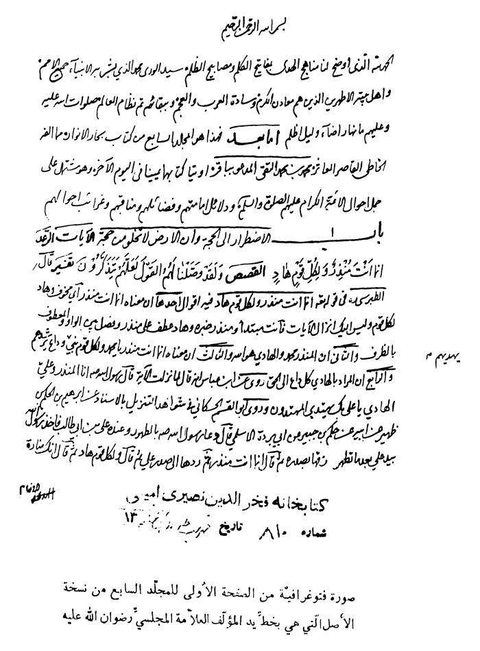
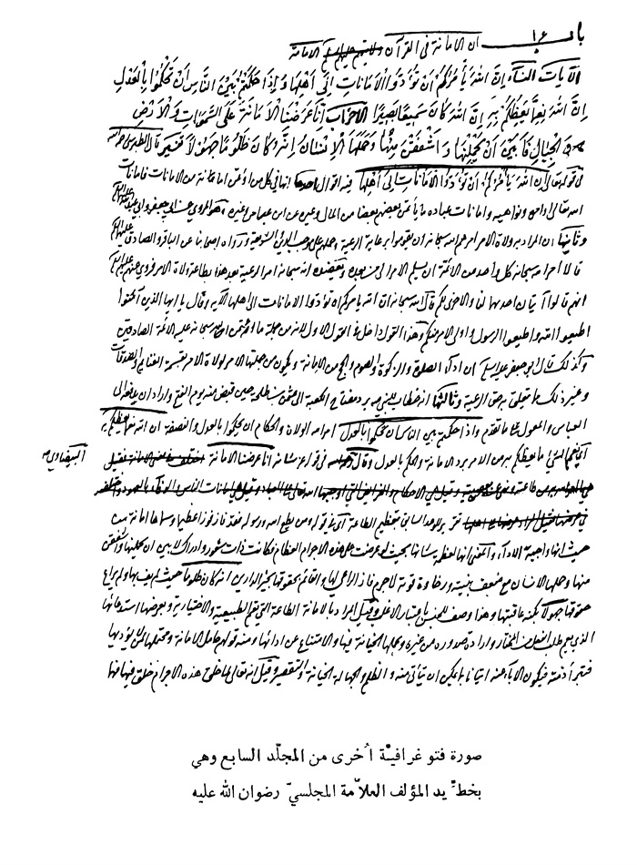
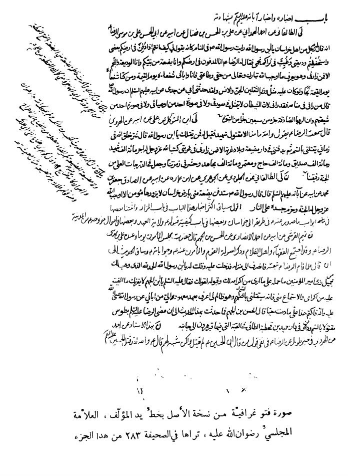

بحار الانوار الجامعة لدرر اخبار الائمة الاطهار المجلد 49

هوية الكتاب
بطاقة تعريف: مجلسي محمد باقربن محمدتقي 1037 - 1111ق.
عنوان واسم المؤلف: بحار الأنوار الجامعة لدرر أخبار الأئمة الأطهار المجلد 49: تأليف محمد باقربن محمدتقي المجلسي.
عنوان واسم المؤلف: بيروت داراحياء التراث العربي [ -13].
مظهر: ج - عينة.
ملاحظة: عربي.
ملاحظة: فهرس الكتابة على أساس المجلد الرابع والعشرين، 1403ق. [1360].
ملاحظة: المجلد108،103،94،91،92،87،67،66،65،52،24(الطبعة الثالثة: 1403ق.=1983م.=[1361]).
ملاحظة: فهرس.
محتويات: ج.24.كتاب الامامة. ج.52.تاريخ الحجة. ج67،66،65.الإيمان والكفر. ج.87.كتاب الصلاة. ج.92،91.الذكر و الدعا. ج.94.كتاب السوم. ج.103.فهرست المصادر. ج.108.الفهرست.-
عنوان: أحاديث الشيعة — قرن 11ق
ترتيب الكونجرس: BP135/م3ب31300 ي ح
تصنيف ديوي: 297/212
رقم الببليوغرافيا الوطنية: 1680946
ص: 1

كتاب تاریخ علی بن موسی الرضا و محمد بن علی الجواد و علی بن محمد الهادی و الحسن بن علی العسكری علیه السلام 

مقدمة المؤلف رحمه اللّٰه

بِسْمِ اللَّهِ الرَّحْمنِ الرَّحِیمِ 
الحمد لله الذی زیّن سماء الدین بالشمس و القمر محمد و علیّ خیر البشر و بالنجوم الباهرة من آلهما أحد عشر صلوات اللّٰه علیهم ما لاح نجم و ظهر و لعنة اللّٰه علی من تولی عنهم و كفر أما بعد فهذا هو المجلد الثانی عشر من كتاب بحار الأنوار مما ألّفه الخاطئ الخاسر محمد المدعوّ بباقر ابن النحریر الماهر محمد التقی حشرهما اللّٰه مع موالیهما فی الیوم الآخر.

أبواب تاریخ الإمام المرتجی و السید المرتضی ثامن أئمة الهدی أبی الحسن علی بن موسی الرضا صلوات اللّٰه علیه و علی آبائه و أولاده أعلام الوری

باب 1 ولادته و ألقابه و كناه و نقش خاتمه و أحوال أمّه صلوات اللّٰه علیه 

«1»- كا، [الكافی] عَلِیٌّ عَنْ أَبِیهِ عَنْ یُونُسَ عَنِ الرِّضَا علیه السلام قَالَ قَالَ: نَقْشُ خَاتَمِی ما شاءَ اللَّهُ لا قُوَّةَ إِلَّا بِاللَّهِ. 
سهل عن محمد بن عیسی عن الحسین بن خالد عنه علیه السلام: مثله (1).
«2»- كا، [الكافی]: وُلِدَ علیه السلام سَنَةَ ثَمَانٍ وَ أَرْبَعِینَ وَ مِائَةٍ وَ قُبِضَ علیه السلام فِی صَفَرٍ مِنْ سَنَةِ ثَلَاثٍ وَ مِائَتَیْنِ وَ هُوَ ابْنُ خَمْسٍ وَ خَمْسِینَ سَنَةً وَ قَدِ اخْتُلِفَ فِی تَارِیخِهِ إِلَّا أَنَّ هَذَا التَّارِیخَ هُوَ الْأَقْصَدُ إِنْ شَاءَ اللَّهُ وَ أُمُّهُ أُمُّ وَلَدٍ یُقَالُ لَهَا أُمُّ الْبَنِینَ (2).
«3»- كشف، [كشف الغمة] قَالَ كَمَالُ الدِّینِ بْنُ طَلْحَةَ: أَمَّا وِلَادَتُهُ علیه السلام فَفِی حَادِیَ عَشَرَ ذِی الْحِجَّةِ سَنَةَ ثَلَاثٍ وَ خَمْسِینَ وَ مِائَةٍ لِلْهِجْرَةِ بَعْدَ وَفَاةِ جَدِّهِ أَبِی عَبْدِ اللَّهِ علیه السلام بِخَمْسِ 
ص: 2

> **پاورقی**: 1- 1. الكافی ج 6 ص 473.

> **پاورقی**: 2- 2. الكافی ج 1 ص 486.

سِنِینَ وَ أُمُّهُ أُمُّ وَلَدٍ تُسَمَّی الْخَیْزُرَانَ الْمَرْسِیَّةَ وَ قِیلَ شَقْرَاءَ النُّوبِیَّةَ وَ اسْمُهَا أَرْوَی وَ شَقْرَاءُ لَقَبٌ لَهَا وَ كُنْیَتُهُ أَبُو الْحَسَنِ وَ أَلْقَابُهُ الرِّضَا وَ الصَّابِرُ وَ الرَّضِیُّ وَ الْوَفِیُّ وَ أَشْهَرُهَا الرِّضَا(1) وَ أَمَّا عُمُرُهُ فَإِنَّهُ مَاتَ فِی سَنَةِ مِائَتَیْنِ وَ ثَلَاثٍ وَ قِیلَ مِائَتَیْنِ وَ سَنَتَیْنِ مِنَ الْهِجْرَةِ فِی خِلَافَةِ الْمَأْمُونِ فَیَكُونُ عُمُرُهُ تِسْعاً وَ أَرْبَعِینَ سَنَةً وَ قَبْرُهُ بِطُوسَ مِنَ خُرَاسَانَ بِالْمَشْهَدِ الْمَعْرُوفِ بِهِ علیه السلام وَ كَانَ مُدَّةُ بَقَائِهِ مَعَ أَبِیهِ مُوسَی علیه السلام أَرْبَعاً وَ عِشْرِینَ سَنَةً وَ أَشْهُراً وَ بَقَائِهِ بَعْدَ أَبِیهِ خَمْساً وَ عِشْرِینَ سَنَةً وَ قَالَ الْحَافِظُ عَبْدُ الْعَزِیزِ مَوْلِدُهُ علیه السلام سَنَةَ ثَلَاثٍ وَ خَمْسِینَ وَ مِائَةٍ وَ تُوُفِّیَ فِی خِلَافَةِ الْمَأْمُونِ بِطُوسَ وَ قَبْرُهُ هُنَاكَ سَنَةَ مِائَتَیْنِ وَ سِتَّةٍ أُمُّهُ سُكَیْنَةُ النُّوبِیَّةُ وَ یُقَالُ وُلِدَ بِالْمَدِینَةِ سَنَةَ ثَمَانٍ وَ أَرْبَعِینَ وَ مِائَةٍ وَ قُبِضَ بِطُوسَ فِی سَنَةِ ثَلَاثٍ وَ مِائَتَیْنِ وَ هُوَ یَوْمَئِذٍ ابْنُ خَمْسٍ وَ خَمْسِینَ سَنَةً وَ أُمُّهُ أُمُّ وَلَدٍ اسْمُهَا أُمُّ الْبَنِینَ (2).
عم، [إعلام الوری]: وُلِدَ علیه السلام بِالْمَدِینَةِ سَنَةَ ثَمَانٍ وَ أَرْبَعِینَ وَ مِائَةٍ مِنَ الْهِجْرَةِ وَ یُقَالُ إِنَّهُ وُلِدَ لِإِحْدَی عَشَرَةَ لَیْلَةً خَلَتْ مِنْ ذِی الْقَعْدَةِ یَوْمَ الْجُمُعَةِ سَنَةَ ثَلَاثٍ وَ خَمْسِینَ وَ مِائَةٍ بَعْدَ وَفَاةِ أَبِی عَبْدِ اللَّهِ علیه السلام بِخَمْسِ سِنِینَ وَ قِیلَ یَوْمَ الْخَمِیسِ وَ أُمُّهُ أُمُّ وَلَدٍ یُقَالُ لَهَا أُمُّ الْبَنِینَ وَ اسْمُهَا نَجْمَةُ وَ یُقَالُ سَكَنُ النُّوبِیَّةُ وَ یُقَالُ تُكْتَمُ وَ قُبِضَ علیه السلام بِطُوسَ مِنْ خُرَاسَانَ فِی قَرْیَةٍ یُقَالُ لَهَا سَنَابَادَ فِی آخِرِ صَفَرٍ وَ قِیلَ إِنَّهُ تُوُفِّیَ فِی شَهْرِ رَمَضَانَ لِسَبْعٍ بَقِینَ مِنْهُ یَوْمَ الْجُمُعَةِ مِنْ سَنَةِ ثَلَاثٍ وَ مِائَتَیْنِ وَ لَهُ یَوْمَئِذٍ خَمْسٌ وَ خَمْسُونَ سَنَةً وَ كَانَتْ مُدَّةُ إِمَامَتِهِ وَ خِلَافَتِهِ لِأَبِیهِ عِشْرِینَ سَنَةً وَ كَانَتْ فِی أَیَّامِ إِمَامَتِهِ بَقِیَّةُ مُلْكِ الرَّشِیدِ وَ مَلِكَ مُحَمَّدٌ الْأَمِینُ بَعْدَهُ ثَلَاثَ سِنِینَ وَ خَمْسَةً وَ عِشْرِینَ یَوْماً ثُمَّ خُلِعَ الْأَمِینُ وَ أُجْلِسَ عَمُّهُ إِبْرَاهِیمُ بْنُ الْمَهْدِیِّ الْمَعْرُوفُ بِابْنِ شَكْلَةَ أَرْبَعَةَ عَشَرَ یَوْماً ثُمَّ أُخْرِجَ مُحَمَّدٌ ثَانِیَةً وَ بُویِعَ لَهُ وَ بَقِیَ بَعْدَ 
ص: 3

> **پاورقی**: 1- 1. كشف الغمّة ج 3 ص 70.

> **پاورقی**: 2- 2. المصدر ج 3 ص 90.

ذَلِكَ سَنَةً وَ سَبْعَةَ أَشْهُرٍ وَ قَتَلَهُ طَاهِرُ بْنُ الْحُسَیْنِ ثُمَّ مَلِكَ الْمَأْمُونُ عَبْدُ اللَّهِ بْنُ هَارُونَ بَعْدَهُ عِشْرِینَ سَنَةً وَ اسْتُشْهِدَ علیه السلام فِی أَیَّامِ مُلْكِهِ. 
«5»- ن، [عیون أخبار الرضا علیه السلام] أَبِی وَ ابْنُ الْمُتَوَكِّلِ وَ مَاجِیلَوَیْهِ وَ أَحْمَدُ بْنُ عَلِیِّ بْنِ إِبْرَاهِیمَ وَ ابْنُ نَاتَانَةَ وَ الْهَمَدَانِیُّ وَ الْمُكَتِّبُ وَ الْوَرَّاقُ جَمِیعاً عَنْ عَلِیٍّ عَنْ أَبِیهِ عَنِ الْبَزَنْطِیِّ قَالَ: قُلْتُ لِأَبِی جَعْفَرٍ مُحَمَّدِ بْنِ عَلِیِّ بْنِ مُوسَی علیهما السلام إِنَّ قَوْماً مِنْ مُخَالِفِیكُمْ یَزْعُمُونَ أَنَّ أَبَاكَ إِنَّمَا سَمَّاهُ الْمَأْمُونُ الرِّضَا لِمَا رَضِیَهُ لِوِلَایَةِ عَهْدِهِ فَقَالَ علیه السلام كَذَبُوا وَ اللَّهِ وَ فَجَرُوا بَلِ اللَّهُ تَبَارَكَ وَ تَعَالَی سَمَّاهُ بِالرِّضَا علیه السلام لِأَنَّهُ كَانَ رَضِیَ لِلَّهِ عَزَّ وَ جَلَّ فِی سَمَائِهِ وَ رَضِیَ لِرَسُولِهِ وَ الْأَئِمَّةِ بَعْدَهُ صَلَوَاتُ اللَّهِ عَلَیْهِمْ فِی أَرْضِهِ قَالَ فَقُلْتُ لَهُ أَ لَمْ یَكُنْ كُلُّ وَاحِدٍ مِنْ آبَائِكَ الْمَاضِینَ علیهم السلام رَضِیَ لِلَّهِ عَزَّ وَ جَلَّ وَ لِرَسُولِهِ وَ الْأَئِمَّةِ بَعْدَهُ علیه السلام فَقَالَ بَلَی فَقُلْتُ فَلِمَ سُمِّیَ أَبُوكَ علیه السلام مِنْ بَیْنِهِمُ الرِّضَا قَالَ لِأَنَّهُ رَضِیَ بِهِ الْمُخَالِفُونَ مِنْ أَعْدَائِهِ كَمَا رَضِیَ بِهِ الْمُوَافِقُونَ مِنْ أَوْلِیَائِهِ وَ لَمْ یَكُنْ ذَلِكَ لِأَحَدٍ مِنْ آبَائِهِ علیهم السلام فَلِذَلِكَ سُمِّیَ مِنْ بَیْنِهِمُ الرِّضَا علیه السلام (1).
ع، [علل الشرائع] أحمد بن علی بن إبراهیم عن أبیه عن جده: مثله (2)- مع، [معانی الأخبار] مرسلا: مثله (3).
«6»- ن، [عیون أخبار الرضا علیه السلام] الدَّقَّاقُ عَنِ الْأَسَدِیِّ عَنْ سَهْلٍ عَنْ عَبْدِ الْعَظِیمِ الْحَسَنِیِّ عَنْ سُلَیْمَانَ بْنِ حَفْصٍ قَالَ: كَانَ مُوسَی بْنُ جَعْفَرٍ علیهما السلام یُسَمِّی وَلَدَهُ عَلِیّاً علیه السلام الرِّضَا وَ كَانَ یَقُولُ ادْعُوا لِی وَلَدِیَ الرِّضَا وَ قُلْتُ لِوَلَدِیَ الرِّضَا وَ قَالَ لِی وَلَدِیَ الرِّضَا وَ إِذَا خَاطَبَهُ قَالَ یَا أَبَا الْحَسَنِ (4).
«7»- ن، [عیون أخبار الرضا علیه السلام] الْبَیْهَقِیُّ عَنِ الصَّوْلِیِّ عَنْ عَوْنِ بْنِ مُحَمَّدٍ الْكِنْدِیِّ قَالَ سَمِعْتُ أَبَا الْحَسَنِ عَلِیَّ بْنَ مِیثَمٍ یَقُولُ: مَا رَأَیْتُ أَحَداً قَطُّ أَعْرَفَ بِأَمْرِ الْأَئِمَّةِ علیهم السلام وَ أَخْبَارِهِمْ 
ص: 4

> **پاورقی**: 1- 1. عیون أخبار الرضا ج 1 ص 13.

> **پاورقی**: 2- 2. علل الشرائع ج 1 ص 226.

> **پاورقی**: 3- 3. معانی الأخبار ص 65.

> **پاورقی**: 4- 4. عیون أخبار الرضا ج 1 ص 14.

وَ مَنَاكِحِهِمْ مِنْهُ قَالَ اشْتَرَتْ حَمِیدَةُ الْمُصَفَّاةُ وَ هِیَ أُمُّ أَبِی الْحَسَنِ مُوسَی بْنِ جَعْفَرٍ وَ كَانَتْ مِنْ أَشْرَافِ الْعَجَمِ جَارِیَةً مُوَلِّدَةً وَ اسْمُهَا تُكْتَمُ وَ كَانَتْ مِنْ أَفْضَلِ النِّسَاءِ فِی عَقْلِهَا وَ دِینِهَا وَ إِعْظَامِهَا لِمَوْلَاتِهَا حَمِیدَةَ الْمُصَفَّاةِ حَتَّی أَنَّهَا مَا جَلَسَتْ بَیْنَ یَدَیْهَا مُنْذُ مَلَكَتْهَا إِجْلَالًا لَهَا فَقَالَتْ لِابْنِهَا مُوسَی علیه السلام یَا بُنَیَّ إِنَّ تُكْتَمَ جَارِیَةٌ مَا رَأَیْتُ جَارِیَةً قَطُّ أَفْضَلَ مِنْهَا وَ لَسْتُ أَشُكُّ أَنَّ اللَّهَ تَعَالَی سَیُطَهِّرُ نَسْلَهَا إِنْ كَانَ لَهَا نَسْلٌ وَ قَدْ وَهَبْتُهَا لَكَ فَاسْتَوْصِ بِهَا خَیْراً فَلَمَّا وَلَدَتْ لَهُ الرِّضَا علیه السلام سَمَّاهَا الطَّاهِرَةَ قَالَ فَكَانَ الرِّضَا علیه السلام یَرْتَضِعُ كَثِیراً وَ كَانَ تَامَّ الْخَلْقِ فَقَالَتْ أَعِینُونِی بِمُرْضِعَةٍ فَقِیلَ لَهَا أَ نَقَصَ الدَّرُّ فَقَالَتْ لَا أَكْذِبُ وَ اللَّهِ مَا نَقَصَ وَ لَكِنْ عَلَیَّ وِرْدٌ مِنْ صَلَاتِی وَ تَسْبِیحِی وَ قَدْ نَقَصَ مُنْذُ وَلَدْتُ قَالَ الْحَاكِمُ أَبُو عَلِیٍّ قَالَ الصَّوْلِیُّ وَ الدَّلِیلُ عَلَی أَنَّ اسْمَهَا تُكْتَمُ قَوْلُ الشَّاعِرِ یَمْدَحُ الرِّضَا علیه السلام: 
أَلَا إِنَّ خَیْرَ النَّاسِ نَفْساً وَ وَالِداً***وَ رَهْطاً وَ أَجْدَاداً عَلِیُّ الْمُعَظَّمُ
أَتَتْنَا بِهِ لِلْعِلْمِ وَ الْحِلْمِ ثَامِناً***إِمَاماً یُؤَدِّی حُجَّةَ اللَّهِ تُكْتَمُ
وَ قَدْ نَسَبَ قَوْمٌ هَذَا الشِّعْرَ إِلَی عَمِّ أَبِی إِبْرَاهِیمَ بْنِ الْعَبَّاسِ وَ لَمْ أَرْوِهِ لَهُ وَ مَا لَمْ یَقَعْ لِی رِوَایَةً وَ سَمَاعاً فَإِنِّی لَا أُحَقِّقُهُ وَ لَا أُبْطِلُهُ بَلِ الَّذِی لَا أَشُكُّ فِیهِ أَنَّهُ لِعَمِّ أَبِی إِبْرَاهِیمَ بْنِ الْعَبَّاسِ: 
كَفَی بِفِعَالِ امْرِئٍ عَالِمٍ***عَلَی أَهْلِهِ عَادِلًا شَاهِداً
أَرَی لَهُمْ طَارِفاً مُونِقاً***وَ لَا یُشْبِهُ الطَّارِفُ التَّالِدَا
یُمَنُّ عَلَیْكُمْ بِأَمْوَالِكُمْ***وَ تُعْطَوْنَ مِنْ مِائَةٍ وَاحِداً
فَلَا یَحْمَدُ اللَّهَ مُسْتَبْصِرٌ***یَكُونُ لِأَعْدَائِكُمْ حَامِداً
فَضَلْتَ قَسِیمَكَ فِی قُعْدُدٍ***كَمَا فَضَلَ الْوَالِدُ الْوَالِدَا
قَالَ الصَّوْلِیُّ وَجَدْتُ هَذِهِ الْأَبْیَاتَ بِخَطِّ أَبِی عَلَی ظَهْرِ دَفْتَرٍ لَهُ یَقُولُ فِیهِ أَنْشَدَنِی أَخِی لِعَمِّهِ فِی عَلِیٍّ یَعْنِی الرِّضَا علیه السلام تَعْلِیقٌ مُتَوَقٍّ فَنَظَرْتُ فَإِذَا هُوَ بِقَسِیمِهِ فِی الْقُعْدُدِ الْمَأْمُونَ لِأَنَّ عَبْدَ الْمُطَّلِبِ هُوَ الثَّامِنُ مِنْ آبَائِهِمَا جَمِیعاً وَ تُكْتَمُ مِنْ أَسْمَاءِ نِسَاءِ الْعَرَبِ قَدْ جَاءَتْ فِی الْأَشْعَارِ كَثِیراً مِنْهَا فِی شِعْرٍ:
ص: 5

طَافَ
الْخَیَالانِ فَهَاجَا سَقَماً***خَیَالُ تُكْنَی وَ خَیَالُ تُكْتَمَا
قَالَ الصَّوْلِیُّ وَ كَانَتْ لِإِبْرَاهِیمَ بْنِ الْعَبَّاسِ الصَّوْلِیِّ عَمِّ أَبِی فِی الرِّضَا علیه السلام مَدَائِحُ كَثِیرَةٌ أَظْهَرَهَا ثُمَّ اضْطُرَّ إِلَی أَنْ سَتَرَهَا وَ تَتَبَّعَهَا فَأَخَذَهَا مِنْ كُلِّ مَكَانٍ وَ قَدْ رَوَی قَوْمٌ أَنَّ أُمَّ الرِّضَا علیه السلام تُسَمَّی سَكَنَ النُّوبِیَّةَ وَ سُمِّیَتْ نَجْمَةَ وَ سُمِّیَتْ سِمَانَ وَ تُكْنَی أُمَّ الْبَنِینَ (1).
بیان: قال الجزری فی حدیث شریح إن رجلا اشتری جاریة و شرطوا أنها مولدة فوجدها تلیدة المولدة التی ولدت بین العرب و نشأت مع أولادهم و تأدبت بآدابهم و التلیدة التی ولدت ببلاد العجم و حملت و نشأت ببلاد العرب انتهی. 
قوله و كان تامّ الخلق لعل المراد به هنا عظم الجثة و قوله تكتم فاعل أتتنا و الطارف المستحدث خلاف التالد و المراد بالطارف الرضا علیه السلام و بالتالد المأمون.
قوله یمنّ علیكم علی البناء للمجهول و الخطاب للرضا و كذا قوله تعطون علی بناء المجهول أی یمن المخالفون علیكم من أموالكم التی فی أیدیهم من مائة واحدا أی قلیلا من كثیر و قال الجوهری رجل قُعْدُدٌ و قُعْدَدٌ إذا كان قریب الآباء إلی الجد الأكبر و كان یقال لعبد الصمد بن علی بن عبد اللّٰه بن عباس قعدد بنی هاشم و قال الفیروزآبادی قعید النسب و قعدد و قعدد و أقعد و قعدود قریب الآباء من الجد الأكبر و القعدد البعید الآباء منه ضد(2)
أی فضلت المأمون الذی هو قسیمك فی قرب الانتساب إلی عبد المطلب و شریكك فیه كما فضل والدك والده أی كل من آبائك آباءه. 
قوله تعلیق متوق من التوقی أی وجدت فی تلك الورقة تعلیقا أی حاشیة علقها علیها مغشوشة لم یوضحها نقیة ففسر فیها قسیمه فی القعدد بالمأمون 
ص: 6

> **پاورقی**: 1- 1. المصدر ص 14- 16.

> **پاورقی**: 2- 2. الصحاح ص 523، القاموس ج 1 ص 328.

و الأصوب فقسیمه كما فی بعض النسخ و علی ما فی أكثر النسخ الحمل علی المجاز و صحح الفیروزآبادی تكنی و تكتم علی بناء المجهول و قال كل منهما اسم لامرأة(1).
«8»- ن، [عیون أخبار الرضا علیه السلام] تَمِیمٌ الْقُرَشِیُّ عَنْ أَبِیهِ عَنْ أَحْمَدَ الْأَنْصَارِیِّ عَنْ عَلِیِّ بْنِ مِیثَمٍ عَنْ أَبِیهِ قَالَ: لَمَّا اشْتَرَتْ حَمِیدَةُ أُمُّ مُوسَی بْنُ جَعْفَرٍ علیهما السلام أُمَّ الرِّضَا علیه السلام نَجْمَةَ ذَكَرَتْ حَمِیدَةُ أَنَّهَا رَأَتْ فِی الْمَنَامِ رَسُولَ اللَّهِ صلی اللّٰه علیه و آله یَقُولُ لَهَا یَا حَمِیدَةُ هِیَ [هَبِی] نَجْمَةَ لِابْنِكَ مُوسَی فَإِنَّهُ سَیُولَدُ لَهُ مِنْهَا خَیْرُ أَهْلِ الْأَرْضِ فَوَهَبَتْهَا لَهُ فَلَمَّا وَلَدَتْ لَهُ الرِّضَا علیه السلام سَمَّاهَا الطَّاهِرَةَ وَ كَانَتْ لَهَا أَسْمَاءٌ مِنْهَا نَجْمَةُ وَ أَرْوَی وَ سَكَنُ وَ سِمَانُ وَ تُكْتَمُ وَ هُوَ آخِرُ أَسَامِیهَا. 
قَالَ عَلِیُّ بْنُ مِیثَمٍ سَمِعْتُ أَبِی یَقُولُ: سَمِعْتُ أُمِّی تَقُولُ كَانَتْ نَجْمَةُ بِكْراً لَمَّا اشْتَرَتْهَا حَمِیدَةُ(2).
«9»- ن، [عیون أخبار الرضا علیه السلام] الْبَیْهَقِیُّ عَنِ الصَّوْلِیِّ: قَالَ أَبُو الْحَسَنِ الرِّضَا علیه السلام هُوَ عَلِیُّ بْنُ مُوسَی بْنِ جَعْفَرِ بْنِ مُحَمَّدِ بْنِ عَلِیِّ بْنِ الْحُسَیْنِ بْنِ عَلِیِّ بْنِ أَبِی طَالِبٍ علیه السلام وَ أُمُّهُ أُمُّ وَلَدٍ تُسَمَّی تُكْتَمُ عَلَیْهِ اسْتَقَرَّ اسْمُهَا حِینَ مَلَكَهَا أَبُو الْحَسَنِ مُوسَی علیه السلام (3).
«10»- ن، [عیون أخبار الرضا علیه السلام]: نَقْشُ خَاتَمِهِ علیه السلام وَلِیُّ اللَّهِ. 
«11»- ن، [عیون أخبار الرضا علیه السلام] أَبِی عَنْ سَعْدٍ عَنِ ابْنِ عِیسَی عَنِ ابْنِ مَحْبُوبٍ عَنْ یَعْقُوبَ بْنِ إِسْحَاقَ عَنْ أَبِی زَكَرِیَّا الْوَاسِطِیِّ عَنْ هِشَامِ بْنِ أَحْمَدَ وَ حَدَّثَنِی مَاجِیلَوَیْهِ عَنْ عَمِّهِ عَنِ الْكُوفِیِّ عَنْ مُحَمَّدِ بْنِ خَالِدٍ عَنْ هِشَامِ بْنِ أَحْمَدَ قَالَ قَالَ أَبُو الْحَسَنِ الْأَوَّلُ علیه السلام: هَلْ عَلِمْتَ أَحَداً مِنْ أَهْلِ الْمَغْرِبِ قَدِمَ قُلْتُ لَا قَالَ بَلَی قَدْ قَدِمَ رَجُلٌ فَانْطَلِقْ بِنَا إِلَیْهِ فَرَكِبَ وَ رَكِبْنَا مَعَهُ حَتَّی انْتَهَیْنَا إِلَی الرَّجُلِ فَإِذَا رَجُلٌ مِنْ أَهْلِ الْمَغْرِبِ مَعَهُ رَقِیقٌ فَقَالَ لَهُ اعْرِضْ عَلَیْنَا فَعَرَضَ عَلَیْنَا تِسْعَ جَوَارٍ كُلَّ ذَلِكَ یَقُولُ أَبُو الْحَسَنِ علیه السلام لَا حَاجَةَ لِی فِیهَا ثُمَّ قَالَ لَهُ اعْرِضْ عَلَیْنَا قَالَ مَا عِنْدِی شَیْ ءٌ 
ص: 7

> **پاورقی**: 1- 1. القاموس ج 4 ص 169 و ص 384.

> **پاورقی**: 2- 2. المصدر ص 16 و 17.

> **پاورقی**: 3- 3. عیون أخبار الرضا ج 1 ص 14.

فَقَالَ بَلَی اعْرِضْ عَلَیْنَا قَالَ لَا وَ اللَّهِ مَا عِنْدِی إِلَّا جَارِیَةٌ مَرِیضَةٌ فَقَالَ لَهُ مَا عَلَیْكَ أَنْ تَعْرِضَهَا فَأَبَی عَلَیْهِ ثُمَّ انْصَرَفَ ثُمَّ إِنَّهُ أَرْسَلَنِی مِنَ الْغَدِ إِلَیْهِ فَقَالَ لِی قُلْ لَهُ كَمْ غَایَتُكَ فِیهَا فَإِذَا قَالَ كَذَا وَ كَذَا فَقُلْ قَدْ أَخَذْتُهَا فَأَتَیْتُهُ فَقَالَ مَا أُرِیدُ أَنْ أَنْقُصَهَا مِنْ كَذَا وَ كَذَا قُلْتُ قَدْ أَخَذْتُهَا وَ هُوَ لَكَ فَقَالَ هِیَ لَكَ وَ لَكِنْ مَنِ الرَّجُلُ الَّذِی كَانَ مَعَكَ بِالْأَمْسِ فَقُلْتُ رَجُلٌ مِنْ بَنِی هَاشِمٍ فَقَالَ مِنْ أَیِّ بَنِی هَاشِمٍ (1) فَقُلْتُ مَا عِنْدِی أَكْثَرُ مِنْ هَذَا فَقَالَ أُخْبِرُكَ عَنْ هَذِهِ الْوَصِیفَةِ إِنِّی اشْتَرَیْتُهَا مِنْ أَقْصَی الْمَغْرِبِ فَلَقِیَتْنِی امْرَأَةٌ مِنْ أَهْلِ الْكِتَابِ فَقَالَتْ مَا هَذِهِ الْوَصِیفَةُ مَعَكَ فَقُلْتُ اشْتَرَیْتُهَا لِنَفْسِی فَقَالَتْ مَا یَنْبَغِی أَنْ تَكُونَ هَذِهِ الْوَصِیفَةُ عِنْدَ مِثْلِكَ إِنَّ هَذِهِ الْجَارِیَةَ یَنْبَغِی أَنْ تَكُونَ عِنْدَ خَیْرِ أَهْلِ الْأَرْضِ فَلَا تَلْبَثُ عِنْدَهُ إِلَّا قَلِیلًا حَتَّی تَلِدَ مِنْهُ غُلَاماً یَدِینُ لَهُ شَرْقُ الْأَرْضِ وَ غَرْبُهَا قَالَ فَأَتَیْتُهُ بِهَا فَلَمْ تَلْبَثْ عِنْدَهُ إِلَّا قَلِیلًا حَتَّی وَلَدَتْ عَلِیّاً علیه السلام (2).
یج، [الخرائج و الجرائح] عن هشام بن الأحمر: مثله (3)- شا، [الإرشاد] ابن قولویه عن الكلینی عن محمد بن یحیی عن أحمد بن محمد عن ابن محبوب عن هشام بن أحمر: مثله (4).
«12»- كشف، [كشف الغمة] قَالَ ابْنُ الْخَشَّابِ بِهَذَا الْإِسْنَادِ عَنْ مُحَمَّدِ بْنِ سِنَانٍ: تُوُفِّیَ علیه السلام وَ لَهُ تِسْعٌ وَ أَرْبَعُونَ سَنَةً وَ أَشْهُرٌ فِی سَنَةِ مِائَتَیْ سَنَةٍ وَ سِتَّةٍ مِنَ الْهِجْرَةِ فَكَانَ مَوْلِدُهُ سَنَةَ مِائَةٍ وَ ثَلَاثٍ وَ خَمْسِینَ مِنَ الْهِجْرَةِ بَعْدَ مُضِیِّ أَبِی عَبْدِ اللَّهِ بِخَمْسِ سِنِینَ وَ أَقَامَ مَعَ أَبِیهِ خَمْساً وَ عِشْرِینَ سَنَةً إِلَّا شَهْرَیْنِ وَ كَانَ عُمُرُهُ تِسْعاً وَ أَرْبَعِینَ سَنَةً وَ أَشْهُراً قَبْرُهُ بِطُوسَ بِمَدِینَةِ خُرَاسَانَ أُمُّهُ الْخَیْزُرَانُ الْمَرْسِیَّةُ أُمُّ وَلَدٍ وَ یُقَالُ شَقْرَاءُ النُّوبِیَّةُ وَ تُسَمَّی أَرْوَی أُمَّ الْبَنِینَ یُكْنَی بِأَبِی الْحَسَنِ وَ لَقَبُهُ الرِّضَا وَ الصَّابِرُ وَ الرَّضِیُّ وَ الْوَفِیُ (5).
ص: 8

> **پاورقی**: 1- 1. زاد فی المصدر: فقلت من نقبائهم، فقال: أرید أكثر من ذلك. الخ.

> **پاورقی**: 2- 2. المصدر ص 17.

> **پاورقی**: 3- 3. الخرائج و الجرائح ص 235.

> **پاورقی**: 4- 4. الإرشاد ص 287 و 288.

> **پاورقی**: 5- 5. كشف الغمّة ج 3 ص 113.

«13»- ن، [عیون أخبار الرضا علیه السلام]: كَانَ یُقَالُ لَهُ علیه السلام الرِّضَا وَ الصَّادِقُ وَ الصَّابِرُ وَ الْفَاضِلُ وَ قُرَّةُ أَعْیُنِ الْمُؤْمِنِینَ وَ غَیْظُ الْمُلْحِدِینَ (1).
أقول: قاله فی آخر خبر هرثمة بن أعین فی وفاته علیه السلام و الظاهر أنه من كلام الصدوق رحمه اللّٰه و قد مضی فی نقش خاتم أبیه علیه السلام أنه كان یتختم بخاتم أبیه و أنه كان نقشه حَسْبِیَ اللَّهُ. 
«14»- ن، [عیون أخبار الرضا علیه السلام] تَمِیمٌ الْقُرَشِیُّ عَنْ أَبِیهِ عَنْ أَحْمَدَ الْأَنْصَارِیِّ عَنْ عَلِیِّ بْنِ مِیثَمٍ عَنْ أَبِیهِ قَالَ سَمِعْتُ أُمِّی تَقُولُ: سَمِعْتُ نَجْمَةَ أُمَّ الرِّضَا علیه السلام تَقُولُ لَمَّا حَمَلْتُ بِابْنِی عَلِیٍّ لَمْ أَشْعَرْ بِثِقْلِ الْحَمْلِ وَ كُنْتُ أَسْمَعُ فِی مَنَامِی تَسْبِیحاً وَ تَهْلِیلًا وَ تَمْجِیداً مِنْ بَطْنِی فَیُفْزِعُنِی ذَلِكَ وَ یَهُولُنِی فَإِذَا انْتَبَهْتُ لَمْ أَسْمَعْ شَیْئاً فَلَمَّا وَضَعْتُهُ وَقَعَ عَلَی الْأَرْضِ وَاضِعاً یَدَهُ عَلَی الْأَرْضِ رَافِعاً رَأْسَهُ إِلَی السَّمَاءِ یُحَرِّكُ شَفَتَیْهِ كَأَنَّهُ یَتَكَلَّمُ فَدَخَلَ إِلَیَّ أَبُوهُ مُوسَی بْنُ جَعْفَرٍ علیهما السلام فَقَالَ لِی هَنِیئاً لَكِ یَا نَجْمَةُ كَرَامَةُ رَبِّكَ فَنَاوَلْتُهُ إِیَّاهُ فِی خِرْقَةٍ بَیْضَاءَ فَأَذَّنَ فِی أُذُنِهِ الْیُمْنَی وَ أَقَامَ فِی الْیُسْرَی وَ دَعَا بِمَاءِ الْفُرَاتِ فَحَنَّكَهُ بِهِ ثُمَّ رَدَّهُ إِلَیَّ وَ قَالَ خُذِیهِ فَإِنَّهُ بَقِیَّةُ اللَّهِ تَعَالَی فِی أَرْضِهِ (2).
«15»- ن، [عیون أخبار الرضا علیه السلام] الطَّالَقَانِیُّ عَنِ الْحَسَنِ بْنِ عَلِیِّ بْنِ زَكَرِیَّا عَنْ مُحَمَّدِ بْنِ خَلِیلَانَ عَنْ أَبِیهِ عَنْ جَدِّهِ عَنْ أَبِیهِ عَنْ عَتَّابِ بْنِ أَسِیدٍ قَالَ سَمِعْتُ جَمَاعَةً مِنْ أَهْلِ الْمَدِینَةِ یَقُولُونَ: وُلِدَ الرِّضَا عَلِیُّ بْنُ مُوسَی علیهما السلام بِالْمَدِینَةِ یَوْمَ الْخَمِیسِ لِإِحْدَی عَشَرَةَ لَیْلَةً خَلَتْ مِنْ رَبِیعٍ الْأَوَّلِ سَنَةَ ثَلَاثٍ وَ خَمْسِینَ وَ مِائَةٍ مِنَ الْهِجْرَةِ بَعْدَ وَفَاةِ أَبِی عَبْدِ اللَّهِ علیه السلام بِخَمْسِ سِنِینَ الْخَبَرَ(3).
«16»- كف، [المصباح للكفعمی]: وُلِدَ علیه السلام بِالْمَدِینَةِ یَوْمَ الْخَمِیسِ حَادِیَ عَشَرَ ذِی الْقَعْدَةِ سَنَةَ ثَمَانٍ وَ أَرْبَعِینَ وَ مِائَةٍ. 
ص: 9

> **پاورقی**: 1- 1. عیون أخبار الرضا ج 2 ص 250.

> **پاورقی**: 2- 2. عیون أخبار الرضا ج 1 ص 20.

> **پاورقی**: 3- 3. المصدر ج 1 ص 18.

«17»- ضه، [روضة الواعظین]: كَانَ مَوْلِدُهُ یَوْمَ الْجُمُعَةِ وَ فِی رِوَایَةٍ أُخْرَی یَوْمَ الْخَمِیسِ لِإِحْدَی عَشَرَةَ لَیْلَةً خَلَتْ مِنْ ذِی الْقَعْدَةِ سَنَةَ ثَمَانٍ وَ أَرْبَعِینَ وَ مِائَةٍ. 
«18»- الدُّرُوسُ،: وُلِدَ بِالْمَدِینَةِ سَنَةَ ثَمَانٍ وَ أَرْبَعِینَ وَ مِائَةٍ وَ قِیلَ یَوْمَ الْخَمِیسِ حَادِیَ عَشَرَ ذِی الْقَعْدَةِ. 
«19»- تَارِیخُ الْغِفَارِیِّ،: وُلِدَ علیه السلام یَوْمَ الْجُمُعَةِ الْحَادِیَ عَشَرَ مِنْ شَهْرِ ذِی الْقَعْدَةِ. 
«20»- شا، [الإرشاد]: كَانَ مَوْلِدُ الرِّضَا علیه السلام بِالْمَدِینَةِ سَنَةَ ثَمَانٍ وَ أَرْبَعِینَ وَ مِائَةٍ(1).
«21»- قب، [المناقب] لابن شهرآشوب: عَلِیُّ بْنُ مُوسَی بْنِ جَعْفَرِ بْنِ مُحَمَّدِ بْنِ عَلِیِّ بْنِ الْحُسَیْنِ بْنِ عَلِیِّ بْنِ أَبِی طَالِبٍ علیه السلام یُكْنَی أبو [أَبَا] الْحَسَنِ وَ الْخَاصُّ أَبُو عَلِیٍّ وَ أَلْقَابُهُ سِرَاجُ اللَّهِ وَ نُورُ الْهُدَی وَ قُرَّةُ عَیْنِ الْمُؤْمِنِینَ وَ مَكِیدَةُ الْمُلْحِدِینَ كُفْوُ الْمَلِكِ وَ كَافِی الْخَلْقِ وَ رَبُّ السَّرِیرِ وَ رِئَابُ التَّدْبِیرِ وَ الْفَاضِلُ وَ الصَّابِرُ وَ الْوَفِیُّ وَ الصِّدِّیقُ وَ الرَّضِیُّ قَالَ أَحْمَدُ الْبَزَنْطِیُّ وَ إِنَّمَا سُمِّیَ الرِّضَا لِأَنَّهُ كَانَ رَضِیَ لِلَّهِ تَعَالَی فِی سَمَائِهِ وَ رَضِیَ لِرَسُولِهِ وَ الْأَئِمَّةِ علیهم السلام بَعْدَهُ فِی أَرْضِهِ وَ قِیلَ لِأَنَّهُ رَضِیَ بِهِ الْمُخَالِفُ وَ الْمُؤَالِفُ وَ قِیلَ لِأَنَّهُ
رَضِیَ بِهِ الْمَأْمُونُ وَ أُمُّهُ أُمُّ وَلَدٍ یُقَالُ لَهَا سَكَنُ النُّوبِیَّةُ وَ یُقَالُ خَیْزُرَانُ الْمَرْسِیَّةُ وَ یُقَالُ نَجْمَةُ رَوَاهُ مِیثَمٌ وَ یُقَالُ صَقْرٌ وَ تُسَمَّی أَرْوَی أُمَّ الْبَنِینَ وَ لَمَّا وَلَدَتِ الرِّضَا سَمَّاهَا الطَّاهِرَةَ وُلِدَ یَوْمَ الْجُمُعَةِ بِالْمَدِینَةِ وَ قِیلَ یَوْمَ الْخَمِیسِ لِإِحْدَی عَشَرَةَ لَیْلَةً خَلَتْ مِنْ رَبِیعٍ الْأَوَّلِ سَنَةَ ثَلَاثٍ وَ خَمْسِینَ وَ مِائَةٍ بَعْدَ وَفَاةِ الصَّادِقِ علیه السلام بِخَمْسِ سِنِینَ رَوَاهُ ابْنُ بَابَوَیْهِ وَ قِیلَ سَنَةَ إِحْدَی وَ خَمْسِینَ وَ مِائَةٍ فَكَانَ فِی سِنِی إِمَامَتِهِ بَقِیَّةُ مُلْكِ الرَّشِیدِ ثُمَّ مَلَكَ الْأَمِینُ ثَلَاثَ سِنِینَ وَ ثَمَانِیَةَ عَشَرَ یَوْماً وَ مَلَكَ الْمَأْمُونُ عِشْرِینَ سَنَةً وَ ثَلَاثَةً وَ عِشْرِینَ یَوْماً وَ أَخَذَ الْبَیْعَةَ فِی مُلْكِهِ 
ص: 10

> **پاورقی**: 1- 1. إرشاد المفید ص 285.

لِلرِّضَا علیه السلام بِعَهْدِ الْمُسْلِمِینَ مِنْ غَیْرِ رِضًا فِی الْخَامِسِ مِنْ شَهْرِ رَمَضَانَ سَنَةَ إِحْدَی وَ مِائَتَیْنِ وَ زَوَّجَهُ ابْنَتَهُ أُمَّ حَبِیبٍ فِی أَوَّلِ سَنَةِ اثْنَیْنِ وَ مِائَتَیْنِ وَ قِیلَ سَنَةِ ثَلَاثٍ وَ هُوَ یَوْمَئِذٍ ابْنُ خَمْسٍ وَ خَمْسِینَ سَنَةً وَ ذَكَرَ ابْنُ هَمَّامٍ تِسْعاً وَ أَرْبَعِینَ سَنَةً وَ سِتَّةَ أَشْهُرٍ وَ قِیلَ وَ أَرْبَعَةَ أَشْهُرٍ وَ قَامَ بِالْأَمْرِ وَ لَهُ تِسْعٌ وَ عِشْرُونَ سَنَةً وَ شَهْرَانِ وَ عَاشَ مَعَ أَبِیهِ تسع [تِسْعاً] وَ عِشْرِینَ سَنَةً وَ أَشْهُراً وَ بَعْدَ أَبِیهِ أَیَّامَ إِمَامَتِهِ عِشْرِینَ سَنَةً وَ وَلَدُهُ مُحَمَّدٌ الْإِمَامُ فَقَطْ وَ مَشْهَدُهُ بِطُوسَ وَ خُرَاسَانَ فِی الْقُبَّةِ الَّتِی فِیهَا هَارُونُ إِلَی جَانِبِهِ مِمَّا یَلِی الْقِبْلَةَ وَ هِیَ دَارُ حُمَیْدِ بْنِ قَحْطَبَةَ الطَّائِیِّ فِی قَرْیَةٍ یُقَالُ لَهَا سَنَابَادُ مِنْ رُسْتَاقِ نُوقَانَ (1).
بیان: الرئاب كشداد المصلح و سیأتی بعض أخبار ولادته فی باب شهادته علیه السلام. 

باب 2 النصوص علی الخصوص علیه صلوات اللّٰه علیه

«1»- ن، [عیون أخبار الرضا علیه السلام] أَبِی وَ ابْنُ الْوَلِیدِ وَ ابْنُ الْمُتَوَكِّلِ وَ الْعَطَّارُ وَ مَاجِیلَوَیْهِ جَمِیعاً عَنْ مُحَمَّدٍ الْعَطَّارِ عَنِ الْأَشْعَرِیِّ عَنْ عَبْدِ اللَّهِ بْنِ مُحَمَّدٍ الشَّامِیِّ عَنِ الْخَشَّابِ عَنِ ابْنِ أَسْبَاطٍ عَنِ الْحُسَیْنِ مَوْلَی أَبِی عَبْدِ اللَّهِ عَنْ أَبِی الْحَكَمِ عَنْ عَبْدِ اللَّهِ بْنِ إِبْرَاهِیمَ الْجَعْفَرِیِّ عَنْ یَزِیدَ بْنِ سَلِیطٍ الزَّیْدِیِّ قَالَ: لَقِیتُ مُوسَی بْنُ جَعْفَرٍ علیهما السلام فَقُلْتُ أَخْبِرْنِی عَنِ الْإِمَامِ بَعْدَكَ بِمِثْلِ مَا أَخْبَرَ بِهِ أَبُوكَ قَالَ فَقَالَ كَانَ أَبِی فِی زَمَنٍ لَیْسَ هَذَا مِثْلَهُ قَالَ یَزِیدُ فَقُلْتُ مَنْ یَرْضَ مِنْكَ بِهَذَا فَعَلَیْهِ لَعْنَةُ اللَّهِ قَالَ فَضَحِكَ ثُمَّ قَالَ أُخْبِرُكَ یَا أَبَا عُمَارَةَ أَنِّی خَرَجْتُ مِنْ مَنْزِلِی فَأَوْصَیْتُ فِی الظَّاهِرِ إِلَی بَنِیَّ وَ أَشْرَكْتُهُمْ مَعَ عَلِیٍّ ابْنِی وَ أَفْرَدْتُهُ بِوَصِیَّتِی فِی الْبَاطِنِ.
ص: 11

> **پاورقی**: 1- 1. مناقب آل أبی طالب ج 4 ص 366 و 367.

وَ لَقَدْ رَأَیْتُ رَسُولَ اللَّهِ صلی اللّٰه علیه و آله فِی الْمَنَامِ وَ أَمِیرُ الْمُؤْمِنِینَ علیه السلام مَعَهُ وَ مَعَهُ خَاتَمٌ وَ سَیْفٌ وَ عَصًا وَ كِتَابٌ وَ عِمَامَةٌ فَقُلْتُ لَهُ مَا هَذَا فَقَالَ أَمَّا الْعِمَامَةُ فَسُلْطَانُ اللَّهِ عَزَّ وَ جَلَّ وَ أَمَّا السَّیْفُ فَعِزَّةُ اللَّهِ عَزَّ وَ جَلَّ وَ أَمَّا الْكِتَابُ فَنُورُ اللَّهِ عَزَّ وَ جَلَّ وَ أَمَّا الْعَصَا فَقُوَّةُ اللَّهِ عَزَّ وَ جَلَّ وَ أَمَّا الْخَاتَمُ فَجَامِعُ هَذِهِ الْأُمُورِ ثُمَّ قَالَ رَسُولُ اللَّهِ صلی اللّٰه علیه و آله وَ الْأَمْرُ یَخْرُجُ إِلَی عَلِیٍّ ابْنِكَ قَالَ ثُمَّ قَالَ یَا یَزِیدُ إِنَّهَا وَدِیعَةٌ عِنْدَكَ فَلَا تُخْبِرْ بِهَا إِلَّا عَاقِلًا أَوْ عَبْداً امْتَحَنَ اللَّهُ قَلْبَهُ لِلْإِیمَانِ أَوْ صَادِقاً وَ لَا تَكْفُرْ نِعَمَ اللَّهِ تَعَالَی وَ إِنْ سُئِلْتَ عَنِ الشَّهَادَةِ فَأَدِّهَا فَإِنَّ اللَّهَ تَبَارَكَ وَ تَعَالَی یَقُولُ إِنَّ اللَّهَ یَأْمُرُكُمْ أَنْ تُؤَدُّوا الْأَماناتِ إِلی أَهْلِها(1) وَ قَالَ عَزَّ وَ جَلَ وَ مَنْ أَظْلَمُ مِمَّنْ كَتَمَ شَهادَةً عِنْدَهُ مِنَ اللَّهِ (2) فَقُلْتُ وَ اللَّهِ مَا كُنْتُ لِأَفْعَلَ هَذَا أَبَداً قَالَ ثُمَّ قَالَ أَبُو الْحَسَنِ علیه السلام ثُمَّ وَصَفَهُ لِی رَسُولُ اللَّهِ صلی اللّٰه علیه و آله فَقَالَ عَلِیٌّ ابْنُكَ الَّذِی یَنْظُرُ بِنُورِ اللَّهِ وَ یَسْمَعُ بِتَفْهِیمِهِ وَ یَنْطِقُ بِحِكْمَتِهِ یُصِیبُ وَ لَا یُخْطِئُ وَ یَعْلَمُ وَ لَا یَجْهَلُ قَدْ مُلِئَ حِلْماً وَ عِلْماً وَ مَا أَقَلَّ مُقَامَكَ مَعَهُ إِنَّمَا هُوَ شَیْ ءٌ كَأَنْ لَمْ یَكُنْ فَإِذَا رَجَعْتَ مِنْ سَفَرِكَ فَأَصْلِحْ أَمْرَكَ وَ افْرُغْ مِمَّا أَرَدْتَ فَإِنَّكَ مُنْتَقِلٌ عَنْهُ وَ مُجَاوِرٌ غَیْرَهُ فَاجْمَعْ وُلْدَكَ وَ أَشْهِدِ اللَّهَ عَلَیْهِمْ جَمِیعاً وَ كَفی بِاللَّهِ شَهِیداً ثُمَّ قَالَ یَا یَزِیدُ إِنِّی أُوخَذُ فِی هَذِهِ السَّنَةِ وَ عَلِیٌّ ابْنِی سَمِیُّ عَلِیِّ بْنِ أَبِی طَالِبٍ علیه السلام وَ سَمِیُّ عَلِیِّ بْنِ الْحُسَیْنِ علیهما السلام أُعْطِیَ فَهْمَ الْأَوَّلِ وَ عِلْمَهُ وَ بَصَرَهُ وَ رِدَاءَهُ وَ لَیْسَ لَهُ أَنْ یَتَكَلَّمَ إِلَّا بَعْدَ هَارُونَ بِأَرْبَعِ سِنِینَ فَإِذَا مَضَتْ أَرْبَعُ سِنِینَ فَسَلْهُ عَمَّا شِئْتَ یُجِبْكَ إِنْ شَاءَ اللَّهُ تَعَالَی (3).
عم، [إعلام الوری] الكلینی عن محمد بن علی عن أبی الحكم: مثله (4)
ص: 12

> **پاورقی**: 1- 1. النساء: 58.

> **پاورقی**: 2- 2. البقرة: 140.

> **پاورقی**: 3- 3. عیون أخبار الرضا ج 1 ص 23- 26.

> **پاورقی**: 4- 4. تراه فی الكافی ج 1 ص 311- 316 فی حدیث و صدر السند: أحمد بن مهران، عن محمّد بن علی، عن أبی الحكم الارمنی.

كتاب الإمامة و التبصرة لعلی بن بابویه عن محمد بن یحیی عن محمد بن أحمد عن عبد اللّٰه بن محمد الشامی: مثله بیان سیأتی تمام الخبر فی باب النصوص علی الجواد علیه السلام قوله فهم الأول أی أمیر المؤمنین علیه السلام و لعل المراد بالرداء الأخلاق الحسنة لاشتمالها علی صاحبها كما قال تعالی الكبریاء ردائی. 
«2»- ن، [عیون أخبار الرضا علیه السلام] أَبِی عَنِ الْحَسَنِ بْنِ عَبْدِ اللَّهِ بْنِ مُحَمَّدِ بْنِ عِیسَی عَنْ أَبِیهِ عَنِ الْخَشَّابِ عَنْ مُحَمَّدِ بْنِ الْأَصْبَغِ عَنْ أَحْمَدَ بْنِ الْحَسَنِ الْمِیثَمِیِّ وَ كَانَ وَاقِفِیّاً قَالَ حَدَّثَنِی مُحَمَّدُ بْنُ إِسْمَاعِیلَ بْنِ الْفَضْلِ الْهَاشِمِیُّ قَالَ: دَخَلْتُ عَلَی أَبِی الْحَسَنِ مُوسَی بْنُ جَعْفَرٍ علیهما السلام وَ قَدِ اشْتَكَی شِكَایَةً شَدِیدَةً وَ قُلْتُ لَهُ إِنْ كَانَ مَا أَسْأَلُ اللَّهَ أَنْ لَا یُرِیَنَاهُ فَإِلَی مَنْ قَالَ إِلَی عَلِیٍّ ابْنِی وَ كِتَابُهُ كِتَابِی وَ هُوَ وَصِیِّی وَ خَلِیفَتِی مِنْ بَعْدِی (1).
«3»- ن، [عیون أخبار الرضا علیه السلام] ابْنُ الْوَلِیدِ عَنِ الصَّفَّارِ وَ سَعْدٍ مَعاً عَنِ الْأَشْعَرِیِّ عَنِ الْحَسَنِ بْنِ عَلِیِّ بْنِ یَقْطِینٍ عَنْ أَخِیهِ الْحُسَیْنِ عَنْ أَبِیهِ عَلِیِّ بْنِ یَقْطِینٍ قَالَ: كُنْتُ عِنْدَ أَبِی الْحَسَنِ مُوسَی بْنُ جَعْفَرٍ علیهما السلام وَ عِنْدَهُ عَلِیٌّ ابْنُهُ علیه السلام وَ قَالَ یَا عَلِیُّ هَذَا ابْنِی سَیِّدُ وُلْدِی وَ قَدْ نَحَلْتُهُ كُنْیَتِی قَالَ فَضَرَبَ هِشَامٌ یَعْنِی ابْنَ سَالِمٍ یَدَهُ عَلَی جَبْهَتِهِ فَقَالَ إِنَّا لِلَّهِ نَعَی وَ اللَّهِ إِلَیْكَ نَفْسَهُ (2).
«4»- ن، [عیون أخبار الرضا علیه السلام] ابْنُ الْوَلِیدِ عَنِ الصَّفَّارِ عَنْ عَبْدِ اللَّهِ بْنِ مُحَمَّدِ بْنِ عِیسَی عَنِ ابْنِ مَحْبُوبٍ وَ عُثْمَانَ بْنِ عِیسَی عَنْ حُسَیْنِ بْنِ نُعَیْمٍ الصَّحَّافِ قَالَ: كُنْتُ أَنَا وَ هِشَامُ بْنُ الْحَكَمِ وَ عَلِیُّ بْنُ یَقْطِینٍ بِبَغْدَادَ فَقَالَ عَلِیُّ بْنُ یَقْطِینٍ كُنْتُ عِنْدَ الْعَبْدِ
الصَّالِحِ مُوسَی بْنُ جَعْفَرٍ علیهما السلام جَالِساً فَدَخَلَ عَلَیْهِ ابْنُهُ الرِّضَا علیه السلام فَقَالَ یَا عَلِیُّ هَذَا سَیِّدُ وُلْدِی وَ قَدْ نَحَلْتُهُ كُنْیَتِی فَضَرَبَ هِشَامٌ بِرَاحَتِهِ جَبْهَتَهُ ثُمَّ قَالَ وَیْحَكَ كَیْفَ قُلْتَ فَقَالَ عَلِیُّ بْنُ یَقْطِینٍ سَمِعْتُ وَ اللَّهِ مِنْهُ كَمَا قُلْتُ لَكَ فَقَالَ هِشَامٌ أَخْبَرَكَ وَ اللَّهِ أَنَّ الْأَمْرَ فِیهِ مِنْ بَعْدِهِ (3).
ص: 13

> **پاورقی**: 1- 1. عیون الأخبار ج 1 ص 20.

> **پاورقی**: 2- 2. المصدر ج 1 ص 21.

> **پاورقی**: 3- 3. المصدر ص 21.

غط، [الغیبة] للشیخ الطوسی الكلینی عن محمد بن یحیی عن ابن عیسی عن ابن محبوب عن الحسین بن نعیم: مثله (1)- شا، [الإرشاد] ابن قولویه عن الكلینی: مثله- عم، [إعلام الوری] عن الكلینی: مثله (2).
«5»- ن، [عیون أخبار الرضا علیه السلام] ابْنُ الْمُتَوَكِّلِ عَنِ السَّعْدَآبَادِیِّ عَنِ الْبَرْقِیِّ عَنْ أَبِیهِ عَنْ خَلَفِ بْنِ حَمَّادٍ عَنْ دَاوُدَ بْنِ زُرْبِیٍّ عَنْ عَلِیِّ بْنِ یَقْطِینٍ قَالَ قَالَ مُوسَی بْنُ جَعْفَرٍ علیهما السلام: ابْتِدَاءً مِنْهُ هَذَا أَفْقَهُ وُلْدِی وَ أَشَارَ بِیَدِهِ إِلَی الرِّضَا علیه السلام وَ قَدْ نَحَلْتُهُ كُنْیَتِی (3).
«6»- ن، [عیون أخبار الرضا علیه السلام] أَبِی عَنِ الْحَسَنِ بْنِ عَبْدِ اللَّهِ بْنِ مُحَمَّدِ بْنِ عِیسَی عَنْ أَبِیهِ عَنِ الْخَشَّابِ عَنْ مُحَمَّدِ بْنِ الْأَصْبَغِ عَنْ أَبِیهِ عَنْ غَنَّامِ بْنِ الْقَاسِمِ قَالَ قَالَ لِی مَنْصُورُ بْنُ یُونُسَ بُزُرْجَ: دَخَلْتُ عَلَی أَبِی الْحَسَنِ یَعْنِی مُوسَی بْنُ جَعْفَرٍ علیهما السلام یَوْماً فَقَالَ لِی یَا مَنْصُورُ أَ مَا عَلِمْتَ مَا أَحْدَثْتُ فِی یَوْمِی هَذَا قُلْتُ لَا قَالَ قَدْ صَیَّرْتُ عَلِیّاً ابْنِی وَصِیِّی وَ الْخَلَفَ مِنْ بَعْدِی فَادْخُلْ عَلَیْهِ وَ هَنِّئْهُ بِذَلِكَ وَ أَعْلِمْهُ أَنِّی أَمَرْتُكَ بِهَذَا قَالَ فَدَخَلْتُ عَلَیْهِ فَهَنَّأْتُهُ بِذَلِكَ وَ أَعْلَمْتُهُ أَنَّ أَبَاهُ أَمَرَنِی بِذَلِكَ ثُمَّ جَحَدَ مَنْصُورٌ بَعْدَ ذَلِكَ فَأَخَذَ الْأَمْوَالَ الَّتِی كَانَتْ فِی یَدِهِ وَ كَسَرَهَا(4).
كش، [رجال الكشی] حمدویه عن الخشاب: مثله (5)
بیان: كسر الأموال كنایة عن التصرف فیها و بذلها من غیر مبالاة قال الفیروزآبادی كسر الرجل قل تعاهده لماله. 
«7»- ن، [عیون أخبار الرضا علیه السلام] أَبِی عَنْ سَعْدٍ عَنِ ابْنِ عِیسَی عَنِ الْحَجَّالِ عَنْ مُحَمَّدِ بْنِ سِنَانٍ عَنْ 
ص: 14

> **پاورقی**: 1- 1. غیبة الشیخ الطوسیّ ص 27. الكافی ج 1 ص 311 و فیه محمّد بن یحیی، عن أحمد بن محمّد، عن ابن محبوب.

> **پاورقی**: 2- 2. الإرشاد ص 285.

> **پاورقی**: 3- 3. عیون أخبار الرضا ج 1 ص 22.

> **پاورقی**: 4- 4. المصدر ج 1 ص 22.

> **پاورقی**: 5- 5. رجال الكشّیّ ص 398- طبعة الاعلمی بكربلاء.

دَاوُدَ الرَّقِّیِّ قَالَ: قُلْتُ لِأَبِی إِبْرَاهِیمَ علیه السلام جُعِلْتُ فِدَاكَ قَدْ كَبِرَ سِنِّی فَحَدِّثْنِی مَنِ الْإِمَامُ بَعْدَكَ قَالَ فَأَشَارَ إِلَی أَبِی الْحَسَنِ الرِّضَا علیه السلام وَ قَالَ هَذَا صَاحِبُكُمْ مِنْ بَعْدِی (1).
«8»- ن، [عیون أخبار الرضا علیه السلام] ابْنُ الْوَلِیدِ عَنِ الصَّفَّارِ عَنِ ابْنِ عِیسَی عَنِ الْحَجَّالِ وَ الْبَزَنْطِیِّ مَعاً عَنْ أَبِی عَلِیٍّ الْخَزَّازِ عَنْ دَاوُدَ الرَّقِّیِّ قَالَ: قُلْتُ لِأَبِی إِبْرَاهِیمَ علیه السلام إِنِّی قَدْ كَبِرْتُ وَ خِفْتُ أَنْ یَحْدُثَ بِی حَدَثٌ وَ لَا أَلْقَاكَ فَأَخْبِرْنِی مَنِ الْإِمَامُ مِنْ بَعْدِكَ فَقَالَ ابْنِی عَلِیٌ (2).
«9»- ن، [عیون أخبار الرضا علیه السلام] الْهَمَدَانِیُّ عَنْ عَلِیٍّ عَنْ أَبِیهِ عَنْ مُحَمَّدٍ الْبَرْقِیِّ عَنْ سُلَیْمَانَ الْمَرْوَزِیِّ قَالَ: دَخَلْتُ عَلَی أَبِی الْحَسَنِ مُوسَی بْنُ جَعْفَرٍ علیهما السلام وَ أَنَا أُرِیدُ أَنْ أَسْأَلَهُ عَنِ الْحُجَّةِ عَلَی النَّاسِ بَعْدَهُ فَابْتَدَأَنِی وَ قَالَ یَا سُلَیْمَانُ إِنَّ عَلِیّاً ابْنِی وَ وَصِیِّی وَ الْحُجَّةُ عَلَی النَّاسِ بَعْدِی وَ هُوَ أَفْضَلُ وُلْدِی فَإِنْ بَقِیتَ بَعْدِی فَاشْهَدْ لَهُ بِذَلِكَ عِنْدَ شِیعَتِی وَ أَهْلِ وَلَایَتِی وَ الْمُسْتَخْبِرِینَ عَنْ خَلِیفَتِی مِنْ بَعْدِی (3).
«10»- ن، [عیون أخبار الرضا علیه السلام] أَبِی عَنْ سَعْدٍ عَنِ ابْنِ عِیسَی عَنِ الْحَجَّالِ عَنْ زَكَرِیَّا بْنِ آدَمَ عَنْ عَلِیِّ بْنِ عَبْدِ اللَّهِ الْهَاشِمِیِّ قَالَ: كُنَّا عِنْدَ الْقَبْرِ نَحْوَ سِتِّینَ رَجُلًا مِنَّا وَ مِنْ مَوَالِینَا إِذْ أَقْبَلَ أَبُو إِبْرَاهِیمَ مُوسَی بْنُ جَعْفَرٍ علیهما السلام وَ یَدُ عَلِیٍّ ابْنِهِ علیه السلام فِی یَدِهِ فَقَالَ أَ تَدْرُونَ مَنْ أَنَا قُلْنَا أَنْتَ سَیِّدُنَا وَ كَبِیرُنَا قَالَ سَمُّونِی وَ انْسُبُونِی فَقُلْنَا أَنْتَ مُوسَی بْنُ جَعْفَرٍ فَقَالَ مَنْ هَذَا مَعِی قُلْنَا هُوَ عَلِیُّ بْنُ مُوسَی بْنِ جَعْفَرٍ قَالَ فَاشْهَدُوا أَنَّهُ وَكِیلِی فِی حَیَاتِی وَ وَصِیِّی بَعْدَ مَوْتِی (4).
«11»- ن، [عیون أخبار الرضا علیه السلام] أَبِی عَنْ سَعْدٍ عَنِ ابْنِ عِیسَی عَنِ ابْنِ مَحْبُوبٍ عَنْ عَبْدِ اللَّهِ بْنِ مَرْحُومٍ قَالَ: خَرَجْتُ مِنَ الْبَصْرَةِ أُرِیدُ الْمَدِینَةَ فَلَمَّا صِرْتُ فِی بَعْضِ الطَّرِیقِ لَقِیتُ أَبَا 
ص: 15

> **پاورقی**: 1- 1. عیون أخبار الرضا ج 1 ص 23. و مثله فی الإرشاد ص 285، و الكافی ج 1 ص 312.

> **پاورقی**: 2- 2. المصدر ص 23.

> **پاورقی**: 3- 3. المصدر ص 26.

> **پاورقی**: 4- 4. المصدر نفسه.

إِبْرَاهِیمَ علیه السلام وَ هُوَ یُذْهَبُ بِهِ إِلَی الْبَصْرَةِ فَأَرْسَلَ إِلَیَّ فَدَخَلْتُ عَلَیْهِ فَدَفَعَ إِلَیَّ كُتُباً وَ أَمَرَنِی أَنْ أُوصِلَهَا بِالْمَدِینَةِ فَقُلْتُ إِلَی مَنْ أَدْفَعُهَا جُعِلْتُ فِدَاكَ قَالَ إِلَی ابْنِی عَلِیٍّ فَإِنَّهُ وَصِیِّی وَ الْقَیِّمُ بِأَمْرِی وَ خَیْرُ بَنِیَ (1).
«12»- ن، [عیون أخبار الرضا علیه السلام] ابْنُ الْوَلِیدِ عَنِ الصَّفَّارِ عَنِ ابْنِ أَبِی الْخَطَّابِ عَنْ مُحَمَّدِ بْنِ الْفُضَیْلِ عَنْ عَبْدِ اللَّهِ بْنِ الْحَارِثِ وَ أُمُّهُ مِنْ وُلْدِ جَعْفَرِ بْنِ أَبِی طَالِبٍ قَالَ: بَعَثَ إِلَیْنَا أَبُو إِبْرَاهِیمَ علیه السلام فَجَمَعَنَا ثُمَّ قَالَ أَ تَدْرُونَ لِمَ جَمَعْتُكُمْ قُلْنَا لَا قَالَ اشْهَدُوا
أَنَّ عَلِیّاً ابْنِی هَذَا وَصِیِّی وَ الْقَیِّمُ بِأَمْرِی وَ خَلِیفَتِی مِنْ بَعْدِی مَنْ كَانَ لَهُ عِنْدِی دَیْنٌ فَلْیَأْخُذْهُ مِنِ ابْنِی هَذَا وَ مَنْ كَانَتْ لَهُ عِنْدِی عِدَةٌ فَلْیَسْتَنْجِزْهَا مِنْهُ وَ مَنْ لَمْ یَكُنْ لَهُ بُدٌّ مِنْ لِقَائِی فَلَا یَلْقَنِی إِلَّا بِكِتَابِهِ (2).
شا، [الإرشاد] عم، [إعلام الوری] غط، [الغیبة] للشیخ الطوسی الكلینی عن أحمد بن مهران عن محمد بن علی عن محمد بن الفضیل عن المخزومی و كانت أمه من ولد جعفر بن أبی طالب: مثله (3)
بیان: الضمیر فی قوله بكتابه راجع إلی علی علیه السلام و یحتمل رجوعه إلی الموصول. 
«13»- ن، [عیون أخبار الرضا علیه السلام] الْمُظَفَّرُ الْعَلَوِیُّ عَنِ ابْنِ الْعَیَّاشِیِّ عَنْ أَبِیهِ عَنْ یُوسُفَ بْنِ السُّخْتِ عَنْ عَلِیِّ بْنِ الْقَاسِمِ الْعُرَیْضِیِّ عَنْ أَبِیهِ عَنْ صَفْوَانَ بْنِ یَحْیَی عَنْ حَیْدَرِ بْنِ أَیُّوبَ عَنْ مُحَمَّدِ بْنِ زَیْدٍ الْهَاشِمِیِّ أَنَّهُ قَالَ: الْآنَ یَتَّخِذُ الشِّیعَةُ عَلِیَّ بْنَ مُوسَی علیهما السلام إِمَاماً قُلْتُ وَ كَیْفَ ذَاكَ قَالَ دَعَاهُ أَبُو الْحَسَنِ مُوسَی بْنُ جَعْفَرٍ علیهما السلام فَأَوْصَی إِلَیْهِ (4).
«14»- ن، [عیون أخبار الرضا علیه السلام] أَبِی عَنْ سَعْدٍ عَنِ ابْنِ عِیسَی عَنْ عَلِیِّ بْنِ الْحَكَمِ عَنْ حَیْدَرِ بْنِ أَیُّوبَ قَالَ: كُنَّا بِالْمَدِینَةِ فِی مَوْضِعٍ یُعْرَفُ بِالْقُبَاءِ(5) فِیهِ مُحَمَّدُ بْنُ زَیْدِ بْنِ عَلِیٍّ فَجَاءَ بَعْدَ الْوَقْتِ الَّذِی كَانَ یَجِیئُنَا فِیهِ فَقُلْنَا لَهُ جُعِلْنَا فِدَاكَ مَا حَبَسَكَ قَالَ دَعَانَا 
ص: 16

> **پاورقی**: 1- 1. عیون أخبار الرضا ج 1 ص 27.

> **پاورقی**: 2- 2. عیون أخبار الرضا ج 1 ص 27.

> **پاورقی**: 3- 3. الكافی ج 1 ص 312، الإرشاد ص 286.

> **پاورقی**: 4- 4. عیون الأخبار ج 1 ص 27 و 28.

> **پاورقی**: 5- 5. لعله یرید« قباء» فأدخل علیه الالف و اللام.

أَبُو إِبْرَاهِیمَ علیه السلام الْیَوْمَ سَبْعَةَ عَشَرَ رَجُلًا مِنْ وُلْدِ عَلِیٍّ وَ فَاطِمَةَ صَلَوَاتُ اللَّهِ عَلَیْهِمَا فَأَشْهَدَنَا لِعَلِیٍّ ابْنِهِ بِالْوَصِیَّةِ وَ الْوَكَالَةِ فِی حَیَاتِهِ وَ بَعْدَ مَوْتِهِ وَ أَنَّ أَمْرَهُ جَائِزٌ عَلَیْهِ وَ لَهُ ثُمَّ قَالَ مُحَمَّدُ بْنُ زَیْدٍ وَ اللَّهِ یَا حَیْدَرُ لَقَدْ عَقَدَ لَهُ الْإِمَامَةَ الْیَوْمَ وَ لِیَقُولَنَّ الشِّیعَةُ بِهِ مِنْ بَعْدِهِ قَالَ حَیْدَرٌ قُلْتُ بَلْ یُبْقِیهِ اللَّهُ وَ أَیُّ شَیْ ءٍ هَذَا قَالَ یَا حَیْدَرُ إِذَا أَوْصَی إِلَیْهِ فَقَدْ عَقَدَ لَهُ الْإِمَامَةَ قَالَ عَلِیُّ بْنُ الْحَكَمِ مَاتَ حَیْدَرٌ وَ هُوَ شَاكٌ (1).
«15»- ن، [عیون أخبار الرضا علیه السلام] مَاجِیلَوَیْهِ عَنْ عَمِّهِ عَنِ الْكُوفِیِّ عَنْ مُحَمَّدِ بْنِ خَلَفٍ عَنْ یُونُسَ عَنْ أَسَدِ بْنِ أَبِی الْعَلَاءِ عَنْ عَبْدِ الصَّمَدِ بْنِ بَشِیرٍ وَ خَلَفِ بْنِ حَمَّادٍ عَنْ عَبْدِ الرَّحْمَنِ بْنِ الْحَجَّاجِ قَالَ: أَوْصَی أَبُو الْحَسَنِ مُوسَی بْنُ جَعْفَرٍ علیهما السلام إِلَی ابْنِهِ عَلِیٍّ علیه السلام وَ كَتَبَ لَهُ كِتَاباً أَشْهَدَ فِیهِ سِتِّینَ رَجُلًا مِنْ وُجُوهِ أَهْلِ الْمَدِینَةِ(2).
«16»- ن، [عیون أخبار الرضا علیه السلام] الْهَمَدَانِیُّ عَنْ عَلِیٍّ عَنْ أَبِیهِ عَنِ ابْنِ مَرَّارٍ وَ صَالِحِ بْنِ السِّنْدِیِّ عَنْ یُونُسَ عَنْ حُسَیْنِ بْنِ بَشِیرٍ قَالَ: أَقَامَ لَنَا أَبُو الْحَسَنِ مُوسَی بْنُ جَعْفَرٍ علیهما السلام ابْنَهُ عَلِیّاً علیه السلام كَمَا أَقَامَ رَسُولُ اللَّهِ صلی اللّٰه علیه و آله عَلِیّاً علیه السلام یَوْمَ غَدِیرِ خُمٍّ فَقَالَ یَا أَهْلَ الْمَدِینَةِ أَوْ قَالَ یَا أَهْلَ الْمَسْجِدِ هَذَا وَصِیِّی مِنْ بَعْدِی (3).
«17»- ن، [عیون أخبار الرضا علیه السلام] ابْنُ الْمُتَوَكِّلِ عَنْ مُحَمَّدٍ الْعَطَّارِ عَنِ ابْنِ عِیسَی عَنِ الْحَسَنِ بْنِ عَلِیٍّ الْخَزَّازِ قَالَ: خَرَجْنَا إِلَی مَكَّةَ وَ مَعَنَا عَلِیُّ بْنُ أَبِی حَمْزَةَ وَ مَعَهُ مَالٌ وَ مَتَاعٌ فَقُلْنَا مَا هَذَا قَالَ لِلْعَبْدِ الصَّالِحِ علیه السلام أَمَرَنِی أَنْ أَحْمِلَهُ إِلَی عَلِیٍّ ابْنِهِ علیه السلام وَ قَدْ أَوْصَی إِلَیْهِ قَالَ الصَّدُوقُ رَحِمَهُ اللَّهُ إِنَّ عَلِیَّ بْنَ أَبِی حَمْزَةَ أَنْكَرَ ذَلِكَ بَعْدَ وَفَاةِ مُوسَی بْنُ جَعْفَرٍ علیهما السلام وَ حَبَسَ الْمَالَ عَنِ الرِّضَا علیه السلام (4).
ص: 17

> **پاورقی**: 1- 1. المصدر ص 28.

> **پاورقی**: 2- 2. المصدر ص 28.

> **پاورقی**: 3- 3. نفس المصدر ص 28 و 29.

> **پاورقی**: 4- 4. عیون أخبار الرضا ج 1 ص 29.

«18»- ن، [عیون أخبار الرضا علیه السلام] الْوَرَّاقُ عَنْ سَعْدٍ عَنِ الْیَقْطِینِیِّ عَنْ یُونُسَ عَنْ صَفْوَانَ بْنِ یَحْیَی عَنْ أَبِی أَیُّوبَ الْخَزَّازِ عَنْ سَلَمَةَ بْنِ مُحْرِزٍ قَالَ: قُلْتُ لِأَبِی عَبْدِ اللَّهِ علیه السلام إِنَّ رَجُلًا مِنَ الْعِجْلِیَّةِ(1) قَالَ لِی كَمْ عَسَی أَنْ یَبْقَی لَكُمْ هَذَا الشَّیْخُ إِنَّمَا هُوَ سَنَةً أَوْ سَنَتَیْنِ حَتَّی یَهْلِكَ ثُمَّ تَصِیرُونَ لَیْسَ لَكُمْ أَحَدٌ تَنْظُرُونَ إِلَیْهِ فَقَالَ أَبُو عَبْدِ اللَّهِ علیه السلام أَلَّا قُلْتَ لَهُ هَذَا مُوسَی بْنُ جَعْفَرٍ قَدْ أَدْرَكَ مَا یُدْرِكُ الرِّجَالُ وَ قَدِ اشْتَرَیْنَا لَهُ جَارِیَةً تُبَاحُ لَهُ فَكَأَنَّكَ بِهِ إِنْ شَاءَ اللَّهُ وَ قَدْ وُلِدَ لَهُ فَقِیهٌ خَلَفٌ (2).
«19»- ن، [عیون أخبار الرضا علیه السلام] الْمُظَفَّرُ الْعَلَوِیُّ عَنِ ابْنِ الْعَیَّاشِیِّ عَنْ أَبِیهِ عَنْ یُوسُفَ بْنِ السُّخْتِ عَنْ عَلِیِّ بْنِ الْقَاسِمِ عَنْ أَبِیهِ عَنْ جَعْفَرِ بْنِ خَلَفٍ عَنْ إِسْمَاعِیلَ بْنِ الْخَطَّابِ قَالَ: كَانَ أَبُو الْحَسَنِ علیه السلام یَبْتَدِئُ بِالثَّنَاءِ عَلَی ابْنِهِ عَلِیٍّ علیه السلام وَ یُطْرِیهِ وَ یَذْكُرُ مِنْ فَضْلِهِ وَ بِرِّهِ مَا لَا یَذْكُرُ مِنْ غَیْرِهِ كَأَنَّهُ یُرِیدُ أَنْ یَدُلَّ عَلَیْهِ (3).
«20»- ن، [عیون أخبار الرضا علیه السلام] أَبِی عَنْ سَعْدٍ عَنِ الْیَقْطِینِیِّ عَنْ یُونُسَ عَنْ جَعْفَرِ بْنِ خَلَفٍ قَالَ سَمِعْتُ أَبَا الْحَسَنِ مُوسَی بْنُ جَعْفَرٍ علیهما السلام یَقُولُ: سَعِدَ امْرُؤٌ لَمْ یَمُتْ حَتَّی یَرَی مِنْهُ خَلَفاً وَ قَدْ أَرَانِیَ اللَّهُ مِنِ ابْنِی هَذَا خَلَفاً وَ أَشَارَ إِلَیْهِ یَعْنِی إِلَی الرِّضَا علیه السلام (4).
كش، [رجال الكشی] جعفر بن أحمد عن یونس: مثله (5).
«21»- ن، [عیون أخبار الرضا علیه السلام] ابْنُ الْوَلِیدِ عَنِ الصَّفَّارِ عَنِ ابْنِ عِیسَی عَنِ الْحَجَّالِ عَنِ الْبَزَنْطِیِّ وَ مُحَمَّدِ بْنِ سِنَانٍ وَ عَلِیِّ بْنِ الْحَكَمِ عَنِ الْحُسَیْنِ بْنِ الْمُخْتَارِ قَالَ: خَرَجَتْ إِلَیْنَا أَلْوَاحٌ 
ص: 18

> **پاورقی**: 1- 1. قیل: العجیلة فرقتان: الأولی: المغیریة أصحاب المغیرة بن سعید العجلیّ، قالوا: اللّٰه عزّ شأنه علی صورة رجل من نور علی رأسه تاج و یقولون: الامام المنتظر زكریا بن محمّد بن علیّ بن الحسین بن علی علیهم السلام و هو حی مقیم فی جبل حاجز و الثانیة: المنصوریة أصحاب أبی منصور العجلیّ عزی نفسه الی الباقر علیه السلام فتبرأ منه و طرده فادعی الإمامة، و قد زعم أصحابه أنّه عرج الی السماء. قلت: و سیجی ء تحت الرقم 43 انه هارون بن سعید العجلیّ كان من الزیدیة.

> **پاورقی**: 2- 2. المصدر ص 29 و 30.

> **پاورقی**: 3- 3. عیون أخبار الرضا ج 1 ص 30.

> **پاورقی**: 4- 4. عیون أخبار الرضا ج 1 ص 30.

> **پاورقی**: 5- 5. رجال الكشّیّ ص 404.

مِنْ أَبِی إِبْرَاهِیمَ مُوسَی علیه السلام وَ هُوَ فِی الْحَبْسِ فَإِذَا فِیهَا مَكْتُوبٌ عَهْدِی إِلَی أَكْبَرِ وُلْدِی (1).
«22»- ن، [عیون أخبار الرضا علیه السلام] أَبِی عَنْ سَعْدٍ عَنِ الْیَقْطِینِیِّ عَنْ یُونُسَ بْنِ عَبْدِ الرَّحْمَنِ عَنِ الْحُسَیْنِ بْنِ الْمُخْتَارِ قَالَ: لَمَّا مَرَّ بِنَا أَبُو الْحَسَنِ علیه السلام بِالْبَصْرَةِ خَرَجَتْ إِلَیْنَا مِنْهُ أَلْوَاحٌ مَكْتُوبٌ فِیهَا بِالْعَرْضِ عَهْدِی إِلَی أَكْبَرِ وُلْدِی (2).
«23»- ن، [عیون أخبار الرضا علیه السلام] بِالْإِسْنَادِ عَنِ الْیَقْطِینِیِّ عَنْ زِیَادِ بْنِ مَرْوَانَ الْقَنْدِیِّ قَالَ: دَخَلْتُ عَلَی أَبِی إِبْرَاهِیمَ علیه السلام وَ عِنْدَهُ عَلِیٌّ ابْنُهُ فَقَالَ لِی یَا زِیَادُ هَذَا كِتَابُهُ كِتَابِی وَ كَلَامُهُ كَلَامِی وَ رَسُولُهُ رَسُولِی وَ مَا قَالَ فَالْقَوْلُ قَوْلُهُ (3).
شا، [الإرشاد] عم، [إعلام الوری] غط، [الغیبة] للشیخ الطوسی الكلینی عن أحمد بن مهران عن محمد بن علی عن زیاد: مثله:(4)
قال الصدوق رحمه اللّٰه: إن زیاد بن مروان روی هذا الحدیث ثم أنكره بعد مضی موسی علیه السلام و قال بالوقف و حبس ما كان عنده من مال موسی بن جعفر علیه السلام (5).
ص: 19

> **پاورقی**: 1- 1. عیون الأخبار ج 1 ص 30.

> **پاورقی**: 2- 2. عیون الأخبار ج 1 ص 30.

> **پاورقی**: 3- 3. المصدر نفسه.

> **پاورقی**: 4- 4. الكافی ج 1 ص 321. إرشاد المفید ص 286.

> **پاورقی**: 5- 5. زیاد بن مروان أبو الفضل و قیل أبو عبد اللّٰه الأنباری القندی مولی بنی هاشم روی عن أبی عبد اللّٰه و أبی الحسن علیهما السلام و وقف فی الرضا، روی الكشّیّ ص 396 و 416 بإسناده عن یونس بن عبد الرحمن قال: مات أبو الحسن علیه السلام و لیس عنده من قوامه أحد الا و عنده المال الكثیر، و كان ذلك سبب وقفهم و جحدهم موته، و كان عند زیاد القندی سبعون ألف دینار و عند علیّ بن أبی حمزة ثلاثون ألف دینار، قال رأیت ذلك و تبین لی الحق و عرفت من أمر أبی الحسن الرضا علیه السلام ما عملت فكلمت و دعوت الناس إلیه. قال: فبعثا الی و قالا لی: لا تدع الی هذا ان كنت ترید المال فنحن نغنیك، و ضمنا لی عشرة آلاف دینار، و قالا لی: كف. و قال الخطیب: و اما مسجد الانباریین فینسب الیهم لكثرة من سكنه منهم، و أقدم من سكنه منهم زیاد القندی و كان یتصرف أیّام الرشید و كان الرشید ولی أبا وكیع الجراح بن ملیح بیت المال فاستخلف زیادا و كان زیاد شیعیا من الغالیة، فاختان هو و جماعة من الكتاب و اقتطعوا من بیت المال، و صح ذلك عند الرشید فأمر یقطع ید زیاد، فقال: یا أمیر المؤمنین لا یجب علی قطع الید، انما أنا مؤتمن و انما أنا خنت، فكف عن قطع یده.

«24»- ن، [عیون أخبار الرضا علیه السلام] بِالْإِسْنَادِ عَنِ الْیَقْطِینِیِّ عَنِ الْحَجَّالِ عَنْ سَعِیدِ بْنِ أَبِی الْجَهْمِ عَنْ نَصْرِ بْنِ قَابُوسَ قَالَ: قُلْتُ لِأَبِی إِبْرَاهِیمَ مُوسَی بْنُ جَعْفَرٍ علیهما السلام إِنِّی سَأَلْتُ أَبَاكَ علیه السلام مَنِ الَّذِی یَكُونُ بَعْدَكَ فَأَخْبَرَنِی أَنَّكَ أَنْتَ هُوَ فَلَمَّا تُوُفِّیَ أَبُو عَبْدِ اللَّهِ علیه السلام ذَهَبَ النَّاسُ یَمِیناً وَ شِمَالًا وَ قُلْتُ أَنَا وَ أَصْحَابِی بِكَ فَأَخْبِرْنِی مَنِ الَّذِی یَكُونُ بَعْدَكَ قَالَ ابْنِی عَلِیٌّ علیه السلام (1).
كش، [رجال الكشی] حمدویه عن الحسن بن موسی عن البزنطی عن سعید: مثله (2).
«25»- ن، [عیون أخبار الرضا علیه السلام] ابْنُ الْوَلِیدِ عَنِ الصَّفَّارِ عَنِ الْخَشَّابِ عَنْ نُعَیْمِ بْنِ قَابُوسَ قَالَ قَالَ أَبُو الْحَسَنِ علیه السلام: عَلِیٌّ ابْنِی أَكْبَرُ وُلْدِی وَ أَسْمَعُهُمْ لِقَوْلِی وَ أَطْوَعُهُمْ لِأَمْرِی یَنْظُرُ مَعِی فِی كِتَابِ الْجَفْرِ وَ الْجَامِعَةِ وَ لَیْسَ یَنْظُرُ فِیهِ إِلَّا نَبِیٌّ أَوْ وَصِیُّ نَبِیٍ (3).
یر، [بصائر الدرجات] عبد اللّٰه بن محمد عن الخشاب: مثله (4).
«26»- ن، [عیون أخبار الرضا علیه السلام] أَبِی عَنْ سَعْدٍ عَنِ الْبَرْقِیِّ عَنْ أَبِیهِ عَنْ عَبْدِ اللَّهِ بْنِ عَبْدِ الرَّحْمَنِ عَنِ الْمُفَضَّلِ بْنِ عُمَرَ قَالَ: دَخَلْتُ عَلَی أَبِی الْحَسَنِ مُوسَی بْنُ جَعْفَرٍ علیهما السلام وَ عَلِیٌّ ابْنُهُ علیه السلام فِی حَجْرِهِ وَ هُوَ یُقَبِّلُهُ وَ یَمَصُّ لِسَانَهُ وَ یَضَعُهُ عَلَی عَاتِقِهِ وَ یَضُمُّهُ إِلَیْهِ وَ یَقُولُ بِأَبِی أَنْتَ مَا أَطْیَبَ رِیحَكَ وَ أَطْهَرَ خَلْقَكَ وَ أَبْیَنَ فَضْلَكَ قُلْتُ جُعِلْتُ فِدَاكَ لَقَدْ وَقَعَ فِی قَلْبِی لِهَذَا الْغُلَامِ مِنَ الْمَوَدَّةِ مَا لَمْ یَقَعْ لِأَحَدٍ إِلَّا لَكَ فَقَالَ لِی: 
ص: 20

> **پاورقی**: 1- 1. المصدر ص 31.

> **پاورقی**: 2- 2. رجال الكشّیّ ص 383.

> **پاورقی**: 3- 3. عیون أخبار الرضا ج 1 ص 31.

> **پاورقی**: 4- 4. بصائر الدرجات الجزء 3 ب 14 ح 24.

یَا مُفَضَّلُ هُوَ مِنِّی بِمَنْزِلَتِی مِنْ أَبِی علیه السلام ذُرِّیَّةً بَعْضُها مِنْ بَعْضٍ وَ اللَّهُ سَمِیعٌ عَلِیمٌ قَالَ قُلْتُ هُوَ صَاحِبُ هَذَا الْأَمْرِ مِنْ بَعْدِكَ قَالَ نَعَمْ مَنْ أَطَاعَهُ رَشَدَ وَ مَنْ عَصَاهُ كَفَرَ(1).
«27»- ن، [عیون أخبار الرضا علیه السلام] الْهَمَدَانِیُّ عَنْ عَلِیٍّ عَنْ أَبِیهِ عَنْ مُحَمَّدِ بْنِ سِنَانٍ قَالَ: دَخَلْتُ عَلَی أَبِی الْحَسَنِ علیه السلام قَبْلَ أَنْ یُحْمَلَ إِلَی الْعِرَاقِ بِسَنَةٍ وَ عَلِیٌّ ابْنُهُ علیه السلام بَیْنَ یَدَیْهِ فَقَالَ لِی یَا مُحَمَّدُ قُلْتُ لَبَّیْكَ قَالَ إِنَّهُ سَیَكُونُ فِی هَذِهِ السَّنَةِ حَرَكَةٌ فَلَا تَجْزَعْ مِنْهَا ثُمَّ أَطْرَقَ وَ نَكَتَ بِیَدِهِ فِی الْأَرْضِ وَ رَفَعَ رَأْسَهُ إِلَیَّ وَ هُوَ یَقُولُ یُضِلُّ اللَّهُ الظَّالِمِینَ وَ یَفْعَلُ اللَّهُ ما یَشاءُ قُلْتُ وَ مَا ذَاكَ جُعِلْتُ فِدَاكَ قَالَ مَنْ ظَلَمَ ابْنِی هَذَا حَقَّهُ وَ جَحَدَ إِمَامَتَهُ مِنْ بَعْدِی كَانَ كَمَنْ ظَلَمَ عَلِیَّ بْنَ أَبِی طَالِبٍ علیه السلام حَقَّهُ وَ جَحَدَ إِمَامَتَهُ مِنْ بَعْدِ مُحَمَّدٍ صلی اللّٰه علیه و آله فَعَلِمْتُ أَنَّهُ قَدْ نَعَی إِلَیَّ نَفْسَهُ وَ دَلَّ عَلَی ابْنِهِ فَقُلْتُ وَ اللَّهِ لَئِنْ مَدَّ اللَّهُ فِی عُمُرِی لَأُسَلِّمَنَّ إِلَیْهِ حَقَّهُ وَ لَأُقِرَّنَّ لَهُ بِالْإِمَامَةِ وَ أَشْهَدُ أَنَّهُ مِنْ بَعْدِكَ حُجَّةُ اللَّهِ عَلَی خَلْقِهِ وَ الدَّاعِی إِلَی دِینِهِ فَقَالَ لِی یَا مُحَمَّدُ یَمُدُّ اللَّهُ فِی عُمُرِكَ وَ تَدْعُو إِلَی إِمَامَتِهِ وَ إِمَامَةِ مَنْ یَقُومُ مَقَامَهُ مِنْ بَعْدِهِ قُلْتُ مَنْ ذَاكَ جُعِلْتُ فِدَاكَ قَالَ مُحَمَّدٌ ابْنُهُ قَالَ قُلْتُ فَالرِّضَا وَ التَّسْلِیمَ قَالَ نَعَمْ كَذَلِكَ وَجَدْتُكَ فِی كِتَابِ أَمِیرِ الْمُؤْمِنِینَ علیه السلام أَمَا إِنَّكَ فِی شِیعَتِنَا أَبْیَنُ مِنَ الْبَرْقِ فِی اللَّیْلَةِ الظَّلْمَاءِ ثُمَّ قَالَ یَا مُحَمَّدُ إِنَّ الْمُفَضَّلَ كَانَ أُنْسِی وَ مُسْتَرَاحِی وَ أَنْتَ أُنْسُهُمَا وَ مُسْتَرَاحُهُمَا حَرَامٌ عَلَی النَّارِ أَنْ تَمَسَّكَ أَبَداً(2).
غط، [الغیبة] للشیخ الطوسی الْكُلَیْنِیُّ عَنْ مُحَمَّدِ بْنِ الْحَسَنِ عَنْ سَهْلِ بْنِ زِیَادٍ عَنْ مُحَمَّدِ بْنِ عَلِیِّ بْنِ عَبْدِ اللَّهِ عَنِ ابْنِ سِنَانٍ: مِثْلَهُ إِلَی قَوْلِهِ وَ التَّسْلِیمَ (3).
ص: 21

> **پاورقی**: 1- 1. عیون أخبار الرضا ج 1 ص 32.

> **پاورقی**: 2- 2. المصدر ص 32 و 33.

> **پاورقی**: 3- 3. غیبة الشیخ ص 27.

شا، [الإرشاد] ابْنُ قُولَوَیْهِ عَنِ الْكُلَیْنِیِّ: مِثْلَهُ (1)- عم، [إعلام الوری] عَنِ الْكُلَیْنِیِّ: مِثْلَهُ (2).
«28»- ن، [عیون أخبار الرضا علیه السلام] الْمُظَفَّرُ الْعَلَوِیُّ عَنِ ابْنِ الْعَیَّاشِیِّ عَنْ أَبِیهِ عَنْ یُوسُفَ بْنِ السُّخْتِ عَنْ عَلِیِّ بْنِ الْقَاسِمِ الْعُرَیْضِیِّ الْحُسَیْنِیِّ عَنْ صَفْوَانَ بْنِ یَحْیَی عَنْ عَبْدِ الرَّحْمَنِ بْنِ الْحَجَّاجِ عَنْ إِسْحَاقَ وَ عَلِیٍّ ابْنَیْ أَبِی عَبْدِ اللَّهِ جَعْفَرِ بْنِ مُحَمَّدٍ علیهما السلام: أَنَّهُمَا دَخَلَا عَلَی عَبْدِ الرَّحْمَنِ بْنِ أَسْلَمَ بِمَكَّةَ فِی السَّنَةِ الَّتِی أُخِذَ فِیهَا مُوسَی بْنُ جَعْفَرٍ علیهما السلام وَ مَعَهُمَا كِتَابُ أَبِی الْحَسَنِ علیه السلام بِخَطِّهِ فِیهِ حَوَائِجُ قَدْ أَمَرَ بِهَا فَقَالا إِنَّهُ قَدْ أَمَرَ بِهَذِهِ الْحَوَائِجِ مِنْ هَذَا الْوَجْهِ فَإِنْ كَانَ مِنْ أَمْرِهِ شَیْ ءٌ فَادْفَعْهُ إِلَی ابْنِهِ عَلِیٍّ علیه السلام فَإِنَّهُ خَلِیفَتُهُ وَ الْقَیِّمُ بِأَمْرِهِ وَ كَانَ هَذَا بَعْدَ النَّفْرِ بِیَوْمٍ بَعْدَ مَا أُخِذَ أَبُو الْحَسَنِ علیه السلام بِنَحْوٍ مِنْ خَمْسِینَ یَوْماً وَ أَشْهَدَ إِسْحَاقُ وَ عَلِیٌّ ابْنَا أَبِی عَبْدِ اللَّهِ علیه السلام الْحُسَیْنَ بْنَ أَحْمَدَ الْمِنْقَرِیَّ وَ إِسْمَاعِیلَ بْنَ عُمَرَ وَ حَسَّانَ بْنَ مُعَاوِیَةَ وَ الْحُسَیْنَ بْنَ مُحَمَّدٍ صَاحِبَ الْخَتْمِ عَلَی شَهَادَتِهِمَا أَنَّ أَبَا الْحَسَنِ عَلِیَّ بْنَ مُوسَی علیهما السلام وَصِیُّ أَبِیهِ علیه السلام وَ خَلِیفَتُهُ فَشَهِدَ اثْنَانِ بِهَذِهِ الشَّهَادَةِ وَ اثْنَانِ قَالا خَلِیفَتُهُ وَ وَكِیلُهُ فَقُبِلَتْ شَهَادَتُهُمْ عِنْدَ حَفْصِ بْنِ غِیَاثٍ (3)
الْقَاضِی (4).
«29»- ن، [عیون أخبار الرضا علیه السلام] الْهَمَدَانِیُّ عَنْ عَلِیٍّ عَنْ أَبِیهِ عَنْ بَكْرِ بْنِ صَالِحٍ قَالَ: قُلْتُ 
ص: 22

> **پاورقی**: 1- 1. الإرشاد ص 287.

> **پاورقی**: 2- 2. الكافی ج 1 ص 319.

> **پاورقی**: 3- 3. هو أبو عمر حفص بن غیاث ابن طلق بن معاویة النخعیّ قاضی الكوفة، كان عامیا من أصحاب الباقر و الصادق علیهما السلام، ولی القضاء ببغداد الشرقیة لهارون، ثمّ ولاه قضاء الكوفة و مات بها سنة 194، قال النجاشیّ ص 103: له كتاب و هو 170 حدیث او نحوها. و الذی ینص علی عامیته أنّه قال فی قاموس الرجال ص 364 ج 3: عنونه الخطیب و روی أنّه إذا وامروه فی یتیمة قال لقیّمها سل عنه فان كان رافضیا لم یزوجه.

> **پاورقی**: 4- 4. عیون أخبار الرضا ج 1 ص 39.

لِإِبْرَاهِیمَ بْنِ أَبِی الْحَسَنِ مُوسَی بْنُ جَعْفَرٍ علیهما السلام مَا قَوْلُكَ فِی أَبِیكَ قَالَ هُوَ حَیٌّ قُلْتُ فَمَا قَوْلُكَ فِی أَخِیكَ أَبِی الْحَسَنِ قَالَ ثِقَةٌ صَدُوقٌ قُلْتُ فَإِنَّهُ یَقُولُ إِنَّ أَبَاكَ قَدْ مَضَی قَالَ هُوَ أَعْلَمُ وَ مَا یَقُولُ فَأَعَدْتُ عَلَیْهِ فَأَعَادَ عَلَیَّ قُلْتُ فَأَوْصَی أَبُوكَ قَالَ نَعَمْ قُلْتُ إِلَی مَنْ أَوْصَی قَالَ إِلَی خَمْسَةٍ مِنَّا وَ جَعَلَ عَلِیّاً علیه السلام الْمُقَدَّمَ عَلَیْنَا(1).
«30»- ن، [عیون أخبار الرضا علیه السلام] أَبِی عَنْ سَعْدٍ عَنِ الْیَقْطِینِیِّ عَنْ دَاوُدَ بْنِ زُرْبِیٍّ قَالَ: كَانَ لِأَبِی الْحَسَنِ مُوسَی بْنُ جَعْفَرٍ علیهما السلام عِنْدِی مَالٌ فَبَعَثَ فَأَخَذَ بَعْضَهُ وَ تَرَكَ عِنْدِی بَعْضَهُ وَ قَالَ مَنْ جَاءَكَ بَعْدِی یَطْلُبُ مَا بَقِیَ عِنْدَكَ فَإِنَّهُ صَاحِبُكَ فَلَمَّا مَضَی علیه السلام أَرْسَلَ إِلَیَّ عَلِیٌّ ابْنُهُ علیه السلام ابْعَثْ إِلَیَّ بِالَّذِی عِنْدَكَ وَ هُوَ كَذَا وَ كَذَا فَبَعَثْتُ إِلَیْهِ مَا كَانَ لَهُ عِنْدِی (2).
«31»- یر، [بصائر الدرجات] إِبْرَاهِیمُ بْنُ هَاشِمٍ عَنْ أَبِی عَبْدِ اللَّهِ الْبَرْقِیِّ عَنْ خَالِدِ بْنِ حَمَّادٍ عَنِ الْحُسَیْنِ بْنِ نُعَیْمٍ عَنْ عَلِیِّ بْنِ یَقْطِینٍ قَالَ: قَالَ لِی أَبُو الْحَسَنِ علیه السلام یَا عَلِیُّ هَذَا أَفْقَهُ وُلْدِی وَ قَدْ نَحَلْتُهُ كُنْیَتِی وَ أَشَارَ بِیَدِهِ إِلَی عَلِیٍّ ابْنِهِ. 
«32»- یر، [بصائر الدرجات] مُحَمَّدُ بْنُ عِیسَی عَنْ أَنَسِ بْنِ مُحْرِزٍ عَنْ عَلِیِّ بْنِ یَقْطِینٍ قَالَ سَمِعْتُهُ یَقُولُ: إِنَّ ابْنِی عَلِیّاً سَیِّدُ وُلْدِی وَ قَدْ نَحَلْتُهُ كُنْیَتِی.
«33»- یر، [بصائر الدرجات] مُحَمَّدُ بْنُ عِیسَی عَنِ ابْنِ مَحْبُوبٍ وَ عُثْمَانَ بْنِ عِیسَی عَنِ الْحُسَیْنِ بْنِ نُعَیْمٍ عَنْ عَلِیِّ بْنِ یَقْطِینٍ قَالَ: كُنْتُ جَالِساً عِنْدَ أَبِی إِبْرَاهِیمَ علیه السلام فَدَخَلَ عَلَیْهِ عَلِیٌّ ابْنُهُ فَقَالَ هَذَا سَیِّدُ وُلْدِی وَ قَدْ نَحَلْتُهُ كُنْیَتِی. 
«34»- شا، [الإرشاد] عم، [إعلام الوری] غط، [الغیبة] للشیخ الطوسی (3) الْكُلَیْنِیُّ عَنْ أَحْمَدَ بْنِ مِهْرَانَ عَنْ مُحَمَّدِ بْنِ عَلِیٍّ عَنْ مُحَمَّدِ بْنِ سِنَانٍ وَ إِسْمَاعِیلَ بْنِ عَبَّادٍ مَعاً عَنْ دَاوُدَ الرَّقِّیِّ قَالَ: قُلْتُ لِأَبِی إِبْرَاهِیمَ علیه السلام جُعِلْتُ فِدَاكَ إِنِّی قَدْ كَبِرَتْ سِنِّی فَخُذْ بِیَدِی وَ أَنْقِذْنِی مِنَ النَّارِ مَنْ 
ص: 23

> **پاورقی**: 1- 1. عیون الأخبار ج 1 ص 39 و 40.

> **پاورقی**: 2- 2. المصدر ج 2 ص 219.

> **پاورقی**: 3- 3. كتاب الغیبة ص 27.

صَاحِبُنَا بَعْدَكَ فَأَشَارَ إِلَی ابْنِهِ أَبِی الْحَسَنِ علیه السلام فَقَالَ هَذَا صَاحِبُكُمْ مِنْ بَعْدِی (1).
«35»- شا، [الإرشاد] عم، [إعلام الوری] غط، [الغیبة] للشیخ الطوسی (2)
الْكُلَیْنِیُّ عَنِ الْحُسَیْنِ بْنِ مُحَمَّدٍ عَنِ الْمُعَلَّی عَنْ أَحْمَدَ بْنِ مُحَمَّدِ بْنِ عُبَیْدِ اللَّهِ عَنِ الْحَسَنِ بْنِ أَبِی عُمَیْرٍ عَنْ مُحَمَّدِ بْنِ إِسْحَاقَ بْنِ عَمَّارٍ قَالَ: قُلْتُ لِأَبِی الْحَسَنِ الْأَوَّلِ علیه السلام أَ لَا تَدُلُّنِی عَلَی مَنْ
آخُذُ مِنْهُ دِینِی فَقَالَ هَذَا ابْنِی عَلِیٌّ إِنَّ أَبِی أَخَذَ بِیَدِی فَأَدْخَلَنِی إِلَی قَبْرِ رَسُولِ اللَّهِ صلی اللّٰه علیه و آله وَ قَالَ یَا بُنَیَّ إِنَّ اللَّهَ قَالَ إِنِّی جَاعِلُكَ خَلِیفَةً فِی الْأَرْضِ وَ إِنَّ اللَّهَ إِذَا قَالَ قَوْلًا وَفَی بِهِ (3).
«36»- شا، [الإرشاد] عم، [إعلام الوری] غط، [الغیبة] للشیخ الطوسی (4) الْكُلَیْنِیُّ عَنْ عِدَّةٍ مِنْ أَصْحَابِهِ عَنِ ابْنِ عِیسَی عَنْ مُعَاوِیَةَ بْنِ حُكَیْمٍ عَنْ نُعَیْمٍ الْقَابُوسِیِّ عَنْ أَبِی الْحَسَنِ مُوسَی علیه السلام قَالَ: ابْنِی عَلِیٌّ أَكْبَرُ وُلْدِی وَ أَبَرُّهُمْ عِنْدِی وَ أَحَبُّهُمْ إِلَیَّ هُوَ یَنْظُرُ مَعِی فِی الْجَفْرِ وَ لَمْ یَنْظُرْ فِیهِ إِلَّا نَبِیٌّ أَوْ وَصِیُّ نَبِیٍ (5).
«37»- شا، [الإرشاد] عم، [إعلام الوری] غط، [الغیبة] للشیخ الطوسی (6) الْكُلَیْنِیُّ عَنْ أَحْمَدَ بْنِ مِهْرَانَ عَنْ مُحَمَّدِ بْنِ عَلِیٍّ عَنْ مُحَمَّدِ بْنِ سِنَانٍ وَ عَلِیِّ بْنِ الْحَكَمِ مَعاً عَنِ الْحُسَیْنِ بْنِ الْمُخْتَارِ قَالَ: خَرَجَتْ إِلَیْنَا أَلْوَاحٌ مِنْ أَبِی الْحَسَنِ مُوسَی علیه السلام وَ هُوَ فِی الْحَبْسِ عَهْدِی إِلَی أَكْبَرِ وُلْدِی أَنْ یَفْعَلَ كَذَا وَ فُلَانٌ لَا تُنِلْهُ شَیْئاً حَتَّی أَلْقَاكَ أَوْ یَقْضِیَ اللَّهُ عَلَیَّ الْمَوْتَ (7).
«38»- شا، [الإرشاد] عم، [إعلام الوری] غط، [الغیبة] للشیخ الطوسی (8) بِهَذَا الْإِسْنَادِ عَنْ مُحَمَّدِ بْنِ عَلِیٍّ عَنْ أَبِی عَلِیٍّ الْخَزَّازِ عَنْ دَاوُدَ بْنِ سُلَیْمَانَ قَالَ: قُلْتُ لِأَبِی إِبْرَاهِیمَ علیه السلام إِنِّی أَخَافُ أَنْ یَحْدُثَ حَدَثٌ 
ص: 24

> **پاورقی**: 1- 1. إرشاد المفید ص 285، الكافی ج 1 ص 312.

> **پاورقی**: 2- 2. غیبة الشیخ ص 27.

> **پاورقی**: 3- 3. الكافی ج 1 ص 312، إرشاد المفید ص 285.

> **پاورقی**: 4- 4. الغیبة ص 28.

> **پاورقی**: 5- 5. الكافی ج 1 ص 312، إرشاد المفید ص 285.

> **پاورقی**: 6- 6. غیبة الشیخ ص 28.

> **پاورقی**: 7- 7. الإرشاد ص 286، الكافی ج 1 ص 313.

> **پاورقی**: 8- 8. غیبة الشیخ ص 29.

وَ لَا أَلْقَاكَ فَأَخْبِرْنِی عَنِ الْإِمَامِ بَعْدَكَ فَقَالَ ابْنِی فُلَانٌ یَعْنِی أَبَا الْحَسَنِ علیه السلام (1).
«39»- شا، [الإرشاد] عم، [إعلام الوری] غط، [الغیبة] للشیخ الطوسی بِهَذَا الْإِسْنَادِ عَنْ مُحَمَّدِ بْنِ عَلِیٍّ عَنْ سَعِیدِ بْنِ أَبِی الْجَهْمِ عَنْ نَصْرِ بْنِ قَابُوسَ قَالَ: قُلْتُ لِأَبِی إِبْرَاهِیمَ علیه السلام إِنِّی سَأَلْتُ أَبَاكَ مَنِ الَّذِی یَكُونُ بَعْدَكَ فَأَخْبَرَنِی أَنَّكَ أَنْتَ هُوَ فَلَمَّا تُوُفِّیَ أَبُو عَبْدِ اللَّهِ ذَهَبَ النَّاسُ یَمِیناً وَ شِمَالًا وَ قُلْتُ بِكَ أَنَا وَ أَصْحَابِی فَأَخْبِرْنِی مَنِ الَّذِی یَكُونُ مِنْ بَعْدِكَ مِنْ وُلْدِكَ قَالَ ابْنِی فُلَانٌ (2).
«40»- شا، [الإرشاد] عم، [إعلام الوری] غط، [الغیبة] للشیخ الطوسی بِهَذَا الْإِسْنَادِ عَنْ مُحَمَّدِ بْنِ عَلِیٍّ عَنِ الضَّحَّاكِ بْنِ الْأَشْعَثِ عَنْ دَاوُدَ بْنِ زُرْبِیٍّ قَالَ: جِئْتُ إِلَی أَبِی إِبْرَاهِیمَ بِمَالٍ قَالَ فَأَخَذَ بَعْضَهُ وَ تَرَكَ بَعْضَهُ فَقُلْتُ أَصْلَحَكَ اللَّهُ لِأَیِّ شَیْ ءٍ تَرَكْتَهُ عِنْدِی فَقَالَ إِنَّ صَاحِبَ هَذَا الْأَمْرِ یَطْلُبُهُ مِنْكَ فَلَمَّا جَاءَ نَعْیُهُ بَعَثَ إِلَیَّ أَبُو الْحَسَنِ الرِّضَا علیه السلام فَسَأَلَنِی ذَلِكَ الْمَالَ فَدَفَعْتُهُ إِلَیْهِ (3).
كش، [رجال الكشی] حمدویه عن الحسن بن موسی عن أحمد بن محمد عن بعض أصحابه عن علی بن عقبة أو غیره عن الضحاك: مثله (4).
«41»- غط، [الغیبة] للشیخ الطوسی رَوَی أَبُو الْحُسَیْنِ مُحَمَّدُ بْنُ جَعْفَرٍ الْأَسَدِیُّ عَنْ سَعْدٍ عَنْ جَمَاعَةٍ مِنْ أَصْحَابِنَا مِنْهُمُ ابْنُ أَبِی الْخَطَّابِ وَ الْخَشَّابُ وَ الْیَقْطِینِیُّ عَنْ مُحَمَّدِ بْنِ سِنَانٍ عَنِ الْحَسَنِ بْنِ الْحَسَنِ فِی حَدِیثٍ لَهُ قَالَ: قُلْتُ لِأَبِی الْحَسَنِ مُوسَی علیه السلام أَسْأَلُكَ فَقَالَ سَلْ إِمَامَكَ فَقُلْتُ مَنْ تَعْنِی فَإِنِّی لَا أَعْرِفُ إِمَاماً غَیْرَكَ قَالَ هُوَ عَلِیٌّ ابْنِی قَدْ نَحَلْتُهُ كُنْیَتِی قُلْتُ سَیِّدِی أَنْقِذْنِی مِنَ النَّارِ فَإِنَّ أَبَا عَبْدِ اللَّهِ قَالَ إِنَّكَ الْقَائِمُ بِهَذَا الْأَمْرِ قَالَ أَ وَ لَمْ أَكُنْ قَائِماً ثُمَّ قَالَ یَا حَسَنُ مَا مِنْ إِمَامٍ یَكُونُ قَائِماً فِی أُمَّةٍ إِلَّا وَ هُوَ قَائِمُهُمْ فَإِذَا مَضَی عَنْهُمْ فَالَّذِی یَلِیهِ هُوَ الْقَائِمُ وَ الْحُجَّةُ حَتَّی یَغِیبَ عَنْهُمْ فَكُلُّنَا قَائِمٌ فَاصْرِفْ جَمِیعَ مَا كُنْتَ تُعَامِلُنِی بِهِ إِلَی ابْنِی عَلِیٍّ وَ اللَّهِ وَ اللَّهِ مَا أَنَا 
ص: 25

> **پاورقی**: 1- 1. الكافی ج 1 ص 313، الإرشاد ص 286 غیبة الشیخ ص 29.

> **پاورقی**: 2- 2. الكافی ج 1 ص 313، الإرشاد ص 286 غیبة الشیخ ص 29.

> **پاورقی**: 3- 3. الكافی ج 1 ص 313، الإرشاد ص 286 غیبة الشیخ ص 29.

> **پاورقی**: 4- 4. رجال الكشّیّ ص 265.

فَعَلْتُ ذَاكَ بِهِ بَلِ اللَّهُ فَعَلَ بِهِ ذَاكَ حُبّاً(1).
«42»- غط، [الغیبة] للشیخ الطوسی أَحْمَدُ بْنُ إِدْرِیسَ عَنْ عَلِیِّ بْنِ مُحَمَّدِ بْنِ قُتَیْبَةَ عَنِ الْفَضْلِ بْنِ شَاذَانَ عَنْ مُحَمَّدِ بْنِ سِنَانٍ وَ صَفْوَانَ وَ عُثْمَانَ بْنِ عِیسَی عَنْ مُوسَی بْنِ بَكْرٍ قَالَ: كُنْتُ عِنْدَ أَبِی إِبْرَاهِیمَ علیه السلام فَقَالَ لِی إِنَّ جَعْفَراً علیه السلام كَانَ یَقُولُ سَعِدَ امْرُؤٌ لَمْ یَمُتْ حَتَّی یَرَی خَلَفَهُ مِنْ نَفْسِهِ ثُمَّ أَوْمَأَ بِیَدِهِ إِلَی ابْنِهِ عَلِیٍّ فَقَالَ هَذَا وَ قَدْ أَرَانِیَ اللَّهُ خَلَفِی مِنْ نَفْسِی (2).
«43»- غط، [الغیبة] للشیخ الطوسی الْكُلَیْنِیُّ عَنْ سَعْدٍ عَنِ الْیَقْطِینِیِّ عَنْ عَلِیِّ بْنِ الْحَكَمِ وَ عَلِیِّ بْنِ الْحَسَنِ بْنِ نَافِعٍ عَنْ هَارُونَ بْنِ خَارِجَةَ قَالَ قَالَ لِی هَارُونُ بْنُ سَعْدٍ الْعِجْلِیُّ: قَدْ مَاتَ إِسْمَاعِیلُ الَّذِی كُنْتُمْ تَمُدُّونَ إِلَیْهِ أَعْنَاقَكُمْ وَ جَعْفَرٌ شَیْخٌ كَبِیرٌ یَمُوتُ غَداً أَوْ بَعْدَ غَدٍ فَتَبْقَوْنَ بِلَا إِمَامٍ فَلَمْ أَدْرِ مَا أَقُولُ فَأَخْبَرْتُ أَبَا عَبْدِ اللَّهِ علیه السلام بِمَقَالَتِهِ فَقَالَ هَیْهَاتَ هَیْهَاتَ أَبَی اللَّهُ وَ اللَّهِ أَنْ یَنْقَطِعَ هَذَا الْأَمْرُ حَتَّی یَنْقَطِعَ اللَّیْلُ وَ النَّهَارُ فَإِذَا رَأَیْتَهُ فَقُلْ لَهُ هَذَا مُوسَی بْنُ جَعْفَرٍ یَكْبَرُ وَ نُزَوِّجُهُ وَ یُولَدُ لَهُ فَیَكُونُ خَلَفاً إِنْ شَاءَ اللَّهُ (3).
ك، [إكمال الدین] أبی عن سعد: مثله. 
«44»- غط، [الغیبة] للشیخ الطوسی فِی خَبَرٍ آخَرَ قَالَ أَبُو عَبْدِ اللَّهِ علیه السلام فِی حَدِیثٍ طَوِیلٍ: یَظْهَرُ صَاحِبُنَا وَ هُوَ مِنْ صُلْبِ هَذَا وَ أَوْمَأَ بِیَدِهِ إِلَی مُوسَی بْنُ جَعْفَرٍ علیهما السلام فَیَمْلَؤُهَا عَدْلًا كَمَا مُلِئَتْ جَوْراً وَ ظُلْماً وَ یَصْفُو لَهُ الدُّنْیَا(4).
«45»- غط، [الغیبة] للشیخ الطوسی أَیُّوبُ بْنُ نُوحٍ عَنِ ابْنِ فَضَّالٍ قَالَ سَمِعْتُ عَلِیَّ بْنَ جَعْفَرٍ یَقُولُ: كُنْتُ عِنْدَ أَخِی مُوسَی بْنِ جَعْفَرٍ فَكَانَ وَ اللَّهِ حُجَّةً فِی الْأَرْضِ بَعْدَ أَبِی علیه السلام إِذْ طَلَعَ ابْنُهُ عَلِیٌّ فَقَالَ لِی یَا عَلِیُّ هَذَا صَاحِبُكَ وَ هُوَ مِنِّی بِمَنْزِلَتِی مِنْ أَبِی 
ص: 26

> **پاورقی**: 1- 1. غیبة الشیخ الطوسیّ ص 29 و 30.

> **پاورقی**: 2- 2. غیبة الشیخ ص 30.

> **پاورقی**: 3- 3. كتاب الغیبة ص 30.

> **پاورقی**: 4- 4. المصدر ص 31.

فَثَبَّتَكَ اللَّهُ عَلَی دِینِهِ فَبَكَیْتُ وَ قُلْتُ فِی نَفْسِی نَعَی وَ اللَّهِ إِلَیَّ نَفْسَهُ فَقَالَ یَا عَلِیُّ لَا بُدَّ مِنْ أَنْ یَمْضِیَ مَقَادِیرُ اللَّهِ فِیَّ وَ لِی بِرَسُولِ اللَّهِ أُسْوَةٌ وَ بِأَمِیرِ الْمُؤْمِنِینَ وَ فَاطِمَةَ وَ الْحَسَنِ وَ الْحُسَیْنِ وَ كَانَ هَذَا قَبْلَ أَنْ یَحْمِلَهُ هَارُونُ الرَّشِیدُ فِی الْمَرَّةِ الثَّانِیَةِ بِثَلَاثَةِ أَیَّامٍ تَمَامَ الْخَبَرِ(1).
«45»- شی، [تفسیر العیاشی] عَنْ عَلِیِّ بْنِ أَبِی حَمْزَةَ قَالَ: قُلْتُ لِأَبِی الْحَسَنِ علیه السلام إِنَّ أَبَاكَ أَخْبَرَنَا بِالْخَلَفِ مِنْ بَعْدِهِ فَلَوْ خَبَّرْتَنَا بِهِ قَالَ فَأَخَذَ بِیَدِی فَهَزَّهَا ثُمَّ قَالَ ما كانَ اللَّهُ لِیُضِلَّ قَوْماً بَعْدَ إِذْ هَداهُمْ حَتَّی یُبَیِّنَ لَهُمْ ما یَتَّقُونَ (2) قَالَ فَخَفَقْتُ (3) فَقَالَ لِی مَهْ لَا تُعَوِّدْ عَیْنَیْكَ كَثْرَةَ النَّوْمِ فَإِنَّهَا أَقَلُّ شَیْ ءٍ فِی الْجَسَدِ شُكْراً(4).
بیان: لعله علیه السلام بین له أن اللّٰه سیظهر لكم الإمام بعدی و یبین و لا یدعكم فی ضلالة. 
«46»- كش، [رجال الكشی] حَمْدَوَیْهِ عَنِ الْحُسَیْنِ بْنِ مُوسَی عَنْ سُلَیْمَانَ الصَّیْدِیِّ عَنْ نَصْرِ بْنِ قَابُوسَ قَالَ: كُنْتُ عِنْدَ أَبِی الْحَسَنِ فِی مَنْزِلِهِ فَأَخَذَ بِیَدِی فَوَقَفَنِی عَلَی بَیْتٍ مِنَ الدَّارِ فَدَفَعَ الْبَابَ فَإِذَا عَلِیٌّ ابْنُهُ علیه السلام وَ فِی یَدِهِ كِتَابٌ یَنْظُرُ فِیهِ فَقَالَ لِی یَا نَصْرُ تَعْرِفُ هَذَا قُلْتُ نَعَمْ هَذَا عَلِیٌّ ابْنُكَ قَالَ یَا نَصْرُ أَ تَدْرِی مَا هَذَا الْكِتَابُ الَّذِی فِی یَدِهِ یَنْظُرُ فِیهِ فَقُلْتُ لَا قَالَ هَذَا الْجَفْرُ الَّذِی لَا یَنْظُرُ فِیهِ إِلَّا نَبِیٌّ أَوْ وَصِیُّ نَبِیٍّ قَالَ الْحَسَنُ بْنُ مُوسَی فَلَعَمْرِی مَا شَكَّ نَصْرٌ وَ لَا ارْتَابَ حَتَّی أَتَاهُ وَفَاةُ أَبِی الْحَسَنِ علیه السلام (5).
«47»- كش، [رجال الكشی] حَمْدَوَیْهِ عَنِ الْحَسَنِ بْنِ مُوسَی قَالَ: كَانَ نَشِیطٌ وَ خَالِدٌ یَخْدُمَانِ
ص: 27

> **پاورقی**: 1- 1. غیبة الشیخ ص 31.

> **پاورقی**: 2- 2. براءة: 115.

> **پاورقی**: 3- 3. الخفقة النعسة من النوم، و فی طبعة الكمبانیّ« فحققت» و هكذا« لا تعوذ» كلاهما مصحفان.

> **پاورقی**: 4- 4. تفسیر العیّاشیّ ج 2 ص 115.

> **پاورقی**: 5- 5. رجال الكشّیّ ص 382.

أَبَا الْحَسَنِ علیه السلام قَالَ فَذَكَرَ الْحَسَنُ عَنْ یَحْیَی بْنِ إِبْرَاهِیمَ- عَنْ نَشِیطٍ عَنْ خَالِدٍ الْجَوَّانِ (1) قَالَ لَمَّا اخْتَلَفَ النَّاسُ فِی أَمْرِ أَبِی الْحَسَنِ علیه السلام قُلْتُ لِخَالِدٍ أَ مَا تَرَی مَا قَدْ وَقَعْنَا فِیهِ مِنِ اخْتِلَافِ النَّاسِ فَقَالَ لِی خَالِدٌ قَالَ لِی أَبُو الْحَسَنِ عَهْدِی إِلَی ابْنِی عَلِیٍّ أَكْبَرِ وُلْدِی وَ خَیْرِهِمْ وَ أَفْضَلِهِمْ (2).
«48»- ضه، [روضة الواعظین] أَبُو الْمُفَضَّلِ الشَّیْبَانِیُّ عَنْ عَلِیِّ بْنِ الْحُسَیْنِ عَنْ سَعْدٍ عَنِ ابْنِ عِیسَی عَنْ مُحَمَّدِ بْنِ سِنَانٍ عَنْ دَاوُدَ بْنِ فَرْقَدٍ قَالَ: قُلْتُ لِأَبِی إِبْرَاهِیمَ علیه السلام جُعِلْتُ فِدَاكَ قَدْ كَبِرَ سِنِّی فَحَدِّثْنِی عَنِ الْبَابِ فَأَشَارَ إِلَی أَبِی الْحَسَنِ علیه السلام وَ قَالَ هَذَا صَاحِبُكُمْ مِنْ بَعْدِی.
أقول: قد سبق بعض النصوص فی باب النص علی الكاظم علیه السلام و بعضها فی باب وصیته علیه السلام. 
ص: 28

> **پاورقی**: 1- 1. هو خالد بن نجیح الجوان بیان الجون و هو سفط مغطی بجلد، ظرف لطیب العطّار و قد یهمز و ربما صحفت الكلمة فی نسخ الرجال- كما فی رجال الكشّیّ- بالجواز أو بالحوار و هو غلط صرّح بذلك ابن داود فی رجاله ص 139. و كیف كان، الرجل- اعنی خالد الجوان- من أهل الارتفاع كما صرّح بذلك الكشّیّ ص 276، روی البصائر بإسناده، عن خالد بن نجیح الجوان قال: دخلت علی أبی عبد اللّٰه علیه السلام فقنعت رأسی و جلست فی ناحیة و قلت فی نفسی: ویحكم ما أغفلكم عنه تتكلمون عند رب العالمین؟ فنادانی: ویحك: یا خالد! انی و اللّٰه عبد مخلوق. لی ربّ أعبده، ان لم أعبده و اللّٰه عذبنی بالنار، فقلت فی نفسی لا و اللّٰه لا أقول أبدا الا قولك فی نفسك. راجع البصائر الجزء الخامس ب 10 ح 25.

> **پاورقی**: 2- 2. رجال الكشّیّ ص 384.

باب 3 معجزاته و غرائب شأنه صلوات اللّٰه علیه 

«1»- ب، [قرب الإسناد] الرَّیَّانُ بْنُ الصَّلْتِ قَالَ: كُنْتُ بِبَابِ الرِّضَا علیه السلام بِخُرَاسَانَ فَقُلْتُ لِمُعَمَّرٍ إِنْ رَأَیْتَ أَنْ تَسْأَلَ سَیِّدِی أَنْ یَكْسُوَنِی ثَوْباً مِنْ ثِیَابِهِ وَ یَهَبَ لِی مِنَ الدَّرَاهِمِ الَّتِی ضُرِبَتْ بِاسْمِهِ فَأَخْبَرَنِی مُعَمَّرٌ أَنَّهُ دَخَلَ عَلَی أَبِی الْحَسَنِ الرِّضَا علیه السلام مِنْ فَوْرِهِ ذَلِكَ قَالَ فَابْتَدَأَنِی أَبُو الْحَسَنِ فَقَالَ یَا مُعَمَّرُ لَا یُرِیدُ الرَّیَّانُ أَنْ نَكْسُوَهُ مِنْ ثِیَابِنَا أَوْ نَهَبَ لَهُ مِنْ دَرَاهِمِنَا قَالَ فَقُلْتُ لَهُ سُبْحَانَ اللَّهِ هَذَا كَانَ قَوْلَهُ لِیَ السَّاعَةَ بِالْبَابِ قَالَ فَضَحِكَ ثُمَّ قَالَ إِنَّ الْمُؤْمِنَ مُوَفَّقٌ قُلْ لَهُ فَلْیَجِئْنِی فَأَدْخَلَنِی عَلَیْهِ فَسَلَّمْتُ فَرَدَّ عَلَیَّ السَّلَامَ وَ دَعَا لِی بِثَوْبَیْنِ مِنْ ثِیَابِهِ فَدَفَعَهُمَا إِلَیَّ فَلَمَّا قُمْتُ وَضَعَ فِی یَدِی ثَلَاثِینَ دِرْهَماً(1).
كشف، [كشف الغمة] من دلائل الحمیری عن معمر بن خلاد: مثله (2)- كش، [رجال الكشی] محمد بن مسعود عن علی بن الحسن عن معمر: مثله (3)
بیان: المؤمن موفق أی یسر اللّٰه لریان بأن ألهمنی حاجته أو وفقنی اللّٰه لقضاء حاجته بذلك.
«2»- ن، [عیون أخبار الرضا علیه السلام] الْهَمَدَانِیُّ عَنْ عَلِیٍّ عَنْ أَبِیهِ عَنْ عَبْدِ اللَّهِ بْنِ مُحَمَّدٍ الْهَاشِمِیِّ قَالَ: دَخَلْتُ عَلَی الْمَأْمُونِ یَوْماً فَأَجْلَسَنِی وَ أَخْرَجَ مَنْ كَانَ عِنْدَهُ ثُمَّ دَعَا بِالطَّعَامِ فَطَعِمْنَا ثُمَّ طَیَّبَنَا ثُمَّ أَمَرَ بِسِتَارَةٍ فَضُرِبَتْ ثُمَّ أَقْبَلَ عَلَی بَعْضِ مَنْ كَانَ فِی السِّتَارَةِ فَقَالَ بِاللَّهِ 
ص: 29

> **پاورقی**: 1- 1. قرب الإسناد ص 198.

> **پاورقی**: 2- 2. كشف الغمّة ج 3 ص 132.

> **پاورقی**: 3- 3. رجال الكشّیّ ص 457 تحت الرقم 421.

لَمَّا رَثَیْتِ لَنَا مَنْ بِطُوسَ فَأَخَذَتْ تَقُولُ: 
سُقْیَا لِطُوسَ وَ مَنْ أَضْحَی بِهَا قَطَناً ***مِنْ عِتْرَةِ الْمُصْطَفَی أَبْقَی لَنَا حَزَناً
قَالَ ثُمَّ بَكَی فَقَالَ لِی یَا عَبْدَ اللَّهِ أَ یَلُومُنِی أَهْلُ بَیْتِی وَ أَهْلُ بَیْتِكَ أَنْ نَصَبْتُ أَبَا الْحَسَنِ الرِّضَا علیه السلام عَلَماً فَوَ اللَّهِ لَأُحَدِّثَنَّكَ بِحَدِیثٍ تَتَعَجَّبُ مِنْهُ جِئْتُهُ یَوْماً فَقُلْتُ لَهُ جُعِلْتُ فِدَاكَ إِنَّ آبَاءَكَ مُوسَی وَ جَعْفَراً وَ مُحَمَّداً وَ عَلِیَّ بْنَ الْحُسَیْنِ علیهم السلام كَانَ عِنْدَهُمْ عِلْمُ مَا كَانَ وَ مَا هُوَ كَائِنٌ إِلَی یَوْمِ الْقِیَامَةِ وَ أَنْتَ وَصِیُّ الْقَوْمِ وَ وَارِثُهُمْ وَ عِنْدَكَ عِلْمُهُمْ وَ قَدْ بَدَتْ لِی إِلَیْكَ حَاجَةٌ قَالَ هَاتِهَا فَقُلْتُ هَذِهِ الزَّاهِرِیَّةُ حَظِیَّتِی وَ لَا أُقَدِّمُ عَلَیْهَا أَحَداً مِنْ جَوَارِیَّ وَ قَدْ حَمَلَتْ غَیْرَ مَرَّةٍ وَ أَسْقَطَتْ وَ هِیَ الْآنَ حَامِلٌ فَدُلَّنِی عَلَی مَا تَتَعَالَجُ بِهِ فَتَسْلَمُ فَقَالَ لَا تَخَفْ مِنْ إِسْقَاطِهَا فَإِنَّهَا تَسْلَمُ وَ تَلِدُ غُلَاماً أَشْبَهَ النَّاسِ بِأُمِّهِ وَ تَكُونُ لَهُ خِنْصِرٌ زَائِدَةٌ فِی یَدِهِ الْیُمْنَی لَیْسَتْ بِالْمُدَلَّاةِ وَ فِی رِجْلِهِ الْیُسْرَی خِنْصِرٌ زَائِدَةٌ لَیْسَتْ بِالْمُدَلَّاةِ فَقُلْتُ فِی نَفْسِی أَشْهَدُ أَنَّ اللَّهَ عَلی كُلِّ شَیْ ءٍ قَدِیرٌ فَوَلَدَتِ الزَّاهِرِیَّةُ غُلَاماً أَشْبَهَ النَّاسِ بِأُمِّهِ فِی یَدِهِ الْیُمْنَی خِنْصِرٌ زَائِدَةٌ لَیْسَتْ بِالْمُدَلَّاةِ وَ فِی رِجْلِهِ الْیُسْرَی خِنْصِرٌ زَائِدَةٌ لَیْسَتْ بِالْمُدَلَّاةِ عَلَی مَا كَانَ وَصَفَهُ لِیَ الرِّضَا علیه السلام فَمَنْ یَلُومُنِی عَلَی نَصْبِی إِیَّاهُ عَلَماً وَ الْحَدِیثُ فِیهِ زِیَادَةٌ حَذَفْنَاهَا وَ لَا قُوَّةَ إِلَّا بِاللَّهِ الْعَلِیِّ الْعَظِیمِ (1).
بیان: قطنا أی مقیما و قال الجوهری حظیت المرأة عند زوجها حظوة و حظوة بالكسر و الضم و حظة أیضا و هی حظیتی و إحدی حظایای. 
«3»- ن، [عیون أخبار الرضا علیه السلام] الْهَمَدَانِیُّ عَنْ عَلِیٍّ عَنْ أَبِیهِ عَنْ عُمَیْرِ بْنِ بُرَیْدٍ(2) قَالَ: كُنْتُ
ص: 30

> **پاورقی**: 1- 1. عیون أخبار الرضا ج 2 ص 224، و تراه فی مناقب آل أبی طالب ج 4 ص 333 نقلا عن الجلاء و الشفاء عن محمّد بن عبد اللّٰه بن الحسن. و العجب من الصدوق قدّس سرّه- حیث استغرب علمه علیه السلام بما فی بطون الامهات فقال بعد هذا الحدیث: انما علم الرضا( ع) ذلك ممّا وصل إلیه عن آبائه عن رسول اللّٰه صلّی اللّٰه علیه و آله و ذلك ان جبرئیل علیه السلام قد كان نزل علیه بأخبار الخلفاء و أولادهم من بنی أمیّة و ولد العباس و بالحوادث التی تكون فی أیامهم و ما یجری علی أیدیهم، و لا قوة الا باللّٰه.

> **پاورقی**: 2- 2. یزید خ ل، زیاد، خ ل.

عِنْدَ أَبِی الْحَسَنِ الرِّضَا فَذُكِرَ مُحَمَّدُ بْنُ جَعْفَرٍ فَقَالَ إِنِّی جَعَلْتُ عَلَی نَفْسِی أَنْ لَا یُظِلَّنِی وَ إِیَّاهُ سَقْفُ بَیْتٍ فَقُلْتُ فِی نَفْسِی هَذَا یَأْمُرُنَا بِالْبِرِّ وَ الصِّلَةِ وَ یَقُولُ هَذَا لِعَمِّهِ فَنَظَرَ إِلَیَّ فَقَالَ هَذَا مِنَ الْبِرِّ وَ الصِّلَةِ إِنَّهُ مَتَی یَأْتِینِی وَ یَدْخُلُ عَلَیَّ وَ یَقُولُ فِیَّ فَیُصَدِّقُهُ النَّاسُ وَ إِذَا لَمْ یَدْخُلْ عَلَیَّ وَ لَمْ أَدْخُلْ عَلَیْهِ لَمْ یُقْبَلْ قَوْلُهُ إِذَا قَالَ (1).
«4»- ن، [عیون أخبار الرضا علیه السلام] أَبِی عَنْ سَعْدٍ عَنِ الْیَقْطِینِیِّ قَالَ: إِنَّ مُحَمَّدَ بْنَ عَبْدِ اللَّهِ الطَّاهِرِیَّ كَتَبَ إِلَی الرِّضَا علیه السلام یَشْكُو عَمَّهُ بِعَمَلِ السُّلْطَانِ وَ التَّلَبُّسِ بِهِ وَ أَمْرَ وَصِیَّتِهِ فِی یَدَیْهِ فَكَتَبَ علیه السلام أَمَّا الْوَصِیَّةُ فَقَدْ كُفِیتَ أَمْرَهَا فَاغْتَمَّ الرَّجُلُ فَظَنَّ أَنَّهَا تُؤْخَذُ مِنْهُ فَمَاتَ بَعْدَ ذَلِكَ بِعِشْرِینَ یَوْماً(2).
«5»- ن، [عیون أخبار الرضا علیه السلام] ابْنُ الْوَلِیدِ عَنِ الصَّفَّارِ عَنِ ابْنِ عِیسَی عَنْ مُحَمَّدِ بْنِ الْحَسَنِ بْنِ زَعْلَانَ عَنْ مُحَمَّدِ بْنِ عُبَیْدِ اللَّهِ الْقُمِّیِّ قَالَ: كُنْتُ عِنْدَ الرِّضَا علیه السلام وَ فِیَّ عَطَشٌ شَدِیدٌ فَكَرِهْتُ أَنْ أَسْتَسْقِیَ فَدَعَا بِمَاءٍ وَ ذَاقَهُ وَ نَاوَلَنِی فَقَالَ یَا مُحَمَّدُ اشْرَبْ فَإِنَّهُ بَارِدٌ فَشَرِبْتُ (3).
یر، [بصائر الدرجات] ابن عیسی: مثله (4).
«6»- ن، [عیون أخبار الرضا علیه السلام] مَاجِیلَوَیْهِ عَنْ مُحَمَّدٍ الْعَطَّارِ عَنِ الْأَشْعَرِیِّ عَنْ مُحَمَّدِ بْنِ حَسَّانَ الرَّازِیِّ عَنْ مُحَمَّدِ بْنِ عَلِیٍّ الْكُوفِیِّ عَنِ الْحَسَنِ بْنِ هَارُونَ بْنِ الْحَارِثِ عَنْ مُحَمَّدِ بْنِ دَاوُدَ قَالَ: كُنْتُ أَنَا وَ أَخِی عِنْدَ الرِّضَا علیه السلام فَأَتَاهُ مَنْ أَخْبَرَهُ أَنَّهُ قَدْ رَبَطَ ذَقَنَ مُحَمَّدِ بْنِ جَعْفَرٍ فَمَضَی أَبُو الْحَسَنِ علیه السلام وَ مَضَیْنَا مَعَهُ وَ إِذَا لَحْیَاهُ قَدْ رُبِطَا وَ إِذَا إِسْحَاقُ بْنُ جَعْفَرٍ وَ وُلْدُهُ وَ جَمَاعَةُ آلِ أَبِی طَالِبٍ علیه السلام یَبْكُونَ فَجَلَسَ أَبُو الْحَسَنِ علیه السلام عِنْدَ رَأْسِهِ وَ نَظَرَ فِی وَجْهِهِ فَتَبَسَّمَ فَنَقَمَ مَنْ كَانَ فِی الْمَجْلِسِ عَلَیْهِ فَقَالَ بَعْضُهُمْ إِنَّمَا تَبَسَّمَ شَامِتاً بِعَمِّهِ قَالَ وَ خَرَجَ لِیُصَلِّیَ فِی الْمَسْجِدِ فَقُلْنَا لَهُ جُعِلْنَا فِدَاكَ قَدْ سَمِعْنَا فِیكَ مِنْ 
ص: 31

> **پاورقی**: 1- 1. عیون أخبار الرضا ج 2 ص 204.

> **پاورقی**: 2- 2. نفس المصدر و أخرجه فی البصائر الجزء 5 ب 10 تحت الرقم 25.

> **پاورقی**: 3- 3. عیون أخبار الرضا ج 2 ص 204.

> **پاورقی**: 4- 4. بصائر الدرجات الجزء الخامس ب 10 ح 16.

هَؤُلَاءِ مَا نَكْرَهُ حِینَ تَبَسَّمْتَ فَقَالَ أَبُو الْحَسَنِ علیه السلام إِنَّمَا تَعَجَّبْتُ مِنْ بُكَاءِ إِسْحَاقَ وَ هُوَ وَ اللَّهِ یَمُوتُ قَبْلَهُ وَ یَبْكِیهِ مُحَمَّدٌ قَالَ فَبَرَأَ مُحَمَّدٌ وَ مَاتَ إِسْحَاقُ (1).
نجم، [كتاب النجوم] بإسنادنا إلی محمد بن جریر الطبری بإسناده إلی أبی الحسن بن موسی علیه السلام: مثله بیان فنقم أی كره و عاب. 
«7»- ن، [عیون أخبار الرضا علیه السلام] مَاجِیلَوَیْهِ عَنْ عَمِّهِ عَنْ مُحَمَّدِ بْنِ عَلِیٍّ الْكُوفِیِّ عَنِ الْحَسَنِ بْنِ عَلِیٍّ الْحَذَّاءِ قَالَ حَدَّثَنَا یَحْیَی بْنُ مُحَمَّدِ بْنِ جَعْفَرٍ قَالَ: مَرِضَ أَبِی مَرَضاً شَدِیداً فَأَتَاهُ أَبُو الْحَسَنِ الرِّضَا علیه السلام یَعُودُهُ وَ عَمِّی إِسْحَاقُ جَالِسٌ یَبْكِی قَدْ جَزِعَ عَلَیْهِ جَزَعاً شَدِیداً قَالَ یَحْیَی فَالْتَفَتَ إِلَیَّ أَبُو الْحَسَنِ علیه السلام فَقَالَ مَا یُبْكِی عَمَّكَ قُلْتُ یَخَافُ عَلَیْهِ مَا تَرَی قَالَ فَالْتَفَتَ إِلَیَّ أَبُو الْحَسَنِ علیه السلام فَقَالَ لَا تَغُمَّنَّ فَإِنَّ إِسْحَاقَ سَیَمُوتُ قَبْلَهُ قَالَ یَحْیَی فَبَرَأَ أَبِی مُحَمَّدٌ وَ مَاتَ إِسْحَاقُ (2).
قب، [المناقب] لابن شهرآشوب مرسلا: مثله (3).
«8»- ن، [عیون أخبار الرضا علیه السلام] الْوَرَّاقُ عَنِ ابْنِ أَبِی الْخَطَّابِ عَنْ إِسْحَاقَ بْنِ مُوسَی قَالَ: لَمَّا خَرَجَ عَمِّی مُحَمَّدُ بْنُ جَعْفَرٍ بِمَكَّةَ وَ دَعَا إِلَی نَفْسِهِ وَ دُعِیَ بِأَمِیرِ الْمُؤْمِنِینَ وَ بُویِعَ لَهُ بِالْخِلَافَةِ دَخَلَ عَلَیْهِ الرِّضَا علیه السلام وَ أَنَا مَعَهُ فَقَالَ لَهُ یَا عَمِّ لَا تُكَذِّبْ أَبَاكَ وَ لَا أَخَاكَ فَإِنَّ هَذَا الْأَمْرَ لَا یَتِمُّ ثُمَّ خَرَجَ وَ خَرَجْتُ مَعَهُ إِلَی الْمَدِینَةِ فَلَمْ یَلْبَثْ إِلَّا قَلِیلًا حَتَّی قَدِمَ الْجَلُودِیُّ فَلَقِیَهُ فَهَزَمَهُ ثُمَّ اسْتَأْمَنَ إِلَیْهِ فَلَبِسَ السَّوَادَ وَ صَعِدَ الْمِنْبَرَ فَخَلَعَ نَفْسَهُ وَ قَالَ إِنَّ هَذَا الْأَمْرَ لِلْمَأْمُونِ وَ لَیْسَ لِی فِیهِ حَقٌّ ثُمَّ أُخْرِجَ إِلَی خُرَاسَانَ فَمَاتَ بِجُرْجَانَ (4).
ص: 32

> **پاورقی**: 1- 1. عیون أخبار الرضا ج 2 ص 206.

> **پاورقی**: 2- 2. المصدر ج 2 ص 206.

> **پاورقی**: 3- 3. المناقب ج 4 ص 340.

> **پاورقی**: 4- 4. عیون الأخبار ج 2 ص 207.

كشف، [كشف الغمة] مِنْ دَلَائِلِ الْحِمْیَرِیِّ مُرْسَلًا: مِثْلَهُ وَ فِیهِ فَمَاتَ بِمَرْوَ(1).
«9»- ن، [عیون أخبار الرضا علیه السلام] ابْنُ إِدْرِیسَ عَنْ أَبِیهِ عَنِ ابْنِ أَبِی الْخَطَّابِ عَنْ مُعَمَّرِ بْنِ خَلَّادٍ قَالَ: قَالَ لِیَ الرَّیَّانُ بْنُ الصَّلْتِ بِمَرْوَ وَ قَدْ كَانَ الْفَضْلُ بْنُ سَهْلٍ بَعَثَهُ إِلَی بَعْضِ كُوَرِ خُرَاسَانَ فَقَالَ لِی أُحِبُّ أَنْ تَسْتَأْذِنَ لِی عَلَی أَبِی الْحَسَنِ علیه السلام فَأُسَلِّمَ عَلَیْهِ وَ أُحِبُّ أَنْ یَكْسُوَنِی مِنْ ثِیَابِهِ وَ أَنْ یَهَبَ لِی مِنَ الدَّرَاهِمِ الَّتِی ضُرِبَتْ بِاسْمِهِ فَدَخَلْتُ عَلَی الرِّضَا علیه السلام فَقَالَ لِی مُبْتَدِئاً إِنَّ الرَّیَّانَ بْنَ الصَّلْتِ یُرِیدُ الدُّخُولَ عَلَیْنَا وَ الْكِسْوَةَ مِنْ ثِیَابِنَا وَ الْعَطِیَّةَ مِنْ دَرَاهِمِنَا فَأَذِنْتُ لَهُ فَدَخَلَ وَ سَلَّمَ فَأَعْطَاهُ ثَوْبَیْنِ وَ ثَلَاثِینَ دِرْهَماً مِنَ الدَّرَاهِمِ الْمَضْرُوبَةِ بِاسْمِهِ (2).
قب، [المناقب] لابن شهرآشوب عن معمر: مثله (3).
«10»- كش، [رجال الكشی] طَاهِرُ بْنُ عِیسَی عَنْ جَبْرَئِیلَ بْنِ أَحْمَدَ عَنْ عَلِیِّ بْنِ مُحَمَّدِ بْنِ شُجَاعٍ عَنِ ابْنِ أَبِی الْخَطَّابِ: مِثْلَهُ (4).
«11»- ن، [عیون أخبار الرضا علیه السلام] عَلِیُّ بْنُ أَحْمَدَ بْنِ عَبْدِ اللَّهِ الْبَرْقِیُّ عَنْ أَبِیهِ وَ عَلِیُّ بْنُ مُحَمَّدٍ مَاجِیلَوَیْهِ مَعاً عَنِ الْبَرْقِیِّ عَنْ أَبِیهِ عَنِ الْحُسَیْنِ بْنِ مُوسَی بْنِ جَعْفَرِ بْنِ مُحَمَّدٍ قَالَ: كُنَّا حَوْلَ أَبِی الْحَسَنِ الرِّضَا وَ نَحْنُ شُبَّانٌ مِنْ بَنِی هَاشِمٍ إِذْ مَرَّ عَلَیْنَا جَعْفَرُ بْنُ عُمَرَ الْعَلَوِیُّ وَ هُوَ رَثُّ الْهَیْئَةِ فَنَظَرَ بَعْضُنَا إِلَی بَعْضٍ وَ ضَحِكْنَا مِنْ هَیْئَةِ جَعْفَرِ بْنِ عُمَرَ فَقَالَ الرِّضَا علیه السلام لَتَرَوْنَهُ عَنْ قَرِیبٍ كَثِیرَ الْمَالِ كَثِیرَ التَّبَعِ فَمَا مَضَی إِلَّا شَهْرٌ أَوْ نَحْوُهُ حَتَّی وُلِّیَ الْمَدِینَةَ وَ حَسُنَتْ حَالُهُ فَكَانَ یَمُرُّ بِنَا وَ مَعَهُ الْخِصْیَانُ وَ الْحَشَمُ وَ جَعْفَرٌ هَذَا هُوَ جَعْفَرُ بْنُ عُمَرَ بْنِ الْحُسَیْنِ بْنِ عَلِیِّ بْنِ عُمَرَ بْنِ عَلِیِّ بْنِ الْحُسَیْنِ بْنِ عَلِیِّ بْنِ أَبِی طَالِبٍ علیهم السلام (5).
ص: 33

> **پاورقی**: 1- 1. كشف الغمّة ج 3 ص 134.

> **پاورقی**: 2- 2. عیون الأخبار ج 2 ص 208.

> **پاورقی**: 3- 3. المناقب ج 4 ص 340.

> **پاورقی**: 4- 4. رجال الكشّیّ ص 458.

> **پاورقی**: 5- 5. عیون أخبار الرضا ج 2 ص 208.

قب، [المناقب] لابن شهرآشوب عن الحسین: مثله (1).
«12»- ن، [عیون أخبار الرضا علیه السلام] أَبِی عَنْ سَعْدٍ عَنِ الْیَقْطِینِیِّ عَنِ الْحُسَیْنِ بْنِ بَشَّارٍ قَالَ قَالَ الرِّضَا علیه السلام: إِنَّ عَبْدَ اللَّهِ یَقْتُلُ مُحَمَّداً فَقُلْتُ لَهُ وَ عَبْدُ اللَّهِ بْنُ هَارُونَ یَقْتُلُ مُحَمَّدَ بْنَ هَارُونَ فَقَالَ لِی نَعَمْ عَبْدُ اللَّهِ الَّذِی بِخُرَاسَانَ یَقْتُلُ مُحَمَّدَ ابْنَ زُبَیْدَةَ الَّذِی هُوَ بِبَغْدَادَ فَقَتَلَهُ (2).
قب، [المناقب] لابن شهرآشوب عَنِ الْحُسَیْنِ: مِثْلَهُ وَ ذَكَرَ بَعْدَهُ وَ كَانَ علیه السلام یَتَمَثَّلُ: 
وَ إِنَّ الضِّغْنَ بَعْدَ الضِّغْنِ یَغْشُو ***عَلَیْكَ وَ یُخْرِجُ الدَّاءَ الدَّفِینَا(3).
«13»- ن، [عیون أخبار الرضا علیه السلام] حَمْزَةُ الْعَلَوِیُّ عَنِ الْیَقْطِینِیِّ عَنِ ابْنِ أَبِی نَجْرَانَ وَ صَفْوَانَ قَالا: حَدَّثَنَا الْحُسَیْنُ بْنُ قِیَامَا وَ كَانَ مِنْ رُؤَسَاءِ الْوَاقِفَةِ فَسَأَلَنَا أَنْ نَسْتَأْذِنَ لَهُ عَلَی الرِّضَا علیه السلام فَفَعَلْنَا فَلَمَّا صَارَ بَیْنَ یَدَیْهِ قَالَ لَهُ أَنْتَ إِمَامٌ قَالَ نَعَمْ قَالَ إِنِّی أُشْهِدُ اللَّهَ أَنَّكَ لَسْتَ بِإِمَامٍ قَالَ فَنَكَتَ طَوِیلًا فِی الْأَرْضِ مُنَكِّسَ الرَّأْسِ ثُمَّ رَفَعَ رَأْسَهُ إِلَیْهِ فَقَالَ لَهُ مَا عِلْمُكَ أَنِّی لَسْتُ بِإِمَامٍ قَالَ لِأَنَّا رُوِّینَا عَنْ أَبِی عَبْدِ اللَّهِ علیه السلام أَنَّ الْإِمَامَ لَا یَكُونُ عَقِیماً وَ أَنْتَ قَدْ بَلَغْتَ هَذَا السِّنَّ وَ لَیْسَ لَكَ وَلَدٌ قَالَ فَنَكَسَ رَأْسَهُ أَطْوَلَ مِنَ الْمَرَّةِ الْأُولَی ثُمَّ رَفَعَ رَأْسَهُ فَقَالَ أُشْهِدُ اللَّهَ أَنَّهُ لَا تَمْضِی الْأَیَّامُ وَ اللَّیَالِی حَتَّی یَرْزُقَنِیَ اللَّهُ وَلَداً مِنِّی قَالَ عَبْدُ الرَّحْمَنِ بْنُ أَبِی نَجْرَانَ فَعَدَدْنَا الشُّهُورَ مِنَ الْوَقْتِ الَّذِی قَالَ فَوَهَبَ اللَّهُ لَهُ أَبَا جَعْفَرٍ علیه السلام فِی أَقَلَّ مِنْ سَنَةٍ قَالَ وَ كَانَ الْحُسَیْنُ بْنُ قِیَامَا هَذَا وَاقِفاً فِی الطَّوَافِ فَنَظَرَ إِلَیْهِ أَبُو الْحَسَنِ الْأَوَّلُ علیه السلام فَقَالَ لَهُ مَا لَكَ حَیَّرَكَ اللَّهُ فَوَقَفَ عَلَیْهِ بَعْدَ الدَّعْوَةِ(4).
«14»- ن، [عیون أخبار الرضا علیه السلام] أَبِی عَنْ سَعْدٍ عَنِ الْیَقْطِینِیِّ عَنْ مُحَمَّدِ بْنِ أَبِی یَعْقُوبَ عَنْ مُوسَی بْنِ هَارُونَ قَالَ: رَأَیْتُ الرِّضَا علیه السلام وَ قَدْ نَظَرَ إِلَی هَرْثَمَةَ بِالْمَدِینَةِ فَقَالَ كَأَنِّی بِهِ وَ قَدْ حُمِلَ إِلَی هَارُونَ فَضُرِبَتْ عُنُقُهُ فَكَانَ كَمَا قَالَ (5).
ص: 34

> **پاورقی**: 1- 1. مناقب آل أبی طالب ج 4 ص 335.

> **پاورقی**: 2- 2. عیون الأخبار ج 2 ص 209.

> **پاورقی**: 3- 3. المناقب ج 4 ص 335.

> **پاورقی**: 4- 4. عیون الأخبار ج 2 ص 209 و 210.

> **پاورقی**: 5- 5. عیون الأخبار ج 2 ص 209 و 210.

قب، [المناقب] لابن شهرآشوب عن موسی: مثله (1)
كشف، [كشف الغمة] مِنْ دَلَائِلِ الْحِمْیَرِیِّ عَنْ مُوسَی: مِثْلَهُ وَ فِیهِ وَ قَدْ حُمِلَ إِلَی مَرْوَ(2).
«15»- ن، [عیون أخبار الرضا علیه السلام] الْهَمَدَانِیُّ عَنْ عَلِیِّ بْنِ إِبْرَاهِیمَ عَنِ الْیَقْطِینِیِّ عَنْ أَبِی حَبِیبٍ النِّبَاجِیِ (3) أَنَّهُ قَالَ: رَأَیْتُ رَسُولَ اللَّهِ صلی اللّٰه علیه و آله فِی الْمَنَامِ وَ قَدْ وَافَی النِّبَاجَ وَ نَزَلَ بِهَا فِی الْمَسْجِدِ الَّذِی یَنْزِلُهُ الْحَاجُّ فِی كُلِّ سَنَةٍ وَ كَأَنِّی مَضَیْتُ إِلَیْهِ وَ سَلَّمْتُ عَلَیْهِ وَ وَقَفْتُ بَیْنَ یَدَیْهِ وَ وَجَدْتُ عِنْدَهُ طَبَقاً مِنْ خُوصِ نَخْلِ الْمَدِینَةِ فِیهِ تَمْرٌ صَیْحَانِیٌّ فَكَأَنَّهُ قَبَضَ قَبْضَةً مِنْ ذَلِكَ التَّمْرِ فَنَاوَلَنِی فَعَدَدْتُهُ فَكَانَ ثَمَانِیَ عَشْرَةَ تَمْرَةً فَتَأَوَّلْتُ أَنِّی أَعِیشُ بِعَدَدِ كُلِّ تَمْرَةٍ سَنَةً فَلَمَّا كَانَ بَعْدَ عِشْرِینَ یَوْماً كُنْتُ فِی أَرْضٍ بَیْنَ یَدَیَّ تُعْمَرُ لِلزِّرَاعَةِ حَتَّی جَاءَنِی مَنْ أَخْبَرَنِی بِقُدُومِ أَبِی الْحَسَنِ الرِّضَا علیه السلام مِنَ الْمَدِینَةِ وَ نُزُولِهِ ذَلِكَ الْمَسْجِدَ وَ رَأَیْتُ النَّاسَ یَسْعَوْنَ إِلَیْهِ فَمَضَیْتُ نَحْوَهُ فَإِذَا هُوَ جَالِسٌ فِی الْمَوْضِعِ الَّذِی كُنْتُ رَأَیْتُ فِیهِ النَّبِیَّ صلی اللّٰه علیه و آله وَ تَحْتَهُ حَصِیرٌ مِثْلُ مَا كَانَ تَحْتَهُ وَ بَیْنَ یَدَیْهِ طَبَقُ خُوصٍ فِیهِ تَمْرٌ صَیْحَانِیٌّ فَسَلَّمْتُ عَلَیْهِ فَرَدَّ السَّلَامَ عَلَیَّ وَ اسْتَدْنَانِی فَنَاوَلَنِی قَبْضَةً مِنْ ذَلِكَ التَّمْرِ فَعَدَدْتُهُ فَإِذَا عَدَدُهُ مِثْلُ ذَلِكَ الْعَدَدِ الَّذِی نَاوَلَنِی رَسُولُ اللَّهِ صلی اللّٰه علیه و آله فَقُلْتُ لَهُ زِدْنِی مِنْهُ یَا ابْنَ رَسُولِ اللَّهِ فَقَالَ لَوْ زَادَكَ رَسُولُ اللَّهِ صلی اللّٰه علیه و آله لَزِدْنَاكَ (4).
عم، [إعلام الوری] مما روت العامة ما رواه أبو عبد اللّٰه الحافظ بإسناده عن محمد بن عیسی عن أبی حبیب النباجی و ذكر: مثله. 
«16»- ن، [عیون أخبار الرضا علیه السلام] الْهَمَدَانِیُّ عَنْ عَلِیِّ بْنِ إِبْرَاهِیمَ عَنِ الرَّیَّانِ بْنِ الصَّلْتِ قَالَ: لَمَّا أَرَدْتُ الْخُرُوجَ إِلَی الْعِرَاقِ عَزَمْتُ عَلَی تَوْدِیعِ الرِّضَا علیه السلام فَقُلْتُ فِی نَفْسِی إِذَا وَدَّعْتُهُ سَأَلْتُهُ قَمِیصاً مِنْ ثِیَابِ جَسَدِهِ لِأُكَفَّنَ بِهِ وَ دَرَاهِمَ مِنْ مَالِهِ أَصُوغُ بِهَا لِبَنَاتِی
ص: 35

> **پاورقی**: 1- 1. مناقب ابن شهرآشوب ج 4 ص 335.

> **پاورقی**: 2- 2. كشف الغمّة ج 3 ص 139.

> **پاورقی**: 3- 3. النباج بتقدیم النون علی الباء ككتاب قریة فی البادیة.

> **پاورقی**: 4- 4. عیون أخبار الرضا ج 2 ص 210.

خَوَاتِیمَ فَلَمَّا وَدَّعْتُهُ شَغَلَنِی الْبُكَاءُ وَ الْأَسَی عَلَی فِرَاقِهِ عَنْ مَسْأَلَتِهِ ذَلِكَ فَلَمَّا خَرَجْتُ مِنْ بَیْنِ یَدَیْهِ صَاحَ بِی یَا رَیَّانُ ارْجِعْ فَرَجَعْتُ فَقَالَ لِی أَ مَا تُحِبُّ أَنْ أَدْفَعَ إِلَیْكَ قَمِیصاً مِنْ ثِیَابِ جَسَدِی تُكَفَّنُ فِیهِ إِذَا فَنِیَ أَجَلُكَ أَ وَ مَا تُحِبُّ أَنْ أَدْفَعَ إِلَیْكَ دَرَاهِمَ تَصُوغُ بِهَا لِبَنَاتِكَ خَوَاتِیمَ فَقُلْتُ یَا سَیِّدِی قَدْ كَانَ فِی نَفْسِی أَنْ أَسْأَلَكَ ذَلِكَ فَمَنَعَنِی الْغَمُّ بِفِرَاقِكَ فَرَفَعَ علیه السلام الْوِسَادَةَ وَ أَخْرَجَ قَمِیصاً فَدَفَعَهُ إِلَیَّ وَ رَفَعَ جَانِبَ الْمُصَلَّی فَأَخْرَجَ دَرَاهِمَ فَدَفَعَهَا إِلَیَّ فَعَدَدْتُهَا فَكَانَتْ ثَلَاثِینَ دِرْهَماً(1).
«17»- ن، [عیون أخبار الرضا علیه السلام] أَبِی عَنْ سَعْدٍ عَنِ ابْنِ عِیسَی عَنِ الْبَزَنْطِیِّ قَالَ: كُنْتُ شَاكّاً فِی أَبِی الْحَسَنِ الرِّضَا صَلَوَاتُ اللَّهِ وَ سَلَامُهُ عَلَیْهِ فَكَتَبْتُ إِلَیْهِ كِتَاباً أَسْأَلُهُ فِیهِ الْإِذْنَ عَلَیْهِ وَ قَدْ أَضْمَرْتُ فِی نَفْسِی أَنْ أَسْأَلَهُ إِذَا دَخَلْتُ عَلَیْهِ عَنْ ثَلَاثِ آیَاتٍ قَدْ عَقَدْتُ قَلْبِی عَلَیْهَا قَالَ فَأَتَانِی جَوَابُ مَا كَتَبْتُ بِهِ إِلَیْهِ عَافَانَا اللَّهُ وَ إِیَّاكَ أَمَّا مَا طَلَبْتَ مِنَ الْإِذْنِ عَلَیَّ فَإِنَّ الدُّخُولَ عَلَیَّ صَعْبٌ وَ هَؤُلَاءِ قَدْ ضَیَّقُوا عَلَیَّ ذَلِكَ فَلَسْتَ تَقْدِرُ عَلَیْهِ الْآنَ وَ سَیَكُونُ إِنْ شَاءَ اللَّهُ وَ كَتَبَ علیه السلام بِجَوَابِ مَا أَرَدْتُ أَنْ أَسْأَلَهُ عَنِ الْآیَاتِ الثَّلَاثِ فِی الْكِتَابِ وَ لَا وَ اللَّهِ مَا ذَكَرْتُ لَهُ مِنْهُنَّ شَیْئاً وَ لَقَدْ بَقِیتُ مُتَعَجِّباً لَمَّا ذَكَرَ مَا فِی الْكِتَابِ وَ لَمْ أَدْرِ أَنَّهُ جَوَابِی إِلَّا بَعْدَ ذَلِكَ فَوَقَفْتُ عَلَی مَعْنَی مَا كَتَبَ بِهِ علیه السلام (2).
قب، [المناقب] لابن شهرآشوب البزنطی: مثله (3).
«18»- ن، [عیون أخبار الرضا علیه السلام] ابْنُ الْوَلِیدِ عَنِ الصَّفَّارِ عَنْ أَبِی عِیسَی عَنِ الْبَزَنْطِیِّ قَالَ: بَعَثَ الرِّضَا علیه السلام إِلَیَّ بِحِمَارٍ فَرَكِبْتُهُ وَ أَتَیْتُهُ وَ أَقَمْتُ عِنْدَهُ بِاللَّیْلِ إِلَی أَنْ مَضَی مِنْهُ مَا شَاءَ اللَّهُ فَلَمَّا أَرَادَ أَنْ یَنْهَضَ قَالَ لَا أَرَاكَ أَنْ تَقْدِرَ عَلَی الرُّجُوعِ إِلَی الْمَدِینَةِ قُلْتُ أَجَلْ جُعِلْتُ فِدَاكَ قَالَ فَبِتْ عِنْدَنَا اللَّیْلَةَ وَ اغْدُ عَلَی بَرَكَةِ اللَّهِ عَزَّ وَ جَلَّ قُلْتُ أَفْعَلُ جُعِلْتُ فِدَاكَ فَقَالَ یَا جَارِیَةُ افْرُشِی لَهُ فِرَاشِی وَ اطْرَحِی عَلَیْهِ مِلْحَفَتِیَ الَّتِی 
ص: 36

> **پاورقی**: 1- 1. المصدر ص 211.

> **پاورقی**: 2- 2. نفس المصدر ج 2 ص 212.

> **پاورقی**: 3- 3. مناقب آل أبی طالب ج 4 ص 336.

أَنَامُ فِیهَا وَ ضَعِی تَحْتَ رَأْسِهِ مَخَادِّی قَالَ قُلْتُ فِی نَفْسِی مَنْ أَصَابَ مَا أَصَبْتُ فِی لَیْلَتِی هَذِهِ لَقَدْ جَعَلَ اللَّهُ لِی مِنَ الْمَنْزِلَةِ عِنْدَهُ وَ أَعْطَانِی مِنَ الْفَخْرِ مَا لَمْ یُعْطِهِ أَحَداً مِنْ أَصْحَابِنَا بَعَثَ إِلَیَّ بِحِمَارِهِ فَرَكِبْتُهُ وَ فَرَشَ لِی فِرَاشَهُ وَ بِتُّ فِی مِلْحَفَتِهِ وَ وُضِعَتْ لِی مَخَادُّهُ مَا أَصَابَ مِثْلَ هَذَا أَحَدٌ مِنْ أَصْحَابِنَا قَالَ وَ هُوَ قَاعِدٌ مَعِی وَ أَنَا أُحَدِّثُ فِی نَفْسِی فَقَالَ علیه السلام یَا أَحْمَدُ إِنَّ أَمِیرَ الْمُؤْمِنِینَ أَتَی زَیْدَ بْنَ
صُوحَانَ فِی مَرَضِهِ یَعُودُهُ فَافْتَخَرَ عَلَی النَّاسِ بِذَلِكَ فَلَا تَذْهَبَنَّ نَفْسُكَ إِلَی الْفَخْرِ وَ تَذَلَّلْ لِلَّهِ عَزَّ وَ جَلَّ وَ اعْتَمَدَ عَلَی یَدِهِ فَقَامَ علیه السلام (1).
«19»- ن، [عیون أخبار الرضا علیه السلام] الْمُكَتِّبُ عَنْ عَلِیٍّ عَنْ أَبِیهِ عَنْ یَحْیَی بْنِ بَشَّارٍ قَالَ: دَخَلْتُ عَلَی الرِّضَا علیه السلام بَعْدَ مُضِیِّ أَبِیهِ علیه السلام فَجَعَلْتُ أَسْتَفْهِمُهُ بَعْضَ مَا كَلَّمَنِی بِهِ فَقَالَ لِی نَعَمْ یَا سَمَاعُ فَقُلْتُ جُعِلْتُ فِدَاكَ كُنْتُ وَ اللَّهِ أُلَقَّبُ بِهَذَا فِی صَبَایَ وَ أَنَا فِی الْكُتَّابِ قَالَ فَتَبَسَّمَ فِی وَجْهِی (2).
«20»- ن، [عیون أخبار الرضا علیه السلام] جَعْفَرُ بْنُ نُعَیْمٍ عَنْ أَحْمَدَ بْنِ إِدْرِیسَ عَنِ ابْنِ هَاشِمٍ عَنْ مُحَمَّدِ بْنِ حَفْصٍ قَالَ حَدَّثَنِی مَوْلَی الْعَبْدِ الصَّالِحِ أَبِی الْحَسَنِ مُوسَی بْنُ جَعْفَرٍ علیهما السلام قَالَ: كُنْتُ وَ جَمَاعَةً مَعَ الرِّضَا علیه السلام فِی مَفَازَةٍ فَأَصَابَنَا عَطَشٌ شَدِیدٌ وَ دَوَابَّنَا حَتَّی خِفْنَا عَلَی أَنْفُسِنَا فَقَالَ لَنَا الرِّضَا علیه السلام ائْتُوا مَوْضِعاً وَصَفَهُ لَنَا فَإِنَّكُمْ تُصِیبُونَ الْمَاءَ فِیهِ قَالَ فَأَتَیْنَا الْمَوْضِعَ فَأَصَبْنَا الْمَاءَ وَ سَقَیْنَا دَوَابَّنَا حَتَّی رَوِیَتْ وَ رَوِینَا وَ مَنْ مَعَنَا مِنَ الْقَافِلَةِ ثُمَّ رَحَلْنَا فَأَمَرَنَا علیه السلام بِطَلَبِ الْعَیْنِ فَطَلَبْنَاهَا فَمَا أَصَبْنَا إِلَّا بَعْرَ الْإِبِلِ وَ لَمْ نَجِدْ لِلْعَیْنِ أَثَراً فَذَكَرْتُ ذَلِكَ لِرَجُلٍ مِنْ وُلْدِ قَنْبَرٍ كَانَ یَزْعُمُ أَنَّ لَهُ مِائَةً وَ عِشْرِینَ سَنَةً فَأَخْبَرَنِی الْقَنْبَرِیُّ بِمِثْلِ هَذَا الْحَدِیثِ سَوَاءً قَالَ كُنْتُ أَنَا أَیْضاً مَعَهُ فِی خِدْمَتِهِ وَ أَخْبَرَنِی الْقَنْبَرِیُّ أَنَّهُ كَانَ فِی ذَلِكَ مُصْعِداً إِلَی خُرَاسَانَ (3).
ص: 37

> **پاورقی**: 1- 1. عیون الأخبار ج 2 ص 212 و 213.

> **پاورقی**: 2- 2. المصدر ج 2 ص 214.

> **پاورقی**: 3- 3. نفس المصدر ج 2 ص 217.

«21»- ن، [عیون أخبار الرضا علیه السلام] مُحَمَّدُ بْنُ أَحْمَدَ السِّنَانِیُّ وَ غَیْرُ وَاحِدٍ مِنَ الْمَشَایِخِ عَنِ الْأَسَدِیِّ عَنْ سَعْدِ بْنِ مَالِكٍ عَنْ أَبِی حَمْزَةَ عَنِ ابْنِ أَبِی كَثِیرٍ قَالَ: لَمَّا تُوُفِّیَ مُوسَی علیه السلام وَقَفَ النَّاسُ فِی أَمْرِهِ فَحَجَجْتُ فِی تِلْكَ السَّنَةِ فَإِذَا أَنَا بِالرِّضَا علیه السلام فَأَضْمَرْتُ فِی قَلْبِی أَمْراً فَقُلْتُ أَ بَشَراً مِنَّا واحِداً نَتَّبِعُهُ (1) الْآیَةَ فَمَرَّ علیه السلام كَالْبَرْقِ الْخَاطِفِ عَلَیَّ فَقَالَ أَنَا وَ اللَّهِ الْبَشَرُ الَّذِی یَجِبُ عَلَیْكَ أَنْ تَتَّبِعَنِی فَقُلْتُ مَعْذِرَةً إِلَی اللَّهِ وَ إِلَیْكَ فَقَالَ مَغْفُورٌ لَكَ (2).
«22»- ن، [عیون أخبار الرضا علیه السلام] الْوَرَّاقُ عَنِ ابْنِ بُطَّةَ عَنِ الصَّفَّارِ عَنْ مُحَمَّدِ بْنِ عَبْدِ الرَّحْمَنِ الْهَمْدَانِیُّ قَالَ حَدَّثَنِی أَبُو مُحَمَّدٍ الْغِفَارِیُّ قَالَ: لَزِمَنِی دَیْنٌ ثَقِیلٌ فَقُلْتُ مَا لِلْقَضَاءِ غَیْرُ سَیِّدِی وَ مَوْلَایَ أَبِی الْحَسَنِ عَلِیِّ بْنِ مُوسَی الرِّضَا علیه السلام فَلَمَّا أَصْبَحْتُ أَتَیْتُ مَنْزِلَهُ فَاسْتَأْذَنْتُ فَأَذِنَ لِی فَلَمَّا دَخَلْتُ قَالَ لِیَ ابْتِدَاءً یَا بَا مُحَمَّدٍ قَدْ عَرَفْنَا حَاجَتَكَ وَ عَلَیْنَا قَضَاءُ دَیْنِكَ فَلَمَّا أَمْسَیْنَا أَتَی بِطَعَامٍ لِلْإِفْطَارِ فَأَكَلْنَا فَقَالَ یَا بَا مُحَمَّدٍ تَبِیتُ أَوْ تَنْصَرِفُ فَقُلْتُ یَا سَیِّدِی إِنْ قَضَیْتَ حَاجَتِی فَالانْصِرَافُ أَحَبُّ إِلَیَّ قَالَ فَتَنَاوَلَ علیه السلام مِنْ تَحْتِ الْبِسَاطِ قَبْضَةً فَدَفَعَهَا إِلَیَّ فَخَرَجْتُ فَدَنَوْتُ مِنَ السِّرَاجِ فَإِذَا هِیَ دَنَانِیرُ حُمْرٌ وَ صُفْرٌ فَأَوَّلُ دِینَارٍ وَقَعَ بِیَدِی وَ رَأَیْتُ نَقْشَهُ
كَانَ عَلَیْهِ یَا بَا مُحَمَّدٍ الدَّنَانِیرُ خَمْسُونَ سِتَّةٌ وَ عِشْرُونَ مِنْهَا لِقَضَاءِ دَیْنِكَ وَ أَرْبَعَةٌ وَ عِشْرُونَ لِنَفَقَةِ عِیَالِكَ فَلَمَّا أَصْبَحْتُ فَتَّشْتُ الدَّنَانِیرَ فَلَمْ أَجِدْ ذَلِكَ الدِّینَارَ وَ إِذَا هِیَ لَا یَنْقُصُ شَیْئاً(3).
یج، [الخرائج و الجرائح] محمد بن عبد الرحمن: مثله (4).
«23»- ن، [عیون أخبار الرضا علیه السلام] الْفَامِیُّ عَنِ ابْنِ بُطَّةَ عَنِ الصَّفَّارِ عَنِ الْیَقْطِینِیِّ عَنِ الْحَسَنِ بْنِ مُوسَی بْنِ عُمَرَ بْنِ بَزِیعٍ قَالَ: كَانَ عِنْدِی جَارِیَتَانِ حَامِلَتَانِ فَكَتَبْتُ إِلَی الرِّضَا 
ص: 38

> **پاورقی**: 1- 1. القمر: 24.

> **پاورقی**: 2- 2. عیون أخبار الرضا ج 2 ص 217 و بعده: و حدّثنی بهذا الحدیث غیر واحد من المشایخ عن محمّد بن أبی عبد اللّٰه الكوفیّ بهذا الاسناد.

> **پاورقی**: 3- 3. عیون الأخبار ج 2 ص 218.

> **پاورقی**: 4- 4. الخرائج و الجرائح ص 204 و فیه« خمسمائة» بدل« خمسین».

علیه السلام أُعْلِمُهُ ذَلِكَ وَ أَسْأَلُهُ أَنْ یَدْعُوَ اللَّهَ أَنْ یَجْعَلَ مَا فِی بُطُونِهِمَا ذَكَرَیْنِ وَ أَنْ یَهَبَ لِی ذَلِكَ قَالَ فَوَقَّعَ علیه السلام أَفْعَلُ إِنْ شَاءَ اللَّهُ ثُمَّ ابْتَدَأَنِی علیه السلام بِكِتَابٍ مُفْرَدٍ نُسْخَتُهُ بِسْمِ اللَّهِ الرَّحْمنِ الرَّحِیمِ عَافَانَا اللَّهُ وَ إِیَّاكَ بِأَحْسَنِ عَافِیَةٍ فِی الدُّنْیَا وَ الْآخِرَةِ بِرَحْمَتِهِ الْأُمُورُ بِیَدِ اللَّهِ عَزَّ وَ جَلَّ یُمْضِی فِیهَا مَقَادِیرَهُ عَلَی مَا یُحِبُّ یُولَدُ لَكَ غُلَامٌ وَ جَارِیَةٌ إِنْ شَاءَ اللَّهُ فَسَمِّ الْغُلَامَ مُحَمَّداً وَ الْجَارِیَةَ فَاطِمَةَ عَلَی بَرَكَةِ اللَّهِ عَزَّ وَ جَلَّ قَالَ فَوُلِدَ لِی غُلَامٌ وَ جَارِیَةٌ عَلَی مَا قَالَ علیه السلام (1).
نجم، [كتاب النجوم] بإسنادنا إلی الحمیری و فی كتاب الدلائل الحمیری بإسناده إلی عمر بن بزیع: مثله. 
«24»- ن، [عیون أخبار الرضا علیه السلام] عَلِیُّ بْنُ الْحُسَیْنِ بْنِ شَاذَوَیْهِ عَنْ مُحَمَّدٍ الْحِمْیَرِیِّ عَنْ أَبِیهِ عَنْ مُحَمَّدِ بْنِ عِیسَی بْنِ عُبَیْدٍ عَنِ الْحَسَنِ بْنِ عَلِیِّ بْنِ فَضَّالٍ قَالَ: قَالَ لَنَا عَبْدُ اللَّهِ بْنُ الْمُغِیرَةِ كُنْتُ وَاقِفِیّاً وَ حَجَجْتُ عَلَی ذَلِكَ فَلَمَّا صِرْتُ بِمَكَّةَ اخْتَلَجَ فِی صَدْرِی شَیْ ءٌ فَتَعَلَّقْتُ بِالْمُلْتَزَمِ ثُمَّ قُلْتُ اللَّهُمَّ قَدْ عَلِمْتَ طَلِبَتِی وَ إِرَادَتِی فَأَرْشِدْنِی إِلَی خَیْرِ الْأَدْیَانِ فَوَقَعَ فِی نَفْسِی أَنْ آتِیَ الرِّضَا علیه السلام فَأَتَیْتُ الْمَدِینَةَ فَوَقَفْتُ بِبَابِهِ فَقُلْتُ لِلْغُلَامِ قُلْ لِمَوْلَاكَ رَجُلٌ مِنْ أَهْلِ الْعِرَاقِ بِالْبَابِ فَسَمِعْتُ نِدَاءَهُ علیه السلام وَ هُوَ یَقُولُ ادْخُلْ یَا عَبْدَ اللَّهِ بْنَ الْمُغِیرَةِ فَدَخَلْتُ فَلَمَّا نَظَرَ إِلَیَّ قَالَ قَدْ أَجَابَ اللَّهُ دَعْوَتَكَ وَ هَدَاكَ لِدِینِهِ فَقُلْتُ أَشْهَدُ أَنَّكَ حُجَّةُ اللَّهِ وَ أَمِینُ اللَّهِ عَلَی خَلْقِهِ (2).
یج، [الخرائج و الجرائح] ابن فضال عن ابن المغیرة: مثله (3)- كشف، [كشف الغمة] من دلائل الحمیری عن ابن المغیرة: مثله (4)- ختص، [الإختصاص] ابن الولید عن الصفار عن أحمد بن محمد عن ابن فضال:
مثله:(5). 
ص: 39

> **پاورقی**: 1- 1. عیون الأخبار ج 2 ص 218 و 219.

> **پاورقی**: 2- 2. المصدر ج 2 ص 219.

> **پاورقی**: 3- 3. الخرائج و الجرائح ص 207.

> **پاورقی**: 4- 4. كشف الغمّة ج 3 ص 135.

> **پاورقی**: 5- 5. الاختصاص للمفید ص 84.

«25»- ن، [عیون أخبار الرضا علیه السلام] ابْنُ الْوَلِیدِ عَنِ الصَّفَّارِ عَنِ الْیَقْطِینِیِّ عَنِ الْوَشَّاءِ قَالَ: سَأَلَنِی الْعَبَّاسُ بْنُ جَعْفَرِ بْنِ مُحَمَّدِ بْنِ الْأَشْعَثِ أَنْ أَسْأَلَ الرِّضَا علیه السلام أَنْ یَخْرِقَ كُتُبَهُ إِذَا قَرَأَهَا مَخَافَةَ أَنْ یَقَعَ فِی یَدِ غَیْرِهِ قَالَ الْوَشَّاءُ فَابْتَدَأَنِی علیه السلام بِكِتَابٍ قَبْلَ أَنْ أَسْأَلَهُ أَنْ یَخْرِقَ كُتُبَهُ فِیهِ أَعْلِمْ صَاحِبَكَ أَنِّی إِذَا قَرَأْتُ كُتُبَهُ إِلَیَّ خَرَقْتُهَا(1).
كشف، [كشف الغمة] من دلائل الحمیری عن الوشاء: مثله (2).
«26»- ن، [عیون أخبار الرضا علیه السلام] أَبِی عَنْ سَعْدٍ عَنِ ابْنِ أَبِی الْخَطَّابِ عَنِ الْبَزَنْطِیِّ قَالَ: هَوِیتُ فِی نَفْسِی إِذَا دَخَلْتُ عَلَی أَبِی الْحَسَنِ الرِّضَا علیه السلام أَنْ أَسْأَلَهُ كَمْ أَتَی عَلَیْكَ مِنَ السِّنِّ فَلَمَّا دَخَلْتُ عَلَیْهِ وَ جَلَسْتُ بَیْنَ یَدَیْهِ جَعَلَ یَنْظُرُ إِلَیَّ وَ یَتَفَرَّسُ فِی وَجْهِی ثُمَّ قَالَ كَمْ أَتَی لَكَ فَقُلْتُ جُعِلْتُ فِدَاكَ كَذَا وَ كَذَا قَالَ فَأَنَا أَكْبَرُ مِنْكَ قَدْ أَتَی عَلَیَّ اثْنَتَانِ وَ أَرْبَعُونَ سَنَةً فَقُلْتُ جُعِلْتُ فِدَاكَ قَدْ وَ اللَّهِ أَرَدْتُ أَنْ أَسْأَلَكَ عَنْ هَذَا فَقَالَ قَدْ أَخْبَرْتُكَ (3).
«27»- ن، [عیون أخبار الرضا علیه السلام] الْهَمَدَانِیُّ عَنْ عَلِیِّ بْنِ إِبْرَاهِیمَ عَنِ الْیَقْطِینِیِّ عَنْ فَیْضِ بْنِ مَالِكٍ قَالَ: حَدَّثَنِی زروان الْمَدَائِنِیُّ بِأَنَّهُ دَخَلَ عَلَی أَبِی الْحَسَنِ الرِّضَا علیه السلام یُرِیدُ أَنْ یَسْأَلَهُ عَنْ عَبْدِ اللَّهِ بْنِ جَعْفَرٍ قَالَ فَأَخَذَ بِیَدِی فَوَضَعَهَا عَلَی صَدْرِهِ قَبْلَ أَنْ أَذْكُرَ لَهُ شَیْئاً مِمَّا أَرَدْتُ ثُمَّ قَالَ لِی یَا مُحَمَّدَ بْنَ آدَمَ إِنَّ عَبْدَ اللَّهِ لَمْ یَكُنْ إِمَاماً فَأَخْبَرَنِی بِمَا أَرَدْتُ أَنْ أَسْأَلَهُ قَبْلَ أَنْ أَسْأَلَهُ (4).
كشف، [كشف الغمة] من دلائل الحمیری عن زروان: مثله (5).
«28»- ن، [عیون أخبار الرضا علیه السلام] مَاجِیلَوَیْهِ عَنْ عَلِیِّ بْنِ إِبْرَاهِیمَ عَنِ الْیَقْطِینِیِّ قَالَ سَمِعْتُ هِشَامَ الْعَبَّاسِیِّ یَقُولُ: دَخَلْتُ عَلَی أَبِی الْحَسَنِ الرِّضَا علیه السلام وَ أَنَا أُرِیدُ أَنْ أَسْأَلَهُ أَنْ یُعَوِّذَنِی لِصُدَاعٍ أَصَابَنِی وَ أَنْ یَهَبَ لِی ثَوْبَیْنِ مِنْ ثِیَابِهِ أُحْرِمُ فِیهِمَا فَلَمَّا دَخَلْتُ سَأَلْتُ عَنْ 
ص: 40

> **پاورقی**: 1- 1. عیون أخبار الرضا ج 2 ص 219.

> **پاورقی**: 2- 2. كشف الغمّة ج 3 ص 136.

> **پاورقی**: 3- 3. عیون الأخبار ج 2 ص 220.

> **پاورقی**: 4- 4. عیون الأخبار ج 2 ص 220.

> **پاورقی**: 5- 5. كشف الغمّة ج 3 ص 136.

مَسَائِلَ فَأَجَابَنِی وَ نَسِیتُ حَوَائِجِی فَلَمَّا قُمْتُ لِأَخْرُجَ وَ أَرَدْتُ أَنْ أُوَدِّعَهُ قَالَ لِیَ اجْلِسْ فَجَلَسْتُ بَیْنَ یَدَیْهِ فَوَضَعَ یَدَهُ عَلَی رَأْسِی وَ عَوَّذَنِی ثُمَّ دَعَا بِثَوْبَیْنِ مِنْ ثِیَابِهِ فَدَفَعَهُمَا إِلَیَّ وَ قَالَ لِی أَحْرِمْ فِیهِمَا قَالَ الْعَبَّاسِیُّ وَ طَلَبْتُ بِمَكَّةَ ثَوْبَیْنِ سَعِیدِیَّیْنِ أُهْدِیهِمَا لِابْنِی فَلَمْ أُصِبْ بِمَكَّةَ فِیهَا شَیْئاً عَلَی مَا أَرَدْتُ فَمَرَرْتُ بِالْمَدِینَةِ فِی مُنْصَرَفِی فَدَخَلْتُ عَلَی أَبِی الْحَسَنِ الرِّضَا علیه السلام فَلَمَّا وَدَّعْتُهُ وَ أَرَدْتُ الْخُرُوجَ دَعَا بِثَوْبَیْنِ سَعِیدِیَّیْنِ-(1) عَلَی عَمَلِ الْوَشْیِ الَّذِی كُنْتُ طَلَبْتُهُ فَدَفَعَهُمَا إِلَیَ (2).
یج، [الخرائج و الجرائح] الیقطینی: مثله (3)
كشف، [كشف الغمة] مِنْ دَلَائِلِ الْحِمْیَرِیِّ عَنِ الْعَبَّاسِیِّ قَالَ: طَلَبْتُ بِمَكَّةَ وَ ذَكَرَ مِثْلَهُ (4).
«29»- ن، [عیون أخبار الرضا علیه السلام] ابْنُ إِدْرِیسَ عَنْ أَبِیهِ عَنْ أَحْمَدَ بْنِ مُحَمَّدٍ عَنِ الْحُسَیْنِ بْنِ مُوسَی قَالَ: خَرَجْنَا مَعَ أَبِی الْحَسَنِ الرِّضَا علیه السلام إِلَی بَعْضِ أَمْلَاكِهِ فِی یَوْمٍ لَا سَحَابَ فِیهِ فَلَمَّا بَرَزْنَا قَالَ حَمَلْتُمْ مَعَكُمُ الْمَمَاطِرَ قُلْنَا لَا وَ مَا حَاجَتُنَا إِلَی الْمِمْطَرِ وَ لَیْسَ سَحَابٌ وَ لَا نَتَخَوَّفُ الْمَطَرَ فَقَالَ لَكِنِّی حَمَلْتُهُ وَ سَتُمْطَرُونَ قَالَ فَمَا مَضَیْنَا إِلَّا یَسِیراً حَتَّی ارْتَفَعَتْ سَحَابَةٌ وَ مُطِرْنَا حَتَّی أَهَمَّتْنَا أَنْفُسُنَا مِنْهَا فَمَا بَقِیَ مِنَّا أَحَدٌ إِلَّا ابْتَلَ (5).
یج، [الخرائج و الجرائح] محمد البرقی عن الحسین بن موسی: مثله (6)- كشف، [كشف الغمة] من دلائل الحمیری عن الحسن بن موسی: مثله (7).
ص: 41

> **پاورقی**: 1- 1. السعیدیة قریة بمصر، و ضرب من برود الیمن، قاله الفیروزآبادی.

> **پاورقی**: 2- 2. عیون الأخبار ج 2 ص 220.

> **پاورقی**: 3- 3. الخرائج و الجرائح ص 206.

> **پاورقی**: 4- 4. كشف الغمّة ج 3 ص 138.

> **پاورقی**: 5- 5. عیون الأخبار ج 2 ص 221.

> **پاورقی**: 6- 6. لم نجده فی الخرائج و الجرائح المطبوع.

> **پاورقی**: 7- 7. كشف الغمّة ج 3 ص 138.

«30»- ن، [عیون أخبار الرضا علیه السلام] الْعَطَّارُ عَنْ أَبِیهِ عَنْ مُحَمَّدِ بْنِ عِیسَی عَنْ مُوسَی بْنِ مِهْرَانَ أَنَّهُ: كَتَبَ إِلَی الرِّضَا علیه السلام یَسْأَلُهُ أَنْ یَدْعُوَ اللَّهَ لِابْنٍ لَهُ فَكَتَبَ علیه السلام إِلَیْهِ وَهَبَ اللَّهُ لَكَ ذَكَراً صَالِحاً فَمَاتَ ابْنُهُ ذَلِكَ وَ وُلِدَ لَهُ ابْنٌ (1).
«31»- ن، [عیون أخبار الرضا علیه السلام] الْوَرَّاقُ عَنْ سَعْدٍ عَنِ النَّهْدِیِّ عَنْ مُحَمَّدِ بْنِ الْفُضَیْلِ قَالَ: نَزَلْتُ بِبَطْنِ مَرٍّ فَأَصَابَنِی الْعِرْقُ الْمَدِینِیُّ فِی جَنْبِی وَ فِی رِجْلِی فَدَخَلْتُ عَلَی الرِّضَا علیه السلام بِالْمَدِینَةِ فَقَالَ مَا لِی أَرَاكَ مُتَوَجِّعاً فَقُلْتُ إِنِّی لَمَّا أَتَیْتُ بَطْنَ مَرٍّ أَصَابَنِی الْعِرْقُ الْمَدِینِیُّ فِی جَنْبِی وَ فِی رِجْلِی فَأَشَارَ علیه السلام إِلَی الَّذِی فِی جَنْبِی تَحْتَ الْإِبْطِ فَتَكَلَّمَ بِكَلَامٍ وَ تَفَلَ عَلَیْهِ ثُمَّ قَالَ علیه السلام لَیْسَ
عَلَیْكَ بَأْسٌ مِنْ هَذَا وَ نَظَرَ إِلَی الَّذِی فِی رِجْلِی فَقَالَ قَالَ أَبُو جَعْفَرٍ علیه السلام مَنْ بُلِیَ مِنْ شِیعَتِنَا بِبَلَاءٍ فَصَبَرَ كَتَبَ اللَّهُ عَزَّ وَ جَلَّ لَهُ مِثْلَ أَجْرِ أَلْفِ شَهِیدٍ فَقُلْتُ فِی نَفْسِی لَا أَبْرَأُ وَ اللَّهِ مِنْ رِجْلِی أَبَداً قَالَ الْهَیْثَمُ فَمَا زَالَ یَعْرَجُ مِنْهَا حَتَّی مَاتَ (2).
بیان: قال الجوهری عرج إذا أصابه شی ء فی رجله فخمع (3) و مشی مشیة العرجان و لیس بخلقة فإذا كان ذلك خلقة قلت عرج بالكسر. 
«32»- ن، [عیون أخبار الرضا علیه السلام] أَبِی عَنْ سَعْدٍ عَنِ الْیَقْطِینِیِّ عَنْ أَبِی الْحَسَنِ بْنِ رَاشِدٍ قَالَ: قَدِمَتْ عَلَیَّ أَحْمَالٌ فَأَتَانِی رَسُولُ الرِّضَا علیه السلام قَبْلَ أَنْ أَنْظُرَ فِی الْكُتُبِ أَوْ أُوَجِّهَ بِهَا إِلَیْهِ فَقَالَ لِی یَقُولُ الرِّضَا علیه السلام سَرِّحْ إِلَیَّ بِدَفْتَرٍ وَ لَمْ یَكُنْ لِی فِی مَنْزِلِی دَفْتَرٌ أَصْلًا قَالَ فَقُلْتُ وَ أَطْلُبُ مَا لَا أَعْرِفُ بِالتَّصْدِیقِ لَهُ فَلَمْ أَجِدْ شَیْئاً وَ لَمْ أَقَعْ عَلَی شَیْ ءٍ فَلَمَّا وَلَّی الرَّسُولُ قُلْتُ مَكَانَكَ فَحَلَلْتُ بَعْضَ الْأَحْمَالِ فَتَلَقَّانِی دَفْتَرٌ لَمْ أَكُنْ عَلِمْتُ بِهِ إِلَّا أَنِّی عَلِمْتُ أَنَّهُ لَمْ یَطْلُبْ إِلَّا الْحَقَّ فَوَجَّهْتُ بِهِ إِلَیْهِ (4).
ص: 42

> **پاورقی**: 1- 1. عیون الأخبار ج 2 ص 221.

> **پاورقی**: 2- 2. عیون الأخبار ج 2 ص 221.

> **پاورقی**: 3- 3. راجع الصحاح ص 328، و فی الكمبانیّ فجمع، و هو تصحیف و الخموع الغمز بالرجل عند المشی كما یمشی الأعرج.

> **پاورقی**: 4- 4. عیون أخبار الرضا ج 2 ص 221 و 222.

«33»- ن، [عیون أخبار الرضا علیه السلام] ابْنُ الْوَلِیدِ عَنِ الصَّفَّارِ عَنْ إِبْرَاهِیمَ بْنِ مَهْزِیَارَ عَنْ أَخِیهِ عَلِیٍّ عَنْ مُحَمَّدِ بْنِ الْوَلِیدِ بْنِ یَزِیدَ الْكِرْمَانِیِّ عَنْ أَبِی مُحَمَّدٍ الْمِصْرِیِّ قَالَ: قَدِمَ أَبُو الْحَسَنِ الرِّضَا علیه السلام فَكَتَبْتُ إِلَیْهِ أَسْأَلُهُ الْإِذْنَ فِی الْخُرُوجِ إِلَی مِصْرَ أَتَّجِرُ إِلَیْهَا فَكَتَبَ إِلَیَّ أَقِمْ مَا شَاءَ اللَّهُ فَأَقَمْتُ سَنَتَیْنِ ثُمَّ قَدِمَ الثَّالِثَةَ فَكَتَبْتُ إِلَیْهِ أَسْتَأْذِنُهُ فَكَتَبَ إِلَیَّ اخْرُجْ مُبَارَكاً لَكَ صَنَعَ اللَّهُ لَكَ فَإِنَّ الْأَمْرَ یَتَغَیَّرُ قَالَ فَخَرَجْتُ فَأَصَبْتُ بِهَا خَیْراً وَ وَقَعَ الْهَرْجُ بِبَغْدَادَ فَسَلِمْتُ عَنْ تِلْكَ الْفِتْنَةِ(1).
«34»- ن، [عیون أخبار الرضا علیه السلام] الْعَطَّارُ عَنْ أَبِیهِ عَنْ مُحَمَّدِ بْنِ إِسْحَاقَ الْكُوفِیِّ عَنْ عَمِّهِ أَحْمَدَ بْنِ عَبْدِ اللَّهِ بْنِ حَارِثَةَ الْكَرْخِیِّ قَالَ: كَانَ لَا یَعِیشُ لِی وَلَدٌ وَ تُوُفِّیَ لِی بَضْعَةَ عَشَرَ مِنَ الْوُلْدِ فَحَجَجْتُ وَ دَخَلْتُ عَلَی أَبِی الْحَسَنِ الرِّضَا علیه السلام فَخَرَجَ إِلَیَّ وَ هُوَ مُتَأَزِّرٌ بِإِزَارٍ مُوَرَّدٍ فَسَلَّمْتُ عَلَیْهِ وَ قَبَّلْتُ یَدَهُ وَ سَأَلْتُهُ عَنْ مَسَائِلَ ثُمَّ شَكَوْتُ إِلَیْهِ بَعْدَ ذَلِكَ مَا أَلْقَی مِنْ قِلَّةِ بَقَاءِ الْوَلَدِ فَأَطْرَقَ طَوِیلًا وَ دَعَا مَلِیّاً ثُمَّ قَالَ لِی إِنِّی لَأَرْجُو أَنْ تَنْصَرِفَ وَ لَكَ حَمْلٌ وَ أَنْ یُولَدَ لَكَ وَلَدٌ بَعْدَ وَلَدٍ وَ تَمَتَّعَ بِهِمَا أَیَّامَ حَیَاتِكَ فَإِنَّ اللَّهَ تَعَالَی إِذَا أَرَادَ أَنْ یَسْتَجِیبَ الدُّعَاءَ فَعَلَ وَ هُوَ عَلی كُلِّ شَیْ ءٍ قَدِیرٌ قَالَ فَانْصَرَفْتُ مِنَ الْحَجِّ إِلَی مَنْزِلِی فَأَصَبْتُ أَهْلِی ابْنَةَ خَالِی حَامِلًا فَوَلَدَتْ لِی غُلَاماً سَمَّیْتُهُ إِبْرَاهِیمَ ثُمَّ حَمَلَتْ بَعْدَ ذَلِكَ فَوَلَدَتْ غُلَاماً سَمَّیْتُهُ مُحَمَّداً وَ كَنَّیْتُهُ بِأَبِی الْحَسَنِ فَعَاشَ إِبْرَاهِیمُ نَیِّفاً وَ ثَلَاثِینَ سَنَةً وَ عَاشَ أَبُو الْحَسَنِ أَرْبَعاً وَ عِشْرِینَ سَنَةً ثُمَّ إِنَّهُمَا اعْتَلَّا جَمِیعاً وَ خَرَجْتُ حَاجّاً وَ انْصَرَفْتُ وَ هُمَا عَلِیلَانِ فَمَكَثَا بَعْدَ قُدُومِی شَهْرَیْنِ ثُمَّ تُوُفِّیَ إِبْرَاهِیمُ فِی أَوَّلِ الشَّهْرِ وَ تُوُفِّیَ مُحَمَّدٌ فِی آخِرِ الشَّهْرِ ثُمَّ مَاتَ بَعْدَهُمَا بِسَنَةٍ وَ نِصْفٍ وَ لَمْ یَكُنْ یَعِیشُ لَهُ قَبْلَ ذَلِكَ وَلَدٌ إِلَّا شَهْراً(2).
«35»- ن، [عیون أخبار الرضا علیه السلام] ابْنُ الْمُتَوَكِّلِ عَنِ الْحِمْیَرِیِّ عَنِ ابْنِ عِیسَی عَنْ سَعْدِ بْنِ سَعْدٍ عَنِ الرِّضَا علیه السلام: أَنَّهُ نَظَرَ إِلَی رَجُلٍ فَقَالَ یَا عَبْدَ اللَّهِ أَوْصِ بِمَا تُرِیدُ وَ اسْتَعِدَّ لِمَا لَا بُدَّ مِنْهُ فَكَانَ مَا قَدْ قَالَ فَمَاتَ بَعْدَهُ بِثَلَاثَةِ أَیَّامٍ (3).
ص: 43

> **پاورقی**: 1- 1. المصدر ص 222.

> **پاورقی**: 2- 2. المصدر ص 222.

> **پاورقی**: 3- 3. نفس المصدر ص 223.

«36»- ن، [عیون أخبار الرضا علیه السلام] ابْنُ الْمُتَوَكِّلِ عَنِ الْحِمْیَرِیِّ عَنِ ابْنِ عِیسَی عَنِ الْوَشَّاءِ عَنْ مُسَافِرٍ قَالَ: كُنْتُ مَعَ الرِّضَا علیه السلام بِمِنًی فَمَرَّ یَحْیَی بْنُ خَالِدٍ مَعَ قَوْمٍ مِنْ آلِ بَرْمَكَ فَقَالَ مَسَاكِینُ هَؤُلَاءِ لَا یَدْرُونَ مَا یَحُلُّ بِهِمْ فِی هَذِهِ السَّنَةِ ثُمَّ قَالَ هَاهْ وَ أَعْجَبُ مِنْ هَذَا هَارُونُ وَ أَنَا كَهَاتَیْنِ وَ ضَمَّ بِإِصْبَعَیْهِ قَالَ مُسَافِرٌ فَوَ اللَّهِ مَا عَرَفْتُ مَعْنَی حَدِیثِهِ حَتَّی دَفَنَّاهُ مَعَهُ (1).
یر، [بصائر الدرجات] ابن یزید عن الوشاء عن مسافر: مثله (2)- شا، [الإرشاد] ابن قولویه عن الكلینی عن الحسین بن محمد عن المعلی عن مسافر: مثله (3).
«37»- ن، [عیون أخبار الرضا علیه السلام] أَبِی عَنْ سَعْدٍ عَنْ صَالِحِ بْنِ أَبِی حَمَّادٍ عَنِ الْحَسَنِ بْنِ عَلِیٍّ الْوَشَّاءِ قَالَ: كُنْتُ كَتَبْتُ مَعِی مَسَائِلَ كَثِیرَةً قَبْلَ أَنْ أَقْطَعَ عَلَی أَبِی الْحَسَنِ علیه السلام وَ جَمَعْتُهَا فِی كِتَابٍ مِمَّا رُوِیَ عَنْ آبَائِهِ علیهم السلام وَ غَیْرِ ذَلِكَ وَ أَحْبَبْتُ أَنْ أَتَثَبَّتَ فِی أَمْرِهِ وَ أَخْتَبِرَهُ فَحَمَلْتُ الْكِتَابَ فِی كُمِّی وَ صِرْتُ إِلَی مَنْزِلِهِ وَ أَرَدْتُ أَنْ آخُذَ مِنْهُ خَلْوَةً فَأُنَاوِلَهُ الْكِتَابَ فَجَلَسْتُ نَاحِیَةً وَ أَنَا مُتَفَكِّرٌ فِی طَلَبِ الْإِذْنِ عَلَیْهِ وَ بِالْبَابِ جَمَاعَةٌ جُلُوسٌ یَتَحَدَّثُونَ فَبَیْنَا أَنَا كَذَلِكَ فِی الْفِكْرَةِ وَ الِاحْتِیَالِ فِی الدُّخُولِ عَلَیْهِ إِذَا أَنَا بِغُلَامٍ قَدْ خَرَجَ مِنَ الدَّارِ فِی یَدِهِ كِتَابٌ فَنَادَی أَیُّكُمُ الْحَسَنُ بْنُ عَلِیٍّ الْوَشَّاءُ ابْنُ ابْنَةِ إِلْیَاسَ الْبَغْدَادِیِّ فَقُمْتُ إِلَیْهِ وَ قُلْتُ أَنَا الْحَسَنُ بْنُ عَلِیٍّ الْوَشَّاءُ فَمَا حَاجَتُكَ قَالَ هَذَا الْكِتَابُ أُمِرْتُ بِدَفْعِهِ إِلَیْكَ فَهَاكَ خُذْهُ فَأَخَذْتُهُ وَ تَنَحَّیْتُ نَاحِیَةً فَقَرَأْتُهُ فَإِذَا وَ اللَّهِ فِیهِ جَوَابُ مَسْأَلَةٍ مَسْأَلَةٍ فَعِنْدَ ذَلِكَ قَطَعْتُ عَلَیْهِ وَ تَرَكْتُ الْوَقْفَ (4).
«38»- ن، [عیون أخبار الرضا علیه السلام] بِهَذَا الْإِسْنَادِ عَنِ الْوَشَّاءِ قَالَ: بَعَثَ إِلَیَّ أَبُو الْحَسَنِ الرِّضَا علیه السلام غُلَامَهُ وَ مَعَهُ رُقْعَةٌ فِیهَا ابْعَثْ إِلَیَّ بِثَوْبٍ مِنْ ثِیَابِ مَوْضِعِ كَذَا وَ كَذَا مِنْ ضَرْبِ كَذَا 
ص: 44

> **پاورقی**: 1- 1. عیون أخبار الرضا ج 2 ص 225.

> **پاورقی**: 2- 2. بصائر الدرجات الجزء 10 ب 9 ح 14.

> **پاورقی**: 3- 3. إرشاد المفید ص 289 و 290.

> **پاورقی**: 4- 4. عیون أخبار الرضا ج 2 ص 250.

فَكَتَبْتُ إِلَیْهِ وَ قُلْتُ لِلرَّسُولِ لَیْسَ عِنْدِی ثَوْبٌ بِهَذِهِ الصِّفَةِ وَ مَا أَعْرِفُ هَذَا الضَّرْبَ مِنَ الثِّیَابِ فَأَعَادَ الرَّسُولَ إِلَیَّ بَلْ فَاطْلُبْهُ فَأَعَدْتُ إِلَیْهِ الرَّسُولَ وَ قُلْتُ لَیْسَ عِنْدِی مِنْ هَذَا الضَّرْبِ شَیْ ءٌ فَأَعَادَ إِلَیَّ الرَّسُولَ اطْلُبْ فَإِنَّ عِنْدَكَ مِنْهُ قَالَ الْحَسَنُ بْنُ عَلِیٍّ
الْوَشَّاءُ وَ قَدْ كَانَ أَبْضَعَ مَعِی رَجُلٌ ثَوْباً مِنْهَا وَ أَمَرَنِی بِبَیْعِهِ وَ كُنْتُ قَدْ نَسِیتُهُ فَطَلَبْتُ كُلَّ شَیْ ءٍ كَانَ مَعِی فَوَجَدْتُهُ فِی سَفَطٍ تَحْتَ الثِّیَابِ كُلِّهَا فَحَمَلْتُهُ إِلَیْهِ (1).
كشف، [كشف الغمة] من دلائل الحمیری عن الوشاء: مثله (2).
«39»- ن، [عیون أخبار الرضا علیه السلام] الْهَمَدَانِیُّ عَنْ عَلِیٍّ عَنْ أَبِیهِ عَنْ صَفْوَانَ بْنِ یَحْیَی قَالَ: كُنْتُ عِنْدَ أَبِی الْحَسَنِ الرِّضَا علیه السلام فَدَخَلَ عَلَیْهِ الْحُسَیْنُ بْنُ خَالِدٍ الصَّیْرَفِیُّ فَقَالَ لَهُ جُعِلْتُ فِدَاكَ إِنِّی أُرِیدُ الْخُرُوجَ إِلَی الْأَعْوَضِ-(3) فَقَالَ حَیْثُمَا ظَفِرْتَ بِالْعَافِیَةِ فَالْزَمْهُ فَلَمْ یُقْنِعْهُ ذَلِكَ فَخَرَجَ یُرِیدُ الْأَعْوَضَ فَقُطِعَ عَلَیْهِ الطَّرِیقُ وَ أُخِذَ كُلُّ شَیْ ءٍ كَانَ مَعَهُ مِنَ الْمَالِ (4).
«40»- ب، [قرب الإسناد] مُحَمَّدُ بْنُ عَبْدِ الْحَمِیدِ عَنِ ابْنِ فَضَّالٍ عَنِ ابْنِ الْجَهْمِ قَالَ: كَتَبَ الرِّضَا علیه السلام إِلَیَّ بَعْدَ مَا انْصَرَفْتُ مِنْ مَكَّةَ فِی صَفَرٍ یَحْدُثُ إِلَی أَرْبَعَةِ أَشْهُرٍ قِبَلَكُمْ حَدَثٌ فَكَانَ مِنْ أَمْرِ مُحَمَّدِ بْنِ إِبْرَاهِیمَ وَ أَمْرِ أَهْلِ بَغْدَادَ وَ قَتْلِ أَصْحَابِ زُهَیْرٍ وَ هَزِیمَتِهِمْ قَالَ وَ حَدَّثَنِی إِبْرَاهِیمُ بْنُ أَبِی إِسْرَائِیلَ قَالَ قَالَ لِی أَبُو الْحَسَنِ أَنَا رَأَیْتُ فِی الْمَنَامِ فَقِیلَ لِی لَا یُولَدُ لَكَ وَلَدٌ حَتَّی تَجُوزَ الْأَرْبَعِینَ فَإِذَا جُزْتَ الْأَرْبَعِینَ وُلِدَ لَكَ مِنْ حَائِلَةِ اللَّوْنِ خَفِیفَةِ الثَّمَنِ (5).
بیان: أمر محمد بن إبراهیم إشارة إلی محاربة جنود المأمون و الأمین و خلع الأمین و قتله و محمد بن إبراهیم بن الأغلب الإفریقی كان من أصحاب الأمین 
ص: 45

> **پاورقی**: 1- 1. عیون أخبار الرضا ج 2 ص 250.

> **پاورقی**: 2- 2. كشف الغمّة ج 3 ص 135.

> **پاورقی**: 3- 3. الاعوض: موضع بالمدینة.

> **پاورقی**: 4- 4. عیون الأخبار ج 2 ص 230.

> **پاورقی**: 5- 5. قرب الإسناد ص 231 و 232.

و زهیر بن المسیب من أصحاب المأمون و هذا إشارة إلی ما كان فی أول الأمر من غلبة الأمین. 
«41»- یر، [بصائر الدرجات] أَحْمَدُ بْنُ مُحَمَّدٍ عَنِ ابْنِ أَبِی نَصْرٍ قَالَ: اسْتَقْبَلْتُ الرِّضَا علیه السلام إِلَی الْقَادِسِیَّةِ فَسَلَّمْتُ عَلَیْهِ فَقَالَ لِی اكْتَرِ لِی حُجْرَةً لَهَا بَابَانِ بَابٌ إِلَی خَانٍ وَ بَابٌ إِلَی خَارِجٍ فَإِنَّهُ أَسْتَرُ عَلَیْكَ قَالَ وَ بَعَثَ إِلَیَّ بِزِنْفِیلَجَةٍ فِیهَا دَنَانِیرُ صَالِحَةٌ وَ مُصْحَفٌ وَ كَانَ یَأْتِینِی رَسُولُهُ فِی حَوَائِجِهِ فَأَشْتَرِی لَهُ وَ كُنْتُ یَوْماً وَحْدِی فَفَتَحْتُ الْمُصْحَفَ لِأَقْرَأَ فِیهِ فَلَمَّا نَشَرْتُهُ نَظَرْتُ فِی «لَمْ یَكُنْ» فَإِذَا فِیهَا أَكْثَرُ مِمَّا فِی أَیْدِینَا أَضْعَافَهُ فَقَدِمْتُ عَلَی قِرَاءَتِهَا فَلَمْ أَعْرِفْ شَیْئاً فَأَخَذْتُ الدَّوَاةَ وَ الْقِرْطَاسَ فَأَرَدْتُ أَنْ أَكْتُبَهَا لِكَیْ أَسْأَلَ عَنْهَا فَأَتَانِی مُسَافِرٌ قَبْلَ أَنْ أَكْتُبَ مِنْهَا شَیْئاً مَعَهُ مِنْدِیلٌ وَ خَیْطٌ وَ خَاتَمَةٌ فَقَالَ مَوْلَایَ یَأْمُرُكَ أَنْ تَضَعَ الْمُصْحَفَ فِی مِنْدِیلٍ وَ تَخْتِمَهُ وَ تَبْعَثَ إِلَیْهِ بِالْخَاتَمِ قَالَ فَفَعَلْتُ (1).
«42»- یر، [بصائر الدرجات] مُعَاوِیَةُ بْنُ حُكَیْمٍ عَنْ سُلَیْمَانَ بْنِ جَعْفَرٍ الْجَعْفَرِیِّ قَالَ: كُنْتُ عِنْدَ أَبِی الْحَسَنِ بِالْحَمْرَاءِ فِی مَشْرَبَةٍ مُشْرِفَةٍ عَلَی الْبَرِّ وَ الْمَائِدَةُ بَیْنَ أَیْدِینَا إِذْ رَفَعَ رَأْسَهُ فَرَأَی رَجُلًا مُسْرِعاً فَرَفَعَ یَدَهُ مِنَ الطَّعَامِ فَمَا لَبِثَ أَنْ جَاءَ فَصَعِدَ إِلَیْهِ فَقَالَ الْبُشْرَی جُعِلْتُ فِدَاكَ مَاتَ الزُّبَیْرِیُّ فَأَطْرَقَ إِلَی الْأَرْضِ وَ تَغَیَّرَ لَوْنُهُ وَ اصْفَرَّ وَجْهُهُ ثُمَّ رَفَعَ رَأْسَهُ فَقَالَ إِنِّی أَصَبْتُهُ قَدِ ارْتَكَبَ فِی لَیْلَتِهِ هَذِهِ ذَنْباً لَیْسَ بِأَكْبَرِ ذُنُوبِهِ قَالَ وَ اللَّهِ مِمَّا خَطِیئاتِهِمْ أُغْرِقُوا فَأُدْخِلُوا ناراً ثُمَّ مَدَّ یَدَهُ فَأَكَلَ فَلَمْ یَلْبَثْ أَنْ جَاءَ رَجُلٌ مَوْلًی لَهُ فَقَالَ لَهُ جُعِلْتُ فِدَاكَ مَاتَ الزُّبَیْرِیُّ فَقَالَ وَ مَا كَانَ سَبَبُ مَوْتِهِ فَقَالَ شَرِبَ الْخَمْرَ الْبَارِحَةَ فَغَرِقَ فِیهِ فَمَاتَ (2).
بیان: قال الجزری فی حدیث وحشی أنه مات غرقا فی الخمر أی متناهیا فی شربها و الإكثار منه مستعار من الغرق. 
ص: 46

> **پاورقی**: 1- 1. بصائر الدرجات الجزء 5 باب 11 ح 8.

> **پاورقی**: 2- 2. المصدر ح 12 و مثله فی الخرائج ص 243.

«43»- یر، [بصائر الدرجات] الْهَیْثَمُ النَّهْدِیُّ عَنْ مُحَمَّدِ بْنِ الْفُضَیْلِ الصَّیْرَفِیِّ قَالَ: دَخَلْتُ عَلَی أَبِی الْحَسَنِ الرِّضَا علیه السلام فَسَأَلْتُهُ عَنْ أَشْیَاءَ وَ أَرَدْتُ أَنْ أَسْأَلَهُ عَنِ السِّلَاحِ فَأَغْفَلْتُهُ فَخَرَجْتُ وَ دَخَلْتُ عَلَی أَبِی الْحُسَیْنِ بْنِ بَشِیرٍ فَإِذَا غُلَامُهُ وَ مَعَهُ رُقْعَتُهُ وَ فِیهَا بِسْمِ اللَّهِ الرَّحْمنِ الرَّحِیمِ أَنَا بِمَنْزِلَةِ أَبِی وَ وَارِثُهُ وَ عِنْدِی مَا كَانَ عِنْدَهُ (1).
یج، [الخرائج و الجرائح] محمد بن الفضیل: مثله (2).
«44»- یر، [بصائر الدرجات] مُوسَی بْنُ عُمَرَ عَنْ أَحْمَدَ بْنِ عُمَرَ الْحَلَّالِ قَالَ: سَمِعْتُ الْأَخْرَسَ بِمَكَّةَ یَذْكُرُ الرِّضَا علیه السلام فَنَالَ مِنْهُ قَالَ فَدَخَلْتُ مَكَّةَ فَاشْتَرَیْتُ سِكِّیناً فَرَأَیْتُهُ فَقُلْتُ وَ اللَّهِ لَأَقْتُلَنَّهُ إِذَا خَرَجَ مِنَ الْمَسْجِدِ فَأَقَمْتُ عَلَی ذَلِكَ فَمَا شَعَرْتُ إِلَّا بِرُقْعَةِ أَبِی الْحَسَنِ علیه السلام بِسْمِ اللَّهِ الرَّحْمنِ الرَّحِیمِ بِحَقِّی عَلَیْكَ لَمَّا كَفَفْتَ عَنِ الْأَخْرَسِ فَإِنَّ اللَّهَ ثِقَتِی وَ هُوَ حَسْبِی (3).
«45»- ختص،(4) [الإختصاص] یر، [بصائر الدرجات] مُحَمَّدُ بْنُ عِیسَی عَنْ مُحَمَّدِ بْنِ حَمْزَةَ بْنِ الْقَاسِمِ عَمَّنْ أَخْبَرَهُ عَنْ إِبْرَاهِیمَ بْنِ مُوسَی قَالَ: أَلْحَحْتُ عَلَی أَبِی الْحَسَنِ الرِّضَا علیه السلام فِی شَیْ ءٍ أَطْلُبُهُ مِنْهُ وَ كَانَ یَعِدُنِی فَخَرَجَ ذَاتَ یَوْمٍ یَسْتَقْبِلُ وَالِیَ الْمَدِینَةِ وَ كُنْتُ مَعَهُ فَجَاءَ إِلَی قُرْبِ قَصْرِ فُلَانٍ فَنَزَلَ فِی مَوْضِعٍ تَحْتَ شَجَرَاتٍ وَ نَزَلْتُ مَعَهُ أَنَا وَ لَیْسَ مَعَنَا ثَالِثٌ فَقُلْتُ جُعِلْتُ فِدَاكَ هَذَا الْعِیدُ قَدْ أَظَلَّنَا وَ لَا وَ اللَّهِ مَا أَمْلِكُ دِرْهَماً فَمَا سِوَاهُ فَحَكَّ بِسَوْطِهِ الْأَرْضَ حَكّاً شَدِیداً ثُمَّ ضَرَبَ بِیَدِهِ فَتَنَاوَلَ بِیَدِهِ سَبِیكَةَ ذَهَبٍ فَقَالَ انْتَفِعْ بِهَا وَ اكْتُمْ مَا رَأَیْتَ (5).
ص: 47

> **پاورقی**: 1- 1. بصائر الدرجات الجزء 5 ب 12 ح 5.

> **پاورقی**: 2- 2. الخرائج و الجرائح ص 237.

> **پاورقی**: 3- 3. بصائر الدرجات الجزء 5 ب 12 ح 6.

> **پاورقی**: 4- 4. بصائر الدرجات الجزء 8 ب 2 ح 2. الاختصاص: 270.

> **پاورقی**: 5- 5. و رواه الراوندیّ فی الخرائج و الجرائح ص 203، و زاد بعده: قال: فبورك فیها حتّی اشتریت بخراسان ما كانت قیمته سبعین ألف دینار، فصرت أغنی الناس من أمثالی هناك كما سیجی ء.

شا، [الإرشاد] ابن قولویه عن الكلینی عن أحمد بن محمد عن محمد بن الحسن عن محمد بن عیسی: مثله (1).
«46»- غط، [الغیبة] للشیخ الطوسی جَعْفَرُ بْنُ مُحَمَّدِ بْنِ مَالِكٍ عَنِ ابْنِ أَبِی الْخَطَّابِ عَنِ ابْنِ أَبِی عُمَیْرٍ عَنْ أَحْمَدَ بْنِ مُحَمَّدِ بْنِ أَبِی نَصْرٍ وَ هُوَ مِنْ آلِ مِهْرَانَ: وَ كَانُوا یَقُولُونَ بِالْوَقْفِ وَ كَانَ عَلَی رَأْیِهِمْ فَكَاتَبَ أَبَا الْحَسَنِ الرِّضَا علیه السلام وَ تَعَنَّتَ فِی الْمَسَائِلِ فَقَالَ كَتَبْتُ إِلَیْهِ كِتَاباً وَ أَضْمَرْتُ فِی نَفْسِی أَنِّی مَتَی دَخَلْتُ عَلَیْهِ أَسْأَلُهُ عَنْ ثَلَاثِ مَسَائِلَ مِنَ الْقُرْآنِ وَ هِیَ قَوْلُهُ أَ فَأَنْتَ تُسْمِعُ الصُّمَّ أَوْ تَهْدِی الْعُمْیَ وَ قَوْلُهُ فَمَنْ یُرِدِ اللَّهُ أَنْ یَهْدِیَهُ یَشْرَحْ صَدْرَهُ لِلْإِسْلامِ وَ قَوْلُهُ إِنَّكَ لا تَهْدِی مَنْ أَحْبَبْتَ وَ لكِنَّ اللَّهَ یَهْدِی مَنْ یَشاءُ(2) قَالَ أَحْمَدُ فَأَجَابَنِی عَنْ كِتَابِی وَ كَتَبَ فِی آخِرِهِ الْآیَاتِ الَّتِی أَضْمَرْتُهَا فِی نَفْسِی أَنْ أَسْأَلَهُ عَنْهَا وَ لَمْ أَذْكُرْهَا فِی كِتَابِی إِلَیْهِ فَلَمَّا وَصَلَ الْجَوَابُ نَسِیتُ مَا كُنْتُ أَضْمَرْتُهُ فَقُلْتُ أَیُّ شَیْ ءٍ هَذَا مِنْ جَوَابِی ثُمَّ ذَكَرْتُ أَنَّهُ مَا أَضْمَرْتُهُ (3).
یج، [الخرائج و الجرائح] البزنطی: مثله (4).
«47»- یج، [الخرائج و الجرائح] رُوِیَ عَنْ أَبِی هَاشِمٍ الْجَعْفَرِیِّ قَالَ: كُنْتُ فِی مَجْلِسِ الرِّضَا علیه السلام فَعَطِشْتُ عَطَشاً شَدِیداً وَ تَهَیَّبْتُهُ أَنْ أَسْتَسْقِیَ فِی مَجْلِسِهِ فَدَعَا بِمَاءٍ فَشَرِبَ مِنْهُ جُرْعَةً ثُمَّ قَالَ یَا أَبَا هَاشِمٍ اشْرَبْ فَإِنَّهُ بَرْدٌ طَیِّبٌ فَشَرِبْتُ ثُمَّ عَطِشْتُ عَطْشَةً أُخْرَی فَنَظَرَ إِلَی الْخَادِمِ وَ قَالَ شَرْبَةً مِنْ مَاءِ سَوِیقِ سُكَّرٍ قَالَ لَهُ بَلِّ السَّوِیقَ وَ انْثُرْ عَلَیْهِ السُّكَّرَ بَعْدَ بَلِّهِ وَ قَالَ اشْرَبْ یَا أَبَا هَاشِمٍ فَإِنَّهُ یَقْطَعُ الْعَطَشَ (5).
«48»- یج، [الخرائج و الجرائح] رُوِیَ عَنِ الْبَزَنْطِیِّ قَالَ: إِنِّی كُنْتُ مِنَ الْوَاقِفَةِ عَلَی مُوسَی بْنِ جَعْفَرٍ وَ أَشُكُّ فِی الرِّضَا علیه السلام فَكَتَبْتُ أَسْأَلُهُ عَنْ مَسَائِلَ وَ نَسِیتُ مَا كَانَ أَهَمَّ الْمَسَائِلِ إِلَیَّ فَجَاءَ الْجَوَابُ مِنْ جَمِیعِهَا ثُمَّ قَالَ وَ قَدْ نَسِیتَ مَا كَانَ أَهَمَّ الْمَسَائِلِ عِنْدَكَ
ص: 48

> **پاورقی**: 1- 1. الإرشاد ص 289، و رواه الكلینی فی الكافی ج 1 ص 488.

> **پاورقی**: 2- 2. الزخرف: 40، الانعام: 125، القصص: 56.

> **پاورقی**: 3- 3. غیبة الشیخ الطوسیّ ص 51 و 52.

> **پاورقی**: 4- 4. لم نجده الخرائج و الجرائح المطبوع.

> **پاورقی**: 5- 5. لم نجده المصدر.

فَاسْتَبْصَرْتُ ثُمَّ قُلْتُ لَهُ یَا ابْنَ رَسُولِ اللَّهُ أَشْتَهِی أَنْ تَدْعُوَنِی إِلَی دَارِكَ فِی أَوْقَاتٍ تَعْلَمُ أَنَّهُ لَا مَفْسَدَةَ لَنَا مِنَ الدُّخُولِ عَلَیْكُمْ مِنْ أَیْدِی الْأَعْدَاءِ قَالَ ثُمَّ إِنَّهُ بَعَثَ إِلَیَّ مَرْكُوباً فِی آخِرِ یَوْمٍ فَخَرَجْتُ وَ صَلَّیْتُ مَعَهُ الْعِشَاءَیْنِ وَ قَعَدَ یُمْلِی عَلَیَّ الْعُلُومَ ابْتِدَاءً وَ أَسْأَلُهُ فَیُجِیبُنِی إِلَی أَنْ مَضَی كَثِیرٌ مِنَ اللَّیْلِ ثُمَّ قَالَ لِلْغُلَامِ هَاتِ الثِّیَابَ الَّتِی أَنَامُ فِیهَا لِیَنَامَ أَحْمَدُ الْبَزَنْطِیُّ فِیهَا قَالَ فَخَطَر بِبَالِی لَیْسَ فِی الدُّنْیَا مَنْ هُوَ أَحْسَنُ حَالًا مِنِّی بَعَثَ الْإِمَامُ مَرْكُوبَهُ إِلَیَّ وَ جَاءَ وَ قَعَدَ إِلَیَّ ثُمَّ أَمَرَ لِی بِهَذَا الْإِكْرَامِ وَ كَانَ قَدِ اتَّكَأَ عَلَی یَدَیْهِ لِیَنْهَضَ فَجَلَسَ وَ قَالَ یَا أَحْمَدُ لَا تَفْخَرْ عَلَی أَصْحَابِكَ بِذَلِكَ فَإِنَّ صَعْصَعَةَ بْنَ صُوحَانَ مَرِضَ فَعَادَهُ أَمِیرُ الْمُؤْمِنِینَ علیه السلام وَ أَكْرَمَهُ وَ وَضَعَ
یَدَهُ عَلَی جَبْهَتِهِ وَ جَعَلَ یُلَاطِفُهُ فَلَمَّا أَرَادَ النُّهُوضَ قَالَ یَا صَعْصَعَةُ لَا تَفْخَرْ عَلَی إِخْوَانِكَ بِمَا فَعَلْتُ فَإِنِّی إِنَّمَا فَعَلْتُ جَمِیعَ ذَلِكَ لِأَنَّهُ كَانَ تَكْلِیفاً لِی (1).
«49»- یج، [الخرائج و الجرائح] عَنْ إِبْرَاهِیمَ بْنِ مُوسَی الْقَزَّازِ: وَ كَانَ یَؤُمُّ فِی مَسْجِدِ الرِّضَا بِخُرَاسَانَ قَالَ أَلْحَحْتُ عَلَی الرِّضَا علیه السلام فِی شَیْ ءٍ طَلَبْتُهُ مِنْهُ فَخَرَجَ یَسْتَقْبِلُ بَعْضَ الطَّالِبِیِّینَ وَ جَاءَ وَقْتُ الصَّلَاةِ فَمَالَ إِلَی قَصْرٍ هُنَاكَ فَنَزَلَ تَحْتَ صَخْرَةٍ بِقُرْبِ الْقَصْرِ وَ أَنَا مَعَهُ وَ لَیْسَ مَعَنَا ثَالِثٌ فَقَالَ أَذِّنْ فَقُلْتُ تَنْتَظِرُ یَلْحَقُ بِنَا أَصْحَابُنَا فَقَالَ غَفَرَ اللَّهُ لَكَ لَا تُؤَخِّرَنَّ صَلَاةً عَنْ أَوَّلِ وَقْتِهَا إِلَی آخِرِ وَقْتِهَا مِنْ غَیْرِ عِلَّةٍ عَلَیْكَ ابْدَأْ بِأَوَّلِ الْوَقْتِ فَأَذَّنْتُ وَ صَلَّیْنَا. 
فَقُلْتُ یَا ابْنَ رَسُولِ اللَّهِ قَدْ طَالَتِ الْمُدَّةُ فِی الْعِدَةِ الَّتِی وَعَدْتَنِیهَا وَ أَنَا مُحْتَاجٌ وَ أَنْتَ كَثِیرُ الشُّغُلِ وَ لَا أَظْفَرُ بِمَسْأَلَتِكَ كُلَّ وَقْتٍ قَالَ فَحَكَّ بِسَوْطِهِ الْأَرْضَ حَكّاً شَدِیداً ثُمَّ ضَرَبَ بِیَدِهِ إِلَی مَوْضِعِ الْحَكِّ فَأَخْرَجَ سَبِیكَةَ ذَهَبٍ فَقَالَ خُذْهَا بَارَكَ اللَّهُ لَكَ فِیهَا وَ انْتَفِعْ بِهَا وَ اكْتُمْ مَا رَأَیْتَ قَالَ فَبُورِكَ لِی فِیهَا حَتَّی اشْتَرَیْتُ بِخُرَاسَانَ مَا كَانَتْ قِیمَتُهُ سَبْعِینَ أَلْفَ دِینَارٍ فَصِرْتُ أَغْنَی النَّاسِ مِنْ أَمْثَالِی هُنَاكَ (2).
ص: 49

> **پاورقی**: 1- 1. الخرائج و الجرائح ص 237.

> **پاورقی**: 2- 2. الخرائج و الجرائح ص 230، و تراه فی الكافی ج 1 ص 488.

«50»- یج، [الخرائج و الجرائح] رَوَی إِسْمَاعِیلُ بْنُ أَبِی الْحَسَنِ قَالَ: كُنْتُ مَعَ الرِّضَا علیه السلام وَ قَدْ مَالَ بِیَدِهِ إِلَی الْأَرْضِ كَأَنَّهُ یَكْشِفُ شَیْئاً فَظَهَرَتْ سَبَائِكُ ذَهَبٍ ثُمَّ مَسَحَ بِیَدِهِ عَلَی الْأَرْضِ فَغَابَتْ فَقُلْتُ فِی نَفْسِی لَوْ أَعْطَانِی وَاحِدَةً مِنْهَا قَالَ لَا إِنَّ هَذَا الْأَمْرَ لَمْ یَأْتِ وَقْتُهُ (1).
بیان: یعنی خروج خزائن الأرض و تصرفنا فیها إنما هو فی زمن القائم علیه السلام. 
«51»- یج، [الخرائج و الجرائح] رُوِیَ عَنْ أَبِی إِسْمَاعِیلَ السِّنْدِیِّ قَالَ: سَمِعْتُ بِالْهِنْدِ أَنَّ لِلَّهِ فِی الْعَرَبِ حُجَّةً فَخَرَجْتُ مِنْهَا فِی الطَّلَبِ فَدُلِلْتُ عَلَی الرِّضَا علیه السلام فَقَصَدْتُهُ فَدَخَلْتُ عَلَیْهِ وَ أَنَا لَا أُحْسِنُ مِنَ الْعَرَبِیَّةِ كَلِمَةً فَسَلَّمْتُ بِالسِّنْدِیَّةِ فَرَدَّ عَلَیَّ بِلُغَتِی فَجَعَلْتُ أُكَلِّمُهُ بِالسِّنْدِیَّةِ وَ هُوَ یُجِیبُنِی بِالسِّنْدِیَّةِ فَقُلْتُ لَهُ إِنِّی سَمِعْتُ بِالسِّنْدِ أَنَّ لِلَّهِ حُجَّةً فِی الْعَرَبِ فَخَرَجْتُ فِی الطَّلَبِ فَقَالَ بِلُغَتِی نَعَمْ أَنَا هُوَ ثُمَّ قَالَ فَسَلْ عَمَّا تُرِیدُ فَسَأَلْتُهُ عَمَّا أَرَدْتُهُ فَلَمَّا أَرَدْتُ الْقِیَامَ مِنْ عِنْدِهِ قُلْتُ إِنِّی لَا أُحْسِنُ الْعَرَبِیَّةَ فَادْعُ اللَّهَ أَنْ یُلْهِمَنِیهَا لِأَتَكَلَّمَ بِهَا مَعَ أَهْلِهَا فَمَسَحَ یَدَهُ عَلَی شَفَتِی فَتَكَلَّمْتُ بِالْعَرَبِیَّةِ مِنْ وَقْتِی (2).
«52»- یج، [الخرائج و الجرائح] رَوَی مُحَمَّدُ بْنُ عِیسَی عَنِ الْحَسَنِ بْنِ عَلِیِّ بْنِ یَحْیَی قَالَ: زَوَّدَتْنِی جَارِیَةٌ لِی ثَوْبَیْنِ مُلْحَمَیْنِ وَ سَأَلَتْنِی أَنْ أُحْرِمَ فِیهِمَا فَأَمَرْتُ الْغُلَامَ فَوَضَعَهُمَا فِی الْعَیْبَةِ فَلَمَّا انْتَهَیْتُ إِلَی الْوَقْتِ الَّذِی یَنْبَغِی أَنْ أُحْرِمَ فِیهِ دَعَوْتُ بِالثَّوْبَیْنِ لِأَلْبَسَهُمَا ثُمَّ اخْتَلَجَ فِی صَدْرِی فَقُلْتُ مَا أَظُنُّهُ یَنْبَغِی لِی أَنْ أَلْبَسَ مُلْحَماً وَ أَنَا مُحْرِمٌ فَتَرَكْتُهَا وَ لَبِسْتُ غَیْرَهُمَا فَلَمَّا صِرْتُ بِمَكَّةَ كَتَبْتُ كِتَاباً إِلَی أَبِی الْحَسَنِ وَ بَعَثْتُ إِلَیْهِ بِأَشْیَاءَ كَانَتْ عِنْدِی وَ نَسِیتُ أَنْ أَكْتُبَ إِلَیْهِ أَسْأَلُهُ عَنِ الْمُحْرِمِ هَلْ یَجُوزُ لَهُ لُبْسُ الْمُلْحَمِ فَلَمْ أَلْبَثْ أَنْ جَاءَ الْجَوَابُ بِكُلِّ مَا سَأَلْتُهُ عَنْهُ وَ فِی أَسْفَلِ الْكِتَابِ لَا بَأْسَ (3) بِالْمُلْحَمِ 
ص: 50

> **پاورقی**: 1- 1. المصدر ص 204.

> **پاورقی**: 2- 2. المصدر ص 204 فلیراجع.

> **پاورقی**: 3- 3. الملحم: جنس من الثیاب و هو ما كان سداه أبریسم و لحمته غیر أبریسم.

أَنْ یَلْبَسَهُ الْمُحْرِمُ (1).
«53»- یج، [الخرائج و الجرائح] قَالَ عَلِیُّ بْنُ الْحُسَیْنِ بْنِ یَحْیَی: كَانَ لَنَا أَخٌ یَرَی رَأْیَ الْإِرْجَاءِ یُقَالُ لَهُ عَبْدُ اللَّهِ وَ كَانَ یَطْعَنُ عَلَیْنَا فَكَتَبْتُ إِلَی أَبِی الْحَسَنِ علیه السلام أَشْكُوهُ إِلَیْهِ وَ أَسْأَلُهُ الدُّعَاءَ فَكَتَبَ إِلَیَّ سَیَرْجِعُ حَالُهُ إِلَی مَا تُحِبُّ وَ إِنَّهُ لَنْ یَمُوتَ إِلَّا عَلَی دِینِ اللَّهِ وَ سَیُولَدُ مِنْ أُمِّ وَلَدٍ لَهُ غُلَامٌ قَالَ عَلِیُّ بْنُ الْحُسَیْنِ بْنِ یَحْیَی فَمَا مَكَثْنَا إِلَّا أَقَلَّ مِنْ سَنَةٍ حَتَّی رَجَعَ إِلَی الْحَقِّ فَهُوَ الْیَوْمَ خَیْرُ أَهْلِ بَیْتِی وَ وُلِدَ لَهُ بَعْدَ [كِتَابِ] أَبِی الْحَسَنِ مِنْ أُمِّ وَلَدٍ تِلْكَ غُلَامٌ (2).
«54»- یج، [الخرائج و الجرائح] رُوِیَ عَنْ أَبِی مُحَمَّدٍ الْمِصْرِیِّ عَنْ أَبِی مُحَمَّدٍ الرَّقِّیِّ قَالَ: دَخَلْتُ عَلَی الرِّضَا علیه السلام فَسَلَّمْتُ عَلَیْهِ فَأَقْبَلَ یُحَدِّثُنِی وَ یَسْأَلُنِی إِذْ قَالَ لِی یَا أَبَا مُحَمَّدٍ مَا ابْتَلَی اللَّهُ عَبْداً مُؤْمِناً بِبَلِیَّةٍ فَصَبَرَ عَلَیْهَا إِلَّا كَانَ لَهُ مِثْلُ أَجْرِ شَهِیدٍ قَالَ وَ لَمْ یَكُنْ قَبْلَ ذَلِكَ فِیَّ شَیْ ءٌ مِنْ ذِكْرِ الْعِلَلِ وَ الْمَرَضِ وَ الْوَجَعِ فَأَنْكَرْتُ ذَلِكَ مِنْ قَوْلِهِ وَ قُلْتُ مَا أَخْجَلَ هَذَا فِیمَا بَیْنِی وَ بَیْنَ نَفْسِی رَجُلٌ أَنَا مَعَهُ فِی حَدِیثٍ قَدْ عَنَیْتُ بِهِ إِذْ حَدَّثَنِی بِالْوَجَعِ فِی غَیْرِ مَوْضِعِهِ فَوَدَّعْتُهُ وَ خَرَجْتُ مِنْ عِنْدِهِ فَلَحِقْتُ بِأَصْحَابِی وَ قَدْ رَحَلُوا فَاشْتَكَیْتُ رِجْلِی مِنْ لَیْلَتِی فَقُلْتُ هَذَا مِمَّا عِبْتُ فَلَمَّا كَانَ مِنَ الْغَدِ تَوَرَّمَتْ ثُمَّ أَصْبَحْتُ وَ قَدِ اشْتَدَّ الْوَرَمُ فَذَكَرْتُ قَوْلَهُ علیه السلام فَلَمَّا وَصَلْتُ إِلَی الْمَدِینَةِ جَرَی فِیهَا الْقَیْحُ وَ صَارَ جُرْحاً عَظِیماً لَا أَنَامُ وَ لَا أنتم [أُنِیمُ](3) فَعَلِمْتُ أَنَّهُ حَدَّثَ بِهَذَا الْحَدِیثِ لِهَذَا الْمَعْنَی وَ بَقِیتُ بَضْعَةَ عَشَرَ شَهْراً صَاحِبَ فِرَاشٍ قَالَ الرَّاوِی ثُمَّ أَفَاقَ ثُمَّ نَكَسَ مِنْهُمَا وَ مَاتَ (4).
ص: 51

> **پاورقی**: 1- 1. لم نعثر علیه فی الخرائج المطبوع.

> **پاورقی**: 2- 2. لم نعثر علیه فی الخرائج المطبوع.

> **پاورقی**: 3- 3. كذا، و لعله« أفتعل» من النوم، و أصله« أنتوم» حذفت واوه، و الأظهر أنه« انیم» من باب الافعال ای لا أنام أنا نفسی و لا أجعل رفقتی ینامون.

> **پاورقی**: 4- 4. لم نعثر علیه فی الخرائج المطبوع.

«55»- یج، [الخرائج و الجرائح] رُوِیَ عَنْ أَحْمَدَ بْنِ عَمْرَةَ قَالَ: خَرَجْتُ إِلَی الرِّضَا وَ امْرَأَتِی حُبْلَی فَقُلْتُ لَهُ إِنِّی قَدْ خَلَّفْتُ أَهْلِی وَ هِیَ حَامِلٌ فَادْعُ اللَّهَ أَنْ یَجْعَلَهُ ذَكَراً فَقَالَ لِی وَ هُوَ ذَكَرٌ فَسَمِّهِ عُمَرَ فَقُلْتُ نَوَیْتُ أَنْ أُسَمِّیَهُ عَلِیّاً وَ أَمَرْتُ الْأَهْلَ بِهِ قَالَ علیه السلام سَمِّهِ
عُمَرَ فَوَرَدْتُ الْكُوفَةَ وَ قَدْ وُلِدَ ابْنٌ لِی وَ سُمِّیَ عَلِیّاً فَسَمَّیْتُهُ عُمَرَ فَقَالَ لِی جِیرَانِی لَا نُصَدِّقُ بَعْدَهَا بِشَیْ ءٍ مِمَّا كَانَ یُحْكَی عَنْكَ فَعَلِمْتُ أَنَّهُ كَانَ أَنْظَرَ إِلَیَّ مِنْ نَفْسِی (1).
«56»- یج، [الخرائج و الجرائح] رُوِیَ عَنْ بَكْرِ بْنِ صَالِحٍ قَالَ: أَتَیْتُ الرِّضَا علیه السلام وَ قُلْتُ امْرَأَتِی أُخْتُ مُحَمَّدِ بْنِ سِنَانٍ بِهَا حَمْلٌ فَادْعُ اللَّهَ أَنْ یَجْعَلَهُ ذَكَراً قَالَ هُمَا اثْنَانِ قُلْتُ فِی نَفْسِی هُمَا مُحَمَّدٌ وَ عَلِیٌّ بَعْدَ انْصِرَافِی فَدَعَانِی وَ قَالَ سَمِّ وَاحِداً عَلِیّاً وَ الْأُخْرَی أُمَّ عُمَرَ فَقَدِمْتُ الْكُوفَةَ وَ قَدْ وُلِدَ لِی غُلَامٌ وَ جَارِیَةٌ فِی بَطْنٍ فَسَمَّیْتُ كَمَا أَمَرَنِی فَقُلْتُ لِأُمِّی مَا مَعْنَی أُمِّ عُمَرَ فَقَالَتْ إِنَّ أُمِّی كَانَتْ تُدْعَی أُمَّ عُمَرَ(2).
«57»- یج، [الخرائج و الجرائح] رُوِیَ عَنِ الْوَشَّاءِ عَنْ مُسَافِرٍ قَالَ: قُلْتُ لِلرِّضَا علیه السلام رَأَیْتُ فِی النَّوْمِ كَأَنَّ وَجْهَ قَفَصٍ وُضِعَ عَلَی الْأَرْضِ فِیهِ أَرْبَعُونَ فَرْخاً قَالَ علیه السلام إِنْ كُنْتَ صَادِقاً خَرَجَ مِنَّا رَجُلٌ فَعَاشَ أَرْبَعُونَ یَوْماً فَخَرَجَ مُحَمَّدُ بْنُ إِبْرَاهِیمَ طَبَا طَبَا فَعَاشَ أَرْبَعِینَ یَوْماً(3).
«58»- یج، [الخرائج و الجرائح] رُوِیَ عَنِ الْوَشَّاءِ عَنِ الرِّضَا علیه السلام أَنَّهُ قَالَ بِخُرَاسَانَ: إِنِّی حَیْثُ أَرَادُوا بِیَ الْخُرُوجَ جَمَعْتُ عِیَالِی فَأَمَرْتُهُمْ أَنْ یَبْكُوا عَلَیَّ حَتَّی أَسْمَعَ ثُمَّ فَرَّقْتُ فِیهِمُ اثْنَیْ عَشَرَ أَلْفَ دِینَارٍ ثُمَّ قُلْتُ أَمَا إِنِّی لَا أَرْجِعُ إِلَی عِیَالِی أَبَداً(4).
«59»- یج، [الخرائج و الجرائح] رُوِیَ عَنِ الْوَشَّاءِ قَالَ: لَدَغَتْنِی عَقْرَبٌ فَأَقْبَلْتُ أَقُولُ یَا رَسُولَ اللَّهِ فَأَنْكَرَ السَّامِعُ وَ تَعَجَّبَ مِنْ ذَلِكَ فَقَالَ لَهُ الرِّضَا علیه السلام فَوَ اللَّهِ لَقَدْ رَأَی رَسُولَ اللَّهِ قَالَ وَ قَدْ كُنْتُ رَأَیْتُ فِی النَّوْمِ رَسُولَ اللَّهِ وَ لَا وَ اللَّهِ مَا كُنْتُ أَخْبَرْتُ بِهِ أَحَداً(5).
«60»- یج، [الخرائج و الجرائح] رُوِیَ عَنْ عَبْدِ اللَّهِ بْنِ شُبْرُمَةَ قَالَ: مَرَّ بِنَا الرِّضَا علیه السلام فَاخْتَصَمْنَا فِی إِمَامَتِهِ فَلَمَّا خَرَجَ خَرَجْتُ أَنَا وَ تَمِیمُ بْنُ یَعْقُوبَ السَّرَّاجُ مِنْ أَهْلِ بِرْمَةَ وَ نَحْنُ 
ص: 52

> **پاورقی**: 1- 1. لم نعثر علیه فی الخرائج المطبوع.

> **پاورقی**: 2- 2. لم نعثر علیه فی الخرائج المطبوع.

> **پاورقی**: 3- 3. لم نعثر علیه فی الخرائج المطبوع.

> **پاورقی**: 4- 4. لم نعثر علیه فی الخرائج المطبوع.

> **پاورقی**: 5- 5. لم نعثر علیه فی الخرائج المطبوع.

مُخَالِفُونَ لَهُ نَرَی رَأْیَ الزَّیْدِیَّةِ فَلَمَّا صِرْنَا فِی الصَّحْرَاءِ وَ إِذَا نَحْنُ بِضِیَاءٍ فَأَوْمَأَ أَبُو الْحَسَنِ علیه السلام إِلَی خِشْفٍ مِنْهَا فَإِذَا هُوَ قَدْ جَاءَ حَتَّی وَقَفَ بَیْنَ یَدَیْهِ فَأَخَذَ أَبُو الْحَسَنِ یَمْسَحُ رَأْسَهُ وَ رَفَعَهُ إِلَی غُلَامِهِ فَجَعَلَ الْخِشْفُ یَضْطَرِبُ لِكَیْ یَرْجِعَ إِلَی مَرْعَاهُ فَكَلَّمَهُ الرِّضَا بِكَلَامٍ لَا نَفْهَمُهُ فَسَكَنَ ثُمَّ قَالَ یَا عَبْدَ اللَّهِ أَ وَ لَمْ تُؤْمِنْ قُلْتُ بَلَی یَا سَیِّدِی أَنْتَ حُجَّةُ اللَّهِ عَلَی خَلْقِهِ وَ أَنَا تَائِبٌ إِلَی اللَّهِ ثُمَّ قَالَ لِلظَّبْیِ اذْهَبْ فَجَاءَ الظَّبْیُ وَ عَیْنَاهُ تَدْمَعَانِ فَتَمَسَّحَ بِأَبِی الْحَسَنِ علیه السلام وَ رَعَی فَقَالَ أَبُو الْحَسَنِ علیه السلام تَدْرِی مَا تَقُولُ قُلْنَا اللَّهُ وَ رَسُولُهُ وَ ابْنُ رَسُولِهِ أَعْلَمُ قَالَ تَقُولُ دَعَوْتَنِی فَرَجَوْتُ أَنْ تَأْكُلَ مِنْ لَحْمِی فَأَجَبْتُكَ وَ أَحْزَنْتَنِی حِینَ أَمَرْتَنِی بِالذَّهَابِ (1).
«61»- یج، [الخرائج و الجرائح] رَوَی إِسْمَاعِیلُ بْنُ مِهْرَانَ قَالَ: أَتَیْتُ الرِّضَا علیه السلام یَوْماً أَنَا وَ أَحْمَدُ الْبَزَنْطِیُّ بِالصَّرْیَاءِ وَ كُنَّا تَشَاجَرْنَا فِی سِنِّهِ فَقَالَ أَحْمَدُ إِذَا دَخَلْنَا عَلَیْهِ فَاذْكُرْنِی حَتَّی أَسْأَلَهُ عَنْ سِنِّهِ فَإِنِّی قَدْ أَرَدْتُ ذَلِكَ غَیْرَ مَرَّةٍ فَأَنْسَی فَلَمَّا دَخَلْنَا عَلَیْهِ وَ سَلَّمْنَا وَ جَلَسْنَا أَقْبَلَ عَلَی أَحْمَدَ فَكَانَ أَوَّلُ مَا قَالَ یَا أَحْمَدُ كَمْ أَتَی عَلَیْكَ مِنَ السِّنِینَ قَالَ تِسْعٌ وَ ثَلَاثُونَ فَقَالَ وَ لَكِنْ أَنَا قَدْ أَتَتْ عَلَیَّ ثَلَاثٌ وَ أَرْبَعُونَ سَنَةً(2).
«62»- یج، [الخرائج و الجرائح] رُوِیَ عَنِ الْحَسَنِ بْنِ عَلِیٍّ الْوَشَّاءِ قَالَ: كُنَّا عِنْدَ رَجُلٍ بِمَرْوَ وَ كَانَ مَعَنَا رَجُلٌ وَاقِفِیٌّ فَقُلْتُ لَهُ اتَّقِ اللَّهَ قَدْ كُنْتُ مِثْلَكَ ثُمَّ نَوَّرَ اللَّهُ قَلْبِی فَصُمِ الْأَرْبِعَاءَ وَ الْخَمِیسَ وَ الْجُمُعَةَ وَ اغْتَسِلْ وَ صَلِّ رَكْعَتَیْنِ وَ سَلِ اللَّهَ أَنْ یُرِیَكَ فِی مَنَامِكَ مَا تَسْتَدِلُّ عَلَی هَذَا الْأَمْرِ فَرَجَعْتُ إِلَی الْبَیْتِ وَ قَدْ سَبَقَنِی كِتَابُ أَبِی الْحَسَنِ یَأْمُرُنِی فِیهِ أَنْ أَدْعُوَ إِلَی هَذَا الْأَمْرِ ذَلِكَ الرَّجُلَ فَانْطَلَقْتُ إِلَیْهِ وَ أَخْبَرْتُهُ وَ قُلْتُ احْمَدِ اللَّهَ وَ اسْتَخِرْ مِائَةَ مَرَّةٍ وَ قُلْتُ لَهُ إِنِّی وَجَدْتُ كِتَابَ أَبِی الْحَسَنِ قَدْ سَبَقَنِی إِلَی الدَّارِ أَنْ أَقُولَ لَكَ مَا كُنَّا فِیهِ وَ إِنِّی لَأَرْجُو أَنْ یُنَوِّرَ اللَّهُ قَلْبَكَ فَافْعَلْ مَا قُلْتُ لَكَ مِنَ الصَّوْمِ وَ الدُّعَاءِ فَأَتَانِی یَوْمَ السَّبْتِ فِی السَّحَرِ فَقَالَ لِی أَشْهَدُ أَنَّهُ الْإِمَامُ الْمُفْتَرَضُ
ص: 53

> **پاورقی**: 1- 1. الخرائج و الجرائح ص 207.

> **پاورقی**: 2- 2. المصدر نفسه ص 207.

الطَّاعَةِ قُلْتُ وَ كَیْفَ ذَلِكَ قَالَ أَتَانِی أَبُو الْحَسَنِ الْبَارِحَةَ فِی النَّوْمِ فَقَالَ یَا إِبْرَاهِیمُ وَ اللَّهِ لِتَرْجِعَنَّ إِلَی الْحَقِّ وَ زَعَمَ أَنَّهُ لَمْ یَطَّلِعْ عَلَیْهِ إِلَّا اللَّهُ (1).
«63»- یج، [الخرائج و الجرائح] رُوِیَ عَنِ الْوَشَّاءِ عَنْ مُسَافِرٍ قَالَ: قَالَ لِی أَبُو الْحَسَنِ علیه السلام یَوْماً قُمْ فَانْظُرْ فِی تِلْكَ الْعَیْنِ حِیتَانٌ فَنَظَرْتُ فَإِذَا فِیهَا قُلْتُ نَعَمْ قَالَ إِنِّی رَأَیْتُ ذَلِكَ فِی النَّوْمِ وَ رَسُولُ اللَّهِ یَقُولُ لِی یَا عَلِیُّ مَا عِنْدَنَا خَیْرٌ لَكَ فَقُبِضَ بَعْدَ أَیَّامٍ (2).
«64»- یج، [الخرائج و الجرائح] رَوَی الْحَسَنُ بْنُ سَعِیدٍ عَنِ الْفَضْلِ بْنِ یُونُسَ قَالَ: خَرَجْنَا نُرِیدُ مَكَّةَ فَنَزَلْنَا الْمَدِینَةَ وَ بِهَا هَارُونُ الرَّشِیدُ یُرِیدُ الْحَجَّ فَأَتَانِی الرِّضَا وَ عِنْدِی قَوْمٌ مِنْ أَصْحَابِنَا وَ قَدْ حَضَرَ الْغَدَاءُ فَدَخَلَ الْغُلَامُ فَقَالَ بِالْبَابِ رَجُلٌ یُكَنَّی أَبَا الْحَسَنِ یَسْتَأْذِنُ عَلَیْكَ فَقُلْتُ إِنْ كَانَ الَّذِی أَعْرِفُ فَأَنْتَ حُرٌّ فَخَرَجْتُ فَإِذَا أَنَا بِالرِّضَا علیه السلام فَقُلْتُ انْزِلْ فَنَزَلَ وَ دَخَلَ ثُمَّ قَالَ علیه السلام بَعْدَ الطَّعَامِ یَا فَضْلُ إِنَّ أَمِیرَ الْمُؤْمِنِینَ كَتَبَ لِلْحُسَیْنِ بْنِ زَیْدٍ بِعَشَرَةِ آلَافِ دِینَارٍ وَ كَتَبَ بِهَا إِلَیْكَ فَادْفَعْهَا إِلَی الْحُسَیْنِ قَالَ قُلْتُ وَ اللَّهِ مَا لَهُمْ
عِنْدِی قَلِیلٌ وَ لَا كَثِیرٌ فَإِنْ أَخْرَجْتَهَا عِنْدِی ذَهَبْتُ فَإِنْ كَانَ لَكَ فِی ذَلِكَ رَأْیٌ فَعَلْتُ فَقَالَ یَا فَضْلُ ادْفَعْهَا إِلَیْهِ فَإِنَّهُ سَیَرْجِعُ إِلَیْكَ قَبْلَ أَنْ تَصِیرَ إِلَی مَنْزِلِكَ فَدَفَعْتُهَا إِلَیْهِ قَالَ فَرَجَعَتْ إِلَیَّ كَمَا قَالَ (3).
«65»- یج، [الخرائج و الجرائح] رُوِیَ عَنْ أَحْمَدَ بْنِ عُمَرَ الْحَلَّالِ قَالَ: قُلْتُ لِأَبِی الْحَسَنِ الثَّانِی علیه السلام جُعِلْتُ فِدَاكَ إِنِّی أَخَافُ عَلَیْكَ مِنْ هَذَا صَاحِبِ الرَّقَّةِ قَالَ لَیْسَ عَلَیَّ مِنْهُ بَأْسٌ إِنَّ لِلَّهِ بِلَاداً تُنْبِتُ الذَّهَبَ قَدْ حَمَاهَا بِأَضْعَفِ خَلْقِهِ بِالذَّرِّ فَلَوْ أَرَادَتْهَا الْفِیَلَةُ مَا وَصَلَتْ إِلَیْهَا قَالَ الْوَشَّاءُ إِنِّی سَأَلْتُهُ عَنْ هَذِهِ الْبِلَادِ وَ قَدْ سَمِعْتُ الْحَدِیثَ قَبْلَ مَسْأَلَتِی فَأُخْبِرْتُ أَنَّهُ بَیْنَ بَلْخٍ وَ التُّبَّتِ وَ أَنَّهَا تُنْبِتُ الذَّهَبَ وَ فِیهَا نَمْلٌ كِبَارٌ أَشْبَاهُ الْكِلَابِ عَلَی حَلْقِهَا قَلِیسٌ لَا یَمُرُّ بِهَا الطَّیْرُ فَضْلًا عَنْ غَیْرِهِ تَكْمُنُ بِاللَّیْلِ فِی جُحْرِهَا 
ص: 54

> **پاورقی**: 1- 1. نفس المصدر ص 207.

> **پاورقی**: 2- 2. لم نعثر علیه فی المصدر.

> **پاورقی**: 3- 3. المصدر ص 207.

وَ تَظْهَرُ بِالنَّهَارِ فَرُبَّمَا غَزَوْا الْمَوْضِعَ عَلَی الدَّوَابِّ الَّتِی تَقْطَعُ ثَلَاثِینَ فَرْسَخاً فِی لَیْلَةٍ لَا یُعْرَفُ شَیْ ءٌ مِنَ الدَّوَابِّ یَصْبِرُ صَبْرَهَا فَیُوقِرُونَ أَحْمَالَهُمْ وَ یَخْرُجُونَ فَإِذَا النَّمْلُ خَرَجَتْ فِی الطَّلَبِ فَلَا تَلْحَقُ شَیْئاً إِلَّا قَطَعَتْهُ تُشْبِهُ بِالرِّیحِ مِنْ سُرْعَتِهَا وَ رُبَّمَا شَغَلُوهُمْ بِاللَّحْمِ تُتَّخَذُ لَهَا إِذَا لَحِقَتْهُمْ یُطْرَحُ لَهَا فِی الطَّرِیقِ وَ إِلَّا إِنْ لَحِقَتْهُمْ قَطَعَتْهُمْ وَ دَوَابَّهُمْ (1).
«66»- یج، [الخرائج و الجرائح] رُوِیَ عَنْ صَفْوَانَ بْنِ یَحْیَی قَالَ: كُنْتُ مَعَ الرِّضَا علیه السلام بِالْمَدِینَةِ فَمَرَّ مَعَ قَوْمٍ بِقَاعِدٍ فَقَالَ هَذَا إِمَامُ الرَّافِضَةِ فَقُلْتُ لَهُ علیه السلام أَ مَا سَمِعْتَ مَا قَالَ هَذَا الْقَاعِدُ قَالَ نَعَمْ إِنَّهُ مُؤْمِنٌ مُسْتَكْمِلُ الْإِیمَانِ فَلَمَّا كَانَ بِاللَّیْلِ دَعَا عَلَیْهِ فَاحْتَرَقَ دُكَّانُهُ وَ نَهَبَ السُّرَّاقُ مَا بَقِیَ مِنْ مَتَاعِهِ فَرَأَیْتُ مِنَ الْغَدِ بَیْنَ یَدَیْ أَبِی الْحَسَنِ خَاضِعاً مُسْتَكِیناً فَأَمَرَ لَهُ بِشَیْ ءٍ ثُمَّ قَالَ یَا صَفْوَانُ أَمَا إِنَّهُ مُؤْمِنٌ مُسْتَكْمِلُ الْإِیمَانِ وَ مَا یُصْلِحُهُ غَیْرُ مَا رَأَیْتَ (2).
«67»- یج، [الخرائج و الجرائح] رُوِیَ عَنْ مُحَمَّدِ بْنِ زَیْدٍ الرَّازِیِّ قَالَ: كُنْتُ فِی خِدْمَةِ الرِّضَا علیه السلام لَمَّا جَعَلَهُ الْمَأْمُونُ وَلِیَّ عَهْدِهِ فَأَتَاهُ رَجُلٌ مِنَ الْخَوَارِجِ فِی كَفِّهِ مُدْیَةٌ مَسْمُومَةٌ وَ قَدْ قَالَ لِأَصْحَابِهِ وَ اللَّهِ لَآتِیَنَّ هَذَا الَّذِی یَزْعُمُ أَنَّهُ ابْنُ رَسُولِ اللَّهِ وَ قَدْ دَخَلَ لِهَذَا الطَّاغِیَةِ فِیمَا دَخَلَ فَأَسْأَلُهُ عَنْ حُجَّتِهِ فَإِنْ كَانَ لَهُ حُجَّةٌ وَ إِلَّا أَرَحْتُ النَّاسَ مِنْهُ فَأَتَاهُ وَ اسْتَأْذَنَ عَلَیْهِ فَأَذِنَ لَهُ فَقَالَ لَهُ أَبُو الْحَسَنِ أُجِیبُكَ عَنْ مَسْأَلَتِكَ عَلَی شَرِیطَةٍ تَفِی لِی بِهَا فَقَالَ وَ مَا هَذِهِ الشَّرِیطَةُ قَالَ إِنْ أَجَبْتُكَ بِجَوَابٍ یُقْنِعُكَ وَ تَرْضَاهُ تَكْسِرُ الَّذِی فِی كُمِّكَ وَ تَرْمِی بِهِ فَبَقِیَ الْخَارِجِیُّ مُتَحَیِّراً وَ أَخْرَجَ الْمُدْیَةَ وَ كَسَّرَهَا ثُمَّ قَالَ أَخْبِرْنِی عَنْ دُخُولِكَ لِهَذَا الطَّاغِیَةِ فِیمَا دَخَلْتَ لَهُ وَ هُمْ عِنْدَكَ كُفَّارٌ وَ أَنْتَ ابْنُ رَسُولِ اللَّهِ مَا حَمَلَكَ عَلَی هَذَا فَقَالَ أَبُو الْحَسَنِ أَ رَأَیْتَكَ هَؤُلَاءِ أَكْفَرُ عِنْدَكَ أَمْ عَزِیزُ مِصْرَ وَ أَهْلُ مَمْلَكَتِهِ أَ لَیْسَ هَؤُلَاءِ عَلَی حَالٍ یَزْعُمُونَ أَنَّهُمْ مُوَحِّدُونَ وَ أُولَئِكَ لَمْ یُوَحِّدُوا اللَّهَ وَ لَمْ یَعْرِفُوهُ یُوسُفُ بْنُ یَعْقُوبَ نَبِیٌّ ابْنُ نَبِیٍّ قَالَ لِلْعَزِیزِ
ص: 55

> **پاورقی**: 1- 1. الخرائج و الجرائح ص 207.

> **پاورقی**: 2- 2. لم نجده فی المصدر المطبوع.

وَ هُوَ كَافِرٌ اجْعَلْنِی عَلی خَزائِنِ الْأَرْضِ إِنِّی حَفِیظٌ عَلِیمٌ وَ كَانَ یُجَالِسُ الْفَرَاعِنَةَ وَ أَنَا رَجُلٌ مِنْ وُلْدِ رَسُولِ اللَّهِ صلی اللّٰه علیه و آله أَجْبَرَنِی عَلَی هَذَا الْأَمْرِ وَ أَكْرَهَنِی عَلَیْهِ فَمَا الَّذِی أَنْكَرْتَ وَ نَقَمْتَ عَلَیَّ فَقَالَ لَا عَتْبَ عَلَیْكَ إِنِّی أَشْهَدُ أَنَّكَ ابْنُ نَبِیِّ اللَّهِ وَ أَنَّكَ صَادِقٌ (1).
«68»- یج، [الخرائج و الجرائح] رُوِیَ عَنْ رَیَّانَ بْنِ الصَّلْتِ قَالَ: دَخَلْتُ عَلَی الرِّضَا علیه السلام بِخُرَاسَانَ وَ قُلْتُ فِی نَفْسِی أَسْأَلُهُ عَنْ هَذِهِ الدَّنَانِیرِ الْمَضْرُوبَةِ بِاسْمِهِ فَلَمَّا دَخَلْتُ عَلَیْهِ قَالَ لِغُلَامِهِ إِنَّ أَبَا مُحَمَّدٍ یَشْتَهِی مِنْ هَذِهِ الدَّنَانِیرِ الَّتِی عَلَیْهَا اسْمِی فَهَلُمَّ بِثَلَاثِینَ مِنْهَا فَجَاءَ بِهَا الْغُلَامُ فَأَخَذْتُهَا ثُمَّ قُلْتُ فِی نَفْسِی لَیْتَهُ كَسَانِی مِنْ بَعْضِ مَا عَلَیْهِ فَالْتَفَتَ إِلَی غُلَامِهِ وَ قَالَ قُلْ لَهُمْ لَا تَغْسِلُوا ثِیَابِی وَ تَأْتُونَ بِهَا كَمَا هِیَ فَأَتَوْا بِقَمِیصٍ وَ سِرْوَالٍ وَ نَعْلٍ فَدَفَعُوهَا إِلَیَ (2).
«69»- یج، [الخرائج و الجرائح] رُوِیَ: أَنَّهُ أَنْشَدَ دِعْبِلٌ الْخُزَاعِیُّ قَصِیدَتَهُ فَبَعَثَ إِلَیْهِ بِدَرَاهِمَ رَضَوِیَّةٍ فَرَدَّهَا فَقَالَ خُذْهَا فَإِنَّكَ تَحْتَاجُ إِلَیْهَا قَالَ فَانْصَرَفْتُ إِلَی الْبَیْتِ وَ قَدْ سُرِقَ جَمِیعُ مَالِی فَكَانَ النَّاسُ یَأْخُذُونَ دِرْهَماً مِنْهَا وَ یُعْطُونِّی دَنَانِیرَ فَغَنِیتُ بِهَا(3).
«70»- شا، [الإرشاد] ابْنُ قُولَوَیْهِ عَنِ الْكُلَیْنِیِّ عَنْ عَلِیٍّ عَنْ أَبِیهِ عَنْ بَعْضِ أَصْحَابِهِ عَنْ أَبِی الْحَسَنِ الرِّضَا علیه السلام: أَنَّهُ خَرَجَ مِنَ الْمَدِینَةِ فِی السَّنَةِ الَّتِی حَجَّ فِیهَا هَارُونُ یُرِیدُ الْحَجَّ فَانْتَهَی إِلَی جَبَلٍ عَنْ یَسَارِ الطَّرِیقِ یُقَالُ لَهُ فَارِعٌ فَنَظَرَ إِلَیْهِ أَبُو الْحَسَنِ علیه السلام ثُمَّ قَالَ بَانِی فَارِعٍ وَ هَادِمُهُ یُقْطَعُ إِرْباً إِرْباً فَلَمْ نَدْرِ مَا مَعْنَی ذَلِكَ فَلَمَّا بَلَغَ هَارُونُ ذَلِكَ الْمَوْضِعَ نَزَلَهُ وَ صَعِدَ یَحْیَی بْنُ جَعْفَرٍ الْجَبَلَ وَ أَمَرَ أَنْ یُبْنَی لَهُ فِیهِ مَجْلِساً فَلَمَّا رَجَعَ مِنْ مَكَّةَ صَعِدَ إِلَیْهِ وَ أَمَرَ بِهَدْمِهِ فَلَمَّا انْصَرَفَ إِلَی الْعِرَاقِ قُطِعَ جَعْفَرُ بْنُ یَحْیَی إِرْباً إِرْباً(4).
ص: 56

> **پاورقی**: 1- 1. الخرائج و الجرائح ص 245.

> **پاورقی**: 2- 2. المصدر ص 245.

> **پاورقی**: 3- 3. الخرائج و الجرائح ص 245.

> **پاورقی**: 4- 4. الإرشاد ص 289. و تراه فی الكافی ج 1 ص 488. المناقب ج 4 ص 340.

بیان: الإرب بكسر الهمزة و سكون الراء العضو. 
«71»- شا، [الإرشاد] ابْنُ قُولَوَیْهِ عَنِ الْكُلَیْنِیِّ عَنِ الْمُعَلَّی بْنِ مُحَمَّدٍ عَنْ مُسَافِرٍ قَالَ: لَمَّا أَرَادَ هَارُونُ بْنُ الْمُسَیَّبِ أَنْ یُوَاقِعَ مُحَمَّدَ بْنَ جَعْفَرٍ قَالَ أَبُو الْحَسَنِ الرِّضَا علیه السلام اذْهَبْ إِلَیْهِ وَ قُلْ لَا تَخْرُجْ غَداً فَإِنَّكَ إِنْ خَرَجْتَ غَداً هُزِمْتَ وَ قُتِلَ أَصْحَابُكَ وَ إِنْ قَالَ لَكَ مِنْ أَیْنَ عَلِمْتَ هَذَا فَقُلْ رَأَیْتُ فِی النَّوْمِ قَالَ فَأَتَیْتُهُ فَقُلْتُ لَهُ جُعِلْتُ فِدَاكَ لَا تَخْرُجْ غَداً فَإِنَّكَ إِنْ خَرَجْتَ هُزِمْتَ وَ قُتِلَ أَصْحَابُكَ فَقَالَ لِی مِنْ أَیْنَ عَلِمْتَ هَذَا قُلْتُ رَأَیْتُ فِی النَّوْمِ قَالَ نَامَ الْعَبْدُ فَلَمْ یَغْسِلِ اسْتَهُ ثُمَّ خَرَجَ فَانْهَزَمَ وَ قُتِلَ أَصْحَابُهُ (1).
«72»- قب، [المناقب لابن شهرآشوب] هَارُونُ بْنُ مُوسَی فِی خَبَرٍ قَالَ: كُنْتُ مَعَ أَبِی الْحَسَنِ علیه السلام فِی مَفَازَةٍ فَحَمْحَمَ فَرَسُهُ فَخَلَّی عَنْهُ عِنَانَهُ فَمَرَّ الْفَرَسُ یَتَخَطَّی إِلَی أَنْ بَالَ وَ رَاثَ وَ رَجَعَ فَنَظَرَ إِلَیَّ أَبُو الْحَسَنِ وَ قَالَ إِنَّهُ لَمْ یُعْطَ دَاوُدُ شَیْئاً إِلَّا وَ أُعْطِیَ مُحَمَّدٌ وَ آلُ مُحَمَّدٍ أَكْثَرَ مِنْهُ (2).
«73»- قب، [المناقب] لابن شهرآشوب سُلَیْمَانُ الْجَعْفَرِیُّ قَالَ: كُنْتُ عِنْدَ أَبِی الْحَسَنِ الرِّضَا علیه السلام وَ الْبَیْتُ مَمْلُوءٌ مِنَ النَّاسِ یَسْأَلُونَهُ وَ هُوَ یُجِیبُهُمْ فَقُلْتُ فِی نَفْسِی یَنْبَغِی أَنْ یَكُونُوا أَنْبِیَاءَ فَتَرَكَ النَّاسَ ثُمَّ الْتَفَتَ إِلَیَّ فَقَالَ یَا سُلَیْمَانُ إِنَّ الْأَئِمَّةَ حُلَمَاءُ عُلَمَاءُ یَحْسَبُهُمُ الْجَاهِلُ أَنْبِیَاءَ وَ لَیْسُوا أَنْبِیَاءَ(3).
«74»- قب، [المناقب] لابن شهرآشوب قَالَ مُحَمَّدُ بْنُ عَبْدِ اللَّهِ بْنِ الْأَفْطَسِ: دَخَلْتُ عَلَی الْمَأْمُونِ فَقَرَّبَنِی وَ حَیَّانِی ثُمَّ قَالَ رَحِمَ اللَّهُ الرِّضَا مَا كَانَ أَعْلَمَهُ لَقَدْ أَخْبَرَنِی بِعَجَبٍ سَأَلْتُهُ لَیْلَةً وَ قَدْ بَایَعَ لَهُ النَّاسُ فَقُلْتُ لَهُ جُعِلْتُ فِدَاكَ أَرَی لَكَ أَنْ تَمْضِیَ إِلَی الْعِرَاقِ وَ أَكُونَ خَلِیفَتَكَ بِخُرَاسَانَ فَتَبَسَّمَ ثُمَّ قَالَ لَا لَعَمْرِی وَ لَكِنَّهُ مِنْ دُونِ خُرَاسَانَ قَدْ جَاءَتْ أَنَّ لَنَا هَاهُنَا مَسْكَناً وَ لَسْتُ بِبَارِحٍ حَتَّی یَأْتِیَنِی الْمَوْتُ وَ مِنْهَا الْمَحْشَرُ لَا مَحَالَةَ 
ص: 57

> **پاورقی**: 1- 1. الإرشاد ص 295، و تراه فی الكافی ج 1 ص 491. و أخرجه فی المناقب ج 4 ص 339.

> **پاورقی**: 2- 2. مناقب آل أبی طالب ج 4 ص 334.

> **پاورقی**: 3- 3. مناقب آل أبی طالب ج 4 ص 334.

فَقُلْتُ لَهُ جُعِلْتُ فِدَاكَ وَ مَا عِلْمُكَ بِذَلِكَ قَالَ عِلْمِی بِمَكَانِی كَعِلْمِی بِمَكَانِكَ قُلْتُ وَ أَیْنَ مَكَانِی أَصْلَحَكَ اللَّهُ فَقَالَ لَقَدْ بَعُدَتِ الشُّقَّةُ بَیْنِی وَ بَیْنَكَ أَمُوتُ بِالْمَشْرِقِ وَ تَمُوتُ بِالْمَغْرِبِ فَجَهَدْتُ الْجَهْدَ كُلَّهُ وَ أَطْمَعْتُهُ فِی الْخِلَافَةِ فَأَبَی.
الْحَسَنُ بْنُ عَلِیٍّ الْوَشَّاءُ قَالَ: دَعَانِی سَیِّدِیَ الرِّضَا علیه السلام بِمَرْوَ فَقَالَ یَا حَسَنُ مَاتَ عَلِیُّ بْنُ أَبِی حَمْزَةَ الْبَطَائِنِیُّ فِی هَذَا الْیَوْمِ وَ أُدْخِلَ فِی قَبْرِهِ السَّاعَةَ وَ دَخَلَا عَلَیْهِ مَلَكَا الْقَبْرِ فَسَأَلَاهُ مَنْ رَبُّكَ فَقَالَ اللَّهُ ثُمَّ قَالا مَنْ نَبِیُّكَ فَقَالَ مُحَمَّدٌ فَقَالا مَنْ وَلِیُّكَ فَقَالَ عَلِیُّ بْنُ أَبِی طَالِبٍ قَالا ثُمَّ مَنْ قَالَ الْحَسَنُ قَالا ثُمَّ مَنْ قَالَ الْحُسَیْنُ قَالا ثُمَّ مَنْ قَالَ عَلِیُّ بْنُ الْحُسَیْنِ قَالا ثُمَّ مَنْ قَالَ مُحَمَّدُ بْنُ عَلِیٍّ قَالا ثُمَّ مَنْ قَالَ جَعْفَرُ بْنُ مُحَمَّدٍ قَالا ثُمَّ مَنْ قَالَ مُوسَی بْنُ جَعْفَرٍ قَالا ثُمَّ مَنْ فَلَجْلَجَ فَزَجَرَاهُ وَ قَالا ثُمَّ مَنْ فَسَكَتَ فَقَالا لَهُ أَ فَمُوسَی بْنُ جَعْفَرٍ أَمَرَكَ بِهَذَا ثُمَّ ضَرَبَاهُ بمقعمة [بِمِقْمِعَةٍ] مِنْ نَارٍ فَأَلْهَبَا عَلَیْهِ قَبْرَهُ إِلَی یَوْمِ الْقِیَامَةِ قَالَ فَخَرَجْتُ مِنْ عِنْدِ سَیِّدِی فَوَرَّخْتُ ذَلِكَ الْیَوْمَ فَمَا مَضَتِ الْأَیَّامُ حَتَّی وَرَدَتْ كُتُبُ الْكُوفِیِّینَ بِمَوْتِ الْبَطَائِنِیِّ فِی ذَلِكَ الْیَوْمِ وَ أَنَّهُ أُدْخِلَ قَبْرَهُ فِی تِلْكَ السَّاعَةِ. 
وَ فِی الرَّوْضَةِ، قَالَ عَبْدُ اللَّهِ بْنُ إِبْرَاهِیمَ الْغِفَارِیُّ فِی خَبَرٍ طَوِیلٍ: أَنَّهُ أَلَحَّ عَلَیَّ غَرِیمٌ لِی وَ آذَانِی فَلَمَّا مَضَی عَنِّی مَرَرْتُ مِنْ وَجْهِی إِلَی صِرْیَا(1) لِیُكَلِّمَهُ أَبُو الْحَسَنِ علیه السلام فِی أَمْرِی فَدَخَلْتُ عَلَیْهِ فَإِذَا الْمَائِدَةُ بَیْنَ یَدَیْهِ فَقَالَ لِی كُلْ فَأَكَلْتُ فَلَمَّا رُفِعَتِ الْمَائِدَةُ أَقْبَلَ یُحَادِثُنِی ثُمَّ قَالَ ارْفَعْ مَا تَحْتَ ذَاكَ الْمُصَلَّی فَإِذَا هِیَ ثَلَاثُمِائَةِ دِینَارٍ وَ تَزِیدُ فَإِذَا فِیهَا دِینَارٌ مَكْتُوبٌ عَلَیْهِ ثَابِتٌ فِیهِ لَا إِلَهَ إِلَّا اللَّهُ مُحَمَّدٌ رَسُولُ اللَّهِ وَ عَلِیٌّ أَهْلُ بَیْتِهِ مِنْ جَانِبٍ وَ فِی الْجَانِبِ الْآخَرِ إِنَّا لَمْ نَنْسَكَ فَخُذْ هَذِهِ الدَّنَانِیرَ فَاقْضِ بِهَا دَیْنَكَ وَ أَنْفِقْ مَا بَقِیَ عَلَی عِیَالِكَ (2).
ص: 58

> **پاورقی**: 1- 1. هی قریة أسسها موسی بن جعفر علیه السلام علی ثلاثة أمیال من المدینة. راجع مناقب آل أبی طالب ج 4 ص 382.

> **پاورقی**: 2- 2. المصدر ص 338.

مُحَمَّدُ بْنُ سِنَانٍ: قِیلَ لِلرِّضَا علیه السلام إِنَّكَ قَدْ شَهَرْتَ نَفْسَكَ بِهَذَا الْأَمْرِ وَ جَلَسْتَ مَجْلِسَ أَبِیكَ وَ سَیْفُ هَارُونَ یُقَطِّرُ الدَّمَ فَقَالَ جَوَابِی هَذَا مَا قَالَ رَسُولُ اللَّهِ صلی اللّٰه علیه و آله إِنْ أَخَذَ أَبُو جَهْلٍ مِنْ رَأْسِی شَعْرَةً فَاشْهَدُوا أَنَّنِی لَسْتُ بِنَبِیٍّ وَ أَنَا أَقُولُ لَكُمْ إِنْ أَخَذَ هَارُونُ مِنْ رَأْسِی شَعْرَةً فَاشْهَدُوا أَنَّنِی لَسْتُ بِإِمَامٍ.
مُسَافِرٌ قَالَ: كُنْتُ عِنْدَ الرِّضَا علیه السلام بِمِنًی فَمَرَّ یَحْیَی بْنُ خَالِدٍ فَغَطَّی أَنْفَهُ مِنَ الْغُبَارِ فَقَالَ علیه السلام مَسَاكِینُ لَا یَدْرُونَ مَا یَحُلُّ بِهِمْ فِی هَذِهِ السَّنَةِ ثُمَّ قَالَ وَ أَعْجَبُ مِنْ هَذَا هَارُونُ وَ أَنَا كَهَاتَیْنِ وَ ضَمَّ بَیْنَ إِصْبَعَیْهِ (1).
«75»- عم، [إعلام الوری] قب، [المناقب] لابن شهرآشوب وَ مِمَّا رَوَتْهُ الْعَامَّةُ مِمَّا ذَكَرَهُ الْحَاكِمُ أَبُو عَبْدِ اللَّهِ الْحَافِظُ بِإِسْنَادِهِ عَنْ سَعْدِ بْنِ سَعْدٍ أَنَّهُ قَالَ: نَظَرَ الرِّضَا علیه السلام إِلَی رَجُلٍ فَقَالَ یَا عَبْدَ اللَّهِ أَوْصِ بِمَا تُرِیدُ وَ اسْتَعِدَّ لِمَا لَا بُدَّ مِنْهُ فَمَاتَ الرَّجُلُ بَعْدَ ذَلِكَ بِثَلَاثَةِ أَیَّامٍ (2).
«76»- قب، [المناقب] لابن شهرآشوب الْغِفَارِیُّ قَالَ: كَانَ لِرَجُلٍ مِنْ آلِ أَبِی رَافِعٍ مَوْلَی رَسُولِ اللَّهِ صلی اللّٰه علیه و آله عَلَیَّ حَقٌّ فَأَلَحَّ عَلَیَّ فَأَتَیْتُ الرِّضَا علیه السلام وَ قُلْتُ یَا ابْنَ رَسُولِ اللَّهِ إِنَّ لِمَوْلَاكَ فُلَانٍ عَلَیَّ حَقّاً وَ قَدْ شَهَّرَنِی فَأَمَرَنِی بِالْجُلُوسِ عَلَی الْوِسَادَةِ فَلَمَّا أَكَلْنَا وَ فَرَغْنَا قَالَ ارْفَعِ الْوِسَادَةَ وَ خُذْ مَا تَحْتَهَا فَرَفَعْتُهَا فَإِذَا دَنَانِیرُ فَأَخَذْتُهَا فَلَمَّا أَتَیْتُ الْمَنْزِلَ نَظَرْتُ إِلَی الدَّنَانِیرِ فَإِذَا هِیَ ثَمَانِیَةٌ وَ أَرْبَعُونَ دِینَاراً وَ فِیهَا دِینَارٌ یَلُوحُ مَنْقُوشٌ عَلَیْهِ حَقُّ الرَّجُلِ عَلَیْكَ ثَمَانِیَةٌ وَ عِشْرُونَ دِینَاراً وَ مَا بَقِیَ فَهُوَ لَكَ وَ لَا وَ اللَّهِ مَا كُنْتُ عَرَّفْتُ مَا لَهُ عَلَیَّ عَلَی التَّحْدِیدِ-(3)
أَتَی رَجُلٌ مِنْ وُلْدِ الْأَنْصَارِ بِحُقَّةِ فِضَّةٍ مُقَفَّلٍ عَلَیْهَا وَ قَالَ لَمْ یُتْحِفْكَ أَحَدٌ بِمِثْلِهَا فَفَتَحَهَا وَ أَخْرَجَ مِنْهَا سَبْعَ شَعَرَاتٍ وَ قَالَ هَذَا شَعْرُ النَّبِیِّ صلی اللّٰه علیه و آله فَمَیَّزَ الرِّضَا علیه السلام أَرْبَعَ طَاقَاتٍ مِنْهَا وَ قَالَ هَذَا شَعْرُهُ فَقَبِلَ فِی ظَاهِرِهِ دُونَ بَاطِنِهِ ثُمَّ إِنَّ الرِّضَا علیه السلام أَخْرَجَهُ مِنَ الشُّبْهَةِ بِأَنْ وَضَعَ الثَّلَاثَةَ عَلَی النَّارِ فَاحْتَرَقَتْ ثُمَّ وَضَعَ 
ص: 59

> **پاورقی**: 1- 1. المصدر ص 340، و تری حدیث المسافر فی الكافی ج 1 ص 491.

> **پاورقی**: 2- 2. المصدر ص 341.

> **پاورقی**: 3- 3. مناقب آل أبی طالب ج 4 ص 345.

الْأَرْبَعَةَ فَصَارَتْ كَالذَّهَبِ (1) 
وَ لَمَّا نَزَلَ الرِّضَا علیه السلام فِی نَیْسَابُورَ بِمَحَلَّةِ فَوْزَا أَمَرَ بِبِنَاءِ حَمَّامٍ وَ حَفْرِ قَنَاةٍ وَ صَنْعَةِ حَوْضٍ فَوْقَهُ مُصَلًّی فَاغْتَسَلَ مِنَ الْحَوْضِ وَ صَلَّی فِی الْمَسْجِدِ فَصَارَ ذَلِكَ سُنَّةً فَیُقَالُ گرمابه رضا وَ آب رضا وَ حوض كاهلان وَ مَعْنَی ذَلِكَ أَنَّ رَجُلًا وَضَعَ هِمْیَاناً عَلَی طَاقِهِ وَ اغْتَسَلَ مِنْهُ وَ قَصَدَ إِلَی مَكَّةَ نَاسِیاً فَلَمَّا انْصَرَفَ مِنَ الْحَجِّ أَتَی الْحَوْضَ لِلْغُسْلِ فَرَآهُ مَشْدُوداً فَسَأَلَ النَّاسَ عَنْ ذَلِكَ فَقَالُوا قَدْ أَوَی فِیهِ ثُعْبَانٌ وَ قَامَ عَلَی طَاقِهِ فَفَتَحَهُ الرَّجُلُ وَ دَخَلَ فِی الْحَوْضِ وَ أَخْرَجَ هِمْیَانَهُ وَ هُوَ یَقُولُ هَذَا مِنْ مُعْجِزِ الْإِمَامِ فَنَظَرَ بَعْضُهُمْ إِلَی بَعْضٍ وَ قَالَ أی كاهلان أَنْ لَا یَأْخُذُوهَا فَسُمِّیَ بِذَلِكَ حوض كاهلان وَ سُمِّیَ الْمَحَلَّةُ فَوْزَ لِأَنَّهُ فُتِحَ أَوَّلًا فَصَحَّفُوهَا وَ قَالُوا فَوْزَا(2).
عَنِ الْحُسَیْنِ بْنِ مَنْصُورٍ عَنْ أَخِیهِ قَالَ: دَخَلْتُ عَلَی الرِّضَا علیه السلام فِی بَیْتٍ دَاخِلٍ فِی جَوْفِ بَیْتٍ لَیْلًا فَرَفَعَ یَدَهُ فَكَانَتْ كَأَنَّ فِی الْبَیْتِ عَشَرَةَ مَصَابِیحَ فَاسْتَأْذَنَ عَلَیْهِ رَجُلٌ فَخَلَّا یَدَهُ ثُمَّ أَذِنَ لَهُ (3).
«77»- كشف، [كشف الغمة] مِنْ دَلَائِلِ الْحِمْیَرِیِّ عَنِ الْحُسَیْنِ بْنِ مَنْصُورٍ: مِثْلَهُ (4).
«78»- كِتَابُ النُّجُومِ، بِإِسْنَادِنَا إِلَی مُحَمَّدِ بْنِ جَرِیرٍ الطَّبَرِیِّ یَرْفَعُهُ بِإِسْنَادِهِ إِلَی مُفِیدِ بْنِ جُنَیْدٍ الشَّامِیِّ قَالَ: دَخَلْتُ عَلَی عَلِیِّ بْنِ مُوسَی الرِّضَا علیه السلام فَقُلْتُ لَهُ قَدْ كَثُرَ الْخَوْضُ فِیكَ وَ فِی عَجَائِبِكَ فَلَوْ شِئْتَ أَتَیْتَ بِشَیْ ءٍ وَ حَدَّثْتُهُ عَنْكَ فَقَالَ وَ مَا تَشَاءُ قَالَ تُحْیِی لِی أَبِی وَ أُمِّی فَقَالَ انْصَرِفْ إِلَی مَنْزِلِكَ فَقَدْ أَحْیَیْتُهُمَا فَانْصَرَفْتُ وَ اللَّهِ وَ هُمَا فِی الْبَیْتِ أَحْیَاءُ فَأَقَامَا عِنْدِی عَشَرَةَ أَیَّامٍ ثُمَّ قَبَضَهُمَا اللَّهُ تَبَارَكَ وَ تَعَالَی. 
«79»- كشف، [كشف الغمة] قَالَ مُحَمَّدُ بْنُ طَلْحَةَ مِنْ مَنَاقِبِهِ علیه السلام: أَنَّهُ لَمَّا جَعَلَ الْمَأْمُونُ الرِّضَا علیه السلام وَلِیَّ عَهْدِهِ وَ أَقَامَهُ خَلِیفَةً مِنْ بَعْدِهِ كَانَ فِی حَاشِیَةِ الْمَأْمُونِ أُنَاسٌ كَرِهُوا 
ص: 60

> **پاورقی**: 1- 1. المناقب ج 4 ص 348.

> **پاورقی**: 2- 2. المناقب ج 4 ص 348.

> **پاورقی**: 3- 3. المصدر ص 348.

> **پاورقی**: 4- 4. كشف الغمّة ج 3 ص 138، و تراه فی الكافی ج 1 ص 487.

ذَلِكَ وَ خَافُوا خُرُوجَ الْخِلَافَةِ عَنْ بَنِی الْعَبَّاسِ وَ رَدَّهَا إِلَی بَنِی فَاطِمَةَ عَلَی الْجَمِیعِ السَّلَامُ فَحَصَلَ عِنْدَهُمْ مِنَ الرِّضَا علیه السلام نُفُورٌ وَ كَانَ عَادَةُ الرِّضَا علیه السلام إِذَا جَاءَ إِلَی دَارِ الْمَأْمُونِ لِیَدْخُلَ عَلَیْهِ یُبَادِرُ مَنْ بِالدِّهْلِیزِ مِنَ الْحَاشِیَةِ إِلَی السَّلَامِ عَلَیْهِ وَ رَفْعِ السِّتْرِ بَیْنَ یَدَیْهِ لِیَدْخُلَ فَلَمَّا حَصَلَتْ لَهُمُ النَّفْرَةُ عَنْهُ تَوَاصَوْا فِیمَا بَیْنَهُمْ وَ قَالُوا إِذَا جَاءَ لِیَدْخُلَ عَلَی الْخَلِیفَةِ أَعْرِضُوا عَنْهُ وَ لَا تَرْفَعُوا السِّتْرَ لَهُ فَاتَّفَقُوا عَلَی ذَلِكَ. 
فَبَیْنَا هُمْ قُعُودٌ إِذْ جَاءَ الرِّضَا علیه السلام عَلَی عَادَتِهِ فَلَمْ یَمْلِكُوا أَنْفُسَهُمْ أَنْ سَلَّمُوا عَلَیْهِ وَ رَفَعُوا السِّتْرَ عَلَی عَادَتِهِمْ فَلَمَّا دَخَلَ أَقْبَلَ بَعْضُهُمْ عَلَی بَعْضٍ یَتَلَاوَمُونَ كَوْنَهُمْ مَا وَقَفُوا عَلَی مَا اتَّفَقُوا عَلَیْهِ وَ قَالُوا النَّوْبَةُ الْآتِیَةُ إِذَا جَاءَ لَا نَرْفَعُهُ لَهُ فَلَمَّا كَانَ فِی ذَلِكَ الْیَوْمِ جَاءَ فَقَامُوا وَ سَلَّمُوا عَلَیْهِ وَ وَقَفُوا وَ لَمْ یَبْتَدِرُوا إِلَی رَفْعِ السِّتْرِ فَأَرْسَلَ اللَّهُ رِیحاً شَدِیدَةً دَخَلَتْ فِی السِّتْرِ فَرَفَعَتْهُ أَكْثَرَ مِمَّا كَانُوا یَرْفَعُونَهُ ثُمَّ دَخَلَ فَسَكَنَتِ الرِّیحُ فَعَادَ إِلَی مَا كَانَ فَلَمَّا خَرَجَ عَادَتِ الرِّیحُ دَخَلَتْ فِی السِّتْرِ رَفَعَتْهُ حَتَّی خَرَجَ ثُمَّ سَكَنَتْ فَعَادَ السِّتْرُ. 
فَلَمَّا ذَهَبَ أَقْبَلَ بَعْضُهُمْ عَلَی بَعْضٍ وَ قَالُوا هَلْ رَأَیْتُمْ قَالُوا نَعَمْ فَقَالَ بَعْضُهُمْ لِبَعْضٍ یَا قَوْمِ هَذَا رَجُلٌ لَهُ عِنْدَ اللَّهِ مَنْزِلَةٌ وَ لِلَّهِ بِهِ عِنَایَةٌ أَ لَمْ تَرَوْا أَنَّكُمْ لَمَّا لَمْ تَرْفَعُوا لَهُ السِّتْرَ أَرْسَلَ اللَّهُ الرِّیحَ وَ سَخَّرَهَا لَهُ لِرَفْعِ السِّتْرِ كَمَا سَخَّرَهَا لِسُلَیْمَانَ فَارْجِعُوا إِلَی خِدْمَتِهِ فَهُوَ خَیْرٌ لَكُمْ فَعَادُوا إِلَی مَا كَانُوا عَلَیْهِ وَ زَادَتْ عَقِیدَتُهُمْ فِیهِ وَ مِنْهَا أَنَّهُ كَانَ بِخُرَاسَانَ امْرَأَةٌ تُسَمَّی زَیْنَبَ فَادَّعَتْ أَنَّهَا عَلَوِیَّةٌ مِنْ سُلَالَةِ فَاطِمَةَ علیها السلام وَ صَارَتْ تَصُولُ عَلَی أَهْلِ خُرَاسَانَ بِنَسَبِهَا فَسَمِعَ بِهَا عَلِیٌّ الرِّضَا علیه السلام فَلَمْ یَعْرِفْ نَسَبَهَا فَأُحْضِرَتْ إِلَیْهِ فَرَدَّ نَسَبَهَا وَ قَالَ هَذِهِ كَذَّابَةٌ فَسَفِهَتْ عَلَیْهِ وَ قَالَتْ كَمَا قَدَحْتَ فِی نَسَبِی فَأَنَا أَقْدَحُ فِی نَسَبِكَ فَأَخَذَتْهُ الْغَیْرَةُ الْعَلَوِیَّةُ فَقَالَ علیه السلام لِسُلْطَانِ خُرَاسَانَ وَ كَانَ لِذَلِكَ السُّلْطَانِ بِخُرَاسَانَ مَوْضِعٌ وَاسِعٌ فِیهِ سِبَاعٌ مُسَلْسَلَةٌ لِلِانْتِقَامِ مِنَ الْمُفْسِدِینَ یُسَمَّی ذَلِكَ الْمَوْضِعُ بِرْكَةَ السِّبَاعِ فَأَخَذَ الرِّضَا علیه السلام بِیَدِ تِلْكَ الْمَرْأَةِ وَ أَحْضَرَهَا عِنْدَ ذَلِكَ السُّلْطَانِ وَ قَالَ هَذِهِ كَذَّابَةٌ عَلَی عَلِیٍّ وَ فَاطِمَةَ علیهما السلام وَ لَیْسَتْ مِنْ نَسْلِهِمَا فَإِنَّ مَنْ كَانَ حَقّاً 
ص: 61

بَضْعَةً مِنْ عَلِیٍّ وَ فَاطِمَةَ فَإِنَّ لَحْمَهُ حَرَامٌ عَلَی السِّبَاعِ فَأَلْقُوهَا فِی بِرْكَةِ السِّبَاعِ فَإِنْ كَانَتْ صَادِقَةً فَإِنَّ السِّبَاعَ لَا تَقْرَبُهَا وَ إِنْ كَانَتْ كَاذِبَةً فَتَفْتَرِسُهَا السِّبَاعُ. 
فَلَمَّا سَمِعَتْ ذَلِكَ مِنْهُ قَالَتْ فَانْزِلْ أَنْتَ إِلَی السِّبَاعِ فَإِنْ كُنْتَ صَادِقاً فَإِنَّهَا لَا تَقْرَبُكَ وَ لَا تَفْتَرِسُكَ فَلَمْ یُكَلِّمْهَا وَ قَامَ فَقَالَ لَهُ ذَلِكَ السُّلْطَانُ إِلَی أَیْنَ قَالَ إِلَی بِرْكَةِ السِّبَاعِ وَ اللَّهِ لَأَنْزِلَنَّ إِلَیْهَا فَقَامَ السُّلْطَانُ وَ النَّاسُ وَ الْحَاشِیَةُ وَ جَاءُوا وَ فَتَحُوا بَابَ الْبِرْكَةِ فَنَزَلَ الرِّضَا علیه السلام وَ النَّاسُ یَنْظُرُونَ مِنْ أَعْلَی الْبِرْكَةِ فَلَمَّا حَصَلَ بَیْنَ السِّبَاعِ أَقْعَتْ جَمِیعُهَا إِلَی الْأَرْضِ عَلَی أَذْنَابِهَا وَ صَارَ یَأْتِی إِلَی وَاحِدٍ وَاحِدٍ یَمْسَحُ وَجْهَهُ وَ رَأْسَهُ وَ ظَهْرَهُ وَ السَّبُعُ یُبَصْبِصُ لَهُ هَكَذَا إِلَی أَنْ أَتَی عَلَی الْجَمِیعِ ثُمَّ طَلَعَ وَ النَّاسُ یُبْصِرُونَهُ فَقَالَ لِذَلِكَ السُّلْطَانِ أَنْزِلْ هَذِهِ الْكَذَّابَةَ عَلَی عَلِیٍّ وَ فَاطِمَةَ لِیَتَبَیَّنَ لَكَ فَامْتَنَعَتْ فَأَلْزَمَهَا ذَلِكَ السُّلْطَانُ وَ أَمَرَ أَعْوَانَهُ بِإِلْقَائِهَا فَمُذْ رَآهَا السِّبَاعُ وَثَبُوا إِلَیْهَا وَ افْتَرَسُوهَا فَاشْتَهَرَ اسْمُهَا بِخُرَاسَانَ بِزَیْنَبَ الْكَذَّابَةِ وَ حَدِیثُهَا هُنَاكَ مَشْهُورٌ(1).
«80»- كشف، [كشف الغمة] مِنْ دَلَائِلِ الْحِمْیَرِیِّ عَنْ سُلَیْمَانَ الْجَعْفَرِیِّ قَالَ: قَالَ لِیَ الرِّضَا علیه السلام اشْتَرِ لِی جَارِیَةً مِنْ صِفَتِهَا كَذَا وَ كَذَا فَأَصَبْتُ لَهُ جَارِیَةً عِنْدَ رَجُلٍ مِنْ أَهْلِ الْمَدِینَةِ كَمَا وَصَفَ فَاشْتَرَیْتُهَا وَ دَفَعْتُ الثَّمَنَ إِلَی مَوْلَاهَا وَ جِئْتُ بِهَا إِلَیْهِ فَأَعْجَبَتْهُ وَ وَقَعَتْ مِنْهُ فَمَكَثْتُ أَیَّاماً ثُمَّ لَقِیَنِی مَوْلَاهَا وَ هُوَ یَبْكِی فَقَالَ اللَّهَ اللَّهَ فِیَّ لَسْتُ أَتَهَنَّأُ الْعَیْشَ وَ لَیْسَ لِی قَرَارٌ وَ لَا نَوْمٌ فَكَلِّمْ أَبَا الْحَسَنِ یَرُدَّ عَلَیَّ الْجَارِیَةَ وَ یَأْخُذِ الثَّمَنَ فَقُلْتُ أَ مَجْنُونٌ أَنْتَ أَنَا أَجْتَرِئُ أَنْ أَقُولَ لَهُ یَرُدُّهَا عَلَیْكَ فَدَخَلْتُ عَلَی أَبِی الْحَسَنِ علیه السلام فَقَالَ لِی مُبْتَدِئاً یَا سُلَیْمَانُ صَاحِبُ الْجَارِیَةِ یُرِیدُ أَنْ أَرُدَّهَا عَلَیْهِ قُلْتُ إِی وَ اللَّهِ قَدْ سَأَلَنِی أَنْ أَسْأَلَكَ قَالَ فَرُدَّهَا عَلَیْهِ وَ خُذِ الثَّمَنَ فَفَعَلْتُ وَ مَكَثْنَا أَیَّاماً ثُمَّ لَقِیَنِی مَوْلَاهَا فَقَالَ جُعِلْتُ فِدَاكَ سَلْ أَبَا الْحَسَنِ یَقْبَلِ الْجَارِیَةَ فَإِنِّی لَا أَنْتَفِعُ بِهَا وَ لَا أَقْدِرُ أَدْنُو مِنْهَا قُلْتُ لَا أَقْدِرُ أَبْتَدِئُهُ بِهَذَا قَالَ فَدَخَلْتُ عَلَی أَبِی الْحَسَنِ فَقَالَ یَا سُلَیْمَانُ صَاحِبُ الْجَارِیَةِ یُرِیدُ أَنْ أَقْبِضَهَا مِنْهُ وَ أَرُدَّ عَلَیْهِ الثَّمَنَ قُلْتُ قَدْ سَأَلَنِی 
ص: 62

> **پاورقی**: 1- 1. كشف الغمّة ج 3 ص 71- 74.

ذَلِكَ قَالَ فَرُدَّ عَلَیَّ الْجَارِیَةَ وَ خُذِ الثَّمَنَ (1).
وَ عَنِ الْحَسَنِ بْنِ عَلِیٍّ الْوَشَّاءِ قَالَ قَالَ فُلَانُ بْنُ مُحْرِزٍ: بَلَغَنَا أَنَّ أَبَا عَبْدِ اللَّهِ علیه السلام كَانَ إِذَا أَرَادَ أَنْ یُعَاوِدَ أَهْلَهُ لِلْجِمَاعِ تَوَضَّأَ وُضُوءَ الصَّلَاةِ فَأُحِبُّ أَنْ تَسْأَلَ أَبَا الْحَسَنِ الثَّانِیَ عَنْ ذَلِكَ قَالَ الْوَشَّاءُ فَدَخَلْتُ عَلَیْهِ فَابْتَدَأَنِی مِنْ غَیْرِ أَنْ أَسْأَلَهُ فَقَالَ كَانَ أَبُو عَبْدِ اللَّهِ إِذَا جَامَعَ وَ أَرَادَ أَنْ یُعَاوِدَ تَوَضَّأَ لِلصَّلَاةِ وَ إِذَا أَرَادَ أَیْضاً تَوَضَّأَ لِلصَّلَاةِ فَخَرَجْتُ إِلَی الرَّجُلِ فَقُلْتُ قَدْ أَجَابَنِی عَنْ مَسْأَلَتِكَ مِنْ غَیْرِ أَنْ أَسْأَلَهُ (2).
وَ عَنِ الْحَسَنِ بْنِ عَلِیٍّ الْوَشَّاءِ عَنْ أَبِی الْحَسَنِ الرِّضَا علیه السلام قَالَ: قَالَ لِیَ ابْتِدَاءً إِنَّ أَبِی كَانَ عِنْدِیَ الْبَارِحَةَ قُلْتُ أَبُوكَ قَالَ أَبِی قُلْتُ أَبُوكَ قَالَ أَبِی فِی الْمَنَامِ إِنَّ جَعْفَراً كَانَ یَجِی ءُ إِلَی أَبِی فَیَقُولُ یَا بُنَیَّ افْعَلْ كَذَا یَا بُنَیَّ افْعَلْ كَذَا یَا بُنَیَّ افْعَلْ كَذَا قَالَ فَدَخَلْتُ عَلَیْهِ بَعْدَ ذَلِكَ فَقَالَ یَا حَسَنُ إِنَّ مَنَامَنَا وَ یَقَظَتَنَا وَاحِدٌ. 
وَ عَنْ عَلِیِّ بْنِ مُحَمَّدٍ الْقَاشَانِیِّ قَالَ: أَخْبَرَنِی بَعْضُ أَصْحَابِنَا أَنَّهُ حَمَلَ إِلَی الرِّضَا علیه السلام مَالًا لَهُ خَطَرٌ فَلَمْ أَرَهُ سُرَّ بِهِ فَاغْتَمَمْتُ لِذَلِكَ وَ قُلْتُ فِی نَفْسِی قَدْ حَمَلْتُ مِثْلَ هَذَا الْمَالِ وَ مَا سُرَّ بِهِ فَقَالَ یَا غُلَامُ الطَّسْتَ وَ الْمَاءَ وَ قَعَدَ عَلَی كُرْسِیٍّ وَ قَالَ لِلْغُلَامِ صُبَّ عَلَیَّ الْمَاءَ فَجَعَلَ یَسِیلُ مِنْ بَیْنِ أَصَابِعِهِ فِی الطَّسْتِ ذَهَبٌ ثُمَّ الْتَفَتَ إِلَیَّ وَ قَالَ مَنْ كَانَ هَكَذَا لَا یُبَالِی بِالَّذِی حُمِلَ إِلَیْهِ (3).
وَ عَنْ مُوسَی بْنِ عِمْرَانَ قَالَ: رَأَیْتُ عَلِیَّ بْنَ مُوسَی فِی مَسْجِدِ الْمَدِینَةِ وَ هَارُونُ یَخْطُبُ قَالَ تَرَوْنِی وَ إِیَّاهُ نُدْفَنُ فِی بَیْتٍ وَاحِدٍ(4).
«81»- كش، [رجال الكشی] حَمْدَوَیْهِ عَنِ الْحَسَنِ بْنِ مُوسَی عَنْ عَلِیِّ بْنِ خَطَّابٍ: وَ كَانَ 
ص: 63

> **پاورقی**: 1- 1. كشف الغمّة ج 3 ص 133- 134.

> **پاورقی**: 2- 2. المصدر ج 3 ص 136.

> **پاورقی**: 3- 3. نفس المصدر ج 3 ص 137.

> **پاورقی**: 4- 4. نفس المصدر ج 3 ص 138.

وَاقِفِیّاً قَالَ كُنْتُ فِی الْمَوْقِفِ یَوْمَ عَرَفَةَ فَجَاءَ أَبُو الْحَسَنِ الرِّضَا علیه السلام وَ مَعَهُ بَعْضُ بَنِی عَمِّهِ فَوَقَفَ أَمَامِی وَ كُنْتُ مَحْمُوماً شَدِیدَ الْحُمَّی وَ قَدْ أَصَابَنِی عَطَشٌ شَدِیدٌ قَالَ فَقَالَ الرِّضَا علیه السلام لِغُلَامٍ لَهُ شَیْئاً لَمْ أَعْرِفْهُ فَنَزَلَ الْغُلَامُ فَجَاءَ بِمَاءٍ فِی مَشْرَبَةٍ فَنَاوَلَهُ فَشَرِبَ وَ صَبَّ الْفَضْلَةَ عَلَی رَأْسِهِ مِنَ الْحَرِّ ثُمَّ قَالَ امْلَأْ فَمَلَأَ الشربة [الْمَشْرَبَةَ] ثُمَّ قَالَ اذْهَبْ فَاسْقِ ذَلِكَ الشَّیْخَ قَالَ فَجَاءَنِی بِالْمَاءِ فَقَالَ لِی أَنْتَ مَوْعُوكٌ قُلْتُ نَعَمْ قَالَ اشْرَبْ قَالَ فَشَرِبْتُ قَالَ فَذَهَبَتْ وَ اللَّهِ الْحُمَّی فَقَالَ لِی یَزِیدُ بْنُ إِسْحَاقَ وَیْحَكَ یَا عَلِیُّ فَمَا تُرِیدُ بَعْدَ هَذَا مَا تَنْتَظِرُ قَالَ یَا أَخِی دَعْنَا قَالَ لَهُ یَزِیدُ فَحَدَّثْتُ بِحَدِیثِ إِبْرَاهِیمَ بْنِ شُعَیْبٍ وَ كَانَ وَاقِفِیّاً مِثْلَهُ قَالَ كُنْتُ فِی مَسْجِدِ رَسُولِ اللَّهِ صلی اللّٰه علیه و آله وَ إِلَی جَنْبِی إِنْسَانٌ ضَخْمٌ آدِمٌ فَقُلْتُ لَهُ مِمَّنِ الرَّجُلُ فَقَالَ لِی مَوْلًی لِبَنِی هَاشِمٍ قُلْتُ فَمَنْ أَعْلَمُ بَنِی هَاشِمٍ قَالَ الرِّضَا علیه السلام قُلْتُ فَمَا
بَالُهُ لَا یَجِی ءُ عَنْهُ كَمَا جَاءَ عَنْ آبَائِهِ قَالَ فَقَالَ لِی مَا أَدْرِی مَا تَقُولُ وَ نَهَضَ وَ تَرَكَنِی فَلَمْ أَلْبَثْ إِلَّا یَسِیراً حَتَّی جَاءَنِی بِكِتَابٍ فَدَفَعَهُ إِلَیَّ فَقَرَأْتُهُ فَإِذَا خَطٌّ لَیْسَ بِجَیِّدٍ فَإِذَا فِیهِ یَا إِبْرَاهِیمُ إِنَّكَ تَحْكِی (1)
مِنْ آبَائِكَ وَ إِنَّ لَكَ مِنَ الْوَلَدِ كَذَا وَ كَذَا مِنَ الذُّكُورِ فُلَانٌ وَ فُلَانٌ حَتَّی عَدَّهُمْ بِأَسْمَائِهِمْ وَ لَكَ مِنَ الْبَنَاتِ فُلَانَةُ وَ فُلَانَةُ حَتَّی عَدَّ جَمِیعَ الْبَنَاتِ بِأَسْمَائِهِنَّ قَالَ فَكَانَتْ لَهُ بِنْتٌ تُلَقَّبُ بِالْجَعْفَرِیَّةِ قَالَ فَخَطَّ عَلَی اسْمِهَا فَلَمَّا قَرَأْتُ الْكِتَابَ قَالَ لِی هَاتِهِ قُلْتُ دَعْهُ قَالَ لَا أُمِرْتُ أَنْ آخُذَهُ مِنْكَ قَالَ فَدَفَعْتُهُ إِلَیْهِ قَالَ الْحَسَنُ فَأَجِدُهُمَا مَاتَا عَلَی شَكِّهِمَا(2).
بیان: تحكی من آبائك أی تشبههم فی الخلقة أو عدد الأولاد أو أنك تحكی عن آبائك فلا أخبرك بأسمائهم و لكن أخبرك بأسماء أولادك لخفائها و لا یبعد أن یكون تصحیف آبائی أی تحكی عن آبائی أنه كان یظهر منهم المعجزات فها أنا أیضا أظهرها. 
ص: 64

> **پاورقی**: 1- 1. فی المصدر: نجل.

> **پاورقی**: 2- 2. رجال الكشّیّ ص 398 الرقم 341.

«82»- كش، [رجال الكشی] نَصْرُ بْنُ الصَّبَّاحِ قَالَ حَدَّثَنِی إِسْحَاقُ بْنُ مُحَمَّدٍ عَنْ مُحَمَّدِ بْنِ عَبْدِ اللَّهِ بْنِ مِهْرَانَ عَنْ أَحْمَدَ بْنِ مُحَمَّدِ بْنِ مَطَرٍ وَ زَكَرِیَّا اللُّؤْلُؤِیِّ قَالَ إِبْرَاهِیمُ بْنُ شُعَیْبٍ: كُنْتُ جَالِساً فِی مَسْجِدِ رَسُولِ اللَّهِ صلی اللّٰه علیه و آله وَ إِلَی جَانِبِی رَجُلٌ مِنْ أَهْلِ الْمَدِینَةِ فَحَادَثْتُهُ مَلِیّاً وَ سَأَلَنِی مِنْ أَیْنَ أَنْتَ فَأَخْبَرْتُهُ أَنِّی رَجُلٌ مِنْ أَهْلِ الْعِرَاقِ قُلْتُ لَهُ فَمَنْ أَنْتَ قَالَ مَوْلًی لِأَبِی الْحَسَنِ الرِّضَا علیه السلام فَقُلْتُ لَهُ لِی إِلَیْكَ حَاجَةٌ قَالَ وَ مَا هِیَ قُلْتُ تُوصِلُ إِلَیْهِ رُقْعَةً قَالَ نَعَمْ إِذَا شِئْتَ فَخَرَجْتُ وَ أَخَذْتُ قِرْطَاساً وَ كَتَبْتُ فِیهِ بِسْمِ اللَّهِ الرَّحْمنِ الرَّحِیمِ إِنَّ مَنْ كَانَ قَبْلَكَ مِنْ آبَائِكَ كَانَ یُخْبِرُنَا بِأَشْیَاءَ فِیهَا دَلَالاتٌ وَ بَرَاهِینُ وَ قَدْ أَحْبَبْتُ أَنْ تُخْبِرَنِی بِاسْمِی وَ اسْمِ أَبِی وَ وُلْدِی قَالَ ثُمَّ خَتَمْتُ الْكِتَابَ وَ دَفَعْتُهُ إِلَیْهِ فَلَمَّا كَانَ مِنَ الْغَدِ أَتَانِی بِكِتَابٍ مَخْتُومٍ فَفَضَضْتُهُ وَ قَرَأْتُهُ فَإِذَا فِی أَسْفَلَ مِنَ الْكِتَابِ بِخَطٍّ رَدِیٍ بِسْمِ اللَّهِ الرَّحْمنِ الرَّحِیمِ یَا إِبْرَاهِیمُ إِنَّ مِنْ آبَائِكَ شُعَیْباً وَ صَالِحاً وَ إِنَّ مِنْ أَبْنَائِكَ مُحَمَّداً وَ عَلِیّاً وَ فُلَانَةَ وَ فُلَانَةَ غَیْرَ أَنَّهُ زَادَ أَسْمَاءَ لَا نَعْرِفُهَا قَالَ فَقَالَ لَهُ بَعْضُ أَهْلِ الْمَجْلِسِ اعْلَمْ أَنَّهُ كَمَا صَدَقَكَ فِی غَیْرِهَا فَقَدْ صَدَقَكَ فِیهَا فَابْحَثْ عَنْهَا(1).
«83»- قب، [المناقب] لابن شهرآشوب عَنْ إِبْرَاهِیمَ: مِثْلَهُ وَ فِی آخِرِهِ فَقَالَ النَّاسُ لَهُ اسْمُ حِنْثٍ (2).
بیان: لعل المعنی أنها اسم أولاد الزنا الذین لا تعرفهم فإنه یقال لولد الزنا ولد الحنث لأنه حصل بالإثم. 
«84»- كش، [رجال الكشی] حَمْدَوَیْهِ عَنْ مُحَمَّدِ بْنِ عِیسَی عَنْ عَلِیِّ بْنِ الْحُسَیْنِ بْنِ عَبْدِ اللَّهِ (3)
ص: 65

> **پاورقی**: 1- 1. المصدر ص 399 و 400.

> **پاورقی**: 2- 2. مناقب ابن شهرآشوب ج 4 ص 371، و فیه: اسم حنث أنبأك، و قال المحشی فی الذیل: كذا فی النسخ المتقنة الموجودة عندی، و اما النسخة المطبوعة بالغری فقد أبدلها بما فی نسخة الكشّیّ سواء.

> **پاورقی**: 3- 3. فی المصدر المطبوع جدیدا بالنجف و كان علیه معولنا« علی بن الحسین بن عبد ربّه» و قال المحشی فی الذیل: فی النسخة المطبوعة« عبد اللّٰه» بدل« عبد ربه» و التصحیح من كتب الرجال» أقول: عنونه الأردبیلیّ فی جامع الرواة مرتین باللفظین و حكم بانهما. شخص واحد. و فیه نقلا عن رجال الأسترآبادی بعد ذكر الخبر الآتی عن محمّد بن نصیر عن محمّد بن عیسی:« و هذا ربما نبه علی ان علیّ بن الحسین بن عبد ربه، هو علیّ بن الحسین بن عبد اللّٰه و هو غیر بعید، و عندی انه علی وجه لیس بغلط فی النسخ، بل لانه كان یقال علیه الاسمان، و لو لقبا و كنایة، و اللّٰه اعلم» انتهی.

قَالَ: سَأَلْتُهُ أَنْ یُنْسِئَ فِی أَجَلِی فَقَالَ إِنْ تَلْقَی رَبَّكَ لِیَغْفِرَ لَكَ خَیْرٌ لَكَ فَحَدَّثَ بِذَلِكَ إِخْوَانَهُ بِمَكَّةَ ثُمَّ مَاتَ بِالْخُزَیْمِیَّةِ بِالْمُنْصَرَفِ مِنْ سَنَتِهِ وَ هَذِهِ فِی سَنَةِ تِسْعٍ وَ عِشْرِینَ وَ مِائَتَیْنِ رَحِمَهُ اللَّهُ فَقَالَ فَقَدْ نَعَی إِلَیَّ نَفْسِی (1).
«85»- كش، [رجال الكشی] مُحَمَّدُ بْنُ مَسْعُودٍ عَنْ مُحَمَّدِ بْنِ نُصَیْرٍ عَنْ أَحْمَدَ بْنِ مُحَمَّدِ بْنِ عِیسَی قَالَ: كَتَبَ إِلَیْهِ عَلِیُّ بْنُ الْحُسَیْنِ بْنِ عَبْدِ اللَّهِ یَسْأَلُهُ الدُّعَاءَ فِی زِیَادَةِ عُمُرِهِ حَتَّی یَرَی مَا یُحِبُّ فَكَتَبَ إِلَیْهِ فِی جَوَابِهِ تَصِیرُ إِلَی رَحْمَةِ اللَّهِ خَیْرٌ لَكَ فَتُوُفِّیَ الرَّجُلُ بِالْخُزَیْمِیَّةِ(2).
«86»- كش، [رجال الكشی] وَجَدْتُ فِی كِتَابِ مُحَمَّدِ بْنِ الْحَسَنِ بْنِ بُنْدَارَ بِخَطِّهِ حَدَّثَنِی الْحَسَنُ بْنُ أَحْمَدَ الْمَالِكِیُّ عَنْ عَبْدِ اللَّهِ بْنِ طَاوُسٍ قَالَ: قُلْتُ لِلرِّضَا علیه السلام إِنَّ یَحْیَی بْنَ خَالِدٍ سَمَّ أَبَاكَ مُوسَی بْنَ جَعْفَرٍ صَلَوَاتُ اللَّهِ عَلَیْهِمَا قَالَ نَعَمْ سَمَّهُ فِی ثَلَاثِینَ رُطَبَةً قُلْتُ لَهُ فَمَا كَانَ یَعْلَمُ أَنَّهَا مَسْمُومَةٌ قَالَ غَابَ عَنْهُ الْمُحَدِّثُ قُلْتُ وَ مَنِ الْمُحَدِّثُ قَالَ مَلَكٌ أَعْظَمُ مِنْ جَبْرَئِیلَ وَ مِیكَائِیلَ كَانَ مَعَ رَسُولِ اللَّهِ صلی اللّٰه علیه و آله وَ هُوَ مَعَ الْأَئِمَّةِ علیهم السلام وَ لَیْسَ كُلُّ مَا طُلِبَ وُجِدَ ثُمَّ قَالَ إِنَّكَ سَتُعَمَّرُ فَعَاشَ مِائَةَ سَنَةٍ(3).
«87»- كش، [رجال الكشی] حَمْدَوَیْهِ عَنِ الْحَسَنِ بْنِ مُوسَی عَنِ الْحُسَیْنِ بْنِ الْقَاسِمِ (4)
ص: 66

> **پاورقی**: 1- 1. رجال الكشّیّ ص 430.

> **پاورقی**: 2- 2. رجال الكشّیّ ص 430، و الخزیمیة منزلة من منازل الحاجّ بین الاجفر و الثعلبیة، قاله الفیروزآبادی.

> **پاورقی**: 3- 3. رجال الكشّیّ ص 503 فی حدیث.

> **پاورقی**: 4- 4. كذا فی نسخة الكمبانیّ. و فی المصدر المطبوع و هكذا جامع الرواة و غیر ذلك نقلا عن الكشّیّ« الحسن بن القاسم»، و قال الممقانی: ان الشیخ عد الحسین بن قاسم فی رجاله من أصحاب الرضا علیه السلام و استظهر بعضهم كونه مصحف الحسن لیكون موافقا. لهذا الذی فی كش، و قال صاحب قاموس الرجال: قلت بعد كون نسخة الكشّیّ كثیرة التحریف فلیستظهر أن الحسن هذا مصحف الحسین لیكون موافقا لما فی رجال الشیخ، مع أن نسخ الكشّیّ فی هذا مختلفة بین الحسن و الحسین، و لذا عنونه القهبائی هنا، و قال: سیجی ء فی الحسین، و عنونه فی الحسین أیضا و نقل الخبر مع اختلاف فیه، راجع قاموس الرجال ج 3 ص 225.

قَالَ: حَضَرَ بَعْضَ وُلْدِ جَعْفَرٍ علیه السلام الْمَوْتُ فَأَبْطَأَ عَلَیْهِ الرِّضَا علیه السلام فَغَمَّنِی ذَلِكَ لِإِبْطَائِهِ عَنْ عَمِّهِ قَالَ ثُمَّ جَاءَ فَلَمْ یَلْبَثْ أَنْ قَامَ قَالَ الْحُسَیْنُ فَقُمْتُ مَعَهُ فَقُلْتُ لَهُ جُعِلْتُ فِدَاكَ عَمُّكَ فِی الْحَالِ الَّتِی هُوَ فِیهَا تَقُومُ وَ تَدَعُهُ فَقَالَ عَمِّی یَدْفِنُ فُلَاناً یَعْنِی الَّذِی هُوَ عِنْدَهُمْ قَالَ فَوَ اللَّهِ مَا لَبِثْنَا أَنْ تَمَاثَلَ الْمَرِیضُ وَ دَفَنَ أَخَاهُ الَّذِی كَانَ عِنْدَهُمْ صَحِیحاً قَالَ الْحَسَنُ الْخَشَّابُ وَ كَانَ الْحُسَیْنُ بْنُ الْقَاسِمِ یَعْرِفُ الْحَقَّ بَعْدَ ذَلِكَ وَ یَقُولُ بِهِ (1).
بیان: تماثل العلیل قارب البرء. 
«88»- كا، [الكافی] مُحَمَّدُ بْنُ یَحْیَی عَنْ أَحْمَدَ بْنِ مُحَمَّدٍ وَ غَیْرِهِ عَنْ عَلِیِّ بْنِ الْحَكَمِ عَنِ الْحُسَیْنِ بْنِ عُمَرَ بْنِ یَزِیدَ قَالَ: دَخَلْتُ عَلَی الرِّضَا علیه السلام وَ أَنَا یَوْمَئِذٍ وَاقِفٌ وَ قَدْ كَانَ أَبِی سَأَلَ أَبَاهُ عَنْ سَبْعِ مَسَائِلَ فَأَجَابَهُ فِی سِتٍّ وَ أَمْسَكَ عَنِ السَّابِعَةِ فَقُلْتُ وَ اللَّهِ لَأَسْأَلَنَّهُ عَمَّا سَأَلَ أَبِی أَبَاهُ فَإِنْ أَجَابَ بِمِثْلِ جَوَابِ أَبِیهِ فَكَانَتْ دَلَالَةً فَسَأَلْتُهُ فَأَجَابَ بِمِثْلِ جَوَابِ أَبِیهِ أَبِی فِی الْمَسَائِلِ السِّتِّ فَلَمْ یَزِدْ فِی الْجَوَابِ وَاواً وَ لَا یَاءً وَ أَمْسَكَ عَنِ السَّابِعَةِ وَ قَدْ كَانَ أَبِی قَالَ لِأَبِیهِ إِنِّی أَحْتَجُّ عَلَیْكَ عِنْدَ اللَّهِ یَوْمَ الْقِیَامَةِ أَنَّكَ زَعَمْتَ أَنَّ عَبْدَ اللَّهِ لَمْ یَكُنْ إِمَاماً فَوَضَعَ یَدَهُ إِلَی عُنُقِهِ ثُمَّ قَالَ نَعَمْ احْتَجِّ عَلَیَّ بِذَلِكَ عِنْدَ اللَّهِ عَزَّ وَ جَلَّ فَمَا كَانَ فِیهِ مِنْ إِثْمٍ فَهُوَ فِی رَقَبَتِی فَلَمَّا وَدَّعْتُهُ قَالَ إِنَّهُ لَیْسَ أَحَدٌ مِنْ شِیعَتِنَا یُبْتَلَی بِبَلِیَّةٍ أَوْ یَشْتَكِی فَیَصْبِرُ عَلَی ذَلِكَ إِلَّا كَتَبَ اللَّهُ لَهُ أَجْرَ أَلْفِ شَهِیدٍ فَقُلْتُ فِی نَفْسِی وَ اللَّهِ مَا كَانَ لِهَذَا ذِكْرٌ 
ص: 67

> **پاورقی**: 1- 1. رجال الكشّیّ ص 510.

فَلَمَّا مَضَیْتُ وَ كُنْتُ فِی بَعْضِ الطَّرِیقِ خَرَجَ بِی عِرْقُ الْمَدَنِیِ (1) فَلَقِیتُ مِنْهُ شِدَّةً فَلَمَّا كَانَ مِنْ قَابِلٍ حَجَجْتُ فَدَخَلْتُ عَلَیْهِ وَ قَدْ بَقِیَ مِنْ وَجَعِی بَقِیَّةٌ فَشَكَوْتُ إِلَیْهِ وَ قُلْتُ لَهُ جُعِلْتُ فِدَاكَ عَوِّذْ رِجْلِی وَ بَسَطْتُهَا بَیْنَ یَدَیْهِ فَقَالَ لِی لَیْسَ عَلَی رِجْلِكَ هَذِهِ بَأْسٌ وَ لَكِنْ أَرِنِی رِجْلَكَ الصَّحِیحَةَ فَبَسَطْتُهَا بَیْنَ یَدَیْهِ فَعَوَّذَهَا فَلَمَّا خَرَجْتُ لَمْ أَلْبَثْ إِلَّا یَسِیراً حَتَّی خَرَجَ بِیَ الْعِرْقُ وَ كَانَ وَجَعُهُ یَسِیراً(2).
«89»- كا، [الكافی] أَحْمَدُ بْنُ مِهْرَانَ عَنْ مُحَمَّدِ بْنِ عَلِیٍّ عَنِ ابْنِ قِیَامَا الْوَاسِطِیِّ وَ كَانَ مِنَ الْوَاقِفَةِ قَالَ: دَخَلْتُ عَلَی عَلِیِّ بْنِ مُوسَی الرِّضَا علیه السلام فَقُلْتُ لَهُ یَكُونُ إِمَامَانِ قَالَ لَا إِلَّا وَ أَحَدُهُمَا صَامِتٌ فَقُلْتُ لَهُ هُوَ ذَا أَنْتَ لَیْسَ لَكَ صَامِتٌ وَ لَمْ یَكُنْ وُلِدَ لَهُ أَبُو جَعْفَرٍ علیه السلام بَعْدُ فَقَالَ وَ اللَّهِ لَیَجْعَلَنَّ اللَّهُ مِنِّی مَا یُثْبِتُ بِهِ الْحَقَّ وَ أَهْلَهُ وَ یَمْحَقُ بِهِ الْبَاطِلَ وَ أَهْلَهُ فَوُلِدَ لَهُ بَعْدَ سَنَةٍ أَبُو جَعْفَرٍ علیه السلام فَقِیلَ لِابْنِ قِیَامَا أَ لَا تُقْنِعُكَ هَذِهِ الْآیَةُ فَقَالَ أَمَا وَ اللَّهِ إِنَّهَا لَآیَةٌ عَظِیمَةٌ وَ لَكِنْ كَیْفَ أَصْنَعُ بِمَا قَالَ أَبُو عَبْدِ اللَّهِ علیه السلام فِی ابْنِهِ (3).
«90»- كا، [الكافی] الْحُسَیْنُ بْنُ مُحَمَّدٍ عَنْ مُعَلَّی بْنِ مُحَمَّدٍ عَنِ الْوَشَّاءِ قَالَ: أَتَیْتُ خُرَاسَانَ وَ أَنَا وَاقِفٌ فَحَمَلْتُ مَعِی مَتَاعاً وَ كَانَ مَعِی ثَوْبُ وَشْیٍ (4) فِی بَعْضِ الرِّزَمِ وَ لَمْ أَشْعُرْ بِهِ وَ لَمْ أَعْرِفْ مَكَانَهُ فَلَمَّا قَدِمْتُ مَرْوَ وَ نَزَلْتُ فِی بَعْضِ مَنَازِلِهَا لَمْ أَشْعُرْ إِلَّا وَ رَجُلٌ مَدَنِیٌّ مِنْ بَعْضِ مُوَلَّدِیهَا فَقَالَ لِی إِنَّ أَبَا الْحَسَنِ الرِّضَا علیه السلام یَقُولُ لَكَ: 
ص: 68

> **پاورقی**: 1- 1. عرق المدینی أو المدنیّ مركب اضافی، و هو خیط یخرج من الرجل تدریجا و یشتد وجعه، منه رحمه اللّٰه فی مرآة العقول.

> **پاورقی**: 2- 2. الكافی ج 1 ص 354.

> **پاورقی**: 3- 3. الكافی ج 1 ص 321 و 354.

> **پاورقی**: 4- 4. یقال: وشی الثوب یشیه و شیا: نمنمه و نقشه و حسنه، فهو واش و الثوب موشی فالوشی مصدر- یقال علی نقش الثوب و یكون من كل نوع من الثیاب الموشیة تسمیة بالمصدر و الوشاء كشداد مبالغة فی الواشی، و الذی یبیع ثیاب الابریسم. و أمّا الرزم فهو جمع رزمة ما شد فی ثوب واحد.

ابْعَثْ إِلَیَّ الثَّوْبَ الْوَشْیِ الَّذِی عِنْدَكَ قَالَ فَقُلْتُ وَ مَنْ أَخْبَرَ أَبَا الْحَسَنِ بِقُدُومِی وَ أَنَا قَدِمْتُ آنِفاً وَ مَا عِنْدِی ثَوْبُ وَشِیٍ فَرَجَعَ إِلَیْهِ وَ عَادَ إِلَیَّ فَقَالَ یَقُولُ لَكَ بَلَی هُوَ فِی مَوْضِعِ كَذَا وَ كَذَا وَ رِزْمَةِ كَذَا وَ كَذَا فَطَلَبْتُهُ حَیْثُ قَالَ فَوَجَدْتُهُ فِی أَسْفَلِ الرِّزْمَةِ فَبَعَثْتُ بِهِ إِلَیْهِ (1).
«91»- كا، [الكافی] عَلِیُّ بْنُ مُحَمَّدٍ وَ مُحَمَّدُ بْنُ الْحَسَنِ عَنْ سَهْلِ بْنِ زِیَادٍ عَمَّنْ ذَكَرَهُ عَنْ مُحَمَّدِ بْنِ جَحْرَشٍ قَالَ حَدَّثَتْنِی حَكِیمَةُ بِنْتُ مُوسَی قَالَتْ: رَأَیْتُ الرِّضَا علیه السلام وَاقِفاً عَلَی بَابِ بَیْتِ الْحَطَبِ وَ هُوَ یُنَاجِی وَ لَسْتُ أَرَی أَحَداً فَقُلْتُ یَا سَیِّدِی لِمَنْ تُنَاجِی فَقَالَ هَذَا عَامِرٌ الزَّهْرَائِیُّ أَتَانِی یَسْأَلُنِی وَ یَشْكُو إِلَیَّ فَقُلْتُ یَا سَیِّدِی أُحِبُّ أَنْ أَسْمَعَ كَلَامَهُ فَقَالَ لِی إِنَّكِ إِنْ سَمِعْتِ بِهِ حُمِمْتِ سَنَةً فَقُلْتُ یَا سَیِّدِی أُحِبُّ أَنْ أَسْمَعَهُ فَقَالَ لِیَ اسْمَعِی فَاسْتَمَعْتُ فَسَمِعْتُ شِبْهَ الصَّفِیرِ وَ رَكِبَتْنِی الْحُمَّی فَحُمِمْتُ سَنَةً(2).
«92»- قب، [المناقب] لابن شهرآشوب مُرْسَلًا: مِثْلَهُ (3).
«93»- عُیُونُ الْمُعْجِزَاتِ، رُوِیَ عَنِ الْحَسَنِ بْنِ عَلِیٍّ الْوَشَّاءِ قَالَ: شَخَصْتُ إِلَی خُرَاسَانَ وَ مَعِی حُلَلُ وَشْیٍ لِلتِّجَارَةِ فَوَرَدْتُ مَدِینَةَ مَرْوَ لَیْلًا وَ كُنْتُ أَقُولُ بِالْوَقْفِ عَلَی مُوسَی بْنُ جَعْفَرٍ علیهما السلام فَوَافَقَ مَوْضِعَ نُزُولِی غُلَامٌ أَسْوَدُ كَأَنَّهُ مِنْ أَهْلِ الْمَدِینَةِ فَقَالَ لِی یَقُولُ لَكَ سَیِّدِی وَجِّهْ إِلَیَّ بِالْحِبَرَةِ الَّتِی مَعَكَ لِأُكَفِّنَ بِهَا مَوْلًی لَنَا قَدْ تُوُفِّیَ فَقُلْتُ لَهُ وَ مَنْ سَیِّدُكَ قَالَ عَلِیُّ بْنُ مُوسَی الرِّضَا علیه السلام فَقُلْتُ مَا مَعِی حِبَرَةٌ وَ لَا حُلَّةٌ إِلَّا وَ قَدْ بِعْتُهَا فِی الطَّرِیقِ فَمَضَی ثُمَّ عَادَ إِلَیَّ فَقَالَ لِی بَلَی قَدْ بَقِیَتِ الْحِبَرَةُ قِبَلَكَ فَقُلْتُ لَهُ إِنِّی مَا أَعْلَمُهَا مَعِی فَمَضَی وَ عَادَ الثَّالِثَةَ فَقَالَ هِیَ فِی عَرْضِ السَّفَطِ الْفُلَانِیِّ فَقُلْتُ فِی نَفْسِی إِنْ صَحَّ قَوْلُهُ فَهِیَ دَلَالَةٌ وَ كَانَتِ ابْنَتِی قَدْ دَفَعَتْ إِلَیَّ حِبَرَةً وَ قال [قَالَتْ] ابْتَعْ لِی بِثَمَنِهَا شَیْئاً مِنَ الْفَیْرُوزَجِ وَ السَّبَجِ مِنْ خُرَاسَانَ وَ نَسِیتُهَا 
ص: 69

> **پاورقی**: 1- 1. الكافی ج 1 ص 335.

> **پاورقی**: 2- 2. الكافی ج 1 ص 395.

> **پاورقی**: 3- 3. مناقب آل أبی طالب ج 4 ص 344، و فیه عامر الدهرائی.

فَقُلْتُ لِغُلَامِی هَاتِ هَذَا السَّفَطَ الَّذِی ذَكَرَهُ فَأَخْرَجَهُ إِلَیَّ وَ فَتَحَهُ فَوَجَدْتُ الْحِبَرَةَ فِی عَرْضِ ثِیَابٍ فِیهِ فَدَفَعْتُهَا إِلَیْهِ وَ قُلْتَ لَا آخُذُ لَهَا ثَمَناً فَعَادَ إِلَیَّ وَ قَالَ تُهْدِی مَا لَیْسَ لَكَ دَفَعَتْهَا إِلَیْكَ ابْنَتُكَ فُلَانَةُ وَ سَأَلَتْكَ بَیْعَهَا وَ أَنْ تَبْتَاعَ لَهَا بِثَمَنِهَا فَیْرُوزَجاً وَ سَبَجاً-(1)
فَابْتَعْ لَهَا بِهَذَا مَا سَأَلَتْ وَ وَجَّهَ مَعَ الْغُلَامِ الثَّمَنَ الَّذِی یُسَاوِی الْحِبَرَةَ بِخُرَاسَانَ فَعَجِبْتُ مِمَّا وَرَدَ عَلَیَّ وَ قُلْتُ وَ اللَّهِ لَأَكْتُبَنَّ لَهُ مَسَائِلَ أَنَا شَاكٌّ فِیهَا وَ لَأَمْتَحِنَنَّهُ بِمَسَائِلَ سُئِلَ أَبُوهُ علیه السلام عَنْهَا فَأَثْبَتُّ تِلْكَ الْمَسَائِلَ فِی دَرَجٍ وَ عُدْتُ إِلَی بَابِهِ وَ الْمَسَائِلُ فِی كُمِّی وَ مَعِی صَدِیقٌ لِی مُخَالِفٌ لَا یَعْلَمُ شَرْحَ هَذَا الْأَمْرِ فَلَمَّا وَافَیْتُ بَابَهُ رَأَیْتُ الْعَرَبَ وَ الْقُوَّادَ وَ الْجُنْدَ یَدْخُلُونَ إِلَیْهِ فَجَلَسْتُ نَاحِیَةَ دَارِهِ وَ قُلْتُ فِی نَفْسِی مَتَی أَنَا أَصِلُ إِلَی هَذَا وَ أَنَا مُتَفَكِّرٌ وَ قَدْ طَالَ قُعُودِی وَ هَمَمْتُ بِالانْصِرَافِ إِذْ خَرَجَ خَادِمٌ یَتَصَفَّحُ الْوُجُوهَ وَ یَقُولُ أَیْنَ ابْنُ ابْنَةِ إِلْیَاسَ فَقُلْتُ هَا أَنَا ذَا فَأَخْرَجَ مِنْ كُمِّهِ دَرَجاً وَ قَالَ هَذَا جَوَابُ مَسَائِلِكَ وَ تَفْسِیرُهَا فَفَتَحْتُهُ وَ إِذَا فِیهِ الْمَسَائِلُ الَّتِی فِی كُمِّی وَ جَوَابُهَا وَ تَفْسِیرُهَا فَقُلْتُ أُشْهِدُ اللَّهَ وَ رَسُولَهُ عَلَی نَفْسِی أَنَّكَ حُجَّةُ اللَّهِ وَ أَسْتَغْفِرُ اللَّهَ وَ أَتُوبُ إِلَیْهِ وَ قُمْتُ فَقَالَ لِی رَفِیقِی إِلَی أَیْنَ تُسْرِعُ فَقُلْتُ قَدْ قَضَیْتُ حَاجَتِی فِی هَذَا الْوَقْتِ وَ أَنَا أَعُودُ لِلِقَائِهِ بَعْدَ هَذَا. 
عم، [إعلام الوری] قب، [المناقب] لابن شهرآشوب مما روته العامة من معجزاته روی الحسن بن محمد بن أحمد السمرقندی المحدث بالإسناد عن الحسن بن علی الوشاء: مثله (2)
ص: 70

> **پاورقی**: 1- 1. الفیروزج: حجر كریم معروف و فتح فائه أشهر من كسرها، و السبج معرب« شبه» محركة خرز أسود شدید السواد قال فی البرهان: هو حجر أسود له بریق یشبه الكهرباء فی اللطافة و الخفة طبیعته بارد یابس و له خواص عدیدة یصنع منه الخاتم، و غیر ذلك، اه، و أمّا قراءة المصنّف« السیح» و هو ضرب من البرود و العباء المخطط، فلا یناسب ذكر الفیروزج، مع أن البرد أیضا نوع من الحبرة فقد رغبت ابنته عنها لتبتاع بثمنها ما ترغب فیه النساء من الحلی و الحلل، لا أن تستبدل حبرتها بعباءة.

> **پاورقی**: 2- 2. مناقب آل أبی طالب ج 4 ص 336.

بیان: السیح ضرب من البرود و عباءة مخططة(1).
«94»- یج، [الخرائج و الجرائح] رَوَی مُسَافِرٌ قَالَ: أَمَرَ أَبُو إِبْرَاهِیمَ علیه السلام حِینَ أُخْرِجَ بِهِ أَبَا الْحَسَنِ علیه السلام أَنْ یَنَامَ عَلَی بَابِهِ فِی كُلِّ لَیْلَةٍ أَبَداً مَا دَامَ حَیّاً إِلَی أَنْ یَأْتِیَهُ خَبَرُهُ قَالَ فَكُنَّا نَفْرُشُ فِی كُلِّ لَیْلَةٍ لِأَبِی الْحَسَنِ فِی الدِّهْلِیزِ ثُمَّ یَأْتِی بَعْدَ الْعِشَاءِ الْآخِرَةِ فَیَنَامُ فَإِذَا أَصْبَحَ انْصَرَفَ إِلَی مَنْزِلِهِ وَ كُنَّا رُبَّمَا خَبَأْنَا الشَّیْ ءَ مِنْهُ مِمَّا یُؤْكَلُ فَیَجِی ءُ وَ یُخْرِجُهُ وَ یُعْلِمُنَا أَنَّهُ عَلِمَ بِهِ مَا كَانَ یَنْبَغِی أَنْ یُخْبَأُ مِنْهُ فَلَمَّا كَانَ لَیْلَةٌ أَبْطَأَ عَنَّا وَ اسْتَوْحَشَ الْعِیَالُ وَ ذُعِرُوا وَ دَخَلَنَا مِنْ ذَلِكَ مَدْخَلٌ عَظِیمٌ فَلَمَّا كَانَ مِنَ الْغَدِ أَتَی الدَّارَ وَ دَخَلَ عَلَی الْعِیَالِ وَ قَصَدَ إِلَی أُمِّ أَحْمَدَ وَ قَالَ لَهَا هَاتِی الَّذِی أَوْدَعَكِ أَبِی فَصَرَخَتْ وَ لَطَمَتْ وَ شَقَّتْ وَ قَالَتْ مَاتَ سَیِّدِی فَكَفَّهَا وَ قَالَ لَا تَتَكَلَّمِی حَتَّی یَجِی ءَ الْخَبَرُ فَدَفَعَتْ إِلَیْهِ سَفَطاً(2).
أقول: سنورد كثیرا من معجزاته علیه السلام فی الأبواب الآتیة لكونها أنسب بها.
«95»- وَ رَوَی الْبُرْسِیُّ فِی مَشَارِقِ الْأَنْوَارِ،: أَنَّ رَجُلًا مِنَ الْوَاقِفَةِ جَمَعَ مَسَائِلَ مُشْكِلَةً فِی طُومَارٍ وَ قَالَ فِی نَفْسِهِ إِنْ عَرَفَ الرِّضَا علیه السلام مَعْنَاهُ فَهُوَ وَلِیُّ الْأَمْرِ فَلَمَّا أَتَی الْبَابَ وَقَفَ لِیَخِفَّ الْمَجْلِسُ فَخَرَجَ إِلَیْهِ الْخَادِمُ وَ بِیَدِهِ رُقْعَةٌ فِیهَا جَوَابُ مَسَائِلِهِ بِخَطِّ الْإِمَامِ علیه السلام فَقَالَ لَهُ الْخَادِمُ أَیْنَ الطُّومَارُ فَأَخْرَجَهُ فَقَالَ لَهُ یَقُولُ لَكَ وَلِیُّ اللَّهِ هَذَا جَوَابُ مَا فِیهِ فَأَخَذَهُ وَ مَضَی. 
قَالَ وَ رُوِیَ أَنَّهُ علیه السلام قَالَ یَوْماً فِی مَجْلِسِهِ لَا إِلَهَ إِلَّا اللَّهُ مَاتَ فُلَانٌ فَصَبَرَ هُنَیْئَةً وَ قَالَ لَا إِلَهَ إِلَّا اللَّهُ غُسِّلَ وَ كُفِّنَ وَ حُمِلَ إِلَی حُفْرَتِهِ ثُمَّ صَبَرَ هُنَیْئَةً وَ قَالَ لَا إِلَهَ إِلَّا اللَّهُ وُضِعَ فِی قَبْرِهِ وَ سُئِلَ عَنْ رَبِّهِ فَأَجَابَ ثُمَّ سُئِلَ عَنْ نَبِیِّهِ فَأَقَرَّ ثُمَّ سُئِلَ عَنْ إِمَامِهِ فَعَدَّهُمْ حَتَّی وَقَفَ عِنْدِی فَمَا بَالُهُ وَقَفَ وَ كَانَ الرَّجُلُ وَاقِفِیّاً 
ص: 71

> **پاورقی**: 1- 1. الصحاح ص 377.

> **پاورقی**: 2- 2. لم نجده فی الخرائج و الجرائح و رواه الكلینی فی الكافی ج 1 ص 381.

وَ قَالَ إِنَّ الرِّضَا علیه السلام لَمَّا قَدِمَ مِنْ خُرَاسَانَ تَوَجَّهَتْ إِلَیْهِ الشِّیعَةُ مِنَ الْأَطْرَافِ وَ كَانَ عَلِیُّ بْنُ أَسْبَاطٍ قَدْ تَوَجَّهَ إِلَیْهِ بِهَدَایَا وَ تُحَفٍ فَأُخِذَتِ الْقَافِلَةُ وَ أُخِذَ مَالُهُ وَ هَدَایَاهُ وَ ضُرِبَ عَلَی فِیهِ فَانْتَثَرَتْ نَوَاجِذُهُ فَرَجَعَ إِلَی قَرْیَةٍ هُنَاكَ فَنَامَ فَرَأَی الرِّضَا علیه السلام فِی مَنَامِهِ وَ هُوَ یَقُولُ لَا تَحْزَنْ إِنَّ هَدَایَاكَ وَ مَالَكَ وَصَلَتْ إِلَیْنَا وَ أَمَّا هَمُّكَ بِثَنَایَاكَ فَخُذْ مِنَ السُّعْدِ الْمَسْحُوقِ وَ احْشُ بِهِ فَاكَ قَالَ فَانْتَبَهَ مَسْرُوراً وَ أَخَذَ مِنَ السُّعْدِ وَ حَشَا بِهِ فَاهُ فَرَدَّ اللَّهُ عَلَیْهِ نَوَاجِذَهُ قَالَ فَلَمَّا وَصَلَ إِلَی الرِّضَا علیه السلام وَ دَخَلَ عَلَیْهِ قَالَ قَدْ وَجَدْتَ مَا قُلْنَاهُ لَكَ فِی السُّعْدِ حَقّاً فَادْخُلْ هَذِهِ الْخِزَانَةَ فَانْظُرْ فَدَخَلَ فَإِذَا مَالُهُ وَ هَدَایَاهُ كُلُّهَا عَلَی حِدَتِهِ. 
«96»- دَعَوَاتُ الرَّاوَنْدِیِّ، عَنْ مُحَمَّدِ بْنِ عَلِیٍّ علیهما السلام قَالَ: مَرِضَ رَجُلٌ مِنْ أَصْحَابِ الرِّضَا علیه السلام فَعَادَهُ فَقَالَ كَیْفَ تَجِدُكَ قَالَ لَقِیتُ الْمَوْتَ بَعْدَكَ یُرِیدُ مَا لَقِیَهُ مِنْ شِدَّةِ مَرَضِهِ فَقَالَ كَیْفَ لَقِیتَهُ قَالَ شَدِیداً أَلِیماً قَالَ مَا لَقِیتَهُ إِنَّمَا لَقِیتَ مَا یَبْدَؤُكَ بِهِ وَ یُعَرِّفُكَ بَعْضَ حَالِهِ إِنَّمَا النَّاسُ رَجُلَانِ مُسْتَرِیحٌ بِالْمَوْتِ وَ مُسْتَرَاحٌ مِنْهُ فَجَدِّدِ الْإِیمَانَ بِاللَّهِ وَ بِالْوَلَایَةَ تَكُنْ مُسْتَرِیحاً فَفَعَلَ الرَّجُلُ ذَلِكَ ثُمَّ قَالَ یَا ابْنَ رَسُولِ اللَّهِ هَذِهِ مَلَائِكَةُ رَبِّی بِالتَّحِیَّاتِ وَ التُّحَفِ یُسَلِّمُونَ عَلَیْكَ وَ هُمْ قِیَامٌ بَیْنَ یَدَیْكَ فَأْذَنْ لَهُمْ فِی الْجُلُوسِ فَقَالَ الرِّضَا علیه السلام اجْلِسُوا مَلَائِكَةَ رَبِّی ثُمَّ قَالَ لِلْمَرِیضِ سَلْهُمْ أُمِرُوا بِالْقِیَامِ بِحَضْرَتِی فَقَالَ الْمَرِیضُ سَأَلْتُهُمْ فَذَكَرُوا أَنَّهُ لَوْ حَضَرَكَ كُلُّ مَنْ خَلَقَهُ اللَّهُ مِنْ مَلَائِكَتِهِ لَقَامُوا لَكَ وَ لَمْ یَجْلِسُوا حَتَّی تَأْذَنَ لَهُمْ هَكَذَا أَمَرَهُمُ اللَّهُ عَزَّ وَ جَلَّ ثُمَّ غَمَّضَ الرَّجُلُ عَیْنَیْهِ وَ قَالَ السَّلَامُ عَلَیْكَ یَا ابْنَ رَسُولِ اللَّهِ هَذَا شَخْصُكَ مَاثِلٌ لِی مَعَ أَشْخَاصِ مُحَمَّدٍ صلی اللّٰه علیه و آله وَ مَنْ بَعْدَهُ مِنَ الْأَئِمَّةِ وَ قَضَی الرَّجُلُ. 
ص: 72

باب 4 وروده علیه السلام البصرة و الكوفة و ما ظهر منه علیه السلام فیهما من الاحتجاجات و المعجزات

«1»- یج، [الخرائج و الجرائح] رُوِیَ عَنْ مُحَمَّدِ بْنِ الْفَضْلِ الْهَاشِمِیِّ قَالَ: لَمَّا تُوُفِّیَ مُوسَی بْنُ جَعْفَرٍ علیهما السلام أَتَیْتُ الْمَدِینَةَ فَدَخَلْتُ عَلَی الرِّضَا علیه السلام فَسَلَّمْتُ عَلَیْهِ بِالْأَمْرِ وَ أَوْصَلْتُ إِلَیْهِ مَا كَانَ مَعِی وَ قُلْتُ إِنِّی سَائِرٌ إِلَی الْبَصْرَةِ وَ عَرَفْتُ كَثْرَةَ خِلَافِ النَّاسِ وَ قَدْ نُعِیَ إِلَیْهِمْ مُوسَی علیه السلام وَ مَا أَشُكُّ أَنَّهُمْ سَیَسْأَلُونِّی عَنْ بَرَاهِینِ الْإِمَامِ وَ لَوْ أَرَیْتَنِی شَیْئاً مِنْ ذَلِكَ فَقَالَ الرِّضَا علیه السلام لَمْ یَخْفَ عَلَیَّ هَذَا فَأَبْلِغْ أَوْلِیَاءَنَا بِالْبَصْرَةِ وَ غَیْرِهَا أَنِّی قَادِمٌ عَلَیْهِمْ وَ لَا قُوَّةَ إِلَّا بِاللَّهِ ثُمَّ أَخْرَجَ إِلَیَّ جَمِیعَ مَا كَانَ لِلنَّبِیِّ عِنْدَ الْأَئِمَّةِ مِنْ بُرْدَتِهِ وَ قَضِیبِهِ وَ سِلَاحِهِ وَ غَیْرِ ذَلِكَ فَقُلْتُ وَ مَتَی تَقْدَمُ عَلَیْهِمْ قَالَ بَعْدَ ثَلَاثَةِ أَیَّامٍ مِنْ وُصُولِكَ وَ دُخُولِكَ الْبَصْرَةَ فَلَمَّا قَدِمْتُهَا سَأَلُونِی عَنِ الْحَالِ فَقُلْتُ لَهُمْ إِنِّی أَتَیْتُ مُوسَی بْنَ جَعْفَرٍ قَبْلَ وَفَاتِهِ بِیَوْمٍ وَاحِدٍ فَقَالَ إِنِّی مَیِّتٌ لَا مَحَالَةَ فَإِذَا وَارَیْتَنِی فِی لَحْدِی فَلَا تُقِیمَنَّ وَ تَوَجَّهْ إِلَی الْمَدِینَةِ بِوَدَائِعِی هَذِهِ وَ أَوْصِلْهَا إِلَی ابْنِی عَلِیِّ بْنِ مُوسَی فَهُوَ وَصِیِّی وَ صَاحِبُ الْأَمْرِ بَعْدِی فَفَعَلْتُ مَا أَمَرَنِی بِهِ وَ أَوْصَلْتُ الْوَدَائِعَ إِلَیْهِ وَ هُوَ یُوَافِیكُمْ إِلَی ثَلَاثَةِ أَیَّامٍ مِنْ یَوْمِی هَذَا فَاسْأَلُوهُ عَمَّا شِئْتُمْ فَابْتَدَرَ الْكَلَامَ عَمْرُو بْنُ هَدَّابٍ (1) عَنِ الْقَوْمِ وَ كَانَ نَاصِبِیّاً یَنْحُو نَحْوَ التَّزَیُّدِ وَ الِاعْتِزَالِ فَقَالَ یَا مُحَمَّدُ إِنَّ الْحَسَنَ بْنَ مُحَمَّدٍ رَجُلٌ مِنْ أَفَاضِلِ أَهْلِ هَذَا الْبَیْتِ فِی وَرَعِهِ وَ زُهْدِهِ وَ عِلْمِهِ وَ سِنِّهِ وَ لَیْسَ هُوَ كَشَابٍّ مِثْلِ عَلِیِّ بْنِ مُوسَی وَ لَعَلَّهُ لَوْ سُئِلَ عَنْ شَیْ ءٍ مِنْ مُعْضِلَاتِ الْأَحْكَامِ لَحَارَ فِی ذَلِكَ فَقَالَ الْحَسَنُ بْنُ مُحَمَّدٍ وَ كَانَ حَاضِراً
ص: 73

> **پاورقی**: 1- 1. قال الفیروزآبادی: و هدبة بن خالد- و یعرف بهداب ككتان- محدث.

فِی الْمَجْلِسِ لَا تَقُلْ یَا عَمْرُو ذَلِكَ فَإِنَّ عَلِیّاً عَلَی مَا وَصَفَ مِنَ الْفَضْلِ وَ هَذَا مُحَمَّدُ بْنُ الْفَضْلِ یَقُولُ إِنَّهُ یَقْدَمُ إِلَی ثَلَاثَةِ أَیَّامٍ فَكَفَاكَ بِهِ دَلِیلًا وَ تَفَرَّقُوا. 
فَلَمَّا كَانَ فِی الْیَوْمِ الثَّالِثِ مِنْ دُخُولِیَ الْبَصْرَةَ إِذَا الرِّضَا علیه السلام قَدْ وَافَی فَقَصَدَ مَنْزِلَ الْحَسَنِ بْنِ مُحَمَّدٍ دَاخِلًا لَهُ دَارَهُ وَ قَامَ بَیْنَ یَدَیْهِ یَتَصَرَّفُ بَیْنَ أَمْرِهِ وَ نَهْیِهِ فَقَالَ یَا حَسَنَ بْنَ مُحَمَّدٍ أَحْضِرْ جَمِیعَ الْقَوْمِ الَّذِینَ حَضَرُوا عِنْدَ مُحَمَّدِ بْنِ الْفَضْلِ وَ غَیْرَهُمْ مِنْ شِیعَتِنَا وَ أَحْضِرْ جَاثَلِیقَ النَّصَارَی وَ رَأْسَ الْجَالُوتِ وَ مُرِ الْقَوْمَ یَسْأَلُوا عَمَّا بَدَا لَهُمْ فَجَمَعَهُمْ كُلَّهُمْ وَ الزَّیْدِیَّةَ وَ الْمُعْتَزِلَةَ وَ هُمْ لَا یَعْلَمُونَ لِمَا یَدْعُوهُمُ الْحَسَنُ بْنُ مُحَمَّدٍ فَلَمَّا تَكَامَلُوا ثَنِیَ لِلرِّضَا علیه السلام وِسَادَةً فَجَلَسَ عَلَیْهَا ثُمَّ قَالَ السَّلَامُ عَلَیْكُمْ وَ رَحْمَةُ اللَّهِ وَ بَرَكَاتُهُ هَلْ تَدْرُونَ لِمَ بَدَأْتُكُمْ بِالسَّلَامِ قَالُوا لَا قَالَ لِتَطْمَئِنَّ أَنْفُسُكُمْ قَالُوا مَنْ أَنْتَ یَرْحَمُكَ اللَّهُ قَالَ أَنَا عَلِیُّ بْنُ مُوسَی بْنِ جَعْفَرِ بْنِ مُحَمَّدِ بْنِ عَلِیِّ بْنِ الْحُسَیْنِ بْنِ عَلِیِّ بْنِ أَبِی طَالِبٍ وَ ابْنُ رَسُولِ اللَّهِ صلی اللّٰه علیه و آله صَلَّیْتُ الْیَوْمَ صَلَاةَ الْفَجْرِ فِی مَسْجِدِ رَسُولِ اللَّهِ صلی اللّٰه علیه و آله مَعَ وَالِی الْمَدِینَةِ وَ أَقْرَأَنِی بَعْدَ أَنْ صَلَّیْنَا كِتَابَ صَاحِبِهِ إِلَیْهِ وَ اسْتَشَارَنِی فِی كَثِیرٍ مِنْ أُمُورِهِ فَأَشَرْتُ عَلَیْهِ بِمَا فِیهِ الْحَظُّ لَهُ وَ وَعَدْتُهُ أَنْ یَصِیرَ إِلَیَّ بِالْعَشِیِّ بَعْدَ الْعَصْرِ مِنْ هَذَا الْیَوْمِ لِیَكْتُبَ عِنْدِی جَوَابَ كِتَابِ صَاحِبِهِ وَ أَنَا وَافٍ لَهُ بِمَا وَعَدْتُهُ وَ لَا حَوْلَ وَ لَا قُوَّةَ إِلَّا بِاللَّهِ. 
فَقَالَتِ الْجَمَاعَةُ یَا ابْنَ رَسُولِ اللَّهِ صلی اللّٰه علیه و آله مَا نُرِیدُ مَعَ هَذَا الدَّلِیلِ بُرْهَاناً وَ أَنْتَ عِنْدَنَا الصَّادِقُ الْقَوْلِ وَ قَامُوا لِیَنْصَرِفُوا فَقَالَ لَهُمُ الرِّضَا علیه السلام لَا تَتَفَرَّقُوا فَإِنِّی إِنَّمَا جَمَعْتُكُمْ لِتَسْأَلُوا عَمَّا شِئْتُمْ مِنْ آثَارِ النُّبُوَّةِ وَ عَلَامَاتِ الْإِمَامَةِ الَّتِی لَا تَجِدُونَهَا إِلَّا عِنْدَنَا أَهْلَ الْبَیْتِ فَهَلُمُّوا مُسَائِلَكُمْ فَابْتَدَأَ عَمْرُو بْنُ هَدَّابٍ فَقَالَ إِنَّ مُحَمَّدَ بْنَ الْفَضْلِ الْهَاشِمِیَّ ذَكَرَ عَنْكَ أَشْیَاءَ لَا تَقْبَلُهَا الْقُلُوبُ فَقَالَ الرِّضَا علیه السلام وَ مَا تِلْكَ قَالَ أَخْبَرَنَا عَنْكَ أَنَّكَ تَعْرِفُ كُلَّ مَا أَنْزَلَهُ اللَّهُ وَ أَنَّكَ تَعْرِفُ كُلَّ لِسَانٍ وَ لُغَةٍ فَقَالَ الرِّضَا علیه السلام صَدَقَ مُحَمَّدُ بْنُ الْفَضْلِ فَأَنَا أَخْبَرْتُهُ بِذَلِكَ فَهَلُمُّوا فَاسْأَلُوا قَالَ فَإِنَّا نَخْتَبِرُكَ قَبْلَ كُلِّ شَیْ ءٍ بِالْأَلْسُنِ وَ اللُّغَاتِ 
ص: 74

وَ هَذَا رُومِیٌّ وَ هَذَا هِنْدِیٌّ وَ فَارِسِیٌّ وَ تُرْكِیٌّ فَأَحْضَرْنَاهُمْ فَقَالَ علیه السلام فَلْیَتَكَلَّمُوا بِمَا أَحَبُّوا أُجِبْ كُلَّ وَاحِدٍ مِنْهُمْ بِلِسَانِهِ إِنْ شَاءَ اللَّهُ فَسَأَلَ كُلُّ وَاحِدٍ مِنْهُمْ مَسْأَلَةً بِلِسَانِهِ وَ لُغَتِهِ فَأَجَابَهُمْ عَمَّا سَأَلُوا بِأَلْسِنَتِهِمْ وَ لُغَاتِهِمْ فَتَحَیَّرَ النَّاسُ وَ تَعَجَّبُوا وَ أَقَرُّوا جَمِیعاً بِأَنَّهُ أَفْصَحُ مِنْهُمْ بِلُغَاتِهِمْ ثُمَّ نَظَرَ الرِّضَا علیه السلام إِلَی ابْنِ هَدَّابٍ فَقَالَ إِنْ أَنَا أَخْبَرْتُكَ أَنَّكَ سَتُبْتَلَی فِی هَذِهِ الْأَیَّامِ بِدَمِ ذِی رَحِمٍ لَكَ كُنْتَ مُصَدِّقاً لِی قَالَ لَا فَإِنَّ الْغَیْبَ لَا یَعْلَمُهُ إِلَّا اللَّهُ تَعَالَی قَالَ علیه السلام أَ وَ لَیْسَ اللَّهُ یَقُولُ عالِمُ الْغَیْبِ فَلا یُظْهِرُ عَلی غَیْبِهِ أَحَداً إِلَّا مَنِ ارْتَضی مِنْ
رَسُولٍ (1) فَرَسُولُ اللَّهِ عِنْدَ اللَّهِ مُرْتَضًی وَ نَحْنُ وَرَثَةُ ذَلِكَ الرَّسُولِ الَّذِی أَطْلَعَهُ اللَّهُ عَلَی مَا شَاءَ مِنْ غَیْبِهِ فَعَلِمْنَا مَا كَانَ وَ مَا یَكُونُ إِلَی یَوْمِ الْقِیَامَةِ وَ إِنَّ الَّذِی أَخْبَرْتُكَ بِهِ یَا ابْنَ هَدَّابٍ لَكَائِنٌ إِلَی خَمْسَةِ أَیَّامٍ فَإِنْ لَمْ یَصِحَّ مَا قُلْتُ فِی هَذِهِ الْمُدَّةِ(2) فَإِنِّی كَذَّابٌ مُفْتَرٍ وَ إِنْ صَحَّ فَتَعْلَمُ أَنَّكَ الرَّادُّ عَلَی اللَّهِ وَ رَسُولِهِ وَ ذَلِكَ دَلَالَةٌ أُخْرَی أَمَا إِنَّكَ سَتُصَابُ بِبَصَرِكَ وَ تَصِیرُ مَكْفُوفاً فَلَا تُبْصِرُ سَهْلًا وَ لَا جَبَلًا وَ هَذَا كَائِنٌ بَعْدَ أَیَّامٍ وَ لَكَ عِنْدِی دَلَالَةٌ أُخْرَی إِنَّكَ سَتَحْلِفُ یَمِیناً كَاذِبَةً فَتُضْرَبُ بِالْبَرَصِ قَالَ مُحَمَّدُ بْنُ الْفَضْلِ تَاللَّهِ لَقَدْ نَزَلَ ذَلِكَ كُلُّهُ بِابْنِ هَدَّابٍ فَقِیلَ لَهُ صَدَقَ الرِّضَا أَمْ كَذَبَ قَالَ وَ اللَّهِ لَقَدْ عَلِمْتُ فِی الْوَقْتِ الَّذِی أَخْبَرَنِی بِهِ أَنَّهُ كَائِنٌ وَ لَكِنَّنِی كُنْتُ أَتَجَلَّدُ ثُمَّ إِنَّ الرِّضَا الْتَفَتَ إِلَی الْجَاثَلِیقِ فَقَالَ هَلْ دَلَّ الْإِنْجِیلُ عَلَی نُبُوَّةِ مُحَمَّدٍ صلی اللّٰه علیه و آله قَالَ لَوْ دَلَّ الْإِنْجِیلُ عَلَی ذَلِكَ مَا جَحَدْنَاهُ فَقَالَ علیه السلام أَخْبِرْنِی عَنِ السَّكْتَةِ الَّتِی لَكُمْ فِی السِّفْرِ الثَّالِثِ فَقَالَ الْجَاثَلِیقُ اسْمٌ مِنْ أَسْمَاءِ اللَّهِ تَعَالَی لَا یَجُوزُ لَنَا أَنْ نُظْهِرَهُ قَالَ الرِّضَا علیه السلام فَإِنْ قَرَّرْتُكَ أَنَّهُ اسْمُ مُحَمَّدٍ وَ ذِكْرُهُ وَ أَقَرَّ عِیسَی بِهِ 
ص: 75

> **پاورقی**: 1- 1. الجن: 27.

> **پاورقی**: 2- 2. فی المصدر و هكذا نسخة الكمبانیّ زیادة« إلّا» و هو سهو.

وَ أَنَّهُ بَشَّرَ بَنِی إِسْرَائِیلَ بِمُحَمَّدٍ لَتُقِرُّ بِهِ وَ لَا تُنْكِرُهُ قَالَ الْجَاثَلِیقُ إِنْ فَعَلْتَ أَقْرَرْتُ فَإِنِّی لَا أَرُدُّ الْإِنْجِیلَ وَ لَا أَجْحَدُ قَالَ الرِّضَا علیه السلام فَخُذْ عَلَی السِّفْرِ الثَّالِثِ الَّذِی فِیهِ ذِكْرُ مُحَمَّدٍ وَ بِشَارَةُ عِیسَی بِمُحَمَّدٍ قَالَ الْجَاثَلِیقُ هَاتِ فَأَقْبَلَ الرِّضَا علیه السلام یَتْلُو ذَلِكَ السِّفْرَ مِنَ الْإِنْجِیلِ حَتَّی بَلَغَ ذِكْرَ مُحَمَّدٍ فَقَالَ یَا جَاثَلِیقُ مَنْ هَذَا الْمَوْصُوفُ قَالَ الْجَاثَلِیقُ صِفْهُ قَالَ لَا أَصِفُهُ إِلَّا بِمَا وَصَفَهُ اللَّهُ هُوَ صَاحِبُ النَّاقَةِ وَ الْعَصَا وَ الْكِسَاءِ النَّبِیُّ الْأُمِّیُّ الَّذِی یَجِدُونَهُ مَكْتُوباً عِنْدَهُمْ فِی التَّوْرَاةِ وَ الْإِنْجِیلِ یَأْمُرُهُمْ بِالْمَعْرُوفِ وَ یَنْهَاهُمْ عَنِ الْمُنْكَرِ وَ یُحِلُّ لَهُمُ الطَّیِّبَاتِ وَ یُحَرِّمُ عَلَیْهِمُ الْخَبائِثَ وَ یَضَعُ عَنْهُمْ إِصْرَهُمْ وَ الْأَغْلَالَ الَّتِی كَانَتْ عَلَیْهِمْ یَهْدِی إِلَی الطَّرِیقِ الْأَقْصَدِ وَ الْمِنْهَاجِ الْأَعْدَلِ وَ الصِّرَاطِ الْأَقْوَمِ سَأَلْتُكَ یَا جَاثَلِیقُ بِحَقِّ عِیسَی رُوحِ اللَّهِ وَ كَلِمَتِهِ هَلْ تَجِدُونَ هَذِهِ الصِّفَةَ فِی الْإِنْجِیلِ لِهَذَا النَّبِیِّ فَأَطْرَقَ الْجَاثَلِیقُ مَلِیّاً وَ عَلِمَ أَنَّهُ إِنْ جَحَدَ الْإِنْجِیلَ كَفَرَ فَقَالَ نَعَمْ هَذِهِ الصِّفَةُ مِنَ الْإِنْجِیلِ وَ قَدْ ذَكَرَ عِیسَی فِی الْإِنْجِیلِ هَذَا النَّبِیَّ وَ لَمْ یَصِحَّ عِنْدَ النَّصَارَی أَنَّهُ صَاحِبُكُمْ فَقَالَ الرِّضَا علیه السلام أَمَّا إِذَا لَمْ تَكْفُرْ بِجُحُودِ الْإِنْجِیلِ وَ أَقْرَرْتَ بِمَا فِیهِ مِنْ صِفَةِ مُحَمَّدٍ فَخُذْ عَلَیَّ فِی السِّفْرِ الثَّانِی فَإِنِّی أُوجِدُكَ ذِكْرَهُ وَ ذِكْرَ وَصِیِّهِ وَ ذِكْرَ ابْنَتِهِ فَاطِمَةَ وَ ذِكْرَ الْحَسَنِ وَ الْحُسَیْنِ فَلَمَّا سَمِعَ الْجَاثَلِیقُ وَ رَأْسُ الْجَالُوتِ ذَلِكَ عَلِمَا أَنَّ الرِّضَا علیه السلام عَالِمٌ بِالتَّوْرَاةِ وَ الْإِنْجِیلِ فَقَالا وَ اللَّهِ قَدْ أَتَی بِمَا لَا یُمْكِنُنَا رَدُّهُ وَ لَا دَفْعُهُ إِلَّا بِجُحُودِ التَّوْرَاةِ وَ الْإِنْجِیلِ وَ الزَّبُورِ وَ لَقَدْ بَشَّرَ بِهِ مُوسَی وَ عِیسَی جَمِیعاً وَ لَكِنْ لَمْ یَتَقَرَّرَ عِنْدَنَا بِالصِّحَّةِ أَنَّهُ مُحَمَّدٌ هَذَا فَأَمَّا اسْمُهُ فَمُحَمَّدٌ فَلَا یَجُوزُ لَنَا أَنْ نُقِرَّ لَكُمْ بِنُبُوَّتِهِ وَ نَحْنُ شَاكُّونَ أَنَّهُ مُحَمَّدُكُمْ أَوْ غَیْرُهُ فَقَالَ الرِّضَا علیه السلام احْتَجَجْتُمْ بِالشَّكِّ فَهَلْ بَعَثَ اللَّهُ قَبْلُ أَوْ بَعْدُ مِنْ وُلْدِ آدَمَ إِلَی یَوْمِنَا هَذَا نَبِیّاً اسْمُهُ مُحَمَّدٌ أَوْ تَجِدُونَهُ فِی شَیْ ءٍ مِنَ الْكُتُبِ الَّذِی أَنْزَلَهَا اللَّهُ عَلَی جَمِیعِ الْأَنْبِیَاءِ غَیْرَ مُحَمَّدٍ فَأَحْجَمُوا عَنْ جَوَابِهِ وَ قَالُوا لَا یَجُوزُ لَنَا أَنْ نُقِرَّ لَكَ بِأَنْ مُحَمَّداً هُوَ مُحَمَّدُكُمْ لِأَنَّا إِنْ أَقْرَرْنَا لَكَ بِمُحَمَّدٍ وَ وَصِیِّهِ وَ ابْنَتِهِ وَ ابْنَیْهَا عَلَی مَا ذَكَرْتُمْ أَدْخَلْتُمُونَا فِی الْإِسْلَامِ كَرْهاً 
ص: 76

فَقَالَ الرِّضَا علیه السلام أَنْتَ یَا جَاثَلِیقُ آمِنٌ فِی ذِمَّةِ اللَّهِ وَ ذِمَّةِ رَسُولِهِ إِنَّهُ لَا یَبْدَؤُكَ مِنَّا شَیْ ءٌ تَكْرَهُ مِمَّا تَخَافُهُ وَ تَحْذَرُهُ قَالَ أَمَّا إِذْ قَدْ آمَنْتَنِی فَإِنَّ هَذَا النَّبِیُّ الَّذِی اسْمُهُ مُحَمَّدٌ وَ هَذَا الْوَصِیُّ الَّذِی اسْمُهُ عَلِیٌّ وَ هَذِهِ الْبِنْتُ الَّتِی اسْمُهَا فَاطِمَةُ وَ هَذَانِ السِّبْطَانِ اللَّذَانِ اسْمُهُمَا الْحَسَنُ وَ الْحُسَیْنُ فِی التَّوْرَاةِ وَ الْإِنْجِیلِ وَ الزَّبُورِ قَالَ الرِّضَا علیه السلام فَهَذَا الَّذِی ذَكَرْتَهُ فِی التَّوْرَاةِ وَ الْإِنْجِیلِ وَ الزَّبُورِ(1) مِنِ اسْمِ هَذَا النَّبِیِّ وَ هَذَا الْوَصِیِّ وَ هَذِهِ الْبِنْتِ وَ هَذَیْنِ السِّبْطَیْنِ صِدْقٌ وَ عَدْلٌ أَمْ كِذْبٌ وَ زُورٌ قَالَ بَلْ صِدْقٌ وَ عَدْلٌ مَا قَالَ إِلَّا الْحَقَّ فَلَمَّا أَخَذَ الرِّضَا علیه السلام إِقْرَارَ الْجَاثَلِیقِ بِذَلِكَ قَالَ لِرَأْسِ الْجَالُوتِ فَاسْمَعِ الْآنَ یَا رَأْسَ الْجَالُوتِ السِّفْرَ الْفُلَانِیَّ مِنْ زَبُورِ دَاوُدَ قَالَ هَاتِ بَارَكَ اللَّهُ عَلَیْكَ وَ عَلَی مَنْ وَلَّدَكَ فَتَلَا الرِّضَا علیه السلام السِّفْرَ الْأَوَّلَ مِنَ الزَّبُورِ حَتَّی انْتَهَی إِلَی ذِكْرِ مُحَمَّدٍ وَ عَلِیٍّ وَ فَاطِمَةَ وَ الْحَسَنِ وَ الْحُسَیْنِ فَقَالَ سَأَلْتُكَ یَا رَأْسَ الْجَالُوتِ بِحَقِّ اللَّهِ هَذَا فِی زَبُورِ دَاوُدَ وَ لَكَ مِنَ الْأَمَانِ وَ الذِّمَّةِ وَ الْعَهْدِ مَا قَدْ أَعْطَیْتُهُ الْجَاثَلِیقَ فَقَالَ رَأْسُ الْجَالُوتِ نَعَمْ هَذَا بِعَیْنِهِ فِی الزَّبُورِ بِأَسْمَائِهِمْ قَالَ الرِّضَا علیه السلام بِحَقِّ الْعَشْرِ الْآیَاتِ الَّتِی أَنْزَلَهَا اللَّهُ عَلَی مُوسَی بْنِ عِمْرَانَ فِی التَّوْرَاةِ هَلْ تَجِدُ صِفَةَ مُحَمَّدٍ وَ عَلِیٍّ وَ فَاطِمَةَ وَ الْحَسَنِ وَ الْحُسَیْنِ فِی التَّوْرَاةِ مَنْسُوبِینَ إِلَی الْعَدْلِ وَ الْفَضْلِ قَالَ نَعَمْ وَ مَنْ جَحَدَهَا كَافِرٌ بِرَبِّهِ وَ أَنْبِیَائِهِ. 
قَالَ لَهُ الرِّضَا علیه السلام فَخُذِ الْآنَ فِی سِفْرِ كَذَا مِنَ التَّوْرَاةِ فَأَقْبَلَ الرِّضَا علیه السلام یَتْلُو التَّوْرَاةَ وَ رَأْسُ الْجَالُوتِ یَتَعَجَّبُ مِنْ تِلَاوَتِهِ وَ بَیَانِهِ وَ فَصَاحَتِهِ وَ لِسَانِهِ حَتَّی إِذَا بَلَغَ ذِكْرَ مُحَمَّدٍ قَالَ رَأْسُ الْجَالُوتِ نَعَمْ هَذَا أَحْمَادٌ وَ إِلْیَا وَ بِنْتُ أَحْمَادٍ وَ شَبَّرُ وَ شَبِیرٌ وَ تَفْسِیرُهُ بِالْعَرَبِیَّةِ مُحَمَّدٌ وَ عَلِیٌّ وَ فَاطِمَةُ وَ الْحَسَنُ وَ الْحُسَیْنُ فَتَلَا الرِّضَا علیه السلام إِلَی تَمَامِهِ.
فَقَالَ رَأْسُ الْجَالُوتِ لَمَّا فَرَغَ مِنْ تِلَاوَتِهِ وَ اللَّهِ یَا ابْنَ مُحَمَّدٍ لَوْ لَا الرِّئَاسَةُ الَّتِی 
ص: 77

> **پاورقی**: 1- 1. ما بین العلامتین ساقط من نسخة الكمبانیّ، فراجع.

حَصَلَتْ لِی عَلَی جَمِیعِ الْیَهُودِ لَآمَنْتُ بِأَحْمَدَ وَ اتَّبَعْتُ أَمْرَكَ فَوَ اللَّهِ الَّذِی أَنْزَلَ التَّوْرَاةَ عَلَی مُوسَی وَ الزَّبُورَ عَلَی دَاوُدَ مَا رَأَیْتُ أَقْرَأَ لِلتَّوْرَاةِ وَ الْإِنْجِیلِ وَ الزَّبُورِ مِنْكَ وَ لَا رَأَیْتُ أَحْسَنَ تَفْسِیراً وَ فَصَاحَةً لِهَذِهِ الْكُتُبِ مِنْكَ فَلَمْ یَزَلِ الرِّضَا علیه السلام مَعَهُمْ فِی ذَلِكَ إِلَی وَقْتِ الزَّوَالِ فَقَالَ لَهُمْ حِینَ حَضَرَ وَقْتُ الزَّوَالِ أَنَا أُصَلِّی وَ أَصِیرُ إِلَی الْمَدِینَةِ لِلْوَعْدِ الَّذِی وَعَدْتُ وَالِیَ الْمَدِینَةِ لِیَكْتُبَ جَوَابَ كِتَابِهِ وَ أَعُودُ إِلَیْكُمْ بُكْرَةً إِنْ شَاءَ اللَّهُ قَالَ فَأَذَّنَ عَبْدُ اللَّهِ بْنُ سُلَیْمَانَ وَ أَقَامَ وَ تَقَدَّمَ الرِّضَا علیه السلام فَصَلَّی بِالنَّاسِ وَ خَفَّفَ الْقِرَاءَةَ وَ رَكَعَ تَمَامَ السُّنَّةِ وَ انْصَرَفَ فَلَمَّا كَانَ مِنَ الْغَدِ عَادَ إِلَی مَجْلِسِهِ ذَلِكَ فَأَتَوْهُ بِجَارِیَةٍ رُومِیَّةٍ فَكَلَّمَهَا بِالرُّومِیَّةِ وَ الْجَاثَلِیقُ یَسْمَعُ وَ كَانَ فَهِماً بِالرُّومِیَّةِ فَقَالَ الرِّضَا علیه السلام بِالرُّومِیَّةِ أَیُّمَا أَحَبُّ إِلَیْكِ مُحَمَّدٌ أَمْ عِیسَی فَقَالَتْ كَانَ فِیمَا مَضَی عِیسَی أَحَبَّ إِلَیَّ حِینَ لَمْ أَكُنْ عَرَفْتُ مُحَمَّداً فَأَمَّا بَعْدَ أَنْ عَرَفْتُ مُحَمَّداً فَمُحَمَّدٌ الْآنَ أَحَبُّ إِلَیَّ مِنْ عِیسَی وَ مِنْ كُلِّ نَبِیٍّ فَقَالَ لَهَا الْجَاثَلِیقُ فَإِذَا كُنْتِ دَخَلْتِ فِی دِینِ مُحَمَّدٍ فَتُبْغِضِینَ عِیسَی قَالَتْ مَعَاذَ اللَّهِ بَلْ أُحِبُّ عِیسَی وَ أُومِنُ بِهِ وَ لَكِنَّ مُحَمَّداً أَحَبُّ إِلَیَّ فَقَالَ الرِّضَا علیه السلام لِلْجَاثَلِیقِ فَسِّرْ لِلْجَمَاعَةِ مَا تَكَلَّمَتْ بِهِ الْجَارِیَةُ وَ مَا قُلْتَ أَنْتَ لَهَا وَ مَا أَجَابَتْكَ بِهِ فَفَسَّرَ لَهُمُ الْجَاثَلِیقُ ذَلِكَ كُلَّهُ ثُمَّ قَالَ الْجَاثَلِیقُ یَا ابْنَ مُحَمَّدٍ هَاهُنَا رَجُلٌ سِنْدِیٌّ وَ هُوَ نَصْرَانِیٌّ صَاحِبُ احْتِجَاجٍ وَ كَلَامٍ بِالسِّنْدِیَّةِ فَقَالَ لَهُ أَحْضِرْنِیهِ فَأَحْضَرَهُ فَتَكَلَّمَ مَعَهُ بِالسِّنْدِیَّةِ ثُمَّ أَقْبَلَ یُحَاجُّهُ وَ یَنْقُلُهُ مِنْ شَیْ ءٍ إِلَی شَیْ ءٍ بِالسِّنْدِیَّةِ فِی النَّصْرَانِیَّةِ فَسَمِعْنَا السِّنْدِیَّ یَقُولُ ثبطی ثبطی ثبطلة فَقَالَ الرِّضَا علیه السلام قَدْ وَحَّدَ اللَّهَ بِالسِّنْدِیَّةِ ثُمَّ كَلَّمَهُ فِی عِیسَی وَ مَرْیَمَ فَلَمْ یَزَلْ یُدْرِجُهُ مِنْ حَالٍ إِلَی حَالٍ إِلَی أَنْ قَالَ بِالسِّنْدِیَّةِ أَشْهَدُ أَنْ لَا إِلَهَ إِلَّا اللَّهُ وَ أَنَّ مُحَمَّداً رَسُولُ اللَّهِ ثُمَّ رَفَعَ مِنْطِقَةً كَانَتْ عَلَیْهِ فَظَهَرَ مِنْ تَحْتِهَا زُنَّارٌ فِی وَسَطِهِ فَقَالَ اقْطَعْهُ أَنْتَ بِیَدِكَ یَا ابْنَ رَسُولِ اللَّهِ فَدَعَا الرِّضَا علیه السلام بِسِكِّینٍ فَقَطَعَهُ ثُمَّ قَالَ لِمُحَمَّدِ بْنِ الْفَضْلِ الْهَاشِمِیِّ خُذِ السِّنْدِیَّ إِلَی الْحَمَّامِ وَ طَهِّرْهُ وَ اكْسُهُ وَ عِیَالَهُ وَ احْمِلْهُمْ جَمِیعاً إِلَی الْمَدِینَةِ
ص: 78

فَلَمَّا فَرَغَ مِنْ مُخَاطَبَةِ الْقَوْمِ قَالَ قَدْ صَحَّ عِنْدَكُمْ صِدْقُ مَا كَانَ مُحَمَّدُ بْنُ الْفَضْلِ یُلْقِی عَلَیْكُمْ عَنِّی قَالُوا نَعَمْ وَ اللَّهِ لَقَدْ بَانَ لَنَا مِنْكَ فَوْقَ ذَلِكَ أَضْعَافاً مُضَاعَفَةً وَ قَدْ ذَكَرَ لَنَا مُحَمَّدُ بْنُ الْفَضْلِ أَنَّكَ تُحْمَلُ إِلَی خُرَاسَانَ فَقَالَ صَدَقَ مُحَمَّدٌ إِلَّا(1) أَنِّی أُحْمَلُ مُكَرَّماً مُعَظَّماً مُبَجَّلًا: قَالَ مُحَمَّدُ بْنُ الْفَضْلِ: فَشَهِدَ لَهُ الْجَمَاعَةُ بِالْإِمَامَةِ وَ بَاتَ عِنْدَنَا تِلْكَ اللَّیْلَةَ فَلَمَّا أَصْبَحَ وَدَّعَ الْجَمَاعَةَ وَ أَوْصَانِی بِمَا أَرَادَ وَ مَضَی وَ تَبِعْتُهُ حَتَّی إِذَا صِرْنَا فِی وَسَطِ الْقَرْیَةِ عَدَلَ عَنِ الطَّرِیقَ فَصَلَّی أَرْبَعَ رَكَعَاتٍ ثُمَّ قَالَ یَا مُحَمَّدُ انْصَرِفْ فِی حِفْظِ اللَّهِ غَمِّضْ طَرْفَكَ فَغَمَّضْتُهُ ثُمَّ قَالَ افْتَحْ عَیْنَیْكَ فَفَتَحْتُهُمَا فَإِذَا أَنَا عَلَی بَابِ مَنْزِلِی بِالْبَصْرَةِ وَ لَمْ أَرَی الرِّضَا علیه السلام قَالَ وَ حَمَلْتُ السِّنْدِیَّ وَ عِیَالَهُ إِلَی الْمَدِینَةِ فِی وَقْتِ الْمَوْسِمِ: قَالَ مُحَمَّدُ بْنُ الْفَضْلِ: كَانَ فِیمَا أَوْصَانِی بِهِ الرِّضَا علیه السلام فِی وَقْتِ مُنْصَرَفِهِ مِنَ الْبَصْرَةِ أَنْ قَالَ لِی صِرْ إِلَی الْكُوفَةِ فَاجْمَعِ الشِّیعَةَ هُنَاكَ وَ أَعْلِمْهُمْ أَنِّی قَادِمٌ عَلَیْهِمْ وَ أَمَرَنِی أَنْ أَنْزِلَ فِی دَارِ حَفْصِ بْنِ عُمَیْرٍ الْیَشْكُرِیِّ فَصِرْتُ إِلَی الْكُوفَةِ فَأَعْلَمْتُ الشِّیعَةَ أَنَّ الرِّضَا علیه السلام قَادِمٌ عَلَیْكُمْ فَأَنَا یَوْماً عِنْدَ نَصْرِ بْنِ مُزَاحِمٍ إِذْ مَرَّ بِی سَلَامٌ خَادِمُ الرِّضَا فَعَلِمْتُ أَنَّ الرِّضَا علیه السلام قَدْ قَدِمَ فَبَادَرْتُ إِلَی دَارِ حَفْصِ بْنِ عُمَیْرٍ فَإِذَا هُوَ فِی الدَّارِ فَسَلَّمْتُ عَلَیْهِ ثُمَّ قَالَ لِی احْتَشِدْ مِنْ طَعَامٍ تُصْلِحُهُ لِلشِّیعَةِ فَقُلْتُ قَدِ احْتَشَدْتُ وَ فَرَغْتُ مِمَّا یُحْتَاجُ إِلَیْهِ فَقَالَ الْحَمْدُ لِلَّهِ عَلَی تَوْفِیقِكَ فَجَمَعْنَا الشِّیعَةَ فَلَمَّا أَكَلُوا قَالَ یَا مُحَمَّدُ انْظُرْ مَنْ بِالْكُوفَةِ مِنَ الْمُتَكَلِّمِینَ وَ الْعُلَمَاءِ فَأَحْضِرْهُمْ فَأَحْضَرْنَاهُمْ فَقَالَ لَهُمُ الرِّضَا علیه السلام إِنِّی أُرِیدُ أَنْ أَجْعَلَ لَكُمْ حَظّاً مِنْ نَفْسِی كَمَا جَعَلْتُ لِأَهْلِ الْبَصْرَةِ وَ إِنَّ اللَّهَ قَدْ أَعْلَمَنِی كُلَّ كِتَابٍ أَنْزَلَهُ ثُمَّ أَقْبَلَ عَلَی جَاثَلِیقَ وَ كَانَ مَعْرُوفاً بِالْجَدَلِ وَ الْعِلْمِ وَ الْإِنْجِیلِ فَقَالَ یَا جَاثَلِیقُ هَلْ تَعْرِفُ لِعِیسَی صَحِیفَةً فِیهَا خَمْسَةُ أَسْمَاءٍ یُعَلِّقُهَا فِی عُنُقِهِ إِذَا كَانَ بِالْمَغْرِبِ فَأَرَادَ الْمَشْرِقَ فَتَحَهَا فَأَقْسَمَ عَلَی اللَّهِ بِاسْمٍ وَاحِدٍ مِنْ خَمْسَةِ الْأَسْمَاءِ أَنْ تَنْطَوِیَ لَهُ الْأَرْضُ فَیَصِیرَ مِنَ الْمَغْرِبِ إِلَی الْمَشْرِقِ وَ مِنَ الْمَشْرِقِ إِلَی الْمَغْرِبِ فِی لَحْظَةٍ فَقَالَ الْجَاثَلِیقُ لَا عِلْمَ 
ص: 79

> **پاورقی**: 1- 1. فی طبعة الكمبانیّ« علی أنی» و هو سهو.

لِی بِهَا وَ أَمَّا الْأَسْمَاءُ الْخَمْسَةُ فَقَدْ كَانَتْ مَعَهُ یَسْأَلُ اللَّهَ بِهَا أَوْ بِوَاحِدٍ مِنْهَا یُعْطِیهِ اللَّهُ جَمِیعَ مَا یَسْأَلُهُ قَالَ اللَّهُ أَكْبَرُ إِذَا لَمْ تُنْكِرِ الْأَسْمَاءَ فَأَمَّا الصَّحِیفَةُ فَلَا یَضُرُّ أَقْرَرْتَ بِهَا أَمْ أَنْكَرْتَهَا اشْهَدُوا عَلَی قَوْلِهِ ثُمَّ قَالَ یَا مَعَاشِرَ النَّاسِ أَ لَیْسَ أَنْصَفُ النَّاسِ مَنْ حَاجَّ خَصْمَهُ بِمِلَّتِهِ وَ بِكِتَابِهِ وَ بِنَبِیِّهِ وَ شَرِیعَتِهِ قَالُوا نَعَمْ قَالَ الرِّضَا علیه السلام فَاعْلَمُوا أَنَّهُ لَیْسَ بِإِمَامٍ بَعْدَ مُحَمَّدٍ إِلَّا مَنْ قَامَ بِمَا قَامَ بِهِ مُحَمَّدٌ حِینَ یُفْضَی الْأَمْرُ إِلَیْهِ وَ لَا یَصْلُحُ لِلْإِمَامَةِ إِلَّا مَنْ حَاجَّ الْأُمَمَ بِالْبَرَاهِینِ لِلْإِمَامَةِ فَقَالَ رَأْسُ الْجَالُوتِ وَ مَا هَذَا الدَّلِیلُ عَلَی الْإِمَامِ قَالَ أَنْ یَكُونَ عَالِماً بِالتَّوْرَاةِ وَ الْإِنْجِیلِ وَ الزَّبُورِ وَ الْقُرْآنِ الْحَكِیمِ فَیُحَاجَّ أَهْلَ التَّوْرَاةِ بِتَوْرَاتِهِمْ وَ أَهْلَ الْإِنْجِیلِ بِإِنْجِیلِهِمْ وَ أَهْلَ الْقُرْآنِ بِقُرْآنِهِمْ وَ أَنْ یَكُونَ عَالِماً بِجَمِیعِ اللُّغَاتِ حَتَّی لَا یَخْفَی عَلَیْهِ لِسَانٌ وَاحِدٌ فَیُحَاجَّ كُلَّ قَوْمٍ بِلُغَتِهِمِ ثُمَّ یَكُونَ مَعَ هَذِهِ الْخِصَالِ تَقِیّاً نَقِیّاً مِنْ كُلِّ دَنَسٍ طَاهِراً مِنْ كُلِّ عَیْبٍ عَادِلًا مُنْصِفاً حَكِیماً رَءُوفاً رَحِیماً غَفُوراً عَطُوفاً صَادِقاً مُشْفِقاً بَارّاً أَمِیناً مَأْمُوناً رَاتِقاً فَاتِقاً فَقَامَ إِلَیْهِ نَصْرُ بْنُ مُزَاحِمٍ فَقَالَ یَا ابْنَ رَسُولِ اللَّهِ مَا تَقُولُ فِی جَعْفَرِ بْنِ مُحَمَّدٍ قَالَ مَا أَقُولُ فِی إِمَامٍ شَهِدَتْ أُمَّةُ مُحَمَّدٍ قَاطِبَةً
بِأَنَّهُ كَانَ أَعْلَمَ أَهْلِ زَمَانِهِ قَالَ فَمَا تَقُولُ فِی مُوسَی بْنِ جَعْفَرٍ قَالَ كَانَ مِثْلَهُ قَالَ فَإِنَّ النَّاسَ قَدْ تَحَیَّرُوا فِی أَمْرِهِ قَالَ إِنَّ مُوسَی بْنَ جَعْفَرٍ عَمَرَ بُرْهَةً مِنَ الزَّمَانِ فَكَانَ یُكَلِّمُ الْأَنْبَاطَ بِلِسَانِهِمْ وَ یُكَلِّمُ أَهْلَ خُرَاسَانَ بِالدَّرِیَّةِ وَ أَهْلَ رُومٍ بِالرُّومِیَّةِ وَ یُكَلِّمُ الْعَجَمَ بِأَلْسِنَتِهِمْ وَ كَانَ یَرِدُ عَلَیْهِ مِنَ الْآفَاقِ عُلَمَاءُ الْیَهُودِ وَ النَّصَارَی فَیُحَاجُّهُمْ بِكُتُبِهِمْ وَ أَلْسِنَتِهِمْ فَلَمَّا نَفِدَتْ مُدَّتُهُ وَ كَانَ وَقْتُ وَفَاتِهِ أَتَانِی مَوْلًی بِرِسَالَتِهِ یَقُولُ یَا بُنَیَّ إِنَّ الْأَجَلَ قَدْ نَفِدَ وَ الْمُدَّةَ قَدِ انْقَضَتْ وَ أَنْتَ وَصِیُّ أَبِیكَ فَإِنَّ رَسُولَ اللَّهِ صلی اللّٰه علیه و آله لَمَّا كَانَ وَقْتُ وَفَاتِهِ دَعَا عَلِیّاً وَ أَوْصَاهُ وَ دَفَعَ إِلَیْهِ الصَّحِیفَةَ الَّتِی كَانَ فِیهَا الْأَسْمَاءُ الَّتِی خَصَّ اللَّهُ بِهَا الْأَنْبِیَاءَ وَ الْأَوْصِیَاءَ ثُمَّ قَالَ یَا عَلِیُّ ادْنُ مِنِّی فَغَطَّی رَسُولُ اللَّهِ صلی اللّٰه علیه و آله رَأْسَ عَلِیٍّ علیه السلام بِمُلَاءَةٍ ثُمَّ قَالَ لَهُ أَخْرِجْ لِسَانَكَ فَأَخْرَجَهُ 
ص: 80

فَخَتَمَهُ بِخَاتَمِهِ ثُمَّ قَالَ یَا عَلِیُّ اجْعَلْ لِسَانِی فِی فِیكَ فَمُصَّهُ وَ ابْلَعْ عَنِّی (1) كُلَّ مَا تَجِدُ فِی فِیكَ فَفَعَلَ عَلِیٌّ ذَلِكَ فَقَالَ لَهُ إِنَّ اللَّهَ قَدْ فَهَّمَكَ مَا فَهَّمَنِی وَ بَصَّرَكَ مَا بَصَّرَنِی وَ أَعْطَاكَ مِنَ الْعِلْمِ مَا أَعْطَانِی إِلَّا النُّبُوَّةَ فَإِنَّهُ لَا نَبِیَّ بَعْدِی ثُمَّ كَذَلِكَ إِمَامٌ بَعْدَ إِمَامٍ فَلَمَّا مَضَی مُوسَی عَلِمْتُ كُلَّ لِسَانٍ وَ كُلَّ كِتَابٍ (2).

باب 5 استجابة دعواته علیه السلام 

«1»- ن، [عیون أخبار الرضا علیه السلام] أَبِی وَ ابْنُ الْوَلِیدِ مَعاً عَنْ مُحَمَّدٍ الْعَطَّارِ وَ أَحْمَدَ بْنِ إِدْرِیسَ مَعاً عَنِ الْأَشْعَرِیِّ عَنِ ابْنِ هَاشِمٍ عَنْ دَاوُدَ بْنِ مُحَمَّدٍ النَّهْدِیِّ عَنْ بَعْضِ أَصْحَابِنَا قَالَ: دَخَلَ ابْنُ أَبِی سَعِیدٍ الْمُكَارِی عَلَی الرِّضَا علیه السلام فَقَالَ لَهُ أَبْلَغَ اللَّهُ مِنْ قَدْرِكَ أَنْ تَدَّعِیَ مَا ادَّعَی أَبُوكَ فَقَالَ لَهُ مَا لَكَ أَطْفَأَ اللَّهُ نُورَكَ وَ أَدْخَلَ الْفَقْرَ بَیْتَكَ أَ مَا عَلِمْتَ أَنَّ اللَّهَ عَزَّ وَ جَلَّ أَوْحَی إِلَی عِمْرَانَ علیه السلام أَنِّی وَاهِبٌ لَكَ ذَكَراً فَوَهَبَ لَهُ مَرْیَمَ وَ وَهَبَ لِمَرْیَمَ عِیسَی علیه السلام فَعِیسَی مِنْ مَرْیَمَ وَ مَرْیَمُ مِنْ عِیسَی وَ عِیسَی وَ مَرْیَمُ علیهما السلام شَیْ ءٌ وَاحِدٌ وَ أَنَا مِنْ أَبِی وَ أَبِی مِنِّی وَ أَنَا وَ أَبِی شَیْ ءٌ وَاحِدٌ فَقَالَ لَهُ ابْنُ أَبِی سَعِیدٍ فَأَسْأَلُكَ عَنْ مَسْأَلَةٍ فَقَالَ لَا إِخَالُكَ تَقْبَلُ مِنِّی وَ لَسْتَ مِنْ غَنَمِی وَ لَكِنْ هَلُمَّهَا فَقَالَ رَجُلٌ قَالَ عِنْدَ مَوْتِهِ كُلُّ مَمْلُوكٍ لِی قَدِیمٍ فَهُوَ حُرٌّ لِوَجْهِ اللَّهِ عَزَّ وَ جَلَّ فَقَالَ نَعَمْ إِنَّ اللَّهَ تَبَارَكَ وَ تَعَالَی یَقُولُ فِی كِتَابِهِ حَتَّی عادَ كَالْعُرْجُونِ الْقَدِیمِ (3) فَمَا كَانَ مِنْ مَمَالِیكِهِ أَتَی لَهُ سِتَّةُ أَشْهُرٍ فَهُوَ قَدِیمٌ حُرٌّ قَالَ فَخَرَجَ الرَّجُلُ فَافْتَقَرَ حَتَّی مَاتَ وَ لَمْ یَكُنْ عِنْدَهُ مَبِیتُ لَیْلَةٍ لَعَنَهُ اللَّهُ (4).
ص: 81

> **پاورقی**: 1- 1. فی طبعة الكمبانیّ« و ابلغ عنی ذلك» و هو تصحیف.

> **پاورقی**: 2- 2. الخرائج و الجرائح ص 204- 206.

> **پاورقی**: 3- 3. یس: 39.

> **پاورقی**: 4- 4. عیون أخبار الرضا علیه السلام ج 1 ص 308.

«2»- ن، [عیون أخبار الرضا علیه السلام] الْوَرَّاقُ وَ الْمُكَتِّبُ وَ حَمْزَةُ الْعَلَوِیُّ وَ الْهَمَدَانِیُّ جَمِیعاً عَنْ عَلِیٍّ عَنْ أَبِیهِ عَنِ الْهَرَوِیِّ وَ حَدَّثَنَا جَعْفَرُ بْنُ نُعَیْمِ بْنِ شَاذَانَ عَنْ أَحْمَدَ بْنِ إِدْرِیسَ عَنْ إِبْرَاهِیمَ بْنِ هَاشِمٍ عَنِ الْهَرَوِیِّ قَالَ: رُفِعَ إِلَی الْمَأْمُونِ أَنَّ أَبَا الْحَسَنِ عَلِیَّ بْنَ مُوسَی الرِّضَا علیه السلام یَعْقِدُ مَجَالِسَ الْكَلَامِ وَ النَّاسُ یَفْتَتِنُونَ بِعِلْمِهِ فَأَمَرَ مُحَمَّدَ بْنَ عَمْرٍو الطُّوسِیَّ حَاجِبَ الْمَأْمُونِ فَطَرَدَ النَّاسَ عَنْ مَجْلِسِهِ وَ أَحْضَرَهُ فَلَمَّا نَظَرَ إِلَیْهِ زَبَرَهُ وَ اسْتَخَفَّ بِهِ فَخَرَجَ أَبُو الْحَسَنِ الرِّضَا علیه السلام مِنْ عِنْدِهِ مُغْضَباً وَ هُوَ یُدَمْدِمُ بِشَفَتَیْهِ وَ یَقُولُ وَ حَقِّ الْمُصْطَفَی وَ الْمُرْتَضَی وَ سَیِّدَةِ النِّسَاءِ لَأَسْتَنْزِلَنَّ مِنْ حَوْلِ اللَّهِ عَزَّ وَ جَلَّ بِدُعَائِی عَلَیْهِ مَا یَكُونُ سَبَباً لِطَرْدِ كِلَابِ أَهْلِ هَذِهِ الْكُورَةِ إِیَّاهُ وَ اسْتِخْفَافِهِمْ بِهِ وَ بِخَاصَّتِهِ وَ عَامَّتِهِ. 
ثُمَّ إِنَّهُ علیه السلام انْصَرَفَ إِلَی مَرْكَزِهِ وَ اسْتَحْضَرَ الْمِیضَاةَ وَ تَوَضَّأَ وَ صَلَّی رَكْعَتَیْنِ وَ قَنَتَ فِی الثَّانِیَةِ فَقَالَ: 
اللَّهُمَّ یَا ذَا الْقُدْرَةِ الْجَامِعَةِ وَ الرَّحْمَةِ الْوَاسِعَةِ وَ الْمِنَنِ الْمُتَتَابِعَةِ وَ الْآلَاءِ الْمُتَوَالِیَةِ وَ الْأَیَادِی الْجَمِیلَةِ وَ الْمَوَاهِبِ الْجَزِیلَةِ یَا مَنْ لَا یُوصَفُ بِتَمْثِیلٍ وَ لَا یُمَثَّلُ بِنَظِیرٍ وَ لَا یُغْلَبُ بِظَهِیرٍ یَا مَنْ خَلَقَ فَرَزَقَ وَ أَلْهَمَ فَأَنْطَقَ وَ ابْتَدَعَ فَشَرَعَ وَ عَلَا فَارْتَفَعَ وَ قَدَّرَ فَأَحْسَنَ وَ صَوَّرَ فَأَتْقَنَ وَ احْتَجَّ فَأَبْلَغَ وَ أَنْعَمَ فَأَسْبَغَ وَ أَعْطَی فَأَجْزَلَ یَا مَنْ سَمَا فِی الْعِزِّ فَفَاتَ خَوَاطِرَ الْأَبْصَارِ وَ دَنَا فِی اللُّطْفِ فَجَازَ هَوَاجِسَ الْأَفْكَارِ یَا مَنْ تَفَرَّدَ بِالْمُلْكِ فَلَا نِدَّ لَهُ فِی مَلَكُوتِ سُلْطَانِهِ وَ تَوَحَّدَ بِالْكِبْرِیَاءِ فَلَا ضِدَّ لَهُ فِی جَبَرُوتِ شَأْنِهِ یَا مَنْ حَارَتْ فِی كِبْرِیَاءِ هَیْبَتِهِ دَقَائِقُ لَطَائِفِ الْأَوْهَامِ وَ حَسَرَتْ دُونَ إِدْرَاكِ عَظَمَتِهِ 
ص: 82

خَطَائِفُ أَبْصَارِ الْأَنَامِ یَا عَالِمَ خَطَرَاتِ قُلُوبِ الْعَالَمِینَ وَ یَا شَاهِدَ لَحَظَاتِ أَبْصَارِ النَّاظِرِینَ یَا مَنْ عَنَتِ الْوُجُوهُ لِهَیْبَتِهِ وَ خَضَعَتِ الرِّقَابُ لِجَلَالَتِهِ وَ وَجِلَتِ الْقُلُوبُ مِنْ خِیفَتِهِ وَ ارْتَعَدَتِ الْفَرَائِصُ مِنْ فَرَقِهِ یَا بَدِی ءُ یَا بَدِیعُ یَا قَوِیُّ یَا مَنِیعُ یَا عَلِیُّ یَا رَفِیعُ صَلِّ عَلَی مَنْ شَرَّفْتَ الصَّلَاةَ بِالصَّلَاةِ عَلَیْهِ وَ انْتَقِمْ لِی مِمَّنْ ظَلَمَنِی وَ اسْتَخَفَّ بِی وَ طَرَدَ الشِّیعَةَ عَنْ بَابِی وَ أَذِقْهُ مَرَارَةَ الذُّلِّ وَ الْهَوَانِ كَمَا أَذَاقَنِیهَا وَ اجْعَلْهُ طَرِیدَ الْأَرْجَاسِ وَ شَرِیدَ الْأَنْجَاسِ. 
قَالَ أَبُو الصَّلْتِ عَبْدُ السَّلَامِ بْنُ صَالِحٍ الْهَرَوِیُّ: فَمَا اسْتَتَمَّ مَوْلَایَ علیه السلام دُعَاءَهُ حَتَّی وَقَعَتِ الرَّجْفَةُ فِی الْمَدِینَةِ وَ ارْتَجَّ الْبَلَدُ وَ ارْتَفَعَتِ الزَّعْقَةُ وَ الصَّیْحَةُ وَ اسْتَفْحَلَتِ النَّعْرَةُ وَ ثَارَتِ الْغَبَرَةُ وَ هَاجَتِ الْقَاعَةُ فَلَمْ أُزَایِلْ مَكَانِی إِلَی أَنْ سَلَّمَ مَوْلَایَ علیه السلام فَقَالَ لِی یَا أَبَا الصَّلْتِ اصْعَدِ السَّطْحَ فَإِنَّكَ سَتَرَی امْرَأَةً بَغِیَّةً عُثَّةً رِثَّةً مُهَیِّجَةَ الْأَشْرَارِ مُتَّسِخَةَ الْأَطْمَارِ یُسَمِّیهَا أَهْلُ هَذِهِ الْكُورَةِ سُمَانَةَ لِغَبَاوَتِهَا وَ تَهَتُّكِهَا قَدْ أَسْنَدَتْ مَكَانَ الرُّمْحِ إِلَی نَحْرِهَا قَصَباً وَ قَدْ شَدَّتْ وِقَایَةً لَهَا حَمْرَاءَ إِلَی طَرْفِهِ مَكَانَ اللِّوَاءِ فَهِیَ تَقُودُ جُیُوشَ الْقَاعَةِ وَ تَسُوقُ عَسَاكِرَ الطَّغَامِ إِلَی قَصْرِ الْمَأْمُونِ وَ مَنَازِلِ قُوَّادِهِ فَصَعِدْتُ السَّطْحَ فَلَمْ أَرَ إِلَّا نُفُوساً تَنْتَزِعُ بِالْعَصَا وَ هَامَاتٍ تُرْضَخُ بِالْأَحْجَارِ وَ لَقَدْ رَأَیْتُ الْمَأْمُونَ مُتَدَرِّعاً قَدْ بَرَزَ مِنْ قَصْرِ الشَّاهْجَانِ مُتَوَجِّهاً لِلْهَرَبِ فَمَا شَعَرْتُ إِلَّا بِشَاجِرْدِ الْحَجَّامِ قَدْ رَمَی مِنْ بَعْضِ أَعَالِی السُّطُوحِ بِلَبِنَةٍ ثَقِیلَةٍ فَضَرَبَ بِهَا رَأْسَ الْمَأْمُونِ فَأُسْقِطَتْ بَیْضَتُهُ بَعْدَ أَنْ شُقَّتْ جَلْدَةُ هَامَتِهِ فَقَالَ لِقَاذِفِ اللَّبِنَةِ بَعْضُ مَنْ عَرَفَ الْمَأْمُونَ وَیْلَكَ أَمِیرَ الْمُؤْمِنِینَ فَسَمِعْتُ سُمَانَةَ 
ص: 83

تَقُولُ اسْكُتْ لَا أُمَّ لَكَ لَیْسَ هَذَا یَوْمَ التَّمَیُّزِ وَ الْمُحَابَاةِ وَ لَا یَوْمَ إِنْزَالِ النَّاسِ عَلَی طَبَقَاتِهِمْ فَلَوْ كَانَ هَذَا أَمِیرَ الْمُؤْمِنِینَ لَمَا سَلَّطَ ذُكُورَ الْفُجَّارِ عَلَی فُرُوجِ الْأَبْكَارِ وَ طُرِدَ الْمَأْمُونُ وَ جُنُودُهُ أَسْوَأَ طَرْدٍ بَعْدَ إِذْلَالٍ وَ اسْتِخْفَافٍ شَدِیدٍ(1).
«3»- قب، [المناقب] لابن شهرآشوب الْهَرَوِیُّ: مِثْلَهُ وَ زَادَ فِی آخِرِهِ وَ نَهَبُوا أَمْوَالَهُ فَصَلَبَ الْمَأْمُونُ أَرْبَعِینَ غُلَاماً وَ أَسْلَی دِهْقَانَ مَرْوَ وَ أَمَرَ أَنْ یُطَوَّلَ جُدْرَانُهُمْ وَ عَلِمَ أَنَّ ذَلِكَ مِنِ اسْتِخْفَافِ الرِّضَا فَانْصَرَفَ وَ دَخَلَ عَلَیْهِ وَ حَلَّفَهُ أَنْ لَا یَقُومَ وَ قَبَّلَ رَأْسَهُ وَ
جَلَسَ بَیْنَ یَدَیْهِ وَ قَالَ لَمْ تَطِبْ نَفْسِی بَعْدُ مَعَ هَؤُلَاءِ فَمَا تَرَی فَقَالَ الرِّضَا علیه السلام اتَّقِ اللَّهَ فِی أُمَّةِ مُحَمَّدٍ وَ مَا وَلَّاكَ مِنْ هَذَا الْأَمْرِ وَ خَصَّكَ بِهِ فَإِنَّكَ قَدْ ضَیَّعْتَ أُمُورَ الْمُسْلِمِینَ وَ فَوَّضْتَ ذَلِكَ إِلَی غَیْرِكَ إِلَی آخِرِ مَا أَوْرَدْنَاهُ فِی بَابِ مَا جَرَی بَیْنَهُ علیه السلام وَ بَیْنَ الْمَأْمُونِ (2).
بیان: الزبر الزجر و المنع و الانتهار و یقال دمدم علیه إذا كلمه مغضبا و الزعق الصیاح و استفحل الأمر أی تفاقم و عظم و قاعة الدار ساحتها و لعل المراد أهل المیدان من الأجامرة و العثة العجوز و المرأة البذیة و الحمقاء و الرثة بالكسر المرأة الحمقاء و فلان رث الهیئة أی سیئ الحال و فی مناسبة لفظ السمانة للغباوة و التهتك خفاء إلا أن یقال سمی به لتسمنه من الشر و لعله كان سمامة من السم و الطغام كسحاب أوغاد الناس و أسلی دهقان مرو(3)
أی أرضاه و كشف همه. 
«4»- ن، [عیون أخبار الرضا علیه السلام] الْبَیْهَقِیُّ عَنِ الصُّولِیِّ عَنْ أَحْمَدَ بْنِ مُحَمَّدِ بْنِ إِسْحَاقَ الْخُرَاسَانِیِّ قَالَ سَمِعْتُ عَلِیَّ بْنَ مُحَمَّدٍ النَّوْفَلِیَّ یَقُولُ: اسْتَحْلَفَ الزُّبَیْرَ بْنَ بَكَّارٍ رَجُلٌ مِنَ الطَّالِبِیِّینَ عَلَی شَیْ ءٍ بَیْنَ الْقَبْرِ وَ الْمِنْبَرِ فَحَلَفَ فَبَرَصَ وَ أَنَا رَأَیْتُهُ وَ بِسَاقَیْهِ وَ قَدَمَیْهِ بَرَصٌ كَثِیرٌ وَ كَانَ أَبُوهُ بَكَّارٌ قَدْ ظَلَمَ الرِّضَا علیه السلام فِی شَیْ ءٍ فَدَعَا عَلَیْهِ فَسَقَطَ فِی وَقْتِ دُعَائِهِ علیه السلام عَلَیْهِ حَجَرٌ مِنْ قَصْرٍ فَانْدَقَّتْ عُنُقُهُ 
ص: 84

> **پاورقی**: 1- 1. عیون أخبار الرضا علیه السلام ج 2 ص 173 و 174.

> **پاورقی**: 2- 2. مناقب آل أبی طالب ج 4 ص 345 و 346.

> **پاورقی**: 3- 3. و لعلّ الأظهر كون« اسلا» أو« أسلاء» كما فی نسخة المناقب علما لدهقان مرو.

وَ أَمّا أَبُوهُ عَبْدُ اللَّهِ بْنُ مُصْعَبٍ فَإِنَّهُ مَزَّقَ عَهْدَ یَحْیَی بْنِ عَبْدِ اللَّهِ بْنِ الْحَسَنِ وَ أَمَانَهُ بَیْنَ یَدَیِ الرَّشِیدِ وَ قَالَ اقْتُلْهُ یَا أَمِیرَ الْمُؤْمِنِینَ فَإِنَّهُ لَا أَمَانَ لَهُ فَقَالَ یَحْیَی لِلرَّشِیدِ إِنَّهُ خَرَجَ مَعَ أَخِی بِالْأَمْسِ وَ أَنْشَدَهُ أَشْعَاراً لَهُ فَأَنْكَرَهَا فَحَلَّفَهُ یَحْیَی بِالْبَرَاءَةِ وَ تَعْجِیلِ الْعُقُوبَةِ فَحُمَّ مِنْ وَقْتِهِ وَ مَاتَ بَعْدَ ثَلَاثَةٍ وَ انْخَسَفَ قَبْرُهُ مَرَّاتٍ كَثِیرَةً وَ ذَكَرَ خَبَراً طَوِیلًا اخْتَصَرْتُ مِنْهُ (1).
«5»- ن، [عیون أخبار الرضا علیه السلام] أَبِی وَ ابْنُ الْوَلِیدِ مَعاً عَنْ سَعْدٍ عَنِ الْیَقْطِینِیِّ عَنْ عَلِیِّ بْنِ الْحَكَمِ عَنْ مُحَمَّدِ بْنِ الْفُضَیْلِ قَالَ: لَمَّا كَانَ فِی السَّنَةِ الَّتِی بَطَشَ هَارُونُ بِآلِ بَرْمَكَ بَدَأَ بِجَعْفَرِ بْنِ یَحْیَی وَ حَبَسَ یَحْیَی بْنَ خَالِدٍ وَ نَزَلَ بِالْبَرَامِكَةِ مَا نَزَلَ كَانَ أَبُو الْحَسَنِ علیه السلام وَاقِفاً بِعَرَفَةَ یَدْعُو ثُمَّ طَأْطَأَ رَأْسَهُ فَسُئِلَ عَنْ ذَلِكَ فَقَالَ إِنِّی كُنْتُ أَدْعُو اللَّهَ عَزَّ وَ جَلَّ عَلَی الْبَرَامِكَةِ بِمَا فَعَلُوا بِأَبِی علیه السلام فَاسْتَجَابَ اللَّهُ لِیَ الْیَوْمَ فِیهِمْ فَلَمَّا انْصَرَفَ لَمْ یَلْبَثْ إِلَّا یَسِیراً حَتَّی بُطِشَ بِجَعْفَرٍ وَ یَحْیَی وَ تَغَیَّرَتْ أَحْوَالُهُمْ (2).
«6»- كشف، [كشف الغمة] مِنْ دَلَائِلِ الْحِمْیَرِیِّ عَنْ مُحَمَّدِ بْنِ الْفُضَیْلِ: مِثْلَهُ.(3)
ص: 85

> **پاورقی**: 1- 1. عیون أخبار الرضا علیه السلام ج 2 ص 224.

> **پاورقی**: 2- 2. المصدر ص 225.

> **پاورقی**: 3- 3. كشف الغمّة ج 3 ص 137.

باب 6 معرفته صلوات اللّٰه علیه بجمیع اللغات و كلام الطیر و البهائم و بعض غرائب أحواله 

«1»- ن، [عیون أخبار الرضا علیه السلام] أَبِی عَنْ سَعْدٍ عَنْ مُحَمَّدِ بْنِ جَزَّكٍ (1)
عَنْ یَاسِرٍ الْخَادِمِ قَالَ: كَانَ غِلْمَانٌ لِأَبِی الْحَسَنِ علیه السلام فِی الْبَیْتِ صَقَالِبَةٌ وَ رُومٌ وَ كَانَ أَبُو الْحَسَنِ علیه السلام قَرِیباً مِنْهُمْ فَسَمِعَهُمْ بِاللَّیْلِ یَتَرَاطَنُونَ بِالصَّقْلَبِیَّةِ(2)
وَ الرُّومِیَّةِ وَ یَقُولُونَ إِنَّا كُنَّا نَفْتَصِدُ فِی كُلِّ سَنَةٍ فِی بِلَادِنَا ثُمَّ لَیْسَ نُفْصَدُ هَاهُنَا فَلَمَّا كَانَ مِنَ الْغَدِ وَجَّهَ أَبُو الْحَسَنِ علیه السلام إِلَی بَعْضِ الْأَطِبَّاءِ فَقَالَ لَهُ افْصِدْ فُلَاناً عِرْقَ كَذَا وَ افْصِدْ فُلَاناً عِرْقَ كَذَا وَ افْصِدْ فُلَاناً عِرْقَ كَذَا ثُمَّ قَالَ یَا یَاسِرُ لَا تَفْتَصِدْ أَنْتَ قَالَ فَافْتَصَدْتُ فَوَرِمَتْ یَدِی وَ احْمَرَّتْ فَقَالَ لِی یَا یَاسِرُ مَا لَكَ فَأَخْبَرْتُهُ فَقَالَ أَ لَمْ أَنْهَكَ عَنْ ذَلِكَ هَلُمَّ یَدَكَ فَمَسَحَ یَدَهُ عَلَیْهَا وَ تَفَلَ فِیهَا ثُمَّ أَوْصَانِی أَنْ لَا أَتَعَشَّی فَكُنْتُ بَعْدَ ذَلِكَ مَا شَاءَ اللَّهُ لَا أَتَعَشَّی ثُمَّ أُغَافَلُ فَأَتَعَشَّی فَتَضْرِبُ عَلَیَ (3).
یر، [بصائر الدرجات] محمد بن جزك: مثله (4)- قب، [المناقب] لابن شهرآشوب عن یاسر: مثله (5).
ص: 86

> **پاورقی**: 1- 1. محمّد بن جزك الجمال من أصحاب الهادی علیه السلام و فی المناقب محمّد ابن جندل.

> **پاورقی**: 2- 2. الصقالبة جیل كانت تتاخم بلادهم بلاد الخزر بین بلغار و قسطنطینیة و التراطن و الرطانة الكلام بالاعجمیة، و فی طبعة الكمبانیّ« یتواطئون» و هو تصحیف.

> **پاورقی**: 3- 3. عیون أخبار الرضا ج 2 ص 227.

> **پاورقی**: 4- 4. بصائر الدرجات الجزء 7 ب 12 ح 4.

> **پاورقی**: 5- 5. مناقب آل أبی طالب ج 4 ص 344.

«2»- ن، [عیون أخبار الرضا علیه السلام] أَبِی عَنْ سَعْدٍ عَنِ الْبَرْقِیِّ عَنْ أَبِی هَاشِمٍ الْجَعْفَرِیِّ قَالَ: كُنْتُ أَتَغَدَّی مَعَ أَبِی الْحَسَنِ علیه السلام فَیَدْعُو بَعْضَ غِلْمَانِهِ بِالصَّقْلَبِیَّةِ وَ الْفَارِسِیَّةِ وَ رُبَّمَا بَعَثْتُ غُلَامِی هَذَا بِشَیْ ءٍ مِنَ الْفَارِسِیَّةِ فَیُعَلِّمُهُ وَ رُبَّمَا كَانَ یَنْغَلِقُ الْكَلَامُ عَلَی غُلَامِهِ بِالْفَارِسِیَّةِ فَیَفْتَحُ هُوَ عَلَی غُلَامِهِ (1).
«3»- ن، [عیون أخبار الرضا علیه السلام] الْهَمَذَانِیُّ عَنْ عَلِیٍّ عَنْ أَبِیهِ عَنِ الْهَرَوِیِّ قَالَ: كَانَ الرِّضَا علیه السلام یُكَلِّمُ النَّاسَ بِلُغَاتِهِمْ وَ كَانَ وَ اللَّهِ أَفْصَحَ النَّاسِ وَ أَعْلَمَهُمْ بِكُلِّ لِسَانٍ وَ لُغَةٍ فَقُلْتُ لَهُ یَوْماً یَا ابْنَ رَسُولِ اللَّهِ إِنِّی لَأَعْجَبُ مِنْ مَعْرِفَتِكَ بِهَذِهِ اللُّغَاتِ عَلَی اخْتِلَافِهَا فَقَالَ یَا أَبَا الصَّلْتِ أَنَا حُجَّةُ اللَّهِ عَلَی خَلْقِهِ وَ مَا كَانَ اللَّهُ لِیَتَّخِذَ حُجَّةً عَلَی قَوْمٍ وَ هُوَ لَا یَعْرِفُ لُغَاتِهِمْ أَ وَ مَا بَلَغَكَ قَوْلُ أَمِیرِ الْمُؤْمِنِینَ علیه السلام أُوتِینَا فَصْلَ الْخِطَابِ فَهَلْ فَصْلُ الْخِطَابِ إِلَّا مَعْرِفَةُ اللُّغَاتِ (2).
قب، [المناقب] لابن شهرآشوب الهروی: مثله (3).
«4»- ب، [قرب الإسناد] مُعَاوِیَةُ بْنُ حُكَیْمٍ عَنِ الْوَشَّاءِ قَالَ: قَالَ لِیَ الرِّضَا علیه السلام ابْتِدَاءً إِنَّ أَبِی كَانَ عِنْدِیَ الْبَارِحَةَ قُلْتُ أَبُوكَ قَالَ أَبِی قُلْتُ أَبُوكَ قَالَ أَبِی قُلْتُ أَبُوكَ قَالَ فِی الْمَنَامِ إِنَّ جَعْفَراً كَانَ یَجِی ءُ إِلَی أَبِی فَیَقُولُ یَا بُنَیَّ افْعَلْ كَذَا یَا بُنَیَّ افْعَلْ كَذَا یَا بُنَیَّ افْعَلْ كَذَا قَالَ فَدَخَلْتُ عَلَیْهِ بَعْدَ ذَلِكَ فَقَالَ لِی یَا حَسَنُ إِنَّ مَنَامَنَا وَ یَقَظَتَنَا وَاحِدَةٌ(4).
«5»- ب، [قرب الإسناد] مُعَاوِیَةُ عَنِ الْوَشَّاءِ قَالَ: قَالَ لِیَ الرِّضَا علیه السلام بِخُرَاسَانَ رَأَیْتُ رَسُولَ اللَّهِ صلی اللّٰه علیه و آله هَاهُنَا وَ الْتَزَمْتُهُ (5).
«6»- یر، [بصائر الدرجات] مُحَمَّدُ بْنُ عِیسَی عَنْ أَبِی هَاشِمٍ قَالَ: كُنْتُ أَتَغَدَّی مَعَهُ فَیَدْعُو بَعْضَ 
ص: 87

> **پاورقی**: 1- 1. عیون أخبار الرضا ج 2 ص 228.

> **پاورقی**: 2- 2. المصدر نفسه.

> **پاورقی**: 3- 3. مناقب آل أبی طالب ج 4 ص 333.

> **پاورقی**: 4- 4. قرب الإسناد ص 202.

> **پاورقی**: 5- 5. نفس المصدر ص 203.

غِلْمَانِهِ بِالصِّقْلَابِیَّةِ وَ الْفَارِسِیَّةِ وَ رُبَّمَا یَقُولُ غُلَامِی هَذَا یَكْتُبُ شَیْئاً مِنَ الْفَارِسِیَّةِ فَكُنْتُ أَقُولُ لَهُ اكْتُبْ فَكَانَ یَكْتُبُ فَیَفْتَحُ هُوَ عَلَی غُلَامِهِ (1).
«7»- یر، [بصائر الدرجات] عَبْدُ اللَّهِ بْنُ جَعْفَرٍ عَنْ أَبِی هَاشِمٍ الْجَعْفَرِیِّ قَالَ: دَخَلْتُ عَلَی أَبِی الْحَسَنِ علیه السلام فَقَالَ یَا بَا هَاشِمٍ كَلِّمْ هَذَا الْخَادِمَ بِالْفَارِسِیَّةِ فَإِنَّهُ یَزْعُمُ أَنَّهُ یُحْسِنُهَا فَقُلْتُ لِلْخَادِمِ زانویت چیست فَلَمْ یُجِبْنِی فَقَالَ علیه السلام یَقُولُ رُكْبَتُكَ ثُمَّ قُلْتُ نافت چیست فَلَمْ یُجِبْنِی فَقَالَ علیه السلام سُرَّتُكَ (2).
«8»- یر، [بصائر الدرجات] أَحْمَدُ بْنُ مُوسَی عَنْ مُحَمَّدِ بْنِ أَحْمَدَ الْمَعْرُوفِ بِغَزَّالٍ عَنْ مُحَمَّدِ بْنِ الْحُسَیْنِ عَنْ سُلَیْمَانَ مِنْ وُلْدِ جَعْفَرِ بْنِ أَبِی طَالِبٍ قَالَ: كُنْتُ مَعَ أَبِی الْحَسَنِ الرِّضَا علیه السلام فِی حَائِطٍ لَهُ إِذْ جَاءَ عُصْفُورٌ فَوَقَعَ بَیْنَ یَدَیْهِ وَ أَخَذَ یَصِیحُ وَ یُكْثِرُ الصِّیَاحَ وَ یَضْطَرِبُ فَقَالَ لِی یَا فُلَانُ أَ تَدْرِی مَا تَقُولُ هَذَا الْعُصْفُورُ قُلْتُ اللَّهُ وَ رَسُولُهُ وَ ابْنُ رَسُولِهِ أَعْلَمُ قَالَ إِنَّهَا تَقُولُ إِنَّ حَیَّةً تُرِیدُ أَكْلَ
فِرَاخِی فِی الْبَیْتِ فَقُمْ فَخُذْ تِیكَ النَّبْعَةَ وَ ادْخُلِ الْبَیْتَ وَ اقْتُلِ الْحَیَّةَ قَالَ فَأَخَذْتُ النَّبْعَةَ وَ هِیَ الْعَصَا وَ دَخَلْتُ الْبَیْتَ وَ إِذَا حَیَّةٌ تَجُولُ فِی الْبَیْتِ فَقَتَلْتُهَا(3).
قب، [المناقب] لابن شهرآشوب یج، [الخرائج و الجرائح] عن سلیمان الجعفری: مثله (4)
بیان: قال الجوهری النبع شجر تتخذ منه القسی الواحدة نبعة و تتخذ من أغصانها السهام.
«9»- یر، [بصائر الدرجات] أَحْمَدُ بْنُ مُحَمَّدٍ عَنِ الْوَشَّاءِ قَالَ: رَأَیْتُ أَبَا الْحَسَنِ الرِّضَا وَ هُوَ یَنْظُرُ إِلَی السَّمَاءِ وَ یَتَكَلَّمُ بِكَلَامٍ كَأَنَّهُ كَلَامُ الْخَطَاطِیفِ مَا فَهِمْتُ مِنْهُ شَیْئاً سَاعَةً بَعْدَ سَاعَةٍ ثُمَّ سَكَتَ (5).
ص: 88

> **پاورقی**: 1- 1. بصائر الدرجات الجزء السابع ب 11 ح 13.

> **پاورقی**: 2- 2. بصائر الدرجات الجزء السابع ب 12 ح 2.

> **پاورقی**: 3- 3. بصائر الدرجات الجزء السابع ب 14 ح 19.

> **پاورقی**: 4- 4. مناقب آل أبی طالب ج 4 ص 334 و تراه فی الخرائج و الجرائح ص 206 و 207.

> **پاورقی**: 5- 5. بصائر الدرجات الجزء العاشر ب 17 ح 22.

«10»- قب، [المناقب] لابن شهرآشوب فِی حَدِیثٍ طَوِیلٍ عَنْ عَلِیِّ بْنِ مِهْرَانَ: أَنَّ أَبَا الْحَسَنِ علیه السلام أَمَرَهُ أَنْ یَعْمَلَ لَهُ مِقْدَارَ السَّاعَاتِ فَحَمَلْنَاهُ إِلَیْهِ فَلَمَّا وَصَلْنَا إِلَیْهِ نَالَنَا مِنَ الْعَطَشِ أَمْرٌ عَظِیمٌ فَمَا قَعَدْنَا حَتَّی خَرَجَ إِلَیْنَا بَعْضُ الْخَدَمِ وَ مَعَهُ قِلَالٌ مِنْ مَاءٍ أَبْرَدِ مَا یَكُونُ فَشَرِبْنَا فَجَلَسَ علیه السلام عَلَی كُرْسِیٍّ فَسَقَطَتْ حَصَاةٌ فَقَالَ مَسْرُورٌ هشت أَیْ ثَمَانِیَةٌ ثُمَّ قَالَ لِمَسْرُورٍ در ببند أَیْ أَغْلِقِ الْبَابَ. 
(1)

باب 7 عبادته علیه السلام و مكارم أخلاقه و معالی أموره و إقرار أهل زمانه بفضله 

«1»- ن، [عیون أخبار الرضا علیه السلام] الْبَیْهَقِیُّ عَنِ الصُّولِیِّ عَنْ عَوْنِ بْنِ مُحَمَّدٍ عَنْ أَبِی عَبَّادٍ قَالَ: كَانَ جُلُوسُ الرِّضَا علیه السلام فِی الصَّیْفِ عَلَی حَصِیرٍ وَ فِی الشِّتَاءِ عَلَی مِسْحٍ وَ لُبْسُهُ الْغَلِیظَ مِنَ الثِّیَابِ حَتَّی إِذَا بَرَزَ لِلنَّاسِ تَزَیَّنَ لَهُمْ (2).
«2»- ن، [عیون أخبار الرضا علیه السلام] الْبَیْهَقِیُّ عَنِ الصُّولِیِّ قَالَ: حَدَّثَتْنِی جَدَّتِی أُمُّ أَبِی وَ اسْمُهَا عُذْرٌ قَالَتِ اشْتُرِیتُ مَعَ عِدَّةِ جَوَارٍ مِنَ الْكُوفَةِ وَ كُنْتُ مِنْ مُوَلَّدَاتِهَا قَالَتْ فَحُمِلْنَا إِلَی الْمَأْمُونِ فَكُنَّا فِی دَارِهِ فِی جَنَّةٍ مِنَ الْأَكْلِ وَ الشُّرْبِ وَ الطِّیبِ وَ كَثْرَةِ الدَّنَانِیرِ فَوَهَبَنِی الْمَأْمُونُ لِلرِّضَا علیه السلام فَلَمَّا صِرْتُ فِی دَارِهِ فَقَدْتُ جَمِیعَ مَا كُنْتُ فِیهِ مِنَ النَّعِیمِ وَ كَانَتْ عَلَیْنَا قَیِّمَةٌ تُنَبِّهُنَا مِنَ اللَّیْلِ وَ تَأْخُذُنَا بِالصَّلَاةِ وَ كَانَ ذَلِكَ مِنْ أَشَدِّ مَا عَلَیْنَا فَكُنْتُ أَتَمَنَّی الْخُرُوجَ مِنْ دَارِهِ إِلَی أَنْ وَهَبَنِی لَجَدِّكَ عَبْدَ اللَّهِ بْنَ الْعَبَّاسِ فَلَمَّا صِرْتُ إِلَی مَنْزِلِهِ كَأَنِّی قَدْ أُدْخِلْتُ الْجَنَّةَ
ص: 89

> **پاورقی**: 1- 1. مناقب آل أبی طالب ج 4 ص 334.

> **پاورقی**: 2- 2. عیون أخبار الرضا علیه السلام ج 2 ص 178، و المسح- بالكسر- البلاس یقعد علیه- و الكساء من شعر كثوب الرهبان.

قَالَ الصُّولِیُّ وَ مَا رَأَیْتُ امْرَأَةً قَطُّ أَتَمَّ مِنْ جَدَّتِی هَذِهِ عَقْلًا وَ لَا أَسْخَی كَفّاً وَ تُوُفِّیَتْ فِی سَنَةِ سَبْعِینَ وَ مِائَتَیْنِ وَ لَهَا نَحْوُ مِائَةِ سَنَةٍ فَكَانَتْ تَسْأَلُ عَنْ أَمْرِ الرِّضَا علیه السلام كَثِیراً فَتَقُولُ مَا أَذْكُرُ مِنْهُ شَیْئاً إِلَّا أَنِّی كُنْتُ أَرَاهُ یَتَبَخَّرُ بِالْعُودِ الْهِنْدِیِّ النِّی ءِ(1) وَ یَسْتَعْمِلُ بَعْدَهُ مَاءَ وَرْدٍ وَ مِسْكاً وَ كَانَ علیه السلام إِذَا صَلَّی الْغَدَاةَ وَ كَانَ یُصَلِّیهَا فِی أَوَّلِ وَقْتٍ ثُمَّ یَسْجُدُ فَلَا یَرْفَعُ رَأْسَهُ إِلَی أَنْ تَرْتَفِعَ الشَّمْسُ ثُمَّ یَقُومُ فَیَجْلِسُ لِلنَّاسِ أَوْ یَرْكَبُ وَ لَمْ یَكُنْ أَحَدٌ یَقْدِرُ أَنْ یَرْفَعَ صَوْتَهُ فِی دَارِهِ كَائِناً مَنْ كَانَ إِنَّمَا كَانَ یَتَكَلَّمُ النَّاسَ قَلِیلًا وَ كَانَ جَدِّی عَبْدُ اللَّهِ یَتَبَرَّكُ بِجَدَّتِی هَذِهِ فَدَبَّرَهَا یَوْمَ وُهِبَتْ لَهُ فَدَخَلَ عَلَیْهِ خَالُهُ الْعَبَّاسُ بْنُ الْأَخْنَفِ الْحَنَفِیُّ الشَّاعِرُ فَأَعْجَبَتْهُ فَقَالَ لِجَدِّی هَبْ لِی هَذِهِ الْجَارِیَةَ فَقَالَ هِیَ مُدَبَّرَةٌ فَقَالَ الْعَبَّاسُ بْنُ الْأَخْنَفِ: 
یَا عُذْرُ زُیِّنَ بِاسْمِكِ الْعُذْرُ***وَ أَسَاءَ لَمْ یُحْسِنْ بِكِ الدَّهْرُ
(2). 
«3»- لی، [الأمالی] للصدوق ن، [عیون أخبار الرضا علیه السلام] الْبَیْهَقِیُّ عَنِ الصُّولِیِّ عَنْ أَبِی ذَكْوَانَ قَالَ سَمِعْتُ إِبْرَاهِیمَ بْنَ الْعَبَّاسِ یَقُولُ: مَا رَأَیْتُ الرِّضَا علیه السلام سُئِلَ عَنْ شَیْ ءٍ قَطُّ إِلَّا عَلِمَهُ وَ لَا رَأَیْتُ أَعْلَمَ مِنْهُ بِمَا كَانَ فِی الزَّمَانِ إِلَی وَقْتِهِ وَ عَصْرِهِ وَ كَانَ الْمَأْمُونُ یَمْتَحِنُهُ بِالسُّؤَالِ عَنْ كُلِّ شَیْ ءٍ فَیُجِیبُ فِیهِ وَ كَانَ كَلَامُهُ كُلُّهُ وَ جَوَابُهُ وَ تَمَثُّلُهُ انْتِزَاعَاتٍ مِنَ الْقُرْآنِ وَ كَانَ یَخْتِمُهُ فِی كُلِّ ثَلَاثٍ وَ یَقُولُ لَوْ أَرَدْتُ أَنْ أَخْتِمَهُ فِی أَقْرَبَ مِنْ ثَلَاثَةٍ لَخَتَمْتُ وَ لَكِنِّی مَا مَرَرْتُ بِآیَةٍ قَطُّ إِلَّا فَكَّرْتُ فِیهَا وَ فِی أَیِّ شَیْ ءٍ أُنْزِلَتْ وَ فِی أَیِّ وَقْتٍ فَلِذَلِكَ صِرْتُ أَخْتِمُ فِی كُلِّ ثَلَاثَةِ أَیَّامٍ (3).
«4»- ن، [عیون أخبار الرضا علیه السلام] جَعْفَرُ بْنُ نُعَیْمِ بْنِ شَاذَانَ عَنْ أَحْمَدَ بْنِ إِدْرِیسَ عَنْ إِبْرَاهِیمَ بْنِ هَاشِمٍ عَنْ إِبْرَاهِیمَ بْنِ الْعَبَّاسِ قَالَ: مَا رَأَیْتُ أَبَا الْحَسَنِ الرِّضَا علیه السلام جَفَا أَحَداً بِكَلَامِهِ قَطُّ وَ مَا رَأَیْتُ قَطَعَ عَلَی أَحَدٍ كَلَامَهُ حَتَّی یَفْرُغَ مِنْهُ وَ مَا رَدَّ أَحَداً عَنْ حَاجَةٍ 
ص: 90

> **پاورقی**: 1- 1. الزیادة من هامش المصدر، و النّی ء الذی لم ینضج بعد.

> **پاورقی**: 2- 2. عیون أخبار الرضا ج 2 ص 179.

> **پاورقی**: 3- 3. المصدر ج 2 ص 180.

یَقْدِرُ عَلَیْهَا وَ لَا مَدَّ رِجْلَیْهِ بَیْنَ یَدَیْ جَلِیسٍ لَهُ قَطُّ وَ لَا اتَّكَأَ بَیْنَ یَدَیْ جَلِیسٍ لَهُ قَطُّ وَ لَا رَأَیْتُهُ شَتَمَ أَحَداً مِنْ مَوَالِیهِ وَ مَمَالِیكِهِ قَطُّ وَ لَا رَأَیْتُهُ تَفَلَ قَطُّ وَ لَا رَأَیْتُهُ یُقَهْقِهُ فِی ضَحِكِهِ قَطُّ بَلْ كَانَ ضَحِكُهُ التَّبَسُّمَ وَ كَانَ إِذَا خَلَا وَ نُصِبَتْ مَائِدَتُهُ أَجْلَسَ مَعَهُ عَلَی مَائِدَتِهِ مَمَالِیكَهُ حَتَّی الْبَوَّابِ وَ السَّائِسِ وَ كَانَ علیه السلام قَلِیلَ النَّوْمِ بِاللَّیْلِ كَثِیرَ السَّهَرِ یُحْیِی أَكْثَرَ لَیَالِیهِ مِنْ أَوَّلِهَا إِلَی الصُّبْحِ وَ كَانَ كَثِیرَ الصِّیَامِ فَلَا یَفُوتُهُ صِیَامُ ثَلَاثَةِ أَیَّامٍ فِی الشَّهْرِ وَ یَقُولُ ذَلِكَ صَوْمُ الدَّهْرِ وَ كَانَ علیه السلام كَثِیرَ الْمَعْرُوفِ وَ الصَّدَقَةِ فِی السِّرِّ وَ أَكْثَرُ ذَلِكَ یَكُونُ مِنْهُ فِی اللَّیَالِی الْمُظْلِمَةِ فَمَنْ زَعَمَ أَنَّهُ رَأَی مِثْلَهُ فِی فَضْلِهِ فَلَا تُصَدِّقُوهُ (1).
«5»- ن، [عیون أخبار الرضا علیه السلام] الْهَمَدَانِیُّ عَنْ عَلِیٍّ عَنْ أَبِیهِ عَنِ الْهَرَوِیِّ قَالَ: جِئْتُ إِلَی بَابِ الدَّارِ الَّتِی حُبِسَ فِیهَا الرِّضَا علیه السلام بِسَرَخْسَ وَ قَدْ قُیِّدَ فَاسْتَأْذَنْتُ عَلَیْهِ السَّجَّانَ فَقَالَ لَا سَبِیلَ لَكُمْ إِلَیْهِ فَقُلْتُ وَ لِمَ قَالَ لِأَنَّهُ رُبَّمَا صَلَّی فِی یَوْمِهِ وَ لَیْلَتِهِ أَلْفَ رَكْعَةٍ وَ إِنَّمَا یَنْفَتِلُ مِنْ صَلَاتِهِ سَاعَةً فِی صَدْرِ النَّهَارِ وَ قَبْلَ الزَّوَالِ وَ عِنْدَ اصْفِرَارِ الشَّمْسِ فَهُوَ فِی هَذِهِ الْأَوْقَاتِ قَاعِدٌ فِی مُصَلَّاهُ یُنَاجِی رَبَّهُ قَالَ فَقُلْتُ لَهُ فَاطْلُبْ لِی فِی هَذِهِ الْأَوْقَاتِ إِذْناً عَلَیْهِ فَاسْتَأْذَنَ لِی عَلَیْهِ فَدَخَلْتُ عَلَیْهِ وَ هُوَ قَاعِدٌ فِی مُصَلَّاهُ مُتَفَكِّرٌ الْخَبَرَ(2).
«6»- التَّهْذِیبُ، الْحُسَیْنُ بْنُ سَعِیدٍ عَنْ سُلَیْمَانَ الْجَعْفَرِیِّ قَالَ: رَأَیْتُ أَبَا الْحَسَنِ الرِّضَا علیه السلام یُصَلِّی فِی جُبَّةِ خَزٍّ. 
«7»- ن، [عیون أخبار الرضا علیه السلام] تَمِیمُ بْنُ عَبْدِ اللَّهِ عَنْ أَبِیهِ (3)
عَنْ أَحْمَدَ بْنِ عَلِیٍّ الْأَنْصَارِیِّ قَالَ سَمِعْتُ رَجَاءَ بْنَ أَبِی الضَّحَّاكِ یَقُولُ: بَعَثَنِی الْمَأْمُونُ فِی إِشْخَاصِ عَلِیِّ بْنِ مُوسَی الرِّضَا علیه السلام مِنَ الْمَدِینَةِ وَ أَمَرَنِی أَنْ آخُذَ بِهِ عَلَی طَرِیقِ الْبَصْرَةِ وَ الْأَهْوَازِ وَ فَارِسَ وَ لَا آخُذَ بِهِ 
ص: 91

> **پاورقی**: 1- 1. نفس المصدر ج 2 ص 184.

> **پاورقی**: 2- 2. عیون أخبار الرضا ج 2 ص 184.

> **پاورقی**: 3- 3. هذا هو الصحیح بقرینة سائر الأسانید. و مطابقته للمصدر، و فی نسخة الكمبانیّ: « الهمدانیّ، عن أحمد بن علی الأنصاریّ» و هو سهو و تخلیط.

عَلَی طَرِیقِ قُمَّ وَ أَمَرَنِی أَنْ أَحْفَظَهُ بِنَفْسِی بِاللَّیْلِ وَ النَّهَارِ حَتَّی أَقْدَمَ بِهِ عَلَیْهِ فَكُنْتُ مَعَهُ مِنَ الْمَدِینَةِ إِلَی مَرْوَ فَوَ اللَّهِ مَا رَأَیْتُ رَجُلًا كَانَ أَتْقَی لِلَّهِ مِنْهُ وَ لَا أَكْثَرَ ذِكْراً لَهُ فِی جَمِیعِ أَوْقَاتِهِ مِنْهُ وَ لَا أَشَدَّ خَوْفاً لِلَّهِ عَزَّ وَ جَلَّ. 
كَانَ إِذَا أَصْبَحَ صَلَّی الْغَدَاةَ فَإِذَا سَلَّمَ جَلَسَ فِی مُصَلَّاهُ یُسَبِّحُ اللَّهَ وَ یُحَمِّدُهُ وَ یُكَبِّرُهُ وَ یُهَلِّلُهُ وَ یُصَلِّی عَلَی النَّبِیِّ وَ آلِهِ ص حَتَّی تَطْلُعَ الشَّمْسُ ثُمَّ یَسْجُدُ سَجْدَةً یَبْقَی فِیهَا حَتَّی یَتَعَالَی النَّهَارُ ثُمَّ أَقْبَلَ عَلَی النَّاسِ یُحَدِّثُهُمْ وَ یَعِظُهُمْ إِلَی قُرْبِ الزَّوَالِ ثُمَّ جَدَّدَ وُضُوءَهُ وَ عَادَ إِلَی مُصَلَّاهُ- فَإِذَا زَالَتِ الشَّمْسُ قَامَ وَ صَلَّی سِتَّ رَكَعَاتٍ یَقْرَأُ فِی الرَّكْعَةِ الْأُولَی الْحَمْدَ وَ قُلْ یَا أَیُّهَا الْكَافِرُونَ وَ فِی الثَّانِیَةِ الْحَمْدَ وَ قُلْ هُوَ اللَّهُ أَحَدٌ وَ یَقْرَأُ فِی الْأَرْبَعِ فِی كُلِّ رَكْعَةٍ الْحَمْدُ لِلَّهِ وَ قُلْ هُوَ اللَّهُ أَحَدٌ وَ یُسَلِّمُ فِی كُلِّ رَكْعَتَیْنِ وَ یَقْنُتُ فِیهِمَا فِی الثَّانِیَةِ قَبْلَ الرُّكُوعِ وَ بَعْدَ الْقِرَاءَةِ ثُمَّ یُؤَذِّنُ ثُمَّ یُصَلِّی رَكْعَتَیْنِ ثُمَّ یُقِیمُ وَ یُصَلِّی الظُّهْرَ فَإِذَا سَلَّمَ سَبَّحَ اللَّهَ وَ حَمَّدَهُ وَ كَبَّرَهُ وَ هَلَّلَهُ مَا شَاءَ اللَّهُ ثُمَّ سَجَدَ سَجْدَةَ الشُّكْرِ یَقُولُ فِیهَا مِائَةَ مَرَّةٍ شُكْراً لِلَّهِ فَإِذَا رَفَعَ رَأْسَهُ قَامَ فَصَلَّی سِتَّ رَكَعَاتٍ یَقْرَأُ فِی كُلِّ رَكْعَةٍ الْحَمْدُ لِلَّهِ وَ قُلْ هُوَ اللَّهُ أَحَدٌ وَ یُسَلِّمُ فِی كُلِّ رَكْعَتَیْنِ وَ یَقْنُتُ فِی ثَانِیَةِ كُلِّ رَكْعَتَیْنِ قَبْلَ الرُّكُوعِ وَ بَعْدَ الْقِرَاءَةِ ثُمَّ یُؤَذِّنُ ثُمَّ یُصَلِّی رَكْعَتَیْنِ وَ یَقْنُتُ فِی الثَّانِیَةِ فَإِذَا سَلَّمَ أَقَامَ وَ صَلَّی الْعَصْرَ فَإِذَا سَلَّمَ جَلَسَ فِی مُصَلَّاهُ یُسَبِّحُ اللَّهَ وَ یُحَمِّدُهُ وَ یُكَبِّرُهُ وَ یُهَلِّلُهُ مَا شَاءَ اللَّهُ ثُمَّ سَجَدَ سَجْدَةً یَقُولُ فِیهَا
مِائَةَ مَرَّةٍ حَمْداً لِلَّهِ فَإِذَا غَابَتِ الشَّمْسُ تَوَضَّأَ وَ صَلَّی الْمَغْرِبَ ثَلَاثاً بِأَذَانٍ وَ إِقَامَةٍ وَ قَنَتَ فِی الثَّانِیَةِ قَبْلَ الرُّكُوعِ وَ بَعْدَ الْقِرَاءَةِ فَإِذَا سَلَّمَ جَلَسَ فِی مُصَلَّاهُ یُسَبِّحُ اللَّهَ وَ یُحَمِّدُهُ وَ یُكَبِّرُهُ وَ یُهَلِّلُهُ مَا شَاءَ اللَّهُ ثُمَّ یَسْجُدُ سَجْدَةَ الشُّكْرِ ثُمَّ رَفَعَ رَأْسَهُ وَ لَمْ یَتَكَلَّمْ حَتَّی یَقُومَ وَ یُصَلِّیَ أَرْبَعَ رَكَعَاتٍ بِتَسْلِیمَتَیْنِ یَقْنُتُ فِی كُلِّ رَكْعَتَیْنِ فِی الثَّانِیَةِ قَبْلَ الرُّكُوعِ وَ بَعْدَ الْقِرَاءَةِ وَ كَانَ یَقْرَأُ فِی الْأُولَی مِنْ هَذِهِ الْأَرْبَعِ الْحَمْدَ وَ قُلْ یَا أَیُّهَا الْكَافِرُونَ وَ فِی الثَّانِیَةِ الْحَمْدَ وَ قُلْ هُوَ اللَّهُ أَحَدٌ ثُمَّ یَجْلِسُ بَعْدَ التَّسْلِیمِ فِی التَّعْقِیبِ مَا شَاءَ اللَّهُ حَتَّی یُمْسِیَ ثُمَّ یُفْطِرُ. 
ص: 92

ثُمَّ یَلْبَثُ حَتَّی یَمْضِیَ مِنَ اللَّیْلِ قَرِیبٌ مِنَ الثُّلُثِ ثُمَّ یَقُومُ فَیُصَلِّی الْعِشَاءَ الْآخِرَةَ أَرْبَعَ رَكَعَاتٍ وَ یَقْنُتُ فِی الثَّانِیَةِ قَبْلَ الرُّكُوعِ وَ بَعْدَ الْقِرَاءَةِ فَإِذَا سَلَّمَ جَلَسَ فِی مُصَلَّاهُ یَذْكُرُ اللَّهَ عَزَّ وَ جَلَّ وَ یُسَبِّحُهُ وَ یُحَمِّدُهُ وَ یُكَبِّرُهُ وَ یُهَلِّلُهُ مَا شَاءَ اللَّهُ وَ یَسْجُدُ بَعْدَ التَّعْقِیبِ سَجْدَةَ الشُّكْرِ ثُمَّ یَأْوِی إِلَی فِرَاشِهِ فَإِذَا كَانَ الثُّلُثُ الْأَخِیرُ مِنَ اللَّیْلِ قَامَ مِنْ فِرَاشِهِ بِالتَّسْبِیحِ وَ التَّحْمِیدِ وَ التَّكْبِیرِ وَ التَّهْلِیلِ وَ الِاسْتِغْفَارِ فَاسْتَاكَ ثُمَّ تَوَضَّأَ ثُمَّ قَامَ إِلَی صَلَاةِ اللَّیْلِ فَصَلَّی ثَمَانِیَ رَكَعَاتٍ وَ یُسَلِّمُ فِی كُلِّ رَكْعَتَیْنِ یَقْرَأُ فِی الْأُولَیَیْنِ مِنْهَا فِی كُلِّ رَكْعَةٍ الْحَمْدَ مَرَّةً وَ قُلْ هُوَ اللَّهُ أَحَدٌ ثَلَاثِینَ مَرَّةً وَ یُصَلِّی صَلَاةَ جَعْفَرِ بْنِ أَبِی طَالِبٍ علیه السلام أَرْبَعَ رَكَعَاتٍ یُسَلِّمُ فِی كُلِّ رَكْعَتَیْنِ وَ یَقْنُتُ فِی كُلِّ رَكْعَتَیْنِ فِی الثَّانِیَةِ قَبْلَ الرُّكُوعِ وَ بَعْدَ التَّسْبِیحِ وَ یَحْتَسِبُ بِهَا مِنْ صَلَاةِ اللَّیْلِ ثُمَّ یُصَلِّی الرَّكْعَتَیْنِ الْبَاقِیَتَیْنِ یَقْرَأُ فِی الْأُولَی الْحَمْدَ وَ سُورَةَ الْمُلْكِ وَ فِی الثَّانِیَةِ الْحَمْدَ وَ هَلْ أَتَی عَلَی الْإِنْسَانِ ثُمَّ یَقُومُ فَیُصَلِّی رَكْعَتَیِ الشَّفْعِ یَقْرَأُ فِی كُلِّ رَكْعَةٍ مِنْهَا الْحَمْدَ مَرَّةً وَ قُلْ هُوَ اللَّهُ أَحَدٌ ثَلَاثَ مَرَّاتٍ وَ یَقْنُتُ فِی الثَّانِیَةِ ثُمَّ یَقُومُ فَیُصَلِّی الْوَتْرَ رَكْعَةً یَقْرَأُ فِیهَا الْحَمْدَ وَ قُلْ هُوَ اللَّهُ أَحَدٌ ثَلَاثَ مَرَّاتٍ وَ قُلْ أَعُوذُ بِرَبِّ الْفَلَقِ مَرَّةً وَاحِدَةً وَ قُلْ أَعُوذُ بِرَبِّ النَّاسِ مَرَّةً وَاحِدَةً وَ یَقْنُتُ فِیهَا قَبْلَ الرُّكُوعِ وَ بَعْدَ الْقِرَاءَةِ وَ یَقُولُ فِی قُنُوتِهِ اللَّهُمَّ صَلِّ عَلَی مُحَمَّدٍ وَ آلِ مُحَمَّدٍ اللَّهُمَّ اهْدِنَا فِیمَنْ هَدَیْتَ وَ عَافِنَا فِیمَنْ عَافَیْتَ وَ تَوَلَّنَا فِیمَنْ تَوَلَّیْتَ وَ بَارِكْ لَنَا فِیمَا أَعْطَیْتَ وَ قِنَا شَرَّ مَا قَضَیْتَ فَإِنَّكَ تَقْضِی وَ لَا یُقْضَی عَلَیْكَ إِنَّهُ لَا یَذِلُّ مَنْ وَالَیْتَ وَ لَا یَعِزُّ مَنْ عَادَیْتَ تَبَارَكْتَ رَبَّنَا وَ تَعَالَیْتَ ثُمَّ یَقُولُ أَسْتَغْفِرُ اللَّهَ وَ أَسْأَلُهُ التَّوْبَةَ سَبْعِینَ مَرَّةً فَإِذَا سَلَّمَ جَلَسَ فِی التَّعْقِیبِ مَا شَاءَ اللَّهُ وَ إِذَا قَرُبَ الْفَجْرُ قَامَ فَصَلَّی رَكْعَتَیِ الْفَجْرِ یَقْرَأُ فِی الْأُولَی الْحَمْدَ وَ قُلْ یَا أَیُّهَا الْكَافِرُونَ وَ فِی الثَّانِیَةِ الْحَمْدَ وَ قُلْ هُوَ اللَّهُ أَحَدٌ فَإِذَا طَلَعَ الْفَجْرُ أَذَّنَ وَ أَقَامَ وَ صَلَّی الْغَدَاةَ رَكْعَتَیْنِ فَإِذَا سَلَّمَ جَلَسَ فِی التَّعْقِیبِ حَتَّی تَطْلُعَ الشَّمْسُ ثُمَّ سَجَدَ سَجْدَتَیِ الشُّكْرِ حَتَّی یَتَعَالَی النَّهَارُ 
ص: 93

وَ كَانَتْ قِرَاءَتُهُ فِی جَمِیعِ الْمَفْرُوضَاتِ فِی الْأُولَی الْحَمْدَ وَ إِنَّا أَنْزَلْنَاهُ وَ فِی الثَّانِیَةِ الْحَمْدَ وَ قُلْ هُوَ اللَّهُ أَحَدٌ إِلَّا فِی صَلَاةِ الْغَدَاةِ وَ الظُّهْرِ وَ الْعَصْرِ یَوْمَ الْجُمُعَةِ فَإِنَّهُ كَانَ یَقْرَأُ فِیهَا بِالْحَمْدِ وَ سُورَةِ الْجُمُعَةِ وَ الْمُنَافِقِینَ وَ كَانَ یَقْرَأُ فِی صَلَاةِ الْعِشَاءِ الْآخِرَةِ لَیْلَةَ الْجُمُعَةِ فِی الْأُولَی الْحَمْدَ وَ سُورَةَ الْجُمُعَةِ وَ فِی الثَّانِیَةِ الْحَمْدَ وَ سَبِّحْ وَ كَانَ یَقْرَأُ فِی صَلَاةِ الْغَدَاةِ یَوْمَ الْإِثْنَیْنِ وَ الْخَمِیسِ فِی الْأُولَی الْحَمْدَ وَ هَلْ أَتَی عَلَی الْإِنْسَانِ وَ فِی الثَّانِیَةِ الْحَمْدَ وَ هَلْ أَتَاكَ حَدِیثُ الْغَاشِیَةِ وَ كَانَ یَجْهَرُ بِالْقِرَاءَةِ فِی الْمَغْرِبِ وَ الْعِشَاءِ وَ صَلَاةِ اللَّیْلِ وَ الشَّفْعِ وَ الْوَتْرِ وَ الْغَدَاةِ وَ یُخْفِی الْقِرَاءَةَ فِی الظُّهْرِ وَ الْعَصْرِ وَ كَانَ یُسَبِّحُ فِی الْأُخْرَاوَیْنِ یَقُولُ سُبْحَانَ اللَّهِ وَ الْحَمْدُ لِلَّهِ وَ لَا إِلَهَ إِلَّا اللَّهُ وَ اللَّهُ أَكْبَرُ ثَلَاثَ مَرَّاتٍ وَ كَانَ قُنُوتُهُ فِی جَمِیعِ صَلَوَاتِهِ رَبِّ اغْفِرْ وَ ارْحَمْ وَ تَجَاوَزْ عَمَّا تَعْلَمُ إِنَّكَ أَنْتَ الْأَعَزُّ الْأَجَلُّ الْأَكْرَمُ وَ كَانَ إِذَا أَقَامَ فِی بَلْدَةٍ عَشَرَةَ أَیَّامٍ صَائِماً لَا یُفْطِرُ فَإِذَا جَنَّ اللَّیْلُ بَدَأَ بِالصَّلَاةِ قَبْلَ الْإِفْطَارِ وَ كَانَ فِی الطَّرِیقِ یُصَلِّی فَرَائِضَهُ رَكْعَتَیْنِ رَكْعَتَیْنِ إِلَّا الْمَغْرِبَ فَإِنَّهُ كَانَ یُصَلِّیهَا ثَلَاثاً وَ لَا یَدَعُ نَافِلَتَهَا وَ لَا یَدَعُ صَلَاةَ اللَّیْلِ وَ الشَّفْعَ وَ الْوَتْرَ وَ رَكْعَتَیِ الْفَجْرِ فِی سَفَرٍ وَ لَا
حَضَرٍ وَ كَانَ لَا یُصَلِّی مِنْ نَوَافِلِ النَّهَارِ فِی السَّفَرِ شَیْئاً وَ كَانَ یَقُولُ بَعْدَ كُلِّ صَلَاةٍ یَقْصُرُهَا سُبْحَانَ اللَّهِ وَ الْحَمْدُ لِلَّهِ وَ لَا إِلَهَ إِلَّا اللَّهُ وَ اللَّهُ أَكْبَرُ ثَلَاثِینَ مَرَّةً وَ یَقُولُ هَذَا لِتَمَامِ الصَّلَاةِ وَ مَا رَأَیْتُهُ صَلَّی صَلَاةَ الضُّحَی فِی سَفَرٍ وَ لَا حَضَرٍ وَ كَانَ لَا یَصُومُ فِی السَّفَرِ شَیْئاً وَ كَانَ علیه السلام یَبْدَأُ فِی دُعَائِهِ بِالصَّلَاةِ عَلَی مُحَمَّدٍ وَ آلِهِ وَ یُكْثِرُ مِنْ ذَلِكَ فِی الصَّلَاةِ وَ غَیْرِهَا وَ كَانَ یُكْثِرُ بِاللَّیْلِ فِی فِرَاشِهِ مِنْ تِلَاوَةِ الْقُرْآنِ فَإِذَا مَرَّ بِآیَةٍ فِیهَا ذِكْرُ جَنَّةٍ أَوْ نَارٍ بَكَی وَ سَأَلَ اللَّهَ الْجَنَّةَ وَ تَعَوَّذَ بِهِ مِنَ النَّارِ وَ كَانَ علیه السلام یَجْهَرُ بِ بِسْمِ اللَّهِ الرَّحْمنِ الرَّحِیمِ فِی جَمِیعِ صَلَوَاتِهِ بِاللَّیْلِ وَ النَّهَارِ وَ كَانَ إِذَا قَرَأَ قُلْ هُوَ اللَّهُ أَحَدٌ قَالَ سِرّاً اللَّهُ أَحَدٌ فَإِذَا فَرَغَ مِنْهَا قَالَ كَذَلِكَ اللَّهُ رَبُّنَا ثَلَاثاً وَ كَانَ إِذَا قَرَأَ سُورَةَ الْجَحْدِ قَالَ فِی نَفْسِهِ سِرّاً یا أَیُّهَا الْكافِرُونَ فَإِذَا فَرَغَ مِنْهَا قَالَ رَبِّیَ اللَّهُ 
ص: 94

وَ دِینِیَ الْإِسْلَامُ ثَلَاثاً وَ كَانَ إِذَا قَرَأَ وَ التِّینِ وَ الزَّیْتُونِ قَالَ عِنْدَ الْفَرَاغِ مِنْهَا بَلَی وَ أَنَا عَلَی ذَلِكَ مِنَ الشَّاهِدِینَ وَ كَانَ إِذَا قَرَأَ لا أُقْسِمُ بِیَوْمِ الْقِیامَةِ قَالَ عِنْدَ الْفَرَاغِ مِنْهَا سُبْحَانَكَ اللَّهُمَّ بَلَی وَ كَانَ یَقْرَأُ فِی سُورَةِ الْجُمُعَةِ قُلْ ما عِنْدَ اللَّهِ خَیْرٌ مِنَ اللَّهْوِ وَ مِنَ التِّجارَةِ لِلَّذِینَ اتَّقَوْا وَ اللَّهُ خَیْرُ الرَّازِقِینَ وَ كَانَ إِذَا فَرَغَ مِنَ الْفَاتِحَةِ قَالَ الْحَمْدُ لِلَّهِ رَبِّ الْعالَمِینَ وَ إِذَا قَرَأَ سَبِّحِ اسْمَ رَبِّكَ الْأَعْلَی قَالَ سِرّاً سُبْحَانَ رَبِّیَ الْأَعْلَی وَ إِذَا قَرَأَ یا أَیُّهَا الَّذِینَ آمَنُوا قَالَ لَبَّیْكَ اللَّهُمَّ لَبَّیْكَ سِرّاً وَ كَانَ لَا یَنْزِلُ بَلَداً إِلَّا قَصَدَهُ النَّاسُ یَسْتَفْتُونَهُ فِی مَعَالِمِ دِینِهِمْ فَیُجِیبُهُمْ وَ یُحَدِّثُهُمُ الْكَثِیرَ عَنْ أَبِیهِ عَنْ آبَائِهِ عَنْ عَلِیٍّ علیه السلام عَنْ رَسُولِ اللَّهِ صلی اللّٰه علیه و آله فَلَمَّا وَرَدْتُ بِهِ عَلَی الْمَأْمُونِ سَأَلَنِی عَنْ حَالِهِ فِی طَرِیقِهِ فَأَخْبَرْتُهُ بِمَا شَاهَدْتُ مِنْهُ فِی لَیْلِهِ وَ نَهَارِهِ وَ ظَعْنِهِ وَ إِقَامَتِهِ فَقَالَ بَلَی یَا ابْنَ أَبِی الضَّحَّاكِ هَذَا خَیْرُ أَهْلِ الْأَرْضِ وَ أَعْلَمُهُمْ وَ أَعْبَدُهُمْ فَلَا تُخْبِرْ أَحَداً بِمَا شَهِدْتَ مِنْهُ لِئَلَّا یَظْهَرَ فَضْلُهُ إِلَّا عَلَی لِسَانِی وَ بِاللَّهِ أَسْتَعِینُ عَلَی مَا أَقْوَی مِنَ الرَّفْعِ مِنْهُ وَ الْإِسَاءَةِ بِهِ (1).
«8»- ن، [عیون أخبار الرضا علیه السلام] الْبَیْهَقِیُّ عَنِ الصُّولِیِّ عَنْ مُحَمَّدِ بْنِ مُوسَی بْنِ نَصْرٍ الرَّازِیِّ قَالَ سَمِعْتُ أَبِی یَقُولُ: قَالَ رَجُلٌ لِلرِّضَا علیه السلام وَ اللَّهِ مَا عَلَی وَجْهِ الْأَرْضِ أَشْرَفُ مِنْكَ أَباً فَقَالَ التَّقْوَی شَرَّفَتْهُمْ وَ طَاعَةُ اللَّهِ أَحْظَتْهُمْ فَقَالَ لَهُ آخَرُ أَنْتَ وَ اللَّهِ خَیْرُ النَّاسِ فَقَالَ لَهُ لَا تَحْلِفْ یَا هَذَا خَیْرٌ مِنِّی مَنْ كَانَ أَتْقَی لِلَّهِ عَزَّ وَ جَلَّ وَ أَطْوَعَ لَهُ وَ اللَّهِ مَا نُسِخَتْ هَذِهِ الْآیَةُ وَ جَعَلْناكُمْ شُعُوباً وَ قَبائِلَ لِتَعارَفُوا إِنَّ أَكْرَمَكُمْ عِنْدَ اللَّهِ أَتْقاكُمْ (2). 
«9»- ن، [عیون أخبار الرضا علیه السلام] الْبَیْهَقِیُّ عَنِ الصُّولِیِّ عَنِ ابْنِ ذَكْوَانَ قَالَ سَمِعْتُ إِبْرَاهِیمَ بْنَ الْعَبَّاسِ یَقُولُ سَمِعْتُ عَلِیَّ بْنَ مُوسَی الرِّضَا علیه السلام یَقُولُ: حَلَفْتُ بِالْعِتْقِ وَ لَا أَحْلِفُ 
ص: 95

> **پاورقی**: 1- 1. علی ما أنوی به من الرفع منه و الاشادة به خ ل، راجع عیون أخبار الرضا ج 2 ص 180- 183.

> **پاورقی**: 2- 2. عیون الأخبار ج 2 ص 236.

بِالْعِتْقِ إِلَّا أَعْتَقْتُ رَقَبَةً وَ أَعْتَقْتُ بَعْدَهَا جَمِیعَ مَا أَمْلِكُ إِنْ كَانَ یَرَی أَنَّهُ خَیْرٌ مِنْ هَذَا وَ أَوْمَأَ إِلَی عَبْدٍ أَسْوَدَ مِنْ غِلْمَانِهِ بِقَرَابَتِی مِنْ رَسُولِ اللَّهِ صلی اللّٰه علیه و آله إِلَّا أَنْ یَكُونَ لِی عَمَلٌ صَالِحٌ فَأَكُونَ أَفْضَلَ بِهِ مِنْهُ (1).
بیان: فی بعض النسخ و لا أحلف بالعتق فالجملة حالیة معترضة بین الحلف و المحلوف علیه و هو قوله إن كان یری أی إن كنت أری و هكذا قاله علیه السلام فغیره الراوی فرواه علی الغیبة لئلا یتوهم تعلق حكم الحلف بنفسه كما فی قوله تعالی أَنَّ لَعْنَتَ اللَّهِ عَلَیْهِ إِنْ كانَ مِنَ الْكاذِبِینَ و حاصل المعنی أنه علیه السلام حلف بالعتق إن كان یعتقد أن فضله علی عبده الأسود بمحض قرابة الرسول صلی اللّٰه علیه و آله بدون انضمام الاعتقادات الحسنة و الأعمال الصالحة و ذلك لا ینافی كونها مع تلك الأمور سببا لأعلی درجات الشرف و معنی المعترضة و الحال أن دأبی و شأنی أنی إذا حلفت بالعتق و وقع الحنث أعتقت رقبة ثم أعتقت جمیع الرقاب التی فی ملكی تبرعا أو للحلف بالعتق و مرجوحیته أو المعنی أنی هكذا أنوی الحلف بالعتق. 
و یحتمل أن یكون غرضه علیه السلام كراهة الحلف بالعتق و یكون المعنی أنی كلما حلفت بالعتق صادقا أیضا أعتق جمیع ممالیكی كفارة لذلك. 
و علی التقادیر الغرض بیان غلظة هذا الیمین إظهارا لغایة الاعتناء بإثبات المحلوف علیه و لا یبعد أن یكون غرضه أنی كلما أحلف بالعتق تقیة لا أنوی الحلف بل أنوی تنجیز العتق فلذا أعتق رقبة. 
و یحتمل أن یكون و أعتقت معطوفا علی قوله حلفت فیكون قسما ثانیا أو عتقا معلقا بالشرط المذكور فیكون ما قبله فقط معترضا. 
و فی بعض النسخ ألا أحلف فیتضاعف انغلاق الخبر و إشكاله و یمكن أن یتكلف بأن المعنی أنی حلفت سابقا أو أحلف الآن أن لا أحلف بالعتق لأمر من الأمور إلا حلفا واحدا و هو قوله أعتقت رقبة فیكون الكلام متضمنا لحلفین
ص: 96

> **پاورقی**: 1- 1. المصدر ج 2 ص 237.

الأول ترك الحلف بالعتق مطلقا و الثانی الحلف بأنه إن كان یری أنه أفضل بالقرابة یعتق رقبة و یعتق بعدها جمیع ما یملك فیكون الغرض إبداء عذر لترك الحلف بالعتق بعد ذلك و بیان الاعتناء بشأن هذا الحلف و ابتداء الحلف الثانی قوله إلا أعتقت رقبة و علی التقادیر فی الخبر تقیة لذكر الحلف بالعتق الذی هو موافق للعامة فیه هذا غایة ما یمكن أن یتكلف فی حل هذا الخبر و اللّٰه یعلم و حججه علیه السلام معانی كلامهم. 
«10»- غط، [الغیبة] للشیخ الطوسی الْحِمْیَرِیُّ عَنِ الْیَقْطِینِیِّ قَالَ: لَمَّا اخْتَلَفَ النَّاسُ فِی أَمْرِ أَبِی الْحَسَنِ الرِّضَا علیه السلام جَمَعْتُ مِنْ مَسَائِلِهِ مِمَّا سُئِلَ عَنْهُ وَ أَجَابَ عَنْهُ خَمْسَ عَشَرَةَ أَلْفَ مَسْأَلَةٍ(1).
«11»- سن، [المحاسن] أَبِی عَنْ مُعَمَّرِ بْنِ خَلَّادٍ قَالَ: كَانَ أَبُو الْحَسَنِ الرِّضَا علیه السلام إِذَا أَكَلَ أُتِیَ بِصَحْفَةٍ فَتُوضَعُ قُرْبَ مَائِدَتِهِ فَیَعْمِدُ إِلَی أَطْیَبِ الطَّعَامِ مِمَّا یُؤْتَی بِهِ فَیَأْخُذُ مِنْ كُلِّ شَیْ ءٍ شَیْئاً فَیُوضَعُ فِی تِلْكَ الصَّحْفَةِ ثُمَّ یَأْمُرُ بِهَا لِلْمَسَاكِینِ ثُمَّ یَتْلُو هَذِهِ الْآیَةَ فَلَا اقْتَحَمَ الْعَقَبَةَ ثُمَّ یَقُولُ عَلِمَ اللَّهُ عَزَّ وَ جَلَّ أَنْ لَیْسَ كُلُّ إِنْسَانٍ یَقْدِرُ عَلَی عِتْقِ رَقَبَةٍ فَجَعَلَ لَهُمُ السَّبِیلَ إِلَی الْجَنَّةِ بِإِطْعَامِ الطَّعَامِ (2).
كا، [الكافی] العدة عن أحمد بن محمد عن أبیه عن معمر: مثله (3).
«12»- شا، [الإرشاد] ابْنُ قُولَوَیْهِ عَنِ الْكُلَیْنِیِّ عَنْ عَلِیِّ بْنِ مُحَمَّدٍ عَنِ ابْنِ جُمْهُورٍ عَنْ إِبْرَاهِیمَ بْنِ عَبْدِ اللَّهِ عَنْ أَحْمَدَ بْنِ عُبَیْدِ اللَّهِ عَنِ الْغِفَارِیِّ قَالَ: كَانَ لِرَجُلٍ مِنْ آلِ أَبِی رَافِعٍ مَوْلَی رَسُولِ اللَّهِ صلی اللّٰه علیه و آله یُقَالُ لَهُ فُلَانٌ عَلَیَّ حَقٌّ فَتَقَاضَانِی وَ أَلَحَّ عَلَیَّ فَلَمَّا رَأَیْتُ ذَلِكَ صَلَّیْتُ الصُّبْحَ فِی مَسْجِدِ رَسُولِ اللَّهِ صلی اللّٰه علیه و آله ثُمَّ تَوَجَّهْتُ نَحْوَ الرِّضَا علیه السلام وَ هُوَ یَوْمَئِذٍ بِالْعُرَیْضِ فَلَمَّا قَرُبْتُ مِنْ بَابِهِ فَإِذَا هُوَ قَدْ طَلَعَ عَلَی حِمَارٍ وَ عَلَیْهِ قَمِیصٌ وَ رِدَاءٌ فَلَمَّا نَظَرْتُ إِلَیْهِ اسْتَحْیَیْتُ مِنْهُ فَلَمَّا لَحِقَنِی وَقَفَ فَنَظَرَ إِلَیَّ فَسَلَّمْتُ عَلَیْهِ وَ كَانَ 
ص: 97

> **پاورقی**: 1- 1. كتاب الغیبة للشیخ الطوسیّ ص 52.

> **پاورقی**: 2- 2. كتاب المحاسن ص 392.

> **پاورقی**: 3- 3. الكافی ج 4 ص 52.

شَهْرُ رَمَضَانَ فَقُلْتُ لَهُ جُعِلْتُ فِدَاكَ لِمَوْلَاكَ فُلَانٍ عَلَیَّ حَقٌّ وَ قَدْ وَ اللَّهِ شَهَرَنِی وَ أَنَا أَظُنُّ فِی نَفْسِی أَنَّهُ یَأْمُرُهُ بِالْكَفِّ عَنِّی وَ اللَّهِ مَا قُلْتُ لَهُ كَمْ لَهُ عَلَیَّ وَ لَا سَمَّیْتُ لَهُ شَیْئاً فَأَمَرَنِی بِالْجُلُوسِ إِلَی رُجُوعِهِ فَلَمْ أَزَلْ حَتَّی صَلَّیْتُ الْمَغْرِبَ وَ أَنَا صَائِمٌ فَضَاقَ صَدْرِی وَ أَرَدْتُ أَنْ أَنْصَرِفَ فَإِذَا هُوَ قَدْ طَلَعَ عَلَیَّ وَ حَوْلَهُ النَّاسُ وَ قَدْ قَعَدَ لَهُ السُّؤَّالُ وَ هُوَ یَتَصَدَّقُ عَلَیْهِمْ فَمَضَی فَدَخَلَ بَیْتَهُ ثُمَّ خَرَجَ فَدَعَانِی فَقُمْتُ إِلَیْهِ فَدَخَلْتُ مَعَهُ فَجَلَسَ وَ جَلَسْتُ مَعَهُ فَجَعَلْتُ أُحَدِّثُهُ عَنِ ابْنِ الْمُسَیَّبِ وَ كَانَ أَمِیرَ الْمَدِینَةِ وَ كَانَ كَثِیراً مَا أُحَدِّثُهُ عَنْهُ فَلَمَّا فَرَغْتُ قَالَ مَا أَظُنُّكَ أَفْطَرْتَ بَعْدُ قُلْتُ لَا فَدَعَا لِی بِطَعَامٍ فَوُضِعَ بَیْنَ یَدَیَّ وَ أَمَرَ الْغُلَامَ أَنْ یَأْكُلَ مَعِی فَأَصَبْتُ وَ الْغُلَامَ مِنَ الطَّعَامِ فَلَمَّا فَرَغْنَا قَالَ ارْفَعِ الْوِسَادَةَ وَ خُذْ مَا تَحْتَهَا فَرَفَعْتُهَا فَإِذَا دَنَانِیرُ فَأَخَذْتُهَا وَ وَضَعْتُهَا فِی كُمِّی وَ أَمَرَ أَرْبَعَةً مِنْ عَبِیدِهِ أَنْ یَكُونُوا مَعِی حَتَّی یَبْلُغُوا بِی مَنْزِلِی فَقُلْتُ جُعِلْتُ فِدَاكَ إِنَّ طَائِفَ ابْنِ الْمُسَیَّبِ یَدُورُ وَ أَكْرَهُ أَنْ یَلْقَانِی وَ مَعِی عَبِیدُكَ قَالَ أَصَبْتَ أَصَابَ اللَّهُ بِكَ الرَّشَادَ وَ أَمَرَهُمْ أَنْ یَنْصَرِفُوا إِذَا رَدَدْتُهُمْ فَلَمَّا دَنَوْتُ مِنْ مَنْزِلِی وَ آنَسْتُ رَدَدْتُهُمْ وَ صِرْتُ إِلَی مَنْزِلِی وَ دَعَوْتُ السِّرَاجَ وَ نَظَرْتُ إِلَی الدَّنَانِیرِ فَإِذَا هِیَ ثَمَانِیَةٌ وَ أَرْبَعُونَ دِینَاراً وَ كَانَ حَقُّ الرَّجُلِ عَلَیَّ ثَمَانِیَةً وَ عِشْرِینَ دِینَاراً وَ كَانَ فِیهَا دِینَارٌ یَلُوحُ فَأَعْجَبَنِی حُسْنُهُ فَأَخَذْتُهُ وَ قَرَّبْتُهُ مِنَ السِّرَاجِ فَإِذَا عَلَیْهِ نَقْشٌ وَاضِحٌ حَقُّ الرَّجُلِ عَلَیْكَ ثَمَانِیَةٌ وَ عِشْرُونَ دِینَاراً وَ مَا بَقِیَ فَهُوَ لَكَ وَ لَا وَ اللَّهِ مَا كُنْتُ عَرَّفْتُ مَا لَهُ عَلَیَّ عَلَی التَّحْدِیدِ(1).
«13»- قب، [المناقب] لابن شهرآشوب مُوسَی بْنُ سَیَّارٍ قَالَ: كُنْتُ مَعَ الرِّضَا علیه السلام وَ قَدْ أَشْرَفَ عَلَی حِیطَانِ طُوسَ وَ سَمِعْتُ وَاعِیَةً فَاتَّبَعْتُهَا فَإِذَا نَحْنُ بِجَنَازَةٍ فَلَمَّا بَصُرْتُ بِهَا رَأَیْتُ سَیِّدِی وَ قَدْ ثَنَی رِجْلَهُ عَنْ فَرَسِهِ ثُمَّ أَقْبَلَ نَحْوَ الْجَنَازَةِ فَرَفَعَهَا ثُمَّ أَقْبَلَ یَلُوذُ بِهَا
كَمَا تَلُوذُ السَّخْلَةُ بِأُمِّهَا ثُمَّ أَقْبَلَ عَلَیَّ وَ قَالَ یَا مُوسَی بْنَ سَیَّارٍ مَنْ شَیَّعَ جَنَازَةَ وَلِیٍّ مِنْ أَوْلِیَائِنَا خَرَجَ مِنْ ذُنُوبِهِ كَیَوْمَ وَلَدَتْهُ أُمُّهُ لَا ذَنْبَ عَلَیْهِ حَتَّی إِذَا وُضِعَ الرَّجُلُ عَلَی 
ص: 98

> **پاورقی**: 1- 1. كتاب الإرشاد ص 288.

شَفِیرِ قَبْرِهِ رَأَیْتُ سَیِّدِی قَدْ أَقْبَلَ فَأَخْرَجَ النَّاسَ عَنِ الْجَنَازَةِ حَتَّی بَدَا لَهُ الْمَیِّتُ فَوَضَعَ یَدَهُ عَلَی صَدْرِهِ ثُمَّ قَالَ یَا فُلَانَ بْنَ فُلَانٍ أَبْشِرْ بِالْجَنَّةِ فَلَا خَوْفَ عَلَیْكَ بَعْدَ هَذِهِ السَّاعَةِ فَقُلْتُ جُعِلْتُ فِدَاكَ هَلْ تَعْرِفُ الرَّجُلَ فَوَ اللَّهِ إِنَّهَا بُقْعَةٌ لَمْ تَطَأْهَا قَبْلَ یَوْمِكَ هَذَا فَقَالَ لِی یَا مُوسَی بْنَ سَیَّارٍ أَ مَا عَلِمْتَ أَنَّا مَعَاشِرَ الْأَئِمَّةِ تُعْرَضُ عَلَیْنَا أَعْمَالُ شِیعَتِنَا صَبَاحاً وَ مَسَاءً فَمَا كَانَ مِنَ التَّقْصِیرِ فِی أَعْمَالِهِمْ سَأَلْنَا اللَّهَ تَعَالَی الصَّفْحَ لِصَاحِبِهِ وَ مَا كَانَ مِنَ الْعُلُوِّ سَأَلْنَا اللَّهَ الشُّكْرَ لِصَاحِبِهِ (1).
«14»- قب، [المناقب] لابن شهرآشوب الْجِلَاءُ وَ الشِّفَاءُ قَالَ مُحَمَّدُ بْنُ عِیسَی الْیَقْطِینِیُّ: لَمَّا اخْتَلَفَ النَّاسُ فِی أَمْرِ أَبِی الْحَسَنِ الرِّضَا علیه السلام جَمَعْتُ مِنْ مَسَائِلِهِ مِمَّا سُئِلَ عَنْهُ وَ أَجَابَ فِیهِ ثَمَانِیَةَ عَشَرَ أَلْفَ مَسْأَلَةٍ وَ قَدْ رَوَی عَنْهُ جَمَاعَةٌ مِنَ الْمُصَنِّفِینَ مِنْهُمْ أَبُو بَكْرٍ الْخَطِیبُ فِی تَارِیخِهِ وَ الثَّعْلَبِیُّ فِی تَفْسِیرِهِ وَ السَّمْعَانِیُّ فِی رِسَالَتِهِ وَ ابْنُ الْمُعْتَزِّ فِی كِتَابِهِ وَ غَیْرُهُمْ (2).
«15»- قب، [المناقب] لابن شهرآشوب: سُئِلَ الرِّضَا علیه السلام عَنْ طَعْمِ الْخُبْزِ وَ الْمَاءِ فَقَالَ طَعْمُ الْمَاءِ طَعْمُ الْحَیَاةِ وَ طَعْمُ الْخُبْزِ طَعْمُ الْعَیْشِ (3)
یَاسِرٌ الْخَادِمُ قَالَ قُلْتُ لِلرِّضَا علیه السلام رَأَیْتُ فِی النَّوْمِ كَأَنَّ قَفَصاً فِیهِ سَبْعَ عَشْرَةَ قَارُورَةً إِذْ وَقَعَ الْقَفَصُ فَتَكَسَّرَتِ الْقَوَارِیرُ فَقَالَ إِنْ صُدِقْتَ رُؤْیَاكَ یَخْرُجُ رَجُلٌ مِنْ أَهْلِ بَیْتِی یَمْلِكُ سَبْعَةَ عَشَرَ یَوْماً ثُمَّ یَمُوتُ فَخَرَجَ مُحَمَّدُ بْنُ إِبْرَاهِیمَ بِالْكُوفَةِ مَعَ أَبِی السَّرَایَا فَمَكَثَ سَبْعَةَ عَشَرَ یَوْماً ثُمَّ مَاتَ (4).
«16»- قب، [المناقب] لابن شهرآشوب: دَخَلَ الرِّضَا علیه السلام الْحَمَّامَ فَقَالَ لَهُ بَعْضُ النَّاسِ دَلِّكْنِی فَجَعَلَ یُدَلِّكُهُ فَعَرَّفُوهُ فَجَعَلَ الرَّجُلُ یَسْتَعْذِرُ مِنْهُ وَ هُوَ یُطَیِّبُ قَلْبَهُ وَ یُدَلِّكُهُ.
ص: 99

> **پاورقی**: 1- 1. مناقب آل أبی طالب ج 4 ص 341.

> **پاورقی**: 2- 2. المناقب ج 4 ص 350.

> **پاورقی**: 3- 3. المصدر ج 4 ص 353.

> **پاورقی**: 4- 4. نفس المصدر ج 4 ص 352. و رواه الكلینی فی الروضة ص 257.

وَ فِی الْمُحَاضِرَاتِ أَنَّهُ لَیْسَ فِی الْأَرْضِ سَبْعَةُ أَشْرَافٍ عِنْدَ الْخَاصِّ وَ الْعَامِّ كُتِبَ عَنْهُمُ الْحَدِیثُ إِلَّا عَلِیَّ بْنَ مُوسَی بْنِ جَعْفَرِ بْنِ مُحَمَّدِ بْنِ عَلِیِّ بْنِ الْحُسَیْنِ بْنِ عَلِیِّ بْنِ أَبِی طَالِبٍ علیهم السلام (1).
یَعْقُوبُ بْنُ إِسْحَاقَ النَّوْبَخْتِیُّ قَالَ: مَرَّ رَجُلٌ بِأَبِی الْحَسَنِ الرِّضَا علیه السلام فَقَالَ لَهُ أَعْطِنِی عَلَی قَدْرِ مُرُوَّتِكَ قَالَ لَا یَسَعُنِی ذَلِكَ فَقَالَ عَلَی قَدْرِ مُرُوَّتِی قَالَ أَمَّا إِذاً فَنَعَمْ ثُمَّ قَالَ یَا غُلَامُ أَعْطِهِ مِائَتَیْ دِینَارٍ وَ فَرَّقَ علیه السلام بِخُرَاسَانَ مَالَهُ كُلَّهُ فِی یَوْمِ عَرَفَةَ فَقَالَ لَهُ الْفَضْلُ بْنُ سَهْلٍ إِنَّ هَذَا لَمَغْرَمٌ فَقَالَ بَلْ هُوَ الْمَغْنَمُ لَا تَعُدَّنَّ مَغْرَماً مَا ابْتَعْتَ بِهِ أَجْراً وَ كَرَماً(2).
«17»- عم، [إعلام الوری] رَوَی الْحَاكِمُ أَبُو عَبْدِ اللَّهِ الْحَافِظُ بِإِسْنَادِهِ عَنِ الْفَضْلِ بْنِ الْعَبَّاسِ عَنْ أَبِی الصَّلْتِ عَبْدِ السَّلَامِ بْنِ صَالِحٍ الْهَرَوِیِّ قَالَ: مَا رَأَیْتُ أَعْلَمَ مِنْ عَلِیِّ بْنِ مُوسَی الرِّضَا علیه السلام وَ لَا رَآهُ عَالِمٌ إِلَّا شَهِدَ لَهُ بِمِثْلِ شَهَادَتِی وَ لَقَدْ جَمَعَ الْمَأْمُونُ فِی مَجَالِسَ لَهُ ذَوَاتِ عَدَدٍ عُلَمَاءَ الْأَدْیَانِ وَ فُقَهَاءَ الشَّرِیعَةِ وَ الْمُتَكَلِّمِینَ فَغَلَبَهُمْ عَنْ آخِرِهِمْ حَتَّی مَا بَقِیَ أَحَدٌ مِنْهُمْ إِلَّا أَقَرَّ لَهُ بِالْفَضْلِ وَ أَقَرَّ عَلَی نَفْسِهِ بِالْقُصُورِ وَ لَقَدْ سَمِعْتُ عَلِیَّ بْنَ مُوسَی الرِّضَا علیه السلام یَقُولُ كُنْتُ أَجْلِسُ فِی الرَّوْضَةِ وَ الْعُلَمَاءُ بِالْمَدِینَةِ مُتَوَافِرُونَ فَإِذَا أَعْیَا الْوَاحِدُ مِنْهُمْ عَنْ مَسْأَلَةٍ أَشَارُوا إِلَیَّ بِأَجْمَعِهِمْ وَ بَعَثُوا إِلَیَّ بِالْمَسَائِلِ فَأُجِیبُ عَنْهَا. 
قَالَ أَبُو الصَّلْتِ وَ لَقَدْ حَدَّثَنِی مُحَمَّدُ بْنُ إِسْحَاقَ بْنِ مُوسَی بْنِ جَعْفَرٍ عَنْ أَبِیهِ: أَنَّ مُوسَی بْنُ جَعْفَرٍ علیهما السلام كَانَ یَقُولُ لِبَنِیهِ هَذَا أَخُوكُمْ عَلِیُّ بْنُ مُوسَی عَالِمُ آلِ مُحَمَّدٍ فَاسْأَلُوهُ عَنْ أَدْیَانِكُمْ وَ احْفَظُوا مَا یَقُولُ لَكُمْ فَإِنِّی سَمِعْتُ أَبِی جَعْفَرَ بْنَ مُحَمَّدٍ علیهما السلام غَیْرَ مَرَّةٍ یَقُولُ لِی إِنَّ عَالِمَ آلِ مُحَمَّدٍ لَفِی صُلْبِكَ وَ لَیْتَنِی أَدْرَكْتُهُ فَإِنَّهُ سَمِیُّ أَمِیرِ الْمُؤْمِنِینَ عَلِیٍّ. 
ص: 100

> **پاورقی**: 1- 1. مناقب آل أبی طالب ج 4 ص 362.

> **پاورقی**: 2- 2. كتاب المناقب ج 4 ص 360 و ص 361.

«18»- كا، [الكافی] عِدَّةٌ مِنْ أَصْحَابِنَا عَنْ أَحْمَدَ بْنِ مُحَمَّدٍ عَنْ عَبْدِ اللَّهِ بْنِ الصَّلْتِ عَنْ رَجُلٍ مِنْ أَهْلِ بَلْخٍ قَالَ: كُنْتُ مَعَ الرِّضَا علیه السلام فِی سَفَرِهِ إِلَی خُرَاسَانَ فَدَعَا یَوْماً بِمَائِدَةٍ لَهُ فَجَمَعَ عَلَیْهَا مَوَالِیَهُ مِنَ السُّودَانِ وَ غَیْرِهِمْ فَقُلْتُ جُعِلْتُ فِدَاكَ لَوْ عَزَلْتَ لِهَؤُلَاءِ مَائِدَةً فَقَالَ مَهْ إِنَّ الرَّبَّ تَبَارَكَ وَ تَعَالَی وَاحِدٌ وَ الْأُمَّ وَاحِدَةٌ وَ الْأَبَ وَاحِدٌ وَ الْجَزَاءَ بِالْأَعْمَالِ. 
«19»- كا، [الكافی] مُحَمَّدُ بْنُ یَحْیَی عَنْ مُحَمَّدِ بْنِ صَنْدَلٍ عَنْ یَاسِرٍ عَنِ الْیَسَعِ بْنِ حَمْزَةَ قَالَ: كُنْتُ أَنَا فِی مَجْلِسِ أَبِی الْحَسَنِ الرِّضَا علیه السلام أُحَدِّثُهُ وَ قَدِ اجْتَمَعَ إِلَیْهِ خَلْقٌ كَثِیرٌ یَسْأَلُونَهُ عَنِ الْحَلَالِ وَ الْحَرَامِ إِذْ دَخَلَ عَلَیْهِ رَجُلٌ طُوَالٌ آدَمُ فَقَالَ لَهُ السَّلَامُ عَلَیْكَ یَا ابْنَ رَسُولِ اللَّهِ رَجُلٌ مِنْ مُحِبِّیكَ وَ مُحِبِّی آبَائِكَ وَ أَجْدَادِكَ علیهم السلام مَصْدَرِی مِنَ الْحَجِّ وَ قَدِ افْتَقَدْتُ نَفَقَتِی وَ مَا مَعِی مَا أَبْلُغُ بِهِ مَرْحَلَةً فَإِنْ رَأَیْتَ أَنْ تُنْهِضَنِی إِلَی بَلَدِی وَ لِلَّهِ عَلَیَّ نِعْمَةٌ فَإِذَا بَلَغْتُ بَلَدِی تَصَدَّقْتُ بِالَّذِی تُولِینِی عَنْكَ فَلَسْتُ مَوْضِعَ صَدَقَةٍ فَقَالَ لَهُ اجْلِسْ رَحِمَكَ اللَّهُ وَ أَقْبَلَ عَلَی النَّاسِ یُحَدِّثُهُمْ حَتَّی تَفَرَّقُوا وَ بَقِیَ هُوَ وَ سُلَیْمَانُ الْجَعْفَرِیُّ وَ خَیْثَمَةُ وَ أَنَا فَقَالَ أَ تَأْذَنُونَ لِی فِی الدُّخُولِ فَقَالَ لَهُ سُلَیْمَانُ قَدَّمَ اللَّهُ أَمْرَكَ فَقَامَ فَدَخَلَ الْحُجْرَةَ وَ بَقِیَ سَاعَةً ثُمَّ خَرَجَ وَ رَدَّ الْبَابَ وَ أَخْرَجَ یَدَهُ مِنْ أَعْلَی الْبَابِ وَ قَالَ أَیْنَ الْخُرَاسَانِیُّ فَقَالَ هَا أَنَا ذَا فَقَالَ خُذْ هَذِهِ الْمِائَتَیْ دِینَارٍ وَ اسْتَعِنْ بِهَا فِی مَئُونَتِكَ وَ نَفَقَتِكَ وَ تَبَرَّكْ بِهَا وَ لَا تَصَدَّقْ بِهَا عَنِّی وَ اخْرُجْ فَلَا أَرَاكَ وَ لَا تَرَانِی ثُمَّ خَرَجَ فَقَالَ سُلَیْمَانُ جُعِلْتُ فِدَاكَ لَقَدْ أَجْزَلْتَ وَ رَحِمْتَ فَلِمَا ذَا سَتَرْتَ وَجْهَكَ عَنْهُ فَقَالَ
مَخَافَةَ أَنْ أَرَی ذُلَّ السُّؤَالِ فِی وَجْهِهِ لِقَضَائِی حَاجَتَهُ أَ مَا سَمِعْتَ حَدِیثَ رَسُولِ اللَّهِ صلی اللّٰه علیه و آله الْمُسْتَتِرُ بِالْحَسَنَةِ تَعْدِلُ سَبْعِینَ حِجَّةً وَ الْمُذِیعُ بِالسَّیِّئَةِ مَخْذُولٌ وَ الْمُسْتَتِرُ بِهَا مَغْفُورٌ لَهُ أَ مَا سَمِعْتَ قَوْلَ الْأُوَلِ: 
مَتَی آتِهِ یَوْماً لِأَطْلُبَ حَاجَةً***رَجَعْتُ إِلَی أَهْلِی وَ وَجْهِی بِمَائِهِ
(1). 
ص: 101

> **پاورقی**: 1- 1. الكافی ج 4 ص 23 و 24.

قب، [المناقب] لابن شهرآشوب عن الیسع: مثله (1).
«20»- كا، [الكافی] الْحُسَیْنُ بْنُ مُحَمَّدٍ عَنِ السَّیَّارِیِّ عَنْ عُبَیْدِ بْنِ أَبِی عَبْدِ اللَّهِ الْبَغْدَادِیِّ عَمَّنْ أَخْبَرَهُ قَالَ: نَزَلَ بِأَبِی الْحَسَنِ الرِّضَا علیه السلام ضَیْفٌ وَ كَانَ جَالِساً عِنْدَهُ یُحَدِّثُهُ فِی بَعْضِ اللَّیْلِ فَتَغَیَّرَ السِّرَاجُ فَمَدَّ الرَّجُلُ یَدَهُ لِیُصْلِحَهُ فَزَبَرَهُ أَبُو الْحَسَنِ علیه السلام ثُمَّ بَادَرَهُ بِنَفْسِهِ فَأَصْلَحَهُ ثُمَّ قَالَ إِنَّا قَوْمٌ لَا نَسْتَخْدِمُ أَضْیَافَنَا(2).
«21»- كا، [الكافی] عَلِیُّ بْنُ مُحَمَّدِ بْنِ بُنْدَارَ عَنْ أَحْمَدَ بْنِ أَبِی عَبْدِ اللَّهِ عَنْ نُوحِ بْنِ شُعَیْبٍ عَنْ یَاسِرٍ الْخَادِمِ قَالَ: أَكَلَ الْغِلْمَانُ یَوْماً فَاكِهَةً فَلَمْ یَسْتَقْصُوا أَكْلَهَا وَ رَمَوْا بِهَا فَقَالَ لَهُمْ أَبُو الْحَسَنِ علیه السلام سُبْحَانَ اللَّهِ إِنْ كُنْتُمُ اسْتَغْنَیْتُمْ فَإِنَّ أُنَاساً لَمْ یَسْتَغْنُوا أَطْعِمُوهُ مَنْ یَحْتَاجُ إِلَیْهِ (3).
«22»- كا، [الكافی] عَنْهُ عَنْ نُوحِ بْنِ شُعَیْبٍ عَنْ یَاسِرٍ الْخَادِمِ وَ نَادِرٍ جَمِیعاً قَالا: قَالَ لَنَا أَبُو الْحَسَنِ صَلَوَاتُ اللَّهِ عَلَیْهِ إِنْ قُمْتُ عَلَی رُءُوسِكُمْ وَ أَنْتُمْ تَأْكُلُونَ فَلَا تَقُومُوا حَتَّی تَفْرُغُوا وَ لَرُبَّمَا دَعَا بَعْضَنَا فَیُقَالُ هُمْ یَأْكُلُونَ فَیَقُولُ دَعُوهُمْ حَتَّی یَفْرُغُوا. 
وَ رُوِیَ عَنْ نَادِرٍ الْخَادِمِ قَالَ: كَانَ أَبُو الْحَسَنِ علیه السلام إِذَا أَكَلَ أَحَدُنَا لَا یَسْتَخْدِمُهُ حَتَّی یَفْرُغَ مِنْ طَعَامِهِ. 
وَ رَوَی نَادِرٌ الْخَادِمُ قَالَ: كَانَ أَبُو الْحَسَنِ علیه السلام یَضَعُ جَوْزِینَجَةً عَلَی الْأُخْرَی وَ یُنَاوِلُنِی (4).
«23»- كا، [الكافی] الْعِدَّةُ عَنْ سَهْلٍ عَنْ مُحَمَّدِ بْنِ إِسْمَاعِیلَ الرَّازِیِّ عَنْ سُلَیْمَانَ بْنِ جَعْفَرٍ الْجَعْفَرِیِّ قَالَ: دَخَلْتُ إِلَی أَبِی الْحَسَنِ الرِّضَا صَلَوَاتُ اللَّهِ عَلَیْهِ وَ بَیْنَ یَدَیْهِ تَمْرٌ بَرْنِیٌّ وَ هُوَ مُجِدٌّ فِی أَكْلِهِ یَأْكُلُهُ بِشَهْوَةٍ فَقَالَ یَا سُلَیْمَانُ ادْنُ فَكُلْ قَالَ فَدَنَوْتُ فَأَكَلْتُ مَعَهُ 
ص: 102

> **پاورقی**: 1- 1. مناقب ابن شهرآشوب ج 4 ص 361.

> **پاورقی**: 2- 2. الكافی ج 6 ص 283.

> **پاورقی**: 3- 3. الكافی ج 6 ص 297.

> **پاورقی**: 4- 4. المصدر ج 6 ص 298. و جوزینجة معرب جوزینة، و هی ما یعمل من السكر و الجوز، منه رحمه اللّٰه فی المرآة.

وَ أَنَا أَقُولُ لَهُ جُعِلْتُ فِدَاكَ إِنِّی أَرَاكَ تَأْكُلُ هَذَا التَّمْرَ بِشَهْوَةٍ فَقَالَ نَعَمْ إِنِّی لَأُحِبُّهُ. 
قَالَ قُلْتُ وَ لِمَ ذَاكَ قَالَ لِأَنَّ رَسُولَ اللَّهِ صلی اللّٰه علیه و آله كَانَ تَمْرِیّاً وَ كَانَ أَمِیرُ الْمُؤْمِنِینَ علیه السلام تَمْرِیّاً وَ كَانَ الْحَسَنُ علیه السلام تَمْرِیّاً وَ كَانَ أَبُو عَبْدِ اللَّهِ الْحُسَیْنُ علیه السلام تَمْرِیّاً وَ كَانَ سَیِّدُ الْعَابِدِینَ علیه السلام تَمْرِیّاً وَ كَانَ أَبُو جَعْفَرٍ علیه السلام تَمْرِیّاً وَ كَانَ أَبُو عَبْدِ اللَّهِ علیه السلام تَمْرِیّاً وَ كَانَ أَبِی تَمْرِیّاً وَ أَنَا تَمْرِیٌّ وَ شِیعَتُنَا یُحِبُّونَ التَّمْرَ لِأَنَّهُمْ خُلِقُوا مِنْ طِینَتِنَا وَ أَعْدَاؤُنَا یَا سُلَیْمَانُ یُحِبُّونَ الْمُسْكِرَ لِأَنَّهُمْ خُلِقُوا مِنْ مارِجٍ مِنْ نارٍ(1). 
«24»- كا، [الكافی] مُحَمَّدُ بْنُ یَحْیَی عَنْ أَحْمَدَ بْنِ مُحَمَّدٍ عَنِ ابْنِ فَضَّالٍ عَنِ الْحَسَنِ بْنِ الْجَهْمِ قَالَ: دَخَلْتُ عَلَی أَبِی الْحَسَنِ علیه السلام وَ قَدِ اخْتَضَبَ بِالسَّوَادِ(2).
«25»- كا، [الكافی] الْعِدَّةُ عَنْ سَهْلٍ عَنْ أَبِی الْقَاسِمِ الْكُوفِیِّ عَمَّنْ حَدَّثَهُ عَنْ مُحَمَّدِ بْنِ الْوَلِیدِ الْكِرْمَانِیِّ قَالَ: قُلْتُ لِأَبِی جَعْفَرٍ الثَّانِی علیه السلام مَا تَقُولُ فِی الْمِسْكِ فَقَالَ إِنَّ أَبِی أَمَرَ فَعُمِلَ لَهُ مِسْكٌ فِی بَانٍ بِسَبْعِمِائَةِ دِرْهَمٍ فَكَتَبَ إِلَیْهِ الْفَضْلُ بْنُ سَهْلٍ یُخْبِرُهُ أَنَّ النَّاسَ یَعِیبُونَ ذَلِكَ فَكَتَبَ إِلَیْهِ یَا فَضْلُ أَ مَا عَلِمْتَ أَنَّ یُوسُفَ ص وَ هُوَ نَبِیٌّ كَانَ یَلْبَسُ الدِّیبَاجَ مُزَرَّداً بِالذَّهَبِ وَ یَجْلِسُ عَلَی كَرَاسِیِّ الذَّهَبِ فَلَمْ یَنْقُصْ ذَلِكَ مِنْ حِكْمَتِهِ شَیْئاً قَالَ ثُمَّ أَمَرَ فَعُمِلَتْ لَهُ غَالِیَةٌ بِأَرْبَعَةِ آلَافِ دِرْهَمٍ (3).
«26»- كا، [الكافی] مُحَمَّدُ بْنُ یَحْیَی عَنْ أَحْمَدَ بْنِ مُحَمَّدِ بْنِ عِیسَی عَنْ مُعَمَّرِ بْنِ خَلَّادٍ قَالَ: أَمَرَنِی أَبُو الْحَسَنِ الرِّضَا علیه السلام فَعَمِلْتُ لَهُ دُهْناً فِیهِ مِسْكٌ وَ عَنْبَرٌ فَأَمَرَنِی أَنْ أَكْتُبَ فِی قِرْطَاسٍ آیَةَ الْكُرْسِیِّ وَ أُمَّ الْكِتَابِ وَ الْمُعَوِّذَتَیْنِ وَ قَوَارِعَ مِنَ الْقُرْآنِ وَ أَجْعَلَهُ بَیْنَ الْغِلَافِ وَ الْقَارُورَةِ فَفَعَلْتُ ثُمَّ أَتَیْتُهُ فَتَغَلَّفَ بِهِ وَ أَنَا أَنْظُرُ إِلَیْهِ (4).
ص: 103

> **پاورقی**: 1- 1. الكافی ج 6 ص 345 و 346.

> **پاورقی**: 2- 2. الكافی ج 6 ص 480 و هو صدر حدیث.

> **پاورقی**: 3- 3. المصدر ج 6 ص 516 و 517.

> **پاورقی**: 4- 4. نفس المصدر ج 6 ص 516.

بیان: قال الفیروزآبادی قوارع القرآن الآیات التی من قرأها أمن من شیاطین الإنس و الجن كأنها تقرع الشیطان. 
«27»- كا، [الكافی] الْعِدَّةُ عَنِ الْبَرْقِیِّ عَنْ مُوسَی بْنِ الْقَاسِمِ عَنِ ابْنِ أَسْبَاطٍ عَنِ الْحَسَنِ بْنِ الْجَهْمِ قَالَ: خَرَجَ إِلَیَّ أَبُو الْحَسَنِ علیه السلام فَوَجَدْتُ مِنْهُ رَائِحَةَ التَّجْمِیرِ(1).
«28»- كا، [الكافی] الْعِدَّةُ عَنِ الْبَرْقِیِّ عَنْ أَبِیهِ وَ ابْنِ فَضَّالٍ عَنِ الْحَسَنِ بْنِ الْجَهْمِ قَالَ: رَأَیْتُ أَبَا الْحَسَنِ علیه السلام یَدَّهِنُ بِالْخِیرِیِ (2).
«29»- كا، [الكافی] الْعِدَّةُ عَنِ الْبَرْقِیِّ عَنِ الْبَزَنْطِیِّ عَنِ الرِّضَا علیه السلام: أَنَّهُ كَانَ یُتَرِّبُ الْكِتَابَ (3).
بیان: أی یذر علی مكتوبه بعد تمامه التراب و قیل كنایة عن التواضع فیه و قیل المعنی جعله علی الأرض عند تسلیمه إلی الحامل و لا یخفی بعدهما. 
«30»- كا، [الكافی] عَلِیُّ بْنُ مُحَمَّدِ بْنِ عَبْدِ اللَّهِ عَنْ إِبْرَاهِیمَ بْنِ إِسْحَاقَ الْأَحْمَرِ عَنِ الْوَشَّاءِ قَالَ: دَخَلْتُ عَلَی الرِّضَا علیه السلام وَ بَیْنَ یَدَیْهِ إِبْرِیقٌ یُرِیدُ أَنْ یَتَهَیَّأَ مِنْهُ لِلصَّلَاةِ فَدَنَوْتُ لِأَصُبَّ عَلَیْهِ فَأَبَی ذَلِكَ وَ قَالَ مَهْ یَا حَسَنُ فَقُلْتُ لَهُ لِمَ تَنْهَانِی أَنْ أَصُبَّ عَلَی یَدِكَ تَكْرَهُ أَنْ أُوجَرَ قَالَ تُؤْجَرُ أَنْتَ وَ أُوزَرُ أَنَا فَقُلْتُ لَهُ وَ كَیْفَ ذَلِكَ فَقَالَ أَ مَا سَمِعْتَ اللَّهَ عَزَّ وَ جَلَّ یَقُولُ فَمَنْ كانَ یَرْجُوا لِقاءَ رَبِّهِ فَلْیَعْمَلْ عَمَلًا صالِحاً وَ لا یُشْرِكْ بِعِبادَةِ رَبِّهِ أَحَداً وَ هَا أَنَا ذَا أَتَوَضَّأُ لِلصَّلَاةِ وَ هِیَ الْعِبَادَةُ فَأَكْرَهُ أَنْ یَشْرَكَنِی فِیهَا أَحَدٌ(4).
«31»- كا، [الكافی] الْعِدَّةُ عَنِ الْبَرْقِیِّ عَنِ الْبَزَنْطِیِّ قَالَ: جَاءَ رَجُلٌ إِلَی أَبِی الْحَسَنِ الرِّضَا مِنْ وَرَاءِ نَهَرِ بَلْخَ قَالَ إِنِّی أَسْأَلُكَ عَنْ مَسْأَلَةٍ فَإِنْ أَجَبْتَنِی فِیهَا بِمَا عِنْدِی قُلْتُ بِإِمَامَتِكَ 
ص: 104

> **پاورقی**: 1- 1. الكافی كتاب الزی و التجمل باب البخور ح 3، راجع ج 6 ص 518.

> **پاورقی**: 2- 2. المصدر ج 6 ص 522، و هو صدر حدیث.

> **پاورقی**: 3- 3. المصدر ج 2 ص 673.

> **پاورقی**: 4- 4. الكافی ج 3 ص 69.

فَقَالَ أَبُو الْحَسَنِ علیه السلام سَلْ عَمَّا شِئْتَ فَقَالَ أَخْبِرْنِی عَنْ رَبِّكَ مَتَی كَانَ وَ كَیْفَ كَانَ وَ عَلَی أَیِّ شَیْ ءٍ كَانَ اعْتِمَادُهُ فَقَالَ أَبُو الْحَسَنِ علیه السلام إِنَّ اللَّهَ تَبَارَكَ وَ تَعَالَی أَیَّنَ الْأَیْنَ بِلَا أَیْنٍ وَ كَیَّفَ الْكَیْفَ بِلَا كَیْفٍ وَ كَانَ اعْتِمَادُهُ عَلَی قُدْرَتِهِ فَقَامَ إِلَیْهِ الرَّجُلُ فَقَبَّلَ رَأْسَهُ وَ قَالَ أَشْهَدُ أَنْ لَا إِلَهَ إِلَّا اللَّهُ وَ أَنَّ مُحَمَّداً رَسُولُ اللَّهِ وَ أَنَّ عَلِیّاً وَصِیُّ رَسُولِ اللَّهِ وَ الْقَیِّمُ بَعْدَهُ بِمَا أَقَامَ بِهِ رَسُولُ اللَّهِ صلی اللّٰه علیه و آله وَ أَنَّكُمُ الْأَئِمَّةُ الصَّادِقُونَ وَ أَنَّكَ الْخَلَفُ مِنْ بَعْدِهِمْ (1).
«32»- كا، [الكافی] الْعِدَّةُ عَنِ ابْنِ عِیسَی عَنِ الْبَزَنْطِیِّ قَالَ: ذَكَرْتُ لِلرِّضَا علیه السلام شَیْئاً فَقَالَ اصْبِرْ فَإِنِّی أَرْجُو أَنْ یَصْنَعَ اللَّهُ لَكَ إِنْ شَاءَ اللَّهُ ثُمَّ قَالَ فَوَ اللَّهِ مَا ادَّخَرَ اللَّهُ عَنِ الْمُؤْمِنِینَ مِنْ هَذِهِ الدُّنْیَا خَیْرٌ لَهُ مِمَّا عَجَّلَ لَهُ فِیهَا ثُمَّ صَغَّرَ الدُّنْیَا وَ قَالَ أَیُّ شَیْ ءٍ هِیَ ثُمَّ قَالَ إِنَّ صَاحِبَ النِّعْمَةِ عَلَی خَطَرٍ إِنَّهُ یَجِبُ عَلَیْهِ حُقُوقُ اللَّهِ فِیهَا وَ اللَّهِ إِنَّهُ لَیَكُونُ عَلَیَّ النِّعَمُ مِنَ اللَّهِ عَزَّ وَ جَلَّ فَمَا أَزَالُ مِنْهَا عَلَی وَجَلٍ وَ حَرَّكَ یَدَهُ حَتَّی أَخْرُجَ مِنَ الْحُقُوقِ الَّتِی تَجِبُ لِلَّهِ عَلَیَّ فِیهَا قُلْتُ جُعِلْتُ فِدَاكَ أَنْتَ فِی قَدْرِكَ تَخَافُ هَذَا قَالَ نَعَمْ فَأَحْمَدُ رَبِّی عَلَی مَا مَنَّ بِهِ عَلَیَ (2).
«33»- كا، [الكافی] مُحَمَّدُ بْنُ یَحْیَی عَنْ عَلِیِّ بْنِ إِبْرَاهِیمَ الْجَعْفَرِیِّ عَنْ مُحَمَّدِ بْنِ الْفَضْلِ عَنِ الرِّضَا علیه السلام قَالَ: قَالَ لِبَعْضِ مَوَالِیهِ یَوْمَ الْفِطْرِ وَ هُوَ یَدْعُو لَهُ یَا فُلَانُ تَقَبَّلَ اللَّهُ مِنْكَ وَ مِنَّا ثُمَّ أَقَامَ حَتَّی إِذَا كَانَ یَوْمُ الْأَضْحَی فَقَالَ لَهُ یَا فُلَانُ تَقَبَّلَ اللَّهُ مِنَّا وَ مِنْكَ قَالَ فَقُلْتُ لَهُ یَا ابْنَ رَسُولِ اللَّهِ قُلْتَ فِی الْفِطْرِ شَیْئاً وَ تَقُولُ فِی الْأَضْحَی غَیْرَهُ قَالَ فَقَالَ نَعَمْ إِنِّی قُلْتُ لَهُ فِی الْفِطْرِ تَقَبَّلَ اللَّهُ مِنْكَ وَ مِنَّا لِأَنَّهُ فَعَلَ مِثْلَ فِعْلِی وَ نَاسَبْتُ أَنَا وَ هُوَ فِی الْفِعْلِ وَ قُلْتُ لَهُ فِی الْأَضْحَی تَقَبَّلَ اللَّهُ مِنَّا وَ مِنْكَ لِأَنَّا یُمْكِنُنَا أَنْ نُضَحِّیَ وَ لَا یُمْكِنُهُ أَنْ یُضَحِّیَ فَقَدْ فَعَلْنَا نَحْنُ غَیْرَ فِعْلِهِ (3).
ص: 105

> **پاورقی**: 1- 1. الكافی ج 1 ص 88.

> **پاورقی**: 2- 2. المصدر ج 3 ص 502.

> **پاورقی**: 3- 3. الكافی ج 4 ص 181.

«34»- كا، [الكافی] مُحَمَّدُ بْنُ یَحْیَی عَنْ أَحْمَدَ بْنِ مُحَمَّدٍ عَنْ سُلَیْمَانَ بْنِ جَعْفَرٍ الْجَعْفَرِیِّ قَالَ: كُنْتُ مَعَ الرِّضَا علیه السلام فِی بَعْضِ الْحَاجَةِ فَأَرَدْتُ أَنْ أَنْصَرِفَ إِلَی مَنْزِلِی فَقَالَ لِیَ انْصَرِفْ مَعِی فَبِتْ عِنْدِیَ اللَّیْلَةَ فَانْطَلَقْتُ مَعَهُ فَدَخَلَ إِلَی دَارِهِ مَعَ الْمَغِیبِ فَنَظَرَ إِلَی غِلْمَانِهِ یَعْمَلُونَ بِالطِّینِ أَوَارِیَ الدَّوَابِّ أَوْ غَیْرِ ذَلِكَ وَ إِذَا مَعَهُمْ أَسْوَدُ لَیْسَ مِنْهُمْ فَقَالَ مَا هَذَا الرَّجُلُ مَعَكُمْ قَالُوا یُعَاوِنُنَا وَ نُعْطِیهِ شَیْئاً قَالَ قَاطَعْتُمُوهُ عَلَی أُجْرَتِهِ فَقَالُوا لَا هُوَ یَرْضَی مِنَّا بِمَا نُعْطِیهِ فَأَقْبَلَ عَلَیْهِمْ یَضْرِبُهُمْ بِالسَّوْطِ وَ غَضِبَ لِذَلِكَ غَضَباً شَدِیداً فَقُلْتُ جُعِلْتُ فِدَاكَ لِمَ تُدْخِلُ عَلَی نَفْسِكَ فَقَالَ إِنِّی قَدْ نَهَیْتُهُمْ عَنْ مِثْلِ هَذَا غَیْرَ مَرَّةٍ أَنْ یَعْمَلَ مَعَهُمْ أَحَدٌ حَتَّی یُقَاطِعُوهُ أُجْرَتَهُ وَ اعْلَمْ أَنَّهُ مَا مِنْ أَحَدٍ یَعْمَلُ لَكَ شَیْئاً بِغَیْرِ مُقَاطَعَةٍ ثُمَّ زِدْتَهُ لِذَاكَ الشَّیْ ءِ ثَلَاثَةَ أَضْعَافٍ عَلَی أُجْرَتِهِ إِلَّا ظَنَّ أَنَّكَ قَدْ نَقَصْتَهُ أُجْرَتَهُ وَ إِذَا قَاطَعْتَهُ ثُمَّ أَعْطَیْتَهُ أُجْرَتَهُ حَمِدَكَ عَلَی الْوَفَاءِ فَإِنْ زِدْتَهُ حَبَّةً عَرَفَ ذَلِكَ لَكَ وَ رَأَی أَنَّكَ قَدْ زِدْتَهُ (1).
توضیح: قال الجوهری و مما یضعه الناس فی غیر موضعه قولهم للمعلف آری و إنما الآری محبس الدابة و قد تسمی الأخیة أیضا آریا و هو حبل تشد به الدابة فی محبسها و الجمع الأواری یخفف و یشدد. 
كِتَابُ الْإِمَامَةِ وَ التَّبْصِرَةِ لِعَلِیِّ بْنِ بَابَوَیْهِ عَنْ أَحْمَدَ بْنِ إِدْرِیسَ عَنْ أَحْمَدَ بْنِ مُحَمَّدٍ عَنِ الْعَبَّاسِ بْنِ النَّجَاشِیِّ الْأَسَدِیِّ قَالَ: قُلْتُ لِلرِّضَا علیه السلام أَنْتَ صَاحِبُ هَذَا الْأَمْرِ قَالَ إِی وَ اللَّهِ عَلَی الْإِنْسِ وَ الْجِنِّ.
ص: 106

> **پاورقی**: 1- 1. الكافی ج 5 ص 288.

باب 8 ما أنشد علیه السلام من الشعر فی الحكم 

«1»- ن، [عیون أخبار الرضا علیه السلام] الْبَیْهَقِیُّ عَنِ الصَّوْلِیِّ عَنْ مُحَمَّدِ بْنِ یَحْیَی بْنِ أَبِی عَبَّادٍ عَنْ عَمِّهِ قَالَ: سَمِعْتُ الرِّضَا علیه السلام یَوْماً یُنْشِدُ شِعْراً وَ قَلِیلًا مَا كَانَ یُنْشِدُ شِعْراً:
كُلُّنَا نَأْمُلُ مَدّاً فِی الْأَجَلِ***وَ الْمَنَایَا هُنَّ آفَاتُ الْأَمَلِ
لَا تَغُرَّنْكَ أَبَاطِیلُ الْمُنَی***وَ الْزَمِ الْقَصْدَ وَ دَعْ عَنْكَ الْعِلَلَ
إِنَّمَا الدُّنْیَا كَظِلٍّ زَائِلٍ***حَلَّ فِیهِ رَاكِبٌ ثُمَّ رَحَلَ
فَقُلْتُ لِمَنْ هَذَا أَعَزَّ اللَّهُ الْأَمِیرَ فَقَالَ لِعِرَاقِیٍّ لَكُمْ قُلْتُ أَنْشَدَنِیهِ أَبُو الْعَتَاهِیَةِ لِنَفْسِهِ فَقَالَ هَاتِ اسْمَهُ وَ دَعْ عَنْكَ هَذَا إِنَّ اللَّهَ سُبْحَانَهُ وَ تَعَالَی یَقُولُ وَ لا تَنابَزُوا بِالْأَلْقابِ (1) وَ لَعَلَّ الرَّجُلَ یَكْرَهُ هَذَا(2).
«2»- ن، [عیون أخبار الرضا علیه السلام] ابْنُ الْمُتَوَكِّلِ وَ ابْنُ عِصَامٍ وَ الْحَسَنُ بْنُ أَحْمَدَ الْمُؤَدِّبُ وَ الْوَرَّاقُ وَ الدَّقَّاقُ جَمِیعاً عَنِ الْكُلَیْنِیِّ عَنْ عَلِیِّ بْنِ إِبْرَاهِیمَ الْعَلَوِیِّ الْجَوَّانِیِّ عَنْ مُوسَی بْنِ مُحَمَّدٍ الْمُحَارِبِیِّ عَنْ رَجُلٍ ذَكَرَ اسْمَهُ عَنْ أَبِی الْحَسَنِ الرِّضَا علیه السلام: أَنَّ الْمَأْمُونَ قَالَ هَلْ رَوَیْتَ مِنَ الشِّعْرِ شَیْئاً فَقَالَ قَدْ رَوَیْتُ مِنْهُ الْكَثِیرَ فَقَالَ أَنْشِدْنِی أَحْسَنَ مَا رَوَیْتَهُ فِی الْحِلْمِ فَقَالَ علیه السلام: 
إِذَا كَانَ دُونِی مَنْ بُلِیتُ بِجَهْلِهِ***أَبَیْتُ لِنَفْسِی أَنْ تُقَابِلَ بِالْجَهْلِ
وَ إِنْ كَانَ مِثْلِی فِی مَحَلِّی مِنَ النُّهَی***أَخَذْتُ بِحِلْمِی كَیْ أُجَلَّ عَنِ الْمِثْلِ
ص: 107

> **پاورقی**: 1- 1. الحجرات: 11، و مراده علیه السلام أن سم الرجل و لا تكنه بأبی العتاهیة فان العتاهیة، ضلال الناس من التجنن و الدهش، و یقال أیضا للرجل الاحمق فتكنیته بذلك من تنابز الألقاب، و قد نهی اللّٰه عنه. قال الفیروزآبادی: و أبو العتاهیة ككراهیة لقب أبی إسحاق إسماعیل بن[ أبی] القاسم بن سوید، لا كنیته.

> **پاورقی**: 2- 2. عیون أخبار الرضا ج 2 ص 177 178.

وَ إِنْ كُنْتُ أَدْنَی مِنْهُ فِی الْفَضْلِ وَ الْحِجَی***عَرَفْتُ لَهُ حَقَّ التَّقَدُّمِ وَ الْفَضْلِ
قَالَ لَهُ الْمَأْمُونُ مَا أَحْسَنَ هَذَا هَذَا مَنْ قَالَهُ فَقَالَ بَعْضُ فِتْیَانِنَا قَالَ فَأَنْشِدْنِی أَحْسَنَ مَا رَوَیْتَهُ فِی السُّكُوتِ عَنِ الْجَاهِلِ وَ تَرْكِ عِتَابِ الصَّدِیقِ فَقَالَ علیه السلام 
إِنِّی لَیَهْجُرُنِی الصَّدِیقُ تَجَنُّباً***فَأُرِیهِ أَنَّ لِهَجْرِهِ أَسْبَاباً
وَ أَرَاهُ إِنْ عَاتَبْتُهُ أَغْرَیْتُهُ***فَأَرَی لَهُ تَرْكَ الْعِتَابِ عِتَاباً
وَ إِذَا بُلِیتُ بِجَاهِلٍ مُتَحَكِّمٍ***یَجِدُ الْمُحَالَ مِنَ الْأُمُورِ صَوَاباً
أَوْلَیْتُهُ مِنِّی السُّكُوتَ وَ رُبَّمَا***كَانَ السُّكُوتُ عَنِ الْجَوَابِ جَوَاباً
فَقَالَ لَهُ الْمَأْمُونُ مَا أَحْسَنَ هَذَا هَذَا مَنْ قَالَهُ فَقَالَ علیه السلام بَعْضُ فِتْیَانِنَا قَالَ فَأَنْشِدْنِی أَحْسَنَ مَا رَوَیْتَهُ فِی اسْتِجْلَابِ الْعَدُوِّ حَتَّی یَكُونَ صَدِیقاً فَقَالَ علیه السلام: 
وَ ذِی غِلَّةٍ سَالَمْتُهُ فَقَهَرْتُهُ***فَأَوْقَرْتُهُ مِنِّی لِعَفْوِ التَّجَمُّلِ
وَ مَنْ لَا یُدَافِعْ سَیِّئَاتِ عَدُوِّهِ***بِإِحْسَانِهِ لَمْ یَأْخُذِ الطَّوْلَ مِنْ عَلِ
وَ لَمْ أَرَ فِی الْأَشْیَاءِ أَسْرَعَ مَهْلَكاً***لِغِمْرٍ قَدِیمٍ مِنْ وِدَادٍ مُعَجَّلٍ
فَقَالَ لَهُ الْمَأْمُونُ مَا أَحْسَنَ هَذَا هَذَا مَنْ قَالَهُ فَقَالَ بَعْضُ فِتْیَانِنَا فَقَالَ فَأَنْشِدْنِی أَحْسَنَ مَا رَوَیْتَهُ فِی كِتْمَانِ السِّرِّ فَقَالَ علیه السلام: 
وَ إِنِّی لَأَنْسَی السِّرَّ كَیْلَا أُذِیعَهُ***فَیَا مَنْ رَأَی سِرّاً یُصَانُ بِأَنْ یُنْسَی
مَخَافَةَ أَنْ یَجْرِیَ بِبَالِی ذِكْرُهُ***فَیَنْبِذَهُ قَلْبِی إِلَی مُلْتَوَی حَشًا
فَیُوشِكُ مَنْ لَمْ یُفْشِ سِرّاً وَ جَالَ فِی***خَوَاطِرِهِ أَنْ لَا یُطِیقَ لَهُ حَبْساً
فَقَالَ لَهُ الْمَأْمُونُ إِذَا أَمَرْتَ أَنْ تترب [یُتَرَّبَ] الْكِتَابُ كَیْفَ تَقُولُ قَالَ تَرِّبْ قَالَ فَمِنَ السَّحَا قَالَ سَحِّ قَالَ فَمِنَ الطِّینِ قَالَ طَیِّنْ فَقَالَ یَا غُلَامُ تَرِّبْ هَذَا الْكِتَابَ وَ سَحِّهِ وَ طَیِّنْهُ وَ امْضِ بِهِ إِلَی الْفَضْلِ بْنِ سَهْلٍ وَ خُذْ لِأَبِی الْحَسَنِ ثَلَاثَمِائَةِ أَلْفِ دِرْهَمٍ (1).
بیان: الغل بالكسر الحقد و الضغن و یقال أتیته من عل أی من موضع عال و الغمر بالكسر الحقد و الغل قوله علیه السلام فیا من رأی كلام علی التعجب 
ص: 108

> **پاورقی**: 1- 1. عیون أخبار الرضا ج 2 ص 174 و 175.

أی من رأی سرا یكون صیانته بنسیانه و الحال أن النسیان ظاهرا ینافی الصیانة و قوله مخافة متعلق بالمصرع الأولی قوله إلی ملتوی حشا أی من یكون لوی و زحیر فی أحشائه و فی بعض النسخ حسا بكسر الحاء المهملة و تشدید السین المهملة و هو وجع یأخذ النفساء بعد الولادة و علی التقدیرین كنایة عن عدم الصبر علی ضبط السر و منازعة النفس إلی إفشائه.
و قال الجوهری سحاة كل شی ء قشره و سحاء الكتاب مكسور ممدود و سحوت القرطاس و سحیته أسحاه إذا قشرته و سحوت الكتاب و سحیته إذا شددته بالسحاء. 
و قال الصدوق رحمه اللّٰه بعد إیراد هذا الخبر كان سبیل ما یقبله الرضا علیه السلام عن المأمون سبیل ما كان یقبله النبی صلی اللّٰه علیه و آله من الملوك و سبیل ما كان یقبله الحسن بن علی علیهما السلام من معاویة و سبیل ما كان یقبله الأئمة علیهم السلام من آبائه من الخلفاء و من كانت الدنیا كله له فغلب علیها ثم أعطی بعضها فجائز له أن یأخذه. 
«3»- ن، [عیون أخبار الرضا علیه السلام] الدَّقَّاقُ عَنِ الْأَسَدِیِّ عَنْ سَهْلٍ عَنْ عَبْدِ الْعَظِیمِ الْحَسَنِیِّ عَنْ مُعَمَّرِ بْنِ خَلَّادٍ وَ جَمَاعَةٍ قَالُوا: دَخَلْنَا عَلَی الرِّضَا علیه السلام فَقَالَ لَهُ بَعْضُنَا جَعَلَنِیَ اللَّهُ فِدَاكَ مَا لِی أَرَاكَ مُتَغَیِّرَ الْوَجْهِ فَقَالَ علیه السلام إِنِّی بَقِیتُ لَیْلَتِی سَاهِراً مُفَكِّراً فِی قَوْلِ مَرْوَانَ بْنِ أَبِی حَفْصَةَ-(1)
ص: 109

> **پاورقی**: 1- 1. روی الأغانی عن محمّد بن یحیی بن أبی مرة التغلبی قال: مررت بجعفر بن عثمان الطائی یوما و هو علی باب منزله، فسلمت علیه فقال لی: مرحبا یا أخا تغلب اجلس فجلست فقال لی: أ ما تعجب من ابن أبی حفصة- لعنة اللّٰه- حیث یقول: أنی یكون و لیس ذاك بكائن***لبنی البنات وراثة الاعمام فقلت: بلی و اللّٰه انی لا تعجب منه و أكثر اللعن علیه، فهل قلت فی ذلك شیئا؟ فقال: نعم قلت: لم لا یكون و ان ذاك لكائن***لبنی البنات وراثة الاعمام للبنت نصف كامل من ماله***و العم متروك بغیر سهام ما للطلیق و للتراث و انما***صلی الطلیق مخافة الصمصام فراجع.

أَنَّی یَكُونُ وَ لَیْسَ ذَاكَ بِكَائِنٍ***لِبَنِی الْبَنَاتِ وِرَاثَةُ الْأَعْمَامِ
ثُمَّ نِمْتُ فَإِذَا أَنَا بِقَائِلٍ قَدْ أَخَذَ بِعِضَادَتَیِ الْبَابِ وَ هُوَ یَقُولُ:
أَنَّی یَكُونُ وَ لَیْسَ ذَاكَ بِكَائِنٍ***لِلْمُشْرِكِینَ دَعَائِمُ الْإِسْلَامِ
لِبَنِی الْبَنَاتِ نَصِیبُهُمْ مِنْ جَدِّهِمْ***وَ الْعَمُّ مَتْرُوكٌ بِغَیْرِ سِهَامٍ
مَا لِلطَّلِیقِ وَ لِلتُّرَاثِ وَ إِنَّمَا***سَجَدَ الطَّلِیقُ مَخَافَةَ الصَّمْصَامِ
قَدْ كَانَ أَخْبَرَكَ الْقُرْآنُ بِفَضْلِهِ***فَمَضَی الْقَضَاءُ بِهِ مِنَ الْحُكَّامِ
إِنَّ ابْنَ فَاطِمَةَ الْمُنَوَّهَ بِاسْمِهِ***حَازَ الْوِرَاثَةَ عَنْ بَنِی الْأَعْمَامِ
وَ بَقِیَ ابْنُ نَثْلَةَ وَاقِفاً مُتَرَدِّداً***یَرْثِی وَ یُسْعِدُهُ ذَوُو الْأَرْحَامِ
(1). 
بیان: المراد بالطلیق العباس حیث أسر یوم بدر فأطلق بالفداء و الصمصام السیف الصارم الذی لا ینثنی و الضمیر فی قوله بفضله راجع إلی أمیر المؤمنین علیه السلام بمعونة المقام و قرینة ما سیذكر بعده إذ هو المراد بابن فاطمة و المراد بابن نثلة العباس فإن اسم أمه كانت نثلة و قد مر بیان حالها فی باب أحوال العباس و المراد بقضاء الحكام ما قضی به أبو بكر بینهما كما هو المشهور و قد مضی منازعة أخری أیضا بین الصادق علیه السلام و بین داود بن علی العباسی و أنه قضی هشام للصادق علیه السلام.
«4»- ن، [عیون أخبار الرضا علیه السلام] أَبِی عَنْ سَعْدٍ عَنِ ابْنِ هَاشِمٍ عَنِ ابْنِ الْمُغِیرَةِ قَالَ سَمِعْتُ أَبَا الْحَسَنِ الرِّضَا علیه السلام یَقُولُ: 
إِنَّكَ فِی دَارٍ لَهَا مُدَّةٌ***یُقْبَلُ فِیهَا عَمَلُ الْعَامِلِ
أَ لَا تَرَی الْمَوْتَ مُحِیطاً بِهَا***یَكْذِبُ فِیهَا أَمَلُ الْآمِلِ
تُعَجِّلُ الذَّنْبَ لِمَا تَشْتَهِی***وَ تَأْمُلُ التَّوْبَةَ فِی قَابِلٍ
وَ الْمَوْتُ یَأْتِی أَهْلَهُ بَغْتَةً***مَا ذَاكَ فِعْلَ الْحَازِمِ الْعَاقِلِ (2).
«5»- ن، [عیون أخبار الرضا علیه السلام] الْحَسَنُ بْنُ عَبْدِ اللَّهِ بْنِ سَعِیدٍ الْعَسْكَرِیُّ عَنْ أَحْمَدَ بْنِ مُحَمَّدِ بْنِ الْفَضْلِ عَنْ إِبْرَاهِیمَ بْنِ أَحْمَدَ الْكَاتِبِ عَنْ أَحْمَدَ بْنِ الْحُسَیْنِ كَاتِبِ أَبِی الْفَیَّاضِ 
ص: 110

> **پاورقی**: 1- 1. عیون أخبار الرضا ج 2 ص 175 و 176.

> **پاورقی**: 2- 2. المصدر ج 2 ص 176.

عَنْ أَبِیهِ قَالَ: حَضَرْنَا مَجْلِسَ عَلِیِّ بْنِ مُوسَی الرِّضَا علیه السلام فَشَكَا رَجُلٌ أَخَاهُ فَأَنْشَأَ یَقُولُ:
أَعْذِرْ أَخَاكَ عَلَی ذُنُوبِهِ***وَ اسْتُرْ وَ غَطِّ عَلَی عُیُوبِهِ
وَ اصْبِرْ عَلَی بُهْتِ السَّفِیهِ***وَ لِلزَّمَانِ عَلَی خُطُوبِهِ
وَ دَعِ الْجَوَابَ تَفَضُّلًا***وَ كِلِ الظَّلُومَ إِلَی حَسِیبِهِ
(1). 
«6»- كشف، [كشف الغمة] عَبْدُ الْعَزِیزِ بْنُ الْأَخْضَرِ عَنْ أَبِی الْحَسَنِ كَاتِبِ الْفَرَائِضِ عَنْ أَبِیهِ: مِثْلَهُ (2).
«7»- ن، [عیون أخبار الرضا علیه السلام] الطَّالَقَانِیُّ عَنِ الْحَسَنِ بْنِ عَلِیٍّ الْعَدَوِیِّ عَنِ الْهَیْثَمِ بْنِ عَبْدِ الرُّمَّانِیِّ عَنِ الرِّضَا عَنْ آبَائِهِ علیهم السلام قَالَ كَانَ أَمِیرُ الْمُؤْمِنِینَ علیه السلام یَقُولُ: 
خَلَقْتَ الْخَلَائِقَ فِی قُدْرَةٍ***فَمِنْهُمْ سَخِیٌّ وَ مِنْهُمْ بَخِیلٌ
فَأَمَّا السَّخِیُّ فَفِی رَاحَةٍ***وَ أَمَّا الْبَخِیلُ فَشُؤْمٌ طَوِیلٌ (3).
«8»- ن، [عیون أخبار الرضا علیه السلام] ابْنُ الْمُتَوَكِّلِ عَنْ عَلِیٍّ عَنْ أَبِیهِ عَنِ الرَّیَّانِ بْنِ الصَّلْتِ قَالَ: أَنْشَدَنِی الرِّضَا علیه السلام لِعَبْدِ الْمُطَّلِبِ:
یَعِیبُ النَّاسُ كُلُّهُمْ زَمَاناً***وَ مَا لِزَمَانِنَا عَیْبٌ سِوَانَا
نَعِیبُ زَمَانَنَا وَ الْعَیْبُ فِینَا***وَ لَوْ نَطَقَ الزَّمَانُ بِنَا هَجَانَا
وَ إِنَّ الذِّئْبَ یَتْرُكُ لَحْمَ ذِئْبٍ***وَ یَأْكُلُ بَعْضُنَا بَعْضاً عِیَاناً
لَبِسْنَا لِلْخِدَاعِ مُسُوكَ طِیبٍ***فَوَیْلٌ لِلْغَرِیبِ إِذَا أَتَانَا(4).
«9»- ن، [عیون أخبار الرضا علیه السلام] الْبَیْهَقِیُّ عَنِ الصُّولِیِّ عَنِ ابْنِ ذَكْوَانَ عَنْ إِبْرَاهِیمَ بْنِ الْعَبَّاسِ قَالَ: كَانَ الرِّضَا علیه السلام یُنْشِدُ كَثِیراً: 
إِذَا كُنْتَ فِی خَیْرٍ فَلَا تَغْتَرِرْ بِهِ***وَ لَكِنْ قُلِ اللَّهُمَّ سَلِّمْ وَ تَمِّمْ (5).
ص: 111

> **پاورقی**: 1- 1. عیون أخبار الرضا ج 2 ص 176.

> **پاورقی**: 2- 2. كشف الغمّة ج 3 ص 93.

> **پاورقی**: 3- 3. عیون أخبار الرضا ج 2 ص 177.

> **پاورقی**: 4- 4. عیون أخبار الرضا ج 2 ص 177.

> **پاورقی**: 5- 5. المصدر ج 2 ص 178.

«10»- قب، [المناقب] لابن شهرآشوب لَهُ علیه السلام: 
لَبِسْتُ بِالْعِفَّةِ ثَوْبَ الْغِنَی***وَ صِرْتُ أَمْشِی شَامِخَ الرَّأْسِ
لَسْتُ إِلَی النَّسْنَاسِ مُسْتَأْنِساً***لَكِنَّنِی آنَسُ بِالنَّاسِ
إِذَا رَأَیْتُ التِّیهَ مِنْ ذِی الْغِنَی***تِهْتُ عَلَی التَّائِهِ بِالْیَأْسِ
مَا إِنْ تَفَاخَرْتُ عَلَی مُعْدِمٍ***وَ لَا تَضَعْضَعْتُ لِإِفْلَاسٍ (1).
بیان: التیه بالكسر الكبر قوله بالیأس أی عما فی أیدی الناس و التوكل علی اللّٰه (2).
«11»- ختص، [الإختصاص]: كَتَبَ الْمَأْمُونُ إِلَی الرِّضَا علیه السلام فَقَالَ عِظْنِی فَكَتَبَ علیه السلام:
إِنَّكَ فِی دُنْیَا لَهَا مُدَّةٌ***یُقْبَلُ فِیهَا عَمَلُ الْعَامِلِ
أَ مَا تَرَی الْمَوْتَ مُحِیطاً بِهَا***یُسْلَبُ مِنْهَا أَمَلُ الْآمِلِ
تُعَجِّلُ الذَّنْبَ بِمَا تَشْتَهِی***وَ تَأْمُلُ التَّوْبَةَ مِنْ قَابِلٍ
وَ الْمَوْتُ یَأْتِی أَهْلَهُ بَغْتَةً***مَا ذَاكَ فِعْلُ الْحَازِمِ الْعَاقِلِ.
(3)
ص: 112

> **پاورقی**: 1- 1. مناقب آل أبی طالب ج 4 ص 361.

> **پاورقی**: 2- 2. قال أمیر المؤمنین علیه السلام: ما أحسن تواضع الأغنیاء للفقراء و أحسن منه تیه الفقراء علی الأغنیاء اتكالا علی اللّٰه.

> **پاورقی**: 3- 3. الاختصاص ص 98.

باب 9 ما كان بینه علیه السلام و بین هارون لعنه اللّٰه و ولاته و أتباعه 

«1»- ن، [عیون أخبار الرضا علیه السلام] ابْنُ عُبْدُوسٍ عَنِ ابْنِ قُتَیْبَةَ عَنِ الْفَضْلِ عَنْ صَفْوَانَ بْنِ یَحْیَی عَنْ مُحَمَّدِ بْنِ أَبِی یَعْقُوبَ الْبَلْخِیِّ عَنْ مُوسَی بْنِ مِهْرَانَ قَالَ سَمِعْتُ جَعْفَرَ بْنَ یَحْیَی یَقُولُ: سَمِعْتُ عِیسَی بْنَ جَعْفَرٍ یَقُولُ لِهَارُونَ حَیْثُ تَوَجَّهَ مِنَ الرَّقَّةِ إِلَی مَكَّةَ اذْكُرْ یَمِینَكَ الَّتِی حَلَفْتَ بِهَا فِی آلِ أَبِی طَالِبٍ فَإِنَّكَ حَلَفْتَ إِنِ ادَّعَی أَحَدٌ بَعْدَ مُوسَی الْإِمَامَةَ ضَرَبْتَ عُنُقَهُ صَبْراً وَ هَذَا عَلِیٌّ ابْنُهُ یَدَّعِی هَذَا الْأَمْرَ وَ یُقَالُ فِیهِ مَا یُقَالُ فِی أَبِیهِ فَنَظَرَ إِلَیْهِ مُغْضَباً فَقَالَ وَ مَا تَرَی تُرِیدُ أَنْ أَقْتُلَهُمْ كُلَّهُمْ قَالَ مُوسَی فَلَمَّا سَمِعْتُ ذَلِكَ صِرْتُ إِلَیْهِ فَأَخْبَرْتُهُ فَقَالَ علیه السلام مَا لِی وَ لَهُمْ وَ اللَّهِ لَا یَقْدِرُونَ إِلَیَّ عَلَی شَیْ ءٍ(1).
«2»- ن، [عیون أخبار الرضا علیه السلام] الْهَمَذَانِیُّ عَنْ عَلِیِّ بْنِ إِبْرَاهِیمَ عَنِ الْیَقْطِینِیِّ عَنْ صَفْوَانَ بْنِ یَحْیَی قَالَ: لَمَّا مَضَی أَبُو الْحَسَنِ مُوسَی بْنُ جَعْفَرٍ علیه السلام وَ تَكَلَّمَ الرِّضَا علیه السلام خِفْنَا عَلَیْهِ مِنْ ذَلِكَ فَقُلْتُ لَهُ إِنَّكَ قَدْ أَظْهَرْتَ أَمْراً عَظِیماً وَ إِنَّمَا نَخَافُ عَلَیْكَ هَذَا الطَّاغِیَ فَقَالَ لِیَجْهَدْ جَهْدَهُ فَلَا سَبِیلَ لَهُ عَلَیَّ قَالَ صَفْوَانُ فَأَخْبَرَنَا الثِّقَةُ أَنَّ یَحْیَی بْنَ خَالِدٍ قَالَ لِلطَّاغِی هَذَا عَلِیٌّ ابْنُهُ قَدْ قَعَدَ وَ
ادَّعَی الْأَمْرَ لِنَفْسِهِ فَقَالَ مَا یَكْفِینَا مَا صَنَعْنَا بِأَبِیهِ تُرِیدُ أَنْ نَقْتُلَنَّهُمْ جَمِیعاً وَ لَقَدْ كَانَتِ الْبَرَامِكَةُ مُبْغِضِینَ لِأَهْلِ بَیْتِ رَسُولِ اللَّهِ صلی اللّٰه علیه و آله مُظْهِرِینَ الْعَدَاوَةَ لَهُمْ (2).
ص: 113

> **پاورقی**: 1- 1. عیون أخبار الرضا ج 2 ص 226.

> **پاورقی**: 2- 2. المصدر نفسه.

«3»- شا، [الإرشاد] ابْنُ قُولَوَیْهِ عَنِ الْكُلَیْنِیِّ عَنْ مُحَمَّدِ بْنِ یَحْیَی عَنْ أَحْمَدَ بْنِ مُحَمَّدٍ عَنْ صَفْوَانَ إِلَی قَوْلِهِ: فَلَا سَبِیلَ لَهُ عَلَیَ (1).
«4»- ن، [عیون أخبار الرضا علیه السلام] ابْنُ الْمُتَوَكِّلِ عَنْ مُحَمَّدٍ الْعَطَّارِ عَنِ الْأَشْعَرِیِّ عَنْ عِمْرَانَ بْنِ مُوسَی عَنْ أَبِی الْحَسَنِ دَاوُدَ بْنِ مُحَمَّدٍ النَّهْدِیِّ عَنْ عَلِیِّ بْنِ جَعْفَرٍ عَنْ أَبِی الْحَسَنِ الطَّبِیبِ قَالَ سَمِعْتُهُ یَقُولُ: لَمَّا تُوُفِّیَ أَبُو الْحَسَنِ مُوسَی بْنُ جَعْفَرٍ علیهما السلام دَخَلَ أَبُو الْحَسَنِ عَلِیُّ بْنُ مُوسَی الرِّضَا علیه السلام السُّوقَ فَاشْتَرَی كَلْباً وَ كَبْشاً وَ دِیكاً فَلَمَّا كَتَبَ صَاحِبُ الْخَبَرِ إِلَی هَارُونَ بِذَلِكَ قَالَ قَدْ أَمِنَّا جَانِبَهُ وَ كَتَبَ الزُّبَیْرِیُّ أَنَّ عَلِیَّ بْنَ مُوسَی علیهما السلام قَدْ فَتَحَ بَابَهُ وَ دَعَا إِلَی نَفْسِهِ فَقَالَ هَارُونُ وَا عَجَبَا مِنْ هَذَا یَكْتُبُ أَنَّ عَلِیَّ بْنَ مُوسَی قَدِ اشْتَرَی كَلْباً وَ دِیكاً وَ كَبْشاً وَ یَكْتُبُ فِیهِ مَا یَكْتُبُ (2).
«5»- ن، [عیون أخبار الرضا علیه السلام] الدَّقَّاقُ عَنِ الْأَسَدِیِّ عَنْ جَرِیرِ بْنِ حَازِمٍ عَنْ أَبِی مَسْرُوقٍ قَالَ: دَخَلَ عَلَی الرِّضَا علیه السلام جَمَاعَةٌ مِنَ الْوَاقِفَةِ فِیهِمْ عَلِیُّ بْنُ أَبِی حَمْزَةَ الْبَطَائِنِیُّ وَ مُحَمَّدُ بْنُ إِسْحَاقَ بْنِ عَمَّارٍ وَ الْحُسَیْنُ بْنُ عِمْرَانَ وَ الْحُسَیْنُ بْنُ أَبِی سَعِیدٍ الْمُكَارِی فَقَالَ لَهُ عَلِیُّ بْنُ أَبِی حَمْزَةَ جُعِلْتُ فِدَاكَ أَخْبِرْنَا عَنْ أَبِیكَ علیه السلام مَا حَالُهُ فَقَالَ قَدْ مَضَی علیه السلام فَقَالَ لَهُ فَإِلَی مَنْ عَهِدَ فَقَالَ إِلَیَّ فَقَالَ لَهُ إِنَّكَ لَتَقُولُ قَوْلًا مَا قَالَهُ أَحَدٌ مِنْ آبَائِكَ عَلِیُّ بْنُ أَبِی طَالِبٍ فَمَنْ دُونَهُ قَالَ لَكِنْ قَدْ قَالَهُ خَیْرُ آبَائِی وَ أَفْضَلُهُمْ رَسُولُ اللَّهِ صلی اللّٰه علیه و آله فَقَالَ لَهُ أَ مَا تَخَافُ هَؤُلَاءِ عَلَی نَفْسِكَ فَقَالَ لَوْ خِفْتُ عَلَیْهَا كُنْتُ عَلَیْهَا مُعِیناً إِنَّ رَسُولَ اللَّهِ صلی اللّٰه علیه و آله أَتَاهُ أَبُو لَهَبٍ فَتَهَدَّدَهُ فَقَالَ لَهُ رَسُولُ اللَّهِ صلی اللّٰه علیه و آله إِنْ خُدِشْتُ مِنْ قِبَلِكَ خَدْشَةً فَأَنَا كَذَّابٌ فَكَانَتْ أَوَّلَ آیَةٍ نَزَعَ بِهَا رَسُولُ اللَّهِ صلی اللّٰه علیه و آله وَ هِیَ أَوَّلُ آیَةٍ أَنْزِعُ بِهَا لَكُمْ إِنْ خُدِشْتُ خَدْشاً مِنْ قِبَلِ هَارُونَ فَأَنَا كَذَّابٌ فَقَالَ لَهُ الْحُسَیْنُ بْنُ مِهْرَانَ قَدْ أَتَانَا مَا نَطْلُبُ إِنْ أَظْهَرْتَ هَذَا الْقَوْلَ قَالَ فَتُرِیدُ مَا ذَا أَ تُرِیدُ أَنْ أَذْهَبَ إِلَی هَارُونَ فَأَقُولَ لَهُ إِنِّی إِمَامٌ وَ أَنْتَ لَسْتَ فِی شَیْ ءٍ
ص: 114

> **پاورقی**: 1- 1. الإرشاد ص 288 الكافی ج 1 ص 487.

> **پاورقی**: 2- 2. عیون أخبار الرضا ج 2 ص 205.

لَیْسَ هَكَذَا صَنَعَ رَسُولُ اللَّهِ صلی اللّٰه علیه و آله فِی أَوَّلِ أَمْرِهِ إِنَّمَا قَالَ ذَلِكَ لِأَهْلِهِ وَ مَوَالِیهِ وَ مَنْ یَثِقُ بِهِ فَقَدْ خَصَّهُمْ بِهِ دُونَ النَّاسِ وَ أَنْتُمْ تَعْتَقِدُونَ الْإِمَامَةَ لِمَنْ كَانَ قَبْلِی مِنْ آبَائِی وَ تَقُولُونَ إِنَّهُ إِنَّمَا یَمْنَعُ عَلِیَّ بْنَ مُوسَی أَنْ یُخْبِرَ أَنَّ أَبَاهُ حَیٌّ تَقِیَّةٌ فَإِنِّی لَا أَتَّقِیكُمْ فِی أَنْ أَقُولَ إِنِّی إِمَامٌ فَكَیْفَ أَتَّقِیكُمْ فِی أَنْ أَدَّعِیَ أَنَّهُ حَیٌّ لَوْ كَانَ حَیّاً(1).
بیان: نزع بها أی نزع الشك بها و لعله كان برع أی فاق قوله قد أتانا ما نطلب أی من الدلالة و المعجزة و لما علقوا ذلك علی الإظهار قال علیه السلام قد أظهرت ذلك الآن و لیس الإظهار بأن أذهب إلی هارون و أقول له ذلك و یحتمل أن یكون المعنی قد أتانا ما نطلب من القدح فی إمامتك لترك التقیة فالجواب أنی لم أترك ما یلزم من التقیة فی ذلك و الأول أظهر. 
«6»- قب، [المناقب] لابن شهرآشوب صَفْوَانُ بْنُ یَحْیَی قَالَ: لَمَّا مَضَی أَبُو الْحَسَنِ مُوسَی علیه السلام وَ تَكَلَّمَ الرِّضَا خِفْنَا عَلَیْهِ مِنْ ذَلِكَ وَ قُلْنَا لَهُ إِنَّكَ قَدْ أَظْهَرْتَ أَمْراً عَظِیماً وَ إِنَّا نَخَافُ عَلَیْكَ مِنْ هَذَا الطَّاغِی فَقَالَ علیه السلام یَجْهَدُ جَهْدَهُ فَلَا سَبِیلَ لَهُ عَلَیَّ. حَمْزَةُ بْنُ جَعْفَرٍ الْأَرَّجَانِیُّ قَالَ: خَرَجَ هَارُونُ مِنَ الْمَسْجِدِ الْحَرَامِ مَرَّتَانِ وَ خَرَجَ الرِّضَا علیه السلام مَرَّتَانِ فَقَالَ الرِّضَا علیه السلام مَا أَبْعَدَ الدَّارَ وَ أَقْرَبَ اللِّقَاءَ یَا طُوسُ سَتَجْمَعُنِی وَ إِیَّاهُ (2).
«7»- كا، [الكافی] الْحُسَیْنُ بْنُ أَحْمَدَ بْنِ هِلَالٍ عَنْ أَبِیهِ عَنْ مُحَمَّدِ بْنِ سِنَانٍ قَالَ: قُلْتُ لِأَبِی الْحَسَنِ الرِّضَا علیه السلام فِی أَیَّامِ هَارُونَ إِنَّكَ قَدْ شَهَرْتَ نَفْسَكَ بِهَذَا الْأَمْرِ وَ جَلَسْتَ مَجْلِسَ أَبِیكَ وَ سَیْفُ هَارُونَ یُقَطِّرُ الدَّمَ قَالَ جَرَّأَنِی عَلَی هَذَا مَا قَالَ رَسُولُ اللَّهِ صلی اللّٰه علیه و آله إِنْ أَخَذَ أَبُو جَهْلٍ مِنْ رَأْسِی شَعْرَةً فَاشْهَدُوا أَنِّی لَسْتُ بِنَبِیٍّ وَ أَنَا أَقُولُ لَكُمْ إِنْ أَخَذَ هَارُونُ مِنْ رَأْسِی شَعْرَةً فَاشْهَدُوا أَنِّی لَسْتُ بِإِمَامٍ (3).
ص: 115

> **پاورقی**: 1- 1. عیون أخبار الرضا ج 2 ص 213.

> **پاورقی**: 2- 2. مناقب آل أبی طالب ج 4 ص 340.

> **پاورقی**: 3- 3. روضة الكافی ص 257.

مُهَجُ الدَّعَوَاتِ، عَنْ أَبِی الصَّلْتِ الْهَرَوِیِّ قَالَ: كَانَ الرِّضَا علیه السلام ذَاتَ یَوْمٍ جَالِساً فِی مَنْزِلِهِ إِذْ دَخَلَ عَلَیْهِ رَسُولُ هَارُونَ الرَّشِیدِ فَقَالَ أَجِبْ أَمِیرَ الْمُؤْمِنِینَ فَقَامَ علیه السلام فَقَالَ لِی یَا أَبَا الصَّلْتِ إِنَّهُ لَا یَدْعُونِی فِی هَذَا الْوَقْتِ إِلَّا لِدَاهِیَةٍ فَوَ اللَّهِ لَا یُمْكِنُهُ أَنْ یَعْمَلَ بِی شَیْئاً أَكْرَهُهُ لِكَلِمَاتٍ وَقَعَتْ إِلَیَّ مِنْ جَدِّی رَسُولِ اللَّهِ صلی اللّٰه علیه و آله قَالَ فَخَرَجْتُ مَعَهُ حَتَّی دَخَلْنَا عَلَی هَارُونَ الرَّشِیدِ فَلَمَّا نَظَرَ إِلَیْهِ الرِّضَا علیه السلام قَرَأَ هَذَا الْحِرْزَ إِلَی آخِرِهِ فَلَمَّا وَقَفَ بَیْنَ یَدَیْهِ نَظَرَ إِلَیْهِ هَارُونُ الرَّشِیدُ وَ قَالَ یَا أَبَا الْحَسَنِ قَدْ أَمَرْنَا لَكَ بِمِائَةِ أَلْفِ دِرْهَمٍ وَ اكْتُبْ حَوَائِجَ أَهْلِكَ فَلَمَّا وَلَّی عَنْهُ عَلِیُّ بْنُ مُوسَی علیهما السلام وَ هَارُونُ یَنْظُرُ إِلَیْهِ فِی قَفَاهُ قَالَ أَرَدْتَ وَ أَرَادَ اللَّهُ وَ مَا أَرَادَ اللَّهُ خَیْرٌ. 
«8»- كا، [الكافی] عَلِیُّ بْنُ إِبْرَاهِیمَ عَنْ مُحَمَّدِ بْنِ عِیسَی عَنْ یُونُسَ عَمَّنْ ذَكَرَهُ قَالَ: قِیلَ لِلرِّضَا علیه السلام إِنَّكَ مُتَكَلِّمُ بِهَذَا الْكَلَامِ وَ السَّیْفُ یُقَطِّرُ الدَّمَ فَقَالَ إِنَّ لِلَّهِ وَادِیاً مِنْ ذَهَبٍ حَمَاهُ بِأَضْعَفِ خَلْقِهِ النَّمْلِ فَلَوْ رَامَتْهُ الْبَخَاتِیُّ لَمْ تَصِلْ إِلَیْهِ. 

باب 10 طلب المأمون الرضا صلوات اللّٰه علیه من المدینة و ما كان عند خروجه منها و فی الطریق إلی نیسابور 

«1»- ن، [عیون أخبار الرضا علیه السلام] الْوَرَّاقُ عَنْ سَعْدٍ عَنِ ابْنِ یَزِیدَ عَنْ مُحَمَّدِ بْنِ حَسَّانَ وَ أَبِی مُحَمَّدٍ النِّیلِیِّ عَنِ الْحُسَیْنِ بْنِ عَبْدِ اللَّهِ عَنْ مُحَمَّدِ بْنِ عَلِیِّ بْنِ شَاهَوَیْهِ بْنِ عَبْدِ اللَّهِ عَنْ أَبِی الْحَسَنِ الصَّائِغِ عَنْ عَمِّهِ قَالَ: خَرَجْتُ مَعَ الرِّضَا علیه السلام إِلَی خُرَاسَانَ أُؤَامِرُهُ فِی قَتْلِ رَجَاءِ بْنِ أَبِی الضَّحَّاكِ الَّذِی حَمَلَهُ إِلَی خُرَاسَانَ فَنَهَانِی عَنْ ذَلِكَ فَقَالَ تُرِیدُ أَنْ تَقْتُلَ نَفْساً مُؤْمِنَةً بِنَفْسٍ كَافِرَةٍ قَالَ
فَلَمَّا صَارَ إِلَی الْأَهْوَازِ قَالَ لِأَهْلِ الْأَهْوَازِ اطْلُبُوا لِی قَصَبَ سُكَّرٍ فَقَالَ بَعْضُ أَهْلِ الْأَهْوَازِ مِمَّنْ لَا یَعْقِلُ أَعْرَابِیٌّ لَا یَعْلَمُ أَنَّ الْقَصَبَ لَا یُوجَدُ فِی الصَّیْفِ 
ص: 116

فَقَالُوا یَا سَیِّدَنَا الْقَصَبُ لَا یَكُونُ فِی هَذَا الْوَقْتِ إِنَّمَا یَكُونُ فِی الشِّتَاءِ فَقَالَ بَلَی اطْلُبُوهُ فَإِنَّكُمْ سَتَجِدُونَهُ فَقَالَ إِسْحَاقُ بْنُ مُحَمَّدٍ وَ اللَّهِ مَا طَلَبَ سَیِّدِی إِلَّا مَوْجُوداً فَأَرْسَلُوا إِلَی جَمِیعِ النَّوَاحِی فَجَاءَ أَكَرَةُ إِسْحَاقَ فَقَالُوا عِنْدَنَا شَیْ ءٌ ادَّخَرْنَاهُ لِلْبَذْرَةِ نَزْرَعُهُ وَ كَانَتْ هَذِهِ إِحْدَی بَرَاهِینِهِ فَلَمَّا صَارَ إِلَی قَرْیَةٍ سَمِعْتُهُ یَقُولُ فِی سُجُودِهِ لَكَ الْحَمْدُ إِنْ أَطَعْتُكَ وَ لَا حُجَّةَ لِی إِنْ عَصَیْتُكَ وَ لَا صُنْعَ لِی وَ لَا لِغَیْرِی فِی إِحْسَانِكَ وَ لَا عُذْرَ لِی إِنْ أَسَأْتُ مَا أَصَابَنِی مِنْ حَسَنَةٍ فَمِنْكَ یَا كَرِیمُ اغْفِرْ لِمَنْ فِی مَشَارِقِ الْأَرْضِ وَ مَغَارِبِهَا مِنَ الْمُؤْمِنِینَ وَ الْمُؤْمِنَاتِ قَالَ صَلَّیْنَا خَلْفَهُ أَشْهُراً فَمَا زَادَ فِی الْفَرَائِضِ عَلَی الْحَمْدِ وَ إِنَّا أَنْزَلْنَاهُ فِی الْأُولَی وَ الْحَمْدِ وَ قُلْ هُوَ اللَّهُ أَحَدٌ فِی الثَّانِیَةِ(1).
«2»- ن، [عیون أخبار الرضا علیه السلام] الْهَمَذَانِیُّ عَنْ عَلِیٍّ عَنْ أَبِیهِ عَنْ مُخَوَّلٍ السِّجِسْتَانِیِّ قَالَ: لَمَّا وَرَدَ الْبَرِیدُ بِإِشْخَاصِ الرِّضَا علیه السلام إِلَی خُرَاسَانَ كُنْتُ أَنَا بِالْمَدِینَةِ فَدَخَلَ الْمَسْجِدَ لِیُوَدِّعَ رَسُولَ اللَّهِ صلی اللّٰه علیه و آله فَوَدَّعَهُ مِرَاراً كُلَّ ذَلِكَ یَرْجِعُ إِلَی الْقَبْرِ وَ یَعْلُو صَوْتُهُ بِالْبُكَاءِ وَ النَّحِیبِ فَتَقَدَّمْتُ إِلَیْهِ وَ سَلَّمْتُ عَلَیْهِ فَرَدَّ السَّلَامَ وَ هَنَّأْتُهُ فَقَالَ زُرْنِی فَإِنِّی أَخْرُجُ مِنْ جِوَارِ جَدِّی ص فَأَمُوتُ فِی غُرْبَةٍ وَ أُدْفَنُ فِی جَنْبِ هَارُونَ قَالَ فَخَرَجْتُ مُتَّبِعاً لِطَرِیقِهِ حَتَّی مَاتَ بِطُوسَ وَ دُفِنَ إِلَی جَنْبِ هَارُونَ (2).
«3»- ن، [عیون أخبار الرضا علیه السلام] جَعْفَرُ بْنُ نُعَیْمٍ الشَّاذَانِیُّ عَنْ أَحْمَدَ بْنِ إِدْرِیسَ عَنِ الْیَقْطِینِیِّ عَنِ الْوَشَّاءِ: قَالَ لِیَ الرِّضَا علیه السلام إِنِّی حَیْثُ أَرَادُوا الْخُرُوجَ بِی مِنَ الْمَدِینَةِ جَمَعْتُ عِیَالِی فَأَمَرْتُهُمْ أَنْ یَبْكُوا عَلَیَّ حَتَّی أَسْمَعَ ثُمَّ فَرَّقْتُ فِیهِمُ اثْنَیْ عَشَرَ أَلْفَ دِینَارٍ ثُمَّ قُلْتُ أَمَا إِنِّی لَا أَرْجِعُ إِلَی عِیَالِی أَبَداً(3).
«4»- یج، [الخرائج و الجرائح] رُوِیَ عَنْ أَبِی هَاشِمٍ الْجَعْفَرِیِّ قَالَ: لَمَّا بَعَثَ الْمَأْمُونُ رَجَاءَ(4)
بْنَ
ص: 117

> **پاورقی**: 1- 1. عیون أخبار الرضا ج 2 ص 205 و 206.

> **پاورقی**: 2- 2. المصدر ج 2 ص 217.

> **پاورقی**: 3- 3. نفس المصدر ج 2 ص 218.

> **پاورقی**: 4- 4. فی الطبعة الكمبانیّ« جابر بن أبی الضحّاك» و هو سهو.

أَبِی الضَّحَّاكِ لِحَمْلِ أَبِی الْحَسَنِ عَلِیِّ بْنِ مُوسَی الرِّضَا عَلَی طَرِیقِ الْأَهْوَازِ لَمْ یَمُرَّ عَلَی طَرِیقِ الْكُوفَةِ فَبَقِیَ بِهِ أَهْلُهَا وَ كُنْتُ بِالشَّرْقِیِّ مِنْ آبِیدَجَ مَوْضِعٌ فَلَمَّا سَمِعْتُ بِهِ سِرْتُ إِلَیْهِ بِالْأَهْوَازِ وَ انْتَسَبْتُ لَهُ وَ كَانَ أَوَّلَ لِقَائِی لَهُ وَ كَانَ مَرِیضاً وَ كَانَ زَمَنَ الْقَیْظِ فَقَالَ ابْغِنِی طَبِیباً فَأَتَیْتُهُ بِطَبِیبٍ فَنَعَتَ لَهُ بَقْلَةً فَقَالَ الطَّبِیبُ لَا أَعْرِفُ أَحَداً عَلَی وَجْهِ الْأَرْضِ یَعْرِفُ اسْمَهَا غَیْرَكَ فَمِنْ أَیْنَ عَرَفْتَهَا
أَلَا إِنَّهَا لَیْسَتْ فِی هَذَا الْأَوَانِ وَ لَا هَذَا الزَّمَانِ قَالَ لَهُ فَابْغِ لِی قَصَبَ السُّكَّرِ فَقَالَ الطَّبِیبُ وَ هَذِهِ أَدْهَی مِنَ الْأُولَی مَا هَذَا بِزَمَانِ قَصَبِ السُّكَّرِ فَقَالَ الرِّضَا علیه السلام هُمَا فِی أَرْضِكُمْ هَذِهِ وَ زَمَانِكُمْ هَذَا وَ هَذَا مَعَكَ فَامْضِیَا إِلَی شَاذَرْوَانِ الْمَاءِ وَ اعْبَرَاهُ فَیُرْفَعُ لَكُمْ جَوْخَانٌ أَیْ بَیْدَرٌ(1)
فَاقْصِدَاهُ فَسَتَجِدَانِ رَجُلًا هُنَاكَ أَسْوَدَ فِی جَوْخَانِهِ فَقُولَا لَهُ أَیْنَ مَنْبِتُ الْقَصَبِ السُّكَّرِ وَ أَیْنَ مَنَابِتُ الْحَشِیشَةِ الْفُلَانِیَّةِ ذَهَبَ عَلَی أَبِی هَاشِمٍ اسْمُهَا فَقَالَ یَا أَبَا هَاشِمٍ دُونَكَ الْقَوْمُ فَقُمْتُ وَ إِذَا الْجَوْخَانُ وَ الرَّجُلُ الْأَسْوَدُ قَالَ فَسَأَلْنَاهُ فَأَوْمَأَ إِلَی ظَهْرِهِ فَإِذَا قَصَبُ السُّكَّرِ فَأَخَذْنَا مِنْهُ حَاجَتَنَا وَ رَجَعْنَا إِلَی الْجَوْخَانِ فَلَمْ نَرَ صَاحِبَهُ فِیهِ فَرَجَعْنَا إِلَی الرِّضَا علیه السلام فَحَمِدَ اللَّهَ فَقَالَ لِیَ الطَّبِیبُ ابْنُ مَنْ هَذَا قُلْتُ ابْنُ سَیِّدِ الْأَنْبِیَاءِ قَالَ فَعِنْدَهُ مِنْ أَقَالِیدِ النُّبُوَّةِ شَیْ ءٌ قُلْتُ نَعَمْ وَ قَدْ شَهِدْتُ بَعْضَهَا وَ لَیْسَ بِنَبِیٍّ قَالَ وَصِیُّ نَبِیٍّ قُلْتُ أَمَّا هَذَا فَنَعَمْ فَبَلَغَ ذَلِكَ رَجَاءَ بْنَ أَبِی الضَّحَّاكِ فَقَالَ لِأَصْحَابِهِ لَئِنْ أَقَامَ بَعْدَ هَذَا لَیَمُدَّنَّ إِلَیْهِ الرِّقَابَ فَارْتَحَلَ بِهِ (2).
«5»- قب، [المناقب] لابن شهرآشوب رَوَی الْحَاكِمُ أَبُو عَبْدِ اللَّهِ الْحَافِظُ بِإِسْنَادِهِ عَنْ مُحَمَّدِ بْنِ عِیسَی عَنْ أَبِی حَبِیبٍ النِّبَاجِیِّ قَالَ: رَأَیْتُ رَسُولَ اللَّهِ صلی اللّٰه علیه و آله فِی الْمَنَامِ وَ حَدَّثَنِی مُحَمَّدُ بْنُ مَنْصُورٍ السَّرَخْسِیُّ بِالْإِسْنَادِ عَنْ مُحَمَّدِ بْنِ كَعْبٍ الْقُرَظِیِّ قَالَ كُنْتُ فِی جُحْفَةَ نَائِماً فَرَأَیْتُ رَسُولَ 
ص: 118

> **پاورقی**: 1- 1. البیدر: الموضع الذی یداس فیه الطعام، و لعل« جوخان» مركب ای موضع الشعیر.

> **پاورقی**: 2- 2. الخرائج و الجرائح ص 236.

اللَّهِ صلی اللّٰه علیه و آله فِی الْمَنَامِ فَأَتَیْتُهُ فَقَالَ لِی یَا فُلَانُ سُرِرْتُ بِمَا تَصْنَعُ مَعَ أَوْلَادِی فِی الدُّنْیَا فَقُلْتُ لَوْ تَرَكْتُهُمْ فَبِمَنْ أَصْنَعُ فَقَالَ صلی اللّٰه علیه و آله فَلَا جَرَمَ تُجْزَی مِنِّی فِی الْعُقْبَی فَكَانَ بَیْنَ یَدَیْهِ طَبَقٌ فِیهِ تَمْرٌ صَیْحَانِیٌّ فَسَأَلْتُهُ عَنْ ذَلِكَ فَأَعْطَانِی قَبْضَةً فِیهَا ثَمَانِیَ عَشْرَةَ تَمْرَةً فَتَأَوَّلْتُ ذَلِكَ أَنِّی أَعِیشَ ثَمَانِیَ عَشْرَةَ سَنَةً فَنَسِیتُ ذَلِكَ فَرَأَیْتُ یَوْماً ازْدِحَامَ النَّاسِ فَسَأَلْتُهُمْ عَنْ ذَلِكَ فَقَالُوا أَتَی عَلِیُّ بْنُ مُوسَی الرِّضَا علیه السلام فَرَأَیْتُهُ جَالِساً فِی ذَلِكَ الْمَوْضِعِ وَ بَیْنَ یَدَیْهِ طَبَقٌ فِیهِ تَمْرٌ صَیْحَانِیٌ (1)
فَسَأَلْتُهُ عَنْ ذَلِكَ فَنَاوَلَنِی قَبْضَةً فِیهَا ثَمَانِیَ عَشْرَةَ تَمْرَةً فَقُلْتُ لَهُ زِدْنِی مِنْهُ فَقَالَ لَوْ زَادَكَ جَدِّی رَسُولُ اللَّهِ صلی اللّٰه علیه و آله لَزِدْنَاكَ ذَكَرَهُ عُمَرُ الْمُلَّا الْمَوْصِلِیُّ فِی الْوَسِیلَةِ إِلَّا أَنَّهُ رَوَی أَنَّ ابْنَ عُلْوَانَ قَالَ رَأَیْتُ فِی مَنَامِی كَأَنَّ قَائِلًا یَقُولُ قَدْ جَاءَ رَسُولُ اللَّهِ صلی اللّٰه علیه و آله إِلَی الْبَصْرَةِ قُلْتُ وَ أَیْنَ نَزَلَ فَقِیلَ فِی حَائِطِ بَنِی فُلَانٍ قَالَ فَجِئْتُ الْحَائِطَ فَوَجَدْتُ رَسُولَ اللَّهِ صلی اللّٰه علیه و آله جَالِساً وَ مَعَهُ أَصْحَابُهُ وَ بَیْنَ یَدَیْهِ أَطْبَاقٌ فِیهَا رُطَبٌ بَرْنِیٌّ-(2) فَقَبَضَ بِیَدِهِ كَفّاً مِنْ رُطَبٍ وَ أَعْطَانِی فَعَدَدْتُهَا فَإِذَا هِیَ ثَمَانِیَ عَشَرَةَ رُطَبَةً ثُمَّ انْتَبَهْتُ فَتَوَضَّأْتُ وَ صَلَّیْتُ وَ جِئْتُ إِلَی الْحَائِطِ فَعَرَفْتُ الْمَكَانَ الَّذِی فِیهِ رَأَیْتُ رَسُولَ اللَّهِ صلی اللّٰه علیه و آله فَبَعْدَ ذَلِكَ سَمِعْتُ النَّاسَ یَقُولُونَ قَدْ جَاءَ عَلِیُّ بْنُ مُوسَی الرِّضَا علیه السلام فَقُلْتُ أَیْنَ نَزَلَ فَقِیلَ فِی حَائِطِ بَنِی فُلَانٍ فَمَضَیْتُ فَوَجَدْتُهُ فِی الْمَوْضِعِ الَّذِی رَأَیْتُ النَّبِیَّ صلی اللّٰه علیه و آله فِیهِ وَ بَیْنَ یَدَیْهِ أَطْبَاقٌ فِیهَا رُطَبٌ وَ نَاوَلَنِی ثَمَانِیَ عَشَرَةَ رُطَبَةً فَقُلْتُ یَا ابْنَ
رَسُولِ اللَّهِ زِدْنِی فَقَالَ لَوْ زَادَكَ جَدِّی لَزِدْتُكَ ثُمَّ بَعَثَ إِلَیَّ بَعْدَ أَیَّامِ یَطْلُبُ مِنِّی رِدَاءً وَ ذَكَرَ طُولَهُ وَ عَرْضَهُ فَقُلْتُ لَیْسَ هَذَا عِنْدِی فَقَالَ بَلَی هُوَ فِی السَّفَطِ الْفُلَانِیِّ بَعَثَتْ بِهِ امْرَأَتُكَ مَعَكَ قَالَ فَذَكَرْتُ فَأَتَیْتُ السَّفَطَ فَوَجَدْتُ الرِّدَاءَ فِیهِ كَمَا قَالَ (3).
ص: 119

> **پاورقی**: 1- 1. قال الفیروزآبادی: الصیحانی: من تمر المدینة، نسب الی صیحان لكبش كان یربط إلیها، أو اسم الكبش الصیاح، و هو من تغییرات النسب كصنعانی.

> **پاورقی**: 2- 2. قال الفیروزآبادی: البرنی تمر معروف معرب اصله« برنیك» أی الحمل الجید.

> **پاورقی**: 3- 3. مناقب آل أبی طالب ج 4 ص 342.

«6»- كشف، [كشف الغمة] مِنْ دَلَائِلِ الْحِمْیَرِیِّ عَنْ أُمَیَّةَ بْنِ عَلِیٍّ قَالَ: كُنْتُ مَعَ أَبِی الْحَسَنِ علیه السلام بِمَكَّةَ فِی السَّنَةِ الَّتِی حَجَّ فِیهَا ثُمَّ صَارَ إِلَی خُرَاسَانَ وَ مَعَهُ أَبُو جَعْفَرٍ علیه السلام وَ أَبُو الْحَسَنِ علیه السلام یُوَدِّعُ الْبَیْتَ فَلَمَّا قَضَی طَوَافَهُ عَدَلَ إِلَی الْمَقَامِ فَصَلَّی عِنْدَهُ فَصَارَ أَبُو جَعْفَرٍ عَلَی عُنُقِ مُوَفَّقٍ یُطَوفُ بِهِ فَصَارَ أَبُو جَعْفَرٍ علیه السلام إِلَی الْحِجْرِ فَجَلَسَ فِیهِ فَأَطَالَ فَقَالَ لَهُ مُوَفَّقٌ قُمْ جُعِلْتُ فِدَاكَ فَقَالَ مَا أُرِیدُ أَنْ أَبْرَحَ مِنْ مَكَانِی هَذَا إِلَّا أَنْ یَشَاءَ اللَّهُ وَ اسْتَبَانَ فِی وَجْهِهِ الْغَمُّ فَأَتَی مُوَفَّقٌ أَبَا الْحَسَنِ علیه السلام فَقَالَ جُعِلْتُ فِدَاكَ قَدْ جَلَسَ أَبُو جَعْفَرٍ علیه السلام فِی الْحِجْرِ وَ هُوَ یَأْبَی أَنْ یَقُومَ فَقَامَ أَبُو الْحَسَنِ فَأَتَی أَبَا جَعْفَرٍ علیه السلام فَقَالَ لَهُ قُمْ یَا حَبِیبِی فَقَالَ مَا أُرِیدُ أَنْ أَبْرَحَ مِنْ مَكَانِی هَذَا قَالَ بَلَی یَا حَبِیبِی ثُمَّ قَالَ كَیْفَ أَقُومُ وَ قَدْ وَدَّعْتَ الْبَیْتَ وَدَاعاً لَا تَرْجِعُ إِلَیْهِ فَقَالَ قُمْ یَا حَبِیبِی فَقَامَ مَعَهُ (1).

باب 11 وروده علیه السلام بنیسابور و ما ظهر فیه من المعجزات

«1»- ما، [الأمالی] للشیخ الطوسی جَمَاعَةٌ عَنْ أَبِی الْمُفَضَّلِ عَنِ اللَّیْثِ بْنِ مُحَمَّدٍ الْعَنْبَرِیِّ عَنْ أَحْمَدَ بْنِ عَبْدِ الصَّمَدِ بْنِ مُزَاحِمٍ عَنْ خَالِهِ أَبِی الصَّلْتِ الْهَرَوِیِّ قَالَ: كُنْتُ مَعَ الرِّضَا علیه السلام لَمَّا دَخَلَ نَیْسَابُورَ وَ هُوَ رَاكِبٌ بَغْلَةً شَهْبَاءَ وَ قَدْ خَرَجَ عُلَمَاءُ نَیْسَابُورَ فِی اسْتِقْبَالِهِ فَلَمَّا صَارَ إِلَی الْمُرَبَّعَةِ تَعَلَّقُوا بِلِجَامِ بَغْلَتِهِ وَ قَالُوا یَا ابْنَ رَسُولِ اللَّهِ حَدِّثْنَا بِحَقِّ آبَائِكَ الطَّاهِرِینَ حَدِیثاً عَنْ آبَائِكَ صَلَوَاتُ اللَّهِ عَلَیْهِمْ أَجْمَعِینَ فَأَخْرَجَ رَأْسَهُ مِنَ الْهَوْدَجِ وَ عَلَیْهِ مِطْرَفُ خَزٍّ فَقَالَ حَدَّثَنِی أَبِی مُوسَی بْنُ جَعْفَرٍ عَنْ أَبِیهِ جَعْفَرِ بْنِ مُحَمَّدٍ عَنْ أَبِیهِ مُحَمَّدِ بْنِ عَلِیٍّ عَنْ أَبِیهِ عَلِیِّ بْنِ الْحُسَیْنِ عَنْ أَبِیهِ الْحُسَیْنِ سَیِّدِ شَبَابِ 
ص: 120

> **پاورقی**: 1- 1. كشف الغمّة ج 3 ص 215. باب أحوال أبی جعفر الثانی علیه السلام.

أَهْلِ الْجَنَّةِ عَنْ أَمِیرِ الْمُؤْمِنِینَ علیه السلام عَنْ رَسُولِ اللَّهِ صلی اللّٰه علیه و آله قَالَ أَخْبَرَنِی جَبْرَئِیلُ الرُّوحُ الْأَمِینُ عَنِ اللَّهِ تَقَدَّسَتْ أَسْمَاؤُهُ وَ جَلَّ وَجْهُهُ إِنِّی أَنَا اللَّهُ لَا إِلَهَ إِلَّا أَنَا وَحْدِی عِبَادِی فَاعْبُدُونِی وَ لْیَعْلَمْ مَنْ لَقِیَنِی مِنْكُمْ بِشَهَادَةِ أَنْ لَا إِلَهَ إِلَّا اللَّهُ مُخْلِصاً بِهَا أَنَّهُ قَدْ دَخَلَ حِصْنِی وَ مَنْ دَخَلَ حِصْنِی أَمِنَ مِنْ عَذَابِی قَالُوا یَا ابْنَ رَسُولِ اللَّهِ وَ مَا إِخْلَاصُ الشَّهَادَةِ لِلَّهِ قَالَ علیه السلام طَاعَةُ اللَّهِ وَ طَاعَةُ رَسُولِ اللَّهِ وَ وَلَایَةُ أَهْلِ بَیْتِهِ علیهم السلام. 
«2»- ن، [عیون أخبار الرضا علیه السلام] أَبُو وَاسِعٍ مُحَمَّدُ بْنُ أَحْمَدَ بْنِ مُحَمَّدِ بْنِ إِسْحَاقَ النَّیْسَابُورِیُّ قَالَ سَمِعْتُ جَدَّتِی خَدِیجَةَ بِنْتَ حَمْدَانَ بْنِ پسنده قَالَتْ: لَمَّا دَخَلَ الرِّضَا علیه السلام نَیْسَابُورَ نَزَلَ مَحَلَّةَ الْغَرْبِیِّ نَاحِیَةً تُعْرَفُ بلاش آباد فِی دَارِ جَدَّتِی پسنده وَ إِنَّمَا سُمِّیَ پسنده لِأَنَّ الرِّضَا علیه السلام ارْتَضَاهُ مِنْ بَیْنِ النَّاسِ وَ پسنده هِیَ كَلِمَةٌ فَارِسِیَّةٌ مَعْنَاهَا مَرْضِیٌّ فَلَمَّا نَزَلَ علیه السلام دَارَنَا زَرَعَ لَوْزَةً فِی جَانِبٍ مِنْ جَوَانِبِ الدَّارِ فَنَبَتَتْ وَ صَارَتْ شَجَرَةً وَ أَثْمَرَتْ فِی سَنَةٍ فَعَلِمَ النَّاسُ بِذَلِكَ فَكَانُوا یَسْتَشْفُونَ بِلَوْزِ تِلْكَ الشَّجَرَةِ فَمَنْ أَصَابَتْهُ عِلَّةٌ تَبَرَّكَ بِالتَّنَاوُلِ مِنْ ذَلِكَ اللَّوْزِ مُسْتَشْفِیاً بِهِ فَعُوفِیَ وَ مَنْ أَصَابَهُ رَمَدٌ جَعَلَ ذَلِكَ اللَّوْزَ عَلَی عَیْنِهِ فَعُوفِیَ وَ كَانَتِ الْحَامِلُ إِذَا عَسُرَ عَلَیْهَا وِلَادَتُهَا تَنَاوَلَتْ مِنْ ذَلِكَ اللَّوْزِ فَتَخِفُّ عَلَیْهَا الْوِلَادَةُ وَ تَضَعُ مِنْ سَاعَتِهَا وَ كَانَ إِذَا أَخَذَ دَابَّةً مِنَ الدَّوَابِّ الْقُولَنْجُ أُخِذَ مِنْ قُضْبَانِ تِلْكَ الشَّجَرَةِ فَأُمِرَّ عَلَی بَطْنِهَا فَتَعَافَی وَ یَذْهَبُ عَنْهَا رِیحُ الْقُولَنْجِ بِبَرَكَةِ الرِّضَا علیه السلام فَمَضَتِ الْأَیَّامُ عَلَی تِلْكَ الشَّجَرَةِ وَ یَبِسَتْ فَجَاءَ جَدِّی حَمْدَانُ وَ قَطَعَ أَغْصَانَهَا فَعَمِیَ وَ جَاءَ ابْنٌ لِحَمْدَانَ یُقَالُ لَهُ أَبُو عَمْرٍو فَقَطَعَ تِلْكَ الشَّجَرَةَ مِنْ وَجْهِ الْأَرْضِ فَذَهَبَ مَالُهُ كُلُّهُ بِبَابِ فَارِسٍ وَ كَانَ مَبْلَغُهُ سَبْعِینَ أَلْفَ دِرْهَمٍ إِلَی ثَمَانِینَ أَلْفَ دِرْهَمٍ وَ لَمْ یَبْقَ لَهُ شَیْ ءٌ. 
وَ كَانَ لِأَبِی عَمْرٍو هَذَا ابْنَانِ كَاتِبَانِ وَ كَانَا یَكْتُبَانِ لِأَبِی الْحَسَنِ مُحَمَّدِ بْنِ إِبْرَاهِیمَ سمجور یُقَالُ لِأَحَدِهِمَا أَبُو الْقَاسِمِ وَ لِلْآخَرِ أَبُو صَادِقٍ فَأَرَادَا عِمَارَةَ تِلْكَ الدَّارِ وَ أَنْفَقَا عَلَیْهَا عِشْرِینَ أَلْفَ دِرْهَمٍ وَ قَلَعَا الْبَاقِیَ مِنْ أَصْلِ تِلْكَ الشَّجَرَةِ وَ هُمَا لَا یَعْلَمَانِ مَا یَتَوَلَّدُ
ص: 121

عَلَیْهِمَا مِنْ ذَلِكَ فَوَلَّی أَحَدُهُمَا ضَیَاعاً لِأَمِیرِ خُرَاسَانَ فَرُدَّ إِلَی نَیْسَابُورَ فِی مَحْمِلٍ قَدِ اسْوَدَّتْ رِجْلُهُ الْیُمْنَی فَشُرِحَتْ رِجْلُهُ فَمَاتَ مِنْ تِلْكَ الْعِلَّةِ بَعْدَ شَهْرٍ وَ أَمَّا الْآخَرُ وَ هُوَ الْأَكْبَرُ فَإِنَّهُ كَانَ فِی دِیوَانِ السُّلْطَانِ بِنَیْسَابُورَ یَكْتُبُ كِتَاباً وَ عَلَی رَأْسِهِ قَوْمٌ مِنَ الْكُتَّابِ وُقُوفٌ فَقَالَ وَاحِدٌ مِنْهُمْ دَفَعَ اللَّهُ عَیْنَ السَّوْءِ عَنْ كَاتِبِ هَذَا الْخَطِّ فَارْتَعَشَتْ یَدُهُ مِنْ سَاعَتِهِ وَ سَقَطَ الْقَلَمُ مِنْ یَدِهِ وَ خَرَجَتْ بِیَدِهِ بَثْرَةٌ وَ رَجَعَ إِلَی مَنْزِلِهِ فَدَخَلَ إِلَیْهِ أَبُو الْعَبَّاسِ الْكَاتِبُ مَعَ جَمَاعَةٍ فَقَالُوا لَهُ هَذَا الَّذِی أَصَابَكَ مِنَ الْحَرَارَةِ فَیَجِبُ أَنْ تَفْتَصِدَ فَافْتَصَدَ ذَلِكَ الْیَوْمَ فَعَادُوا إِلَیْهِ مِنَ الْغَدِ وَ قَالُوا لَهُ یَجِبُ أَنْ تَفْتَصِدَ الْیَوْمَ أَیْضاً فَفَعَلَ فَاسْوَدَّتْ یَدُهُ فَشُرِحَتْ وَ مَاتَ مِنْ ذَلِكَ وَ كَانَ مَوْتُهُمَا جَمِیعاً فِی أَقَلَّ مِنْ سَنَةٍ(1).
بیان: قال الفیروزآبادی شرح كمنع كشف و قطع و الشرحة القطعة من اللحم. 
«3»- ن، [عیون أخبار الرضا علیه السلام] مُحَمَّدُ بْنُ الْفَضْلِ بْنِ مُحَمَّدِ بْنِ إِسْحَاقَ الْمُذَكِّرِ عَنِ الْحَسَنِ بْنِ عَلِیٍّ الْخَزْرَجِیِّ عَنِ الْهَرَوِیِّ قَالَ: كُنْتُ مَعَ عَلِیِّ بْنِ مُوسَی الرِّضَا علیه السلام حِینَ رَحَلَ مِنْ نَیْسَابُورَ وَ هُوَ رَاكِبٌ بَغْلَةً شَهْبَاءَ فَإِذَا مُحَمَّدُ بْنُ رَافِعٍ وَ أَحْمَدُ بْنُ الْحَارِثِ وَ یَحْیَی بْنُ یَحْیَی وَ إِسْحَاقُ بْنُ رَاهَوَیْهِ وَ عِدَّةٌ مِنْ أَهْلِ الْعِلْمِ قَدْ تَعَلَّقُوا بِلِجَامِ بَغْلَتِهِ بِالْمُرَبَّعَةِ فَقَالُوا بِحَقِّ آبَائِكَ الطَّاهِرِینَ حَدِّثْنَا بِحَدِیثٍ سَمِعْتَهُ مِنْ أَبِیكَ فَأَخْرَجَ رَأْسَهُ مِنَ الْعَمَّارِیَّةِ وَ عَلَیْهِ مِطْرَفُ خَزٍّ ذُو وَجْهَیْنِ: وَ قَالَ حَدَّثَنِی أَبِیَ الْعَبْدُ الصَّالِحُ مُوسَی بْنُ جَعْفَرٍ قَالَ حَدَّثَنِی أَبِیَ الصَّادِقُ جَعْفَرُ بْنُ مُحَمَّدٍ قَالَ حَدَّثَنِی أَبِی أَبُو جَعْفَرٍ مُحَمَّدُ بْنُ عَلِیٍّ بَاقِرُ عِلْمِ الْأَنْبِیَاءِ قَالَ حَدَّثَنِی أَبِی عَلِیُّ بْنُ الْحُسَیْنِ سَیِّدُ الْعَابِدِینَ قَالَ حَدَّثَنِی أَبِی سَیِّدُ شَبَابِ الْجَنَّةِ الْحُسَیْنُ قَالَ حَدَّثَنِی عَلِیُّ بْنُ أَبِی طَالِبٍ علیه السلام قَالَ سَمِعْتُ النَّبِیَّ صلی اللّٰه علیه و آله یَقُولُ سَمِعْتُ جَبْرَئِیلَ علیه السلام یَقُولُ قَالَ اللَّهُ جَلَّ جَلَالُهُ إِنِّی أَنَا اللَّهُ لَا إِلَهَ إِلَّا أَنَا فَاعْبُدُونِی مَنْ جَاءَ مِنْكُمْ بِشَهَادَةِ أَنْ لَا إِلَهَ إِلَّا اللَّهُ بِالْإِخْلَاصِ دَخَلَ فِی حِصْنِی وَ مَنْ دَخَلَ حِصْنِی أَمِنَ مِنْ عَذَابِی (2).
ص: 122

> **پاورقی**: 1- 1. عیون أخبار الرضا ج 2 ص 132 و 133.

> **پاورقی**: 2- 2. المصدر ج 2 ص 134.

«4»- ما، [الأمالی] للشیخ الطوسی ابْنُ الْمُتَوَكِّلِ عَنْ عَلِیٍّ عَنْ أَبِیهِ عَنْ یُوسُفَ بْنِ عَقِیلٍ عَنْ إِسْحَاقَ بْنِ رَاهَوَیْهِ قَالَ: لَمَّا وَافَی أَبُو الْحَسَنِ الرِّضَا علیه السلام نَیْسَابُورَ وَ أَرَادَ أَنْ یَرْحَلَ مِنْهَا إِلَی الْمَأْمُونِ اجْتَمَعَ إِلَیْهِ أَصْحَابُ الْحَدِیثِ فَقَالُوا لَهُ یَا ابْنَ رَسُولِ اللَّهِ تَرْحَلُ عَنَّا وَ لَا تُحَدِّثُنَا بِحَدِیثٍ فَنَسْتَفِیدَهُ مِنْكَ وَ قَدْ كَانَ قَعَدَ فِی الْعَمَّارِیَّةِ فَأَطْلَعَ رَأْسَهُ وَ قَالَ سَمِعْتُ أَبِی مُوسَی بْنَ جَعْفَرٍ یَقُولُ سَمِعْتُ أَبِی جَعْفَرَ بْنَ مُحَمَّدٍ یَقُولُ سَمِعْتُ أَبِی مُحَمَّدَ بْنَ عَلِیٍّ یَقُولُ سَمِعْتُ أَبِی عَلِیَّ بْنَ الْحُسَیْنِ یَقُولُ سَمِعْتُ أَبِی الْحُسَیْنَ بْنَ عَلِیٍّ یَقُولُ سَمِعْتُ أَبِی أَمِیرَ الْمُؤْمِنِینَ عَلِیَّ بْنَ أَبِی طَالِبٍ علیه السلام یَقُولُ سَمِعْتُ رَسُولَ اللَّهِ صلی اللّٰه علیه و آله یَقُولُ سَمِعْتُ جَبْرَئِیلَ علیه السلام یَقُولُ سَمِعْتُ اللَّهَ جَلَّ وَ عَزَّ یَقُولُ لَا إِلَهَ إِلَّا اللَّهُ حِصْنِی فَمَنْ دَخَلَ حِصْنِی أَمِنَ مِنْ عَذَابِی فَلَمَّا مَرَّتِ الرَّاحِلَةُ نَادَانَا بِشُرُوطِهَا وَ أَنَا مِنْ شُرُوطِهَا. 
ن، [عیون أخبار الرضا علیه السلام] ابن المتوكل عن الأسدی عن محمد بن الحسین الصوفی عن یوسف بن عقیل: مثله (1).
«5»- ن، [عیون أخبار الرضا علیه السلام] یُقَالُ: إِنَّ الرِّضَا علیه السلام لَمَّا دَخَلَ نَیْسَابُورَ نَزَلَ فِی مَحَلَّةٍ یُقَالُ لَهُ الفروینی (2) فِیهَا حَمَّامٌ وَ هُوَ الْحَمَّامُ الْمَعْرُوفُ الْیَوْمَ بِحَمَّامِ الرِّضَا وَ كَانَتْ هُنَاكَ عَیْنٌ قَدْ قَلَّ مَاؤُهَا فَأَقَامَ عَلَیْهَا مَنْ أَخْرَجَ مَاءَهَا حَتَّی تَوَفَّرَ وَ كَثُرَ وَ اتَّخَذَ خَارِجَ الدَّرْبِ حَوْضاً یُنْزَلُ إِلَیْهِ بِالْمَرَاقِی إِلَی هَذِهِ الْعَیْنِ فَدَخَلَهُ الرِّضَا علیه السلام وَ اغْتَسَلَ فِیهِ ثُمَّ خَرَجَ مِنْهُ فَصَلَّی عَلَی ظَهْرِهِ وَ النَّاسُ یَنْتَابُونَ (3)
ذَلِكَ الْحَوْضَ وَ یَغْتَسِلُونَ فِیهِ وَ یَشْرَبُونَ مِنْهُ الْتِمَاساً لِلْبَرَكَةِ وَ یُصَلُّونَ عَلَی ظَهْرِهِ وَ یَدْعُونَ اللَّهَ عَزَّ وَ جَلَّ فِی حَوَائِجِهِمْ فَتُقْضَی لَهُمْ وَ هِیَ الْعَیْنُ الْمَعْرُوفَةُ بِعَیْنِ كهلان یَقْصِدُهَا النَّاسُ إِلَی یَوْمِنَا هَذَا(4).
ص: 123

> **پاورقی**: 1- 1. نفس المصدر ج 2 ص 135.

> **پاورقی**: 2- 2. الغربی فلیتحرر خ ل.

> **پاورقی**: 3- 3. فی النسخ یتناوبون، و هو تصحیف. و الانتیاب: الإتیان مرة بعد اخری و التناوب: اتیان هذا ثمّ اتیان ذاك علی التقاسم.

> **پاورقی**: 4- 4. عیون أخبار الرضا ج 2 ص 135 و 136.

«6»- ن، [عیون أخبار الرضا علیه السلام] أَحْمَدُ بْنُ عَلِیِّ بْنِ الْحُسَیْنِ الثَّعَالِبِیُّ عَنْ عَبْدِ اللَّهِ بْنِ عَبْدِ الرَّحْمَنِ الْمَعْرُوفِ بِالصَّفْوَانِیِّ قَالَ: خَرَجَتْ قَافِلَةٌ مِنْ خُرَاسَانَ إِلَی كِرْمَانَ فَقَطَعَ اللُّصُوصُ عَلَیْهِمُ الطَّرِیقَ وَ أَخَذُوا مِنْهُمْ رَجُلًا اتَّهَمُوهُ بِكَثْرَةِ الْمَالِ فَبَقِیَ فِی أَیْدِیهِمْ مُدَّةً یُعَذِّبُونَهُ لِیَفْتَدِیَ مِنْهُمْ نَفْسَهُ وَ أَقَامُوهُ فِی الثَّلْجِ فَشَدُّوهُ وَ مَلَئُوا فَاهُ مِنْ ذَلِكَ الثَّلْجِ فَرَحِمَتْهُ امْرَأَةٌ مِنْ نِسَائِهِمْ فَأَطْلَقَتْهُ وَ هَرَبَ فَانْفَسَدَ فَمُهُ وَ لِسَانُهُ حَتَّی لَمْ یَقْدِرْ عَلَی الْكَلَامِ ثُمَّ انْصَرَفَ إِلَی خُرَاسَانَ وَ سَمِعَ بِخَبَرِ عَلِیِّ بْنِ مُوسَی الرِّضَا علیه السلام وَ أَنَّهُ بِنَیْسَابُورَ فَرَأَی فِیمَا رَأَی النَّائِمُ كَأَنَّ قَائِلًا یَقُولُ لَهُ إِنَّ ابْنَ رَسُولِ اللَّهِ صلی اللّٰه علیه و آله قَدْ وَرَدَ خُرَاسَانَ فَسَلْهُ عَنْ عِلَّتِكَ فَرُبَّمَا یُعَلِّمُكَ دَوَاءً مَا تَنْتَفِعُ بِهِ قَالَ فَرَأَیْتُ كَأَنِّی قَدْ قَصَدْتُهُ علیه السلام وَ شَكَوْتُ إِلَیْهِ مَا كُنْتُ دُفِعْتُ إِلَیْهِ وَ أَخْبَرْتُهُ بِعِلَّتِی فَقَالَ خُذِ الْكَمُّونَ وَ السَّعْتَرَ وَ الْمِلْحَ وَ دُقَّهُ وَ خُذْ مِنْهُ فِی فَمِكَ مَرَّتَیْنِ أَوْ ثَلَاثاً فَإِنَّكَ تُعَافَی فَانْتَبَهَ الرَّجُلُ مِنْ مَنَامِهِ وَ لَمْ یُفَكِّرْ فِیمَا كَانَ رَأَی فِی مَنَامِهِ وَ لَا اعْتَدَّ بِهِ حَتَّی وَرَدَ بَابَ نَیْسَابُورَ فَقِیلَ إِنَّ عَلِیَّ بْنَ مُوسَی الرِّضَا علیه السلام قَدِ ارْتَحَلَ مِنْ نَیْسَابُورَ وَ هُوَ بِرِبَاطِ سَعْدٍ فَوَقَعَ فِی نَفْسِ الرَّجُلِ أَنْ یَقْصِدَهُ وَ یَصِفَ لَهُ أَمْرَهُ لِیَصِفَ لَهُ مَا یَنْتَفِعُ بِهِ مِنَ الدَّوَاءِ فَقَصَدَهُ إِلَی رِبَاطِ سَعْدٍ فَدَخَلَ إِلَیْهِ فَقَالَ یَا ابْنَ رَسُولِ اللَّهِ كَانَ مِنْ أَمْرِی كَیْتَ وَ كَیْتَ وَ قَدِ انْفَسَدَ عَلَیَّ فَمِی وَ لِسَانِی حَتَّی لَا أَقْدِرُ عَلَی الْكَلَامِ إِلَّا بِجُهْدٍ فَعَلِّمْنِی دَوَاءً أَنْتَفِعُ بِهِ فَقَالَ علیه السلام أَ لَمْ أُعَلِّمْكَ اذْهَبْ فَاسْتَعْمِلْ مَا وَصَفْتُهُ لَكَ فِی مَنَامِكَ فَقَالَ لَهُ الرَّجُلُ یَا ابْنَ رَسُولِ اللَّهِ إِنْ رَأَیْتَ أَنْ تُعِیدَهُ عَلَیَّ فَقَالَ علیه السلام لِی خُذْ مِنَ الْكَمُّونِ وَ السَّعْتَرِ وَ الْمِلْحِ فَدُقَّهُ وَ خُذْ مِنْهُ فِی فَمِكَ مَرَّتَیْنِ أَوْ ثَلَاثاً فَإِنَّكَ سَتُعَافَی قَالَ الرَّجُلُ فَاسْتَعْمَلْتُ مَا وَصَفَهُ لِی فَعُوفِیتُ.
قال أبو حامد أحمد بن علی بن الحسین الثعالبی سمعت أبا أحمد عبد اللّٰه بن عبد الرحمن المعروف بالصفوانی یقول: رأیت هذا الرجل و سمعت منه هذه الحكایات (1)
ص: 124

> **پاورقی**: 1- 1. عیون أخبار الرضا ج 2 ص 211.

بیان: قال الفیروزآبادی الكمون كتنور حب معروف مدر مجش هاضم طارد للریاح و ابتلاع ممضوغه بالملح یقطع اللعاب و الكمون الحلو الأنیسون و الحبشی شبیه بالشونیز و الأرمنی الكراویا و البری الأسود. 

باب 12 خروجه علیه السلام من نیسابور إلی طوس و منها إلی مرو 

«1»- ن، [عیون أخبار الرضا علیه السلام] تَمِیمٌ الْقُرَشِیُّ عَنْ أَبِیهِ عَنْ أَحْمَدَ الْأَنْصَارِیِّ عَنِ الْهَرَوِیِّ قَالَ: لَمَّا خَرَجَ الرِّضَا عَلِیُّ بْنُ مُوسَی علیهما السلام مِنْ نَیْسَابُورَ إِلَی الْمَأْمُونِ فَبَلَغَ قُرْبَ الْقَرْیَةِ الْحَمْرَاءِ قِیلَ لَهُ یَا ابْنَ رَسُولِ اللَّهِ قَدْ زَالَتِ الشَّمْسُ أَ فَلَا تُصَلِّی فَنَزَلَ علیه السلام فَقَالَ ائْتُونِی بِمَاءٍ فَقِیلَ مَا مَعَنَا مَاءٌ فَبَحَثَ علیه السلام بِیَدِهِ الْأَرْضَ فَنَبَعَ مِنَ الْمَاءِ مَا تَوَضَّأَ بِهِ هُوَ وَ مَنْ مَعَهُ وَ أَثَرُهُ بَاقٍ إِلَی الْیَوْمِ فَلَمَّا دَخَلَ سَنَابَادَ أسند [اسْتَنَدَ] إِلَی الْجَبَلِ الَّذِی یُنْحَتُ مِنْهُ الْقُدُورُ فَقَالَ اللَّهُمَّ انْفَعْ بِهِ وَ بَارِكْ فِیمَا یُجْعَلُ فِیمَا یُنْحَتُ مِنْهُ ثُمَّ أَمَرَ علیه السلام فَنُحِتَ لَهُ قُدُورٌ مِنَ الْجَبَلِ وَ قَالَ لَا یُطْبَخُ مَا آكُلُهُ إِلَّا فِیهَا وَ كَانَ علیه السلام خَفِیفَ الْأَكْلِ قَلِیلَ الطَّعْمِ فَاهْتَدَی النَّاسُ إِلَیْهِ مِنْ ذَلِكَ الْیَوْمِ وَ ظَهَرَتْ بَرَكَةُ دُعَائِهِ علیه السلام فِیهِ ثُمَّ دَخَلَ دَارَ حُمَیْدِ بْنِ قَحْطَبَةَ الطَّائِیِّ وَ دَخَلَ الْقُبَّةَ الَّتِی فِیهَا قَبْرُ هَارُونَ الرَّشِیدِ ثُمَّ خَطَّ بِیَدِهِ إِلَی جَانِبِهِ ثُمَّ قَالَ هَذِهِ تُرْبَتِی وَ فِیهَا أُدْفَنُ وَ سَیَجْعَلُ اللَّهُ هَذَا الْمَكَانَ مُخْتَلَفَ شِیعَتِی وَ أَهْلِ مَحَبَّتِی وَ اللَّهِ مَا یَزُورُنِی مِنْهُمْ زَائِرٌ وَ لَا یُسَلِّمُ عَلَیَّ مِنْهُمْ مُسَلِّمٌ إِلَّا وَجَبَ لَهُ غُفْرَانُ اللَّهِ وَ رَحْمَتُهُ بِشَفَاعَتِنَا أَهْلَ الْبَیْتِ ثُمَّ اسْتَقْبَلَ الْقِبْلَةَ وَ صَلَّی رَكَعَاتٍ وَ دَعَا بِدَعَوَاتٍ فَلَمَّا فَرَغَ سَجَدَ سَجْدَةً طَالَ مَكْثُهُ فَأَحْصَیْتُ لَهُ فِیهَا خَمْسَمِائَةَ تَسْبِیحَةٍ ثُمَّ انْصَرَفَ (1).
ص: 125

> **پاورقی**: 1- 1. المصدر ج 2 ص 136.

«2»- ن، [عیون أخبار الرضا علیه السلام] أَبُو نَصْرٍ أَحْمَدُ بْنُ الْحُسَیْنِ بْنِ أَحْمَدَ بْنِ عُبَیْدٍ الضَّبِّیُّ عَنْ أَبِیهِ قَالَ سَمِعْتُ جَدَّتِی یَقُولُ سَمِعْتُ أَبِی یَقُولُ: لَمَّا قَدِمَ عَلِیُّ بْنُ مُوسَی الرِّضَا بِنَیْسَابُورَ أَیَّامَ الْمَأْمُونِ قُمْتُ فِی حَوَائِجِهِ وَ التَّصَرُّفِ فِی أَمْرِهِ مَا دَامَ بِهَا فَلَمَّا خَرَجَ إِلَی مَرْوَ شَیَّعْتُهُ إِلَی سَرَخْسَ فَلَمَّا خَرَجَ مِنْ سَرَخْسَ أَرَدْتُ أَنْ أُشَیِّعَهُ إِلَی مَرْوَ فَلَمَّا سَارَ مَرْحَلَةً أَخْرَجَ رَأْسَهُ مِنَ الْعَمَّارِیَّةِ وَ قَالَ لِی یَا بَا عَبْدِ اللَّهِ انْصَرِفْ رَاشِداً فَقَدْ قُمْتَ بِالْوَاجِبِ وَ لَیْسَ لِلتَّشْیِیعِ غَایَةٌ قَالَ قُلْتُ بِحَقِّ الْمُصْطَفَی وَ الْمُرْتَضَی وَ الزَّهْرَاءِ لَمَّا حَدَّثْتَنِی بِحَدِیثٍ تَشْفِینِی بِهِ حَتَّی أَرْجِعَ فَقَالَ تَسْأَلُنِی الْحَدِیثَ وَ قَدْ أُخْرِجْتُ مِنْ جِوَارِ رَسُولِ اللَّهِ صلی اللّٰه علیه و آله لَا أَدْرِی إِلَی مَا یَصِیرُ أَمْرِی قَالَ قُلْتُ بِحَقِّ الْمُصْطَفَی وَ الْمُرْتَضَی وَ الزَّهْرَاءِ لَمَّا حَدَّثْتَنِی بِحَدِیثٍ تَشْفِینِی بِهِ حَتَّی أَرْجِعَ فَقَالَ حَدَّثَنِی أَبِی عَنْ جَدِّی أَنَّهُ سَمِعَ أَبَاهُ یَذْكُرُ أَنَّهُ سَمِعَ أَبَاهُ یَقُولُ سَمِعْتُ أَبِی عَلِیَّ بْنَ أَبِی طَالِبٍ علیه السلام یَذْكُرُ أَنَّهُ سَمِعَ النَّبِیَّ صلی اللّٰه علیه و آله یَقُولُ قَالَ اللَّهُ عَزَّ وَ جَلَّ لَا إِلَهَ إِلَّا اللَّهُ اسْمِی مَنْ قَالَهُ مُخْلِصاً مِنْ قَلْبِهِ دَخَلَ حِصْنِی وَ مَنْ دَخَلَ حِصْنِی أَمِنَ عَذَابِی. 
قال الصدوق رحمه اللّٰه الإخلاص أن یحجزه هذا القول عما حرم اللّٰه عز و جل (1).
«3»- كشف، [كشف الغمة] نَقَلْتُ مِنْ كِتَابٍ لَمْ یَحْضُرْنِی الْآنَ اسْمُهُ مَا صُورَتُهُ حَدَّثَ الْمَوْلَی السَّعِیدُ إِمَامُ الدُّنْیَا عِمَادُ الدِّینِ مُحَمَّدُ بْنُ أَبِی سَعِیدِ بْنِ عَبْدِ الْكَرِیمِ الْوَزَّانُ فِی مُحَرَّمٍ سَنَةَ سِتٍّ وَ تِسْعِینَ وَ خَمْسِمِائَةٍ قَالَ: أَوْرَدَ صَاحِبُ كِتَابِ تَارِیخِ نَیْسَابُورَ فِی كِتَابِهِ أَنَّ عَلِیَّ بْنَ مُوسَی الرِّضَا علیهما السلام لَمَّا دَخَلَ إِلَی نَیْسَابُورَ فِی السَّفَرَةِ الَّتِی فَازَ(2) فِیهَا بِفَضِیلَةِ الشَّهَادَةِ كَانَ فِی مَهْدٍ عَلَی بَغْلَةٍ شَهْبَاءَ عَلَیْهَا مَرْكَبٌ مِنْ فِضَّةٍ خَالِصَةٍ فَعَرَضَ لَهُ فِی السُّوقِ الْإِمَامَانِ الْحَافِظَانِ لِلْأَحَادِیثِ النَّبَوِیَّةِ أَبُو زُرْعَةَ وَ مُحَمَّدُ بْنُ أَسْلَمَ الطُّوسِیُّ رَحِمَهُمَا اللَّهُ فَقَالا أَیُّهَا السَّیِّدُ ابْنَ السَّادَةِ أَیُّهَا الْإِمَامُ وَ ابْنَ الْأَئِمَّةِ 
ص: 126

> **پاورقی**: 1- 1. عیون أخبار الرضا ج 2 ص 137.

> **پاورقی**: 2- 2. فی الكمبانیّ« خص» و هو تصحیف.

أَیُّهَا السُّلَالَةُ الطَّاهِرَةُ الرَّضِیَّةُ أَیُّهَا الْخُلَاصَةُ الزَّاكِیَةُ النَّبَوِیَّةُ بِحَقِّ آبَائِكَ الْأَطْهَرِینَ وَ أَسْلَافِكَ الْأَكْرَمِینَ إِلَّا أَرَیْتَنَا وَجْهَكَ الْمُبَارَكَ الْمَیْمُونَ وَ رَوَیْتَ لَنَا حَدِیثاً عَنْ آبَائِكَ عَنْ جَدِّكَ نَذْكُرُكَ بِهِ فَاسْتَوْقَفَ الْبَغْلَةَ وَ رَفَعَ الْمِظَلَّةَ وَ أَقَرَّ عُیُونَ الْمُسْلِمِینَ بِطَلْعَتِهِ الْمُبَارَكَةِ الْمَیْمُونَةِ فَكَانَتْ ذُؤَابَتَاهُ كَذُوَابَتَیْ رَسُولِ اللَّهِ صلی اللّٰه علیه و آله وَ النَّاسُ عَلَی طَبَقَاتِهِمْ قِیَامٌ كُلُّهُمْ وَ كَانُوا بَیْنَ صَارِخٍ وَ بَاكٍ وَ مُمَزِّقٍ ثَوْبَهُ وَ مُتَمَرِّغٍ فِی التُّرَابِ وَ مُقْبِلٍ حِزَامَ بَغْلَتِهِ وَ مُطَوِّلٍ عُنُقَهُ إِلَی مِظَلَّةِ الْمَهْدِ إِلَی أَنِ انْتَصَفَ النَّهَارُ وَ جَرَتِ الدُّمُوعُ كَالْأَنْهَارِ وَ سَكَنَتِ الْأَصْوَاتُ وَ صَاحَتِ الْأَئِمَّةُ وَ الْقُضَاةُ مَعَاشِرَ النَّاسِ اسْمَعُوا وَ عُوا وَ لَا تُؤْذُوا رَسُولَ اللَّهِ صلی اللّٰه علیه و آله فِی عِتْرَتِهِ وَ أَنْصِتُوا فَأَمْلَی صَلَوَاتُ اللَّهِ عَلَیْهِ هَذَا الْحَدِیثَ وَ عُدَّ مِنَ الْمَحَابِرِ أَرْبَعٌ وَ عِشْرُونَ أَلْفاً سِوَی الدُّوِیِّ وَ الْمُسْتَمْلِی أَبُو زُرْعَةَ الرَّازِیُّ وَ مُحَمَّدُ بْنُ أَسْلَمَ الطُّوسِیُّ رَحِمَهُمَا اللَّهُ فَقَالَ علیه السلام حَدَّثَنِی أَبِی مُوسَی بْنُ جَعْفَرٍ الْكَاظِمُ قَالَ حَدَّثَنِی أَبِی جَعْفَرُ بْنُ مُحَمَّدٍ الصَّادِقُ قَالَ حَدَّثَنِی أَبِی مُحَمَّدُ بْنُ عَلِیٍّ الْبَاقِرُ قَالَ حَدَّثَنِی أَبِی عَلِیُّ بْنُ الْحُسَیْنِ زَیْنُ الْعَابِدِینَ قَالَ حَدَّثَنِی أَبِی الْحُسَیْنُ بْنُ عَلِیٍّ شَهِیدُ أَرْضِ كَرْبَلَاءَ قَالَ حَدَّثَنِی أَبِی أَمِیرُ الْمُؤْمِنِینَ عَلِیُّ بْنُ أَبِی طَالِبٍ شَهِیدُ أَرْضِ الْكُوفَةِ قَالَ حَدَّثَنِی أَخِی وَ ابْنُ عَمِّی مُحَمَّدٌ رَسُولُ اللَّهِ صلی اللّٰه علیه و آله قَالَ حَدَّثَنِی جَبْرَئِیلُ علیه السلام قَالَ سَمِعْتُ رَبَّ الْعِزَّةِ سُبْحَانَهُ وَ تَعَالَی یَقُولُ كَلِمَةُ لَا إِلَهَ إِلَّا اللَّهُ حِصْنِی فَمَنْ قَالَهَا دَخَلَ حِصْنِی وَ مَنْ دَخَلَ حِصْنِی أَمِنَ مِنْ عَذَابِی صَدَقَ اللَّهُ سُبْحَانَهُ وَ صَدَقَ جَبْرَئِیلُ علیه السلام وَ صَدَقَ رَسُولُ اللَّهِ وَ الْأَئِمَّةُ علیهم السلام قَالَ الْأُسْتَاذُ أَبُو الْقَاسِمِ الْقُشَیْرِیُّ إِنَّ هَذَا الْحَدِیثَ بِهَذَا السَّنَدِ بَلَغَ بَعْضَ أُمَرَاءِ السَّامَانِیَّةِ فَكَتَبَهُ بِالذَّهَبِ وَ أَوْصَی أَنْ یُدْفَنَ مَعَهُ فَلَمَّا مَاتَ رُئِیَ فِی الْمَنَامِ فَقِیلَ مَا فَعَلَ اللَّهُ بِكَ فَقَالَ غَفَرَ اللَّهُ لِی بِتَلَفُّظِی بِلَا إِلَهَ إِلَّا اللَّهُ وَ تَصْدِیقِی مُحَمَّداً رَسُولَ اللَّهِ مُخْلِصاً وَ إِنِّی كَتَبْتُ هَذَا الْحَدِیثَ بِالذَّهَبِ تَعْظِیماً وَ احْتِرَاماً(1).
ص: 127

> **پاورقی**: 1- 1. كشف الغمّة ج 3 ص 144 و 145.

بیان: الدَّوَاةُ بالفتح ما یكتب منه و الجمع دَوًی مثل نَوَاة و نَوًی و دُوِیٌّ أیضا علی فعول جمع الجمع مثل صَفَاة و صَفًا و صُفِیٌّ. 

باب 13 ولایة العهد و العلة فی قبوله علیه السلام لها و عدم رضاه علیه السلام بها و سائر ما یتعلق بذلك 

«1»- كشف، [كشف الغمة]: فِی أَوَّلِ شَهْرِ رَمَضَانَ سَنَةَ إِحْدَی وَ مِائَتَیْنِ كَانَتِ الْبَیْعَةُ لِلرِّضَا صَلَوَاتُ اللَّهِ عَلَیْهِ (1).
«2»- ن، [عیون أخبار الرضا علیه السلام] ابْنُ الْوَلِیدِ عَنْ مُحَمَّدِ بْنِ زِیَادٍ الْقُلْزُمِیِّ عَنْ مُحَمَّدِ بْنِ أَبِی زِیَادٍ الْجَدِّیِّ عَنْ أَحْمَدَ بْنِ عَبْدِ اللَّهِ الْعَلَوِیِّ عَنِ الْقَاسِمِ بْنِ أَیُّوبَ الْعَلَوِیِّ: أَنَّ الْمَأْمُونَ لَمَّا أَرَادَ أَنْ یَسْتَعْمِلَ الرِّضَا علیه السلام جَمَعَ بَنِی هَاشِمٍ فَقَالَ إِنِّی أُرِیدُ أَنْ أَسْتَعْمِلَ الرِّضَا علیه السلام عَلَی هَذَا الْأَمْرِ مِنْ بَعْدِی فَحَسَدَهُ بَنُو هَاشِمٍ وَ قَالُوا أَ تُوَلِّی رَجُلًا جَاهِلًا لَیْسَ لَهُ بَصَرٌ بِتَدْبِیرِ الْخِلَافَةِ فَابْعَثْ إِلَیْهِ یَأْتِنَا فَتَرَی مِنْ جَهْلِهِ مَا نَسْتَدِلُّ بِهِ عَلَیْهِ فَبَعَثَ إِلَیْهِ فَأَتَاهُ فَقَالَ لَهُ بَنُو هَاشِمٍ یَا أَبَا الْحَسَنِ اصْعَدِ الْمِنْبَرَ وَ انْصِبْ لَنَا عَلَماً نَعْبُدُ اللَّهَ عَلَیْهِ فَصَعِدَ علیه السلام الْمِنْبَرَ فَقَعَدَ مَلِیّاً لَا یَتَكَلَّمُ مُطْرِقاً ثُمَّ انْتَفَضَ انْتِفَاضَةً وَ اسْتَوَی قَائِماً وَ حَمِدَ اللَّهَ وَ أَثْنَی عَلَیْهِ وَ صَلَّی عَلَی نَبِیِّهِ وَ أَهْلِ بَیْتِهِ ثُمَّ قَالَ أَوَّلُ عِبَادَةِ اللَّهِ مَعْرِفَتُهُ إِلَی آخِرِ مَا أَوْرَدْتُهُ فِی كِتَابِ التَّوْحِیدِ(2).
«3»- ع، [علل الشرائع] ن، [عیون أخبار الرضا علیه السلام] لی، [الأمالی] للصدوق الْحُسَیْنُ بْنُ إِبْرَاهِیمَ بْنِ تَاتَانَةَ عَنْ عَلِیِّ بْنِ إِبْرَاهِیمَ عَنْ أَبِیهِ عَنْ أَبِی الصَّلْتِ الْهَرَوِیِّ قَالَ: إِنَّ الْمَأْمُونَ قَالَ لِلرِّضَا عَلِیِّ بْنِ مُوسَی علیه السلام 
ص: 128

> **پاورقی**: 1- 1. كشف الغمّة ج 3 ص 171.

> **پاورقی**: 2- 2. عیون أخبار الرضا ج 1 ص 149- 153.

یَا ابْنَ رَسُولِ اللَّهِ قَدْ عَرَفْتُ فَضْلَكَ وَ عِلْمَكَ وَ زُهْدَكَ وَ وَرَعَكَ وَ عِبَادَتَكَ وَ أَرَاكَ أَحَقَّ بِالْخِلَافَةِ مِنِّی فَقَالَ الرِّضَا علیه السلام بِالْعُبُودِیَّةِ لِلَّهِ عَزَّ وَ جَلَّ أَفْتَخِرُ وَ بِالزُّهْدِ فِی الدُّنْیَا أَرْجُو النَّجَاةَ مِنْ شَرِّ الدُّنْیَا وَ بِالْوَرَعِ عَنِ الْمَحَارِمِ أَرْجُو الْفَوْزَ بِالْمَغَانِمِ وَ بِالتَّوَاضُعِ فِی الدُّنْیَا أَرْجُو الرِّفْعَةَ عِنْدَ اللَّهِ عَزَّ وَ جَلَّ فَقَالَ لَهُ الْمَأْمُونُ فَإِنِّی قَدْ رَأَیْتُ أَنْ أَعْزِلَ نَفْسِی عَنِ الْخِلَافَةِ وَ أَجْعَلَهَا لَكَ وَ أُبَایِعَكَ فَقَالَ لَهُ الرِّضَا علیه السلام إِنْ كَانَتْ هَذِهِ الْخِلَافَةُ لَكَ وَ جَعَلَهَا اللَّهُ لَكَ فَلَا یَجُوزُ أَنْ تَخْلَعَ لِبَاساً أَلْبَسَكَهُ اللَّهُ وَ تَجْعَلَهُ لِغَیْرِكَ وَ إِنْ كَانَتِ الْخِلَافَةُ لَیْسَتْ لَكَ فَلَا یَجُوزُ لَكَ أَنْ تَجْعَلَ لِی مَا لَیْسَ لَكَ فَقَالَ لَهُ الْمَأْمُونُ یَا ابْنَ رَسُولِ اللَّهِ لَا بُدَّ لَكَ مِنْ قَبُولِ هَذَا الْأَمْرِ فَقَالَ لَسْتُ أَفْعَلُ ذَلِكَ طَائِعاً أَبَداً فَمَا زَالَ یُجْهِدُ بِهِ أَیَّاماً حَتَّی یَئِسَ مِنْ قَبُولِهِ فَقَالَ لَهُ فَإِنْ لَمْ تَقْبَلِ الْخِلَافَةَ وَ لَمْ تُحِبَّ مُبَایَعَتِی لَكَ فَكُنْ وَلِیَّ عَهْدِی لِتَكُونَ لَكَ الْخِلَافَةُ بَعْدِی. 
فَقَالَ الرِّضَا علیه السلام وَ اللَّهِ لَقَدْ حَدَّثَنِی أَبِی عَنْ آبَائِهِ عَنْ أَمِیرِ الْمُؤْمِنِینَ عَنْ رَسُولِ اللَّهِ صلی اللّٰه علیه و آله أَنِّی أَخْرُجُ مِنَ الدُّنْیَا قَبْلَكَ مَقْتُولًا بِالسَّمِّ مَظْلُوماً تَبْكِی عَلَیَّ مَلَائِكَةُ السَّمَاءِ وَ مَلَائِكَةُ الْأَرْضِ وَ أُدْفَنُ فِی أَرْضِ غُرْبَةٍ إِلَی جَنْبِ هَارُونَ الرَّشِیدِ فَبَكَی الْمَأْمُونُ ثُمَّ قَالَ لَهُ یَا ابْنَ رَسُولِ اللَّهِ وَ مَنِ الَّذِی یَقْتُلُكَ أَوْ یَقْدِرُ عَلَی الْإِسَاءَةِ إِلَیْكَ وَ أَنَا حَیٌّ فَقَالَ الرِّضَا علیه السلام أَمَا إِنِّی لَوْ أَشَاءُ أَنْ أَقُولَ مَنِ الَّذِی یَقْتُلُنِی لَقُلْتُ فَقَالَ الْمَأْمُونُ یَا ابْنَ رَسُولِ اللَّهِ إِنَّمَا تُرِیدُ بِقَوْلِكَ هَذَا التَّخْفِیفَ عَنْ نَفْسِكَ وَ دَفْعِ هَذَا الْأَمْرِ عَنْكَ لِیَقُولَ النَّاسُ أَنَّكَ زَاهِدٌ فِی الدُّنْیَا فَقَالَ الرِّضَا علیه السلام وَ اللَّهِ مَا كَذَبْتُ مُنْذُ خَلَقَنِی رَبِّی عَزَّ وَ جَلَّ وَ مَا زَهِدْتُ فِی الدُّنْیَا لِلدُّنْیَا وَ إِنِّی لَأَعْلَمُ مَا تُرِیدُ فَقَالَ الْمَأْمُونُ وَ مَا أُرِیدُ قَالَ الْأَمَانُ عَلَی الصِّدْقِ قَالَ لَكَ الْأَمَانُ قَالَ تُرِیدُ بِذَلِكَ أَنْ یَقُولَ النَّاسُ إِنَّ عَلِیَّ بْنَ مُوسَی لَمْ یَزْهَدْ فِی الدُّنْیَا بَلْ زَهِدَتِ الدُّنْیَا فِیهِ أَ لَا تَرَوْنَ كَیْفَ قَبِلَ وِلَایَةَ الْعَهْدِ طَمَعاً فِی الْخِلَافَةِ فَغَضِبَ الْمَأْمُونُ ثُمَّ قَالَ إِنَّكَ تَتَلَقَّانِی أَبَداً بِمَا أَكْرَهُهُ وَ قَدْ أَمِنْتَ سَطْوَتِی فَبِاللَّهِ أُقْسِمُ لَئِنْ قَبِلْتَ وِلَایَةَ الْعَهْدِ وَ إِلَّا أَجْبَرْتُكَ عَلَی ذَلِكَ فَإِنْ فَعَلْتَ وَ إِلَّا ضَرَبْتُ عُنُقَكَ 
ص: 129

فَقَالَ الرِّضَا علیه السلام قَدْ نَهَانِیَ اللَّهُ عَزَّ وَ جَلَّ أَنْ أُلْقِیَ بِیَدِی إِلَی التَّهْلُكَةِ فَإِنْ كَانَ الْأَمْرُ عَلَی هَذَا فَافْعَلْ مَا بَدَا لَكَ وَ أَنَا أَقْبَلُ ذَلِكَ عَلَی أَنِّی لَا أُوَلِّی أَحَداً وَ لَا أَعْزِلُ أَحَداً وَ لَا أَنْقُضُ رَسْماً وَ لَا سُنَّةً وَ أَكُونُ فِی الْأَمْرِ مِنْ بَعِیدٍ مُشِیراً فَرَضِیَ مِنْهُ بِذَلِكَ وَ جَعَلَهُ وَلِیَّ عَهْدِهِ عَلَی كَرَاهَةٍ مِنْهُ علیه السلام لِذَلِكَ (1).
«4»- ن، [عیون أخبار الرضا علیه السلام] لی، [الأمالی] للصدوق الْهَمَدَانِیُّ عَنْ عَلِیٍّ عَنْ أَبِیهِ عَنِ الرَّیَّانِ قَالَ: دَخَلْتُ عَلَی عَلِیِّ بْنِ مُوسَی الرِّضَا علیه السلام فَقُلْتُ لَهُ یَا ابْنَ رَسُولِ اللَّهِ إِنَّ النَّاسَ یَقُولُونَ إِنَّكَ قَبِلْتَ وِلَایَةَ الْعَهْدِ مَعَ إِظْهَارِكَ الزُّهْدَ فِی الدُّنْیَا فَقَالَ علیه السلام قَدْ عَلِمَ اللَّهُ كَرَاهَتِی لِذَلِكَ فَلَمَّا خُیِّرْتُ بَیْنَ قَبُولِ ذَلِكَ وَ بَیْنَ الْقَتْلِ اخْتَرْتُ الْقَبُولَ عَلَی الْقَتْلِ وَیْحَهُمْ أَ مَا عَلِمُوا أَنَّ یُوسُفَ علیه السلام كَانَ نَبِیّاً رَسُولًا فَلَمَّا دَفَعَتْهُ الضَّرُورَةُ إِلَی تَوَلِّی خَزَائِنِ الْعَزِیزِ قَالَ لَهُ اجْعَلْنِی عَلی خَزائِنِ الْأَرْضِ إِنِّی حَفِیظٌ عَلِیمٌ وَ دَفَعَتْنِی الضَّرُورَةُ إِلَی قَبُولِ ذَلِكَ عَلَی إِكْرَاهٍ وَ إِجْبَارٍ بَعْدَ الْإِشْرَافِ عَلَی الْهَلَاكِ عَلَی أَنِّی مَا دَخَلْتُ فِی هَذَا الْأَمْرِ إِلَّا دُخُولَ خَارِجٍ مِنْهُ فَإِلَی اللَّهِ الْمُشْتَكَی وَ هُوَ الْمُسْتَعَانُ (2).
«5»- لی، [الأمالی] للصدوق عَلِیٌّ عَنْ أَبِیهِ عَنْ یَاسِرٍ قَالَ: لَمَّا وُلِّیَ الرِّضَا علیه السلام الْعَهْدَ سَمِعْتُهُ وَ قَدْ رَفَعَ یَدَیْهِ إِلَی السَّمَاءِ وَ قَالَ اللَّهُمَّ إِنَّكَ تَعْلَمُ أَنِّی مُكْرَهٌ مُضْطَرٌّ فَلَا تُؤَاخِذْنِی كَمَا لَمْ تُؤَاخِذْ عَبْدَكَ وَ نَبِیَّكَ یُوسُفَ حِینَ وَقَعَ إِلَی وِلَایَةِ مِصْرَ. 
«6»- ن، [عیون أخبار الرضا علیه السلام] لی، [الأمالی] للصدوق الْحُسَیْنُ بْنُ أَحْمَدَ الْبَیْهَقِیُّ عَنْ مُحَمَّدِ بْنِ یَحْیَی الصُّولِیِّ عَنِ الْحَسَنِ بْنِ الْجَهْمِ عَنْ أَبِیهِ قَالَ: صَعِدَ الْمَأْمُونُ الْمِنْبَرَ لِیُبَایِعَ عَلِیَّ بْنَ مُوسَی الرِّضَا علیه السلام فَقَالَ أَیُّهَا النَّاسُ جَاءَتْكُمْ بَیْعَةُ عَلِیِّ بْنِ مُوسَی بْنِ جَعْفَرِ بْنِ مُحَمَّدِ بْنِ عَلِیِّ بْنِ الْحُسَیْنِ بْنِ عَلِیِّ بْنِ أَبِی طَالِبٍ علیه السلام وَ اللَّهِ لَوْ قَرَأْتُ هَذِهِ الْأَسْمَاءَ عَلَی الصُّمِّ وَ الْبُكْمِ لَبَرَءُوا بِإِذْنِ اللَّهِ عَزَّ وَ جَلَ (3).
ص: 130

> **پاورقی**: 1- 1. علل الشرائع ج 1 ص 226، عیون أخبار الرضا ج 2 ص 139 أمالی الصدوق ص 68.

> **پاورقی**: 2- 2. عیون أخبار الرضا ج 2 ص 139، أمالی الصدوق ص 72، و هكذا أخرجه فی علل الشرائع ج 2 ص 227 و 228.

> **پاورقی**: 3- 3. عیون أخبار الرضا ج 2 ص 147.

«7»- ن، [عیون أخبار الرضا علیه السلام] الطَّالَقَانِیُّ عَنِ الْحَسَنِ بْنِ عَلِیِّ بْنِ زَكَرِیَّا عَنْ مُحَمَّدِ بْنِ خَلِیلَانَ قَالَ حَدَّثَنِی أَبِی عَنْ أَبِیهِ عَنْ جَدِّهِ عَنْ عَتَّابِ بْنِ أَسِیدٍ قَالَ: سَمِعْتُ جَمَاعَةً مِنْ أَهْلِ الْمَدِینَةِ یَقُولُونَ وُلِدَ الرِّضَا عَلِیُّ بْنُ مُوسَی علیهما السلام بِالْمَدِینَةِ یَوْمَ الْخَمِیسِ لِإِحْدَی عَشَرَةَ لَیْلَةً خَلَتْ مِنْ رَبِیعٍ الْأَوَّلِ سَنَةَ ثَلَاثٍ وَ خَمْسِینَ وَ مِائَةٍ مِنَ الْهِجْرَةِ بَعْدَ وَفَاةِ أَبِی عَبْدِ اللَّهِ علیه السلام بِخَمْسِ سِنِینَ وَ تُوُفِّیَ بِطُوسَ فِی قَرْیَةٍ یُقَالُ لَهَا سَنَابَادُ مِنْ رُسْتَاقِ نُوقَانَ وَ دُفِنَ فِی دَارِ حُمَیْدِ بْنِ قَحْطَبَةَ الطَّائِیِّ فِی الْقُبَّةِ الَّتِی فِیهَا هَارُونُ الرَّشِیدُ إِلَی جَانِبِهِ مِمَّا یَلِی الْقِبْلَةَ وَ ذَلِكَ فِی شَهْرِ رَمَضَانَ لِتِسْعٍ بَقِینَ مِنْهُ یَوْمَ الْجُمُعَةِ سَنَةَ ثَلَاثٍ وَ مِائَتَیْنِ وَ قَدْ تَمَّ عُمُرُهُ تِسْعاً وَ أَرْبَعِینَ سَنَةً وَ سِتَّةَ أَشْهُرٍ مِنْهَا مَعَ أَبِیهِ مُوسَی بْنُ جَعْفَرٍ علیهما السلام تِسْعاً وَ عِشْرِینَ سَنَةً وَ شَهْرَیْنِ وَ بَعْدَ أَبِیهِ أَیَّامَ إِمَامَتِهِ عِشْرِینَ سَنَةً وَ أَرْبَعَةَ أَشْهُرٍ وَ قَامَ علیه السلام بِالْأَمْرِ وَ لَهُ تِسْعٌ وَ عِشْرُونَ سَنَةً وَ شَهْرَانِ وَ كَانَ فِی أَیَّامِ إِمَامَتِهِ علیه السلام بَقِیَّةُ مُلْكِ الرَّشِیدِ ثُمَّ مَلِكَ بَعْدَ الرَّشِیدِ مُحَمَّدٌ الْمَعْرُوفُ بِالْأَمِینِ وَ هُوَ ابْنُ زُبَیْدَةَ ثَلَاثَ سِنِینَ وَ خَمْسَةً وَ عِشْرِینَ یَوْماً ثُمَّ خُلِعَ الْأَمِینُ وَ أُجْلِسَ عَمُّهُ إِبْرَاهِیمُ بْنُ شَكْلَةَ أَرْبَعَةَ عَشَرَ یَوْماً ثُمَّ أُخْرِجَ مُحَمَّدُ ابْنُ زُبَیْدَةَ مِنَ الْحَبْسِ وَ بُویِعَ لَهُ ثَانِیَةً وَ جَلَسَ فِی الْمُلْكِ سَنَةً وَ سِتَّةَ أَشْهُرٍ وَ ثَلَاثٍ وَ عِشْرِینَ ثُمَّ مَلِكَ عَبْدُ اللَّهِ الْمَأْمُونُ عِشْرِینَ سَنَةً وَ ثَلَاثَةً وَ عِشْرِینَ یَوْماً فَأَخَذَ الْبَیْعَةَ فِی مُلْكِهِ- لِعَلِیِّ بْنِ مُوسَی الرِّضَا علیه السلام بِعَهْدِ الْمُسْلِمِینَ مِنْ غَیْرِ رِضَاهُ وَ ذَلِكَ بَعْدَ أَنْ تَهَدَّدَهُ بِالْقَتْلِ وَ أَلَحَّ عَلَیْهِ مَرَّةً بَعْدَ أُخْرَی فِی كُلِّهَا یَأْبَی عَلَیْهِ حَتَّی أَشْرَفَ مِنْ تَأَبِّیهِ عَلَی الْهَلَاكِ فَقَالَ علیه السلام اللَّهُمَّ إِنَّكَ قَدْ نَهَیْتَنِی عَنِ الْإِلْقَاءِ بِیَدِی إِلَی التَّهْلُكَةِ وَ قَدْ أَشْرَفْتُ مِنْ قِبَلِ عَبْدِ اللَّهِ الْمَأْمُونِ عَلَی الْقَتْلِ مَتَی لَا أَقْبَلُ وِلَایَةَ عَهْدِهِ وَ قَدْ أُكْرِهْتُ وَ اضْطُرِرْتُ كَمَا اضْطُرَّ یُوسُفُ وَ دَانِیَالُ علیه السلام إِذْ قَبِلَ كُلُّ وَاحِدٍ مِنْهُمَا الْوِلَایَةَ مِنْ طَاغِیَةِ زَمَانِهِ اللَّهُمَّ لَا عَهْدَ إِلَّا عَهْدُكَ وَ لَا وِلَایَةَ إِلَّا مِنْ قِبَلِكَ فَوَفِّقْنِی لِإِقَامَةِ دِینِكَ وَ إِحْیَاءِ سُنَّةِ نَبِیِّكَ فَإِنَّكَ أَنْتَ الْمَوْلَی وَ النَّصِیرُ وَ نِعْمَ الْمَوْلَی أَنْتَ وَ نِعْمَ النَّصِیرُ ثُمَّ قَبِلَ علیه السلام وِلَایَةَ الْعَهْدِ مِنَ الْمَأْمُونِ وَ هُوَ بَاكٍ حَزِینٌ عَلَی أَنْ لَا یُوَلِّیَ أَحَداً وَ لَا یَعْزِلَ أَحَداً وَ لَا یُغَیِّرَ رَسْماً وَ لَا سُنَّةً وَ أَنْ یَكُونَ فِی الْأَمْرِ مُشِیراً مِنْ بَعِیدٍ فَأَخَذَ 
ص: 131

الْمَأْمُونُ لَهُ الْبَیْعَةَ عَلَی النَّاسِ الْخَاصِّ مِنْهُمْ وَ الْعَامِّ فَكَانَ مَتَی مَا ظَهَرَ لِلْمَأْمُونِ مِنَ الرِّضَا علیه السلام فَضْلٌ وَ عِلْمٌ وَ حُسْنُ تَدْبِیرٍ حَسَدَهُ عَلَی ذَلِكَ وَ حَقِدَهُ عَلَیْهِ حَتَّی ضَاقَ صَدْرُهُ مِنْهُ فَغَدَرَ بِهِ فَقَتَلَهُ بِالسَّمِّ وَ مَضَی إِلَی رِضْوَانِ اللَّهِ وَ كَرَامَتِهِ (1).
«8»- ن، [عیون أخبار الرضا علیه السلام] الْبَیْهَقِیُّ عَنِ الصُّولِیِّ عَنْ عُبَیْدِ اللَّهِ بْنِ عَبْدِ اللَّهِ بْنِ طَاهِرٍ قَالَ: أَشَارَ الْفَضْلُ بْنُ سَهْلٍ عَلَی الْمَأْمُونِ أَنْ یَتَقَرَّبَ إِلَی اللَّهِ عَزَّ وَ جَلَّ وَ إِلَی رَسُولِهِ صلی اللّٰه علیه و آله بِصِلَةِ رَحِمِهِ بِالْبَیْعَةِ لِعَلِیِّ بْنِ مُوسَی علیهما السلام لِیَمْحُوَ بِذَلِكَ مَا كَانَ مِنْ أَمْرِ الرَّشِیدِ فِیهِمْ وَ مَا كَانَ یَقْدِرُ عَلَی خِلَافِهِ فِی شَیْ ءٍ فَوَجَّهَ مِنْ خُرَاسَانَ بِرَجَاءِ بْنِ أَبِی الضَّحَّاكِ وَ یَاسِرٍ الْخَادِمِ لِیُشْخِصَا إِلَیْهِ مُحَمَّدَ بْنَ جَعْفَرِ بْنِ مُحَمَّدٍ وَ عَلِیَّ بْنَ مُوسَی بْنُ جَعْفَرٍ علیهما السلام وَ ذَلِكَ فِی سَنَةِ مِائَتَیْنِ فَلَمَّا وَصَلَ عَلِیُّ بْنُ مُوسَی علیهما السلام إِلَی الْمَأْمُونِ وَ هُوَ بِمَرْوَ وَلَّاهُ الْعَهْدَ مِنْ بَعْدِهِ وَ أَمَرَ لِلْجُنْدِ بِرِزْقِ سَنَةٍ وَ كَتَبَ إِلَی الْآفَاقِ بِذَلِكَ وَ سَمَّاهُ الرِّضَا علیه السلام وَ ضَرَبَ الدَّرَاهِمَ بِاسْمِهِ وَ أَمَرَ النَّاسَ بِلُبْسِ الْخُضْرَةِ وَ تَرْكِ السَّوَادِ وَ زَوَّجَهُ ابْنَتَهُ أُمَّ حَبِیبَةَ وَ زَوَّجَ ابْنَهُ مُحَمَّدَ بْنَ عَلِیٍّ علیهما السلام ابْنَتَهُ أُمَّ الْفَضْلِ بِنْتَ الْمَأْمُونِ وَ تَزَوَّجَ هُوَ بِتُورَانَ بِنْتِ الْحَسَنِ بْنِ سَهْلٍ زَوَّجَهُ بِهَا عَمُّهُ الْفَضْلُ وَ كُلُّ هَذَا فِی یَوْمٍ وَاحِدٍ وَ مَا كَانَ یُحِبُّ أَنْ یُتِمَّ الْعَهْدَ لِلرِّضَا علیه السلام بَعْدَهُ قَالَ الصُّولِیُّ وَ قَدْ صَحَّ عِنْدِی مَا حَدَّثَنِی بِهِ عُبَیْدُ اللَّهِ مِنْ جِهَاتٍ مِنْهَا أَنَّ عَوْنَ بْنَ مُحَمَّدٍ حَدَّثَنِی عَنِ الْفَضْلِ بْنِ أَبِی سَهْلٍ النَّوْبَخْتِیِّ أَوْ عَنْ أَخٍ لَهُ قَالَ لَمَّا عَزَمَ الْمَأْمُونُ عَلَی الْعَقْدِ لِلرِّضَا علیه السلام بِالْعَهْدِ قُلْتُ وَ اللَّهِ لَأَعْتَبِرَنَّ مَا فِی نَفْسِ الْمَأْمُونِ مِنْ هَذَا الْأَمْرِ أَ یُحِبُّ تَمَامَهُ أَوْ هُوَ یَتَصَنَّعُ بِهِ فَكَتَبْتُ إِلَیْهِ عَلَی یَدِ خَادِمٍ لَهُ كَانَ یُكَاتِبُنِی بِأَسْرَارِهِ عَلَی یَدِهِ قَدْ عَزَمَ ذُو الرِّئَاسَتَیْنِ عَلَی عَقْدِ الْعَهْدِ وَ الطَّالِعُ السَّرَطَانُ وَ فِیهِ الْمُشْتَرِی وَ السَّرَطَانُ وَ إِنْ كَانَ شَرَفُ الْمُشْتَرِی فَهُوَ بُرْجٌ مُنْقَلِبٌ لَا یَتِمُّ أَمْرٌ یُعْقَدُ فِیهِ وَ مَعَ هَذَا
ص: 132

> **پاورقی**: 1- 1. عیون أخبار الرضا ج 1 ص 8- 20.

فَإِنَّ الْمِرِّیخَ فِی الْمِیزَانِ (1) فِی بَیْتِ الْعَاقِبَةِ وَ هَذَا یَدُلُّ عَلَی نَكْبَةِ الْمَعْقُودِ لَهُ وَ عَرَّفْتُ أَمِیرَ الْمُؤْمِنِینَ ذَلِكَ لِئَلَّا یُعَتِّبَ عَلَیَّ إِذَا وَقَفَ عَلَی هَذَا مِنْ غَیْرِی فَكَتَبَ إِلَیَّ إِذَا قَرَأْتَ جَوَابِی إِلَیْكَ فَارْدُدْهُ إِلَیَّ مَعَ الْخَادِمِ وَ نَفْسَكَ أَنْ یَقِفَ أَحَدٌ عَلَی مَا عَرَّفْتَنِیهِ وَ أَنْ یَرْجِعَ ذُو الرِّئَاسَتَیْنِ عَنْ عَزْمِهِ لِأَنَّهُ إِنْ فَعَلَ ذَلِكَ أَلْحَقْتُ الذَّنْبَ بِكَ وَ عَلِمْتُ أَنَّكَ سَبَبُهُ قَالَ فَضَاقَتْ عَلَیَّ الدُّنْیَا وَ تَمَنَّیْتُ أَنِّی مَا كُنْتُ كَتَبْتُ إِلَیْهِ ثُمَّ بَلَغَنِی أَنَّ الْفَضْلَ بْنَ سَهْلٍ ذَا الرِّئَاسَتَیْنِ قَدْ تَنَبَّهَ عَلَی الْأَمْرِ وَ رَجَعَ عَنْ عَزْمِهِ وَ كَانَ حَسَنَ الْعِلْمِ بِالنُّجُومِ فَخِفْتُ وَ اللَّهِ عَلَی نَفْسِی وَ رَكِبْتُ إِلَیْهِ فَقُلْتُ لَهُ أَ تَعْلَمُ فِی السَّمَاءِ نَجْماً أَسْعَدَ مِنَ الْمُشْتَرِی قَالَ لَا قُلْتُ أَ فَتَعْلَمُ أَنَّ فِی الْكَوَاكِبِ نَجْماً یَكُونُ فِی حَالٍ أَسْعَدَ مِنْهَا فِی شَرَفِهَا قَالَ لَا فَقُلْتُ فَأَمْضِ الْعَزْمَ عَلَی رَأْیِكَ إِذْ كُنْتَ تَعْقِدُهُ وَ سَعْدُ الْفَلَكِ فِی أَسْعَدِ حَالاتِهِ فَأَمْضَی الْأَمْرَ عَلَی ذَلِكَ فَمَا عَلِمْتُ أَنِّی مِنْ أَهْلِ الدُّنْیَا حَتَّی وَقَعَ الْعَقْدُ فَزَعاً مِنَ الْمَأْمُونِ (2).
بیان: قوله علی خلافه أی خلاف الفضل قوله و نفسك أی احذر نفسك و احفظها. 
«9»- ن، [عیون أخبار الرضا علیه السلام] الْهَمَدَانِیُّ وَ الْمُكَتِّبُ وَ الْوَرَّاقُ جَمِیعاً عَنْ عَلِیِّ بْنِ إِبْرَاهِیمَ قَالَ حَدَّثَنِی یَاسِرٌ الْخَادِمُ لَمَّا رَجَعَ مِنْ خُرَاسَانَ بَعْدَ وَفَاةِ أَبِی الْحَسَنِ الرِّضَا علیه السلام بِطُوسَ بِأَخْبَارِهِ كُلِّهَا قَالَ عَلِیُّ بْنُ إِبْرَاهِیمَ وَ حَدَّثَنِی الرَّیَّانُ بْنُ الصَّلْتِ وَ كَانَ مِنْ رِجَالِ الْحَسَنِ بْنِ سَهْلٍ وَ حَدَّثَنِی أَبِی عَنْ مُحَمَّدِ بْنِ عَرَفَةَ وَ صَالِحِ بْنِ سَعِیدٍ الرَّاشِدِیَّیْنِ كُلُّ هَؤُلَاءِ حَدَّثُوا بِأَخْبَارِ أَبِی الْحَسَنِ علیه السلام وَ قَالُوا: لَمَّا انْقَضَی أَمْرُ الْمَخْلُوعِ وَ اسْتَوَی أَمْرُ الْمَأْمُونِ كَتَبَ إِلَی الرِّضَا علیه السلام یَسْتَقْدِمُهُ إِلَی خُرَاسَانَ فَاعْتَلَّ عَلَیْهِ الرِّضَا علیه السلام بِعِلَلٍ كَثِیرَةٍ فَمَا زَالَ الْمَأْمُونُ یُكَاتِبُهُ وَ یَسْأَلُهُ حَتَّی عَلِمَ الرِّضَا علیه السلام أَنَّهُ لَا یَكُفُّ عَنْهُ 
ص: 133

> **پاورقی**: 1- 1. زاد فی بعض نسخ المصدر[ الذی هو الرابع، و وتد الأرض].

> **پاورقی**: 2- 2. عیون أخبار الرضا ج 2 ص 147 و 148.

فَخَرَجَ وَ أَبُو جَعْفَرٍ علیه السلام لَهُ سَبْعُ سِنِینَ فَكَتَبَ إِلَیْهِ الْمَأْمُونُ لَا تَأْخُذْ عَلَی طَرِیقِ الْكُوفَةِ وَ قُمْ فَحَمَلَ عَلَی طَرِیقِ الْبَصْرَةِ وَ الْأَهْوَازِ وَ فَارِسَ حَتَّی وَافَی مَرْوَ فَلَمَّا وَافَی مَرْوَ عَرَضَ عَلَیْهِ الْمَأْمُونُ أَنْ یَتَقَلَّدَ الْإِمْرَةَ وَ الْخِلَافَةَ فَأَبَی الرِّضَا علیه السلام فِی ذَلِكَ وَ جَرَتْ فِی هَذَا مُخَاطَبَاتٌ كَثِیرَةٌ وَ بَقُوا فِی ذَلِكَ نَحْواً مِنْ شَهْرَیْنِ كُلُّ ذَلِكَ یَأْبَی عَلَیْهِ أَبُو الْحَسَنِ عَلِیُّ بْنُ مُوسَی علیهما السلام أَنْ یَقْبَلَ مَا یَعْرِضَ عَلَیْهِ فَلَمَّا أَكْثَرَ الْكَلَامَ وَ الْخِطَابَ فِی هَذَا قَالَ الْمَأْمُونُ فَوِلَایَةُ الْعَهْدِ فَأَجَابَهُ إِلَی ذَلِكَ وَ قَالَ لَهُ عَلَی شُرُوطٍ أَسْأَلُكَهَا فَقَالَ الْمَأْمُونُ سَلْ مَا شِئْتَ قَالُوا فَكَتَبَ الرِّضَا علیه السلام إِنِّی أُدْخِلَ فِی وِلَایَةِ الْعَهْدِ عَلَی أَنْ لَا آمُرَ وَ لَا أَنْهَی وَ لَا أَقْضِیَ وَ لَا أُغَیِّرَ شَیْئاً مِمَّا هُوَ قَائِمٌ وَ تُعْفِیَنِی عَنْ ذَلِكَ كُلِّهِ فَأَجَابَهُ الْمَأْمُونُ إِلَی ذَلِكَ وَ قَبِلَهَا عَلَی كُلِّ هَذِهِ الشُّرُوطِ وَ دَعَا الْمَأْمُونُ الْقُوَّادَ وَ الْقُضَاةَ وَ الشَّاكِرِیَّةِ(1)
وَ وُلْدَ الْعَبَّاسِ إِلَی ذَلِكَ فَاضْطَرَبُوا عَلَیْهِ فَأَخْرَجَ أَمْوَالًا كَثِیرَةً وَ أَعْطَی الْقُوَّادَ وَ أَرْضَاهُمْ إِلَّا ثَلَاثَةَ نَفَرٍ مِنْ قُوَّادِهِ أَبَوْا ذَلِكَ أَحَدُهُمُ
الْجَلُودِیُّ وَ عَلِیُّ بْنُ عِمْرَانَ وَ ابْنُ مویس (2) فَإِنَّهُمْ أَبَوْا أَنْ یَدْخُلُوا فِی بَیْعَةِ الرِّضَا علیه السلام فَحَبَسَهُمْ وَ بُویِعَ لِلرِّضَا علیه السلام وَ كَتَبَ بِذَلِكَ إِلَی الْبُلْدَانِ وَ ضُرِبَتِ الدَّنَانِیرُ وَ الدَّرَاهِمُ بِاسْمِهِ وَ خُطِبَ لَهُ عَلَی الْمَنَابِرِ وَ أَنْفَقَ الْمَأْمُونُ عَلَی ذَلِكَ أَمْوَالًا كَثِیرَةً فَلَمَّا حَضَرَ الْعِیدُ بَعَثَ الْمَأْمُونُ إِلَی الرِّضَا علیه السلام یَسْأَلُهُ أَنْ یَرْكَبَ وَ یَحْضُرَ الْعِیدَ وَ یَخْطُبَ لِتَطْمَئِنَّ قُلُوبُ النَّاسِ وَ یَعْرِفُوا فَضْلَهُ وَ تَقِرَّ قُلُوبُهُمْ عَلَی هَذِهِ الدَّوْلَةِ الْمُبَارَكَةِ فَبَعَثَ إِلَیْهِ الرِّضَا علیه السلام وَ قَالَ قَدْ عَلِمْتَ مَا كَانَ بَیْنِی وَ بَیْنَكَ مِنَ الشُّرُوطِ فِی دُخُولِی فِی هَذَا الْأَمْرِ فَقَالَ الْمَأْمُونُ إِنَّمَا أُرِیدُ بِهَذَا أَنْ یَرْسُخَ فِی قُلُوبِ الْعَامَّةِ وَ الْجُنْدِ وَ الشَّاكِرِیَّةِ هَذَا الْأَمْرُ فَتَطْمَئِنَّ قُلُوبُهُمْ وَ یُقِرُّوا بِمَا فَضَّلَكَ اللَّهُ تَعَالَی بِهِ فَلَمْ یَزَلْ یُرَادُّهُ الْكَلَامَ فِی ذَلِكَ 
ص: 134

> **پاورقی**: 1- 1. الشاكریة جمع الشاكری معرب« چاكر» بالفارسیة، و هو الاجیر و المستخدم.

> **پاورقی**: 2- 2. أبو یونس خ، أبو مونس خ.

فَلَمَّا أَلَحَّ عَلَیْهِ قَالَ یَا أَمِیرَ الْمُؤْمِنِینَ إِنْ أَعْفَیْتَنِی مِنْ ذَلِكَ فَهُوَ أَحَبُّ إِلَیَّ وَ إِنْ لَمْ تُعْفِنِی خَرَجْتُ كَمَا كَانَ یَخْرُجُ رَسُولُ اللَّهِ صلی اللّٰه علیه و آله وَ كَمَا خَرَجَ أَمِیرُ الْمُؤْمِنِینَ عَلِیُّ بْنُ أَبِی طَالِبٍ علیه السلام قَالَ الْمَأْمُونُ اخْرُجْ كَمَا تُحِبُّ وَ أَمَرَ الْمَأْمُونُ الْقُوَّادَ وَ النَّاسَ أَنْ یُبَكِّرُوا إِلَی بَابِ أَبِی الْحَسَنِ علیه السلام فَقَعَدَ النَّاسُ لِأَبِی الْحَسَنِ علیه السلام فِی الطُّرُقَاتِ وَ السُّطُوحِ مِنَ الرِّجَالِ وَ النِّسَاءِ وَ الصِّبْیَانِ وَ اجْتَمَعَ الْقُوَّادُ عَلَی بَابِ الرِّضَا علیه السلام فَلَمَّا طَلَعَتِ الشَّمْسُ قَامَ الرِّضَا علیه السلام فَاغْتَسَلَ وَ تَعَمَّمَ بِعِمَامَةٍ بَیْضَاءَ مِنْ قُطْنٍ وَ أَلْقَی طَرَفاً مِنْهَا عَلَی صَدْرِهِ وَ طَرَفاً بَیْنَ كَتِفَیْهِ وَ تَشَمَّرَ ثُمَّ قَالَ لِجَمِیعِ مَوَالِیهِ افْعَلُوا مِثْلَ مَا فَعَلْتُ ثُمَّ أَخَذَ بِیَدِهِ عُكَّازَةً وَ خَرَجَ وَ نَحْنُ بَیْنَ یَدَیْهِ وَ هُوَ حَافٍ قَدْ شَمَّرَ سَرَاوِیلَهُ إِلَی نِصْفِ السَّاقِ وَ عَلَیْهِ ثِیَابٌ مُشَمَّرَةٌ فَلَمَّا قَامَ وَ مَشَیْنَا بَیْنَ یَدَیْهِ رَفَعَ رَأْسَهُ إِلَی السَّمَاءِ وَ كَبَّرَ أَرْبَعَ تَكْبِیرَاتٍ فَخُیِّلَ إِلَیْنَا أَنَّ الْهَوَاءَ وَ الْحِیطَانَ تُجَاوِبُهُ وَ الْقُوَّادُ وَ النَّاسُ عَلَی الْبَابِ قَدْ تَزَیَّنُوا وَ لَبِسُوا السِّلَاحَ وَ تَهَیَّئُوا بِأَحْسَنِ هَیْئَةٍ فَلَمَّا طَلَعْنَا عَلَیْهِمْ بِهَذِهِ الصُّورَةِ حُفَاةً قَدْ تَشَمَّرْنَا وَ طَلَعَ الرِّضَا وَقَفَ وَقْفَةً عَلَی الْبَابِ وَ قَالَ اللَّهُ أَكْبَرُ اللَّهُ أَكْبَرُ اللَّهُ أَكْبَرُ عَلَی مَا هَدَانَا اللَّهُ أَكْبَرُ عَلَی مَا رَزَقَنَا مِنْ بَهِیمَةِ الْأَنْعَامِ وَ الْحَمْدُ لِلَّهِ عَلَی مَا أَبْلَانَا وَ رَفَعَ بِذَلِكَ صَوْتَهُ وَ رَفَعْنَا أَصْوَاتَنَا فَتَزَعْزَعَتْ مَرْوُ مِنَ الْبُكَاءِ وَ الصِّیَاحِ فَقَالَهَا ثَلَاثَ مَرَّاتٍ فَسَقَطَ الْقُوَّادُ عَنْ دَوَابِّهِمْ وَ رَمَوْا بِخِفَافِهِمْ لَمَّا نَظَرُوا إِلَی أَبِی الْحَسَنِ علیه السلام وَ صَارَتْ مَرْوُ ضَجَّةً وَاحِدَةً وَ لَمْ یَتَمَالَكِ النَّاسُ مِنَ الْبُكَاءِ وَ الضَّجَّةِ فَكَانَ أَبُو الْحَسَنِ علیه السلام یَمْشِی وَ یَقِفُ فِی كُلِّ عَشَرَةِ خُطُوَاتٍ وَقْفَةً یُكَبِّرُ اللَّهَ أَرْبَعَ مَرَّاتٍ فَیُتَخَیَّلُ إِلَیْنَا أَنَّ السَّمَاءَ وَ الْأَرْضَ وَ الْحِیطَانَ تُجَاوِبُهُ وَ بَلَغَ الْمَأْمُونَ ذَلِكَ فَقَالَ لَهُ الْفَضْلُ بْنُ سَهْلٍ ذُو الرِّئَاسَتَیْنِ یَا أَمِیرَ الْمُؤْمِنِینَ إِنْ بَلَغَ الرِّضَا الْمُصَلَّی عَلَی هَذَا السَّبِیلِ افْتَتَنَ بِهِ النَّاسُ فَالرَّأْیُ أَنْ تَسْأَلَهُ أَنْ یَرْجِعَ فَبَعَثَ إِلَیْهِ الْمَأْمُونُ فَسَأَلَهُ الرُّجُوعَ فَدَعَا أَبُو الْحَسَنِ علیه السلام بِخُفِّهِ فَلَبِسَهُ وَ رَجَعَ (1).
ص: 135

> **پاورقی**: 1- 1. عیون أخبار الرضا ج 2 ص 149- 151.

شا، [الإرشاد] عَلِیُّ بْنُ إِبْرَاهِیمَ عَنْ یَاسِرٍ وَ الرَّیَّانُ قَالَ: لَمَّا حَضَرَ الْعِیدُ وَ سَاقَ الْحَدِیثَ إِلَی آخِرِهِ (1).
بیان: العكازة بضم العین و تشدید الكاف عصا فی أسفلها حدیدة و التزعزع التحرك الشدید. 
«10»- ن، [عیون أخبار الرضا علیه السلام] الْمُظَفَّرُ الْعَلَوِیُّ عَنِ ابْنِ الْعَیَّاشِیِّ عَنْ أَبِیهِ عَنْ مُحَمَّدِ بْنِ نُصَیْرٍ عَنِ الْحَسَنِ بْنِ مُوسَی قَالَ رَوَی أَصْحَابُنَا عَنِ الرِّضَا علیه السلام: أَنَّهُ قَالَ لَهُ رَجُلٌ أَصْلَحَكَ اللَّهُ كَیْفَ صِرْتَ إِلَی مَا صِرْتَ إِلَیْهِ مِنَ الْمَأْمُونِ وَ كَأَنَّهُ أَنْكَرَ ذَلِكَ عَلَیْهِ فَقَالَ لَهُ أَبُو الْحَسَنِ الرِّضَا علیه السلام یَا هَذَا أَیُّهُمَا أَفْضَلُ النَّبِیُّ أَوِ الْوَصِیُّ قَالَ لَا بَلِ النَّبِیُّ قَالَ فَأَیُّهُمَا أَفْضَلُ مُسْلِمٌ أَوْ مُشْرِكٌ قَالَ لَا بَلْ مُسْلِمٌ قَالَ فَإِنَّ الْعَزِیزَ عَزِیزَ مِصْرَ كَانَ مُشْرِكاً وَ كَانَ یُوسُفُ نَبِیّاً وَ إِنَّ الْمَأْمُونَ مُسْلِمٌ وَ أَنَا وَصِیٌّ وَ یُوسُفُ سَأَلَ الْعَزِیزَ أَنْ یُوَلِّیَهُ حِینَ قَالَ اجْعَلْنِی عَلی خَزائِنِ الْأَرْضِ إِنِّی حَفِیظٌ عَلِیمٌ وَ أَنَا أُجْبِرْتُ عَلَی ذَلِكَ (2).
شی، [تفسیر العیاشی] عن الحسن بن موسی: مثله (3).
«11»- شا، [الإرشاد] ن، [عیون أخبار الرضا علیه السلام] الْحَسَنُ بْنُ مُحَمَّدِ بْنِ یَحْیَی الْعَلَوِیُّ عَنْ جَدِّهِ یَحْیَی بْنِ الْحَسَنِ عَنْ مُوسَی بْنِ سَلَمَةَ قَالَ: كُنْتُ بِخُرَاسَانَ مَعَ مُحَمَّدِ بْنِ جَعْفَرٍ فَسَمِعْتُ أَنَّ ذَا الرِّئَاسَتَیْنِ الْفَضْلَ بْنَ سَهْلٍ خَرَجَ ذَاتَ یَوْمٍ وَ هُوَ یَقُولُ وَا عَجَبَا لَقَدْ رَأَیْتُ عَجَباً سَلُونِی مَا رَأَیْتُ فَقَالُوا مَا رَأَیْتَ أَصْلَحَكَ اللَّهُ قَالَ رَأَیْتُ أَمِیرَ الْمُؤْمِنِینَ یَقُولُ لِعَلِیِّ بْنِ مُوسَی علیهما السلام قَدْ رَأَیْتُ أَنْ أُقَلِّدَكَ أَمْرَ الْمُسْلِمِینَ وَ أَفْسَخَ مَا فِی رَقَبَتِی وَ أَجْعَلَهُ فِی رَقَبَتِكَ وَ رَأَیْتُ عَلِیَّ بْنَ مُوسَی علیهما السلام یَقُولُ لَهُ اللَّهَ اللَّهَ لَا طَاقَةَ لِی بِذَلِكَ وَ لَا قُوَّةَ فَمَا رَأَیْتُ خِلَافَةً قَطُّ كَانَتْ أَضْیَعَ مِنْهَا أَمِیرُ الْمُؤْمِنِینَ یَتَفَصَّی مِنْهَا وَ یَعْرِضُهَا عَلَی عَلِیِّ بْنِ مُوسَی وَ عَلِیُّ بْنُ مُوسَی یَرْفُضُهَا وَ یَأْبَی (4).
ص: 136

> **پاورقی**: 1- 1. إرشاد المفید ص 293 و 294.

> **پاورقی**: 2- 2. عیون أخبار الرضا ج 2 ص 138.

> **پاورقی**: 3- 3. تفسیر العیّاشیّ ج 2 ص 180، و الآیة فی سورة یوسف: 55.

> **پاورقی**: 4- 4. الإرشاد ص 290، عیون أخبار الرضا ج 2 ص 141.

«12»- ن، [عیون أخبار الرضا علیه السلام] الْهَمَدَانِیُّ عَنْ عَلِیِّ بْنِ إِبْرَاهِیمَ عَنِ الرَّیَّانِ بْنِ الصَّلْتِ قَالَ: أَكْثَرَ النَّاسُ فِی بَیْعَةِ الرِّضَا علیه السلام مِنَ الْقُوَّادِ وَ الْعَامَّةِ وَ مَنْ لَا یُحِبُّ ذَلِكَ وَ قَالُوا إِنَّ هَذَا مِنْ تَدْبِیرِ الْفَضْلِ بْنِ سَهْلٍ ذِی الرِّئَاسَتَیْنِ فَبَلَغَ الْمَأْمُونَ ذَلِكَ فَبَعَثَ إِلَیَّ فِی جَوْفِ اللَّیْلِ فَصِرْتُ إِلَیْهِ فَقَالَ یَا رَیَّانُ بَلَغَنِی أَنَّ النَّاسَ یَقُولُونَ إِنَّ بَیْعَةَ الرِّضَا علیه السلام كَانَتْ مِنْ تَدْبِیرِ الْفَضْلِ بْنِ سَهْلٍ فَقُلْتُ یَا أَمِیرَ الْمُؤْمِنِینَ یَقُولُونَ هَذَا قَالَ وَیْحَكَ یَا رَیَّانُ أَ یَجْسُرُ أَحَدٌ أَنْ یَجِی ءَ إِلَی خَلِیفَةٍ قَدِ اسْتَقَامَتْ لَهُ الرَّعِیَّةُ وَ الْقُوَّادُ وَ اسْتَوَتْ لَهُ الْخِلَافَةُ فَیَقُولَ لَهُ ادْفَعِ الْخِلَافَةَ مِنْ یَدِكَ إِلَی غَیْرِكَ أَ یَجُوزُ هَذَا فِی الْعَقْلِ قُلْتُ لَهُ لَا وَ اللَّهِ یَا أَمِیرَ الْمُؤْمِنِینَ مَا یَجْسُرُ عَلَی هَذَا أَحَدٌ قَالَ لَا وَ اللَّهِ مَا كَانَ كَمَا یَقُولُونَ وَ لَكِنْ سَأُخْبِرُكَ بِسَبَبِ ذَلِكَ أَنَّهُ لَمَّا كَتَبَ إِلَیَّ مُحَمَّدٌ أَخِی یَأْمُرُنِی بِالْقَدُومِ عَلَیْهِ فَأَبَیْتُ عَلَیْهِ عَقَدَ لِعَلِیِّ بْنِ عِیسَی بْنِ مَاهَانَ وَ أَمَرَهُ أَنْ یُقَیِّدَنِی بِقَیْدٍ وَ یَجْعَلَ الْجَامِعَةَ فِی عُنُقِی فَوَرَدَ عَلَیَّ بِذَلِكَ الْخَبَرِ وَ بَعَثْتُ هَرْثَمَةَ بْنَ أَعْیَنَ إِلَی سِجِسْتَانَ وَ كِرْمَانَ وَ مَا وَالاهُمَا فَأَفْسَدَ عَلَیَّ أَمْرِی وَ انْهَزَمَ هَرْثَمَةُ وَ خَرَجَ صَاحِبُ السَّرِیرِ وَ غَلَبَ عَلَی كُوَرِ خُرَاسَانَ مِنْ نَاحِیَتِهِ فَوَرَدَ عَلَیَّ هَذَا كُلُّهُ فِی أُسْبُوعٍ فَلَمَّا وَرَدَ ذَلِكَ عَلَیَّ لَمْ یَكُنْ لِی قُوَّةٌ بِذَلِكَ وَ لَا كَانَ لِی مَالٌ أَتَقَوَّی بِهِ وَ رَأَیْتُ مِنْ قُوَّادِی وَ رِجَالِیَ الْفَشَلَ وَ الْجُبْنَ أَرَدْتُ أَنْ أَلْحَقَ بِمَلِكِ كَابُلَ فَقُلْتُ فِی نَفْسِی مَلِكُ كَابُلَ رجُلٌ كَافِرٌ وَ یَبْذُلُ مُحَمَّدٌ لَهُ الْأَمْوَالَ فَیَدْفَعُنِی إِلَی یَدِهِ فَلَمْ أَجِدْ وَجْهاً أَفْضَلَ مِنْ أَنْ أَتُوبَ إِلَی اللَّهِ عَزَّ وَ جَلَّ مِنْ ذُنُوبِی وَ أَسْتَعِینَ بِهِ عَلَی هَذِهِ الْأُمُورِ وَ أَسْتَجِیرَ بِاللَّهِ عَزَّ وَ جَلَّ فَأَمَرْتُ بِهَذَا الْبَیْتِ وَ أَشَارَ إِلَی بَیْتٍ تُكْنَسُ وَ صَبَبْتُ عَلَیَّ الْمَاءَ وَ لَبِسْتُ ثَوْبَیْنِ أَبْیَضَیْنِ وَ صَلَّیْتُ أَرْبَعَ رَكَعَاتٍ قَرَأْتُ فِیهَا مِنَ الْقُرْآنِ مَا حَضَرَنِی وَ دَعَوْتُ اللَّهَ عَزَّ وَ جَلَّ وَ اسْتَجَرْتُ بِهِ وَ عَاهَدْتُهُ عَهْداً وَثِیقاً بِنِیَّةٍ صَادِقَةٍ إِنْ أَفْضَی اللَّهُ بِهَذَا الْأَمْرِ إِلَیَّ وَ كَفَانِی عَادِیَتَهُ وَ هَذِهِ الْأُمُورَ الْغَلِیظَةَ أَنْ أَضَعَ هَذَا الْأَمْرَ فِی مَوْضِعِهِ الَّذِی وَضَعَهُ اللَّهُ عَزَّ وَ جَلَّ فِیهِ 
ص: 137

ثُمَّ قَوِیَ فِیهِ قَلْبِی فَبَعَثْتُ طَاهِراً إِلَی عَلِیِّ بْنِ عِیسَی بْنِ هامان [مَاهَانَ] فَكَانَ مِنْ أَمْرِهِ مَا كَانَ وَ رَدَدْتُ هَرْثَمَةَ إِلَی رَافِعِ بْنِ أَعْیَنَ فَظَفِرَ بِهِ وَ قَتَلَهُ وَ بَعَثْتُ إِلَی صَاحِبِ السَّرِیرِ فَهَادَنْتُهُ وَ بَذَلْتُ لَهُ شَیْئاً حَتَّی رَجَعَ فَلَمْ یَزَلْ أَمْرِی یَقْوَی حَتَّی كَانَ مِنْ أَمْرِ مُحَمَّدٍ مَا كَانَ وَ أَفْضَی اللَّهُ إِلَیَّ بِهَذَا الْأَمْرِ وَ اسْتَوَی لِی فَلَمَّا وَافَی اللَّهُ عَزَّ وَ جَلَّ لِی بِمَا عَاهَدْتُهُ عَلَیْهِ أَحْبَبْتُ أَنْ أَفِیَ لِلَّهِ تَعَالَی بِمَا عَاهَدْتُهُ فَلَمْ أَرَ أَحَداً أَحَقَّ بِهَذَا الْأَمْرِ مِنْ أَبِی الْحَسَنِ الرِّضَا علیه السلام فَوَضَعْتُهَا فِیهِ فَلَمْ یَقْبَلْهَا إِلَّا عَلَی مَا قَدْ عَلِمْتَ فَهَذَا كَانَ سَبَبَهَا فَقُلْتُ وَفَّقَ اللَّهُ أَمِیرَ الْمُؤْمِنِینَ فَقَالَ یَا رَیَّانُ إِذَا كَانَ غَداً وَ حَضَرَ النَّاسُ فَاقْعُدْ بَیْنَ هَؤُلَاءِ الْقُوَّادِ وَ حَدِّثْهُمْ بِفَضْلِ أَمِیرِ الْمُؤْمِنِینَ عَلِیِّ بْنِ أَبِی طَالِبٍ علیه السلام فَقُلْتُ یَا أَمِیرَ الْمُؤْمِنِینَ مَا أُحْسِنُ مِنَ الْحَدِیثِ شَیْئاً إِلَّا مَا سَمِعْتُهُ مِنْكَ فَقَالَ سُبْحَانَ اللَّهِ مَا أَجِدُ أَحَداً یُعِینُنِی عَلَی هَذَا الْأَمْرِ لَقَدْ هَمَمْتُ أَنْ أَجْعَلَ أَهْلَ قُمَّ شِعَارِی وَ دِثَارِی فَقُلْتُ یَا أَمِیرَ الْمُؤْمِنِینَ أَنَا أُحَدِّثُ عَنْكَ بِمَا سَمِعْتُهُ مِنْكَ مِنَ الْأَخْبَارِ فَقَالَ نَعَمْ حَدِّثْ عَنِّی بِمَا سَمِعْتَهُ مِنِّی مِنَ الْفَضَائِلِ فَلَمَّا كَانَ مِنَ الْغَدِ قَعَدْتُ بَیْنَ الْقُوَّادِ فِی الدَّارِ: فَقُلْتُ حَدَّثَنِی أَمِیرُ الْمُؤْمِنِینَ عَنْ أَبِیهِ عَنْ آبَائِهِ أَنَّ رَسُولَ اللَّهِ صلی اللّٰه علیه و آله قَالَ: مَنْ كُنْتُ مَوْلَاهُ فَعَلِیٌّ مَوْلَاهُ: حَدَّثَنِی أَمِیرُ الْمُؤْمِنِینَ عَنْ أَبِیهِ عَنْ آبَائِهِ قَالَ قَالَ رَسُولُ اللَّهِ صلی اللّٰه علیه و آله: عَلِیٌّ مِنِّی بِمَنْزِلَةِ هَارُونَ مِنْ مُوسَی وَ كُنْتُ أُخَلِّطُ الْحَدِیثَ بَعْضَهُ بِبَعْضٍ لَا أَحْفَظُهُ عَلَی وَجْهِهِ وَ حَدَّثْتُ بِحَدِیثِ خَیْبَرَ وَ بِهَذِهِ الْأَحَادِیثِ الْمَشْهُورَةِ فَقَالَ لِی عَبْدُ اللَّهِ بْنُ مَالِكٍ الْخُزَاعِیُّ رَحِمَ اللَّهُ عَلِیّاً كَانَ رَجُلًا صَالِحاً وَ كَانَ الْمَأْمُونُ قَدْ بَعَثَ غُلَاماً إِلَی الْمَجْلِسِ یَسْمَعُ الْكَلَامَ فَیُؤَدِّیهِ إِلَیْهِ قَالَ الرَّیَّانُ فَبَعَثَ إِلَیَّ الْمَأْمُونُ فَدَخَلْتُ إِلَیْهِ فَلَمَّا رَآنِی قَالَ یَا رَیَّانُ مَا أَرْوَاكَ لِلْأَحَادِیثِ وَ أَحْفَظَكَ لَهَا ثُمَّ قَالَ قَدْ بَلَغَنِی مَا قَالَ الْیَهُودِیُّ عَبْدُ اللَّهِ بْنُ مَالِكٍ فِی قَوْلِهِ رَحِمَ اللَّهُ عَلِیّاً كَانَ رَجُلًا صَالِحاً وَ اللَّهِ لَأَقْتُلَنَّهُ إِنْ شَاءَ اللَّهُ 
ص: 138

وَ كَانَ هِشَامُ بْنُ إِبْرَاهِیمَ الرَّاشِدِیُّ الْهَمْدَانِیُّ مِنْ أَخَصِّ النَّاسِ عِنْدَ الرِّضَا علیه السلام مِنْ قَبْلِ أَنْ یُحْمَلَ وَ كَانَ عَالِماً أَدِیباً لَبِیباً وَ كَانَتْ أُمُورُ الرِّضَا علیه السلام تَجْرِی مِنْ عِنْدِهِ وَ عَلَی یَدِهِ وَ یَصِیرُ الْأَمْوَالُ مِنَ النَّوَاحِی كُلِّهَا إِلَیْهِ قَبْلَ حَمْلِ أَبِی الْحَسَنِ علیه السلام فَلَمَّا حُمِلَ أَبُو الْحَسَنِ علیه السلام اتَّصَلَ هِشَامُ بْنُ إِبْرَاهِیمَ بِذِی الرِّئَاسَتَیْنِ فَقَرَّبَهُ ذُو الرِّئَاسَتَیْنِ وَ أَدْنَاهُ فَكَانَ یَنْقُلُ أَخْبَارَ الرِّضَا علیه السلام إِلَی ذِی الرِّئَاسَتَیْنِ وَ الْمَأْمُونِ فَحَظِیَ بِذَلِكَ عِنْدَهُمَا وَ كَانَ لَا یُخْفِی عَلَیْهِمَا مِنْ أَخْبَارِهِ شَیْئاً فَوَلَّاهُ الْمَأْمُونُ حِجَابَةَ الرِّضَا علیه السلام وَ كَانَ لَا یَصِلُ إِلَی الرِّضَا علیه السلام إِلَّا مَنْ أَحَبَّ وَ ضَیَّقَ عَلَی الرِّضَا علیه السلام فَكَانَ مَنْ یَقْصِدُهُ مِنْ مَوَالِیهِ لَا یَصِلُ إِلَیْهِ وَ كَانَ لَا یَتَكَلَّمُ الرِّضَا علیه السلام فِی دَارِهِ بِشَیْ ءٍ إِلَّا أَوْرَدَهُ هِشَامٌ عَلَی الْمَأْمُونِ وَ ذِی الرِّئَاسَتَیْنِ وَ جَعَلَ الْمَأْمُونُ الْعَبَّاسَ ابْنَهُ فِی حَجْرِ هِشَامٍ وَ قَالَ أَدِّبْهُ فَسُمِّیَ هِشَامَ الْعَبَّاسِیِّ لِذَلِكَ قَالَ وَ أَظْهَرَ ذُو الرِّئَاسَتَیْنِ عَدَاوَةً شَدِیدَةً لِأَبِی الْحَسَنِ علیه السلام وَ حَسَدَهُ عَلَی مَا كَانَ الْمَأْمُونُ یُفَضِّلُهُ بِهِ فَأَوَّلُ مَا ظَهَرَ لِذِی الرِّئَاسَتَیْنِ مِنْ أَبِی الْحَسَنِ علیه السلام أَنَّ ابْنَةَ عَمِّ الْمَأْمُونِ كَانَتْ تُحِبُّهُ وَ كَانَ یُحِبُّهَا وَ كَانَ مَفْتَحُ بَابِ حُجْرَتِهَا إِلَی مَجْلِسِ الْمَأْمُونِ وَ كَانَتْ تَمِیلُ إِلَی أَبِی الْحَسَنِ علیه السلام وَ تُحِبُّهُ وَ تَذْكُرُ ذَا الرِّئَاسَتَیْنِ وَ تَقَعُ فِیهِ فَقَالَ ذُو الرِّئَاسَتَیْنِ حِینَ بَلَغَهُ ذِكْرُهَا لَهُ لَا یَنْبَغِی أَنْ یَكُونَ بَابُ دَارِ النِّسَاءِ مُشْرَعاً إِلَی مَجْلِسِكَ فَأَمَرَ الْمَأْمُونُ بِسَدِّهِ وَ كَانَ الْمَأْمُونُ یَأْتِی الرِّضَا علیه السلام یَوْماً وَ الرِّضَا علیه السلام یَأْتِی الْمَأْمُونَ یَوْماً. 
وَ كَانَ مَنْزِلُ أَبِی الْحَسَنِ علیه السلام بِجَنْبِ مَنْزِلِ الْمَأْمُونِ فَلَمَّا دَخَلَ أَبُو الْحَسَنِ علیه السلام إِلَی الْمَأْمُونِ وَ نَظَرَ إِلَی الْبَابِ مَسْدُوداً قَالَ یَا أَمِیرَ الْمُؤْمِنِینَ مَا هَذَا الْبَابُ الَّذِی سَدَدْتَهُ فَقَالَ رَأَی الْفَضْلُ ذَلِكَ وَ كَرِهَهُ فَقَالَ الرِّضَا علیه السلام إِنَّا لِلَّهِ وَ إِنَّا إِلَیْهِ راجِعُونَ مَا لِلْفَضْلِ وَ الدُّخُولِ بَیْنَ أَمِیرِ الْمُؤْمِنِینَ وَ حَرَمِهِ قَالَ فَمَا تَرَی قَالَ فَتْحَهُ وَ الدُّخُولَ عَلَی ابْنَةِ عَمِّكَ وَ لَا تَقْبَلْ قَوْلَ الْفَضْلِ فِیمَا لَا یَحِلُّ وَ لَا یَسَعُ فَأَمَرَ 
ص: 139

الْمَأْمُونُ بِهَدْمِهِ وَ دَخَلَ عَلَی ابْنَةِ عَمِّهِ فَبَلَغَ الْفَضْلَ ذَلِكَ فَغَمَّهُ (1).
«13»- ن، [عیون أخبار الرضا علیه السلام] الْهَمَدَانِیُّ عَنْ عَلِیِّ بْنِ إِبْرَاهِیمَ عَنْ یَاسِرٍ الْخَادِمِ قَالَ: كَانَ الرِّضَا علیه السلام إِذَا رَجَعَ یَوْمَ الْجُمُعَةِ مِنَ الْجَامِعِ وَ قَدْ أَصَابَهُ الْعَرَقُ وَ الْغُبَارُ رَفَعَ یَدَیْهِ وَ قَالَ اللَّهُمَّ إِنْ كَانَ فَرَجِی مِمَّا أَنَا فِیهِ بِالْمَوْتِ فَعَجِّلْ لِیَ السَّاعَةَ وَ لَمْ یَزَلْ مَغْمُوماً مَكْرُوباً إِلَی أَنْ قُبِضَ صَلَوَاتُ اللَّهِ عَلَیْهِ. 
«14»- ن، [عیون أخبار الرضا علیه السلام] الدَّقَّاقُ عَنِ الْأَسَدِیِّ عَنِ الْبَرْمَكِیِّ عَنْ مُحَمَّدِ بْنِ عَرَفَةَ قَالَ: قُلْتُ لِلرِّضَا علیه السلام یَا ابْنَ رَسُولِ اللَّهِ مَا حَمَلَكَ عَلَی الدُّخُولِ فِی وِلَایَةِ الْعَهْدِ فَقَالَ مَا حَمَلَ جَدِّی أَمِیرَ الْمُؤْمِنِینَ علیه السلام عَلَی الدُّخُولِ فِی الشُّورَی (2).
بیان: أی لئلا ییأس الناس من خلافتنا و یعلموا بإقرار المخالف أن لنا فی هذا الأمر نصیبا و یحتمل أن یكون التشبیه فی أصل الاشتمال علی المصالح الخفیة. 
«15»- ن، [عیون أخبار الرضا علیه السلام] الْوَرَّاقُ عَنْ عَلِیٍّ عَنْ أَبِیهِ عَنِ الْهَرَوِیِّ قَالَ: وَ اللَّهِ مَا دَخَلَ الرِّضَا علیه السلام فِی هَذَا الْأَمْرِ طَائِعاً وَ قَدْ حُمِلَ إِلَی الْكُوفَةِ مُكْرَهاً ثُمَّ أُشْخِصَ مِنْهَا عَلَی طَرِیقِ الْبَصْرَةِ وَ فَارِسَ إِلَی مَرْوَ(3).
«16»- ن، [عیون أخبار الرضا علیه السلام] الْبَیْهَقِیُّ عَنِ الصُّولِیِّ عَنْ مُحَمَّدِ بْنِ یَزِیدَ النَّحْوِیِّ عَنِ ابْنِ أَبِی عُبْدُونٍ عَنْ أَبِیهِ قَالَ: لَمَّا بَایَعَ الْمَأْمُونُ الرِّضَا علیه السلام بِالْعَهْدِ أَجْلَسَهُ إِلَی جَانِبِهِ فَقَامَ الْعَبَّاسُ الْخَطِیبُ فَتَكَلَّمَ فَأَحْسَنَ ثُمَّ خَتَمَ ذَلِكَ بِأَنْ أَنْشَدَ: 
لَا بُدَّ لِلنَّاسِ مِنْ شَمْسٍ وَ مِنْ قَمَرٍ***فَأَنْتَ شَمْسٌ وَ هَذَا ذَلِكَ الْقَمَرُ
(4).
ص: 140

> **پاورقی**: 1- 1. عیون أخبار الرضا ج 2 ص 151 154.

> **پاورقی**: 2- 2. المصدر ج 2 ص 140.

> **پاورقی**: 3- 3. نفس المصدر ج 2 ص 141.

> **پاورقی**: 4- 4. نفس المصدر ج 2 ص 146.

«17»- ن، [عیون أخبار الرضا علیه السلام] الْبَیْهَقِیُّ عَنِ الصُّولِیِّ عَنْ أَحْمَدَ بْنِ مُحَمَّدِ بْنِ إِسْحَاقَ عَنْ أَبِیهِ قَالَ: لَمَّا بُویِعَ الرِّضَا علیه السلام بِالْعَهْدِ اجْتَمَعَ النَّاسُ إِلَیْهِ یُهَنِّئُونَهُ فَأَوْمَأَ إِلَیْهِمْ فَأَنْصَتُوا ثُمَّ قَالَ بَعْدَ أَنِ اسْتَمَعَ كَلَامَهُمْ: 
بِسْمِ اللَّهِ الرَّحْمنِ الرَّحِیمِ الْحَمْدُ لِلَّهِ الْفَعَّالِ لِمَا یَشَاءُ لا مُعَقِّبَ لِحُكْمِهِ وَ لَا رَادَّ لِقَضَائِهِ یَعْلَمُ خائِنَةَ الْأَعْیُنِ وَ ما تُخْفِی الصُّدُورُ وَ صَلَّی اللَّهُ عَلَی مُحَمَّدٍ فِی الْأَوَّلِینَ وَ الْآخِرِینَ وَ عَلَی آلِهِ الطَّیِّبِینَ أَقُولُ وَ أَنَا عَلِیُّ بْنُ مُوسَی بْنِ جَعْفَرٍ إِنَّ أَمِیرَ الْمُؤْمِنِینَ عَضَدَهُ اللَّهُ بِالسَّدَادِ وَ وَفَّقَهُ لِلرَّشَادِ عَرَفَ مِنْ حَقِّنَا مَا جَهِلَهُ غَیْرُهُ فَوَصَلَ أَرْحَاماً قُطِعَتْ وَ آمَنَ أَنْفُساً فَزِعَتْ بَلْ أَحْیَاهَا وَ قَدْ تَلِفَتْ وَ أَغْنَاهَا إِذَا افْتَقَرَتْ مُبْتَغِیاً رِضَا رَبِّ الْعَالَمِینَ لَا یُرِیدُ جَزَاءً مِنْ غَیْرِهِ وَ سَیَجْزِی اللَّهُ الشَّاكِرِینَ وَ لا یُضِیعُ أَجْرَ الْمُحْسِنِینَ وَ إِنَّهُ جَعَلَ إِلَیَّ عَهْدَهُ وَ الْإِمْرَةَ الْكُبْرَی إِنْ بَقِیتُ بَعْدَهُ فَمَنْ حَلَّ عُقْدَةً أَمَرَ اللَّهُ تَعَالَی بِشَدِّهَا وَ فَصَمَ عُرْوَةً أَحَبَّ اللَّهُ إِیثَاقَهَا فَقَدْ أَبَاحَ حَرِیمَهُ وَ أَحَلَّ حُرَمَهُ إِذْ كَانَ بِذَلِكَ زَارِیاً عَلَی الْإِمَامِ مُنْهَتِكاً حُرْمَةَ الْإِسْلَامِ بِذَلِكَ جَرَی السَّالِفُ فَصَبَرَ مِنْهُ عَلَی الْفَلَتَاتِ وَ لَمْ یَتَعَرَّضْ بَعْدَهَا عَلَی الْعَزَمَاتِ خَوْفاً مِنْ شَتَاتِ الدِّینِ وَ اضْطِرَابِ حَمْلِ الْمُسْلِمِینَ وَ لِقُرْبِ أَمْرِ الْجَاهِلِیَّةِ وَ رَصَدِ الْمُنَافِقِینَ فُرْصَةً تَنْتَهِزُ وَ بَائِقَةً تَبْتَدِرُ وَ ما أَدْرِی ما یُفْعَلُ بِی وَ لا بِكُمْ إِنِ الْحُكْمُ إِلَّا لِلَّهِ یَقُصُّ الْحَقَّ وَ هُوَ خَیْرُ الْفاصِلِینَ (1). 
بیان: قوله علیه السلام زاریا أی عاتبا ساخطا غیر راض و السالف أبو بكر أی جری بنقض العهد و یحتمل أمیر المؤمنین علیه السلام أی وقع علیه نقض بیعته و إنكار حقه فصبر أی أمیر المؤمنین علیه السلام و یمكن أن یقرأ علی المجهول و قال الجزری و منه حدیث عمر إن بیعة أبی بكر فلتة وقی اللّٰه شرها أراد بالفلتة الفجأة و الفلتة كل شی ء فعل من غیر رویة و إنما بودر بها خوف انتشار الأمر انتهی. 
و الضمیر فی بعدها راجع إلی الفلتات و العزمات الحقوق الواجبة اللازمة له علیه السلام أو ما عزموا علیه بعد تلك الفلتة. 
ص: 141

> **پاورقی**: 1- 1. المصدر ج 2 ص 146- 147.

18- ن، [عیون أخبار الرضا علیه السلام] الْبَیْهَقِیُّ عَنِ الصُّولِیِّ قَالَ حَدَّثَنِی مُحَمَّدُ بْنُ أَبِی الْمَوْجِ (1) أَبُو الْحُسَیْنِ الرَّازِیُّ قَالَ سَمِعْتُ أَبِی یَقُولُ حَدَّثَنِی مَنْ سَمِعَ الرِّضَا علیه السلام یَقُولُ: الْحَمْدُ لِلَّهِ الَّذِی حَفِظَ مِنَّا مَا ضَیَّعَ النَّاسُ وَ رَفَعَ مِنَّا مَا وَضَعُوهُ حَتَّی قَدْ لُعِنَّا عَلَی مَنَابِرِ الْكُفْرِ ثَمَانِینَ عَاماً وَ كُتِمَتْ فَضَائِلُنَا وَ بُذِلَتِ الْأَمْوَالُ فِی الْكَذِبِ عَلَیْنَا وَ اللَّهُ عَزَّ وَ جَلَّ یَأْبَی لَنَا إِلَّا أَنْ یُعْلِیَ ذِكْرَنَا وَ یُبَیِّنَ فَضْلَنَا وَ اللَّهِ مَا هَذَا بِنَا وَ إِنَّمَا هُوَ بِرَسُولِ اللَّهِ صلی اللّٰه علیه و آله وَ قَرَابَتِنَا مِنْهُ حَتَّی صَارَ أَمْرُنَا وَ مَا نَرْوِی عَنْهُ أَنَّهُ سَیَكُونُ بَعْدَنَا مِنْ أَعْظَمِ آیَاتِهِ وَ دَلَالاتِ نُبُوَّتِهِ (2).
بیان: قوله علیه السلام ما هذا بنا أی استخفافهم أو رفعه تعالی أو هما معا. 
«19»- ن، [عیون أخبار الرضا علیه السلام]: قَدْ ذَكَرَ قَوْمٌ أَنَّ الْفَضْلَ بْنَ سَهْلٍ أَشَارَ عَلَی الْمَأْمُونِ بِأَنْ یَجْعَلَ عَلِیَّ بْنَ مُوسَی الرِّضَا علیه السلام وَلِیَّ عَهْدِهِ مِنْهُمْ أَبُو عَلِیٍّ الْحُسَیْنُ بْنُ أَحْمَدَ السَّلَامِیُّ فَإِنَّهُ ذَكَرَ ذَلِكَ فِی كِتَابِهِ الَّذِی صَنَّفَهُ فِی أَخْبَارِ خُرَاسَانَ قَالَ فَكَانَ الْفَضْلُ بْنُ سَهْلٍ ذُو الرِّئَاسَتَیْنِ وَزِیرَ الْمَأْمُونِ وَ مُدَبِّرَ أُمُورِهِ وَ كَانَ مَجُوسِیّاً فَأَسْلَمَ عَلَی یَدَیْ یَحْیَی بْنِ خَالِدٍ الْبَرْمَكِیِّ وَ صَحِبَهُ وَ قِیلَ بَلْ أَسْلَمَ سَهْلٌ وَالِدُ الْفَضْلِ عَلَی یَدَیِ الْمَهْدِیِّ وَ إِنَّ الْفَضْلَ اخْتَارَهُ یَحْیَی بْنُ خَالِدٍ الْبَرْمَكِیُّ لِخِدْمَةِ الْمَأْمُونِ وَ ضَمَّهُ إِلَیْهِ فَتَغَلَّبَ عَلَیْهِ وَ اسْتَبَدَّ بِالْأَمْرِ دُونَهُ وَ إِنَّمَا لُقِّبَ بِذِی الرِّئَاسَتَیْنِ لِأَنَّهُ تَقَلَّدَ الْوِزَارَةَ وَ رِئَاسَةَ الْجُنْدِ فَقَالَ الْفَضْلُ حِینَ اسْتَخْلَفَ الْمَأْمُونُ یَوْماً لِبَعْضِ مَنْ كَانَ یُعَاشِرُهُ أَیْنَ یَقَعُ فِعْلِی فِیمَا أَتَیْتُهُ مِنْ فِعْلِ أَبِی مُسْلِمٍ فِیمَا أَتَاهُ فَقَالَ إِنَّ أَبَا مُسْلِمٍ حَوَّلَهَا مِنْ قَبِیلَةٍ إِلَی قَبِیلَةٍ وَ أَنْتَ حَوَّلْتَهَا مِنْ أَخٍ إِلَی أَخٍ وَ بَیْنَ الْحَالَتَیْنِ مَا تَعْلَمُهُ قَالَ الْفَضْلُ فَإِنِّی أُحَوِّلُهَا مِنْ قَبِیلَةٍ إِلَی قَبِیلَةٍ ثُمَّ أَشَارَ عَلَی الْمَأْمُونِ بِأَنْ یَجْعَلَ عَلِیَّ بْنَ مُوسَی الرِّضَا علیه السلام وَلِیَّ عَهْدِهِ فَبَایَعَهُ وَ أَسْقَطَ بَیْعَةَ الْمُؤْتَمَنِ أَخِیهِ وَ كَانَ عَلِیُّ بْنُ مُوسَی الرِّضَا علیه السلام وَرَدَ عَلَی الْمَأْمُونِ وَ هُوَ بِخُرَاسَانَ سَنَةَ مِائَتَیْنِ عَلَی طَرِیقِ الْبَصْرَةِ وَ فَارِسَ مَعَ رَجَاءِ بْنِ أَبِی الضَّحَّاكِ وَ كَانَ الرِّضَا علیه السلام مُتَزَوِّجاً
ص: 142

> **پاورقی**: 1- 1. أبی الملوح، خ ل.

> **پاورقی**: 2- 2. نفس المصدر ص 164 و 165.

بِابْنَةِ الْمَأْمُونِ فَلَمَّا بَلَغَ خَبَرُهُ الْعَبَّاسِیِّینَ بِبَغْدَادَ سَاءَهُمْ ذَلِكَ فَأَخْرَجُوا إِبْرَاهِیمَ بْنَ الْمَهْدِیِّ وَ بَایَعُوهُ بِالْخِلَافَةِ فَفِیهِ یَقُولُ دِعْبِلٌ الْخُزَاعِیُ:
یَا مَعْشَرَ الْأَجْنَادِ لَا تَقْنَطُوا***خُذُوا عَطَایَاكُمْ وَ لَا تَسْخَطُوا
فَسَوْفَ یُعْطِیكُمْ حَنِینِیَّةً***یَلَذُّهَا الْأَمْرَدُ وَ الْأَشْمَطُ
وَ الْمَعْبَدِیَّاتِ لِقُوَّادِكُمْ***لَا تَدْخُلُ الْكِیسَ وَ لَا تُرْبَطُ
وَ هَكَذَا یَرْزُقُ أَصْحَابَهُ***خَلِیفَةٌ مُصْحَفُهُ الْبَرْبَطُ
وَ ذَلِكَ أَنَّ إِبْرَاهِیمَ الْمَهْدِیَّ كَانَ مُولَعاً بِضَرْبِ الْعُودِ مُنْهَمِكاً بِالشَّرَابِ فَلَمَّا بَلَغَ الْمَأْمُونَ خَبَرُ إِبْرَاهِیمَ عَلِمَ أَنَّ الْفَضْلَ بْنَ سَهْلٍ أَخْطَأَ عَلَیْهِ وَ أَشَارَ بِغَیْرِ الصَّوَابِ فَخَرَجَ مِنْ مَرْوَ مُنْصَرِفاً إِلَی الْعِرَاقِ وَ احْتَالَ عَلَی الْفَضْلِ بْنِ سَهْلٍ حَتَّی قَتَلَهُ غَالِبٌ خَالُ الْمَأْمُونِ فِی الْحَمَّامِ بِسَرَخْسَ مُغَافَصَةً فِی شَعْبَانَ سَنَةَ ثَلَاثٍ وَ مِائَتَیْنِ وَ احْتَالَ عَلَی عَلِیِّ بْنِ مُوسَی الرِّضَا علیه السلام حَتَّی سُمَّ فِی عِلَّةٍ كَانَتْ أَصَابَتْهُ فَمَاتَ وَ أَمَرَ بِدَفْنِهِ بِسَنَابَادَ مِنْ طُوسَ بِجَنْبِ قَبْرِ الرَّشِیدِ وَ ذَلِكَ فِی صَفَرِ ثَلَاثٍ وَ مِائَتَیْنِ وَ كَانَ ابْنَ اثْنَتَیْنِ وَ خَمْسِینَ سَنَةً وَ قِیلَ ابْنُ خَمْسٍ وَ خَمْسِینَ سَنَةً هَذَا مَا حَكَاهُ أَبُو عَلِیٍّ الْحُسَیْنُ بْنُ أَحْمَدَ السَّلَامِیُّ فِی كِتَابِهِ وَ الصَّحِیحُ عِنْدِی أَنَّ الْمَأْمُونَ إِنَّمَا وَلَّاهُ الْعَهْدَ وَ بَایَعَ لَهُ لِلنَّذْرِ الَّذِی قَدْ تَقَدَّمَ ذِكْرُهُ وَ أَنَّ الْفَضْلَ بْنَ سَهْلٍ لَمْ یَزَلْ مُعَادِیاً وَ مُبْغِضاً لَهُ وَ كَارِهاً لِأَمْرِهِ لِأَنَّهُ كَانَ مِنْ صَنَائِعِ آلِ بَرْمَكَ وَ مَبْلَغُ سِنِّ الرِّضَا علیه السلام تِسْعٌ وَ أَرْبَعُونَ سَنَةً وَ سِتَّةُ أَشْهُرٍ وَ كَانَتْ وَفَاتُهُ فِی سَنَةِ ثَلَاثٍ وَ مِائَتَیْنِ كَمَا قَدْ أَسْنَدْتُهُ فِی هَذَا الْكِتَابِ (1).
بیان: قوله حنینیة أی نغمة حنینیة من الحنین بمعنی الشوق و الطرب. 
و فی بعض النسخ حبیبیة بالباءین الموحدتین و علی التقدیرین إشارة إلی نغمة من النغمات و الأظهر أنه حسینیة كما فی بعض النسخ و هی نغمة معروفة و الشمط بیاض الرأس یخالطه سواد. 
و المعبدیات نغمة معروفة و غافصه فاجأه و أخذه علی غرة. 
ص: 143

> **پاورقی**: 1- 1. عیون أخبار الرضا ج 2 ص 165 و 166.

«20»- ن، [عیون أخبار الرضا علیه السلام] أَبِی عَنْ أَحْمَدَ بْنِ إِدْرِیسَ عَنِ الْأَشْعَرِیِّ عَنْ مُعَاوِیَةَ بْنِ حُكَیْمٍ عَنْ مُعَمَّرِ بْنِ خَلَّادٍ قَالَ: قَالَ لِی أَبُو الْحَسَنِ الرِّضَا علیه السلام قَالَ لِیَ الْمَأْمُونُ یَا أَبَا الْحَسَنِ انْظُرْ بَعْضَ مَنْ تَثِقُ بِهِ تُوَلِّیهِ هَذِهِ الْبُلْدَانَ الَّتِی قَدْ فَسَدَتْ عَلَیْنَا فَقُلْتُ لَهُ تَفِی لِی وَ أَفِی لَكَ فَإِنِّی إِنَّمَا دَخَلْتُ فِیمَا دَخَلْتُ عَلَی أَنْ لَا آمُرَ فِیهِ وَ لَا أَنْهَی وَ لَا أَعْزِلَ وَ لَا أُوَلِّیَ وَ لَا أَسِیرَ حَتَّی یُقَدِّمَنِیَ اللَّهُ قَبْلَكَ فَوَ اللَّهِ إِنَّ الْخِلَافَةَ لَشَیْ ءٌ مَا حَدَّثَتْ بِهِ نَفْسِی وَ لَقَدْ كُنْتُ بِالْمَدِینَةِ أَتَرَدَّدُ فِی طُرُقِهَا عَلَی دَابَّتِی وَ إِنَّ أَهْلَهَا وَ غَیْرَهُمْ یَسْأَلُونِّیَ الْحَوَائِجَ فَأَقْضِیهَا لَهُمْ فَیَصِیرُونَ كَالْأَعْمَامِ لِی وَ إِنَّ كُتُبِی لَنَافِذَةٌ فِی الْأَمْصَارِ وَ مَا زِدْتَنِی فِی نِعْمَةٍ هِیَ عَلَیَّ مِنْ رَبِّی فَقَالَ أَفِی لَكَ (1).
«21»- ع، [علل الشرائع] ن، [عیون أخبار الرضا علیه السلام] الْحُسَیْنُ بْنُ أَحْمَدَ الرَّازِیُّ عَنْ عَلِیِّ بْنِ مُحَمَّدٍ مَاجِیلَوَیْهِ عَنِ الْبَرْقِیِّ عَنْ أَبِیهِ قَالَ: أَخْبَرَنِی الرَّیَّانُ بْنُ شَبِیبٍ خَالُ الْمُعْتَصِمِ أَخُو مَارِدَةَ أَنَّ الْمَأْمُونَ لَمَّا أَرَادَ أَنْ یَأْخُذَ الْبَیْعَةَ لِنَفْسِهِ بِإِمْرَةِ الْمُؤْمِنِینَ وَ لِلرِّضَا علیه السلام بِوِلَایَةِ الْعَهْدِ وَ لِلْفَضْلِ بْنِ سَهْلٍ بِالْوِزَارَةِ أَمَرَ بِثَلَاثَةِ كَرَاسِیَّ فَنُصِبَتْ لَهُمْ فَلَمَّا قَعَدُوا عَلَیْهَا أَذِنَ لِلنَّاسِ فَدَخَلُوا یُبَایِعُونَ فَكَانُوا یُصَفِّقُونَ بِأَیْمَانِهِمْ عَلَی أَیْمَانِ الثَّلَاثَةِ مِنْ أَعْلَی الْإِبْهَامِ إِلَی الْخِنْصِرِ وَ یَخْرُجُونَ حَتَّی بَایَعَ فِی آخِرِ النَّاسِ فَتًی مِنَ الْأَنْصَارِ فَصَفَّقَ بِیَمِینِهِ مِنَ الْخِنْصِرِ إِلَی أَعْلَی الْإِبْهَامِ فَتَبَسَّمَ أَبُو الْحَسَنِ الرِّضَا علیه السلام ثُمَّ قَالَ كُلُّ مَنْ بَایَعَنَا بَایَعَ بِفَسْخِ الْبَیْعَةِ غَیْرَ هَذَا الْفَتَی فَإِنَّهُ بَایَعَنَا بِعَقْدِهَا فَقَالَ الْمَأْمُونُ وَ مَا فَسْخُ الْبَیْعَةِ مِنْ عَقْدِهَا قَالَ أَبُو الْحَسَنِ علیه السلام عَقْدُ الْبَیْعَةِ هُوَ مِنْ أَعْلَی الْخِنْصِرِ إِلَی أَعْلَی الْإِبْهَامِ وَ فَسْخُهَا مِنْ أَعْلَی الْإِبْهَامِ إِلَی أَعْلَی الْخِنْصِرِ قَالَ فَمَاجَ النَّاسُ فِی ذَلِكَ وَ أَمَرَ الْمَأْمُونُ بِإِعَادَةِ النَّاسِ إِلَی الْبَیْعَةِ عَلَی مَا وَصَفَهُ أَبُو الْحَسَنِ علیه السلام وَ قَالَ النَّاسُ كَیْفَ یَسْتَحِقُّ الْإِمَامَةَ مَنْ لَا یَعْرِفُ عَقْدَ الْبَیْعَةِ إِنَّ مَنْ عَلِمَ لَأَوْلَی بِهَا مِمَّنْ لَا یَعْلَمُ قَالَ فَحَمَلَهُ ذَلِكَ عَلَی مَا فَعَلَهُ مِنْ سَمِّهِ (2).
ص: 144

> **پاورقی**: 1- 1. المصدر ج 2 ص 166 و 167.

> **پاورقی**: 2- 2. علل الشرائع ج 1 ص 228، عیون أخبار الرضا ج 2 ص 238.

«22»- غط، [الغیبة] للشیخ الطوسی رَوَی مُحَمَّدُ بْنُ عَبْدِ اللَّهِ الْأَفْطَسُ قَالَ: دَخَلْتُ عَلَی الْمَأْمُونِ فَقَرَّبَنِی وَ حَیَّانِی ثُمَّ قَالَ رَحِمَ اللَّهُ الرِّضَا علیه السلام مَا كَانَ أَعْلَمَهُ لَقَدْ أَخْبَرَنِی بِعَجَبٍ سَأَلْتُهُ لَیْلَةً وَ قَدْ بَایَعَ لَهُ النَّاسُ فَقُلْتُ جُعِلْتُ فِدَاكَ أَرَی لَكَ أَنْ تَمْضِیَ إِلَی الْعِرَاقِ وَ أَكُونَ خَلِیفَتَكَ بِخُرَاسَانَ فَتَبَسَّمَ ثُمَّ قَالَ لَا لَعَمْرِی وَ لَكِنَّهُ مِنْ دُونِ خُرَاسَانَ تَدَرُّجَاتٌ إِنَّ لَنَا هُنَا مَكْثاً وَ لَسْتُ بِبَارِحٍ حَتَّی یَأْتِیَنِی الْمَوْتُ وَ مِنْهَا الْمَحْشَرُ لَا مَحَالَةَ فَقُلْتُ لَهُ جُعِلْتُ فِدَاكَ وَ مَا عِلْمُكَ بِذَلِكَ فَقَالَ عِلْمِی بِمَكَانِی كَعِلْمِی بِمَكَانِكَ قُلْتُ وَ أَیْنَ مَكَانِی أَصْلَحَكَ اللَّهُ فَقَالَ لَقَدْ بَعُدَتِ الشُّقَّةُ بَیْنِی وَ بَیْنَكَ أَمُوتُ فِی الْمَشْرِقِ وَ تَمُوتُ بِالْمَغْرِبِ فَقُلْتُ صَدَقْتَ وَ اللَّهُ وَ رَسُولُهُ أَعْلَمُ وَ آلُ مُحَمَّدٍ فَجَهَدْتُ الْجُهْدَ كُلَّهُ وَ أَطْمَعْتُهُ فِی الْخِلَافَةِ وَ مَا سِوَاهَا فَمَا أَطْمَعَنِی فِی نَفْسِهِ (1).
بیان: لعل التدرجات من قولهم أدرجه فی أكفانه و قد مضی فی باب المعجزات (2).
«23»- شا، [الإرشاد]: ذَكَرَ جَمَاعَةٌ مِنْ أَصْحَابِ الْأَخْبَارِ وَ رُوَاةِ السِّیَرِ مِنْ أَیَّامِ الْخُلَفَاءِ أَنَّ الْمَأْمُونَ لَمَّا أَرَادَ الْعَقْدَ لِلرِّضَا عَلِیِّ بْنِ مُوسَی علیهما السلام وَ حَدَّثَ نَفْسَهُ بِذَلِكَ أَحْضَرَ الْفَضْلَ بْنَ سَهْلٍ وَ أَعْلَمَهُ بِمَا قَدْ عَزَمَ عَلَیْهِ مِنْ ذَلِكَ وَ أَمَرَهُ بِالاجْتِمَاعِ مَعَ أَخِیهِ الْحَسَنِ بْنِ سَهْلٍ عَلَی ذَلِكَ فَفَعَلَ وَ اجْتَمَعَا بِحَضْرَتِهِ فَجَعَلَ الْحَسَنُ یُعَظِّمُ ذَلِكَ عَلَیْهِ وَ یُعَرِّفُهُ مَا فِی إِخْرَاجِ الْأَمْرِ مِنْ أَهْلِهِ عَلَیْهِ فَقَالَ لَهُ الْمَأْمُونُ إِنِّی عَاهَدْتُ اللَّهَ أَنَّنِی إِنْ ظَفِرْتُ بِالْمَخْلُوعِ أَخْرَجْتُ الْخِلَافَةَ إِلَی أَفْضَلِ آلِ أَبِی طَالِبٍ وَ مَا أَعْلَمُ أَحَداً أَفْضَلَ مِنْ هَذَا الرَّجُلِ عَلَی وَجْهِ الْأَرْضِ فَلَمَّا رَأَی الْفَضْلُ وَ الْحَسَنُ عَزِیمَتَهُ عَلَی ذَلِكَ أَمْسَكَا عَنْ مُعَارَضَتِهِ فَأَرْسَلَهُمَا إِلَی الرِّضَا علیه السلام فَعَرَضَا عَلَیْهِ ذَلِكَ فَامْتَنَعَ مِنْهُ فَلَمْ یَزَالا بِهِ حَتَّی أَجَابَ فَرَجَعَا إِلَی الْمَأْمُونِ فَعَرَّفَاهُ إِجَابَتَهُ فَسُرَّ بِذَلِكَ وَ جَلَسَ لِلْخَاصَّةِ فِی یَوْمِ خَمِیسٍ وَ خَرَجَ الْفَضْلُ بْنُ سَهْلٍ وَ أَعْلَمَ النَّاسَ بِرَأْیِ الْمَأْمُونِ فِی عَلِیِّ بْنِ مُوسَی وَ أَنَّهُ قَدْ وَلَّاهُ 
ص: 145

> **پاورقی**: 1- 1. غیبة الشیخ ص 52 و 53.

> **پاورقی**: 2- 2. راجع ص 57 تحت الرقم 74.

عَهْدَهُ وَ سَمَّاهُ الرِّضَا وَ أَمَرَهُمْ بِلُبْسِ الْخُضْرَةِ وَ الْعَوْدِ لِبَیْعَتِهِ فِی الْخَمِیسِ عَلَی أَنْ یَأْخُذُوا رِزْقَ سَنَةٍ. 
فَلَمَّا كَانَ ذَلِكَ الْیَوْمُ رَكِبَ النَّاسُ عَلَی طَبَقَاتِهِمْ مِنَ الْقُوَّادِ وَ الْحُجَّابِ وَ الْقُضَاةِ وَ غَیْرِهِمْ فِی الْحَضْرَةِ وَ جَلَسَ الْمَأْمُونُ وَ وَضَعَ لِلرِّضَا علیه السلام وِسَادَتَیْنِ عَظیِمَتَیْنِ حَتَّی لَحِقَ بِمَجْلِسِهِ وَ فَرْشِهِ وَ أَجْلَسَ الرِّضَا علیه السلام عَلَیْهِمَا فِی الْخُضْرَةِ وَ عَلَیْهِ عِمَامَةٌ وَ سَیْفٌ ثُمَّ أَمَرَ ابْنَهُ الْعَبَّاسَ بْنَ الْمَأْمُونِ أَنْ یُبَایِعَ لَهُ أَوَّلَ النَّاسِ فَرَفَعَ الرِّضَا یَدَهُ فَتَلَقَّی بِظَهْرِهَا وَجْهَ نَفْسِهِ وَ بِبَطْنِهَا وُجُوهَهُمْ فَقَالَ لَهُ الْمَأْمُونُ ابْسُطْ یَدَكَ لِلْبَیْعَةِ وَ قَالَ لَهُ الرِّضَا علیه السلام إِنَّ رَسُولَ اللَّهِ صلی اللّٰه علیه و آله هَكَذَا كَانَ یُبَایِعُ فَبَایَعَهُ النَّاسُ وَ یَدُهُ فَوْقَ أَیْدِیهِمْ وَ وُضِعَتِ الْبِدَرُ وَ قَامَتِ الْخُطَبَاءُ وَ الشُّعَرَاءُ فَجَعَلُوا یَذْكُرُونَ فَضْلَ الرِّضَا علیه السلام وَ مَا كَانَ مَعَ الْمَأْمُونِ فِی أَمْرِهِ ثُمَّ دَعَا أَبُو عَبَّادٍ بِالْعَبَّاسِ بْنِ الْمَأْمُونِ فَوَثَبَ فَدَنَا مِنْ أَبِیهِ فَقَبَّلَ یَدَهُ وَ أَمَرَهُ بِالْجُلُوسِ ثُمَّ نُودِیَ مُحَمَّدُ بْنُ جَعْفَرِ بْنِ مُحَمَّدٍ فَقَالَ لَهُ الْفَضْلُ بْنُ سَهْلٍ قُمْ فَقَامَ وَ مَشَی حَتَّی قَرُبَ مِنَ الْمَأْمُونِ وَ وَقَفَ وَ لَمْ یُقَبِّلْ یَدَهُ فَقِیلَ لَهُ امْضِ فَخُذْ جَائِزَتَكَ وَ نَادَاهُ الْمَأْمُونُ ارْجِعْ یَا أَبَا جَعْفَرٍ إِلَی مَجْلِسِكَ فَرَجَعَ ثُمَّ جَعَلَ أَبُو عَبَّادٍ یَدْعُو بِعَلَوِیٍّ وَ عَبَّاسِیٍّ فَیَقْبَضَانِ جَوَائِزَهُمَا حَتَّی نَفِدَتِ الْأَمْوَالُ ثُمَّ قَالَ الْمَأْمُونُ لِلرِّضَا علیه السلام اخْطُبِ النَّاسَ وَ تَكَلَّمْ فِیهِمْ فَحَمِدَ اللَّهَ وَ أَثْنَی عَلَیْهِ وَ قَالَ لَنَا عَلَیْكُمْ حَقٌّ بِرَسُولِ اللَّهِ صلی اللّٰه علیه و آله وَ لَكُمْ عَلَیْنَا حَقٌّ بِهِ فَإِذَا أَنْتُمْ أَدَّیْتُمْ إِلَیْنَا ذَلِكَ وَجَبَ عَلَیْنَا الْحَقُّ لَكُمْ وَ لَا یُذْكَرُ عَنْهُ غَیْرُ هَذَا فِی ذَلِكَ الْمَجْلِسِ وَ أَمَرَ الْمَأْمُونُ فَضُرِبَتِ الدَّرَاهِمُ فَطُبِعَ عَلَیْهَا اسْمُ الرِّضَا وَ زَوَّجَ إِسْحَاقَ بْنَ مُوسَی بْنِ جَعْفَرٍ بِنْتَ عَمِّهِ إِسْحَاقَ بْنِ جَعْفَرِ بْنِ مُحَمَّدٍ وَ أَمَرَهُ فَحَجَّ بِالنَّاسِ وَ خَطَبَ لِلرِّضَا علیه السلام فِی بَلَدِهِ بِوِلَایَةِ الْعَهْدِ.
وَ رَوَی أَحْمَدُ بْنُ مُحَمَّدِ بْنِ سَعِیدٍ عَنْ یَحْیَی بْنِ الْحَسَنِ الْعَلَوِیِّ قَالَ: حَدَّثَنِی مَنْ سَمِعَ عَبْدَ الْحَمِیدِ بْنَ سَعِیدٍ یَخْطُبُ فِی تِلْكَ السَّنَةِ عَلَی مِنْبَرِ رَسُولِ اللَّهِ صلی اللّٰه علیه و آله بِالْمَدِینَةِ 
ص: 146

فَقَالَ لَهُ فِی الدُّعَاءِ لَهُ وَلِیُّ عَهْدِ الْمُسْلِمِینَ عَلِیُّ بْنُ مُوسَی بْنِ جَعْفَرِ بْنِ مُحَمَّدِ بْنِ عَلِیِّ بْنِ الْحُسَیْنِ بْنِ عَلِیِّ بْنِ أَبِی طَالِبٍ علیه السلام: 
سِتَّةٌ آبَاؤُهُمْ مَنْ هُمْ***أَفْضَلُ مَنْ یَشْرَبُ صَوْبَ الْغَمَامِ
وَ ذَكَرَ الْمَدَائِنِیُّ عَنْ رِجَالِهِ قَالَ لَمَّا جَلَسَ الرِّضَا علیه السلام فِی الْخِلَعِ بِوِلَایَةِ الْعَهْدِ فَأَقَامَ بَیْنَ یَدَیْهِ الْخُطَبَاءُ وَ الشُّعَرَاءُ وَ خَفَقَتِ الْأَلْوِیَةُ عَلَی رَأْسِهِ فَذُكِرَ عَنْ بَعْضِ مَنْ حَضَرَ مِمَّنْ كَانَ یَخْتَصُّ بِالرِّضَا علیه السلام أَنَّهُ قَالَ كُنْتُ بَیْنَ یَدَیْهِ فِی ذَلِكَ الْیَوْمِ فَنَظَرَ إِلَیَّ وَ أَنَا مُسْتَبْشِرٌ بِمَا جَرَی فَأَوْمَأَ إِلَیَّ أَنِ ادْنُ فَدَنَوْتُ مِنْهُ فَقَالَ لِی مِنْ حَیْثُ لَا یَسْمَعُهُ غَیْرِی لَا تَشْغَلْ قَلْبَكَ بِهَذَا الْأَمْرِ وَ لَا تَسْتَبْشِرْ لَهُ فَإِنَّهُ شَیْ ءٌ لَا یَتِمُّ وَ كَانَ فِیمَنْ وَرَدَ عَلَیْهِ مِنَ الشُّعَرَاءِ دِعْبِلُ بْنُ عَلِیٍّ الْخُزَاعِیُّ فَلَمَّا دَخَلَ عَلَیْهِ قَالَ إِنِّی قَدْ قُلْتُ قَصِیدَةً فَجَعَلْتُ عَلَی نَفْسِی أَنْ لَا أَنْشُدَهَا عَلَی أَحَدٍ قَبْلَكَ فَأَمَرَهُ بِالْجُلُوسِ حَتَّی خَفَّ مَجْلِسُهُ ثُمَّ قَالَ لَهُ هَاتِهَا قَالَ فَأَنْشَدَهُ قَصِیدَتَهُ الَّتِی أَوَّلُهَا: 
مَدَارِسُ آیَاتٍ خَلَتْ مِنْ تِلَاوَةٍ***وَ مَنْزِلُ وَحْیٍ مُقْفِرُ الْعَرَصَاتِ
حَتَّی أَتَی عَلَی آخِرِهَا فَلَمَّا فَرَغَ مِنْ إِنْشَادِهَا قَامَ الرِّضَا علیه السلام فَدَخَلَ إِلَی حُجْرَتِهِ وَ بَعَثَ إِلَیْهِ خَادِماً بِخِرْقَةِ خَزٍّ فِیهَا سِتُّمِائَةِ دِینَارٍ وَ قَالَ لِخَادِمِهِ قُلْ لَهُ اسْتَعِنْ بِهَذِهِ فِی سَفَرِكَ وَ أَعْذِرْنَا فَقَالَ لَهُ دِعْبِلٌ لَا وَ اللَّهِ مَا هَذَا أَرَدْتُ وَ لَا لَهُ خَرَجْتُ وَ لَكِنْ قُلْ لَهُ اكْسُنِی ثَوْباً مِنْ أَثْوَابِكَ وَ رُدَّهَا عَلَیْهِ فَرَدَّهَا الرِّضَا علیه السلام فَقَالَ لَهُ خُذْهَا وَ بَعَثَ إِلَیْهِ بِجُبَّةٍ مِنْ ثِیَابِهِ فَخَرَجَ دِعْبِلٌ حَتَّی وَرَدَ قُمَّ فَلَمَّا رَأَوُا الْجُبَّةَ مَعَهُ أَعْطَوْهُ فِیهَا أَلْفَ دِینَارٍ فَأَبَی عَلَیْهِمْ فَقَالَ لَا وَ اللَّهِ وَ لَا خِرْقَةً مِنْهَا بِأَلْفِ دِینَارٍ ثُمَّ خَرَجَ مِنْ قُمَّ فَاتَّبَعُوهُ فَقَطَعُوا عَلَیْهِ الطَّرِیقَ وَ أَخَذُوا الْجُبَّةَ وَ رَجَعَ إِلَی قُمَّ فَكَلَّمَهُمْ فِیهَا فَقَالُوا لَیْسَ إِلَیْهَا سَبِیلٌ وَ لَكِنْ إِنْ شِئْتَ فَهَذِهِ أَلْفُ دِینَارٍ وَ قَالَ لَهُمْ وَ خِرْقَةً مِنْهَا فَأَعْطَوْهُ أَلْفَ دِینَارٍ وَ خِرْقَةً مِنْهَا(1).
بیان: الخلع بكسر الخاء و فتح اللام جمع الخلعة و خفق الألویة تحركها و اضطرابها. 
ص: 147

> **پاورقی**: 1- 1. إرشاد المفید ص 291- 293.

«24»- قب، [المناقب] لابن شهرآشوب: ذَكَرَ أَخْبَارَ الْبَیْعَةِ نَحْواً مِمَّا مَرَّ وَ ذَكَرَ صُورَةَ خَطِّ الرِّضَا علیه السلام عَلَی كِتَابِ الْعَهْدِ نَحْواً مِمَّا سَیَأْتِی ثُمَّ قَالَ وَ قَالَ ابْنُ الْمُعْتَزِّ:
وَ أَعْطَاكُمُ الْمَأْمُونُ حَقَّ خِلَافَةٍ***لَنَا حَقُّهَا لَكِنَّهُ جَادَ بِالدُّنْیَا
فَمَاتَ الرِّضَا مِنْ بَعْدِ مَا قَدْ عَلِمْتُمْ***وَ لَاذَتْ بِنَا مِنْ بَعْدِهِ مَرَّةً أُخْرَی
وَ كَانَ دَخَلَ عَلَیْهِ الشُّعَرَاءُ فَأَنْشَدَ دِعْبِلٌ: 
مَدَارِسُ آیَاتٍ خَلَتْ مِنْ تِلَاوَة***وَ مَنْزِلُ وَحْیٍ مُقْفِرُ الْعَرَصَاتِ
وَ أَنْشَدَ إِبْرَاهِیمُ بْنُ الْعَبَّاسِ:
أَزَالَتْ عَزَاءَ الْقَلْبِ بَعْدَ التَّجَلُّدِ***مَصَارِعُ أَوْلَادِ النَّبِیِّ مُحَمَّدٍ
وَ أَنْشَدَ أَبُو نُوَاسٍ 
مُطَهَّرُونَ نَقِیَّاتٌ جُیُوبُهُمْ ***تُتْلَی الصَّلَاةُ عَلَیْهِمْ أَیْنَمَا ذُكِرُوا
مَنْ لَمْ یَكُنْ عَلَوِیّاً حِینَ تَنْسُبُهُ***فَمَا لَهُ فِی قَدِیمِ الدَّهْرِ مُفْتَخَرٌ
وَ اللَّهُ لَمَّا بَرَأَ خَلْقاً فَأَتْقَنَهُ***صَفَّاكُمْ وَ اصْطَفَاكُمْ أَیُّهَا الْبَشَرُ
فَأَنْتُمُ الْمَلَأُ الْأَعْلَی وَ عِنْدَكُمْ***عِلْمُ الْكِتَابِ وَ مَا جَاءَتْ بِهِ السُّوَرُ
فَقَالَ الرِّضَا علیه السلام قَدْ جِئْتَنَا بِأَبْیَاتٍ مَا سَبَقَكَ أَحَدٌ إِلَیْهَا یَا غُلَامُ هَلْ مَعَكَ مِنْ نَفَقَتِنَا شَیْ ءٌ فَقَالَ ثَلَاثُمِائَةِ دِینَارٍ فَقَالَ أَعْطِهَا إِیَّاهُ ثُمَّ قَالَ یَا غُلَامُ سُقْ إِلَیْهِ الْبَغْلَةَ(1).
«25»- كشف، [كشف الغمة]: قَالَ الْفَقِیرُ إِلَی اللَّهِ تَعَالَی عَلِیُّ بْنُ عِیسَی أَثَابَهُ اللَّهُ وَ فِی سَنَةِ سَبْعِینَ وَ سِتِّمِائَةٍ وَصَلَ مِنْ مَشْهَدِهِ الشَّرِیفِ أَحَدُ قُوَّامِهِ وَ مَعَهُ الْعَهْدُ الَّذِی كَتَبَهُ لَهُ الْمَأْمُونُ بِخَطِّ یَدِهِ وَ بَیْنَ سُطُورِهِ وَ فِی ظَهْرِهِ بِخَطِّ الْإِمَامِ علیه السلام مَا هُوَ مَسْطُورٌ فَقَبَّلْتُ مَوَاقِعَ أَقْلَامِهِ وَ سَرَّحْتُ طَرْفِی فِی رِیَاضِ كَلَامِهِ وَ عَدَّدْتُ الْوُقُوفَ عَلَیْهِ مِنْ مِنَنِ اللَّهِ وَ إِنْعَامِهِ وَ نَقَلْتُهُ حَرْفاً فَحَرْفاً وَ هُوَ بِخَطِّ الْمَأْمُونِ بِسْمِ اللَّهِ الرَّحْمنِ الرَّحِیمِ هَذَا كِتَابٌ كَتَبَهُ عَبْدُ اللَّهِ بْنُ هَارُونَ الرَّشِیدِ أَمِیرُ الْمُؤْمِنِینَ لِعَلِیِّ بْنِ مُوسَی بْنِ جَعْفَرٍ وَلِیِّ عَهْدِهِ أَمَّا بَعْدُ فَإِنَّ اللَّهَ عَزَّ وَ جَلَّ اصْطَفَی الْإِسْلَامَ 
ص: 148

> **پاورقی**: 1- 1. مناقب آل أبی طالب ج 4 ص 362- 366.

دِیناً وَ اصْطَفَی لَهُ مِنْ عِبَادِهِ رُسُلًا دَالِّینَ وَ هَادِینَ إِلَیْهِ یُبَشِّرُ أَوَّلُهُمْ بِآخِرِهِمْ وَ یُصَدِّقُ تَالِیهِمْ مَاضِیَهُمْ حَتَّی انْتَهَتْ نُبُوَّةُ اللَّهِ إِلَی مُحَمَّدٍ صلی اللّٰه علیه و آله عَلَی فَتْرَةٍ مِنَ الرُّسُلِ وَ دُرُوسٍ مِنَ الْعِلْمِ وَ انْقِطَاعٍ مِنَ الْوَحْیِ وَ اقْتِرَابٍ مِنَ السَّاعَةِ فَخَتَمَ اللَّهُ بِهِ النَّبِیِّینَ وَ جَعَلَهُ شَاهِداً لَهُمْ وَ مُهَیْمِناً عَلَیْهِمْ وَ أَنْزَلَ عَلَیْهِ كِتَابَهُ الْعَزِیزَ الَّذِی لا یَأْتِیهِ الْباطِلُ مِنْ بَیْنِ یَدَیْهِ وَ لا مِنْ خَلْفِهِ تَنْزِیلٌ مِنْ حَكِیمٍ حَمِیدٍ بِمَا أَحَلَّ وَ حَرَّمَ وَ وَعَدَ وَ أَوْعَدَ وَ حَذَّرَ وَ أَنْذَرَ وَ أَمَرَ بِهِ وَ نَهَی عَنْهُ لِیَكُونَ لَهُ الْحُجَّةُ الْبَالِغَةُ عَلَی خَلْقِهِ لِیَهْلِكَ مَنْ هَلَكَ عَنْ بَیِّنَةٍ وَ یَحْیی مَنْ حَیَّ عَنْ بَیِّنَةٍ وَ إِنَّ اللَّهَ لَسَمِیعٌ عَلِیمٌ فَبَلَّغَ عَنِ اللَّهِ رِسَالَتَهُ وَ دَعَا إِلَی سَبِیلِهِ بِمَا أَمَرَهُ بِهِ مِنَ الْحِكْمَةِ وَ الْمَوْعِظَةِ الْحَسَنَةِ وَ الْمُجَادَلَةِ بِالَّتِی هِیَ أَحْسَنُ ثُمَّ بِالْجِهَادِ وَ الْغِلْظَةِ حَتَّی قَبَضَهُ اللَّهُ إِلَیْهِ وَ اخْتَارَ لَهُ مَا عِنْدَهُ فَلَمَّا انْقَضَتِ النُّبُوَّةُ وَ خَتَمَ اللَّهُ بِمُحَمَّدٍ ص الْوَحْیَ وَ الرِّسَالَةَ جَعَلَ قِوَامَ الدِّینِ وَ نِظَامَ أَمْرِ الْمُسْلِمِینَ بِالْخِلَافَةِ وَ إِتْمَامَهَا وَ عِزَّهَا وَ الْقِیَامَ بِحَقِّ اللَّهِ تَعَالَی فِیهَا بِالطَّاعَةِ الَّتِی بِهَا یُقَامُ فَرَائِضُ اللَّهِ وَ حُدُودُهُ وَ شَرَائِعُ الْإِسْلَامِ وَ سُنَنُهُ وَ یُجَاهَدُ لَهَا عَدُوُّهُ فَعَلَی خُلَفَاءِ اللَّهِ طَاعَتُهُ فِیمَا اسْتَحْفَظَهُمْ وَ اسْتَرْعَاهُمْ مِنْ دِینِهِ وَ عِبَادِهِ وَ عَلَی الْمُسْلِمِینَ طَاعَةُ خُلَفَائِهِمْ وَ مُعَاوَنَتُهُمْ عَلَی إِقَامَةِ حَقِّ اللَّهِ وَ عَدْلِهِ وَ أَمْنِ السَّبِیلِ وَ حَقْنِ الدِّمَاءِ وَ صَلَاحِ ذَاتِ الْبَیْنِ وَ جَمْعِ الْأُلْفَةِ وَ فِی خِلَافِ ذَلِكَ اضْطِرَابُ حَبْلِ الْمُسْلِمِینَ وَ اخْتِلَالُهُمْ وَ اخْتِلَافُ مِلَّتِهِمْ وَ قَهْرُ دِینِهِمْ وَ اسْتِعْلَاءُ عَدُوِّهِمْ وَ تَفَرُّقُ الْكَلِمَةِ وَ خُسْرَانُ الدُّنْیَا وَ الْآخِرَةِ فَحَقٌّ عَلَی مَنِ اسْتَخْلَفَهُ اللَّهُ فِی أَرْضِهِ وَ ائْتَمَنَهُ عَلَی خَلْقِهِ أَنْ یُجْهِدَ لِلَّهِ نَفْسَهُ وَ یُؤْثِرَ مَا فِیهِ رِضَا اللَّهِ وَ طَاعَتُهُ وَ یَعْتَدَّ لِمَا اللَّهُ مُوَافِقُهُ عَلَیْهِ وَ مُسَائِلُهُ عَنْهُ وَ یَحْكُمَ بِالْحَقِّ وَ یَعْمَلَ بِالْعَدْلِ فِیمَا حَمَلَهُ اللَّهُ وَ قَلَّدَهُ فَإِنَّ اللَّهَ عَزَّ وَ جَلَّ یَقُولُ لِنَبِیِّهِ دَاوُدَ علیه السلام یا داوُدُ إِنَّا جَعَلْناكَ خَلِیفَةً فِی الْأَرْضِ فَاحْكُمْ بَیْنَ النَّاسِ بِالْحَقِّ وَ لا تَتَّبِعِ الْهَوی فَیُضِلَّكَ عَنْ سَبِیلِ اللَّهِ إِنَّ الَّذِینَ یَضِلُّونَ عَنْ سَبِیلِ اللَّهِ لَهُمْ عَذابٌ شَدِیدٌ بِما نَسُوا 
ص: 149

یَوْمَ الْحِسابِ (1) وَ قَالَ اللَّهُ عَزَّ وَ جَلَ فَوَ رَبِّكَ لَنَسْئَلَنَّهُمْ أَجْمَعِینَ عَمَّا كانُوا یَعْمَلُونَ (2) وَ بَلَغَنَا أَنَّ عُمَرَ بْنَ الْخَطَّابِ قَالَ لَوْ ضَاعَتْ سَخْلَةٌ بِشَاطِئِ الْفُرَاتِ لَتَخَوَّفْتُ أَنْ یَسْأَلَنِیَ اللَّهُ عَنْهَا وَ ایْمُ اللَّهِ إِنَّ الْمَسْئُولَ عَنْ خَاصَّةِ نَفْسِهِ الْمَوْقُوفَ عَلَی عَمَلِهِ فِیمَا بَیْنَ اللَّهِ وَ
بَیْنَهُ لَیُعْرَضُ عَلَی أَمْرٍ كَبِیرٍ وَ عَلَی خَطَرٍ عَظِیمٍ فَكَیْفَ بِالْمَسْئُولِ عَنْ رِعَایَةِ الْأُمَّةِ وَ بِاللَّهِ الثِّقَةُ وَ إِلَیْهِ الْمَفْزَعُ وَ الرَّغْبَةُ فِی التَّوْفِیقِ وَ الْعِصْمَةِ وَ التَّسْدِیدِ وَ الْهِدَایَةِ إِلَی مَا فِیهِ ثَبُوتُ الْحُجَّةِ وَ الْفَوْزُ مِنَ اللَّهِ بِالرِّضْوَانِ وَ الرَّحْمَةِ وَ أَنْظَرُ الْأُمَّةِ لِنَفْسِهِ وَ أَنْصَحُهُمْ لِلَّهِ فِی دِینِهِ وَ عِبَادِهِ مِنْ خَلَائِقِهِ فِی أَرْضِهِ مَنْ عَمِلَ بِطَاعَةِ اللَّهِ وَ كِتَابِهِ وَ سُنَّةِ نَبِیِّهِ صلی اللّٰه علیه و آله فِی مُدَّةِ أَیَّامِهِ وَ بَعْدَهَا وَ أَجْهَدَ رَأْیَهُ وَ نَظَرَهُ فِیمَنْ یُوَلِّیهِ عَهْدَهُ وَ یَخْتَارُهُ لِإِمَامَةِ الْمُسْلِمِینَ وَ رِعَایَتِهِمْ بَعْدَهُ وَ یَنْصِبُهُ عَلَماً لَهُمْ وَ مَفْزَعاً فِی جَمْعِ أُلْفَتِهِمْ وَ لَمِّ شَعَثِهِمْ وَ حَقْنِ دِمَائِهِمْ وَ الْأَمْنِ بِإِذْنِ اللَّهِ مِنْ فِرْقَتِهِمْ وَ فَسَادِ ذَاتِ بَیْنِهِمْ وَ اخْتِلَافِهِمْ وَ رَفْعِ نَزْغِ الشَّیْطَانِ وَ كَیْدِهِ عَنْهُمْ فَإِنَّ اللَّهَ عَزَّ وَ جَلَّ جَعَلَ الْعَهْدَ بَعْدَ الْخِلَافَةِ مِنْ تَمَامِ أَمْرِ الْإِسْلَامِ وَ كَمَالِهِ وَ عِزِّهِ وَ صَلَاحِ أَهْلِهِ وَ أَلْهَمَ خُلَفَاءَهُ مِنْ تَوْكِیدِهِ لِمَنْ یَخْتَارُونَهُ لَهُ مِنْ بَعْدِهِمْ مَا عَظُمَتْ بِهِ النِّعْمَةُ وَ شَمِلَتْ فِیهِ الْعَافِیَةُ وَ نَقَضَ اللَّهُ بِذَلِكَ مَكْرَ أَهْلِ الشِّقَاقِ وَ الْعَدَاوَةِ وَ السَّعْیِ فِی الْفُرْقَةِ وَ التَّرَبُّصِ لِلْفِتْنَةِ وَ لَمْ یَزَلْ أَمِیرُ الْمُؤْمِنِینَ مُنْذُ أَفَضَتْ إِلَیْهِ الْخِلَافَةُ فَاخْتَبَرَ بَشَاعَةَ مَذَاقِهَا وَ ثِقْلَ مَحْمِلِهَا وَ شِدَّةَ مَئُونَتِهَا وَ مَا یَجِبُ عَلَی مَنْ تَقَلَّدَهَا مِنِ ارْتِبَاطِ طَاعَةِ اللَّهِ وَ مُرَاقَبَتِهِ فِیمَا حَمَّلَهُ مِنْهَا فَأَنْصَبَ بَدَنَهُ وَ أَسْهَرَ عَیْنَهُ وَ أَطَالَ فِكْرَهُ فِیمَا فِیهِ عِزُّ الدِّینِ وَ قَمْعُ الْمُشْرِكِینَ وَ صَلَاحُ الْأُمَّةِ وَ نَشْرُ الْعَدْلِ وَ إِقَامَةُ الْكِتَابِ وَ السُّنَّةِ وَ مَنَعَهُ ذَلِكَ مِنَ الْخَفْضِ وَ الدَّعَةِ وَ مَهْنَإِ الْعَیْشِ عِلْماً بِمَا اللَّهُ سَائِلُهُ عَنْهُ وَ مَحَبَّةً أَنْ یَلْقَی اللَّهَ مُنَاصِحاً لَهُ فِی دِینِهِ وَ عِبَادِهِ وَ مُخْتَاراً لِوِلَایَةِ عَهْدِهِ وَ رِعَایَةِ الْأُمَّةِ مِنْ بَعْدِهِ أَفْضَلَ مَنْ 
ص: 150

> **پاورقی**: 1- 1. ص: 26.

> **پاورقی**: 2- 2. الحجر: 92.

یَقْدِرُ عَلَیْهِ فِی دِینِهِ وَ وَرَعِهِ وَ عِلْمِهِ وَ أَرْجَاهُمْ لِلْقِیَامِ فِی أَمْرِ اللَّهِ وَ حَقِّهِ مُنَاجِیاً اللَّهَ بِالاسْتِخَارَةِ فِی ذَلِكَ وَ مَسْأَلَتِهِ الْهَامَّةِ مَا فِیهِ رِضَاهُ وَ طَاعَتُهُ فِی آنَاءِ لَیْلِهِ وَ نَهَارِهِ مُعْمِلًا فِی طَلَبِهِ وَ الْتِمَاسِهِ فِی أَهْلِ بَیْتِهِ مِنْ وُلْدِ عَبْدِ اللَّهِ بْنِ الْعَبَّاسِ وَ عَلِیِّ بْنِ أَبِی طَالِبٍ فِكْرَهُ وَ نَظَرَهُ مُقْتَصِراً مِمَّنْ عَلِمَ حَالَهُ وَ مَذْهَبَهُ مِنْهُمْ عَلَی عِلْمِهِ وَ بَالِغاً فِی الْمَسْأَلَةِ عَمَّنْ خَفِیَ عَلَیْهِ أَمْرُهُ جُهْدَهُ وَ طَاقَتَهُ حَتَّی اسْتَقْصَی أُمُورَهُمْ مَعْرِفَةً وَ ابْتَلَی أَخْبَارَهُمْ مُشَاهَدَةً وَ اسْتَبْرَأَ أَحْوَالَهُمْ مُعَایَنَةً وَ كَشَفَ مَا عِنْدَهُمْ مُسَاءَلَةً فَكَانَتْ خِیَرَتُهُ بَعْدَ اسْتِخَارَتِهِ لِلَّهِ وَ إِجْهَادِهِ نَفْسَهُ فِی قَضَاءِ حَقِّهِ فِی عِبَادِهِ وَ بِلَادِهِ فِی الْبَیْتَیْنِ جَمِیعاً عَلِیَّ بْنَ مُوسَی بْنِ جَعْفَرِ بْنِ مُحَمَّدِ بْنِ عَلِیِّ بْنِ الْحُسَیْنِ بْنِ عَلِیِّ بْنِ أَبِی طَالِبٍ لِمَا رَأَی مِنْ فَضْلِهِ الْبَارِعِ وَ عِلْمِهِ النَّافِعِ وَ وَرَعِهِ الظَّاهِرِ وَ زُهْدِهِ الْخَالِصِ وَ تَخَلِّیهِ مِنَ الدُّنْیَا وَ تَسَلُّمِهِ مِنَ النَّاسِ وَ قَدِ اسْتَبَانَ لَهُ مَا لَمْ تَزَلِ الْأَخْبَارُ عَلَیْهِ مُتَوَاطِئَةً وَ الْأَلْسُنُ عَلَیْهِ مُتَّفِقَةً وَ الْكَلِمَةُ فِیهِ جَامِعَةً وَ لَمَّا لَمْ یَزَلْ یَعْرِفُهُ بِهِ مِنَ الْفَضْلِ یَافِعاً وَ نَاشِئاً وَ حَدَثاً وَ مُكْتَهِلًا فَعَقَدَ لَهُ بِالْعَقْدِ وَ الْخِلَافَةِ مِنْ بَعْدِهِ وَاثِقاً بِخِیَرَةِ اللَّهِ فِی ذَلِكَ إِذْ عَلِمَ اللَّهُ أَنَّهُ فَعَلَهُ إِیثَاراً لَهُ وَ لِلدِّینِ وَ نَظَراً لِلْإِسْلَامِ وَ الْمُسْلِمِینَ وَ طَلَباً لِلسَّلَامَةِ وَ ثَبَاتِ الْحُجَّةِ وَ النَّجَاةِ فِی الْیَوْمِ الَّذِی یَقُومُ النَّاسُ فِیهِ لِرَبِّ الْعالَمِینَ وَ دَعَا أَمِیرُ الْمُؤْمِنِینَ وُلْدَهُ وَ أَهْلَ بَیْتِهِ وَ خَاصَّتَهُ وَ قُوَّادَهُ وَ خَدَمَهُ فَبَایَعُوا مُسَارِعِینَ مَسْرُورِینَ عَالِمِینَ بِإِیثَارِ أَمِیرِ الْمُؤْمِنِینَ طَاعَةَ اللَّهِ عَلَی الْهَوَی فِی وُلْدِهِ وَ غَیْرِهِمْ مِمَّنْ هُوَ أَشْبَكُ مِنْهُ رَحِماً وَ أَقْرَبُ قَرَابَةً وَ سَمَّاهُ الرِّضَا إِذْ كَانَ رِضًا عِنْدَ أَمِیرِ الْمُؤْمِنِینَ فَبَایِعُوا مَعْشَرَ أَهْلِ بَیْتِ أَمِیرِ الْمُؤْمِنِینَ وَ مَنْ بِالْمَدِینَةِ الْمَحْرُوسَةِ مِنْ قُوَّادِهِ وَ جُنْدِهِ وَ عَامَّةِ الْمُسْلِمِینَ لِأَمِیرِ الْمُؤْمِنِینَ وَ لِلرِّضَا مِنْ بَعْدِهِ عَلِیِّ بْنِ مُوسَی عَلَی اسْمِ اللَّهِ وَ بَرَكَتِهِ وَ حُسْنِ قَضَائِهِ لِدِینِهِ وَ عِبَادِهِ بَیْعَةً مَبْسُوطَةً إِلَیْهَا أَیْدِیكُمْ مُنْشَرِحَةً لَهَا صُدُورُكُمْ عَالِمِینَ بِمَا
أَرَادَ أَمِیرُ الْمُؤْمِنِینَ بِهَا وَ آثَرَ طَاعَةَ اللَّهِ وَ النَّظَرَ لِنَفْسِهِ وَ لَكُمْ فِیهَا شَاكِرِینَ لِلَّهِ عَلَی مَا أُلْهِمَ أَمِیرُ الْمُؤْمِنِینَ مِنْ قَضَاءِ حَقِّهِ فِی رِعَایَتِكُمْ وَ حِرْصِهِ عَلَی رُشْدِكُمْ وَ صَلَاحِكُمْ رَاجِینَ عَائِدَةَ ذَلِكَ فِی جَمْعِ أُلْفَتِكُمْ وَ حَقْنِ دِمَائِكُمْ وَ لَمِ
ص: 151

شَعَثِكُمْ وَ سَدِّ ثُغُورِكُمْ وَ قُوَّةِ دِینِكُمْ وَ وَقْمِ عَدُوِّكُمْ وَ اسْتِقَامَةِ أُمُورِكُمْ وَ سَارِعُوا إِلَی طَاعَةِ اللَّهِ وَ طَاعَةِ أَمِیرِ الْمُؤْمِنِینَ فَإِنَّهُ الْأَمْنُ إِنْ سَارَعْتُمْ إِلَیْهِ وَ حَمَدْتُمُ اللَّهَ عَلَیْهِ وَ عَرَفْتُمُ الْحَظَّ فِیهِ إِنْ شَاءَ اللَّهُ وَ كَتَبَ بِیَدِهِ فِی یَوْمِ الْإِثْنَیْنِ لِسَبْعٍ خَلَوْنَ مِنْ شَهْرِ رَمَضَانَ سَنَةَ إِحْدَی وَ مِائَتَیْنِ صُورَةُ مَا كَانَ عَلَی ظَهْرِ الْعَهْدِ بِخَطِّ الْإِمَامِ عَلِیِّ بْنِ مُوسَی الرِّضَا علیهما السلام. 
بِسْمِ اللَّهِ الرَّحْمنِ الرَّحِیمِ الْحَمْدُ لِلَّهِ الْفَعَّالِ لِمَا یَشَاءُ لا مُعَقِّبَ لِحُكْمِهِ وَ لَا رَادَّ لِقَضَائِهِ یَعْلَمُ خائِنَةَ الْأَعْیُنِ وَ ما تُخْفِی الصُّدُورُ وَ صَلَّی اللَّهُ عَلَی نَبِیِّهِ مُحَمَّدٍ خَاتَمِ النَّبِیِّینَ وَ آلِهِ الطَّیِّبِینَ الطَّاهِرِینَ أَقُولُ وَ أَنَا عَلِیُّ بْنُ مُوسَی بْنِ جَعْفَرٍ إِنَّ أَمِیرَ الْمُؤْمِنِینَ عَضَّدَهُ اللَّهُ بِالسَّدَادِ وَ وَفَّقَهُ لِلرَّشَادِ عَرَفَ مِنْ حَقِّنَا مَا جَهِلَهُ غَیْرُهُ فَوَصَلَ أَرْحَاماً قُطِعَتْ وَ آمَنَ نُفُوساً فَزِعَتْ بَلْ أَحْیَاهَا وَ قَدْ تَلِفَتْ وَ أَغْنَاهَا إِذِ افْتَقَرَتْ مُبْتَغِیاً رِضَا رَبِّ الْعَالَمِینَ لَا یُرِیدُ جَزَاءً مِنْ غَیْرِهِ وَ سَیَجْزِی اللَّهُ الشَّاكِرِینَ وَ لا یُضِیعُ أَجْرَ الْمُحْسِنِینَ وَ إِنَّهُ جَعَلَ إِلَیَّ عَهْدَهُ وَ الْإِمْرَةَ الْكُبْرَی إِنْ بَقِیتُ بَعْدَهُ فَمَنْ حَلَّ عُقْدَةً أَمَرَ اللَّهُ بِشَدِّهَا وَ قَصَمَ عُرْوَةً أَحَبَّ اللَّهُ إِیثَاقَهَا فَقَدْ أَبَاحَ حَرِیمَهُ وَ أَحَلَّ مُحَرَّمَهُ إِذْ كَانَ بِذَلِكَ زَارِیاً عَلَی الْإِمَامِ مُنْتَهِكاً حُرْمَةَ الْإِسْلَامِ بِذَلِكَ جَرَی السَّالِفُ فَصَبَرَ مِنْهُ عَلَی الْفَلَتَاتِ وَ لَمْ یَعْتَرِضْ بَعْدَهَا عَلَی الْعَزَمَاتِ خَوْفاً عَلَی شَتَاتِ الدِّینِ وَ اضْطِرَابِ حَبْلِ الْمُسْلِمِینَ وَ لِقُرْبِ أَمْرِ الْجَاهِلِیَّةِ وَ رَصَدِ فُرْصَةٍ تَنْتَهِزُ وَ بَائِقَةٍ تَبْتَدِرُ وَ قَدْ جَعَلْتُ لِلَّهِ عَلَی نَفْسِی إِنِ اسْتَرْعَانِی أَمْرَ الْمُسْلِمِینَ وَ قَلَّدَنِی خِلَافَتَهُ الْعَمَلَ فِیهِمْ عَامَّةً وَ فِی بَنِی الْعَبَّاسِ بْنِ عَبْدِ الْمُطَّلِبِ خَاصَّةً بِطَاعَتِهِ وَ طَاعَةِ رَسُولِهِ صلی اللّٰه علیه و آله وَ أَنْ لَا أَسْفِكَ دَماً حَرَاماً وَ لَا أُبِیحَ فَرْجاً وَ لَا مَالًا إِلَّا مَا سَفَكَتْهُ حُدُودُهُ وَ أَبَاحَتْهُ فَرَائِضُهُ وَ أَنْ أَتَخَیَّرَ الْكُفَاةَ جُهْدِی وَ طَاقَتِی وَ جَعَلْتُ بِذَلِكَ عَلَی نَفْسِی عَهْداً مُؤَكَّداً یَسْأَلُنِی اللَّهُ عَنْهُ فَإِنَّهُ عَزَّ وَ جَلَّ یَقُولُ وَ أَوْفُوا بِالْعَهْدِ إِنَّ الْعَهْدَ كانَ مَسْؤُلًا-(1)
ص: 152

> **پاورقی**: 1- 1. الإسراء: 34.

وَ إِنْ أَحْدَثْتُ أَوْ غَیَّرْتُ أَوْ بَدَّلْتُ كُنْتُ لِلْغِیَرِ مُسْتَحِقّاً وَ لِلنَّكَالِ مُتَعَرِّضاً وَ أَعُوذُ بِاللَّهِ مِنْ سَخَطِهِ وَ إِلَیْهِ أَرْغَبُ فِی التَّوْفِیقِ لِطَاعَتِهِ وَ الْحَوْلِ بَیْنِی وَ بَیْنَ مَعْصِیَتِهِ فِی عَافِیَةٍ لِی وَ لِلْمُسْلِمِینَ وَ الْجَامِعَةُ وَ الْجَفْرُ یَدُلَّانِ عَلَی ضِدِّ ذَلِكَ وَ ما أَدْرِی ما یُفْعَلُ بِی وَ لا بِكُمْ إِنِ الْحُكْمُ إِلَّا لِلَّهِ یَقْضِی بِالْحَقِ وَ هُوَ خَیْرُ الْفاصِلِینَ لَكِنِّی امْتَثَلْتُ أَمْرَ أَمِیرِ الْمُؤْمِنِینَ وَ آثَرْتُ رِضَاهُ وَ اللَّهُ یَعْصِمُنِی وَ إِیَّاهُ وَ أَشْهَدْتُ اللَّهُ عَلَی نَفْسِی بِذَلِكَ وَ كَفی بِاللَّهِ شَهِیداً وَ كَتَبْتُ بِخَطِّی بِحَضْرَةِ أَمِیرِ الْمُؤْمِنِینَ أَطَالَ اللَّهُ بَقَاءَهُ وَ الْفَضْلِ بْنِ سَهْلٍ وَ سَهْلِ بْنِ الْفَضْلِ وَ یَحْیَی بْنِ أَكْثَمَ وَ عَبْدِ اللَّهِ بْنِ طَاهِرٍ وَ ثُمَامَةَ بْنِ أَشْرَسَ وَ بِشْرِ بْنِ الْمُعْتَمِرِ وَ حَمَّادِ بْنِ النُّعْمَانِ فِی شَهْرِ رَمَضَانَ سَنَةَ إِحْدَی وَ مِائَتَیْنِ الشُّهُودُ عَلَی الْجَانِبِ الْأَیْمَنِ شَهِدَ یَحْیَی بْنُ أَكْثَمَ عَلَی مَضْمُونِ هَذَا الْمَكْتُوبِ ظَهْرِهِ وَ بَطْنِهِ وَ هُوَ یَسْأَلُ اللَّهَ أَنْ یُعَرِّفَ أَمِیرَ الْمُؤْمِنِینَ وَ كَافَّةَ الْمُسْلِمِینَ بَرَكَةَ هَذَا الْعَهْدِ وَ الْمِیثَاقِ وَ كَتَبَ بِخَطِّهِ فِی التَّارِیخِ الْمُبَیَّنِ فِیهِ عَبْدُ اللَّهِ بْنُ طَاهِرِ بْنِ الْحُسَیْنِ أَثْبَتَ شَهَادَتَهُ فِیهِ بِتَارِیخِهِ شَهِدَ حَمَّادُ بْنُ النُّعْمَانِ بِمَضْمُونِهِ ظَهْرِهِ وَ بَطْنِهِ وَ كَتَبَ بِیَدِهِ فِی تَارِیخِهِ بِشْرُ بْنُ الْمُعْتَمِرِ یَشْهَدُ بِمِثْلِ ذَلِكَ الشُّهُودُ عَلَی الْجَانِبِ الْأَیْسَرِ رَسَمَ أَمِیرُ الْمُؤْمِنِینَ أَطَالَ اللَّهُ بَقَاءَهُ قِرَاءَةَ هَذِهِ الصَّحِیفَةِ الَّتِی هِیَ صَحِیفَةُ الْمِیثَاقِ نَرْجُو أَنْ نَجُوزَ بِهَا الصِّرَاطَ ظَهْرِهَا وَ بَطْنِهَا بِحَرَمِ سَیِّدِنَا رَسُولِ اللَّهِ صلی اللّٰه علیه و آله بَیْنَ الرَّوْضَةِ وَ الْمِنْبَرِ عَلَی رُءُوسِ الْأَشْهَادِ بِمَرْأًی وَ مَسْمَعٍ مِنْ وُجُوهِ بَنِی هَاشِمٍ وَ سَائِرِ الْأَوْلِیَاءِ وَ الْأَحْفَادِ بَعْدَ اسْتِیفَاءِ شُرُوطِ الْبَیْعَةِ عَلَیْهِ بِمَا أَوْجَبَ أَمِیرُ الْمُؤْمِنِینَ الْحُجَّةَ بِهِ عَلَی جَمِیعِ الْمُسْلِمِینَ وَ لْتَبْطُلِ الشُّبْهَةُ الَّتِی كَانَتِ اعْتَرَضَتْ آرَاءَ الْجَاهِلِینَ وَ ما كانَ اللَّهُ لِیَذَرَ الْمُؤْمِنِینَ عَلی ما أَنْتُمْ عَلَیْهِ وَ كَتَبَ الْفَضْلُ بْنُ سَهْلٍ بِأَمْرِ أَمِیرِ الْمُؤْمِنِینَ بِالتَّارِیخِ فِیهِ (1).
ص: 153

> **پاورقی**: 1- 1. كشف الغمّة ج 3 ص 172- 179.

بیان: أقول أخذنا أخبار كشف الغمة من نسخة قدیمة مصححة كانت علیها إجازات العلماء الكرام و كان مكتوبا علیها فی هذا الموضع علی الهامش أشیاء نذكرها و هی هذه و كتب بقلمه الشریف تحت قوله و الخلافة من بعده جعلت فداك و كتب تحت ذكر اسمه علیه السلام وصلتك رحم و جزیت خیرا و كتب عند تسمیته بالرضا رضی اللّٰه عنك و أرضاك و أحسن فی الدارین جزاك و كتب بقلمه الشریف تحت الثناء علیه أثنی اللّٰه علیك فأجمل و أجزل لدیك الثواب فأكمل. 
ثم كان علی الهامش بعد ذلك العبد الفقیر إلی اللّٰه تعالی الفضل بن یحیی عفا اللّٰه عنه قابلت المكتوب الذی كتبه الإمام علی بن موسی الرضا صلوات اللّٰه علیه و علی آله الطاهرین مقابلة بالذی كتبه الإمام المذكور علیه السلام حرفا فحرفا و ألحقت ما فات منه و ذكرت أنه من خطه علیه السلام و ذلك فی یوم الثلاثاء مستهل المحرم من سنة تسع و تسعین و ستمائة الهلالیة بواسط و الحمد لله علی ذلك و له المنة انتهی. 
قوله علیه السلام أن أتخیر الكفاة أی أختار لكفایة أمور الخلق و إمارتهم من یصلح لذلك قوله للغیر هو بكسر الغین و فتح الیاء اسم للتغییر قوله رسم أی كتب و أمر أن یقرأ هذه الصحیفة فی حرم الرسول صلی اللّٰه علیه و آله. 
«26»- كشف، [كشف الغمة]: رَأَیْتُ خَطَّهُ علیه السلام فِی وَاسِطٍ سَنَةَ سَبْعٍ وَ سَبْعِینَ وَ سِتِّمِائَةٍ جَوَاباً عَمَّا كَتَبَهُ إِلَیْهِ الْمَأْمُونُ وَ هُوَ بِسْمِ اللَّهِ الرَّحْمنِ الرَّحِیمِ وَصَلَ كِتَابُ أَمِیرِ الْمُؤْمِنِینَ أَطَالَ اللَّهُ بَقَاءَهُ یَذْكُرُ مَا ثَبَتَ مِنَ الرِّوَایَاتِ وَ رَسَمَ أَنْ أَكْتُبَ لَهُ مَا صَحَّ عِنْدِی مِنْ حَالِ هَذِهِ الشَّعْرَةِ الْوَاحِدَةِ وَ الْخَشَبَةِ الَّتِی لِرَحَی الْیَدِ(1) لِفَاطِمَةَ بِنْتِ رَسُولِ اللَّهِ صَلَّی اللَّهُ عَلَیْهَا وَ عَلَی أَبِیهَا وَ زَوْجِهَا وَ بَنِیهَا فَهَذِهِ الشَّعْرَةُ الْوَاحِدَةُ شَعْرَةٌ مِنْ شَعْرِ رَسُولِ اللَّهِ صلی اللّٰه علیه و آله لَا شُبْهَةَ وَ لَا شَكَّ وَ هَذِهِ الْخَشَبَةُ الْمَذْكُورَةُ لِفَاطِمَةَ علیها السلام لَا رَیْبَ وَ لَا شُبْهَةَ وَ أَنَا قَدْ تَفَحَّصْتُ وَ تَحَدَّیْتُ وَ كَتَبْتُ إِلَیْكَ فَاقْبَلْ قَوْلِی فَقَدْ أَعْظَمَ اللَّهُ لَكَ فِی هَذَا الْفَحْصِ أَجْراً عَظِیماً وَ بِاللَّهِ التَّوْفِیقُ وَ كَتَبَ 
ص: 154

> **پاورقی**: 1- 1. و هی الطاحونة التی تدحرج بالید، و قد صحفت الكلمة فی النسخة الكمبانیّ« المد» و فی نسخة المصدر المطبوع ج 3 ص 179« المسد».

عَلِیُّ بْنُ مُوسَی بْنِ جَعْفَرٍ عَلَیْهِمَا السَّلَامُ وَ عَلَیَّ سَنَةَ إِحْدَی وَ مِائَتَیْنِ مِنْ هِجْرَةِ صَاحِبِ التَّنْزِیلِ جَدِّی صلی اللّٰه علیه و آله (1).
«27»- كا، [الكافی] عِدَّةٌ مِنْ أَصْحَابِنَا عَنْ سَهْلِ بْنِ زِیَادٍ عَنْ مُعَمَّرِ بْنِ خَلَّادٍ قَالَ: قَالَ لِی أَبُو الْحَسَنِ الرِّضَا علیه السلام قَالَ لِیَ الْمَأْمُونُ یَا أَبَا الْحَسَنِ لَوْ كَتَبْتَ إِلَی بَعْضِ مَنْ یُطِیعُكَ فِی هَذِهِ النَّوَاحِی الَّتِی قَدْ فَسَدَتْ عَلَیْنَا قَالَ قُلْتُ لَهُ یَا أَمِیرَ الْمُؤْمِنِینَ إِنْ وَفَیْتَ لِی وَفَیْتُ لَكَ إِنَّمَا دَخَلْتُ فِی هَذَا الْأَمْرِ الَّذِی دَخَلْتُ فِیهِ عَلَی أَنْ لَا آمُرَ وَ لَا أَنْهَی وَ لَا أُوَلِّیَ وَ لَا أَعْزِلَ وَ مَا زَادَنِی هَذَا الْأَمْرُ الَّذِی دَخَلْتُ فِیهِ فِی النِّعْمَةِ عِنْدِی شَیْئاً وَ لَقَدْ كُنْتُ بِالْمَدِینَةِ وَ كِتَابِی یَنْفُذُ فِی الْمَشْرِقِ وَ الْمَغْرِبِ وَ لَقَدْ كُنْتُ أَرْكَبُ حِمَارِی وَ أَمُرُّ فِی سِكَكِ الْمَدِینَةِ وَ مَا بِهَا أَعَزُّ مِنِّی وَ مَا كَانَ بِهَا أَحَدٌ یَسْأَلُنِی حَاجَةً یُمْكِنُنِی قَضَاؤُهَا لَهُ إِلَّا قَضَیْتُهَا لَهُ فَقَالَ لِی أَفِی بِذَلِكَ (2).
«28»- ن، [عیون أخبار الرضا علیه السلام] الْبَیْهَقِیُّ عَنِ الصُّولِیِّ عَنِ الْمُغِیرَةِ بْنِ مُحَمَّدٍ عَنْ هَارُونَ الْقَزْوِینِیِّ قَالَ: لَمَّا جَاءَتْنَا بَیْعَةُ الْمَأْمُونِ لِلرِّضَا علیه السلام بِالْعَهْدِ إِلَی الْمَدِینَةِ خَطَبَ بِهَا النَّاسَ عَبْدُ الْجَبَّارِ بْنُ سَعِیدِ بْنِ سُلَیْمَانَ الْمُسَاحِقِیُّ فَقَالَ فِی آخِرِ خُطْبَتِهِ أَ تَدْرُونَ مَنْ وَلِیُّ عَهْدِكُمْ هَذَا عَلِیُّ بْنُ مُوسَی بْنِ جَعْفَرِ بْنِ مُحَمَّدِ بْنِ عَلِیِّ بْنِ الْحُسَیْنِ بْنِ عَلِیِّ بْنِ أَبِی طَالِبٍ علیهم السلام:
سَبْعَةٌ آبَاؤُهُمْ مَنْ هُمْ ***أَخْیَرُ مَنْ یَشْرَبُ صَوْبَ الْغَمَامِ
(3). 
تذییل: 
قال السید المرتضی رضی اللّٰه عنه فی كتاب تنزیه الأنبیاء.
فإن قیل كیف تولی علیه السلام العهد للمأمون و تلك جهة لا یستحق الإمامة منها أ و لیس هذا إیهاما فیما یتعلق بالدین. 
قلنا قد مضی من الكلام فی سبب دخول أمیر المؤمنین صلوات اللّٰه علیه فی الشوری ما هو أصل لهذا الباب و جملته أن ذا الحق له أن یتوصل إلیه من كل 
ص: 155

> **پاورقی**: 1- 1. كشف الغمّة ج 3 ص 179 و 180.

> **پاورقی**: 2- 2. الكافی ج 8 ص 151.

> **پاورقی**: 3- 3. عیون أخبار الرضا ج 2 ص 145.

جهة و سبب لا سیما إذا كان یتعلق بذلك الحق تكلیف علیه فإنه یصیر واجبا علیه التوصل و التمحل بالتصرف فالإمامة یستحقه الرضا علیه السلام بالنص من آبائه علیهم السلام علیه فإذا دفع عن ذلك و جعل إلیه من وجه آخر أن یتصرف وجب علیه أن یجیب إلی ذلك الوجه لیصل منه إلی حقه. 
و لیس فی هذا إیهاما لأن الأدلة الدالة علی استحقاقه علیه السلام للإمامة بنفسه یمنع من دخول الشبهة بذلك و إن كان فیه بعض الإیهام یحسنه دفع الضرورة إلیه كما حملته و آباءه علیهم السلام علی إظهار مبایعة الظالمین و القول بإمامتهم و لعله علیه السلام أجاب إلی ولایة العهد للتقیة و الخوف لأنه لم یؤثر الامتناع علی من ألزمه ذلك و حمله علیه فیفضی الأمر إلی المجاهرة و المباینة و الحال لا یقتضیها و هذا بین. 
ص: 156

باب 14 سائر ما جری بینه علیه السلام و بین المأمون و أمرائه 

«1»- ن، [عیون أخبار الرضا علیه السلام]: وَجَدْتُ فِی بَعْضِ الْكُتُبِ نُسْخَةَ كِتَابِ الْحِبَاءِ وَ الشَّرْطِ مِنَ الرِّضَا عَلِیِّ بْنِ مُوسَی علیه السلام إِلَی الْعُمَّالِ فِی شَأْنِ الْفَضْلِ بْنِ سَهْلٍ وَ أَخِیهِ وَ لَمْ أُرَوَّ ذَلِكَ عَنْ أَحَدٍ أَمَّا بَعْدُ فَالْحَمْدُ لِلَّهِ الْبَدِی ءِ الْبَدِیعِ الْقَادِرِ الْقَاهِرِ الرَّقِیبِ عَلَی عِبَادِهِ الْمُقِیتِ عَلَی خَلْقِهِ الَّذِی خَضَعَ كُلُّ شَیْ ءٍ لِمُلْكِهِ وَ ذَلَّ كُلُّ شَیْ ءٍ لِعِزَّتِهِ وَ اسْتَسْلَمَ كُلُّ شَیْ ءٍ لِقُدْرَتِهِ وَ تَوَاضَعَ كُلُّ شَیْ ءٍ لِسُلْطَانِهِ وَ عَظَمَتِهِ وَ أَحَاطَ بِكُلِّ شَیْ ءٍ عِلْمُهُ وَ أَحْصَاهُ عَدَدَهُ فَلَا یَئُودُهُ كَبِیرٌ وَ لَا یَعْزُبُ عَنْهُ صَغِیرٌ الَّذِی لَا تُدْرِكُهُ أَبْصَارُ النَّاظِرِینَ وَ لَا تُحِیطُ بِهِ صِفَةُ الْوَاصِفِینَ لَهُ الْخَلْقُ وَ الْأَمْرُ وَ الْمَثَلُ الْأَعْلی فِی السَّماواتِ وَ الْأَرْضِ وَ هُوَ الْعَزِیزُ الْحَكِیمُ وَ الْحَمْدُ لِلَّهِ الَّذِی شَرَعَ الْإِسْلَامَ دِیناً فَفَضَّلَهُ وَ عَظَّمَهُ وَ شَرَّفَهُ وَ كَرَّمَهُ وَ جَعَلَهُ الدِّینَ الْقَیِّمَ الَّذِی لَا یَقْبَلُ غَیْرَهُ وَ الصِّرَاطَ الْمُسْتَقِیمَ الَّذِی لَا یَضِلُّ مَنْ لَزِمَهُ وَ لَا یَهْتَدِی مَنْ صَدَفَ عَنْهُ وَ جَعَلَ فِیهِ النُّورَ وَ الْبُرْهَانَ وَ الشِّفَاءَ وَ الْبَیَانَ وَ بَعَثَ بِهِ مَنِ اصْطَفَی مِنْ مَلَائِكَتِهِ إِلَی مَنِ اجْتَبَی مِنْ رُسُلِهِ فِی الْأُمَمِ الْخَالِیَةِ وَ الْقُرُونِ الْمَاضِیَةِ حَتَّی انْتَهَتْ رِسَالَتُهُ إِلَی مُحَمَّدٍ صلی اللّٰه علیه و آله فَخَتَمَ بِهِ النَّبِیِّینَ وَ قَفَّی بِهِ عَلَی آثَارِ الْمُرْسَلِینَ وَ بَعَثَهُ رَحْمَةً لِلْعَالَمِینَ وَ بَشِیراً لِلْمُؤْمِنِینَ الْمُصَدِّقِینَ وَ نَذِیراً لِلْكَافِرِینَ الْمُكَذِّبِینَ لِتَكُونَ لَهُ الْحُجَّةُ الْبَالِغَةُ وَ لِیَهْلِكَ مَنْ هَلَكَ عَنْ بَیِّنَةٍ وَ یَحْیی مَنْ حَیَّ عَنْ بَیِّنَةٍ وَ إِنَّ اللَّهَ لَسَمِیعٌ عَلِیمٌ وَ الْحَمْدُ لِلَّهِ الَّذِی أَوْرَثَ أَهْلَ بَیْتِهِ مَوَارِیثَ النُّبُوَّةِ وَ اسْتَوْدَعَهُمُ الْعِلْمَ وَ الْحِكْمَةَ
ص: 157

وَ جَعَلَهُمْ مَعْدِنَ الْإِمَامَةِ وَ الْخِلَافَةِ وَ أَوْجَبَ وَلَایَتَهُمْ وَ شَرَّفَ مَنْزِلَتَهُمْ فَأَمَرَ رَسُولَهُ بِمَسْأَلَةِ أُمَّتِهِ مَوَدَّتَهُمْ إِذْ یَقُولُ قُلْ لا أَسْئَلُكُمْ عَلَیْهِ أَجْراً إِلَّا الْمَوَدَّةَ فِی الْقُرْبی (1) وَ مَا وَصَفَهُمْ بِهِ مِنْ إِذْهَابِ الرِّجْسِ عَنْهُمْ وَ تَطْهِیرِهِ إِیَّاهُمْ فِی قَوْلِهِ إِنَّما یُرِیدُ اللَّهُ لِیُذْهِبَ عَنْكُمُ الرِّجْسَ أَهْلَ الْبَیْتِ وَ یُطَهِّرَكُمْ تَطْهِیراً(2) ثُمَّ إِنَّ الْمَأْمُونَ بَرَّ رَسُولَ اللَّهِ صلی اللّٰه علیه و آله فِی عِتْرَتِهِ وَ وَصَلَ أَرْحَامَ أَهْلِ بَیْتِهِ فَرَدَّ أُلْفَتَهُمْ وَ جَمَعَ فُرْقَتَهُمْ وَ رَأَبَ صَدْعَهُمْ وَ رَتَقَ فَتْقَهُمْ وَ أَذْهَبَ اللَّهُ بِهِ الضَّغَائِنَ وَ الْإِحَنَ بَیْنَهُمْ وَ أَسْكَنَ التَّنَاصُرَ وَ التَّوَاصُلَ وَ الْمَحَبَّةَ وَ الْمَوَدَّةَ قُلُوبَهُمْ فَأَصْبَحَتْ بِیُمْنِهِ وَ حِفْظِهِ وَ بَرَكَتِهِ وَ بِرِّهِ وَ صِلَتِهِ أَیْدِیهُمْ وَاحِدَةً وَ كَلِمَتُهُمْ جَامِعَةً وَ أَهْوَاؤُهُمْ مُتَّفِقَةً وَ رَعَی الْحُقُوقَ لِأَهْلِهَا وَ
وَضَعَ الْمَوَارِیثَ مَوَاضِعَهَا وَ كَافَأَ إِحْسَانَ الْمُحْسِنِینَ وَ حَفِظَ بَلَاءَ الْمُبْلَیْنَ وَ قَرَّبَ وَ بَاعَدَ عَلَی الدِّینِ- ثُمَّ اخْتَصَّ بِالتَّفْضِیلِ وَ التَّقْدِیمِ وَ التَّشْرِیفِ مَنْ قَدَّمَتْهُ مَسَاعِیهِ فَكَانَ ذَلِكَ ذَا الرِّئَاسَتَیْنِ الْفَضْلَ بْنَ سَهْلٍ إِذْ رَآهُ لَهُ مُؤَازِراً وَ بِحَقِّهِ قَائِماً وَ بِحُجَّتِهِ نَاطِقاً وَ لِنُقَبَائِهِ نَقِیباً وَ لِخُیُولِهِ قَائِداً وَ لِحُرُوبِهِ مُدَبِّراً وَ لِرَعِیَّتِهِ سَائِساً وَ إِلَیْهِ دَاعِیاً وَ لِمَنْ أَجَابَ إِلَی طَاعَتِهِ مُكَافِئاً وَ لِمَنْ عَنَدَ(3) عَنْهَا مُبَایِناً وَ بِنُصْرَتِهِ مُنْفَرِداً وَ لِمَرَضِ الْقُلُوبِ وَ النِّیَّاتِ مُدَاوِیاً لَمْ یَنْهَهُ عَنْ ذَلِكَ قِلَّةُ مَالٍ وَ لَا عَوَزُ رِجَالٍ وَ لَمْ یَمِلْ بِهِ طَمَعٌ وَ لَمْ یَلْفِتْهُ عَنْ نِیَّتِهِ وَ بَصِیرَتِهِ وَجَلٌ بَلْ عِنْدَ مَا یُهَوِّلُهُ الْمُهَوِّلُونَ وَ یُرْعِدُ وَ یُبْرِقُ بِهِ الْمُبْرِقُونَ الْمُرْعِدُونَ وَ كَثْرَةُ الْمُخَالِفِینَ وَ الْمُعَانِدِینَ مِنَ الْمُجَاهِدِینَ وَ الْمُخَاتِلِینَ أَثْبَتُ مَا یَكُونُ عَزِیمَةً وَ أَجْرَأُ جَنَاناً وَ أَنْفَذُ مَكِیدَةً وَ أَحْسَنُ تَدْبِیراً وَ أَقْوَی تَثَبُّتاً فِی حَقِّ الْمَأْمُونِ وَ الدُّعَاءِ إِلَیْهِ حَتَّی قَصَمَ أَنْیَابَ الضَّلَالَةِ وَ فَلَّ حَدَّهُمْ وَ قَلَّمَ أَظْفَارَهُمْ وَ حَصَدَ شَوْكَتَهُمْ وَ صَرَعَهُمْ مَصَارِعَ الْمُلْحِدِینَ فِی دِینِهِ النَّاكِثِینَ لِعَهْدِهِ الْوَانِینَ فِی أَمْرِهِ الْمُسْتَخِفِّینَ بِحَقِّهِ الْآمِنِینَ لِمَا حَذَّرَ مِنْ سَطْوَتِهِ وَ بَأْسِهِ مَعَ آثَارِ ذِی الرِّئَاسَتَیْنِ فِی صُنُوفِ الْأُمَمِ
ص: 158

> **پاورقی**: 1- 1. الشوری: 23.

> **پاورقی**: 2- 2. الأحزاب: 33.

> **پاورقی**: 3- 3. فی المصدر: و لمن عدل.

مِنَ الْمُشْرِكِینَ وَ مَا زَادَ اللَّهُ بِهِ فِی حُدُودِ دَارِ الْمُسْلِمِینَ مِمَّا قَدْ وَرَدَتْ أَنْبَاؤُهُ عَلَیْكُمْ وَ قُرِئَتْ بِهِ الْكُتُبُ عَلَی مَنَابِرِكُمْ وَ حَمَلَتْ أَهْلُ الْآفَاقِ عَنْكُمْ إِلَی غَیْرِكُمْ فَانْتَهَی شُكْرُ ذِی الرِّئَاسَتَیْنِ بَلَاءَ أَمِیرِ الْمُؤْمِنِینَ عِنْدَهُ وَ قِیَامَهُ بِحَقِّهِ وَ ابْتِذَالَهُ مُهْجَتَهُ وَ مُهْجَةَ أَخِیهِ أَبِی مُحَمَّدٍ الْحَسَنِ بْنِ سَهْلٍ الْمَیْمُونِ النَّقِیبَةِ الْمَحْمُودِ السِّیَاسَةِ إِلَی غَایَةٍ تَجَاوَزَ فِیهَا الْمَاضِینَ وَ فَاقَ بِهَا الْفَائِزِینَ وَ انْتَهَتْ مُكَافَاةُ أَمِیرِ الْمُؤْمِنِینَ إِیَّاهُ إِلَی مَا جَعَلَ لَهُ مِنَ الْأَمْوَالِ وَ الْقَطَائِعِ وَ الْجَوَاهِرِ وَ إِنْ كَانَ ذَلِكَ لَا یَفِی بِیَوْمٍ مِنْ أَیَّامِهِ وَ لَا مَقَامٍ مِنْ مَقَامَاتِهِ فَتَرَكَهُ زُهْداً فِیهِ وَ ارْتِفَاعاً مِنْ هِمَّتِهِ عَنْهُ وَ تَوْفِیراً لَهُ عَلَی الْمُسْلِمِینَ وَ إِطْرَاحاً لِلدُّنْیَا وَ اسْتِصْغَاراً لَهَا وَ إِیثَاراً لِلْآخِرَةِ وَ مُنَافَسَةً فِیهَا وَ سَأَلَ أَمِیرَ الْمُؤْمِنِینَ مَا لَمْ یَزَلْ لَهُ سَائِلًا وَ إِلَیْهِ رَاغِباً مِنَ التَّخَلِّی وَ التَّزَهُّدِ فَعَظُمَ ذَلِكَ عِنْدَهُ وَ عِنْدَنَا لِمَعْرِفَتِنَا بِمَا جَعَلَ اللَّهُ عَزَّ وَ جَلَّ فِی مَكَانِهِ الَّذِی هُوَ بِهِ مِنَ الْعِزِّ لِلدِّینِ وَ السُّلْطَانِ وَ الْقُوَّةِ عَلَی صَلَاحِ الْمُسْلِمِینَ وَ جِهَادِ الْمُشْرِكِینَ وَ مَا أَرَی اللَّهَ بِهِ مِنْ تَصْدِیقِ نِیَّتِهِ وَ یُمْنِ نَقِیبَتِهِ وَ صِحَّةِ تَدْبِیرِهِ وَ قُوَّةِ رَأْیِهِ وَ نُجْحِ طَلِبَتِهِ وَ مُعَاوَنَتِهِ عَلَی الْحَقِّ وَ الْهُدَی وَ الْبِرِّ وَ التَّقْوَی فَلَمَّا وَثِقَ أَمِیرُ الْمُؤْمِنِینَ وَثِقْنَا مِنْهُ بِالنَّظَرِ لِلدِّینِ وَ إِیْثَارِ مَا فِیهِ صَلَاحُهُ وَ أَعْطَیْنَاهُ سُؤْلَهُ الَّذِی یُشْبِهُ قَدْرَهُ وَ كَتَبْنَا لَهُ كِتَابَ حِبَاءٍ وَ شَرْطٍ قَدْ نَسَخَ فِی أَسْفَلِ كِتَابِی هَذَا وَ أَشْهَدْنَا اللَّهَ عَلَیْهِ وَ مَنْ حَضَرَنَا مِنْ أَهْلِ بَیْتِنَا وَ الْقُوَّادِ وَ الصَّحَابَةِ وَ الْقُضَاةِ وَ الْفُقَهَاءِ وَ الْخَاصَّةِ وَ الْعَامَّةِ وَ رَأَی أَمِیرُ الْمُؤْمِنِینَ الْكِتَابَ بِهِ إِلَی الْآفَاقِ لِیَذِیعَ وَ یَشِیعَ فِی أَهْلِهَا وَ یُقْرَأَ عَلَی مَنَابِرِهَا وَ یَثْبُتَ عِنْدَ وُلَاتِهَا وَ قُضَاتِهَا فَسَأَلَنِی أَنْ أَكْتُبَ بِذَلِكَ وَ أَشْرَحَ مَعَانِیَهُ وَ هِیَ عَلَی ثَلَاثَةِ أَبْوَابٍ فَفِی الْبَابِ الْأَوَّلِ الْبَیَانُ عَنْ كُلِّ آثَارِهِ الَّتِی أَوْجَبَ اللَّهُ بِهَا حَقَّهُ عَلَیْنَا وَ عَلَی الْمُسْلِمِینَ وَ الْبَابُ الثَّانِی الْبَیَانُ عَنْ مَرْتَبَتِهِ فِی إِزَاحَةِ عِلَّتِهِ فِی كُلِّ مَا دَبَّرَ وَ دَخَلَ فِیهِ وَ لَا سَبِیلَ عَلَیْهِ فِیمَا تَرَكَ وَ كَرِهَ وَ ذَلِكَ مَا لَیْسَ لِخَلْقٍ مِمَّنْ فِی عُنُقِهِ بَیْعَةٌ إِلَّا لَهُ وَحْدَهُ 
ص: 159

وَ لِأَخِیهِ وَ مِنْ إِزَاحَةِ الْعِلَّةِ تَحْكِیمُهُمَا فِی كُلِّ مَنْ بَغِیَ عَلَیْهِمَا وَ سَعَی بِفَسَادٍ عَلَیْنَا وَ عَلَیْهِمَا وَ عَلَی أَوْلِیَائِنَا لِئَلَّا یَطْمَعَ طَامِعٌ فِی خِلَافٍ عَلَیْهِمَا وَ لَا مَعْصِیَةٍ لَهُمَا وَ لَا احْتِیَالٍ فِی مَدْخَلٍ بَیْنَنَا وَ بَیْنَهُمَا وَ الْبَابُ الثَّالِثُ الْبَیَانُ فِی إِعْطَائِنَا إِیَّاهُ مَا أَحَبَّ مِنْ مِلْكِ التَّخَلِّی وَ حِلْیَةِ الزُّهْدِ وَ حُجَّةِ التَّحْقِیقِ لِمَا سَعَی فِیهِ مِنْ ثَوَابِ الْآخِرَةِ بِمَا یَتَقَرَّرُ فِی قَلْبِ مَنْ كَانَ فِی ذَلِكَ مِنْهُ وَ مَا یَلْزَمُنَا لَهُ مِنَ الْكَرَامَةِ وَ الْعِزِّ وَ الْحِبَاءِ الَّذِی بَذَلْنَاهُ لَهُ وَ لِأَخِیهِ مِنْ مَنْعِهِمَا مَا نَمْنَعُ مِنْهُ أَنْفُسَنَا وَ ذَلِكَ مُحِیطٌ بِكُلِّ مَا یَحْتَاطُ فِیهِ مُحْتَاطٌ فِی أَمْرِ دِینٍ وَ دُنْیَا وَ هَذِهِ نُسْخَةُ الْكِتَابِ بِسْمِ اللَّهِ الرَّحْمنِ الرَّحِیمِ هَذَا كِتَابٌ وَ شَرْطٌ مِنْ عَبْدِ اللَّهِ الْمَأْمُونِ أَمِیرِ الْمُؤْمِنِینَ وَ وَلِیِّ عَهْدِهِ عَلِیِّ بْنِ مُوسَی لِذِی الرِّئَاسَتَیْنِ الْفَضْلِ بْنِ سَهْلٍ فِی یَوْمِ الْإِثْنَیْنِ لِسَبْعٍ خَلَوْنَ مِنْ شَهْرِ رَمَضَانَ مِنْ سَنَةِ إِحْدَی وَ مِائَتَیْنِ وَ هُوَ الْیَوْمُ الَّذِی تَمَّمَ اللَّهُ فِیهِ دَوْلَةَ أَمِیرِ الْمُؤْمِنِینَ وَ عَقَدَ لِوَلِیِّ عَهْدِهِ وَ أَلْبَسَ النَّاسَ اللِّبَاسَ الْأَخْضَرَ وَ بَلَغَ أَمَلَهُ فِی صَلَاحِ وَلِیِّهِ وَ الظَّفَرِ بِعَدُوِّهِ إِنَّا دَعَوْنَاكَ إِلَی مَا فِیهِ بَعْضُ مُكَافَاتِكَ عَلَی مَا قُمْتَ بِهِ مِنْ حَقِّ اللَّهِ تَبَارَكَ وَ تَعَالَی وَ حَقِّ رَسُولِهِ وَ حَقِّ أَمِیرِ الْمُؤْمِنِینَ وَ وَلِیِّ عَهْدِهِ عَلِیِّ بْنِ مُوسَی وَ حَقِّ هَاشِمٍ الَّتِی بِهَا یُرْجَی صَلَاحُ الدِّینِ وَ سَلَامَةُ ذَاتِ الْبَیْنِ بَیْنِ الْمُسْلِمِینَ إِلَی أَنْ ثَبَتَتِ النِّعْمَةُ عَلَیْنَا وَ عَلَی الْعَامَّةِ بِذَلِكَ وَ بِمَا عَاوَنْتَ عَلَیْهِ أَمِیرَ الْمُؤْمِنِینَ مِنْ إِقَامَةِ الدِّینِ وَ السُّنَّةِ وَ إِظْهَارِ الدَّعْوَةِ الثَّانِیَةِ وَ إِیْثَارِ الْأَوْلَی مَعَ قَمْعِ الشِّرْكِ وَ كَسْرِ الْأَصْنَامِ وَ قَتْلِ الْعُتَاةِ وَ سَائِرِ آثَارِكَ الْمُمَثَّلَةِ لِلْأَمْصَارِ فِی الْمَخْلُوعِ وَ فِی الْمُتَسَمَّی بِالْأَصْفَرِ الْمُكَنَّی بِأَبِی السَّرَایَا وَ فِی الْمُتَسَمَّی بِالْمَهْدِیِّ مُحَمَّدِ بْنِ جَعْفَرٍ الطَّالِبِیِّ وَ التُّرْكِ الخزلجیة وَ فِی طَبَرِسْتَانَ وَ مُلُوكِهَا إِلَی بُنْدَارَ هُرْمُزَ بْنِ شروین وَ فِی الدَّیْلَمِ وَ مَلِكِهَا وَ فِی كَابُلَ وَ مَلِكِهَا المهوزین ثُمَّ مَلِكِهَا الْأَصْفَهْبُدِ وَ فِی ابْنِ الْمُبْرَمِ وَ جِبَالِ بداربنده وَ غرشستان وَ الغور وَ أَصْنَافِهَا وَ فِی خُرَاسَانَ خَاقَانَ وَ ملون صَاحِبِ جَبَلِ التَّبَّتِ وَ فِی كیمان وَ التغرغر وَ فِی إِرْمِینِیَّةَ وَ الْحِجَازِ وَ صَاحِبِ السَّرِیرِ وَ صَاحِبِ 
ص: 160

الْخَزَرِ وَ فِی الْمَغْرِبِ وَ حُرُوبِهِ. 
وَ تَفْسِیرُ ذَلِكَ فِی دِیوَانِ السِّیرَةِ وَ كَانَ مَا دَعَوْنَاكَ إِلَیْهِ وَ هُوَ مَعُونَةٌ لَكَ مِائَةَ أَلْفِ أَلْفِ دِرْهَمٍ وَ غَلَّةَ عَشَرَةِ أَلْفِ أَلْفِ دِرْهَمٍ جَوْهَراً سِوَی مَا أَقْطَعَكَ أَمِیرُ الْمُؤْمِنِینَ قَبْلَ ذَلِكَ وَ قِیمَةُ مِائَةِ أَلْفِ أَلْفِ دِرْهَمٍ جَوْهَراً یَسِیرُ عِنْدَ مَا أَنْتَ لَهُ مُسْتَحِقٌّ فَقَدْ تَرَكْتَ مِثْلَ ذَلِكَ حِینَ بَذَلَهُ لَكَ الْمَخْلُوعُ وَ آثَرْتَ اللَّهَ وَ دِینَهُ وَ أَنَّكَ شَكَرْتَ أَمِیرَ الْمُؤْمِنِینَ وَ وَلِیَّ عَهْدِهِ وَ آثَرْتَ تَوْفِیرَ ذَلِكَ كُلِّهِ عَلَی الْمُسْلِمِینَ وَ جُدْتَ لَهُمْ بِهِ وَ سَأَلْتَنَا أَنْ تَبْلُغَكَ الْخَصْلَةُ الَّتِی لَمْ تَزَلْ إِلَیْهَا تَائِقاً مِنَ الزُّهْدِ وَ التَّخَلِّی لِیَصِحَّ عِنْدَ مَنْ شَكَّ فِی سَعْیِكَ لِلْآخِرَةِ دُونَ الدُّنْیَا تَرْكُكَ الدُّنْیَا وَ مَا عَنْ مِثْلِكَ یُسْتَغْنَی فِی حَالٍ وَ لَا مِثْلُكَ رُدَّ عَنْ طَلِبَتِهِ وَ لَوْ أَخْرَجَتْنَا طَلِبَتُكَ عَنْ شَطْرِ النِّعَمِ عَلَیْنَا فَكَیْفَ بِأَمْرٍ رُفِعَتْ فِیهِ الْمَئُونَةُ وَ أُوجِبَتْ بِهِ الْحُجَّةُ عَلَی مَنْ كَانَ یَزْعُمُ أَنَّ دُعَاءَكَ إِلَیْنَا لِلدُّنْیَا لَا لِلْآخِرَةِ وَ قَدْ أَجَبْنَاكَ إِلَی مَا سَأَلْتَ وَ جَعَلْنَا ذَلِكَ لَكَ مُؤَكَّداً بِعَهْدِ اللَّهِ وَ مِیثَاقِهِ الَّذِی لَا تَبْدِیلَ لَهُ وَ لَا تَغْیِیرَ وَ فَوَّضْنَا الْأَمْرَ فِی وَقْتِ ذَلِكَ إِلَیْكَ فَمَا أَقَمْتَ فَعَزِیزٌ مُزَاحُ الْعِلَّةِ مَدْفُوعٌ عَنْكَ الدُّخُولُ فِیمَا تَكْرَهُ مِنَ الْأَعْمَالِ كَائِناً مَا كَانَ نَمْنَعُكَ مِمَّا نَمْنَعُ مِنْهُ أَنْفُسَنَا فِی الْحَالاتِ كُلِّهَا وَ أنا [إِذَا] أَرَدْتَ التَّخَلِّیَ فَمُكَرَّمٌ مُزَاحُ الْبَدَنِ وَ حَقٌّ لِبَدَنِكَ الرَّاحَةُ وَ الْكَرَامَةُ ثُمَّ نُعْطِیكَ مَا تَتَنَاوَلُهُ مِمَّا بَذَلْنَاهُ لَكَ فِی هَذَا الْكِتَابِ فَتَرَكْتُهُ الْیَوْمَ وَ جَعَلْنَا لِلْحَسَنِ بْنِ سَهْلٍ مِثْلَ مَا جَعَلْنَاهُ لَكَ وَ نِصْفُ مَا بَذَلْنَاهُ مِنَ الْعَطِیَّةِ وَ أَهْلُ ذَلِكَ هُوَ لَكَ وَ بِمَا بَذَلَ مِنْ نَفْسِهِ فِی جِهَادِ الْعُتَاةِ وَ فَتْحِ الْعِرَاقِ مَرَّتَیْنِ وَ تَفْرِیقِ جُمُوعِ الشَّیْطَانِ بِیَدَیْهِ حَتَّی قَوَّی الدِّینَ وَ خَاضَ نِیرَانَ الْحُرُوبِ وَفَاءً وَ شُكْراً(1) بِنَفْسِهِ وَ أَهْلِ بَیْتِهِ وَ مَنْ سَاسَ مِنْ أَوْلِیَاءِ الْحَقِّ وَ أَشْهَدْنَا اللَّهَ وَ مَلَائِكَتَهُ وَ خِیَارَ خَلْقِهِ وَ كُلَّ مَنْ أَعْطَانَا بَیْعَتَهُ وَ صَفْقَةَ یَمِینِهِ فِی هَذَا الْیَوْمِ وَ بَعْدَهُ عَلَی مَا فِی هَذَا الْكِتَابِ وَ جَعَلْنَا اللَّهَ عَلَیْنَا كَفِیلًا وَ أَوْجَبْنَا عَلَی أَنْفُسِنَا 
ص: 161

> **پاورقی**: 1- 1. فی المصدر: و وقانا عذاب السموم بنفسه.

الْوَفَاءَ بِمَا شَرَطْنَا مِنْ غَیْرِ اسْتِثْنَاءٍ بِشَیْ ءٍ یَنْقُضُهُ فِی سِرٍّ وَ عَلَانِیَةٍ وَ الْمُؤْمِنُونَ عِنْدَ شُرُوطِهِمْ وَ الْعَهْدُ فَرْضٌ مَسْئُولٌ وَ أَوْلَی النَّاسِ بِالْوَفَاءِ مَنْ طَلَبَ مِنَ النَّاسِ الْوَفَاءَ وَ كَانَ مَوْضِعاً لِلْقُدْرَةِ فَإِنَّ اللَّهَ تَبَارَكَ وَ تَعَالَی یَقُولُ وَ أَوْفُوا بِعَهْدِ اللَّهِ إِذا عاهَدْتُمْ وَ لا تَنْقُضُوا الْأَیْمانَ بَعْدَ تَوْكِیدِها وَ قَدْ جَعَلْتُمُ اللَّهَ عَلَیْكُمْ كَفِیلًا إِنَّ اللَّهَ یَعْلَمُ ما تَفْعَلُونَ (1) وَ كَتَبَ الْحَسَنُ بْنُ سَهْلٍ تَوْقِیعَ الْمَأْمُونِ فِیهِ بِسْمِ اللَّهِ الرَّحْمنِ الرَّحِیمِ قَدْ أَوْجَبَ أَمِیرُ الْمُؤْمِنِینَ عَلَی نَفْسِهِ جَمِیعَ مَا فِی هَذَا الْكِتَابِ وَ أَشْهَدَ اللَّهَ تَبَارَكَ وَ تَعَالَی وَ جَعَلَهُ عَلَیْهِ دَاعِیاً وَ كَفِیلًا وَ كَتَبَ بِخَطِّهِ فِی صَفَرٍ سَنَةَ اثْنَتَیْنِ وَ مِائَتَیْنِ تَشْرِیفاً لِلْحِبَاءِ وَ تَوْكِیداً لِلشَّرِیطَةِ تَوْقِیعُ الرِّضَا علیه السلام بِسْمِ اللَّهِ الرَّحْمنِ الرَّحِیمِ قَدْ أَلْزَمَ عَلِیُّ بْنُ مُوسَی نَفْسَهُ جَمِیعَ مَا فِی الْكِتَابِ عَلَی مَا وُكِّدَ فِیهِ مِنْ یَوْمِهِ وَ غَدِهِ مَا دَامَ حَیّاً وَ جَعَلَ اللَّهَ عَلَیْهِ رَاعِیاً وَ كَفِیلًا وَ كَفی بِاللَّهِ شَهِیداً وَ كَتَبَ بِخَطِّهِ فِی هَذَا الشَّهْرِ مِنْ هَذِهِ السَّنَةِ وَ الْحَمْدُ لِلَّهِ رَبِّ الْعالَمِینَ وَ صَلَّی اللَّهُ عَلَی مُحَمَّدٍ وَ آلِهِ وَ سَلَّمَ وَ حَسْبُنَا اللَّهُ وَ نِعْمَ الْوَكِیلُ (2). 
إیضاح: رأبت الإناء أصلحته و منه قولهم اللّٰهم ارأب بینهم أی أصلح و الإحن بكسر الهمزة و فتح الحاء جمع الإحنة بالكسر و هی الحقد قوله و حفظ بلاء المبلین البلاء النعمة و منه قول سید الساجدین علیه السلام و أبلوا البلاء الحسن فی نصره و العوز القلة و الفقر و یقال لفته عن رأیه أی صرفه و یقال أرعد الرجل و أبرق إذا تهدد و أوعد و القصم بالقاف و الفاء الكسر. 
و قال الجوهری قال أبو عبید النقیبة النفس یقال فلان میمون النقیبة إذا كان مبارك النفس قال ابن السكیت إذا كان میمون المشورة قوله فی إزاحة علته أی فی إزالة موانعه فی كل ما دبر و الغرض تمكینه التام قوله و ذلك ما لیس أی هذا التمكین التام مختص به من بین كل من فی عنقه بیعة لا یشركه فیه أحد و فی بعض النسخ لما أی ذلك التمكین لسوابق لم تحصل إلا له و لأخیه. 
ص: 162

> **پاورقی**: 1- 1. النحل: 91.

> **پاورقی**: 2- 2. عیون أخبار الرضا ج 2 ص 154- 159.

قوله من ملك التخلی أی له أن یختار التخلی و یزهد فیما فیه من الإمارة و ذلك حجة یتحقق بها فی قلوب الناس أنه إنما سعی فی تمكین الخلیفة للآخرة لا للدنیا و یزول شك من كان فی ذلك شاكا و قوله ما یلزمنا معطوف علی قوله و ذلك محیط أی منعهما ما نمنع به أنفسنا یشتمل علی كل ما یحتاط فیه محتاط فی دین أو دنیا فیدل علی أنا نراعی فیهما كل ما نراعی فی أنفسنا من الحفظ من شرور الدنیا و الآخرة. 
قوله و إظهار الدعوة الثانیة لعلها إشارة إلی البیعة الثانیة مع ولایة العهد قوله تائقا من تاقت نفسه إلی الشی ء أی اشتاقت. 
«2»- ن، [عیون أخبار الرضا علیه السلام] الْحُسَیْنُ بْنُ أَحْمَدَ الْبَیْهَقِیُّ عَنْ مُحَمَّدِ بْنِ یَحْیَی الصُّولِیِّ عَنْ مُحَمَّدِ بْنِ یَزِیدَ الْمُبَرَّدِ قَالَ حَدَّثَنِی الْحَافِظُ عَنْ ثُمَامَةَ بْنِ أَشْرَسَ قَالَ: عَرَضَ الْمَأْمُونُ یَوْماً لِلرِّضَا علیه السلام بِالامْتِنَانِ عَلَیْهِ بِأَنْ وَلَّاهُ الْعَهْدَ فَقَالَ لَهُ إِنَّ مَنْ أَخَذَ بِرَسُولِ اللَّهِ لَخَلِیقٌ أَنْ یُعْطِیَ بِهِ.
«3»- ن، [عیون أخبار الرضا علیه السلام] رُوِیَ: أَنَّهُ قَصَدَ الْفَضْلُ بْنُ سَهْلٍ مَعَ هِشَامِ بْنِ عَمْرٍو الرِّضَا علیه السلام فَقَالَ لَهُ یَا ابْنَ رَسُولِ اللَّهِ جِئْتُكَ فِی سِرٍّ فَأَخْلِ لِیَ الْمَجْلِسَ فَأَخْرَجَ الْفَضْلُ یَمِیناً مَكْتُوبَةً بِالْعِتْقِ وَ الطَّلَاقِ وَ مَالًا كَفَّارَةً لَهُ وَ قَالا لَهُ إِنَّا جِئْنَاكَ لِنَقُولَ كَلِمَةَ حَقٍّ وَ صِدْقٍ وَ قَدْ عَلِمْنَا أَنَّ الْإِمْرَةَ إِمْرَتُكُمْ وَ الْحَقَّ حَقُّكُمْ یَا ابْنَ رَسُولِ اللَّهِ وَ الَّذِی نَقُولُ بِأَلْسِنَتِنَا عَلَیْهِ ضَمَائِرُنَا وَ إِلَّا نُعْتِقْ مَا نَمْلِكُ وَ النِّسَاءُ طَوَالِقُ وَ عَلَیَّ ثَلَاثُونَ حِجَّةً رَاجِلًا إِنَّا عَلَی أَنْ نَقْتُلَ الْمَأْمُونَ وَ نُخَلِّصَ لَكَ الْأَمْرَ حَتَّی یَرْجِعَ الْحَقُّ إِلَیْكَ فَلَمْ یَسْمَعْ مِنْهُمَا وَ شَتَمَهُمَا وَ لَعَنَهُمَا وَ قَالَ لَهُمَا كَفَرْتُمَا النِّعْمَةَ فَلَا تَكُونُ لَكُمَا سَلَامَةٌ وَ لَا لِی إِنْ رَضِیتُ بِمَا قُلْتُمَا فَلَمَّا سَمِعَ الْفَضْلُ ذَلِكَ مِنْهُ مَعَ هِشَامٍ عَلِمَا أَنَّهُمَا أَخْطَئَا فَقَصَدَا الْمَأْمُونَ بَعْدَ أَنْ قَالا لِلرِّضَا علیه السلام أَرَدْنَا بِمَا فَعَلْنَا أَنْ نُجَرِّبَكَ فَقَالَ لَهُمَا الرِّضَا علیه السلام كَذَبْتُمَا فَإِنَّ قُلُوبَكُمَا عَلَی مَا أَخْبَرْتُمَانِی إِلَّا أَنَّكُمَا لَمْ تَجِدَانِی نَحْوَ مَا أَرَدْتُمَا 
ص: 163

فَلَمَّا دَخَلَا عَلَی الْمَأْمُونِ قَالا یَا أَمِیرَ الْمُؤْمِنِینَ إِنَّا قَصَدْنَا الرِّضَا وَ جَرَّبْنَاهُ وَ أَرَدْنَا أَنْ نَقِفَ عَلَی مَا یُضْمِرُهُ لَكَ فَقُلْنَا وَ قَالَ فَقَالَ الْمَأْمُونُ وُفِّقْتُمَا فَلَمَّا خَرَجَا مِنْ عِنْدِ الْمَأْمُونِ قَصَدَهُ الرِّضَا علیه السلام وَ أَخْلَیَا الْمَجْلِسَ وَ أَعْلَمَهُ مَا قَالا وَ أَمَرَهُ أَنْ یَحْفَظَ نَفْسَهُ مِنْهُمَا فَلَمَّا سَمِعَ ذَلِكَ مِنَ الرِّضَا علیه السلام عَلِمَ أَنَّ الرِّضَا علیه السلام هُوَ الصَّادِقُ (1).
«4»- ن، [عیون أخبار الرضا علیه السلام] الْهَمَدَانِیُّ عَنْ عَلِیٍّ عَنْ أَبِیهِ عَنْ إِبْرَاهِیمَ بْنِ مُحَمَّدٍ الْحَسَنِیِّ قَالَ: بَعَثَ الْمَأْمُونُ إِلَی أَبِی الْحَسَنِ الرِّضَا علیه السلام جَارِیَةً فَلَمَّا أُدْخِلَتْ إِلَیْهِ اشْمَأَزَّتْ مِنَ الشَّیْبِ فَلَمَّا رَأَی كَرَاهَتَهَا رَدَّهَا إِلَی الْمَأْمُونِ وَ كَتَبَ إِلَیْهِ بِهَذِهِ الْأَبْیَاتِ:
نَعَی نَفْسِی إِلَی نَفْسِی الْمَشِیبُ***وَ عِنْدَ الشَّیْبِ یَتَّعِظُ اللَّبِیبُ
فَقَدْ وَلَّی الشَّبَابُ إِلَی مَدَاهُ***فَلَسْتُ أَرَی مَوَاضِعَهُ تَئُوبُ
سَأَبْكِیهِ وَ أَنْدُبُهُ طَوِیلًا***وَ أَدْعُوهُ إِلَیَّ عَسَی یُجِیبُ
وَ هَیْهَاتَ الَّذِی قَدْ فَاتَ مِنْهُ***تُمَنِّینِی بِهِ النَّفْسُ الْكَذُوبُ
وَدَاعُ الْغَانِیَاتِ بَیَاضُ رَأْسِی***وَ مَنْ مُدَّ الْبَقَاءُ لَهُ یَشِیبُ
أَرَی الْبِیضَ الْحِسَانَ یَحُدْنَ عَنِّی***وَ فِی هِجْرَانِهِنَّ لَنَا نَصِیبٌ
فَإِنْ یَكُنِ الشَّبَابُ مَضَی حَبِیباً***فَإِنَّ الشَّیْبَ أَیْضاً لِی حَبِیبٌ
سَأَصْحَبُهُ بِتَقْوَی اللَّهِ حَتَّی***یُفَرِّقَ بَیْنَنَا الْأَجَلُ الْقَرِیبُ
(2). 
بیان: قال الجوهری الغانیة الجاریة التی غنیت بزوجها و قد تكون التی غنیت بحسنها و جمالها. 
«5»- ن، [عیون أخبار الرضا علیه السلام] حَمْزَةُ الْعَلَوِیُّ عَنْ عَلِیِّ بْنِ إِبْرَاهِیمَ عَنْ یَاسِرٍ الْخَادِمِ قَالَ: كَانَ الرِّضَا علیه السلام إِذَا خَلَا جَمَعَ حَشَمَهُ كُلَّهُمْ عِنْدَهُ الصَّغِیرَ وَ الْكَبِیرَ فَیُحَدِّثُهُمْ وَ یَأْنَسُ بِهِمْ وَ یُؤْنِسُهُمْ وَ كَانَ علیه السلام إِذَا جَلَسَ عَلَی الْمَائِدَةِ لَا یَدَعُ صَغِیراً وَ لَا كَبِیراً حَتَّی السَّائِسَ وَ الْحَجَّامَ إِلَّا أَقْعَدَهُ مَعَهُ عَلَی مَائِدَتِهِ 
ص: 164

> **پاورقی**: 1- 1. عیون أخبار الرضا ج 2 ص 167.

> **پاورقی**: 2- 2. عیون أخبار الرضا ج 2 ص 178.

قَالَ یَاسِرٌ فَبَیْنَا نَحْنُ عِنْدَهُ یَوْماً إِذْ سَمِعْنَا وَقْعَ الْقُفْلِ الَّذِی كَانَ عَلَی بَابِ الْمَأْمُونِ إِلَی دَارِ أَبِی الْحَسَنِ علیه السلام فَقَالَ لَنَا الرِّضَا أَبُو الْحَسَنِ علیه السلام قُومُوا تَفَرَّقُوا فَقُمْنَا عَنْهُ فَجَاءَ الْمَأْمُونُ وَ مَعَهُ كِتَابٌ طَوِیلٌ فَأَرَادَ الرِّضَا علیه السلام أَنْ یَقُومَ فَأَقْسَمَ عَلَیْهِ الْمَأْمُونُ بِحَقِّ رَسُولِ اللَّهِ صلی اللّٰه علیه و آله أَنْ لَا یَقُومَ إِلَیْهِ. 
ثُمَّ جَاءَ حَتَّی انْكَبَّ عَلَی أَبِی الْحَسَنِ علیه السلام وَ قَبَّلَ وَجْهَهُ وَ قَعَدَ بَیْنَ یَدَیْهِ عَلَی وِسَادَةٍ فَقَرَأَ ذَلِكَ الْكِتَابَ عَلَیْهِ فَإِذَا هُوَ فَتْحٌ لِبَعْضِ قُرَی كَابُلَ فِیهِ إِنَّا فَتَحْنَا قَرْیَةَ كَذَا وَ كَذَا فَلَمَّا فَرَغَ قَالَ لَهُ الرِّضَا علیه السلام وَ سَرَّكَ فَتْحُ قَرْیَةٍ مِنْ قُرَی الشِّرْكِ فَقَالَ لَهُ الْمَأْمُونُ أَ وَ لَیْسَ فِی ذَلِكَ سُرُورٌ فَقَالَ یَا أَمِیرَ الْمُؤْمِنِینَ اتَّقِ اللَّهَ فِی أُمَّةِ مُحَمَّدٍ صلی اللّٰه علیه و آله وَ مَا وَلَّاكَ اللَّهُ مِنْ هَذَا الْأَمْرِ وَ خَصَّكَ بِهِ فَإِنَّكَ قَدْ ضَیَّعْتَ أُمُورَ الْمُسْلِمِینَ وَ فَوَّضْتَ ذَلِكَ إِلَی غَیْرِكَ یَحْكُمُ فِیهِمْ بِغَیْرِ حُكْمِ اللَّهِ عَزَّ وَ جَلَّ وَ قَعَدْتَ فِی هَذِهِ الْبِلَادِ وَ تَرَكْتَ بَیْتَ الْهِجْرَةِ وَ مَهْبِطَ الْوَحْیِ وَ إِنَّ الْمُهَاجِرِینَ وَ الْأَنْصَارَ یُظْلَمُونَ دُونَكَ وَ لا یَرْقُبُونَ فِی مُؤْمِنٍ إِلًّا وَ لا ذِمَّةً وَ یَأْتِی عَلَی الْمَظْلُومِ دَهْرٌ یُتْعِبُ فِیهِ نَفْسَهُ وَ یَعْجِزُ عَنْ نَفَقَتِهِ فَلَا یَجِدُ مَنْ یَشْكُو إِلَیْهِ حَالَهُ وَ لَا یَصِلُ إِلَیْكَ فَاتَّقِ اللَّهَ یَا أَمِیرَ الْمُؤْمِنِینَ فِی أُمُورِ الْمُسْلِمِینَ وَ ارْجِعْ إِلَی بَیْتِ النُّبُوَّةِ وَ مَعْدِنِ الْمُهَاجِرِینَ وَ الْأَنْصَارِ أَ مَا عَلِمْتَ یَا أَمِیرَ الْمُؤْمِنِینَ أَنَّ وَالِیَ الْمُسْلِمِینَ مِثْلُ الْعَمُودِ فِی وَسَطِ الْفُسْطَاطِ مَنْ أَرَادَهُ أَخَذَهُ قَالَ الْمَأْمُونُ یَا سَیِّدِی فَمَا تَرَی قَالَ أَرَی أَنْ تَخْرُجَ مِنْ هَذِهِ الْبِلَادِ وَ تَتَحَوَّلَ إِلَی مَوْضِعِ آبَائِكَ وَ أَجْدَادِكَ وَ تَنْظُرَ فِی أُمُورِ الْمُسْلِمِینَ وَ لَا تَكِلَهُمْ إِلَی غَیْرِكَ فَإِنَّ اللَّهَ عَزَّ وَ جَلَّ سَائِلُكَ عَمَّا وَلَّاكَ فَقَامَ الْمَأْمُونُ فَقَالَ نِعْمَ مَا قُلْتَ یَا سَیِّدِی هَذَا هُوَ الرَّأْیُ وَ خَرَجَ وَ أَمَرَ أَنْ تُقَدَّمَ النَّوَائِبُ وَ بَلَغَ ذَلِكَ ذَا الرِّئَاسَتَیْنِ فَغَمَّهُ غَمّاً شَدِیداً وَ قَدْ كَانَ غَلَبَ عَلَی الْأَمْرِ وَ لَمْ یَكُنْ لِلْمَأْمُونِ عِنْدَهُ رَأْیٌ فَلَمْ یَجْسُرْ أَنْ یُكَاشِفَهُ ثُمَّ قَوِیَ الرِّضَا علیه السلام جِدّاً فَجَاءَ ذُو الرِّئَاسَتَیْنِ إِلَی الْمَأْمُونِ فَقَالَ یَا أَمِیرَ الْمُؤْمِنِینَ مَا هَذَا الرَّأْیُ الَّذِی أَمَرْتَ بِهِ فَقَالَ أَمَرَنِی سَیِّدِی أَبُو الْحَسَنِ بِذَلِكَ وَ هُوَ الصَّوَابُ 
ص: 165

فَقَالَ یَا أَمِیرَ الْمُؤْمِنِینَ مَا هَذَا بِصَوَابٍ قَتَلْتَ بِالْأَمْسِ أَخَاكَ وَ أَزَلْتَ الْخِلَافَةَ عَنْهُ وَ بَنُو أَبِیكَ مُعَادُونَ لَكَ وَ جَمِیعُ أَهْلِ الْعِرَاقِ وَ أَهْلِ بَیْتِكَ وَ الْعَرَبِ ثُمَّ أَحْدَثْتَ هَذَا الْحَدَثَ الثَّانِیَ أَنَّكَ جَعَلْتَ وِلَایَةَ الْعَهْدِ لِأَبِی الْحَسَنِ وَ أَخْرَجْتَهَا مِنْ بَنِی أَبِیكَ وَ الْعَامَّةُ وَ الْعُلَمَاءُ وَ الْفُقَهَاءُ وَ آلُ عَبَّاسٍ لَا یَرْضَوْنَ بِذَلِكَ وَ قُلُوبُهُمْ مُتَنَافِرَةٌ عَنْكَ وَ الرَّأْیُ أَنْ تُقِیمَ بِخُرَاسَانَ حَتَّی تَسْكُنَ قُلُوبُ النَّاسِ عَلَی هَذَا وَ یَتَنَاسَوْا مَا كَانَ مِنْ أَمْرِ مُحَمَّدٍ أَخِیكَ وَ هَاهُنَا یَا أَمِیرَ الْمُؤْمِنِینَ مَشَایِخُ قَدْ خَدَمُوا الرَّشِیدَ وَ عَرَفُوا الْأَمْرَ فَاسْتَشِرْهُمْ فِی ذَلِكَ فَإِنْ أَشَارُوا بِهِ فَأَمْضِهِ فَقَالَ الْمَأْمُونُ مِثْلُ مَنْ قَالَ مِثْلُ عَلِیِّ بْنِ أَبِی عِمْرَانَ وَ ابْنِ مُونِسَ وَ الْجَلُودِیِّ وَ هَؤُلَاءِ هُمُ الَّذِینَ نَقَمُوا بَیْعَةَ أَبِی الْحَسَنِ علیه السلام وَ لَمْ یَرْضَوْا بِهِ فَحَبَسَهُمُ الْمَأْمُونُ بِهَذَا السَّبَبِ فَقَالَ الْمَأْمُونُ نَعَمْ فَلَمَّا كَانَ مِنَ الْغَدِ جَاءَ أَبُو الْحَسَنِ علیه السلام فَدَخَلَ عَلَی الْمَأْمُونِ فَقَالَ یَا أَمِیرَ الْمُؤْمِنِینَ مَا صَنَعْتَ فَحَكَی لَهُ مَا قَالَ ذُو الرِّئَاسَتَیْنِ وَ دَعَا الْمَأْمُونُ بِهَؤُلَاءِ النَّفَرِ فَأَخْرَجَهُمْ مِنَ الْحَبْسِ فَأَوَّلُ مَنْ دَخَلَ عَلَیْهِ عَلِیُّ بْنُ أَبِی عِمْرَانَ فَنَظَرَ إِلَی الرِّضَا علیه السلام بِجَنْبِ الْمَأْمُونِ فَقَالَ أُعِیذُكَ بِاللَّهِ یَا أَمِیرَ الْمُؤْمِنِینَ أَنْ تُخْرِجَ هَذَا الْأَمْرَ الَّذِی جَعَلَهُ اللَّهُ لَكُمْ وَ خَصَّكُمْ بِهِ وَ تَجْعَلَهُ فِی أَیْدِی أَعْدَائِكُمْ وَ مَنْ كَانَ آبَاؤُكَ یَقْتُلُونَهُمْ وَ یُشَرِّدُونَهُمْ فِی الْبِلَادِ قَالَ الْمَأْمُونُ لَهُ یَا ابْنَ الزَّانِیَةِ وَ أَنْتَ بَعْدُ عَلَی هَذَا قَدِّمْهُ یَا حَرَسِیُّ وَ اضْرِبْ عُنُقَهُ فَضُرِبَتْ عُنُقُهُ وَ أُدْخِلَ ابْنُ مُونِسَ فَلَمَّا نَظَرَ إِلَی الرِّضَا علیه السلام بِجَنْبِ الْمَأْمُونِ قَالَ یَا أَمِیرَ الْمُؤْمِنِینَ هَذَا الَّذِی بِجَنْبِكَ وَ اللَّهِ صَنَمٌ یُعْبَدُ دُونَ اللَّهِ قَالَ لَهُ الْمَأْمُونُ یَا ابْنَ الزَّانِیَةِ وَ أَنْتَ بَعْدُ عَلَی هَذَا یَا حَرَسِیُّ قَدِّمْهُ وَ اضْرِبْ عُنُقَهُ فَضَرَبَ عُنُقَهُ ثُمَّ أُدْخِلَ الْجَلُودِیُّ وَ كَانَ الْجَلُودِیُّ فِی خِلَافَةِ الرَّشِیدِ لَمَّا خَرَجَ مُحَمَّدُ بْنُ جَعْفَرِ بْنِ مُحَمَّدٍ بِالْمَدِینَةِ بَعَثَهُ الرَّشِیدُ وَ أَمَرَهُ إِنْ ظَفِرَ بِهِ أَنْ یَضْرِبَ عُنُقَهُ وَ أَنْ یُغِیرَ عَلَی دُورِ آلِ أَبِی طَالِبٍ وَ أَنْ یَسْلُبَ نِسَاءَهُمْ وَ لَا یَدَعَ عَلَی وَاحِدَةٍ مِنْهُنَّ إِلَّا ثَوْباً وَاحِداً فَفَعَلَ الْجَلُودِیُّ ذَلِكَ وَ قَدْ كَانَ مَضَی أَبُو الْحَسَنِ مُوسَی علیه السلام فَصَارَ الْجَلُودِیُّ إِلَی بَابِ أَبِی الْحَسَنِ الرِّضَا علیه السلام فَانْهَجَمَ عَلَی دَارِهِ مَعَ خَیْلِهِ فَلَمَّا نَظَرَ إِلَیْهِ الرِّضَا علیه السلام جَعَلَ النِّسَاءَ كُلَّهُنَ 
ص: 166

فِی بَیْتٍ وَ وَقَفَ عَلَی بَابِ الْبَیْتِ فَقَالَ الْجَلُودِیُّ لِأَبِی الْحَسَنِ علیه السلام لَا بُدَّ مِنْ أَنْ أَدْخُلَ الْبَیْتَ فَأَسْلُبَهُنَّ كَمَا أَمَرَنِی أَمِیرُ الْمُؤْمِنِینَ فَقَالَ الرِّضَا علیه السلام أَنَا أَسْلُبُهُنَّ لَكَ وَ أَحْلِفُ أَنِّی لَا أَدَعُ عَلَیْهِنَّ شَیْئاً إِلَّا أَخَذْتُهُ فَلَمْ یَزَلْ یَطْلُبُ إِلَیْهِ وَ یَحْلِفُ لَهُ حَتَّی سَكَنَ فَدَخَلَ أَبُو الْحَسَنِ علیه السلام فَلَمْ یَدَعْ عَلَیْهِنَّ شَیْئاً حَتَّی أَقْرَاطَهُنَّ وَ خَلَاخِیلَهُنَّ وَ إِزَارَهُنَّ إِلَّا أَخَذَهُ مِنْهُنَّ وَ جَمِیعَ مَا كَانَ فِی الدَّارِ مِنْ قَلِیلٍ وَ كَثِیرٍ فَلَمَّا كَانَ فِی هَذَا الْیَوْمِ وَ أُدْخِلَ الْجَلُودِیُّ عَلَی الْمَأْمُونِ قَالَ الرِّضَا علیه السلام یَا أَمِیرَ الْمُؤْمِنِینَ هَبْ لِی هَذَا الشَّیْخَ فَقَالَ الْمَأْمُونُ یَا سَیِّدِی هَذَا الَّذِی فَعَلَ بِبَنَاتِ رَسُولِ اللَّهِ صلی اللّٰه علیه و آله مَا فَعَلَ مِنْ سَلْبِهِنَّ فَنَظَرَ الْجَلُودِیُّ إِلَی الرِّضَا علیه السلام وَ هُوَ یُكَلِّمُ الْمَأْمُونَ وَ یَسْأَلُهُ عَنْ أَنْ یَعْفُوَ عَنْهُ وَ یَهَبَهُ لَهُ فَظَنَّ أَنَّهُ یُعِینُ عَلَیْهِ لِمَا كَانَ الْجَلُودِیُّ فَعَلَهُ فَقَالَ یَا أَمِیرَ الْمُؤْمِنِینَ أَسْأَلُكَ بِاللَّهِ وَ بِخِدْمَتِی لِلرَّشِیدِ أَنْ لَا تَقْبَلَ قَوْلَ هَذَا فِیَّ فَقَالَ الْمَأْمُونُ یَا أَبَا الْحَسَنِ قَدِ اسْتَعْفَی وَ نَحْنُ نُبِرُّ قَسَمَهُ ثُمَّ قَالَ لَا وَ اللَّهِ لَا أَقْبَلُ فِیكَ قَوْلَهُ أَلْحِقُوهُ بِصَاحِبَیْهِ فَقُدِّمَ وَ ضُرِبَ عُنُقُهُ وَ رَجَعَ ذُو الرِّئَاسَتَیْنِ إِلَی أَبِیهِ سَهْلٍ وَ قَدْ كَانَ الْمَأْمُونُ أَمَرَ أَنْ تُقَدَّمَ النَّوَائِبُ فَرَدَّهَا ذُو الرِّئَاسَتَیْنِ فَلَمَّا قَتَلَ الْمَأْمُونُ هَؤُلَاءِ عَلِمَ ذُو الرِّئَاسَتَیْنِ أَنَّهُ قَدْ عَزَمَ عَلَی الْخُرُوجِ فَقَالَ الرِّضَا علیه السلام یَا أَمِیرَ الْمُؤْمِنِینَ مَا صَنَعْتَ بِتَقْدِیمِ النَّوَائِبِ قَالَ الْمَأْمُونُ یَا سَیِّدِی مُرْهُمْ أَنْتَ بِذَلِكَ فَخَرَجَ أَبُو الْحَسَنِ علیه السلام وَ صَاحَ بِالنَّاسِ قَدِّمُوا النَّوَائِبَ قَالَ فَكَأَنَّمَا وَقَعَتْ فِیهِمُ النِّیرَانُ وَ أَقْبَلَتِ النَّوَائِبُ یَتَقَدَّمُ وَ یَخْرُجُ وَ قَعَدَ ذُو الرِّئَاسَتَیْنِ مَنْزِلَهُ فَبَعَثَ إِلَیْهِ الْمَأْمُونُ فَأَتَاهُ فَقَالَ لَهُ مَا لَكَ قَعَدْتَ فِی بَیْتِكَ فَقَالَ یَا أَمِیرَ الْمُؤْمِنِینَ إِنَّ ذَنْبِی عَظِیمٌ عِنْدَ أَهْلِ بَیْتِكَ وَ عِنْدَ الْعَامَّةِ وَ النَّاسُ یَلُومُونَنِی بِقَتْلِ أَخِیكَ الْمَخْلُوعِ وَ بَیْعَةِ الرِّضَا علیه السلام وَ لَا آمَنُ السُّعَاةَ وَ الْحُسَّادَ وَ أَهْلَ الْبَغْیِ أَنْ یَسْعَوْا بِی فَدَعْنِی أَخْلُفْكَ بِخُرَاسَانَ فَقَالَ لَهُ الْمَأْمُونُ لَا نَسْتَغْنِی عَنْكَ فَأَمَّا مَا قُلْتَ إِنَّهُ یُسْعَی بِكَ وَ یُبْغَی لَكَ الْغَوَائِلُ فَلَیْسَ أَنْتَ عِنْدَنَا إِلَّا الثِّقَةَ الْمَأْمُونَ النَّاصِحَ 
ص: 167

الْمُشْفِقَ فَاكْتُبْ لِنَفْسِكَ مَا تَثِقُ بِهِ مِنَ الضَّمَانِ وَ الْأَمَانِ وَ أَكِّدْ لِنَفْسِكَ مَا تَكُونُ بِهِ مُطْمَئِنّاً فَذَهَبَ وَ كَتَبَ لِنَفْسِهِ كِتَاباً وَ جَمَعَ عَلَیْهِ الْعُلَمَاءَ وَ أَتَی بِهِ الْمَأْمُونَ فَقَرَأَهُ وَ أَعْطَاهُ الْمَأْمُونُ كُلَّ مَا أَحَبَّ وَ كَتَبَ لَهُ بِخَطِّهِ كِتَابَ الْحَبْوَةِ إِنِّی قَدْ حَبَوْتُكَ بِكَذَا وَ كَذَا مِنَ الْأَمْوَالِ وَ الضِّیَاعِ وَ السُّلْطَانِ وَ بَسَطَ لَهُ مِنَ الدُّنْیَا أَمَلَهُ فَقَالَ ذُو الرِّئَاسَتَیْنِ یَا أَمِیرَ الْمُؤْمِنِینَ یَجِبُ أَنْ یَكُونَ خَطُّ أَبِی الْحَسَنِ فِی هَذَا الْأَمَانِ یُعْطِینَا مَا أَعْطَیْتَ فَإِنَّهُ وَلِیُّ عَهْدِكَ فَقَالَ الْمَأْمُونُ قَدْ عَلِمْتَ أَنَّ أَبَا الْحَسَنِ علیه السلام قَدْ شَرَطَ عَلَیْنَا أَنْ لَا یَعْمَلَ مِنْ ذَلِكَ شَیْئاً وَ لَا یُحْدِثَ حَدَثاً فَلَا نَسْأَلُهُ مَا یَكْرَهُهُ فَاسْأَلْهُ أَنْتَ فَإِنَّهُ لَا یَأْبَی عَلَیْكَ فِی هَذَا فَجَاءَ وَ اسْتَأْذَنَ عَلَی أَبِی الْحَسَنِ علیه السلام قَالَ یَاسِرٌ فَقَالَ لَنَا الرِّضَا علیه السلام قُومُوا فَتَنَحَّوْا فَتَنَحَّیْنَا فَدَخَلَ فَوَقَفَ بَیْنَ یَدَیْهِ سَاعَةً فَرَفَعَ أَبُو الْحَسَنِ علیه السلام رَأْسَهُ إِلَیْهِ فَقَالَ لَهُ مَا حَاجَتُكَ یَا فَضْلُ قَالَ یَا سَیِّدِی هَذَا مَا كَتَبَهُ لِی أَمِیرُ الْمُؤْمِنِینَ وَ أَنْتَ أَوْلَی أَنْ تُعْطِیَنَا مِثْلَ مَا أَعْطَی أَمِیرُ الْمُؤْمِنِینَ إِذْ كُنْتَ وَلِیَّ عَهْدِ الْمُسْلِمِینَ فَقَالَ لَهُ الرِّضَا علیه السلام اقْرَأْهُ وَ كَانَ كِتَاباً فِی أَكْبَرِ جِلْدٍ فَلَمْ یَزَلْ قَائِماً حَتَّی قَرَأَهُ فَلَمَّا فَرَغَ قَالَ لَهُ أَبُو الْحَسَنِ علیه السلام یَا فَضْلُ لَكَ عَلَیْنَا هَذَا مَا اتَّقَیْتَ اللَّهَ عَزَّ وَ جَلَّ قَالَ یَاسِرٌ فَنَقَضَ عَلَیْهِ أَمْرَهُ فِی كَلِمَةٍ وَاحِدَةٍ فَخَرَجَ مِنْ عِنْدِهِ وَ خَرَجَ الْمَأْمُونُ وَ خَرَجْنَا مَعَ الرِّضَا علیه السلام فَلَمَّا كَانَ بَعْدَ ذَلِكَ بِأَیَّامٍ وَ نَحْنُ فِی بَعْضِ الْمَنَازِلِ وَرَدَ عَلَی ذِی الرِّئَاسَتَیْنِ كِتَابٌ مِنْ أَخِیهِ الْحَسَنِ بْنِ سَهْلٍ أَنِّی نَظَرْتُ فِی تَحْوِیلِ هَذِهِ السَّنَةِ فِی حِسَابِ النُّجُومِ وَ وَجَدْتُ فِیهِ أَنَّكَ تَذُوقُ فِی شَهْرِ كَذَا یَوْمَ الْأَرْبِعَاءِ حَرَّ الْحَدِیدِ وَ حَرَّ النَّارِ وَ أَرَی أَنْ تَدْخُلَ أَنْتَ وَ الرِّضَا وَ أَمِیرُ الْمُؤْمِنِینَ الْحَمَّامَ فِی هَذَا الْیَوْمِ فَتَحْتَجِمَ فِیهِ وَ تَصُبَّ الدَّمَ عَلَی بَدَنِكَ لِیَزُولَ نَحْسُهُ عَنْكَ فَبَعَثَ الْفَضْلُ إِلَی الْمَأْمُونِ وَ كَتَبَ إِلَیْهِ بِذَلِكَ وَ سَأَلَهُ أَنْ یَدْخُلَ الْحَمَّامَ مَعَهُ وَ یَسْأَلَ أَبَا الْحَسَنِ علیه السلام أَیْضاً ذَلِكَ فَكَتَبَ الْمَأْمُونُ إِلَی الرِّضَا علیه السلام رُقْعَةً فِی ذَلِكَ وَ سَأَلَهُ فَكَتَبَ إِلَیْهِ أَبُو الْحَسَنِ علیه السلام لَسْتُ بِدَاخِلٍ 
ص: 168

غَداً الْحَمَّامَ وَ لَا أَرَی لَكَ یَا أَمِیرَ الْمُؤْمِنِینَ أَنْ تَدْخُلَ الْحَمَّامَ غَداً وَ لَا أَرَی لِلْفَضْلِ أَنْ یَدْخُلَ الْحَمَّامَ غَداً فَأَعَادَ إِلَیْهِ الرُّقْعَةَ مَرَّتَیْنِ فَكَتَبَ إِلَیْهِ أَبُو الْحَسَنِ علیه السلام لَسْتُ بِدَاخِلٍ غَداً الْحَمَّامَ فَإِنِّی رَأَیْتُ رَسُولَ اللَّهِ صلی اللّٰه علیه و آله فِی النَّوْمِ فِی هَذِهِ اللَّیْلَةِ یَقُولُ لِی یَا عَلِیُّ لَا تَدْخُلِ الْحَمَّامَ غَداً فَلَا أَرَی لَكَ یَا أَمِیرَ الْمُؤْمِنِینَ وَ لَا لِلْفَضْلِ أَنْ تَدْخُلَا الْحَمَّامَ غَداً فَكَتَبَ إِلَیْهِ الْمَأْمُونُ صَدَقْتَ یَا سَیِّدِی وَ صَدَقَ رَسُولُ اللَّهِ لَسْتُ بِدَاخِلٍ غَداً الْحَمَّامَ وَ الْفَضْلُ فَهُوَ أَعْلَمُ وَ مَا یَفْعَلُهُ قَالَ یَاسِرٌ فَلَمَّا أَمْسَیْنَا وَ غَابَتِ الشَّمْسُ فَقَالَ لَنَا الرِّضَا علیه السلام قُولُوا نَعُوذُ بِاللَّهِ مِنْ شَرِّ مَا یَنْزِلُ فِی هَذِهِ اللَّیْلَةِ فَأَقْبَلْنَا نَقُولُ كَذَلِكَ فَلَمَّا صَلَّی الرِّضَا علیه السلام الصُّبْحَ قَالَ لَنَا قُولُوا نَعُوذُ بِاللَّهِ مِنْ شَرِّ مَا یَنْزِلُ فِی هَذَا الْیَوْمِ فَمَا زِلْنَا نَقُولُ ذَلِكَ فَلَمَّا كَانَ قَرِیباً مِنْ طُلُوعِ الشَّمْسِ قَالَ الرِّضَا علیه السلام اصْعَدِ السَّطْحَ فَاسْتَمِعْ هَلْ تَسْمَعُ شَیْئاً فَلَمَّا صَعِدْتُ سَمِعْتُ الضَّجَّةَ وَ النَّحِیبَ وَ كَثُرَ ذَلِكَ فَإِذَا بِالْمَأْمُونِ قَدْ دَخَلَ مِنَ الْبَابِ الَّذِی كَانَ إِلَی دَارِهِ مِنْ دَارِ أَبِی الْحَسَنِ علیه السلام یَقُولُ یَا سَیِّدِی یَا أَبَا الْحَسَنِ آجَرَكَ اللَّهُ فِی الْفَضْلِ وَ كَانَ دَخَلَ الْحَمَّامَ فَدَخَلَ عَلَیْهِ قَوْمٌ بِالسُّیُوفِ فَقَتَلُوهُ وَ أُخِذَ مَنْ دَخَلَ عَلَیْهِ فِی الْحَمَّامِ وَ كَانُوا ثَلَاثَةَ نَفَرٍ أَحَدُهُمْ ابْنُ خَالَةِ الْفَضْلِ ذُو الْقَلَمَیْنِ-(1)
قَالَ وَ اجْتَمَعَ الْقُوَّادُ وَ الْجُنْدُ وَ مَنْ كَانَ مِنْ رِجَالِ ذِی الرِّئَاسَتَیْنِ عَلَی بَابِ الْمَأْمُونِ فَقَالُوا اغْتَالَهُ وَ قَتَلَهُ فَلَنَطْلُبَنَّ بِدَمِهِ فَقَالَ الْمَأْمُونُ لِلرِّضَا علیه السلام یَا سَیِّدِی تَرَی أَنْ تَخْرُجَ إِلَیْهِمْ وَ تُفَرِّقَهُمْ قَالَ یَاسِرٌ فَرَكِبَ الرِّضَا علیه السلام وَ قَالَ لِیَ ارْكَبْ فَلَمَّا خَرَجْنَا مِنَ الْبَابِ نَظَرَ الرِّضَا علیه السلام إِلَیْهِمْ وَ قَدِ اجْتَمَعُوا وَ جَاءُوا بِالنِّیرَانِ لِیُحْرِقُوا الْبَابَ فَصَاحَ بِهِمْ وَ أَوْمَأَ إِلَیْهِمْ بِیَدِهِ تَفَرَّقُوا فَتَفَرَّقُوا قَالَ یَاسِرٌ فَأَقْبَلَ النَّاسُ وَ اللَّهِ یَقَعُ بَعْضُهُمْ عَلَی بَعْضٍ وَ مَا أَشَارَ إِلَی أَحَدٍ إِلَّا رَكَضَ وَ مَرَّ وَ لَمْ یَقِفْ لَهُ أَحَدٌ(2).
ص: 169

> **پاورقی**: 1- 1. ذی العلمین خ ل.

> **پاورقی**: 2- 2. عیون أخبار الرضا ج 2 ص 159- 164.

«6»- شا، [الإرشاد] ابْنُ قُولَوَیْهِ عَنِ الْكُلَیْنِیِّ عَنْ عَلِیِّ بْنِ إِبْرَاهِیمَ عَنْ یَاسِرٍ الْخَادِمِ قَالَ: لَمَّا عَزَمَ الْمَأْمُونُ الْخُرُوجَ مِنْ خُرَاسَانَ إِلَی بَغْدَادَ خَرَجَ وَ خَرَجَ مَعَهُ الْفَضْلُ بْنُ سَهْلٍ ذُو الرِّئَاسَتَیْنِ وَ خَرَجْنَا مَعَ أَبِی الْحَسَنِ الرِّضَا علیه السلام فَوَرَدَ عَلَی الْفَضْلِ بْنِ سَهْلٍ كِتَابٌ مِنْ أَخِیهِ الْحَسَنِ بْنِ سَهْلٍ وَ نَحْنُ فِی بَعْضِ الْمَنَازِلِ فِی الطَّرِیقِ أَنِّی نَظَرْتُ فِی تَحْوِیلِ السَّنَةِ وَ ذَكَرَ مِثْلَ مَا أَوْرَدْنَا إِلَی آخِرِ الْخَبَرِ(1).
بیان: قوله علیه السلام یظلمون علی البناء للمجهول دونك أی قبل أن یصلوا إلیك و الإل بالكسر العهد و القرابة قوله مثل العمود أی فی ظهوره للناس و عدم مانع عن الوصول إلیه و كونه فی وسط الممالك و یمكن أن یكون المراد بالنوائب العساكر المعدة للنوائب أو أسباب السفر المعدة لها أو العساكر الذین ینتابون فی الخدمة أو الطبول المسماة فی عرف العجم بالنوبة السلطانیة. 
«7»- ن، [عیون أخبار الرضا علیه السلام] الْهَمَدَانِیُّ عَنْ عَلِیٍّ عَنْ أَبِیهِ عَنِ الْهَرَوِیِّ قَالَ: جِئْتُ إِلَی بَابِ الدَّارِ الَّتِی حُبِسَ فِیهِ الرِّضَا علیه السلام بِسَرَخْسَ وَ قَدْ قُیِّدَ فَاسْتَأْذَنْتُ عَلَیْهِ السَّجَّانَ فَقَالَ لَا سَبِیلَ لَكُمْ إِلَیْهِ فَقُلْتُ وَ لِمَ قَالَ لِأَنَّهُ رُبَّمَا صَلَّی فِی یَوْمِهِ وَ لَیْلَتِهِ أَلْفَ رَكْعَةٍ وَ إِنَّمَا یَنْفَتِلُ مِنْ صَلَاتِهِ سَاعَةً فِی صَدْرِ النَّهَارِ وَ قَبْلَ الزَّوَالِ وَ عِنْدَ اصْفِرَارِ الشَّمْسِ فَهُوَ فِی هَذِهِ الْأَوْقَاتِ قَاعِدٌ فِی مُصَلَّاهُ یُنَاجِی رَبَّهُ قَالَ فَقُلْتُ لَهُ فَاطْلُبْ لِی فِی هَذِهِ الْأَوْقَاتِ إِذْناً عَلَیْهِ فَاسْتَأْذَنَ لِی عَلَیْهِ فَدَخَلْتُ عَلَیْهِ وَ هُوَ قَاعِدٌ فِی مُصَلَّاهُ مُتَفَكِّرٌ قَالَ أَبُو الصَّلْتِ فَقُلْتُ یَا ابْنَ رَسُولِ اللَّهِ مَا شَیْ ءٌ یَحْكِیهِ عَنْكُمُ النَّاسُ قَالَ وَ مَا هُوَ قُلْتُ یَقُولُونَ إِنَّكُمْ تَدَّعُونَ أَنَّ النَّاسَ لَكُمْ عَبِیدٌ فَقَالَ اللَّهُمَّ فاطِرَ السَّماواتِ وَ الْأَرْضِ عالِمَ الْغَیْبِ وَ الشَّهادَةِ أَنْتَ شَاهِدٌ بِأَنِّی لَمْ أَقُلْ ذَلِكَ قَطُّ وَ لَا سَمِعْتُ أَحَداً مِنْ آبَائِی علیهم السلام قَالَهُ قَطُّ وَ أَنْتَ الْعَالِمُ بِمَا لَنَا مِنَ الْمَظَالِمِ عِنْدَ هَذِهِ الْأُمَّةِ وَ أَنَّ هَذِهِ مِنْهَا ثُمَّ أَقْبَلَ عَلَیَّ فَقَالَ یَا عَبْدَ السَّلَامِ إِذَا كَانَ النَّاسُ كُلُّهُمْ عَبِیدَنَا عَلَی مَا حَكَوْهُ عَنَّا فَمِمَّنْ نَبِیعُهُمْ فَقُلْتُ یَا ابْنَ رَسُولِ اللَّهِ صَدَقْتَ 
ص: 170

> **پاورقی**: 1- 1. إرشاد المفید ص 294 و 295. و أخرجه فی الكافی ج 1 ص 490 و 491.

ثُمَّ قَالَ یَا عَبْدَ السَّلَامِ أَ مُنْكِرٌ أَنْتَ لِمَا أَوْجَبَ اللَّهُ عَزَّ وَ جَلَّ لَنَا مِنَ الْوَلَایَةِ كَمَا یُنْكِرُهُ غَیْرُكَ قُلْتُ مَعَاذَ اللَّهِ بَلْ أَنَا مُقِرٌّ بِوَلَایَتِكُمْ (1).
«8»- ن، [عیون أخبار الرضا علیه السلام] الْبَیْهَقِیُّ عَنِ الصُّولِیِّ عَنْ عَوْنِ بْنِ مُحَمَّدٍ عَنْ مُحَمَّدِ بْنِ أَبِی عُبَادَةَ قَالَ: لَمَّا كَانَ مِنْ أَمْرِ الْفَضْلِ بْنِ سَهْلٍ مَا كَانَ وَ قُتِلَ دَخَلَ الْمَأْمُونُ إِلَی الرِّضَا علیه السلام یَبْكِی وَ قَالَ لَهُ هَذَا وَقْتُ حَاجَتِی إِلَیْكَ یَا أَبَا الْحَسَنِ فَتَنْظُرُ فِی الْأَمْرِ وَ تُعِینُنِی قَالَ لَهُ عَلَیْكَ التَّدْبِیرُ یَا أَمِیرَ الْمُؤْمِنِینَ وَ عَلَیْنَا الدُّعَاءُ فَلَمَّا خَرَجَ الْمَأْمُونُ قُلْتُ لِلرِّضَا علیه السلام لِمَ أَخَّرْتَ أَعَزَّكَ اللَّهُ مَا قَالَ لَكَ أَمِیرُ الْمُؤْمِنِینَ وَ أَبَیْتَهُ فَقَالَ وَیْحَكَ یَا بَا حَسَنٍ لَسْتُ مِنْ هَذَا الْأَمْرِ فِی شَیْ ءٍ قَالَ فَرَآنِی قَدِ اغْتَمَمْتُ فَقَالَ وَ مَا لَكَ فِی هَذَا لَوْ آلَ الْأَمْرُ إِلَی مَا تَقُولُ وَ أَنْتَ مِنِّی كَمَا أَنْتَ مَا كَانَتْ نَفَقَتُكَ إِلَّا فِی كُمِّكَ وَ كُنْتَ كَوَاحِدٍ مِنَ النَّاسِ (2).
بیان: قوله علیه السلام ما كانت نفقتك إلا فی كمك كنایة عن قلتها بحیث یقدر أن یحملها معه فی كمه أو عن كونها حاضرة له یتعب فی تحصیلها و الأول أظهر. 
«9»- كشف، [كشف الغمة]: وَ مِمَّا تَلَقَّتْهُ الْأَسْمَاعُ وَ نَقَلَتْهُ الْأَلْسُنُ فِی بِقَاعِ الْأَصْقَاعِ أَنَّ الْخَلِیفَةَ الْمَأْمُونَ وَجَدَ فِی یَوْمِ عِیدٍ انْحِرَافَ مِزَاجٍ أَحْدَثَ عِنْدَهُ ثِقْلًا عَنِ الْخُرُوجِ إِلَی الصَّلَاةِ بِالنَّاسِ فَقَالَ لِأَبِی الْحَسَنِ عَلِیٍّ الرِّضَا علیه السلام یَا أَبَا الْحَسَنِ قُمْ وَ صَلِّ بِالنَّاسِ فَخَرَجَ الرِّضَا علیه السلام وَ عَلَیْهِ قَمِیصٌ قَصِیرٌ أَبْیَضُ وَ عِمَامَةٌ بَیْضَاءُ نَظِیفَةٌ وَ هُمَا مِنْ قُطْنٍ وَ فِی یَدِهِ قَضِیبٌ فَأَقْبَلَ مَاشِیاً یَؤُمُّ الْمُصَلَّی وَ هُوَ یَقُولُ السَّلَامُ عَلَی أَبَوَیَّ آدَمَ وَ نُوحٍ السَّلَامُ عَلَی أَبَوَیَّ إِبْرَاهِیمَ وَ إِسْمَاعِیلَ السَّلَامُ عَلَی أَبَوَیَّ مُحَمَّدٍ وَ عَلِیٍّ السَّلَامُ عَلَی عِبَادِ اللَّهِ الصَّالِحِینَ فَلَمَّا رَآهُ النَّاسُ أُهْرِعُوا إِلَیْهِ وَ انْثَالُوا عَلَیْهِ لِتَقْبِیلِ یَدَیْهِ. 
فَأَسْرَعَ بَعْضُ الْحَاشِیَةِ إِلَی الْخَلِیفَةِ الْمَأْمُونِ فَقَالَ یَا أَمِیرَ الْمُؤْمِنِینَ تَدَارَكِ 
ص: 171

> **پاورقی**: 1- 1. عیون أخبار الرضا ج 2 ص 183 و 184.

> **پاورقی**: 2- 2. عیون أخبار الرضا ج 2 ص 164.

النَّاسَ وَ اخْرُجْ صَلِّ بِهِمْ وَ إِلَّا خَرَجَتِ الْخِلَافَةُ مِنْكَ الْآنَ فَحَمَلَهُ عَلَی أَنْ خَرَجَ بِنَفْسِهِ وَ جَاءَ مُسْرِعاً وَ الرِّضَا علیه السلام بَعْدُ مِنْ كَثْرَةِ الزِّحَامِ عَلَیْهِ لَمْ یَخْلُصْ إِلَی الْمُصَلَّی فَتَقَدَّمَ الْمَأْمُونُ وَ صَلَّی بِالنَّاسِ (1).
وَ قَالَ الْآبِیُّ فِی نَثْرِ الدُّرِّ: عَلِیُّ بْنُ مُوسَی الرِّضَا علیه السلام سَأَلَهُ الْفَضْلُ بْنُ سَهْلٍ فِی مَجْلِسِ الْمَأْمُونِ فَقَالَ یَا أَبَا الْحَسَنِ الْخَلْقُ مُجْبَرُونَ فَقَالَ اللَّهُ أَعْدَلُ مِنْ أَنْ یُجْبِرَ ثُمَّ یُعَذِّبَ قَالَ فَمُطْلَقُونَ قَالَ اللَّهُ أَحْكَمُ مِنْ أَنْ یُهْمِلَ عَبْدَهُ وَ یَكِلَهُ إِلَی نَفْسِهِ أُتِیَ الْمَأْمُونُ بِنَصْرَانِیٍّ قَدْ فَجَرَ بِهَاشِمِیَّةٍ فَلَمَّا رَآهُ أَسْلَمَ فَغَاظَهُ ذَلِكَ وَ سَأَلَ الْفُقَهَاءَ فَقَالُوا هَدَرَ الْإِسْلَامُ مَا قَبْلَهُ فَسَأَلَ الرِّضَا علیه السلام فَقَالَ اقْتُلْهُ لِأَنَّهُ أَسْلَمَ حِینَ رَأَی الْبَأْسَ قَالَ اللَّهُ عَزَّ وَ جَلَ فَلَمَّا رَأَوْا بَأْسَنا قالُوا آمَنَّا بِاللَّهِ وَحْدَهُ إِلَی آخِرِ السُّورَةِ(2).
قَالَ عَمْرُو بْنُ مَسْعَدَةَ: بَعَثَنِی الْمَأْمُونُ إِلَی عَلِیٍّ علیه السلام لِأُعْلِمَهُ بِمَا أَمَرَنِی بِهِ مِنْ كِتَابٍ فِی تَقْرِیظِهِ فَأَعْلَمْتُهُ ذَلِكَ فَأَطْرَقَ مَلِیّاً وَ قَالَ یَا عَمْرُو إِنَّ مَنْ أَخَذَ بِرَسُولِ اللَّهِ لَحَقِیقٌ أَنْ یُعْطِیَ بِهِ (3).
بیان: التقریظ مدح الإنسان و هو حی و حاصل الجواب أنه أخذ الخلافة بسبب الانتساب برسول اللّٰه ص فهو حقیق بأن یكرم أهل بیته علیهم السلام.
«10»- كشف، [كشف الغمة] قَالَ الْآبِیُّ: أُدْخِلَ رَجُلٌ إِلَی الْمَأْمُونِ أَرَادَ ضَرْبَ رَقَبَتِهِ وَ الرِّضَا علیه السلام حَاضِرٌ فَقَالَ الْمَأْمُونُ مَا تَقُولُ یَا أَبَا الْحَسَنِ فَقَالَ أَقُولُ إِنَّ اللَّهَ لَا یَزِیدُكَ بِحُسْنِ الْعَفْوِ إِلَّا عِزّاً فَعَفَا عَنْهُ-(4)
وَ قَالَ الْمَأْمُونُ یَا أَبَا الْحَسَنِ أَخْبِرْنِی عَنْ جَدِّكَ عَلِیِّ بْنِ أَبِی طَالِبٍ بِأَیِّ وَجْهٍ 
ص: 172

> **پاورقی**: 1- 1. كشف الغمّة ج 3 ص 87.

> **پاورقی**: 2- 2. غافر: 84.

> **پاورقی**: 3- 3. كشف الغمّة ج 3 ص 142.

> **پاورقی**: 4- 4. المصدر ج 3 ص 143.

هُوَ قَسِیمُ الْجَنَّةِ وَ النَّارِ فَقَالَ یَا أَمِیرَ الْمُؤْمِنِینَ أَ لَمْ تَرْوِ عَنْ أَبِیكَ- عَنْ آبَائِهِ عَنْ عَبْدِ اللَّهِ بْنِ عَبَّاسٍ أَنَّهُ قَالَ سَمِعْتُ رَسُولَ اللَّهِ صلی اللّٰه علیه و آله یَقُولُ حُبُّ عَلِیٍّ إِیمَانٌ وَ بُغْضُهُ كُفْرٌ فَقَالَ بَلَی قَالَ الرِّضَا علیه السلام فَقَسَمَ الْجَنَّةَ وَ النَّارَ فَقَالَ الْمَأْمُونُ لَا أَبْقَانِیَ اللَّهُ بَعْدَكَ یَا أَبَا الْحَسَنِ أَشْهَدُ أَنَّكَ وَارِثُ عِلْمِ رَسُولِ اللَّهِ. 
قَالَ أَبُو الصَّلْتِ الْهَرَوِیُّ: فَلَمَّا رَجَعَ الرِّضَا إِلَی مَنْزِلِهِ أَتَیْتُهُ فَقُلْتُ یَا ابْنَ رَسُولِ اللَّهِ مَا أَحْسَنَ مَا أَجَبْتَ بِهِ أَمِیرَ الْمُؤْمِنِینَ فَقَالَ یَا أَبَا الصَّلْتِ أَنَا كَلَّمْتُهُ مِنْ حَیْثُ هُوَ وَ لَقَدْ سَمِعْتُ أَبِی یُحَدِّثُ عَنْ آبَائِهِ عَنْ عَلِیٍّ علیه السلام قَالَ: قَالَ لِی رَسُولُ اللَّهِ یَا عَلِیُّ أَنْتَ قَسِیمُ الْجَنَّةِ وَ النَّارِ یَوْمَ الْقِیَامَةِ تَقُولُ لِلنَّارِ هَذَا لِی وَ هَذَا لَكِ (1).
«11»- ن، [عیون أخبار الرضا علیه السلام] عَلِیُّ بْنُ الْحُسَیْنِ بْنِ شَاذَوَیْهِ وَ جَعْفَرُ بْنُ مُحَمَّدِ بْنِ مَسْرُورٍ عَنِ الْحِمْیَرِیِّ عَنْ أَبِیهِ عَنِ الرَّیَّانِ بْنِ الصَّلْتِ قَالَ: حَضَرَ الرِّضَا علیه السلام مَجْلِسَ الْمَأْمُونِ بِمَرْوَ وَ قَدِ اجْتَمَعَ فِی مَجْلِسِهِ جَمَاعَةٌ مِنْ عُلَمَاءِ أَهْلِ الْعِرَاقِ وَ خُرَاسَانَ فَقَالَ الْمَأْمُونُ أَخْبِرُونِی عَنْ مَعْنَی هَذِهِ الْآیَةِ ثُمَّ أَوْرَثْنَا الْكِتابَ الَّذِینَ اصْطَفَیْنا مِنْ عِبادِنا(2) فَقَالَتِ الْعُلَمَاءُ أَرَادَ اللَّهُ عَزَّ وَ جَلَّ بِذَلِكَ الْأُمَّةَ كُلَّهَا فَقَالَ الْمَأْمُونُ مَا تَقُولُ یَا أَبَا الْحَسَنِ فَقَالَ الرِّضَا علیه السلام لَا أَقُولُ كَمَا قَالُوا وَ لَكِنِّی أَقُولُ أَرَادَ اللَّهُ عَزَّ وَ جَلَّ بِذَلِكَ الْعِتْرَةَ الطَّاهِرَةَ ثُمَّ اسْتَدَلَّ علیه السلام بِالْآیَاتِ وَ الرِّوَایَاتِ إِلَی أَنْ قَالَ الْمَأْمُونُ وَ الْعُلَمَاءُ جَزَاكُمُ اللَّهُ أَهْلَ بَیْتِ نَبِیِّكُمْ عَنِ الْأُمَّةِ خَیْراً فَمَا نَجِدُ الشَّرْحَ وَ الْبَیَانَ فِیمَا اشْتَبَهَ عَلَیْنَا إِلَّا عِنْدَكُمْ (3).
«12»- ن، [عیون أخبار الرضا علیه السلام] جَعْفَرُ بْنُ عَلِیِّ بْنِ أَحْمَدَ الْفَقِیهُ الْقُمِّیُّ عَنِ الْحَسَنِ بْنِ مُحَمَّدِ بْنِ عَلِیِّ بْنِ صَدَقَةَ عَنْ مُحَمَّدِ بْنِ عُمَرَ بْنِ عَبْدِ الْعَزِیزِ الْأَنْصَارِیِّ قَالَ حَدَّثَنِی مَنْ سَمِعَ الْحَسَنَ بْنَ مُحَمَّدٍ النَّوْفَلِیَّ ثُمَّ الْهَاشِمِیَّ یَقُولُ: لَمَّا قَدِمَ عَلِیُّ بْنُ مُوسَی الرِّضَا علیه السلام عَلَی الْمَأْمُونِ أَمَرَ الْفَضْلَ بْنَ سَهْلٍ أَنْ یَجْمَعَ لَهُ أَصْحَابَ الْمَقَالاتِ مِثْلَ الْجَاثَلِیقِ وَ رَأْسِ الْجَالُوتِ وَ رُؤَسَاءِ الصَّابِئِینَ وَ الْهِرْبِذِ الْأَكْبَرِ وَ أَصْحَابِ زَرْدَهُشْتَ وَ نِسْطَاسَ
ص: 173

> **پاورقی**: 1- 1. كشف الغمّة ج 3 ص 147.

> **پاورقی**: 2- 2. فاطر: 32.

> **پاورقی**: 3- 3. عیون أخبار الرضا ج 2 ص 228 و تمام الخبر الی ص 240.

الرُّومِیِّ وَ الْمُتَكَلِّمِینَ لِیَسْمَعَ كَلَامَهُ وَ كَلَامَهُمْ فَجَمَعَهُمُ الْفَضْلُ بْنُ سَهْلٍ ثُمَّ أَعْلَمَ الْمَأْمُونَ بِاجْتِمَاعِهِمْ فَقَالَ أَدْخِلْهُمْ عَلَیَّ فَفَعَلَ فَرَحَّبَ بِهِمُ الْمَأْمُونُ ثُمَّ قَالَ لَهُمْ إِنِّی إِنَّمَا جَمَعْتُكُمْ لِخَیْرٍ وَ أَحْبَبْتُ أَنْ تُنَاظِرُوا ابْنَ عَمِّی هَذَا الْمَدَنِیَّ الْقَادِمَ عَلَیَّ فَإِذَا كَانَ بُكْرَةً فَاغْدُوا عَلَیَّ وَ لَا یَتَخَلَّفْ مِنْكُمْ أَحَدٌ فَقَالُوا السَّمْعَ وَ الطَّاعَةَ یَا أَمِیرَ الْمُؤْمِنِینَ نَحْنُ مُبْكِرُونَ إِنْ شَاءَ اللَّهُ تَعَالَی قَالَ الْحَسَنُ بْنُ مُحَمَّدٍ النَّوْفَلِیُّ فَبَیْنَا نَحْنُ فِی حَدِیثٍ لَنَا عِنْدَ أَبِی الْحَسَنِ الرِّضَا علیه السلام إِذْ دَخَلَ عَلَیْنَا یَاسِرٌ وَ كَانَ یَتَوَلَّی أَمْرَ أَبِی الْحَسَنِ علیه السلام فَقَالَ یَا سَیِّدِی إِنَّ أَمِیرَ الْمُؤْمِنِینَ یُقْرِئُكَ السَّلَامَ وَ یَقُولُ فِدَاكَ أَخُوكَ إِنَّهُ اجْتَمَعَ إِلَیَّ أَصْحَابُ الْمَقَالاتِ وَ أَهْلُ الْأَدْیَانِ وَ الْمُتَكَلِّمُونَ مِنْ جَمِیعِ الْمِلَلِ فَرَأْیُكَ فِی الْبُكُورِ عَلَیْنَا إِنْ أَحْبَبْتَ كَلَامَهُمْ وَ إِنْ كَرِهْتَ ذَلِكَ فَلَا تَتَجَشَّمْ وَ إِنْ أَحْبَبْتَ أَنْ نَصِیرَ إِلَیْكَ خَفَّ ذَلِكَ عَلَیْنَا فَقَالَ أَبُو الْحَسَنِ علیه السلام أَبْلِغْهُ السَّلَامَ وَ قُلْ لَهُ قَدْ عَلِمْتُ مَا أَرَدْتَ وَ أَنَا صَائِرٌ إِلَیْكَ بُكْرَةً إِنْ شَاءَ اللَّهُ تَعَالَی قَالَ الْحَسَنُ بْنُ مُحَمَّدٍ النَّوْفَلِیُّ فَلَمَّا مَضَی یَاسِرٌ الْتَفَتَ إِلَیْنَا ثُمَّ قَالَ لِی یَا نَوْفَلِیُّ أَنْتَ عِرَاقِیٌّ وَ رِقَّةُ الْعِرَاقِیِّ غَیْرُ غَلِیظَةٍ فَمَا عِنْدَكَ فِی جَمْعِ ابْنِ عَمِّكَ عَلَیْنَا أَهْلَ الشِّرْكِ وَ أَصْحَابَ الْمَقَالاتِ فَقُلْتُ جُعِلْتُ فِدَاكَ یُرِیدُ الِامْتِحَانَ وَ یُحِبُّ أَنْ یَعْرِفَ مَا عِنْدَكَ وَ لَقَدْ بَنَی عَلَی أَسَاسٍ غَیْرِ وَثِیقِ الْبُنْیَانِ وَ بِئْسَ وَ اللَّهِ مَا بَنَی فَقَالَ لِی وَ مَا بِنَاؤُهُ فِی هَذَا الْبَابِ قُلْتُ إِنَّ أَصْحَابَ الْكَلَامِ وَ الْبِدَعِ خِلَافُ الْعُلَمَاءِ وَ ذَلِكَ أَنَّ الْعَالِمَ لَا یُنْكِرُ غَیْرَ الْمُنْكَرِ وَ أَصْحَابُ الْمَقَالاتِ وَ الْمُتَكَلِّمُونَ وَ أَهْلُ الشِّرْكِ أَصْحَابُ إِنْكَارٍ وَ مُبَاهَتَةٍ إِنِ احْتَجَجْتَ عَلَیْهِمْ بِأَنَّ اللَّهَ تَعَالَی وَاحِدٌ قَالُوا صَحِّحْ وَحْدَانِیَّتَهُ وَ إِنْ قُلْتَ إِنَّ مُحَمَّداً رَسُولُ اللَّهِ صلی اللّٰه علیه و آله قَالُوا ثَبِّتْ رِسَالَتَهُ ثُمَّ یُبَاهِتُونَ الرَّجُلَ وَ هُوَ یُبْطِلُ عَلَیْهِمْ بِحُجَّتِهِ وَ یُغَالِطُونَهُ حَتَّی یَتْرُكَ قَوْلَهُ فَاحْذَرْهُمْ جُعِلْتُ فِدَاكَ قَالَ فَتَبَسَّمَ علیه السلام ثُمَّ قَالَ یَا نَوْفَلِیُّ أَ فَتَخَافُ أَنْ یَقْطَعُونِی عَلَی حُجَّتِی قُلْتُ لَا وَ اللَّهِ مَا خِفْتُ عَلَیْكَ قَطُّ وَ إِنِّی لَأَرْجُو أَنْ یُظْفِرَكَ اللَّهُ بِهِمْ إِنْ شَاءَ اللَّهُ تَعَالَی فَقَالَ لِی یَا نَوْفَلِیُّ أَ تُحِبُّ أَنْ تَعْلَمَ مَتَی یَنْدَمُ الْمَأْمُونُ قُلْتُ نَعَمْ قَالَ إِذَا سَمِعَ 
ص: 174

احْتِجَاجِی عَلَی أَهْلِ التَّوْرَاةِ بِتَوْرَاتِهِمْ وَ عَلَی أَهْلِ الْإِنْجِیلِ بِإِنْجِیلِهِمْ وَ عَلَی أَهْلِ الزَّبُورِ بِزَبُورِهِمْ وَ عَلَی الصَّابِئِینَ بِعِبْرَانِیَّتِهِمْ وَ عَلَی أَهْلِ الْهَرَابِذَةِ بِفَارِسِیَّتِهِمْ وَ عَلَی أَهْلِ الرُّومِ بِرُومِیَّتِهِمْ وَ عَلَی أَصْحَابِ الْمَقَالاتِ بِلُغَاتِهِمْ فَإِذَا قَطَعْتُ كُلَّ صِنْفٍ وَ دَحَضَتْ حُجَّتُهُ وَ تَرَكَ مَقَالَتَهُ وَ رَجَعَ إِلَی قَوْلِی عَلِمَ الْمَأْمُونُ أَنَّ الْمَوْضِعَ الَّذِی هُوَ بِسَبِیلِهِ لَیْسَ بِمُسْتَحِقٍّ لَهُ فَعِنْدَ ذَلِكَ تَكُونُ النَّدَامَةُ مِنْهُ وَ لَا حَوْلَ وَ لَا قُوَّةَ إِلَّا بِاللَّهِ الْعَلِیِّ الْعَظِیمِ فَلَمَّا أَصْبَحْنَا أَتَانَا الْفَضْلُ بْنُ سَهْلٍ فَقَالَ لَهُ جُعِلْتُ فِدَاكَ ابْنُ عَمِّكَ یَنْتَظِرُكَ وَ قَدِ اجْتَمَعَ الْقَوْمُ فَمَا رَأْیُكَ فِی إِتْیَانِهِ فَقَالَ لَهُ الرِّضَا علیه السلام تَقَدَّمْنِی وَ إِنِّی صَائِرٌ إِلَی نَاحِیَتِكُمْ إِنْ شَاءَ اللَّهُ ثُمَّ تَوَضَّأَ علیه السلام وُضُوءَهُ لِلصَّلَاةِ وَ شَرِبَ شَرْبَةَ سَوِیقٍ وَ سَقَانَا مِنْهُ ثُمَّ خَرَجَ وَ خَرَجْنَا مَعَهُ حَتَّی دَخَلْنَا عَلَی الْمَأْمُونِ فَإِذَا الْمَجْلِسُ غَاصٌّ بِأَهْلِهِ وَ مُحَمَّدُ بْنُ جَعْفَرٍ فِی جَمَاعَةِ الطَّالِبِیِّینَ وَ الْهَاشِمِیِّینَ وَ الْقُوَّادُ حُضُورٌ فَلَمَّا دَخَلَ الرِّضَا علیه السلام قَامَ الْمَأْمُونُ وَ قَامَ مُحَمَّدُ بْنُ جَعْفَرٍ وَ جَمِیعُ بَنِی هَاشِمٍ فَمَا زَالُوا وُقُوفاً وَ الرِّضَا علیه السلام جَالِسٌ مَعَ الْمَأْمُونِ حَتَّی أَمَرَهُمْ بِالْجُلُوسِ فَجَلَسُوا فَلَمْ یَزَلِ الْمَأْمُونُ مُقْبِلًا عَلَیْهِ یُحَدِّثُهُ سَاعَةً ثُمَّ الْتَفَتَ إِلَی الْجَاثَلِیقِ فَقَالَ یَا جَاثَلِیقُ هَذَا ابْنُ عَمِّی عَلِیُّ بْنُ مُوسَی بْنِ جَعْفَرٍ وَ هُوَ مِنْ وُلْدِ فَاطِمَةَ بِنْتِ نَبِیِّنَا وَ ابْنُ عَلِیِّ بْنِ أَبِی طَالِبٍ علیه السلام فَأُحِبُّ أَنْ تُكَلِّمَهُ وَ تُحَاجَّهُ وَ تُنْصِفَهُ فَقَالَ الْجَاثَلِیقُ یَا أَمِیرَ الْمُؤْمِنِینَ كَیْفَ أُحَاجُّ رَجُلًا یَحْتَجُّ عَلَیَّ بِكِتَابٍ أَنَا مُنْكِرُهُ وَ نَبِیٍّ لَا أُومِنُ بِهِ فَقَالَ الرِّضَا علیه السلام یَا نَصْرَانِیُّ فَإِنِ احْتَجَجْتُ عَلَیْكَ بِإِنْجِیلِكَ أَ تُقِرُّ بِهِ قَالَ الْجَاثَلِیقُ وَ هَلْ أَقْدِرُ عَلَی دَفْعِ مَا نَطَقَ بِهِ الْإِنْجِیلُ نَعَمْ وَ اللَّهِ أُقِرُّ بِهِ عَلَی رَغْمِ أَنْفِی ثُمَّ قَرَأَ الرِّضَا علیه السلام عَلَیْهِ الْإِنْجِیلَ وَ أَثْبَتَ عَلَیْهِ أَنَّ نَبِیَّنَا ص مَذْكُورٌ فِیهِ ثُمَّ أَخْبَرَهُ بِعَدَدِ حَوَارِیِّ عِیسَی علیه السلام وَ أَحْوَالِهِمْ وَ احْتَجَّ
بِحُجَجٍ كَثِیرَةٍ أَقَرَّ بِهَا ثُمَّ قَرَأَ عَلَیْهِ كِتَابَ شَعْیَا وَ غَیْرَهُ إِلَی أَنْ قَالَ الْجَاثَلِیقُ لِیَسْأَلْكَ غَیْرِی فَلَا وَ حَقِّ الْمَسِیحِ مَا ظَنَنْتُ أَنَّ فِی عُلَمَاءِ الْمُسْلِمِینَ مِثْلَكَ. 
ص: 175

فَالْتَفَتَ الرِّضَا علیه السلام إِلَی رَأْسِ الْجَالُوتِ وَ احْتَجَّ عَلَیْهِ بِالتَّوْرَاةِ وَ الزَّبُورِ وَ كِتَابِ شَعْیَا وَ حَیْقُوقَ حَتَّی أُقْحِمَ وَ لَمْ یُحِرْ جَوَاباً ثُمَّ دَعَا علیه السلام بِالْهِرْبِذِ الْأَكْبَرِ وَ احْتَجَّ عَلَیْهِ حَتَّی انْقَطَعَ هِرْبِذُ مَكَانَهُ فَقَالَ الرِّضَا علیه السلام یَا قَوْمِ إِنْ كَانَ فِیكُمْ أَحَدٌ یُخَالِفُ الْإِسْلَامَ وَ أَرَادَ أَنْ یَسْأَلَ فَلْیَسْأَلْ غَیْرَ مُحْتَشِمٍ فَقَامَ إِلَیْهِ عِمْرَانُ الصَّابِی وَ كَانَ وَاحِداً فِی الْمُتَكَلِّمِینَ فَقَالَ یَا عَالِمَ النَّاسِ لَوْ لَا أَنَّكَ دَعَوْتَ إِلَی مَسْأَلَتِكَ لَمْ أُقْدِمْ عَلَیْكَ بِالْمَسَائِلِ فَلَقَدْ دَخَلْتُ الْكُوفَةَ وَ الْبَصْرَةَ وَ الشَّامَ وَ الْجَزِیرَةَ وَ لَقِیتُ الْمُتَكَلِّمِینَ فَلَمْ أَقَعْ عَلَی أَحَدٍ یُثْبِتُ لِی وَاحِداً لَیْسَ غَیْرُهُ قَائِماً بِوَحْدَانِیَّتِهِ أَ فَتَأْذَنُ أَنْ أَسْأَلَكَ قَالَ الرِّضَا علیه السلام إِنْ كَانَ فِی الْجَمَاعَةِ عِمْرَانُ الصَّابِی فَأَنْتَ هُوَ قَالَ أَنَا هُوَ قَالَ سَلْ یَا عِمْرَانُ وَ عَلَیْكَ بِالنَّصَفَةِ وَ إِیَّاكَ وَ الْخَطَلَ وَ الْجَوْرَ فَقَالَ وَ اللَّهِ یَا سَیِّدِی مَا أُرِیدُ إِلَّا أَنْ تُثْبِتَ لِی شَیْئاً أَتَعَلَّقُ بِهِ فَلَا أَجُوزُهُ قَالَ سَلْ عَمَّا بَدَا لَكَ فَازْدَحَمَ النَّاسُ وَ انْضَمَّ بَعْضُهُمْ إِلَی بَعْضٍ فَاحْتَجَّ الرِّضَا علیه السلام عَلَیْهِ وَ طَالَ الْكَلَامُ بَیْنَهُمَا إِلَی الزَّوَالِ فَالْتَفَتَ الرِّضَا علیه السلام إِلَی الْمَأْمُونِ فَقَالَ الصَّلَاةُ قَدْ حَضَرَتْ فَقَالَ عِمْرَانُ یَا سَیِّدِی لَا تَقْطَعْ عَلَیَّ مَسْأَلَتِی فَقَدْ رَقَّ قَلْبِی قَالَ الرِّضَا علیه السلام نُصَلِّی وَ نَعُودُ فَنَهَضَ وَ نَهَضَ الْمَأْمُونُ فَصَلَّی الرِّضَا علیه السلام دَاخِلًا وَ صَلَّی النَّاسُ خَارِجاً خَلْفَ مُحَمَّدِ بْنِ جَعْفَرٍ ثُمَّ خَرَجَا فَعَادَ الرِّضَا علیه السلام إِلَی مَجْلِسِهِ وَ دَعَا بِعِمْرَانَ فَقَالَ سَلْ یَا عِمْرَانُ فَسَأَلَهُ عَنِ الصَّانِعِ تَعَالَی وَ صِفَاتِهِ وَ أُجِیبَ إِلَی أَنْ قَالَ أَ فَهِمْتَ یَا عِمْرَانُ قَالَ نَعَمْ یَا سَیِّدِی قَدْ فَهِمْتُ وَ أَشْهَدُ أَنَّ اللَّهَ عَلَی مَا وَصَفْتَ وَ وَحَّدْتَ وَ أَنَّ مُحَمَّداً عَبْدُهُ الْمَبْعُوثُ بِالْهُدَی وَ دِینِ الْحَقِّ ثُمَّ خَرَّ سَاجِداً نَحْوَ الْقِبْلَةِ وَ أَسْلَمَ-(1) قَالَ الْحَسَنُ بْنُ مُحَمَّدٍ النَّوْفَلِیُّ فَلَمَّا نَظَرَ الْمُتَكَلِّمُونَ إِلَی كَلَامِ عِمْرَانَ الصَّابِی وَ كَانَ جَدِلًا لَمْ یَقْطَعْهُ عَنْ حُجَّتِهِ أَحَدٌ قَطُّ لَمْ یَدْنُ مِنَ الرِّضَا علیه السلام أَحَدٌ مِنْهُمْ وَ لَمْ یَسْأَلُوهُ عَنْ شَیْ ءٍ وَ أَمْسَیْنَا فَنَهَضَ الْمَأْمُونُ وَ الرِّضَا علیه السلام فَدَخَلَا وَ انْصَرَفَ النَّاسُ وَ كُنْتُ مَعَ جَمَاعَةٍ مِنْ أَصْحَابِنَا إِذْ بَعَثَ إِلَیَّ مُحَمَّدُ بْنُ جَعْفَرٍ فَأَتَیْتُهُ فَقَالَ لِی یَا نَوْفَلِیُ 
ص: 176

> **پاورقی**: 1- 1. ان شئت تفصیل هذه المباحث فراجع المصدر ج 1 ص 156- 177.

أَ مَا رَأَیْتَ مَا جَاءَ بِهِ صَدِیقُكَ لَا وَ اللَّهِ مَا ظَنَنْتُ أَنَّ عَلِیَّ بْنَ مُوسَی خَاضَ فِی شَیْ ءٍ مِنْ هَذَا قَطُّ وَ لَا عَرَفْنَاهُ بِهِ إِنَّهُ كَانَ یَتَكَلَّمُ بِالْمَدِینَةِ أَوْ یَجْتَمِعُ إِلَیْهِ أَصْحَابُ الْكَلَامِ قُلْتُ قَدْ كَانَ الْحَاجُّ یَأْتُونَهُ فَیَسْأَلُونَهُ عَنْ أَشْیَاءَ مِنْ حَلَالِهِمْ وَ حَرَامِهِمْ فَیُجِیبُهُمْ وَ رُبَّمَا كَلَّمَ مَنْ یَأْتِیهِ یُحَاجُّهُ فَقَالَ مُحَمَّدُ بْنُ جَعْفَرٍ یَا بَا مُحَمَّدٍ إِنِّی أَخَافُ عَلَیْهِ أَنْ یَحْسُدَهُ هَذَا الرَّجُلُ فَیَسُمَّهُ أَوْ یَفْعَلَ بِهِ بَلِیَّةً فَأَشِرْ عَلَیْهِ بِالْإِمْسَاكِ عَنْ هَذِهِ الْأَشْیَاءِ قُلْتُ إِذاً لَا یَقْبَلُ مِنِّی وَ مَا أَرَادَ الرَّجُلُ إِلَّا امْتِحَانَهُ لِیَعْلَمَ هَلْ عِنْدَهُ شَیْ ءٌ مِنْ عُلُومِ آبَائِهِ علیهم السلام فَقَالَ لِی قُلْ لَهُ إِنَّ عَمَّكَ قَدْ كَرِهَ هَذَا الْبَابَ وَ أَحَبَّ أَنْ تُمْسِكَ عَنْ هَذِهِ الْأَشْیَاءِ لِخِصَالٍ شَتَّی فَلَمَّا انْقَلَبْتُ إِلَی مَنْزِلِ الرِّضَا علیه السلام أَخْبَرْتُهُ بِمَا كَانَ مِنْ عَمِّهِ مُحَمَّدِ بْنِ جَعْفَرٍ فَتَبَسَّمَ علیه السلام ثُمَّ قَالَ حَفِظَ اللَّهُ عَمِّی مَا أَعْرَفَنِی بِهِ لِمَ كَرِهَ ذَلِكَ یَا غُلَامُ صِرْ إِلَی عِمْرَانَ الصَّابِی فَأْتِنِی بِهِ فَقُلْتُ جُعِلْتُ فِدَاكَ أَنَا أَعْرِفُ مَوْضِعَهُ وَ هُوَ عِنْدَ بَعْضِ إِخْوَانِنَا مِنَ الشِّیعَةِ قَالَ فَلَا بَأْسَ قَرِّبُوا إِلَیْهِ دَابَّةً فَصِرْتُ إِلَی عِمْرَانَ فَأَتَیْتُهُ بِهِ فَرَحَّبَ بِهِ وَ دَعَا بِكِسْوَةٍ فَخَلَعَهَا عَلَیْهِ وَ حَمَلَهُ وَ دَعَا بِعَشَرَةِ آلَافِ دِرْهَمٍ فَوَصَلَهُ بِهَا فَقُلْتُ جُعِلْتُ فِدَاكَ حَكَیْتَ فِعْلَ جَدِّكَ أَمِیرِالْمُؤْمِنِینَ علیه السلام قَالَ هَكَذَا یَجِبُ ثُمَّ دَعَا علیه السلام بِالْعَشَاءِ فَأَجْلَسَنِی عَنْ یَمِینِهِ وَ أَجْلَسَ عِمْرَانَ عَنْ یَسَارِهِ حَتَّی إِذَا فَرَغْنَا قَالَ لِعِمْرَانَ انْصَرِفْ مُصَاحِباً وَ بَكِّرْ عَلَیْنَا نُطْعِمْكَ طَعَامَ الْمَدِینَةِ فَكَانَ عِمْرَانُ بَعْدَ ذَلِكَ یَجْتَمِعُ إِلَیْهِ الْمُتَكَلِّمُونَ مِنْ أَصْحَابِ الْمَقَالاتِ فَیُبْطِلُ أَمْرَهُمْ حَتَّی اجْتَنَبُوهُ وَ وَصَلَهُ الْمَأْمُونُ بِعَشَرَةِ آلَافِ دِرْهَمٍ وَ أَعْطَاهُ الْفَضْلُ مَالًا وَ حَمَلَهُ وَ وَلَّاهُ الرِّضَا علیه السلام صَدَقَاتِ بَلْخٍ فَأَصَابَ الرَّغَائِبَ (1).
«13»- ن، [عیون أخبار الرضا علیه السلام] بِالْإِسْنَادِ الْمُتَقَدِّمِ عَنِ الْحَسَنِ بْنِ مُحَمَّدٍ النَّوْفَلِیِّ قَالَ: قَدِمَ سُلَیْمَانُ الْمَرْوَزِیُّ مُتَكَلِّمُ خُرَاسَانَ عَلَی الْمَأْمُونِ فَأَكْرَمَهُ وَ وَصَلَهُ ثُمَّ قَالَ لَهُ إِنَّ ابْنَ عَمِّی عَلِیَّ بْنَ مُوسَی علیه السلام قَدِمَ عَلَیَّ مِنَ الْحِجَازِ وَ هُوَ یُحِبُّ الْكَلَامَ وَ أَصْحَابَهُ فَلَا عَلَیْكَ أَنْ تَصِیرَ إِلَیْنَا یَوْمَ التَّرْوِیَةِ لِمُنَاظَرَتِهِ فَقَالَ سُلَیْمَانُ یَا أَمِیرَ الْمُؤْمِنِینَ إِنِّی أَكْرَهُ أَنْ
ص: 177

> **پاورقی**: 1- 1. عیون أخبار الرضا ج 1 ص 154- 178.

أَسْأَلَ مِثْلَهُ فِی مَجْلِسِكَ فِی جَمَاعَةٍ مِنْ بَنِی هَاشِمٍ فَیَنْتَقِصَ عِنْدَ الْقَوْمِ إِذَا كَلَّمَنِی وَ لَا یَجُوزُ الِاسْتِقْصَاءُ عَلَیْهِ قَالَ الْمَأْمُونُ إِنَّمَا وَجَّهْتُ إِلَیْكَ لِمَعْرِفَتِی بِقُوَّتِكَ وَ لَیْسَ مُرَادِی إِلَّا أَنْ تَقْطَعَهُ عَنْ حُجَّةٍ وَاحِدَةٍ فَقَطْ فَقَالَ سُلَیْمَانُ حَسْبُكَ یَا أَمِیرَ الْمُؤْمِنِینَ اجْمَعْ بَیْنَهُ وَ بَیْنِی وَ خَلِّنِی وَ الذَّمَّ-(1)
فَوَجَّهَ الْمَأْمُونُ إِلَی الرِّضَا علیه السلام فَقَالَ إِنَّهُ قَدْ قَدِمَ عَلَیْنَا رَجُلٌ مِنْ أَهْلِ مَرْوَ وَ هُوَ وَاحِدُ خُرَاسَانَ مِنْ أَصْحَابِ الْكَلَامِ فَإِنْ خَفَّ عَلَیْكَ أَنْ تَتَجَشَّمَ الْمَصِیرَ إِلَیْنَا فَعَلْتَ فَنَهَضَ علیه السلام لِلْوُضُوءِ وَ قَالَ لَنَا تَقَدَّمُونِی وَ عِمْرَانُ الصَّابِی مَعَنَا فَصِرْنَا إِلَی الْبَابِ فَأَخَذَ یَاسِرٌ وَ خَالِدٌ بِیَدِی فَأَدْخَلَانِی عَلَی الْمَأْمُونِ فَلَمَّا سَلَّمْتُ قَالَ أَیْنَ أَخِی أَبُو الْحَسَنِ أَبْقَاهُ اللَّهُ قُلْتُ خَلَّفْتُهُ یَلْبَسُ ثِیَابَهُ وَ أَمَرَنَا أَنْ نَتَقَدَّمَ ثُمَّ قُلْتُ یَا أَمِیرَ الْمُؤْمِنِینَ إِنَّ عِمْرَانَ مَوْلَاكَ مَعِی وَ هُوَ بِالْبَابِ فَقَالَ مَنْ عِمْرَانُ قُلْتُ الصَّابِی الَّذِی أَسْلَمَ عَلَی یَدَیْكَ قَالَ فَلْیَدْخُلْ فَدَخَلَ فَرَحَّبَ بِهِ الْمَأْمُونُ ثُمَّ قَالَ لَهُ یَا عِمْرَانُ لَمْ تَمُتْ حَتَّی صِرْتَ مِنْ بَنِی هَاشِمٍ قَالَ الْحَمْدُ لِلَّهِ الَّذِی شَرَّفَنِی بِكُمْ یَا أَمِیرَ الْمُؤْمِنِینَ فَقَالَ لَهُ الْمَأْمُونُ یَا عِمْرَانُ هَذَا سُلَیْمَانُ الْمَرْوَزِیُّ مُتَكَلِّمُ خُرَاسَانَ قَالَ عِمْرَانُ یَا أَمِیرَ الْمُؤْمِنِینَ إِنَّهُ یَزْعُمُ أَنَّهُ وَاحِدُ خُرَاسَانَ فِی النَّظَرِ وَ یُنْكِرُ الْبَدَاءَ قَالَ فَلِمَ لَا تُنَاظِرُهُ قَالَ عِمْرَانُ ذَاكَ إِلَیْهِ فَدَخَلَ الرِّضَا علیه السلام فَقَالَ فِی أَیِّ شَیْ ءٍ كُنْتُمْ قَالَ عِمْرَانُ یَا ابْنَ رَسُولِ اللَّهِ هَذَا سُلَیْمَانُ الْمَرْوَزِیُّ فَقَالَ سُلَیْمَانُ أَ تَرْضَی بِأَبِی الْحَسَنِ وَ بِقَوْلِهِ فِیهِ فَقَالَ عِمْرَانُ قَدْ رَضِیتُ بِقَوْلِ أَبِی الْحَسَنِ فِی الْبَدَاءِ عَلَی أَنْ یَأْتِیَنِی فِیهِ بِحُجَّةٍ أَحْتَجُّ بِهَا عَلَی نُظَرَائِی مِنْ أَهْلِ النَّظَرِ. 
فَاحْتَجَّ علیه السلام عَلَیْهِ فِی الْبَدَاءِ وَ الْإِرَادَةِ وَ غَیْرِهِمَا مِنْ مَسَائِلِ التَّوْحِیدِ حَتَّی انْقَطَعَ سُلَیْمَانُ وَ لَمْ یُحِرْ جَوَاباً فَقَالَ الْمَأْمُونُ عِنْدَ ذَلِكَ یَا سُلَیْمَانُ هَذَا أَعْلَمُ هَاشِمِیٍّ ثُمَّ تَفَرَّقَ الْقَوْمُ. 
ص: 178

> **پاورقی**: 1- 1. یقال: افعل كذا و خلاك ذم، أی زال عنك الذم.

قَالَ الصَّدُوقُ رَحِمَهُ اللَّهُ: كَانَ الْمَأْمُونُ یَجْلِبُ عَلَی الرِّضَا علیه السلام مِنْ مُتَكَلِّمِی الْفِرَقِ وَ أَهْلِ الْأَهْوَاءِ الْمُضِلَّةِ كُلَّ مَنْ سَمِعَ بِهِ حِرْصاً عَلَی انْقِطَاعِ الرِّضَا علیه السلام عَنِ الْحُجَّةِ مَعَ وَاحِدٍ مِنْهُمْ وَ ذَلِكَ حَسَداً مِنْهُ لَهُ وَ لِمَنْزِلَتِهِ مِنَ الْعِلْمِ فَكَانَ لَا یُكَلِّمُهُ أَحَدٌ إِلَّا أَقَرَّ لَهُ بِالْفَضْلِ وَ الْتَزَمَ الْحُجَّةَ لَهُ عَلَیْهِ لِأَنَّ اللَّهَ تَعَالَی ذِكْرُهُ یَأْبَی إِلَّا أَنْ یُعْلِیَ كَلِمَتَهُ وَ یُتِمَّ نُورَهُ وَ یَنْصُرَ حُجَّتَهُ وَ هَكَذَا وَعَدَ تَبَارَكَ وَ تَعَالَی فِی كِتَابِهِ فَقَالَ إِنَّا لَنَنْصُرُ رُسُلَنا وَ الَّذِینَ آمَنُوا فِی الْحَیاةِ الدُّنْیا(1) یَعْنِی بِالَّذِینَ آمَنُوا الْأَئِمَّةَ الْهُدَاةَ علیهم السلام وَ أَتْبَاعَهُمُ الْعَارِفِینَ وَ الْآخِذِینَ عَنْهُمْ یَنْصُرُهُمْ بِالْحُجَّةِ عَلَی مُخَالِفِیهِمْ مَا دَامُوا فِی الدُّنْیَا وَ كَذَلِكَ یَفْعَلُ بِهِمْ فِی الْآخِرَةِ وَ إِنَّ اللَّهَ عَزَّ وَ جَلَّ لَا یُخْلِفُ وَعْدَهُ (2).
«14»- ن، [عیون أخبار الرضا علیه السلام] الْهَمَدَانِیُّ وَ الْمُكَتِّبُ وَ الْوَرَّاقُ جَمِیعاً عَنْ عَلِیِّ بْنِ إِبْرَاهِیمَ عَنِ الْقَاسِمِ بْنِ مُحَمَّدٍ الْبَرْمَكِیِّ عَنِ الْهَرَوِیِّ قَالَ: لَمَّا جَمَعَ الْمَأْمُونُ لِعَلِیِّ بْنِ مُوسَی الرِّضَا علیه السلام أَهْلَ الْمَقَالاتِ مِنْ أَهْلِ الْإِسْلَامِ وَ الدِّیَانَاتِ مِنَ الْیَهُودِ وَ النَّصَارَی وَ الْمَجُوسِ وَ الصَّابِئِینَ وَ سَائِرِ أَهْلِ الْمَقَالاتِ فَلَمْ یَقُمْ أَحَدٌ إِلَّا وَ قَدْ أَلْزَمَهُ حُجَّتَهُ كَأَنَّهُ أُلْقِمَ حَجَراً قَامَ إِلَیْهِ عَلِیُّ بْنُ مُحَمَّدِ بْنِ الْجَهْمِ فَقَالَ لَهُ یَا ابْنَ رَسُولِ اللَّهِ أَ تَقُولُ بِعِصْمَةِ الْأَنْبِیَاءِ قَالَ نَعَمْ قَالَ فَمَا تَعْمَلُ فِی قَوْلِ اللَّهِ عَزَّ وَ جَلَ وَ عَصی آدَمُ رَبَّهُ فَغَوی (3) إِلَی آخِرِ مَا قَالَ فَأَجَابَهُ علیه السلام عَنْ جَمِیعِ ذَلِكَ حَتَّی بَكَی عَلِیُّ بْنُ مُحَمَّدِ بْنِ الْجَهْمِ وَ قَالَ یَا ابْنَ رَسُولِ اللَّهِ أَنَا تَائِبٌ إِلَی اللَّهِ عَزَّ وَ جَلَّ مِنْ أَنْ أَنْطِقَ فِی أَنْبِیَاءِ اللَّهِ علیهم السلام بَعْدَ یَوْمِی هَذَا إِلَّا بِمَا ذَكَرْتَهُ (4).
«15»- ن، [عیون أخبار الرضا علیه السلام] تَمِیمٌ الْقُرَشِیُّ عَنْ أَبِیهِ عَنْ حَمْدَانَ بْنِ سُلَیْمَانَ عَنْ عَلِیِّ بْنِ مُحَمَّدِ بْنِ الْجَهْمِ قَالَ: حَضَرْتُ مَجْلِسَ الْمَأْمُونِ وَ عِنْدَهُ الرِّضَا عَلِیُّ بْنُ مُوسَی علیهما السلام فَسَأَلَهُ الْمَأْمُونُ عَنِ الْأَخْبَارِ الْمُوهِمَةِ لِعَدَمِ عِصْمَةِ الْأَنْبِیَاءِ علیهم السلام فَأَجَابَ علیه السلام عَنْ كُلٍ 
ص: 179

> **پاورقی**: 1- 1. غافر: 51.

> **پاورقی**: 2- 2. عیون أخبار الرضا ج 1 ص 179- 191، و الحدیث مختصر.

> **پاورقی**: 3- 3. طه: 121.

> **پاورقی**: 4- 4. عیون أخبار الرضا علیه السلام ج 1 ص 191- 195، و الحدیث مختصر.

مِنْهَا فَكَانَ الْمَأْمُونُ یَقُولُ أَشْهَدُ أَنَّكَ ابْنُ رَسُولِ اللَّهِ صلی اللّٰه علیه و آله حَقّاً وَ قَدْ كَانَ یَقُولُ لِلَّهِ دَرُّكَ یَا ابْنَ رَسُولِ اللَّهِ وَ قَدْ كَانَ یَقُولُ بَارَكَ اللَّهُ فِیكَ یَا أَبَا الْحَسَنِ وَ قَدْ كَانَ یَقُولُ جَزَاكَ اللَّهُ عَنْ أَنْبِیَائِهِ خَیْراً یَا أَبَا الْحَسَنِ فَلَمَّا أَجَابَ علیه السلام عَنْ كُلِّ مَا أَرَادَ أَنْ یَسْأَلَهُ قَالَ الْمَأْمُونُ لَقَدْ شَفَیْتَ صَدْرِی یَا ابْنَ رَسُولِ اللَّهِ وَ أَوْضَحْتَ لِی مَا كَانَ مُلْتَبِساً عَلَیَّ فَجَزَاكَ اللَّهُ عَنْ أَنْبِیَائِهِ وَ عَنِ الْإِسْلَامِ خَیْراً قَالَ عَلِیُّ بْنُ مُحَمَّدِ [بْنِ] الْجَهْمِ فَقَامَ الْمَأْمُونُ إِلَی الصَّلَاةِ وَ أَخَذَ بِیَدِ مُحَمَّدِ بْنِ جَعْفَرٍ وَ كَانَ حَاضِرَ الْمَجْلِسِ وَ تَبِعْتُهُمَا فَقَالَ لَهُ الْمَأْمُونُ كَیْفَ رَأَیْتَ ابْنَ أَخِیكَ فَقَالَ عَالِمٌ وَ لَمْ نَرَهُ یَخْتَلِفُ إِلَی أَحَدٍ مِنْ أَهْلِ الْعِلْمِ فَقَالَ الْمَأْمُونُ إِنَّ ابْنَ أَخِیكَ مِنْ أَهْلِ بَیْتِ النَّبِیِّ الَّذِینَ قَالَ فِیهِمُ النَّبِیُّ صلی اللّٰه علیه و آله أَلَا إِنَّ أَبْرَارَ عِتْرَتِی وَ أَطَایِبَ أَرُومَتِی أَحْلَمُ النَّاسِ صِغَاراً وَ أَعْلَمُ النَّاسِ كِبَاراً لَا تُعَلِّمُوهُمْ فَإِنَّهُمْ أَعْلَمُ مِنْكُمْ لَا یُخْرِجُونَكُمْ مِنْ بَابِ هُدًی وَ لَا یُدْخِلُونَكُمْ فِی بَابِ ضَلَالٍ وَ انْصَرَفَ الرِّضَا علیه السلام إِلَی مَنْزِلِهِ فَلَمَّا كَانَ مِنَ الْغَدِ غَدَوْتُ عَلَیْهِ وَ أَعْلَمْتُهُ مَا كَانَ مِنْ قَوْلِ الْمَأْمُونِ وَ جَوَابِ عَمِّهِ مُحَمَّدِ بْنِ جَعْفَرٍ لَهُ فَضَحِكَ علیه السلام ثُمَّ قَالَ یَا ابْنَ الْجَهْمِ لَا یَغُرَّنَّكَ مَا سَمِعْتَهُ مِنْهُ فَإِنَّهُ سَیَغْتَالُنِی وَ اللَّهُ یَنْتَقِمُ لِی مِنْهُ.
قال الصدوق رحمه اللّٰه هذا الحدیث غریب من طریق علی بن محمد بن الجهم مع نصبه و بغضه و عداوته لأهل البیت علیهم السلام (1).
أقول: قد أوردت تلك الأخبار بتمامها فی كتاب الاحتجاجات و كتاب النبوة و إنما أوردت منها هاهنا ما یناسب المقام. 
«16»- ن، [عیون أخبار الرضا علیه السلام] الْمُفَسِّرُ بِإِسْنَادِهِ إِلَی أَبِی مُحَمَّدٍ الْعَسْكَرِیِّ عَنْ أَبِیهِ عَنْ جَدِّهِ علیهم السلام: أَنَّ الرِّضَا عَلِیَّ بْنَ مُوسَی علیه السلام لَمَا جَعَلَهُ الْمَأْمُونُ وَلِیَّ عَهْدِهِ احْتَبَسَ الْمَطَرُ فَجَعَلَ بَعْضُ حَاشِیَةِ الْمَأْمُونِ وَ الْمُتَعَصِّبِینَ عَلَی الرِّضَا علیه السلام یَقُولُونَ انْظُرُوا لَمَّا جَاءَنَا عَلِیُّ بْنُ مُوسَی وَ صَارَ وَلِیَّ عَهْدِنَا فَحَبَسَ اللَّهُ تَعَالَی عَنَّا الْمَطَرَ وَ اتَّصَلَ ذَلِكَ بِالْمَأْمُونِ فَاشْتَدَّ 
ص: 180

> **پاورقی**: 1- 1. عیون أخبار الرضا علیه السلام ج 1 ص 195- 204.

عَلَیْهِ فَقَالَ لِلرِّضَا علیه السلام قَدِ احْتَبَسَ الْمَطَرُ فَلَوْ دَعَوْتَ اللَّهَ عَزَّ وَ جَلَّ أَنْ یُمْطِرَ النَّاسَ قَالَ الرِّضَا علیه السلام نَعَمْ قَالَ فَمَتَی تَفْعَلُ ذَلِكَ وَ كَانَ ذَلِكَ یَوْمَ الْجُمُعَةِ قَالَ یَوْمَ الْإِثْنَیْنِ فَإِنَّ رَسُولَ اللَّهِ صلی اللّٰه علیه و آله أَتَانِی الْبَارِحَةَ فِی مَنَامِی وَ مَعَهُ أَمِیرُ الْمُؤْمِنِینَ علیه السلام وَ قَالَ یَا بُنَیَّ انْتَظِرْ یَوْمَ الْإِثْنَیْنِ فَابْرُزْ إِلَی الصَّحْرَاءِ وَ اسْتَسْقِ فَإِنَّ اللَّهَ عَزَّ وَ جَلَّ سَیَسْقِیهِمْ وَ أَخْبِرْهُمْ بِمَا یُرِیكَ اللَّهُ مِمَّا لَا یَعْلَمُونَ حَالَهُ لِیَزْدَادَ عِلْمُهُمْ بِفَضْلِكَ وَ مَكَانِكَ مِنْ رَبِّكَ عَزَّ وَ جَلَّ فَلَمَّا كَانَ یَوْمُ الْإِثْنَیْنِ غَدَا إِلَی الصَّحْرَاءِ وَ خَرَجَ الْخَلَائِقُ یَنْظُرُونَ فَصَعِدَ الْمِنْبَرَ فَحَمِدَ اللَّهَ وَ أَثْنَی عَلَیْهِ ثُمَّ قَالَ اللَّهُمَّ یَا رَبِّ أَنْتَ عَظَّمْتَ حَقَّنَا أَهْلَ الْبَیْتِ فَتَوَسَّلُوا بِنَا كَمَا أَمَرْتَ وَ أَمَّلُوا فَضْلَكَ وَ رَحْمَتَكَ وَ تَوَقَّعُوا إِحْسَانَكَ وَ نِعْمَتَكَ فَاسْقِهِمْ سَقْیاً نَافِعاً عَامّاً غَیْرَ رَائِثٍ وَ لَا ضَائِرٍ وَ لْیَكُنِ ابْتِدَاءُ مَطَرِهِمْ بَعْدَ انْصِرَافِهِمْ مِنْ مَشْهَدِهِمْ هَذَا إِلَی مَنَازِلِهِمْ وَ مَقَارِّهِمْ- قَالَ فَوَ اللَّهِ الَّذِی بَعَثَ مُحَمَّداً بِالْحَقِّ نَبِیّاً لَقَدْ نَسَجَتِ الرِّیَاحُ فِی الْهَوَاءِ الْغُیُومَ وَ أَرْعَدَتْ وَ أَبْرَقَتْ وَ تَحَرَّكَ النَّاسُ كَأَنَّهُمْ یَرَوْنَ التَّنَحِّیَ عَنِ الْمَطَرِ فَقَالَ الرِّضَا علیه السلام عَلَی رِسْلِكُمْ أَیُّهَا النَّاسُ فَلَیْسَ هَذَا الْغَیْمُ لَكُمْ إِنَّمَا هُوَ لِأَهْلِ بَلَدِ كَذَا فَمَضَتِ السَّحَابَةُ وَ عَبَرَتْ ثُمَّ جَاءَتْ سَحَابَةٌ أُخْرَی تَشْتَمِلُ عَلَی رَعْدٍ وَ بَرْقٍ فَتَحَرَّكُوا فَقَالَ عَلَی رِسْلِكُمْ فَمَا هَذِهِ لَكُمْ إِنَّمَا هِیَ لِأَهْلِ بَلَدِ كَذَا فَمَا زَالَ حَتَّی جَاءَتْ عَشْرُ سَحَابَاتٍ وَ عَبَرَتْ وَ یَقُولُ عَلِیُّ بْنُ مُوسَی الرِّضَا علیه السلام فِی كُلِّ وَاحِدَةٍ عَلَی رِسْلِكُمْ لَیْسَتْ هَذِهِ لَكُمْ إِنَّمَا هِیَ لِأَهْلِ بَلَدِ كَذَا ثُمَّ أَقْبَلَتْ سَحَابَةٌ حَادِیَةَ عَشَرَ فَقَالَ أَیُّهَا النَّاسُ هَذِهِ بَعَثَهَا اللَّهُ عَزَّ وَ جَلَّ لَكُمْ فَاشْكُرُوا اللَّهَ تَعَالَی عَلَی تَفَضُّلِهِ عَلَیْكُمْ وَ قُومُوا إِلَی مَنَازِلِكُمْ وَ مَقَارِّكُمْ فَإِنَّهَا مُسَامِتَةٌ لَكُمْ وَ لِرُءُوسِكُمْ مُمْسِكَةٌ عَنْكُمْ إِلَی أَنْ تَدْخُلُوا مَقَارَّكُمْ ثُمَّ یَأْتِیكُمْ مِنَ الْخَیْرِ مَا یَلِیقُ بِكَرَمِ اللَّهِ تَعَالَی وَ جَلَالِهِ وَ نَزَلَ مِنَ الْمِنْبَرِ فَانْصَرَفَ النَّاسُ فَمَا زَالَتِ السَّحَابَةُ مُمْسِكَةً إِلَی أَنْ قَرُبُوا مِنْ مَنَازِلِهِمْ ثُمَّ جَاءَتْ بِوَابِلِ الْمَطَرِ فَمَلَأَتِ الْأَوْدِیَةَ وَ الْحِیَاضَ وَ الْغُدْرَانَ وَ الْفَلَوَاتِ فَجَعَلَ النَّاسُ یَقُولُونَ هَنِیئاً لِوُلْدِ رَسُولِ اللَّهِ صلی اللّٰه علیه و آله كَرَامَاتُ اللَّهِ عَزَّ وَ جَلَ. 
ص: 181

ثُمَّ بَرَزَ إِلَیْهِمُ الرِّضَا علیه السلام وَ حَضَرَتِ الْجَمَاعَةُ الْكَثِیرَةُ مِنْهُمْ فَقَالَ أَیُّهَا النَّاسُ اتَّقُوا اللَّهَ فِی نِعَمِ اللَّهِ عَلَیْكُمْ فَلَا تُنَفِّرُوهَا عَنْكُمْ بِمَعَاصِیهِ بَلِ اسْتَدِیمُوهَا بِطَاعَتِهِ وَ شُكْرِهِ عَلَی نِعَمِهِ وَ أَیَادِیهِ وَ اعْلَمُوا أَنَّكُمْ لَا تَشْكُرُونَ اللَّهَ عَزَّ وَ جَلَّ بِشَیْ ءٍ بَعْدَ الْإِیمَانِ بِاللَّهِ وَ بَعْدَ الِاعْتِرَافِ بِحُقُوقِ أَوْلِیَاءِ اللَّهِ مِنْ آلِ مُحَمَّدٍ رَسُولِ اللَّهِ أَحَبَّ إِلَیْكُمْ مِنْ مُعَاوَنَتِكُمْ لِإِخْوَانِكُمُ الْمُؤْمِنِینَ عَلَی دُنْیَاهُمُ الَّتِی هِیَ مَعْبَرَتُهُمْ إِلَی جِنَانِ رَبِّهِمْ فَإِنَّ مَنْ فَعَلَ ذَلِكَ كَانَ مِنْ خَاصَّةِ اللَّهِ تَبَارَكَ وَ تَعَالَی وَ قَدْ قَالَ رَسُولُ اللَّهِ صلی اللّٰه علیه و آله فِی ذَلِكَ قَوْلًا مَا یَنْبَغِی لِقَائِلٍ أَنْ یَزْهَدَ فِی فَضْلِ اللَّهِ تَعَالَی عَلَیْهِ إِنْ تَأَمَّلَهُ وَ عَمِلَ عَلَیْهِ قِیلَ یَا رَسُولَ اللَّهِ هَلَكَ فُلَانٌ یَعْمَلُ مِنَ الذُّنُوبِ كَیْتَ وَ كَیْتَ فَقَالَ رَسُولُ اللَّهِ صلی اللّٰه علیه و آله بَلْ قَدْ نَجَا وَ لَا یَخْتِمُ اللَّهُ تَعَالَی عَمَلَهُ إِلَّا بِالْحُسْنَی وَ سَیَمْحُو اللَّهُ عَنْهُ السَّیِّئَاتِ وَ یُبَدِّلُهَا لَهُ حَسَنَاتٍ إِنَّهُ كَانَ مَرَّةً یَمُرُّ فِی طَرِیقٍ عَرَضَ لَهُ مُؤْمِنٌ قَدِ انْكَشَفَتْ عَوْرَتُهُ وَ هُوَ لَا یَشْعُرُ فَسَتَرَهَا عَلَیْهِ وَ لَمْ یُخْبِرْهُ بِهَا مَخَافَةَ أَنْ یَخْجَلَ ثُمَّ إِنَّ ذَلِكَ الْمُؤْمِنَ عَرَفَهُ فِی مَهْوَاةٍ فَقَالَ لَهُ أَجْزَلَ اللَّهُ لَكَ الثَّوَابَ وَ أَكْرَمَ لَكَ الْمَآبَ وَ لَا نَاقَشَكَ الْحِسَابَ فَاسْتَجَابَ اللَّهُ لَهُ فِیهِ فَهَذَا الْعَبْدُ لَا یُخْتَمُ لَهُ إِلَّا بِخَیْرٍ بِدُعَاءِ ذَلِكَ الْمُؤْمِنِ فَاتَّصَلَ قَوْلُ رَسُولِ اللَّهِ صلی اللّٰه علیه و آله بِهَذَا الرَّجُلِ فَتَابَ وَ أَنَابَ وَ أَقْبَلَ عَلَی طَاعَةِ اللَّهِ عَزَّ وَ جَلَّ فَلَمْ یَأْتِ عَلَیْهِ سَبْعَةُ أَیَّامٍ حَتَّی أُغِیرَ عَلَی سَرْحِ الْمَدِینَةِ فَوَجَّهَ رَسُولُ اللَّهِ صلی اللّٰه علیه و آله فِی أَثَرِهِمْ جَمَاعَةً ذَلِكَ الرَّجُلُ أَحَدُهُمْ فَاسْتُشْهِدَ فِیهِمْ قَالَ الْإِمَامُ مُحَمَّدُ بْنُ عَلِیِّ بْنِ مُوسَی علیهما السلام وَ أَعْظَمَ اللَّهُ تَبَارَكَ وَ تَعَالَی الْبَرَكَةَ فِی الْبِلَادِ بِدُعَاءِ الرِّضَا علیه السلام وَ قَدْ كَانَ لِلْمَأْمُونِ مَنْ یُرِیدُ أَنْ یَكُونَ هُوَ وَلِیَّ عَهْدِهِ مِنْ دُونِ الرِّضَا علیه السلام وَ حُسَّادٌ كَانُوا بِحَضْرَةِ الْمَأْمُونِ لِلرِّضَا علیه السلام فَقَالَ لِلْمَأْمُونِ بَعْضُ أُولَئِكَ یَا أَمِیرَ الْمُؤْمِنِینَ أُعِیذُكَ بِاللَّهِ أَنْ تَكُونَ تَارِیخَ الْخُلَفَاءِ فِی إِخْرَاجِكَ هَذَا الشَّرَفَ الْعَمِیمَ وَ الْفَخْرَ الْعَظِیمَ مِنْ بَیْتِ وُلْدِ الْعَبَّاسِ إِلَی بَیْتِ وُلْدِ عَلِیٍّ وَ لَقَدْ أَعَنْتَ عَلَی نَفْسِكَ وَ أَهْلِكَ جِئْتَ بِهَذَا السَّاحِرِ وَلَدِ السَّحَرَةِ وَ قَدْ كَانَ خَامِلًا فَأَظْهَرْتَهُ وَ مُتَّضِعاً فَرَفَعْتَهُ وَ مَنْسِیّاً فَذَكَّرْتَ بِهِ وَ مُسْتَخَفّاً فَنَوَّهْتَ بِهِ قَدْ مَلَأَ الدُّنْیَا مَخْرَقَةً وَ تَشَوُّقاً بِهَذَا الْمَطَرِ الْوَارِدِ عِنْدَ دُعَائِهِ مَا أَخْوَفَنِی أَنْ یُخْرِجَ هَذَا الرَّجُلُ
ص: 182

هَذَا الْأَمْرَ عَنْ وُلْدِ الْعَبَّاسِ إِلَی وُلْدِ عَلِیٍّ بَلْ مَا أَخْوَفَنِی أَنْ یَتَوَصَّلَ بِسِحْرِهِ إِلَی إِزَالَةِ نِعْمَتِكَ وَ التَّوَثُّبِ عَلَی مَمْلَكَتِكَ هَلْ جَنَی أَحَدٌ عَلَی نَفْسِهِ وَ مُلْكِهِ مِثْلَ جِنَایَتِكَ فَقَالَ الْمَأْمُونُ قَدْ كَانَ هَذَا الرَّجُلُ مُسْتَتِراً عَنَّا یَدْعُو إِلَی نَفْسِهِ فَأَرَدْنَا أَنْ نَجْعَلَهُ وَلِیَّ عَهْدِنَا لِیَكُونَ دُعَاؤُهُ لَنَا وَ لِیُعْرَفَ بِالْمُلْكِ وَ الْخِلَافَةِ لَنَا وَ لِیَعْتَقِدَ فِیهِ الْمَفْتُونُونَ بِهِ أَنَّهُ لَیْسَ مِمَّا ادَّعَی فِی قَلِیلٍ وَ لَا كَثِیرٍ وَ أَنَّ هَذَا الْأَمْرَ لَنَا مِنْ دُونِهِ وَ قَدْ خَشِینَا إِنْ تَرَكْنَاهُ عَلَی تِلْكَ الْحَالِ أَنْ یَنْفَتِقَ عَلَیْنَا مِنْهُ مَا لَا نَسُدُّهُ وَ یَأْتِیَ عَلَیْنَا مِنْهُ مَا لَا نُطِیقُهُ وَ الْآنَ فَإِذْ قَدْ فَعَلْنَا بِهِ مَا فَعَلْنَا وَ أَخْطَأْنَا فِی أَمْرِهِ بِمَا أَخْطَأْنَا وَ أَشْرَفْنَا مِنَ الْهَلَاكِ بِالتَّنْوِیهِ بِهِ عَلَی مَا أَشْرَفْنَا فَلَیْسَ یَجُوزُ التَّهَاوُنُ فِی أَمْرِهِ وَ لَكِنَّا نَحْتَاجُ أَنْ نَضَعَ مِنْهُ قَلِیلًا قَلِیلًا حَتَّی نُصَوِّرَهُ عِنْدَ الرَّعِیَّةِ بِصُورَةِ مَنْ لَا یَسْتَحِقُّ لِهَذَا الْأَمْرِ ثُمَّ نُدَبِّرَ فِیهِ بِمَا یَحْسِمُ عَنَّا مَوَادَّ بَلَائِهِ قَالَ الرَّجُلُ یَا أَمِیرَ الْمُؤْمِنِینَ فَوَلِّنِی مُجَادَلَتَهُ فَإِنِّی أُفْحِمُهُ وَ أَصْحَابَهُ وَ أَضَعُ مِنْ قَدْرِهِ فَلَوْ لَا هَیْبَتُكَ فِی صَدْرِی لَأَنْزَلْتُهُ مَنْزِلَتَهُ وَ بَیَّنْتُ لِلنَّاسِ قُصُورَهُ عَمَّا رَشَّحْتَهُ لَهُ قَالَ الْمَأْمُونُ مَا شَیْ ءٌ أَحَبَّ إِلَیَّ مِنْ هَذَا قَالَ فَاجْمَعْ وُجُوهَ أَهْلِ مَمْلَكَتِكَ وَ الْقُوَّادَ وَ الْقُضَاةَ وَ خِیَارَ الْفُقَهَاءِ لِأُبَیِّنَ نَقْصَهُ بِحَضْرَتِهِمْ فَیَكُونَ أَخْذاً لَهُ عَنْ مَحَلِّهِ الَّذِی أَحْلَلْتَهُ فِیهِ عَلَی عِلْمٍ مِنْهُمْ بِصَوَابِ فِعْلِكَ قَالَ فَجَمَعَ الْخَلْقَ الْفَاضِلِینَ مِنْ رَعِیَّتِهِ فِی مَجْلِسٍ وَاسِعٍ قَعَدَ فِیهِ لَهُمْ وَ أَقْعَدَ الرِّضَا علیه السلام بَیْنَ یَدَیْهِ فِی مَرْتَبَتِهِ الَّتِی جَعَلَهَا لَهُ فَابْتَدَأَ هَذَا الْحَاجِبُ الْمُتَضَمِّنُ لِلْوَضْعِ مِنَ الرِّضَا علیه السلام وَ قَالَ لَهُ إِنَّ النَّاسَ قَدْ أَكْثَرُوا عَنْكَ الْحِكَایَاتِ وَ أَسْرَفُوا فِی وَصْفِكَ بِمَا أَرَی أَنَّكَ إِنْ وَقَفْتَ عَلَیْهِ بَرِئْتَ إِلَیْهِمْ مِنْهُ فَأَوَّلُ ذَلِكَ أَنَّكَ دَعَوْتَ اللَّهَ فِی الْمَطَرِ الْمُعْتَادِ مَجِیؤُهُ فَجَاءَ فَجَعَلُوهُ آیَةً لَكَ مُعْجِزَةً أَوْجَبُوا لَكَ بِهَا أَنْ لَا نَظِیرَ لَكَ فِی الدُّنْیَا وَ هَذَا أَمِیرُ الْمُؤْمِنِینَ أَدَامَ اللَّهُ مُلْكَهُ وَ بَقَاءَهُ لَا یُوَازَنُ بِأَحَدٍ إِلَّا رَجَحَ بِهِ وَ قَدْ أَحَلَّكَ الْمَحَلَّ الَّذِی عَرَفْتَ فَلَیْسَ مِنْ حَقِّهِ عَلَیْكَ أَنْ تُسَوِّغَ الْكَاذِبِینَ لَكَ وَ عَلَیْهِ مَا یَتَكَذَّبُونَهُ 
ص: 183

فَقَالَ الرِّضَا علیه السلام مَا أَدْفَعُ عِبَادَ اللَّهِ عَنِ التَّحَدُّثِ بِنِعَمِ اللَّهِ عَلَیَّ وَ إِنْ كُنْتُ لَا أَبْغِی أَشَراً وَ لَا بَطَراً وَ أَمَّا ذِكْرُكَ صَاحِبَكَ الَّذِی أَحَلَّنِی فَمَا أَحَلَّنِی إِلَّا الْمَحَلَّ الَّذِی أَحَلَّهُ مَلِكُ مِصْرَ یُوسُفَ الصِّدِّیقَ علیه السلام وَ كَانَتْ حَالُهُمَا مَا قَدْ عَلِمْتَ فَغَضِبَ الْحَاجِبُ عِنْدَ ذَلِكَ فَقَالَ یَا ابْنَ مُوسَی لَقَدْ عَدَوْتَ طَوْرَكَ وَ تَجَاوَزْتَ قَدْرَكَ أَنْ بَعَثَ اللَّهُ تَعَالَی بِمَطَرٍ مُقَدَّرٍ وَقْتُهُ لَا یَتَقَدَّمُ وَ لَا یَتَأَخَّرُ جَعَلْتَهُ آیَةً تَسْتَطِیلُ بِهَا وَ صَوْلَةً تَصُولُ بِهَا كَأَنَّكَ جِئْتَ بِمِثْلِ آیَةِ الْخَلِیلِ إِبْرَاهِیمَ علیه السلام لَمَّا أَخَذَ رُءُوسَ الطَّیْرِ بِیَدِهِ وَ دَعَا أَعْضَاءَهَا الَّتِی كَانَ فَرَّقَهَا عَلَی الْجِبَالِ فَأَتَیْنَهُ سَعْیاً وَ تَرَكَّبْنَ عَلَی الرُّءُوسِ وَ خَفَقْنَ وَ طِرْنَ بِإِذْنِ اللَّهِ فَإِنْ كُنْتَ صَادِقاً فِیمَا تَوَهَّمُ فَأَحْیِ هَذَیْنِ وَ سَلِّطْهُمَا عَلَیَّ فَإِنَّ ذَلِكَ یَكُونُ حِینَئِذٍ آیَةً مُعْجِزَةً فَأَمَّا الْمَطَرُ الْمُعْتَادُ مَجِیؤُهُ فَلَسْتَ أَحَقَّ بِأَنْ یَكُونَ جَاءَ بِدُعَائِكَ مِنْ غَیْرِكَ الَّذِی دَعَا كَمَا دَعَوْتَ وَ كَانَ الْحَاجِبُ قَدْ أَشَارَ إِلَی أَسَدَیْنِ مُصَوَّرَیْنِ عَلَی مَسْنَدِ الْمَأْمُونِ الَّذِی كَانَ مُسْتَنِداً إِلَیْهِ وَ كَانَا مُتَقَابِلَیْنِ عَلَی الْمَسْنَدِ فَغَضِبَ عَلِیُّ بْنُ مُوسَی الرِّضَا علیه السلام وَ صَاحَ بِالصُّورَتَیْنِ دُونَكُمَا الْفَاجِرَ فَافْتَرِسَاهُ وَ لَا تُبْقِیَا لَهُ عَیْناً وَ لَا أَثَراً فَوَثَبَتِ الصُّورَتَانِ وَ قَدْ عَادَتَا أَسَدَیْنِ فَتَنَاوَلَا الْحَاجِبَ وَ عَضَّاهُ وَ رَضَّاهُ وَ هَشَمَاهُ وَ أَكَلَاهُ وَ لَحَسَا دَمَهُ وَ الْقَوْمُ یَنْظُرُونَ مُتَحَیِّرِینَ مِمَّا یُبْصِرُونَ فَلَمَّا فَرَغَا مِنْهُ أَقْبَلَا عَلَی الرِّضَا علیه السلام وَ قَالا یَا وَلِیَّ اللَّهِ فِی أَرْضِهِ مَا ذَا تَأْمُرُنَا نَفْعَلُ بِهَذَا أَ نَفْعَلُ بِهِ فِعْلَنَا بِهَذَا یُشِیرَانِ إِلَی الْمَأْمُونِ فَغُشِیَ عَلَی الْمَأْمُونِ مِمَّا سَمِعَ مِنْهُمَا فَقَالَ الرِّضَا علیه السلام قِفَا فَوَقَفَا ثُمَّ قَالَ الرِّضَا علیه السلام صُبُّوا عَلَیْهِ مَاءَ وَرْدٍ وَ طَیِّبُوهُ فَفُعِلَ ذَلِكَ بِهِ وَ عَادَ الْأَسَدَانِ یَقُولَانِ أَ تَأْذَنُ لَنَا أَنْ نُلْحِقَهُ بِصَاحِبِهِ الَّذِی أَفْنَیْنَاهُ قَالَ لَا فَإِنَّ لِلَّهِ عَزَّ وَ جَلَّ فِیهِ تَدْبِیراً هُوَ مُمْضِیهِ فَقَالا مَا ذَا تَأْمُرُنَا فَقَالَ عُودَا إِلَی مَقَرِّكُمَا كَمَا كُنْتُمَا فَعَادَا إِلَی الْمَسْنَدِ وَ صَارَا صُورَتَیْنِ كَمَا كَانَتَا فَقَالَ الْمَأْمُونُ الْحَمْدُ لِلَّهِ الَّذِی كَفَانِی شَرَّ حُمَیْدِ بْنِ مِهْرَانَ یَعْنِی الرَّجُلَ الْمُفْتَرَسَ ثُمَّ قَالَ لِلرِّضَا علیه السلام یَا ابْنَ رَسُولِ اللَّهِ صلی اللّٰه علیه و آله هَذَا الْأَمْرُ لِجَدِّكُمْ رَسُولِ اللَّهِ صلی اللّٰه علیه و آله ثُمَّ لَكُمْ فَلَوْ شِئْتَ لَنَزَلْتُ عَنْهُ لَكَ فَقَالَ الرِّضَا علیه السلام لَوْ شِئْتُ لَمَا نَاظَرْتُكَ 
ص: 184

وَ لَمْ أَسْأَلْكَ فَإِنَّ اللَّهَ عَزَّ وَ جَلَّ قَدْ أَعْطَانِی مِنْ طَاعَةِ سَائِرِ خَلْقِهِ مِثْلَ مَا رَأَیْتَ مِنْ طَاعَةِ هَاتَیْنِ الصُّورَتَیْنِ إِلَّا جُهَّالَ بَنِی آدَمَ فَإِنَّهُمْ وَ إِنْ خَسِرُوا حُظُوظَهُمْ فَلِلَّهِ عَزَّ وَ جَلَّ فِیهِمْ تَدْبِیرٌ وَ قَدْ أَمَرَنِی بِتَرْكِ الِاعْتِرَاضِ عَلَیْكَ وَ إِظْهَارِ مَا أَظْهَرْتُهُ مِنَ الْعَمَلِ مِنْ تَحْتِ یَدِكَ كَمَا أَمَرَ یُوسُفَ علیه السلام بِالْعَمَلِ مِنْ تَحْتِ یَدِ فِرْعَوْنِ مِصْرَ قَالَ فَمَا زَالَ الْمَأْمُونُ ضَئِیلًا إِلَی أَنْ قَضَی فِی عَلِیِّ بْنِ مُوسَی الرِّضَا علیه السلام مَا قَضَی (1).
بیان: قوله غیر رائث قال الجزری فی حدیث الاستسقاء عجلا غیر رائث أی غیر بطی ء متأخر انتهی. قوله و لا ضائر أی ضار و الرسل بالكسر التأنی و الوابل المطر الشدید قوله فی مهواه أی مسیره من قولهم هوی یهوی إذا أسرع فی السیر و المهواة المطمئن من الأرض قوله أن تكون تاریخ الخلفاء كنایة عن عظم تلك الواقعة و فظاعتها بزعمه فإن الناس یؤرخون الأمور بالوقائع و الدواهی. 
و المخرقة بالقاف الشعبدة و السحر كما یظهر من استعمالاتهم و إن لم نجد فی اللغة و لعلها من الخرق بمعنی السفه و الكذب أو من المخراق الذی یضرب به و فی بعض النسخ بالفاء من الخرافات و التشوق التزین و التطلع و فی بعض النسخ التسوق بالسین المهملة و القاف و لعله مأخوذ من السوق أی أعمال أهل السوق من الأدانی و فی القاموس ساوقه فاخره فی السوق و یقال
فلان یرشح للوزارة أی یربی و یؤهل لها و لحس القصعة أكل بقیة ما فیه باللسان و الضئیل كأمیر الصغیر الدقیق الحقیر و النحیف. 
«17»- ن، [عیون أخبار الرضا علیه السلام] الْبَیْهَقِیُّ عَنِ الصُّولِیِّ قَالَ حَدَّثَنَا الْغَلَابِیُّ عَنْ أَحْمَدَ بْنِ عِیسَی بْنِ زَیْدٍ: أَنَّ الْمَأْمُونَ أَمَرَنِی بِقَتْلِ رَجُلٍ فَقَالَ اسْتَبْقِنِی فَإِنَّ لِی شُكْراً فَقَالَ وَ مَنْ أَنْتَ وَ مَا شُكْرُكَ فَقَالَ عَلِیُّ بْنُ مُوسَی علیهما السلام یَا أَمِیرَ الْمُؤْمِنِینَ أَنْشُدُكَ اللَّهَ أَنْ تَتَرَفَّعَ عَنْ شُكْرِ أَحَدٍ وَ إِنْ قَلَّ فَإِنَّ اللَّهَ عَزَّ وَ جَلَّ أَمَرَ عِبَادَهُ بِشُكْرِهِ فَشَكَرُوهُ 
ص: 185

> **پاورقی**: 1- 1. عیون أخبار الرضا ج 2 ص 167- 172.

فَعَفَا عَنْهُمْ (1).
«18»- ن، [عیون أخبار الرضا علیه السلام] السِّنَانِیُّ عَنِ الْأَسَدِیِّ عَنْ مُحَمَّدِ بْنِ خَلَفٍ عَنْ هَرْثَمَةَ بْنَ أَعْیَنَ قَالَ: دَخَلْتُ عَلَی سَیِّدِی وَ مَوْلَایَ یَعْنِی الرِّضَا علیه السلام فِی دَارِ الْمَأْمُونِ وَ كَانَ قَدْ ظَهَرَ فِی دَارِ الْمَأْمُونِ أَنَّ الرِّضَا علیه السلام قَدْ تُوُفِّیَ وَ لَمْ یَصِحَّ هَذَا الْقَوْلُ فَدَخَلْتُ أُرِیدُ الْإِذْنَ عَلَیْهِ قَالَ وَ كَانَ فِی بَعْضِ ثِقَاتِ خَدَمِ الْمَأْمُونِ غُلَامٌ یُقَالُ لَهُ صَبِیحٌ الدَّیْلَمِیُّ وَ كَانَ یَتَوَلَّی سَیِّدِی حَقَّ وَلَایَتِهِ وَ إِذَا صَبِیحٌ قَدْ خَرَجَ فَلَمَّا رَآنِی قَالَ لِی یَا هَرْثَمَةُ أَ لَسْتَ تَعْلَمُ أَنِّی ثِقَةُ الْمَأْمُونِ عَلَی سِرِّهِ وَ عَلَانِیَتِهِ قُلْتُ بَلَی قَالَ اعْلَمْ یَا هَرْثَمَةُ أَنَّ الْمَأْمُونَ دَعَانِی وَ ثَلَاثِینَ غُلَاماً مِنْ ثِقَاتِهِ عَلَی سِرِّهِ وَ عَلَانِیَتِهِ فِی الثُّلُثِ الْأَوَّلِ مِنَ اللَّیْلِ فَدَخَلْتُ عَلَیْهِ وَ قَدْ صَارَ لَیْلُهُ نَهَاراً مِنْ كَثْرَةِ الشُّمُوعِ وَ بَیْنَ یَدَیْهِ سُیُوفٌ مَسْلُولَةٌ مَشْحُوذَةٌ مَسْمُومَةٌ فَدَعَا بِنَا غُلَاماً غُلَاماً وَ أَخَذَ عَلَیْنَا الْعَهْدَ وَ الْمِیثَاقَ بِلِسَانِهِ وَ لَیْسَ بِحَضْرَتِنَا أَحَدٌ مِنْ خَلْقِ اللَّهِ غَیْرُنَا فَقَالَ لَنَا هَذَا الْعَهْدُ لَازِمٌ لَكُمْ أَنَّكُمْ تَفْعَلُونَ مَا أَمَرْتُكُمْ بِهِ وَ لَا تُخَالِفُوا مِنْهُ شَیْئاً قَالَ فَحَلَفْنَا لَهُ فَقَالَ یَأْخُذُ كُلُّ وَاحِدٍ مِنْكُمْ سَیْفاً بِیَدِهِ وَ امْضُوا حَتَّی تَدْخُلُوا عَلَی عَلِیِّ بْنِ مُوسَی الرِّضَا فِی حُجْرَتِهِ فَإِنْ وَجَدْتُمُوهُ قَائِماً أَوْ قَاعِداً أَوْ نَائِماً فَلَا تُكَلِّمُوهُ وَ ضَعُوا أَسْیَافَكُمْ عَلَیْهِ وَ اخْلِطُوا لَحْمَهُ وَ دَمَهُ وَ شَعْرَهُ وَ عَظْمَهُ وَ مُخَّهُ ثُمَّ اقْلِبُوا عَلَیْهِ بِسَاطَهُ وَ امْسَحُوا أَسْیَافَكُمْ بِهِ وَ صِیرُوا إِلَیَّ وَ قَدْ جَعَلْتُ لِكُلِّ وَاحِدٍ مِنْكُمْ عَلَی هَذَا الْفِعْلِ وَ كِتْمَانِهِ عَشْرَ بِدَرِ دَرَاهِمَ وَ عَشْرَ ضِیَاعٍ مُنْتَجَبَةٍ وَ الْحُظُوظَ عِنْدِی مَا حُیِّیتُ وَ بَقِیتُ قَالَ فَأَخَذْنَا الْأَسْیَافَ بِأَیْدِینَا وَ دَخَلْنَا عَلَیْهِ فِی حُجْرَتِهِ فَوَجَدْنَاهُ مُضْطَجِعاً یُقَلِّبُ طَرَفَ یَدَیْهِ وَ یَتَكَلَّمُ بِكَلَامٍ لَا نَعْرِفُهُ قَالَ فَبَادَرَ الْغِلْمَانُ إِلَیْهِ بِالسُّیُوفِ وَ وَضَعْتُ سَیَفِی وَ أَنَا قَائِمٌ أَنْظُرُ إِلَیْهِ وَ كَأَنَّهُ قَدْ كَانَ عَلِمَ بِمَصِیرِنَا إِلَیْهِ فَلَبِسَ عَلَی بَدَنِهِ مَا لَا تَعْمَلُ فِیهِ السُّیُوفُ فَطَوَوْا عَلَیْهِ بِسَاطَهُ وَ خَرَجُوا حَتَّی دَخَلُوا عَلَی الْمَأْمُونِ
ص: 186

> **پاورقی**: 1- 1. عیون أخبار الرضا ج 2 ص 165.

فَقَالَ مَا صَنَعْتُمْ قَالُوا فَعَلْنَا مَا أَمَرْتَنَا بِهِ یَا أَمِیرَ الْمُؤْمِنِینَ قَالَ لَا تُعِیدُوا شَیْئاً مِمَّا كَانَ فَلَمَّا كَانَ عِنْدَ تَبَلُّجِ الْفَجْرِ خَرَجَ الْمَأْمُونُ فَجَلَسَ مَجْلِسَهُ مَكْشُوفَ الرَّأْسِ مُحَلَّلَ الْأَزْرَارِ وَ أَظْهَرَ وَفَاتَهُ وَ قَعَدَ لِلتَّعْزِیَةِ ثُمَّ قَامَ حَافِیاً فَمَشَی لِیَنْظُرَ إِلَیْهِ وَ أَنَا بَیْنَ یَدَیْهِ فَلَمَّا دَخَلَ عَلَیْهِ حُجْرَتَهُ سَمِعَ هَمْهَمَةً فَأُرْعِدَ ثُمَّ قَالَ مَنْ عِنْدَهُ قُلْتُ لَا عِلْمَ لَنَا یَا أَمِیرَ الْمُؤْمِنِینَ فَقَالَ أَسْرِعُوا وَ انْظُرُوا قَالَ صَبِیحٌ فَأَسْرَعْنَا إِلَی الْبَیْتِ فَإِذَا سَیِّدِی علیه السلام جَالِسٌ فِی مِحْرَابِهِ یُصَلِّی وَ یُسَبِّحُ فَقُلْتُ یَا أَمِیرَ الْمُؤْمِنِینَ هُوَ ذَا نَرَی شَخْصاً فِی مِحْرَابِهِ یُصَلِّی وَ یُسَبِّحُ فَانْتَفَضَ الْمَأْمُونُ وَ ارْتَعَدَ ثُمَّ قَالَ غَرَرْتُمُونِی لَعَنَكُمُ اللَّهُ ثُمَّ الْتَفَتَ إِلَیَّ مِنْ بَیْنِ الْجَمَاعَةِ فَقَالَ لِی یَا صَبِیحُ أَنْتَ تَعْرِفُهُ فَانْظُرْ مَنِ الْمُصَلِّی عِنْدَهُ قَالَ صَبِیحٌ فَدَخَلْتُ وَ تَوَلَّی الْمَأْمُونُ رَاجِعاً فَلَمَّا صِرْتُ عِنْدَ عَتَبَةِ الْبَابِ قَالَ لِی یَا صَبِیحُ قُلْتُ لَبَّیْكَ یَا مَوْلَایَ وَ قَدْ سَقَطْتُ لِوَجْهِی فَقَالَ قُمْ یَرْحَمُكَ اللَّهُ یُرِیدُونَ أَنْ یُطْفِؤُا نُورَ اللَّهِ بِأَفْواهِهِمْ وَ اللَّهُ مُتِمُّ نُورِهِ وَ لَوْ كَرِهَ الْكافِرُونَ قَالَ فَرَجَعْتُ إِلَی الْمَأْمُونِ فَوَجَدْتُ وَجْهَهُ كَقِطَعِ اللَّیْلِ الْمُظْلِمِ فَقَالَ لِی یَا صَبِیحُ مَا وَرَاكَ قُلْتُ لَهُ یَا أَمِیرَ الْمُؤْمِنِینَ هُوَ وَ اللَّهِ جَالِسٌ فِی حُجْرَتِهِ وَ قَدْ نَادَانِی وَ قَالَ لِی كَیْتَ وَ كَیْتَ قَالَ فَشَدَّ أَزْرَارَهُ وَ أَمَرَ بِرَدِّ أَثْوَابِهِ وَ قَالَ قُولُوا إِنَّهُ كَانَ غُشِیَ عَلَیْهِ وَ إِنَّهُ قَدْ أَفَاقَ قَالَ هَرْثَمَةُ فَأَكْثَرْتُ لِلَّهِ عَزَّ وَ جَلَّ شُكْراً وَ حَمْداً ثُمَّ دَخَلْتُ عَلَی سَیِّدِیَ الرِّضَا علیه السلام فَلَمَّا رَآنِی قَالَ یَا هَرْثَمَةُ لَا تُحَدِّثْ بِمَا حَدَّثَكَ بِهِ صَبِیحٌ أَحَداً إِلَّا مَنِ امْتَحَنَ اللَّهُ قَلْبَهُ لِلْإِیمَانِ بِمَحَبَّتِنَا وَ وَلَایَتِنَا فَقُلْتُ نَعَمْ یَا سَیِّدِی ثُمَّ قَالَ لِی علیه السلام یَا هَرْثَمَةُ وَ اللَّهِ لَا یَضُرُّنَا كَیْدُهُمْ شَیْئاً حَتَّی یَبْلُغَ الْكِتَابُ أَجَلَهُ (1).
«19»- أَقُولُ رَوَی السَّیِّدُ الْمُرْتَضَی فِی كِتَابِ الْعُیُونِ وَ الْمَحَاسِنِ عَنِ الشَّیْخِ الْمُفِیدِ رَضِیَ اللَّهُ عَنْهُمَا قَالَ: رُوِیَ أَنَّهُ لَمَّا سَارَ الْمَأْمُونُ إِلَی خُرَاسَانَ وَ كَانَ مَعَهُ الرِّضَا عَلِیُ 
ص: 187

> **پاورقی**: 1- 1. عیون أخبار الرضا ج 2 ص 214- 216.

بْنُ مُوسَی علیه السلام فَبَیْنَا هُمَا یَسِیرَانِ إِذْ قَالَ لَهُ الْمَأْمُونُ یَا أَبَا الْحَسَنِ إِنِّی فَكَّرْتُ فِی شَیْ ءٍ فَنُتِجَ لِیَ الْفِكْرُ الصَّوَابُ فِیهِ فَكَّرْتُ فِی أَمْرِنَا وَ أَمْرِكُمْ وَ نَسَبِنَا وَ نَسَبِكُمْ فَوَجَدْتُ الْفَضِیلَةَ فِیهِ وَاحِدَةً وَ رَأَیْتُ اخْتِلَافَ شِیعَتِنَا فِی ذَلِكَ مَحْمُولًا عَلَی الْهَوَی وَ الْعَصَبِیَّةِ فَقَالَ لَهُ أَبُو الْحَسَنِ الرِّضَا علیه السلام إِنَّ لِهَذَا الْكَلَامِ جَوَاباً إِنْ شِئْتَ ذَكَرْتُهُ لَكَ وَ إِنْ شِئْتَ أَمْسَكْتُ فَقَالَ لَهُ الْمَأْمُونُ إِنِّی لَمْ أَقُلْهُ إِلَّا لِأَعْلَمَ مَا عِنْدَكَ فِیهِ قَالَ لَهُ الرِّضَا علیه السلام أَنْشُدُكَ اللَّهَ یَا أَمِیرَ الْمُؤْمِنِینَ لَوْ أَنَّ اللَّهَ تَعَالَی بَعَثَ نَبِیَّهُ مُحَمَّداً ص فَخَرَجَ عَلَیْنَا مِنْ وَرَاءِ أَكَمَةٍ مِنْ هَذِهِ الْآكَامِ یَخْطُبُ إِلَیْكَ ابْنَتَكَ كُنْتَ مُزَوِّجَهُ إِیَّاهَا فَقَالَ یَا سُبْحَانَ اللَّهِ وَ هَلْ أَحَدٌ یَرْغَبُ عَنْ رَسُولِ اللَّهِ صلی اللّٰه علیه و آله فَقَالَ لَهُ الرِّضَا علیه السلام أَ فَتَرَاهُ كَانَ یَحِلُّ لَهُ أَنْ یَخْطُبَ إِلَیَّ قَالَ فَسَكَتَ الْمَأْمُونُ هُنَیْئَةً ثُمَّ قَالَ أَنْتُمْ وَ اللَّهِ أَمَسُّ بِرَسُولِ اللَّهِ صلی اللّٰه علیه و آله رَحِماً. 
«20»- وَ عَنِ الْكِتَابِ الْمَذْكُورِ قَالَ: قَالَ الْمَأْمُونُ یَوْماً لِلرِّضَا علیه السلام أَخْبِرْنِی بِأَكْبَرِ فَضِیلَةٍ لِأَمِیرِ الْمُؤْمِنِینَ یَدُلُّ عَلَیْهَا الْقُرْآنُ قَالَ فَقَالَ لَهُ الرِّضَا علیه السلام فَضِیلَةٌ فِی الْمُبَاهَلَةِ قَالَ اللَّهُ جَلَّ جَلَالُهُ فَمَنْ حَاجَّكَ فِیهِ الْآیَةَ فَدَعَا رَسُولُ اللَّهِ صلی اللّٰه علیه و آله الْحَسَنَ وَ الْحُسَیْنَ علیهما السلام فَكَانَا ابْنَیْهِ وَ دَعَا فَاطِمَةَ علیها السلام فَكَانَتْ فِی هَذَا الْمَوْضِعِ نِسَاءَهُ وَ دَعَا أَمِیرَ الْمُؤْمِنِینَ علیه السلام فَكَانَ نَفْسَهُ بِحُكْمِ اللَّهِ عَزَّ وَ جَلَّ فَثَبَتَ أَنَّهُ لَیْسَ أَحَدٌ مِنْ خَلْقِ اللَّهِ تَعَالَی أَجَلَّ مِنْ رَسُولِ اللَّهِ صلی اللّٰه علیه و آله وَ أَفْضَلَ فَوَاجِبٌ أَنْ لَا یَكُونَ أَحَدٌ أَفْضَلَ مِنْ نَفْسِ رَسُولِ اللَّهِ صلی اللّٰه علیه و آله بِحُكْمِ اللَّهِ عَزَّ وَ جَلَّ قَالَ فَقَالَ لَهُ الْمَأْمُونُ أَ لَیْسَ قَدْ ذَكَرَ اللَّهُ تَعَالَی الْأَبْنَاءَ بِلَفْظِ الْجَمْعِ وَ إِنَّمَا دَعَا رَسُولُ اللَّهِ صلی اللّٰه علیه و آله ابْنَیْهِ خَاصَّةً وَ ذَكَرَ النِّسَاءَ بِلَفْظِ الْجَمْعِ وَ إِنَّمَا دَعَا رَسُولُ اللَّهِ صلی اللّٰه علیه و آله ابْنَتَهُ وَحْدَهَا فَأَلَّا جَازَ أَنْ یَذْكُرَ الدُّعَاءَ لِمَنْ هُوَ نَفْسُهُ وَ یَكُونَ الْمُرَادُ نَفْسَهُ فِی الْحَقِیقَةِ دُونَ غَیْرِهِ فَلَا یَكُونَ لِأَمِیرِ الْمُؤْمِنِینَ علیه السلام مَا ذَكَرْتَ مِنَ الْفَضْلِ
ص: 188

قَالَ فَقَالَ لَهُ الرِّضَا علیه السلام لَیْسَ یَصِحُّ مَا ذَكَرْتَ یَا أَمِیرَ الْمُؤْمِنِینَ وَ ذَلِكَ أَنَّ الدَّاعِیَ إِنَّمَا یَكُونُ دَاعِیاً لِغَیْرِهِ كَمَا أَنَّ الْآمِرَ آمِرٌ لِغَیْرِهِ وَ لَا یَصِحُّ أَنْ یَكُونَ دَاعِیاً لِنَفْسِهِ فِی الْحَقِیقَةِ كَمَا لَا یَكُونُ آمِراً لَهَا فِی الْحَقِیقَةِ وَ إِذَا لَمْ یَدْعُ رَسُولُ اللَّهِ صلی اللّٰه علیه و آله رَجُلًا فِی الْمُبَاهَلَةِ إِلَّا أَمِیرَ الْمُؤْمِنِینَ علیه السلام فَقَدْ ثَبَتَ أَنَّهُ نَفْسُهُ الَّتِی عَنَاهَا اللَّهُ سُبْحَانَهُ فِی كِتَابِهِ وَ جَعَلَ لَهُ حُكْمَهُ ذَلِكَ فِی تَنْزِیلِهِ قَالَ فَقَالَ الْمَأْمُونُ إِذَا وَرَدَ الْجَوَابُ سَقَطَ السُّؤَالُ. 

باب 15 ما كان یتقرب به المأمون إلی الرضا علیه السلام فی الاحتجاج علی المخالفین 

«1»- ن، [عیون أخبار الرضا علیه السلام] تَمِیمٌ الْقُرَشِیُّ عَنْ أَبِیهِ عَنْ أَحْمَدَ بْنِ عَلِیٍّ الْأَنْصَارِیِّ عَنْ إِسْحَاقَ بْنِ حَمَّادٍ قَالَ: كَانَ الْمَأْمُونُ یَعْقِدُ مَجَالِسَ النَّظَرِ وَ یَجْمَعُ الْمُخَالِفِینَ لِأَهْلِ الْبَیْتِ علیهم السلام وَ یُكَلِّمُهُمْ فِی إِمَامَةِ أَمِیرِ الْمُؤْمِنِینَ عَلِیِّ بْنَ أَبِی طَالِبٍ علیه السلام وَ تَفْضِیلِهِ عَلَی جَمِیعِ الصَّحَابَةِ تَقَرُّباً إِلَی أَبِی الْحَسَنِ عَلِیِّ بْنِ مُوسَی الرِّضَا علیه السلام وَ كَانَ الرِّضَا علیه السلام یَقُولُ لِأَصْحَابِهِ الَّذِینَ یَثِقُ بِهِمْ لَا تَغْتَرُّوا بِقَوْلِهِ فَمَا یَقْتُلُنِی وَ اللَّهِ غَیْرُهُ وَ لَكِنَّهُ لَا بُدَّ لِی مِنَ الصَّبْرِ حَتَّی یَبْلُغَ الْكِتابُ أَجَلَهُ (1). 
«2»- ن، [عیون أخبار الرضا علیه السلام] أَبِی وَ ابْنُ الْوَلِیدِ عَنْ مُحَمَّدٍ الْعَطَّارِ وَ أَحْمَدَ بْنِ إِدْرِیسَ مَعاً عَنِ الْأَشْعَرِیِّ عَنْ صَالِحِ بْنِ أَبِی حَمَّادٍ الرَّازِیِّ عَنِ إِسْحَاقَ بْنِ حَاتِمٍ عَنْ إِسْحَاقَ بْنِ حَمَّادِ بْنِ زَیْدٍ قَالَ: سَمِعْنَا(2)
یَحْیَی بْنَ أَكْثَمَ الْقَاضِیَ قَالَ أَمَرَنِی الْمَأْمُونُ بِإِحْضَارِ جَمَاعَةٍ مِنْ 
ص: 189

> **پاورقی**: 1- 1. عیون أخبار الرضا ج 2 ص 184 و 185.

> **پاورقی**: 2- 2. جمعنا، خ ل.

أَهْلِ الْحَدِیثِ وَ جَمَاعَةٍ مِنْ أَهْلِ الْكَلَامِ وَ النَّظَرِ فَجَمَعْتُ لَهُ مِنَ الصِّنْفَیْنِ زُهَاءَ أَرْبَعِینَ رَجُلًا ثُمَّ مَضَیْتُ بِهِمْ فَأَمَرْتُهُمْ بِالْكَیْنُونَةِ فِی مَجْلِسِ الْحَاجِبِ لِأُعْلِمَهُ بِمَكَانِهِمْ فَفَعَلُوا فَأَعْلَمْتُهُ فَأَمَرَنِی بِإِدْخَالِهِمْ فَفَعَلْتُ فَدَخَلُوا وَ سَلَّمُوا فَحَدَّثَهُمْ سَاعَةً وَ آنَسَهُمْ ثُمَّ قَالَ إِنِّی أُرِیدُ أَنْ أَجْعَلَكُمْ بَیْنِی وَ بَیْنَ اللَّهِ تَبَارَكَ وَ تَعَالَی فِی یَوْمِی هَذَا حُجَّةً فَمَنْ كَانَ حَاقِناً أَوْ لَهُ حَاجَةٌ فَلْیَقُمْ إِلَی قَضَاءِ حَاجَتِهِ وَ انْبَسِطُوا وَ سَلُّوا أَخْفَافَكُمْ وَ ضَعُوا أَرْدِیَتَكُمْ فَفَعَلُوا مَا أُمِرُوا بِهِ فَقَالَ یَا أَیُّهَا الْقَوْمُ إِنَّمَا اسْتَحْضَرْتُكُمْ لِأَحْتَجَّ بِكُمْ عِنْدَ اللَّهِ عَزَّ وَ جَلَّ فَاتَّقُوا اللَّهَ وَ انْظُرُوا لِأَنْفُسِكُمْ وَ إِمَامِكُمْ وَ لَا تَمْنَعْكُمْ جَلَالَتِی وَ مَكَانِی مِنْ قَوْلِ الْحَقِّ حَیْثُ كَانَ وَ رَدِّ الْبَاطِلِ عَلَی مَنْ أَتَی بِهِ وَ أَشْفِقُوا عَلَی أَنْفُسِكُمْ مِنَ النَّارِ وَ تَقَرَّبُوا إِلَی اللَّهِ تَعَالَی بِرِضْوَانِهِ وَ إِیثَارِ طَاعَتِهِ فَمَا أَحَدٌ تَقَرَّبَ إِلَی مَخْلُوقٍ بِمَعْصِیَةِ الْخَالِقِ إِلَّا سَلَّطَهُ اللَّهُ عَلَیْهِ فَنَاظِرُونِی بِجَمِیعِ عُقُولِكُمْ إِنِّی رَجُلٌ أَزْعُمُ أَنَّ عَلِیّاً خَیْرُ الْبَشَرِ بَعْدَ النَّبِیِّ صلی اللّٰه علیه و آله فَإِنْ كُنْتُ مُصِیباً فَصَوِّبُوا قَوْلِی وَ إِنْ كُنْتُ مُخْطِئاً فَرُدُّوا عَلَیَّ وَ هَلُمُّوا فَإِنْ شِئْتُمْ سَأَلْتُكُمْ وَ إِنْ شِئْتُمْ سَأَلْتُمُونِی- فَقَالَ لَهُ الَّذِینَ یَقُولُونَ بِالْحَدِیثِ بَلْ نَسْأَلُكَ فَقَالَ هَاتُوا وَ قَلِّدُوا كَلَامَكُمْ رَجُلًا مِنْكُمْ فَإِذَا تَكَلَّمَ فَإِنْ كَانَ عِنْدَ أَحَدِكُمْ زِیَادَةٌ فَلْیَزِدْ وَ إِنْ أَتَی بِخَلَلٍ فَسَدِّدُوهُ فَقَالَ قَائِلٌ مِنْهُمْ أَمَّا نَحْنُ فَنَزْعُمُ أَنَّ خَیْرَ النَّاسِ بَعْدَ النَّبِیِّ صلی اللّٰه علیه و آله أَبُو بَكْرٍ مِنْ قِبَلِ أَنَّ الرِّوَایَةَ الْمُجْمَعَ عَلَیْهَا جَاءَتْ عَنِ الرَّسُولِ صلی اللّٰه علیه و آله قَالَ اقْتَدُوا بِالَّذِینَ مِنْ بَعْدِی أَبِی بَكْرٍ وَ عُمَرَ فَلَمَّا أَمَرَ نَبِیُّ الرَّحْمَةِ بِالاقْتِدَاءِ بِهِمَا عَلِمْنَا أَنَّهُ لَمْ یَأْمُرْ بِالاقْتِدَاءِ إِلَّا بِخَیْرِ النَّاسِ فَقَالَ الْمَأْمُونُ الرِّوَایَاتُ كَثِیرَةٌ وَ لَا بُدَّ مِنْ أَنْ یَكُونَ كُلُّهَا حَقّاً أَوْ كُلُّهَا بَاطِلًا أَوْ بَعْضُهَا حَقّاً وَ بَعْضُهَا بَاطِلًا فَلَوْ كَانَتْ كُلُّهَا حَقّاً كَانَتْ كُلُّهَا بَاطِلًا مِنْ قِبَلِ أَنَّ بَعْضَهَا یَنْقُضُ بَعْضاً وَ لَوْ كَانَتْ كُلُّهَا بَاطِلًا كَانَ فِی بُطْلَانِهَا بُطْلَانُ الدِّینِ وَ دُرُوسُ الشَّرِیعَةِ فَلَمَّا بَطَلَ الْوَجْهَانِ ثَبَتَ الثَّالِثُ بِالاضْطِرَارِ وَ هُوَ أَنَّ بَعْضَهَا حَقٌّ وَ بَعْضَهَا 
ص: 190

بَاطِلٌ فَإِذَا كَانَ كَذَلِكَ فَلَا بُدَّ مِنْ دَلِیلٍ عَلَی مَا یَحِقُّ مِنْهَا لِیُعْتَقَدَ وَ یُنْفَی خِلَافُهُ فَإِذَا كَانَ دَلِیلُ الْخَبَرِ فِی نَفْسِهِ حَقّاً كَانَ أَوْلَی مَا أَعْتَقِدُهُ وَ آخُذُ بِهِ وَ رِوَایَتُكَ هَذِهِ مِنَ الْأَخْبَارِ الَّتِی أَدِلَّتُهَا بَاطِلَةٌ فِی نَفْسِهَا وَ ذَلِكَ أَنَّ رَسُولَ اللَّهِ صلی اللّٰه علیه و آله أَحْكَمُ الْحُكَمَاءِ وَ أَوْلَی الْخَلْقِ بِالصِّدْقِ وَ أَبْعَدُ النَّاسِ مِنَ الْأَمْرِ بِالْمُحَالِ وَ حَمْلِ النَّاسِ عَلَی التَّدَیُّنِ بِالْخِلَافِ وَ ذَلِكَ أَنَّ هَذَیْنِ الرَّجُلَیْنِ لَا یَخْلُو مِنْ أَنْ یَكُونَا مُتَّفِقَیْنِ مِنْ كُلِّ جِهَةٍ أَوْ مُخْتَلِفَیْنِ فَإِنْ كَانَا مُتَّفِقَیْنِ مِنْ كُلِّ جِهَةٍ كَانَا وَاحِداً فِی الْعَدَدِ وَ الصِّفَةِ وَ الصُّورَةِ وَ الْجِسْمِ وَ هَذَا مَعْدُومٌ أَنْ یَكُونَ اثْنَانِ بِمَعْنًی وَاحِدٍ مِنْ كُلِّ جِهَةٍ وَ إِنْ كَانَا مُخْتَلِفَیْنِ فَكَیْفَ یَجُوزُ الِاقْتِدَاءُ بِهِمَا وَ هَذَا تَكْلِیفُ مَا لَا یُطَاقُ لِأَنَّكَ إِنِ اقْتَدَیْتَ بِوَاحِدٍ خَالَفْتَ الْآخَرَ وَ الدَّلِیلُ عَلَی اخْتِلَافِهِمَا أَنَّ أَبَا بَكْرٍ سَبَی أَهْلَ الرِّدَّةِ وَ رَدَّهُمْ عُمَرُ أَحْرَاراً وَ أَشَارَ عُمَرُ عَلَی أَبِی بَكْرٍ بِعَزْلِ خَالِدٍ وَ بِقَتْلِهِ بِمَالِكِ بْنِ نُوَیْرَةَ فَأَبَی أَبُو بَكْرٍ عَلَیْهِ وَ حَرَّمَ عُمَرُ الْمُتْعَةَ وَ لَمْ یَفْعَلْ ذَلِكَ أَبُو بَكْرٍ وَ وَضَعَ عُمَرُ دِیوَانَ الْعَطِیَّةِ وَ لَمْ یَفْعَلْهُ أَبُو بَكْرٍ وَ اسْتَخْلَفَ أَبُو بَكْرٍ وَ لَمْ یَفْعَلْ ذَلِكَ عُمَرُ وَ لِهَذَا نَظَائِرُ كَثِیرَةٌ قَالَ الصَّدُوقُ رَضِیَ اللَّهُ عَنْهُ فِی هَذَا فَصْلٌ لَمْ یَذْكُرْهُ الْمَأْمُونُ لِخَصْمِهِ وَ هُوَ أَنَّهُمْ لَمْ یَرْوُوا أَنَّ النَّبِیَّ صلی اللّٰه علیه و آله قَالَ اقْتَدُوا بِالَّذِینَ مِنْ بَعْدِی أَبِی بَكْرٍ وَ عُمَرَ وَ إِنَّمَا رَوَوْا أَبُو بَكْرٍ وَ عُمَرُ وَ مِنْهُمْ مَنْ رَوَی أَبَا بَكْرٍ وَ عُمَرُ فَلَوْ كَانَتِ الرِّوَایَةُ صَحِیحَةً لَكَانَ مَعْنَی قَوْلِهِ بِالنَّصْبِ اقْتَدُوا بِالَّذِینَ مِنْ بَعْدِی كِتَابِ اللَّهِ وَ الْعِتْرَةِ یَا أَبَا بَكْرٍ وَ عُمَرُ وَ مَعْنَی قَوْلِهِ بِالرَّفْعِ اقْتَدُوا أَیُّهَا النَّاسُ وَ أَبُو بَكْرٍ وَ عُمَرُ بِالَّذِینَ مِنْ بَعْدِی كِتَابِ اللَّهِ وَ الْعِتْرَةِ رَجَعْنَا إِلَی حَدِیثِ الْمَأْمُونِ فَقَالَ آخَرُ مِنْ أَصْحَابِ الْحَدِیثِ فَإِنَّ النَّبِیَّ صلی اللّٰه علیه و آله قَالَ لَوْ كُنْتُ مُتَّخِذاً خَلِیلًا لَاتَّخَذْتُ أَبَا بَكْرٍ خَلِیلًا فَقَالَ الْمَأْمُونُ هَذَا مُسْتَحِیلٌ مِنْ قِبَلِ أَنَّ رِوَایَاتِكُمْ أَنَّهُ صلی اللّٰه علیه و آله آخَی بَیْنَ أَصْحَابِهِ وَ أَخَّرَ عَلِیّاً فَقَالَ علیه السلام لَهُ فِی ذَلِكَ فَقَالَ مَا أَخَّرْتُكَ إِلَّا لِنَفْسِی فَأَیُّ الرِّوَایَتَیْنِ ثَبَتَتْ بَطَلَتِ الْأُخْرَی 
ص: 191

قَالَ آخَرُ إِنَّ عَلِیّاً علیه السلام قَالَ عَلَی الْمِنْبَرِ خَیْرُ هَذِهِ الْأُمَّةِ بَعْدَ نَبِیِّهَا أَبُو بَكْرٍ وَ عُمَرُ قَالَ الْمَأْمُونُ هَذَا مُسْتَحِیلٌ مِنْ قِبَلِ أَنَّ النَّبِیَّ صلی اللّٰه علیه و آله لَوْ عَلِمَ أَنَّهُمَا أَفْضَلُ مَا وَلَّی عَلَیْهِمَا مَرَّةً عَمْرَو بْنَ الْعَاصِ وَ مَرَّةً أُسَامَةَ بْنَ زَیْدٍ وَ مِمَّا یُكَذِّبُ هَذِهِ الرِّوَایَةَ قَوْلُ عَلِیٍّ علیه السلام قُبِضَ النَّبِیُّ صلی اللّٰه علیه و آله وَ أَنَا أَوْلَی بِمَجْلِسِهِ مِنِّی بِقَمِیصِی وَ لَكِنِّی أَشْفَقْتُ أَنْ یَرْجِعَ النَّاسُ كُفَّاراً وَ قَوْلُهُ علیه السلام أَنَّی یَكُونَانِ خَیْراً مِنِّی وَ قَدْ عَبَدْتُ اللَّهَ عَزَّ وَ جَلَّ قَبْلَهُمَا وَ عَبَدْتُهُ بَعْدَهُمَا قَالَ آخَرُ فَإِنَّ أَبَا بَكْرٍ أَغْلَقَ بَابَهُ وَ قَالَ هَلْ مِنْ مُسْتَقِیلٍ فَأُقِیلَهُ فَقَالَ عَلِیٌّ علیه السلام قَدَّمَكَ رَسُولُ اللَّهِ فَمَنْ ذَا یُؤَخِّرُكَ فَقَالَ الْمَأْمُونُ هَذَا بَاطِلٌ مِنْ قِبَلِ أَنَّ عَلِیّاً علیه السلام قَعَدَ عَنْ بَیْعَةِ أَبِی بَكْرٍ وَ رَوَیْتُمْ أَنَّهُ قَعَدَ عَنْهَا حَتَّی قُبِضَتْ فَاطِمَةُ علیها السلام وَ أَنَّهَا أَوْصَتْ أَنْ تُدْفَنَ لَیْلًا لِئَلَّا یَشْهَدَا جَنَازَتَهَا وَ وَجْهٍ آخَرَ وَ هُوَ أَنَّهُ إِنْ كَانَ النَّبِیُّ صلی اللّٰه علیه و آله اسْتَخْلَفَهُ فَكَیْفَ كَانَ لَهُ أَنْ یَسْتَقِیلَ وَ هُوَ یَقُولُ لِلْأَنْصَارِیِّ قَدْ رَضِیتُ لَكُمْ أَحَدَ هَذَیْنِ الرَّجُلَیْنِ أَبَا عُبَیْدَةَ وَ عُمَرَ قَالَ آخَرُ إِنَّ عَمْرَو بْنَ الْعَاصِ قَالَ یَا نَبِیَّ اللَّهِ مَنْ أَحَبُّ النَّاسِ إِلَیْكَ مِنَ النِّسَاءِ فَقَالَ عَائِشَةُ فَقَالَ مِنَ الرِّجَالِ فَقَالَ أَبُوهَا فَقَالَ الْمَأْمُونُ هَذَا بَاطِلٌ مِنْ قِبَلِ أَنَّكُمْ رَوَیْتُمْ أَنَّ النَّبِیَّ صلی اللّٰه علیه و آله وُضِعَ بَیْنَ یَدَیْهِ طَائِرٌ مَشْوِیٌّ فَقَالَ اللَّهُمَّ ائْتِنِی بِأَحَبِّ خَلْقِكَ إِلَیْكَ فَكَانَ عَلِیٌّ علیه السلام فَأَیُّ رِوَایَتِكُمْ تُقْبَلُ فَقَالَ آخَرُ فَإِنَّ عَلِیّاً علیه السلام قَالَ مَنْ فَضَّلَنِی عَلَی أَبِی بَكْرٍ وَ عُمَرَ جَلَدْتُهُ حَدَّ الْمُفْتَرِی قَالَ الْمَأْمُونُ كَیْفَ یَجُوزُ أَنْ یَقُولَ عَلِیٌّ علیه السلام أَجْلِدُ الْحَدَّ مَنْ لَا یَجِبُ الْحَدُّ عَلَیْهِ فَیَكُونُ مُتَعَدِّیاً لِحُدُودِ اللَّهِ عَزَّ وَ جَلَّ عَامِلًا بِخِلَافِ أَمْرِهِ وَ لَیْسَ تَفْضِیلُ مَنْ فَضَّلَهُ عَلَیْهِمَا فِرْیَةً وَ قَدْ رَوَیْتُمْ عَنْ إِمَامِكُمْ أَنَّهُ قَالَ وُلِّیتُكُمْ وَ لَسْتُ بِخَیْرِكُمْ فَأَیُ 
ص: 192

الرَّجُلَیْنِ أَصْدَقُ عِنْدَكُمْ أَبُو بَكْرٍ عَلَی نَفْسِهِ أَوْ عَلِیٌّ علیه السلام عَلَی أَبِی بَكْرٍ مَعَ تَنَاقُضِ الْحَدِیثِ فِی نَفْسِهِ وَ لَا بُدَّ لَهُ فِی قَوْلِهِ مِنْ أَنْ یَكُونَ صَادِقاً أَوْ كَاذِباً فَإِنْ كَانَ صَادِقاً فَأَنَّی عَرَفَ ذَلِكَ أَ بِوَحْیٍ فَالْوَحْیُ مُنْقَطِعٌ أَوْ بِالنَّظَرِ فَالنَّظَرُ مُتَحَیِّرٌ(1) وَ إِنْ كَانَ غَیْرَ صَادِقٍ فَمِنَ الْمُحَالِ أَنْ یَلِیَ أَمْرَ الْمُسْلِمِینَ وَ یَقُومَ بِأَحْكَامِهِمْ وَ یُقِیمَ حُدُودَهُمْ وَ هُوَ كَذَّابٌ قَالَ آخَرُ فَقَدْ جَاءَ أَنَّ النَّبِیَّ صلی اللّٰه علیه و آله قَالَ أَبُو بَكْرٍ وَ عُمَرُ سَیِّدَا كُهُولِ أَهْلِ الْجَنَّةِ قَالَ الْمَأْمُونُ هَذَا الْحَدِیثُ مُحَالٌ لِأَنَّهُ لَا یَكُونُ فِی الْجَنَّةِ كَهْلٌ وَ یُرْوَی أَنَّ أَشْجَعِیَّةَ كَانَتْ عِنْدَ النَّبِیِّ صلی اللّٰه علیه و آله فَقَالَ لَا یَدْخُلُ الْجَنَّةَ عَجُوزٌ فَبَكَتْ فَقَالَ النَّبِیُّ صلی اللّٰه علیه و آله إِنَّ اللَّهَ عَزَّ وَ جَلَّ یَقُولُ إِنَّا أَنْشَأْناهُنَّ إِنْشاءً فَجَعَلْناهُنَّ أَبْكاراً عُرُباً أَتْراباً(2) فَإِنْ زَعَمْتُمْ أَنَّ أَبَا بَكْرٍ یُنْشَأُ شَابّاً إِذَا دَخَلَ الْجَنَّةَ فَقَدْ رَوَیْتُمْ أَنَّ النَّبِیَّ صلی اللّٰه علیه و آله قَالَ لِلْحَسَنِ وَ الْحُسَیْنِ إِنَّهُمَا سَیِّدَا شَبَابِ أَهْلِ الْجَنَّةِ مِنَ الْأَوَّلِینَ وَ الْآخِرِینَ وَ أَبُوهُمَا خَیْرٌ مِنْهُمَا قَالَ آخَرُ قَدْ جَاءَ أَنَّ النَّبِیَّ صلی اللّٰه علیه و آله قَالَ لَوْ لَمْ أُبْعَثْ فِیكُمْ لَبُعِثَ عُمَرُ قَالَ الْمَأْمُونُ هَذَا مُحَالٌ لِأَنَّ اللَّهَ عَزَّ وَ جَلَّ یَقُولُ إِنَّا أَوْحَیْنا إِلَیْكَ كَما أَوْحَیْنا إِلی نُوحٍ وَ النَّبِیِّینَ مِنْ بَعْدِهِ (3) وَ قَالَ عَزَّ وَ جَلَ وَ إِذْ أَخَذْنا مِنَ النَّبِیِّینَ مِیثاقَهُمْ وَ مِنْكَ وَ مِنْ نُوحٍ وَ إِبْراهِیمَ وَ مُوسی وَ عِیسَی ابْنِ مَرْیَمَ (4) فَهَلْ یَجُوزُ أَنْ یَكُونَ مَنْ لَمْ یُؤْخَذْ مِیثَاقُهُ عَلَی النُّبُوَّةِ مَبْعُوثاً وَ مَنْ أُخِذَ مِیثَاقُهُ عَلَی النُّبُوَّةِ مُؤَخَّراً قَالَ آخَرُ إِنَّ النَّبِیَّ صلی اللّٰه علیه و آله نَظَرَ إِلَی عُمَرَ یَوْمَ عَرَفَةَ فَتَبَسَّمَ وَ قَالَ إِنَّ اللَّهَ تَعَالَی بَاهَی بِعِبَادِهِ عَامَّةً وَ بِعُمَرَ خَاصَّةً 
ص: 193

> **پاورقی**: 1- 1. فی المصدر: او بالتظنی فالمتظنی متحیر، أو بالنظر فالنظر مبحث.

> **پاورقی**: 2- 2. الواقعة: 37.

> **پاورقی**: 3- 3. النساء: 163.

> **پاورقی**: 4- 4. الأحزاب: 33.

فَقَالَ الْمَأْمُونُ فَهَذَا مُسْتَحِیلٌ مِنْ قِبَلِ أَنَّ اللَّهَ تَعَالَی لَمْ یَكُنْ لِیُبَاهِیَ بِعُمَرَ وَ یَدَعَ نَبِیَّهُ صلی اللّٰه علیه و آله فَیَكُونَ عُمَرُ فِی الْخَاصَّةِ وَ النَّبِیُّ فِی الْعَامَّةِ وَ لَیْسَتْ هَذِهِ الرِّوَایَةُ بِأَعْجَبَ مِنْ رِوَایَتِكُمْ أَنَّ النَّبِیَّ صلی اللّٰه علیه و آله قَالَ دَخَلْتُ الْجَنَّةَ فَسَمِعْتُ خَفَقَ نَعْلَیْنِ فَإِذَا بِلَالٌ مَوْلَی أَبِی بَكْرٍ قَدْ سَبَقَنِی إِلَی الْجَنَّةِ وَ إِنَّمَا قَالَتِ الشِّیعَةُ عَلِیٌّ خَیْرٌ مِنْ أَبِی بَكْرٍ فَقُلْتُمْ عَبْدُ أَبِی بَكْرٍ خَیْرٌ مِنْ رَسُولِ اللَّهِ صلی اللّٰه علیه و آله لِأَنَّ السَّابِقَ أَفْضَلُ مِنَ الْمَسْبُوقِ وَ كَمَا رَوَیْتُمْ أَنَّ الشَّیْطَانَ یَفِرُّ مِنْ حِسِّ عُمَرَ وَ أَلْقَی عَلَی لِسَانِ النَّبِیِّ صلی اللّٰه علیه و آله أَنَّهُنَّ الْغَرَانِیقُ الْعُلَی (1)
فَفَرَّ مِنْ عُمَرَ وَ أَلْقَی عَلَی لِسَانِ النَّبِیِّ صلی اللّٰه علیه و آله بِزَعْمِكُمُ الْكُفْرَ قَالَ آخَرُ قَدْ قَالَ النَّبِیُّ صلی اللّٰه علیه و آله لَوْ نَزَلَ الْعَذَابُ مَا نَجَا إِلَّا عُمَرُ بْنُ الْخَطَّابِ
ص: 194

> **پاورقی**: 1- 1. الغرانیق جمع الغرنوق و هو الحسن الجمیل یقال: شاب غرنوق و غرانق، اذا كان ممتلئا ریا. روی عن ابن عبّاس و غیره ان النبیّ صلّی اللّٰه علیه و آله لما تلا سورة و النجم و بلغ الی قوله:\i« أَ فَرَأَیْتُمُ اللَّاتَ وَ الْعُزَّی، وَ مَناةَ الثَّالِثَةَ الْأُخْری»\E القی الشیطان فی تلاوته:« تلك الغرانیق العلی و ان شفاعتهن لترجی». فسر بذلك المشركون فلما انتهی الی السجدة سجد المسلمون و سجد أیضا المشركون لما سمعوا من ذكر آلهتهم بما اعجبهم. فهذا الخبر ان صح محمول علی انه كان یتلو القرآن، فلما بلغ الی هذا الموضع و ذكر أسماء آلهتهم قال بعض الحاضرین من الكافرین« تلك الغرانیق العلی ...» القی ذلك فی تلاوته، توهم ان ذلك من القرآن، فأضافه اللّٰه سبحانه الی الشیطان لانه انما حصل باغوائه و وسوسته. و هذا أورده المرتضی قدس اللّٰه روحه فی كتاب التنزیه، و هو قول الناس للحق من ائمة الزیدیة، و هو وجه حسن فی تأویله، راجع مجمع البیان ج 7 ص 91. تنزیه الأنبیاء ص 107- 109. أقول: قد ذكر العلامة المؤلّف هذه القصة فی باب عصمة النبیّ صلّی اللّٰه علیه و آله( ج 17 ص 56- 69) فراجع.

قَالَ الْمَأْمُونُ هَذَا خِلَافُ الْكِتَابِ نَصّاً لِأَنَّ اللَّهَ عَزَّ وَ جَلَّ یَقُولُ وَ ما كانَ اللَّهُ لِیُعَذِّبَهُمْ وَ أَنْتَ فِیهِمْ (1) فَجَعَلْتُمْ عُمَرَ مِثْلَ الرَّسُولِ. 
قَالَ آخَرُ فَقَدْ شَهِدَ النَّبِیُّ صلی اللّٰه علیه و آله لِعُمَرَ بِالْجَنَّةِ فِی عَشَرَةٍ مِنَ الصَّحَابَةِ فَقَالَ لَوْ كَانَ هَذَا كَمَا زَعَمْتَ كَانَ عُمَرُ لَا یَقُولُ لِحُذَیْفَةَ نَشَدْتُكَ بِاللَّهِ أَ مِنَ الْمُنَافِقِینَ أَنَا فَإِنْ كَانَ قَدْ قَالَ لَهُ النَّبِیُّ صلی اللّٰه علیه و آله أَنْتَ مِنْ أَهْلِ الْجَنَّةِ وَ لَمْ یُصَدِّقْهُ حَتَّی زَكَّاهُ حُذَیْفَةُ وَ صَدَّقَ حُذَیْفَةَ وَ لَمْ یُصَدِّقِ النَّبِیَّ صلی اللّٰه علیه و آله فَهَذَا عَلَی غَیْرِ الْإِسْلَامِ وَ إِنْ كَانَ قَدْ صَدَّقَ النَّبِیَّ صلی اللّٰه علیه و آله فَلِمَ سَأَلَ حُذَیْفَةَ وَ هَذَانِ الْخَبَرَانِ مُتَنَاقِضَانِ فِی أَنْفُسِهِمَا فَقَالَ آخَرُ فَقَدْ قَالَ النَّبِیُّ صلی اللّٰه علیه و آله وُضِعَتْ أُمَّتِی فِی كِفَّةِ الْمِیزَانِ وَ وُضِعْتُ فِی أُخْرَی فَرَجَحْتُ بِهِمْ ثُمَّ وُضِعَ مَكَانِی أَبُو بَكْرٍ فَرَجَحَ بِهِمْ ثُمَّ عُمَرُ فَرَجَحَ ثُمَّ رُفِعَ الْمِیزَانُ فَقَالَ الْمَأْمُونُ هَذَا مُحَالٌ مِنْ قِبَلِ أَنَّهُ لَا یَخْلُو مِنْ أَنْ یَكُونَ مِنْ أَجْسَامِهِمَا أَوْ أَعْمَالِهِمَا فَإِنْ كَانَتِ الْأَجْسَامُ فَلَا یَخْفَی عَلَی ذِی رُوحٍ أَنَّهُ مُحَالٌ لِأَنَّهُ لَا یَرْجَحُ أَجْسَامُهُمَا بِأَجْسَامِ الْأُمَّةِ وَ إِنْ كَانَتْ أَفْعَالُهُمَا فَلَمْ یَكُنْ بَعْدُ فَكَیْفَ یَرْجَحُ بِمَا لَیْسَ وَ خَبِّرُونِی بِمَا یَتَفَاضَلُ النَّاسُ فَقَالَ بَعْضُهُمْ بِالْأَعْمَالِ الصَّالِحَةِ قَالَ فَأَخْبِرُونِی فَمَنْ فَضَلَ صَاحِبَهُ عَلَی عَهْدِ النَّبِیِّ صلی اللّٰه علیه و آله ثُمَّ إِنَّ الْمَفْضُولَ عَمِلَ بَعْدَ وَفَاةِ النَّبِیِّ صلی اللّٰه علیه و آله بِأَكْثَرَ مِنْ عَمَلِ الْفَاضِلِ عَلَی عَهْدِ النَّبِیِّ صلی اللّٰه علیه و آله أَ یَلْحَقُ بِهِ فَإِنْ قُلْتُمْ نَعَمْ أَوْجَدْتُكُمْ فِی عَصْرِنَا هَذَا مَنْ هُوَ أَكْثَرُ جِهَاداً وَ حَجّاً وَ صَوْماً وَ صَلَاةً وَ صَدَقَةً مِنْ أَحَدِهِمْ قَالُوا صَدَقْتَ لَا یَلْحَقُ فَاضِلُ دَهْرِنَا فَاضِلَ عَصْرِ النَّبِیِّ صلی اللّٰه علیه و آله قَالَ الْمَأْمُونُ فَانْظُرُوا فِیمَا رَوَتْ أَئِمَّتُكُمُ الَّذِینَ أَخَذْتُمْ عَنْهُمْ أَدْیَانَكُمْ فِی فَضَائِلِ عَلِیٍّ علیه السلام وَ قَایَسُوا إِلَیْهَا مَا رَوَوْا فِی فَضَائِلِ تَمَامِ الْعَشَرَةِ الَّذِینَ شَهِدُوا لَهُمْ بِالْجَنَّةِ فَإِنْ كَانَتْ جُزْءاً مِنْ أَجْزَاءٍ كَثِیرَةٍ فَالْقَوْلُ قَوْلُكُمْ وَ إِنْ كَانُوا قَدْ رَوَوْا فِی فَضَائِلِ عَلِیٍّ علیه السلام أَكْثَرَ فَخُذُوا عَنْ أَئِمَّتِكُمْ مَا رَوَوْا وَ لَا تَعْدُوهُ قَالَ فَأَطْرَقَ الْقَوْمُ جَمِیعاً 
ص: 195

> **پاورقی**: 1- 1. الأنفال: 33.

فَقَالَ الْمَأْمُونُ مَا لَكُمْ سَكَتُّمْ قَالُوا قَدِ اسْتَقْصَیْنَا قَالَ الْمَأْمُونُ فَإِنِّی أَسْأَلُكُمْ خَبِّرُونِی أَیُّ الْأَعْمَالِ كَانَ أَفْضَلَ یَوْمَ بَعَثَ اللَّهُ نَبِیَّهُ صلی اللّٰه علیه و آله قَالُوا السَّبْقُ إِلَی الْإِسْلَامِ لِأَنَّ اللَّهَ تَبَارَكَ وَ تَعَالَی یَقُولُ السَّابِقُونَ السَّابِقُونَ أُولئِكَ الْمُقَرَّبُونَ (1) قَالَ فَهَلْ عَلِمْتُمْ أَحَداً أَسْبَقَ مِنْ عَلِیٍّ علیه السلام إِلَی الْإِسْلَامِ قَالُوا إِنَّهُ سَبَقَ حَدَثاً لَمْ یَجْرِ عَلَیْهِ حُكْمٌ وَ أَبُو بَكْرٍ أَسْلَمَ كَهْلًا قَدْ جَرَی عَلَیْهِ الْحُكْمُ وَ بَیْنَ هَاتَیْنِ الْحَالَتَیْنِ فَرْقٌ قَالَ الْمَأْمُونُ فَخَبِّرُونِی عَنْ إِسْلَامِ عَلِیٍّ علیه السلام أَ بِإِلْهَامٍ مِنْ قِبَلِ اللَّهِ عَزَّ وَ جَلَّ أَمْ بِدُعَاءِ النَّبِیِّ صلی اللّٰه علیه و آله فَإِنْ قُلْتُمْ بِإِلْهَامٍ فَقَدْ فَضَّلْتُمُوهُ عَلَی النَّبِیِّ صلی اللّٰه علیه و آله لِأَنَّ النَّبِیَّ لَمْ یُلْهَمْ بَلْ أَتَاهُ جَبْرَئِیلُ علیه السلام عَنِ اللَّهِ عَزَّ وَ جَلَّ دَاعِیاً وَ مُعَرِّفاً وَ إِنْ قُلْتُمْ بِدُعَاءِ النَّبِیِّ صلی اللّٰه علیه و آله فَهَلْ دَعَاهُ مِنْ قِبَلِ نَفْسِهِ أَمْ بِأَمْرِ اللَّهِ عَزَّ وَ جَلَّ فَإِنْ قُلْتُمْ مِنْ قِبَلِ نَفْسِهِ فَهَذَا خِلَافُ مَا وَصَفَ اللَّهُ عَزَّ وَ جَلَّ نَبِیَّهُ علیه صلوات اللّٰه فِی قَوْلِهِ تَعَالَی وَ ما أَنَا مِنَ الْمُتَكَلِّفِینَ (2) وَ فِی قَوْلِهِ عَزَّ وَ جَلَ وَ ما یَنْطِقُ عَنِ الْهَوی (3) وَ إِنْ كَانَ مِنْ قِبَلِ اللَّهِ عَزَّ وَ جَلَّ فَقَدْ أَمَرَ اللَّهُ سُبْحَانَهُ وَ تَعَالَی نَبِیَّهُ صلی اللّٰه علیه و آله بِدُعَاءِ عَلِیٍّ مِنْ بَیْنِ صِبْیَانِ النَّاسِ وَ إِیثَارِهِ عَلَیْهِمْ فَدَعَاهُ ثِقَةً بِهِ وَ عِلْماً بِتَأْیِیدِ اللَّهِ تَعَالَی إِیَّاهُ وَ خَلَّةٌ أُخْرَی خَبِّرُونِی عَنِ الْحَكِیمِ هَلْ یَجُوزُ أَنْ یُكَلِّفَ خَلْقَهُ مَا لَا یُطِیقُونَ فَإِنْ قُلْتُمْ نَعَمْ كَفَرْتُمْ وَ إِنْ قُلْتُمْ لَا فَكَیْفَ یَجُوزُ أَنْ یَأْمُرَ نَبِیَّهُ صلی اللّٰه علیه و آله بِدُعَاءِ مَنْ لَمْ یُمْكِنْهُ قَبُولُ مَا یُؤْمَرُ بِهِ لِصِغَرِهِ وَ حَدَاثَةِ سِنِّهِ وَ ضِعْفِهِ عَنِ الْقَبُولِ وَ خَلَّةٌ أُخْرَی هَلْ رَأَیْتُمُ النَّبِیَّ صلی اللّٰه علیه و آله دَعَا أَحَداً مِنْ صِبْیَانِ أَهْلِهِ وَ غَیْرِهِمْ فَیَكُونَ أُسْوَةَ عَلِیٍّ علیه السلام فَإِنْ زَعَمْتُمْ أَنَّهُ لَمْ یَدْعُ غَیْرَهُ فَهَذِهِ فَضِیلَةٌ لِعَلِیٍّ علیه السلام عَلَی جَمِیعِ صِبْیَانِ النَّاسِ ثُمَّ قَالَ أَیُّ الْأَعْمَالِ أَفْضَلُ بَعْدَ السَّبْقِ إِلَی الْإِیمَانِ قَالُوا الْجِهَادُ فِی سَبِیلِ اللَّهِ قَالَ فَهَلْ تُحَدِّثُونَ لِأَحَدٍ مِنَ الْعَشَرَةِ فِی الْجِهَادِ مَا لِعَلِیٍّ علیه السلام فِی جَمِیعِ مَوَاقِفِ النَّبِیِّ صلی اللّٰه علیه و آله مِنَ الْأَثَرِ هَذِهِ بَدْرٌ قُتِلَ مِنَ الْمُشْرِكِینَ فِیهَا نَیِّفٌ وَ سِتُّونَ رَجُلًا 
ص: 196

> **پاورقی**: 1- 1. الواقعة: 10.

> **پاورقی**: 2- 2. ص: 8.

> **پاورقی**: 3- 3. النجم: 3.

قَتَلَ عَلِیٌّ علیه السلام مِنْهُمْ نَیِّفاً وَ عِشْرِینَ وَ أَرْبَعُونَ لِسَائِرِ النَّاسِ فَقَالَ قَائِلٌ كَانَ أَبُو بَكْرٍ مَعَ النَّبِیِّ صلی اللّٰه علیه و آله فِی عَرِیشِهِ یُدَبِّرُهَا فَقَالَ الْمَأْمُونُ لَقَدْ جِئْتَ بِهَا عَجِیبَةً أَ كَانَ یُدَبِّرُ دُونَ النَّبِیِّ صلی اللّٰه علیه و آله أَوْ مَعَهُ فَیَشْرَكُهُ أَوْ لِحَاجَةِ النَّبِیِّ صلی اللّٰه علیه و آله إِلَی رَأْیِ أَبِی بَكْرٍ أَیُّ الثَّلَاثِ أَحَبُّ إِلَیْكَ فَقَالَ أَعُوذُ بِاللَّهِ مِنْ أَنْ أَزْعُمَ أَنَّهُ یُدَبِّرُ دُونَ النَّبِیِّ صلی اللّٰه علیه و آله أَوْ یَشْرَكُهُ أَوْ بِافْتِقَارٍ مِنَ النَّبِیِّ صلی اللّٰه علیه و آله إِلَیْهِ قَالَ فَمَا الْفَضِیلَةُ فِی الْعَرِیشِ فَإِنْ كَانَتْ فَضِیلَةُ أَبِی بَكْرٍ بِتَخَلُّفِهِ عَنِ الْحَرْبِ فَیَجِبُ أَنْ یَكُونَ كُلُّ مُتَخَلِّفٍ فَاضِلًا أَفْضَلَ مِنَ الْمُجَاهِدِینَ وَ اللَّهُ عَزَّ وَ جَلَّ یَقُولُ لا یَسْتَوِی الْقاعِدُونَ مِنَ الْمُؤْمِنِینَ غَیْرُ أُولِی الضَّرَرِ وَ الْمُجاهِدُونَ فِی سَبِیلِ اللَّهِ بِأَمْوالِهِمْ وَ أَنْفُسِهِمْ فَضَّلَ اللَّهُ الْمُجاهِدِینَ بِأَمْوالِهِمْ وَ أَنْفُسِهِمْ عَلَی الْقاعِدِینَ دَرَجَةً وَ كُلًّا وَعَدَ اللَّهُ الْحُسْنی وَ فَضَّلَ اللَّهُ الْمُجاهِدِینَ عَلَی الْقاعِدِینَ أَجْراً عَظِیماً(1) قَالَ إِسْحَاقُ بْنُ حَمَّادِ بْنِ زَیْدٍ ثُمَّ قَالَ لِیَ اقْرَأْ هَلْ أَتی عَلَی الْإِنْسانِ حِینٌ مِنَ الدَّهْرِ فَقَرَأْتُ حَتَّی بَلَغْتُ وَ یُطْعِمُونَ الطَّعامَ عَلی حُبِّهِ مِسْكِیناً وَ یَتِیماً وَ أَسِیراً إِلَی قَوْلِهِ وَ كانَ سَعْیُكُمْ مَشْكُوراً(2) فَقَالَ فِیمَنْ نَزَلَتْ هَذِهِ الْآیَاتُ قُلْتُ فِی عَلِیٍّ علیه السلام قَالَ فَهَلْ بَلَغَكَ أَنَّ عَلِیّاً علیه السلام قَالَ حِینَ أَطْعَمَ الْمِسْكِینَ وَ الْیَتِیمَ وَ الْأَسِیرَ إِنَّما نُطْعِمُكُمْ لِوَجْهِ اللَّهِ لا نُرِیدُ مِنْكُمْ جَزاءً وَ لا شُكُوراً عَلَی مَا وَصَفَ اللَّهُ عَزَّ وَ جَلَّ فِی كِتَابِهِ فَقُلْتُ لَا قَالَ فَإِنَّ اللَّهَ عَزَّ وَ جَلَّ عَرَفَ سَرِیرَةَ عَلِیٍّ علیه السلام وَ نِیَّتَهُ فَأَظْهَرَ ذَلِكَ فِی كِتَابِهِ تَعْرِیفاً لِخَلْقِهِ أَمْرَهُ فَهَلْ عَلِمْتَ أَنَّ اللَّهَ عَزَّ وَ جَلَّ وَصَفَ فِی شَیْ ءٍ مِمَّا وَصَفَ فِی الْجَنَّةِ مَا فِی هَذِهِ السُّورَةِ قَوارِیرَا مِنْ فِضَّةٍ قُلْتُ لَا قَالَ فَهَذِهِ فَضِیلَةٌ أُخْرَی فَكَیْفَ یَكُونُ الْقَوَارِیرُ مِنْ فِضَّةٍ قُلْتُ لَا أَدْرِی قَالَ یُرِیدُ كَأَنَّهَا مِنْ صَفَائِهَا مِنْ فِضَّةٍ یُرَی دَاخِلُهَا كَمَا یُرَی خَارِجُهَا وَ هَذَا مِثْلُ قَوْلِهِ علیه السلام یَا أَنْجَشَةُ رُوَیْداً سَوْقَكَ بِالْقَوَارِیرِ-(3) وَ عَنَی بِهِ النِّسَاءَ 
ص: 197

> **پاورقی**: 1- 1. النساء: 95.

> **پاورقی**: 2- 2. الدهر: 9.

> **پاورقی**: 3- 3. قال فی الإصابة: انجشة الأسود الحادی- كان حسن الصوت بالحداء، و قال البلاذری كان حبشیا یكنی أبا ماریة، روی أبو داود الطیالسی فی مسنده عن حماد بن سلمة. عن ثابت عن انس قال: كان انجشة یحدو بالنساء و كان البراء بن مالك یحدو بالرجال فاذا اعتقب الإبل قال النبیّ صلّی اللّٰه علیه و آله: یا انجشة! رویدك سوقك بالقواریر. و رواه الشیخان مختصرا و رواه مسلم من طریق سلیمان بن طرخان التیمی عن أنس قال: كان للنبی صلّی اللّٰه علیه و آله حاد یقال له انجشة فقال له النبیّ« ص»: رویدا سوقك بالقواریر، راجع الإصابة ج 1 ص 80. و أمّا فی نسخة الكمبانیّ و هكذا المصدر بدل« انجشة» إسحاق، فهو تصحیف.

كَأَنَّهُنَّ الْقَوَارِیرُ رِقَّةً وَ قَوْلُهُ علیه السلام رَكِبْتُ فَرَسَ أَبِی طَلْحَةَ فَوَجَدْتُهُ بَحْراً أَیْ كَأَنَّهُ بَحْرٌ مِنْ كَثْرَةِ جَرْیِهِ وَ عَدْوِهِ وَ كَقَوْلِ اللَّهِ عَزَّ وَ جَلَ وَ یَأْتِیهِ الْمَوْتُ مِنْ كُلِّ مَكانٍ وَ ما هُوَ بِمَیِّتٍ وَ مِنْ وَرائِهِ عَذابٌ غَلِیظٌ(1) أَیْ كَأَنَّهُ مَا یَأْتِیهِ الْمَوْتُ وَ لَوْ أَتَاهُ مِنْ مَكَانٍ وَاحِدٍ لَمَاتَ ثُمَّ قَالَ یَا إِسْحَاقُ أَ لَسْتَ مِمَّنْ یَشْهَدُ أَنَّ الْعَشَرَةَ فِی الْجَنَّةِ فَقُلْتُ بَلَی قَالَ أَ رَأَیْتَ لَوْ أَنَّ رَجُلًا قَالَ مَا أَدْرِی أَ صَحِیحٌ هَذَا الْحَدِیثُ أَمْ لَا أَ كَانَ عِنْدَكَ كَافِراً قُلْتُ لَا قَالَ أَ فَرَأَیْتَ لَوْ قَالَ مَا أَدْرِی أَ هَذِهِ السُّورَةُ قُرْآنٌ أَمْ لَا أَ كَانَ عِنْدَكَ كَافِراً قُلْتُ بَلَی قَالَ أَرَی فَضْلَ الرَّجُلِ یَتَأَكَّدُ خَبِّرْنِی یَا إِسْحَاقُ أَنَّ حَدِیثَ الطَّائِرِ الْمَشْوِیِّ أَ صَحِیحٌ عِنْدَكَ قَالَ بَلَی قَالَ بَانَ وَ اللَّهِ عِنَادُكَ لَا یَخْلُو هَذَا مِنْ أَنْ یَكُونَ كَمَا دَعَا النَّبِیُّ صلی اللّٰه علیه و آله أَوْ یَكُونَ مَرْدُوداً أَوْ عَرَفَ اللَّهُ الْفَاضِلَ مِنْ خَلْقِهِ وَ كَانَ الْمَفْضُولُ أَحَبَّ إِلَیْهِ أَوْ تَزْعُمُ أَنَّ اللَّهَ لَمْ یَعْرِفِ الْفَاضِلَ مِنَ الْمَفْضُولِ فَأَیُّ الثَّلَاثِ أَحَبُّ إِلَیْكَ أَنْ تَقُولَ بِهِ قَالَ إِسْحَاقُ فَأَطْرَقْتُ سَاعَةً ثُمَّ قُلْتُ یَا أَمِیرَ الْمُؤْمِنِینَ إِنَّ اللَّهَ عَزَّ وَ جَلَّ یَقُولُ فِی أَبِی بَكْرٍ ثانِیَ اثْنَیْنِ إِذْ هُما فِی الْغارِ إِذْ یَقُولُ لِصاحِبِهِ لا تَحْزَنْ إِنَّ اللَّهَ مَعَنا(2) فَنَبَّهَ اللَّهُ عَزَّ وَ جَلَّ إِلَی صُحْبَةِ نَبِیِّهِ صلی اللّٰه علیه و آله فَقَالَ سُبْحَانَ اللَّهِ مَا أَقَلَّ عِلْمَكُمْ بِاللُّغَةِ وَ الْكِتَابِ أَ مَا یَكُونُ الْكَافِرُ صَاحِباً لِلْمُؤْمِنِ فَأَیُّ فَضِیلَةٍ فِی هَذِهِ أَ مَا سَمِعْتَ اللَّهَ عَزَّ وَ جَلَّ یَقُولُ قالَ لَهُ صاحِبُهُ وَ هُوَ یُحاوِرُهُ أَ كَفَرْتَ بِالَّذِی خَلَقَكَ مِنْ تُرابٍ 
ص: 198

> **پاورقی**: 1- 1. إبراهیم: 17.

> **پاورقی**: 2- 2. التوبة: 40.

ثُمَّ مِنْ نُطْفَةٍ ثُمَّ سَوَّاكَ رَجُلًا(1) فَقَدْ جَعَلَهُ لَهُ صَاحِباً وَ قَالَ الْهُذَلِیُ: 
وَ لَقَدْ غَدَوْتُ وَ صَاحِبِی وَحْشِیَّةٌ***تَحْتَ الرِّدَاءِ بَصِیرَةٌ بِالْمَشْرِقِ
وَ قَالَ الْأَزْدِیُ 
وَ لَقَدْ دَعَوْتُ الْوَحْشَ فِیهِ وَ صَاحِبِی***مَحْضُ الْقَوَائِمِ مِنْ هِجَانٍ هَیْكَلٍ
فَصَیَّرَ فَرَسَهُ صَاحِبَهُ وَ أَمَّا قَوْلُهُ إِنَّ اللَّهَ مَعَنا فَإِنَّهُ تَبَارَكَ وَ تَعَالَی مَعَ الْبَرِّ وَ الْفَاجِرِ أَ مَا سَمِعْتَ قَوْلَهُ عَزَّ وَ جَلَ ما یَكُونُ مِنْ نَجْوی ثَلاثَةٍ إِلَّا هُوَ رابِعُهُمْ وَ لا خَمْسَةٍ إِلَّا هُوَ سادِسُهُمْ وَ لا أَدْنی مِنْ ذلِكَ وَ لا أَكْثَرَ إِلَّا هُوَ مَعَهُمْ أَیْنَ ما كانُوا-(2) وَ أَمَّا قَوْلُهُ لا تَحْزَنْ فَخَبِّرْنِی عَنْ حُزْنِ أَبِی بَكْرٍ أَ كَانَ طَاعَةً أَوْ مَعْصِیَةً فَإِنْ زَعَمْتَ أَنَّهُ كَانَ طَاعَةً فَقَدْ جَعَلْتَ النَّبِیَّ صلی اللّٰه علیه و آله یَنْهَی عَنِ الطَّاعَةِ وَ هَذَا خِلَافُ صِفَةِ الْحَكِیمِ وَ إِنْ زَعَمْتَ أَنَّهُ مَعْصِیَةٌ فَأَیُّ فَضِیلَةٍ لِلْعَاصِی وَ خَبِّرْنِی عَنْ قَوْلِهِ عَزَّ وَ جَلَ فَأَنْزَلَ اللَّهُ سَكِینَتَهُ عَلَیْهِ عَلَی مَنْ قَالَ إِسْحَاقُ فَقُلْتُ عَلَی أَبِی بَكْرٍ لِأَنَّ النَّبِیَّ صلی اللّٰه علیه و آله كَانَ مُسْتَغْنِیاً عَنِ السَّكِینَةِ قَالَ فَخَبِّرْنِی عَنْ قَوْلِهِ عَزَّ وَ جَلَ وَ یَوْمَ حُنَیْنٍ إِذْ أَعْجَبَتْكُمْ كَثْرَتُكُمْ فَلَمْ تُغْنِ عَنْكُمْ شَیْئاً وَ ضاقَتْ عَلَیْكُمُ الْأَرْضُ بِما رَحُبَتْ ثُمَّ وَلَّیْتُمْ مُدْبِرِینَ ثُمَّ أَنْزَلَ اللَّهُ سَكِینَتَهُ عَلی رَسُولِهِ وَ عَلَی الْمُؤْمِنِینَ (3) أَ تَدْرِی مَنِ الْمُؤْمِنُونَ الَّذِینَ أَرَادَ اللَّهُ عَزَّ وَ جَلَّ فِی هَذَا الْمَوْضِعِ قَالَ قُلْتُ لَا قَالَ إِنَّ النَّاسَ انْهَزَمُوا یَوْمَ حُنَیْنٍ فَلَمْ یَبْقَ مَعَ النَّبِیِّ صلی اللّٰه علیه و آله إِلَّا سَبْعَةٌ مِنْ بَنِی هَاشِمٍ عَلِیٌّ علیه السلام یَضْرِبُ بِسَیْفِهِ وَ الْعَبَّاسُ أَخَذَ بِلِجَامِ بَغْلَةِ النَّبِیِّ صلی اللّٰه علیه و آله وَ الْخَمْسَةُ مُحْدِقُونَ بِالنَّبِیِّ صلی اللّٰه علیه و آله خَوْفاً مِنْ أَنْ یَنَالَهُ سِلَاحُ الْكُفَّارِ حَتَّی أَعْطَی اللَّهُ تَبَارَكَ وَ تَعَالَی رَسُولَهُ علیه صلوات اللّٰه علیه الظَّفَرَ عَنَی بِالْمُؤْمِنِینَ فِی هَذَا الْمَوْضِعِ عَلِیّاً علیه السلام وَ مَنْ حَضَرَ مِنْ بَنِی هَاشِمٍ فَمَنْ كَانَ أَفْضَلَ أَ مَنْ كَانَ مَعَ النَّبِیِّ صلی اللّٰه علیه و آله وَ نَزَلَتِ السَّكِینَةُ عَلَی النَّبِیِّ صلی اللّٰه علیه و آله وَ عَلَیْهِ أَمْ مَنْ كَانَ فِی الْغَارِ مَعَ النَّبِیِّ صلی اللّٰه علیه و آله وَ لَمْ یَكُنْ أَهْلًا لِنُزُولِهَا عَلَیْهِ؟ 
ص: 199

> **پاورقی**: 1- 1. الكهف: 37.

> **پاورقی**: 2- 2. المجادلة: 7.

> **پاورقی**: 3- 3. التوبة: 25 و 26.

یَا إِسْحَاقُ مَنْ أَفْضَلُ مَنْ كَانَ مَعَ النَّبِیِّ صلی اللّٰه علیه و آله فِی الْغَارِ أَمْ مَنْ نَامَ عَلَی مِهَادِهِ وَ وَقَاهُ بِنَفْسِهِ حَتَّی تَمَّ لِلنَّبِیِّ صلی اللّٰه علیه و آله مَا عَزَمَ عَلَیْهِ مِنَ الْهِجْرَةِ- إِنَّ اللَّهَ تَبَارَكَ وَ تَعَالَی أَمَرَ نَبِیَّهُ صلی اللّٰه علیه و آله أَنْ یَأْمُرَ عَلِیّاً علیه السلام بِالنَّوْمِ عَلَی فِرَاشِهِ وَ وِقَایَتِهِ بِنَفْسِهِ فَأَمَرَهُ بِذَلِكَ فَقَالَ عَلِیٌّ علیه السلام أَ تَسْلَمُ یَا نَبِیَّ اللَّهِ قَالَ نَعَمْ قَالَ سَمْعاً وَ طَاعَةً ثُمَّ أَتَی مَضْجَعَهُ وَ تَسَجَّی بِثَوْبِهِ وَ أَحْدَقَ الْمُشْرِكُونَ بِهِ لَا یَشُكُّونَ فِی أَنَّهُ النَّبِیُّ صلی اللّٰه علیه و آله وَ قَدْ أَجْمَعُوا أَنْ یَضْرِبَهُ مِنْ كُلِّ بَطْنٍ مِنْ قُرَیْشٍ رَجُلٌ ضَرْبَةً لِئَلَّا یُطَالِبَ الْهَاشِمِیُّونَ بِدَمِهِ وَ عَلِیٌّ علیه السلام یَسْمَعُ مَا الْقَوْمُ فِیهِ مِنَ التَّدْبِیرِ فِی تَلَفِ نَفْسِهِ فَلَمْ یَدْعُهُ ذَلِكَ إِلَی الْجَزَعِ كَمَا جَزِعَ أَبُو بَكْرٍ فِی الْغَارِ وَ هُوَ مَعَ النَّبِیِّ صلی اللّٰه علیه و آله وَ عَلِیٌّ علیه السلام وَحْدَهُ فَلَمْ یَزَلْ صَابِراً مُحْتَسِباً فَبَعَثَ اللَّهُ تَعَالَی مَلَائِكَةً تَمْنَعُهُ مِنْ مُشْرِكِی قُرَیْشٍ فَلَمَّا أَصْبَحَ قَامَ فَنَظَرَ الْقَوْمُ إِلَیْهِ فَقَالُوا أَیْنَ مُحَمَّدٌ قَالَ وَ مَا عِلْمِی بِهِ قَالُوا فَأَنْتَ غَرَرْتَنَا ثُمَّ لَحِقَ بِالنَّبِیِّ صلی اللّٰه علیه و آله فَلَمْ یَزَلْ عَلِیٌّ أَفْضَلَ لِمَا بَدَا مِنْهُ إلا مَا یَزِیدُ [إِلَّا] خَیْراً حَتَّی قَبَضَهُ اللَّهُ تَعَالَی إِلَیْهِ وَ هُوَ مَحْمُودٌ مَغْفُورٌ
لَهُ یَا إِسْحَاقُ أَ مَا تَرْوِی حَدِیثَ الْوَلَایَةِ فَقُلْتُ نَعَمْ قَالَ ارْوِهِ فَرَوَیْتُهُ فَقَالَ أَ مَا تَرَی أَنَّهُ أَوْجَبَ لِعَلِیٍّ عَلَی أَبِی بَكْرٍ وَ عُمَرَ مِنَ الْحَقِّ مَا لَمْ یُوجِبْ لَهُمَا عَلَیْهِ قُلْتُ إِنَّ النَّاسَ یَقُولُونَ إِنَّ هَذَا قَالَهُ بِسَبَبِ زَیْدِ بْنِ حَارِثَةَ قَالَ وَ أَیْنَ قَالَ النَّبِیُّ صلی اللّٰه علیه و آله هَذَا قُلْتُ بِغَدِیرِ خُمٍّ بَعْدَ مُنْصَرَفِهِ مِنْ حَجَّةِ الْوَدَاعِ قَالَ فَمَتَی قُتِلَ زَیْدُ بْنُ حَارِثَةَ قُلْتُ بِمُؤْتَةَ قَالَ أَ فَلَیْسَ قَدْ كَانَ قُتِلَ زَیْدُ بْنُ حَارِثَةَ قَبْلَ غَدِیرِ خُمٍّ قُلْتُ بَلَی قَالَ فَخَبِّرْنِی لَوْ رَأَیْتَ ابْناً لَكَ أَتَتْ عَلَیْهِ خَمْسَ عَشْرَةَ سَنَةً یَقُولُ مَوْلَایَ مَوْلَی ابْنِ عَمِّی أَیُّهَا النَّاسُ فَاقْبَلُوا أَ كُنْتَ تَكْرَهُ ذَلِكَ فَقُلْتُ بَلَی قَالَ أَ فَتُنَزِّهُ ابْنَكَ عَمَّا لَا تُنَزِّهُ النَّبِیَّ صلی اللّٰه علیه و آله وَیْحَكُمْ أَ جَعَلْتُمْ فُقَهَاءَكُمْ أَرْبَابَكُمْ إِنَّ اللَّهَ عَزَّ وَ جَلَّ یَقُولُ اتَّخَذُوا أَحْبارَهُمْ وَ رُهْبانَهُمْ أَرْباباً مِنْ دُونِ اللَّهِ (1) وَ اللَّهِ مَا صَامُوا لَهُمْ وَ لَا صَلَّوْا لَهُمْ وَ لَكِنَّهُمْ أَمَرُوا لَهُمْ فَأُطِیعُوا. 
ثُمَّ قَالَ أَ تَرْوِی قَوْلَ النَّبِیِّ صلی اللّٰه علیه و آله لِعَلِیٍّ علیه السلام أَنْتَ مِنِّی بِمَنْزِلَةِ هَارُونَ مِنْ مُوسَی قُلْتُ نَعَمْ قَالَ أَ مَا تَعْلَمُ أَنَّ هَارُونَ أَخُو مُوسَی لِأَبِیهِ وَ أُمِّهِ قُلْتُ بَلَی 
ص: 200

> **پاورقی**: 1- 1. براءة: 31.

قَالَ فَعَلِیٌّ علیه السلام كَذَلِكَ قُلْتُ لَا قَالَ فَهَارُونُ نَبِیٌّ وَ لَیْسَ عَلِیٌّ كَذَلِكَ فَمَا الْمَنْزِلَةُ الثَّالِثَةُ إِلَّا الْخِلَافَةُ وَ هَذَا كَمَا قَالَ الْمُنَافِقُونَ إِنَّهُ اسْتَخْلَفَهُ اسْتِثْقَالًا لَهُ فَأَرَادَ أَنْ یُطَیِّبَ نَفْسَهُ وَ هَذَا كَمَا حَكَی اللَّهُ عَزَّ وَ جَلَّ عَنْ مُوسَی حَیْثُ یَقُولُ لِهَارُونَ اخْلُفْنِی فِی قَوْمِی وَ أَصْلِحْ وَ لا تَتَّبِعْ سَبِیلَ الْمُفْسِدِینَ (1) فَقُلْتُ إِنَّ مُوسَی خَلَّفَ هَارُونَ فِی قَوْمِهِ وَ هُوَ حَیٌّ ثُمَّ مَضَی إِلَی مِیقَاتِ رَبِّهِ عَزَّ وَ جَلَّ وَ إِنَّ النَّبِیَّ صلی اللّٰه علیه و آله خَلَّفَ عَلِیّاً علیه السلام حِینَ خَرَجَ إِلَی غَزَاتِهِ فَقَالَ أَخْبِرْنِی عَنْ مُوسَی حِینَ خَلَّفَ هَارُونَ أَ كَانَ مَعَهُ حَیْثُ مَضَی إِلَی مِیقَاتِ رَبِّهِ عَزَّ وَ جَلَّ أَحَدٌ مِنْ أَصْحَابِهِ فَقُلْتُ نَعَمْ قَالَ أَ وَ لَیْسَ قَدِ اسْتَخْلَفَهُ عَلَی جَمِیعِهِمْ قُلْتُ بَلَی قَالَ فَكَذَلِكَ عَلِیٌّ علیه السلام خَلَّفَهُ النَّبِیُّ صلی اللّٰه علیه و آله حِینَ خَرَجَ فِی غَزَاتِهِ فِی الضُّعَفَاءِ وَ النِّسَاءِ وَ الصِّبْیَانِ إِذْ كَانَ أَكْثَرُ قَوْمِهِ مَعَهُ وَ إِنْ كَانَ قَدْ جَعَلَهُ خَلِیفَتَهُ عَلَی جَمِیعِهِمْ وَ الدَّلِیلُ عَلَی أَنَّهُ جَعَلَهُ خَلِیفَةً عَلَیْهِمْ فِی حَیَاتِهِ إِذَا غَابَ وَ بَعْدَ مَوْتِهِ قَوْلُهُ علیه السلام عَلِیٌّ بِمَنْزِلَةِ هَارُونَ مِنْ مُوسَی إِلَّا أَنَّهُ لَا نَبِیَّ بَعْدِی وَ هُوَ وَزِیرُ النَّبِیِّ صلی اللّٰه علیه و آله أَیْضاً بِهَذَا الْقَوْلِ لِأَنَّ مُوسَی علیه السلام قَدْ دَعَا اللَّهَ عَزَّ وَ جَلَّ فَقَالَ فِیمَا دَعَا وَ اجْعَلْ لِی وَزِیراً مِنْ أَهْلِی هارُونَ أَخِی اشْدُدْ بِهِ أَزْرِی وَ أَشْرِكْهُ فِی أَمْرِی (2) وَ إِذَا كَانَ عَلِیٌّ علیه السلام مِنْهُ صلی اللّٰه علیه و آله بِمَنْزِلَةِ هَارُونَ مِنْ مُوسَی فَهُوَ وَزِیرُهُ كَمَا كَانَ هَارُونُ وَزِیرَ مُوسَی علیه السلام وَ هُوَ خَلِیفَتُهُ كَمَا كَانَ هَارُونُ خَلِیفَةَ مُوسَی علیه السلام ثُمَّ أَقْبَلَ عَلَی أَصْحَابِ النَّظَرِ وَ الْكَلَامِ فَقَالَ أَسْأَلُكُمْ أَوْ تَسْأَلُونِّی قَالُوا بَلْ نَسْأَلُكَ فَقَالَ قُولُوا فَقَالَ قَائِلٌ مِنْهُمْ أَ لَیْسَتْ إِمَامَةُ عَلِیٍّ علیه السلام مِنْ قِبَلِ اللَّهِ عَزَّ وَ جَلَّ نَقَلَ ذَلِكَ عَنْ رَسُولِ اللَّهِ مَنْ نَقَلَ الْفَرْضَ مِثْلُ الظُّهْرُ أَرْبَعُ رَكَعَاتٍ وَ فِی مائتین [مِائَتَیْ] دِرْهَمٍ خَمْسَةُ دَرَاهِمَ وَ الْحَجُّ إِلَی مَكَّةَ فَقَالَ بَلَی قَالَ فَمَا بَالُهُمْ لَمْ یَخْتَلِفُوا فِی جَمِیعِ الْفَرْضِ وَ اخْتَلَفُوا فِی خِلَافَةِ عَلِیٍّ علیه السلام وَحْدَهَا
ص: 201

> **پاورقی**: 1- 1. الأعراف: 142.

> **پاورقی**: 2- 2. طه: 29- 32.

قَالَ الْمَأْمُونُ لِأَنَّ جَمِیعَ الْفَرْضِ لَا یَقَعُ فِیهِ مِنَ التَّنَافُسِ وَ الرَّغْبَةِ مَا یَقَعُ فِی الْخِلَافَةِ فَقَالَ آخَرُ مَا أَنْكَرْتَ أَنْ یَكُونَ النَّبِیُّ صلی اللّٰه علیه و آله أَمَرَهُمْ بِاخْتِیَارِ رَجُلٍ یَقُومُ مَقَامَهُ رَأْفَةً بِهِمْ وَ رِقَّةً عَلَیْهِمْ أَنْ یَسْتَخْلِفَ هُوَ بِنَفْسِهِ فَیُعْصَی خَلِیفَتُهُ فَیَنْزِلَ الْعَذَابُ فَقَالَ أَنْكَرْتُ ذَلِكَ مِنْ قِبَلِ أَنَّ اللَّهَ عَزَّ وَ جَلَّ أَرْأَفُ بِخَلْقِهِ مِنَ النَّبِیِّ صلی اللّٰه علیه و آله وَ قَدْ بَعَثَ نَبِیَّهُ صلی اللّٰه علیه و آله وَ هُوَ یَعْلَمُ أَنَّ فِیهِمُ الْعَاصِیَ وَ الْمُطِیعَ فَلَمْ یَمْنَعْهُ ذَلِكَ مِنْ إِرْسَالِهِ وَ عِلَّةٌ أُخْرَی لَوْ أَمَرَهُمْ بِاخْتِیَارِ رَجُلٍ مِنْهُمْ كَانَ لَا یَخْلُو مِنْ أَنْ یَأْمُرَهُمْ كُلَّهُمْ أَوْ بَعْضَهُمْ فَلَوْ أَمَرَ الْكُلَّ مَنْ كَانَ الْمُخْتَارُ وَ لَوْ أَمَرَ بَعْضاً دُونَ بَعْضٍ كَانَ لَا یَخْلُو مِنْ أَنْ یَكُونَ عَلَی هَذَا الْبَعْضِ عَلَامَةٌ فَإِنْ قُلْتَ الْفُقَهَاءُ فَلَا بُدَّ مِنْ تَحْدِیدِ الْفَقِیهِ وَ سِمَتِهِ قَالَ آخَرُ فَقَدْ رُوِیَ أَنَّ النَّبِیَّ صلی اللّٰه علیه و آله قَالَ مَا رَآهُ الْمُسْلِمُونَ حَسَناً فَهُوَ عِنْدَ اللَّهِ عَزَّ وَ جَلَّ حَسَنٌ وَ مَا رَأَوْهُ قَبِیحاً فَهُوَ عِنْدَ اللَّهِ تَبَارَكَ وَ تَعَالَی قَبِیحٌ فَقَالَ هَذَا الْقَوْلُ لَا بُدَّ مِنْ أَنْ یُرِیدَ كُلَّ الْمُؤْمِنِینَ أَوِ الْبَعْضَ فَإِنْ أَرَادَ الْكُلَّ فَهُوَ مَفْقُودٌ لِأَنَّ الْكُلَّ لَا یُمْكِنُ اجْتِمَاعُهُمْ وَ إِنْ كَانَ الْبَعْضَ فَقَدْ رَوَی كُلٌّ فِی صَاحِبِهِ حُسْناً مِثْلُ رِوَایَةِ الشِّیعَةِ فِی عَلِیٍّ علیه السلام وَ رِوَایَةِ الْحَشْوِیَّةِ فِی غَیْرِهِ فَمَتَی یَثْبُتُ مَا یُرِیدُونَ مِنَ الْإِمَامَةِ قَالَ آخَرُ فَیَجُوزُ أَنْ یُزْعَمَ أَنَّ أَصْحَابَ مُحَمَّدٍ صلی اللّٰه علیه و آله أَخْطَئُوا قَالَ كَیْفَ نَزْعُمُ أَنَّهُمْ أَخْطَئُوا وَ اجْتَمَعُوا عَلَی ضَلَالَةٍ وَ هُمْ لَا یَعْلَمُونَ فَرْضاً وَ لَا سُنَّةً لِأَنَّكَ تَزْعُمُ أَنَّ الْإِمَامَةَ لَا فَرْضٌ مِنَ اللَّهِ عَزَّ وَ جَلَّ وَ لَا سُنَّةٌ مِنَ الرَّسُولِ صلی اللّٰه علیه و آله فَكَیْفَ یَكُونُ فِیمَا لَیْسَ عِنْدَكَ بِفَرْضٍ وَ لَا سُنَّةٍ خَطَأٌ قَالَ آخَرُ إِنْ كُنْتَ تَدَّعِی لِعَلِیٍّ علیه السلام مِنَ الْإِمَامَةِ دُونَ غَیْرِهِ فَهَاتِ بَیِّنَتَكَ عَلَی مَا تَدَّعِی فَقَالَ مَا أَنَا بِمُدَّعٍ وَ لَكِنِّی مُقِرٌّ وَ لَا بَیِّنَةَ عَلَی مُقِرٍّ وَ الْمُدَّعِی مَنْ یَزْعُمُ أَنَّ إِلَیْهِ التَّوْلِیَةَ وَ الْعَزْلَ وَ أَنَّ إِلَیْهِ الِاخْتِیَارَ وَ الْبَیِّنَةُ لَا تَعْرَی مِنْ أَنْ یَكُونَ مِنْ شُرَكَائِهِ فَهُمْ خُصَمَاءُ أَوْ یَكُونَ مِنْ غَیْرِهِمْ وَ الْغَیْرُ مَعْدُومٌ فَكَیْفَ یُؤْتَی بِالْبَیِّنَةِ عَلَی هَذَا 
ص: 202

قَالَ آخَرُ فَمَا كَانَ الْوَاجِبَ عَلَی عَلِیٍّ علیه السلام بَعْدَ مُضِیِّ رَسُولِ اللَّهِ صلی اللّٰه علیه و آله قَالَ مَا فَعَلَهُ قَالَ أَ فَمَا وَجَبَ عَلَیْهِ أَنْ یُعْلِمَ النَّاسَ أَنَّهُ إِمَامٌ فَقَالَ إِنَّ الْإِمَامَةَ لَا تَكُونُ بِفِعْلٍ مِنْهُ فِی نَفْسِهِ وَ لَا بِفِعْلٍ مِنَ النَّاسِ فِیهِ مِنِ اخْتِیَارٍ أَوْ تَفْضِیلٍ أَوْ غَیْرِ ذَلِكَ إِنَّمَا یَكُونُ بِفِعْلٍ مِنَ اللَّهِ عَزَّ وَ جَلَّ فِیهِ كَمَا قَالَ لِإِبْرَاهِیمَ علیه السلام إِنِّی جاعِلُكَ لِلنَّاسِ إِماماً(1) وَ كَمَا قَالَ عَزَّ وَ جَلَّ لِدَاوُدَ علیه السلام یا داوُدُ إِنَّا جَعَلْناكَ خَلِیفَةً فِی الْأَرْضِ (2) وَ كَمَا قَالَ عَزَّ وَ جَلَّ لِلْمَلَائِكَةِ فِی آدَمَ علیه السلام إِنِّی جاعِلٌ فِی الْأَرْضِ خَلِیفَةً(3) فَالْإِمَامُ إِنَّمَا یَكُونُ إِمَاماً مِنْ قِبَلِ اللَّهِ بِاخْتِیَارِهِ إِیَّاهُ فِی بَدْءِ الصَّنِیعَةِ وَ التَّشْرِیفِ فِی النَّسَبِ وَ الطَّهَارَةِ فِی الْمَنْشَإِ وَ الْعِصْمَةِ فِی الْمُسْتَقْبَلِ وَ لَوْ كَانَتْ بِفِعْلٍ مِنْهُ فِی نَفْسِهِ كَانَ مَنْ فَعَلَ ذَلِكَ الْفِعْلَ مُسْتَحِقّاً لِلْإِمَامَةِ وَ إِذَا عَمِلَ خِلَافَهَا اعْتَزَلَ فَیَكُونُ خَلِیفَةً قِبَلَ أَفْعَالِهِ وَ قَالَ آخَرُ فَلِمَ أَوْجَبْتَ الْإِمَامَةَ لِعَلِیٍّ علیه السلام بَعْدَ الرَّسُولِ صلی اللّٰه علیه و آله فَقَالَ لِخُرُوجِهِ مِنَ الطُّفُولِیَّةِ إِلَی الْإِیمَانِ كَخُرُوجِ النَّبِیِّ صلی اللّٰه علیه و آله مِنَ الطُّفُولِیَّةِ إِلَی الْإِیمَانِ وَ الْبَرَاءَةِ مِنْ ضَلَالَةِ قَوْمِهِ عَنِ الْحُجَّةِ وَ اجْتِنَابِهِ الشِّرْكَ كَبَرَاءَةِ النَّبِیِّ صلی اللّٰه علیه و آله مِنَ الضَّلَالَةِ وَ اجْتِنَابِهِ الشِّرْكَ لِأَنَّ الشِّرْكَ ظُلْمٌ عَظِیمٌ وَ لَا یَكُونُ الظَّالِمُ إِمَاماً وَ لَا مَنْ عَبَدَ وَثَناً بِإِجْمَاعٍ وَ مَنْ أَشْرَكَ فَقَدْ حَلَّ مِنَ اللَّهِ عَزَّ وَ جَلَّ مَحَلَّ أَعْدَائِهِ فَالْحُكْمُ فِیهِ الشَّهَادَةُ عَلَیْهِ بِمَا اجْتَمَعَتْ عَلَیْهِ الْأُمَّةُ حَتَّی یَجِی ءَ إِجْمَاعٌ آخَرُ مِثْلُهُ وَ لِأَنَّ مَنْ حُكِمَ عَلَیْهِ مَرَّةً فَلَا یَجُوزُ أَنْ یَكُونَ حَاكِماً فَیَكُونَ الْحَاكِمُ مَحْكُوماً عَلَیْهِ فَلَا یَكُونُ حِینَئِذٍ فَرْقٌ بَیْنَ الْحَاكِمِ وَ الْمَحْكُومِ عَلَیْهِ قَالَ آخَرُ فَلِمَ لَمْ یُقَاتِلْ عَلِیٌّ علیه السلام أَبَا بَكْرٍ وَ عُمَرَ وَ عُثْمَانَ كَمَا قَاتَلَ مُعَاوِیَةَ فَقَالَ الْمَسْأَلَةُ مُحَالٌ لِأَنَّ لَمْ اقْتِضَاءٌ وَ لَا یَفْعَلُ نَفْیٌ وَ النَّفْیُ لَا یَكُونُ لَهُ عِلَّةٌ إِنَّمَا الْعِلَّةُ لِلْإِثْبَاتِ وَ إِنَّمَا یَجِبُ أَنْ یُنْظَرَ فِی أَمْرِ عَلِیٍّ علیه السلام أَ مِنْ قِبَلِ اللَّهِ أَمْ مِنْ قِبَلِ غَیْرِهِ فَإِنْ صَحَّ أَنَّهُ مِنْ قِبَلِ اللَّهِ عَزَّ وَ جَلَّ فَالشَّكُّ فِی تَدْبِیرِهِ كُفْرٌ لِقَوْلِهِ عَزَّ وَ جَلَ فَلا
ص: 203

> **پاورقی**: 1- 1. البقرة: 124.

> **پاورقی**: 2- 2. ص: 26.

> **پاورقی**: 3- 3. البقرة: 30.

وَ رَبِّكَ لا یُؤْمِنُونَ حَتَّی یُحَكِّمُوكَ فِیما شَجَرَ بَیْنَهُمْ ثُمَّ لا یَجِدُوا فِی أَنْفُسِهِمْ حَرَجاً مِمَّا قَضَیْتَ وَ یُسَلِّمُوا تَسْلِیماً(1) فَأَفْعَالُ الْفَاعِلِ تَبَعٌ لِأَصْلِهِ فَإِنْ كَانَ قِیَامُهُ عَنِ اللَّهِ عَزَّ وَ جَلَّ فَأَفْعَالُهُ عَنْهُ وَ عَلَی النَّاسِ الرِّضَا وَ التَّسْلِیمُ وَ قَدْ تَرَكَ رَسُولُ اللَّهِ صلی اللّٰه علیه و آله الْقِتَالَ یَوْمَ الْحُدَیْبِیَةِ یَوْمَ صَدَّ الْمُشْرِكُونَ هَدْیَهُ عَنِ الْبَیْتِ فَلَمَّا وَجَدَ الْأَعْوَانَ وَ قَوِیَ حَارَبَ كَمَا قَالَ عَزَّ وَ جَلَّ فِی الْأَوَّلِ فَاصْفَحِ الصَّفْحَ الْجَمِیلَ (2) ثُمَّ قَالَ عَزَّ وَ جَلَ فَاقْتُلُوا الْمُشْرِكِینَ حَیْثُ وَجَدْتُمُوهُمْ وَ خُذُوهُمْ وَ احْصُرُوهُمْ وَ اقْعُدُوا لَهُمْ كُلَّ مَرْصَدٍ(3) قَالَ آخَرُ إِذَا زَعَمْتَ أَنَّ إِمَامَةَ عَلِیٍّ علیه السلام مِنْ قِبَلِ اللَّهِ عَزَّ وَ جَلَّ وَ أَنَّهُ مُفْتَرَضُ الطَّاعَةِ فَلِمَ لَمْ یَجُزْ إِلَّا التَّبْلِیغُ وَ الدُّعَاءُ كَمَا لِلْأَنْبِیَاءِ علیهم السلام وَ جَازَ لِعَلِیٍّ أَنْ یَتْرُكَ مَا أُمِرَ بِهِ مِنْ دَعْوَةِ النَّاسِ إِلَی طَاعَتِهِ فَقَالَ مِنْ قِبَلِ أَنَّا لَمْ نَدَّعِ أَنَّ عَلِیّاً علیه السلام أُمِرَ بِالتَّبْلِیغِ فَیَكُونَ رَسُولًا وَ لَكِنَّهُ علیه السلام وُضِعَ عَلَماً بَیْنَ اللَّهِ تَعَالَی وَ بَیْنَ خَلْقِهِ فَمَنْ تَبِعَهُ كَانَ مُطِیعاً وَ مَنْ خَالَفَهُ كَانَ عَاصِیاً فَإِنْ وَجَدَ أَعْوَاناً یَتَقَوَّی بِهِمْ جَاهَدَ وَ إِنْ لَمْ یَجِدْ أَعْوَاناً فَاللَّوْمُ عَلَیْهِمْ لَا عَلَیْهِ لِأَنَّهُمْ أُمِرُوا بِطَاعَتِهِ عَلَی كُلِّ حَالٍ وَ لَمْ یُؤْمَرْ هُوَ بِمُجَاهَدَتِهِمْ إِلَّا بِقُوَّةٍ وَ هُوَ بِمَنْزِلَةِ الْبَیْتِ عَلَی النَّاسِ الْحِجُّ إِلَیْهِ فَإِذَا حَجُّوا أَدَّوْا مَا عَلَیْهِمْ وَ إِذَا لَمْ یَفْعَلُوا كَانَتِ اللَّائِمَةُ عَلَیْهِمْ لَا عَلَی الْبَیْتِ وَ قَالَ آخَرُ إِذَا وَجَبَ أَنَّهُ لَا بُدَّ مِنْ إِمَامٍ مُفْتَرَضِ الطَّاعَةِ بِالاضْطِرَارِ فَكَیْفَ یَجِبُ بِالاضْطِرَارِ أَنَّهُ عَلِیٌّ علیه السلام دُونَ غَیْرِهِ فَقَالَ مِنْ قِبَلِ أَنَّ اللَّهَ عَزَّ وَ جَلَّ لَا یَفْرِضُ مَجْهُولًا وَ لَا یَكُونُ الْمَفْرُوضُ مُمْتَنِعاً إِذِ الْمَجْهُولُ مُمْتَنِعٌ وَ لَا بُدَّ مِنْ دَلَالَةِ الرَّسُولِ عَلَی الْفَرْضِ لِیَقْطَعَ الْعُذْرَ بَیْنَ اللَّهِ عَزَّ وَ جَلَّ وَ بَیْنَ عِبَادِهِ أَ رَأَیْتَ لَوْ فَرَضَ اللَّهُ عَزَّ وَ جَلَّ عَلَی النَّاسِ صَوْمَ شَهْرٍ وَ لَمْ یُعْلِمِ النَّاسَ أَیُّ شَهْرٍ هُوَ وَ لَمْ یُسَمِّ كَانَ عَلَی النَّاسِ اسْتِخْرَاجُ ذَلِكَ بِعُقُولِهِمْ حَتَّی یُصِیبُوا مَا أَرَادَ اللَّهُ تَبَارَكَ وَ تَعَالَی فَیَكُونُ النَّاسُ حِینَئِذٍ مُسْتَغْنِینَ عَنِ الرَّسُولِ وَ الْمُبَیِّنِ لَهُمْ وَ عَنِ الْإِمَامِ النَّاقِلِ خَبَرَ الرَّسُولِ إِلَیْهِمْ 
ص: 204

> **پاورقی**: 1- 1. النساء: 65.

> **پاورقی**: 2- 2. الحجر: 85.

> **پاورقی**: 3- 3. التوبة: 5.

وَ قَالَ آخَرُ مِنْ أَیْنَ أَوْجَبْتَ أَنَّ عَلِیّاً علیه السلام كَانَ بَالِغاً حِینَ دَعَاهُ النَّبِیُّ صلی اللّٰه علیه و آله فَإِنَّ النَّاسَ یَزْعُمُونَ أَنَّهُ كَانَ صَبِیّاً حِینَ دَعَا وَ لَمْ یَكُنْ جَازَ عَلَیْهِ الْحُكْمُ وَ لَا بَلَغَ مَبْلَغَ الرِّجَالِ فَقَالَ مِنْ قِبَلِ أَنَّهُ لَا یَعْرَی فِی ذَلِكَ الْوَقْتِ مِنْ أَنْ یَكُونَ مِمَّنْ أُرْسِلَ إِلَیْهِ النَّبِیُّ صلی اللّٰه علیه و آله لِیَدْعُوَهُ فَإِنْ كَانَ كَذَلِكَ فَهُوَ مُحْتَمِلٌ لِلتَّكْلِیفِ قَوِیٌّ عَلَی أَدَاءِ الْفَرَائِضِ وَ إِنْ كَانَ مِمَّنْ لَمْ یُرْسَلْ إِلَیْهِ فَقَدْ لَزِمَ النَّبِیَّ صلی اللّٰه علیه و آله قَوْلُ اللَّهِ عَزَّ وَ جَلَ وَ لَوْ تَقَوَّلَ عَلَیْنا بَعْضَ الْأَقاوِیلِ لَأَخَذْنا مِنْهُ بِالْیَمِینِ ثُمَّ لَقَطَعْنا مِنْهُ الْوَتِینَ (1) وَ كَانَ مَعَ ذَلِكَ قَدْ كَلَّفَ النَّبِیُّ صلی اللّٰه علیه و آله عِبَادَ اللَّهِ مَا لَا یُطِیقُونَ عَنِ اللَّهِ تَبَارَكَ وَ تَعَالَی وَ هَذَا مِنَ الْمُحَالِ الَّذِی یَمْتَنِعُ كَوْنُهُ وَ لَا یَأْمُرُ بِهِ حَكِیمٌ وَ لَا یَدُلُّ عَلَیْهِ الرَّسُولُ تَعَالَی اللَّهُ عَنْ أَنْ یَأْمُرَ بِالْمُحَالِ وَ جَلَّ الرَّسُولُ عَنْ أَنْ یَأْمُرَ بِخِلَافِ مَا یُمْكِنُ كَوْنُهُ فِی حِكْمَةِ الْحَكِیمِ فَسَكَتَ الْقَوْمُ عِنْدَ ذَلِكَ جَمِیعاً فَقَالَ الْمَأْمُونُ قَدْ
سَأَلْتُمُونِی وَ نَقَضْتُمْ عَلَیَّ أَ فَأَسْأَلُكُمْ قَالُوا نَعَمْ قَالَ أَ لَیْسَ رَوَتِ الْأُمَّةُ بِإِجْمَاعٍ مِنْهَا أَنَّ النَّبِیَّ صلی اللّٰه علیه و آله قَالَ مَنْ كَذَبَ عَلَیَّ مُتَعَمِّداً فَلْیَتَبَوَّأْ مَقْعَدَهُ مِنَ النَّارِ(2)
قَالُوا بَلَی قَالَ وَ رَوَوْا عَنْهُ علیه السلام أَنَّهُ قَالَ مَنْ عَصَی اللَّهَ بِمَعْصِیَةٍ صَغُرَتْ أَوْ كَبُرَتْ ثُمَّ اتَّخَذَهَا دِیناً وَ مَضَی مُصِرّاً عَلَیْهَا فَهُوَ مُخَلَّدٌ بَیْنَ أَطْبَاقِ الْجَحِیمِ قَالُوا بَلَی قَالَ فَخَبِّرُونِی عَنْ رَجُلٍ یَخْتَارُهُ الْعَامَّةُ فَتَنْصِبُهُ خَلِیفَةً هَلْ یَجُوزُ أَنْ یُقَالَ لَهُ خَلِیفَةُ رَسُولِ اللَّهِ صلی اللّٰه علیه و آله وَ مِنْ قِبَلِ اللَّهِ عَزَّ وَ جَلَّ وَ لَمْ یَسْتَخْلِفْهُ الرَّسُولُ فَإِنْ قُلْتُمْ نَعَمْ كَابَرْتُمْ وَ إِنْ قُلْتُمْ لَا وَجَبَ أَنَّ أَبَا بَكْرٍ لَمْ یَكُنْ خَلِیفَةَ رَسُولِ اللَّهِ صلی اللّٰه علیه و آله وَ لَا مِنْ قِبَلِ اللَّهِ عَزَّ وَ جَلَّ وَ أَنَّكُمْ تُكَذِّبُونَ عَلَی نَبِیِّ اللَّهِ صلی اللّٰه علیه و آله وَ أَنَّكُمْ مُتَعَرِّضُونَ لِأَنْ تَكُونُوا مِمَّنْ وَسَمَهُ النَّبِیُّ صلی اللّٰه علیه و آله بِدُخُولِ النَّارِ وَ خَبِّرُونِی فِی أَیِّ قَوْلَیْكُمْ صَدَقْتُمْ أَ فِی قَوْلِكُمْ مَضَی صلی اللّٰه علیه و آله وَ لَمْ یَسْتَخْلِفْ أَوْ فِی قَوْلِكُمْ لِأَبِی بَكْرٍ یَا خَلِیفَةَ رَسُولِ اللَّهِ فَإِنْ كُنْتُمْ صَدَقْتُمْ فِی الْقَوْلَیْنِ فَهَذَا 
ص: 205

> **پاورقی**: 1- 1. الحاقّة: 46.

> **پاورقی**: 2- 2. هذا الحدیث من المتواترات عن النبیّ صلّی اللّٰه علیه و آله عند الخاصّة و العامّة تراه فی كنز العمّال ج 3 ص 355، صحیح البخاریّ ج 1 ص 31.

مَا لَا یُمْكِنُ كَوْنُهُ إِذْ كَانَ مُتَنَاقِضاً وَ إِنْ كُنْتُمْ صَدَقْتُمْ فِی أَحَدِهِمَا بَطَلَ الْآخَرُ فَاتَّقُوا اللَّهَ وَ انْظُرُوا لِأَنْفُسِكُمْ وَ دَعُوا التَّقْلِیدَ وَ تَجَنَّبُوا الشُّبُهَاتِ فَوَ اللَّهِ مَا یَقْبَلُ اللَّهُ عَزَّ وَ جَلَّ إِلَّا مِنْ عَبْدٍ لَا یَأْتِی إِلَّا بِمَا یَعْقِلُ وَ لَا یَدْخُلُ إِلَّا فِیمَا یَعْلَمُ أَنَّهُ حَقٌّ وَ الرَّیْبُ شَكٌّ وَ إِدْمَانُ الشَّكِّ كُفْرٌ بِاللَّهِ عَزَّ وَ جَلَّ وَ صَاحِبُهُ فِی النَّارِ وَ خَبِّرُونِی هَلْ یَجُوزُ ابْتِیَاعُ أَحَدِكُمْ عَبْداً فَإِذَا ابْتَاعَهُ صَارَ مَوْلَاهُ وَ صَارَ الْمُشْتَرِی عَبْدَهُ قَالُوا لَا قَالَ كَیْفَ جَازَ أَنْ یَكُونَ مَنِ اجْتَمَعْتُمْ عَلَیْهِ لِهَوَاكُمْ وَ اسْتَخْلَفْتُمُوهُ صَارَ خَلِیفَةً عَلَیْكُمْ وَ أَنْتُمْ وَلَّیْتُمُوهُ أَ لَا كُنْتُمْ أَنْتُمُ الْخُلَفَاءَ عَلَیْهِ بَلْ تُوَلُّونَ خَلِیفَةً وَ تَقُولُونَ إِنَّهُ خَلِیفَةُ رَسُولِ اللَّهِ صلی اللّٰه علیه و آله ثُمَّ إِذَا سَخِطْتُمْ عَلَیْهِ قَتَلْتُمُوهُ كَمَا فُعِلَ بِعُثْمَانَ بْنِ عَفَّانَ قَالَ قَائِلٌ مِنْهُمْ لِأَنَّ الْإِمَامَ وَكِیلُ الْمُسْلِمِینَ إِذَا رَضُوا عَنْهُ وَلَّوْهُ وَ إِذَا سَخِطُوا عَلَیْهِ عَزَلُوهُ قَالَ فَلِمَنِ الْمُسْلِمُونَ وَ الْعِبَادُ وَ الْبِلَادُ قَالُوا اللّٰه [لِلَّهِ] عَزَّ وَ جَلَّ قَالَ فَاللَّهُ أَوْلَی أَنْ یُوَكِّلَ عَلَی عِبَادِهِ وَ بِلَادِهِ مِنْ غَیْرِهِ لِأَنَّ مِنْ إِجْمَاعِ الْأُمَّةِ أَنَّهُ مَنْ أَحْدَثَ فِی مُلْكِ غَیْرِهِ حَدَثاً فَهُوَ ضَامِنٌ وَ لَیْسَ لَهُ أَنْ یُحْدِثَ فَإِنْ فَعَلَ فَآثِمٌ غَارِمٌ ثُمَّ قَالَ خَبِّرُونِی عَنِ النَّبِیِّ صلی اللّٰه علیه و آله هَلِ اسْتَخْلَفَ حِینَ مَضَی أَمْ لَا فَقَالُوا لَمْ یَسْتَخْلِفْ قَالَ فَتَرْكُهُ ذَلِكَ هُدًی أَمْ ضَلَالٌ قَالُوا هُدًی قَالَ فَعَلَی النَّاسِ أَنْ یَتَّبِعُوا الْهُدَی وَ یَتَنَكَّبُوا الضَّلَالَةَ قَالُوا قَدْ فَعَلُوا ذَلِكَ قَالَ فَلِمَ اسْتَخْلَفَ النَّاسُ بَعْدَهُ وَ قَدْ تَرَكَهُ هُوَ فَتَرْكُ فِعْلِهِ ضَلَالٌ وَ مُحَالٌ أَنْ یَكُونَ خِلَافُ الْهُدَی هُدًی وَ إِذَا كَانَ تَرْكُ الِاسْتِخْلَافِ هُدًی فَلِمَ اسْتَخْلَفَ أَبُو بَكْرٍ وَ لَمْ یَفْعَلْهُ النَّبِیُّ صلی اللّٰه علیه و آله وَ لِمَ جَعَلَ عُمَرُ الْأَمْرَ بَعْدَهُ شُورَی بَیْنَ الْمُسْلِمِینَ خِلَافاً عَلَی صَاحِبِهِ زَعَمْتُمْ أَنَّ النَّبِیَّ صلی اللّٰه علیه و آله لَمْ یَسْتَخْلِفْ وَ أَنَّ أَبَا بَكْرٍ اسْتَخْلَفَ وَ عُمَرَ لَمْ یَتْرُكِ الِاسْتِخْلَافَ كَمَا تَرَكَهُ النَّبِیُّ صلی اللّٰه علیه و آله بِزَعْمِكُمْ وَ لَمْ یَسْتَخْلِفْ كَمَا فَعَلَ أَبُو بَكْرٍ وَ جَاءَ بِمَعْنًی ثَالِثٍ فَخَبِّرُونِی أَیُّ ذَلِكَ تَرَوْنَهُ صَوَاباً فَإِنْ رَأَیْتُمْ فِعْلَ النَّبِیِّ صلی اللّٰه علیه و آله صَوَاباً فَقَدْ خَطَّأْتُمْ أَبَا بَكْرٍ وَ كَذَلِكَ الْقَوْلُ فِی بَقِیَّةِ الْأَقَاوِیلِ 
ص: 206

وَ خَبِّرُونِی أَیُّهُمَا أَفْضَلُ مَا فَعَلَهُ النَّبِیُّ صلی اللّٰه علیه و آله بِزَعْمِكُمْ مِنْ تَرْكِ الِاسْتِخْلَافِ أَوْ مَا صَنَعَتْ طَائِفَةٌ مِنَ الِاسْتِخْلَافِ وَ خَبِّرُونِی هَلْ یَجُوزُ أَنْ یَكُونَ تَرْكُهُ مِنَ الرَّسُولِ صلی اللّٰه علیه و آله هُدًی وَ فِعْلُهُ مِنْ غَیْرِهِ هُدًی فَیَكُونَ هُدًی ضِدَّ هُدًی فَأَیْنَ الضَّلَالُ حِینَئِذٍ وَ خَبِّرُونِی هَلْ وُلِّیَ أَحَدٌ بَعْدَ النَّبِیِّ صلی اللّٰه علیه و آله بِاخْتِیَارِ الصَّحَابَةِ مُنْذُ قُبِضَ النَّبِیُّ صلی اللّٰه علیه و آله إِلَی الْیَوْمِ فَإِنْ قُلْتُمْ لَا فَقَدْ أَوْجَبْتُمْ أَنَّ النَّاسَ كُلَّهُمْ عَمِلُوا ضَلَالَةً بَعْدَ النَّبِیِّ صلی اللّٰه علیه و آله 
وَ إِنْ قُلْتُمْ نَعَمْ كَذَّبْتُمُ الْأُمَّةَ وَ أَبْطَلَ قَوْلَكُمْ الْوُجُودُ الَّذِی لَا یُدْفَعُ وَ خَبِّرُونِی عَنْ قَوْلِ اللَّهِ عَزَّ وَ جَلَ قُلْ لِمَنْ ما فِی السَّماواتِ وَ الْأَرْضِ قُلْ لِلَّهِ (1) أَ صِدْقٌ هَذَا أَمْ كِذْبٌ قَالُوا صِدْقٌ قَالَ أَ فَلَیْسَ مَا سِوَی اللَّهِ لِلَّهِ إِذْ كَانَ مُحْدِثَهُ وَ مَالِكَهُ قَالُوا نَعَمْ قَالَ فَفِی هَذَا بُطْلَانُ مَا أَوْجَبْتُمْ مِنِ اخْتِیَارِكُمْ خَلِیفَةً تَفْتَرِضُونَ طَاعَتَهُ إِذَا اخْتَرْتُمُوهُ وَ تُسَمُّونَهُ خَلِیفَةَ رَسُولِ اللَّهِ صلی اللّٰه علیه و آله وَ أَنْتُمُ اسْتَخْلَفْتُمُوهُ وَ هُوَ مَعْزُولٌ عَنْكُمْ إِذَا غَضِبْتُمْ عَلَیْهِ وَ عَمِلَ بِخِلَافِ مَحَبَّتِكُمْ وَ هُوَ مَقْتُولٌ إِذَا أَبَی الِاعْتِزَالَ وَیْلَكُمْ لَا تَفْتَرُوا عَلَی اللَّهِ كَذِباً فَتَلْقَوْا وَبَالَ ذَلِكَ غَداً إِذَا قُمْتُمْ بَیْنَ یَدَیِ اللَّهِ عَزَّ وَ جَلَّ وَ إِذَا وَرَدْتُمْ عَلَی رَسُولِ اللَّهِ صلی اللّٰه علیه و آله وَ قَدْ كَذَّبْتُمْ عَلَیْهِ مُتَعَمِّدِینَ وَ قَدْ قَالَ مَنْ كَذَبَ عَلَیَّ مُتَعَمِّداً فَلْیَتَبَوَّأْ مَقْعَدَهُ مِنَ النَّارِ ثُمَّ اسْتَقْبَلَ الْقِبْلَةَ وَ رَفَعَ یَدَیْهِ وَ قَالَ اللَّهُمَّ إِنِّی قَدْ نَصَحْتُ لَهُمْ اللَّهُمَّ إِنِّی قَدْ أَرْشَدْتُهُمْ اللَّهُمَّ إِنِّی قَدْ أَخْرَجْتُ مَا وَجَبَ عَلَیَّ إِخْرَاجُهُ مِنْ عُنُقِی اللَّهُمَّ إِنِّی لَمْ أَدَعْهُمْ فِی رَیْبٍ وَ لَا فِی شَكٍّ اللَّهُمَّ إِنِّی أَدِینُ بِالتَّقَرُّبِ إِلَیْكَ بِتَقْدِیمِ عَلِیٍّ علیه السلام عَلَی الْخَلْقِ بَعْدَ نَبِیِّكَ صلی اللّٰه علیه و آله كَمَا أَمَرَنَا بِهِ رَسُولُكَ صَلَوَاتُكَ وَ سَلَامُكَ عَلَیْهِ وَ آلِهِ قَالَ ثُمَّ افْتَرَقْنَا فَلَنْ نَجْتَمِعَ بَعْدَ ذَلِكَ حَتَّی قُبِضَ الْمَأْمُونُ.
قَالَ مُحَمَّدُ بْنُ أَحْمَدَ بْنِ یَحْیَی بْنِ عِمْرَانَ الْأَشْعَرِیُّ وَ فِی حَدِیثٍ آخَرَ قَالَ: فَسَكَتَ الْقَوْمُ فَقَالَ لَهُمْ لِمَ سَكَتُّمْ قَالُوا لَا نَدْرِی مَا نَقُولُ قَالَ یَكْفِینِی هَذِهِ الْحُجَّةُ عَلَیْكُمْ ثُمَّ أَمَرَ بِإِخْرَاجِهِمْ 
ص: 207

> **پاورقی**: 1- 1. الأنعام: 12.

قَالَ فَخَرَجْنَا مُتَحَیِّرِینَ خَجِلِینَ ثُمَّ نَظَرَ الْمَأْمُونُ إِلَی الْفَضْلِ بْنِ سَهْلٍ فَقَالَ هَذَا أَقْصَی مَا عِنْدَ الْقَوْمِ فَلَا یَظُنَّ ظَانٌّ أَنَّ جَلَالَتِی مَنَعَتْهُمْ مِنَ النَّقْضِ عَلَیَ (1).
بیان: قال الجوهری قولهم هم زهاء مائة أی قدر مائة قوله من كان المختار هذا مبنی علی أن المأمور بالاختیار یجب أن یكون مغایرا للمختار للزوم المغایرة بین الفاعل و المحل و فیه نظر قوله و البینة لا تعری حاصله أنكم لما ادعیتم أن لكم الاختیار و العزل فالبینة علیكم و لا یمكنكم إقامة البینة إذ البینة إن كان ممن یوافقكم فهو مدع و لا یقبل قوله و إن كان من غیركم فالغیر مفقود لدعواكم الإجماع أو لأن الغیر لا یشهد لكم قوله و لا من عبد وثنا بإجماع حاصله أن الظالم و عابد الوثن لا یستحق الإمامة فی تلك الحالة اتفاقا و الأصل استصحاب هذا الحكم بعد زوال تلك الحالة أیضا. 
«3»- یف، [الطرائف]: مِنَ الطَّرَائِفِ الْمَشْهُورَةِ مَا بَلَغَ إِلَیْهِ الْمَأْمُونُ فِی مَدْحِ أَمِیرِ الْمُؤْمِنِینَ عَلِیِّ بْنِ أَبِی طَالِبٍ علیه السلام وَ مَدْحِ أَهْلِ بَیْتِهِ علیهم السلام ذَكَرَهُ ابْنُ مِسْكَوَیْهِ صَاحِبُ التَّارِیخِ الْمُسَمَّی بِحَوَادِثِ الْإِسْلَامِ فِی كِتَابٍ سَمَّاهُ نَدِیمَ الْفَرِیدِ یَقُولُ فِیهِ حَیْثُ ذَكَرَ كِتَاباً كَتَبَهُ بَنُو هَاشِمٍ یَسْأَلُونَ جَوَابَهُمْ مَا هَذَا لَفْظُهُ فَقَالَ الْمَأْمُونُ بِسْمِ اللَّهِ الرَّحْمنِ الرَّحِیمِ وَ الْحَمْدُ لِلَّهِ رَبِّ الْعالَمِینَ وَ صَلَّی اللَّهُ عَلَی مُحَمَّدٍ وَ آلِ مُحَمَّدٍ عَلَی رَغْمِ أَنْفِ الرَّاغِمِینَ أَمَّا بَعْدُ عَرَفَ الْمَأْمُونُ كِتَابَكُمْ وَ تَدْبِیرَ أَمْرِكُمْ وَ مَخْضَ زُبْدَتِكُمْ وَ أَشْرَفَ عَلَی قُلُوبِ صَغِیرِكُمْ وَ كَبِیرِكُمْ وَ عَرَفَكُمْ مُقْبِلِینَ وَ مُدْبِرِینَ وَ مَا آلَ إِلَیْهِ كِتَابُكُمْ قَبْلَ كِتَابِكُمْ فِی مُرَاوَضَةِ الْبَاطِلِ وَ صَرْفِ وُجُوهِ الْحَقِّ عَنْ مَوَاضِعِهَا وَ نَبْذِكُمْ كِتَابَ اللَّهِ تَعَالَی وَ الْآثَارَ وَ كُلَّ مَا جَاءَكُمْ بِهِ الصَّادِقُ مُحَمَّدٌ صلی اللّٰه علیه و آله حَتَّی كَأَنَّكُمْ مِنَ الْأُمَمِ السَّالِفَةِ الَّتِی هَلَكَتْ بِالْخَسْفَةِ وَ الْغَرَقِ وَ الرِّیحِ وَ الصَّیْحَةِ وَ الصَّوَاعِقِ وَ الرَّجْمِ أَ فَلا یَتَدَبَّرُونَ الْقُرْآنَ أَمْ عَلی قُلُوبٍ أَقْفالُها وَ الَّذِی هُوَ أَقْرَبُ إِلَی الْمَأْمُونِ 
ص: 208

> **پاورقی**: 1- 1. عیون أخبار الرضا ج 2 ص 185- 200.

مِنْ حَبْلِ الْوَرِیدِ لَوْ لَا أَنْ یَقُولَ قَائِلٌ إِنَّ الْمَأْمُونَ تَرَكَ الْجَوَابَ عَجْزاً لَمَا أَجَبْتُكُمْ مِنْ سُوءِ أَخْلَاقِكُمْ وَ قِلَّةِ أَخْطَارِكُمْ وَ رَكَاكَةِ عُقُولِكُمْ وَ مِنْ سَخَافَةِ مَا تَأْوُونَ إِلَیْهِ مِنْ آرَائِكُمْ فَلْیَسْتَمِعْ مُسْتَمِعٌ فَلْیُبَلِّغْ شَاهِدٌ غَائِباً. 
أَمَّا بَعْدُ فَإِنَّ اللَّهَ تَعَالَی بَعَثَ مُحَمَّداً صلی اللّٰه علیه و آله عَلی فَتْرَةٍ مِنَ الرُّسُلِ وَ قُرَیْشٌ فِی أَنْفُسِهَا وَ أَمْوَالِهَا لَا یَرَوْنَ أَحَداً یُسَامِیهِمْ وَ لَا یُبَارِیهِمْ فَكَانَ نَبِیُّنَا صلی اللّٰه علیه و آله أَمِیناً مِنْ أَوْسَطِهِمْ بَیْتاً وَ أَقَلِّهِمْ مَالًا وَ كَانَ أَوَّلُ مَنْ آمَنَتْ بِهِ خَدِیجَةَ بِنْتَ خُوَیْلِدٍ فَوَاسَتْهُ بِمَالِهَا ثُمَّ آمَنَ بِهِ أَمِیرُ الْمُؤْمِنِینَ عَلِیُّ بْنُ أَبِی طَالِبٍ سَبْعَ سِنِینَ لَمْ یُشْرِكْ بِاللَّهِ شَیْئاً طَرْفَةَ عَیْنٍ وَ لَمْ یَعْبُدْ وَثَناً وَ لَمْ یَأْكُلْ رِبًا وَ لَمْ یُشَاكِلِ الْجَاهِلِیَّةَ فِی جَهَالاتِهِمْ وَ كَانَتْ عُمُومَةُ رَسُولِ اللَّهِ صلی اللّٰه علیه و آله إِمَّا مُسْلِمٌ مَهِینٌ أَوْ كَافِرٌ مُعَانِدٌ إِلَّا حَمْزَةَ فَإِنَّهُ لَمْ یَمْتَنِعْ مِنَ الْإِسْلَامِ وَ لَا یَمْتَنِعُ الْإِسْلَامُ مِنْهُ فَمَضَی لِسَبِیلِهِ عَلی بَیِّنَةٍ مِنْ رَبِّهِ وَ أَمَّا أَبُو طَالِبٍ فَإِنَّهُ كَفَلَهُ وَ رَبَّاهُ وَ لَمْ یَزَلْ مُدَافِعاً عَنْهُ وَ مَانِعاً مِنْهُ فَلَمَّا قَبَضَ اللَّهُ أَبَا طَالِبٍ فَهَمَّ الْقَوْمُ وَ أَجْمَعُوا عَلَیْهِ لِیَقْتُلُوهُ فَهَاجَرَ إِلَی الْقَوْمِ الَّذِینَ تَبَوَّؤُا الدَّارَ وَ الْإِیمانَ مِنْ قَبْلِهِمْ یُحِبُّونَ مَنْ هاجَرَ إِلَیْهِمْ وَ لا یَجِدُونَ فِی صُدُورِهِمْ حاجَةً مِمَّا أُوتُوا وَ یُؤْثِرُونَ عَلی أَنْفُسِهِمْ وَ لَوْ كانَ بِهِمْ خَصاصَةٌ وَ مَنْ یُوقَ شُحَّ نَفْسِهِ فَأُولئِكَ هُمُ الْمُفْلِحُونَ فَلَمْ یَقُمْ مَعَ رَسُولِ اللَّهِ صلی اللّٰه علیه و آله أَحَدٌ مِنَ الْمُهَاجِرِینَ كَقِیَامِ عَلِیِّ بْنِ أَبِی طَالِبٍ علیه السلام فَإِنَّهُ آزَرَهُ وَ وَقَاهُ بِنَفْسِهِ وَ نَامَ فِی مَضْجَعِهِ ثُمَّ لَمْ یَزَلْ بَعْدُ مُتَمَسِّكاً بِأَطْرَافِ الثُّغُورِ وَ یُنَازِلُ الْأَبْطَالَ وَ لَا یَنْكُلُ عَنْ قَرْنٍ وَ لَا یُوَلِّی عَنْ جَیْشٍ مَنِیعُ الْقَلْبِ یُؤَمَّرُ عَلَی الْجَمِیعِ وَ لَا یُؤَمَّرُ عَلَیْهِ أَحَدٌ أَشَدُّ النَّاسِ وَطْأَةً عَلَی الْمُشْرِكِینَ وَ أَعْظَمُهُمْ جِهَاداً فِی اللَّهِ وَ أَفْقَهُهُمْ فِی دِینِ اللَّهِ وَ أَقْرَؤُهُمْ لِكِتَابِ اللَّهِ وَ أَعْرَفُهُمْ بِالْحَلَالِ وَ الْحَرَامِ وَ هُوَ صَاحِبُ الْوَلَایَةِ فِی حَدِیثِ غَدِیرِ خُمٍّ وَ صَاحِبُ قَوْلِهِ أَنْتَ مِنِّی بِمَنْزِلَةِ هَارُونَ مِنْ مُوسَی إِلَّا أَنَّهُ لَا نَبِیَّ بَعْدِی وَ صَاحِبُ یَوْمِ الطَّائِفِ (1)
ص: 209

> **پاورقی**: 1- 1. أی حین ناجاه من دون الناس، و لما قالوا فی ذلك قال صلّی اللّٰه علیه و آله: ما أنا ناجیته بل اللّٰه ناجاه.

وَ كَانَ أَحَبَّ الْخَلْقِ إِلَی اللَّهِ تَعَالَی وَ إِلَی رَسُولِ اللَّهِ صلی اللّٰه علیه و آله وَ صَاحِبَ الْبَابِ فُتِحَ لَهُ وَ سُدَّ أَبْوَابُ الْمَسْجِدِ وَ هُوَ صَاحِبُ الرَّایَةِ یَوْمَ خَیْبَرَ وَ صَاحِبُ عَمْرِو بْنِ عَبْدِ وُدٍّ فِی الْمُبَارَزَةِ وَ أَخُو رَسُولِ اللَّهِ صلی اللّٰه علیه و آله حِینَ آخَی بَیْنَ الْمُسْلِمِینَ وَ هُوَ مَنِیعٌ جَزِیلٌ وَ هُوَ صَاحِبُ آیَةِ وَ یُطْعِمُونَ الطَّعامَ عَلی حُبِّهِ مِسْكِیناً وَ یَتِیماً وَ أَسِیراً(1) وَ هُوَ زَوْجُ فَاطِمَةَ سَیِّدَةِ نِسَاءِ الْعَالَمِینَ وَ سَیِّدَةِ نِسَاءِ أَهْلِ الْجَنَّةِ وَ هُوَ خَتَنُ خَدِیجَةَ علیها السلام وَ هُوَ ابْنُ عَمِّ رَسُولِ اللَّهِ صلی اللّٰه علیه و آله رَبَّاهُ وَ كَفَلَهُ وَ هُوَ ابْنُ أَبِی طَالِبٍ علیه السلام فِی نُصْرَتِهِ وَ جِهَادِهِ وَ هُوَ نَفْسُ رَسُولِ اللَّهِ صلی اللّٰه علیه و آله فِی یَوْمِ الْمُبَاهَلَةِ وَ هُوَ الَّذِی لَمْ یَكُنْ أَبُو بَكْرٍ وَ عُمَرُ یُنْفِذَانِ حُكْماً حَتَّی یَسْأَلَانِهِ عَنْهُ فَمَا رَأَی إِنْفَاذَهُ أَنْفَذَاهُ وَ مَا لَمْ یَرَهُ رَدَّاهُ وَ هُوَ دَخَلَ مِنْ بَنِی هَاشِمٍ فِی الشُّورَی وَ لَعَمْرِی لَوْ قَدَرَ أَصْحَابُهُ عَلَی دَفْعِهِ عَنْهُ علیه السلام كَمَا دُفِعَ الْعَبَّاسُ رِضْوَانُ اللَّهِ عَلَیْهِ وَ وَجَدُوا إِلَی ذَلِكَ سَبِیلًا لَدَفَعُوهُ فَأَمَّا تَقْدِیمُكُمُ الْعَبَّاسَ عَلَیْهِ فَإِنَّ اللَّهَ تَعَالَی یَقُولُ أَ جَعَلْتُمْ سِقایَةَ الْحاجِّ وَ عِمارَةَ الْمَسْجِدِ الْحَرامِ كَمَنْ آمَنَ بِاللَّهِ وَ الْیَوْمِ الْآخِرِ وَ جاهَدَ فِی سَبِیلِ اللَّهِ لا یَسْتَوُونَ عِنْدَ اللَّهِ (2) وَ اللَّهِ لَوْ كَانَ مَا فِی أَمِیرِ الْمُؤْمِنِینَ مِنَ الْمَنَاقِبِ وَ الْفَضَائِلِ وَ الْآیِ الْمُفَسِّرَةِ فِی الْقُرْآنِ خَلَّةٌ وَاحِدَةٌ فِی رَجُلٍ وَاحِدٍ مِنْ رِجَالِكُمْ أَوْ غَیْرِهِ لَكَانَ مُسْتَأْهِلًا مُتَأَهِّلًا لِلْخِلَافَةِ مُقَدَّماً عَلَی أَصْحَابِ رَسُولِ اللَّهِ بِتِلْكَ الْخَلَّةِ ثُمَّ لَمْ یَزَلِ الْأُمُورُ تَتَرَاقَی بِهِ إِلَی أَنْ وَلِیَ أُمُورَ الْمُسْلِمِینَ فَلَمْ یَعْنِ بِأَحَدٍ مِنْ بَنِی هَاشِمٍ إِلَّا بِعَبْدِ اللَّهِ بْنِ عَبَّاسٍ تَعْظِیماً لِحَقِّهِ وَ صِلَةً لِرَحِمِهِ وَ ثِقَةً بِهِ فَكَانَ مِنْ أَمْرِهِ الَّذِی یَغْفِرُ اللَّهُ لَهُ ثُمَّ نَحْنُ وَ هُمْ یَدٌ وَاحِدَةٌ كَمَا زَعَمْتُمْ حَتَّی قَضَی اللَّهُ تَعَالَی بِالْأَمْرِ إِلَیْنَا فَأَخَفْنَاهُمْ وَ ضَیَّقْنَا عَلَیْهِمْ وَ قَتَلْنَاهُمْ أَكْثَرَ مِنْ قَتْلِ بَنِی أُمَیَّةَ إِیَّاهُمْ وَیْحَكُمْ إِنَّ بَنِی أُمَیَّةَ إِنَّمَا قَتَلُوا مِنْهُمْ مَنْ سَلَّ سَیْفاً وَ إِنَّا مَعْشَرَ بَنِی الْعَبَّاسِ قَتَلْنَاهُمْ جُمَلًا فَلَتُسْأَلَنَّ أَعْظُمُ الْهَاشِمِیَّةِ بِأَیِّ ذَنْبٍ قُتِلَتْ وَ لَتُسْأَلَنَّ نُفُوسٌ أُلْقِیَتْ 
ص: 210

> **پاورقی**: 1- 1. الدهر: 3.

> **پاورقی**: 2- 2. التوبة: 19.

فِی دِجْلَةَ وَ الْفُرَاتِ وَ نُفُوسٌ دُفِنَتْ بِبَغْدَادَ وَ الْكُوفَةِ أَحْیَاءً هَیْهَاتَ إِنَّهُ مَنْ یَعْمَلْ مِثْقالَ ذَرَّةٍ خَیْراً یَرَهُ وَ مَنْ یَعْمَلْ مِثْقالَ ذَرَّةٍ شَرًّا یَرَهُ وَ أَمَّا مَا وَصَفْتُمْ فِی أَمْرِ الْمَخْلُوعِ وَ مَا كَانَ فِیهِ مِنْ لُبْسٍ فَلَعَمْرِی مَا لَبَّسَ عَلَیْهِ أَحَدٌ غَیْرُكُمْ إِذْ هَوَیْتُمْ عَلَیْهِ النَّكْثَ وَ زَیَّنْتُمْ لَهُ الْغَدْرَ وَ قُلْتُمْ لَهُ مَا عَسَی أَنْ یَكُونَ مِنْ أَمْرِ أَخِیكَ وَ هُوَ رَجُلٌ مُغَرَّبٌ وَ مَعَكَ الْأَمْوَالُ وَ الرِّجَالُ نَبْعَثُ إِلَیْهِ فَیُؤْتَی بِهِ فَكَذَّبْتُمْ وَ دَبَّرْتُمْ وَ نَسِیتُمْ قَوْلَ اللَّهِ تَعَالَی وَ مَنْ ... بُغِیَ عَلَیْهِ لَیَنْصُرَنَّهُ اللَّهُ-(1) وَ أَمَّا مَا ذَكَرْتُمْ مِنِ اسْتِبْصَارِ الْمَأْمُونِ فِی الْبَیْعَةِ لِأَبِی الْحَسَنِ الرِّضَا علیه السلام فَمَا بَایَعَ لَهُ الْمَأْمُونُ إِلَّا مُسْتَبْصِراً فِی أَمْرِهِ عَالِماً بِأَنَّهُ لَمْ یَبْقَ أَحَدٌ عَلَی ظَهْرِهَا أَبْیَنَ فَضْلًا وَ لَا أَظْهَرَ عِفَّةً وَ لَا أَوْرَعَ وَرَعاً وَ لَا أَزْهَدَ زُهْداً فِی الدُّنْیَا وَ لَا أَطْلَقَ نَفْساً وَ لَا أَرْضَی فِی الْخَاصَّةِ وَ الْعَامَّةِ وَ لَا أَشَدَّ فِی ذَاتِ اللَّهِ مِنْهُ وَ أَنَّ الْبَیْعَةَ لَهُ لَمُوَافِقَةٌ رِضَا الرَّبِّ عَزَّ وَ جَلَّ وَ لَقَدْ جَهَدْتُ وَ مَا أَجِدُ فِی اللَّهِ لَوْمَةَ لَائِمٍ وَ لَعَمْرِی أَنْ لَوْ كَانَتْ بَیْعَتِی بَیْعَةَ مُحَابَاةٍ لَكَانَ الْعَبَّاسُ ابْنِی وَ سَائِرُ وُلْدِی أَحَبَّ إِلَی قَلْبِی وَ أَجْلَی فِی عَیْنِی وَ لَكِنْ أَرَدْتُ أَمْراً وَ أَرَادَ اللَّهُ أَمْراً فَلَمْ یَسْبِقْ أَمْرِی أَمْرَ اللَّهِ وَ أَمَّا مَا ذَكَرْتُمْ مِمَّا مَسَّكُمْ مِنَ الْجَفَاءِ فِی وَلَایَتِی فَلَعَمْرِی مَا كَانَ ذَلِكَ إِلَّا مِنْكُمْ بِمُظَافَرَتِكْم عَلَیْهِ وَ مُمَایَلَتِكُمْ إِیَّاهُ فَلَمَّا قَتَلْتُهُ وَ تَفَرَّقْتُمْ عَبَادِیدَ فَطَوْراً أَتْبَاعاً لِابْنِ أَبِی خَالِدٍ وَ طَوْراً أَتْبَاعاً لِأَعْرَابِیٍّ وَ طَوْراً أَتْبَاعاً لِابْنِ شَكْلَةَ ثُمَّ لِكُلِّ مَنْ سَلَّ سَیْفاً عَلَیَّ وَ لَوْ لَا أَنَّ شِیمَتِیَ الْعَفْوُ وَ طَبِیعَتِیَ التَّجَاوُزُ مَا تَرَكْتُ عَلَی وَجْهِهَا مِنْكُمْ أَحَداً فَكُلُّكُمْ حَلَالُ الدَّمِ مُحِلٌّ بِنَفْسِهِ وَ أَمَّا مَا سَأَلْتُمْ مِنَ الْبَیْعَةِ لِلْعَبَّاسِ ابْنِی أَ تَسْتَبْدِلُونَ الَّذِی هُوَ أَدْنی بِالَّذِی هُوَ خَیْرٌ وَیْلَكُمْ إِنَّ الْعَبَّاسَ غُلَامٌ حَدَثُ السِّنِّ وَ لَمْ یُؤْنَسْ رُشْدُهُ وَ لَمْ یُمْهَلْ وَحْدَهُ وَ لَمْ تُحْكِمْهُ التَّجَارِبُ تُدَبِّرُهُ النِّسَاءُ وَ تَكْفُلُهُ الْإِمَاءُ ثُمَّ لَمْ یَتَفَقَّهْ فِی الدِّینِ وَ لَمْ یَعْرِفْ 
ص: 211

> **پاورقی**: 1- 1. إشارة الی قوله تعالی فی الحجّ: 60\i« وَ مَنْ عاقَبَ بِمِثْلِ ما عُوقِبَ بِهِ ثُمَّ بُغِیَ عَلَیْهِ لَیَنْصُرَنَّهُ اللَّهُ»\E.

حَلَالًا مِنْ حَرَامٍ إِلَّا مَعْرِفَةً لَا تَأْتِی بِهِ رَعِیَّةٌ وَ لَا تَقُومُ بِهِ حُجَّةٌ وَ لَوْ كَانَ مُسْتَأْهِلًا قَدْ أَحْكَمَتْهُ التَّجَارِبُ وَ تَفَقَّهَ فِی الدِّینِ وَ بَلَغَ مَبْلَغَ أَمِیرِ الْعَدْلِ فِی الزُّهْدِ فِی الدُّنْیَا وَ صَرَفَ النَّفْسَ عَنْهَا مَا كَانَ لَهُ عِنْدِی فِی الْخِلَافَةِ إِلَّا مَا كَانَ لِرَجُلٍ مِنْ عَكٍّ وَ حِمْیَرٍ(1) فَلَا تُكْثِرُوا فِی هَذَا الْمَقَالِ فَإِنَّ لِسَانِی لَمْ یَزَلْ مَخْزُوناً عَنْ أُمُورٍ وَ أَنْبَاءٍ كَرَاهِیَةَ أَنْ تَخْنُثَ النُّفُوسُ عِنْدَ مَا تَنْكَشِفُ عِلْماً بِأَنَّ اللَّهَ بَالِغُ أَمْرِهِ وَ مُظْهِرُ قَضَاهُ یَوْماً فَإِذَا أَبَیْتُمْ إِلَّا كَشْفَ الْغِطَاءِ وَ قَشْرَ الْعَظَاءِ فَالرَّشِیدُ أَخْبَرَنِی عَنْ آبَائِهِ وَ عَمَّا وَجَدَ فِی كِتَابِ الدَّوْلَةِ وَ غَیْرِهَا أَنَّ السَّابِعَ مِنْ وُلْدِ الْعَبَّاسِ لَا تَقُومُ لِبَنِی الْعَبَّاسِ بَعْدَهُ قَائِمَةٌ وَ لَا تَزَالُ النِّعْمَةُ مُتَعَلِّقَةً عَلَیْهِمْ بِحَیَاتِهِ فَإِذَا أَوْدَعْتَ فَوَدِّعْهَا فَإِذَا أَوْدَعَ فَوَدِّعَاهَا وَ إِذَا فَقَدْتُمْ شَخْصِی فَاطْلُبُوا لِأَنْفُسِكُمْ مَعْقِلًا وَ هَیْهَاتَ مَا لَكُمْ إِلَّا السَّیْفَ یَأْتِیكُمُ الْحَسَنِیُّ الثَّائِرُ الْبَائِرُ فَیَحْصُدُكُمْ حَصْداً أَوِ السُّفْیَانِیُّ الْمُرْغَمُ وَ الْقَائِمُ الْمَهْدِیُّ یَحْقُنُ دِمَاءَكُمْ إِلَّا بِحَقِّهَا 
ص: 212

> **پاورقی**: 1- 1. عك و حمیر قبیلتان معروفتان من القحطانیة من ساكنی الیمن أبعدهم من الفضل و التقدّم و المكارم. فعك: بطن اختلف فی نسبه فقال بعضهم: بنوعك بن عدثان بن عبد اللّٰه ابن الازد، من كهلان من القحطانیة، و ذهب آخرون الی أنهم من العدنانیة و عك أصغر من معد بن عدنان أبو العدنانیة. و قال آخرون: انه عك بن الدیث بن عدنان بن أدد أخو معد بن عدنان. و كیف كان فقد ارتدوا بعد النبیّ صلّی اللّٰه علیه و آله بالاعلاب فخرج الیهم بأمر أبی بكر الطاهرین أبی هالة فواقعهم بالاعلاب فقتلهم شر قتلة، و حاربوا سنة 37 ه مع معاویة بن أبی سفیان أمیر المؤمنین علیّ بن أبی طالب علیه السلام. و أمّا حمیر- وزان منبر- ینتسب الی حمیر بن سبأ بن یشجب بن یعرب بن قحطان و اسم الحمیر العرنجج، و هم أیضا حاربوا مع معاویة بن أبی سفیان أمیر المؤمنین بصفین مع قائدهم ذی الكلاع الحمیری. و المراد أن العباس بن المأمون و لو بلغ من العلم و الفقه و الزهد ما بلغ لم یستحق و لم یستأهل للخلافة و وزانه وزان رجل من عك أو حمیر حیث لا نصیب لهم فی الإمامة لان الإمامة فی قریش غرسوا فی هذا البطن من هاشم و هم آل أبی طالب علی و بنوه علیهم الصلاة و السلام.

وَ أَمَّا مَا كُنْتُ أَرَدْتُهُ مِنَ الْبَیْعَةِ لِعَلِیِّ بْنِ مُوسَی بَعْدَ اسْتِحْقَاقٍ مِنْهُ لَهَا فِی نَفْسِهِ وَ اخْتِیَارٍ مِنِّی لَهُ فَمَا كَانَ ذَلِكَ مِنِّی إِلَّا أَنْ أَكُونَ الْحَاقِنَ لِدِمَائِكُمْ وَ الذَّائِدَ عَنْكُمْ بِاسْتِدَامَةِ الْمَوَدَّةِ بَیْنَنَا وَ بَیْنَهُمْ وَ هِیَ الطَّرِیقُ أَسْلُكُهَا فِی إِكْرَامِ آلِ أَبِی طَالِبٍ وَ مُوَاسَاتِهِمْ فِی الْفَیْ ءِ بِیَسِیرِ مَا یُصِیبُهُمْ مِنْهُ وَ إِنْ تَزْعُمُوا أَنِّی أَرَدْتُ أَنْ یَئُولَ إِلَیْهِمْ عَاقِبَةٌ وَ مَنْفَعَةٌ فَإِنِّی فِی تَدْبِیرِكُمْ وَ النَّظَرِ لَكُمْ وَ لِعَقَبِكُمْ وَ أَبْنَائِكُمْ مِنْ بَعْدِكُمْ وَ أَنْتُمْ سَاهُونَ لَاهُونَ تَائِهُونَ فِی غَمْرَةٍ تَعْمَهُونَ لَا تَعْلَمُونَ مَا یُرَادُ بِكُمْ وَ مَا أَظْلَلْتُمْ عَلَیْهِ مِنَ النَّقِمَةِ وَ ابْتِزَازِ النِّعْمَةِ هِمَّةُ أَحَدِكُمْ أَنْ یُمْسِیَ مَرْكُوباً وَ یُصْبِحَ مَخْمُوراً تُبَاهُونَ بِالْمَعَاصِی وَ تَبْتَهِجُونَ بِهَا وَ آلِهَتُكُمْ الْبَرَابِطُ مُخَنَّثُونَ مُؤَنَّثُونَ لَا یَتَفَكَّرُ مُتَفَكِّرٌ مِنْكُمْ فِی إِصْلَاحِ مَعِیشَةٍ وَ لَا اسْتِدَامَةِ نِعْمَةٍ وَ لَا اصْطِنَاعِ مَكْرُمَةٍ وَ لَا كَسْبِ حَسَنَةٍ یَمُدُّ بِهَا عُنُقَهُ یَوْمَ لا یَنْفَعُ مالٌ وَ لا بَنُونَ إِلَّا مَنْ أَتَی اللَّهَ بِقَلْبٍ سَلِیمٍ أَضَعْتُمُ الصَّلَاةَ وَ اتَّبَعْتُمُ الشَّهَوَاتِ وَ أَكْبَبْتُمْ عَلَی اللَّذَّاتِ عَنِ النَّغَمَاتِ فَسَوْفَ تَلْقَوْنَ غَیّاً وَ ایْمُ اللَّهِ لَرُبَّمَا أُفَكِّرُ فِی أَمْرِكُمْ فَلَا أَجِدُ أُمَّةً مِنَ الْأُمَمِ اسْتَحَقُّوا الْعَذَابَ حَتَّی نَزَلَ بِهِمْ لِخَلَّةٍ مِنَ الْخِلَالِ إِلَّا أُصِیبَ تِلْكَ الْخَلَّةُ بِعَیْنِهَا فِیكُمْ مَعَ خِلَالٍ كَثِیرَةٍ لَمْ أَكُنْ أَظُنُّ أَنَّ إِبْلِیسَ اهْتَدَی إِلَیْهَا وَ لَا أَمَرَ بِالْعَمَلِ عَلَیْهَا وَ قَدْ أَخْبَرَ اللَّهُ تَعَالَی فِی كِتَابِهِ الْعَزِیزِ عَنْ قَوْمِ صَالِحٍ أَنَّهُ كَانَ فِیهِمْ تِسْعَةُ رَهْطٍ یُفْسِدُونَ فِی الْأَرْضِ وَ لا یُصْلِحُونَ فَأَیُّكُمْ لَیْسَ مَعَهُ تِسْعَةٌ وَ تِسْعُونَ مِنَ الْمُفْسِدِینَ فِی الْأَرْضِ قَدِ اتَّخَذْتُمُوهُمْ شِعَاراً وَ دِثَاراً اسْتِخْفَافاً بِالْمَعَادِ وَ قِلَّةَ یَقِینٍ بِالْحِسَابِ وَ أَیُّكُمْ لَهُ رَأْیٌ یُتَّبَعُ أَوْ رَوِیَّةٌ تُنْفَرُ فَشَاهَتِ الْوُجُوهُ وَ عُفِّرَتِ الْخُدُودُ وَ أَمَّا مَا ذَكَرْتُمْ مِنَ الْعَثْرَةِ كَانَتْ فِی أَبِی الْحَسَنِ علیه السلام نَوَّرَ اللَّهُ وَجْهَهُ فَلَعَمْرِی إِنَّهَا عِنْدِی لَلنَّهْضَةُ وَ الِاسْتِقْلَالُ الَّذِی أَرْجُو بِهِ قَطْعَ الصِّرَاطِ وَ
الْأَمْنَ وَ النَّجَاةَ مِنَ الْخَوْفِ یَوْمَ الْفَزَعِ الْأَكْبَرِ وَ لَا أَظُنُّ عَمِلْتُ عَمَلًا هُوَ عِنْدِی أَفْضَلُ مِنْ ذَلِكَ إِلَّا أَنْ أَعُودَ بِمِثْلِهَا إِلَی مِثْلِهِ وَ أَیْنَ لِی بِذَلِكَ وَ أَنَّی لَكُمْ بِتِلْكَ السَّعَادَةِ 
ص: 213

وَ أَمَّا قَوْلُكُمْ إِنِّی سَفِهْتُ آرَاءَ آبَائِكُمْ وَ أَحْلَامَ أَسْلَافِكُمْ فَكَذَلِكَ قَالَ مُشْرِكُو قُرَیْشٍ إِنَّا وَجَدْنا آباءَنا عَلی أُمَّةٍ وَ إِنَّا عَلی آثارِهِمْ مُقْتَدُونَ (1) وَیْلَكُمْ إِنَّ الدِّینَ لَا یُؤْخَذُ إِلَّا مِنَ الْأَنْبِیَاءِ فَافْقَهُوا وَ مَا أَرَاكُمْ تَعْقِلُونَ وَ أَمَّا تَعْیِیرُكُمْ إِیَّایَ بِسِیَاسَةِ الْمَجُوسِ إِیَّاكُمْ فَمَا أَذْهَبَكُمُ الْأَنَفَةُ مِنْ ذَلِكَ وَ لَوْ سَاسَتْكُمُ الْقِرَدَةُ وَ الْخَنَازِیرُ مَا أَرَدْتُمْ إِلَّا أَمِیرَ الْمُؤْمِنِینَ وَ لَعَمْرِی لَقَدْ كَانُوا مَجُوساً فَأَسْلَمُوا كَآبَائِنَا وَ أُمَّهَاتِنَا فِی الْقَدِیمِ فَهُمُ الْمَجُوسُ الَّذِینَ أَسْلَمُوا وَ أَنْتُمُ الْمُسْلِمُونَ الَّذِینَ ارْتَدُّوا- فَمَجُوسِیٌّ أَسْلَمَ خَیْرٌ مِنْ مُسْلِمٍ ارْتَدَّ فَهُمْ یَتَنَاهَوْنَ عَنِ الْمُنْكَرِ وَ یَأْمُرُونَ بِالْمَعْرُوفِ وَ یَتَقَرَّبُونَ مِنَ الْخَیْرِ وَ یَتَبَاعَدُونَ مِنَ الشَّرِّ وَ یَذُبُّونَ عَنْ حَرَمِ الْمُسْلِمِینَ یَتَبَاهَجُونَ بِمَا نَالَ الشِّرْكَ وَ أَهْلَهُ مِنَ النُّكْرِ وَ یَتَبَاشَرُونَ بِمَا نَالَ الْإِسْلَامَ وَ أَهْلَهُ مِنَ الْخَیْرِ مِنْهُمْ مَنْ قَضی نَحْبَهُ وَ مِنْهُمْ مَنْ یَنْتَظِرُ وَ ما بَدَّلُوا تَبْدِیلًا وَ لَیْسَ مِنْكُمْ إِلَّا لَاعِبٌ بِنَفْسِهِ مَأْفُونٌ فِی عَقْلِهِ وَ تَدْبِیرِهِ إِمَّا مُغَنٍّ أَوْ ضَارِبِ دَفٍّ أَوْ زَامِرٍ وَ اللَّهِ لَوْ أَنَّ بَنِی أُمَیَّةَ الَّذِینَ قَتَلْتُمُوهُمْ بِالْأَمْسِ نُشِرُوا فَقِیلَ لَهُمْ لَا تَأْنَفُوا فِی مَعَایِبَ تَنَالُونَهُمْ بِهَا لَمَا زَادُوا عَلَی مَا صَیَّرْتُمُوهُ لَكُمْ شِعَاراً وَ دِثَاراً وَ صِنَاعَةً وَ أَخْلَاقاً لَیْسَ فِیكُمْ إِلَّا مَنْ إِذَا مَسَّهُ الشَّرُّ جَزِعَ وَ إِذَا مَسَّهُ الْخَیْرُ مَنَعَ وَ لَا تَأْنَفُونَ وَ لَا تَرْجِعُونَ إِلَّا خَشْیَةً وَ كَیْفَ یَأْنَفُ مَنْ یَبِیتُ مَرْكُوباً وَ یُصْبِحُ بِإِثْمِهِ مُعْجَباً كَأَنَّهُ قَدِ اكْتَسَبَ حَمْداً غَایَتُهُ بَطْنُهُ وَ فَرْجُهُ لَا یُبَالِی أَنْ یَنَالَ شَهْوَتَهُ بِقَتْلِ أَلْفِ نَبِیٍّ مُرْسَلٍ أَوْ مَلَكٍ مُقَرَّبٍ أَحَبُّ النَّاسِ إِلَیْهِ مَنْ زَیَّنَ لَهُ مَعْصِیَةً أَوْ أَعَانَهُ فِی فَاحِشَةٍ تُنَظِّفُهُ الْمَخْمُورَةُ وَ تَرْبُدُهُ الْمَطْمُورَةُ فَشَتَّتِ الْأَحْوَالُ فَإِنِ ارْتَدَعْتُمْ مِمَّا أَنْتُمْ فِیهِ مِنَ السَّیِّئَاتِ وَ الْفَضَائِحِ وَ مَا تَهْذَرُونَ بِهِ مِنْ عَذَابِ أَلْسِنَتِكُمْ وَ إِلَّا فَدُونَكُمْ تُعْلَوْا بِالْحَدِیدِ وَ لَا قُوَّةَ إِلَّا بِاللَّهِ وَ عَلَیْهِ تَوَكُّلِی وَ هُوَ حَسْبِی. 
بیان: المخض تحریك السقاء حتی یخرج منه الزبد و هو كنایة عن مكرهم و سعیهم فی استعلام ما فی بطن المأمون و یقال فلان یراوض فلانا علی 
ص: 214

> **پاورقی**: 1- 1. الزخرف: 43.

أمر كذا أی یداریه لیداخله فیه و ساماه فاخره و باراه و المباراة المجاراة و المسابقة و فلان یباری فلانا أی یعارضه و یفعل مثل فعله قوله فلتسئلن إشارة إلی قوله تعالی وَ إِذَا الْمَوْؤُدَةُ سُئِلَتْ و أعظم الهاشمیة أی عظام الفرقة الهاشمیة بعد ما نشرت و المغرب بتشدید الراء المفتوحة و المكسورة البعید و الضمیر فی قتلته راجع إلی المخلوع و العبادید الفرق من الناس الذاهبون فی كل وجه قوله محل بنفسه أی یحل للناس قتل نفسه أحكمت العقدة قویتها و شددتها قوله من عل هو بالفتح القراد المهزول و فی أكثر النسخ بالكاف و العكة الإناء الذی یجعل فیه السمن و الحمیر فی بعض النسخ بالخاء المعجمة و هو الخبز البائت و الذی یجعل فی العجین (1).
قوله إن تخنث خنث كفرح تكسر و تثنی أی كراهیة انكسار بعض النفوس و حزنها و فی بعض النسخ بالحاء المهملة من الحنث بالكسر و هو الإثم و الخلف فی الیمین و المیل من حق إلی باطل أی كراهیة أن ینقض بعضهم عهدنا و بیعتنا و العظاء بالكسر و المد جمع العظایة و هی دویبة كسام أبرص قوله فإذا أودعت علی بناء المجهول و الضمیر راجع إلی الحیاة أی إذا أودع السابع الحیاة و فارقها فودع النعمة و الخطاب عام لكل منهم و قوله فإذا أودع أول كلام المأمون أی فأنا السابع و أمضی عن قریب فودعوا العافیة. 
و الثائر من لا یبقی علی شی ء حتی یدرك ثأره و البائر الهالك لأنه یقتل و یحتمل الباتر أی السیف القاطع و الأفن بالتحریك ضعف الرأی و قد أفن الرجل بالكسر و أفن فهو مأفون و أفین ذكره الجوهری و قال ربد بالمكان أقام به قال ابن الأعرابی ربده حبسه (2)
و المطمورة حفرة یطمر فیها الطعام أی یخبأ. 
أقول: كان هذا الخبر فی بعض نسخ الطرائف و لم یكن فی أكثرها و كانت النسخ سقیمة. 
ص: 215

> **پاورقی**: 1- 1. قد عرفت أن المراد بعك و حمیر القبیلتان من القحطانیة.

> **پاورقی**: 2- 2. راجع الصحاح، ص 2071 و 469.

باب 16 أحوال أزواجه و أولاده و إخوانه علیه السلام و عشائره و ما جری بینه و بینهم صلوات اللّٰه علیه 

«1»- ن، [عیون أخبار الرضا علیه السلام] الْبَیْهَقِیُّ عَنِ الصُّولِیِّ عَنْ مُحَمَّدِ بْنِ یَزِیدَ النَّحْوِیِّ عَنِ ابْنِ أَبِی عُبْدُونٍ عَنْ أَبِیهِ قَالَ: لَمَّا جِی ءَ بِزَیْدِ بْنِ مُوسَی أَخِی الرِّضَا علیه السلام إِلَی الْمَأْمُونِ وَ قَدْ خَرَجَ إِلَی الْبَصْرَةِ وَ أَحْرَقَ دُورَ الْعَبَّاسِیِّینَ وَ ذَلِكَ فِی سَنَةِ تِسْعٍ وَ تِسْعِینَ وَ مِائَةٍ فَسُمِّیَ زَیْدُ النَّارِ قَالَ لَهُ الْمَأْمُونُ یَا زَیْدُ خَرَجْتَ بِالْبَصْرَةِ وَ تَرَكْتَ أَنْ تَبْدَأَ بِدُورِ أَعْدَائِنَا مِنْ أُمَیَّةَ وَ ثَقِیفٍ وَ غَنِیٍّ وَ بَاهِلَةَ وَ آلِ زِیَادٍ وَ قَصَدْتَ دُورَ بَنِی عَمِّكَ فَقَالَ وَ كَانَ مَزَّاحاً أَخْطَأْتُ یَا أَمِیرَ الْمُؤْمِنِینَ مِنْ كُلِّ جِهَةٍ وَ إِنْ عُدْتُ بَدَأْتُ بِأَعْدَائِنَا فَضَحِكَ الْمَأْمُونُ وَ بَعَثَ بِهِ إِلَی أَخِیهِ الرِّضَا علیه السلام وَ قَالَ لَهُ قَدْ وَهَبْتُ جُرْمَهُ لَكَ فَلَمَّا جَاءُوا بِهِ عَنَّفَهُ وَ خَلَّی سَبِیلَهُ وَ حَلَفَ أَنْ لَا یُكَلِّمَهُ أَبَداً مَا عَاشَ. 
وَ حَدَّثَنِی أَبُو الْخَیْرِ عَلِیُّ بْنُ أَحْمَدَ النَّسَّابَةُ عَنْ مَشَایِخِهِ: أَنَّ زَیْدَ بْنَ مُوسَی علیه السلام كَانَ یُنَادِمُ الْمُنْتَصِرَ وَ كَانَ فِی لِسَانِهِ فَضْلٌ وَ كَانَ زَیْدِیّاً وَ كَانَ زَیْدٌ هَذَا یَنْزِلُ بَغْدَادَ عَلَی نَهْرِ كَرْخَایَا(1)
وَ هُوَ الَّذِی كَانَ بِالْكُوفَةِ أَیَّامَ أَبِی السَّرَایَا فَوَلَّاهُ فَلَمَّا قُتِلَ أَبُو السَّرَایَا تَفَرَّقَ الطَّالِبِیُّونَ فَتَوَارَی بَعْضُهُمْ بِبَغْدَادَ وَ بَعْضُهُمْ بِالْكُوفَةِ وَ صَارَ بَعْضُهُمْ إِلَی الْمَدِینَةِ
ص: 216

> **پاورقی**: 1- 1. كرخایا: شرب یفیض الماء من عمود نهر عیسی، قاله الفیروزآبادی فی القاموس ج 1 ص 268.

وَ كَانَ مِمَّنْ تَوَارَی زَیْدُ بْنُ مُوسَی هَذَا فَطَلَبَهُ الْحَسَنُ بْنُ سَهْلٍ حَتَّی دُلَّ عَلَیْهِ فَأُتِیَ بِهِ فَحَبَسَهُ ثُمَّ أَحْضَرَهُ عَلَی أَنْ یَضْرِبَ عُنُقَهُ وَ جَرَّدَ السَّیَّافُ السَّیْفَ فَلَمَّا دَنَا مِنْهُ لِیَضْرِبَ عُنُقَهُ وَ كَانَ حَضَرَ هُنَاكَ الْحَجَّاجُ بْنُ خَیْثَمَةَ فَقَالَ أَیُّهَا الْأَمِیرُ إِنْ رَأَیْتَ أَنْ لَا تَعْجَلَ وَ تَدْعُوَنِی فَإِنَّ عِنْدِی نَصِیحَةً فَفَعَلَ وَ أَمْسَكَ السَّیَّافُ فَلَمَّا دَنَا مِنْهُ قَالَ أَیُّهَا الْأَمِیرُ أَتَاكَ بِمَا تُرِیدُ أَنْ تَفْعَلَهُ أَمْرٌ مِنْ أَمِیرِ الْمُؤْمِنِینَ قَالَ لَا قَالَ فَعَلَامَ تَقْتُلُ ابْنَ عَمِّ أَمِیرِ الْمُؤْمِنِینَ مِنْ غَیْرِ إِذْنِهِ وَ أَمْرِهِ وَ اسْتِطْلَاعِ رَأْیِهِ فِیهِ ثُمَّ حَدَّثَهُ بِحَدِیثِ أَبِی عَبْدِ اللَّهِ بْنِ الْأَفْطَسِ وَ أَنَّ الرَّشِیدَ حَبَسَهُ عِنْدَ جَعْفَرِ بْنِ یَحْیَی فَأَقْدَمَ عَلَیْهِ جَعْفَرٌ فَقَتَلَهُ مِنْ غَیْرِ أَمْرِهِ وَ بَعَثَ بِرَأْسِهِ إِلَیْهِ فِی طَبَقٍ مَعَ هَدَایَا النَّیْرُوزِ وَ إِنَّ الرَّشِیدَ لَمَّا أَمَرَ مَسْرُورَ الْكَبِیرِ بِقَتْلِ جَعْفَرِ بْنِ یَحْیَی قَالَ لَهُ إِذَا سَأَلَكَ جَعْفَرٌ عَنْ ذَنْبِهِ الَّذِی تَقْتُلُهُ بِهِ فَقُلْ لَهُ إِنَّمَا أَقْتُلُكَ بِابْنِ عَمِّی ابْنِ الْأَفْطَسِ الَّذِی قَتَلْتَهُ مِنْ غَیْرِ أَمْرِی ثُمَّ قَالَ الْحَجَّاجُ بْنُ خَیْثَمَةَ لِلْحَسَنِ بْنِ سَهْلٍ أَ فَتَأْمَنُ أَیُّهَا الْأَمِیرُ حَادِثَةً تَحْدُثُ بَیْنَكَ وَ بَیْنَ أَمِیرِ الْمُؤْمِنِینَ وَ قَدْ قَتَلْتَ هَذَا الرَّجُلَ فَیَحْتَجُّ عَلَیْكَ بِمِثْلِ مَا احْتَجَّ بِهِ الرَّشِیدُ عَلَی جَعْفَرِ بْنِ یَحْیَی فَقَالَ الْحَسَنُ لِلْحَجَّاجِ جَزَاكَ اللَّهُ خَیْراً ثُمَّ أَمَرَ بِرَفْعِ زَیْدٍ وَ أَنْ یُرَدَّ إِلَی مَحْبَسِهِ فَلَمْ یَزَلْ مَحْبُوساً إِلَی أَنْ أُظْهِرَ أَمْرُ إِبْرَاهِیمَ بْنِ الْمَهْدِیِّ فَجَسَرَ أَهْلُ بَغْدَادَ بِالْحَسَنِ بْنِ سَهْلٍ فَأَخْرَجُوهُ عَنْهَا فَلَمْ یَزَلْ مَحْبُوساً حَتَّی حُمِلَ إِلَی الْمَأْمُونِ فَبَعَثَ بِهِ إِلَی أَخِیهِ الرِّضَا علیه السلام فَأَطْلَقَهُ وَ عَاشَ زَیْدُ بْنُ مُوسَی أَبِی الْحَسَنِ علیه السلام إِلَی آخِرِ خِلَافَةِ الْمُتَوَكِّلِ وَ مَاتَ بِسُرَّمَنْ رَأَی (1).
«2»- ن، [عیون أخبار الرضا علیه السلام] مَاجِیلَوَیْهِ وَ ابْنُ الْمُتَوَكِّلِ وَ الْهَمَدَانِیُّ جَمِیعاً عَنْ عَلِیٍّ عَنْ أَبِیهِ قَالَ: حَدَّثَنِی یَاسِرٌ أَنَّهُ خَرَجَ زَیْدُ بْنُ مُوسَی أَخُو أَبِی الْحَسَنِ علیه السلام بِالْمَدِینَةِ وَ أَحْرَقَ وَ قَتَلَ وَ كَانَ یُسَمَّی زَیْدَ النَّارِ فَبَعَثَ إِلَیْهِ الْمَأْمُونُ فَأُسِرَ وَ حُمِلَ إِلَی الْمَأْمُونِ فَقَالَ الْمَأْمُونُ اذْهَبُوا بِهِ إِلَی أَبِی الْحَسَنِ قَالَ یَاسِرٌ فَلَمَّا أُدْخِلَ إِلَیْهِ قَالَ لَهُ أَبُو الْحَسَنِ علیه السلام یَا زَیْدُ أَ غَرَّكَ قَوْلُ 
ص: 217

> **پاورقی**: 1- 1. عیون أخبار الرضا ج 2 ص 232 و 233.

سَفِلَةِ أَهْلِ الْكُوفَةِ إِنَّ فَاطِمَةَ أَحْصَنَتْ فَرْجَهَا فَحَرَّمَ اللَّهُ ذُرِّیَّتَهَا عَلَی النَّارِ ذَاكَ لِلْحَسَنِ وَ الْحُسَیْنِ علیهما السلام خَاصَّةً إِنْ كُنْتَ تَرَی أَنَّكَ تَعْصِی اللَّهَ وَ تَدْخُلُ الْجَنَّةَ وَ مُوسَی بْنُ جَعْفَرٍ علیهما السلام أَطَاعَ اللَّهَ وَ دَخَلَ الْجَنَّةَ فَأَنْتَ إِذاً أَكْرَمُ عَلَی اللَّهِ عَزَّ وَ جَلَّ مِنْ مُوسَی بْنُ جَعْفَرٍ علیهما السلام وَ اللَّهِ مَا یَنَالُ أَحَدٌ مَا عِنْدَ اللَّهِ عَزَّ وَ جَلَّ إِلَّا بِطَاعَتِهِ وَ زَعَمْتَ أَنَّكَ تَنَالُهُ بِمَعْصِیَتِهِ فَبِئْسَ مَا زَعَمْتَ فَقَالَ لَهُ زَیْدٌ أَنَا أَخُوكَ وَ ابْنُ أَبِیكَ فَقَالَ لَهُ أَبُو الْحَسَنِ علیه السلام أَنْتَ أَخِی مَا أَطَعْتَ اللَّهَ عَزَّ وَ جَلَّ إِنَّ نُوحاً علیه السلام قَالَ رَبِّ إِنَّ ابْنِی مِنْ أَهْلِی وَ إِنَّ وَعْدَكَ الْحَقُّ وَ أَنْتَ أَحْكَمُ الْحاكِمِینَ فَقَالَ اللَّهُ عَزَّ وَ جَلَ یا نُوحُ إِنَّهُ لَیْسَ مِنْ أَهْلِكَ إِنَّهُ عَمَلٌ غَیْرُ صالِحٍ (1) فَأَخْرَجَهُ اللَّهُ عَزَّ وَ جَلَّ مِنْ أَنْ یَكُونَ مِنْ أَهْلِهِ بِمَعْصِیَتِهِ (2).
«3»- ن، [عیون أخبار الرضا علیه السلام] السِّنَانِیُّ عَنِ الْأَسَدِیِّ عَنْ صَالِحِ بْنِ أَحْمَدَ عَنْ سَهْلٍ عَنْ صَالِحِ بْنِ أَبِی حَمَّادٍ عَنِ الْحَسَنِ بْنِ مُوسَی الْوَشَّاءِ الْبَغْدَادِیِّ قَالَ: كُنْتُ بِخُرَاسَانَ مَعَ عَلِیِّ بْنِ مُوسَی الرِّضَا علیه السلام فِی مَجْلِسِهِ وَ زَیْدُ بْنُ مُوسَی حَاضِرٌ قَدْ أَقْبَلَ عَلَی جَمَاعَةٍ فِی الْمَجْلِسِ یَفْتَخِرُ عَلَیْهِمْ وَ یَقُولُ نَحْنُ وَ نَحْنُ وَ أَبُو الْحَسَنِ علیه السلام مُقْبِلٌ عَلَی قَوْمٍ یُحَدِّثُهُمْ فَسَمِعَ مَقَالَةَ زَیْدٍ فَالْتَفَتَ إِلَیْهِ فَقَالَ
یَا زَیْدُ أَ غَرَّكَ قَوْلُ نَاقِلِی الْكُوفَةِ إِنَّ فَاطِمَةَ علیها السلام أَحْصَنَتْ فَرْجَهَا فَحَرَّمَ اللَّهُ ذُرِّیَّتَهَا عَلَی النَّارِ فَوَ اللَّهِ مَا ذَلِكَ إِلَّا لِلْحَسَنِ وَ الْحُسَیْنِ وَ وُلْدِ بَطْنِهَا خَاصَّةً وَ أَمَّا أَنْ یَكُونَ مُوسَی بْنُ جَعْفَرٍ علیهما السلام یُطِیعُ اللَّهَ وَ یَصُومُ نَهَارَهُ وَ یَقُومُ لَیْلَهُ وَ تَعْصِیهِ أَنْتَ ثُمَّ تَجِیئَانِ یَوْمَ الْقِیَامَةِ سَوَاءً لَأَنْتَ أَعَزُّ عَلَی اللَّهِ عَزَّ وَ جَلَّ مِنْهُ إِنَّ عَلِیَّ بْنَ الْحُسَیْنِ كَانَ یَقُولُ لِمُحْسِنِنَا كِفْلَانِ مِنَ الْأَجْرِ وَ لِمُسِیئِنَا ضِعْفَانِ مِنَ الْعَذَابِ قَالَ الْحَسَنُ الْوَشَّاءُ ثُمَّ الْتَفَتَ إِلَیَّ فَقَالَ لِی یَا حَسَنُ كَیْفَ تَقْرَءُونَ هَذِهِ الْآیَةَ قالَ یا نُوحُ إِنَّهُ لَیْسَ مِنْ أَهْلِكَ إِنَّهُ عَمَلٌ غَیْرُ صالِحٍ فَقُلْتُ مِنَ النَّاسِ مَنْ 
ص: 218

> **پاورقی**: 1- 1. هود: 45 و 46.

> **پاورقی**: 2- 2. عیون أخبار الرضا ج 2 ص 234.

یَقْرَأُ إِنَّهُ عَمَلٌ غَیْرُ صالِحٍ وَ مِنْهُمْ مَنْ یَقْرَأُ(1)
إِنَّهُ عَمِلَ غَیْرَ صَالِحٍ فَمَنْ قَرَأَ إِنَّهُ عَمَلٌ غَیْرُ صالِحٍ نَفَاهُ عَنْ أَبِیهِ فَقَالَ علیه السلام كَلَّا لَقَدْ كَانَ ابْنَهُ وَ لَكِنْ لَمَّا عَصَی اللَّهَ عَزَّ وَ جَلَّ نَفَاهُ عَنْ أَبِیهِ كَذَا مَنْ كَانَ مِنَّا لَمْ یُطِعِ اللَّهَ عَزَّ وَ جَلَّ فَلَیْسَ مِنَّا وَ أَنْتَ إِذَا أَطَعْتَ اللَّهَ عَزَّ وَ جَلَّ فَأَنْتَ مِنَّا أَهْلَ الْبَیْتِ (2).
«4»- ن، [عیون أخبار الرضا علیه السلام] الدَّقَّاقُ عَنِ الْأَسَدِیِّ عَنْ صَالِحِ بْنِ أَبِی حَمَّادٍ عَنِ الْحَسَنِ بْنِ الْجَهْمِ قَالَ: كُنْتُ عِنْدَ الرِّضَا علیه السلام وَ عِنْدَهُ زَیْدُ بْنُ مُوسَی أَخُوهُ وَ هُوَ یَقُولُ یَا زَیْدُ اتَّقِ اللَّهَ فَإِنَّا بَلَغْنَا مَا بَلَغْنَا بِالتَّقْوَی فَمَنْ لَمْ یَتَّقِ وَ لَمْ یُرَاقِبْهُ فَلَیْسَ مِنَّا وَ لَسْنَا مِنْهُ یَا زَیْدُ إِیَّاكَ أَنْ تُهِینَ مَنْ بِهِ تَصُولُ مِنْ شِیعَتِنَا فَیَذْهَبَ نُورُكَ یَا زَیْدُ إِنَّ شِیعَتَنَا إِنَّمَا أَبْغَضَهُمُ النَّاسُ وَ عَادُوهُمْ وَ اسْتَحَلُّوا دِمَاءَهُمْ وَ أَمْوَالَهُمْ لِمَحَبَّتِهِمْ لَنَا وَ اعْتِقَادِهِمْ لِوَلَایَتِنَا فَإِنْ أَنْتَ أَسَأْتَ إِلَیْهِمْ ظَلَمْتَ نَفْسَكَ وَ أَبْطَلْتَ حَقَّكَ قَالَ الْحَسَنُ بْنُ الْجَهْمِ ثُمَّ الْتَفَتَ علیه السلام إِلَیَّ فَقَالَ لِی یَا ابْنَ الْجَهْمِ مَنْ خَالَفَ دِینَ اللَّهِ فَابْرَأْ مِنْهُ كَائِناً مَنْ كَانَ مِنْ أَیِّ قَبِیلَةٍ كَانَ وَ مَنْ عَادَی اللَّهَ فَلَا تُوَالِهِ كَائِناً مَنْ كَانَ مِنْ أَیِّ قَبِیلَةٍ كَانَ فَقُلْتُ لَهُ یَا ابْنَ رَسُولِ اللَّهِ وَ مَنْ ذَا الَّذِی یُعَادِی اللَّهَ قَالَ مَنْ یَعْصِیهِ (3).
«5»- ب، [قرب الإسناد] ابْنُ عِیسَی عَنِ الْبَزَنْطِیِّ قَالَ: كُنْتُ عِنْدَ الرِّضَا علیه السلام وَ كَانَ كَثِیراً مَا یَقُولُ اسْتَخْرِجْ مِنْهُ الْكَلَامَ یَعْنِی أَبَا جَعْفَرٍ فَقُلْتُ لَهُ یَوْماً أَیُّ عُمُومَتِكَ أَبَرُّ بِكَ قَالَ الْحُسَیْنُ فَقَالَ أَبُوهُ علیه السلام صَدَقَ وَ اللَّهِ هُوَ وَ اللَّهِ أَبَرُّهُمْ بِهِ وَ أَخْیَرُهُمْ لَهُ صَلَّی اللَّهُ عَلَیْهِمْ جَمِیعاً(4).
«6»- ن، [عیون أخبار الرضا علیه السلام] الْهَمَدَانِیُّ عَنْ عَلِیٍّ عَنْ أَبِیهِ عَنْ عُمَیْرِ بْنِ بُرَیْدٍ قَالَ: كُنْتُ عِنْدَ أَبِی الْحَسَنِ الرِّضَا علیه السلام فَذُكِرَ مُحَمَّدُ بْنُ جَعْفَرِ بْنِ مُحَمَّدٍ فَقَالَ إِنِّی جَعَلْتُ عَلَی نَفْسِی أَنْ 
ص: 219

> **پاورقی**: 1- 1. هود: 45 و 46، و ما جعلناه بین العلامتین ساقط عن نسخة الكمبانیّ.

> **پاورقی**: 2- 2. عیون أخبار الرضا ج 2 ص 232، و قد أخرج الصدوق فی معانی الأخبار ص 107 و 108 بسند آخر مثله.

> **پاورقی**: 3- 3. عیون أخبار الرضا ج 2 ص 235.

> **پاورقی**: 4- 4. قرب الإسناد ص 223.

لَا یُظِلَّنِی وَ إِیَّاهُ سَقْفُ بَیْتٍ فَقُلْتُ فِی نَفْسِی هَذَا یَأْمُرُنَا بِالْبِرِّ وَ الصِّلَةِ وَ یَقُولُ هَذَا لِعَمِّهِ فَنَظَرَ إِلَیَّ فَقَالَ هَذَا مِنَ الْبِرِّ وَ الصِّلَةِ إِنَّهُ مَتَی یَأْتِینِی وَ یَدْخُلُ عَلَیَّ فَیَقُولُ فِیَّ فَیُصَدِّقُهُ النَّاسُ وَ إِذَا لَمْ یَدْخُلْ عَلَیَّ وَ لَمْ أَدْخُلْ عَلَیْهِ لَمْ یُقْبَلْ قَوْلُهُ إِذَا قَالَ (1).
«7»- ن، [عیون أخبار الرضا علیه السلام] الْعَطَّارُ عَنْ أَبِیهِ وَ سَعْدٍ مَعاً عَنِ ابْنِ أَبِی الْخَطَّابِ عَنِ الْبَزَنْطِیِّ عَنْ عَبْدِ الصَّمَدِ بْنِ عُبَیْدِ اللَّهِ عَنْ مُحَمَّدِ بْنِ الْأَثْرَمِ وَ كَانَ عَلَی شُرْطَةِ مُحَمَّدِ بْنِ سُلَیْمَانَ الْعَلَوِیِّ بِالْمَدِینَةِ أَیَّامَ أَبِی السَّرَایَا قَالَ: اجْتَمَعَ إِلَیْهِ أَهْلُ بَیْتِهِ وَ غَیْرُهُمْ مِنْ قُرَیْشٍ فَبَایَعُوهُ وَ قَالُوا لَهُ لَوْ بَعَثْتَ إِلَی أَبِی الْحَسَنِ الرِّضَا علیه السلام كَانَ مَعَنَا وَ كَانَ أَمْرُنَا وَاحِداً قَالَ فَقَالَ مُحَمَّدُ بْنُ سُلَیْمَانَ اذْهَبْ إِلَیْهِ فَأَقْرِئْهُ السَّلَامَ وَ قُلْ لَهُ إِنَّ أَهْلَ بَیْتِكَ اجْتَمَعُوا وَ أَحَبُّوا أَنْ تَكُونَ مَعَهُمْ فَإِنْ رَأَیْتَ أَنْ تَأْتِیَنَا فَافْعَلْ قَالَ فَأَتَیْتُهُ وَ هُوَ بِالْحَمْرَاءِ فَأَدَّیْتُ مَا أَرْسَلَنِی بِهِ إِلَیْهِ فَقَالَ أَقْرِئْهُ مِنِّی السَّلَامَ وَ قُلْ لَهُ إِذَا مَضَی عِشْرُونَ یَوْماً أَتَیْتُكَ قَالَ فَجِئْتُ فَأَبْلَغْتُهُ مَا أَرْسَلَنِی بِهِ إِلَیْهِ فَمَكَثْنَا أَیَّاماً فَلَمَّا كَانَ یَوْمُ ثَمَانِیَةَ عَشَرَ جَاءَنَا وَرْقَاءُ قَائِدُ الْجَلُودِیِّ فَقَاتَلَنَا فَهَزَمَنَا فَخَرَجْتُ هَارِباً نَحْوَ الصَّوْرَیْنِ فَإِذَا هَاتِفٌ یَهْتِفُ بِی یَا أَثْرَمُ فَالْتَفَتُّ إِلَیْهِ فَإِذَا أَبُو الْحَسَنِ الرِّضَا علیه السلام وَ هُوَ یَقُولُ مَضَتِ الْعِشْرُونَ أَمْ لَا وَ هُوَ مُحَمَّدُ بْنُ سُلَیْمَانَ بْنِ دَاوُدَ بْنِ الْحَسَنِ بْنِ الْحَسَنِ بْنِ عَلِیِّ بْنِ أَبِی طَالِبٍ علیه السلام (2).
«8»- ن، [عیون أخبار الرضا علیه السلام] عَلِیُّ بْنُ أَحْمَدَ بْنِ عَبْدِ اللَّهِ بْنِ أَحْمَدَ بْنِ أَبِی عَبْدِ اللَّهِ الْبَرْقِیُّ رَحِمَهُ اللَّهُ قَالَ حَدَّثَنِی أَبِی وَ مُحَمَّدُ بْنُ عَلِیِّ بْنِ مَاجِیلَوَیْهِ جَمِیعاً عَنْ أَحْمَدَ بْنِ أَبِی عَبْدِ اللَّهِ الْبَرْقِیِّ عَنْ أَبِیهِ عَنِ الْحُسَیْنِ بْنِ مُوسَی بْنِ جَعْفَرِ بْنِ مُحَمَّدٍ قَالَ: كُنَّا حَوْلَ أَبِی الْحَسَنِ الرِّضَا علیه السلام وَ نَحْنُ شُبَّانٌ مِنْ بَنِی هَاشِمٍ إِذْ مَرَّ عَلَیْنَا جَعْفَرُ بْنُ عُمَرَ الْعَلَوِیُّ وَ هُوَ رَثُّ الْهَیْئَةِ فَنَظَرَ بَعْضُنَا إِلَی بَعْضٍ وَ ضَحِكْنَا مِنْ هَیْئَةِ جَعْفَرِ بْنِ عُمَرَ فَقَالَ الرِّضَا علیه السلام 
ص: 220

> **پاورقی**: 1- 1. عیون أخبار الرضا ج 2 ص 204.

> **پاورقی**: 2- 2. المصدر ج 2 ص 208.

لَتَرَوْنَهُ عَنْ قَرِیبٍ كَثِیرَ الْمَالِ كَثِیرَ التَّبَعِ فَمَا مَضَی إِلَّا شَهْرٌ أَوْ نَحْوُهُ حَتَّی وُلِّیَ الْمَدِینَةَ وَ حَسُنَتْ حَالُهُ وَ كَانَ یَمُرُّ بِنَا وَ مَعَهُ الْخِصْیَانُ وَ الْحَشَمُ وَ جَعْفَرٌ هَذَا هُوَ جَعْفَرُ بْنُ مُحَمَّدِ بْنِ عُمَرَ بْنِ الْحَسَنِ بْنِ عُمَرَ بْنِ عَلِیِّ بْنِ الْحُسَیْنِ بْنِ عَلِیِّ بْنِ أَبِی طَالِبٍ علیه السلام (1).
«9»- ن، [عیون أخبار الرضا علیه السلام] الْبَیْهَقِیُّ عَنِ الصُّولِیِّ عَنْ أَبِی ذَكْوَانَ عَنْ إِبْرَاهِیمَ بْنِ الْعَبَّاسِ قَالَ: كَانَتِ الْبَیْعَةُ لِلرِّضَا علیه السلام لِخَمْسٍ خَلَوْنَ مِنْ شَهْرِ رَمَضَانَ سَنَةَ إِحْدَی وَ مِائَتَیْنِ وَ زَوَّجَهُ ابْنَتَهُ أُمَّ حَبِیبٍ فِی أَوَّلِ سَنَةِ اثْنَیْنِ وَ مِائَتَیْنِ الْخَبَرَ(2).
أقول: قد مر فی باب شهادته علیه السلام فی خبر هرثمة أنه قال كان للرضا علیه السلام من الولد محمد الإمام علیه السلام (3).
«10»- قب، [المناقب لابن شهرآشوب]: دَخَلَ زَیْدُ بْنُ مُوسَی بْنُ جَعْفَرٍ علیهما السلام عَلَی الْمَأْمُونِ فَأَكْرَمَهُ وَ عِنْدَهُ الرِّضَا علیه السلام فَسَلَّمَ زَیْدٌ عَلَیْهِ فَلَمْ یُجِبْهُ فَقَالَ أَنَا ابْنُ أَبِیكَ وَ لَا تَرُدُّ عَلَیَّ سَلَامِی فَقَالَ علیه السلام أَنْتَ أَخِی مَا أَطَعْتَ اللَّهَ فَإِذَا عَصَیْتَ اللَّهَ لَا إِخَاءَ بَیْنِی وَ بَیْنَكَ (4).
«11»- كشف، [كشف الغمة] قَالَ مُحَمَّدُ بْنُ طَلْحَةَ: وَ أَمَّا أَوْلَادُهُ فَكَانُوا سِتَّةً خَمْسَةٌ ذُكُورٌ وَ بِنْتٌ وَاحِدَةٌ وَ أَسْمَاءُ أَوْلَادِهِ مُحَمَّدٌ الْقَانِعُ الْحَسَنُ جَعْفَرٌ إِبْرَاهِیمُ الْحُسَیْنُ وَ عَائِشَةُ(5)
وَ قَالَ عَبْدُ الْعَزِیزِ بْنُ الْأَخْضَرِ لَهُ مِنَ الْوُلْدِ خَمْسَةُ رِجَالٍ وَ ابْنَةٌ وَاحِدَةٌ هُمْ مُحَمَّدٌ الْإِمَامُ وَ أَبُو مُحَمَّدٍ الْحَسَنُ وَ جَعْفَرٌ وَ إِبْرَاهِیمُ وَ الْحُسَیْنُ وَ عَائِشَةُ(6).
وَ مِنْ دَلَائِلِ الْحِمْیَرِیِّ عَنِ حَنَانِ بْنِ سَدِیرٍ: قَالَ قُلْتُ لِأَبِی الْحَسَنِ الرِّضَا علیه السلام أَ یَكُونُ إِمَامٌ لَیْسَ لَهُ عَقِبٌ فَقَالَ أَبُو الْحَسَنِ أَمَا إِنَّهُ لَا یُولَدُ لِی إِلَّا وَاحِدٌ وَ لَكِنَ 
ص: 221

> **پاورقی**: 1- 1. نفس المصدر ج 2 ص 209.

> **پاورقی**: 2- 2. عیون أخبار الرضا ج 2 ص 245.

> **پاورقی**: 3- 3. بل سیجی ء فی باب شهادته، تحت الرقم 8.

> **پاورقی**: 4- 4. مناقب آل أبی طالب ج 4 ص 361.

> **پاورقی**: 5- 5. كشف الغمّة ج 3 ص 89.

> **پاورقی**: 6- 6. كشف الغمّة ج 3 ص 90.

اللَّهَ یُنْشِئَ ذُرِّیَّةً كَثِیرَةً قَالَ أَبُو خِدَاشٍ سَمِعْتُ هَذَا الْحَدِیثَ مُنْذُ ثَلَاثِینَ سَنَةً(1).
وَ قَالَ ابْنُ الْخَشَّابِ: وُلِدَ لَهُ خَمْسُ بَنِینَ وَ ابْنَةٌ وَاحِدَةٌ أَسْمَاءُ بَنِیهِ مُحَمَّدٌ الْإِمَامُ أَبُو جَعْفَرٍ الثَّانِی أَبُو مُحَمَّدٍ الْحَسَنُ وَ جَعْفَرٌ وَ إِبْرَاهِیمُ وَ الْحَسَنُ وَ عَائِشَةُ فَقَطْ(2).
«12»- عم، [إعلام الوری] قب، [المناقب لابن شهرآشوب]: كَانَ لِلرِّضَا علیه السلام مِنَ الْوَلَدِ ابْنُهُ أَبُو جَعْفَرٍ مُحَمَّدُ بْنُ عَلِیٍّ الْجَوَادُ لَا غَیْرَ(3).
«13»- د، [العدد القویة]: كَانَ لَهُ علیه السلام وَلَدَانِ أَحَدُهُمَا مُحَمَّدٌ وَ الْآخَرُ مُوسَی لَمْ یَتْرُكْ غَیْرَهُمَا. 
«17»- فِی كِتَابِ الدُّرِّ،: مَضَی الرِّضَا علیه السلام وَ لَمْ یَتْرُكْ وَلَداً إِلَّا أَبَا جَعْفَرٍ مُحَمَّدَ بْنَ عَلِیٍّ علیهما السلام وَ كَانَ سِنُّهُ یَوْمَ وَفَاةِ أَبِیهِ سَبْعَ سِنِینَ وَ أشهر [أَشْهُراً].
«14»- كش، [رجال الكشی] حَمْدَوَیْهِ عَنِ الْحَسَنِ بْنِ مُوسَی عَنْ أَحْمَدَ بْنِ مُحَمَّدٍ عَنْ مُحَمَّدِ بْنِ أَحْمَدَ بْنِ أَسِیدٍ قَالَ: لَمَّا كَانَ مِنْ أَمْرِ أَبِی الْحَسَنِ (4)
مَا كَانَ قَالَ إِبْرَاهِیمُ وَ إِسْمَاعِیلُ ابْنَا أَبِی سَمَّالٍ فَنَأْتِی أَحْمَدَ ابْنَهُ فَاخْتَلَفَا إِلَیْهِ زَمَاناً فَلَمَّا خَرَجَ أَبُو السَّرَایَا خَرَجَ
أَحْمَدُ بْنُ أَبِی الْحَسَنِ علیه السلام مَعَهُ فَأَتَیْنَا إِبْرَاهِیمَ وَ إِسْمَاعِیلَ وَ قُلْنَا لَهُمَا إِنَّ هَذَا الرَّجُلَ قَدْ خَرَجَ مَعَ أَبِی السَّرَایَا فَمَا تَقُولَانِ قَالَ فَأَنْكَرَا ذَلِكَ مِنْ فِعْلِهِ وَ رَجَعَا عَنْهُ وَ قَالا أبا [أَبُو] الْحَسَنِ حَیٌّ نَثْبُتُ عَلَی الْوَقْفِ وَ أَحْسَبُ هَذَا یَعْنِی إِسْمَاعِیلَ مَاتَ عَلَی شَكِّهِ (5).
«15»- كش، [رجال الكشی] قَرَأْتُ فِی كِتَابِ مُحَمَّدِ بْنِ الْحَسَنِ بْنِ بُنْدَارَ بِخَطِّهِ حَدَّثَنِی مُحَمَّدُ بْنُ یَحْیَی الْعَطَّارُ عَنْ عَلِیِّ بْنِ الْحَكَمِ عَنْ سُلَیْمَانَ بْنِ جَعْفَرٍ قَالَ: قَالَ لِی عَلِیُّ بْنُ عُبَیْدِ اللَّهِ بْنِ الْحُسَیْنِ بْنِ عَلِیِّ بْنِ الْحُسَیْنِ بْنِ عَلِیِّ بْنِ أَبِی طَالِبٍ أَشْتَهِی أَنْ أَدْخُلَ عَلَی 
ص: 222

> **پاورقی**: 1- 1. المصدر ج 3 ص 136.

> **پاورقی**: 2- 2. المصدر ج 3 ص 113.

> **پاورقی**: 3- 3. مناقب آل أبی طالب ج 4 ص 367.

> **پاورقی**: 4- 4. یرید أبا الحسن موسی بن جعفر علیه السلام.

> **پاورقی**: 5- 5. رجال الكشّیّ ص 400 تحت الرقم 343 و 344.

أَبِی الْحَسَنِ الرِّضَا علیه السلام أُسَلِّمُ عَلَیْهِ قُلْتُ فَمَا یَمْنَعُكَ مِنْ ذَلِكَ قَالَ الْإِجْلَالُ وَ الْهَیْبَةُ لَهُ وَ أَتَّقِی عَلَیْهِ. 
قَالَ فَاعْتَلَّ أَبُو الْحَسَنِ علیه السلام عِلَّةً خَفِیفَةً وَ قَدْ عَادَهُ النَّاسُ فَلَقِیتُ عَلِیَّ بْنَ عُبَیْدِ اللَّهِ فَقُلْتُ قَدْ جَاءَكَ مَا تُرِیدُ قَدِ اعْتَلَّ أَبُو الْحَسَنِ علیه السلام عِلَّةً خَفِیفَةً وَ قَدْ عَادَهُ النَّاسُ فَإِنْ أَرَدْتَ الدُّخُولَ عَلَیْهِ فَالْیَوْمَ قَالَ فَجَاءَ إِلَی أَبِی الْحَسَنِ علیه السلام عَائِداً فَلَقِیَهُ أَبُو الْحَسَنِ علیه السلام بِكُلِّ مَا یُحِبُّ مِنَ الْمَنْزِلَةِ وَ التَّعْظِیمِ فَفَرِحَ بِذَلِكَ عَلِیُّ بْنُ عُبَیْدِ اللَّهِ فَرَحاً شَدِیداً ثُمَّ مَرِضَ عَلِیُّ بْنُ عُبَیْدِ اللَّهِ فَعَادَهُ أَبُو الْحَسَنِ علیه السلام وَ أَنَا مَعَهُ فَجَلَسَ حَتَّی خَرَجَ مَنْ كَانَ فِی الْبَیْتِ فَلَمَّا خَرَجْنَا أَخْبَرَتْنِی مَوْلَاةٌ لَنَا أَنَّ أُمَّ سَلَمَةَ امْرَأَةَ عَلِیِّ بْنِ عُبَیْدِ اللَّهِ كَانَتْ مِنْ وَرَاءِ السِّتْرِ تَنْظُرُ إِلَیْهِ فَلَمَّا خَرَجَ خَرَجَتْ وَ انْكَبَّتْ عَلَی الْمَوْضِعِ الَّذِی كَانَ أَبُو الْحَسَنِ فِیهِ جَالِساً تُقَبِّلُهُ وَ تَتَمَسَّحُ بِهِ قَالَ سُلَیْمَانُ ثُمَّ دَخَلْتُ عَلَی عَلِیِّ بْنِ عُبَیْدِ اللَّهِ فَأَخْبَرَنِی بِمَا فَعَلَتْ أُمُّ سَلَمَةَ فَخَبَّرْتُ بِهِ أبو [أَبَا] الْحَسَنِ علیه السلام قَالَ یَا سُلَیْمَانُ إِنَّ عَلِیَّ بْنَ عُبَیْدِ اللَّهِ وَ امْرَأَتَهُ وَ وُلْدَهُ مِنْ أَهْلِ الْجَنَّةِ یَا سُلَیْمَانُ إِنَّ وُلْدَ عَلِیٍّ وَ فَاطِمَةَ علیها السلام إِذَا عَرَّفَهُمُ اللَّهُ هَذَا الْأَمْرَ لَمْ یَكُونُوا كَالنَّاسِ (1).
ختص، [الإختصاص] أحمد بن محمد عن أبیه عن ابن عیسی: مثله (2).
«16»- كا، [الكافی] الْحُسَیْنُ بْنُ أَحْمَدَ عَنْ أَحْمَدَ بْنِ هِلَالٍ عَنْ یَاسِرٍ الْخَادِمِ قَالَ: قُلْتُ لِأَبِی الْحَسَنِ الرِّضَا علیه السلام رَأَیْتُ فِی النَّوْمِ كَأَنَّ قَفَصاً فِیهِ سَبْعَ عَشْرَةَ قَارُورَةً إِذْ وَقَعَ الْقَفَصُ وَ تَكَسَّرَتِ الْقَوَارِیرُ فَقَالَ إِنْ صَدَقَتْ رُؤْیَاكَ یَخْرُجُ رَجُلٌ مِنْ أَهْلِ بَیْتِی یَمْلِكُ سَبْعَةَ عَشَرَ یَوْماً ثُمَّ یَمُوتُ فَخَرَجَ مُحَمَّدُ بْنُ إِبْرَاهِیمَ (3)
بِالْكُوفَةِ مَعَ أَبِی السَّرَایَا 
ص: 223

> **پاورقی**: 1- 1. رجال الكشّیّ ص 495 تحت الرقم 485.

> **پاورقی**: 2- 2. الاختصاص ص 89.

> **پاورقی**: 3- 3. هو محمّد بن إبراهیم بن إسماعیل- طباطبا بن إبراهیم بن الحسن بن الحسن ابن علیّ بن أبی طالب علیهم السلام، و أبو السرایا هو السری بن منصور كان من أمراء المأمون فخالفه و غاب فی نواحی السواد فلقیه محمّد بن إبراهیم و واعده علی الخروج، راجع القصة فی مقاتل الطالبیین- ط النجف- ص 338- 353.

فَمَكَثَ سَبْعَةَ عَشَرَ یَوْماً ثُمَّ مَاتَ (1).
«17»- كا، [الكافی] أَحْمَدُ بْنُ مِهْرَانَ عَنْ مُحَمَّدِ بْنِ عَلِیٍّ عَنْ أَبِی الْحَكَمِ عَنْ عَبْدِ اللَّهِ بْنِ إِبْرَاهِیمَ الْجَعْفَرِیِّ وَ عَبْدِ اللَّهِ بْنِ مُحَمَّدِ بْنِ عُمَارَةَ عَنْ یَزِیدَ بْنِ سَلِیطٍ قَالَ: لَمَّا أَوْصَی أَبُو إِبْرَاهِیمَ علیه السلام أَشْهَدَ إِبْرَاهِیمَ بْنَ مُحَمَّدٍ الْجَعْفَرِیَّ وَ إِسْحَاقَ بْنَ مُحَمَّدٍ الْجَعْفَرِیَّ وَ إِسْحَاقَ بْنَ جَعْفَرِ بْنِ مُحَمَّدٍ وَ جَعْفَرَ بْنَ صَالِحٍ وَ مُعَاوِیَةَ الْجَعْفَرِیَّ وَ یَحْیَی بْنَ الْحُسَیْنِ بْنِ زَیْدِ بْنِ عَلِیٍّ وَ سَعْدَ بْنَ عِمْرَانَ الْأَنْصَارِیَّ وَ مُحَمَّدَ بْنَ الْحَارِثِ الْأَنْصَارِیَّ وَ یَزِیدَ بْنَ سَلِیطٍ الْأَنْصَارِیَّ وَ مُحَمَّدَ بْنَ جَعْدِ بْنِ سَعْدٍ الْأَسْلَمِیَّ وَ هُوَ كَاتِبُ الْوَصِیَّةِ الْأُولَی أَشْهَدَهُمْ أَنَّهُ یَشْهَدُ أَنْ لَا إِلَهَ إِلَّا اللَّهُ وَحْدَهُ لَا شَرِیكَ لَهُ وَ أَنَّ مُحَمَّداً عَبْدُهُ وَ رَسُولُهُ وَ أَنَّ السَّاعَةَ آتِیَةٌ لا رَیْبَ فِیها وَ أَنَّ اللَّهَ یَبْعَثُ مَنْ فِی الْقُبُورِ وَ أَنَّ الْبَعْثَ بَعْدَ الْمَوْتِ حَقٌّ وَ أَنَّ الْوَعْدَ حَقٌّ وَ أَنَّ الْحِسَابَ حَقٌّ وَ الْقَضَاءَ حَقٌّ وَ أَنَّ الْوُقُوفَ بَیْنَ یَدَیِ اللَّهِ حَقٌّ وَ أَنَّ مَا جَاءَ بِهِ مُحَمَّدٌ صلی اللّٰه علیه و آله حَقٌّ وَ أَنَّ مَا نَزَلَ بِهِ الرُّوحُ الْأَمِینُ حَقٌّ عَلَی ذَلِكَ أَحْیَا وَ عَلَیْهِ أَمُوتُ وَ عَلَیْهِ أُبْعَثُ إِنْ شَاءَ اللَّهُ وَ أَشْهَدَهُمْ أَنَّ هَذِهِ وَصِیَّتِی بِخَطِّی وَ قَدْ نَسَخْتُ وَصِیَّةَ جَدِّی أَمِیرِ الْمُؤْمِنِینَ عَلِیِّ بْنِ أَبِی طَالِبٍ علیه السلام وَ وَصِیَّةَ مُحَمَّدِ بْنِ عَلِیٍّ قَبْلَ ذَلِكَ نَسَخْتُهَا حَرْفاً بِحَرْفٍ وَ وَصِیَّةَ جَعْفَرِ بْنِ مُحَمَّدٍ عَلَی مِثْلِ ذَلِكَ وَ أَنِّی قَدْ أَوْصَیْتُ إِلَی عَلِیٍّ وَ بَنِیَّ بَعْدُ مَعَهُ إِنْ شَاءَ وَ آنَسَ مِنْهُمْ رُشْداً وَ أَحَبَّ أَنْ یُقِرَّهُمْ فَذَلِكَ لَهُ وَ إِنْ كَرِهَهُمْ وَ أَحَبَّ أَنْ یُخْرِجَهُمْ فَذَاكَ لَهُ وَ لَا أَمْرَ لَهُمْ مَعَهُ وَ أَوْصَیْتُ إِلَیْهِ بِصَدَقَاتِی وَ أَمْوَالِی وَ مَوَالِیَّ وَ صِبْیَانِیَ الَّذِینَ خَلَّفْتُ وَ وُلْدِی [وَ] إِلَی إِبْرَاهِیمَ وَ الْعَبَّاسِ وَ قَاسِمٍ وَ إِسْمَاعِیلَ وَ أَحْمَدَ وَ أُمِّ أَحْمَدَ وَ إِلَی عَلِیٍّ أَمْرُ نِسَائِی دُونَهُمْ وَ ثُلُثُ صَدَقَةِ أَبِی وَ ثُلُثِی یَضَعُهُ حَیْثُ یَرَی وَ یَجْعَلُ فِیهِ مَا یَجْعَلُ ذُو الْمَالِ فِی مَالِهِ فَإِنْ أَحَبَّ أَنْ یَبِیعَ أَوْ یَهَبَ أَوْ یَنْحَلَّ أَوْ یَتَصَدَّقَ بِهَا عَلَی مَنْ سَمَّیْتُ لَهُ وَ عَلَی غَیْرِ مَنْ سَمَّیْتُ فَذَاكَ لَهُ وَ هُوَ أَنَا فِی وَصِیَّتِی فِی مَالِی وَ فِی أَهْلِی وَ وُلْدِی وَ إِنْ رَأَی أَنْ یُقِرَّ إِخْوَتَهُ الَّذِینَ سَمَّیْتُهُمْ فِی كِتَابِی هَذَا أَقَرَّهُمْ وَ إِنْ كَرِهَ فَلَهُ أَنْ یُخْرِجَهُمْ غَیْرَ مُثَرَّبٍ 
ص: 224

> **پاورقی**: 1- 1. روضة الكافی- ج 8- ص 257.

عَلَیْهِ وَ لَا مَرْدُودٍ فَإِنْ آنَسَ مِنْهُمْ غَیْرَ الَّذِی فَارَقْتُهُمْ عَلَیْهِ فَأَحَبَّ أَنْ یَرُدَّهُمْ فِی وَلَایَةٍ فَذَلِكَ لَهُ وَ إِنْ أَرَادَ رَجُلٌ مِنْهُمْ أَنْ یُزَوِّجَ أُخْتَهُ فَلَیْسَ لَهُ أَنْ یُزَوِّجَهَا إِلَّا بِإِذْنِهِ وَ أَمْرِهِ فَإِنَّهُ أَعْرَفُ بِمَنَاكِحِ قَوْمِهِ وَ أَیُّ سُلْطَانٍ أَوْ أَحَدٍ مِنَ النَّاسِ كَفَّهُ عَنْ شَیْ ءٍ أَوْ حَالَ بَیْنَهُ وَ بَیْنَ شَیْ ءٍ مِمَّا ذَكَرْتُ فِی كِتَابِی هَذَا أَوْ أَحَدٍ مِمَّنْ ذَكَرْتُ فَهُوَ مِنَ اللَّهِ وَ رَسُولِهِ بَرِی ءٌ وَ اللَّهُ وَ رَسُولُهُ مِنْهُ بَرَاءٌ وَ عَلَیْهِ لَعْنَةُ اللَّهِ وَ غَضَبُهُ وَ لَعْنَةُ اللَّاعِنِینَ وَ الْمَلَائِكَةِ الْمُقَرَّبِینَ وَ النَّبِیِّینَ وَ الْمُرْسَلِینَ وَ جَمَاعَةِ الْمُؤْمِنِینَ وَ لَیْسَ لِأَحَدٍ مِنَ السَّلَاطِینِ أَنْ یَكُفَّهُ عَنْ شَیْ ءٍ وَ لَیْسَ لِی عِنْدَهُ تَبِعَةٌ وَ لَا تَبَاعَةٌ وَ لَا لِأَحَدٍ مِنْ وُلْدِی لَهُ قِبَلِی مَالٌ وَ هُوَ مُصَدَّقُ فِیمَا ذُكِرَ فَإِنْ أَقَلَّ فَهُوَ أَعْلَمُ وَ إِنْ أَكْثَرَ فَهُوَ الصَّادِقُ كَذَلِكَ وَ إِنَّمَا أَرَدْتُ بِإِدْخَالِ الَّذِینَ أَدْخَلْتُ مَعَهُ مِنْ وُلْدِی التَّنْوِیهَ بِأَسْمَائِهِمْ وَ التَّشْرِیفَ لَهُمْ وَ أُمَّهَاتُ أَوْلَادِی مَنْ أَقَامَتْ مِنْهُنَّ فِی مَنْزِلِهَا وَ حِجَابِهَا فَلَهَا مَا كَانَ یَجْرِی عَلَیْهَا فِی حَیَاتِی إِنْ رَأَی ذَلِكَ وَ مَنْ خَرَجَتْ مِنْهُنَّ إِلَی زَوْجٍ فَلَیْسَ لَهَا أَنْ تَرْجِعَ مَحْوَایَ إِلَّا أَنْ یَرَی عَلِیٌّ غَیْرَ ذَلِكَ وَ بَنَاتِی بِمِثْلِ ذَلِكَ وَ لَا یُزَوِّجُ بَنَاتِی أَحَدٌ مِنْ إِخْوَتِهِنَّ مِنْ أُمَّهَاتِهِنَّ وَ لَا سُلْطَانٌ وَ لَا عَمٌّ إِلَّا بِرَأْیِهِ وَ مَشُورَتِهِ فَإِنْ فَعَلُوا غَیْرَ ذَلِكَ فَقَدْ خَالَفُوا اللَّهَ وَ رَسُولَهُ وَ جَاهَدُوهُ فِی مُلْكِهِ وَ هُوَ أَعْرَفُ بِمَنَاكِحِ قَوْمِهِ فَإِنْ أَرَادَ أَنْ یُزَوِّجَ زَوَّجَ وَ إِنْ أَرَادَ أَنْ یَتْرُكَ تَرَكَ وَ قَدْ أَوْصَیْتُهُنَّ بِمِثْلِ مَا ذَكَرْتُ فِی كِتَابِی هَذَا وَ جَعَلْتُ اللَّهَ عَزَّ وَ جَلَّ عَلَیْهِنَّ شَهِیداً وَ هُوَ وَ أُمُّ أَحْمَدَ شَاهِدَانِ وَ لَیْسَ لِأَحَدٍ أَنْ یَكْشِفَ وَصِیَّتِی وَ لَا یَنْشُرَهَا وَ هُوَ مِنْهَا عَلَی غَیْرِ مَا ذَكَرْتُ وَ سَمَّیْتُ فَمَنْ أَسَاءَ فَعَلَیْهِ وَ مَنْ
أَحْسَنَ فَلِنَفْسِهِ وَ ما رَبُّكَ بِظَلَّامٍ لِلْعَبِیدِ وَ صَلَّی اللَّهُ عَلَی مُحَمَّدٍ وَ آلِهِ وَ لَیْسَ لِأَحَدٍ مِنْ سُلْطَانٍ وَ لَا غَیْرِهِ أَنْ یَفُضَّ كِتَابِی هَذَا الَّذِی خَتَمْتُ عَلَیْهِ الْأَسْفَلَ فَمَنْ فَعَلَ ذَلِكَ فَعَلَیْهِ لَعْنَةُ اللَّهِ وَ غَضَبُهُ وَ لَعْنَةُ اللَّاعِنِینَ وَ الْمَلَائِكَةِ الْمُقَرَّبِینَ وَ جَمَاعَةِ الْمُرْسَلِینَ وَ الْمُسْلِمِینَ وَ عَلِیٌّ مَنْ فَضَّ كِتَابِی هَذَا وَ كَتَبَ وَ خَتَمَ أَبُو إِبْرَاهِیمَ وَ الشُّهُودُ وَ صَلَّی اللَّهُ عَلَی مُحَمَّدٍ وَ عَلَی آلِهِ. 
ص: 225

قَالَ أَبُو الْحَكَمِ فَحَدَّثَنِی عَبْدُ اللَّهِ بْنُ آدَمَ (1)
الْجَعْفَرِیُّ عَنْ یَزِیدَ بْنِ سَلِیطٍ قَالَ: كَانَ أَبُو عِمْرَانَ الطَّلْحِیُّ قَاضِیَ الْمَدِینَةِ فَلَمَّا مَضَی مُوسَی قَدَّمَهُ إِخْوَتُهُ إِلَی الطَّلْحِیِّ الْقَاضِی فَقَالَ الْعَبَّاسُ بْنُ مُوسَی أَصْلَحَكَ اللَّهُ وَ أَمْتَعَ بِكَ إِنَّ فِی أَسْفَلِ هَذَا الْكِتَابِ كَنْزاً وَ جَوْهَراً وَ یُرِیدُ أَنْ یَحْتَجِبَهُ وَ یَأْخُذَهُ دُونَنَا وَ لَمْ یَدَعْ أَبُونَا رَحِمَهُ اللَّهُ شَیْئاً إِلَّا أَلْجَأَهُ إِلَیْهِ وَ تَرَكَنَا عَالَةً وَ لَوْ لَا أَنِّی أَكُفُّ نَفْسِی لَأَخْبَرْتُكَ بِشَیْ ءٍ عَلَی رُءُوسِ الْمَلَإِ فَوَثَبَ إِلَیْهِ إِبْرَاهِیمُ بْنُ مُحَمَّدٍ فَقَالَ إِذاً وَ اللَّهِ تُخْبِرُ بِمَا لَا نَقْبَلُهُ مِنْكَ وَ لَا نُصَدِّقُكَ عَلَیْهِ ثُمَّ تَكُونُ عِنْدَنَا مَلُوماً مَدْحُوراً نَعْرِفُكَ بِالْكَذِبِ صَغِیراً وَ كَبِیراً وَ كَانَ أَبُوكَ أَعْرَفَ بِكَ لَوْ كَانَ فِیكَ خَیْرٌ وَ إِنْ كَانَ أَبُوكَ لَعَارِفاً بِكَ فِی الظَّاهِرِ وَ الْبَاطِنِ وَ مَا كَانَ لِیَأْمَنَكَ عَلَی تَمْرَتَیْنِ ثُمَّ وَثَبَ إِلَیْهِ إِسْحَاقُ بْنُ جَعْفَرٍ عَمُّهُ فَأَخَذَ بِتَلْبِیبِهِ فَقَالَ لَهُ إِنَّكَ لَسَفِیهٌ ضَعِیفٌ أَحْمَقُ أَجْمَعُ هَذَا مَعَ مَا كَانَ بِالْأَمْسِ مِنْكَ وَ أَعَانَهُ الْقَوْمُ أَجْمَعُونَ فَقَالَ أَبُو عِمْرَانَ الْقَاضِی لِعَلِیٍّ قُمْ یَا أَبَا الْحَسَنِ حَسْبِی مَا لَعَنَنِی أَبُوكَ الْیَوْمَ وَ قَدْ وَسَّعَ لَكَ أَبُوكَ وَ لَا وَ اللَّهِ مَا أَحَدٌ أَعْرَفَ بِالْوَلَدِ مِنْ وَالِدِهِ وَ لَا وَ اللَّهِ مَا كَانَ أَبُوكَ عِنْدَنَا بِمُسْتَخَفٍّ فِی عَقْلِهِ وَ لَا ضَعِیفٍ فِی رَأْیِهِ فَقَالَ الْعَبَّاسُ لِلْقَاضِی أَصْلَحَكَ اللَّهُ فُضَّ الْخَاتَمَ وَ اقْرَأْ مَا تَحْتَهُ فَقَالَ أَبُو عِمْرَانَ لَا أَفُضُّهُ حَسْبِی مَا لَعَنَنِی أَبُوكَ مُنْذُ الْیَوْمِ فَقَالَ الْعَبَّاسُ فَأَنَا أَفُضُّهُ فَقَالَ ذَاكَ إِلَیْكَ فَفَضَّ الْعَبَّاسُ الْخَاتَمَ فَإِذَا فِیهِ إِخْرَاجُهُمْ وَ إِقْرَارُ عَلِیٍّ بِهَا وَحْدَهُ وَ إِدْخَالُهُ إِیَّاهُمْ فِی وَلَایَةِ عَلِیٍّ إِنْ أَحَبُّوا أَوْ كَرِهُوا وَ إِخْرَاجُهُمْ مِنْ حَدِّ الصَّدَقَةِ وَ غَیْرِهَا وَ كَانَ فَتْحُهُ عَلَیْهِمْ بَلَاءً وَ فَضِیحَةً وَ ذِلَّةً وَ لِعَلِیٍّ علیه السلام خِیَرَةً وَ كَانَ فِی الْوَصِیَّةِ الَّتِی فَضَّ الْعَبَّاسُ تَحْتَ الْخَاتَمِ هَؤُلَاءِ الشُّهُودُ إِبْرَاهِیمُ بْنُ مُحَمَّدٍ وَ إِسْحَاقُ بْنُ جَعْفَرٍ وَ جَعْفَرُ بْنُ صَالِحٍ وَ سَعِیدُ بْنُ عِمْرَانَ وَ أَبْرَزُوا وَجْهَ أُمِّ أَحْمَدَ فِی مَجْلِسِ الْقَاضِی وَ ادَّعَوْا أَنَّهَا لَیْسَتْ إِیَّاهَا حَتَّی كَشَفُوا عَنْهَا وَ عَرَفُوهَا فَقَالَتْ عِنْدَ ذَلِكَ قَدْ وَ اللَّهِ قَالَ سَیِّدِی هَذَا إِنَّكِ سَتُؤْخَذِینَ 
ص: 226

> **پاورقی**: 1- 1. قد مر فی صدر السند أنّه عبد اللّٰه بن إبراهیم الجعفری.

جَبْراً وَ تُخْرَجِینَ إِلَی الْمَجَالِسِ فَزَجَرَهَا إِسْحَاقُ بْنُ جَعْفَرٍ وَ قَالَ اسْكُتِی فَإِنَّ النِّسَاءَ إِلَی الضَّعْفِ مَا أَظُنُّهُ قَالَ مِنْ هَذَا شَیْئاً ثُمَّ إِنَّ عَلِیّاً علیه السلام الْتَفَتَ إِلَی الْعَبَّاسِ فَقَالَ یَا أَخِی أَنَا أَعْلَمُ أَنَّهُ إِنَّمَا حَمَلَكُمْ عَلَی هَذَا الْغَرَائِمُ وَ الدُّیُونُ الَّتِی عَلَیْكُمْ فَانْطَلِقْ یَا سَعِیدُ فَتَعَیَّنْ لِی مَا عَلَیْهِمْ ثُمَّ اقْضِ عَنْهُمْ وَ اقْبِضْ زَكَاةَ حُقُوقِهِمْ وَ خُذْ لَهُمُ الْبَرَاءَةَ وَ لَا وَ اللَّهِ لَا أَدَعُ مُوَاسَاتَكُمْ وَ بِرَّكُمْ مَا مَشَیْتُ عَلَی الْأَرْضِ فَقُولُوا مَا شِئْتُمْ فَقَالَ الْعَبَّاسُ مَا تُعْطِینَا إِلَّا مِنْ فُضُولِ أَمْوَالِنَا وَ مَا لَنَا عِنْدَكَ أَكْثَرُ فَقَالَ علیه السلام قُولُوا مَا شِئْتُمْ فَالْعِرْضُ عِرْضُكُمْ فَإِنْ تُحْسِنُوا فَذَاكَ لَكُمْ عِنْدَ اللَّهِ وَ إِنْ تُسِیئُوا فَإِنَّ اللَّهَ غَفُورٌ رَحِیمٌ وَ اللَّهِ إِنَّكُمْ لَتَعْرِفُونَ أَنَّهُ مَا لِی یَوْمِی هَذَا وَلَدٌ وَ لَا وَارِثٌ غَیْرُكُمْ وَ لَئِنْ حَبَسْتُ شَیْئاً مِمَّا تَظُنُّونَ أَوِ ادَّخَرْتُهُ فَإِنَّمَا هُوَ لَكُمْ وَ مَرْجِعُهُ إِلَیْكُمْ وَ اللَّهِ مَا مَلَكْتُ مُنْذُ مَضَی أَبُوكَ رَضِیَ اللَّهُ عَنْهُ شَیْئاً إِلَّا وَ قَدْ سَیَّبْتُهُ حَیْثُ رَأَیْتُمْ فَوَثَبَ الْعَبَّاسُ فَقَالَ وَ اللَّهِ مَا هُوَ كَذَلِكَ وَ مَا جَعَلَ اللَّهُ لَكَ مِنْ رَأْیٍ عَلَیْنَا وَ لَكِنْ حَسَدُ أَبِینَا لَنَا وَ إِرَادَتُهُ مَا أَرَادَ مِمَّا لَا یُسَوِّغُهُ اللَّهُ إِیَّاهُ وَ لَا إِیَّاكَ وَ إِنَّكَ لَتَعْرِفُ أَنِّی أَعْرِفُ صَفْوَانَ بْنَ یَحْیَی بَیَّاعَ السَّابِرِیِّ بِالْكُوفَةِ وَ لَئِنْ سَلِمْتُ لَأُغْصِصَنَّهُ بِرِیقِهِ وَ أَنْتَ مَعَهُ فَقَالَ عَلِیٌّ علیه السلام لَا حَوْلَ وَ لَا قُوَّةَ إِلَّا بِاللَّهِ الْعَلِیِّ الْعَظِیمِ أَمَا إِنِّی یَا إِخْوَتِی فَحَرِیصٌ عَلَی مَسَرَّتِكُمْ اللَّهُ یَعْلَمُ اللَّهُمَّ إِنْ كُنْتَ تَعْلَمُ أَنِّی أُحِبُّ صَلَاحَهُمْ وَ أَنِّی بَارٌّ بِهِمْ وَاصِلٌ لَهُمْ رَفِیقٌ عَلَیْهِمْ أَعْنِی بِأُمُورِهِمْ لَیْلًا وَ نَهَاراً فَاجْزِنِی بِهِ خَیْراً وَ إِنْ كُنْتُ عَلَی غَیْرِ ذَلِكَ فَأَنْتَ عَلَّامُ الْغُیُوبِ فَاجْزِنِی بِهِ مَا أَنَا أَهْلُهُ إِنْ كَانَ شَرّاً فَشَرّاً وَ إِنْ كَانَ خَیْراً فَخَیْراً اللَّهُمَّ أَصْلِحْهُمْ وَ أَصْلِحْ لَهُمْ وَ اخْسَأْ عَنَّا وَ عَنْهُمْ شَرَّ الشَّیْطَانِ وَ أَعِنْهُمْ عَلَی طَاعَتِكَ وَ وَفِّقْهُمْ لِرُشْدِكَ أَمَّا أَنَا یَا أَخِی فَحَرِیصٌ عَلَی مَسَرَّتِكُمْ جَاهِدٌ عَلَی صَلَاحِكُمْ وَ اللَّهُ عَلی ما نَقُولُ وَكِیلٌ فَقَالَ الْعَبَّاسُ مَا أَعْرَفَنِی بِلِسَانِكَ وَ لَیْسَ لِمِسْحَاتِكَ عِنْدِی طِینٌ 
ص: 227

فَافْتَرَقَ الْقَوْمُ عَلَی هَذَا وَ صَلَّی اللَّهُ عَلَی مُحَمَّدٍ وَ آلِهِ (1).
بیان: قوله و هو كاتب الوصیة الأولی أی وصیة آبائه علیهم السلام كما سیشیر إلیه قوله علیه السلام و قد نسخت أی قبل ذلك فی صدر الكتاب أو تحت الختم و قیل المراد أن هذه الوصیة موافقة لوصایاهم فالمعنی نسخت بعین كتابة هذه الوصیة الوصایا التی وصیا به و الوعد الإخبار بالثواب للمطیع و كونه حقا أنه یجب الوفاء به أو لا یجوز تركه و القضاء الحكم بمقتضی الحساب من ثواب المطیع و عقاب العاصی بشروطهما و بنی عطف علی علی بعد أی بعد علی فی المنزلة معه أی مشاركین معه فی الوصیة أن یقرهم أی فی الوصیة أن یخرجهم أی منها و أموالی أی ضبط حصص الصغار و الغیب منها أو بناء علی أن الإمام أولی بالمؤمنین من أنفسهم و موالی أی عبیدی و إمائی أو عتقائی لحفظهم و رعایتهم أو أخذ میراثهم. 
قوله و ولدی إلی إبراهیم أی مع ولدی أو إلی ولدی فیكون إلی إبراهیم بدلا من ولدی بتقدیر إلی و لعل الأظهر تقدم إلی علی ولدی و أنه اشتبه علی النساخ و قیل و ولدی أی و سائر ولدی و إلی بمعنی حتی و أم أحمد عطف علی صدقاتی انتهی. 
و إلی علی أی مفوض إلیه و هو خبر أمر نسائی أی اختیارهن و هو مبتدأ دونهم أی دون سائر ولدی و ثلث صدقة أبی مبتدأ و ضمیر یضعه راجع إلی كل من الثلثین و المراد التصرف فی حاصلهما بناء علی أنهما حق التولیة و المراد بیع أصلهما بناء علی أنهما كانا من الأموال التی للإمام التصرف فیها كیف شاء و لم یمكنها إظهار ذلك تقیة فسماهما صدقة أو بناء علی جواز بیع الوقف فی بعض الصور و یحتمل أن یكون ثلث صدقة أبی عطفا علی أمر نسائی و یكون ثلثی مبتدأ و یضعه خبره فالمراد ثلث غیر الأوقاف. 
ص: 228

> **پاورقی**: 1- 1. الكافی ج 1 ص 316- 319. و تری مثله فی عیون أخبار الرضا ج 1 ص 33- 37.

یجعل أی یصنع و النحلة العطیة بغیر عوض و المهر و ضمیر بها راجع إلی الصدقة أو الثلث بتأویل و هو أنا أی هو بعد وفاتی مثلی فی حیاتی و إن رأی أن تقر تأكید لما مر و ربما یحمل الأول علی الإقرار فی الدار و هذا علی الإقرار فی الصدقة.
و التثریب التعییر فإن آنس منهم الضمیر للمخرجین و فیه إیماء إلی أنهم فی تلك الحال التی فارقهم علیها مستحقون للإخراج فی ولایة أی تولیة و تصرف فی الأوقاف و غیرها أخته أی من أمه و المراد بالمناكح محال النكاح و ما یناسب و یلیق من ذلك كفه عن شی ء أی منعه قهرا و كأنه ناظر إلی السلطان و قوله أو حال ناظر إلی قوله أحد من الناس و یحتمل إرجاع كل إلی كل أو أحد عطف علی شی ء ممن ذكرت أی من النساء و الأولاد و الموالی أو عطف علی أحد من الناس فالمراد بالناس الأجانب و بمن ذكرت الإخوة و لیس لأحد تكرار للتأكید و فی القاموس التبعة كفرحة و كتابة الشی ء الذی لك فیه تبعة شبه ظلامة و نحوها انتهی و التباعة بالفتح مصدر تبعه إذا مشی خلفه و هو أیضا مناسب فإن أقل أی أظهر المال قلیلا أو أعطی حقهم قلیلا و كذا أكثر بالمعنیین كذلك أی كما كان صادقا عند الإقلال أو الأمر كذلك و فی الصحاح نوهت باسمه رفعت ذكره و فی القاموس و الحواء ككتاب و المحوی كالمعلی جماعة البیوت المتدانیة. 
و لا یزوج بناتی لعل ظاهر هذا الكلام علی التقیة لئلا یزوج أحد من الإخوة أخواتها بغیر رضاها بالولایة المشهورة بین المخالفین و أما هو علیه السلام فلم یكن یزوجهن إلا برضاهن أو مبنی علی ما مر من أن الإمام أولی بالأمر من كل أحد و حمله علی تزویج الصغار بالولایة بعید و هو و أم أحمد أی شهیدان أیضا أی شریكان فی الولایة أو الواو فیه كالواو فی كل رجل و ضیعته فالمقصود وصیته بمراعاتها أن یكشف وصیتی أی یظهرها و هو منها الواو للحال و من للنسبة كانت منی بمنزلة هارون من موسی و الضمیر للوصیة ما ذكرت أی 
ص: 229

أنه وصی و إلیه الاختیار أو سمیت باسمه أی أعلیت ذكره وَ ما رَبُّكَ بِظَلَّامٍ لِلْعَبِیدِ لأن من أعطی الجزاء خیرا أو شرا من لا یستحقه فهو ظلام فی غایة الظلم الأسفل صفة كتابی و أنهما كانتا وصیتین طوی السفلی و ختمهما ثم طوی فوقها العلیاء.
و علی من فض یمكن أن یقرأ علی بالتشدید اسما أی هو الذی یجوز أن یفض أو یكون حرفا و المعنی و علی من فض لعنة اللّٰه و یكون هذا إشارة إلی الوصیة الفوقانیة و یمكن أن یقرأ الأول یفض علی بناء الإفعال للتعریض أی یمكن من الفض فاللعنة الأولی علی الممكن و الثانیة علی الفاعل و الفض كسر الخاتم و كتب و ختم هذا كلامه علیه الصلاة و السلام علی سبیل الالتفات أو كلام یزید و المراد أنه علیه السلام كتب شهادته علی هامش الوصیة الثانیة و هذا الختم غیر الختم المذكور سابقا و یحتمل أن یكون الختم علی رأس الوصیة الثانیة كالأولی. 
و أمتع بك أی جعل الناس متمتعین منتفعین بك فی أسفل هذا الكتاب أی الوصیة الأولی المختوم علیها كنزا و جوهرا أی ذكر كنز أو جوهر و إن كان لا یبعد من حمقه إرادة نفسهما إلا ألجأه أی فوضه إلیه و العالة جمع العائل و هو الفقیر أو الكثیر العیال لأخبرتك بشی ء أی ادعاء الإمامة و الخلافة و غرضه التخویف و إغراء الأعداء به إذا أی حین تخبر بالشی ء و المدحور المطرود نعرفك استئناف البیان السابق و لو للتمنی أو الجزاء محذوف و إن مخففة من المثقلة لیأمنك اللام المكسورة زائدة لتأكید النفی و التلبیب مجمع ما فی موضع اللب من ثیاب الرجل أجمع بصیغة الأمر للتهدید و یدل علی أنه صدر منه بالأمس أمر شنیع آخر و المستخف علی بناء المفعول من یعد خفیفا منذ الیوم إشارة إلی أنه لزم اللعن القاضی إما لإحضاره و التفتیش
عنه و لم یكن له ذلك أو بناء علی أنه لعن علیه السلام من فض الكتاب الأول أیضا كما مر احتمالا فإذا فیه الضمیر لما تحته و ضمیر لها للوصیة فی ولایة علی أی فی كونه 
ص: 230

ولیا و والیا علیهم أو فی كونهم تابعین له. 
عن حد الصدقة أی عن حكمها و ولایتها و كأن إبراز وجه أم أحمد لادعاء الإخوة عندها شیئا ثم إنكارهم أنها هی أو ادعائهم أنه علیه السلام ظلم أم أحمد أیضا و أحضروها فلما أنكرت قالوا إنها لیست هی. 
قال سیدی أی الكاظم علیه السلام هذا إشارة إلی الكلام الذی بعده و إنما جرها لأن فی هذا الإخبار إشعارا بدعوی الإمامة و ادعاء علم الغیب و هو ینافی التقیة إلی الضعف أی مائلات إلی الضعف و ضمیر أظنه لموسی و الغرائم الدیون فتعین لی ما علیهم أی حول ما علیهم علی ذمتی و سیأتی تحقیق العینة و هی من حیل الربا و قد تطلق علی مطلق النسیئة و السلف. 
زكاة حقوقهم أی الصكوك التی تنمو أرباحها یوما فیوما و البراءة القبض الذی یدل علی براءتهم من حقوق الغرماء. 
و المؤاساة بالهمز المشاركة و المساهمة فی المعاش فالعرض عرضكم أی هتك عرضی یوجب هتك عرضك و فی بعض النسخ بالغین المعجمة أی غرضی ما هو غرضكم و هو رضاكم عنی. 
إلا من فضول أموالنا أی أرباحها و نمائها و لعل الحبس فی ما یتعلق بنصیبهم بزعمهم و الادخار فیما یتعلق بنصیبه باعترافهم فإنما هو لكم أی إذا بقیت بلا ولد كما تزعمون و هذا كلام علی سبیل التوریة و المصلحة فقد سیبته أی أطلقته و صرفته و أبحته و السائبة التی لا ولاء لأحد علیها و فی بعض النسخ شتته أی فرقته. 
ما هو كذلك أی لیس الأمر كما قلت إن الأموال لك و أنت تبذلها لنا و لغیرنا من رأی أی اختیار و ولایة و حسد خبر مبتدإ محذوف أی الواقع حسد والدنا و من فی مما للبیان أو حسده مبتدأ و مما لا یسوغه خبره و من للتبعیض و التسویغ التجویز و السابری بضم الباء ثوب رقیق یعمل بسابور موضع بفارس و الإغصاص بریقه جعله بحیث لا یتمكن من إساغة ریقه كنایة عن 
ص: 231

تشدید الأمر علیه و أخذ الأموال منه لا حول اه تفویض للأمر إلی اللّٰه و تعجب من حال المخاطب و اللّٰه یعلم بمنزلة القسم أعنی علی بناء المجهول أو المعلوم أی اعتنی و اهتم بأمورهم و أصلح أی أمورهم لهم و خسأت الكلب كمنعت طردته و أبعدته جاهد أی جاد وكیل أی شاهد ما أعرفنی صیغة التعجب بلسانك أی إنك قادر علی تحسین الكلام و تزویقه لكن لیس موافقا لقلبك.
و لیس لمسحاتك عندی طین هذا مثل سائر یضرب لمن لا تؤثر حیلته فی غیره قال المیدانی لم یجد لمسحاته طینا مثل یضرب لمن حیل بینه و بین مراده. 
أقول: و فی كثیر من العبارات اختلاف بین روایتی الكافی و العیون و لم نتعرض لها لسبق تلك الروایات فلیرجع إلیها(1).
«18»- كا، [الكافی] الْعِدَّةُ عَنِ ابْنِ عِیسَی عَنْ عَلِیِّ بْنِ الْحَكَمِ عَنْ سُلَیْمَانَ بْنِ جَعْفَرٍ قَالَ سَمِعْتُ الرِّضَا علیه السلام یَقُولُ: إِنَّ عَلِیَّ بْنَ عَبْدِ اللَّهِ بْنِ الْحُسَیْنِ بْنِ عَلِیِّ بْنِ الْحُسَیْنِ بْنِ عَلِیِّ بْنِ أَبِی طَالِبٍ علیه السلام وَ امْرَأَتَهُ وَ بَنِیهِ مِنْ أَهْلِ الْجَنَّةِ. 
«19»- كا، [الكافی] الْحُسَیْنُ بْنُ مُحَمَّدٍ عَنْ مُعَلَّی بْنِ مُحَمَّدٍ عَنْ عَلِیِّ بْنِ أَسْبَاطٍ قَالَ: قُلْتُ لِلرِّضَا علیه السلام إِنَّ رَجُلًا عَنَی أَخَاكَ إِبْرَاهِیمَ فَذَكَرَ لَهُ أَنَّ أَبَاكَ فِی الْحَیَاةِ وَ أَنَّكَ تَعْلَمُ مِنْ ذَلِكَ مَا لَا یَعْلَمُ فَقَالَ سُبْحَانَ اللَّهِ یَمُوتُ رَسُولُ اللَّهِ صلی اللّٰه علیه و آله وَ لَا یَمُوتُ مُوسَی قَدْ وَ اللَّهِ مَضَی كَمَا مَضَی رَسُولُ اللَّهِ صلی اللّٰه علیه و آله وَ لَكِنَّ اللَّهَ تَبَارَكَ وَ تَعَالَی لَمْ یَزَلْ مُنْذُ قَبَضَ نَبِیَّهُ صلی اللّٰه علیه و آله هَلُمَّ جَرّاً یَمُنُّ بِهَذَا الدِّینِ عَلَی أَوْلَادِ الْأَعَاجِمِ وَ یَصْرِفُهُ عَنْ قَرَابَةِ نَبِیِّهِ صلی اللّٰه علیه و آله هَلُمَّ جَرّاً فَیُعْطِی هَؤُلَاءِ وَ یَمْنَعُ هَؤُلَاءِ لَقَدْ قَضَیْتُ عَنْهُ فِی هِلَالِ ذِی الْحِجَّةِ أَلْفَ دِینَارٍ بَعْدَ أَنْ أَشْفَی عَلَی طَلَاقِ نِسَائِهِ وَ عِتْقِ مَمَالِیكِهِ وَ لَكِنْ قَدْ سَمِعْتَ مَا لَقِیَ یُوسُفُ مِنْ إِخْوَتِهِ. 
«20»- ع، [علل الشرائع] أَبِی عَنِ الْحِمْیَرِیِّ عَنِ الرَّیَّانِ بْنِ الصَّلْتِ قَالَ: جَاءَ قَوْمٌ بِخُرَاسَانَ إِلَی الرِّضَا علیه السلام فَقَالُوا إِنَّ قَوْماً مِنْ أَهْلِ بَیْتِكَ یَتَعَاطَوْنَ أُمُوراً قَبِیحَةً فَلَوْ نَهَیْتَهُمْ عَنْهَا فَقَالَ لَا أَفْعَلُ فَقِیلَ وَ لِمَ فَقَالَ لِأَنِّی سَمِعْتُ أَبِی یَقُولُ النَّصِیحَةُ خَشِنَةٌ.
ص: 232

> **پاورقی**: 1- 1. یعنی أبواب تاریخ الإمام موسی بن جعفر علیهما السلام.

«21»- ن، [عیون أخبار الرضا علیه السلام] أَبِی عَنْ سَعْدٍ عَنِ ابْنِ عِیسَی عَنِ الْوَشَّاءِ عَنِ الرِّضَا علیه السلام أَنَّهُ قَالَ: إِذَا أُهِلَّ هِلَالُ ذِی الْحِجَّةِ وَ نَحْنُ بِالْمَدِینَةِ لَمْ یَكُنْ لَنَا أَنْ نُحْرِمَ إِلَّا بِالْحَجِّ لِأَنَّا نُحْرِمُ مِنَ الشَّجَرَةِ وَ هُوَ الَّذِی وَقَّتَ رَسُولُ اللَّهِ صلی اللّٰه علیه و آله وَ أَنْتُمْ إِذَا قَدِمْتُمْ مِنَ الْعِرَاقِ وَ أُهِلَّ الْهِلَالُ فَلَكُمْ أَنْ تَعْتَمِرُوا لِأَنَّ بَیْنَ أَیْدِیكُمْ ذَاتَ عِرْقٍ وَ غَیْرَهَا مِمَّا وَقَّتَ لَكُمْ رَسُولُ اللَّهِ صلی اللّٰه علیه و آله فَقَالَ لَهُ الْفَضْلُ فَلِیَ الْآنَ أَنْ أَتَمَتَّعَ وَ قَدْ طُفْتُ بِالْبَیْتِ فَقَالَ لَهُ نَعَمْ فَذَهَبَ بِهَا مُحَمَّدُ بْنُ جَعْفَرٍ إِلَی سُفْیَانَ بْنِ عُیَیْنَةَ وَ أَصْحَابِ سُفْیَانَ فَقَالَ لَهُمْ إِنَّ فُلَاناً قَالَ كَذَا وَ كَذَا فَشَنَّعَ عَلَی أَبِی الْحَسَنِ علیه السلام. 
قال الصدوق رحمه اللّٰه تعالی سفیان بن عیینة لقی الصادق علیه السلام و روی عنه و بقی إلی أیام الرضا علیه السلام أقول قد أوردت بعض الأخبار المناسبة للباب فی باب معجزاته و فی أبواب مناظراته علیه السلام. 
«22»- د، [العدد القویة]: مِنْ نَسْلِ الْعَبَّاسِ بْنِ أَمِیرِ الْمُؤْمِنِینَ علیه السلام الْعَبَّاسُ بْنُ الْحَسَنِ بْنِ عُبَیْدِ اللَّهِ بْنِ الْعَبَّاسِ بْنِ أَمِیرِ الْمُؤْمِنِینَ علیه السلام ذَكَرَهُ الْخَطِیبُ فِی تَارِیخِ بَغْدَادَ فَقَالَ قَدِمَ إِلَیْهَا فِی أَیَّامِ الرَّشِیدِ وَ صَحِبَهُ وَ كَانَ یُكْرِمُهُ ثُمَّ صَحِبَ الْمَأْمُونَ بَعْدَهُ وَ كَانَ فَاضِلًا شَاعِراً فَصِیحاً وَ تَزْعُمُ الْعَلَوِیَّةُ أَنَّهُ أَشْعَرُ وُلْدِ أَبِی طَالِبٍ قَالَ وَ دَخَلَ یَوْماً عَلَی الْمَأْمُونِ فَتَكَلَّمَ فَأَحْسَنَ فَقَالَ لَهُ الْمَأْمُونُ وَ اللَّهِ إِنَّكَ لَتَقُولُ وَ تُحْسِنُ وَ تَشْهَدُ فَتُزَیِّنُ وَ تَغِیبُ فَتُؤْتَمَنُ قَالَ وَ جَاءَ یَوْماً إِلَی بَابِ الْمَأْمُونِ فَنَظَرَ إِلَیْهِ الْحَاجِبُ ثُمَّ أَطْرَقَ فَقَالَ الْعَبَّاسُ لَوْ أَذِنَ لَنَا
لَدَخَلْنَا وَ لَوِ اعْتَذَرَ إِلَیْنَا لَقَبِلْنَا وَ لَوْ صَرَفَنَا لَانْصَرَفْنَا فَأَمَّا النَّظَرُ الشَّزْرُ وَ الْإِطْرَاقُ وَ الْفَتْرُ وَ لَا أَدْرِی فَلَا أَدْرِی مَا هُوَ فَخَجِلَ الْحَاجِبُ فَأَنْشَدَ:
وَ مَا مِنْ رِضًا كَانَ الْحِمَارُ مَطِیَّتِی***وَ لَكِنَّ مَنْ یَمْشِی سَیَرْضَی بِمَا رَكِبَ
وَ كَانَ لِلْعَبَّاسِ هَذَا إِخْوَةٌ عُلَمَاءُ فُضَلَاءُ مُحَمَّدٌ وَ عُبَیْدُ اللَّهِ وَ الْفَضْلُ وَ حَمْزَةُ وَ كُلُّهُمْ بَنُو الْحَسَنِ بْنِ عُبَیْدِ اللَّهِ بْنِ الْعَبَّاسِ. 
ص: 233

باب 17 مداحیه و ما قالوا فیه صلوات اللّٰه علیه 

«1»- ن، [عیون أخبار الرضا علیه السلام] الْبَیْهَقِیُّ عَنِ الصُّولِیِّ عَنْ أَحْمَدَ بْنِ إِسْمَاعِیلَ بْنِ الْخَضِیبِ قَالَ: لَمَّا وُلِّیَ الرِّضَا علیه السلام الْعَهْدَ خَرَجَ إِلَیْهِ إِبْرَاهِیمُ بْنُ الْعَبَّاسِ وَ دِعْبِلُ بْنُ عَلِیٍّ وَ كَانَا لَا یَفْتَرِقَانِ وَ رَزِینُ بْنُ عَلِیٍّ أَخُو دِعْبِلٍ فَقُطِعَ عَلَیْهِمُ الطَّرِیقُ فَالْتَجَئُوا إِلَی أَنْ رَكِبُوا إِلَی بَعْضِ الْمَنَازِلِ حَمِیراً كَانَتْ تَحْمِلُ الشَّوْكَ فَقَالَ إِبْرَاهِیمُ: 
أُعِیدَتْ بَعْدَ حَمْلِ الشَّوْكِ أَحْمَالًا مِنَ الْخَزَفِ***نَشَاوَی لَا مِنَ الْخَمْرَةِ بَلْ مِنْ شِدَّةِ الضَّعْفِ
ثُمَّ قَالَ لِرَزِینِ بْنِ عَلِیٍّ أَجِزْهَا فَقَالَ
فَلَوْ كُنْتُمْ عَلَی ذَاكَ تَصِیرُونَ إِلَی الْقَصْفِ***تَسَاوَتْ حَالُكُمْ فِیهِ وَ لَا تَبْقَوْا عَلَی الْخَسْفِ
ثُمَّ قَالَ لِدِعْبِلٍ أَجِزْ یَا أَبَا عَلِیٍّ فَقَالَ: 
إِذَا فَاتَ الَّذِی فَاتَ فَكُونُوا مِنْ ذَوِی الظَّرْفِ***وَ خُفُّوا نَقْصِفِ الْیَوْمَ فَإِنِّی بَائِعٌ خُفِّی
(1). 
بیان: الإجازة فی الشعر أن تتم مصراع غیرك أو تضیف إلی شعره شعرا و القصف اللّٰهو و اللعب و الخسف النقصان و بات فلان الخسف أی جائعا و یقال سامه الخسف و سامه خسفا أی أولاه ذلا و خف القوم ارتحلوا مسرعین. 
«2»- ن، [عیون أخبار الرضا علیه السلام] الْبَیْهَقِیُّ عَنِ الصُّولِیِّ عَنْ هَارُونَ بْنِ عَبْدِ اللَّهِ الْمُهَلَّبِیِّ قَالَ: لَمَّا وَصَلَ إِبْرَاهِیمُ بْنُ الْعَبَّاسِ وَ دِعْبِلُ بْنُ عَلِیٍّ إِلَی الرِّضَا علیه السلام وَ قَدْ بُویِعَ لَهُ بِالْعَهْدِ 
ص: 234

> **پاورقی**: 1- 1. عیون أخبار الرضا ج 2 ص 141.

أَنْشَدَهُ دِعْبِلٌ:
مَدَارِسُ آیَاتٍ خَلَتْ مِنْ تِلَاوَةٍ***وَ مَنْزِلُ وَحْیٍ مُقْفِرُ الْعَرَصَاتِ
وَ أَنْشَدَهُ إِبْرَاهِیمُ بْنُ الْعَبَّاسِ:
أَزَالَ عَزَاءَ الْقَلْبِ بَعْدَ التَّجَلُّدِ***مَصَارِعُ أَوْلَادِ النَّبِیِّ مُحَمَّدٍ
فَوَهَبَ لَهُمَا عِشْرِینَ أَلْفَ دِرْهَمٍ مِنَ الدَّرَاهِمِ الَّتِی عَلَیْهَا اسْمُهُ كَانَ الْمَأْمُونُ أَمَرَ بِضَرْبِهَا فِی ذَلِكَ الْوَقْتِ قَالَ فَأَمَّا دِعْبِلٌ فَصَارَ بِالْعَشَرَةِ آلَافٍ الَّتِی حِصَّتُهُ إِلَی قُمَّ فَبَاعَ كُلَّ دِرْهَمٍ بِعَشَرَةِ دَرَاهِمَ فَتَخَلَّصَتْ لَهُ مِائَةُ أَلْفِ دِرْهَمٍ وَ أَمَّا إِبْرَاهِیمُ فَلَمْ تَزَلْ عِنْدَهُ بَعْدَ أَنْ أَهْدَی بَعْضَهَا وَ فَرَّقَ بَعْضَهَا عَلَی أَهْلِهِ إِلَی أَنْ تُوُفِّیَ رَحِمَهُ اللَّهُ فَكَانَ كَفَنُهُ وَ جَهَازُهُ مِنْهَا(1).
«3»- ن، [عیون أخبار الرضا علیه السلام] أَحْمَدُ بْنُ یَحْیَی الْمُكَتِّبُ عَنْ أَحْمَدَ بْنِ مُحَمَّدٍ الْوَرَّاقِ عَنْ عَلِیِّ بْنِ هَارُونَ الْحِمْیَرِیِّ عَنْ عَلِیِّ بْنِ مُحَمَّدِ بْنِ سُلَیْمَانَ النَّوْفَلِیِّ قَالَ: إِنَّ الْمَأْمُونَ لَمَّا جَعَلَ عَلِیَّ بْنَ مُوسَی الرِّضَا علیه السلام وَلِیَّ عَهْدِهِ وَ إِنَّ الشُّعَرَاءَ قَصَدُوا الْمَأْمُونَ وَ وَصَلَهُمْ بِأَمْوَالٍ جَمَّةٍ حِینَ مَدَحُوا الرِّضَا علیه السلام وَ صَوَّبُوا رَأْیَ الْمَأْمُونِ فِی الْأَشْعَارِ دُونَ أَبِی نُوَاسٍ فَإِنَّهُ لَمْ یَقْصِدْهُ وَ لَمْ یَمْدَحْهُ وَ دَخَلَ
إِلَی الْمَأْمُونِ فَقَالَ لَهُ یَا أَبَا نُوَاسٍ قَدْ عَلِمْتَ مَكَانَ عَلِیِّ بْنِ مُوسَی الرِّضَا مِنِّی وَ مَا أَكْرَمْتُهُ بِهِ فَلِمَا ذَا أَخَّرْتَ مَدْحَهُ وَ أَنْتَ شَاعِرُ زَمَانِكَ وَ قَرِیعُ دَهْرِكَ فَأَنْشَأَ یَقُولُ: 
قِیلَ لِی أَنْتَ أَوْحَدُ النَّاسِ طُرّاً***فِی فُنُونٍ مِنَ الْكَلَامِ النَّبِیهِ
لَكَ مِنْ جَوْهَرِ الْكَلَامِ بَدِیعٌ***یُثْمِرُ الدُّرَّ فِی یَدَیْ مُجْتَنِیهِ
فَعَلَامَ تَرَكْتَ مَدْحَ ابْنِ مُوسَی***وَ الْخِصَالَ الَّتِی تَجَمَّعْنَ فِیهِ
قُلْتُ لَا أَهْتَدِی لِمَدْحِ إِمَامٍ***كَانَ جِبْرِیلُ خَادِماً لِأَبِیهِ
فَقَالَ لَهُ الْمَأْمُونُ أَحْسَنْتَ وَ وَصَلَهُ مِنَ الْمَالِ بِمِثْلِ الَّذِی وَصَلَ بِهِ كَافَّةَ الشُّعَرَاءِ وَ فَضَّلَهُ عَلَیْهِمْ (2).
ص: 235

> **پاورقی**: 1- 1. عیون أخبار الرضا ج 2 ص 142.

> **پاورقی**: 2- 2. المصدر ج 2 ص 142.

عم، [إعلام الوری] مرسلا: مثله بیان [فی منهاج الكرامة هكذا: 
قیل لی أنت أفضل الناس طرا***فی المعانی و فی الكلام البدیه
فلما ذا تركت مدح ابن موسی***و الخصال التی تجمعن فیه.
قلت لا أستطیع مدح إمام اه و] القریع السید یقال فلان قریع دهره ذكره الجوهری.
«4»- ن، [عیون أخبار الرضا علیه السلام] مُحَمَّدُ بْنُ الْحَسَنِ بْنِ إِبْرَاهِیمَ عَنْ مُحَمَّدِ بْنِ صَقْرٍ الْغَسَّانِیِّ عَنِ الصُّولِیِّ قَالَ سَمِعْتُ أَبَا الْعَبَّاسِ مُحَمَّدَ بْنَ یَزِیدَ الْمُبَرَّدَ یَقُولُ: خَرَجَ أَبُو نُوَاسٍ ذَاتَ یَوْمٍ مِنْ دَارِهِ فَبَصُرَ بِرَاكِبٍ قَدْ حَاذَاهُ فَسَأَلَ عَنْهُ وَ لَمْ یَرَ وَجْهَهُ فَقِیلَ إِنَّهُ عَلِیُّ بْنُ مُوسَی الرِّضَا علیه السلام فَأَنْشَأَ یَقُولُ: 
إِذَا أَبْصَرَتْكَ الْعَیْنُ مِنْ بَعْدِ غَایَةٍ***وَ عَارَضَ فِیهِ الشَّكُّ أَثْبَتَكَ الْقَلْبُ
وَ لَوْ أَنَّ قَوْماً أَمَّمُوكَ لَقَادَهُمْ***نَسِیمُكَ حَتَّی یَسْتَدِلَّ بِكَ الرَّكْبُ (1).
«5»- ن، [عیون أخبار الرضا علیه السلام] الْمُكَتِّبُ عَنْ عَلِیٍّ عَنْ أَبِیهِ عَنْ مُحَمَّدِ بْنِ یَحْیَی الْفَارِسِیِّ قَالَ: نَظَرَ أَبُو نُوَاسٍ إِلَی أَبِی الْحَسَنِ عَلِیِّ بْنِ مُوسَی الرِّضَا علیه السلام ذَاتَ یَوْمٍ وَ قَدْ خَرَجَ مِنْ عِنْدِ الْمَأْمُونِ عَلَی بَغْلَةٍ لَهُ فَدَنَا مِنْهُ أَبُو نُوَاسٍ فَسَلَّمَ عَلَیْهِ وَ قَالَ یَا ابْنَ رَسُولِ اللَّهِ قَدْ قُلْتُ فِیكَ أَبْیَاتاً فَأُحِبُّ أَنْ تَسْمَعَهَا مِنِّی قَالَ هَاتِ فَأَنْشَأَ یَقُولُ: 
مُطَهَّرُونَ نَقِیَّاٌت ثِیَابُهُمْ***تَجْرِی الصَّلَاةُ عَلَیْهِمْ أَیْنَمَا ذُكِرُوا
مَنْ لَمْ یَكُنْ عَلَوِیّاً حِینَ تَنْسُبُهُ***فَمَا لَهُ مِنْ قَدِیمِ الدَّهْرِ مُفْتَخَرٌ
فَاللَّهُ لَمَّا بَدَا خَلْقاً فَأَتْقَنَهُ***صَفَّاكُمْ وَ اصْطَفَاكُمْ أَیُّهَا الْبَشَرُ
وَ أَنْتُمُ الْمَلَأُ الْأَعْلَی وَ عِنْدَكُمْ***عِلْمُ الْكِتَابِ وَ مَا جَاءَتْ بِهِ السُّوَرُ
فَقَالَ الرِّضَا علیه السلام قَدْ جِئْتَنَا بِأَبْیَاتٍ مَا سَبَقَكَ إِلَیْهَا أَحَدٌ ثُمَّ قَالَ یَا غُلَامُ هَلْ مَعَكَ مِنْ نَفَقَتِنَا شَیْ ءٌ فَقَالَ ثَلَاثُمِائَةِ دِینَارٍ فَقَالَ أَعْطِهَا إِیَّاهُ ثُمَّ قَالَ علیه السلام لَعَلَّهُ اسْتَقَلَّهَا یَا غُلَامُ سُقْ إِلَیْهِ الْبَغْلَةَ
ص: 236

> **پاورقی**: 1- 1. المصدر ج 2 ص 144.

وَ لَمَّا كَانَتْ سَنَةُ إِحْدَی وَ مِائَتَیْنِ حَجَّ بِالنَّاسِ إِسْحَاقُ بْنُ مُوسَی بْنِ عِیسَی بْنِ مُوسَی وَ دَعَا لِلْمَأْمُونِ وَ لِعَلِیِّ بْنِ مُوسَی علیهما السلام مِنْ بَعْدِهِ بِوِلَایَةِ الْعَهْدِ فَوَثَبَ إِلَیْهِ حَمْدَوَیْهِ بْنُ عَلِیِّ بْنِ عِیسَی بْنِ مُوسَی بْنِ عِیسَی بْنِ مَاهَانَ فَدَعَا إِسْحَاقُ بِسَوَادٍ لِیَلْبَسَهُ فَلَمْ یَجِدْهُ فَأَخَذَ عَلَماً أَسْوَدَ فَالْتَحَفَ بِهِ وَ قَالَ أَیُّهَا النَّاسُ إِنِّی قَدْ بَلَّغْتُكُمْ مَا أُمِرْتُ بِهِ وَ لَسْتُ أَعْرِفُ إِلَّا أَمِیرَ الْمُؤْمِنِینَ الْمَأْمُونَ وَ الْفَضْلَ بْنَ سَهْلٍ ثُمَّ نَزَلَ وَ دَخَلَ عَبْدُ اللَّهِ بْنُ مُطَرِّفِ بْنِ مَاهَانَ عَلَی الْمَأْمُونِ یَوْماً وَ عِنْدَهُ عَلِیُّ بْنُ مُوسَی الرِّضَا علیه السلام فَقَالَ لَهُ الْمَأْمُونُ مَا تَقُولُ فِی أَهْلِ الْبَیْتِ فَقَالَ عَبْدُ اللَّهِ مَا قَوْلِی فِی طِینَةٍ عُجِنَتْ بِمَاءِ الرِّسَالَةِ وَ غُرِسَتْ بِمَاءِ الْوَحْیِ هَلْ یُنْفَحُ مِنْهَا إِلَّا مِسْكُ الْهُدَی وَ عَنْبَرُ التُّقَی قَالَ فَدَعَا الْمَأْمُونُ بِحُقَّةٍ فِیهَا لُؤْلُؤٌ فَحَشَا فَاهُ (1).
كشف، [كشف الغمة] عن الفارسی: مثله إلی قوله سق إلیه البغلة(2).
«6»- ن، [عیون أخبار الرضا علیه السلام] الْهَمَدَانِیُّ عَنْ عَلِیٍّ عَنْ أَبِیهِ عَنِ الْهَرَوِیِّ قَالَ سَمِعْتُ دِعْبِلَ بْنَ عَلِیٍّ الْخُزَاعِیَّ یَقُولُ: أَنْشَدْتُ مَوْلَایَ عَلِیَّ بْنَ مُوسَی الرِّضَا علیه السلام قَصِیدَتِیَ الَّتِی أَوَّلُهَا: 
مَدَارِسُ آیَاتٍ خَلَتْ مِنْ تِلَاوَةٍ***وَ مَنْزِلُ وَحْیٍ مُقْفِرُ الْعَرَصَاتِ
فَلَمَّا انْتَهَیْتُ إِلَی قَوْلِی: 
خُرُوجُ إِمَامٍ لَا مَحَالَةَ خَارِجٌ***یَقُومُ عَلَی اسْمِ اللَّهِ وَ الْبَرَكَاتِ
یُمَیِّزُ فِینَا كُلَّ حَقٍّ وَ بَاطِلٍ***وَ یُجْزِی عَلَی النَّعْمَاءِ وَ النَّقِمَاتِ
بَكَی الرِّضَا علیه السلام بُكَاءً شَدِیداً ثُمَّ رَفَعَ رَأْسَهُ إِلَیَّ فَقَالَ لِی یَا خُزَاعِیُّ نَطَقَ رُوحُ الْقُدُسِ عَلَی لِسَانِكَ بِهَذَیْنِ الْبَیْتَیْنِ فَهَلْ تَدْرِی مَنْ هَذَا الْإِمَامُ وَ مَتَی یَقُومُ فَقُلْتُ لَا یَا مَوْلَایَ إِلَّا أَنِّی سَمِعْتُ بِخُرُوجِ إِمَامٍ مِنْكُمْ یُطَهِّرُ الْأَرْضَ مِنَ الْفَسَادِ وَ یَمْلَؤُهَا عَدْلًا فَقَالَ یَا دِعْبِلُ الْإِمَامُ بَعْدِی مُحَمَّدٌ ابْنِی وَ بَعْدَ مُحَمَّدٍ ابْنُهُ عَلِیٌّ وَ بَعْدَ عَلِیٍّ ابْنُهُ الْحَسَنُ وَ بَعْدَ الْحَسَنِ ابْنُهُ الْحُجَّةُ الْقَائِمُ الْمُنْتَظَرُ فِی غَیْبَتِهِ الْمُطَاعُ فِی 
ص: 237

> **پاورقی**: 1- 1. عیون أخبار الرضا ج 2 ص 143 و 144.

> **پاورقی**: 2- 2. كشف الغمّة ج 3 ص 157 و 158.

ظُهُورِهِ وَ لَوْ لَمْ یَبْقَ مِنَ الدُّنْیَا إِلَّا یَوْمٌ وَاحِدٌ لَطَوَّلَ اللَّهُ ذَلِكَ الْیَوْمَ حَتَّی یَخْرُجَ فَیَمْلَأَهَا عَدْلًا كَمَا مُلِئَتْ جَوْراً وَ أَمَّا مَتَی فَإِخْبَارٌ عَنِ الْوَقْتِ وَ لَقَدْ حَدَّثَنِی أَبِی عَنْ أَبِیهِ عَنْ آبَائِهِ عَنْ عَلِیٍّ عَلَیْهِمُ الصَّلَاةُ وَ السَّلَامُ: أَنَّ النَّبِیَّ صلی اللّٰه علیه و آله قِیلَ لَهُ یَا رَسُولَ اللَّهِ مَتَی یَخْرُجُ الْقَائِمُ مِنْ ذُرِّیَّتِكَ فَقَالَ مَثَلُهُ مَثَلُ السَّاعَةِ لا یُجَلِّیها لِوَقْتِها إِلَّا هُوَ ثَقُلَتْ فِی السَّماواتِ وَ الْأَرْضِ لا تَأْتِیكُمْ إِلَّا بَغْتَةً(1). 
كشف، [كشف الغمة] عن الهروی: مثله (2).
«7»- ما، [الأمالی للشیخ الطوسی] الْحَفَّارُ عَنْ أَبِی الْقَاسِمِ إِسْمَاعِیلَ الدِّعْبِلِیِّ عَنْ أَبِیهِ عَنْ عَلِیِّ بْنِ عَلِیٍّ ابْنِ أَخِی دِعْبِلٍ الْخُزَاعِیِّ قَالَ: حَدَّثَنَا سَیِّدِی أَبُو الْحَسَنِ عَلِیُّ بْنُ مُوسَی الرِّضَا علیه السلام بِطُوسَ سَنَةَ ثَمَانٍ وَ تِسْعِینَ وَ مِائَةٍ وَ فِیهَا رَحَلْنَا إِلَیْهِ عَلَی طَرِیقِ الْبَصْرَةِ وَ صَادَفْنَا عَبْدَ الرَّحْمَنِ بْنَ مَهْدِیٍّ عَلِیلًا فَأَقَمْنَا عَلَیْهِ أَیَّاماً وَ مَاتَ عَبْدُ الرَّحْمَنِ بْنُ مَهْدِیٍّ وَ حَضَرْنَا جَنَازَتَهُ صَلَّی عَلَیْهِ إِسْمَاعِیلُ بْنُ جَعْفَرٍ وَ رَحَلْنَا إِلَی سَیِّدِی أَنَا وَ أَخِی دِعْبِلٌ فَأَقَمْنَا عِنْدَهُ إِلَی آخِرِ سَنَةِ مِائَتَیْنِ وَ خَرَجْنَا إِلَی قُمَّ بَعْدَ أَنْ خَلَعَ سَیِّدِی أَبُو الْحَسَنِ الرِّضَا علیه السلام عَلَی أَخِی دِعْبِلٍ قَمِیصَ خَزٍّ أَخْضَرَ وَ خَاتَماً فَصُّهُ عَقِیقٌ وَ دَفَعَ إِلَیْهِ دَرَاهِمَ رَضَوِیَّةً وَ قَالَ لَهُ یَا دِعْبِلُ صِرْ إِلَی قُمَّ فَإِنَّكَ تُفِیدُ بِهَا وَ قَالَ لَهُ احْتَفِظْ بِهَذَا الْقَمِیصِ فَقَدْ صَلَّیْتُ فِیهِ أَلْفَ لَیْلَةٍ أَلْفَ رَكْعَةٍ وَ خَتَمْتُ فِیهِ الْقُرْآنَ أَلْفَ خَتْمَةٍ. 
«8»- ما، [الأمالی للشیخ الطوسی] الْحَفَّارُ عَنْ إِسْمَاعِیلَ بْنِ عَلِیٍّ الدِّعْبِلِیِّ عَنْ مُحَمَّدِ بْنِ إِبْرَاهِیمَ بْنِ كَثِیرٍ قَالَ: دَخَلْنَا عَلَی أَبِی نُوَاسٍ الْحَسَنِ بْنِ هَانِئٍ نَعُودُهُ فِی مَرَضِهِ الَّذِی مَاتَ فِیهِ فَقَالَ لَهُ عِیسَی بْنُ مُوسَی الْهَاشِمِیُّ یَا أَبَا عَلِیٍّ أَنْتَ فِی آخِرِ یَوْمٍ مِنْ أَیَّامِ الدُّنْیَا وَ أَوَّلِ یَوْمٍ مِنْ أَیَّامِ الْآخِرَةِ وَ بَیْنَكَ وَ بَیْنَ اللَّهِ هَنَاةٌ فَتُبْ إِلَی اللَّهِ عَزَّ وَ جَلَّ قَالَ أَبُو نُوَاسٍ سَنِّدُونِی فَلَمَّا اسْتَوَی جَالِساً قَالَ إِیَّایَ تُخَوِّفُنِی بِاللَّهِ: وَ قَدْ حَدَّثَنِی حَمَّادُ بْنُ سَلَمَةَ عَنْ ثَابِتٍ الْبُنَانِیِّ عَنْ أَنَسِ بْنِ مَالِكٍ قَالَ قَالَ رَسُولُ اللَّهِ صلی اللّٰه علیه و آله: 
لِكُلِّ نَبِیٍّ شَفَاعَةٌ وَ أَنَا خَبَأْتُ شَفَاعَتِی لِأَهْلِ الْكَبَائِرِ مِنْ أُمَّتِی یَوْمَ الْقِیَامَةِ أَفَتَرَی 
ص: 238

> **پاورقی**: 1- 1. عیون أخبار الرضا ج 2 ص 265 و 266 و الآیة فی الأعراف: 187.

> **پاورقی**: 2- 2. كشف الغمّة ج 2 ص 164. و هكذا تراه فی اكمال الدین ج 2 ص 43 و 44.

لَا أَكُونُ مِنْهُمْ؟
بیان: قال الجوهری فی فلان هنات أی خصلات شر. 
«9»- ن، [عیون أخبار الرضا علیه السلام] الْمُكَتِّبُ وَ الْوَرَّاقُ مَعاً عَنْ عَلِیٍّ عَنْ أَبِیهِ عَنِ الْهَرَوِیِّ قَالَ: دَخَلَ دِعْبِلُ بْنُ عَلِیٍّ الْخُزَاعِیُّ رَحِمَهُ اللَّهُ عَلَی أَبِی الْحَسَنِ عَلِیِّ بْنِ مُوسَی الرِّضَا علیه السلام بِمَرْوَ فَقَالَ لَهُ یَا ابْنَ رَسُولِ اللَّهِ إِنِّی قَدْ قُلْتُ فِیكَ قَصِیدَةً وَ آلَیْتُ عَلَی نَفْسِی أَنْ لَا أُنْشِدَهَا أَحَداً قَبْلَكَ فَقَالَ علیه السلام هَاتِهَا فَأَنْشَدَهُ:
مَدَارِسُ آیَاتٍ خَلَتْ عَنْ تِلَاوَةٍ***وَ مَنْزِلُ وَحْیٍ مُقْفِرُ الْعَرَصَاتِ
فَلَمَّا بَلَغَ إِلَی قَوْلِهِ: 
أَرَی فَیْئَهُمْ فِی غَیْرِهِمْ مُتَقَسِّماً***وَ أَیْدِیَهُمْ مِنْ فَیْئِهِمْ صِفْرَاتٍ
فَلَمَّا بَلَغَ إِلَی قَوْلِهِ هَذَا بَكَی أَبُو الْحَسَنِ الرِّضَا علیه السلام وَ قَالَ لَهُ صَدَقْتَ یَا خُزَاعِیُّ فَلَمَّا بَلَغَ إِلَی قَوْلِهِ:
إِذَا وُتِرُوا مَدُّوا إِلَی وَاتِرِیهِمْ***أَكُفّاً عَنِ الْأَوْتَارِ مُنْقَبِضَاتٍ
جَعَلَ أَبُو الْحَسَنِ علیه السلام یُقَلِّبُ كَفَّیْهِ وَ یَقُولُ أَجَلْ وَ اللَّهِ مُنْقَبِضَاتٍ فَلَمَّا بَلَغَ إِلَی قَوْلِه:
لَقَدْ خِفْتُ فِی الدُّنْیَا وَ أَیَّامَ سَعْیِهَا***وَ إِنِّی لَأَرْجُو الْأَمْنَ بَعْدَ وَفَاتِی
قَالَ الرِّضَا علیه السلام آمَنَكَ اللَّهُ یَوْمَ الْفَزَعِ الْأَكْبَرِ فَلَمَّا انْتَهَی إِلَی قَوْلِهِ:
وَ قَبْرٌ بِبَغْدَادَ لِنَفْسٍ زَكِیَّةٍ***تَضَمَّنَهَا الرَّحْمَنُ فِی الْغُرُفَاتِ
قَالَ لَهُ الرِّضَا علیه السلام أَ فَلَا أَلْحَقُ لَكَ بِهَذَا الْمَوْضِعِ بَیْتَیْنِ بِهِمَا تَمَامُ قَصِیدَتِكَ فَقَالَ بَلَی یَا ابْنَ رَسُولِ اللَّهِ فَقَالَ علیه السلام: 
وَ قَبْرٌ بِطُوسَ یَا لَهَا مِنْ مُصِیبَةٍ***تَوَقَّدُ بِالْأَحْشَاءِ فِی الْحُرُقَاتِ
إِلَی الْحَشْرِ حَتَّی یَبْعَثَ اللَّهُ قَائِماً***یُفَرِّجُ عَنَّا الْهَمَّ وَ الْكُرُبَاتِ
فَقَالَ دِعْبِلٌ یَا ابْنَ رَسُولِ اللَّهِ هَذَا الْقَبْرُ الَّذِی بِطُوسَ قَبْرُ مَنْ هُوَ فَقَالَ الرِّضَا علیه السلام قَبْرِی وَ لَا تَنْقَضِی الْأَیَّامُ وَ اللَّیَالِی حَتَّی یَصِیرَ طُوسُ مُخْتَلَفَ شِیعَتِی وَ زُوَّارِی أَلَا فَمَنْ زَارَنِی فِی غُرْبَتِی بِطُوسَ كَانَ مَعِی فِی دَرَجَتِی یَوْمَ الْقِیَامَةِ 
ص: 239

مَغْفُوراً لَهُ. 
ثُمَّ نَهَضَ الرِّضَا علیه السلام بَعْدَ فَرَاغِ دِعْبِلٍ مِنْ إِنْشَادِ الْقَصِیدَةِ وَ أَمَرَهُ أَنْ لَا یَبْرَحَ مِنْ مَوْضِعِهِ وَ دَخَلَ الدَّارَ فَلَمَّا كَانَ بَعْدَ سَاعَةٍ خَرَجَ الْخَادِمُ إِلَیْهِ بِمِائَةِ دِینَارٍ رَضَوِیَّةٍ فَقَالَ لَهُ یَقُولُ لَكَ مَوْلَایَ اجْعَلْهَا فِی نَفَقَتِكَ فَقَالَ دِعْبِلٌ وَ اللَّهِ مَا لِهَذَا جِئْتُ وَ لَا قُلْتُ هَذِهِ الْقَصِیدَةَ طَمَعاً فِی شَیْ ءٍ یَصِلُ إِلَیَّ وَ رَدَّ الصُّرَّةَ وَ سَأَلَ ثَوْباً مِنْ ثِیَابِ الرِّضَا علیه السلام لِیَتَبَرَّكَ بِهِ وَ یَتَشَرَّفَ بِهِ فَأَنْفَذَ إِلَیْهِ الرِّضَا علیه السلام جُبَّةَ خَزٍّ مَعَ الصُّرَّةِ وَ قَالَ لِلْخَادِمِ قُلْ لَهُ خُذْ هَذِهِ الصُّرَّةَ فَإِنَّكَ سَتَحْتَاجُ إِلَیْهَا وَ لَا تُرَاجِعْنِی فِیهَا فَأَخَذَ دِعْبِلٌ الصُّرَّةَ وَ الْجُبَّةَ وَ انْصَرَفَ وَ صَارَ مِنْ مَرْوَ فِی قَافِلَةٍ فَلَمَّا بَلَغَ میان قوهان وَقَعَ عَلَیْهِمُ اللُّصُوصُ فَأَخَذُوا الْقَافِلَةَ بِأَسْرِهَا وَ كَتَفُوا أَهْلَهَا وَ كَانَ دِعْبِلٌ فِیمَنْ كُتِفَ وَ مَلَكَ اللُّصُوصُ الْقَافِلَةَ وَ جَعَلُوا یَقْسِمُونَهَا بَیْنَهُمْ فَقَالَ رَجُلٌ مِنَ الْقَوْمِ مُتَمَثِّلًا بِقَوْلِ دِعْبِلٍ فِی قَصِیدَتِهِ:
أَرَی فَیْئَهُمْ فِی غَیْرِهِمْ مُتَقَسِّماً***وَ أَیْدِیَهُمْ مِنْ فَیْئِهِمْ صِفْرَاتٍ
فَسَمِعَهُ دِعْبِلٌ فَقَالَ لَهُمْ دِعْبِلٌ لِمَنْ هَذَا الْبَیْتُ فَقَالَ لِرَجُلٍ مِنْ خُزَاعَةَ یُقَالُ لَهُ دِعْبِلُ بْنُ عَلِیٍّ قَالَ دِعْبِلٌ فَأَنَا دِعْبِلٌ قَائِلُ هَذِهِ الْقَصِیدَةِ الَّتِی مِنْهَا هَذَا الْبَیْتُ فَوَثَبَ الرَّجُلُ إِلَی رَئِیسِهِمْ وَ كَانَ یُصَلِّی عَلَی رَأْسِ تَلٍّ وَ كَانَ مِنَ الشِّیعَةِ وَ أَخْبَرَهُ فَجَاءَ بِنَفْسِهِ حَتَّی وَقَفَ عَلَی دِعْبِلٍ وَ قَالَ لَهُ أَنْتَ دِعْبِلٌ فَقَالَ نَعَمْ فَقَالَ لَهُ أَنْشِدِ الْقَصِیدَةَ فَأَنْشَدَهَا فَحَلَّ كِتَافَهُ وَ كِتَافَ جَمِیعِ أَهْلِ الْقَافِلَةِ وَ رَدَّ إِلَیْهِمْ جَمِیعَ مَا أَخَذُوا مِنْهُمْ لِكَرَامَةِ دِعْبِلٍ وَ سَارَ دِعْبِلٌ حَتَّی وَصَلَ إِلَی قُمَّ فَسَأَلَهُ أَهْلُ قُمَّ أَنْ یُنْشِدَهُمُ الْقَصِیدَةَ فَأَمَرَهُمْ أَنْ یَجْتَمِعُوا فِی الْمَسْجِدِ الْجَامِعِ فَلَمَّا اجْتَمَعُوا صَعِدَ الْمِنْبَرَ فَأَنْشَدَهُمُ الْقَصِیدَةَ فَوَصَلَهُ النَّاسُ مِنَ الْمَالِ وَ الْخِلَعِ بِشَیْ ءٍ كَثِیرٍ وَ اتَّصَلَ بِهِمْ خَبَرُ الْجُبَّةِ فَسَأَلُوهُ أَنْ یَبِیعَهَا مِنْهُمْ بِأَلْفِ دِینَارٍ فَامْتَنَعَ مِنْ ذَلِكَ فَقَالُوا لَهُ فَبِعْنَا شَیْئاً مِنْهَا بِأَلْفِ دِینَارٍ فَأَبَی عَلَیْهِمْ وَ سَارَ عَنْ قُمَّ فَلَمَّا خَرَجَ مِنْ رُسْتَاقِ الْبَلَدِ لَحِقَ بِهِ قَوْمٌ مِنْ أَحْدَاثِ الْعَرَبِ وَ أَخَذُوا الْجُبَّةَ 
ص: 240

مِنْهُ فَرَجَعَ دِعْبِلٌ إِلَی قُمَّ وَ سَأَلَهُمْ رَدَّ الْجُبَّةِ عَلَیْهِ فَامْتَنَعَ الْأَحْدَاثُ مِنْ ذَلِكَ وَ عَصَوُا الْمَشَایِخَ فِی أَمْرِهَا فَقَالُوا لِدِعْبِلٍ لَا سَبِیلَ لَكَ إِلَی الْجُبَّةِ فَخُذْ ثَمَنَهَا أَلْفَ دِینَارٍ فَأَبَی عَلَیْهِمْ فَلَمَّا یَئِسَ مِنْ رَدِّهِمُ الْجُبَّةَ عَلَیْهِ سَأَلَهُمْ أَنْ یَدْفَعُوا إِلَیْهِ شَیْئاً مِنْهَا فَأَجَابُوهُ إِلَی ذَلِكَ وَ أَعْطَوْهُ بَعْضَهَا وَ دَفَعُوا إِلَیْهِ ثَمَنَ بَاقِیهَا أَلْفَ دِینَارٍ وَ انْصَرَفَ دِعْبِلٌ إِلَی وَطَنِهِ فَوَجَدَ اللُّصُوصَ قَدْ أَخَذُوا جَمِیعَ مَا كَانَ فِی مَنْزِلِهِ فَبَاعَ الْمِائَةَ دِینَارٍ الَّتِی كَانَ الرِّضَا علیه السلام وَصَلَهُ بِهَا مِنَ الشِّیعَةِ كُلَّ دِینَارٍ بِمِائَةِ دِرْهَمٍ فَحَصَلَ فِی یَدِهِ عَشَرَةُ آلَافِ دِرْهَمٍ فَذَكَرَ قَوْلَ الرِّضَا علیه السلام إِنَّكَ سَتَحْتَاجُ إِلَی الدَّنَانِیرِ وَ كَانَتْ لَهُ جَارِیَةٌ لَهَا مِنْ قَلْبِهِ مَحَلٌّ فَرَمَدَتْ رَمَداً عَظِیماً فَأَدْخَلَ أَهْلَ الطِّبِّ عَلَیْهَا فَنَظَرُوا إِلَیْهَا فَقَالُوا أَمَّا الْعَیْنُ الْیُمْنَی فَلَیْسَ لَنَا فِیهَا حِیلَةٌ وَ قَدْ ذَهَبَتْ وَ أَمَّا الْیُسْرَی فَنَحْنُ نُعَالِجُهَا وَ نَجْتَهِدُ وَ نَرْجُو أَنْ تَسْلَمَ فَاغْتَمَّ لِذَلِكَ دِعْبِلٌ غَمّاً شَدِیداً وَ جَزِعَ عَلَیْهَا جَزَعاً عَظِیماً ثُمَّ ذَكَرَ مَا كَانَ مَعَهُ مِنْ فَضْلَةِ الْجُبَّةِ فَمَسَحَهَا عَلَی عَیْنَیِ الْجَارِیَةِ وَ عَصَبَهَا بِعِصَابَةٍ مِنْهَا مِنْ أَوَّلِ اللَّیْلِ فَأَصْبَحَتْ وَ عَیْنَاهَا أَصَحُّ مِمَّا كَانَتَا قَبْلُ بِبَرَكَةِ أَبِی الْحَسَنِ الرِّضَا علیه السلام (1).
ك، [إكمال الدین] الهمذانی عن علی عن أبیه: مثله (2).
«10»- ن، [عیون أخبار الرضا علیه السلام] أَبُو عَلِیٍّ أَحْمَدُ بْنُ مُحَمَّدٍ الْهُرْمُزِیُّ عَنِ أَبِی الْحَسَنِ دَاوُدَ الْبَكْرِیِّ قَالَ سَمِعْتُ عَلِیَّ بْنَ دِعْبِلِ بْنِ عَلِیٍّ الْخُزَاعِیَّ یَقُولُ: لَمَّا حَضَرَ أَبِیَ الْوَفَاةُ تَغَیَّرَ لَوْنُهُ وَ انْعَقَدَ لِسَانُهُ وَ اسْوَدَّ وَجْهُهُ فَكِدْتُ الرُّجُوعَ عَنْ مَذْهَبِهِ فَرَأَیْتُهُ بَعْدَ ثَلَاثٍ فِی مَا یَرَی النَّائِمُ وَ عَلَیْهِ ثِیَابٌ بِیضٌ وَ قَلَنْسُوَةٌ بَیْضَاءُ فَقُلْتُ لَهُ یَا أَبَتِ مَا فَعَلَ اللَّهُ بِكَ فَقَالَ یَا بُنَیَّ إِنَّ الَّذِی رَأَیْتَهُ مِنِ اسْوِدَادِ وَجْهِی وَ انْعِقَادِ لِسَانِی كَانَ مِنْ شُرْبِیَ الْخَمْرَ فِی دَارِ الدُّنْیَا وَ لَمْ أَزَلْ كَذَلِكَ حَتَّی لَقِیتُ رَسُولَ اللَّهِ صلی اللّٰه علیه و آله وَ عَلَیْهِ ثِیَابٌ بِیضٌ وَ قَلَنْسُوَةٌ بَیْضَاءُ فَقَالَ لِی أَنْتَ دِعْبِلٌ قُلْتُ نَعَمْ یَا رَسُولَ اللَّهِ قَالَ فَأَنْشِدْنِی قَوْلَكَ فِی 
ص: 241

> **پاورقی**: 1- 1. عیون أخبار الرضا ج 2 ص 263- 265.

> **پاورقی**: 2- 2. اكمال الدین ج 2 ص 44- 48.

أَوْلَادِی فَأَنْشَدْتُهُ قَوْلِی: 
لَا أَضْحَكَ اللَّهُ سِنَّ الدَّهْرِ إِنْ ضَحِكَتْ***یَوْماً وَ آلُ أَحْمَدَ مَظْلُومُونَ قَدْ قُهِرُوا
مُشَرَّدُونَ نُفُوا عَنْ عَقْرِ دَارِهِمْ***كَأَنَّهُمْ قَدْ جَنَوْا مَا لَیْسَ یُغْتَفَرُ
قَالَ فَقَالَ لِی أَحْسَنْتَ وَ شَفَعَ فِیَّ وَ أَعْطَانِی ثِیَابَهُ وَ هَا هِیَ وَ أَشَارَ إِلَی ثِیَابِ بَدَنِهِ (1).
«11»- ن، [عیون أخبار الرضا علیه السلام] سمعت أبا نصر محمد بن الحسن الكرخی الكاتب یقول: رأیت علی قبر دعبل بن علی الخزاعی مكتوبا: 
أعد لله یوم یلقاه***دعبل أن لا إله إلا هو
یقول مخلصا عساه بها***یرحمه فی القیامة اللّٰه
اللّٰه مولاه و الرسول و من***بعدهما فالوصی مولاه (2).
«12»- كشف، [كشف الغمة] قَالَ مُحَمَّدُ بْنُ طَلْحَةَ: مِنْ مَنَاقِبِهِ علیه السلام قِصَّةُ دِعْبِلِ بْنِ عَلِیٍّ الْخُزَاعِیِّ الشَّاعِرِ قَالَ دِعْبِلٌ لَمَّا قُلْتُ مَدَارِسُ آیَاتٍ قَصَدْتُ بِهَا أَبَا الْحَسَنِ عَلِیَّ بْنَ مُوسَی الرِّضَا علیهما السلام وَ هُوَ بِخُرَاسَانَ وَلِیُّ عَهْدِ الْمَأْمُونِ فِی الْخِلَافَةِ فَوَصَلْتُ الْمَدِینَةَ وَ حَضَرْتُ عِنْدَهُ وَ أَنْشَدْتُهُ إِیَّاهَا فَاسْتَحْسَنَهَا وَ قَالَ لِی لَا تُنْشِدْهَا أَحَداً حَتَّی آمُرَكَ وَ اتَّصَلَ خَبَرِی بِالْخَلِیفَةِ الْمَأْمُونِ فَأَحْضَرَنِی وَ سَأَلَنِی عَنْ خَبَرِی ثُمَّ قَالَ یَا دِعْبِلُ أَنْشِدْنِی مَدَارِسُ آیَاتٍ خَلَتْ مِنْ تِلَاوَةٍ فَقُلْتُ مَا أَعْرِفُهَا یَا أَمِیرَ الْمُؤْمِنِینَ فَقَالَ یَا غُلَامُ أَحْضِرْ أَبَا الْحَسَنِ عَلِیَّ بْنَ مُوسَی الرِّضَا قَالَ فَلَمْ یَكُنْ سَاعَةٌ حَتَّی حَضَرَ فَقَالَ لَهُ یَا أَبَا الْحَسَنِ سَأَلْتُ دِعْبِلًا عَنْ مَدَارِسُ آیَاتٍ فَذَكَرَ أَنَّهُ لَا یَعْرِفُهَا فَقَالَ لِی أَبُو الْحَسَنِ یَا دِعْبِلُ أَنْشِدْ أَمِیرَ الْمُؤْمِنِینَ فَأَخَذْتُ فِیهَا فَأَنْشَدْتُهَا فَاسْتَحْسَنَهَا وَ أَمَرَ لِی بِخَمْسِینَ أَلْفَ دِرْهَمٍ وَ أَمَرَ لِی أَبُو الْحَسَنِ عَلِیُّ بْنُ مُوسَی الرِّضَا علیه السلام بِقَرِیبٍ 
ص: 242

> **پاورقی**: 1- 1. عیون أخبار الرضا ج 2 ص 266.

> **پاورقی**: 2- 2. المصدر ج 2 ص 267.

مِنْ ذَلِكَ فَقُلْتُ یَا سَیِّدِی إِنْ رَأَیْتَ أَنْ تَهَبَنِی شَیْئاً مِنْ ثِیَابِكَ لِیَكُونَ كَفَنِی فَقَالَ نَعَمْ ثُمَّ رَفَعَ إِلَیَّ قَمِیصاً قَدِ ابْتَذَلَهُ وَ مِنْشَفَةً لَطِیفَةً وَ قَالَ لِیَ احْفَظْ هَذَا تُحْرَسُ بِهِ ثُمَّ دَفَعَ إِلَیَّ ذُو الرِّئَاسَتَیْنِ أَبُو الْعَبَّاسِ الْفَضْلُ بْنُ سَهْلٍ وَزِیرُ الْمَأْمُونِ صِلَةً وَ حَمَلَنِی عَلَی بِرْذَوْنٍ أَصْفَرَ خُرَاسَانِیٍّ وَ كُنْتُ أُسَایِرُهُ فِی یَوْمٍ مَطِیرٍ وَ عَلَیْهِ مِمْطَرُ خَزٍّ وَ بُرْنُسٌ مِنْهُ فَأَمَرَ لِی بِهِ وَ دَعَا بِغَیْرِهِ جَدِیدٍ فَلَبِسَهُ وَ قَالَ إِنَّمَا آثَرْتُكَ بِاللَّبِیسِ لِأَنَّهُ خَیْرُ الْمِمْطَرَیْنِ قَالَ فَأُعْطِیتُ بِهِ ثَمَانِینَ دِینَاراً فَلَمْ تَطِبْ نَفْسِی بِبَیْعِهِ ثُمَّ كَرَرْتُ رَاجِعاً إِلَی الْعِرَاقِ فَلَمَّا صِرْتُ فِی بَعْضِ الطَّرِیقِ خَرَجَ عَلَیْنَا الْأَكْرَادُ فَأَخَذُونَا وَ كَانَ ذَلِكَ الْیَوْمُ یَوْماً مَطِیراً فَبَقِیتُ فِی قَمِیصٍ خَلَقٍ وَ ضُرٍّ جَدِیدٍ وَ أَنَا مُتَأَسِّفٌ مِنْ جَمِیعِ مَا كَانَ مَعِی عَلَی الْقَمِیصِ وَ الْمِنْشَفَةِ وَ مُفَكِّرٌ فِی قَوْلِ سَیِّدِیَ الرِّضَا علیه السلام إِذْ مَرَّ بِی وَاحِدٌ مِنَ الْأَكْرَادِ الْحَرَامِیَّةِ تَحْتَهُ الْفَرَسُ الْأَصْفَرُ الَّذِی حَمَلَنِی عَلَیْهِ ذُو الرِّئَاسَتَیْنِ وَ عَلَیْهِ الْمِمْطَرُ وَ وَقَفَ بِالْقُرْبِ مِنِّی لِیَجْتَمِعَ عَلَیْهِ أَصْحَابُهُ وَ هُوَ یُنْشِدُ مَدَارِسُ آیَاتٍ خَلَتْ مِنْ تِلَاوَةٍ وَ یَبْكِی فَلَمَّا رَأَیْتُ ذَلِكَ مِنْهُ عَجِبْتُ مِنْ لِصٍّ مِنَ الْأَكْرَادِ یَتَشَیَّعُ ثُمَّ طَمِعْتُ فِی الْقَمِیصِ وَ الْمِنْشَفَةِ فَقُلْتُ یَا سَیِّدِی لِمَنْ هَذِهِ الْقَصِیدَةُ فَقَالَ مَا أَنْتَ وَ ذَاكَ وَیْلَكَ فَقُلْتُ لِی فِیهِ سَبَبٌ أُخْبِرُكَ بِهِ فَقَالَ هِیَ أَشْهَرُ بِصَاحِبِهَا أَنْ تَجْهَلَ فَقُلْتُ مَنْ هُوَ قَالَ دِعْبِلُ بْنُ عَلِیٍّ شَاعِرُ آلِ مُحَمَّدٍ جَزَاهُ اللَّهُ خَیْراً فَقُلْتُ لَهُ وَ اللَّهِ یَا سَیِّدِی أَنَا دِعْبِلٌ وَ هَذِهِ قَصِیدَتِی فَقَالَ وَیْلَكَ مَا تَقُولُ قُلْتُ الْأَمْرُ أَشْهَرُ مِنْ ذَلِكَ فَأَرْسَلَ إِلَی أَهْلِ الْقَافِلَةِ فَاسْتَحْضَرَ مِنْهُمْ جَمَاعَةً وَ سَأَلَهُمْ عَنِّی فَقَالُوا بِأَسْرِهِمْ هَذَا دِعْبِلُ بْنُ عَلِیٍّ الْخُزَاعِیُّ فَقَالَ قَدْ أَطْلَقْتُ كُلَّ مَا أُخِذَ مِنَ الْقَافِلَةِ خِلَالَةً فَمَا فَوْقَهَا كَرَامَةً لَكَ ثُمَّ نَادَی فِی أَصْحَابِهِ مَنْ أَخَذَ شَیْئاً فَلْیَرُدَّهُ فَرَجَعَ عَلَی النَّاسِ جَمِیعُ مَا أُخِذَ مِنْهُمْ وَ رَجَعَ إِلَیَّ جَمِیعُ مَا كَانَ مَعِی ثُمَّ بَذْرَقَنَا(1)
إِلَی الْمَأْمَنِ فَحُرِسْتُ أَنَا وَ الْقَافِلَةُ بِبَرَكَةِ الْقَمِیصِ وَ الْمِنْشَفَةِ
ص: 243

> **پاورقی**: 1- 1. البذرقة: الخفارة معرب« بدرقه» بالفارسیة و الفعل بذرق و بدرق- وزان دحرج- یقال- بعث السلطان بذرقة مع القافلة: أی خفراء و حراسا.

فَانْظُرْ إِلَی هَذِهِ الْمَنْقَبَةِ مَا أَشْرَفَهَا وَ مَا أَعْلَاهَا وَ قَدْ یَقِفُ عَلَی هَذِهِ الْقِصَّةِ بَعْضُ النَّاسِ مِمَّنْ یُطَالِعُ هَذَا الْكِتَابَ وَ یَقْرَؤُهُ فَتَدْعُوهُ نَفْسُهُ إِلَی مَعْرِفَةِ هَذِهِ الْأَبْیَاتِ الْمَعْرُوفَةِ بِمَدَارِسُ آیَاتٍ وَ یَشْتَهِی الْوُقُوفَ عَلَیْهَا وَ یَنْسُبُنِی فِی إِعْرَاضِی عَنْ ذِكْرِهَا إِمَّا إِلَی أَنَّنِی لَمْ أَعْرِفْهَا أَوْ أَنَّنِی جَهِلْتُ مَیْلَ النُّفُوسِ حِینَئِذٍ إِلَی الْوُقُوفِ عَلَیْهَا فَأَحْبَبْتُ أَنْ أُدْخِلَ رَاحَةً عَلَی بَعْضِ النُّفُوسِ وَ أَنْ أَدْفَعَ عَنِّی هَذَا النَّقْصَ الْمُتَطَرِّقَ إِلَیَّ بِبَعْضِ الظُّنُونِ فَأَوْرَدْتُ مِنْهَا مَا یُنَاسِبُ ذَلِكَ وَ هِیَ: 
ذَكَرْتُ مَحَلَّ الرَّبْعِ مِنْ عَرَفَاتٍ***فَأَسْبَلْتُ دَمْعَ الْعَیْنِ بِالْعَبَراتِ
وَ قَلَّ عُرَی صَبْرِی وَ هَاجَتْ صَبَابَتِی***رُسُومُ دِیَارٍ أَقْفَرَتْ وَعْرَاتٍ
مَدَارِسُ آیَاتٍ خَلَتْ مِنْ تِلَاوَةٍ***وَ مَنْزِلُ وَحْیٍ مُقْفِرُ الْعَرَصَاتِ
لِآلِ رَسُولِ اللَّهِ بِالْخَیْفِ مِنْ مِنًی***وَ بِالْبَیْتِ وَ التَّعْرِیفِ وَ الْجَمَرَاتِ
دِیَارُ عَلِیٍّ وَ الْحُسَیْنِ وَ جَعْفَرٍ***وَ حَمْزَةَ وَ السَّجَّادِ ذِی الثَّفِنَاتِ
دِیَارٌ عَفَاهَا جَوْرُ كُلِّ مُعَانِدٍ***وَ لَمْ تَعْفُ بِالْأَیَّامِ وَ السَّنَوَاتِ
دِیَارٌ لِعَبْدِ اللَّهِ وَ الْفَضْلِ صِنْوِهِ***سَلِیلِ رَسُولِ اللَّهِ ذِی الدَّعَوَاتِ
مَنَازِلُ كَانَتْ لِلصَّلَاةِ وَ لِلتُّقَی***وَ لِلصَّوْمِ وَ التَّطْهِیرِ وَ الْحَسَنَاتِ
مَنَازِلُ جَبْرَئِیلُ الْأَمِینُ یَحُلُّهَا***مِنَ اللَّهِ بِالتَّسْلِیمِ وَ الزَّكَوَاتِ
مَنَازِلُ وَحْیِ اللَّهِ مَعْدِنُ عِلْمِهِ***سَبِیلُ رَشَادٍ وَاضِحُ الطُّرُقَاتِ
مَنَازِلُ وَحْیُ اللَّهِ یَنْزِلُ حَوْلَهَا***عَلَی أَحْمَدَ الرَّوْحَاتِ وَ الْغَدَوَاتِ
فَأَیْنَ الْأُولَی شَطَّتْ بِهِمْ غُرْبَةُ النَّوَی***أَفَانِینَ فِی الْأَقْطَارِ مُخْتَلِفَاتٍ
هُمْ آلُ مِیرَاثِ النَّبِیِّ إِذَا انْتَمَوْا***وَ هُمْ خَیْرُ سَادَاتٍ وَ خَیْرُ حُمَاةٍ
مَطَاعِیمُ فِی الْأَعْسَارِ فِی كُلِّ مَشْهَدٍ***فَقَدْ شُرِّفُوا بِالْفَضْلِ وَ الْبَرَكَاتِ
إِذَا لَمْ نُنَاجِ اللَّهَ فِی صَلَوَاتِنَا***بِذِكْرِهِمْ لَمْ یَقْبَلِ الصَّلَوَاتِ
أَئِمَّةُ عَدْلٍ یُهْتَدَی بِفِعَالِهِمْ***وَ نُؤْمَنُ مِنْهُمْ زَلَّةَ الْعَثَرَاتِ
فَیَا رَبِّ زِدْ قَلْبِی هُدًی وَ بَصِیرَةً***وَ زِدْ حُبَّهُمْ یَا رَبِّ فِی حَسَنَاتِی
دِیَارُ رَسُولِ اللَّهِ أَصْبَحْنَ بَلْقَعَا***وَ دَارُ زِیَادٍ أَصْبَحَتْ عُمُرَاتٍ
ص: 244

وَ آلُ رَسُولِ اللَّهِ هُلْبٌ رِقَابُهُمْ***وَ آلُ زِیَادٍ غُلَّظُ الْقَصَرَاتِ
وَ آلُ رَسُولِ اللَّهِ تَدْمَی نُحُورُهُمْ***وَ آلُ زِیَادٍ زَیَّنُوا الْحَجَلَاتِ
وَ آلُ رَسُولِ اللَّهِ یُسْبَی حَرِیمُهُمْ***وَ آلُ زِیَادٍ آمَنُوا السُّرْبَاتِ
وَ آلُ زِیَادٍ فِی الْقُصُورِ مَصُونَةٌ***وَ آلُ رَسُولِ اللَّهِ فِی الْفَلَوَاتِ
فَیَا وَارِثِی عِلْمِ النَّبِیِّ وَ آلَهُ***عَلَیْكُمْ سَلَامِی دَائِمَ النَّفَحَاتِ
لَقَدْ أَمِنَتْ نَفْسِی بِكُمْ فِی حَیَاتِهَا***وَ إِنِّی لَأَرْجُو الْأَمْنَ عِنْدَ مَمَاتِی
(1). 
بیان: كأن المراد بالمنشفة المندیل یتمسح به فی القاموس نشف الثوب العرق شربه و النشفة خرقة ینشف بها ماء المطر و یعصر فی الأوعیة و النشافة مندیل یتمسح به (2) و فی النهایة فیه كان لرسول اللّٰه صلی اللّٰه علیه و آله نشافة ینشف بها غسالة وجهه یعنی مندیلا یمسح بها وضوءه و الربع بالفتح الدار و المحلة و المنزل و السلیل الولد و استعمل هنا مجازا و السلیل أیضا الخالص الصافی من القذی و الكدر.
و الهلب بالضم الشعر كله أو ما غلظ منه و بالتحریك كثرة الشعر و هو أهلب و الأهلب الذنب المنقطع و الذی لا شعر علیه و الكثیر الشعر ضد كذا فی القاموس (3) و كأنه هنا كنایة عن دقة أعناقهم كالشعر أو عن فقرهم و رثاثتهم و أنهم لا یقدرون علی الحلق. 
و القصرة العنق و أصل الرقبة مصونة خبر أو حال و نفح الطیب كمنع فاح و النفحة من الریح الدفعة و سیأتی شرح باقی الأبیات إن شاء اللّٰه تعالی. 
«13»- كشف، [كشف الغمة] عَنْ أَبِی الصَّلْتِ الْهَرَوِیِّ قَالَ: دَخَلَ دِعْبِلُ بْنُ عَلِیٍّ الْخُزَاعِیُّ عَلَی الرِّضَا علیه السلام بِمَرْوَ فَقَالَ لَهُ یَا ابْنَ رَسُولِ اللَّهِ إِنِّی قَدْ قُلْتُ فِیكُمْ قَصِیدَةً وَ آلَیْتُ عَلَی نَفْسِی أَنْ لَا أُنْشِدَهَا أَحَداً قَبْلَكَ فَقَالَ الرِّضَا علیه السلام هَاتِهَا فَأَنْشَدَ:
تَجَاوَبْنَ بِالْأَرْنَانِ وَ الزَّفَرَاتِ***نَوَائِحُ عُجْمُ اللَّفْظِ وَ النَّطَقَاتِ
ص: 245

> **پاورقی**: 1- 1. كشف الغمّة ج 3 ص 74- 78.

> **پاورقی**: 2- 2. القاموس ج 3 ص 199.

> **پاورقی**: 3- 3. القاموس ج 1 ص 140.

یُخْبِرْنَ بِالْأَنْفَاسِ عَنْ سِرِّ أَنْفُسٍ***أُسَارَی هَوًی مَاضٍ وَ آخَرُ آتٍ
فَأَسْعَدْنَ أَوْ أَسْعَفْنَ حَتَّی تَقَوَّضَتْ***صُفُوفُ الدُّجَی بِالْفَجْرِ مُنْهَزِمَاتٍ
عَلَی الْعَرَصَاتِ الْخَالِیَاتِ مِنَ الْمَهَا***سَلَامُ شَجٍ صَبٍّ عَلَی الْعَرَصَاتِ
فَعَهْدِی بِهَا خُضْرَ الْمَعَاهِدِ مَأْلَفاً***مِنَ الْعَطِرَاتِ الْبِیضِ وَ الْخَفَرَاتِ
لَیَالِیَ یُعْدِینَ الْوِصَالَ عَلَی الْقِلَی***وَ یُعْدِی تَدَانِینَا عَلَی الْعَزَبَاتِ
وَ إِذْ هُنَّ یَلْحَظْنَ الْعُیُونَ سَوَافِرَا***وَ یَسْتُرْنَ بِالْأَیْدِی عَلَی الْوَجَنَاتِ
وَ إِذْ كُلَّ یَوْمٍ لِی بِلَحْظِی نَشْوَةٌ***یَبِیتُ بِهَا قَلْبِی عَلَی نَشَوَاتٍ
فَكَمْ حَسَرَاتٍ هَاجَهَا بِمُحَسِّرٍ***وُقُوفِی یَوْمَ الْجَمْعِ مِنْ عَرَفَاتٍ
أَ لَمْ تَرَ لِلْأَیَّامِ مَا جَرَّ جَوْرُهَا***عَلَی النَّاسِ مِنْ نَقْضٍ وَ طُولِ شَتَاتٍ
وَ مِنْ دُوَلِ الْمُسْتَهْزِءِینَ وَ مَنْ غَدَا***بِهِمْ طَالِباً لِلنُّورِ فِی الظُّلُمَاتِ
فَكَیْفَ وَ مِنْ أَنَّی بِطَالِبِ زُلْفَةٍ***إِلَی اللَّهِ بَعْدَ الصَّوْمِ وَ الصَّلَوَاتِ
سِوَی حُبِّ أَبْنَاءِ النَّبِیِّ وَ رَهْطِهِ ***وَ بُغْضِ بَنِی الزَّرْقَاءِ وَ الْعَبَلَاتِ
وَ هِنْدٍ وَ مَا أَدَّتْ سُمَیَّةُ وَ ابْنُهَا ***أُولُو الْكُفْرِ فِی الْإِسْلَامِ وَ الْفَجَرَاتِ
هُمْ نَقَضُوا عَهْدَ الْكِتَابِ وَ فَرْضَهُ***وَ مُحْكَمَهُ بِالزُّورِ وَ الشُّبُهَاتِ
وَ لَمْ تَكُ إِلَّا مِحْنَةٌ كَشَفَتْهُمْ***بِدَعْوَی ضَلَالٍ مِنْ هَنٍ وَ هَنَاتٍ
تُرَاثٌ بِلَا قُرْبَی وَ مُلْكٌ بِلَا هُدًی***وَ حُكْمٌ بِلَا شُورَی بِغَیْرِ هُدَاةٍ
رَزَایَا أَرَتْنَا خُضْرَةَ الْأُفُقِ حُمْرَةً***وَ رَدَّتْ أُجَاجاً طَعْمَ كُلِّ فُرَاتٍ
وَ مَا سَهَّلَتْ تِلْكَ الْمَذَاهِبُ فِیهِمْ***عَلَی النَّاسِ إِلَّا بَیْعَةَ الْفَلَتَاتِ
وَ مَا قِیلُ أَصْحَابِ السَّقِیفَةِ جَهْرَةً***بِدَعْوَی تُرَاثٍ فِی الضَّلَالِ نَتَأَتْ
وَ لَوْ قَلَّدُوا الْمُوصَی إِلَیْهِ أُمُورَهَا***لَزُمَّتْ بِمَأْمُونٍ عَلَی الْعَثَرَاتِ
أَخِی خَاتَمِ الرُّسُلِ الْمُصَفَّی مِنَ الْقَذَی ***وَ مُفْتَرِسِ الْأَبْطَالِ فِی الْغَمَرَاتِ
فَإِنْ جَحَدُوا كَانَ الْغَدِیرُ شَهِیدَهُ***وَ بَدْرٌ وَ أُحُدٌ شَامِخُ الْهَضَبَاتِ
وَ آیٌ مِنَ الْقُرْآنِ تُتْلَی بِفَضْلِهِ***وَ إِیثَارُهُ بِالْقُوتِ فِی اللَّزْبَاتِ
وَ عِزُّ خِلَالٍ أَدْرَكَتْهُ بِسَبْقِهَا***مَنَاقِبُ كَانَتْ فِیهِ مُؤْتَنِفَاتٍ
ص: 246

مَنَاقِبُ لَمْ تُدْرَكْ بِخَیْرٍ وَ لَمْ تُنَلْ***بِشَیْ ءٍ سِوَی حَدِّ الْقَنَا الذَّرَبَاتِ
نَجِیٌّ لِجِبْرِیلَ الْأَمِینِ وَ أَنْتُمْ***عُكُوفٌ عَلَی الْعُزَّی مَعاً وَ مَنَاتٍ
بَكَیْتُ لِرَسْمِ الدَّارِ مِنْ عَرَفَاتٍ***وَ أَذْرَیْتُ دَمْعَ الْعَیْنِ بِالْعَبَرَاتِ-(1)
وَ بَانَ عُرَی صَبْرِی وَ هَاجَتْ صَبَابَتِی***رُسُومُ دِیَارٍ قَدْ عَفَتْ وَعَرَاتٍ
مَدَارِسُ آیَاتٍ خَلَتْ مِنْ تِلَاوَةٍ***وَ مَنْزِلُ وَحْیٍ مُقْفِرُ الْعَرَصَاتِ
لِآلِ رَسُولِ اللَّهِ بِالْخَیْفِ مِنْ مِنًی***وَ بِالْبَیْتِ وَ التَّعْرِیفِ وَ الْجَمَرَاتِ
دِیَارٌ لِعَبْدِ اللَّهِ بِالْخَیْفِ مِنْ مِنًی***وَ لِلسَّیِّدِ الدَّاعِی إِلَی الصَّلَوَاتِ
دِیَارُ عَلِیٍّ وَ الْحُسَیْنِ وَ جَعْفَرٍ***وَ حَمْزَةَ وَ السَّجَّادِ ذِی الثَّفِنَاتِ
دِیَارٌ لِعَبْدِ اللَّهِ وَ الْفَضْلِ صِنْوِهِ***نَجِیِّ رَسُولِ اللَّهِ فِی الْخَلَوَاتِ
وَ سِبْطَیْ رَسُولِ اللَّهِ وَ ابْنَیْ وَصِیِّهِ***وَ وَارِثِ عِلْمِ اللَّهِ وَ الْحَسَنَاتِ
مَنَازِلُ وَحْیُ اللَّهِ یَنْزِلُ بَیْنَهَا***عَلَی أَحْمَدَ الْمَذْكُورِ فِی الصَّلَوَاتِ (2)
مَنَازِلُ قَوْمٍ یُهْتَدَی بِهُدَاهُمْ***فَیُؤْمَنُ مِنْهُمْ زَلَّةُ الْعَثَرَاتِ
مَنَازِلُ كَانَتْ لِلصَّلَاةِ وَ لِلتُّقَی***وَ لِلصَّوْمِ وَ التَّطْهِیرِ وَ الْحَسَنَاتِ
مَنَازِلُ لَا تَیْمٌ یَحُلُّ بِرَبْعِهَا***وَ لَا ابْنُ صُهَاكَ فَاتِكُ الْحُرُمَاتِ (3)
دِیَارٌ عَفَاهَا جَوْرُ كُلِّ مُنَابِذٍ***وَ لَمْ تَعْفُ لِلْأَیَّامِ وَ السَّنَوَاتِ
قِفَا نَسْأَلِ الدَّارَ الَّتِی خَفَّ أَهْلُهَا***مَتَی عَهْدُهَا بِالصَّوْمِ وَ الصَّلَوَاتِ
وَ أَیْنَ الْأُولَی شَطَّتْ بِهِمْ غُرْبَةُ النَّوَی***أَفَانِینَ فِی الْأَقْطَارِ مُفْتَرِقَاتٍ
هُمْ أَهْلُ مِیرَاثِ النَّبِیِّ إِذَا اعْتَزَوْا***وَ هُمْ خَیْرُ سَادَاتٍ وَ خَیْرُ حُمَاةٍ
إِذَا لَمْ نُنَاجِ اللَّهَ فِی صَلَوَاتِنَا***بِأَسْمَائِهِمْ لَمْ یَقْبَلِ الصَّلَوَاتِ
مَطَاعِیمُ لِلْأَعْسَارِ فِی كُلِّ مَشْهَدٍ***لَقَدْ شُرِّفُوا بِالْفَضْلِ وَ الْبَرَكَاتِ
ص: 247

> **پاورقی**: 1- 1. قال الجوهریّ: أذرت العین دمعها: صبته.

> **پاورقی**: 2- 2. السورات- خ ل.

> **پاورقی**: 3- 3. هاتك الحرمات ظ.

وَ مَا النَّاسُ إِلَّا غَاصِبٌ وَ مُكَذِّبٌ***وَ مُضْطَغِنٌ ذُو إِحْنَةٍ وَ تِرَاتٍ
إِذَا ذَكَرُوا قَتْلَی بِبَدْرٍ وَ خَیْبَرَ***وَ یَوْمَ حُنَیْنٍ أَسْبَلُوا الْعَبَرَاتِ
فَكَیْفَ یُحِبُّونَ النَّبِیَّ وَ رَهْطَهُ***وَ هُمْ تَرَكُوا أَحْشَاءَهُمْ وَغَرَاتٍ
لَقَدْ لَایَنُوهُ فِی الْمَقَالِ وَ أَضْمَرُوا***قُلُوباً عَلَی الْأَحْقَادِ مُنْطَوِیَاتٍ
فَإِنْ لَمْ یَكُنْ إِلَّا بِقُرْبَی مُحَمَّدٍ***فَهَاشِمُ أَوْلَی مِنْ هَنٍ وَ هَنَاتٍ
سَقَی اللَّهُ قَبْراً بِالْمَدِینَةِ غَیْثَهُ***فَقَدْ حَلَّ فِیهِ الْأَمْنُ بِالْبَرَكَاتِ
نَبِیُّ الْهُدَی صَلَّی عَلَیْهِ مَلِیكُهُ***وَ بَلَّغَ عَنَّا رُوحَهُ التُّحَفَاتِ
وَ صَلَّی عَلَیْهِ اللَّهُ مَا ذَرَّ شَارِقٌ***وَ لَاحَتْ نُجُومُ اللَّیْلِ مُبْتَدِرَاتٍ
أَ فَاطِمُ لَوْ خِلْتِ الْحُسَیْنَ مُجَدَّلًا***وَ قَدْ مَاتَ عَطْشَاناً بِشَطِّ فُرَاتٍ
إِذاً لَلَطَمْتِ الْخَدَّ فَاطِمُ عِنْدَهُ***وَ أَجْرَیْتِ دَمْعَ الْعَیْنِ فِی الْوَجَنَاتِ
أَ فَاطِمُ قُومِی یَا ابْنَةَ الْخَیْرِ وَ انْدُبِی***نُجُومَ سَمَاوَاتٍ بِأَرْضِ فَلَاةٍ
قُبُورٌ بِكُوفَانَ وَ أُخْرَی بِطَیْبَةَ***وَ أُخْرَی بِفَخٍّ نَالَهَا صَلَوَاتِی
وَ أُخْرَی بِأَرْضِ الْجُوزْجَانِ مَحَلُّهَا***وَ قَبْرٌ بِبَاخَمْرَی لَدَی الْغُرُبَاتِ
وَ قَبْرٌ بِبَغْدَادَ لِنَفْسٍ زَكِیَّةٍ***تَضَمَّنَهَا الرَّحْمَنُ فِی الْغُرُفَاتِ
وَ قَبْرٌ بِطُوسَ یَا لَهَا مِنْ مُصِیبَةٍ***أَلَحَّتْ عَلَی الْأَحْشَاءِ بِالزَّفَرَاتِ
إِلَی الْحَشْرِ حَتَّی یَبْعَثَ اللَّهُ قَائِماً***یُفَرِّجُ عَنَّا الْغَمَّ وَ الْكُرُبَاتِ
عَلِیُّ بْنُ مُوسَی أَرْشَدَ اللَّهُ أَمْرَهُ***وَ صَلَّی عَلَیْهِ أَفْضَلَ الصَّلَوَاتِ
فَأَمَّا الْمُمِضَّاتُ الَّتِی لَسْتُ بَالِغاً***مَبَالِغَهَا مِنِّی بِكُنْهِ صِفَاتٍ
قُبُورٌ بِبَطْنِ النَّهْرِ مِنْ جَنْبِ كَرْبَلَاءَ***مُعَرَّسُهُمْ مِنْهَا بِشَطِّ فُرَاتٍ
تُوُفُّوا عِطَاشاً بِالْفُرَاتِ فَلَیْتَنِی***تُوُفِّیتُ فِیهِمْ قَبْلَ حِینِ وَفَاتِی
إِلَی اللَّهِ أَشْكُو لَوْعَةً عِنْدَ ذِكْرِهِمْ***سَقَتْنِی بِكَأْسِ الثُّكْلِ وَ الْفَظَعَاتِ
أَخَافُ بِأَنْ أَزْدَارَهُمْ فَتَشُوقَنِی***مَصَارِعُهُمْ بِالْجَزِعِ فَالنَّخَلَاتِ
تَغَشَّاهُمْ رَیْبُ الْمَنُونِ فَمَا تَرَی***لَهُمْ عَقْرَةً مَغْشِیَّةَ الْحَجَرَاتِ
خَلَا أَنَّ مِنْهُمْ بِالْمَدِینَةِ عُصْبَةً***مَدِینِینَ أَنْضَاءً مِنَ اللَّزَبَاتِ
ص: 248

قَلِیلَةَ زُوَّارٍ سِوَی أَنَّ زُوَّراً***مِنَ الضَّبُعِ وَ الْعِقْبَانِ وَ الرَّخَمَاتِ
لَهُمْ كُلَّ یَوْمٍ تُرْبَةٌ بِمَضَاجِعَ***ثَوَتْ فِی نَوَاحِی الْأَرْضِ مُفْتَرِقَاتٍ
تَنَكَّبَتْ لَأْوَاءُ السِّنِینَ جِوَارَهُمْ***وَ لَاتَصْطَلِیهِمْ جَمْرَةُ الْجَمَرَاتِ
وَ قَدْ كَانَ مِنْهُمْ بِالْحِجَازِ وَ أَرْضِهَا***مَغَاوِیرُ نَجَّارُونَ فِی الْأَزَمَاتِ
حِمًی لَمْ تَزُرْهُ الْمُذْنِبَاتُ وَ أَوْجُهٌ***تُضِی ءُ لَدَی الْأَسْتَارِ وَ الظُّلُمَاتِ
إِذَا وَرَدُوا خَیْلًا بِسُمْرٍ مِنَ الْقَنَا***مَسَاعِیرَ حَرْبٍ أَقْحَمُوا الْغَمَرَاتِ
فَإِنْ فَخِرُوا یَوْماً أَتَوْا بِمُحَمَّدٍ***وَ جِبْرِیلَ وَ الْفُرْقَانِ وَ السُّورَاتِ
وَ عَدُّوا عَلِیّاً ذَا الْمَنَاقِبِ وَ الْعُلَی***وَ فَاطِمَةَ الزَّهْرَاءَ خَیْرَ بَنَاتٍ
وَ حَمْزَةَ وَ الْعَبَّاسَ ذَا الْهَدْیِ وَ التُّقَی***وَ جَعْفَراً الطَّیَّارَ فِی الْحُجُبَاتِ
أُولَئِكَ لَا مَلْقُوحُ هِنْدٍ وَ حِزْبُهَا***سُمَیَّةَ مِنْ نَوْكَی وَ مِنْ قَذَرَاتٍ
سَتُسْأَلُ تَیْمٌ عَنْهُمْ وَ عَدِیُّهَا***وَ بَیْعَتُهُمْ مِنْ أَفْجَرِ الْفَجَرَاتِ
هُمْ مَنَعُوا الْآبَاءَ عَنْ أَخْذِ حَقِّهِمْ***وَ هُمْ تَرَكُوا الْأَبْنَاءَ رَهْنَ شَتَاتٍ
وَ هُمْ عَدَلُوهَا عَنْ وَصِیِّ مُحَمَّدٍ***فَبَیْعَتُهُمْ جَاءَتْ عَنِ الْغَدَرَاتِ
وَلِیُّهُمْ صِنْوُ النَّبِیِّ مُحَمَّدٍ***أَبُو الْحَسَنِ الْفَرَّاجُ لِلْغَمَرَاتِ
مَلَامَكَ فِی آلِ النَّبِیِّ فَإِنَّهُمْ***أَحِبَّایَ مَا دَامُوا وَ أَهْلُ ثِقَاتِی
تَخَیَّرْتُهُمْ رُشْداً لِنَفْسِی إِنَّهُمْ***عَلَی كُلِّ حَالٍ خِیَرَةُ الْخِیَرَاتِ
نَبَذْتُ إِلَیْهِمْ بِالْمَوَدَّةِ صَادِقاً***وَ سَلَّمْتُ نَفْسِی طَائِعاً لِوُلَاتِی
فَیَا رَبِّ زِدْنِی فِی هَوَایَ بَصِیرَةً***وَ زِدْ حُبَّهُمْ یَا رَبِّ فِی حَسَنَاتِی
سَأَبْكِیهِمْ مَا حَجَّ لِلَّهِ رَاكِبٌ***وَ مَا نَاحَ قُمْرِیٌّ عَلَی الشَّجَرَاتِ
وَ إِنِّی لَمَوْلَاهُمْ وَ قَالٍ عَدُوَّهُمْ***وَ إِنِّی لَمَحْزُونٌ بِطُولِ حَیَاتِی
بِنَفْسِی أَنْتُمْ مِنْ كُهُولٍ وَ فِتْیَةٍ***لِفَكِّ عُتَاةٍ أَوْ لِحَمْلِ دِیَاتٍ
وَ لِلْخَیْلِ لَمَّا قَیَّدَ الْمَوْتُ خَطْوَهَا***فَأَطْلَقْتُمْ مِنْهُنَّ بِالذَّرَبَاتِ
أُحِبُّ قَصِیَّ الرَّحِمِ مِنْ أَجْلِ حُبِّكُمْ***وَ أَهْجُرُ فِیكُمْ زَوْجَتِی وَ بَنَاتِی
ص: 249

وَ أَكْتُمُ حُبِّیكُمْ مَخَافَةَ كَاشِحٍ***عَنِیدٍ لِأَهْلِ الْحَقِّ غَیْرِ مُوَاتٍ
فَیَا عَیْنُ بَكِّیهِمْ وَ جُودِی بِعَبْرَةٍ***فَقَدْ آنَ لِلتِّسْكَابِ وَ الْهَمَلَاتِ
لَقَدْ خِفْتُ فِی الدُّنْیَا وَ أَیَّامِ سَعْیِهَا***وَ إِنِّی لَأَرْجُو الْأَمْنَ بَعْدَ وَفَاتِی
أَ لَمْ تَرَ أَنِّی مُذْ ثَلَاثُونَ حِجَّةً***أَرُوحُ وَ أَغْدُو دَائِمَ الْحَسَرَاتِ
أَرَی فَیْئَهُمْ فِی غَیْرِهِمْ مُتَقَسِّماً***وَ أَیْدِیَهُمْ مِنْ فَیْئِهِمْ صِفْرَاتٍ
وَ كَیْفَ أُدَاوِی مِنْ جَوًی بِی وَ الْجَوَی***أُمَیَّةُ أَهْلُ الْكُفْرِ وَ اللَّعَنَاتِ
وَ آلُ زِیَادٍ فِی الْحَرِیرِ مَصُونَةً***وَ آلُ رَسُولِ اللَّهِ مُنْهَتِكَاتٍ
سَأَبْكِیهِمْ مَا ذَرَّ فِی الْأُفُقِ شَارِقٌ***وَ نَادَی مُنَادٍ الْخَیْرُ بِالصَّلَوَاتِ
وَ مَا طَلَعَتْ شَمْسٌ وَ حَانَ غُرُوبُهَا***وَ بِاللَّیْلِ أَبْكِیهِمْ وَ بِالْغَدَوَاتِ
دِیَارُ رَسُولِ اللَّهِ أَصْبَحْنَ بَلْقَعاً***وَ آلُ زِیَادٍ تَسْكُنُ الْحُجُرَاتِ
وَ آلُ رَسُولِ اللَّهِ تَدْمَی نُحُورُهُمْ***وَ آلُ زِیَادٍ رَبَّةُ الْحَجَلَاتِ
وَ آلُ رَسُولِ اللَّهِ یُسْبَی حَرِیمُهُمْ***وَ آلُ زِیَادٍ آمَنُوا السَّرَبَاتِ
إِذَا وُتِرُوا مَدُّوا إِلَی وَاتِرِیهِمْ***أَكُفّاً عَنِ الْأَوْتَارِ مُنْقَبِضَاتٍ
فَلَوْ لَا الَّذِی أَرْجُوهُ فِی الْیَوْمِ أَوْ غَدٍ***تَقَطَّعَ نَفْسِی أَثَرَهُمْ حَسَرَاتٍ
خُرُوجُ إِمَامٍ لَا مَحَالَةَ خَارِجٌ***یَقُومُ عَلَی اسْمِ اللَّهِ وَ الْبَرَكَاتِ
یُمَیِّزُ فِینَا كُلَّ حَقٍّ وَ بَاطِلٍ***وَ یُجْزِی عَلَی النَّعْمَاءِ وَ النَّقِمَاتِ
فَیَا نَفْسُ طِیبِی ثُمَّ یَا نَفْسُ فَابْشَرِی***فَغَیْرُ بَعِیدٍ كُلُّ مَا هُوَ آتٍ
وَ لَا تَجْزَعِی مِنْ مُدَّةِ الْجَوْرِ إِنَّنِی***أَرَی قُوَّتِی قَدْ آذَنَتْ بِثَبَاتٍ
فَیَا رَبِّ عَجِّلْ مَا أُؤَمِّلُ فِیهِمْ***لِأَشْفِی نَفْسِی مِنْ أَسَی الْمَحَنَاتِ (1)
فَإِنْ قَرَّبَ الرَّحْمَنُ مِنْ تِلْكَ مُدَّتِی***وَ أَخَّرَ مِنْ عُمُرِی وَ وَقْتِ وَفَاتِی
شَفَیْتُ وَ لَمْ أَتْرُكْ لِنَفْسِی غُصَّةً***وَ رَوَّیْتُ مِنْهُمْ مُنْصُلِی وَ قَنَاتِی
فَإِنِّی مِنَ الرَّحْمَنِ أَرْجُو بِحُبِّهِمْ***حَیَاةً لَدَی الْفِرْدَوْسِ غَیْرَ تباتی [بَتَاتٍ]
عَسَی اللَّهُ أَنْ یَرْتَاحَ لِلْخَلْقِ إِنَّهُ***إِلَی كُلِّ قَوْمٍ دَائِمُ اللَّحَظَاتِ
ص: 250

> **پاورقی**: 1- 1. زیادة فی هامش نسخة الكمبانیّ، و المصدر خال عنها.

فَإِنْ قُلْتُ عُرْفاً أَنْكَرُوهُ بِمُنْكَرٍ***وَ غَطَّوْا عَلَی التَّحْقِیقِ بِالشُّبُهَاتِ
تَقَاصَرَ نَفْسِی دَائِماً عَنْ جِدَالِهِمْ***كَفَانِی مَا أَلْقَی مِنَ الْعَبَرَاتِ
أُحَاوِلُ نَقْلَ الصُّمِّ عَنْ مُسْتَقَرِّهَا***وَ إِسْمَاعَ أَحْجَارٍ مِنَ الصَّلَدَاتِ
فَحَسْبِی مِنْهُمْ أَنْ أَبُوءَ بِغُصَّةٍ***تَرَدَّدَ فِی صَدْرِی وَ فِی لَهَوَاتِی
فَمِنْ عَارِفٍ لَمْ یَنْتَفِعْ وَ مُعَانِدٍ***تَمِیلُ بِهِ الْأَهْوَاءُ لِلشَّهَوَاتِ
كَأَنَّكَ بِالْأَضْلَاعِ قَدْ ضَاقَ ذَرْعُهَا***لِمَا حُمِّلَتْ مِنْ شِدَّةِ الزَّفَرَاتِ
[لَمَّا وَصَلَ إِلَی قَوْلِهِ وَ قَبْرٌ بِبَغْدَادَ قَالَ علیه السلام لَهُ أَ فَلَا أُلْحِقُ لَكَ بِهَذَا الْمَوْضِعِ بَیْتَیْنِ بِهِمَا تَمَامُ قَصِیدَتِكَ قَالَ بَلَی یَا ابْنَ رَسُولِ اللَّهِ فَقَالَ وَ قَبْرٌ بِطُوسَ وَ الَّذِی یَلِیهِ]-(1) قَالَ دِعْبِلٌ یَا ابْنَ رَسُولِ اللَّهِ لِمَنْ هَذَا الْقَبْرُ بِطُوسَ فَقَالَ علیه السلام قَبْرِی وَ لَا یَنْقَضِی الْأَیَّامُ وَ السِّنُونَ حَتَّی تَصِیرَ طُوسُ مُخْتَلَفَ شِیعَتِی فَمَنْ زَارَنِی فِی غُرْبَتِی كَانَ مَعِی فِی دَرَجَتِی یَوْمَ الْقِیَامَةِ مَغْفُوراً لَهُ وَ نَهَضَ الرِّضَا علیه السلام وَ قَالَ لَا تَبْرَحْ وَ أَنْفَذَ إِلَیَّ صُرَّةً فِیهَا مِائَةُ دِینَارٍ(2) إِلَی آخِرِ مَا رَوَاهُ الصَّدُوقُ رَحْمَةُ اللَّهِ عَلَیْهِ مِنَ الْقِصَّةِ. 
بیان: قوله عجم اللفظ أی لا یفهم معناه و الأعجم الذی لا یفصح و لا یبین كلامه و المراد أصوات الطیور و نغماتها قوله أساری هوی ماض أی یخبرن عن العشاق الماضین و الآتین قوله فأسعدن أی العشاق و الإسعاد الإعانة و الإسعاف الإیصال إلی البغیة و الأصوب فأصعدن أو أسففن من أسف الطائر إذا دنا من الأرض فی طیرانه فالضمیر للنوائح أی كن یطرن تارة صعودا و تارة هبوطا و تقوضت الصفوف انتقضت و تفرقت و المها بالفتح جمع مهاة و هی البقرة الوحشیة و رجل شج أی حزین و رجل صب عاشق مشتاق. 
و قوله علی العرصات ثانیا تأكید للأولی أو متعلق بشج و صب قوله خضر 
ص: 251

> **پاورقی**: 1- 1. ما بین العلامتین ساقط من نسخة الكمبانیّ أضفناها من المصدر.

> **پاورقی**: 2- 2. كشف الغمّة ج 3 ص 157- 164.

المعاهد أی كنت أعهدها خضرة أماكنها المعهودة و الظاهر أنه من قبیل ضربی زیدا قائما أو عهدی مبتدأ و بها خبره باعتبار المتعلق و خضرا حال عن المجرور بها و مألفا أیضا حال منه أو من المعاهد و من للتعلیل متعلق بمألفا و الخفر بالتحریك شدة الحیاء تقول منه رجل خفر بالكسر و جاریة خفرة و متخفرة لیالی متعلقة بعهدی یغدین أی اللیالی و العطرات أی یغدین فیها و أعداه علیه أعانه علیه و القلی بالكسر البغض أی ینصرن الوصال علی الهجران و یعدی تدانینا أی یعدینا تدانینا و قربنا أو تعدی اللیالی قربنا علی العزبات أی المفارقات البعیدة من قولهم عزب عنی فلان أی بعد و فی بعض النسخ بإعجام الأول و إهمال الثانی من الغربة و هو أظهر و إذ هن عطف علی لیالی یلحظن أی ینظرن أی العطرات العیون أی بالعیون و المراد عیون الناظرین و سوافرا حال و الصرف للضرورة و الوجنة ما ارتفع من الخدین و كل یوم منصوب و متعلق بعامل الظرف بعده و النشوة بالفتح السكر.
قوله بمحسر أی بوادی محسر بكسر السین المشددة و هو حد منی إلی جهة عرفة و فی القاموس یوم جمع یوم عرفة قوله ما جر من الجریرة و هی الجنایة أو الجر من نقص من للبیان و یحتمل التعلیل و المراد نقض العهود فی الإمامة و الشتات التفرق و من دول المستهزءین أی بالشرع و الدین و بأئمة المسلمین و فی بعض النسخ المستهترین من استهتر أی اتبع هواه فلا یبالی بما یفعل. 
قوله و من غدا بهم عطف علی المستهزءین أو الدول أی من صار بهم فی الظلمات طالبا للنور أی یطلبون الهدایة منهم و هذا محال و یحتمل علی الثانی أن یكون المراد بهم الأئمة و أتباعهم. 
قوله بنی الزرقاء قال الطیبی الزرقة أبغض الألوان إلی العرب لأنه لون أعدائهم الروم و المراد بهم بنو مروان فإن أمه كانت زرقاء زانیة كما 
رَوَی ابْنُ الْجَوْزِیِّ: أَنَّ الْحُسَیْنَ علیه السلام قَالَ لِمَرْوَانَ یَا ابْنَ الزَّرْقَاءِ الدَّاعِیَةِ إِلَی نَفْسِهَا بِسُوقِ 
ص: 252

عُكَاظٍ(1).
و قال الجوهری عبلة اسم أمیة الصغری و هم من قریش یقال لهم العبلات بالتحریك و سمیة أم زیاد و ما أدت أی حصل منها و من أبیها من الأولاد و الأفعال و أولو خبر مبتدإ محذوف أی هم و الفجرات عطف علی الكفر. 
و فرضه عطف علی أحد قوله و لم تك إلا محنة أی لم یكن إلا امتحان أصابهم بعد النبی صلی اللّٰه علیه و آله فظهر كفرهم و نفاقهم بدعوی ضلال. 
قوله من هن و هنات كنایة عن الشی ء القبیح أی من شی ء و أشیاء من القبائح و بسبب الكفر و الأغراض الباطلة و الأحقاد القدیمة و العقائد الفاسدة تراث بالرفع خبر مبتدإ محذوف أو بالجر بدلا من ضلال و كذا ملك و حكم یحتملهما و التراث الإرث و التاء بدل من الواو و الملك السلطنة و الخلافة أی ورثوا النبی صلی اللّٰه علیه و آله بلا قرابة و ملكوا الخلافة بلا هدایة و علم و حكموا فی النفوس و الأموال و الفروج بغیر مشورة من الهداة و رزایا أی تلك الأمور مصائب صارت بسببها خضرة أفق السماء حمرة
و ردت أی صیرت تلك الرزایا طعم كل فرات أی عذب أجاجا أی مالحا و بیعة الفلتات إشارة إلی قول عمر كانت بیعة أبی بكر 
ص: 253

> **پاورقی**: 1- 1. قال سبط ابن الجوزی فی التذكرة ص 119: ذكر هشام بن محمّد الكلبی عن محمّد بن إسحاق قال: بعث مروان بن الحكم و كان والیا علی المدینة رسولا الی الحسن علیه السلام فقال له: یقول لك مروان: أبوك الذی فرق الجماعة، و قتل أمیر المؤمنین عثمان و أباد العلماء و الزهاد- یعنی الخوارج- و أنت تفخر بغیرك، فإذا قیل لك من أبوك تقول خالی الفرس ... فلما سمعها الحسین علیه السلام قال للرسول: قل له یقول لك الحسین بن علی ابن فاطمة: یا ابن الزرقاء الداعیة الی نفسها بسوق ذی المجاز صاحبة الرأیة بسوق عكاظ و یا ابن طرید رسول اللّٰه و لعینه، اعرف من أنت و من أمك و من أبك؟ إلی أن قال: قال الأصمعی: أما قول الحسین یا ابن الداعیة الی نفسها فذكر ابن إسحاق أن أم مروان اسمها أمیّة و كانت من البغایا فی الجاهلیة و كان لها رأیة مثل رأیة البیطار تعرف بها و كانت تسمی أم حبتل الزرقاء ....

فلتة وقی اللّٰه المسلمین شرها كما مر(1) و فی القاموس كان الأمر فلتة أی فجاءة من غیر تدبر و تردد و هما علی الاستعارة أو أشار بهما إلی ما مر من أن بعد السقیفة انقطع ماء السماء و صار ماء أجاجا و إن اشتداد حمرة الأفق حصل بعد شهادة الحسین علیه السلام. 
قوله و ما قیل مصدر بمعنی القول اسم ما و خبره قوله نتات من نتا أی ارتفع و جهرة حال عن قیل و فی الضلال صفة أو متعلق بنتات و تقلید الولاة الأعمال تفویضها إلیهم و ضمیر أمورها للخلافة أو الأمة قوله لزمت أی الأمور من الزمام كنایة عن انتظامها و أخی بدل من مأمون و قوله شامخ الهضبات صفة لأحد و الشامخ المرتفع و الهضبة الجبل المنبسط علی وجه الأرض و اللزبات 
ص: 254

> **پاورقی**: 1- 1. یعنی فی المجلد الثامن كتاب الفتن و المحن، و هذا الحدیث ممّا رواه البخاری فی صحیحه ج 4 ص 779 باب رجم الحبلی من الزنا إذا أحصنت، عن ابن عبّاس قال: كنت أقرئ رجالا من المهاجرین منهم عبد الرحمن بن عوف، فبینما أنا فی منزله بمنی و هو عند عمر بن الخطّاب فی آخر حجة حجها، اذ رجع الی عبد الرحمن فقال: لو رأیت رجلا أتی أمیر المؤمنین الیوم فقال: یا أمیر المؤمنین هل لك فی فلان یقول:« لو قد مات عمر لقد بایعت فلانا فو اللّٰه ما كانت بیعة أبی بكر الا فلتة فتمت» فغضب عمر، ثمّ قال: انی إنشاء اللّٰه لقائم العشیة فی الناس فمحذرهم هؤلاء الذین یریدون أن یغصبوهم أمورهم- الی أن قال: فجلس عمر علی المنبر فلما سكت المؤذنون قام فأثنی علی اللّٰه بما هو أهله ثمّ قال: اما بعد فانی قائل لكم مقالة قد قدر لی أن أقولها، لا أدری لعلها بین یدی أجلی، فمن عقلها و وعاها فلیحدث بها حیث انتهت به راحلته، و من خشی أن لا یعقلها فلا أحل لأحد أن یكذب علی- الی أن قال: ثمّ انه بلغنی ان قائلا منكم یقول: و اللّٰه لو مات عمر بایعت فلانا، فلا یغترن امرؤ أن یقول: انما كانت بیعة أبی بكر فلتة و تمت، ألا و انها قد كانت كذلك و لكن وقی اللّٰه شرها و لیس منكم من تقطع الاعناق إلیه مثل أبی بكر، من بایع رجلا عن غیر مشورة من المسلمین فلا یتابع هو و لا الذی بایعه، تغرة ان یقتلا.

بالسكون جمع اللزبة بالتحریك و هی الشدة و القحط أدركته ضمیر المفعول للعز و فاعله مناقب و ضمیر بسبقها للمناقب قوله مؤتنفات أی طریات مبتدعات لم یسبقه إلیها أحد من قولهم روضة أنف كعنق و محسن لم ترع و كذلك كأس أنف لم یشرب و أمر أنف مستأنف قوله بخیر أی بمال و فی بعض النسخ بكید و لعله أصوب نجی أی كان یناجیه و یساره جبرئیل لأنه كان یسمع الوحی و أنتم عكوف أی و الحال أنتم ملازمون و محبوسون علی عبادة الأصنام و الخطاب لغاصبی الخلافة معا و منات فیه تقدیم و تأخیر أی و منات معا. 
بكیت هذا مطلع ثان و المراد رسم دار أهل البیت علیهم السلام و الذرابة الحدة و الذرب إلحاد من كل شی ء و سیف ذرب و قال الجوهری أذریت الشی ء إذا ألقیته كإلقائك الحب للزرع و الذری اسم الدمع المصبوب (1)
و بان أی افترق و بعد قوله و هاجت یقال هاج
الشی ء و هاجه غیره فعلی الأول فقوله صبابتی فاعله و قوله رسوم منصوب بنزع الخافض أی لرسوم و علی الثانی فقوله رسوم فاعله. 
قوله عفت أی انمحت و اندرست و الوعر ضد السهل و الصبابة رقة الشوق و حرارته مدارس بالرفع مبتدأ و لآل خبره أو مجرور بدل دیار و لآل حینئذ یحتمل الوصفیة للمدارس و المنزل و كونه خبرا لمحذوف و یحتمل أن یكون الظرف خبرا لدیار المذكور بوضع الظاهر موضع المضمر و القفر مفازة لا نبات فیها و لا ماء و أقفرت الدار خلت و الخیف مسجد منی و التعریف وقوف عرفة و المراد هنا محلة و الصنوان نخلتان نبتتا من أصل واحد و فی الحدیث عم الرجل صنو أبیه و وارث عطف علی وصیه و الربع الدار و المحلة و الفاتك الجری ء الشجاع و فتك به انتهز منه فرصة فقتله و فی الأمر لج و الأظهر هاتك كما فی بعض النسخ و نابذه الحرب كاشفه. 
ص: 255

> **پاورقی**: 1- 1. یرید قدّس سرّه ان قوله« و أذریت دمع العین بالعبرات» یحتمل أن یقرأ بالیاء من الذری، و أن یقرأ بالباء الموحدة من الذرب بمعنی الحدة و الحرارة.

قوله قفا قد شاع فی الأشعار هذا النوع من الخطاب فقیل إن العرب قد یخاطب الواحد مخاطبة الاثنین و قیل هو للتأكید من قبیل لبیك أی قف قف و قیل خطاب إلی أقل ما یكون معه من جمل و عبد و قیل إنما فعلت العرب ذلك لأن الرجل یكون أدنی أعوانه اثنین راعی إبله و غنمه و كذلك الرفقة أدنی ما یكون ثلاثة فجری خطاب الاثنین علی الواحد لمرون ألسنتهم علیه و قیل أراد قفن علی جهة التأكید فقلبت النون ألفا فی حال الوصل لأن هذه النون تقلب ألفا فی حال الوقف فحمل الوصل علی الوقف و نسأل جواب الأمر. 
قوله متی عهدها الضمیر للدار أی بعد عهدها عن الصوم و الصلوات لجور المخالفین علی أهلها و إخراجهم عنها. 
قوله و أین الأولی أولی هنا اسم موصول قال الجوهری و أما أولی بوزن العلی فهو أیضا جمع لا واحد له من لفظه واحده الذی (1)
شطت بتشدید الطاء أی بعدت و النوی الوجه الذی ینویه المسافر و الأفانین الأغصان جمع أفنان و هو جمع فنن و هنا كنایة عن التفرق و اعتزی أی انتسب و المطاعیم جمع المطعام أی كثیر الإطعام و القری. 
و تضاغن القوم و اضطغنوا انطووا علی الأحقاد و الإحنة بالكسر الحقد و الموتور الذی قتل له قتیل فلم یدرك بدمه تقول منه وتره یتره وترا و ترة. 
إذا ذكروا أی منافقی قریش و أهل الكتاب معا و لو خص بالأول فذكر خیبر لأنهم انهزموا فیه و جری الفتح علی ید علی علیه السلام فبكاؤهم للحسد و لو كان مكان خیبر أحد كان أنسب و الوغرة شدة توقد الحر و منه قیل فی صدره علی وغر بالتسكین أی ضغن و عداوة و توقد من الغیظ.
قوله إلا بقربی محمد إشارة إلی ما احتج به المهاجرون علی الأنصار فی السقیفة بكونهم أقرب من الرسول صلی اللّٰه علیه و آله و لا یبعد أن یكون هن و هنات إشارة إلی قدح فی أنسابهم أیضا و غیثه مفعول ثان لسقی و نبی الهدی بدل من الأمن 
ص: 256

> **پاورقی**: 1- 1. الصحاح ج 6 ص 2544.

ملیكه أی ربه و مالكه و التحفات مفعول ثان لبلغ. 
و ذر الشمس طلع و الشرق الشمس و یتحرك و شرقت الشمس طلعت و الشارق الشمس حین تشرق و لاحت أی ظهرت و تلألأت مبتدرات أی یبتدرن طلوع الشمس أو كنایة عن سرعتهن فی الحركة و جدله صرعه علی الجدالة و هی التراب. 
قوله و أخری بفخ إشارة إلی القتلی بفخ فی زمن الهادی و هم الحسین بن علی بن الحسن بن الحسن بن علی بن أبی طالب علیهم السلام و سلیمان بن عبد اللّٰه بن الحسن و أتباعهما. 
قوله و أخری بأرض الجوزجان إشارة إلی قتل یحیی بن زید بن علی بن الحسین علیهم السلام فإنه قتل بجوزجان و صلب بها فی زمن الولید و كان مصلوبا حتی ظهر أبو مسلم و أنزله و دفنه و محلها مبتدأ و بأرض خبره و باخمری اسم موضع علی ستة عشر فرسخا من الكوفة قتل فیها إبراهیم بن عبد اللّٰه بن الحسن. 
قوله تضمنها أی قبل ضمانها أو اشتمل علیه مجازا و الممضات من قولهم أمضه الجرح أی أوجعه و المضض وجع المصیبة قوله لست بالغا أی لا أبلغ بكنه صفاتی أن أصف أنها بلغت منی أی مبلغ من الحزن و یحتمل أن یكون صفات بالتنوین أی صفات المبالغ فالتنوین بدل من المضاف إلیه و قوله قبور خبر للممضات حذفت الفاء منه للضرورة ببطن النهر أی بقربه و النهر هو الشعبة التی أجریت من الفرات إلی كربلاء و هو الذی منع الحسین علیه السلام منه و المراد بالفرات هنا أصل النهر العظیم و التعریس النزول آخر اللیل و موضع معرس و هنا یحتمل المصدر و الحاصل أن قبورهم قریبة من الفرات بحیث إذا لم ینزل المسافر بقربها یذهب الیوم إلی الفرات فهو نصف منزل و الغرض تعظیم جورهم و شناعته بأنهم ماتوا عطشا مع كونهم بجنب النهر الصغیر و بقرب النهر الكبیر و لوعة الحب حرقته و أزدار أفتعل من الزیارة و یقال شاقنی حبها أی هاجنی و شاق الطنب إلی الوتد شده و أوثقه و الجزع بالكسر منعطف الوادی و وسطه أو 
ص: 257

منقطعه أو منحناه أو لا یسمی جزعا حتی تكون له سعة تنبت الشجر أو هو مكان بالوادی لا شجر فیه و ربما كان رملا و محلة القوم (1) كذا فی القاموس أی أخاف من زیارتهم أن یهیج حزنی عند رؤیة مصارعهم الواقعة بین الوادی و أشجار النخل و فی بعض النسخ النحلات بالحاء المهملة أی فتشدنی رؤیة مصارعهم إلی الجزع و النحول و هو بعید.
تغشاهم أی أحاط و نزل بهم و فی بعض النسخ القدیمة تقسمهم أی فرقهم و الریب ما یقلق النفوس من الحوادث و المنون الدهر و الموت و العقر بالضم و الفتح محلة القوم و وسط الدار و أصلها أی لیس لهم دار و حجرة القوم بالفتح ناحیة دارهم و جمعها حجرات بالتحریك و ساحة یأتی الناس حجراتها. 
قوله مدینین أی أذلاء أقضاء أی مهزولین أو مجردین و فی القاموس اللزبة الشدة و الجمع اللزبات بالتسكین إن زورا أی إن لهم زائرین و العقبان جمع العقاب و الرخمات جمع الرخمة أی لا یزور قبورهم سوی هذه الطیور ثوت أی أقامت و التنكیب العدول و اللأواء الشدة أی لا یجاورهم لأواء السنین لفراقهم الدنیا و المراد بالجمرات جمرات الجحیم (2)
و رجل مغوار كثیر الغارات و غارهم اللّٰه بخیر أصابهم بخصب و مطر و الحمی كإلی ما حمی من شی ء قوله لم تزره المذنبات أی لم تقربه إلا المطهرات من الذنوب و السمرة بین البیاض و السواد و القنا جمع القنات و هی الرمح و المسعر بكسر المیم الخشب الذی تسعر به النار و منه قیل للرجل إنه مسعر حرب أی تحمی به الحرب و هو بالنصب حال و یحتمل الرفع أقحموا أی أدخلوا أنفسهم بلا رویة و الغمرة الشدة و غمرة البحر معظمه ملقوح هند أی لم یحصلوا من لقاحها و وطئها و قوم نوكی أی حمقی و یمكن 
ص: 258

> **پاورقی**: 1- 1. راجع ج 3 ص 13.

> **پاورقی**: 2- 2. یعنی فی قوله:« و لا تصطلیهم جمرة الجمرات».

أن یكون من النیك و هو الجماع لكن لا یساعده اللغة قوله ملامك بالنصب أی كف عنی ملامك و قوم عناة أی أساری أی كانوا معدین مرجون لفك الأساری و حمل الدیات عن القوم و لنجاة قوم من الركبان وقعوا فی مخمصة فأشرفوا علی الموت و القید كأنه قید خیولهم فأطلقتم و حللتم القیود عن الخیول بالقنا و السیوف الذربة الحدیدة. 
قوله قصی الرحم أی أحب من كان بعیدا من جهة الرحم إذا كان محبا لكم و أهجر زوجتی و بناتی إذا كن مخالفات لكم قوله حبیكم أی حبی إیاكم و المؤاتاة(1) المطاوعة و الموافقة و قد نقلت الهمزة واوا و التسكاب الانصباب و هملت عینه فاضت. 
و الحجة بالكسر السنة و الجوی الحرقة و شدة الوجد من عشق أو حزن و البلقع الأرض القفر التی لا شی ء بها و ربة الحجلات أی المربوبة فیها أو صاحبتها و الحجلة بالتحریك موضع یزین بالثیاب و الستور للعروس و فلان آمن من سربه بالكسر أی فی نفسه و فلان واسع السرب أی رخی البال إذا وتروا أی قتل منهم أحد لم یقدروا علی القصاص و أخذ الدیة بل احتاجوا إلی السؤال منهم و لم یقدروا علی إظهار الجنایة و قیل أی مدوا أیدیهم لأخذ الدیة و لم یقدروا علی الأخذ و الأول أبلغ و أظهر. 
و المنصل بضمتین السیف قوله غیر بتات أی غیر منقطع و یقال ارتاح اللّٰه لفلان أی رحمه و یقال باء بغضب أی رجع به و اللّٰهوات اللحمات فی أقصی الفم. 
«14»- د، [العدد القویة] قَالَ صَاحِبُ الْأَغَانِی: قَصَدَ دِعْبِلُ بْنُ عَلِیٍّ الْخُزَاعِیُّ بِقَصِیدَتِهِ هَذِهِ عَلِیَّ بْنَ مُوسَی الرِّضَا علیه السلام بِخُرَاسَانَ فَأَعْطَاهُ عَشَرَةَ آلَافِ دِرْهَمٍ مِنَ الدَّرَاهِمِ الْمَضْرُوبَةِ بِاسْمِهِ وَ خَلَعَ عَلَیْهِ خِلْعَةً مِنْ ثِیَابِهِ فَأَعْطَاهُ بِهَا أَهْلُ قُمَّ ثَلَاثِینَ أَلْفَ دِرْهَمٍ فَلَمْ یَبِعْهَا
ص: 259

> **پاورقی**: 1- 1. یعنی قوله« عنید لاهل الحق غیر مؤاتی» و فی نسخة الكمبانیّ« المواطاة» و هو سهو.

فَقَطَعُوا عَلَیْهِ الطَّرِیقَ فَأَخَذُوهَا فَقَالَ لَهُمْ إِنَّهَا تُرَادُ لِلَّهِ عَزَّ وَ جَلَّ وَ هِیَ مُحَرَّمَةٌ عَلَیْكُمْ فَحَلَفَ أَنْ لَا یَبِیعَهَا أَوْ یُعْطُونَهُ بَعْضَهَا فَیَكُونَ فِی كَفَنِهِ فَأَعْطَوْهُ فَرْدَ كُمٍّ كَانَ فِی أَكْفَانِهِ وَ كَتَبَ قَصِیدَتَهُ مَدَارِسُ آیَاتٍ فِیمَا یُقَالُ عَلَی ثَوْبٍ وَ أَحْرَمَ فِیهِ وَ أَمَرَ بِأَنْ یَكُونَ فِی كَفَنِهِ وَ لَمْ یَزَلْ دِعْبِلٌ مَرْهُوبُ اللِّسَانِ وَ یَخَافُ مِنْ هِجَائِهِ الْخُلَفَاءُ قَالَ ابْنُ الْمُدَبِّرِ لَقِیتُ دِعْبِلًا فَقُلْتُ لَهُ أَنْتَ أَجْسَرُ النَّاسِ حَیْثُ تَقُولُ فِی الْمَأْمُونِ: 
إِنِّی مِنَ الْقَوْمِ الَّذِینَ سُیُوفُهُمْ***قَتَلَتْ أَخَاكَ وَ شَرَّفَتْك بِمَقْعَدٍ
رَفَعُوا مَحَلَّكَ بَعْدَ طُولِ خُمُولِهِ***وَ اسْتَنْقَذُوكَ مِنَ الْحَضِیضِ الْأَوْهَدِ
فَقَالَ لِی یَا أَبَا إِسْحَاقَ إِنِّی أَحْمِلُ خَشَبَتِی مُذْ أَرْبَعِینَ سَنَةً وَ لَا أَجِدُ مَنْ یَصْلِبُنِی عَلَیْهَا(1).
«15»- كش، [رجال الكشی] قَالَ أَبُو عَمْرٍو: قَدْ بَلَغَنِی أَنَّ دِعْبِلَ بْنَ عَلِیٍّ الْخُزَاعِیَّ وَفَدَ عَلَی أَبِی الْحَسَنِ الرِّضَا علیه السلام بِخُرَاسَانَ فَلَمَّا دَخَلَ عَلَیْهِ قَالَ إِنِّی قَدْ قُلْتُ قَصِیدَةً وَ جَعَلْتُ فِی نَفْسِی أَنْ لَا أُنْشِدَهَا أَحَداً أَوْلَی مِنْكَ فَقَالَ هَاتِهَا فَأَنْشَدَ قَصِیدَتَهُ الَّتِی یَقُولُ فِیهَا:
أَ لَمْ تَرَ أَنَّنِی مُذْ ثَلَاثُونَ حِجَّةً***أَرُوحُ وَ أَغْدُو دَائِمَ الْحَسَرَاتِ
أَرَی فَیْئَهُمْ فِی غَیْرِهِمْ مُتَقَسِّماً***وَ أَیْدِیَهُمْ مِنْ فَیْئِهِمْ صِفْرَاتٍ
فَلَمَّا فَرَغَ مِنْ إِنْشَادِهِ قَامَ أَبُو الْحَسَنِ علیه السلام وَ دَخَلَ مَنْزِلَهُ وَ بَعَثَ بِخِرْقَةٍ فِیهَا سِتُّمِائَةِ دِینَارٍ وَ قَالَ لِلْجَارِیَةِ قُولِی لَهُ یَقُولُ لَكَ مَوْلَایَ اسْتَعِنْ بِهَذِهِ عَلَی سَفَرِكَ وَ أَعْذِرْنَا فَقَالَ لَهَا دِعْبِلٌ لَا وَ اللَّهِ مَا هَذَا أَرَدْتُ وَ لَا لَهُ خَرَجْتُ وَ لَكِنْ قُولِی لَهُ هَبْ لِی ثَوْباً مِنْ ثِیَابِكَ فَرَدَّهَا أَبُو الْحَسَنِ علیه السلام وَ قَالَ لَهُ خُذْهَا وَ بَعَثَ إِلَیْهِ بِجُبَّةٍ مِنْ ثِیَابِهِ فَخَرَجَ دِعْبِلٌ حَتَّی وَرَدَ قُمَّ فَنَظَرُوا إِلَی الْجُبَّةِ فَأَعْطَوْهُ فِیهَا أَلْفَ دِینَارٍ فَأَبَی عَلَیْهِمْ وَ قَالَ لَا وَ اللَّهِ وَ لَا خِرْقَةً مِنْهَا بِأَلْفِ دِینَارٍ ثُمَّ خَرَجَ مِنْ قُمَّ فَاتَّبَعُوهُ وَ قَدْ جَمَعُوا عَلَیْهِ وَ أَخَذُوا الْجُبَّةَ فَرَجَعَ إِلَی قُمَّ وَ كَلَّمَهُمْ فِیهَا فَقَالُوا لَیْسَ إِلَیْهَا سَبِیلٌ وَ لَكِنْ إِنْ شِئْتَ فَهَذِهِ أَلْفُ دِینَارٍ فَقَالَ نَعَمْ وَ خِرْقَةً مِنْهَا فَأَعْطَوْهُ أَلْفَ دِینَارٍ وَ خِرْقَةً مِنْهَا. 
(2)
ص: 260

> **پاورقی**: 1- 1. الأغانی ج 20 ص 69 و 81.

> **پاورقی**: 2- 2. رجال الكشّیّ ص 426.

باب 18 أحوال أصحابه و أهل زمانه و مناظراتهم و نوادر أخباره و مناظراته علیه السلام 

«1»- ع، [علل الشرائع] أَبُو سَعِیدٍ مُحَمَّدُ بْنُ الْفَضْلِ بْنِ مُحَمَّدٍ الْمُذَكِّرُ عَنْ عَبْدِ الرَّحْمَنِ بْنِ مُحَمَّدِ بْنِ مَحْمُودٍ قَالَ سَمِعْتُ إِبْرَاهِیمَ بْنَ مُحَمَّدِ بْنِ سُفْیَانَ یَقُولُ: إِنَّمَا كَانَتْ عَدَاوَةُ أَحْمَدَ بْنِ حَنْبَلٍ مَعَ عَلِیِّ بْنِ أَبِی طَالِبٍ علیه السلام أَنَّ جَدَّهُ ذَا الثُّدَیَّةِ الَّذِی قَتَلَهُ عَلِیُّ بْنُ أَبِی طَالِبٍ علیه السلام یَوْمَ النَّهْرَوَانِ كَانَ رَئِیسَ الْخَوَارِجِ وَ حَدَّثَنَا أَبُو سَعِیدٍ أَنَّهُ سَمِعَ هَذِهِ الْحِكَایَةَ مِنْ إِبْرَاهِیمَ بْنِ مُحَمَّدِ بْنِ سُفْیَانَ بِعَیْنِهَا. 
«2»- ع، [عِلَلُ الشَّرَائِعِ] مُحَمَّدُ بْنُ الْفَضْلِ عَنْ عَبْدِ الرَّحْمَنِ بْنِ مُحَمَّدٍ قَالَ سَمِعْتُ مُحَمَّدَ بْنَ أَحْمَدَ بْنِ یَعْقُوبَ الْجُرْجَانِیَّ قَاضِی هَرَاةَ یَقُولُ سَمِعْتُ مُحَمَّدَ بْنَ عَوْرَكَ الْهَرَوِیَّ یَقُولُ سَمِعْتُ عَلِیَّ بْنَ حثرم [خَشْرَمٍ] یَقُولُ: كُنْتُ فِی مَجْلِسِ أَحْمَدَ بْنِ حَنْبَلٍ فَجَرَی ذِكْرُ عَلِیِّ بْنِ أَبِی طَالِبٍ علیه السلام فَقَالَ لَا یَكُونُ الرَّجُلُ سَنِیّاً حَتَّی یُبْغِضَ عَلِیّاً قَلِیلًا قَالَ عَلِیُّ بْنُ حثرم [خَشْرَمٍ] فَقُلْتُ لَا یَكُونُ الرَّجُلُ سَنِیّاً حَتَّی یُحِبَّ عَلِیّاً علیه السلام كَثِیراً وَ فِی غَیْرِ هَذِهِ الْحِكَایَةِ قَالَ عَلِیُّ بْنُ حثرم [خَشْرَمٍ] فَضَرَبُونِی وَ طَرَدُونِی مِنَ الْمَجْلِسِ. 
«3»- سر، [السرائر] فِی جَامِعِ الْبَزَنْطِیِّ عَنْ عَلِیِّ بْنِ سُلَیْمَانَ عَنْ مُحَمَّدِ بْنِ عَبْدِ اللَّهِ بْنِ زُرَارَةَ عَنْ مُحَمَّدِ بْنِ الْفُضَیْلِ الْبَصْرِیِّ قَالَ: نَزَلَ بِنَا أَبُو الْحَسَنِ علیه السلام بِالْبَصْرَةِ ذَاتَ لَیْلَةٍ فَصَلَّی الْمَغْرِبَ فَوْقَ سَطْحٍ فَسَمِعْتُهُ یَقُولُ فِی سُجُودِهِ بَعْدَ الْمَغْرِبِ اللَّهُمَّ الْعَنِ الْفَاسِقَ بْنَ الْفَاسِقِ فَلَمَّا فَرَغَ مِنْ صَلَاتِهِ قُلْتُ لَهُ أَصْلَحَكَ اللَّهُ مَنْ هَذَا الَّذِی لَعَنْتَهُ فِی سُجُودِكَ فَقَالَ هَذَا یُونُسُ مَوْلَی ابْنِ یَقْطِینٍ فَقُلْتُ لَهُ إِنَّهُ قَدْ أَضَلَّ خَلْقاً كَثِیراً مِنْ مَوَالِیكَ إِنَّهُ كَانَ یُفْتِیهِمْ عَنْ آبَائِكَ علیهم السلام أَنَّهُ لَا بَأْسَ بِالصَّلَاةِ بَعْدَ طُلُوعِ الْفَجْرِ إِلَی طُلُوعِ الشَّمْسِ وَ بَعْدَ 
ص: 261

الْعَصْرِ إِلَی أَنْ تَغِیبَ الشَّمْسُ فَقَالَ كَذَبَ لَعَنَهُ اللَّهُ عَلَی أَبِی أَوْ قَالَ عَلَی آبَائِی وَ مَا عَسَی أَنْ یَكُونَ قِیمَةَ عَبْدٍ مِنْ أَهْلِ السَّوَادِ. 
«4»- قب، [المناقب لابن شهرآشوب] كَانَ بَابُهُ مُحَمَّدَ بْنَ رَاشِدٍ وَ مِنْ ثِقَاتِهِ أَحْمَدُ بْنُ مُحَمَّدِ بْنِ أَبِی نَصْرٍ الْبَزَنْطِیُّ وَ مُحَمَّدُ بْنُ الْفَضْلِ الْكُوفِیُّ الْأَزْدِیُّ وَ عَبْدُ اللَّهِ بْنُ جُنْدَبٍ الْبَجَلِیُّ وَ إِسْمَاعِیلُ بْنُ سَعْدٍ الْأَحْوَصُ الْأَشْعَرِیُّ وَ أَحْمَدُ بْنُ مُحَمَّدٍ الْأَشْعَرِیُّ وَ مِنْ أَصْحَابِهِ الْحَسَنُ بْنُ عَلِیٍّ الْخَزَّازُ وَ یُعْرَفُ بِالْوَشَّاءِ وَ مُحَمَّدُ بْنُ سُلَیْمَانَ الدَّیْلَمِیُّ وَ عَلِیُّ بْنُ الْحَكَمِ الْأَنْبَارِیُّ وَ عَبْدُ اللَّهِ بْنُ الْمُبَارَكِ النَّهَاوَنْدِیُّ وَ حَمَّادُ بْنُ عُثْمَانَ النَّابُ وَ سَعْدُ بْنُ سَعْدٍ وَ الْحَسَنُ بْنُ سَعِیدٍ الْأَهْوَازِیُّ وَ مُحَمَّدُ بْنُ الْفَضْلِ الرُّخَّجِیُّ وَ خَلَفٌ الْبَصْرِیُّ وَ مُحَمَّدُ بْنُ سِنَانٍ وَ بَكْرُ بْنُ مُحَمَّدٍ الْأَزْدِیُّ وَ إِبْرَاهِیمُ بْنُ مُحَمَّدٍ الْهَمْدَانِیُّ وَ مُحَمَّدُ بْنُ أَحْمَدَ بْنِ قَیْسِ بْنِ غَیْلَانَ وَ إِسْحَاقُ بْنُ مُعَاوِیَةَ الْخَضِیبِیُ (1): وَ ذَكَرَ ابْنُ الشَّهْرَزُورِیِّ فِی مَنَاقِبِ الْأَبْرَارِ أَنَّ مَعْرُوفَ الْكَرْخِیِّ كَانَ مِنْ مَوَالِی عَلِیِّ بْنِ مُوسَی الرِّضَا علیه السلام وَ كَانَ أَبَوَاهُ نَصْرَانِیَّیْنِ فَسَلَّمَا مَعْرُوفاً إِلَی الْمُعَلِّمِ وَ هُوَ صَبِیٌّ فَكَانَ الْمُعَلِّمُ یَقُولُ لَهُ قُلْ ثَالِثُ ثَلَاثَةٍ وَ هُوَ یَقُولُ بَلْ هُوَ الْوَاحِدُ فَضَرَبَهُ الْمُعَلِّمُ ضَرْباً مُبَرِّحاً فَهَرَبَ وَ مَضَی إِلَی الرِّضَا علیه السلام وَ أَسْلَمَ عَلَی یَدِهِ ثُمَّ إِنَّهُ أَتَی دَارَهُ فَدَقَّ الْبَابَ فَقَالَ أَبُوهُ مَنْ بِالْبَابِ فَقَالَ مَعْرُوفٌ فَقَالَ عَلَی أَیِّ دِینٍ قَالَ عَلَی دِینِ الْحَنِیفِیِّ فَأَسْلَمَ أَبُوهُ بِبَرَكَاتِ الرِّضَا علیه السلام قَالَ مَعْرُوفٌ فَعِشْتُ زَمَاناً ثُمَّ تَرَكْتُ كُلَّ مَا كُنْتُ فِیهِ إِلَّا خِدْمَةَ مَوْلَایَ عَلِیِّ بْنِ مُوسَی الرِّضَا علیه السلام (2).
«5»- ب، [قرب الإسناد] مُعَاوِیَةُ بْنُ حُكَیْمٍ عَنِ الْبَزَنْطِیِّ قَالَ: وَعَدَنَا أَبُو الْحَسَنِ الرِّضَا علیه السلام لَیْلَةً إِلَی مَسْجِدِ دَارِ مُعَاوِیَةَ فَجَاءَ فَسَلَّمَ علیه السلام فَقَالَ إِنَّ النَّاسَ قَدْ جَهَدُوا عَلَی إِطْفَاءِ نُورِ اللَّهِ حِینَ قَبَضَ اللَّهُ تَبَارَكَ وَ تَعَالَی رَسُولَهُ صلی اللّٰه علیه و آله وَ أَبَی اللَّهُ إِلَّا أَنْ یُتِمَّ نُورَهُ وَ قَدْ جَهَدَ
ص: 262

> **پاورقی**: 1- 1. مناقب آل أبی طالب ج 4 ص 368.

> **پاورقی**: 2- 2. مناقب آل أبی طالب ج 4 ص 361 و 362.

عَلِیُّ بْنُ أَبِی حَمْزَةَ عَلَی إِطْفَاءِ نُورِ اللَّهِ حِینَ مَضَی أَبُو الْحَسَنِ علیه السلام فَأَبَی اللَّهُ إِلَّا أَنْ یُتِمَّ نُورَهُ وَ قَدْ هَدَاكُمُ اللَّهُ لِأَمْرٍ جَهِلَهُ النَّاسُ فَاحْمَدُوا اللَّهَ عَلَی مَا مَنَّ عَلَیْكُمْ بِهِ إِنَّ جَعْفَراً علیه السلام كَانَ یَقُولُ فَمُسْتَقَرٌّ وَ مُسْتَوْدَعٌ (1) فَالْمُسْتَقَرُّ مَا ثَبَتَ مِنَ الْإِیمَانِ وَ الْمُسْتَوْدَعُ الْمُعَارُ وَ قَدْ هَدَاكُمُ اللَّهُ لِأَمْرٍ جَهِلَهُ النَّاسُ فَاحْمَدُوا اللَّهَ عَلَی مَا مَنَّ عَلَیْكُمْ بِهِ (2).
«6»- ب، [قرب الإسناد] الرَّیَّانُ بْنُ الصَّلْتِ قَالَ: قُلْتُ لِلرِّضَا علیه السلام إِنَّ الْعَبَّاسِیَ (3)
أَخْبَرَنِی أَنَّكَ رَخَّصْتَ فِی سَمَاعِ الْغِنَاءِ فَقَالَ كَذَبَ الزِّنْدِیقُ مَا هَكَذَا كَانَ إِنَّمَا سَأَلَنِی عَنْ سَمَاعِ الْغِنَاءِ فَأَعْلَمْتُهُ أَنَّ رَجُلًا أَتَی أَبَا جَعْفَرٍ مُحَمَّدَ بْنَ عَلِیِّ بْنِ الْحُسَیْنِ علیهم السلام فَسَأَلَهُ عَنْ سَمَاعِ الْغِنَاءِ فَقَالَ لَهُ أَخْبِرْنِی إِذَا جَمَعَ اللَّهُ تَبَارَكَ وَ تَعَالَی بَیْنَ الْحَقِّ وَ الْبَاطِلِ مَعَ أَیِّهِمَا یَكُونُ الْغِنَاءُ فَقَالَ الرَّجُلُ مَعَ الْبَاطِلِ فَقَالَ لَهُ أَبُو جَعْفَرٍ حَسْبُكَ فَقَدْ حَكَمْتَ عَلَی نَفْسِكَ فَهَكَذَا كَانَ قَوْلِی لَهُ (4).
ن، [عیون أخبار الرضا علیه السلام] الهمدانی عن علی عن أبیه عن الریان: مثله (5).
«7»- ب، [قرب الإسناد] الرَّیَّانُ قَالَ: دَخَلْتُ عَلَی الْعَبَّاسِیِّ یَوْماً فَطَلَبَ دَوَاةً وَ قِرْطَاساً بِالْعَجَلَةِ فَقُلْتُ مَا لَكَ فَقَالَ سَمِعْتُ مِنَ الرِّضَا علیه السلام أَشْیَاءَ أَحْتَاجُ أَنْ أَكْتُبَهَا لَا أَنْسَاهَا فَكَتَبَهَا فَمَا كَانَ بَیْنَ هَذَا وَ بَیْنَ أَنْ جَاءَنِی بَعْدَ جُمْعَةٍ فِی وَقْتِ الْحَرِّ وَ ذَلِكَ بِمَرْوَ فَقُلْتُ مِنْ أَیْنَ جِئْتَ فَقَالَ مِنْ عِنْدِ هَذَا قُلْتُ مِنْ عِنْدِ الْمَأْمُونِ قَالَ لَا قُلْتُ مِنْ عِنْدِ الْفَضْلِ بْنِ سَهْلٍ قَالَ لَا مِنْ عِنْدِ هَذَا فَقُلْتُ مَنْ تَعْنِی قَالَ مِنْ عِنْدِ عَلِیِّ بْنِ مُوسَی
ص: 263

> **پاورقی**: 1- 1. الأنعام: 98.

> **پاورقی**: 2- 2. قرب الإسناد ص 202.

> **پاورقی**: 3- 3. فی العیون إبراهیم بن هشام العباسیّ. و الصحیح هشام بن إبراهیم العباسیّ راجع الكشّیّ ص 421.

> **پاورقی**: 4- 4. قرب الإسناد ص 198.

> **پاورقی**: 5- 5. عیون أخبار الرضا علیه السلام ج 2 ص 14.

فَقُلْتُ وَیْلَكَ خُذِلْتَ أَیْشٍ قِصَّتُكَ فَقَالَ دَعْنِی مِنْ هَذَا مَتَی كَانَ آبَاؤُهُ یَجْلِسُونَ عَلَی الْكَرَاسِیِّ حَتَّی یُبَایَعَ لَهُمْ بِوِلَایَةِ الْعَهْدِ كَمَا فَعَلَ هَذَا فَقُلْتُ وَیْلَكَ اسْتَغْفِرْ رَبَّكَ فَقَالَ جَارِیَتِی فُلَانَةُ أَعْلَمُ مِنْهُ ثُمَّ قَالَ لَوْ قُلْتُ بِرَأْسِی هَكَذَا لَقَالَتِ الشِّیعَةُ بِرَأْسِهَا فَقُلْتُ أَنْتَ رَجُلٌ مَلْبُوسٌ عَلَیْكَ إِنَّ مِنْ عَقِیدَةِ الشِّیعَةِ أَنْ لَوْ رَأَوْهُ علیه السلام وَ عَلَیْهِ إِزَارٌ مَصْبُوغٌ وَ فِی عُنُقِهِ كَبَرٌ یَضْرِبُ فِی هَذَا الْعَسْكَرِ لَقَالُوا مَا كَانَ فِی وَقْتٍ مِنَ الْأَوْقَاتِ أَطْوَعَ لِلَّهِ عَزَّ وَ جَلَّ مِنْ هَذَا الْوَقْتِ وَ مَا وَسِعَهُ غَیْرُ ذَلِكَ فَسَكَتَ ثُمَّ كَانَ یَذْكُرُهُ عِنْدِی وَقْتاً بَعْدَ وَقْتٍ فَدَخَلْتُ عَلَی الرِّضَا علیه السلام فَقُلْتُ لَهُ إِنَّ الْعَبَّاسِیَّ یُسْمِعُنِی فِیكَ وَ یَذْكُرُكَ وَ هُوَ كَثِیراً مَا یَنَامُ عِنْدِی وَ یَقِیلُ فَتَرَی أَنِّی آخُذُ بِحَلْقِهِ وَ أَعْصِرُهُ حَتَّی یَمُوتَ ثُمَّ أَقُولُ مَاتَ مِیتَةً فُجْاءَةً فَقَالَ وَ نَفَضَ یَدَیْهِ ثَلَاثَ مَرَّاتٍ فَقَالَ لَا یَا رَیَّانُ لَا یَا رَیَّانُ لَا یَا رَیَّانُ فَقُلْتُ لَهُ إِنَّ الْفَضْلَ بْنَ سَهْلٍ هُوَ ذَا یُوَجِّهُنِی إِلَی الْعِرَاقِ فِی أُمُورٍ لَهُ وَ الْعَبَّاسِیُّ خَارِجٌ بَعْدِی بِأَیَّامٍ إِلَی الْعِرَاقِ فَتَرَی أَنْ أَقُولَ لِمَوَالِیكَ الْقُمِّیِّینَ أَنْ یَخْرُجَ مِنْهُمْ عِشْرُونَ أَوْ ثَلَاثُونَ رَجُلًا كَأَنَّهُمْ قَاطِعُو طَرِیقٍ أَوْ صَعَالِیكُ فَإِذَا اجْتَازَ بِهِمْ قَتَلُوهُ فَیُقَالُ قَتَلَهُ الصَّعَالِیكُ فَسَكَتَ فَلَمْ یَقُلْ لِی نَعَمْ وَ لَا لَا فَلَمَّا صِرْتُ إِلَی الْحَوَانِ بَعَثْتُ فَارِساً إِلَی زَكَرِیَّا بْنِ آدَمَ وَ كَتَبْتُ إِلَیْهِ أَنَّ هَاهُنَا أُمُوراً لَا یَحْتَمِلُهَا الْكِتَابُ فَإِنْ رَأَیْتَ أَنْ تَصِیرَ إِلَی مِشْكَاةٍ فِی یَوْمِ كَذَا وَ كَذَا لَأُوَافِیكَ بِهَا إِنْ شَاءَ اللَّهُ فَوَافَیْتَ وَ قَدْ سَبَقَنِی إِلَی مِشْكَاةٍ فَأَعْلَمْتُهُ الْخَبَرَ وَ قَصَصْتُ عَلَیْهِ الْقِصَّةَ وَ أَنَّهُ یُوَافِی هَذَا الْمَوْضِعَ یَوْمَ كَذَا وَ كَذَا فَقَالَ دَعْنِی وَ الرَّجُلَ فَوَدَّعْتُهُ وَ خَرَجْتُ وَ رَجَعَ الرَّجُلُ إِلَی قُمَّ وَ قَدْ وَافَاهَا مَعْمَرٌ فَاسْتَشَارَهُ فِیمَا قُلْتُ لَهُ فَقَالَ مَعْمَرٌ لَا نَدْرِی سُكُوتَهُ أَمْرٌ أَوْ نَهْیٌ وَ لَمْ یَأْمُرْكَ بِشَیْ ءٍ فَلَیْسَ الصَّوَابُ أَنْ تَتَعَرَّضَ لَهُ فَأَمْسَكَ عَنِ التَّوَجُّهِ إِلَیْهِ زَكَرِیَّا وَ اجْتَازَ الْعَبَّاسِیُّ بِالْجَادَّةِ وَ سَلِمَ مِنْهُ (1).
بیان: الكبر بالتحریك الطبل. 
ص: 264

> **پاورقی**: 1- 1. قرب الإسناد ص 199 و 200.

«8»- ب، [قرب الإسناد] ابْنُ عِیسَی عَنِ الْبَزَنْطِیِّ قَالَ: كَتَبْتُ إِلَی الرِّضَا علیه السلام أَنِّی رَجُلٌ مِنْ أَهْلِ الْكُوفَةِ وَ أَنَا وَ أَهْلُ بَیْتِی نَدِینُ اللَّهَ عَزَّ وَ جَلَّ بِطَاعَتِكُمْ وَ قَدْ أَحْبَبْتُ لِقَاءَكَ لِأَسْأَلَكَ عَنْ دِینِی وَ أَشْیَاءَ جَاءَ بِهَا قَوْمٌ عَنْكَ بِحُجَجٍ یَحْتَجُّونَ بِهَا عَلَیَّ فِیكَ وَ هُمُ الَّذِینَ یَزْعُمُونَ أَنَّ أَبَاكَ ص حَیٌّ فِی الدُّنْیَا لَمْ یَمُتْ مِیتَتَهَا وَ مِمَّا یَحْتَجُّونَ بِهِ أَنَّهُمْ یَقُولُونَ إِنَّا سَأَلْنَاهُ عَنْ أَشْیَاءَ فَأَجَابَ بِخِلَافِ مَا جَاءَ عَنْ آبَائِهِ وَ أَقْرِبَائِهِ كَذَا وَ قَدْ نَفَی التَّقِیَّةَ عَنْ نَفْسِهِ فَعَلَیْهِ أَنْ یَخْشَی ثُمَّ إِنَّ صَفْوَانَ لَقِیَكَ فَحَكَی لَكَ بَعْضَ أَقَاوِیلِهِمُ الَّذِی سَأَلُوكَ عَنْهَا فَأَقْرَرْتَ بِذَلِكَ وَ لَمْ تَنْفِهِ عَنْ نَفْسِكَ ثُمَّ أَجَبْتَهُ بِخِلَافِ مَا أَجَبْتَهُمْ وَ هُوَ قَوْلُ آبَائِكَ علیهم السلام وَ قَدْ أَحْبَبْتُ لِقَاءَكَ لِتُخْبِرَنِی لِأَیِّ شَیْ ءٍ أَجَبْتَ صَفْوَانَ بِمَا أَجَبْتَهُ وَ أَجَبْتَ أُولَئِكَ بِخِلَافِهِ فَإِنَّ فِی ذَلِكَ حَیَاةً لِی وَ لِلنَّاسِ وَ اللَّهُ تَبَارَكَ وَ تَعَالَی یَقُولُ وَ مَنْ أَحْیاها فَكَأَنَّما أَحْیَا النَّاسَ جَمِیعاً(1) فَكَتَبَ بِسْمِ اللَّهِ الرَّحْمنِ الرَّحِیمِ قَدْ أُوْصِلَ كِتَابُكَ إِلَیَّ وَ فَهِمْتُ مَا ذَكَرْتَ فِیهِ مِنْ حُبِّكَ لِقَائِی وَ مَا تَرْجُو فِیهِ وَ یَجِبُ عَلَیْكَ أَنْ أُشَافِهَكَ فِی أَشْیَاءَ جَاءَ بِهَا قَوْمٌ عَنِّی وَ زَعَمْتَ أَنَّهُمْ یَحْتَجُّونَ بِحُجَجٍ عَلَیْكُمْ وَ یَزْعُمُونَ أَنِّی أَجَبْتُهُمْ بِخِلَافِ مَا جَاءَ عَنْ آبَائِی وَ لَعَمْرِی مَا یُسْمِعُ الصُّمَّ وَ لَا یَهْدِی الْعُمْیَ إِلَّا اللَّهُ فَمَنْ یُرِدِ اللَّهُ أَنْ یَهْدِیَهُ یَشْرَحْ صَدْرَهُ لِلْإِسْلامِ وَ مَنْ یُرِدْ أَنْ یُضِلَّهُ یَجْعَلْ صَدْرَهُ ضَیِّقاً حَرَجاً كَأَنَّما یَصَّعَّدُ فِی السَّماءِ كَذلِكَ یَجْعَلُ اللَّهُ الرِّجْسَ عَلَی الَّذِینَ لا یُؤْمِنُونَ-
(2) إِنَّكَ لا تَهْدِی مَنْ أَحْبَبْتَ وَ لكِنَّ اللَّهَ یَهْدِی مَنْ یَشاءُ وَ هُوَ أَعْلَمُ بِالْمُهْتَدِینَ (3) قَدْ قَالَ أَبُو جَعْفَرٍ لَوِ اسْتَطَاعَ النَّاسُ لَكَانُوا شِیعَتَنَا أَجْمَعِینَ وَ لَكِنَّ اللَّهَ تَبَارَكَ وَ تَعَالَی أَخَذَ مِیثَاقَ شِیعَتِنَا یَوْمَ أَخَذَ مِیثَاقَ النَّبِیِّینَ وَ قَالَ أَبُو جَعْفَرٍ علیه السلام إِنَّمَا شِیعَتُنَا مَنْ تَابَعَنَا وَ لَمْ یُخَالِفْنَا وَ مَنْ إِذَا خِفْنَا خَافَ وَ إِذَا أَمِنَّا أَمِنَ فَأُولَئِكَ شِیعَتُنَا وَ قَالَ 
ص: 265

> **پاورقی**: 1- 1. المائدة: 32.

> **پاورقی**: 2- 2. الأنعام: 125.

> **پاورقی**: 3- 3. القصص: 56.

اللَّهُ تَبَارَكَ وَ تَعَالَی فَسْئَلُوا أَهْلَ الذِّكْرِ إِنْ كُنْتُمْ لا تَعْلَمُونَ (1) وَ قَالَ اللَّهُ تَعَالَی وَ ما كانَ الْمُؤْمِنُونَ لِیَنْفِرُوا كَافَّةً فَلَوْ لا نَفَرَ مِنْ كُلِّ فِرْقَةٍ مِنْهُمْ طائِفَةٌ لِیَتَفَقَّهُوا فِی الدِّینِ وَ لِیُنْذِرُوا قَوْمَهُمْ إِذا رَجَعُوا إِلَیْهِمْ لَعَلَّهُمْ یَحْذَرُونَ (2) فَقَدْ فُرِضَتْ عَلَیْكُمُ الْمَسْأَلَةُ وَ الرَّدُّ إِلَیْنَا وَ لَمْ یُفْرَضْ عَلَیْنَا الْجَوَابُ قَالَ اللَّهُ عَزَّ وَ جَلَ فَإِنْ لَمْ یَسْتَجِیبُوا لَكَ فَاعْلَمْ أَنَّما یَتَّبِعُونَ أَهْواءَهُمْ وَ مَنْ أَضَلُّ مِمَّنِ اتَّبَعَ هَواهُ بِغَیْرِ هُدیً مِنَ اللَّهِ (3) یَعْنِی مَنِ اتَّخَذَ دِینَهُ رَأْیَهُ بِغَیْرِ إِمَامٍ مِنْ أَئِمَّةِ الْهُدَی فَكَتَبْتُ إِلَیْهِ أَنَّهُ یَعْرِضُ فِی قَلْبِی مِمَّا یَرْوِی هَؤُلَاءِ فِی أَبِیكَ فَكَتَبَ قَالَ أَبُو جَعْفَرٍ مَا أَحَدٌ أَكْذَبَ عَلَی اللَّهِ وَ عَلَی رَسُولِهِ صلی اللّٰه علیه و آله مِمَّنْ كَذَّبَنَا أَهْلَ الْبَیْتِ أَوْ كَذَبَ عَلَیْنَا لِأَنَّهُ إِذَا كَذَّبَنَا أَوْ كَذَبَ عَلَیْنَا فَقَدْ كَذَّبَ اللَّهَ وَ رَسُولَهُ لِأَنَّا إِنَّمَا نُحَدِّثُ عَنِ اللَّهِ تَبَارَكَ وَ تَعَالَی وَ عَنْ رَسُولِهِ صلی اللّٰه علیه و آله. 
وَ قَالَ أَبُو جَعْفَرٍ علیه السلام وَ أَتَاهُ رَجُلٌ فَقَالَ إِنَّكُمْ أَهْلُ بَیْتِ الرَّحْمَةِ اخْتَصَّكُمُ اللَّهُ بِهَا فَقَالَ أَبُو جَعْفَرٍ علیه السلام نَحْنُ كَذَلِكَ وَ الْحَمْدُ لِلَّهِ لَمْ نُدْخِلْ أَحَداً فِی ضَلَالَةٍ وَ لَمْ نُخْرِجْهُ عَنْ هُدًی وَ إِنَّ الدُّنْیَا لَا تَذْهَبُ حَتَّی یَبْعَثَ اللَّهُ مِنَّا أَهْلَ الْبَیْتِ رَجُلًا یَعْمَلُ بِكِتَابِ اللَّهِ جَلَّ وَ عَزَّ لَا یَرَی مُنْكَراً إِلَّا أَنْكَرَهُ فَكَتَبْتُ إِلَیْهِ جُعِلْتُ فِدَاكَ إِنَّهُ لَمْ یَمْنَعْنِی مِنَ التَّعْزِیَةِ لَكَ بِأَبِیكَ إِلَّا أَنَّهُ كَانَ یَعْرِضُ فِی قَلْبِی مِمَّا یَرْوِی هَؤُلَاءِ فَأَمَّا الْآنَ فَقَدْ عَلِمْتُ أَنَّ أَبَاكَ قَدْ مَضَی علیه السلام فَآجَرَكَ اللَّهُ فِی أَعْظَمِ الرَّزِیَّةِ وَ هَنَّاكَ أَفْضَلَ الْعَطِیَّةِ فَإِنِّی أَشْهَدُ أَنْ لَا إِلَهَ إِلَّا اللَّهُ وَ أَنَّ مُحَمَّداً عَبْدُهُ وَ رَسُولُهُ ثُمَّ وَصَفْتُ لَهُ (4) حَتَّی انْتَهَیْتُ إِلَیْهِ فَكَتَبَ قَالَ أَبُو جَعْفَرٍ علیه السلام لَا یَسْتَكْمِلُ عَبْدٌ الْإِیمَانَ حَتَّی یَعْرِفَ أَنَّهُ یَجْرِی لِآخِرِهِمْ مَا یَجْرِی لِأَوَّلِهِمْ فِی الْحُجَّةِ وَ الطَّاعَةِ وَ الْحَلَالِ وَ الْحَرَامِ سَوَاءً وَ لِمُحَمَّدٍ 
ص: 266

> **پاورقی**: 1- 1. النحل: 43 و الأنبیاء: 7.

> **پاورقی**: 2- 2. براءة: 122.

> **پاورقی**: 3- 3. القصص: 50.

> **پاورقی**: 4- 4. یعنی اماما بعد امام.

صلی اللّٰه علیه و آله وَ أَمِیرِ الْمُؤْمِنِینَ فَضْلُهُمَا وَ قَدْ قَالَ رَسُولُ اللَّهِ صلی اللّٰه علیه و آله مَنْ مَاتَ وَ لَیْسَ عَلَیْهِ إِمَامٌ حَیٌّ یَعْرِفُهُ مَاتَ مِیتَةً جَاهِلِیَّةً وَ قَالَ أَبُو جَعْفَرٍ إِنَّ الْحُجَّةَ لَا تَقُومُ لِلَّهِ عَزَّ وَ جَلَّ عَلَی خَلْقِهِ إِلَّا بِإِمَامٍ حَتَّی یَعْرِفُونَهُ وَ قَالَ أَبُو جَعْفَرٍ علیه السلام مَنْ سَرَّهُ أَنْ لَا یَكُونَ بَیْنَهُ وَ بَیْنَ اللَّهِ حِجَابٌ حَتَّی یَنْظُرَ إِلَی اللَّهِ وَ یَنْظُرَ اللَّهُ إِلَیْهِ فَلْیَتَوَلَّ آلَ مُحَمَّدٍ صلوات اللّٰه علیهم وَ یَبْرَأْ مِنْ عَدُوِّهِمْ وَ یَأْتَمَّ بِالْإِمَامِ مِنْهُمْ فَإِنَّهُ إِذَا كَانَ كَذَلِكَ نَظَرَ اللَّهُ إِلَیْهِ
وَ نَظَرَ إِلَی اللَّهِ وَ لَوْ لَا مَا قَالَ أَبُو جَعْفَرٍ علیه السلام حِینَ یَقُولُ لَا تَعْجَلُوا عَلَی شِیعَتِنَا إِنْ تَزِلَّ قَدَمٌ تَثْبُتُ أُخْرَی وَ قَالَ مَنْ لَكَ بِأَخِیكَ كُلِّهِ لَكَانَ مِنِّی مِنَ الْقَوْلِ فِی ابْنِ أَبِی حَمْزَةَ وَ ابْنِ السَّرَّاجِ وَ أَصْحَابِ ابْنِ أَبِی حَمْزَةَ أَمَّا ابْنُ السَّرَّاجِ فَإِنَّمَا دَعَاهُ إِلَی مُخَالَفَتِنَا وَ الْخُرُوجِ مِنْ أَمْرِنَا إِنَّهُ عَدَا عَلَی مَالٍ لِأَبِی الْحَسَنِ علیه السلام عَظِیمٍ فَاقْتَطَعَهُ فِی حَیَاةِ أَبِی الْحَسَنِ وَ كَابَرَنِی عَلَیْهِ وَ أَبَی أَنْ یَدْفَعَهُ وَ النَّاسُ كُلُّهُمْ مُسْلِمُونَ مُجْتَمِعُونَ عَلَی تَسْلِیمِهِمُ الْأَشْیَاءَ كُلَّهَا إِلَیَّ فَلَمَّا حَدَثَ مَا حَدَثَ مِنْ هَلَاكِ أَبِی الْحَسَنِ علیه السلام اغْتَنَمَ فِرَاقَ عَلِیِّ بْنِ أَبِی حَمْزَةَ وَ أَصْحَابِهِ إِیَّایَ وَ تَعَلَّلَ وَ لَعَمْرِی مَا بِهِ مِنْ عَلَّةٍ إِلَّا اقْتِطَاعَهُ الْمَالَ وَ ذَهَابَهُ بِهِ وَ أَمَّا ابْنُ أَبِی حَمْزَةَ فَإِنَّهُ رَجُلٌ تَأَوَّلَ تَأْوِیلًا لَمْ یُحْسِنْهُ وَ لَمْ یُؤْتَ عِلْمَهُ فَأَلْقَاهُ إِلَی النَّاسِ فَلَجَّ فِیهِ وَ كَرِهَ إِكْذَابَ نَفْسِهِ فِی إِبْطَالِ قَوْلِهِ بِأَحَادِیثَ تَأَوَّلَهَا وَ لَمْ یُحْسِنْ تَأْوِیلَهَا وَ لَمْ یُؤْتَ عِلْمَهَا وَ رَأَی أَنَّهُ إِذَا لَمْ یُصَدَّقْ آبَائِی بِذَلِكَ لَمْ یُدْرَ لَعَلَّ مَا خُبِّرَ عَنْهُ مِثْلَ السُّفْیَانِیِّ وَ غَیْرَهُ أَنَّهُ كَانَ لَا یَكُونُ مِنْهُ شَیْ ءٌ وَ قَالَ لَهُمْ لَیْسَ یُسْقَطُ قَوْلُ آبَائِهِ بِشَیْ ءٍ وَ لَعَمْرِی مَا یُسْقِطُ قَوْلَ آبَائِی شَیْ ءٌ وَ لَكِنْ قَصُرَ عِلْمُهُ عَنْ غَایَاتِ ذَلِكَ وَ حَقَائِقِهِ فَصَارَ فِتْنَةً لَهُ وَ شُبْهَةً عَلَیْهِ وَ فَرَّ مِنْ أَمْرٍ فَوَقَعَ فِیهِ وَ قَالَ أَبُو جَعْفَرٍ علیه السلام مَنْ زَعَمَ أَنَّهُ قَدْ فَرَغَ مِنَ الْأَمْرِ فَقَدْ كَذَبَ لِأَنَّ لِلَّهِ عَزَّ وَ جَلَّ الْمَشِیَّةَ فِی خَلْقِهِ یُحْدِثُ مَا یَشَاءُ وَ یَفْعَلُ مَا یُرِیدُ وَ قَالَ ذُرِّیَّةً بَعْضُها مِنْ بَعْضٍ فَآخِرُهَا مِنْ أَوَّلِهَا وَ أَوَّلُهَا مِنْ آخِرِهَا فَإِذَا خَبَّرَ عَنْهَا بِشَیْ ءٍ مِنْهَا بِعَیْنِهِ 
ص: 267

أَنَّهُ كَائِنٌ فَكَانَ فِی غَیْرِهِ مِنْهُ فَقَدْ وَقَعَ الْخَبَرُ عَلَی مَا أَخْبَرُوا أَ لَیْسَ فِی أَیْدِیهِمْ أَنَّ أَبَا عَبْدِ اللَّهِ علیه السلام قَالَ إِذَا قِیلَ فِی الْمَرْءِ شَیْ ءٌ فَلَمْ یَكُنْ فِیهِ ثُمَّ كَانَ فِی وُلْدِهِ مِنْ بَعْدِهِ فَقَدْ كَانَ فِیهِ (1).
بیان: قوله و رأی أنه إذا لم یصدق أی قال إنه إن لم أصدق الأئمة فیما أخبروا به من كون موسی علیه السلام هو القائم فیرتفع الاعتماد عن أخبارهم فلعل ما أخبروا به من السفیانی و غیره لا یقع شی ء منها و حاصل جوابه علیه السلام یرجع تارة إلی أنه مما وقع فیه البداء و تارة إلی أنه مأول بأنه یكون ذلك فی نسله و قد مر تأویل آخر لها حیث قال علیه السلام كلنا قائمون بأمر اللّٰه. 
و قوله علیه السلام و فر من أمر فوقع فیه إشارة إلی أنه بعد هذا القول لزمه طرح كثیر من الأخبار المنافیة لكون موسی علیه السلام هو القائم. 
«9»- ب، [قرب الإسناد] مُحَمَّدُ بْنُ عِیسَی قَالَ: أَتَیْتُ أَنَا وَ یُونُسُ بْنُ عَبْدِ الرَّحْمَنِ بَابَ الرِّضَا علیه السلام وَ بِالْبَابِ قَوْمٌ قَدِ اسْتَأْذَنُوا عَلَیْهِ قَبْلَنَا وَ اسْتَأْذَنَّا بَعْدَهُمْ وَ خَرَجَ الْآذِنُ فَقَالَ ادْخُلُوا وَ یَتَخَلَّفُ یُونُسُ وَ مَنْ مَعَهُ مِنْ آلِ یَقْطِینٍ فَدَخَلَ الْقَوْمُ وَ تَخَلَّفْنَا فَمَا لَبِثُوا أَنْ خَرَجُوا وَ أَذِنَ لَنَا فَدَخَلْنَا فَسَلَّمْنَا عَلَیْهِ فَرَدَّ السَّلَامَ ثُمَّ أَمَرَنَا بِالْجُلُوسِ فَسَأَلَهُ یُونُسُ عَنْ مَسَائِلَ أُجِیبَ فِیهَا فَقَالَ لَهُ یُونُسُ یَا سَیِّدِی إِنَّ عَمَّكَ زَیْداً قَدْ خَرَجَ بِالْبَصْرَةِ وَ هُوَ یَطْلُبُنِی وَ لَا آمَنُهُ عَلَی نَفْسِی فَمَا تَرَی لِی أَخْرُجُ إِلَی الْبَصْرَةِ أَوْ أَخْرُجُ إِلَی الْكُوفَةِ قَالَ بَلْ اخْرُجْ إِلَی الْكُوفَةِ فَإِذَا ... فَصِرْ إِلَی الْبَصْرَةِ قَالَ فَخَرَجْنَا مِنْ عِنْدِهِ وَ لَمْ نَعْلَمْ مَعْنَی فَإِذَا حَتَّی وَافَیْنَا الْقَادِسِیَّةَ حَتَّی جَاءَ النَّاسُ مُنْهَزِمِینَ یَطْلُبُونَ یَدْخُلُونَ الْبَدْوَ وَ هُزِمَ أَبُو السَّرَایَا وَ دَخَلَ هَرْثَمَةُ الْكُوفَةَ وَ اسْتَقْبَلَنَا جَمَاعَةٌ مِنَ الطَّالِبِیِّینَ بِالْقَادِسِیَّةِ مُتَوَجِّهِینَ نَحْوَ الْحِجَازِ فَقَالَ لِی یُونُسُ فَإِذَا ... هَذَا مَعْنَاهُ فَصَارَ مِنَ الْكُوفَةِ إِلَی الْبَصْرَةِ وَ لَمْ یُبْدِهِ (2)
بِسُوءٍ(3).
ص: 268

> **پاورقی**: 1- 1. قرب الإسناد ص 203- 206.

> **پاورقی**: 2- 2. یقال: بدهه أمر و بادهه: بغته و- بأمر-: استقبله به.

> **پاورقی**: 3- 3. قرب الإسناد ص 201.

«10»- ب، [قرب الإسناد] ابْنُ عِیسَی عَنِ الْبَزَنْطِیِّ قَالَ: بَعَثَ إِلَیَّ الرِّضَا علیه السلام بِحِمَارٍ لَهُ فَجِئْتُ إِلَی صِرْیَا فَمَكَثْتُ عَامَّةَ اللَّیْلِ مَعَهُ ثُمَّ أُتِیتُ بِعَشَاءٍ ثُمَّ قَالَ افْرُشُوا لَهُ ثُمَّ أُتِیتُ بِوِسَادَةٍ طَبَرِیَّةٍ وَ مرادع [رَادِعٍ] وَ كِسَاءٍ قَیَاصِرِیٍّ وَ مِلْحَفَةٍ مَرْوِیٍّ فَلَمَّا أَصَبْتُ مِنَ الْعَشَاءِ قَالَ لِی مَا تُرِیدُ أَنْ تَنَامَ قُلْتُ بَلَی جُعِلْتُ فِدَاكَ فَطَرَحَ عَلَیَّ الْمِلْحَفَةَ أَوِ الْكِسَاءَ ثُمَّ قَالَ بَیَّتَكَ اللَّهُ فِی عَافِیَةٍ وَ كُنَّا عَلَی سَطْحٍ فَلَمَّا نَزَلَ مِنْ عِنْدِی قُلْتُ فِی نَفْسِی قَدْ نِلْتُ مِنْ هَذَا الرَّجُلِ كَرَامَةً مَا نَالَهَا أَحَدٌ قَطُّ فَإِذَا هَاتِفٌ یَهْتِفُ بِی یَا أَحْمَدُ وَ لَمْ أَعْرِفِ الصَّوْتَ حَتَّی جَاءَنِی مَوْلًی لَهُ فَقَالَ أَجِبْ مَوْلَایَ فَنَزَلْتُ فَإِذَا هُوَ مُقْبِلٌ إِلَیَّ فَقَالَ كَفَّكَ فَنَاوَلْتُهُ كَفِّی فَعَصَرَهَا ثُمَّ قَالَ إِنَّ أَمِیرَ الْمُؤْمِنِینَ صلوات اللّٰه علیه أَتَی صَعْصَعَةَ بْنَ صُوحَانَ عَائِداً لَهُ فَلَمَّا أَرَادَ أَنْ یَقُومَ مِنْ عِنْدِهِ قَالَ یَا صَعْصَعَةَ بْنَ صُوحَانَ لَا تَفْتَخِرْ بِعِیَادَتِی إِیَّاكَ وَ انْظُرْ لِنَفْسِكَ فَكَانَ الْأَمْرُ قَدْ وَصَلَ إِلَیْكَ وَ لَا یُلْهِیَنَّكَ الْأَمَلُ أَسْتَوْدِعُكَ اللَّهَ وَ أَقْرَأُ عَلَیْكَ السَّلَامَ كَثِیراً(1).
«11»- ن، [عیون أخبار الرضا علیه السلام] ابْنُ الْوَلِیدِ عَنِ الصَّفَّارِ عَنِ ابْنِ عِیسَی: مِثْلَهُ (2).
بیان: قال الفیروزآبادی ثوب مردوع مزعفر و رادع و مردع كمعظم فیه أثر طیب (3).
«12»- ب، [قرب الإسناد] الْحُسَیْنُ بْنُ بَشَّارٍ قَالَ: قَرَأْتُ كِتَابَ الرِّضَا علیه السلام إِلَی دَاوُدَ بْنِ كَثِیرٍ الرَّقِّیِّ وَ هُوَ مَحْبُوسٌ وَ كَتَبَ إِلَیْهِ یَسْأَلُهُ الدُّعَاءَ فَكَتَبَ بِسْمِ اللَّهِ الرَّحْمنِ الرَّحِیمِ عَافَانَا اللَّهُ وَ إِیَّاكَ بِأَحْسَنِ عَافِیَةٍ فِی الدُّنْیَا وَ الْآخِرَةِ بِرَحْمَتِهِ كَتَبْتُ إِلَیْكَ وَ مَا بِنَا مِنْ نِعْمَةٍ فَمِنَ اللَّهِ لَهُ الْحَمْدُ لَا شَرِیكَ لَهُ وَصَلَ إِلَیَّ كِتَابُكَ یَا أَبَا سُلَیْمَانَ وَ لَعَمْرِی لَقَدْ قُمْتُ مِنْ حَاجَتِكَ مَا لَوْ كُنْتَ حَاضِراً لَقَصَرْتَ فَثِقْ بِاللَّهِ الْعَلِیِّ الْعَظِیمِ الَّذِی بِهِ یُوثَقُ وَ لَا حَوْلَ وَ لَا قُوَّةَ إِلَّا بِاللَّهِ (4).
ص: 269

> **پاورقی**: 1- 1. المصدر ص 222.

> **پاورقی**: 2- 2. عیون أخبار الرضا ج 2 ص 213.

> **پاورقی**: 3- 3. القاموس ج 3 ص 29.

> **پاورقی**: 4- 4. قرب الإسناد ص 232.

«13»- ن، [عیون أخبار الرضا علیه السلام] أَبِی عَنْ مُحَمَّدِ بْنِ مَعْقِلٍ الْقِرْمِیسِینِیِّ عَنْ مُحَمَّدِ بْنِ عَبْدِ اللَّهِ بْنِ طَاهِرٍ قَالَ كُنْتُ وَاقِفاً عَلَی أَبِی وَ عِنْدَهُ أَبُو الصَّلْتِ الْهَرَوِیُّ وَ إِسْحَاقُ بْنُ رَاهَوَیْهِ وَ أَحْمَدُ بْنُ مُحَمَّدِ بْنِ حَنْبَلٍ فَقَالَ أَبِی لِیُحَدِّثْنِی كُلُّ رَجُلٍ مِنْكُمْ بِحَدِیثٍ فَقَالَ أَبُو الصَّلْتِ الْهَرَوِیُّ حَدَّثَنِی عَلِیُّ بْنُ مُوسَی الرِّضَا علیه السلام وَ كَانَ وَ اللَّهِ رِضًا كَمَا سُمِّیَ عَنْ أَبِیهِ مُوسَی بْنِ جَعْفَرٍ عَنْ أَبِیهِ جَعْفَرِ بْنِ مُحَمَّدٍ عَنْ أَبِیهِ مُحَمَّدِ بْنِ عَلِیٍّ عَنْ أَبِیهِ عَلِیِّ بْنِ الْحُسَیْنِ عَنْ أَبِیهِ الْحُسَیْنِ عَنْ أَبِیهِ عَلِیٍّ علیهم السلام قَالَ قَالَ رَسُولُ اللَّهِ صلی اللّٰه علیه و آله: الْإِیمَانُ قَوْلٌ وَ عَمَلٌ فَلَمَّا خَرَجْنَا قَالَ أَحْمَدُ بْنُ مُحَمَّدِ بْنِ حَنْبَلٍ مَا هَذَا الْإِسْنَادُ فَقَالَ لَهُ أَبِی هَذَا سَعُوطُ الْمَجَانِینِ إِذَا سُعِطَ بِهِ الْمَجْنُونُ أَفَاقَ (1).
بیان: قال الفیروزآبادی قرمیسین بالكسر بلد قرب الدینور معرب كرمانشاهان (2).
«14»- مع، [معانی الأخبار] ن، [عیون أخبار الرضا علیه السلام] أَبِی وَ ابْنُ الْوَلِیدِ مَعاً عَنْ مُحَمَّدٍ الْعَطَّارِ وَ أَحْمَدَ بْنِ إِدْرِیسَ مَعاً عَنِ الْأَشْعَرِیِّ عَنْ إِبْرَاهِیمَ بْنِ هَاشِمٍ عَنْ دَاوُدَ بْنِ مُحَمَّدٍ النَّهْدِیِّ عَنْ بَعْضِ أَصْحَابِنَا قَالَ: دَخَلَ ابْنُ أَبِی سَعِیدٍ الْمُكَارِی (3)
عَلَی الرِّضَا علیه السلام فَقَالَ لَهُ أَبْلَغَ اللَّهُ مِنْ قَدْرِكَ أَنْ تَدَّعِیَ مَا ادَّعَی أَبُوكَ فَقَالَ لَهُ مَا لَكَ أَطْفَأَ اللَّهُ نُورَكَ وَ أَدْخَلَ الْفَقْرَ بَیْتَكَ أَ مَا عَلِمْتَ أَنَّ اللَّهَ عَزَّ وَ جَلَّ أَوْحَی إِلَی عِمْرَانَ علیه السلام أَنِّی وَاهِبٌ لَكَ ذَكَراً فَوَهَبَ لَهُ مَرْیَمَ وَ وَهَبَ لِمَرْیَمَ عِیسَی فَعِیسَی مِنْ مَرْیَمَ وَ مَرْیَمُ مِنْ عِیسَی وَ عِیسَی وَ مَرْیَمُ علیها السلام شَیْ ءٌ وَاحِدٌ وَ أَنَا مِنْ أَبِی وَ أَبِی مِنِّی وَ أَنَا وَ أَبِی شَیْ ءٌ وَاحِدٌ فَقَالَ لَهُ ابْنُ أَبِی سَعِیدٍ فَأَسْأَلُكَ عَنْ مَسْأَلَةٍ فَقَالَ لَا إِخَالُكَ تَقْبَلُ مِنِّی وَ لَسْتَ مِنْ غَنَمِی هَلُمَّهَا فَقَالَ رَجُلٌ قَالَ عِنْدَ مَوْتِهِ كُلُّ مَمْلُوكٍ لِی قَدِیمٍ فَهُوَ حُرٌّ لِوَجْهِ اللَّهِ عَزَّ 
ص: 270

> **پاورقی**: 1- 1. عیون أخبار الرضا ج 1 ص 228.

> **پاورقی**: 2- 2. القاموس ج 2 ص 240.

> **پاورقی**: 3- 3. هو أبو عبد اللّٰه الحسین بن هاشم أبی سعید بن حیان كان من وجوه الواقفة لكنه ثقة فی حدیثه.

وَ جَلَّ فَقَالَ نَعَمْ إِنَّ اللَّهَ تَبَارَكَ وَ تَعَالَی یَقُولُ فِی كِتَابِهِ حَتَّی عادَ كَالْعُرْجُونِ الْقَدِیمِ (1) فَمَا كَانَ مِنْ مَمَالِیكِهِ أَتَی لَهُ سِتَّةُ أَشْهُرٍ فَهُوَ قَدِیمٌ حُرٌّ قَالَ فَخَرَجَ الرَّجُلُ فَافْتَقَرَ حَتَّی مَاتَ وَ لَمْ یَكُنْ عِنْدَهُ مَبِیتُ لَیْلَةٍ لَعَنَهُ اللَّهُ (2).
«15»- ن، [عیون أخبار الرضا علیه السلام] الْبَیْهَقِیُّ عَنِ الصُّولِیِّ عَنْ عَوْنِ بْنِ مُحَمَّدٍ عَنْ مُحَمَّدِ بْنِ أَبِی عَبَّادٍ قَالَ سَمِعْتُ الرِّضَا علیه السلام یَقُولُ یَوْماً: یَا غُلَامُ آتِنَا الْغَدَاءَ فَكَأَنْ أَنْكَرْتُ ذَلِكَ فَبُیِّنَ الْإِنْكَارُ فِیَّ فَقَرَأَ قالَ لِفَتاهُ آتِنا غَداءَنا فَقُلْتُ الْأَمِیرُ أَعْلَمُ النَّاسِ وَ أَفْضَلُهُمْ. 
«16»- ختص، [الإختصاص] أَحْمَدُ بْنُ مُحَمَّدٍ عَنْ أَبِیهِ وَ أَحْمَدُ بْنُ إِدْرِیسَ عَنِ الْأَشْعَرِیِّ عَنِ ابْنِ عِیسَی عَنِ الْحَسَنِ بْنِ عَلِیٍّ عَنِ الْمَرْزُبَانِ بْنِ عِمْرَانَ الْقُمِّیِّ الْأَشْعَرِیِّ قَالَ: قُلْتُ لِأَبِی الْحَسَنِ الرِّضَا علیه السلام أَسْأَلُكَ عَنْ أَهَمِّ الْأَشْیَاءِ وَ الْأُمُورِ إِلَیَّ أَ مِنْ شِیعَتِكُمْ أَنَا فَقَالَ نَعَمْ قَالَ قُلْتُ لِأَبِی الْحَسَنِ الرِّضَا علیه السلام وَ اسْمِی مَكْتُوبٌ عِنْدَكَ قَالَ نَعَمْ (3).
«17»- ن، [عیون أخبار الرضا علیه السلام] الْبَیْهَقِیُّ عَنِ الصُّولِیِّ عَنْ أَحْمَدَ بْنِ مُحَمَّدِ بْنِ الْفُرَاتِ وَ الْحُسَیْنِ بْنِ عَلِیٍّ الْبَاقَطَانِیِّ قَالا: كَانَ إِبْرَاهِیمُ بْنُ الْعَبَّاسِ صِدِّیقاً لِإِسْحَاقَ بْنِ إِبْرَاهِیمَ أَخِی زَیْدَانَ الْكَاتِبِ الْمَعْرُوفِ بِالزَّمِنِ فَنَسَخَ لَهُ شِعْرَهُ فِی الرِّضَا علیه السلام وَقْتَ مُنْصَرَفِهِ مِنْ خُرَاسَانَ وَ فِیهِ شَیْ ءٌ بِخَطِّهِ وَ كَانَتِ النُّسْخَةُ عِنْدَهُ إِلَی أَنْ وُلِّیَ إِبْرَاهِیمُ بْنُ الْعَبَّاسِ دِیوَانَ الضِّیَاعِ لِلْمُتَوَكِّلِ وَ كَانَ قَدْ تَبَاعَدَ مَا بَیْنَهُ وَ بَیْنَ أَخِی زَیْدَانَ الْكَاتِبِ فَعَزَلَهُ عَنْ ضِیَاعٍ كَانَتْ فِی یَدِهِ وَ طَالَبَهُ بِمَالٍ وَ شَدَّدَ عَلَیْهِ فَدَعَا إِسْحَاقُ بَعْضَ مَنْ یَثِقُ بِهِ وَ قَالَ لَهُ امْضِ إِلَی إِبْرَاهِیمَ بْنِ الْعَبَّاسِ فَأَعْلِمْهُ أَنَّ شِعْرَهُ فِی الرِّضَا بِخَطِّهِ عِنْدِی وَ غَیْرِ خَطِّهِ وَ لَئِنْ لَمْ یُزِلِ الْمُطَالَبَةَ عَنِّی لَأَوْصَلْتُهُ إِلَی الْمُتَوَكِّلِ فَصَارَ الرَّجُلُ إِلَی إِبْرَاهِیمَ بِرِسَالَتِهِ فَضَاقَتْ بِهِ الدُّنْیَا حَتَّی أَسْقَطَ عَنْهُ الْمُطَالَبَةَ وَ أَخَذَ جَمِیعَ مَا عِنْدَهُ مِنْ شِعْرِهِ بَعْدَ أَنْ
ص: 271

> **پاورقی**: 1- 1. یس: 39.

> **پاورقی**: 2- 2. معانی الأخبار ص 218. عیون أخبار الرضا ج 1 ص 308.

> **پاورقی**: 3- 3. الاختصاص: ص 88 و تراه فی الكشّیّ ص 426.

حَلَفَ كُلُّ وَاحِدٍ مِنْهُمَا لِصَاحِبِهِ. 
قَالَ الصُّولِیُّ فَحَدَّثَنِی یَحْیَی بْنُ عَلِیٍّ الْمُنَجِّمُ قَالَ قَالَ لِی أَنَا كُنْتُ السَّفِیرَ بَیْنَهُمَا حَتَّی أَخَذْتُ الشِّعْرَ فَأَحْرَقَهُ إِبْرَاهِیمُ بْنُ الْعَبَّاسِ بِحَضْرَتِی قَالَ الصُّولِیُّ وَ حَدَّثَنِی أَحْمَدُ بْنُ مِلْحَانَ قَالَ كَانَ لِإِبْرَاهِیمَ بْنِ الْعَبَّاسِ ابْنَانِ اسْمُهُمَا الْحَسَنُ وَ الْحُسَیْنُ یُكْنَیَانِ بِأَبِی مُحَمَّدٍ وَ أَبِی عَبْدِ اللَّهِ فَلَمَّا وُلِّیَ الْمُتَوَكِّلُ سَمَّی الْأَكْبَرَ إِسْحَاقَ وَ كَنَاهُ بِأَبِی مُحَمَّدٍ وَ سَمَّی الْأَصْغَرَ عَبَّاساً وَ كَنَاهُ بِأَبِی الْفَضْلِ فَزَعاً قَالَ الصُّولِیُّ حَدَّثَنِی أَحْمَدُ بْنُ إِسْمَاعِیلَ بْنِ الْخَصِیبِ قَالَ مَا شَرِبَ إِبْرَاهِیمُ بْنُ الْعَبَّاسِ وَ لَا مُوسَی بْنُ عَبْدِ الْمَلِكِ النَّبِیذَ قَطُّ حَتَّی وُلِّیَ الْمُتَوَكِّلُ فَشَرِبَاهُ وَ كَانَا یَتَعَمَّدَانِ أَنْ یَجْمَعَا الْكَرَّاعَاتِ وَ الْمُخَنَّثِینَ وَ یَشْرَبَا بَیْنَ أَیْدِیهِمْ فِی كُلِّ یَوْمٍ ثَلَاثاً لِتَشِیعَ الْخَبَرُ بِشُرْبِهِمَا وَ لَهُ أَخْبَارٌ كَثِیرَةٌ فِی تَوَقِّیهِ لَیْسَ هَذَا مَوْضِعَ ذِكْرِهَا(1).
«18»- ن، [عیون أخبار الرضا علیه السلام] حَمْزَةُ الْعَلَوِیُّ عَنِ الْیَقْطِینِیِّ عَنِ ابْنِ أَبِی نَجْرَانَ وَ صَفْوَانَ قَالا: حَدَّثَنَا الْحُسَیْنُ بْنُ قِیَامَا وَ كَانَ مِنْ رُؤَسَاءِ الْوَاقِفَةِ فَسَأَلَنَا أَنْ نَسْتَأْذِنَ لَهُ عَلَی الرِّضَا علیه السلام فَفَعَلْنَا فَلَمَّا صَارَ بَیْنَ یَدَیْهِ قَالَ لَهُ أَنْتَ إِمَامٌ قَالَ نَعَمْ قَالَ فَإِنِّی أُشْهِدُ اللَّهَ أَنَّكَ لَسْتَ بِإِمَامٍ قَالَ فَنَكَتَ فِی الْأَرْضِ طَوِیلًا مُنَكِّسَ الرَّأْسِ ثُمَّ رَفَعَ علیه السلام رَأْسَهُ إِلَیْهِ فَقَالَ لَهُ مَا عِلْمُكَ أَنِّی لَسْتُ بِإِمَامٍ قَالَ لَهُ إِنَّا رُوِینَا عَنْ أَبِی عَبْدِ اللَّهِ علیه السلام أَنَّ الْإِمَامَ لَا یَكُونُ عَقِیماً وَ أَنْتَ قَدْ بَلَغْتَ هَذَا السِّنَّ وَ لَیْسَ لَكَ وَلَدٌ قَالَ فَنَكَسَ رَأْسَهُ أَطْوَلَ مِنَ الْمَرَّةِ الْأُولَی ثُمَّ رَفَعَ رَأْسَهُ فَقَالَ إِنِّی أُشْهِدُ اللَّهَ أَنَّهُ لَا یَمْضِی الْأَیَّامُ وَ اللَّیَالِی حَتَّی یَرْزُقَنِیَ اللَّهُ وَلَداً مِنِّی قَالَ عَبْدُ الرَّحْمَنِ بْنُ أَبِی نَجْرَانَ فَعَدَدْنَا الشُّهُورَ مِنَ الْوَقْتِ الَّذِی قَالَ فَوَهَبَ اللَّهُ لَهُ أَبَا جَعْفَرٍ علیه السلام فِی أَقَلَّ مِنْ سَنَةٍ وَ قَالَ وَ كَانَ الْحُسَیْنُ بْنُ قِیَامَا هَذَا وَاقِفاً فِی الطَّوَافِ فَنَظَرَ إِلَیْهِ أَبُو الْحَسَنِ الْأَوَّلُ علیه السلام فَقَالَ لَهُ مَا لَكَ حَیَّرَكَ اللَّهُ تَعَالَی فَوَقَفَ عَلَیْهِ بَعْدَ الدَّعْوَةِ(2).
ص: 272

> **پاورقی**: 1- 1. عیون أخبار الرضا ج 2 ص 148 و 149.

> **پاورقی**: 2- 2. عیون أخبار الرضا ج 2 ص 209.

«19»- ع، [علل الشرائع] ابْنُ الْوَلِیدِ عَنْ عَلِیٍّ عَنْ أَبِیهِ قَالَ: كَانَ ابْنُ أَبِی عُمَیْرٍ رَجُلًا بَزَّازاً وَ كَانَ لَهُ عَلَی رَجُلٍ عَشَرَةُ آلَافِ دِرْهَمٍ فَذَهَبَ مَالُهُ وَ افْتَقَرَ فَجَاءَ الرَّجُلُ فَبَاعَ دَاراً لَهُ بِعَشَرَةِ آلَافِ دِرْهَمٍ وَ حَمَلَهَا إِلَیْهِ فَدَقَّ عَلَیْهِ الْبَابَ فَخَرَجَ إِلَیْهِ مُحَمَّدُ بْنُ أَبِی عُمَیْرٍ رَحِمَهُ اللَّهُ فَقَالَ لَهُ الرَّجُلُ هَذَا مَالُكَ الَّذِی لَكَ عَلَیَّ فَخُذْهُ فَقَالَ ابْنُ أَبِی عُمَیْرٍ فَمِنْ أَیْنَ لَكَ هَذَا الْمَالُ وَرِثْتَهُ قَالَ لَا قَالَ وُهِبَ لَكَ قَالَ لَا وَ لَكِنِّی بِعْتُ دَارِیَ الْفُلَانِیَّ لِأَقْضِیَ دَیْنِی فَقَالَ ابْنُ أَبِی عُمَیْرٍ رَحِمَهُ اللَّهُ حَدَّثَنِی ذَرِیحٌ الْمُحَارِبِیُّ- عَنْ أَبِی عَبْدِ اللَّهِ علیه السلام أَنَّهُ قَالَ لَا یَخْرُجُ الرَّجُلُ عَنْ مَسْقَطِ رَأْسِهِ بِالدَّیْنِ ارْفَعْهَا فَلَا حَاجَةَ لِی فِیهَا وَ اللَّهِ إِنِّی مُحْتَاجٌ فِی وَقْتِی هَذَا إِلَی دِرْهَمٍ وَ مَا یَدْخُلُ مِلْكِی مِنْهَا دِرْهَمٌ (1).
«20»- ختص، [الإختصاص]: ذَكَرَ مُحَمَّدُ بْنُ جَعْفَرٍ الْمُؤَدِّبُ أَنَّ صَفْوَانَ بْنَ یَحْیَی یُكْنَی بِأَبِی مُحَمَّدٍ مَوْلَی بَجِیلَةَ بَیَّاعِ السَّابِرِیِّ أَوْثَقُ أَهْلِ زَمَانِهِ عِنْدَ أَصْحَابِ الْحَدِیثِ وَ أَعْبَدُهُمْ كَانَ یُصَلِّی فِی كُلِّ یَوْمٍ خَمْسِینَ وَ مِائَةَ رَكْعَةٍ وَ یَصُومُ فِی السَّنَةِ ثَلَاثَةَ أَشْهُرٍ وَ یُخْرِجُ
زَكَاةَ مَالِهِ كُلَّ سَنَةٍ ثَلَاثَ مَرَّاتٍ وَ ذَلِكَ أَنَّهُ اشْتَرَكَ هُوَ وَ عَبْدُ اللَّهِ بْنُ جُنْدَبٍ وَ عَلِیُّ بْنُ النُّعْمَانِ فِی بَیْتِ اللَّهِ الْحَرَامِ تَعَاقَدُوا جَمِیعاً إِنْ مَاتَ وَاحِدٌ مِنْهُمْ صَلَّی مَنْ بَقِیَ مِنْهُمْ صَلَاتَهُ وَ یَصُومُ عَنْهُ وَ یَحُجُّ عَنْهُ وَ یُزَكِّی عَنْهُ مَا دَامَ حَیّاً فَمَاتَ صَاحِبَاهُ وَ بَقِیَ صَفْوَانُ بَعْدَهُمَا فَكَانَ یَفِی لَهُمَا بِذَلِكَ یُصَلِّی عَنْهُمَا وَ یُزَكِّی عَنْهُمَا وَ یَحُجُّ عَنْهُمَا وَ كُلُّ شَیْ ءٍ مِنَ الْبِرِّ وَ الْإِصْلَاحِ یَفْعَلُهُ لِنَفْسِهِ كَذَلِكَ یَفْعَلُهُ لِصَاحِبَیْهِ وَ قَالَ بَعْضُ جِیرَانِهِ مِنْ أَهْلِ الْكُوفَةِ بِمَكَّةَ یَا أَبَا مُحَمَّدٍ تَحْمِلُ لِی إِلَی الْمُنْزِلِ دِینَارَیْنِ فَقَالَ لَهُ إِنَّ جَمَّالِی یُكْرِی حَتَّی أَسْتَأْمِرَ فِیهِ جَمَّالِی (2).
«21»- یر، [بصائر الدرجات] أَحْمَدُ بْنُ مُحَمَّدٍ عَنْ أَبِیهِ مُحَمَّدِ بْنِ عَلِیٍّ الْقُمِّیِّ قَالَ: بَعَثَ إِلَیَّ أَبُو جَعْفَرٍ وَ مَعَهُ كِتَابُهُ فَأَمَرَنِی أَنْ أَصِیرَ إِلَیْهِ فَأَتَیْتُهُ وَ هُوَ بِالْمَدِینَةِ نَازِلٌ فِی دَارِ 
ص: 273

> **پاورقی**: 1- 1. علل الشرائع ج 2 ص 216.

> **پاورقی**: 2- 2. الاختصاص ص 88.

[خَانِ](1)
بَزِیعٍ فَدَخَلْتُ عَلَیْهِ وَ سَلَّمْتُ وَ ذَكَرَ صَفْوَانَ وَ ابْنَ سِنَانٍ وَ غَیْرَهُمَا مَا قَدْ سَمِعَهُ غَیْرُ وَاحِدٍ فَقُلْتُ فِی نَفْسِی أَسْتَعْطِفُهُ عَلَی زَكَرِیَّا بْنِ آدَمَ لَعَلَّهُ یَسْلَمَ مِمَّا قَالَ فِی هَؤُلَاءِ ثُمَّ رَجَعْتُ إِلَی نَفْسِی فَقُلْتُ مَنْ أَنَا حَتَّی أَتَعَرَّضَ فِی هَذَا وَ شِبْهِهِ لِمَوْلًی هُوَ أَعْلَمُ بِمَا یَصْنَعُ فَقَالَ لِی یَا أَبَا عَلِیٍّ لَیْسَ عَلَی (2) مِثْلِ أَبِی یَحْیَی یُعَجَّلُ وَ قَدْ كَانَ لِأَبِی مِنْ خِدْمَتِهِ صَلَّی اللَّهُ عَلَیْهِ (3).
«22»- یر، [بصائر الدرجات] مُوسَی بْنُ عِمْرَانَ عَنْ أَحْمَدَ بْنِ عُمَرَ الْحَلَّالِ قَالَ: سَمِعْتُ الْأَخْرَسَ بِمَكَّةَ یَذْكُرُ الرِّضَا علیه السلام فَنَالَ مِنْهُ قَالَ دَخَلْتُ مَكَّةَ فَاشْتَرَیْتُ سِكِّیناً فَرَأَیْتُهُ فَقُلْتُ وَ اللَّهِ لَأَقْتُلَنَّهُ إِذَا خَرَجَ مِنَ الْمَسْجِدِ فَأَقَمْتُ عَلَی ذَلِكَ فَمَا شَعَرْتُ إِلَّا بِرُقْعَةِ أَبِی الْحَسَنِ علیه السلام بِسْمِ اللَّهِ الرَّحْمنِ الرَّحِیمِ بِحَقِّی عَلَیْكَ لَمَّا كَفَفْتَ عَنِ الْأَخْرَسِ فَإِنَّ اللَّهَ ثِقَتِی وَ هُوَ حَسْبِی (4).
«23»- غط، [الغیبة] للشیخ الطوسی وَ مِنَ الْمَحْمُودِینَ عَبْدُ اللَّهِ بْنُ جُنْدَبٍ الْبَجَلِیُّ وَ كَانَ وَكِیلًا لِأَبِی إِبْرَاهِیمَ وَ أَبِی الْحَسَنِ الرِّضَا علیهما السلام وَ كَانَ عَابِداً رَفِیعَ الْمَنْزِلَةِ لَدَیْهِمَا عَلَی مَا رُوِیَ فِی الْأَخْبَارِ وَ مِنْهُمْ عَلَی مَا رَوَاهُ أَبُو طَالِبٍ الْقُمِّیُّ قَالَ: دَخَلْتُ عَلَی أَبِی جَعْفَرٍ الثَّانِی فِی آخِرِ عُمُرِهِ فَسَمِعْتُهُ یَقُولُ جَزَی اللَّهُ صَفْوَانَ بْنَ یَحْیَی وَ مُحَمَّدَ بْنَ سِنَانٍ وَ زَكَرِیَّا بْنَ آدَمَ وَ سَعْدَ بْنَ سَعْدٍ عَنِّی خَیْراً فَقَدْ وَفَوْا لِی وَ كَانَ زَكَرِیَّا بْنُ آدَمَ مِمَّنْ تَوَلَّاهُمْ وَ خَرَجَ عَنْ أَبِی جَعْفَرٍ علیه السلام ذَكَرْتُ مَا جَرَی مِنْ قَضَاءِ اللَّهِ فِی الرَّجُلِ الْمُتَوَفَّی رَحِمَهُ اللَّهُ یَوْمَ وُلِدَ وَ یَوْمَ یَمُوتُ وَ یَوْمَ یُبْعَثُ حَیّاً فَقَدْ عَاشَ أَیَّامَ حَیَاتِهِ عَارِفاً بِالْحَقِّ قَائِلًا بِهِ صَابِراً مُحْتَسِباً لِلْحَقِّ قَائِماً بِمَا یَجِبُ لِلَّهِ وَ لِرَسُولِهِ عَلَیْهِ وَ مَضَی رَحِمَهُ اللَّهُ غَیْرَ
ص: 274

> **پاورقی**: 1- 1. كذا فی الاختصاص كما سیأتی تحت الرقم 34.

> **پاورقی**: 2- 2. ما بین العلامتین ساقط عن نسخة البصائر، أضفناها من كتاب الاختصاص.

> **پاورقی**: 3- 3. بصائر الدرجات ص 237 و سیجی ء تحت الرقم 34 عن الاختصاص و له تتمة.

> **پاورقی**: 4- 4. بصائر الدرجات ص 252.

نَاكِثٍ وَ لَا مُبَدِّلٍ فَجَزَاهُ اللَّهُ أَجْرَ نِیَّتِهِ وَ أَعْطَاهُ جَزَاءَ سَعْیِهِ وَ أَمَّا مُحَمَّدُ بْنُ سِنَانٍ فَإِنَّهُ رُوِیَ عَنْ عَلِیِّ بْنِ الْحُسَیْنِ بْنِ دَاوُدَ قَالَ: سَمِعْتُ أَبَا جَعْفَرٍ الثَّانِیَ یَذْكُرُ مُحَمَّدَ بْنَ سِنَانٍ بِخَیْرٍ وَ یَقُولُ رَضِیَ اللَّهُ عَنْهُ بِرِضَائِی عَنْهُ فَمَا خَالَفَنِی وَ مَا خَالَفَ أَبِی قَطُّ(1).
«24»- شا، [الإرشاد]: مِمَّنْ رَوَی النَّصَّ عَلَی الرِّضَا علیه السلام مِنْ أَبِیهِ علیه السلام مِنْ خَاصَّتِهِ وَ ثِقَاتِهِ وَ أَهْلِ الْعِلْمِ وَ الْوَرَعِ وَ الْفِقْهِ مِنْ شِیعَتِهِ دَاوُدُ بْنُ كَثِیرٍ الرَّقِّیُّ وَ مُحَمَّدُ بْنُ إِسْحَاقَ بْنِ عَمَّارٍ وَ عَلِیُّ بْنُ یَقْطِینٍ وَ نَعِیمٌ الْقَابُوسِیُّ وَ الْحُسَیْنُ بْنُ الْمُخْتَارِ وَ زِیَادُ بْنُ مَرْوَانَ الْمَخْزُومِیُّ وَ دَاوُدُ بْنُ سُلَیْمَانَ وَ نَصْرُ بْنُ قَابُوسَ وَ دَاوُدُ بْنُ زُرْبِیٍّ وَ یَزِیدُ بْنُ سَلِیطٍ وَ مُحَمَّدُ بْنُ سِنَانٍ (2).
«25»- شی، [تفسیر العیاشی] عَنْ صَفْوَانَ قَالَ: اسْتَأْذَنْتُ لِمُحَمَّدِ بْنِ خَالِدٍ عَلَی الرِّضَا أَبِی الْحَسَنِ علیه السلام وَ أَخْبَرْتُهُ أَنَّهُ لَیْسَ یَقُولُ بِهَذَا الْقَوْلِ وَ أَنَّهُ قَالَ وَ اللَّهِ لَا أُرِیدُ بِلِقَائِهِ إِلَّا لِأَنْتَهِیَ إِلَی قَوْلِهِ فَقَالَ أَدْخِلْهُ فَدَخَلَ فَقَالَ لَهُ جُعِلْتُ فِدَاكَ إِنَّهُ كَانَ فَرَطَ مِنِّی شَیْ ءٌ وَ أَسْرَفْتُ عَلَی نَفْسِی وَ كَانَ فِیمَا یَزْعُمُونَ أَنَّهُ كَانَ یَعِیبُهُ فَقَالَ وَ أَنَا أَسْتَغْفِرُ اللَّهَ مِمَّا كَانَ مِنِّی فَأُحِبُّ أَنْ تَقْبَلَ عُذْرِی وَ تَغْفِرَ لِی مَا كَانَ مِنِّی فَقَالَ نَعَمْ أَقْبَلُ إِنْ لَمْ أَقْبَلْ كَانَ إِبْطَالَ مَا یَقُولُ هَذَا وَ أَصْحَابُهُ وَ أَشَارَ إِلَیَّ بِیَدِهِ وَ مِصْدَاقَ مَا یَقُولُ الْآخَرُونَ یَعْنِی الْمُخَالِفِینَ قَالَ اللَّهُ لِنَبِیِّهِ صلی اللّٰه علیه و آله فَبِما رَحْمَةٍ مِنَ اللَّهِ لِنْتَ لَهُمْ وَ لَوْ كُنْتَ فَظًّا غَلِیظَ الْقَلْبِ لَانْفَضُّوا مِنْ حَوْلِكَ فَاعْفُ عَنْهُمْ وَ اسْتَغْفِرْ لَهُمْ وَ شاوِرْهُمْ فِی الْأَمْرِ(3) ثُمَّ سَأَلَهُ عَنْ أَبِیهِ فَأَخْبَرَهُ أَنَّهُ قَدْ مَضَی وَ اسْتَغْفَرَ لَهُ (4).
«26»- كشف، [كشف الغمة] قَالَ الْآبِیُّ فِی كِتَابِ نَثْرِ الدُّرِّ: دَخَلَ عَلَی الرِّضَا بِخُرَاسَانَ قَوْمٌ مِنَ الصُّوفِیَّةِ فَقَالُوا لَهُ إِنَّ أَمِیرَ الْمُؤْمِنِینَ الْمَأْمُونَ نَظَرَ فِیمَا وَلَّاهُ اللَّهُ تَعَالَی مِنَ 
ص: 275

> **پاورقی**: 1- 1. غیبة الشیخ الطوسیّ ص 225.

> **پاورقی**: 2- 2. إرشاد المفید ص 285.

> **پاورقی**: 3- 3. آل عمران: 159.

> **پاورقی**: 4- 4. تفسیر العیّاشیّ ج 1 ص 203.

الْأَمْرِ فَرَآكُمْ أَهْلَ الْبَیْتِ أَوْلَی النَّاسِ بِأَنْ تَؤُمُّوا النَّاسَ وَ نَظَرَ فِیكُمْ أَهْلَ الْبَیْتِ فَرَآكَ أَوْلَی النَّاسِ بِالنَّاسِ فَرَأَی أَنْ یَرُدَّ هَذَا الْأَمْرَ إِلَیْكَ وَ الْأُمَّةُ تَحْتَاجُ إِلَی مَنْ یَأْكُلُ الْجَشِبَ وَ یَلْبَسُ الْخَشِنَ وَ یَرْكَبُ الْحِمَارَ وَ یَعُودُ الْمَرِیضَ قَالَ وَ كَانَ الرِّضَا علیه السلام مُتَّكِئاً فَاسْتَوَی جَالِساً ثُمَّ قَالَ كَانَ یُوسُفُ علیه السلام نَبِیّاً یَلْبَسُ أَقْبِیَةَ الدِّیبَاجِ الْمُزَوَّرَةِ بِالذَّهَبِ وَ یَجْلِسُ عَلَی مُتَّكَئَاتِ آلِ فِرْعَوْنَ وَ یَحْكُمُ إِنَّمَا یُرَادُ مِنَ الْإِمَامِ قِسْطُهُ وَ عَدْلُهُ إِذَا قَالَ صَدَقَ وَ إِذَا حَكَمَ عَدَلَ وَ إِذَا وَعَدَ أَنْجَزَ إِنَّ اللَّهَ لَمْ یُحَرِّمْ لَبُوساً وَ لَا مَطْعَماً وَ تَلَا قُلْ مَنْ حَرَّمَ زِینَةَ اللَّهِ الَّتِی أَخْرَجَ لِعِبادِهِ وَ الطَّیِّباتِ مِنَ الرِّزْقِ (1).
«27»- كش، [رجال الكشی] مُحَمَّدُ بْنُ مَسْعُودٍ عَنْ أَبِی عَلِیٍّ الْمَحْمُودِیِّ عَنْ وَاصِلٍ قَالَ: طَلَیْتُ أَبَا الْحَسَنِ علیه السلام بِالنُّورَةِ فَسَدَدْتُ مَخْرَجَ الْمَاءِ مِنَ الْحَمَّامِ إِلَی الْبِئْرِ ثُمَّ جَمَعْتُ ذَلِكَ الْمَاءَ وَ تِلْكَ النُّورَةَ وَ ذَلِكَ الشَّعْرَ فَشَرِبْتُهُ كُلَّهُ (2).
«28»- تم، [فلاح السائل]: سَمِعْتُ مَنْ یَذْكُرُ طَعْناً عَلَی مُحَمَّدِ بْنِ سِنَانٍ وَ لَعَلَّهُ لَمْ یَقِفْ إِلَّا عَلَی الطَّعْنِ عَلَیْهِ وَ لَمْ یَقِفْ عَلَی تَزْكِیَتِهِ وَ الثَّنَاءِ عَلَیْهِ وَ كَذَلِكَ یَحْتَمِلُ أَكْثَرُ الطُّعُونِ فَقَالَ شَیْخُنَا الْمُعَظَّمُ الْمَأْمُونُ الْمُفِیدُ مُحَمَّدُ بْنُ مُحَمَّدِ بْنِ النُّعْمَانِ فِی كِتَابِ كَمَالِ شَهْرِ رَمَضَانَ لَمَّا ذَكَرَ مُحَمَّدَ بْنَ سِنَانٍ مَا هَذَا لَفْظُهُ عَلَی أَنَّ الْمَشْهُورَ عَنِ السَّادَةِ علیهم السلام مِنَ الْوَصْفِ لِهَذَا الرَّجُلِ خِلَافُ مَا بِهِ شَیْخُنَا أَتَاهُ وَ وَصَفَهُ وَ الظَّاهِرُ مِنَ الْقَوْلِ ضِدُّ مَا لَهُ بِهِ ذِكْرٌ كَقَوْلِ أَبِی جَعْفَرٍ علیه السلام فِیمَا رَوَاهُ عَبْدُ اللَّهِ بْنُ الصَّلْتِ الْقُمِّیُّ- قَالَ دَخَلْتُ عَلَی أَبِی جَعْفَرٍ علیه السلام فِی آخِرِ عُمُرِهِ فَسَمِعْتُهُ یَقُولُ جَزَی اللَّهُ مُحَمَّدَ بْنَ سِنَانٍ عَنِّی خَیْراً فَقَدْ وَفَی لِی. 
وَ كَقَوْلِهِ علیه السلام فِیمَا رَوَاهُ عَلِیُّ بْنُ الْحُسَیْنِ بْنِ دَاوُدَ قَالَ سَمِعْنَا أَبَا جَعْفَرٍ علیه السلام یَذْكُرُ مُحَمَّدَ بْنَ سِنَانٍ بِخَیْرٍ وَ یَقُولُ: رَضِیَ اللَّهُ عَنْهُ بِرِضَایَ عَنْهُ فَمَا خَالَفَنِی وَ لَا خَالَفَ أَبِی قَطُّ هَذَا مَعَ جَلَالَتِهِ فِی الشِّیعَةِ وَ عُلُوِّ شَأْنِهِ وَ رِئَاسَتِهِ وَ عِظَمِ قَدْرِهِ وَ لِقَائِهِ مِنَ الْأَئِمَّةِ علیهم السلام ثَلَاثَةً وَ رِوَایَتِهِ عَنْهُمْ وَ كَوْنِهِ بِالْمَحَلِّ الرَّفِیعِ مِنْهُمْ أَبُو إِبْرَاهِیمَ 
ص: 276

> **پاورقی**: 1- 1. الأعراف: 32. راجع كشف الغمّة ج 3 ص 147.

> **پاورقی**: 2- 2. رجال الكشّیّ ص 511 تحت الرقم 514.

مُوسَی بْنُ جَعْفَرٍ وَ أَبُو الْحَسَنِ عَلِیُّ بْنُ مُوسَی وَ أَبُو جَعْفَرٍ مُحَمَّدُ بْنُ عَلِیٍّ عَلَیْهِمْ أَفْضَلُ السَّلَامِ وَ مَعَ مُعْجِزِ أَبِی جَعْفَرٍ علیه السلام الَّذِی أَظْهَرَهُ اللَّهُ فِیهِ وَ آیَتُهُ الَّتِی أَكْرَمَهُ بِهَا فِیمَا رَوَاهُ مُحَمَّدُ بْنُ الْحُسَیْنِ بْنِ أَبِی الْخَطَّابِ أَنَّ مُحَمَّدَ بْنَ سِنَانٍ كَانَ ضَرِیرَ الْبَصَرِ فَتَمَسَّحَ بِأَبِی جَعْفَرٍ الثَّانِی فَعَادَ إِلَیْهِ بَصَرَهُ بَعْدَ مَا كَانَ افْتَقَدَهُ. 
أقول: فمن جملة أخطار الطعون علی الأخبار أن یقف الإنسان علی طعن و لم یستوف النظر فی أخبار المطعون علیه كما ذكرناه عن محمد بن سنان رحمة اللّٰه علیه فلا یعجل طاعن فی شی ء مما أشرنا إلیه أو یقف من كتبنا علیه فلعل لنا عذرا ما اطلع الطاعن علیه. 
أقول: و رویت بإسنادی إلی هارون بن موسی التلعكبری رحمه اللّٰه بإسناده الذی ذكره فی أواخر الجزء السادس من كتاب عبد اللّٰه بن حماد الأنصاری ما هذا لفظه. 
أبو محمد هارون بن موسی عن محمد بن همام عن الحسین بن أحمد المالكی قال قلت لأحمد بن ملیك الكرخی أخبرنی عما یقال فی محمد بن سنان من أمر الغلو فقال معاذ اللّٰه هو و اللّٰه علمنی الطهور و حبس العیال و كان متقشفا متعبدا. 
«28»- كا، [الكافی] عَلِیٌّ عَنْ أَبِیهِ عَنْ عَلِیِّ بْنِ الْحَكَمِ عَنِ الْحَسَنِ بْنِ الْحُسَیْنِ الْأَنْبَارِیِّ عَنْ أَبِی الْحَسَنِ الرِّضَا علیه السلام قَالَ: كَتَبْتُ إِلَیْهِ أَرْبَعَ عَشْرَةَ سَنَةً أَسْتَأْذِنُهُ فِی عَمَلِ السُّلْطَانِ فَلَمَّا كَانَ فِی آخِرِ كِتَابٍ كَتَبْتُهُ إِلَیْهِ أَذْكُرُ أَنِّی أَخَافُ عَلَی خَیْطِ عُنُقِی (1)
وَ أَنَّ السُّلْطَانَ
یَقُولُ إِنَّكَ رَافِضِیٌّ وَ لَسْنَا نَشُكُّ فِی أَنَّكَ تَرَكْتَ الْعَمَلَ لِلسُّلْطَانِ لِلرَّفْضِ فَكَتَبَ إِلَیَّ أَبُو الْحَسَنِ علیه السلام قَدْ فَهِمْتُ كِتَابَكَ وَ مَا ذَكَرْتَ مِنَ الْخَوْفِ عَلَی نَفْسِكَ فَإِنْ كُنْتَ تَعْلَمُ أَنَّكَ إِذَا وُلِّیتَ عَمِلْتَ فِی عَمَلِكَ بِمَا أَمَرَ بِهِ رَسُولُ اللَّهِ صلی اللّٰه علیه و آله ثُمَّ یَصِیرُ أَعْوَانُكَ وَ كُتَّابُكَ أَهْلَ مِلَّتِكَ فَإِذَا صَارَ إِلَیْكَ شَیْ ءٌ وَاسَیْتَ بِهِ فُقَرَاءَ
ص: 277

> **پاورقی**: 1- 1. فی بعض نسخ المصدر« خبط عنقی» و الخبط: الضرب الشدید.

الْمُؤْمِنِینَ حَتَّی تَكُونَ وَاحِداً مِنْهُمْ كَانَ ذَا بِذَا وَ إِلَّا فَلَا(1).
«29»- ختص، [الإختصاص] أَبُو غَالِبٍ الزُّرَارِیُّ عَنْ مُحَمَّدِ بْنِ الْمُحَسِّنِ السَّجَّادِ عَنْ عَلِیِّ بْنِ إِبْرَاهِیمَ عَنْ أَبِیهِ قَالَ: كَانَ ابْنُ أَبِی عُمَیْرٍ حُبِسَ سَبْعَ عَشْرَةَ سَنَةً فَذَهَبَ مَالُهُ وَ كَانَ لَهُ عَلَی رَجُلٍ عَشَرَةُ آلَافِ دِرْهَمٍ قَالَ فَبَاعَ دَارَهُ وَ حَمَلَ إِلَیْهِ حَقَّهُ فَقَالَ لَهُ ابْنُ أَبِی عُمَیْرٍ مِنْ أَیْنَ لَكَ هَذَا الْمَالُ وَجَدْتَ كَنْزاً أَوْ وَرِثْتَ عَنْ إِنْسَانٍ لَا بُدَّ مِنْ أَنْ تُخْبِرَنِی قَالَ بِعْتُ دَارِی فَقَالَ حَدَّثَنِی ذَرِیحٌ الْمُحَارِبِیُّ عَنْ أَبِی عَبْدِ اللَّهِ علیه السلام قَالَ لَا یَخْرُجُ الرَّجُلُ عَنْ مَسْقَطِ رَأْسِهِ بِالدَّیْنِ أَنَا مُحْتَاجٌ إِلَی دِرْهَمٍ وَ لَیْسَ مِلْكِی (2).
«30»- ختص، [الإختصاص]: أَبُو أَحْمَدَ مُحَمَّدُ بْنُ أَبِی عُمَیْرٍ وَ اسْمُ أَبِی عُمَیْرٍ زِیَادٌ مِنْ مَوْلَی الْأَزْدِ أَوْثَقُ النَّاسِ عِنْدَ الشِّیعَةِ وَ الْعَامَّةِ وَ أَنْسَكُهُمْ نُسُكاً وَ أَوْرَعُهُمْ وَ أَعْبَدُهُمْ وَ كَانَ وَاحِداً فِی زَمَانِهِ فِی الْأَشْیَاءِ كُلِّهَا أَدْرَكَ أَبَا إِبْرَاهِیمَ مُوسَی بْنُ جَعْفَرٍ علیهما السلام وَ لَمْ یَرْوِ عَنْهُ وَ رَوَی عَنْ أَبِی الْحَسَنِ الرِّضَا علیه السلام (3).
«31»- ختص، [الإختصاص] أَحْمَدُ بْنُ مُحَمَّدٍ عَنْ أَبِیهِ وَ سَعْدٍ عَنِ ابْنِ عِیسَی عَنْ مُحَمَّدِ بْنِ حَمْزَةَ بْنِ الْیَسَعِ عَنْ زَكَرِیَّا بْنِ آدَمَ قَالَ: دَخَلْتُ عَلَی الرِّضَا علیه السلام مِنْ أَوَّلِ اللَّیْلِ فِی حِدْثَانِ مَا مَاتَ أَبُو جَرِیرٍ رَحِمَهُ اللَّهُ فَسَأَلَنِی عَنْهُ وَ تَرَحَّمَ عَلَیْهِ وَ لَمْ یَزَلْ یُحَدِّثُنِی وَ أُحَدِّثُهُ حَتَّی طَلَعَ الْفَجْرُ ثُمَّ قَامَ صَلَّی اللَّهُ عَلَیْهِ وَ سَلَّمَ وَ صَلَّی صَلَاةَ الْفَجْرِ(4).
«32»- ختص، [الإختصاص] بِالْإِسْنَادِ الْمُتَقَدِّمِ عَنْ زَكَرِیَّا بْنِ آدَمَ قَالَ: قُلْتُ لِلرِّضَا علیه السلام إِنِّی أُرِیدُ الْخُرُوجَ عَنْ أَهْلِ بَیْتِی فَقَدْ كَثُرَ السُّفَهَاءُ فَقَالَ لَا تَفْعَلْ فَإِنَّ أَهْلَ قُمَّ یُدْفَعُ عَنْهُمْ بِكَ كَمَا یُدْفَعُ عَنْ أَهْلِ بَغْدَادَ بِأَبِی الْحَسَنِ علیه السلام (5).
«33»- ختص، [الإختصاص] بِالْإِسْنَادِ عَنِ ابْنِ عِیسَی عَنْ أَحْمَدَ بْنِ الْوَلِیدِ عَنْ عَلِیِّ بْنِ الْمُسَیَّبِ قَالَ: قُلْتُ لِلرِّضَا علیه السلام شُقَّتِی بَعِیدَةٌ وَ لَسْتُ أَصِلُ إِلَیْكَ فِی كُلِّ وَقْتٍ
ص: 278

> **پاورقی**: 1- 1. الكافی ج 5 ص 111.

> **پاورقی**: 2- 2. الاختصاص: 86.

> **پاورقی**: 3- 3. الاختصاص: 86.

> **پاورقی**: 4- 4. الاختصاص: 86.

> **پاورقی**: 5- 5. المصدر ص 78.

فَعَمَّنْ آخُذُ مَعَالِمَ دِینِی فَقَالَ عَنْ زَكَرِیَّا بْنِ آدَمَ الْقُمِّیِّ الْمَأْمُونِ عَلَی الدِّینِ وَ الدُّنْیَا قَالَ ابْنُ الْمُسَیَّبِ فَلَمَّا انْصَرَفْتُ قَدِمْتُ عَلَی زَكَرِیَّا بْنِ آدَمَ فَسَأَلْتُهُ عَمَّا احْتَجْتُ إِلَیْهِ (1).
«34»- ختص، [الإختصاص] وَ بِالْإِسْنَادِ عَنِ ابْنِ عِیسَی قَالَ: بَعَثَ إِلَیَّ أَبُو جَعْفَرٍ علیه السلام غُلَامَهُ مَعَهُ كِتَابُهُ فَأَمَرَنِی أَنْ أَصِیرَ إِلَیْهِ فَأَتَیْتُهُ وَ هُوَ بِالْمَدِینَةِ نَازِلٌ فِی دَارِ خَانِ بَزِیعٍ فَدَخَلْتُ فَسَلَّمْتُ فَذَكَرَ فِی صَفْوَانَ وَ مُحَمَّدِ بْنِ سِنَانٍ وَ غَیْرِهِمَا مَا قَدْ سَمِعَهُ غَیْرُ وَاحِدٍ فَقُلْتُ فِی نَفْسِی أَسْتَعْطِفُهُ عَلَی زَكَرِیَّا بْنِ آدَمَ لَعَلَّهُ أَنْ یَسْلَمَ مِمَّا قَالَ فِی هَؤُلَاءِ الْقَوْمِ ثُمَّ رَجَعْتُ إِلَی نَفْسِی فَقُلْتُ مَنْ أَنَا أَنْ أَتَعَرَّضَ فِی هَذَا وَ شِبْهِهِ لِمَوْلَایَ وَ هُوَ أَعْلَمُ بِمَا صَنَعَ فَقَالَ لِی یَا أَبَا عَلِیٍّ لَیْسَ عَلَی مِثْلِ أَبِی یَحْیَی یُعَجَّلُ وَ قَدْ كَانَ مِنْ خِدْمَتِهِ لِأَبِی صَلَّی اللَّهُ عَلَیْهِ وَ مَنْزِلَتِهِ عِنْدَهُ وَ عِنْدِی مِنْ بَعْدِهِ غَیْرَ أَنِّی قَدِ احْتَجْتُ إِلَی الْمَالِ الَّذِی عِنْدَهُ فَقُلْتُ جُعِلْتُ فِدَاكَ هُوَ بَاعِثٌ إِلَیْكَ بِالْمَالِ وَ قَالَ إِنْ وَصَلْتَ إِلَیْهِ فَأَعْلِمْهُ أَنَّ الَّذِی مَنَعَنِی مِنْ بَعْثِ الْمَالِ اخْتِلَافُ مَیْمُونٍ وَ مُسَافِرٍ قَالَ احْمِلْ كِتَابِی إِلَیْهِ وَ مُرْهُ أَنْ یَبْعَثَ إِلَیَّ بِالْمَالِ فَحَمَلْتُ كِتَابَهُ إِلَی زَكَرِیَّا بْنِ آدَمَ فَوَجَّهَ إِلَیْهِ بِالْمَالِ (2).
«35»- ج، [الإحتجاج] حُكِیَ عَنْ أَبِی الْهُذَیْلِ الْعَلَّافِ أَنَّهُ قَالَ: دَخَلْتُ الرَّقَّةَ فَذُكِرَ لِی أَنَّ بِدَیْرِ زَكِیٍّ رَجُلًا مَجْنُوناً حَسَنَ الْكَلَامِ فَأَتَیْتُهُ فَإِذَا أَنَا بِشَیْخٍ حَسَنِ الْهَیْئَةِ جَالِساً عَلَی وِسَادَةٍ یُسَرِّحُ رَأْسَهُ وَ لِحْیَتَهُ فَسَلَّمْتُ عَلَیْهِ فَرَدَّ السَّلَامَ وَ قَالَ مِمَّنْ یَكُونُ الرَّجُلُ قَالَ قُلْتُ مِنْ أَهْلِ الْعِرَاقِ قَالَ نَعَمْ أَهْلُ الظَّرْفِ وَ الْآدَابِ قَالَ مِنْ أَیِّهَا أَنْتَ قُلْتُ مِنْ أَهْلِ الْبَصْرَةِ قَالَ أَهْلُ التَّجَارِبِ وَ الْعِلْمِ قَالَ فَمَنْ أَیِّهِمْ أَنْتَ قُلْتُ أَبُو الْهُذَیْلِ الْعَلَّافُ قَالَ الْمُتَكَلِّمُ قُلْتُ بَلَی فَوَثَبَ عَنْ وَسَادَتِهِ وَ أَجْلَسَنِی عَلَیْهَا ثُمَّ قَالَ بَعْدَ كَلَامٍ جَرَی بَیْنَنَا مَا تَقُولُ فِی الْإِمَامَةِ قُلْتُ أَیَّ الْإِمَامَةِ تُرِیدُ قَالَ مَنْ تُقَدِّمُونَ بَعْدَ النَّبِیِّ صلی اللّٰه علیه و آله قُلْتُ مَنْ قَدَّمَ رَسُولُ اللَّهِ صلی اللّٰه علیه و آله قَالَ وَ مَنْ 
ص: 279

> **پاورقی**: 1- 1. المصدر ص 87.

> **پاورقی**: 2- 2. المصدر ص 87.

هُوَ قُلْتُ أَبُو بَكْرٍ قَالَ لِی یَا أَبَا الْهُذَیْلِ وَ لِمَ قَدَّمْتُمُوهُ قُلْتُ لِأَنَّ النَّبِیَّ صلی اللّٰه علیه و آله قَالَ قَدِّمُوا خَیْرَكُمْ وَ وَلُّوا أَفْضَلَكُمْ وَ تَرَاضَی النَّاسُ بِهِ جَمِیعاً قَالَ یَا أَبَا الْهُذَیْلِ هَاهُنَا وَقَعْتَ أَمَّا قَوْلُكَ إِنَّ النَّبِیَّ صلی اللّٰه علیه و آله قَالَ قَدِّمُوا خَیْرَكُمْ وَ وَلُّوا أَفْضَلَكُمْ فَإِنِّی أُوجِدُكَ أَنَّ أَبَا بَكْرٍ صَعِدَ الْمِنْبَرَ وَ قَالَ وُلِّیتُكُمْ وَ لَسْتُ بِخَیْرِكُمْ فَإِنْ كَانُوا كَذَبُوا عَلَیْهِ فَقَدْ خَالَفُوا أَمْرَ النَّبِیِّ صلی اللّٰه علیه و آله وَ إِنْ كَانَ هُوَ الْكَاذِبَ عَلَی نَفْسِهِ فَمِنْبَرُ النَّبِیِّ صلی اللّٰه علیه و آله لَا یَصْعَدُهُ الْكَاذِبُونَ- وَ أَمَّا قَوْلُكَ إِنَّ النَّاسَ تَرَاضَوْا بِهِ فَإِنَّ أَكْثَرَ الْأَنْصَارِ قَالُوا مِنَّا أَمِیرٌ وَ مِنْكُمْ أَمِیرٌ وَ أَمَّا الْمُهَاجِرُونَ فَإِنَّ زُبَیْرَ الْعَوَّامِ قَالَ لَا أُبَایِعُ إِلَّا عَلِیّاً فَأُمِرَ بِهِ فَكُسِرَ سَیْفُهُ وَ جَاءَ أَبُو سُفْیَانَ بْنُ حَرْبٍ فَقَالَ یَا أَبَا الْحَسَنِ إِنْ شِئْتَ لَأَمْلَأَنَّهَا خَیْلًا وَ رِجَالًا یَعْنِی الْمَدِینَةَ وَ خَرَجَ سَلْمَانُ فَقَالَ كردند و نكردند و ندانند كه چه كردند وَ الْمِقْدَادُ وَ أَبُو ذَرٍّ فَهَؤُلَاءِ الْمُهَاجِرُونَ أَخْبِرْنِی یَا أَبَا الْهُذَیْلِ عَنْ قِیَامِ أَبِی بَكْرٍ عَلَی الْمِنْبَرِ وَ قَوْلِهِ إِنَّ لِی شَیْطَاناً یَعْتَرِینِی فَإِذَا رَأَیْتُمُونِی مُغْضَباً فَاحْذَرُونِی لَا أَقَعُ فِی أَشْعَارِكُمْ وَ
أَبْشَارِكُمْ فَهُوَ یُخْبِرُكُمْ عَلَی الْمِنْبَرِ أَنِّی مَجْنُونٌ وَ كَیْفَ یَحِلُّ لَكُمْ أَنْ تُوَلُّوا مَجْنُوناً وَ أَخْبِرْنِی یَا أَبَا الْهُذَیْلِ عَنْ قِیَامِ عُمَرَ عَلَی الْمِنْبَرِ وَ قَوْلِهِ وَدِدْتُ أَنِّی شَعْرَةٌ فِی صَدْرِ أَبِی بَكْرٍ ثُمَّ قَامَ بَعْدَهَا بِجُمْعَةٍ فَقَالَ إِنَّ بَیْعَةَ أَبِی بَكْرٍ كَانَتْ فَلْتَةً وَقَی اللَّهُ شَرَّهَا فَمَنْ عَادَ إِلَی مِثْلِهَا فَاقْتُلُوهُ فَبَیْنَا هُوَ یَوَدُّ أَنْ یَكُونَ شَعْرَةً فِی صَدْرِ أَبِی بَكْرٍ یَأْمُرُ بِقَتْلِ مَنْ بَایَعَ مِثْلَهُ فَأَخْبِرْنِی یَا أَبَا الْهُذَیْلِ بِالَّذِی زَعَمَ أَنَّ النَّبِیَّ صلی اللّٰه علیه و آله لَمْ یَسْتَخْلِفْ وَ أَنَّ أَبَا بَكْرٍ اسْتَخْلَفَ عُمَرَ وَ أَنَّ عُمَرَ لَمْ یَسْتَخْلِفْ فَأَرَی أَمْرَكُمْ بَیْنَكُمْ مُتَنَاقِضاً وَ أَخْبِرْنِی یَا أَبَا الْهُذَیْلِ عَنْ عُمَرَ حِینَ صَیَّرَهَا شُورَی فِی سِتَّةٍ وَ زَعَمَ أَنَّهُمْ مِنْ أَهْلِ الْجَنَّةِ فَقَالَ إِنْ خَالَفَ اثْنَانِ لِأَرْبَعَةٍ فَاقْتُلُوا الِاثْنَیْنِ وَ إِنْ خَالَفَ ثَلَاثَةٌ لِثَلَاثَةٍ فَاقْتُلُوا الثَّلَاثَةَ الَّذِینَ فِیهِمْ عَبْدُ الرَّحْمَنِ بْنُ عَوْفٍ فَهَذِهِ دِیَانَةٌ أَنْ یَأْمُرَ بِقَتْلِ أَهْلِ الْجَنَّةِ
ص: 280

وَ أَخْبِرْنِی یَا أَبَا الْهُذَیْلِ عَنْ عُمَرَ لَمَّا طُعِنَ دَخَلَ عَلَیْهِ عَبْدُ اللَّهِ بْنُ الْعَبَّاسِ قَالَ فَرَأَیْتُهُ جَزِعاً فَقُلْتُ یَا أَمِیرَ الْمُؤْمِنِینَ مَا هَذَا الْجَزَعُ فَقَالَ یَا ابْنَ عَبَّاسٍ مَا جَزَعِی لِأَجْلِی وَ لَكِنَّ جَزَعِی لِهَذَا الْأَمْرِ مَنْ یَلِیهِ بَعْدِی قَالَ قُلْتُ وَلِّهَا طَلْحَةَ بْنَ عُبَیْدِ اللَّهِ قَالَ رَجُلٌ لَهُ حِدَّةٌ كَانَ النَّبِیُّ صلی اللّٰه علیه و آله یَعْرِفُهُ فَلَا أُوَلِّی أُمُورَ الْمُسْلِمِینَ حَدِیداً قَالَ قُلْتُ وَلِّهَا الزُّبَیْرَ بْنَ الْعَوَّامِ قَالَ رَجُلٌ بَخِیلٌ رَأَیْتُهُ یُمَاكِسُ امْرَأَتَهُ فِی كُبَّةٍ مِنْ غَزْلٍ فَلَا أُوَلِّی أُمُورَ الْمُسْلِمِینَ بَخِیلًا قَالَ قُلْتُ وَلِّهَا سَعْدَ بْنَ أَبِی وَقَّاصٍ قَالَ رَجُلٌ صَاحِبُ فَرَسٍ وَ قَوْسٍ وَ لَیْسَ مِنْ أَحْلَاسِ الْخِلَافَةِ قُلْتُ وَلِّهَا عَبْدَ الرَّحْمَنِ بْنَ عَوْفٍ قَالَ رَجُلٌ لَیْسَ یُحْسِنُ أَنْ یَكْفِیَ عِیَالَهُ قَالَ قُلْتُ وَلِّهَا عَبْدَ اللَّهِ بْنَ عُمَرَ فَاسْتَوَی جَالِساً وَ قَالَ یَا ابْنَ عَبَّاسٍ مَا وَ اللَّهِ أَرَدْتُ بِهَذَا أُوَلِّی رَجُلًا لَمْ یُحْسِنْ أَنْ یُطَلِّقَ امْرَأَتَهُ قُلْتُ وَلِّهَا عُثْمَانَ بْنَ عَفَّانَ فَقَالَ وَ اللَّهِ لَئِنْ وَلَّیْتُهُ لَیَحْمِلَنَّ آلَ أَبِی مُعَیْطٍ عَلَی رِقَابِ الْمُسْلِمِینَ وَ أَوْشَكَ إِنْ فَعَلْنَا أَنْ یَقْتُلُوهُ قَالَهَا ثَلَاثاً قَالَ ثُمَّ سَكَتُّ لِمَا أَعْرِفُ مِنْ مُعَانَدَتِهِ لِأَمِیرِ الْمُؤْمِنِینَ عَلِیِّ بْنِ أَبِی طَالِبٍ فَقَالَ لِی یَا ابْنَ عَبَّاسٍ اذْكُرْ صَاحِبَكَ قَالَ قُلْتُ وَلِّهَا عَلِیّاً قَالَ وَ اللَّهِ مَا جَزَعِی إِلَّا لِمَا أَخَذْتُ الْحَقَّ مِنْ أَرْبَابِهِ وَ اللَّهِ لَئِنْ وَلَّیْتُهُ لَیَحْمِلَنَّهُمْ عَلَی الْمَحَجَّةِ الْعُظْمَی وَ إِنْ یُطِیعُوهُ یُدْخِلُهُمُ الْجَنَّةَ فَهُوَ یَقُولُ هَذَا ثُمَّ صَیَّرَهَا شُورَی بَیْنَ السِّتَّةِ فَوَیْلٌ لَهُ مِنْ رَبِّهِ قَالَ أَبُو الْهُذَیْلِ بَیْنَا هُوَ یُكَلِّمُنِی إِذَا اخْتَلَطَ وَ ذَهَبَ عَقْلُهُ فَأَخْبَرْتُ الْمَأْمُونَ بِقِصَّتِهِ وَ كَانَ مِنْ قِصَّتِهِ أَنْ ذُهِبَ بِمَالِهِ وَ ضِیَاعِهِ حِیلَةً وَ غَدْراً فَبَعَثَ إِلَیْهِ الْمَأْمُونُ فَجَاءَ بِهِ وَ عَالَجَهُ وَ كَانَ قَدْ ذَهَبَ عَقْلُهُ بِمَا صُنِعَ بِهِ فَرَدَّ عَلَیْهِ مَالَهُ وَ ضِیَاعَهُ وَ صَیَّرَهُ نَدِیماً فَكَانَ الْمَأْمُونُ یَتَشَیَّعُ لِذَلِكَ وَ الْحَمْدُ لِلَّهِ عَلَی كُلِّ حَالٍ (1).
ص: 281

> **پاورقی**: 1- 1. الاحتجاج ص 196، و قال سبط ابن الجوزی فی تذكرة الخواص ص 35: و فی الباب حكایة ذكرها صاحب« بیت مال العلوم» و ذكرها أیضا صاحب« عقلاء المجانین» عن أبی الهذیل العلّاف قال: سافرت مع المأمون الی الرقة، ثمّ ذكر مثله.

بیان: قوله من أحلاس الخلافة أی ممن یلازمها و یمارس لوازمها من الحلس بالكسر و هو كساء علی ظهر البعیر تحت البرذعة و یبسط فی البیت تحت حر الثیاب و یقال هو حلس بیته إذا لم یبرح مكانه.
«36»- كش، [رجال الكشی] مُحَمَّدُ بْنُ مَسْعُودٍ عَنْ أَبِی عَلِیٍّ الْمَحْمُودِیِّ عَنْ أَبِیهِ قَالَ: قُلْتُ لِأَبِی الْهُذَیْلِ الْعَلَّافِ إِنِّی أَتَیْتُكَ سَائِلًا فَقَالَ أَبُو الْهُذَیْلِ سَلْ وَ أَسْأَلُ اللَّهَ الْعِصْمَةَ وَ التَّوْفِیقَ فَقَالَ أَبِی أَ لَیْسَ مِنْ دِینِكَ أَنَّ الْعِصْمَةَ وَ التَّوْفِیقَ لَا یَكُونَانِ مِنَ اللَّهِ لَكَ إِلَّا بِعَمَلٍ تَسْتَحِقُّهُ بِهِ قَالَ أَبُو الْهُذَیْلِ نَعَمْ قَالَ فَمَا مَعْنَی دُعَائِكَ اعْمَلْ وَ خُذْ(1) قَالَ لَهُ أَبُو الْهُذَیْلِ هَاتِ سُؤْلَكَ فَقَالَ لَهُ شَیْخِی خَبِّرْنِی
عَنْ قَوْلِ اللَّهِ عَزَّ وَ جَلَ الْیَوْمَ أَكْمَلْتُ لَكُمْ دِینَكُمْ (2) قَالَ أَبُو الْهُذَیْلِ قَدْ أَكْمَلَ لَنَا الدِّینَ فَقَالَ شَیْخِی فَخَبِّرْنِی إِنْ أَسْأَلْكَ عَنْ مَسْأَلَةٍ لَا تَجِدُهَا فِی كِتَابِ اللَّهِ وَ لَا فِی سُنَّةِ رَسُولِ اللَّهِ صلی اللّٰه علیه و آله وَ لَا فِی قَوْلِ الصَّحَابَةِ وَ لَا فِی حِیلَةِ فُقَهَائِهِمْ مَا أَنْتَ صَانِعٌ فَقَالَ هَاتِ فَقَالَ شَیْخِی خَبِّرْنِی عَنْ عَشَرَةٍ كُلُّهُمْ عِنِّینٌ وَقَعُوا فِی طُهْرٍ وَاحِدٍ بِامْرَأَةٍ وَ هُمْ مُخْتَلِفُ الْأَمْرِ فَمِنْهُمْ مَنْ وَصَلَ إِلَی نِصْفِ حَاجَتِهِ وَ مِنْهُمْ مَنْ قَارَبَ حَسَبَ الْإِمْكَانِ مِنْهُ هَلْ فِی خَلْقِ اللَّهِ الْیَوْمَ مَنْ یَعْرِفُ حَدَّ اللَّهِ فِی كُلِّ رَجُلٍ مِنْهُمْ مِقْدَارَ مَا ارْتَكَبَ مِنَ الْخَطِیئَةِ فَیُقِیمَ عَلَیْهِ الْحَدَّ فِی الدُّنْیَا وَ یُطَهِّرَهُ مِنْهُ فِی الْآخِرَةِ وَ لْنَعْلَمْ مَا تَقُولُ فِی أَنَّ الدِّینَ قَدْ أُكْمِلَ لَكَ فَقَالَ هَیْهَاتَ خَرَجَ آخِرَهَا فِی الْإِمَامَةِ(3).
أقول: قد أوردت الأخبار المتضمنة لأحوال أصحابه علیه السلام فی باب رد الواقفیة و أبواب مناظرته علیه السلام و باب ولایة العهد و باب معجزاته و باب ما جری بینه و بین المأمون. 
ص: 282

> **پاورقی**: 1- 1. فی المصدر: أعمل و آخذ.

> **پاورقی**: 2- 2. المائدة: 3.

> **پاورقی**: 3- 3. رجال الكشّیّ ص 470 تحت الرقم 440.

باب 19 إخباره و إخبار آبائه علیهم السلام بشهادته 

«1»- لی، [الأمالی للصدوق] الطَّالَقَانِیُّ عَنْ أَحْمَدَ الْهَمْدَانِیِّ عَنْ عَلِیِّ بْنِ الْحَسَنِ بْنِ فَضَّالٍ عَنْ أَبِیهِ عَنْ أَبِی الْحَسَنِ عَلِیِّ بْنِ مُوسَی الرِّضَا علیه السلام: أَنَّهُ قَالَ لَهُ رَجُلٌ مِنْ أَهْلِ خُرَاسَانَ یَا ابْنَ رَسُولِ اللَّهِ رَأَیْتُ رَسُولَ اللَّهِ صلی اللّٰه علیه و آله فِی الْمَنَامِ كَأَنَّهُ یَقُولُ لِی كَیْفَ أَنْتُمْ إِذَا دُفِنَ فِی أَرْضِكُمْ بَضْعَتِی وَ اسْتُحْفِظْتُمْ وَدِیعَتِی وَ غُیِّبَ فِی ثَرَاكُمْ نَجْمِی فَقَالَ لَهُ الرِّضَا علیه السلام أَنَا الْمَدْفُونُ فِی أَرْضِكُمْ وَ أَنَا بَضْعَةٌ مِنْ نَبِیِّكُمْ وَ أَنَا الْوَدِیعَةُ وَ النَّجْمُ أَلَا فَمَنْ زَارَنِی وَ هُوَ یَعْرِفُ مَا أَوْجَبَ اللَّهُ تَبَارَكَ وَ تَعَالَی مِنْ حَقِّی وَ طَاعَتِی فَأَنَا وَ آبَائِی شُفَعَاؤُهُ یَوْمَ الْقِیَامَةِ وَ مَنْ كُنَّا شُفَعَاءَهُ یَوْمَ الْقِیَامَةِ نَجَا وَ لَوْ كَانَ عَلَیْهِ مِثْلُ وِزْرِ الثَّقَلَیْنِ الْجِنِّ وَ الْإِنْسِ: وَ لَقَدْ حَدَّثَنِی أَبِی عَنْ جَدِّی عَنْ أَبِیهِ علیهم السلام أَنَّ رَسُولَ اللَّهِ صلی اللّٰه علیه و آله قَالَ: مَنْ رَآنِی فِی مَنَامِهِ فَقَدْ رَآنِی لِأَنَّ الشَّیْطَانَ لَا یَتَمَثَّلُ فِی صُورَتِی وَ لَا فِی صُورَةِ وَاحِدٍ مِنْ أَوْصِیَائِی وَ لَا فِی صُورَةِ أَحَدٍ مِنْ شِیعَتِهِمْ وَ إِنَّ الرُّؤْیَا الصَّادِقَةَ جُزْءٌ مِنْ سَبْعِینَ جُزْءاً مِنَ النُّبُوَّةِ(1).
بیان: 
قال الجزری فی الحدیث: فاطمة بضعة منی. 
البضعة بالفتح القطعة من اللحم و قد تكسر أی إنها جزء منی كما أن القطعة من اللحم جزء من اللحم. 
«2»- لی، [الأمالی] للصدوق ابْنُ الْمُتَوَكِّلِ عَنْ عَلِیٍّ عَنْ أَبِیهِ عَنِ الْهَرَوِیِّ قَالَ سَمِعْتُ الرِّضَا علیه السلام یَقُولُ: وَ اللَّهِ مَا مِنَّا إِلَّا مَقْتُولٌ أَوْ شَهِیدٌ فَقِیلَ لَهُ فَمَنْ یَقْتُلُكَ یَا ابْنَ رَسُولِ اللَّهِ قَالَ شَرُّ خَلْقِ اللَّهِ فِی زَمَانِی یَقْتُلُنِی بِالسَّمِّ ثُمَّ یَدْفِنُنِی فِی دَارِ مَضِیعَةٍ وَ بِلَادِ غُرْبَةٍ أَلَا فَمَنْ زَارَنِی فِی غُرْبَتِی كَتَبَ اللَّهُ عَزَّ وَ جَلَّ لَهُ أَجْرَ مِائَةِ أَلْفِ شَهِیدٍ وَ مِائَةِ 
ص: 283

> **پاورقی**: 1- 1. أمالی الصدوق ص 64. و تراه فی عیون أخبار الرضا ج 2 ص 257.

أَلْفِ صِدِّیقٍ وَ مِائَةِ أَلْفِ حَاجٍّ وَ مُعْتَمِرٍ وَ مِائَةِ أَلْفِ مُجَاهِدٍ وَ حُشِرَ فِی زُمْرَتِنَا وَ جُعِلَ فِی الدَّرَجَاتِ الْعُلَی مِنَ الْجَنَّةِ رَفِیقَنَا(1).
بیان: قال الجزری فی حدیث كعب بن مالك و لم یجعلك اللّٰه بدار هوان و لا مضیعة بكسر الضاد مفعلة من الضیاع أی الإطراح و الهوان كأنه فیه ضائع و قال الجوهری ضاع الشی ء أی هلك و منه قولهم فلان بدار مضیعة مثال معیشة.
«3»- ن، [عیون أخبار الرضا علیه السلام] لی، [الأمالی] للصدوق الطَّالَقَانِیُّ عَنِ الْجَلُودِیِّ عَنِ الْجَوْهَرِیِّ عَنِ ابْنِ عُمَارَةَ عَنْ أَبِیهِ عَنِ الصَّادِقِ جَعْفَرِ بْنِ مُحَمَّدٍ عَنْ أَبِیهِ عَنْ آبَائِهِ علیهم السلام قَالَ قَالَ رَسُولُ اللَّهِ صلی اللّٰه علیه و آله: سَتُدْفَنُ بَضْعَةٌ مِنِّی بِأَرْضِ خُرَاسَانَ لَا یَزُورُهَا مُؤْمِنٌ إِلَّا أَوْجَبَ اللَّهُ عَزَّ وَ جَلَّ لَهُ الْجَنَّةَ وَ حَرَّمَ جَسَدَهُ عَلَی النَّارِ(2).
أقول: سیأتی أكثر أخبار هذا الباب فی باب المزار و أثبتنا بعضها فی أبواب ما صدر عنه علیه السلام فی طریقه إلی خراسان و بعضها فی باب كیفیة قبوله علیه السلام ولایة العهد و بعضها فی أحوال خروجه من المدینة. 
«4»- ن، [عیون أخبار الرضا علیه السلام] تَمِیمٌ الْقُرَشِیُّ عَنْ أَبِیهِ عَنْ أَحْمَدَ الْأَنْصَارِیِّ عَنِ الْحَسَنِ بْنِ الْجَهْمِ قَالَ: حَضَرْتُ مَجْلِسَ الْمَأْمُونِ یَوْماً وَ عِنْدَهُ عَلِیُّ بْنُ مُوسَی الرِّضَا علیه السلام وَ قَدِ اجْتَمَعَ الْفُقَهَاءُ وَ أَهْلُ الْكَلَامِ وَ ذَكَرَ أَسْئِلَةَ الْقَوْمِ وَ الْمَأْمُونِ عَنْهُ علیه السلام وَ جَوَابَاتِهِ علیه السلام وَ سَاقَ الْحَدِیثَ إِلَی أَنْ قَالَ فَلَمَّا قَامَ الرِّضَا علیه السلام تَبِعْتُهُ فَانْصَرَفَ إِلَی مَنْزِلِهِ فَدَخَلْتُ عَلَیْهِ وَ قُلْتُ لَهُ یَا ابْنَ رَسُولِ اللَّهِ الْحَمْدُ لِلَّهِ الَّذِی وَهَبَ لَكَ مِنْ جَمِیلِ رَأْیِ أَمِیرِ الْمُؤْمِنِینَ مَا حَمَلَهُ عَلَی مَا أَرَی مِنْ إِكْرَامِهِ لَكَ وَ قَبُولِهِ لِقَوْلِكَ فَقَالَ علیه السلام یَا ابْنَ الْجَهْمِ لَا یَغُرَّنَّكَ مَا أَلْفَیْتَهُ عَلَیْهِ مِنْ إِكْرَامِی وَ الِاسْتِمَاعِ مِنِّی فَإِنَّهُ سَیَقْتُلُنِی بِالسَّمِّ وَ هُوَ ظَالِمٌ لِی أَعْرِفُ بِعَهْدٍ مَعْهُودٍ إِلَیَّ مِنْ آبَائِی عَنْ رَسُولِ اللَّهِ صلی اللّٰه علیه و آله فَاكْتُمْ هَذَا عَلَیَّ مَا دُمْتَ حَیّاً قَالَ الْحَسَنُ بْنُ الْجَهْمِ فَمَا حَدَّثْتُ بِهَذَا الْحَدِیثِ إِلَی أَنْ مَضَی الرِّضَا علیه السلام بِطُوسَ مَقْتُولًا بِالسَّمِّ وَ دُفِنَ فِی دَارِ حُمَیْدِ بْنِ قَحْطَبَةَ الطَّائِیِّ فِی الْقُبَّةِ الَّتِی قَبْرُ هَارُونَ 
ص: 284

> **پاورقی**: 1- 1. أمالی الصدوق ص 63. و تراه فی عیون أخبار الرضا ج 2 ص 256.

> **پاورقی**: 2- 2. عیون أخبار الرضا ج 2 ص 255. أمالی الصدوق ص 62.

إِلَی جَانِبِهِ (1).
«5»- ن، [عیون أخبار الرضا علیه السلام] بِهَذَا الْإِسْنَادِ عَنْ أَحْمَدَ عَنِ الْهَرَوِیِّ فِی خَبَرٍ طَوِیلٍ عَنِ الرِّضَا علیه السلام: فِی نَفْیِ قَوْلِ مَنْ قَالَ إِنَّ الْحُسَیْنَ علیه السلام لَمْ یُقْتَلْ وَ لَكِنْ شُبِّهَ لَهُمْ قَالَ علیه السلام وَ اللَّهِ لَقَدْ قُتِلَ الْحُسَیْنُ علیه السلام وَ قُتِلَ مَنْ كَانَ خَیْراً مِنَ الْحُسَیْنِ أَمِیرُ الْمُؤْمِنِینَ وَ الْحَسَنُ بْنُ عَلِیٍّ وَ مَا مِنَّا إِلَّا مَقْتُولٌ وَ إِنِّی وَ اللَّهِ لَمَقْتُولٌ بِالسَّمِّ بِاغْتِیَالِ مَنْ یَغْتَالُنِی أَعْرِفُ ذَلِكَ بِعَهْدٍ مَعْهُودٍ إِلَیَّ مِنْ رَسُولِ اللَّهِ صلی اللّٰه علیه و آله أَخْبَرَهُ بِهِ جَبْرَئِیلُ عَنْ رَبِّ الْعَالَمِینَ عَزَّ وَ جَلَ (2).
توضیح: قال الجوهری الغیلة بالكسر الاغتیال یقال قتله غیلة و هو أن یخدعه فیذهب به إلی موضع فإذا صار إلیه قتله (3).
«6»- ن، [عیون أخبار الرضا علیه السلام] الْوَرَّاقُ عَنِ الْأَسَدِیِّ عَنِ الْحَسَنِ بْنِ عِیسَی الْخَرَّاطِ عَنْ جَعْفَرِ بْنِ مُحَمَّدٍ النَّوْفَلِیِّ قَالَ: أَتَیْتُ الرِّضَا علیه السلام وَ هُوَ بِقَنْطَرَةِ إِبْرِیقٍ (4) فَسَلَّمْتُ عَلَیْهِ ثُمَّ جَلَسْتُ وَ قُلْتُ جُعِلْتُ فِدَاكَ إِنَّ أُنَاساً یَزْعُمُونَ أَنَّ أَبَاكَ حَیٌّ فَقَالَ كَذَبُوا لَعَنَهُمُ اللَّهُ لَوْ كَانَ حَیّاً مَا قُسِمَ مِیرَاثُهُ وَ لَا نُكِحَ نِسَاؤُهُ وَ لَكِنَّهُ وَ اللَّهِ ذَاقَ الْمَوْتَ كَمَا ذَاقَهُ عَلِیُّ بْنُ أَبِی طَالِبٍ علیه السلام قَالَ فَقُلْتُ لَهُ مَا تَأْمُرُنِی قَالَ عَلَیْكَ بِابْنِی مُحَمَّدٍ مِنْ بَعْدِی وَ أَمَّا أَنَا فَإِنِّی ذَاهِبٌ فِی وَجْهٍ لَا أَرْجِعُ بُورِكَ قَبْرٌ بِطُوسَ وَ قَبْرَانِ بِبَغْدَادَ قَالَ قُلْتُ جُعِلْتُ فِدَاكَ عَرَفْنَا وَاحِداً فَمَا الثَّانِی قَالَ سَتَعْرِفُونَهُ ثُمَّ قَالَ علیه السلام قَبْرِی وَ قَبْرُ هَارُونَ هَكَذَا وَ ضَمَّ بِإِصْبَعَیْهِ (5).
«7»- ن، [عیون أخبار الرضا علیه السلام] الْبَیْهَقِیُّ عَنِ الصُّولِیِّ عَنْ عَوْنِ بْنِ مُحَمَّدٍ عَنْ مُحَمَّدِ بْنِ أَبِی عَبَّادٍ قَالَ: قَالَ الْمَأْمُونُ یَوْماً لِلرِّضَا علیه السلام نَدْخُلُ بَغْدَادَ إِنْ شَاءَ اللَّهُ نَفْعَلُ كَذَا وَ كَذَا فَقَالَ لَهُ تَدْخُلُ 
ص: 285

> **پاورقی**: 1- 1. عیون أخبار الرضا ج 2 ص 200- 202.

> **پاورقی**: 2- 2. المصدر ج 2 ص 203 فی حدیث.

> **پاورقی**: 3- 3. الصحاح ص 1787.

> **پاورقی**: 4- 4. فی المصدر: أربق: و هو بضم الباء: بلدة برامهرمز قاله الفیروزآبادی.

> **پاورقی**: 5- 5. المصدر ج 2 ص 216.

أَنْتَ بَغْدَادَ یَا أَمِیرَ الْمُؤْمِنِینَ فَلَمَّا خَلَوْتُ بِهِ قُلْتُ لَهُ إِنِّی سَمِعْتُ شَیْئاً غَمَّنِی وَ ذَكَرْتُهُ لَهُ فَقَالَ یَا أَبَا حُسَیْنٍ وَ كَذَا كَانَ یَكْنِینِی بِطَرْحِ الْأَلْفِ وَ اللَّامِ وَ مَا أَنَا وَ بَغْدَادُ لَا أَرَی بَغْدَادَ وَ لَا تَرَانِی (1).
«8»- ن، [عیون أخبار الرضا علیه السلام] الْهَمَدَانِیُّ عَنْ عَلِیٍّ عَنْ أَبِیهِ عَنْ مُوسَی بْنِ مِهْرَانَ قَالَ: رَأَیْتُ عَلِیَّ بْنَ مُوسَی الرِّضَا علیه السلام فِی مَسْجِدِ الْمَدِینَةِ وَ هَارُونَ وَ هُوَ یَخْطُبُ فَقَالَ أَ تَرَوْنَنِی وَ إِیَّاهُ نُدْفَنُ فِی بَیْتٍ وَاحِدٍ(2).
«9»- ن، [عیون أخبار الرضا علیه السلام] مَاجِیلَوَیْهِ عَنْ عَمِّهِ عَنِ الْكُوفِیِّ عَنْ مُحَمَّدِ بْنِ الْفُضَیْلِ قَالَ: أَخْبَرَنِی مَنْ سَمِعَ الرِّضَا علیه السلام وَ هُوَ یَنْظُرُ إِلَی هَارُونَ بِمِنًی أَوْ بِعَرَفَاتٍ فَقَالَ أَنَا وَ هَارُونُ هَكَذَا وَ ضَمَّ بَیْنَ إِصْبَعَیْهِ فَكُنَّا لَا نَدْرِی مَا یَعْنِی بِذَلِكَ حَتَّی كَانَ مِنْ أَمْرِهِ بِطُوسَ مَا كَانَ فَأَمَرَ الْمَأْمُونُ بِدَفْنِ الرِّضَا علیه السلام إِلَی جَنْبِ قَبْرِ هَارُونَ (3).
أقول: قد مر بعض الأخبار فی باب معجزاته علیه السلام. 
«10»- ن، [عیون أخبار الرضا علیه السلام] مَاجِیلَوَیْهِ عَنْ عَلِیٍّ عَنْ أَبِیهِ عَنْ عَبْدِ الرَّحْمَنِ بْنِ حَمَّادٍ عَنْ عَبْدِ اللَّهِ بْنِ إِبْرَاهِیمَ عَنْ أَبِیهِ عَنِ الْحُسَیْنِ بْنِ زَیْدٍ قَالَ سَمِعْتُ أَبَا عَبْدِ اللَّهِ جَعْفَرَ بْنَ مُحَمَّدٍ الصَّادِقَ علیهما السلام یَقُولُ: یَخْرُجُ وَلَدٌ مِنِ ابْنِی مُوسَی اسْمُهُ اسْمُ أَمِیرِ الْمُؤْمِنِینَ عَلَیْهِ الصَّلَاةُ وَ السَّلَامُ إِلَی أَرْضِ طُوسَ وَ هِیَ بِخُرَاسَانَ یُقْتَلُ فِیهَا بِالسَّمِّ فَیُدْفَنُ فِیهَا غَرِیباً مَنْ زَارَهُ عَارِفاً بِحَقِّهِ أَعْطَاهُ اللَّهُ تَعَالَی أَجْرَ مَنْ أَنْفَقَ مِنْ قَبْلِ الْفَتْحِ وَ قاتَلَ (4). 
«11»- ن، [عیون أخبار الرضا علیه السلام] الْوَرَّاقُ عَنْ سَعْدٍ عَنْ عِمْرَانَ بْنِ مُوسَی عَنِ الْحَسَنِ بْنِ عَلِیِّ بْنِ النُّعْمَانِ عَنْ مُحَمَّدِ بْنِ الْفُضَیْلِ عَنْ غَزْوَانَ الضَّبِّیِّ قَالَ أَخْبَرَنِی عَبْدُ الرَّحْمَنِ بْنُ إِسْحَاقَ عَنِ النُّعْمَانِ بْنِ سَعْدٍ قَالَ قَالَ أَمِیرُ الْمُؤْمِنِینَ عَلِیُّ بْنُ أَبِی طَالِبٍ عَلَیْهِ الصَّلَاةُ وَ السَّلَامُ: سَیُقْتَلُ رَجُلٌ مِنْ وُلْدِی بِأَرْضِ خُرَاسَانَ بِالسَّمِّ ظُلْماً اسْمُهُ اسْمِی وَ اسْمُ أَبِیهِ 
ص: 286

> **پاورقی**: 1- 1. المصدر ج 2 ص 225.

> **پاورقی**: 2- 2. عیون أخبار الرضا ج 2 ص 226.

> **پاورقی**: 3- 3. عیون أخبار الرضا ج 2 ص 226.

> **پاورقی**: 4- 4. المصدر ج 2 ص 255.

اسْمُ ابْنِ عِمْرَانَ مُوسَی علیه السلام أَلَا فَمَنْ زَارَهُ فِی غُرْبَتِهِ غَفَرَ اللَّهُ لَهُ ذُنُوبَهُ مَا تَقَدَّمَ مِنْهَا وَ مَا تَأَخَّرَ وَ لَوْ كَانَتْ مِثْلَ عَدَدِ النُّجُومِ وَ قَطْرِ الْأَمْطَارِ وَ وَرَقِ الْأَشْجَارِ(1).
أقول: قد أوردنا كثیرا من أخبار هذا الباب فی باب ثواب زیارته و فی باب معجزاته و فی باب أحواله متوجها إلی خراسان و فی باب ولایة العهد و باب احتجاج المأمون علی المخالفین. 
ص: 287

> **پاورقی**: 1- 1. عیون أخبار الرضا علیه السلام ج 2 ص 258 و 259.

باب 20 أسباب شهادته صلوات اللّٰه علیه 

«1»- ع، [علل الشرائع] ن، [عیون أخبار الرضا علیه السلام] الْمُكَتِّبُ وَ الْوَرَّاقُ وَ الْهَمَدَانِیُّ جَمِیعاً عَنْ عَلِیٍّ عَنْ أَبِیهِ عَنْ مُحَمَّدِ بْنِ سِنَانٍ قَالَ: كُنْتُ عِنْدَ مَوْلَایَ الرِّضَا علیه السلام بِخُرَاسَانَ وَ كَانَ الْمَأْمُونُ یُقْعِدُهُ عَلَی یَمِینِهِ إِذَا قَعَدَ لِلنَّاسِ یَوْمَ الْإِثْنَیْنِ وَ یَوْمَ الْخَمِیسِ فَرُفِعَ إِلَی الْمَأْمُونِ أَنَّ رَجُلًا مِنَ الصُّوفِیَّةِ سَرَقَ فَأَمَرَ بِإِحْضَارِهِ فَلَمَّا نَظَرَ إِلَیْهِ وَجَدَهُ مُتَقَشِّفاً بَیْنَ عَیْنَیْهِ أَثَرُ السُّجُودِ فَقَالَ سَوْأَةً لِهَذِهِ الْآثَارِ الْجَمِیلَةِ وَ لِهَذَا الْفِعْلِ الْقَبِیحِ أَ تُنْسَبُ إِلَی السَّرِقَةِ مَعَ مَا أَرَی مِنْ جَمِیلِ آثَارِكَ وَ ظَاهِرِكَ قَالَ فَعَلْتُ ذَلِكَ اضْطِرَاراً لَا اخْتِیَاراً حِینَ مَنَعْتَنِی حَقِّی مِنَ الْخُمُسِ وَ الْفَیْ ءِ فَقَالَ الْمَأْمُونُ وَ أَیُّ حَقٍّ لَكَ فِی الْخُمُسِ وَ الْفَیْ ءِ قَالَ إِنَّ اللَّهَ عَزَّ وَ جَلَّ قَسَمَ الْخُمُسَ سِتَّةَ أَقْسَامٍ وَ قَالَ وَ اعْلَمُوا أَنَّما غَنِمْتُمْ مِنْ شَیْ ءٍ فَأَنَّ لِلَّهِ خُمُسَهُ وَ لِلرَّسُولِ وَ لِذِی الْقُرْبی وَ الْیَتامی وَ الْمَساكِینِ وَ ابْنِ السَّبِیلِ إِنْ كُنْتُمْ آمَنْتُمْ بِاللَّهِ وَ ما أَنْزَلْنا عَلی عَبْدِنا یَوْمَ الْفُرْقانِ یَوْمَ الْتَقَی الْجَمْعانِ (1) وَ قَسَمَ الْفَیْ ءَ عَلَی سِتَّةِ أَقْسَامٍ فَقَالَ عَزَّ وَ جَلَ ما أَفاءَ اللَّهُ عَلی رَسُولِهِ مِنْ أَهْلِ الْقُری فَلِلَّهِ وَ لِلرَّسُولِ وَ لِذِی الْقُرْبی وَ الْیَتامی وَ الْمَساكِینِ وَ ابْنِ السَّبِیلِ كَیْ لا یَكُونَ دُولَةً بَیْنَ الْأَغْنِیاءِ مِنْكُمْ (2) قَالَ بِمَا مَنَعْتَنِی (3) وَ أَنَا ابْنُ 
ص: 288

> **پاورقی**: 1- 1. الأنفال: 41.

> **پاورقی**: 2- 2. الحشر: 7.

> **پاورقی**: 3- 3. فی نسخة الأصل و هكذا نسخة الكمبانیّ« فما منعتنی» فمنعتنی حقی خ ل.

السَّبِیلِ مُنْقَطَعٌ بِی وَ مِسْكِینٌ لَا أَرْجِعُ إِلَی شَیْ ءٍ وَ مِنْ حَمَلَةِ الْقُرْآنِ (1) فَقَالَ لَهُ الْمَأْمُونُ أُعَطِّلُ حَدّاً مِنْ حُدُودِ اللَّهِ وَ حُكْماً مِنْ أَحْكَامِهِ فِی السَّارِقِ مِنْ أَسَاطِیرِكَ هَذِهِ فَقَالَ الصُّوفِیُّ ابْدَأْ بِنَفْسِكَ فَطَهِّرْهَا ثُمَّ طَهِّرْ غَیْرَكَ وَ أَقِمْ حَدَّ اللَّهِ عَلَیْهَا ثُمَّ عَلَی غَیْرِكَ فَالْتَفَتَ الْمَأْمُونُ إِلَی أَبِی الْحَسَنِ علیه السلام فَقَالَ مَا تَقُولُ فَقَالَ إِنَّهُ یَقُولُ سَرَقْتَ فَسَرَقَ فَغَضِبَ الْمَأْمُونُ غَضَباً شَدِیداً ثُمَّ قَالَ لِلصُّوفِیِّ وَ اللَّهِ لَأَقْطَعَنَّكَ فَقَالَ الصُّوفِیُّ أَ تَقْطَعُنِی وَ أَنْتَ عَبْدٌ لِی فَقَالَ الْمَأْمُونُ وَیْلَكَ وَ مِنْ أَیْنَ صِرْتُ عَبْداً لَكَ قَالَ لِأَنَّ أُمَّكَ اشْتُرِیَتْ مِنْ مَالِ الْمُسْلِمِینَ فَأَنْتَ عَبْدٌ لِمَنْ فِی الْمَشْرِقِ وَ الْمَغْرِبِ حَتَّی یُعْتِقُوكَ وَ أَنَا لَمْ أُعْتِقْكَ ثُمَّ بَلَعْتَ الْخُمُسَ بَعْدَ ذَلِكَ فَلَا أَعْطَیْتَ آلَ الرَّسُولِ حَقّاً وَ لَا أَعْطَیْتَنِی وَ نُظَرَائِی حَقَّنَا وَ الْأُخْرَی أَنَّ الْخَبِیثَ لَا یُطَهِّرُ خَبِیثاً مِثْلَهُ إِنَّمَا یُطَهِّرُهُ طَاهِرٌ وَ مَنْ فِی جَنْبِهِ الْحَدُّ لَا یُقِیمُ الْحُدُودَ عَلَی غَیْرِهِ حَتَّی یَبْدَأَ بِنَفْسِهِ أَ مَا سَمِعْتَ اللَّهَ عَزَّ وَ جَلَّ یَقُولُ أَ تَأْمُرُونَ النَّاسَ بِالْبِرِّ وَ تَنْسَوْنَ أَنْفُسَكُمْ وَ أَنْتُمْ تَتْلُونَ الْكِتابَ أَ فَلا تَعْقِلُونَ (2) فَالْتَفَتَ الْمَأْمُونُ إِلَی الرِّضَا علیه السلام فَقَالَ مَا تَرَی فِی أَمْرِهِ فَقَالَ علیه السلام إِنَّ اللَّهَ جَلَّ جَلَالُهُ قَالَ لِمُحَمَّدٍ ص فَلِلَّهِ الْحُجَّةُ الْبالِغَةُ(3) وَ هِیَ الَّتِی تَبْلُغُ الْجَاهِلَ فَیَعْلَمُهَا بِجَهْلِهِ كَمَا یَعْلَمُهَا الْعَالِمُ بِعِلْمِهِ وَ الدُّنْیَا وَ الْآخِرَةُ قَائِمَتَانِ بِالْحُجَّةِ وَ قَدِ احْتَجَّ الرَّجُلُ فَأَمَرَ الْمَأْمُونُ عِنْدَ ذَلِكَ بِإِطْلَاقِ الصُّوفِیِّ وَ احْتَجَبَ عَنِ النَّاسِ وَ اشْتَغَلَ
ص: 289

> **پاورقی**: 1- 1. المراد بالیتامی و المساكین و ابن السبیل فی آیة الخمس و الفی ء یتامی آل الرسول و مساكینهم و ابناء سبیلهم بقرینة الالف و اللام حیث انها فی أمثال هذه المواضع عوض من المضاف إلیه فكانه قال« للّٰه و لرسوله و لذی قرباه و یتاماهم و مساكینهم و ابن سبیلهم» فلا حقّ فی الخمس و الفی ء لعامة المسلمین. و أمّا هذا الذی ذكره الصوفی فعلی مذاهب فقهاء العامّة حیث یقولون: انها لفقراء المسلمین و أیتامهم و أبناء سبیلهم دون من كان من آل الرسول صلّی اللّٰه علیه و آله خصوصا.

> **پاورقی**: 2- 2. البقرة: 44.

> **پاورقی**: 3- 3. الأنعام: 149.

بِالرِّضَا علیه السلام حَتَّی سَمَّهُ فَقَتَلَهُ وَ قَدْ كَانَ قَتَلَ الْفَضْلَ بْنَ سَهْلٍ وَ جَمَاعَةً مِنَ الشِّیعَةِ.
قال الصدوق رضی اللّٰه عنه روی هذا الحدیث كما حكیت و أنا بری ء من عهدة صحته (1) بیان قال الجوهری المتقشف الذی یتبلغ بالقوت و المرقع (2).
«2»- ن، [عیون أخبار الرضا علیه السلام] تَمِیمٌ الْقُرَشِیُّ عَنْ أَبِیهِ عَنْ أَحْمَدَ بْنِ عَلِیٍّ الْأَنْصَارِیِّ قَالَ: سَأَلْتُ أَبَا الصَّلْتِ الْهَرَوِیَّ فَقُلْتُ كَیْفَ طَابَتْ نَفْسُ الْمَأْمُونِ بِقَتْلِ الرِّضَا علیه السلام مَعَ إِكْرَامِهِ وَ مَحَبَّتِهِ لَهُ وَ مَا جَعَلَ لَهُ مِنْ وِلَایَةِ الْعَهْدِ بَعْدَهُ فَقَالَ إِنَّ الْمَأْمُونَ إِنَّمَا كَانَ یُكْرِمُهُ وَ یُحِبُّهُ لِمَعْرِفَتِهِ بِفَضْلِهِ وَ جَعَلَ لَهُ وِلَایَةَ الْعَهْدِ مِنْ بَعْدِهِ لِیُرِیَ النَّاسَ أَنَّهُ رَاغِبٌ فِی الدُّنْیَا فَیَسْقُطَ مَحَلُّهُ مِنْ نُفُوسِهِمْ فَلَمَّا لَمْ یَظْهَرْ مِنْهُ فِی ذَلِكَ لِلنَّاسِ إِلَّا مَا ازْدَادَ بِهِ فَضْلًا عِنْدَهُمْ وَ مَحَلًّا فِی نُفُوسِهِمْ جَلَبَ عَلَیْهِ الْمُتَكَلِّمِینَ مِنَ الْبُلْدَانِ طَمَعاً مِنْ أَنْ یَقْطَعَهُ وَاحِدٌ مِنْهُمْ فَیَسْقُطَ مَحَلُّهُ عِنْدَ الْعُلَمَاءِ وَ بِسَبَبِهِمْ یَشْتَهِرُ نَقْصُهُ عِنْدَ الْعَامَّةِ فَكَانَ لَا یُكَلِّمُهُ خَصْمٌ مِنَ الْیَهُودِ وَ النَّصَارَی وَ الْمَجُوسِ وَ الصَّابِئِینَ وَ الْبَرَاهِمَةِ وَ الْمُلْحِدِینَ وَ الدَّهْرِیَّةِ وَ لَا خَصْمٍ مِنْ فِرَقِ الْمُسْلِمِینَ الْمُخَالِفِینَ لَهُ إِلَّا قَطَعَهُ وَ أَلْزَمَهُ الْحُجَّةَ وَ كَانَ النَّاسُ یَقُولُونَ وَ اللَّهِ إِنَّهُ أَوْلَی بِالْخِلَافَةِ مِنَ الْمَأْمُونِ فَكَانَ أَصْحَابُ الْأَخْبَارِ یَرْفَعُونَ ذَلِكَ إِلَیْهِ فَیَغْتَاظُ مِنْ ذَلِكَ وَ یَشْتَدُّ حَسَدُهُ وَ كَانَ الرِّضَا علیه السلام لَا یُحَابِی الْمَأْمُونَ مِنْ حَقٍّ وَ كَانَ یُجِیبُهُ بِمَا یَكْرَهُ فِی أَكْثَرِ أَحْوَالِهِ فَیَغِیظُهُ ذَلِكَ وَ یَحْقِدُهُ عَلَیْهِ وَ لَا یُظْهِرُهُ لَهُ فَلَمَّا أَعْیَتْهُ الْحِیلَةُ فِی أَمْرِهِ اغْتَالَهُ فَقَتَلَهُ بِالسَّمِ (3).
«3»- ن، [عیون أخبار الرضا علیه السلام] الْبَیْهَقِیُّ عَنِ الصُّولِیِّ عَنِ الْقَاسِمِ بْنِ إِسْمَاعِیلَ قَالَ سَمِعْتُ إِبْرَاهِیمَ بْنَ الْعَبَّاسِ یَقُولُ: لَمَّا عَقَدَ الْمَأْمُونُ الْبَیْعَةَ لِعَلِیِّ بْنِ مُوسَی الرِّضَا علیه السلام قَالَ لَهُ الرِّضَا علیه السلام (4)
یَا أَمِیرَ الْمُؤْمِنِینَ إِنَّ النُّصْحَ وَاجِبٌ لَكَ وَ الْغِشَّ لَا یَنْبَغِی لِمُؤْمِنٍ 
ص: 290

> **پاورقی**: 1- 1. عیون أخبار الرضا ج 2 ص 237 و 238. علل الشرائع ج 1 ص 228.

> **پاورقی**: 2- 2. یعنی المرقع من الثیاب، راجع الصحاح ج 4 ص 1416.

> **پاورقی**: 3- 3. عیون أخبار الرضا ج 2 ص 239.

> **پاورقی**: 4- 4. قال سبط ابن الجوزی فی التذكرة ص 200: قال علماء السیر: فلما فعل. المأمون ذلك- یعنی عقد ولایة العهد للرضا( ع)- شغبت بنو العباس ببغداد علیه، و خلعوه من الخلافة، و ولوا إبراهیم بن المهدی، و المأمون بمرو، و تفرقت قلوب شیعة بنی العباس عنه فقال له علیّ بن موسی الرضا: یا أمیر المؤمنین: النصح لك واجب و الغش لا یحل لمؤمن: ان العامّة تكره ما فعلت معی، و الخاصّة تكره الفضل بن سهل فالرأی أن تنحینا عنك حتّی یستقیم لك الخاصّة و العامّة فیستقیم أمرك.

إِنَّ الْعَامَّةَ لَتَكْرَهُ مَا فَعَلْتَ بِی وَ الْخَاصَّةَ تَكْرَهُ مَا فَعَلْتَ بِالْفَضْلِ بْنِ سَهْلٍ وَ الرَّأْیُ لَكَ أَنْ تُبْعِدَنَا عَنْكَ حَتَّی یَصْلُحَ لَكَ أَمْرُكَ قَالَ إِبْرَاهِیمُ فَكَانَ وَ اللَّهِ قَوْلُهُ هَذَا السَّبَبَ فِی الَّذِی آلَ الْأَمْرُ إِلَیْهِ (1).
أقول: قد مرت العلل فی ذلك فی باب ولایة العهد و باب ما جری بینه و بین المأمون. 
ص: 291

> **پاورقی**: 1- 1. المصدر ج 2 ص 145.

باب 21 شهادته و تغسیله و دفنه و مبلغ سنه صلوات اللّٰه علیه و لعنة اللّٰه علی من ظلمه 

«1»- شا، [الإرشاد]: قُبِضَ الرِّضَا علیه السلام بِطُوسَ مِنْ أَرْضِ خُرَاسَانَ فِی صَفَرِ سَنَةِ ثَلَاثٍ وَ مِائَتَیْنِ وَ لَهُ یَوْمَئِذٍ خَمْسٌ وَ خَمْسُونَ سَنَةً وَ أُمُّهُ أُمُّ وَلَدٍ یُقَالُ لَهَا أُمُّ الْبَنِینَ وَ كَانَتْ مُدَّةُ خِلَافَتِهِ وَ إِمَامَتِهِ وَ قِیَامِهِ بَعْدَ أَبِیهِ فِی خِلَافَتِهِ عِشْرِینَ سَنَةً(1).
«2»- كا، [الكافی]: قُبِضَ علیه السلام فِی صَفَرٍ مِنْ سَنَةِ ثَلَاثٍ وَ مِائَتَیْنِ وَ هُوَ ابْنُ خَمْسٍ وَ خَمْسِینَ سَنَةً وَ تُوُفِّیَ علیه السلام بِطُوسَ فِی قَرْیَةٍ یُقَالُ لَهَا سَنَابَادُ مِنْ نُوقَانَ عَلَی دَعْوَةٍ وَ دُفِنَ علیه السلام بِهَا وَ كَانَ الْمَأْمُونُ أَشْخَصَهُ مِنَ الْمَدِینَةِ إِلَی مَرْوَ عَلَی طَرِیقِ الْبَصْرَةِ وَ فَارِسَ فَلَمَّا خَرَجَ الْمَأْمُونُ وَ شَخَصَ إِلَی بَغْدَادَ أَشْخَصَهُ مَعَهُ فَتُوُفِّیَ فِی هَذِهِ الْقَرْیَةِ(2).
«3»- كا، [الكافی] سَعْدٌ وَ الْحِمْیَرِیُّ مَعاً عَنْ إِبْرَاهِیمَ بْنِ مَهْزِیَارَ عَنْ أَخِیهِ عَلِیٍّ عَنِ الْحُسَیْنِ بْنِ سَعِیدٍ عَنْ مُحَمَّدِ بْنِ سِنَانٍ (3)
قَالَ: قُبِضَ عَلِیُّ بْنُ مُوسَی علیهما السلام وَ هُوَ ابْنُ تِسْعٍ وَ أَرْبَعِینَ سَنَةً وَ أَشْهُرٍ فِی عَامِ اثْنَتَیْنِ وَ مِائَتَیْنِ عَاشَ بَعْدَ مُوسَی بْنُ جَعْفَرٍ علیهما السلام عِشْرِینَ سَنَةً إِلَّا شَهْرَیْنِ أَوْ ثَلَاثَةً(4).
ص: 292

> **پاورقی**: 1- 1. الإرشاد ص 285.

> **پاورقی**: 2- 2. الكافی ج 1 ص 486.

> **پاورقی**: 3- 3. فی السند حذف، و الصحیح: عن محمّد بن سنان، عن ابن مسكان، عن أبی بصیر، عن أبی عبد اللّٰه علیه السلام بقرینة سائر الروایات، و قد روی الكلینی رحمه اللّٰه فی باب موالید الأئمّة علیهم السلام فی كل باب حدیثا بهذا السند، و الظاهر أن الكلینی رحمه اللّٰه أخرج تلك الأحادیث عن أصل محمّد بن سنان فتارة ذكر تمام الاسناد بینه و بین الإمام علیه السلام، و تارة ذكر الاسناد بینه و بین محمّد بن سنان اعتمادا علی ما سبق.

> **پاورقی**: 4- 4. الكافی ج 1 ص 493.

«4»- كف، [المصباح للكفعمی]: تُوُفِّیَ الرِّضَا علیه السلام فِی سَابِعَ عَشَرَ شَهْرِ صَفَرٍ یَوْمَ الثَّلَاثَاءِ سَنَةَ ثَلَاثٍ وَ مِائَتَیْنِ سَمَّهُ الْمَأْمُونُ فِی عِنَبٍ وَ كَانَ لَهُ إِحْدَی وَ خَمْسُونَ سَنَةً. 
«5»- ضه، [روضة الواعظین]: كَانَ وَفَاتُهُ علیه السلام یَوْمَ الْجُمُعَةِ فِی شَهْرِ رَمَضَانَ سَنَةَ ثَلَاثٍ وَ مِائَتَیْنِ وَ هُوَ یَوْمَئِذٍ ابْنُ خَمْسٍ وَ خَمْسِینَ سَنَةً وَ كَانَتْ مُدَّةُ خِلَافَتِهِ عِشْرِینَ سَنَةً. 
«6»- الدُّرُوسُ،: قُبِضَ علیه السلام بِطُوسَ فِی صَفَرِ سَنَةِ ثَلَاثٍ وَ مِائَتَیْنِ. 
«7»- د، [العدد القویة]: فِی الثَّالِثِ وَ الْعِشْرِینَ مِنْ ذِی الْقَعْدَةِ كَانَتْ وَفَاةُ مَوْلَانَا أَبِی الْحَسَنِ الرِّضَا علیه السلام وَ فِی كِتَابِ مَوَالِیدِ الْأَئِمَّةِ فِی عَامِ اثْنَتَیْنِ وَ مِائَتَیْنِ وَ فِی كِتَابِ الْمَنَاقِبِ یَوْمَ الْجُمُعَةِ لِسَبْعٍ بَقِینَ مِنْ رَمَضَانَ سَنَةَ اثْنَتَیْنِ وَ مِائَتَیْنِ وَ قِیلَ سَنَةَ ثَلَاثٍ وَ فِی الدُّرِّ یَوْمَ
الْجُمُعَةِ غُرَّةَ شَهْرِ رَمَضَانَ سَنَةَ اثْنَتَیْنِ وَ مِائَتَیْنِ وَ كَذَا فِی كِتَابِ الذَّخِیرَةِ وَ قَالَ الطَّبْرِسِیُّ فِی آخِرِ صَفَرِ سَنَةِ ثَلَاثٍ وَ مِائَتَیْنِ وَ قِیلَ یَوْمَ الْإِثْنَیْنِ رَابِعَ عَشَرَ سَنَةَ اثْنَتَیْنِ وَ مِائَتَیْنِ بِالسَّمِّ فِی الْعِنَبِ فِی زَمَنِ الْمَأْمُونِ بِطُوسَ وَ قِیلَ دُفِنَ فِی دَارِ حُمَیْدِ بْنِ قَحْطَبَةَ فِی قَرْیَةٍ یُقَالُ لَهَا سَنَابَادُ بِأَرْضِ طُوسَ مِنْ رُسْتَاقِ نُوقَانَ وَ فِیهَا قَبْرُ الرَّشِیدِ وَ عُمُرُهُ یَوْمَئِذٍ خَمْسٌ وَ خَمْسُونَ سَنَةً وَ قِیلَ تِسْعٌ وَ أَرْبَعُونَ سَنَةً وَ سِتَّةُ أَشْهُرٍ وَ قِیلَ وَ أَرْبَعَةُ أَشْهُرٍ وَ قِیلَ تِسْعٌ وَ أَرْبَعُونَ سَنَةً إِلَّا ثَمَانِیَةَ أَیَّامٍ أَقَامَ مَعَ أَبِیهِ تِسْعاً وَ عِشْرِینَ سَنَةً وَ أَشْهُراً وَ بَعْدَ أَبِیهِ اثْنَتَیْنِ وَ عِشْرِینَ سَنَةً إِلَّا شَهْراً وَ قِیلَ عِشْرِینَ سَنَةً. 
«8»- ن، [عیون أخبار الرضا علیه السلام] تَمِیمٌ الْقُرَشِیُّ عَنْ أَبِیهِ عَنْ مُحَمَّدِ بْنِ یَحْیَی عَنْ مُحَمَّدِ بْنِ خَلَفٍ الطَّاطَرِیِّ عَنْ هَرْثَمَةَ بْنِ أَعْیَنَ قَالَ: كُنْتُ لَیْلَةً بَیْنَ یَدَیِ الْمَأْمُونِ حَتَّی مَضَی مِنَ اللَّیْلِ أَرْبَعُ سَاعَاتٍ ثُمَّ أَذِنَ لِی فِی الِانْصِرَافِ فَانْصَرَفْتُ فَلَمَّا مَضَی مِنَ اللَّیْلِ نِصْفُهُ قَرَعَ قَارِعٌ الْبَابَ فَأَجَابَهُ بَعْضُ غِلْمَانِی فَقَالَ لَهُ قُلْ لِهَرْثَمَةَ أَجِبْ سَیِّدَكَ قَالَ فَقُمْتُ مُسْرِعاً وَ أَخَذْتُ عَلَیَّ أَثْوَابِی وَ أَسْرَعْتُ إِلَی سَیِّدِیَ الرِّضَا علیه السلام فَدَخَلَ الْغُلَامُ بَیْنَ یَدَیَّ وَ دَخَلْتُ وَرَاءَهُ فَإِذَا أَنَا بِسَیِّدِی علیه السلام فِی صَحْنِ دَارِهِ جَالِسٌ فَقَالَ یَا هَرْثَمَةُ فَقُلْتُ لَبَّیْكَ یَا مَوْلَایَ فَقَالَ لِیَ اجْلِسْ فَجَلَسْتُ فَقَالَ لِیَ اسْمَعْ وَ عِ یَا هَرْثَمَةُ هَذَا أَوَانُ رَحِیلِی إِلَی اللَّهِ تَعَالَی وَ لُحُوقِی بِجَدِّی وَ آبَائِی علیهم السلام وَ قَدْ 
ص: 293

بَلَغَ الْكِتَابُ أَجَلَهُ وَ قَدْ عَزَمَ هَذَا الطَّاغِی عَلَی سَمِّی فِی عِنَبٍ وَ رُمَّانٍ مَفْرُوكٍ فَأَمَّا الْعِنَبُ فَإِنَّهُ یَغْمِسُ السِّلْكَ فِی السَّمِّ وَ یَجْذِبُهُ بِالْخَیْطِ فِی الْعِنَبِ وَ أَمَّا الرُّمَّانُ فَإِنَّهُ یَطْرَحُ السَّمَّ فِی كَفِّ بَعْضِ غِلْمَانِهِ وَ یَفْرُكُ الرُّمَّانَ بِیَدِهِ لِیَلْطَخَ حَبَّهُ فِی ذَلِكَ السَّمِّ وَ إِنَّهُ سَیَدْعُونِی فِی ذَلِكَ الْیَوْمِ الْمُقْبِلِ وَ یُقَرِّبُ إِلَیَّ الرُّمَّانَ وَ الْعِنَبَ وَ یَسْأَلُنِی أَكْلَهُمَا فَآكُلُهُمَا ثُمَّ یَنْفُذُ الْحُكْمُ وَ یَحْضُرُ الْقَضَاءُ فَإِذَا أَنَا مِتُّ فَسَیَقُولُ أَنَا أُغَسِّلُهُ بِیَدِی فَإِذَا قَالَ ذَلِكَ فَقُلْ لَهُ عَنِّی بَیْنَكَ وَ بَیْنَهُ إِنَّهُ قَالَ لِی لَا تَتَعَرَّضْ لِغُسْلِی وَ لَا لِتَكْفِینِی وَ لَا لِدَفْنِی فَإِنَّكَ إِنْ فَعَلْتَ ذَلِكَ عَاجَلَكَ مِنَ الْعَذَابِ مَا أُخِّرَ عَنْكَ وَ حَلَّ بِكَ أَلِیمُ مَا تَحْذَرُ فَإِنَّهُ سَیَنْتَهِی قَالَ فَقُلْتُ نَعَمْ یَا سَیِّدِی قَالَ فَإِذَا خَلَّی بَیْنَكَ وَ بَیْنَ غُسْلِی فَسَیَجْلِسُ فِی عِلْوٍ مِنْ أَبْنِیَتِهِ مُشْرِفاً عَلَی مَوْضِعِ غُسْلِی لِیَنْظُرَ فَلَا تَعَرَّضْ یَا هَرْثَمَةُ لِشَیْ ءٍ مِنْ غُسْلِی حَتَّی تَرَی فُسْطَاطاً أَبْیَضَ قَدْ ضُرِبَتْ فِی جَانِبِ الدَّارِ فَإِذَا رَأَیْتَ ذَلِكَ فَاحْمِلْنِی فِی أَثْوَابِیَ الَّتِی أَنَا فِیهَا فَضَعْنِی مِنْ وَرَاءِ الْفُسْطَاطِ وَ قِفْ مِنْ وَرَائِهِ وَ یَكُونُ مَنْ مَعَكَ دُونَكَ وَ لَا تَكْشِفْ عَنِ الْفُسْطَاطِ حَتَّی تَرَانِی فَتَهْلِكَ فَإِنَّهُ سَیُشْرِفُ عَلَیْكَ وَ یَقُولُ لَكَ یَا هَرْثَمَةُ أَ لَیْسَ زَعَمْتُمْ أَنَّ الْإِمَامَ لَا یُغَسِّلُهُ إِلَّا إِمَامٌ مِثْلُهُ فَمَنْ یُغَسِّلُ أَبَا الْحَسَنِ عَلِیَّ بْنَ مُوسَی وَ ابْنُهُ مُحَمَّدٌ بِالْمَدِینَةِ مِنْ بِلَادِ الْحِجَازِ وَ نَحْنُ بِطُوسَ فَإِذَا قَالَ ذَلِكَ فَأَجِبْهُ وَ قُلْ لَهُ إِنَّا نَقُولُ إِنَّ الْإِمَامَ لَا یَجِبُ أَنْ یُغَسِّلَهُ إِلَّا إِمَامٌ فَإِنْ تَعَدَّی مُتَعَدٍّ وَ غَسَّلَ الْإِمَامَ لَمْ تَبْطُلْ إِمَامَةُ الْإِمَامِ لِتَعَدِّی غَاسِلِهِ وَ لَا بَطَلَتْ إِمَامَةُ الْإِمَامِ الَّذِی بَعْدَهُ بِأَنْ غُلِبَ عَلَی غُسْلِ أَبِیهِ وَ لَوْ تُرِكَ أَبُو الْحَسَنِ عَلِیُّ بْنُ مُوسَی بِالْمَدِینَةِ لَغَسَّلَهُ ابْنُهُ مُحَمَّدٌ ظَاهِراً مَكْشُوفاً وَ لَا یُغَسِّلُهُ الْآنَ أَیْضاً إِلَّا هُوَ مِنْ حَیْثُ یَخْفَی فَإِذَا ارْتَفَعَ الْفُسْطَاطُ فَسَوْفَ تَرَانِی مُدْرَجاً فِی أَكْفَانِی فَضَعْنِی عَلَی نَعْشٍ وَ احْمِلْنِی فَإِذَا أَرَادَ أَنْ یَحْفِرَ قَبْرِی فَإِنَّهُ سَیَجْعَلُ قَبْرَ أَبِیهِ هَارُونَ الرَّشِیدِ قِبْلَةً لِقَبْرِی وَ لَا یَكُونُ ذَلِكَ أَبَداً فَإِذَا ضُرِبَتِ الْمَعَاوِلُ نَبَتَ عَنِ الْأَرْضِ وَ لَمْ یَنْحَفِرْ مِنْهَا شَیْ ءٌ وَ لَا 
ص: 294

مِثْلُ قُلَامَةِ ظُفُرٍ فَإِذَا اجْتَهَدُوا فِی ذَلِكَ وَ صَعُبَ عَلَیْهِمْ فَقُلْ لَهُ عَنِّی إِنِّی أَمَرْتُكَ أَنْ تَضْرِبَ مِعْوَلًا وَاحِداً فِی قِبْلَةِ قَبْرِ أَبِیهِ هَارُونَ الرَّشِیدِ فَإِذَا ضَرَبْتَ نَفَذَ فِی الْأَرْضِ إِلَی قَبْرٍ مَحْفُورٍ وَ ضَرِیحٍ قَائِمٍ فَإِذَا انْفَرَجَ ذَلِكَ الْقَبْرُ فَلَا تَنْزِلِی إِلَیْهِ حَتَّی یَفُورَ مِنْ ضَرِیحِهِ الْمَاءُ الْأَبْیَضُ فَیَمْتَلِئَ مِنْهُ ذَلِكَ الْقَبْرُ حَتَّی یَصِیرَ الْمَاءُ مَعَ وَجْهِ الْأَرْضِ ثُمَّ یَضْطَرِبَ فِیهِ حُوتٌ بِطُولِهِ فَإِذَا اضْطَرَبَ فَلَا تُنْزِلْنِی إِلَی الْقَبْرِ إِلَّا إِذَا غَابَ الْحُوتُ وَ غَارَ الْمَاءُ فَأَنْزِلْنِی فِی ذَلِكَ الْقَبْرِ وَ أَلْحِدْنِی فِی ذَلِكَ الضَّرِیحِ وَ لَا تَتْرُكْهُمْ یَأْتُوا بِتُرَابٍ یُلْقُونَهُ عَلَیَّ فَإِنَّ الْقَبْرَ یَنْطَبِقُ بِنَفْسِهِ وَ یَمْتَلِئُ قَالَ قُلْتُ نَعَمْ یَا سَیِّدِی ثُمَّ قَالَ لِیَ احْفَظْ مَا عَهِدْتُ إِلَیْكَ وَ اعْمَلْ بِهِ وَ لَا تُخَالِفْ قُلْتُ أَعُوذُ بِاللَّهِ أَنْ أُخَالِفَكَ أَمْراً یَا سَیِّدِی قَالَ هَرْثَمَةُ ثُمَّ خَرَجْتُ بَاكِیاً حَزِیناً فَلَمْ أَزَلْ كَالْحَبَّةِ عَلَی الْمِقْلَاةِ(1)
لَا یَعْلَمُ مَا فِی نَفْسِی إِلَّا اللَّهُ تَعَالَی ثُمَّ دَعَانِی الْمَأْمُونُ فَدَخَلْتُ إِلَیْهِ فَلَمْ أَزَلْ قَائِماً إِلَی ضُحَی النَّهَارِ ثُمَّ قَالَ الْمَأْمُونُ امْضِ یَا هَرْثَمَةُ إِلَی أَبِی الْحَسَنِ فَأَقْرِئْهُ مِنِّی السَّلَامَ وَ قُلْ لَهُ تَصِیرُ إِلَیْنَا أَوْ نَصِیرُ إِلَیْكَ فَإِنْ قَالَ لَكَ بَلْ نَصِیرُ إِلَیْهِ فَتَسْأَلُهُ عَنِّی أَنْ یُقْدِمَ ذَلِكَ قَالَ فَجِئْتُهُ فَإِذَا اطَّلَعْتُ عَلَیْهِ قَالَ لِی یَا هَرْثَمَةُ أَ لَیْسَ قَدْ حَفِظْتَ مَا أَوْصَیْتُكَ بِهِ قُلْتُ بَلَی قَالَ قَدِّمُوا نَعْلِی فَقَدْ عَلِمْتُ مَا أَرْسَلَكَ بِهِ قَالَ فَقَدَّمْتُ نَعْلَهُ وَ مَشَی إِلَیْهِ فَلَمَّا دَخَلَ الْمَجْلِسَ قَامَ إِلَیْهِ الْمَأْمُونُ قَائِماً فَعَانَقَهُ وَ قَبَّلَ بَیْنَ عَیْنَیْهِ وَ أَجْلَسَهُ إِلَی جَانِبِهِ عَلَی سَرِیرِهِ وَ أَقْبَلَ عَلَیْهِ یُحَادِثُهُ سَاعَةً مِنَ النَّهَارِ طَوِیلَةً ثُمَّ قَالَ لِبَعْضِ غِلْمَانِهِ یُؤْتِی بِعِنَبٍ وَ رُمَّانٍ قَالَ هَرْثَمَةُ فَلَمَّا سَمِعْتُ ذَلِكَ لَمْ أَسْتَطِعِ الصَّبْرَ وَ رَأَیْتُ النُّفَضَةَ(2) قَدْ عَرَضَتْ فِی بَدَنِی فَكَرِهْتُ أَنْ یَتَبَیَّنَ ذَلِكَ فِیَّ فَتَرَاجَعْتُ الْقَهْقَرَی حَتَّی خَرَجْتُ
ص: 295

> **پاورقی**: 1- 1. المقلاة: وعاء من نحاس أو خزف یقلی فیه الطعام، یقال: هو علی المقلاة من الجزع.

> **پاورقی**: 2- 2. النفضة- كحمرة و همزة- رعدة النافض من الحمی أو غیره.

فَرَمَیْتُ نَفْسِی فِی مَوْضِعٍ مِنَ الدَّارِ فَلَمَّا قَرُبَ زَوَالُ الشَّمْسِ أَحْسَسْتُ بِسَیِّدِی قَدْ خَرَجَ مِنْ عِنْدِهِ وَ رَجَعَ إِلَی دَارِهِ ثُمَّ رَأَیْتُ الْآمِرَ قَدْ خَرَجَ مِنْ عِنْدِ الْمَأْمُونِ بِإِحْضَارِ الْأَطِبَّاءِ وَ الْمُتَرَفِّقِینَ قُلْتُ مَا هَذَا فَقِیلَ لِی عِلَّةٌ عَرَضَتْ لِأَبِی الْحَسَنِ عَلِیِّ بْنِ مُوسَی الرِّضَا علیه السلام فَكَانَ النَّاسُ فِی شَكٍّ وَ كُنْتُ عَلَی یَقِینٍ لِمَا أَعْرِفُ مِنْهُ قَالَ فَلَمَّا كَانَ مِنَ الثُّلُثِ الثَّانِی مِنَ اللَّیْلِ عَلَا الصِّیَاحُ وَ سَمِعْتُ الْوَجْبَةَ مِنَ الدَّارِ فَأَسْرَعْتُ فِیمَنْ أَسْرَعَ فَإِذَا نَحْنُ بِالْمَأْمُونِ مَكْشُوفَ الرَّأْسِ مُحِلَّ الْأَزْرَارِ قَائِماً عَلَی قَدَمَیْهِ یَنْتَحِبُ وَ یَبْكِی قَالَ فَوَقَفْتُ فِیمَنْ وَقَفُوا وَ أَنَا أَتَنَفَّسُ الصُّعَدَاءَ ثُمَّ أَصْبَحْنَا فَجَلَسَ الْمَأْمُونُ لِلتَّعْزِیَةِ ثُمَّ قَامَ فَمَشَی إِلَی الْمَوْضِعِ الَّذِی فِیهِ سَیِّدُنَا علیه السلام فَقَالَ أَصْلِحُوا لَنَا مَوْضِعاً فَإِنِّی أُرِیدُ أَنْ أُغَسِّلَهُ فَدَنَوْتُ مِنْهُ فَقُلْتُ لَهُ مَا قَالَهُ سَیِّدِی بسب [بِسَبَبِ] الْغُسْلِ وَ التَّكْفِینِ وَ الدَّفْنِ فَقَالَ لِی لَسْتُ أَعْرِضُ لِذَلِكَ ثُمَّ قَالَ شَأْنَكَ یَا هَرْثَمَةُ قَالَ فَلَمْ أَزَلْ قَائِماً حَتَّی رَأَیْتُ الْفُسْطَاطَ قَدْ ضُرِبَ فَوَقَفْتُ مِنْ ظَاهِرِهِ وَ كُلُّ مَنْ فِی الدَّارِ دُونِی وَ أَنَا أَسْمَعُ التَّكْبِیرَ وَ التَّهْلِیلَ وَ التَّسْبِیحَ وَ تَرَدُّدَ الْأَوَانِی وَ صَبَّ الْمَاءِ وَ تَضَوُّعَ الطِّیبِ الَّذِی لَمْ أَشَمَّ أَطْیَبَ مِنْهُ قَالَ فَإِذَا أَنَا بِالْمَأْمُونِ قَدْ أَشْرَفَ عَلَیَّ مِنْ بَعْضِ عَلَالِی دَارِهِ فَصَاحَ بِی یَا هَرْثَمَةُ أَ لَیْسَ زَعَمْتُمْ أَنَّ الْإِمَامَ لَا یُغَسِّلُهُ إِلَّا إِمَامٌ مِثْلُهُ فَأَیْنَ مُحَمَّدُ بْنُ عَلِیٍّ ابْنُهُ عَنْهُ وَ هُوَ بِمَدِینَةِ الرَّسُولِ وَ هَذَا بِطُوسَ بِخُرَاسَانَ قَالَ قُلْتُ لَهُ یَا أَمِیرَ الْمُؤْمِنِینَ إِنَّا نَقُولُ إِنَّ الْإِمَامَ لَا یَجِبُ أَنْ یُغَسِّلَهُ إِلَّا إِمَامٌ مِثْلُهُ فَإِنْ تَعَدَّی مُتَعَدٍّ فَغَسَّلَ الْإِمَامَ لَمْ تَبْطُلْ إِمَامَةُ الْإِمَامِ لِتَعَدِّی غَاسِلِهِ وَ لَا بَطَلَتْ إِمَامَةُ الْإِمَامِ الَّذِی بَعْدَهُ بِأَنْ غُلِبَ عَلَی غُسْلِ أَبِیهِ وَ لَوْ تُرِكَ أَبُو الْحَسَنِ عَلِیُّ بْنُ مُوسَی الرِّضَا علیه السلام بِالْمَدِینَةِ لَغَسَّلَهُ ابْنُهُ مُحَمَّدٌ ظَاهِراً وَ لَا یُغَسِّلُهُ الْآنَ أَیْضاً إِلَّا هُوَ مِنْ حَیْثُ یَخْفَی قَالَ فَسَكَتَ عَنِّی ثُمَّ ارْتَفَعَ الْفُسْطَاطُ فَإِذَا أَنَا بِسَیِّدِی علیه السلام مُدْرَجٌ فِی أَكْفَانِهِ 
ص: 296

فَوَضَعْتُهُ عَلَی نَعْشِهِ ثُمَّ حَمَلْنَاهُ فَصَلَّی عَلَیْهِ الْمَأْمُونُ وَ جَمِیعُ مَنْ حَضَرَ ثُمَّ جِئْنَا إِلَی مَوْضِعِ الْقَبْرِ فَوَجَدْتُهُمْ یَضْرِبُونَ بِالْمَعَاوِلِ دُونَ قَبْرِ هَارُونَ لِیَجْعَلُوهُ قِبْلَةً لِقَبْرِهِ وَ الْمَعَاوِلُ تَنْبُو عَنْهُ لَا تَحْفِرُ ذَرَّةً مِنْ تُرَابِ الْأَرْضِ فَقَالَ لِی وَیْحَكَ یَا هَرْثَمَةُ أَ مَا تَرَی الْأَرْضَ كَیْفَ تَمْتَنِعُ مِنْ حَفْرِ قَبْرٍ لَهُ فَقُلْتُ یَا أَمِیرَ الْمُؤْمِنِینَ إِنَّهُ قَدْ أَمَرَنِی أَنْ أَضْرِبَ مِعْوَلًا وَاحِداً فِی قِبْلَةِ قَبْرِ أَمِیرِ الْمُؤْمِنِینَ أَبِیكَ الرَّشِیدِ لَا أَضْرِبَ غَیْرَهُ قَالَ فَإِذَا ضَرَبْتَ یَا هَرْثَمَةُ یَكُونُ مَا ذَا قُلْتُ إِنَّهُ أَخْبَرَ أَنَّهُ لَا یَجُوزُ أَنْ یَكُونَ قَبْرُ أَبِیكَ قِبْلَةً لِقَبْرِهِ فَإِنْ أَنَا ضَرَبْتُ هَذَا الْمِعْوَلَ الْوَاحِدَ نَفَذَ إِلَی قَبْرٍ مَحْفُورٍ مِنْ غَیْرِ یَدٍ تَحْفِرُهُ وَ بَانَ ضَرِیحٌ فِی وَسَطِهِ فَقَالَ الْمَأْمُونُ سُبْحَانَ اللَّهِ مَا أَعْجَبَ هَذَا الْكَلَامَ وَ لَا عَجَبَ مِنْ أَمْرِ أَبِی الْحَسَنِ فَاضْرِبْ یَا هَرْثَمَةُ حَتَّی نَرَی قَالَ هَرْثَمَةُ فَأَخَذْتُ الْمِعْوَلَ بِیَدِی فَضَرَبْتُ فِی قِبْلَةِ قَبْرِ هَارُونَ الرَّشِیدِ فَنَفَذَ إِلَی قَبْرٍ مَحْفُورٍ وَ بَانَ ضَرِیحٌ فِی وَسَطِهِ وَ النَّاسُ یَنْظُرُونَ إِلَیْهِ فَقَالَ أَنْزِلْهُ إِلَیْهِ یَا هَرْثَمَةُ فَقُلْتُ یَا أَمِیرَ الْمُؤْمِنِینَ إِنَّ سَیِّدِی أَمَرَنِی أَنْ لَا أُنْزِلَ إِلَیْهِ حَتَّی یَنْفَجِرَ مِنْ أَرْضِ هَذَا الْقَبْرِ مَاءٌ أَبْیَضُ فَیَمْتَلِئَ مِنْهُ الْقَبْرُ حَتَّی یَكُونَ الْمَاءُ مَعَ وَجْهِ الْأَرْضِ ثُمَّ یَضْطَرِبَ فِیهِ حُوتٌ بِطُولِ الْقَبْرِ فَإِذَا غَابَ الْحُوتُ وَ غَارَ الْمَاءُ وَضَعْتُهُ عَلَی جَانِبِ قَبْرِهِ وَ خَلَّیْتُ بَیْنَهُ وَ بَیْنَ مَلْحَدِهِ قَالَ فَافْعَلْ یَا هَرْثَمَةُ مَا أُمِرْتَ بِهِ قَالَ هَرْثَمَةُ فَانْتَظَرْتُ ظُهُورَ الْمَاءِ وَ الْحُوتِ فَظَهَرَ ثُمَّ غَابَ وَ غَارَ الْمَاءُ وَ النَّاسُ یَنْظُرُونَ إِلَیْهِ ثُمَّ جَعَلْتُ النَّعْشَ إِلَی جَانِبِ قَبْرِهِ فَغُطِّیَ قَبْرُهُ بِثَوْبٍ أَبْیَضَ لَمْ أَبْسِطْهُ ثُمَّ أُنْزِلَ بِهِ إِلَی قَبْرِهِ بِغَیْرِ یَدِی وَ لَا یَدِ أَحَدٍ مِمَّنْ حَضَرَ فَأَشَارَ الْمَأْمُونُ إِلَی النَّاسِ أَنْ هَالُوا(1)
التُّرَابَ بِأَیْدِیكُمْ فَاطْرَحُوهُ فِیهِ فَقُلْتُ لَا تَفْعَلْ یَا أَمِیرَ الْمُؤْمِنِینَ قَالَ فَقَالَ وَیْحَكَ فَمَنْ یَمْلَؤُهُ فَقُلْتُ قَدْ أَمَرَنِی أَنْ لَا یُطْرَحَ عَلَیْهِ التُّرَابُ وَ أَخْبَرَنِی أَنَّ الْقَبْرَ یَمْتَلِئُ مِنْ ذَاتِ نَفْسِهِ ثُمَّ یَنْطَبِقُ وَ یَتَرَبَّعُ عَلَی وَجْهِ الْأَرْضِ فَأَشَارَ الْمَأْمُونُ إِلَی النَّاسِ أَنْ كُفُّوا 
ص: 297

> **پاورقی**: 1- 1. فی النسخ: هاتوا، و هو تصحیف، یقال: هال علیه التراب: صبه.

قَالَ فَرَمَوْا مَا فِی أَیْدِیهِمْ مِنَ التُّرَابِ ثُمَّ امْتَلَأَ الْقَبْرُ وَ انْطَبَقَ وَ تَرَبَّعَ عَلَی وَجْهِ الْأَرْضِ فَانْصَرَفَ الْمَأْمُونُ وَ انْصَرَفْتُ وَ دَعَانِی الْمَأْمُونُ وَ خَلَا بِی ثُمَّ قَالَ أَسْأَلُكَ بِاللَّهِ یَا هَرْثَمَةُ لَمَّا أَصْدَقْتَنِی عَنْ أَبِی الْحَسَنِ علیه السلام قَدَّسَ اللَّهُ رُوحَهُ بِمَا سَمِعْتُهُ مِنْكَ فَقُلْتُ قَدْ أَخْبَرْتُ أَمِیرَ الْمُؤْمِنِینَ بِمَا قَالَ لِی فَقَالَ بِاللَّهِ إِلَّا مَا قَدْ صَدَقْتَنِی عَمَّا أَخْبَرَكَ بِهِ غَیْرَ الَّذِی قُلْتَ لِی قُلْتُ یَا أَمِیرَ الْمُؤْمِنِینَ فَعَمَّا تَسْأَلُنِی فَقَالَ یَا هَرْثَمَةُ هَلْ أَسَرَّ إِلَیْكَ شَیْئاً غَیْرَ هَذَا قُلْتُ نَعَمْ قَالَ مَا هُوَ قُلْتُ خَبَرُ الْعِنَبِ وَ الرُّمَّانِ قَالَ فَأَقْبَلَ الْمَأْمُونُ یَتَلَوَّنُ أَلْوَاناً یَصْفَرُّ مَرَّةً وَ یَحْمَرُّ أُخْرَی وَ یَسْوَدُّ أُخْرَی ثُمَّ تَمَدَّدَ مَغْشِیّاً عَلَیْهِ فَسَمِعْتُهُ فِی غَشْیَتِهِ وَ هُوَ یَهْجُرُ وَ یَقُولُ وَیْلٌ لِلْمَأْمُونِ مِنَ اللَّهِ وَیْلٌ لَهُ مِنْ رَسُولِهِ وَیْلٌ لَهُ مِنْ عَلِیٍّ وَیْلٌ لِلْمَأْمُونِ مِنْ فَاطِمَةَ وَیْلٌ لِلْمَأْمُونِ مِنَ الْحَسَنِ وَ الْحُسَیْنِ وَیْلٌ لِلْمَأْمُونِ مِنْ عَلِیِّ بْنِ الْحُسَیْنِ وَیْلٌ لَهُ مِنْ مُحَمَّدِ بْنِ عَلِیٍّ وَیْلٌ لِلْمَأْمُونِ مِنْ جَعْفَرِ بْنِ مُحَمَّدٍ وَیْلٌ لَهُ مِنْ مُوسَی بْنِ جَعْفَرٍ وَیْلٌ لَهُ مِنْ عَلِیِّ بْنِ مُوسَی الرِّضَا هَذَا وَ اللَّهِ هُوَ الْخُسْرَانُ الْمُبِینُ یَقُولُ هَذَا الْقَوْلَ وَ یُكَرِّرُهُ فَلَمَّا رَأَیْتُهُ قَدْ أَطَالَ ذَلِكَ وَلَّیْتُ عَنْهُ وَ جَلَسْتُ فِی بَعْضِ نَوَاحِی الدَّارِ قَالَ فَجَلَسَ وَ دَعَانِی فَدَخَلْتُ إِلَیْهِ وَ هُوَ جَالِسٌ كَالسَّكْرَانِ فَقَالَ وَ اللَّهِ مَا أَنْتَ أَعَزُّ عَلَیَّ مِنْهُ وَ لَا جَمِیعُ مَنْ فِی الْأَرْضِ وَ السَّمَاءِ لَئِنْ بَلَغَنِی أَنَّكَ أَعَدْتَ بَعْدَ مَا سَمِعْتَ وَ رَأَیْتَ شَیْئاً لَیَكُونَنَّ هَلَاكُكَ فِیهِ قَالَ فَقُلْتُ یَا أَمِیرَ الْمُؤْمِنِینَ إِنْ ظَهَرْتَ عَلَی شَیْ ءٍ مِنْ ذَلِكَ مِنِّی فَأَنْتَ فِی حِلٍّ مِنْ دَمِی قَالَ لَا وَ اللَّهِ أَوْ تُعْطِیَنِی عَهْداً وَ مِیثَاقاً عَلَی كِتْمَانِ هَذَا وَ تَرْكِ إِعَادَتِهِ فَأَخَذَ عَلَیَّ الْعَهْدَ وَ
الْمِیثَاقَ وَ أَكَّدَهُ عَلَیَّ قَالَ فَلَمَّا وَلَّیْتُ عَنْهُ صَفَقَ بِیَدِهِ وَ قَالَ یَسْتَخْفُونَ مِنَ النَّاسِ وَ لا یَسْتَخْفُونَ مِنَ اللَّهِ وَ هُوَ مَعَهُمْ إِذْ یُبَیِّتُونَ ما لا یَرْضی مِنَ الْقَوْلِ وَ كانَ اللَّهُ بِما یَعْمَلُونَ مُحِیطاً(1) وَ كَانَ لِلرِّضَا علیه السلام مِنَ الْوَلَدِ مُحَمَّدٌ الْإِمَامُ وَ كَانَ یُقَالُ لَهُ الرِّضَا وَ الصَّادِقُ
ص: 298

> **پاورقی**: 1- 1. النساء: 108.

وَ الصَّابِرُ وَ الْفَاضِلُ وَ قُرَّةُ أَعْیُنِ الْمُؤْمِنِینَ وَ غَیْظُ الْمُلْحِدِینَ (1).
بیان: نبت عن الأرض أی ارتفعت و لم تؤثر فیها من قولهم نبا الشی ء عنی أی تجافی و تباعد و نبا السیف إذا لم یعمل فی الضریبة قوله و المترفقین أی الأطباء المعالجین برفق قال الجزری فی الحدیث أنت رفیق و اللّٰه الطبیب أی أنت ترفق بالمریض و تتلطفه و هو الذی یبرئه و یعافیه و الوجبة صوت السقطة و العلالی جمع العلیة بالكسر و هی الغرقة. 
«9»- ن، [عیون أخبار الرضا علیه السلام] الْهَمَدَانِیُّ عَنْ عَلِیِّ بْنِ إِبْرَاهِیمَ عَنْ یَاسِرٍ الْخَادِمِ قَالَ: لَمَّا كَانَ بَیْنَنَا وَ بَیْنَ طُوسَ سَبْعَةُ مَنَازِلَ اعْتَلَّ أَبُو الْحَسَنِ علیه السلام فَدَخَلْنَا طُوسَ وَ قَدِ اشْتَدَّتْ بِهِ الْعِلَّةُ فَبَقِینَا بِطُوسَ أَیَّاماً فَكَانَ الْمَأْمُونُ یَأْتِیهِ فِی كُلِّ یَوْمٍ مَرَّتَیْنِ فَلَمَّا كَانَ فِی آخِرِ یَوْمِهِ الَّذِی قُبِضَ فِیهِ كَانَ ضَعِیفاً فِی ذَلِكَ الْیَوْمِ فَقَالَ لِی بَعْدَ مَا صَلَّی الظُّهْرَ یَا یَاسِرُ أَكَلَ النَّاسُ شَیْئاً قُلْتُ یَا سَیِّدِی مَنْ یَأْكُلُ هَاهُنَا مَعَ مَا أَنْتَ فِیهِ فَانْتَصَبَ علیه السلام ثُمَّ قَالَ هَاتُوا الْمَائِدَةَ وَ لَمْ یَدَعْ مِنْ حَشَمِهِ أَحَداً إِلَّا أَقْعَدَهُ مَعَهُ عَلَی الْمَائِدَةِ یَتَفَقَّدُ وَاحِداً وَاحِداً فَلَمَّا أَكَلُوا قَالَ ابْعَثُوا إِلَی النِّسَاءِ بِالطَّعَامِ فَحُمِلَ الطَّعَامُ إِلَی النِّسَاءِ فَلَمَّا فَرَغُوا مِنَ الْأَكْلِ أُغْمِیَ عَلَیْهِ وَ ضَعُفَ فَوَقَعَتِ الصَّیْحَةُ وَ جَاءَتْ جَوَارِی الْمَأْمُونِ وَ نِسَاؤُهُ حَافِیَاتٍ حَاسِرَاتٍ وَ وَقَعَتِ الْوَجْبَةُ بِطُوسَ وَ جَاءَ الْمَأْمُونُ حَافِیاً وَ حَاسِراً یَضْرِبُ عَلَی رَأْسِهِ وَ یَقْبِضُ عَلَی لِحْیَتِهِ وَ یَتَأَسَّفُ وَ یَبْكِی وَ تَسِیلُ الدُّمُوعُ عَلَی خَدَّیْهِ فَوَقَفَ عَلَی الرِّضَا علیه السلام وَ قَدْ أَفَاقَ فَقَالَ یَا سَیِّدِی وَ اللَّهِ مَا أَدْرِی أَیُّ الْمُصِیبَتَیْنِ أَعْظَمُ عَلَیَّ فَقْدِی لَكَ وَ فِرَاقِی إِیَّاكَ أَوْ تُهَمَةُ النَّاسِ لِی أَنِّی اغْتَلْتُكَ وَ قَتَلْتُكَ قَالَ فَرَفَعَ طَرْفَهُ إِلَیْهِ ثُمَّ قَالَ أَحْسِنْ یَا أَمِیرَ الْمُؤْمِنِینَ مُعَاشَرَةَ أَبِی جَعْفَرٍ فَإِنَّ عُمُرَكَ وَ عُمُرَهُ هَكَذَا وَ جَمَعَ بَیْنَ سَبَّابَتَیْهِ قَالَ فَلَمَّا كَانَ مِنْ تِلْكَ اللَّیْلَةِ قَضَی عَلَیْهِ بَعْدَ مَا ذَهَبَ مِنَ اللَّیْلِ بَعْضُهُ فَلَمَّا أَصْبَحَ اجْتَمَعَ الْخَلْقُ وَ قَالُوا هَذَا قَتَلَهُ وَ اغْتَالَهُ یَعْنِی الْمَأْمُونَ وَ قَالُوا قَتَلَ ابْنَ رَسُولِ 
ص: 299

> **پاورقی**: 1- 1. عیون أخبار الرضا ج 2 ص 245- 250.

اللَّهِ وَ أَكْثَرُوا الْقَوْلَ وَ الْجَلَبَةَ وَ كَانَ مُحَمَّدُ بْنُ جَعْفَرِ بْنِ مُحَمَّدٍ علیهم السلام اسْتَأْمَنَ إِلَی الْمَأْمُونِ وَ جَاءَ إِلَی خُرَاسَانَ وَ كَانَ عَمَّ أَبِی الْحَسَنِ فَقَالَ لَهُ الْمَأْمُونُ یَا أَبَا جَعْفَرٍ اخْرُجْ إِلَی النَّاسِ وَ أَعْلِمْهُمْ أَنَّ أَبَا الْحَسَنِ لَا یُخْرَجُ الْیَوْمَ وَ كَرِهَ أَنْ یُخْرِجَهُ فَتَقَعَ الْفِتْنَةُ فَخَرَجَ مُحَمَّدُ بْنُ جَعْفَرٍ إِلَی النَّاسِ فَقَالَ أَیُّهَا النَّاسُ تَفَرَّقُوا فَإِنَّ أَبَا الْحَسَنِ لَا یُخْرَجُ الْیَوْمَ فَتَفَرَّقَ النَّاسُ وَ غُسِّلَ أَبُو الْحَسَنِ فِی اللَّیْلِ وَ دُفِنَ قَالَ عَلِیُّ بْنُ إِبْرَاهِیمَ وَ حَدَّثَنِی یَاسِرٌ بِمَا لَمْ أُحِبَّ ذِكْرَهُ فِی الْكِتَابِ (1).
«10»- لی، [الأمالی] للصدوق ن، [عیون أخبار الرضا علیه السلام] مَاجِیلَوَیْهِ وَ ابْنُ الْمُتَوَكِّلِ وَ الْهَمَذَانِیُّ وَ أَحْمَدُ بْنُ عَلِیِّ بْنِ إِبْرَاهِیمَ وَ ابْنُ تَاتَانَةَ وَ الْمُكَتِّبُ وَ الْوَرَّاقُ جَمِیعاً عَنْ عَلِیٍّ عَنْ أَبِیهِ عَنْ أَبِی الصَّلْتِ الْهَرَوِیِّ قَالَ: بَیْنَا أَنَا وَاقِفٌ بَیْنَ یَدَیْ أَبِی الْحَسَنِ علیه السلام إِذْ قَالَ لِی یَا أَبَا الصَّلْتِ ادْخُلْ هَذِهِ الْقُبَّةَ الَّتِی فِیهَا قَبْرُ هَارُونَ وَ ائْتِنِی بِتُرَابٍ مِنْ أَرْبَعَةِ جَوَانِبِهَا قَالَ فَمَضَیْتُ فَأَتَیْتُ بِهِ فَلَمَّا مَثُلْتُ بَیْنَ یَدَیْهِ قَالَ لِی نَاوِلْنِی هَذَا التُّرَابَ وَ هُوَ مِنْ عِنْدِ الْبَابِ فَنَاوَلْتُهُ فَأَخَذَهُ وَ شَمَّهُ ثُمَّ رَمَی بِهِ ثُمَّ قَالَ سَیُحْفَرُ لِی هَاهُنَا فَتَظْهَرُ صَخْرَةٌ لَوْ جُمِعَ عَلَیْهَا كُلُّ مِعْوَلٍ بِخُرَاسَانَ لَمْ یَتَهَیَّأْ قَلْعُهَا ثُمَّ قَالَ فِی الَّذِی عِنْدَ الرِّجْلِ وَ الَّذِی عِنْدَ الرَّأْسِ مِثْلَ ذَلِكَ ثُمَّ قَالَ نَاوِلْنِی هَذَا التُّرَابَ فَهُوَ مِنْ تُرْبَتِی ثُمَّ قَالَ سَیُحْفَرُ لِی فِی هَذَا الْمَوْضِعِ فَتَأْمُرُهُمْ أَنْ یَحْفِرُوا إِلَی سَبْعِ مَرَاقِیَ إِلَی أَسْفَلَ وَ أَنْ تَشُقَّ لِی ضَرِیحَهُ فَإِنْ أَبَوْا إِلَّا أَنْ یَلْحَدُوا فَتَأْمُرُهُمْ أَنْ یَجْعَلُوا اللَّحْدَ ذِرَاعَیْنِ وَ شِبْراً فَإِنَّ اللَّهَ تَعَالَی سَیُوَسِّعُهُ مَا یَشَاءُ وَ إِذَا فَعَلُوا ذَلِكَ فَإِنَّكَ تَرَی عِنْدَ رَأْسِی نَدَاوَةً فَتَكَلَّمْ بِالْكَلَامِ الَّذِی أُعَلِّمُكَ فَإِنَّهُ یَنْبُعُ الْمَاءُ حَتَّی یَمْتَلِئَ اللَّحْدُ وَ تَرَی فِیهِ حِیتَاناً صِغَاراً فَفَتِّتْ لَهَا الْخُبْزَ الَّذِی أُعْطِیكَ فَإِنَّهَا تَلْتَقِطُهُ فَإِذَا لَمْ یَبْقَ مِنْهُ شَیْ ءٌ خَرَجَتْ مِنْهُ حُوتَةٌ كَبِیرَةٌ فَالْتَقَطَتِ الْحِیتَانَ الصِّغَارَ حَتَّی لَا یَبْقَی مِنْهَا شَیْ ءٌ ثُمَّ تَغِیبُ فَإِذَا غَابَتْ فَضَعْ یَدَكَ عَلَی الْمَاءِ ثُمَّ تَكَلَّمْ بِالْكَلَامِ الَّذِی أُعَلِّمُكَ فَإِنَّهُ یَنْضُبُ الْمَاءُ وَ لَا یَبْقَی مِنْهُ شَیْ ءٌ وَ لَا تَفْعَلْ ذَلِكَ إِلَّا بِحَضْرَةِ الْمَأْمُونِ. 
ص: 300

> **پاورقی**: 1- 1. عیون أخبار الرضا ج 2 ص 241- 242.

ثُمَّ قَالَ علیه السلام یَا أَبَا الصَّلْتِ غَداً أَدْخُلُ عَلَی هَذَا الْفَاجِرِ فَإِنْ أَنَا خَرَجْتُ مَكْشُوفَ الرَّأْسِ فَتَكَلَّمْ أُكَلِّمْكَ وَ إِنْ خَرَجْتُ وَ أَنَا مُغَطَّی الرَّأْسِ فَلَا تُكَلِّمْنِی قَالَ أَبُو الصَّلْتِ فَلَمَّا أَصْبَحْنَا مِنَ الْغَدِ لَبِسَ ثِیَابَهُ وَ جَلَسَ فَجَعَلَ فِی مِحْرَابِهِ یَنْتَظِرُ فَبَیْنَا هُوَ كَذَلِكَ إِذْ دَخَلَ عَلَیْهِ غُلَامُ الْمَأْمُونِ فَقَالَ لَهُ أَجِبْ أَمِیرَ الْمُؤْمِنِینَ فَلَبِسَ نَعْلَهُ وَ رِدَاءَهُ وَ قَامَ وَ مَشَی وَ أَنَا أَتَّبِعُهُ حَتَّی دَخَلَ عَلَی الْمَأْمُونِ وَ بَیْنَ یَدَیْهِ طَبَقٌ عَلَیْهِ عِنَبٌ وَ أَطْبَاقُ فَاكِهَةٍ وَ بِیَدِهِ عُنْقُودُ عِنَبٍ قَدْ أَكَلَ بَعْضَهُ وَ بَقِیَ بَعْضُهُ فَلَمَّا أَبْصَرَ الرِّضَا علیه السلام وَثَبَ إِلَیْهِ فَعَانَقَهُ وَ قَبَّلَ مَا بَیْنَ عَیْنَیْهِ وَ أَجْلَسَهُ مَعَهُ ثُمَّ نَاوَلَهُ الْعُنْقُودَ وَ قَالَ یَا ابْنَ رَسُولِ اللَّهِ مَا رَأَیْتُ عِنَباً أَحْسَنَ مِنْ هَذَا فَقَالَ لَهُ الرِّضَا علیه السلام رُبَّمَا كَانَ عِنَباً حَسَناً یَكُونُ مِنَ الْجَنَّةِ فَقَالَ لَهُ كُلْ مِنْهُ فَقَالَ لَهُ الرِّضَا علیه السلام تُعْفِینِی عَنْهُ فَقَالَ لَا بُدَّ مِنْ ذَلِكَ وَ مَا یَمْنَعُكَ مِنْهُ لَعَلَّكَ تَتَّهِمُنَا بِشَیْ ءٍ فَتَنَاوَلَ الْعُنْقُودَ فَأَكَلَ مِنْهُ ثُمَّ نَاوَلَهُ فَأَكَلَ مِنْهُ الرِّضَا علیه السلام ثَلَاثَ حَبَّاتٍ ثُمَّ رَمَی بِهِ وَ قَامَ فَقَالَ الْمَأْمُونُ إِلَی أَیْنَ فَقَالَ إِلَی حَیْثُ وَجَّهْتَنِی وَ خَرَجَ مُغَطَّی الرَّأْسِ فَلَمْ أُكَلِّمْهُ حَتَّی دَخَلَ الدَّارَ فَأَمَرَ أَنْ یُغْلَقَ الْبَابُ فَغُلِقَ ثُمَّ نَامَ عَلَی فِرَاشِهِ وَ مَكَثْتُ وَاقِفاً فِی صَحْنِ الدَّارِ مَهْمُوماً مَحْزُوناً فَبَیْنَا أَنَا كَذَلِكَ إِذْ دَخَلَ عَلَیَّ شَابٌّ حَسَنُ الْوَجْهِ قَطَطُ الشَّعْرِ أَشْبَهُ النَّاسِ بِالرِّضَا علیه السلام فَبَادَرْتُ إِلَیْهِ وَ قُلْتُ لَهُ مِنْ أَیْنَ دَخَلْتَ وَ الْبَابُ مُغْلَقٌ فَقَالَ الَّذِی جَاءَ بِی مِنَ الْمَدِینَةِ فِی هَذَا الْوَقْتِ هُوَ الَّذِی أَدْخَلَنِی الدَّارَ وَ الْبَابُ مُغْلَقٌ فَقُلْتُ لَهُ وَ مَنْ أَنْتَ فَقَالَ لِی أَنَا حُجَّةُ اللَّهِ عَلَیْكَ یَا أَبَا الصَّلْتِ أَنَا مُحَمَّدُ بْنُ عَلِیٍّ ثُمَّ مَضَی نَحْوَ أَبِیهِ علیه السلام فَدَخَلَ وَ أَمَرَنِی بِالدُّخُولِ مَعَهُ فَلَمَّا نَظَرَ إِلَیْهِ الرِّضَا علیه السلام وَثَبَ إِلَیْهِ فَعَانَقَهُ وَ ضَمَّهُ إِلَی صَدْرِهِ وَ قَبَّلَ مَا بَیْنَ عَیْنَیْهِ ثُمَّ سَحَبَهُ سَحْباً فِی فِرَاشِهِ وَ أَكَبَّ عَلَیْهِ مُحَمَّدُ بْنُ عَلِیٍّ علیهما السلام یُقَبِّلُهُ وَ یُسَارُّهُ بِشَیْ ءٍ لَمْ أَفْهَمْهُ وَ رَأَیْتُ فِی شَفَتَیِ الرِّضَا علیه السلام زُبْداً أَشَدَّ بَیَاضاً مِنَ الثَّلْجِ وَ رَأَیْتُ أَبَا جَعْفَرٍ علیه السلام یَلْحَسُهُ بِلِسَانِهِ ثُمَّ أَدْخَلَ یَدَهُ بَیْنَ ثَوْبَیْهِ وَ صَدْرِهِ فَاسْتَخْرَجَ مِنْهُ شَیْئاً شَبِیهاً بِالْعُصْفُورِ فَابْتَلَعَهُ أَبُو جَعْفَرٍ وَ مَضَی الرِّضَا علیه السلام فَقَالَ أَبُو جَعْفَرٍ علیه السلام یَا أَبَا الصَّلْتِ قُمِ ائْتِنِی 
ص: 301

بِالْمُغْتَسَلِ وَ الْمَاءِ مِنَ الْخِزَانَةِ فَقُلْتُ مَا فِی الْخِزَانَةِ مُغْتَسَلٌ وَ لَا مَاءٌ فَقَالَ لِی انْتَهِ إِلَی مَا آمُرُكَ بِهِ فَدَخَلْتُ الْخِزَانَةَ فَإِذَا فِیهَا مُغْتَسَلٌ وَ مَاءٌ فَأَخْرَجْتُهُ وَ شَمَّرْتُ ثِیَابِی لِأُغَسِّلَهُ مَعَهُ فَقَالَ لِی تَنَحَّ یَا أَبَا الصَّلْتِ فَإِنَّ لِی مَنْ یُعِینُنِی غَیْرَكَ فَغَسَّلَهُ ثُمَّ قَالَ لِیَ ادْخُلِ الْخِزَانَةَ فَأَخْرِجْ لِیَ السَّفَطَ الَّذِی فِیهِ كَفَنُهُ وَ حَنُوطُهُ فَدَخَلْتُ فَإِذَا أَنَا بِسَفَطٍ لَمْ أَرَهُ فِی تِلْكَ الْخِزَانَةِ قَطُّ فَحَمَلْتُهُ إِلَیْهِ فَكَفَّنَهُ وَ صَلَّی عَلَیْهِ ثُمَّ قَالَ لِیَ ائْتِنِی بِالتَّابُوتِ فَقُلْتُ أَمْضِی إِلَی النَّجَّارِ حَتَّی یُصْلِحَ التَّابُوتَ قَالَ قُمْ فَإِنَّ فِی الْخِزَانَةِ تَابُوتاً فَدَخَلْتُ الْخِزَانَةَ فَوَجَدْتُ تَابُوتاً لَمْ أَرَهُ قَطُّ فَأَتَیْتُهُ بِهِ فَأَخَذَ الرِّضَا علیه السلام بَعْدَ مَا صَلَّی عَلَیْهِ فَوَضَعَهُ فِی التَّابُوتِ وَ صَفَّ قَدَمَیْهِ وَ صَلَّی رَكْعَتَیْنِ لَمْ یَفْرُغْ مِنْهُمَا حَتَّی عَلَا التَّابُوتُ فَانْشَقَّ السَّقْفُ فَخَرَجَ مِنْهَا التَّابُوتُ وَ مَضَی فَقُلْتُ یَا ابْنَ رَسُولِ اللَّهِ السَّاعَةَ یَجِیئُنَا الْمَأْمُونُ وَ یُطَالِبُنَا بِالرِّضَا علیه السلام فَمَا نَصْنَعُ فَقَالَ لِیَ اسْكُتْ فَإِنَّهُ سَیَعُودُ یَا أَبَا الصَّلْتِ مَا مِنْ نَبِیٍّ یَمُوتُ بِالْمَشْرِقِ وَ یَمُوتُ وَصِیُّهُ بِالْمَغْرِبِ إِلَّا جَمَعَ اللَّهُ تَعَالَی بَیْنَ أَرْوَاحِهِمَا وَ أَجْسَادِهِمَا فَمَا أَتَمَّ الْحَدِیثَ حَتَّی انْشَقَّ السَّقْفُ وَ نَزَلَ التَّابُوتُ فَقَامَ علیه السلام فَاسْتَخْرَجَ الرِّضَا علیه السلام مِنَ التَّابُوتِ وَ وَضَعَهُ عَلَی فِرَاشِهِ كَأَنَّهُ لَمْ یُغَسَّلْ وَ لَمْ یُكَفَّنْ ثُمَّ قَالَ لِی یَا أَبَا الصَّلْتِ قُمْ فَافْتَحِ الْبَابَ لِلْمَأْمُونِ فَفَتَحْتُ الْبَابَ فَإِذَا الْمَأْمُونُ وَ الْغِلْمَانُ بِالْبَابِ فَدَخَلَ بَاكِیاً حَزِیناً قَدْ شَقَّ جَیْبَهُ وَ لَطَمَ رَأْسَهُ وَ هُوَ یَقُولُ یَا سَیِّدَاهْ فُجِعْتُ بِكَ یَا سَیِّدِی ثُمَّ دَخَلَ وَ جَلَسَ عِنْدَ رَأْسِهِ وَ قَالَ خُذُوا فِی تَجْهِیزِهِ فَأَمَرَ بِحَفْرِ الْقَبْرِ فَحُفِرَتِ الْمَوْضِعُ فَظَهَرَ كُلُّ شَیْ ءٍ عَلَی مَا وَصَفَهُ الرِّضَا علیه السلام فَقَالَ لَهُ بَعْضُ جُلَسَائِهِ أَ لَسْتَ تَزْعُمُ أَنَّهُ إِمَامٌ قَالَ بَلَی قَالَ لَا یَكُونُ إِلَّا مُقَدَّمَ النَّاسِ فَأَمَرَ أَنْ یُحْفَرَ لَهُ فِی الْقِبْلَةِ فَقُلْتُ أَمَرَنِی أَنْ أَحْفِرَ لَهُ سَبْعَ مَرَاقِیَ وَ أَنْ أَشُقَّ لَهُ ضَرِیحَهُ فَقَالَ انْتَهُوا إِلَی مَا یَأْمُرُ بِهِ أَبُو الصَّلْتِ سِوَی الضَّرِیحِ وَ لَكِنْ یُحْفَرُ لَهُ وَ یُلْحَدُ فَلَمَّا رَأَی مَا ظَهَرَ مِنَ النَّدَاوَةِ وَ الْحِیتَانِ وَ غَیْرِ ذَلِكَ قَالَ الْمَأْمُونُ لَمْ یَزَلِ الرِّضَا علیه السلام یُرِینَا عَجَائِبَهُ فِی حَیَاتِهِ حَتَّی أَرَانَاهَا بَعْدَ وَفَاتِهِ أَیْضاً فَقَالَ لَهُ وَزِیرٌ كَانَ مَعَهُ أَ تَدْرِی مَا أَخْبَرَكَ بِهِ الرِّضَا علیه السلام قَالَ لَا قَالَ إِنَّهُ أَخْبَرَكَ أَنَّ مُلْكَكُمْ یَا بَنِی 
ص: 302

الْعَبَّاسِ مَعَ كَثْرَتِكُمْ وَ طُولِ مُدَّتِكُمْ مِثْلُ هَذِهِ الْحِیتَانِ حَتَّی إِذَا فَنِیَتْ آجَالُكُمْ وَ انْقَطَعَتْ آثَارُكُمْ وَ ذَهَبَتْ دَوْلَتُكُمْ سَلَّطَ اللَّهُ تَعَالَی عَلَیْكُمْ رَجُلًا مِنَّا فَأَفْنَاكُمْ عَنْ آخِرِكُمْ قَالَ لَهُ صَدَقْتَ ثُمَّ قَالَ لِی یَا أَبَا الصَّلْتِ عَلِّمْنِی الْكَلَامَ الَّذِی تَكَلَّمْتَ بِهِ قُلْتُ وَ اللَّهِ لَقَدْ نَسِیتُ الْكَلَامَ مِنْ سَاعَتِی وَ قَدْ كُنْتُ صَدَقْتُ فَأَمَرَ بِحَبْسِی وَ دَفْنِ الرِّضَا علیه السلام فَحُبِسْتُ سَنَةً فَضَاقَ عَلَیَّ الْحَبْسُ وَ سَهِرْتُ اللَّیْلَةَ وَ دَعَوْتُ اللَّهَ تَعَالَی بِدُعَاءٍ ذَكَرْتُ فِیهِ مُحَمَّداً وَ آلَهُ صَلَوَاتُ اللَّهِ عَلَیْهِمْ وَ سَأَلْتُ اللَّهَ تَعَالَی بِحَقِّهِمْ أَنْ یُفَرِّجَ عَنِّی فَلَمْ أَسْتَتِمَّ الدُّعَاءَ حَتَّی دَخَلَ عَلَیَّ أَبُو جَعْفَرٍ مُحَمَّدُ بْنُ عَلِیٍّ علیهما السلام فَقَالَ یَا أَبَا الصَّلْتِ ضَاقَ صَدْرُكَ فَقُلْتُ إِی وَ اللَّهِ قَالَ قُمْ فَأَخْرَجَنِی ثُمَّ ضَرَبَ یَدَهُ إِلَی الْقُیُودِ الَّتِی كَانَتْ فَفَكَّهَا وَ أَخَذَ بِیَدِی وَ أَخْرَجَنِی مِنَ الدَّارِ وَ الْحَرَسَةُ وَ الْغِلْمَةُ یَرَوْنَنِی فَلَمْ یَسْتَطِیعُوا أَنْ یُكَلِّمُونِی وَ خَرَجْتُ مِنْ بَابِ الدَّارِ ثُمَّ قَالَ لِیَ امْضِ فِی وَدَائِعِ اللَّهِ فَإِنَّكَ لَنْ تَصِلَ إِلَیْهِ وَ لَا یَصِلُ إِلَیْكَ أَبَداً فَقَالَ أَبُو الصَّلْتِ فَلَمْ أَلْتَقِ مَعَ الْمَأْمُونِ إِلَی هَذَا الْوَقْتِ (1).
بیان: قوله علیه السلام ربما كان عنبا أی كثیرا ما یكون العنب عنبا حسنا یكون من الجنة و الحاصل أن العنب الحسن إنما یكون فی الجنة التی أنت محروم منها و السحب الجر. 
«11»- ن، [عیون أخبار الرضا علیه السلام] الْبَیْهَقِیُّ عَنِ الصُّولِیِّ عَنْ أَبِی ذَكْوَانَ قَالَ سَمِعْتُ إِبْرَاهِیمَ بْنَ الْعَبَّاسِ قَالَ: كَانَتِ الْبَیْعَةُ لِلرِّضَا علیه السلام لِخَمْسٍ خَلَوْنَ مِنْ شَهْرِ رَمَضَانَ سَنَةَ إِحْدَی وَ مِائَتَیْنِ وَ زَوَّجَهُ ابْنَتَهُ أُمَّ حَبِیبٍ فِی أَوَّلِ سَنَةِ اثْنَتَیْنِ وَ مِائَتَیْنِ وَ تُوُفِّیَ سَنَةَ ثَلَاثٍ وَ مِائَتَیْنِ بِطُوسَ وَ الْمَأْمُونُ مُتَوَجِّهٌ إِلَی الْعِرَاقِ فِی رَجَبٍ وَ رَوَی لِی غَیْرُهُ أَنَّ الرِّضَا علیه السلام تُوُفِّیَ وَ لَهُ تِسْعٌ وَ أَرْبَعُونَ سَنَةً وَ سِتَّةُ أَشْهُرٍ وَ الصَّحِیحُ أَنَّهُ تُوُفِّیَ فِی شَهْرِ رَمَضَانَ لِتِسْعٍ بَقِینَ مِنْهُ یَوْمَ الْجُمُعَةِ سَنَةَ ثَلَاثٍ وَ مِائَتَیْنِ مِنْ هِجْرَةِ النَّبِیِّ صلی اللّٰه علیه و آله (2).
ص: 303

> **پاورقی**: 1- 1. عیون أخبار الرضا ج 2 ص 242- 245.

> **پاورقی**: 2- 2. عیون أخبار الرضا ج 2 ص 245.

«12»- ن، [عیون أخبار الرضا علیه السلام] الطَّالَقَانِیُّ عَنِ الْحَسَنِ بْنِ عَلِیِّ بْنِ زَكَرِیَّا عَنْ مُحَمَّدِ بْنِ خَلِیلَانَ قَالَ حَدَّثَنِی أَبِی عَنْ أَبِیهِ عَنْ جَدِّهِ عَنْ عَتَّابِ بْنِ أَسِیدٍ قَالَ سَمِعْتُ جَمَاعَةً مِنْ أَهْلِ الْمَدِینَةِ یَقُولُونَ: وُلِدَ الرِّضَا عَلِیُّ بْنُ مُوسَی علیهما السلام بِالْمَدِینَةِ یَوْمَ الْخَمِیسِ لِإِحْدَی عَشَرَةَ لَیْلَةً خَلَتْ مِنْ رَبِیعٍ الْأَوَّلِ سَنَةَ ثَلَاثٍ وَ خَمْسِینَ وَ مِائَةٍ عَنِ الْهِجْرَةِ بَعْدَ وَفَاةِ أَبِی عَبْدِ اللَّهِ بِخَمْسِ سِنِینَ وَ تُوُفِّیَ بِطُوسَ فِی قَرْیَةٍ یُقَالُ لَهَا سَنَابَادُ مِنْ رُسْتَاقِ نُوقَانَ وَ دُفِنَ فِی دَارِ حُمَیْدِ بْنِ قَحْطَبَةَ الطَّائِیِّ فِی الْقُبَّةِ الَّتِی فِیهَا هَارُونُ الرَّشِیدُ إِلَی جَانِبِهِ مِمَّا یَلِی الْقِبْلَةَ وَ ذَلِكَ فِی شَهْرِ رَمَضَانَ لِتِسْعٍ بَقِینَ مِنْهُ سَنَةَ ثَلَاثٍ وَ مِائَتَیْنِ وَ قَدْ تَمَّ عُمُرُهُ تِسْعاً وَ أَرْبَعِینَ سَنَةً وَ سِتَّةَ أَشْهُرٍ مِنْهَا مَعَ أَبِیهِ مُوسَی بْنُ جَعْفَرٍ علیهما السلام تِسْعاً وَ عِشْرِینَ سَنَةً وَ شَهْرَیْنِ وَ بَعْدَ أَبِیهِ أَیَّامَ إِمَامَتِهِ عِشْرِینَ سَنَةً وَ أَرْبَعَةَ أَشْهُرٍ وَ قَامَ علیه السلام بِالْأَمْرِ وَ لَهُ تِسْعٌ وَ عِشْرُونَ سَنَةً وَ شَهْرَانِ (1).
«13»- ن، [عیون أخبار الرضا علیه السلام]: ذَكَرَ أَبُو عَلِیٍّ الْحُسَیْنُ بْنُ أَحْمَدَ السَّلَامِیُّ فِی كِتَابِهِ الَّذِی صَنَّفَهُ فِی أَخْبَارِ خُرَاسَانَ أَنَّ الْمَأْمُونَ لَمَّا نَدِمَ مِنْ وِلَایَةِ عَهْدِ الرِّضَا بِإِشَارَةِ الْفَضْلِ بْنِ سَهْلٍ خَرَجَ مِنْ مَرْوَ مُنْصَرِفاً إِلَی الْعِرَاقِ-(2) وَ احْتَالَ عَلَی الْفَضْلِ بْنِ سَهْلٍ حَتَّی قَتَلَهُ غَالِبٌ خَالُ الْمَأْمُونِ فِی حَمَّامِ سَرَخْسَ بِمُغَافَصَةٍ فِی شَعْبَانَ سَنَةَ ثَلَاثٍ وَ مِائَتَیْنِ وَ احْتَالَ عَلَی عَلِیِّ بْنِ مُوسَی الرِّضَا علیه السلام حَتَّی سُمَّ فِی عِلَّةٍ كَانَتْ أَصَابَتْهُ فَمَاتَ وَ أَمَرَ بِدَفْنِهِ بِسَنَابَادَ مِنْ طُوسَ بِجَنْبِ قَبْرِ الرَّشِیدِ وَ ذَلِكَ فِی صَفَرٍ سَنَةَ ثَلَاثٍ وَ مِائَتَیْنِ وَ كَانَ ابْنُ اثْنَتَیْنِ وَ خَمْسِینَ سَنَةً وَ قِیلَ ابْنُ خَمْسٍ وَ خَمْسِینَ سَنَةً هَذَا مَا حَكَاهُ أَبُو عَلِیٍّ الْحُسَیْنُ بْنُ أَحْمَدَ السَّلَامِیُّ فِی كِتَابِهِ وَ الصَّحِیحُ عِنْدِی أَنَّ الْمَأْمُونَ إِنَّمَا وَلَّاهُ الْعَهْدَ وَ بَایَعَ لَهُ لِلنَّذْرِ الَّذِی قَدْ تَقَدَّمَ ذِكْرُهُ وَ أَنَّ الْفَضْلَ بْنَ سَهْلٍ لَمْ یَزَلْ مُعَادِیاً وَ مُبْغِضاً لَهُ وَ كَارِهاً لِأَمْرِهِ لِأَنَّهُ كَانَ مِنْ صَنَائِعِ آلِ بَرْمَكَ وَ مَبْلَغُ سِنِینَ الرِّضَا علیه السلام سَبْعٌ وَ أَرْبَعُونَ سَنَةً وَ سِتَّةُ أَشْهُرٍ وَ كَانَتْ وَفَاتُهُ فِی سَنَةِ ثَلَاثٍ وَ
ص: 304

> **پاورقی**: 1- 1. عیون أخبار الرضا ج 1 ص 18 و 19.

> **پاورقی**: 2- 2. قد مر هذا الحدیث بتمامه فی باب ولایة العهد و العلة فی قبوله لها تحت الرقم 19، فراجع.

مِائَتَیْنِ كَمَا قَدْ أَسْنَدْتُهُ فِی هَذَا الْبَابِ (1).
«14»- ن، [عیون أخبار الرضا علیه السلام] الْبَیْهَقِیُّ عَنِ الصُّولِیِّ عَنْ عُبَیْدِ اللَّهِ بْنِ عَبْدِ اللَّهِ وَ مُحَمَّدِ بْنِ مُوسَی بْنِ نَصْرٍ الرَّازِیِّ عَنْ أَبِیهِ وَ الْحُسَیْنِ بْنِ عُمَرَ الْأَخْبَارِیِّ عَنِ عَلِیِّ بْنِ الْحُسَیْنِ كَاتِبِ بَقَاءٍ الْكَبِیرِ فِی آخِرِینَ: أَنَّ الرِّضَا علیه السلام حُمَّ فَعَزَمَ عَلَی الْفَصْدِ فَرَكِبَ الْمَأْمُونُ وَ قَدْ كَانَ قَالَ لِغُلَامٍ لَهُ فُتَّ هَذَا بِیَدِكَ لِشَیْ ءٍ أَخْرَجَهُ مِنْ بَرْنِیَّةٍ فَفَتَّهُ فِی صِینِیَّةٍ ثُمَّ قَالَ كُنْ مَعِی وَ لَا تَغْسِلْ یَدَكَ وَ رَكِبَ إِلَی الرِّضَا علیه السلام وَ جَلَسَ حَتَّی فَصَدَ بَیْنَ یَدَیْهِ وَ قَالَ عُبَیْدُ اللَّهِ بَلْ أَخَّرَ فَصْدَهُ وَ قَالَ الْمَأْمُونُ لِذَلِكَ الْغُلَامِ هَاتِ مِنْ ذَلِكَ الرُّمَّانِ وَ كَانَ الرُّمَّانُ فِی شَجَرَةٍ فِی بُسْتَانٍ فِی دَارِ الرِّضَا علیه السلام فَقَطَفَ مِنْهُ ثُمَّ قَالَ اجْلِسْ فَفُتَّهُ فَفَتَّ مِنْهُ فِی جَامٍ فَأَمَرَ بِغَسْلِهِ ثُمَّ قَالَ لِلرِّضَا علیه السلام مَصَّ مِنْهُ شَیْئاً فَقَالَ حَتَّی یَخْرُجَ أَمِیرُ الْمُؤْمِنِینَ فَقَالَ لَا وَ اللَّهِ إِلَّا بِحَضْرَتِی وَ لَوْ لَا خَوْفِی أَنْ یَرْطَبَ مَعِدَتِی (2)
لَمَصَصْتُهُ مَعَكَ فَمَصَّ مِنْهُ مَلَاعِقَ وَ خَرَجَ الْمَأْمُونُ فَمَا صَلَّیْتُ الْعَصْرَ حَتَّی قَامَ الرِّضَا علیه السلام خَمْسِینَ مَجْلِساً فَوَجَّهَ إِلَیْهِ الْمَأْمُونُ قَدْ عَلِمْتُ أَنَّ هَذِهِ إِفَاقَةٌ وَ فُتَارٌ لِلْفَضْلِ (3) الَّذِی فِی بَدَنِكَ (4)
وَ زَادَ الْأَمْرُ فِی اللَّیْلِ فَأَصْبَحَ علیه السلام مَیِّتاً فَكَانَ آخِرُ مَا تَكَلَّمَ بِهِ قُلْ لَوْ كُنْتُمْ فِی بُیُوتِكُمْ لَبَرَزَ الَّذِینَ كُتِبَ عَلَیْهِمُ الْقَتْلُ إِلی مَضاجِعِهِمْ وَ كانَ أَمْرُ اللَّهِ قَدَراً مَقْدُوراً(5) وَ بَكَرَ الْمَأْمُونُ مِنَ الْغَدِ فَأَمَرَ بِغُسْلِهِ وَ تَكْفِینِهِ وَ مَشَی خَلْفَ جَنَازَتِهِ حَافِیاً حَاسِراً یَقُولُ یَا أَخِی لَقَدْ ثُلِمَ الْإِسْلَامُ بِمَوْتِكَ وَ غَلَبَ الْقَدَرُ تَقْدِیرِی فِیكَ وَ شَقَّ لَحَدَ الرَّشِیدِ فَدَفَنَهُ مَعَهُ وَ قَالَ أَرْجُو أَنْ یَنْفَعَهُ اللَّهُ تَبَارَكَ وَ تَعَالَی بِقُرْبِهِ (6).
بیان: البرنیة بفتح الباء و كسر النون و تشدید الیاء إناء من خزف 
ص: 305

> **پاورقی**: 1- 1. عیون أخبار الرضا ج 2 ص 166.

> **پاورقی**: 2- 2. الرمان: حلوه ملین للطبیعة و السعال، و حامضه بالعكس، القاموس ج 4 ص 229.

> **پاورقی**: 3- 3. للفصد خ ل.

> **پاورقی**: 4- 4. یدیك خ ل.

> **پاورقی**: 5- 5. الأحزاب: 38.

> **پاورقی**: 6- 6. المصدر ج 2 ص 240.

قوله إفاقة و فتار یقال فتر فتارا أی سكن بعد حدة أی هذا موجب للإفاقة و سكون الحدة و الحرارة التی حصلت بسبب فضول الأخلاط فی البدن و فی بعض النسخ آفة و فتار للفصد الذی فی یدیك أی هذه آفة حصلت بسبب فتور و ضعف نشأ من الفصد. 
«15»- یر، [بصائر الدرجات] أَحْمَدُ بْنُ مُحَمَّدٍ عَنِ الْوَشَّاءِ عَنِ الرِّضَا علیه السلام: قَالَ لِمُسَافِرٍ یَا مُسَافِرُ هَذِهِ الْقَنَاةُ فِیهَا حِیتَانٌ قَالَ نَعَمْ جُعِلْتُ فِدَاكَ قَالَ أَمَا إِنِّی رَأَیْتُ رَسُولَ اللَّهِ صلی اللّٰه علیه و آله الْبَارِحَةَ وَ هُوَ یَقُولُ یَا عَلِیُّ مَا عِنْدَنَا خَیْرٌ لَكَ (1).
بیان: لعل ذكر الحیتان إشارة إلی ما ظهر فی قبره منها أو المعنی أن علمی بموتی كعلمی بها.
«16»- غط، [الغیبة] للشیخ الطوسی مُحَمَّدُ بْنُ عَبْدِ اللَّهِ بْنِ الْحَسَنِ الْأَفْطَسُ قَالَ: كُنْتُ عِنْدَ الْمَأْمُونِ یَوْماً وَ نَحْنُ عَلَی شَرَابٍ حَتَّی إِذَا أَخَذَ مِنْهُ الشَّرَابُ مَأْخَذَهُ صَرَفَ نُدَمَاءَهُ وَ احْتَبَسَنِی ثُمَّ أَخْرَجَ جَوَارِیَهُ وَ ضَرَبْنَ وَ تَغَنَّیْنَ فَقَالَ لِبَعْضِهِنَّ بِاللَّهِ لَمَّا رَثَیْتِ مَنْ بِطُوسَ قَاطِناً فَأَنْشَأَتْ تَقُولُ: 
سُقْیَا لِطُوسَ وَ مَنْ أَضْحَی بِهَا قَطَناً***مِنْ عِتْرَةِ الْمُصْطَفَی أَبْقَی لَنَا حَزَناً
أَعْنِی أَبَا حَسَنٍ الْمَأْمُولَ إِنَّ لَهُ***حَقّاً عَلَی كُلِّ مَنْ أَضْحَی بِهَا شَجَناً
قَالَ مُحَمَّدُ بْنُ عَبْدِ اللَّهِ فَجَعَلَ یَبْكِی حَتَّی أَبْكَانِی ثُمَّ قَالَ وَیْلَكَ یَا مُحَمَّدُ أَ یَلُومُنِی أَهْلُ بَیْتِی وَ أَهْلُ بَیْتِكَ أَنْ أَنْصِبَ أَبَا الْحَسَنِ عَلَماً وَ اللَّهِ أَنْ لَوْ بَقِیَ لَخَرَجْتُ مِنْ هَذَا الْأَمْرِ وَ لَأَجْلَسْتُهُ مَجْلِسِی غَیْرَ أَنَّهُ عُوجِلَ فَلَعَنَ اللَّهُ عُبَیْدَ اللَّهِ وَ حَمْزَةَ ابْنَیِ الْحَسَنِ فَإِنَّهُمَا قَتَلَاهُ ثُمَّ قَالَ لِی یَا مُحَمَّدَ بْنَ عَبْدِ اللَّهِ وَ اللَّهِ لَأُحَدِّثَنَّكَ بِحَدِیثٍ عَجِیبٍ فَاكْتُمْهُ قُلْتُ مَا ذَاكَ یَا أَمِیرَ الْمُؤْمِنِینَ قَالَ لَمَّا حَمَلَتْ زَاهِرَیَّةُ بِبَدْرٍ أَتَیْتُهُ فَقُلْتُ لَهُ جُعِلْتُ فِدَاكَ بَلَغَنِی أَنَّ أَبَا الْحَسَنِ مُوسَی بْنَ جَعْفَرٍ وَ جَعْفَرَ بْنَ مُحَمَّدٍ وَ مُحَمَّدَ بْنَ عَلِیٍّ وَ عَلِیَّ بْنَ الْحُسَیْنِ وَ الْحُسَیْنَ كَانُوا یَزْجِرُونَ الطَّیْرَ وَ لَا یُخْطِئُونَ وَ أَنْتَ وَصِیُّ الْقَوْمِ وَ عِنْدَكَ عِلْمُ مَا كَانَ
ص: 306

> **پاورقی**: 1- 1. بصائر الدرجات ص 483.

عِنْدَهُمْ وَ زَاهِرِیَّةُ حَظِیَّتِی وَ مَنْ لَا أُقَدِّمُ عَلَیْهَا أَحَداً مِنْ جَوَارِیَّ وَ قَدْ حَمَلَتْ غَیْرَ مَرَّةٍ كُلَّ ذَلِكَ تَسْقُطُ فَهَلْ عِنْدَكَ فِی ذَلِكَ شَیْ ءٌ نَنْتَفِعُ بِهِ فَقَالَ لَا تَخْشَ مِنْ سِقْطِهَا فَسَتَسْلَمُ وَ تَلِدُ غُلَاماً صَحِیحاً مُسْلِماً أَشْبَهَ النَّاسِ بِأُمِّهِ قَدْ زَادَهُ اللَّهُ فِی خَلْقِهِ مَزِیدَتَیْنِ فِی یَدِهِ الْیُمْنَی خِنْصِرٌ وَ فِی رِجْلِهِ الْیُمْنَی خِنْصِرٌ فَقُلْتُ فِی نَفْسِی هَذِهِ وَ اللَّهِ فُرْصَةٌ إِنْ لَمْ یَكُنِ الْأَمْرُ عَلَی مَا ذَكَرَ خَلَعْتُهُ فَلَمْ أَزَلْ أَتَوَقَّعُ أَمْرَهَا حَتَّی أَدْرَكَهَا الْمَخَاضُ فَقُلْتُ لِلْقَیِّمَةِ إِذَا وَضَعَتْ فجیئنی [فَجِیئِینِی] بِوَلَدِهَا ذَكَراً كَانَ أَمْ أُنْثَی فَمَا شَعَرْتُ إِلَّا بِالْقَیِّمَةِ وَ قَدْ أَتَتْنِی بِالْغُلَامِ كَمَا وَصَفَهُ زَائِدَ الْیَدِ وَ الرِّجْلِ كَأَنَّهُ كَوْكَبٌ دُرِّیٌّ فَأَرَدْتُ أَنْ أَخْرُجَ مِنَ الْأَمْرِ یَوْمَئِذٍ وَ أُسَلِّمَ مَا فِی یَدِی إِلَیْهِ فَلَمْ تُطَاوِعْنِی نَفْسِی لَكِنْ رَفَعْتُ إِلَیْهِ الْخَاتَمَ فَقُلْتُ دَبِّرِ الْأَمْرَ فَلَیْسَ عَلَیْكَ مِنِّی خِلَافٌ وَ أَنْتَ الْمُقَدَّمُ وَ بِاللَّهِ أَنْ لَوْ فَعَلَ لَفَعَلْتُ (1).
قب، [المناقب] لابن شهرآشوب الجلاء و الشفاء عن محمد بن عبد اللّٰه: مثله (2).
«17»- یج، [الخرائج و الجرائح] رُوِیَ عَنِ الْحَسَنِ بْنِ عَبَّادٍ وَ كَانَ كَاتِبَ الرِّضَا علیه السلام قَالَ: دَخَلْتُ عَلَیْهِ علیه السلام وَ قَدْ عَزَمَ الْمَأْمُونُ بِالْمَسِیرِ إِلَی بَغْدَادَ فَقَالَ یَا ابْنَ عَبَّادٍ مَا نَدْخُلُ الْعِرَاقَ وَ لَا نَرَاهُ فَبَكَیْتُ وَ قُلْتُ فَآیَسْتَنِی أَنْ آتِیَ أَهْلِی وَ وُلْدِی قَالَ علیه السلام أَمَّا أَنْتَ فَسَتَدْخُلُهَا وَ إِنَّمَا عَنَیْتُ نَفْسِی فَاعْتَلَّ وَ تُوُفِّیَ بِقَرْیَةٍ مِنْ قُرَی طُوسَ وَ قَدْ كَانَ تَقَدَّمَ فِی وَصِیَّتِهِ أَنْ یُحْفَرَ قَبْرُهُ مِمَّا یَلِی الْحَائِطَ بَیْنَهُ وَ بَیْنَ قَبْرِ
هَارُونَ ثَلَاثُ أَذْرُعٍ وَ قَدْ كَانُوا حَفَرُوا ذَلِكَ الْمَوْضِعَ لِهَارُونَ فَكُسِرَتِ الْمَعَاوِلُ وَ الْمَسَاحِی فَتَرَكُوهُ وَ حَفَرُوا حَیْثُ أَمْكَنَ الْحَفْرُ فَقَالَ احْفِرُوا ذَلِكَ الْمَكَانَ فَإِنَّهُ سَیَلِینُ عَلَیْكُمْ وَ تَجِدُونَ صُورَةَ سَمَكَةٍ مِنْ نُحَاسٍ وَ عَلَیْهَا كِتَابَةٌ بِالْعِبْرَانِیَّةِ فَإِذَا حَفَرْتُمْ لَحْدِی فَعَمِّقُوهُ وَ رُدُّوهَا مِمَّا یَلِی رِجْلِی فَحَفَرْنَا ذَلِكَ الْمَكَانَ وَ كَانَ الْمَحَافِرُ تَقَعُ فِی الرَّمْلِ اللَّیِّنِ وَ وَجَدْنَا السَّمَكَةَ مَكْتُوباً عَلَیْهَا بِالْعِبْرَانِیَّةِ هَذِهِ رَوْضَةُ عَلِیِّ بْنِ مُوسَی وَ تِلْكَ حُفْرَةُ هَارُونَ الْجَبَّارِ فَرَدَدْنَاهَا 
ص: 307

> **پاورقی**: 1- 1. غیبة الشیخ ص 53 و 54 و قد مر فی باب المعجزات ص 30 عن العیون.

> **پاورقی**: 2- 2. مناقب آل أبی طالب ج 4 ص 333.

وَ دَفَنَّاهَا فِی لَحْدِهِ عِنْدَ مَوْضِعٍ قَالَهُ. 
«18»- شا، [الإرشاد]: كَانَ الرِّضَا عَلِیُّ بْنُ مُوسَی علیهما السلام یُكْثِرُ وَعْظَ الْمَأْمُونِ إِذَا خَلَا بِهِ وَ یُخَوِّفُهُ بِاللَّهِ وَ یُقَبِّحُ لَهُ مَا یَرْكَبُهُ مِنْ خِلَافِهِ وَ كَانَ الْمَأْمُونُ یُظْهِرُ قَبُولَ ذَلِكَ مِنْهُ وَ یُبْطِنُ كَرَاهِیَتَهُ وَ اسْتِثْقَالَهُ وَ دَخَلَ الرِّضَا علیه السلام یَوْماً عَلَیْهِ فَرَآهُ یَتَوَضَّأُ لِلصَّلَاةِ وَ الْغُلَامُ یَصُبُّ الْمَاءَ عَلَی یَدَیْهِ فَقَالَ لَا تُشْرِكْ یَا أَمِیرَ الْمُؤْمِنِینَ بِعِبَادَةِ رَبِّكَ أَحَداً فَصَرَفَ الْمَأْمُونُ الْغُلَامَ وَ تَوَلَّی تَمَامَ وُضُوءِ نَفْسِهِ وَ زَادَ ذَلِكَ فِی غَیْظِهِ وَ وَجْدِهِ وَ كَانَ علیه السلام یَزْرِی عَلَی الْفَضْلِ وَ الْحَسَنِ ابْنَیْ سَهْلٍ عِنْدَ الْمَأْمُونِ إِذَا ذَكَرَهُمَا وَ یَصِفُ لَهُ مَسَاوِیَهُمَا وَ یَنْهَاهُ عَنِ الْإِصْغَاءِ إِلَی قَوْلِهِمَا وَ عَرَفَا ذَلِكَ مِنْهُ فَجَعَلَا یُخَطِّئَانِ عَلَیْهِ عِنْدَ الْمَأْمُونِ وَ یَذْكُرَانِ لَهُ عِنْدَهُ مَا یُبَعِّدُهُ مِنْهُ وَ یُخَوِّفَانِهِ مِنْ حَمْلِ النَّاسِ عَلَیْهِ فَلَمْ یَزَالا كَذَلِكَ حَتَّی قَلَّبَا رَأْیَهُ فِیهِ وَ عَمِلَ عَلَی قَتْلِهِ علیه السلام فَاتَّفَقَ أَنَّهُ أَكَلَ هُوَ وَ الْمَأْمُونُ یَوْماً طَعَاماً فَاعْتَلَّ مِنْهُ الرِّضَا علیه السلام وَ أَظْهَرَ الْمَأْمُونُ تَمَارُضاً فَذَكَرَ مُحَمَّدُ بْنُ عَلِیِّ بْنِ حَمْزَةَ عَنْ مَنْصُورِ بْنِ بِشْرٍ عَنْ أَخِیهِ عَبْدِ اللَّهِ بْنِ بِشْرٍ قَالَ أَمَرَنِی الْمَأْمُونُ أَنْ أُطَوِّلَ أَظْفَارِی عَلَی الْعَادَةِ وَ لَا أُظْهِرَ ذَلِكَ لِأَحَدٍ فَفَعَلْتُ ثُمَّ اسْتَدْعَانِی فَأَخْرَجَ إِلَیَّ شَیْئاً یُشْبِهُ التَّمْرَ الْهِنْدِیَّ فَقَالَ لِیَ اعْجِنْ هَذَا بِیَدَیْكَ جَمِیعاً فَفَعَلْتُ ثُمَّ قَامَ وَ تَرَكَنِی وَ دَخَلَ عَلَی الرِّضَا علیه السلام وَ قَالَ لَهُ مَا خَبَرُكَ قَالَ أَرْجُو أَنْ أَكُونَ صَالِحاً قَالَ لَهُ أَنَا الْیَوْمَ بِحَمْدِ اللَّهِ أَیْضاً صَالِحٌ فَهَلْ جَاءَكَ أَحَدٌ مِنَ الْمُتَرَفِّقِینَ فِی هَذَا الْیَوْمِ قَالَ لَا فَغَضِبَ الْمَأْمُونُ وَ صَاحَ عَلَی غِلْمَانِهِ ثُمَّ قَالَ فَخُذْ مَاءَ الرُّمَّانِ السَّاعَةَ فَإِنَّهُ مِمَّا لَا یُسْتَغْنَی عَنْهُ ثُمَّ دَعَانِی فَقَالَ ائْتِنَا بِرُمَّانٍ فَأَتَیْتُهُ بِهِ فَقَالَ لِیَ اعْصِرْ بِیَدَیْكَ فَفَعَلْتُ وَ سَقَاهُ الْمَأْمُونُ الرِّضَا علیه السلام بِیَدِهِ وَ كَانَ ذَلِكَ سَبَبَ وَفَاتِهِ فَلَمْ یَلْبَثْ إِلَّا یَوْمَیْنِ حَتَّی مَاتَ علیه السلام. 
«8»- وَ ذُكِرَ عَنْ أَبِی الصَّلْتِ الْهَرَوِیِّ أَنَّهُ قَالَ: دَخَلْتُ عَلَی الرِّضَا علیه السلام وَ قَدْ خَرَجَ الْمَأْمُونُ مِنْ عِنْدِهِ فَقَالَ لِی یَا أَبَا الصَّلْتِ قَدْ فَعَلُوهَا وَ جَعَلَ یُوَحِّدُ اللَّهَ وَ یُمَجِّدُهُ. 
وَ رُوِیَ عَنْ مُحَمَّدِ بْنِ الْجَهْمِ أَنَّهُ قَالَ: كَانَ الرِّضَا علیه السلام یُعْجِبُهُ الْعِنَبُ فَأَخَذَ لَهُ 
ص: 308

مِنْهُ شَیْئاً فَجَعَلَ فِی مَوْضِعِ أَقْمَاعِهِ (1) الْإِبَرَ أَیَّاماً ثُمَّ نَزَعَ وَ جِی ءَ بِهِ إِلَیْهِ فَأَكَلَ مِنْهُ وَ هُوَ فِی عِلَّتِهِ الَّتِی ذَكَرْنَا فَقَتَلَهُ وَ ذَكَرَ أَنَّ ذَلِكَ مِنْ لَطِیفِ السُّمُومِ وَ لَمَّا تُوُفِّیَ الرِّضَا علیه السلام كَتَمَ الْمَأْمُونُ مَوْتَهُ یَوْماً وَ لَیْلَةً ثُمَّ أَنْفَذَ إِلَی مُحَمَّدِ بْنِ جَعْفَرٍ الصَّادِقِ علیهما السلام وَ جَمَاعَةِ آلِ أَبِی طَالِبٍ الَّذِینَ كَانُوا عِنْدَهُ فَلَمَّا حَضَرُوهُ نَعَاهُ إِلَیْهِمْ وَ بَكَی وَ أَظْهَرَ حُزْناً شَدِیداً وَ تَوَجَّعَ وَ أَرَاهُمْ إِیَّاهُ صَحِیحَ الْجَسَدِ وَ قَالَ یَعِزُّ عَلَیَّ یَا أَخِی أَنْ أَرَاكَ فِی هَذِهِ الْحَالِ قَدْ كُنْتُ أُؤَمِّلُ أَنْ أُقَدَّمَ قَبْلَكَ فَأَبَی اللَّهُ إِلَّا مَا أَرَادَ ثُمَّ أَمَرَ بِغُسْلِهِ وَ تَكْفِینِهِ وَ تَحْنِیطِهِ وَ خَرَجَ مَعَ جَنَازَتِهِ فَحَمَلَهَا حَتَّی أَتَی إِلَی الْمَوْضِعِ الَّذِی هُوَ مَدْفُونٌ فِیهِ الْآنَ فَدَفَنَهُ وَ الْمَوْضِعُ دَارُ حُمَیْدِ بْنِ قَحْطَبَةَ فِی قَرْیَةٍ یُقَالُ لَهَا سَنَابَادُ عَلَی دَعْوَةٍ مِنْ نُوقَانَ مِنْ أَرْضِ طُوسَ وَ فِیهَا قَبْرُ هَارُونَ الرَّشِیدِ وَ قَبْرُ أَبِی الْحَسَنِ علیه السلام بَیْنَ یَدَیْهِ فِی قِبْلَتِهِ وَ مَضَی الرِّضَا علیه السلام وَ لَمْ یَتْرُكْ وَلَداً نَعْلَمُهُ إِلَّا ابْنَهُ الْإِمَامَ بَعْدَهُ أَبَا جَعْفَرٍ مُحَمَّدَ بْنَ عَلِیٍّ علیهما السلام وَ كَانَ سِنُّهُ یَوْمَ وَفَاةِ أَبِیهِ سَبْعَ سِنِینَ وَ أشهر [أَشْهُراً](2).
بیان: فی قب، المناقب (3)
لابن شهرآشوب الإبر المسمومة و لعله المراد هنا و یحتمل أن یكون هذا خاصیة ترك الإبر فی العنب أیاما. 
«19»- أَقُولُ ذَكَرَ أَبُو الْفَرَجِ فِی الْمَقَاتِلِ مَا ذَكَرَهُ الْمُفِیدُ رَحِمَهُ اللَّهُ مِنْ أَوَّلِهِ إِلَی آخِرِهِ بِأَسَانِیدَ ثُمَّ رَوَی بِإِسْنَادِهِ عَنْ أَبِی الصَّلْتِ الْهَرَوِیِّ أَنَّهُ قَالَ: دَخَلَ الْمَأْمُونُ إِلَی الرِّضَا یَعُودُهُ فَوَجَدَهُ یَجُودُ بِنَفْسِهِ فَبَكَی وَ قَالَ أَعْزِزْ(4)
عَلَیَّ یَا 
ص: 309

> **پاورقی**: 1- 1. الاقماع- جمع القمع بالفتح و الكسر-: ما التزق بأسفل التمرة و البسرة و نحوهما، و یطلق علی آلة توضع علی فم الاناء فیصب فیه الدهن و غیره، و كأنّه علی التشبیه.

> **پاورقی**: 2- 2. إرشاد المفید ص 696 و 297.

> **پاورقی**: 3- 3. مناقب آل أبی طالب ج 4 ص 374.

> **پاورقی**: 4- 4. یقال: أعزز علی بما أصبت به، و قد اعززت بما أصابك: ای عظم علی.

أَخِی بِأَنْ أَعِیشَ لِیَوْمِكَ فَقَدْ كَانَ فِی بَقَائِكَ أَمَلٌ وَ أَغْلَظُ عَلَیَّ مِنْ ذَلِكَ وَ أَشَدُّ أَنَّ النَّاسَ یَقُولُونَ إِنِّی سَقَیْتُكَ سَمّاً وَ أَنَا إِلَی اللَّهِ مِنْ ذَلِكَ بَرِی ءٌ ثُمَّ خَرَجَ الْمَأْمُونُ مِنْ عِنْدِهِ وَ مَاتَ الرِّضَا علیه السلام فَحَضَرَهُ الْمَأْمُونُ قَبْلَ أَنْ یُحْفَرَ قَبْرُهُ وَ أَمَرَ أَنْ یُحْفَرَ لَهُ إِلَی جَانِبِ أَبِیهِ ثُمَّ أَقْبَلَ عَلَیْنَا فَقَالَ حَدَّثَنِی صَاحِبُ هَذَا النَّعْشِ أَنَّهُ یُحْفَرُ لَهُ قَبْرٌ فَیَظْهَرُ فِیهِ مَاءٌ وَ سَمَكٌ احْفِرُوا فَحَفَرُوا فَلَمَّا انْتَهَوْا إِلَی اللَّحْدِ نَبَعَ مَاءٌ وَ ظَهَرَ فِیهِ سَمَكٌ ثُمَّ غَاصَ فَدُفِنَ فِیهِ الرِّضَا علیه السلام (1).
«20»- كشف، [كشف الغمة] مِنْ دَلَائِلِ الْحِمْیَرِیِّ عَنْ مُعَمَّرِ بْنِ خَلَّادٍ عَنْ أَبِی جَعْفَرٍ أَوْ عَنْ رَجُلٍ عَنْ أَبِی جَعْفَرٍ الشَّكُّ مِنْ أَبِی عَلِیٍّ قَالَ قَالَ أَبُو جَعْفَرٍ علیه السلام: یَا مُعَمَّرُ ارْكَبْ قُلْتُ إِلَی أَیْنَ قَالَ ارْكَبْ كَمَا یُقَالُ لَكَ قَالَ فَرَكِبْتُ فَانْتَهَیْتُ إِلَی وَادٍ أَوْ إِلَی وَهْدَةٍ الشَّكُّ مِنْ أَبِی عَلِیٍّ فَقَالَ لِی قِفْ هَاهُنَا فَوَقَفْتُ فَأَتَانِی فَقُلْتُ لَهُ جُعِلْتُ فِدَاكَ أَیْنَ كُنْتَ قَالَ دَفَنْتُ أَبِیَ السَّاعَةَ وَ كَانَ بِخُرَاسَانَ (2).
یج، [الخرائج و الجرائح] أحمد بن محمد عن معمر: مثله (3).
«21»- عم، [إعلام الوری] رَوَی مُحَمَّدُ بْنُ أَحْمَدَ بْنِ یَحْیَی فِی كِتَابِ نَوَادِرِ الْحِكْمَةِ عَنْ مُوسَی بْنِ جَعْفَرٍ عَنْ أُمَیَّةَ بْنِ عَلِیٍّ قَالَ: كُنْتُ بِالْمَدِینَةِ وَ كُنْتُ أَخْتَلِفُ إِلَی أَبِی جَعْفَرٍ علیه السلام وَ أَبُو الْحَسَنِ علیه السلام بِخُرَاسَانَ وَ كَانَ أَهْلُ بَیْتِهِ وَ عُمُومَةُ أَبِیهِ یَأْتُونَهُ وَ یُسَلِّمُونَ عَلَیْهِ فَدَعَا یَوْماً الْجَارِیَةَ فَقَالَ قُولِی لَهُمْ یَتَهَیَّئُونَ لِلْمَأْتَمِ فَلَمَّا تَفَرَّقُوا قَالُوا لَا سَأَلْنَاهُ مَأْتَمُ مَنْ فَلَمَّا كَانَ مِنَ الْغَدِ فَعَلَ مِثْلَ ذَلِكَ فَقَالُوا مَأْتَمُ مَنْ قَالَ مَأْتَمُ خَیْرِ مَنْ عَلَی ظَهْرِهَا فَأَتَانَا خَبَرُ أَبِی الْحَسَنِ بَعْدَ ذَلِكَ بِأَیَّامٍ فَإِذَا هُوَ قَدْ مَاتَ فِی ذَلِكَ الْیَوْمِ.
ص: 310

> **پاورقی**: 1- 1. مقاتل الطالبیین ص 371- 374.

> **پاورقی**: 2- 2. كشف الغمّة ج 3 ص 216.

> **پاورقی**: 3- 3. الخرائج و الجرائح ص 237.

تذییل 
اعلم أن أصحابنا و المخالفین اختلفوا أن الرضا علیه السلام هل مات حتف أنفه أو مضی شهیدا بالسم و علی الأخیر هل سمه المأمون لعنه اللّٰه أو غیره (1) و الأشهر بیننا أنه علیه السلام مضی شهیدا بسم المأمون و ینسب إلی السید علی بن طاوس أنه أنكر ذلك و كذا أنكره الإربلی فی كشف الغمة و رد ما ذكره المفید بوجوه سخیفة حیث قال بعد إیراد كلام المفید.
ص: 311

> **پاورقی**: 1- 1. قال سبط ابن الجوزی فی التذكرة: ذكر أبو بكر الصولی فی كتاب الاوراق أن هارون كان یجری علی موسی بن جعفر و هو فی حبسه كل سنة ثلاثمائة ألف درهم و لنزله عشرین ألفا، فقال المأمون لعلی بن موسی لازیدنك علی مرتبة أبیك وجدك، فأجری له ذلك و وصله بألف ألف درهم. و لما فصل المأمون عن مرو طالبا بغداد، و وصل الی سرخس، وثب قوم علی الفضل ابن سهل فی الحمام فقتلوه، و مرض علیّ بن موسی، فلما وصل المامون الی طوس، توفی علی بن موسی بطوس فی سنة ثلاث و مائتین. و قیل انه دخل الحمام، ثمّ خرج فقدم إلیه طبق فیه عنب مسموم قد ادخلت فیه الابر المسمومة من غیر أن یظهر أثرها، فأكله فمات، و له خمس و خمسون سنة، و قیل تسع و أربعون و دفن الی جانب هارون الرشید. و زعم قوم أن المأمون سمه، و لیس بصحیح فانه لما مات علیّ علیه السلام توجع له المأمون، و أظهر الحزن علیه، و بقی أیاما لا یأكل طعاما و لا یشرب شرابا و هجر اللذات. أقول: ان الذی یزعم أن المأمون سمه، لا ینكر توجعه و اظهار الحزن علیه بل یزعم أنّه فعل ذلك مصانعة. قال: ثمّ اتی بغداد فدخلها فی صفر سنة أربع و مائتین و لباسه و لباس أصحابه جمیعا الخضرة و كذا اعلامهم، و كان قد بعث المأمون الحسن بن سهل الی بغداد، فهزمهم و اختفی إبراهیم ابن المهدی و نزل المأمون بقصر الرصافة. قال الصولی: فاجتمع بنو العباس الی زینب بنت سلیمان بن علیّ بن عبد اللّٰه بن العباس و كانت فی القعدد و السؤدد مثل المنصور، فسألوها ان تدخل علی المأمون و تسأله الرجوع. الی لبس السواد و ترك الخضرة، و الاضراب مثل ما كان علیه، لانه عزم بعد موت علی بن موسی ان یعهد الی محمّد بن علیّ بن موسی الرضا، و انما منعه من ذلك شغب بنی العباس علیه، لانه كان قد اصر علی ذلك حتّی دخلت علیه زینب. فلما دخلت علیه، قام لها و رحب بها و اكرمها، فقالت له: یا أمیر المؤمنین انك علی بر اهلك من ولد أبی طالب و الامر بیدك اقدر منك علی برهم و الامر فی ید غیرك او فی ایدیهم، فدع لباس الخضرة، و عد الی لباس اهلك، و لا تطمعن أحدا فیما كان منك. فعجب المأمون بكلامها، و قال لها: و اللّٰه یا عمّة ما كلمنی أحد بكلام اوقع من كلامك فی قلبی، و لا اقصد لما أردت، و انا احاكمهم الی عقلك. فقالت: و ما ذاك؟ فقال: الست تعلمین ان أبا بكر رضی اللّٰه عنه ولی الخلافة بعد رسول اللّٰه صلّی اللّٰه علیه و آله فلم یول أحدا من بنی هاشم شیئا؟ قالت: بلی، قال: ثم ولی عمر فكان كذلك، ثمّ ولی عثمان فأقبل علی اهله من بنی عبد شمس فولاهم الامصار و لم یول أحدا من بنی هاشم، ثمّ ولی علیّ علیه السلام فأقبل علی بنی هاشم فولی عبد اللّٰه بن العباس البصرة و عبید اللّٰه بن العباس الیمن، و ولی معبدا مكّة، و ولی قثم بن العباس البحرین و ما ترك أحدا ممن ینتمی الی العباس الا ولاه، فكانت هذه فی أعناقنا فكافأته فی ولده بما فعلت. فقالت: للّٰه درك یا بنی و لكن المصلحة لبنی عمك من ولد أبی طالب ما قلت لك، فقال: ما یكون الا ما تحبون إلی آخر ما قال.

بلغنی ممن أثق به أن السید رضی الدین علی بن طاوس رحمه اللّٰه كان لا یوافق علی أن المأمون سقی علیا علیه السلام السم و لا یعتقده و كان رحمه اللّٰه كثیر المطالعة و التنقیب و التفتیش علی مثل ذلك و الذی كان یظهر من المأمون من حنوه علیه و میله إلیه و اختیاره له دون أهله و أولاده مما یؤید ذلك و یقرره و قد ذكر المفید رحمه اللّٰه شیئا ما یقبله عقلی و لعلی واهم و هو أن الإمام علیه السلام كان یعیب ابنی سهل و یقبح ذكرهما إلی غیر ذلك و ما كان أشغله بأمور دینه و آخرته و اشتغاله باللّٰه عن مثل ذلك. 
ص: 312

و علی رأی المفید رحمه اللّٰه أن الدولة المذكورة من أصلها فاسدة و علی غیر قاعدة مرضیة فاهتمامه علیه السلام بالوقیعة فیهما حتی أغراهما بتغییر رأی الخلیفة علیه فیه ما فیه ثم إن نصیحته للمأمون و إشارته علیه بما ینفعه فی دینه لا توجب أن یكون سببا لقتله و موجبا لركوب هذا الأمر العظیم منه و قد كان یكفی فی هذا الأمر أن یمنعه عن الدخول علیه أو یكفه عن وعظه ثم إنا لا نعرف أن الإبر إذا غرست فی العنب صار العنب مسموما و لا یشهده القیاس الطبی و اللّٰه تعالی أعلم بحال الجمیع و إلیه المصیر و عند اللّٰه یجتمع الخصوم انتهی كلامه (1).
و لا یخفی وهنه إذ الوقیعة فی ابنی سهل لم یكن للدنیا حتی یمنعه عنه الاشتغال بعبادة اللّٰه تعالی بل كان ذلك لما وجب علیه من الأمر بالمعروف و النهی عن المنكر و رفع الظلم عن المسلمین مهما أمكن و كون خلافة المأمون فاسدة أیضا لا یمنع منه كما لا یمنع بطلان خلافة الغاصبین إرشاد أمیر المؤمنین إیاهم لمصالح المسلمین فی الغزوات و غیرها. 
ثم إنه ظاهر أن نصیحة الأشقیاء و وعظهم بمحضر الناس لا سیما المدعین للفضل و الخلافة مما یثیر حقدهم و حسدهم و غیظهم مع أنه لعنه اللّٰه كان أول أمره مبنیا علی الحیلة و الخدیعة لإطفاء نائرة الفتن الحادثة من خروج الأشراف و السادة من العلویین فی الأطراف فلما استقر أمره أظهر كیده فالحق ما اختاره الصدوق و المفید و غیرهما من أجلة أصحابنا أنه علیه السلام مضی شهیدا بسم المأمون اللعین علیه اللعنة و علی سائر الغاصبین و الظالمین أبد الآبدین. 
ص: 313

> **پاورقی**: 1- 1. كشف الغمّة ج 3 ص 112.

باب 22 ما أنشد من المراثی فیه علیه السلام 

«1»- قب، [المناقب] لابن شهرآشوب: أَبُو فِرَاسٍ
بَاءُوا بِقَتْلِ الرِّضَا مِنْ بَعْدِ بَیْعَتِهِ***وَ أَبْصَرُوا بُغْضَهُ مِنْ رُشْدِهِمْ وَ عَمُوا
عِصَابَةٌ شَقِیَتْ مِنْ بَعْدِ مَا سَعِدَتْ***وَ مَعْشَرٌ هَلَكُوا مِنْ بَعْدِ مَا سَلِمُوا
لَا بَیْعَةٌ رَدَعَتْهُمْ عَنْ دِمَائِهِمْ***وَ لَا یَمِینٌ وَ لَا قُرْبَی وَ لَا رَحِمٌ
وَ أَكْثَرَ دِعْبِلٌ مَرَاثِیَهُ علیه السلام مِنْهَا 
یَا حَسْرَةً تَتَرَدَّدُ وَ عَبْرَةً لَیْسَ تَنْفَدُ***عَلَی عَلِیِّ بْنِ مُوسَی بْنِ جَعْفَرِ بْنِ مُحَمَّدٍ
وَ مِنْهَا 
یَا نَكْبَةً جَاءَتْ مِنَ الشَّرْقِ***لَمْ تَتْرُكَنْ مِنِّی وَ لَمْ تُبْقِ
مَوْتُ عَلِیِّ بْنِ مُوسَی الرِّضَا***مِنْ سَخَطِ اللَّهِ عَلَی الْخَلْقِ
وَ أَصْبَحَ الْإِسْلَامُ مُسْتَعْبِراً***لِثُلْمَةٍ بَائِنَةِ الرَّتْقِ
سَقَی الْغَرِیبَ الْمُبْتَنَی قَبْرُهُ-(1)***بِأَرْضِ طُوسَ سَیْلُ الْوَدْقِ-(2)
أَصْبَحَ عَیْنِی مَانِعاً لِلْكَرَی***وَ أُولِعَ الْأَحْشَاءُ بِالْخَفَقِ
ص: 314

> **پاورقی**: 1- 1. كذا فی المصدر و فی نسخة الأصل« سقی اللّٰه الغریب المبتنی قبره» و لا یستقیم وزن الشعر.

> **پاورقی**: 2- 2. كذا فی نسخة الأصل بخط ید المؤلّف قدّس سرّه، و فی المصدر المطبوع ج 4 ص 376« سبل الودق» و الظاهر« مسل الودق» و بضمتین جمع« مسیل» علی غیر قیاس.

وَ مِنْهَا: 
أَلَا مَا لَعِینٍ بِالدُّمُوعِ اسْتَهَلَّتْ***وَ لَوْ نَقَرَتْ مَاءَ الشُّئُونِ لَقَلَّتْ
عَلَی مَنْ بَكَتْهُ الْأَرْضُ وَ اسْتَرْجَعَتْ لَهُ***رُءُوسُ الْجِبَالِ الشَّامِخَاتِ وَ ذَلَّتْ
وَ قَدْ أَعْوَلَتْ تَبْكِی السَّمَاءُ لِفَقْدِهِ***وَ أَنْجُمُهَا نَاحَتْ عَلَیْهِ وَ كَلَّتْ
فَنَحْنُ عَلَیْهِ الْیَوْمَ أَجْدَرُ بِالْبُكَاءِ***لِمَرْزِئَةٍ عَزَّتْ عَلَیْنَا وَ جَلَّتْ
رُزِئْنَا رَضِیَّ اللَّهِ سِبْطَ نَبِیِّنَا***فَأَخْلَفَتِ الدُّنْیَا لَهُ وَ تَوَلَّتْ
وَ مَا خَیْرُ دُنْیَا بَعْدَ آلِ مُحَمَّدٍ صلی اللّٰه علیه و آله ***أَلَا لَا تُبَالِیهَا إِذَا مَا اضْمَحَلَّتْ
تَجَلَّتْ مُصِیبَاتُ الزَّمَانِ وَ لَا أَرَی***مُصِیبَتَنَا بِالْمُصْطَفَیْنَ تَجَلَّتْ
وَ مِنْهَا: 
أَلَا أَیُّهَا الْقَبْرُ الْغَرِیبُ مَحَلُّهُ***بِطُوسَ عَلَیْكَ السَّارِیَاتُ هَتُونٌ(1)
شَكَكْتُ فَمَا أَدْرِی أَ مَسْقِیٌّ شَرْبَةً***فَأَبْكِیكَ أَمْ رَیْبَ الرَّدَی فَیَهُونُ
أَیَا عَجَباً مِنْهُمْ یُسَمُّونَكَ الرِّضَا***وَ یَلْقَاكَ مِنْهُمْ كَلَحَةٌ وَ غُضُونٌ
ص: 315

> **پاورقی**: 1- 1. تمامه علی ما فی مقاتل الطالبین ص 372 و 373( ط النجف) هكذا: قال أبو الفرج: و أنشدنی علیّ بن سلیمان الاخفش لدعبل بن علی الخزاعیّ یذكر الرضا علیه السلام و السم الذی سقیه، و یرثی ابنا له و ینعی علی الخلفاء من بنی العباس: علی الكره ما فارقت أحمد و انطوی ***علیه بناء جندل و دفین و أسكنته بیتا خسیسا متاعه***و انی علی رغمی به لحنین و لو لا التأسی بالنبی و أهله***لا سبل من عینی علیه شئون هو النفس الا أن آل محمد***لهم دون نفسی فی الفؤاد كمین أضر بهم ارث النبیّ فأصبحوا***یساهم فیه خیفة و منون رعتهم ذئاب من أمیّة و انتحت***علیهم دراكا أزمة و سنون و عاثت بنو العباس فی الدین عیشة***تحكم فیه ظالم و ظنین و سموا رشیدا لیس فیهم لرشدة***و ها ذاك مأمون و ذاك أمین فما قبلت بالرشد منهم رعایة***و لا لولی بالامانة دین. رئیسهم غاو و طفلاه بعده***لهذا دنا باد و ذاك مجون ألا أیها القبر الغریب محله***بطوس علیك الساریات هتون شككت فما أدری أ مسقی شربة***فأبكیك أم ریب الردی فیهون و أیّهما ما قلت ان قلت شربة***و ان قلت موت انه لقمین ایا عجبا منهم یسمونك الرضا***و یلقاك منهم كلحة و غضون أ تعجب للاخلاق أن یتخیفوا***معالم دین اللّٰه و هو مبین لقد سبقت فیهم بفضلك آیة***لدی و لكن ما هناك یقین.

وَ مِنْهَا: 
وَ قَدْ كُنَّا نُؤَمِّلُ أَنْ یُحَیَّا***إِمَامُ هُدًی لَهُ رَأْیٌ طَرِیفٌ
یُرَی سَكَنَاتُهُ فَیَقُولُ عَنْهُمْ***وَ تَحْتَ سُكُونِهِ رَأْیٌ ثَقِیفٌ
لَهُ سَمْحَاءُ تَغْدُو كُلَّ یَوْمٍ***بِنَائِلَةٍ وَ سَارِیَةٍ تَطُوفُ
فَأَهْدَی رِیحَهُ قَدْرَ الْمَنَایَا***وَ قَدْ كَانَتْ لَهُ رِیحٌ عَصُوفٌ
أَقَامَ بِطُوسَ مُلْقَحَةَ الْمَنَایَا***مَزَارٌ دُونَهُ نَأْیٌ قَذُوفٌ (1).
بیان: الخفق الاضطراب أی جعل الأحشاء حریصة فی الاضطراب و یقال تهللت دموعه أی سالت و استهلت السماء فی أول مطرها.
و قال الجوهری التنقیر عن الأمر البحث عنه و قال الشأن واحد الشئون و هی مواصل قبائل الرأس و ملتقاها و منها تجی ء الدموع أی لو بحثت و أنزلت جمیع ماء الشئون لكان قلیلا فی ذلك قوله فأخلفت أی فسدت و تغیرت و قل خیرها قوله لا تبالیها أی لا تبال بها و الساریة السحاب یسری لیلا و الأسطوانة و هتنت السماء تهتن هتنا و هتونا انصبت و سحاب هاتن و هتون و الردی الهلاك و ریب الردی كنایة عن الموت بغیر سبب من الخلق و كلح تكشر فی عبوس و دهر كالح شدید و غضنت الرجل غضنا حبسته و غضون الجبهة ما یحدث فیها عند العبس من الطی قوله فیقول عنهم أی تخبر سكناته عن فضائل أهل البیت و رفعة محلهم 
ص: 316

> **پاورقی**: 1- 1. مناقب آل أبی طالب ج 4 ص 376 و 377.

قوله سمحاء أی ید سمحاء أو طبیعة قوله فأهدی أی أسكن مهموز و القذوف البعید. 
«2»- ن، [عیون أخبار الرضا علیه السلام] تَمِیمٌ الْقُرَشِیُّ عَنْ أَبِیهِ عَنْ أَحْمَدَ بْنِ عَلِیٍّ الْأَنْصَارِیِّ قَالَ قَالَ ابْنُ الْمُشَیِّعِ الْمُرْقِی (1)
رَضِیَ اللَّهُ عَنْهُ: یَرْثِی الرِّضَا صَلَوَاتُ اللَّهِ وَ سَلَامُهُ عَلَیْهِ:
یَا بُقْعَةُ مَاتَ بِهَا سَیِّدِی***مَا مِثْلُهُ فِی النَّاسِ مِنْ سَیِّدٍ
مَاتَ الْهُدَی مِنْ بَعْدِهِ وَ النَّدَی***وَ شَمَّرَ الْمَوْتُ بِهِ یَقْتَدِی
لَا زَالَ غَیْثُ اللَّهِ یَا قَبْرَهُ***عَلَیْكَ مِنْهُ رَائِحاً مُغْتَدِی
كَانَ لَنَا غَیْثاً بِهِ نَرْتَوِی***وَ كَانَ كَالنَّجْمِ بِهِ نَهْتَدِی
إِنَّ عَلِیّاً ابْنَ مُوسَی الرِّضَا***قَدْ حَلَّ وَ السُّؤْدُدَ فِی مَلْحَدٍ
یَا عَیْنُ فَابْكِی بِدَمٍ بَعْدَهُ***عَلَی انْقِرَاضِ الْمَجْدِ وَ السُّؤْدُدِ
وَ لِعَلِیِّ بْنِ أَبِی عَبْدِ اللَّهِ الْخَوَافِی یَرْثِی الرِّضَا عَلَیْهِ أَفْضَلُ الصَّلَوَاتِ وَ أَكْمَلُ التَّحِیَّاتِ:
یَا أَرْضَ طُوسَ سَقَاكِ اللَّهُ رَحْمَتَهُ***مَا ذَا حَوِیتِ مِنَ الْخَیْرَاتِ یَا طُوسُ
طَابَتْ بِقَاعُكِ فِی الدُّنْیَا وَ طَیَّبَهَا***شَخْصٌ ثَوَی بِسَنَابَادَ مَرْمُوسٌ
شَخْصٌ عَزِیزٌعَلَی الْإِسْلَامِ مَصْرَعُهُ***فِی رَحْمَةِ اللَّهِ مَغْمُورٌ وَ مَغْمُوسٌ
یَا قَبْرَهُ أَنْتَ قَبْرٌ قَدْ تَضَمَّنَهُ***حِلْمٌ وَ عِلْمٌ وَ تَطْهِیرٌ وَ تَقْدِیسٌ
فَخْراً فَإِنَّكَ مَغْبُوطٌ بِجُثَّتِهِ***وَ بِالْمَلَائِكَةِ الْأَبْرَارِ مَحْرُوسٌ (2).
بیان: و شمر الموت لعل المعنی أن الموت شمر ذیله و تهیأ لإماتة سائر أخلاق الحسنة أو الخلائق و المرموس المدفون قوله عزیز أی شدید عظیم یقال أعزز علی بما أصبت به و قد أعززت بما أصابك أی عظم علی (3).
ص: 317

> **پاورقی**: 1- 1. المدنیّ خ ل.

> **پاورقی**: 2- 2. عیون أخبار الرضا ج 2 ص 251 و 252.

> **پاورقی**: 3- 3. راجع الصحاح ج 2 ص 882.

أقول: و روی الأبیات الأخیرة ابن عیاش فی كتاب مقتضب الأثر عن علی بن هارون المنجم عن الخوافی و زاد فی آخره:
فی كل عصر لنا منكم إمام هدی***فربعة آهل منكم و مأنوس
أمست نجوم السماء آفلة***و ظل أسد الثری قد ضمها الخیس (1)
غابت ثمانیة منكم و أربعة***یرجی مطالعها ما حنت العیس
حتی متی یظهر الحق المنیر بكم***فالحق فی غیركم داج و مطموس.
«3»- لی، [الأمالی] للصدوق ن، [عیون أخبار الرضا علیه السلام] الْبَیْهَقِیُّ عَنِ الصُّولِیِّ عَنْ هَارُونَ بْنِ عَبْدِ اللَّهِ الْمُهَلَّبِیِّ عَنْ دِعْبِلِ بْنِ عَلِیٍّ قَالَ: جَاءَنِی خَبَرُ مَوْتِ الرِّضَا علیه السلام وَ أَنَا بِقُمَّ فَقُلْتُ قَصِیدَتِیَ الرَّائِیَّةَ:
أَرَی أُمَیَّةَ مَعْذُورِینَ إِنْ قَتَلُوا***وَ لَا أَرَی لِبَنِی الْعَبَّاسِ مِنْ عُذْرٍ
أَوْلَادُ حَرْبٍ وَ مَرْوَانَ وَ أُسْرَتُهُمْ***بَنُو مُعَیْطٍ وُلَاةُ الْحِقْدِ وَ الْوَغْرِ
قَوْمٌ قَتَلْتُمْ عَلَی الْإِسْلَامِ أَوَّلَهُمْ***حَتَّی إِذَا اسْتَمْسَكُوا جَازُوا عَلَی الْكُفْرِ(2)
ارْبَعْ بِطُوسَ عَلَی قَبْرِ الزَّكِیِّ بِهِ***إِنْ كُنْتَ تَرْبَعُ مِنْ دِینٍ عَلَی وَطَرٍ
قَبْرَانِ فِی طُوسَ خَیْرُ النَّاسِ كُلِّهِمْ***وَ قَبْرُ شَرِّهِمْ هَذَا مِنَ الْعِبَرِ
مَا یُنْفَعُ الرِّجْسُ مِنْ قُرْبِ الزَّكِیِّ وَ مَا***عَلَی الزَّكِیِّ بِقُرْبِ النِّجْسِ مِنْ ضَرَرٍ
هَیْهَاتَ كُلُّ امْرِئٍ رَهْنٌ بِمَا كَسَبَتْ***لَهُ یَدَاهُ فَخُذْ مَا شِئْتَ أَوْ فَذَرْ(3).
«4»- ن، [عیون أخبار الرضا علیه السلام] قَالَ الصُّولِیُّ وَ أَنْشَدَنِی عَوْنُ بْنُ مُحَمَّدٍ قَالَ أَنْشَدَنِی مَنْصُورُ بْنُ طَلْحَةَ قَالَ قَالَ أَبُو مُحَمَّدٍ الْیَزِیدِیُّ رَضِیَ اللَّهُ عَنْهُ: لَمَّا مَاتَ الرِّضَا علیه السلام رَثَیْتُهُ فَقُلْتُ: 
مَا لِطُوسٍ لَا قَدَّسَ اللَّهُ طُوساً***كُلَّ یَوْمٍ تَحُوزُ عِلْقاً نَفِیساً
بَدَأَتْ بِالرَّشِیدِ فَاقْتَنَصَتْهُ***وَ ثَنَّتْ بِالرِّضَا عَلِیِّ بْنِ مُوسَی
بِإِمَامٍ لَا كَالْأَئِمَّةِ فَضْلًا***فَسُعُودُ الزَّمَانِ عَادَتْ نُحُوساً.
ص: 318

> **پاورقی**: 1- 1. الخیس- بالكسر- الشجر الملتف، و قیل: ما كان حلفاء و قصبا، و غابة الأسد.

> **پاورقی**: 2- 2. فی بعض النسخ: حتی إذا استمكنوا.

> **پاورقی**: 3- 3. أمالی الصدوق ص 660 و 661، عیون أخبار الرضا ج 2 ص 251.

وَ وَجَدْتُ فِی كِتَابٍ لِمُحَمَّدِ بْنِ حَبِیبٍ الضَّبِّیِّ: 
قَبْرٌ بِطُوسَ بِهِ أَقَامَ إِمَامٌ***حَتْمٌ إِلَیْهِ زِیَارَةٌ وَ لِمَامٌ
قَبْرٌ أَقَامَ بِهِ السَّلَامُ وَ إِذْ غَدَا***تُهْدَی إِلَیْهِ تَحِیَّةٌ وَ سَلَامٌ
قَبْرٌ سَنَا أَنْوَارِهِ تَجْلُو الْعَمَی***وَ بِتُرْبِهِ قَدْ تُدْفَعُ الْأَسْقَامُ
قَبْرٌ یُمَثِّلُ لِلْعُیُونِ مُحَمَّداً***وَ وَصِیَّهُ وَ الْمُؤْمِنُونَ قِیَامٌ
خَشَعَ الْعُیُونُ لِذَا وَ ذَاكَ مَهَابَةً***فِی كُنْهِهَا لَتَحَیَّرُ الْأَفْهَامُ
قَبْرٌ إِذَا حَلَّ الْوُفُودُ بِرَبْعِهِ***رَحَلُوا وَ حَطَّتْ عَنْهُمُ الْآثَامُ
وَ تَزَوَّدُوا أَمْنَ الْعِقَابِ وَ أُومِنُوا***مِنْ أَنْ یَحُلَّ عَلَیْهِمُ الْأَعْدَامُ
اللَّهُ عَنْهُ بِهِ لَهُمْ مُتَقَبِّلٌ***وَ بِذَاكَ عَنْهُمْ جَفَّتِ الْأَقْلَامُ
إِنْ یُغْنِ عَنْ سَقْیِ الْغَمَامِ فَإِنَّهُ***لَوْلَاهُ لَمْ تَسْقِ الْبِلَادَ غَمَامٌ
قَبْرٌ عَلِیُّ بْنُ مُوسَی حَلَّهُ***بِثَرَاهُ یَزْهُو الْحِلُّ وَ الْإِحْرَامُ
فُرِضَ إِلَیْهِ السَّعْیُ كَالْبَیْتِ الَّذِی***مَنْ دُونَهُ حَقٌّ لَهُ الْإِعظَامُ
مَنْ زَارَهُ فِی اللَّهِ عَارِفَ حَقِّهِ***فَالْمَسُّ مِنْهُ عَلَی الْجَحِیمِ حَرَامٌ
وَ مَقَامُهُ لَا شَكَّ یُحْمَدُ فِی غَدٍ***وَ لَهُ بِجَنَّاتِ الْخُلُودِ مَقَامٌ
وَ لَهُ بِذَاكَ اللَّهُ أَوْفَی ضَامِنٍ***قِسْماً إِلَیْهِ تَنْتَهِی الْأَقْسَامُ
صَلَّی الْإِلَهُ عَلَی النَّبِیِّ مُحَمَّد ***وَ عَلَتْ عَلِیّاً نَضْرَةٌ وَ سَلَامٌ
وَ كَذَا عَلَی الزَّهْرَاءِ صَلَّی سَرْمَداً***رَبٌّ بِوَاجِبِ حَقِّهَا عَلَّامٌ
وَ عَلَیْهِمَا صَلَّی ثُمَّ بِالْحَسَنِ ابْتَدَا(1)***وَ عَلَی الْحُسَیْنِ لِوَجْهِهِ الْإِكْرَامُ
وَ عَلَی عَلِیٍّ ذِی التُّقَی وَ مُحَمَّدٍ***صَلَّی وَ كُلٌّ سَیِّدٌ وَ هُمَامٌ
وَ عَلَی الْمُهَذَّبِ وَ الْمُطَهَّرِ جَعْفَرٍ***أَزْكَی الصَّلَاةِ وَ إِنْ أَبَی الْأَقْوَامُ (2)
الصَّادِقِ الْمَأْثُورِ عَنْهُ عِلْمُ مَا***فِیكُمْ بِهِ یَتَمَسَّكُ الْأَقْوَامُ
ص: 319

> **پاورقی**: 1- 1. فی المصدر: و علیه صلی.

> **پاورقی**: 2- 2. فی المصدر: الاقزام، الاقوام خ ل. و الاقزام جمع القزم- بالتحریك اللئیم.

وَ كَذَا عَلَی مُوسَی أَبِیكَ وَ بَعْدَهُ***صَلَّی عَلَیْكَ وَ لِلصَّلَاةِ دَوَامٌ
وَ عَلَی مُحَمَّدٍ الزَّكِیِّ فَضُوعِفَتْ***وَ عَلَی عَلِیٍّ مَا اسْتَمَرَّ كَلَامٌ
وَ عَلَی الرِّضَا ابْنِ الرِّضَا الْحَسَنِ*** الَّذِی عَمَّ الْبِلَادَ لِفَقْدِهِ الْأَظْلَامُ
وَ عَلَی خَلِیفَتِهِ الَّذِی لَكُمْ بِهِ ***تَمَّ النِّظَامُ فَكَانَ فِیهِ تَمَامٌ
فَهُوَ الْمُؤَمَّلُ أَنْ یَعُودَ بِهِ الْهُدَی***غَضّاً وَ أَنْ تَسْتَوْسِقَ الْأَحْكَامُ
لَوْ لَا الْأَئِمَّةُ وَاحِدٌ عَنْ وَاحِدٍ***دَرَسَ الْهُدَی وَ اسْتَسْلَمَ الْإِسْلَامُ
كُلٌّ یَقُومُ مَقَامَ صَاحِبِهِ إِلَی***أَنْ یَنْبَرِیَ بِالْقَائِمِ الْأَعْلَامُ
یَا ابْنَ النَّبِیِّ وَ حُجَّةَ اللَّهِ الَّتِی***هِیَ لِلصَّلَاةِ وَ لِلصِّیَامِ قِیَامٌ
مَا مِنْ إِمَامٍ غَابَ عَنْكُمْ لَمْ یَقُمْ***خَلَفٌ لَهُ تُشْفَی بِهِ الْأَوْغَامُ
إِنَّ الْأَئِمَّةَ یَسْتَوِی فِی فَضْلِهَا***وَ الْعِلْمِ كَهْلٌ مِنْكُمْ وَ غُلَامٌ
أَنْتُمْ إِلَی اللَّهِ الْوَسِیلَةُ وَ الْأُولَی***عَلِمُوا الْهُدَی فَهُمْ لَهُ أَعْلَامٌ (1)
أَنْتُمْ وُلَاةُ الدِّینِ وَ الدُّنْیَا وَ مَنْ***لِلَّهِ فِیهِ حُرْمَةٌ وَ ذِمَامٌ
مَا النَّاسُ إِلَّا مَنْ أَقَرَّ بِفَضْلِكُمْ***وَ الْجَاحِدُونَ بَهَائِمُ وَ سَوَامُ
بَلْ هُمْ أَضَلُّ عَنِ السَّبِیلِ بِكُفْرِهِمْ***وَ الْمُقْتَدَی مِنْهُمْ بِهِمْ أَزْلَامٌ
یَرْعَوْنَ فِی دُنْیَاكُمْ وَ كَأَنَّهُمْ***فِی جَحْدِهِمْ إِنْعَامَكُمْ أَنْعَامٌ
یَا نِعْمَةَ اللَّهِ الَّتِی یَحْبُو بِهَا***مَنْ یَصْطَفِی مِنْ خَلْقِهِ الْمِنْعَامُ
إِنْ غَابَ مِنْكَ الْجِسْمُ عَنَّا إِنَّهُ***لِلرُّوحِ مِنْكَ إِقَامَةٌ وَ نِظَامٌ
أَرْوَاحَكُمْ مَوْجُودَةٌ أَعْیَانُهَا***إِنْ عَنْ عُیُونٍ غُیِّبَتْ أَجْسَامٌ
الْفَرْقُ بَیْنَكَ وَ النَّبِیِّ نُبُوَّةٌ***إِذْ بَعْدَ ذَلِكَ تَسْتَوِی الْأَقْدَامُ
قَبْرَانِ فِی طُوسَ الْهُدَی فِی وَاحِدٍ***وَ الْغَیُّ فِی لَحْدٍ یَرَاهُ ضِرَامٌ
قَبْرَانِ مُقْتَرِنَانِ هَذَا تُرْعَةٌ***حُبُّوبَةٌ فِیهَا نُزُولٌ إِمَامٌ
وَ كَذَاكَ ذَلِكَ مِنْ جَهَنَّمَ حُفْرَةٌ***فِیهَا تَجَدَّدَ لِلْغَوِیِّ هُیَامٌ
قَرْبُ الْغَوِیِّ مِنَ الزَّكِیِّ مُضَاعِفٌ***لِعَذَابِهِ وَ لِأَنْفِهِ الْإِرْغَامُ
ص: 320

> **پاورقی**: 1- 1. فی نسخة الكمبانیّ« علم الهدی».

إِنْ یَدْنُ مِنْهُ فَإِنَّهُ لَمُبَاعَدٌ***وَ عَلَیْهِ مِنْ خِلَعِ الْعَذابِ رُكَامٌ
وَ كَذَاكَ لَیْسَ یَضُرُّكَ الرِّجْسُ الَّذِی***تُدْنِیهِ مِنْكَ جَنَادِلُ وَ رُخَامٌ
لَا بَلْ یُرِیكَ عَلَیْهِ أَعْظَمَ حَسْرَةٍ***إِذْ أَنْتَ تُكْرَمُ وَ اللَّعِینُ یُسَامُ
سُوءُ الْعَذَابِ مُضَاعَفٌ تَجْرِی بِهِ***السَّاعَاتُ وَ الْأَیَّامُ وَ الْأَعْوَامُ
یَا لَیْتَ شِعْرِی هَلْ بِقَائِمِكُمْ غَداً***یَغْدُو بِكَفِّی لِلْقِرَاعِ حُسَامٌ
تُطْفِی یَدَایَ بِهِ غَلِیلًا فِیكُمْ***بَیْنَ الْحَشَا لَمْ تَرْقَ مِنْهُ أُوَامٌ
وَ لَقَدْ یَهِیجُنِی قُبُورُكُمْ إِذَا***هَاجَتْ سِوَایَ مَعَالِمُ وَ خِیَامٌ
مَنْ كَانَ یُغْرَمُ بِامْتِدَاحِ ذَوِی الْغِنَی***فَبِمَدْحِكُمْ لِی صَبْوَةٌ وَ غَرَامٌ
وَ إِلَی أَبِی الْحَسَنِ الرِّضَا أَهْدَیْتُهَا***مَرْضِیَّةً تَلْتَذُّهَا الْأَفْهَامُ
خُذْهَا عَنِ الضَّبِّیِّ عَبْدِكُمُ الَّذِی***هَانَتْ عَلَیْهِ فِیكُمُ الْأَلْوَامُ
إِنْ أَقْضِ حَقَّ اللَّهِ فِیكَ وَ إِنَّ لِی***حَقَّ الْقِرَی لِلضَّیْفِ إِذْ یَعْتَامُ
فَاجْعَلْهُ مِنْكَ قَبُولَ قَصْدِی إِنَّهُ***غُنْمٌ عَلَیْهِ حَدَانِی اسْتِغْنَامٌ
مَنْ كَانَ بِالتَّعْلِیمِ أَدْرَكَ حُبَّكُمْ***فَمَحَبَّتِی إِیَّاكُمْ إِلْهَامٌ (1).
توضیح: العلق بالكسر النفیس من كل شی ء قوله أقام به السلام لعله بكسر السین بمعنی الحجارة قوله لذا و ذاك أی لتمثل محمد و وصیه صلی اللّٰه علیهما أو لكونه علیه السلام فیه و للتمثل المذكور قوله خشع فعل أو جمع و مهابة مفعول لأجله أو تمیز و قوله فی كنهها استئناف و قوله لتحیر مضارع بحذف إحدی التاءین و لعله كان تتحیر. 
قوله اللّٰه عنه أی اللّٰه متقبل و ضامن لهم أی للزائرین به أی بالأمن عنه أی عن الإمام علیه السلام. 
قوله إن یغن أی مع غنائه عن المطر تستقی البلاد ببركته قوله یزهو أی یفخر قوله قسما أی اللّٰه ضامن أوفی لقسم أقسم به ینتهی إلی ذلك القسم جمیع 
ص: 321

> **پاورقی**: 1- 1. عیون أخبار الرضا ج 2 ص 251- 254.

الأقسام و هو الحلف بذاته تعالی و الهمام بالضم الملك العظیم الهمة. قوله و استسلم الإسلام أی انقاد كنایة عن مغلوبیته قوله ینبری أی یصلح من قولهم بری السهم فانبری أو من قولهم انبری له أی اعترض أی تعترض الأیام له طالبة صلاحها و الأوغام الترات و الأحقاد و قوله كهل فاعل یستوی و العلم معطوف علی قوله فضلها و قوله و الأولی معطوف علی قوله إلی اللّٰه الوسیلة و قوله و من لله معطوف علی قوله ولاة الدین أو الدین و الأول أظهر و الذمام بالكسر الحق و الحرمة. 
قوله و المقتدی أی الذین یقتدی بهم من هؤلاء بمنزلة الأزلام فی البطلان و فی حرمة متابعتهم. 
قوله المنعام أی الرب الكثیر الإنعام و هو فاعل یحبو أی یعطی محبتكم من یصطفیه من الخلق قوله ترعة أی روضة من ریاض الجنة 
وَ مِنْهُ الْحَدِیثُ: إِنَّ مِنْبَرِی عَلَی تُرْعَةٍ مِنْ تُرَعِ الْجَنَّةِ. 
قوله حبوبة لعله مبالغة فی الحب أی محبوبة أو حبویة بالیاء المثناة التحتانیة من الحبوة و الهیام بالضم العطش و الجنون. 
قوله ركام أی متراكم بعضها فوق بعض قوله به غلیلا أی بالحسام و الغلیل الضغن و الحقد قوله لم ترق أی لم تسكن و أصله مهموز و الأوام بالضم حر العطش و الغرام الولوع و قد أغرم بالشی ء علی بناء المفعول أی أولع به و الصبوة جهلة الفتوة و الشوق و العشق قوله أهدیتها أی القصیدة أو المرثیة.
و العیمة شهوة اللبن و العیمة بالكسر خیار المال و اعتام الرجل إذا أخذ العیمة قوله إنه غنم أی قبول القصد عنی.
«5»- جا، [المجالس] للمفید ما، [الأمالی] للشیخ الطوسی الْمُفِیدُ وَ الْحَسَنُ بْنُ إِسْمَاعِیلَ مَعاً عَنْ مُحَمَّدِ بْنِ عِمْرَانَ الْمَرْزُبَانِیِّ عَنْ عَبْدِ اللَّهِ بْنِ یَحْیَی الْعَسْكَرِیِّ عَنْ أَحْمَدَ بْنِ زَیْدِ بْنِ أَحْمَدَ عَنْ مُحَمَّدِ بْنِ یَحْیَی
ص: 322

بْنِ أَكْثَمَ عَنْ أَبِیهِ قَالَ: أَقْدَمَ الْمَأْمُونُ دِعْبِلَ بْنَ عَلِیٍّ الْخُزَاعِیَّ رَحِمَهُ اللَّهُ-(1) وَ آمَنَهُ عَلَی نَفْسِهِ فَلَمَّا مَثُلَ بَیْنَ یَدَیْهِ وَ كُنْتُ جَالِساً بَیْنَ یَدَیِ الْمَأْمُونِ فَقَالَ أَنْشِدْنِی قَصِیدَتَكَ الْكَبِیرَةَ فَجَحَدَهَا دِعْبِلٌ وَ أَنْكَرَ مَعْرِفَتَهَا فَقَالَ لَهُ لَكَ الْأَمَانُ عَلَیْهَا كَمَا آمَنْتُكَ عَلَی نَفْسِكَ فَأَنْشَدَهُ 
تَأَسَّفَتْ جَارَتِی لَمَّا رَأَتْ زَوْرِی***وَ عَدَّتِ الْحِلْمَ ذَنْباً غَیْرَ مُغْتَفَرٍ
تَرْجُو الصَّبَا بَعْدَ مَا شَابَتْ ذَوَائِبُهَا***وَ قَدْ جَرَتْ طِلْقاً فِی حَلْبَةِ الْكِبَرِ
أَ جَارَتِی إِنَّ شَیْبَ الرَّأْسِ یُعْلِمُنِی***ذِكْرَ الْمَعَادِ وَ إِرْضَائِی عَنِ الْقَدَرِ
لَوْ كُنْتُ أَرْكَنُ لِلدُّنْیَا وَ زِینَتِهَا***إِذاً بَكَیْتُ عَلَی الْمَاضِینَ مِنْ نَفَرٍ
أَخْنَی الزَّمَانُ عَلَی أَهْلِی فَصَدَّعَهُمْ***تَصَدُّعَ الشَّعْبِ لَاقَی صَدْمَةَ الْحَجَرِ
بَعْضٌ أَقَامَ وَ بَعْضٌ قَدْ أَصَاتَ بِهِمْ***دَاعِی الْمَنِیَّةِ وَ الْبَاقِی عَلَی الْأَثَرِ
أَمَّا الْمُقِیمُ فَأَخْشَی أَنْ یُفَارِقَنِی***وَ لَسْتُ أَوْبَةَ مَنْ وَلَّی بِمُنْتَظَرٍ
أَصْبَحْتُ أُخْبِرُ عَنْ أَهْلِی وَ عَنْ وَلَدِی***كَحَالِمٍ قَصَّ رُؤْیَا بَعْدَ مُدَّكَرٍ
لَوْ لَا تَشَاغُلُ عَیْنِی بِالْأُولَی سَلَفُوا***مِنْ أَهْلِ بَیْتِ رَسُولِ اللَّهِ لَمْ أَقِرْ
ص: 323

> **پاورقی**: 1- 1. روی أبو الفرج فی الأغانی بإسناده عن عبد اللّٰه بن طاهر فی حدیث: قال عبد اللّٰه ابن طاهر: و كتب المأمون الی أبی أن یكاتبه- یعنی دعبلا- بالامان و یحمل إلیه مالا و ان شاء ان یقیم عنده أو یصیر الی حیث شاء فكتب إلیه أبی بذلك و كان واثقا به، فصار إلیه فحمله و خلع علیه و أجازه و أعطاه المال و أشار علیه بقصد المأمون ففعل، فلما دخل و سلم علیه، تبسم فی وجهه، ثمّ قال: أنشدنی: مدارس آیات خلت من تلاوة***و منزل وحی مقفر العرصات فجزع فقال له: لك الأمان فلا تخف، و قد رویتها و لكنی أحبّ سماعها من فیك فأنشده ایاها إلی آخرها، و المأمون یبكی حتّی اخضلت لحیته بدمعه. فو اللّٰه ما شعرنا الا و قد شاعت له أبیات یهجو بها المأمون بعد احسانه إلیه، و انسه به، حتی كان أول داخل علیه و آخر خارج من عنده.

وَ فِی مَوَالِیكَ لِلتَّحْزِینِ مَشْغَلَةٌ***مِنْ أَنْ یَبِیتَ بِمَفْقُودٍ عَلَی أَثَرٍ
كَمْ مِنْ ذِرَاعٍ لَهُمْ بِالطَّفِّ بَائِنَةٌ***وَ عَارِضٍ بِصَعِیدِ التُّرْبِ مُنْعَفِرٌ
أَمْسَی الْحُسَیْنُ وَ مَسْرَاهُمْ بِمَقْتَلِهِ***وَ هُمْ یَقُولُونَ هَذَا سَیِّدُ الْبَشَرِ
یَا أُمَّةَ السَّوْءِ مَا جَازَیْتِ أَحْمَدَ فِی***حُسْنِ الْبَلَاءِ عَلَی التَّنْزِیلِ وَ السُّوَرِ
خَلَّفْتُموهُ عَلَی الْأَبْنَاءِ حِینَ مَضَی***خِلَافَةَ الذِّئْبِ فِی إِنْقَاذِ ذِی بَقَرٍ
قَالَ یَحْیَی بْنُ أَكْثَمَ وَ أَنْفَذَنِی الْمَأْمُونُ فِی حَاجَةٍ فَعُدْتُ وَ قَدِ انْتَهَی إِلَی قَوْلِهِ:
لَمْ یَبْقَ حَیٌّ مِنَ الْأَحْیَاءِ نَعْلَمُهُ***مِنْ ذِی یَمَانٍ وَ لَا بَكْرٍ وَ لَا مُضَرٍ
إِلَّا وَ هُمْ شُرَكَاءُ فِی دِمَائِهِمْ***كَمَا تَشَارَكَ أَیْسَارٌ عَلَی جُزُرٍ
قَتْلًا وَ أَسْراً وَ تَخْوِیفاً وَ مَنْهَبَةً***فِعْلَ الْغُزَاةِ بِأَهْلِ الرُّومِ وَ الْخَزَرِ
أَرَی أُمَیَّةَ مَعْذُورِینَ إِنْ قَتَلُوا***وَ لَا أَرَی لِبَنِی الْفَتَّاحِ مِنْ عُذْرٍ
قَوْمٌ قَتَلْتُمْ عَلَی الْإِسْلَامِ أَوَّلَهُمْ***حَتَّی إِذَا اسْتَمْكَنُوا جَازُوا عَلَی الْكُفْرِ
أَبْنَاءُ حَرْبٍ وَ مَرْوَانَ وَ أُسْرَتُهُمْ***بَنُو مُعَیْطٍ أُولَاةُ الْحِقْدِ وَ الْوَغْرِ
ارْبَعُ بِطُوسَ عَلَی قَبْرِ الزَّكِیِّ بِهَا***إِنْ كُنْتَ تَرْبَعُ مِنْ دِینٍ عَلَی وَطَرٍ
هَیْهَاتَ كُلُّ امْرِئٍ رَهْنٌ بِمَا كَسَبَتْ***لَهُ یَدَاهُ فَخُذْ مَا شِئْتَ أَوْ فَذَرْ
قَالَ فَضَرَبَ الْمَأْمُونُ بِعِمَامَتِهِ الْأَرْضَ وَ قَالَ صَدَقْتَ وَ اللَّهِ یَا دِعْبِلُ.
إیضاح: قوله زوری أی ازواری و بعدی عن النساء و الحلم الأناة و العقل قوله ترجو الصبی أی ترجو منی أن أتصابی لها و الحلبة بالتسكین خیل تجمع للسباق من كل أوب لا تخرج من إصطبل واحد و أخنی علیه الدهر أی أتی علیه و أهلكه و الشعب الصدع فی الشی ء و إصلاحه أیضا قوله أصات بهم أی صوت بهم و دعاهم. 
قوله لم أقر من وقر یقر بمعنی جلس قوله للتحزین أی لموالیك بسبب مظلومیتكم و حزنه لها شغل من أن یبیت لأنه یتذكر مفقودا علی أثر مفقود منكم و فی بعض النسخ للخدین و یئول حاصل المعنی إلی ما ذكرناه و علی التقدیرین لا یخلو من تكلف و أثر التصحیف و التحریف فیه ظاهر. 
ص: 324

قوله و مسراهم بمقتله أی ساروا و رجعوا باللیل مخبرین بقتله أو مع صدور هذا الفعل عنهم و ذو بقر اسم واد(1)
و هذا إشارة إلی مثل و الأیسار القوم المجتمعون علی المیسر و هو جمع الیاسر أیضا و هو الذی یلی قسمة جزور المیسر. 
قوله إن كنت تربع أی تقف و تقیم من دین علی وطر أی حاجة أی إن كانت لك حاجة فی الدین. 
«6»- قب، [المناقب] لابن شهرآشوب: عَزَّی أَبُو الْعَیْنَا ابْنَ الرِّضَا علیه السلام عَنْ أَبِیهِ قَالَ لَهُ أَنْتَ تَجِلُّ عَنْ وَصْفِنَا وَ نَحْنُ نَقِلُّ عَنْ عِظَتِكَ وَ فِی عِلْمِ اللَّهِ مَا كَفَاكَ وَ فِی ثَوَابِ اللَّهِ مَا عَزَّاكَ (2).
«7»- كتاب المقتضب لابن عیاش، عن عبد اللّٰه بن محمد المسعودی عن المغیرة بن محمد المهلبی قال: أنشدنی عبد اللّٰه بن أیوب الخریتی الشاعر و كان انقطاعه إلی أبی الحسن علی بن موسی الرضا علیه السلام یخاطب ابنه أبا جعفر محمد بن علی بعد وفاة أبیه الرضا علیه السلام 
یا ابن الذبیح و یا ابن أعراق الثری***طابت أرومته و طاب عروقا
یا ابن الوصی وصی أفضل مرسل***أعنی النبی الصادق المصدوقا
ما لف فی خرق القوابل مثله***أسد یلف مع الخریق خریقا
یا أیها الحبل المتین متی أغد***یوما بعقوته أجده وثیقا
أنا عائذ بك فی القیامة لائذ***أبغی لدیك من النجاة طریقا
لا یسبقنی فی شفاعتكم غدا***أحد فلست بحبكم مسبوقا
یا ابن الثمانیة الأئمة غربوا***و أبا الثلاثة شرقوا تشریقا
إن المشارق و المغارب أنتم***جاء الكتاب بذلكم تصدیقا.
بیان: الأرومة بالفتح الأصل و العقوة الساحة و ما حول الدار و تغریب الثمانیة لعله كنایة عن وفاتهم كما أن تشریق الثلاثة كنایة عن كونهم ظاهرین أو بمعرض الظهور و التغریب كنایة عن سكناهم غالبا أو ولادتهم فی بلاد الحجاز و یثرب و هی غربیة بالنسبة إلی العراق فالتشریق ظاهر. 
ص: 325

> **پاورقی**: 1- 1. قال الفیروزآبادی: ذو بقر: واد بین أخیلة حمی الربذة.

> **پاورقی**: 2- 2. مناقب آل أبی طالب ج 4 ص 362.

باب 23 ما ظهر من بركات الروضة الرضویة علی مشرفها ألف تحیة و معجزاته علیه السلام عندها علی الناس 

«1»- ن، [عیون أخبار الرضا علیه السلام] حَدَّثَنَا أَبُو طَالِبٍ الْحُسَیْنُ بْنُ عَبْدِ اللَّهِ بْنِ بُنَانٍ الطَّائِیُّ قَالَ سَمِعْتُ مُحَمَّدَ بْنَ عُمَرَ النُّوقَانِیَّ یَقُولُ: بَیْنَا أَنَا نَائِمٌ بِنُوقَانَ فِی عِلِّیَّةٍ لَنَا فِی لَیْلَةٍ ظَلْمَاءَ إِذَا انْتَبَهْتُ فَنَظَرْتُ إِلَی النَّاحِیَةِ الَّتِی فِیهَا مَشْهَدُ عَلِیِّ بْنِ مُوسَی الرِّضَا علیه السلام بِسَنَابَادَ فَرَأَیْتُ نُوراً قَدْ عَلَا حَتَّی امْتَلَأَ مِنْهُ الْمَشْهَدُ وَ صَارَ مُضِیئاً كَأَنَّهُ نَهَارٌ فَكُنْتُ شَاكّاً فِی أَمْرِ الرِّضَا علیه السلام وَ لَمْ أَكُنْ عَلِمْتُ أَنَّهُ حَقٌّ فَقَالَتْ لِی أُمِّی وَ كَانَتْ مُخَالِفَةً مَا لَكَ فَقُلْتُ لَهَا رَأَیْتُ نُوراً سَاطِعاً قَدِ امْتَلَأَ مِنْهُ الْمَشْهَدُ بِسَنَابَادَ فَقَالَتْ أُمِّی لَیْسَ ذَلِكَ بِشَیْ ءٍ وَ إِنَّمَا هَذَا مِنْ عَمَلِ الشَّیْطَانِ قَالَ فَرَأَیْتُ لَیْلَةً أُخْرَی مُظْلِمَةً أَشَدَّ ظُلْمَةً مِنَ اللَّیْلَةِ الْأُولَی و مِثْلَ مَا كُنْتُ رَأَیْتُ مِنَ النُّورِ وَ الْمَشْهَدُ قَدِ امْتَلَأَ بِهِ فَأَعْلَمْتُ أُمِّی ذَلِكَ وَ جِئْتُ بِهَا إِلَی الْمَكَانِ الَّذِی كُنْتُ فِیهِ حَتَّی رَأَتْ مَا رَأَیْتُ مِنَ النُّورِ وَ امْتَلَأَ الْمَشْهَدُ مِنْهُ فَاسْتَعْظَمَتْ ذَلِكَ وَ أَخَذَتْ فِی الْحَمْدِ لِلَّهِ عَزَّ وَ جَلَّ إِلَّا أَنَّهَا لَمْ تُؤْمِنْ بِهِ كَإِیمَانِی فَقَصَدْتُ إِلَی الْمَشْهَدِ فَوَجَدْتُ الْبَابَ مُغْلَقاً فَقُلْتُ اللَّهُمَّ إِنْ كَانَ أَمْرُ الرِّضَا علیه السلام حَقّاً فَافْتَحْ لِی هَذَا الْبَابَ ثُمَّ دَفَعْتُهُ بِیَدِی فَانْفَتَحَ فَقُلْتُ فِی نَفْسِی لَعَلَّهُ لَمْ یَكُنْ مُغْلَقاً عَلَی مَا وَجَبَ فَغَلَّقْتُهُ حَتَّی عَلِمْتُ أَنَّهُ لَمْ یُمْكِنْ فَتْحُهُ إِلَّا بِمِفْتَاحٍ ثُمَّ قُلْتُ اللَّهُمَّ إِنْ كَانَ أَمْرُ الرِّضَا حَقّاً فَافْتَحْ لِی هَذَا الْبَابَ ثُمَّ دَفَعْتُهُ بِیَدِی فَانْفَتَحَ فَدَخَلْتُ وَ زُرْتُ وَ صَلَّیْتُ وَ اسْتَبْصَرْتُ فِی 
ص: 326

أَمْرِ الرِّضَا علیه السلام فَكُنْتُ أَقْصِدُهُ بَعْدَ ذَلِكَ كُلَّ جُمُعَةٍ زَائِراً مِنْ نُوقَانَ وَ أُصَلِّی عِنْدَهُ إِلَی وَقْتِی هَذَا(1).
«2»- ن، [عیون أخبار الرضا علیه السلام] حَدَّثَنَا أَبُو طَالِبٍ الْحُسَیْنُ بْنُ عَبْدِ اللَّهِ بْنِ بُنَانٍ الطَّائِیُّ قَالَ: سَمِعْتُ أَبَا مَنْصُورِ بْنَ عَبْدِ الرَّزَّاقِ یَقُولُ لِحَاكِمِ طُوسَ الْمَعْرُوفِ بِالْبِیوَرْدِیِّ هَلْ لَكَ وَلَدٌ فَقَالَ لَا فَقَالَ لَهُ أَبُو مَنْصُورٍ لِمَ لَا تَقْصِدُ مَشْهَدَ الرِّضَا علیه السلام وَ تَدْعُو اللَّهَ عِنْدَهُ حَتَّی یَرْزُقَكَ وَلَداً فَإِنِّی سَأَلْتُ اللَّهَ تَعَالَی هُنَاكَ فِی حَوَائِجَ فَقُضِیَتْ لِی قَالَ الْحَاكِمُ فَقَصَدْتُ الْمَشْهَدَ عَلَی سَاكِنِهِ السَّلَامُ وَ دَعَوْتُ اللَّهَ تَعَالَی عِنْدَ الرِّضَا علیه السلام أَنْ یَرْزُقَنِی وَلَداً فَرَزَقَنِی اللَّهُ عَزَّ وَ جَلَّ وَلَداً ذَكَراً فَجِئْتُ إِلَی أَبِی مَنْصُورِ بْنِ عَبْدِ الرَّزَّاقِ وَ أَخْبَرْتُهُ بِاسْتِجَابَةِ اللَّهِ تَعَالَی لِی فِی الْمَشْهَدِ فَوَهَبَ لِی وَ أَعْطَانِی وَ أَكْرَمَنِی عَلَی ذَلِكَ. 
قال الصدوق رحمه اللّٰه لما استأذنت الأمیر السعید ركن الدولة فی زیارة مشهد الرضا علیه السلام أذن لی فی ذلك فی رجب من سنة اثنتین و خمسین و ثلاثمائة فلما انقلبت عنه ردنی فقال لی هذا مشهد مبارك قد زرته و سألت اللّٰه تعالی حوائج كانت فی نفسی فقضاها لی فلا تقصر فی الدعاء لی هناك و الزیارة عنی فإن الدعاء فیه مستجاب فضمنت ذلك له و وفیت به فلما عدت من المشهد علی ساكنه التحیة و السلام و دخلت إلیه قال لی هل دعوت لنا و زرت عنا فقلت نعم فقال قد أحسنت فقد صح لی أن الدعاء فی ذلك المشهد مستجاب (2).
«3»- ن، [عیون أخبار الرضا علیه السلام]: حَدَّثَنَا أَبُو نَصْرٍ أَحْمَدُ بْنُ الْحُسَیْنِ الضَّبِّیُّ وَ مَا لَقِیتُ أَنْصَبَ مِنْهُ وَ بَلَغَ مِنْ نَصْبِهِ أَنَّهُ كَانَ یَقُولُ اللَّهُمَّ صَلِّ عَلَی مُحَمَّدٍ فَرْداً وَ امْتَنَعَ مِنَ الصَّلَاةِ عَلَی آلِهِ قَالَ سَمِعْتُ أَبَا بَكْرٍ الْحَمَّامِیَّ الْفَرَّاءَ فِی سِكَّةِ حَرْبٍ بِنَیْسَابُورَ وَ كَانَ مِنْ أَصْحَابِ الْحَدِیثِ یَقُولُ أَوْدَعَنِی بَعْضُ النَّاسِ وَدِیعَةً فَدَفَنْتُهَا وَ نَسِیتُ مَوْضِعَهَا فَلَمَّا أَتَی عَلَی ذَلِكَ مُدَّةٌ جَاءَنِی صَاحِبُ الْوَدِیعَةِ یُطَالِبُنِی بِهَا فَلَمْ أَعْرِفْ مَوْضِعَهَا وَ تَحَیَّرْتُ وَ اتَّهَمَنِی صَاحِبُ الْوَدِیعَةِ فَخَرَجْتُ مِنْ بَیْتِی مَغْمُوماً مُتَحَیِّراً وَ رَأَیْتُ جَمَاعَةً مِنَ النَّاسِ یَتَوَجَّهُونَ 
ص: 327

> **پاورقی**: 1- 1. عیون أخبار الرضا ج 2 ص 278.

> **پاورقی**: 2- 2. عیون أخبار الرضا ج 2 ص 279.

إِلَی مَشْهَدِ الرِّضَا علیه السلام فَخَرَجْتُ مَعَهُمْ إِلَی الْمَشْهَدِ وَ زُرْتُ وَ دَعَوْتُ اللَّهَ أَنْ یُبَیِّنَ لِی مَوْضِعَ الْوَدِیعَةِ فَرَأَیْتُ هُنَاكَ فِیمَا یَرَی النَّائِمُ كَأَنْ آتٍ أَتَانِی فَقَالَ لِی دَفَنْتَ الْوَدِیعَةَ فِی مَوْضِعِ كَذَا وَ كَذَا فَرَجَعْتُ إِلَی صَاحِبِ الْوَدِیعَةِ فَأَرْشَدْتُهُ إِلَی ذَلِكَ الْمَوْضِعِ الَّذِی رَأَیْتُهُ فِی الْمَنَامِ وَ أَنَا غَیْرُ مُصَدِّقٍ بِمَا رَأَیْتُ فَقَصَدَ صَاحِبُ الْوَدِیعَةِ ذَلِكَ الْمَكَانَ فَحَفَرَهُ وَ اسْتَخْرَجَ مِنْهُ الْوَدِیعَةَ بِخَتْمِ صَاحِبِهَا فَكَانَ الرَّجُلُ بَعْدَ ذَلِكَ یُحَدِّثُ النَّاسَ بِهَذَا الْحَدِیثِ وَ یَحُثُّهُمْ عَلَی زِیَارَةِ هَذَا الْمَشْهَدِ عَلَی سَاكَنِهِ التَّحِیَّةُ وَ السَّلَامُ (1).
«4»- ن، [عیون أخبار الرضا علیه السلام] حَدَّثَنَا أَبُو جَعْفَرٍ مُحَمَّدُ بْنُ أَبِی الْقَاسِمِ بْنِ مُحَمَّدِ بْنِ الْفَضْلِ التَّمِیمِیُّ الْهَرَوِیُّ رَحِمَهُ اللَّهُ قَالَ سَمِعْتُ أَبَا الْحَسَنِ عَلِیَّ بْنَ الْحَسَنِ الْقُهَسْتَانِیَّ قَالَ: كُنْتُ بِمَرْوِالرُّودِ فَلَقِیتُ بِهَا رَجُلًا مِنْ أَهْلِ مِصْرَ مُجْتَازاً اسْمُهُ حَمْزَةُ فَذَكَرَ أَنَّهُ خَرَجَ مِنْ مِصْرَ زَائِراً إِلَی مَشْهَدِ الرِّضَا علیه السلام بِطُوسَ وَ أَنَّهُ لَمَّا دَخَلَ الْمَشْهَدَ كَانَ قُرْبَ غُرُوبِ الشَّمْسِ فَزَارَ وَ صَلَّی وَ لَمْ یَكُنْ ذَلِكَ الْیَوْمَ زَائِراً غَیْرُهُ فَلَمَّا صَلَّی الْعَتَمَةَ أَرَادَ خَادِمُ الْقَبْرِ أَنْ یُخْرِجَهُ وَ یُغْلِقَ الْبَابَ فَسَأَلَهُ أَنْ یُغْلِقَ عَلَیْهِ الْبَابَ وَ یَدَعَهُ فِی الْمَشْهَدِ لِیُصَلِّیَ فِیهِ فَإِنَّهُ جَاءَ مِنْ بَلَدٍ شَاسِعٍ وَ لَا یُخْرِجَهُ وَ أَنَّهُ لَا حَاجَةَ لَهُ فِی الْخُرُوجِ فَتَرَكَهُ وَ غَلَّقَ عَلَیْهِ الْبَابَ وَ أَنَّهُ كَانَ یُصَلِّی وَحْدَهُ إِلَی أَنْ أَعْیَا فَجَلَسَ وَ وَضَعَ رَأْسَهُ عَلَی رُكْبَتَیْهِ یَسْتَرِیحُ سَاعَةً فَلَمَّا رَفَعَ رَأْسَهُ رَأَی فِی الْجِدَارِ مُوَاجَهَةَ وَجْهِهِ رُقْعَةً عَلَیْهَا هَذَانِ الْبَیْتَانِ:
مَنْ سَرَّهُ أَنْ یَرَی قَبْراً بِرُؤْیَتِهِ***یُفَرِّجُ اللَّهُ عَمَّنْ زَارَهُ كَرْبَهُ
فَلْیَأْتِ ذَا الْقَبْرَ إِنَّ اللَّهَ أَسْكَنَهُ***سُلَالَةً مِنْ نَبِیِّ اللَّهِ مُنْتَجَبَةً
قَالَ فَقُمْتُ وَ أَخَذْتُ فِی الصَّلَاةِ إِلَی وَقْتِ السَّحَرِ ثُمَّ جَلَسْتُ كَجِلْسَتِیَ الْأُولَی وَ وَضَعْتُ رَأْسِی عَلَی رُكْبَتَیَّ فَلَمَّا رَفَعْتُ رَأْسِی لَمْ أَرَ مَا عَلَی الْجِدَارِ شَیْئاً وَ كَانَ الَّذِی أَرَاهُ مَكْتُوباً رَطْباً كَأَنَّهُ كُتِبَ فِی تِلْكَ السَّاعَةِ قَالَ فَانْفَلَقَ الصُّبْحُ وَ فُتِحَ الْبَابُ وَ خَرَجْتُ مِنْ هُنَاكَ (2).
ص: 328

> **پاورقی**: 1- 1. عیون أخبار الرضا ج 2 ص 279 و 280.

> **پاورقی**: 2- 2. عیون أخبار الرضا ج 2 ص 280 و 281.

بیان: الشاسع البعید.
«5»- ن، [عیون أخبار الرضا علیه السلام] حَدَّثَنَا أَبُو عَلِیٍّ مُحَمَّدُ بْنُ أَحْمَدَ بْنِ مُحَمَّدِ بْنِ یَحْیَی الْمُعَاذِیُّ النَّیْسَابُورِیُّ قَالَ حَدَّثَنَا أَبُو الْحَسَنِ عَلِیُّ بْنُ أَحْمَدَ بْنِ عَلِیٍّ النَّصْرِیُّ الْمُعَدِّلُ قَالَ: رَأَی رَجُلٌ مِنَ الصَّالِحِینَ فِیمَا یَرَی النَّائِمُ الرَّسُولَ صلی اللّٰه علیه و آله فَقَالَ لَهُ یَا رَسُولَ اللَّهِ صلی اللّٰه علیه و آله مَنْ أَزُورُ مِنْ أَوْلَادِكَ فَقَالَ إِنَّ مِنْ أَوْلَادِی مَنْ أَتَانِی مَسْمُوماً وَ إِنَّ مِنْ أَوْلَادِی مَنْ أَتَانِی مَقْتُولًا قَالَ فَقُلْتُ لَهُ فَمَنْ أَزُورُ مِنْهُمْ یَا رَسُولَ اللَّهِ مَعَ تَشَتُّتِ أَمَاكِنِهِمْ أَوْ قَالَ مَشَاهِدِهِمْ قَالَ مَنْ هُوَ أَقْرَبُ مِنْكَ یَعْنِی بِالْمُجَاوَرَةِ وَ هُوَ مَدْفُونٌ بِأَرْضِ الْغُرْبَةِ قَالَ فَقُلْتُ یَا رَسُولَ اللَّهِ تَعْنِی الرِّضَا علیه السلام فَقَالَ صلی اللّٰه علیه و آله قُلْ صَلَّی اللَّهُ عَلَیْهِ [و آله] قُلْ صَلَّی اللَّهُ عَلَیْهِ [و آله] قُلْ صَلَّی اللَّهُ عَلَیْهِ [و آله] ثَلَاثاً(1).
«6»- ن، [عیون أخبار الرضا علیه السلام] حَدَّثَنَا أَبُو عَلِیٍّ مُحَمَّدُ بْنُ أَحْمَدَ بْنِ مُحَمَّدِ بْنِ یَحْیَی الْمُعَاذِیُّ قَالَ حَدَّثَنَا أَبُو عَمْرٍو مُحَمَّدُ بْنُ عَبْدِ اللَّهِ الْحَكَمِیُّ الْحَاكِمُ بِنُوقَانَ قَالَ: خَرَجَ عَلَیْنَا رَجُلَانِ مِنَ الرَّیِّ بِرِسَالَةِ بَعْضِ السَّلَاطِینِ بِهَا إِلَی الْأَمِیرِ نَصْرِ بْنِ أَحْمَدَ بِبُخَارَی وَ كَانَ أَحَدُهُمَا مِنْ أَهْلِ رَیٍّ وَ الْآخَرُ مِنْ أَهْلِ قُمَّ وَ كَانَ الْقُمِّیُّ عَلَی الْمَذْهَبِ الَّذِی كَانَ قَدِیماً بِقُمَّ فِی النَّصْبِ وَ كَانَ الرَّازِیُّ مُتَشَیِّعاً فَلَمَّا بَلَغَا نَیْسَابُورَ قَالَ الرَّازِیُّ لِلْقُمِّیِّ أَ لَا نَبْدَأُ بِزِیَارَةِ الرِّضَا ثُمَّ نَتَوَجَّهُ إِلَی بُخَارَی فَقَالَ الْقُمِّیُّ قَدْ بَعَثَنَا سُلْطَانُنَا بِرِسَالَةٍ إِلَی الْحَضْرَةِ بِبُخَارَی فَلَا یَجُوزُ لَنَا أَنْ نَشْتَغِلَ بِغَیْرِهَا حَتَّی نَفْرُغَ مِنْهَا فَقَصَدَا بُخَارَی وَ أَدَّیَا الرِّسَالَةَ وَ رَجَعَا حَتَّی إِذَا حَاذَیَا طُوسَ فَقَالَ الرَّازِیُّ لِلْقُمِّیِّ أَ لَا نَزُورُ الرِّضَا علیه السلام قَالَ خَرَجْتُ مِنَ الرَّیِّ مُرْجِئاً لَا أَرْجِعُ إِلَیْهَا رَافِضِیّاً قَالَ فَسَلَّمَ الرَّازِیُّ أَمْتِعَتَهُ وَ دَوَابَّهُ إِلَیْهِ وَ رَكِبَ حِمَاراً وَ قَصَدَ مَشْهَدَ الرِّضَا علیه السلام وَ قَالَ لِخُدَّامِ الْمَشْهَدِ خَلُّوا الْمَشْهَدَ لِی هَذِهِ اللَّیْلَةَ وَ ادْفَعُوا إِلَیَّ مَفَاتِحَهُ فَفَعَلُوا ذَلِكَ قَالَ فَدَخَلْتُ الْمَشْهَدَ وَ غَلَّقْتُ الْبَابَ وَ زُرْتُ الرِّضَا علیه السلام ثُمَّ قُمْتُ عِنْدَ رَأْسِهِ وَ صَلَّیْتُ مَا شَاءَ اللَّهُ تَعَالَی وَ ابْتَدَأْتُ فِی قِرَاءَةِ الْقُرْآنِ مِنْ أَوَّلِهِ
ص: 329

> **پاورقی**: 1- 1. عیون أخبار الرضا ج 2 ص 281.

قَالَ فَكُنْتُ أَسْمَعُ صَوْتاً بِالْقُرْآنِ كَمَا أَقْرَأُ فَقَطَعْتُ صَلَاتِی وَ زُرْتُ الْمَشْهَدَ كُلَّهُ وَ طَلَبْتُ نَوَاحِیَهُ فَلَمْ أَرَ أَحَداً فَعُدْتُ إِلَی مَكَانِی وَ أَخَذْتُ فِی الْقِرَاءَةِ مِنْ أَوَّلِ الْقُرْآنِ فَكُنْتُ أَسْمَعُ الصَّوْتَ كَمَا أَقْرَأُ لَا یَنْقَطِعُ فَسَكَتُّ هُنَیْئَةً وَ أَصْغَیْتُ بِأُذُنِی فَإِذَا الصَّوْتُ مِنَ الْقَبْرِ فَكُنْتُ أَسْمَعُ مِثْلَ مَا أَقْرَأُ حَتَّی بَلَغْتُ آخِرَ سُورَةِ مَرْیَمَ علیها السلام فَقَرَأْتُ یَوْمَ نَحْشُرُ الْمُتَّقِینَ إِلَی الرَّحْمنِ وَفْداً وَ نَسُوقُ الْمُجْرِمِینَ إِلی جَهَنَّمَ وِرْداً(1) فَسَمِعْتُ الصَّوْتَ مِنَ الْقَبْرِ یَوْمَ یُحْشَرُ الْمُتَّقُونَ إِلَی الرَّحْمَنِ وَفْداً وَ یُسَاقَ الْمُجْرِمُونَ إِلَی جَهَنَّمَ وِرْداً حَتَّی خَتَمْتُ الْقُرْآنَ وَ خَتَمَ فَلَمَّا أَصْبَحْتُ رَجَعْتُ إِلَی نُوقَانَ فَسَأَلْتُ مَنْ بِهَا مِنَ الْمُقْرِءِینَ عَنْ هَذِهِ الْقِرَاءَةِ فَقَالُوا هَذَا فِی اللَّفْظِ وَ الْمَعْنَی مُسْتَقِیمٌ لَكِنَّ لَا نَعْرِفُ فِی قِرَاءَةِ أَحَدٍ قَالَ فَرَجَعْتُ إِلَی نَیْسَابُورَ فَسَأَلْتُ مَنْ بِهَا مِنَ الْمُقْرِءِینَ عَنْ هَذِهِ الْقِرَاءَةِ فَقُلْتُ مَنْ قَرَأَ- یَوْمَ یُحْشَرُ الْمُتَّقُونَ إِلَی الرَّحْمَنِ وَفْداً وَ یُسَاقُ الْمُجْرِمُونَ إِلَی جَهَنَّمَ وِرْداً فَقَالَ لِی مِنْ أَیْنَ جِئْتَ بِهَذَا فَقُلْتُ وَقَعَ لِیَ احْتِیَاجٌ إِلَی مَعْرِفَتِهَا فِی أَمْرٍ حَدَثَ فَقَالَ هَذِهِ قِرَاءَةُ رَسُولِ اللَّهِ صلی اللّٰه علیه و آله مِنْ رِوَایَةِ أَهْلِ الْبَیْتِ علیهم السلام ثُمَّ اسْتَحْكَانِیَ السَّبَبَ الَّذِی مِنْ أَجْلِهِ سَأَلْتُ عَنْ هَذِهِ الْقِرَاءَةِ فَقَصَصْتُ عَلَیْهِ الْقِصَّةَ وَ صَحَّتْ لِیَ الْقِرَاءَةُ(2).
«7»- ن، [عیون أخبار الرضا علیه السلام] حَدَّثَنَا أَبُو عَلِیٍّ مُحَمَّدُ بْنُ أَحْمَدَ الْمُعَاذِیُّ قَالَ حَدَّثَنَا أَبُو الْحَسَنِ مُحَمَّدُ بْنُ أَبِی عَبْدِ اللَّهِ الْهَرَوِیُّ قَالَ: حَضَرَ الْمَشْهَدَ رَجُلٌ مِنْ أَهْلِ بَلْخٍ وَ مَعَهُ مَمْلُوكٌ لَهُ فَزَارَ هُوَ وَ مَمْلُوكُهُ الرِّضَا علیه السلام وَ قَامَ الرَّجُلُ عِنْدَ رَأْسِهِ یُصَلِّی وَ مَمْلُوكُهُ عِنْدَ رِجْلَیْهِ فَلَمَّا فَرَغَا مِنْ صَلَاتِهِمَا سَجَدَا فَأَطَالا سُجُودَهُمَا فَرَفَعَ الرَّجُلُ رَأْسَهُ مِنَ السُّجُودِ قَبْلَ الْمَمْلُوكِ وَ دَعَا بِالْمَمْلُوكِ فَرَفَعَ رَأْسَهُ مِنَ السُّجُودِ وَ قَالَ لَبَّیْكَ یَا مَوْلَایَ فَقَالَ لَهُ تُرِیدُ الْحُرِّیَّةَ فَقَالَ نَعَمْ فَقَالَ أَنْتَ حُرٌّ لِوَجْهِ اللَّهِ تَعَالَی وَ مَمْلُوكَتِی فُلَانَةُ بِبَلْخٍ حُرَّةٌ لِوَجْهِ اللَّهِ وَ قَدْ زَوَّجْتُهَا مِنْكَ بِكَذَا وَ كَذَا مِنَ الصَّدَاقِ وَ ضَمِنْتُ لَهَا ذَلِكَ عَنْكَ وَ ضَیْعَتِیَ الْفُلَانِیَّةُ وَقْفٌ عَلَیْكُمَا وَ عَلَی أَوْلَادِكُمَا وَ أَوْلَادِ أَوْلَادِكُمَا مَا تَنَاسَلُوا
ص: 330

> **پاورقی**: 1- 1. مریم: 85 و 86.

> **پاورقی**: 2- 2. عیون أخبار الرضا ج 2 ص 282.

بِشَهَادَةِ هَذَا الْإِمَامِ علیه السلام. 
فَبَكَی الْغُلَامُ وَ حَلَفَ بِاللَّهِ عَزَّ وَ جَلَّ وَ بِالْإِمَامِ أَنَّهُ مَا كَانَ یَسْأَلُ فِی سُجُودِهِ إِلَّا هَذِهِ الْحَاجَةَ بِعَیْنِهَا وَ قَدْ تَعَرَّفْتُ الْإِجَابَةَ مِنَ اللَّهِ عَزَّ وَ جَلَّ بِهَذِهِ السُّرْعَةِ(1).
«8»- ن، [عیون أخبار الرضا علیه السلام] حَدَّثَنَا أَبُو عَلِیٍّ مُحَمَّدُ بْنُ أَحْمَدَ الْمُعَاذِیُّ قَالَ حَدَّثَنَا أَبُو النَّصْرِ الْمُؤَذِّنُ النَّیْسَابُورِیُّ قَالَ: أَصَابَتْنِی عِلَّةٌ شَدِیدَةٌ ثَقُلَ مِنْهَا لِسَانِی فَلَمْ أَقْدِرْ عَلَی الْكَلَامِ فَخَطَر بِبَالِی أَنْ أَزُورَ الرِّضَا علیه السلام وَ أَدْعُوَ اللَّهَ عِنْدَهُ وَ أَجْعَلَهُ شَفِیعِی إِلَیْهِ حَتَّی یُعَافِیَنِی مِنْ عِلَّتِی وَ یُطْلِقَ لِسَانِی فَرَكِبْتُ حِمَاراً وَ قَصَدْتُ الْمَشْهَدَ وَ زُرْتُ الرِّضَا علیه السلام وَ قُمْتُ عِنْدَ رَأْسِهِ وَ صَلَّیْتُ رَكْعَتَیْنِ وَ سَجَدْتُ وَ كُنْتُ فِی الدُّعَاءِ وَ التَّضَرُّعِ مُسْتَشْفِعاً بِصَاحِبِ هَذَا الْقَبْرِ إِلَی اللَّهِ عَزَّ وَ جَلَّ أَنْ یُعَافِیَنِی مِنْ عِلَّتِی وَ یَحُلَّ عُقْدَةَ لِسَانِی فَذَهَبَ بِیَ النَّوْمُ فِی سُجُودِی فَرَأَیْتُ فِی الْمَنَامِ كَأَنَّ الْقَبْرَ قَدِ انْفَرَجَ وَ خَرَجَ مِنْهُ رَجُلٌ كَهْلٌ آدَمُ شَدِیدُ الْأُدْمَةِ فَدَنَا مِنِّی وَ قَالَ لِی یَا أَبَا النَّصْرِ قُلْ لَا إِلَهَ إِلَّا اللَّهُ قَالَ فَأَوْمَأْتُ إِلَیْهِ كَیْفَ أَقُولُ ذَلِكَ وَ لِسَانِی مُنْغَلِقٌ فَصَاحَ عَلَیَّ صَیْحَةً فَقَالَ تُنْكِرُ لِلَّهِ قُدْرَةً قُلْ لَا إِلَهَ إِلَّا اللَّهُ قَالَ فَانْطَلَقَ لِسَانِی فَقُلْتُ لَا إِلَهَ إِلَّا اللَّهُ وَ رَجَعْتُ إِلَی مَنْزِلِی رَاجِلًا وَ كُنْتُ أَقُولُ لَا إِلَهَ إِلَّا اللَّهُ وَ انْطَلَقَ لِسَانِی وَ لَمْ یَنْغَلِقْ بَعْدَ ذَلِكَ (2).
«10»- ن، [عیون أخبار الرضا علیه السلام] حَدَّثَنَا أَبُو عَلِیٍّ مُحَمَّدُ بْنُ أَحْمَدَ الْمُعَاذِیُّ قَالَ سَمِعْتُ أَبَا النَّصْرِ الْمُؤَذِّنَ یَقُولُ: امْتَلَأَ السَّیْلُ یَوْماً سَنَابَادَ وَ كَانَ الْوَادِی أَعْلَی مِنَ الْمَشْهَدِ فَأَقْبَلَ السَّیْلُ حَتَّی إِذَا قَرُبَ مِنَ الْمَشْهَدِ خِفْنَا عَلَی الْمَشْهَدِ مِنْهُ فَارْتَفَعَ بِإِذْنِ اللَّهِ وَ قُدْرَتِهِ عَزَّ وَ جَلَّ وَ وَقَعَ فِی قَنَاةٍ أَعْلَی مِنَ الْوَادِی وَ لَمْ یَقَعْ فِی الْمَشْهَدِ مِنْهُ شَیْ ءٌ(3).
«11»- ن، [عیون أخبار الرضا علیه السلام] حَدَّثَنَا أَبُو الْفَضْلِ مُحَمَّدُ بْنُ أَحْمَدَ بْنِ إِسْمَاعِیلَ السَّلِیطِیُّ النَّیْسَابُورِیُّ قَالَ حَدَّثَنِی مُحَمَّدُ بْنُ أَحْمَدَ السِّنَانِیُّ النَّیْسَابُورِیُّ قَالَ: كُنْتُ فِی خِدْمَةِ الْأَمِیرِ أَبِی
ص: 331

> **پاورقی**: 1- 1. عیون أخبار الرضا ج 2 ص 282.

> **پاورقی**: 2- 2. عیون أخبار الرضا ج 2 ص 283.

> **پاورقی**: 3- 3. عیون أخبار الرضا ج 2 ص 383.

نَصْرِ بْنِ أَبِی عَلِیٍّ الصَّغَانِیِ (1) صَاحِبِ الْجَیْشِ وَ كَانَ مُحْسِناً إِلَیَّ صَحِبْتُهُ إِلَی صَغَانِیَانَ وَ كَانَ أَصْحَابُهُ یَحْسُدُونَنِی عَلَی مَیْلِهِ إِلَیَّ وَ إِكْرَامِهِ لِی فَسَلَّمَ إِلَیَّ فِی بَعْضِ الْأَوْقَاتِ كِیساً فِیهِ ثَلَاثَةُ آلَافِ دِرْهَمٍ وَ خَتَمَهُ وَ أَمَرَنِی أَنْ أُسَلِّمَهُ فِی خِزَانَتِهِ فَخَرَجْتُ مِنْ عِنْدِهِ فَجَلَسْتُ فِی الْمَكَانِ الَّذِی یَجْلِسُ فِیهِ الْحُجَّابُ وَ وَضَعْتُ الْكِیسَ عِنْدِی وَ جَعَلْتُ أُحَدِّثُ النَّاسَ فِی شُغُلٍ لِی فَسُرِقَ ذَلِكَ الْكِیسُ وَ لَمْ أَشْعُرْ بِهِ وَ كَانَ لِلْأَمِیرِ أَبِی النَّصْرِ غُلَامٌ یُقَالُ لَهُ خطلخ تاش وَ كَانَ حَاضِراً فَلَمَّا نَظَرْتُ لَمْ أَرَ الْكِیسَ فَأَنْكَرَ جَمِیعُهُمْ أَنْ یَعْرِفُوا لَهُ خَبَراً وَ قَالُوا لِی مَا وَضَعْتَ هَاهُنَا شَیْئاً فَلِمَا وَضَعْتَ هَذَا الِافْتِعَالَ (2)
وَ كُنْتُ عَارِفاً بِحَسَدِهِمْ لِی فَكَرِهْتُ (3)
تَعْرِیفَ الْأَمِیرِ أَبِی النَّصْرِ الصَّغَانِیِّ لِذَلِكَ خَشْیَةَ أَنْ یَتَّهِمَنِی وَ بَقِیتُ مُتَحَیِّراً مُتَفَكِّراً لَا أَدْرِی مَنْ أَخَذَ الْكِیسَ وَ كَانَ أَبِی إِذَا وَقَعَ لَهُ أَمْرٌ یَحْزُنُهُ فَزِعَ إِلَی مَشْهَدِ الرِّضَا علیه السلام فَزَارَهُ وَ دَعَا اللَّهَ عَزَّ وَ جَلَّ عِنْدَهُ وَ كَانَ یُكْفَی ذَلِكَ عِنْدَهُ وَ یُفَرَّجُ عَنْهُ فَدَخَلْتُ إِلَی الْأَمِیرِ أَبِی النَّصْرِ مِنَ الْغَدِ فَقُلْتُ أَیُّهَا الْأَمِیرُ تَأْذَنُ لِی فِی الْخُرُوجِ إِلَی طُوسَ فَلِی بِهَا شُغُلٌ فَقَالَ لِی وَ مَا هُوَ قُلْتُ لِی غُلَامٌ طُوسِیٌّ فَهَرَبَ مِنِّی وَ قَدْ فَقَدْتُ الْكِیسَ وَ أَنَا أَتَّهِمُهُ بِهِ فَقَالَ لِیَ انْظُرْ أَنْ لَا تُفْسِدَ حَالَكَ عِنْدَنَا بِخِیَانَةٍ فَقُلْتُ أَعُوذُ بِاللَّهِ مِنْ ذَلِكَ فَقَالَ وَ مَنْ یَضْمَنُ لِیَ الْكِیسَ إِنْ تَأَخَّرْتَ فَقُلْتُ لَهُ إِنْ لَمْ أَعُدْ بَعْدَ أَرْبَعِینَ یَوْماً فَمَنْزِلِی وَ مِلْكِی بَیْنَ یَدَیْكَ اكْتُبْ إِلَی أَبِی الْحَسَنِ الْخُزَاعِیِّ بِالْقَبْضِ عَلَی جَمِیعِ
أَسْبَابِی بِطُوسَ فَأَذِنَ لِی وَ كُنْتُ أَكْتَرِی مِنْ مَنْزِلٍ إِلَی مَنْزِلٍ حَتَّی وَافَیْتُ الْمَشْهَدَ عَلَی سَاكِنِهِ السَّلَامُ فَزُرْتُ وَ دَعَوْتُ اللَّهَ عَزَّ وَ جَلَّ عِنْدَ رَأْسِ الْقَبْرِ أَنْ یَطَّلِعَنِی عَلَی مَوْضِعِ الْكِیسِ فَذَهَبَ 
ص: 332

> **پاورقی**: 1- 1. قال الفیروزآبادی: صغانیان: كورة عظیمة بما وراء النهر، و النسبة صغانی و صاغانی معرب جغانیان.

> **پاورقی**: 2- 2. و ما هذا الا افتعال خ ل، فما وضعت هذا الا افتعالا، خ ل.

> **پاورقی**: 3- 3. فی المصدر و نسخة الكمبانیّ: فكرهت علی تعریف الامیر.

بِیَ النَّوْمُ هُنَاكَ فَرَأَیْتُ رَسُولَ اللَّهِ صلی اللّٰه علیه و آله فِی الْمَنَامِ یَقُولُ لِی قُمْ فَقَدْ قَضَی اللَّهُ عَزَّ وَ جَلَّ حَاجَتَكَ فَقُمْتُ وَ جَدَّدْتُ الْوُضُوءَ وَ صَلَّیْتُ مَا شَاءَ اللَّهُ فَذَهَبَ بِیَ النَّوْمُ فَرَأَیْتُ رَسُولَ اللَّهِ صلی اللّٰه علیه و آله فِی الْمَنَامِ فَقَالَ الْكِیسُ سَرَقَهُ خطلخ تاش وَ دَفَنَهُ تَحْتَ الْكَانُونِ (1) فِی بَیْتِهِ وَ هُوَ هُنَاكَ بِخَتْمِ أَبِی النَّصْرِ الصَّغَانِیِّ قَالَ فَانْصَرَفْتُ إِلَی الْأَمِیرِ أَبِی نَصْرٍ الصَّغَانِیِّ قَبْلَ الْمِیعَادِ بِثَلَاثَةِ أَیَّامٍ فَلَمَّا دَخَلْتُ عَلَیْهِ قُلْتُ قَدْ قَضَیْتُ حَاجَتِی فَقَالَ الْحَمْدُ لِلَّهِ فَخَرَجْتُ وَ غَیَّرْتُ ثِیَابِی وَ عُدْتُ إِلَیْهِ فَقَالَ أَیْنَ الْكِیسُ فَقُلْتُ لَهُ الْكِیسُ مَعَ خطلخ تاش فَقَالَ مِنْ أَیْنَ عَلِمْتَ فَقُلْتُ أَخْبَرَنِی بِهِ رَسُولُ اللَّهِ فِی مَنَامِی عِنْدَ قَبْرِ الرِّضَا علیه السلام فَاقْشَعَرَّ بَدَنُهُ لِذَلِكَ وَ أَمَرَ بِإِحْضَارِ خطلخ تاش فَقَالَ لَهُ أَیْنَ الْكِیسُ الَّذِی أَخَذْتَهُ مِنْ بَیْنِ یَدَیْهِ فَأَنْكَرَ وَ كَانَ مِنْ أَعَزِّ غِلْمَانِهِ فَأَمَرَ أَنْ یُهَدَّدَ بِالضَّرْبِ فَقُلْتُ أَیُّهَا الْأَمِیرُ لَا تَأْمُرْ بِضَرْبِهِ فَإِنَّ رَسُولَ اللَّهِ صلی اللّٰه علیه و آله قَدْ أَخْبَرَنِی بِالْمَوْضِعِ الَّذِی وَضَعَهُ فِیهِ قَالَ وَ أَیْنَ هُوَ قُلْتُ هُوَ فِی بَیْتِهِ مَدْفُونٌ تَحْتَ الْكَانُونِ بِخَتْمِ الْأَمِیرِ فَبَعَثَ إِلَی مَنْزِلِهِ بِثِقَةٍ لَهُ وَ أَمَرَهُ أَنْ یَحْفِرَ مَوْضِعَ الْكَانُونِ فَتَوَجَّهَ إِلَی مَنْزِلِهِ وَ حَفَرَ فَأَخْرَجَ الْكِیسَ مَخْتُوماً فَوَضَعَهُ بَیْنَ یَدَیْهِ فَلَمَّا نَظَرَ الْأَمِیرُ إِلَی الْكِیسِ وَ خَتْمِهِ عَلَیْهِ قَالَ لِی یَا أَبَا نَصْرٍ لَمْ أَكُنْ عَرَفْتُ فَضْلَكَ قَبْلَ هَذَا الْوَقْتِ وَ سَأَزِیدُ فِی بَرِّكَ وَ إِكْرَامِكَ وَ تَقْدِیمِكَ وَ لَوْ عَرَّفْتَنِی أَنَّكَ تُرِیدُ قَصْدَ الْمَشْهَدِ لَحَمَلْتُكَ عَلَی دَابَّةٍ مِنْ دَوَابِّی قَالَ أَبُو نَصْرٍ فَخَشِیتُ أُولَئِكَ الْأَتْرَاكَ أَنْ یَحْقِدُوا عَلَی مَا جَرَی فَیُوقِعُونِی فِی بَلِیَّةٍ فَاسْتَأْذَنْتُ الْأَمِیرَ وَ جِئْتُ إِلَی نَیْسَابُورَ وَ جَلَسْتُ فِی الْحَانُوتِ أَبِیعُ التِّینَ إِلَی وَقْتِی هَذَا وَ لَا قُوَّةَ إِلَّا بِاللَّهِ (2).
«12»- ن، [عیون أخبار الرضا علیه السلام] حَدَّثَنَا أَبُو الْفَضْلِ مُحَمَّدُ بْنُ أَحْمَدَ بْنِ إِسْمَاعِیلَ السَّلِیطِیُّ رَحِمَهُ اللَّهُ قَالَ سَمِعْتُ الْحَاكِمَ الرَّازِیَّ صَاحِبَ أَبِی جَعْفَرٍ الْعُتْبِیِّ یَقُولُ: بَعَثَنِی رَسُولًا إِلَی 
ص: 333

> **پاورقی**: 1- 1. الكانون: المصطلی و هو محل النار.

> **پاورقی**: 2- 2. عیون أخبار الرضا ج 2 ص 284 و 285.

أَبِی مَنْصُورِ بْنِ عَبْدِ الرَّزَّاقِ فَلَمَّا كَانَ یَوْمُ الْخَمِیسِ اسْتَأْذَنْتُهُ فِی زِیَارَةِ الرِّضَا علیه السلام فَقَالَ اسْمَعْ مِنِّی مَا أُحَدِّثُكَ بِهِ فِی أَمْرِ هَذَا الْمَشْهَدِ كُنْتُ فِی أَیَّامِ شَبَابِی أَتَعَصَّبُ عَلَی أَهْلِ هَذَا الْمَشْهَدِ وَ أَتَعَرَّضُ الزُّوَّارَ فِی الطَّرِیقِ وَ أَسْلُبُ ثِیَابَهُمْ وَ نَفَقَاتِهِمْ وَ مُرَقَّعَاتِهِمْ فَخَرَجْتُ مُتَصَیِّداً ذَاتَ یَوْمٍ وَ أَرْسَلْتُ فَهْداً عَلَی غَزَالٍ فَمَا زَالَ یَتْبَعُهُ حَتَّی أَلْجَأَهُ إِلَی حَائِطِ الْمَسْجِدِ فَوَقَفَ الْغَزَالُ وَ وَقَفَ الْفَهْدُ مُقَابَلَهُ لَا یَدْنُو مِنْهُ فَجَهَدْنَا كُلَّ الْجَهْدِ بِالْفَهْدِ أَنْ یَدْنُوَ مِنْهُ فَلَمْ یَنْبَعِثْ وَ كَانَ مَتَی فَارَقَ الْغَزَالُ مَوْضِعَهُ یَتْبَعُهُ الْفَهْدُ فَإِذَا الْتَجَأَ إِلَی الْحَائِطِ وَقَفَ فَدَخَلَ الْغَزَالُ حِجْراً فِی حَائِطِ الْمَشْهَدِ فَدَخَلْتُ الرِّبَاطَ فَقُلْتُ لِأَبِی النَّصْرِ الْمُقْرِئِ أَیْنَ الْغَزَالُ الَّذِی دَخَلَ هَاهُنَا الْآنَ فَقَالَ لَمْ أَرَهُ فَدَخَلْتُ الْمَكَانَ الَّذِی دَخَلَهُ فَرَأَیْتُ بَعْرَ الْغَزَالِ وَ أَثَرَ الْبَوْلِ وَ لَمْ أَرَ الْغَزَالَ وَ فَقَدْتُهُ فَنَذَرْتُ لِلَّهِ تَعَالَی أَنْ لَا أُوذِیَ الزُّوَّارَ بَعْدَ ذَلِكَ وَ لَا أَتَعَرَّضَ لَهُمْ إِلَّا بِسَبِیلِ الْخَیْرِ وَ كُنْتُ مَتَی مَا دَهِمَنِی أَمْرٌ فَزِعْتُ إِلَی هَذَا الْمَشْهَدِ فَزُرْتُهُ وَ سَأَلْتُ اللَّهَ تَعَالَی فِی حَاجَتِی فَیَقْضِیهَا لِی وَ قَدْ سَأَلْتُ اللَّهَ تَعَالَی أَنْ یَرْزُقَنِی وَلَداً ذَكَراً فَرَزَقَنِی حَتَّی إِذَا بَلَغَ وَ قُتِلَ عُدْتُ إِلَی مَكَانِی مِنَ الْمَشْهَدِ وَ سَأَلْتُ اللَّهَ أَنْ یَرْزُقَنِی وَلَداً ذَكَراً فَرَزَقَنِی ابْناً آخَرَ وَ لَمْ أَسْأَلِ اللَّهَ عَزَّ وَ جَلَّ هُنَاكَ حَاجَةً إِلَّا قَضَاهَا لِی فَهَذَا مَا ظَهَرَ لِی مِنْ بَرَكَةِ هَذَا الْمَشْهَدِ عَلَی سَاكِنِهَا السَّلَامُ (1).
«13»- ن، [عیون أخبار الرضا علیه السلام] حَدَّثَنَا أَبُو الْفَضْلِ مُحَمَّدُ بْنُ أَحْمَدَ بْنِ إِسْمَاعِیلَ السَّلِیطِیُّ قَالَ حَدَّثَنَا أَبُو الطَّیِّبِ مُحَمَّدُ بْنُ أَبِی الْفَضْلِ السَّلِیطِیُّ قَالَ: خَرَجَ حَمَّوَیْهِ صَاحِبُ جَیْشِ خُرَاسَانَ ذَاتَ یَوْمٍ بِنَیْسَابُورَ عَلَی مَیْدَانِ الْحُسَیْنِ بْنِ زَیْدٍ لِیَنْظُرَ إِلَی مَكَانِ مَنْ كَانَ مَعَهُ مِنَ الْقُوَّادِ بِبَابِ عَقِیلٍ وَ كَانَ قَدْ أَمَرَ أَنْ یُبْنَی وَ یُجْعَلَ بیمارستان فَمَرَّ بِهِ رَجُلٌ فَقَالَ لِغُلَامٍ لَهُ اتَّبِعْ هَذَا الرَّجُلَ وَ رُدَّهُ إِلَی الدَّارِ حَتَّی أَعُودَ فَلَمَّا عَادَ الْأَمِیرُ حَمَّوَیْهِ إِلَی الدَّارِ أَجْلَسَ مَنْ كَانَ مَعَهُ مِنَ الْقُوَّادِ عَلَی الطَّعَامِ فَلَمَّا جَلَسُوا عَلَی الْمَائِدَةِ فَقَالَ لِلْغُلَامِ أَیْنَ الرَّجُلُ قَالَ هُوَ عَلَی الْبَابِ فَقَالَ أَدْخِلْهُ فَلَمَّا دَخَلَ أَمَرَ أَنْ یُصَبَّ عَلَی یَدِهِ الْمَاءُ وَ أَنْ یَجْلِسَ عَلَی الْمَائِدَةِ فَلَمَّا فَرَغَ 
ص: 334

> **پاورقی**: 1- 1. عیون أخبار الرضا ج 2 ص 285 و 286.

قَالَ لَهُ مَعَكَ حِمَارٌ قَالَ لَا فَأَمَرَ لَهُ بِحِمَارٍ ثُمَّ قَالَ لَهُ مَعَكَ دَرَاهِمُ النَّفَقَةِ فَقَالَ لَا فَأَمَرَ لَهُ بِأَلْفِ دِرْهَمٍ وَ بِزَوْجِ جُوَالِقٍ خُوزِیَّةٍ وَ بِسُفْرَةٍ وَ بِآلَاتٍ ذَكَرَهَا فَأُتِیَ بِجَمِیعِ ذَلِكَ ثُمَّ الْتَفَتَ الْأَمِیرُ حَمَّوَیْهِ إِلَی الْقُوَّادِ فَقَالَ لَهُمْ أَ تَدْرُونَ مَنْ هَذَا قَالُوا لَا قَالَ اعْلَمُوا أَنِّی كُنْتُ فِی شَبَابِی زُرْتُ الرِّضَا علیه السلام وَ عَلَیَّ أَطْمَارٌ رَثَّةٌ وَ رَأَیْتُ هَذَا الرَّجُلَ هُنَاكَ وَ كُنْتُ أَدْعُو اللَّهَ عَزَّ وَ جَلَّ عِنْدَ الْقَبْرِ أَنْ یَرْزُقَنِی وِلَایَةَ خُرَاسَانَ وَ سَمِعْتُ هَذَا الرَّجُلَ یَدْعُو اللَّهَ تَعَالَی وَ یَسْأَلُهُ مَا قَدْ أَمَرْتُ لَهُ بِهِ فَرَأَیْتُ حُسْنَ إِجَابَةِ اللَّهِ لِی فِیمَا دَعَوْتُهُ فِیهِ بِبَرَكَةِ ذَلِكَ الْمَشْهَدِ فَأَحْبَبْتُ أَنْ أَرَی حُسْنَ إِجَابَةِ اللَّهِ تَعَالَی لِهَذَا الرَّجُلِ عَلَی یَدَیَّ وَ لَكِنَّ بَیْنِی وَ بَیْنَهُ قِصَاصٌ (1) فِی شَیْ ءٍ قَالُوا مَا هُوَ قَالَ إِنَّ هَذَا الرَّجُلَ لَمَّا رَآنِی وَ عَلَیَّ تِلْكَ الْأَطْمَارُ الرِّثَّةُ وَ سَمِعَ طَلَبِی بِشَیْ ءٍ عَظِیمٍ فَصَغُرَ عِنْدَهُ مَحَلِّی فِی الْوَقْتِ وَ رَكَلَنِی بِرِجْلِهِ وَ قَالَ لِی مِثْلُكَ بِهَذَا الْحَالِ یَطْمَعُ فِی وِلَایَةِ خُرَاسَانَ وَ قَوَدِ الْجَیْشِ فَقَالَ لَهُ الْقُوَّادُ أَیُّهَا الْأَمِیرُ اعْفُ عَنْهُ وَ اجْعَلْهُ فِی حِلٍّ حَتَّی تَكُونَ قَدْ أَكْمَلْتَ الصَّنِیعَةَ إِلَیْهِ فَقَالَ قَدْ فَعَلْتُ وَ كَانَ حَمَّوَیْهِ بَعْدَ ذَلِكَ یَزُورُ هَذَا الْمَشْهَدَ وَ زَوَّجَ ابْنَتَهُ مِنْ زَیْدِ بْنِ مُحَمَّدِ بْنِ زَیْدٍ الْعَلَوِیِّ بَعْدَ قَتْلِ أَبِیهِ رِضْوَانُ اللَّهِ عَلَیْهِ بِجُرْجَانَ وَ حَوَّلَهُ إِلَی قَصْرِهِ وَ سَلَّمَ إِلَیْهِ مَا سَلَّمَ مِنَ النِّعْمَةِ وَ كُلُّ ذَلِكَ لِمَا كَانَ یَعْرِفُهُ مِنْ بَرَكَةِ هَذَا الْمَشْهَدِ وَ لَمَّا خَرَجَ أَبُو الْحُسَیْنِ مُحَمَّدُ بْنُ زِیَادٍ الْعَلَوِیُّ رَحِمَهُ اللَّهُ وَ بَایَعَ لَهُ عِشْرُونَ أَلْفَ رَجُلٍ بِنَیْسَابُورَ أَخَذَهُ الْخَلِیفَةُ بِهَا وَ أَنْفَذَهُ إِلَی بُخَارَی فَدَخَلَ حَمَّوَیْهِ وَ رَفَعَ قَیْدَهُ وَ قَالَ لِأَمِیرِ خُرَاسَانَ هَؤُلَاءِ أَوْلَادُ رَسُولِ اللَّهِ صلی اللّٰه علیه و آله وَ هُمْ جِیَاعٌ فَیَجِبُ أَنْ تَكْفِیَهُمْ
حَتَّی لَا یَحُوجُوا إِلَی طَلَبِ مَعَاشٍ فَأَخْرَجَ لَهُ رَسْماً فِی كُلِّ شَهْرٍ وَ أَطْلَقَ عَنْهُ وَ رَدَّهُ إِلَی نَیْسَابُورَ فَصَارَ ذَلِكَ سَبَباً لِمَا جُعِلَ لِأَهْلِ الشَّرَفِ بِبُخَارَی مِنَ الرَّسْمِ وَ ذَلِكَ بِبَرَكَةِ هَذَا الْمَشْهَدِ عَلَی سَاكِنِهِ السَّلَامُ (2).
ص: 335

> **پاورقی**: 1- 1. تصافح خ ل.

> **پاورقی**: 2- 2. عیون أخبار الرضا ج 2 ص 286.

«14»- ن، [عیون أخبار الرضا علیه السلام] حَدَّثَنَا أَبُو الْعَبَّاسِ أَحْمَدُ بْنُ مُحَمَّدِ بْنِ أَحْمَدَ بْنِ الْحُسَیْنِ الْحَاكِمُ قَالَ سَمِعْتُ أَبَا عَلِیٍّ عَامِرَ بْنَ عَبْدِ اللَّهِ البیرودی [الْبِیوَرْدِیَ] الْحَاكِمَ بِمَرْوَرُودَ وَ كَانَ مِنْ أَصْحَابِ الْحَدِیثِ یَقُولُ: حَضَرْتُ مَشْهَدَ الرِّضَا علیه السلام بِطُوسَ فَرَأَیْتُ رَجُلًا تُرْكِیّاً قَدْ دَخَلَ الْقُبَّةَ وَ وَقَفَ عِنْدَ الرَّأْسِ وَ جَعَلَ یَبْكِی وَ یَدْعُو بِالتُّرْكِیَّةِ وَ یَقُولُ یَا رَبِّ إِنْ كَانَ ابْنِی حَیّاً فَاجْمَعْ بَیْنِی وَ بَیْنَهُ وَ إِنْ كَانَ مَیِّتاً فَاجْعَلْنِی مِنْ خَبَرِهِ عَلَی عِلْمٍ وَ مَعْرِفَةٍ قَالَ وَ كُنْتُ أَعْرِفُ اللُّغَةَ التُّرْكِیَّةَ فَقُلْتُ لَهُ أَیُّهَا الرَّجُلُ مَا لَكَ فَقَالَ كَانَ لِیَ ابْنٌ وَ كَانَ مَعِی فِی حَرْبِ إِسْحَاقْ آبَادَ فَفَقَدْتُهُ وَ لَا أَعْرِفُ خَبَرَهُ وَ لَهُ أُمٌّ تُدِیمُ الْبُكَاءَ عَلَیْهِ فَأَنَا أَدْعُو اللَّهَ تَعَالَی هَاهُنَا فِی ذَلِكَ لِأَنِّی سَمِعْتُ أَنَّ الدُّعَاءَ فِی هَذَا الْمَشْهَدِ مُسْتَجَابٌ قَالَ فَرَحِمْتُهُ وَ أَخَذْتُهُ بِیَدِهِ وَ أَخْرَجْتُهُ لِأُضِیفَهُ ذَلِكَ الْیَوْمَ فَلَمَّا خَرَجْنَا مِنَ الْمَسْجِدِ لَقِینَا رَجُلًا طَوِیلًا مُخْتَطّاً(1) عَلَیْهِ مُرَقَّعَةٌ فَلَمَّا بَصُرَ بِذَلِكَ التُّرْكِیِّ وَثَبَ إِلَیْهِ فَعَانَقَهُ وَ بَكَی وَ عَرَفَ كُلُّ وَاحِدٍ مِنْهُمَا صَاحِبَهُ فَإِذَا ابْنُهُ الَّذِی كَانَ یَدْعُو اللَّهَ تَعَالَی أَنْ یَجْمَعَ بَیْنَهُ وَ بَیْنَهُ وَ یَجْعَلَهُ مِنْ خَبَرِهِ عَلَی عِلْمٍ عِنْدَ قَبْرِ الرِّضَا علیه السلام قَالَ فَسَأَلْتُهُ كَیْفَ وَقَعْتَ إِلَی هَذَا الْمَوْضِعِ قَالَ قَالَ وَقَعْتُ إِلَی طَبَرِسْتَانَ بَعْدَ حَرْبِ إِسْحَاقْ آبَادَ وَ رَبَّانِی دَیْلَمِیٌّ هُنَاكَ فَالْآنَ لَمَّا كَبِرْتُ خَرَجْتُ فِی طَلَبِ أَبِی وَ أُمِّی فَقَدْ كَانَ خَفِیَ عَلَیَّ خَبَرُهُمَا وَ كُنْتُ مَعَ قَوْمٍ أَخَذُوا الطَّرِیقَ إِلَی هَاهُنَا فَجِئْتُ مَعَهُمْ فَقَالَ التُّرْكِیُّ قَدْ ظَهَرَ لِی مِنْ أَمْرِ هَذَا الْمَشْهَدِ مَا صَحَّ لِی بِهِ یَقِینِی وَ قَدْ آلَیْتُ عَلَی نَفْسِی أَنْ لَا أُفَارِقَ هَذَا الْمَشْهَدَ مَا بَقِیتُ وَ الْحَمْدُ لِلَّهِ أَوَّلًا وَ آخِراً وَ ظَاهِراً وَ بَاطِناً وَ الصَّلَاةُ وَ السَّلَامُ عَلَی نَبِیِّهِ وَ حَبِیبِهِ مُحَمَّدٍ الْمُصْطَفَی وَ آلِهِ وَ عِتْرَتِهِ مَصَابِیحِ الدُّجَی وَ سَلَّمَ تَسْلِیماً(2).
«15»- قب، [المناقب] لابن شهرآشوب: الْأَصْلُ فِی مَسْجِدِ زَرْدَ فِی كُورَةِ مَرْوَ أَنَّهُ صَلَّی فِیهِ الرِّضَا علیه السلام 
ص: 336

> **پاورقی**: 1- 1. یقال: اختط وجه الرجل: إذا صار فیه خطوط.

> **پاورقی**: 2- 2. عیون أخبار الرضا ج 2 ص 287 و 288. و لا یخفی أن الحمد و الصلاة من كلام الصدوق رحمه اللّٰه فان هذا الحدیث هو آخر كتاب العیون.

فَبُنِیَ مَسْجِداً ثُمَّ دُفِنَ فِیهِ وَلَدُ الرِّضَا علیه السلام وَ یُرْوَی فِیهِ مِنَ الْكَرَامَاتِ (1).
«16»- كشف، [كشف الغمة] قَالَ الْحَافِظُ عَبْدُ الْعَزِیزِ الْجَنَابِذِیُّ فِی كِتَابِهِ قَالَ عَبْدُ اللَّهِ بْنُ مُحَمَّدٍ الْجَمَّالُ الرَّازِیُّ قَالَ: كُنْتُ وَ عَلِیَّ بْنَ مُوسَی بْنِ بَابَوَیْهِ الْقُمِّیَّ وَفْدَ أَهْلِ الرَّیِّ فَلَمَّا بَلَغْنَا نَیْسَابُورَ قُلْتُ لِعَلِیِّ بْنِ مُوسَی الْقُمِّیِّ هَلْ لَكَ فِی زِیَارَةِ قَبْرِ الرِّضَا علیه السلام بِطُوسَ فَقَالَ خَرَجْنَا إِلَی هَذَا الْمَلِكِ وَ نَخَافُ أَنْ یَتَّصِلَ بِهِ عُدُولُنَا إِلَی زِیَارَةِ الْقَبْرِ وَ لَكِنَّا إِذَا انْصَرَفْنَا فَلَمَّا رَجَعْنَا قُلْتُ لَهُ هَلْ لَكَ فِی الزِّیَارَةِ فَقَالَ لَا یَتَحَدَّثُ أَهْلُ الرَّیِّ أَنِّی خَرَجْتُ مِنْ عِنْدِهِمْ مُرْجِئاً وَ أَرْجِعُ إِلَیْهِمْ رَافِضِیّاً قُلْتُ فَتَنْتَظِرُنِی فِی مَكَانِكَ قَالَ أَفْعَلُ وَ
خَرَجْتُ فَأَتَیْتُ الْقَبْرَ عِنْدَ غُرُوبِ الشَّمْسِ وَ أَزْمَعْتُ الْمَبِیتَ عَلَی الْقَبْرِ فَسَأَلْتُ امْرَأَةً حَضَرَتْ مِنْ بَعْضِ سَدَنَةِ الْقَبْرِ هَلْ مَنْ حُذِرَ بِاللَّیْلِ قَالَتْ لَا فَاسْتَدْعَیْتُ مِنْهَا سِرَاجاً وَ أَمَرْتُهَا بِإِغْلَاقِ الْبَابِ وَ نَوَیْتُ أَنْ أَخْتِمَ الْقُرْآنَ عَلَی الْقَبْرِ فَلَمَّا كَانَ فِی بَعْضِ اللَّیْلِ سَمِعْتُ قِرَاءَةً فَقَدَّرْتُ أَنَّهَا قَدْ أَذِنَتْ لِغَیْرِی فَأَتَیْتُ الْبَابَ فَوَجَدْتُهُ مُغْلَقاً وَ انْطَفَأَ السِّرَاجُ فَبَقِیتُ أَسْمَعُ الصَّوْتَ فَوَجَدْتُهُ مِنَ الْقَبْرِ وَ هُوَ یَقْرَأُ سُورَةَ مَرْیَمَ یَوْمَ یُحْشَرُ الْمُتَّقُونَ إِلَی الرَّحْمَنِ وَفْداً وَ یُسَاقُ الْمُجْرِمُونَ إِلَی جَهَنَّمَ وِرْداً(2) وَ مَا كُنْتُ سَمِعْتُ هَذِهِ الْقِرَاءَةَ فَلَمَّا قَدِمْتُ الرَّیَّ بَدَأْتُ بِأَبِی الْقَاسِمِ الْعَبَّاسِ بْنِ الْفَضْلِ بْنِ شَاذَانَ فَسَأَلْتُهُ هَلْ قَرَأَ أَحَدٌ بِذَلِكَ فَقَالَ نَعَمْ النَّبِیُّ وَ أَخْرَجَ إِلَیَّ قِرَاءَتَهُ ص فَإِذَا هِیَ كَذَلِكَ (3).
«17»- د، [العدد القویة] قَالَ الْحَاكِمُ بِخُرَاسَانَ صَاحِبُ كِتَابِ الْمُقْتَفِی: رَأَیْتُ فِی مَنَامِی وَ أَنَا فِی مَشْهَدِ الْإِمَامِ الرِّضَا علیه السلام وَ كَأَنَّ مَلَكاً نَزَلَ مِنَ السَّمَاءِ وَ عَلَیْهِ ثِیَابٌ خُضْرٌ وَ كَتَبَ عَلَی شَاذَرْوَانِ الْقَبْرِ بَیْتَیْنِ حَفِظْتُهُمَا وَ هُمَا: 
مَنْ سَرَّهُ أَنْ یَرَی قَبْراً بِرُؤْیَتِهِ***یُفَرِّجُ اللَّهُ عَمَّنْ زَارَهُ كَرْبَهُ
فَلْیَأْتِ ذَا الْقَبْرَ إِنَّ اللَّهَ أَسْكَنَهُ***سُلَالَةً مِنْ رَسُولِ اللَّهِ مُنْتَجَبَةً.
ص: 337

> **پاورقی**: 1- 1. مناقب آل أبی طالب ج 4 ص 362.

> **پاورقی**: 2- 2. مریم: 85 و 86.

> **پاورقی**: 3- 3. كشف الغمّة ج 3 ص 90 و 91.

تصویر

صورة فتوغرافیة من الصفحة الاُولی للمجلد السابع من نسخة الأصل الّتی هی بخطِّ ید المؤلّف العلّامة المجلسیِّ رضوان اللّٰه علیه
ص: 338

تصویر

صورة فتوغرافیة اُخری من المجلد السابع و هی بخطِّ ید المؤلّف العلّامة المجلسیِّ رضوان اللّٰه علیه
ص: 339

تصویر

صورة فتوغرافیة من نسخة الأصل بخطِّ ید المؤلّف العلّامة المجلسیِّ رضوان اللّٰه علیه،تراها فی الصحیفة 283 من هذا الجزء
ص: 340

لفت نظر: [للمكتبة الإسلامیة]

بسم اللّٰه الرّحمن الرّحیم 
نحمد اللّٰه حقّ حمده حیث أنعم علینا بولاء أهل بیت الرسول صلّی اللّٰه علیهم و جعلنا من المهتدین بأنوارهم، و المتمسّكین بحبل ولائهم، و نشكره حقّ شكره حیث اختارنا للقیام بنشر آثارهم الخالدة، و نفائس أخبارهم الشریفة، و درر كلماتهم الطریفة فی شتّی علوم الدین. 
فهذا كتاب بحار الأنوار الجامعة لدرر أخبار الأئمّة الأطهار: أجمع الكتب المؤلّفة لشتات الأحادیث، و أشملها لنوادر الأخبار: تلك الموسوعة الكبری الّتی تضمّن فی أرجائها دائرة المعارف الاسلامیّة من الفروع و الاصول بحیث لا یستغنی عنه أحد من علماء الدّین: سواء كان فقیهاً، أو متكلّما، أو محدّثا، أو مفسّرا، أو حكیما إلهیّا فإنّه بحر موّاج فی تیّاره، قد أحكم موارد المذهب و مصادره و سهّلّها لطالبی الارتواء من عذب صافیة. 
فقد شرعنا فی طبعه و نشره بهذه الصورة البهیّة الرائفة، تكمیلا لطبعته الأخیرة الّتی ضاق بها المجال، فبدأنا بطبع مجلّداته الّتی تختصّ بتاریخ أئمّتنا الأطهار تیمّنا و تبرّكا، مستمدّین من أنوارهم و إفاضاتهم علیهم السّلام فأخرجنا و المنّة للّٰه أربع مجلّدات منه (من المجلّد العاشر إلی المجلّد الثالث عشر) فی أحد عشر جزءا، فكمل بذلك تاریخ الأئمّة الأطیبین من هذه الطبعة النفیسة الرائقة. 
فلمّا كان كمال الایمان و تمام المذهب بمعرفة الأئمّة من آل الرسول صلّی اللّٰه علیه و آله لقوله: «من مات و لم یعرف إمامه مات میتة جاهلیّة» كان معرفة شؤونهم، و إثبات ولایتهم و وصایتهم بالنصّ، و البحث عن جهات علومهم و احتیاج المسلمین إلی أنوار هدایتهم، ألزم و أقدم من معرفة تاریخهم و أخبارهم فی مدّة 
ص: 341

حیاتهم، فلذلك عزمنا بحول اللّٰه و قوّته أن نطبع المجلّد السابع من بحار الأنوار حیث تصدّی فیه مؤلّفه الفذّ للبحث عن الإمامة و معرفة شؤونها و سائر ما یتعلّق بها من جلیل الأبحاث، حتّی أنّه قد ارتقی رقم أبوابها الباحثة عن شتّی النواحی إلی خمسین و مائة باب. 
و من عظیم ما منّ اللّٰه علینا فی تیسیر عزمتنا هذه أن أظفرنا علی النسخة الأصیلة الوحیدة الّتی هی بخطّ ید المؤلّف رضوان اللّٰه علیه كما تری صورتها الفتوغرافیّة من بعض صفحاتها فیما یلی، و هذه النسخة الشریفة لخزانة كتب الفاضل المنعام الوجیه المكرّم المرزا فخر الدین النصیریّ الأمینیّ وفّقه اللّٰه لحفظ كتب سلفنا الصالحین من التلف و الضیاع، فقد تفضّل سماحته بهذه النسخة الشریفة و أودعها عندنا للعرض و المقابلة، شوقا منه إلی تحقیق الحقّ، و خدمة للعلم و الدّین، جزاه اللّٰه عنّا و عن المسلمین خیر جزاء المحسنین.
فعرضنا نسختنا الّتی شرعنا فی طبعها علی هذه النسخة الثمینة الأصیلة، بعد عرضها علی نسخة الكمبانیّ و النسخة المطبوعة بتبریز مع ما علّقنا علیها من شرح غوامضها و تحقیق ألفاظها و تصحیح أسانیدها و تخریج مصادر الكتاب و تعیین محلّ النصّ من المصادر المطبوعة، مضافا إلی ما علّق علیها العالم الفاضل، حاوی المعقول و المنقول، مولانا الحجّة الشیخ أبو الحسن الشعرانی دامت إفاداته، من نكتة بدیعة و احتجاج غریب، أو تفسیر كلمة أو توضیح عبارة و غیر ذلك ممّا سیمرّ علیك من الطرائف. 
فنرجو من فضل اللّٰه العزیز علینا أن یوفّقنا لاتمام ذلك فی مدّة یسیرة إنّه ولیّ التوفیق. 
المكتبة الاسلامیة 
ص: 342

كلمة المصحّح: 

بسم اللّٰه الرّحمن الرّحیم 
الحمد للّٰه. و الصلاة و السلام علی رسول اللّٰه. و علی آله الأطیبین امناء اللّٰه. 
و بعد: فهذا هو الجزء الأوّل من المجلّد الثّانی عشر من كتاب بحار الأنوار حسب تجزئة المصنّف رضوان اللّٰه علیه، و الجزء التاسع و الأربعون حسب تجزئتنا یحتوی علی أبواب تاریخ الإمام المرتجی، و السیّد المرتضی، ثامن أئمّة الهدی، أبی الحسن علیّ بن موسی الرّضا صلوات اللّٰه علیه و علی آبائه و أولاده أعلام الوری. 
و قد اعتمدنا فی التصحیح علی النسخة المطبوعة المشهوره بطبع الكمبانیّ و راجعنا معذلك مصادر الكتاب و عیّنا مواضع النصّ من المصدر، و أما من أوّل الباب 19 «باب إخباره و إخبار آبائه علیهم السّلام بشهادته» فقد قابلناها علی نسخة الأصل بخطّ ید المؤلّف قدّس سرّه و هی لخزانة كتب الفاضل البحّاث الوجیه الموفّق، المیرزا فخر الدین النصیریّ الأمینیّ أبقاه اللّٰه لحفظ كتب السلف عن الضیاع و التلف. 
فقد تفضّل بها سماحته خدمة للدین و أهله جزاه اللّٰه عن الاسلام و المسلمین خیر جزاء المحسنین. 
محمد الباقر البهبودی جمادی الثانیة 1385 
ص: 343

فهرس ما فی هذا الجزء من الأبواب 

الموضوع/ الصفحه
أبواب تاریخ الإمام المرتجی و السیّد المرتضی ثامن أئمة الهدی أبی الحسن علیّ بن موسی الرضا صلوات اللّٰه علیه و علی آبائه و أولاده أعلام الوری 
«1»- باب ولادته و ألقابه و كناه و نقش خاتمه و أحوال أمّه صلوات اللّٰه علیه 11- 2 
«2»- باب النصوص علی الخصوص علیه صلوات اللّٰه علیه 28- 11 
«3»- باب معجزاته و غرائب شأنه صلوات اللّٰه علیه 72- 29 
«4»- باب وروده علیه السلام البصرة و الكوفة و ما ظهر منه علیه السلام فیهما من الاحتجاجات و المعجزات 81- 73 
«5»- باب استجابة دعواته علیه السلام 85- 81 
«6»- باب معرفته صلوات اللّٰه علیه بجمیع اللغات و كلام الطیر و البهائم و بعض غرائب أحواله 89- 86 
«7»- باب عبادته علیه السلام و مكارم أخلاقه و معالی أموره و إقرار أهل زمانه بفضله 106- 89 
«8»- باب ما أنشد علیه السلام من الشعر فی الحكم 112- 107 
«9»- باب ما كان بینه علیه السلام و بین هارون لعنه اللّٰه و ولاته و أتباعه 116- 113 
ص: 344

«10»- باب طلب المأمون الرضا صلوات اللّٰه علیه من المدینة و ما كان عند خروجه منها و فی الطریق إلی نیسابور 120- 116 
«11»- باب وروده علیه السلام بنیسابور و ما ظهر فیه من المعجزات 125- 120 
«12»- باب خروجه علیه السلام من نیسابور إلی طوس و منها إلی مرو 128- 125 
«13»- باب ولایة العهد و العلّة فی قبوله علیه السلام لها و عدم رضاه بها و سائر ما یتعلق بذلك 156- 128 
«14»- باب سائر ما جری بینه علیه السلام و بین المأمون و أمرائه 189- 157 
«15»- باب ما كان یتقرب به المأمون إلی الرضا علیه السلام فی الاحتجاج علی المخالفین 215- 189 
«16»- باب أحوال أزواجه و أولاده و إخوانه علیه السلام و عشائره و ما جری بینه و بینهم صلوات اللّٰه علیه 233- 216
«17»- باب مدّاحیه و ما قالوا فیه صلوات اللّٰه علیه 260- 234 
«18»- باب أحوال أصحابه و أهل زمانه و مناظراتهم و نوادر أخباره و مناظراته علیه السلام 282- 261 
«19»- باب إخباره و إخبار آبائه علیهم السلام بشهادته 287- 283 
«20»- باب أسباب شهادته صلوات اللّٰه علیه 291- 288 
«21»- باب شهادته و تغسیله و دفنه و مبلغ سنّه صلوات اللّٰه علیه 313- 292 
«22»- باب ما أنشد من المراثی فیه علیه السلام 325- 314 
«23»- باب ما ظهر من بركات الروضة الرضویة علی مشرّفها ألف تحیّة و معجزاته علیه السلام عندها علی الناس 337- 326 
ص: 345

**ص: 346**

رموز الكتاب

ب: لقرب الإسناد. 
بشا: لبشارة المصطفی. 
تم: لفلاح السائل. 
ثو: لثواب الأعمال. 
ج: للإحتجاج. 
جا: لمجالس المفید. 
جش: لفهرست النجاشیّ. 
جع: لجامع الأخبار. 
جم: لجمال الأسبوع. 
جُنة: للجُنة.
حة: لفرحة الغریّ. 
ختص: لكتاب الإختصاص. 
خص: لمنتخب البصائر. 
د: للعَدَد. 
سر: للسرائر. 
سن: للمحاسن. 
شا: للإرشاد. 
شف: لكشف الیقین. 
شی: لتفسیر العیاشیّ 
ص: لقصص الأنبیاء. 
صا: للإستبصار. 
صبا: لمصباح الزائر. 
صح: لصحیفة الرضا علیه السلام
ضا: لفقه الرضا علیه السلام
ضوء: لضوء الشهاب. 
ضه: لروضة الواعظین. 
ط: للصراط المستقیم. 
طا: لأمان الأخطار. 
طب: لطبّ الأئمة.
ع: لعلل الشرائع. 
عا: لدعائم الإسلام. 
عد: للعقائد. 
عدة: للعُدة. 
عم: لإعلام الوری. 
عین: للعیون و المحاسن. 
غر: للغرر و الدرر. 
غط: لغیبة الشیخ. 
غو: لغوالی اللئالی. 
ف: لتحف العقول. 
فتح: لفتح الأبواب. 
فر: لتفسیر فرات بن إبراهیم. 
فس: لتفسیر علیّ بن إبراهیم. 
فض: لكتاب الروضة. 
ق: للكتاب العتیق الغرویّ 
قب: لمناقب ابن شهر آشوب. 
قبس: لقبس المصباح. 
قضا: لقضاء الحقوق. 
قل: لإقبال الأعمال.
قیة: للدُروع. 
ك: لإكمال الدین. 
كا: للكافی. 
كش: لرجال الكشیّ. 
كشف: لكشف الغمّة. 
كف: لمصباح الكفعمیّ. 
كنز: لكنز جامع الفوائد و تأویل الآیات الظاهرة معا. 
ل: للخصال. 
لد: للبلد الأمین. 
لی: لأمالی الصدوق. 
م: لتفسیر الإمام العسكریّ علیه السلام
ما: لأمالی الطوسیّ. 
محص: للتمحیص. 
مد: للعُمدة. 
مص: لمصباح الشریعة. 
مصبا: للمصباحین. 
مع: لمعانی الأخبار. 
مكا: لمكارم الأخلاق. 
مل: لكامل الزیارة.
منها: للمنهاج. 
مهج: لمهج الدعوات. 
ن: لعیون أخبار الرضا علیه السلام
نبه: لتنبیه الخاطر. 
نجم: لكتاب النجوم. 
نص: للكفایة. 
نهج: لنهج البلاغة. 
نی: لغیبة النعمانیّ. 
هد: للهدایة. 
یب: للتهذیب. 
یج: للخرائج. 
ید: للتوحید. 
یر: لبصائر الدرجات. 
یف: للطرائف. 
یل: للفضائل. 
ین: لكتابی الحسین بن سعید او لكتابه و النوادر.
یه: لمن لا یحضره الفقیه.
ص: 347