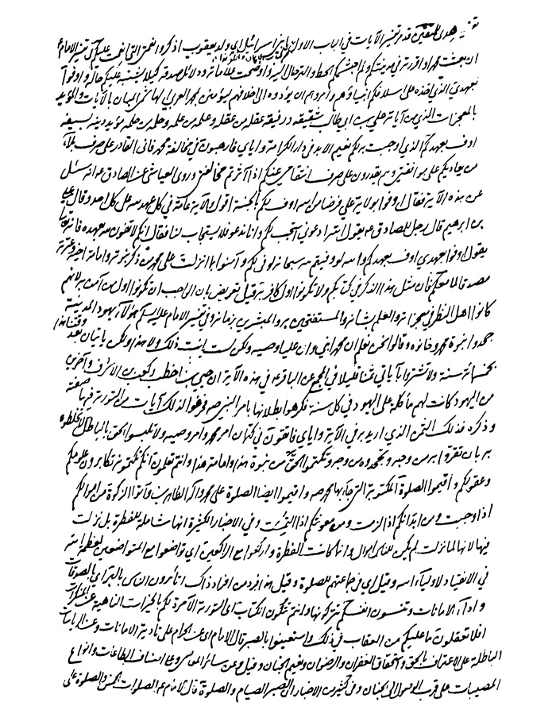
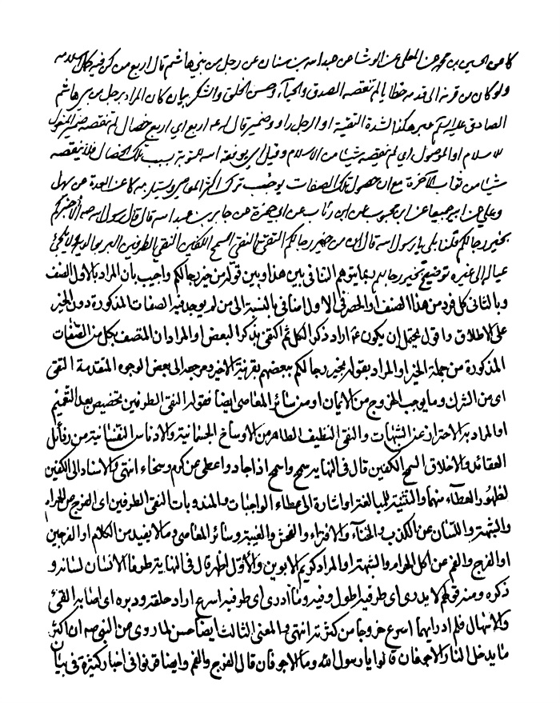

بحار الانوار الجامعة لدرر اخبار الائمة الاطهار المجلد 67

هوية الكتاب
بطاقة تعريف: مجلسي محمد باقربن محمدتقي 1037 - 1111ق.
عنوان واسم المؤلف: بحار الأنوار الجامعة لدرر أخبار الأئمة الأطهار المجلد 67: تأليف محمد باقربن محمدتقي المجلسي.
عنوان واسم المؤلف: بيروت داراحياء التراث العربي [ -13].
مظهر: ج - عينة.
ملاحظة: عربي.
ملاحظة: فهرس الكتابة على أساس المجلد الرابع والعشرين، 1403ق. [1360].
ملاحظة: المجلد108،103،94،91،92،87،67،66،65،52،24(الطبعة الثالثة: 1403ق.=1983م.=[1361]).
ملاحظة: فهرس.
محتويات: ج.24.كتاب الامامة. ج.52.تاريخ الحجة. ج67،66،65.الإيمان والكفر. ج.87.كتاب الصلاة. ج.92،91.الذكر و الدعا. ج.94.كتاب السوم. ج.103.فهرست المصادر. ج.108.الفهرست.-
عنوان: أحاديث الشيعة — قرن 11ق
ترتيب الكونجرس: BP135/م3ب31300 ي ح
تصنيف ديوي: 297/212
رقم الببليوغرافيا الوطنية: 1680946
ص: 1

تتمة كتاب الإیمان و الكفر 

تتمة أبواب مكارم الأخلاق 

باب 39 العدالة و الخصال التی من كانت فیه ظهرت عدالته و وجبت أخوته و حرمت غیبته 

«1»- ل، [الخصال] أَحْمَدُ بْنُ إِبْرَاهِیمَ بْنِ بَكْرٍ عَنْ زَیْدِ بْنِ مُحَمَّدٍ الْبَغْدَادِیِّ عَنْ عَبْدِ اللَّهِ بْنِ أَحْمَدَ بْنِ عَامِرٍ عَنْ أَبِیهِ عَنِ الرِّضَا عَنْ آبَائِهِ علیهم السلام قَالَ قَالَ رَسُولُ اللَّهِ صلی اللّٰه علیه و آله: مَنْ عَامَلَ النَّاسَ فَلَمْ یَظْلِمْهُمْ وَ حَدَّثَهُمْ فَلَمْ یَكْذِبْهُمْ وَ وَعَدَهُمْ فَلَمْ یُخْلِفْهُمْ فَهُوَ مِمَّنْ كَمَلَتْ مُرُوَّتُهُ وَ ظَهَرَتْ عَدَالَتُهُ وَ وَجَبَتْ أُخُوَّتُهُ وَ حَرُمَتْ غِیبَتُهُ (1).
ن، [عیون أخبار الرضا علیه السلام] بالأسانید الثلاثة: مثله (2)
صح، [صحیفة الرضا علیه السلام] عن الرضا عن آبائه علیهم السلام مثله (3).
«2»- ل، [الخصال] أَبِی عَنِ الْكُمُنْدَانِیِّ عَنِ ابْنِ عِیسَی عَنِ ابْنِ أَبِی عُمَیْرٍ عَنْ عَبْدِ اللَّهِ بْنِ سِنَانٍ عَنْ أَبِی عَبْدِ اللَّهِ علیه السلام قَالَ: ثَلَاثٌ مَنْ كُنَّ فِیهِ أَوْجَبْنَ لَهُ أَرْبَعاً عَلَی النَّاسِ مَنْ إِذَا حَدَّثَهُمْ لَمْ یَكْذِبْهُمْ وَ إِذَا خَالَطَهُمْ لَمْ یَظْلِمْهُمْ وَ إِذَا وَعَدَهُمْ لَمْ یُخْلِفْهُمْ

> **پاورقی**: 1- 1. الخصال ج 1 ص 97.

> **پاورقی**: 2- 2. عیون أخبار الرضا ج 2 ص 30.

> **پاورقی**: 3- 3. صحیفة الرضا علیه السلام ص 7.

وَجَبَ أَنْ یَظْهَرَ فِی النَّاسِ عَدَالَتُهُ وَ یَظْهَرَ فِیهِمْ مُرُوَّتُهُ وَ أَنْ تَحْرُمَ عَلَیْهِمْ غِیبَتُهُ وَ أَنْ تَجِبَ عَلَیْهِمْ أُخُوَّتُهُ (1).
«3»- لی، [الأمالی للصدوق] ابْنُ مَسْرُورٍ عَنِ ابْنِ عَامِرٍ عَنْ عَمِّهِ عَنِ الْأَزْدِیِّ عَنْ إِبْرَاهِیمَ بْنِ زِیَادٍ الْكَرْخِیِّ عَنِ الصَّادِقِ علیه السلام قَالَ: مَنْ صَلَّی خَمْسَ صَلَوَاتٍ فِی الْیَوْمِ وَ اللَّیْلَةِ فِی جَمَاعَةٍ فَظُنُّوا بِهِ خَیْراً وَ أَجِیزُوا شَهَادَتَهُ (2).
«4»- لی، [الأمالی للصدوق] أَبِی عَنِ ابْنِ قُتَیْبَةَ عَنْ حَمْدَانَ بْنِ سُلَیْمَانَ عَنْ نُوحِ بْنِ شُعَیْبٍ عَنْ مُحَمَّدِ بْنِ إِسْمَاعِیلَ عَنْ صَالِحٍ عَنْ عَلْقَمَةَ قَالَ قَالَ الصَّادِقُ جَعْفَرُ بْنُ مُحَمَّدٍ علیهما السلام: وَ قَدْ قُلْتُ لَهُ یَا ابْنَ رَسُولِ اللَّهِ أَخْبِرْنِی عَمَّنْ تُقْبَلُ شَهَادَتُهُ وَ مَنْ لَا تُقْبَلُ فَقَالَ یَا عَلْقَمَةُ كُلُّ مَنْ كَانَ عَلَی فِطْرَةِ الْإِسْلَامِ جَازَتْ شَهَادَتُهُ قَالَ فَقُلْتُ لَهُ تُقْبَلُ شَهَادَةُ مُقْتَرِفٍ بِالذُّنُوبِ فَقَالَ یَا عَلْقَمَةُ لَوْ لَمْ یُقْبَلْ شَهَادَةُ الْمُقْتَرِفِینَ لِلذُّنُوبِ لَمَا قُبِلَتْ إِلَّا شَهَادَاتُ الْأَنْبِیَاءِ وَ الْأَوْصِیَاءِ صَلَوَاتُ اللَّهِ عَلَیْهِمْ لِأَنَّهُمْ هُمُ الْمَعْصُومُونَ دُونَ سَائِرِ الْخَلْقِ فَمَنْ لَمْ تَرَهُ بِعَیْنِكَ یَرْتَكِبُ ذَنْباً أَوْ لَمْ یَشْهَدْ عَلَیْهِ بِذَلِكَ شَاهِدَانِ فَهُوَ مِنْ أَهْلِ الْعَدَالَةِ وَ السَّتْرِ وَ شَهَادَتُهُ مَقْبُولَةٌ وَ إِنْ كَانَ فِی نَفْسِهِ مُذْنِباً وَ مَنِ اغْتَابَهُ بِمَا فِیهِ فَهُوَ خَارِجٌ عَنْ وَلَایَةِ اللَّهِ عَزَّ وَ جَلَّ دَاخِلٌ فِی وَلَایَةِ الشَّیْطَانِ وَ لَقَدْ حَدَّثَنِی أَبِی عَنْ أَبِیهِ عَنْ آبَائِهِ علیهم السلام أَنَّ رَسُولَ اللَّهِ صلی اللّٰه علیه و آله قَالَ مَنِ اغْتَابَ مُؤْمِناً بِمَا فِیهِ لَمْ یَجْمَعِ اللَّهُ بَیْنَهُمَا فِی الْجَنَّةِ أَبَداً وَ مَنِ اغْتَابَ مُؤْمِناً بِمَا لَیْسَ فِیهِ انْقَطَعَتِ الْعِصْمَةُ بَیْنَهُمَا وَ كَانَ الْمُغْتَابُ فِی النَّارِ خالِداً فِیها وَ بِئْسَ الْمَصِیرُ. 
قَالَ عَلْقَمَةُ فَقُلْتُ لِلصَّادِقِ علیه السلام یَا ابْنَ رَسُولِ اللَّهِ إِنَّ النَّاسَ یَنْسُبُونَنَا إِلَی عَظَائِمِ الْأُمُورِ وَ قَدْ ضَاقَتْ بِذَلِكَ صُدُورُنَا فَقَالَ علیه السلام یَا عَلْقَمَةُ إِنَّ رِضَا النَّاسِ لَا یُمْلَكُ وَ أَلْسِنَتَهُمْ لَا تُضْبَطُ وَ كَیْفَ تَسْلَمُونَ مِمَّا لَمْ یَسْلَمْ مِنْهُ أَنْبِیَاءُ اللَّهِ وَ رُسُلُهُ وَ حُجَجُ اللَّهِ علیهم السلام أَ لَمْ یَنْسُبُوا یُوسُفَ علیه السلام إِلَی أَنَّهُ هَمَّ بِالزِّنَا أَ لَمْ یَنْسُبُوا أَیُّوبَ علیه السلام إِلَی أَنَّهُ ابْتُلِیَ بِذُنُوبِهِ أَ لَمْ یَنْسُبُوا دَاوُدَ علیه السلام إِلَی أَنَّهُ تَبِعَ الطَّیْرَ حَتَّی 
ص: 2

> **پاورقی**: 1- 1. الخصال: ج 1 ص 98.

> **پاورقی**: 2- 2. أمالی الصدوق ص 204.

نَظَرَ إِلَی امْرَأَةِ أُورِیَا فَهَوَاهَا وَ أَنَّهُ قَدَّمَ زَوْجَهَا أَمَامَ التَّابُوتِ حَتَّی قُتِلَ ثُمَّ تَزَوَّجَ بِهَا أَ لَمْ یَنْسُبُوا مُوسَی علیه السلام إِلَی أَنَّهُ عِنِّینٌ وَ آذَوْهُ حَتَّی بَرَّأَهُ اللَّهُ مِمَّا قَالُوا وَ كَانَ عِنْدَ اللَّهِ وَجِیهاً أَ لَمْ یَنْسُبُوا جَمِیعَ أَنْبِیَاءِ اللَّهِ إِلَی أَنَّهُمْ سَحَرَةٌ طَلَبَةُ الدُّنْیَا أَ لَمْ یَنْسُبُوا مَرْیَمَ بِنْتَ عِمْرَانَ علیهما السلام إِلَی أَنَّهَا حَمَلَتْ بِعِیسَی مِنْ رَجُلٍ نَجَّارٍ اسْمُهُ یُوسُفُ؟ 
أَ لَمْ یَنْسُبُوا نَبِیَّنَا مُحَمَّداً صلی اللّٰه علیه و آله إِلَی أَنَّهُ شَاعِرٌ مَجْنُونٌ أَ لَمْ یَنْسُبُوهُ إِلَی أَنَّهُ هَوَی امْرَأَةَ زَیْدِ بْنِ حَارِثَةَ فَلَمْ یَزَلْ بِهَا حَتَّی اسْتَخْلَصَهَا لِنَفْسِهِ أَ لَمْ یَنْسُبُوهُ یَوْمَ بَدْرٍ إِلَی أَنَّهُ أَخَذَ لِنَفْسِهِ مِنَ الْمَغْنَمِ قَطِیفَةً حَمْرَاءَ حَتَّی أَظْهَرَهُ اللَّهُ عَزَّ وَ جَلَّ عَلَی الْقَطِیفَةِ وَ بَرَّأَ نَبِیَّهُ علیه السلام مِنَ الْخِیَانَةِ وَ أَنْزَلَ بِذَلِكَ فِی كِتَابِهِ وَ ما كانَ لِنَبِیٍّ أَنْ یَغُلَّ وَ مَنْ یَغْلُلْ یَأْتِ بِما غَلَّ یَوْمَ الْقِیامَةِ(1) أَ لَمْ یَنْسُبُوهُ إِلَی أَنَّهُ علیه السلام یَنْطِقُ عَنِ الْهَوَی فِی ابْنِ عَمِّهِ عَلِیٍّ علیه السلام حَتَّی كَذَّبَهُمُ اللَّهُ عَزَّ وَ جَلَّ فَقَالَ سُبْحَانَهُ وَ ما یَنْطِقُ عَنِ الْهَوی إِنْ هُوَ إِلَّا وَحْیٌ یُوحی (2) أَ لَمْ یَنْسُبُوهُ إِلَی الْكَذِبِ فِی قَوْلِهِ إِنَّهُ رَسُولٌ مِنَ اللَّهِ إِلَیْهِمْ حَتَّی أَنْزَلَ اللَّهُ عَزَّ وَ جَلَّ عَلَیْهِ وَ لَقَدْ كُذِّبَتْ رُسُلٌ مِنْ قَبْلِكَ فَصَبَرُوا عَلی ما كُذِّبُوا وَ أُوذُوا حَتَّی أَتاهُمْ نَصْرُنا(3) وَ لَقَدْ قَالَ یَوْماً عُرِجَ بِیَ الْبَارِحَةَ إِلَی السَّمَاءِ فَقِیلَ وَ اللَّهِ مَا فَارَقَ فِرَاشَهُ طُولَ لَیْلَتِهِ وَ مَا قَالُوا فِی الْأَوْصِیَاءِ أَكْثَرُ مِنْ ذَلِكَ أَ لَمْ یَنْسُبُوا سَیِّدَ الْأَوْصِیَاءِ علیهم السلام إِلَی أَنَّهُ كَانَ یَطْلُبُ الدُّنْیَا وَ الْمُلْكَ وَ أَنَّهُ كَانَ یُؤْثِرُ الْفِتْنَةَ عَلَی السُّكُونِ وَ أَنَّهُ یَسْفِكُ دِمَاءَ الْمُسْلِمِینَ بِغَیْرِ حِلِّهَا وَ أَنَّهُ لَوْ كَانَ فِیهِ خَیْرٌ مَا أُمِرَ خَالِدُ بْنُ الْوَلِیدِ بِضَرْبِ عُنُقِهِ أَ لَمْ یَنْسُبُوهُ إِلَی أَنَّهُ علیه السلام أَرَادَ أَنْ یَتَزَوَّجَ ابْنَةَ أَبِی جَهْلٍ عَلَی فَاطِمَةَ علیها السلام وَ أَنَّ رَسُولَ اللَّهِ صلی اللّٰه علیه و آله شَكَاهُ عَلَی الْمِنْبَرِ إِلَی الْمُسْلِمِینَ فَقَالَ إِنَّ عَلِیّاً یُرِیدُ أَنْ یَتَزَوَّجَ ابْنَةَ عَدُوِّ اللَّهِ عَلَی ابْنَةِ نَبِیِّ اللَّهِ أَلَا إِنَّ فَاطِمَةَ بَضْعَةٌ مِنِّی فَمَنْ آذَاهَا فَقَدْ آذَانِی وَ مَنْ سَرَّهَا فَقَدْ سَرَّنِی وَ مَنْ غَاظَهَا فَقَدْ غَاظَنِی.
ص: 3

> **پاورقی**: 1- 1. آل عمران: 161.

> **پاورقی**: 2- 2. النجم: 3.

> **پاورقی**: 3- 3. الأنعام: 34.

ثُمَّ قَالَ الصَّادِقُ علیه السلام یَا عَلْقَمَةُ مَا أَعْجَبَ أَقَاوِیلَ النَّاسِ فِی عَلِیٍّ علیه السلام كَمْ بَیْنَ مَنْ یَقُولُ إِنَّهُ رَبٌّ مَعْبُودٌ وَ بَیْنَ مَنْ یَقُولُ إِنَّهُ عَبْدٌ عَاصٍ لِلْمَعْبُودِ وَ لَقَدْ كَانَ قَوْلُ مَنْ یَنْسُبُهُ إِلَی الْعِصْیَانِ أَهْوَنَ عَلَیْهِ مِنْ قَوْلِ مَنْ یَنْسُبُهُ إِلَی الرُّبُوبِیَّةِ یَا عَلْقَمَةُ أَ لَمْ یَقُولُوا فِی اللَّهِ عَزَّ وَ جَلَّ إِنَّهُ ثَالِثُ ثَلَاثَةٍ أَ لَمْ یُشَبِّهُوهُ بِخَلْقِهِ أَ لَمْ یَقُولُوا إِنَّهُ الدَّهْرُ أَ لَمْ یَقُولُوا إِنَّهُ الْفَلَكُ أَ لَمْ یَقُولُوا إِنَّهُ جِسْمٌ أَ لَمْ یَقُولُوا إِنَّهُ صُورَةٌ تَعَالَی اللَّهُ عَنْ ذَلِكَ عُلُوّاً كَبِیراً. 
یَا عَلْقَمَةُ إِنَّ الْأَلْسِنَةَ الَّتِی یَتَنَاوَلُ ذَاتَ اللَّهِ تَعَالَی ذِكْرُهُ بِمَا لَا یَلِیقُ بِذَاتِهِ كَیْفَ تُحْبَسُ عَنْ تَنَاوُلِكُمْ بِمَا تَكْرَهُونَهُ فَاسْتَعِینُوا بِاللَّهِ وَ اصْبِرُوا إِنَّ الْأَرْضَ لِلَّهِ یُورِثُها مَنْ یَشاءُ مِنْ عِبادِهِ وَ الْعاقِبَةُ لِلْمُتَّقِینَ فَإِنَّ بَنِی إِسْرَائِیلَ قَالُوا لِمُوسَی أُوذِینا مِنْ قَبْلِ أَنْ تَأْتِیَنا وَ مِنْ بَعْدِ ما جِئْتَنا فَقَالَ اللَّهُ عَزَّ وَ جَلَّ قُلْ لَهُمْ یَا مُوسَی عَسی رَبُّكُمْ أَنْ یُهْلِكَ عَدُوَّكُمْ وَ یَسْتَخْلِفَكُمْ فِی الْأَرْضِ فَیَنْظُرَ كَیْفَ تَعْمَلُونَ (1). 

باب 40 ما به كمال الإنسان و معنی المروءة و الفتوة

«1»- مع، [معانی الأخبار] ل، [الخصال] أَحْمَدُ بْنُ إِبْرَاهِیمَ بْنِ الْوَلِیدِ عَنْ مُحَمَّدِ بْنِ أَحْمَدَ الْكَاتِبِ رَفَعَهُ إِلَی أَمِیرِ الْمُؤْمِنِینَ علیه السلام أَنَّهُ قَالَ: كَمَالُ الرَّجُلِ بِسِتِّ خِصَالٍ بِأَصْغَرَیْهِ وَ أَكْبَرَیْهِ وَ هَیْئَتَیْهِ فَأَمَّا أَصْغَرَاهُ فَقَلْبُهُ وَ لِسَانُهُ إِنْ قَاتَلَ قَاتَلَ بِجَنَانٍ وَ إِنْ تَكَلَّمَ تَكَلَّمَ بِلِسَانٍ وَ أَمَّا أَكْبَرَاهُ فَعَقْلُهُ وَ هِمَّتُهُ وَ أَمَّا هَیْئَتَاهُ فَمَالُهُ وَ جَمَالُهُ (2).
«2»- نهج، [نهج البلاغة] قَالَ أَمِیرُ الْمُؤْمِنِینَ علیه السلام: قَدْرُ الرَّجُلِ عَلَی قَدْرِ هِمَّتِهِ وَ صِدْقُهُ عَلَی قَدْرِ مُرُوَّتِهِ وَ شَجَاعَتُهُ عَلَی قَدْرِ أَنَفَتِهِ وَ عِفَّتُهُ عَلَی قَدْرِ غَیْرَتِهِ (3).
ص: 4

> **پاورقی**: 1- 1. أمالی الصدوق: 63 و 64، و الآیات فی الأعراف: 128 و 129.

> **پاورقی**: 2- 2. معانی الأخبار ص 150، الخصال ج 1 ص 164، و فیه« هیبتیه» بدل« هیئتیه».

> **پاورقی**: 3- 3. نهج البلاغة تحت الرقم 47 من الحكم.

«3»- مع، [معانی الأخبار] عَنْ أَبِیهِ عَنْ عَلِیِّ بْنِ إِبْرَاهِیمَ عَنْ أَبِیهِ عَنْ مُحَمَّدِ بْنِ خَالِدٍ الْبَرْقِیِّ عَنْ أَبِی قَتَادَةَ الْقُمِّیِّ رَفَعَهُ إِلَی أَبِی عَبْدِ اللَّهِ علیه السلام قَالَ: تَذَاكَرْنَا أَمْرَ الْفُتُوَّةِ عِنْدَهُ فَقَالَ أَ تَظُنُّونَ أَنَّ الْفُتُوَّةَ بِالْفِسْقِ وَ الْفُجُورِ إِنَّمَا الْفُتُوَّةُ طَعَامٌ مَوْضُوعٌ وَ نَائِلٌ مَبْذُولٌ وَ بِشْرٌ مَعْرُوفٌ وَ أَذًی مَكْفُوفٌ فَأَمَّا تِلْكَ فَشَطَارَةٌ وَ فِسْقٌ ثُمَّ قَالَ مَا الْمُرُوَّةُ قُلْنَا لَا نَعْلَمُ قَالَ الْمُرُوَّةُ وَ اللَّهِ أَنْ یَضَعَ الرَّجُلُ خِوَانَهُ فِی فِنَاءِ دَارِهِ (1).

باب 41 المنجیات و المهلكات 

«1»- ل، [الخصال] ابْنُ الْوَلِیدِ عَنِ الصَّفَّارِ عَنِ الْبَرْقِیِّ عَنْ أَبِیهِ عَنْ هَارُونَ بْنِ الْجَهْمِ عَنْ ثُوَیْرِ بْنِ أَبِی فَاخِتَةَ عَنِ الْمُفَضَّلِ بْنِ صَالِحٍ عَنْ سَعْدِ بْنِ طَرِیفٍ عَنْ أَبِی جَعْفَرٍ مُحَمَّدِ بْنِ عَلِیٍّ الْبَاقِرِ علیهما السلام قَالَ: ثَلَاثٌ دَرَجَاتٌ وَ ثَلَاثٌ كَفَّارَاتٌ وَ ثَلَاثٌ مُوبِقَاتٌ وَ ثَلَاثٌ مُنْجِیَاتٌ فَأَمَّا الدَّرَجَاتُ فَإِفْشَاءُ السَّلَامِ وَ إِطْعَامُ الطَّعَامِ وَ الصَّلَاةُ بِاللَّیْلِ وَ النَّاسُ نِیَامٌ وَ الْكَفَّارَاتُ إِسْبَاغُ الْوُضُوءِ فِی السَّبَرَاتِ وَ الْمَشْیُ بِاللَّیْلِ
وَ النَّهَارِ إِلَی الصَّلَوَاتِ وَ الْمُحَافَظَةُ عَلَی الْجَمَاعَاتِ وَ أَمَّا الثَّلَاثُ الْمُوبِقَاتُ فَشُحٌّ مُطَاعٌ وَ هَوًی مُتَّبَعٌ وَ إِعْجَابُ الْمَرْءِ بِنَفْسِهِ وَ أَمَّا الْمُنْجِیَاتُ فَخَوْفُ اللَّهِ فِی السِّرِّ وَ الْعَلَانِیَةِ وَ الْقَصْدُ فِی الْغِنَی وَ الْفَقْرِ وَ كَلِمَةُ الْعَدْلِ فِی الرِّضَا وَ السَّخَطِ(2).
سن، [المحاسن] أبی عن هارون: مثله (3)
مع، [معانی الأخبار] ابْنُ الْوَلِیدِ عَنِ الصَّفَّارِ عَنِ ابْنِ عِیسَی عَنْ مُحَمَّدِ بْنِ الْبَرْقِیِّ عَنْ هَارُونَ بْنِ الْجَهْمِ: مِثْلَهُ إِلَّا أَنَّ فِیهِ وَ الْمَشْیُ بِاللَّیْلِ وَ النَّهَارِ إِلَی الْجَمَاعَاتِ وَ الْمُحَافَظَةُ 
ص: 5

> **پاورقی**: 1- 1. معانی الأخبار ص 119 و فیه« بر معروف».

> **پاورقی**: 2- 2. الخصال ج 1 ص 41.

> **پاورقی**: 3- 3. المحاسن ص 4، و تراه فی أمالی الصدوق 329.

عَلَی الصَّلَوَاتِ (1).
«2»- ل، [الخصال] الْخَلِیلُ بْنُ أَحْمَدَ عَنِ ابْنِ صَاعِدٍ عَنْ یُوسُفَ بْنِ مُوسَی الْقَطَّانِ وَ أَحْمَدَ بْنِ مَنْصُورِ بْنِ سَیَّارٍ مَعاً عَنْ أَحْمَدَ بْنِ یُونُسَ عَنْ أَیُّوبَ بْنِ عُتْبَةَ عَنِ الْمُفَضَّلِ بْنِ بُكَیْرٍ عَنْ قَتَادَةَ عَنْ أَنَسٍ عَنْ رَسُولِ اللَّهِ صلی اللّٰه علیه و آله قَالَ: ثَلَاثٌ مُهْلِكَاتٌ وَ ثَلَاثٌ مُنْجِیَاتٌ فَالْمُنْجِیَاتُ خَشْیَةُ اللَّهِ عَزَّ وَ جَلَّ فِی السِّرِّ وَ الْعَلَانِیَةِ وَ الْقَصْدُ فِی الْفَقْرِ وَ الْغِنَی وَ الْعَدْلُ فِی الرِّضَا وَ الْغَضَبِ وَ الثَّلَاثُ الْمُهْلِكَاتُ شُحٌّ مُطَاعٌ وَ هَوًی مُتَّبَعٌ وَ إِعْجَابُ الْمَرْءِ بِنَفْسِهِ وَ قَدْ رُوِیَ فِی حَدِیثٍ آخَرَ عَنِ الصَّادِقِ علیه السلام أَنَّهُ قَالَ الشُّحُّ الْمُطَاعُ سُوءُ الظَّنِّ بِاللَّهِ عَزَّ وَ جَلَ (2).
مع، معانی الأخبار السبرات جمع سبرة و هو شدّة البرد بها سمی الرجل سبرة(3).
«3»- ل، [الخصال] مُحَمَّدُ بْنُ عَلِیِّ بْنِ الشَّاهِ عَنْ أَحْمَدَ بْنِ مُحَمَّدِ بْنِ الْحُسَیْنِ عَنْ أَحْمَدَ بْنِ خَالِدٍ الْخَالِدِیِّ عَنْ مُحَمَّدِ بْنِ أَحْمَدَ بْنِ صَالِحٍ عَنْ أَبِیهِ عَنْ أَنَسِ بْنِ مُحَمَّدٍ عَنْ أَبِیهِ عَنْ جَعْفَرِ بْنِ مُحَمَّدٍ عَنْ أَبِیهِ عَنْ جَدِّهِ عَنْ عَلِیِّ بْنِ أَبِی طَالِبٍ صَلَوَاتُ اللَّهِ عَلَیْهِمْ عَنِ النَّبِیِّ صلی اللّٰه علیه و آله أَنَّهُ قَالَ فِی وَصِیَّتِهِ لَهُ: یَا عَلِیُّ ثَلَاثٌ دَرَجَاتٌ وَ ثَلَاثٌ كَفَّارَاتٌ وَ ثَلَاثٌ مُهْلِكَاتٌ وَ ثَلَاثٌ مُنْجِیَاتٌ فَأَمَّا الدَّرَجَاتُ فَإِسْبَاغُ الْوُضُوءِ فِی السَّبَرَاتِ وَ انْتِظَارُ الصَّلَاةِ بَعْدَ الصَّلَاةِ وَ الْمَشْیُ بِاللَّیْلِ وَ النَّهَارِ إِلَی الْجَمَاعَاتِ وَ أَمَّا الْكَفَّارَاتُ فَإِفْشَاءُ السَّلَامِ وَ إِطْعَامُ
الطَّعَامِ وَ التَّهَجُّدُ بِاللَّیْلِ وَ النَّاسُ نِیَامٌ وَ أَمَّا الْمُهْلِكَاتُ فَشُحٌّ مُطَاعٌ وَ هَوًی مُتَّبَعٌ وَ إِعْجَابُ الْمَرْءِ بِنَفْسِهِ وَ أَمَّا الْمُنْجِیَاتُ فَخَوْفُ اللَّهِ فِی السِّرِّ وَ الْعَلَانِیَةِ وَ الْقَصْدُ فِی الْغِنَی وَ الْفَقْرِ وَ كَلِمَةُ الْعَدْلِ فِی الرِّضَا وَ السَّخَطِ(4).
وَ فِی حَدِیثٍ آخَرَ عَنِ النَّبِیِّ صلی اللّٰه علیه و آله: أَنَّهُ لَمَّا سُئِلَ فِی الْمِعْرَاجِ فِیمَا اخْتَصَمَ الْمَلَأُ الْأَعْلَی قَالَ فِی الدَّرَجَاتِ وَ الْكَفَّارَاتِ قَالَ فَنُودِیتُ وَ مَا الدَّرَجَاتُ فَقُلْتُ: 
ص: 6

> **پاورقی**: 1- 1. معانی الأخبار ص 314.

> **پاورقی**: 2- 2. الخصال ج 1 ص 42.

> **پاورقی**: 3- 3. معانی الأخبار ص 314.

> **پاورقی**: 4- 4. الخصال ج 1 ص 43.

إِسْبَاغُ الْوُضُوءِ فِی السَّبَرَاتِ وَ الْمَشْیُ إِلَی الْجَمَاعَاتِ وَ انْتِظَارُ الصَّلَاةِ بَعْدَ الصَّلَاةِ وَ وَلَایَتِی وَ وَلَایَةُ أَهْلِ بَیْتِی حَتَّی الْمَمَاتِ. 
«4»- ل، [الخصال] مَاجِیلَوَیْهِ عَنْ عَمِّهِ عَنْ هَارُونَ عَنِ ابْنِ زِیَادٍ عَنْ جَعْفَرِ بْنِ مُحَمَّدٍ عَنْ أَبِیهِ علیهما السلام أَنَّ النَّبِیَّ صلی اللّٰه علیه و آله قَالَ: ثَلَاثٌ مُوبِقَاتٌ نَكْثُ الصَّفْقَةِ وَ تَرْكُ السُّنَّةِ وَ فِرَاقُ الْجَمَاعَةِ وَ ثَلَاثٌ مُنْجِیَاتٌ تَكُفُّ لِسَانَكَ وَ تَبْكِی عَلَی خَطِیئَتِكَ وَ تَلْزَمُ بَیْتَكَ (1).
«5»- سن، [المحاسن] أَبِی عَنِ ابْنِ أَبِی عُمَیْرٍ عَنْ بُزُرْجَ عَنِ الثُّمَالِیِّ عَنْ أَبِی عَبْدِ اللَّهِ أَوْ عَلِیِّ بْنِ الْحُسَیْنِ علیهما السلام قَالَ قَالَ رَسُولُ اللَّهِ صلی اللّٰه علیه و آله: ثَلَاثٌ مُنْجِیَاتٌ وَ ثَلَاثٌ مُهْلِكَاتٌ قَالُوا یَا رَسُولَ اللَّهِ مَا الْمُنْجِیَاتُ قَالَ خَوْفُ اللَّهِ فِی السِّرِّ كَأَنَّكَ تَرَاهُ فَإِنْ لَمْ تَكُنْ تَرَاهُ فَإِنَّهُ یَرَاكَ وَ الْعَدْلُ فِی الرِّضَا وَ الْغَضَبِ وَ الْقَصْدُ فِی الْغَنَاءِ وَ الْفَقْرِ قَالُوا یَا رَسُولَ اللَّهِ فَمَا الْمُهْلِكَاتُ قَالَ هَوًی مُتَّبَعٌ وَ شُحٌّ مُطَاعٌ وَ إِعْجَابُ الْمَرْءِ بِنَفْسِهِ (2).
ین، [كتاب حسین بن سعید] و النوادر ابن أبی عمیر بهذا الإسناد عن علی بن الحسین علیه السلام: مثله 
«6»- سن، [المحاسن] أَبِی عَنِ النَّوْفَلِیِّ عَنِ السَّكُونِیِّ عَنِ الصَّادِقِ عَنْ آبَائِهِ عَنْ عَلِیٍّ علیهم السلام قَالَ: ثَلَاثٌ مُنْجِیَاتٌ تَكُفُّ لِسَانَكَ وَ تَبْكِی عَلَی خَطِیئَتِكَ وَ یَسَعُكَ بَیْتُكَ وَ قَالَ علیه السلام طُوبَی لِمَنْ لَزِمَ بَیْتَهُ وَ أَكَلَ قُوتَهُ وَ اشْتَغَلَ بِطَاعَةِ رَبِّهِ وَ بَكَی عَلَی خَطِیئَتِهِ (3).
«7»- سن، [المحاسن] مُحَمَّدُ بْنُ عَلِیٍّ عَنِ الْحَسَنِ بْنِ عَلِیِّ بْنِ یُوسُفَ عَنْ سَیْفِ بْنِ عَمِیرَةَ عَنْ فَیْضِ بْنِ الْمُخْتَارِ عَنْ أَبِی عَبْدِ اللَّهِ علیه السلام قَالَ: الْمُنْجِیَاتُ إِطْعَامُ الطَّعَامِ وَ إِفْشَاءُ السَّلَامِ وَ الصَّلَاةُ بِاللَّیْلِ وَ النَّاسُ نِیَامٌ (4).
ص: 7

> **پاورقی**: 1- 1. الخصال ج 1 ص 42.

> **پاورقی**: 2- 2. المحاسن ص 3.

> **پاورقی**: 3- 3. المحاسن ص 4.

> **پاورقی**: 4- 4. المحاسن ص 378.

باب 42 أصناف الناس و مدح حسان الوجوه و مدح البله 

«1»- ید، [التوحید] لی، [الأمالی] للصدوق ابْنُ مُوسَی وَ الْقَطَّانُ وَ السِّنَانِیُّ جَمِیعاً عَنِ ابْنِ زَكَرِیَّا الْقَطَّانِ عَنْ مُحَمَّدِ بْنِ الْعَبَّاسِ عَنْ مُحَمَّدِ بْنِ أَبِی السَّرِیِّ عَنْ أَحْمَدَ بْنِ عَبْدِ اللَّهِ بْنِ یُونُسَ عَنِ ابْنِ طَرِیفٍ عَنِ ابْنِ نُبَاتَةَ قَالَ: لَمَّا جَلَسَ عَلِیٌّ علیه السلام بِالْخِلَافَةِ وَ بَایَعَهُ النَّاسُ صَعِدَ الْمِنْبَرَ وَ قَالَ سَلُونِی قَبْلَ أَنْ تَفْقِدُونِی فَقَامَ إِلَیْهِ رَجُلٌ مِنْ أَقْصَی الْمَسْجِدِ مُتَوَكِّئاً عَلَی عُكَّازَةٍ فَلَمْ یَزَلْ یَتَخَطَّی النَّاسَ حَتَّی دَنَا مِنْهُ فَقَالَ یَا أَمِیرَ الْمُؤْمِنِینَ دُلَّنِی عَلَی عَمَلٍ إِذَا أَنَا عَمِلْتُهُ نَجَّانِیَ اللَّهُ مِنَ النَّارِ فَقَالَ لَهُ اسْمَعْ یَا هَذَا ثُمَّ افْهَمْ ثُمَّ اسْتَیْقِنْ قَامَتِ الدُّنْیَا بِثَلَاثَةٍ بِعَالِمٍ نَاطِقٍ مُسْتَعْمِلٍ لِعِلْمِهِ وَ بِغَنِیٍّ لَا یَبْخَلُ بِمَالِهِ عَلَی أَهْلِ دِینِ اللَّهِ عَزَّ وَ جَلَّ وَ بِفَقِیرٍ صَابِرٍ فَإِذَا كَتَمَ الْعَالِمُ عِلْمَهُ وَ بَخِلَ الْغَنِیُّ وَ لَمْ یَصْبِرِ الْفَقِیرُ فَعِنْدَهَا الْوَیْلُ وَ الثُّبُورُ وَ عِنْدَهَا یَعْرِفُ الْعَارِفُونَ لِلَّهِ أَنَّ الدَّارَ قَدْ رَجَعَتْ إِلَی بَدْئِهَا أَیْ إِلَی الْكُفْرِ بَعْدَ الْإِیمَانِ أَیُّهَا السَّائِلُ فَلَا تَغْتَرَّنَّ بِكَثْرَةِ الْمَسَاجِدِ وَ جَمَاعَةِ أَقْوَامٍ أَجْسَادُهُمْ مُجْتَمِعَةٌ وَ قُلُوبُهُمْ شَتَّی. 
أَیُّهَا النَّاسُ إِنَّمَا النَّاسُ ثَلَاثَةٌ زَاهِدٌ وَ رَاغِبٌ وَ صَابِرٌ فَأَمَّا الزَّاهِدُ فَلَا یَفْرَحُ بِشَیْ ءٍ مِنَ الدُّنْیَا أَتَاهُ وَ لَا یَحْزَنُ عَلَی شَیْ ءٍ مِنْهَا فَاتَهُ وَ أَمَّا الصَّابِرُ فَیَتَمَنَّاهَا بِقَلْبِهِ فَإِنْ أَدْرَكَ مِنْهَا شَیْئاً صَرَفَ عَنْهَا نَفْسَهُ لِمَا یَعْلَمُ مِنْ سُوءِ عَاقِبَتِهَا وَ أَمَّا الرَّاغِبُ فَلَا یُبَالِی مِنْ حِلٍّ أَصَابَهَا أَمْ مِنْ حَرَامٍ قَالَ یَا أَمِیرَ الْمُؤْمِنِینَ فَمَا عَلَامَةُ الْمُؤْمِنِ فِی ذَلِكَ الزَّمَانِ قَالَ یَنْظُرُ إِلَی مَا أَوْجَبَ اللَّهُ عَلَیْهِ مِنْ حَقٍّ فَیَتَوَلَّاهُ وَ یَنْظُرُ إِلَی مَا خَالَفَهُ فَیَتَبَرَّأُ مِنْهُ وَ إِنْ كَانَ حَبِیباً قَرِیباً قَالَ صَدَقْتَ وَ اللَّهِ یَا أَمِیرَ الْمُؤْمِنِینَ ثُمَّ غَابَ الرَّجُلُ فَلَمْ نَرَهُ فَطَلَبَهُ النَّاسُ فَلَمْ یَجِدُوهُ فَتَبَسَّمَ عَلِیٌّ علیه السلام عَلَی الْمِنْبَرِ ثُمَّ قَالَ مَا لَكُمْ هَذَا 
ص: 8

أَخِی الْخَضِرُ علیه السلام (1).
«2»- مع، [معانی الأخبار] أَبِی عَنِ الْحِمْیَرِیِّ عَنْ هَارُونَ عَنِ ابْنِ صَدَقَةَ عَنْ جَعْفَرِ بْنِ مُحَمَّدٍ عَنْ آبَائِهِ علیهم السلام قَالَ قَالَ النَّبِیُّ صلی اللّٰه علیه و آله: دَخَلْتُ الْجَنَّةَ فَرَأَیْتُ أَكْثَرَ أَهْلِهَا الْبُلْهَ قَالَ قُلْتُ مَا الْبُلْهُ فَقَالَ الْعَاقِلُ فِی الْخَیْرِ وَ الْغَافِلُ عَنِ الشَّرِّ الَّذِی یَصُومُ فِی كُلِّ شَهْرٍ ثَلَاثَةَ أَیَّامٍ (2).
«3»- ب، [قرب الإسناد] هَارُونُ عَنِ ابْنِ صَدَقَةَ عَنْ جَعْفَرٍ عَنْ آبَائِهِ علیهم السلام أَنَّ النَّبِیَّ صلی اللّٰه علیه و آله قَالَ: دَخَلْتُ الْجَنَّةَ فَرَأَیْتُ أَكْثَرَ أَهْلِهَا الْبُلْهَ یَعْنِی بِالْبُلْهِ الْمُتَغَافِلَ عَنِ الشَّرِّ الْعَاقِلَ فِی الْخَیْرِ وَ الَّذِینَ یَصُومُونَ ثَلَاثَةَ أَیَّامٍ فِی كُلِّ شَهْرٍ(3).
«4»- ما، [الأمالی للشیخ الطوسی] ابْنُ الْمَخْلَدِ عَنْ جَعْفَرِ بْنِ مُحَمَّدِ بْنِ نُصَیْرٍ الْخَالِدِیِّ عَنِ الْقَاسِمِ بْنِ مُحَمَّدِ بْنِ حَمَّادٍ عَنْ جَنْدَلِ بْنِ وَالِقٍ عَنْ أَبِی مَالِكٍ الْأَنْصَارِیِّ عَنْ أَبِی عَبْدِ الرَّحْمَنِ السُّدِّیِّ عَنْ دَاوُدَ بْنِ أَبِی هِنْدٍ عَنْ أَبِی نَضْرَةَ عَنْ أَبِی سَعِیدٍ قَالَ قَالَ رَسُولُ اللَّهِ صلی اللّٰه علیه و آله: اطْلُبُوا الْخَیْرَ عِنْدَ حِسَانِ الْوُجُوهِ (4).
«5»- ل، [الخصال] أَبِی عَنْ سَعْدٍ عَنِ الْبَرْقِیِّ عَنِ الْحَسَنِ بْنِ عَلِیِّ بْنِ فَضَّالٍ عَنْ ثَعْلَبَةَ عَنْ أَبِی عَبْدِ اللَّهِ علیه السلام قَالَ: الرِّجَالُ ثَلَاثَةٌ رَجُلٌ بِمَالِهِ وَ رَجُلٌ بِجَاهِهِ وَ رَجُلٌ بِلِسَانِهِ وَ هُوَ أَفْضَلُ الثَّلَاثَةِ(5).
«6»- ل، [الخصال] وَ بِهَذَا الْإِسْنَادِ قَالَ قَالَ أَمِیرُ الْمُؤْمِنِینَ علیه السلام: الرِّجَالُ ثَلَاثَةٌ عَاقِلٌ وَ أَحْمَقُ وَ فَاجِرٌ فَالْعَاقِلُ الدِّینُ شَرِیعَتُهُ وَ الْحِلْمُ طَبِیعَتُهُ وَ الرَّأْیُ سَجِیَّتُهُ إِنْ سُئِلَ أَجَابَ وَ إِنْ تَكَلَّمَ أَصَابَ وَ إِنْ سَمِعَ وَعَی وَ إِنْ حَدَّثَ صَدَقَ وَ إِنِ اطْمَأَنَّ إِلَیْهِ أَحَدٌ وَفَی وَ الْأَحْمَقُ إِنِ اسْتُنْبِهَ بِجَمِیلٍ غَفَلَ وَ إِنِ اسْتُنْزِلَ عَنْ حُسْنٍ تَرَكَ 
ص: 9

> **پاورقی**: 1- 1. أمالی الصدوق ص 206 فی حدیث.

> **پاورقی**: 2- 2. معانی الأخبار ص 203.

> **پاورقی**: 3- 3. قرب الإسناد ص 50 و 51.

> **پاورقی**: 4- 4. أمالی الطوسیّ ج 2 ص 8.

> **پاورقی**: 5- 5. الخصال ج 1 ص 57.

وَ إِنْ حُمِلَ عَلَی جَهْلٍ جَهِلَ وَ إِنْ حَدَّثَ كَذَبَ لَا یَفْقَهُ وَ إِنْ فُقِّهَ لَمْ یَفْقَهْ وَ الْفَاجِرُ إِنِ ائْتَمَنْتَهُ خَانَكَ وَ إِنْ صَاحَبْتَهُ شَانَكَ وَ إِنْ وَثِقْتَ بِهِ لَمْ یَنْصَحْكَ (1).
«7»- ل، [الخصال] أَحْمَدُ بْنُ مُحَمَّدِ بْنِ عَبْدِ الرَّحْمَنِ الْمُقْرِئُ عَنْ مُحَمَّدِ بْنِ جَعْفَرٍ الْجُرْجَانِیِّ عَنْ مُحَمَّدِ بْنِ الْحَسَنِ الْمَوْصِلِیِّ عَنْ مُحَمَّدِ بْنِ عَاصِمٍ الطَّرِیفِیِّ عَنْ عَیَّاشِ بْنِ زَیْدِ بْنِ الْحَسَنِ عَنْ زَیْدِ بْنِ الْحَسَنِ عَنْ مُوسَی بْنِ جَعْفَرٍ عَنْ أَبِیهِ علیهما السلام قَالَ: النَّاسُ عَلَی أَرْبَعَةِ أَصْنَافٍ جَاهِلٌ متردی [مُتَرَدٍّ] مُعَانِقٌ لِهَوَاهُ وَ عَابِدٌ متغوی [مُتَغَوٍّ] كُلَّمَا ازْدَادَ عِبَادَةً ازْدَادَ كِبْراً وَ عَالِمٌ یُرِیدُ أَنْ یُوطَأَ عَقِبَاهُ وَ یُحِبُّ مَحْمِدَةَ النَّاسِ وَ عَارِفٌ عَلَی طَرِیقِ الْحَقِّ یُحِبُّ الْقِیَامَ بِهِ فَهُوَ عَاجِزٌ أَوْ مَغْلُوبٌ فَهَذَا أَمْثَلُ أَهْلِ زَمَانِكَ وَ أَرْجَحُهُمْ عَقْلًا(2).
«8»- ل، [الخصال] أَبِی وَ ابْنُ الْوَلِیدِ مَعاً عَنْ سَعْدٍ عَنِ النَّهْدِیِّ رَفَعَهُ إِلَی الْحَسَنِ بْنِ عَلِیٍّ علیه السلام قَالَ: النَّاسُ أَرْبَعَةٌ فَمِنْهُمْ مَنْ لَهُ خُلُقٌ وَ لَا خَلَاقَ لَهُ وَ مِنْهُمْ مَنْ لَهُ خَلَاقٌ وَ لَا خُلُقَ لَهُ قَدْ ذَهَبَ الرَّابِعُ وَ هُوَ الَّذِی لَا خَلَاقَ وَ لَا خُلُقَ لَهُ وَ ذَلِكَ شَرُّ النَّاسِ وَ مِنْهُمْ مَنْ لَهُ خُلُقٌ وَ خَلَاقٌ فَذَلِكَ خَیْرُ النَّاسِ (3).
«9»- ل، [الخصال] ابْنُ مَسْرُورٍ عَنِ ابْنِ بُطَّةَ عَنِ الْبَرْقِیِّ عَنْ أَبِیهِ رَفَعَهُ إِلَی زُرَارَةَ بْنِ أَوْفَی قَالَ: دَخَلْتُ عَلَی عَلِیِّ بْنِ الْحُسَیْنِ علیهما السلام فَقَالَ یَا زُرَارَةُ النَّاسُ فِی زَمَانِنَا عَلَی سِتِّ طَبَقَاتٍ أَسَدٌ وَ ذِئْبٌ وَ ثَعْلَبٌ وَ كَلْبٌ وَ خِنْزِیرٌ وَ شَاةٌ فَأَمَّا الْأَسَدُ فَمُلُوكُ الدُّنْیَا یُحِبُّ كُلُّ وَاحِدٍ مِنْهُمْ أَنْ یَغْلِبَ وَ لَا یُغْلَبَ وَ أَمَّا الذِّئْبُ فَتُجَّارُكُمْ یَذُمُّوا إِذَا اشْتَرَوْا وَ یَمْدَحُوا إِذَا بَاعُوا وَ أَمَّا الثَّعْلَبُ فَهَؤُلَاءِ الَّذِینَ یَأْكُلُونَ بِأَدْیَانِهِمْ وَ لَا یَكُونُ فِی قُلُوبِهِمْ مَا یَصِفُونَ بِأَلْسِنَتِهِمْ وَ أَمَّا الْكَلْبُ یَهِرُّ عَلَی النَّاسِ بِلِسَانِهِ وَ یَكْرَهُهُ النَّاسُ مِنْ شِرَّةِ لِسَانِهِ وَ أَمَّا الْخِنْزِیرُ فَهَؤُلَاءِ الْمُخَنَّثُونَ وَ أَشْبَاهُهُمْ لَا یُدْعَوْنَ إِلَی فَاحِشَةٍ إِلَّا أَجَابُوا وَ أَمَّا الشَّاةُ فَالَّذِینَ تُجَزُّ شُعُورُهُمْ وَ یُؤْكَلُ لُحُومُهُمْ
ص: 10

> **پاورقی**: 1- 1. الخصال ج 1 ص 57.

> **پاورقی**: 2- 2. الخصال ج 1 ص 125.

> **پاورقی**: 3- 3. الخصال ج 1 ص 112، و ما بین المعقوفتین ساقط من نسخة الكمبانیّ و هكذا من النسخة المخطوطة.

وَ یُكْسَرُ عَظْمُهُمْ فَكَیْفَ تَصْنَعُ الشَّاةُ بَیْنَ أَسَدٍ وَ ذِئْبٍ وَ ثَعْلَبٍ وَ كَلْبٍ وَ خِنْزِیرٍ(1).
«10»- ل، [الخصال] أَبِی وَ ابْنُ الْوَلِیدِ مَعاً عَنْ مُحَمَّدٍ الْعَطَّارِ وَ أَحْمَدَ بْنِ إِدْرِیسَ مَعاً عَنِ الْأَشْعَرِیِّ عَنْ جَعْفَرِ بْنِ مُحَمَّدِ بْنِ عَبْدِ اللَّهِ عَنِ ابْنِ أَبِی یَحْیَی الْوَاسِطِیِّ عَمَّنْ ذَكَرَهُ: أَنَّهُ قَالَ لِأَبِی عَبْدِ اللَّهِ علیه السلام أَ تَرَی هَذَا الْخَلْقَ كُلَّهُ مِنَ النَّاسِ فَقَالَ أَلْقِ مِنْهُمُ التَّارِكَ لِلسِّوَاكِ وَ الْمُتَرَبِّعَ فِی مَوْضِعِ الضِّیقِ وَ الدَّاخِلَ فِیمَا لَا یَعْنِیهِ وَ الْمُمَارِیَ فِیمَا لَا عِلْمَ لَهُ بِهِ وَ الْمُتَمَرِّضَ مِنْ غَیْرِ عِلَّةٍ وَ الْمُتَشَعِّثَ مِنْ غَیْرِ مُصِیبَةٍ وَ الْمُخَالِفَ عَلَی أَصْحَابِهِ فِی الْحَقِّ وَ قَدِ اتَّفَقُوا عَلَیْهِ وَ الْمُفْتَخِرَ یَفْتَخِرُ بِآبَائِهِ وَ هُوَ خِلْوٌ مِنْ صَالِحِ أَعْمَالِهِمْ فَهُوَ بِمَنْزِلَةِ الْخَلَنْجِ (2) یُقْشَرُ لِحاً عَنْ لِحاً حَتَّی یُوصَلَ إِلَی جَوْهَرِیَّتِهِ وَ هُوَ كَمَا قَالَ اللَّهُ عَزَّ وَ جَلَ إِنْ هُمْ إِلَّا كَالْأَنْعامِ بَلْ هُمْ أَضَلُّ سَبِیلًا(3). 
«11»- ین، [كتاب حسین بن سعید] و النوادر بَعْضُ أَصْحَابِنَا عَنْ حَنَانِ بْنِ سَدِیرٍ عَنْ مُحَمَّدِ بْنِ طَلْحَةَ عَنْ زُرَارَةَ عَنْ أَبِی جَعْفَرٍ علیه السلام قَالَ سَمِعْتُهُ یَقُولُ: أَیُّمَا عَبْدٍ كَانَ لَهُ صُورَةٌ حَسَنَةٌ مَعَ مَوْضِعٍ لَا یَشِینُهُ ثُمَّ تَوَاضَعَ لِلَّهِ كَانَ مِنْ خَالِصَةِ اللَّهِ قَالَ قُلْتُ مَا مَوْضِعٌ لَا یَشِینُهُ قَالَ لَا یَكُونُ ضَرْبٌ فِیهِ سِفَاحٌ. 
«12»- ما، [الأمالی للشیخ الطوسی] جَمَاعَةٌ عَنْ أَبِی الْمُفَضَّلِ عَنْ عَبْدِ اللَّهِ بْنِ مُحَمَّدِ بْنِ عُبَیْدٍ عَنْ أَبِی الْحَسَنِ الثَّالِثِ علیه السلام قَالَ: سَمِعْتُهُ بِسُرَّمَنْ رَأَی یَقُولُ الْغَوْغَاءُ قَتَلَةُ الْأَنْبِیَاءِ وَ الْعَامَّةُ اسْمٌ مُشْتَقٌّ مِنَ الْعَمَی مَا رَضِیَ اللَّهُ أَنْ شَبَّهَهُمْ بِالْأَنْعَامِ حَتَّی قَالَ بَلْ هُمْ أَضَلُ (4). 
«13»- نهج، [نهج البلاغة] قَالَ أَمِیرُ الْمُؤْمِنِینَ علیه السلام: فِی صِفَةِ الْغَوْغَاءِ هُمُ الَّذِینَ إِذَا اجْتَمَعُوا غَلَبُوا وَ إِذَا تَفَرَّقُوا لَمْ یُعْرَفُوا وَ قِیلَ بَلْ قَالَ إِذَا اجْتَمَعُوا ضَرُّوا وَ إِذَا تَفَرَّقُوا نَفَعُوا فَقِیلَ قَدْ عَلِمْنَا مَضَرَّةَ اجْتِمَاعِهِمْ فَمَا مَنْفَعَةُ افْتِرَاقِهِمْ فَقَالَ یَرْجِعُ [أَصْحَابُ] الْمِهَنِ 
ص: 11

> **پاورقی**: 1- 1. الخصال ج 1 ص 165.

> **پاورقی**: 2- 2. الخلنج- كسمند- شجر كالطرفاء، زهره أحمر و أصفر و أبیض، و حبّه كالخردل و خشبه تصنع منها القصاع، أصله فارسی معرب.

> **پاورقی**: 3- 3. الخصال ج 2 ص 39، و الآیة فی الفرقان: 44.

> **پاورقی**: 4- 4. أمالی الطوسیّ ج 2 ص 226.

إِلَی مِهَنِهِمْ فَیَنْتَفِعُ النَّاسُ بِهِمْ كَرُجُوعِ الْبَنَّاءِ إِلَی بِنَائِهِ وَ النَّسَّاجِ إِلَی مَنْسَجِهِ وَ الْخَبَّازِ إِلَی مَخْبَزِهِ (1).
وَ قَالَ علیه السلام: وَ قَدْ أُتِیَ بِجَانٍ وَ مَعَهُ غَوْغَاءُ فَقَالَ لَا مَرْحَباً بِوُجُوهٍ لَا تُرَی إِلَّا عِنْدَ كُلِّ سَوْأَةٍ(2).
«14»- نهج، [نهج البلاغة] مِنْ كَلَامٍ لَهُ علیه السلام: شُغِلَ مَنِ الْجَنَّةُ وَ النَّارُ أَمَامَهُ سَاعٍ سَرِیعٌ نَجَا وَ طَالِبٌ بَطِی ءٌ رَجَا وَ مُقَصِّرٌ فِی النَّارِ هَوَی الْیَمِینُ وَ الشِّمَالُ مَضَلَّةٌ وَ الطَّرِیقُ الْوُسْطَی هِیَ الْجَادَّةُ عَلَیْهَا بَاقِی الْكِتَابِ وَ آثَارُ النُّبُوَّةِ وَ مِنْهَا مَنْقَذُ السُّنَّةِ وَ إِلَیْهَا مَصِیرُ الْعَاقِبَةِ هَلَكَ مَنِ ادَّعَی وَ خابَ مَنِ افْتَری مَنْ أَبْدَی صَفْحَتَهُ لِلْحَقِّ هَلَكَ عِنْدَ جَهَلَةِ النَّاسِ وَ كَفَی بِالْمَرْءِ جَهْلًا أَنْ لَا یَعْرِفَ قَدْرَهُ لَا یَهْلِكُ عَلَی التَّقْوَی سِنْخُ أَصْلٍ وَ لَا یَظْمَأُ عَلَیْهَا زَرْعُ قَوْمٍ فَاسْتَتِرُوا بِبُیُوتِكُمْ وَ أَصْلِحُوا ذاتَ بَیْنِكُمْ وَ التَّوْبَةُ مِنْ وَرَائِكُمْ فَلَا یَحْمَدْ حَامِدٌ إِلَّا رَبَّهُ وَ لَا یَلُمْ لَائِمٌ إِلَّا نَفْسَهُ (3).
«15»- كِتَابُ الْإِمَامَةِ وَ التَّبْصِرَةِ، عَنِ الْقَاسِمِ بْنِ عَلِیٍّ الْعَلَوِیِّ عَنْ مُحَمَّدِ بْنِ أَبِی عَبْدِ اللَّهِ عَنْ سَهْلِ بْنِ زِیَادٍ عَنِ النَّوْفَلِیِّ عَنِ السَّكُونِیِّ عَنْ جَعْفَرِ بْنِ مُحَمَّدٍ عَنْ أَبِیهِ عَنْ آبَائِهِ علیهم السلام قَالَ قَالَ رَسُولُ اللَّهِ صلی اللّٰه علیه و آله: طُوبَی لِمَنْ رَآنِی وَ طُوبَی لِمَنْ رَأَی مَنْ رَآنِی وَ طُوبَی لِمَنْ رَأَی مَنْ رَآنِی إِلَی السَّابِعِ ثُمَّ سَكَتَ (4).
ص: 12

> **پاورقی**: 1- 1. نهج البلاغة الرقم 199 من الحكم.

> **پاورقی**: 2- 2. المصدر الرقم 200 من الحكم.

> **پاورقی**: 3- 3. نهج البلاغة الرقم 16 من الخطب.

> **پاورقی**: 4- 4. رواه الصدوق فی الأمالی 241.

باب 43 حب اللّٰه تعالی

الآیات:
البقرة وَ مِنَ النَّاسِ مَنْ یَتَّخِذُ مِنْ دُونِ اللَّهِ أَنْداداً یُحِبُّونَهُمْ كَحُبِّ اللَّهِ وَ الَّذِینَ آمَنُوا أَشَدُّ حُبًّا لِلَّهِ (1) آل عمران قُلْ إِنْ كُنْتُمْ تُحِبُّونَ اللَّهَ فَاتَّبِعُونِی یُحْبِبْكُمُ اللَّهُ وَ یَغْفِرْ لَكُمْ ذُنُوبَكُمْ وَ اللَّهُ غَفُورٌ رَحِیمٌ (2) المائدة وَ قالَتِ الْیَهُودُ وَ النَّصاری نَحْنُ أَبْناءُ اللَّهِ وَ أَحِبَّاؤُهُ قُلْ فَلِمَ یُعَذِّبُكُمْ بِذُنُوبِكُمْ الآیة(3)
و قال تعالی فَسَوْفَ یَأْتِی اللَّهُ بِقَوْمٍ یُحِبُّهُمْ وَ یُحِبُّونَهُ (4) التوبة قُلْ إِنْ كانَ آباؤُكُمْ وَ أَبْناؤُكُمْ وَ إِخْوانُكُمْ وَ أَزْواجُكُمْ وَ عَشِیرَتُكُمْ وَ أَمْوالٌ اقْتَرَفْتُمُوها وَ تِجارَةٌ تَخْشَوْنَ كَسادَها وَ مَساكِنُ تَرْضَوْنَها أَحَبَّ إِلَیْكُمْ مِنَ اللَّهِ وَ رَسُولِهِ وَ جِهادٍ فِی سَبِیلِهِ فَتَرَبَّصُوا حَتَّی یَأْتِیَ اللَّهُ بِأَمْرِهِ وَ اللَّهُ لا یَهْدِی الْقَوْمَ الْفاسِقِینَ (5) الشعراء فَإِنَّهُمْ عَدُوٌّ لِی إِلَّا رَبَّ الْعالَمِینَ الَّذِی خَلَقَنِی فَهُوَ یَهْدِینِ وَ الَّذِی هُوَ یُطْعِمُنِی وَ یَسْقِینِ وَ إِذا مَرِضْتُ فَهُوَ یَشْفِینِ وَ الَّذِی یُمِیتُنِی ثُمَّ یُحْیِینِ وَ الَّذِی أَطْمَعُ أَنْ یَغْفِرَ لِی خَطِیئَتِی یَوْمَ الدِّینِ (6) الجمعة قُلْ یا أَیُّهَا الَّذِینَ هادُوا إِنْ زَعَمْتُمْ أَنَّكُمْ أَوْلِیاءُ لِلَّهِ مِنْ دُونِ
ص: 13

> **پاورقی**: 1- 1. البقرة: 165.

> **پاورقی**: 2- 2. آل عمران: 31.

> **پاورقی**: 3- 3. المائدة: 20.

> **پاورقی**: 4- 4. المائدة: 57.

> **پاورقی**: 5- 5. براءة: 25.

> **پاورقی**: 6- 6. الشعراء: 77- 81.

النَّاسِ فَتَمَنَّوُا الْمَوْتَ إِنْ كُنْتُمْ صادِقِینَ (1). 
«1»- لی، [الأمالی للصدوق] الصَّائِغُ عَنْ مُحَمَّدِ بْنِ أَیُّوبَ عَنْ إِبْرَاهِیمَ بْنِ مُوسَی عَنْ هِشَامِ بْنِ یُوسُفَ عَنْ عَبْدِ اللَّهِ بْنِ سُلَیْمَانَ عَنْ مُحَمَّدِ بْنِ عَلِیِّ بْنِ عَبْدِ اللَّهِ بْنِ عَبَّاسٍ عَنْ أَبِیهِ عَنِ ابْنِ عَبَّاسٍ قَالَ قَالَ رَسُولُ اللَّهِ صلی اللّٰه علیه و آله: أَحِبُّوا اللَّهَ لِمَا یَغْذُوكُمْ بِهِ مِنْ نِعْمَةٍ وَ أَحِبُّونِی لِحُبِّ اللَّهِ عَزَّ وَ جَلَّ وَ أَحِبُّوا أَهْلَ بَیْتِی لِحُبِّی (2).
ع، [علل الشرائع] محمد بن الفضل عن محمد بن إسحاق المذكّر عن أحمد بن العباس عن أحمد بن یحیی الكوفی عن یحیی بن معین عن هشام بن یوسف: مثله (3)- ما، [الأمالی للشیخ الطوسی] الفحّام عن المنصوری عن عمر بن أبی موسی عن عیسی بن أحمد عن أبی الحسن الثالث عن آبائه عن النبی صلی اللّٰه علیه و آله: مثله (4)
بشا، [بشارة المصطفی] أبو البركات عمر بن إبراهیم عن أحمد بن محمد بن أحمد عن علی بن عمر السكری عن أحمد بن الحسن بن عبد الجبار عن یحیی بن معین: مثله (5).
«2»- لی، [الأمالی للصدوق] أَبِی عَنْ سَعْدٍ عَنِ ابْنِ أَبِی الْخَطَّابِ عَنْ مُحَمَّدِ بْنِ سِنَانٍ عَنِ الْمُفَضَّلِ عَنْ أَبِی عَبْدِ اللَّهِ علیه السلام قَالَ: كَانَ فِیمَا نَاجَی اللَّهُ عَزَّ وَ جَلَّ بِهِ مُوسَی بْنَ عِمْرَانَ علیه السلام أَنْ قَالَ لَهُ یَا ابْنَ عِمْرَانَ كَذَبَ مَنْ زَعَمَ أَنَّهُ یُحِبُّنِی فَإِذَا جَنَّهُ اللَّیْلُ نَامَ عَنِّی أَ لَیْسَ كُلُّ مُحِبٍّ یُحِبُّ خَلْوَةَ حَبِیبِهِ هَا أَنَا ذَا یَا ابْنَ عِمْرَانَ (6)
مُطَّلِعٌ عَلَی أَحِبَّائِی إِذَا جَنَّهُمُ اللَّیْلُ حَوَّلْتُ أَبْصَارَهُمْ مِنْ قُلُوبِهِمْ وَ مَثَّلْتُ عُقُوبَتِی 
ص: 14

> **پاورقی**: 1- 1. الجمعة: 6، و فی النسخة المخطوطة بعد ذلك بیاض نحو صفحة، و ذلك لاجل كتابة التفسیر و لم یكتب.

> **پاورقی**: 2- 2. أمالی الصدوق ص 219.

> **پاورقی**: 3- 3. علل الشرائع ج 1 ص 113.

> **پاورقی**: 4- 4. أمالی الطوسیّ ج 1 ص 285.

> **پاورقی**: 5- 5. بشارة المصطفی ص 161.

> **پاورقی**: 6- 6. ما بین العلامتین ساقط عن النسخة المخطوطة و نسخة الكمبانیّ أیضا، و التصحیح بالعرض علی المصدر.

بَیْنَ أَعْیُنِهِمْ یُخَاطِبُونِّی عَنِ الْمُشَاهَدَةِ وَ یُكَلِّمُونِّی عَنِ الْحُضُورِ یَا ابْنَ عِمْرَانَ هَبْ لِی مِنْ قَلْبِكَ الْخُشُوعَ وَ مِنْ بَدَنِكَ الْخُضُوعَ وَ مِنْ عَیْنِكَ الدُّمُوعَ فِی ظُلَمِ اللَّیْلِ وَ ادْعُنِی فَإِنَّكَ تَجِدُنِی قَرِیباً مُجِیباً(1).
«3»- لی، [الأمالی للصدوق] ابْنُ الْمُتَوَكِّلِ عَنْ عَلِیٍّ عَنْ أَبِیهِ عَنِ ابْنِ أَبِی عُمَیْرٍ عَمَّنْ سَمِعَ أَبَا عَبْدِ اللَّهِ علیه السلام یَقُولُ: مَا أَحَبَّ اللَّهَ عَزَّ وَ جَلَّ مَنْ عَصَاهُ ثُمَّ تَمَثَّلَ فَقَالَ:
تَعْصِی الْإِلَهَ وَ أَنْتَ تُظْهِرُ حُبَّهُ***هَذَا مُحَالٌ فِی الْفِعَالِ بَدِیعُ
لَوْ كَانَ حُبُّكَ صَادِقاً لَأَطَعْتَهُ***إِنَّ الْمُحِبَّ لِمَنْ یُحِبُّ مُطِیعُ (2).
«4»- ثو، [ثواب الأعمال] ل، [الخصال] مَاجِیلَوَیْهِ عَنْ مُحَمَّدٍ الْعَطَّارِ عَنِ الْأَشْعَرِیِّ عَنْ سَهْلٍ عَنْ إِبْرَاهِیمَ بْنِ دَاوُدَ الْیَعْقُوبِیِّ عَنْ أَخِیهِ سُلَیْمَانَ بِإِسْنَادِهِ رَفَعَهُ: قَالَ رَجُلٌ لِلنَّبِیِّ صلی اللّٰه علیه و آله یَا رَسُولَ اللَّهِ عَلِّمْنِی شَیْئاً إِذَا أَنَا فَعَلْتُهُ أَحَبَّنِیَ اللَّهُ مِنَ السَّمَاءِ وَ أَحَبَّنِیَ النَّاسُ مِنَ الْأَرْضِ فَقَالَ لَهُ ارْغَبْ فِیمَا عِنْدَ اللَّهِ عَزَّ وَ جَلَّ یُحِبَّكَ اللَّهُ وَ ازْهَدْ فِیمَا عِنْدَ النَّاسِ یُحِبَّكَ النَّاسُ (3).
«5»- ل، [الخصال] أَبِی عَنْ أَحْمَدَ بْنِ إِدْرِیسَ عَنِ الْأَشْعَرِیِّ عَنْ مُوسَی بْنِ جَعْفَرٍ الْبَغْدَادِیِّ عَنْ عُبَیْدِ اللَّهِ بْنِ عَبْدِ اللَّهِ بْنِ عُرْوَةَ عَنْ شُعَیْبٍ عَنْ أَبِی بَصِیرٍ عَنْ أَبِی عَبْدِ اللَّهِ علیه السلام قَالَ: خَمْسَةٌ لَا یَنَامُونَ الْهَامُّ بِدَمٍ یَسْفِكُهُ (4) وَ ذُو مَالٍ كَثِیرٍ لَا أَمِینَ لَهُ وَ الْقَائِلُ فِی النَّاسِ الزُّورَ وَ الْبُهْتَانَ عَنْ عَرَضٍ مِنَ الدُّنْیَا یَنَالُهُ وَ الْمَأْخُوذُ بِالْمَالِ 
ص: 15

> **پاورقی**: 1- 1. أمالی الصدوق ص 215.

> **پاورقی**: 2- 2. أمالی الصدوق ص 293.

> **پاورقی**: 3- 3. الخصال ج 1 ص 32.

> **پاورقی**: 4- 4. الهام جمع هامة و هی من طیر اللیل یألف المقابر و هو الصدی و كانت العرب تزعم أن روح القتیل الذی لا یدرك بثأره تصیر هامة و قیل: یخلق من رأسه فتزقو عند قبره تقول: اسقونی اسقونی فإذا ادرك بثاره طارت، و هذا المعنی أراد جریر بقوله: و منا الذی أبكی صدی ابن مالك***و نفر طیرا عن جعادة وقعا یقول قتل قاتله فنفرت الطیر عن قبره.

الْكَثِیرِ وَ لَا مَالَ لَهُ وَ الْمُحِبُّ حَبِیباً یَتَوَقَّعُ فِرَاقَهُ (1).
«6»- ما، [الأمالی للشیخ الطوسی] الْمُفِیدُ عَنِ التَّمَّارِ عَنْ مُحَمَّدِ بْنِ الْقَاسِمِ الْأَنْبَارِیِّ عَنْ أَبِیهِ عَنِ الْحُسَیْنِ بْنِ سُلَیْمَانَ عَنْ أَبِی جَعْفَرٍ الطَّائِیِّ عَنْ وَهْبِ بْنِ مُنَبِّهٍ قَالَ: قَرَأْتُ فِی الزَّبُورِ یَا دَاوُدُ اسْمَعْ مِنِّی مَا أَقُولُ وَ الْحَقَّ أَقُولُ مَنْ أَتَانِی وَ هُوَ یُحِبُّنِی أَدْخَلْتُهُ الْجَنَّةَ الْخَبَرَ(2).
«7»- ع، [علل الشرائع] ابْنُ الْمُتَوَكِّلِ عَنِ السَّعْدَآبَادِیِّ عَنِ الْبَرْقِیِّ عَنْ عَبْدِ الْعَظِیمِ الْحَسَنِیِّ عَنِ ابْنِ أَبِی عُمَیْرٍ عَنْ عَبْدِ اللَّهِ بْنِ الْفَضْلِ عَنْ شَیْخٍ مِنْ أَهْلِ الْكُوفَةِ عَنْ جَدِّهِ مِنْ قِبَلِ أُمِّهِ وَ اسْمُهُ سُلَیْمَانُ بْنُ عَبْدِ اللَّهِ الْهَاشِمِیُّ قَالَ سَمِعْتُ مُحَمَّدَ بْنَ عَلِیٍّ علیه السلام یَقُولُ: قَالَ رَسُولُ اللَّهِ صلی اللّٰه علیه و آله لِلنَّاسِ وَ هُمْ مُجْتَمِعُونَ عِنْدَهُ أَحِبُّوا اللَّهَ لِمَا یَغْذُوكُمْ بِهِ مِنْ نِعْمَةٍ وَ أَحِبُّونِی لِلَّهِ عَزَّ وَ جَلَّ وَ أَحِبُّوا قَرَابَتِی لِی (3).
«8»- ع، [علل الشرائع] طَاهِرُ بْنُ مُحَمَّدِ بْنِ إِدْرِیسَ عَنْ مُحَمَّدِ بْنِ عُثْمَانَ الْهَرَوِیِّ عَنِ الْحَسَنِ بْنِ مُهَاجِرٍ عَنْ هِشَامِ بْنِ خَالِدٍ عَنِ الْحَسَنِ بْنِ یَحْیَی عَنْ صَدَقَةَ بْنِ عَبْدِ اللَّهِ عَنْ هِشَامٍ عَنْ أَنَسٍ عَنِ النَّبِیِّ صلی اللّٰه علیه و آله عَنْ جَبْرَئِیلَ قَالَ: قَالَ اللَّهُ تَبَارَكَ وَ تَعَالَی مَنْ أَهَانَ لِی وَلِیّاً فَقَدْ بَارَزَنِی بِالْمُحَارَبَةِ وَ مَا تَرَدَّدْتُ فِی شَیْ ءٍ أَنَا فَاعِلُهُ مَا تَرَدَّدْتُ فِی قَبْضِ نَفْسِ الْمُؤْمِنِ یَكْرَهُ الْمَوْتَ وَ أَكْرَهُ مَسَاءَتَهُ وَ لَا بُدَّ لَهُ مِنْهُ وَ مَا یَتَقَرَّبُ إِلَیَّ عَبْدِی بِمِثْلِ أَدَاءِ مَا افْتَرَضْتُ عَلَیْهِ وَ لَا یَزَالُ عَبْدِی یَبْتَهِلُ إِلَیَّ حَتَّی أُحِبَّهُ وَ مَنْ أَحْبَبْتُهُ كُنْتُ لَهُ سَمْعاً وَ بَصَراً وَ یَداً وَ مَوْئِلًا إِنْ دَعَانِی أَجَبْتُهُ وَ إِنْ سَأَلَنِی أَعْطَیْتُهُ وَ إِنَّ مِنْ عِبَادِیَ المؤمن [الْمُؤْمِنِینَ] لَمَنْ یُرِیدُ الْبَابَ مِنَ الْعِبَادَةِ فَأَكُفُّهُ عَنْهُ لِئَلَّا یَدْخُلَهُ عُجْبٌ وَ یُفْسِدَهُ وَ إِنَّ مِنْ عِبَادِیَ الْمُؤْمِنِینَ لَمَنْ لَا یَصْلُحُ إِیمَانُهُ إِلَّا بِالْفَقْرِ وَ لَوْ أَغْنَیْتُهُ لَأَفْسَدَهُ ذَلِكَ وَ إِنَّ مِنْ عِبَادِیَ الْمُؤْمِنِینَ لَمَنْ لَا یَصْلُحُ إِیمَانُهُ إِلَّا بِالْغِنَی وَ لَوْ أَفْقَرْتُهُ لَأَفْسَدَهُ ذَلِكَ وَ إِنَّ مِنْ عِبَادِیَ الْمُؤْمِنِینَ لَمَنْ لَا یَصْلُحُ إِیمَانُهُ إِلَّا بِالسُّقْمِ وَ لَوْ صَحَّحْتُ 
ص: 16

> **پاورقی**: 1- 1. الخصال ج 1 ص 142.

> **پاورقی**: 2- 2. أمالی الطوسیّ ج 1 ص 105.

> **پاورقی**: 3- 3. علل الشرائع ج 2 ص 287 و فی نسخة الأصل رمز أمالی الصدوق و هو سهو.

جِسْمَهُ لَأَفْسَدَهُ ذَلِكَ وَ إِنَّ مِنْ عِبَادِیَ الْمُؤْمِنِینَ لَمَنْ لَا یَصْلُحُ إِیمَانُهُ إِلَّا بِالصِّحَّةِ وَ لَوْ أَسْقَمْتُهُ لَأَفْسَدَهُ ذَلِكَ إِنِّی أُدَبِّرُ عِبَادِی بِعِلْمِی بِقُلُوبِهِمْ فَإِنِّی عَلِیمٌ خَبِیرٌ(1).
بیان: قال الشهید طاب ثراه فی قواعده فی حدیث القدسی ما ترددت فی شی ء أنا فاعله فإن التردد علی اللّٰه محال غیر أنه لمّا جرت العادة أن یتردد من یعظّم الشخص و یكرمه فی مساءته نحو الوالدین و الصدیق و أن لا یتردد فی مساءة من لا یكرمه و لا یعظمه كالعدو و الحیّة و العقرب بل إذا خطر بالبال مساءته أوقعها من غیر تردد فصار التردد لا یقع إلا فی موضع التعظیم و الاهتمام و عدمه لا یقع إلا فی موضع الاحتقار و عدم المبالاة فحینئذ دل الحدیث علی تعظیم اللّٰه للمؤمن و شرف منزلته عنده فعبر باللفظ المركب عما یلزمه و لیس مذكورا فی اللفظ و إنما هو بالإرادة و القصد فكان معنی الحدیث حینئذ منزلة عبدی المؤمن عظیمة و مرتبته رفیعة فدل علی تصرف النیة فی ذلك كله. 
و قد أجاب بعض من عاصرناه عن هذا الحدیث بأن التردد إنما هو فی الأسباب بمعنی أن اللّٰه یظهر للمؤمن أسبابا یغلب علی ظنه دنو الوفاة بها لیصیر علی الاستعداد التام للآخرة ثم یظهر له أسبابا تبسط فی أمله فیرجع إلی عمارة دنیاه بما لا بد منه و لما كانت هذه بصورة التردد أطلق علیها ذلك استعارة و إذ كان العبد المتعلق بتلك الأسباب بصورة المتردد أسند التردد إلیه تعالی من حیث إنه فاعل للتردد فی العبد و قیل إنه تعالی لا یزال یورد علی المؤمن سبب الموت حالا بعد حال لیؤثر المؤمن الموت فیقبضه مریدا له و إیراد تلك الأحوال المراد بها غایاتها من غیر تعجیل بالغایات من القادر علی التعجیل یكون ترددا بالنسبة إلی القادر من المخلوقین فهو بصورة المتردد و إن لم یكن ثم ترددا و یؤیده الخبر المروی عن إبراهیم علیه السلام لما أتاه ملك الموت لیقبض روحه و كره ذلك أخره اللّٰه إلی أن رأی شیخا هما یأكل و لعابه یسیل علی لحیته فاستفظع ذلك و أحب الموت و كذلك موسی علیه السلام (2).
«9»- ع، [علل الشرائع] السِّنَانِیُّ عَنْ مُحَمَّدِ بْنِ هَارُونَ عَنْ عُبَیْدِ اللَّهِ بْنِ مُوسَی الْحَبَّالِ عَنْ مُحَمَّدِ
ص: 17

> **پاورقی**: 1- 1. علل الشرائع ج 1 ص 12.

> **پاورقی**: 2- 2. قد كانت النسخة مصحفة جدا صححناها بالعرض علی المصدر ص 272.

بْنِ الْحُسَیْنِ الْخَشَّابِ عَنْ مُحَمَّدِ بْنِ الْحَسَنِ عَنْ یُونُسَ بْنِ ظَبْیَانَ قَالَ قَالَ الصَّادِقُ علیه السلام: إِنَّ النَّاسَ یَعْبُدُونَ اللَّهَ عَزَّ وَ جَلَّ عَلَی ثَلَاثَةِ أَوْجُهٍ فَطَبَقَةٌ یَعْبُدُونَهُ رَغْبَةً إِلَی ثَوَابِهِ فَتِلْكَ عِبَادَةُ الْحُرَصَاءِ وَ هُوَ الطَّمَعُ وَ آخَرُونَ یَعْبُدُونَهُ خَوْفاً مِنَ النَّارِ فَتِلْكَ عِبَادَةُ الْعَبِیدِ وَ هِیَ الرَّهْبَةُ وَ لَكِنِّی أَعْبُدُهُ حُبّاً لَهُ فَتِلْكَ عِبَادَةُ الْكِرَامِ وَ هُوَ الْأَمْنُ لِقَوْلِهِ تَعَالَی وَ هُمْ مِنْ فَزَعٍ یَوْمَئِذٍ آمِنُونَ (1) قُلْ إِنْ كُنْتُمْ تُحِبُّونَ اللَّهَ فَاتَّبِعُونِی یُحْبِبْكُمُ اللَّهُ وَ یَغْفِرْ لَكُمْ ذُنُوبَكُمْ (2) فَمَنْ أَحَبَّ اللَّهَ عَزَّ وَ جَلَّ أَحَبَّهُ اللَّهُ وَ مَنْ أَحَبَّهُ اللَّهُ عَزَّ وَ جَلَّ كَانَ مِنَ الْآمِنِینَ (3).
«10»- مع، [معانی الأخبار] مَاجِیلَوَیْهِ عَنْ عَمِّهِ عَنِ الْبَرْقِیِّ عَنْ مُحَمَّدِ بْنِ سِنَانٍ عَنِ الْمُفَضَّلِ عَنِ ابْنِ ظَبْیَانَ عَنْ أَبِی عَبْدِ اللَّهِ علیه السلام قَالَ: مَنْ أَحَبَّ أَنْ یَعْلَمَ مَا لَهُ عِنْدَ اللَّهِ فَلْیَعْلَمْ مَا لِلَّهِ عِنْدَهُ الْخَبَرَ(4).
«11»- ل، [الخصال] الْأَرْبَعُمِائَةِ قَالَ أَمِیرُ الْمُؤْمِنِینَ علیه السلام: مَنْ أَرَادَ مِنْكُمْ أَنْ یَعْلَمَ كَیْفَ مَنْزِلَتُهُ عِنْدَ اللَّهِ فَلْیَنْظُرْ كَیْفَ مَنْزِلَةُ اللَّهِ مِنْهُ عِنْدَ الذُّنُوبِ كَذَلِكَ مَنْزِلَتُهُ عِنْدَ اللَّهِ تَبَارَكَ وَ تَعَالَی (5).
«12»- ما، [الأمالی للشیخ الطوسی] جَمَاعَةٌ عَنْ أَبِی الْمُفَضَّلِ عَنْ مُحَمَّدِ بْنِ جَعْفَرٍ الرَّزَّازِ عَنْ أَیُّوبَ بْنِ نُوحِ بْنِ دَرَّاجٍ عَنِ الرِّضَا عَنْ آبَائِهِ علیهم السلام قَالَ قَالَ رَسُولُ اللَّهِ صلی اللّٰه علیه و آله: أَوْحَی عَزَّ وَ جَلَّ إِلَی نَجِیِّهِ مُوسَی أَحْبِبْنِی وَ حَبِّبْنِی إِلَی خَلْقِی قَالَ رَبِّ هَذَا أُحِبُّكَ فَكَیْفَ أُحَبِّبُكَ إِلَی خَلْقِكَ قَالَ اذْكُرْ لَهُمْ نَعْمَایَ عَلَیْهِمْ وَ بَلَائِی عِنْدَهُمْ فَإِنَّهُمْ لَا یَذْكُرُونَ أَوْ لَا یَعْرِفُونَ مِنِّی إِلَّا كُلَّ الْخَیْرِ(6).
ص: 18

> **پاورقی**: 1- 1. النمل: 89.

> **پاورقی**: 2- 2. آل عمران: 31.

> **پاورقی**: 3- 3. علل الشرائع ج 1 ص 12.

> **پاورقی**: 4- 4. معانی الأخبار ص 236.

> **پاورقی**: 5- 5. الخصال ج 2 ص 159.

> **پاورقی**: 6- 6. أمالی الطوسیّ ج 2 ص 98.

«13»- ل، [الخصال] ابْنُ الْوَلِیدِ عَنِ الصَّفَّارِ عَنِ الْیَقْطِینِیِّ عَنْ زَكَرِیَّا الْمُؤْمِنِ عَنْ عَلِیِّ بْنِ أَبِی نُعَیْمٍ عَنْ أَبِی حَمْزَةَ عَنْ أَبِی جَعْفَرٍ علیه السلام قَالَ: إِنَّ اللَّهَ تَبَارَكَ وَ تَعَالَی یَقُولُ ابْنَ آدَمَ تَطَوَّلْتُ عَلَیْكَ بِثَلَاثَةٍ سَتَرْتُ عَلَیْكَ مَا لَوْ یَعْلَمُ بِهِ أَهْلُكَ مَا وَارَوْكَ وَ أَوْسَعْتُ عَلَیْكَ فَاسْتَقْرَضْتُ مِنْكَ فَلَمْ تُقَدِّمْ خَیْراً وَ جَعَلْتُ لَكَ نَظِرَةً عِنْدَ مَوْتِكَ فِی ثُلُثِكَ فَلَمْ تُقَدِّمْ خَیْراً(1).
«14»- ما، [الأمالی للشیخ الطوسی] ابْنُ مَخْلَدٍ عَنْ مُحَمَّدِ بْنِ عَمْرِو بْنِ الْبَخْتَرِیِّ عَنْ مُحَمَّدِ بْنِ یُونُسَ عَنْ عَوْنِ بْنِ عُمَارَةَ عَنْ سُلَیْمَانَ بْنِ عِمْرَانَ عَنْ أَبِی حَازِمٍ الْمَدَنِیِّ عَنِ ابْنِ عَبَّاسٍ: فِی قَوْلِهِ تَعَالَی وَ أَسْبَغَ عَلَیْكُمْ نِعَمَهُ ظاهِرَةً وَ باطِنَةً قَالَ الظَّاهِرَةُ الْإِسْلَامُ وَ الْبَاطِنَةُ سَتْرُ الذُّنُوبِ (2).
«15»- ما، [الأمالی للشیخ الطوسی] جَمَاعَةٌ عَنْ أَبِی الْمُفَضَّلِ عَنِ الْحَسَنِ بْنِ آدَمَ عَنِ الْفَضْلِ بْنِ یُونُسَ عَنْ مُحَمَّدِ بْنِ عُكَّاشَةَ عَنْ عَمْرِو بْنِ هَاشِمٍ عَنْ جُوَیْبِرِ بْنِ سَعِیدٍ عَنِ الضَّحَّاكِ بْنِ مُزَاحِمٍ عَنْ عَلِیٍّ علیه السلام وَ الضَّحَّاكِ عَنِ ابْنِ عَبَّاسٍ رَضِیَ اللَّهُ عَنْهُ قَالا: فِی قَوْلِ اللَّهِ تَعَالَی وَ أَسْبَغَ عَلَیْكُمْ نِعَمَهُ ظاهِرَةً وَ باطِنَةً قَالَ أَمَّا الظَّاهِرَةُ فَالْإِسْلَامُ وَ مَا أَفْضَلَ عَلَیْكُمْ فِی الرِّزْقِ وَ أَمَّا الْبَاطِنَةُ فَمَا سَتَرَهُ عَلَیْكَ مِنْ مَسَاوِی عَمَلِكَ (3).
«16»- ما، [الأمالی للشیخ الطوسی] جَمَاعَةٌ عَنْ أَبِی الْمُفَضَّلِ عَنْ عَلِیِّ بْنِ إِسْمَاعِیلَ بْنِ یُونُسَ عَنْ إِبْرَاهِیمَ بْنِ جَابِرٍ عَنْ عَبْدِ الرَّحِیمِ الْكَرْخِیِّ عَنْ هِشَامِ بْنِ حَسَّانَ عَنْ هَمَّامِ بْنِ عُرْوَةَ عَنْ أَبِیهِ عَنْ عَائِشَةَ قَالَتْ قَالَ رَسُولُ اللَّهِ صلی اللّٰه علیه و آله: مَنْ لَمْ یَعْلَمْ فَضْلَ نِعَمِ اللَّهِ عَلَیْهِ إِلَّا فِی مَطْعَمِهِ وَ مَشْرَبِهِ فَقَدْ قَصَرَ عِلْمُهُ وَ دَنَا عَذَابُهُ (4).
ص: 19

> **پاورقی**: 1- 1. الخصال ج 1 ص 67.

> **پاورقی**: 2- 2. أمالی الطوسیّ ج 2 ص 6 و الآیة فی لقمان: 20.

> **پاورقی**: 3- 3. أمالی الطوسیّ ج 2 ص 104.

> **پاورقی**: 4- 4. أمالی الطوسیّ ج 2 ص 105.

«17»- ما، [الأمالی للشیخ الطوسی] جَمَاعَةٌ عَنْ أَبِی الْمُفَضَّلِ عَنْ عَبْدِ اللَّهِ بْنِ الْحُسَیْنِ الْعَلَوِیِّ عَنْ جَدِّهِ إِبْرَاهِیمَ بْنِ عَلِیٍّ عَنْ أَبِیهِ عَلِیِّ بْنِ عُبَیْدِ اللَّهِ قَالَ حَدَّثَنِی شَیْخَانِ بَرَّانِ مِنْ أَهْلِنَا سَیِّدَانِ عَنْ مُوسَی بْنِ جَعْفَرٍ عَنْ أَبِیهِ عَنْ جَدِّهِ أَبِی جَعْفَرٍ عَنْ أَبِیهِ علیهم السلام وَ حَدَّثَنِیهِ الْحُسَیْنُ بْنُ زَیْدِ بْنِ عَلِیٍّ ذُو الدَّمْعَةِ عَنْ عَمِّهِ عُمَرَ بْنِ عَلِیٍّ عَنْ أَخِیهِ عَنْ أَبِیهِ عَنْ جَدِّهِ الْحُسَیْنِ صَلَّی اللَّهُ عَلَیْهِمْ. 
وَ قَالَ أَبُو جَعْفَرٍ علیه السلام حَدَّثَنِی عَبْدُ اللَّهِ بْنُ الْعَبَّاسِ وَ جَابِرُ بْنُ عَبْدِ اللَّهِ الْأَنْصَارِیُّ وَ كَانَ بَدْرِیّاً أُحُدِیّاً شَجَرِیّاً(1) وَ مِمَّنْ یَحَظُّ مِنْ أَصْحَابِ رَسُولِ اللَّهِ صلی اللّٰه علیه و آله فِی مَوَدَّةِ أَمِیرِ الْمُؤْمِنِینَ علیه السلام قَالُوا: بَیْنَا رَسُولُ اللَّهِ صلی اللّٰه علیه و آله فِی مَسْجِدِهِ فِی رَهْطٍ مِنْ أَصْحَابِهِ فِیهِمْ أَبُو بَكْرٍ وَ أَبُو عُبَیْدَةَ وَ عُمَرُ وَ عُثْمَانُ وَ عَبْدُ الرَّحْمَنِ وَ رَجُلَانِ مِنْ قُرَّاءِ الصَّحَابَةِ مِنَ الْمُهَاجِرِینَ عَبْدُ اللَّهِ ابْنُ أُمِّ عَبْدٍ وَ مِنَ الْأَنْصَارِ أُبَیُّ بْنُ كَعْبٍ وَ كَانَا بَدْرِیَّیْنِ فَقَرَأَ عَبْدُ اللَّهِ مِنَ السُّورَةِ الَّتِی یُذْكَرُ فِیهَا لُقْمَانُ حَتَّی أَتَی عَلَی هَذِهِ الْآیَةِ وَ أَسْبَغَ عَلَیْكُمْ نِعَمَهُ ظاهِرَةً وَ باطِنَةً(2) الْآیَةَ وَ قَرَأَ أُبَیٌّ مِنَ السُّورَةِ
الَّتِی یُذْكَرُ فِیهَا إِبْرَاهِیمُ علیه السلام وَ ذَكِّرْهُمْ بِأَیَّامِ اللَّهِ إِنَّ فِی ذلِكَ لَآیاتٍ لِكُلِّ صَبَّارٍ شَكُورٍ(3) قَالُوا قَالَ رَسُولُ اللَّهِ صلی اللّٰه علیه و آله أَیَّامُ اللَّهِ نَعْمَاؤُهُ وَ بَلَاؤُهُ وَ مَثُلَاتُهُ سُبْحَانَهُ ثُمَّ أَقْبَلَ صلی اللّٰه علیه و آله عَلَی مَنْ شَهِدَهُ مِنْ أَصْحَابِهِ فَقَالَ إِنِّی لَأَتَخَوَّلُكُمْ بِالْمَوْعِظَةِ تَخَوُّلًا مَخَافَةَ السَّأْمَةِ عَلَیْكُمْ وَ قَدْ أَوْحَی إِلَیَّ رَبِّی جَلَّ وَ تَعَالَی أَنْ أُذَكِّرَكُمْ بِأَنْعُمِهِ وَ أُنْذِرَكُمْ بِمَا أُفِیضُ (4)
عَلَیْكُمْ مِنْ كِتَابِهِ وَ تَلَا وَ أَسْبَغَ عَلَیْكُمْ نِعَمَهُ الْآیَةَ ثُمَّ قَالَ لَهُمْ قُولُوا الْآنَ قَوْلَكُمْ مَا أَوَّلُ نِعْمَةٍ رَغَّبَكُمُ اللَّهُ فِیهَا وَ بَلَاكُمْ بِهَا؟
ص: 20

> **پاورقی**: 1- 1. نسبة الی الشجرة، شجرة السمرة التی بایعهم رسول اللّٰه صلّی اللّٰه علیه و آله علی أن لا یفروا فی غزوة الحدیبیة، فسمیت بیعة الرضوان لقوله تعالی فیه: لَقَدْ رَضِیَ اللَّهُ عَنِ الْمُؤْمِنِینَ إِذْ یُبایِعُونَكَ تَحْتَ الشَّجَرَةِ فَعَلِمَ ما فِی قُلُوبِهِمْ فَأَنْزَلَ السَّكِینَةَ عَلَیْهِمْ وَ أَثابَهُمْ فَتْحاً قَرِیباً.

> **پاورقی**: 2- 2. لقمان: 20.

> **پاورقی**: 3- 3. إبراهیم: 5.

> **پاورقی**: 4- 4. فی المصدر: اقتص.

فَخَاضَ الْقَوْمُ جَمِیعاً فَذَكَرُوا نِعَمَ اللَّهِ الَّتِی أَنْعَمَ عَلَیْهِمْ وَ أَحْسَنَ إِلَیْهِمْ بِهَا مِنَ الْمَعَاشِ وَ الرِّیَاشِ وَ الذُّرِّیَّةِ وَ الْأَزْوَاجِ إِلَی سَائِرِ مَا بَلَاهُمُ اللَّهُ عَزَّ وَ جَلَّ بِهِ مِنْ أَنْعُمِهِ الظَّاهِرَةِ فَلَمَّا أَمْسَكَ الْقَوْمُ أَقْبَلَ رَسُولُ اللَّهِ صلی اللّٰه علیه و آله عَلَی عَلِیٍّ علیه السلام فَقَالَ یَا أَبَا الْحَسَنِ قُلْ فَقَدْ قَالَ أَصْحَابُكَ فَقَالَ وَ كَیْفَ لِی بِالْقَوْلِ فِدَاكَ أَبِی وَ أُمِّی وَ إِنَّمَا هَدَانَا اللَّهُ بِكَ قَالَ مَعَ ذَلِكَ فَهَاتِ قُلْ مَا أَوَّلُ نِعْمَةٍ بَلَاكَ اللَّهُ عَزَّ وَ جَلَّ وَ أَنْعَمَ عَلَیْكَ بِهَا قَالَ أَنْ خَلَقَنِی جَلَّ ثَنَاؤُهُ وَ لَمْ أَكُ شَیْئاً مَذْكُوراً قَالَ صَدَقْتَ فَمَا الثَّانِیَةُ قَالَ أَنْ أَحْسَنَ بِی إِذْ خَلَقَنِی فَجَعَلَنِی حَیّاً لَا مَوَاتاً قَالَ صَدَقْتَ فَمَا الثَّالِثَةُ قَالَ أَنْ أَنْشَأَنِی فَلَهُ الْحَمْدُ فِی أَحْسَنِ صُورَةٍ وَ أَعْدَلِ تَرْكِیبٍ قَالَ صَدَقْتَ فَمَا الرَّابِعَةُ قَالَ أَنْ جَعَلَنِی مُتَفَكِّراً وَاعِیاً لَا بَلِهاً سَاهِیاً قَالَ صَدَقْتَ فَمَا الْخَامِسَةُ قَالَ أَنْ جَعَلَ لِیَ شَوَاعِرَ أُدْرِكُ مَا ابْتَغَیْتُ بِهَا وَ جَعَلَ لِی سِرَاجاً مُنِیراً قَالَ صَدَقْتَ فَمَا السَّادِسَةُ قَالَ أَنْ هَدَانِی لِدِینِهِ وَ لَمْ یُضِلَّنِی عَنْ سَبِیلِهِ قَالَ صَدَقْتَ فَمَا السَّابِعَةُ قَالَ أَنْ جَعَلَ لِی مَرَدّاً فِی حَیَاةٍ لَا انْقِطَاعَ لَهَا قَالَ صَدَقْتَ فَمَا الثَّامِنَةُ قَالَ أَنْ جَعَلَنِی مَلِكاً مَالِكاً لَا مَمْلُوكاً قَالَ صَدَقْتَ فَمَا التَّاسِعَةُ قَالَ أَنْ سَخَّرَ لِی سَمَاءَهُ وَ أَرْضَهُ وَ مَا فِیهَا وَ مَا بَیْنَهُمَا مِنْ خَلْقِهِ قَالَ صَدَقْتَ فَمَا الْعَاشِرَةُ قَالَ أَنْ جَعَلَنَا سُبْحَانَهُ ذُكْرَاناً قُوَّاماً عَلَی حَلَائِلِنَا لَا إِنَاثاً قَالَ صَدَقْتَ فَمَا بَعْدَ هَذَا قَالَ كَثُرَتْ نِعَمُ اللَّهِ یَا نَبِیَّ اللَّهِ فَطَابَتْ وَ إِنْ تَعُدُّوا نِعْمَةَ اللَّهِ لا تُحْصُوها. 
فَتَبَسَّمَ رَسُولُ اللَّهِ صلی اللّٰه علیه و آله وَ قَالَ لِتَهْنِكَ الْحِكْمَةُ لِیَهْنِكَ الْعِلْمُ یَا أَبَا الْحَسَنِ فَأَنْتَ وَارِثُ عِلْمِی وَ الْمُبَیِّنُ لِأُمَّتِی مَا اخْتَلَفَتْ فِیهِ مِنْ بَعْدِی مَنْ أَحَبَّكَ لِدِینِكَ وَ أَخَذَ بِسَبِیلِكَ فَهُوَ مِمَّنْ هُدِیَ إِلی صِراطٍ مُسْتَقِیمٍ وَ مَنْ رَغِبَ عَنْ هُدَاكَ وَ أَبْغَضَكَ وَ تَخَلَّاكَ لَقِیَ اللَّهَ یَوْمَ الْقِیَامَةِ لَا خَلَاقَ لَهُ (1).
«18»- ص، [قصص الأنبیاء علیهم السلام] الصَّدُوقُ عَنْ أَبِیهِ عَنْ سَعْدٍ عَنْ أَحْمَدَ بْنِ مُحَمَّدٍ عَنْ عَمْرِو بْنِ
ص: 21

> **پاورقی**: 1- 1. أمالی الطوسیّ ج 2 ص 105 و 106.

عُثْمَانَ عَنْ أَبِی جَمِیلَةَ عَنْ جَابِرٍ عَنْ أَبِی جَعْفَرٍ علیه السلام قَالَ: أَوْحَی اللَّهُ تَعَالَی إِلَی مُوسَی علیه السلام أَحْبِبْنِی وَ حَبِّبْنِی إِلَی خَلْقِی قَالَ مُوسَی یَا رَبِّ إِنَّكَ لَتَعْلَمُ أَنَّهُ لَیْسَ أَحَدٌ أَحَبَّ إِلَیَّ مِنْكَ فَكَیْفَ لِی بِقُلُوبِ الْعِبَادِ فَأَوْحَی اللَّهُ إِلَیْهِ فَذَكِّرْهُمْ نِعْمَتِی وَ آلَائِی فَإِنَّهُمْ لَا یَذْكُرُونَ مِنِّی إِلَّا خَیْراً. 
«19»- ص، [قصص الأنبیاء علیهم السلام] الصَّدُوقُ عَنْ أَبِیهِ عَنْ سَعْدٍ عَنِ الْبَرْقِیِّ عَنْ أَبِیهِ عَنْ أَحْمَدَ بْنِ النَّضْرِ عَنْ إِسْرَائِیلَ رَفَعَهُ إِلَی النَّبِیِّ صلی اللّٰه علیه و آله قَالَ: قَالَ اللَّهُ عَزَّ وَ جَلَّ لِدَاوُدَ علیه السلام أَحْبِبْنِی وَ حَبِّبْنِی إِلَی خَلْقِی قَالَ یَا رَبِّ نَعَمْ أَنَا أُحِبُّكَ فَكَیْفَ أُحَبِّبُكَ إِلَی خَلْقِكَ قَالَ اذْكُرْ أَیَادِیَّ عِنْدَهُمْ فَإِنَّكَ إِذَا ذَكَرْتَ ذَلِكَ لَهُمْ أَحَبُّونِی. 
«20»- سن، [المحاسن] أَبِی رَفَعَهُ قَالَ قَالَ أَبُو عَبْدِ اللَّهِ علیه السلام: مَنْ أَرَادَ أَنْ یَعْلَمَ مَا لَهُ عِنْدَ اللَّهِ فَلْیَنْظُرْ مَا لِلَّهِ عِنْدَهُ (1).
سن، [المحاسن] النوفلی عن السكونی عن الصادق عن آبائه عن النبی صلی اللّٰه علیه و آلهلوات اللّٰه علیهم: مثله (2).
«21»- سن، [المحاسن] عَبْدُ الرَّحْمَنِ بْنُ حَمَّادٍ عَنْ حَنَانِ بْنِ سَدِیرٍ عَنْ أَبِی عَبْدِ اللَّهِ علیه السلام قَالَ قَالَ رَسُولُ اللَّهِ صلی اللّٰه علیه و آله: قَالَ اللَّهُ مَا تَحَبَّبَ إِلَیَّ عَبْدِی بِشَیْ ءٍ أَحَبَّ إِلَیَّ مِمَّا افْتَرَضْتُهُ عَلَیْهِ وَ إِنَّهُ لَیَتَحَبَّبُ إِلَیَّ بِالنَّافِلَةِ حَتَّی أُحِبَّهُ فَإِذَا أَحْبَبْتُهُ كُنْتُ سَمْعَهُ الَّذِی یَسْمَعُ بِهِ وَ بَصَرَهُ الَّذِی یُبْصِرُ بِهِ وَ لِسَانَهُ الَّذِی یَنْطِقُ بِهِ وَ یَدَهُ الَّتِی یَبْطِشُ بِهَا وَ رِجْلَهُ الَّتِی یَمْشِی بِهَا إِذَا دَعَانِی أَجَبْتُهُ وَ إِذَا سَأَلَنِی أَعْطَیْتُهُ وَ مَا تَرَدَّدْتُ فِی شَیْ ءٍ أَنَا فَاعِلُهُ كَتَرَدُّدِی فِی مَوْتِ الْمُؤْمِنِ یَكْرَهُ الْمَوْتَ وَ أَنَا أَكْرَهُ مَسَاءَتَهُ (3).
«22»- مص، [مصباح الشریعة] قَالَ الصَّادِقُ علیه السلام: نَجْوَی الْعَارِفِینَ تَدُورُ عَلَی ثَلَاثَةِ أُصُولٍ الْخَوْفِ وَ الرَّجَاءِ وَ الْحُبِّ فَالْخَوْفُ فَرْعُ الْعِلْمِ وَ الرَّجَاءُ فَرْعُ الْیَقِینِ وَ الْحُبُّ فَرْعُ الْمَعْرِفَةِ فَدَلِیلُ الْخَوْفِ الْهَرَبُ وَ دَلِیلُ الرَّجَاءِ الطَّلَبُ وَ دَلِیلُ الْحُبِّ إِیْثَارُ الْمَحْبُوبِ عَلَی مَا سِوَاهُ فَإِذَا تَحَقَّقَ الْعِلْمُ فِی الصَّدْرِ خَافَ فَإِذَا كَثُرَ الْمَرْءُ فِی الْمَعْرِفَةِ خَافَ 
ص: 22

> **پاورقی**: 1- 1. المحاسن ص 252.

> **پاورقی**: 2- 2. المحاسن ص 252.

> **پاورقی**: 3- 3. المحاسن 291.

وَ إِذَا صَحَّ الْخَوْفُ هَرَبَ وَ إِذَا هَرَبَ نَجَا وَ إِذَا أَشْرَقَ نُورُ الْیَقِینِ فِی الْقَلْبِ شَاهَدَ الْفَضْلَ وَ إِذَا تَمَكَّنَ مِنْ رُؤْیَةِ الْفَضْلِ رَجَا وَ إِذَا وَجَدَ حَلَاوَةَ الرَّجَاءِ طَلَبَ وَ إِذَا وُفِّقَ لِلطَّلَبِ وَجَدَ وَ إِذَا تَجَلَّی ضِیَاءُ الْمَعْرِفَةِ فِی الْفُؤَادِ هَاجَ رِیحُ الْمَحَبَّةِ وَ إِذَا هَاجَ رِیحُ الْمَحَبَّةِ اسْتَأْنَسَ ظِلَالَ الْمَحْبُوبِ وَ آثَرَ الْمَحْبُوبَ عَلَی مَا سِوَاهُ وَ بَاشَرَ أَوَامِرَهُ وَ اجْتَنَبَ نَوَاهِیَهُ وَ اخْتَارَهُمَا عَلَی كُلِّ شَیْ ءٍ غَیْرِهِمَا وَ إِذَا اسْتَقَامَ عَلَی بِسَاطِ الْأُنْسِ بِالْمَحْبُوبِ مَعَ أَدَاءِ أَوَامِرِهِ وَ اجْتِنَابِ نَوَاهِیهِ (1)
وَصَلَ إِلَی رَوْحِ الْمُنَاجَاةِ وَ الْقُرْبِ وَ مِثَالُ هَذِهِ الْأُصُولِ الثَّلَاثَةِ كَالْحَرَمِ وَ الْمَسْجِدِ وَ الْكَعْبَةِ فَمَنْ دَخَلَ الْحَرَمَ أَمِنَ مِنَ الْخَلْقِ وَ مَنْ دَخَلَ الْمَسْجِدَ أَمِنَتْ جَوَارِحُهُ أَنْ یَسْتَعْمِلَهَا فِی الْمَعْصِیَةِ
وَ مَنْ دَخَلَ الْكَعْبَةَ أَمِنَ قَلْبُهُ مِنْ أَنْ یَشْغَلَهُ بِغَیْرِ ذِكْرِ اللَّهِ فَانْظُرْ أَیُّهَا الْمُؤْمِنُ فَإِنْ كَانَتْ حَالَتُكَ حَالَةً تَرْضَاهَا لِحُلُولِ الْمَوْتِ فَاشْكُرِ اللَّهَ عَلَی تَوْفِیقِهِ وَ عِصْمَتِهِ وَ إِنْ تَكُنِ الْأُخْرَی فَانْتَقِلْ عَنْهَا بِصِحَّةِ الْعَزِیمَةِ وَ انْدَمْ عَلَی مَا سَلَفَ مِنْ عُمُرِكَ فِی الْغَفْلَةِ وَ اسْتَعِنْ بِاللَّهِ عَلَی تَطْهِیرِ الظَّاهِرِ مِنَ الذُّنُوبِ وَ تَنْظِیفِ الْبَاطِنِ مِنَ الْعُیُوبِ وَ اقْطَعْ زِیَادَةَ الْغَفْلَةِ عَنْ نَفْسِكَ وَ أَطْفِ نَارَ الشَّهْوَةِ مِنْ نَفْسِكَ (2).
«23»- مص، [مصباح الشریعة] قَالَ الصَّادِقُ علیه السلام: حُبُّ اللَّهِ إِذَا أَضَاءَ عَلَی سِرِّ عَبْدٍ أَخْلَاهُ عَنْ كُلِّ شَاغِلٍ وَ كُلِّ ذِكْرٍ سِوَی اللَّهِ عِنْدَ ظُلْمَةٍ وَ الْمُحِبُّ أَخْلَصُ النَّاسِ سِرّاً لِلَّهِ وَ أَصْدَقُهُمْ قَوْلًا وَ أَوْفَاهُمْ عَهْداً وَ أَزْكَاهُمْ عَمَلًا وَ أَصْفَاهُمْ ذِكْراً وَ أَعْبَدُهُمْ نَفْساً تَتَبَاهَی الْمَلَائِكَةُ عِنْدَ مُنَاجَاتِهِ وَ تَفْتَخِرُ بِرُؤْیَتِهِ وَ بِهِ یَعْمُرُ اللَّهُ تَعَالَی بِلَادَهُ وَ بِكَرَامَتِهِ یُكْرِمُ عِبَادَهُ یُعْطِیهِمْ إِذَا سَأَلُوا بِحَقِّهِ وَ یَدْفَعُ عَنْهُمُ الْبَلَایَا بِرَحْمَتِهِ فَلَوْ عَلِمَ الْخَلْقُ مَا مَحَلُّهُ عِنْدَ اللَّهِ وَ مَنْزِلَتُهُ لَدَیْهِ مَا تَقَرَّبُوا إِلَی اللَّهِ إِلَّا بِتُرَابِ قَدَمَیْهِ.
قَالَ أَمِیرُ الْمُؤْمِنِینَ علیه السلام: حُبُّ اللَّهِ نَارٌ لَا یَمُرُّ عَلَی شَیْ ءٍ إِلَّا احْتَرَقَ وَ نُورُ اللَّهِ لَا یَطْلُعُ عَلَی شَیْ ءٍ إِلَّا أَضَاءَ وَ سَحَابُ (3)
اللَّهِ مَا یَظْهَرُ مِنْ تَحْتِهِ شَیْ ءٌ إِلَّا غَطَّاهُ وَ رِیحُ اللَّهِ مَا تَهُبُّ فِی شَیْ ءٍ إِلَّا حَرَّكَتْهُ وَ مَاءُ اللَّهِ یَحْیَا بِهِ كُلُّ شَیْ ءٍ وَ أَرْضُ اللَّهِ 
ص: 23

> **پاورقی**: 1- 1. ما بین العلامتین ساقط من نسخة الكمبانیّ.

> **پاورقی**: 2- 2. مصباح الشریعة ص 2 و 3.

> **پاورقی**: 3- 3. سماء اللّٰه خ.

یَنْبُتُ مِنْهَا كُلُّ شَیْ ءٍ فَمَنْ أَحَبَّ اللَّهَ أَعْطَاهُ كُلَّ شَیْ ءٍ مِنَ الْمَالِ وَ الْمُلْكِ.
قَالَ النَّبِیُّ صلی اللّٰه علیه و آله: إِذَا أَحَبَّ اللَّهُ عَبْداً مِنْ أُمَّتِی قَذَفَ فِی قُلُوبِ أَصْفِیَائِهِ وَ أَرْوَاحِ مَلَائِكَتِهِ وَ سُكَّانِ عَرْشِهِ مَحَبَّتَهُ لِیُحِبُّوهُ فَذَلِكَ الْمُحِبُّ حَقّاً طُوبَی لَهُ ثُمَّ طُوبَی لَهُ وَ لَهُ عِنْدَ اللَّهِ شَفَاعَةٌ یَوْمَ الْقِیَامَةِ(1).
«24»- مص، [مصباح الشریعة] قَالَ الصَّادِقُ علیه السلام: الْمُشْتَاقُ لَا یَشْتَهِی طَعَاماً وَ لَا یَلْتَذُّ بِشَرَابٍ وَ لَا یَسْتَطِیبُ رُقَاداً وَ لَا یَأْنَسُ حَمِیماً وَ لَا یَأْوِی دَاراً وَ لَا یَسْكُنُ عُمْرَاناً وَ لَا یَلْبَسُ لَیِّناً وَ لَا یَقِرُّ قَرَاراً وَ یَعْبُدُ اللَّهَ لَیْلًا وَ نَهَاراً رَاجِیاً أَنْ یَصِیرَ إِلَی مَا اشْتَاقَ إِلَیْهِ وَ یُنَاجِیَهُ بِلِسَانِ شَوْقِهِ مُعَبِّراً عَمَّا فِی سَرِیرَتِهِ كَمَا أَخْبَرَ اللَّهُ عَزَّ وَ جَلَّ عَنْ مُوسَی علیه السلام فِی مِیعَادِ رَبِّهِ بِقَوْلِهِ وَ عَجِلْتُ إِلَیْكَ رَبِّ لِتَرْضی (2) وَ فَسَّرَ النَّبِیُّ صلی اللّٰه علیه و آله عَنْ حَالِهِ أَنَّهُ لَا أَكَلَ وَ لَا شَرِبَ وَ لَا نَامَ وَ لَا اشْتَهَی شَیْئاً مِنْ ذَلِكَ فِی ذَهَابِهِ وَ مَجِیئِهِ أَرْبَعِینَ یَوْماً شَوْقاً إِلَی اللَّهِ عَزَّ وَ جَلَّ فَإِذَا دَخَلْتَ مَیْدَانَ الشَّوْقِ فَكَبِّرْ عَلَی نَفْسِكَ وَ مُرَادِكَ مِنَ الدُّنْیَا وَ وَدِّعْ جَمِیعَ الْمَأْلُوفَاتِ وَ أَحْرِمْ (3) عَنْ سِوَی مَعْشُوقِكَ قَدْ
وَلَّتْ بَیْنَ حَیَاتِكَ وَ مَوْتِكَ (4)
لَبَّیْكَ اللَّهُمَّ لَبَّیْكَ أَعْظَمَ اللَّهُ أَجْرَكَ وَ مَثَلُ الْمُشْتَاقِ مَثَلُ الْغَرِیقِ لَیْسَ لَهُ هِمَّةٌ إِلَّا خَلَاصُهُ وَ قَدْ نَسِیَ كُلَّ شَیْ ءٍ دُونَهُ (5).
«25»- تم، [فلاح السائل] رَوَی الْحُسَیْنُ بْنُ سَیْفٍ صَاحِبُ الصَّادِقِ علیه السلام فِی كِتَابٍ أَصْلُهُ الَّذِی 
ص: 24

> **پاورقی**: 1- 1. مصباح الشریعة ص 64.

> **پاورقی**: 2- 2. طه: 84.

> **پاورقی**: 3- 3. فی المصدر: و اصرفه عن سوی مشوقك، و هو تصحیف.

> **پاورقی**: 4- 4. كذا فی نسخة الكمبانیّ و النسخة المخطوطة، و فی المصدر« و لب بین حیاتك و موتك» من التلبیة، و لا وجه له، و لعلّ الصحیح« فدولب» من الدولاب، أی طوفوا بین الحیاة و الموت كما تطوف بین الصفا و المروة، أو الصحیح« هرولت» من الهرولة و هی السعی بین الصفا و المروة.

> **پاورقی**: 5- 5. المصدر ص 65.

أَسْنَدَهُ إِلَیْهِ قَالَ سَمِعْتُ أَبَا عَبْدِ اللَّهِ علیه السلام یَقُولُ: لَا یُمَحِّضُ رَجُلٌ الْإِیمَانَ بِاللَّهِ حَتَّی یَكُونَ اللَّهُ أَحَبَّ إِلَیْهِ مِنْ نَفْسِهِ وَ أَبِیهِ وَ أُمِّهِ وَ وُلْدِهِ وَ أَهْلِهِ وَ مَالِهِ وَ مِنَ النَّاسِ كُلِّهِمْ. 
«26»- نص، [كفایة الأثر] عَلِیُّ بْنُ الْحُسَیْنِ عَنْ هَارُونَ بْنِ مُوسَی عَنْ مُحَمَّدِ بْنِ هَمَّامٍ عَنِ الْحِمْیَرِیِّ عَنْ عُمَرَ بْنِ عَلِیٍّ الْعَبْدِیِّ عَنْ دَاوُدَ الرَّقِّیِّ عَنْ ابْنِ ظَبْیَانَ عَنِ الصَّادِقِ علیه السلام قَالَ: إِنَّ أُولِی الْأَلْبَابِ الَّذِینَ عَمِلُوا بِالْفِكْرَةِ حَتَّی وَرِثُوا مِنْهُ حُبَّ اللَّهِ فَإِنَّ حُبَّ اللَّهِ إِذَا وَرِثَهُ الْقَلْبُ وَ اسْتَضَاءَ بِهِ أَسْرَعَ إِلَیْهِ اللُّطْفُ فَإِذَا نَزَلَ اللُّطْفُ صَارَ مِنْ أَهْلِ الْفَوَائِدِ فَإِذَا صَارَ مِنْ أَهْلِ الْفَوَائِدِ تَكَلَّمَ بِالْحِكْمَةِ وَ إِذَا تَكَلَّمَ بِالْحِكْمَةِ صَارَ صَاحِبَ فِطْنَةٍ فَإِذَا نَزَلَ مَنْزِلَةَ الْفِطْنَةِ عَمِلَ فِی الْقُدْرَةِ فَإِذَا عَمِلَ فِی الْقُدْرَةِ عَرَفَ الْأَطْبَاقَ السَّبْعَةَ فَإِذَا بَلَغَ هَذِهِ الْمَنْزِلَةَ صَارَ یَتَقَلَّبُ فِی فِكْرٍ بِلُطْفٍ وَ حِكْمَةٍ وَ بَیَانٍ فَإِذَا بَلَغَ هَذِهِ الْمَنْزِلَةَ جَعَلَ شَهْوَتَهُ وَ مَحَبَّتَهُ فِی خَالِقِهِ فَإِذَا فَعَلَ ذَلِكَ نَزَلَ الْمَنْزِلَةَ الْكُبْرَی فَعَایَنَ رَبَّهُ فِی قَلْبِهِ وَ وَرِثَ الْحِكْمَةَ بِغَیْرِ مَا وَرِثَهُ الْحُكَمَاءُ وَ وَرِثَ الْعِلْمَ بِغَیْرِ مَا وَرِثَهُ الْعُلَمَاءُ وَ وَرِثَ الصِّدْقَ بِغَیْرِ مَا وَرِثَهُ الصِّدِّیقُونَ إِنَّ الْحُكَمَاءَ وَرِثُوا الْحِكْمَةَ بِالصَّمْتِ وَ إِنَّ الْعُلَمَاءَ وَرِثُوا الْعِلْمَ بِالطَّلَبِ وَ إِنَّ الصِّدِّیقِینَ وَرِثُوا الصِّدْقَ بِالْخُشُوعِ وَ طُولِ الْعِبَادَةِ فَمَنْ أَخَذَهُ بِهَذِهِ الْمَسِیرَةِ إِمَّا أَنْ یَسْفُلَ وَ إِمَّا أَنْ یُرْفَعَ وَ أَكْثَرُهُمُ الَّذِی یَسْفُلُ وَ لَا یُرْفَعُ إِذَا لَمْ یَرْعَ حَقَّ اللَّهِ وَ لَمْ یَعْمَلْ بِمَا أُمِرَ بِهِ فَهَذِهِ صِفَةُ مَنْ لَمْ یَعْرِفِ اللَّهَ حَقَّ مَعْرِفَتِهِ وَ لَمْ یُحِبَّهُ حَقَّ مَحَبَّتِهِ فَلَا یَغُرَّنَّكَ صَلَاتُهُمْ وَ صِیَامُهُمْ وَ رِوَایَاتُهُمْ وَ عُلُومُهُمْ فَإِنَّهُمْ حُمُرٌ مُسْتَنْفِرَةٌ.
أقول: تمامه فی أبواب النصوص علی الأئمة علیهم السلام. 
«27»- جع، [جامع الأخبار] قَالَ عَلِیٌّ علیه السلام. مَنْ أَحَبَّ أَنْ یَعْلَمَ كَیْفَ مَنْزِلَتُهُ عِنْدَ اللَّهِ فَلْیَنْظُرْ كَیْفَ مَنْزِلَتُهُ عِنْدَهُ فَإِنَّ كُلَّ مَنْ خُیِّرَ لَهُ أَمْرَانِ أَمْرُ الدُّنْیَا وَ أَمْرُ الْآخِرَةِ فَاخْتَارَ أَمْرَ الْآخِرَةِ عَلَی الدُّنْیَا فَذَلِكَ الَّذِی یُحِبُّ اللَّهَ وَ مَنِ اخْتَارَ أَمْرَ الدُّنْیَا فَذَلِكَ الَّذِی لَا مَنْزِلَةَ لِلَّهِ عِنْدَهُ. 
وَ قَالَ الصَّادِقُ علیه السلام: الْقَلْبُ حَرَمُ اللَّهِ فَلَا تُسْكِنْ حَرَمَ اللَّهِ غَیْرَ اللَّهِ (1).
ص: 25

> **پاورقی**: 1- 1. جامع الأخبار ص 28.

«28»- مُسَكِّنُ الْفُؤَادِ، لِلشَّهِیدِ الثَّانِی رَفَعَ اللَّهُ مَقَامَهُ: فِی أَخْبَارِ دَاوُدَ علیه السلام یَا دَاوُدُ أَبْلِغْ أَهْلَ أَرْضِی أَنِّی حَبِیبُ مَنْ أَحَبَّنِی وَ جَلِیسُ مَنْ جَالَسَنِی وَ مُونِسٌ لِمَنْ أَنِسَ بِذِكْرِی وَ صَاحِبٌ لِمَنْ صَاحَبَنِی وَ مُخْتَارٌ لِمَنِ اخْتَارَنِی وَ مُطِیعٌ لِمَنْ أَطَاعَنِی مَا أَحَبَّنِی أَحَدٌ أَعْلَمُ ذَلِكَ یَقِیناً مِنْ قَلْبِهِ إِلَّا قَبِلْتُهُ لِنَفْسِی وَ أَحْبَبْتُهُ حُبّاً لَا یَتَقَدَّمُهُ أَحَدٌ مِنْ خَلْقِی مَنْ طَلَبَنِی بِالْحَقِّ وَجَدَنِی وَ مَنْ طَلَبَ غَیْرِی لَمْ یَجِدْنِی فَارْفُضُوا یَا أَهْلَ الْأَرْضِ مَا أَنْتُمْ عَلَیْهِ مِنْ غُرُورِهَا وَ هَلُمُّوا إِلَی كَرَامَتِی وَ مُصَاحَبَتِی وَ مُجَالَسَتِی وَ مُؤَانَسَتِی وَ آنِسُونِی أُؤَانِسْكُمْ وَ أُسَارِعْ إِلَی مَحَبَّتِكُمْ وَ أَوْحَی اللَّهُ إِلَی بَعْضِ الصِّدِّیقِینَ أَنَّ لِی عِبَاداً مِنْ عَبِیدِی یُحِبُّونِّی وَ أُحِبُّهُمْ وَ یَشْتَاقُونَ إِلَیَّ وَ أَشْتَاقُ إِلَیْهِمْ وَ یَذْكُرُونِّی وَ أَذْكُرُهُمْ فَإِنْ أَخَذْتَ طَرِیقَهُمْ أَحْبَبْتُكَ وَ إِنْ عَدَلْتَ عَنْهُمْ مَقَتُّكَ قَالَ یَا رَبِّ وَ مَا عَلَامَتُهُمْ قَالَ یُرَاعُونَ الظِّلَالَ بِالنَّهَارِ كَمَا یُرَاعِی الشَّفِیقُ غَنَمَهُ وَ یَحِنُّونَ إِلَی غُرُوبِ الشَّمْسِ كَمَا تَحِنُّ الطَّیْرُ إِلَی أَوْكَارِهَا عِنْدَ الْغُرُوبِ فَإِذَا جَنَّهُمُ اللَّیْلُ وَ اخْتَلَطَ الظَّلَامُ وَ فُرِشَتِ الْفُرُشُ وَ نُصِبَتِ الْأَسِرَّةُ وَ خَلَا كُلُّ حَبِیبٍ بِحَبِیبِهِ نَصَبُوا إِلَیَّ أَقْدَامَهُمْ وَ افْتَرَشُوا إِلَیَّ وُجُوهَهُمْ وَ نَاجَوْنِی بِكَلَامِی وَ تَمَلَّقُونِی بِأَنْعَامِی مَا بَیْنَ صَارِخٍ وَ بَاكٍ وَ بَیْنَ مُتَأَوِّهٍ وَ شَاكٍ وَ بَیْنَ قَائِمٍ وَ قَاعِدٍ وَ بَیْنَ رَاكِعٍ وَ سَاجِدٍ بِعَیْنِی مَا یَتَحَمَّلُونَ مِنْ أَجْلِی وَ بِسَمْعِی مَا یَشْكُونَ مِنْ حُبِّی أَوَّلُ مَا أُعْطِیهِمْ ثَلَاثاً الْأَوَّلُ أَقْذِفُ مِنْ نُورِی فِی قُلُوبِهِمْ فَیُخْبِرُونَ عَنِّی كَمَا أُخْبِرُ عَنْهُمْ وَ الثَّانِی لَوْ كَانَتِ السَّمَاوَاتُ وَ الْأَرَضُونَ وَ مَا فِیهِمَا مِنْ مَوَارِیثِهِمْ لَاسْتَقْلَلْتُهَا لَهُمْ وَ الثَّالِثُ أُقْبِلُ بِوَجْهِی عَلَیْهِمْ أَ فَتَرَی مَنْ أَقْبَلْتُ عَلَیْهِ بِوَجْهِی یَعْلَمُ أَحَدٌ مَا أُرِیدُ أَنْ أُعْطِیَهُ.
«29»- أَعْلَامُ الدِّینِ لِلدَّیْلَمِیِّ، رُوِیَ أَنَّ مُوسَی علیه السلام قَالَ: یَا رَبِّ أَخْبِرْنِی عَنْ آیَةِ رِضَاكَ عَنْ عَبْدِكَ فَأَوْحَی اللَّهُ تَعَالَی إِلَیْهِ إِذَا رَأَیْتَنِی أُهَیِّئُ عَبْدِی لِطَاعَتِی وَ أَصْرِفُهُ عَنْ مَعْصِیَتِی فَذَلِكَ آیَةُ رِضَایَ. 
ص: 26

وَ فِی رِوَایَةٍ أُخْرَی: إِذَا رَأَیْتَ نَفْسَكَ تُحِبُّ الْمَسَاكِینَ وَ تُبْغِضُ الْجَبَّارِینَ فَذَلِكَ آیَةُ رِضَایَ. 

باب 44 القلب و صلاحه و فساده و معنی السمع و البصر و النطق و الحیاة الحقیقیات 

الآیات:
البقرة خَتَمَ اللَّهُ عَلی قُلُوبِهِمْ وَ عَلی سَمْعِهِمْ وَ عَلی أَبْصارِهِمْ غِشاوَةٌ(1) و قال اللّٰه تعالی فِی قُلُوبِهِمْ مَرَضٌ فَزادَهُمُ اللَّهُ مَرَضاً وَ لَهُمْ عَذابٌ أَلِیمٌ بِما كانُوا یَكْذِبُونَ (2) و قال تعالی صُمٌّ بُكْمٌ عُمْیٌ فَهُمْ لا یَرْجِعُونَ (3) و قال تعالی صُمٌّ بُكْمٌ عُمْیٌ فَهُمْ لا یَعْقِلُونَ (4) ثُمَّ قَسَتْ قُلُوبُكُمْ مِنْ بَعْدِ ذلِكَ فَهِیَ كَالْحِجارَةِ أَوْ أَشَدُّ قَسْوَةً وَ إِنَّ مِنَ الْحِجارَةِ لَما یَتَفَجَّرُ مِنْهُ الْأَنْهارُ وَ إِنَّ مِنْها لَما یَشَّقَّقُ فَیَخْرُجُ مِنْهُ الْماءُ وَ إِنَّ مِنْها لَما یَهْبِطُ مِنْ خَشْیَةِ اللَّهِ وَ مَا اللَّهُ بِغافِلٍ عَمَّا تَعْمَلُونَ (5) و قال تعالی وَ أُشْرِبُوا فِی قُلُوبِهِمُ الْعِجْلَ بِكُفْرِهِمْ (6) و
قال تَشابَهَتْ قُلُوبُهُمْ (7) آل عمران فَأَمَّا الَّذِینَ فِی قُلُوبِهِمْ زَیْغٌ فَیَتَّبِعُونَ ما تَشابَهَ مِنْهُ (8) و قال تعالی رَبَّنا لا تُزِغْ قُلُوبَنا بَعْدَ إِذْ هَدَیْتَنا(9) المائدة وَ حَسِبُوا أَلَّا تَكُونَ فِتْنَةٌ فَعَمُوا وَ صَمُّوا ثُمَّ تابَ اللَّهُ عَلَیْهِمْ ثُمَّ عَمُوا وَ صَمُّوا كَثِیرٌ مِنْهُمْ وَ اللَّهُ بَصِیرٌ بِما یَعْمَلُونَ (10) و قال تعالی وَ جَعَلْنا قُلُوبَهُمْ قاسِیَةً(11) و قال تعالی أُولئِكَ الَّذِینَ لَمْ یُرِدِ اللَّهُ أَنْ یُطَهِّرَ قُلُوبَهُمْ (12)
ص: 27

> **پاورقی**: 1- 1. البقرة: 6.

> **پاورقی**: 2- 2. البقرة: 10.

> **پاورقی**: 3- 3. البقرة: 18.

> **پاورقی**: 4- 4. البقرة: 171.

> **پاورقی**: 5- 5. البقرة: 73.

> **پاورقی**: 6- 6. البقرة: 93.

> **پاورقی**: 7- 7. البقرة: 119.

> **پاورقی**: 8- 8. آل عمران: 7.

> **پاورقی**: 9- 9. آل عمران: 8.

> **پاورقی**: 10- 10. المائدة: 71.

> **پاورقی**: 11- 11. المائدة: 13.

> **پاورقی**: 12- 12. المائدة: 41.

الأنعام إِنَّما یَسْتَجِیبُ الَّذِینَ یَسْمَعُونَ وَ الْمَوْتی یَبْعَثُهُمُ اللَّهُ ثُمَّ إِلَیْهِ یُرْجَعُونَ (1) و قال تعالی وَ الَّذِینَ كَذَّبُوا بِآیاتِنا صُمٌّ وَ بُكْمٌ فِی الظُّلُماتِ (2) و قال تعالی وَ جَعَلْنا عَلی قُلُوبِهِمْ أَكِنَّةً أَنْ یَفْقَهُوهُ وَ فِی آذانِهِمْ وَقْراً(3) و قال وَ لكِنْ قَسَتْ قُلُوبُهُمْ (4) و قال قُلْ أَ رَأَیْتُمْ إِنْ أَخَذَ اللَّهُ سَمْعَكُمْ وَ أَبْصارَكُمْ وَ خَتَمَ عَلی قُلُوبِكُمْ مَنْ إِلهٌ غَیْرُ اللَّهِ یَأْتِیكُمْ بِهِ (5) و قال تعالی فَمَنْ یُرِدِ اللَّهُ أَنْ یَهْدِیَهُ یَشْرَحْ صَدْرَهُ لِلْإِسْلامِ وَ مَنْ یُرِدْ أَنْ یُضِلَّهُ یَجْعَلْ صَدْرَهُ ضَیِّقاً حَرَجاً كَأَنَّما یَصَّعَّدُ فِی السَّماءِ كَذلِكَ یَجْعَلُ اللَّهُ الرِّجْسَ عَلَی الَّذِینَ لا یُؤْمِنُونَ (6) الأعراف وَ نَطْبَعُ عَلی قُلُوبِهِمْ فَهُمْ لا یَسْمَعُونَ (7) و قال كَذلِكَ یَطْبَعُ اللَّهُ عَلی قُلُوبِ الْكافِرِینَ (8) و قال تعالی لَهُمْ قُلُوبٌ لا یَفْقَهُونَ بِها وَ لَهُمْ أَعْیُنٌ لا یُبْصِرُونَ بِها وَ لَهُمْ آذانٌ لا یَسْمَعُونَ بِها أُولئِكَ كَالْأَنْعامِ بَلْ هُمْ أَضَلُّ أُولئِكَ هُمُ الْغافِلُونَ (9) الأنفال وَ اعْلَمُوا أَنَّ اللَّهَ یَحُولُ بَیْنَ الْمَرْءِ وَ قَلْبِهِ (10) و قال إِذْ یَقُولُ الْمُنافِقُونَ وَ الَّذِینَ فِی قُلُوبِهِمْ مَرَضٌ غَرَّ هؤُلاءِ دِینُهُمْ (11) التوبة وَ طُبِعَ عَلی قُلُوبِهِمْ فَهُمْ لا یَفْقَهُونَ (12) و قال تعالی وَ طَبَعَ اللَّهُ عَلی قُلُوبِهِمْ فَهُمْ لا یَعْلَمُونَ (13) و قال سبحانه وَ أَمَّا الَّذِینَ فِی قُلُوبِهِمْ مَرَضٌ
فَزادَتْهُمْ رِجْساً إِلَی رِجْسِهِمْ وَ ماتُوا وَ هُمْ كافِرُونَ (14) و قال تعالی ثُمَّ انْصَرَفُوا صَرَفَ اللَّهُ قُلُوبَهُمْ بِأَنَّهُمْ قَوْمٌ لا یَفْقَهُونَ (15) یونس وَ مِنْهُمْ مَنْ یَسْتَمِعُونَ إِلَیْكَ أَ فَأَنْتَ تُسْمِعُ الصُّمَّ وَ لَوْ كانُوا لا یَعْقِلُونَ وَ مِنْهُمْ مَنْ یَنْظُرُ إِلَیْكَ أَ فَأَنْتَ تَهْدِی الْعُمْیَ وَ لَوْ كانُوا لا یُبْصِرُونَ (16) و قال إِنَّ فِی ذلِكَ لَآیاتٍ لِقَوْمٍ یَسْمَعُونَ (17) و قال تعالی كَذلِكَ نَطْبَعُ عَلی قُلُوبِ الْمُعْتَدِینَ (18)
ص: 28

> **پاورقی**: 1- 1. الأنعام: 36.

> **پاورقی**: 2- 2. الأنعام: 38.

> **پاورقی**: 3- 3. الأنعام: 25.

> **پاورقی**: 4- 4. الأنعام: 43.

> **پاورقی**: 5- 5. الأنعام: 46.

> **پاورقی**: 6- 6. الأنعام: 125.

> **پاورقی**: 7- 7. الأعراف: 99.

> **پاورقی**: 8- 8. الأعراف: 100.

> **پاورقی**: 9- 9. الأعراف: 178.

> **پاورقی**: 10- 10. الأنفال: 24.

> **پاورقی**: 11- 11. الأنفال: 50.

> **پاورقی**: 12- 12. براءة: 88.

> **پاورقی**: 13- 13. براءة: 94.

> **پاورقی**: 14- 14. براءة: 125.

> **پاورقی**: 15- 15. براءة: 128.

> **پاورقی**: 16- 16. یونس: 42.

> **پاورقی**: 17- 17. یونس: 67.

> **پاورقی**: 18- 18. یونس: 74.

هود ما كانُوا یَسْتَطِیعُونَ السَّمْعَ وَ ما كانُوا یُبْصِرُونَ (1) و قال تعالی مَثَلُ الْفَرِیقَیْنِ كَالْأَعْمی وَ الْأَصَمِّ وَ الْبَصِیرِ وَ السَّمِیعِ هَلْ یَسْتَوِیانِ مَثَلًا أَ فَلا تَذَكَّرُونَ (2) الرعد قُلْ هَلْ یَسْتَوِی الْأَعْمی وَ الْبَصِیرُ أَمْ هَلْ تَسْتَوِی الظُّلُماتُ وَ النُّورُ إلی قوله تعالی أَنْزَلَ مِنَ السَّماءِ ماءً فَسالَتْ أَوْدِیَةٌ بِقَدَرِها فَاحْتَمَلَ السَّیْلُ زَبَداً رابِیاً وَ مِمَّا یُوقِدُونَ عَلَیْهِ فِی النَّارِ ابْتِغاءَ حِلْیَةٍ أَوْ مَتاعٍ زَبَدٌ مِثْلُهُ كَذلِكَ یَضْرِبُ اللَّهُ الْحَقَّ وَ الْباطِلَ فَأَمَّا الزَّبَدُ فَیَذْهَبُ جُفاءً وَ أَمَّا ما یَنْفَعُ النَّاسَ فَیَمْكُثُ فِی الْأَرْضِ كَذلِكَ یَضْرِبُ اللَّهُ الْأَمْثالَ إلی قوله سبحانه أَ فَمَنْ یَعْلَمُ أَنَّما أُنْزِلَ إِلَیْكَ مِنْ رَبِّكَ الْحَقُّ كَمَنْ هُوَ أَعْمی إِنَّما یَتَذَكَّرُ أُولُوا الْأَلْبابِ (3) و قال تعالی الَّذِینَ آمَنُوا وَ تَطْمَئِنُّ قُلُوبُهُمْ بِذِكْرِ اللَّهِ أَلا بِذِكْرِ اللَّهِ تَطْمَئِنُّ الْقُلُوبُ (4) النحل أَمْواتٌ غَیْرُ أَحْیاءٍ وَ ما یَشْعُرُونَ أَیَّانَ یُبْعَثُونَ (5) و قال تعالی إِنَّ فِی ذلِكَ لَآیَةً لِقَوْمٍ یَسْمَعُونَ (6) و قال تعالی مَنْ عَمِلَ صالِحاً مِنْ ذَكَرٍ أَوْ أُنْثی وَ هُوَ مُؤْمِنٌ فَلَنُحْیِیَنَّهُ حَیاةً طَیِّبَةً(7) إسراء وَ مَنْ كانَ فِی هذِهِ أَعْمی فَهُوَ فِی الْآخِرَةِ أَعْمی وَ أَضَلُّ سَبِیلًا(8) الكهف وَ رَبَطْنا عَلی قُلُوبِهِمْ (9) و قال تعالی وَ لا تُطِعْ مَنْ أَغْفَلْنا قَلْبَهُ عَنْ ذِكْرِنا وَ اتَّبَعَ هَواهُ وَ كانَ أَمْرُهُ
فُرُطاً(10) الأنبیاء لاهِیَةً قُلُوبُهُمْ (11) و قال تعالی قُلْ إِنَّما أُنْذِرُكُمْ بِالْوَحْیِ وَ لا یَسْمَعُ الصُّمُّ الدُّعاءَ إِذا ما یُنْذَرُونَ (12) الحج وَ بَشِّرِ الْمُخْبِتِینَ الَّذِینَ إِذا ذُكِرَ اللَّهُ وَجِلَتْ قُلُوبُهُمْ (13) و قال 
ص: 29

> **پاورقی**: 1- 1. هود: 20.

> **پاورقی**: 2- 2. هود: 24.

> **پاورقی**: 3- 3. الرعد: 16.

> **پاورقی**: 4- 4. الرعد: 28.

> **پاورقی**: 5- 5. النحل: 21.

> **پاورقی**: 6- 6. النحل: 65.

> **پاورقی**: 7- 7. النحل: 97.

> **پاورقی**: 8- 8. أسری: 72.

> **پاورقی**: 9- 9. الكهف: 14.

> **پاورقی**: 10- 10. الكهف: 28.

> **پاورقی**: 11- 11. الأنبیاء: 3، 45.

> **پاورقی**: 12- 12. الأنبیاء: 3، 45.

> **پاورقی**: 13- 13. الحجّ: 34 و 35.

تعالی أَ فَلَمْ یَسِیرُوا فِی الْأَرْضِ فَتَكُونَ لَهُمْ قُلُوبٌ یَعْقِلُونَ بِها أَوْ آذانٌ یَسْمَعُونَ بِها فَإِنَّها لا تَعْمَی الْأَبْصارُ وَ لكِنْ تَعْمَی الْقُلُوبُ الَّتِی فِی الصُّدُورِ(1) و قال تعالی لِیَجْعَلَ ما یُلْقِی الشَّیْطانُ فِتْنَةً لِلَّذِینَ فِی قُلُوبِهِمْ مَرَضٌ وَ الْقاسِیَةِ قُلُوبُهُمْ (2) الفرقان أَمْ تَحْسَبُ أَنَّ أَكْثَرَهُمْ یَسْمَعُونَ أَوْ یَعْقِلُونَ إِنْ هُمْ إِلَّا كَالْأَنْعامِ بَلْ هُمْ أَضَلُّ سَبِیلًا(3) و قال تعالی وَ الَّذِینَ إِذا ذُكِّرُوا بِآیاتِ رَبِّهِمْ لَمْ یَخِرُّوا عَلَیْها صُمًّا وَ عُمْیاناً(4) الشعراء یَوْمَ لا یَنْفَعُ مالٌ وَ لا بَنُونَ إِلَّا مَنْ أَتَی اللَّهَ بِقَلْبٍ سَلِیمٍ (5) و قال تعالی قالُوا سَواءٌ عَلَیْنا أَ وَعَظْتَ أَمْ لَمْ تَكُنْ مِنَ الْواعِظِینَ (6) و قال تعالی نَزَلَ بِهِ الرُّوحُ الْأَمِینُ عَلی قَلْبِكَ (7) و قال تعالی كَذلِكَ سَلَكْناهُ فِی قُلُوبِ الْمُجْرِمِینَ لا یُؤْمِنُونَ بِهِ حَتَّی یَرَوُا الْعَذابَ الْأَلِیمَ (8) النمل إِنَّكَ لا تُسْمِعُ الْمَوْتی وَ لا تُسْمِعُ الصُّمَّ الدُّعاءَ إِذا وَلَّوْا مُدْبِرِینَ وَ ما أَنْتَ بِهادِی الْعُمْیِ عَنْ ضَلالَتِهِمْ إِنْ تُسْمِعُ إِلَّا مَنْ یُؤْمِنُ بِآیاتِنا فَهُمْ مُسْلِمُونَ (9) الروم فَإِنَّكَ لا تُسْمِعُ الْمَوْتی وَ لا تُسْمِعُ الصُّمَّ الدُّعاءَ إِذا وَلَّوْا مُدْبِرِینَ وَ ما أَنْتَ بِهادِ الْعُمْیِ عَنْ ضَلالَتِهِمْ إِنْ تُسْمِعُ إِلَّا مَنْ یُؤْمِنُ بِآیاتِنا فَهُمْ مُسْلِمُونَ (10) إلی قوله تعالی كَذلِكَ یَطْبَعُ اللَّهُ عَلی قُلُوبِ الَّذِینَ لا یَعْلَمُونَ لقمان وَ إِذا تُتْلی عَلَیْهِ آیاتُنا وَلَّی مُسْتَكْبِراً كَأَنْ لَمْ یَسْمَعْها كَأَنَّ فِی أُذُنَیْهِ 
ص: 30

> **پاورقی**: 1- 1. الحجّ: 46، 53.

> **پاورقی**: 2- 2. الحجّ: 46، 53.

> **پاورقی**: 3- 3. الفرقان: 44، 73.

> **پاورقی**: 4- 4. الفرقان: 44، 73.

> **پاورقی**: 5- 5. الشعراء: 89، 136، 193، 200.

> **پاورقی**: 6- 6. الشعراء: 89، 136، 193، 200.

> **پاورقی**: 7- 7. الشعراء: 89، 136، 193، 200.

> **پاورقی**: 8- 8. الشعراء: 89، 136، 193، 200.

> **پاورقی**: 9- 9. النمل: 80 و 81.

> **پاورقی**: 10- 10. ما بین العلامتین موجود فی نسخة الأصل مضروبا علیه بالخط الأحمر، و فیها بدل« الروم»:« الی قوله تعالی» فاستظهرنا أن مصحح النسخة قد اشتبه علیه الآیتان فی سورة الروم 52 و 53 و النمل، فضرب علی آیتی الروم زعما منه بأنهما مكررتان، و قوله تعالی:« كَذلِكَ یَطْبَعُ اللَّهُ عَلی قُلُوبِ الَّذِینَ لا یَعْلَمُونَ» فی سورة الروم 58، لا فی النمل.

وَقْراً(1) التنزیل إِنَّ فِی ذلِكَ لَآیاتٍ أَ فَلا یَسْمَعُونَ (2) الأحزاب ما جَعَلَ اللَّهُ لِرَجُلٍ مِنْ قَلْبَیْنِ فِی جَوْفِهِ (3) و قال تعالی وَ بَلَغَتِ الْقُلُوبُ الْحَناجِرَ(4) و قال تعالی وَ إِذْ یَقُولُ الْمُنافِقُونَ وَ الَّذِینَ فِی قُلُوبِهِمْ مَرَضٌ ما وَعَدَنَا اللَّهُ وَ رَسُولُهُ إِلَّا غُرُوراً(5) و قال تعالی وَ قَذَفَ فِی قُلُوبِهِمُ الرُّعْبَ (6) و قال تعالی وَ اللَّهُ یَعْلَمُ ما فِی قُلُوبِكُمْ (7) و قال تعالی ذلِكُمْ أَطْهَرُ لِقُلُوبِكُمْ وَ قُلُوبِهِنَ (8) و قال لَئِنْ لَمْ یَنْتَهِ الْمُنافِقُونَ وَ الَّذِینَ فِی قُلُوبِهِمْ مَرَضٌ (9) فاطر وَ ما یَسْتَوِی الْأَعْمی وَ الْبَصِیرُ وَ لَا الظُّلُماتُ وَ لَا النُّورُ وَ لَا الظِّلُّ وَ لَا الْحَرُورُ وَ ما یَسْتَوِی الْأَحْیاءُ وَ لَا الْأَمْواتُ إِنَّ اللَّهَ یُسْمِعُ مَنْ یَشاءُ وَ ما أَنْتَ بِمُسْمِعٍ مَنْ فِی الْقُبُورِ(10) یس وَ جَعَلْنا مِنْ بَیْنِ أَیْدِیهِمْ سَدًّا وَ مِنْ خَلْفِهِمْ سَدًّا فَأَغْشَیْناهُمْ فَهُمْ لا یُبْصِرُونَ (11) و قال تعالی لِیُنْذِرَ مَنْ كانَ حَیًّا(12) الصافات وَ إِنَّ مِنْ شِیعَتِهِ لَإِبْراهِیمَ إِذْ جاءَ رَبَّهُ بِقَلْبٍ سَلِیمٍ (13) الزمر أَ فَمَنْ شَرَحَ اللَّهُ صَدْرَهُ لِلْإِسْلامِ فَهُوَ عَلی نُورٍ مِنْ رَبِّهِ فَوَیْلٌ لِلْقاسِیَةِ قُلُوبُهُمْ مِنْ ذِكْرِ اللَّهِ أُولئِكَ فِی ضَلالٍ مُبِینٍ اللَّهُ نَزَّلَ أَحْسَنَ الْحَدِیثِ كِتاباً مُتَشابِهاً مَثانِیَ تَقْشَعِرُّ مِنْهُ جُلُودُ الَّذِینَ یَخْشَوْنَ رَبَّهُمْ ثُمَّ تَلِینُ جُلُودُهُمْ وَ قُلُوبُهُمْ إِلی ذِكْرِ اللَّهِ (14)
ص: 31

> **پاورقی**: 1- 1. لقمان: 7.

> **پاورقی**: 2- 2. التنزیل: 26.

> **پاورقی**: 3- 3. الأحزاب: 4، 10، 12، 26، 51، 53، 60.

> **پاورقی**: 4- 4. الأحزاب: 4، 10، 12، 26، 51، 53، 60.

> **پاورقی**: 5- 5. الأحزاب: 4، 10، 12، 26، 51، 53، 60.

> **پاورقی**: 6- 6. الأحزاب: 4، 10، 12، 26، 51، 53، 60.

> **پاورقی**: 7- 7. الأحزاب: 4، 10، 12، 26، 51، 53، 60.

> **پاورقی**: 8- 8. الأحزاب: 4، 10، 12، 26، 51، 53، 60.

> **پاورقی**: 9- 9. الأحزاب: 4، 10، 12، 26، 51، 53، 60.

> **پاورقی**: 10- 10. فاطر: 19- 22.

> **پاورقی**: 11- 11. یس: 9 و 70.

> **پاورقی**: 12- 12. یس: 9 و 70.

> **پاورقی**: 13- 13. الصافّات: 83 و 84.

> **پاورقی**: 14- 14. الزمر: 21- 22.

المؤمن كَذلِكَ یَطْبَعُ اللَّهُ عَلی كُلِّ قَلْبِ مُتَكَبِّرٍ جَبَّارٍ(1) و قال تعالی وَ ما یَسْتَوِی الْأَعْمی وَ الْبَصِیرُ وَ الَّذِینَ آمَنُوا وَ عَمِلُوا الصَّالِحاتِ وَ لَا الْمُسِی ءُ قَلِیلًا ما تَتَذَكَّرُونَ (2) السجدة فَأَعْرَضَ أَكْثَرُهُمْ فَهُمْ لا یَسْمَعُونَ وَ قالُوا قُلُوبُنا فِی أَكِنَّةٍ مِمَّا تَدْعُونا إِلَیْهِ وَ فِی آذانِنا وَقْرٌ وَ مِنْ بَیْنِنا وَ بَیْنِكَ حِجابٌ فَاعْمَلْ إِنَّنا عامِلُونَ (3) و قال وَ الَّذِینَ لا یُؤْمِنُونَ فِی آذانِهِمْ وَقْرٌ وَ هُوَ عَلَیْهِمْ عَمًی أُولئِكَ یُنادَوْنَ مِنْ
مَكانٍ بَعِیدٍ(4) الزخرف أَ فَأَنْتَ تُسْمِعُ الصُّمَّ أَوْ تَهْدِی الْعُمْیَ وَ مَنْ كانَ فِی ضَلالٍ مُبِینٍ (5) الجاثیة أَ فَرَأَیْتَ مَنِ اتَّخَذَ إِلهَهُ هَواهُ وَ أَضَلَّهُ اللَّهُ عَلی عِلْمٍ وَ خَتَمَ عَلی سَمْعِهِ وَ قَلْبِهِ وَ جَعَلَ عَلی بَصَرِهِ غِشاوَةً فَمَنْ یَهْدِیهِ مِنْ بَعْدِ اللَّهِ أَ فَلا تَذَكَّرُونَ (6) محمد وَ مِنْهُمْ مَنْ یَسْتَمِعُ إِلَیْكَ حَتَّی إِذا خَرَجُوا مِنْ عِنْدِكَ قالُوا لِلَّذِینَ أُوتُوا الْعِلْمَ ما ذا قالَ آنِفاً أُولئِكَ الَّذِینَ طَبَعَ اللَّهُ عَلی قُلُوبِهِمْ وَ اتَّبَعُوا أَهْواءَهُمْ (7) و قال تعالی أُولئِكَ الَّذِینَ لَعَنَهُمُ اللَّهُ فَأَصَمَّهُمْ وَ أَعْمی أَبْصارَهُمْ أَ فَلا یَتَدَبَّرُونَ الْقُرْآنَ أَمْ عَلی قُلُوبٍ أَقْفالُها(8) الفتح هُوَ الَّذِی أَنْزَلَ السَّكِینَةَ فِی قُلُوبِ الْمُؤْمِنِینَ لِیَزْدادُوا إِیماناً مَعَ إِیمانِهِمْ (9) الحجرات أُولئِكَ الَّذِینَ امْتَحَنَ اللَّهُ قُلُوبَهُمْ لِلتَّقْوی (10)
ص: 32

> **پاورقی**: 1- 1. المؤمن: 35، 58.

> **پاورقی**: 2- 2. المؤمن: 35، 58.

> **پاورقی**: 3- 3. السجدة: 4 و 5، 44.

> **پاورقی**: 4- 4. السجدة: 4 و 5، 44.

> **پاورقی**: 5- 5. الزخرف: 40.

> **پاورقی**: 6- 6. الجاثیة: 23.

> **پاورقی**: 7- 7. القتال: 16، 23.

> **پاورقی**: 8- 8. القتال: 16، 23.

> **پاورقی**: 9- 9. الفتح: 4.

> **پاورقی**: 10- 10. الحجرات: 3.

ق وَ جاءَ بِقَلْبٍ مُنِیبٍ (1) و قال تعالی إِنَّ فِی ذلِكَ لَذِكْری لِمَنْ كانَ لَهُ قَلْبٌ أَوْ أَلْقَی السَّمْعَ وَ هُوَ شَهِیدٌ(2) الحدید أَ لَمْ یَأْنِ لِلَّذِینَ آمَنُوا أَنْ تَخْشَعَ قُلُوبُهُمْ لِذِكْرِ اللَّهِ وَ ما نَزَلَ مِنَ الْحَقِّ وَ لا یَكُونُوا كَالَّذِینَ أُوتُوا الْكِتابَ مِنْ قَبْلُ فَطالَ عَلَیْهِمُ الْأَمَدُ فَقَسَتْ قُلُوبُهُمْ وَ كَثِیرٌ مِنْهُمْ فاسِقُونَ (3) المجادلة أُولئِكَ كَتَبَ فِی قُلُوبِهِمُ الْإِیمانَ وَ أَیَّدَهُمْ بِرُوحٍ مِنْهُ (4) الصف فَلَمَّا زاغُوا أَزاغَ اللَّهُ قُلُوبَهُمْ (5) المنافقین فَطُبِعَ عَلی قُلُوبِهِمْ فَهُمْ لا یَفْقَهُونَ إلی قوله تعالی كَأَنَّهُمْ خُشُبٌ مُسَنَّدَةٌ(6) التغابن وَ مَنْ یُؤْمِنْ بِاللَّهِ یَهْدِ قَلْبَهُ (7) الملك وَ قالُوا لَوْ كُنَّا نَسْمَعُ أَوْ نَعْقِلُ ما كُنَّا فِی أَصْحابِ السَّعِیرِ(8) و قال تعالی أَ فَمَنْ یَمْشِی مُكِبًّا عَلی وَجْهِهِ أَهْدی أَمَّنْ یَمْشِی سَوِیًّا عَلی صِراطٍ مُسْتَقِیمٍ (9) أ لم نشرح أَ لَمْ نَشْرَحْ لَكَ صَدْرَكَ 
«1»- كا، [الكافی] عَنْ عَلِیِّ بْنِ إِبْرَاهِیمَ عَنِ ابْنِ أَبِی عُمَیْرٍ عَنْ حَمَّادٍ عَنْ أَبِی عَبْدِ اللَّهِ علیه السلام قَالَ: مَا مِنْ قَلْبٍ إِلَّا وَ لَهُ أُذُنَانِ عَلَی إِحْدَاهُمَا مَلَكٌ مُرْشِدٌ وَ عَلَی الْأُخْرَی شَیْطَانٌ مُفْتِنٌ هَذَا یَأْمُرُهُ وَ هَذَا یَزْجُرُهُ الشَّیْطَانُ یَأْمُرُهُ بِالْمَعَاصِی وَ الْمَلَكُ یَزْجُرُهُ عَنْهَا
ص: 33

> **پاورقی**: 1- 1. ق: 33، 37.

> **پاورقی**: 2- 2. ق: 33، 37.

> **پاورقی**: 3- 3. الحدید: 16.

> **پاورقی**: 4- 4. المجادلة: 21.

> **پاورقی**: 5- 5. الصف: 5.

> **پاورقی**: 6- 6. المنافقون: 3- 4.

> **پاورقی**: 7- 7. التغابن: 11.

> **پاورقی**: 8- 8. الملك: 11، 22.

> **پاورقی**: 9- 9. الملك: 11، 22.

وَ هُوَ قَوْلُ اللَّهِ عَزَّ وَ جَلَ عَنِ الْیَمِینِ وَ عَنِ الشِّمالِ قَعِیدٌ ما یَلْفِظُ مِنْ قَوْلٍ إِلَّا لَدَیْهِ رَقِیبٌ عَتِیدٌ(1). 
تبیین اعلم أن معرفة القلب و حقیقته و صفاته مما خفی علی أكثر الخلق و لم یبین أئمتنا علیهم السلام ذلك إلا بكنایات و إشارات و الأحوط لنا أن نكتفی من ذلك بما بینوه لنا من صلاحه و فساده و آفاته و درجاته و نسعی فی تكمیل هذه الخلقة العجیبة و اللطیفة الربانیة و تهذیبها عن الصفات الذمیمة الشیطانیة و تحلیتها بالأخلاق الملكیة الروحانیة لنستعد بذلك للعروج إلی أعلی مدارج الكمال و إفاضة المعارف من حضرة ذی الجلال و لا یتوقف ذلك علی معرفة حقیقة القلب ابتداء فإنه لو كان متوقفا علی ذلك لأوضح موالینا و أئمتنا علیهم السلام لنا ذلك بأوضح البیان و حیث لم یبینوا ذلك لنا فالأحوط بنا أن نسكت عما سكت عنه الكریم المنان لكن نذكر هنا بعض ما قیل فی هذا المقام و نكتفی بذلك وَ اللَّهُ الْمُسْتَعانُ فاعلم أن المشهور بین الحكماء و من یسلك مسلكهم أن المراد بالقلب النفس الناطقة و هی جوهر روحانی متوسط بین العالم الروحانی الصرف و العالم الجسمانی یفعل فیما دونه و ینفعل عما فوقه و إثبات الأذن له علی الاستعارة و التشبیه. 
قال بعض المحققین القلب شرف الإنسان و فضیلته التی بها فاق جملة من أصناف الخلق باستعداده لمعرفة اللّٰه سبحانه التی فی الدنیا جماله و كماله و فخره و فی الآخرة عدّته و ذخره و إنما استعدّ للمعرفة بقلبه لا بجارحة من جوارحه فالقلب هو العالم باللّٰه و هو العامل لله و هو الساعی إلی اللّٰه و هو المتقرب إلیه و إنما الجوارح أتباع له و خدم و آلات یستخدمها القلب و یستعملها استعمال الملك للعبید و استخدام الراعی للرعیة و الصانع للآلة. 
و القلب هو المقبول عند اللّٰه إذا سلم من غیر اللّٰه و هو المحجوب عن اللّٰه إذا صار مستغرقا بغیر اللّٰه و هو المطالب و المخاطب و هو المثاب و المعاقب و هو الذی 
ص: 34

> **پاورقی**: 1- 1. الكافی ج 2 ص 266، و الآیة فی سورة ق: 18.

یستسعد بالقرب من اللّٰه تعالی فیفلح إذا زكاه و هو الذی یخیب و یشقی إذا دنسه و دساه. 
و هو المطیع لله بالحقیقة به و إنما الذی ینتشر علی الجوارح من العبادات أنواره و هو العاصی المتمرد علی اللّٰه و إنما الساری علی الأعضاء من الفواحش آثاره و بإظلامه و استنارته تظهر محاسن الظاهر و مساویه إذ كل إناء یترشح بما فیه. 
و هو الذی إذا عرفه الإنسان فقد عرف نفسه و إذا عرف نفسه فقد عرف ربه و هو الذی إذا جهله الإنسان فقد جهل نفسه و إذا جهل نفسه فقد جهل ربه و من جهل بقلبه فهو بغیره أجهل و أكثر الخلق جاهلون بقلوبهم و أنفسهم و قد حیل بینهم و بین أنفسهم ف أَنَّ اللَّهَ یَحُولُ بَیْنَ الْمَرْءِ وَ قَلْبِهِ و حیلولته بأن لا یوفقه لمشاهدته و مراقبته و معرفة صفاته و كیفیة تقلبه بین إصبعین من أصابع
الرحمن و أنه كیف یهوی مرة إلی أسفل السافلین و یتخفض إلی أفق الشیاطین و كیف یرتفع أخری إلی أعلی علیین و یرتقی إلی عالم الملائكة المقربین. 
و من لم یعرف قلبه لیراقبه و یراعیه و یترصد ما یلوح من خزائن الملكوت علیه و فیه فهو ممن قال اللّٰه تعالی فیه وَ لا تَكُونُوا كَالَّذِینَ نَسُوا اللَّهَ فَأَنْساهُمْ أَنْفُسَهُمْ أُولئِكَ هُمُ الْفاسِقُونَ (1) فمعرفة القلب و حقیقة أوصافه أصل الدین و أساس طریق السالكین. 
فإذا عرفت ذلك فاعلم أن النفس و الروح و القلب و العقل ألفاظ متقاربة المعانی فالقلب یطلق لمعنیین أحدهما اللحم الصنوبری الشكل المودع فی الجانب الأیسر من الصدر و هو لحم مخصوص و فی باطنه تجویف و فی ذلك التجویف دم أسود و هو منبع الروح و معدنه و هذا القلب موجود للبهائم بل هو موجود للمیت.
و المعنی الثانی هو لطیفة ربانیة روحانیة لها بهذا القلب الجسمانی تعلق و قد تحیرت عقول أكثر الخلق فی إدراك وجه علاقته فإن تعلقها به یضاهی تعلق 
ص: 35

> **پاورقی**: 1- 1. الحشر: 19.

الأعراض بالأجسام و الأوصاف بالموصوفات أو تعلق المستعمل للآلة بالآلة أو تعلق المتمكن بالمكان و تحقیقه یقتضی إفشاء سر الروح و لم یتكلم فیه رسول اللّٰه صلی اللّٰه علیه و آله فلیس لغیره أن یتكلم فیه. 
و الروح أیضا یطلق علی معنیین أحدهما جسم لطیف منبعه تجویف القلب الجسمانی و ینتشر بواسطة العروق الضوارب إلی سائر أجزاء البدن و جریانها فی البدن و فیضان أنوار الحیاة و الحس و السمع و البصر و الشم منها علی أعضائها یضاهی فیضان النور من السراج الذی یدار فی زوایا الدار فإنه لا ینتهی إلی جزء من البیت إلا و یستنیر به. 
فالحیاة مثالها النور الحاصل فی الحیطان و الروح مثالها السراج و سریان الروح و حركتها فی الباطن مثاله مثال حركة السراج فی جوانب البیت بتحریك محركه و الأطباء إذا أطلقوا اسم الروح أرادوا به هذا المعنی و هو بخار لطیف أنضجته حرارة القلب. 
و المعنی الثانی هو اللطیفة الربانیة العالمة المدركة من الإنسان و هو الذی شرحناه فی أحد معنیی القلب و هو الذی أراده اللّٰه تعالی بقوله یَسْئَلُونَكَ عَنِ الرُّوحِ قُلِ الرُّوحُ مِنْ أَمْرِ رَبِّی (1) و هو أمر عجیب ربانی یعجز أكثر العقول و الأفهام عن درك كنه حقیقته. 
و النفس أیضا مشترك بین معانی و یتعلق بغرضنا منه معنیان أحدهما أن یراد به المعنی الجامع لقوة الغضب و الشهوة فی الإنسان و هذا الاستعمال هو الغالب علی الصوفیة لأنهم یریدون بالنفس الأصل الجامع للصفات المذمومة من الإنسان فیقولون لا بد من مجاهدة النفس و كسرها و إلیه الإشارة بقوله صلی اللّٰه علیه و آله أعدی عدوك نفسك التی بین جنبیك.
المعنی الثانی هو اللطیفة التی ذكرناها التی هو الإنسان فی الحقیقة و هی نفس الإنسان و ذاته و لكنها توصف بأوصاف مختلفة بحسب أحوالها فإذا سكنت 
ص: 36

> **پاورقی**: 1- 1. أسری: 85.

تحت الأمر و زایلها الاضطراب بسبب معارضة الشهوات سمیت النفس المطمئنة قال تعالی یا أَیَّتُهَا النَّفْسُ الْمُطْمَئِنَّةُ ارْجِعِی إِلی رَبِّكِ راضِیَةً مَرْضِیَّةً(1) فالنفس بالمعنی الأول لا یتصور رجوعها إلی اللّٰه فإنها مبعدة عن اللّٰه تعالی و هو من حزب الشیطان و إذا لم یتم سكونها و لكنها صارت مدافعة للنفس الشهوانیة و معترضة علیها سمیت النفس اللوامة لأنها تلوم صاحبها عند تقصیره فی عبادة مولاها قال اللّٰه تعالی وَ لا أُقْسِمُ بِالنَّفْسِ اللَّوَّامَةِ(2) و إن تركت الاعتراض و أذعنت و أطاعت لمقتضی الشهوات و دواعی الشیطان سمیت النفس الأمّارة بالسوء قال اللّٰه تعالی إخبارا عن یوسف علیه السلام وَ ما أُبَرِّئُ نَفْسِی إِنَّ النَّفْسَ لَأَمَّارَةٌ بِالسُّوءِ(3) و قد یجوز أن یقال الأمّارة بالسوء هی النفس بالمعنی الأول فإذن النفس بالمعنی الأول مذمومة غایة الذم و بالمعنی الثانی محمودة لأنها نفس الإنسان أی ذاته و حقیقته العالمة باللّٰه تعالی و بسائر المعلومات. 
و العقل أیضا مشتركة لمعان مختلفة و المناسب هنا معنیان أحدهما العلم بحقائق الأمور أی صفته العلم الذی محله القلب و الثانی أنه قد یطلق و یراد به المدرك المعلوم فیكون هو القلب أعنی تلك اللطیفة. 
فإذن قد انكشف لك أن معانی هذه الأسامی موجودة و هو القلب الجسمانی و الروح الجسمانی و النفس الشهوانیة و العقل العلمی و هذه أربعة معان یطلق علیها الألفاظ الأربعة و معنی خامس و هی اللطیفة العالمة المدركة من الإنسان و الألفاظ الأربعة بجملتها یتوارد علیها فالمعانی خمسة و الألفاظ أربعة و كل لفظ أطلق لمعنیین. 
و أكثر العلماء قد التبس علیهم اختلاف هذه الألفاظ و تواردها فتراهم یتكلمون فی الخواطر و یقولون هذا خاطر العقل و هذا خاطر الروح و هذا 
ص: 37

> **پاورقی**: 1- 1. الفجر: 28.

> **پاورقی**: 2- 2. القیامة: 2.

> **پاورقی**: 3- 3. یوسف: 52.

خاطر النفس و هذا خاطر القلب و لیس یدری الناظر اختلاف معانی هذه الأسماء و حیث ورد فی الكتاب و السنة لفظ القلب فالمراد به المعنی الذی یفقه من الإنسان و یعرف حقیقة الأشیاء و قد یكنی عنه بالقلب الذی فی الصدر لأن بین تلك اللطیفة و بین جسم القلب علاقة خاصة فإنها و إن كانت متعلقة بسائر البدن و مستعملة له و لكنها تتعلق به بواسطة القلب فتعلقها الأول بالقلب فكأنه محلها و مملكتها و عالمها و مطیتها و لذا شبه القلب بالعرش و الصدر بالكرسی.
ثم قال فی بیان تسلط الشیطان علی القلب اعلم أن القلب مثال قبة لها أبواب تنصب إلیها الأحوال من كل باب و مثاله أیضا مثال هدف تنصب إلیه السهام من الجوانب أو هو مثال مرآة منصوبة یجتاز علیها أنواع الصور المختلفة فیتراءی فیها صورة بعد صورة و لا یخلو عنها أو مثال حوض ینصب إلیه میاه مختلفة من أنهار مفتوحة إلیه و إنما مداخل هذه الآثار المتجددة فی القلب فی كل حال إما من الظاهر فالحواس الخمس و إما من الباطن فالخیال و الشهوة و الغضب و الأخلاق المركبة فی مزاج الإنسان فإنه إذا أدرك بالحواس شیئا حصل منه أثر فی القلب و إن كف عن الإحساس و الخیالات الحاصلة فی النفس تبقی و ینتقل الخیال من شی ء إلی شی ء و بحسب انتقال الخیال ینتقل القلب من حال إلی حال و المقصود أن القلب فی التقلب و التأثر دائما من هذه الآثار و أخص الآثار الحاصلة فی القلب هی الخواطر و أعنی بالخواطر ما یعرض فیه من الأفكار و الأذكار و أعنی به إدراكاته علوما إما علی سبیل التجدد و إما علی سبیل التذكر فإنها تسمی خواطر من حیث إنها تخطر بعد أن كان القلب غافلا عنها و الخواطر هی المحركات للإرادات فإن النیة و العزم و الإرادة إنما تكون بعد خطور المنوی بالبال لا محالة فمبدأ الأفعال الخواطر ثم الخاطر یحرك الرغبة و الرغبة تحرك العزم و یحرك العزم النیة و النیة تحرك الأعضاء. 
و الخواطر المحركة للرغبة تنقسم إلی ما یدعو إلی الشر أعنی ما یضر فی العاقبة و إلی ما یدعو إلی الخیر أعنی ما ینفع فی الآخرة فهما خاطران مختلفان 
ص: 38

فافتقرا إلی اسمین مختلفین فالخاطر المحمود یسمی إلهاما و الخاطر المذموم أعنی الداعی إلی الشر یسمی وسواسا.
ثم إنك تعلم أن هذه الخواطر حادثة و كل حادث لا بد له من سبب و مهما اختلفت الحوادث دل علی اختلاف الأسباب هذا ما عرف من سنة اللّٰه عز و جل فی ترتیب المسببات علی الأسباب فمهما استنار حیطان البیت بنور النار و أظلم سقفه و اسود بالدخان علمت أن سبب السواد غیر سبب الاستنارة كذلك لأنوار القلب و ظلماته سببان مختلفان فسبب الخاطر الداعی إلی الخیر یسمی ملكا و سبب الخاطر الداعی إلی الشر یسمی شیطانا و اللطف الذی به یتهیأ القلب لقبول إلهام الملك یسمی توفیقا و الذی به یتهیأ لقبول وسواس الشیطان یسمی إغواء و خذلانا فإن المعانی المختلفة تفتقر إلی أسامی مختلفة. 
و الملك عبارة عن خلق خلقه اللّٰه شأنه إفاضة الخیر و إفادة العلم و كشف الحق و الوعد بالمعروف و قد خلقه اللّٰه و سخره لذلك و الشیطان عبارة عن خلق شأنه ضد ذلك و هو الوعد بالشر و الأمر بالفحشاء و التخویف عند الهم بالخیر بالفقر و الوسوسة فی مقابلة الإلهام و الشیطان فی مقابلة الملك و التوفیق فی مقابلة الخذلان و إلیه الإشارة بقوله تعالی وَ مِنْ كُلِّ شَیْ ءٍ خَلَقْنا زَوْجَیْنِ لَعَلَّكُمْ تَذَكَّرُونَ (1) فإن الموجودات كلها متقابلة مزدوجة إلا اللّٰه تعالی فإنه لا مقابل له بل هو الواحد الحق الخالق للأزواج كلها. 
و القلب متجاذب بین الشیطان و الملك فقد قَالَ صلی اللّٰه علیه و آله: لِلْقَلْبِ لَمَّتَانِ لَمَّةٌ مِنَ الْمَلَكِ إِیعَادٌ بِالْخَیْرِ وَ تَصْدِیقٌ بِالْحَقِّ فَمَنْ وَجَدَ ذَلِكَ فَلْیَعْلَمْ أَنَّهُ مِنَ اللَّهِ فَلْیَحْمَدِ اللَّهَ وَ لَمَّةٌ مِنَ الْعَدُوِّ إِیعَادٌ بِالشَّرِّ وَ تَكْذِیبٌ بِالْحَقِّ وَ نَهْیٌ عَنِ الْخَیْرِ فَمَنْ وَجَدَ ذَلِكَ فَلْیَتَعَوَّذْ مِنَ الشَّیْطَانِ ثُمَّ تَلَا الشَّیْطانُ یَعِدُكُمُ الْفَقْرَ(2) الْآیَةَ. 
و لتجاذب القلب بین هاتین اللمتین قَالَ رَسُولُ اللَّهِ صلی اللّٰه علیه و آله: قَلْبُ الْمُؤْمِنِ بَیْنَ 
ص: 39

> **پاورقی**: 1- 1. الذاریات: 49.

> **پاورقی**: 2- 2. البقرة: 268.

إِصْبَعَیْنِ مِنْ أَصَابِعِ الرَّحْمَنِ. 
و اللّٰه سبحانه منزه عن أن یكون له إصبع مركبة من دم و لحم و عظم ینقسم بالأنامل و لكن روح الإصبع سرعة التقلیب و القدرة علی التحریك و التغییر فإنك لا ترید إصبعك لشخصها بل لفعلها فی التقلیب و التردید و كما أنك تتعاطی الأفعال بأصابعك فاللّٰه تعالی إنما یفعل ما یفعله باستسخار الملك و الشیطان و هما مسخران بقدرته فی تقلیب القلوب كما أن أصابعك مسخرة لك فی تقلیب الأجسام مثلا. 
و القلب بأصل الفطرة صالح لقبول آثار الملائكة و الشیاطین صلاحا متساویا لیس یترجح أحدهما علی الآخر و إنما یترجح أحد الجانبین باتباع الهوی و الإكباب علی الشهوات أو الإعراض عنها و مخالفتها فإن اتبع الإنسان مقتضی الشهوة و الغضب ظهر تسلط الشیطان بواسطة الهوی و صار القلب عش الشیطان و معدنه لأن الهوی هو مرعی الشیطان و مرتعه و إن جاهد الشهوات و لم یسلطها علی نفسه و تشبه بأخلاق الملائكة صار قلبه مستقر الملائكة و مهبطهم. 
و لما كان لا یخلو قلب عن شهوة و غضب و حرص و طمع و طول أمل إلی غیر ذلك من صفات البشریة المتشعبة عن الهوی لا جرم لم یخل قلب عن أن یكون للشیطان فیه جولان بالوسوسة و لذلك 
قَالَ رَسُولُ اللَّهِ صلی اللّٰه علیه و آله: مَا مِنْكُمْ مِنْ أَحَدٍ إِلَّا وَ لَهُ شَیْطَانٌ قَالُوا وَ لَا أَنْتَ یَا رَسُولَ اللَّهِ قَالَ وَ لَا أَنَا إِلَّا أَنَّ اللَّهَ عَزَّ وَ جَلَّ أَعَانَنِی عَلَیْهِ فَأَسْلَمَ فَلَمْ یَأْمُرْنِی إِلَّا بِخَیْرٍ. 
و إنما كان هذا لأن الشیطان لا یتصرف إلا بواسطة الشهوة فمن أعانه اللّٰه علی شهوته حتی صار لا ینبسط إلا حیث ینبغی و إلی الحد الذی ینبغی فشهوته لا تدعوه إلی الشر فالشیطان المتدرع بها لا یأمر إلا بالخیر و مهما غلب علی القلب ذكر الدنیا و مقتضیات الهوی وجد الشیطان مجالا فوسوس و مهما انصرف القلب إلی ذكر اللّٰه تعالی ارتحل الشیطان و ضاق مجاله و أقبل الملك و ألهم.
فالتطارد بین جندی الملائكة و الشیاطین فی معركة القلب دائم إلی أن ینفتح القلب لأحدهما فیسكن و یستوطن و یكون اجتیاز الثانی اختلاسا و أكثر القلوب 
ص: 40

قد فتحها جنود الشیطان و ملكوها فامتلأت بالوساوس الداعیة إلی إیثار العاجلة و اطراح الآخرة و مبدأ استیلائها اتباع الهوی و لا یمكن فتحها بعد ذلك إلا بتخلیة القلب عن قوت الشیطان و هو الهوی و الشهوات و عمارته بذكر اللّٰه إذ هو مطرح أثر الملائكة و لذلك قال اللّٰه تعالی إِنَّ عِبادِی لَیْسَ لَكَ عَلَیْهِمْ سُلْطانٌ (1) و كل من اتبع الهوی فهو عبد الهوی لا عبد اللّٰه فلذلك تسلط علیه الشیطان و قال تعالی أَ فَرَأَیْتَ مَنِ اتَّخَذَ إِلهَهُ هَواهُ (2) إشارة إلی أن الهوی إلهه و معبوده فهو عبد الهوی لا عبد اللّٰه. 
و لا یمحو وسوسة الشیطان عن القلب إلا ذكر شی ء سوی ما یوسوس به لأنه إذا حضر فی القلب ذكر شی ء انعدم عنه ما كان فیه من قبل و لكن كل شی ء سوی ذكر اللّٰه و سوی ما یتعلق به فیجوز أن یكون أیضا مجالا للشیطان فذكر اللّٰه سبحانه هو الذی یؤمن جانبه و یعلم أنه لیس للشیطان فیه مجال. 
و لا یعالج الشیطان إلا بضده و ضد جمیع وساوس الشیطان ذكر اللّٰه تعالی و الاستعاذة به و التبری عن الحول و القوة و هو معنی قولك أعوذ باللّٰه من الشیطان الرجیم و لا حول و لا قوة إلا باللّٰه العلی العظیم و ذلك لا یقدر علیه إلا المتقون الذین الغالب علیهم ذكر اللّٰه و إنما الشیطان یطوف بقلوبهم فی أوقات الفلتات علی سبیل الخلسة قال اللّٰه تعالی إِنَّ الَّذِینَ اتَّقَوْا إِذا مَسَّهُمْ طائِفٌ مِنَ الشَّیْطانِ تَذَكَّرُوا فَإِذا هُمْ مُبْصِرُونَ (3). 
و قال مجاهد فی قوله مِنْ شَرِّ الْوَسْواسِ الْخَنَّاسِ قال هو منبسط علی قلب الإنسان فإذا ذكر اللّٰه سبحانه خنس و انقبض و إذا غفل انبسط علی قلبه. 
فالتطارد بین ذكر اللّٰه و وسوسة الشیطان كالتطارد بین النور و الظلام و بین اللیل و النهار و لتطاردهما قال اللّٰه تعالی اسْتَحْوَذَ عَلَیْهِمُ الشَّیْطانُ فَأَنْساهُمْ 
ص: 41

> **پاورقی**: 1- 1. الحجر: 42.

> **پاورقی**: 2- 2. الجاثیة: 23.

> **پاورقی**: 3- 3. الأعراف: 201.

ذِكْرَ اللَّهِ (1)
وَ فِی الْحَدِیثِ: إِنَّ الشَّیْطَانَ وَاضِعٌ خَطْمَهُ عَلَی قَلْبِ ابْنِ آدَمَ فَإِذَا ذَكَرَ اللَّهَ خَنَسَ وَ إِنْ نَسِیَ اللَّهَ الْتَقَمَ قَلْبَهُ.
و كما أن الشهوات ممتزجة بلحم الآدمی و دمه فسلطنة الشیطان أیضا ساریة فی لحمه و دمه و محیطة بالقلب من جوانبه و لذا قَالَ صلی اللّٰه علیه و آله: إِنَّ الشَّیْطَانَ لَیَجْرِی مِنِ ابْنِ آدَمَ مَجْرَی الدَّمِ فَضَیِّقُوا مَجَارِیَهُ بِالْجُوعِ. 
و ذلك لأن الجوع یكسر الشهوة و مجری الشیطان الشهوات و لأجل اكتناف الشهوات للقلب من جوانبه قال اللّٰه تعالی إخبارا عن إبلیس لَأَقْعُدَنَّ لَهُمْ صِراطَكَ الْمُسْتَقِیمَ ثُمَّ لَآتِیَنَّهُمْ مِنْ بَیْنِ أَیْدِیهِمْ وَ مِنْ خَلْفِهِمْ وَ عَنْ أَیْمانِهِمْ وَ عَنْ شَمائِلِهِمْ (2). و قَالَ رَسُولُ اللَّهِ صلی اللّٰه علیه و آله: إِنَّ الشَّیْطَانَ قَعَدَ لِابْنِ آدَمَ فِی طُرُقِهِ فَقَعَدَ لَهُ بِطَرِیقِ الْإِسْلَامِ فَقَالَ لَهُ أَ تُسْلِمُ وَ تَتْرُكُ دِینَكَ وَ دِینَ آبَائِكَ فَعَصَاهُ فَأَسْلَمَ ثُمَّ قَعَدَ لَهُ بِطَرِیقِ الْهِجْرَةِ فَقَالَ أَ تُهَاجِرُ وَ تَدَعُ أَرْضَكَ وَ نِسَاءَكَ فَعَصَاهُ فَهَاجَرَ ثُمَّ قَعَدَ لَهُ بِطَرِیقِ الْجِهَادِ فَقَالَ أَ تُجَاهِدُ وَ هُوَ تَلَفُ النَّفْسِ وَ الْمَالِ فَتُقَاتِلُ فَتُقْتَلُ فَتُنْكَحُ نِسَاؤُكَ وَ تُقْسَمُ مَالُكَ فَعَصَاهُ فَجَاهَدَ قَالَ رَسُولُ اللَّهِ صلی اللّٰه علیه و آله فَمَنْ فَعَلَ ذَلِكَ فَمَاتَ كَانَ حَقّاً عَلَی اللَّهِ أَنْ یُدْخِلَهُ الْجَنَّةَ. 
فقد ذكر صلی اللّٰه علیه و آله معنی الوسوسة فإذن الوسواس معلوم بالمشاهدة.
و كل خاطر فله سبب و یفتقر إلی اسم تعرفه فاسم سببه الشیطان و لا یتصور أن ینفك عنه آدمی و إنما یختلفون بعصیانه و متابعته و لذا قَالَ صلی اللّٰه علیه و آله: مَا مِنْ أَحَدٍ إِلَّا وَ لَهُ شَیْطَانٌ. 
و قد اتضح بهذا النوع من استبصار معنی الوسوسة و الإلهام و الملك و الشیطان و التوفیق و الخذلان فبعد هذا نظر من ینظر فی ذات الشیطان و أنه جسم لطیف أو لیس بجسم و إن كان جسما فكیف یدخل فی بدن الإنسان ما هو جسم فهذا الآن غیر محتاج إلیه فی علم المعاملة بل مثال الباحث عن هذا كمثال 
ص: 42

> **پاورقی**: 1- 1. المجادلة: 19.

> **پاورقی**: 2- 2. الأعراف: 16 و 17.

من دخل فی ثوبه حیة و هو محتاج إلی دفع ضراوتها(1) فاشتغل بالبحث عن لونها و طولها و عرضها و ذلك عین الجهل لمصادفة الخواطر الباعثة علی الشرور و قد علمت و دل ذلك علی أنه عن سبب لا محالة و علم أن الداعی إلی الشر المحذور المستقبل عدو فقد عرف العدو فینبغی أن یشتغل بمجاهدته.
و قد عرف اللّٰه سبحانه عداوته فی مواضع كثیرة من كتابه لیؤمن به و یحترز عنه فقال تعالی إِنَّ الشَّیْطانَ لَكُمْ عَدُوٌّ فَاتَّخِذُوهُ عَدُوًّا إِنَّما یَدْعُوا حِزْبَهُ لِیَكُونُوا مِنْ أَصْحابِ السَّعِیرِ(2) و قال تعالی أَ لَمْ أَعْهَدْ إِلَیْكُمْ یا بَنِی آدَمَ أَنْ لا تَعْبُدُوا الشَّیْطانَ إِنَّهُ لَكُمْ عَدُوٌّ مُبِینٌ (3) فینبغی للعبد أن یشتغل بدفع العدو عن نفسه لا بالسؤال عن أصله و نسبه و مسكنه. 
نعم ینبغی أن یسأل عن سلاحه لیدفعه عن نفسه و سلاح الشیطان الهوی و الشهوات و ذلك كاف للعالمین فأما معرفة صفة ذاته و حقیقة الملائكة فذلك میدان العارفین المتغلغلین فی علوم المكاشفات و لا یحتاج فی المعاملة إلی معرفته إلی آخر ما حققه فی هذا المقام. 
و أقول ما ذكره أن دفع الشیطان لا یتوقف علی معرفته حق لكن تأویل الملك و الشیطان بما أومأ إلیه فی هذا المقام و صرح به فی غیره مع تصریح الكتاب بخلافه جرأة علی اللّٰه تعالی و علی رسوله كما حققناه فی المجلد الرابع عشر و التوكل علی اللّٰه العلیم الخبیر و إنما بسطنا الكلام فی هذا المقام لیسهل علیك فهم الأخبار الماضیة و الآتیة. 
و شیطان مفتن بكسر التاء المشددة أو المخففة أی مضل فی القاموس الفتنة بالكسر الخبرة و إعجابك بالشی ء فتنه یفتنه فتنا و فتونا و أفتنه و الضلال و الإثم و الكفر و الفضیحة و العذاب و إذابة الذهب و الفضة و الإضلال و الجنون 
ص: 43

> **پاورقی**: 1- 1. یعنی لهجها و ولعها بالنهش.

> **پاورقی**: 2- 2. فاطر: 6.

> **پاورقی**: 3- 3. یس: 60.

و المحنة و اختلاف الناس فی الآراء و فتنه یفتنه أوقعه فی الفتنة كفتنه و أفتنه (1)
قال سبحانه إِذْ یَتَلَقَّی الْمُتَلَقِّیانِ (2) قال البیضاوی مقدر باذكر أو متعلق بأقرب یعنی فی قوله وَ نَحْنُ أَقْرَبُ إِلَیْهِ مِنْ حَبْلِ الْوَرِیدِ أی هو أعلم بحاله من كل قریب حین یتلقی أی یتلقی الحفیظان ما یتلفظ به عَنِ الْیَمِینِ وَ عَنِ الشِّمالِ قَعِیدٌ أی عن الیمین قعید و عن الشمال قعید أی مقاعد كالجلیس فحذف الأول لدلالة الثانی علیه كقوله فإنی و قیار بها لغریب و قیل یطلق الفعیل للواحد و المتعدد وَ الْمَلائِكَةُ بَعْدَ ذلِكَ ظَهِیرٌ(3). 
ما یَلْفِظُ مِنْ قَوْلٍ ما یرمی به من فیه إِلَّا لَدَیْهِ رَقِیبٌ ملك یرقب عمله عَتِیدٌ معد حاضر و لعله یكتب علیه ما فیه ثواب أو عقاب انتهی.
و أقول ظاهر أكثر الأخبار الواردة من طریق الخاص و العام أن المتلقیین و الرقیب العتید هما الملكان الكاتبان للأعمال فصاحب الیمین یكتب الحسنات و صاحب الشمال یكتب السیئات و ظاهر هذا الخبر أن الرقیب و العتید الملك و الشیطان بل المتلقیین أیضا و یحتمل أن یكون هذا بطن الآیة أو یكون الرقیب العتید صاحب الیمین و یكون الزاجر و الكاتب متحدا. 
«2»- كا، [الكافی] عَنِ الْحُسَیْنِ بْنِ مُحَمَّدٍ عَنْ أَحْمَدَ بْنِ إِسْحَاقَ عَنْ سَعْدَانَ عَنْ أَبِی بَصِیرٍ عَنْ أَبِی عَبْدِ اللَّهِ علیه السلام قَالَ: إِنَّ لِلْقَلْبِ أُذُنَیْنِ فَإِذَا هَمَّ الْعَبْدُ بِذَنْبٍ قَالَ لَهُ رُوحُ الْإِیمَانِ لَا تَفْعَلْ وَ قَالَ لَهُ الشَّیْطَانُ افْعَلْ وَ إِذَا كَانَ عَلَی بَطْنِهَا نُزِعَ مِنْهُ رُوحُ الْإِیمَانِ (4).
بیان: فإذا همّ العبد للنفس طریق إلی الخیر و طریق إلی الشر و للخیر مشقة حاضرة زائلة و لذة غائبة دائمة و للشر لذة حاضرة فانیة و مشقة غائبة باقیة و النفس یطلب اللذة و یهرب عن المشقة فهو دائما متردد بین الخیر
ص: 44

> **پاورقی**: 1- 1. القاموس ج 4 ص 254.

> **پاورقی**: 2- 2. ق: 17.

> **پاورقی**: 3- 3. التحریم: 4.

> **پاورقی**: 4- 4. الكافی ج 2 ص 267.

و الشر فروح الإیمان یأمره بالخیر و ینهاه عن الشر و الشیطان بالعكس و هنا یحتمل وجوها. 
الأول أن یكون المراد به الملك كما صرح به فی بعض الأخبار و سمی بروح الإیمان لأنه مؤید له و سبب لبقائه فكأنه روحه و به حیاته. 
الثانی أن یراد به العقل فإنه أیضا كذلك و متی لم یغلب الهوی و الشهوات النفسانیة العقل لم یرتكب الخطیئة فكأن العقل یفارقه فی تلك الحالة. 
الثالث أن یراد به الروح الإنسانی من حیث اتصافه بالإیمان فإنها من هذه الجهة روح الإیمان فإذا غلبها الهوی و لم یعمل بمقتضاها فكأنها فارقته. 
الرابع أن یراد به قوة الإیمان و كماله و نوره فإن كمال الإیمان بالیقین و الیقین باللّٰه و الیوم الآخر لا یجتمع مع ارتكاب الكبائر و الذنوب الموبقة فمفارقته كنایة عن ضعفه فإذا ندم بعد انكسار الشهوة مما فعل و تفكر فی الآخرة و بقائها و شدة عقوباتها و خلوص لذاتها یقوی یقینه فكأنه یعود إلیه. 
الخامس أن یراد به نفس الإیمان و تكون الإضافة للبیان فإن الإیمان الحقیقی ینافی ارتكاب موبقات المعاصی كما أشیر إلیه بقولهم علیهم السلام لا یزنی الزانی حین یزنی و هو مؤمن فإن من آمن و أیقن بوجود النار و إیعاد اللّٰه تعالی علی الزنا أشد العذاب فیها كیف یجترئ علی الزنا و أمثالها إذ لو أوعده بعض الملوك علی فعل من الأفعال ضربا شدیدا أو قتلا بل ضربا خفیفا أو إهانة و علم أن الملك سیطلع علیه لا یرتكب هذا الفعل و كذا لو كان صبی من غلمانه أو ضعیف من بعض خدمه فكیف الأجانب حاضرا لا
یفعل الأمور القبیحة فكیف یجتمع الإیمان بأن الملك القادر القاهر الناهی الآمر مطلع علی السرائر و لا یخفی علیه الضمائر مع ارتكاب الكبائر بحضرته و هل هذا إلا من ضعف الإیمان و لذا قیل الفاسق إما كافر أو مجنون.
السادس أن یقال فی الكافر ثلاثة أرواح هی موجودة فی الحیوانات و هی الروح الحیوانیة و القوة البدنیة و القوة الشهوانیة فإنهم ضیعوا الروح 
ص: 45

التی بها یمتاز الإنسان عن سائر الحیوان و جعلوها تابعة للشهوات النفسانیة و القوی البهیمیة فإما أن تفارقهم بالكلیة كما قیل أو لما صارت باطلة معطلة فكأنها فارقتهم و لذا قال تعالی إِنْ هُمْ إِلَّا كَالْأَنْعامِ بَلْ هُمْ أَضَلُّ سَبِیلًا(1). 
و فی المؤمنین أربعة أرواح فإنه یتعلق بهم روح یصیرون به أحیاء بالحیاة المعنویة الأبدیة فهی مع الأرواح البدنیة تصیر أربعا و فی الأنبیاء و الأوصیاء علیهم السلام روح خامس هو روح القدس و هذا علی بعض الوجوه قریب من الوجه الثالث.
و الحاصل أن الإنسان فی بدو الأمر عند كونه نطفة جماد و لها صورة جمادیة ثم یترقی إلی درجة النباتات فتتعلق به نفس نباتیة ثم یترقی إلی أن تتعلق به نفس حیوانیة هی مبدأ للحس و الحركة ثم یترقی إلی أن تتعلق به روح آخر هو مبدأ الإیمان و منشأ سائر الكمالات ثم یترقی إلی أن یتعلق به روح القدس فیحیط بجمیع العوالم و یصیر محلا للإلهامات الربانیة و الإفاضات السبحانیة و قال بعضهم بناء علی القول بالحركة فی الجوهر إن الصورة النوعیة الجمادیة المنویة تترقی و تتحرك إلی أن تصیر نفسا نباتیة ثم تترقی إلی أن تصیر نفسا حیوانیا و روحا حیوانیا ثم تترقی إلی أن تصیر نفسا مجردا علی زعمه مدركة للكلیات ثم تترقی إلی أن تصیر نفسا قدسیا و روح القدس و علی زعمه یتحد بالعقل. 
هذا ما حضرنی مما یمكن أن یقال فی حل هذه الأخبار باختلاف مسالك العلماء و مذاهبهم فی تلك الأمور و الأول أظهر علی قواعد متكلمی الإمامیة و ظواهر الأخبار و اللّٰه المطّلع علی غوامض الأسرار و حججه صلوات اللّٰه علیهم ما تعاقب اللیل و النهار. 
و أقول البارز فی قوله علیه السلام علی بطنها راجع إلی المرأة المزنیّ بها فی الزنا ذكره علی سبیل المثال. 
ص: 46

> **پاورقی**: 1- 1. الفرقان: 44.

«3»- كا، [الكافی] عَنْ مُحَمَّدِ بْنِ یَحْیَی عَنْ أَحْمَدَ بْنِ مُحَمَّدِ بْنِ عِیسَی عَنْ عَلِیِّ بْنِ الْحَكَمِ عَنْ سَیْفِ بْنِ عَمِیرَةَ عَنْ أَبَانِ بْنِ تَغْلِبَ عَنْ أَبِی عَبْدِ اللَّهِ علیه السلام قَالَ: مَا مِنْ مُؤْمِنٍ إِلَّا وَ لِقَلْبِهِ أُذُنَانِ فِی جَوْفِهِ أُذُنٌ یَنْفُثُ فِیهَا الْوَسْوَاسُ الْخَنَّاسُ وَ أُذُنٌ یَنْفُثُ فِیهَا الْمَلَكُ فَیُؤَیِّدُ اللَّهُ الْمُؤْمِنَ بِالْمَلَكِ وَ ذَلِكَ قَوْلُهُ وَ أَیَّدَهُمْ بِرُوحٍ مِنْهُ (1).
بیان: فی جوفه تأكید لئلا یتوهم أن المراد بهما الأذنان اللتان فی الرأس لأن لهما أیضا طریقا إلی القلب و قال البیضاوی مِنْ شَرِّ الْوَسْواسِ أی الوسوسة كالزلزال بمعنی الزلزلة و أما المصدر فبالكسر كالزلزال و المراد به الموسوس سمی به مبالغة الْخَنَّاسِ الذی عادته أن یخنس أی یتأخر إذا ذكر الإنسان ربه الَّذِی یُوَسْوِسُ فِی صُدُورِ النَّاسِ إذا غفلوا عن ذكر ربهم و ذلك كالقوة الوهمیة فإنها تساعد العقل فی المقدمات فإذا آل الأمر إلی النتیجة خنست و أخذت توسوسه و تشككه مِنَ الْجِنَّةِ وَ النَّاسِ بیان للوسواس أو للذی أو متعلق بیوسوس أی یوسوس فی صدورهم من جهة الجنة و الناس و قیل بیان للناس علی أن المراد به ما یعمّ القبیلین و فیه تعسف إلا أن یراد به الناسی كقوله یَوْمَ یَدْعُ الدَّاعِ (2) فإن نسیان حق اللّٰه یعم الثقلین (3).
و قال الطبرسی قدس سره فیه أقوال أحدها أن معناه من شرّ الوسوسة الواقعة من الجنة و الوسواس حدیث النفس بما هو كالصوت الخفی و أصله الصوت الخفی و الوسوسة كالهمهمة و منه قولهم فلان موسوس إذا غلب علیه ما یعتریه من المِرَّة یقال وسوس یوسوس وسواسا و وسوسة و توسوس و الخنوس الاختفاء بعد الظهور خنس یخنس. 
و ثانیها أن معناه من شر ذی الوسواس و هو الشیطان كما جاء فی الأثر أنه یوسوس فإذا ذكر ربه خنس ثم وصفه اللّٰه تعالی بقوله الَّذِی یُوَسْوِسُ فِی 
ص: 47

> **پاورقی**: 1- 1. الكافی ج 2 ص 267، و الآیة فی المجادلة 22.

> **پاورقی**: 2- 2. القمر: 6.

> **پاورقی**: 3- 3. انتهی كلام البیضاوی.

صُدُورِ النَّاسِ أی بالكلام الخفی الذی یصل مفهومه إلی قلوبهم من غیر سماع ثم ذكر أنه مِنَ الْجِنَّةِ و هو الشیاطین وَ النَّاسِ عطف علی الوسواس. 
و ثالثها أن معناه من شر ذی الوسواس الخناس ثم فسره بقوله من الجنة و الناس فوسواس الجنة هو وسواس الشیطان و فی وسواس الإنس وجهان أحدهما أنه وسوسة الإنسان من نفسه و الثانی إغواء من یغویه من الناس و یدل علیه شَیاطِینَ الْإِنْسِ وَ الْجِنِ (1) فشیطان الجن یوسوس و شیطان الإنس یأتی علانیة و یری أنه ینصح و قصده الشر. 
قال مجاهد الخناس الشیطان إذا ذكر اللّٰه سبحانه خنس و انقبض و إذا لم یذكر اللّٰه انبسط علی القلب و یؤیده مَا رُوِیَ عَنِ النَّبِیِّ صلی اللّٰه علیه و آله: أَنَّ الشَّیْطَانَ وَاضِعٌ خَطْمَهُ عَلَی قَلْبِ ابْنِ آدَمَ فَإِذَا ذَكَرَ اللَّهَ سُبْحَانَهُ خَنَسَ وَ إِنْ نَسِیَ الْتَقَمَ قَلْبَهُ فَذَلِكَ الْوَسْوَاسُ الْخَنَّاسُ.
و قیل الخناس معناه الكثیر الاختفاء بعد الظهور و هو المستتر المختفی عن أعین الناس لأنه یوسوس من حیث لا یری بالعین و قیل إن المعنی یلقی الشغل فی قلوبهم بوسواسه و المراد أن له رفقا به یوصل الوسواس إلی الصدر و هو أغرب من خلوصه بنفسه إلی الصدر. 
وَ رَوَی الْعَیَّاشِیُّ عَنِ الصَّادِقِ علیه السلام قَالَ قَالَ رَسُولُ اللَّهِ صلی اللّٰه علیه و آله: مَا مِنْ مُؤْمِنٍ إِلَّا وَ لِقَلْبِهِ فِی صَدْرِهِ أُذُنَانِ أُذُنٌ یَنْفُثُ فِیهَا الْمَلَكُ وَ أُذُنٌ یَنْفُثُ فِیهَا الْوَسْوَاسُ الْخَنَّاسُ فَیُؤَیِّدُ اللَّهُ الْمُؤْمِنَ بِالْمَلَكِ وَ هُوَ قَوْلُهُ سُبْحَانَهُ وَ أَیَّدَهُمْ بِرُوحٍ مِنْهُ (2). 
و قال رحمه اللّٰه فی قوله تعالی أُولئِكَ كَتَبَ فِی قُلُوبِهِمُ الْإِیمانَ أی ثبت فی قلوبهم الإیمان بما فعل بهم من الألطاف فصار كالمكتوب و قیل كتب فی قلوبهم علامة الإیمان و معنی ذلك أنها سمة لمن شاهدهم من الملائكة علی أنهم مؤمنون وَ أَیَّدَهُمْ بِرُوحٍ مِنْهُ أی قواهم بنور الإیمان و یدل علیه قوله و كذلك أوحینا إلیك روحا من أمرنا ما كنت تدری ما الكتاب و لا الإیمان (3)
ص: 48

> **پاورقی**: 1- 1. الأنعام: 112.

> **پاورقی**: 2- 2. انتهی كلام الطبرسیّ.

> **پاورقی**: 3- 3. الشوری: 52.

و قیل معناه قواهم بنور الحجج و البرهان حتی اهتدوا للحق و عملوا به و قیل قواهم بالقرآن الذی هو حیاة القلوب من الجهل و قیل أیدهم بجبرئیل فی كثیر من المواطن ینصرهم و یدفع عنهم (1).
و قال البیضاوی بِرُوحٍ مِنْهُ أی من عند اللّٰه و هو نور القلب أو القرآن أو النصر علی العدو و قیل الضمیر للإیمان فإنه سبب لحیاة القلب انتهی (2)
وَ رُوِیَ عَنْ طَرِیقِ الْعَامَّةِ: أَنَّ الشَّیْطَانَ یَجْرِی مِنِ ابْنِ آدَمَ مَجْرَی الدَّمِ (3).
قال الأزهری معناه أنه لا یفارق ابن آدم ما دام حیا كما لا یفارقه دمه و قال هذا علی طریق ضرب المثل و جمهورهم حملوه علی ظاهره و قالوا إن الشیطان جعل له هذا القدر من التطرق إلی باطن الآدمی بلطافة هیأته فیجری فی العروق التی هی مجاری الدم إلی أن یصل إلی قلبه فیوسوسه علی حسب ضعف إیمان العبد و قلة ذكره و كثرة غفلته و یبعد عنه و یقل تسلطه و سلوكه إلی باطنه بمقدار قوته و یقظته و دوام ذكره و إخلاص توحیده. 
و نقل عن ابن عباس أنه تعالی جعله بحیث یجری من بنی آدم مجری الدم و صدور بنی آدم مسكن له كما قال مِنْ شَرِّ الْوَسْواسِ إلخ و الجنة الشیاطین و كما
قَالَ النَّبِیُّ صلی اللّٰه علیه و آله: إِنَّ الشَّیْطَانَ لَیَجْثِمُ عَلَی قَلْبِ بَنِی آدَمَ لَهُ خُرْطُومٌ كَخُرْطُومِ الْكَلْبِ إِذَا ذَكَرَ الْعَبْدُ اللَّهَ عَزَّ وَ جَلَّ خَنَسَ أَیْ رَجَعَ عَلَی عَقِبَیْهِ وَ إِذَا غَفَلَ عَنْ ذِكْرِ اللَّهِ وَسْوَسَ (4)
فَاشْتُقَّ لَهُ اسْمَانِ مِنْ فِعْلَیْهِ الْوَسْوَاسُ مِنْ وَسْوَسَتِهِ عِنْدَ غَفْلَةِ الْعَبْدِ وَ الْخَنَّاسُ مِنْ خُنُوسِهِ عِنْدَ ذِكْرِ الْعَبْدِ. 
قیل و الناس عطف علی الجنة و الإنس لا یصل فی وسوسته بذاته إلی باطن 
ص: 49

> **پاورقی**: 1- 1. مجمع البیان ج 10 ص 255.

> **پاورقی**: 2- 2. أنوار التنزیل ص 426.

> **پاورقی**: 3- 3. مجمع البیان ج 4 ص 409 فی قوله تعالی« إِنَّهُ یَراكُمْ هُوَ وَ قَبِیلُهُ» الأعراف: 27.

> **پاورقی**: 4- 4. أخرجه السیوطی فی الدّر المنثور عن مجامیع حدیثیة.

الآدمی فكذا الجنة فی وسوسته و أجیب بأن الإنس لیس له ما للجن من اللطافة فعدم وصول الإنس إلی الجوف لا یستلزم عدم وصول الجن إلیه. 
ثم إن اللّٰه تعالی بلطفه جعل للإنسان حفظة من الملائكة و أعطاهم قوی الإلهام و الإلمام بهم فی بواطن الإنسان فی مقابلة لمة الشیطان كما روی أن للملك لمة بابن آدم و للشیطان لمّة لمّة الملك إیعاد بالخیر و تصدیق بالحق فمن وجد ذلك فلیحمد اللّٰه و لمة الشیطان إیعاد بالشر و تكذیب بالحق فمن وجد من ذلك شیئا فلیستعذ باللّٰه من الشیطان. 
و فی النهایة فی حدیث ابن مسعود لابن آدم لمّتان لمّة من الملك و لمّة من الشیطان اللمة الهمة و الخطرة تقع فی القلب أراد إلمام الملك أو الشیطان به و القرب منه فما كان من خطرات الخیر فهو من الملك و ما كان من خطرات الشر فهو من الشیطان. 
4- ل، [الخصال] الْخَلِیلُ بْنُ أَحْمَدَ عَنْ مُحَمَّدِ بْنِ إِبْرَاهِیمَ الدُّبَیْلِیِّ عَنْ أَبِی عَبْدِ اللَّهِ علیه السلام عَنْ سُفْیَانَ عَنْ مُجَاهِدٍ عَنِ الشَّعْبِیِّ عَنِ النُّعْمَانِ بْنِ بَشِیرٍ قَالَ قَالَ رَسُولُ اللَّهِ صلی اللّٰه علیه و آله: فِی الْإِنْسَانِ مُضْغَةٌ إِذَا هِیَ سَلِمَتْ وَ صَحَّتْ سَلِمَ بِهَا سَائِرُ الْجَسَدِ فَإِذَا سَقِمَتْ سَقِمَ لَهَا سَائِرُ الْجَسَدِ وَ فَسَدَ وَ هِیَ الْقَلْبُ (1).
«5»- شی، [تفسیر العیاشی] فِی حَدِیثِ إِسْحَاقَ بْنِ عَمَّارٍ: فِی قَوْلِ اللَّهِ خُذُوا ما آتَیْناكُمْ بِقُوَّةٍ(2) أَ قُوَّةٌ فِی الْأَبْدَانِ أَمْ قُوَّةٌ فِی الْقُلُوبِ قَالَ فِیهِمَا جَمِیعاً(3).
«6»- ل، [الخصال] الْخَلِیلُ عَنْ أَبِی الْعَبَّاسِ السَّرَّاجِ عَنْ قُتَیْبَةَ عَنْ رُشَیْدِ بْنِ سَعْدٍ الْبَصْرِیِّ عَنْ شَرَاحِیلَ بْنِ یَزِیدَ عَنْ عَبْدِ اللَّهِ بْنِ عُمَرَ وَ أَبِی هُرَیْرَةَ عَنِ النَّبِیِّ صلی اللّٰه علیه و آله قَالَ: إِذَا طَابَ قَلْبُ الْمَرْءِ طَابَ جَسَدُهُ وَ إِذَا خَبُثَ الْقَلْبُ
ص: 50

> **پاورقی**: 1- 1. الخصال ج 1 ص 18.

> **پاورقی**: 2- 2. الأعراف: 171.

> **پاورقی**: 3- 3. تفسیر العیّاشیّ ج 2 ص 37.

خَبُثَ الْجَسَدُ(1).
«7»- لی، [الأمالی للصدوق] عَنِ الصَّادِقِ علیه السلام قَالَ قَالَ رَسُولُ اللَّهِ صلی اللّٰه علیه و آله: شَرُّ الْعَمَی عَمَی الْقَلْبِ (2).
«8»- ما، [الأمالی للشیخ الطوسی] فِیمَا أَوْصَی بِهِ أَمِیرُ الْمُؤْمِنِینَ علیه السلام ابْنَهُ: یَا بُنَیَّ إِنَّ مِنَ الْبَلَاءِ الْفَاقَةَ وَ أَشَدُّ مِنْ ذَلِكَ مَرَضُ الْبَدَنِ وَ أَشَدُّ مِنْ ذَلِكَ مَرَضُ الْقَلْبِ وَ إِنَّ مِنَ النِّعَمِ سَعَةَ الْمَالِ وَ أَفْضَلُ مِنْ ذَلِكَ صِحَّةُ الْبَدَنِ وَ أَفْضَلُ مِنْ ذَلِكَ تَقْوَی الْقُلُوبِ (3).
«9»- مع، [معانی الأخبار] أَبِی عَنْ سَعْدٍ عَنِ ابْنِ عِیسَی عَنِ ابْنِ مَحْبُوبٍ عَنِ الثُّمَالِیِّ عَنْ أَبِی جَعْفَرٍ علیه السلام قَالَ: الْقُلُوبُ ثَلَاثَةٌ قَلْبٌ مَنْكُوسٌ لَا یَعْثُرُ(4) عَلَی شَیْ ءٍ مِنَ الْخَیْرِ وَ هُوَ قَلْبُ الْكَافِرِ وَ قَلْبٌ فِیهِ نُكْتَةٌ سَوْدَاءُ فَالْخَیْرُ وَ الشَّرُّ فِیهِ یَعْتَلِجَانِ فَمَا كَانَ مِنْهُ أَقْوَی غَلَبَ عَلَیْهِ وَ قَلْبٌ مَفْتُوحٌ فِیهِ مِصْبَاحٌ یَزْهَرُ فَلَا یُطْفَأُ نُورُهُ إِلَی یَوْمِ الْقِیَامَةِ وَ هُوَ قَلْبُ الْمُؤْمِنِ (5).
«10»- مع، [معانی الأخبار] الْعَطَّارُ عَنْ أَبِیهِ عَنِ ابْنِ أَبَانٍ عَنِ ابْنِ أُورَمَةَ عَنْ مُحَمَّدِ بْنِ خَالِدٍ عَنْ هَارُونَ عَنِ الْمُفَضَّلِ عَنْ سَعْدٍ الْخَفَّافِ عَنْ أَبِی جَعْفَرٍ علیه السلام قَالَ: الْقُلُوبُ أَرْبَعَةٌ قَلْبٌ فِیهِ نِفَاقٌ وَ إِیمَانٌ وَ قَلْبٌ مَنْكُوسٌ وَ قَلْبٌ مَطْبُوعٌ وَ قَلْبٌ أَزْهَرُ أَنْوَرُ قُلْتُ مَا الْأَزْهَرُ قَالَ فِیهِ كَهَیْئَةِ السِّرَاجِ فَأَمَّا الْمَطْبُوعُ فَقَلْبُ الْمُنَافِقِ وَ أَمَّا الْأَزْهَرُ فَقَلْبُ الْمُؤْمِنِ إِنْ أَعْطَاهُ اللَّهُ عَزَّ وَ جَلَّ شَكَرَ وَ إِنِ ابْتَلَاهُ صَبَرَ وَ أَمَّا الْمَنْكُوسُ فَقَلْبُ الْمُشْرِكِ ثُمَّ قَرَأَ هَذِهِ الْآیَةَ أَ فَمَنْ یَمْشِی مُكِبًّا عَلی وَجْهِهِ أَهْدی أَمَّنْ یَمْشِی سَوِیًّا عَلی صِراطٍ مُسْتَقِیمٍ (6) وَ أَمَّا الْقَلْبُ الَّذِی فِیهِ 
ص: 51

> **پاورقی**: 1- 1. الخصال ج 1 ص 18.

> **پاورقی**: 2- 2. أمالی الصدوق ص 292.

> **پاورقی**: 3- 3. أمالی الطوسیّ ج 1 ص 146.

> **پاورقی**: 4- 4. فی المصدر: لا یعی، و العثور: الاطلاع، و الوعی: الحفظ و الاحتواء.

> **پاورقی**: 5- 5. معانی الأخبار 395.

> **پاورقی**: 6- 6. الملك: 23.

إِیمَانٌ وَ نِفَاقٌ فَهُمْ قَوْمٌ كَانُوا بِالطَّائِفِ فَإِنْ أَدْرَكَ أَحَدَهُمْ أَجَلُهُ عَلَی نِفَاقِهِ هَلَكَ وَ إِنْ أَدْرَكَ عَلَی إِیمَانِهِ نَجَا(1).
«11»- ل، [الخصال] ابْنُ الْمُتَوَكِّلِ عَنِ السَّعْدَآبَادِیِّ عَنِ الْبَرْقِیِّ عَنِ النَّوْفَلِیِّ عَنِ السَّكُونِیِّ عَنْ جَعْفَرِ بْنِ مُحَمَّدٍ عَنْ آبَائِهِ علیهم السلام قَالَ قَالَ رَسُولُ اللَّهِ صلی اللّٰه علیه و آله: مِنْ عَلَامَاتِ الشَّقَاءِ جُمُودُ الْعَیْنِ وَ قَسْوَةُ الْقَلْبِ وَ شِدَّةُ الْحِرْصِ فِی طَلَبِ الرِّزْقِ وَ الْإِصْرَارُ عَلَی الذَّنْبِ (2).
«12»- ل، [الخصال] فِی وَصِیَّةِ النَّبِیِّ صلی اللّٰه علیه و آله إِلَی عَلِیٍّ علیه السلام: یَا عَلِیُّ أَرْبَعُ خِصَالٍ مِنَ الشَّقَاءِ جُمُودُ الْعَیْنِ وَ قَسَاوَةُ الْقَلْبِ وَ بُعْدُ الْأَمَلِ وَ حُبُّ الْبَقَاءِ(3).
«13»- ع، [علل الشرائع] مُحَمَّدُ بْنُ مُوسَی الْبَرْقِیُّ عَنْ عَلِیِّ بْنِ مُحَمَّدٍ مَاجِیلَوَیْهِ عَنِ الْبَرْقِیِّ عَنْ أَبِیهِ عَنْ مُحَمَّدِ بْنِ سِنَانٍ رَفَعَهُ إِلَی أَمِیرِ الْمُؤْمِنِینَ علیه السلام أَنَّهُ قَالَ: أَعْجَبُ مَا فِی الْإِنْسَانِ قَلْبُهُ وَ لَهُ مَوَادُّ مِنَ الْحِكْمَةِ وَ أَضْدَادٌ مِنْ خِلَافِهَا فَإِنْ سَنَحَ لَهُ الرَّجَاءُ أَذَلَّهُ الطَّمَعُ وَ إِنْ هَاجَ بِهِ الطَّمَعُ أَهْلَكَهُ الْحِرْصُ وَ إِنْ مَلَكَهُ الْیَأْسُ قَتَلَهُ الْأَسَفُ وَ إِنْ عَرَضَ لَهُ الْغَضَبُ اشْتَدَّ بِهِ الْغَیْظُ وَ إِنْ سُعِدَ بِالرِّضَا نَسِیَ التَّحَفُّظَ وَ إِنْ نَالَهُ الْخَوْفُ شَغَلَهُ الْحَذَرُ وَ إِنِ اتَّسَعَ لَهُ الْأَمْنُ اسْتَلَبَتْهُ الْغِرَّةُ(4) وَ إِنْ جُدِّدَتْ لَهُ النِّعْمَةُ أَخَذَتْهُ الْعِزَّةُ وَ إِنْ أَصَابَتْهُ مُصِیبَةٌ فَضَحَهُ الْجَزَعُ وَ إِنِ اسْتَفَادَ مَالًا أَطْغَاهُ الْغِنَی وَ إِنْ عَضَّتْهُ فَاقَةٌ شَغَلَهُ الْبَلَاءُ وَ إِنْ جَهَدَهُ الْجُوعُ قَعَدَ بِهِ الضَّعْفُ وَ إِنْ أَفْرَطَ فِی الشِّبَعِ كَظَّتْهُ الْبِطْنَةُ فَكُلُّ تَقْصِیرٍ بِهِ مُضِرٌّ وَ كُلُّ إِفْرَاطٍ بِهِ مُفْسِدٌ(5).
شا، [الإرشاد] مرسلا: مثله (6).
«14»- ع، [علل الشرائع] بِهَذَا الْإِسْنَادِ عَنْ مُحَمَّدِ بْنِ سِنَانٍ عَنْ بَعْضِ أَصْحَابِهِ عَنْ أَبِی عَبْدِ اللَّهِ علیه السلام 
ص: 52

> **پاورقی**: 1- 1. معانی الأخبار 395.

> **پاورقی**: 2- 2. الخصال ج 1 ص 115.

> **پاورقی**: 3- 3. الخصال ج 1 ص 115 و 116.

> **پاورقی**: 4- 4. استلبه: اختلسه، و الغرة: الغفلة.

> **پاورقی**: 5- 5. علل الشرائع ج 1 ص 103. و سیأتی مثله عن النهج.

> **پاورقی**: 6- 6. الإرشاد ص 142 و 143.

قَالَ: سَمِعْتُهُ یَقُولُ لِرَجُلٍ اعْلَمْ یَا فُلَانُ إِنَّ مَنْزِلَةَ الْقَلْبِ مِنَ الْجَسَدِ بِمَنْزِلَةِ الْإِمَامِ مِنَ النَّاسِ الْوَاجِبِ الطَّاعَةُ عَلَیْهِمْ أَ لَا تَرَی أَنَّ جَمِیعَ جَوَارِحِ الْجَسَدِ شُرَطٌ لِلْقَلْبِ وَ تَرَاجِمَةٌ لَهُ مُؤَدِّیَةٌ عَنْهُ الْأُذُنَانِ وَ الْعَیْنَانِ وَ الْأَنْفُ وَ الْفَمُ وَ الْیَدَانِ وَ الرِّجْلَانِ وَ الْفَرْجُ فَإِنَّ الْقَلْبَ إِذَا هَمَّ بِالنَّظَرِ فَتَحَ الرَّجُلُ عَیْنَیْهِ وَ إِذَا هَمَّ بِالاسْتِمَاعِ حَرَّكَ أُذُنَیْهِ وَ فَتَحَ مَسَامِعَهُ فَسَمِعَ وَ إِذَا هَمَّ الْقَلْبُ بِالشَّمِّ اسْتَنْشَقَ بِأَنْفِهِ فَأَدَّی تِلْكَ الرَّائِحَةَ إِلَی الْقَلْبِ وَ إِذَا هَمَّ بِالنُّطْقِ تَكَلَّمَ بِاللِّسَانِ وَ إِذَا هَمَّ بِالْحَرَكَةِ سَعَتِ الرِّجْلَانِ وَ إِذَا هَمَّ بِالشَّهْوَةِ تَحَرَّكَ الذَّكَرُ فَهَذِهِ كُلُّهَا مُؤَدِّیَةٌ عَنِ الْقَلْبِ بِالتَّحْرِیكِ وَ كَذَلِكَ یَنْبَغِی لِلْإِمَامِ أَنْ یُطَاعَ لِلْأَمْرِ مِنْهُ (1).
أقول: قد مضی (2) فی باب الإغضاء عن عیوب الناس. عَنِ الْبَاقِرِ علیه السلام أَنَّهُ قَالَ: إِنَّ الْقُلُوبَ بَیْنَ إِصْبَعَیْنِ مِنْ أَصَابِعِ اللَّهِ یَقْلِبُهَا كَیْفَ یَشَاءُ سَاعَةَ كَذَا وَ سَاعَةَ كَذَا. 
«15»- ل، [الخصال] عَنِ الصَّادِقِ علیه السلام عَنْ حَكِیمٍ أَنَّهُ قَالَ: قَلْبُ الْكَافِرِ أَقْسَی مِنَ الْحَجَرِ(3).
«16»- ل (4)، [الخصال] أَبِی عَنْ سَعْدٍ عَنِ الْأَصْبَهَانِیِّ عَنِ الْمِنْقَرِیِّ عَنْ سُفْیَانَ بْنِ عُیَیْنَةَ عَنِ الزُّهْرِیِّ عَنْ عَلِیِّ بْنِ الْحُسَیْنِ علیهما السلام فِی حَدِیثٍ طَوِیلٍ یَقُولُ فِیهِ: أَلَا إِنَّ لِلْعَبْدِ أَرْبَعَ أَعْیُنٍ عَیْنَانِ یُبْصِرُ بِهِمَا أَمْرَ دِینِهِ وَ دُنْیَاهُ وَ عَیْنَانِ یُبْصِرُ بِهِمَا أَمْرَ آخِرَتِهِ فَإِذَا أَرَادَ اللَّهُ بِعَبْدٍ خَیْراً فَتَحَ لَهُ الْعَیْنَیْنِ اللَّتَیْنِ فِی قَلْبِهِ فَأَبْصَرَ بِهِمَا الْغَیْبَ وَ أَمْرَ آخِرَتِهِ وَ إِذَا أَرَادَ بِهِ غَیْرَ ذَلِكَ تَرَكَ الْقَلْبَ بِمَا فِیهِ. 
«17»- ب، [قرب الإسناد] ابْنُ سَعْدٍ عَنِ الْأَزْدِیِّ عَنْ أَبِی عَبْدِ اللَّهِ علیه السلام قَالَ: إِنَّ لِلْقَلْبِ أُذُنَیْنِ رُوحُ الْإِیمَانِ یُسَارُّهُ بِالْخَیْرِ وَ الشَّیْطَانُ یُسَارُّهُ بِالشَّرِّ فَأَیُّهُمَا ظَهَرَ عَلَی صَاحِبِهِ غَلَبَهُ (5).
ص: 53

> **پاورقی**: 1- 1. علل الشرائع ج 1 ص 103.

> **پاورقی**: 2- 2. بل سیأتی فی ج 75 ص 48 من أجزاء المجلد السادس عشر كتاب العشرة تحت الرقم 9 من باب الاغضاء عن عیوب الناس.

> **پاورقی**: 3- 3. الخصال ج 2 ص 5، و تراه فی المعانی 177، الأمالی: 146.

> **پاورقی**: 4- 4. الخصال ج 1 ص 114 و فی النسخة زیادة رمزین و هو سهو.

> **پاورقی**: 5- 5. قرب الإسناد 24.

«18»- فس، [تفسیر القمی] سَعِیدُ بْنُ مُحَمَّدٍ عَنْ بَكْرِ بْنِ سَهْلٍ عَنْ عَبْدِ الْغَنِیِّ بْنِ سَعِیدٍ الثَّقَفِیِّ عَنْ مُوسَی بْنِ عَبْدِ الرَّحْمَنِ عَنْ مُقَاتِلِ بْنِ سُلَیْمَانَ عَنِ الضَّحَّاكِ بْنِ مُزَاحِمٍ عَنِ ابْنِ عَبَّاسٍ: فِی قَوْلِهِ مِنْ شَرِّ الْوَسْواسِ الْخَنَّاسِ یُرِیدُ الشَّیْطَانَ عَلَی قَلْبِ ابْنِ آدَمَ لَهُ خُرْطُومٌ مِثْلُ خُرْطُومِ الْخِنْزِیرِ یُوَسْوِسُ ابْنَ آدَمَ إِذَا أَقْبَلَ عَلَی الدُّنْیَا وَ مَا لَا یُحِبُّ اللَّهُ فَإِذَا ذَكَرَ اللَّهَ عَزَّ وَ جَلَّ خَنَسَ یُرِیدُ رَجَعَ (1).
«19»- فس، [تفسیر القمی]: إِلَّا مَنْ أَتَی اللَّهَ بِقَلْبٍ سَلِیمٍ قَالَ الْقَلْبُ السَّلِیمُ الَّذِی یَلْقَی اللَّهَ وَ لَیْسَ فِیهِ أَحَدٌ سِوَاهُ (2).
«20»- ن، [عیون أخبار الرضا علیه السلام] لی، [الأمالی للصدوق] ابْنُ إِدْرِیسَ عَنْ أَبِیهِ عَنْ سَهْلٍ عَنِ الْحَسَنِ بْنِ عَلِیِّ بْنِ النُّعْمَانِ عَنِ ابْنِ أَسْبَاطٍ عَنِ ابْنِ الْجَهْمِ قَالَ: قُلْتُ لِلرِّضَا علیه السلام جُعِلْتُ فِدَاكَ أَشْتَهِی أَنْ أَعْلَمَ كَیْفَ أَنَا عِنْدَكَ فَقَالَ انْظُرْ كَیْفَ أَنَا عِنْدَكَ (3).
«21»- ب، [قرب الإسناد] ابْنُ سَعْدٍ عَنِ الْأَزْدِیِّ عَنْ أَبِی عَبْدِ اللَّهِ علیه السلام قَالَ قَالَ أَمِیرُ الْمُؤْمِنِینَ علیه السلام: إِنَّ الشَّكَّ وَ الْمَعْصِیَةَ فِی النَّارِ لَیْسَا مِنَّا وَ لَا إِلَیْنَا وَ إِنَّ قُلُوبَ الْمُؤْمِنِینَ لَمَطْوِیَّةٌ بِالْإِیمَانِ طَیّاً فَإِذَا أَرَادَ اللَّهُ إِنَارَةَ مَا فِیهَا فَتَحَهَا بِالْوَحْیِ فَزَرَعَ فِیهَا الْحِكْمَةَ زَارِعُهَا وَ حَاصِدُهَا(4).
«22»- لی، [الأمالی للصدوق] مَاجِیلَوَیْهِ عَنْ عَمِّهِ عَنِ الْبَرْقِیِّ عَنْ أَبِیهِ عَنِ ابْنِ مُغِیرَةَ وَ مُحَمَّدِ بْنِ سِنَانٍ مَعاً عَنْ طَلْحَةَ بْنِ زَیْدٍ عَنْ أَبِی عَبْدِ اللَّهِ علیه السلام قَالَ كَانَ أَبِی علیه السلام یَقُولُ: مَا شَیْ ءٌ أَفْسَدَ لِلْقَلْبِ مِنَ الْخَطِیئَةِ إِنَّ الْقَلْبَ لَیُوَاقِعُ الْخَطِیئَةَ فَمَا تَزَالُ بِهِ حَتَّی تَغْلِبَ عَلَیْهِ فَیَصِیرَ أَسْفَلُهُ أَعْلَاهُ وَ أَعْلَاهُ أَسْفَلَهُ (5).
ما، [الأمالی للشیخ الطوسی] الغضائری عن الصدوق: مثله (6).
ص: 54

> **پاورقی**: 1- 1. تفسیر القمّیّ ذیل سورة الناس ص 744.

> **پاورقی**: 2- 2. تفسیر القمّیّ ص 473.

> **پاورقی**: 3- 3. عیون الأخبار ج 1 ص 145، أمالی الصدوق 145.

> **پاورقی**: 4- 4. قرب الإسناد ص 25.

> **پاورقی**: 5- 5. أمالی الصدوق 239.

> **پاورقی**: 6- 6. أمالی الطوسیّ ج 2 ص 53.

«23»- ع، [علل الشرائع] أَبِی عَنْ مُحَمَّدٍ الْعَطَّارِ عَنِ الْمُقْرِئِ الْخُرَاسَانِیِّ عَنْ عَلِیِّ بْنِ جَعْفَرٍ عَنْ أَخِیهِ عَنْ أَبِیهِ علیهم السلام قَالَ: أَوْحَی اللَّهُ عَزَّ وَ جَلَّ إِلَی مُوسَی علیه السلام یَا مُوسَی لَا تَفْرَحْ بِكَثْرَةِ الْمَالِ وَ لَا تَدَعْ ذِكْرِی عَلَی كُلِّ حَالٍ فَإِنَّ كَثْرَةَ الْمَالِ تُنْسِی الذُّنُوبَ وَ إِنَّ تَرْكَ ذِكْرِی یُقْسِی الْقُلُوبَ (1).
«24»- ع، [علل الشرائع] الْقَطَّانُ عَنْ أَحْمَدَ الْهَمْدَانِیِّ عَنْ عَلِیِّ بْنِ الْحَسَنِ بْنِ فَضَّالٍ عَنْ أَبِیهِ عَنْ مَرْوَانَ بْنِ مُسْلِمٍ عَنِ الثُّمَالِیِّ عَنِ ابْنِ طَرِیفٍ عَنِ ابْنِ نُبَاتَةَ قَالَ قَالَ أَمِیرُ الْمُؤْمِنِینَ علیه السلام: مَا جَفَّتِ الدُّمُوعُ إِلَّا لِقَسْوَةِ الْقُلُوبِ وَ مَا قَسَتِ الْقُلُوبُ إِلَّا لِكَثْرَةِ الذُّنُوبِ (2).
«25»- مص، [مصباح الشریعة] قَالَ الصَّادِقُ علیه السلام: إِعْرَابُ الْقُلُوبِ عَلَی أَرْبَعَةِ أَنْوَاعٍ رَفْعٍ وَ فَتْحٍ وَ خَفْضٍ وَ وَقْفٍ فَرَفْعُ الْقَلْبِ فِی ذِكْرِ اللَّهِ وَ فَتْحُ الْقَلْبِ فِی الرِّضَا عَنِ اللَّهِ وَ خَفْضُ الْقَلْبِ فِی الِاشْتِغَالِ بِغَیْرِ اللَّهِ وَ وَقْفُ الْقَلْبِ فِی الْغَفْلَةِ عَنِ اللَّهِ أَ لَا تَرَی أَنَّ الْعَبْدَ إِذَا ذَكَرَ اللَّهَ بِالتَّعْظِیمِ خَالِصاً ارْتَفَعَ كُلُّ حِجَابٍ كَانَ بَیْنَهُ وَ بَیْنَ اللَّهِ مِنْ قَبْلِ ذَلِكَ وَ إِذَا انْقَادَ الْقَلْبُ لِمَوْرِدِ قَضَاءِ اللَّهِ بِشَرْطِ الرِّضَا عَنْهُ كَیْفَ یَنْفَتِحُ الْقَلْبُ بِالسُّرُورِ وَ الرُّوحِ وَ الرَّاحَةِ وَ إِذَا اشْتَغَلَ قَلْبُهُ بِشَیْ ءٍ مِنْ أَسْبَابِ الدُّنْیَا كَیْفَ تَجِدُهُ إِذَا ذَكَرَ اللَّهَ بَعْدَ ذَلِكَ وَ آیَاتِهِ مُنْخَفِضاً مُظْلِماً كَبَیْتٍ خَرَابٍ خاویا [خَاوٍ] وَ لَیْسَ فِیهِ الْعِمَارَةُ وَ لَا مُونِسٌ وَ إِذَا غَفَلَ عَنْ ذِكْرِ اللَّهِ كَیْفَ تَرَاهُ بَعْدَ ذَلِكَ مَوْقُوفاً مَحْجُوباً قَدْ قَسِیَ وَ أَظْلَمَ مُنْذُ فَارَقَ نُورَ التَّعْظِیمِ.
فَعَلَامَةُ الرَّفْعِ ثَلَاثَةُ أَشْیَاءَ وُجُودُ الْمُوَافَقَةِ وَ فَقْدُ الْمُخَالَفَةِ وَ دَوَامُ الشَّوْقِ وَ عَلَامَةُ الْفَتْحِ ثَلَاثَةُ أَشْیَاءَ التَّوَكُّلُ وَ الصِّدْقُ وَ الْیَقِینُ وَ عَلَامَةُ الْخَفْضِ ثَلَاثَةُ أَشْیَاءَ الْعُجْبُ وَ الرِّیَاءُ وَ الْحِرْصُ وَ عَلَامَةُ الْوَقْفِ ثَلَاثَةُ أَشْیَاءَ زَوَالُ حَلَاوَةِ الطَّاعَةِ وَ عَدَمُ مَرَارَةِ الْمَعْصِیَةِ وَ الْتِبَاسُ الْعِلْمِ الْحَلَالِ بِالْحَرَامِ (3).
ص: 55

> **پاورقی**: 1- 1. علل الشرائع ج 1 ص 77. ط النجف الحروفیة ص 81.

> **پاورقی**: 2- 2. علل الشرائع ج 1 ص 77. ط النجف الحروفیة ص 81.

> **پاورقی**: 3- 3. مصباح الشریعة ص 3.

«26»- ضا، [فقه الرضا علیه السلام] رُوِیَ: أَنَّ لِلَّهِ فِی عِبَادِهِ آنِیَةً وَ هُوَ الْقَلْبُ فَأَحَبُّهَا إِلَیْهِ أَصْفَاهَا وَ أَصْلَبُهَا وَ أَرَقُّهَا أَصْلَبُهَا فِی دِینِ اللَّهِ وَ أَصْفَاهَا مِنَ الذُّنُوبِ وَ أَرَقُّهَا عَلَی الْإِخْوَانِ.
«27»- شی، [تفسیر العیاشی] عَنْ هَارُونَ بْنِ خَارِجَةَ عَنْ أَبِی عَبْدِ اللَّهِ علیه السلام قَالَ: قُلْتُ لَهُ إِنِّی أَفْرَحُ مِنْ غَیْرِ فَرَحٍ أَرَاهُ فِی نَفْسِی وَ لَا فِی مَالِی وَ لَا فِی صَدِیقِی وَ أَحْزَنُ مِنْ غَیْرِ حَزَنٍ أَرَاهُ فِی نَفْسِی وَ لَا فِی مَالِی وَ لَا فِی صَدِیقِی قَالَ نَعَمْ إِنَّ الشَّیْطَانَ یُلِمُّ بِالْقَلْبِ فَیَقُولُ لَوْ كَانَ لَكَ عِنْدَ اللَّهِ خَیْرٌ مَا أَدَالَ عَلَیْكَ عَدُوَّكَ وَ لَا جَعَلَ بِكَ إِلَیْهِ حَاجَةً هَلْ تَنْتَظِرُ إِلَّا مِثْلَ الَّذِی انْتَظَرَ الَّذِینَ مِنْ قَبْلِكَ فَهَلْ قَالُوا شَیْئاً فَذَاكَ الَّذِی یَحْزَنُ مِنْ غَیْرِ حَزَنٍ وَ أَمَّا الْفَرَحُ فَإِنَّ الْمَلَكَ یُلِمُّ بِالْقَلْبِ فَیَقُولُ إِنْ كَانَ اللَّهُ أَدَالَ عَلَیْكَ عَدُوَّكَ وَ جَعَلَ بِكَ إِلَیْهِ حَاجَةً فَإِنَّمَا هِیَ أَیَّامٌ قَلَائِلُ أَبْشِرْ بِمَغْفِرَةٍ مِنَ اللَّهِ وَ فَضْلٍ وَ هُوَ قَوْلُ اللَّهِ الشَّیْطانُ یَعِدُكُمُ الْفَقْرَ وَ یَأْمُرُكُمْ بِالْفَحْشاءِ وَ اللَّهُ یَعِدُكُمْ مَغْفِرَةً مِنْهُ وَ فَضْلًا(1). 
«28»- شی، [تفسیر العیاشی] عَنْ سَلَّامٍ قَالَ: كُنْتُ عِنْدَ أَبِی جَعْفَرٍ علیه السلام فَدَخَلَ عَلَیْهِ حُمْرَانُ بْنُ أَعْیَنَ فَسَأَلَهُ عَنْ أَشْیَاءَ فَلَمَّا هَمَّ حُمْرَانُ بِالْقِیَامِ قَالَ لِأَبِی جَعْفَرٍ علیه السلام أُخْبِرُكَ أَطَالَ اللَّهُ بَقَاكَ وَ أَمْتَعَنَا بِكَ أَنَّا نَأْتِیكَ فَمَا نَخْرُجُ مِنْ عِنْدِكَ حَتَّی یَرِقَّ قُلُوبُنَا وَ تَسْلُوَ أَنْفُسُنَا عَنِ الدُّنْیَا وَ یَهُونَ عَلَیْنَا مَا فِی أَیْدِی النَّاسِ مِنْ هَذِهِ الْأَمْوَالِ ثُمَّ نَخْرُجُ مِنْ عِنْدِكَ فَإِذَا صِرْنَا مَعَ النَّاسِ وَ التُّجَّارِ أَحْبَبْنَا الدُّنْیَا قَالَ فَقَالَ أَبُو جَعْفَرٍ علیه السلام إِنَّمَا هِیَ الْقُلُوبُ مَرَّةً یَصْعُبُ عَلَیْهَا الْأَمْرُ وَ مَرَّةً یَسْهُلُ. 
ثُمَّ قَالَ أَبُو جَعْفَرٍ علیه السلام أَمَا إِنَّ أَصْحَابَ رَسُولِ اللَّهِ صلی اللّٰه علیه و آله قَالُوا یَا رَسُولَ اللَّهِ نَخَافُ عَلَیْنَا النِّفَاقَ قَالَ فَقَالَ لَهُمْ وَ لِمَ تَخَافُونَ ذَلِكَ قَالُوا إِنَّا إِذَا كُنَّا عِنْدَكَ فَذَكَّرْتَنَا رُوِّعْنَا وَ وَجِلْنَا وَ نَسِینَا الدُّنْیَا وَ زَهِدْنَا فِیهَا حَتَّی كَأَنَّا نُعَایِنُ الْآخِرَةَ وَ الْجَنَّةَ وَ النَّارَ وَ نَحْنُ عِنْدَكَ وَ إِذَا دَخَلْنَا هَذِهِ الْبُیُوتَ وَ شَمِمْنَا الْأَوْلَادَ وَ رَأَیْنَا الْعِیَالَ وَ الْأَهْلَ وَ الْمَالَ یَكَادُ أَنْ نُحَوَّلَ عَنِ الْحَالِ الَّتِی كُنَّا عَلَیْهَا عِنْدَكَ وَ حَتَّی كَأَنَّا لَمْ نَكُنْ عَلَی شَیْ ءٍ أَ فَتَخَافُ عَلَیْنَا أَنْ یَكُونَ هَذَا النِّفَاقَ فَقَالَ لَهُمْ رَسُولُ اللَّهِ صلی اللّٰه علیه و آله كَلَّا هَذَا 
ص: 56

> **پاورقی**: 1- 1. تفسیر العیّاشیّ ج 1 ص 150، و الآیة فی البقرة 268.

مِنْ خُطُوَاتِ الشَّیْطَانِ لِیُرَغِّبَكُمْ فِی الدُّنْیَا وَ اللَّهِ لَوْ أَنَّكُمْ تَدُومُونَ عَلَی الْحَالِ الَّتِی تَكُونُونَ عَلَیْهَا وَ أَنْتُمْ عِنْدِی فِی الْحَالِ الَّتِی وَصَفْتُمْ أَنْفُسَكُمْ بِهَا لَصَافَحَتْكُمُ الْمَلَائِكَةُ وَ مَشَیْتُمْ عَلَی الْمَاءِ وَ لَوْ لَا أَنَّكُمْ تُذْنِبُونَ فَتَسْتَغْفِرُونَ اللَّهَ لَخَلَقَ اللَّهُ خَلْقاً لِكَیْ یُذْنِبُوا ثُمَّ یَسْتَغْفِرُوا فَیَغْفِرَ لَهُمْ إِنَّ الْمُؤْمِنَ مُفَتَّنٌ تَوَّابٌ أَ مَا تَسْمَعُ لِقَوْلِهِ إِنَّ اللَّهَ یُحِبُّ التَّوَّابِینَ (1) وَ اسْتَغْفِرُوا رَبَّكُمْ ثُمَّ تُوبُوا إِلَیْهِ (2).
«29»- شی، [تفسیر العیاشی] عَنْ أَبِی جَمِیلَةَ عَنْ عَبْدِ اللَّهِ بْنِ جَعْفَرٍ عَنْ أَخِیهِ قَالَ: إِنَّ لِلْقَلْبِ تَلَجْلُجاً فِی الْخَوْفِ یَطْلُبُ الْحَقَّ فَإِذَا أَصَابَهُ اطْمَأَنَّ بِهِ وَ قَرَأَ فَمَنْ یُرِدِ اللَّهُ أَنْ یَهْدِیَهُ یَشْرَحْ صَدْرَهُ لِلْإِسْلامِ وَ مَنْ یُرِدْ أَنْ یُضِلَّهُ یَجْعَلْ صَدْرَهُ ضَیِّقاً حَرَجاً كَأَنَّما یَصَّعَّدُ فِی السَّماءِ(3). 
«30»- شی، [تفسیر العیاشی] عَنْ سُلَیْمَانَ بْنِ خَالِدٍ قَالَ قَدْ سَمِعْتُ أَبَا عَبْدِ اللَّهِ علیه السلام: أَنَّ اللَّهَ إِذَا أَرَادَ بِعَبْدٍ خَیْراً نَكَتَ فِی قَلْبِهِ نُكْتَةً بَیْضَاءَ وَ فَتَحَ مَسَامِعَ قَلْبِهِ وَ وَكَّلَ بِهِ مَلَكاً یُسَدِّدُهُ وَ إِذَا أَرَادَ بِعَبْدٍ سُوءاً نَكَتَ فِی قَلْبِهِ نُكْتَةً سَوْدَاءَ وَ شَدَّ عَلَیْهِ مَسَامِعَ قَلْبِهِ وَ وَكَّلَ بِهِ شَیْطَاناً یُضِلُّهُ ثُمَّ تَلَا هَذِهِ الْآیَةَ فَمَنْ یُرِدِ اللَّهُ أَنْ یَهْدِیَهُ یَشْرَحْ صَدْرَهُ الْآیَةَ. 
وَ رَوَاهُ سُلَیْمَانُ بْنُ خَالِدٍ عَنْهُ: نُكْتَةً مِنْ نُورٍ وَ لَمْ یَقُلْ بَیْضَاءَ(4).
«31»- شی، [تفسیر العیاشی] عَنْ أَبِی بَصِیرٍ عَنْ خَیْثَمَةَ قَالَ سَمِعْتُ أَبَا جَعْفَرٍ علیه السلام یَقُولُ: إِنَّ الْقَلْبَ یَنْقَلِبُ مِنْ لَدُنْ مَوْضِعِهِ إِلَی حَنْجَرَتِهِ مَا لَمْ یُصِبِ الْحَقَّ فَإِذَا أَصَابَ الْحَقَّ قَرَّ ثُمَّ ضَمَّ أَصَابِعَهُ ثُمَّ قَرَأَ هَذِهِ الْآیَةَ فَمَنْ یُرِدِ اللَّهُ أَنْ یَهْدِیَهُ یَشْرَحْ صَدْرَهُ لِلْإِسْلامِ وَ مَنْ یُرِدْ أَنْ یُضِلَّهُ یَجْعَلْ صَدْرَهُ ضَیِّقاً حَرَجاً قَالَ وَ قَالَ أَبُو عَبْدِ اللَّهِ علیه السلام لِمُوسَی بْنِ أَشْیَمَ أَ تَدْرِی مَا الْحَرَجُ قَالَ قُلْتُ لَا فَقَالَ بِیَدِهِ وَ ضَمَّ أَصَابِعَهُ كَالشَّیْ ءِ 
ص: 57

> **پاورقی**: 1- 1. البقرة: 222.

> **پاورقی**: 2- 2. هود: 90 تفسیر العیّاشیّ ج 1 ص 109. و تری مثله فی الكافی ج 2 ص 423.

> **پاورقی**: 3- 3. تفسیر العیّاشیّ ج 1 ص 376، و الآیة فی الانعام: 125.

> **پاورقی**: 4- 4. المصدر ج 1 ص 376 و 377.

الْمُصْمَتِ لَا یَدْخُلُ فِیهِ شَیْ ءٌ وَ لَا یَخْرُجُ مِنْهُ شَیْ ءٌ(1).
«32»- شی، [تفسیر العیاشی] عَنْ حَمْزَةَ بْنِ الطَّیَّارِ عَنْ أَبِی عَبْدِ اللَّهِ علیه السلام: فِی قَوْلِ اللَّهِ یَحُولُ بَیْنَ الْمَرْءِ وَ قَلْبِهِ قَالَ هُوَ أَنْ یَشْتَهِیَ الشَّیْ ءَ بِسَمْعِهِ وَ بَصَرِهِ وَ لِسَانِهِ وَ یَدِهِ أَمَا إِنْ هُوَ غَشِیَ شَیْئاً بِمَا یَشْتَهِی فَإِنَّهُ لَا یَأْتِیهِ إِلَّا وَ قَلْبُهُ مُنْكِرٌ لَا یَقْبَلُ الَّذِی یَأْتِی یَعْرِفُ أَنَّ الْحَقَّ لَیْسَ فِیهِ. 
وَ فِی خَبَرِ هِشَامٍ عَنْهُ علیه السلام قَالَ: یَحُولَ بَیْنَهُ وَ بَیْنَ أَنْ یَعْلَمَ أَنَّ الْبَاطِلَ حَقٌ (2).
«33»- شی، [تفسیر العیاشی] عَنْ حَمْزَةَ بْنِ الطَّیَّارِ عَنْ أَبِی عَبْدِ اللَّهِ علیه السلام: وَ اعْلَمُوا أَنَّ اللَّهَ یَحُولُ بَیْنَ الْمَرْءِ وَ قَلْبِهِ قَالَ هُوَ أَنْ یَشْتَهِیَ الشَّیْ ءَ بِسَمْعِهِ وَ بَصَرِهِ وَ لِسَانِهِ وَ یَدِهِ أَمَا إِنَّهُ لَا یَغْشَی شَیْئاً مِنْهَا وَ إِنْ كَانَ یَشْتَهِیهِ فَإِنَّهُ لَا یَأْتِیهِ إِلَّا وَ قَلْبُهُ مُنْكِرٌ لَا یَقْبَلُ الَّذِی یَأْتِی یَعْرِفُ أَنَّ الْحَقَّ لَیْسَ فِیهِ (3).
«34»- شی، [تفسیر العیاشی] عَنْ جَابِرٍ عَنْ أَبِی جَعْفَرٍ علیه السلام قَالَ: هَذَا الشَّیْ ءُ یَشْتَهِیهِ الرَّجُلُ بِقَلْبِهِ وَ سَمْعِهِ وَ بَصَرِهِ لَا یَتُوقُ نَفْسُهُ إِلَی غَیْرِ ذَلِكَ فَقَدْ حِیلَ بَیْنَهُ وَ بَیْنَ قَلْبِهِ إِلَّا ذَلِكَ الشَّیْ ءَ(4).
وَ فِی خَبَرِ یُونُسَ بْنِ عَمَّارٍ عَنْ أَبِی عَبْدِ اللَّهِ علیه السلام قَالَ: یَسْتَیْقِنُ الْقَلْبُ أَنَّ الْحَقَّ بَاطِلٌ أَبَداً وَ لَا یَسْتَیْقِنُ أَنَّ الْبَاطِلَ حَقٌّ أَبَداً(5).
«35»- شی، [تفسیر العیاشی] عَنْ عَمْرِو بْنِ أَبِی الْمِقْدَامِ عَنْ أَبِی عَبْدِ اللَّهِ علیه السلام قَالَ: إِنَّمَا شِیعَتُنَا أَصْحَابُ الْأَرْبَعَةِ الْأَعْیُنِ عَیْنٍ فِی الرَّأْسِ وَ عَیْنٍ فِی الْقَلْبِ أَلَا وَ الْخَلَائِقُ كُلُّهُمْ كَذَلِكَ أَلَا وَ إِنَّ اللَّهَ فَتَحَ أَبْصَارَكُمْ وَ أَعْمی أَبْصارَهُمْ. 
«36»- جا، [المجالس للمفید] أَبُو غَالِبٍ الزُّرَارِیُّ عَنِ الْحِمْیَرِیِّ عَنِ ابْنِ عِیسَی عَنِ الْأَهْوَازِیِّ عَنْ مُحَمَّدِ بْنِ سِنَانٍ عَنْ صَالِحِ بْنِ یَزِیدَ عَنْ أَبِی عَبْدِ اللَّهِ علیه السلام قَالَ: تَبَحَّرُوا قُلُوبَكُمْ فَإِنْ أَنْقَاهَا مِنْ حَرَكَةِ الْوَاحِشِ لِسَخَطِ شَیْ ءٍ مِنْ صُنْعِ اللَّهِ فَإِذَا وَجَدْتُمُوهَا كَذَلِكَ فَاسْأَلُوهُ مَا شِئْتُمْ (6).
ص: 58

> **پاورقی**: 1- 1. تفسیر العیّاشیّ ج 1 ص 377.

> **پاورقی**: 2- 2. تفسیر العیّاشیّ ج 2 ص 52.

> **پاورقی**: 3- 3. تفسیر العیّاشیّ ج 2 ص 52.

> **پاورقی**: 4- 4. تفسیر العیّاشیّ ج 2 ص 52.

> **پاورقی**: 5- 5. المصدر ج 2 ص 53.

> **پاورقی**: 6- 6. أمالی المفید: 42، و لفظ الحدیث مصحف فی كل النسخ لم نتمكن من إصلاحه.

«37»- غو، [غوالی اللئالی] رَوَی أَنَسُ بْنُ مَالِكٍ قَالَ قَالَ رَسُولُ اللَّهِ صلی اللّٰه علیه و آله: نَاجَی دَاوُدُ رَبَّهُ فَقَالَ إِلَهِی لِكُلِّ مَلَكٍ خِزَانَةٌ فَأَیْنَ خِزَانَتُكَ قَالَ جَلَّ جَلَالُهُ لِی خِزَانَةٌ أَعْظَمُ مِنَ الْعَرْشِ وَ أَوْسَعُ مِنَ الْكُرْسِیِّ وَ أَطْیَبُ مِنَ الْجَنَّةِ وَ أَزْیَنُ مِنَ الْمَلَكُوتِ أَرْضُهَا الْمَعْرِفَةُ وَ سَمَاؤُهَا الْإِیمَانُ وَ شَمْسُهَا الشَّوْقُ وَ قَمَرُهَا الْمَحَبَّةُ وَ نُجُومُهَا الْخَوَاطِرُ وَ سَحَابُهَا الْعَقْلُ وَ مَطَرُهَا الرَّحْمَةُ وَ أَثْمَارُهَا الطَّاعَةُ وَ ثَمَرُهَا الْحِكْمَةُ وَ لَهَا أَرْبَعَةُ أَبْوَابٍ الْعِلْمُ وَ الْحِلْمُ وَ الصَّبْرُ وَ الرِّضَا أَلَا وَ هِیَ الْقَلْبُ. 
«38»- كا، [الكافی] عَلِیُّ بْنُ إِبْرَاهِیمَ عَنْ صَالِحِ بْنِ السِّنْدِیِّ عَنْ جَعْفَرِ بْنِ بَشِیرٍ عَنْ صَبَّاحٍ الْحَذَّاءِ عَنْ أَبِی أُسَامَةَ قَالَ: زَامَلْتُ أَبَا عَبْدِ اللَّهِ علیه السلام قَالَ فَقَالَ لِیَ اقْرَأْ فَافْتَتَحْتُ سُورَةً مِنَ الْقُرْآنِ فَقَرَأْتُهَا فَرَقَّ وَ بَكَی ثُمَّ قَالَ یَا أَبَا أُسَامَةَ ارْعَوْا قُلُوبَكُمْ بِذِكْرِ اللَّهِ عَزَّ وَ جَلَّ وَ احْذَرُوا النَّكْتَ فَإِنَّهُ یَأْتِی عَلَی الْقَلْبِ تَارَاةٌ أَوْ سَاعَاتٌ الشَّكُّ مِنْ صَبَّاحٍ لَیْسَ فِیهِ إِیمَانٌ وَ لَا كُفْرٌ شِبْهَ الْخِرْقَةِ الْبَالِیَةِ أَوِ الْعَظْمِ النَّخِرِ یَا أَبَا أُسَامَةَ أَ لَیْسَ رُبَّمَا تَفَقَّدْتَ قَلْبَكَ فَلَا تَذْكُرُ بِهِ خَیْراً وَ لَا شَرّاً وَ لَا تَدْرِی أَیْنَ هُوَ قَالَ قُلْتُ لَهُ بَلَی إِنَّهُ لَیُصِیبُنِی وَ أَرَاهُ یُصِیبُ النَّاسَ قَالَ أَجَلْ لَیْسَ یَعْرَی مِنْهُ أَحَدٌ قَالَ فَإِذَا كَانَ ذَلِكَ فَاذْكُرُوا اللَّهَ عَزَّ وَ جَلَّ وَ احْذَرُوا النَّكْتَ فَإِنَّهُ إِذَا أَرَادَ بِعَبْدٍ خَیْراً نَكَتَ إِیمَاناً وَ إِذَا أَرَادَ بِهِ غَیْرَ ذَلِكَ نَكَتَ غَیْرَ ذَلِكَ قَالَ قُلْتُ مَا غَیْرُ ذَلِكَ جُعِلْتُ فِدَاكَ مَا هُوَ قَالَ إِذَا أَرَادَ كُفْراً نَكَتَ كُفْراً(1).
«39»- أَسْرَارُ الصَّلَاةِ، عَنِ النَّبِیِّ صلی اللّٰه علیه و آله قَالَ: قَلْبُ الْمُؤْمِنِ أَجْرَدُ فِیهِ سِرَاجٌ یَزْهَرُ وَ قَلْبُ الْكَافِرِ أَسْوَدُ مَنْكُوسٌ.
وَ عَنْ سُفْیَانَ بْنِ عُیَیْنَةَ قَالَ: سَأَلْتُ الصَّادِقَ عَنْ قَوْلِ اللَّهِ عَزَّ وَ جَلَ إِلَّا مَنْ أَتَی اللَّهَ بِقَلْبٍ سَلِیمٍ قَالَ السَّلِیمُ الَّذِی یَلْقَی رَبَّهُ وَ لَیْسَ فِیهِ أَحَدٌ سِوَاهُ وَ قَالَ وَ كُلُّ قَلْبٍ فِیهِ شَكٌّ أَوْ شِرْكٌ فَهُوَ سَاقِطٌ وَ إِنَّمَا أَرَادُوا الزُّهْدَ فِی الدُّنْیَا لِتَفْرُغَ قُلُوبُهُمْ لِلْآخِرَةِ. 
وَ قَالَ النَّبِیُّ صلی اللّٰه علیه و آله: لَوْ لَا أَنَّ الشَّیَاطِینَ یَحُومُونَ عَلَی قُلُوبِ بَنِی آدَمَ لَنَظَرُوا إِلَی الْمَلَكُوتِ.
ص: 59

> **پاورقی**: 1- 1. الكافی ج 8 ص 167.

«40»- نَوَادِرُ الرَّاوَنْدِیِّ، بِإِسْنَادِهِ عَنْ مُوسَی بْنِ جَعْفَرٍ عَنْ آبَائِهِ علیهم السلام قَالَ قَالَ رَسُولُ اللَّهِ صلی اللّٰه علیه و آله: الْقُلُوبُ أَرْبَعَةٌ قَلْبٌ فِیهِ إِیمَانٌ وَ لَیْسَ فِیهِ قُرْآنٌ وَ قَلْبٌ فِیهِ إِیمَانٌ وَ قُرْآنٌ وَ قَلْبٌ فِیهِ قُرْآنٌ وَ لَیْسَ فِیهِ إِیمَانٌ وَ قَلْبٌ لَا إِیمَانَ فِیهِ وَ لَا قُرْآنَ فَأَمَّا الْأَوَّلُ كَالتَّمْرَةِ طَیِّبٌ طَعْمُهَا وَ لَا طِیبَ لَهَا وَ الثَّانِی كَجِرَابِ الْمِسْكِ طَیِّبٌ إِنْ فُتِحَ وَ طَیِّبٌ إِنْ وَعَاهُ وَ الثَّالِثُ كَالْآسِ طَیِّبٌ رِیحُهَا وَ خَبِیثٌ طَعْمُهَا وَ الرَّابِعُ كَالْحَنْظَلِ خَبِیثٌ رِیحُهَا وَ طَعْمُهَا(1).
وَ بِهَذَا الْإِسْنَادِ قَالَ قَالَ رَسُولُ اللَّهِ صلی اللّٰه علیه و آله: إِنَّ لِلَّهِ آنِیَةً فِی الْأَرْضِ فَأَحَبُّهَا إِلَی اللَّهِ مَا صَفَا مِنْهَا وَ رَقَّ وَ صَلُبَ وَ هِیَ الْقُلُوبُ فَأَمَّا مَا رَقَّ مِنْهَا فَالرِّقَّةُ عَلَی الْإِخْوَانِ وَ أَمَّا مَا صَلُبَ مِنْهَا فَقَوْلُ الرَّجُلِ فِی الْحَقِّ لَا یَخَافُ فِی اللَّهِ لَوْمَةَ لَائِمٍ وَ أَمَّا مَا صَفَا مَا صَفَتْ مِنَ الذُّنُوبِ (2) الْقَصْدُ إِلَی اللَّهِ تَعَالَی بِالْقُلُوبِ أَبْلَغُ مِنْ إِتْعَابِ الْجَوَارِحِ بِالْأَعْمَالِ. 
وَ قَالَ الْحَسَنُ بْنُ عَلِیٍّ الْعَسْكَرِیُّ علیهما السلام: إِذَا نَشِطَتِ الْقُلُوبُ فَأَوْدِعُوهَا وَ إِذَا نَفَرَتْ فَوَدِّعُوهَا.
«41»- نهج، [نهج البلاغة] قَالَ أَمِیرُ الْمُؤْمِنِینَ علیه السلام: لَقَدْ عُلِّقَ بِنِیَاطِ هَذَا الْإِنْسَانِ بَضْعَةٌ وَ هِیَ أَعْجَبُ مَا فِیهِ وَ ذَلِكَ الْقَلْبُ وَ لَهُ مَوَادُّ مِنَ الْحِكْمَةِ وَ أَضْدَادٌ مِنْ خِلَافِهَا فَإِنْ سَنَحَ لَهُ الرَّجَاءُ أَذَلَّهُ الطَّمَعُ وَ إِنْ أَسْعَدَهُ الرِّضَا نَسِیَ التَّحَفُّظَ وَ إِنْ غَالَهُ الْخَوْفُ شَغَلَهُ الْحَذَرُ وَ إِنِ اتَّسَعَ لَهُ الْأَمْنُ اسْتَلَبَتْهُ الْغِرَّةُ وَ إِنْ جُدِّدَتْ لَهُ النِّعْمَةُ أَخَذَتْهُ الْعِزَّةُ(3)
وَ إِنْ أَصَابَتْهُ مُصِیبَةٌ فَضَحَهُ الْجَزَعُ وَ إِنْ أَفَادَ مَالًا أَطْغَاهُ الْغِنَی وَ إِنْ 
ص: 60

> **پاورقی**: 1- 1. نوادر الراوندیّ 4.

> **پاورقی**: 2- 2. ما بین العلامتین أضفناه من المصدر ص 7، و قد مر مرسلا عن كتاب التكلیف لابن أبی العزاقر الشلمغانی المعروف بفقه الرضا علیه السلام تحت الرقم 26 و أمّا قوله« القصد الی اللّٰه» الخ فقد تفحصنا نوادر الراوندیّ فلم نجده، و لم نعرف أنّه من أی مصدر نقل كما لا یدری مقدار السقط الذی وقع من البین.

> **پاورقی**: 3- 3. ما بین العلامتین ساقط عن النسخة، صححناه بالعرض علی المصدر.

عَضَّتْهُ الْفَاقَةُ شَغَلَهُ الْبَلَاءُ وَ إِنْ جَهَدَهُ الْجُوعُ قَعَدَ بِهِ الضَّعْفُ وَ إِنْ أَفْرَطَ بِهِ الشِّبَعُ كَظَّتْهُ الْبِطْنَةُ فَكُلُّ تَقْصِیرٍ بِهِ مُضِرٌّ وَ كُلُّ إِفْرَاطٍ لَهُ مُفْسِدٌ(1).
وَ قَالَ علیه السلام: إِنَّ لِلْقُلُوبِ شَهْوَةً وَ إِقْبَالًا وَ إِدْبَاراً فَأْتُوهَا مِنْ قِبَلِ شَهْوَتِهَا وَ إِقْبَالِهَا فَإِنَّ الْقَلْبَ إِذَا أُكْرِهَ عَمِیَ (2).
وَ قَالَ علیه السلام: إِنَّ الْقُلُوبَ تَمَلُّ كَمَا تَمَلُّ الْأَبْدَانُ فَابْتَغُوا لَهَا طَرَائِفَ الْحِكْمَةِ(3).
وَ قَالَ علیه السلام: أَلَا وَ إِنَّ مِنَ الْبَلَاءِ الْفَاقَةَ وَ أَشَدُّ مِنَ الْفَاقَةِ مَرَضُ الْبَدَنِ وَ أَشَدُّ مِنْ مَرَضِ الْبَدَنِ مَرَضُ الْقَلْبِ أَلَا وَ إِنَّ مِنَ النِّعَمِ سَعَةَ الْمَالِ وَ أَفْضَلُ مِنْ سَعَةِ الْمَالِ صِحَّةُ الْبَدَنِ وَ أَفْضَلُ مِنْ صِحَّةِ الْبَدَنِ تَقْوَی الْقُلُوبِ (4).
«42»- عُدَّةُ الدَّاعِی، رُوِیَ عَنِ النَّبِیِّ صلی اللّٰه علیه و آله: عَلَی كُلِّ قَلْبٍ جَاثِمٌ مِنَ الشَّیْطَانِ فَإِذَا ذَكَرَ اسْمَ اللَّهِ خَنَسَ وَ ذَابَ وَ إِذَا تَرَكَ ذِكْرَ اللَّهِ الْتَقَمَهُ الشَّیْطَانُ فَجَذَبَهُ وَ أَغْوَاهُ وَ اسْتَزَلَّهُ وَ أَطْغَاهُ. 
ص: 61

> **پاورقی**: 1- 1. نهج البلاغة تحت الرقم 108 من الحكم.

> **پاورقی**: 2- 2. نهج البلاغة الرقم 193 من الحكم.

> **پاورقی**: 3- 3. المصدر الرقم 91 من الحكم.

> **پاورقی**: 4- 4. المصدر الرقم 388 من الحكم.

باب 45 مراتب النفس و عدم الاعتماد علیها و ما زینتها و زین لها و معنی الجهاد الأكبر و محاسبة النفس و مجاهدتها و النهی عن ترك الملاذ و المطاعم 

الآیات:
البقرة زُیِّنَ لِلَّذِینَ كَفَرُوا الْحَیاةُ الدُّنْیا(1) آل عمران زُیِّنَ لِلنَّاسِ حُبُّ الشَّهَواتِ مِنَ النِّساءِ وَ الْبَنِینَ وَ الْقَناطِیرِ الْمُقَنْطَرَةِ مِنَ الذَّهَبِ وَ الْفِضَّةِ وَ الْخَیْلِ الْمُسَوَّمَةِ وَ الْأَنْعامِ وَ الْحَرْثِ ذلِكَ مَتاعُ الْحَیاةِ الدُّنْیا وَ اللَّهُ عِنْدَهُ حُسْنُ الْمَآبِ (2) الأنعام كَذلِكَ زُیِّنَ لِلْكافِرِینَ ما كانُوا یَعْمَلُونَ (3) التوبة زُیِّنَ لَهُمْ سُوءُ أَعْمالِهِمْ (4) یونس كَذلِكَ زُیِّنَ لِلْمُسْرِفِینَ ما كانُوا یَعْمَلُونَ (5) یوسف وَ ما أُبَرِّئُ نَفْسِی إِنَّ النَّفْسَ لَأَمَّارَةٌ بِالسُّوءِ إِلَّا ما رَحِمَ رَبِّی إِنَّ رَبِّی غَفُورٌ رَحِیمٌ (6) الرعد بَلْ زُیِّنَ لِلَّذِینَ كَفَرُوا مَكْرُهُمْ وَ صُدُّوا عَنِ السَّبِیلِ وَ مَنْ یُضْلِلِ اللَّهُ فَما لَهُ مِنْ هادٍ(7)
ص: 62

> **پاورقی**: 1- 1. البقرة: 212.

> **پاورقی**: 2- 2. آل عمران: 14.

> **پاورقی**: 3- 3. الأنعام: 122.

> **پاورقی**: 4- 4. براءة: 38.

> **پاورقی**: 5- 5. یونس: 12.

> **پاورقی**: 6- 6. یوسف: 53.

> **پاورقی**: 7- 7. الرعد: 35.

إبراهیم وَ قالَ الشَّیْطانُ لَمَّا قُضِیَ الْأَمْرُ إِنَّ اللَّهَ وَعَدَكُمْ وَعْدَ الْحَقِّ وَ وَعَدْتُكُمْ فَأَخْلَفْتُكُمْ وَ ما كانَ لِی عَلَیْكُمْ مِنْ سُلْطانٍ إِلَّا أَنْ دَعَوْتُكُمْ فَاسْتَجَبْتُمْ لِی فَلا تَلُومُونِی وَ لُومُوا أَنْفُسَكُمْ ما أَنَا بِمُصْرِخِكُمْ وَ ما أَنْتُمْ بِمُصْرِخِیَّ إِنِّی كَفَرْتُ بِما أَشْرَكْتُمُونِ مِنْ قَبْلُ (1) طه وَ كَذلِكَ سَوَّلَتْ لِی نَفْسِی (2) الحج وَ جاهِدُوا فِی اللَّهِ حَقَّ جِهادِهِ هُوَ اجْتَباكُمْ (3) العنكبوت وَ مَنْ جاهَدَ فَإِنَّما یُجاهِدُ لِنَفْسِهِ إِنَّ اللَّهَ لَغَنِیٌّ عَنِ الْعالَمِینَ و قال تعالی وَ الَّذِینَ جاهَدُوا فِینا لَنَهْدِیَنَّهُمْ سُبُلَنا وَ إِنَّ اللَّهَ لَمَعَ الْمُحْسِنِینَ (4) فاطر أَ فَمَنْ زُیِّنَ لَهُ سُوءُ عَمَلِهِ فَرَآهُ حَسَناً(5) المؤمن وَ كَذلِكَ زُیِّنَ لِفِرْعَوْنَ سُوءُ عَمَلِهِ وَ صُدَّ عَنِ السَّبِیلِ وَ ما كَیْدُ فِرْعَوْنَ إِلَّا فِی تَبابٍ (6) محمد أَ فَمَنْ كانَ عَلی بَیِّنَةٍ مِنْ رَبِّهِ كَمَنْ زُیِّنَ لَهُ سُوءُ عَمَلِهِ وَ اتَّبَعُوا أَهْواءَهُمْ (7) الحشر یا أَیُّهَا الَّذِینَ آمَنُوا اتَّقُوا اللَّهَ وَ لْتَنْظُرْ نَفْسٌ ما قَدَّمَتْ لِغَدٍ وَ اتَّقُوا اللَّهَ إِنَّ اللَّهَ خَبِیرٌ بِما تَعْمَلُونَ (8) القیامة وَ لا أُقْسِمُ بِالنَّفْسِ اللَّوَّامَةِ(9)
ص: 63

> **پاورقی**: 1- 1. إبراهیم: 21.

> **پاورقی**: 2- 2. طه: 96.

> **پاورقی**: 3- 3. الحجّ: 78.

> **پاورقی**: 4- 4. العنكبوت: 6 و 69.

> **پاورقی**: 5- 5. فاطر: 8.

> **پاورقی**: 6- 6. المؤمن: 37.

> **پاورقی**: 7- 7. القتال: 14.

> **پاورقی**: 8- 8. الحشر: 18.

> **پاورقی**: 9- 9. القیامة: 2:

الفجر یا أَیَّتُهَا النَّفْسُ الْمُطْمَئِنَّةُ ارْجِعِی إِلی رَبِّكِ راضِیَةً مَرْضِیَّةً فَادْخُلِی فِی عِبادِی وَ ادْخُلِی جَنَّتِی (1) الشمس وَ نَفْسٍ وَ ما سَوَّاها فَأَلْهَمَها فُجُورَها وَ تَقْواها قَدْ أَفْلَحَ مَنْ زَكَّاها وَ قَدْ خابَ مَنْ دَسَّاها(2)
«1»- عُدَّةُ الدَّاعِی، قَالَ النَّبِیُّ صلی اللّٰه علیه و آله: أَعْدَی عَدُوِّكَ نَفْسُكَ الَّتِی بَیْنَ جَنْبَیْكَ. 
«2»- مع، [معانی الأخبار] ل، [الخصال] فِی وَصِیَّةِ أَبِی ذَرٍّ قَالَ النَّبِیُّ صلی اللّٰه علیه و آله: عَلَی الْعَاقِلِ أَنْ یَكُونَ لَهُ سَاعَاتٌ سَاعَةٌ یُنَاجِی فِیهَا رَبَّهُ وَ سَاعَةٌ یُحَاسِبُ فِیهَا نَفْسَهُ وَ سَاعَةٌ یَتَفَكَّرُ فِیمَا صَنَعَ اللَّهُ عَزَّ وَ جَلَّ إِلَیْهِ (3).
«3»- لی، [الأمالی للصدوق] مع، [معانی الأخبار] قَالَ أَمِیرُ الْمُؤْمِنِینَ علیه السلام: مَنْ لَمْ یَتَعَاهَدِ النَّقْصَ مِنْ نَفْسِهِ غَلَبَ عَلَیْهِ الْهَوَی وَ مَنْ كَانَ فِی نَقْصٍ فَالْمَوْتُ خَیْرٌ لَهُ (4).
«4»- جا، [المجالس للمفید] ما، [الأمالی للشیخ الطوسی] الْمُفِیدُ عَنْ أَحْمَدَ بْنِ الْوَلِیدِ عَنْ أَبِیهِ عَنِ الصَّفَّارِ عَنِ الْقَاشَانِیِّ عَنِ الْأَصْبَهَانِیِّ عَنِ الْمِنْقَرِیِّ عَنْ حَفْصٍ عَنْ أَبِی عَبْدِ اللَّهِ علیه السلام قَالَ: أَلَا فَحَاسِبُوا أَنْفُسَكُمْ قَبْلَ أَنْ تُحَاسَبُوا فَإِنَّ فِی الْقِیَامَةِ خَمْسِینَ مَوْقِفاً كُلُّ مَوْقِفٍ مُقَامُ أَلْفِ سَنَةٍ ثُمَّ تَلَا هَذِهِ الْآیَةَ فِی یَوْمٍ كانَ مِقْدارُهُ أَلْفَ سَنَةٍ الْخَبَرَ(5).
«5»- ما، [الأمالی] للشیخ الطوسی الْمُفِیدُ عَنْ أَحْمَدَ بْنِ الْوَلِیدِ عَنْ أَبِیهِ عَنْ سَعْدٍ عَنِ ابْنِ عِیسَی عَنِ ابْنِ مَحْبُوبٍ عَنِ الثُّمَالِیِّ قَالَ قَالَ كَانَ عَلِیُّ بْنُ الْحُسَیْنِ علیهما السلام یَقُولُ: ابْنَ آدَمَ لَا تَزَالُ بِخَیْرٍ مَا كَانَ لَكَ وَاعِظٌ مِنْ نَفْسِكَ وَ مَا كَانَتِ الْمُحَاسَبَةُ مِنْ هَمِّكَ وَ مَا كَانَ الْخَوْفُ لَكَ شِعَاراً وَ الْحُزْنُ لَكَ دِثَاراً ابْنَ آدَمَ إِنَّكَ مَیِّتٌ وَ مَبْعُوثٌ وَ مَوْقُوفٌ 
ص: 64

> **پاورقی**: 1- 1. الفجر: 27- 30.

> **پاورقی**: 2- 2. الشمس: 7- 10.

> **پاورقی**: 3- 3. معانی الأخبار 334، و لا یوجد فی الخصال و انما تراه فی أمالی الطوسیّ ج 2 ص 153.

> **پاورقی**: 4- 4. أمالی الصدوق 237، معانی الأخبار 198.

> **پاورقی**: 5- 5. أمالی المفید 169، أمالی الطوسیّ ج 1 ص 34، و الآیة فی السجدة: 5.

بَیْنَ یَدَیِ اللَّهِ عَزَّ وَ جَلَّ مَسْئُولٌ فَأَعِدَّ جَوَاباً(1).
سر، [السرائر] ابن محبوب: مثله- جا، [المجالس للمفید] أحمد بن الولید: مثله (2).
«6»- ما، [الأمالی للشیخ الطوسی] فِیمَا أَوْصَی بِهِ أَمِیرُ الْمُؤْمِنِینَ علیه السلام ابْنَهُ الْحَسَنَ صَلَوَاتُ اللَّهِ عَلَیْهِمَا: یَا بُنَیَّ لِلْمُؤْمِنِ ثَلَاثُ سَاعَاتٍ سَاعَةٌ یُنَاجِی فِیهَا رَبَّهُ وَ سَاعَةٌ یُحَاسِبُ فِیهَا نَفْسَهُ وَ سَاعَةٌ یَخْلُو فِیهَا بَیْنَ نَفْسِهِ وَ لَذَّتِهَا فِیمَا یَحِلُّ وَ یُحْمَدُ وَ لَیْسَ لِلْمُؤْمِنِ بُدٌّ مِنْ أَنْ یَكُونَ شَاخِصاً فِی ثَلَاثٍ مَرَمَّةٍ لِمَعَاشٍ أَوْ خُطْوَةٍ لِمَعَادٍ أَوْ لَذَّةٍ فِی غَیْرِ مُحَرَّمٍ (3).
«7»- مع، [معانی الأخبار] لی، [الأمالی للصدوق] ابْنُ إِدْرِیسَ عَنْ أَبِیهِ عَنِ ابْنِ عِیسَی عَنْ مُحَمَّدِ بْنِ یَحْیَی الْخَزَّازِ عَنْ مُوسَی بْنِ إِسْمَاعِیلَ عَنْ أَبِیهِ عَنْ مُوسَی بْنِ جَعْفَرٍ عَنْ آبَائِهِ علیهم السلام قَالَ قَالَ أَمِیرُ الْمُؤْمِنِینَ علیه السلام: إِنَّ رَسُولَ اللَّهِ صلی اللّٰه علیه و آله بَعَثَ سَرِیَّةً فَلَمَّا رَجَعُوا قَالَ مَرْحَباً بِقَوْمٍ قَضَوُا الْجِهَادَ الْأَصْغَرَ وَ بَقِیَ عَلَیْهِمُ الْجِهَادُ الْأَكْبَرُ قِیلَ یَا رَسُولَ اللَّهِ وَ مَا الْجِهَادُ الْأَكْبَرُ قَالَ جِهَادُ النَّفْسِ ثُمَّ قَالَ صلی اللّٰه علیه و آله أَفْضَلُ الْجِهَادِ مَنْ جَاهَدَ نَفْسَهُ الَّتِی بَیْنَ جَنْبَیْهِ (4).
ختص، [الإختصاص] عنه علیه السلام: مثله (5).
«8»- نَوَادِرُ الرَّاوَنْدِیِّ، بِإِسْنَادِهِ عَنْ مُوسَی بْنِ جَعْفَرٍ عَنْ آبَائِهِ علیهم السلام عَنِ النَّبِیِّ صلی اللّٰه علیه و آله: مِثْلَهُ إِلَی قَوْلِهِ جِهَادِ النَّفْسِ (6).
«9»- فس، [تفسیر القمی]: وَ مَنْ جاهَدَ قَالَ نَفْسُهُ عَنِ الشَّهَوَاتِ وَ اللَّذَّاتِ وَ الْمَعَاصِی فَإِنَّما یُجاهِدُ لِنَفْسِهِ إِنَّ اللَّهَ لَغَنِیٌّ عَنِ الْعالَمِینَ (7). 
ص: 65

> **پاورقی**: 1- 1. أمالی الطوسیّ ج 1 ص 114.

> **پاورقی**: 2- 2. مجالس المفید 207.

> **پاورقی**: 3- 3. أمالی الطوسیّ ج 1 ص 146.

> **پاورقی**: 4- 4. معانی الأخبار 160، أمالی الصدوق 279.

> **پاورقی**: 5- 5. الاختصاص 240.

> **پاورقی**: 6- 6. نوادر الراوندیّ ص 21.

> **پاورقی**: 7- 7. تفسیر القمّیّ 495 و الآیة فی سورة العنكبوت: 6.

«10»- فس، [تفسیر القمی] فِی رِوَایَةِ أَبِی الْجَارُودِ عَنْ أَبِی جَعْفَرٍ علیه السلام: فِی قَوْلِهِ لِلَّذِینَ أَحْسَنُوا الْحُسْنی وَ زِیادَةٌ(1) فَأَمَّا الْحُسْنَی فَالْجَنَّةُ وَ أَمَّا الزِّیَادَةُ فَالدُّنْیَا مَا أَعْطَاهُمُ اللَّهُ فِی الدُّنْیَا لَمْ یُحَاسِبْهُمْ بِهِ فِی الْآخِرَةِ وَ یَجْمَعُ لَهُمْ ثَوَابَ الدُّنْیَا وَ الْآخِرَةِ یُثِیبُهُمْ بِأَحْسَنِ أَعْمَالِهِمْ فِی الدُّنْیَا وَ الْآخِرَةِ یَقُولُ اللَّهُ وَ لا یَرْهَقُ وُجُوهَهُمْ قَتَرٌ وَ لا ذِلَّةٌ أُولئِكَ أَصْحابُ الْجَنَّةِ هُمْ فِیها خالِدُونَ (2). 
«11»- ما، [الأمالی للشیخ الطوسی] فِیمَا كَتَبَ أَمِیرُ الْمُؤْمِنِینَ علیه السلام إِلَی أَهْلِ مِصْرَ مَعَ مُحَمَّدِ بْنِ أَبِی بَكْرٍ: عَلَیْكُمْ بِتَقْوَی اللَّهِ فَإِنَّهَا تَجْمَعُ الْخَیْرَ وَ لَا خَیْرَ غَیْرُهَا وَ یُدْرَكُ بِهَا مِنَ الْخَیْرِ مَا لَا یُدْرَكُ بِغَیْرِهَا مِنْ خَیْرِ الدُّنْیَا وَ الْآخِرَةِ قَالَ اللَّهُ عَزَّ وَ جَلَ وَ قِیلَ لِلَّذِینَ اتَّقَوْا ما ذا أَنْزَلَ رَبُّكُمْ قالُوا خَیْراً لِلَّذِینَ أَحْسَنُوا فِی هذِهِ الدُّنْیا حَسَنَةٌ وَ لَدارُ الْآخِرَةِ خَیْرٌ وَ لَنِعْمَ دارُ الْمُتَّقِینَ (3) اعْلَمُوا یَا عِبَادَ اللَّهِ أَنَّ الْمُؤْمِنَ مَنْ یَعْمَلُ لِثَلَاثٍ مِنَ الثَّوَابِ إِمَّا لِخَیْرٍ فَإِنَّ اللَّهَ یُثِیبُهُ بِعَمَلِهِ فِی دُنْیَاهُ قَالَ اللَّهُ سُبْحَانَهُ لِإِبْرَاهِیمَ وَ آتَیْناهُ أَجْرَهُ فِی الدُّنْیا وَ إِنَّهُ فِی الْآخِرَةِ لَمِنَ الصَّالِحِینَ (4) فَمَنْ عَمِلَ لِلَّهِ تَعَالَی أَعْطَاهُ أَجْرَهُ فِی الدُّنْیَا وَ الْآخِرَةِ وَ كَفَاهُ الْمُهِمَّ فِیهِمَا وَ قَدْ قَالَ اللَّهُ تَعَالَی یا عِبادِ الَّذِینَ آمَنُوا اتَّقُوا رَبَّكُمْ لِلَّذِینَ أَحْسَنُوا الْحُسْنی وَ زِیادَةٌ وَ الْحُسْنَی هِیَ الْجَنَّةُ وَ الزِّیَادَةُ هِیَ الدُّنْیَا وَ إِنَّ اللَّهَ تَعَالَی یُكَفِّرُ بِكُلِّ حَسَنَةٍ سَیِّئَةً قَالَ اللَّهُ عَزَّ وَ جَلَ إِنَّ الْحَسَناتِ یُذْهِبْنَ السَّیِّئاتِ ذلِكَ ذِكْری لِلذَّاكِرِینَ (5) حَتَّی إِذَا كَانَ یَوْمُ الْقِیَامَةِ حُسِبَتْ لَهُمْ حَسَنَاتُهُمْ ثُمَّ أَعْطَاهُمْ بِكُلِّ وَاحِدَةٍ عَشْرَ أَمْثَالِهَا إِلَی سَبْعِمِائَةِ ضِعْفٍ قَالَ اللَّهُ عَزَّ وَ جَلَ جَزاءً مِنْ رَبِّكَ عَطاءً 
ص: 66

> **پاورقی**: 1- 1. یونس: 26.

> **پاورقی**: 2- 2. تفسیر القمّیّ 287.

> **پاورقی**: 3- 3. النحل: 30.

> **پاورقی**: 4- 4. العنكبوت: 27.

> **پاورقی**: 5- 5. هود: 114.

حِساباً(1) وَ قَالَ فَأُولئِكَ لَهُمْ جَزاءُ الضِّعْفِ بِما عَمِلُوا وَ هُمْ فِی الْغُرُفاتِ آمِنُونَ (2) فَارْغَبُوا فِی هَذَا رَحِمَكُمُ اللَّهُ وَ اعْمَلُوا لَهُ وَ تَحَاضُّوا عَلَیْهِ وَ اعْلَمُوا یَا عِبَادَ اللَّهِ أَنَّ الْمُتَّقِینَ حَازُوا عَاجِلَ الْخَیْرِ وَ آجِلَهُ شَارَكُوا أَهْلَ الدُّنْیَا فِی دُنْیَاهُمْ وَ لَمْ یُشَارِكْهُمْ أَهْلُ الدُّنْیَا
فِی آخِرَتِهِمْ أَبَاحَهُمُ اللَّهُ فِی الدُّنْیَا مَا كَفَاهُمْ بِهِ وَ قَالَ عَزَّ اسْمُهُ قُلْ مَنْ حَرَّمَ زِینَةَ اللَّهِ الَّتِی أَخْرَجَ لِعِبادِهِ وَ الطَّیِّباتِ مِنَ الرِّزْقِ قُلْ هِیَ لِلَّذِینَ آمَنُوا فِی الْحَیاةِ الدُّنْیا خالِصَةً یَوْمَ الْقِیامَةِ كَذلِكَ نُفَصِّلُ الْآیاتِ لِقَوْمٍ یَعْلَمُونَ (3) سَكَنُوا الدُّنْیَا بِأَفْضَلِ مَا سُكِنَتْ وَ أَكَلُوهَا بِأَفْضَلِ مَا أُكِلَتُ شَارَكُوا أَهْلَ الدُّنْیَا فِی دُنْیَاهُمْ فَأَكَلُوا مَعَهُمْ مِنْ طَیِّبَاتِ مَا یَأْكُلُونَ وَ شَرِبُوا مِنْ طَیِّبَاتِ مَا یَشْرَبُونَ وَ لَبِسُوا مِنْ أَفْضَلِ مَا یَلْبَسُونَ وَ سَكَنُوا مِنْ أَفْضَلِ مَا یَسْكُنُونَ وَ تَزَوَّجُوا مِنْ أَفْضَلِ مَا یَتَزَوَّجُونَ وَ رَكِبُوا مِنْ أَفْضَلِ مَا یَرْكَبُونَ أَصَابُوا لَذَّةَ الدُّنْیَا مَعَ أَهْلِ الدُّنْیَا وَ هُمْ غَداً جِیرَانُ اللَّهِ یَتَمَنَّوْنَ عَلَیْهِ فَیُعْطِیهِمْ مَا یَتَمَنَّوْنَ لَا یُرَدُّ لَهُمْ دَعْوَةٌ وَ لَا یُنْقَصُ لَهُمْ نَصِیبٌ مِنَ اللَّذَّةِ فَإِلَی هَذَا یَا عِبَادَ اللَّهِ یَشْتَاقُ إِلَیْهِ مَنْ كَانَ لَهُ عَقْلٌ وَ یَعْمَلُ لَهُ تَقْوَی اللَّهِ وَ لَا حَوْلَ وَ لَا قُوَّةَ إِلَّا بِاللَّهِ (4).
«12»- ما، [الأمالی للشیخ الطوسی] جَمَاعَةٌ عَنْ أَبِی الْمُفَضَّلِ عَنْ عَبْدِ اللَّهِ بْنِ جَعْفَرِ بْنِ مُحَمَّدِ بْنِ أَعْیَنَ عَنْ زَكَرِیَّا بْنِ یَحْیَی بْنِ صَبِیحٍ عَنْ خَلَفِ بْنِ خَلِیفَةَ عَنْ سَعِیدِ بْنِ عُبَیْدٍ عَنْ عَلِیِّ بْنِ رَبِیعَةَ الْوَالِبِیِّ عَنْ عَلِیِّ بْنِ أَبِی طَالِبٍ علیه السلام قَالَ قَالَ رَسُولُ اللَّهِ صلی اللّٰه علیه و آله: إِنَّ اللَّهَ تَبَارَكَ وَ تَعَالَی حَدَّ لَكُمْ حُدُوداً فَلَا تَعْتَدُوهَا وَ فَرَضَ عَلَیْكُمْ فَرَائِضَ فَلَا تُضَیِّعُوهَا وَ سَنَّ لَكُمْ سُنَناً فَاتَّبِعُوهَا وَ حَرَّمَ عَلَیْكُمْ حُرُمَاتٍ فَلَا تَنْتَهِكُوهَا وَ عَفَا لَكُمْ عَنْ أَشْیَاءَ رَحْمَةً مِنْهُ مِنْ غَیْرِ نِسْیَانٍ فَلَا تَكَلَّفُوهَا(5).
ص: 67

> **پاورقی**: 1- 1. النبأ: 36.

> **پاورقی**: 2- 2. سبأ: 37.

> **پاورقی**: 3- 3. الأعراف: 31.

> **پاورقی**: 4- 4. أمالی الطوسیّ ج 2 ص 25.

> **پاورقی**: 5- 5. أمالی الطوسیّ ج 2 ص 124.

جا، [المجالس للمفید] عبد اللّٰه بن جعفر: مثله (1).
«13»- ضا، [فقه الرضا علیه السلام]: نَرْوِی أَنَّ سَیِّدَنَا رَسُولَ اللَّهِ صلی اللّٰه علیه و آله رَأَی بَعْضَ أَصْحَابِهِ مُنْصَرِفاً مِنْ بَعْثٍ كَانَ بَعَثَهُ وَ قَدِ انْصَرَفَ بِشَعَثِهِ وَ غُبَارِ سَفَرِهِ وَ سِلَاحُهُ عَلَیْهِ یُرِیدُ مَنْزِلَهُ فَقَالَ صلی اللّٰه علیه و آله انْصَرَفْتَ مِنَ الْجِهَادِ الْأَصْغَرِ إِلَی الْجِهَادِ الْأَكْبَرِ فَقِیلَ لَهُ أَ وَ جِهَادٌ فَوْقَ الْجِهَادِ بِالسَّیْفِ قَالَ نَعَمْ جِهَادُ الْمَرْءِ نَفْسَهُ. 
وَ نَرْوِی: فِی قَوْلِ اللَّهِ تَبَارَكَ وَ تَعَالَی فَاعْتَبِرُوا یا أُولِی الْأَبْصارِ قَبْلَ أَنْ یُعْتَبَرَ بِكُمْ. وَ أَرْوِی: أَنَّ الْهَمَّ فِی الدِّینِ یَذْهَبُ بِذُنُوبِ الْمُؤْمِنِ. وَ نَرْوِی: أَنَّ الْهُمُومَ سَاعَاتُ الْكَفَّارَاتِ وَ سَأَلَنِی رَجُلٌ عَمَّا یَجْمَعُ خَیْرَ الدُّنْیَا وَ الْآخِرَةِ فَقُلْتُ خَالِفْ نَفْسَكَ. 
«14»- مص، [مصباح الشریعة] قَالَ الصَّادِقُ علیه السلام: مَنْ رَعَی قَلْبَهُ عَنِ الْغَفْلَةِ وَ نَفْسَهُ عَنِ الشَّهْوَةِ وَ عَقْلَهُ عَنِ الْجَهْلِ فَقَدْ دَخَلَ فِی دِیوَانِ الْمُتَنَبِّهِینَ ثُمَّ مَنْ رَعَی عَمَلَهُ عَنِ الْهَوَی وَ دِینَهُ عَنِ الْبِدْعَةِ وَ مَالَهُ عَنِ الْحَرَامِ فَهُوَ مِنْ جُمْلَةِ الصَّالِحِینَ.
قَالَ رَسُولُ اللَّهِ صلی اللّٰه علیه و آله: طَلَبُ الْعِلْمِ فَرِیضَةٌ عَلَی كُلِّ مُسْلِمٍ وَ مُسْلِمَةٍ وَ هُوَ عِلْمُ الْأَنْفُسِ فَیَجِبُ أَنْ یَكُونَ نَفْسُ الْمُؤْمِنِ عَلَی كُلِّ حَالٍ فِی شُكْرٍ أَوْ عُذْرٍ عَلَی مَعْنَی إِنْ قُبِلَ فَفَضْلٌ وَ إِنْ رُدَّ فَعَدْلٌ وَ یُطَالِعَ الْحَرَكَاتِ فِی الطَّاعَاتِ بِالتَّوْفِیقِ وَ یُطَالِعَ السُّكُونَ عَنِ الْمَعَاصِی بِالْعِصْمَةِ وَ قِوَامُ ذَلِكَ كُلِّهِ بِالافْتِقَارِ إِلَی اللَّهِ وَ الِاضْطِرَارِ إِلَیْهِ وَ الْخُشُوعِ وَ الْخُضُوعِ وَ مِفْتَاحُهَا الْإِنَابَةُ إِلَی اللَّهِ مَعَ قِصَرِ الْأَمَلِ بِدَوَامِ ذِكْرِ الْمَوْتِ وَ عِیَانِ الْمَوْقِفِ بَیْنَ یَدَیِ الْجَبَّارِ لِأَنَّ فِی ذَلِكَ رَاحَةً مِنَ الْحَبْسِ وَ نَجَاةً مِنَ الْعَدُوِّ وَ سَلَامَةَ النَّفْسِ وَ الْإِخْلَاصَ فِی الطَّاعَةِ بِالتَّوْفِیقِ وَ أَصْلُ ذَلِكَ أَنْ یُرَدَّ الْعُمُرُ إِلَی یَوْمٍ وَاحِدٍ.
قَالَ رَسُولُ اللَّهِ صلی اللّٰه علیه و آله: الدُّنْیَا سَاعَةٌ فَاجْعَلْهَا طَاعَةً وَ بَابُ ذَلِكَ كُلِّهِ مُلَازَمَةُ الْخَلْوَةِ بِمُدَاوَمَةِ الْفِكْرَةِ وَ سَبَبُ الْخَلْوَةِ الْقَنَاعَةُ وَ تَرْكُ الْفُضُولِ مِنَ الْمَعَاشِ وَ سَبَبُ الْفِكْرَةِ الْفَرَاغُ وَ عِمَادُ الْفَرَاغِ الزُّهْدُ وَ تَمَامُ الزُّهْدِ التَّقْوَی وَ بَابُ التَّقْوَی الْخَشْیَةُ وَ دَلِیلُ الْخَشْیَةِ التَّعْظِیمُ لِلَّهِ وَ التَّمَسُّكُ بِتَخْلِیصِ طَاعَتِهِ وَ أَوَامِرِهِ وَ الْخَوْفُ وَ الْحَذَرُ وَ الْوُقُوفُ عَنْ مَحَارِمِهِ وَ دَلِیلُهَا الْعِلْمُ قَالَ اللَّهُ عَزَّ وَ جَلَ إِنَّما یَخْشَی اللَّهَ مِنْ 
ص: 68

> **پاورقی**: 1- 1. أمالی المفید ص 102.

عِبادِهِ الْعُلَماءُ(1). 
«15»- مص، [مصباح الشریعة] قَالَ الصَّادِقُ علیه السلام: طُوبَی لِعَبْدٍ جَاهَدَ لِلَّهِ نَفْسَهُ وَ هَوَاهُ وَ مَنْ هَزَمَ جُنْدَ هَوَاهُ ظَفِرَ بِرِضَا اللَّهِ وَ مَنْ جَاوَرَ عَقْلُهُ نَفْسَهُ الْأَمَّارَةَ بِالسُّوءِ بِالْجَهْدِ وَ الِاسْتِكَانَةِ وَ الْخُضُوعِ عَلَی بِسَاطِ خِدْمَةِ اللَّهِ تَعَالَی فَقَدْ فازَ فَوْزاً عَظِیماً وَ لَا حِجَابَ أَظْلَمُ وَ أَوْحَشُ بَیْنَ الْعَبْدِ وَ بَیْنَ الرَّبِّ مِنَ النَّفْسِ وَ الْهَوَی وَ لَیْسَ لِقَتْلِهِمَا فِی قَطْعِهِمَا سِلَاحٌ وَ آلَةٌ مِثْلُ الِافْتِقَارِ إِلَی اللَّهِ وَ الْخُشُوعِ وَ الْجُوعِ وَ الظَّمَإِ بِالنَّهَارِ وَ السَّهَرِ بِاللَّیْلِ فَإِنْ مَاتَ صَاحِبُهُ مَاتَ شَهِیداً وَ إِنْ عَاشَ وَ اسْتَقَامَ أَدَّاهُ عَاقِبَتُهُ إِلَی الرِّضْوَانِ الْأَكْبَرِ قَالَ اللَّهُ عَزَّ وَ جَلَ وَ الَّذِینَ جاهَدُوا فِینا لَنَهْدِیَنَّهُمْ سُبُلَنا وَ إِنَّ اللَّهَ لَمَعَ الْمُحْسِنِینَ (2) وَ إِذَا رَأَیْتَ مُجْتَهِداً أَبْلَغَ مِنْكَ فِی الِاجْتِهَادِ فَوَبِّخْ نَفْسَكَ وَ لُمْهَا وَ عَیِّرْهَا وَ حُثَّهَا عَلَی الِازْدِیَادِ عَلَیْهِ وَ اجْعَلْ لَهَا زِمَاماً مِنَ الْأَمْرِ وَ عِنَاناً مِنَ النَّهْیِ وَ سُقْهَا كَالرَّائِضِ لِلْفاره [الْفَارِهِ] الَّذِی لَا یَذْهَبُ عَلَیْهِ خُطْوَةً مِنْهَا إِلَّا وَ قَدْ صَحَّحَ أَوَّلَهَا وَ آخِرَهَا وَ كَانَ رَسُولُ اللَّهِ صلی اللّٰه علیه و آله یُصَلِّی حَتَّی یَتَوَرَّمَ قَدَمَاهُ وَ یَقُولُ أَ فَلَا أَكُونُ عَبْداً شَكُوراً أَرَادَ أَنْ یَعْتَبِرَ بِهِ أُمَّتُهُ فَلَا تَغْفُلُوا عَنِ الِاجْتِهَادِ وَ التَّعَبُّدِ وَ الرِّیَاضَةِ بِحَالٍ أَلَا وَ إِنَّكَ لَوْ وَجَدْتَ حَلَاوَةَ عِبَادَةِ اللَّهِ وَ رَأَیْتَ بَرَكَاتِهَا وَ اسْتَضَأْتَ بِنُورِهَا لَمْ تَصْبِرْ عَنْهَا سَاعَةً وَاحِدَةً وَ لَوْ قُطِّعْتَ إِرْباً إِرْباً فَمَا أَعْرَضَ مَنْ أَعْرَضَ عَنْهَا إِلَّا بِحِرْمَانِ فَوَائِدِ السَّبْقِ مِنَ الْعِصْمَةِ وَ التَّوْفِیقِ قِیلَ لِرَبِیعِ بْنِ خُثَیْمٍ مَا لَكَ لَا تَنَامُ بِاللَّیْلِ قَالَ لِأَنِّی أَخَافُ الْبَیَاتَ مَنْ خَافَ الْبَیَاتَ لَا یَنَامُ (3).
«16»- م، [تفسیر الإمام علیه السلام] قَالَ رَسُولُ اللَّهِ صلی اللّٰه علیه و آله: أَ لَا أُنَبِّئُكُمْ بِأَكْیَسِ الْكَیِّسِینَ وَ أَحْمَقِ الْحُمَقَاءِ قَالُوا بَلَی یَا رَسُولَ اللَّهِ قَالَ أَكْیَسُ الْكَیِّسِینَ مَنْ حَاسَبَ نَفْسَهُ وَ عَمِلَ
ص: 69

> **پاورقی**: 1- 1. مصباح الشریعة ص 4، و الآیة فی فاطر: 28.

> **پاورقی**: 2- 2. العنكبوت: 69.

> **پاورقی**: 3- 3. مصباح الشریعة 55.

لِمَا بَعْدَ الْمَوْتِ وَ أَحْمَقُ الْحُمَقَاءِ مَنِ اتَّبَعَ نَفْسَهُ هَوَاهُ وَ تَمَنَّی عَلَی اللَّهِ الْأَمَانِیَّ فَقَالَ الرَّجُلُ یَا أَمِیرَ الْمُؤْمِنِینَ وَ كَیْفَ یُحَاسِبُ الرَّجُلُ نَفْسَهُ قَالَ إِذَا أَصْبَحَ ثُمَّ أَمْسَی رَجَعَ إِلَی نَفْسِهِ وَ قَالَ یَا نَفْسُ إِنَّ هَذَا یَوْمٌ مَضَی عَلَیْكِ لَا یَعُودُ إِلَیْكِ أَبَداً وَ اللَّهِ سَائِلُكِ عَنْهُ فِیمَا أَفْنَیْتِهِ فَمَا الَّذِی عَمِلْتِ فِیهِ أَ ذَكَرْتِ اللَّهَ أَمْ حَمِدْتِیهِ أَ قَضَیْتِ حَقَّ أَخٍ مُؤْمِنٍ أَ نَفَّسْتِ عَنْهُ كُرْبَتَهُ أَ حَفِظْتِیهِ بِظَهْرِ الْغَیْبِ فِی أَهْلِهِ وَ وُلْدِهِ أَ حَفِظْتِیهِ بَعْدَ الْمَوْتِ فِی مُخَلَّفِیهِ أَ كَفَفْتِ عَنْ غِیبَةِ أَخٍ مُؤْمِنٍ بِفَضْلِ جَاهِكِ أَ أَعَنْتِ مُسْلِماً مَا الَّذِی صَنَعْتِ فِیهِ فَیَذْكُرُ مَا كَانَ مِنْهُ فَإِنْ ذَكَرَ أَنَّهُ جَرَی مِنْهُ خَیْرٌ حَمِدَ اللَّهَ عَزَّ وَ جَلَّ وَ كَبَّرَهُ عَلَی تَوْفِیقِهِ وَ إِنْ ذَكَرَ مَعْصِیَةً أَوْ تَقْصِیراً اسْتَغْفَرَ اللَّهَ عَزَّ وَ جَلَّ وَ عَزَمَ عَلَی تَرْكِ مُعَاوَدَتِهِ وَ مَحَا ذَلِكَ عَنْ نَفْسِهِ بِتَجْدِیدِ الصَّلَاةِ عَلَی مُحَمَّدٍ وَ آلِهِ الطَّیِّبِینَ وَ عَرْضِ بَیْعَةِ أَمِیرِ الْمُؤْمِنِینَ علیه السلام َلَی نَفْسِهِ وَ قَبُولِهَا وَ إِعَادَةِ لَعْنِ شَانِئِیهِ وَ أَعْدَائِهِ وَ دَافِعِیهِ عَنْ حُقُوقِهِ فَإِذَا فَعَلَ ذَلِكَ قَالَ اللَّهُ عَزَّ وَ جَلَّ لَسْتُ أُنَاقِشُكِ فِی شَیْ ءٍ مِنَ الذُّنُوبِ مَعَ مُوَالاتِكِ أَوْلِیَائِی وَ مُعَادَاتِكِ أَعْدَائِی (1).
«17»- جا، [المجالس للمفید] الْجِعَابِیُّ عَنِ ابْنِ عُقْدَةَ عَنْ مُحَمَّدِ بْنِ سَالِمٍ الْأَزْدِیِّ عَنْ مُوسَی بْنِ الْقَاسِمِ عَنْ مُحَمَّدِ بْنِ عِمْرَانَ الْبَجَلِیِّ قَالَ سَمِعْتُ أَبَا عَبْدِ اللَّهِ علیه السلام یَقُولُ: مَنْ لَمْ یَجْعَلْ لَهُ مِنْ نَفْسِهِ وَاعِظاً فَإِنَّ مَوَاعِظَ النَّاسِ لَنْ تُغْنِیَ عَنْهُ شَیْئاً(2).
«18»- جا، [المجالس] للمفید عَلِیُّ بْنُ بِلَالٍ عَنْ عَبْدِ اللَّهِ بْنِ رَاشِدٍ عَنِ الثَّقَفِیِّ عَنْ أَحْمَدَ بْنِ شِمْرٍ عَنْ عَبْدِ اللَّهِ بْنِ مَیْمُونٍ الْمَكِّیِّ عَنِ الصَّادِقِ عَنْ أَبِیهِ علیهما السلام: أَنَّ أَمِیرَ الْمُؤْمِنِینَ علِیَّ بْنَ أَبِی طَالِبٍ علیه السلام أُتِیَ بِخَبِیصٍ (3) فَأَبَی أَنْ یَأْكُلَهُ فَقَالُوا لَهُ أَ تُحَرِّمُ قَالَ لَا وَ لَكِنِّی أَخْشَی أَنْ تَتُوقَ إِلَیْهِ نَفْسِی فَأَطْلُبَهُ ثُمَّ تَلَا هَذِهِ الْآیَةَ أَذْهَبْتُمْ طَیِّباتِكُمْ فِی حَیاتِكُمُ الدُّنْیا وَ اسْتَمْتَعْتُمْ بِها(4). 
ص: 70

> **پاورقی**: 1- 1. تفسیر الإمام 13.

> **پاورقی**: 2- 2. مجالس المفید ص 25.

> **پاورقی**: 3- 3. الخبیص: الحلواء، معروف.

> **پاورقی**: 4- 4. أمالی المفید ص 87، و الآیة فی الاحقاف: 20.

«19»- جا، [المجالس للمفید] ابْنُ قُولَوَیْهِ عَنْ أَبِیهِ عَنْ سَعْدٍ عَنِ ابْنِ عِیسَی عَنِ ابْنِ أَسْبَاطٍ عَنْ عَمِّهِ یَعْقُوبَ عَنْ أَبِی الْحَسَنِ الْعَبْدِیِّ عَنْ أَبِی عَبْدِ اللَّهِ علیه السلام قَالَ: مَا كَانَ عَبْدٌ لِیَحْبِسَ نَفْسَهُ عَلَی اللَّهِ إِلَّا أَدْخَلَهُ اللَّهُ الْجَنَّةَ(1).
«20»- ضه، [روضة الواعظین] قَالَ الْعِیصُ بْنُ الْقَاسِمِ: قُلْتُ لِلصَّادِقِ علیه السلام حَدِیثٌ یُرْوَی عَنْ أَبِیكَ علیه السلام أَنَّهُ قَالَ مَا شَبِعَ رَسُولُ اللَّهِ صلی اللّٰه علیه و آله مِنْ خُبْزِ بُرٍّ قَطُّ أَ هُوَ صَحِیحٌ فَقَالَ لَا مَا أَكَلَ رَسُولُ اللَّهِ صلی اللّٰه علیه و آله خُبْزَ بُرٍّ قَطُّ وَ لَا شَبِعَ مِنْ خُبْزِ شَعِیرٍ قَطُّ قَالَتْ عَائِشَةُ مَا شَبِعَ رَسُولُ اللَّهِ صلی اللّٰه علیه و آله مِنْ خُبْزِ الشَّعِیرِ حَتَّی مَاتَ وَ قَالَ النَّبِیُّ صلی اللّٰه علیه و آله اللَّهُمَّ اجْعَلْ رِزْقَ مُحَمَّدِ قُوتاً وَ قَالَتْ عَائِشَةُ مَا زَالَتِ الدُّنْیَا عَلَیْنَا عَسِیرَةً كَدِرَةً
حَتَّی قُبِضَ النَّبِیُّ صلی اللّٰه علیه و آله فَلَمَّا قُبِضَ النَّبِیُّ صُبَّتْ عَلَیْنَا صَبّاً وَ قِیلَ إِنَّ رَسُولَ اللَّهِ صلی اللّٰه علیه و آله لَمْ یَأْكُلْ عَلَی خِوَانٍ حَتَّی مَاتَ وَ لَمْ یَأْكُلْ خُبْزاً مُرَقَّقاً حَتَّی مَاتَ.
وَ رَوَی عَلِیُّ بْنُ أَبِی طَالِبٍ علیه السلام عَنْ أَبِی جُحَیْفَةَ قَالَ: أَتَیْتُ رَسُولَ اللَّهِ صلی اللّٰه علیه و آله وَ أَنَا أَتَجَشَّأُ فَقَالَ یَا أَبَا جُحَیْفَةَ اخْفِضْ جُشَاكَ (2)
فَإِنَّ أَكْثَرَ النَّاسِ شِبَعاً فِی الدُّنْیَا أَطْوَلُهُمْ جُوعاً یَوْمَ الْقِیَامَةِ قَالَ رَسُولُ اللَّهِ صلی اللّٰه علیه و آله نُورُ الْحِكْمَةِ الْجُوعُ وَ التَّبَاعُدُ مِنَ اللَّهِ الشِّبَعُ وَ الْقُرْبَةُ إِلَی اللَّهِ حُبُّ الْمَسَاكِینِ وَ الدُّنُوُّ مِنْهُمْ لَا تَشْبَعُوا فَیُطْفَأَ نُورُ الْمَعْرِفَةِ مِنْ قُلُوبِكُمْ وَ مَنْ بَاتَ یُصَلِّی فِی خِفَّةٍ مِنَ الطَّعَامِ بَاتَ وَ حُورُ الْعِینِ حَوْلَهُ وَ قَالَ صلی اللّٰه علیه و آله لَا تُمِیتُوا الْقُلُوبَ بِكَثْرَةِ الطَّعَامِ وَ الشَّرَابِ وَ إِنَّ الْقُلُوبَ تَمُوتُ كَالزُّرُوعِ إِذَا كَثُرَ عَلَیْهِ الْمَاءُ.
«21»- جع، [جامع الأخبار] قَالَ رَسُولُ اللَّهِ صلی اللّٰه علیه و آله: رَجَعْنَا مِنَ الْجِهَادِ الْأَصْغَرِ إِلَی الْجِهَادِ الْأَكْبَرِ وَ قَالَ مَنْ غَلَبَ عِلْمُهُ هَوَاهُ فَهُوَ عِلْمٌ نَافِعٌ وَ مَنْ جَعَلَ شَهْوَتَهُ تَحْتَ قَدَمَیْهِ فَرَّ الشَّیْطَانُ مِنْ ظِلِّهِ وَ قَالَ صلی اللّٰه علیه و آله یَقُولُ اللَّهُ تَعَالَی أَیُّمَا عَبْدٍ أَطَاعَنِی لَمْ أَكِلْهُ إِلَی غَیْرِی وَ أَیُّمَا عَبْدٍ عَصَانِی وَكَلْتُهُ إِلَی نَفْسِهِ ثُمَّ لَمْ أُبَالِ فِی أَیِّ وَادٍ هَلَكَ (3).
ص: 71

> **پاورقی**: 1- 1. أمالی المفید ص 215.

> **پاورقی**: 2- 2. التجشّؤ: تكلف الجشأ، و هو صوت یخرج من الفم مع ریح عند الشبع.

> **پاورقی**: 3- 3. جامع الأخبار 118.

فلاح السائل، و محاسبة النفس، للشهید الثانی (1): مثله. 
«22»- تم، [فلاح السائل] رَوَی یَحْیَی بْنُ الْحُسَیْنِ بْنِ هَارُونَ الْحَسَنِیُّ فِی كِتَابِ أَمَالِیهِ بِإِسْنَادِهِ إِلَی الْحَسَنِ بْنِ عَلِیٍّ قَالَ قَالَ رَسُولُ اللَّهِ صلی اللّٰه علیه و آله: لَا یَكُونُ الْعَبْدُ مُؤْمِناً حَتَّی یُحَاسِبَ نَفْسَهُ أَشَدَّ مِنْ مُحَاسَبَةِ الشَّرِیكِ شَرِیكَهُ وَ السَّیِّدِ عَبْدَهُ. 
«23»- غو، [غوالی اللئالی] رُوِیَ فِی بَعْضِ الْأَخْبَارِ: أَنَّهُ دَخَلَ عَلَی رَسُولِ اللَّهِ صلی اللّٰه علیه و آله رَجُلٌ اسْمُهُ مُجَاشِعٌ فَقَالَ یَا رَسُولَ اللَّهِ كَیْفَ الطَّرِیقُ إِلَی مَعْرِفَةِ الْحَقِّ فَقَالَ صلی اللّٰه علیه و آله مَعْرِفَةُ النَّفْسِ فَقَالَ یَا رَسُولَ اللَّهِ فَكَیْفَ الطَّرِیقُ إِلَی مُوَافَقَةِ الْحَقِّ قَالَ مُخَالَفَةُ النَّفْسِ فَقَالَ یَا رَسُولَ اللَّهِ فَكَیْفَ الطَّرِیقُ إِلَی رِضَا الْحَقِّ قَالَ سَخَطُ النَّفْسِ فَقَالَ یَا رَسُولَ اللَّهِ فَكَیْفَ الطَّرِیقُ إِلَی وَصْلِ الْحَقِّ قَالَ هَجْرُ النَّفْسِ فَقَالَ یَا رَسُولَ اللَّهِ فَكَیْفَ الطَّرِیقُ إِلَی طَاعَةِ الْحَقِّ قَالَ عِصْیَانُ النَّفْسِ فَقَالَ یَا رَسُولَ اللَّهِ فَكَیْفَ الطَّرِیقُ إِلَی ذِكْرِ الْحَقِّ قَالَ نِسْیَانُ النَّفْسِ فَقَالَ یَا رَسُولَ اللَّهِ فَكَیْفَ الطَّرِیقُ إِلَی قُرْبِ الْحَقِّ قَالَ التَّبَاعُدُ مِنَ النَّفْسِ فَقَالَ یَا رَسُولَ اللَّهِ فَكَیْفَ الطَّرِیقُ إِلَی أُنْسِ الْحَقِّ قَالَ الْوَحْشَةُ مِنَ النَّفْسِ فَقَالَ یَا رَسُولَ اللَّهِ فَكَیْفَ الطَّرِیقُ إِلَی ذَلِكَ قَالَ الِاسْتِعَانَةُ بِالْحَقِّ عَلَی النَّفْسِ. 
«24»- ختص، [الإختصاص] عَنْ أَبِی الْحَسَنِ مُوسَی علیه السلام قَالَ: لَیْسَ مِنَّا مَنْ لَمْ یُحَاسِبْ نَفْسَهُ فِی كُلِّ یَوْمٍ فَإِنْ عَمِلَ خَیْراً اسْتَزَادَ اللَّهَ مِنْهُ وَ حَمِدَ اللَّهَ عَلَیْهِ وَ إِنْ عَمِلَ شَرّاً اسْتَغْفَرَ اللَّهَ مِنْهُ وَ تَابَ إِلَیْهِ (2).
ین، [كتاب حسین بن سعید] و النوادر حماد بن عیسی عن إبراهیم بن عمر عنه علیه السلام: مثله.
كا، [الكافی] علی عن أبیه عن حماد بن عیسی: مثله (3).
«25»- ین، [كتاب حسین بن سعید] و النوادر فَضَالَةُ عَنِ الْفَضْلِ بْنِ عُثْمَانَ عَنْ عُبَیْدِ بْنِ زُرَارَةَ قَالَ سَمِعْتُ أَبَا عَبْدِ اللَّهِ علیه السلام یَقُولُ: إِنِّی لَأُبْغِضُ (4)
رَجُلًا یَرْضَی رَبَّهُ بِشَیْ ءٍ لَا یَكُونُ فِیهِ أَفْضَلُ 
ص: 72

> **پاورقی**: 1- 1. للسیّد ابن طاوس خ ل ظ.

> **پاورقی**: 2- 2. الاختصاص: 243.

> **پاورقی**: 3- 3. الكافی ج 2 ص 453.

> **پاورقی**: 4- 4. لاقتص ظ.

مِنْهُ فَإِنْ رَأَیْتُهُ یُطِیلُ الرُّكُوعَ قُلْتُ یَا نَفْسُ وَ إِنْ رَأَیْتُهُ یُطِیلُ السُّجُودَ قُلْتُ یَا نَفْسُ. 
«26»- مُحَاسَبَةُ النَّفْسِ، عَنِ النَّبِیِّ صلی اللّٰه علیه و آله: حَاسِبُوا أَنْفُسَكُمْ قَبْلَ أَنْ تُحَاسَبُوا وَ زِنُوهَا قَبْلَ أَنْ تُوزَنُوا وَ تَجَهَّزُوا لِلْعَرْضِ الْأَكْبَرِ. 
«27»- نهج، [نهج البلاغة] قَالَ أَمِیرُ الْمُؤْمِنِینَ علیه السلام: مَنْ حَاسَبَ نَفْسَهُ رَبِحَ وَ مَنْ غَفَلَ عَنْهَا خَسِرَ وَ مَنْ خَافَ أَمِنَ وَ مَنِ اعْتَبَرَ أَبْصَرَ وَ مَنْ أَبْصَرَ فَهِمَ وَ مَنْ فَهِمَ عَلِمَ (1).
وَ قَالَ علیه السلام: یَا أَسْرَی الرَّغْبَةِ أَقْصِرُوا فَإِنَّ الْمُعَرِّجَ عَلَی الدُّنْیَا لَا یَرُوعُهُ مِنْهَا إِلَّا صَرِیفُ أَنْیَابِ الْحِدْثَانِ أَیُّهَا النَّاسُ تَوَلَّوْا مِنْ أَنْفُسِكُمْ تَأْدِیبَهَا وَ اعْدِلُوا بِهَا عَنْ ضَرَاوَةِ عَادَاتِهَا(2).
وَ قَالَ علیه السلام: كَفَاكَ أَدَباً لِنَفْسِكَ اجْتِنَابُ مَا تَكْرَهُهُ مِنْ غَیْرِكَ (3).

باب 46 ترك الشهوات و الأهواء 

الآیات:
النساء وَ اللَّهُ یُرِیدُ أَنْ یَتُوبَ عَلَیْكُمْ وَ یُرِیدُ الَّذِینَ یَتَّبِعُونَ الشَّهَواتِ أَنْ تَمِیلُوا مَیْلًا عَظِیماً(4) الكهف وَ لا تُطِعْ مَنْ أَغْفَلْنا قَلْبَهُ عَنْ ذِكْرِنا وَ اتَّبَعَ هَواهُ وَ كانَ أَمْرُهُ فُرُطاً(5) مریم فَخَلَفَ مِنْ بَعْدِهِمْ خَلْفٌ أَضاعُوا الصَّلاةَ وَ اتَّبَعُوا الشَّهَواتِ فَسَوْفَ
ص: 73

> **پاورقی**: 1- 1. نهج البلاغة الرقم 208 من الحكم.

> **پاورقی**: 2- 2. نهج البلاغة الرقم 359 من الحكم.

> **پاورقی**: 3- 3. نهج البلاغة الرقم 412 من الحكم.

> **پاورقی**: 4- 4. النساء: 77.

> **پاورقی**: 5- 5. الكهف: 28.

یَلْقَوْنَ غَیًّا(1) طه فَلا یَصُدَّنَّكَ عَنْها مَنْ لا یُؤْمِنُ بِها وَ اتَّبَعَ هَواهُ فَتَرْدی (2) الفرقان أَ رَأَیْتَ مَنِ اتَّخَذَ إِلهَهُ هَواهُ أَ فَأَنْتَ تَكُونُ عَلَیْهِ وَكِیلًا(3) القصص فَإِنْ لَمْ یَسْتَجِیبُوا لَكَ فَاعْلَمْ أَنَّما یَتَّبِعُونَ أَهْواءَهُمْ وَ مَنْ أَضَلُّ مِمَّنِ اتَّبَعَ هَواهُ بِغَیْرِ هُدیً مِنَ اللَّهِ إِنَّ اللَّهَ لا یَهْدِی الْقَوْمَ الظَّالِمِینَ (4) الروم بَلِ اتَّبَعَ الَّذِینَ ظَلَمُوا أَهْواءَهُمْ بِغَیْرِ عِلْمٍ فَمَنْ یَهْدِی مَنْ أَضَلَّ اللَّهُ وَ ما لَهُمْ مِنْ ناصِرِینَ (5) ص وَ لا تَتَّبِعِ الْهَوی فَیُضِلَّكَ عَنْ سَبِیلِ اللَّهِ (6) الجاثیة أَ فَرَأَیْتَ مَنِ اتَّخَذَ إِلهَهُ هَواهُ (7) محمد أُولئِكَ الَّذِینَ طَبَعَ اللَّهُ عَلی قُلُوبِهِمْ وَ اتَّبَعُوا أَهْواءَهُمْ (8) القمر وَ كَذَّبُوا وَ اتَّبَعُوا أَهْواءَهُمْ وَ كُلُّ أَمْرٍ مُسْتَقِرٌّ(9) النازعات وَ أَمَّا مَنْ خافَ مَقامَ رَبِّهِ وَ نَهَی النَّفْسَ عَنِ الْهَوی فَإِنَّ الْجَنَّةَ هِیَ الْمَأْوی (10). 
«1»- ل، [الخصال] أَبِی عَنْ سَعْدٍ عَنِ ابْنِ عِیسَی عَنْ أَبِیهِ عَنْ عَبْدِ اللَّهِ بْنِ الْمُغِیرَةِ عَنِ السَّكُونِیِّ عَنِ الصَّادِقِ علیه السلام عَنْ آبَائِهِ علیهم السلام قَالَ قَالَ رَسُولُ اللَّهِ صلی اللّٰه علیه و آله: طُوبَی لِمَنْ تَرَكَ شَهْوَةً حَاضِرَةً لِمَوْعُودٍ لَمْ یَرَهُ (11).
ص: 74

> **پاورقی**: 1- 1. مریم: 59.

> **پاورقی**: 2- 2. طه: 16.

> **پاورقی**: 3- 3. الفرقان: 43.

> **پاورقی**: 4- 4. القصص: 5.

> **پاورقی**: 5- 5. الروم: 29.

> **پاورقی**: 6- 6. ص: 26.

> **پاورقی**: 7- 7. الجاثیة: 23.

> **پاورقی**: 8- 8. القتال: 16.

> **پاورقی**: 9- 9. القمر: 3.

> **پاورقی**: 10- 10. النازعات: 40- 41.

> **پاورقی**: 11- 11. الخصال ج 1 ص 5.

كتاب الإمامة و التبصرة، عن القاسم بن علی العلوی عن محمد بن أبی عبد اللّٰه عن سهل بن زیاد عن النوفلی عن السكونی عن جعفر بن محمد عن أبیه عن آبائه علیهم السلام قال قال رسول اللّٰه صلی اللّٰه علیه و آۀه: مثله.
ثو، [ثواب الأعمال] ابن المغیرة بإسناده عن السكونی: مثله (1)
جا، [المجالس] للمفید الصدوق عن أبیه عن محمد العطار عن ابن عبد الجبار عن ابن أبی عمیر عن جمیل بن دراج عن الصادق علیه السلام: مثله.
«2»- ل، [الخصال] ابْنُ الْوَلِیدِ عَنِ الصَّفَّارِ عَنِ ابْنِ عِیسَی عَنِ الْحَسَنِ بْنِ عَلِیِّ بْنِ فَضَّالٍ عَنْ عَاصِمِ بْنِ حُمَیْدٍ عَنْ أَبِی عُبَیْدَةَ الْحَذَّاءِ عَنْ أَبِی جَعْفَرٍ علیه السلام قَالَ: إِنَّ اللَّهَ عَزَّ وَ جَلَّ یَقُولُ بِجَلَالِی وَ جَمَالِی وَ بَهَائِی وَ ارْتِفَاعِی لَا یُؤْثِرُ عَبْدٌ هَوَایَ عَلَی هَوَاهُ إِلَّا جَعَلْتُ غِنَاهُ فِی نَفْسِهِ وَ هَمَّهُ فِی آخِرَتِهِ وَ كَفَفْتُ عَنْهُ ضَیْعَتَهُ وَ ضَمَّنْتُ السَّمَاوَاتِ وَ الْأَرْضَ رِزْقَهُ وَ كُنْتُ لَهُ مِنْ وَرَاءِ تِجَارَةِ كُلِّ تَاجِرٍ(2).
سن، [المحاسن] أبی عن الوشاء عن عبد اللّٰه بن سنان عن الثمالی عن أبی جعفر علیه السلام: مثله (3)
ین، [كتاب حسین بن سعید] و النوادر النَّضْرُ عَنِ ابْنِ سِنَانٍ عَنِ الثُّمَالِیِّ عَنْهُ علیه السلام قَالَ: قَالَ اللَّهُ عَزَّ وَ جَلَّ وَ عِزَّتِی وَ جَلَالِی وَ عَظَمَتِی وَ قُدْرَتِی وَ بَهَائِی وَ عُلُوِّی لَا یُؤْثِرُ عَبْدٌ وَ ذَكَرَ مِثْلَهُ. 
«3»- ل، [الخصال] مُحَمَّدُ بْنُ أَحْمَدَ الْأَسَدِیُّ عَنْ مُحَمَّدِ بْنِ أَبِی عِمْرَانَ عَنْ أَحْمَدَ بْنِ أَبِی بَكْرٍ عَنْ عَلِیِّ بْنِ أَبِی عَلِیٍّ اللَّهَبِیِّ عَنْ مُحَمَّدِ بْنِ الْمُنْكَدِرِ عَنْ جَابِرِ بْنِ عَبْدِ اللَّهِ قَالَ قَالَ رَسُولُ اللَّهِ صلی اللّٰه علیه و آله: إِنَّ أَخْوَفَ مَا أَخَافُ عَلَی أُمَّتِی الْهَوَی وَ طُولُ الْأَمَلِ أَمَّا الْهَوَی فَإِنَّهُ یَصُدُّ عَنِ الْحَقِّ وَ أَمَّا طُولُ الْأَمَلِ فَیُنْسِی الْآخِرَةَ(4).
ص: 75

> **پاورقی**: 1- 1. ثواب الأعمال 161.

> **پاورقی**: 2- 2. الخصال ج 1 ص 5.

> **پاورقی**: 3- 3. المحاسن 28.

> **پاورقی**: 4- 4. الخصال ج 1 ص 27، و فی ذیل الحدیث مثل ما سیأتی عن أمالی الطوسیّ و المفید.

ل، [الخصال] أبی عن محمد العطار عن ابن عیسی عن أبیه عن حماد بن عیسی عن عمر بن أذینة عن أبان بن أبی عیاش عن سلیم بن قیس عن أمیر المؤمنین علیه السلام: مثله (1)- ل، [الخصال] ابن بندار عن أبی العباس الحمادی عن أحمد بن محمد الشافعی عن عمه إبراهیم بن محمد عن علی بن أبی علی اللّٰهبی: إلی آخر ما مضی (2)
أقول: و قد أثبتنا تلك الأخبار تماما فی كتاب الروضة فی باب مواعظ النبی صلی اللّٰه علیه و آله و بعض الأخبار فی باب المنجیات و المهلكات و بعضها فی باب العفاف من هذا المجلد الخامس عشر
«4»- ل، [الخصال] أَبِی عَنْ سَعْدٍ عَنِ الْأَصْبَهَانِیِّ عَنِ الْمِنْقَرِیِّ عَنْ حَفْصٍ عَنِ الصَّادِقِ علیه السلام قَالَ: إِنِّی لَأَرْجُو النَّجَاةَ لِهَذِهِ الْأُمَّةِ لِمَنْ عَرَفَ حَقَّنَا مِنْهُمْ إِلَّا لِأَحَدِ ثَلَاثَةٍ صَاحِبِ سُلْطَانٍ جَائِرٍ وَ صَاحِبِ هَوًی وَ الْفَاسِقِ الْمُعْلِنِ (3).
«5»- مع، [معانی الأخبار] ابْنُ الْوَلِیدِ عَنِ الصَّفَّارِ عَنْ أَیُّوبَ بْنِ نُوحٍ عَنِ ابْنِ أَبِی عُمَیْرٍ عَنِ الثُّمَالِیِّ عَنِ الصَّادِقِ علیه السلام قَالَ قَالَ أَمِیرُ الْمُؤْمِنِینَ علیه السلام: أَشْجَعُ النَّاسِ مَنْ غَلَبَ هَوَاهُ (4).
لی، [الأمالی للصدوق] السنانی عن الأسدی عن النخعی عن النوفلی عن محمد بن سنان عن المفضل عن ابن ظبیان عن الصادق عن آبائه عن أمیر المؤمنین علیه السلام: مثله (5).
«6»- لی، [الأمالی للصدوق] مع، [معانی الأخبار] فِی خَبَرِ الشَّیْخِ الشَّامِیِّ قَالَ زَیْدُ بْنُ صُوحَانَ: یَا أَمِیرَ الْمُؤْمِنِینَ أَیُّ سُلْطَانٍ أَغْلَبُ وَ أَقْوَی قَالَ الْهَوَی (6).
ص: 76

> **پاورقی**: 1- 1. الخصال ج 1 ص 27.

> **پاورقی**: 2- 2. الخصال ج 1 ص 27.

> **پاورقی**: 3- 3. الخصال ج 1 ص 59.

> **پاورقی**: 4- 4. معانی الأخبار ص 195.

> **پاورقی**: 5- 5. أمالی الصدوق ص 14.

> **پاورقی**: 6- 6. أمالی الصدوق 237، معانی الأخبار ص 198.

«7»- ما، [الأمالی للشیخ الطوسی] الْمُفِیدُ عَنِ الْجِعَابِیِّ عَنْ مُحَمَّدِ بْنِ الْوَلِیدِ عَنْ عَنْبَرِ بْنِ مُحَمَّدٍ عَنْ شُعْبَةَ عَنْ سَلَمَةَ بْنِ جَمِیلٍ عَنْ أَبِی الطُّفَیْلِ عَامِرِ بْنِ وَاثِلَةَ الْكِنَانِیِّ رَحِمَهُ اللَّهُ قَالَ سَمِعْتُ أَمِیرَ الْمُؤْمِنِینَ علیه السلام یَقُولُ: إِنَّ أَخْوَفَ مَا أَخَافُ عَلَیْكُمْ طُولُ الْأَمَلِ وَ اتِّبَاعُ الْهَوَی فَأَمَّا طُولُ الْأَمَلِ فَیُنْسِی الْآخِرَةَ وَ أَمَّا اتِّبَاعُ الْهَوَی فَیَصُدُّ عَنِ الْحَقِّ أَلَا وَ إِنَّ الدُّنْیَا قَدْ تَوَلَّتْ مُدْبِرَةً وَ الْآخِرَةَ قَدْ أَقْبَلَتْ مُقْبِلَةً وَ لِكُلِّ وَاحِدَةٍ مِنْهُمَا بَنُونَ فَكُونُوا مِنْ أَبْنَاءِ الْآخِرَةِ وَ لَا تَكُونُوا مِنْ أَبْنَاءِ الدُّنْیَا فَإِنَّ الْیَوْمَ عَمَلٌ وَ لَا حِسَابَ وَ الْآخِرَةَ حِسَابٌ وَ لَا عَمَلَ (1).
جا، [المجالس للمفید] الجعابی عن الفضل بن الحباب عن مسلم بن عبد اللّٰه عن أبیه عن محمد بن عبد الرحمن عن شعبة عن سلمة بن كهیل عن حبة العرنی عنه علیه السلام: مثله (2).
«8»- ثو، [ثواب الأعمال] الْعَطَّارُ عَنْ أَبِیهِ عَنِ الْحُسَیْنِ بْنِ إِسْحَاقَ عَنِ ابْنِ مَهْزِیَارَ عَنِ ابْنِ أَبِی عُمَیْرٍ عَنْ مَنْصُورِ بْنِ یُونُسَ عَنِ الثُّمَالِیِّ عَنْ عَلِیِّ بْنِ الْحُسَیْنِ علیه السلام قَالَ: إِنَّ اللَّهَ عَزَّ وَ جَلَّ یَقُولُ وَ عِزَّتِی وَ عَظَمَتِی وَ جَلَالِی وَ بَهَائِی وَ عُلُوِّی وَ ارْتِفَاعِ مَكَانِی لَا یُؤْثِرُ عَبْدٌ هَوَایَ عَلَی هَوَاهُ إِلَّا جَعَلْتُ هَمَّهُ فِی آخِرَتِهِ وَ غِنَاهُ فِی قَلْبِهِ وَ كَفَفْتُ عَلَیْهِ ضَیْعَتَهُ وَ ضَمَّنْتُ السَّمَاوَاتِ وَ الْأَرْضَ رِزْقَهُ وَ أَتَتْهُ الدُّنْیَا وَ هِیَ رَاغِمَةٌ(3).
مشكاة الأنوار،: مثله (4).
«9»- سن، [المحاسن] مُحَمَّدُ بْنُ عَبْدِ الْحَمِیدِ الْعَطَّارُ عَنْ عَاصِمِ بْنِ حُمَیْدٍ عَنِ الثُّمَالِیِّ عَنْ یَحْیَی بْنِ عُقَیْلٍ قَالَ قَالَ أَمِیرُ الْمُؤْمِنِینَ علِیٌّ علیه السلام. إِنِّی أَخَافُ عَلَیْكُمُ اثْنَیْنِ اتِّبَاعَ الْهَوَی وَ طُولَ الْأَمَلِ فَأَمَّا اتِّبَاعُ الْهَوَی فَإِنَّهُ یَرُدُّ عَنِ الْحَقِّ وَ أَمَّا طُولُ الْأَمَلِ
ص: 77

> **پاورقی**: 1- 1. أمالی الطوسیّ ج 1 ص 117.

> **پاورقی**: 2- 2. أمالی المفید: 63، و فیه ألا و ان الدنیا قد ترحلت مدبرة، و الآخرة قد جاءت مقبلة.

> **پاورقی**: 3- 3. ثواب الأعمال ص 152.

> **پاورقی**: 4- 4. مشكاة الأنوار ص 16.

فَیُنْسِی الْآخِرَةَ(1).
«10»- محص، [التمحیص] عَنْ یُونُسَ عَنْ أَبِی عَبْدِ اللَّهِ علیه السلام قَالَ قَالَ رَسُولُ اللَّهِ صلی اللّٰه علیه و آله: مَنْ أَكَلَ مَا یَشْتَهِی لَمْ یَنْظُرِ اللَّهُ إِلَیْهِ حَتَّی یَنْزِعَ أَوْ یَتْرُكَ. 
«11»- الدُّرَّةُ الْبَاهِرَةُ، قَالَ الْجَوَادُ ع: مَنْ أَطَاعَ هَوَاهُ أَعْطَی عَدُوَّهُ مُنَاهُ وَ قَالَ علیه السلام رَاكِبُ الشَّهَوَاتِ لَا تُسْتَقَالَ لَهُ عَثْرَةٌ. 
«12»- نهج، [نهج البلاغة] قَالَ علیه السلام: مَنْ كَرُمَتْ عَلَیْهِ نَفْسُهُ هَانَتْ عَلَیْهِ شَهْوَتُهُ (2).
وَ قَالَ علیه السلام: إِنَّ رَسُولَ اللَّهِ صلی اللّٰه علیه و آله كَانَ یَقُولُ حُفَّتِ الْجَنَّةُ بِالْمَكَارِهِ وَ حُفَّتِ النَّارُ بِالشَّهَوَاتِ وَ اعْلَمُوا أَنَّهُ مَا مِنْ طَاعَةِ اللَّهِ شَیْ ءٌ إِلَّا یَأْتِی فِی شَهْوَةٍ فَرَحِمَ اللَّهُ رَجُلًا نَزَعَ عَنْ شَهْوَتِهِ وَ قَمَعَ هَوَی نَفْسِهِ فَإِنَّ هَذِهِ النَّفْسَ أَبْعَدُ شَیْ ءٍ مَنْزِعاً وَ إِنَّهَا لَا تَزَالُ تَنْزِعُ إِلَی مَعْصِیَةٍ فِی هَوًی وَ اعْلَمُوا عِبَادَ اللَّهِ أَنَّ الْمُؤْمِنَ لَا یُمْسِی وَ لَا یُصْبِحُ إِلَّا وَ نَفْسُهُ ظَنُونٌ عِنْدَهُ فَلَا یَزَالُ زَارِیاً عَلَیْهَا وَ مُسْتَزِیداً لَهَا فَكُونُوا كَالسَّابِقِینَ قَبْلَكُمْ وَ الْمَاضِینَ أَمَامَكُمْ قَوَّضُوا مِنَ الدُّنْیَا تَقْوِیضَ الرَّاحِلِ وَ طَوَوْهَا طَیَّ الْمَنَازِلِ إِلَی آخِرِ الْخُطْبَةِ(3).
«13»- كَنْزُ الْكَرَاجُكِیِّ، قَالَ لُقْمَانُ لِابْنِهِ: یَا بُنَیَّ مَنْ یُرِدْ رِضْوَانَ اللَّهِ یَسْخَطْ نَفْسَهُ كَثِیراً وَ مَنْ لَا یَسْخَطْ نَفْسَهُ لَا یرضی [یُرْضِ] به [رَبَّهُ] وَ مَنْ لَا یَكْظِمْ غَیْظَهُ یُشْمِتْ عَدُوَّهُ. 
«14»- عُدَّةُ الدَّاعِی، عَنِ الْبَاقِرِ علیه السلام قَالَ قَالَ رَسُولُ اللَّهِ صلی اللّٰه علیه و آله: یَقُولُ اللَّهُ عَزَّ وَ جَلَّ وَ عِزَّتِی وَ جَلَالِی وَ عَظَمَتِی وَ كِبْرِیَائِی وَ نُورِی وَ عُلُوِّی وَ ارْتِفَاعِ مَكَانِی لَا یُؤْثِرُ عَبْدٌ هَوَاهُ عَلَی هَوَایَ إِلَّا شَتَّتُّ أَمْرَهُ وَ لَبَّسْتُ عَلَیْهِ دُنْیَاهُ وَ شَغَلْتُ قَلْبَهُ بِهَا وَ لَمْ أُوتِهِ مِنْهَا إِلَّا مَا قَدَّرْتُ لَهُ وَ عِزَّتِی وَ جَلَالِی وَ عَظَمَتِی وَ كِبْرِیَائِی وَ نُورِی وَ عُلُوِّی وَ ارْتِفَاعِ مَكَانِی لَا یُؤْثِرُ عَبْدٌ هَوَایَ عَلَی هَوَاهُ إِلَّا اسْتَحْفَظْتُهُ مَلَائِكَتِی وَ كَفَّلْتُ السَّمَاوَاتِ وَ الْأَرْضَ رِزْقَهُ وَ كُنْتُ لَهُ مِنْ وَرَاءِ تِجَارَةِ كُلِّ تَاجِرٍ وَ أَتَتْهُ الدُّنْیَا
ص: 78

> **پاورقی**: 1- 1. المحاسن ص 211.

> **پاورقی**: 2- 2. نهج البلاغة تحت الرقم 449 من الحكم.

> **پاورقی**: 3- 3. نهج البلاغة تحت الرقم 174 من الخطب.

وَ هِیَ رَاغِمَةٌ.
مشكاة الأنوار، نقلا من المحاسن: مثله (1).
«15»- كا، [الكافی] عَنِ الْحُسَیْنِ بْنِ مُحَمَّدٍ الْأَشْعَرِیِّ عَنِ الْمُعَلَّی عَنِ الْحَسَنِ بْنِ عَلِیٍّ الْوَشَّاءِ عَنْ عَاصِمِ بْنِ حُمَیْدٍ عَنْ أَبِی عُبَیْدَةَ عَنْ أَبِی جَعْفَرٍ علیه السلام قَالَ: إِنَّ اللَّهَ عَزَّ وَ جَلَّ یَقُولُ وَ عِزَّتِی وَ جَلَالِی وَ عَظَمَتِی وَ عُلُوِّی وَ ارْتِفَاعِ مَكَانِی لَا یُؤْثِرُ عَبْدٌ هَوَایَ عَلَی هَوَی نَفْسِهِ إِلَّا كَفَفْتُ عَلَیْهِ ضَیْعَتَهُ وَ ضَمَّنْتُ السَّمَاوَاتِ وَ الْأَرْضَ رِزْقَهُ وَ كُنْتُ لَهُ مِنْ وَرَاءِ تِجَارَةِ كُلِّ تَاجِرٍ(2).
بیان: قوله تعالی و عزتی العزة القوة و الشدة و الغلبة و قیل عزته عبارة عن كونه منزها عن سمات الإمكان و ذل النقصان و رجوع كل شی ء إلیه و خضوعه بین یدیه و العظمة فی صفة الأجسام كبر الطول و العرض و العمق و فی وصفه تعالی عبارة عن تجاوز قدره عن حدود العقول و الأوهام حتی لا تتصور الإحاطة بكنه حقیقته عند ذوی الأفهام و علوه علو عقلی علی الإطلاق بمعنی أنه لا رتبة أعلی من رتبته و ذلك لأن أعلی مراتب الكمال العقلی هو مرتبة العلیة و لما كانت ذاته المقدسة مبدأ كل موجود حسی و عقلی لا جرم كانت مرتبته أعلی المراتب العقلیة مطلقا و له العلو المطلق فی الوجود العاری عن الإضافة إلی شی ء و عن إمكان أن یكون فوقه ما هو أعلی منه و هذا معنی 
قَوْلِ أَمِیرِ الْمُؤْمِنِینَ علیه السلام: سَبَقَ فِی الْعُلُوِّ فَلَا أَعْلَی مِنْهُ. 
و ارتفاع مكانه كنایة عن عدم إمكان الإشارة إلیه بالقول و الحواس. 
لا یؤثر عبد هوای علی هوی نفسه المراد بهوی النفس میلها إلی ما هو مقتضی طباعها من اللذات الحاضرة الدنیویة و الخروج عن الحدود الشرعیة و بإیثار هواه سبحانه إعراضها عن هذه المیل و رجوعها إلی ما یوجب قرب الحق تعالی و رضاه و قد قال تعالی مخاطبا لداود علیه السلام یا داوُدُ إِنَّا جَعَلْناكَ خَلِیفَةً 
ص: 79

> **پاورقی**: 1- 1. مشكاة الأنوار ص 17.

> **پاورقی**: 2- 2. الكافی ج 2 ص 137.

فِی الْأَرْضِ فَاحْكُمْ بَیْنَ النَّاسِ بِالْحَقِّ وَ لا تَتَّبِعِ الْهَوی فَیُضِلَّكَ عَنْ سَبِیلِ اللَّهِ إِنَّ الَّذِینَ یَضِلُّونَ عَنْ سَبِیلِ اللَّهِ لَهُمْ عَذابٌ شَدِیدٌ بِما نَسُوا یَوْمَ الْحِسابِ (1) فبین سبحانه أن متابعة الهوی أی ما تهوی الأنفس مخالفة لاتباع سبیل اللّٰه و سلوك طریق الحق ثم بین أن متابعة الهوی متفرع علی نسیان یوم الحساب فإن من تذكر الآخرة و نعیمها و عذابها لا یتبع الأهواء النفسانیة و الدواعی الشهوانیة. 
و قال سبحانه فَأَمَّا مَنْ طَغی وَ آثَرَ الْحَیاةَ الدُّنْیا فَإِنَّ الْجَحِیمَ هِیَ الْمَأْوی وَ أَمَّا مَنْ خافَ مَقامَ رَبِّهِ وَ نَهَی النَّفْسَ عَنِ الْهَوی فَإِنَّ الْجَنَّةَ هِیَ الْمَأْوی (2).
فأشار إلی أن إیثار الحیاة الدنیا مقابل لنهی النفس عن الهوی و اتباع الهوی إیثار الحیاة الدنیا و لذاتها علی الآخرة و قال سبحانه أَ رَأَیْتَ مَنِ اتَّخَذَ إِلهَهُ هَواهُ أَ فَأَنْتَ تَكُونُ عَلَیْهِ وَكِیلًا(3) و قال عز من قائل فَإِنْ لَمْ یَسْتَجِیبُوا لَكَ فَاعْلَمْ أَنَّما یَتَّبِعُونَ أَهْواءَهُمْ وَ مَنْ أَضَلُّ مِمَّنِ اتَّبَعَ هَواهُ بِغَیْرِ هُدیً مِنَ اللَّهِ (4) و مثله فی الكتاب العزیز غیر عزیز. 
قوله علیه السلام إلا كففت علیه ضیعته قال فی النهایة فیه أمرت أن لا أكف شعرا و لا ثوبا یعنی فی الصلاة یحتمل أن یكون بمعنی المنع أی لا أمنعهما من الاسترسال حال السجود لیقعا علی الأرض و یحتمل أن یكون بمعنی الجمع أی لا یجمعهما و یضمهما و منه الْحَدِیثُ: الْمُؤْمِنُ أَخُو الْمُؤْمِنِ یَكُفُّ عَلَیْهِ ضَیْعَتَهُ. أی یجمع علیه معیشته و یضمها إلیه و قَالَ فِی حَدِیثِ سَعْدٍ: إِنِّی أَخَافُ عَلَی الْأَعْقَابِ الضَّیْعَةَ. أی أنها تضیع و تتلف و الضیعة فی الأصل المرة من الضیاع و ضیعة الرجل فی غیر هذا ما یكون منه معاشه كالصنعة و التجارة و الزراعة و غیر ذلك و منه الحدیث: أَفْشَی اللَّهُ 
ص: 80

> **پاورقی**: 1- 1. سورة ص: 26.

> **پاورقی**: 2- 2. النازعات: 38- 41.

> **پاورقی**: 3- 3. الجاثیة: 23.

> **پاورقی**: 4- 4. القصص: 50.

عَلَیْهِ ضَیْعَتَهُ.
أی أكثر علیه معاشه (1)
انتهی.
و أقول هذه الفقرة تحتمل وجوها. الأول ما ذكره فی النهایة أی جمعت علیه ضیعته و معیشته و التعدیة بعلی لتضمین معنی البركة أو الشفقة و نحوهما أو علی بمعنی إلی كما أومأ إلیه فی النهایة فیحتاج أیضا إلی تضمین.
الثانی أن یكون الكف بمعنی المنع و علی بمعنی عن و الضیعة بمعنی الضیاع أی أمنع عنه ضیاع نفسه و ماله و ولده و سائر ما یتعلق به و یؤیده ما سیأتی فی روایة الصدوق رحمه اللّٰه و كففت عنه ضیعته. 
الثالث ما ذكره بعض المحققین و تبعه غیره أنه من الكفاف و هو ما یفی بمعیشته مباركا علیه كفافا له و لا یخفی بعده لفظا إذ لا تساعده اللغة. 
قوله تعالی و ضمنت علی صیغة المتكلم من باب التفعیل أی جعلت السماوات و الأرض ضامنتین لرزقه كنایة عن تسبیب الأسباب السماویة و الأرضیة له و ربما یقرأ بصیغة الغائب علی بناء المجرد و رفع السماوات و الأرض و هو بعید و كنت له من وراء تجارة كل تاجر الوراء فعال و لامه همزة عند سیبویه و أبی علی الفارسی و یاء عند العامة و هو من ظروف المكان بمعنی قدام و خلف و التجارة مصدر بمعنی البیع و الشراء للنفع و قد یراد بها ما یتجر فیه من الأمتعة و نحوها علی تسمیة المفعول باسم المصدر و هذه الفقرة أیضا تحتمل وجوها. 
الأول أن یكون المعنی كنت له عقب تجارة كل تاجر أسوقها إلیه أی ألقی محبته فی قلوب التجار لیتجروا له و یكفوا مهماته الثانی أن یكون المعنی كنت له عوضا من تجارة كل تاجر فإن كل تاجر یتجر لمنفعة دنیویة أو أخرویة و لما أعرض عن جمیع ذلك كفلت أنا ربح تجارته و هذا معنی دقیق خطر بالبال لكن لا یناسب إلا من 
ص: 81

> **پاورقی**: 1- 1. قال فی اللسان: أفشی اللّٰه ضیعته: أی كثر علیه معاشه لیشغله عن الآخرة، و روی أفسد بالسین و المعروف المروی أفشی، أقول و الظاهر من الاستعمال أنّه دعاء علیه، قال فی الاساس: فشت علیه ضیعته: إذا انتشرت علیه أموره لا یدری بأیها یبدأ.

بلغ فی درجات المحبة أقصی مراتب الكمال. 
الثالث الجمع بین المعنیین أی كنت له بعد حصول تجارة كل تاجر له. 
الرابع ما قیل إن كل تاجر فی الدنیا للآخرة یجد نفع تجارته فیها من الحسنة و نعیمها و اللّٰه سبحانه بذاته المقدسة و التجلیات اللائقة وراء هذا لهذا العبد ففیه دلالة علی أن للزاهدین فی الجنة نعمة روحانیة أیضا و هو قریب من الثالث. 
الخامس أن یكون الوراء بمعنی القدام أی كنت له أنیسا و معینا و محبا و محبوبا قبل وصوله أی نعیم الآخرة الذی هو غایة مقصود التاجرین لها. 
السادس ما قیل أی أنا أتجر له فأربح له مثل ربح جمیع التجار لو اتجروا له و لا یخفی بعده. 
«16»- كا، [الكافی] عَنْ مُحَمَّدٍ عَنْ أَحْمَدَ عَنِ ابْنِ مَحْبُوبٍ عَنِ الْعَلَاءِ عَنِ ابْنِ سِنَانٍ عَنْ أَبِی حَمْزَةَ عَنْ أَبِی جَعْفَرٍ علیه السلام قَالَ: قَالَ اللَّهُ عَزَّ وَ جَلَّ وَ عِزَّتِی وَ جَلَالِی وَ عَظَمَتِی وَ بَهَائِی وَ عُلُوِّ ارْتِفَاعِی لَا یُؤْثِرُ عَبْدٌ مُؤْمِنٌ هَوَایَ عَلَی هَوَاهُ فِی شَیْ ءٍ مِنْ أَمْرِ الدُّنْیَا إِلَّا جَعَلْتُ غِنَاهُ فِی نَفْسِهِ وَ هِمَّتَهُ فِی آخِرَتِهِ وَ ضَمَّنْتُ السَّمَاوَاتِ وَ الْأَرْضَ رِزْقَهُ وَ كُنْتُ لَهُ مِنْ وَرَاءِ تِجَارَةِ كُلِّ تَاجِرٍ(1).
بیان: البهاء الحسن و المراد الحسن المعنوی و هو الاتصاف بجمیع الصفات الكمالیة إلا جعلت غناه فی نفسه أی أجعل نفسه غنیة قانعة بما رزقته لا بالمال فإن الغنی بالمال الحریص فی الدنیا أحوج الناس و إنما الغنی غنی النفس فكلمة فی للتعلیل و یحتمل الظرفیة أیضا بتكلف و همته أی عزمه و قصده فی آخرته ففی للتعلیل أیضا أو المعنی أنها مقصورة فی آخرته فلا یوجه همته إلی تحصیل الدنیا أصلا 
«17»- كا، [الكافی] عَنْ مُحَمَّدِ بْنِ یَحْیَی عَنْ أَحْمَدَ بْنِ مُحَمَّدِ بْنِ عِیسَی عَنِ ابْنِ مَحْبُوبٍ عَنْ أَبِی مُحَمَّدٍ الْوَابِشِیِّ قَالَ سَمِعْتُ أَبَا عَبْدِ اللَّهِ علیه السلام یَقُولُ: احْذَرُوا أَهْوَاءَكُمْ كَمَا تَحْذَرُونَ أَعْدَاءَكُمْ فَلَیْسَ شَیْ ءٌ أَعْدَی لِلرِّجَالِ مِنِ اتِّبَاعِ أَهْوَائِهِمْ وَ حَصَائِدِ 
ص: 82

> **پاورقی**: 1- 1. الكافی ج 2 ص 137.

أَلْسِنَتِهِمْ (1).
بیان: احذروا أهواءكم الأهواء جمع الهوی و هو مصدر هویه كرضیه إذا أحبه و اشتهاه ثم سمی به المهوی المشتهی محمودا كان أو مذموما ثم غلب علی المذموم قال الجوهری كل خال هواء و قوله تعالی وَ أَفْئِدَتُهُمْ هَواءٌ یقال إنه لا عقول فیها و الهوی مقصورا هوی النفس و الجمع الأهواء و هوی بالكسر یهوی هوی أی أحب الأصمعی هوی بالفتح یهوی هویا أی سقط إلی أسفل (2)
و قال الراغب الهوی میل النفس إلی الشهوة و یقال ذلك للنفس المائلة إلی الشهوة و قیل سمی بذلك لأنه یهوی بصاحبه فی الدنیا إلی كل داهیة و فی الآخرة إلی الهاویة و قد عظم اللّٰه ذم اتباع الهوی فقال أَ فَرَأَیْتَ مَنِ اتَّخَذَ إِلهَهُ هَواهُ و قال وَ لا تَتَّبِعِ الْهَوی فَیُضِلَّكَ عَنْ سَبِیلِ اللَّهِ (3) وَ اتَّبَعَ هَواهُ وَ كانَ أَمْرُهُ فُرُطاً(4) و قوله وَ لَئِنِ اتَّبَعْتَ أَهْواءَهُمْ بَعْدَ الَّذِی جاءَكَ مِنَ الْعِلْمِ (5) فإنما قاله بلفظ الجمع تنبیها علی أن لكل هوی غیر هوی الآخر ثم هوی كل واحد لا یتناهی فإذن اتباع أهوائهم نهایة الضلال و الحیرة قال وَ لا تَتَّبِعْ أَهْواءَ الَّذِینَ لا یَعْلَمُونَ (6) و قال كَالَّذِی اسْتَهْوَتْهُ الشَّیاطِینُ فِی الْأَرْضِ (7) وَ لا تَتَّبِعُوا أَهْواءَ قَوْمٍ قَدْ ضَلُّوا مِنْ قَبْلُ (8) و قال قُلْ لا أَتَّبِعُ أَهْواءَكُمْ قَدْ ضَلَلْتُ إِذاً(9) وَ لا تَتَّبِعْ أَهْواءَهُمْ وَ قُلْ آمَنْتُ بِما أَنْزَلَ اللَّهُ
ص: 83

> **پاورقی**: 1- 1. الكافی ج 2 ص 335.

> **پاورقی**: 2- 2. الصحاح ج 6 ص 2537.

> **پاورقی**: 3- 3. سورة ص: 26.

> **پاورقی**: 4- 4. الكهف: 28.

> **پاورقی**: 5- 5. البقرة: 120.

> **پاورقی**: 6- 6. الجاثیة: 18.

> **پاورقی**: 7- 7. الأنعام: 71.

> **پاورقی**: 8- 8. المائدة: 77.

> **پاورقی**: 9- 9. الأنعام: 56.

مِنْ كِتابٍ (1) وَ مَنْ أَضَلُّ مِمَّنِ اتَّبَعَ هَواهُ بِغَیْرِ هُدیً مِنَ اللَّهِ (2) انتهی. 
و أقول ینبغی أن یعلم أن ما تهواه النفس لیس كله مذموما و ما لا تهواه النفس لیس كله ممدوحا بل المعیار ما مر فی باب ذم الدنیا(3)
و هو أن كل ما یرتكبه الإنسان لمحض الشهوة النفسانیة و اللذة الجسمانیة و المقاصد الفانیة الدنیویة و لم یكن اللّٰه مقصودا له فی ذلك فهو من الهوی المذموم و یتبع فیه النفس الأمارة بالسوء و إن كان مشتملا علی زجر النفس عن بعض المشتهیات أیضا كمن یترك لذیذ المآكل و المطعم و الملبس و یقاسی الجوع و الصوم و السهر للاشتهار بالعبادة و جلب قلوب الجهال و ما یرتكبه الإنسان لإطاعة أمره سبحانه و تحصیل رضاه و إن كان مما تشتهیه نفسه و تهواه فلیس هو من الهوی المذموم كمن یأكل و یشرب لأمره تعالی بهما أو لتحصیل القوة علی العبادة و كمن یجامع الحلال لكونه مأمورا به أو لتحصیل الأولاد الصالحین أو لعدم ابتلائه بالحرام. 
فهؤلاء و إن حصل لهم الالتذاذ بهذه الأمور لكن لیس مقصودهم محض اللذة بل لهم فی ذلك أغراض صحیحة إن صدقتهم أنفسهم و لم تكن تلك من التسویلات النفسانیة و التخییلات الشیطانیة و لو لم یكن غرضهم من ارتكاب تلك اللذات هذه الأمور فلیسوا بمعاقبین فی ذلك إذا كان حلالا لكن إطاعة النفس فی أكثر ما تشتهیه قد ینجر إلی ارتكاب الشبهات و المكروهات ثم إلی المحرمات و من حام حول الحمی أوشك أن یقع فیه. 
فظهر أن كل ما تهواه النفس لیس مما یلزم اجتنابه فإن كثیرا من العلماء قد یلتذون بعلمهم أكثر مما یلتذ الفساق بفسقهم كثیرا من العباد یأنسون بالعبادات بحیث یحصل لهم الهم العظیم بتركها و لیس كل ما لا تشتهیه النفس 
ص: 84

> **پاورقی**: 1- 1. الشوری: 15.

> **پاورقی**: 2- 2. القصص: 50، راجع مفردات غریب القرآن 548.

> **پاورقی**: 3- 3. یعنی باب ذمّ الدنیا و الزهد فیها من الكافی.

یحسن ارتكابه كأكل القاذورات و الزنا بالجاریة القبیحة و یطلق أیضا الهوی علی اختیار ملة أو طریقة أو رأی لم یستند إلی برهان قطعی أو دلیل من الكتاب و السنة كمذاهب المخالفین و آرائهم و بدعهم فإنها من شهوات أنفسهم و من أوهامهم المعارضة للحق الصریح كما دلت علیه أكثر الآیات المتقدمة. 
فذم الهوی مطلقا إما مبنی علی أن الغالب فیما تشتهیه الأنفس أنها مخالفة لما یرتضیه العقل أو علی أن المراد بالنفس النفس المعتادة بالشر الداعیة إلی السوء و الفساد و یعبر عنها بالنفس الأمارة كما قال تعالی إِنَّ النَّفْسَ لَأَمَّارَةٌ بِالسُّوءِ إِلَّا ما رَحِمَ رَبِّی (1)
أو صار الهوی حقیقة شرعیة فی المعاصی و الأمور القبیحة التی تدعو النفس إلیها و الآراء و الملل و المذاهب الباطلة التی تدعو إلیها الشهوات الباطلة و الأوهام الفاسدة لا البراهین الحقة. 
فلیس شی ء أعدی للرجال لأن ضرر العدو علی فرض وقوعه راجع إلی الدنیا الزائلة و منافعها الفانیة و ضرر الهوی راجع إلی الآخرة الباقیة.
و حصائد ألسنتهم قال فی النهایة فیه و هل یكب الناس علی مناخرهم فی النار إلا حصائد ألسنتهم أی ما یقطعونه من الكلام الذی لا خیر فیه واحدتها حصیدة تشبیها بما یحصد من الزرع و تشبیها للسان و ما یقتطعه من القول بحد المنجل الذی یحصد به و قال الطیبی أی كلامهم القبیح كالكفر و القذف و الغیبة و قال الجوهری حصدت الزرع و غیره أحصده و أحصده حصدا و الزرع محصود و حصید و حصیدة و حصائد ألسنتهم الذی فی الحدیث هو ما قیل فی الناس باللسان و قطع به علیهم.
«18»- كا، [الكافی] عَنِ الْعِدَّةِ عَنِ الْبَرْقِیِّ عَنْ أَبِیهِ عَنْ عَبْدِ اللَّهِ بْنِ الْقَاسِمِ عَنْ أَبِی حَمْزَةَ عَنْ أَبِی جَعْفَرٍ علیه السلام قَالَ قَالَ رَسُولُ اللَّهِ صلی اللّٰه علیه و آله: یَقُولُ اللَّهُ عَزَّ وَ جَلَّ وَ عِزَّتِی وَ جَلَالِی وَ كِبْرِیَائِی وَ نُورِی وَ عُلُوِّی وَ ارْتِفَاعِ مَكَانِی لَا یُؤْثِرُ عَبْدٌ هَوَاهُ عَلَی هَوَایَ إِلَّا شَتَّتُّ عَلَیْهِ أَمْرَهُ وَ لَبَّسْتُ عَلَیْهِ دُنْیَاهُ وَ شَغَلْتُ قَلْبَهُ بِهَا وَ لَمْ أُوتِهِ 
ص: 85

> **پاورقی**: 1- 1. یوسف: 53.

مِنْهَا إِلَّا مَا قَدَّرْتُ وَ عِزَّتِی وَ جَلَالِی وَ عَظَمَتِی وَ نُورِی وَ عُلُوِّی وَ ارْتِفَاعِ مَكَانِی لَا یُؤْثِرُ عَبْدٌ هَوَایَ عَلَی هَوَاهُ إِلَّا اسْتَحْفَظْتُهُ مَلَائِكَتِی وَ كَفَّلْتُ السَّمَاوَاتِ وَ الْأَرَضِینَ رِزْقَهُ وَ كُنْتُ لَهُ مِنْ وَرَاءِ تِجَارَةِ كُلِّ تَاجِرٍ وَ أَتَتْهُ الدُّنْیَا وَ هِیَ رَاغِمَةٌ(1).
بیان: و عزتی أقسم سبحانه تأكیدا لتحقیق مضمون الخطاب و تثبیته فی قلوب السامعین أولا بعزته و هی القوة و الغلبة و خلاف الذلة و عدم المثل و النظیر و ثانیا بجلاله و هو التنزه من النقائص أو عن أن یصل إلیه عقول الخلق أو القدرة التی تصغر لدیها قدرة كل ذی قدرة و ثالثا بعظمته و هی تنصرف إلی عظمته الشأن و القدر الذی یذل عندها شأن كل ذی شأن أو هو أعظم من أن یصل إلی كنه صفاته أحد و رابعا بكبریائه و هو كون جمیع الخلائق مقهورا له منقادا لإرادته و خامسا بنوره و هو هدایته التی بها یهتدی أهل السماوات و الأرضین إلیه و إلی مصالحهم و مراشدهم كما یهتدی بالنور و سادسا بعلوه أی كونه أرفع من أن یصل إلیه العقول و الأفهام أو كونه فوق الممكنات بالعلیة أو تعالیه عن الاتصاف بصفات المخلوقین و سابعا بارتفاع مكانه و هو كونه أرفع من أن یصل إلیه وصف الواصفین أو یبلغه نعت الناعتین و كأن بعضها تأكید لبعض. 
لا یؤثر أی لا یختار عبد هواه أی ما یحبه و یهواه علی هوای أی علی ما أرضاه و أمرت به إلا شتت علیه أمره علی بناء المجرد أو التفعیل فی القاموس شت یشت شتا و شتاتا و شتیتا فرق و افترق كانشت و تشتت و شتته اللّٰه و أشته (2) و أقول تشتت أمره
إما كنایة عن تحیره فی أمر دینه فإن الذین یتبعون الأهواء الباطلة فی سبل الضلالة یتیهون و فی طرق الغوایة یهیمون أو كنایة عن عدم انتظام أمور دنیاهم فإن من اتبع الشهوات لا ینظر فی العواقب فیختل علیه أمور معاشه و یسلب اللّٰه البركة عما فی یده أو الأعم منهما و علی الثانی الفقرة الثانیة تأكید و علی الثالث تخصیص بعد التعمیم و لبست علیه 
ص: 86

> **پاورقی**: 1- 1. الكافی ج 2 ص 335.

> **پاورقی**: 2- 2. القاموس ج 1 ص 151.

دنیاه أی خلطتها أو أشكلتها و ضیقت علیه المخرج منهما قال فی المصباح لبست الأمر لبسا من باب ضرب خلطته و فی التنزیل وَ لَلَبَسْنا عَلَیْهِمْ ما یَلْبِسُونَ (1) و التشدید مبالغة و فی الأمر لبس بالضم و لبسة أیضا إشكال و التبس الأمر أشكل و لابسته بمعنی خالطته.
و قال الراغب أصل اللبس ستر الشی ء و یقال ذلك فی المعانی یقال لبست علیه أمره قال تعالی وَ لَلَبَسْنا عَلَیْهِمْ ما یَلْبِسُونَ وَ لا تَلْبِسُوا الْحَقَّ بِالْباطِلِ (2) لِمَ تَلْبِسُونَ الْحَقَّ بِالْباطِلِ (3) الَّذِینَ آمَنُوا وَ لَمْ یَلْبِسُوا إِیمانَهُمْ بِظُلْمٍ (4) و یقال فی الأمر لبسة أی التباس و لابست فلانا خالطته (5).
و شغلت قلبه بها أی هو دائما فی ذكرها و فكرها غافلا عن الآخرة و تحصیلها و لا یصل من الدنیا غایة مناه فیخسر الدنیا و الآخرة و ذلِكَ هُوَ الْخُسْرانُ الْمُبِینُ إلا استحفظته ملائكتی أی أمرتهم بحفظه من الضیاع و الهلاك فی الدین و الدنیا و كفلت السماوات و الأرضین رزقه و قد مر و ضمنت أی جعلتهما ضامنین و كفیلین لرزقه كنایة عن تسبیب الأسباب السماویة و الأرضیة لوصول رزقه المقدر إلیه. 
و كنت له من وراء تجارة كل تاجر أقول قد مر أنه یحتمل وجوها الأول أن یكون المعنی كنت من وراء تجارة التاجرین أی عقبها أسوقها إلیه أی أسخر له قلوبهم له و ألقی فیها أن یدفعوا قسطا من أرباح تجاراتهم إلیه الثانی أنی أتجر له عوضا عن تجارة كل تاجر له لو كانوا اتجروا له الثالث أن المعنی أنا أی قربی و حبی له عوضا عن المنافع الزائلة الفانیة التی 
ص: 87

> **پاورقی**: 1- 1. الأنعام: 9.

> **پاورقی**: 2- 2. البقرة: 42.

> **پاورقی**: 3- 3. آل عمران: 71.

> **پاورقی**: 4- 4. الأنعام: 82.

> **پاورقی**: 5- 5. مفردات غریب القرآن 447.

تحصل للتجارة فی تجارتهم و بعبارة أخری أنا مقصوده فی تجارته المعنویة بدلا عما یقصده التجار من أرباحهم الدنیویة فَما رَبِحَتْ تِجارَتُهُمْ وَ ما كانُوا مُهْتَدِینَ الرابع أن المعنی كنت له بعد أن أسوق إلیه أرباح التاجرین فتجتمع له الدنیا و الآخرة و هی التجارة الرابحة.
و أتته الدنیا و هی راغمة أی ذلیلة منقادة كنایة عن تیسر حصولها بلا مشقة و لا ذلة أو مع هوانها علیه و لیست لها عنده منزلة لزهده فیها أو مع كرهها كنایة عن بعد حصولها له بحسب الأسباب الظاهرة لعدم توسله بأسباب حصولها و هذا معنی لطیف و إن كان بعیدا و فی القاموس الرغم الكره و یثلث كالمرغمة رغمه كعلمه و منعه كرهه و التراب كالرغام و رغم أنفی لله مثلثة ذل عن كره و أرغمه اللّٰه أسخطه و رغمته فعلت شیئا علی رغمه و فی النهایة أرغم اللّٰه أنفه أی ألصقه بالرغام و هو التراب هذا هو الأصل ثم استعمل فی الذل و العجز عن الانتصاف و الانقیاد علی كره. 
«19»- كا، [الكافی] عَنِ الْحُسَیْنِ بْنِ مُحَمَّدٍ عَنِ الْمُعَلَّی عَنِ الْوَشَّاءِ عَنْ عَاصِمِ بْنِ حُمَیْدٍ عَنْ أَبِی حَمْزَةَ عَنْ یَحْیَی بْنِ عُقَیْلٍ قَالَ قَالَ أَمِیرُ الْمُؤْمِنِینَ علیه السلام: إِنَّمَا أَخَافُ عَلَیْكُمُ اثْنَتَیْنِ اتِّبَاعَ الْهَوَی وَ طُولَ الْأَمَلِ أَمَّا اتِّبَاعُ الْهَوَی فَإِنَّهُ یَصُدُّ عَنِ الْحَقِّ وَ أَمَّا طُولُ الْأَمَلِ فَیُنْسِی الْآخِرَةَ(1).
بیان: أما اتباع الهوی فإنه یصد عن الحق لأن حب الدنیا و شهواتها یعمی القلب عن رؤیة الحق و تمنع النفس عن متابعته فإن الحق و الباطل متقابلان و الآخرة و الدنیا ضرتان متنافرتان و الدنیا مع أهل الباطل فاتباع الهوی إما یصیر سببا لاشتباه الحق بالباطل فی نظره أو یصیر باعثا علی إنكار الحق مع العلم به و الأول كعوام أهل الباطل و الثانی كعلمائهم. 
و طول الأمل أی ظن البقاء فی الدنیا و توقع حصول المشتهیات فیها بالأمانی الكاذبة الشیطانیة ینسی الموت و الآخرة و أهوالهما فلا یتوجه إلی تحصیل 
ص: 88

> **پاورقی**: 1- 1. الكافی ج 2 ص 336.

الآخرة و ما ینفعه فیها و یخلصه من شدائدها و إنما نسب الخوف منهما إلی نفسه القدسیة لأنه هو مولی المؤمنین و المتولی لإصلاحهم و الراعی لهم فی معاشهم و الداعی لهم إلی صلاح معادهم
«20»- كا، [الكافی] عَنِ الْعِدَّةِ عَنْ سَهْلِ بْنِ زِیَادٍ عَنْ مُحَمَّدِ بْنِ الْحَسَنِ بْنِ شَمُّونٍ عَنْ عَبْدِ اللَّهِ بْنِ عَبْدِ الرَّحْمَنِ الْأَصَمِّ عَنْ عَبْدِ الرَّحْمَنِ بْنِ الْحَجَّاجِ قَالَ: قَالَ لِی أَبُو الْحَسَنِ علیه السلام اتَّقِ الْمَرْقَی السَّهْلَ إِذَا كَانَ مُنْحَدَرُهُ وَعْراً وَ قَالَ كَانَ أَبُو عَبْدِ اللَّهِ علیه السلام یَقُولُ لَا تَدَعِ النَّفْسَ وَ هَوَاهَا فَإِنَّ هَوَاهَا فِی رَدَاهَا وَ تَرْكُ النَّفْسِ وَ مَا تَهْوَی أَذَاهَا وَ كَفُّ النَّفْسِ عَمَّا تَهْوَی دَوَاهَا(1).
بیان: اتق المرقی السهل إلخ المرقی و المرتقی و المرقاة موضع الرقی و الصعود من رقیت السلم و السطح و الجبل علوته و المنحدر الموضع الذی ینحدر منه أی ینزل من الانحدار و هو النزول الوعر ضد السهل قال الجوهری جبل وعر بالتسكین و مطلب وعر قال الأصمعی و لا تقل وعر أقول و لعل المراد به النهی عن طلب الجاه و الرئاسة و سائر شهوات الدنیا و مرتفعاتها فإنها و إن كانت مؤاتیة علی الیسر و الخفض إلا أن عاقبتها عاقبة سوء و التخلص من غوائلها و تبعاتها فی غایة الصعوبة.
و الحاصل أن متابعة النفس فی أهوائها و الترقی من بعضها إلی بعض و إن كانت كل واحدة منها فی نظره حقیرة و تحصل له بسهولة لكن عند الموت یصعب علیه ترك جمیعها و المحاسبة علیها فهو كمن صعد جبلا بحیل شتی فإذا انتهی إلی ذروته تحیر فی تدبیر النزول عنها و أیضا تلك المنازل الدنیة تحصل له فی الدنیا بالتدریج و عند الموت لا بد من تركها دفعة و لذا تشق علیها سكرات الموت بقطع تلك العلائق فهو كمن صعد سلما درجة درجة ثم سقط فی آخر درجة منه دفعة فكلما كانت الدرجات فی الصعود أكثر كان السقوط منها أشد ضررا و أعظم خطرا فلا بد للعاقل أن یتفكر عند الصعود علی درجات الدنیا فی شدة النزول عنها فلا یرقی 
ص: 89

> **پاورقی**: 1- 1. الكافی ج 2 ص 336.

كثیرا و یكتفی بقدر الضرورة و الحاجة فهذا التشبیه البلیغ علی كل من الوجهین من أبلغ الاستعارات و أحسن التشبیهات. 
و فی بعض النسخ اتقی بالیاء و كأنه من تصحیف النساخ و لذا قرأ بعض الشارحین أتقی بصیغة التفضیل و المرقی علی البناء للمفعول و قرأ السهل مرفوعا لیكون خبرا للمبتدإ و هو أتقی أو یكون أتقی بتشدید التاء بصیغة المتكلم من باب الافتعال فالسهل منصوب صفة للمرقی و كل منهما لا یخلو من بعد. 
لا تدع النفس و هواها أی لا تتركها مع هواها و ما تهواه و تحبه من الشهوات المردیة فإن هواها فی رداها أی هلاكها فی الآخرة بالهلاك المعنوی فی القاموس ردی فی البئر سقط كتردی و أرداه غیره و رداه و ردی كرضی ردی هلك و أرداه و رجل رد هالك قوله علیه السلام أذاها الأذی ما یؤذی الإنسان من مرض أو مكروه و الشی ء القذر و فی بعض داؤها أی مرضها و هو أنسب بقوله دواؤها لفظا و معنی و فی القاموس الدواء مثلثة ما داویت به و بالقصر المرض. 
ص: 90

باب 47 طاعة اللّٰه و رسوله و حججه علیهم السلام و التسلیم لهم و النهی عن معصیتهم و الإعراض عن قولهم و إیذائهم 

الآیات:
البقرة قالُوا سَمِعْنا وَ أَطَعْنا(1) آل عمران قُلْ أَطِیعُوا اللَّهَ وَ الرَّسُولَ فَإِنْ تَوَلَّوْا فَإِنَّ اللَّهَ لا یُحِبُّ الْكافِرِینَ (2) و قال تعالی وَ أَطِیعُوا اللَّهَ وَ الرَّسُولَ لَعَلَّكُمْ تُرْحَمُونَ (3) النساء وَ مَنْ یُطِعِ اللَّهَ وَ رَسُولَهُ یُدْخِلْهُ جَنَّاتٍ تَجْرِی مِنْ تَحْتِهَا الْأَنْهارُ خالِدِینَ فِیها وَ ذلِكَ الْفَوْزُ الْعَظِیمُ وَ مَنْ یَعْصِ اللَّهَ وَ رَسُولَهُ وَ یَتَعَدَّ حُدُودَهُ یُدْخِلْهُ ناراً خالِداً فِیها وَ لَهُ عَذابٌ مُهِینٌ (4) و قال تعالی وَ لَوْ أَنَّهُمْ قالُوا سَمِعْنا وَ أَطَعْنا وَ اسْمَعْ وَ انْظُرْنا لَكانَ خَیْراً لَهُمْ (5) و قال تعالی یا أَیُّهَا الَّذِینَ آمَنُوا أَطِیعُوا اللَّهَ وَ أَطِیعُوا الرَّسُولَ وَ أُولِی الْأَمْرِ مِنْكُمْ
فَإِنْ تَنازَعْتُمْ فِی شَیْ ءٍ فَرُدُّوهُ إِلَی اللَّهِ وَ الرَّسُولِ إِنْ كُنْتُمْ تُؤْمِنُونَ بِاللَّهِ وَ الْیَوْمِ الْآخِرِ ذلِكَ خَیْرٌ وَ أَحْسَنُ تَأْوِیلًا(6) و قال تعالی وَ مَنْ یُطِعِ اللَّهَ وَ الرَّسُولَ فَأُولئِكَ مَعَ الَّذِینَ أَنْعَمَ اللَّهُ عَلَیْهِمْ مِنَ 
ص: 91

> **پاورقی**: 1- 1. البقرة: 285.

> **پاورقی**: 2- 2. آل عمران: 32.

> **پاورقی**: 3- 3. آل عمران: 131.

> **پاورقی**: 4- 4. النساء: 13 و 14.

> **پاورقی**: 5- 5. النساء: 46.

> **پاورقی**: 6- 6. النساء: 59.

النَّبِیِّینَ وَ الصِّدِّیقِینَ وَ الشُّهَداءِ وَ الصَّالِحِینَ وَ حَسُنَ أُولئِكَ رَفِیقاً(1) المائدة إِذْ قُلْتُمْ سَمِعْنا وَ أَطَعْنا(2) و قال تعالی وَ أَطِیعُوا اللَّهَ وَ أَطِیعُوا الرَّسُولَ وَ احْذَرُوا فَإِنْ تَوَلَّیْتُمْ فَاعْلَمُوا أَنَّما عَلی رَسُولِنَا الْبَلاغُ الْمُبِینُ (3) الأنفال وَ أَطِیعُوا اللَّهَ وَ رَسُولَهُ إِنْ كُنْتُمْ مُؤْمِنِینَ (4) و قال تعالی یا أَیُّهَا الَّذِینَ آمَنُوا أَطِیعُوا اللَّهَ وَ رَسُولَهُ وَ لا تَوَلَّوْا عَنْهُ وَ أَنْتُمْ تَسْمَعُونَ وَ لا تَكُونُوا كَالَّذِینَ قالُوا سَمِعْنا وَ هُمْ لا یَسْمَعُونَ (5) التوبة وَ یُطِیعُونَ اللَّهَ وَ رَسُولَهُ أُولئِكَ سَیَرْحَمُهُمُ اللَّهُ (6) النور وَ یَقُولُونَ آمَنَّا بِاللَّهِ وَ بِالرَّسُولِ وَ أَطَعْنا ثُمَّ یَتَوَلَّی فَرِیقٌ مِنْهُمْ مِنْ بَعْدِ ذلِكَ وَ ما أُولئِكَ بِالْمُؤْمِنِینَ وَ إِذا دُعُوا إِلَی اللَّهِ وَ رَسُولِهِ لِیَحْكُمَ بَیْنَهُمْ إِذا فَرِیقٌ مِنْهُمْ مُعْرِضُونَ وَ إِنْ یَكُنْ لَهُمُ الْحَقُّ یَأْتُوا إِلَیْهِ مُذْعِنِینَ أَ فِی قُلُوبِهِمْ مَرَضٌ أَمِ ارْتابُوا أَمْ یَخافُونَ أَنْ یَحِیفَ اللَّهُ عَلَیْهِمْ وَ رَسُولُهُ بَلْ أُولئِكَ هُمُ الظَّالِمُونَ إِنَّما كانَ قَوْلَ الْمُؤْمِنِینَ إِذا دُعُوا إِلَی اللَّهِ وَ رَسُولِهِ لِیَحْكُمَ بَیْنَهُمْ أَنْ یَقُولُوا سَمِعْنا وَ أَطَعْنا وَ أُولئِكَ هُمُ الْمُفْلِحُونَ وَ مَنْ یُطِعِ اللَّهَ وَ رَسُولَهُ وَ یَخْشَ اللَّهَ وَ یَتَّقْهِ فَأُولئِكَ هُمُ الْفائِزُونَ وَ أَقْسَمُوا بِاللَّهِ جَهْدَ أَیْمانِهِمْ لَئِنْ أَمَرْتَهُمْ لَیَخْرُجُنَّ قُلْ لا تُقْسِمُوا طاعَةٌ مَعْرُوفَةٌ إِنَّ اللَّهَ خَبِیرٌ بِما تَعْمَلُونَ قُلْ أَطِیعُوا اللَّهَ وَ أَطِیعُوا الرَّسُولَ فَإِنْ تَوَلَّوْا فَإِنَّما عَلَیْهِ ما حُمِّلَ وَ عَلَیْكُمْ ما حُمِّلْتُمْ وَ إِنْ تُطِیعُوهُ تَهْتَدُوا وَ ما عَلَی الرَّسُولِ إِلَّا الْبَلاغُ الْمُبِینُ إلی قوله تعالی وَ أَطِیعُوا الرَّسُولَ لَعَلَّكُمْ تُرْحَمُونَ (7). 
ص: 92

> **پاورقی**: 1- 1. النساء: 69.

> **پاورقی**: 2- 2. المائدة: 7.

> **پاورقی**: 3- 3. المائدة: 92.

> **پاورقی**: 4- 4. الأنفال: 1.

> **پاورقی**: 5- 5. الأنفال: 20 و 21.

> **پاورقی**: 6- 6. براءة: 72.

> **پاورقی**: 7- 7. النور: 47- 56.

لقمان وَ اتَّبِعْ سَبِیلَ مَنْ أَنابَ إِلَیَّ ثُمَّ إِلَیَّ مَرْجِعُكُمْ فَأُنَبِّئُكُمْ بِما كُنْتُمْ تَعْمَلُونَ (1) الأحزاب وَ ما كانَ لِمُؤْمِنٍ وَ لا مُؤْمِنَةٍ إِذا قَضَی اللَّهُ وَ رَسُولُهُ أَمْراً أَنْ یَكُونَ لَهُمُ الْخِیَرَةُ مِنْ أَمْرِهِمْ وَ مَنْ یَعْصِ اللَّهَ وَ رَسُولَهُ فَقَدْ ضَلَّ ضَلالًا مُبِیناً(2) و قال تعالی وَ ما كانَ لَكُمْ أَنْ تُؤْذُوا رَسُولَ اللَّهِ إلی قوله تعالی إِنَّ الَّذِینَ یُؤْذُونَ اللَّهَ وَ رَسُولَهُ لَعَنَهُمُ اللَّهُ فِی الدُّنْیا وَ الْآخِرَةِ وَ أَعَدَّ لَهُمْ عَذاباً مُهِیناً(3).
و قال تعالی إِنَّ اللَّهَ لَعَنَ الْكافِرِینَ وَ أَعَدَّ لَهُمْ سَعِیراً خالِدِینَ فِیها أَبَداً لا یَجِدُونَ وَلِیًّا وَ لا نَصِیراً یَوْمَ تُقَلَّبُ وُجُوهُهُمْ فِی النَّارِ یَقُولُونَ یا لَیْتَنا أَطَعْنَا اللَّهَ وَ أَطَعْنَا الرَّسُولَا وَ قالُوا رَبَّنا إِنَّا أَطَعْنا سادَتَنا وَ كُبَراءَنا فَأَضَلُّونَا السَّبِیلَا رَبَّنا آتِهِمْ ضِعْفَیْنِ مِنَ الْعَذابِ وَ الْعَنْهُمْ لَعْناً كَبِیراً یا أَیُّهَا الَّذِینَ آمَنُوا لا تَكُونُوا كَالَّذِینَ آذَوْا مُوسی فَبَرَّأَهُ اللَّهُ مِمَّا قالُوا وَ كانَ عِنْدَ اللَّهِ وَجِیهاً إلی قوله سبحانه وَ مَنْ یُطِعِ اللَّهَ وَ رَسُولَهُ فَقَدْ فازَ فَوْزاً عَظِیماً(4) الزخرف وَ اتَّبِعُونِ هذا صِراطٌ مُسْتَقِیمٌ (5) و قال تعالی فَاتَّقُوا اللَّهَ وَ أَطِیعُونِ (6) محمد فَأَوْلی لَهُمْ طاعَةٌ وَ قَوْلٌ مَعْرُوفٌ فَإِذا عَزَمَ الْأَمْرُ فَلَوْ صَدَقُوا اللَّهَ لَكانَ خَیْراً لَهُمْ فَهَلْ عَسَیْتُمْ إِنْ تَوَلَّیْتُمْ أَنْ تُفْسِدُوا فِی الْأَرْضِ وَ تُقَطِّعُوا أَرْحامَكُمْ أُولئِكَ الَّذِینَ لَعَنَهُمُ اللَّهُ فَأَصَمَّهُمْ وَ أَعْمی أَبْصارَهُمْ إلی قوله تعالی ذلِكَ بِأَنَّهُمُ اتَّبَعُوا ما أَسْخَطَ اللَّهَ وَ كَرِهُوا رِضْوانَهُ فَأَحْبَطَ أَعْمالَهُمْ (7)
ص: 93

> **پاورقی**: 1- 1. لقمان: 15.

> **پاورقی**: 2- 2. الأحزاب: 36.

> **پاورقی**: 3- 3. الأحزاب: 53- 57.

> **پاورقی**: 4- 4. الأحزاب: 64- 71.

> **پاورقی**: 5- 5. الزخرف: 61.

> **پاورقی**: 6- 6. الزخرف: 63.

> **پاورقی**: 7- 7. القتال: 21- 28.

و قال تعالی یا أَیُّهَا الَّذِینَ آمَنُوا أَطِیعُوا اللَّهَ وَ أَطِیعُوا الرَّسُولَ وَ لا تُبْطِلُوا أَعْمالَكُمْ (1) الفتح وَ مَنْ یُطِعِ اللَّهَ وَ رَسُولَهُ یُدْخِلْهُ جَنَّاتٍ تَجْرِی مِنْ تَحْتِهَا الْأَنْهارُ وَ مَنْ یَتَوَلَّ یُعَذِّبْهُ عَذاباً أَلِیماً(2) الحجرات یا أَیُّهَا الَّذِینَ آمَنُوا لا تُقَدِّمُوا بَیْنَ یَدَیِ اللَّهِ وَ رَسُولِهِ وَ اتَّقُوا اللَّهَ إِنَّ اللَّهَ سَمِیعٌ عَلِیمٌ (3) و قال تعالی وَ إِنْ تُطِیعُوا اللَّهَ وَ رَسُولَهُ لا یَلِتْكُمْ مِنْ أَعْمالِكُمْ شَیْئاً إِنَّ اللَّهَ غَفُورٌ رَحِیمٌ (4) المجادلة إِنَّ الَّذِینَ یُحَادُّونَ اللَّهَ وَ رَسُولَهُ كُبِتُوا كَما كُبِتَ الَّذِینَ مِنْ قَبْلِهِمْ وَ قَدْ أَنْزَلْنا آیاتٍ بَیِّناتٍ وَ لِلْكافِرِینَ عَذابٌ مُهِینٌ یَوْمَ یَبْعَثُهُمُ اللَّهُ جَمِیعاً فَیُنَبِّئُهُمْ بِما عَمِلُوا أَحْصاهُ اللَّهُ وَ نَسُوهُ وَ اللَّهُ عَلی كُلِّ شَیْ ءٍ شَهِیدٌ(5) و قال تعالی المجادلة وَ أَطِیعُوا اللَّهَ وَ رَسُولَهُ إلی قوله تعالی إِنَّ الَّذِینَ یُحَادُّونَ اللَّهَ وَ رَسُولَهُ أُولئِكَ فِی الْأَذَلِّینَ كَتَبَ اللَّهُ لَأَغْلِبَنَّ أَنَا وَ رُسُلِی إِنَّ اللَّهَ قَوِیٌّ عَزِیزٌ(6) الحشر ذلِكَ بِأَنَّهُمْ شَاقُّوا اللَّهَ وَ رَسُولَهُ وَ مَنْ یُشَاقِّ اللَّهَ فَإِنَّ اللَّهَ شَدِیدُ الْعِقابِ (7) و قال تعالی وَ ما آتاكُمُ الرَّسُولُ فَخُذُوهُ وَ ما نَهاكُمْ عَنْهُ فَانْتَهُوا وَ اتَّقُوا اللَّهَ إِنَّ اللَّهَ شَدِیدُ الْعِقابِ (8)
ص: 94

> **پاورقی**: 1- 1. القتال: 33.

> **پاورقی**: 2- 2. الفتح: 17.

> **پاورقی**: 3- 3. الحجرات: 1.

> **پاورقی**: 4- 4. الحجرات: 14.

> **پاورقی**: 5- 5. المجادلة: 5- 6.

> **پاورقی**: 6- 6. المجادلة: 13- 21.

> **پاورقی**: 7- 7. الحشر: 4.

> **پاورقی**: 8- 8. الحشر: 7.

الصف وَ إِذْ قالَ مُوسی لِقَوْمِهِ یا قَوْمِ لِمَ تُؤْذُونَنِی وَ قَدْ تَعْلَمُونَ أَنِّی رَسُولُ اللَّهِ إِلَیْكُمْ فَلَمَّا زاغُوا أَزاغَ اللَّهُ قُلُوبَهُمْ وَ اللَّهُ لا یَهْدِی الْقَوْمَ الْفاسِقِینَ (1) التغابن وَ أَطِیعُوا اللَّهَ وَ أَطِیعُوا الرَّسُولَ فَإِنْ تَوَلَّیْتُمْ فَإِنَّما عَلی رَسُولِنَا الْبَلاغُ الْمُبِینُ (2) و قال تعالی وَ اسْمَعُوا وَ أَطِیعُوا(3) الطلاق وَ تِلْكَ حُدُودُ اللَّهِ وَ مَنْ یَتَعَدَّ حُدُودَ اللَّهِ فَقَدْ ظَلَمَ نَفْسَهُ (4) نوح قالَ نُوحٌ رَبِّ إِنَّهُمْ عَصَوْنِی وَ اتَّبَعُوا مَنْ لَمْ یَزِدْهُ مالُهُ وَ وَلَدُهُ إِلَّا خَساراً(5) أقول أكثر أخبار هذا الباب مذكورة فی مطاوی الأبواب السابقة و اللاحقة و لا سیما فی باب الطاعة و التقوی.
«1»- نهج، [نهج البلاغة]: عَلَیْكُمْ بِطَاعَةِ مَنْ لَا تُعْذَرُونَ بِجَهَالَتِهِ (6).
«2»- كا، [الكافی] عَنْ عَلِیٍّ عَنْ أَبِیهِ عَنِ الْبَزَنْطِیِّ عَنْ مُحَمَّدٍ أَخِی غرام [عُرَامٍ] عَنْ مُحَمَّدِ بْنِ مُسْلِمٍ عَنْ أَبِی جَعْفَرٍ علیه السلام قَالَ: لَا یَذْهَبْ بِكُمُ الْمَذَاهِبُ فَوَ اللَّهِ مَا شِیعَتُنَا إِلَّا مَنْ أَطَاعَ اللَّهَ عَزَّ وَ جَلَ (7).
بیان: لا یذهب بكم المذاهب علی بناء المعلوم و الباء للتعدیة و إسناد الإذهاب إلی المذاهب علی المجاز فإن فاعله النفس أو الشیطان أی لا یذهبكم المذاهب الباطلة إلی الضلال و الوبال أو علی بناء المجهول أی لا یذهب بكم الشیطان فی المذاهب 
ص: 95

> **پاورقی**: 1- 1. الصف: 5.

> **پاورقی**: 2- 2. التغابن: 13.

> **پاورقی**: 3- 3. التغابن: 16.

> **پاورقی**: 4- 4. الطلاق: 1.

> **پاورقی**: 5- 5. نوح: 21.

> **پاورقی**: 6- 6. نهج البلاغة ج 2 ص 183، الرقم 156 من الحكم.

> **پاورقی**: 7- 7. الكافی ج 2 ص 73.

الباطلة من الأمانی الكاذبة و العقائد الفاسدة بأن تجترءوا علی المعاصی اتكالا علی دعوی التشیع و المحبة و الولایة من غیر حقیقة فإنه لیس شیعتهم إلا من شایعهم فی الأقوال و الأفعال لا من ادعی التشیع بمحض المقال. 
«3»- كا، [الكافی] عَنِ الْعِدَّةِ عَنْ أَحْمَدَ بْنِ مُحَمَّدٍ عَنِ ابْنِ فَضَّالٍ عَنْ عَاصِمِ بْنِ حُمَیْدٍ عَنْ أَبِی حَمْزَةَ الثُّمَالِیِّ عَنْ أَبِی جَعْفَرٍ علیه السلام قَالَ: خَطَبَ رَسُولُ اللَّهِ صلی اللّٰه علیه و آله فِی حَجَّةِ الْوَدَاعِ فَقَالَ یَا أَیُّهَا النَّاسُ وَ اللَّهِ مَا مِنْ شَیْ ءٍ یُقَرِّبُكُمْ مِنَ الْجَنَّةِ وَ یُبَاعِدُكُمْ عَنِ النَّارِ إِلَّا وَ قَدْ أَمَرْتُكُمْ بِهِ وَ مَا مِنْ شَیْ ءٍ یُقَرِّبُكُمْ مِنَ النَّارِ وَ یُبَاعِدُكُمْ مِنَ الْجَنَّةِ إِلَّا وَ قَدْ نَهَیْتُكُمْ عَنْهُ أَلَا وَ إِنَّ الرُّوحَ الْأَمِینَ نَفَثَ فِی رُوعِی أَنَّهُ لَنْ تَمُوتَ نَفْسٌ حَتَّی تَسْتَكْمِلَ رِزْقَهَا فَاتَّقُوا اللَّهَ وَ أَجْمِلُوا فِی الطَّلَبِ وَ لَا یَحْمِلْ أَحَدَكُمْ اسْتِبْطَاءُ شَیْ ءٍ مِنَ الرِّزْقِ أَنْ یَطْلُبَهُ بِغَیْرِ حِلِّهِ فَإِنَّهُ لَا یُدْرَكُ مَا عِنْدَ اللَّهِ إِلَّا بِطَاعَتِهِ (1).
بیان: الروح الأمین جبرئیل علیه السلام لأنه سبب لحیاة النفوس بالعلم و أمین علی وحی اللّٰه إلی الرسل و فی النهایة فیه أن روح القدس نفث فی روعی یعنی جبرئیل أی أوحی و ألقی من النفث بالفم و هو شبیه بالنفخ و هو أقل من التفل لأن التفل لا یكون إلا و معه شی ء من الریق فی روعی أی فی نفسی و خلدی انتهی حتی تستكمل رزقها أی تأخذ رزقها المقدر علی وجه الكمال فاتقوا اللّٰه أی فی خصوص طلب الرزق أو مطلقا و أجملوا فی الطلب أی اطلبوا طلبا جمیلا و لا یكن كدكم كدا فاحشا و فی المصباح أجملت فی الطلب رفقت. 
قال الشیخ البهائی قدس سره یحتمل معنیین الأول أن یكون المراد اتقوا اللّٰه فی هذا الكد الفاحش أی لا تقیموا علیه كما تقول اتق اللّٰه فی فعل كذا أی لا تفعله و الثانی أن یكون المراد(2)
أنكم إذا اتقیتموه لا تحتاجون إلی هذا الكد و التعب و یكون إشارة إلی قوله تعالی وَ مَنْ یَتَّقِ اللَّهَ یَجْعَلْ لَهُ مَخْرَجاً وَ یَرْزُقْهُ مِنْ حَیْثُ لا یَحْتَسِبُ (3)
ص: 96

> **پاورقی**: 1- 1. الكافی ج 2 ص 74.

> **پاورقی**: 2- 2. ما بین العلامتین ساقط من الكمبانیّ.

> **پاورقی**: 3- 3. الطلاق: 2 و 3.

و لا یحمل أحدكم أی لا یبعثه و یحدوه و المصدر المسبوك من أن المصدریة و معمولها منصوب بنزع الخافض أی لا یبعثكم استبطاء الرزق علی طلبه من غیر حله و سیأتی فی خبر آخر و لا یحملنكم استبطاء شی ء من الرزق أن تطلبوه بشی ء من معصیة اللّٰه فإن اللّٰه تعالی قسم الأرزاق بین خلقه حلالا و لم یقسمها حراما و من اتقی اللّٰه و صبر أتاه رزقه من حله و من هتك حجاب ستر اللّٰه عز و جل و أخذه من غیر حله قص به من رزقه الحلال و حوسب علیه یوم القیامة.
و أقول هذه الجمل كالتفسیر لقوله علیه السلام فإنه لا یدرك ما عند اللّٰه أی من الثواب الجزیل و الرزق الحلال إلا بطاعته فی الأوامر و النواهی و الحاصل أن قوله ما عند اللّٰه یحتمل الرزق الحلال و الدرجات الأخرویة و الأعم و الأول أوفق بالتعلیل و كذا الثالث و إن كان الثانی أظهر فی نفسه. 
و اعلم أن الرزق عند المعتزلة كل ما صح الانتفاع به بالتغذی و غیره و لیس لأحد منعه منه و لیس الحرام عندهم رزقا و الحدیث یدل علیه و عند الأشاعرة كل ما ینتفع به ذو حیاة بالتغذی و غیره و إن كان حراما و خص بعضهم بالأغذیة و الأشربة و سیأتی تمام القول فی ذلك فی كتاب المكاسب إن شاء اللّٰه تعالی. 
«4»- كا، [الكافی] عَنْ أَبِی عَلِیٍّ الْأَشْعَرِیِّ عَنْ مُحَمَّدِ بْنِ سَالِمٍ وَ أَحْمَدَ بْنِ أَبِی عَبْدِ اللَّهِ عَنْ أَبِیهِ جَمِیعاً عَنْ أَحْمَدَ بْنِ النَّضْرِ عَنْ عَمْرِو بْنِ شِمْرٍ عَنْ جَابِرٍ عَنْ أَبِی جَعْفَرٍ علیه السلام قَالَ: قَالَ لِی یَا جَابِرُ أَ یَكْتَفِی مَنْ یَنْتَحِلُ التَّشَیُّعَ أَنْ یَقُولَ بِحُبِّنَا أَهْلَ الْبَیْتِ فَوَ اللَّهِ مَا شِیعَتُنَا إِلَّا مَنِ اتَّقَی اللَّهَ وَ أَطَاعَهُ وَ مَا كَانُوا یُعْرَفُونَ یَا جَابِرُ إِلَّا بِالتَّوَاضُعِ وَ التَّخَشُّعِ وَ الْأَمَانَةِ وَ كَثْرَةِ ذِكْرِ اللَّهِ وَ الصَّوْمِ وَ الصَّلَاةِ وَ الْبِرِّ بِالْوَالِدَیْنِ وَ التَّعَهُّدِ لِلْجِیرَانِ مِنَ الْفُقَرَاءِ وَ أَهْلِ الْمَسْكَنَةِ وَ الْغَارِمِینَ وَ الْأَیْتَامِ وَ صِدْقِ الْحَدِیثِ وَ تِلَاوَةِ الْقُرْآنِ وَ كَفِّ الْأَلْسُنِ عَنِ النَّاسِ إِلَّا مِنْ خَیْرٍ وَ كَانُوا أُمَنَاءَ عَشَائِرِهِمْ فِی الْأَشْیَاءِ قَالَ جَابِرٌ فَقُلْتُ یَا ابْنَ رَسُولِ اللَّهِ مَا نَعْرِفُ الْیَوْمَ أَحَداً بِهَذِهِ الصِّفَةِ فَقَالَ علیه السلام یَا جَابِرُ لَا تَذْهَبَنَّ بِكَ الْمَذَاهِبُ حَسْبُ الرَّجُلِ أَنْ یَقُولَ أُحِبُ
ص: 97

عَلِیّاً وَ أَتَوَلَّاهُ ثُمَّ لَا یَكُونَ مَعَ ذَلِكَ فَعَّالًا فَلَوْ قَالَ إِنِّی أُحِبُّ رَسُولَ اللَّهِ صلی اللّٰه علیه و آله فَرَسُولُ اللَّهِ صلی اللّٰه علیه و آله خَیْرٌ مِنْ عَلِیٍّ علیه السلام ثُمَّ لَا یَتَّبِعُ سِیرَتَهُ وَ لَا یَعْمَلُ بِسُنَّتِهِ مَا نَفَعَهُ حُبُّهُ إِیَّاهُ شَیْئاً فَاتَّقُوا وَ اعْمَلُوا لِمَا عِنْدَ اللَّهِ لَیْسَ بَیْنَ اللَّهِ وَ بَیْنَ أَحَدٍ قَرَابَةٌ أَحَبُّ الْعِبَادِ إِلَی اللَّهِ عَزَّ وَ جَلَّ وَ أَكْرَمُهُمْ عَلَیْهِ أَتْقَاهُمْ وَ أَعْمَلُهُمْ بِطَاعَتِهِ یَا جَابِرُ فَوَ اللَّهِ مَا یُتَقَرَّبُ إِلَی اللَّهِ تَبَارَكَ وَ تَعَالَی إِلَّا بِالطَّاعَةِ وَ مَا مَعَنَا بَرَاءَةٌ مِنَ النَّارِ وَ لَا عَلَی اللَّهِ لِأَحَدٍ مِنْ حُجَّةٍ مَنْ كَانَ لِلَّهِ مُطِیعاً فَهُوَ لَنَا وَلِیٌّ وَ مَنْ كَانَ لِلَّهِ عَاصِیاً فَهُوَ لَنَا عَدُوٌّ وَ لَا تُنَالُ وَلَایَتُنَا إِلَّا بِالْعَمَلِ وَ الْوَرَعِ (1).
لی، [الأمالی للصدوق] عن ابن الولید عن البرقی عن أبیه عن أحمد بن النضر: مثله (2)- ما، [الأمالی للشیخ الطوسی] عن المفید عن ابن أبی حمید عن ابن الولید عن الصفار عن ابن عیسی عن الحسین بن سعید عن یونس بن عبد الرحمن عن إبراهیم بن عمر الیمانی عن جابر الجعفی: مثله (3)- مشكاة الأنوار، مرسلا: مثله (4) تبیان من ینتحل التشیع أی یدعیه من غیر أن یتصف به و فی غیر الكافی انتحل فی القاموس انتحله و تنحله ادعاه لنفسه و هو لغیره و ما كانوا یعرفون علی بناء المجهول و الضمیر راجع إلی الشیعة أو إلی خیار العباد أی كان فی زمن النبی و أمیر المؤمنین و سائر الأئمة الماضین صلوات اللّٰه علیهم یعرفون الشیعة بتلك الصفات فمن لم یكن فیه تلك الخلال لم یكونوا یعدونهم من الشیعة أو كانوا موصوفین معروفین باتصافهم بها إلا بالتواضع أی بالتذلل لله عند أوامره و نواهیه و لأئمة الدین بتعظیمهم و إطاعتهم و للمؤمنین بتكریمهم و إظهار حبهم و عدم التكبر علیهم و حسن العشرة معهم. 
ص: 98

> **پاورقی**: 1- 1. الكافی ج 2 ص 74.

> **پاورقی**: 2- 2. أمالی الصدوق ص 371.

> **پاورقی**: 3- 3. أمالی الطوسیّ ج 2 ص 365.

> **پاورقی**: 4- 4. مشكاة الأنوار: 59.

و التخشع إظهار الخشوع و هو التذلل لله مع الخوف منه و استعمال الجوارح فیما أمر اللّٰه به و ینسب إلی القلب و إلی الجوارح معا و الأمانة ضد الخیانة أی أداء حقوق اللّٰه و الخلق و عهودهم و ترك الغدر و الخیانة فیها و فی ما و الإنابة أی التوبة و الرجوع إلی اللّٰه و كثرة ذكر اللّٰه باللسان و القلب و الصوم عطف علی الذكر و فی ما و بر الوالدین. 
و التعهد للجیران أی رعایة أحوالهم و ترك إیذائهم و تحمل الأذی عنهم و عیادة مرضاهم و تشییع جنائزهم و عدم منع الماعون عنهم و سیأتی الخلاف فی كون الفقیر أسوأ حالا أو المسكین و التخصیص بهما لكون رعایتهما أهم و إلا یلزم رعایة الجیران مطلقا و فی ما و تعاهد الجیران. 
و الغارمین إما عطف علی الفقراء أو علی الجیران و كانوا أمناء عشائرهم أی یأتمنونهم و یعتمدون علیهم فی جمیع الأشیاء من الأموال و الفروج و حفظ الأسرار و العشائر جمع العشیرة و هی القبیلة و فی لی و غیره فقال جابر یا ابن رسول اللّٰه لست أعرف أحدا بهذه الصفة.
قوله علیه السلام لا تذهبن بك المذاهب أی إلی الباطل و الاغترار و ترك العمل حسب الرجل أن یقول التركیب مثل حسبك درهم أی كافیك و حرف الاستفهام مقدر و هو علی الإنكار أی لا یكفیه ذلك فعالا أی كثیر الفعل لما یقتضیه اعتقاده من متابعة الأئمة علیهم السلام فی جمیع الأمور و لیست هذه الفقرة فی لی قوله فرسول اللّٰه الظاهر أنها جملة معترضة و فی لی و بعض الكتب و رسول اللّٰه و هو أظهر فتكون جملة حالیة و یحتمل أن یكون علی النسختین عطفا علی أحب و یكون داخلا فی مقول القول أی لو قال المخالف إنی أحب رسول اللّٰه و هو أفضل من علی فكما أنكم تتكلون علی حب علی أنا أتكل علی حب رسول اللّٰه صلی اللّٰه علیه و آله لم یمكنكم إلزامه بالجواب لأنكم إذا قلتم لا ینفعكم حب محمد مع مخالفته فی القول بأوصیائه یمكنه أن یقول فكذا لا ینفعكم حب علی مع مخالفتكم له فی الأفعال و الأقوال و فی لی و غیره لا یعمل بعمله و لا یتبع سنته
ص: 99

ما نفعه. قوله علیه السلام لیس بین اللّٰه و بین أحد قرابة أی لیس بین اللّٰه و بین الشیعة قرابة حتی یسامحهم و لا یسامح مخالفیهم مع كونهم مشتركین معهم فی مخالفته تعالی أو لیس بینه و بین علی قرابة حتی یسامح شیعة علی و لا یسامح شیعة الرسول و الحاصل أن جهة القرب بین العبد و بین اللّٰه إنما هی الطاعة و التقوی و لذا صار أئمتكم أحب الخلق إلی اللّٰه فلو لم تكن هذه الجهة فیكم لم ینفعكم شی ء و فی لی إلی اللّٰه و أكرمهم علیه أتقاهم له و أعملهم بطاعته و اللّٰه ما یتقرب إلی اللّٰه جل ثناؤه إلا بالطاعة ما معنا. 
و ما معنا براءة من النار لیس معنا صك (1)
و حكم ببراءتنا و براءة شیعتنا من النار و إن عملوا بعمل الفجار و لا علی اللّٰه لأحد من حجة أی لیس لأحد علی اللّٰه حجة إذا لم یغفر له بأن یقول كنت من شیعة علی علیه السلام فلم لم تغفر لی لأن اللّٰه تعالی لم یحتم بغفران من ادعی التشیع بلا عمل أو المعنی لیس لنا علی اللّٰه حجة فی إنقاذ من ادعی التشیع من العذاب و یؤیده أن فی ما و ما لنا علی اللّٰه حجة. 
من كان لله مطیعا كأنه جواب عما یتوهم فی هذا المقام أنهم علیهم السلام حكموا بأن شیعتهم و أولیاءهم لا یدخلون النار فأجاب علیه السلام بأن العاصی لله لیس بولی لنا و لا تدرك ولایتنا إلا بالعمل بالطاعات و الورع عن المعاصی قیل للورع أربع درجات الأولی ورع التائبین و هو ما یخرج به الإنسان من الفسق و هو المصحح لقبول الشهادة الثانیة ورع الصالحین و هو الاجتناب عن الشبهات خوفا منها و من الوقوع فی المحرمات الثالثة ورع المتقین و هو ترك الحلال خوفا من أن ینجر إلی الحرام مثل ترك التحدث بأحوال الناس مخافة أن ینجر إلی الغیبة الرابعة ورع السالكین و هو الإعراض عما سواه تعالی خوفا من صرف ساعة من العمر فیما لا یفید زیادة القرب منه تعالی و إن علم أنه لا ینجر 
ص: 100

> **پاورقی**: 1- 1. الصك معرب چك، كتاب الحوالة.

إلی الحرام. 
قوله علیه السلام إلا بالعمل فی لی و غیره إلا بالورع و العمل.
«5»- كا، [الكافی] عَنْ عَلِیٍّ عَنْ أَبِیهِ وَ مُحَمَّدِ بْنِ إِسْمَاعِیلَ عَنِ الْفَضْلِ جَمِیعاً عَنِ ابْنِ أَبِی عُمَیْرٍ عَنْ هِشَامِ بْنِ الْحَكَمِ عَنْ أَبِی عَبْدِ اللَّهِ علیه السلام قَالَ: إِذَا كَانَ یَوْمُ الْقِیَامَةِ تَقُومُ عُنُقٌ مِنَ النَّاسِ فَیَأْتُونَ بَابَ الْجَنَّةِ فَیَضْرِبُونَهُ فَیُقَالُ لَهُمْ مَنْ أَنْتُمْ فَیَقُولُونَ نَحْنُ أَهْلُ الصَّبْرِ فَیُقَالُ لَهُمْ عَلَی مَا صَبَرْتُمْ فَیَقُولُونَ كُنَّا نَصْبِرُ عَلَی طَاعَةِ اللَّهِ وَ نَصْبِرُ عَنْ مَعَاصِی اللَّهِ فَیَقُولُ اللَّهُ عَزَّ وَ جَلَّ صَدَقُوا أَدْخِلُوهُمُ الْجَنَّةَ وَ هُوَ قَوْلُ اللَّهِ عَزَّ وَ جَلَ إِنَّما یُوَفَّی الصَّابِرُونَ أَجْرَهُمْ بِغَیْرِ حِسابٍ (1). 
إیضاح فی النهایة عنق أی جماعة من الناس و فی القاموس العنق بالضم و بضمتین الجماعة من الناس و الرؤساء أَجْرَهُمْ بِغَیْرِ حِسابٍ قیل أی أجرا لا یهتدی إلیه حساب الحساب و یظهر من الخبر أن المعنی أنهم لا یوقفون فی موقف الحساب بل یذهب بهم إلی الجنة بغیر حساب قال الطبرسی رحمه اللّٰه لكثرته لا یمكن عده و حسابه 
و روی العیاشی بالإسناد عن عبد اللّٰه بن سنان عن أبی عبد اللّٰه علیه السلام قال قَالَ رَسُولُ اللَّهِ صلی اللّٰه علیه و آله: إِذَا نُشِرَتِ الدَّوَاوِینُ وَ نُصِبَتِ الْمَوَازِینُ لَمْ یُنْصَبْ لِأَهْلِ الْبَلَاءِ مِیزَانٌ وَ لَمْ یُنْشَرْ لَهُمْ دِیوَانٌ ثُمَّ تَلَا هَذِهِ الْآیَةَ إِنَّما یُوَفَّی الصَّابِرُونَ أَجْرَهُمْ بِغَیْرِ حِسابٍ (2). 
«6»- كا، [الكافی] عَنْ حُمَیْدِ بْنِ زِیَادٍ عَنِ الْحَسَنِ بْنِ مُحَمَّدِ بْنِ سَمَاعَةَ عَنْ بَعْضِ أَصْحَابِهِ عَنْ أَبَانٍ عَنْ عُمَرَ بْنِ خَالِدٍ عَنْ أَبِی جَعْفَرٍ علیه السلام قَالَ: یَا مَعْشَرَ الشِّیعَةِ شِیعَةِ آلِ مُحَمَّدٍ كُونُوا النُّمْرُقَةَ الْوُسْطَی یَرْجِعُ إِلَیْكُمُ الْغَالِی وَ یَلْحَقُ بِكُمُ التَّالِی فَقَالَ لَهُ رَجُلٌ مِنَ الْأَنْصَارِ یُقَالُ لَهُ سَعْدٌ جُعِلْتُ فِدَاكَ مَا الْغَالِی قَالَ قَوْمٌ یَقُولُونَ فِینَا مَا لَا نَقُولُهُ فِی أَنْفُسِنَا فَلَیْسَ أُولَئِكَ مِنَّا وَ لَسْنَا مِنْهُمْ قَالَ فَمَا التَّالِی قَالَ الْمُرْتَادُ یُرِیدُ الْخَیْرَ یَبْلُغُهُ الْخَیْرُ یُؤْجَرُ عَلَیْهِ. 
ص: 101

> **پاورقی**: 1- 1. الكافی ج 2 ص 75، و الآیة فی الزمر: 10.

> **پاورقی**: 2- 2. مجمع البیان ج 8 ص 492.

ثُمَّ أَقْبَلَ عَلَیْنَا فَقَالَ وَ اللَّهِ مَا مَعَنَا مِنَ اللَّهِ بَرَاءَةٌ وَ لَا بَیْنَنَا وَ بَیْنَ اللَّهِ قَرَابَةٌ وَ لَا لَنَا عَلَی اللَّهِ حُجَّةٌ وَ لَا یُتَقَرَّبُ (1) إِلَی اللَّهِ إِلَّا بِالطَّاعَةِ فَمَنْ كَانَ مِنْكُمْ مُطِیعاً لِلَّهِ تَنْفَعُهُ وَلَایَتُنَا وَ مَنْ كَانَ مِنْكُمْ عَاصِیاً لِلَّهِ لَمْ تَنْفَعْهُ وَلَایَتُنَا وَیْحَكُمْ لَا تَغْتَرُّوا وَیْحَكُمْ لَا تَغْتَرُّوا(2).
بیان: قال الجوهری النمرقة وسادة صغیرة و كذلك النمرقة بالكسر لغة حكاها یعقوب و ربما سموا الطنفسة التی فوق الرحل نمرقة عن أبی عبید(3)
و فی القاموس النمرق و النمرقة مثلثة الوسادة الصغیرة أو المیثرة أو الطنفسة فوق الرحل و النمرقة بالكسر من السحاب ما كان بینه فتوق انتهی (4)
و كأن التشبیه بالنمرقة باعتبار أنها محل الاعتماد و التقیید بالوسطی لكونهم واسطة بین
الإفراط و التفریط أو التشبیه بالنمرقة الوسطی باعتبار أنها فی المجالس صدر و مكان لصاحبه یلحق به و یتوجه إلیه من علی الجانبین. 
و قیل المراد كونوا أهل النمرقة الوسطی و قیل المراد أنه كما كانت الوسادة التی یتوسد علیها الرحل إذا كانت رفیعة جدا أو خفیضة جدا لا تصلح للتوسد بل لا بد لها من حد من الارتفاع و الانخفاض حتی یصلح لذلك كذلك أنتم فی دینكم و أئمتكم لا تكونوا غالین تجاوزن بهم عن مرتبتهم التی أقامهم اللّٰه علیها أو جعلهم أهلا لها و هی الإمامة و الوصایة النازلتان عن الألوهیة و النبوة كالنصاری الغالین فی المسیح المعتقدین فیه الألوهیة أو البنوة للإله و لا تكونوا أیضا مقصرین فیهم تنزلونهم عن مرتبتهم و تجعلونهم كسائر الناس أو أنزل كالمقصرین من الیهود فی المسیح المنزلین له عن مرتبته بل كونوا كالنمرقة الوسطی و هی المقتصدة للتوسد یرجع إلیكم الغالی و یلحق بكم التالی. 
ص: 102

> **پاورقی**: 1- 1. نتقرب خ ل.

> **پاورقی**: 2- 2. الكافی ج 2 ص 75.

> **پاورقی**: 3- 3. الصحاح ج 4 ص 1561.

> **پاورقی**: 4- 4. القاموس ج 3 ص 286.

قوله علیه السلام ما لا نقوله فی أنفسنا كالألوهیة و كونهم خالقین للأشیاء و النبوة المرتاد یرید الخیر یبلغه الخیر كأنه من قبیل وضع الظاهر موضوع المضمر أی یرید الأعمال الصالحة التی تبلغه أن یعملها و لكن لا یعمل بها یؤجر علیه بمحض هذه النیة أو المعنی أنه المرتاد الطالب لدین الحق و كماله و قوله یبلغه الخیر جملة أخری لبیان أن طالب الخیر سیجده و یوفقه اللّٰه لذلك كما قال تعالی وَ الَّذِینَ جاهَدُوا فِینا لَنَهْدِیَنَّهُمْ سُبُلَنا(1) و قوله یؤجر علیه لبیان أنه بمحض الطلب مأجور. 
و قیل المرتاد الطالب للاهتداء الذی لا یعرف الإمام و مراسم الدین بعد یرید التعلم و نیل الحق یبلغه الخیر بدل من الخیر یعنی یرید أن یبلغه الخیر لیؤجر علیه و قیل المرتاد أی الطالب من ارتاد الرجل الشی ء إذا طلبه و المطلوب أعم من الخیر و الشر فقوله یرید الخیر تخصیص و بیان للمعنی المراد هاهنا یبلغه الخیر من الإبلاغ أو التبلیغ و فاعله معلوم بقرینة المقام أی من یوصله إلی الخیر المطلوب ثم یؤجر علیه لهدایته و إرشاده. 
و أقول علی هذا یمكن أن یكون فاعله الضمیر الراجع إلی النمرقة لما فهم سابقا أنه یلحق التالی بنفسه و قیل جملة یرید الخیر صفة المرتاد إذ اللام للعهد الذهنی و هو فی حكم النكرة و جملة یبلغه إما علی المجرد من باب نصر أو علی بناء الإفعال أو التفعیل استئناف بیانی و علی الأول الخیر مرفوع بالفاعلیة إشارة إلی أن الدین الحق لوضوح براهینه كأنه یطلبه و یصل إلیه و علی الثانی و الثالث الضمیر راجع إلی مصدر یرید و الخیر منصوب و یؤجر علیه استئناف للاستئناف الأول لدفع توهم أن لا یؤجر لشدة وضوح الأمر فكأنه اضطر إلیه و أكثر الوجوه لا تخلو من تكلف و كأن فیه تصحیفا و تحریفا. 
و لا لنا علی اللّٰه حجة أی بمحض قرابة الرسول صلی اللّٰه علیه و آله من غیر عمل لأنفسنا و لا لتخلیص شیعتنا و لا نتقرب بصیغة المتكلم و الغائب 
ص: 103

> **پاورقی**: 1- 1. العنكبوت: 69.

المجهول ویحكم لا تغتروا فی القاموس ویح لزید و ویحا له كلمة رحمة و رفعه علی الابتداء و نصبه بإضمار فعل و ویح زید و ویحه نصبهما به أیضا أو أصله وی فوصلت بهاء مرة و بلام مرة و بباء مرة و بسین مرة و فی النهایة ویح كلمة ترحم و توجع یقال لمن وقع فی هلكة لا یستحقها و قد یقال بمعنی المدح و التعجب و هی منصوبة علی المصدر و قد ترفع و تضاف و لا تضاف یقال ویح زید و ویحا له و ویح له (1).
«7»- كا، [الكافی] عَنِ الْعِدَّةِ عَنِ الْبَرْقِیِّ عَنِ ابْنِ عِیسَی عَنْ مُفَضَّلِ بْنِ عُمَرَ قَالَ: كُنْتُ عِنْدَ أَبِی عَبْدِ اللَّهِ علیه السلام فَذَكَرْنَا الْأَعْمَالَ فَقُلْتُ أَنَا مَا أَضْعَفَ عَمَلِی فَقَالَ مَهْ اسْتَغْفِرِ اللَّهَ ثُمَّ قَالَ لِی إِنَّ قَلِیلَ الْعَمَلِ مَعَ التَّقْوَی خَیْرٌ مِنْ كَثِیرٍ بِلَا تَقْوَی قُلْتُ كَیْفَ یَكُونُ كَثِیرٌ بِلَا تَقْوَی قَالَ نَعَمْ مِثْلُ الرَّجُلِ یُطْعِمُ طَعَامَهُ وَ یَرْفُقُ جِیرَانَهُ وَ یُوَطِّئُ رَحْلَهُ فَإِذَا ارْتَفَعَ لَهُ الْبَابُ مِنَ الْحَرَامِ دَخَلَ فِیهِ فَهَذَا الْعَمَلُ بِلَا تَقْوَی وَ یَكُونُ الْآخَرُ لَیْسَ عِنْدَهُ فَإِذَا ارْتَفَعَ لَهُ الْبَابُ مِنَ الْحَرَامِ لَمْ یَدْخُلْ فِیهِ (2).
بیان: فذكرنا الأعمال أی قلتها و كثرتها أو مدخلیتها فی الإیمان ما أضعف عملی صیغة تعجب كما هو الظاهر أو ما نافیة و أضعف بصیغة المتكلم أی ما أعد عملی ضعیفا و علی الأول یتوهم فی نهیه علیه السلام و أمره بالاستغفار منافاة لما مر فی الأخبار من ترك العجب و الاعتراف بالتقصیر و یمكن الجواب عنه بوجوه. 
الأول ما قیل إن النهی للفتوی بغیر علم لا للاعتراف بالتقصیر. 
الثانی أنه كان ذلك لاستشمامه منه رائحة الاتكال علی العمل مع أن العمل 
ص: 104

> **پاورقی**: 1- 1. القاموس ج 1 ص 256، و قال فی ص 138: ویب كویل، تقول: و یبك و ویب لك و ویب لزید و ویبا له ... و معنی الكل ألزمه اللّٰه ویلا، و قال فی ج 2 ص 258: و یس كلمة تستعمل فی موضع رأفة و استملاح للصبی، و الویس: الفقر، و ما یریده الإنسان: ضد.

> **پاورقی**: 2- 2. الكافی ج 2 ص 76.

هین جدا فی جنب التقوی لاشتراط قبوله بها و لذا نبهه علی ذلك و الحاصل أنه لما كان كلامه مبنیا علی أن المدار علی قلة العمل و كثرته نهاه عن ذلك. 
الثالث ما قیل إن الأقوال و الأفعال یختلف حكمها باختلاف النیات و القصود و هو لم یقصد بهذا القول أن عمله ضعیف قلیل بالنظر إلی عظمة الحق و ما یستحقه من العبادة و إنما قصد به ضعفه و قلته لذاته و بینهما فرق ظاهر و الأول هو الاعتراف بالتقصیر دون الثانی. 
الرابع أنه علیه السلام لما علم أن المفضل یعتد بعمله و یعده كثیرا و إنما یقول ذلك تواضعا و إخفاء للعمل نهاه عن ذلك.
و فی القاموس رفق فلانا نفعه كأرفقه و وطء الرحل كنایة عن كثرة الضیافة قال فی القاموس رجل موطأ الأكناف كمعظم سهل دمث كریم مضیاف أو یتمكن فی ناحیته صاحبه غیر مؤذی و لا ناب به موضعه (1)
و فی النهایة فی قوله صلی اللّٰه علیه و آله أحاسنكم أخلاقا الموطئون أكنافا هذا مثل و حقیقته من التوطئة و هو التمهید و التذلیل و فراش وطی ء لا یؤذی جنب النائم و الأكناف الجوانب أراد الذین جوانبهم وطئة یتمكن فیها من یصاحبهم و لا یتأذی انتهی و قیل توطئة الرحل كنایة عن التواضع و التذلل. 
فإذا ارتفع له الباب من الحرام أی ظهر له ما یدخله فی الحرام من مال حرام أو فرج حرام و غیر ذلك لیس عنده أی العمل الكثیر الذی كان عند صاحبه. 
«8»- كِتَابُ الْإِمَامَةِ وَ التَّبْصِرَةِ، عَنِ الْقَاسِمِ بْنِ عَلِیٍّ الْعَلَوِیِّ عَنْ مُحَمَّدِ بْنِ أَبِی عَبْدِ اللَّهِ عَنْ سَهْلِ بْنِ زِیَادٍ عَنِ النَّوْفَلِیِّ عَنِ السَّكُونِیِّ عَنْ جَعْفَرِ بْنِ مُحَمَّدٍ عَنْ أَبِیهِ عَنْ آبَائِهِ علیهم السلام قَالَ قَالَ رَسُولُ اللَّهِ صلی اللّٰه علیه و آله: الطَّاعَةُ قُرَّةُ الْعَیْنِ. 
ص: 105

> **پاورقی**: 1- 1. القاموس ج 1 ص 32.

باب 48 إیثار الحق علی الباطل و الأمر بقول الحق و إن كان مرا

الآیات:
أسری قُلْ جاءَ الْحَقُّ وَ زَهَقَ الْباطِلُ إِنَّ الْباطِلَ كانَ زَهُوقاً(1) سبأ قُلْ إِنَّ رَبِّی یَقْذِفُ بِالْحَقِّ عَلَّامُ الْغُیُوبِ قُلْ جاءَ الْحَقُّ وَ ما یُبْدِئُ الْباطِلُ وَ ما یُعِیدُ(2) حمعسق وَ یَمْحُ اللَّهُ الْباطِلَ وَ یُحِقُّ الْحَقَّ بِكَلِماتِهِ إِنَّهُ عَلِیمٌ بِذاتِ الصُّدُورِ(3) الزخرف لَقَدْ جِئْناكُمْ بِالْحَقِّ وَ لكِنَّ أَكْثَرَكُمْ لِلْحَقِّ كارِهُونَ (4)
«1»- لی (5)،
[الأمالی للصدوق] مع، [معانی الأخبار]: سُئِلَ أَمِیرُ الْمُؤْمِنِینَ علیه السلام أَیُّ النَّاسِ أَكْیَسُ قَالَ مَنْ أَبْصَرَ رُشْدَهُ مِنْ غَیِّهِ فَمَالَ إِلَی رُشْدِهِ (6).
«2»- ل، [الخصال] ابْنُ الْمُتَوَكِّلِ عَنْ مُحَمَّدٍ الْعَطَّارِ عَنِ الْأَشْعَرِیِّ عَنْ عَلِیِّ بْنِ حَسَّانَ رَفَعَهُ إِلَی زُرَارَةَ عَنْ أَبِی عَبْدِ اللَّهِ علیه السلام: قَالَ إِنَّ مِنْ حَقِیقَةِ الْإِیمَانِ أَنْ تُؤْثِرَ الْحَقَّ وَ إِنْ ضَرَّكَ عَلَی الْبَاطِلِ وَ إِنْ نَفَعَكَ وَ أَنْ لَا یَجُوزَ مَنْطِقُكَ عِلْمَكَ (7).
«3»- ل، [الخصال] الْحَسَنُ بْنُ عَلِیِّ بْنِ مُحَمَّدٍ الْعَطَّارُ عَنْ مُحَمَّدِ بْنِ مَحْمُودٍ عَنْ مُحَمَّدِ بْنِ مَنْصُورٍ وَ إِسْمَاعِیلَ الْمَكِّیِّ وَ حَمْدَانَ جَمِیعاً عَنِ الْمَكِّیِّ بْنِ إِبْرَاهِیمَ عَنْ 
ص: 106

> **پاورقی**: 1- 1. أسری: 81.

> **پاورقی**: 2- 2. سبأ: 48 و 49.

> **پاورقی**: 3- 3. الشوری: 24.

> **پاورقی**: 4- 4. الزخرف: 78.

> **پاورقی**: 5- 5. أمالی الصدوق ص 237.

> **پاورقی**: 6- 6. معانی الأخبار ص 199.

> **پاورقی**: 7- 7. الخصال ج 1 ص 28.

هِشَامِ بْنِ حَسَّانَ وَ الْحَسَنِ بْنِ دِینَارٍ عَنْ مُحَمَّدِ بْنِ وَاسِعٍ عَنْ عَبْدِ اللَّهِ بْنِ الصَّامِتِ عَنْ أَبِی ذَرٍّ رَحِمَهُ اللَّهُ قَالَ: أَوْصَانِی رَسُولُ اللَّهِ صلی اللّٰه علیه و آله بِأَنْ أَقُولَ الْحَقَّ وَ إِنْ كَانَ مُرّاً(1)
وَ تَمَامُ الْخَبَرَ فِی أَبْوَابِ الْمَوَاعِظِ(2).
وَ فِی خَبَرٍ آخَرَ عَنْ أَبِی ذَرٍّ: قَالَ لَهُ النَّبِیُّ صلی اللّٰه علیه و آله قُلِ الْحَقَّ وَ إِنْ كَانَ مُرّاً(3).
«4»- نبه، [تنبیه الخاطر] ابْنُ أَبِی سَمَّالٍ عَنْ أَبِی عَبْدِ اللَّهِ علیه السلام: أَنَّهُ اسْتَفْتَاهُ رَجُلٌ مِنْ أَهْلِ الْجَبَلِ فَأَفْتَاهُ بِخِلَافِ مَا یُحِبُّ فَرَأَی أَبُو عَبْدِ اللَّهِ الْكَرَاهَةَ فِیهِ فَقَالَ یَا هَذَا اصْبِرْ عَلَی الْحَقِّ فَإِنَّهُ لَمْ یَصْبِرْ أَحَدٌ قَطُّ لِحَقٍّ إِلَّا عَوَّضَهُ اللَّهُ مَا هُوَ خَیْرٌ لَهُ. 
«5»- نهج، [نهج البلاغة] قَالَ علیه السلام: لَا یَتْرُكُ النَّاسُ شَیْئاً مِنْ أَمْرِ دِینِهِمْ لِاسْتِصْلَاحِ دُنْیَاهُمْ إِلَّا فَتَحَ اللَّهُ عَلَیْهِمْ مَا هُوَ أَضَرُّ مِنْهُ (4).
وَ قَالَ علیه السلام: مَنْ أَبْدَی صَفْحَتَهُ لِلْحَقِّ هَلَكَ (5).
وَ قَالَ علیه السلام: إِنَّ الْحَقَّ ثَقِیلٌ مَرِی ءٌ وَ إِنَّ الْبَاطِلَ خَفِیفٌ وَبِی ءٌ(6).
وَ قَالَ علیه السلام: إِنَّ أَفْضَلَ النَّاسِ عِنْدَ اللَّهِ مَنْ كَانَ الْعَمَلُ بِالْحَقِّ أَحَبَّ إِلَیْهِ وَ إِنْ نَقَصَهُ وَ كَرَثَهُ مِنَ الْبَاطِلِ وَ إِنْ جَرَّ فَائِدَةً وَ زَادَهُ (7).
وَ قَالَ علیه السلام: أَیُّهَا النَّاسُ لَا تَسْتَوْحِشُوا فِی طَرِیقِ الْهُدَی لِقِلَّةِ أَهْلِهِ فَإِنَّ النَّاسَ اجْتَمَعُوا عَلَی مَائِدَةٍ شِبَعُهَا قَصِیرٌ وَ جُوعُهَا طَوِیلٌ وَ سَاقَ الْكَلَامَ إِلَی قَوْلِهِ
ص: 107

> **پاورقی**: 1- 1. الخصال ج 2 ص 3.

> **پاورقی**: 2- 2. راجع ج 77 ص 73.

> **پاورقی**: 3- 3. راجع معانی الأخبار ص 332، الخصال ج 2 ص 104، أمالی الطوسیّ ج 2 ص 138.

> **پاورقی**: 4- 4. نهج البلاغة ج 2 ص 166.

> **پاورقی**: 5- 5. نهج البلاغة ج 2 ص 187.

> **پاورقی**: 6- 6. نهج البلاغة ج 2 ص 235.

> **پاورقی**: 7- 7. نهج البلاغة ج 1 ص 258.

علیه السلام أَیُّهَا النَّاسُ مَنْ سَلَكَ الطَّرِیقَ الْوَاضِحَ وَرَدَ الْمَاءَ وَ مَنْ خَالَفَ وَقَعَ فِی التِّیهِ (1).

باب 49 العزلة عن شرار الخلق و الأنس باللّٰه 

الآیات:
الكهف وَ إِذِ اعْتَزَلْتُمُوهُمْ وَ ما یَعْبُدُونَ إِلَّا اللَّهَ فَأْوُوا إِلَی الْكَهْفِ یَنْشُرْ لَكُمْ رَبُّكُمْ مِنْ رَحْمَتِهِ وَ یُهَیِّئْ لَكُمْ مِنْ أَمْرِكُمْ مِرْفَقاً(2) مریم وَ أَعْتَزِلُكُمْ وَ ما تَدْعُونَ مِنْ دُونِ اللَّهِ وَ أَدْعُوا رَبِّی عَسی أَلَّا أَكُونَ بِدُعاءِ رَبِّی شَقِیًّا فَلَمَّا اعْتَزَلَهُمْ وَ ما یَعْبُدُونَ مِنْ دُونِ اللَّهِ وَهَبْنا لَهُ إِسْحاقَ وَ یَعْقُوبَ (3) العنكبوت فَآمَنَ لَهُ لُوطٌ وَ قالَ إِنِّی مُهاجِرٌ إِلی رَبِّی إِنَّهُ هُوَ الْعَزِیزُ الْحَكِیمُ (4) الصافات قالَ إِنِّی ذاهِبٌ إِلی رَبِّی سَیَهْدِینِ (5). 
«1»- لی، [الأمالی للصدوق] الدَّقَّاقُ عَنِ الصُّوفِیِّ عَنْ عُبَیْدِ اللَّهِ بْنِ مُوسَی الْحَبَّالِ عَنْ مُحَمَّدِ بْنِ الْحُسَیْنِ الْخَشَّابِ عَنْ مُحَمَّدِ بْنِ مِحْصَنٍ عَنْ یُونُسَ بْنِ ظَبْیَانَ قَالَ قَالَ الصَّادِقُ علیه السلام: إِنَّ اللَّهَ جَلَّ وَ عَزَّ أَوْحَی إِلَی نَبِیٍّ مِنْ أَنْبِیَاءِ بَنِی إِسْرَائِیلَ إِنْ أَحْبَبْتَ أَنْ تَلْقَانِی غَداً فِی حَظِیرَةِ الْقُدْسِ فَكُنْ فِی الدُّنْیَا وَحِیداً غَرِیباً مَهْمُوماً مَحْزُوناً مُسْتَوْحِشاً مِنَ النَّاسِ بِمَنْزِلَةِ الطَّیْرِ الْوَاحِدِ الَّذِی یَطِیرُ فِی أَرْضِ الْقِفَارِ وَ یَأْكُلُ مِنْ رُءُوسِ الْأَشْجَارِ
ص: 108

> **پاورقی**: 1- 1. نهج البلاغة ج 1 ص 199.

> **پاورقی**: 2- 2. الكهف: 16.

> **پاورقی**: 3- 3. مریم: 48 و 49.

> **پاورقی**: 4- 4. العنكبوت: 26.

> **پاورقی**: 5- 5. الصافّات: 99.

وَ یَشْرَبُ مِنْ مَاءِ الْعُیُونِ فَإِذَا كَانَ اللَّیْلُ أَوَی وَحْدَهُ وَ لَمْ یَأْوِ مَعَ الطُّیُورِ اسْتَأْنَسَ بِرَبِّهِ وَ اسْتَوْحَشَ مِنَ الطُّیُورِ(1).
«2»- لی، [الأمالی للصدوق] الْعَطَّارُ عَنْ سَعْدٍ عَنِ الْأَصْبَهَانِیِّ عَنِ الْمِنْقَرِیِّ عَنْ حَفْصٍ عَنِ الصَّادِقِ علیه السلام قَالَ: إِنْ قَدَرْتُمْ أَنْ لَا تُعْرَفُوا فَافْعَلُوا وَ مَا عَلَیْكَ إِنْ لَمْ یُثْنِ عَلَیْكَ النَّاسُ وَ مَا عَلَیْكَ أَنْ تَكُونَ مَذْمُوماً عِنْدَ النَّاسِ إِذَا كُنْتَ عِنْدَ اللَّهِ مَحْمُوداً(2).
«3»- ب، [قرب الإسناد] ابْنُ سَعْدٍ عَنِ الْأَزْدِیِّ قَالَ قَالَ أَبُو عَبْدِ اللَّهِ علیه السلام: إِنَّ مِنْ أَغْبَطِ أَوْلِیَائِی عِنْدِی عَبْداً مُؤْمِناً إذا [ذَا] حَظٍّ مِنْ صَلَاحٍ أَحْسَنَ عِبَادَةَ رَبِّهِ وَ عَبَدَ اللَّهَ فِی السَّرِیرَةِ وَ كَانَ غَامِضاً فِی النَّاسِ فَلَمْ یُشَرْ إِلَیْهِ بِالْأَصَابِعِ وَ كَانَ رِزْقُهُ كَفَافاً فَصَبَرَ عَلَیْهِ تَعَجَّلَتْ بِهِ الْمَنِیَّةُ فَقَلَّ تُرَاثُهُ وَ قَلَّتْ بَوَاكِیهِ ثَلَاثاً(3).
«4»- فس، [تفسیر القمی] قَالَ أَمِیرُ الْمُؤْمِنِینَ علیه السلام: أَیُّهَا النَّاسُ طُوبَی لِمَنْ لَزِمَ بَیْتَهُ وَ أَكَلَ كِسْرَتَهُ وَ بَكَی عَلَی خَطِیئَتِهِ وَ كَانَ مِنْ نَفْسِهِ فِی تَعَبٍ وَ النَّاسُ مِنْهُ فِی رَاحَةٍ. 
«5»- ل، [الخصال] مَاجِیلَوَیْهِ عَنْ عَمِّهِ عَنْ هَارُونَ عَنِ ابْنِ زِیَادٍ عَنْ جَعْفَرٍ عَنْ أَبِیهِ علیهما السلام قَالَ قَالَ النَّبِیُّ صلی اللّٰه علیه و آله: ثَلَاثٌ مُنْجِیَاتٌ تَكُفُّ لِسَانَكَ وَ تَبْكِی عَلَی خَطِیئَتِكَ وَ تَلْزَمُ بَیْتَكَ (4).
«6»- ل، [الخصال] ابْنُ الْمُتَوَكِّلِ عَنِ الْحِمْیَرِیِّ عَنِ ابْنِ هَاشِمٍ عَنِ الْقَدَّاحِ عَنْ جَعْفَرِ بْنِ مُحَمَّدٍ عَنْ آبَائِهِ عَنْ عَلِیٍّ علیهم السلام قَالَ قَالَ عِیسَی ابْنُ مَرْیَمَ: طُوبَی لِمَنْ كَانَ صَمْتُهُ فِكْراً وَ نَظَرُهُ عَبَراً وَ وَسِعَهُ بَیْتُهُ وَ بَكَی عَلَی خَطِیئَتِهِ وَ سَلِمَ النَّاسُ مِنْ یَدِهِ وَ لِسَانِهِ (5).
«7»- ل، [الخصال] ابْنُ الْوَلِیدِ عَنِ الصَّفَّارِ عَنِ ابْنِ مَعْرُوفٍ عَنْ عَلِیِّ بْنِ مَهْزِیَارَ 
ص: 109

> **پاورقی**: 1- 1. أمالی الصدوق ص 119.

> **پاورقی**: 2- 2. أمالی الصدوق ص 396.

> **پاورقی**: 3- 3. قرب الإسناد ص 28.

> **پاورقی**: 4- 4. الخصال ج 1 ص 42.

> **پاورقی**: 5- 5. الخصال ج 1 ص 142.

رَفَعَهُ قَالَ: یَأْتِی عَلَی النَّاسِ زَمَانٌ تَكُونُ الْعَافِیَةُ فِیهِ عَشَرَةَ أَجْزَاءٍ تِسْعَةٌ مِنْهَا فِی اعْتِزَالِ النَّاسِ وَ وَاحِدَةٌ فِی الصَّمْتِ (1).
«8»- ثو، [ثواب الأعمال] ابْنُ الْوَلِیدِ عَنْ مُحَمَّدِ بْنِ یَحْیَی عَنِ الْأَشْعَرِیِّ عَنِ ابْنِ مَعْرُوفٍ: مِثْلَهُ (2).
«9»- مص، [مصباح الشریعة] قَالَ الصَّادِقُ علیه السلام: صَاحِبُ الْعُزْلَةِ مُتَحَصِّنٌ بِحِصْنِ اللَّهِ وَ مُحْتَرِسٌ بِحَرَاسَتِهِ فَیَا طُوبَی لِمَنْ تَفَرَّدَ بِهِ سِرّاً وَ عَلَانِیَةً وَ هُوَ یَحْتَاجُ إِلَی عَشَرَةِ خِصَالٍ عِلْمِ الْحَقِّ وَ الْبَاطِلِ وَ تَحَبُّبِ الْفَقْرِ وَ اخْتِیَارِ الشِّدَّةِ وَ الزُّهْدِ وَ اغْتِنَامِ الْخَلْوَةِ وَ النَّظَرِ فِی الْعَوَاقِبِ وَ رُؤْیَةِ التَّقْصِیرِ فِی الْعِبَادَةِ مَعَ بَذْلِ الْمَجْهُولِ وَ تَرْكِ الْعُجْبِ وَ كَثْرَةِ الذِّكْرِ بِلَا غَفْلَةٍ فَإِنَّ الْغَفْلَةَ مِصْطَادُ الشَّیْطَانِ وَ رَأْسُ كُلِّ بَلِیَّةٍ وَ سَبَبُ كُلِّ حِجَابٍ وَ خَلْوَةِ الْبَیْتِ عَمَّا لَا یَحْتَاجُ إِلَیْهِ فِی الْوَقْتِ.
قَالَ عِیسَی ابْنُ مَرْیَمَ علیهما السلام: اخْزُنْ لِسَانَكَ لِعِمَارَةِ قَلْبِكَ وَ لْیَسَعْكَ بَیْتُكَ وَ فِرَّ مِنَ الرِّیَاءِ وَ فُضُولِ مَعَاشِكَ وَ ابْكِ عَلَی خَطِیئَتِكَ وَ فِرَّ مِنَ النَّاسِ فِرَارَكَ مِنَ الْأَسَدِ وَ الْأَفْعَی فَإِنَّهُمْ كَانُوا دَوَاءً فَصَارُوا الْیَوْمَ دَاءً ثُمَّ الْقَ اللَّهَ مَتَی شِئْتَ. 
قَالَ رَبِیعُ بْنُ خُثَیْمٍ: إِنِ اسْتَطَعْتَ أَنْ تَكُونَ فِی مَوْضِعٍ لَا تَعْرِفُ وَ لَا تُعْرَفُ فَافْعَلْ وَ فِی الْعُزْلَةِ صِیَانَةُ الْجَوَارِحِ وَ فَرَاغُ الْقَلْبِ وَ سَلَامَةُ الْعَیْشِ وَ كَسْرُ سِلَاحِ الشَّیْطَانِ وَ الْمُجَانَبَةُ بِهِ مِنْ كُلِّ سُوءٍ وَ رَاحَةُ الْوَقْتِ وَ مَا مِنْ نَبِیٍّ وَ لَا وَصِیٍّ إِلَّا وَ اخْتَارَ الْعُزْلَةَ فِی زَمَانِهِ إِمَّا فِی ابْتِدَائِهِ وَ إِمَّا فِی انْتِهَائِهِ (3).
«10»- ین، [كتاب حسین بن سعید] و النوادر الْجَوْهَرِیُّ عَنْ صَفْوَانَ الْجَمَّالِ عَنِ الْمُفَضَّلِ قَالَ سَمِعْتُ أَبَا عَبْدِ اللَّهِ علیه السلام یَقُولُ: طُوبَی لِعَبْدٍ نوومة [نُوَمَةٍ] عَرَفَ النَّاسَ قَبْلَ مَعْرِفَتِهِمْ بِهِ. 
«11»- الدُّرَّةُ الْبَاهِرَةُ، وَ عُدَّةُ الدَّاعِی، قَالَ أَبُو مُحَمَّدٍ عَلَیْهِ السَّلَامُ: مَنْ آنَسَ بِاللَّهِ اسْتَوْحَشَ مِنَ النَّاسِ. 
ص: 110

> **پاورقی**: 1- 1. الخصال ج 2 ص 54.

> **پاورقی**: 2- 2. ثواب الأعمال ص 162.

> **پاورقی**: 3- 3. مصباح الشریعة 18 و 19.

«12»- دَعَوَاتُ الرَّاوَنْدِیِّ، قَالَ الْبَاقِرُ علیه السلام: وَجَدَ رَجُلٌ صَحِیفَةً فَأَتَی بِهَا رَسُولَ اللَّهِ صلی اللّٰه علیه و آله فَنَادَی الصَّلَاةَ جَامِعَةً فَمَا تَخَلَّفَ أَحَدٌ ذَكَرٌ وَ لَا أُنْثَی فَرَقِیَ الْمِنْبَرَ فَقَرَأَهَا فَإِذَا كِتَابٌ مِنْ یُوشَعَ بْنِ نُونٍ وَصِیِّ مُوسَی وَ إِذَا فِیهَا بِسْمِ اللَّهِ الرَّحْمنِ الرَّحِیمِ إِنَّ رَبَّكُمْ بِكُمْ لَرَؤُفٌ رَحِیمٌ أَلَا إِنَّ خَیْرَ عِبَادِ اللَّهِ الْتَقِیُّ النَّقِیُّ الْخَفِیُّ وَ إِنَّ شَرَّ عِبَادِ اللَّهِ الْمُشَارُ إِلَیْهِ بِالْأَصَابِعِ الْخَبَرَ. 
مهج، [مهج الدعوات] بإسنادنا إلی سعد بن عبد اللّٰه من كتابه رفعه قال قال أبو الحسن الرضا علیه السلام: و ذكر نحوه (1).
«13»- نهج، [نهج البلاغة] قَالَ أَمِیرُ الْمُؤْمِنِینَ علیه السلام: طُوبَی لِمَنْ لَزِمَ بَیْتَهُ وَ أَكَلَ قُوتَهُ وَ اشْتَغَلَ بِطَاعَةِ رَبِّهِ وَ بَكَی عَلَی خَطِیئَتِهِ فَكَانَ مِنْ نَفْسِهِ فِی شُغُلٍ وَ النَّاسُ مِنْهُ فِی رَاحَةٍ(2).
«14»- عُدَّةُ الدَّاعِی، رَوَی عُبَیْدُ بْنُ زُرَارَةَ عَنِ الصَّادِقِ علیه السلام قَالَ: مَا مِنْ مُؤْمِنٍ إِلَّا وَ قَدْ جَعَلَ اللَّهُ لَهُ مِنْ إِیمَانِهِ أُنْساً یَسْكُنُ إِلَیْهِ حَتَّی لَوْ كَانَ عَلَی قُلَّةِ جَبَلٍ لَمْ یَسْتَوْحِشْ. 
وَ رَوَی الْحَلَبِیُّ عَنْ أَبِی عَبْدِ اللَّهِ علیه السلام قَالَ: خَالِطِ النَّاسَ تَخْبُرْهُمْ وَ مَتَی تَخْبُرْهُمْ تَقْلِهِمْ (3).
وَ عَنْ أَبِی مُحَمَّدٍ الْعَسْكَرِیِّ علیه السلام قَالَ: الْوَحْشَةُ مِنَ النَّاسِ عَلَی قَدْرِ الْفِطْنَةِ بِهِمْ.
وَ عَنِ الْبَاقِرِ علیه السلام قَالَ: لَا یَكُونُ الْعَبْدُ عَابِداً لِلَّهِ حَقَّ عِبَادَتِهِ حَتَّی یَنْقَطِعَ عَنِ الْخَلْقِ كُلِّهِمْ إِلَیْهِ فَحِینَئِذٍ یَقُولُ هَذَا خَالِصٌ لِی فَیَقْبَلُهُ بِكَرَمِهِ.
وَ قَالَ الْكَاظِمُ علیه السلام لِهِشَامِ بْنِ الْحَكَمِ: یَا هِشَامُ الصَّبْرُ عَلَی الْوَحْدَةِ عَلَامَةٌ عَلَی 
ص: 111

> **پاورقی**: 1- 1. مهج الدعوات: 385.

> **پاورقی**: 2- 2. نهج البلاغة ج 1 ص 348.

> **پاورقی**: 3- 3. یشبه هذا كلام أمیر المؤمنین علیه السلام كما فی النهج ج 2 ص 247« اخبر تقله» و قد مر فی ج 74 ص 164 و المعنی خالط الناس و عاشرهم فی جلواتهم و خلواتهم فإذا فعلت ذلك تخبرهم و تعرفهم حقیقة المعرفة و متی تخبرهم و تعرفهم تقلیهم و تبغضهم.

قُوَّةِ الْعَقْلِ فَمَنْ عَقَلَ عَنِ اللَّهِ اعْتَزَلَ أَهْلَ الدُّنْیَا وَ الرَّاغِبِینَ فِیهَا وَ رَغِبَ فِیمَا عِنْدَ اللَّهِ وَ كَانَ اللَّهُ أَنِیسَهُ فِی الْوَحْشَةِ وَ صَاحِبَهُ فِی الْوَحْدَةِ وَ غِنَاهُ فِی الْعَیْلَةِ وَ مُعِزَّهُ مِنْ غَیْرِ عَشِیرَةٍ یَا هِشَامُ قَلِیلُ الْعَمَلِ مَعَ الْعِلْمِ مَقْبُولٌ مُضَاعَفٌ وَ كَثِیرُ الْعَمَلِ مِنْ أَهْلِ الْجَهْلِ مَرْدُودٌ. 
وَ عَنِ الْهَادِی علیه السلام: لَوْ سَلَكَ النَّاسُ وَادِیاً وَسِیعاً لَسَلَكْتُ وَادِیَ رَجُلٍ عَبَدَ اللَّهَ وَحْدَهُ خَالِصاً.

باب 50 أن الغشیة التی یظهرها الناس عند قراءة القرآن و الذكر من الشیطان 

«1»- لی، [الأمالی للصدوق] ابْنُ إِدْرِیسَ عَنْ أَبِیهِ عَنِ الْأَشْعَرِیِّ عَنْ مُحَمَّدِ بْنِ عَبْدِ الْجَبَّارِ عَنْ أَبِی عِمْرَانَ الْأَرْمَنِیِّ عَنْ عَبْدِ اللَّهِ بْنِ الْحَكَمِ عَنْ جَابِرٍ عَنْ أَبِی جَعْفَرٍ الْبَاقِرِ علیه السلام قَالَ: قُلْتُ لَهُ إِنَّ قَوْماً إِذَا ذُكِّرُوا بِشَیْ ءٍ مِنَ الْقُرْآنِ أَوْ حُدِّثُوا بِهِ صَعِقَ أَحَدُهُمْ حَتَّی یُرَی أَنَّهُ لَوْ قُطِعَتْ یَدَاهُ وَ رِجْلَاهُ لَمْ یَشْعُرْ بِذَلِكَ فَقَالَ سُبْحَانَ اللَّهِ ذَاكَ مِنَ الشَّیْطَانِ مَا بِهَذَا أُمِرُوا إِنَّمَا هُوَ اللِّینُ وَ الرِّقَّةُ وَ الدَّمْعَةُ وَ الْوَجَلُ (1).
أقول: سیجی ء بعض أخبار هذا الباب فی باب آداب القراءة و أوقاتها و ذم من یظهر الغشیة عندها من كتاب القرآن و الذكر و الدعاء(2).
ص: 112

> **پاورقی**: 1- 1. أمالی الصدوق ص 154.

> **پاورقی**: 2- 2. و من ذلك ما رواه الكلینی رحمه اللّٰه فی باب من یظهر الغشیة عند قراءة القرآن ج 2 ص 666، عن عدة من أصحابنا عن سهل بن زیاد عن یعقوب بن إسحاق الضبی عن أبی عمران الارمنی مثله و فیه بدل« ما بهذا امروا:« ما بهذا نعتوا». و المعنی أن اللّٰه عزّ و جلّ لم یوصف المؤمنین فی كتابه العزیز بتلك الأوصاف و انما وصفهم باللین و الرقة و الوجل حیث قال:« تَقْشَعِرُّ مِنْهُ جُلُودُ الَّذِینَ یَخْشَوْنَ رَبَّهُمْ ثُمَّ تَلِینُ جُلُودُهُمْ وَ قُلُوبُهُمْ إِلی ذِكْرِ اللَّهِ» و قال:« تَری أَعْیُنَهُمْ تَفِیضُ مِنَ الدَّمْعِ» و قال:« لَوْ أَنْزَلْنا هذَا الْقُرْآنَ عَلی جَبَلٍ لَرَأَیْتَهُ خاشِعاً مُتَصَدِّعاً مِنْ خَشْیَةِ اللَّهِ» و قال:« وَ بَشِّرِ الْمُخْبِتِینَ الَّذِینَ إِذا ذُكِرَ اللَّهُ وَجِلَتْ قُلُوبُهُمْ» و قال العلامة المؤلّف رضوان اللّٰه علیه: المراد انهم یكذبون فی ادعائهم عدم الشعور و ان مبادیه بایدیهم، لان الرقة و الدمعة تدفعه.

باب 51 النهی عن الرهبانیة و السیاحة و سائر ما یأمر به أهل البدع و الأهواء

الآیات:
التوبة الْعابِدُونَ ... السَّائِحُونَ (1) الأحقاف وَ یَوْمَ یُعْرَضُ الَّذِینَ كَفَرُوا عَلَی النَّارِ أَذْهَبْتُمْ طَیِّباتِكُمْ فِی حَیاتِكُمُ الدُّنْیا وَ اسْتَمْتَعْتُمْ بِها فَالْیَوْمَ تُجْزَوْنَ عَذابَ الْهُونِ بِما كُنْتُمْ تَسْتَكْبِرُونَ فِی الْأَرْضِ بِغَیْرِ الْحَقِّ وَ بِما كُنْتُمْ تَفْسُقُونَ (2) الحدید وَ جَعَلْنا فِی قُلُوبِ الَّذِینَ اتَّبَعُوهُ رَأْفَةً وَ رَحْمَةً وَ رَهْبانِیَّةً ابْتَدَعُوها ما كَتَبْناها عَلَیْهِمْ إِلَّا ابْتِغاءَ رِضْوانِ اللَّهِ فَما رَعَوْها حَقَّ رِعایَتِها فَآتَیْنَا الَّذِینَ آمَنُوا مِنْهُمْ أَجْرَهُمْ وَ كَثِیرٌ مِنْهُمْ فاسِقُونَ (3)
ص: 113

> **پاورقی**: 1- 1. براءة: 113.

> **پاورقی**: 2- 2. الأحقاف: 20.

> **پاورقی**: 3- 3. الحدید: 27، و قوله تعالی« وَ رَهْبانِیَّةً» منصوب بفعل مضمر یفسره قوله ابتدعوها، و التقدیر: ابتدعوا رهبانیة ابتدعوها، و قوله ما كتبناها علیهم فی محل النصب لانه صفة لرهبانیة، و ابتغاء رضوان اللّٰه نصب لانه بدل من« ها» فی« كَتَبْناها» و التقدیر: كتبنا علیهم ابتغاء رضوان اللّٰه أی اتباع أوامره و لم نكتب علیهم الرهبانیة قاله الطبرسیّ فی المجمع ج 9 ص 242. أقول: و الظاهر أن« رَهْبانِیَّةً» عطف علی ما قبله:« رَأْفَةً وَ رَحْمَةً» و المعنی أنا جعلنا فی قلوب الحواریین الذین اتبعوا عیسی علیه السلام رأفة و رحمة من لدنا بحیث صارتا كالطبیعة الثانیة لهم لیتحنوا علی ارشاد الجهال و هدایة الضلال، و ألهمنا الی قلوبهم بعد ما رفعنا عیسی الینا أن یترهبوا فی الصوامع و الغیران و یتعبدوا فیها فرارا من جبابرة بنی إسرائیل كما فی قصة أصحاب الكهف. لكنهم ابتدعوا فی كیفیتها بما لم نكتب علیهم، فانا انما نكتب علی المتعبدین ابتغاء رضوان اللّٰه، و هو متیسر بالاعمال الیسیرة الخالصة لوجهه، و لا یستلزم الاعمال الشاقة من رفض النساء، و العزلة، و خشونة المطعم و الملبس، و هم مع ما فرضوا تلك الخصلة علی أنفسهم، و نذروها للّٰه لم یرعوها حقّ رعایتها. قال ابن مسعود: كنت ردیف رسول اللّٰه صلّی اللّٰه علیه و آله علی حمار فقال: یا ابن أم عبد! هل تدری من این أحدثت بنو إسرائیل الرهبانیة؟ فقلت: اللّٰه و رسوله أعلم فقال: ظهرت علیهم الجبابرة بعد عیسی علیه السلام یعملون بمعاصی اللّٰه فقاتلهم أهل الایمان ثلاث مرّات فلم یبق منهم الا القلیل فقالوا ان ظهرنا لهؤلاء أفنونا و لم یبق للدین أحد یدعو الیه فتعالوا نتفرق فی الأرض الی أن یبعث اللّٰه النبیّ الذی وعدنا به عیسی علیه السلام فتفرقوا فی غیر أنّ الجبال و أحدثوا رهبانیة الخبر. راجع مجمع البیان ج 9 ص 243 الدّر المنثور ج 6 ص 177.

التحریم یا أَیُّهَا النَّبِیُّ لِمَ تُحَرِّمُ ما أَحَلَّ اللَّهُ لَكَ (1). 
«1»- لی، [الأمالی للصدوق] ابْنُ الْمُتَوَكِّلِ عَنِ الْأَسَدِیِّ عَنْ مُحَمَّدِ بْنِ إِسْمَاعِیلَ عَنْ عَبْدِ اللَّهِ بْنِ وَهْبٍ الْبَصْرِیِّ عَنْ ثَوَابَةَ بْنِ مَسْعُودٍ عَنْ أَنَسٍ قَالَ: تُوُفِّیَ ابْنٌ لِعُثْمَانَ بْنِ مَظْعُونٍ رَضِیَ اللَّهُ عَنْهُ فَاشْتَدَّ حُزْنُهُ عَلَیْهِ حَتَّی اتَّخَذَ مِنْ دَارِهِ مَسْجِداً یَتَعَبَّدُ فِیهِ فَبَلَغَ 
ص: 114

> **پاورقی**: 1- 1. التحریم: 1، روی علیّ بن إبراهیم بإسناده عن ابن سیار عن أبی عبد اللّٰه علیه السلام فی هذه الآیة قال: اطلعت عائشة و حفصة علی النبیّ صلّی اللّٰه علیه و آله و هو مع ماریة فقال النبیّ: و اللّٰه لا أقربها، فأمره اللّٰه أن یكفر عن یمینه، راجع تفسیر القمّیّ ص 686. و قد روی فی ذلك روایات اخری راجع البحار ج 22 ص 227- 246.

ذَلِكَ رَسُولَ اللَّهِ صلی اللّٰه علیه و آله فَقَالَ لَهُ یَا عُثْمَانُ إِنَ اللَّهَ تَبَارَكَ وَ تَعَالَی لَمْ یَكْتُبْ عَلَیْنَا الرَّهْبَانِیَّةَ إِنَّمَا رَهْبَانِیَّةُ أُمَّتِی الْجِهَادُ فِی سَبِیلِ اللَّهِ یَا عُثْمَانَ بْنَ مَظْعُونٍ لِلْجَنَّةِ ثَمَانِیَةُ أَبْوَابٍ وَ لِلنَّارِ سَبْعَةُ أَبْوَابٍ أَ فَمَا یَسُرُّكَ أَنْ لَا تَأْتِیَ بَاباً مِنْهَا إِلَّا وَجَدْتَ ابْنَكَ إِلَی جَنْبِكَ آخِذاً
بِحُجْزَتِكَ یَشْفَعُ لَكَ إِلَی رَبِّكَ قَالَ بَلَی فَقَالَ الْمُسْلِمُونَ وَ لَنَا یَا رَسُولَ اللَّهِ فِی فَرَطِنَا(1) مَا لِعُثْمَانَ قَالَ نَعَمْ لِمَنْ صَبَرَ مِنْكُمْ وَ احْتَسَبَ ثُمَّ قَالَ یَا عُثْمَانُ مَنْ صَلَّی صَلَاةَ الْفَجْرِ فِی جَمَاعَةٍ ثُمَّ جَلَسَ یَذْكُرُ اللَّهَ عَزَّ وَ جَلَّ حَتَّی تَطْلُعَ الشَّمْسُ كَانَ لَهُ فِی الْفِرْدَوْسِ سَبْعُونَ دَرَجَةً بُعْدُ مَا بَیْنَ كُلِّ دَرَجَتَیْنِ كَحُضْرِ الْفَرَسِ الْجَوَادِ الْمُضَمَّرِ(2)
سَبْعِینَ سَنَةً وَ مَنْ صَلَّی الظُّهْرَ فِی جَمَاعَةٍ كَانَ لَهُ فِی جَنَّاتِ عَدْنٍ خَمْسُونَ دَرَجَةً مَا بَیْنَ كُلِّ دَرَجَتَیْنِ كَحُضْرِ الْفَرَسِ الْجَوَادِ خَمْسِینَ سَنَةً وَ مَنْ صَلَّی الْعَصْرَ فِی جَمَاعَةٍ كَانَ لَهُ كَأَجْرِ ثَمَانِیَةٍ مِنْ وُلْدِ إِسْمَاعِیلَ كُلٌّ مِنْهُمْ رَبُّ بَیْتٍ یُعْتِقُهُمْ وَ مَنْ صَلَّی الْمَغْرِبَ فِی جَمَاعَةٍ كَانَ لَهُ كَحَجَّةٍ مَبْرُورَةٍ وَ عُمْرَةٍ مُتَقَبَّلَةٍ وَ مَنْ صَلَّی الْعِشَاءَ فِی جَمَاعَةٍ كَانَ لَهُ كَقِیَامِ لَیْلَةِ الْقَدْرِ(3).
«2»- ل، [الخصال] ابْنُ الْوَلِیدِ عَنِ الصَّفَّارِ عَنْ أَبِی الْجَوْزَاءِ عَنِ ابْنِ عُلْوَانَ عَنْ عُمَرَ بْنِ خَالِدٍ عَنْ زَیْدِ بْنِ عَلِیٍّ عَنْ آبَائِهِ عَنْ عَلِیٍّ علیه السلام قَالَ قَالَ رَسُولُ اللَّهِ صلی اللّٰه علیه و آله: لَیْسَ فِی أُمَّتِی رَهْبَانِیَّةٌ وَ لَا سِیَاحَةٌ وَ لَا زَمٌّ یَعْنِی سُكُوتٌ (4).
ص: 115

> **پاورقی**: 1- 1. الفرط- بالتحریك- المتقدم القوم الی الماء لیهیئ لهم الدلاء و الرشاء و یدیر الحیاض و یستقی لهم، و هو فعل بمعنی فاعل و منه الحدیث أنا فرطكم علی الحوض و یطلق علی ما لم یدرك من الولد لانه كالفرط یقدم علی باب الجنة یمهد لابویه أسباب الدخول فی الجنة.

> **پاورقی**: 2- 2. الحضر- كقفل- ارتفاع الفرس فی عدوه و وثوبه، و المضمر من الفرس ما روض علی العدو و الوثوب حتّی صار ضامرا قلیل اللحم، فهو أقدر علی الوثبة و الارتفاع.

> **پاورقی**: 3- 3. أمالی الصدوق ص 40.

> **پاورقی**: 4- 4. الخصال ج 1 ص 68.

مع، [معانی الأخبار] أبی عن سعد عن محمد بن الحسین عن أبی الجوزاء: مثله (1).
«3»- ما، [الأمالی للشیخ الطوسی] ابْنُ مَخْلَدٍ عَنْ مُحَمَّدِ بْنِ جَعْفَرِ بْنِ نُصَیْرٍ عَنْ أَحْمَدَ بْنِ مُحَمَّدِ بْنِ مَسْرُوقٍ عَنْ یَحْیَی الْجَلَّاءِ قَالَ سَمِعْتُ بِشْراً یَقُولُ لِجُلَسَائِهِ: سِیحُوا فَإِنَّ الْمَاءَ إِذَا سَاحَ طَابَ وَ إِذَا وَقَفَ تَغَیَّرَ وَ اصْفَرَّ(2).
«4»- فس، [تفسیر القمی]: یا أَیُّهَا الَّذِینَ آمَنُوا لا تُحَرِّمُوا طَیِّباتِ ما أَحَلَّ اللَّهُ لَكُمْ (3) فَإِنَّهُ حَدَّثَنِی أَبِی عَنِ ابْنِ أَبِی عُمَیْرٍ- عَنْ بَعْضِ رِجَالِهِ عَنْ أَبِی عَبْدِ اللَّهِ علیه السلام قَالَ نَزَلَتْ هَذِهِ الْآیَةُ فِی أَمِیرِ الْمُؤْمِنِینَ علیه السلام وَ بِلَالٍ وَ عُثْمَانَ بْنِ مَظْعُونٍ فَأَمَّا أَمِیرُ الْمُؤْمِنِینَ علیه السلام فَحَلَفَ أَنْ لَا یَنَامَ فِی اللَّیْلِ أَبَداً وَ أَمَّا بِلَالٌ فَإِنَّهُ حَلَفَ أَنْ لَا یُفْطِرَ بِالنَّهَارِ أَبَداً وَ أَمَّا عُثْمَانُ بْنُ مَظْعُونٍ فَإِنَّهُ حَلَفَ لَا یَنْكِحُ أَبَداً فَدَخَلْتِ امْرَأَةُ عُثْمَانَ عَلَی عَائِشَةَ وَ كَانَتِ امْرَأَةً جَمِیلَةً فَقَالَتْ عَائِشَةُ مَا لِی أَرَاكِ مُتَعَطِّلَةً فَقَالَتْ وَ لِمَنْ أَتَزَیَّنُ فَوَ اللَّهِ مَا قَرَبَنِی زَوْجِی مُنْذُ كَذَا وَ كَذَا فَإِنَّهُ قَدْ تَرَهَّبَ وَ لَبِسَ الْمُسُوحَ وَ زَهِدَ فِی الدُّنْیَا فَلَمَّا دَخَلَ رَسُولُ اللَّهِ صلی اللّٰه علیه و آله أَخْبَرَتْهُ عَائِشَةُ بِذَلِكَ فَخَرَجَ فَنَادَی الصَّلَاةَ جَامِعَةً فَاجْتَمَعَ النَّاسُ فَصَعِدَ الْمِنْبَرَ فَحَمِدَ اللَّهَ وَ أَثْنَی عَلَیْهِ ثُمَّ قَالَ مَا بَالُ أَقْوَامٍ یُحَرِّمُونَ عَلَی أَنْفُسِهِمُ الطَّیِّبَاتِ أَلَا إِنِّی أَنَامُ بِاللَّیْلِ وَ أَنْكِحُ وَ أُفْطِرُ بِالنَّهَارِ فَمَنْ رَغِبَ عَنْ سُنَّتِی فَلَیْسَ مِنِّی فَقَامَ هَؤُلَاءِ فَقَالُوا یَا رَسُولَ اللَّهِ فَقَدْ حَلَفْنَا عَلَی ذَلِكَ فَأَنْزَلَ اللَّهُ لا یُؤاخِذُكُمُ اللَّهُ بِاللَّغْوِ فِی أَیْمانِكُمْ وَ لكِنْ یُؤاخِذُكُمْ بِما عَقَّدْتُمُ الْأَیْمانَ فَكَفَّارَتُهُ إِطْعامُ عَشَرَةِ مَساكِینَ مِنْ أَوْسَطِ ما تُطْعِمُونَ أَهْلِیكُمْ أَوْ كِسْوَتُهُمْ أَوْ تَحْرِیرُ رَقَبَةٍ فَمَنْ لَمْ یَجِدْ فَصِیامُ ثَلاثَةِ أَیَّامٍ ذلِكَ كَفَّارَةُ أَیْمانِكُمْ إِذا حَلَفْتُمْ
ص: 116

> **پاورقی**: 1- 1. معانی الأخبار ص 174 و الزم- بالفتح- الخطم و الشد، یعنی خطم الشفة و شدها بالسكوت و فی المصدر المطبوع« رم» بالمهملة، و هكذا فی عنوان الحدیث« باب معنی الرم» و أظنه تصحیفا.

> **پاورقی**: 2- 2. أمالی الطوسیّ ج 2 ص 3.

> **پاورقی**: 3- 3. المائدة: 87.

الْآیَةَ(1).
«5»- غط، [الغیبة للشیخ الطوسی] الْفَزَارِیُّ عَنْ مُحَمَّدِ بْنِ جَعْفَرِ بْنِ عَبْدِ اللَّهِ عَنْ مُحَمَّدِ بْنِ أَحْمَدَ الْأَنْصَارِیِّ قَالَ: وَجَّهَ قَوْمٌ مِنَ الْمُفَوِّضَةِ وَ الْمُقَصِّرَةِ كَامِلَ بْنَ إِبْرَاهِیمَ الْمَدَنِیَّ إِلَی أَبِی مُحَمَّدٍ علیه السلام قَالَ كَامِلٌ فَقُلْتُ فِی نَفْسِی أَسْأَلُهُ لَا یَدْخُلُ الْجَنَّةَ إِلَّا مَنْ عَرَفَ مَعْرِفَتِی وَ قَالَ بِمَقَالَتِی قَالَ فَلَمَّا دَخَلْتُ عَلَی سَیِّدِی أَبِی مُحَمَّدٍ علیه السلام نَظَرْتُ إِلَی ثِیَابٍ بَیَاضٍ نَاعِمَةٍ عَلَیْهِ فَقُلْتُ فِی نَفْسِی وَلِیُّ اللَّهِ وَ حُجَّتُهُ یَلْبَسُ النَّاعِمَ مِنَ الثِّیَابِ وَ یَأْمُرُنَا نَحْنُ بِمُوَاسَاةِ الْإِخْوَانِ وَ یَنْهَانَا عَنْ لُبْسِ مِثْلِهِ فَقَالَ مُتَبَسِّماً یَا كَامِلُ وَ حَسَرَ ذِرَاعَیْهِ فَإِذَا مِسْحٌ أَسْوَدُ خَشِنٌ عَلَی جِلْدِهِ فَقَالَ هَذَا لِلَّهِ وَ هَذَا لَكُمْ تَمَامَ الْخَبَرِ(2).
«6»- كش (3)،[رجال الكشی] مُحَمَّدُ بْنُ مَسْعُودٍ قَالَ كَتَبَ إِلَیَّ الْفَضْلُ بْنُ شَاذَانَ یَذْكُرُ عَنِ ابْنِ أَبِی عُمَیْرٍ عَنْ إِبْرَاهِیمَ بْنِ عَبْدِ الْحَمِیدِ قَالَ: حَجَجْتُ وَ سُكَیْنٌ النَّخَعِیُّ فَتَعَبَّدَ وَ تَرَكَ النِّسَاءَ وَ الطِّیبَ وَ الثِّیَابَ وَ الطَّعَامَ الطَّیِّبَ وَ كَانَ لَا یَرْفَعُ رَأْسَهُ دَاخِلَ الْمَسْجِدِ إِلَی السَّمَاءِ فَلَمَّا قَدِمَ الْمَدِینَةَ دَنَا عَنْ أَبِی إِسْحَاقَ فَصَلَّی إِلَی جَانِبِهِ فَقَالَ جُعِلْتُ فِدَاكَ إِنِّی أُرِیدُ أَنْ أَسْأَلَكَ مِنْ مَسَائِلَ قَالَ اذْهَبْ فَاكْتُبْهَا وَ أَرْسِلْ بِهَا إِلَیَّ فَكَتَبَ جُعِلْتُ فِدَاكَ رَجُلٌ دَخَلَهُ الْخَوْفُ مِنَ اللَّهِ عَزَّ وَ جَلَّ حَتَّی تَرَكَ النِّسَاءَ وَ الطَّعَامَ الطَّیِّبَ وَ لَا یَقْدِرُ أَنْ یَرْفَعَ رَأْسَهُ إِلَی السَّمَاءِ وَ أَمَّا الثِّیَابُ فَشَكَّ فِیهَا فَكَتَبَ أَمَّا قَوْلُكَ فِی تَرْكِ النِّسَاءِ فَقَدْ عَلِمْتَ مَا كَانَ لِرَسُولِ اللَّهِ صلی اللّٰه علیه و آله مِنَ النِّسَاءِ وَ أَمَّا قَوْلُكَ فِی تَرْكِ الطَّعَامِ الطَّیِّبِ فَقَدْ كَانَ رَسُولُ اللَّهِ صلی اللّٰه علیه و آله یَأْكُلُ اللَّحْمَ وَ الْعَسَلَ وَ أَمَّا قَوْلُكَ إِنَّهُ دَخَلَهُ الْخَوْفُ حَتَّی لَا یَسْتَطِیعَ أَنْ یَرْفَعَ رَأْسَهُ إِلَی السَّمَاءِ فَأَكْثِرْ مِنْ تِلَاوَةِ هَذِهِ الْآیَاتِ الصَّابِرِینَ وَ الصَّادِقِینَ وَ الْقانِتِینَ وَ الْمُنْفِقِینَ وَ الْمُسْتَغْفِرِینَ بِالْأَسْحارِ(4). 
ص: 117

> **پاورقی**: 1- 1. تفسیر القمّیّ ص 166، و الآیة الأخیرة فی المائدة: 89.

> **پاورقی**: 2- 2. غیبة الشیخ الطوسیّ ص 159.

> **پاورقی**: 3- 3. رجال الكشّیّ 316.

> **پاورقی**: 4- 4. آل عمران: 17.

«7»- الدُّرَّةُ الْبَاهِرَةُ،: قَالَ لَهُ الصُّوفِیَّةُ(1)
إِنَّ الْمَأْمُونَ قَدْ رَدَّ هَذَا الْأَمْرَ إِلَیْكَ وَ أَنْتَ أَحَقُّ النَّاسِ بِهِ إِلَّا أَنَّهُ تَحْتَاجُ أَنْ یَتَقَدَّمَ مِنْكَ تَقَدُّمَكَ إِلَی لُبْسِ الصُّوفِ وَ مَا یُحْسِنُ لُبْسَهُ فَقَالَ وَیْحَكُمْ إِنَّمَا یُرَادُ مِنَ الْإِمَامِ قِسْطُهُ وَ عَدْلُهُ إِذَا قَالَ صَدَقَ وَ إِذَا حَكَمَ عَدَلَ وَ إِذْ وَعَدَ أَنْجَزَ قُلْ مَنْ حَرَّمَ زِینَةَ اللَّهِ الَّتِی أَخْرَجَ لِعِبادِهِ وَ الطَّیِّباتِ مِنَ الرِّزْقِ (2) إِنَّ یُوسُفَ علیه السلام لَبِسَ الدِّیبَاجَ الْمَنْسُوجَ بِالذَّهَبِ وَ جَلَسَ عَلَی مُتَّكَآتِ آلِ فِرْعَوْنَ.
«8»- نهج، [نهج البلاغة]: مِنْ كَلَامٍ لَهُ علیه السلام بِالْبَصْرَةِ وَ قَدْ دَخَلَ عَلَی الْعَلَاءِ بْنِ زِیَادٍ الْحَارِثِیِ (3) یَعُودُهُ وَ هُوَ مِنْ أَصْحَابِهِ فَلَمَّا رَأَی سِعَةَ دَارِهِ قَالَ مَا كُنْتَ تَصْنَعُ بِسِعَةِ هَذِهِ الدَّارِ فِی الدُّنْیَا أَمَا أَنْتَ إِلَیْهَا فِی الْآخِرَةِ كُنْتَ أَحْوَجَ وَ بَلَی إِنْ شِئْتَ بَلَغْتَ بِهَا الْآخِرَةَ تَقْرِی فِیهَا الضَّیْفَ وَ تَصِلُ فِیهَا الرَّحِمَ وَ تُطْلِعُ مِنْهَا الْحُقُوقَ مَطَالِعَهَا فَإِذاً أَنْتَ قَدْ بَلَغْتَ بِهَا الْآخِرَةَ فَقَالَ لَهُ الْعَلَاءُ یَا أَمِیرَ الْمُؤْمِنِینَ أَشْكُو إِلَیْكَ أَخِی عَاصِمَ بْنَ زِیَادٍ قَالَ وَ مَا لَهُ قَالَ لَبِسَ الْعَبَاءَ(4)
وَ تَخَلَّی مِنَ الدُّنْیَا قَالَ عَلَیَّ بِهِ فَلَمَّا جَاءَ قَالَ یَا عُدَیَّ نَفْسِهِ لَقَدِ اسْتَهَامَ بِكَ الْخَبِیثُ أَ مَا رَحِمْتَ أَهْلَكَ وَ وَلَدَكَ أَ تَرَی اللَّهَ أَحَلَّ لَكَ الطَّیِّبَاتِ وَ هُوَ یَكْرَهُ أَنْ تَأْخُذَهَا أَنْتَ أَهْوَنُ عَلَی اللَّهِ مِنْ ذَلِكَ قَالَ یَا أَمِیرَ الْمُؤْمِنِینَ هَذَا أَنْتَ فِی خُشُونَةِ مَلْبَسِكَ وَ جُشُوبَةِ مَأْكَلِكَ قَالَ وَیْحَكَ إِنِّی لَسْتُ كَأَنْتَ إِنَّ اللَّهَ تَعَالَی فَرَضَ عَلَی أَئِمَّةِ الْحَقِّ أَنْ یُقَدِّرُوا أَنْفُسَهُمْ بِضَعَفَةِ النَّاسِ كَیْلَا یَتَبَیَّغَ بِالْفَقِیرِ فَقْرُهُ (5).
ص: 118

> **پاورقی**: 1- 1. یعنی الرضا علیه السلام، كما سیجی ء و قد أخرجه المؤلّف فی كتاب الاحتجاج راجع ج 10 ص 351 من هذه الطبعة و فیه سقط، و أخرج مثله الاربلی فی كشف الغمّة ج 3 ص 147.

> **پاورقی**: 2- 2. الأعراف: 32.

> **پاورقی**: 3- 3. كذا فی جمیع نسخ النهج، و قال ابن أبی الحدید فی شرح النهج ج 3 ص 11 و فی ط ص 17: أن الصحیح هو الربیع بن زیاد الحارثی فراجع.

> **پاورقی**: 4- 4. یعنی الخشن من أثواب الصوف لا الكساء الذی یلبس الیوم فوق الثیاب.

> **پاورقی**: 5- 5. نهج البلاغة ج 1 ص 448، تحت الرقم 207 من الخطب.

«9»- كِتَابُ الْغَارَاتِ، لِإِبْرَاهِیمَ بْنِ مُحَمَّدٍ الثَّقَفِیِّ رَفَعَهُ عَنْ جَعْفَرِ بْنِ مُحَمَّدٍ علیهما السلام قَالَ: أُتِیَ عَلِیٌّ علیه السلام بِخَبِیصٍ فَأَبَی أَنْ یَأْكُلَهُ قَالُوا أَ تُحَرِّمُهُ قَالَ لَا وَ لَكِنِّی أَخْشَی أَنْ تَتُوقَ إِلَیْهِ نَفْسِی ثُمَّ تَلَا أَذْهَبْتُمْ طَیِّباتِكُمْ فِی حَیاتِكُمُ الدُّنْیا. 
وَ عَنْهُ علیه السلام قَالَ: أَعْتَقَ عَلِیٌّ علیه السلام أَلْفَ مَمْلُوكٍ مِمَّا عَمِلَتْ یَدَاهُ وَ إِنْ كَانَ عِنْدَكُمْ أَنَّمَا حَلْوَاهُ التَّمْرُ وَ اللَّبَنُ وَ ثِیَابُهُ الْكَرَابِیسُ وَ تَزَوَّجَ علیه السلام لَیْلَی فَجُعِلَ لَهُ حَجَلَةٌ فَهَتَكَهَا وَ قَالَ أَحَبُّ أَهْلِی عَلَیَّ مَا هُمْ فِیهِ. 
«10»- كِتَابُ الْمَسَائِلِ، بِإِسْنَادِهِ عَنْ عَلِیِّ بْنِ جَعْفَرٍ قَالَ: سَأَلْتُ أَخِی مُوسَی علیه السلام عَنِ الرَّجُلِ الْمُسْلِمِ هَلْ یَصْلُحُ أَنْ یَسِیحَ فِی الْأَرْضِ أَوْ یَتَرَهَّبَ فِی بَیْتٍ لَا یَخْرُجُ مِنْهُ قَالَ علیه السلام لَا(1).
قال الكراجكی قدس اللّٰه روحه فی كنز الفوائد، لقد اضطررت یوما إلی الحضور مع قوم من المتصوفین فلما ضمهم المجلس أخذوا فیما جرب به عادتهم من الغناء و الرقص فاعتزلتهم إلی إحدی الجهات و انضاف إلی رجل من أهل الفضل و الدیانات فتحادثنا ذم الصوفیة علی ما یصنعون و فساد أغراضهم فیما یتناولون و قبح ما یفعلون من الحركة و القیام و ما یدخلون علی أنفسهم فی الرقص من الآلام فكان الرجل لقولی مصوبا و للقوم فی فعلهم مخطئا. 
و لم نزل كذلك إلی أن غنی مغنی القوم هذه الأبیات:
و ما أم مكحول المدامع ترتعی***تری الأنس وحشا و هی تأنس بالوحش
غدت فارتعت ثم انتشت لرضاعه***فلم تلف شیئا من قوائمه الخمش
فطافت بذاك القاع ولها فصادمت***سباع الفلا ینهشنه أیما نهش
بأوجع منی یوم ظلت أنامل***تودعنی بالدر من شبك النقش
ص: 119

> **پاورقی**: 1- 1. أخرجه فی كتاب الاحتجاج، راجع ج 10 ص 255 من هذه الطبعة الحدیثة.

فلما سمع صاحبی ذلك نهض مسرعا مبادرا ففعل من القفز(1) و الرقص و البكاء و اللطم ما یزید علی ما فعله من قبله ممن كان یخطئه و یستجهله و أخذ یستعید من الشعر ما لا یحسن استعادته و لا جرت عادتهم بالطرب علی مثله و هو قوله: 
فطافت بذاك القاع ولها فصادفت***سباع الفلا ینهشنه أیما نهش
و یفعل بنفسه ما حكیت و لا یستعید غیر هذا البیت حتی بلغ من نفسه المجهود و وقع كالمغشی علیه من الموت فحیرنی ما رأیت من حاله و أخذت أفكر فی أفعاله المضادة لما سمعت من أقواله فلما أفاق من غشیته لم أملك الصبر دون سؤاله عن أمره و سبب ما صنعه بنفسه مع تجهیله من قبل لفاعله و عن وجه استعادته من الشعر ما لم تجر عادتهم باستعادة مثله فقال لی لست أجهل ما ذكرت و لی عذر واضح فیما صنعت أعلمك أن أبی كان كاتبا و كان بی برا و علی شفیقا فسخط السلطان علیه فقتله فخرجت إلی الصحراء لشدة ما لحقنی من الحزن علیه فوجدته ملقی و الكلاب ینهشون لحمه فلما سمعت المغنی یقول:
فطافت بذاك القاع ولها فصادفت***سباع الفلا ینهشنه أیما نهش
ذكرت ما لحق أبی و تصور شخصه بین عینی و تجدد حزنه علی ففعلت الذی رأیت بنفسی فندمت حینئذ علی سوء ظنی به و تغممت له غما لحقه و اتعظت بقصته. 
«11»- وَ قَالَ ابْنُ أَبِی الْحَدِیدِ فِی شَرْحِ نَهْجِ الْبَلَاغَةِ(2)، رُوِیَ: أَنَّ قَوْماً مِنَ الْمُتَصَوِّفَةِ دَخَلُوا بِخُرَاسَانَ عَلَی عَلِیِّ بْنِ مُوسَی علیهما السلام فَقَالُوا لَهُ إِنَّ أَمِیرَ الْمُؤْمِنِینَ علیه السلام فَكَّرَ فِیمَا وَلَّاهُ اللَّهُ مِنَ الْأُمُورِ فَرَآكُمْ أَهْلَ بَیْتٍ أَوْلَی النَّاسِ أَنْ تَؤُمُّوا النَّاسَ وَ نَظَرَ فِیكُمْ أَهْلَ الْبَیْتِ فَرَآكَ أَوْلَی النَّاسِ بِالنَّاسِ فَرَأَی أَنْ یُرَدَّ هَذَا الْأَمْرَ إِلَیْكَ وَ الْإِمَامَةُ تَحْتَاجُ إِلَی مَنْ یَأْكُلُ الْجَشِبَ وَ یَلْبَسُ الْخَشِنَ وَ یَرْكَبُ الْحِمَارَ وَ یَعُودُ الْمَرِیضَ
ص: 120

> **پاورقی**: 1- 1. القفز: الوثوب و أصله للظبی.

> **پاورقی**: 2- 2. شرح النهج ج 3 ص 12. و فی ط 17.

فَقَالَ لَهُمْ إِنَّ یُوسُفَ كَانَ نَبِیّاً یَلْبَسُ أَقْبِیَةَ الدِّیبَاجِ الْمُزَرَّدَةَ بِالذَّهَبِ وَ یَجْلِسُ عَلَی مُتَّكَآتِ آلِ فِرْعَوْنَ وَ یَحْكُمُ إِنَّمَا یُرَادُ مِنَ الْإِمَامِ قِسْطُهُ وَ عَدْلُهُ إِذَا قَالَ صَدَقَ وَ إِذَا حَكَمَ عَدَلَ وَ إِذَا وَعَدَ أَنْجَزَ إِنَّ اللَّهَ لَمْ یُحَرِّمْ لَبُوساً وَ لَا مَطْعَماً ثُمَّ قَرَأَ قُلْ مَنْ حَرَّمَ زِینَةَ اللَّهِ الَّتِی أَخْرَجَ لِعِبادِهِ وَ الطَّیِّباتِ مِنَ الرِّزْقِ الْآیَةَ(1).
«12»- ثُمَّ قَالَ ابْنُ أَبِی الْحَدِیدِ: رُوِّیْتُ عَنِ الشُّیُوخِ وَ رَأَیْتُ بِخَطِّ عَبْدِ اللَّهِ بْنِ أَحْمَدَ الْخَشَّابِ رَحِمَهُ اللَّهُ أَنَّ الرَّبِیعَ بْنَ زِیَادٍ الْحَارِثِیَّ أَصَابَتْهُ نُشَّابَةٌ فِی جَبِینِهِ فَكَانَتْ تَنْتَقِضُ عَلَیْهِ فِی كُلِّ عَامٍ فَأَتَاهُ عَلِیٌّ علیه السلام عَائِداً فَقَالَ كَیْفَ تَجِدُكَ أَبَا عَبْدِ الرَّحْمَنِ قَالَ أَجِدُنِی یَا أَمِیرَ الْمُؤْمِنِینَ لَوْ كَانَ لَا یَذْهَبُ مَا بِی إِلَّا بِذَهَابِ بَصَرِی لَتَمَنَّیْتُ ذَهَابَهُ قَالَ وَ مَا قِیمَةُ بَصَرِكَ عِنْدَكَ قَالَ لَوْ كَانَتْ لِیَ الدُّنْیَا لَفَدَیْتُهُ بِهَا قَالَ لَا جَرَمَ لَیُعْطِیَنَّكَ اللَّهُ عَلَی قَدْرِ ذَلِكَ إِنَّ اللَّهَ یُعْطِی عَلَی قَدْرِ الْأَلَمِ وَ الْمُصِیبَةِ وَ عِنْدَهُ تَضْعِیفٌ كَثِیرٌ قَالَ الرَّبِیعُ یَا أَمِیرَ الْمُؤْمِنِینَ أَ لَا أَشْكُو إِلَیْكَ عَاصِمَ بْنَ زِیَادٍ أَخِی قَالَ مَا لَهُ قَالَ لَبِسَ الْعَبَاءَ وَ تَرَكَ الْمُلَاءَ وَ غَمَّ أَهْلَهُ وَ حَزَّنَ وُلْدَهُ فَقَالَ علیه السلام ادْعُوا لِی عَاصِماً فَلَمَّا أَتَاهُ عَبَسَ فِی وَجْهِهِ وَ قَالَ وَیْحَكَ یَا عَاصِمُ أَ تَرَی اللَّهَ أَبَاحَ لَكَ اللَّذَّاتِ وَ هُوَ یَكْرَهُ مَا أَخَذْتَ مِنْهَا لَأَنْتَ أَهْوَنُ عَلَی اللَّهِ مِنْ ذَلِكَ أَ وَ مَا سَمِعْتَهُ یَقُولُ مَرَجَ الْبَحْرَیْنِ یَلْتَقِیانِ ثُمَّ قَالَ یَخْرُجُ مِنْهُمَا اللُّؤْلُؤُ وَ الْمَرْجانُ (2) وَ قَالَ وَ مِنْ كُلٍّ تَأْكُلُونَ لَحْماً طَرِیًّا وَ تَسْتَخْرِجُونَ حِلْیَةً تَلْبَسُونَها(3) أَمَا وَ اللَّهِ لَابْتِذَالُ نِعَمِ اللَّهِ بِالْفَعَالِ أَحَبُّ إِلَیْهِ مِنِ ابْتِذَالِهَا بِالْمَقَالِ وَ قَدْ سَمِعْتُمُ اللَّهَ یَقُولُ وَ أَمَّا بِنِعْمَةِ رَبِّكَ فَحَدِّثْ (4) وَ قَوْلَهُ قُلْ مَنْ حَرَّمَ زِینَةَ اللَّهِ الَّتِی أَخْرَجَ لِعِبادِهِ وَ الطَّیِّباتِ مِنَ الرِّزْقِ
ص: 121

> **پاورقی**: 1- 1. الأعراف: 32.

> **پاورقی**: 2- 2. الرحمن: 22- 19.

> **پاورقی**: 3- 3. فاطر: 35.

> **پاورقی**: 4- 4. الضحی: 11.

إِنَّ اللَّهَ خَاطَبَ الْمُؤْمِنِینَ بِمَا خَاطَبَ بِهِ الْمُرْسَلِینَ فَقَالَ یا أَیُّهَا الَّذِینَ آمَنُوا كُلُوا مِنْ طَیِّباتِ ما رَزَقْناكُمْ (1) وَ قَالَ یا أَیُّهَا الرُّسُلُ كُلُوا مِنَ الطَّیِّباتِ وَ اعْمَلُوا صالِحاً(2) وَ قَالَ رَسُولُ اللَّهِ صلی اللّٰه علیه و آله لِبَعْضِ نِسَائِهِ مَا لِی أَرَاكِ شَعْثَاءَ مَرْهَاءَ صَلْتَاءَ(3) قَالَ عَاصِمٌ فَلِمَ اقْتَصَرْتَ یَا أَمِیرَ الْمُؤْمِنِینَ علیه السلامَلَی لُبْسِ الْخَشِنِ وَ أَكْلِ الْجَشِبِ قَالَ إِنَّ اللَّهَ تَعَالَی افْتَرَضَ عَلَی أَئِمَّةِ الْعَدْلِ أَنْ یُقَدِّرُوا لِأَنْفُسِهِمْ بِالْقَوْمِ كَیْلَا یَتَبَیَّغَ بِالْفَقِیرِ فَقْرُهُ فَمَا قَامَ عَلِیٌّ علیه السلام حَتَّی نَزَعَ عَاصِمٌ الْعَبَاءَةَ وَ لَبِسَ مُلَاءَةً(4).
«13»- ف، [تحف العقول]: دَخَلَ سُفْیَانُ الثَّوْرِیُّ عَلَی أَبِی عَبْدِ اللَّهِ علیه السلام فَرَأَی عَلَیْهِ ثِیَابَ بَیَاضٍ كَأَنَّهَا غِرْقِئُ الْبَیْضِ (5) فَقَالَ لَهُ إِنَّ هَذَا اللِّبَاسَ لَیْسَ مِنْ لِبَاسِكَ فَقَالَ لَهُ اسْمَعْ مِنِّی وَ عِ مَا أَقُولُ لَكَ فَإِنَّهُ خَیْرٌ لَكَ عَاجِلًا وَ آجِلًا إِنْ كُنْتَ أَنْتَ مِتَّ عَلَی السُّنَّةِ وَ الْحَقِّ وَ لَمْ تَمُتْ عَلَی بِدْعَةٍ. 
أُخْبِرُكَ أَنَّ رَسُولَ اللَّهِ صلی اللّٰه علیه و آله كَانَ فِی زَمَانٍ مُقْفِرٍ جَشِبٍ (6) فَإِذَا أَقْبَلَتِ الدُّنْیَا فَأَحَقُّ أَهْلِهَا بِهَا أَبْرَارُهَا لَا فُجَّارُهَا وَ مُؤْمِنُهَا لَا مُنَافِقُوهَا وَ مُسْلِمُوهَا لَا كُفَّارُهَا فَمَا أَنْكَرْتَ یَا ثَوْرِیُّ فَوَ اللَّهِ إِنِّی لَمَعَ مَا تَرَی مَا أَتَی عَلَیَّ مُذْ عَقَلْتُ صَبَاحٌ وَ لَا مَسَاءٌ وَ لِلَّهِ فِی مَالِی حَقٌّ أَمَرَنِی أَنْ أَضَعَهُ مَوْضِعاً إِلَّا وَضَعْتُهُ. 
ص: 122

> **پاورقی**: 1- 1. المائدة: 87.

> **پاورقی**: 2- 2. المؤمنون: 51.

> **پاورقی**: 3- 3. الشعثاء: التی اغبر رأسها و تلبد شعرها و انتشر لقلة تعهده بالدهن، و المرهاء: التی تركت الاكتحال حتّی تبیض بواطن أجفانها و فی بعض النسخ« المرتاء» و هی التی أزالت الشعر من حاجبیها، أو لا تختضبهما و السلتاء: هی التی لا تختضب.

> **پاورقی**: 4- 4. یعنی أنّه ترك الثوب الخشن و لبس ثوبا واسعا ناعما أبیض.

> **پاورقی**: 5- 5. الغرقئ- كزبرج- القشرة الملتزقة ببیاض البیض، شبهه بها للطافتها و شفوفها و نعومتها و بیاضها.

> **پاورقی**: 6- 6. فی الكافی: مقفر جدب، یعنی عام الضیق و القحط.

فَقَالَ ثُمَّ أَتَاهُ قَوْمُهُ مِمَّنْ یُظْهِرُ التَّزَهُّدَ وَ یَدْعُونَ النَّاسَ أَنْ یَكُونُوا مَعَهُمْ مِثْلَ الَّذِی هُمْ عَلَیْهِ مِنَ التَّقَشُّفِ (1)
فَقَالُوا إِنَّ صَاحِبَنَا حَصِرَ عَنْ كَلَامِكَ وَ لَمْ تَحْضُرْهُ حُجَّةٌ فَقَالَ لَهُمْ هَاتُوا حُجَجَكُمْ فَقَالُوا إِنَّ حُجَجَنَا مِنْ كِتَابِ اللَّهِ قَالَ لَهُمْ فَأَدْلُوا بِهَا(2) فَإِنَّهَا أَحَقُّ مَا اتُّبِعَ وَ عُمِلَ بِهِ. 
فَقَالُوا یَقُولُ اللَّهُ تَبَارَكَ وَ تَعَالَی یُخْبِرُ عَنْ قَوْمٍ مِنْ أَصْحَابِ النَّبِیِّ صلی اللّٰه علیه و آله وَ یُؤْثِرُونَ عَلی أَنْفُسِهِمْ وَ لَوْ كانَ بِهِمْ خَصاصَةٌ وَ مَنْ یُوقَ شُحَّ نَفْسِهِ فَأُولئِكَ هُمُ الْمُفْلِحُونَ (3) فَمَدَحَ فِعْلَهُمْ وَ قَالَ فِی مَوْضِعٍ آخَرَ وَ یُطْعِمُونَ الطَّعامَ عَلی حُبِّهِ مِسْكِیناً وَ یَتِیماً وَ أَسِیراً(4) فَنَحْنُ نَكْتَفِی بِهَذَا فَقَالَ رَجُلٌ مِنَ الْجُلَسَاءِ إِنَّا مَا رَأَیْنَاكُمْ (5)
تَزْهَدُونَ فِی الْأَطْعِمَةِ الطَّیِّبَةِ وَ مَعَ ذَلِكَ تَأْمُرُونَ النَّاسَ بِالْخُرُوجِ مِنْ أَمْوَالِهِمْ حَتَّی تَتَمَتَّعُوا أَنْتُمْ مِنْهَا فَقَالَ لَهُ أَبُو عَبْدِ اللَّهِ علیه السلام دَعُوا عَنْكُمْ مَا لَا یُنْتَفَعُ بِهِ أَخْبِرُونِی أَیُّهَا النَّفَرُ أَ لَكُمْ عِلْمٌ بِنَاسِخِ الْقُرْآنِ مِنْ مَنْسُوخِهِ وَ مُحْكَمِهِ مِنْ مُتَشَابِهِهِ الَّذِی فِی مِثْلِهِ ضَلَّ مَنْ ضَلَّ وَ هَلَكَ مَنْ هَلَكَ مِنْ هَذِهِ الْأُمَّةِ فَقَالُوا لَهُ أَوْ بَعْضِهِ فَأَمَّا كُلُّهُ فَلَا فَقَالَ لَهُمْ مِنْ هَاهُنَا أُتِیتُمْ (6)
وَ كَذَلِكَ أَحَادِیثُ رَسُولِ اللَّهِ صلی اللّٰه علیه و آله فَأَمَّا مَا ذَكَرْتُمْ مِنْ إِخْبَارِ اللَّهِ إِیَّانَا فِی كِتَابِهِ عَنِ الْقَوْمِ الَّذِینَ أَخْبَرَ عَنْهُمْ بِحُسْنِ
ص: 123

> **پاورقی**: 1- 1. المتقشف: المتبلغ بقوت و مرقع، و من لا یبالی بما تلطخ جسده. یقال: قشف قشافة: قذر جلده و لم یتعهد النظافة، و ان كان مع ذلك یطهر نفسه بالماء و الاغتسال و قشف فلان: رثت هیئة و ساءت حاله و ضاق عیشه كما هو سیرة المتصوفین.

> **پاورقی**: 2- 2. یقال أدلی بحجته: إذا أحضرها و احتج بها.

> **پاورقی**: 3- 3. الحشر: 9.

> **پاورقی**: 4- 4. الدهر: 8.

> **پاورقی**: 5- 5. فی الكافی: انا رأیناكم، و هو الظاهر.

> **پاورقی**: 6- 6. اتی فلان- كعنی-: و هی و تغیر علیه حسه، فتوهم ما لیس بصحیح صحیحا نقله الشرتونی عن التاج.

فِعَالِهِمْ فَقَدْ كَانَ مُبَاحاً جَائِزاً وَ لَمْ یَكُونُوا نُهُوا عَنْهُ وَ ثَوَابُهُمْ مِنْهُ عَلَی اللَّهِ وَ ذَلِكَ أَنَّ اللَّهَ جَلَّ وَ تَقَدَّسَ أَمَرَ بِخِلَافِ مَا عَمِلُوا بِهِ فَصَارَ أَمْرُهُ نَاسِخاً لِفِعْلِهِمْ وَ كَانَ نَهَی اللَّهُ تَبَارَكَ وَ تَعَالَی رَحْمَةً لِلْمُؤْمِنِینَ وَ نَظَراً لِكَیْ لَا یُضِرُّوا بِأَنْفُسِهِمْ وَ عِیَالاتِهِمْ مِنْهُمُ الضَّعَفَةُ الصِّغَارُ وَ الْوِلْدَانُ وَ الشَّیْخُ الْفَانِ وَ الْعَجُوزُ الْكَبِیرَةُ الَّذِینَ لَا یَصْبِرُونَ عَلَی الْجُوعِ فَإِنْ تَصَدَّقْتُ بِرَغِیفِی وَ لَا رَغِیفَ لِی غَیْرُهُ ضَاعُوا وَ هَلَكُوا جُوعاً فَمِنْ ثَمَّ قَالَ رَسُولُ اللَّهِ صلی اللّٰه علیه و آله خَمْسُ تَمَرَاتٍ أَوْ خَمْسُ قُرَصٍ أَوْ دَنَانِیرُ أَوْ دَرَاهِمُ یَمْلِكُهَا الْإِنْسَانُ وَ هُوَ یُرِیدُ أَنْ یُمْضِیَهَا فَأَفْضَلُهَا مَا أَنْفَقَهُ الْإِنْسَانُ عَلَی وَالِدَیْهِ ثُمَّ الثَّانِیَةُ عَلَی نَفْسِهِ وَ عِیَالِهِ ثُمَّ الثَّالِثَةُ الْقَرَابَةِ وَ إِخْوَانِهِ الْمُؤْمِنِینَ ثُمَّ الرَّابِعَةُ عَلَی جِیرَانِهِ الْفُقَرَاءِ ثُمَّ الْخَامِسَةُ فِی سَبِیلِ اللَّهِ وَ هُوَ أَخَسُّهَا أَجْراً. 
وَ قَالَ النَّبِیُّ صلی اللّٰه علیه و آله لِلْأَنْصَارِیِّ حَیْثُ أَعْتَقَ عِنْدَ مَوْتِهِ خَمْسَةً أَوْ سِتَّةً مِنَ الرَّقِیقِ وَ لَمْ یَكُنْ یَمْلِكُ غَیْرَهُمْ وَ لَهُ أَوْلَادٌ صِغَارٌ لَوْ أَعْلَمْتُمُونِی أَمْرَهُ مَا تَرَكْتُكُمْ تَدْفِنُونَهُ مَعَ الْمُسْلِمِینَ تَرَكَ صِبْیَةً صِغَاراً یَتَكَفَّفُونَ النَّاسَ ثُمَّ قَالَ حَدَّثَنِی أَبِی أَنَّ النَّبِیَّ صلی اللّٰه علیه و آله قَالَ ابْدَأْ بِمَنْ تَعُولُ الْأَدْنَی فَالْأَدْنَی ثُمَّ هَذَا مَا نَطَقَ بِهِ الْكِتَابُ رَدّاً لِقَوْلِكُمْ وَ نَهْیاً عَنْهُ مَفْرُوضٌ مِنَ اللَّهِ الْعَزِیزِ الْحَكِیمِ قَالَ الَّذِینَ إِذا أَنْفَقُوا لَمْ یُسْرِفُوا وَ لَمْ یَقْتُرُوا وَ كانَ بَیْنَ ذلِكَ قَواماً(1) أَ فَلَا تَرَوْنَ أَنَّ اللَّهَ تَبَارَكَ وَ تَعَالَی قَالَ غَیْرَ مَا أَرَاكُمْ تَدْعُونَ النَّاسَ إِلَیْهِ مِنَ الْأَثَرَةِ عَلَی أَنْفُسِهِمْ وَ سَمَّی مَنْ فَعَلَ مَا تَدْعُونَ (2) إِلَیْهِ مُسْرِفاً وَ فِی غَیْرِ آیَةٍ مِنْ كِتَابِ اللَّهِ یَقُولُ إِنَّهُ لا یُحِبُّ الْمُسْرِفِینَ (3) فَنَهَاهُمْ عَنِ الْإِسْرَافِ وَ نَهَاهُمْ عَنِ التَّقْتِیرِ لَكِنْ أَمْرٌ بَیْنَ أَمْرَیْنِ لَا یُعْطِی جَمِیعَ مَا عِنْدَهُ ثُمَّ یَدْعُو اللَّهَ أَنْ یَرْزُقَهُ فَلَا یَسْتَجِیبُ لَهُ لِلْحَدِیثِ الَّذِی جَاءَ عَنِ النَّبِیِّ صلی اللّٰه علیه و آله أَنَّ أَصْنَافاً مِنْ أُمَّتِی لَا یُسْتَجَابُ لَهُمْ دُعَاؤُهُمْ رَجُلٌ یَدْعُو عَلَی وَالِدَیْهِ
ص: 124

> **پاورقی**: 1- 1. الفرقان: 67.

> **پاورقی**: 2- 2. ما بین العلامتین ساقط من نسخة التحف و الكمبانیّ، أضفناه من نسخة الكافی.

> **پاورقی**: 3- 3. الأنعام: 141، الأعراف: 31.

وَ رَجُلٌ یَدْعُو عَلَی غَرِیمٍ ذَهَبَ لَهُ بِمَالٍ وَ لَمْ یُشْهِدْ عَلَیْهِ وَ رَجُلٌ یَدْعُو عَلَی امْرَأَتِهِ وَ قَدْ جَعَلَ اللَّهُ تَخْلِیَةَ سَبِیلِهَا بِیَدِهِ وَ رَجُلٌ یَقْعُدُ فِی الْبَیْتِ یَقُولُ یَا رَبِّ ارْزُقْنِی وَ لَا یَخْرُجُ یَطْلُبُ الرِّزْقَ فَیَقُولُ اللَّهُ جَلَّ وَ عَزَّ عَبْدِی أَ وَ لَمْ أَجْعَلْ لَكَ السَّبِیلَ إِلَی الطَّلَبِ وَ الضَّرْبِ فِی الْأَرْضِ بِجَوَارِحَ صَحِیحَةٍ فَتَكُونَ قَدْ أُعْذِرْتَ فِیمَا بَیْنِی وَ بَیْنَكَ فِی الطَّلَبِ لِاتِّبَاعِ أَمْرِی وَ لِكَیْلَا تَكُونَ كَلًّا عَلَی أَهْلِكَ فَإِنْ شِئْتُ رَزَقْتُكَ وَ إِنْ شِئْتُ قَتَّرْتُ عَلَیْكَ وَ أَنْتَ مَعْذُورٌ عِنْدِی وَ رَجُلٌ رَزَقَهُ اللَّهُ مَالًا كَثِیراً فَأَنْفَقَهُ ثُمَّ أَقْبَلَ یَدْعُو یَا رَبِّ ارْزُقْنِی فَیَقُولُ اللَّهُ أَ لَمْ أَرْزُقْكَ رِزْقاً وَاسِعاً أَ فَلَا اقْتَصَدْتَ فِیهِ كَمَا أَمَرْتُكَ وَ لَمْ تُسْرِفْ كَمَا نَهَیْتُكَ وَ رَجُلٌ یَدْعُو فِی قَطِیعَةِ رَحِمٍ ثُمَّ عَلَّمَ اللَّهُ نَبِیَّهُ كَیْفَ یُنْفِقُ وَ ذَلِكَ أَنَّهُ كَانَ عِنْدَهُ أُوقِیَّةٌ مِنْ ذَهَبٍ فَكَرِهَ أَنْ تَبِیتَ عِنْدَهُ فَصَدَّقَ وَ أَصْبَحَ لَیْسَ عِنْدَهُ شَیْ ءٌ وَ جَاءَهُ مَنْ یَسْأَلُهُ فَلَمْ یَكُنْ عِنْدَهُ مَا یُعْطِیهِ فَلَامَهُ السَّائِلُ وَ اغْتَمَّ هُوَ حَیْثُ لَمْ یَكُنْ عِنْدَهُ مَا یُعْطِیهِ وَ كَانَ رَحِیماً رَفِیقاً فَأَدَّبَ اللَّهُ نَبِیَّهُ بِأَمْرِهِ إِیَّاهُ فَقَالَ وَ لا تَجْعَلْ یَدَكَ مَغْلُولَةً إِلی عُنُقِكَ وَ لا تَبْسُطْها كُلَّ الْبَسْطِ فَتَقْعُدَ مَلُوماً مَحْسُوراً(1) یَقُولُ إِنَّ النَّاسَ قَدْ یَسْأَلُونَكَ وَ لَا یَعْذِرُونَكَ فَإِذَا أَعْطَیْتَ جَمِیعَ مَا عِنْدَكَ كُنْتَ قَدْ حَسَرْتَ مِنَ الْمَالِ. 
فَهَذِهِ أَحَادِیثُ رَسُولِ اللَّهِ صلی اللّٰه علیه و آله یُصَدِّقُهَا الْكِتَابُ وَ الْكِتَابُ یُصَدِّقُهُ أَهْلُهُ مِنَ الْمُؤْمِنِینَ وَ قَالَ أَبُو بَكْرٍ عِنْدَ مَوْتِهِ أُوصِی بِالْخُمُسِ وَ الْخُمُسُ كَثِیرٌ فَإِنَّ اللَّهَ قَدْ رَضِیَ بِالْخُمُسِ فَأَوْصَی بِالْخُمُسِ وَ قَدْ جَعَلَ اللَّهُ لَهُ الثُّلُثَ عِنْدَ مَوْتِهِ وَ لَوْ عَلِمَ أَنَّ الثُّلُثَ خیرا [خَیْرٌ] لَهُ أَوْصَی بِهِ ثُمَّ مَنْ قَدْ عَلِمْتُمْ بَعْدَهُ فِی فَضْلِهِ وَ زُهْدِهِ سَلْمَانُ وَ أَبُو ذَرٍّ فَأَمَّا سَلْمَانُ فَكَانَ إِذَا أَخَذَ عَطَاءَهُ رَفَعَ مِنْهُ قُوتَهُ لِسَنَتِهِ حَتَّی یَحْضُرَهُ عَطَاؤُهُ مِنْ قَابِلٍ فَقِیلَ لَهُ یَا أَبَا عَبْدِ اللَّهِ أَنْتَ فِی زُهْدِكَ تَصْنَعُ هَذَا وَ إِنَّكَ لَا تَدْرِی لَعَلَّكَ تَمُوتُ الْیَوْمَ أَوْ غَداً وَ كَانَ جَوَابُهُ أَنْ قَالَ مَا لَكُمْ لَا تَرْجُونَ لِیَ الْبَقَاءَ كَمَا خِفْتُمْ عَلَیَّ الْفَنَاءَ أَ وَ مَا عَلِمْتُمْ یَا 
ص: 125

> **پاورقی**: 1- 1. أسری: 29.

جَهَلَةُ أَنَّ النَّفْسَ قَدْ تَلْتَاثُ (1) عَلَی صَاحِبِهَا إِذَا لَمْ یَكُنْ لَهَا مِنَ الْعَیْشِ مَا یَعْتَمِدُ عَلَیْهِ فَإِذَا هِیَ أَحْرَزَتْ مَعِیشَتَهَا اطْمَأَنَّتْ فَأَمَّا أَبُو ذَرٍّ فَكَانَتْ لَهُ نُوَیْقَاتٌ وَ شُوَیْهَاتٌ (2) یَحْلُبُهَا وَ یَذْبَحُ مِنْهَا إِذَا اشْتَهَی أَهْلُهُ اللَّحْمَ أَوْ نَزَلَ بِهِ ضَیْفٌ أَوْ رَأَی بِأَهْلِ الْمَاءِ الَّذِینَ هُمْ مَعَهُ خَصَاصَةً نَحَرَ لَهُمُ الْجَزُورَ أَوْ مِنَ الشَّاةِ عَلَی قَدْرِ مَا یُذْهِبُ عَنْهُمْ قَرَمَ اللَّحْمِ فَیَقْسِمُهُ بَیْنَهُمْ وَ یَأْخُذُ كَنَصِیبِ أَحَدِهِمْ لَا یَفْضُلُ عَلَیْهِمْ وَ مَنْ أَزْهَدُ مِنْ هَؤُلَاءِ وَ قَدْ قَالَ فِیهِمْ رَسُولُ اللَّهِ صلی اللّٰه علیه و آله مَا قَالَ وَ لَمْ یَبْلُغْ مِنْ أَمْرِهِمَا أَنْ صَارَا لَا یَمْلِكَانِ شَیْئاً الْبَتَّةَ كَمَا تَأْمُرُونَ النَّاسَ بِإِلْقَاءِ أَمْتِعَتِهِمْ وَ شَیْئِهِمْ وَ یُؤْثِرُونَ بِهِ عَلَی أَنْفُسِهِمْ وَ عِیَالاتِهِمْ وَ اعْلَمُوا أَیُّهَا النَّفَرُ أَنِّی سَمِعْتُ أَبِی یَرْوِی عَنْ آبَائِهِ أَنَّ رَسُولَ اللَّهِ صلی اللّٰه علیه و آله قَالَ یَوْماً مَا عَجِبْتُ مِنْ شَیْ ءٍ كَعَجَبِی مِنَ الْمُؤْمِنِ إِنَّهُ إِنْ قُرِّضَ جَسَدُهُ فِی دَارِ الدُّنْیَا بِالْمَقَارِیضِ كَانَ خَیْراً لَهُ وَ إِنْ مَلَكَ مَا بَیْنَ مَشَارِقِ الْأَرْضِ وَ مَغَارِبِهَا كَانَ خَیْراً لَهُ فَكُلُّ مَا یَصْنَعُ اللَّهُ بِهِ فَهُوَ خَیْرٌ لَهُ فَلَیْتَ شِعْرِی هَلْ یَحِیقُ (3)
فِیكُمُ الْیَوْمَ مَا قَدْ شَرَحْتُ لَكُمْ أَمْ أَزِیدُكُمْ أَ وَ مَا عَلِمْتُمْ أَنَّ اللَّهَ جَلَّ اسْمُهُ فَرَضَ عَلَی الْمُؤْمِنِینَ فِی أَوَّلِ الْأَمْرِ أَنْ یُقَاتِلَ الرَّجُلُ مِنْهُمْ عَشَرَةً مِنَ الْمُشْرِكِینَ لَیْسَ لَهُ أَنْ یُوَلِّیَ وَجْهَهُ عَنْهُمْ وَ مَنْ وَلَّاهُمْ یَوْمَئِذٍ دُبُرَهُ فَقَدْ تَبَوَّأَ مَقْعَدَهُ مِنَ النَّارِ ثُمَّ حَوَّلَهُمْ مِنْ حَالِهِمْ رَحْمَةً مِنْهُ لَهُمْ فَصَارَ الرَّجُلُ مِنْهُمْ عَلَیْهِ أَنْ یُقَاتِلَ الرَّجُلَیْنِ مِنَ الْمُشْرِكِینَ تَخْفِیفاً مِنَ اللَّهِ عَنِ الْمُؤْمِنِینَ فَنَسَخَ الرَّجُلَانِ الْعَشَرَةَ. 
ص: 126

> **پاورقی**: 1- 1. یعنی تلتف بصاحبها و توسوسه بسوء الظنّ باللّٰه.

> **پاورقی**: 2- 2. نویقات جمع نویقة و هی مصغر ناقة، و هكذا شویهات و شویهة و شاة، و قوله« بقرم اللحم» محركة، القرم: الشهوة و المیل المفرط بأكل اللحم.

> **پاورقی**: 3- 3. یقال حاق القول فی القلب حیقا و حیقانا: أخذ، و أصله من حاق فیه السیف: اذا أثر و عمل، و حاق الشفرة: أی قطعت، فشبه حججه التی ألقاها- فی المضی و فصل الخصومة- بالسیف القاطع.

وَ أَخْبِرُونِی أَیْضاً عَنِ الْقُضَاةِ أَ جَوْرٌ مِنْهُمْ (1) حَیْثُ یَفْرُضُونَ عَلَی الرَّجُلِ مِنْكُمْ نَفَقَةَ امْرَأَتِهِ إِذَا قَالَ أَنَا زَاهِدٌ وَ أَنَّهُ لَا شَیْ ءَ لِی فَإِنْ قُلْتُمْ جَوْرٌ ظَلَمْتُمْ أَهْلَ الْإِسْلَامِ (2)
وَ إِنْ قُلْتُمْ بَلْ عَدْلٌ خَصَمْتُمْ أَنْفُسَكُمْ وَ حَیْثُ یَرُدُّونَ صَدَقَةَ مَنْ تَصَدَّقَ عَلَی الْمَسَاكِینِ عِنْدَ الْمَوْتِ بِأَكْثَرَ مِنَ الثُّلُثِ أَخْبِرُونِی لَوْ كَانَ النَّاسُ كُلُّهُمْ كَمَا تُرِیدُونَ زُهَّاداً لَا حَاجَةَ لَهُمْ فِی مَتَاعِ غَیْرِهِمْ فَعَلَی مَنْ كَانَ یُتَصَدَّقُ بِكَفَّارَاتِ الْأَیْمَانِ وَ النُّذُورِ وَ الصَّدَقَاتِ مِنْ فَرْضِ الزَّكَاةِ مِنَ الْإِبِلِ وَ الْغَنَمِ وَ الْبَقَرِ وَ غَیْرِ ذَلِكَ مِنَ الذَّهَبِ وَ الْفِضَّةِ وَ النَّخْلِ وَ الزَّبِیبِ وَ سَائِرِ
مَا قَدْ وَجَبَتْ فِیهِ الزَّكَاةُ إِذَا كَانَ الْأَمْرُ عَلَی مَا تَقُولُونَ لَا یَنْبَغِی لِأَحَدٍ أَنْ یَحْبِسَ شَیْئاً مِنْ عَرَضِ الدُّنْیَا إِلَّا قَدَّمَهُ وَ إِنْ كَانَ بِهِ خَصَاصَةٌ فَبِئْسَ مَا ذَهَبْتُمْ إِلَیْهِ وَ حَمَلْتُمُ النَّاسَ عَلَیْهِ مِنَ الْجَهْلِ بِكِتَابِ اللَّهِ وَ سُنَّةِ نَبِیِّهِ وَ أَحَادِیثِهِ الَّتِی یُصَدِّقُهَا الْكِتَابُ الْمُنْزَلُ وَ رَدِّكُمْ إِیَّاهَا بِجَهَالَتِكُمْ وَ تَرْكِكُمُ النَّظَرَ فِی غَرَائِبِ الْقُرْآنِ مِنَ التَّفْسِیرِ بِالنَّاسِخِ مِنَ الْمَنْسُوخِ وَ الْمُحْكَمِ وَ الْمُتَشَابِهِ وَ الْأَمْرِ وَ النَّهْیِ. 
وَ أَخْبِرُونِی أَنْتُمْ عَنْ سُلَیْمَانَ بْنِ دَاوُدَ علیه السلام حَیْثُ سَأَلَ اللَّهَ مُلْكاً لَا یَنْبَغِی لِأَحَدٍ مِنْ بَعْدِهِ فَأَعْطَاهُ اللَّهُ ذَلِكَ وَ كَانَ یَقُولُ الْحَقَّ وَ یَعْمَلُ بِهِ ثُمَّ لَمْ نَجِدِ اللَّهَ عَابَ ذَلِكَ عَلَیْهِ وَ لَا أَحَداً مِنَ الْمُؤْمِنِینَ وَ دَاوُدَ قَبْلَهُ فِی مُلْكِهِ وَ شِدَّةِ سُلْطَانِهِ ثُمَّ یُوسُفَ النَّبِیِّ حَیْثُ قَالَ لِمَلِكِ مِصْرَ اجْعَلْنِی عَلی خَزائِنِ الْأَرْضِ إِنِّی حَفِیظٌ عَلِیمٌ (3) فَكَانَ مِنْ أَمْرِهِ الَّذِی كَانَ أَنِ اخْتَارَ مَمْلَكَةَ الْمَلِكِ وَ مَا حَوْلَهَا إِلَی الْیَمَنِ فَكَانُوا یَمْتَارُونَ الطَّعَامَ مِنْ عِنْدِهِ لِمَجَاعَةٍ أَصَابَتْهُمْ وَ كَانَ یَقُولُ الْحَقَ 
ص: 127

> **پاورقی**: 1- 1. فی الكافی:« أ جورة هم» و هی جمع جائر نحو جهلة جمع جاهل.

> **پاورقی**: 2- 2. فی نسخة الكافی:« فان قلتم جورة ظلمكم أهل الإسلام و ان قلتم بل عدول» و المعنی ان قلتم أن القضاة جورة فی ذلك ظلمكم ای نسبكم أهل الإسلام الی الظلم فی هذا القول، و علی نسخة التحف: نسبتم أهل الإسلام و هم القضاة الحكام الی الظلم، فظلم من باب التفعیل للنسبة، و یحتمل التخفیف.

> **پاورقی**: 3- 3. یوسف: 56.

وَ یَعْمَلُ بِهِ فَلَمْ نَجِدْ أَحَداً عَابَ ذَلِكَ عَلَیْهِ ثُمَّ ذُو الْقَرْنَیْنِ عَبْدٌ أَحَبَّ اللَّهَ فَأَحَبَّهُ طَوَی لَهُ الْأَسْبَابَ وَ مَلَّكَهُ مَشَارِقَ الْأَرْضِ وَ مَغَارِبَهَا وَ كَانَ یَقُولُ بِالْحَقِّ وَ یَعْمَلُ بِهِ ثُمَّ لَمْ نَجِدْ أَحَداً عَابَ ذَلِكَ عَلَیْهِ فَتَأَدَّبُوا أَیُّهَا النَّفَرُ بِآدَابِ اللَّهِ لِلْمُؤْمِنِینَ وَ اقْتَصِرُوا عَلَی أَمْرِ اللَّهِ وَ نَهْیِهِ وَ دَعُوا عَنْكُمْ مَا اشْتَبَهَ عَلَیْكُمْ مِمَّا لَا عِلْمَ لَكُمْ بِهِ وَ رُدُّوا الْعِلْمَ إِلَی أَهْلِهِ تُؤْجَرُوا وَ تُعْذَرُوا عِنْدَ اللَّهِ وَ كُونُوا فِی طَلَبِ عِلْمِ النَّاسِخِ مِنَ الْقُرْآنِ مِنْ مَنْسُوخِهِ وَ مُحْكَمِهِ مِنْ مُتَشَابِهِهِ وَ مَا أَحَلَّ اللَّهُ فِیهِ مِمَّا حَرَّمَ فَإِنَّهُ أَقْرَبُ لَكُمْ مِنَ اللَّهِ وَ أَبْعَدُ لَكُمْ مِنَ الْجَهْلِ وَ دَعُوا الْجَهَالَةَ لِأَهْلِهَا فَإِنَّ أَهْلَ الْجَهْلِ كَثِیرٌ وَ أَهْلَ الْعِلْمِ قَلِیلٌ وَ قَدْ قَالَ اللَّهُ فَوْقَ كُلِّ ذِی عِلْمٍ عَلِیمٌ (1). 
«14»- نبه، [تنبیه الخاطر]: قِیلَ إِنَّ سَلْمَانَ رَضِیَ اللَّهُ عَنْهُ جَاءَ زَائِراً لِأَبِی الدَّرْدَاءِ فَوَجَدَ أُمَّ الدَّرْدَاءِ مُبْتَذِلَةً فَقَالَ مَا شَأْنُكِ قَالَتْ إِنَّ أَخَاكَ لَیْسَتْ لَهُ حَاجَةٌ فِی شَیْ ءٍ مِنْ أَمْرِ الدُّنْیَا قَالَ فَلَمَّا جَاءَ أَبُو الدَّرْدَاءِ رَحَّبَ لِسَلْمَانَ وَ قَرَّبَ إِلَیْهِ طَعَاماً فَقَالَ لِسَلْمَانَ اطْعَمْ فَقَالَ إِنِّی صَائِمٌ قَالَ أَقْسَمْتُ عَلَیْكَ إِلَّا مَا طَعِمْتَ فَقَالَ مَا أَنَا بِآكِلٍ حَتَّی تَأْكُلَ قَالَ وَ بَاتَ عِنْدَهُ فَلَمَّا جَاءَ اللَّیْلُ قَامَ أَبُو الدَّرْدَاءِ فَحَبَسَهُ سَلْمَانُ قَالَ یَا أَبَا الدَّرْدَاءِ إِنَّ لِرَبِّكَ عَلَیْكَ حَقّاً إِنَّ لِجَسَدِكَ عَلَیْكَ حَقّاً وَ لِأَهْلِكَ عَلَیْكَ حَقّاً فَصُمْ وَ أَفْطِرْ وَ صَلِّ وَ نَمْ وَ أَعْطِ كُلَّ ذِی حَقٍّ حَقَّهُ فَأَتَی أَبُو الدَّرْدَاءِ النَّبِیَّ صلی اللّٰه علیه و آله فَأَخْبَرَهُ بِمَا قَالَ سَلْمَانُ فَقَالَ لَهُ مِثْلَ قَوْلِ سَلْمَانَ (2).
«15»- نَوَادِرُ الرَّاوَنْدِیِّ، بِإِسْنَادِهِ عَنْ جَعْفَرِ بْنِ مُحَمَّدٍ عَنْ آبَائِهِ علیهم السلام قَالَ: كَانَ رَسُولُ اللَّهِ صلی اللّٰه علیه و آله یَأْتِی أَهْلَ الصُّفَّةِ وَ كَانُوا ضِیفَانَ رَسُولِ اللَّهِ صلی اللّٰه علیه و آله كَانُوا هَاجَرُوا مِنْ أَهَالِیهِمْ وَ أَمْوَالِهِمْ إِلَی الْمَدِینَةِ فَأَسْكَنَهُمْ رَسُولُ اللَّهِ صلی اللّٰه علیه و آله صُفَّةَ الْمَسْجِدِ وَ هُمْ
ص: 128

> **پاورقی**: 1- 1. یوسف: 76، راجع نص الحدیث فی التحف ص 363- 369 الكافی ج 5 ص 65- 70، و أخرجه المؤلّف رضوان اللّٰه علیه فی تاریخ الإمام جعفر الصادق علیه السلام ج 47 ص 232- 237 من هذه الطبعة.

> **پاورقی**: 2- 2. تنبیه الخاطر ج 1 ص 2.

أَرْبَعُمِائَةِ رَجُلٍ فَكَانَ یُسَلِّمُ عَلَیْهِمْ بِالْغَدَاةِ وَ الْعَشِیِّ فَأَتَاهُمْ ذَاتَ یَوْمٍ فَمِنْهُمْ مَنْ یَخْصِفُ نَعْلَهُ وَ مِنْهُمْ مَنْ یَرْقَعُ ثَوْبَهُ وَ مِنْهُمْ مَنْ یَتَفَلَّی (1) وَ كَانَ رَسُولُ اللَّهِ صلی اللّٰه علیه و آله یَرْزُقُهُمْ مُدّاً مُدّاً مِنْ تَمْرٍ فِی كُلِّ یَوْمٍ فَقَامَ رَجُلٌ مِنْهُمْ فَقَالَ یَا رَسُولَ اللَّهِ التَّمْرُ الَّذِی تَرْزُقُنَا قَدْ أَحْرَقَ بُطُونَنَا فَقَالَ رَسُولُ اللَّهِ أَمَا إِنِّی لَوِ اسْتَطَعْتُ أَنْ أُطْعِمَكُمُ الدُّنْیَا لَأَطْعَمْتُكُمْ وَ لَكِنْ مَنْ عَاشَ مِنْكُمْ مِنْ بَعْدِی یُغْدَی عَلَیْهِ بِالْجِفَانِ وَ یُرَاحُ عَلَیْهِ بِالْجِفَانِ وَ یَغْدُو أَحَدُكُمْ فِی قَمِیصَةٍ وَ یَرُوحُ فِی أُخْرَی وَ تُنَجِّدُونَ بُیُوتَكُمْ كَمَا تُنَجَّدُ الْكَعْبَةُ(2) فَقَامَ رَجُلٌ فَقَالَ یَا رَسُولَ اللَّهِ أَنَا إِلَی ذَلِكَ الزَّمَانِ بِالْأَشْوَاقِ فَمَتَی هُوَ قَالَ صلی اللّٰه علیه و آله زَمَانُكُمْ هَذَا خَیْرٌ مِنْ ذَلِكَ الزَّمَانِ إِنَّكُمْ إِنْ مَلَأْتُمْ بُطُونَكُمْ مِنَ الْحَلَالِ تُوشِكُونَ أَنْ تَمْلَئُوهَا مِنَ الْحَرَامِ فَقَامَ سَعْدُ بْنُ أَشَجَّ فَقَالَ یَا رَسُولَ اللَّهِ مَا یُفْعَلُ بِنَا بَعْدَ الْمَوْتِ قَالَ الْحِسَابُ وَ الْقَبْرُ ثُمَّ ضِیقُهُ بَعْدَ ذَلِكَ أَوْ سَعَتُهُ فَقَالَ یَا رَسُولَ اللَّهِ هَلْ تَخَافُ أَنْتَ ذَلِكَ فَقَالَ لَا وَ لَكِنْ أَسْتَحْیِی مِنَ النِّعَمِ الْمُتَظَاهِرَةِ الَّتِی لَا أُجَازِیهَا وَ لَا جُزْءاً مِنْ سَبْعَةٍ فَقَالَ سَعْدُ بْنُ أَشَجَّ إِنِّی أُشْهِدُ اللَّهَ وَ أُشْهِدُ رَسُولَهُ وَ مَنْ حَضَرَنِی أَنَّ نَوْمَ اللَّیْلِ عَلَیَّ حَرَامٌ وَ الْأَكْلَ بِالنَّهَارِ عَلَیَّ حَرَامٌ وَ لِبَاسَ اللَّیْلِ عَلَیَّ حَرَامٌ وَ مُخَالَطَةَ النَّاسِ عَلَیَّ حَرَامٌ وَ إِتْیَانَ النِّسَاءِ عَلَیَّ حَرَامٌ (3) فَقَالَ رَسُولُ اللَّهِ یَا سَعْدُ لَمْ تَصْنَعْ شَیْئاً كَیْفَ تَأْمُرُ بِالْمَعْرُوفِ وَ تَنْهَی عَنِ الْمُنْكَرِ إِذَا لَمْ تُخَالِطِ النَّاسَ وَ سُكُونُ الْبَرِّیَّةِ بَعْدَ الْحَضَرِ كُفْرٌ لِلنِّعْمَةِ نَمْ بِاللَّیْلِ وَ كُلْ بِالنَّهَارِ وَ الْبَسْ مَا لَمْ یَكُنْ ذَهَباً أَوْ حَرِیراً أَوْ مُعَصْفَراً وَ آتِ النِّسَاءَ یَا سَعْدُ اذْهَبْ إِلَی بَنِی الْمُصْطَلِقِ فَإِنَّهُمْ قَدْ رَدُّوا رَسُولِی فَذَهَبَ إِلَیْهِمْ فَجَاءَ بِصَدَقَةٍ فَقَالَ رَسُولُ اللَّهِ صلی اللّٰه علیه و آله كَیْفَ رَأَیْتَهُمْ قَالَ خَیْرَ قَوْمٍ مَا رَأَیْتُ قَوْماً قَطُّ أَحْسَنَ أَخْلَاقاً فِیمَا بَیْنَهُمْ مِنْ قَوْمٍ بَعَثْتَنِی إِلَیْهِمْ فَقَالَ رَسُولُ اللَّهِ صلی اللّٰه علیه و آله إِنَّهُ لَا یَنْبَغِی لِأَوْلِیَاءِ اللَّهِ تَعَالَی مِنْ أَهْلِ دَارِ الْخُلُودِ الَّذِینَ كَانَ لَهَا سَعْیُهُمْ وَ فِیهَا رَغْبَتُهُمْ أَنْ یَكُونُوا أَوْلِیَاءَ 
ص: 129

> **پاورقی**: 1- 1. تفلی: أی نقی رأسه و ثیابه من القمل و نحوه.

> **پاورقی**: 2- 2. نجد البیت- من باب التفعیل- زینه و عبارة اللسان: نجدت البیت: بسطته بثیاب موشبة.

> **پاورقی**: 3- 3. زیادة من المصدر.

الشَّیْطَانِ مِنْ أَهْلِ دَارِ الْغُرُورِ الَّذِینَ كَانَ لَهَا سَعْیُهُمْ وَ فِیهَا رَغْبَتُهُمْ ثُمَّ قَالَ بِئْسَ الْقَوْمُ قَوْمٌ لَا یَأْمُرُونَ بِالْمَعْرُوفِ وَ لَا یَنْهَوْنَ عَنِ الْمُنْكَرِ بِئْسَ الْقَوْمُ قَوْمٌ یَقْذِفُونَ الْآمِرِینَ بِالْمَعْرُوفِ وَ النَّاهِینَ عَنِ الْمُنْكَرِ بِئْسَ الْقَوْمُ قَوْمٌ لَا یَقُومُونَ لِلَّهِ تَعَالَی بِالْقِسْطِ بِئْسَ الْقَوْمُ قَوْمٌ یَقْتُلُونَ الَّذِینَ یَأْمُرُونَ النَّاسَ بِالْقِسْطِ فِی النَّاسِ بِئْسَ الْقَوْمُ قَوْمٌ یَكُونُ الطَّلَاقُ عِنْدَهُمْ أَوْثَقَ مِنْ عَهْدِ اللَّهِ تَعَالَی بِئْسَ الْقَوْمُ قَوْمٌ جَعَلُوا طَاعَةَ إِمَامِهِمْ دُونَ طَاعَةِ اللَّهِ بِئْسَ الْقَوْمُ قَوْمٌ یَخْتَارُونَ الدُّنْیَا عَلَی الدِّینِ بِئْسَ الْقَوْمُ قَوْمٌ یَسْتَحِلُّونَ الْمَحَارِمَ وَ الشَّهَوَاتِ وَ الشُّبُهَاتِ قِیلَ یَا رَسُولَ اللَّهِ فَأَیُّ الْمُؤْمِنِینَ أَكْیَسُ قَالَ أَكْثَرُهُمْ لِلْمَوْتِ ذِكْراً وَ أَحْسَنُهُمْ لَهُ اسْتِعْدَاداً أُولَئِكَ هُمُ الْأَكْیَاسُ (1).

باب 52 الیقین و الصبر علی الشدائد فی الدین

الآیات:
البقرة وَ بِالْآخِرَةِ هُمْ یُوقِنُونَ (2) و قال تعالی قَدْ بَیَّنَّا الْآیاتِ لِقَوْمٍ یُوقِنُونَ (3) و قال تعالی مخاطبا لإبراهیم علیه السلام أَ وَ لَمْ تُؤْمِنْ قالَ بَلی وَ لكِنْ لِیَطْمَئِنَّ قَلْبِی (4) الأنعام وَ لِیَكُونَ مِنَ الْمُوقِنِینَ (5) الرعد یُفَصِّلُ الْآیاتِ لَعَلَّكُمْ بِلِقاءِ رَبِّكُمْ تُوقِنُونَ (6) طه فَأُلْقِیَ السَّحَرَةُ سُجَّداً قالُوا آمَنَّا بِرَبِّ هارُونَ وَ مُوسی قالَ آمَنْتُمْ لَهُ قَبْلَ أَنْ آذَنَ لَكُمْ إِنَّهُ لَكَبِیرُكُمُ الَّذِی عَلَّمَكُمُ السِّحْرَ فَلَأُقَطِّعَنَّ أَیْدِیَكُمْ وَ أَرْجُلَكُمْ 
ص: 130

> **پاورقی**: 1- 1. نوادر الراوندیّ ص 25 و 26.

> **پاورقی**: 2- 2. البقرة: 4، 118، 260.

> **پاورقی**: 3- 3. البقرة: 4، 118، 260.

> **پاورقی**: 4- 4. البقرة: 4، 118، 260.

> **پاورقی**: 5- 5. الأنعام: 75.

> **پاورقی**: 6- 6. الرعد: 2.

مِنْ خِلافٍ وَ لَأُصَلِّبَنَّكُمْ فِی جُذُوعِ النَّخْلِ وَ لَتَعْلَمُنَّ أَیُّنا أَشَدُّ عَذاباً وَ أَبْقی قالُوا لَنْ نُؤْثِرَكَ عَلی ما جاءَنا مِنَ الْبَیِّناتِ وَ الَّذِی فَطَرَنا فَاقْضِ ما أَنْتَ قاضٍ إِنَّما تَقْضِی هذِهِ الْحَیاةَ الدُّنْیا إِنَّا آمَنَّا بِرَبِّنا لِیَغْفِرَ لَنا خَطایانا وَ ما أَكْرَهْتَنا عَلَیْهِ مِنَ السِّحْرِ وَ اللَّهُ خَیْرٌ وَ أَبْقی (1) الشعراء قالَ رَبُّ السَّماواتِ وَ الْأَرْضِ وَ ما بَیْنَهُمَا إِنْ كُنْتُمْ مُوقِنِینَ إلی قوله تعالی قالُوا لا ضَیْرَ إِنَّا إِلی رَبِّنا مُنْقَلِبُونَ إِنَّا نَطْمَعُ أَنْ یَغْفِرَ لَنا رَبُّنا خَطایانا أَنْ كُنَّا أَوَّلَ الْمُؤْمِنِینَ (2) النمل وَ هُمْ بِالْآخِرَةِ هُمْ یُوقِنُونَ (3) العنكبوت وَ مِنَ النَّاسِ مَنْ یَقُولُ آمَنَّا بِاللَّهِ فَإِذا أُوذِیَ فِی اللَّهِ جَعَلَ فِتْنَةَ النَّاسِ كَعَذابِ اللَّهِ وَ لَئِنْ جاءَ نَصْرٌ مِنْ رَبِّكَ لَیَقُولُنَّ إِنَّا كُنَّا مَعَكُمْ أَ وَ لَیْسَ اللَّهُ بِأَعْلَمَ بِما فِی صُدُورِ الْعالَمِینَ (4) لقمان وَ هُمْ بِالْآخِرَةِ هُمْ یُوقِنُونَ (5) التنزیل وَ جَعَلْنا مِنْهُمْ أَئِمَّةً یَهْدُونَ بِأَمْرِنا لَمَّا صَبَرُوا وَ كانُوا بِآیاتِنا یُوقِنُونَ (6) الجاثیة وَ فِی خَلْقِكُمْ وَ ما یَبُثُّ مِنْ دابَّةٍ آیاتٌ لِقَوْمٍ یُوقِنُونَ (7) و قال تعالی وَ هُدیً وَ رَحْمَةٌ لِقَوْمٍ یُوقِنُونَ (8) الذاریات وَ فِی الْأَرْضِ آیاتٌ لِلْمُوقِنِینَ وَ فِی أَنْفُسِكُمْ أَ فَلا تُبْصِرُونَ (9)
ص: 131

> **پاورقی**: 1- 1. طه: 70- 73.

> **پاورقی**: 2- 2. الشعراء: 24- 51.

> **پاورقی**: 3- 3. النمل: 3.

> **پاورقی**: 4- 4. العنكبوت: 10.

> **پاورقی**: 5- 5. لقمان: 4.

> **پاورقی**: 6- 6. السجدة: 24.

> **پاورقی**: 7- 7. الجاثیة: 3، 19.

> **پاورقی**: 8- 8. الجاثیة: 3، 19.

> **پاورقی**: 9- 9. الذاریات: 20 و 21.

الطور بَلْ لا یُوقِنُونَ (1) الواقعة إِنَّ هذا لَهُوَ حَقُّ الْیَقِینِ (2) الحاقة وَ إِنَّهُ لَحَقُّ الْیَقِینِ (3) التكاثر كَلَّا لَوْ تَعْلَمُونَ عِلْمَ الْیَقِینِ لَتَرَوُنَّ الْجَحِیمَ ثُمَّ لَتَرَوُنَّها عَیْنَ الْیَقِینِ (4) تفسیر وَ بِالْآخِرَةِ هُمْ یُوقِنُونَ أی یوقنون إیقانا زال معه الشك قال البیضاوی الیقین إتقان العلم بنفی الشك و الشبهة عنه بالاستدلال و لذلك لا یوصف به علم البارئ تعالی و لا العلوم الضروریة(5).
وَ لكِنْ لِیَطْمَئِنَّ قَلْبِی قال الطبرسی رحمه اللّٰه أی بلی أنا مؤمن و لكن سألت ذاك لأزداد یقینا إلی یقینی عن الحسن و قتادة و مجاهد و ابن جبیر و قیل لأعاین ذلك و یسكن قلبی إلی علم العیان بعد علم الاستدلال و قیل لیطمئن قلبی بأنك قد أجبت مسألتی و اتخذتنی خلیلا كما وعدتنی (6).
وَ لِیَكُونَ مِنَ الْمُوقِنِینَ (7) قال أی من المتیقنین بأن اللّٰه سبحانه هو خالق ذلك و الملك له. 
یُفَصِّلُ الْآیاتِ (8) أی یأتی بآیة فی أثر آیة فصلا فصلا ممیزا بعضها عن بعض لیكون أمكن للاعتبار و التفكر و قیل معناه یبین الدلائل بما یحدثه فی السماوات و الأرض لَعَلَّكُمْ بِلِقاءِ رَبِّكُمْ تُوقِنُونَ أی لكی توقنوا بالبعث و النشور 
ص: 132

> **پاورقی**: 1- 1. الطور: 36.

> **پاورقی**: 2- 2. الواقعة: 95.

> **پاورقی**: 3- 3. الحاقّة: 51.

> **پاورقی**: 4- 4. التكاثر: 5- 7.

> **پاورقی**: 5- 5. أنوار التنزیل ص 10 مع اختلاف.

> **پاورقی**: 6- 6. مجمع البیان ج 2 ص 373.

> **پاورقی**: 7- 7. الأنعام: 75.

> **پاورقی**: 8- 8. الرعد: 2.

و تعلموا أن القادر علی هذه الأشیاء قادر علی البعث بعد الموت و فی هذا دلالة علی وجوب النظر المؤدی إلی معرفة اللّٰه تعالی و علی بطلان التقلید و لو لا ذلك لم یكن لتفصیل الآیات معنی. 
إِنْ كُنْتُمْ مُوقِنِینَ (1) أی بأن الرب بهذه الصفة أو بأن هذه الأشیاء محدثة و لیست من فعلكم و المحدث لا بد له من محدث لا ضَیْرَ أی لا ضرر علینا فیما تفعله إِنَّا إِلی رَبِّنا مُنْقَلِبُونَ أی إلی ثواب ربنا راجعون خَطایانا أی من السحر و غیره أَنْ كُنَّا أَوَّلَ الْمُؤْمِنِینَ أی لأن كنا أول من صدق بموسی عند تلك الآیة أو مطلقا. 
وَ مِنَ النَّاسِ مَنْ یَقُولُ آمَنَّا بِاللَّهِ (2) بلسانه فَإِذا أُوذِیَ فِی اللَّهِ أی فی دین اللّٰه أو فی ذات اللّٰه جَعَلَ فِتْنَةَ النَّاسِ كَعَذابِ اللَّهِ أی إذا أوذی بسبب دین اللّٰه رجع عن الدین مخافة عذاب الناس كما ینبغی أن یترك الكافر دینه مخافة عذاب اللّٰه فیسوی بین عذاب
فان منقطع و بین عذاب دائم غیر منقطع أبدا لقلة تمییزه و سمی أذیة الناس فتنة لما فی احتمالها من المشقة و قال علی بن إبراهیم (3)
قال إذا آذاه إنسان أو أصابه ضر أو فاقة أو خوف من الظالمین دخل معهم فی دینهم فرأی أن ما یفعلونه هو مثل عذاب اللّٰه الذی لا ینقطع وَ لَئِنْ جاءَ نَصْرٌ مِنْ رَبِّكَ أی فتح و غنیمة و قال علی بن إبراهیم (4)
یعنی القائم علیه السلام لَیَقُولُنَّ إِنَّا كُنَّا مَعَكُمْ فی الدین فأشركونا بِما فِی صُدُورِ الْعالَمِینَ من الإخلاص و النفاق. 
وَ جَعَلْنا مِنْهُمْ أَئِمَّةً یَهْدُونَ بِأَمْرِنا لَمَّا صَبَرُوا قال علی بن إبراهیم كان فی علم اللّٰه أنهم یصبرون علی ما یصیبهم فجعلهم أئمة(5) وَ كانُوا بِآیاتِنا یُوقِنُونَ أی لا یشكون فیها. 
ص: 133

> **پاورقی**: 1- 1. الشعراء: 24.

> **پاورقی**: 2- 2. العنكبوت: 10.

> **پاورقی**: 3- 3. تفسیر القمّیّ ص 495.

> **پاورقی**: 4- 4. تفسیر القمّیّ ص 495.

> **پاورقی**: 5- 5. تفسیر القمّیّ 513، و الآیة فی سورة السجدة: 24.

وَ فِی خَلْقِكُمْ وَ ما یَبُثُّ مِنْ دابَّةٍ(1) أی فی خلقه إیاكم بما فیكم من بدائع الصنعة و ما یتعاقب علیكم من غرائب الأحوال من مبتدإ خلقكم إلی انقضاء الآجال و فی خلق ما تفرق علی وجه الأرض من الحیوانات علی اختلاف أجناسها و منافعها دلالات واضحات علی ما ذكرنا لِقَوْمٍ یُوقِنُونَ أی یطلبون علم الیقین بالتفكر و التدبر لِقَوْمٍ یُوقِنُونَ لأنهم به (2)
ینتفعون.
وَ فِی الْأَرْضِ آیاتٌ لِلْمُوقِنِینَ (3) أی دلائل تدل علی عظمة اللّٰه و علمه و قدرته و إرادته و وحدته و فرط رحمته وَ فِی أَنْفُسِكُمْ أی و فی أنفسكم آیات إذ ما فی العالم شی ء إلا و فی الإنسان له نظیر یدل دلالته مع ما انفرد به من الهیئات النافعة و المناظر البهیة و التركیبات العجیبة و التمكن من الأفعال الغریبة و استنباط الصنائع المختلفة و استجماع الكمالات المتنوعة 
وَ فِی الْمَجْمَعِ، وَ تَفْسِیرِ عَلِیِّ بْنِ إِبْرَاهِیمَ، عَنِ الصَّادِقِ علیه السلام: یَعْنِی أَنَّهُ خَلَقَكَ سَمِیعاً بَصِیراً تَغْضَبُ وَ تَرْضَی وَ تَجُوعُ وَ تَشْبَعُ وَ ذَلِكَ كُلُّهُ مِنْ آیَاتِ اللَّهِ (4).
أَ فَلا تُبْصِرُونَ أی تنظرون نظر من یعتبر إِنَّ هذا لَهُوَ حَقُّ الْیَقِینِ قال فی المجمع أضاف الحق إلی الیقین و هما واحد للتأكید أی هذا الذی أخبرتك به من منازل هؤلاء الأصناف الثلاثة هو الحق الذی لا شك فیه الیقین الذی لا شبهة فیه و قیل تقدیره حق الأمر الیقین (5).
كَلَّا لَوْ تَعْلَمُونَ عِلْمَ الْیَقِینِ قال الطبرسی قدس سره أی لو تعلمون الأمر علما یقینا لشغلكم ما تعلمون من التفاخر و التباهی بالعز و الكثرة و علم الیقین هو 
ص: 134

> **پاورقی**: 1- 1. الجاثیة: 3.

> **پاورقی**: 2- 2. أی بالقرآن، و الآیة هكذا: هذا بَصائِرُ لِلنَّاسِ وَ هُدیً وَ رَحْمَةٌ لِقَوْمٍ یُوقِنُونَ الجاثیة: 19.

> **پاورقی**: 3- 3. الذاریات: 20 و 21.

> **پاورقی**: 4- 4. مجمع البیان ج 9 ص 156، تفسیر القمّیّ 448.

> **پاورقی**: 5- 5. مجمع البیان ج 9 ص 228.

العلم الذی یثلج به الصدر بعد اضطراب الشك فیه و لهذا لا یوصف اللّٰه تعالی بأنه متیقن لَتَرَوُنَّ الْجَحِیمَ یعنی حین تبرز الجحیم فی القیامة قبل دخولهم إلیها ثُمَّ لَتَرَوُنَّها یعنی بعد الدخول إلیها عَیْنَ الْیَقِینِ كما یقال حق الیقین و محض الیقین و معناه ثم لترونها بالمشاهدة إذا دخلتموها و عذبتم بها انتهی (1).
أقول: و جعل بعض المحققین للیقین ثلاث درجات الأولی علم الیقین و هو العلم الذی حصل بالدلیل كمن علم وجود النار برؤیة الدخان و الثانیة عین الیقین و هو إذا وصل إلی حد المشاهدة كمن رأی النار و الثالثة حق الیقین و هو كمن دخل النار و اتصف بصفاتها و سیأتی بعض القول فیها. 
«1»- كا، [الكافی] عَنْ أَبِی عَلِیٍّ الْأَشْعَرِیِّ عَنْ مُحَمَّدِ بْنِ سَالِمٍ عَنْ أَحْمَدَ بْنِ النَّضْرِ عَنْ عَمْرِو بْنِ شِمْرٍ عَنْ جَابِرٍ قَالَ: قَالَ لِی أَبُو عَبْدِ اللَّهِ علیه السلام یَا أَخَا جُعْفٍ إِنَّ الْإِیمَانَ أَفْضَلُ مِنَ الْإِسْلَامِ وَ إِنَّ الْیَقِینَ أَفْضَلُ مِنَ الْإِیمَانِ وَ مَا مِنْ شَیْ ءٍ أَعَزَّ مِنَ الْیَقِینِ (2).
بیان: یا أخا جعف أی یا جعفی و هم قبیلة من الیمن (3) و فی المصباح هو أخو تمیم أی واحد منهم و فضل الإیمان علی الإسلام إما باعتبار الولایة فی الأول أو الإذعان القلبی فیه مع الأعمال أو بدونها كما مر جمیع ذلك و علی أی معنی أخذت یعتبر فی الإیمان ما لا یعتبر فی الإسلام فهو أخص و أفضل و كذا الیقین یعتبر فیه أعلی مراتب الجزم بحیث یترتب علیه الآثار و یوجب فعل الطاعات و ترك المناهی و لا یعتبر ذلك فی الإیمان أی فی حقیقته حتی یكون جمیع أفراده فهو أخص و أفضل أفراد الإیمان أو یعتبر فی الیقین عدم احتمال النقیض و لا یعتبر ذلك فی الإیمان مطلقا كما مر و الأظهر أن التصدیق الذی لا 
ص: 135

> **پاورقی**: 1- 1. مجمع البیان ج 10 ص 534.

> **پاورقی**: 2- 2. الكافی ج 2 ص 51.

> **پاورقی**: 3- 3. جعفی بن سعد العشیرة: بطن من سعد العشیرة( من مذحج، من القحطانیة) ابن مالك بن أدد بن زید بن یشجب بن عریب، و النسبة إلیه كذلك جعفی.

یحتمل النقیض تختلف مراتبه حتی یصل إلی مرتبة الیقین كما أومأنا إلیه سابقا. 
و ما من شی ء أعز من الیقین أی أقل وجودا فی الناس منه أو أشرف منه و الأول أظهر إذ الیقین لا یجتمع مع المعصیة لا سیما مع الإصرار علیها و تارك ذلك نادر قلیل بل یمكن أن یدعی أن إیمان أكثر الخلق لیس إلا تقلیدا و ظنا یزول بأدنی وسوسة من النفس و الشیطان أ لا تری أن الطبیب إذا أخبر أحدهم بأن الطعام الفلانی یضره أو یوجب زیادة مرضه أو بطؤ برئه یحتمی
من ذلك الطعام بمحض قول هذا الطبیب حفظا لنفسه من الضرر الضعیف المتوهم و لا یترك المعصیة الكبیرة مع إخبار اللّٰه و رسوله و أئمة الهدی علیهم السلام بأنها مهلكة و موجبة للعذاب الشدید و لیس ذلك إلا لضعف الإیمان و عدم الیقین
«2»- كا، [الكافی] عَنِ الْعِدَّةِ عَنْ سَهْلٍ وَ الْحُسَیْنِ بْنِ مُحَمَّدٍ عَنِ الْمُعَلَّی جَمِیعاً عَنِ الْوَشَّاءِ عَنْ أَبِی الْحَسَنِ علیه السلام قَالَ سَمِعْتُهُ یَقُولُ: الْإِیمَانُ فَوْقَ الْإِسْلَامِ بِدَرَجَةٍ وَ التَّقْوَی فَوْقَ الْإِیمَانِ بِدَرَجَةٍ وَ الْیَقِینُ فَوْقَ التَّقْوَی بِدَرَجَةٍ وَ مَا قُسِمَ فِی النَّاسِ شَیْ ءٌ أَقَلُّ مِنَ الْیَقِینِ (1).
بیان: یدل علی أن التقوی أفضل من الإیمان و التقوی من الوقایة و هی فی اللغة فرط الصیانة و فی العرف صیانة النفس عما یضرها فی الآخرة و قصرها علی ما ینفعها فیها و لها ثلاث مراتب الأولی وقایة النفس عن العذاب المخلد بتصحیح العقائد الإیمانیة و الثانیة التجنب عن كل ما یؤثم من فعل أو ترك و هو المعروف عند أهل الشرع و الثالثة التوقی عن كل ما یشغل القلب عن الحق و هذه درجة الخواص بل خاص الخاص و المراد هنا أحد المعنیین الأخیرین و كونه فوق الإیمان بالمعنی الثالث ظاهر علی أكثر معانی الإیمان التی سبق ذكرها و إن أرید المعنی الثانی فالمراد بالإیمان إما محض العقائد الحقة أو مع فعل الفرائض و ترك الكبائر بأن یعتبر ترك الصغائر أیضا فی المعنی الثانی و قیل باعتبار أن الملكة معتبرة فیها لا فیه و لا یخفی ما فیه. 
ص: 136

> **پاورقی**: 1- 1. الكافی ج 2 ص 51.

و كون الیقین فوق التقوی كأنه یعین حملها علی المعنی الثانی و إلا فیشكل الفرق لكن درجات المرتبة الأخیرة أیضا كثیرة فیمكن حمل الیقین علی أعالی درجاتها و ما قیل فی الفرق أن التقوی قد یوجد بدون الیقین كما فی بعض المقلدین فهو ظاهر الفساد إذ لا توجد هذه الدرجة الكاملة من التقوی لمن كان بناء إیمانه علی الظن و التخمین و قوله علیه السلام و ما قسم للناس یدل علی أن للاستعدادات الذاتیة و العنایات الإلهیة مدخلا فی مراتب الإیمان و الیقین كما مرت الإشارة إلیه. 
«3»- كا، [الكافی] عَنِ الْعِدَّةِ عَنِ الْبَرْقِیِّ عَنْ أَبِیهِ عَنْ هَارُونَ بْنِ الْجَهْمِ أَوْ غَیْرِهِ عَنْ عُمَرَ بْنِ أَبَانٍ الْكَلْبِیِّ عَنْ عَبْدِ الْحَمِیدِ الْوَاسِطِیِّ عَنْ أَبِی بَصِیرٍ قَالَ: قَالَ لِی أَبُو عَبْدِ اللَّهِ علیه السلام یَا بَا مُحَمَّدٍ الْإِسْلَامُ دَرَجَةٌ قُلْتُ نَعَمْ قَالَ وَ الْإِیمَانُ عَلَی الْإِسْلَامِ دَرَجَةٌ قُلْتُ نَعَمْ قَالَ وَ التَّقْوَی عَلَی الْإِیمَانِ دَرَجَةٌ قَالَ قُلْتُ نَعَمْ قَالَ وَ الْیَقِینُ عَلَی التَّقْوَی دَرَجَةٌ قُلْتُ نَعَمْ قَالَ فَمَا أُوتِیَ النَّاسُ أَقَلَّ مِنَ الْیَقِینِ وَ إِنَّمَا تَمَسَّكْتُمْ بِأَدْنَی الْإِسْلَامِ فَإِیَّاكُمْ أَنْ یَنْفَلِتَ مِنْ أَیْدِیكُمْ (1).
بیان: الإسلام درجة أی درجة من الدرجات أو أول درجة و هو استفهام أو خبر و نعم یقع فی جوابهما علی الإسلام أی مشرفا أو زائدا علیه ما أوتی الناس أقل من الیقین أی الإیمان أقل من سائر ما أعطی الناس من الكمالات أو عزیز نادر فیهم كما مر و قیل المعنی ما أعطی الناس شیئا قلیلا من الیقین و لا یخفی بعده و كأنه حمله علی ذلك ما سیأتی قوله علیه السلام بأدنی الإسلام كأن المراد بالإسلام هنا مجموع العقائد الحقة بل مع قدر من الأعمال كما مر من اختلاف معانی الإسلام و یحتمل أن یكون المراد بالخطاب غیر المخاطب من ضعفاء الشیعة و قیل المراد بأدنی الإسلام أدنی الدرجات إلی الإسلام و هو الإیمان من قبیل یوسف أحسن إخوته.
أن ینفلت من أیدیكم أی یخرج من قلوبكم فجاءه فیدل علی أن من لم یكن فی درجة كاملة من الإیمان فهو علی خطر من زواله فلا یغتر من
ص: 137

> **پاورقی**: 1- 1. الكافی ج 2 ص 52.

لم یتق المعاصی بحصول العقائد له فإنه یمكن زواله عنه بحیث لم یعلم فإن الأعمال الصالحة و الأخلاق الحسنة حصون للإیمان تحفظه من سراق شیاطین الإنس و الجان قال الجوهری یقال كان ذلك الأمر فلتة أی فجاءة إذا لم یكن عن تدبر و لا تردد و أفلت الشی ء و تفلت و انفلت بمعنی و أفلته غیره. 
«4»- كا، [الكافی] عَنْ عَلِیِّ بْنِ إِبْرَاهِیمَ عَنْ مُحَمَّدِ بْنِ عِیسَی عَنْ یُونُسَ قَالَ: سَأَلْتُ أَبَا الْحَسَنِ الرِّضَا علیه السلام عَنِ الْإِیمَانِ وَ الْإِسْلَامِ فَقَالَ قَالَ أَبُو جَعْفَرٍ علیه السلام إِنَّمَا هُوَ الْإِسْلَامُ وَ الْإِیمَانُ فَوْقَهُ بِدَرَجَةٍ وَ التَّقْوَی فَوْقَ الْإِیمَانِ بِدَرَجَةٍ وَ الْیَقِینُ فَوْقَ التَّقْوَی بِدَرَجَةٍ وَ لَمْ یُقْسَمْ بَیْنَ النَّاسِ شَیْ ءٌ أَقَلُّ مِنَ الْیَقِینِ قَالَ قُلْتُ فَأَیُّ شَیْ ءٍ الْیَقِینُ قَالَ التَّوَكُّلُ عَلَی اللَّهِ وَ التَّسْلِیمُ لِلَّهِ وَ الرِّضَا بِقَضَاءِ اللَّهِ وَ التَّفْوِیضُ إِلَی اللَّهِ قُلْتُ فَمَا تَفْسِیرُ ذَلِكَ قَالَ هَكَذَا قَالَ أَبُو جَعْفَرٍ علیه السلام (1).
بیان: إنما هو الإسلام كأن الضمیر راجع إلی الدین لقوله تعالی إِنَّ الدِّینَ عِنْدَ اللَّهِ الْإِسْلامُ (2) أو لیس أول الدخول فی الدین إلا درجة الإسلام قوله علیه السلام التوكل علی اللّٰه تفسیر الیقین بما ذكر من باب تعریف الشی ء بلوازمه و آثاره فإنه إذا حصل الیقین فی النفس باللّٰه سبحانه و وحدانیته و علمه و قدرته و حكمته و تقدیره للأشیاء و تدبیره فیها و رأفته بالعباد و رحمته یلزمه التوكل علیه فی أموره و الاعتماد علیه و الوثوق به و إن توسل بالأسباب تعبدا و التسلیم له فی جمیع أحكامه و لخلفائه فیما یصدر عنهم و الرضا بكل ما یقضی علیه علی حسب المصالح من النعمة و البلاء و الفقر و الغنی و العز و الذل و غیرها و تفویض الأمر إلیه فی دفع شر الأعادی الظاهرة و الباطنة أو رد الأمر بالكلیة إلیه فی جمیع الأمور بحیث یری قدرته مضمحلة فی جنب قدرته و إرادته معدومة عند إرادته كما قال تعالی وَ ما تَشاؤُنَ إِلَّا أَنْ یَشاءَ اللَّهُ (3) و یعبر عن هذه المرتبة بالفناء فی اللّٰه. 
ص: 138

> **پاورقی**: 1- 1. الكافی ج 2 ص 52.

> **پاورقی**: 2- 2. آل عمران: 19.

> **پاورقی**: 3- 3. الإنسان: 30، التكویر: 29.

قوله علیه السلام هكذا إلخ لما كان السائل قاصرا عن فهم حقائق هذه الصفات لم یجبه علیه السلام بالتفسیر بل أكد حقیته بالروایة عن والده علیه السلام و قیل استبعد الراوی كون هذه الأمور تفسیرا للیقین فأجاب علیه السلام بأن الباقر علیه السلام كذا فسره. 
«5»- كا، [الكافی] عَنْ مُحَمَّدِ بْنِ یَحْیَی عَنِ ابْنِ عِیسَی عَنِ الْبَزَنْطِیِّ عَنِ الرِّضَا علیه السلام قَالَ: الْإِیمَانُ فَوْقَ الْإِسْلَامِ بِدَرَجَةٍ وَ التَّقْوَی فَوْقَ الْإِیمَانِ بِدَرَجَةٍ وَ الْیَقِینُ فَوْقَ التَّقْوَی بِدَرَجَةٍ وَ لَمْ یُقْسَمْ بَیْنَ الْعِبَادِ شَیْ ءٌ أَقَلُّ مِنَ الْیَقِینِ (1).
بیان: قال بعض المحققین اعلم أن العلم و العبادة جوهران لأجلهما كان كلما تری و تسمع من تصنیف المصنفین و تعلیم المعلمین و وعظ الواعظین و نظر الناظرین بل لأجلهما أنزلت الكتب و أرسلت الرسل بل لأجلهما خلقت السماوات و الأرض و ما فیهما من الخلق و ناهیك لشرف العلم قول اللّٰه عز و جل اللَّهُ الَّذِی خَلَقَ سَبْعَ سَماواتٍ وَ مِنَ الْأَرْضِ مِثْلَهُنَّ یَتَنَزَّلُ الْأَمْرُ بَیْنَهُنَّ لِتَعْلَمُوا أَنَّ اللَّهَ عَلی كُلِّ شَیْ ءٍ قَدِیرٌ وَ أَنَّ اللَّهَ قَدْ أَحاطَ بِكُلِّ شَیْ ءٍ عِلْماً(2) و لشرف العبادة قوله سبحانه وَ ما خَلَقْتُ الْجِنَّ وَ الْإِنْسَ إِلَّا لِیَعْبُدُونِ (3) فحق للعبد أن لا یشتغل إلا بهما و لا یتعب إلا لهما و أشرف الجوهرین العلم كما ورد فضل العالم علی العابد كفضلی علی أدناكم. 
و المراد بالعلم الدین أعنی معرفة اللّٰه سبحانه و ملائكته و كتبه و رسله و الیوم الآخر قال اللّٰه عز و جل آمَنَ الرَّسُولُ بِما أُنْزِلَ إِلَیْهِ مِنْ رَبِّهِ وَ الْمُؤْمِنُونَ كُلٌّ آمَنَ بِاللَّهِ وَ مَلائِكَتِهِ وَ كُتُبِهِ وَ رُسُلِهِ (4) و قال تعالی یا أَیُّهَا الَّذِینَ آمَنُوا آمِنُوا بِاللَّهِ وَ رَسُولِهِ وَ الْكِتابِ الَّذِی نَزَّلَ عَلی رَسُولِهِ وَ الْكِتابِ الَّذِی أَنْزَلَ مِنْ قَبْلُ وَ مَنْ یَكْفُرْ
ص: 139

> **پاورقی**: 1- 1. الكافی ج 2 ص 52.

> **پاورقی**: 2- 2. الطلاق: 12.

> **پاورقی**: 3- 3. الذاریات: 56.

> **پاورقی**: 4- 4. البقرة: 285.

بِاللَّهِ وَ مَلائِكَتِهِ وَ كُتُبِهِ وَ رُسُلِهِ وَ الْیَوْمِ الْآخِرِ فَقَدْ ضَلَّ ضَلالًا بَعِیداً(1). 
و مرجع الإیمان إلی العلم و ذلك لأن الإیمان هو التصدیق بالشی ء علی ما هو علیه و لا محالة هو مستلزم لتصور ذلك الشی ء كذلك بحسب الطاقة و هما معنی العلم و الكفر ما یقابله و هو بمعنی الستر و الغطاء و مرجعه إلی الجهل و قد خص الإیمان فی الشرع بالتصدیق بهذه الخمسة و لو إجمالا فالعلم بها لا بد منه و إلیه الإشارة 
بِقَوْلِهِ صلی اللّٰه علیه و آله: طَلَبُ الْعِلْمِ فَرِیضَةٌ عَلَی كُلِّ مُسْلِمٍ وَ مُسْلِمَةٍ. 
و لكن لكل إنسان بحسب طاقته و وسعه لا یُكَلِّفُ اللَّهُ نَفْساً إِلَّا وُسْعَها(2) فإن للعلم و الإیمان درجات مترتبة فی القوة و الضعف و الزیادة و النقصان بعضها فوق بعض كما دلت علیه الأخبار الكثیرة.
و ذلك لأن الإیمان إنما یكون بقدر العلم الذی به حیاة القلب و هو نور یحصل فی القلب بسبب ارتفاع الحجاب بینه و بین اللّٰه جل جلاله اللَّهُ وَلِیُّ الَّذِینَ آمَنُوا یُخْرِجُهُمْ مِنَ الظُّلُماتِ إِلَی النُّورِ(3) أَ وَ مَنْ كانَ مَیْتاً فَأَحْیَیْناهُ وَ جَعَلْنا لَهُ نُوراً یَمْشِی بِهِ فِی النَّاسِ كَمَنْ مَثَلُهُ فِی الظُّلُماتِ لَیْسَ بِخارِجٍ مِنْها(4) و لیس العلم بكثرة التعلم إنما هو نور یقذفه اللّٰه فی قلب من یرید أن یهدیه. 
و هذا النور قابل للقوة و الضعف و الاشتداد و النقص كسائر الأنوار وَ إِذا تُلِیَتْ عَلَیْهِمْ آیاتُهُ زادَتْهُمْ إِیماناً(5) وَ قُلْ رَبِّ زِدْنِی عِلْماً(6) كلما ارتفع حجاب ازداد نور فیقوی الإیمان و یتكامل إلی أن ینبسط نور فینشرح صدره و یطلع علی حقائق الأشیاء و تجلی له الغیوب و یعرف كل شی ء فی موضعه فیظهر له 
ص: 140

> **پاورقی**: 1- 1. النساء: 136.

> **پاورقی**: 2- 2. البقرة: 286.

> **پاورقی**: 3- 3. البقرة: 257.

> **پاورقی**: 4- 4. الأنعام: 122.

> **پاورقی**: 5- 5. الأنفال: 2.

> **پاورقی**: 6- 6. طه: 114.

صدق الأنبیاء علیهم السلام فی جمیع ما أخبروا عنه إجمالا و تفصیلا علی حسب نوره و بمقدار انشراح صدره و ینبعث من قلبه داعیة العمل بكل مأمور و الاجتناب عن كل محظور فیضاف إلی نور معرفته أنوار الأخلاق الفاضلة و الملكات الحمیدة نُورُهُمْ یَسْعی بَیْنَ أَیْدِیهِمْ وَ بِأَیْمانِهِمْ (1) نُورٌ عَلی نُورٍ(2) و كل عبادة تقع علی وجهها تورث فی القلب صفاء یجعله مستعدا لحصول نور فیه و انشراح و معرفة و یقین ثم ذلك النور و المعرفة و الیقین تحمله علی عبادة أخری و إخلاص آخر فیها یوجب نورا آخر و انشراحا أتم و معرفة أخری و یقینا أقوی و هكذا إلی ما شاء اللّٰه جل جلاله و علی كل من ذلك شواهد من الكتاب و السنة. 
ثم اعلم أن أوائل درجات الإیمان تصدیقات مشوبة بالشكوك و الشبه علی اختلاف مراتبها و یمكن معها الشرك وَ ما یُؤْمِنُ أَكْثَرُهُمْ بِاللَّهِ إِلَّا وَ هُمْ مُشْرِكُونَ (3) و عنها یعبر بالإسلام فی الأكثر قالَتِ الْأَعْرابُ آمَنَّا قُلْ لَمْ تُؤْمِنُوا وَ لكِنْ قُولُوا أَسْلَمْنا وَ لَمَّا یَدْخُلِ الْإِیمانُ فِی قُلُوبِكُمْ (4) و أواسطها تصدیقات لا یشوبها شك و لا شبهة الَّذِینَ آمَنُوا بِاللَّهِ وَ رَسُولِهِ ثُمَّ لَمْ یَرْتابُوا(5) و أكثر إطلاق الإیمان علیها خاصة إِنَّمَا الْمُؤْمِنُونَ الَّذِینَ إِذا ذُكِرَ اللَّهُ وَجِلَتْ قُلُوبُهُمْ وَ إِذا تُلِیَتْ عَلَیْهِمْ آیاتُهُ زادَتْهُمْ إِیماناً وَ عَلی رَبِّهِمْ یَتَوَكَّلُونَ (6) و أواخرها تصدیقات كذلك مع كشف و شهود و ذوق و عیان و محبة كاملة لله سبحانه و شوق تام إلی حضرته المقدسة یُحِبُّهُمْ وَ یُحِبُّونَهُ أَذِلَّةٍ عَلَی الْمُؤْمِنِینَ أَعِزَّةٍ عَلَی الْكافِرِینَ
ص: 141

> **پاورقی**: 1- 1. التحریم: 8.

> **پاورقی**: 2- 2. النور: 35.

> **پاورقی**: 3- 3. یوسف: 106.

> **پاورقی**: 4- 4. الحجرات: 14.

> **پاورقی**: 5- 5. الحجرات: 15.

> **پاورقی**: 6- 6. الأنفال: 2.

یُجاهِدُونَ فِی سَبِیلِ اللَّهِ وَ لا یَخافُونَ لَوْمَةَ لائِمٍ ذلِكَ فَضْلُ اللَّهِ یُؤْتِیهِ مَنْ یَشاءُ(1) و عنها العبارة تارة بالإحسان الإحسان أن تعبد اللّٰه كأنك تراه و أخری بالإیقان وَ بِالْآخِرَةِ هُمْ یُوقِنُونَ (2) و إلی المراتب الثلاث الإشارة بقوله عز و جل لَیْسَ عَلَی الَّذِینَ آمَنُوا وَ عَمِلُوا الصَّالِحاتِ جُناحٌ فِیما طَعِمُوا إِذا مَا اتَّقَوْا وَ آمَنُوا وَ عَمِلُوا الصَّالِحاتِ ثُمَّ اتَّقَوْا وَ آمَنُوا ثُمَّ اتَّقَوْا وَ أَحْسَنُوا وَ اللَّهُ یُحِبُّ الْمُحْسِنِینَ (3) و إلی مقابلاته التی هی مراتب الكفر الإشارة بقوله جل و عز إِنَّ الَّذِینَ آمَنُوا ثُمَّ كَفَرُوا ثُمَّ آمَنُوا ثُمَّ كَفَرُوا ثُمَّ ازْدادُوا كُفْراً لَمْ یَكُنِ اللَّهُ لِیَغْفِرَ لَهُمْ وَ لا لِیَهْدِیَهُمْ سَبِیلًا(4) فنسبة الإحسان و الیقین إلی الإیمان كنسبة الإیمان إلی الإسلام. 
و للیقین ثلاث مراتب علم الیقین و عین الیقین و حق الیقین كَلَّا لَوْ تَعْلَمُونَ عِلْمَ الْیَقِینِ لَتَرَوُنَّ الْجَحِیمَ ثُمَّ لَتَرَوُنَّها عَیْنَ الْیَقِینِ (5) إِنَّ هذا لَهُوَ حَقُّ الْیَقِینِ (6) و الفرق بینها إنما ینكشف بمثال فعلم الیقین بالنار مثلا هو مشاهدة المرئیات بتوسط نورها و عین الیقین بها هو معاینة جرمها و حق الیقین بها الاحتراق فیها و انمحاء الهویة بها و الصیرورة نارا صرفا و لیس وراء هذا غایة و لا هو قابل للزیادة لو كشف الغطاء ما ازددت یقینا. 
«6»- كا، [الكافی] عَنِ الْحُسَیْنِ بْنِ مُحَمَّدٍ عَنْ مُعَلًّی عَنِ الْوَشَّاءِ عَنِ الْمُثَنَّی بْنِ الْوَلِیدِ عَنْ أَبِی بَصِیرٍ عَنْ أَبِی عَبْدِ اللَّهِ علیه السلام قَالَ: لَیْسَ شَیْ ءٌ إِلَّا وَ لَهُ حَدٌّ قَالَ قُلْتُ جُعِلْتُ فِدَاكَ فَمَا حَدُّ التَّوَكُّلِ قَالَ الْیَقِینُ قُلْتُ فَمَا حَدُّ الْیَقِینِ قَالَ أَنْ لَا 
ص: 142

> **پاورقی**: 1- 1. المائدة: 54.

> **پاورقی**: 2- 2. البقرة: 4.

> **پاورقی**: 3- 3. المائدة: 93.

> **پاورقی**: 4- 4. النساء: 137.

> **پاورقی**: 5- 5. التكاثر: 5- 8.

> **پاورقی**: 6- 6. الواقعة: 95.

تَخَافَ مَعَ اللَّهِ شَیْئاً(1).
بیان: قال المحقق الطوسی رحمه اللّٰه فی أوصاف الأشراف الیقین اعتقاد جازم مطابق ثابت لا یمكن زواله و هو فی الحقیقة مؤلف من علمین العلم بالمعلوم و العلم بأن خلاف ذلك العلم محال و له مراتب علم الیقین و عین الیقین و حق الیقین.
و المراد بالحد هنا إما علامته أو تعریفه أو نهایته فعلی الأول المعنی أن علامة التوكل الیقین و علی الثانی تعریف له بلازمه و علی الثالث المعنی أن التوكل ینتهی إلی الیقین فإنه إذا تمرن علی التوكل و عرف آثاره حصل له الیقین بأن اللّٰه مدبر أمره و أنه الضار النافع و كذا الفقرة الثانیة تحتمل الوجوه المذكورة. 
و عدم الخوف من غیره سبحانه لا ینافی التقیة و عدم إلقاء النفس إلی التهلكة إطاعة لأمره تعالی فإن صاحب الیقین یفعلهما خوفا منه تعالی كما أن التوكل لا ینافی التوسل بالوسائل و الأسباب تعبدا مع كون الاعتماد علی اللّٰه تعالی فی جمیع الأمور. 
«7»- كا، [الكافی] عَنِ الْحُسَیْنِ عَنِ الْمُعَلَّی عَنِ الْوَشَّاءِ عَنْ عَبْدِ اللَّهِ بْنِ سِنَانٍ عَنْ أَبِی عَبْدِ اللَّهِ علیه السلام وَ مُحَمَّدُ بْنُ یَحْیَی عَنْ أَحْمَدَ بْنِ مُحَمَّدٍ عَنِ ابْنِ مَحْبُوبٍ عَنْ أَبِی وَلَّادٍ الْحَنَّاطِ وَ عَبْدِ اللَّهِ بْنِ سِنَانٍ عَنْ أَبِی عَبْدِ اللَّهِ علیه السلام قَالَ: مِنْ صِحَّةِ یَقِینِ الْمَرْءِ الْمُسْلِمِ أَنْ لَا یُرْضِیَ النَّاسَ بِسَخَطِ اللَّهِ وَ لَا یَلُومَهُمْ عَلَی مَا لَمْ یُؤْتِهِ اللَّهُ فَإِنَّ الرِّزْقَ لَا یَسُوقُهُ حِرْصُ حَرِیصٍ وَ لَا یَرُدُّهُ كَرَاهِیَةُ كَارِهٍ وَ لَوْ أَنَّ أَحَدَكُمْ فَرَّ مِنْ رِزْقِهِ كَمَا یَفِرُّ مِنَ الْمَوْتِ لَأَدْرَكَهُ رِزْقُهُ كَمَا یُدْرِكُهُ الْمَوْتُ ثُمَّ قَالَ إِنَّ اللَّهَ بِعَدْلِهِ وَ قِسْطِهِ جَعَلَ الرَّوْحَ وَ الرَّاحَةَ فِی الْیَقِینِ وَ الرِّضَا وَ جَعَلَ الْهَمَّ وَ الْحَزَنَ فِی الشَّكِّ وَ السَّخَطِ(2).
بیان: من صحة یقین المرء المسلم أی من علامات كون یقینه باللّٰه و بكونه 
ص: 143

> **پاورقی**: 1- 1. الكافی ج 2 ص 57.

> **پاورقی**: 2- 2. الكافی ج 2 ص 57.

مالكا لنفعه و ضره و قاسما لرزقه علی ما علم صلاح دنیاه و آخرته فیه و أن اللّٰه مقلب القلوب و هی بیده یصرفها كیف یشاء و أن الآخرة الباقیة خیر من الدنیا الفانیة صحیحا غیر معلول و لا مشوب بشك و شبهة و أنه واقع لیس محض الدعوی. 
أن لا یرضی الناس بسخط اللّٰه بأن یوافقهم فی معاصیه تعالی طلبا لما عندهم من الزخارف الدنیویة أو المناصب الباطلة و یفتیهم بما یوافق رضاهم من غیر خوف أو تقیة و لا یأمرهم بالمعروف و لا ینهاهم عن المنكر من غیر خوف ضرر أو عدم تجویز تأثیر بل لمحض رعایة رضاهم و طلب التقرب عندهم أو یأتی أبواب الظالمین و یتذلل عندهم لا لتقیة تجوزه و لا لمصلحة جلب نفع لمؤمن أو لدفع ضرر عنه بل لطلب ما فی أیدیهم لسوء یقینه باللّٰه و برازقیته مع أنه یترتب علیه خلاف ما أمله كما 
رُوِیَ: مَنْ أَرْضَی النَّاسَ بِسَخَطِ اللَّهِ سَخِطَ اللَّهُ عَلَیْهِ وَ أَسْخَطَ عَلَیْهِ النَّاسَ.
قوله علیه السلام و لا یلومهم علی ما لم یؤته اللّٰه أی لا یذمهم و لا یشكوهم علی ترك صلتهم إیاه بالمال و غیره فإنه یعلم صاحب الیقین أن ذلك شی ء لم یقدره اللّٰه له و لا یرزقه إیاه لعدم كون صلاحه فیه مطلقا أو فی كونه بید هذا الرجل و بتوسطه بل یوصله إلیه من حیث لا یحتسب فلا یلوم أحدا بذلك لأنه ینظر إلی مسبب الأسباب و لا ینظر إلیها و لا یعترض علی اللّٰه فیما فعل به و هذا اللوم یتضمن نوعا من الشرك حیث جعلهم الرازق و المعطی مع اللّٰه و سخطا لقضاء اللّٰه و الموقن بری ء منهما فضمیر یؤته راجع إلی المرء المسلم و عائد ما محذوف بتقدیر إیاه.
و قیل یحتمل أن یكون المراد أنه لا یلومهم علی ما لم یؤته اللّٰه إیاهم فإن اللّٰه خلق كل أحد علی ما هو علیه و كل میسر لما خلق له فیكون
كَقَوْلِهِ علیه السلام: لَوْ عَلِمَ النَّاسُ كَیْفَ خَلَقَ اللَّهُ هَذَا الْخَلْقَ لَمْ یَلُمْ أَحَدٌ أَحَداً. 
و لا یخفی بعده لا سیما بالنظر إلی التعلیل بقوله فإن الرزق لا یسوقه حرص حریص أی الرزق الذی 
ص: 144

قدره اللّٰه للإنسان لا یحتاج فی وصوله إلی حرص بل یأتیه بأدنی سعی أمر اللّٰه به و لا یرد هذا الرزق كراهة كاره لرزق نفسه لقلته أو للزهد أو كاره لرزق غیره حسدا و یؤكد الأول و لو أن أحدكم إلخ.
و هذا یدل علی أن الرزق مقدر من اللّٰه تعالی و یصل إلی العبد البتة و فیه مقامان. الأول أن الرزق هل یشمل الحرام أم لا فالمشهور بین الإمامیة و المعتزلة الثانی و بین الأشاعرة الأول. 
قال الرازی فی تفسیر قوله تعالی وَ مِمَّا رَزَقْناهُمْ یُنْفِقُونَ (1) الرزق فی كلام العرب الحظ و قال بعضهم كل شی ء یؤكل أو یستعمل و قال آخرون الرزق هو ما یملك و أما فی عرف الشرع فقد اختلفوا فیه فقال أبو الحسین البصری الرزق هو تمكین الحیوان من الانتفاع بالشی ء و الحظر علی غیره أن یمنعه من الانتفاع به فإذا قلنا رزقنا اللّٰه الأموال لمعنی ذلك أنه مكننا من الانتفاع بها و المعتزلة لما فسروا الرزق بذلك لا جرم قالوا الحرام لا یكون رزقا و قال أصحابنا قد یكون رزقا. 
حجة الأصحاب من وجهین الأول أن الرزق فی أصل اللغة هو الحظ و النصیب علی ما بیناه فمن انتفع بالحرام فذلك الحرام صار حظا و نصیبا له فوجب أن یكون رزقا له الثانی أنه تعالی قال وَ ما مِنْ دَابَّةٍ فِی الْأَرْضِ إِلَّا عَلَی اللَّهِ رِزْقُها(2) و قد یعیش الرجل طول عمره لا یأكل إلا من السرقة فوجب أن یقال أنه طول عمره لم یأكل من رزقه شیئا.
و أما المعتزلة فقد احتجوا بالكتاب و السنة و المعنی أما الكتاب فوجوه أحدها قوله تعالی وَ مِمَّا رَزَقْناهُمْ یُنْفِقُونَ مدحهم علی الإنفاق مما رزقهم اللّٰه تعالی فلو كان الحرام رزقا لوجب أن یستحقوا المدح إذا أنفقوا من الحرام و ذلك 
ص: 145

> **پاورقی**: 1- 1. البقرة: 3.

> **پاورقی**: 2- 2. هود: 6.

باطل بالاتفاق و ثانیها لو كان الحرام رزقا لجاز أن ینفق الغاصب منه لقوله تعالی وَ أَنْفِقُوا مِنْ ما رَزَقْناكُمْ (1) و أجمع المسلمون علی أنه لا یجوز للغاصب أن ینفق منه بل یجب علیه ردّه فدلّ علی أن الحرام لا یكون رزقا و ثالثها قوله تعالی قُلْ أَ رَأَیْتُمْ ما
أَنْزَلَ اللَّهُ لَكُمْ مِنْ رِزْقٍ فَجَعَلْتُمْ مِنْهُ حَراماً وَ حَلالًا قُلْ آللَّهُ أَذِنَ لَكُمْ (2) فبین أن من حرم رزق اللّٰه فهو مفتر علی اللّٰه فثبت أن الحرام لا یكون رزقا. 
و أما السُّنَّة فما رَوَاهُ أَبُو الْحُسَیْنِ فِی كِتَابِ الْغُرَرِ بِإِسْنَادِهِ عَنْ صَفْوَانَ بْنِ أُمَیَّةَ: قَالَ كُنَّا عِنْدَ رَسُولِ اللَّهِ صلی اللّٰه علیه و آله إِذْ جَاءَ عَمْرُو بْنُ مُرَّةَ فَقَالَ یَا رَسُولَ اللَّهِ إِنَّ اللَّهَ كَتَبَ عَلَیَّ الشِّقْوَةَ فَلَا أَرَانِی أُرْزَقُ إِلَّا مِنْ دَفِّی بِكَفِّی فَأْذَنْ لِی فِی الْغِنَاءِ مِنْ غَیْرِ فَاحِشَةٍ فَقَالَ علیه السلام لَا آذَنُ لَكَ وَ لَا كَرَامَةَ وَ لَا نِعْمَةَ كَذَبْتَ أَیْ عَدُوَّ اللَّهِ لَقَدْ رَزَقَكَ اللَّهُ طَیِّباً فَاخْتَرْتَ مَا حَرَّمَ اللَّهُ عَلَیْكَ مِنْ رِزْقِهِ مَكَانَ مَا أَحَلَّ اللَّهُ لَكَ مِنْ حَلَالِهِ أَمَا إِنَّكَ لَوْ قُلْتَ بَعْدَ هَذِهِ النَّوْبَةِ شَیْئاً ضَرَبْتُكَ ضَرْباً وَجِیعاً. 
و أما المعنی فهو أن اللّٰه تعالی منع المكلف من الانتفاع به و أمر غیره بمنعه من الانتفاع به و من منع من أخذ الشی ء و الانتفاع به لا یقال أنه رزقه إیاه أ لا تری أنه لا یقال إن السلطان رزق جنده مالا قد منعهم من أخذه. 
الثانی أن الرزق هل یجب علی اللّٰه إیصاله من غیر سعی و كسب أم لا بد من الكسب و السعی فیه ظاهر هذا الخبر و غیره الأول و قد رُوِیَ فِی النَّهْجِ عَنْ أَمِیرِ الْمُؤْمِنِینَ علیه السلام: أَنَّهُ قِیلَ لَهُ علیه السلام لَوْ سُدَّ عَلَی رَجُلٍ بَابُ بَیْتٍ وَ تُرِكَ فِیهِ مِنْ أَیْنَ كَانَ یَأْتِیهِ رِزْقُهُ فَقَالَ علیه السلام مِنْ حَیْثُ یَأْتِیهِ أَجَلُهُ. 
و ظاهر كثیر من الأخبار الثانی و سیأتی تمام الكلام فیه فی كتاب المكاسب إن شاء اللّٰه تعالی. 
قوله علیه السلام و قسطه العطف للتفسیر و التأكید و كذا الراحة أو الروح راحة القلب و سكونه عن الاضطراب و الراحة فراغ البدن و عدم المبالغة
ص: 146

> **پاورقی**: 1- 1. البقرة: 254.

> **پاورقی**: 2- 2. یونس: 59.

فی الاكتساب فی الیقین برازقیته سبحانه و لطفه و سعة كرمه و أنه لا یفعل بعباده إلا ما هو أصلح لهم و أنه لا یصل إلی العباد إلا ما قدر لهم و الرضا بما یصل من اللّٰه إلیه و هو ثمرة الیقین و الحزن بالضم و التحریك أیضا إما عطف تفسیر للهم أو الهم اضطراب النفس عند تحصیله و الحزن جزعها و اغتمامها بعد فواته فی الشك أی عدم اطمئنان النفس بما ذكر فی الیقین و السخط و عدم الرضا بقضاء اللّٰه المترتب علی الشك و نعم ما قیل: 
ما العیش إلا فی الرضا***و الصبر فی حكم القضاء
ما بات من عدم الرضا***إلا علی جمر الغضا(1).
«8»- كا، [الكافی] بِالْإِسْنَادِ عَنِ ابْنِ مَحْبُوبٍ عَنْ هِشَامِ بْنِ سَالِمٍ قَالَ سَمِعْتُ أَبَا عَبْدِ اللَّهِ علیه السلام یَقُولُ: إِنَّ الْعَمَلَ الدَّائِمَ الْقَلِیلَ عَلَی الْیَقِینِ أَفْضَلُ عِنْدَ اللَّهِ مِنَ الْعَمَلِ الْكَثِیرِ عَلَی غَیْرِ یَقِینٍ (2).
توضیح: یدل علی أن لكمال الیقین و قوة العقائد مدخلا عظیما فی قبول الأعمال و فضلها بل لا یحصل الإخلاص الذی روح العبادة و ملاكها إلا بها و كأن قید الدوام معتبر فی الثانی أیضا لیظهر مزید فضل الیقین و یحتمل أن یكون حذف قید الدوام فی الثانی للإشعار بأن إحدی ثمرات الیقین دوام العمل فإن الیقین الذی هو سببه لا یزول بخلاف العمل الكثیر علی غیر یقین فإنه غالبا یكون متفرعا علی غرض من الأغراض تتبدل سریعا أو إیمان ناقص هو بمعرض الضعف و الزوال علی نهج
قَوْلُ أَمِیرِ الْمُؤْمِنِینَ علیه السلام: قَلِیلٌ مَدُومٌ عَلَیْهِ خَیْرٌ مِنْ كَثِیرٍ مَمْلُولٍ مِنْهُ. 
«9»- كا، [الكافی] عَنِ الْحُسَیْنِ بْنِ مُحَمَّدٍ عَنِ الْمُعَلَّی عَنِ الْوَشَّاءِ عَنْ أَبَانٍ عَنْ زُرَارَةَ 
ص: 147

> **پاورقی**: 1- 1. الغضا: شجر عظیم من الاثل، واحدته غضاة، و خشبه من أصلب الخشب، و لهذا یكون فی فحمه صلابة، و هو حسن النار، و جمره یبقی زمانا طویلا لا ینطفئ.

> **پاورقی**: 2- 2. الكافی ج 2 ص 57.

عَنْ أَبِی عَبْدِ اللَّهِ علیه السلام قَالَ أَمِیرُ الْمُؤْمِنِینَ علیه السلام عَلَی الْمِنْبَرِ: لَا یَجِدُ أَحَدُكُمْ طَعْمَ الْإِیمَانِ حَتَّی یَعْلَمَ أَنَّ مَا أَصَابَهُ لَمْ یَكُنْ لِیُخْطِئَهُ وَ مَا أَخْطَأَهُ لَمْ یَكُنْ لِیُصِیبَهُ (1).
تبیین قوله علیه السلام طعم الإیمان قیل إن فیه مكنیة و تخییلیة حیث شبه الإیمان بالطعام فی أنه غذاء للروح به ینمو و یبلغ حد الكمال كما أن الطعام غذاء للبدن قوله علیه السلام لم یكن لیخطئه یحتمل أن یكون من المعتل أی یتجاوزه أو من المهموز أی لا یصیبه كما یخطئ السهم الرمیة قال الراغب الخطأ العدول عن الجهة و ذلك أضرب أحدها أن یرید غیر ما یحسن إرادته فیفعله و الثانی أن یرید ما یحسن فعله و لكن یقع منه خلاف ما یرید و هذا قد أصاب فی الإرادة و أخطأ فی الفعل و الثالث أن یرید ما لا یحسن فعله و یتفق منه خلافه و هذا مخطئ فی الإرادة و مصیب فی الفعل فهو مذموم بقصده و غیر محمود علی فعله و جملة الأمر أن من أراد شیئا و اتفق منه غیره یقال أخطأ و إن وقع منه كما أراده یقال أصاب و قد یقال لمن فعل فعلا لا یحسن أو أراد إرادة لا تجمل أنه أخطأ(2).
و قال الجوهری فی المعتل قولهم فی الدعاء إذا دعوا للإنسان خطی عنه السوء أی دفع عنه السوء و تخطیته إذا تجاوز و تخطیت رقاب الناس و تخطیت إلی كذا و لا تقل تخطأت (3).
و فی المصباح الخطأ مهموزا ضد الصواب یقصر و یمد و هو اسم من أخطأ فهو مخطئ قال أبو عبیدة خطئ خطأ من باب علم و أخطأ بمعنی واحد لم یذنب علی غیر عمد و قال غیره خطئ فی الدین و أخطأ فی كل شی ء عامدا كان أو غیر عامد و أخطأ الحق بعد عنه و أخطأه السهم تجاوزه و لم یصبه و تخفیف الرباعی جائز و قال الزمخشری فی الأساس فی المهموز و من المجاز لن یخطئك ما 
ص: 148

> **پاورقی**: 1- 1. الكافی ج 2 ص 57.

> **پاورقی**: 2- 2. مفردات غریب القرآن: 151.

> **پاورقی**: 3- 3. الصحاح ص 2329 ج 6.

كتب لك و ما أخطأك لم یكن لیصیبك و ما أصابك لم یكن لیخطئك و قال فی المعتل و من المجاز تخطاه المكروه انتهی.
و أقول فظهر أن الهمز أظهر و حاصل المعنی أن ما أصابه فی الدنیا كان یجب أن یصیبه و لم یكن بحیث یتجاوزه إذا لم یبالغ السعی فیه و ما لم یصبه فی الدنیا لم یكن یصیبه إذا بالغ فی السعی أو المعنی أن ما أصابه فی التقدیر الأزلی لا یتجاوزه و إن قصر فی السعی و كذا العكس و هذا الخبر بظاهره مما یوهم الجبر و لذا أول و خص بما لم یكلف العبد به فعلا و تركا أو بما یصل إلیه بغیر اختیاره من النعم و البلایا و الصحة و المرض و أشباهها و قد مضی الكلام فی أمثاله فی كتاب العدل. 
«10»- كا، [الكافی] عَنْ عَلِیٍّ عَنْ أَبِیهِ عَنِ ابْنِ أَبِی عُمَیْرٍ عَنْ زَیْدٍ الشَّحَّامِ عَنْ أَبِی عَبْدِ اللَّهِ علیه السلام: أَنَّ أَمِیرَ الْمُؤْمِنِینَ علیه السلام جَلَسَ إِلَی حَائِطٍ مَائِلٍ یَقْضِی بَیْنَ النَّاسِ فَقَالَ بَعْضُهُمْ لَا تَقْعُدْ تَحْتَ هَذَا الْحَائِطِ فَإِنَّهُ مُعْوِرٌ فَقَالَ أَمِیرُ الْمُؤْمِنِینَ علیه السلام حَرَسَ امْرَأً أَجَلُهُ فَلَمَّا قَامَ أَمِیرُ الْمُؤْمِنِینَ سَقَطَ الْحَائِطُ قَالَ وَ كَانَ أَمِیرُ الْمُؤْمِنِینَ مِمَّا یَفْعَلُ هَذَا وَ أَشْبَاهَهُ وَ هَذَا الْیَقِینُ (1).
توضیح: فإنه معور علی بناء الفاعل من باب الإفعال أی ذو شق و خلل یخاف منه أو علی بناء المفعول من التفعیل أو الإفعال أی ذو عیب قال فی النهایة العوار بالفتح العیب و قد یضم و العورة كل ما یستحیی منه إذا ظهر و فیه رأیته و قد طلع فی طریق معورة أی ذات عورة یخاف فیها الضلال و الانقطاع و كل عیب و خلل فی شی ء فهو عورة و فی الأساس مكان معمور ذو عورة. 
قوله علیه السلام حرس امرأ أجله امرأ مفعول حرس و أجله فاعله و هذا مما استعمل فیه النكرة فی سیاق الإثبات للعموم أی حرس كل امرئ أجله كقوله أنجز حر ما وعد و یؤیده ما(2)
فِی النَّهْجِ أَنَّهُ قَالَ علیه السلام: كَفَی 
ص: 149

> **پاورقی**: 1- 1. الكافی ج 2 ص 58.

> **پاورقی**: 2- 2. من الامثال السائرة: یقال: نجز الوعد ینجز، و قال الازهری: نجز الوعد و انجزته أنا و كذلك نجزت به، و انما قال حر و لم یقل الحر، لانه حذر أن یسمی نفسه حرا، فكان ذلك تمدحا، قال المفضل: أول من قال ذلك الحارث بن عمرو آكل المرار الكندی لصخر بن نهشل بن دارم، و ذلك أن الحارث قال لصخر: هل أدلك علی غنیمة علی أن لی خمسها؟ فقال صخر: نعم، فدله علی ناس من الیمن فأغار علیهم بقومه، فظفروا و غنموا، فلما انصرفوا قال له الحارث: أنجز حرما وعد، فأرسلها مثلا راجع مجمع الامثال ج 2 ص 332 تحت الرقم 4191.

بِالْأَجَلِ حَارِساً(1).
و من العجب ما ذكره بعض الشارحین أن امرأ مرفوع علی الفاعلیة و أجله منصوب علی المفعولیة و العكس محتمل و المقصود الإنكار لأن أجل المرء لیس بیده حتی یحرسه انتهی. 
و یشكل هذا بأنه یدل علی جواز إلقاء النفس إلی التهلكة و عدم وجوب الفرار عما یظن عنده الهلاك و المشهور عند الأصحاب خلافه و یمكن أن یجاب عنه بوجوه. 
الأول أنه یمكن أن یكون هذا الجدار مما یظن عدم انهدامه فی ذلك الوقت و لكن الناس كانوا یحترزون عن ذلك بالاحتمال البعید لشدة تعلقهم بالحیاة فأجاب علیه السلام بأن الأجل حارس و لا یحسن الحذر عند الاحتمالات البعیدة لذلك و إنما نحترز عند الظن بالهلاك تعبدا و هذا لیس من ذلك لكن قوله علیه السلام فلما قام إلخ مما یبعد هذا الوجه و یقعده و إن أمكن توجیهه. 
الثانی أن یقال هذا كان من خصائصه علیه السلام و أضرابه حیث كان یعلم وقت أجله بإخبار النبی صلی اللّٰه علیه و آله و غیره فكان یعلم أن هذا الحائط لا یسقط فی ذلك الوقت و إن كان مشرفا علی الانهدام لعدم الكذب فی إخباره و أما من لم یعلم ذلك فهو مكلف بالاحتراز و كون هذا من الیقین لكونه متفرعا علی الیقین بخبر 
ص: 150

> **پاورقی**: 1- 1. راجع نهج البلاغة الرقم 306 من الحكم.

النبی صلی اللّٰه علیه. 
الثالث أن یقال إنه من خصائصه علیه السلام علی وجه آخر و هو أنه علیه السلام كان یعلم أن هذا الحائط لا ینهدم فی هذا الوقت فلما علم أنه حان وقت سقوطه قام فسقط و یؤیده 
مَا رَوَاهُ الصَّدُوقُ فِی التَّوْحِیدِ(1)
بِإِسْنَادِهِ عَنِ الْأَصْبَغِ بْنِ نُبَاتَةَ: أَنَّ أَمِیرَ الْمُؤْمِنِینَ علیه السلام عَدَلَ مِنْ عِنْدِ حَائِطٍ آخَرَ فَقِیلَ لَهُ یَا أَمِیرَ الْمُؤْمِنِینَ تَفِرُّ مِنْ قَضَاءِ اللَّهِ قَالَ أَفِرُّ مِنْ قَضَاءِ اللَّهِ إِلَی قَدَرِ اللَّهِ.
و لعل المعنی أنی لما علمت أنه ینهدم و أعلم أن اللّٰه قدر لی أجلا متأخرا عن هذا الوقت فأفر من هذا إلی أن یحصل لی القدر الذی قدره اللّٰه لی أو المراد بقدر اللّٰه أمره و حكمه أی إنما أفر من هذا القضاء بأمره تعالی أو المعنی أن الفرار أیضا من تقدیره تعالی فلا ینافی كون الأشیاء بقضاء اللّٰه تعالی الفرار من البلایا و السعی لتحصیل ما یجب السعی له فإن كل ذلك داخل فی علمه و قضائه و لا ینافی شی ء من ذلك اختیار العبد كما حققناه فی محله. 
وَ یُؤَیِّدُ الْوُجُوهَ كُلَّهَا مَا رُوِیَ فِی الْخِصَالِ بِإِسْنَادِهِ عَنْ أَبِی عَبْدِ اللَّهِ علیه السلام قَالَ قَالَ رَسُولُ اللَّهِ صلی اللّٰه علیه و آله: خَمْسَةٌ لَا یُسْتَجَابُ لَهُمْ أَحَدُهُمْ رَجُلٌ مَرَّ بِحَائِطٍ مَائِلٍ وَ هُوَ یُقْبِلُ إِلَیْهِ وَ لَمْ یُسْرِعِ الْمَشْیَ حَتَّی سَقَطَ عَلَیْهِ الْخَبَرَ(2).
الرابع ما قال بعضهم التكلیف بالفرار مختص بغیر الموقن لأن الموقن یتوكل علی اللّٰه و یفوض أمره إلیه فیقیه عن كل مكروه كما قال عز و جل أَ لَیْسَ اللَّهُ بِكافٍ عَبْدَهُ (3) و كما قال مؤمن آل فرعون وَ أُفَوِّضُ أَمْرِی إِلَی اللَّهِ إِنَّ اللَّهَ بَصِیرٌ بِالْعِبادِ فَوَقاهُ اللَّهُ سَیِّئاتِ ما مَكَرُوا(4) و سر ذلك أن المؤمن الموقن المنتهی إلی حد الكمال لا ینظر إلی الأسباب و الوسائط فی النفع و الضر
ص: 151

> **پاورقی**: 1- 1. التوحید ص 377.

> **پاورقی**: 2- 2. الخصال ج 1 ص 143.

> **پاورقی**: 3- 3. الزمر: 36.

> **پاورقی**: 4- 4. غافر: 44.

و إنما نظره إلی مسببها و أما من لم یبلغ ذلك الحد من الیقین فإنه یخاطب بالفرار قضاء لحق الوسائط. 
و هذا الیقین أی من ثمرات الیقین بقضاء اللّٰه و قدره و قدرته و حكمته و لطفه و رأفته و صدق أنبیائه و رسله. 
«11»- كا، [الكافی] عَنِ الْعِدَّةِ عَنِ الْبَرْقِیِّ عَنِ الْبَزَنْطِیِّ عَنْ صَفْوَانَ الْجَمَّالِ قَالَ: سَأَلْتُ أَبَا عَبْدِ اللَّهِ علیه السلام عَنْ قَوْلِ اللَّهِ عَزَّ وَ جَلَ وَ أَمَّا الْجِدارُ فَكانَ لِغُلامَیْنِ یَتِیمَیْنِ فِی الْمَدِینَةِ وَ كانَ تَحْتَهُ كَنْزٌ لَهُما(1) فَقَالَ أَمَا إِنَّهُ مَا كَانَ ذَهَباً وَ لَا فِضَّةً وَ إِنَّمَا كَانَ أَرْبَعَ كَلِمَاتٍ لَا إِلَهَ إِلَّا أَنَا مَنْ أَیْقَنَ بِالْمَوْتِ لَمْ یَضْحَكْ سِنُّهُ وَ مَنْ أَیْقَنَ بِالْحِسَابِ لَمْ یَفْرَحْ قَلْبُهُ وَ مَنْ أَیْقَنَ بِالْقُدْرَةِ لَمْ یَخْشَ إِلَّا اللَّهَ (2).
بیان: قوله تعالی أَمَّا الْجِدارُ أقول هذا فی قصة موسی و الخضر علیهما السلام كما مر تفسیر الآیات و شرح القصة فی كتاب النبوة(3) وَ كانَ تَحْتَهُ كَنْزٌ لَهُما قال الطبرسی رحمه اللّٰه الكنز هو كل مال مذخور من ذهب أو فضة و غیر ذلك و اختلف فی هذا الكنز فقیل كانت صحف علم مدفونة تحته عن ابن عباس و ابن جبیر و مجاهد قال ابن عباس ما كان ذلك الكنز إلا علما و قیل كان كنزا من الذهب و الفضة رواه أبو الدرداء عن النبی صلی اللّٰه علیه و آله و قیل كان لوحا من الذهب
وَ فِیهِ مَكْتُوبٌ: عَجَباً لِمَنْ یُؤْمِنُ بِالْقَدَرِ كَیْفَ یَحْزَنُ عَجَباً لِمَنْ أَیْقَنَ بِالرِّزْقِ كَیْفَ یَتْعَبُ عَجَباً لِمَنْ أَیْقَنَ بِالْمَوْتِ كَیْفَ یَفْرَحُ عَجَباً لِمَنْ یُؤْمِنُ بِالْحِسَابِ كَیْفَ یَغْفُلُ عَجَباً لِمَنْ رَأَی الدُّنْیَا وَ تَقَلُّبَهَا بِأَهْلِهَا كَیْفَ یَطْمَئِنُّ إِلَیْهَا لَا إِلَهَ إِلَّا اللَّهُ مُحَمَّدٌ رَسُولُ اللَّهِ صلی اللّٰه علیه و آله عن ابن عباس و الحسن. 
و روی عن أبی عبد اللّٰه علیه السلام. 
و فی بعض الروایات زیادة و نقصان و هذا القول یجمع القولین الأولین لأنه یتضمن أن الكنز كان مالا كتب فیه علم فهو مال و علم وَ كانَ أَبُوهُما صالِحاً 
ص: 152

> **پاورقی**: 1- 1. الكهف: 82.

> **پاورقی**: 2- 2. الكافی ج 2 ص 58.

> **پاورقی**: 3- 3. راجع ج 13 ص 285 و ما بعده من هذه الطبعة.

بین سبحانه أنه حفظ الغلامین بصلاح أبیهما و لم یذكر منهما صلاحا عن ابن عباس 
وَ رُوِیَ عَنْ أَبِی عَبْدِ اللَّهِ علیه السلام: أَنَّهُ كَانَ بَیْنَهُمَا وَ بَیْنَ ذَلِكَ الْأَبِ الصَّالِحِ سَبْعَةُ آبَاءٍ. 
وَ قَالَ علیه السلام: إِنَّ اللَّهَ لَیُصْلِحُ بِصَلَاحِ الرَّجُلِ الْمُؤْمِنِ وُلْدَهُ وَ وُلْدَ وُلْدِهِ وَ أَهْلَ دُوَیْرَتِهِ وَ دُوَیْرَاتٍ حَوْلَهُ فَلَا یَزَالُونَ فِی حِفْظِ اللَّهِ لِكَرَامَتِهِ عَلَی اللَّهِ (1).
فَأَرادَ رَبُّكَ أَنْ یَبْلُغا أَشُدَّهُما قال البیضاوی أی الحلم و كمال الرأی وَ یَسْتَخْرِجا كَنزَهُما رَحْمَةً مِنْ رَبِّكَ أی مرحومین من ربك و یجوز أن یكون علة أو مصدرا لأراد فإن أراد الخیر رحمة و قیل یتعلق بمحذوف تقدیره فعلت ما فعلت رحمة من ربك انتهی (2).
قوله علیه السلام ما كان ذهبا و لا فضة أقول یدل علی أن الأخبار الواردة بأنه كان من ذهب محمولة علی التقیة و یمكن أن یحمل هذا الخبر علی أنه لم یكن كونه كنزا و ادخاره و حفظ الخضر علیه السلام له لكونه ذهبا بل للعلم الذی كان فیه و إنما اقتصر علی هذه الأربع لأن الأولی مشتملة علی توحید اللّٰه و تنزیهه عن كل ما لا یلیق به سبحانه و الثانیة علی تذكر الموت و الاستعداد لما بعده و الثالثة علی تذكر أحوال القیامة و أهوالها الموجب لعدم الفرح بلذات الدنیا و الرغبة فی زخارفها و الرابعة علی الیقین بالقضاء و القدر المتضمن لعدم الخشیة من غیر اللّٰه و هی من أعظم أركان الإیمان و من أمهات الصفات الكمالیة. 
لم یضحك سنه إنما نسب الضحك إلی السن لإخراج التبسم فإنه ممدوح و كان ضحك رسول اللّٰه صلی اللّٰه علیه و آله تبسما و قراءته بالنصب بأن یكون المراد بالسن العمر بعید و ظاهر أن تذكر الموت و الأهوال التی بعده یصیر الإنسان مغموما مهموما متهیئا لرفع تلك الأهوال فلا یدع فی قلبه فرحا من اللذات یصیر سببا لضحكه و كذا الیقین بالحساب لا یدع فرحا فی قلب أولی الألباب و كذا من أیقن بأن جمیع الأمور بقضاء اللّٰه و قدره علم أنه الضار النافع فی الدنیا و الآخرة 
ص: 153

> **پاورقی**: 1- 1. مجمع البیان ج 6 ص 488.

> **پاورقی**: 2- 2. أنوار التنزیل ص 252.

فلا یخشی و لا یرجو غیره سبحانه 
«12»- كا، [الكافی] عَنِ الْعِدَّةِ عَنِ الْبَرْقِیِّ عَنْ عَلِیِّ بْنِ الْحَكَمِ عَنْ صَفْوَانَ الْجَمَّالِ عَنْ أَبِی عَبْدِ اللَّهِ علیه السلام قَالَ كَانَ أَمِیرُ الْمُؤْمِنِینَ علیه السلام یَقُولُ: لَا یَجِدُ عَبْدٌ طَعْمَ الْإِیمَانِ حَتَّی یَعْلَمَ أَنَّ مَا أَصَابَهُ لَمْ یَكُنْ لِیُخْطِئَهُ وَ أَنَّ مَا أَخْطَأَهُ لَمْ یَكُنْ لِیُصِیبَهُ وَ أَنَّ الضَّارَّ النَّافِعَ هُوَ اللَّهُ عَزَّ وَ جَلَ (1).
بیان: و اللّٰه هو الضار النافع لأن كل نفع و ضرر بتقدیره تعالی و إن كان بتوسط الغیر و أن النفع و الضرر الحقیقیان منه تعالی و أما الضرر الیسیر من الغیر مع الجزاء الكثیر فی الآخرة فلیس بضرر حقیقة و كذا المنافع الفانیة الدنیویة إذا كانت مع العقوبات الأخرویة فهو عین الضرر و بالجملة كل نفع و ضرر یعتد بهما فهو من عنده تعالی و أیضا كل نفع أو ضر من غیره فهو بتوفیقه أو خذلانه سبحانه. 
«13»- كا، [الكافی] عَنْ مُحَمَّدِ بْنِ یَحْیَی عَنِ ابْنِ عِیسَی عَنِ الْوَشَّاءِ عَنْ عَبْدِ اللَّهِ بْنِ سِنَانٍ عَنْ أَبِی حَمْزَةَ عَنْ سَعِیدِ بْنَ قَیْسٍ الْهَمْدَانِیِّ قَالَ: نَظَرْتُ یَوْماً فِی الْحَرْبِ إِلَی رَجُلٍ عَلَیْهِ ثَوْبَانِ فَحَرَّكْتُ فَرَسِی فَإِذَا هُوَ أَمِیرُ الْمُؤْمِنِینَ علیه السلام فَقُلْتُ یَا أَمِیرَ الْمُؤْمِنِینَ فِی مِثْلِ هَذَا الْمَوْضِعِ فَقَالَ نَعَمْ یَا سَعِیدَ بْنَ قَیْسٍ إِنَّهُ لَیْسَ مِنْ عَبْدٍ إِلَّا وَ لَهُ مِنَ اللَّهِ عَزَّ وَ جَلَّ حَافِظٌ وَ وَاقِیَةٌ مَعَهُ مَلَكَانِ یَحْفَظَانِهِ مِنْ أَنْ یَسْقُطَ مِنْ رَأْسِ جَبَلٍ أَوْ یَقَعَ فِی بِئْرٍ فَإِذَا نَزَلَ الْقَضَاءُ خَلَّیَا بَیْنَهُ وَ بَیْنَ كُلِّ شَیْ ءٍ(2).
بیان: فی مثل هذا الموضع فیه تقدیر أی تكتفی بلبس القمیص و الإزار من غیر درع و جنة فی مثل هذا الموضع حافظ أی ملك حافظ لأعماله و ملائكة واقیة له من البلایا دافعة لها عنه كما قال تعالی لَهُ مُعَقِّباتٌ مِنْ بَیْنِ یَدَیْهِ وَ مِنْ خَلْفِهِ یَحْفَظُونَهُ مِنْ أَمْرِ اللَّهِ (3)
وَ رَوَی عَلِیُّ بْنُ إِبْرَاهِیمَ فِی تَفْسِیرِهَا عَنْ أَبِی الْجَارُودِ عَنْ أَبِی جَعْفَرٍ علیه السلام: مِنْ أَمْرِ اللَّهِ یَقُولُ بِأَمْرِ اللَّهِ مِنْ أَنْ یَقَعَ فِی رَكِیٍ 
ص: 154

> **پاورقی**: 1- 1. الكافی ج 2 ص 58.

> **پاورقی**: 2- 2. الكافی ج 2 ص 58.

> **پاورقی**: 3- 3. الرعد: 11.

أَوْ یَقَعَ عَلَیْهِ حَائِطٌ أَوْ یُصِیبَهُ شَیْ ءٌ حَتَّی إِذَا جَاءَ الْقَدَرُ خَلَّوْا بَیْنَهُ وَ بَیْنَهُ یَدْفَعُونَهُ إِلَی الْمَقَادِیرِ وَ هُمَا مَلَكَانِ یَحْفَظَانِهِ بِاللَّیْلِ وَ مَلَكَانِ یَحْفَظَانِهِ بِالنَّهَارِ یَتَعَاقَبَانِهِ. 
وَ رُوِیَ عَنْ أَبِی عَبْدِ اللَّهِ علیه السلام أَنَّهُ قَالَ: إِنَّمَا نَزَلَتْ لَهُ مُعَقِّبَاتٌ مِنْ خَلْفِهِ وَ رَقِیبٌ مِنْ بَیْنِ یَدَیْهِ یَحْفَظُونَهُ بِأَمْرِ اللَّهِ (1).
و قال الطبرسی رحمه اللّٰه فی سیاق الوجوه المذكورة فی تفسیرها و الثانی أنهم ملائكة یحفظونه من المهالك حتی ینتهوا به إلی المقادیر فیحولون بینه و بین المقادیر عن علی علیه السلام و قیل هم عشرة أملاك علی كل آدمی یحفظونه من بین یدیه و من خلفه یَحْفَظُونَهُ مِنْ أَمْرِ اللَّهِ أی یطوفون به كما یطوف الموكل بالحفظ و قیل یحفظون ما تقدم من عمله و ما تأخر إلی أن یموت فیكتبونه و قیل یحفظونه من وجوه المهالك و المعاطب و من الجن و الإنس و الهوام و قال ابن عباس یحفظونه مما لم یقدر نزوله فإذا جاء المقدر بطل الحفظ و قیل مِنْ أَمْرِ اللَّهِ أی بأمر اللّٰه و قیل یحفظونه عن خلق اللّٰه فمن بمعنی عن قال كعب لو لا أن اللّٰه وكل بكم ملائكة یذبون عنكم فی مطعمكم و مشربكم و عوراتكم لتخطفتكم الجن انتهی (2).
وَ رَوَی الصَّدُوقُ ره فِی التَّوْحِیدِ بِإِسْنَادِهِ عَنْ أَبِی حَیَّانَ التَّیْمِیِّ عَنْ أَبِیهِ وَ كَانَ مَعَ عَلِیٍّ علیه السلام یَوْمَ صِفِّینَ (3) وَ فِیمَا بَعْدَ ذَلِكَ قَالَ: بَیْنَمَا عَلِیُّ بْنُ أَبِی طَالِبٍ یُعَبِّئُ الْكَتَائِبَ یَوْمَ صِفِّینَ وَ مُعَاوِیَةُ مُسْتَقْبِلُهُ عَلَی فَرَسٍ لَهُ یَتَأَكَّلُ تَحْتَهُ تَأَكُّلًا(4) وَ عَلِیٌّ علیه السلام عَلَی فَرَسِ رَسُولِ اللَّهِ صلی اللّٰه علیه و آله الْمُرْتَجِزِ وَ بِیَدِهِ حَرْبَةُ رَسُولِ اللَّهِ وَ هُوَ مُتَقَلِّدٌ سَیْفَهُ ذَا الْفَقَارِ فَقَالَ رَجُلٌ مِنْ أَصْحَابِهِ احْتَرِسْ یَا أَمِیرَ الْمُؤْمِنِینَ فَإِنَّا نَخْشَی 
ص: 155

> **پاورقی**: 1- 1. تفسیر القمّیّ: 337.

> **پاورقی**: 2- 2. مجمع البیان ج 6 ص 281.

> **پاورقی**: 3- 3. ما بین العلامتین ساقط من نسخة الكمبانیّ و هكذا نسخة المرآة المطبوعة ج 2 ص 84، أضفناه من المصدر، و قد أخرجه المؤلّف فی ج 41 ص 1 من هذه الطبعة تماما.

> **پاورقی**: 4- 4. أی یتوهج و یحترق غضبا علی راكبه كیف یمنعه عن العدو فی هذا المیدان.

أَنْ یَغْتَالَكَ هَذَا الْمَلْعُونُ فَقَالَ علیه السلام لَئِنْ قُلْتَ ذَاكَ إِنَّهُ غَیْرُ مَأْمُونٍ عَلَی دِینِهِ وَ إِنَّهُ لَأَشْقَی الْقَاسِطِینَ وَ أَلْعَنُ الْخَارِجِینَ عَلَی الْأَئِمَّةِ الْمُهْتَدِینَ وَ لَكِنْ كَفَی بِالْأَجَلِ حَارِساً لَیْسَ أَحَدٌ مِنَ النَّاسِ إِلَّا وَ مَعَهُ مَلَائِكَةٌ حَفَظَةٌ یَحْفَظُونَهُ مِنْ أَنْ یَتَرَدَّی فِی بِئْرٍ أَوْ یَقَعَ عَلَیْهِ حَائِطٌ أَوْ یُصِیبَهُ سُوءٌ فَإِذَا حَانَ أَجَلُهُ خَلَّوْا بَیْنَهُ وَ بَیْنَ مَا یُصِیبُهُ وَ كَذَلِكَ أَنَا إِذَا حَانَ أَجَلِی انْبَعَثَ أَشْقَاهَا فَخَضَّبَ هَذِهِ مِنْ هَذَا وَ أَشَارَ إِلَی لِحْیَتِهِ وَ رَأْسِهِ عَهْداً مَعْهُوداً وَ وَعْداً غَیْرَ مَكْذُوبٍ (1).
و قیل التاء فی قوله واقیة للنقل إلی الاسمیة إذا المراد الواقیة من خصوص الموت و قیل واقیة أی جنة واقیة كأنها من الصفات الغالبة أو التاء فیها للمبالغة عطف تفسیری للحافظ انتهی.
«14»- كا، [الكافی] عَنِ الْحُسَیْنِ بْنِ مُحَمَّدٍ عَنِ الْمُعَلَّی عَنْ عَلِیِّ بْنِ أَسْبَاطٍ قَالَ سَمِعْتُ أَبَا الْحَسَنِ الرِّضَا علیه السلام یَقُولُ: كَانَ فِی الْكَنْزِ الَّذِی قَالَ اللَّهُ عَزَّ وَ جَلَ وَ كانَ تَحْتَهُ كَنْزٌ لَهُما(2) كَانَ فِیهِ بِسْمِ اللَّهِ الرَّحْمَنِ الرَّحِیمِ عَجِبْتُ لِمَنْ أَیْقَنَ بِالْمَوْتِ كَیْفَ یَفْرَحُ وَ عَجِبْتُ لِمَنْ أَیْقَنَ بِالْقَدَرِ كَیْفَ یَحْزَنُ وَ عَجِبْتُ لِمَنْ رَأَی الدُّنْیَا وَ تَقَلُّبَهَا بِأَهْلِهَا كَیْفَ یَرْكَنُ إِلَیْهَا وَ یَنْبَغِی لِمَنْ عَقَلَ عَنِ اللَّهِ أَنْ لَا یَتَّهِمَ اللَّهَ فِی قَضَائِهِ وَ لَا یَسْتَبْطِئَهُ فِی رِزْقِهِ فَقُلْتُ لَهُ جُعِلْتُ فِدَاكَ أُرِیدُ أَنْ أَكْتُبَهُ قَالَ فَضَرَبَ وَ اللَّهِ یَدَهُ إِلَی الدَّوَاةِ لِیَضَعَهَا بَیْنَ یَدَیَّ فَتَنَاوَلْتُ یَدَهُ فَقَبَّلْتُهَا وَ أَخَذْتُ الدَّوَاةَ فَكَتَبْتُهُ (3).
بیان: قوله كان فیه تأكید لقوله كان فی الكنز و اختلاف الأخبار فی المكتوب فی اللوح لا ضیر فیه لأن الجمیع كان فیه و اختلاف العبارات للنقل بالمعنی مع أن الظاهر أنها لم تكن عربیة و فی النقل من لغة إلی لغة كثیرا ما تقع تلك الاختلافات. 
فإن قلت الحصر فی بعض الأخبار(4) بإنما ینافی تجویز الزیادة علی الأربع 
ص: 156

> **پاورقی**: 1- 1. التوحید: 367.

> **پاورقی**: 2- 2. الكهف: 82.

> **پاورقی**: 3- 3. الكافی ج 2 ص 59.

> **پاورقی**: 4- 4. فی المرآة: فی الحدیث 6، و المراد الحدیث المرقم 11.

قلت الظاهر أن الحصر بالإضافة إلی الذهب و الفضة مع أن المضامین قریبة و إنما التفاوت بالإجمال و التفصیل و نسبة التعجب إلی اللّٰه تعالی مجاز و الغرض الإخبار عن ندرة الوقوع أو عدمه.
و قال بعض المحققین إنما اختلفت ألفاظ الروایتین مع أنهما إخبار عن أمر واحد لأنهما إنما تخبران عن المعنی دون اللفظ فلعل اللفظ كان غیر عربی و أما ما یتراءی فیهما من الاختلاف فی المعنی فیمكن إرجاع إحداهما إلی الأخری و ذلك لأن التوحید و التسمیة مشتركان فی الثناء و لعلهما كانا مجتمعین فاكتفی فی كل من الروایتین بذكر أحدهما. 
و من أیقن بالقدر علم أن ما أصابه لم یكن لیخطئه و ما أخطأه لم یكن لیصیبه فلم یحزن علی ما فاته وَ لَمْ یَخْشَ إِلَّا اللَّهَ و من أیقن بالحساب نظر إلی الدنیا بعین العبرة و رأی تقلبها بأهلها فلم یركن إلیها فلم یفرح بما آتاه فهذه خصال متلازمة اكتفی فی إحدی الروایتین ببعضها و فی الأخری بآخر. 
و أما قوله ینبغی إلی آخره فلعله من كلام الرضا علیه السلام دون أن یكون من جملة ما فی الكنز و علی تقدیر أن یكون من جملة ذلك فذكره فی إحدی الروایتین لا ینافی السكوت عنه فی الأخری انتهی. 
لمن عقل عن اللّٰه أی حصل له معرفة ذاته و صفاته المقدسة من علمه و حكمته و لطفه و رحمته أو أعطاه اللّٰه عقلا كاملا أو علم الأمور بعلم ینتهی إلی اللّٰه بأن أخذه عن أنبیائه و حججه علیهم السلام إما بلا واسطة أو بواسطة أو بلغ عقله إلی درجة یفیض اللّٰه علومه علیه بغیر تعلیم بشر أو تفكر فیما أجری اللّٰه علی لسان الأنبیاء و الأوصیاء و فیما أراه من آیاته فی الآفاق و الأنفس و تقلب أحوال الدنیا و أمثالها و الثانی أظهر
لِقَوْلِ الْكَاظِمِ علیه السلام لِهِشَامٍ: یَا هِشَامُ مَا بَعَثَ اللَّهُ أَنْبِیَاءَهُ وَ رُسُلَهُ إِلَی عِبَادِهِ إِلَّا لِیَعْقِلُوا عَنِ اللَّهِ. 
و قَالَ أَیْضاً: إِنَّهُ لَمْ یَخَفِ اللَّهَ مَنْ لَمْ یَعْقِلْ عَنِ اللَّهِ وَ مَنْ لَمْ یَعْقِلْ عَنِ اللَّهِ لَمْ یَعْقِدْ قَلْبَهُ عَلَی مَعْرِفَةٍ ثَابِتَةٍ یُبْصِرُهَا وَ یَجِدُ حَقِیقَتَهَا فِی قَلْبِهِ (1).
ص: 157

> **پاورقی**: 1- 1. راجع الكافی ج 1 ص 16 و 18.

أن لا یتهم اللّٰه فی قضائه بأن یظن أن ما لم یقدره اللّٰه له خیر مما قدر له أو یفعل من السعی و الجزع ما یوهم ذلك و لا یستبطئه أی لا یعده بطیئا فی رزقه إن تأخر بأن یعترض علیه فی الإبطاء بلسان الحال أو القال و یدل علی رجحان كتابة الحدیث و عدم الاتكال علی الحفظ.
«15»- كا، [الكافی] عَنْ مُحَمَّدِ بْنِ یَحْیَی عَنْ أَحْمَدَ بْنِ مُحَمَّدٍ عَنْ عَلِیِّ بْنِ الْحَكَمِ عَنْ عَبْدِ الرَّحْمَنِ الْعَرْزَمِیِّ عَنْ أَبِیهِ عَنْ أَبِی عَبْدِ اللَّهِ علیه السلام قَالَ: كَانَ قَنْبَرٌ غُلَامُ عَلِیٍّ یُحِبُّ عَلِیّاً علیه السلام حُبّاً شَدِیداً فَإِذَا خَرَجَ عَلِیٌّ خَرَجَ عَلَی أَثَرِهِ بِالسَّیْفِ فَرَآهُ ذَاتَ لَیْلَةٍ فَقَالَ یَا قَنْبَرُ مَا لَكَ فَقَالَ جِئْتُ لِأَمْشِیَ خَلْفَكَ یَا أَمِیرَ الْمُؤْمِنِینَ قَالَ وَیْحَكَ أَ مِنْ أَهْلِ السَّمَاءِ تَحْرُسُنِی أَوْ مِنْ أَهْلِ الْأَرْضِ فَقَالَ لَا بَلْ مِنْ أَهْلِ الْأَرْضِ فَقَالَ إِنَّ أَهْلَ الْأَرْضِ لَا یَسْتَطِیعُونَ لِی شَیْئاً إِلَّا بِإِذْنِ اللَّهِ مِنَ السَّمَاءِ فَارْجِعْ فَرَجَعَ (1).
بیان: قنبر كان من موالی أمیر المؤمنین علیه السلام و من خواصه و قتله الحجاج لعنه اللّٰه علی حبه علیه السلام قوله علیه السلام فإذا خرج 
رُوِیَ: أَنَّهُ علیه السلام كَانَ یَخْرُجُ فِی أَكْثَرِ اللَّیَالِی إِلَی ظَهْرِ الْكُوفَةِ فَیَعْبُدُ اللَّهَ هُنَاكَ.
إلا بإذن اللّٰه من السماء إنما نسب إلی السماء لأن التقدیرات فیها و الإذن التخلیة كما مر. 
«16»- كا، [الكافی] عَلِیُّ بْنُ إِبْرَاهِیمَ عَنْ مُحَمَّدِ بْنِ عِیسَی عَنْ یُونُسَ عَمَّنْ ذَكَرَهُ قَالَ: قِیلَ لِلرِّضَا علیه السلام إِنَّكَ تَتَكَلَّمُ بِهَذَا الْكَلَامِ وَ السَّیْفُ یَقْطُرُ دَماً فَقَالَ إِنَّ لِلَّهِ وَادِیاً مِنْ ذَهَبٍ حَمَاهُ بِأَضْعَفِ خَلْقِهِ النَّمْلِ فَلَوْ رَامَتِ الْبَخَاتِیُّ لَمْ تَصِلْ إِلَیْهِ (2).
بیان: بهذا الكلام أی بدعوی الإمامة و السیف أی سیف هارون یقطر علی بناء المعلوم من باب نصر و دما تمییز و كونه من باب الإفعال و دما مفعولا بعید و فی القاموس البخت بالضم الإبل الخراسانیة كالبختیة و الجمع بخاتی و بخاتی و بخات انتهی. و ذكر بعض المؤرخین أن عسكر بعض الخلفاء وصلوا إلی موضع فنظروا عن جانب الطریق إلی واد یلوح منها ذهب كثیر فلما توجهوا
ص: 158

> **پاورقی**: 1- 1. الكافی ج 2 ص 59.

> **پاورقی**: 2- 2. الكافی ج 2 ص 59.

إلیها خرج إلیهم نمل كثیر كالبغال فقتلت أكثرهم. 
«17»- كا، [الكافی] عَنْ مُحَمَّدِ بْنِ یَحْیَی عَنْ أَحْمَدَ بْنِ مُحَمَّدٍ وَ عَلِیٍّ عَنْ أَبِیهِ جَمِیعاً عَنِ ابْنِ مَحْبُوبٍ عَنْ أَبِی مُحَمَّدٍ الْوَابِشِیِّ وَ إِبْرَاهِیمَ بْنِ مِهْزَمٍ عَنْ إِسْحَاقَ بْنِ عَمَّارٍ قَالَ سَمِعْتُ أَبَا عَبْدِ اللَّهِ علیه السلام یَقُولُ: إِنَّ رَسُولَ اللَّهِ صلی اللّٰه علیه و آله صَلَّی بِالنَّاسِ الصُّبْحَ فَنَظَرَ إِلَی شَابٍّ فِی الْمَسْجِدِ وَ هُوَ یَخْفِقُ وَ یَهْوِی بِرَأْسِهِ مُصْفَرّاً لَوْنُهُ قَدْ نَحِفَ جِسْمُهُ وَ غَارَتْ عَیْنَاهُ فِی رَأْسِهِ فَقَالَ لَهُ رَسُولُ اللَّهِ صلی اللّٰه علیه و آله كَیْفَ أَصْبَحْتَ یَا فُلَانُ قَالَ أَصْبَحْتُ یَا رَسُولَ اللَّهِ مُوقِناً فَعَجِبَ رَسُولُ اللَّهِ مِنْ قَوْلِهِ وَ قَالَ لَهُ إِنْ لِكُلِّ یَقِینٍ حَقِیقَةً فَمَا حَقِیقَةُ یَقِینِكَ فَقَالَ إِنَّ یَقِینِی یَا رَسُولَ اللَّهِ هُوَ الَّذِی أَحْزَنَنِی وَ أَسْهَرَ لَیْلِی وَ أَظْمَأَ هَوَاجِرِی فَعَزَفَتْ نَفْسِی عَنِ الدُّنْیَا وَ مَا فِیهَا حَتَّی كَأَنِّی أَنْظُرُ إِلَی عَرْشِ رَبِّی وَ قَدْ نُصِبَ لِلْحِسَابِ وَ حُشِرَ الْخَلَائِقُ لِذَلِكَ وَ أَنَا فِیهِمْ وَ كَأَنِّی أَنْظُرُ إِلَی أَهْلِ الْجَنَّةِ یَتَنَعَّمُونَ فِی الْجَنَّةِ وَ یَتَعَارَفُونَ عَلَی الْأَرائِكِ مُتَّكِؤُنَ وَ كَأَنِّی أَنْظُرُ إِلَی أَهْلِ النَّارِ وَ هُمْ فِیهَا مُعَذَّبُونَ مُصْطَرِخُونَ وَ كَأَنِّی الْآنَ أَسْمَعُ زَفِیرَ النَّارِ یَدُورُ فِی مَسَامِعِی. 
فَقَالَ رَسُولُ اللَّهِ صلی اللّٰه علیه و آله هَذَا عَبْدٌ نَوَّرَ اللَّهُ قَلْبَهُ بِالْإِیمَانِ ثُمَّ قَالَ لَهُ الْزَمْ مَا أَنْتَ عَلَیْهِ فَقَالَ الشَّابُّ ادْعُ اللَّهَ لِی یَا رَسُولَ اللَّهِ أَنْ أُرْزَقَ الشَّهَادَةَ مَعَكَ فَدَعَا لَهُ رَسُولُ اللَّهِ صلی اللّٰه علیه و آله فَلَمْ یَلْبَثْ أَنْ خَرَجَ فِی بَعْضِ غَزَوَاتِ النَّبِیِّ صلی اللّٰه علیه و آله فَاسْتُشْهِدَ بَعْدَ تِسْعَةِ نَفَرٍ وَ كَانَ هُوَ الْعَاشِرَ(1).
بیان: و هو یخفق و یهوی برأسه أی ینعس فینحط رأسه للنعاس بكثرة العبادة فی اللیل فی القاموس خفقت الرایة تخفق و تخفق خفقا و خفقانا محركة اضطربت و تحركت و فلان حرك رأسه إذا نعس كأخفق و قال هوی هویا سقط من علو إلی سفل انتهی فقوله و یهوی برأسه كالتفسیر لقوله یخفق أو مبالغة فی الخفق إذ یكفی فیه الحركة القلیلة و نحف كتعب و قرب نحافة هزل كیف أصبحت أی علی أی حال دخلت فی الصباح أو كیف صرت. 
ص: 159

> **پاورقی**: 1- 1. الكافی ج 2 ص 53.

فعجب رسول اللّٰه كتعب أی تعجب منه لندرة مثل ذلك أو أعجبه و سر به قال الراغب العجب و التعجب حالة تعرض للإنسان عند الجهل بسبب الشی ء و لهذا قال بعض الحكماء العجب ما لا یعرف سببه و لهذا قیل لا یصح علی اللّٰه التعجب إذ هو علام الغیوب و یقال لما لا یعهد مثله عجب قال تعالی أَ كانَ لِلنَّاسِ عَجَباً أَنْ أَوْحَیْنا(1) كانُوا مِنْ آیاتِنا عَجَباً(2) إِنَّا سَمِعْنا قُرْآناً عَجَباً(3) أی لم نعهد مثله و لم نعرف سببه و یستعار تارة للمونق فیقال أعجبنی كذا أی راقنی و قال تعالی وَ مِنَ النَّاسِ مَنْ یُعْجِبُكَ (4). 
قوله إن لكل یقین أی فرد من أفراده أو صنف من أصنافه حقیقة فما حقیقة یقینك من أی نوع أو صنف أو لكل یقین علامة تدل علیه فما علامة یقینك كما مر هو الذی أحزننی أی فی أمر الآخرة و أسهر لیلی لحزن الآخرة أو للاستعداد لها أو لحب عبادة
اللّٰه و مناجاته عجبا للمحب كیف ینام و الإسناد مجازی أی أسهرنی فی لیلی و كذا فی قوله و أظمأ هواجری مجاز عقلی أی أظمأنی عند الهاجرة و شدة الحر للصوم فی الصیف و إنما خصه لأنه أشق و أفضل فی القاموس الهاجرة نصف النهار عند زوال الشمس مع الظهر أو من عند زوالها إلی العصر لأن الناس یستكنون فی بیوتهم كأنهم قد تهاجروا شدة الحر و قال عزفت نفسی عنه تعزف عزوفا زهدت فیه و انصرفت عنه أو ملته. 
حتی كأنی أنظر أی شدة الیقین بأحوال الآخرة صیرنی إلی حالة المشاهدة و الاصطراخ الاستغاثة و زفیر النار صوت توقدها فی القاموس زفر یزفر زفرا و زفیرا أخرج نفسه بعد مدة إیاه و النار سمع لتوقدها صوت و قال المسمع كمنبر الأذن كالسامعة و الجمع مسامع انتهی و قیل المسامع جمع جمع 
ص: 160

> **پاورقی**: 1- 1. یونس: 2.

> **پاورقی**: 2- 2. الكهف: 9.

> **پاورقی**: 3- 3. الجن: 1.

> **پاورقی**: 4- 4. البقرة: 204، راجع مفردات غریب القرآن 322.

علی غیر قیاس كمشابه و ملامح جمع شبه و لمحة. 
و قال بعض المحققین هذا التنویر الذی أشیر به فی الحدیث إنما یحصل بزیادة الإیمان و شدة الیقین فإنهما ینتهیان بصاحبهما إلی أن یطلع علی حقائق الأشیاء محسوساتها و معقولاتها فتنكشف له حجبها و أستارها فیعرفها بعین الیقین علی ما هی علیه من غیر وصمة ریب أو شائبة شك لیطمئن لها قلبه و یستریح بها روحه و هذه هی الحكمة الحقیقیة التی من أوتیها فَقَدْ أُوتِیَ خَیْراً كَثِیراً و إلیه أَشَارَ أَمِیرُ الْمُؤْمِنِینَ علیه السلام: بِقَوْلِهِ هَجَمَ بِهِمُ الْعِلْمُ عَلَی حَقَائِقِ الْأُمُورِ وَ بَاشَرُوا رُوحَ الْیَقِینِ وَ اسْتَلَانُوا مَا اسْتَوْعَرَهُ الْمُتْرَفُونَ وَ أَنِسُوا بِمَا اسْتَوْحَشَ مِنْهُ الْجَاهِلُونَ وَ صَحِبُوا الدُّنْیَا بِأَبْدَانٍ أَرْوَاحُهَا مُعَلَّقَةٌ بِالْمَلَإِ الْأَعْلَی (1).
أراد علیه السلام بما استوعره المترفون یعنی المتنعمون رفض الشهوات البدنیة و قطع التعلقات الدنیویة و ملازمة الصمت و السهر و الجوع و المراقبة و الاحتراز عما لا یعنی و نحو ذلك و إنما یتیسر ذلك بالتجافی عن دار الغرور و الترقی إلی عالم النور و الأنس باللّٰه و الوحشة عما سواه و صیرورة الهموم جمیعا هما واحدا و ذلك لأن القلب مستعد لأن یتجلی فیه حقیقة الحق فی الأشیاء كلها من اللوح المحفوظ الذی هو منقوش بجمیع ما قضی اللّٰه تعالی به إلی یوم القیامة و إنما حیل بینه و بینها حجب كنقصان فی جوهره أو كدورة تراكمت علیه من كثرة الشهوات أو عدول به عن جهة الحقیقة المطلوبة أو اعتقاد سبق إلیه و رسخ فیه علی سبیل التقلید و القبول بحسن الظن أو جهل بالجهة التی منها یقع العثور علی المطلوب و إلی بعض هذه الحجب أشیر فی 
الْحَدِیثِ النَّبَوِیِّ: لَوْ لَا أَنَّ الشَّیَاطِینَ یَحُومُونَ عَلَی قُلُوبِ بَنِی آدَمَ لَنَظَرُوا إِلَی مَلَكُوتِ السَّمَاءِ. 
«18»- م، [تفسیر الإمام علیه السلام]: قَوْلُهُ عَزَّ وَ جَلَ ثُمَّ قَسَتْ قُلُوبُكُمْ مِنْ بَعْدِ ذلِكَ فَهِیَ كَالْحِجارَةِ أَوْ أَشَدُّ
ص: 161

> **پاورقی**: 1- 1. راجع نهج البلاغة تحت الرقم 147 من الحكم، تحف العقول ص 164، و لا یذهب علیك أن كلامه علیه السلام هذا فی صفات حجج اللّٰه عزّ و جلّ و صدره: اللّٰهمّ بلی لا یخلو الأرض من قائم للّٰه بحجة اما ظاهرا مشهورا أو خائفا مغمورا إلخ.

قَسْوَةً وَ إِنَّ مِنَ الْحِجارَةِ لَما یَتَفَجَّرُ مِنْهُ الْأَنْهارُ وَ إِنَّ مِنْها لَما یَشَّقَّقُ فَیَخْرُجُ مِنْهُ الْماءُ وَ إِنَّ مِنْها لَما یَهْبِطُ مِنْ خَشْیَةِ اللَّهِ وَ مَا اللَّهُ بِغافِلٍ عَمَّا تَعْمَلُونَ (1) قَالَ الْإِمَامُ علیه السلام قَالَ اللَّهُ عَزَّ وَ جَلَ ثُمَّ قَسَتْ (2) قُلُوبُكُمْ عَسَتْ (3) وَ جَفَّتْ وَ یَبِسَتْ مِنَ الْخَیْرِ وَ الرَّحْمَةِ قُلُوبُكُمْ مَعَاشِرَ الْیَهُودِ مِنْ بَعْدِ ذلِكَ مِنْ بَعْدِ مَا بَیَّنْتُ مِنَ الْآیَاتِ الْبَاهِرَاتِ فِی زَمَانِ مُوسَی علیه السلام وَ مِنَ الْآیَاتِ الْمُعْجِزَاتِ الَّتِی شَاهَدْتُمُوهَا مِنْ مُحَمَّدٍ فَهِیَ كَالْحِجارَةِ الْیَابِسَةِ لَا تَرْشَحُ بِرُطُوبَةٍ وَ لَا یَنْتَفِضُ مِنْهَا مَا یُنْتَفَعُ بِهِ أَیْ إِنَّكُمْ لَا حَقَّ اللَّهِ تُؤَدُّونَ وَ لَا مِنْ أَمْوَالِكُمْ وَ لَا مِنْ حَوَاشِیهَا تَتَصَدَّقُونَ وَ لَا بِالْمَعْرُوفِ تَتَكَرَّمُونَ وَ تَجُودُونَ 
ص: 162

> **پاورقی**: 1- 1. البقرة: 74.

> **پاورقی**: 2- 2. ما جعلناه بین المعقوفتین، أضفناه من المصدر( تفسیر الإمام) بقرینة المقام، و أما نسخة الكمبانیّ و نسخة الأصل فكما عرفت فی المقدّمة متحدة الا أن نسخة الأصل تنتهی صحیفتها( الیمنی) عند قوله:« ملكوت السماء» و بعده بیاض نصف صفحة، ثمّ یبتدئ صدر صحیفتها( الیسری) بقوله:« قلوبكم عست» الخ و قد خطّ بالحمرة علی لفظ« قلوبكم» دلالة علی أنه لفظ القرآن الكریم، كما خطّ علی سائر ألفاظ الآیة، و أمّا فی نسخة الكمبانیّ ص 64 من الجزء الثانی للمجلد الخامس عشر فقد كتب الجملتان متصلا من دون فصل، قائلا فی هامشها:« كذا وجد فی نسخة الأصل و فی النسخة الأصل بعد ملكوت السماء بیاض». أقول: أما الجملة الأولی« ملكوت السماء» فهی آخر بیان الحدیث كما فی شرح الكافی ج 2 ص 77 من مرآة العقول، و أمّا الجملة الثانیة« قلوبكم عست» مع ما سقط من صدرها و تری بعدها من الذیل فانما یناسب باب القلب و صلاحه و فساده، لا هذا الباب و هذا الاشتباه من سوء تلفیق الجزوات بعد فوت المؤلّف رحمه اللّٰه، و سیمر علیكم فی اواسط باب الخوف و الرجاء و حسن الظنّ باللّٰه شطر من الأحادیث و هی من باب جوامع المكارم.

> **پاورقی**: 3- 3. قال الفیروزآبادی: عسی النبات عساء و عسوا غلظ و یبس، و اللیل اشتدت ظلمته، و قال الطبرسیّ فی المجمع عند قوله تعالی: وَ قَدْ بَلَغْتُ مِنَ الْكِبَرِ عِتِیًّا: العتی و العسی بمعنی یقال عتا یعتو عتوا و عسی یعسو عسوا و عسیا فهو عات و عاس إذا غیره طول الزمان الی حال الیبس و الجفاف، و فی حرف ابی:« و قد بلغت من الكبر عسیا».

وَ لَا الضَّیْفَ تَقْرُونَ وَ لَا مَكْرُوباً تُغِیثُونَ وَ لَا بِشَیْ ءٍ مِنَ الْإِنْسَانِیَّةِ تُعَاشِرُونَ وَ تُعَامِلُونَ أَوْ أَشَدُّ قَسْوَةً إِنَّمَا هِیَ فِی قَسَاوَةِ الْأَحْجَارِ أَوْ أَشَدُّ قَسْوَةً أَبْهَمَ عَلَی السَّامِعِینَ وَ لَمْ یُبَیِّنْ لَهُمْ كَمَا یَقُولُ الْقَائِلُ أَكَلْتُ خُبْزاً أَوْ لَحْماً وَ هُوَ لَا یُرِیدُ بِهِ أَنِّی لَا أَدْرِی مَا أَكَلْتُ بَلْ یُرِیدُ أَنْ یُبْهِمَ عَلَی السَّامِعِ حَتَّی لَا یَعْلَمَ مَا ذَا أَكَلَ وَ إِنْ كَانَ یَعْلَمُ أَنَّهُ قَدْ أَكَلَ وَ لَیْسَ مَعْنَاهُ بَلْ أَشَدُّ قَسْوَةً لِأَنَّ هَذَا اسْتِدْرَاكٌ غَلَطٌ وَ هُوَ عَزَّ وَ جَلَّ یَرْتَفِعُ أَنْ یَغْلَطَ فِی خَبَرٍ ثُمَّ یَسْتَدْرِكَ عَلَی نَفْسِهِ الْغَلَطَ لِأَنَّهُ الْعَالِمُ بِمَا كَانَ وَ بِمَا یَكُونُ وَ مَا لَا یَكُونُ أَنْ لَوْ كَانَ كَیْفَ كَانَ یَكُونُ وَ إِنَّمَا یَسْتَدْرِكُ الْغَلَطَ عَلَی نَفْسِهِ الْمَخْلُوقُ الْمَنْقُوصُ وَ لَا یُرِیدُ بِهِ أَیْضاً فَهِیَ كَالْحِجَارَةِ أَوْ أَشَدُّ أَیْ وَ أَشَدُّ قَسْوَةً لِأَنَّ هَذَا تَكْذِیبُ الْأَوَّلِ بِالثَّانِی لِأَنَّهُ قَالَ فَهِیَ كَالْحِجارَةِ فِی الشِّدَّةِ لَا أَشَدَّ مِنْهَا وَ لَا أَلْیَنَ فَإِذَا قَالَ بَعْدَ ذَلِكَ أَوْ أَشَدُّ فَقَدْ رَجَعَ عَنْ قَوْلِهِ الْأَوَّلِ أَنَّهَا لَیْسَ بِأَشَدَّ وَ هَذَا مَثَلٌ لِمَنْ یَقُولُ لَا یَجِی ءُ مِنْ قُلُوبِكُمْ خَیْرٌ لَا قَلِیلٌ وَ لَا كَثِیرٌ فَأَبْهَمَ عَزَّ وَ جَلَّ فِی الْأَوَّلِ حَیْثُ قَالَ أَوْ أَشَدُّ وَ بَیَّنَ فِی الثَّانِی أَنَّ قُلُوبَهُمْ أَشَدُّ قَسْوَةً مِنَ الْحِجَارَةِ لَا بِقَوْلِهِ أَوْ أَشَدُّ قَسْوَةً وَ لَكِنْ بِقَوْلِهِ وَ إِنَّ مِنَ الْحِجارَةِ لَما یَتَفَجَّرُ مِنْهُ الْأَنْهارُ أَیْ فَهِیَ فِی الْقَسَاوَةِ بِحَیْثُ لَا یَجِی ءُ مِنْهَا الْخَیْرُ وَ فِی الْحِجَارَةِ مَا یَتَفَجَّرُ مِنْهُ الْأَنْهَارُ فَیَجِی ءُ بِالْخَیْرِ وَ الْغِیَاثِ لِبَنِی آدَمَ وَ إِنَّ مِنْها مِنَ
الْحِجَارَةِ لَما یَشَّقَّقُ فَیَخْرُجُ مِنْهُ الْماءُ وَ هُوَ مَا یَقْطُرُ مِنْهَا الْمَاءُ فَهُوَ خَیْرٌ مِنْهَا دُونَ الْأَنْهَارِ الَّتِی یَتَفَجَّرُ مِنْ بَعْضِهَا وَ قُلُوبُهُمْ لَا یَتَفَجَّرُ مِنْهَا الْخَیْرَاتُ وَ لَا یَشَّقَّقُ فَیَخْرُجُ مِنْهَا قَلِیلٌ مِنَ الْخَیْرَاتِ وَ إِنْ لَمْ یَكُنْ كَثِیراً ثُمَّ قَالَ عَزَّ وَ جَلَ وَ إِنَّ مِنْها یَعْنِی مِنَ الْحِجَارَةِ لَما یَهْبِطُ مِنْ خَشْیَةِ اللَّهِ إِذَا أَقْسَمَ عَلَیْهَا بِاسْمِ اللَّهِ وَ بِأَسْمَاءِ أَوْلِیَائِهِ مُحَمَّدٍ وَ عَلِیٍّ وَ فَاطِمَةَ وَ الْحَسَنِ وَ الْحُسَیْنِ وَ الطَّیِّبِینَ مِنْ آلِهِمْ صَلَّی اللَّهُ عَلَیْهِمْ وَ لَیْسَ فِی قُلُوبِكُمْ شَیْ ءٌ مِنْ هَذِهِ الْخَیْرَاتِ وَ مَا اللَّهُ بِغافِلٍ عَمَّا تَعْمَلُونَ بَلْ عَالِمٌ بِهِ یُجَازِیكُمْ عَنْهُ بِمَا هُوَ بِهِ عَادِلٌ عَلَیْكُمْ وَ لَیْسَ بِظَالِمٍ لَكُمْ یُشَدِّدُ حِسَابَكُمْ وَ یُؤْلِمُ عِقَابَكُمْ. 
ص: 163

وَ هَذَا الَّذِی وَصَفَ اللَّهُ تَعَالَی بِهِ قُلُوبَهُمْ هَاهُنَا نَحْوُ مَا قَالَ فِی سُورَةِ النِّسَاءِ أَمْ لَهُمْ نَصِیبٌ مِنَ الْمُلْكِ فَإِذاً لا یُؤْتُونَ النَّاسَ نَقِیراً(1) وَ مَا وَصَفَ بِهِ الْأَحْجَارَ هَاهُنَا نَحْوُ مَا وَصَفَ فِی قَوْلِهِ تَعَالَی لَوْ أَنْزَلْنا هذَا الْقُرْآنَ عَلی جَبَلٍ لَرَأَیْتَهُ خاشِعاً مُتَصَدِّعاً مِنْ خَشْیَةِ اللَّهِ (2) 
وَ هَذَا التَّقْرِیعُ مِنَ اللَّهِ تَعَالَی لِلْیَهُودِ وَ النَّاصِبِ وَ الْیَهُودُ جَمَعُوا الْأَمْرَیْنِ وَ اقْتَرَفُوا الْخَطِیئَتَیْنِ فَغَلُظَ عَلَی الْیَهُودِ مَا وَبَّخَهُمْ بِهِ رَسُولُ اللَّهِ صلی اللّٰه علیه و آله فَقَالَ جَمَاعَةٌ مِنْ رُؤَسَائِهِمْ وَ ذَوِی الْأَلْسُنِ وَ الْبَیَانِ مِنْهُمْ یَا مُحَمَّدُ إِنَّكَ تَهْجُونَا وَ تَدَّعِی عَلَی قُلُوبِنَا مَا اللَّهُ یَعْلَمُ مِنْهَا خِلَافَهُ إِنَّ فِیهَا خَیْراً كَثِیراً نَصُومُ وَ نَتَصَدَّقُ وَ نُوَاسِی الْفُقَرَاءَ فَقَالَ رَسُولُ اللَّهِ صلی اللّٰه علیه و آله إِنَّمَا الْخَیْرُ مَا أُرِیدَ بِهِ وَجْهُ اللَّهِ تَعَالَی وَ عُمِلَ عَلَی مَا أَمَرَ اللَّهُ تَعَالَی بِهِ فَأَمَّا مَا أُرِیدَ بِهِ الرِّیَاءُ وَ السُّمْعَةُ وَ مُعَانَدَةُ رَسُولِ اللَّهِ صلی اللّٰه علیه و آله وَ إِظْهَارُ الْعِنَادِ لَهُ وَ التَّمَالُكِ وَ الشَّرَفِ عَلَیْهِ فَلَیْسَ بِخَیْرٍ بَلْ هُوَ الشَّرُّ الْخَالِصُ وَبَالٌ عَلَی صَاحِبِهِ یُعَذِّبُهُ اللَّهُ بِهِ أَشَدَّ الْعَذَابِ فَقَالُوا لَهُ یَا مُحَمَّدُ أَنْتَ تَقُولُ هَذَا وَ نَحْنُ نَقُولُ بَلْ مَا نُنْفِقُهُ إِلَّا لِإِبْطَالِ أَمْرِكَ وَ دَفْعِ رِئَاسَتِكَ وَ لِتَفْرِیقِ أَصْحَابِكَ عَنْكَ وَ هُوَ الْجِهَادُ الْأَعْظَمُ نَأْمُلُ بِهِ مِنَ اللَّهِ الثَّوَابَ الْأَجَلَّ الْأَجْسَمَ وَ أَقَلُّ أَحْوَالِنَا أَنَّا تَسَاوَیْنَا فِی الدَّعْوَی مَعَكَ فَأَیُّ فَضْلٍ لَكَ عَلَیْنَا فَقَالَ رَسُولُ اللَّهِ صلی اللّٰه علیه و آله یَا إِخْوَةَ الْیَهُودِ إِنَّ الدَّعَاوِیَ یَتَسَاوَی فِیهَا الْمُحِقُّونَ وَ الْمُبْطِلُونَ وَ لَكِنْ حُجَجُ اللَّهِ وَ دَلَائِلُهُ تُفَرَّقُ بَیْنَهُمْ فَتَكْشِفُ عَنْ تَمْوِیهِ الْمُبْطِلِینَ وَ تُبَیِّنُ عَنْ حَقَائِقِ الْمُحِقِّینَ وَ رَسُولُ اللَّهِ مُحَمَّدٌ لَا یَغْتَنِمُ جَهْلَكُمْ وَ لَا یُكَلِّفُكُمُ التَّسْلِیمَ لَهُ بِغَیْرِ حُجَّةٍ وَ لَكِنْ یُقِیمُ عَلَیْكُمْ حُجَّةَ اللَّهِ الَّتِی لَا یُمْكِنُكُمْ دِفَاعُهَا وَ لَا تُطِیقُونَ الِامْتِنَاعَ مِنْ مُوجَبِهَا وَ لَوْ ذَهَبَ مُحَمَّدٌ یُرِیكُمْ آیَةً مِنْ عِنْدِهِ لَشَكَكْتُمْ وَ قُلْتُمْ إِنَّهُ مُتَكَلِّفٌ مَصْنُوعٌ مُحْتَالٌ فِیهِ مَعْمُولٌ أَوْ مُتَوَاطَأٌ عَلَیْهِ وَ إِذَا اقْتَرَحْتُمْ أَنْتُمْ فَأُرِیكُمْ مَا تَقْتَرِحُونَ لَمْ یَكُنْ لَكُمْ أَنْ تَقُولُوا مَعْمُولٌ أَوْ مُتَوَاطَأٌ عَلَیْهِ أَوْ مُتَأَتًّی بِحِیلَةٍ 
ص: 164

> **پاورقی**: 1- 1. النساء: 52.

> **پاورقی**: 2- 2. الحشر: 21.

وَ مُقَدِّمَاتٍ فَمَا الَّذِی تَقْتَرِحُونَ فَهَذَا رَبُّ الْعَالَمِینَ قَدْ وَعَدَنِی أَنْ یُظْهِرَ لَكُمْ مَا تَقْتَرِحُونَ لِیَقْطَعَ مَعَاذِیرَ الْكَافِرِینَ مِنْكُمْ وَ یَزِیدَ فِی بَصَائِرِ الْمُؤْمِنِینَ مِنْكُمْ. 
قَالُوا قَدْ أَنْصَفْتَنَا یَا مُحَمَّدُ فَإِنْ وَفَیْتَ بِمَا وَعَدْتَ مِنْ نَفْسِكَ مِنَ الْإِنْصَافِ وَ إِلَّا فَأَنْتَ أَوَّلُ رَاجِعٍ مِنْ دَعْوَاكَ النُّبُوَّةَ وَ دَاخِلٌ فِی غُمَارِ الْأُمَّةِ وَ مُسَلِّمٌ لِحُكْمِ التَّوْرَاةِ لِیُعْجِزَكَ عَمَّا نَقْتَرِحُهُ عَلَیْكَ وَ ظُهُورِ بَاطِلِ دَعْوَاكَ فِیمَا تَرُومُهُ مِنْ جِهَتِكَ فَقَالَ رَسُولُ اللَّهِ صلی اللّٰه علیه و آله الصِّدْقُ یُنْبِئُ عَنْكُمْ لَا الْوَعِیدُ(1)
اقْتَرِحُوا مَا أَنْتُمْ تَقْتَرِحُونَ لِیَقْطَعَ مَعَاذِیرَكُمْ فِیمَا تَسْأَلُونَ فَقَالُوا لَهُ یَا مُحَمَّدُ زَعَمْتَ أَنَّهُ مَا فِی قُلُوبِنَا شَیْ ءٌ مِنْ مُوَاسَاةِ الْفُقَرَاءِ وَ مُعَاوَنَةِ الضُّعَفَاءِ وَ النَّفَقَةِ فِی إِبْطَالِ الْبَاطِلِ وَ إِحْقَاقِ الْحَقِّ وَ أَنَّ الْأَحْجَارَ أَلْیَنُ مِنْ قُلُوبِنَا وَ أَطْوَعُ لِلَّهِ مِنَّا وَ هَذِهِ الْجِبَالُ بِحَضْرَتِنَا فَهَلُمَّ بِنَا إِلَی بَعْضِهَا فَاسْتَشْهِدْهُ عَلَی تَصْدِیقِكَ وَ تَكْذِیبِنَا فَإِنْ نَطَقَ بِتَصْدِیقِكَ فَأَنْتَ الْمُحِقُّ یَلْزَمُنَا اتِّبَاعُكَ وَ إِنْ نَطَقَ بِتَكْذِیبِكَ أَوْ صَمَتَ فَلَمْ یَرُدَّ جَوَابَكَ فَاعْلَمْ أَنَّكَ الْمُبْطِلُ فِی دَعْوَاكَ الْمُعَانِدُ لِهَوَاكَ فَقَالَ رَسُولُ اللَّهِ صلی اللّٰه علیه و آله نَعَمْ هَلُمُّوا بِنَا إِلَی أَیِّهَا شِئْتُمْ فَأَسْتَشْهِدَهُ لِیَشْهَدَ لِی عَلَیْكُمْ فَخَرَجُوا إِلَی أَوْعَرِ جَبَلٍ رَأَوْهُ فَقَالُوا یَا مُحَمَّدُ هَذَا الْجَبَلُ فَاسْتَشْهِدْهُ فَقَالَ رَسُولُ اللَّهِ صلی اللّٰه علیه و آله لِلْجَبَلِ إِنِّی أَسْأَلُكَ بِجَاهِ مُحَمَّدٍ وَ آلِهِ الطَّیِّبِینَ الَّذِینَ بِذِكْرِ أَسْمَائِهِمْ خَفَّفَ اللَّهُ الْعَرْشَ عَلَی كَوَاهِلِ ثَمَانِیَةٍ مِنَ الْمَلَائِكَةِ بَعْدَ أَنْ لَمْ یَقْدِرُوا عَلَی تَحْرِیكِهِ وَ هُمْ خَلْقٌ كَثِیرٌ لَا یَعْرِفُ عَدَدَهُمْ إِلَّا اللَّهُ عَزَّ وَ جَلَّ وَ بِحَقِّ مُحَمَّدٍ وَ آلِهِ الطَّیِّبِینَ الَّذِینَ بِذِكْرِ أَسْمَائِهِمْ تَابَ اللَّهُ عَلَی آدَمَ وَ غَفَرَ خَطِیئَتَهُ وَ أَعَادَهُ إِلَی مَرْتَبَتِهِ وَ بِحَقِّ مُحَمَّدٍ وَ آلِهِ الطَّیِّبِینَ الَّذِینَ بِذِكْرِ أَسْمَائِهِمْ وَ سُؤَالِ اللَّهِ بِهِمْ رُفِعَ إِدْرِیسُ فِی الْجَنَّةِ مَكاناً عَلِیًّا لَمَّا شَهِدْتَ لِمُحَمَّدٍ بِمَا أَوْدَعَكَ اللَّهُ بِتَصْدِیقِهِ عَلَی هَؤُلَاءِ الْیَهُودِ فِی ذِكْرِ قَسَاوَةِ
ص: 165

> **پاورقی**: 1- 1. مثل سائر، یعنی أن الصدق یدفع عنك الغائلة فی الحرب دون التهدید. قال أبو عبیدة: هو ینبی غیر مهموز، و یقال: أصله الهمز من الانباء، ای ان الفعل یخبر عنك لا القول، راجع الصحاح ج 6 ص 2500، و فی مجمع الامثال ج 1 ص 398 یقول: انما ینبئ عدوك عنك أن تصدقه فی المحاربة و غیرها، لا أن توعده و لا تنفذ لما توعد به.

قُلُوبِهِمْ وَ تَكْذِیبِهِمْ فِی جَحْدِهِمْ لِقَوْلِ مُحَمَّدٍ رَسُولِ اللَّهِ صلی اللّٰه علیه و آله. 
فَتَحَرَّكَ الْجَبَلُ وَ تَزَلْزَلَ وَ فَاضَ عَنْهُ الْمَاءُ وَ نَادَی یَا مُحَمَّدُ أَشْهَدُ أَنَّكَ رَسُولُ رَبِّ الْعَالَمِینَ وَ سَیِّدُ الْخَلَائِقِ أَجْمَعِینَ وَ أَشْهَدُ أَنَّ قُلُوبَ هَؤُلَاءِ الْیَهُودِ كَمَا وَصَفْتَ أَقْسَی مِنَ الْحِجَارَةِ لَا یَخْرُجُ مِنْهَا خَیْرٌ كَمَا قَدْ یَخْرُجُ مِنَ الْحِجَارَةِ الْمَاءُ سَیْلًا وَ تَفَجُّراً وَ أَشْهَدُ أَنَّ هَؤُلَاءِ كَاذِبُونَ عَلَیْكَ فِیمَا بِهِ یَقْذِفُونَكَ مِنَ الْفِرْیَةِ عَلَی رَبِّ الْعَالَمِینَ (1).
أقول: تمامه فی باب معجزات النبی صلی اللّٰه علیه و آله (2)
قوله تعالی أَ فَتَطْمَعُونَ أَنْ یُؤْمِنُوا لَكُمْ الآیة(3) قَالَ الْإِمَامُ علیه السلام: فَلَمَّا بَهَرَ رَسُولُ اللَّهِ صلی اللّٰه علیه و آله هَؤُلَاءِ الْیَهُودَ بِمُعْجِزَاتِهِ وَ قَطَعَ مَعَاذِیرَهُمْ بِوَاضِحِ دَلَالَتِهِ لَمْ یُمْكِنْهُمْ مُرَاجَعَتُهُ فِی حُجَّتِهِ وَ لَا إِدْخَالُ التَّلْبِیسِ عَلَیْهِ فِی مُعْجِزَاتِهِ قَالُوا یَا مُحَمَّدُ قَدْ آمَنَّا بِأَنَّكَ الرَّسُولُ الْهَادِی الْمَهْدِیُّ وَ أَنَّ عَلِیّاً أَخُوكَ هُوَ الْوَصِیُّ وَ الْوَلِیُّ وَ كَانُوا إِذَا خَلَوْا بِالْیَهُودِ الْآخَرِینَ یَقُولُونَ لَهُمْ إِنَّ إِظْهَارَنَا لَهُ الْإِیمَانَ بِهِ أَمْكَنُ لَنَا مِنْ مَكْرُوهِهِ وَ أَعْوَنُ لَنَا عَلَی اصْطِلَامِهِ وَ اصْطِلَامِ أَصْحَابِهِ لِأَنَّهُمْ عِنْدَ اعْتِقَادِهِمْ أَنَّنَا مَعَهُمْ یَقِفُونَنَا عَلَی أَسْرَارِهِمْ وَ لَا یَكْتُمُونَنَا شَیْئاً فَنُطْلِعُ عَلَیْهِمْ أَعْدَاءَهُمْ فَیَقْصِدُونَ أَذَاهُمْ بِمُعَاوَنَتِنَا وَ مُظَاهَرَتِنَا فِی أَوْقَاتِ اشْتِغَالِهِمْ وَ اضْطِرَابِهِمْ وَ فِی أَحْوَالِ تَعَذُّرِ الْمُدَافَعَةِ وَ الِامْتِنَاعِ مِنَ الْأَعْدَاءِ عَلَیْهِمْ وَ كَانُوا مَعَ ذَلِكَ یُنْكِرُونَ عَلَی سَائِرِ الْیَهُودِ الْإِخْبَارَ لِلنَّاسِ عَمَّا كَانُوا یُشَاهِدُونَهُ مِنْ آیَاتِهِ وَ یُعَایِنُونَ مِنْ مُعْجِزَاتِهِ فَأَظْهَرَ اللَّهُ مُحَمَّداً رَسُولَهُ عَلَی قُبْحِ اعْتِقَادِهِمْ وَ
سُوءِ دَخِیلَاتِهِمْ وَ عَلَی إِنْكَارِهِمْ عَلَی مَنِ اعْتَرَفَ بِمَا شَاهَدَهُ مِنْ آیَاتِ مُحَمَّدٍ وَ وَاضِحِ بَیِّنَاتِهِ وَ بَاهِرَاتِ مُعْجِزَاتِهِ فَقَالَ عَزَّ وَ جَلَ أَ فَتَطْمَعُونَ أَنْتَ وَ أَصْحَابُكَ مِنْ عَلِیٍّ وَ آلِهِ الطَّیِّبِینَ أَنْ یُؤْمِنُوا لَكُمْ هَؤُلَاءِ الْیَهُودُ الَّذِینَ هُمْ بِحُجَجِ اللَّهِ قَدْ بَهَرْتُمُوهُمْ وَ بِآیَاتِ 
ص: 166

> **پاورقی**: 1- 1. تفسیر الإمام ص 131- 132، و فی طبعة اخری ص 115 و 116.

> **پاورقی**: 2- 2. راجع ج 17 ص 336 من هذه الطبعة الحدیثة.

> **پاورقی**: 3- 3. البقرة: 75 و 76.

اللَّهِ وَ دَلَائِلِهِ الْوَاضِحَةِ قَدْ قَهَرْتُمُوهُمْ أَنْ یُؤْمِنُوا لَكُمْ وَ یُصَدِّقُوكُمْ بِقُلُوبِهِمْ وَ یُبْدُوا فِی الْخَلَوَاتِ لِشَیَاطِینِهِمْ شَرِیفَ أَحْوَالِكُمْ وَ قَدْ كانَ فَرِیقٌ مِنْهُمْ یَعْنِی مِنْ هَؤُلَاءِ الْیَهُودِ مِنْ بَنِی إِسْرَائِیلَ یَسْمَعُونَ كَلامَ اللَّهِ فِی أَصْلِ جَبَلِ طُورِ سَیْنَاءَ وَ أَوَامِرِهِ وَ نَوَاهِیهِ ثُمَّ یُحَرِّفُونَهُ عَمَّا سَمِعُوهُ إِذَا أَدَّوْهُ إِلَی مَنْ وَرَاءَهُمْ مِنْ سَائِرِ بَنِی إِسْرَائِیلَ مِنْ بَعْدِ ما عَقَلُوهُ وَ عَلِمُوا أَنَّهُمْ فِیمَا یَقُولُونَهُ كَاذِبُونَ وَ هُمْ یَعْلَمُونَ أَنَّهُمْ فِی قِیلِهِمْ كَاذِبُونَ (1)
ثُمَّ أَظْهَرَ اللَّهُ عَلَی نِفَاقِهِمُ الْآخَرِ فَقَالَ وَ إِذا لَقُوا الَّذِینَ آمَنُوا كَانُوا إِذَا لَقُوا سَلْمَانَ وَ الْمِقْدَادَ وَ أَبَا ذَرٍّ وَ عَمَّاراً قالُوا آمَنَّا كَإِیمَانِكُمْ إِیمَاناً بِنُبُوَّةِ مُحَمَّدٍ مَقْرُوناً بِالْإِیمَانِ بِإِمَامَةِ أَخِیهِ عَلِیِّ بْنِ أَبِی طَالِبٍ علیه السلام وَ بِأَنَّهُ أَخُوهُ الْهَادِی وَ وَزِیرُهُ الْمُؤَاتِی وَ خَلِیفَتُهُ عَلَی أُمَّتِهِ وَ مُنْجِزُ عِدَتِهِ وَ الْوَافِی بِذِمَّتِهِ وَ النَّاهِضُ بِأَعْبَاءِ سِیَاسَتِهِ وَ قَیِّمُ الْخَلْقِ الذَّائِدُ لَهُمْ عَنْ سَخَطِ الرَّحْمَنِ الْمُوجِبِ لَهُمْ إِنْ أَطَاعُوهُ رِضَی الرَّحْمَنِ وَ أَنَّ خُلَفَاءَهُ مِنْ بَعْدِهِ هُمُ النُّجُومُ الزَّاهِرَةُ وَ الْأَقْمَارُ النَّیِّرَةُ وَ الشَّمْسُ الْمُضِیئَةُ الْبَاهِرَةُ وَ أَنَّ أَوْلِیَاءَهُمْ أَوْلِیَاءُ اللَّهِ وَ أَنَّ أَعْدَاءَهُمْ أَعْدَاءُ اللَّهِ وَ یَقُولُ بَعْضُهُمْ نَشْهَدُ أَنَّ مُحَمَّداً صَاحِبُ الْمُعْجِزَاتِ وَ مُقِیمُ الدَّلَالاتِ الْوَاضِحَاتِ (2).
و ساق الحدیث كما سیأتی فی أبواب معجزات الرسول صلی اللّٰه علیه و آله (3) و باب غزوة بدر إلی قَوْلِهِ: فَلَمَّا أَفْضَی بَعْضُ هَؤُلَاءِ الْیَهُودِ إِلَی بَعْضٍ قَالُوا أَیُّ شَیْ ءٍ صَنَعْتُمْ أَخْبَرْتُمُوهُمْ بِما فَتَحَ اللَّهُ عَلَیْكُمْ مِنَ الدَّلَالاتِ عَلَی صِدْقِ نُبُوَّةِ مُحَمَّدٍ صلی اللّٰه علیه و آله وَ إِمَامَةِ أَخِیهِ عَلِیِّ بْنِ أَبِی طَالِبٍ علیه السلام لِیُحَاجُّوكُمْ بِهِ عِنْدَ رَبِّكُمْ بِأَنَّكُمْ كُنْتُمْ قَدْ عَلِمْتُمْ هَذَا وَ شَاهَدْتُمُوهُ فَلَمْ تُؤْمِنُوا بِهِ وَ لَمْ تُطِیعُوهُ وَ قَدَّرُوا بِجَهْلِهِمْ إِنْ لَمْ یُخْبِرُوهُمْ بِتِلْكَ الْآیَاتِ لَمْ تَكُنْ لَهُ عَلَیْهِمْ حُجَّةٌ فِی غَیْرِهَا ثُمَّ قَالَ عَزَّ وَ جَلَ أَ فَلا تَعْقِلُونَ
ص: 167

> **پاورقی**: 1- 1. تفسیر الإمام ص 135.

> **پاورقی**: 2- 2. تفسیر الإمام ص 136.

> **پاورقی**: 3- 3. راجع ج 17 ص 341- 345.

أَنَّ هَذَا الَّذِی یُخْبِرُوهُمْ بِهِ مِمَّا فَتَحَ اللَّهُ عَلَیْكُمْ مِنْ دَلَائِلِ نُبُوَّةِ مُحَمَّدٍ حَجَّةٌ عَلَیْكُمْ عِنْدَ رَبِّكُمْ قَالَ اللَّهُ عَزَّ وَ جَلَ أَ وَ لا یَعْلَمُونَ یَعْنِی أَ وَ لَا یَعْلَمُ هَؤُلَاءِ الْقَائِلُونَ لِإِخْوَانِهِمْ أَ تُحَدِّثُونَهُمْ بِما فَتَحَ اللَّهُ عَلَیْكُمْ أَنَّ اللَّهَ یَعْلَمُ ما یُسِرُّونَ مِنْ عَدَاوَةِ مُحَمَّدٍ صلی اللّٰه علیه و آله وَ یُضْمِرُونَ مِنْ أَنَّ إِظْهَارَهَمُ الْإِیمَانَ بِهِ أَمْكَنُ لَهُمْ مِنِ اصْطِلَامِهِ وَ إِبَادَةِ أَصْحَابِهِ وَ ما یُعْلِنُونَ مِنَ الْإِیمَانِ ظَاهِراً لِیُونِسُوهُمْ وَ یَقِفُوا بِهِ عَلَی أَسْرَارِهِمْ
فَیُذِیعُونَهَا بِحَضْرَةِ مَنْ یَضُرُّهُمْ وَ أَنَّ اللَّهَ لَمَّا عَلِمَ ذَلِكَ دَبَّرَ لِمُحَمَّدٍ صلی اللّٰه علیه و آله تَمَامَ أَمْرِهِ بِبُلُوغِ غَایَةِ مَا أَرَادَهُ اللَّهُ بِبَعْثِهِ وَ أَنَّهُ قَیِّمُ أَمْرِهِ وَ أَنَّ نِفَاقَهُمْ وَ كَیْدَهُمْ لَا یَضُرُّهُ-(1).
قوله تعالی وَ مِنْهُمْ أُمِّیُّونَ (2) الآیة قال الإمام علیه السلام ثم قال اللّٰه یا محمد و من هؤلاء الیهود أمیون لا یقرءون و لا یكتبون كالأمی منسوب إلی الأم أی هو كما خرج من بطن أمه لا یقرأ و لا یكتب لا یَعْلَمُونَ الْكِتابَ المنزل من السماء و لا المتكذب به و لا یمیزون بینهما إِلَّا أَمانِیَ (3) أی إلا أن یقرأ علیهم و یقال لهم إن هذا كتاب اللّٰه و كلامه لا یعرفون إن قرئ من الكتاب خلاف ما فیه وَ إِنْ هُمْ إِلَّا یَظُنُّونَ أی ما یقول لهم رؤساؤهم من تكذیب محمد فی نبوته و إمامة علی سید عترته علیه السلام یقلدونهم مع أنهم محرم علیهم تقلیدهم (4)
ثم قال عز و جل فَوَیْلٌ لِلَّذِینَ یَكْتُبُونَ الْكِتابَ بِأَیْدِیهِمْ (5) الآیة قال 
ص: 168

> **پاورقی**: 1- 1. تفسیر الإمام ص 138 و 139، و فی ط اخری ص 120.

> **پاورقی**: 2- 2. البقرة: 76.

> **پاورقی**: 3- 3. الامانی جمع الامنیة و لها معنیان أحدهما أن معناها التلاوة، یقال تمنی كتاب اللّٰه أی قرأ و تلا، أی هم یتلون التوراة و لا یدرونها عن الكسائی و الفراء، و الثانی ان معناها البغیة و ما یتمنی و یقدر، أی هم یتمنون علی اللّٰه ما لیس لهم مثل قولهم لَنْ تَمَسَّنَا النَّارُ إِلَّا أَیَّاماً مَعْدُودَةً و قولهم نَحْنُ أَبْناءُ اللَّهِ وَ أَحِبَّاؤُهُ.

> **پاورقی**: 4- 4. تفسیر الإمام ص 139.

> **پاورقی**: 5- 5. البقرة: 78.

الإمام قال اللّٰه عز و جل لقوم من هؤلاء الیهود كتبوا صفة زعموا أنها صفة النبی صلی اللّٰه علیه و آله و هو خلاف صفته و قالوا للمستضعفین هذه صفة النبی المبعوث فی آخر الزمان أنه طویل عظیم البدن و البطن أصهب الشعر و محمد بخلافه و هو یجی ء بعد هذا الزمان بخمسمائة سنة و إنما أرادوا بذلك لتبقی لهم علی ضعفائهم رئاستهم و تدوم لم منهم إصاباتهم و یكفوا أنفسهم مئونة خدمة رسول اللّٰه صلی اللّٰه علیه و آله و خدمة علی علیه السلام و أهل خاصته فقال اللّٰه عز و جل فَوَیْلٌ لَهُمْ مِمَّا كَتَبَتْ أَیْدِیهِمْ من هذه الصفات المحرفات المخالفات لصفة محمد و علی علیهما السلام الشدة لهم من العذاب فی أسوإ بقاع جهنم وَ وَیْلٌ لَهُمْ الشدة لهم من العذاب ثابتة مضافة إلی الأولی مما یكسبونه من الأموال التی یأخذونها إذا أثبتوا عوامهم علی الكفر بمحمد رسول اللّٰه صلی اللّٰه علیه و آله و الجحد لوصیة أخیه علی ولی اللّٰه وَ قالُوا لَنْ تَمَسَّنَا النَّارُ إِلَّا أَیَّاماً مَعْدُودَةً الآیة(1)
قال الإمام علیه السلام قال اللّٰه عز و جل وَ قالُوا یعنی الیهود المصرین المظهرین للإیمان المسرین للنفاق المدبرین علی رسول اللّٰه و ذویه بما یظنون أن فیه عطبهم لَنْ تَمَسَّنَا النَّارُ إِلَّا أَیَّاماً مَعْدُودَةً و ذلك أنه كان لهم أصهار و إخوة رضاع من المسلمین یسرون كفرهم عن محمد و صحبه و إن كانوا به عارفین صیانة لهم لأرحامهم و أصهارهم قال لهم هؤلاء لم تفعلون هذا النفاق الذی تعلمون أنكم به عند اللّٰه مسخوط علیكم معذبون أجابهم ذلك الیهود بأن مدة ذلك العذاب الذی نعذب به لهذه الذنوب أیام معدودة تنقضی ثم نصیر بعد فی النعمة فی الجنان فلا نتعجل المكروه فی الدنیا للعذاب الذی هو بقدر أیام ذنوبنا فإنها تفنی و تنقضی و نكون قد حصلنا لذات الحریة من الخدمة و لذات نعمة الدنیا ثم لا نبالی بما یصیبنا بعد فإنه إذا لم یكن دائما فكأنه قد فنی فقال اللّٰه عز و جل قُلْ یا محمد أَتَّخَذْتُمْ عِنْدَ اللَّهِ عَهْداً أن عذابكم علی كفركم بمحمد و دفعكم لآیاته فی نفسه و فی علی و سائر خلفائه و أولیائه منقطع غیر دائم بل ما هو إلا عذاب دائم لا نفاد له فلا تجترءوا علی الآثام و القبائح من الكفر باللّٰه و برسوله و بولیه المنصوب بعده علی أمته لیسوسهم و یرعاهم سیاسة الوالد 
ص: 169

> **پاورقی**: 1- 1. البقرة: 80.

الشفیق الرحیم الكریم لولده و رعایة الحدب المشفق علی خاصته فَلَنْ یُخْلِفَ اللَّهُ عَهْدَهُ فلذلك أنتم بما تدعون من فناء عذاب ذنوبكم هذه فی حرز أَمْ تَقُولُونَ عَلَی اللَّهِ ما لا تَعْلَمُونَ أتخذتم عهدا أم تقولون بل أنتم فی أیهما ادعیتم كاذبون (1)
توضیح: عسا الشی ء یبس و صلب قوله الصدق بینی و بینكم أی یجب أن نصدق فیما نقول و نأتی به و لا نكتفی بالوعد و الوعید و فی بعض النسخ ینبئ عنكم و هو أظهر. 
«19»- م، [تفسیر الإمام علیه السلام]: وَ لَقَدْ آتَیْنا مُوسَی الْكِتابَ وَ قَفَّیْنا مِنْ بَعْدِهِ بِالرُّسُلِ (2) الْآیَةَ قَالَ الْإِمَامُ علیه السلام قَالَ اللَّهُ عَزَّ وَ جَلَّ وَ هُوَ یُخَاطِبُ هَؤُلَاءِ الْیَهُودَ الَّذِینَ أَظْهَرَ مُحَمَّدٌ صلی اللّٰه علیه و آله الْمُعْجِزَاتِ لَهُمْ عِنْدَ تِلْكَ الْجِبَالِ وَ یُوَبِّخُهُمْ وَ لَقَدْ آتَیْنا مُوسَی الْكِتابَ التَّوْرَاةَ الْمُشْتَمِلَ عَلَی أَحْكَامِنَا وَ عَلَی ذِكْرِ فَضْلِ مُحَمَّدٍ وَ آلِهِ الطَّیِّبِینَ وَ إِمَامَةِ عَلِیِّ بْنِ أَبِی طَالِبٍ علیه السلام وَ خُلَفَائِهِ بَعْدَهُ وَ شَرَفِ أَحْوَالِ الْمُسْلِمِینَ لَهُ وَ سُوءِ أَحْوَالِ الْمُخَالِفِینَ عَلَیْهِ وَ قَفَّیْنا مِنْ بَعْدِهِ بِالرُّسُلِ وَ جَعَلْنَا رَسُولًا فِی أَثَرِ رَسُولٍ وَ آتَیْنا أَعْطَیْنَا عِیسَی ابْنَ مَرْیَمَ الْبَیِّناتِ الْآیَاتِ الْوَاضِحَاتِ إِحْیَاءَ الْمَوْتَی وَ إِبْرَاءَ الْأَكْمَهِ وَ الْأَبْرَصِ وَ الْإِنْبَاءَ بِمَا یَأْكُلُونَ وَ بِمَا یَدَّخِرُونَ فِی بُیُوتِهِمْ وَ أَیَّدْناهُ بِرُوحِ الْقُدُسِ وَ هُوَ جَبْرَئِیلُ وَ ذَلِكَ حِینَ رَفَعَهُ مِنْ رَوْزَنَةِ بَیْتِهِ إِلَی السَّمَاءِ وَ أَلْقَی شِبْهَهُ عَلَی مَنْ رَامَ قَتْلَهُ فَقُتِلَ بَدَلًا مِنْهُ وَ قِیلَ هُوَ الْمَسِیحُ (3).
«20»- م، [تفسیر الإمام علیه السلام]: قَوْلُهُ عَزَّ وَ جَلَ وَ قالُوا قُلُوبُنا غُلْفٌ بَلْ لَعَنَهُمُ اللَّهُ بِكُفْرِهِمْ فَقَلِیلًا ما یُؤْمِنُونَ (4) قَالَ الْإِمَامُ علیه السلام قَالَ اللَّهُ تَعَالَی وَ قالُوا یَعْنِی الْیَهُودَ الَّذِینَ أَرَاهُمْ رَسُولُ اللَّهِ صلی اللّٰه علیه و آله الْمُعْجِزَاتِ الْمَذْكُورَاتِ عِنْدَ قَوْلِهِ فَهِیَ كَالْحِجارَةِ الْآیَةَ قُلُوبُنَا غُلُفٌ أَوْعِیَةٌ لِلْخَیْرِ وَ الْعُلُومِ قَدْ أَحَاطَتْ بِهَا وَ اشْتَمَلَتْ عَلَیْهَا ثُمَّ هِیَ مَعَ 
ص: 170

> **پاورقی**: 1- 1. تفسیر الإمام ص 141- 142.

> **پاورقی**: 2- 2. البقرة: 87.

> **پاورقی**: 3- 3. تفسیر الإمام 169.

> **پاورقی**: 4- 4. البقرة: 88.

ذَلِكَ لَا تَعْرِفُ لَكَ یَا مُحَمَّدُ فَضْلًا مَذْكُوراً فِی شَیْ ءٍ مِنْ كُتُبِ اللَّهِ وَ لَا عَلَی لِسَانِ أَحَدٍ مِنْ أَنْبِیَاءِ اللَّهِ فَقَالَ اللَّهُ رَدّاً عَلَیْهِمْ بَلْ لَیْسَ كَمَا یَقُولُونَ أَوْعِیَةٌ لِلْعُلُومِ وَ لَكِنْ قَدْ لَعَنَهُمُ اللَّهُ أَبْعَدَهُمُ اللَّهُ مِنَ الْخَیْرِ فَقَلِیلًا ما یُؤْمِنُونَ قَلِیلٌ إِیمَانُهُمْ یُؤْمِنُونَ بِبَعْضِ مَا أَنْزَلَ اللَّهُ وَ یَكْفُرُونَ بِبَعْضٍ فَإِذَا كَذَّبُوا مُحَمَّداً فِی سَائِرِ مَا یَقُولُ فَقَدْ صَارَ مَا كَذَّبُوا بِهِ أَكْثَرَ وَ مَا صَدَّقُوا بِهِ أَقَلَّ وَ إِذَا قُرِئَ غُلُفٌ فَإِنَّهُمْ قَالُوا قُلُوبُنا غُلْفٌ فِی غِطَاءٍ فَلَا نَفْهَمُ كَلَامَكَ وَ حَدِیثَكَ كَمَا قَالَ اللَّهُ تَعَالَی وَ قالُوا قُلُوبُنا فِی أَكِنَّةٍ مِمَّا تَدْعُونا إِلَیْهِ وَ فِی آذانِنا وَقْرٌ وَ مِنْ
بَیْنِنا وَ بَیْنِكَ حِجابٌ (1) وَ كِلَا الْقِرَاءَتَیْنِ حَقٌّ وَ قَدْ قَالُوا بِهَذَا وَ بِهَذَا جَمِیعاً. 
ثُمَّ قَالَ رَسُولُ اللَّهِ صلی اللّٰه علیه و آله مَعَاشِرَ الْیَهُودِ أَ تُعَانِدُونَ رَسُولَ رَبِّ الْعَالَمِینَ وَ تَأْبَوْنَ الِاعْتِرَافَ بِأَنَّكُمْ كُنْتُمْ بِذُنُوبِكُمْ مِنَ الْجَاهِلِینَ إِنَّ اللَّهَ لَا یُعَذِّبُ بِهَا أَحَداً وَ لَا یُزِیلُ عَنْ فَاعِلِ هَذَا عَذَابَهُ أَبَداً إِنَّ آدَمَ علیه السلام لَمْ یَقْتَرِحْ عَلَی رَبِّهِ الْمَغْفِرَةَ لِذَنْبِهِ إِلَّا بِالتَّوْبَةِ فَكَیْفَ تَقْتَرِحُونَهَا أَنْتُمْ مَعَ عِنَادِكُمْ (2).
توضیح: قال الطبرسی رحمه اللّٰه القراءة المشهورة غُلْفٌ بسكون اللام و روی فی الشواذ غلف بضم اللام عن أبی عمرو فمن قرأ بتسكین اللام فهو جمع الأغلف یقال للسیف إذا كان فی غلاف أغلف و من قرأ بضم اللام فهو جمع غلاف فمعناه أن قلوبنا أوعیة العلم فما بالها لا تفهم (3).
«21»- ب، [قرب الإسناد] ابْنُ عِیسَی عَنِ الْبَزَنْطِیِّ عَنِ الرِّضَا علیه السلام قَالَ: الْإِیمَانُ أَفْضَلُ مِنَ الْإِسْلَامِ بِدَرَجَةٍ وَ التَّقْوَی أَفْضَلُ مِنَ الْإِیمَانِ بِدَرَجَةٍ وَ الْیَقِینُ أَفْضَلُ مِنَ التَّقْوَی بِدَرَجَةٍ وَ لَمْ یَقْسِمْ بَیْنَ بَنِی آدَمَ شَیْئاً أَقَلَّ مِنَ الْیَقِینِ (4).
«22»- جا(5)،
[المجالس للمفید] ما، [الأمالی للشیخ الطوسی] مُحَمَّدُ بْنُ الْحُسَیْنِ الْمُقْرِی عَنْ عَلِیِّ بْنِ مُحَمَّدٍ عَنْ أَبِی الْعَبَّاسِ 
ص: 171

> **پاورقی**: 1- 1. فصّلت: 5.

> **پاورقی**: 2- 2. تفسیر الإمام ص 177.

> **پاورقی**: 3- 3. مجمع البیان ج 1 ص 156.

> **پاورقی**: 4- 4. أفضل من الیقین خ ل، راجع قرب الإسناد ص 208.

> **پاورقی**: 5- 5. مجالس المفید ص 174.

الْأَحْوَصُ عَنْ مُحَمَّدِ بْنِ الْحُسَیْنِ بْنِ عِیسَی عَنْ سَمَاعَةَ عَنْ أَبِی عَبْدِ اللَّهِ علیه السلام قَالَ: إِنَّ مِنَ الْیَقِینِ أَنْ لَا تُرْضُوا النَّاسَ بِسَخَطِ اللَّهِ وَ لَا تَلُومُوهُمْ عَلَی مَا لَمْ یُؤْتِكُمُ اللَّهُ مِنْ فَضْلِهِ فَإِنَّ الرِّزْقَ لَا یَسُوقُهُ حِرْصُ حَرِیصٍ وَ لَا یَرُدُّهُ كُرْهُ كَارِهٍ وَ لَوْ أَنَّ أَحَدَكُمْ فَرَّ مِنْ رِزْقِهِ كَمَا یَفِرُّ مِنَ الْمَوْتِ لَأَدْرَكَهُ كَمَا یُدْرِكُهُ الْمَوْتُ (1).
«23»- ید، [التوحید] الْقَطَّانُ عَنِ ابْنِ زَكَرِیَّا عَنِ ابْنِ حَبِیبٍ عَنْ عَلِیِّ بْنِ زِیَادٍ عَنْ مَرْوَانَ بْنِ مُعَاوِیَةَ عَنِ الْأَعْمَشِ عَنْ أَبِی حَیَّانَ التَّیْمِیِّ عَنْ أَبِیهِ وَ كَانَ مَعَ عَلِیِّ بْنِ أَبِی طَالِبٍ علیه السلام یَوْمَ صِفِّینَ وَ فِیمَا بَعْدَ ذَلِكَ قَالَ: بَیْنَمَا عَلِیُّ بْنُ أَبِی طَالِبٍ علیه السلام یُعَبِّئُ الْكَتَائِبَ یَوْمَ صِفِّینَ وَ مُعَاوِیَةُ مُسْتَقْبِلُهُ عَلَی فَرَسٍ لَهُ یَتَأَكَّلُ تَحْتَهُ تَأَكُّلًا وَ عَلِیٌّ علیه السلام عَلَی فَرَسِ رَسُولِ اللَّهِ صلی اللّٰه علیه و آله الْمُرْتَجِزِ وَ بِیَدِهِ حَرْبَةُ رَسُولِ اللَّهِ صلی اللّٰه علیه و آله وَ هُوَ مُتَقَلِّدٌ سَیْفَهُ ذَا الْفَقَارِ فَقَالَ رَجُلٌ مِنْ أَصْحَابِهِ احْتَرِسْ یَا أَمِیرَ الْمُؤْمِنِینَ فَإِنَّا نَخْشَی أَنْ یَغْتَالَكَ هَذَا الْمَلْعُونُ فَقَالَ علیه السلام لَئِنْ قُلْتَ ذَاكَ إِنَّهُ غَیْرُ مَأْمُونٍ عَلَی دِینِهِ (2) وَ إِنَّهُ لَأَشْقَی الْقَاسِطِینَ وَ أَلْعَنُ الْخَارِجِینَ عَلَی الْأَئِمَّةِ الْمُهْتَدِینَ وَ لَكِنْ كَفَی بِالْأَجَلِ حَارِساً لَیْسَ أَحَدٌ مِنَ النَّاسِ إِلَّا وَ مَعَهُ لَمَلَائِكَةٌ حَفَظَةٌ یَحْفَظُونَهُ مِنْ أَنْ یَتَرَدَّی فِی بِئْرٍ أَوْ یَقَعَ عَلَیْهِ حَائِطٌ أَوْ یُصِیبَهُ سُوءٌ فَإِذَا حَانَ أَجَلُهُ خَلَّوْا بَیْنَهُ وَ بَیْنَ مَا یُصِیبُهُ فَكَذَلِكَ أَنَا إِذَا حَانَ أَجَلِی انْبَعَثَ أَشْقَاهَا فَخَضَبَ هَذِهِ مِنْ هَذَا وَ أَشَارَ إِلَی لِحْیَتِهِ وَ رَأْسِهِ عَهْداً مَعْهُوداً(3) وَ وَعْداً غَیْرَ مَكْذُوبٍ (4).
ص: 172

> **پاورقی**: 1- 1. أمالی الطوسیّ ج 1 ص 60.

> **پاورقی**: 2- 2. انما یقول علیه السلام ذلك، فان الحرب فی دین الإسلام انما هو تحاكم الی اللّٰه بانزال النصر علی المحقین و اهلاك المبطلین، خصوصا إذا كان بین فئتین مؤمنتین و أمّا الاغتیال فهو خارج عن حقیقة هذا التحاكم، منهی عنه بقوله صلّی اللّٰه علیه و آله: الایمان قید الفتك. لكنه- یعنی معاویة- لا یراعی الدین و لا یحارب تحاكما إلی اللّٰه لانه یعلم أنّه مبطل و لما كان غیر مأمون علی دینه لا یستعبد منه أن یغتال عدوه.

> **پاورقی**: 3- 3. ما بین العلامتین ساقط من الأصل و هكذا نسخة الكمبانیّ.

> **پاورقی**: 4- 4. توحید الصدوق 376، و قد مر الایعاز إلیه فی شرح الحدیث الرقم 13.

«24»- لی، [الأمالی للصدوق] مُحَمَّدُ بْنُ أَحْمَدَ الْأَسَدِیُّ عَنْ أَحْمَدَ بْنِ مُحَمَّدِ بْنِ الْحَسَنِ الْعَامِرِیِّ عَنْ إِبْرَاهِیمَ بْنِ عِیسَی السَّدُوسِیِّ عَنْ سُلَیْمَانَ بْنِ عَمْرٍو عَنْ عَبْدِ اللَّهِ بْنِ الْحَسَنِ عَنْ أُمِّهِ فَاطِمَةَ بِنْتِ الْحُسَیْنِ عَنْ أَبِیهَا علیهما السلام قَالَ قَالَ رَسُولُ اللَّهِ صلی اللّٰه علیه و آله: إِنَّ صَلَاحَ أَوَّلِ هَذِهِ الْأُمَّةِ بِالزُّهْدِ وَ الْیَقِینِ وَ هَلَاكَ آخِرِهَا بِالشُّحِّ وَ الْأَمَلِ (1).
«25»- لی، [الأمالی للصدوق] قَالَ رَسُولُ اللَّهِ صلی اللّٰه علیه و آله: خَیْرُ مَا أُلْقِیَ فِی الْقَلْبِ الْیَقِینُ (2).
«26»- ل، [الخصال] ابْنُ الْوَلِیدِ عَنِ الصَّفَّارِ عَنْ مُحَمَّدِ بْنِ عِیسَی عَنْ عُثْمَانَ بْنِ عِیسَی عَنِ ابْنِ مُسْكَانَ عَنْ أَبِی عَبْدِ اللَّهِ علیه السلام قَالَ: لَمْ یُقْسَمْ بَیْنَ الْعِبَادِ أَقَلُّ مِنْ خَمْسٍ الْیَقِینِ وَ الْقُنُوعِ وَ الصَّبْرِ وَ الشُّكْرِ وَ الَّذِی یَكْمُلُ بِهِ هَذَا كُلُّهُ الْعَقْلُ (3).
«27»- مع، [معانی الأخبار] أَبِی عَنْ سَعْدٍ عَنِ الْبَرْقِیِّ عَنْ أَبِیهِ رَفَعَهُ إِلَی النَّبِیِّ صلی اللّٰه علیه و آله قَالَ: قُلْتُ لِ جَبْرَئِیلَ مَا تَفْسِیرُ الْیَقِینِ قَالَ الْمُؤْمِنُ یَعْمَلُ لِلَّهِ كَأَنَّهُ یَرَاهُ فَإِنْ لَمْ یَكُنْ یَرَی اللَّهَ فَإِنَّ اللَّهَ یَرَاهُ وَ أَنْ یَعْلَمَ یَقِیناً أَنَّ مَا أَصَابَهُ لَمْ یَكُنْ لِیُخْطِئَهُ وَ أَنَّ مَا أَخْطَأَهُ لَمْ یَكُنْ لِیُصِیبَهُ الْخَبَرَ(4).
«28»- ع، [علل الشرائع] ابْنُ الْمُتَوَكِّلِ عَنِ الْحِمْیَرِیِّ عَنْ مُحَمَّدِ بْنِ عَلِیٍّ عَنِ ابْنِ مَحْبُوبٍ عَنْ هِشَامِ بْنِ سَالِمٍ قَالَ سَمِعْتُ أَبَا عَبْدِ اللَّهِ علیه السلام یَقُولُ: لِحُمْرَانَ بْنِ أَعْیَنَ یَا حُمْرَانُ انْظُرْ إِلَی مَنْ هُوَ دُونَكَ وَ لَا تَنْظُرْ إِلَی مَنْ هُوَ فَوْقَكَ فِی الْمَقْدُرَةِ فَإِنَّ ذَلِكَ أَقْنَعُ لَكَ بِمَا قُسِمَ لَكَ وَ أَحْرَی أَنْ تَسْتَوْجِبَ الزِّیَادَةَ مِنْ رَبِّكَ وَ اعْلَمْ أَنَّ الْعَمَلَ الدَّائِمَ الْقَلِیلَ عَلَی الْیَقِینِ أَفْضَلُ عِنْدَ اللَّهِ مِنَ الْعَمَلِ الْكَثِیرِ عَلَی غَیْرِ یَقِینٍ وَ اعْلَمْ أَنَّهُ لَا وَرَعَ أَنْفَعُ مِنْ تَجَنُّبِ مَحَارِمِ اللَّهِ وَ الْكَفِّ عَنْ أَذَی الْمُؤْمِنِینَ وَ اغْتِیَابِهِمْ وَ لَا عَیْشَ أَهْنَأُ مِنْ حُسْنِ الْخُلُقِ وَ لَا مَالَ أَنْفَعُ مِنَ الْقُنُوعِ بِالْیَسِیرِ الْمُجْزِی وَ لَا جَهْلَ أَضَرُّ مِنَ
ص: 173

> **پاورقی**: 1- 1. أمالی الصدوق ص 137.

> **پاورقی**: 2- 2. أمالی الصدوق ص 292.

> **پاورقی**: 3- 3. الخصال ج 1 ص 137.

> **پاورقی**: 4- 4. معانی الأخبار ص 261.

الْعُجْبِ (1).
«29»- سن، [المحاسن] أَبِی عَنِ ابْنِ سِنَانٍ عَنِ ابْنِ مُسْكَانَ عَنْ أَبِی بَصِیرٍ عَنْ أَبِی عَبْدِ اللَّهِ علیه السلام قَالَ: اسْتَقْبَلَ رَسُولُ اللَّهِ صلی اللّٰه علیه و آله حَارِثَةَ بْنَ مَالِكِ بْنِ النُّعْمَانِ فَقَالَ لَهُ كَیْفَ أَنْتَ یَا حَارِثَةُ فَقَالَ یَا رَسُولَ اللَّهِ صلی اللّٰه علیه و آله أَصْبَحْتُ مُؤْمِناً حَقّاً فَقَالَ لَهُ رَسُولُ اللَّهِ صلی اللّٰه علیه و آله یَا حَارِثَةُ لِكُلِّ شَیْ ءٍ حَقِیقَةٌ فَمَا حَقِیقَةُ یَقِینِكَ قَالَ یَا رَسُولَ اللَّهِ عَزَفَتْ نَفْسِی عَنِ الدُّنْیَا وَ أَسْهَرَتْ لَیْلِی وَ أَظْمَأَتْ هَوَاجِرِی وَ كَأَنِّی أَنْظُرُ إِلَی عَرْشِ رَبِّی وَ قَدْ وُضِعَ لِلْحِسَابِ وَ كَأَنِّی أَنْظُرُ إِلَی أَهْلِ الْجَنَّةِ یَتَزَاوَرُونَ وَ كَأَنِّی أَسْمَعُ عُوَاءَ أَهْلِ النَّارِ فِی النَّارِ(2)
فَقَالَ رَسُولُ اللَّهِ صلی اللّٰه علیه و آله عَبْدٌ نَوَّرَ اللَّهُ قَلْبَهُ لِلْإِیمَانِ فَاثْبُتْ فَقَالَ یَا رَسُولَ اللَّهِ ادْعُ اللَّهَ لِی أَنْ یَرْزُقَنِی الشَّهَادَةَ فَقَالَ اللَّهُمَّ ارْزُقْ حَارِثَةَ الشَّهَادَةَ فَلَمْ یَلْبَثْ إِلَّا أَیَّاماً حَتَّی بَعَثَ رَسُولُ اللَّهِ صلی اللّٰه علیه و آله سَرِیَّةً فَبَعَثَهُ فِیهَا فَقَاتَلَ فَقَتَلَ سَبْعَةً أَوْ ثَمَانِیَةً ثُمَّ قُتِلَ (3).
«30»- سن، [المحاسن] ابْنُ مَحْبُوبٍ عَنْ أَبِی مُحَمَّدٍ الْوَابِشِیِّ وَ إِبْرَاهِیمَ بْنِ مِهْزَمٍ عَنْ إِسْحَاقَ بْنِ عَمَّارٍ قَالَ سَمِعْتُ أَبَا عَبْدِ اللَّهِ علیه السلام یَقُولُ: إِنَّ رَسُولَ اللَّهِ صلی اللّٰه علیه و آله صَلَّی بِالنَّاسِ الصُّبْحَ فَنَظَرَ إِلَی شَابٍّ مِنَ الْأَنْصَارِ وَ هُوَ فِی الْمَسْجِدِ یَخْفِقُ وَ یَهْوِی رَأْسُهُ مُصْفَرٌّ لَوْنُهُ نَحِیفٌ جِسْمُهُ وَ غَارَتْ عَیْنَاهُ فِی رَأْسِهِ فَقَالَ لَهُ رَسُولُ اللَّهِ صلی اللّٰه علیه و آله كَیْفَ أَصْبَحْتَ یَا فُلَانُ فَقَالَ أَصْبَحْتُ یَا رَسُولَ اللَّهِ صلی اللّٰه علیه و آله مُوقِناً فَقَالَ فَعَجِبَ رَسُولُ اللَّهِ صلی اللّٰه علیه و آله مِنْ قَوْلِهِ وَ قَالَ لَهُ إِنْ لِكُلِّ شَیْ ءٍ حَقِیقَةً فَمَا حَقِیقَةُ یَقِینِكَ؟ 
ص: 174

> **پاورقی**: 1- 1. علل الشرائع ج 2 ص 246.

> **پاورقی**: 2- 2. یقال: تزاوروا: أی زار بعضهم بعضا، و قال فی النهایة: فی حدیث حارثة كأنی أسمع عواء أهل النار ای صیاحهم و العواء صوت السباع و كأنّه بالذئب و الكلب أخص، و فی القاموس عوی یعوی عیا و عواء بالضم: لوی خطمه ثمّ صوت و مد صوته و لم یفصح منه رحمه اللّٰه.

> **پاورقی**: 3- 3. المحاسن ص 246.

قَالَ إِنَّ یَقِینِی یَا رَسُولَ اللَّهِ هُوَ أَحْزَنَنِی وَ أَسْهَرَ لَیْلِی وَ أَظْمَأَ هَوَاجِرِی فَعَزَفَتْ نَفْسِی عَنِ الدُّنْیَا وَ مَا فِیهَا حَتَّی كَأَنِّی أَنْظُرُ إِلَی عَرْشِ رَبِّی وَ قَدْ نُصِبَ لِلْحِسَابِ وَ حُشِرَ الْخَلَائِقُ لِذَلِكَ وَ أَنَا فِیهِمْ وَ كَأَنِّی أَنْظُرُ إِلَی أَهْلِ الْجَنَّةِ یَتَنَعَّمُونَ فِیهَا وَ یَتَعَارَفُونَ عَلَی الْأَرَائِكِ مُتَّكِئِینَ وَ كَأَنِّی أَنْظُرُ إِلَی أَهْلِ النَّارِ فِیهَا مُعَذَّبُونَ یَصْطَرِخُونَ وَ كَأَنِّی أَسْمَعُ الْآنَ زَفِیرَ النَّارِ یَعْزِفُونَ فِی مَسَامِعِی قَالَ فَقَالَ رَسُولُ اللَّهِ صلی اللّٰه علیه و آله لِأَصْحَابِهِ هَذَا عَبْدٌ نَوَّرَ اللَّهُ قَلْبَهُ لِلْإِیمَانِ ثُمَّ قَالَ الْزَمْ مَا أَنْتَ عَلَیْهِ قَالَ فَقَالَ لَهُ الشَّابُّ یَا رَسُولَ اللَّهِ ادْعُ اللَّهَ لِی أَنْ أُرْزَقَ الشَّهَادَةَ مَعَكَ فَدَعَا لَهُ رَسُولُ اللَّهِ صلی اللّٰه علیه و آله بِذَلِكَ فَلَمْ یَلْبَثْ أَنْ خَرَجَ فِی بَعْضِ غَزَوَاتِ النَّبِیِّ صلی اللّٰه علیه و آله فَاسْتُشْهِدَ بَعْدَ تِسْعَةِ نَفَرٍ وَ كَانَ هُوَ الْعَاشِرَ(1).
ص: 175

> **پاورقی**: 1- 1. المحاسن ص 250، قال العلامة المؤلّف قدّس سرّه فی المرآة ج 2 ص 77: اعلم ان هاتین الروایتین تدلان علی أن حارثة استشهد فی زمن الرسول صلّی اللّٰه علیه و آله، و قال بعضهم: و ینافیه ما ذكره الشیخ فی رجاله حیث قال: حارثة بن نعمان الأنصاریّ كنیته أبو عبد اللّٰه شهد بدرا واحدا و ما بعدهما من المشاهد و شهد مع أمیر المؤمنین علیه السلام القتال؛ و توفی فی زمن معاویة. قال: و هو خطأ لان المذكور فی الخبر حارثة بن مالك وجده النعمان و ما ذكره الشیخ حارثة بن النعمان و هو غیره، و العجب أن هذا الحدیث مذكور فی كتب العامّة أیضا كما یظهر من النهایة، و هذا الرجل غیر مذكور فی رجالهم، و كانه لعدم الروایة عنه، كما أن أصحابنا لم یذكروه لذلك. أقول: عنون ابن حجر فی الإصابة تحت الرقم 1532 حارثة بن مالك بن نفیع و ذكر نسبه الی مالك بن النجّار الأنصاریّ و هو الذی عنونه الشیخ فی رجاله، و ذكر ما ذكره علی التفصیل، و عنون تحت الرقم 1478 الحارث بن مالك الأنصاریّ و أخرج حدیثه هذا عن عدة من الجوامع الحدیثیة بألفاظ مختلفة، و ذكر أنّه معضل و أنهم لا یعولون علی حدیثه هذا لانه ضعیف أو لا یثبت موصولا. و أقول: الظاهر أن هذا الحدیث من سفاسف المتصوفة المتزهدة خصوصا بملاحظة ما فی بعضها انه كان فی المسجد یخفق و یهوی برأسه، فانه من شعار المتصوفة. و هكذا ما روی فی الكافی انه بینا رسول اللّٰه فی بعض اسفاره إذ لقیه ركب فقالوا: السلام علیك یا رسول اللّٰه: فقال: ما أنتم؟ فقالوا: نحن مؤمنون یا رسول اللّٰه. قال: فما حقیقة ایمانكم؟ قالوا: الرضا بقضاء اللّٰه، و التفویض إلی اللّٰه، و التسلیم لامر اللّٰه، فقال رسول اللّٰه: علماء حكماء كادوا أن یكونوا من الحكمة أنبیاء الحدیث. فلا ندری أن هذه العصابة التی كادوا أن یكونوا انبیاء. من كانوا و عند من تعلموا الحكمة و العلم النافع حتّی ارتقوا هذه الدرجة العلیا؟ فان كانوا أصحابه فلم لم یعرفهم رسول اللّٰه و سأل من أنتم؟ أو ما أنتم؟ و لم لم یعرفوا فی الصحابة و لم یشهروا، و ان لم یكونوا من أصحابه، فعمن أخذوا الحكمة؟ و منبعها و عاصمتها مدینة الرسول« ص».

«31»- سن، [المحاسن] أَبِی عَنِ ابْنِ أَبِی عُمَیْرٍ عَنْ هِشَامِ بْنِ سَالِمٍ عَنْ أَبِی عَبْدِ اللَّهِ علیه السلام: فِی قَوْلِ اللَّهِ لَوْ تَعْلَمُونَ عِلْمَ الْیَقِینِ قَالَ الْمُعَایَنَةُ(1).
«32»- سن، [المحاسن] أَبِی عَمَّنْ ذَكَرَهُ عَنْ عَبْدِ اللَّهِ بْنِ سِنَانٍ عَنْ أَبِی عَبْدِ اللَّهِ علیه السلام قَالَ قَالَ رَسُولُ اللَّهِ صلی اللّٰه علیه و آله: كَفَی بِالْیَقِینِ غِنًی وَ بِالْعِبَادَةِ شُغُلًا(2).
محص، [التمحیص] عن ابن سنان: مثله. 
«33»- سن، [المحاسن] أَبِی رَفَعَهُ قَالَ قَالَ أَمِیرُ الْمُؤْمِنِینَ علیه السلام فِی خُطْبَةٍ لَهُ: أَیُّهَا النَّاسُ سَلُوا اللَّهَ الْیَقِینَ وَ ارْغَبُوا إِلَیْهِ فِی الْعَافِیَةِ فَإِنَّ أَجَلَّ النِّعْمَةِ الْعَافِیَةُ وَ خَیْرَ مَا دَامَ فِی الْقَلْبِ الْیَقِینُ وَ الْمَغْبُونَ مَنْ غُبِنَ دِینَهُ وَ الْمَغْبُوطَ مَنْ غُبِطَ یَقِینَهُ قَالَ وَ كَانَ عَلِیُّ بْنُ الْحُسَیْنِ یُطِیلُ الْقُعُودَ بَعْدَ الْمَغْرِبِ یَسْأَلُ اللَّهَ الْیَقِینَ (3).
محص، [التمحیص] عَنْ أَمِیرِ الْمُؤْمِنِینَ علیه السلام: مِثْلَهُ إِلَی قَوْلِهِ وَ الْمَغْبُوطَ مَنْ حَسُنَ یَقِینُهُ. 
«34»- سن، [المحاسن] مُحَمَّدُ بْنُ عَبْدِ الْحَمِیدِ عَنْ صَفْوَانَ قَالَ: سَأَلْتُ أَبَا الْحَسَنِ الرِّضَا علیه السلام عَنْ قَوْلِ اللَّهِ لِإِبْرَاهِیمَ أَ وَ لَمْ تُؤْمِنْ قالَ بَلی وَ لكِنْ لِیَطْمَئِنَّ قَلْبِی (4)
ص: 176

> **پاورقی**: 1- 1. المحاسن: 247، و الآیة فی سورة التكاثر: 4.

> **پاورقی**: 2- 2. المحاسن: 247.

> **پاورقی**: 3- 3. المحاسن: 247.

> **پاورقی**: 4- 4. البقرة: 260.

أَ كَانَ فِی قَلْبِهِ شَكٌّ قَالَ لَا كَانَ عَلَی یَقِینٍ وَ لَكِنَّهُ أَرَادَ مِنَ اللَّهِ الزِّیَادَةَ فِی یَقِینِهِ (1).
«35»- سن، [المحاسن] ابْنُ فَضَّالٍ عَنْ أَبِی جَمِیلَةَ عَنْ مُحَمَّدٍ الْحَلَبِیِّ عَنْ أَبِی عَبْدِ اللَّهِ علیه السلام: فِی قَوْلِ اللَّهِ الَّذِینَ یُؤْتُونَ ما آتَوْا وَ قُلُوبُهُمْ وَجِلَةٌ أَنَّهُمْ إِلی رَبِّهِمْ راجِعُونَ (2) قَالَ یَعْمَلُونَ مَا عَمِلُوا مِنْ عَمَلٍ وَ هُمْ یَعْلَمُونَ أَنَّهُمْ یُثَابُونَ عَلَیْهِ. 
وَ رَوَی عُثْمَانُ بْنُ عِیسَی عَنْ سَمَاعَةَ عَنْ أَبِی بَصِیرٍ عَنْ أَبِی عَبْدِ اللَّهِ علیه السلام قَالَ: یَعْمَلُونَ وَ یَعْلَمُونَ أَنَّهُمْ سَیُثَابُونَ عَلَیْهِ (3).
«36»- سن، [المحاسن] أَبِی عَنْ فَضَالَةَ عَنْ دَاوُدَ بْنِ فَرْقَدٍ عَنْ أَبِی عَبْدِ اللَّهِ علیه السلام قَالَ: أَتَی أَعْرَابِیٌّ رَسُولَ اللَّهِ صلی اللّٰه علیه و آله فَقَالَ یَا رَسُولَ اللَّهِ بَایِعْنِی عَلَی الْإِسْلَامِ فَقَالَ عَلَی أَنْ تَقْتُلَ أَبَاكَ فَكَفَّ الْأَعْرَابِیُّ یَدَهُ وَ أَقْبَلَ رَسُولُ اللَّهِ صلی اللّٰه علیه و آله عَلَی الْقَوْمِ یُحَدِّثُهُمْ فَقَالَ الْأَعْرَابِیُّ یَا رَسُولَ اللَّهِ بَایِعْنِی عَلَی الْإِسْلَامِ فَقَالَ عَلَی أَنْ تَقْتُلَ أَبَاكَ قَالَ نَعَمْ فَبَایَعَهُ رَسُولُ اللَّهِ ثُمَّ قَالَ رَسُولُ اللَّهِ الْآنَ لَمْ تَتَّخِذْ مِنْ دُونِ اللَّهِ وَ لَا رَسُولِهِ وَ لَا الْمُؤْمِنِینَ وَلِیجَةً إِنِّی لَا آمُرُكَ بِعُقُوقِ الْوَالِدَیْنِ وَ لَكِنْ صاحِبْهُما فِی الدُّنْیا مَعْرُوفاً(4). 
«37»- سن، [المحاسن] ابْنُ مَحْبُوبٍ عَنْ جَمِیلِ بْنِ صَالِحٍ عَنْ أَبِی عُبَیْدَةَ الْحَذَّاءِ عَنْ أَبِی جَعْفَرٍ علیه السلام قَالَ: إِنَّ أُنَاساً أَتَوْا رَسُولَ اللَّهِ صلی اللّٰه علیه و آله بَعْدَ مَا أَسْلَمُوا فَقَالُوا یَا رَسُولَ اللَّهِ أَ یُؤْخَذُ الرَّجُلُ مِنَّا بِمَا عَمِلَ فِی الْجَاهِلِیَّةِ بَعْدَ إِسْلَامِهِ فَقَالَ مَنْ حَسُنَ إِسْلَامُهُ وَ صَحَّ یَقِینُ إِیمَانِهِ لَمْ یَأْخُذْهُ اللَّهُ بِمَا عَمِلَ فِی الْجَاهِلِیَّةِ وَ مَنْ سَخُفَ إِسْلَامُهُ وَ لَمْ یَصِحَّ یَقِینُ إِیمَانِهِ أَخَذَهُ اللَّهُ بِالْأَوَّلِ وَ الْآخِرِ(5).
ص: 177

> **پاورقی**: 1- 1. المحاسن: 247.

> **پاورقی**: 2- 2. المؤمنون: 60.

> **پاورقی**: 3- 3. المحاسن: 247.

> **پاورقی**: 4- 4. المحاسن: 248، و فی هذا الباب من المحاسن أحادیث أخر لم یخرجه المؤلّف رحمه اللّٰه.

> **پاورقی**: 5- 5. المحاسن: 250.

«38»- سن، [المحاسن] ابْنُ یَزِیدَ وَ عَبْدُ الرَّحْمَنِ بْنُ حَمَّادٍ مَعاً عَنِ الْعَبْدِیِّ عَنْ عَبْدِ اللَّهِ بْنِ سِنَانٍ قَالَ سَمِعْتُ أَبَا عَبْدِ اللَّهِ علیه السلام یَقُولُ: الْإِیمَانُ فِی الْقَلْبِ وَ الْیَقِینُ خَطَرَاتٌ (1).
«39»- سن، [المحاسن] أَبِی عَنِ ابْنِ سِنَانٍ عَنْ مُحَمَّدِ بْنِ حَكِیمٍ عَمَّنْ حَدَّثَهُ عَنْ أَبِی عَبْدِ اللَّهِ علیه السلام قَالَ قَالَ عَلِیٌّ علیه السلام. اعْلَمُوا أَنَّهُ لَا یَصْغَرُ مَا ضَرَّ یَوْمَ الْقِیَامَةِ وَ لَا یَصْغَرُ مَا یَنْفَعُ یَوْمَ الْقِیَامَةِ فَكُونُوا فِیمَا أَخْبَرَكُمُ اللَّهُ كَمَنْ عَایَنَ (2).
«40»- سن، [المحاسن] الْوَشَّاءُ عَنْ عَلِیِّ بْنِ أَبِی حَمْزَةَ عَنْ أَبِی بَصِیرٍ قَالَ سَمِعْتُ أَبَا عَبْدِ اللَّهِ علیه السلام یَقُولُ: سَلُوا رَبَّكُمُ الْعَفْوَ وَ الْعَافِیَةَ فَإِنَّكُمْ لَسْتُمْ مِنْ رِجَالِ الْبَلَاءِ فَإِنَّهُ مَنْ كَانَ قَبْلَكُمْ مِنْ بَنِی إِسْرَائِیلَ شُقُّوا بِالْمَنَاشِیرِ عَلَی أَنْ یُعْطُوا الْكُفْرَ فَلَمْ یُعْطُوهُ (3).
«41»- سن، [المحاسن] ابْنُ فَضَّالٍ عَنْ یُونُسَ بْنِ یَعْقُوبَ عَنْ عَبْدِ الْأَعْلَی قَالَ قَالَ لِی رَجُلٌ مِنْ قُرَیْشٍ: عِنْدِی تَمْرَةٌ مِنْ نَخْلَةِ رَسُولِ اللَّهِ صلی اللّٰه علیه و آله قَالَ فَذَكَرْتُ ذَلِكَ لِأَبِی عَبْدِ اللَّهِ علیه السلام فَقَالَ إِنَّهَا لَیْسَتْ إِلَّا لِمَنْ عَرَفَهَا(4).
«42»- سن، [المحاسن] ابْنُ بَزِیعٍ عَنْ أَبِی إِسْمَاعِیلَ السَّرَّاجِ عَنْ خَضِرِ بْنِ عَمْرٍو قَالَ قَالَ أَبُو عَبْدِ اللَّهِ علیه السلام: إِنَّ الْمُؤْمِنَ أَشَدُّ مِنْ زُبَرِ الْحَدِیدِ إِنَّ الْحَدِیدَ إِذَا دَخَلَ النَّارَ لَانَ وَ إِنَّ الْمُؤْمِنَ لَوْ قُتِلَ وَ نُشِرَ ثُمَّ قُتِلَ لَمْ یَتَغَیَّرْ قَلْبُهُ (5).
«43»- سن، [المحاسن] أَبِی عَنِ ابْنِ أَبِی عُمَیْرٍ عَنْ أَبِی الْمَغْرَاءِ عَنْ إِسْحَاقَ بْنِ عَمَّارٍ وَ یُونُسَ قَالا: سَأَلْنَا أَبَا عَبْدِ اللَّهِ علیه السلام عَنْ قَوْلِ اللَّهِ خُذُوا ما آتَیْناكُمْ بِقُوَّةٍ أَ قُوَّةُ الْأَبْدَانِ أَوْ قُوَّةٌ فِی الْقَلْبِ قَالَ فِیهِمَا جَمِیعاً(6).
«44»- ضا، [فقه الرضا علیه السلام] رُوِیَ: كَفَی بِالْیَقِینِ غِنًی وَ بِالْعِبَادَةِ شُغُلًا وَ إِنَّ الْإِیمَانَ بِالْقَلْبِ 
ص: 178

> **پاورقی**: 1- 1. المحاسن ص 249.

> **پاورقی**: 2- 2. المحاسن ص 249.

> **پاورقی**: 3- 3. المحاسن ص 250.

> **پاورقی**: 4- 4. المحاسن ص 249.

> **پاورقی**: 5- 5. المحاسن ص 251.

> **پاورقی**: 6- 6. المحاسن ص 261، و الآیة فی البقرة: 63 و 93.

وَ الْیَقِینَ خَطَرَاتٌ.
وَ أَرْوِی: مَا قُسِمَ بَیْنَ النَّاسِ أَقَلُّ مِنَ الْیَقِینِ. 
وَ رُوِیَ: أَنَّ اللَّهَ یُبْغِضُ مِنْ عِبَادِهِ الْمَائِلِینَ فَلَا تَزِلُّوا عَنِ الْحَقِّ فَمَنِ اسْتَبْدَلَ بِالْحَقِّ هَلَكَ وَ فَاتَتْهُ الدُّنْیَا وَ خَرَجَ مِنْهَا سَاخِطاً.
«45»- مص، [مصباح الشریعة] قَالَ الصَّادِقُ علیه السلام: الْیَقِینُ یُوصِلُ الْعَبْدَ إِلَی كُلِّ حَالٍ سَنِیٍّ وَ مَقَامٍ عَجِیبٍ كَذَلِكَ أَخْبَرَ رَسُولُ اللَّهِ صلی اللّٰه علیه و آله عَنْ عِظَمِ شَأْنِ الْیَقِینِ حِینَ ذُكِرَ عِنْدَهُ أَنَّ عِیسَی ابْنَ مَرْیَمَ كَانَ یَمْشِی عَلَی الْمَاءِ فَقَالَ لَوْ زَادَ یَقِینُهُ لَمَشَی فِی الْهَوَاءِ یَدُلُّ بِهَذَا أَنَّ الْأَنْبِیَاءَ مَعَ جَلَالَةِ مَحَلِّهِمْ مِنَ اللَّهِ كَانَتْ تَتَفَاضَلُ عَلَی حَقِیقَةِ الْیَقِینِ لَا غَیْرُ وَ لَا نِهَایَةَ بِزِیَادَةِ الْیَقِینِ عَلَی الْأَبَدِ وَ الْمُؤْمِنُونَ أَیْضاً مُتَفَاوِتُونَ فِی قُوَّةِ الْیَقِینِ وَ ضَعْفِهِ فَمَنْ قَوِیَ مِنْهُمْ یَقِینُهُ فَعَلَامَتُهُ التَّبَرِّی مِنَ الْحَوْلِ وَ الْقُوَّةِ إِلَّا بِاللَّهِ وَ الِاسْتِقَامَةُ عَلَی أَمْرِ اللَّهِ وَ عِبَادَتُهُ ظَاهِراً وَ بَاطِناً قَدِ اسْتَوَتْ عِنْدَهُ حَالَةُ الْعَدَمِ وَ الْوُجُودِ وَ الزِّیَادَةِ وَ النُّقْصَانِ وَ الْمَدْحِ وَ الذَّمِّ وَ الْعِزِّ وَ الذُّلِّ لِأَنَّهُ یَرَی كُلَّهَا مِنْ عَیْنٍ وَاحِدَةٍ وَ مَنْ ضَعُفَ یَقِینُهُ تَعَلَّقَ (1) بِالْأَسْبَابِ وَ رَخَّصَ لِنَفْسِهِ بِذَلِكَ وَ اتَّبَعَ الْعَادَاتِ وَ أَقَاوِیلَ النَّاسِ بِغَیْرِ حَقِیقَةٍ وَ سَعَی فِی أُمُورِ الدُّنْیَا وَ جَمْعِهَا وَ إِمْسَاكِهَا مُقِرٌّ بِاللِّسَانِ أَنَّهُ لَا مَانِعَ وَ لَا مُعْطِیَ إِلَّا اللَّهُ وَ أَنَّ الْعَبْدَ لَا یُصِیبُ إِلَّا مَا رُزِقَ وَ قُسِمَ لَهُ وَ الْجَهْدُ لَا یَزِیدُ الرِّزْقَ وَ یُنْكِرُ ذَلِكَ بِفِعْلِهِ وَ قَلْبِهِ قَالَ اللَّهُ عَزَّ وَ جَلَ یَقُولُونَ بِأَفْواهِهِمْ ما لَیْسَ فِی قُلُوبِهِمْ وَ اللَّهُ أَعْلَمُ بِما یَكْتُمُونَ (2) وَ إِنَّمَا عَطَفَ اللَّهُ تَعَالَی بِعِبَادِهِ حَیْثُ أَذِنَ لَهُمْ فِی الْكَسْبِ وَ الْحَرَكَاتِ فِی بَابِ الْعَیْشِ مَا لَمْ یَتَعَدَّوْا حُدُودَهُ وَ لَا یَتْرُكُوا فَرَائِضَهُ وَ سُنَنَ نَبِیِّهِ علیه السلام فِی جَمِیعِ حَرَكَاتِهِمْ وَ لَا یَعْدِلُوا عَنْ مَحَجَّةِ التَّوَكُّلِ وَ لَا یَقِفُوا فِی مَیْدَانِ الْحِرْصِ فَأَمَّا إِذَا نَسُوا ذَلِكَ وَ ارْتَبَطُوا بِخِلَافِ مَا حُدَّ لَهُمْ كَانُوا مِنَ الْهَالِكِینَ الَّذِینَ لَیْسَ لَهُمْ فِی الْحَاصِلِ إِلَّا الدَّعَاوِی الْكَاذِبَةُ وَ كُلُّ مُكْتَسِبٍ لَا یَكُونُ مُتَوَكِّلًا فَلَا یَسْتَجْلِبُ مِنْ كَسْبِهِ إِلَی نَفْسِهِ إِلَّا حَرَاماً وَ شُبْهَةً وَ عَلَامَتُهُ أَنْ یُؤْثِرَ مَا یَحْصُلُ مِنْ كَسْبِهِ وَ یَجُوعَ وَ لَا یُنْفِقَ فِی 
ص: 179

> **پاورقی**: 1- 1. ما بین العلامتین ساقط عن الأصل.

> **پاورقی**: 2- 2. آل عمران: 167.

سَبِیلِ الدِّینِ وَ یُمْسِكَ وَ الْمَأْذُونُ بِالْكَسْبِ مَنْ كَانَ بِنَفْسِهِ مُكْتَسِباً وَ بِقَلْبِهِ مُتَوَكِّلًا وَ إِنْ كَثُرَ الْمَالُ عِنْدَهُ قَامَ فِیهِ كَالْأَمِینِ عَالِماً بِأَنَّ كَوْنَ ذَلِكَ الْمَالِ وَ فَوْتَهُ سَوَاءٌ وَ إِنْ أَمْسَكَ أَمْسَكَ لِلَّهِ وَ إِنْ أَنْفَقَ أَنْفَقَ فِیمَا أَمَرَهُ اللَّهُ عَزَّ وَ جَلَّ وَ یَكُونُ مَنْعُهُ وَ عَطَاؤُهُ فِی اللَّهِ (1).
«46»- محص، [التمحیص] عَنْ أَبِی بَصِیرٍ عَنْ أَبِی عَبْدِ اللَّهِ علیه السلام قَالَ: مَا مِنْ شَیْ ءٍ إِلَّا وَ لَهُ حَدٌّ قُلْتُ فَمَا حَدُّ الْیَقِینِ قَالَ أَنْ لَا تَخَافَ مَعَ اللَّهِ شَیْئاً. 
«47»- محص، [التمحیص] عَنْ جَابِرٍ الْجُعْفِیِّ عَنْ أَبِی عَبْدِ اللَّهِ علیه السلام أَنَّهُ قَالَ: لَا یَجِدُ رَجُلٌ طَعْمَ الْإِیمَانِ حَتَّی یَعْلَمَ أَنَّ مَا أَصَابَهُ لَمْ یَكُنْ لِیُخْطِئَهُ وَ مَا أَخْطَأَهُ لَمْ یَكُنْ لِیُصِیبَهُ. 
مشكاة الأنوار، عن علی علیه السلام: مثله (2).
«48»- محص، [التمحیص] عَنْ یُونُسَ قَالَ: سَأَلْتُ أَبَا الْحَسَنِ الرِّضَا علیه السلام عَنِ الْإِیمَانِ وَ الْإِسْلَامِ فَقَالَ قَالَ أَبُو جَعْفَرٍ علیه السلام إِنَّمَا هُوَ الْإِسْلَامُ وَ الْإِیمَانُ فَوْقَهُ بِدَرَجَةٍ وَ التَّقْوَی فَوْقَ الْإِیمَانِ بِدَرَجَةٍ وَ الْیَقِینُ فَوْقَ التَّقْوَی بِدَرَجَةٍ وَ لَمْ یُقْسَمْ بَیْنَ النَّاسِ شَیْ ءٌ أَقَلُّ مِنَ الْیَقِینِ قَالَ قُلْتُ فَأَیُّ شَیْ ءٍ الْیَقِینُ قَالَ التَّوَكُّلُ عَلَی اللَّهِ وَ التَّسْلِیمُ لِلَّهِ وَ الرِّضَا بِقَضَاءِ اللَّهِ وَ التَّفْوِیضُ إِلَی اللَّهِ قُلْتُ مَا تَفْسِیرُ ذَلِكَ قَالَ هَكَذَا قَالَ أَبُو جَعْفَرٍ ع. 
«49»- محص، [التمحیص] عَنْ عَبْدِ اللَّهِ بْنِ سِنَانٍ عَنْ أَبِی عَبْدِ اللَّهِ علیه السلام قَالَ: الْإِیمَانُ فِی الْقَلْبِ وَ الْیَقِینُ خَطَرَاتٌ. 
«50»- كِتَابُ الصِّفِّینِ، لِنَصْرِ بْنِ مُزَاحِمٍ عَنْ عُمَرَ بْنِ سَعْدٍ عَنْ مَالِكِ بْنِ أَعْیَنَ عَنْ زَیْدِ بْنِ وَهْبٍ قَالَ: إِنَّ أَهْلَ الشَّامِ دَنَوْا مِنْ عَلِیٍّ علیه السلام یَوْمَ صِفِّینَ فَوَ اللَّهِ مَا یَزِیدُهُ قُرْبُهُمْ مِنْهُ إِلَّا سُرْعَةً فِی مَشْیِهِ فَقَالَ لَهُ الْحَسَنُ مَا ضَرَّكَ لَوْ سَعَیْتَ حَتَّی تَنْتَهِیَ إِلَی هَؤُلَاءِ الَّذِینَ صَبَرُوا
بَعْدَكَ مِنْ أَصْحَابِكَ قَالَ یَا بُنَیَّ إِنَّ لِأَبِیكَ یَوْماً لَنْ یَعْدُوَهُ وَ لَا یُبْطِئُ بِهِ عَنْهُ السَّعْیُ وَ لَا یُعَجِّلُ بِهِ إِلَی الْمَشْیِ إِنَّ أَبَاكَ وَ اللَّهِ لَا یُبَالِی وَقَعَ
ص: 180

> **پاورقی**: 1- 1. مصباح الشریعة: 59.

> **پاورقی**: 2- 2. مشكاة الأنوار ص 13.

عَلَی الْمَوْتِ أَوْ وَقَعَ الْمَوْتُ عَلَیْهِ. 
وَ عَنْ عَمْرِو بْنِ شِمْرٍ عَنْ جَابِرٍ عَنْ أَبِی إِسْحَاقَ قَالَ: خَرَجَ عَلِیٌّ علیه السلام یَوْمَ صِفِّینَ وَ بِیَدِهِ عُنَیْزَةٌ فَمَرَّ عَلَی سَعِیدِ بْنِ قَیْسٍ الْهَمْدَانِیِّ فَقَالَ لَهُ سَعِیدٌ أَ مَا تَخْشَی یَا أَمِیرَ الْمُؤْمِنِینَ أَنْ یَغْتَالَكَ أَحَدٌ وَ أَنْتَ قُرْبَ عَدُوِّكَ فَقَالَ لَهُ عَلِیٌّ علیه السلام إِنَّهُ لَیْسَ مِنْ أَحَدٍ إِلَّا عَلَیْهِ مِنَ اللَّهِ حَفَظَةٌ یَحْفَظُونَهُ مِنْ أَنْ یَتَرَدَّی فِی قَلِیبٍ أَوْ یَخِرَّ عَلَیْهِ حَائِطٌ أَوْ تُصِیبَهُ آفَةٌ فَإِذَا جَاءَ الْقَدَرُ خَلَّوْا بَیْنَهُ وَ بَیْنَهُ. 
«51»- نهج، [نهج البلاغة]: سَمِعَ أَمِیرُ الْمُؤْمِنِینَ علیه السلام رَجُلًا مِنَ الْحَرُورِیَّةِ یَتَهَجَّدُ وَ یَقْرَأُ فَقَالَ نَوْمٌ عَلَی یَقِینٍ خَیْرٌ مِنْ صَلَاةٍ فِی شَكٍ (1).
وَ مِنْ خُطْبَةٍ لَهُ علیه السلام: إِنَّمَا سُمِّیَتِ الشُّبْهَةُ شُبْهَةً لِأَنَّهَا تُشْبِهُ الْحَقَّ وَ أَمَّا أَوْلِیَاءُ اللَّهِ فَضِیَاؤُهُمْ فِیهَا الْیَقِینُ وَ دَلِیلُهُمْ سَمْتُ الْهُدَی وَ أَمَّا أَعْدَاءُ اللَّهِ فَدُعَاؤُهُمْ فِیهَا الضَّلَالُ وَ دَلِیلُهُمُ الْعَمَی فَمَا یَنْجُو مِنَ الْمَوْتِ مَنْ خَافَهُ وَ لَا یُعْطَی الْبَقَاءَ مَنْ أَحَبَّهُ (2).
وَ مِنْ كَلَامٍ لَهُ علیه السلام لَمَّا خُوِّفَ مِنَ الْغِیلَةِ: وَ إِنَّ عَلَیَّ مِنَ اللَّهِ جُنَّةً حَصِینَةً فَإِذَا جَاءَ یَوْمِی انْفَرَجَتْ عَنِّی وَ أَسْلَمَتْنِی فَحِینَئِذٍ یَطِیشُ السَّهْمُ وَ لَا یَبْرَأُ الْكَلْمُ (3).
وَ قَالَ فِی وَصِیَّتِهِ لِابْنِهِ الْحَسَنِ علیه السلام: اطْرَحْ عَنْكَ وَارِدَاتِ الْأُمُورِ بِعَزَائِمِ الصَّبْرِ وَ حُسْنِ الْیَقِینِ (4).
«52»- مِشْكَاةُ الْأَنْوَارِ، عَنْ أَبِی جَعْفَرٍ علیه السلام قَالَ قَالَ عَلِیٌّ علیه السلام فِی خُطْبَةٍ لَهُ طَوِیلَةٍ: الْإِیمَانُ عَلَی أَرْبَعِ دَعَائِمَ عَلَی الصَّبْرِ وَ الْیَقِینِ وَ الْعَدْلِ وَ التَّوْحِیدِ. 
وَ مِنْهُ نَقْلًا مِنَ الْمَحَاسِنِ عَنْ أَبِی عَبْدِ اللَّهِ علیه السلام: إِنَّ الْإِیمَانَ أَفْضَلُ مِنَ الْإِسْلَامِ
ص: 181

> **پاورقی**: 1- 1. نهج البلاغة ج 2 ص 163، الرقم 97 من الحكم.

> **پاورقی**: 2- 2. نهج البلاغة ج 1 ص 98، الرقم 38 من الخطب.

> **پاورقی**: 3- 3. نهج البلاغة ج 1 ص 117، الرقم 60 من الخطب.

> **پاورقی**: 4- 4. نهج البلاغة ج 2 ص 38 الرقم 31 من الحكم.

وَ إِنَّ الْیَقِینَ أَفْضَلُ مِنَ الْإِیمَانِ وَ مَا مِنْ شَیْ ءٍ أَعَزَّ مِنَ الْیَقِینِ (1).
وَ عَنْ صَفْوَانَ الْجَمَّالِ قَالَ: سَأَلْتُ أَبَا عَبْدِ اللَّهِ علیه السلام عَنْ قَوْلِ اللَّهِ عَزَّ وَ جَلَ وَ أَمَّا الْجِدارُ فَكانَ لِغُلامَیْنِ یَتِیمَیْنِ فِی الْمَدِینَةِ وَ كانَ تَحْتَهُ كَنْزٌ لَهُما فَقَالَ أَمَا إِنَّهُ مَا كَانَ ذَهَباً وَ لَا فِضَّةً إِنَّمَا كَانَ أَرْبَعَ كَلِمَاتٍ أَنَا اللَّهُ لَا إِلَهَ إِلَّا أَنَا مَنْ أَیْقَنَ بِالْمَوْتِ لَمْ یَضْحَكْ سِنُّهُ وَ مَنْ أَیْقَنَ بِالْحِسَابِ لَمْ یَفْرَحْ قَلْبُهُ وَ مَنْ أَیْقَنَ بِالْقَدَرِ لَمْ یَخْشَ إِلَّا اللَّهَ (2).
وَ قَالَ أَبُو عَبْدِ اللَّهِ علیه السلام: الصَّبْرُ مِنَ الْیَقِینِ. وَ عَنْ أَبِی عَبْدِ اللَّهِ علیه السلام قَالَ: كَانَ قَنْبَرٌ غُلَامُ عَلِیٍّ علیه السلام یُحِبُّ عَلِیّاً حُبّاً شَدِیداً فَإِذَا خَرَجَ عَلِیٌّ علیه السلام خَرَجَ عَلَی أَثَرِهِ بِالسَّیْفِ فَرَآهُ ذَاتَ لَیْلَةٍ فَقَالَ یَا قَنْبَرُ مَا لَكَ فَقَالَ جِئْتُ لِأَمْشِیَ خَلْفَكَ یَا أَمِیرَ الْمُؤْمِنِینَ فَقَالَ وَیْحَكَ أَ مِنْ أَهْلِ السَّمَاءِ تَحْرُسُنِی أَوْ مِنْ أَهْلِ الْأَرْضِ قَالَ لَا بَلْ مِنْ أَهْلِ الْأَرْضِ فَقَالَ إِنَّ أَهْلَ الْأَرْضِ لَا یَسْتَطِیعُونَ لَوْ شَاءُوا إِلَّا بِإِذْنِ اللَّهِ مِنَ السَّمَاءِ فَارْجِعْ قَالَ فَرَجَعَ. 
وَ عَنْهُ علیه السلام: لَیْسَ شَیْ ءٌ إِلَّا لَهُ حَدٌّ قَالَ قُلْتُ جُعِلْتُ فِدَاكَ فَمَا حَدُّ التَّوَكُّلِ قَالَ الْیَقِینُ قُلْتُ فَمَا حَدُّ الْیَقِینِ قَالَ لَا تَخَافُ مَعَ اللَّهِ شَیْئاً وَ قَالَ إِنَّ مُحَمَّدَ بْنَ الْحَنَفِیَّةِ كَانَ رَجُلًا رَابِطَ الْجَأْشِ وَ كَانَ الْحَجَّاجُ یَلْقَاهُ فَیَقُولُ لَهُ لَقَدْ هَمَمْتُ أَنْ أَضْرِبَ الَّذِی فِیهِ عَیْنَاكَ فَیَقُولُ كَلَّا إِنْ لِلَّهِ فِی كُلِّ یَوْمٍ ثَلَاثَمِائَةٍ وَ سِتِّینَ لَحْظَةً فَأَرْجُو أَنْ یَكْفِیَكَ بِإِحْدَاهُنَ (3).
وَ سَأَلَ أَمِیرُ الْمُؤْمِنِینَ الْحَسَنَ وَ الْحُسَیْنَ علیهما السلام: فَقَالَ لَهُمَا مَا بَیْنَ الْإِیمَانِ وَ الْیَقِینِ فَسَكَتَا فَقَالَ لِلْحَسَنِ علیه السلام أَجِبْ یَا أَبَا مُحَمَّدٍ قَالَ بَیْنَهُمَا شِبْرٌ قَالَ وَ كَیْفَ ذَاكَ قَالَ لِأَنَّ الْإِیمَانِ مَا سَمِعْنَاهُ بِآذَانِنَا وَ صَدَّقْنَاهُ بِقُلُوبِنَا وَ الْیَقِینُ مَا أَبْصَرْنَاهُ بِأَعْیُنِنَا وَ اسْتَدْلَلْنَا بِهِ عَلَی مَا غَابَ عَنَّا(4).
ص: 182

> **پاورقی**: 1- 1. مشكاة الأنوار ص 11.

> **پاورقی**: 2- 2. مشكاة الأنوار ص 12.

> **پاورقی**: 3- 3. مشكاة الأنوار ص 13.

> **پاورقی**: 4- 4. مشكاة الأنوار ص 15.

وَ مِنْهُ عَنِ الصَّادِقِ علیه السلام قَالَ قَالَ رَسُولُ اللَّهِ صلی اللّٰه علیه و آله: یَأْتِی عَلَی النَّاسِ زَمَانٌ لَا یُنَالُ فِیهِ الْمُلْكُ إِلَّا بِالْقَتْلِ وَ التَّجَبُّرِ وَ لَا الْغِنَی إِلَّا بِالْغَصْبِ وَ الْبُخْلِ وَ لَا الْمَحَبَّةُ إِلَّا بِاسْتِخْرَاجِ الدِّینِ وَ اتِّبَاعِ الْهَوَی فَمَنْ أَدْرَكَ ذَلِكَ الزَّمَانَ فَصَبَرَ عَلَی الْبِغْضَةِ وَ هُوَ یَقْدِرُ عَلَی الْمَحَبَّةِ وَ صَبَرَ عَلَی الْفَقْرِ وَ هُوَ یَقْدِرُ عَلَی الْغِنَی وَ صَبَرَ عَلَی الذُّلِّ وَ هُوَ یَقْدِرُ عَلَی الْعِزِّ آتَاهُ اللَّهُ ثَوَابَ خَمْسِینَ صِدِّیقاً مِمَّنْ صَدَّقَ بِهِ (1).
وَ مِنْهُ عَنْ عَبْدِ اللَّهِ بْنِ الْعَبَّاسِ قَالَ: أُهْدِیَ إِلَی الرَّسُولِ صلی اللّٰه علیه و آله بَغْلَةٌ أَهْدَاهَا كِسْرَی لَهُ أَوْ قَیْصَرُ فَرَكِبَهَا النَّبِیُّ صلی اللّٰه علیه و آله فَأَخَذَ مِنْ شَعْرِهَا وَ أَرْدَفَنِی خَلْفَهُ ثُمَّ قَالَ یَا غُلَامُ احْفَظِ اللَّهَ یَحْفَظْكَ احْفَظِ اللَّهَ تَجِدْهُ أَمَامَكَ تَعَرَّفْ إِلَی اللَّهِ عَزَّ وَ جَلَّ فِی الرَّخَاءِ یَعْرِفْكَ فِی الشِّدَّةِ إِذَا سَأَلْتَ فَاسْأَلِ اللَّهَ وَ إِذَا اسْتَعَنْتَ فَاسْتَعِنْ بِاللَّهِ قَدْ مَضَی الْقَلَمُ بِمَا هُوَ كَائِنٌ فَلَوْ جَهَدَ النَّاسُ أَنْ یَنْفَعُوكَ بِأَمْرٍ لَمْ یَكْتُبْهُ اللَّهُ عَلَیْكَ لَمْ یَقْدِرُوا عَلَیْهِ فَإِنِ اسْتَطَعْتَ أَنْ تَعْمَلَ بِالصَّبْرِ مَعَ الْیَقِینِ فَافْعَلْ وَ إِنْ لَمْ تَسْتَطِعْ فَإِنَّ فِی الصَّبْرِ عَلَی مَا تَكْرَهُ خَیْراً كَثِیراً وَ اعْلَمْ أَنَّ الصَّبْرَ مَعَ النَّصْرِ وَ أَنَّ الْفَرَجَ مَعَ الْكَرْبِ وَ أَنَ مَعَ الْعُسْرِ یُسْراً(2). 
وَ مِنْهُ عَنْ أَبِی عَبْدِ اللَّهِ علیه السلام قَالَ: الصَّبْرُ رَأْسُ الْإِیمَانِ. 
وَ عَنْهُ علیه السلام قَالَ: الصَّبْرُ مِنَ الْإِیمَانِ بِمَنْزِلَةِ الرَّأْسِ مِنَ الْجَسَدِ فَإِذَا ذَهَبَ الرَّأْسُ ذَهَبَ الْجَسَدُ كَذَلِكَ إِذَا ذَهَبَ الصَّبْرُ ذَهَبَ الْإِیمَانُ. 
وَ مِنْهُ عَنْ حَفْصِ بْنِ غِیَاثٍ قَالَ: قَالَ لِی أَبُو عَبْدِ اللَّهِ علیه السلام یَا حَفْصُ إِنَّ مَنْ صَبَرَ صَبْراً [صَبَرَ] قَلِیلًا وَ إِنَّ مَنْ جَزِعَ جَزَعاً [جَزِعَ] قَلِیلًا ثُمَّ قَالَ عَلَیْكَ بِالصَّبْرِ فِی جَمِیعِ أُمُورِكَ فَإِنَّ اللَّهَ تَبَارَكَ وَ تَعَالَی بَعَثَ مُحَمَّداً صلی اللّٰه علیه و آله فَأَمَرَهُ بِالصَّبْرِ وَ الرِّفْقِ فَقَالَ اصْبِرْ عَلی ما یَقُولُونَ وَ اهْجُرْهُمْ هَجْراً جَمِیلًا وَ ذَرْنِی وَ الْمُكَذِّبِینَ (3) وَ قَالَ اللَّهُ تَبَارَكَ وَ تَعَالَی ادْفَعْ بِالَّتِی هِیَ أَحْسَنُ فَإِذَا الَّذِی بَیْنَكَ وَ بَیْنَهُ عَداوَةٌ 
ص: 183

> **پاورقی**: 1- 1. مشكاة الأنوار ص 19.

> **پاورقی**: 2- 2. مشكاة الأنوار ص 20.

> **پاورقی**: 3- 3. المزّمّل: 10.

كَأَنَّهُ وَلِیٌّ حَمِیمٌ وَ ما یُلَقَّاها إِلَّا الَّذِینَ صَبَرُوا وَ ما یُلَقَّاها إِلَّا ذُو حَظٍّ عَظِیمٍ (1) فَصَبَرَ حَتَّی نَالُوهُ بِالْعَظَائِمِ وَ رَمَوْهُ بِهَا تَمَامَ الْحَدِیثِ. 
وَ مِنْهُ قَالَ أَمِیرُ الْمُؤْمِنِینَ علیه السلام: وُكِلَ الرِّزْقُ بِالْحُمْقِ وَ وُكِلَ الْحِرْمَانُ بِالْعَقْلِ وَ وُكِلَ الْبَلَاءُ بِالْیَقِینِ وَ الصَّبْرِ. 
وَ مِنْهُ عَنْ مِهْرَانَ قَالَ: كَتَبْتُ إِلَی أَبِی الْحَسَنِ علیه السلام أَشْكُو إِلَیْهِ الدَّیْنَ وَ تَغَیُّرَ الْحَالِ فَكَتَبَ لِی اصْبِرْ تُؤْجَرْ فَإِنَّكَ إِنْ لَمْ تَصْبِرْ لَمْ تُؤْجَرْ وَ لَمْ تُرَدَّ قَضَاءَ اللَّهِ عَزَّ وَ جَلَ (2).
وَ مِنْهُ قَالَ أَمِیرُ الْمُؤْمِنِینَ علیه السلام: الصَّبْرُ صَبْرَانِ صَبْرٌ عِنْدَ الْمُصِیبَةِ حَسَنٌ جَمِیلٌ وَ أَحْسَنُ مِنْ ذَلِكَ الصَّبْرُ عِنْدَ مَا حَرَّمَ اللَّهُ عَلَیْكَ الْخَبَرَ. 
وَ قَالَ الْبَاقِرُ علیه السلام: لَمَّا حَضَرَتْ أَبِی عَلِیَّ بْنَ الْحُسَیْنِ علیه السلام الْوَفَاةُ ضَمَّنِی إِلَی صَدْرِهِ ثُمَّ قَالَ أَیْ بُنَیَّ أُوصِیكَ بِمَا أَوْصَانِی أَبِی حِینَ حَضَرَتْهُ الْوَفَاةُ وَ بِمَا ذَكَرَ أَنَّ أَبَاهُ علیه السلام أَوْصَاهُ بِهِ أَیْ بُنَیَّ اصْبِرْ عَلَی الْحَقِّ وَ إِنْ كَانَ مُرّاً.
عَنْ أَبِی جَعْفَرٍ علیه السلام قَالَ قَالَ رَسُولُ اللَّهِ صلی اللّٰه علیه و آله: عَجَباً لِلْمُؤْمِنِ إِنَّ اللَّهَ عَزَّ وَ جَلَّ لَا یَقْضِی لَهُ قَضَاءً(3) إِلَّا كَانَ لَهُ خَیْراً إِنِ ابْتُلِیَ صَبَرَ وَ إِنْ أُعْطِیَ شَكَرَ. 
وَ قِیلَ لِأَبِی عَبْدِ اللَّهِ علیه السلام: مَنْ أَكْرَمُ الْخَلْقِ عَلَی اللَّهِ قَالَ مَنْ إِذَا أُعْطِیَ شَكَرَ وَ إِذَا ابْتُلِیَ صَبَرَ(4).
ص: 184

> **پاورقی**: 1- 1. فصّلت: 34.

> **پاورقی**: 2- 2. مشكاة الأنوار ص 21.

> **پاورقی**: 3- 3. ما بین العلامتین ساقط من نسخة الكمبانیّ.

> **پاورقی**: 4- 4. مشكاة الأنوار ص 22.

باب 53 النیة و شرائطها و مراتبها و كمالها و ثوابها و أن قبول العمل نادر 

«1»- كا، [الكافی] عَنْ عَلِیٍّ عَنْ أَبِیهِ عَنِ ابْنِ مَحْبُوبٍ عَنْ مَالِكِ بْنِ عَطِیَّةَ عَنِ الثُّمَالِیِّ عَنْ عَلِیِّ بْنِ الْحُسَیْنِ علیهما السلام قَالَ: لَا عَمَلَ إِلَّا بِنِیَّةٍ(1).
تبیین لا عمل إلا بنیة أی لا عمل صحیحة كما فهمه الأكثر إلا بنیة و خص بالعبادات لأنه لو كان المراد مطلق تصور الفعل و تصور فائدته و التصدیق بترتب الغایة علیه و انبعاث العزم من النفس إلیه فهذا لازم لكل فعل اختیاری و معلوم أنه لیس غرض الشارع بیان هذا المعنی بل لا بد أن یكون المراد بها نیة خاصة خالصة بها یصیر العمل كاملا أو صحیحا و الصحة أقرب إلی نفی الحقیقة الذی هو الحقیقة فی هذا التركیب فلا بد من تخصیصها بالعبادات لعدم القول باشتراط نیة القربة و أمثالها فی غیرها و لذا استدلوا به و بأمثاله علی وجوب النیة و تفصیله فی كتب الفروع. 
و قال المحقق الطوسی قدس سره فی بعض رسائله النیة هی القصد إلی الفعل و هی واسطة بین العلم و العمل إذ ما لم یعلم الشی ء لم یمكن قصده و ما لم یقصده لم یصدر عنه ثم لما كان غرض السالك العامل الوصول إلی مقصد معین كامل علی الإطلاق و هو اللّٰه تعالی لا بد من اشتماله علی قصد التقرب به. 
و قال بعض المحققین یعنی لا عمل یحسب من عبادة اللّٰه تعالی و یعد من طاعته بحیث یصح أن یترتب علیه الأجر فی الآخرة إلا ما یراد به التقرب إلی اللّٰه تعالی و الدار الآخرة أعنی یقصد به وجه اللّٰه سبحانه أو التوصل إلی ثوابه أو الخلاص من عقابه و بالجملة امتثال أمر اللّٰه تعالی فیما ندب عباده إلیه و وعدهم
ص: 185

> **پاورقی**: 1- 1. الكافی ج 2 ص 84.

الأجر علیه و إنما یأجرهم علی حسب أقدارهم و منازلهم و نیاتهم فمن عرف اللّٰه بجماله و جلاله و لطف فعاله فأحبه و اشتاق إلیه و أخلص عبادته له لكونه أهلا للعبادة و لمحبته له أحبه اللّٰه و أخلصه و اجتباه و قربه إلی نفسه و أدناه قربا معنویا و دنوا روحانیا كما قال فی حق بعض من هذه صفته وَ إِنَّ لَهُ عِنْدَنا لَزُلْفی وَ حُسْنَ مَآبٍ (1)
وَ قَالَ أَمِیرُ الْمُؤْمِنِینَ وَ سَیِّدُ الْمُوَحِّدِینَ صَلَوَاتُ اللَّهِ عَلَیْهِ: مَا عَبَدْتُكَ خَوْفاً مِنْ نَارِكَ وَ لَا طَمَعاً فِی جَنَّتِكَ لَكِنْ وَجَدْتُكَ أَهْلًا لِلْعِبَادَةِ فَعَبَدْتُك وَ مَنْ لَمْ یَعْرِفْ مِنَ اللَّهِ سِوَی كَوْنِهِ إِلَهاً صَانِعاً لِلْعَالَمِ قَادِراً قَاهِراً عَالِماً وَ أَنَّ لَهُ جَنَّةً یُنْعِمُ بِهَا الْمُطِیعِینَ وَ نَاراً یُعَذِّبُ بِهَا الْعَاصِینَ فَعَبَدَهُ لِیَفُوزَ بِجَنَّتِهِ أَوْ یَكُونَ لَهُ النَّجَاةُ مِنْ نَارِهِ أَدْخَلَهُ اللَّهُ تَعَالَی بِعِبَادَتِهِ وَ طَاعَتِهِ الْجَنَّةَ وَ أَنْجَاهُ مِنَ النَّارِ لَا مَحَالَةَ. 
كَمَا أَخْبَرَ عَنْهُ فِی غَیْرِ مَوْضِعٍ مِنْ كِتَابِهِ: فَإِنَّمَا لِكُلِّ امْرِئٍ مَا نَوَی. 
فلا تصغ إلی قول من ذهب إلی بطلان العبادة إذا قصد بفعلها تحصیل الثواب أو الخلاص من العقاب زعما منه أن هذا القصد مناف للإخلاص الذی هو إرادة وجه اللّٰه سبحانه وحده و أن من قصد ذلك فإنما قصد جلب النفع إلی نفسه و دفع الضرر عنها لا وجه اللّٰه سبحانه فإن هذا قول من لا معرفة له بحقائق التكالیف و مراتب الناس فیها فإن أكثر الناس یتعذر منهم العبادة ابتغاء وجه اللّٰه بهذا المعنی لأنهم لا یعرفون من اللّٰه إلا المرجو و المخوف فغایتهم أن یتذكروا النار و یحذروا أنفسهم عقابها و یتذكروا الجنة و یرغبوا أنفسهم ثوابها و خصوصا من كان الغالب علی قلبه المیل إلی الدنیا فإنه قلما ینبعث له إلی فعل الخیرات لینال بها ثواب الآخرة فضلا عن عبادته علی نیة إجلال اللّٰه عز و جل لاستحقاقه الطاعة و العبودیة فإنه قل من یفهمها فضلا عمن یتعاطاها. 
و الناس فی نیاتهم فی العبادات علی أقسام أدناهم من یكون عمله إجابة لباعث الخوف فإنه یتقی النار و منهم من یعمل إجابة لباعث الرجاء فإنه یرغب 
ص: 186

> **پاورقی**: 1- 1. سورة ص: 4.

فی الجنة و كل من القصدین و إن كان نازلا بالإضافة إلی قصد طاعة اللّٰه و تعظیمه لذاته و لجلاله لا لأمر سواه إلا أنه من جملة النیات الصحیحة لأنه میل إلی الموعود فی الآخرة و إن كان من جنس المألوف فی الدنیا. 
و أما قول القائل إنه ینافی الإخلاص فجوابه أنك ما ترید بالإخلاص إن أردت به أن یكون خالصا للآخرة لا یكون مشوبا بشوائب الدنیا و الحظوظ العاجلة للنفس كمدح الناس و الخلاص من النفقة بعتق العبد و نحو ذلك فظاهر أن إرادة الجنة و الخلاص من النار لا ینافیان الإخلاص بهذا المعنی و إن أردت بالإخلاص أن لا یراد بالعمل سوی جمال اللّٰه و جلاله من غیر شوب من حظوظ النفس و إن كان حظا أخرویا فاشتراطه فی صحة العبادة متوقف علی دلیل شرعی و أنی لك به بل الدلائل علی خلافه أكثر من أن تذكر مع أنه تكلیف بما لا یطاق بالنسبة إلی أكثر الخلائق لأنهم لا یعرفون اللّٰه بجماله و جلاله و لا تتأتی منهم العبادة إلا من خوف النار أو للطمع فی الجنة.
و أیضا فإن اللّٰه سبحانه قد قال ادْعُوهُ خَوْفاً وَ طَمَعاً(1) وَ یَدْعُونَنا رَغَباً وَ رَهَباً(2) فرغب و رهب و وعد و أوعد فلو كان مثل هذه النیات مفسدا للعبادات لكان الترغیب و الترهیب و الوعد و الوعید عبثا بل مخلا بالمقصود. 
و أیضا فإن أولیاء اللّٰه قد یعملون بعض الأعمال للجنة و صرف النار لأن حبیبهم یحب ذلك أو لتعلیم الناس إخلاص العمل للآخرة إذا كانوا أئمة یقتدی بهم هذا 
أَمِیرُ الْمُؤْمِنِینَ سِیِّدُ الْأَوْلِیَاءِ قَدْ كَتَبَ كِتَاباً لِبَعْضِ مَا وَقَفَهُ مِنْ أَمْوَالِهِ فَصَدَّرَ كِتَابَهُ بَعْدَ التَّسْمِیَةِ بِهَذَا: هَذَا مَا أَوْصَی بِهِ وَ قَضَی بِهِ فِی مَالِهِ عَبْدُ اللَّهِ عَلِیٌّ ابْتِغَاءَ وَجْهِ اللَّهِ لِیُولِجَنِی بِهِ الْجَنَّةَ وَ یَصْرِفَنِی بِهِ عَنِ النَّارِ وَ یَصْرِفَ النَّارَ عَنِّی یَوْمَ تَبْیَضُّ وُجُوهٌ وَ تَسْوَدُّ وُجُوهٌ. 
ص: 187

> **پاورقی**: 1- 1. السجدة: 16.

> **پاورقی**: 2- 2. الأنبیاء: 90.

فإن لم تكن العبادة بهذه النیة صحیحة لم یصح له أن یفعل ذلك و یلقن به غیره و یظهره فی كلامه. 
إن قیل إن جنة الأولیاء لقاء اللّٰه و قربه و نارهم فراقه و بعده فیجوز أن یكون أمیر المؤمنین علیه السلام أراد ذلك قلنا إرادة ذلك ترجع إلی طلب القرب المعنوی و الدنو الروحانی و مثل هذه النیة مختص بأولیاء اللّٰه كما اعترف به فغیرهم لما ذا یعبدون و لیس فی الآخرة إلا اللّٰه و الجنة و النار فمن لم یكن من أهل اللّٰه و أولیائه لا یمكن له أن یطلب إلا الجنة أو یهرب إلا من النار المعهودتین إذ لا یعرف غیر ذلك و كل یعمل علی شاكلته و لما یحبه و یهواه غیر هذا لا یكون أبدا. 
و لعل هذا القائل لم یعرف معنی النیة و حقیقتها و أن النیة لیست مجرد قولك عند الصلاة أو الصوم أو التدریس أصلی أو أصوم أو أدرس قربة إلی اللّٰه تعالی ملاحظا معانی هذه الألفاظ بخاطرك و متصورا لها بقلبك هیهات إنما هذا تحریك لسان و حدیث نفس و إنما النیة المعتبرة انبعاث النفس و میلها و توجهها إلی ما فیه غرضها و مطلبها إما عاجلا و إما آجلا. 
و هذا الانبعاث و المیل إذا لم یكن حاصلا لها لا یمكنها اختراعه و اكتسابه بمجرد النطق بتلك الألفاظ و تصور تلك المعانی و ما ذلك إلا كقول الشبعان أشتهی الطعام و أمیل إلیه قاصدا حصول المیل و الاشتهاء و كقول الفارغ أعشق فلانا و أحبه و أنقاد إلیه و أطیعه بل لا طریق إلی اكتساب صرف القلب إلی الشی ء و میله إلیه و إقباله علیه إلا بتحصیل الأسباب الموجبة لذلك المیل و الانبعاث و اجتناب الأمور المنافیة لذلك المضادة له فإن النفس إنما تنبعث إلی الفعل و تقصده و تمیل إلیه تحصیلا للغرض الملائم لها بحسب ما یغلب علیها من الصفات.
فإذا غلب علی قلب المدرس مثلا حب الشهرة و إظهار الفضیلة و إقبال الطلبة إلیه فلا یتمكن من التدریس بنیة التقرب إلی اللّٰه سبحانه بنشر العلم
ص: 188

و إرشاد الجاهلین بل لا یكون تدریسه إلا لتحصیل تلك المقاصد الواهیة و الأغراض الفاسدة و إن قال بلسانه أدرس قربة إلی اللّٰه و تصور ذلك بقلبه و أثبته فی ضمیره و ما دام لم یقلع تلك الصفات الذمیمة من قلبه لا عبرة بنیته أصلا و كذلك إذا كان قلبك عند نیة الصلاة منهمكا فی أمور الدنیا و التهالك علیها و الانبعاث فی طلبها فلا یتیسر لك توجیهه بكلیته و تحصیل المیل الصادق إلیها و الإقبال الحقیقی علیها بل یكون دخولك فیها دخول متكلف لها متبرم بها و یكون قولك أصلی قربة إلی اللّٰه كقول الشبعان أشتهی الطعام و قول الفارغ أعشق فلانا مثلا. 
و الحاصل أنه لا یحصل لك النیة الكاملة المعتد بها فی العبادات من دون ذلك المیل و الإقبال و قمع ما یضاده من الصوارف و الأشغال و هو لا یتیسر إلا إذا صرفت قلبك عن الأمور الدنیویة و طهرت نفسك عن الصفات الذمیمة الدنیة و قطعت نظرك عن حظوظك العاجلة بالكلیة. 
و أقول أمر النیة قد اشتبه علی كثیر من علمائنا رضوان اللّٰه علیهم لاشتباهه علی المخالفین و لم یحققوا ذلك علی الحق و الیقین و قد حقق شیخنا البهائی قدس اللّٰه روحه شیئا من ذلك فی شرح الأربعین و حققنا كثیرا من غوامض أسرارها فی كتاب عین الحیاة و رسالة العقائد فمن أراد تحقیق ذلك فلیرجع إلیهما.
«2»- كا، [الكافی] عَنْ عَلِیٍّ عَنْ أَبِیهِ عَنِ النَّوْفَلِیِّ عَنِ السَّكُونِیِّ عَنْ أَبِیهِ عَنْ أَبِی عَبْدِ اللَّهِ علیه السلام قَالَ قَالَ رَسُولُ اللَّهِ صلی اللّٰه علیه و آله: نِیَّةُ الْمُؤْمِنِ خَیْرٌ مِنْ عَمَلِهِ وَ نِیَّةُ الْكَافِرِ شَرٌّ مِنْ عَمَلِهِ وَ كُلُّ عَامِلٍ یَعْمَلُ عَلَی نِیَّتِهِ (1).
بیان: هذا الحدیث من الأخبار المشهورة بین الخاصة و العامة و قد قیل فیه وجوه. 
الأول أن المراد بنیة المؤمن اعتقاده الحق و لا ریب أنه خیر من أعماله 
ص: 189

> **پاورقی**: 1- 1. الكافی ج 2 ص 84.

إذ ثمرته الخلود فی الجنة و عدمه یوجب الخلود فی النار بخلاف العمل. 
الثانی أن المراد أن النیة بدون العمل خیر من العمل بدون النیة و رد بأن العمل بدون نیة لا خیر فیه أصلا و حقیقة التفضیل تقتضی المشاركة و لو فی الجملة. 
الثالث ما نقل عن ابن درید و هو أن المؤمن ینوی خیرات كثیرة لا یساعده الزمان علی عملها فكان الثواب المترتب علی نیاته أكثر من الثواب المترتب علی أعماله.
الرابع ما ذكره بعض المحققین و هو أن المؤمن ینوی أن یوقع عباداته علی أحسن الوجوه لأن إیمانه یقتضی ذلك ثم إذا كان یشتغل بها لا یتیسر له ذلك و لا یتأتی كما یرید فلا یأتی بها كما ینبغی فالذی ینوی دائما خیر من الذی یعمل فی كل عبادة و هذا قریب من المعنی الأول و یمكن الجمع بینهما 
وَ یُؤَیِّدُهُمَا الْخَبَرُ الثَّالِثُ وَ الْخَامِسُ (1) وَ مَا رَوَاهُ الصَّدُوقُ ره فِی عِلَلِ الشَّرَائِعِ بِإِسْنَادِهِ عَنْ أَبِی جَعْفَرٍ علیه السلام أَنَّهُ كَانَ یَقُولُ: نِیَّةُ الْمُؤْمِنِ خَیْرٌ مِنْ عَمَلِهِ وَ ذَلِكَ لِأَنَّهُ یَنْوِی مِنَ الْخَیْرِ مَا لَا یُدْرِكُهُ وَ نِیَّةُ الْكَافِرِ شَرٌّ مِنْ عَمَلِهِ وَ ذَلِكَ لِأَنَّ الْكَافِرَ یَنْوِی الشَّرَّ وَ یَأْمُلُ مِنَ الشَّرِّ مَا لَا یُدْرِكُهُ. 
وَ بِإِسْنَادِهِ عَنْ أَبِی عَبْدِ اللَّهِ علیه السلام: أَنَّهُ قَالَ لَهُ زَیْدٌ الشَّحَّامُ إِنِّی سَمِعْتُكَ تَقُولُ نِیَّةُ الْمُؤْمِنِ خَیْرٌ مِنْ عَمَلِهِ فَكَیْفَ تَكُونُ النِّیَّةُ خَیْراً مِنَ الْعَمَلِ قَالَ لِأَنَّ الْعَمَلَ إِنَّمَا كَانَ رِئَاءَ الْمَخْلُوقِینَ وَ النِّیَّةَ خَالِصَةٌ لِرَبِّ الْعَالَمِینَ فَیُعْطِی عَزَّ وَ جَلَّ عَلَی النِّیَّةِ مَا لَا یُعْطِی عَلَی الْعَمَلِ قَالَ أَبُو عَبْدِ اللَّهِ علیه السلام إِنَّ الْعَبْدَ لَیَنْوِی مِنْ نَهَارِهِ أَنْ یُصَلِّیَ بِاللَّیْلِ فَتَغْلِبُهُ عَیْنُهُ فَیَنَامُ فَیُثْبِتُ اللَّهُ لَهُ صَلَاتَهُ وَ یَكْتُبُ نَفَسَهُ تَسْبِیحاً وَ یَجْعَلُ نَوْمَهُ صَدَقَةً(2).
الخامس أن طبیعة النیة خیر من طبیعة العمل لأنه لا یترتب علیها عقاب أصلا بل إن كانت خیرا أثیب علیها و إن كانت شرا كان وجودها كعدمها
ص: 190

> **پاورقی**: 1- 1. یعنی الحدیث الثالث و الخامس فی باب نیة الكافی، و هو كذلك فی ما نحن فیه.

> **پاورقی**: 2- 2. علل الشرائع ج 2 ص 211، و سیجی ء تحت الرقم 18 و 19.

بخلاف العمل فإن من یَعْمَلْ مِثْقالَ ذَرَّةٍ خَیْراً یَرَهُ وَ مَنْ یَعْمَلْ مِثْقالَ ذَرَّةٍ شَرًّا یَرَهُ فصح أن النیة بهذا الاعتبار خیر من العمل. 
و أقول یمكن أن یقال هذا فی الشر أیضا بناء علی أن الكافر یعاقب علی نیات الشر و إنما العفو عن المؤمنین. 
السادس أن النیة من أعمال القلب و هو أفضل من الجوارح فعمله أفضل من عملها أ لا تری إلی قوله تعالی أَقِمِ الصَّلاةَ لِذِكْرِی (1) جعل سبحانه الصلاة وسیلة إلی الذكر و المقصود أشرف من الوسیلة و أیضا فأعمال القلب مستورة عن الخلق لا یتطرق إلیها الرئاء و غیره بخلاف أعمال الجوارح. 
السابع أن المراد أن نیة بعض الأعمال الشاقة كالحجّ و الجهاد خیر من بعض الأعمال الخفیة(2) كتلاوة آیة من القرآن و الصدقة بدرهم مثلا.
الثامن ما ذكره السید المرتضی رضی اللّٰه عنه فی الغرر أن لفظة خیر لیست اسم تفضیل بل المراد أن نیة المؤمن عمل خیر من جملة أعماله و من تبعیضیة و به دفع التنافی بین هذا الحدیث و بین ما یُرْوَی عَنْهُ صلی اللّٰه علیه و آله: أَفْضَلُ الْأَعْمَالِ أَحْمَزُهَا. و یجری هذا الوجه فی قوله و نیة الكافر شر من عمله فإن المعنی فیه أیضا لیس معنی التفضیل بل المعنی شر من جملة عمله. فإن قیل كیف یصح هذا مع ما وَرَدَ فِی الْحَدِیثِ مِنْ: أَنَّ ابْنَ آدَمَ إِذَا هَمَّ بِالْحَسَنَةِ كُتِبَتْ لَهُ حَسَنَةٌ وَ إِذَا هَمَّ بِالسَّیِّئَةِ لَمْ یُكْتَبْ عَلَیْهِ شَیْ ءٌ حَتَّی یَعْمَلَ. قلنا قد ذكرنا سابقا أن ظاهر بعض الأخبار أن ذلك مخصوص بالمؤمنین. 
التاسع أن المراد بالنیة تأثر القلب عند العمل و انقیاده إلی الطاعة و إقباله علی الآخرة و انصرافه عن الدنیا و ذلك یشتدّ بشغل الجوارح فی الطاعات و كفها عن المعاصی فإن بین الجوارح و القلب علاقة شدیدة یتأثر كل منهما بالآخر كما إذا حصل للأعضاء آفة سری أثرها إلی القلب فاضطرب و إذا تألم القلب بخوف مثلا سری أثره إلی الجوارح فارتعدت و القلب هو الأمیر المتبوع 
ص: 191

> **پاورقی**: 1- 1. طه: 14.

> **پاورقی**: 2- 2. الخفیفة ظ.

و الجوارح كالرعایا و الأتباع و المقصود من أعمالها حصول ثمرة للقلب. 
فلا تظن أن فی وضع الجبهة علی الأرض غرضا من حیث إنه جمع بین الجبهة و الأرض بل من حیث إنه بحكم العادة یؤكد صفة التواضع فی القلب فإن من یجد فی نفسه تواضعا فإذا استعان بأعضائه و صورها بصورة التواضع تأكد بذلك تواضعه و أما من یسجد غافلا عن التواضع و هو مشغول القلب بأغراض الدنیا فلا یصل من وضع جبهته علی الأرض أثر علی قلبه بل سجوده كعدمه نظرا إلی الغرض المطلوب منه فكانت النیّة روح العمل و ثمرته و المقصد الأصلی من التكلیف به فكانت أفضل. 
و هذا الوجه قریب مما ذكره الغزالی فی إحیائه و هو أن كل طاعة تنتظم بنیّة و عمل و كل منهما من جملة الخیرات إلا أن النیة من الطاعتین خیر من العمل لأن أثر النیة فی المقصود أكثر من أثر العمل لأن صلاح القلب هو المقصود من التكلیف و الأعضاء آلات موصلة إلی المقصود و الغرض من حركات الجوارح أن یعتاد القلب إرادة الخیر و یؤكد المیل إلیه لیتفرغ عن شهوات الدنیا و یقبل علی الذكر و الفكر فبالضرورة یكون خیرا بالإضافة إلی الغرض قال اللّٰه تعالی لَنْ یَنالَ اللَّهَ لُحُومُها وَ لا دِماؤُها وَ لكِنْ یَنالُهُ التَّقْوی مِنْكُمْ (1) و التقوی صفة القلب
وَ فِی الْحَدِیثِ: إِنَّ فِی الْجَسَدِ لَمُضْغَةً إِذَا صَلُحَتْ صَلُحَ لَهَا سَائِرُ الْجَسَدِ.
العاشر أن نیّة المؤمن هی الباعثة له علی عمل الخیر فهی أصل العمل و علته و العمل فرعها لأنه لا یحصل العمل و لا یوجد إلا بتصور المقصود الحقیقی و التصدیق بحصوله و انبعاث النفس إلیه حتی یشتدّ العزم و یوجد الفعل فبهذه الجهة هی أشرف و كذا نیّة الكافر سبب لعمله الخبیث فهی شرّ منه. 
الحادی عشر أن النیّة روح العمل و العمل بمثابة البدن لها فخیریته و شرّیته تابعتان لخیریة النیة و شریتها كما أن شرافة البدن و خباثته تابعتان 
ص: 192

> **پاورقی**: 1- 1. الحجّ: 37.

لشرافة الروح و خباثته فبهذا الاعتبار نیة المؤمن خیر من عمله و نیة الكافر شر من عمله. 
الثانی عشر أن نیة المؤمن و قصده أولا هو اللّٰه و ثانیا العمل لأنه یوصل إلیه و نیّة الكافر و قصده غیره تعالی و عمله یوصله إلیه و بهذا الاعتبار صح ما ذكر. 
و هذا الوجه و ما تقدمه مستفادان من كلام المحقق الطوسی قدس سره و الوجود المذكورة ربما یرجع بعضها إلی بعض و بعد ما أحطت خبرا بما ذكرناه نذكر ما هو أقوی عندنا بعد الإعراض عن الفضول و هو الحق الحقیق بالقبول.
فاعلم أن الإشكالات الناشئة من هذا الخبر إنما هو لعدم تحقیق معنی النیة و توهم أنها تصور الغرض و الغایة و إخطارها بالبال و إذا حققتها كما أومأنا إلیه سابقا عرفت أن تصحیح النیة من أشق الأعمال و أحمزها و أنها تابعة للحالة التی النفس متصفة بها و كمال الأعمال و قبولها و فضلها منوط بها و لا یتیسر تصحیحها إلا بإخراج حب الدنیا و فخرها و عزها من القلب بریاضات شاقة و تفكرات صحیحة و مجاهدات كثیرة فإن القلب سلطان البدن و كلما استولی علیه یتبعه سائر الجوارح بل هو الحصن الذی كل حب استولی علیه و تصرف فیه یستخدم سائر الجوارح و القوی و یحكم علیها و لا تستقر فیه محبتان غالبتان كما 
قَالَ اللَّهُ عَزَّ وَ جَلَّ: یَا عِیسَی لَا یَصْلُحُ لِسَانَانِ فِی فَمٍ وَاحِدٍ وَ لَا قَلْبَانِ فِی صَدْرٍ وَاحِدٍ وَ كَذَلِكَ الْأَذْهَانُ (1).
و قال سبحانه ما جَعَلَ اللَّهُ لِرَجُلٍ مِنْ قَلْبَیْنِ فِی جَوْفِهِ (2). 
فالدنیا و الآخرة ضرّتان لا یجتمع حبهما فی قلب فمن استولی علی قلبه حب المال لا یذهب فكره و خیاله و قواه و جوارحه إلا إلیه و لا یعمل عملا إلا و مقصوده الحقیقی فیه تحصیله و إن ادعی غیره كان كاذبا و لذا یطلب 
ص: 193

> **پاورقی**: 1- 1. راجع الكافی ج 2 ص 343، ثواب الأعمال ص 240.

> **پاورقی**: 2- 2. الأحزاب: 4.

الأعمال التی وعد فیها كثرة المال و لا یتوجه إلی الطاعات التی وعد فیها قرب ذی الجلال و كذا من استولی علیه حب الجاه لیس مقصوده فی أعماله إلا ما یوجب حصوله و كذا سائر الأغراض الباطلة الدنیویة فلا یخلص العمل لله سبحانه و للآخرة إلا بإخراج حب هذه الأمور من القلب و تصفیته عما یوجب البعد عن الحق. 
فللناس فی نیاتهم مراتب شتی بل غیر متناهیة بحسب حالاتهم فمنها ما یوجب فساد العمل و بطلانه و منها ما یوجب صحته و منها ما یوجب كماله و مراتب كماله أیضا كثیرة فأما ما یوجب بطلانه فلا ریب فی أنه إذا قصد الرئاء المحض أو الغالب بحیث لو لم یكن رؤیة الغیر له لا یعمل هذا العمل إنه باطل لا یستحق الثواب علیه بل یستحق العقاب كما دلت علیه الآیات و الأخبار الكثیرة و أما إذا ضم إلی القربة غیرها بحیث كان الغالب القربة و لو لم تكن الضمیمة یأتی بها ففیه إشكال و لا تبعد الصحة و لو تعلق الرئاء ببعض صفاته المندوبة كإسباغ الوضوء و تطویل الصلاة فأشد إشكالا. 
و لو ضم إلیها غیر الرئاء كالتبرید ففیه أقوال ثالثها التفصیل بالصحة مع كون القربة مقصودة بالذات و البطلان مع العكس قال فی الذكری لو ضم إلی النیة منافیا فالأقرب البطلان كالرئاء و الندب فی الواجب لأن تنافی المرادات یستلزم تنافی الإرادات و ظاهر المرتضی الصحة بمعنی عدم الإعادة لا بمعنی حصول الثواب ذكر ذلك فی الصلاة المنوی بها الرئاء و هو یستلزم الصحة فیها و فی غیرها مع ضم الرئاء إلی التقرب و لو ضم اللازم كالتبرد قطع الشیخ و صاحب المعتبر بالصحة لأنه فعل الواجب و زیادة غیر منافیة و یمكن البطلان لعدم الإخلاص الذی هو شرط الصحة و كذا التسخن و النظافة انتهی. 
و أقول لو ضم إلی القربة بعض المطالب المباحة الدنیویة فهل تبطل عبادته ظاهر جماعة من الأصحاب البطلان و یشكل بأن صلوات الحاجة و الاستخارة و تلاوة القرآن و الأذكار و الدعوات المأثورة للمقاصد الدنیویة عبادات بلا ریب مع أن 
ص: 194

تكلیف خلو القصد عنها تكلیف بالمحال و الجمع بین الضدین كأن یقول أحد ائت الموضع الفلانی لرؤیة الأسد من غیر أن یكون غرضك رؤیته أو اذهب إلی السوق و اشتر المتاع من غیر أن تقصد شراء المتاع و قد ورد فی الأخبار الكثیرة منافع دنیویة للطاعات ككون صلاة اللیل سببا لوسعة الرزق و كون الحج موجبا للغناء و أمثال ذلك كثیرة فلو كانت هذه مخلة بالقربة لكان ذكرها إغراء بالقبیح إذ بعد السماع ربما یمتنع تخلیة القصد عنها. 
نعم یمكن أن تئول هذه القصود بالأخرة إلی القربة كأن یكون غرض طالب الرزق صرفه فی وجوه البر و التقوی به علی الطاعة و من یكون مقصوده من طول العمر تحصیل رضا الرب تعالی لكن هذا القصد لا یتحقق واقعا و حقیقة إلا لآحاد المقربین و لا یتیسر لأكثر الناس هذه النیة و هذا الغرض إلا بالانتحال و الدعاوی الكاذبة و توهم أن الإخطار بالبال نیة واقعیة و بینهما بعد المشرقین.
فالظاهر أنه یكفی لكونه طاعة و قربة كونه بأمره سبحانه و موافقا لرضاه و متضمنا لذكره و التوسل إلیه و إن كان المقصود تحصیل بعض الأمور المباحة لنیل اللذات المحللة و أما النیات الكاملة و الأغراض العریة عن المطالب الدنیة الدنیویة فهی تختلف بحسب
الأشخاص و الأحوال و لكل منهم نیة تابعة لشاكلته و طریقته و حالته بل لكل شخص فی كل حالة نیة تتبع تلك الحالة و لنذكر بعض منازلها و درجاتها. 
فالأولی نیة من تنبه و تفكر فی شدید عذاب اللّٰه و ألیم عقابه فصار ذلك موجبا لحط الدنیا و لذاتها عن نظره فهو یعمل كل ما أراد من الأعمال الحسنة و یترك ما ینتهی عنه من الأعمال السیئة خوفا من عذابه. 
الثانیة نیة من غلب علیه الشوق إلی ما أعد اللّٰه للمحسنین فی الجنة من نعیمها و حورها و قصورها فهو یعبد اللّٰه لتحصیل تلك الأمور و هاتان نیتان صحیحتان علی الأظهر و إن توهم الأكثر بطلان العبادة بهما لغفلتهم عن معنی النیة كما عرفت و العجب أن العلامة رحمه اللّٰه ادعی اتفاق العدلیة علی أن من 
ص: 195

فعل فعلا لطلب الثواب أو خوف العقاب فإنه لا یستحق بذلك ثوابا. 
و أقول لهاتین النیتین أیضا مراتب شتی بحسب اختلاف أحوال الناس فإن من الناس من یطلب الجنة لحصول مشتهیاته الجسمانیة فیه و منهم من یطلبها لكونها دار كرامة اللّٰه و محل قرب اللّٰه و كذا منهم من یهرب من النار لألمها و منهم من یهرب منها لكونها دار البعد و الهجران و الحرمان و محل سخط اللّٰه كما
قَالَ أَمِیرُ الْمُؤْمِنِینَ علیه السلام فِی الدُّعَاءِ الَّذِی عَلَّمَهُ كُمَیْلَ بْنَ زِیَادٍ النَّخَعِیَّ: فَلَئِنْ صَیَّرْتَنِی فِی الْعُقُوبَاتِ مَعَ أَعْدَائِكَ وَ جَمَعْتَ بَیْنِی وَ بَیْنَ أَهْلِ بَلَائِكَ وَ فَرَّقْتَ بَیْنِی وَ بَیْنَ أَحِبَّائِكَ وَ أَوْلِیَائِكَ فَهَبْنِی یَا إِلَهِی وَ سَیِّدِی صَبَرْتُ عَلَی عَذَابِكَ فَكَیْفَ أَصْبِرُ عَلَی فِرَاقِكَ وَ هَبْنِی صَبَرْتُ عَلَی حَرِّ نَارِكَ فَكَیْفَ أَصْبِرُ عَنِ النَّظَرِ إِلَی كَرَامَتِكَ. 
إلی آخر ما ذكر فی هذا الدعاء المشتمل علی جمیع منازل المحبین و درجات العارفین فظهر أن هاتین الغایتین و طلبهما لا تنافیان درجات المقربین.
الثالثة نیة من یعبد اللّٰه تعالی شكرا له فإنه یتفكر فی نعم اللّٰه التی لا تحصی علیه فیحكم عقله بأن شكر المنعم واجب فیعبده لذلك كما هو طریقة المتكلمین 
وَ قَدْ قَالَ أَمِیرُ الْمُؤْمِنِینَ صَلَوَاتُ اللَّهِ عَلَیْهِ: إِنَّ قَوْماً عَبَدُوا اللَّهَ رَغْبَةً فَتِلْكَ عِبَادَةُ التُّجَّارِ وَ إِنَّ قَوْماً عَبَدُوا اللَّهَ رَهْبَةً فَتِلْكَ عِبَادَةُ الْعَبِیدِ وَ إِنَّ قَوْماً عَبَدُوا اللَّهَ شُكْراً فَتِلْكَ عِبَادَةُ الْأَحْرَارِ(1).
الرابعة نیة من یعبده حیاء فإنه یحكم عقله بحسن الحسنات و قبح السیئات و یتذكر أن الرب الجلیل مطلع علیه فی جمیع أحواله فیعبده و یترك معاصیه لذلك
وَ إِلَیْهِ یُشِیرُ قَوْلُ النَّبِیِّ صلی اللّٰه علیه و آله: الْإِحْسَانُ أَنْ تَعْبُدَ اللَّهَ كَأَنَّكَ تَرَاهُ فَإِنْ لَمْ تَكُنْ تَرَاهُ فَإِنَّهُ یَرَاكَ (2).
ص: 196

> **پاورقی**: 1- 1. راجع نهج البلاغة ج 2 ص 197 تحت الرقم 237 من الحكم.

> **پاورقی**: 2- 2. راجع الدّر المنثور ج 1 ص 93 فی حدیث ابن عبّاس قال جلس رسول اللّٰه صلّی اللّٰه علیه و آله مجلسا فأتاه جبرئیل فجلس بین یدی رسول اللّٰه واضعا كفیه علی ركبتی رسول اللّٰه فقال: حدّثنی عن الإسلام- الی أن قال: قال یا رسول اللّٰه حدّثنی ما الاحسان؟ قال: الاحسان أن تعمل للّٰه[ أن تعبد اللّٰه] كانك تراه الحدیث.

الخامسة نیة من یعبده تقربا إلیه تعالی تشبیها للقرب المعنوی بالقرب المكانی و هذا هو الذی ذكره أكثر الفقهاء و لم أر فی كلامهم تحقیق القرب المعنوی فالمراد إما القرب بحسب الدرجة و الكمال إذ العبد لإمكانه فی غایة النقص عار عن جمیع الكمالات و الرب سبحانه متصف بجمیع الصفات الكمالیة فبینهما غایة البعد فكلما رفع عن نفسه شیئا من النقائص و اتصف بشی ء من الكمالات حصل له قرب ما بذلك الجناب أو القرب بحسب التذكر و المصاحبة المعنویة فإن من كان دائما فی ذكر أحد و مشغولا بخدماته فكأنه معه و إن كان بینهما غایة البعد بحسب المكان و فی قوة هذه النیة إیقاع الفعل امتثالا لأمره تعالی أو موافقة لإرادته أو انقیادا و إجابة لدعوته أو ابتغاء لمرضاته. 
فهذه النیات التی ذكرها أكثر الأصحاب و قالوا لو قصد لله مجردا عن جمیع ذلك كان مجزیا فإنه تعالی غایة كل مقصد و إن كان یرجع إلی بعض الأمور السالفة. 
السادسة نیة من عبد اللّٰه لكونه أهلا للعبادة و هذه نیة الصدیقین كما 
قَالَ أَمِیرُ الْمُؤْمِنِینَ صَلَوَاتُ اللَّهِ عَلَیْهِ: مَا عَبَدْتُكَ خَوْفاً مِنْ نَارِكَ وَ لَا طَمَعاً فِی جَنَّتِكَ وَ لَكِنْ وَجَدْتُكَ أَهْلًا لِلْعِبَادَةِ فَعَبَدْتُكَ. 
و لا تسمع هذه الدعوی من غیرهم و إنما یقبل ممن یعلم منه أنه لو لم یكن لله جنة و لا نار بل لو كان علی الفرض المحال یدخل العاصی الجنة و المطیع النار لاختار العبادة لكونه أهلا لها كما أنهم فی الدنیا اختاروا النار لذلك فجعلها اللّٰه علیهم بردا و سلاما و عقوبة الأشرار فجعلها اللّٰه عندهم لذة و راحة و نعیما. 
السابعة نیة من عبد اللّٰه حبا له و درجة المحبة أعلی درجات المقربین و المحب یختار رضا محبوبه و لا ینظر إلی ثواب و لا یحذر من عقاب و حبه تعالی إذا استولی علی القلب یطهره عن حب ما سواه و لا یختار فی شی ء من الأمور إلا رضا مولاه. 
كَمَا رَوَی الصَّدُوقُ رَحِمَهُ اللَّهُ بِإِسْنَادِهِ عَنِ الصَّادِقِ علیه السلام أَنَّهُ قَالَ: إِنَّ النَّاسَ 
ص: 197

یَعْبُدُونَ اللَّهَ عَلَی ثَلَاثَةِ أَوْجُهٍ فَطَبَقَةٌ یَعْبُدُونَهُ رَغْبَةً فِی ثَوَابِهِ فَتِلْكَ عِبَادَةُ الْحُرَصَاءِ وَ هُوَ الطَّمَعُ وَ آخَرُونَ یَعْبُدُونَهُ فَرَقاً مِنَ النَّارِ فَتِلْكَ عِبَادَةُ الْعَبِیدِ وَ هِیَ رَهْبَةٌ وَ لَكِنِّی أَعْبُدُهُ حُبّاً لَهُ عَزَّ وَ جَلَّ فَتِلْكَ عِبَادَةُ الْكِرَامِ وَ هُوَ الْأَمْنُ لِقَوْلِهِ عَزَّ وَ جَلَ وَ هُمْ مِنْ فَزَعٍ
یَوْمَئِذٍ آمِنُونَ (1) وَ لِقَوْلِهِ عَزَّ وَ جَلَ قُلْ إِنْ كُنْتُمْ تُحِبُّونَ اللَّهَ فَاتَّبِعُونِی یُحْبِبْكُمُ اللَّهُ وَ یَغْفِرْ لَكُمْ ذُنُوبَكُمْ (2) فَمَنْ أَحَبَّ اللَّهَ أَحَبَّهُ اللَّهُ وَ مَنْ أَحَبَّهُ اللَّهُ عَزَّ وَ جَلَّ كَانَ مِنَ الْآمِنِینَ (3).
وَ فِی تَفْسِیرِ الْإِمَامِ علیه السلام قَالَ عَلِیُّ بْنُ الْحُسَیْنِ علیه السلام: إِنِّی أَكْرَهُ أَنْ أَعْبُدَ اللَّهَ لِأَغْرَاضٍ لِی وَ لِثَوَابِهِ فَأَكُونَ كَالْعَبْدِ الطَّمِعِ الْمُطِیعِ إِنْ طُمِّعَ عَمِلَ وَ إِلَّا لَمْ یَعْمَلْ وَ أَكْرَهُ أَنْ أَعْبُدَهُ لِخَوْفِ عِقَابِهِ فَأَكُونَ كَالْعَبْدِ السَّوْءِ إِنْ لَمْ یَخَفْ لَمْ یَعْمَلْ قِیلَ فَلِمَ تَعْبُدُهُ قَالَ لِمَا هُوَ أَهْلُهُ بِأَیَادِیهِ عَلَیَّ وَ إِنْعَامِهِ. 
وَ قَالَ مُحَمَّدُ بْنُ عَلِیٍّ الْبَاقِرُ علیه السلام: لَا یَكُونُ الْعَبْدُ عَابِداً لِلَّهِ حَقَّ عِبَادَتِهِ حَتَّی یَنْقَطِعَ عَنِ الْخَلْقِ كُلِّهِ إِلَیْهِ فَحِینَئِذٍ یَقُولُ هَذَا خَالِصٌ لِی فَیَتَقَبَّلُهُ بِكَرَمِهِ. 
وَ قَالَ جَعْفَرُ بْنُ مُحَمَّدٍ علیهما السلام: مَا أَنْعَمَ اللَّهُ عَزَّ وَ جَلَّ عَلَی عَبْدِهِ أَجَلَّ مِنْ أَنْ لَا یَكُونَ فِی قَلْبِهِ مَعَ اللَّهِ غَیْرُهُ. 
وَ قَالَ مُوسَی بْنُ جَعْفَرٍ علیه السلام: أَشْرَفُ الْأَعْمَالِ التَّقَرُّبُ بِعِبَادَةِ اللَّهِ عَزَّ وَ جَلَّ. 
وَ قَالَ عَلِیٌّ الرِّضَا علیه السلام: إِلَیْهِ یَصْعَدُ الْكَلِمُ الطَّیِّبُ قَوْلُ لَا إِلَهَ إِلَّا اللَّهُ مُحَمَّدٌ رَسُولُ اللَّهِ عَلِیٌّ وَلِیُّ اللَّهِ وَ خَلِیفَةُ مُحَمَّدٍ رَسُولِ اللَّهِ حَقّاً وَ خُلَفَاؤُهُ خُلَفَاءُ اللَّهِ وَ الْعَمَلُ الصَّالِحُ یَرْفَعُهُ عِلْمُهُ فِی قَلْبِهِ بِأَنَّ هَذَا صَحِیحٌ كَمَا قُلْتُهُ بِلِسَانِی (4).
و أقول لكل من النیات الفاسدة و الصحیحة أفراد أخری یعلم بالمقایسة مما ذكرنا و هی تابعة لأحواله و صفاته و ملكاته الراسخة منبعثة عنها و من هذا یظهر سر أن أهل الجنة یخلدون فیها بنیاتهم لأن النیة الحسنة تستلزم طینة 
ص: 198

> **پاورقی**: 1- 1. النمل: 89.

> **پاورقی**: 2- 2. آل عمران: 31.

> **پاورقی**: 3- 3. راجع علل الشرائع ج 1 ص 12.

> **پاورقی**: 4- 4. تفسیر الإمام ص 152. و سیجی ء مستقلا تحت الرقم: 33.

طیبة و صفات حسنة و ملكات جمیلة تستحق الخلود بذلك إذ لم یكن مانع العمل من قبله فهو بتلك الحالة مهیئ للأعمال الحسنة و الأفعال الجمیلة و الكافر مهیئ لضد ذلك و تلك الصفات الخبیثة المستلزمة لتلك النیة الردیة استحق الخلود فی النار. 
و بما ذكرنا ظهر معنی قَوْلِهِ علیه السلام: وَ كُلُّ عَامِلٍ یَعْمَلُ عَلَی نِیَّتِهِ.
أی عمل كل عامل یقع علی وفق نیته فی النقص و الكمال و الرد و القبول و المدار علیها كما عرفت و علی بعض الاحتمالات المعنی أن النیة سبب للفعل و باعث علیه و لا یتأتی العمل إلا بها كما مر. 
«3»- كا، [الكافی] عَنِ الْعِدَّةِ عَنْ أَحْمَدَ بْنِ مُحَمَّدِ بْنِ خَالِدٍ عَنْ عَلِیِّ بْنِ أَسْبَاطٍ عَنْ مُحَمَّدِ بْنِ إِسْحَاقَ بْنِ الْحُسَیْنِ بْنِ عَمْرٍو عَنْ حَسَنِ بْنِ أَبَانٍ عَنْ أَبِی بَصِیرٍ قَالَ: سَأَلْتُ أَبَا عَبْدِ اللَّهِ علیه السلام عَنْ حَدِّ الْعِبَادَةِ الَّتِی إِذَا فَعَلَهَا فَاعِلُهَا كَانَ مُؤَدِّیاً فَقَالَ حُسْنُ النِّیَّةِ بِالطَّاعَةِ(1).
بیان: قد مضی الكلام فیه و الحاصل أنه حد العبادة الصحیحة المقبولة بالنیة الحسنة غیر المشوبة مع طاعة الإمام لأنهما العمدة فی الصحة و القبول فالحمل علی المبالغة أو المراد بالطاعة الإتیان بالوجوه التی یطاع اللّٰه منها مطلقا. 
«4»- كا، [الكافی] عَنِ الْعِدَّةِ عَنْ أَحْمَدَ بْنِ مُحَمَّدٍ عَنِ ابْنِ مَحْبُوبٍ عَنْ هِشَامِ بْنِ سَالِمٍ عَنْ أَبِی بَصِیرٍ عَنْ أَبِی عَبْدِ اللَّهِ علیه السلام قَالَ: إِنَّ الْعَبْدَ الْمُؤْمِنَ الْفَقِیرَ لَیَقُولُ یَا رَبِّ ارْزُقْنِی حَتَّی أَفْعَلَ كَذَا وَ كَذَا مِنَ الْبِرِّ وَ وُجُوهِ الْخَیْرِ فَإِذَا عَلِمَ اللَّهُ عَزَّ وَ جَلَّ ذَلِكَ مِنْهُ بِصِدْقِ نِیَّةٍ كَتَبَ اللَّهُ لَهُ مِنَ الْأَجْرِ مِثْلَ مَا یَكْتُبُ لَهُ لَوْ عَمِلَهُ إِنَّ اللَّهَ وَاسِعٌ كَرِیمُ (2).
تبیان لیقول أی بلسانه أو بقلبه أو الأعم منهما فإذا علم اللّٰه عز و جل ذلك أی علم أنه إن رزقه یفی بما یعده من الخیر فإن كثیرا من المتمنیات و المواعید كاذبة لا یفی الإنسان به إن اللّٰه واسع أی واسع القدرة أو واسع العطاء 
ص: 199

> **پاورقی**: 1- 1. الكافی ج 2 ص 85.

> **پاورقی**: 2- 2. الكافی ج 2 ص 85.

كریم بالذات فالإثابة علی نیة الخیر من سعة جوده و كرمه لا من استحقاقهم ذلك. 
قال الشیخ البهائی قدس سره هذا الحدیث یمكن أن یجعل تفسیرا لِقَوْلِهِ علیه السلام: نِیَّةُ الْمُؤْمِنِ خَیْرٌ مِنْ عَمَلِهِ. 
فإن المؤمن ینوی كثیرا من هذه النیات فیثاب علیها و لا یتیسر العمل إلا قلیلا انتهی. 
و أقول النیة تطلق علی النیة المقارنة للفعل و علی العزم المتقدم علیه سواء تیسر العمل أم لا و علی التمنی للفعل و إن علم عدم تمكنه منه و المراد هنا أحد المعنیین الآخرین و یمكن أن یقال إن النیة لما كانت من الأفعال الاختیاریة القلبیة فلا محالة یترتب علیها ثواب و إذا فعل الفعل المنوی یترتب علیه ثواب آخر و لا ینافی اشتراط العمل بها تعدد الثواب كما أن الصلاة صحتها مشروطة بالوضوء و یترتب علی كل منهما ثواب إذا اقترنا. 
فإذا لم یتیسر الفعل لعدم دخوله تحت قدرته أو لمانع عرض له یثاب علی العزم و ترتب الثواب علیه غیر مشروطة بحصول الفعل بل بعدم تقصیره فیه فالثواب الوارد فی الخبر یحتمل أن یكون هذا الثواب فله مع الفعل ثوابان و بدونه ثواب واحد فلا یلزم كون
العمل لغوا و لا كون ثواب النیة و العمل معا كثوابها فقط و یحتمل أن یكون ثواب النیة كثوابها مع العمل بلا مضاعفة و مع العمل یضاعف عشر أمثالها أو أكثر. 
و یؤیده ما سیأتی أن اللّٰه جعل لآدم أن من هم من ذریته بسیئة لم تكتب علیه و إن عملها كتبت علیه سیئة و من هم منهم بحسنة فإن لم یعملها كتبت له حسنة فإن هو عملها كتبت له عشرا و إن أمكن حمله علی ما إذا لم یعملها مع القدرة علیها. 
و علی ما حققنا أن النیة تابعة للشاكلة و الحالة و أن كمالها لا یحصل إلا بكمال النفس و اتصافها بالأخلاق الرضیة الواقعیة فلا استبعاد فی تساوی ثواب من عزم علی فعل علی وجه خاص من الكمال و لم یتیسر له و من فعله علی هذا 
ص: 200

الوجه. 
و قیل إثابة المؤمن بنیة أمر خیر متفق علیه بین الأمة و رواه الخاصة و العامة 
رَوَی مُسْلِمٌ بِإِسْنَادِهِ عَنْ رَسُولِ اللَّهِ صلی اللّٰه علیه و آله قَالَ: مَنْ طَلَبَ الشَّهَادَةَ صَادِقاً أُعْطِیَهَا وَ لَوْ لَمْ تُصِبْهُ.
وَ بِإِسْنَادٍ آخَرَ عَنْهُ صلی اللّٰه علیه و آله قَالَ: مَنْ سَأَلَ اللَّهَ الشَّهَادَةَ بِصِدْقٍ بَلَّغَهُ اللَّهُ مَنَازِلَ الشُّهَدَاءِ وَ إِنْ مَاتَ عَلَی فِرَاشِهِ. 
قال الماذری و فیهما دلالة علی أن من نوی شیئا من أعمال البر و لم یفعله لعذر كان بمنزلة من عمله و علی استحباب طلب الشهادة و نیة الخیر و قد صرح بذلك جماعة من علمائهم حتی قال الآبی لو لم ینوه كان حاله حال المنافق لا یفعل الخیر و لا ینویه 
«5»- كا، [الكافی] عَنْ عَلِیٍّ عَنْ أَبِیهِ عَنِ الْقَاسِمِ بْنِ مُحَمَّدٍ عَنِ الْمِنْقَرِیِّ عَنْ أَحْمَدَ بْنِ یُونُسَ عَنْ أَبِی هَاشِمٍ قَالَ قَالَ أَبُو عَبْدِ اللَّهِ علیه السلام: إِنَّمَا خُلِّدَ أَهْلُ النَّارِ فِی النَّارِ لِأَنَّ نِیَّاتِهِمْ كَانَتْ فِی الدُّنْیَا أَنْ لَوْ خُلِّدُوا فِیهَا أَنْ یَعْصُوا اللَّهَ أَبَداً وَ إِنَّمَا خُلِّدَ أَهْلُ الْجَنَّةِ فِی الْجَنَّةِ لِأَنَّ نِیَّاتِهِمْ كَانَتْ فِی الدُّنْیَا أَنْ لَوْ بَقُوا فِیهَا أَنْ یُطِیعُوا اللَّهَ أَبَداً فَبِالنِّیَّاتِ خُلِّدَ هَؤُلَاءِ وَ هَؤُلَاءِ ثُمَّ تَلَا قَوْلَهُ تَعَالَی قُلْ كُلٌّ یَعْمَلُ عَلی شاكِلَتِهِ (1) قَالَ عَلَی نِیَّتِهِ (2).
بیان: كأن الاستشهاد بالآیة مبنی علی ما حققنا سابقا أن المدار فی الأعمال علی النیة التابعة للحالة التی اتصفت النفس بها من العقائد و الأخلاق الحسنة و السیئة فإذا كانت النفس علی العقائد الثابتة و الأخلاق الحسنة الراسخة التی لا یتخلف عنها الأعمال الصالحة الكاملة لو بقی فی الدنیا أبدا فبتلك الشاكلة و الحالة استحق الخلود فی الجنة و إذا كانت علی العقائد الباطلة و الأخلاق الردیة التی علم اللّٰه تعالی أنه لو بقی فی الدنیا أبدا لعصی اللّٰه تعالی دائما فبتلك الشاكلة استحق الخلود فی النار لا بالأعمال التی
لم یعملها فلا یرد أنه ینافی الأخبار الواردة فی أنه إذا أراد السیئة و لم یعملها لم تكتب علیه مع أنه یمكن حمله علی ما إذا لم تصر
ص: 201

> **پاورقی**: 1- 1. أسری ص 84.

> **پاورقی**: 2- 2. الكافی ج 2 ص 85.

شاكلة له و لم تكن بحیث علم اللّٰه أنه لو بقی لأتی بها أو یحمل عدم كتابة السیئة علی المؤمنین و هذا إنما هو فی الكفار و قد یستدل بهذا الخبر علی أن كل كافر یمكن فی حقه التوبة و الإیمان لا یموت علی الكفر. 
أقول: و یمكن أن یستدل به علی أن بالعزم علی المعصیة یستحق العقاب و إن عفا اللّٰه عن المؤمنین تفضلا و ما ذكره المحقق الطوسی قدس سره فی التجرید فی مسألة خلق الأعمال حیث قال و إرادة القبیح قبیحة یدل علی أنه یعد إرادة العباد للحرام فعلا قبیحا محرما و هو الظاهر من كلام أكثر الأصحاب سواء كان تاما مستتبعا للقبیح أو عزما ناقصا غیر مستتبع لكن قد تقرر عندهم أن إرادة القبیح إذا كانت غیر مقارنة لفعل قبیح یتعلق بها العفو كما دلت علیه الروایات و سیأتی بعضها و أما إذا كانت مقارنة فلعله أیضا كذلك و ادعی بعضهم الإجماع علی أن فعل المعصیة لا یتعلق به إلا إثم واحد و من البعید أن یتعلق به إثمان أحدهما بإرادته و الآخر بإیقاعه. 
فیندفع حینئذ التدافع بین ما ذكره المحقق رحمه اللّٰه من قبح إرادة القبیح و بین ما هو المشهور من أن اللّٰه تعالی لا یعاقب بإرادة الحرام و إنما یعاقب بفعله و ما أوله به بعضهم من أن المراد أنه لا یعاقب العقوبة الخاصة بفعل المعصیة بمجرد إرادتها و یثیب الثواب الخاص بفعل الطاعة بمجرد إرادتها ففیه أن شیئا من ذلك غیر صحیح فإن الظاهر من النصوص أنه تعالی لا یعاقب و لا یؤاخذ علی إرادة المعصیة أصلا و أن الإجماع قائم علی أن ثواب الطاعة لا یترتب علی إرادتها بل المترتب علیها نوع آخر من الثواب یختلف باختلاف الأحوال المقارنة لها من خلوص النیة و شدة الجد فیها و الاستمرار علیها إلی غیر ذلك و لا مانع من أن تصیر فی بعض الأحوال أعظم من ثواب نفس الفعل الذی لم یكن لصاحبه تلك الإرادة البالغة الجامعة لهذه الخصوصیات و كأن تتبع الآثار المأثورة یغنی عن الإطالة فی هذا الباب. 
و أقول قد عرفت بعض ما حققنا فی ذلك و سیأتی إن شاء اللّٰه تمام الكلام 
ص: 202

عند شرح بعض الأخبار فی أواخر هذا المجلد. 
«6»- كا، [الكافی] عَنْ عَلِیِّ بْنِ إِبْرَاهِیمَ عَنْ مُحَمَّدِ بْنِ عِیسَی عَنْ أَبِی الْحَسَنِ عَلِیِّ بْنِ یَحْیَی عَنْ أَیُّوبَ بْنِ أَعْیَنَ عَنْ أَبِی حَمْزَةَ عَنْ أَبِی جَعْفَرٍ علیه السلام قَالَ قَالَ رَسُولُ اللَّهِ صلی اللّٰه علیه و آله: یُؤْتَی یَوْمَ الْقِیَامَةِ بِرَجُلٍ فَیُقَالُ لَهُ احْتَجَّ فَیَقُولُ یَا رَبِّ خَلَقْتَنِی وَ هَدَیْتَنِی فَأَوْسَعْتَ عَلَیَّ فَلَمْ
أَزَلْ أُوَسِّعُ عَلَی خَلْقِكَ وَ أُیَسِّرُ عَلَیْهِمْ لِكَیْ تَنْشُرَ هَذَا الْیَوْمَ رَحْمَتَكَ وَ تُیَسِّرَهُ فَیَقُولُ الرَّبُّ جَلَّ ثَنَاؤُهُ وَ تَعَالَی ذِكْرُهُ صَدَقَ عَبْدِی أَدْخِلُوهُ الْجَنَّةَ(1).
«7»- كا، [الكافی] عَنْ عَلِیٍّ عَنْ أَبِیهِ عَنْ عَمْرِو بْنِ عُثْمَانَ عَنْ عَلِیِّ بْنِ عِیسَی قَالَ: إِنَّ مُوسَی نَاجَاهُ اللَّهُ تَبَارَكَ وَ تَعَالَی فَقَالَ فِی مُنَاجَاتِهِ وَ ذَكَرَ حَدِیثاً قُدْسِیّاً طَوِیلًا إِلَی أَنْ قَالَ فَاعْمَلْ كَأَنَّكَ تَرَی ثَوَابَ عَمَلِكَ لِكَیْ یَكُونَ أَطْمَعَ لَكَ فِی الْآخِرَةِ لَا مَحَالَةَ(2).
«8»- نهج، [نهج البلاغة]: هَذَا مَا أَمَرَ بِهِ عَبْدُ اللَّهِ عَلِیُّ بْنُ أَبِی طَالِبٍ أَمِیرُ الْمُؤْمِنِینَ فِی مَالِهِ ابْتِغَاءَ وَجْهِ اللَّهِ لِیُولِجَنِی بِهِ الْجَنَّةَ وَ یُعْطِیَنِی الْأَمَنَةَ(3).
وَ فِیهِ: وَ لَیْسَ رَجُلٌ فَاعْلَمْ أَحْرَصَ عَلَی جَمَاعَةِ أُمَّةِ مُحَمَّدٍ وَ أُلْفَتِهَا مِنِّی أَبْتَغِی بِذَلِكَ حُسْنَ الثَّوَابِ وَ كَرِیمَ الْمَآبِ (4).
9- لی، [الأمالی للصدوق] بِإِسْنَادِهِ إِلَی النَّبِیِّ صلی اللّٰه علیه و آله قَالَ: مَنْ صَامَ یَوْماً تَطَوُّعاً ابْتِغَاءَ ثَوَابِ اللَّهِ وَجَبَتْ لَهُ الْمَغْفِرَةُ(5).
بیان: فی هذه الأخبار كلها دلالة علی أن طلب الثواب و الحذر من العقاب لا ینافی صحة العمل و كماله و القربة فیه. 
ص: 203

> **پاورقی**: 1- 1. الكافی ج 4 ص 40.

> **پاورقی**: 2- 2. الكافی ج 8 ص 46.

> **پاورقی**: 3- 3. نهج البلاغة ج 2 ص 22، تحت الرقم 24 من باب الكتب و الرسائل.

> **پاورقی**: 4- 4. المصدر ج 2 ص 141، الرقم 78 من باب الكتب.

> **پاورقی**: 5- 5. أمالی الصدوق ص 329.

10- فس، [تفسیر القمی]: مَنْ كانَ یُرِیدُ الْحَیاةَ الدُّنْیا وَ زِینَتَها نُوَفِّ إِلَیْهِمْ أَعْمالَهُمْ فِیها وَ هُمْ فِیها لا یُبْخَسُونَ (1) قَالَ مَنْ عَمِلَ الْخَیْرَ عَلَی أَنْ یُعْطِیَهُ اللَّهُ ثَوَابَهُ فِی الدُّنْیَا أَعْطَاهُ ثَوَابَهُ فِی الدُّنْیَا وَ كَانَ لَهُ فِی الْآخِرَةِ النَّارُ(2).
11- ل، [الخصال] ابْنُ الْمُتَوَكِّلِ عَنِ الْحِمْیَرِیِّ عَنِ ابْنِ عِیسَی عَنِ ابْنِ مَحْبُوبٍ عَنْ مَالِكِ بْنِ عَطِیَّةَ عَنِ الثُّمَالِیِّ عَنْ عَلِیِّ بْنِ الْحُسَیْنِ علیه السلام قَالَ: لَا حَسَبَ لِقُرَشِیٍّ وَ لَا عَرَبِیٍّ إِلَّا بِتَوَاضُعٍ وَ لَا كَرَمَ إِلَّا بِتَقْوَی وَ لَا عَمَلَ إِلَّا بِنِیَّةٍ وَ لَا عِبَادَةَ إِلَّا بِتَفَقُّهٍ أَلَا وَ إِنَّ أَبْغَضَ النَّاسِ إِلَی اللَّهِ عَزَّ وَ جَلَّ مَنْ یَقْتَدِی بِسُنَّةِ إِمَامٍ وَ لَا یَقْتَدِی بِأَعْمَالِهِ (3).
«12»- فس، [تفسیر القمی]: قُلْ كُلٌّ یَعْمَلُ عَلی شاكِلَتِهِ أَیْ عَلَی نِیَّتِهِ فَرَبُّكُمْ أَعْلَمُ بِمَنْ هُوَ أَهْدی سَبِیلًا(4) فَإِنَّهُ حَدَّثَنِی أَبِی عَنْ جَعْفَرِ بْنِ إِبْرَاهِیمَ عَنْ أَبِی الْحَسَنِ الرِّضَا علیه السلام قَالَ إِذَا كَانَ یَوْمُ الْقِیَامَةِ أُوقِفَ الْمُؤْمِنُ بَیْنَ یَدَیْهِ فَیَكُونُ هُوَ الَّذِی یَلِی حِسَابَهُ فَیَعْرِضُ
عَلَیْهِ عَمَلَهُ فَیَنْظُرُ فِی صَحِیفَتِهِ فَأَوَّلُ مَا یَرَی سَیِّئَاتُهُ فَیَتَغَیَّرُ لِذَلِكَ لَوْنُهُ وَ تَرْتَعِشُ فَرَائِصُهُ وَ تَفْزَعُ نَفْسُهُ ثُمَّ یَرَی حَسَنَاتِهِ فَتَقَرُّ عَیْنُهُ وَ تُسَرُّ نَفْسُهُ وَ تَفْرَحُ رُوحُهُ ثُمَّ یَنْظُرُ إِلَی مَا أَعْطَاهُ مِنَ الثَّوَابِ فَیَشْتَدُّ فَرَحُهُ ثُمَّ یَقُولُ اللَّهُ لِلْمَلَائِكَةِ هَلُمُّوا الصُّحُفَ الَّتِی فِیهَا الْأَعْمَالُ الَّتِی لَمْ یَعْمَلُوهَا قَالَ فَیَقْرَءُونَهَا فَیَقُولُونَ وَ عِزَّتِكَ إِنَّكَ لَتَعْلَمُ أَنَّا لَمْ نَعْمَلْ مِنْهَا شَیْئاً فَیَقُولُ صَدَقْتُمْ نَوَیْتُمُوهَا فَكَتَبْنَاهَا لَكُمْ ثُمَّ یُثَابُونَ عَلَیْهَا(5).
«13»- ع، [علل الشرائع] ل، [الخصال](6)
لی، [الأمالی للصدوق] السِّنَانِیُّ عَنْ مُحَمَّدِ بْنِ هَارُونَ عَنْ عُبَیْدِ اللَّهِ بْنِ مُوسَی الطَّبَرِیِّ عَنْ مُحَمَّدِ بْنِ الْحُسَیْنِ الْخَشَّابِ عَنْ مُحَمَّدِ بْنِ مِحْصَنٍ عَنْ یُونُسَ بْنِ ظَبْیَانَ 
ص: 204

> **پاورقی**: 1- 1. هود: 15.

> **پاورقی**: 2- 2. تفسیر القمّیّ ص 300.

> **پاورقی**: 3- 3. الخصال ج 1 ص 12.

> **پاورقی**: 4- 4. أسری: 84.

> **پاورقی**: 5- 5. تفسیر القمّیّ ص 387.

> **پاورقی**: 6- 6. علل الشرائع ج 1 ص 12 الخصال ج 1 ص 88.

قَالَ قَالَ الصَّادِقُ جَعْفَرُ بْنُ مُحَمَّدٍ علیهما السلام: إِنَّ النَّاسَ یَعْبُدُونَ اللَّهَ عَزَّ وَ جَلَّ عَلَی ثَلَاثَةِ أَوْجُهٍ فَطَبَقَةٌ یَعْبُدُونَهُ رَغْبَةً فِی ثَوَابِهِ فَتِلْكَ عِبَادَةُ الْحُرَصَاءِ وَ هُوَ الطَّمَعُ وَ آخَرُونَ یَعْبُدُونَهُ فَرَقاً مِنَ النَّارِ فَتِلْكَ عِبَادَةُ الْعَبِیدِ وَ هِیَ رَهْبَةٌ وَ لَكِنِّی أَعْبُدُهُ حُبّاً لَهُ عَزَّ وَ جَلَّ فَتِلْكَ عِبَادَةُ الْكِرَامِ وَ هُوَ الْأَمْنُ لِقَوْلِهِ عَزَّ وَ جَلَ وَ هُمْ مِنْ فَزَعٍ یَوْمَئِذٍ آمِنُونَ (1) وَ لِقَوْلِهِ عَزَّ وَ جَلَ قُلْ إِنْ كُنْتُمْ تُحِبُّونَ اللَّهَ فَاتَّبِعُونِی یُحْبِبْكُمُ اللَّهُ وَ یَغْفِرْ لَكُمْ ذُنُوبَكُمْ (2) فَمَنْ أَحَبَّ اللَّهَ أَحَبَّهُ اللَّهُ وَ مَنْ أَحَبَّهُ اللَّهُ عَزَّ وَ جَلَّ كَانَ مِنَ الْآمِنِینَ (3).
«14»- لی، [الأمالی للصدوق] ابْنُ إِدْرِیسَ عَنْ أَبِیهِ عَنِ ابْنِ عِیسَی عَنِ الْحَسَنِ بْنِ عَلِیِّ بْنِ فَضَّالٍ عَنِ الْحَسَنِ بْنِ الْجَهْمِ عَنِ الْفُضَیْلِ قَالَ قَالَ الصَّادِقُ علیه السلام: مَا ضَعُفَ بَدَنٌ عَمَّا قَوِیَتْ عَلَیْهِ النِّیَّةُ(4).
«15»- ما، [الأمالی للشیخ الطوسی] الْمُفِیدُ عَنِ ابْنِ قُولَوَیْهِ عَنِ الْكُلَیْنِیِّ عَنْ عَلِیِّ بْنِ إِبْرَاهِیمَ عَنِ الْیَقْطِینِیِّ عَنْ یُونُسَ عَنْ أَبِی الْوَلِیدِ عَنِ الْحَسَنِ بْنِ زِیَادٍ قَالَ قَالَ أَبُو عَبْدِ اللَّهِ علیه السلام: مَنْ صَدَقَ لِسَانُهُ زَكَی عَمَلُهُ وَ مَنْ حَسُنَتْ نِیَّتُهُ زِیدَ فِی رِزْقِهِ وَ مَنْ حَسُنَ بِرُّهُ بِأَهْلِ بَیْتِهِ زِیدَ فِی عُمُرِهِ (5).
«16»- ل، [الخصال] أَبِی عَنْ أَحْمَدَ بْنِ إِدْرِیسَ عَنِ الْأَشْعَرِیِّ عَنْ عَبْدِ اللَّهِ بْنِ مُحَمَّدٍ الرَّازِیِّ عَنْ بَكْرِ بْنِ صَالِحٍ عَنْ أَبِی أَیُّوبَ عَنْ مُحَمَّدِ بْنِ مُسْلِمٍ عَنْ أَبِی عَبْدِ اللَّهِ علیه السلام: مِثْلَهُ وَ فِیهِ زَادَ اللَّهُ مَكَانَ زِیدَ فِی الْمَوْضِعَیْنِ (6).
«17»- مع، [معانی الأخبار] أَبِی عَنْ سَعْدٍ عَنِ ابْنِ یَزِیدَ عَنِ ابْنِ أَبِی عُمَیْرٍ عَنْ عَبْدِ اللَّهِ بْنِ 
ص: 205

> **پاورقی**: 1- 1. النمل: 89.

> **پاورقی**: 2- 2. آل عمران: 31.

> **پاورقی**: 3- 3. أمالی الصدوق ص 24.

> **پاورقی**: 4- 4. أمالی الصدوق ص 198.

> **پاورقی**: 5- 5. أمالی الطوسیّ ج 1 ص 250.

> **پاورقی**: 6- 6. الخصال ج 1 ص 44.

سِنَانٍ قَالَ: كُنَّا جُلُوساً عِنْدَ أَبِی عَبْدِ اللَّهِ علیه السلام إِذْ قَالَ لَهُ رَجُلٌ مِنَ الْجُلَسَاءِ جُعِلْتُ فِدَاكَ یَا ابْنَ رَسُولِ اللَّهِ أَ تَخَافُ عَلَیَّ أَنْ أَكُونَ مُنَافِقاً قَالَ فَقَالَ لَهُ إِذَا خَلَوْتَ فِی بَیْتِكَ نَهَاراً أَوْ لَیْلًا أَ لَیْسَ تُصَلِّی فَقَالَ بَلَی قَالَ فَلِمَنْ تُصَلِّی فَقَالَ لِلَّهِ عَزَّ وَ جَلَّ قَالَ فَكَیْفَ تَكُونُ مُنَافِقاً وَ أَنْتَ تُصَلِّی لِلَّهِ عَزَّ وَ جَلَّ لَا لِغَیْرِهِ (1).
«18»- ع، [علل الشرائع] أَبِی عَنْ حَبِیبِ بْنِ الْحُسَیْنِ الْكُوفِیِّ عَنِ ابْنِ أَبِی الْخَطَّابِ عَنْ أَحْمَدَ بْنِ صَبِیحٍ عَنْ زَیْدٍ الشَّحَّامِ قَالَ: قُلْتُ لِأَبِی عَبْدِ اللَّهِ علیه السلام إِنِّی سَمِعْتُكَ تَقُولُ نِیَّةُ الْمُؤْمِنِ خَیْرٌ مِنْ عَمَلِهِ فَكَیْفَ تَكُونُ النِّیَّةُ خَیْراً مِنَ الْعَمَلِ قَالَ لِأَنَّ الْعَمَلَ رُبَّمَا كَانَ رِیَاءَ الْمَخْلُوقِینَ وَ النِّیَّةُ خَالِصَةٌ لِرَبِّ الْعَالَمِینَ فَیُعْطِی عَزَّ وَ جَلَّ عَلَی النِّیَّةِ مَا لَا یُعْطِی عَلَی الْعَمَلِ. 
قَالَ أَبُو عَبْدِ اللَّهِ علیه السلام إِنَّ الْعَبْدَ لَیَنْوِی مِنْ نَهَارِهِ أَنْ یُصَلِّیَ بِاللَّیْلِ فَتَغْلِبُهُ عَیْنُهُ فَیَنَامُ فَیُثْبِتُ اللَّهُ لَهُ صَلَاتَهُ وَ یَكْتُبُ نَفَسَهُ تَسْبِیحاً وَ یَجْعَلُ نَوْمَهُ عَلَیْهِ صَدَقَةً(2).
«19»- ع، [علل الشرائع] أَبِی عَنْ مُحَمَّدٍ الْعَطَّارِ عَنِ الْأَشْعَرِیِّ عَنْ عِمْرَانَ بْنِ مُوسَی عَنِ الْحَسَنِ بْنِ عَلِیِّ بْنِ النُّعْمَانِ عَنِ الْحَسَنِ بْنِ الْحُسَیْنِ الْأَنْصَارِیِّ عَنْ بَعْضِ رِجَالِهِ عَنْ أَبِی جَعْفَرٍ علیه السلام أَنَّهُ كَانَ یَقُولُ: نِیَّةُ الْمُؤْمِنِ أَفْضَلُ مِنْ عَمَلِهِ وَ ذَلِكَ لِأَنَّهُ یَنْوِی مِنَ الْخَیْرِ مَا لَا یُدْرِكُهُ وَ نِیَّةُ الْكَافِرِ شَرٌّ مِنْ عَمَلِهِ وَ ذَلِكَ لِأَنَّ الْكَافِرَ یَنْوِی الشَّرَّ وَ یَأْمُلُ مِنَ الشَّرِّ مَا لَا یُدْرِكُهُ (3).
«20»- ب، [قرب الإسناد] هَارُونُ عَنِ ابْنِ صَدَقَةَ قَالَ: سُئِلَ جَعْفَرُ بْنُ مُحَمَّدٍ علیهما السلام عَمَّا قَدْ یَجُوزُ وَ عَمَّا لَا یَجُوزُ مِنَ النِّیَّةِ عَلَی الْإِضْمَارِ فِی الْیَمِینِ فَقَالَ إِنَّ النِّیَّاتِ قَدْ تَجُوزُ فِی مَوْضِعٍ وَ لَا تَجُوزُ فِی آخَرَ فَأَمَّا مَا تَجُوزُ فِیهِ فَإِذَا كَانَ مَظْلُوماً فَمَا حَلَفَ بِهِ وَ نَوَی الْیَمِینَ فَعَلَی نِیَّتِهِ وَ أَمَّا إِذَا كَانَ ظَالِماً فَالْیَمِینُ عَلَی نِیَّةِ الْمَظْلُومِ ثُمَّ قَالَ وَ لَوْ كَانَتِ النِّیَّاتُ مِنْ أَهْلِ الْفِسْقِ یُؤْخَذُ بِهَا أَهْلُهَا إِذاً لَأُخِذَ كُلُّ مَنْ نَوَی الزِّنَا بِالزِّنَا وَ كُلُّ مَنْ نَوَی السَّرِقَةَ بِالسَّرِقَةِ وَ كُلُّ مَنْ نَوَی الْقَتْلَ بِالْقَتْلِ وَ لَكِنَّ اللَّهَ عَدْلٌ كَرِیمُ حَكِیمٌ 
ص: 206

> **پاورقی**: 1- 1. معانی الأخبار ص 142.

> **پاورقی**: 2- 2. علل الشرائع ج 2 ص 211.

> **پاورقی**: 3- 3. علل الشرائع ج 2 ص 211.

لَیْسَ الْجَوْرُ مِنْ شَأْنِهِ وَ لَكِنَّهُ یُثِیبُ عَلَی نِیَّاتِ الْخَیْرِ أَهْلَهَا وَ إِضْمَارِهِمْ عَلَیْهَا وَ لَا یُؤَاخِذُ أَهْلَ الْفُسُوقِ حَتَّی یَفْعَلُوا(1).
أقول: روی هذا الخبر فی موضع آخر من هذا الكتاب بهذا السند و 
زَادَ فِی آخِرِهِ زِیَادَةً هِیَ هَذِهِ: وَ ذَلِكَ أَنَّكَ قَدْ تَرَی مِنَ الْمُحَرَّمِ مِنَ الْعَجَمِ لَا یُرَادُ مِنْهُ مَا یُرَادُ مِنَ الْعَالِمِ الْفَصِیحِ وَ كَذَلِكَ الْأَخْرَسُ فِی الْقِرَاءَةِ فِی الصَّلَاةِ وَ التَّشَهُّدِ وَ مَا أَشْبَهَ ذَلِكَ فَهَذَا بِمَنْزِلَةِ الْعَجَمِ الْمُحَرَّمِ لَا یُرَادُ مِنْهُ مَا یُرَادُ مِنَ الْعَاقِلِ الْمُتَكَلِّمِ الْفَصِیحِ وَ لَوْ ذَهَبَ الْعَالِمُ الْمُتَكَلِّمُ الْفَصِیحُ حَتَّی یَدَعَ مَا قَدْ عَلِمَ أَنَّهُ یَلْزَمُهُ وَ یَنْبَغِی لَهُ أَنْ یَقُومَ بِهِ حَتَّی یَكُونَ ذَلِكَ مِنْهُ بِالنَّبَطِیَّةِ وَ الْفَارِسِیَّةِ فَحِیلَ بَیْنَهُ وَ بَیْنَ ذَلِكَ بِالْأَدَبِ حَتَّی یَعُودَ إِلَی مَا قَدْ عَلِمَهُ وَ عَقَلَهُ قَالَ وَ لَوْ ذَهَبَ مَنْ لَمْ یَكُنْ فِی مِثْلِ حَالِ الْأَعْجَمِیِّ الْمُحَرَّمِ فَفَعَلَ فَعَالَ الْأَعْجَمِیِّ وَ الْأَخْرَسِ عَلَی مَا قَدْ وَصَفْنَا إِذاً لَمْ یَكُنْ أَحَدٌ فَاعِلًا لِشَیْ ءٍ مِنَ الْخَیْرِ وَ لَا یُعْرَفُ الْجَاهِلُ مِنَ الْعَالِمِ (2).
«21»- ما، [الأمالی للشیخ الطوسی] ابْنُ الصَّلْتِ عَنِ ابْنِ عُقْدَةَ عَنِ الْمُنْذِرِ بْنِ مُحَمَّدٍ عَنْ أَحْمَدَ بْنِ یَحْیَی الضَّبِّیِّ عَنْ مُوسَی بْنِ الْقَاسِمِ عَنْ أَبِی الصَّلْتِ عَنِ الرِّضَا علیه السلام عَنْ آبَائِهِ علیهم السلام قَالَ قَالَ رَسُولُ اللَّهِ صلی اللّٰه علیه و آله: لَا قَوْلَ إِلَّا بِعَمَلٍ وَ لَا قَوْلَ وَ لَا عَمَلَ إِلَّا بِنِیَّةٍ وَ لَا قَوْلَ وَ لَا عَمَلَ وَ لَا نِیَّةَ إِلَّا بِإِصَابَةِ السُّنَّةِ(3).
«22»- ما، [الأمالی للشیخ الطوسی] ابْنُ مَخْلَدٍ عَنْ أَبِی عَمْرٍو عَنْ مُحَمَّدِ بْنِ هِشَامٍ الْمَرْوَزِیِّ عَنْ یَحْیَی بْنِ عُثْمَانَ عَنْ بَقِیَّةَ عَنْ إِسْمَاعِیلَ الْبَصْرِیِّ یَعْنِی ابْنَ عُلَیَّةَ عَنْ أَبَانٍ عَنْ أَنَسٍ قَالَ قَالَ رَسُولُ اللَّهِ صلی اللّٰه علیه و آله: لَا یُقْبَلُ قَوْلٌ إِلَّا بِعَمَلٍ وَ لَا یُقْبَلُ قَوْلٌ وَ عَمَلٌ إِلَّا بِنِیَّةٍ وَ لَا یُقْبَلُ قَوْلٌ وَ عَمَلٌ وَ نِیَّةٌ إِلَّا بِإِصَابَةِ السُّنَّةِ(4).
«23»- ما، [الأمالی للشیخ الطوسی] جَمَاعَةٌ عَنْ أَبِی الْمُفَضَّلِ عَنْ عَلِیِّ بْنِ أَحْمَدَ بْنِ سَیَابَةَ عَنْ
ص: 207

> **پاورقی**: 1- 1. قرب الإسناد ص 8. ط النجف.

> **پاورقی**: 2- 2. قرب الإسناد ص 33 و 34.

> **پاورقی**: 3- 3. أمالی الطوسیّ ج 1 ص 347.

> **پاورقی**: 4- 4. أمالی الطوسیّ ج 1 ص 396.

عَبْدِ الرَّحْمَنِ بْنِ كَثِیرٍ الْهَاشِمِیِّ عَنْ حَمَّادِ بْنِ عِیسَی عَنِ ابْنِ أُذَیْنَةَ عَنِ الْفُضَیْلِ قَالَ سَمِعْتُ الصَّادِقَ وَ الْبَاقِرَ علیهما السلام یُحَدِّثَانِ عَنْ آبَائِهِمَا عَنْ أَمِیرِ الْمُؤْمِنِینَ صَلَوَاتُ اللَّهِ عَلَیْهِمْ قَالَ قَالَ رَسُولُ اللَّهِ صلی اللّٰه علیه و آله: نِیَّةُ الْمُؤْمِنِ أَبْلَغُ مِنْ عَمَلِهِ وَ كَذَلِكَ الْفَاجِرُ(1).
«24»- یر، [بصائر الدرجات] أَحْمَدُ بْنُ مُحَمَّدٍ عَنْ مُحَمَّدٍ الْبَرْقِیِّ عَنْ إِبْرَاهِیمَ بْنِ إِسْحَاقَ عَنْ أَبِی عُثْمَانَ الْعَبْدِیِّ عَنْ جَعْفَرٍ عَنْ أَبِیهِ عَنْ عَلِیٍّ علیهم السلام قَالَ قَالَ رَسُولُ اللَّهِ صلی اللّٰه علیه و آله: لَا قَوْلَ إِلَّا بِعَمَلٍ وَ لَا عَمَلَ إِلَّا بِنِیَّةٍ وَ لَا عَمَلَ وَ لَا نِیَّةَ إِلَّا بِإِصَابَةِ السُّنَّةِ(2).
«25»- سن، [المحاسن] عَنِ ابْنِ فَضَّالٍ عَنْ مُحَمَّدٍ عَنِ الثُّمَالِیِّ عَنْ أَبِی عَبْدِ اللَّهِ علیه السلام قَالَ: لَوْ نَظَرَ النَّاسُ إِلَی مَرْدُودِ الْأَعْمَالِ مِنَ السَّمَاءِ لَقَالُوا مَا یَقْبَلُ اللَّهُ مِنْ أَحَدٍ عَمَلًا(3).
«26»- سن، [المحاسن] النَّوْفَلِیُّ عَنِ السَّكُونِیِّ عَنْ أَبِی عَبْدِ اللَّهِ علیه السلام قَالَ قَالَ رَسُولُ اللَّهِ صلی اللّٰه علیه و آله: نِیَّةُ الْمُؤْمِنِ خَیْرٌ مِنْ عَمَلِهِ وَ نِیَّةُ الْفَاجِرِ شَرٌّ مِنْ عَمَلِهِ وَ كُلُّ عَامِلٍ یَعْمَلُ بِنِیَّتِهِ (4).
«27»- سن، [المحاسن] الْوَشَّاءُ عَنِ ابْنِ فَضَّالٍ عَنِ الْمُثَنَّی الْحَنَّاطِ عَنْ مُحَمَّدِ بْنِ مُسْلِمٍ قَالَ قَالَ أَبُو عَبْدِ اللَّهِ علیه السلام: مَنْ حَسُنَتْ نِیَّتُهُ زَادَ اللَّهُ فِی رِزْقِهِ (5).
«28»- سن، [المحاسن] بَعْضُ أَصْحَابِنَا بَلَغَ بِهِ خَیْثَمَةَ بْنَ عَبْدِ الرَّحْمَنِ الْجُعْفِیَّ قَالَ: سَأَلَ عِیسَی بْنُ عَبْدِ اللَّهِ الْقُمِّیُّ أَبَا عَبْدِ اللَّهِ علیه السلام وَ أَنَا حَاضِرٌ فَقَالَ مَا الْعِبَادَةُ فَقَالَ حُسْنُ النِّیَّةِ بِالطَّاعَةِ مِنَ الْوَجْهِ الَّذِی یُطَاعُ اللَّهُ مِنْهُ. 
وَ فِی حَدِیثٍ آخَرَ قَالَ: حُسْنُ النِّیَّةِ بِالطَّاعَةِ عَنِ الْوَجْهِ الَّذِی أُمِرَ بِهِ (6).
ص: 208

> **پاورقی**: 1- 1. أمالی الطوسیّ ج 2 ص 69.

> **پاورقی**: 2- 2. بصائر الدرجات: 11.

> **پاورقی**: 3- 3. لم نجده فی مظانه.

> **پاورقی**: 4- 4. المحاسن ص 260.

> **پاورقی**: 5- 5. المحاسن ص 261.

> **پاورقی**: 6- 6. المحاسن ص 261.

«29»- سن، [المحاسن] عَلِیُّ بْنُ الْحَكَمِ عَنْ أَبِی عُرْوَةَ السُّلَمِیِّ عَنْ أَبِی عَبْدِ اللَّهِ علیه السلام قَالَ: إِنَّ اللَّهَ یَحْشُرُ النَّاسَ عَلَی نِیَّاتِهِمْ یَوْمَ الْقِیَامَةِ(1).
«30»- سن، [المحاسن] الْقَاسَانِیُّ عَنِ الْأَصْبَهَانِیِّ عَنِ الْمِنْقَرِیِّ عَنْ أَحْمَدَ بْنِ یُونُسَ عَنْ أَبِی هَاشِمٍ قَالَ: سَأَلْتُ أَبَا عَبْدِ اللَّهِ علیه السلام عَنِ الْخُلُودِ فِی الْجَنَّةِ وَ النَّارِ فَقَالَ إِنَّمَا خُلِّدَ أَهْلُ النَّارِ فِی النَّارِ لِأَنَّ نِیَّاتِهِمْ كَانَتْ فِی الدُّنْیَا أَنْ لَوْ خُلِّدُوا فِیهَا أَنْ یَعْصُوا اللَّهَ أَبَداً وَ إِنَّمَا خُلِّدَ أَهْلُ الْجَنَّةِ فِی الْجَنَّةِ لِأَنَّ نِیَّاتِهِمْ كَانَتْ فِی الدُّنْیَا أَنْ لَوْ بَقُوا فِیهَا أَنْ یُطِیعُوا اللَّهَ أَبَداً فَبِالنِّیَّاتِ خُلِّدَ هَؤُلَاءِ وَ هَؤُلَاءِ ثُمَّ تَلَا قَوْلَهُ قُلْ كُلٌّ یَعْمَلُ عَلی شاكِلَتِهِ (2) أَیْ عَلَی نِیَّتِهِ (3).
شی، [تفسیر العیاشی] عن أبی هاشم: مثله (4).
«31»- ضا، [فقه الرضا علیه السلام] أَرْوِی عَنِ الْعَالِمِ علیه السلام أَنَّهُ قَالَ: نِیَّةُ الْمُؤْمِنِ خَیْرٌ مِنْ عَمَلِهِ لِأَنَّهُ یَنْوِی خَیْراً مِنْ عَمَلِهِ وَ نِیَّةُ الْفَاجِرِ شَرٌّ مِنْ عَمَلِهِ وَ كُلُّ عَامِلٍ یَعْمَلُ عَلَی نِیَّتِهِ وَ نَرْوِی نِیَّةُ الْمُؤْمِنِ خَیْرٌ مِنْ عَمَلِهِ لِأَنَّهُ یَنْوِی مِنَ الْخَیْرِ مَا لَا یُطِیقُهُ وَ لَا یَقْدِرُ عَلَیْهِ وَ رُوِیَ مَنْ حَسُنَتْ نِیَّتُهُ زَادَ اللَّهُ فِی رِزْقِهِ وَ سَأَلْتُ الْعَالِمَ علیه السلام عَنْ قَوْلِ اللَّهِ خُذُوا ما آتَیْناكُمْ بِقُوَّةٍ(5) قُوَّةُ الْأَبْدَانِ أَمْ قُوَّةُ الْقُلُوبِ فَقَالَ جَمِیعاً وَ قَالَ لَا قَوْلَ إِلَّا بِعَمَلٍ وَ لَا عَمَلَ إِلَّا بِنِیَّةٍ وَ لَا نِیَّةَ إِلَّا بِإِصَابَةِ السُّنَّةِ وَ نَرْوِی حُسْنُ الْخُلُقِ سَجِیَّةٌ وَ نِیَّةٌ وَ صَاحِبُ النِّیَّةِ أَفْضَلُ وَ نَرْوِی مَا ضَعُفَتْ نِیَّةٌ عَنْ نِیَّةٍ. 
وَ أَرْوِی عَنْهُ: نِیَّةُ الْمُؤْمِنِ خَیْرٌ مِنْ عَمَلِهِ فَسَأَلْتُهُ عَنْ مَعْنَی ذَلِكَ فَقَالَ الْعَمَلُ یَدْخُلُهُ الرِّیَاءُ وَ النِّیَّةُ لَا یَدْخُلُهَا الرِّیَاءُ. 
ص: 209

> **پاورقی**: 1- 1. المحاسن ص 262.

> **پاورقی**: 2- 2. أسری: 84.

> **پاورقی**: 3- 3. المحاسن ص 262.

> **پاورقی**: 4- 4. تفسیر العیّاشیّ ج 2 ص 316.

> **پاورقی**: 5- 5. البقرة: 63 و 93.

وَ سَأَلْتُ الْعَالِمَ علیه السلام عَنْ تَفْسِیرِ نِیَّةُ الْمُؤْمِنِ خَیْرٌ قَالَ إِنَّهُ رُبَّمَا انْتَهَتْ بِالْإِنْسَانِ حَالُهُ مِنْ مَرَضٍ أَوْ خَوْفٍ فَتُفَارِقُهُ الْأَعْمَالُ وَ مَعَهُ نِیَّتُهُ فَلِذَلِكَ الْوَقْتِ نِیَّةُ الْمُؤْمِنِ خَیْرٌ مِنْ عَمَلِهِ وَ فِی وَجْهٍ آخَرَ أَنَّهَا لَا یُفَارِقُهُ عَقْلُهُ أَوْ نَفْسُهُ وَ الْأَعْمَالُ قَدْ یُفَارِقُهُ قَبْلَ مُفَارَقَةِ الْعَقْلِ وَ النَّفْسِ.
«32»- مص، [مصباح الشریعة] قَالَ الصَّادِقُ علیه السلام: صَاحِبُ النِّیَّةِ الصَّادِقَةِ صَاحِبُ الْقَلْبِ السَّلِیمِ لِأَنَّ سَلَامَةَ الْقَلْبِ مِنْ هَوَاجِسِ الْمَحْذُورَاتِ بِتَخْلِیصِ النِّیَّةِ لِلَّهِ فِی الْأُمُورِ كُلِّهَا قَالَ اللَّهُ عَزَّ وَ جَلَ یَوْمَ لا یَنْفَعُ مالٌ وَ لا بَنُونَ إِلَّا مَنْ أَتَی اللَّهَ بِقَلْبٍ سَلِیمٍ (1). 
وَ قَالَ النَّبِیُّ صلی اللّٰه علیه و آله: نِیَّةُ الْمُؤْمِنِ خَیْرٌ مِنْ عَمَلِهِ. وَ قَالَ علیه السلام: إِنَّمَا الْأَعْمَالُ بِالنِّیَّاتِ وَ لِكُلِّ امْرِئٍ مَا نَوَی وَ لَا بُدَّ لِلْعَبْدِ مِنْ خَالِصِ النِّیَّةِ فِی كُلِّ حَرَكَةٍ وَ سُكُونٍ لِأَنَّهُ إِذَا لَمْ یَكُنْ هَذَا الْمَعْنَی یَكُونُ غَافِلًا وَ الْغَافِلُونَ قَدْ وَصَفَهُمُ اللَّهُ تَعَالَی فَقَالَ أُولئِكَ كَالْأَنْعامِ بَلْ هُمْ أَضَلُّ سَبِیلًا(2) وَ قَالَ أُولئِكَ هُمُ الْغافِلُونَ (3) ثُمَّ النِّیَّةُ تَبْدُو مِنَ الْقَلْبِ عَلَی قَدْرِ صَفَاءِ الْمَعْرِفَةِ وَ یَخْتَلِفُ عَلَی حَسَبِ اخْتِلَافِ الْأَوْقَاتِ فِی مَعْنَی قُوَّتِهِ وَ ضَعْفِهِ وَ صَاحِبُ النِّیَّةِ الْخَالِصَةِ
نَفْسُهُ وَ هَوَاهُ مَقْهُورَتَانِ تَحْتَ سُلْطَانِ تَعْظِیمِ اللَّهِ وَ الْحَیَاءِ مِنْهُ وَ هُوَ مِنْ طَبْعِهِ وَ شَهْوَتِهِ وَ مَنِیَّتِهِ نَفْسُهُ مِنْهُ فِی تَعَبٍ وَ النَّاسُ مِنْهُ فِی رَاحَةٍ(4).
«33»- م، [تفسیر الإمام علیه السلام] قَالَ عَلِیُّ بْنُ الْحُسَیْنِ علیهما السلام: إِنِّی أَكْرَهُ أَنْ أَعْبُدَ اللَّهَ وَ لَا غَرَضَ لِی إِلَّا ثَوَابُهُ فَأَكُونَ كَالْعَبْدِ الطَّمِعِ الْمُطَمَّعِ إِنْ طُمِّعَ عَمِلَ وَ إِلَّا لَمْ یَعْمَلْ وَ أَكْرَهُ أَنْ لَا أَعْبُدَهُ إِلَّا لِخَوْفِ عِقَابِهِ فَأَكُونَ كَالْعَبْدِ السَّوْءِ إِنْ لَمْ یَخَفْ لَمْ یَعْمَلْ قِیلَ فَلِمَ تَعْبُدُهُ قَالَ لِمَا هُوَ أَهْلُهُ بِأَیَادِیهِ عَلَیَّ وَ إِنْعَامِهِ. 
ص: 210

> **پاورقی**: 1- 1. الشعراء: 88 و 89.

> **پاورقی**: 2- 2. الأعراف: 179.

> **پاورقی**: 3- 3. الأعراف: 179.

> **پاورقی**: 4- 4. مصباح الشریعة ص 4 و 5.

وَ قَالَ مُحَمَّدُ بْنُ عَلِیٍّ الْبَاقِرُ علیه السلام: لَا یَكُونُ الْعَبْدُ عَابِداً لِلَّهِ حَقَّ عِبَادَتِهِ حَتَّی یَنْقَطِعَ عَنِ الْخَلْقِ كُلِّهِ إِلَیْهِ فَحِینَئِذٍ یَقُولُ هَذَا خَالِصٌ لِی فَیَتَقَبَّلُهُ بِكَرَمِهِ. 
وَ قَالَ جَعْفَرُ بْنُ مُحَمَّدٍ علیه السلام: مَا أَنْعَمَ اللَّهُ عَزَّ وَ جَلَّ عَلَی عَبْدٍ أَجَلَّ مِنْ أَنْ لَا یَكُونَ فِی قَلْبِهِ مَعَ اللَّهِ غَیْرُهُ. 
وَ قَالَ مُوسَی بْنُ جَعْفَرٍ الْكَاظِمُ علیه السلام: أَشْرَفُ الْأَعْمَالِ التَّقَرُّبُ بِعِبَادَةِ اللَّهِ عَزَّ وَ جَلَّ.
وَ قَالَ عَلِیٌّ الرِّضَا علیه السلام: إِلَیْهِ یَصْعَدُ الْكَلِمُ الطَّیِّبُ قَوْلُ لَا إِلَهَ إِلَّا اللَّهُ مُحَمَّدٌ رَسُولُ اللَّهِ عَلِیٌّ وَلِیُّ اللَّهِ وَ خَلِیفَةُ مُحَمَّدٍ رَسُولِ اللَّهِ حَقّاً وَ خُلَفَاؤُهُ خُلَفَاءُ اللَّهِ وَ الْعَمَلُ الصَّالِحُ یَرْفَعُهُ عِلْمُهُ فِی قَلْبِهِ بِأَنَّ هَذَا صَحِیحٌ كَمَا قُلْتُهُ بِلِسَانِی (1).
«34»- جا، [المجالس للمفید] أَبُو غَالِبٍ أَحْمَدُ بْنُ مُحَمَّدٍ عَنْ جَدِّهِ مُحَمَّدِ بْنِ سُلَیْمَانَ عَنْ مُحَمَّدِ بْنِ الْحُسَیْنِ عَنْ مُحَمَّدِ بْنِ سِنَانٍ عَنْ حَمْزَةَ بْنِ الطَّیَّارِ عَنْ أَبِی عَبْدِ اللَّهِ علیه السلام قَالَ: إِنَّمَا قَدَّرَ اللَّهُ عَوْنَ الْعِبَادِ عَلَی قَدْرِ نِیَّاتِهِمْ فَمَنْ صَحَّتْ نِیَّتُهُ تَمَّ عَوْنُ اللَّهِ لَهُ وَ مَنْ قَصُرَتْ نِیَّتُهُ قَصُرَ عَنْهُ الْعَوْنُ بِقَدْرِ الَّذِی قَصَّرَ(2).
«35»- غو، [غوالی اللئالی] عَنِ النَّبِیِّ صلی اللّٰه علیه و آله: إِنَّمَا الْأَعْمَالُ بِالنِّیَّاتِ وَ إِنَّمَا لِكُلِّ امْرِئٍ مَا نَوَی فَمَنْ كَانَتْ هِجْرَتُهُ إِلَی اللَّهِ وَ رَسُولِهِ فَهِجْرَتُهُ إِلَی اللَّهِ وَ رَسُولِهِ وَ مَنْ كَانَتْ هِجْرَتُهُ إِلَی دُنْیَا یُصِیبُهَا أَوِ امْرَأَةٍ یَتَزَوَّجُهَا فَهِجْرَتُهُ إِلَی مَا هَاجَرَ إِلَیْهِ (3).
«36»- كِتَابُ قَضَاءِ الْحُقُوقِ، لِلصُّورِیِّ قَالَ رَسُولُ اللَّهِ صلی اللّٰه علیه و آله: نِیَّةُ الْمُؤْمِنِ خَیْرٌ مِنْ عَمَلِهِ.
«37»- ما، [الأمالی للشیخ الطوسی] جَمَاعَةٌ عَنْ أَبِی الْمُفَضَّلِ عَنْ حَنْظَلَةَ بْنِ زَكَرِیَّا عَنْ مُحَمَّدِ بْنِ عَلِیِّ بْنِ حَمْزَةَ عَنْ أَبِیهِ عَنِ الرِّضَا عَنْ آبَائِهِ علیهم السلام قَالَ قَالَ رَسُولُ اللَّهِ صلی اللّٰه علیه و آله: لَا حَسَبَ إِلَّا بِالتَّوَاضُعِ وَ لَا كَرَمَ إِلَّا بِالتَّقْوَی وَ لَا عَمَلَ إِلَّا بِالنِّیَّةِ(4).
ص: 211

> **پاورقی**: 1- 1. تفسیر الإمام ص 152، و قد مر فی شرح الخبر الثانی من مرآة العقول ص 198.

> **پاورقی**: 2- 2. مجالس المفید ص 48 و 49.

> **پاورقی**: 3- 3. حدیث متفق علیه راجع صحیح البخاریّ كتاب الایمان ص 23 فی ط.

> **پاورقی**: 4- 4. أمالی الطوسیّ ج 2 ص 203.

«38»- ما، [الأمالی للشیخ الطوسی] جَمَاعَةٌ عَنْ أَبِی الْمُفَضَّلِ عَنْ أَحْمَدَ بْنِ إِسْحَاقَ الْمُوسَوِیِّ عَنْ أَبِیهِ إِسْحَاقَ بْنِ الْعَبَّاسِ عَنْ إِسْمَاعِیلَ بْنِ مُحَمَّدِ بْنِ إِسْحَاقَ بْنِ جَعْفَرٍ عَنْ عَلِیِّ بْنِ جَعْفَرٍ وَ عَلِیِّ بْنِ مُوسَی عَنْ مُوسَی بْنِ جَعْفَرٍ عَنْ آبَائِهِ علیهم السلام: أَنَّ رَسُولَ اللَّهِ صلی اللّٰه علیه و آله أَغْزَی عَلِیّاً فِی سَرِیَّةٍ وَ أَمَرَ الْمُسْلِمِینَ أَنْ یَنْتَدِبُوا مَعَهُ فِی سَرِیَّتِهِ فَقَالَ رَجُلٌ مِنَ الْأَنْصَارِ لِأَخٍ لَهُ اغْزُ بِنَا فِی سَرِیَّةِ عَلِیٍّ لَعَلَّنَا نُصِیبُ خَادِماً أَوْ دَابَّةً أَوْ شَیْئاً نَتَبَلَّغُ بِهِ فَبَلَغَ النَّبِیَّ صلی اللّٰه علیه و آله قَوْلُهُ فَقَالَ إِنَّمَا الْأَعْمَالُ بِالنِّیَّاتِ وَ لِكُلِّ امْرِئٍ مَا نَوَی فَمَنْ غَزَا ابْتِغَاءَ مَا عِنْدَ اللَّهِ عَزَّ وَ جَلَ فَقَدْ وَقَعَ أَجْرُهُ عَلَی اللَّهِ عَزَّ وَ جَلَّ وَ مَنْ غَزَا یُرِیدُ عَرَضَ الدُّنْیَا أَوْ نَوَی عِقَالًا لَمْ یَكُنْ لَهُ إِلَّا مَا نَوَی (1).
«39»- نهج، [نهج البلاغة] قَالَ علیه السلام: إِنَّ قَوْماً عَبَدُوا اللَّهَ رَغْبَةً فَتِلْكَ عِبَادَةُ التُّجَّارِ وَ إِنَّ قَوْماً عَبَدُوا اللَّهَ رَهْبَةً فَتِلْكَ عِبَادَةُ الْعَبِیدِ وَ إِنَّ قَوْماً عَبَدُوا اللَّهَ شُكْراً فَتِلْكَ عِبَادَةُ الْأَحْرَارِ(2).
«40»- الْهِدَایَةُ، قَالَ رَسُولُ اللَّهِ صلی اللّٰه علیه و آله: إِنَّمَا الْأَعْمَالُ بِالنِّیَّاتِ. وَ رُوِیَ: أَنَّ نِیَّةَ الْمُؤْمِنِ خَیْرٌ مِنْ عَمَلِهِ وَ نِیَّةَ الْكَافِرِ شَرٌّ مِنْ عَمَلِهِ. 
وَ رُوِیَ: أَنَّ بِالنِّیَّاتِ خُلِّدَ أَهْلُ الْجَنَّةِ فِی الْجَنَّةِ وَ أَهْلُ النَّارِ فِی النَّارِ وَ قَالَ عَزَّ وَ جَلَ قُلْ كُلٌّ یَعْمَلُ عَلی شاكِلَتِهِ (3) یَعْنِی عَلَی نِیَّتِهِ وَ لَا یَجِبُ عَلَی الْإِنْسَانِ أَنْ یُجَدِّدَ لِكُلِّ عَمَلٍ نِیَّةً وَ كُلُّ عَمَلٍ مِنَ الطَّاعَاتِ إِذَا عَمِلَهُ الْعَبْدُ لَمْ یُرِدْ بِهِ إِلَّا اللَّهَ عَزَّ وَ جَلَّ فَهُوَ عَمَلٌ بِنِیَّةٍ وَ كُلُّ عَمَلٍ عَمِلَهُ الْعَبْدُ مِنَ الطَّاعَاتِ یُرِیدُ بِهِ غَیْرَ اللَّهِ فَهُوَ عَمَلٌ بِغَیْرِ نِیَّةٍ وَ هُوَ غَیْرُ مَقْبُولٍ. 
ص: 212

> **پاورقی**: 1- 1. أمالی الطوسیّ ج 2 ص 231.

> **پاورقی**: 2- 2. نهج البلاغة ج 2 ص 197 تحت الرقم 237 من الحكم.

> **پاورقی**: 3- 3. أسری: 84.

باب 54 الإخلاص و معنی قربه تعالی 

الآیات:
الفاتحة إِیَّاكَ نَعْبُدُ وَ إِیَّاكَ نَسْتَعِینُ البقرة بَلی مَنْ أَسْلَمَ وَجْهَهُ لِلَّهِ وَ هُوَ مُحْسِنٌ فَلَهُ أَجْرُهُ عِنْدَ رَبِّهِ وَ لا خَوْفٌ عَلَیْهِمْ وَ لا هُمْ یَحْزَنُونَ (1) و قال تعالی وَ نَحْنُ لَهُ مُخْلِصُونَ (2) و قال وَ أَتِمُّوا الْحَجَّ وَ الْعُمْرَةَ لِلَّهِ (3) و قال وَ مِنَ النَّاسِ مَنْ یَشْرِی نَفْسَهُ ابْتِغاءَ
مَرْضاتِ اللَّهِ وَ اللَّهُ رَؤُفٌ بِالْعِبادِ(4) و قال تعالی وَ قُومُوا لِلَّهِ قانِتِینَ (5) و قال تعالی وَ مَثَلُ الَّذِینَ یُنْفِقُونَ أَمْوالَهُمُ ابْتِغاءَ مَرْضاتِ اللَّهِ الآیة(6)
آل عمران فَإِنْ حَاجُّوكَ فَقُلْ أَسْلَمْتُ وَجْهِیَ لِلَّهِ وَ مَنِ اتَّبَعَنِ (7) و قال تعالی وَ مَنْ یُرِدْ ثَوابَ الدُّنْیا نُؤْتِهِ مِنْها وَ مَنْ یُرِدْ ثَوابَ الْآخِرَةِ نُؤْتِهِ مِنْها وَ سَنَجْزِی الشَّاكِرِینَ (8) النساء وَ اعْبُدُوا اللَّهَ وَ لا تُشْرِكُوا بِهِ شَیْئاً(9) و قال وَ مَنْ یَفْعَلْ ذلِكَ ابْتِغاءَ مَرْضاتِ اللَّهِ فَسَوْفَ نُؤْتِیهِ أَجْراً عَظِیماً(10) و قال وَ مَنْ أَحْسَنُ دِیناً مِمَّنْ أَسْلَمَ وَجْهَهُ لِلَّهِ وَ هُوَ مُحْسِنٌ وَ اتَّبَعَ مِلَّةَ إِبْراهِیمَ حَنِیفاً(11) و قال إِلَّا الَّذِینَ تابُوا وَ أَصْلَحُوا وَ اعْتَصَمُوا بِاللَّهِ وَ أَخْلَصُوا دِینَهُمْ لِلَّهِ فَأُولئِكَ مَعَ الْمُؤْمِنِینَ (12)
ص: 213

> **پاورقی**: 1- 1. البقرة: 112.

> **پاورقی**: 2- 2. البقرة: 139.

> **پاورقی**: 3- 3. البقرة: 196.

> **پاورقی**: 4- 4. البقرة: 207.

> **پاورقی**: 5- 5. البقرة: 238.

> **پاورقی**: 6- 6. البقرة: 265.

> **پاورقی**: 7- 7. آل عمران: 20.

> **پاورقی**: 8- 8. آل عمران: 145.

> **پاورقی**: 9- 9. النساء: 35.

> **پاورقی**: 10- 10. النساء: 113.

> **پاورقی**: 11- 11. النساء: 124.

> **پاورقی**: 12- 12. النساء: 145.

الأنعام إِنِّی وَجَّهْتُ وَجْهِیَ لِلَّذِی فَطَرَ السَّماواتِ وَ الْأَرْضَ حَنِیفاً وَ ما أَنَا مِنَ الْمُشْرِكِینَ (1) و قال تعالی قُلْ إِنَّ صَلاتِی وَ نُسُكِی وَ مَحْیایَ وَ مَماتِی لِلَّهِ رَبِّ الْعالَمِینَ لا شَرِیكَ لَهُ وَ بِذلِكَ أُمِرْتُ وَ أَنَا أَوَّلُ الْمُسْلِمِینَ (2) و قال تعالی وَ لا تَطْرُدِ الَّذِینَ یَدْعُونَ رَبَّهُمْ بِالْغَداةِ وَ الْعَشِیِّ یُرِیدُونَ وَجْهَهُ (3) الأعراف وَ ادْعُوهُ مُخْلِصِینَ لَهُ الدِّینَ (4) یوسف إِنَّهُ مِنْ عِبادِنَا الْمُخْلَصِینَ (5) الإسراء وَ قَضی رَبُّكَ أَلَّا تَعْبُدُوا إِلَّا إِیَّاهُ (6) الكهف وَ اصْبِرْ نَفْسَكَ مَعَ الَّذِینَ یَدْعُونَ رَبَّهُمْ بِالْغَداةِ وَ الْعَشِیِّ یُرِیدُونَ وَجْهَهُ (7) و قال تعالی فَمَنْ كانَ یَرْجُوا لِقاءَ رَبِّهِ فَلْیَعْمَلْ عَمَلًا صالِحاً وَ لا یُشْرِكْ بِعِبادَةِ رَبِّهِ أَحَداً(8) مریم وَ اذْكُرْ فِی الْكِتابِ مُوسی إِنَّهُ كانَ مُخْلَصاً إلی قوله تعالی وَ قَرَّبْناهُ نَجِیًّا(9) الحج حُنَفاءَ لِلَّهِ غَیْرَ مُشْرِكِینَ بِهِ (10) الروم فَآتِ ذَا الْقُرْبی حَقَّهُ وَ الْمِسْكِینَ وَ ابْنَ السَّبِیلِ ذلِكَ خَیْرٌ لِلَّذِینَ یُرِیدُونَ
وَجْهَ اللَّهِ وَ أُولئِكَ هُمُ الْمُفْلِحُونَ (11) لقمان وَ مَنْ یُسْلِمْ وَجْهَهُ إِلَی اللَّهِ وَ هُوَ مُحْسِنٌ فَقَدِ اسْتَمْسَكَ بِالْعُرْوَةِ الْوُثْقی وَ إِلَی اللَّهِ عاقِبَةُ الْأُمُورِ(12) الصافات إِلَّا عِبادَ اللَّهِ الْمُخْلَصِینَ أُولئِكَ لَهُمْ رِزْقٌ مَعْلُومٌ فَواكِهُ وَ هُمْ
ص: 214

> **پاورقی**: 1- 1. الأنعام: 79.

> **پاورقی**: 2- 2. الأنعام: 163.

> **پاورقی**: 3- 3. الأنعام: 52.

> **پاورقی**: 4- 4. الأعراف: 28.

> **پاورقی**: 5- 5. یوسف: 24.

> **پاورقی**: 6- 6. أسری: 23.

> **پاورقی**: 7- 7. الكهف: 28.

> **پاورقی**: 8- 8. الكهف: 111.

> **پاورقی**: 9- 9. مریم: 51.

> **پاورقی**: 10- 10. الحجّ: 31.

> **پاورقی**: 11- 11. الروم: 38.

> **پاورقی**: 12- 12. لقمان: 22.

مُكْرَمُونَ فِی جَنَّاتِ النَّعِیمِ إلی قوله تعالی لِمِثْلِ هذا فَلْیَعْمَلِ الْعامِلُونَ (1) ص وَ إِنَّ لَهُ عِنْدَنا لَزُلْفی وَ حُسْنَ مَآبٍ (2) الزمر فَاعْبُدِ اللَّهَ مُخْلِصاً لَهُ الدِّینَ أَلا لِلَّهِ الدِّینُ الْخالِصُ (3) و قال تعالی قُلْ إِنِّی أُمِرْتُ أَنْ أَعْبُدَ اللَّهَ مُخْلِصاً لَهُ الدِّینَ وَ أُمِرْتُ لِأَنْ أَكُونَ أَوَّلَ الْمُسْلِمِینَ إلی قوله تعالی قُلِ اللَّهَ أَعْبُدُ مُخْلِصاً لَهُ دِینِی فَاعْبُدُوا ما شِئْتُمْ مِنْ دُونِهِ (4) و قال ضَرَبَ اللَّهُ مَثَلًا رَجُلًا فِیهِ شُرَكاءُ مُتَشاكِسُونَ وَ رَجُلًا سَلَماً لِرَجُلٍ هَلْ یَسْتَوِیانِ مَثَلًا الْحَمْدُ لِلَّهِ بَلْ أَكْثَرُهُمْ لا یَعْلَمُونَ (5) المؤمن فَادْعُوا اللَّهَ مُخْلِصِینَ لَهُ الدِّینَ وَ لَوْ كَرِهَ الْكافِرُونَ (6) حمعسق مَنْ كانَ یُرِیدُ حَرْثَ الْآخِرَةِ نَزِدْ لَهُ فِی حَرْثِهِ وَ مَنْ كانَ یُرِیدُ حَرْثَ الدُّنْیا نُؤْتِهِ مِنْها وَ ما لَهُ فِی الْآخِرَةِ مِنْ نَصِیبٍ (7) الجن وَ أَنَّ الْمَساجِدَ لِلَّهِ فَلا تَدْعُوا مَعَ اللَّهِ أَحَداً إلی قوله تعالی قُلْ إِنَّما أَدْعُوا رَبِّی وَ لا أُشْرِكُ بِهِ أَحَداً(8) الدهر إِنَّما نُطْعِمُكُمْ لِوَجْهِ اللَّهِ لا نُرِیدُ مِنْكُمْ جَزاءً وَ لا شُكُوراً إِنَّا نَخافُ مِنْ رَبِّنا یَوْماً عَبُوساً قَمْطَرِیراً(9) اللیل وَ سَیُجَنَّبُهَا الْأَتْقَی الَّذِی یُؤْتِی مالَهُ یَتَزَكَّی وَ ما لِأَحَدٍ عِنْدَهُ مِنْ نِعْمَةٍ تُجْزی إِلَّا ابْتِغاءَ وَجْهِ رَبِّهِ الْأَعْلی (10) البینة وَ ما أُمِرُوا إِلَّا لِیَعْبُدُوا اللَّهَ مُخْلِصِینَ لَهُ الدِّینَ حُنَفاءَ(11)
ص: 215

> **پاورقی**: 1- 1. الصافّات: 40- 61.

> **پاورقی**: 2- 2. ص: 40.

> **پاورقی**: 3- 3. الزمر: 2- 3.

> **پاورقی**: 4- 4. الزمر: 12- 14.

> **پاورقی**: 5- 5. الزمر: 29.

> **پاورقی**: 6- 6. المؤمن: 14.

> **پاورقی**: 7- 7. الشوری: 20.

> **پاورقی**: 8- 8. الجن: 18- 20.

> **پاورقی**: 9- 9. الدهر: 9.

> **پاورقی**: 10- 10. اللیل: 17.

> **پاورقی**: 11- 11. البینة: 5.

تفسیر إِیَّاكَ نَعْبُدُ وَ إِیَّاكَ نَسْتَعِینُ أی نخصك بالعبادة و الاستعانة و المراد طلب المعونة فی المهمات كلها أو فی أداء العبادات و الضمیر المستكن فی الفعلین للقاری و من معه من الحفظة و حاضری صلاة الجماعة أو له و لسائر الموحدین أدرج عبادته فی تضاعیف عبادتهم و خلط حاجته بحاجتهم لعلها تقبل ببركتها و یجاب إلیها و لهذا شرعت الجماعة و قدم المفعول للتعظیم و الاهتمام به و الدلالة علی الحصر و قیل لما نسب العبادة إلی نفسه أوهم ذلك تبجحا و اعتدادا منه بما یصدر عنه فعقبه بقوله وَ
إِیَّاكَ نَسْتَعِینُ لیدل علی أن العبادة أیضا مما لا تتم و لا تستتب له إلا بمعونة منه و توفیق و قیل الواو للحال و المعنی نعبدك مستعینین بك. 
و فی تفسیر الإمام علیه السلام فی تفسیرها: قَالَ اللَّهُ تَعَالَی قُولُوا أَیُّهَا الْخَلْقُ الْمُنَعَّمُ عَلَیْهِمْ إِیَّاكَ نَعْبُدُ أَیُّهَا الْمُنْعِمُ عَلَیْنَا نُطِیعُكَ مُخْلِصِینَ مَعَ التَّذَلُّلِ وَ الْخُضُوعِ بِلَا رِئَاءٍ وَ لَا سُمْعَةٍ وَ إِیَّاكَ نَسْتَعِینُ مِنْكَ نَسْأَلُ الْمَعُونَةَ عَلَی طَاعَتِكَ لِنُؤَدِّیَهَا كَمَا أَمَرْتَ وَ نَتَّقِیَ مِنْ دُنْیَانَا مَا عَنْهُ نَهَیْتَ وَ نَعْتَصِمَ مِنَ الشَّیْطَانِ وَ مِنْ سَائِرِ مَرَدَةِ الْإِنْسِ مِنَ الْمُضِلِّینَ وَ مِنَ الْمُؤْذِینَ الظَّالِمِینَ بِعِصْمَتِكَ (1).
بَلی مَنْ أَسْلَمَ وَجْهَهُ لِلَّهِ قیل أی نفسه أو قصده فیدل علی الإخلاص و قال الطبرسی (2) قیل معناه من أخلص نفسه لله بأن سلك طریق مرضاته عن ابن عباس و قیل وجه وجهه لطاعة اللّٰه و قیل فوض أمره إلی اللّٰه و قیل استسلم لأمر اللّٰه و خضع و تواضع لله وَ هُوَ مُحْسِنٌ فی عمله و قیل و هو مؤمن و قیل مخلص فَلَهُ أَجْرُهُ عِنْدَ رَبِّهِ أی فله جزاء عمله عند اللّٰه تعالی. 
و فی تفسیر الإمام علیه السلام بَلی مَنْ أَسْلَمَ وَجْهَهُ لِلَّهِ كما فعل الذین آمنوا برسول اللّٰه صلی اللّٰه علیه و آله لما سمعوا براهینه و حججه وَ هُوَ مُحْسِنٌ فی عمله لله فَلَهُ أَجْرُهُ أی ثوابه عِنْدَ رَبِّهِ یوم فصل القضاء وَ لا خَوْفٌ عَلَیْهِمْ حین یخاف الكافرون ما یشاهدونه من العذاب وَ لا هُمْ یَحْزَنُونَ عند الموت لأن البشارة بالجنان تأتیهم انتهی (3).
ص: 216

> **پاورقی**: 1- 1. تفسیر الإمام ص 18.

> **پاورقی**: 2- 2. مجمع البیان ج 1 ص 187، فی آیة البقرة: 112.

> **پاورقی**: 3- 3. تفسیر الإمام ص 249.

وَ نَحْنُ لَهُ مُخْلِصُونَ (1) أی فی الإیمان و الطاعة لا نشرك به شركا جلیا و لا خفیا. 
لِلَّهِ (2) أی لوجه اللّٰه خالصا و یدل علی وجوب نیة القربة فیهما مَنْ یَشْرِی (3) أی یبیع نَفْسَهُ ببذلها ابْتِغاءَ مَرْضاتِ اللَّهِ أی طلبا لرضاه سبحانه و یدل علی أن طلب الرضا أیضا أحد وجوه القربة و روت العامة و الخاصة(4) بأسانید جمة أنها نزلت فی أمیر المؤمنین علیه السلام حین بات علی فراش رسول اللّٰه صلی اللّٰه علیه و آله و فی تفسیر الإمام علیه السلام وَ مِنَ النَّاسِ مَنْ یَشْرِی نَفْسَهُ یبیعها ابْتِغاءَ مَرْضاتِ اللَّهِ فیعمل بطاعته و یأمر الناس بها و یصبر علی ما یلحقه من الأذی فیها یكون كمن باع نفسه و سلمها و تسلم مرضاة اللّٰه عوضا منها فلا یبالی ما حل بها بعد أن یحصل لها رضا ربها وَ اللَّهُ رَؤُفٌ بِالْعِبادِ كلهم أما الطالبون لرضا ربهم فیبلغهم أقصی أمانیهم و یزیدهم علیها ما لم تبلغه آمالهم و أما الفاجرون فی دینه فیتأناهم و یرفق بهم یدعوهم إلی طاعته و لا یقطع ممن علم أنه سیتوب عن ذنبه التوبة الموجبة له عظیم كرامته (5).
وَ قُومُوا لِلَّهِ (6) یدل علی وجوب نیة القربة فی القیام للصلاة بل فیها. 
مَثَلُ الَّذِینَ یُنْفِقُونَ (7) أی یخرجون أَمْوالَهُمُ فی وجوه البر ابْتِغاءَ مَرْضاتِ اللَّهِ أی لطلب رضاه فیدل علی اشتراط ترتب الثواب علی الصدقات و سائر الخیرات بالقربة. 
فَقُلْ أَسْلَمْتُ وَجْهِیَ لِلَّهِ (8) أی أخلصت نفسی و جملتی له لا أشرك فیها غیره قیل عبر عن النفس بالوجه لأنه أشرف الأعضاء الظاهرة و مظهر القوی 
ص: 217

> **پاورقی**: 1- 1. البقرة: 139.

> **پاورقی**: 2- 2. یعنی الحجّ و العمرة فی قوله تعالی:« وَ أَتِمُّوا الْحَجَّ وَ الْعُمْرَةَ لِلَّهِ».

> **پاورقی**: 3- 3. البقرة: 207.

> **پاورقی**: 4- 4. راجع ج 19 ص 55 باب الهجرة و مبادیها، و هكذا ج 36 ص 40- 51.

> **پاورقی**: 5- 5. تفسیر الإمام ص 284.

> **پاورقی**: 6- 6. البقرة: 238.

> **پاورقی**: 7- 7. البقرة: 265.

> **پاورقی**: 8- 8. آل عمران: 20.

و الحواس وَ مَنِ اتَّبَعَنِ أی و أسلم من اتبعنی. 
وَ مَنْ یُرِدْ ثَوابَ الدُّنْیا نُؤْتِهِ مِنْها(1) قال فی المجمع قیل فی معناه أقوال أحدها أن المراد من عمل للدنیا لم نحرمه ما قسمنا له فیها من غیر حظ فی الآخرة عن أبی إسحاق أی فلا تغتر بحاله فی الدنیا و ثانیها من أراد بجهاده ثواب الدنیا و هو النصیب من الغنیمة نؤته منها فبین أن حصول الدنیا للإنسان لیس بموضع غبطة لأنها مبذولة للبر و الفاجر عن أبی علی الجبائی و ثالثها من تعرض لثواب الدنیا بعمل النوافل مع مواقعة الكبائر جوزی بها فی الدنیا دون الآخرة لإحباط عمله بفسقه و هذا علی مذهب من یقول بالإحباط. 
وَ مَنْ یُرِدْ ثَوابَ الْآخِرَةِ نُؤْتِهِ مِنْها أی من یرد بالجهاد و أعماله ثواب الآخرة نؤته منها فلا ینبغی لأحد أن یطلب بطاعاته غیر ثواب اللّٰه تعالی و مثله قوله تعالی مَنْ كانَ یُرِیدُ حَرْثَ الْآخِرَةِ نَزِدْ لَهُ فِی حَرْثِهِ (2) الآیة 
وَ قَرِیبٌ مِنْهُ قَوْلُ النَّبِیِّ صلی اللّٰه علیه و آله: مَنْ طَلَبَ الدُّنْیَا بِعَمَلِ الْآخِرَةِ فَ ما لَهُ فِی الْآخِرَةِ مِنْ نَصِیبٍ.
وَ سَنَجْزِی الشَّاكِرِینَ أی نعطیهم جزاء الشكر و قیل معناه سنجزی الشاكرین من الرزق فی الدنیا لئلا یتوهم أن الشاكر یحرم ما یعطی الكافر من نعیم الدنیا انتهی (3).
و أقول الآیة علی أظهر الوجوه تدل علی اشتراط ثواب الآخرة بقصد القربة و أما علی بطلان العمل ففیه إشكال إلا أن یظهر التلازم بین الصحة و استحقاق الثواب الأخروی و یدل علی أن قصد الثواب لا ینافی القربة كما زعمه جماعة و علی أن الثواب الدنیوی قد یترتب علی العبادات الفاسدة كعبادة إبلیس و بعض الكفار. 
وَ لا تُشْرِكُوا بِهِ شَیْئاً(4) أی لا تشركوا فی عبادته غیره و هو یشمل الشرك 
ص: 218

> **پاورقی**: 1- 1. آل عمران: 145.

> **پاورقی**: 2- 2. الشوری: 20.

> **پاورقی**: 3- 3. مجمع البیان ج 2 ص 515.

> **پاورقی**: 4- 4. النساء: 35.

الجلی و الخفی. 
وَ مَنْ یَفْعَلْ ذلِكَ (1) أی الصدقة أو المعروف أو الإصلاح بین الناس أو الأمر بها و یدل علی اشتراط القربة فی ترتب الثواب علیه. 
وَ مَنْ أَحْسَنُ دِیناً(2) قال الطبرسی رحمه اللّٰه هو فی صورة الاستفهام و المراد به التقریر و معناه من أصوب طریقة و أهدی سبیلا أی لا أحد أصدق اعتقادا مِمَّنْ أَسْلَمَ وَجْهَهُ لِلَّهِ أی استسلم و المراد بوجهه هنا ذاته و نفسه كما قال سبحانه كُلُّ شَیْ ءٍ هالِكٌ إِلَّا وَجْهَهُ (3) و المعنی انقاد لله بالطاعة و لنبیه صلی اللّٰه علیه و آله بالتصدیق و قیل معنی أَسْلَمَ وَجْهَهُ لِلَّهِ قصده سبحانه بالعبادة وحده كما أخبر عن إبراهیم علیه السلام أنه قال وَجَّهْتُ وَجْهِیَ لِلَّذِی فَطَرَ السَّماواتِ وَ الْأَرْضَ (4) و قیل معناه أخلص أعماله لله أی أتی بها مخلصا لله وَ هُوَ مُحْسِنٌ أی فاعل للفعل الحسن الذی أمره اللّٰه سبحانه و قیل وَ هُوَ مُحْسِنٌ فی جمیع أقواله و أفعاله و قیل إن المحسن هو الموحد 
وَ رُوِیَ عَنِ النَّبِیِّ صلی اللّٰه علیه و آله: أَنَّهُ سُئِلَ عَنِ الْإِحْسَانِ فَقَالَ أَنْ تَعْبُدَ اللَّهَ كَأَنَّكَ تَرَاهُ فَإِنْ لَمْ تَكُنْ تَرَاهُ فَإِنَّهُ یَرَاكَ. 
وَ اتَّبَعَ مِلَّةَ إِبْراهِیمَ أی اقتدی بدینه و سیرته و طریقته یعنی ما كان علیه إبراهیم علیه السلام و أمر به بنیه من بعده و أوصاهم به من الإقرار بتوحیده و عدله و تنزیهه عما لا یلیق به و من ذلك الصلاة إلی الكعبة و الطواف حولها و سائر المناسك حَنِیفاً أی مستقیما علی منهاجه و طریقه (5).
قوله تعالی إِلَّا الَّذِینَ تابُوا(6) أی من النفاق وَ أَصْلَحُوا ما أفسدوا 
ص: 219

> **پاورقی**: 1- 1. النساء: 113.

> **پاورقی**: 2- 2. النساء: 124.

> **پاورقی**: 3- 3. القصص: 88.

> **پاورقی**: 4- 4. الأنعام: 79.

> **پاورقی**: 5- 5. مجمع البیان ج 3 ص 116.

> **پاورقی**: 6- 6. النساء: 145.

من أسرارهم و أحوالهم فی حال النفاق وَ اعْتَصَمُوا بِاللَّهِ وثقوا به و تمسكوا بدینه وَ أَخْلَصُوا دِینَهُمْ لِلَّهِ لا یریدون بطاعته إلا وجهه فَأُولئِكَ مَعَ الْمُؤْمِنِینَ و من عدادهم فی الدارین وَجَّهْتُ وَجْهِیَ (1) أی نفسی أو وجه قلبی أو قصدی حَنِیفاً أی مخلصا مائلا عن الشرك إلی الإخلاص وَ ما أَنَا مِنَ الْمُشْرِكِینَ لا بالشرك الجلی و لا بالشرك الخفی. 
قُلْ إِنَّ صَلاتِی (2) الخطاب للرسول صلی اللّٰه علیه و آله وَ نُسُكِی قال فی المجمع قیل أی دینی و قیل عبادتی و قیل ذبیحتی للحج و العمرة وَ مَحْیایَ وَ مَماتِی أی حیاتی و موتی لِلَّهِ رَبِّ الْعالَمِینَ و إنما جمع بین صلاته و حیاته و أحدهما من فعله و الآخر من فعل اللّٰه فإنهما جمیعا بتدبیر اللّٰه تعالی و قیل معناه صلاتی و نسكی له عبادة و حیاتی و مماتی له ملكا و قدرة و قیل إن عبادتی له لأنها بهدایته و لطفه و محیای و مماتی له لأنهما بتدبیره و خلقه و قیل معنی قوله مَحْیایَ وَ مَماتِی لِلَّهِ أن الأعمال الصالحة التی تتعلق بالحیاة فی فنون الطاعات و ما یتعلق بالممات من الوصیة و الختم بالخیرات لله و فیه تنبیه علی أنه لا ینبغی أن یكون الإنسان حیاته لشهوته و مماته لورثته لا شَرِیكَ لَهُ أی لا ثانی له فی الإلهیة و قیل لا شریك له فی العبادة و فی الإحیاء و الإماتة وَ بِذلِكَ أُمِرْتُ أی و بهذا أمرنی ربی وَ أَنَا أَوَّلُ الْمُسْلِمِینَ من هذه الأمة انتهی (3).
و أقول یمكن أن یكون المراد بقوله محیای و مماتی لله إنی جعلت إرادتی و محبتی موافقین لإرادة اللّٰه و محبته فی جمیع الأمور حتی فی الحیاة و الممات فإن أراد اللّٰه حیاتی لا أطلب الموت و إذا أراد موتی لا أكرهها و لا أشتهی الحیاة. 
یُرِیدُونَ وَجْهَهُ (4) قال الطبرسی رحمه اللّٰه یعنی یطلبون ثواب اللّٰه 
ص: 220

> **پاورقی**: 1- 1. الأنعام: 79.

> **پاورقی**: 2- 2. الأنعام: 163.

> **پاورقی**: 3- 3. مجمع البیان ج 4 ص 391.

> **پاورقی**: 4- 4. الأنعام: 52.

و یعملون ابتغاء مرضاته لا یعدلون باللّٰه شیئا عن عطا قال الزجاج شهد اللّٰه لهم بصدق النیات و أنهم مخلصون فی ذلك له أی یقصدون الطریق الذی أمرهم بقصده فكأنه ذهب فی معنی الوجه إلی الجهة و الطریق (1).
و قال فی قوله تعالی وَ ادْعُوهُ مُخْلِصِینَ لَهُ الدِّینَ هذا أمر بالدعاء و التضرع إلیه سبحانه علی وجه الإخلاص أی ارغبوا إلیه فی الدعاء بعد إخلاصكم له الدین و قیل معناه و اعبدوه مخلصین له الإیمان (2).
مِنْ عِبادِنَا الْمُخْلَصِینَ (3) قرئ بفتح اللام أی المصطفین المختارین للنبوة و بكسرها أی المخلصین فی العبادة و التوحید أی من عبادنا الذین أخلصوا الطاعة لله و أخلصوا أنفسهم لله. 
أَلَّا تَعْبُدُوا إِلَّا إِیَّاهُ (4) كأنه شامل للشرك الخفی أیضا. 
یُرِیدُونَ وَجْهَهُ فی المجمع أی رضوانه و قیل تعظیمه و القربة إلیه دون الرئاء و السمعة(5).
فَمَنْ كانَ یَرْجُوا لِقاءَ رَبِّهِ (6) قال رحمه اللّٰه أی فمن كان یطمع فی لقاء ثواب ربه و یأمله و یقر بالبعث إلیه و الوقوف بین یدیه و قیل معناه فمن كان یخشی لقاء عقاب ربه و قیل إن الرجاء یشتمل علی كلا المعنیین الخوف و الأمل فَلْیَعْمَلْ عَمَلًا صالِحاً أی خالصا لله تعالی یتقرب به إلیه وَ لا یُشْرِكْ بِعِبادَةِ رَبِّهِ أَحَداً غیره من ملك أو بشر أو حجر أو شجر عن الحسن و قیل معناه لا یرائی عبادته أحدا و قال مجاهد جاء رجل إلی النبی صلی اللّٰه علیه و آله فقال إنی أتصدق و أصل 
ص: 221

> **پاورقی**: 1- 1. مجمع البیان ج 4 ص 306.

> **پاورقی**: 2- 2. مجمع البیان ج 4 ص 411 فی آیة الأعراف: 28.

> **پاورقی**: 3- 3. یوسف: 24.

> **پاورقی**: 4- 4. أسری: 23.

> **پاورقی**: 5- 5. مجمع البیان ج 6 ص 465 فی آیة الكهف: 28.

> **پاورقی**: 6- 6. الكهف: 111.

الرحم و لا أصنع ذلك إلا لله فیذكر ذلك منی و أحمد علیه فیسرنی ذلك و أعجب به فسكت رسول اللّٰه صلی اللّٰه علیه و آله و لم یقل شیئا فنزلت الآیة قال عطا عن ابن عباس أن اللّٰه تعالی قال وَ لا یُشْرِكْ بِعِبادَةِ رَبِّهِ أَحَداً و لم یقل و لا یشرك به لأنه أراد العمل الذی یعمل لله و یحب أن یحمد علیه قال و لذلك یستحب للرجل أن یدفع صدقته إلی غیره لیقسمها كیلا یعظمه من یصله بها. 
وَ رُوِیَ عَنِ النَّبِیِّ صلی اللّٰه علیه و آله أَنَّهُ قَالَ: قَالَ اللَّهُ عَزَّ وَ جَلَّ أَنَا أَغْنَی الشُّرَكَاءِ عَنِ الشِّرْكِ فَمَنْ عَمِلَ عَمَلًا أَشْرَكَ فِیهِ غَیْرِی فَأَنَا مِنْهُ بَرِی ءٌ فَهُوَ لِلَّذِی أَشْرَكَ.
أورده مسلم فی الصحیح وَ رُوِیَ عَنْ عُبَادَةَ بَنِ الصَّامِتِ وَ شَدَّادِ بْنِ أَوْسٍ قَالا سَمِعْنَا رَسُولَ اللَّهِ صلی اللّٰه علیه و آله یَقُولٌ: مَنْ صَلَّی صَلَاةً یُرَائِی بِهَا فَقَدْ أَشْرَكَ وَ مَنْ صَامَ صَوْماً یُرَائِی بِهِ فَقَدْ أَشْرَكَ ثُمَّ قَرَأَ هَذِهِ الْآیَةَ. 
وَ رُوِیَ: أَنَّ أَبَا الْحَسَنِ الرِّضَا علیه السلام دَخَلَ یَوْماً عَلَی الْمَأْمُونِ فَرَآهُ یَتَوَضَّأُ لِلصَّلَاةِ وَ الْغُلَامُ یَصُبُّ عَلَی یَدِهِ الْمَاءَ فَقَالَ لَا تُشْرِكْ بِعِبَادَةِ رَبِّكَ أَحَداً فَصَرَفَ الْمَأْمُونُ الْغُلَامَ وَ تَوَلَّی إِتْمَامَ وُضُوئِهِ بِنَفْسِهِ.
و قیل إن هذه الآیة آخر آیة نزلت من القرآن انتهی (1).
و أقول الروایة الأخیرة تدل علی أن المراد بالشرك هنا الاستعانة فی العبادة و هو مخالف لسائر الأخبار و یمكن الجمع بحملها علی الأعم منها فإن الإخلاص التام هو أن لا یشرك فی القصد و لا فی العمل غیره سبحانه.
إِنَّهُ كانَ مُخْلَصاً(2) فی المجمع أخلص العبادة لله أو أخلص نفسه لأداء الرسالة وَ قَرَّبْناهُ نَجِیًّا أی مناجیا كلیما قال ابن عباس قربه اللّٰه و كلمه و معنی هذا التقریب أنه أسمعه كلامه و قیل قربه حتی سمع صریر القلم الذی كتبت به التوراة و قیل وَ قَرَّبْناهُ أی و رفعناه منزلته و إلینا محله حتی صار محله منا فی الكرامة و المنزلة محل من قربه مولاه فی مجلس كرامته فهو تقریب كرامة و اصطفاء لا تقریب مسافة و إدناء إذ هو سبحانه لا یوصف بالحلول فی مكان فیقرب 
ص: 222

> **پاورقی**: 1- 1. مجمع البیان ج 6 ص 499 و ما بین العلامتین أضفناه من المصدر.

> **پاورقی**: 2- 2. مریم: 51.

عن بعد أو یبعد عن قرب أو یكون أحد أقرب إلیه من غیره (1).
حُنَفاءَ لِلَّهِ أی مستقیمی الطریقة علی ما أمر اللّٰه مائلین عن سائر الأدیان غَیْرَ مُشْرِكِینَ بِهِ أی حجاجا مخلصین و هم مسلمون موحدون كذا فی المجمع (2)
و
فِی التَّفْسِیرِ عَنِ الصَّادِقِ علیه السلام: غَیْرَ مُشْرِكِینَ بِهِ فِی التَّوْحِیدِ. 
عَنِ الْبَاقِرِ علیه السلام: أَنَّهُ سُئِلَ عَنْهُ وَ عَنِ الْحَنِیفِیَّةِ فَقَالَ هِیَ الْفِطْرَةُ الَّتِی فَطَرَ النَّاسَ عَلَیْها لا تَبْدِیلَ لِخَلْقِ اللَّهِ قَالَ فَطَرَهُمُ اللَّهُ عَلَی الْمَعْرِفَةِ(3).
لِلَّذِینَ یُرِیدُونَ وَجْهَ اللَّهِ (4) أی الذین یقصدون بمعروفهم إیاه خالصا من دون رئاء و سمعة وَ أُولئِكَ هُمُ الْمُفْلِحُونَ أی الفائزون بثواب اللّٰه. 
وَ مَنْ یُسْلِمْ وَجْهَهُ إِلَی اللَّهِ فی المجمع أی و من یخلص دینه لله و یقصد فی أفعاله التقرب إلی اللّٰه وَ هُوَ مُحْسِنٌ فیها فیفعلها علی موجب العلم و مقتضی الشرع و قیل إسلام الوجه إلی اللّٰه تعالی هو الانقیاد إلیه فی أوامره و نواهیه و ذلك یتضمن العلم و العمل
فَقَدِ اسْتَمْسَكَ أی فقد تعلق بِالْعُرْوَةِ الوثیقة التی لا یخشی انفصامها وَ إِلَی اللَّهِ عاقِبَةُ الْأُمُورِ أی و عند اللّٰه ثواب ما صنع و المعنی و إلی اللّٰه یرجع أواخر الأمور علی وجه لا یكون لأحد التصرف فیها بالأمر و النهی انتهی (5).
إِلَّا عِبادَ اللَّهِ الْمُخْلَصِینَ (6) بالكسر أی الذین تنبهوا بإنذارهم فأخلصوا دینهم لله و بالفتح الذین أخلصهم اللّٰه لدینه و علی التقدیرین الاستثناء منقطع 
وَ عَنِ الْبَاقِرِ علیه السلام عَنِ النَّبِیِّ صلی اللّٰه علیه و آله: لَهُمْ رِزْقٌ مَعْلُومٌ قَالَ یَعْلَمُهُ الْخُدَّامُ فَیَأْتُونَ بِهِ 
ص: 223

> **پاورقی**: 1- 1. مجمع البیان ج 6 ص 518.

> **پاورقی**: 2- 2. مجمع البیان ج 7 ص 82 و الآیة فی سورة الحجّ: 31.

> **پاورقی**: 3- 3. راجع الكافی ج 2 ص 12 و 13.

> **پاورقی**: 4- 4. الروم: 38.

> **پاورقی**: 5- 5. مجمع البیان ج 8 ص 321، فی آیة لقمان: 22.

> **پاورقی**: 6- 6. الصافّات: 40.

أَوْلِیَاءَ اللَّهِ قَبْلَ أَنْ یَسْأَلُوهُمْ إِیَاَّهُ وَ أَمَّا قَوْلُهُ فَواكِهُ وَ هُمْ مُكْرَمُونَ قَالَ فَإِنَّهُمْ لَا یَشْتَهُونَ شَیْئاً فِی الْجَنَّةِ إِلَّا أُكْرِمُوا بِهِ. 
مُخْلِصِینَ لَهُ الدِّینَ (1) من الشرك الجلی بل الخفی أیضا. 
فَاعْبُدِ اللَّهَ مُخْلِصاً لَهُ الدِّینَ (2) فی المجمع من شرك الأوثان و الأصنام و الإخلاص أن یقصد العبد بنیته و عمله إلی خالقه لا یجعل ذلك لغرض الدنیا أَلا لِلَّهِ الدِّینُ الْخالِصُ و الخالص هو ما لا یشوبه الرئاء و السمعة و لا وجه من وجوه الدنیا و قیل معناه ألا لله الطاعة بالعبادة التی یستحق بها الجزاء فهذا لله وحده لا یجوز أن یكون لغیره و قیل هو الاعتقاد الواجب فی التوحید و العدل و النبوة و الإقرار بها و العمل بموجبها و البراءة من كل دین سواها(3).
و قال فی قوله تعالی مُخْلِصاً لَهُ الدِّینَ أی موحدا له لا أعبد معه سواه و العبادة الخالصة هی التی لا یشوبها شی ء من المعاصی وَ أُمِرْتُ أیضا لِأَنْ أَكُونَ أَوَّلَ الْمُسْلِمِینَ فیكون لی فضل السبق مُخْلِصاً لَهُ الدِّینَ و طاعتی انتهی (4) فَاعْبُدُوا ما شِئْتُمْ مِنْ دُونِهِ تهدید و خذلان.
ضَرَبَ اللَّهُ مَثَلًا(5) أی للمشرك و الموحد مُتَشاكِسُونَ أی متنازعون مختلفون وَ رَجُلًا سَلَماً لِرَجُلٍ أی خالصا لواحد لیس لغیره علیه سبیل قیل مثل المشرك علی ما یقتضیه مذهبه من أن یدعی كل واحد من معبودیه عبودیته و یتنازعون فیه بعبد یتشارك فیه جمع یتجاذبونه و یتعاورونه فی مهامهم المختلفة فی تحیره و توزع قلبه و الموحد بمن خلص لواحد لیس لغیره علیه سبیل. 
و أقول قد مرت الأخبار الكثیرة فی أنها نزلت فی أمیر المؤمنین علیه السلام و غاصبی 
ص: 224

> **پاورقی**: 1- 1. المؤمن: 14، لكنه مؤخر عن سورة الزمر.

> **پاورقی**: 2- 2. الزمر: 2 و 3.

> **پاورقی**: 3- 3. مجمع البیان ج 8 ص 488.

> **پاورقی**: 4- 4. مجمع البیان ج 8 ص 493، فی آیة الزمر: 12- 14.

> **پاورقی**: 5- 5. الزمر: 29.

حقه (1)
و علی التقادیر یشعر بذم الشرك الخفی فإن من أشركه فی عبادته له نصیب فیها و لذا 
یَقُولُ اللَّهُ لَهُ یَوْمَ الْقِیَامَةِ: أَنَا أَغْنَی الشُّرَكَاءِ خُذْ ثَوَابَ عِبَادَتِكَ مِمَّنْ أَشْرَكْتَهُ مَعِی. 
مَنْ كانَ یُرِیدُ حَرْثَ الْآخِرَةِ(2) أی ثوابها شبهه بالزرع من حیث إنه فائدة تحصل بعمل الدنیا و لذلك قیل الدنیا مزرعة الآخرة نَزِدْ لَهُ فِی حَرْثِهِ فنعطه بالواحد عشرا إلی سبعمائة فما فوقها وَ مَنْ كانَ یُرِیدُ حَرْثَ الدُّنْیا أی بعمله نفع الدنیا نُؤْتِهِ مِنْها أی شیئا منها علی ما قسمنا له و یحتمل أن یصیر سببا لزیادة المنافع الدنیویة وَ ما لَهُ فِی الْآخِرَةِ مِنْ نَصِیبٍ لبطلانه و إنما الأعمال بالنیات و إنما لكل امرئ ما نوی وَ فِی التَّفْسِیرِ عَنِ الصَّادِقِ علیه السلام: الْمَالُ وَ الْبَنُونَ حَرْثُ الدُّنْیَا وَ الْعَمَلُ الصَّالِحُ حَرْثُ الْآخِرَةِ وَ قَدْ یَجْمَعُهُمَا اللَّهُ لِأَقْوَامٍ. 
وَ فِی الْكَافِی عَنْهُ علیه السلام: مَنْ أَرَادَ الْحَدِیثَ لِمَنْفَعَةِ الدُّنْیَا لَمْ یَكُنْ لَهُ فِی الْآخِرَةِ نَصِیبٌ وَ مَنْ أَرَادَ بِهِ خَیْرَ الْآخِرَةِ أَعْطَاهُ اللَّهُ خَیْرَ الدُّنْیَا وَ الْآخِرَةِ(3).
وَ فِی الْمَجْمَعِ عَنِ النَّبِیِّ صلی اللّٰه علیه و آله: مَنْ كَانَتْ نِیَّتُهُ الدُّنْیَا فَرَّقَ اللَّهُ عَلَیْهِ أَمْرَهُ وَ جَعَلَ الْفَقْرَ بَیْنَ عَیْنَیْهِ وَ لَمْ یَأْتِهِ مِنَ الدُّنْیَا إِلَّا مَا كُتِبَ لَهُ وَ مَنْ كَانَتْ نِیَّتُهُ الْآخِرَةَ جَمَعَ اللَّهُ شَمْلَهُ وَ جَعَلَ غِنَاهُ فِی قَلْبِهِ وَ أَتَتْهُ الدُّنْیَا وَ هِیَ رَاغِمَةٌ(4).
وَ فِی الْكَافِی عَنِ الصَّادِقِ علیه السلام: فِی قَوْلِهِ تَعَالَی مَنْ كانَ یُرِیدُ حَرْثَ الْآخِرَةِ قَالَ مَعْرِفَةُ أَمِیرِ الْمُؤْمِنِینَ علیه السلام وَ الْأَئِمَّةِ علیهم السلام. 
قیل نَزِدْ لَهُ فِی حَرْثِهِ قال نزیده منها یستوفی نصیبه من دولتهم وَ مَنْ كانَ یُرِیدُ حَرْثَ الدُّنْیا نُؤْتِهِ مِنْها وَ ما لَهُ فِی الْآخِرَةِ مِنْ نَصِیبٍ قال لیس له فی دولة الحق مع الإمام نصیب (5).
ص: 225

> **پاورقی**: 1- 1. راجع ج 24 ص 160 و 161.

> **پاورقی**: 2- 2. الشوری: 20.

> **پاورقی**: 3- 3. الكافی ج 1 ص 46، باب المستأكل بعلمه.

> **پاورقی**: 4- 4. مجمع البیان ج 9 ص 27.

> **پاورقی**: 5- 5. الكافی ج 1 ص 436.

وَ أَنَّ الْمَساجِدَ لِلَّهِ (1) فی الأخبار الكثیرة أنها المساجد التی یسجد علیها و قیل المساجد المعروفة و قیل كل الأرض فَلا تَدْعُوا مَعَ اللَّهِ أَحَداً أی لا تشركوا فی دعائه و عبادته غیره. 
إِنَّما نُطْعِمُكُمْ لِوَجْهِ اللَّهِ (2) أی لطلب رضاه خالصا له مخلصا من الرئاء و طلب الجزاء لا نُرِیدُ مِنْكُمْ جَزاءً وَ لا شُكُوراً
رَوَی الصَّدُوقُ رَحِمَهُ اللَّهُ فِی مَجَالِسِهِ بِإِسْنَادِهِ عَنِ الصَّادِقِ علیه السلام فِی حَدِیثٍ طَوِیلٍ یَذْكُرُ فِیهِ سَبَبَ نُزُولِ سُورَةِ هَلْ أَتَی فِی أَصْحَابِ الْكِسَاءِ ع: وَ یُطْعِمُونَ الطَّعامَ عَلی حُبِّهِ یَقُولُ عَلَی شَهْوَتِهِمْ لِلطَّعَامِ وَ إِیثَارِهِمْ لَهُ مِسْكِیناً مِنْ مَسَاكِینِ الْمُسْلِمِینَ وَ یَتِیماً مِنْ یَتَامَی الْمُسْلِمِینَ وَ أَسِیراً مِنْ أُسَارَی الْمُشْرِكِینَ وَ یَقُولُونَ إِذَا أَطْعَمُوهُمْ إِنَّما نُطْعِمُكُمْ لِوَجْهِ اللَّهِ لا نُرِیدُ مِنْكُمْ جَزاءً وَ لا شُكُوراً قَالَ وَ اللَّهِ مَا قَالُوا هَذَا لَهُمْ وَ لَكِنَّهُمْ أَضْمَرُوهُ فِی أَنْفُسِهِمْ فَأَخْبَرَ اللَّهُ بِإِضْمَارِهِمْ یَقُولُونَ لَا نُرِیدُ جَزَاءً تُكَافِئُونَنَا بِهِ وَ لَا شُكُوراً تُثْنُونَ عَلَیْنَا بِهِ وَ لَكِنَّا إِنَّمَا أَطْعَمْنَاكُمْ لِوَجْهِ اللَّهِ وَ طَلَبِ ثَوَابِهِ. 
انتهی (3).
إِنَّا نَخافُ مِنْ رَبِّنا یَوْماً عَبُوساً أی تعبس فیه الوجوه قَمْطَرِیراً أی شدید العبوس. 
یُؤْتِی مالَهُ (4) فی المجمع أی ینفقه فی سبیل اللّٰه یَتَزَكَّی یطلب أن یكون عند اللّٰه زكیا لا یطلب بذلك رئاء و لا سمعة وَ ما لِأَحَدٍ عِنْدَهُ مِنْ نِعْمَةٍ تُجْزی أی و لم یفعل الأتقی ما فعله من إیتاء المال و إنفاقه فی سبیل اللّٰه لید أسدیت إلیه یكافئ علیها و لا لید یتخذها عند أحد من الخلق إِلَّا ابْتِغاءَ وَجْهِ رَبِّهِ الْأَعْلی أی و لكنه فعل ما فعل یبتغی به وجه اللّٰه و رضاه و ثوابه وَ لَسَوْفَ یَرْضی أی و لسوف یعطیه اللّٰه من الجزاء و الثواب ما یرضی به فإنه یعطیه كل ما تمنی و ما 
ص: 226

> **پاورقی**: 1- 1. الجن 18- 20.

> **پاورقی**: 2- 2. الدهر: 9.

> **پاورقی**: 3- 3. أمالی الصدوق ص 155- 157.

> **پاورقی**: 4- 4. اللیل: 17.

لم یخطر بباله فیرضی به لا محالة انتهی (1).
مُخْلِصِینَ لَهُ الدِّینَ (2) أی لا یشركون به شیئا حُنَفاءَ مائلین عن العقائد الزائغة. 
«1»- سن، [المحاسن] عَنْ أَبِیهِ عَنْ یُونُسَ بْنِ عَبْدِ الرَّحْمَنِ عَنْ عَبْدِ اللَّهِ بْنِ مُسْكَانَ عَنْ أَبِی عَبْدِ اللَّهِ علیه السلام: فِی قَوْلِ اللَّهِ حَنِیفاً مُسْلِماً قَالَ خَالِصاً مُخْلِصاً لَا یَشُوبُهُ شَیْ ءٌ(3).
«2»- كا، [الكافی] عَلِیُّ بْنُ إِبْرَاهِیمَ عَنْ مُحَمَّدِ بْنِ عِیسَی عَنْ یُونُسَ: مِثْلَهُ إِلَّا أَنَّ فِیهِ لَیْسَ فِیهِ شَیْ ءٌ مِنْ عِبَادَةِ الْأَوْثَانِ (4).
بیان: الحنیف المائل إلی الدین الحق و هو الدین الخالص و المسلم المنقاد لله فی جمیع أوامره و نواهیه و لما قال سبحانه ما كانَ إِبْراهِیمُ یَهُودِیًّا وَ لا نَصْرانِیًّا وَ لكِنْ كانَ حَنِیفاً مُسْلِماً وَ ما كانَ مِنَ الْمُشْرِكِینَ (5) و جعل الحنیف المسلم فی مقابلة المشرك فلذا فسر علیه السلام الحنیف أو الحنیف المسلم بمن كان خالصا لله مخلصا عمله من الشرك الجلی و الخفی فالأوثان أعم من الأوثان الحقیقیة و المجازیة فتشمل عبادة الشیاطین فی إغوائها و عبادة النفس فی أهوائها كما قال تعالی أَ لَمْ أَعْهَدْ إِلَیْكُمْ یا بَنِی آدَمَ أَنْ لا تَعْبُدُوا الشَّیْطانَ (6) و قال سبحانه أَ رَأَیْتَ مَنِ اتَّخَذَ إِلهَهُ هَواهُ (7) و قال عز و جل اتَّخَذُوا أَحْبارَهُمْ وَ رُهْبانَهُمْ أَرْباباً مِنْ دُونِ اللَّهِ (8) وَ قَالَ رَسُولُ اللَّهِ صلی اللّٰه علیه و آله: مَلْعُونٌ مَنْ عَبَدَ الدِّینَارَ وَ الدِّرْهَمَ. 
ص: 227

> **پاورقی**: 1- 1. مجمع البیان ج 10 ص 502.

> **پاورقی**: 2- 2. البینة: 5.

> **پاورقی**: 3- 3. المحاسن ص 251.

> **پاورقی**: 4- 4. الكافی ج 2 ص 15.

> **پاورقی**: 5- 5. آل عمران: 67.

> **پاورقی**: 6- 6. یس: 60.

> **پاورقی**: 7- 7. الفرقان: 43.

> **پاورقی**: 8- 8. براءة: 31.

«3»- سن، [المحاسن] عَنْ أَبِیهِ عَمَّنْ رَفَعَهُ إِلَی أَبِی جَعْفَرٍ علیه السلام قَالَ قَالَ رَسُولُ اللَّهِ صلی اللّٰه علیه و آله: یَا أَیُّهَا النَّاسُ إِنَّمَا هُوَ اللَّهُ وَ الشَّیْطَانُ وَ الْحَقُّ وَ الْبَاطِلُ وَ الْهُدَی وَ الضَّلَالُ وَ الرُّشْدُ وَ الْغَیُّ وَ الْعَاجِلَةُ وَ الْعَاقِبَةُ وَ الْحَسَنَاتُ وَ السَّیِّئَاتُ فَمَا كَانَ مِنْ حَسَنَاتٍ فَلِلَّهِ وَ مَا كَانَ مِنْ سَیِّئَاتٍ فَلِلشَّیْطَانِ (1).
«4»- كا، [الكافی] عَنِ الْعِدَّةِ عَنِ الْبَرْقِیِّ عَنْ أَبِیهِ: مِثْلَهُ إِلَّا أَنَّ فِیهِ وَ الضَّلَالَةُ وَ الْعَاجِلَةُ وَ الْآجِلَةُ وَ الْعَاقِبَةُ(2).
بیان: إنما هو اللّٰه الضمیر راجع إلی المقصود فی العبادة أو الأعم منه و من الباعث علیها أو الموجود فی الدنیا و المقصود و الغرض أن الحق و الهدی و الرشد و رعایة الآجلة و الحسنات منسوب إلی اللّٰه و أضدادها منسوبة إلی الشیطان فما كان خالصا لله فهو
من الحسنات و ما كان للشیطان فیه مدخل فهو من السیئات ففی الكلام شبه قلب أو المعنی أن الرب تعالی و الحق و الهدی و الرشد و الآجلة و الحسنات فی جانب و أضدادها فی جانب آخر فالحسنات ما یكون موافقا للحق و معلوما بهدایة اللّٰه و یكون سببا للرشد و المنظور فیه الدرجات الأخرویة دون اللذات الدنیویة و قربه تعالی فهو منسوب إلی اللّٰه و إلا فهو من خطوات الشیطان و وساوسه. 
و الرشد ما یوصل إلی السعادة الأبدیة و الغی ما یؤدی إلی الشقاوة السرمدیة و العاقبة عطف تفسیر للآجلة علی روایة الكافی و كان المناسب لترتیب سائر الفقرات تقدیم الآجلة علی العاجلة و لعله علیه السلام إنما غیر الأسلوب لأن الآجلة بعد العاجلة. 
قال بعض المحققین أرید بالحسنات و السیئات الأعمال الصالحة و السیئة المترتبتان علی الأمور الثمانیة الناشئتان منها فما كان من حسنات یعنی ما نشأ من الحق و الهدی و الرشد رعایة العاقبة من الأعمال الصالحة و ما كان من سیئات 
ص: 228

> **پاورقی**: 1- 1. المحاسن ص 251.

> **پاورقی**: 2- 2. الكافی ج 2 ص 15.

یعنی ما نشأ من الباطل و الضلالة و الغی و رعایة العاجلة من الأعمال السیئة فكل من عمل عملا من الخیر طاعة لله آتیا فیه بالحق علی هدی من ربه و رشده من أمره و لعاقبة أمره فهو حسنة یتقبله اللّٰه بقبول حسن و من عمل عملا من الخیر و الشر طاعة للشیطان آتیا فیه بالباطل علی ضلالة من نفسه و غی من أمره و لعاجلة أمره فهو سیئة مردود إلی من عمل له و من عمل عملا مركبا من أجزاء بعضها لله و بعضها للشیطان فما كان لله فهو لله و ما كان للشیطان فهو للشیطان فَمَنْ یَعْمَلْ مِثْقالَ ذَرَّةٍ خَیْراً یَرَهُ وَ مَنْ یَعْمَلْ مِثْقالَ ذَرَّةٍ شَرًّا یَرَهُ فإن أشرك باللّٰه الشیطان فی عمله أو فی جزء من عمله فهو مردود إلیه لأن اللّٰه لا یقبل الشریك كما یأتی بیانه فی باب الرئاء إن شاء اللّٰه. 
و ربما یقال إن كان الباعث الإلهی مساویا للباعث الشیطانی تقاوما و تساقطا و صار العمل لا له و لا علیه و إن كان أحدهما غالبا علی الآخر بأن یكون أصلا و سببا مستقلا و یكون الآخر تبعا غیر مستقل فالحكم للغالب إلا أن ذلك مما یشتبه علی الإنسان فی غالب الأمر فربما یظن أن الباعث الأقوی قصد التقرب و یكون الأغلب علی سره الحظ النفسانی فلا یحصل الأمن إلا بالإخلاص و قلما یستیقن الإخلاص من النفس فینبغی أن یكون العبد دائما مترددا بین الرد و القبول خائفا من الشوائب و اللّٰه الموفق للخیر و السداد. 
«5»- كا، [الكافی] عَنِ الْعِدَّةِ عَنْ سَهْلٍ عَنْ عَلِیِّ بْنِ أَسْبَاطٍ عَنْ أَبِی الْحَسَنِ الرِّضَا علیه السلام أَنَّ أَمِیرَ الْمُؤْمِنِینَ صَلَوَاتُ اللَّهِ عَلَیْهِ كَانَ یَقُولُ: طُوبَی لِمَنْ أَخْلَصَ لِلَّهِ الْعِبَادَةَ وَ الدُّعَاءَ وَ لَمْ یَشْغَلْ قَلْبَهُ بِمَا تَرَی عَیْنَاهُ وَ لَمْ یَنْسَ ذِكْرَ اللَّهِ بِمَا تَسْمَعُ أُذُنَاهُ وَ لَمْ یَحْزُنْ صَدْرَهُ بِمَا أُعْطِیَ غَیْرَهُ (1).
بیان: طوبی أی الجنة أو طیبها أو شجرة فیها كما ورد فی الخبر أو العیش الطیب أو الخیر لمن أخلص لله العبادة و الدعاء أی لم یعبد و لم یدع غیره تعالی أو كان غرضه من العبادة و الدعاء رضی اللّٰه سبحانه من غیر رئاء.
ص: 229

> **پاورقی**: 1- 1. الكافی ج 2 ص 16.

بما تری عیناه أی من زخارف الدنیا و مشتهیاتها و الرفعة و الملك فیها و لم ینس ذكر اللّٰه بالقلب و اللسان و بما تسمع أذناه من الغناء و أصوات الملاهی و ذكر لذات الدنیا و الشهوات و الشبهات المضلة و الآراء المبتدعة و الغیبة و البهتان و كل ما یلهی عن اللّٰه و لم یحزن صدره بما أعطی غیره من أسباب العیش و حرمها و الاتصاف بهذه الصفات العلیة إنما یتیسر لمن قطع عن نفسه العلائق الدنیة و فی الخبر إشعار بأن الإخلاص فی العبادة لا یحصل إلا لمن قطع عروق حب الدنیا من قلبه كما سیأتی تحقیقه إن شاء اللّٰه. 
«6»- كا، [الكافی] عَلِیٌّ عَنْ أَبِیهِ عَنِ الْقَاسِمِ بْنِ مُحَمَّدٍ عَنِ الْمِنْقَرِیِّ عَنْ سُفْیَانَ بْنِ عُیَیْنَةَ عَنْ أَبِی عَبْدِ اللَّهِ علیه السلام: فِی قَوْلِ اللَّهِ عَزَّ وَ جَلَ لِیَبْلُوَكُمْ أَیُّكُمْ أَحْسَنُ عَمَلًا(1) قَالَ لَیْسَ یَعْنِی أَكْثَرَكُمْ عَمَلًا وَ لَكِنْ أَصْوَبَكُمْ عَمَلًا وَ إِنَّمَا الْإِصَابَةُ خَشْیَةُ اللَّهِ وَ النِّیَّةُ الصَّادِقَةُ وَ الْخَشْیَةُ(2)
ثُمَّ قَالَ الْإِبْقَاءُ عَلَی الْعَمَلِ حَتَّی یَخْلُصَ أَشَدُّ مِنَ الْعَمَلِ وَ الْعَمَلُ الْخَالِصُ الَّذِی لَا تُرِیدُ أَنْ یَحْمَدَكَ عَلَیْهِ أَحَدٌ إِلَّا اللَّهُ عَزَّ وَ جَلَّ وَ النِّیَّةُ أَفْضَلُ مِنَ الْعَمَلِ أَلَا وَ إِنَّ النِّیَّةَ هِیَ الْعَمَلُ ثُمَّ تَلَا قَوْلَهُ عَزَّ وَ جَلَ قُلْ كُلٌّ یَعْمَلُ عَلی شاكِلَتِهِ (3) یَعْنِی عَلَی نِیَّتِهِ (4).
تبیین قوله لِیَبْلُوَكُمْ إشارة إلی قوله تعالی تَبارَكَ الَّذِی بِیَدِهِ الْمُلْكُ وَ هُوَ عَلی كُلِّ شَیْ ءٍ قَدِیرٌ الَّذِی خَلَقَ الْمَوْتَ وَ الْحَیاةَ لِیَبْلُوَكُمْ أَیُّكُمْ أَحْسَنُ عَمَلًا تَبارَكَ أی تكاثر خیره من البركة و هی كثرة الخیر أو تزاید عن كل شی ء و تعالی عنه فی صفاته و أفعاله فإن البركة تتضمن معنی الزیادة الَّذِی بِیَدِهِ الْمُلْكُ أی بقبضة قدرته التصرف فی الأمور كلها الذی خلق الموت و الحیوة أی قدرهما أو أوجدهما و فیه دلالة علی أن الموت أمر وجودی و المراد بالموت 
ص: 230

> **پاورقی**: 1- 1. الملك: 2.

> **پاورقی**: 2- 2. و الحسنة خ ل.

> **پاورقی**: 3- 3. أسری: 84.

> **پاورقی**: 4- 4. الكافی ج 2 ص 16.

الموت الطارئ علی الحیاة أو العدم الأصلی فإنه قد یسمی موتا أیضا كما قال تعالی كُنْتُمْ أَمْواتاً فَأَحْیاكُمْ (1) و تقدیمه علی الأول لأنه أدعی إلی حسن العمل و أقوی فی ترك الدنیا و لذاتها و علی الثانی ظاهر لتقدمه لِیَبْلُوَكُمْ أی لیعاملكم معاملة المختبر أَیُّكُمْ مفعول ثان لفعل البلوی باعتبار تضمینه معنی العلم. 
و وجه التعلیل أن الموت داع إلی حسن العمل لكمال الاحتیاج إلیه بعده و موجب لعدم الوثوق بالدنیا و لذاتها الفانیة و الحیاة نعمة تقتضی الشكر و یقتدر بها علی الأعمال الصالحة. 
و إن أرید به العدم الأصلی فالمعنی أنه نقلكم منه و ألبسكم لباس الحیاة لذلك الاختبار و لما كان اتصافنا بحسن العمل یتحقق بكثرة العمل تارة و بإصابته و شدة رعایة شرائطه أخری نفی الأول بقوله لیس یعنی أكثركم عملا لأن مجرد العمل من غیر خلوصه
و جودته لیس أمرا یعتد به بل هو تضییع للعمر و أثبت الثانی بقوله و لكن أصوبكم عملا لأن صواب العمل و جودته و خلوصه من الشوائب یوجب القرب منه تعالی و له درجات متفاوتة یتفاوت القرب بحسبها. 
و اسم لیس فی قوله لیس یعنی ضمیر عائد إلی اللّٰه عز و جل أو ضمیر شأن و جملة یعنی خبرها. 
ثم بین الإصابة و حصرها فی أمرین بقوله إنما الإصابة خشیة اللّٰه و النیة الصادقة و ذكر الخشیة ثانیا لعله من الرواة أو النساخ فلیست فی بعض النسخ و لو صحت یكون معناه خشیة أن لا یقبل كما سیأتی فی الخبر و هو غیر خشیة اللّٰه أو یقال النیة الصادقة مبتدأ و الخشیة معطوف علیه و الخبر محذوف أی مقرونتان أو الخشیة منصوب لیكون مفعولا معه فیكون الحاصل أن مدار الإصابة علی الخشیة و تلزمها النیة الصادقة و فی بعض النسخ و الحسنة أی كونه موافقا لأمره تعالی و لا یكون فیه بدعة و فی أسرار الصلاة للشهید الثانی رحمه اللّٰه و النیة الصادقة الحسنة و هو أصوب. 
ص: 231

> **پاورقی**: 1- 1. البقرة: 28.

و الحاصل أن العمدة فی قبول العمل بعد رعایة أجزاء العبادة و شرائطها المختصة النیة الخالصة و الاجتناب عن المعاصی كما قال تعالی فَمَنْ كانَ یَرْجُوا لِقاءَ رَبِّهِ فَلْیَعْمَلْ عَمَلًا صالِحاً وَ لا یُشْرِكْ بِعِبادَةِ رَبِّهِ أَحَداً(1) و قال سبحانه إِنَّما یَتَقَبَّلُ اللَّهُ مِنَ الْمُتَّقِینَ (2) قال الشیخ البهائی قدس سره المراد بالنیة الصادقة انبعاث القلب نحو الطاعة غیر ملحوظ فیه شی ء سوی وجه اللّٰه سبحانه لا كمن یعتق عبده مثلا ملاحظا مع القربة الخلاص من مئونته أو سوء خلقه أو یتصدق بحضور الناس لغرض الثواب و الثناء معا بحیث لو كان منفردا لم یبعثه مجرد الثواب علی الصدقة و إن كان یعلم من نفسه أنه لو لا الرغبة فی الثواب لم یبعثه مجرد الرئاء علی الإعطاء. 
و لا كمن له ورد فی الصلاة و عادة فی الصدقات و اتفق أن حضر فی وقتها جماعة فصار الفعل أخف علیه و حصل له نشاط ما بسبب مشاهدتهم و إن كان یعلم من نفسه أنهم لو لم یحضروا أیضا لم یكن یترك العمل أو یفتر عنه البتة. 
فأمثال هذه الأمور مما یخل بصدق النیة و بالجملة فكل عمل قصدت به القربة و انضاف إلیه حظ من حظوظ الدنیا بحیث تركب الباعث علیه من دینی و نفسی فنیتك فیه غیر صادقة سواء كان الباعث الدینی أقوی من الباعث النفسی أو أضعف أو مساویا. 
قال فی مجمع البیان لِیَبْلُوَكُمْ أَیُّكُمْ أَحْسَنُ عَمَلًا أی لیعاملكم معاملة المختبر بالأمر و النهی فیجازی كل عامل بقدر عمله و قیل لیبلوكم أیكم أكثر للموت ذكرا و أحسن له استعدادا و أحسن صبرا علی موته و موت غیره و أیكم أكثر امتثالا للأوامر و اجتنابا من النواهی فی حال حیاته، قَالَ أَبُو قَتَادَةَ:
ص: 232

> **پاورقی**: 1- 1. الكهف: 111.

> **پاورقی**: 2- 2. المائدة: 27.

سَأَلْتُ رَسُولَ اللَّهِ صلی اللّٰه علیه و آله عَنْ قَوْلِهِ تَعَالَی أَیُّكُمْ أَحْسَنُ عَمَلًا مَا عَنَی بِهِ فَقَالَ یَقُولُ أَیُّكُمْ أَحْسَنُ عَقْلًا ثُمَّ قَالَ صلی اللّٰه علیه و آله أَتَمُّكُمْ عَقْلًا وَ أَشَدُّكُمْ لِلَّهِ خَوْفاً وَ أَحْسَنُكُمْ فِیمَا أَمَرَ اللَّهُ بِهِ وَ نَهَی عَنْهُ نَظَراً وَ إِنْ كَانَ أَقَلَّكُمْ تَطَوُّعاً. 
وَ عَنِ ابْنِ عُمَرَ عَنِ النَّبِیِّ صلی اللّٰه علیه و آله: أَنَّهُ تَلَا قَوْلَهُ تَبارَكَ الَّذِی بِیَدِهِ الْمُلْكُ إِلَی قَوْلِهِ أَیُّكُمْ أَحْسَنُ عَمَلًا ثُمَّ قَالَ أَیُّكُمْ أَحْسَنُ عَقْلًا وَ أَوْرَعُ عَنْ مَحَارِمِ اللَّهِ وَ أَسْرَعُ فِی طَاعَةِ اللَّهِ. 
و عن الحسن أیكم أزهد فی الدنیا و أترك لها انتهی (1).
و فی القاموس الصواب ضد الخطإ كالإصابة و قال الإصابة الإتیان بالصواب و إرادته و الإبقاء علی العمل محافظته و الإشفاق علیه و حفظه عن الفساد قال الجوهری أبقیت علی فلان إذا أرعیت علیه و رحمته یقال لا أبقی اللّٰه علیك إن أبقیت علی و الاسم منه البقیا انتهی. 
و الحاصل أن رعایة العمل و حفظه عند الشروع و بعده إلی الفراغ منه و بعد الفراغ إلی الخروج من الدنیا حتی یخلص عن الشوائب الموجبة لنقصه أو فساده أشد من العمل نفسه 
كَمَا سَیَأْتِی فِی بَابِ الرِّئَاءِ عَنْ أَبِی جَعْفَرٍ علیه السلام أَنَّهُ قَالَ: الْإِبْقَاءُ عَلَی الْعَمَلِ أَشَدُّ مِنَ الْعَمَلِ قَالَ وَ مَا الْإِبْقَاءُ عَلَی الْعَمَلِ قَالَ یَصِلُ الرَّجُلُ بِصِلَةٍ وَ یُنْفِقُ نَفَقَةً لِلَّهِ وَحْدَهُ لَا شَرِیكَ لَهُ فَتُكْتَبُ لَهُ سِرّاً ثُمَّ یَذْكُرُهَا فَتُمْحَی وَ تُكْتَبُ لَهُ عَلَانِیَةً ثُمَّ یَذْكُرُهَا فَتُمْحَی فَتُكْتَبُ لَهُ رِئَاءً. 
و من عرف معنی النیة و خلوصها علم أن إخلاص النیة أشد من جمیع الأعمال كما سیأتی تحقیقه إن شاء اللّٰه. 
ثم بین علیه السلام معنی العمل الخالص بأنه هو العمل الذی لا ترید أن یحمدك علیه أحد إلا اللّٰه عز و جل لا عند الفعل و لا بعده أی یكون خالصا عن أنواع الرئاء و السمعة و قد یقال لو كان سروره باعتبار أن اللّٰه تعالی قبل عمله حیث أظهر جمیله كَمَا رُوِیَ فِی الْحَدِیثِ الْقُدْسِیِّ: عَمَلُكَ الصَّالِحُ عَلَیْكَ سَتْرُهُ وَ عَلَیَّ إِظْهَارُهُ. 
أو باعتبار أنه استدل بإظهار جمیله فی الدنیا علی إظهار جمیله فی الآخرة أو باعتبار رغبتهم إلی طاعة اللّٰه و میل قلوبهم إلیها لم یقدح ذلك فی الخلوص 
ص: 233

> **پاورقی**: 1- 1. مجمع البیان ج 10 ص 322.

و إنما یقدح فیه إن كان لرفع منزلته عند الناس و تعظیمهم و استجلاب الفوائد منهم فإنه بذلك یصیر مرائیا مشركا بالشرك الخفی و به یحبط عمله و هذا الكلام له جهة صدق لكن قلما تصدق النفس فی ذلك فإن لها حیلا و تسویلات لا ینجو منها إلا المقربون. 
و قال الشیخ البهائی روح اللّٰه روحه الخالص فی اللغة كل ما صفا و تخلص و لم یمتزج بغیره سواء كان ذلك الغیر أدون منه أو لا فمن تصدق لمحض الریاء فصدقته خالصة لغة كمن تصدق لمحض الثواب و قد خص العمل الخالص فی العرف بما تجرد قصد التقرب فیه عن جمیع الشوائب و هذا التجرید یسمی إخلاصا و قد عرفه أصحاب القلوب بتعریفات أخر فقیل هو تنزیه العمل عن أن یكون لغیر اللّٰه فیه نصیب و قیل إخراج الخلق عن معاملة الحق و قیل هو ستر العمل عن الخلائق و تصفیته عن العلائق و قیل أن لا یرید عامله علیه عوضا فی الدارین و هذه درجة علیه عزیزة المنال قَدْ أَشَارَ إِلَیْهَا أَمِیرُ الْمُؤْمِنِینَ علیه السلام بِقَوْلِهِ: مَا عَبَدْتُكَ خَوْفاً مِنْ نَارِكَ وَ لَا طَمَعاً فِی جَنَّتِكَ وَ لَكِنْ وَجَدْتُكَ أَهْلًا لِلْعِبَادَةِ فَعَبَدْتُكَ. 
و قال رحمه اللّٰه ذهب كثیر من علماء الخاصة و العامة إلی بطلان العبادة إذا قصد بفعلها تحصیل الثواب أو الخلاص من العقاب و قالوا إن هذا القصد مناف للإخلاص الذی هو إرادة وجه اللّٰه وحده و إن من قصد ذلك فإنه قصد جلب النفع إلی نفسه و دفع الضرر عنها لا وجه اللّٰه سبحانه كما أن من عظم شخصا أو أثنی علیه طمعا فی ماله أو خوفا من إهانته لا یعد مخلصا فی ذلك التعظیم و الثناء.
و ممن بالغ فی ذلك السید الجلیل صاحب المقامات و الكرامات رضی الدین علی بن طاوس قدس اللّٰه روحه و یستفاد من كلام شیخنا الشهید فی قواعده أنه مذهب أكثر أصحابنا رضوان اللّٰه علیهم. 
و نقل الفخر الرازی فی التفسیر الكبیر اتفاق المتكلمین علی أن من عبد اللّٰه لأجل الخوف من العقاب أو الطمع فی الثواب لم تصح عبادته أورده عند تفسیر قوله تعالی ادْعُوا رَبَّكُمْ تَضَرُّعاً وَ خُفْیَةً(1) و جزم فی أوائل تفسیر الفاتحة 
ص: 234

> **پاورقی**: 1- 1. الأعراف: 55.

بأنه لو قال أصلی لثواب اللّٰه أو الهرب من عقابه فسدت صلاته و من قال بأن ذلك القصد غیر مفسد للعبادة منع خروجها به عن درجة الإخلاص و قال إن إرادة الفوز بثواب اللّٰه و السلامة من سخطه لیس أمرا مخالفا لإرادة وجه اللّٰه سبحانه و قد قال تعالی فی مقام مدح أصفیائه كانُوا یُسارِعُونَ فِی الْخَیْراتِ وَ یَدْعُونَنا رَغَباً وَ رَهَباً(1) أی للرغبة فی الثواب و الرهبة من العقاب و قال سبحانه وَ ادْعُوهُ خَوْفاً وَ طَمَعاً(2) و قال تعالی یا أَیُّهَا الَّذِینَ آمَنُوا ارْكَعُوا وَ اسْجُدُوا وَ اعْبُدُوا رَبَّكُمْ وَ افْعَلُوا الْخَیْرَ لَعَلَّكُمْ تُفْلِحُونَ (3) أی حال كونهم راجین للفلاح أو لكی تفلحوا و الفلاح هو الفوز بالثواب نص علیه الشیخ أبو علی الطبرسی رحمه اللّٰه.
هذا ما وصل إلینا من كلام هؤلاء و للمناقشة فیه مجال أما قولهم إن تلك الإرادة لیست مخالفة لإرادة وجه اللّٰه تعالی فكلام ظاهری قشری إذ البون البعید بین إطاعة المحبوب و الانقیاد إلیه لمحض حبه و تحصیل رضاه و بین إطاعته لأغراض أخر أظهر من الشمس فی رابعة النهار و الثانیة ساقطة بالكلیة عن درجة الاعتبار عند أولی الأبصار. 
و أما الاعتضاد بالآیتین الأولیین ففیه أن كثیرا من المفسرین ذكروا أن المعنی راغبین فی الإجابة راهبین من الرد و الخیبة و أما الآیة الثالثة فقد ذكر الطبرسی رحمه اللّٰه فی مجمع البیان أن معنی لعلكم تفلحون لكی تسعدوا و لا ریب أن تحصیل رضاه سبحانه هو السعادة العظمی و فسر رحمه اللّٰه الفلاح فی قوله تعالی أُولئِكَ هُمُ الْمُفْلِحُونَ بالنجاح و الفوز و قال شیخ الطائفة فی التبیان المفلحون هم المنجحون الذین أدركوا ما طلبوا من عند اللّٰه بأعمالهم و إیمانهم و فی تفسیر البیضاوی المفلح الفائز بالمطلوب و مثله فی الكشاف نعم فسر الطبرسی رحمه اللّٰه الفلاح فی قوله قَدْ أَفْلَحَ الْمُؤْمِنُونَ بالفوز بالثواب لكن مجیئه فی هذه الآیة بهذا المعنی لا یوجب 
ص: 235

> **پاورقی**: 1- 1. الأنبیاء: 90.

> **پاورقی**: 2- 2. الأعراف: 56.

> **پاورقی**: 3- 3. الحجّ: 77.

حمله فی غیرها أیضا علیه و علی تقدیر حمله علی هذا المعنی إنما یتم التقریب لو جعلت جملة الترجی حالیة و لو جعلت تعلیلیة كما جعله الطبرسی فلا دلالة فیها علی ذلك المدعی أصلا كما لا یخفی.
هذا و الأولی أن یستدل 
بِمَا رَوَاهُ الْكُلَیْنِیُّ بِطَرِیقٍ حَسَنٍ عَنْ أَبِی عَبْدِ اللَّهِ علیه السلام قَالَ: الْعُبَّادُ ثَلَاثَةٌ قَوْمٌ عَبَدُوا اللَّهَ عَزَّ وَ جَلَّ خَوْفاً فَتِلْكَ عِبَادَةُ الْعَبِیدِ وَ قَوْمٌ عَبَدُوا اللَّهَ تَبَارَكَ وَ تَعَالَی طَلَباً لِلثَّوَابِ فَتِلْكَ عِبَادَةُ الْأُجَرَاءِ وَ قَوْمٌ عَبَدُوا اللَّهَ حُبّاً لَهُ فَتِلْكَ عِبَادَةُ الْأَحْرَارِ وَ هِیَ أَفْضَلُ الْعِبَادَةِ(1).
فإن قوله علیه السلام و هی أفضل العبادة یعطی أن العبادة علی الوجهین السابقین لا یخلو من فضل أیضا فتكون صحیحة و هو المطلوب. 
ثم قال رحمه اللّٰه المانعون فی نیة العبادة من قصد تحصیل الثواب أو دفع العقاب جعلوا هذا القصد مفسدا لها و إن انضم إلیه قصد وجه اللّٰه تعالی علی ما یفهم من كلامهم أما بقیة الضمائم اللازمة الحصول مع العبادة نویت أو لم تنو كالخلاص من النفقة بعتق العبد فی الكفارة و الحمیة فی الصوم و التبرد فی الوضوء و إعلام المأموم الدخول فی الصلاة بالتكبیر و مماطلة الغریم بالتشاغل فی الصلاة و ملازمته بالطواف و السعی و حفظه المتاع بالقیام لصلاة اللیل و أمثال ذلك فالظاهر أن قصدها عندهم مفسد أیضا بالطریق الأولی. 
و أما الذین لا یجعلون قصد الثواب مفسدا اختلفوا فی الإفساد بأمثال هذه الضمائم فأكثرهم علی عدمه و به قطع الشیخ فی المبسوط و المحقق فی المعتبر و العلامة فی التحریر و المنتهی لأنها تحصل لا محالة فلا یضر قصدها و فیه أن لزوم حصولها لا
یستلزم صحة قصد حصولها و المتأخرون من أصحابنا حكموا بفساد العبادة بقصدها و هو مذهب العلامة فی النهایة و القواعد و ولده فخر المحققین فی الشرح و شیخنا الشهید فی البیان لفوت الإخلاص و هو الأصح. 
و احتمل شیخنا الشهید فی قواعده التفصیل بأن القربة إن كانت هی المقصود 
ص: 236

> **پاورقی**: 1- 1. الكافی ج 2 ص 84.

بالذات و الضمیمة مقصودة تبعا صحت العبادة و إن انعكس الأمر أو تساویا بطلت هذا. 
و اعلم أن الضمیمة إن كانت راجحة و لاحظ القاصد رجحانها وجوبا أو ندبا كالحمیة فی الصوم لوجوب حفظ البدن و الإعلام بالدخول فی الصلاة للتعاون علی البر فینبغی أن لا تكون مضرة إذ هی حینئذ مؤكدة و إنما الكلام فی الضمائم غیر الملحوظة الرجحان فصوم من ضم قصد الحمیة مطلقا صحیح مستحبا كان الصوم أو واجبا معینا كان الواجب أو غیر معین و لكن فی النفس من صحة غیر المعین شی ء و عدمها محتمل و اللّٰه أعلم. 
قوله علیه السلام و النیة أفضل من العمل أی النیة الخالصة أو إخلاص النیة أفضل من العمل و النیة تطلق علی إرادة إیقاع الفعل و علی الغرض الباعث علی الفعل و علی العزم علی الفعل و الأولتان مقارنتان للفعل دون الثالثة و الأولی لا تنفك فعل الفاعل المختار عنها و الثانیة الإخلاص فیها من أشق الأمور و أصعبها و به تتفاضل عبادات المكلفین و هی روح العبادة و بدونها لا تصح و كلما كانت أخلص عن الشوائب و الأغراض الفاسدة كان العمل أكمل و لذا وَرَدَ أَنَّ: نِیَّةَ الْمُؤْمِنِ خَیْرٌ مِنْ عَمَلِهِ. و لا ینافی قَوْلَهُ صلی اللّٰه علیه و آله: أَفْضَلُ الْأَعْمَالِ أَحْمَزُهَا. 
إذ تصحیح النیة أصعب من تصحیح العمل بمراتب شتی إذ لیس المراد بالنیة ما یتكلم به الإنسان عند الفعل أو یتصوره و یخطره بباله بل هو الباعث الأصلی و الغرض الواقعی الداعی للإنسان علی الفعل و هو تابع للحالة التی علیها الإنسان و الطریقة التی یسلكها فمن غلب علیه حب الدنیا و شهواتها لا یمكنه قصد القربة و إخلاص النیة عن دواعیها فإن نفسه متوجهة إلی الدنیا و همته مقصورة علیها فما لم یقلع عن قلبه عروق حب الدنیا و لم یستقر فیه طلب النشأة الأخری و حب الرب الأعلی لم یمكنه إخلاص النیة واقعا عن تلك الأغراض الدنیة و ذلك متوقف علی مجاهدات عظیمة و ریاضات طویلة و تفكرات صحیحة و اعتزال 
ص: 237

عن شرار الخلق فلذا
وَرَدَ أَنَّ: نِیَّةَ الْمُؤْمِنِ خَیْرٌ مِنْ عَمَلِهِ. 
و من عرف ذلك لم یحتج إلی تأویل الخبر بما ستسمع من الوجوه (1) مع ركاكة أكثرها و بعدها عن نظم الكلام فلذا قال النیة أفضل من العمل و السعی فی تصحیحها أهم. 
فإن قیل العمل بلا نیة باطل و معها النیة داخلة فیه فكیف یفضل النیة علی العمل فإنه یوجب تفضیل الجزء علی الكل قلنا المراد به أن العمل المقرون بالنیة نیته خیر من سائر أجزائه سواء جعلنا النیة جزءا من العمل أو شرطا فیه و قوله علیه السلام ألا و إن النیة هی العمل مبالغة فی اشتراط العمل بها و أنه لا اعتداد بالعمل بدونها فكأنها عینه و لذا أكد بحرف التأكید و حرف التنبیه و اسمیة الجملة و تعریف الخبر باللام المفید للحصر و ضمیر الفصل المؤكد له. 
و قیل إشارة إلی دفع ما یتوهم من أن المفضل علیه لا بد أن یكون من جنس المفضل و النیة لیست من جنس العمل فأجاب علیه السلام بأن النیة أیضا عمل من أعمال القلب و لا یخفی ضعفه. 
و الاستشهاد بالآیة الكریمة لبیان أن مدار العمل علی النیة صحة و فسادا و نقصا و كمالا حیث قال قُلْ كُلٌّ یَعْمَلُ عَلی شاكِلَتِهِ یعنی علی نیته. 
و كأنه علیه السلام فسر الشاكلة التی تطلق غالبا علی الحالة و الطریقة بالنیة إیذانا بأن النیة تابعة لحالة الإنسان و طریقته كما أومأنا إلیه و إن ورد بمعنی النیة أیضا قال الفیروزآبادی الشاكلة الشكل و الناحیة و النیة و الطریقة و قال فی مجمع البیان أی كل واحد من المؤمن و الكافر یعمل علی طبیعته و خلیقته التی تخلق بها عن ابن عباس و قیل علی طریقته و سنته التی اعتادها و قیل ما هو أشكل بالصواب و أولی بالحق عنده عن الجبائی قال و لهذا قال فَرَبُّكُمْ أَعْلَمُ بِمَنْ هُوَ أَهْدی سَبِیلًا(2) أی أنه یعلم أی الفریقین علی الهدی و أیهما علی الضلال و قیل معناه أنه أعلم بمن هو أصوب دینا و أحسن طریقة و قال بعض أرباب اللسان إن هذه الآیة أرجی آیة فی كتاب اللّٰه لأن الألیق بكرمه 
ص: 238

> **پاورقی**: 1- 1. بل مر فی ص 189- 193.

> **پاورقی**: 2- 2. أسری: 84.

سبحانه و جوده العفو عن عباده فهو یعمل به انتهی. 
و یمكن حمل النیة هنا علی المعنی الثالث كما سیأتی فی الخبر لكنه بعید عن سیاق هذا الخبر و سیأتی مزید الكلام فی ذلك فی باب النیة و باب الرئاء(1).
«7»- كا، [الكافی] بِالْإِسْنَادِ الْمُتَقَدِّمِ عَنِ ابْنِ عُیَیْنَةَ عَنْ أَبِی عَبْدِ اللَّهِ علیه السلام قَالَ: سَأَلْتُهُ عَنْ قَوْلِ اللَّهِ عَزَّ وَ جَلَ إِلَّا مَنْ أَتَی اللَّهَ بِقَلْبٍ سَلِیمٍ (2) قَالَ الْقَلْبُ السَّلِیمُ الَّذِی یَلْقَی رَبَّهُ وَ لَیْسَ فِیهِ أَحَدٌ سِوَاهُ وَ قَالَ وَ كُلُّ قَلْبٍ فِیهِ شِرْكٌ أَوْ شَكٌّ فَهُوَ سَاقِطٌ وَ إِنَّمَا أَرَادُوا الزُّهْدَ فِی الدُّنْیَا لِتَفْرُغَ قُلُوبُهُمْ لِلْآخِرَةِ(3).
بیان: قوله تعالی إِلَّا مَنْ أَتَی اللَّهَ قال سبحانه فی سورة الشعراء حكایة عن إبراهیم علیه السلام حیث قال وَ لا تُخْزِنِی یَوْمَ یُبْعَثُونَ قال الطبرسی قدس سره أی لا تفضحنی و لا تعیرنی بذنب یوم یحشر الخلائق و هذا الدعاء كان منه علیه السلام علی وجه الانقطاع إلی اللّٰه تعالی لما بینا أن القبیح لا یجوز وقوعه من الأنبیاء علیهم السلام ثم فسر ذلك الیوم بأن قال یَوْمَ لا یَنْفَعُ مالٌ وَ لا بَنُونَ أی لا ینفع المال و البنون أحدا إذ لا یتهیأ لذی مال أن یفتدی من شدائد ذلك الیوم به و لا یتحمل من صاحب البنین بنوه شیئا من معاصیه إِلَّا مَنْ أَتَی اللَّهَ بِقَلْبٍ سَلِیمٍ من الشرك و الشك عن الحسن و مجاهد و قیل سلیم من الفساد و المعاصی و إنما خص القلب بالسلامة لأنه إذا سلم القلب سلم سائر الجوارح من الفساد من حیث إن الفساد بالجارحة لا یكون إلا عن قصد بالقلب الفاسد 
وَ رُوِیَ عَنِ الصَّادِقِ علیه السلام أَنَّهُ قَالَ: هُوَ الْقَلْبُ الَّذِی سَلِمَ مِنْ حُبِّ الدُّنْیَا. وَ یُؤَیِّدُهُ قَوْلُ النَّبِیِّ صلی اللّٰه علیه و آله: حُبُّ الدُّنْیَا رَأْسُ كُلِّ خَطِیئَةٍ. انتهی (4).
قوله علیه السلام و لیس فیه أحد سواه أی أخرج عن قلبه حب ما سوی 
ص: 239

> **پاورقی**: 1- 1. أراد باب النیة و باب الرئاء من الكافی، أما فی هذا الكتاب فباب الرئاء سیجی ء فی أبواب الكفر، و باب النیة فقد مر ص 185.

> **پاورقی**: 2- 2. الشعراء: 89.

> **پاورقی**: 3- 3. الكافی ج 2 ص 16.

> **پاورقی**: 4- 4. مجمع البیان ج 7 ص 194.

اللّٰه و الاشتغال بغیره سبحانه أو لم یختر فی قلبه علی رضا اللّٰه رضا غیره أو كانت أعماله و نیاته كلها خالصة لله لم یشرك فیها غیره. 
و كل قلب فیه شرك أعم من الشرك الجلی و الخفی أو شك و هو ما یقابل الیقین الذی یظهر أثره علی الجوارح فإن كل معصیة أو توسل بغیره سبحانه یستلزم ضعفا فی الیقین فالشك یشمله فهو ساقط أی عن درجة الاعتبار أو بعید عن الرب تعالی. 
و إنما أرادوا أی الأنبیاء و الأوصیاء الزهد و فی بعض النسخ أراد بالزهد أی أراد اللّٰه و الباء زائدة یعنی أن الزهد فی الدنیا لیس مقصودا لذاته و إنما أمر الناس به لتكون قلوبهم فارغة عن محبة الدنیا صالحة لحب اللّٰه تعالی خالصة له عز و جل لا شركة فیها لما سوی اللّٰه و لا شك ناشئا من شدة محبتها لغیر اللّٰه.
«8»- كا، [الكافی] بِالْإِسْنَادِ الْمُتَقَدِّمِ أَیْضاً عَنِ ابْنِ عُیَیْنَةَ عَنِ السِّنْدِیِّ عَنْ أَبِی جَعْفَرٍ علیه السلام قَالَ: مَا أَخْلَصَ عَبْدٌ الْإِیمَانَ بِاللَّهِ أَرْبَعِینَ یَوْماً أَوْ قَالَ مَا أَجْمَلَ عَبْدٌ ذِكْرَ اللَّهِ أَرْبَعِینَ یَوْماً إِلَّا زَهَّدَهُ اللَّهُ فِی الدُّنْیَا وَ بَصَّرَهُ دَاءَهَا وَ دَوَاءَهَا وَ أَثْبَتَ الحِكْمَةَ فِی قَلْبِهِ وَ أَنْطَقَ بِهَا لِسَانَهُ ثُمَّ تَلَا إِنَّ الَّذِینَ اتَّخَذُوا الْعِجْلَ سَیَنالُهُمْ غَضَبٌ مِنْ رَبِّهِمْ وَ ذِلَّةٌ فِی الْحَیاةِ الدُّنْیا وَ كَذلِكَ نَجْزِی الْمُفْتَرِینَ (1) فَلَا تَرَی صَاحِبَ بِدْعَةٍ إِلَّا ذَلِیلًا أَوْ مُفْتَرِیاً عَلَی اللَّهِ عَزَّ وَ جَلَّ وَ عَلَی رَسُولِهِ وَ أَهْلِ بَیْتِهِ صلی اللّٰه علیه و آله إِلَّا ذَلِیلًا(2).
بیان: إخلاص الإیمان مما یشوبه من الشرك و الرئاء و المعاصی و أن یكون جمیع أعماله خالصة لله تعالی و لعل خصوص الأربعین لأن اللّٰه تعالی جعل انتقال الإنسان فی أصل الخلقة من حال إلی حال فی أربعین یوما كالانتقال من النطفة إلی العلقة و من العلقة إلی المضغة و من المضغة إلی العظام و منها إلی اكتساء 
ص: 240

> **پاورقی**: 1- 1. الأعراف: 151.

> **پاورقی**: 2- 2. الكافی ج 2 ص 16.

اللحم و لذا یوقف قبول توبة شارب الخمر إلی أربعین یوما كما ورد فی الخبر و الزهد فی الشی ء تركه و عدم الرغبة فیه. 
و داء الدنیا المعاصی و الصفات الذمیمة و ما یوجب البعد عن اللّٰه تعالی و دواؤها ما یوجب تركها و اجتنابها من الریاضات و المجاهدات و التفكرات الصحیحة و أمثالها أو المراد بدائها الأمراض القلبیة الحاصلة من محبة الدنیا و دواؤها ملازمة ما یوجب تركها و قیل أی قدر الضرورة منها و الزائد علیه أو میل القلب إلیها و صرفه عنها أو الضار و النافع منها فی الآخرة أعنی الطاعة و المعصیة و الحكمة العلوم الحقة الواقعیة و أصلها و منبعها معرفة الإمام و لذا فسرت بها كما مر. 
و فی مناسبة ذكر الآیة لما تقدم إشكال و یمكن أن یقال فی توجیهه وجوه. 
الأول ما خطر بالبال و هو أنه لما ذكر فوائد إخلاص الأربعین و قد أبدع جماعة من الصوفیة فیها ما لیس فی الدین دفع علیه السلام توهم شموله لذلك بالاستشهاد بالآیة و أنها تدل علی أن كل مبتدع فی الأحكام و مفتر علی اللّٰه و رسوله فی حكم من الأحكام ذلیل فی الدنیا و الآخرة لقوله تعالی وَ كَذلِكَ نَجْزِی الْمُفْتَرِینَ و قوله أو مفتریا أی لا تری مفتریا و بعبارة أخری لما كان صحة العبادة و كمالها مشترطة بأمرین الأول كونها علی وفق السنة و الثانی كونها خالصة لوجه اللّٰه تعالی فأشار أولا إلی الثانی و ثانیا إلی الأول فتأمل. 
الثانی ما قیل إن الوجه فی تلاوته علیه السلام الآیة التنبیه علی أن من كانت عبادته لله عز و جل و اجتهاده فیها علی وفق السنة بصره اللّٰه عیوب الدنیا فزهده فیها فصار بسبب زهده فیها عزیزا لأن المذلة فی الدنیا إنما تكون بسبب الرغبة فیها و من كانت عبادته علی وفق الهوی أعمی اللّٰه قلبه عن عیوب الدنیا فصار بسبب رغبته فیها ذلیلا فأصحاب البدع لا یزالون أذلاء صغارا و من هنا قال اللّٰه فی متخذی العجل ما قال.
الثالث ما قیل أیضا إن الغرض من تلاوتها هو التنبیه علی أن غیر المخلص 
ص: 241

مندرج فیها و الوعید متوجه إلیه أیضا لأنك قد عرفت أن قلبه ساقط لكونه ذا شرك أو شك و هما بدعة و افتراء علی اللّٰه و رسوله و الآیة علی تقدیر نزولها فی قوم مخصوصین لا یقتضی تخصیص الوعید بهم. 
الرابع ما خطر بالبال أیضا و هو أن الإخلاص المذكور فی صدر الخبر یشمل الإخلاص عن الرئاء و البدعة و كل ما ینافی قبول العمل فاستشهد لأحد أجزائه بالآیة. 
«8»- ل، [الخصال] أَبِی عَنْ سَعْدٍ عَنِ الْبَرْقِیِّ عَنِ الْبَزَنْطِیِّ عَنْ حَمَّادِ بْنِ عُثْمَانَ عَنِ ابْنِ أَبِی یَعْفُورٍ عَنْ أَبِی عَبْدِ اللَّهِ علیه السلام قَالَ: خَطَبَ رَسُولُ اللَّهِ صلی اللّٰه علیه و آله النَّاسَ بِمِنًی فِی حَجَّةِ الْوَدَاعِ فِی مَسْجِدِ الْخَیْفِ فَحَمِدَ اللَّهَ وَ أَثْنَی عَلَیْهِ ثُمَّ قَالَ نَضَّرَ اللَّهُ عَبْداً سَمِعَ مَقَالَتِی فَوَعَاهَا ثُمَّ بَلَّغَهَا إِلَی مَنْ لَمْ یَسْمَعْهَا فَرُبَّ حَامِلِ فِقْهٍ غَیْرُ فَقِیهٍ وَ رُبَّ حَامِلِ فِقْهٍ إِلَی مَنْ هُوَ أَفْقَهُ مِنْهُ ثَلَاثٌ لَا یُغِلُّ عَلَیْهِنَّ قَلْبُ امْرِئٍ مُسْلِمٍ إِخْلَاصُ الْعَمَلِ لِلَّهِ وَ النَّصِیحَةُ لِأَئِمَّةِ الْمُسْلِمِینَ وَ اللُّزُومُ لِجَمَاعَتِهِمْ فَإِنَّ دَعْوَتَهُمْ مُحِیطَةٌ مَنْ وَرَاءَهُمْ الْمُسْلِمُونَ إِخْوَةٌ تَتَكَافَأُ دِمَاؤُهُمْ یَسْعَی بِذِمَّتِهِمْ أَدْنَاهُمْ وَ هُمْ یَدٌ عَلَی مَنْ سِوَاهُمْ (1).
«9»- لی، [الأمالی للصدوق] الْوَرَّاقُ عَنْ عَلِیِّ بْنِ مَهْرَوَیْهِ عَنْ دَاوُدَ بْنِ سُلَیْمَانَ عَنِ الرِّضَا عَنْ آبَائِهِ علیهم السلام قَالَ قَالَ أَمِیرُ الْمُؤْمِنِینَ علیه السلام: الدُّنْیَا كُلُّهَا جَهْلٌ إِلَّا مَوَاضِعَ الْعِلْمِ وَ الْعِلْمُ كُلُّهُ حُجَّةٌ إِلَّا مَا عُمِلَ بِهِ (2) وَ الْعَمَلُ كُلُّهُ رِیَاءٌ إِلَّا مَا كَانَ مُخْلَصاً وَ الْإِخْلَاصُ عَلَی خَطَرٍ حَتَّی یَنْظُرَ الْعَبْدُ بِمَا یُخْتَمُ لَهُ (3).
ید، [التوحید] محمد بن عمرو بن علی عن علی بن الحسین المثنی عن علی بن مهرویه: مثله. 
«10»- ن، [عیون أخبار الرضا علیه السلام] بِالْإِسْنَادِ إِلَی دَارِمٍ عَنِ الرِّضَا عَنْ آبَائِهِ علیهم السلام قَالَ قَالَ رَسُولُ اللَّهِ صلی اللّٰه علیه و آله: مَا أَخْلَصَ عَبْدٌ لِلَّهِ عَزَّ وَ جَلَّ أَرْبَعِینَ صَبَاحاً إِلَّا جَرَتْ یَنَابِیعُ الْحِكْمَةِ 
ص: 242

> **پاورقی**: 1- 1. الخصال ج 1 ص 72.

> **پاورقی**: 2- 2. یعنی أنّه حجة علیه.

> **پاورقی**: 3- 3. لم نجده فی المصدر.

مِنْ قَلْبِهِ عَلَی لِسَانِهِ (1).
«11»- سن، [المحاسن] أَبِی عَنْ مُحَمَّدِ بْنِ سِنَانٍ عَنْ خَضِرٍ عَمَّنْ سَمِعَ أَبَا عَبْدِ اللَّهِ علیه السلام یَقُولُ قَالَ رَسُولُ اللَّهِ صلی اللّٰه علیه و آله: ثَلَاثٌ مَنْ كُنَّ فِیهِ أَوْ وَاحِدَةٌ مِنْهُنَّ كَانَ فِی ظِلِّ عَرْشِ اللَّهِ یَوْمَ لَا ظِلَّ إِلَّا ظِلُّهُ رَجُلٌ أَعْطَی النَّاسَ مِنْ نَفْسِهِ مَا هُوَ سَائِلُهُمْ لَهَا وَ رَجُلٌ لَمْ یُقَدِّمْ رِجْلًا حَتَّی یَعْلَمَ أَنَّ ذَلِكَ لِلَّهِ رِضًا أَوْ یَحْبِسَ وَ رَجُلٌ لَمْ یَعِبْ أَخَاهُ الْمُسْلِمَ بِعَیْبٍ حَتَّی یَنْفِیَ ذَلِكَ الْعَیْبَ عَنْ نَفْسِهِ فَإِنَّهُ لَا یَنْتَفِی عَنْهُ عَیْبٌ إِلَّا بَدَا لَهُ عَیْبٌ وَ كَفَی بِالْمَرْءِ شُغُلًا بِنَفْسِهِ عَنِ النَّاسِ (2).
«12»- سن، [المحاسن] ابْنُ مَحْبُوبٍ عَنْ مُحَمَّدِ بْنِ الْقَاسِمِ الْهَاشِمِیِّ قَالَ سَمِعْتُ أَبَا عَبْدِ اللَّهِ علیه السلام یَقُولُ قَالَ رَسُولُ اللَّهِ صلی اللّٰه علیه و آله: مَنْ أَصْبَحَ مِنْ أُمَّتِی وَ هَمُّهُ غَیْرُ اللَّهِ فَلَیْسَ مِنَ اللَّهِ (3).
«13»- سن، [المحاسن] أَبِی عَمَّنْ رَفَعَهُ إِلَی أَبِی جَعْفَرٍ علیه السلام قَالَ قَالَ رَسُولُ اللَّهِ صلی اللّٰه علیه و آله: یَا أَیُّهَا النَّاسُ إِنَّمَا هُوَ اللَّهُ وَ الشَّیْطَانُ وَ الْحَقُّ وَ الْبَاطِلُ وَ الْهُدَی وَ الضَّلَالُ وَ الرُّشْدُ وَ الْغَیُّ وَ الْعَاجِلَةُ وَ الْعَاقِبَةُ وَ الْحَسَنَاتُ وَ السَّیِّئَاتُ فَمَا كَانَ مِنْ حَسَنَاتٍ فَمِنَ اللَّهِ وَ مَا كَانَ مِنْ سَیِّئَاتٍ فَلِلشَّیْطَانِ (4).
«14»- سن، [المحاسن] أَبِی عَنْ یُونُسَ بْنِ عَبْدِ الرَّحْمَنِ عَنْ عَبْدِ اللَّهِ بْنِ مُسْكَانَ عَنْ أَبِی عَبْدِ اللَّهِ علیه السلام: فِی قَوْلِ اللَّهِ حَنِیفاً مُسْلِماً قَالَ خَالِصاً مُخْلِصاً لَا یَشُوبُهُ شَیْ ءٌ(5).
«15»- ین، [كتاب حسین بن سعید] و النوادر سن، [المحاسن] عُثْمَانُ بْنُ عِیسَی عَنْ عَلِیِّ بْنِ سَالِمٍ قَالَ سَمِعْتُ أَبَا عَبْدِ اللَّهِ علیه السلام یَقُولُ: قَالَ اللَّهُ عَزَّ وَ جَلَّ أَنَا خَیْرُ شَرِیكٍ مَنْ أَشْرَكَ مَعِی غَیْرِی فِی عَمَلِهِ لَمْ أَقْبَلْهُ إِلَّا مَا كَانَ خَالِصاً(6).
ص: 243

> **پاورقی**: 1- 1. عیون الأخبار ج 2 ص 69.

> **پاورقی**: 2- 2. المحاسن ص 5.

> **پاورقی**: 3- 3. المحاسن ص 204.

> **پاورقی**: 4- 4. المحاسن ص 251.

> **پاورقی**: 5- 5. المحاسن ص 251.

> **پاورقی**: 6- 6. المحاسن ص 252.

«16»- سن، [المحاسن] أَبِی عَنِ ابْنِ أَبِی عُمَیْرٍ عَنِ ابْنِ أُذَیْنَةَ عَنْ إِسْمَاعِیلَ بْنِ یَسَارٍ قَالَ سَمِعْتُ أَبَا عَبْدِ اللَّهِ علیه السلام یَقُولُ: إِنَّ رَبَّكُمْ لَرَحِیمٌ یَشْكُرُ الْقَلِیلَ إِنَّ الْعَبْدَ لَیُصَلِّی الرَّكْعَتَیْنِ یُرِیدُ بِهَا وَجْهَ اللَّهِ فَیُدْخِلُهُ اللَّهُ بِهِ الْجَنَّةَ(1).
«17»- سن، [المحاسن] ابْنُ أَبِی نَجْرَانَ عَنِ الْمُفَضَّلِ بْنِ صَالِحٍ عَنْ أَبِی جَمِیلَةَ عَنْ جَابِرٍ الْجُعْفِیِّ رَفَعَهُ قَالَ قَالَ رَسُولُ اللَّهِ صلی اللّٰه علیه و آله: خَرَجَ ثَلَاثُ نَفَرٍ یَسِیحُونَ فِی الْأَرْضِ فَبَیْنَا هُمْ یَعْبُدُونَ اللَّهَ فِی كَهْفٍ فِی قُلَّةِ جَبَلٍ حَتَّی بَدَتْ صَخْرَةٌ مِنْ أَعْلَی الْجَبَلِ حَتَّی الْتَقَمَتْ بَابَ الْكَهْفِ فَقَالَ بَعْضُهُمْ لِبَعْضٍ عِبَادَ اللَّهِ وَ اللَّهِ مَا یُنْجِیكُمْ مِمَّا وَقَعْتُمْ إِلَّا أَنْ تَصْدُقُوا اللَّهَ فَهَلُمَّ مَا عَمِلْتُمْ لِلَّهِ خَالِصاً فَإِنَّمَا ابْتُلِیتُمْ بِالذُّنُوبِ فَقَالَ أَحَدُهُمْ اللَّهُمَّ إِنْ كُنْتَ تَعْلَمُ أَنِّی طَلَبْتُ امْرَأَةً لِحُسْنِهَا وَ جَمَالِهَا فَأَعْطَیْتُ فِیهَا مَالًا ضَخْماً حَتَّی إِذَا قَدَرْتُ عَلَیْهَا وَ جَلَسْتُ مِنْهَا مَجْلِسَ الرَّجُلِ مِنَ الْمَرْأَةِ ذَكَرْتُ النَّارَ فَقُمْتُ عَنْهَا فَرَقاً مِنْكَ اللَّهُمَّ فَادْفَعْ عَنَّا هَذِهِ الصَّخْرَةَ فَانْصَدَعَتْ حَتَّی نَظَرُوا إِلَی الصَّدْعِ ثُمَّ
قَالَ الْآخَرُ اللَّهُمَّ إِنْ كُنْتَ تَعْلَمُ أَنِّی اسْتَأْجَرْتُ قَوْماً یَحْرُثُونَ كُلَّ رَجُلٍ مِنْهُمْ بِنِصْفِ دِرْهَمٍ فَلَمَّا فَرَغُوا أَعْطَیْتُهُمْ أُجُورَهُمْ فَقَالَ أَحَدُهُمْ قَدْ عَمِلْتُ عَمَلَ اثْنَیْنِ وَ اللَّهِ لَا آخُذُ إِلَّا دِرْهَماً وَاحِداً وَ تَرَكَ مَالَهُ عِنْدِی فَبَذَرْتُ بِذَلِكَ النِّصْفِ الدِّرْهَمِ فِی الْأَرْضِ فَأَخْرَجَ اللَّهُ مِنْ ذَلِكَ رِزْقاً وَ جَاءَ صَاحِبُ النِّصْفِ الدِّرْهَمِ فَأَرَادَهُ فَدَفَعْتُ إِلَیْهِ ثَمَانَ عَشْرَةَ آلَافٍ فَإِنْ كُنْتَ تَعْلَمُ أَنَّمَا فَعَلْتُهُ مَخَافَةً مِنْكَ فَادْفَعْ عَنَّا هَذِهِ الصَّخْرَةَ قَالَ فَانْفَجَرَتْ عَنْهُمْ حَتَّی نَظَرَ بَعْضُهُمْ إِلَی بَعْضٍ ثُمَّ إِنَّ الْآخَرَ قَالَ اللَّهُمَّ إِنْ كُنْتَ تَعْلَمُ أَنَّ أَبِی وَ أُمِّی كَانَا نَائِمَیْنِ فَأَتَیْتُهُمَا بِقَعْبٍ مِنْ لَبَنٍ فَخِفْتُ إِنْ أَضَعْهُ أَنْ تَمُجَّ فِیهِ هَامَّةٌ وَ كَرِهْتُ أَنْ أُوقِظَهُمَا مِنْ نَوْمِهِمَا فَیَشُقَّ ذَلِكَ عَلَیْهِمَا فَلَمْ أَزَلْ كَذَلِكَ حَتَّی اسْتَیْقَظَا وَ شَرِبَا اللَّهُمَّ إِنْ كُنْتَ تَعْلَمُ أَنِّی كُنْتُ فَعَلْتُ ذَلِكَ ابْتِغَاءَ وَجْهِكَ فَادْفَعْ عَنَّا هَذِهِ الصَّخْرَةَ فَانْفَرَجَتْ لَهُمْ طَرِیقَهُمْ ثُمَّ قَالَ 
ص: 244

> **پاورقی**: 1- 1. المحاسن ص 253.

النَّبِیُّ صلی اللّٰه علیه و آله مَنْ صَدَقَ اللَّهَ نَجَا(1).
«18»- مص، [مصباح الشریعة] قَالَ الصَّادِقُ علیه السلام: الْإِخْلَاصُ یَجْمَعُ حَوَاصِلَ الْأَعْمَالِ وَ هُوَ مَعْنًی مِفْتَاحُهُ الْقَبُولُ وَ تَوْقِیعُهُ الرِّضَا فَمَنْ تَقَبَّلَ اللَّهُ مِنْهُ وَ رَضِیَ عَنْهُ فَهُوَ الْمُخْلِصُ وَ إِنْ قَلَّ عَمَلُهُ وَ مَنْ لَا یَتَقَبَّلُ اللَّهُ مِنْهُ فَلَیْسَ بِمُخْلِصٍ وَ إِنْ كَثُرَ عَمَلُهُ اعْتِبَاراً بِآدَمَ علیه السلام وَ إِبْلِیسَ وَ عَلَامَةُ الْقَبُولِ وُجُودُ الِاسْتِقَامَةِ بِبَذْلِ كُلِّ الْمَحَابِّ مَعَ إِصَابَةِ عِلْمِ كُلِّ حَرَكَةٍ وَ سُكُونٍ فَالْمُخْلِصُ ذَائِبٌ رُوحُهُ بازل [بَاذِلٌ] مُهْجَتَهُ فِی تَقْوِیمِ مَا بِهِ الْعِلْمُ وَ الْأَعْمَالُ وَ الْعَامِلُ وَ الْمَعْمُولُ بِالْعَمَلِ لِأَنَّهُ إِذَا أَدْرَكَ ذَلِكَ فَقَدْ أَدْرَكَ الْكُلَّ وَ إِذَا فَاتَهُ ذَلِكَ فَاتَهُ الْكُلُّ وَ هُوَ تَصْفِیَةُ مَعَانِی التَّنْزِیهِ فِی التَّوْحِیدِ كَمَا قَالَ الْأَوَّلُ هَلَكَ الْعَامِلُونَ إِلَّا الْعَابِدُونَ وَ هَلَكَ الْعَابِدُونَ إِلَّا الْعَالِمُونَ وَ هَلَكَ الْعَالِمُونَ إِلَّا الصَّادِقُونَ وَ هَلَكَ الصَّادِقُونَ إِلَّا الْمُخْلِصُونَ وَ هَلَكَ الْمُخْلِصُونَ إِلَّا الْمُتَّقُونَ وَ هَلَكَ الْمُتَّقُونَ إِلَّا الْمُوقِنُونَ وَ إِنَّ الْمُوقِنِینَ لَعَلَی خَطَرٍ عَظِیمٍ قَالَ اللَّهُ لِنَبِیِّهِ صلی اللّٰه علیه و آله وَ اعْبُدْ رَبَّكَ حَتَّی یَأْتِیَكَ الْیَقِینُ (2) وَ أَدْنَی حَدِّ الْإِخْلَاصِ بَذْلُ الْعَبْدِ طَاقَتَهُ ثُمَّ لَا یَجْعَلُ لِعَمَلِهِ عِنْدَ اللَّهِ قَدْراً فَیُوجِبَ بِهِ عَلَی رَبِّهِ مُكَافَاةً بِعَمَلِهِ لِعِلْمِهِ أَنَّهُ لَوْ طَالَبَهُ بِوَفَاءِ حَقِّ الْعُبُودِیَّةِ لَعَجَزَ وَ أَدْنَی مَقَامِ الْمُخْلِصِ فِی الدُّنْیَا السَّلَامَةُ مِنْ جَمِیعِ الْآثَامِ وَ فِی الْآخِرَةِ النَّجَاةُ مِنَ النَّارِ وَ الْفَوْزُ بِالْجَنَّةِ(3).
«19»- م، [تفسیر الإمام علیه السلام] وَ قَالَ مُحَمَّدُ بْنُ عَلِیٍّ الرِّضَا علیه السلام: أَفْضَلُ الْعِبَادَةِ الْإِخْلَاصُ. 
وَ قَالَ عَلِیُّ بْنُ مُحَمَّدٍ علیه السلام0: لَوْ سَلَكَ النَّاسُ وَادِیاً شِعْباً لَسَلَكْتُ وَادِیَ رَجُلٍ عَبَدَ اللَّهَ وَحْدَهُ خَالِصاً. 
وَ قَالَ الْحَسَنُ بْنُ عَلِیٍّ الزَّكِیُّ علیه السلام: لَوْ جَعَلْتُ الدُّنْیَا كُلَّهَا لُقْمَةً وَاحِدَةً وَ لَقَّمْتُهَا مَنْ یَعْبُدُ اللَّهَ خَالِصاً لَرَأَیْتُ أَنِّی مُقَصِّرٌ فِی حَقِّهِ وَ لَوْ مَنَعْتُ الْكَافِرَ مِنْهَا حَتَّی یَمُوتَ
ص: 245

> **پاورقی**: 1- 1. المحاسن ص 253.

> **پاورقی**: 2- 2. الحجر: 99.

> **پاورقی**: 3- 3. مصباح الشریعة ص 52 و 53.

جُوعاً وَ عَطَشاً ثُمَّ أَذَقْتُهُ شَرْبَةً مِنَ الْمَاءِ لَرَأَیْتُ أَنِّی قَدْ أَسْرَفْتُ (1).
«20»- تم، [فلاح السائل] بِإِسْنَادِنَا إِلَی هَارُونَ بْنِ مُوسَی التَّلَّعُكْبَرِیِّ عَنِ ابْنِ عُقْدَةَ عَنْ مُحَمَّدِ بْنِ سَالِمِ بْنِ جَبْهَانَ عَنْ عَبْدِ الْعَزِیزِ عَنِ الْحَسَنِ بْنِ عَلِیٍّ عَنْ سِنَانٍ عَنْ عَبْدِ الْوَاحِدِ عَنْ رَجُلٍ عَنْ مُعَاذِ بْنِ جَبَلٍ قَالَ: قُلْتُ حَدِّثْنِی بِحَدِیثٍ سَمِعْتَهُ مِنْ رَسُولِ اللَّهِ صلی اللّٰه علیه و آله حَفِظْتَهُ وَ ذَكَرْتَهُ فِی كُلِّ یَوْمٍ مِنْ دِقَّةِ مَا حَدَّثَكَ بِهِ قَالَ نَعَمْ وَ بَكَی مُعَاذٌ فَقُلْتُ اسْكُتْ فَسَكَتَ ثُمَّ نَادَی بِأَبِی وَ أُمِّی حَدَّثَنِی وَ أَنَا رَدِیفُهُ قَالَ فَبَیْنَا نَسِیرُ إِذْ یَرْفَعُ بَصَرَهُ إِلَی السَّمَاءِ فَقَالَ الْحَمْدُ لِلَّهِ الَّذِی یَقْضِی فِی خَلْقِهِ مَا أَحَبَّ قَالَ یَا مُعَاذُ قُلْتُ لَبَّیْكَ یَا رَسُولَ اللَّهِ إِمَامَ الْخَیْرِ وَ نَبِیَّ الرَّحْمَةِ فَقَالَ أُحَدِّثُكَ مَا حَدَّثَ نَبِیٌّ أُمَّتَهُ إِنْ حَفِظْتَهُ نَفَعَكَ عَیْشُكَ وَ إِنْ سَمِعْتَهُ وَ لَمْ تَحْفَظْهُ انْقَطَعَتْ حُجَّتُكَ عِنْدَ اللَّهِ ثُمَّ قَالَ إِنَّ اللَّهَ خَلَقَ سَبْعَةَ أَمْلَاكٍ قَبْلَ أَنْ یَخْلُقَ السَّمَاوَاتِ فَجَعَلَ فِی كُلِّ سَمَاءٍ مَلَكاً قَدْ جَلَّلَهَا بِعَظَمَتِهِ وَ جَعَلَ عَلَی كُلِّ بَابٍ مِنْهَا مَلَكاً بَوَّاباً فَتَكْتُبُ الْحَفَظَةُ عَمَلَ الْعَبْدِ مِنْ حِینِ یُصْبِحُ إِلَی حِینِ یُمْسِی ثُمَّ یَرْتَفِعُ الْحَفَظَةُ بِعَمَلِهِ لَهُ نُورٌ كَنُورِ الشَّمْسِ حَتَّی إِذَا بَلَغَ سَمَاءَ الدُّنْیَا فَیُزَكِّیهِ وَ یُكْثِرُهُ فَیَقُولُ لَهُ قِفْ فَاضْرِبْ بِهَذَا الْعَمَلِ وَجْهَ صَاحِبِهِ أَنَا مَلَكُ الْغِیبَةِ فَمَنِ اغْتَابَ لَا أَدَعُ عَمَلَهُ یُجَاوِزُنِی إِلَی غَیْرِی أَمَرَنِی بِذَلِكَ رَبِّی قَالَ ثُمَّ یَجِی ءُ مِنَ الْغَدِ وَ مَعَهُ عَمَلٌ صَالِحٌ فَیَمُرُّ بِهِ وَ یُزَكِّیهِ وَ یُكْثِرُهُ حَتَّی یَبْلُغَ السَّمَاءَ الثَّانِیَةَ فَیَقُولُ الْمَلَكُ الَّذِی فِی السَّمَاءِ الثَّانِیَةِ قِفْ فَاضْرِبْ بِهَذَا الْعَمَلِ وَجْهَ صَاحِبِهِ إِنَّمَا أَرَادَ بِهَذَا الْعَمَلِ عَرَضَ الدُّنْیَا أَنَا صَاحِبُ الدُّنْیَا لَا أَدَعُ عَمَلَهُ یَتَجَاوَزُنِی إِلَی غَیْرِی قَالَ ثُمَّ یَصْعَدُ بِعَمَلِ الْعَبْدِ مُبْتَهِجاً بِصَدَقَةٍ وَ صَلَاةٍ فَتَعْجَبُ الْحَفَظَةُ وَ یُجَاوِزُهُ إِلَی السَّمَاءِ الثَّالِثَةِ فَیَقُولُ الْمَلَكُ قِفْ فَاضْرِبْ بِهَذَا الْعَمَلِ وَجْهَ صَاحِبِهِ وَ ظَهْرَهُ أَنَا مَلَكُ صَاحِبِ الْكِبْرِ فَیَقُولُ إِنَّهُ عَمِلَ وَ تَكَبَّرَ فِیهِ عَلَی النَّاسِ فِی مَجَالِسِهِمْ أَمَرَنِی 
ص: 246

> **پاورقی**: 1- 1. تفسیر الإمام ص 152 ط 1268، و فی نسخة الكمبانیّ كما فی الأصل رمز تفسیر العیّاشیّ و هو سهو ظاهر.

رَبِّی أَنْ لَا أَدَعَ عَمَلَهُ یَتَجَاوَزُنِی إِلَی غَیْرِی قَالَ وَ تَصْعَدُ الْحَفَظَةُ بِعَمَلِ الْعَبْدِ یَزْهَرُ كَالْكَوْكَبِ الدُّرِّیِّ فِی السَّمَاءِ لَهُ دَوِیٌّ بِالتَّسْبِیحِ وَ الصَّوْمِ وَ الْحَجِّ فَیَمُرُّ بِهِ إِلَی مَلَكِ السَّمَاءِ الرَّابِعَةِ فَیَقُولُ لَهُ قِفْ فَاضْرِبْ بِهَذَا الْعَمَلِ وَجْهَ صَاحِبِهِ وَ بَطْنَهُ أَنَا مَلَكُ الْعُجْبِ فَإِنَّهُ كَانَ یُعْجَبُ بِنَفْسِهِ وَ إِنَّهُ عَمِلَ وَ أَدْخَلَ نَفْسَهُ الْعُجْبَ أَمَرَنِی رَبِّی لَا أَدَعُ عَمَلَهُ یَتَجَاوَزُنِی إِلَی غَیْرِی وَ أَضْرِبُ بِهِ وَجْهَ صَاحِبِهِ قَالَ وَ تَصْعَدُ الْحَفَظَةُ بِعَمَلِ الْعَبْدِ كَالْعَرُوسِ الْمَزْفُوفَةِ إِلَی أَهْلِهَا فَیَمُرُّ بِهِ إِلَی مَلَكِ السَّمَاءِ الْخَامِسَةِ بِالْجِهَادِ وَ الصَّلَاةِ مَا بَیْنَ الصَّلَاتَیْنِ وَ لِذَلِكَ رَنِینٌ كَرَنِینِ الْإِبِلِ عَلَیْهِ ضَوْءٌ كَضَوْءِ الشَّمْسِ فَیَقُولُ الْمَلَكُ قِفْ أَنَا مَلَكُ الْحَسَدِ فَاضْرِبْ بِهَذَا الْعَمَلِ وَجْهَ صَاحِبِهِ وَ تَحَمَّلْهُ عَلَی عَاتِقِهِ إِنَّهُ كَانَ یَحْسُدُ مَنْ یَتَعَلَّمُ وَ یَعْمَلُ لِلَّهِ بِطَاعَتِهِ فَإِذَا رَأَی لِأَحَدٍ فَضْلًا فِی الْعَمَلِ وَ الْعِبَادَةِ حَسَدَهُ وَ وَقَعَ فِیهِ فَیَحْمِلُهُ عَلَی عَاتِقِهِ وَ یَلْعَنُهُ عَمَلُهُ قَالَ وَ تَصْعَدُ الْحَفَظَةُ فَیَمُرُّ بِهِمْ إِلَی مَلَكِ السَّمَاءِ السَّادِسَةِ فَیَقُولُ الْمَلَكُ قِفْ أَنَا صَاحِبُ الرَّحْمَةِ اضْرِبْ بِهَذَا الْعَمَلِ وَجْهَ صَاحِبِهِ وَ اطْمِسْ عَیْنَیْهِ لِأَنَّ صَاحِبَهُ لَمْ یَرْحَمْ شَیْئاً إِذَا أَصَابَ عَبْداً مِنْ عِبَادِ اللَّهِ ذنبا [ذَنْبٌ] لِلْآخِرَةِ أَوْ ضرا [ضَرٌّ] فِی الدُّنْیَا یُشْمَتُ بِهِ أَمَرَنِی رَبِّی أَنْ لَا أَدَعَ عَمَلَهُ یُجَاوِزُنِی إِلَی غَیْرِی وَ قَالَ وَ تَصْعَدُ الْحَفَظَةُ بِعَمَلِ الْعَبْدِ أَعْمَالًا بِفِقْهٍ وَ اجْتِهَادٍ وَ وَرَعٍ لَهُ صَوْتٌ كَالرَّعْدِ وَ ضَوْءٌ
كَضَوْءِ الْبَرْقِ وَ مَعَهُ ثَلَاثَةُ آلَافِ مَلَكٍ فَیَمُرُّ بِهِمْ إِلَی مَلَكِ السَّمَاءِ السَّابِعَةِ فَیَقُولُ الْمَلَكُ قِفْ وَ اضْرِبْ بِهَذَا الْعَمَلِ وَجْهَ صَاحِبِهِ أَنَا مَلَكُ الْحِجَابِ أَحْجُبُ كُلَّ عَمَلٍ لَیْسَ لِلَّهِ إِنَّهُ أَرَادَ رِفْعَةً عِنْدَ الْقُوَّادِ وَ ذِكْراً فِی الْمَجَالِسِ وَ صَوْتاً فِی الْمَدَائِنِ أَمَرَنِی رَبِّی أَنْ لَا أَدَعَ عَمَلَهُ یُجَاوِزُنِی إِلَی غَیْرِی مَا لَمْ یَكُنْ خَالِصاً قَالَ وَ تَصْعَدُ الْحَفَظَةُ بِعَمَلِ الْعَبْدِ مُبْتَهِجاً بِهِ مِنْ خُلُقٍ حَسَنٍ وَ صَمْتٍ وَ ذِكْرٍ كَثِیرٍ تُشَیِّعُهُ مَلَائِكَةُ السَّمَاوَاتِ السَّبْعَةُ بِجَمَاعَتِهِمْ فَیَطَئُونَ الْحُجُبَ كُلَّهَا حَتَّی یَقُومُوا بَیْنَ یَدَیْهِ فَیَشْهَدُوا لَهُ بِعَمَلٍ صَالِحٍ وَ دُعَاءٍ فَیَقُولُ اللَّهُ أَنْتُمْ حَفَظَةُ عَمَلِ عَبْدِی وَ أَنَا رَقِیبٌ عَلَی مَا نَفْسُهُ عَلَیْهِ لَمْ یُرِدْنِی بِهَذَا الْعَمَلِ عَلَیْهِ لَعْنَتِی فَیَقُولُ 
ص: 247

الْمَلَائِكَةُ عَلَیْهِ لَعْنَتُكَ وَ لَعْنَتُنَا قَالَ ثُمَّ بَكَی مُعَاذٌ وَ قَالَ قُلْتُ یَا رَسُولَ اللَّهِ مَا أَعْمَلُ قَالَ اقْتَدِ بِنَبِیِّكَ یَا مُعَاذُ فِی الْیَقِینِ قَالَ قُلْتُ إِنَّكَ أَنْتَ رَسُولُ اللَّهِ وَ أَنَا مُعَاذُ بْنُ جَبَلٍ قَالَ وَ إِنْ كَانَ فِی عَمَلِكَ تَقْصِیرٌ یَا مُعَاذُ فَاقْطَعْ لِسَانَكَ عَنْ إِخْوَانِكَ وَ عَنْ حَمَلَةِ الْقُرْآنِ وَ لْتَكُنْ ذُنُوبُكَ عَلَیْكَ لَا تُحَمِّلْهَا عَلَی إِخْوَانِكَ وَ لَا تُزَكِّ نَفْسَكَ بِتَذْمِیمِ إِخْوَانِكَ وَ لَا تَرْفَعْ نَفْسَكَ بِوَضْعِ إِخْوَانِكَ وَ لَا تُرَاءِ بِعَمَلِكَ وَ لَا تُدْخِلْ مِنَ الدُّنْیَا فِی الْآخِرَةِ وَ لَا تَفَحَّشْ فِی مَجْلِسِكَ لِكَیْ یَحْذَرُوكَ بِسُوءِ خُلُقِكَ وَ لَا تُنَاجِ مَعَ رَجُلٍ وَ عِنْدَكَ آخَرُ وَ لَا تَتَعَظَّمْ عَلَی النَّاسِ فَیَقْطَعَ عَنْكَ خَیْرَاتِ الدُّنْیَا وَ لَا تُمَزِّقِ النَّاسَ فَتُمَزِّقَكَ كِلَابُ أَهْلِ النَّارِ قَالَ اللَّهُ وَ النَّاشِطاتِ نَشْطاً(1) أَ تَدْرِی مَا النَّاشِطَاتُ كِلَابُ أَهْلِ النَّارِ تَنْشِطُ اللَّحْمَ وَ الْعَظْمَ قُلْتُ مَنْ یُطِیقُ هَذِهِ الْخِصَالَ قَالَ یَا مُعَاذُ أَمَا إِنَّهُ یَسِیرٌ عَلَی مَنْ یَسَّرَ اللَّهُ عَلَیْهِ قَالَ وَ مَا رَأَیْتُ مُعَاذاً یُكْثِرُ تِلَاوَةَ الْقُرْآنِ كَمَا یُكْثِرُ تِلَاوَةَ هَذَا الْحَدِیثِ. 
العدة، [عدة الداعی] روی أبو محمد جعفر بن أحمد القمی فی كتابه المنبئ عن زهد النبی صلی اللّٰه علیه و آله عن عبد الواحد عمن حدثه عن معاذ بن جبل: مثله. 
«21»- جع، [جامع الأخبار] عَنْ أَبِی عَبْدِ اللَّهِ علیه السلام قَالَ: إِنَّ الْمُؤْمِنَ لَیَخْشَعُ لَهُ كُلُّ شَیْ ءٍ وَ یَهَابُهُ كُلُّ شَیْ ءٍ ثُمَّ قَالَ إِذَا كَانَ مُخْلِصاً لِلَّهِ أَخَافَ اللَّهُ مِنْهُ كُلَّ شَیْ ءٍ حَتَّی هَوَامَّ الْأَرْضِ وَ سِبَاعَهَا وَ طَیْرَ السَّمَاءِ.
وَ قَالَ رَسُولُ اللَّهِ صلی اللّٰه علیه و آله: إِنَّ اللَّهَ لَا یَنْظُرُ إِلَی صُوَرِكُمْ وَ أَعْمَالِكُمْ وَ إِنَّمَا یَنْظُرُ إِلَی قُلُوبِكُمْ (2).
«22»- سن، [المحاسن] ابْنُ مَحْبُوبٍ عَنِ ابْنِ رِئَابٍ عَنْ أَبِی عَبْدِ اللَّهِ علیه السلام قَالَ: مَنْ أَحَبَّ لِلَّهِ وَ أَبْغَضَ لِلَّهِ وَ أَعْطَی لِلَّهِ وَ مَنَعَ لِلَّهِ فَهُوَ مِمَّنْ یَكْمُلُ إِیمَانُهُ. 
وَ عَنْهُ علیه السلام قَالَ: مِنْ أَوْثَقِ عُرَی الْإِیمَانِ أَنْ تُحِبَّ لِلَّهِ وَ تُبْغِضَ لِلَّهِ وَ تُعْطِیَ فِی اللَّهِ وَ تَمْنَعَ فِی اللَّهِ (3).
ص: 248

> **پاورقی**: 1- 1. النازعات: 2.

> **پاورقی**: 2- 2. جامع الأخبار ص 117.

> **پاورقی**: 3- 3. المحاسن: 263.

«23»- نَوَادِرُ الرَّاوَنْدِیِّ، بِإِسْنَادِهِ عَنْ مُوسَی بْنِ جَعْفَرٍ عَنْ آبَائِهِ علیهم السلام قَالَ قَالَ عَلِیٌّ علیه السلام فِی قَوْلِهِ تَعَالَی وَ أَنَّ الْمَساجِدَ لِلَّهِ الْآیَةَ مَا سَجَدْتَ بِهِ مِنْ جَوَارِحِكَ لِلَّهِ تَعَالَی فَلا تَدْعُوا مَعَ اللَّهِ أَحَداً(1). 
«24»- مُنْیَةُ الْمُرِیدِ، عَنِ النَّبِیِّ صلی اللّٰه علیه و آله قَالَ: إِنَّ أَوْلَی النَّاسِ أَنْ یُقْضَی یَوْمَ الْقِیَامَةِ عَلَیْهِ رَجُلٌ اسْتُشْهِدَ فَأُتِیَ بِهِ فَعَرَّفَهُ نِعَمَهُ فَعَرَفَهَا قَالَ فَمَا عَمِلْتَ فِیهَا قَالَ قَاتَلْتُ فِیكَ حَتَّی اسْتُشْهِدْتُ قَالَ كَذَبْتَ وَ لَكِنَّكَ قَاتَلْتَ لِیُقَالَ جَرِی ءٌ فَقَدْ قِیلَ ذَلِكَ ثُمَّ أَمَرَ بِهِ فَسُحِبَ عَلَی وَجْهِهِ حَتَّی أُلْقِیَ فِی النَّارِ وَ رَجُلٌ تَعَلَّمَ الْعِلْمَ وَ عَلَّمَهُ وَ قَرَأَ الْقُرْآنَ فَأُتِیَ بِهِ فَعَرَّفَهُ نِعَمَهُ فَعَرَفَهَا قَالَ فَمَا عَمِلْتَ فِیهَا قَالَ تَعَلَّمْتُ الْعِلْمَ وَ عَلَّمْتُهُ وَ قَرَأْتُ فِیكَ الْقُرْآنَ قَالَ كَذَبْتَ وَ لَكِنَّكَ تَعَلَّمْتَ لِیُقَالَ عَالِمٌ وَ قَرَأْتَ الْقُرْآنَ لِیُقَالَ قَارِئُ الْقُرْآنِ فَقَدْ قِیلَ ثُمَّ أَمَرَ بِهِ فَسُحِبَ عَلَی وَجْهِهِ حَتَّی أُلْقِیَ فِی النَّارِ. 
وَ قَالَ صلی اللّٰه علیه و آله: إِنَّمَا الْأَعْمَالُ بِالنِّیَّاتِ وَ إِنَّمَا لِكُلِّ امْرِئٍ مَا نَوَی فَمَنْ كَانَتْ هِجْرَتُهُ إِلَی اللَّهِ وَ رَسُولِهِ فَهِجْرَتُهُ إِلَی اللَّهِ وَ رَسُولِهِ وَ مَنْ كَانَتْ هِجْرَتُهُ إِلَی أَمْرِ دُنْیَا یُصِیبُهَا أَوِ امْرَأَةٍ یَنْكِحُهَا فَهِجْرَتُهُ إِلَی مَا هَاجَرَ إِلَیْهِ. وَ قَالَ صلی اللّٰه علیه و آله: نِیَّةُ الْمُؤْمِنِ خَیْرٌ مِنْ عَمَلِهِ. وَ فِی لَفْظٍ آخَرَ: أَبْلَغُ مِنْ عَمَلِهِ. وَ قَالَ صلی اللّٰه علیه و آله: إِنَّمَا یُبْعَثُ النَّاسُ عَلَی نِیَّاتِهِمْ. وَ قَالَ صلی اللّٰه علیه و آله مُخْبِراً عَنْ جَبْرَئِیلَ عَنِ اللَّهِ عَزَّ وَ جَلَّ أَنَّهُ قَالَ: الْإِخْلَاصُ سِرٌّ مِنْ أَسْرَارِی اسْتَوْدَعْتُهُ قَلْبَ مَنْ أَحْبَبْتُ مِنْ عِبَادِی. 
25- عُدَّةُ الدَّاعِی، عَنِ النَّبِیِّ صلی اللّٰه علیه و آله قَالَ: مَنْ أَخْلَصَ لِلَّهِ أَرْبَعِینَ یَوْماً فَجَّرَ اللَّهُ یَنَابِیعَ الْحِكْمَةِ مِنْ قَلْبِهِ عَلَی لِسَانِهِ. 
وَ عَنْ أَبِی جَعْفَرٍ الْجَوَادِ علیه السلام قَالَ: أَفْضَلُ الْعِبَادَةِ الْإِخْلَاصُ. 
وَ عَنِ الصَّادِقِ علیه السلام قَالَ: مَا أَنْعَمَ اللَّهُ عَزَّ وَ جَلَّ عَلَی عَبْدٍ أَجَلَّ مِنْ أَنْ لَا یَكُونَ فِی قَلْبِهِ مَعَ اللَّهِ عَزَّ وَ جَلَّ غَیْرُهُ. 
وَ عَنْ سَیِّدَةِ النِّسَاءِ صَلَوَاتُ اللَّهِ عَلَیْهَا قَالَتْ: مَنْ أَصْعَدَ إِلَی اللَّهِ خَالِصَ عِبَادَتِهِ
ص: 249

> **پاورقی**: 1- 1. نوادر الراوندیّ ص 30.

أَهْبَطَ اللَّهُ عَزَّ وَ جَلَّ إِلَیْهِ أَفْضَلَ مَصْلَحَتِهِ.
وَ عَنِ الْعَسْكَرِیِّ علیه السلام قَالَ: لَوْ جَعَلْتُ الدُّنْیَا كُلَّهَا لُقْمَةً وَاحِدَةً ثُمَّ لَقَّمْتُهَا مَنْ یَعْبُدُ اللَّهَ خَالِصاً لَرَأَیْتُ أَنِّی مُقَصِّرٌ فِی حَقِّهِ وَ لَوْ مَنَعْتُ الْكَافِرَ مِنْهَا حَتَّی یَمُوتَ جُوعاً وَ عَطَشاً ثُمَّ أَذَقْتُهُ شَرْبَةً مِنَ الْمَاءِ لَرَأَیْتُ أَنِّی قَدْ أَسْرَفْتُ. 
وَ كَانَ عِیسَی علیه السلام یَقُولُ لِلْحَوَارِیِّینَ: إِذَا كَانَ صَوْمُ أَحَدِكُمْ فَلْیُدَهِّنْ رَأْسَهُ وَ لِحْیَتَهُ وَ یَمْسَحْ شَفَتَیْهِ بِالزَّیْتِ لِئَلَّا یَرَی النَّاسُ أَنَّهُ صَائِمٌ وَ إِذَا أَعْطَی بِیَمِینِهِ فَلْیُخْفِ عَنْ شِمَالِهِ وَ إِذَا صَلَّی فَلْیُرْخِ سَتْرَ بَابِهِ فَإِنَّ اللَّهَ یَقْسِمُ الثَّنَاءَ كَمَا یَقْسِمُ الرِّزْقَ (1).
«26»- أَسْرَارُ الصَّلَاةِ، عَنْ سُفْیَانَ بْنِ عُیَیْنَةَ عَنْ أَبِی عَبْدِ اللَّهِ علیه السلام: فِی قَوْلِهِ عَزَّ وَ جَلَ لِیَبْلُوَكُمْ أَیُّكُمْ أَحْسَنُ عَمَلًا قَالَ لَیْسَ یَعْنِی أَكْثَرَكُمْ عَمَلًا وَ لَكِنْ أَصْوَبَكُمْ عَمَلًا وَ إِنَّمَا الْإِصَابَةُ خَشْیَةُ اللَّهِ تَعَالَی وَ النِّیَّةُ الصَّادِقَةُ الْحَسَنَةُ ثُمَّ قَالَ الْإِبْقَاءُ عَلَی الْعَمَلِ حَتَّی یَخْلُصَ أَشَدُّ مِنَ الْعَمَلِ وَ الْعَمَلُ الْخَالِصُ الَّذِی لَا تُرِیدُ أَنْ یَحْمَدَكَ عَلَیْهِ أَحَدٌ إِلَّا اللَّهُ عَزَّ وَ جَلَّ وَ النِّیَّةُ أَفْضَلُ مِنَ الْعَمَلِ أَلَا وَ إِنَّ النِّیَّةَ هِیَ الْعَمَلُ ثُمَّ تَلَا قَوْلَهُ عَزَّ وَ جَلَ قُلْ كُلٌّ یَعْمَلُ عَلی شاكِلَتِهِ یَعْنِی عَلَی نِیَّتِهِ. 
«27»- مِشْكَاةُ الْأَنْوَارِ، عَنْ أَبِی عَبْدِ اللَّهِ علیه السلام: فِی قَوْلِ اللَّهِ عَزَّ وَ جَلَ حَنِیفاً مُسْلِماً قَالَ خَالِصاً مُخْلِصاً لَا یَشُوبُهُ شَیْ ءٌ(2).
ص: 250

> **پاورقی**: 1- 1. عدّة الداعی ص 123، ط هند.

> **پاورقی**: 2- 2. مشكاة الأنوار ص 10.

باب 55 العبادة و الاختفاء فیها و ذم الشهرة بها 

«1»- ب، [قرب الإسناد] السِّنْدِیُّ بْنُ مُحَمَّدٍ عَنْ أَبِی الْبَخْتَرِیِّ عَنِ الصَّادِقِ علیه السلام عَنْ آبَائِهِ علیهم السلام قَالَ قَالَ رَسُولُ اللَّهِ صلی اللّٰه علیه و آله: أَعْظَمُ الْعِبَادَةِ أَجْراً أَخْفَاهَا(1).
أقول: سیأتی فی باب نوادر المواعظ ما أوحی اللّٰه إلی نبی من أنبیائه و أن العمل الصالح إذا كتمه العبد و أخفاه أبی اللّٰه عز و جل إلا أن یظهره لیزینه به مع ما یدخره له من ثواب الآخرة(2).
«2»- ثو، [ثواب الأعمال] ابْنُ الْوَلِیدِ عَنِ الصَّفَّارِ عَنْ مُحَمَّدِ بْنِ عِیسَی عَنْ عَبَّاسِ بْنِ هِلَالٍ قَالَ سَمِعْتُ الرِّضَا علیه السلام یَقُولُ: الْمُسْتَتِرُ بِالْحَسَنَةِ تَعْدِلُ سَبْعِینَ حَسَنَةً وَ الْمُذِیعُ بِالسَّیِّئَةِ مَخْذُولٌ وَ الْمُسْتَتِرُ بِالسَّیِّئَةِ مَغْفُورٌ لَهُ (3).
«3»- صح، [صحیفة الرضا علیه السلام] عَنِ الرِّضَا عَنْ آبَائِهِ علیهم السلام قَالَ قَالَ عَلِیُّ بْنُ أَبِی طَالِبٍ علیه السلام: مِنْ كُنُوزِ الْجَنَّةِ إِخْفَاءُ الْعَمَلِ وَ الصَّبْرُ عَلَی الرَّزَایَا وَ كِتْمَانُ الْمَصَائِبِ (4).
محص، [التمحیص] عن جابر عن علی علیه السلام: مثله. 
«4»- ختص، [الإختصاص] عَنِ الْعَالِمِ علیه السلام قَالَ: الْمُسْتَتِرُ بِالْحَسَنَةِ لَهُ سَبْعُونَ ضِعْفاً وَ الْمُذِیعُ لَهُ وَاحِدٌ وَ الْمُسْتَتِرُ بِالسَّیِّئَةِ مَغْفُورٌ لَهُ وَ الْمُذِیعُ لَهَا مَخْذُولٌ (5).
«5»- ما، [الأمالی للشیخ الطوسی] الْحُسَیْنُ بْنُ عُبَیْدِ اللَّهِ عَنْ عَلِیِّ بْنِ مُحَمَّدٍ الْعَلَوِیِّ عَنْ مُحَمَّدِ بْنِ أَحْمَدَ الْمُكَتِّبِ عَنْ أَحْمَدَ بْنِ مُحَمَّدٍ الْكُوفِیِّ عَنْ عَلِیِّ بْنِ الْحَسَنِ بْنِ فَضَّالٍ عَنْ أَبِیهِ 
ص: 251

> **پاورقی**: 1- 1. قرب الإسناد ص 84.

> **پاورقی**: 2- 2. و قد مر فیما مضی أیضا، راجع عیون أخبار الرضا ص 152- 153 ط الحجریة.

> **پاورقی**: 3- 3. ثواب الأعمال ص 162.

> **پاورقی**: 4- 4. صحیفة الرضا علیه السلام 21، و تراه فی عیون الأخبار ص 204 ط الحجریة.

> **پاورقی**: 5- 5. الاختصاص: 142.

عَنِ الرِّضَا علیه السلام قَالَ: مَنْ شَهَّرَ نَفْسَهُ بِالْعِبَادَةِ فَاتَّهِمُوهُ عَلَی دِینِهِ فَإِنَّ اللَّهَ عَزَّ وَ جَلَّ یُبْغِضُ شُهْرَةَ الْعِبَادَةِ وَ شُهْرَةَ اللِّبَاسِ ثُمَّ قَالَ إِنَّ اللَّهَ عَزَّ وَ جَلَّ إِنَّمَا فَرَضَ عَلَی النَّاسِ فِی الْیَوْمِ وَ اللَّیْلَةِ سَبْعَ عَشْرَةَ رَكْعَةً مَنْ أَتَی بِهَا لَمْ یَسْأَلْهُ اللَّهُ عَزَّ وَ جَلَّ عَمَّا سِوَاهَا وَ إِنَّمَا أَضَافَ رَسُولُ اللَّهِ صلی اللّٰه علیه و آله إِلَیْهَا مِثْلَیْهَا لِیَتِمَّ بِالنَّوَافِلِ مَا یَقَعُ فِیهَا مِنَ النُّقْصَانِ وَ إِنَّ اللَّهَ عَزَّ وَ جَلَّ لَا یُعَذِّبُ عَلَی كَثْرَةِ الصَّلَاةِ وَ الصَّوْمِ وَ لَكِنَّهُ یُعَذِّبُ عَلَی خِلَافِ السُّنَّةِ(1).
عِدَّةُ الدَّاعِی، رُوِیَ عَنْهُمْ علیهم السلام: أَنَّ فَضْلَ عَمَلِ السِّرِّ عَلَی عَمَلِ الْجَهْرِ سَبْعُونَ ضِعْفاً. 
«7»- إِرْشَادُ الْقُلُوبِ، رُوِیَ عَنِ الْمُفَضَّلِ بْنِ صَالِحٍ قَالَ: قَالَ لِی مَوْلَایَ الصَّادِقُ علیه السلام یَا مُفَضَّلُ إِنَّ لِلَّهِ تَعَالَی عِبَاداً عَامَلُوهُ بِخَالِصٍ مِنْ سِرِّهِ فَقَابَلَهُمْ بِخَالِصٍ مِنْ بِرِّهِ فَهُمُ الَّذِینَ تَمُرُّ صُحُفُهُمْ یَوْمَ الْقِیَامَةِ فَارِغاً فَإِذَا وَقَفُوا بَیْنَ یَدَیْهِ مَلَأَهَا لَهُمْ مِنْ سِرِّ مَا أَسَرُّوا إِلَیْهِ فَقُلْتُ وَ كَیْفَ ذَاكَ یَا مَوْلَایَ فَقَالَ أَجَلَّهُمْ أَنْ تَطَّلِعَ الْحَفَظَةُ عَلَی مَا بَیْنَهُ وَ بَیْنَهُمْ. 
«8»- كا، [الكافی] عَنِ الْعِدَّةِ عَنْ أَحْمَدَ بْنِ مُحَمَّدٍ عَنِ ابْنِ مَحْبُوبٍ عَنْ عُمَرَ بْنِ یَزِیدَ عَنْ أَبِی عَبْدِ اللَّهِ علیه السلام قَالَ: فِی التَّوْرَاةِ مَكْتُوبٌ یَا ابْنَ آدَمَ تَفَرَّغْ لِعِبَادَتِی أَمْلَأْ قَلْبَكَ غِنًی وَ لَا أَكِلْكَ إِلَی طَلَبِكَ وَ عَلَیَّ أَنْ أَسُدَّ فَاقَتَكَ وَ أَمْلَأَ قَلْبَكَ خَوْفاً مِنِّی وَ إِنْ لَا تَفَرَّغْ لِعِبَادَتِی أَمْلَأْ قَلْبَكَ شُغُلًا بِالدُّنْیَا ثُمَّ لَا أَسُدَّ فَاقَتَكَ وَ أَكِلْكَ إِلَی طَلَبِكَ (2).
بیان: فی القاموس تفرغ تخلی من الشغل أی اجعل نفسك و قلبك فارغا عن أشغال الدنیا و شهواتها و علائقها و اللام للتعلیل أو للظرفیة أملأ قلبك غنی أی عن الناس و علی بتشدید الیاء و الجملة حالیة و ربما یقرأ بالتخفیف عطفا علی أملأ بحسب المعنی لأنه فی قوة علی أن أملأ و الأول أظهر و إن لا تفرغ إن للشرط و لا نافیة و أكلك بالجزم.
ص: 252

> **پاورقی**: 1- 1. أمالی الطوسیّ ج 2 ص 263.

> **پاورقی**: 2- 2. الكافی ج 2 ص 83.

«9»- كا، [الكافی] عَنْ عَلِیِّ بْنِ إِبْرَاهِیمَ عَنْ مُحَمَّدِ بْنِ عِیسَی عَنْ أَبِی جَمِیلَةَ قَالَ قَالَ أَبُو عَبْدِ اللَّهِ علیه السلام: قَالَ اللَّهُ تَبَارَكَ وَ تَعَالَی یَا عِبَادِیَ الصِّدِّیقِینَ تَنَعَّمُوا بِعِبَادَتِی فِی الدُّنْیَا فَإِنَّكُمْ تَتَنَعَّمُونَ بِهَا فِی الْآخِرَةِ(1).
إیضاح تنعموا بعبادتی الظاهر أن الباء صلة فإن الصدیقین و المقربین یلتذون بعبادة ربهم و یتقوون بها و هی عندهم أعظم اللذات الروحانیة و قیل الباء سببیة فإن العبادة سبب الرزق كما قال تعالی وَ مَنْ یَتَّقِ اللَّهَ یَجْعَلْ لَهُ مَخْرَجاً(2) و هو بعید فإنكم تتنعمون بها أی بأصل العبادة فإنها أشهی عندهم من اللذات الجسمانیة فهم یعبدون للذة لا للتكلیف كما أن الملائكة طعامهم التسبیح و شرابهم التقدیس أو بسببها أو بقدرها أو بعوضها و الأول أظهر. 
«10»- كا، [الكافی] عَنْ عَلِیٍّ عَنْ مُحَمَّدِ بْنِ عِیسَی عَنْ یُونُسَ عَنْ عَمْرِو بْنِ جُمَیْعٍ عَنْ أَبِی عَبْدِ اللَّهِ علیه السلام قَالَ قَالَ رَسُولُ اللَّهِ صلی اللّٰه علیه و آله: أَفْضَلُ النَّاسِ مَنْ عَشِقَ الْعِبَادَةَ فَعَانَقَهَا وَ أَحَبَّهَا بِقَلْبِهِ وَ بَاشَرَهَا بِجَسَدِهِ وَ تَفَرَّغَ لَهَا فَهُوَ لَا یُبَالِی عَلَی مَا أَصْبَحَ مِنَ الدُّنْیَا عَلَی عُسْرٍ أَمْ عَلَی یُسْرٍ(3).
بیان: عشق من باب تعب و الاسم العشق و هو الإفراط فی المحبة أی أحبها حبا مفرطا من حیث كونه وسیلة إلی القرب الذی هو المطلوب الحقیقی و ربما یتوهم أن العشق مخصوص بمحبة الأمور الباطلة فلا یستعمل فی حبه سبحانه و ما یتعلق به و هذا یدل علی خلافه و إن كان الأحوط عدم إطلاق الأسماء المشتقة منه علی اللّٰه تعالی بل الفعل المشتق منه أیضا بناء علی التوقیف. 
قیل ذكرت الحكماء فی كتبهم الطبیة أن العشق ضرب من المالیخولیا و الجنون و الأمراض السوداویة و قرروا فی كتبهم الإلهیة أنه من أعظم الكمالات 
ص: 253

> **پاورقی**: 1- 1. الكافی ج 2 ص 83.

> **پاورقی**: 2- 2. الطلاق: 3.

> **پاورقی**: 3- 3. الكافی ج 2 ص 83.

و السعادات و ربما یظن أن بین الكلامین تخالفا و هو من واهی الظنون فإن المذموم هو العشق الجسمانی الحیوانی الشهوانی و الممدوح هو الروحانی الإنسانی النفسانی و الأول یزول و یفنی بمجرد الوصال و الاتصال و الثانی یبقی و یستمر أبد الآباد و علی كل حال. 
علی ما أصبح أی علی أی حال دخل فی الصباح أو صار أم علی یسر فیه دلالة علی أن الیسر و المال لا ینافی حبه تعالی و حب عبادته و تفریغ القلب عن غیرها لأجلها و إنما المنافی له تعلق القلب به.
«11»- كا، [الكافی] عَنْ مُحَمَّدِ بْنِ یَحْیَی عَنْ أَحْمَدَ بْنِ مُحَمَّدِ بْنِ عِیسَی عَنْ شَاذَانَ بْنِ الْخَلِیلِ قَالَ وَ كَتَبْتُ مِنْ كِتَابِهِ بِإِسْنَادٍ لَهُ یَرْفَعُهُ إِلَی عِیسَی بْنِ عَبْدِ اللَّهِ قَالَ: قَالَ عِیسَی بْنُ عَبْدِ اللَّهِ لِأَبِی عَبْدِ اللَّهِ علیه السلام جُعِلْتُ فِدَاكَ مَا الْعِبَادَةُ قَالَ حُسْنُ النِّیَّةِ بِالطَّاعَةِ مِنَ الْوُجُوهِ الَّتِی یُطَاعُ اللَّهُ مِنْهَا أَمَا إِنَّكَ یَا عِیسَی لَا تَكُونُ مُؤْمِناً حَتَّی تَعْرِفَ النَّاسِخَ مِنَ الْمَنْسُوخِ قَالَ قُلْتُ جُعِلْتُ فِدَاكَ وَ مَا مَعْرِفَةُ النَّاسِخِ مِنَ الْمَنْسُوخِ قَالَ فَقَالَ أَ لَیْسَ تَكُونُ مَعَ الْإِمَامِ مُوَطِّناً نَفْسَكَ عَلَی حُسْنِ النِّیَّةِ فِی طَاعَتِهِ فَیَمْضِی ذَلِكَ الْإِمَامُ وَ یَأْتِی إِمَامٌ آخَرُ فَتُوَطِّنُ نَفْسَكَ عَلَی حُسْنِ النِّیَّةِ فِی طَاعَتِهِ قَالَ قُلْتُ نَعَمْ قَالَ هَذَا مَعْرِفَةُ النَّاسِخِ مِنَ الْمَنْسُوخِ (1).
بیان: حسن النیة بالطاعة كأن المعنی أن العبادة الصحیحة المقبولة هی ما یكون مع النیة الحسنة الخالصة من شوائب الرئاء و السمعة و غیرها مع طاعة أئمة الحق علیهم السلام و تكون تلك العبادة مأخوذة من الوجوه التی یطاع اللّٰه منها أی لا تكون مبتدعة بل تكون مأخوذة عن الدلائل الحقة و الآثار الصحیحة أو تكون تلك الطاعة مستندة إلی البراهین الواضحة لیخرج منها طاعة أئمة الضلالة أو المعنی شدة العزم فی طاعة من تجب طاعته حال كون تلك الطاعة من الوجوه التی یطاع اللّٰه منها أی لم تكن مخلوطة ببدعة و لا رئاء و لا سمعة و هذا أنسب بما بعده و قیل یعنی أن یكون له فی طاعة من یعبده نیة حسنة فإن 
ص: 254

> **پاورقی**: 1- 1. الكافی ج 2 ص 83.

تیسر له الإتیان بما وافق نیته و إلا فقد أدی ما علیه من العبادة بحسن نیته أ لیس تكون هذا المعنی للناسخ و المنسوخ موافق و مؤید لما ورد فی الأخبار فی تفسیر قوله تعالی ما نَنْسَخْ مِنْ آیَةٍ أَوْ نُنْسِها نَأْتِ بِخَیْرٍ مِنْها أَوْ مِثْلِها(1) أن المراد به ذهاب إمام و نصب إمام بعده فهو خیر منه أو مثله و قیل لعل المراد بهذه الوجوه الأئمة علیهم السلام واحد بعد واحد لأنهم الوجوه التی یطاع اللّٰه منها لإرشادهم و هدایتهم و بالطاعة الطاعة المعلومة بتعلیمهم و إطاعتهم و الانقیاد لهم و بحسن النیة تعلق القلب بها من صمیمه بلا منازعة و لا مخاطرة و یحتمل أن یراد بالوجوه وجوه العبادات و أنواعها و بحسن النیة تخلیصها عن شوائب النقص. 
«12»- كا، [الكافی] عَنْ عَلِیٍّ عَنْ أَبِیهِ عَنِ ابْنِ مَحْبُوبٍ عَنْ جَمِیلٍ عَنْ هَارُونَ بْنِ خَارِجَةَ عَنْ أَبِی عَبْدِ اللَّهِ علیه السلام قَالَ: إِنَّ الْعُبَّادَ ثَلَاثَةٌ قَوْمٌ عَبَدُوا اللَّهَ عَزَّ وَ جَلَّ خَوْفاً فَتِلْكَ عِبَادَةُ الْعَبِیدِ وَ قَوْمٌ عَبَدُوا اللَّهَ تَبَارَكَ وَ تَعَالَی طَلَبَ الثَّوَابِ فَتِلْكَ عِبَادَةُ الْأُجَرَاءِ وَ قَوْمٌ عَبَدُوا اللَّهَ عَزَّ وَ جَلَّ حُبّاً لَهُ فَتِلْكَ عِبَادَةُ الْأَحْرَارِ وَ هِیَ أَفْضَلُ الْعِبَادَةِ(2).
إیضاح العباد ثلاثة فی بعض النسخ هكذا فلا یحتاج إلی تقدیر و فی بعضها العبادة فیحتاج إلی تقدیر إما فی العبادة أی ذوو العبادة أو فی الأقوام أی عبادة قوم و حاصل المعنی أن العبادة الصحیحة المرتبة علیها الثواب و الكرامة فی الجملة ثلاثة أقسام و أما غیرها كعبادة المرائین و نحوها فلیست بعبادة و لا داخلة فی المقسم. 
فتلك عبادة العبید إذ العابد فیها شبیه بالعبید فی أنه یطیع السید خوفا منه و تحرزا من عقوبته.
فتلك عبادة الأجراء فإنهم یعبدون للثواب كما أن الأجیر یعمل للأجر 
ص: 255

> **پاورقی**: 1- 1. البقرة: 106.

> **پاورقی**: 2- 2. الكافی ج 2 ص 84.

حبا له أی لكونه محبا له و المحب یطلب رضا المحبوب أو یعبده لیصل إلی درجة المحبین و یفوز بمحبة رب العالمین و الأول أظهر. 
فتلك عبادة الأحرار أی الذین تحرروا من رق الشهوات و خلعوا من رقابهم طوق طاعة النفس الأمارة بالسوء الطالبة للذات و الشهوات فهم لا یقصدون فی عبادتهم شیئا سوی رضا عالم الأسرار و تحصیل قرب الكریم الغفار و لا ینظرون إلی الجنة و النار و كونها أفضل العبادة لا یخفی علی أولی الأبصار و فی صیغة التفضیل دلالة علی أن كلا من الوجهین السابقین أیضا عبادة صحیحة و لها فضل فی الجملة فهو حجة علی من قال ببطلان عبادة من قصد التحرز عن العقاب أو الفوز بالثواب
«13»- كا، [الكافی] عَنْ عَلِیٍّ عَنْ أَبِیهِ عَنِ النَّوْفَلِیِّ عَنِ السَّكُونِیِّ عَنْ أَبِی عَبْدِ اللَّهِ علیه السلام قَالَ قَالَ رَسُولُ اللَّهِ صلی اللّٰه علیه و آله: مَا أَقْبَحَ الْفَقْرَ بَعْدَ الْغِنَی وَ أَقْبَحَ الْخَطِیئَةِ بَعْدَ الْمَسْكَنَةِ وَ أَقْبَحُ مِنْ ذَلِكَ الْعَابِدُ لِلَّهِ ثُمَّ یَدَعُ عِبَادَتَهُ (1).
بیان: ما أقبح الفقر بعد الغنی لعل المعنی قبحه عند الناس و إن كان ممدوحا عند اللّٰه أو یكون محمولا علی من فعل ذلك باختیاره بالإسراف و التبذیر أو ترك الكسب و أشباهه أو یكون المراد التعیش بعیش الفقراء بعد حصول الغناء علی سیاق قوله علیه السلام و أقبح الخطیئة بعد المسكنة فإن الظاهر أن المراد به بیان قبح ارتكاب الخطایا بعد حصول الفقر و المسكنة لضعف الدواعی و قلة الآلات و الأدوات و إن احتمل أن یكون الغرض بیان قبح الذنوب بعد كونه مبتلی بالفقر و المسكنة فأغناه اللّٰه فارتكب بعد ذلك الخطایا لتضمنه كفران النعمة و نسیان الحالة السابقة و یحتمل أن یكون المراد بالمسكنة التذلل لله بترك المعصیة فیكون أنسب بما قبله و بعده. 
و أقبح مبتدأ أو خبر فالعابد أیضا یحتملهما ثم یدع عطف علی العابد إذ اللام فی اسم الفاعل بمعنی الذی فهو بتقدیر الذی یعبد اللّٰه ثم یدع. 
ص: 256

> **پاورقی**: 1- 1. الكافی ج 2 ص 84.

«14»- كا، [الكافی] عَنِ الْحُسَیْنِ بْنِ مُحَمَّدٍ عَنِ الْمُعَلَّی عَنِ الْوَشَّاءِ عَنْ عَاصِمِ بْنِ حُمَیْدٍ عَنْ أَبِی حَمْزَةَ عَنْ عَلِیِّ بْنِ الْحُسَیْنِ علیهما السلام قَالَ: مَنْ عَمِلَ بِمَا افْتَرَضَ اللَّهُ فَهُوَ مِنْ أَعْبَدِ النَّاسِ (1).

باب 56 الطاعة و التقوی و الورع و مدح المتقین و صفاتهم و علاماتهم و أن الكرم به و قبول العمل مشروط به

أقول: قد مضی ما یناسب الباب فی باب طاعة اللّٰه و رسوله و حججه فلا تغفل. 
الآیات:
البقرة الم ذلِكَ الْكِتابُ لا رَیْبَ فِیهِ هُدیً لِلْمُتَّقِینَ الَّذِینَ یُؤْمِنُونَ بِالْغَیْبِ وَ یُقِیمُونَ الصَّلاةَ وَ مِمَّا رَزَقْناهُمْ یُنْفِقُونَ وَ الَّذِینَ یُؤْمِنُونَ بِما أُنْزِلَ إِلَیْكَ وَ ما أُنْزِلَ مِنْ قَبْلِكَ وَ بِالْآخِرَةِ هُمْ یُوقِنُونَ أُولئِكَ عَلی هُدیً مِنْ رَبِّهِمْ وَ أُولئِكَ هُمُ الْمُفْلِحُونَ (2) و قال تعالی وَ إِیَّایَ فَاتَّقُونِ (3) و قال تعالی وَ اذْكُرُوا ما فِیهِ لَعَلَّكُمْ تَتَّقُونَ (4) و قال تعالی وَ مَوْعِظَةً لِلْمُتَّقِینَ (5) و قال تعالی وَ لَوْ أَنَّهُمْ آمَنُوا وَ اتَّقَوْا لَمَثُوبَةٌ مِنْ عِنْدِ اللَّهِ خَیْرٌ لَوْ كانُوا یَعْلَمُونَ (6) و قال تعالی وَ أُولئِكَ هُمُ الْمُتَّقُونَ (7) و قال تعالی حَقًّا عَلَی الْمُتَّقِینَ (8)
ص: 257

> **پاورقی**: 1- 1. الكافی ج 2 ص 84.

> **پاورقی**: 2- 2. البقرة: 1- 5.

> **پاورقی**: 3- 3. البقرة: 41، 63، 66.

> **پاورقی**: 4- 4. البقرة: 41، 63، 66.

> **پاورقی**: 5- 5. البقرة: 41، 63، 66.

> **پاورقی**: 6- 6. البقرة: 103.

> **پاورقی**: 7- 7. البقرة: 177، 180.

> **پاورقی**: 8- 8. البقرة: 177، 180.

و قال تعالی وَ لكِنَّ الْبِرَّ مَنِ اتَّقی (1) و قال سبحانه وَ اتَّقُوا اللَّهَ لَعَلَّكُمْ تُفْلِحُونَ (2) و قال تعالی وَ اتَّقُوا اللَّهَ وَ اعْلَمُوا أَنَّ اللَّهَ مَعَ الْمُتَّقِینَ (3) و قال تعالی وَ اتَّقُوا اللَّهَ وَ اعْلَمُوا أَنَّ اللَّهَ شَدِیدُ الْعِقابِ (4) و قال تعالی تَزَوَّدُوا فَإِنَّ خَیْرَ الزَّادِ التَّقْوی وَ اتَّقُونِ یا أُولِی الْأَلْبابِ (5) و قال سبحانه وَ اتَّقُوا اللَّهَ وَ اعْلَمُوا أَنَّكُمْ إِلَیْهِ تُحْشَرُونَ (6) و قال تعالی وَ إِذا قِیلَ لَهُ اتَّقِ اللَّهَ أَخَذَتْهُ الْعِزَّةُ بِالْإِثْمِ فَحَسْبُهُ جَهَنَّمُ وَ لَبِئْسَ الْمِهادُ(7) و قال سبحانه وَ اتَّقُوا اللَّهَ وَ اعْلَمُوا أَنَّ اللَّهَ بِما تَعْمَلُونَ بَصِیرٌ(8) و قال تعالی وَ أَنْ تَعْفُوا أَقْرَبُ لِلتَّقْوی (9) و قال تعالی وَ اتَّقُوا یَوْماً تُرْجَعُونَ فِیهِ إِلَی اللَّهِ ثُمَّ تُوَفَّی كُلُّ نَفْسٍ ما كَسَبَتْ وَ هُمْ لا یُظْلَمُونَ (10) آل عمران حاكیا عن عیسی علیه السلام 
فَاتَّقُوا اللَّهَ وَ أَطِیعُونِ (11) و قال تعالی بَلی مَنْ أَوْفی بِعَهْدِهِ وَ اتَّقی فَإِنَّ اللَّهَ یُحِبُّ الْمُتَّقِینَ (12) و قال سبحانه یا أَیُّهَا الَّذِینَ آمَنُوا اتَّقُوا اللَّهَ حَقَّ تُقاتِهِ وَ لا تَمُوتُنَّ إِلَّا وَ أَنْتُمْ مُسْلِمُونَ (13)
ص: 258

> **پاورقی**: 1- 1. البقرة: 189.

> **پاورقی**: 2- 2. البقرة: 189.

> **پاورقی**: 3- 3. البقرة: 194، 196، 197.

> **پاورقی**: 4- 4. البقرة: 194، 196، 197.

> **پاورقی**: 5- 5. البقرة: 194، 196، 197.

> **پاورقی**: 6- 6. البقرة: 203.

> **پاورقی**: 7- 7. البقرة: 206.

> **پاورقی**: 8- 8. البقرة: 233، 237.

> **پاورقی**: 9- 9. البقرة: 233، 237.

> **پاورقی**: 10- 10. البقرة: 281.

> **پاورقی**: 11- 11. آل عمران: 50.

> **پاورقی**: 12- 12. آل عمران: 76.

> **پاورقی**: 13- 13. آل عمران: 102.

و قال تعالی وَ اللَّهُ عَلِیمٌ بِالْمُتَّقِینَ (1) و قال تعالی وَ إِنْ تَصْبِرُوا وَ تَتَّقُوا لا یَضُرُّكُمْ كَیْدُهُمْ شَیْئاً(2) و قال تعالی فَاتَّقُوا اللَّهَ لَعَلَّكُمْ تَشْكُرُونَ (3) و قال تعالی وَ اتَّقُوا اللَّهَ لَعَلَّكُمْ تُفْلِحُونَ وَ اتَّقُوا النَّارَ الَّتِی أُعِدَّتْ لِلْكافِرِینَ وَ أَطِیعُوا اللَّهَ وَ الرَّسُولَ لَعَلَّكُمْ تُرْحَمُونَ (4) و قال تعالی وَ سارِعُوا إِلی مَغْفِرَةٍ مِنْ رَبِّكُمْ وَ جَنَّةٍ عَرْضُهَا السَّماواتُ وَ الْأَرْضُ أُعِدَّتْ لِلْمُتَّقِینَ (5) و قال تعالی وَ مَوْعِظَةٌ لِلْمُتَّقِینَ (6) و قال لِلَّذِینَ أَحْسَنُوا مِنْهُمْ وَ اتَّقَوْا أَجْرٌ عَظِیمٌ (7) و قال لكِنِ الَّذِینَ اتَّقَوْا رَبَّهُمْ لَهُمْ جَنَّاتٌ تَجْرِی مِنْ تَحْتِهَا الْأَنْهارُ خالِدِینَ فِیها نُزُلًا مِنْ عِنْدِ اللَّهِ وَ ما عِنْدَ اللَّهِ خَیْرٌ لِلْأَبْرارِ(8) و قال وَ اتَّقُوا اللَّهَ لَعَلَّكُمْ تُفْلِحُونَ (9) النساء یا أَیُّهَا النَّاسُ اتَّقُوا رَبَّكُمُ الَّذِی خَلَقَكُمْ مِنْ نَفْسٍ واحِدَةٍ إلی قوله وَ اتَّقُوا اللَّهَ الَّذِی تَسائَلُونَ بِهِ وَ الْأَرْحامَ إِنَّ اللَّهَ كانَ عَلَیْكُمْ رَقِیباً(10) و قال وَ لَقَدْ وَصَّیْنَا الَّذِینَ أُوتُوا الْكِتابَ مِنْ قَبْلِكُمْ وَ إِیَّاكُمْ أَنِ اتَّقُوا اللَّهَ وَ إِنْ تَكْفُرُوا فَإِنَّ لِلَّهِ ما فِی السَّماواتِ وَ ما فِی الْأَرْضِ وَ كانَ اللَّهُ غَنِیًّا حَمِیداً(11) المائدة وَ اتَّقُوا اللَّهَ إِنَّ اللَّهَ شَدِیدُ الْعِقابِ (12) و قال جل و علا وَ اتَّقُوا اللَّهَ إِنَّ اللَّهَ سَرِیعُ الْحِسابِ (13) و قال تعالی وَ اتَّقُوا اللَّهَ إِنَّ اللَّهَ عَلِیمٌ بِذاتِ الصُّدُورِ(14) و قال تعالی اعْدِلُوا هُوَ أَقْرَبُ لِلتَّقْوی وَ اتَّقُوا اللَّهَ إِنَّ اللَّهَ خَبِیرٌ 
ص: 259

> **پاورقی**: 1- 1. آل عمران: 115.

> **پاورقی**: 2- 2. آل عمران: 120.

> **پاورقی**: 3- 3. آل عمران: 123.

> **پاورقی**: 4- 4. آل عمران: 130.

> **پاورقی**: 5- 5. آل عمران: 133.

> **پاورقی**: 6- 6. آل عمران: 138.

> **پاورقی**: 7- 7. آل عمران: 172.

> **پاورقی**: 8- 8. آل عمران: 198.

> **پاورقی**: 9- 9. آل عمران: 200.

> **پاورقی**: 10- 10. النساء: 1.

> **پاورقی**: 11- 11. النساء: 131.

> **پاورقی**: 12- 12. المائدة: 2.

> **پاورقی**: 13- 13. المائدة: 4.

> **پاورقی**: 14- 14. المائدة: 7.

بِما تَعْمَلُونَ (1) و قال سبحانه وَ اتَّقُوا اللَّهَ وَ عَلَی اللَّهِ فَلْیَتَوَكَّلِ الْمُؤْمِنُونَ (2) و قال تعالی حاكیا عن ابن آدم قالَ إِنَّما یَتَقَبَّلُ اللَّهُ مِنَ الْمُتَّقِینَ (3) و قال تعالی یا أَیُّهَا الَّذِینَ آمَنُوا اتَّقُوا اللَّهَ وَ ابْتَغُوا إِلَیْهِ الْوَسِیلَةَ وَ جاهِدُوا فِی سَبِیلِهِ لَعَلَّكُمْ تُفْلِحُونَ (4) و قال وَ هُدیً وَ مَوْعِظَةٌ لِلْمُتَّقِینَ (5) و قال وَ اتَّقُوا اللَّهَ إِنْ كُنْتُمْ مُؤْمِنِینَ (6) و قال تعالی وَ لَوْ أَنَّ أَهْلَ الْكِتابِ آمَنُوا وَ اتَّقَوْا لَكَفَّرْنا عَنْهُمْ سَیِّئاتِهِمْ وَ لَأَدْخَلْناهُمْ جَنَّاتِ النَّعِیمِ (7) و قال وَ اتَّقُوا اللَّهَ الَّذِی أَنْتُمْ بِهِ مُؤْمِنُونَ (8) و قال تعالی وَ اتَّقُوا اللَّهَ الَّذِی إِلَیْهِ تُحْشَرُونَ (9) و قال فَاتَّقُوا اللَّهَ یا أُولِی الْأَلْبابِ لَعَلَّكُمْ تُفْلِحُونَ (10) و قال تعالی قالَ اتَّقُوا اللَّهَ إِنْ كُنْتُمْ مُؤْمِنِینَ (11) الأنعام وَ لَلدَّارُ الْآخِرَةُ خَیْرٌ لِلَّذِینَ یَتَّقُونَ أَ فَلا تَعْقِلُونَ (12) و قال سبحانه وَ ما عَلَی الَّذِینَ یَتَّقُونَ مِنْ حِسابِهِمْ مِنْ شَیْ ءٍ وَ لكِنْ ذِكْری لَعَلَّهُمْ یَتَّقُونَ (13) و قال جل و علا وَ اتَّقُوهُ وَ هُوَ الَّذِی إِلَیْهِ تُحْشَرُونَ (14) و قال تعالی ذلِكُمْ وَصَّاكُمْ بِهِ لَعَلَّكُمْ تَتَّقُونَ (15) و قال تعالی وَ اتَّقُوا لَعَلَّكُمْ تُرْحَمُونَ (16) الأعراف وَ لِباسُ التَّقْوی ذلِكَ خَیْرٌ(17) و قال سبحانه وَ لِتَتَّقُوا وَ لَعَلَّكُمْ تُرْحَمُونَ (18) و قال تعالی وَ لَوْ أَنَّ أَهْلَ الْقُری آمَنُوا وَ اتَّقَوْا لَفَتَحْنا عَلَیْهِمْ بَرَكاتٍ مِنَ السَّماءِ وَ الْأَرْضِ وَ لكِنْ كَذَّبُوا فَأَخَذْناهُمْ بِما كانُوا یَكْسِبُونَ (19)
ص: 260

> **پاورقی**: 1- 1. المائدة: 8.

> **پاورقی**: 2- 2. المائدة: 11.

> **پاورقی**: 3- 3. المائدة: 27.

> **پاورقی**: 4- 4. المائدة: 35.

> **پاورقی**: 5- 5. المائدة: 46.

> **پاورقی**: 6- 6. المائدة: 57.

> **پاورقی**: 7- 7. المائدة: 65.

> **پاورقی**: 8- 8. المائدة: 91.

> **پاورقی**: 9- 9. المائدة: 99.

> **پاورقی**: 10- 10. المائدة: 103.

> **پاورقی**: 11- 11. المائدة: 112.

> **پاورقی**: 12- 12. الأنعام: 32.

> **پاورقی**: 13- 13. الأنعام: 69.

> **پاورقی**: 14- 14. الأنعام: 72.

> **پاورقی**: 15- 15. الأنعام: 153.

> **پاورقی**: 16- 16. الأنعام: 155.

> **پاورقی**: 17- 17. الأعراف: 26.

> **پاورقی**: 18- 18. الأعراف: 63.

> **پاورقی**: 19- 19. الأعراف: 95.

و قال تعالی وَ الْعاقِبَةُ لِلْمُتَّقِینَ (1) و قال تعالی وَ الدَّارُ الْآخِرَةُ خَیْرٌ لِلَّذِینَ یَتَّقُونَ أَ فَلا تَعْقِلُونَ (2) و قال تعالی خُذُوا ما آتَیْناكُمْ بِقُوَّةٍ وَ اذْكُرُوا ما فِیهِ لَعَلَّكُمْ تَتَّقُونَ (3) و قال إِنَّ الَّذِینَ اتَّقَوْا إِذا مَسَّهُمْ طائِفٌ مِنَ الشَّیْطانِ تَذَكَّرُوا فَإِذا هُمْ مُبْصِرُونَ (4) الأنفال فَاتَّقُوا اللَّهَ (5) و قال تعالی یا أَیُّهَا الَّذِینَ آمَنُوا إِنْ تَتَّقُوا اللَّهَ یَجْعَلْ لَكُمْ فُرْقاناً وَ یُكَفِّرْ عَنْكُمْ سَیِّئاتِكُمْ وَ یَغْفِرْ لَكُمْ وَ اللَّهُ ذُو الْفَضْلِ الْعَظِیمِ (6) و قال تعالی وَ اتَّقُوا اللَّهَ إِنَّ اللَّهَ غَفُورٌ رَحِیمٌ (7) التوبة إِنَّ اللَّهَ یُحِبُّ الْمُتَّقِینَ (8) و قال وَ اعْلَمُوا أَنَّ اللَّهَ مَعَ الْمُتَّقِینَ (9) و قال تعالی لَمَسْجِدٌ أُسِّسَ عَلَی التَّقْوی مِنْ أَوَّلِ یَوْمٍ أَحَقُّ أَنْ تَقُومَ فِیهِ إلی قوله سبحانه أَ فَمَنْ أَسَّسَ بُنْیانَهُ عَلی تَقْوی مِنَ اللَّهِ وَ رِضْوانٍ خَیْرٌ أَمْ مَنْ أَسَّسَ بُنْیانَهُ عَلی شَفا جُرُفٍ هارٍ فَانْهارَ بِهِ فِی نارِ جَهَنَّمَ (10) و قال تعالی یا أَیُّهَا الَّذِینَ آمَنُوا اتَّقُوا اللَّهَ وَ كُونُوا مَعَ الصَّادِقِینَ (11) و قال وَ اعْلَمُوا أَنَّ اللَّهَ مَعَ الْمُتَّقِینَ (12) یونس إِنَّ فِی اخْتِلافِ اللَّیْلِ وَ النَّهارِ وَ ما خَلَقَ اللَّهُ فِی السَّماواتِ وَ الْأَرْضِ لَآیاتٍ لِقَوْمٍ یَتَّقُونَ (13) و قال تعالی فَقُلْ أَ فَلا تَتَّقُونَ (14) و قال تعالی الَّذِینَ آمَنُوا وَ كانُوا یَتَّقُونَ لَهُمُ الْبُشْری فِی الْحَیاةِ الدُّنْیا 
ص: 261

> **پاورقی**: 1- 1. الأعراف: 127.

> **پاورقی**: 2- 2. الأعراف: 168.

> **پاورقی**: 3- 3. الأعراف: 170.

> **پاورقی**: 4- 4. الأعراف: 200.

> **پاورقی**: 5- 5. الأنفال: 1.

> **پاورقی**: 6- 6. الأنفال: 29.

> **پاورقی**: 7- 7. الأنفال: 69.

> **پاورقی**: 8- 8. براءة: 4.

> **پاورقی**: 9- 9. براءة: 37.

> **پاورقی**: 10- 10. براءة: 108- 109.

> **پاورقی**: 11- 11. براءة: 119.

> **پاورقی**: 12- 12. براءة: 124.

> **پاورقی**: 13- 13. یونس: 6.

> **پاورقی**: 14- 14. یونس: 31.

وَ فِی الْآخِرَةِ لا تَبْدِیلَ لِكَلِماتِ اللَّهِ ذلِكَ هُوَ الْفَوْزُ الْعَظِیمُ (1) هود فَاصْبِرْ إِنَّ الْعاقِبَةَ لِلْمُتَّقِینَ (2) یوسف وَ لَأَجْرُ الْآخِرَةِ خَیْرٌ لِلَّذِینَ آمَنُوا وَ كانُوا یَتَّقُونَ (3) و قال إِنَّهُ مَنْ یَتَّقِ وَ یَصْبِرْ فَإِنَّ اللَّهَ لا یُضِیعُ أَجْرَ الْمُحْسِنِینَ (4) و قال تعالی وَ لَدارُ الْآخِرَةِ خَیْرٌ لِلَّذِینَ اتَّقَوْا أَ فَلا تَعْقِلُونَ (5) الرعد مَثَلُ الْجَنَّةِ الَّتِی وُعِدَ الْمُتَّقُونَ تَجْرِی مِنْ تَحْتِهَا الْأَنْهارُ أُكُلُها دائِمٌ وَ ظِلُّها تِلْكَ عُقْبَی الَّذِینَ اتَّقَوْا وَ عُقْبَی
الْكافِرِینَ النَّارُ(6) الحجر إِنَّ الْمُتَّقِینَ فِی جَنَّاتٍ وَ عُیُونٍ (7) النحل أَنْ أَنْذِرُوا أَنَّهُ لا إِلهَ إِلَّا أَنَا فَاتَّقُونِ (8) و قال وَ قِیلَ لِلَّذِینَ اتَّقَوْا ما ذا أَنْزَلَ رَبُّكُمْ قالُوا خَیْراً لِلَّذِینَ أَحْسَنُوا فِی هذِهِ الدُّنْیا حَسَنَةٌ وَ لَدارُ الْآخِرَةِ خَیْرٌ وَ لَنِعْمَ دارُ الْمُتَّقِینَ جَنَّاتُ عَدْنٍ یَدْخُلُونَها تَجْرِی مِنْ تَحْتِهَا الْأَنْهارُ لَهُمْ فِیها ما یَشاؤُنَ كَذلِكَ یَجْزِی اللَّهُ الْمُتَّقِینَ (9) و قال سبحانه إِنَّ اللَّهَ مَعَ الَّذِینَ اتَّقَوْا وَ الَّذِینَ هُمْ مُحْسِنُونَ (10) مریم وَ كانَ تَقِیًّا(11) و قال تعالی قالَتْ إِنِّی أَعُوذُ بِالرَّحْمنِ مِنْكَ إِنْ كُنْتَ تَقِیًّا(12) و قال سبحانه تِلْكَ الْجَنَّةُ الَّتِی نُورِثُ مِنْ عِبادِنا مَنْ كانَ تَقِیًّا(13) و قال تعالی ثُمَّ نُنَجِّی الَّذِینَ اتَّقَوْا وَ نَذَرُ الظَّالِمِینَ فِیها جِثِیًّا(14) و قال تعالی یَوْمَ 
ص: 262

> **پاورقی**: 1- 1. یونس: 63.

> **پاورقی**: 2- 2. هود: 57.

> **پاورقی**: 3- 3. یوسف: 57.

> **پاورقی**: 4- 4. یوسف: 90.

> **پاورقی**: 5- 5. یوسف: 109.

> **پاورقی**: 6- 6. الرعد: 37.

> **پاورقی**: 7- 7. الحجر: 45.

> **پاورقی**: 8- 8. النحل: 2.

> **پاورقی**: 9- 9. النحل: 30- 31.

> **پاورقی**: 10- 10. النحل: 128.

> **پاورقی**: 11- 11. مریم: 12.

> **پاورقی**: 12- 12. مریم: 17.

> **پاورقی**: 13- 13. مریم: 63.

> **پاورقی**: 14- 14. مریم: 72.

نَحْشُرُ الْمُتَّقِینَ إِلَی الرَّحْمنِ وَفْداً(1) طه وَ صَرَّفْنا فِیهِ مِنَ الْوَعِیدِ لَعَلَّهُمْ یَتَّقُونَ أَوْ یُحْدِثُ لَهُمْ ذِكْراً(2) و قال تعالی وَ الْعاقِبَةُ لِلتَّقْوی (3) الحج یا أَیُّهَا النَّاسُ اتَّقُوا رَبَّكُمْ إِنَّ زَلْزَلَةَ السَّاعَةِ شَیْ ءٌ عَظِیمٌ (4) و قال تعالی لَنْ یَنالَ اللَّهَ لُحُومُها وَ لا دِماؤُها وَ لكِنْ یَنالُهُ التَّقْوی مِنْكُمْ (5) المؤمنون أَ فَلا تَتَّقُونَ (6) النور وَ مَوْعِظَةً لِلْمُتَّقِینَ (7) الفرقان قُلْ أَ ذلِكَ خَیْرٌ أَمْ جَنَّةُ الْخُلْدِ الَّتِی وُعِدَ الْمُتَّقُونَ كانَتْ لَهُمْ جَزاءً وَ مَصِیراً لَهُمْ فِیها ما یَشاؤُنَ خالِدِینَ كانَ عَلی رَبِّكَ وَعْداً مَسْؤُلًا(8) و قال تعالی وَ اجْعَلْنا لِلْمُتَّقِینَ إِماماً(9) الشعراء أَ لا یَتَّقُونَ (10) و قال تعالی وَ أُزْلِفَتِ الْجَنَّةُ لِلْمُتَّقِینَ (11) و قال تعالی إِذْ قالَ لَهُمْ أَخُوهُمْ نُوحٌ أَ لا تَتَّقُونَ إِنِّی لَكُمْ رَسُولٌ أَمِینٌ فَاتَّقُوا اللَّهَ
وَ أَطِیعُونِ (12) و قال تعالی وَ اتَّقُوا الَّذِی أَمَدَّكُمْ بِما تَعْلَمُونَ أَمَدَّكُمْ بِأَنْعامٍ وَ بَنِینَ وَ جَنَّاتٍ وَ عُیُونٍ إِنِّی أَخافُ عَلَیْكُمْ عَذابَ یَوْمٍ عَظِیمٍ (13) و قال تعالی وَ اتَّقُوا الَّذِی خَلَقَكُمْ وَ الْجِبِلَّةَ الْأَوَّلِینَ (14) النمل وَ أَنْجَیْنَا الَّذِینَ آمَنُوا وَ كانُوا یَتَّقُونَ (15)
ص: 263

> **پاورقی**: 1- 1. مریم: 86.

> **پاورقی**: 2- 2. طه: 113، 132.

> **پاورقی**: 3- 3. طه: 113، 132.

> **پاورقی**: 4- 4. الحجّ: 1، 37.

> **پاورقی**: 5- 5. الحجّ: 1، 37.

> **پاورقی**: 6- 6. المؤمنون: 23.

> **پاورقی**: 7- 7. النور: 34.

> **پاورقی**: 8- 8. الفرقان: 15 و 16.

> **پاورقی**: 9- 9. الفرقان: 74.

> **پاورقی**: 10- 10. الشعراء: 11.

> **پاورقی**: 11- 11. الشعراء: 90.

> **پاورقی**: 12- 12. الشعراء: 106.

> **پاورقی**: 13- 13. الشعراء: 132- 135.

> **پاورقی**: 14- 14. الشعراء: 184.

> **پاورقی**: 15- 15. النمل: 13.

القصص وَ الْعاقِبَةُ لِلْمُتَّقِینَ (1) الروم وَ اتَّقُوهُ (2) الأحزاب لَسْتُنَّ كَأَحَدٍ مِنَ النِّساءِ إِنِ اتَّقَیْتُنَ و قال تعالی وَ اتَّقِینَ اللَّهَ إِنَّ اللَّهَ كانَ عَلی كُلِّ شَیْ ءٍ شَهِیداً(3) یس وَ إِذا قِیلَ لَهُمُ اتَّقُوا ما بَیْنَ أَیْدِیكُمْ وَ ما خَلْفَكُمْ لَعَلَّكُمْ تُرْحَمُونَ (4) ص أَمْ نَجْعَلُ الْمُتَّقِینَ كَالْفُجَّارِ(5) و قال تعالی وَ إِنَّ لِلْمُتَّقِینَ لَحُسْنَ مَآبٍ جَنَّاتِ عَدْنٍ مُفَتَّحَةً لَهُمُ الْأَبْوابُ (6) الزمر قُلْ یا عِبادِ الَّذِینَ آمَنُوا اتَّقُوا رَبَّكُمْ (7) و قال تعالی یا عِبادِ فَاتَّقُونِ (8) و قال تعالی لكِنِ الَّذِینَ اتَّقَوْا رَبَّهُمْ لَهُمْ غُرَفٌ مِنْ فَوْقِها غُرَفٌ مَبْنِیَّةٌ تَجْرِی مِنْ تَحْتِهَا الْأَنْهارُ وَعْدَ اللَّهِ لا یُخْلِفُ اللَّهُ الْمِیعادَ(9) و قال تعالی وَ الَّذِی جاءَ بِالصِّدْقِ وَ صَدَّقَ بِهِ أُولئِكَ هُمُ الْمُتَّقُونَ (10) و قال تعالی وَ یُنَجِّی اللَّهُ الَّذِینَ اتَّقَوْا بِمَفازَتِهِمْ لا یَمَسُّهُمُ السُّوءُ وَ لا هُمْ یَحْزَنُونَ (11) و قال تعالی وَ سِیقَ الَّذِینَ اتَّقَوْا رَبَّهُمْ إِلَی الْجَنَّةِ زُمَراً(12) السجدة وَ نَجَّیْنَا الَّذِینَ آمَنُوا وَ كانُوا یَتَّقُونَ (13) الزخرف وَ الْآخِرَةُ عِنْدَ رَبِّكَ لِلْمُتَّقِینَ و قال تعالی الْأَخِلَّاءُ یَوْمَئِذٍ بَعْضُهُمْ لِبَعْضٍ عَدُوٌّ إِلَّا الْمُتَّقِینَ یا عِبادِ لا خَوْفٌ عَلَیْكُمُ الْیَوْمَ وَ لا أَنْتُمْ تَحْزَنُونَ (14) الدخان إِنَّ الْمُتَّقِینَ فِی مَقامٍ أَمِینٍ فِی جَنَّاتٍ وَ عُیُونٍ (15).
ص: 264

> **پاورقی**: 1- 1. القصص: 83.

> **پاورقی**: 2- 2. الروم: 31.

> **پاورقی**: 3- 3. الأحزاب: 32، 55.

> **پاورقی**: 4- 4. یس: 45.

> **پاورقی**: 5- 5. ص: 28، 49 و 50.

> **پاورقی**: 6- 6. ص: 28، 49 و 50.

> **پاورقی**: 7- 7. الزمر: 10، 16.

> **پاورقی**: 8- 8. الزمر: 10، 16.

> **پاورقی**: 9- 9. الزمر: 20.

> **پاورقی**: 10- 10. الزمر: 33.

> **پاورقی**: 11- 11. الزمر 61، 73.

> **پاورقی**: 12- 12. الزمر 61، 73.

> **پاورقی**: 13- 13. السجدة: 18.

> **پاورقی**: 14- 14. الزخرف: 35 و 36.

> **پاورقی**: 15- 15. الدخان: 51.

الجاثیة وَ اللَّهُ وَلِیُّ الْمُتَّقِینَ (1) محمد مَثَلُ الْجَنَّةِ الَّتِی وُعِدَ الْمُتَّقُونَ فِیها أَنْهارٌ مِنْ ماءٍ غَیْرِ آسِنٍ وَ أَنْهارٌ مِنْ لَبَنٍ لَمْ یَتَغَیَّرْ طَعْمُهُ وَ أَنْهارٌ مِنْ خَمْرٍ لَذَّةٍ لِلشَّارِبِینَ وَ أَنْهارٌ مِنْ عَسَلٍ مُصَفًّی وَ لَهُمْ فِیها مِنْ كُلِّ الثَّمَراتِ وَ مَغْفِرَةٌ مِنْ رَبِّهِمْ كَمَنْ هُوَ خالِدٌ فِی النَّارِ وَ سُقُوا ماءً حَمِیماً فَقَطَّعَ أَمْعاءَهُمْ إلی قوله تعالی وَ الَّذِینَ اهْتَدَوْا زادَهُمْ هُدیً وَ آتاهُمْ تَقْواهُمْ (2) الحجرات وَ اتَّقُوا اللَّهَ إِنَّ اللَّهَ سَمِیعٌ عَلِیمٌ (3) و قال وَ اتَّقُوا اللَّهَ لَعَلَّكُمْ تُرْحَمُونَ (4) و قال تعالی إِنَّ أَكْرَمَكُمْ عِنْدَ اللَّهِ أَتْقاكُمْ (5) ق وَ أُزْلِفَتِ الْجَنَّةُ لِلْمُتَّقِینَ غَیْرَ بَعِیدٍ(6) الذاریات إِنَّ الْمُتَّقِینَ فِی جَنَّاتٍ وَ عُیُونٍ آخِذِینَ ما آتاهُمْ رَبُّهُمْ إِنَّهُمْ كانُوا قَبْلَ ذلِكَ مُحْسِنِینَ كانُوا قَلِیلًا مِنَ اللَّیْلِ ما یَهْجَعُونَ وَ بِالْأَسْحارِ هُمْ یَسْتَغْفِرُونَ وَ فِی أَمْوالِهِمْ حَقٌّ لِلسَّائِلِ وَ الْمَحْرُومِ (7) الطور إِنَّ الْمُتَّقِینَ فِی جَنَّاتٍ وَ نَعِیمٍ فاكِهِینَ بِما آتاهُمْ رَبُّهُمْ وَ وَقاهُمْ رَبُّهُمْ عَذابَ الْجَحِیمِ (8) القمر إِنَّ الْمُتَّقِینَ فِی جَنَّاتٍ وَ نَهَرٍ فِی مَقْعَدِ صِدْقٍ عِنْدَ مَلِیكٍ مُقْتَدِرٍ(9) الحشر وَ اتَّقُوا اللَّهَ إِنَّ اللَّهَ شَدِیدُ الْعِقابِ (10) الممتحنة وَ اتَّقُوا اللَّهَ الَّذِی أَنْتُمْ بِهِ مُؤْمِنُونَ (11) التغابن فَاتَّقُوا اللَّهَ مَا اسْتَطَعْتُمْ (12)
ص: 265

> **پاورقی**: 1- 1. الجاثیة: 18.

> **پاورقی**: 2- 2. القتال: 15- 17.

> **پاورقی**: 3- 3. الحجرات: 1، 10، 13.

> **پاورقی**: 4- 4. الحجرات: 1، 10، 13.

> **پاورقی**: 5- 5. الحجرات: 1، 10، 13.

> **پاورقی**: 6- 6. ق: 31.

> **پاورقی**: 7- 7. الذاریات: 15- 19.

> **پاورقی**: 8- 8. الطور: 17- 18.

> **پاورقی**: 9- 9. القمر: 54 و 55.

> **پاورقی**: 10- 10. الحشر: 7.

> **پاورقی**: 11- 11. الممتحنة: 11.

> **پاورقی**: 12- 12. التغابن: 16.

الطلاق وَ اتَّقُوا اللَّهَ رَبَّكُمْ (1) و قال تعالی وَ مَنْ یَتَّقِ اللَّهَ یَجْعَلْ لَهُ مَخْرَجاً وَ یَرْزُقْهُ مِنْ حَیْثُ لا یَحْتَسِبُ (2) و قال تعالی وَ مَنْ یَتَّقِ اللَّهَ یَجْعَلْ لَهُ مِنْ أَمْرِهِ یُسْراً(3) و قال تعالی وَ مَنْ یَتَّقِ اللَّهَ یُكَفِّرْ عَنْهُ سَیِّئاتِهِ وَ یُعْظِمْ لَهُ أَجْراً(4) و قال سبحانه فَاتَّقُوا اللَّهَ یا أُولِی الْأَلْبابِ (5) القلم إِنَّ لِلْمُتَّقِینَ عِنْدَ رَبِّهِمْ جَنَّاتِ النَّعِیمِ (6) النبأ إِنَّ لِلْمُتَّقِینَ مَفازاً حَدائِقَ وَ أَعْناباً وَ كَواعِبَ أَتْراباً وَ كَأْساً
دِهاقاً(7) اللیل وَ سَیُجَنَّبُهَا الْأَتْقَی الَّذِی یُؤْتِی مالَهُ یَتَزَكَّی (8) العلق أَ رَأَیْتَ إِنْ كانَ عَلَی الْهُدی أَوْ أَمَرَ بِالتَّقْوی (9) تفسیر الم سیأتی الكلام فی الفواتح فی كتاب القرآن إن شاء اللّٰه ذلِكَ الْكِتابُ فی تفسیر الإمام علیه السلام یعنی القرآن الذی افتتح بالم هو ذلك الكتاب الذی أخبرت به موسی و من بعده من الأنبیاء و هم أخبروا بنی إسرائیل أنی سأنزله علیك یا محمد لا رَیْبَ فِیهِ لا شك فیه لظهوره عندهم هُدیً بیان من الضلالة لِلْمُتَّقِینَ الذین یتقون الموبقات و یتقون تسلیط السفه علی أنفسهم حتی إذا علموا ما یجب علیهم عملوا بما یوجب لهم رضا ربهم (10)
و قیل إنما خص المتقین بالاهتداء به لأنهم المنتفعون به و ذلك لأن التقوی شرط فی تحصیل المعرفة الحقة. 
الَّذِینَ یُؤْمِنُونَ بِالْغَیْبِ أی بما غاب عن حواسهم من توحید اللّٰه و نبوة 
ص: 266

> **پاورقی**: 1- 1. الطلاق: 1.

> **پاورقی**: 2- 2. الطلاق: 2.

> **پاورقی**: 3- 3. الطلاق 4.

> **پاورقی**: 4- 4. الطلاق 5.

> **پاورقی**: 5- 5. الطلاق: 10.

> **پاورقی**: 6- 6. القلم: 34.

> **پاورقی**: 7- 7. النبأ: 31- 33.

> **پاورقی**: 8- 8. اللیل: 17.

> **پاورقی**: 9- 9. العلق: 12.

> **پاورقی**: 10- 10. تفسیر الإمام 29.

الأنبیاء و قیام القائم و الرجعة و البعث و الحساب و الجنة و النار و سائر الأمور التی یلزمهم الإیمان بها مما لا یعرف بالمشاهدة و إنما یعرف بدلائل نصبها اللّٰه عز و جل علیه وَ یُقِیمُونَ الصَّلاةَ بإتمام ركوعها و سجودها و حفظ مواقیتها و حدودها و صیانتها مما یفسدها أو ینقصها وَ مِمَّا رَزَقْناهُمْ من الأموال و القوی و الأبدان و الجاه و العلم یُنْفِقُونَ أی یتصدقون یحتملون الكل و یؤدون الحقوق لأهالیها و یقرضون و یسعفون الحاجات و یأخذون بأیدی الضعفاء یقودون الضرائر و ینجونهم من المهالك و یحملون عنهم المتاع و یحملون الراجلین علی دوابهم و یؤثرون من هو أفضل منهم فی الإیمان علی أنفسهم بالمال و النفس و یساوون من كان فی درجتهم فیه بهما و یعلمون العلم لأهله و یرون فضائل أهل البیت علیهم السلام لمحبیهم و لمن یرجون هدایته وَ عَنِ الصَّادِقِ علیه السلام: وَ مِمَّا عَلَّمْنَاهُمْ یَبُثُّونَ. 
وَ الَّذِینَ یُؤْمِنُونَ بِما أُنْزِلَ إِلَیْكَ من القرآن أو الشریعة وَ ما أُنْزِلَ مِنْ قَبْلِكَ من التوراة و الإنجیل و الزبور و صحف إبراهیم و سائر كتب اللّٰه المنزلة وَ بِالْآخِرَةِ أی الدار التی بعد هذه الدنیا التی فیها جزاء الأعمال الصالحة بأفضل ما عملوه و عقاب الأعمال السیئة بمثل ما كسبوه هُمْ یُوقِنُونَ لا یشكون. 
أُولئِكَ عَلی هُدیً مِنْ رَبِّهِمْ علی بیان و صواب و علم بما أمرهم به وَ أُولئِكَ هُمُ الْمُفْلِحُونَ الناجون مما منه یوجلون الفائزون بما یؤملون وَ إِیَّایَ فَاتَّقُونِ لا غیری 
وَ قَالَ الْإِمَامُ: فِی كِتْمَانِ أَمْرِ مُحَمَّدٍ وَ أَمْرِ وَصِیِّهِ (1).
وَ اذْكُرُوا ما فِیهِ أی ما فی التوراة من جزیل ثوابنا علی قیامكم به و شدید عقابنا علی إبائكم له وَ فِی الْمَجْمَعِ عَنِ الصَّادِقِ علیه السلام: وَ اذْكُرُوا مَا فِی تَرْكِهِ مِنَ الْعُقُوبَةِ(2) لَعَلَّكُمْ تَتَّقُونَ أَیْ لِتَتَّقُوا الْمُخَالَفَةَ الْمُوجِبَةَ لِلْعِقَابِ فَتَسْتَحِقُّوا بِذَلِكَ الثَّوَابَ. 
ص: 267

> **پاورقی**: 1- 1. تفسیر الإمام ص 111، و الآیة فی سورة البقرة: 41.

> **پاورقی**: 2- 2. مجمع البیان ج 1 ص 128، و الآیة فی البقرة: 63.

وَ لَوْ أَنَّهُمْ (1) أی الذین تعلموا السحر وَ أُولئِكَ هُمُ الْمُتَّقُونَ (2) حكم بحصر المتقین فی الموصوفین بالصفات السابقة فی قوله وَ لكِنَّ الْبِرَّ مَنْ آمَنَ بِاللَّهِ إلخ. 
وَ لكِنَّ الْبِرَّ مَنِ اتَّقی (3) أی ما حرم اللّٰه كما روی عن الصادق علیه السلام وَ اتَّقُوا اللَّهَ أی فی تغییر أحكامه لَعَلَّكُمْ تُفْلِحُونَ أی لكی تظفروا بالهدی و البر. 
وَ اتَّقُوا اللَّهَ (4) أی فی الانتقام فلا تعتدوا إلی ما لم یرخص لكم وَ اعْلَمُوا أَنَّ اللَّهَ مَعَ الْمُتَّقِینَ فیحرسهم و یصلح شأنهم. 
وَ اتَّقُوا اللَّهَ (5) أی فی المحافظة علی أوامره و نواهیه و خصوصا فی الحج وَ اعْلَمُوا أَنَّ اللَّهَ شَدِیدُ الْعِقابِ لمن لم یتقه و خالف أمره و تعدی حدوده. 
وَ تَزَوَّدُوا(6) أی لمعادكم التقوی و قیل كانوا یحجون من غیر زاد فیكونون كلا علی الناس فأمروا أن یتزودوا و یتقوا الإبرام و التثقیل علی الناس وَ اتَّقُونِ یا أُولِی الْأَلْبابِ فإن مقتضی اللب خشیة اللّٰه عقب الحث علی التقوی بأن یكون المقصود بها هو اللّٰه سبحانه و التبری عما سواه.
وَ اتَّقُوا اللَّهَ (7) أی فی مجامع أموركم و فی تفسیر الإمام علیه السلام و اتقوا اللّٰه أیها الحاج المغفور لهم سالف ذنوبهم بحجهم المقرون بتوبتهم فلا تعاودوا الموبقات فتعود إلیكم أثقالها و یثقلكم احتمالها فلا تغفر لكم إلا بتوبة بعدها(8) وَ اعْلَمُوا أَنَّكُمْ إِلَیْهِ تُحْشَرُونَ فیجازیكم بما تعملون وَ إِذا قِیلَ لَهُ اتَّقِ اللَّهَ (9) و دع سوء صنیعك أَخَذَتْهُ الْعِزَّةُ بِالْإِثْمِ أی 
ص: 268

> **پاورقی**: 1- 1. البقرة: 103.

> **پاورقی**: 2- 2. البقرة: 177.

> **پاورقی**: 3- 3. البقرة: 189.

> **پاورقی**: 4- 4. البقرة: 194.

> **پاورقی**: 5- 5. البقرة: 196.

> **پاورقی**: 6- 6. البقرة: 197.

> **پاورقی**: 7- 7. البقرة: 203.

> **پاورقی**: 8- 8. تفسیر الإمام ص 282.

> **پاورقی**: 9- 9. البقرة: 206.

حملته الأنفة و حمیة الجاهلیة علی الإثم الذی یؤمر باتقائه و ألزمته ارتكابه لجاجا من قولك أخذته بكذا إذا حملته علیه و ألزمته إیاه فیزداد إلی شره شرا و یضیف إلی ظلمه ظلما فَحَسْبُهُ جَهَنَّمُ أی كفته جزاء و عذابا علی سوء فعله وَ لَبِئْسَ الْمِهادُ أی الفراش یمهدها و یكون دائما فیها. 
وَ اتَّقُوا یَوْماً(1) أی تأهبوا لمصیركم إلیه ثُمَّ تُوَفَّی كُلُّ نَفْسٍ ما كَسَبَتْ من خیر أو شر وَ هُمْ لا یُظْلَمُونَ بنقص ثواب أو تضعیف عقاب. 
فَاتَّقُوا اللَّهَ (2) أی فی المخالفة وَ أَطِیعُونِ أی فیما أدعوكم إلیه. 
مَنْ أَوْفی بِعَهْدِهِ (3) أی كل من أوفی بما عاهد علیه أی عهد كان وَ اتَّقی اللّٰه فی ترك الخیانة و الغدر فإن اللّٰه یحبه و فی وضع الظاهر موضع المضمر إشعار بأن التقوی ملاك الأمر. 
یا أَیُّهَا الَّذِینَ آمَنُوا اتَّقُوا اللَّهَ حَقَّ تُقاتِهِ (4) أی حق تقواه و ما یجب منها و هو استفراغ الوسع فی القیام بالمواجب و الاجتناب عن المحارم و سیأتی الأخبار فی تفسیرها و روی أنها نسخت بقوله سبحانه فَاتَّقُوا اللَّهَ مَا اسْتَطَعْتُمْ (5) وَ لا تَمُوتُنَّ إِلَّا وَ أَنْتُمْ مُسْلِمُونَ أی و لا تكونن علی حال سوی حال الإسلام إذا أدرككم الموت و فی المجمع عن الصادق علیه السلام وَ أَنْتُمْ مُسَلِّمُونَ بالتشدید و معناه مستسلمون لما أتی النبی صلی اللّٰه علیه و آله منقادون له (6).
وَ رَوَی الْعَیَّاشِیُّ عَنِ الْكَاظِمِ علیه السلام أَنَّهُ قَالَ لِبَعْضِ أَصْحَابِهِ: كَیْفَ تَقْرَأُ هَذِهِ الْآیَةَ یا أَیُّهَا الَّذِینَ آمَنُوا اتَّقُوا اللَّهَ حَقَّ تُقاتِهِ وَ لا تَمُوتُنَّ إِلَّا وَ أَنْتُمْ مَا ذَا قَالَ مُسْلِمُونَ فَقَالَ سُبْحَانَ اللَّهِ یُوقِعُ عَلَیْهِمُ الْإِیمَانَ فَیُسَمِّیهِمْ مُؤْمِنِینَ ثُمَّ یَسْأَلُهُمُ
ص: 269

> **پاورقی**: 1- 1. البقرة: 281.

> **پاورقی**: 2- 2. آل عمران: 50.

> **پاورقی**: 3- 3. آل عمران: 76.

> **پاورقی**: 4- 4. آل عمران: 102.

> **پاورقی**: 5- 5. التغابن: 16.

> **پاورقی**: 6- 6. مجمع البیان ج 2 ص 482.

الْإِسْلَامَ وَ الْإِیمَانُ فَوْقَ الْإِسْلَامِ قَالَ هَكَذَا یُقْرَأُ فِی قِرَاءَةِ زَیْدٍ قَالَ علیه السلام إِنَّمَا هِیَ فِی قِرَاءَةِ عَلِیٍّ علیه السلام وَ هُوَ التَّنْزِیلُ الَّذِی نَزَلَ بِهِ جَبْرَئِیلُ عَلَی مُحَمَّدٍ صلی اللّٰه علیه و آله إِلَّا وَ أَنْتُمْ مُسَلِّمُونَ لِرَسُولِ اللَّهِ صلی اللّٰه علیه و آله ثُمَّ لِلْإِمَامِ مِنْ بَعْدِهِ (1).
وَ اللَّهُ عَلِیمٌ بِالْمُتَّقِینَ (2) بشارة لفاعلی الخیر و إشعار بأن التقوی مبدأ الخیر و حسن العمل. 
وَ إِنْ تَصْبِرُوا(3) أی علی عداوتهم وَ تَتَّقُوا موالاتهم و مخالطتهم لا یَضُرُّكُمْ كَیْدُهُمْ شَیْئاً لما وعد اللّٰه الصابرین و المتقین من الحفظ. 
لَعَلَّكُمْ تَشْكُرُونَ (4) ما أنعم به علیكم.
وَ اتَّقُوا اللَّهَ (5) أی فیما نهیتم عنه لَعَلَّكُمْ تُفْلِحُونَ أی رجاء فلا حكم وَ اتَّقُوا النَّارَ إلخ أی بالتجنب عن مثل أفعالهم لَعَلَّكُمْ تُرْحَمُونَ أی بطاعتهما و لعل و عسی فی أمثال ذلك دلیل عزة التوصل إلیها وَ سارِعُوا أی و بادروا إِلی مَغْفِرَةٍ مِنْ رَبِّكُمْ أی إلی أسباب المغفرة
وَ عَنْ أَمِیرِ الْمُؤْمِنِینَ علیه السلام: إِلَی أَدَاءِ الْفَرَائِضِ (6). وَ جَنَّةٍ عَرْضُهَا السَّماواتُ وَ الْأَرْضُ عَنِ الصَّادِقِ علیه السلام: إِذَا وَضَعُوهُمَا كَذَا وَ بَسَطَ یَدَیْهِ إِحْدَاهُمَا مَعَ الْأُخْرَی. 
أُعِدَّتْ لِلْمُتَّقِینَ عَنْ أَمِیرِ الْمُؤْمِنِینَ علیه السلام: فَإِنَّكُمْ لَنْ تَنَالُوهَا إِلَّا بِالتَّقْوَی. نُزُلًا مِنْ عِنْدِ اللَّهِ (7) النزل ما یعد للنازل من طعام و شراب و صلة وَ ما عِنْدَ اللَّهِ لكثرته و دوامه خَیْرٌ لِلْأَبْرارِ مما یتقلب فیه الفجار لقلته و سرعة 
ص: 270

> **پاورقی**: 1- 1. تفسیر العیّاشیّ ج 1 ص 193 و 194.

> **پاورقی**: 2- 2. آل عمران: 115.

> **پاورقی**: 3- 3. آل عمران: 120.

> **پاورقی**: 4- 4. آل عمران: 123.

> **پاورقی**: 5- 5. آل عمران: 130- 133.

> **پاورقی**: 6- 6. راجع مجمع البیان ج 2 ص 502.

> **پاورقی**: 7- 7. آل عمران: 172.

زواله و امتزاجه بالآلام.
وَ اتَّقُوا اللَّهَ لَعَلَّكُمْ تُفْلِحُونَ (1) عَنِ الصَّادِقِ علیه السلام: یَعْنِی فِیمَا أَمَرَكُمْ بِهِ وَ افْتَرَضَ عَلَیْكُمْ. 
و مِنْ نَفْسٍ واحِدَةٍ(2) یعنی آدم علی نبینا و آله و علیه السلام كانَ عَلَیْكُمْ رَقِیباً أی حفیظا. 
فَإِنَّ لِلَّهِ ما فِی السَّماواتِ وَ ما فِی الْأَرْضِ (3) أی مالك الملك كله لا یتضرر بكفرانكم و عصیانكم كما لا ینتفع بشكركم و تقواكم و إنما وصاكم لرحمته لا لحاجته وَ كانَ اللَّهُ غَنِیًّا عن الخلق و عبادتهم حَمِیداً فی ذاته حمد أو لم یحمد. 
شَدِیدُ الْعِقابِ (4) فانتقامه أشد وَ اتَّقُوا اللَّهَ (5) أی فیما حرم علیكم إِنَّ اللَّهَ سَرِیعُ الْحِسابِ فیؤاخذكم بما جل و دق عَلِیمٌ بِذاتِ الصُّدُورِ(6) أی بخفیاتها فضلا عن جلیات أعمالكم. 
وَ ابْتَغُوا إِلَیْهِ الْوَسِیلَةَ(7) أی ما تتوسلون به إلی ثوابه و الزلفی منه من فعل الطاعات و ترك المعاصی بعد معرفة الإمام و اتباعه من وسل إلی كذا إذا تقرب إلیه و قال علی بن إبراهیم تقربوا إلیه بالإمام (8) وَ جاهِدُوا فِی سَبِیلِهِ بمحاربة أعدائه الظاهرة و الباطنة لَعَلَّكُمْ تُفْلِحُونَ بالوصول إلی اللّٰه و الفوز إلی كرامته. 
وَ مَوْعِظَةً لِلْمُتَّقِینَ (9) إنما خصهم بالذكر مع عموم الموعظة لأنهم اختصوا بالانتفاع به.
آمَنُوا(10) أی بمحمد صلی اللّٰه علیه و آله و بما جاء به سَیِّئاتِهِمْ أی التی فعلوها 
ص: 271

> **پاورقی**: 1- 1. آل عمران: 200.

> **پاورقی**: 2- 2. النساء: 1.

> **پاورقی**: 3- 3. النساء: 131.

> **پاورقی**: 4- 4. المائدة: 2.

> **پاورقی**: 5- 5. المائدة: 4 و 7.

> **پاورقی**: 6- 6. المائدة: 4 و 7.

> **پاورقی**: 7- 7. المائدة: 35.

> **پاورقی**: 8- 8. تفسیر القمّیّ ص 156.

> **پاورقی**: 9- 9. المائدة: 46.

> **پاورقی**: 10- 10. المائدة: 65.

قبل وَ لَأَدْخَلْناهُمْ فإن الإسلام یجب ما قبله و إن جل. 
وَ اتَّقُوا اللَّهَ الَّذِی أَنْتُمْ بِهِ مُؤْمِنُونَ (1) استدعاء إلی التقوی بألطف الوجوه. 
خَیْرٌ لِلَّذِینَ یَتَّقُونَ (2) لدوامها و خلوص لذاتها و منافعها أَ فَلا تَعْقِلُونَ أی الأمرین خیر مِنْ حِسابِهِمْ (3) أی من حساب الذین یخوضون فی آیاتنا وَ لكِنْ ذِكْری أی علیهم أن یذكروهم لَعَلَّهُمْ یَتَّقُونَ أی یجتنبون ذلك. 
لَعَلَّكُمْ تَتَّقُونَ (4) أی الضلال و التفرق عن الحق. 
لَعَلَّكُمْ تُرْحَمُونَ (5) أی باتباع الكتاب و العمل بما فیه. 
وَ لِباسُ التَّقْوی (6) قیل أی خشیة اللّٰه.
وَ لِتَتَّقُوا(7) بسبب الإنذار وَ لَعَلَّكُمْ تُرْحَمُونَ بالتقوی. 
وَ لَوْ أَنَّ أَهْلَ الْقُری آمَنُوا وَ اتَّقَوْا(8) الشرك و المعاصی لَفَتَحْنا عَلَیْهِمْ أی لوسعنا علیهم الخیرات و یسرناها لهم من كل جانب بإنزال المطر و إخراج النبات و غیر ذلك. 
طائِفٌ مِنَ الشَّیْطانِ (9) أی لمة منه كأنها طافت بهم و دارت حولهم و لم تقدر أن تؤثر فیهم تَذَكَّرُوا ما أمر به و نهی عنه فَإِذا هُمْ مُبْصِرُونَ مواقع الخطإ و مكاید الشیطان فیتحرزون عنها
وَ فِی الْكَافِی (10)
وَ الْعَیَّاشِیِ (11) عَنِ 
ص: 272

> **پاورقی**: 1- 1. المائدة: 91.

> **پاورقی**: 2- 2. الأنعام: 32.

> **پاورقی**: 3- 3. الأنعام: 69.

> **پاورقی**: 4- 4. الأنعام: 153 و 155.

> **پاورقی**: 5- 5. الأنعام: 153 و 155.

> **پاورقی**: 6- 6. الأعراف: 26، 63.

> **پاورقی**: 7- 7. الأعراف: 26، 63.

> **پاورقی**: 8- 8. الأعراف: 95.

> **پاورقی**: 9- 9. الأعراف: 200.

> **پاورقی**: 10- 10. الكافی ج 2 ص 434.

> **پاورقی**: 11- 11. تفسیر العیّاشیّ ج 2 ص 43 و 44 فی أحادیث تحت الرقم 128- 130.

الصَّادِقِ علیه السلام: هُوَ الْعَبْدُ یَهُمُّ بِالذَّنْبِ ثُمَّ یَتَذَكَّرُ فَیُمْسِكُ. 
و فی التفسیر إذا ذكرهم الشیطان المعاصی و حملهم علیها یذكرون اسم اللّٰه فَإِذا هُمْ مُبْصِرُونَ یَجْعَلْ لَكُمْ فُرْقاناً(1) أی هدایة فی قلوبكم تفرقون بها بین الحق و الباطل و فی التفسیر یعنی العلم الذی تفرقون به بین الحق و الباطل وَ یُكَفِّرْ عَنْكُمْ سَیِّئاتِكُمْ قیل أی یسترها وَ یَغْفِرْ لَكُمْ بالتجاوز و العفو عنها. 
وَ اعْلَمُوا أَنَّ اللَّهَ مَعَ الْمُتَّقِینَ (2) بالهدایة و النصرة و المعونة.
لَمَسْجِدٌ أُسِّسَ عَلَی التَّقْوی (3) یعنی مسجد قبا أسسه رسول اللّٰه صلی اللّٰه علیه و آله و صلی فیه أیام مقامه بقبا أولی بأن تصلی فیه من مسجد النفاق أَ فَمَنْ أَسَّسَ بُنْیانَهُ أی بنیان دینه عَلی تَقْوی مِنَ اللَّهِ وَ رِضْوانٍ قیل أی علی قاعدة محكمة هی الحق الذی هو التقوی من اللّٰه و طلب مرضاته بالطاعة عَلی شَفا جُرُفٍ هارٍ أی علی قاعدة هی أضعف القواعد و أقلها بقاء و هو الباطل و النفاق الذی مثله مثل شفا جرف هار فی قلة الثبات و الشفا الشفیر و جرف الوادی جانبه الذی ینحفر أصله بالماء و تجرفته السیول و الهار الهائر الذی أشفی علی السقوط و الهدم فَانْهارَ بِهِ فِی نارِ جَهَنَّمَ لما جعل الجرف الهار مجازا عن الباطل قیل فَانْهارَ بِهِ أی فهوی به الباطل فِی نارِ جَهَنَّمَ فكان المبطل أسس بنیانا علی شفیر جهنم فطاح به إلی قعرها. 
وَ كُونُوا مَعَ الصَّادِقِینَ (4) فی روایات كثیرة أنهم الأئمة علیهم السلام (5).
لِقَوْمٍ یَتَّقُونَ (6) العواقب أَ فَلا تَتَّقُونَ (7) عقابه فی عبادة غیره.
ص: 273

> **پاورقی**: 1- 1. الأنفال: 29.

> **پاورقی**: 2- 2. براءة: 37.

> **پاورقی**: 3- 3. براءة: 108 و 109.

> **پاورقی**: 4- 4. براءة: 119.

> **پاورقی**: 5- 5. راجع ج 24 ص 30- 40 من هذه الطبعة الحدیثة.

> **پاورقی**: 6- 6. یونس: 6، 31.

> **پاورقی**: 7- 7. یونس: 6، 31.

الَّذِینَ آمَنُوا وَ كانُوا یَتَّقُونَ (1) بیان لأولیاء اللّٰه أو استئناف خبره ما بعده لَهُمُ الْبُشْری فِی الْحَیاةِ الدُّنْیا و هی الرؤیا الحسنة وَ فِی الْآخِرَةِ بشارة المؤمن عند الموت كما ورد فی الأخبار لا تَبْدِیلَ لِكَلِماتِ اللَّهِ لا تغییر لأقواله و لا خلف لمواعیده و هو اعتراض ذلِكَ إشارة إلی كونهم مبشرین فی الدارین. 
فَاصْبِرْ(2) علی مشاق الرسالة إِنَّ الْعاقِبَةَ فی الدنیا بالظفر و فی الآخرة بالفوز لِلْمُتَّقِینَ عن الشرك و المعاصی. 
وَ كانُوا یَتَّقُونَ (3) أی الشرك و الفواحش إِنَّهُ مَنْ یَتَّقِ اللّٰه (4) وَ یَصْبِرْ علی البلیات و عن المعاصی. 
مَثَلُ الْجَنَّةِ(5) أی صفتها التی هی مثل فی الغرابة أُكُلُها دائِمٌ لا مَقْطُوعَةٍ وَ لا مَمْنُوعَةٍ وَ ظِلُّها كذلك. 
أَنْ أَنْذِرُوا(6) أی بأن أعلموا من أنذرت بكذا إذا علمته قالُوا خَیْراً(7) أطبقوا الجواب علی السؤال معترفین بالإنزال بخلاف الجاحدین إذ قالُوا أَساطِیرُ الْأَوَّلِینَ و لیس من الإنزال فی شی ء حَسَنَةٌ مكافاة فی الدنیا وَ لَدارُ الْآخِرَةِ خَیْرٌ أی و لثوابهم فی الآخرة خیر منها و هو عدة لِلَّذِینَ اتَّقَوْا و یحتمل أن یكون بما بعده من تتمة كلامهم بدلا و تفسیرا لخیرا وَ فِی الْعَیَّاشِیِ (8) عَنِ الْبَاقِرِ علیه السلام: وَ لَنِعْمَ دارُ الْمُتَّقِینَ الدُّنْیَا. لَهُمْ فِیها ما یَشاؤُنَ من أنواع المشتهیات.
مَعَ الَّذِینَ اتَّقَوْا(9) أی الشرك و المعاصی وَ الَّذِینَ هُمْ مُحْسِنُونَ فی أعمالهم. 
ص: 274

> **پاورقی**: 1- 1. یونس: 63.

> **پاورقی**: 2- 2. هود: 49.

> **پاورقی**: 3- 3. یوسف: 57، 90.

> **پاورقی**: 4- 4. یوسف: 57، 90.

> **پاورقی**: 5- 5. الرعد: 37.

> **پاورقی**: 6- 6. النحل: 2.

> **پاورقی**: 7- 7. النحل: 30.

> **پاورقی**: 8- 8. تفسیر العیّاشیّ ج 2 ص 258.

> **پاورقی**: 9- 9. النحل: 128.

إِنْ كُنْتَ تَقِیًّا(1) أی تتقی اللّٰه و تحتفل بالاستعاذة و جواب الشرط محذوف دل علیه ما قبله أو متعلق بأعوذ فیكون مبالغة.
مَنْ كانَ تَقِیًّا(2)
فِی أَدْعِیَةِ نَوَافِلِ شَهْرِ رَمَضَانَ: سُبْحَانَ مَنْ خَلَقَ الْجَنَّةَ لِمُحَمَّدٍ وَ آلِ مُحَمَّدٍ سُبْحَانَ مَنْ یُورِثُهَا مُحَمَّداً وَ آلَ مُحَمَّدٍ وَ شِیعَتَهُمْ. 
ثُمَّ نُنَجِّی الَّذِینَ اتَّقَوْا(3) فیساقون إلی الجنة وَ نَذَرُ الظَّالِمِینَ فِیها جِثِیًّا علی هیئاتهم كما كانوا یَوْمَ نَحْشُرُ الْمُتَّقِینَ (4) أی نجمعهم إِلَی الرَّحْمنِ إلی ربهم الذی غمرهم برحمته وَفْداً وافدین علیه كما یفد الوفاد علی الملوك منتظرین لكرامتهم و إنعامهم لَعَلَّهُمْ یَتَّقُونَ (5) المعاصی فیصیر التقوی لهم ملكة أَوْ یُحْدِثُ لَهُمْ ذِكْراً أی عظة و اعتبارا حین یسمعونها فیثبطهم عنها و لهذه النكتة أسند التقوی إلیهم و الإحداث إلی القرآن وَ الْعاقِبَةُ(6) أی المحمودة لِلتَّقْوی أی لذی التقوی. 
اتَّقُوا رَبَّكُمْ (7) فِی الْإِحْتِجَاجِ عَنِ النَّبِیِّ صلی اللّٰه علیه و آله: مَعَاشِرَ النَّاسِ التَّقْوَی التَّقْوَی احْذَرُوا السَّاعَةَ كَمَا قَالَ اللَّهُ إِنَّ زَلْزَلَةَ السَّاعَةِ شَیْ ءٌ عَظِیمٌ. 
و فی التفسیر قال مخاطبة للناس عامة. 
لَنْ یَنالَ اللَّهَ (8) أی لن یصیب رضاه و لا یقع منه موقع القبول لُحُومُها المتصدق بها وَ لا دِماؤُها المهراقة بالنحر من حیث إنها لحوم و دماء وَ لكِنْ یَنالُهُ التَّقْوی مِنْكُمْ أی و لكنه یصیبه ما یصحبه من تقوی قلوبكم التی تدعوكم إلی أمر اللّٰه و تعظیمه و التقرب إلیه و الإخلاص له و فی الجوامع روی أن الجاهلیة كانوا إذا نحروا لطخوا البیت بالدم فلما حج المسلمون أرادوا مثل 
ص: 275

> **پاورقی**: 1- 1. مریم: 17.

> **پاورقی**: 2- 2. مریم: 63.

> **پاورقی**: 3- 3. مریم: 72.

> **پاورقی**: 4- 4. مریم: 86.

> **پاورقی**: 5- 5. طه: 113.

> **پاورقی**: 6- 6. طه: 132.

> **پاورقی**: 7- 7. الحجّ: 1.

> **پاورقی**: 8- 8. الحجّ: 37.

ذلك فنزلت (1)
وَ فِی الْعِلَلِ، عَنِ الصَّادِقِ علیه السلام: أَنَّهُ سُئِلَ مَا عِلَّةُ الْأُضْحِیَّةِ قَالَ إِنَّهُ یُغْفَرُ لِصَاحِبِهَا عِنْدَ أَوَّلِ قَطْرَةٍ تَقْطُرُ مِنْ دَمِهَا إِلَی الْأَرْضِ وَ لِیَعْلَمَ اللَّهُ مَنْ یَتَّقِیهِ بِالْغَیْبِ قَالَ اللَّهُ تَعَالَی لَنْ یَنالَ اللَّهَ لُحُومُها الْآیَةَ ثُمَّ قَالَ انْظُرْ كَیْفَ قَبِلَ اللَّهُ قُرْبَانَ هَابِیلَ وَ رَدَّ قُرْبَانَ قَابِیلَ (2).
أَ فَلا تَتَّقُونَ (3) قیل أی أ فلا تخافون أن یزیل عنكم نعمه. 
وَ مَوْعِظَةً لِلْمُتَّقِینَ (4) خصهم بها لأنهم المنتفعون. 
وَ اجْعَلْنا لِلْمُتَّقِینَ إِماماً(5)
فِی الْجَوَامِعِ، عَنِ الصَّادِقِ علیه السلام: إِیَّانَا عَنَی.
وَ فِی رِوَایَةٍ: هِیَ فِینَا. 
وَ عَنْهُ علیه السلام: إِنَّمَا أَنْزَلَ اللَّهُ وَ اجْعَلْ لَنَا مِنَ الْمُتَّقِینَ إِمَاماً. 
و قد مرت الأخبار الكثیرة فی ذلك (6).
أَ لا یَتَّقُونَ (7) تعجیب من إفراطهم فی الظلم و اجترائهم وَ أُزْلِفَتِ الْجَنَّةُ(8) أی قربت بحیث یرونها من الموقف فیتبجحون بأنهم المحشورون إلیها. 
أَ لا تَتَّقُونَ (9) اللّٰه فتتركوا عبادة غیره وَ الْجِبِلَّةَ الْأَوَّلِینَ (10) قیل أی و ذوی الجبلة الأولین یعنی من تقدمهم من الخلائق و فی التفسیر الخلق الأولین. 
وَ كانُوا یَتَّقُونَ (11) أی الكفر و المعاصی.
ص: 276

> **پاورقی**: 1- 1. راجع الدّر المنثور ج 4 ص 363.

> **پاورقی**: 2- 2. علل الشرائع ج 2 ص 122، الباب 178.

> **پاورقی**: 3- 3. المؤمنون: 23.

> **پاورقی**: 4- 4. النور: 36.

> **پاورقی**: 5- 5. الفرقان: 74.

> **پاورقی**: 6- 6. راجع ج 24 ص 132- 136 من هذه الطبعة الحدیثة.

> **پاورقی**: 7- 7. الشعراء: 11.

> **پاورقی**: 8- 8. الشعراء: 90.

> **پاورقی**: 9- 9. الشعراء: 106.

> **پاورقی**: 10- 10. الشعراء: 184.

> **پاورقی**: 11- 11. النمل: 53.

وَ الْعاقِبَةُ لِلْمُتَّقِینَ (1) أی لمن اتقی ما لا یرضاه اللّٰه.
وَ إِذا قِیلَ لَهُمُ اتَّقُوا(2) فی المجمع عن الصادق علیه السلام معناه اتقوا ما بَیْنَ أَیْدِیكُمْ من الذنوب وَ ما خَلْفَكُمْ من العقوبة لَعَلَّكُمْ تُرْحَمُونَ أی لتكونوا راجین رحمة اللّٰه و جواب إذا محذوف دل علیه ما بعده كأنه قیل أعرضوا(3) لَحُسْنَ مَآبٍ (4) أی مرجع اتَّقُوا رَبَّكُمْ (5) أی بلزوم طاعته فَاتَّقُونِ (6) و لا تتعرضوا لما یوجب سخطی لَهُمْ غُرَفٌ (7) قیل أی علالی بعضها فوق بعض مَبْنِیَّةٌ بنیت بناء المنازل علی الأرض وَ الَّذِی جاءَ بِالصِّدْقِ (8) فی التفسیر محمد صلی اللّٰه علیه و آله وَ صَدَّقَ بِهِ أمیر المؤمنین علیه السلام بِمَفازَتِهِمْ (9) بفلاحهم وَ سِیقَ الَّذِینَ اتَّقَوْا رَبَّهُمْ إِلَی الْجَنَّةِ(10) إسراعا بهم إلی دار الكرامة و یساقون راكبین زُمَراً أفواجا متفرقة علی تفاوت مراتبهم فی الشرف و علو الطبقة. 
الْأَخِلَّاءُ یَوْمَئِذٍ بَعْضُهُمْ لِبَعْضٍ عَدُوٌّ(11) فی التفسیر یعنی الأصدقاء یعادی بعضهم بعضا 
وَ قَالَ الصَّادِقُ علیه السلام: أَلَا كُلُّ خُلَّةٍ كَانَتْ فِی الدُّنْیَا فِی غَیْرِ اللَّهِ عَزَّ وَ جَلَّ فَإِنَّهَا تَصِیرُ عَدَاوَةً یَوْمَ الْقِیَامَةِ. 
إِلَّا الْمُتَّقِینَ فإن خلتهم لما كانت فی اللّٰه تبقی نافعة أبد الآباد وَ فِی الْكَافِی عَنِ الصَّادِقِ علیه السلام: أَنَّهُ قَرَأَ هَذِهِ الْآیَةَ فَقَالَ وَ اللَّهِ مَا أَرَادَ بِهَذَا غَیْرَكُمْ. یا عِبادِ حكایة لما ینادی به المتقون المتحابون فی اللّٰه یومئذ. 
فِی مَقامٍ (12) أی موضع إقامة أَمِینٍ یأمن صاحبه عن الآفة و الانتقال. 
ص: 277

> **پاورقی**: 1- 1. القصص: 83.

> **پاورقی**: 2- 2. یس: 45.

> **پاورقی**: 3- 3. مجمع البیان ج 8 ص 426.

> **پاورقی**: 4- 4. ص: 49.

> **پاورقی**: 5- 5. الزمر: 10.

> **پاورقی**: 6- 6. الزمر: 16.

> **پاورقی**: 7- 7. الزمر: 20.

> **پاورقی**: 8- 8. الزمر: 33.

> **پاورقی**: 9- 9. الزمر: 61.

> **پاورقی**: 10- 10. الزمر: 73.

> **پاورقی**: 11- 11. الزخرف: 67.

> **پاورقی**: 12- 12. الدخان: 5.

وَ اللَّهُ وَلِیُّ الْمُتَّقِینَ (1) فوال اللّٰه بالتقی و اتباع الشریعة و فی التفسیر هذا تأدیب لرسول اللّٰه صلی اللّٰه علیه و آله و المعنی لأمته.
مَثَلُ الْجَنَّةِ(2) أی أ مثل الجنة غَیْرِ آسِنٍ أی غیر متغیر الطعم و الریح لَذَّةٍ لِلشَّارِبِینَ أی لذیذة لا تكون فیها كراهة غائلة و ریح و لا غائلة سكر و خمار مِنْ عَسَلٍ مُصَفًّی أی لم یخالطه الشمع و فضلات النحل و غیرهما كَمَنْ هُوَ خالِدٌ أی كمثل من هو خالد فَقَطَّعَ أَمْعاءَهُمْ من فرط الحرارة و فی التفسیر قال لیس من هو فی هذه الجنة الموصوفة كمن هو فی هذه النار كما أن لیس عدو اللّٰه كولیه. 
وَ اتَّقُوا اللَّهَ (3) أی فی التقدیم بین یدی اللّٰه و رسوله إِنَّ اللَّهَ سَمِیعٌ لأقوالكم عَلِیمٌ بأفعالكم وَ اتَّقُوا اللَّهَ (4) أی فی مخالفة حكمه و الإهمال فیه لَعَلَّكُمْ تُرْحَمُونَ علی تقواكم. 
إِنَّ أَكْرَمَكُمْ عِنْدَ اللَّهِ أَتْقاكُمْ (5) فإن بالتقوی تكمل النفوس و تتفاضل الأشخاص فمن أراد شرفا فلیلتمس منها و فی التفسیر هو رد علی من یفتخر بالأحساب و الأنساب 
وَ قَالَ رَسُولُ اللَّهِ صلی اللّٰه علیه و آله یَوْمَ فَتْحِ مَكَّةَ: یَا أَیُّهَا النَّاسُ إِنَّ اللَّهَ قَدْ أَذْهَبَ عَنْكُمْ نَخْوَةَ الْجَاهِلِیَّةِ وَ تَفَاخُرَهَا بِآبَائِهَا إِنَّ الْعَرَبِیَّةَ لَیْسَتْ بِأَبٍ وَالِدٍ وَ إِنَّمَا هُوَ لِسَانٌ نَاطِقٌ فَمَنْ تَكَلَّمَ بِهِ فَهُوَ عَرَبِیٌّ أَمَا إِنَّكُمْ مِنْ آدَمَ وَ آدَمُ مِنَ التُّرَابِ وَ إِنَّ أَكْرَمَكُمْ عِنْدَ اللَّهِ أَتْقاكُمْ (6). 
وَ فِی الْمَجْمَعِ عَنِ النَّبِیِّ صلی اللّٰه علیه و آله: یَقُولُ اللَّهُ تَعَالَی یَوْمَ الْقِیَامَةِ أَمَرْتُكُمْ فَضَیَّعْتُمْ مَا عَهِدْتُ إِلَیْكُمْ فِیهِ وَ رَفَعْتُمْ أَنْسَابَكُمْ فَالْیَوْمَ أَرْفَعُ نَسَبِی وَ أَضَعُ أَنْسَابَكُمْ أَیْنَ 
ص: 278

> **پاورقی**: 1- 1. الجاثیة: 18.

> **پاورقی**: 2- 2. القتال: 15- 17.

> **پاورقی**: 3- 3. الحجرات: 1.

> **پاورقی**: 4- 4. الحجرات: 10.

> **پاورقی**: 5- 5. الحجرات: 13.

> **پاورقی**: 6- 6. راجع مثله فی الكافی ج 8 ص 246.

الْمُتَّقُونَ إِنَّ أَكْرَمَكُمْ عِنْدَ اللَّهِ أَتْقاكُمْ (1). 
وَ عَنِ الصَّادِقِ علیه السلام: أَتْقَاكُمْ أَعْمَلُكُمْ بِالتَّقِیَّةِ(2).
وَ أُزْلِفَتِ الْجَنَّةُ لِلْمُتَّقِینَ (3) أی قربت لهم غَیْرَ بَعِیدٍ أی مكانا غیر بعید و فی التفسیر أی زینت غیر بعید قال بسرعة.
آخِذِینَ ما آتاهُمْ رَبُّهُمْ (4) أی قابلین لما أعطاهم راضین به و معناه أن كل ما آتاهم حسن مرضی متلقی بالقبول إِنَّهُمْ كانُوا قَبْلَ ذلِكَ مُحْسِنِینَ قد أحسنوا أعمالهم و هو تعلیل لاستحقاقهم ذلك كانُوا قَلِیلًا مِنَ اللَّیْلِ ما یَهْجَعُونَ أی ینامون تفسیر لإحسانهم 
عَنِ الصَّادِقِ علیه السلام: كَانُوا أَقَلَّ اللَّیَالِی یَفُوتُهُمْ لَا یَقُومُونَ فِیهَا(5).
وَ عَنِ الْبَاقِرِ علیه السلام: كَانَ الْقَوْمُ یَنَامُونَ وَ لَكِنْ كُلَّمَا انْقَلَبَ أَحَدُهُمْ قَالَ الْحَمْدُ لِلَّهِ وَ لَا إِلَهَ إِلَّا اللَّهُ وَ اللَّهُ أَكْبَرُ. 
وَ بِالْأَسْحارِ هُمْ یَسْتَغْفِرُونَ فِی التَّهْذِیبِ وَ الْمَجْمَعِ عَنِ الصَّادِقِ علیه السلام: كَانُوا یَسْتَغْفِرُونَ فِی الْوَتْرِ فِی آخِرِ اللَّیْلِ سَبْعِینَ مَرَّةً(6).
وَ فِی أَمْوالِهِمْ حَقٌ نصیب یستوجبونه علی أنفسهم تقربا إلی اللّٰه و إشفاقا علی الناس لِلسَّائِلِ وَ الْمَحْرُومِ
فِی الْكَافِی عَنِ الصَّادِقِ علیه السلام قَالَ: الْمَحْرُومُ الْمُحَارَفُ الَّذِی قَدْ حُرِمَ كَدَّ یَدِهِ فِی الشِّرَاءِ وَ الْبَیْعِ (7).
فاكِهِینَ (8) ناعمین متلذذین.
وَ نَهَرٍ(9) قیل أی أنهار و اكتفی باسم الجنس أو سعة أو ضیاء من النهار 
ص: 279

> **پاورقی**: 1- 1. مجمع البیان ج 9 ص 138.

> **پاورقی**: 2- 2. راجع أمالی الطوسیّ ج 2 ص 274.

> **پاورقی**: 3- 3. ق: 31.

> **پاورقی**: 4- 4. الذاریات: 15- 19.

> **پاورقی**: 5- 5. الكافی ج 3 ص 446.

> **پاورقی**: 6- 6. مجمع البیان ج 9 ص 155.

> **پاورقی**: 7- 7. الكافی ج 3 ص 500.

> **پاورقی**: 8- 8. الطور: 18.

> **پاورقی**: 9- 9. القمر: 54.

فِی مَقْعَدِ صِدْقٍ أی فی مكان مرضی عِنْدَ مَلِیكٍ مُقْتَدِرٍ أی مقربین عند من تعالی أمره فی الملك و الاقتدار بحیث أبهمه ذوو الأفهام. 
وَ اتَّقُوا اللَّهَ (1) فی مخالفة الرسول إِنَّ اللَّهَ شَدِیدُ الْعِقابِ لمن خالف 
وَ عَنْ أَمِیرِ الْمُؤْمِنِینَ علیه السلام: وَ اتَّقُوا اللَّهَ فِی ظُلْمِ آلِ مُحَمَّدٍ إِنَّ اللَّهَ شَدِیدُ الْعِقابِ لِمَنْ ظَلَمَهُمْ.
وَ اتَّقُوا اللَّهَ الَّذِی أَنْتُمْ بِهِ مُؤْمِنُونَ (2) فإن الإیمان به مما یقتضی التقوی منه. 
فَاتَّقُوا اللَّهَ مَا اسْتَطَعْتُمْ (3) أی فابذلوا فی تقواه جهدكم و طاقتكم و فی المجمع الاتقاء الامتناع من الردی باجتناب ما یدعو إلیه الهوی و لا تنافی بین هذا و بین قوله اتَّقُوا اللَّهَ حَقَّ تُقاتِهِ لأن كل واحد منهما إلزام لترك جمیع المعاصی فمن فعل ذلك فقد اتقی عقاب اللّٰه لأن من لم یفعل قبیحا و لا أخل بواجب فلا عقاب علیه إلا أن فی أحد الكلامین تنبیها علی أن التكلیف لا یلزم العبد إلا فیما یطیق و كل أمر أمر اللّٰه به فلا بد أن یكون مشروطا بالاستطاعة.
و قال قتادة قوله فَاتَّقُوا اللَّهَ مَا اسْتَطَعْتُمْ ناسخ لقوله اتَّقُوا اللَّهَ حَقَّ تُقاتِهِ و كأنه یذهب إلی أن فیه رخصة لحال التقیة و ما جری مجراها مما تعظم فیه المشقة و إن كانت القدرة حاصلة معه و قال غیره لیس هذا بناسخ و إنما هو مبین لإمكان العمل بهما جمیعا و هو الصحیح (4).
وَ اتَّقُوا اللَّهَ رَبَّكُمْ (5) أی فی تطویل العدة و الإضرار بهن وَ مَنْ یَتَّقِ اللَّهَ فیما أمره به و نهاه عنه یَجْعَلْ لَهُ مَخْرَجاً من كل كرب فی الدنیا و الآخرة وَ یَرْزُقْهُ مِنْ حَیْثُ لا یَحْتَسِبُ أی من وجه لم یخطر بباله 
وَ فِی التَّفْسِیرِ عَنِ الصَّادِقِ علیه السلام: فِی دُنْیَاهُ (6).
ص: 280

> **پاورقی**: 1- 1. الحشر: 7.

> **پاورقی**: 2- 2. الممتحنة: 11.

> **پاورقی**: 3- 3. التغابن: 16.

> **پاورقی**: 4- 4. مجمع البیان ج 10 ص 301.

> **پاورقی**: 5- 5. الطلاق: 1 و 2.

> **پاورقی**: 6- 6. تفسیر القمّیّ ص 686.

وَ فِی الْمَجْمَعِ عَنِ النَّبِیِّ صلی اللّٰه علیه و آله: أَنَّهُ قَرَأَهَا فَقَالَ مَخْرَجاً مِنْ شُبُهَاتِ الدُّنْیَا وَ مِنْ غَمَرَاتِ الْمَوْتِ وَ شَدَائِدِ یَوْمِ الْقِیَامَةِ(1).
وَ عَنْهُ صلی اللّٰه علیه و آله: إِنِّی لَأَعْلَمُ آیَةً لَوْ أَخَذَ بِهَا النَّاسُ لَكَفَتْهُمْ وَ مَنْ یَتَّقِ اللَّهَ الْآیَةَ فَمَا زَالَ یَقُولُهَا وَ یُعِیدُهَا(2).
وَ فِی النَّهْجِ: مَخْرَجاً مِنَ الْفِتَنِ وَ نُوراً مِنَ الظُّلَمِ (3).
وَ فِی الْمَجْمَعِ عَنِ الصَّادِقِ علیه السلام: وَ یَرْزُقْهُ مِنْ حَیْثُ لا یَحْتَسِبُ أَیْ یُبَارِكُ لَهُ فِیمَا آتَاهُ (4).
وَ فِی الْفَقِیهِ عَنْهُ عَنْ آبَائِهِ عَنْ عَلِیٍّ علیهم السلام: مَنْ أَتَاهُ اللَّهُ بِرِزْقٍ لَمْ یَخْطُ إِلَیْهِ بِرِجْلِهِ وَ لَمْ یَمُدَّ إِلَیْهِ یَدَهُ وَ لَمْ یَتَكَلَّمْ فِیهِ بِلِسَانِهِ وَ لَمْ یَشُدَّ إِلَیْهِ ثِیَابَهُ وَ لَمْ یَتَعَرَّضْ لَهُ كَانَ مِمَّنْ ذَكَرَ اللَّهَ عَزَّ وَ جَلَّ فِی كِتَابِهِ وَ مَنْ یَتَّقِ اللَّهَ الْآیَةَ(5).
وَ فِی الْكَافِی عَنِ الصَّادِقِ علیه السلام: أَنَّ قَوْماً مِنْ أَصْحَابِ رَسُولِ اللَّهِ صلی اللّٰه علیه و آله لَمَّا نَزَلَتْ هَذِهِ الْآیَةُ أَغْلَقُوا الْأَبْوَابَ وَ أَقْبَلُوا عَلَی الْعِبَادَةِ وَ قَالُوا كُفِینَا فَبَلَغَ ذَلِكَ النَّبِیَّ فَأَرْسَلَ إِلَیْهِمْ فَقَالَ مَا حَمَلَكُمْ عَلَی مَا صَنَعْتُمْ فَقَالُوا یَا رَسُولَ اللَّهِ تُكُفِّلَ لَنَا بِأَرْزَاقِنَا فَأَقْبَلْنَا عَلَی الْعِبَادَةِ فَقَالَ إِنَّهُ مَنْ فَعَلَ ذَلِكَ لَمْ یُسْتَجَبْ لَهُ عَلَیْكُمْ بِالطَّلَبِ (6).
وَ عَنْهُ علیه السلام: هَؤُلَاءِ قَوْمٌ مِنْ شِیعَتِنَا ضُعَفَاءُ لَیْسَ عِنْدَهُمْ مَا یَتَحَمَّلُونَ بِهِ إِلَیْنَا فَیَسْمَعُونَ حَدِیثَنَا وَ یَقْتَبِسُونَ مِنْ عِلْمِنَا فَیَرْحَلُ قَوْمٌ فَوْقَهُمْ وَ یُنْفِقُونَ أَمْوَالَهُمْ وَ یُتْعِبُونَ أَبْدَانَهُمْ حَتَّی یَدْخُلُوا عَلَیْنَا فَیَسْمَعُوا حَدِیثَنَا فَیَنْقُلُوهُ إِلَیْهِمْ فَیَعِیهِ هَؤُلَاءِ وَ یُضَیِّعُهُ هَؤُلَاءِ فَأُولَئِكَ الَّذِینَ یَجْعَلُ اللَّهُ عَزَّ ذِكْرُهُ لَهُمْ مَخْرَجاً وَ یَرْزُقُهُمْ مِنْ حَیْثُ لَا یَحْتَسِبُونَ (7).
ص: 281

> **پاورقی**: 1- 1. مجمع البیان ج 10 ص 306.

> **پاورقی**: 2- 2. أنوار التنزیل ص 433.

> **پاورقی**: 3- 3. نهج البلاغة تحت الرقم 181 من الخطب.

> **پاورقی**: 4- 4. مجمع البیان ج 10 ص 306.

> **پاورقی**: 5- 5. الفقیه ج 3 ص 101.

> **پاورقی**: 6- 6. الكافی ج 5 ص 84.

> **پاورقی**: 7- 7. الكافی ج 8 ص 178.

وَ مَنْ یَتَّقِ اللَّهَ (1) فی أحكامه فیراعی حقوقها یَجْعَلْ لَهُ مِنْ أَمْرِهِ یُسْراً أی یسهل علیه أمره و یوفقه للخیر وَ مَنْ یَتَّقِ اللَّهَ (2) فی أمره یُكَفِّرْ عَنْهُ سَیِّئاتِهِ ف إِنَّ الْحَسَناتِ یُذْهِبْنَ السَّیِّئاتِ وَ یُعْظِمْ لَهُ أَجْراً بالمضاعفة. 
جَنَّاتِ النَّعِیمِ (3) أی جنات لیس فیها إلا التنعم الخالص. 
مَفازاً(4) فی التفسیر قال یفوزون وَ عَنِ الْبَاقِرِ علیه السلام: هِیَ الْكَرَامَاتُ. حَدائِقَ وَ أَعْناباً أی بساتین فیها أنواع الأشجار المثمرة وَ كَواعِبَ نساء فلكت ثدیهن أَتْراباً لدات عن سن واحد وَ فِی التَّفْسِیرِ عَنِ الْبَاقِرِ علیه السلام: وَ كَواعِبَ أَتْراباً أَیِ الْفَتَیَاتِ النَّاهِدَاتِ. وَ كَأْساً دِهاقاً أی ممتلیة
«1»- كا، [الكافی] عَنِ الْحُسَیْنِ بْنِ مُحَمَّدٍ عَنِ الْمُعَلَّی عَنْ أَبِی دَاوُدَ الْمُسْتَرِقِّ عَنْ مُحَسِّنٍ الْمِیثَمِیِّ عَنْ یَعْقُوبَ بْنِ شُعَیْبٍ قَالَ سَمِعْتُ أَبَا عَبْدِ اللَّهِ علیه السلام یَقُولُ: مَا نَقَلَ اللَّهُ عَزَّ وَ جَلَّ عَبْداً مِنْ ذُلِّ الْمَعَاصِی إِلَی عِزِّ التَّقْوَی إِلَّا أَغْنَاهُ مِنْ غَیْرِ مَالٍ وَ أَعَزَّهُ مِنْ غَیْرِ عَشِیرَةٍ وَ آنَسَهُ مِنْ غَیْرِ بَشَرٍ(5).
بیان: من غیر بشر أی من غیر أنیس من البشر بل اللّٰه مونسه كما قَالَ أَمِیرُ الْمُؤْمِنِینَ علیه السلام: اللَّهُمَّ إِنَّكَ آنَسُ الْآنِسِینَ بِأَوْلِیَائِكَ. 
«2»- ضه، [روضة الواعظین] شی، [تفسیر العیاشی] عَنْ أَبِی بَصِیرٍ عَنْ أَبِی جَعْفَرٍ علیه السلام قَالَ كَانَ أَمِیرُ الْمُؤْمِنِینَ علیه السلام یَقُولُ: إِنَّ لِأَهْلِ التَّقْوَی عَلَامَاتٍ یُعْرَفُونَ بِهَا صِدْقُ الْحَدِیثِ وَ أَدَاءُ الْأَمَانَةِ وَ وَفَاءٌ بِالْعَهْدِ وَ قِلَّةُ الْعَجْزِ وَ الْبُخْلِ وَ صِلَةُ الْأَرْحَامِ وَ رَحْمَةُ الضُّعَفَاءِ وَ قِلَّةُ الْمُؤَاتَاةِ لِلنِّسَاءِ وَ بَذْلُ الْمَعْرُوفِ وَ حُسْنُ الْخُلُقِ وَ سَعَةُ الْحِلْمِ وَ اتِّبَاعُ الْعِلْمِ فِیمَا یُقَرِّبُ إِلَی اللَّهِ طُوبی لَهُمْ وَ حُسْنُ مَآبٍ وَ طُوبَی شَجَرَةٌ فِی الْجَنَّةِ أَصْلُهَا فِی دَارِ رَسُولِ اللَّهِ فَلَیْسَ مِنْ مُؤْمِنٍ إِلَّا وَ فِی 
ص: 282

> **پاورقی**: 1- 1. الطلاق: 4 و 5.

> **پاورقی**: 2- 2. الطلاق: 4 و 5.

> **پاورقی**: 3- 3. القلم: 34.

> **پاورقی**: 4- 4. النبأ: 31- 33.

> **پاورقی**: 5- 5. الكافی ج 2 ص 76.

دَارِهِ غُصْنٌ مِنْ أَغْصَانِهَا لَا یَنْوِی فِی قَلْبِهِ شَیْئاً إِلَّا آتاه [أَتَاهُ] ذَلِكَ الْغُصْنُ وَ لَوْ أَنَّ رَاكِباً مُجِدّاً سَارَ فِی ظِلِّهَا مِائَةَ عَامٍ مَا خَرَجَ مِنْهَا وَ لَوْ أَنَّ غُرَاباً طَارَ مِنْ أَصْلِهَا مَا بَلَغَ أَعْلَاهَا حَتَّی یَبْیَاضَّ هَرَماً أَلَا فَفِی هَذَا فَارْغَبُوا إِنَّ لِلْمُؤْمِنِ فِی نَفْسِهِ شُغُلًا وَ النَّاسُ مِنْهُ فِی رَاحَةٍ إِذَا جَنَّ عَلَیْهِ اللَّیْلُ فَرَشَ وَجْهَهُ وَ سَجَدَ لِلَّهِ بِمَكَارِمِ بَدَنِهِ یُنَاجِی الَّذِی خَلَقَهُ فِی فَكَاكِ رَقَبَتِهِ أَلَا فَهَكَذَا فَكُونُوا(1).
«3»- تَفْسِیرُ النُّعْمَانِیِّ، بِالْإِسْنَادِ الْمَسْطُورِ فِی كِتَابِ الْقُرْآنِ عَنْ أَمِیرِ الْمُؤْمِنِینَ علیه السلام قَالَ: نَسَخَ قَوْلُهُ تَعَالَی یا أَیُّهَا الَّذِینَ آمَنُوا اتَّقُوا اللَّهَ حَقَّ تُقاتِهِ (2) قَوْلَهُ تَعَالَی فَاتَّقُوا اللَّهَ مَا اسْتَطَعْتُمْ (3). 
«4»- كِتَابُ صِفَاتِ الشِّیعَةِ لِلصَّدُوقِ، بِإِسْنَادِهِ عَنْ عَلِیِّ بْنِ عَبْدِ الْعَزِیزِ قَالَ قَالَ أَبُو عَبْدِ اللَّهِ علیه السلام: یَا عَلِیَّ بْنَ عَبْدِ الْعَزِیزِ لَا یَغُرَّنَّكَ بُكَاؤُهُمْ فَإِنَّ التَّقْوَی فِی الْقَلْبِ (4).
«5»- دَعَوَاتُ الرَّاوَنْدِیِّ، قَالَ النَّبِیُّ صلی اللّٰه علیه و آله: مَنِ اتَّقَی اللَّهَ عَاشَ قَوِیّاً وَ سَارَ فِی بِلَادِ عَدُوِّهِ آمِناً.
«6»- نهج، [نهج البلاغة] قَالَ علیه السلام: كَمْ مِنْ صَائِمٍ لَیْسَ لَهُ مِنْ صِیَامِهِ إِلَّا الظَّمَأُ وَ كَمْ مِنْ قَائِمٍ لَیْسَ لَهُ مِنْ قِیَامِهِ إِلَّا الْعَنَاءُ حَبَّذَا نَوْمُ الْأَكْیَاسِ وَ إِفْطَارُهُمْ (5).
وَ قَالَ علیه السلام: اتَّقُوا اللَّهَ الَّذِی إِنْ قُلْتُمْ سَمِعَ وَ إِنْ أَضْمَرْتُمْ عَلِمَ وَ بَادِرُوا الْمَوْتَ الَّذِی إِنْ هَرَبْتُمْ أَدْرَكَكُمْ وَ إِنْ أَقَمْتُمْ أَخَذَكُمْ وَ إِنْ نَسِیتُمُوهُ ذَكَرَكُمْ (6).
ص: 283

> **پاورقی**: 1- 1. تفسیر العیّاشیّ ج 2 ص 213.

> **پاورقی**: 2- 2. آل عمران: 102.

> **پاورقی**: 3- 3. التغابن: 16.

> **پاورقی**: 4- 4. صفات الشیعة ص 176.

> **پاورقی**: 5- 5. نهج البلاغة ج 2 ص 177.

> **پاورقی**: 6- 6. نهج البلاغة ج 2 ص 190.

وَ قَالَ علیه السلام: اتَّقُوا اللَّهَ تَقِیَّةَ مَنْ شَمَّرَ تَجْرِیداً وَ جَدَّ تَشْمِیراً وَ انكمش [كَمَّشَ] فِی مَهَلٍ وَ بَادَرَ عَنْ وَجَلٍ وَ نَظَرَ فِی كَرَّةِ الْمَوْئِلِ وَ عَاقِبَةِ الْمَصْدَرِ وَ مَغَبَّةِ الْمَرْجِعِ (1).
وَ قَالَ علیه السلام: اتَّقُوا اللَّهَ بَعْضَ التُّقَی وَ إِنْ قَلَّ وَ اجْعَلْ بَیْنَكَ وَ بَیْنَ اللَّهِ سِتْراً وَ إِنْ رَقَ (2).
وَ قَالَ علیه السلام: التُّقَی رَئِیسُ الْأَخْلَاقِ (3).
وَ قَالَ علیه السلام: أَمَّا بَعْدُ فَإِنِّی أُوصِیكُمْ بِتَقْوَی اللَّهِ الَّذِی ابْتَدَأَ خَلْقَكُمْ وَ إِلَیْهِ یَكُونُ مَعَادُكُمْ وَ بِهِ نَجَاحُ طَلِبَتِكُمْ وَ إِلَیْهِ مُنْتَهَی رَغْبَتِكُمْ وَ نَحْوَهُ قَصْدُ سَبِیلِكُمْ وَ إِلَیْهِ مَرَامِی مَفْزَعِكُمْ فَإِنَّ تَقْوَی اللَّهِ دَوَاءُ دَاءِ قُلُوبِكُمْ وَ بَصَرُ عَمَی أَفْئِدَتِكُمْ وَ شِفَاءُ مَرَضِ أَجْسَادِكُمْ وَ صَلَاحُ فَسَادِ صُدُورِكُمْ وَ طَهُورُ دَنَسِ أَنْفُسِكُمْ وَ جِلَاءُ غِشَاءِ أَبْصَارِكُمْ وَ أَمْنُ فَزَعِ جَأْشِكُمْ وَ ضِیَاءُ سَوَادِ ظُلْمَتِكُمْ فَاجْعَلُوا طَاعَةَ اللَّهِ شِعَاراً دُونَ دِثَارِكُمْ وَ دَخِیلًا دُونَ شِعَارِكُمْ وَ لَطِیفاً بَیْنَ أَضْلَاعِكُمْ وَ أَمِیراً فَوْقَ أُمُورِكُمْ وَ مَنْهَلًا لِحِینِ وِرْدِكُمْ وَ شَفِیعاً لِدَرَكِ طَلِبَتِكُمْ وَ جُنَّةً لِیَوْمِ فَزَعِكُمْ وَ مَصَابِیحَ لِبُطُونِ قُبُورِكُمْ وَ سَكَناً لِطُولِ وَحْشَتِكُمْ وَ نَفَساً لِكَرْبِ مَوَاطِنِكُمْ فَإِنَّ طَاعَةَ اللَّهِ حِرْزٌ مِنْ مَتَالِفَ مُكْتَنِفَةٍ وَ مَخَاوِفَ مُتَوَقَّعَةٍ وَ أُوَارِ نِیرَانٍ مُوقَدَةٍ فَمَنْ أَخَذَ بِالتَّقْوَی عَزَبَتْ عَنْهُ الشَّدَائِدُ بَعْدَ دُنُوِّهَا وَ احْلَوْلَتْ لَهُ الْأُمُورُ بَعْدَ مَرَارَتِهَا وَ انْفَرَجَتْ عَنْهُ الْأَمْوَاجُ بَعْدَ تَرَاكُمِهَا وَ أَسْهَلَتْ لَهُ الصِّعَابُ بَعْدَ انْصِبَابِهَا وَ هَطَلَتْ عَلَیْهِ الْكَرَامَةُ بَعْدَ قُحُوطِهَا وَ تَحَدَّبَتْ عَلَیْهِ الرَّحْمَةُ بَعْدَ نُفُورِهَا وَ تَفَجَّرَتْ عَلَیْهِ النِّعَمُ بَعْدَ نُضُوبِهَا وَ وَبَلَتْ عَلَیْهِ الْبَرَكَةُ بَعْدَ إِرْذَاذِهَا. 
فَاتَّقُوا اللَّهَ الَّذِی نَفَعَكُمْ بِمَوْعِظَتِهِ وَ وَعَظَكُمْ بِرِسَالَتِهِ وَ امْتَنَّ عَلَیْكُمْ بِنِعْمَتِهِ
ص: 284

> **پاورقی**: 1- 1. نهج البلاغة ج 2 ص 191.

> **پاورقی**: 2- 2. نهج البلاغة ج 2 ص 198.

> **پاورقی**: 3- 3. نهج البلاغة ج 2 ص 241.

فَعَبِّدُوا أَنْفُسَكُمْ لِعِبَادَتِهِ وَ اخْرُجُوا إِلَیْهِ مِنْ حَقِّ طَاعَتِهِ إِلَی آخِرِ الْخُطْبَةِ(1).
«7»- كَنْزُ الْكَرَاجُكِیِّ، رُوِیَ عَنْ رَسُولِ اللَّهِ صلی اللّٰه علیه و آله أَنَّهُ قَالَ: خَصْلَةٌ مَنْ لَزِمَهَا أَطَاعَتْهُ الدُّنْیَا وَ الْآخِرَةُ وَ رَبِحَ الْفَوْزَ بِالْجَنَّةِ قِیلَ وَ مَا هِیَ یَا رَسُولَ اللَّهِ قَالَ التَّقْوَی مَنْ أَرَادَ أَنْ یَكُونَ أَعَزَّ النَّاسِ فَلْیَتَّقِ اللَّهَ عَزَّ وَ جَلَّ ثُمَّ تَلَا وَ مَنْ یَتَّقِ اللَّهَ یَجْعَلْ لَهُ مَخْرَجاً وَ یَرْزُقْهُ مِنْ حَیْثُ لا یَحْتَسِبُ (2). 
«8»- عُدَّةُ الدَّاعِی، رَوَی أَحْمَدُ بْنُ الْحُسَیْنِ الْمِیثَمِیُّ عَنْ رَجُلٍ مِنْ أَصْحَابِهِ قَالَ: قَرَأْتُ جَوَاباً مِنْ أَبِی عَبْدِ اللَّهِ علیه السلام إِلَی رَجُلٍ مِنْ أَصْحَابِهِ أَمَّا بَعْدُ فَإِنِّی أُوصِیكَ بِتَقْوَی اللَّهِ عَزَّ وَ جَلَّ فَإِنَّ اللَّهَ قَدْ ضَمِنَ لِمَنِ اتَّقَاهُ أَنْ یُحَوِّلَهُ عَمَّا یَكْرَهُ إِلَی مَا یُحِبُ وَ یَرْزُقْهُ مِنْ حَیْثُ لا یَحْتَسِبُ إِنَّ اللَّهَ عَزَّ وَ جَلَّ لَا یُخْدَعُ عَنْ جَنَّتِهِ وَ لَا یُنَالُ مَا عِنْدَهُ إِلَّا بِطَاعَتِهِ إِنْ شَاءَ اللَّهُ تَعَالَی. 
وَ رَوَی عَبْدُ اللَّهِ بْنُ سِنَانٍ عَنْ أَبِی عَبْدِ اللَّهِ علیه السلام قَالَ: أَیُّمَا مُؤْمِنٍ أَقْبَلَ قِبَلَ مَا یُحِبُّ اللَّهُ أَقْبَلَ اللَّهُ عَلَیْهِ قِبَلَ كُلِّ مَا یُحِبُّ وَ مَنِ اعْتَصَمَ بِاللَّهِ بِتَقْوَاهُ عَصَمَهُ اللَّهُ وَ مَنْ أَقْبَلَ اللَّهُ عَلَیْهِ وَ عَصَمَهُ لَمْ یُبَالِ لَوْ سَقَطَتِ السَّمَاءُ عَلَی الْأَرْضِ وَ إِنْ نَزَلَتْ نَازِلَةٌ عَلَی أَهْلِ الْأَرْضِ فَشَمِلَهُمْ بَلِیَّةٌ كَانَ فِی حِرْزِ اللَّهِ بِالتَّقْوَی مِنْ كُلِّ بَلِیَّةٍ أَ لَیْسَ اللَّهُ تَعَالَی یَقُولُ إِنَّ الْمُتَّقِینَ فِی مَقامٍ أَمِینٍ (3). 
مشكاة الأنوار، عنه علیه السلام: مثله (4)
وَ قَالَ النَّبِیُّ صلی اللّٰه علیه و آله: لَوْ أَنَّ السَّمَاوَاتِ وَ الْأَرْضَ كَانَتَا رَتْقاً عَلَی عَبْدٍ ثُمَّ اتَّقَی اللَّهَ لَجَعَلَ اللَّهُ لَهُ مِنْهُمَا فَرَجاً وَ مَخْرَجاً. 
وَ سُئِلَ الصَّادِقُ علیه السلام: عَنْ تَفْسِیرِ التَّقْوَی فَقَالَ أَنْ لَا یَفْقِدَكَ اللَّهُ حَیْثُ أَمَرَكَ وَ لَا یَرَاكَ حَیْثُ نَهَاكَ. 
ص: 285

> **پاورقی**: 1- 1. نهج البلاغة ج 1 ص 155، تحت الرقم 81 من الخطب.

> **پاورقی**: 2- 2. الطلاق: 3 و 4.

> **پاورقی**: 3- 3. الدخان: 51.

> **پاورقی**: 4- 4. مشكاة الأنوار ص 18.

وَ قَالَ النَّبِیُّ صلی اللّٰه علیه و آله: أَصْلُ الدِّینِ الْوَرَعُ كُنْ وَرِعاً تَكُنْ أَعْبَدَ النَّاسِ وَ كُنْ بِالْعَمَلِ بِالتَّقْوَی أَشَدَّ اهْتِمَاماً مِنْكَ بِالْعَمَلِ بِغَیْرِهِ فَإِنَّهُ لَا یَقِلُّ عَمَلٌ بِالتَّقْوَی وَ كَیْفَ یَقِلُّ عَمَلٌ یُتَقَبَّلُ لِقَوْلِ اللَّهِ عَزَّ وَ جَلَ إِنَّما یَتَقَبَّلُ اللَّهُ مِنَ الْمُتَّقِینَ وَ فِی الْوَحْیِ الْقَدِیمِ الْعَمَلُ مَعَ أَكْلِ الْحَرَامِ كَنَاقِلِ الْمَاءِ فِی الْمُنْخُلِ. 
وَ عَنْهُمْ علیهم السلام: جِدُّوا وَ اجْتَهِدُوا وَ إِنْ لَمْ تَعْمَلُوا فَلَا تَعْصُوا فَإِنَّ مَنْ یَبْنِی وَ لَا یَهْدِمُ یَرْتَفِعُ بِنَاؤُهُ وَ إِنْ كَانَ یَسِیراً وَ إِنَّ مَنْ یَبْنِی وَ یَهْدِمُ یُوشِكُ أَنْ لَا یَرْتَفِعَ بِنَاؤُهُ.
وَ رَوَی مُحَمَّدُ بْنُ یَعْقُوبَ یَرْفَعُهُ إِلَی أَبِی حَمْزَةَ قَالَ: كُنْتُ عِنْدَ عَلِیِّ بْنِ الْحُسَیْنِ علیه السلام فَجَاءَهُ رَجُلٌ فَقَالَ لَهُ یَا أَبَا مُحَمَّدٍ إِنِّی مُبْتَلًی بِالنِّسَاءِ فَأَزْنِی یَوْماً وَ أَصُومُ یَوْماً أَ فَیَكُونُ ذَا كَفَّارَةً لِذَا فَقَالَ لَهُ علیه السلام إِنَّهُ لَیْسَ شَیْ ءٌ أَحَبَّ إِلَی اللَّهِ عَزَّ وَ جَلَّ مِنْ أَنْ یُطَاعَ فَلَا یُعْصَی فَلَا تَزْنِ وَ لَا تَصُمْ فَاجْتَذَبَهُ أَبُو جَعْفَرٍ علیه السلام إِلَیْهِ فَأَخَذَ بِیَدِهِ وَ قَالَ لَهُ تَعْمَلُ عَمَلَ أَهْلِ النَّارِ وَ تَرْجُو أَنْ تَدْخُلَ الْجَنَّةَ(1).
وَ عَنِ النَّبِیِّ صلی اللّٰه علیه و آله قَالَ: لَیَجِیئَنَّ أَقْوَامٌ یَوْمَ الْقِیَامَةِ لَهُمْ مِنَ الْحَسَنَاتِ كَجِبَالِ تِهَامَةَ فَیُؤْمَرُ بِهِمْ إِلَی النَّارِ فَقِیلَ یَا نَبِیَّ اللَّهِ أَ مُصَلُّونَ قَالَ كَانُوا یُصَلُّونَ وَ یَصُومُونَ وَ یَأْخُذُونَ وَهْناً مِنَ اللَّیْلِ لَكِنَّهُمْ كَانُوا إِذَا لَاحَ لَهُمْ شَیْ ءٌ مِنَ الدُّنْیَا وَثَبُوا عَلَیْهِ. 
«9»- مِشْكَاةُ الْأَنْوَارِ، نَقْلًا مِنَ الْمَحَاسِنِ قَالَ أَمِیرُ الْمُؤْمِنِینَ علیه السلام: التَّقْوَی سِنْخُ الْإِیمَانِ وَ قِیلَ لِأَمِیرِ الْمُؤْمِنِینَ علیه السلام صِفْ لَنَا الدُّنْیَا فَقَالَ وَ مَا أَصِفُ لَكُمْ مِنْهَا لِحَلَالِهَا حِسَابٌ وَ لِحَرَامِهَا عَذَابٌ لَوْ رَأَیْتُمُ الْأَجَلَ وَ مَسِیرَهُ لَلُهِیتُمْ عَنِ الْأَمَلِ وَ غُرُورِهِ ثُمَّ قَالَ مَنِ اتَّقَی اللَّهَ حَقَّ تُقَاتِهِ أَعْطَاهُ اللَّهُ أُنْساً بِلَا أَنِیسٍ وَ غَنَاءً بِلَا مَالٍ وَ عِزّاً بِلَا سُلْطَانٍ. 
وَ قَالَ أَبُو عَبْدِ اللَّهِ علیه السلام: الْقِیَامَةُ عُرْسُ الْمُتَّقِینَ. 
وَ قَالَ أَبُو عَبْدِ اللَّهِ علیه السلام: لَا یَغُرَّنَّكَ بُكَاؤُهُمْ إِنَّمَا التَّقْوَی فِی الْقَلْبِ. 
وَ قَالَ أَبُو عَبْدِ اللَّهِ علیه السلام: فِی قَوْلِهِ جَلَّ ثَنَاؤُهُ هُوَ أَهْلُ التَّقْوی وَ أَهْلُ الْمَغْفِرَةِ(2) قَالَ أَنَا أَهْلٌ أَنْ یَتَّقِیَنِی عَبْدِی فَإِنْ لَمْ یَفْعَلْ فَأَنَا أَهْلٌ أَنْ
ص: 286

> **پاورقی**: 1- 1. راجع الكافی ج 5 ص 542.

> **پاورقی**: 2- 2. المدّثّر: 56.

أَغْفِرَ لَهُ (1).
10- وَ مِنْهُ رُوِیَ: أَنَّ رَسُولَ اللَّهِ صلی اللّٰه علیه و آله دَخَلَ الْبَیْتَ عَامَ الْفَتْحِ وَ مَعَهُ الْفَضْلُ بْنُ عَبَّاسٍ وَ أُسَامَةُ بْنُ زَیْدٍ ثُمَّ خَرَجَ فَأَخَذَ بِحَلْقَةِ الْبَابِ ثُمَّ قَالَ الْحَمْدُ لِلَّهِ الَّذِی صَدَقَ عَبْدَهُ وَ أَنْجَزَ وَعْدَهُ وَ غَلَبَ الْأَحْزَابَ وَحْدَهُ إِنَّ اللَّهَ أَذْهَبَ نَخْوَةَ الْعَرَبِ وَ تَكَبُّرَهَا بِآبَائِهَا وَ كُلُّكُمْ مِنْ آدَمَ وَ آدَمُ مِنْ تُرَابٍ وَ أَكْرَمُكُمْ عِنْدَ اللَّهِ أَتْقاكُمْ (2). 
11- وَ مِنْهُ، عَنْ أَبِی عَبْدِ اللَّهِ علیه السلام قَالَ: الْعُلَمَاءُ أُمَنَاءُ وَ الْأَتْقِیَاءُ حُصُونٌ وَ الْعُمَّالُ سَادَةٌ.
12- شی، [تفسیر العیاشی] عَنْ أَبِی بَصِیرٍ قَالَ: سَأَلْتُ أَبَا عَبْدِ اللَّهِ علیه السلام عَنْ قَوْلِ اللَّهِ اتَّقُوا اللَّهَ حَقَّ تُقاتِهِ (3) قَالَ مَنْسُوخَةٌ قُلْتُ وَ مَا نَسَخَتْهَا قَالَ قَوْلُ اللَّهِ فَاتَّقُوا اللَّهَ مَا اسْتَطَعْتُمْ (4). 
«13»- شی، [تفسیر العیاشی] عَنْ زَیْدِ بْنِ أَبِی أُسَامَةَ عَنْ أَبِی عَبْدِ اللَّهِ علیه السلام قَالَ: سَأَلْتُهُ عَنْ قَوْلِ اللَّهِ إِنَّ الَّذِینَ اتَّقَوْا إِذا مَسَّهُمْ طائِفٌ مِنَ الشَّیْطانِ تَذَكَّرُوا فَإِذا هُمْ مُبْصِرُونَ (5) قَالَ هُوَ الذَّنْبُ یَهُمُّ بِهِ الْعَبْدُ فَیَتَذَكَّرُ فَیَدَعُهُ (6).
«14»- شی، [تفسیر العیاشی] عَنْ عَلِیِّ بْنِ أَبِی حَمْزَةَ عَنْ أَبِی عَبْدِ اللَّهِ علیه السلام قَالَ: سَأَلْتُهُ عَنْ قَوْلِ اللَّهِ إِنَّ الَّذِینَ اتَّقَوْا إِذا مَسَّهُمْ طائِفٌ مِنَ الشَّیْطانِ تَذَكَّرُوا مَا ذَلِكَ الطَّائِفُ قَالَ هُوَ السَّیِّئُ یَهُمُّ الْعَبْدُ بِهِ ثُمَّ یَذْكُرُ اللَّهَ فَیُبْصِرُ وَ یُقْصِرُ. 
أَبُو بَصِیرٍ عَنْهُ علیه السلام قَالَ: هُوَ الرَّجُلُ یَهُمُّ بِالذَّنْبِ ثُمَّ یَتَذَكَّرُ فَیَدَعُهُ (7).
ص: 287

> **پاورقی**: 1- 1. مشكاة الأنوار ص 44.

> **پاورقی**: 2- 2. مشكاة الأنوار ص 59.

> **پاورقی**: 3- 3. آل عمران: 102.

> **پاورقی**: 4- 4. تفسیر العیّاشیّ ج 1 ص 194، و الآیة فی التغابن: 16.

> **پاورقی**: 5- 5. الأعراف: 201.

> **پاورقی**: 6- 6. تفسیر العیّاشیّ ج 2 ص 43.

> **پاورقی**: 7- 7. تفسیر العیّاشیّ ج 2 ص 44.

«15»- صح، [صحیفة الرضا علیه السلام] لی، [الأمالی للصدوق] عَنْ أَمِیرِ الْمُؤْمِنِینَ علیه السلام عَنِ النَّبِیِّ صلی اللّٰه علیه و آله قَالَ: أَتْقَی النَّاسِ مَنْ قَالَ الْحَقَّ فِیمَا لَهُ وَ عَلَیْهِ (1).
«16»- لی، [الأمالی للصدوق] عَنْ أَمِیرِ الْمُؤْمِنِینَ علیه السلام: لَا كَرَمَ أَعَزُّ مِنَ التَّقْوَی وَ سُئِلَ علیه السلام أَیُّ عَمَلٍ أَفْضَلُ قَالَ التَّقْوَی (2).
أقول: قد أثبتناها و أمثالها بأسانیدها فی أبواب المواعظ و باب مكارم الأخلاق. 
«17»- فس، [تفسیر القمی] قَالَ رَسُولُ اللَّهِ صلی اللّٰه علیه و آله: أَیُّهَا النَّاسُ إِنَّ الْعَرَبِیَّةَ لَیْسَتْ بِأَبٍ وَالِدٍ وَ إِنَّمَا هُوَ لِسَانٌ نَاطِقٌ فَمَنْ تَكَلَّمَ بِهِ فَهُوَ عَرَبِیٌّ أَلَا إِنَّكُمْ وُلْدُ آدَمَ وَ آدَمُ مِنْ تُرَابٍ وَ أَكْرَمُكُمْ عِنْدَ اللَّهِ أَتْقاكُمْ (3). 
«18»- ل، [الخصال] ابْنُ الْمُتَوَكِّلِ عَنْ مُحَمَّدٍ الْعَطَّارِ عَنِ الْأَشْعَرِیِّ عَنِ الْقَاشَانِیِّ عَمَّنْ ذَكَرَهُ عَنْ عَبْدِ اللَّهِ بْنِ الْقَاسِمِ الْجَعْفَرِیِّ عَنْ أَبِی عَبْدِ اللَّهِ علیه السلام قَالَ: الْقِیَامَةُ عُرْسُ الْمُتَّقِینَ (4).
«19»- ل، [الخصال] عَنْ عَلِیِّ بْنِ الْحُسَیْنِ علیه السلام: لَا حَسَبَ لِقُرَشِیٍّ وَ لَا عَرَبِیٍّ إِلَّا بِتَوَاضُعٍ وَ لَا كَرَمَ إِلَّا بِتَقْوَی (5).
20- ل، [الخصال] الْخَلِیلُ بْنُ أَحْمَدَ عَنْ مُعَاذٍ عَنِ الْحُسَیْنِ الْمَرْوَزِیِّ عَنْ مُحَمَّدِ بْنِ عُبَیْدٍ عَنْ دَاوُدَ الْأَوْدِیِّ عَنْ أَبِیهِ عَنْ أَبِی هُرَیْرَةَ عَنِ النَّبِیِّ صلی اللّٰه علیه و آله قَالَ: أَوَّلُ مَا یُدْخِلُ النَّارَ مِنْ أُمَّتِیَ الْأَجْوَفَانِ قَالُوا وَ مَا الْأَجْوَفَانِ قَالَ الْفَرْجُ وَ الْفَمُ وَ أَكْثَرُ مَا یُدْخَلُ بِهِ الْجَنَّةُ تَقْوَی اللَّهِ وَ حُسْنُ الْخُلُقِ (6).
ص: 288

> **پاورقی**: 1- 1. أمالی الصدوق ص 14.

> **پاورقی**: 2- 2. أمالی الصدوق ص 193.

> **پاورقی**: 3- 3. تفسیر القمّیّ 642.

> **پاورقی**: 4- 4. الخصال ج 1 ص 10.

> **پاورقی**: 5- 5. الخصال ج 1 ص 12.

> **پاورقی**: 6- 6. الخصال ج 1 ص 39.

21- ما، [الأمالی للشیخ الطوسی] فِی وَصِیَّةِ النَّبِیِّ صلی اللّٰه علیه و آله لِأَبِی ذَرٍّ: عَلَیْكَ بِتَقْوَی اللَّهِ فَإِنَّهُ رَأْسُ الْأَمْرِ كُلِّهِ (1).
أقول: سیأتی فیما كتب أمیر المؤمنین علیه السلام لمحمد بن أبی بكر مدح المتقین (2).
«22»- ما، [الأمالی للشیخ الطوسی] الْمُفِیدُ عَنِ الْجِعَابِیِّ عَنِ ابْنِ عُقْدَةَ عَنْ سُلَیْمَانَ بْنِ مُحَمَّدٍ عَنْ مُحَمَّدِ بْنِ عِمْرَانَ عَنْ مُحَمَّدِ بْنِ عِیسَی الْكِنْدِیِّ عَنِ الصَّادِقِ علیه السلام قَالَ: مَنْ أَخْرَجَهُ اللَّهُ مِنْ ذُلِّ الْمَعْصِیَةِ إِلَی عِزِّ التَّقْوَی أَغْنَاهُ اللَّهُ بِلَا مَالٍ وَ أَعَزَّهُ بِلَا عَشِیرَةٍ وَ آنَسَهُ بِلَا بَشَرٍ وَ مَنْ خَافَ اللَّهَ عَزَّ وَ جَلَّ أَخَافَ اللَّهُ مِنْهُ كُلَّ شَیْ ءٍ وَ مَنْ لَمْ یَخَفِ اللَّهَ عَزَّ وَ جَلَّ أَخَافَهُ اللَّهُ مِنْ كُلِّ شَیْ ءٍ(3).
ما، [الأمالی] للشیخ الطوسی عن المفید عن محمد بن محمد بن طاهر عن ابن عقدة: مثله (4).
«23»- ما، [الأمالی للشیخ الطوسی] الْمُفِیدُ عَنِ ابْنِ قُولَوَیْهِ عَنِ الْكُلَیْنِیِ (5) عَنْ عَلِیِّ بْنِ إِبْرَاهِیمَ عَنِ الْیَقْطِینِیِّ عَنْ حَنَانِ بْنِ سَدِیرٍ عَنْ أَبِیهِ عَنْ أَبِی جَعْفَرٍ علیه السلام قَالَ: جَلَسَ جَمَاعَةٌ مِنْ أَصْحَابِ رَسُولِ اللَّهِ صلی اللّٰه علیه و آله یَنْتَسِبُونَ وَ یَفْتَخِرُونَ وَ فِیهِمْ سَلْمَانُ رَحِمَهُ اللَّهُ فَقَالَ عُمَرُ مَا نَسَبُكَ أَنْتَ یَا سَلْمَانُ وَ مَا أَصْلُكَ فَقَالَ أَنَا سَلْمَانُ بْنُ عَبْدِ اللَّهِ كُنْتُ ضَالًّا فَهَدَانِیَ اللَّهُ بِمُحَمَّدٍ علیه السلام وَ كُنْتُ عَائِلًا فَأَغْنَانِیَ اللَّهُ بِمُحَمَّدٍ صلی اللّٰه علیه و آله وَ كُنْتُ مَمْلُوكاً فَأَعْتَقَنِیَ اللَّهُ بِمُحَمَّدٍ صلی اللّٰه علیه و آله فَهَذَا حَسَبِی وَ نَسَبِی یَا عُمَرُ ثُمَّ خَرَجَ رَسُولُ اللَّهِ صلی اللّٰه علیه و آله فَذَكَرَ لَهُ سَلْمَانُ مَا قَالَ عُمَرُ وَ مَا أَجَابَهُ فَقَالَ رَسُولُ اللَّهِ صلی اللّٰه علیه و آله یَا مَعْشَرَ قُرَیْشٍ إِنَّ حَسَبَ الْمَرْءِ دِینُهُ وَ مُرُوَّتَهُ خُلُقُهُ وَ أَصْلَهُ عَقْلُهُ قَالَ اللَّهُ تَعَالَی یا أَیُّهَا النَّاسُ إِنَّا خَلَقْناكُمْ مِنْ ذَكَرٍ وَ أُنْثی وَ جَعَلْناكُمْ شُعُوباً وَ قَبائِلَ لِتَعارَفُوا
ص: 289

> **پاورقی**: 1- 1. أمالی الطوسیّ ج 2 ص 154 و فی نسخة الأصل رمز الخصال.

> **پاورقی**: 2- 2. أمالی الطوسیّ ج 1 ص 24.

> **پاورقی**: 3- 3. أمالی الطوسیّ ج 1 ص 205.

> **پاورقی**: 4- 4. أمالی الطوسیّ ج 1 ص 139.

> **پاورقی**: 5- 5. تراه فی روضة الكافی ص 181 مع اختلاف فی اللفظ.

إِنَّ أَكْرَمَكُمْ عِنْدَ اللَّهِ أَتْقاكُمْ (1) ثُمَّ أَقْبَلَ عَلَی سَلْمَانَ رَحِمَهُ اللَّهُ فَقَالَ لَهُ یَا سَلْمَانُ إِنَّهُ لَیْسَ لِأَحَدٍ مِنْ هَؤُلَاءِ عَلَیْكَ فَضْلٌ إِلَّا بِتَقْوَی اللَّهِ عَزَّ وَ جَلَّ فَمَنْ كُنْتَ أَتْقَی مِنْهُ فَأَنْتَ أَفْضَلُ مِنْهُ (2).
«24»- ما، [الأمالی للشیخ الطوسی] الْمُفِیدُ عَنِ إِسْمَاعِیلَ بْنِ مُحَمَّدِ بْنِ الْكَاتِبِ عَنْ أَحْمَدَ بْنِ جَعْفَرٍ الْمَالِكِیِّ عَنْ عَبْدِ اللَّهِ بْنِ أَحْمَدَ بْنِ حَنْبَلٍ عَنْ أَبِیهِ عَنْ یَحْیَی بْنِ سَعِیدٍ عَنْ سُفْیَانَ عَنْ حَبِیبٍ عَنْ مَیْمُونِ بْنِ أَبِی شَبِیبٍ عَنْ أَبِی ذَرٍّ رَحِمَهُ اللَّهُ قَالَ قَالَ رَسُولُ اللَّهِ صلی اللّٰه علیه و آله: اتَّقِ اللَّهَ حَیْثُ كُنْتَ وَ خَالِقِ النَّاسَ بِخُلُقٍ حَسَنٍ وَ إِذَا عَمِلْتَ سَیِّئَةً فَاعْمَلْ حَسَنَةً یَمْحُوهَا(3).
«25»- ما، [الأمالی للشیخ الطوسی] الْمُفِیدُ عَنْ مُحَمَّدِ بْنِ مُحَمَّدِ بْنِ طَاهِرٍ عَنِ ابْنِ عُقْدَةَ عَنْ یَحْیَی بْنِ الْحَسَنِ الْعَلَوِیِّ عَنْ إِسْحَاقَ بْنِ مُوسَی عَنْ آبَائِهِ عَنْ أَمِیرِ الْمُؤْمِنِینَ علیهم السلام قَالَ قَالَ رَسُولُ اللَّهِ صلی اللّٰه علیه و آله: الْمُتَّقُونَ سَادَةٌ وَ الْفُقَهَاءُ قَادَةٌ وَ الْجُلُوسُ إِلَیْهِمْ عِبَادَةٌ(4).
«26»- ما، [الأمالی للشیخ الطوسی] ابْنُ مَخْلَدٍ عَنْ جَعْفَرِ بْنِ مُحَمَّدِ بْنِ نُصَیْرٍ عَنِ الْحَارِثِ بْنِ مُحَمَّدِ بْنِ أَبِی أُسَامَةَ عَنْ دَاوُدَ بْنِ الْمُحَبَّرِ عَنْ عَبَّادٍ عَنْ عَبْدِ اللَّهِ بْنِ دِینَارٍ عَنِ ابْنِ عِمْرَانَ عَنِ النَّبِیِّ صلی اللّٰه علیه و آله قَالَ: كَمْ مِنْ عَاقِلٍ عَقَلَ عَنِ اللَّهِ عَزَّ وَ جَلَّ أَمْرَهُ وَ هُوَ حَقِیرٌ عِنْدَ النَّاسِ دَمِیمُ الْمَنْظَرِ یَنْجُو غَداً وَ كَمْ مِنْ طَرِیفِ اللِّسَانِ جَمِیلِ الْمَنْظَرِ عِنْدَ النَّاسِ یَهْلِكُ غَداً فِی الْقِیَامَةِ(5).
«27»- ما، [الأمالی للشیخ الطوسی] جَمَاعَةٌ عَنْ أَبِی الْمُفَضَّلِ عَنِ الْحَسَنِ بْنِ مُحَمَّدِ بْنِ إِشْكَابٍ عَنْ أَبِیهِ عَنْ عَلِیِّ بْنِ حَفْصٍ الْمَدَائِنِیِّ عَنْ أَیُّوبَ بْنِ سَیَّارٍ عَنْ مُحَمَّدِ بْنِ الْمُنْكَدِرِ عَنْ جَابِرِ بْنِ عَبْدِ اللَّهِ الْأَنْصَارِیِّ قَالَ: أَقْبَلَ الْعَبَّاسُ ذَاتَ یَوْمٍ إِلَی رَسُولِ اللَّهِ صلی اللّٰه علیه و آله وَ كَانَ الْعَبَّاسُ 
ص: 290

> **پاورقی**: 1- 1. الحجرات: 11.

> **پاورقی**: 2- 2. أمالی الطوسیّ ج 1 ص 146.

> **پاورقی**: 3- 3. أمالی الطوسیّ ج 1 ص 189.

> **پاورقی**: 4- 4. أمالی الطوسیّ ج 1 ص 229.

> **پاورقی**: 5- 5. أمالی الطوسیّ ج 2 ص 7.

طُوَالًا حَسَنَ الْجِسْمِ فَلَمَّا رَآهُ النَّبِیُّ صلی اللّٰه علیه و آله تَبَسَّمَ إِلَیْهِ وَ قَالَ إِنَّكَ یَا عَمِّ لَجَمِیلٌ فَقَالَ الْعَبَّاسُ مَا الْجَمَالُ بِالرَّجُلِ یَا رَسُولَ اللَّهِ قَالَ بِصَوَابِ الْقَوْلِ بِالْحَقِّ قَالَ فَمَا الْكَمَالُ قَالَ تَقْوَی اللَّهِ عَزَّ وَ جَلَّ وَ حُسْنُ الْخُلُقِ (1).
«28»- مع، [معانی الأخبار] ع، [علل الشرائع] مَاجِیلَوَیْهِ عَنْ عَمِّهِ عَنِ الْكُوفِیِّ عَنْ مُحَمَّدِ بْنِ سِنَانٍ عَنِ الْمُفَضَّلِ بْنِ عُمَرَ عَنْ أَبِی عَبْدِ اللَّهِ علیه السلام قَالَ: وَقَعَ بَیْنَ سَلْمَانَ وَ بَیْنَ رَجُلٍ كَلَامٌ فَقَالَ لَهُ مَنْ أَنْتَ وَ مَا أَنْتَ فَقَالَ سَلْمَانُ أَمَّا أُولَایَ وَ أُولَاكَ فَنُطْفَةٌ قَذِرَةٌ وَ أَمَّا أُخْرَایَ وَ أُخْرَاكَ فَجِیفَةٌ مُنْتِنَةٌ فَإِذَا كَانَ یَوْمُ الْقِیَامَةِ وَ نُصِبَتِ الْمَوَازِینُ فَمَنْ خَفَّ مِیزَانُهُ فَهُوَ اللَّئِیمُ وَ مَنْ ثَقُلَ مِیزَانُهُ فَهُوَ الْكَرِیمُ (2).
«29»- ع، [علل الشرائع] ابْنُ إِدْرِیسَ عَنْ أَبِیهِ عَنِ الْأَشْعَرِیِّ عَنْ إِبْرَاهِیمَ بْنِ هَاشِمٍ عَنْ جَعْفَرِ بْنِ مُحَمَّدِ بْنِ إِبْرَاهِیمَ الْهَمْدَانِیِّ عَنِ الْعَبَّاسِ بْنِ عَامِرٍ عَنْ إِسْمَاعِیلَ بْنِ دِینَارٍ یَرْفَعُهُ إِلَی أَبِی عَبْدِ اللَّهِ علیه السلام قَالَ: افْتَخَرَ رَجُلَانِ عِنْدَ أَمِیرِ الْمُؤْمِنِینَ علیه السلام فَقَالَ أَ تَفْتَخِرَانِ بِأَجْسَادٍ بَالِیَةٍ وَ أَرْوَاحٍ فِی النَّارِ إِنْ یَكُنْ لَكَ عَقْلٌ فَإِنَّ لَكَ خُلُقاً وَ إِنْ یَكُنْ لَكَ تَقْوَی فَإِنَّ لَكَ كَرَماً وَ إِلَّا فَالْحِمَارُ خَیْرٌ مِنْكَ وَ لَسْتَ بِخَیْرٍ مِنْ أَحَدٍ. 
«30»- مع، [معانی الأخبار] الْوَرَّاقُ عَنْ سَعْدٍ عَنْ إِبْرَاهِیمَ بْنِ مَهْزِیَارَ عَنْ أَخِیهِ عَنِ الْحَسَنِ بْنِ سَعِیدٍ عَنِ الْحَارِثِ بْنِ حَمْدِ بْنِ النُّعْمَانِ عَنْ جَمِیلِ بْنِ صَالِحٍ عَنْ أَبِی عَبْدِ اللَّهِ علیه السلام قَالَ قَالَ رَسُولُ اللَّهِ صلی اللّٰه علیه و آله: مَنْ أَحَبَّ أَنْ یَكُونَ أَكْرَمَ النَّاسِ فَلْیَتَّقِ اللَّهَ وَ مَنْ أَحَبَّ أَنْ یَكُونَ أَتْقَی النَّاسِ فَلْیَتَوَكَّلْ عَلَی اللَّهِ الْخَبَرَ(3).
أقول: قد مضی بعض الأخبار فی باب أصناف الناس فی الإیمان. 
«31»- مع، [معانی الأخبار] ابْنُ الْوَلِیدِ عَنِ الصَّفَّارِ عَنْ أَحْمَدَ بْنِ مُحَمَّدٍ عَنْ أَبِیهِ عَنِ النَّصْرِ عَنْ أَبِی الْحُسَیْنِ عَنْ أَبِی بَصِیرٍ قَالَ: سَأَلْتُ أَبَا عَبْدِ اللَّهِ علیه السلام عَنْ قَوْلِ اللَّهِ 
ص: 291

> **پاورقی**: 1- 1. أمالی الطوسیّ ج 2 ص 112.

> **پاورقی**: 2- 2. معانی الأخبار ص 207.

> **پاورقی**: 3- 3. معانی الأخبار ص 196.

عَزَّ وَ جَلَ اتَّقُوا اللَّهَ حَقَّ تُقاتِهِ قَالَ یُطَاعُ فَلَا یُعْصَی وَ یُذْكَرُ فَلَا یُنْسَی وَ یُشْكَرُ فَلَا یُكْفَرُ(1).
ین، [كتاب حسین بن سعید] و النوادر النضر: مثله- سن، [المحاسن] عن أبیه عن النضر: مثله (2)- شی، [تفسیر العیاشی] عن أبی بصیر: مثله (3).
«32»- مع، [معانی الأخبار] ابْنُ الْمُتَوَكِّلِ عَنِ الْحِمْیَرِیِّ عَنْ مُحَمَّدِ بْنِ الْحُسَیْنِ عَنِ ابْنِ مَحْبُوبٍ عَنْ جَمِیلِ بْنِ صَالِحٍ عَنِ الْوَلِیدِ بْنِ عَبَّاسٍ قَالَ سَمِعْتُ أَبَا عَبْدِ اللَّهِ علیه السلام یَقُولُ: الْحَسَبُ الْفِعَالُ وَ الشَّرَفُ الْمَالُ وَ الْكَرَمُ التَّقْوَی (4).
«33»- ما، [الأمالی للشیخ الطوسی] الْمُفِیدُ عَنِ الْجِعَابِیِّ عَنِ ابْنِ عُقْدَةَ عَنْ مُحَمَّدِ بْنِ هَارُونَ بْنِ عَبْدِ الرَّحْمَنِ عَنْ أَبِیهِ عَنْ عِیسَی بْنِ أَبِی الْوَرْدِ عَنْ أَحْمَدَ بْنِ عَبْدِ الْعَزِیزِ عَنْ أَبِی عَبْدِ اللَّهِ علیه السلام قَالَ قَالَ أَمِیرُ الْمُؤْمِنِینَ علیه السلام: لَا یَقِلُّ مَعَ التَّقْوَی عَمَلٌ وَ كَیْفَ یَقِلُّ مَا یُتَقَبَّلُ (5).
جا، [المجالس للمفید] الجعابی: مثله (6)- جا، [المجالس للمفید] أحمد بن الولید عن أبیه عن الصفار عن ابن معروف عن ابن مهزیار عن ابن فضال عن ابن سنان عن الفضیل بن عثمان عن الحذاء عن أبی جعفر علیه السلام: مثله (7)
ص: 292

> **پاورقی**: 1- 1. معانی الأخبار ص 240.

> **پاورقی**: 2- 2. المحاسن ص 204.

> **پاورقی**: 3- 3. تفسیر العیّاشیّ ج 1 ص 194.

> **پاورقی**: 4- 4. معانی الأخبار ص 405.

> **پاورقی**: 5- 5. أمالی الطوسیّ ج 1 ص 60.

> **پاورقی**: 6- 6. أمالی المفید ص 26.

> **پاورقی**: 7- 7. أمالی المفید ص 122.

كا، [الكافی] عن محمد بن یحیی عن أحمد بن محمد عن ابن سنان: مثله (1)
بیان: و كیف یقل ما یتقبل لأن اللّٰه یقول إِنَّما یَتَقَبَّلُ اللَّهُ مِنَ الْمُتَّقِینَ (2). 
34- فس، [تفسیر القمی]: إِنَّ الصَّلاةَ تَنْهی عَنِ الْفَحْشاءِ وَ الْمُنْكَرِ(3) قَالَ مَنْ لَمْ یَنْهَهُ الصَّلَاةُ عَنِ الْفَحْشَاءِ وَ الْمُنْكَرِ لَمْ یَزْدَدْ مِنَ اللَّهِ إِلَّا بُعْداً(4).
35- فس، [تفسیر القمی] أَبِی عَنِ النَّضْرِ عَنْ یَحْیَی الْحَلَبِیِّ عَنِ الثُّمَالِیِّ عَنْ أَبِی جَعْفَرٍ علیه السلام قَالَ: یَبْعَثُ اللَّهُ یَوْمَ الْقِیَامَةِ قَوْماً بَیْنَ أَیْدِیهِمْ نُورٌ كَالْقَبَاطِیِّ ثُمَّ یُقَالُ لَهُ كُنْ هَبَاءً مَنْثُوراً ثُمَّ قَالَ أَمَا وَ اللَّهِ یَا أَبَا حَمْزَةَ إِنَّهُمْ كَانُوا یَصُومُونَ وَ یُصَلُّونَ وَ لَكِنْ كَانُوا إِذَا عَرَضَ لَهُمْ شَیْ ءٌ مِنَ الْحَرَامِ أَخَذُوهُ وَ إِذَا ذُكِرَ لَهُمْ شَیْ ءٌ مِنْ فَضْلِ أَمِیرِ الْمُؤْمِنِینَ علیه السلام أَنْكَرُوهُ وَ قَالَ وَ الْهَبَاءُ الْمَنْثُورُ هُوَ الَّذِی تَرَاهُ یَدْخُلُ الْبَیْتَ فِی الْكُوَّةِ مِنْ شُعَاعِ الشَّمْسِ (5).
«36»- ص، [قصص الأنبیاء علیهم السلام] بِالْإِسْنَادِ إِلَی الصَّدُوقِ عَنْ أَبِیهِ عَنْ سَعْدٍ عَنِ ابْنِ عِیسَی عَنِ الْوَشَّاءِ عَنِ الْحَسَنِ بْنِ الْجَهْمِ عَنْ رَجُلٍ عَنْ أَبِی عَبْدِ اللَّهِ عَلَیْهِ الصَّلَاةُ وَ السَّلَامُ قَالَ: كَانَ فِی بَنِی إِسْرَائِیلَ رَجُلٌ یُكْثِرُ أَنْ یَقُولَ الْحَمْدُ لِلَّهِ رَبِّ الْعالَمِینَ وَ الْعاقِبَةُ لِلْمُتَّقِینَ فَغَاظَ إِبْلِیسَ ذَلِكَ فَبَعَثَ إِلَیْهِ شَیْطَاناً فَقَالَ قُلِ الْعَاقِبَةُ لِلْأَغْنِیَاءِ فَجَاءَهُ فَقَالَ ذَلِكَ فَتَحَاكَمَا إِلَی أَوَّلِ مَنْ یَطْلُعُ عَلَیْهِمَا عَلَی قَطْعِ یَدِ الَّذِی یَحْكُمُ عَلَیْهِ فَلَقِیَا شَخْصاً فَأَخْبَرَاهُ بِحَالِهِمَا فَقَالَ الْعَاقِبَةُ لِلْأَغْنِیَاءِ فَرَجَعَ وَ هُوَ یَحْمَدُ اللَّهَ وَ یَقُولُ الْعاقِبَةُ لِلْمُتَّقِینَ فَقَالَ لَهُ تَعُودُ أَیْضاً فَقَالَ نَعَمْ عَلَی یَدِیَ الْأُخْرَی فَخَرَجَا فَطَلَعَ الْآخَرُ فَحَكَمَ عَلَیْهِ أَیْضاً فَقُطِعَتْ یَدُهُ الْأُخْرَی وَ عَادَ أَیْضاً یَحْمَدُ اللَّهَ 
ص: 293

> **پاورقی**: 1- 1. الكافی ج 2 ص 75.

> **پاورقی**: 2- 2. المائدة 27.

> **پاورقی**: 3- 3. العنكبوت: 45.

> **پاورقی**: 4- 4. تفسیر القمّیّ ص 497.

> **پاورقی**: 5- 5. تفسیر القمّیّ ص 465.

وَ یَقُولُ الْعاقِبَةُ لِلْمُتَّقِینَ فَقَالَ لَهُ تُحَاكِمُنِی عَلَی ضَرْبِ الْعُنُقِ فَقَالَ نَعَمْ فَخَرَجَا فَرَأَیَا مِثَالًا فَوَقَفَا عَلَیْهِ فَقَالَ إِنِّی كُنْتُ حَاكَمْتُ هَذَا وَ قَصَّا عَلَیْهِ قِصَّتَهُمَا قَالَ فَمَسَحَ یَدَیْهِ فَعَادَتَا ثُمَّ ضَرَبَ عُنُقَ ذَلِكَ الْخَبِیثِ وَ قَالَ هَكَذَا الْعاقِبَةُ لِلْمُتَّقِینَ. 
«37»- سن، [المحاسن] أَبِی عَنْ هَارُونَ بْنِ الْجَهْمِ وَ مُحَمَّدِ بْنِ سِنَانٍ عَنِ الْحُسَیْنِ بْنِ یَحْیَی عَنْ فُرَاتِ بْنِ أَحْنَفَ عَنْ رَجُلٍ مِنْ أَصْحَابِ عَلِیٍّ علیه السلام قَالَ: إِنَّ وَلِیّاً لِلَّهِ وَ عَدُوّاً لِلَّهِ اجْتَمَعَا فَقَالَ وَلِیُّ اللَّهِ الْحَمْدُ لِلَّهِ وَ الْعاقِبَةُ لِلْمُتَّقِینَ وَ قَالَ الْآخَرُ الْحَمْدُ لِلَّهِ وَ الْعَاقِبَةُ لِلْأَغْنِیَاءِ وَ فِی رِوَایَةٍ أُخْرَی وَ الْعَاقِبَةُ لِلْمُلُوكِ فَقَالَ وَلِیُّ اللَّهِ ارْضَ بَیْنَنَا بِأَوَّلِ طَالِعٍ یَطْلُعُ مِنَ الْوَادِی قَالَ فَاطَّلَعَ إِبْلِیسُ فِی أَحْسَنِ هَیْئَةٍ فَقَالَ وَلِیُّ اللَّهِ الْحَمْدُ لِلَّهِ وَ الْعاقِبَةُ لِلْمُتَّقِینَ فَقَالَ الْآخَرُ الْحَمْدُ لِلَّهِ وَ الْعَاقِبَةُ لِلْمُلُوكِ فَقَالَ إِبْلِیسُ كَذَا(1).
«38»- سن، [المحاسن] عَلِیُّ بْنُ السِّنْدِیِّ عَنِ الْمُعَلَّی بْنِ مُحَمَّدٍ عَنِ ابْنِ أَسْبَاطٍ عَنْ عَبْدِ اللَّهِ بْنِ مُحَمَّدٍ صَاحِبِ الْحَجَّالِ قَالَ قُلْتُ لِجَمِیلِ بْنِ دَرَّاجٍ قَالَ رَسُولُ اللَّهِ صلی اللّٰه علیه و آله: إِذَا أَتَاكُمْ شَرِیفُ قَوْمٍ فَأَكْرِمُوهُ قَالَ نَعَمْ فَقُلْتُ فَمَا الْحَسَبُ فَقَالَ الَّذِی یَفْعَلُ الْأَفْعَالَ الْحَسَنَةَ بِمَالِهِ وَ غَیْرِ مَالِهِ فَقُلْتُ فَمَا الْكَرَمُ فَقَالَ التُّقَی (2).
«39»- ضا، [فقه الرضا علیه السلام] أَرْوِی: مَنْ أَرَادَ أَنْ یَكُونَ أَعَزَّ النَّاسِ فَلْیَتَّقِ اللَّهَ فِی سِرِّهِ وَ عَلَانِیَتِهِ. 
وَ أَرْوِی عَنِ الْعَالِمِ علیه السلام: فِی تَفْسِیرِ هَذِهِ الْآیَةِ(3) وَ مَنْ یَتَّقِ اللَّهَ یَجْعَلْ لَهُ مَخْرَجاً وَ یَرْزُقْهُ مِنْ حَیْثُ لا یَحْتَسِبُ قَالَ یَجْعَلْ لَهُ مَخْرَجاً فِی دِینِهِ وَ یَرْزُقْهُ مِنْ حَیْثُ لا یَحْتَسِبُ فِی دُنْیَاهُ.
«40»- مص، [مصباح الشریعة] قَالَ الصَّادِقُ علیه السلام: اتَّقِ اللَّهَ وَ كُنْ حَیْثُ شِئْتَ وَ مِنْ أَیِّ قَوْمٍ شِئْتَ فَإِنَّهُ لَا خِلَافَ لِأَحَدٍ فِی التَّقْوَی وَ الْمُتَّقِی مَحْبُوبٌ عِنْدَ كُلِّ فَرِیقٍ وَ فِیهِ جِمَاعُ كُلِّ خَیْرٍ وَ رُشْدٍ وَ هُوَ مِیزَانُ كُلِّ عِلْمٍ وَ حِكْمَةٍ وَ أَسَاسُ كُلِّ طَاعَةٍ مَقْبُولَةٍ 
ص: 294

> **پاورقی**: 1- 1. المحاسن ص 247.

> **پاورقی**: 2- 2. المحاسن ص 328.

> **پاورقی**: 3- 3. الطلاق: 2.

وَ التَّقْوَی مَا یَنْفَجِرُ مِنْ عَیْنِ الْمَعْرِفَةِ بِاللَّهِ یَحْتَاجُ إِلَیْهِ كُلُّ فَنٍّ مِنَ الْعِلْمِ وَ هُوَ لَا یَحْتَاجُ إِلَّا إِلَی تَصْحِیحِ الْمَعْرِفَةِ بِالْخُمُودِ تَحْتَ هَیْبَةِ اللَّهِ وَ سُلْطَانِهِ وَ مَزْیَدُ التَّقْوَی یَكُونُ مِنْ أَصْلِ اطِّلَاعِ اللَّهِ عَزَّ وَ جَلَّ عَلَی سِرِّ الْعَبْدِ بِلُطْفِهِ. 
فَهَذَا أَصْلُ كُلِّ حَقٍّ وَ أَمَّا الْبَاطِلُ فَهُوَ مَا یَقْطَعُكَ عَنِ اللَّهِ مُتَّفَقٌ عَلَیْهِ أَیْضاً عِنْدَ كُلِّ فَرِیقٍ فَاجْتَنِبْ عَنْهُ وَ أَفْرِدْ سِرَّكَ لِلَّهِ تَعَالَی بِلَا عِلَاقَةٍ قَالَ النَّبِیُّ صلی اللّٰه علیه و آله أَصْدَقُ كَلِمَةٍ قَالَتْهَا الْعَرَبُ كَلِمَةُ لَبِیدٍ:
أَلَا كُلُّ شَیْ ءٍ مَا خَلَا اللَّهَ بَاطِلٌ***وَ كُلُّ نَعِیمٍ لَا مَحَالَةَ زَائِلٌ
فَالْزَمْ مَا أَجْمَعَ عَلَیْهِ أَهْلُ الصَّفَا وَ الْتُّقَی مِنْ أُصُولِ الدِّینِ وَ حَقَائِقِ الْیَقِینِ وَ الرِّضَا وَ التَّسْلِیمِ وَ لَا تَدْخُلْ فِی اخْتِلَافِ الْخَلْقِ وَ مَقَالاتِهِمْ فَتَصْعُبَ عَلَیْكَ وَ قَدِ اجْتَمَعَتِ الْأُمَّةُ الْمُخْتَارَةُ بِأَنَّ اللَّهَ وَاحِدٌ لَیْسَ كَمِثْلِهِ شَیْ ءٌ وَ أَنَّهُ عَدْلٌ فِی حُكْمِهِ یَفْعَلُ ما یَشاءُ وَ یَحْكُمُ ما یُرِیدُ وَ لَا یُقَالُ لَهُ فِی شَیْ ءٍ مِنْ صُنْعِهِ لِمَ وَ لَا كَانَ وَ لَا یَكُونُ شَیْ ءٌ إِلَّا بِمَشِیَّتِهِ وَ أَنَّهُ قَادِرٌ عَلَی مَا یَشَاءُ صَادِقٌ فِی وَعْدِهِ وَ وَعِیدِهِ وَ أَنَّ الْقُرْآنَ كَلَامُهُ وَ أَنَّهُ مَخْلُوقٌ وَ أَنَّهُ كَانَ قَبْلَ الْكَوْنِ وَ الْمَكَانِ وَ الزَّمَانِ وَ أَنَّ إِحْدَاثَ الْكَوْنِ وَ الْفَنَاءِ عِنْدَهُ سَوَاءٌ مَا ازْدَادَ بِإِحْدَاثِهِ عِلْماً وَ لَا یَنْقُصُ بِفِنَائِهِ مُلْكُهُ عَزَّ سُلْطَانُهُ وَ جَلَّ سُبْحَانُهُ فَمَنْ أَوْرَدَ عَلَیْكَ مَا یَنْقُضُ هَذَا الْأَصْلَ فَلَا تَقْبَلْهُ وَ جَرِّدْ بَاطِنَكَ لِذَلِكَ تَرَی بَرَكَاتِهِ عَنْ قَرِیبٍ وَ تَفُوزُ مَعَ الْفَائِزِینَ (1).
«41»- مص، [مصباح الشریعة] قَالَ الصَّادِقُ علیه السلام: التَّقْوَی عَلَی ثَلَاثَةِ أَوْجُهٍ تَقْوَی بِاللَّهِ فِی اللَّهِ وَ هُوَ تَرْكُ الْحَلَالِ فَضْلًا عَنِ الشُّبْهَةِ وَ هُوَ تَقْوَی خَاصِّ الْخَاصِّ وَ تَقْوَی مِنَ اللَّهِ وَ هُوَ تَرْكُ الشُّبُهَاتِ فَضْلًا عَنْ حَرَامٍ وَ هُوَ تَقْوَی الْخَاصِّ وَ تَقْوَی مِنْ خَوْفِ النَّارِ وَ الْعِقَابِ وَ هُوَ تَرْكُ الْحَرَامِ وَ هُوَ تَقْوَی الْعَامِّ وَ مَثَلُ التَّقْوَی كَمَاءٍ یَجْرِی فِی نَهَرٍ وَ مَثَلُ هَذِهِ الطَّبَقَاتِ الثَّلَاثِ فِی مَعْنَی التَّقْوَی كَأَشْجَارٍ مَغْرُوسَةٍ عَلَی حَافَّةِ ذَلِكَ النَّهَرِ مِنْ كُلِّ لَوْنٍ وَ جِنْسٍ وَ كُلُّ شَجَرَةٍ مِنْهَا یَسْتَمِصُّ الْمَاءَ مِنْ ذَلِكَ النَّهَرِ عَلَی قَدْرِ جَوْهَرِهِ وَ طَعْمِهِ 
ص: 295

> **پاورقی**: 1- 1. مصباح الشریعة ص 44 و 45.

وَ لَطَافَتِهِ وَ كَثَافَتِهِ ثُمَّ مَنَافِعُ الْخَلْقِ مِنْ ذَلِكَ الْأَشْجَارِ وَ الثِّمَارِ عَلَی قَدْرِهَا وَ قِیمَتِهَا قَالَ اللَّهُ تَعَالَی صِنْوانٌ وَ غَیْرُ صِنْوانٍ یُسْقی بِماءٍ واحِدٍ وَ نُفَضِّلُ بَعْضَها عَلی بَعْضٍ فِی الْأُكُلِ (1) الْآیَةَ فَالتَّقْوَی لِلطَّاعَاتِ كَالْمَاءِ لِلْأَشْجَارِ وَ مَثَلُ طَبَائِعِ الْأَشْجَارِ وَ الثِّمَارِ فِی لَوْنِهَا وَ طَعْمِهَا مَثَلُ مَقَادِیرِ الْإِیمَانِ فَمَنْ كَانَ أَعْلَی دَرَجَةً فِی الْإِیمَانِ وَ أَصْفَی جَوْهَراً بِالرُّوحِ كَانَ أَتْقَی وَ مَنْ كَانَ أَتْقَی كَانَتْ عِبَادَتُهُ أَخْلَصَ وَ أَطْهَرَ وَ مَنْ كَانَ كَذَلِكَ كَانَ مِنَ اللَّهِ أَقْرَبَ وَ كُلُّ عِبَادَةٍ غَیْرِ مُؤَسَّسَةٍ عَلَی التَّقْوَی فَهُوَ هَبَاءٌ مَنْثُورٌ قَالَ اللَّهُ عَزَّ وَ جَلَ أَ فَمَنْ أَسَّسَ بُنْیانَهُ عَلی تَقْوی مِنَ اللَّهِ وَ رِضْوانٍ خَیْرٌ أَمْ مَنْ أَسَّسَ بُنْیانَهُ عَلی شَفا جُرُفٍ هارٍ فَانْهارَ بِهِ فِی نارِ جَهَنَّمَ (2) الْآیَةَ وَ تَفْسِیرُ التَّقْوَی تَرْكُ مَا لَیْسَ بِأَخْذِهِ بَأْسٌ حَذَراً عَمَّا بِهِ بَأْسٌ وَ هُوَ فِی الْحَقِیقَةِ طَاعَةٌ وَ ذِكْرٌ بِلَا نِسْیَانٍ وَ عِلْمٌ بِلَا جَهْلٍ مَقْبُولٌ غَیْرُ مَرْدُودٍ(3).

باب 57 الورع و اجتناب الشبهات 

«1»- كا، [الكافی] عَنْ عَلِیٍّ عَنْ أَبِیهِ عَنِ ابْنِ أَبِی عُمَیْرٍ عَنْ أَبِی الْمَغْرَاءِ عَنْ زَیْدٍ الشَّحَّامِ عَنْ عَمْرِو بْنِ سَعِیدِ بْنِ هِلَالٍ الثَّقَفِیِّ عَنْ أَبِی عَبْدِ اللَّهِ علیه السلام قَالَ: قُلْتُ لَهُ إِنِّی لَا أَلْقَاكَ إِلَّا فِی السِّنِینَ فَأَخْبِرْنِی بِشَیْ ءٍ آخُذُ بِهِ فَقَالَ أُوصِیكَ بِتَقْوَی اللَّهِ وَ الْوَرَعِ وَ الِاجْتِهَادِ وَ اعْلَمْ أَنَّهُ لَا یَنْفَعُ اجْتِهَادٌ لَا وَرَعَ فِیهِ (4).
بیان: لعل المراد بالتقوی ترك المحرمات و بالورع ترك الشبهات بل 
ص: 296

> **پاورقی**: 1- 1. الرعد: 5.

> **پاورقی**: 2- 2. براءة: 109.

> **پاورقی**: 3- 3. مصباح الشریعة ص 56 و 57.

> **پاورقی**: 4- 4. الكافی ج 2 ص 76.

بعض المباحات و بالاجتهاد بذل الجهد فی فعل الطاعات یقال وقاه اللّٰه السوء یقیه وقایة أی حفظه و اتقیت اللّٰه اتقاء أی حفظت نفسی من عذابه أو عن مخالفته و التقوی اسم منه و التاء مبدلة من واو و الأصل وقوی من وقیت لكن أبدل و لزمت التاء فی تصاریف الكلمة و فی النهایة فیه ملاك الدین الورع الورع فی الأصل الكف عن المحارم و التحرج منها یقال ورع الرجل یرع بالكسر فیهما ورعا و رعة فهو ورع و تورع من كذا ثم استعیر للكف عن المباح و الحلال لا ینفع أی نفعا كاملا. 
«2»- كا، [الكافی] عَنْ مُحَمَّدِ بْنِ یَحْیَی عَنْ أَحْمَدَ بْنِ مُحَمَّدٍ عَنِ الْحَسَنِ بْنِ مَحْبُوبٍ عَنْ حَدِیدِ بْنِ حَكِیمٍ قَالَ سَمِعْتُ أَبَا عَبْدِ اللَّهِ علیه السلام یَقُولُ: اتَّقُوا اللَّهَ وَ صُونُوا دِینَكُمْ بِالْوَرَعِ (1).
بیان: یدل علی أن بترك الورع عن المحرمات یصیر الإیمان بمعرض الضیاع و الزوال فإن فعل الطاعات و ترك المعاصی حصون للإیمان من أن یذهب به الشیطان. 
«3»- كا، [الكافی] عَنْ أَبِی عَلِیٍّ الْأَشْعَرِیِّ عَنْ مُحَمَّدِ بْنِ عَبْدِ الْجَبَّارِ عَنْ صَفْوَانَ بْنِ یَحْیَی عَنْ یَزِیدَ بْنِ خَلِیفَةَ قَالَ: وَعَظَنَا أَبُو عَبْدِ اللَّهِ علیه السلام فَأَمَرَ وَ زَهَّدَ ثُمَّ قَالَ عَلَیْكُمْ بِالْوَرَعِ فَإِنَّهُ لَا یُنَالُ مَا عِنْدَ اللَّهِ إِلَّا بِالْوَرَعِ (2).
بیان: فأمر أی بالطاعات و ما یوجب الفوز بأرفع الدرجات و زهد علی بناء التفعیل أی أمر بالزهد فی الدنیا و ترك مشتهیاتها المانعة عن قربه سبحانه قال الجوهری التزهید فی الشی ء و عن الشی ء خلاف الترغیب فیه.
«4»- كا، [الكافی] عَنِ الْعِدَّةِ عَنِ الْبَرْقِیِّ عَنِ ابْنِ فَضَّالٍ عَنْ أَبِی جَمِیلَةَ عَنِ ابْنِ أَبِی یَعْفُورٍ عَنْ أَبِی عَبْدِ اللَّهِ علیه السلام قَالَ: لَا یَنْفَعُ اجْتِهَادٌ لَا وَرَعَ فِیهِ (3).
«5»- كا، [الكافی] عَنِ الْعِدَّةِ عَنِ الْبَرْقِیِّ عَنْ أَبِیهِ عَنْ فَضَالَةَ بْنِ أَیُّوبَ عَنِ الْحَسَنِ 
ص: 297

> **پاورقی**: 1- 1. الكافی ج 2 ص 76.

> **پاورقی**: 2- 2. الكافی ج 2 ص 76.

> **پاورقی**: 3- 3. الكافی ج 2 ص 77.

بْنِ زِیَادٍ الصَّیْقَلِ عَنْ فُضَیْلِ بْنِ یَسَارٍ قَالَ قَالَ أَبُو جَعْفَرٍ علیه السلام: إِنَّ أَشَدَّ الْعِبَادَةِ الْوَرَعُ (1).
بیان: إن أشد العبادة الورع إذ ترك المحرمات أشق علی النفس من فعل الطاعات و أفضل الأعمال أحمزها. 
«6»- كا، [الكافی] عَنْ مُحَمَّدِ بْنِ یَحْیَی عَنِ ابْنِ عِیسَی عَنِ ابْنِ بَزِیعٍ عَنْ حَنَانِ بْنِ سَدِیرٍ قَالَ: قَالَ أَبُو الصَّبَّاحِ الْكِنَانِیُّ لِأَبِی عَبْدِ اللَّهِ علیه السلام مَا نَلْقَی مِنَ النَّاسِ فِیكَ فَقَالَ أَبُو عَبْدِ اللَّهِ علیه السلام وَ مَا الَّذِی تَلْقَی مِنَ النَّاسِ فِیَّ فَقَالَ لَا یَزَالُ یَكُونُ بَیْنَنَا وَ بَیْنَ الرَّجُلِ الْكَلَامُ فَیَقُولُ جَعْفَرِیٌّ خَبِیثٌ فَقَالَ یُعَیِّرُكُمُ النَّاسُ بِی فَقَالَ لَهُ أَبُو الصَّبَّاحِ نَعَمْ قَالَ فَمَا أَقَلَّ وَ اللَّهِ مَنْ یَتَّبِعُ جَعْفَراً مِنْكُمْ إِنَّمَا أَصْحَابِی مَنِ اشْتَدَّ وَرَعُهُ وَ عَمِلَ لِخَالِقِهِ وَ رَجَا ثَوَابَهُ هَؤُلَاءِ أَصْحَابِی (2).
توضیح: قال الشیخ البهائی رحمه اللّٰه یعلم منه أنه لم یرتض علیه السلام ما قاله أبو الصباح لما فیه من الخشونة و سوء الأدب و عمل لخالقه أی أخلص العمل لله و رجا ثوابه كأنه إشارة إلی أن رجاء الثواب إنما یحسن مع الورع و الطاعة و إلا فهو غرور كما مر و إلی أنه مع العمل أیضا لا ینبغی الیقین بالثواب لكثرة آفات العمل و یمكن أن یكون ما ذكره علیه السلام إیماء إلی أن ما تسمعون من المخالفین إنما هو لعدم الطاعة إما بترك الطاعات و الأعمال الرضیة أو لترك ما أمرتكم به من التقیة.
«7»- كا، [الكافی] بِالْإِسْنَادِ الْمُتَقَدِّمِ عَنْ حَنَانٍ عَنْ أَبِی سَارَةَ الْغَزَّالِ عَنْ أَبِی جَعْفَرٍ علیه السلام قَالَ: قَالَ اللَّهُ عَزَّ وَ جَلَّ ابْنَ آدَمَ اجْتَنِبْ مَا حَرَّمْتُ عَلَیْكَ تَكُنْ مِنْ أَوْرَعِ النَّاسِ (3).
بیان: كأن الأورع بالنسبة إلی من یجتنب المكروهات و یأتی بالسنن و یجترئ علی المحارم و ترك الطاعات كما هو الشائع بین الناس أو هو تعریض بأرباب البدع 
ص: 298

> **پاورقی**: 1- 1. الكافی ج 2 ص 77.

> **پاورقی**: 2- 2. الكافی ج 2 ص 77.

> **پاورقی**: 3- 3. الكافی ج 2 ص 77.

الذین یحرمون ما أحل اللّٰه علی أنفسهم و یسمونه ورعا أو تنبیه علی أن الورع إنما هو بترك المعاصی لا بالمبالغة فی الطاعات و الإكثار منها.
«8»- كا، [الكافی] عَنْ عَلِیٍّ عَنْ أَبِیهِ وَ عَلِیِّ بْنِ مُحَمَّدٍ عَنِ الْقَاسِمِ بْنِ مُحَمَّدٍ عَنْ سُلَیْمَانَ الْمِنْقَرِیِّ عَنْ حَفْصِ بْنِ غِیَاثٍ قَالَ: سَأَلْتُ أَبَا عَبْدِ اللَّهِ علیه السلام عَنِ الْوَرِعِ مِنَ النَّاسِ فَقَالَ الَّذِی یَتَوَرَّعُ عَنْ مَحَارِمِ اللَّهِ عَزَّ وَ جَلَ (1).
«9»- كا، [الكافی] عَنْ مُحَمَّدِ بْنِ یَحْیَی عَنِ ابْنِ عِیسَی عَنْ عَلِیِّ بْنِ النُّعْمَانِ عَنْ أَبِی أُسَامَةَ قَالَ سَمِعْتُ أَبَا عَبْدِ اللَّهِ علیه السلام یَقُولُ: عَلَیْكَ بِتَقْوَی اللَّهِ وَ الْوَرَعِ وَ الِاجْتِهَادِ وَ صِدْقِ الْحَدِیثِ وَ أَدَاءِ الْأَمَانَةِ وَ حُسْنِ الْخُلُقِ وَ حُسْنِ الْجِوَارِ وَ كُونُوا دُعَاةً إِلَی أَنْفُسِكُمْ بِغَیْرِ أَلْسِنَتِكُمْ وَ كُونُوا زَیْناً وَ لَا تَكُونُوا شَیْناً وَ عَلَیْكُمْ بِطُولِ الرُّكُوعِ وَ السُّجُودِ فَإِنَّ أَحَدَكُمْ إِذَا أَطَالَ الرُّكُوعَ وَ السُّجُودَ هَتَفَ إِبْلِیسُ مِنْ خَلْفِهِ فَقَالَ یَا وَیْلَهُ أَطَاعَ وَ عَصَیْتُ وَ سَجَدَ وَ أَبَیْتُ (2).
إیضاح حسن الجوار لكل من جاوره و صاحبه أو لجار بیته و كونوا دعاة أی كونوا داعین للناس إلی طریقتكم المثلی و مذهبكم الحق بمحاسن أعمالكم و مكارم أخلاقكم فإن الناس إذا رأوكم علی سیرة حسنة و هدی جمیل نازعتهم أنفسهم إلی الدخول فیما ذهبتم إلیه من التشیع و تصویبكم فیما تقلدتم من طاعة أئمتكم علیهم السلام و كونوا زینا أی زینة لنا و لا تكونوا شینا أی عیبا و عارا علینا. 
و فی النهایة فی حدیث أبی هریرة إذا قرأ ابن آدم السجدة فسجد اعتزل الشیطان یبكی یقول یا ویله الویل الحزن و الهلاك و المشقة من العذاب و كل من وقع فی هلكة دعا بالویل و معنی النداء فیه یا ویلی و یا حزنی و یا هلاكی و یا عذابی احضر فهذا وقتك و أوانك فكأنه نادی الویل أن یحضره لما عرض له من الأمر الفظیع و هو الندم علی ترك السجود لآدم علیه السلام و أضاف الویل إلی ضمیر الغائب 
ص: 299

> **پاورقی**: 1- 1. الكافی ج 2 ص 77.

> **پاورقی**: 2- 2. الكافی ج 2 ص 77.

حملا علی المعنی و عدل عن حكایة قول إبلیس یا ویلی كراهة أن یضیف الویل إلی نفسه انتهی. 
و قال النووی هو من أدب الكلام أنه إذا عرض فی الحكایة عن الغیر ما فیه سوء صرف الحاكی عن نفسه إلی الغیبة صونا عن صورة إضافة السوء إلی نفسه انتهی. 
و قیل الضمیر راجع إلی الساجد و دعا إبلیس له بالعذاب و الویل أو هو من كلام الإمام و الضمیر لإبلیس و الجملة معترضة و لا یخفی بعدهما و یحتمل علی الأول أن یكون المنادی محذوفا نحو ألا یا اسجدوا أی یا قوم احضروا ویلی.
كا، [الكافی] عَنْ مُحَمَّدِ بْنِ یَحْیَی عَنِ ابْنِ عِیسَی عَنْ عَلِیِّ بْنِ أَبِی زِیَادٍ عَنْ أَبِیهِ قَالَ: كُنْتُ عِنْدَ أَبِی عَبْدِ اللَّهِ علیه السلام فَدَخَلَ عِیسَی بْنُ عَبْدِ اللَّهِ الْقُمِّیُّ فَرَحَّبَ بِهِ وَ قَرَّبَ مَجْلِسَهُ ثُمَّ قَالَ یَا عِیسَی بْنَ عَبْدِ اللَّهِ لَیْسَ مِنَّا وَ لَا كَرَامَةَ مَنْ كَانَ فِی مِصْرٍ فِیهِ مِائَةُ أَلْفٍ أَوْ یَزِیدُونَ وَ كَانَ فِی ذَلِكَ الْمِصْرِ أَحَدٌ أَوْرَعَ مِنْهُ (1).
بیان: قال الجوهری الرحب بالضم السعة و قولهم مرحبا و أهلا أی أتیت سعة و أتیت أهلا فاستأنس و لا تستوحش و قد رحب به ترحیبا إذا قال له مرحبا انتهی و فی النهایة و قیل معناه رحب اللّٰه بك مرحبا فجعل المرحب موضع الترحیب انتهی. 
و قوله و لا كرامة جملة معترضة أی لا كرامة له عند اللّٰه أو عندنا أو أعم منهما فیه مائة ألف أی من المخالفین أو الأعم و یدل علی مدح عیسی بن عبد اللّٰه 
وَ رَوَی الشَّیْخُ الْمُفِیدُ فِی مَجَالِسِهِ حَدِیثاً یَدُلُّ عَلَی مَدْحٍ عَظِیمٍ لَهُ وَ أَنَّهُ قَالَ علیه السلام فِیهِ: هُوَ مِنَّا أَهْلَ الْبَیْتِ. 
و زعم الأكثر أنه الأشعری جد أحمد بن محمد و الأظهر عندی أنه غیره لبعد ملاقاة الأشعری الصادق علیه السلام بل ذكروا أن له مسائل عن الرضا علیه السلام 
«10»- كا، [الكافی] عَنْ مُحَمَّدِ بْنِ یَحْیَی عَنْ أَحْمَدَ بْنِ مُحَمَّدِ بْنِ عِیسَی عَنِ ابْنِ فَضَّالٍ عَنْ 
ص: 300

> **پاورقی**: 1- 1. الكافی ج 2 ص 78.

عَلِیِّ بْنِ عُقْبَةَ عَنْ أَبِی كَهْمَشٍ عَنْ عَمْرِو بْنِ سَعِیدِ بْنِ هِلَالٍ قَالَ: قُلْتُ لِأَبِی عَبْدِ اللَّهِ علیه السلام أَوْصِنِی قَالَ أُوصِیكَ بِتَقْوَی اللَّهِ وَ الْوَرَعِ وَ الِاجْتِهَادِ وَ اعْلَمْ أَنَّهُ لَا یَنْفَعُ اجْتِهَادٌ لَا وَرَعَ فِیهِ (1).
«11»- كا، [الكافی] عَنْ مُحَمَّدٍ عَنْ أَحْمَدَ عَنْ عَلِیِّ بْنِ الْحَكَمِ عَنْ سَیْفِ بْنِ عَمِیرَةَ عَنْ أَبِی الصَّبَّاحِ الْكِنَانِیِّ عَنْ أَبِی جَعْفَرٍ علیه السلام قَالَ: أَعِینُونَا بِالْوَرَعِ فَإِنَّهُ مَنْ لَقِیَ اللَّهَ عَزَّ وَ جَلَّ مِنْكُمْ بِالْوَرَعِ كَانَ لَهُ عِنْدَ اللَّهِ فَرَجاً إِنَّ اللَّهَ عَزَّ وَ جَلَّ یَقُولُ وَ مَنْ یُطِعِ اللَّهَ وَ رَسُولَهُ فَأُولئِكَ مَعَ الَّذِینَ أَنْعَمَ اللَّهُ عَلَیْهِمْ مِنَ النَّبِیِّینَ وَ الصِّدِّیقِینَ وَ الشُّهَداءِ وَ الصَّالِحِینَ وَ حَسُنَ أُولئِكَ رَفِیقاً(2) فَمِنَّا النَّبِیُّ وَ مِنَّا الصِّدِّیقُ وَ الشُّهَدَاءُ وَ الصَّالِحُونَ (3).
بیان: أعینونا بالورع إشارة إلی أن الأئمة علیهم السلام متكفلون لنجاة شیعتهم من العذاب فكلما كان ورعهم أشد و أكمل كانت الشفاعة علیهم أسهل فالورع إعانة لهم علیهم السلام علی ذلك فإن قلت مع الورع أی حاجة إلی الشفاعة فإنه یجب علیه سبحانه بمقتضی وعده
أدخالهم الجنة و إبعادهم من العذاب قلت یحتمل أن یكون المراد عدم تجشم الشفاعة أو یكون الورع ترك المعاصی فقط فلا ینافی الاحتیاج إلی الشفاعة للتقصیر فی الواجبات أو یكون المراد بالورع ترك الكبائر أو أعم من ترك كل المعاصی أو بعضها مع أنه لا استبعاد فی الحاجة إلی الشفاعة مع فعل الطاعات و ترك المعاصی لسرعة دخول الجنة أو التخلص من أهوال القیامة أو عدم الحساب أو تخفیفه. 
كان له عند اللّٰه فرجا اسم كان الضمیر المستتر الراجع إلی الورع و قیل إلی اللقاء و فرجا بالجیم خبره و ربما یقرأ بالحاء المهملة و علی التقدیرین التنوین للتعظیم من یطع اللّٰه و رسوله فی سورة النساء وَ الرَّسُولَ و كأنه نقل 
ص: 301

> **پاورقی**: 1- 1. الكافی ج 2 ص 78.

> **پاورقی**: 2- 2. النساء: 69.

> **پاورقی**: 3- 3. الكافی ج 2 ص 78.

بالمعنی مع الإشارة إلی ما فی سورة النور وَ مَنْ یُطِعِ اللَّهَ وَ رَسُولَهُ وَ یَخْشَ اللَّهَ وَ یَتَّقْهِ فَأُولئِكَ هُمُ الْفائِزُونَ (1) و إطاعة اللّٰه و الرسول لا تكون إلا مع الورع فالاستشهاد لذلك و قیل المراد بطاعة اللّٰه و رسوله إطاعتهما فی الاعتقاد بإمامة أئمة الهدی علیهم السلام و إن كان مع المعاصی فالاستشهاد للشفاعة.
فمنا أی من بنی هاشم و كأن المراد بالصدیق أمیر المؤمنین علیه السلام و بالشهداء الحسنان علیهما السلام أو الحسین و بالصالحین باقی الأئمة علیهم السلام أو المراد بالشهداء جمیع الأئمة علیهم السلام و بالصالحین شیعتهم و قد فسرت الآیة بالوجهین فی الأخبار. 
«12»- كا، [الكافی] عَنْ عَلِیٍّ عَنْ أَبِیهِ عَنِ ابْنِ مَحْبُوبٍ عَنِ ابْنِ رِئَابٍ عَنْ أَبِی عَبْدِ اللَّهِ علیه السلام قَالَ: إِنَّا لَا نَعُدُّ الرَّجُلَ مُؤْمِناً حَتَّی یَكُونَ لِجَمِیعِ أَمْرِنَا مُتَّبِعاً وَ مُرِیداً أَلَا وَ إِنَّ مِنِ اتِّبَاعِ أَمْرِنَا وَ إِرَادَتِهِ الْوَرَعَ فَتَزَیَّنُوا بِهِ یَرْحَمْكُمُ اللَّهُ وَ كِیدُوا أَعْدَاءَنَا بِهِ یَنْعَشْكُمُ اللَّهُ (2).
بیان: إنا لا نعد الرجل مؤمنا هذا أحد معانی الإیمان التی مضت مریدا أی لجمیع أمرنا یرحمكم اللّٰه جواب الأمر أو جملة دعائیة و كذا قوله ینعشكم اللّٰه یحتمل الوجهین و كیدوا به فی أكثر النسخ بالیاء المثناة أی حاربوهم بالورع لتغلبوا أو ادفعوا به كیدهم سمی كیدا مجازا أی الورع یصیر سببا لكف ألسنتهم عنكم و ترك ذمهم لكم أو احتالوا بالورع لیرغبوا فی دینكم كما مر فی قوله علیه السلام كونوا دعاة إلخ و كأنه أظهر. 
و فی بعض النسخ بالباء الموحدة المشددة من الكبد بمعنی الشدة و المشقة أی أوقعوهم فی الألم و المشقة لأنه یصعب علیهم ورعكم و الأول أكثر و أظهر ینعشكم اللّٰه أی یرفعكم اللّٰه فی الدنیا و الآخرة فی القاموس نعشه اللّٰه كمنعه رفعه كأنعشه و نعشه و فلانا جبره بعد فقر و المیت ذكره ذكرا حسنا. 
ص: 302

> **پاورقی**: 1- 1. النور: 52.

> **پاورقی**: 2- 2. الكافی ج 2 ص 78.

«13»- كا، [الكافی] عَنْ مُحَمَّدِ بْنِ یَحْیَی عَنْ أَحْمَدَ بْنِ مُحَمَّدٍ عَنِ الْحَجَّالِ عَنِ الْعَلَاءِ عَنِ ابْنِ أَبِی یَعْفُورٍ قَالَ قَالَ أَبُو عَبْدِ اللَّهِ علیه السلام: كُونُوا دُعَاةً لِلنَّاسِ بِغَیْرِ أَلْسِنَتِكُمْ لِیَرَوْا مِنْكُمُ الْوَرَعَ وَ الِاجْتِهَادَ وَ الصَّلَاةَ وَ الْخَیْرَ فَإِنَّ ذَلِكَ دَاعِیَةٌ(1).
إیضاح فإن ذلك داعیة أی للمخالفین إلی الدخول فی دینكم كما مر و التاء للمبالغة و سیأتی هذا الخبر فی باب الصدق بأدنی تفاوت فی السند و المتن (2) و فیه الصدق مكان الصلاة. 
«14»- كا، [الكافی] عَنِ الْحُسَیْنِ بْنِ مُحَمَّدٍ عَنْ عَلِیِّ بْنِ مُحَمَّدِ بْنِ سَعْدٍ عَنْ مُحَمَّدِ بْنِ مُسْلِمٍ عَنْ مُحَمَّدِ بْنِ حَمْزَةَ الْعَلَوِیِّ قَالَ أَخْبَرَنِی عُبَیْدُ اللَّهِ بْنُ عَلِیٍّ عَنْ أَبِی الْحَسَنِ الْأَوَّلِ علیه السلام قَالَ: كَثِیراً مَا كُنْتُ أَسْمَعُ أَبِی یَقُولُ لَیْسَ مِنْ شِیعَتِنَا مَنْ لَا یَتَحَدَّثُ الْمُخَدَّرَاتُ بِوَرَعِهِ فِی خُدُورِهِنَّ وَ لَیْسَ مِنْ أَوْلِیَائِنَا مَنْ هُوَ فِی قَرْیَةٍ فِیهَا عَشَرَةُ آلَافِ رَجُلٍ فِیهِمْ مِنْ خَلْقِ اللَّهِ أَوْرَعُ مِنْهُ (3).
بیان: فی القاموس الخدر بالكسر ستر یمد للجاریة فی ناحیة البیت و كل ما واراك من بیت و نحوه و الجمع خدور و أخدار و بالفتح إلزام البنت الخدر كالإخدار و التخدیر و هی مخدور و مخدرة و مخدرة انتهی (4)
و المعنی اشتهر ورعه بحیث تتحدث النساء المستورات غیر البارزات بورعه فی بیوتهن و قیل إنه یدل علی أن إظهار الصلاح لیشتهر أمر مطلوب و لكن بشرط أن لا یكون لقصد الریاء و السمعة بل لغرض صحیح مثل الاقتداء به و التحفظ من نسبة الفسق إلیه و نحوها و فیه نظر. 
«15»- مع، [معانی الأخبار] أَبِی عَنْ سَعْدٍ عَنِ الْأَصْبَهَانِیِّ عَنِ الْمِنْقَرِیِّ عَنْ فُضَیْلِ بْنِ عِیَاضٍ عَنْ أَبِی عَبْدِ اللَّهِ علیه السلام: قَالَ قُلْتُ لَهُ مَنِ الْوَرِعُ مِنَ النَّاسِ فَقَالَ الَّذِی یَتَوَرَّعُ عَنْ مَحَارِمِ اللَّهِ وَ یَتَجَنَّبُ هَؤُلَاءِ وَ إِذَا لَمْ یَتَّقِ الشُّبُهَاتِ وَقَعَ فِی الْحَرَامِ وَ هُوَ لَا یَعْرِفُهُ
ص: 303

> **پاورقی**: 1- 1. الكافی ج 2 ص 78.

> **پاورقی**: 2- 2. الكافی ج 2 ص 105.

> **پاورقی**: 3- 3. الكافی ج 2 ص 79.

> **پاورقی**: 4- 4. القاموس: ج 2 ص 18.

وَ إِذَا رَأَی الْمُنْكَرَ وَ لَمْ یُنْكِرْهُ وَ هُوَ یَقْوَی عَلَیْهِ فَقَدْ أَحَبَّ أَنْ یُعْصَی اللَّهُ وَ مَنْ أَحَبَّ أَنْ یُعْصَی اللَّهُ فَقَدْ بَارَزَ اللَّهَ بِالْعَدَاوَةِ وَ مَنْ أَحَبَّ بَقَاءَ الظَّالِمِینَ فَقَدْ أَحَبَّ أَنْ یُعْصَی اللَّهُ إِنَّ اللَّهَ تَبَارَكَ وَ تَعَالَی حَمِدَ نَفْسَهُ عَلَی هَلَاكِ الظَّلَمَةِ فَقَالَ فَقُطِعَ دابِرُ الْقَوْمِ الَّذِینَ ظَلَمُوا وَ الْحَمْدُ لِلَّهِ رَبِّ الْعالَمِینَ (1). 
فس، [تفسیر القمی] أبی عن الأصبهانی: الحدیث (2).
«16»- مع، [معانی الأخبار] فِی خَبَرِ أَبِی ذَرٍّ: یَا بَا ذَرٍّ لَا عَقْلَ كَالتَّدْبِیرِ وَ لَا وَرَعَ كَالْكَفِّ وَ لَا حَسَبَ كَحُسْنِ الْخُلُقِ (3).
«17»- لی (4)، [الأمالی للصدوق] مع، [معانی الأخبار]: سُئِلَ أَمِیرُ الْمُؤْمِنِینَ علیه السلام أَیُّ الْأَعْمَالِ أَفْضَلُ عِنْدَ اللَّهِ قَالَ التَّسْلِیمُ وَ الْوَرَعُ (5).
«18»- ل، [الخصال] أَبِی عَنْ عَلِیٍّ عَنْ أَبِیهِ عَنْ عَبْدِ اللَّهِ بْنِ مَیْمُونٍ عَنِ الصَّادِقِ عَنْ آبَائِهِ علیهم السلام قَالَ قَالَ رَسُولُ اللَّهِ صلی اللّٰه علیه و آله: فَضْلُ الْعِلْمِ أَحَبُّ إِلَی اللَّهِ عَزَّ وَ جَلَّ مِنْ فَضْلِ الْعِبَادَةِ وَ أَفْضَلُ دِینِكُمُ الْوَرَعُ (6).
«19»- ل، [الخصال] أَبِی عَنْ مُحَمَّدٍ الْعَطَّارِ عَنِ الْأَشْعَرِیِّ عَنْ أَبِی عَبْدِ اللَّهِ الرَّازِیِّ عَنْ عَلِیِّ بْنِ سُلَیْمَانَ بْنِ رُشَیْدٍ عَنْ مُوسَی بْنِ سَلَّامٍ عَنْ أَبَانِ بْنِ سُوَیْدٍ عَنْ أَبِی عَبْدِ اللَّهِ علیه السلام قَالَ: قُلْتُ مَا الَّذِی یُثْبِتُ الْإِیمَانَ فِی الْعَبْدِ قَالَ الَّذِی یُثْبِتُهُ فِیهِ الْوَرَعُ وَ الَّذِی یُخْرِجُهُ مِنْهُ الطَّمَعُ (7).
«20»- ل، [الخصال] الْخَلِیلُ بْنُ أَحْمَدَ عَنْ أَبِی مَنِیعٍ عَنْ هَارُونَ بْنِ عَبْدِ اللَّهِ عَنْ 
ص: 304

> **پاورقی**: 1- 1. معانی الأخبار ص 252، و الآیة فی الانعام: 44.

> **پاورقی**: 2- 2. تفسیر القمّیّ ص 188.

> **پاورقی**: 3- 3. معانی الأخبار ص 335.

> **پاورقی**: 4- 4. أمالی الصدوق ص 238.

> **پاورقی**: 5- 5. معانی الأخبار ص 199.

> **پاورقی**: 6- 6. الخصال ج 1 ص 6.

> **پاورقی**: 7- 7. الخصال ج 1 ص 8.

سُلَیْمَانَ بْنِ عَبْدِ الرَّحْمَنِ عَنْ خَالِدِ بْنِ أَبِی خَالِدٍ الْأَزْرَقِ عَنْ مُحَمَّدِ بْنِ عَبْدِ الرَّحْمَنِ وَ أَظُنُّهُ ابْنَ أَبِی لَیْلَی عَنْ نَافِعٍ عَنِ ابْنِ عُمَرَ عَنْ رَسُولِ اللَّهِ صلی اللّٰه علیه و آله أَنَّهُ قَالَ: أَفْضَلُ الْعِبَادَةِ الْفِقْهُ وَ أَفْضَلُ الدِّینِ الْوَرَعُ (1).
«21»- ل، [الخصال] فِیمَا أَوْصَی بِهِ رَسُولُ اللَّهِ صلی اللّٰه علیه و آله عَلِیّاً علیه السلام: یَا عَلِیُّ ثَلَاثٌ مَنْ لَمْ تَكُنْ فِیهِ لَمْ یَقُمْ لَهُ عَمَلٌ وَرَعٌ یَحْجُزُهُ عَنْ مَعَاصِی اللَّهِ عَزَّ وَ جَلَّ وَ خُلُقٌ یُدَارِی بِهِ النَّاسَ وَ حِلْمٌ یَرُدُّ بِهِ جَهْلَ الْجَاهِلِ (2).
سن، [المحاسن] أبی عن النوفلی عن السكونی عن الصادق عن آبائه علیهم السلام عنه صلی اللّٰه علیه و آله: مثله (3).
«22»- ل، [الخصال] قَالَ النَّبِیُّ صلی اللّٰه علیه و آله: كُفَّ عَنْ مَحَارِمِ اللَّهِ تَكُنْ أَوْرَعَ النَّاسِ.
«23»- لی، [الأمالی للصدوق] الْعَطَّارُ عَنْ أَبِیهِ عَنِ الْأَشْعَرِیِّ عَنِ الْبَرْقِیِّ عَنْ أَبِیهِ عَنْ یُونُسَ عَنْ عَبْدِ اللَّهِ بْنِ سِنَانٍ عَنِ الصَّادِقِ عَنْ آبَائِهِ عَنِ الْحُسَیْنِ بْنِ عَلِیٍّ علیهم السلام قَالَ: سُئِلَ أَمِیرُ الْمُؤْمِنِینَ صَلَوَاتُ اللَّهِ عَلَیْهِ مَا ثَبَاتُ الْإِیمَانِ فَقَالَ الْوَرَعُ فَقِیلَ لَهُ مَا زَوَالُهُ قَالَ الطَّمَعُ (4).
«24»- لی، [الأمالی للصدوق] فِی خُطْبَةِ الْوَسِیلَةَ: لَا مَعْقِلَ أَحْرَزُ مِنَ الْوَرَعِ (5).
«25»- ل، [الخصال] مَاجِیلَوَیْهِ عَنْ عَمِّهِ عَنِ الْبَرْقِیِّ عَنِ ابْنِ مَعْرُوفٍ عَنْ أَبِی شُعَیْبٍ رَفَعَهُ إِلَی أَبِی عَبْدِ اللَّهِ علیه السلام قَالَ: أَوْرَعُ النَّاسِ مَنْ وَقَفَ عِنْدَ الشُّبْهَةِ أَعْبَدُ النَّاسِ مَنْ أَقَامَ الْفَرَائِضَ أَزْهَدُ النَّاسِ مَنْ تَرَكَ الْحَرَامَ أَشَدُّ النَّاسِ اجْتِهَاداً مَنْ تَرَكَ 
ص: 305

> **پاورقی**: 1- 1. الخصال ج 1 ص 17.

> **پاورقی**: 2- 2. الخصال ج 1 ص 62.

> **پاورقی**: 3- 3. المحاسن ص 6.

> **پاورقی**: 4- 4. أمالی الصدوق ص 174.

> **پاورقی**: 5- 5. أمالی الصدوق ص 193.

الذُّنُوبَ (1).
«26»- ما، [الأمالی للشیخ الطوسی] ابْنُ الْحَمَّامِیِّ عَنْ أَحْمَدَ بْنِ مُحَمَّدِ بْنِ عَبْدِ اللَّهِ عَنْ إِسْمَاعِیلَ بْنِ مُحَمَّدِ بْنِ أَبِی كَثِیرٍ عَنْ عَلِیِّ بْنِ إِبْرَاهِیمَ عَنِ السَّرِیِّ بْنِ عَامِرٍ قَالَ: صَعِدَ النُّعْمَانُ بْنُ بَشِیرٍ عَلَی الْمِنْبَرِ بِالْكُوفَةِ فَحَمِدَ اللَّهَ وَ أَثْنَی عَلَیْهِ وَ قَالَ سَمِعْتُ رَسُولَ اللَّهِ صلی اللّٰه علیه و آله یَقُولُ إِنَّ لِكُلِّ مَلِكٍ حِمًی وَ إِنَّ حِمَی اللَّهِ حَلَالُهُ وَ حَرَامُهُ وَ الْمُشْتَبِهَاتُ بَیْنَ ذَلِكَ كَمَا لَوْ أَنَّ رَاعِیاً رَعَی إِلَی جَانِبِ الْحِمَی لَمْ تَلْبَثْ غَنَمُهُ أَنْ تَقَعَ فِی وَسَطِهِ فَدَعُوا الْمُشْتَبِهَاتِ (2).
«27»- جا، [المجالس للمفید] ما، [الأمالی للشیخ الطوسی] الْمُفِیدُ عَنِ ابْنِ قُولَوَیْهِ عَنْ سَعْدٍ عَنِ ابْنِ عِیسَی عَنْ یُونُسَ عَنْ كُلَیْبِ بْنِ مُعَاوِیَةَ عَنِ الصَّادِقِ علیه السلام قَالَ: أَمَ وَ اللَّهِ إِنَّكُمْ لَعَلَی دِینِ اللَّهِ وَ مَلَائِكَتِهِ فَأَعِینُونَا عَلَی ذَلِكَ بِوَرَعٍ وَ اجْتِهَادٍ عَلَیْكُمْ بِالصَّلَاةِ وَ الْعِبَادَةِ عَلَیْكُمْ بِالْوَرَعِ (3).
«28»- ما، [الأمالی للشیخ الطوسی] الْمُفِیدُ عَنِ الْحُسَیْنِ بْنِ أَحْمَدَ بْنِ أَبِی الْمُغِیرَةِ عَنْ حَیْدَرِ بْنِ مُحَمَّدٍ عَنْ أَبِی عَمْرٍو الْكَشِّیِّ عَنْ جَعْفَرِ بْنِ أَحْمَدَ عَنْ أَیُّوبَ بْنِ نُوحٍ عَنْ نُوحِ بْنِ دَرَّاجٍ عَنْ إِبْرَاهِیمَ الْمُحَارِبِیِّ عَنْ أَبِی عَبْدِ اللَّهِ علیه السلام أَنَّهُ قَالَ: اتَّقُوا اللَّهَ اتَّقُوا اللَّهَ عَلَیْكُمْ بِالْوَرَعِ وَ صِدْقِ الْحَدِیثِ وَ أَدَاءِ الْأَمَانَةِ وَ عِفَّةِ الْبَطْنِ وَ الْفَرْجِ تَكُونُوا مَعَنَا فِی الرَّفِیعِ الْأَعْلَی (4).
«29»- ما، [الأمالی للشیخ الطوسی] الْفَحَّامُ عَنِ الْمَنْصُورِیِّ عَنْ عَمِّ أَبِیهِ عَنْ أَبِی الْحَسَنِ الثَّالِثِ عَنْ آبَائِهِ علیهم السلام قَالَ قَالَ الصَّادِقُ علیه السلام: عَلَیْكُمْ بِالْوَرَعِ فَإِنَّهُ الدِّینُ الَّذِی نُلَازِمُهُ وَ نَدِینُ اللَّهَ بِهِ وَ نُرِیدُهُ مِمَّنْ یُوَالِینَا لَا تُتْعِبُونَا بِالشَّفَاعَةِ(5).
«30»- ل، [الخصال] الْأَرْبَعُمِائَةِ(6)
قَالَ أَمِیرُ الْمُؤْمِنِینَ علیه السلام: مَنْ أَحَبَّنَا فَلْیَعْمَلْ بِعَمَلِنَا 
ص: 306

> **پاورقی**: 1- 1. الخصال ج 1 ص 11.

> **پاورقی**: 2- 2. أمالی الطوسیّ ج 1 ص 390.

> **پاورقی**: 3- 3. أمالی الطوسیّ ج 1 ص 31.

> **پاورقی**: 4- 4. أمالی الطوسیّ ج 1 ص 226.

> **پاورقی**: 5- 5. أمالی الطوسیّ ج 1 ص 287.

> **پاورقی**: 6- 6. الخصال ج 2 ص 155.

وَ لْیَسْتَعِنْ بِالْوَرَعِ فَإِنَّهُ أَفْضَلُ مَا یُسْتَعَانُ بِهِ فِی أَمْرِ الدُّنْیَا وَ الْآخِرَةِ.
«31»- ل، [الخصال] عَنْ أَمِیرِ الْمُؤْمِنِینَ علیه السلام قَالَ: شُكْرُ كُلِّ نِعْمَةٍ الْوَرَعُ عَمَّا حَرَّمَ اللَّهُ (1).
«32»- ثو، [ثواب الأعمال] ابْنُ الْوَلِیدِ عَنِ الصَّفَّارِ عَنْ أَحْمَدَ بْنِ مُحَمَّدٍ عَنِ ابْنِ مَحْبُوبٍ عَنْ إِبْرَاهِیمَ الْكَرْخِیِّ عَنْ أَبِی عَبْدِ اللَّهِ علیه السلام قَالَ سَمِعْتُهُ یَقُولُ: لَا یَجْمَعُ اللَّهُ عَزَّ وَ جَلَّ لِمُؤْمِنٍ الْوَرَعَ وَ الزُّهْدَ فِی الدُّنْیَا إِلَّا رَجَوْتُ لَهُ الْجَنَّةَ(2).
«33»- ثو، [ثواب الأعمال] أَبِی عَنْ سَعْدٍ عَنْ أَحْمَدَ بْنِ مُحَمَّدٍ عَنِ ابْنِ مَحْبُوبٍ عَنْ أَبِی أَیُّوبَ عَنِ الْوَصَّافِیِّ عَنْ أَبِی جَعْفَرٍ علیه السلام قَالَ: كَانَ فِیمَا نَاجَی اللَّهُ بِهِ مُوسَی علیه السلام أَنْ یَا مُوسَی أَبْلِغْ قَوْمَكَ أَنَّهُ مَا تَعَبَّدَ لِیَ الْمُتَعَبِّدُونَ بِمِثْلِ الْوَرَعِ عَنْ مَحَارِمِی قَالَ مُوسَی فَمَا ذَا أَثَبْتَهُمْ عَلَی ذَلِكَ قَالَ إِنِّی أُفَتِّشُ النَّاسَ عَنْ أَعْمَالِهِمْ وَ لَا أُفَتِّشُهُمْ حَیَاءً مِنْهُمْ (3).
أقول: تمامه فی باب الزهد. 
«34»- سن، [المحاسن] أَبِی عَنِ ابْنِ سِنَانٍ عَنْ أَبِی الْجَارُودِ عَنْ أَبِی عُبَیْدَةَ عَنْ أَبِی جَمِیلَةَ عَنْ أَمِیرِ الْمُؤْمِنِینَ علیه السلام قَالَ: أَیُّهَا النَّاسُ لَا خَیْرَ فِی دِینٍ لَا تَفَقُّهَ فِیهِ وَ لَا خَیْرَ فِی دُنْیَا لَا تَدْبِیرَ فِیهَا وَ لَا خَیْرَ فِی نُسُكٍ لَا وَرَعَ فِیهِ (4).
«35»- مص، [مصباح الشریعة] قَالَ الصَّادِقُ علیه السلام: أَغْلِقْ أَبْوَابَ جَوَارِحِكَ عَمَّا یَرْجِعُ ضَرَرُهُ إِلَی قَلْبِكَ وَ یَذْهَبُ بِوَجَاهَتِكَ عِنْدَ اللَّهِ وَ تُعْقِبُ الْحَسْرَةَ وَ النَّدَامَةَ یَوْمَ الْقِیَامَةِ وَ الْحَیَاءَ عَمَّا اجْتَرَحْتَ مِنَ السَّیِّئَاتِ وَ الْمُتَوَرِّعُ یَحْتَاجُ إِلَی ثَلَاثَةِ أُصُولٍ الصَّفْحِ عَنْ عَثَرَاتِ الْخَلْقِ أَجْمَعَ وَ تَرْكِ خَوْضِهِ (5) فِیهِمْ وَ اسْتِوَاءِ الْمَدْحِ وَ الذَّمِّ وَ أَصْلُ الْوَرَعِ دَوَامُ الْمُحَاسَبَةِ وَ صِدْقُ الْمُقَاوَلَةِ وَ صَفَاءُ الْمُعَامَلَةِ وَ
الْخُرُوجُ مِنْ كُلِّ شُبْهَةٍ وَ رَفْضُ كُلِّ عَیْبَةٍ وَ رِیبَةٍ وَ مُفَارَقَةُ جَمِیعِ مَا لَا یَعْنِیهِ وَ تَرْكُ فَتْحِ أَبْوَابٍ لَا یَدْرِی كَیْفَ یُغْلِقُهَا وَ لَا یُجَالِسُ مَنْ یُشْكِلُ عَلَیْهِ الْوَاضِحُ وَ لَا یُصَاحِبُ مُسْتَخِفِّی 
ص: 307

> **پاورقی**: 1- 1. الخصال ج 1 ص 11.

> **پاورقی**: 2- 2. ثواب الأعمال ص 121 و یأتی تمامه فی ص 314.

> **پاورقی**: 3- 3. ثواب الأعمال ص 156.

> **پاورقی**: 4- 4. المحاسن ص 5.

> **پاورقی**: 5- 5. خطیئته خ ل كما فی المصدر.

الدِّینِ وَ لَا یُعَارِضَ مِنَ الْعِلْمِ مَا لَا یَحْتَمِلُ قَلْبُهُ وَ لَا یَتَفَهَّمُهُ مِنْ قَائِلٍ وَ یَقْطَعَ مَنْ یَقْطَعُهُ عَنِ اللَّهِ (1).
«36»- سر، [السرائر] مِنْ كِتَابِ حَرِیزٍ عَنِ الْفُضَیْلِ عَنْ أَبِی جَعْفَرٍ علیه السلام قَالَ: قَالَ لِی یَا فُضَیْلُ أَبْلِغْ مَنْ لَقِیتَ مِنْ مَوَالِینَا عَنَّا السَّلَامَ وَ قُلْ لَهُمْ إِنِّی لَا أُغْنِی عَنْهُمْ مِنَ اللَّهِ شَیْئاً إِلَّا بِالْوَرَعِ فَاحْفَظُوا أَلْسِنَتَكُمْ وَ كُفُّوا أَیْدِیَكُمْ وَ عَلَیْكُمْ بِالصَّبْرِ وَ الصَّلَاةِ إِنَّ اللَّهَ مَعَ الصَّابِرِینَ. 
«37»- ما، [الأمالی للشیخ الطوسی] ابْنُ الصَّلْتِ عَنِ ابْنِ عُقْدَةَ عَنْ مُحَمَّدِ بْنِ عِیسَی الضَّرِیرِ عَنْ مُحَمَّدِ بْنِ زَكَرِیَّا الْمَكِّیِّ عَنْ كَثِیرِ بْنِ طَارِقٍ عَنْ زَیْدِ بْنِ عَلِیٍّ عَنْ أَبِیهِ علیه السلام قَالَ: الْوَرَعُ نِظَامُ الْعِبَادَةِ فَإِذَا انْقَطَعَ الْوَرَعُ ذَهَبَتِ الدِّیَانَةُ كَمَا أَنَّهُ إِذَا انْقَطَعَ السِّلْكُ اتَّبَعَهُ النِّظَامُ (2).
«38»- مِشْكَاةُ الْأَنْوَارِ، نَقْلًا مِنْ كِتَابِ الْمَحَاسِنِ عَنْ أَبِی عَبْدِ اللَّهِ علیه السلام قَالَ: اتَّقُوا اللَّهَ وَ صُونُوا دِینَكُمْ بِالْوَرَعِ. 
وَ عَنْهُ علیه السلام قَالَ: لَا یَنْفَعُ اجْتِهَادٌ لَا وَرَعَ فِیهِ. 
وَ عَنْهُ علیه السلام قَالَ: لَنْ أُجْدِی أَحد [أَبَداً] عَنْ أَحَدٍ شَیْئاً إِلَّا بِالْعَمَلِ وَ لَنْ تَنَالُوا مَا عِنْدَ اللَّهِ إِلَّا بِالْوَرَعِ (3).
وَ عَنْ أَبِی جَعْفَرٍ علیه السلام قَالَ: قَالَ اللَّهُ عَزَّ وَ جَلَّ یَا ابْنَ آدَمَ اجْتَنِبْ مَا حَرَّمْتُ عَلَیْكَ تَكُنْ مِنْ أَوْرَعِ النَّاسِ. 
وَ سُئِلَ الصَّادِقُ علیه السلام: مَنِ الْأَوْرَعُ مِنَ النَّاسِ قَالَ الَّذِی یَتَوَرَّعُ عَنْ مَحَارِمِ اللَّهِ. 
وَ عَنِ الْبَاقِرِ علیه السلام قَالَ: عَلَیْكَ بِتَقْوَی اللَّهِ وَ الِاجْتِهَادِ فِی دِینِكَ وَ اعْلَمْ أَنَّهُ لَا یُغْنِی عَنْكَ اجْتِهَادٌ لَیْسَ مَعَهُ وَرَعٌ. 
وَ عَنْ أَبِی عَبْدِ اللَّهِ علیه السلام قَالَ: فِیمَا نَاجَی اللَّهُ تَبَارَكَ وَ تَعَالَی بِهِ مُوسَی صَلَوَاتُ اللَّهِ 
ص: 308

> **پاورقی**: 1- 1. مصباح الشریعة ص 23.

> **پاورقی**: 2- 2. أمالی الطوسیّ ج 2 ص 314.

> **پاورقی**: 3- 3. مشكاة الأنوار ص 44 و معنی لن أجدی أی ما أغنی أبدا.

عَلَیْهِ یَا مُوسَی مَا تَقَرَّبَ إِلَیَّ الْمُتَقَرِّبُونَ بِمِثْلِ الْوَرَعِ عَنْ مَحَارِمِی فَإِنِّی أَمْنَحُهُمْ جَنَّاتِ عَدْنِی لَا أُشْرِكُ مَعَهُمْ أَحَداً(1).
وَ مِنْهُ نَقْلًا مِنْ كِتَابِ صِفَاتِ الشِّیعَةِ عَنِ ابْنِ أَبِی یَعْفُورٍ قَالَ قَالَ لِی أَبُو عَبْدِ اللَّهِ علیه السلام: كُونُوا دُعَاةَ النَّاسِ بِغَیْرِ أَلْسِنَتِكُمْ لِیَرَوْا مِنْكُمُ الِاجْتِهَادَ وَ الصِّدْقَ وَ الْوَرَعَ. 
وَ عَنْ خَیْثَمَةَ عَنْ أَبِی جَعْفَرٍ علیه السلام قَالَ: دَخَلْتُ عَلَیْهِ لِأُوَدِّعَهُ فَقَالَ أَبْلِغْ مَوَالِیَنَا السَّلَامَ عَنَّا وَ أَوْصِهِمْ بِتَقْوَی اللَّهِ الْعَظِیمِ وَ أَعْلِمْهُمْ یَا خَیْثَمَةُ أَنَّا لَا نُغْنِی عَنْهُمْ مِنَ اللَّهِ شَیْئاً إِلَّا بِعَمَلٍ وَ لَنْ یَنَالُوا وَلَایَتَنَا إِلَّا بِوَرَعٍ وَ إِنَّ أَشَدَّ النَّاسِ حَسْرَةً یَوْمَ الْقِیَامَةِ مَنْ وَصَفَ عَدْلًا ثُمَّ خَالَفَهُ إِلَی غَیْرِهِ (2).

باب 58 الزهد و درجاته 

الآیات:
آل عمران لِكَیْلا تَحْزَنُوا عَلی ما فاتَكُمْ وَ لا ما أَصابَكُمْ (3) طه وَ لا تَمُدَّنَّ عَیْنَیْكَ إِلی ما مَتَّعْنا بِهِ أَزْواجاً مِنْهُمْ زَهْرَةَ الْحَیاةِ الدُّنْیا لِنَفْتِنَهُمْ فِیهِ وَ رِزْقُ رَبِّكَ خَیْرٌ وَ أَبْقی (4) الحدید ما أَصابَ مِنْ مُصِیبَةٍ فِی الْأَرْضِ وَ لا فِی أَنْفُسِكُمْ إِلَّا فِی كِتابٍ مِنْ قَبْلِ أَنْ نَبْرَأَها إِنَّ ذلِكَ عَلَی اللَّهِ یَسِیرٌ لِكَیْلا تَأْسَوْا عَلی ما فاتَكُمْ وَ لا تَفْرَحُوا بِما آتاكُمْ وَ اللَّهُ لا یُحِبُّ كُلَّ مُخْتالٍ فَخُورٍ(5). 
«1»- مع (6)،
[معانی الأخبار] لی، [الأمالی للصدوق] فِی خَبَرِ الشَّیْخِ الشَّامِیِّ: سَأَلَ أَمِیرَ الْمُؤْمِنِینَ علیه السلام أَیُّ النَّاسِ 
ص: 309

> **پاورقی**: 1- 1. مشكاة الأنوار ص 45.

> **پاورقی**: 2- 2. مشكاة الأنوار ص 46.

> **پاورقی**: 3- 3. آل عمران: 153.

> **پاورقی**: 4- 4. طه: 131.

> **پاورقی**: 5- 5. الحدید: 22 و 23.

> **پاورقی**: 6- 6. معانی الأخبار ص 199.

خَیْرٌ عِنْدَ اللَّهِ عَزَّ وَ جَلَّ قَالَ أَخْوَفُهُمْ لِلَّهِ وَ أَعْمَلُهُمْ بِالتَّقْوَی وَ أَزْهَدُهُمْ فِی الدُّنْیَا(1).
كتاب الغایات، مرسلا: مثله.
«2»- مع، [معانی الأخبار] أَبِی عَنْ عَلِیٍّ عَنْ أَبِیهِ عَنِ النَّوْفَلِیِّ عَنِ السَّكُونِیِّ عَنْ أَبِی عَبْدِ اللَّهِ علیه السلام قَالَ: قِیلَ لِأَمِیرِ الْمُؤْمِنِینَ علیه السلام مَا الزُّهْدُ فِی الدُّنْیَا قَالَ تَنَكُّبُ حَرَامِهَا(2).
«3»- مع، [معانی الأخبار] ابْنُ الْوَلِیدِ عَنِ الصَّفَّارِ عَنِ الْبَرْقِیِّ عَنْ أَبِیهِ عَنْ مُحَمَّدِ بْنِ سِنَانٍ عَنْ مَالِكِ بْنِ عَطِیَّةَ الْأَحْمَسِیِّ عَنْ مَعْرُوفِ بْنِ خَرَّبُوذَ عَنْ أَبِی الطُّفَیْلِ قَالَ سَمِعْتُ أَمِیرَ الْمُؤْمِنِینَ علیه السلام یَقُولُ: الزُّهْدُ فِی الدُّنْیَا قَصْرُ الْأَمَلِ وَ شُكْرُ كُلِّ نِعْمَةٍ الْوَرَعُ عَمَّا حَرَّمَ اللَّهُ عَلَیْكَ (3).
«4»- مع، [معانی الأخبار] ابْنُ الْوَلِیدِ عَنِ الصَّفَّارِ عَنِ الْبَرْقِیِّ عَنِ الْجَهْمِ بْنِ الْحَكَمِ عَنِ السَّكُونِیِّ قَالَ قَالَ أَبُو عَبْدِ اللَّهِ علیه السلام: لَیْسَ الزُّهْدُ فِی الدُّنْیَا بِإِضَاعَةِ الْمَالِ وَ لَا بِتَحْرِیمِ الْحَلَالِ بَلِ الزُّهْدُ فِی الدُّنْیَا أَنْ لَا تَكُونَ بِمَا فِی یَدِكَ أَوْثَقَ مِنْكَ بِمَا فِی یَدِ اللَّهِ عَزَّ وَ جَلَ (4).
«5»- مع، [معانی الأخبار] ابْنُ الْوَلِیدِ عَنْ سَعْدٍ عَنِ الْأَصْبَهَانِیِّ عَنِ الْمِنْقَرِیِّ عَنْ عَلِیِّ بْنِ هَاشِمِ بْنِ الْبَرِیدِ عَنْ أَبِیهِ عَنْ أَبِی جَعْفَرٍ علیه السلام: أَنَّ رَجُلًا سَأَلَهُ عَنِ الزُّهْدِ فَقَالَ الزُّهْدُ عَشَرَةُ أَشْیَاءَ وَ أَعْلَی دَرَجَاتِ الزُّهْدِ أَدْنَی دَرَجَاتِ الْوَرَعِ وَ أَعْلَی دَرَجَاتِ الْوَرَعِ أَدْنَی دَرَجَاتِ الْیَقِینِ وَ أَعْلَی دَرَجَاتِ الْیَقِینِ أَدْنَی دَرَجَاتِ الرِّضَا أَلَا وَ إِنَّ الزُّهْدَ فِی آیَةٍ مِنْ كِتَابِ اللَّهِ عَزَّ وَ جَلَ لِكَیْلا تَأْسَوْا عَلی ما فاتَكُمْ وَ لا تَفْرَحُوا بِما آتاكُمْ (5). 
دعوات الراوندی، عن علی بن الحسین علیهما السلام: مثله. 
«6»- مع (6)،
[معانی الأخبار] ن، [عیون أخبار الرضا علیه السلام] لی، [الأمالی للصدوق] الْمُفَسِّرُ عَنْ أَحْمَدَ بْنِ الْحَسَنِ الْحُسَیْنِیِّ عَنِ الْحَسَنِ 
ص: 310

> **پاورقی**: 1- 1. أمالی الصدوق ص 237.

> **پاورقی**: 2- 2. معانی الأخبار ص 251.

> **پاورقی**: 3- 3. معانی الأخبار ص 251.

> **پاورقی**: 4- 4. معانی الأخبار ص 251.

> **پاورقی**: 5- 5. معانی الأخبار ص 252.

> **پاورقی**: 6- 6. معانی الأخبار ص 287.

بْنِ عَلِیِّ بْنِ النَّاصِرِ عَنْ أَبِیهِ عَنْ أَبِی جَعْفَرٍ الثَّانِی عَنْ أَبِیهِ عَنْ جَدِّهِ علیهم السلام قَالَ: سُئِلَ الصَّادِقُ علیه السلام عَنِ الزُّهْدِ فِی الدُّنْیَا قَالَ الَّذِی یَتْرُكُ حَلَالَهَا مَخَافَةَ حِسَابِهِ وَ یَتْرُكُ حَرَامَهَا مَخَافَةَ عَذَابِهِ (1).
«7»- لی، [الأمالی للصدوق] قَدْ مَضَی فِی بَابِ الْیَقِینِ قَالَ رَسُولُ اللَّهِ صلی اللّٰه علیه و آله: إِنَّ صَلَاحَ أَوَّلِ هَذِهِ الْأُمَّةِ بِالزُّهْدِ وَ الْیَقِینِ وَ هَلَاكَ آخِرِهَا بِالشُّحِّ وَ الْأَمَلِ (2).
«8»- فس، [تفسیر القمی] أَبِی عَنِ الْأَصْبَهَانِیِّ عَنِ الْمِنْقَرِیِّ عَنْ حَفْصٍ قَالَ: قُلْتُ لِأَبِی عَبْدِ اللَّهِ علیه السلام جُعِلْتُ فِدَاكَ مَا حَدُّ الزُّهْدِ فِی الدُّنْیَا فَقَالَ فَقَدْ حَدَّهُ اللَّهُ فِی كِتَابِهِ فَقَالَ عَزَّ وَ جَلَ لِكَیْلا تَأْسَوْا عَلی ما فاتَكُمْ وَ لا تَفْرَحُوا بِما آتاكُمْ إِنَّ أَعْلَمَ النَّاسِ بِاللَّهِ أَخْوَفُهُمْ بِاللَّهِ وَ أَخْوَفَهُمْ لَهُ أَعْلَمُهُمْ بِهِ وَ أَعْلَمَهُمْ بِهِ أَزْهَدُهُمْ فِیهَا(3).
ل، [الخصال] لی (4)،
[الأمالی للصدوق] أَبِی عَنْ سَعْدٍ عَنِ الْأَصْبَهَانِیِّ: إِلَی قَوْلِهِ بِما آتاكُمْ (5). 
«9»- ضه، [روضة الواعظین] قَالَ النَّبِیُّ صلی اللّٰه علیه و آله: إِذَا رَأَیْتُمُ الرَّجُلَ قَدْ أُعْطِیَ الزُّهْدَ فِی الدُّنْیَا فَاقْتَرِبُوا مِنْهُ فَإِنَّهُ یُلْقِی الْحِكْمَةَ. 
وَ قَالَ صلی اللّٰه علیه و آله: الْمُؤْمِنُ بَیْتُهُ قَصَبٌ وَ طَعَامُهُ كِسَرٌ وَ رَأْسُهُ شَعِثٌ وَ ثِیَابُهُ خَلَقٌ وَ قَلْبُهُ خَاشِعٌ وَ لَا یَعْدِلُ بِالسَّلَامَةِ شَیْئاً. 
«10»- فس، [تفسیر القمی] أَبِی عَنِ الْأَصْبَهَانِیِّ عَنِ الْمِنْقَرِیِّ رَفَعَهُ قَالَ: قَالَ رَجُلٌ لِعَلِیِّ بْنِ الْحُسَیْنِ علیه السلام مَا الزُّهْدُ قَالَ الزُّهْدُ عَشَرَةُ أَجْزَاءٍ فَأَعْلَی دَرَجَاتِ الزُّهْدِ أَدْنَی دَرَجَاتِ الرِّضَا أَلَا وَ إِنَّ الزُّهْدَ فِی آیَةٍ مِنْ كِتَابِ اللَّهِ لِكَیْلا تَأْسَوْا عَلی ما فاتَكُمْ وَ لا تَفْرَحُوا بِما آتاكُمْ (6). 
ص: 311

> **پاورقی**: 1- 1. أمالی الصدوق ص 215، عیون أخبار الرضا علیه السلام ج 2 ص 52.

> **پاورقی**: 2- 2. أمالی الصدوق ص 137 راجع ص 173 فیما سبق.

> **پاورقی**: 3- 3. تفسیر القمّیّ ص 493 و تراه فی الكافی ج 2 ص 128.

> **پاورقی**: 4- 4. فی الأمالی: محمّد بن موسی المتوكل عن سعد إلخ.

> **پاورقی**: 5- 5. أمالی الصدوق ص 367.

> **پاورقی**: 6- 6. تفسیر القمّیّ 587 و الآیة فی الحدید: 23.

أقول: قد مضی فی باب الورع 
عَنْ أَمِیرِ الْمُؤْمِنِینَ علیه السلام: أَزْهَدُ النَّاسِ مَنْ تَرَكَ الْحَرَامَ (1).
«11»- ل، [الخصال] ابْنُ إِدْرِیسَ عَنْ أَبِیهِ عَنِ الْأَشْعَرِیِّ عَنْ أَحْمَدَ بْنِ مُحَمَّدٍ عَنْ بَعْضِ النَّوْفَلِیِّینَ وَ مُحَمَّدِ بْنِ سِنَانٍ رَفَعَهُ إِلَی أَمِیرِ الْمُؤْمِنِینَ علیه السلام قَالَ: كُونُوا عَلَی قَبُولِ الْعَمَلِ أَشَدَّ عِنَایَةً مِنْكُمْ عَلَی الْعَمَلِ الزُّهْدُ فِی الدُّنْیَا قَصْرُ الْأَمَلِ وَ شُكْرُ كُلِّ نِعْمَةٍ الْوَرَعُ عَمَّا حَرَّمَ اللَّهُ عَزَّ وَ جَلَّ مَنْ أَسْخَطَ بَدَنَهُ أَرْضَی رَبَّهُ وَ مَنْ لَمْ یُسْخِطْ بَدَنَهُ عَصَی رَبَّهُ (2).
«12»- ل، [الخصال] مَاجِیلَوَیْهِ عَنْ مُحَمَّدٍ الْعَطَّارِ عَنِ الْأَشْعَرِیِّ عَنْ سَهْلٍ عَنْ إِبْرَاهِیمَ بْنِ دَاوُدَ الْیَعْقُوبِیِّ عَنْ أَخِیهِ سُلَیْمَانَ رَفَعَهُ قَالَ: قَالَ رَجُلٌ لِلنَّبِیِّ صلی اللّٰه علیه و آله یَا رَسُولَ اللَّهِ عَلِّمْنِی شَیْئاً إِذَا أَنَا فَعَلْتُهُ أَحَبَّنِیَ اللَّهُ مِنَ السَّمَاءِ وَ أَحَبَّنِیَ النَّاسُ مِنَ الْأَرْضِ فَقَالَ لَهُ ارْغَبْ فِیمَا عِنْدَ اللَّهِ عَزَّ وَ جَلَّ یُحِبَّكَ اللَّهُ وَ ازْهَدْ فِیمَا عِنْدَ النَّاسِ یُحِبَّكَ النَّاسُ (3).
«13»- ل، [الخصال] أَبِی عَنْ سَعْدٍ عَنْ أَیُّوبَ بْنِ نُوحٍ عَنِ الرَّبِیعِ بْنِ مُحَمَّدٍ الْمُسْلِیِّ عَنْ عَبْدِ الْأَعْلَی عَنْ نَوْفٍ عَنْ أَمِیرِ الْمُؤْمِنِینَ علیه السلام قَالَ: یَا نَوْفُ طُوبَی لِلزَّاهِدِینَ فِی الدُّنْیَا الرَّاغِبِینَ فِی الْآخِرَةِ أُولَئِكَ الَّذِینَ اتَّخَذُوا الْأَرْضَ بِسَاطاً وَ تُرَابَهَا فِرَاشاً وَ مَاءَهَا طِیباً وَ الْقُرْآنَ دِثَاراً وَ الدُّعَاءَ شِعَاراً وَ قُرِّضُوا مِنَ الدُّنْیَا تَقْرِیضاً عَلَی مِنْهَاجِ عِیسَی ابْنِ مَرْیَمَ علیه السلام الْخَبَرَ(4).
«14»- مع، [معانی الأخبار] أَبِی عَنْ سَعْدٍ عَنِ الْبَرْقِیِّ عَنْ أَبِیهِ رَفَعَهُ قَالَ: سَأَلَ النَّبِیُّ صلی اللّٰه علیه و آله جَبْرَئِیلَ علیه السلام عَنْ تَفْسِیرِ الزُّهْدِ قَالَ الزَّاهِدُ یُحِبُّ مَنْ یُحِبُّ خَالِقُهُ وَ یُبْغِضُ مَنْ یُبْغِضُ خَالِقُهُ وَ یَتَحَرَّجُ مِنْ حَلَالِ الدُّنْیَا وَ لَا یَلْتَفِتُ إِلَی حَرَامِهَا فَإِنَّ حَلَالَهَا حِسَابٌ وَ حَرَامَهَا عِقَابٌ وَ یَرْحَمُ جَمِیعَ الْمُسْلِمِینَ كَمَا یَرْحَمُ نَفْسَهُ وَ یَتَحَرَّجُ مِنَ 
ص: 312

> **پاورقی**: 1- 1. راجع الباب 57 تحت الرقم 25 ص 305.

> **پاورقی**: 2- 2. الخصال ج 1 ص 11.

> **پاورقی**: 3- 3. الخصال ج 1 ص 32.

> **پاورقی**: 4- 4. الخصال ج 1 ص 164.

الْكَلَامِ كَمَا یَتَحَرَّجُ مِنَ الْمَیْتَةِ الَّتِی قَدِ اشْتَدَّ نَتْنُهَا وَ یَتَحَرَّجُ عَنْ حُطَامِ الدُّنْیَا وَ زِینَتِهَا كَمَا یَتَجَنَّبُ النَّارَ أَنْ یَغْشَاهَا وَ أَنْ یُقَصِّرَ أَمَلَهُ كَأَنَّ بَیْنَ عَیْنَیْهِ أَجَلَهُ (1).
«15»- ل (2)، [الخصال] لی، [الأمالی للصدوق] مُحَمَّدُ بْنُ أَحْمَدَ بْنِ عَلِیٍّ الْأَسَدِیُّ عَنْ عَبْدِ اللَّهِ بْنِ سُلَیْمَانَ وَ عَبْدِ اللَّهِ بْنِ مُحَمَّدٍ الْوَاهِبِیِّ وَ أَحْمَدَ بْنِ عُمَیْرٍ وَ مُحَمَّدِ بْنِ أَبِی أَیُّوبَ قَالُوا حَدَّثَنَا عَبْدُ اللَّهِ بْنُ هَانِی عَنْ أَبِیهِ عَنْ عَمِّهِ إِبْرَاهِیمَ عَنْ أُمِّ الدَّرْدَاءِ عَنْ أَبِی الدَّرْدَاءِ قَالَ قَالَ رَسُولُ اللَّهِ صلی اللّٰه علیه و آله: مَنْ أَصْبَحَ مُعَافًی فِی جَسَدِهِ آمِناً فِی سَرْبِهِ عِنْدَهُ قُوتُ یَوْمِهِ فَكَأَنَّمَا خِیرَتْ لَهُ الدُّنْیَا یَا ابْنَ خَثْعَمٍ یَكْفِیكَ مِنْهَا مَا سَدَّ جُوعَكَ وَ وَارَی عَوْرَتَكَ فَإِنْ یَكُنْ بَیْتٌ یُكِنُّكَ فَذَاكَ وَ إِنْ تَكُنْ دَابَّةٌ تَرْكَبُهَا فَبَخٍ بَخٍ وَ إِلَّا فَالْخُبْزُ وَ مَاءُ الْجَرِّ وَ مَا بَعْدَ ذَلِكَ حِسَابٌ عَلَیْكَ أَوْ عَذَابٌ (3).
«16»- ثو، [ثواب الأعمال] ابْنُ الْوَلِیدِ عَنِ الصَّفَّارِ عَنِ ابْنِ مَعْرُوفٍ عَنِ ابْنِ مَهْزِیَارَ عَنْ جَعْفَرِ بْنِ بَشِیرٍ عَنْ سَیْفٍ عَنْ أَبِی عَبْدِ اللَّهِ علیه السلام قَالَ: مَنْ لَمْ یَسْتَحْیِ مِنْ طَلَبِ الْمَعَاشِ خَفَّتْ مَئُونَتُهُ وَ رَخِیَ بَالُهُ وَ نُعِّمَ عِیَالُهُ وَ مَنْ زَهِدَ فِی الدُّنْیَا أَثْبَتَ اللَّهُ الْحِكْمَةَ فِی قَلْبِهِ وَ أَنْطَقَ بِهَا لِسَانَهُ وَ بَصَّرَهُ عُیُوبَ الدُّنْیَا دَاءَهَا وَ دَوَاءَهَا وَ أَخْرَجَهُ مِنْهَا سَالِماً إِلَی دَارِ السَّلَامِ (4).
«17»- ثو، [ثواب الأعمال] أَبِی عَنْ سَعْدٍ عَنْ أَحْمَدَ بْنِ مُحَمَّدٍ عَنِ ابْنِ مَحْبُوبٍ عَنْ أَبِی أَیُّوبَ عَنِ الْوَصَّافِیِّ عَنْ أَبِی جَعْفَرٍ علیه السلام قَالَ: كَانَ فِیمَا نَاجَی اللَّهُ بِهِ مُوسَی علیه السلام عَلَی الطُّورِ أَنْ یَا مُوسَی أَبْلِغْ قَوْمَكَ أَنَّهُ مَا یَتَقَرَّبُ إِلَیَّ الْمُتَقَرِّبُونَ بِمِثْلِ الْبُكَاءِ مِنْ خَشْیَتِی وَ مَا تَعَبَّدَ لِیَ الْمُتَعَبِّدُونَ بِمِثْلِ الْوَرَعِ عَنْ مَحَارِمِی وَ لَا تَزَیَّنَ لِیَ الْمُتَزَیِّنُونَ بِمِثْلِ الزُّهْدِ فِی الدُّنْیَا عَمَّا بِهِمُ الْغِنَی عَنْهُ. 
قَالَ فَقَالَ مُوسَی علیه السلام یَا أَكْرَمَ الْأَكْرَمِینَ فَمَا ذَا أَثَبْتَهُمْ عَلَی ذَلِكَ فَقَالَ: 
ص: 313

> **پاورقی**: 1- 1. معانی الأخبار ص 261.

> **پاورقی**: 2- 2. الخصال ج 1 ص 77.

> **پاورقی**: 3- 3. أمالی الصدوق ص 232.

> **پاورقی**: 4- 4. ثواب الأعمال ص 151.

یَا مُوسَی أَمَّا الْمُتَقَرِّبُونَ إِلَیَّ بِالْبُكَاءِ مِنْ خَشْیَتِی فَهُمْ فِی الرَّفِیقِ الْأَعْلَی لَا یَشْرَكُهُمْ فِیهِ أَحَدٌ وَ أَمَّا الْمُتَعَبِّدُونَ لِی بِالْوَرَعِ عَنْ مَحَارِمِی فَإِنِّی أُفَتِّشُ النَّاسَ عَنْ أَعْمَالِهِمْ وَ لَا أُفَتِّشُهُمْ حَیَاءً مِنْهُمْ وَ أَمَّا الْمُتَقَرِّبُونَ إِلَیَّ بِالزُّهْدِ فِی الدُّنْیَا فَإِنِّی أُبِیحُهُمُ الْجَنَّةَ بِحَذَافِیرِهَا یَتَبَوَّءُونَ مِنْهَا حَیْثُ یَشَاءُونَ (1).
«18»- سن، [المحاسن] أَبِی رَفَعَهُ قَالَ قَالَ أَبُو عَبْدِ اللَّهِ علیه السلام لِرَجُلٍ: أَحْكَمَ أَهْلُ الْآخِرَةِ أَمْرَ آخِرَتِهِمْ كَمَا أَحْكَمَ أَهْلُ الدُّنْیَا أَمْرَ دُنْیَاهُمْ فَإِنَّمَا جُعِلَتِ الدُّنْیَا شَاهِداً یُعْرَفُ بِهَا مَا غَابَ عَنْهَا مِنَ الْآخِرَةِ فَاعْرِفِ الْآخِرَةَ بِهَا وَ لَا تَنْظُرْ إِلَی الدُّنْیَا إِلَّا بِاعْتِبَارٍ(2).
«19»- ضا، [فقه الرضا علیه السلام] أَرْوِی عَنِ الْعَالِمِ علیه السلام أَنَّهُ قَالَ: إِنَّ الدُّنْیَا قَدْ تَرَحَّلَتْ مُدْبِرَةً وَ إِنَّ الْآخِرَةَ قَدْ تَرَحَّلَتْ مُقْبِلَةً وَ لِكُلِّ وَاحِدٍ مِنْهُمَا بَنُونَ فَكُونُوا مِنْ أَبْنَاءِ الْآخِرَةِ وَ لَا تَكُونُوا مِنْ أَبْنَاءِ الدُّنْیَا وَ كُونُوا مِنَ الزَّاهِدِینَ فِی الدُّنْیَا الرَّاغِبِینَ فِی الْآخِرَةِ لِأَنَّ الزَّاهِدِینَ اتَّخَذُوا الْأَرْضَ بِسَاطاً وَ التُّرَابَ فِرَاشاً وَ الْمَاءَ طِیباً وَ قَرَّضُوا الدُّنْیَا تَقْرِیضاً أَلَا مَنِ اشْتَاقَ إِلَی الْجَنَّةِ سَلَا عَنِ الشَّهَوَاتِ وَ مَنْ أَشْفَقَ مِنَ النَّارِ رَجَعَ عَنِ الْمُحَرَّمَاتِ وَ مَنْ زَهِدَ فِی الدُّنْیَا هَانَتْ عَلَیْهِ الْمَصَائِبُ أَلَا إِنَّ لِلَّهِ عِبَاداً شُرُورُهُمْ مَأْمُونَةٌ وَ قُلُوبُهُمْ مَحْزُونَةٌ وَ أَنْفُسُهُمْ عَفِیفَةٌ وَ حَوَائِجُهُمْ خَفِیفَةٌ صَبَرُوا أَیَّاماً فَصَارَتْ لَهُمُ الْعُقْبَی رَاحَةً طَوِیلَةً أَمَّا آنَاءَ اللَّیْلِ فَصَافُّوا عَلَی أَقْدَامِهِمْ وَ آنَاءَ النَّهَارِ فَخَلَصُوا مَخْلَصاً وَ هُمْ عَابِدُونَ یَسْعَوْنَ فِی فَكَاكِ رِقَابِهِمْ بَرَرَةٌ أَتْقِیَاءُ كَأَنَّهُمُ الْقِدَاحُ یَنْظُرُ إِلَیْهِمُ النَّاظِرُ فَیَقُولُ مَرْضَی.
وَ رُوِیَ عَنِ الْمَسِیحِ علیه السلام أَنَّهُ قَالَ لِلْحَوَارِیِّینَ: أَكْلِی مَا أَنْبَتَتْهُ الْأَرْضُ لِلْبَهَائِمِ وَ شُرْبِی مَاءُ الْفُرَاتِ بِكَفِّی وَ سِرَاجِیَ الْقَمَرُ وَ فِرَاشِیَ التُّرَابُ وَ وِسَادَتِیَ الْمَدَرُ وَ لُبْسِیَ الشَّعْرُ لَیْسَ لِی وَلَدٌ یَمُوتُ وَ لَا لِیَ امْرَأَةٌ تَحْزَنُ وَ لَا بَیْتٌ یَخْرَبُ وَ لَا مَالٌ یَتْلَفُ فَأَنَا أَغْنَی وُلِدِ آدَمَ.
وَ أَرْوِی عَنِ الْعَالِمِ علیه السلام: أَنَّهُ سُئِلَ عَنْ قَوْلِ اللَّهِ تَبَارَكَ وَ تَعَالَی وَ كانَ تَحْتَهُ 
ص: 314

> **پاورقی**: 1- 1. ثواب الأعمال ص 156.

> **پاورقی**: 2- 2. المحاسن ص 299 و فیه أحكم أمر الآخرة كما إلخ.

كَنْزٌ لَهُما(1) فَقَالَ وَ اللَّهِ مَا كَانَ ذَهَباً وَ لَا فِضَّةً وَ لَكِنَّهُ كَانَ لَوْحٌ مِنْ ذَهَبٍ مَكْتُوبٌ عَلَیْهِ أَرْبَعَةُ أَحْرُفٍ أَنَا اللَّهُ لا إِلهَ إِلَّا أَنَا مَنْ أَیْقَنَ بِالْمَوْتِ لَمْ یَضْحَكْ سِنُّهُ وَ مَنْ أَیْقَنَ بِالْحِسَابِ لَمْ یَفْرَحْ قَلْبُهُ وَ مَنْ أَیْقَنَ بِالْقَدَرِ عَلِمَ أَنَّهُ لَا یُصِیبُهُ إِلَّا مَا قَدَرَ عَلَیْهِ. 
وَ أَرْوِی: مَنْ مَلَكَ نَفْسَهُ إِذَا رَغِبَ وَ إِذَا رَهِبَ وَ إِذَا اشْتَهَی وَ إِذَا غَضِبَ حَرَّمَ اللَّهُ جَسَدَهُ عَلَی النَّارِ. 
وَ سَأَلْتُ الْعَالِمَ علیه السلام عَنْ أَزْهَدِ النَّاسِ قَالَ الَّذِی لَا یَطْلُبُ الْمَعْدُومَ حَتَّی یَنْفَدَ الْمَوْجُودُ. 
«20»- مص، [مصباح الشریعة] قَالَ الصَّادِقُ علیه السلام: الزُّهْدُ مِفْتَاحُ بَابِ الْآخِرَةِ وَ الْبَرَاءَةُ مِنَ النَّارِ وَ هُوَ تَرْكُكَ كُلَّ شَیْ ءٍ یَشْغَلُكَ عَنِ اللَّهِ مِنْ غَیْرِ تَأَسُّفٍ عَلَی فَوْتِهَا وَ لَا إِعْجَابٍ فِی تَرْكِهَا وَ لَا انْتِظَارِ فَرَجٍ مِنْهَا وَ لَا طَلَبِ مَحْمَدَةٍ عَلَیْهَا وَ لَا عِوَضٍ مِنْهَا بَلْ تَرَی فَوْتَهَا رَاحَةً وَ كَوْنَهَا آفَةً وَ تَكُونُ أَبَداً هَارِباً مِنَ الْآفَةِ مُعْتَصِماً بِالرَّاحَةِ وَ الزَّاهِدُ الَّذِی یَخْتَارُ الْآخِرَةَ عَلَی الدُّنْیَا وَ الذُّلَّ عَلَی الْعِزِّ وَ الْجَهْدَ عَلَی الرَّاحَةِ وَ الْجُوعَ عَلَی الشِّبَعِ وَ عَاقِبَةَ الْآجِلِ عَلَی مَحَبَّةِ الْعَاجِلِ وَ الذِّكْرَ عَلَی الْغَفْلَةِ وَ یَكُونُ نَفْسُهُ فِی الدُّنْیَا وَ قَلْبُهُ فِی الْآخِرَةِ.
قَالَ رَسُولُ اللَّهِ صلی اللّٰه علیه و آله: حُبُّ الدُّنْیَا رَأْسُ كُلِّ خَطِیئَةٍ أَ لَا تَرَی كَیْفَ أَحَبَّ مَا أَبْغَضَهُ اللَّهُ وَ أَیُّ خَطَإٍ أَشَدُّ جُرْماً مِنْ هَذَا. 
وَ قَالَ بَعْضُ أَهْلِ الْبَیْتِ علیهم السلام: لَوْ كَانَتِ الدُّنْیَا بِأَجْمَعِهَا لُقْمَةً فِی فَمِ طِفْلٍ لَرَجَمْنَاهُ فَكَیْفَ حَالُ مَنْ نَبَذَ حُدُودَ اللَّهِ وَرَاءَ ظَهْرِهِ فِی طَلَبِهَا وَ الْحِرْصِ عَلَیْهَا وَ الدُّنْیَا دَارٌ لَوْ أَحْسَنْتَ إِلَی سَاكِنِهَا لَرَحِمَتْكَ وَ أَحْسَنَتْ وَدَاعَكَ. 
قَالَ رَسُولُ اللَّهِ صلی اللّٰه علیه و آله: لَمَّا خَلَقَ اللَّهُ الدُّنْیَا أَمَرَهَا بِطَاعَتِهِ فَأَطَاعَتْ رَبَّهَا فَقَالَ لَهَا خَالِفِی مَنْ طَلَبَكِ وَ وَافِقِی مَنْ خَالَفَكِ فَهِیَ عَلَی مَا عَهِدَ إِلَیْهَا اللَّهُ وَ طَبَعَهَا عَلَیْهِ (2).
ص: 315

> **پاورقی**: 1- 1. الكهف: 82.

> **پاورقی**: 2- 2. مصباح الشریعة ص 22 و 23.

«21»- شی، [تفسیر العیاشی] عَنِ ابْنِ أَبِی عُمَیْرٍ عَنْ بَعْضِ أَصْحَابِنَا عَنْ رَجُلٍ حَدَّثَهُ عَنْ أَبِی عَبْدِ اللَّهِ علیه السلام قَالَ: رُفِعَ عِیسَی ابْنُ مَرْیَمَ علیه السلام بِمِدْرَعَةِ صُوفٍ مِنْ غَزْلِ مَرْیَمَ وَ مِنْ نَسْجِ مَرْیَمَ وَ مِنْ خِیَاطَةِ مَرْیَمَ فَلَمَّا انْتَهَی إِلَی السَّمَاءِ نُودِیَ یَا عِیسَی أَلْقِ عَنْكَ زِینَةَ الدُّنْیَا(1).
«22»- جا، [المجالس للمفید] الْمَرَاغِیُّ عَنِ الْحُسَیْنِ بْنِ مُحَمَّدٍ عَنْ جَعْفَرِ بْنِ عَبْدِ اللَّهِ الْعَلَوِیِّ عَنْ یَحْیَی بْنِ هَاشِمٍ الْغَسَّانِیِّ عَنْ أَبِی عَاصِمٍ النَّبِیلِ عَنْ سُفْیَانَ عَنْ أَبِی إِسْحَاقَ عَنْ عَلْقَمَةَ بْنِ قَیْسٍ عَنْ نَوْفٍ الْبِكَالِیِّ قَالَ: بِتُّ لَیْلَةً عِنْدَ أَمِیرِ الْمُؤْمِنِینَ علِیِّ بْنِ أَبِی طَالِبٍ علیه السلام فَرَأَیْتُهُ یُكْثِرُ الِاخْتِلَافَ مِنْ مَنْزِلِهِ وَ یَنْظُرُ إِلَی السَّمَاءِ قَالَ فَدَخَلَ كَبَعْضِ مَا كَانَ یَدْخُلُ قَالَ أَ نَائِمٌ أَنْتَ أَمْ رَامِقٌ فَقُلْتُ بَلْ رَامِقٌ یَا أَمِیرَ الْمُؤْمِنِینَ مَا زِلْتُ أَرْمُقُكَ مُنْذُ اللَّیْلَةِ بِعَیْنِی وَ أَنْظُرُ مَا تَصْنَعُ فَقَالَ یَا نَوْفُ طُوبَی لِلزَّاهِدِینَ فِی الدُّنْیَا الرَّاغِبِینَ فِی الْآخِرَةِ قَوْمٌ یَتَّخِذُونَ أَرْضَ اللَّهِ بِسَاطاً وَ تُرَابَهُ وِسَاداً وَ كِتَابَهُ شِعَاراً وَ دُعَاءَهُ دِثَاراً وَ مَاءَهُ طِیباً یَقْرِضُونَ الدُّنْیَا قَرْضاً عَلَی مِنْهَاجِ الْمَسِیحِ علیه السلام. 
إِنَّ اللَّهَ تَعَالَی أَوْحَی إِلَی عِیسَی علیه السلام یَا عِیسَی عَلَیْكَ بِالْمِنْهَاجِ الْأَوَّلِ تَلْحَقْ مَلَاحِقَ الْمُرْسَلِینَ قُلْ لِقَوْمِكَ یَا أَخَا الْمُنْذِرِینَ أَنْ لَا تَدْخُلُوا بَیْتاً مِنْ بُیُوتِی إِلَّا بِقُلُوبٍ طَاهِرَةٍ وَ أَیْدٍ نَقِیَّةٍ وَ أَبْصَارٍ خَاشِعَةٍ فَإِنِّی لَا أَسْمَعُ مِنْ دَاعٍ دُعَاءَهُ وَ لِأَحَدٍ مِنْ عِبَادِی عِنْدَهُ مَظْلِمَةٌ وَ لَا أَسْتَجِیبُ لَهُ دَعْوَةً وَ لِی قِبَلَهُ حَقٌّ لَمْ یَرُدَّهُ إِلَیَّ. 
فَإِنِ اسْتَطَعْتَ یَا نَوْفُ أَلَّا تَكُونَ عَرِیفاً وَ لَا شَاعِراً وَ لَا صَاحِبَ كُوبَةٍ وَ لَا صَاحِبَ عَرْطَبَةٍ فَافْعَلْ فَإِنَّ دَاوُدَ علیه السلام رَسُولُ رَبِّ الْعَالَمِینَ خَرَجَ لَیْلَةً مِنَ اللَّیَالِی فَنَظَرَ فِی نَوَاحِی السَّمَاءِ ثُمَّ قَالَ وَ اللَّهِ رَبِّ دَاوُدَ إِنَّ هَذِهِ السَّاعَةَ لَسَاعَةٌ مَا یُوَافِقُهَا عَبْدٌ مُسْلِمٌ یَسْأَلُ اللَّهَ فِیهَا خَیْراً إِلَّا أَعْطَاهُ إِیَّاهُ إِلَّا أَنْ یَكُونَ عَرِیفاً أَوْ شَاعِراً أَوْ صَاحِبَ كُوبَةٍ أَوْ صَاحِبَ عَرْطَبَةٍ(2).
«23»- ضه، [روضة الواعظین] قَالَ أَمِیرُ الْمُؤْمِنِینَ علیه السلام: الزُّهْدُ ثَرْوَةٌ وَ الْوَرَعُ جُنَّةٌ وَ أَفْضَلُ 
ص: 316

> **پاورقی**: 1- 1. تفسیر العیّاشیّ ج 1 ص 175.

> **پاورقی**: 2- 2. مجالس المفید ص 85.

الزُّهْدِ إِخْفَاءُ الزُّهْدِ الزُّهْدُ یُخْلِقُ الْأَبْدَانَ وَ یُحَدِّدُ الْآمَالَ وَ یُقَرِّبُ الْمَنِیَّةَ وَ یُبَاعِدُ الْأُمْنِیَّةَ مَنْ ظَفِرَ بِهِ نَصَبَ وَ مَنْ فَاتَهُ تَعِبَ وَ لَا كَرَمَ كَالتَّقْوَی وَ لَا تِجَارَةَ كَالْعَمَلِ الصَّالِحِ وَ لَا وَرَعَ كَالْوُقُوفِ عِنْدَ الشُّبْهَةِ وَ لَا زُهْدَ كَالزُّهْدِ فِی الْحَرَامِ الزُّهْدُ كَلِمَةٌ بَیْنَ كَلِمَتَیْنِ قَالَ اللَّهُ تَعَالَی لِكَیْلا تَأْسَوْا عَلی ما فاتَكُمْ وَ لا تَفْرَحُوا بِما آتاكُمْ (1) فَمَنْ لَمْ یَأْسَ عَلَی الْمَاضِی وَ لَمْ یَفْرَحْ بِالْآتِی فَقَدْ أَخَذَ الزُّهْدَ بِطَرَفَیْهِ أَیُّهَا النَّاسُ الزَّهَادَةُ قَصْرُ الْأَمَلِ وَ الشُّكْرُ عِنْدَ النِّعَمِ وَ الْوَرَعُ عِنْدَ الْمَحَارِمِ فَإِنْ عَزَبَ ذَلِكَ عَنْكُمْ فَلَا یَغْلِبِ الْحَرَامُ صَبْرَكُمْ وَ لَا تَنْسَوْا عِنْدَ النِّعَمِ شُكْرَكُمْ فَقَدْ أَعْذَرَ اللَّهُ إِلَیْكُمْ بِحُجَجٍ مُسْفِرَةٍ ظَاهِرَةٍ وَ كُتُبٍ بَارِزَةِ الْعُذْرِ وَاضِحَةٍ.
«24»- ین، [كتاب حسین بن سعید] و النوادر فَضَالَةُ عَنْ عَبْدِ اللَّهِ بْنِ فَرْقَدٍ عَنْ أَبِی كَهْمَشٍ عَنْ عَبْدِ الْمُؤْمِنِ الْأَنْصَارِیِّ عَنْ أَبِی جَعْفَرٍ علیه السلام قَالَ قَالَ رَسُولُ اللَّهِ صلی اللّٰه علیه و آله: اسْتَحْیُوا مِنَ اللَّهِ حَقَّ الْحَیَاءِ فَقِیلَ یَا رَسُولَ اللَّهِ وَ مَنْ یَسْتَحْیِی مِنَ اللَّهِ حَقَّ الْحَیَاءِ فَقَالَ مَنِ اسْتَحْیَا مِنَ اللَّهِ حَقَّ الْحَیَاءِ فَلْیَكْتُبْ أَجَلَهُ بَیْنَ عَیْنَیْهِ وَ لْیَزْهَدْ فِی الدُّنْیَا وَ زِینَتِهَا وَ یَحْفَظِ الرَّأْسَ وَ مَا حَوَی وَ الْبَطْنَ وَ مَا وَعَی وَ لَا یَنْسَی الْمَقَابِرَ وَ الْبِلَی. 
«25»- ین، [كتاب حسین بن سعید] و النوادر النَّضْرُ عَنْ دُرُسْتَ عَنْ إِسْحَاقَ بْنِ عَمَّارٍ عَنْ مُیَسِّرٍ عَنْ أَبِی جَعْفَرٍ علیه السلام قَالَ: لَمَّا نَزَلَتْ هَذِهِ الْآیَةُ وَ لا تَمُدَّنَّ عَیْنَیْكَ إِلی ما مَتَّعْنا بِهِ أَزْواجاً مِنْهُمْ زَهْرَةَ الْحَیاةِ الدُّنْیا(2) اسْتَوَی رَسُولُ اللَّهِ صلی اللّٰه علیه و آله جَالِساً ثُمَّ قَالَ مَنْ لَمْ یَتَعَزَّ بِعَزَاءِ اللَّهِ تَقَطَّعَتْ نَفْسُهُ حَسَرَاتٍ عَلَی الدُّنْیَا وَ مَنْ أَتْبَعَ بَصَرَهُ مَا فِی أَیْدِی النَّاسِ طَالَ هَمُّهُ وَ لَمْ یُشْفَ غَیْظُهُ وَ مَنْ لَمْ یَعْرِفْ لِلَّهِ عَلَیْهِ نِعْمَةً إِلَّا فِی مَطْعَمٍ أَوْ مَشْرَبٍ قَصَرَ عِلْمُهُ وَ دَنَا عَذَابُهُ. 
«26»- ین، [كتاب حسین بن سعید] و النوادر ابْنُ الْمُغِیرَةِ عَنِ السَّكُونِیِّ یَرْفَعُ الْحَدِیثَ إِلَی أَمِیرِ الْمُؤْمِنِینَ علیه السلام قَالَ: قِیلَ لَهُ مَا الزُّهْدُ فِی الدُّنْیَا قَالَ حَرَامَهَا فَتَنَكَّبْهُ. 
«27»- ین، [كتاب حسین بن سعید] و النوادر ابْنُ أَبِی عُمَیْرٍ عَنْ هِشَامِ بْنِ سَالِمٍ عَنْ أَبِی یَعْقُوبَ قَالَ سَمِعْتُ
ص: 317

> **پاورقی**: 1- 1. الحدید: 23.

> **پاورقی**: 2- 2. طه: 131.

أَبَا عَبْدِ اللَّهِ علیه السلام یَقُولُ: إِنَّا لَنُحِبُّ الدُّنْیَا وَ أَنْ لَا نُعْطَاهَا خَیْرٌ لَنَا وَ مَا أُعْطِیَ أَحَدٌ مِنْهَا شَیْئاً إِلَّا نَقَصَ مِنْ حَظِّهِ مِنَ الْآخِرَةِ. 
«28»- ین، [كتاب حسین بن سعید] و النوادر النَّضْرُ عَنْ عَاصِمٍ عَنْ أَبِی بَصِیرٍ عَنْ أَبِی جَعْفَرٍ علیه السلام قَالَ قَالَ رَسُولُ اللَّهِ صلی اللّٰه علیه و آله: جَاءَنِی مَلَكٌ فَقَالَ یَا مُحَمَّدُ رَبُّكَ یُقْرِئُكَ السَّلَامَ وَ یَقُولُ لَكَ إِنْ شِئْتَ جَعَلْتُ لَكَ بَطْحَاءَ مَكَّةَ رَضْرَاضَ ذَهَبٍ قَالَ فَرَفَعَ النَّبِیُّ صلی اللّٰه علیه و آله رَأْسَهُ إِلَی السَّمَاءِ فَقَالَ یَا رَبِّ أَشْبَعُ یَوْماً فَأَحْمَدُكَ وَ أَجُوعُ یَوْماً فَأَسْأَلُكَ.
«29»- ما، [الأمالی للشیخ الطوسی] جَمَاعَةٌ عَنْ أَبِی الْمُفَضَّلِ عَنْ عَبْدِ اللَّهِ بْنِ مُحَمَّدِ بْنِ عُبَیْدِ بْنِ یَاسِینَ عَنْ أَبِی الْحَسَنِ الثَّالِثِ عَنْ آبَائِهِ علیهم السلام قَالَ قَالَ أَمِیرُ الْمُؤْمِنِینَ علیه السلام: مَنْ أَصْبَحَ وَ الْآخِرَةُ هَمُّهُ اسْتَغْنَی بِغَیْرِ مَالٍ وَ اسْتَأْنَسَ بِغَیْرِ أَهْلٍ وَ عَزَّ بِغَیْرِ عَشِیرَةٍ(1).
«30»- ما، [الأمالی للشیخ الطوسی] جَمَاعَةٌ عَنْ أَبِی الْمُفَضَّلِ عَنْ جَعْفَرِ بْنِ مُحَمَّدٍ الْحَسَنِیِّ عَنْ مُحَمَّدِ بْنِ عَلِیِّ بْنِ الْحُسَیْنِ بْنِ زَیْدٍ عَنِ الرِّضَا عَنْ آبَائِهِ علیهم السلام قَالَ قَالَ رَسُولُ اللَّهِ صلی اللّٰه علیه و آله: إِنَّمَا ابْنُ آدَمَ لِیَوْمِهِ فَمَنْ أَصْبَحَ آمِناً فِی سَرْبِهِ مُعَافًی فِی جَسَدِهِ عِنْدَهُ قُوتُ یَوْمِهِ فَكَأَنَّمَا خِیرَتْ لَهُ الدُّنْیَا(2).
«31»- ما، [الأمالی للشیخ الطوسی] الْحُسَیْنُ بْنُ إِبْرَاهِیمَ عَنْ مُحَمَّدِ بْنِ وَهْبَانَ عَنْ أَحْمَدَ بْنِ إِبْرَاهِیمَ عَنِ الْحَسَنِ بْنِ عَلِیٍّ الزَّعْفَرَانِیِّ عَنِ الْبَرْقِیِّ عَنْ أَبِیهِ مُحَمَّدٍ عَنِ ابْنِ أَبِی عُمَیْرٍ عَنْ هِشَامِ بْنِ سَالِمٍ عَنْ أَبِی أُسَامَةَ عَنْ أَبِی عَبْدِ اللَّهِ علیه السلام قَالَ: قُلْتُ بَلَغَنَا أَنَّ رَسُولَ اللَّهِ صلی اللّٰه علیه و آله لَمْ یَشْبَعْ مِنْ خُبْزِ بُرٍّ ثَلَاثَةَ أَیَّامٍ قَطُّ قَالَ فَقَالَ أَبُو عَبْدِ اللَّهِ علیه السلام مَا أَكَلَهُ قَطُّ قُلْتُ فَأَیُّ شَیْ ءٍ كَانَ یَأْكُلُ قَالَ كَانَ طَعَامُ رَسُولِ اللَّهِ صلی اللّٰه علیه و آله الشَّعِیرَ إِذَا وَجَدَهُ وَ حَلْوَاهُ التَّمْرَ وَ وَقُودُهُ السَّعَفَ (3).
«32»- ما، [الأمالی للشیخ الطوسی] الْحُسَیْنُ بْنُ إِبْرَاهِیمَ عَنْ مُحَمَّدِ بْنِ وَهْبَانَ عَنْ مُحَمَّدِ بْنِ أَحْمَدَ بْنِ زَكَرِیَّا عَنِ الْحَسَنِ بْنِ فَضَّالٍ عَنْ عَلِیِّ بْنِ عُقْبَةَ عَنْ أَبِی كَهْمَشٍ عَنْ عَمْرِو بْنِ 
ص: 318

> **پاورقی**: 1- 1. أمالی الطوسیّ ج 2 ص 192.

> **پاورقی**: 2- 2. أمالی الطوسیّ ج 2 ص 201.

> **پاورقی**: 3- 3. أمالی الطوسیّ ج 2 ص 276.

سَعِیدِ بْنِ هِلَالٍ قَالَ: قُلْتُ لِأَبِی عَبْدِ اللَّهِ علیه السلام أَوْصِنِی فَقَالَ أُوصِیكَ بِتَقْوَی اللَّهِ وَ الْوَرَعِ وَ الِاجْتِهَادِ وَ اعْلَمْ أَنَّهُ لَا یَنْفَعُ اجْتِهَادٌ لَا وَرَعَ فِیهِ وَ انْظُرْ إِلَی مَنْ هُوَ دُونَكَ وَ لَا تَنْظُرْ إِلَی مَنْ هُوَ فَوْقَكَ فَكَثِیراً مَا قَالَ اللَّهُ عَزَّ وَ جَلَّ لِرَسُولِهِ صلی اللّٰه علیه و آله فَلا تُعْجِبْكَ أَمْوالُهُمْ وَ لا أَوْلادُهُمْ (1) وَ قَالَ عَزَّ ذِكْرُهُ وَ لا تَمُدَّنَّ عَیْنَیْكَ إِلی ما مَتَّعْنا بِهِ أَزْواجاً مِنْهُمْ زَهْرَةَ الْحَیاةِ الدُّنْیا(2) فَإِنْ نَازَعَتْكَ نَفْسُكَ إِلَی شَیْ ءٍ مِنْ ذَلِكَ فَاعْلَمْ أَنَّ رَسُولَ اللَّهِ صلی اللّٰه علیه و آله كَانَ قُوتُهُ الشَّعِیرَ وَ حَلْوَاهُ التَّمْرَ وَ وَقُودُهُ السَّعَفَ وَ إِذَا أُصِبْتَ بِمُصِیبَةٍ فَاذْكُرْ مُصَابَكَ بِرَسُولِ اللَّهِ فَإِنَّ النَّاسَ لَمْ یُصَابُوا بِمِثْلِهِ أَبَداً(3).
«33»- الدُّرَّةُ الْبَاهِرَةُ،: سُئِلَ الرِّضَا علیه السلام عَنْ صِفَةِ الزَّاهِدِ فَقَالَ مُتَبَلِّغٌ بِدُونِ قُوتِهِ مُسْتَعِدٌّ لِیَوْمِ مَوْتِهِ مُتَبَرِّمٌ بِحَیَاتِهِ. 
«34»- نهج، [نهج البلاغة] قَالَ علیه السلام: أَفْضَلُ الزُّهْدِ إِخْفَاءُ الزُّهْدِ. 
وَ قَالَ علیه السلام: ازْهَدْ فِی الدُّنْیَا یُبَصِّرْكَ اللَّهُ عَوْرَاتِهَا وَ لَا تَغْفُلْ فَلَسْتَ بِمَغْفُولٍ عَنْكَ. 
«35»- نهج، [نهج البلاغة] عَنْ نَوْفٍ الْبِكَالِیِّ قَالَ: رَأَیْتُ أَمِیرَ الْمُؤْمِنِینَ علیه السلام ذَاتَ لَیْلَةٍ وَ قَدْ خَرَجَ مِنْ فِرَاشِهِ فَنَظَرَ إِلَی النُّجُومِ فَقَالَ یَا نَوْفُ أَ رَاقِدٌ أَنْتَ أَمْ رَامِقٌ فَقُلْتُ بَلْ رَامِقٌ یَا أَمِیرَ الْمُؤْمِنِینَ فَقَالَ یَا نَوْفُ طُوبَی لِلزَّاهِدِینَ فِی الدُّنْیَا الرَّاغِبِینَ فِی الْآخِرَةِ أُولَئِكَ قَوْمٌ اتَّخَذُوا الْأَرْضَ بِسَاطاً وَ تُرَابَهَا فِرَاشاً وَ مَاءَهَا طِیباً وَ الْقُرْآنَ شِعَاراً وَ الدُّعَاءَ دِثَاراً ثُمَّ قَرَضُوا الدُّنْیَا قَرْضاً عَلَی مِنْهَاجِ الْمَسِیحِ علیه السلام. 
یَا نَوْفُ إِنَّ دَاوُدَ علیه السلام قَامَ فِی مِثْلِ هَذِهِ السَّاعَةِ مِنَ اللَّیْلِ فَقَالَ إِنَّهَا سَاعَةٌ لَا یَدْعُو فِیهَا عَبْدٌ رَبَّهُ إِلَّا اسْتُجِیبَ لَهُ إِلَّا أَنْ یَكُونَ عَشَّاراً أَوْ عَرِیفاً أَوْ شُرْطِیّاً أَوْ صَاحِبَ عَرْطَبَةٍ وَ هِیَ الطُّنْبُورُ أَوْ صَاحِبَ كُوبَةٍ وَ هِیَ الطَّبْلُ وَ قَدْ قِیلَ أَیْضاً إِنَ 
ص: 319

> **پاورقی**: 1- 1. براءة: 85.

> **پاورقی**: 2- 2. طه: 131.

> **پاورقی**: 3- 3. أمالی الطوسیّ ج 2 ص 294.

الْعَرْطَبَةَ الطَّبْلُ وَ الْكُوبَةَ الطُّنْبُورُ(1).
وَ قَالَ علیه السلام: الزُّهْدُ كَلِمَةٌ بَیْنَ كَلِمَتَیْنِ مِنَ الْقُرْآنِ قَالَ اللَّهُ سُبْحَانَهُ لِكَیْلا تَأْسَوْا عَلی ما فاتَكُمْ وَ لا تَفْرَحُوا بِما آتاكُمْ (2) فلم [فَمَنْ] لَمْ یَأْسَ عَلَی الْمَاضِی وَ لَمْ یَفْرَحْ بِالْآتِی فَقَدْ أَخَذَ الزُّهْدَ بِطَرَفَیْهِ (3).
وَ قَالَ علیه السلام: أَیُّهَا النَّاسُ الزَّهَادَةُ قَصْرُ الْأَمَلِ وَ الشُّكْرُ عِنْدَ النِّعَمِ وَ الْوَرَعُ عِنْدَ الْمَحَارِمِ فَإِنْ عَزَبَ عَنْكُمْ ذَلِكَ فَلَا یَغْلِبِ الْحَرَامُ صَبْرَكُمْ وَ لَا تَنْسَوْا عِنْدَ النِّعَمِ شُكْرَكُمْ فَقَدْ أَعْذَرَ اللَّهُ إِلَیْكُمْ بِحُجَجٍ سَافِرَةٍ ظَاهِرَةٍ وَ كُتُبٍ بَارِزَةِ الْعُذْرِ وَاضِحَةٍ(4).
36- مِنْ خُطْبَةٍ لَهُ علیه السلام: فِی صِفَةِ الزُّهَّادِ كَانُوا قَوْماً مِنْ أَهْلِ الدُّنْیَا وَ لَیْسُوا مِنْ أَهْلِهَا فَكَانُوا فِیهَا كَمَنْ لَیْسَ مِنْهَا عَمِلُوا فِیهَا بِمَا یُبْصِرُونَ وَ بَادَرُوا فِیهَا مَا یَحْذَرُونَ تَقَلَّبُ أَبْدَانُهُمْ بَیْنَ ظَهْرَانَیْ أَهْلِ الْآخِرَةِ یَرَوْنَ أَهْلَ الدُّنْیَا یُعَظِّمُونَ مَوْتَ أَجْسَادِهِمْ وَ هُمْ أَشَدُّ إِعْظَاماً لِمَوْتِ قُلُوبِ أَحِبَّائِهِمْ. 
37- وَ مِنْ كِتَابٍ كَتَبَهُ إِلَی سَهْلِ بْنِ حُنَیْفٍ: یَا ابْنَ حُنَیْفٍ فَقَدْ بَلَغَنِی أَنَّ رَجُلًا مِنْ فِتْیَةِ أَهْلِ الْبَصْرَةِ دَعَاكَ إِلَی مَأْدُبَةٍ فَأَسْرَعْتَ إِلَیْهَا تُسْتَطَابُ لَكَ الْأَلْوَانُ وَ تُنْقَلُ إِلَیْكَ الْجِفَانُ وَ مَا ظَنَنْتُ أَنَّكَ تُجِیبُ إِلَی طَعَامِ قَوْمٍ عَائِلُهُمْ مَجْفُوٌّ وَ غَنِیُّهُمْ مَدْعُوٌّ فَانْظُرْ إِلَی مَا تَقْضَمُهُ مِنْ هَذَا الْمَقْضَمِ فَمَا اشْتَبَهَ عَلَیْكَ عِلْمُهُ فَالْفِظْهُ وَ مَا أَیْقَنْتَ بِطِیبِ وُجُوهِهِ فَنَلْ مِنْهُ أَلَا وَ إِنَّ لِكُلِّ مَأْمُومٍ إِمَاماً یَقْتَدِی بِهِ وَ یَسْتَضِی ءُ بِنُورِ عِلْمِهِ أَلَا وَ إِنَّ إِمَامَكُمْ قَدِ اكْتَفَی مِنْ دُنْیَاهُ بِطِمْرَیْهِ وَ مِنْ طَعْمِهِ بِقُرْصَیْهِ أَلَا وَ إِنَّكُمْ لَا تَقْدِرُونَ عَلَی ذَلِكَ وَ لَكِنْ أَعِینُونِی بِوَرَعٍ وَ اجْتِهَادٍ فَوَ اللَّهِ مَا كَنَزْتُ مِنْ دُنْیَاكُمْ تِبْراً وَ لَا ادَّخَرْتُ مِنْ غَنَائِمِهَا وَفْراً وَ لَا أَعْدَدْتُ لِبَالِی ثَوْبِی طِمْراً. 
إِلَی قَوْلِهِ علیه السلام وَ لَوْ شِئْتُ لَاهْتَدَیْتُ الطَّرِیقَ إِلَی مُصَفَّی هَذَا الْعَسَلِ وَ لُبَابِ 
ص: 320

> **پاورقی**: 1- 1. نهج البلاغة ج 2 ص 165.

> **پاورقی**: 2- 2. الحدید: 23.

> **پاورقی**: 3- 3. نهج البلاغة ج 2 ص 248.

> **پاورقی**: 4- 4. نهج البلاغة ج 1 ص 141.

هَذَا الْقَمْحِ وَ نَسَائِجِ هَذَا الْقَزِّ وَ لَكِنْ هَیْهَاتَ أَنْ یَغْلِبَنِی هَوَایَ وَ یَقُودَنِی جَشَعِی إِلَی تَخَیُّرِ الْأَطْعِمَةِ وَ لَعَلَّ بالْحِجَازِ أَوْ بِالْیَمَامَةِ مَنْ لَا طَمَعَ لَهُ فِی الْقُرْصِ وَ لَا عَهْدَ لَهُ بِالشِّبَعِ أَوْ أَنْ أَبِیتَ مِبْطَاناً وَ حَوْلِی بُطُونٌ غَرْثَی وَ أَكْبَادٌ حَرَّی فَأَكُونَ كَمَا قَالَ الْقَائِلُ: 
وَ حَسْبُكَ دَاءً أَنْ تَبِیتَ بِبِطْنَةٍ***وَ حَوْلَكَ أَكْبَادٌ تَحِنُّ إِلَی الْقِدِّ
إِلَی آخِرِ مَا مَرَّ مَشْرُوحاً فِی كِتَابِ الْفِتَنِ (1).
«38»- عُدَّةُ الدَّاعِی، رُوِیَ: أَنَّ نُوحاً علیه السلام عَاشَ أَلْفَیْ عَامٍ وَ خَمْسَمِائَةِ عَامٍ وَ مَضَی مِنَ الدُّنْیَا وَ لَمْ یَبْنِ فِیهَا بَیْتاً وَ كَانَ إِذَا أَصْبَحَ یَقُولُ لَا أُمْسِی وَ إِذَا أَمْسَی یَقُولُ لَا أُصْبِحُ وَ كَذَلِكَ نَبِیُّنَا صلی اللّٰه علیه و آله خَرَجَ مِنَ الدُّنْیَا وَ لَمْ یَضَعْ لَبِنَةً عَلَی لَبِنَةٍ وَ أَمَّا إِبْرَاهِیمُ علیه السلام فَكَانَ لِبَاسُهُ الصُّوفَ
وَ أَكْلُهُ الشَّعِیرَ وَ أَمَّا یَحْیَی علیه السلام فَكَانَ لِبَاسُهُ اللِّیفَ وَ أَكْلُهُ وَرَقَ الشَّجَرِ وَ أَمَّا سُلَیْمَانُ علیه السلام فَقَدْ كَانَ مَعَ مَا هُوَ فِیهِ مِنَ الْمُلْكِ یَلْبَسُ الشَّعْرَ وَ إِذَا جَنَّهُ اللَّیْلُ شَدَّ یَدَیْهِ إِلَی عُنُقِهِ فَلَا یَزَالُ قَائِماً حَتَّی یُصْبِحَ بَاكِیاً وَ كَانَ قُوتُهُ مِنْ سَفَائِفِ الْخُوصِ یَعْمَلُهَا بِیَدِهِ.
وَ رُوِیَ: أَنَّ نَبِیَّنَا صلی اللّٰه علیه و آله أَصَابَهُ یَوْماً الْجُوعُ فَوَضَعَ صَخْرَةً عَلَی بَطْنِهِ ثُمَّ قَالَ أَلَا رُبَّ مُكْرِمٍ لِنَفْسِهِ وَ هُوَ لَهَا مُهِینٌ أَلَا رُبَّ نَفْسٍ كَاسِیَةٍ نَاعِمَةٍ فِی الدُّنْیَا جَائِعَةٌ عَارِیَةٌ یَوْمَ الْقِیَامَةِ أَلَا رُبَّ مُتَخَوِّضٍ مُتَنَعِّمٍ فِی ما أَفاءَ اللَّهُ عَلی رَسُولِهِ ما لَهُ فِی الْآخِرَةِ مِنْ خَلاقٍ أَلَا إِنَّ عَمَلَ أَهْلِ الْجَنَّةِ حَزْنَةٌ بِرَبْوَةٍ أَلَا إِنَّ عَمَلَ أَهْلِ النَّارِ كَلِمَةٌ سَهْلَاءُ بِشَهْوَةٍ أَلَا رُبَّ شَهْوَةِ سَاعَةٍ أَوْرَثَتْ حُزْناً طَوِیلًا یَوْمَ الْقِیَامَةِ.
وَ قَالَ سُوَیْدُ بْنُ غَفَلَةَ: دَخَلْتُ عَلَی أَمِیرِ الْمُؤْمِنِینَ علیه السلام بَعْدَ مَا بُویِعَ بِالْخِلَافَةِ وَ هُوَ جَالِسٌ عَلَی حَصِیرٍ صَغِیرٍ وَ لَیْسَ فِی الْبَیْتِ غَیْرُهُ فَقُلْتُ یَا أَمِیرَ الْمُؤْمِنِینَ بِیَدِكَ بَیْتُ الْمَالِ وَ لَسْتُ أَرَی فِی بَیْتِكَ شَیْئاً مِمَّا یَحْتَاجُ إِلَیْهِ الْبَیْتُ فَقَالَ علیه السلام یَا ابْنَ 
ص: 321

> **پاورقی**: 1- 1. نهج البلاغة ج 2 ص 72.

غَفَلَةَ إِنَّ اللَّبِیبَ لَا یَتَأَثَّثُ (1) فِی دَارِ النُّقْلَةِ وَ لَنَا دَارُ أَمْنٍ قَدْ نَقَلْنَا إِلَیْهَا خَیْرَ مَتَاعِنَا وَ إِنَّا عَنْ قَلِیلٍ إِلَیْهَا صَائِرُونَ وَ كَانَ علیه السلام إِذَا أَرَادَ أَنْ یَكْتَسِیَ دَخَلَ السُّوقَ فَیَشْتَرِی الثَّوْبَیْنِ فَیُخَیِّرُ قَنْبَراً أَجْوَدَهُمَا وَ یَلْبَسُ الْآخَرَ ثُمَّ یَأْتِی النَّجَّارَ فَیَمُدُّ لَهُ إِحْدَی كُمَّیْهِ وَ یَقُولُ خُذْهُ بِقَدُّومِكَ وَ یَقُولُ هَذِهِ تُخْرَجُ فِی مَصْلَحَةٍ أُخْرَی وَ یُبْقِی الْكُمَّ الْأُخْرَی بِحَالِهَا وَ یَقُولُ هَذِهِ تَأْخُذُ فِیهَا مِنَ السُّوقِ لِلْحَسَنِ وَ الْحُسَیْنِ علیهما السلام (2).
وَ قَالَ رَسُولُ اللَّهِ صلی اللّٰه علیه و آله: مَا تَعَبَّدُوا لِلَّهِ بِشَیْ ءٍ مِثْلِ الزُّهْدِ فِی الدُّنْیَا. 
وَ قَالَ عِیسَی علیه السلام لِلْحَوَارِیِّینَ: ارْضَوْا بِدَنِیِّ الدُّنْیَا مَعَ سَلَامَةِ دِینِكُمْ كَمَا رَضِیَ أَهْلُ الدُّنْیَا بِدَنِیِّ الدِّینِ مَعَ سَلَامَةِ دُنْیَاهُمْ وَ تَحَبَّبُوا إِلَی اللَّهِ بِالْبُعْدِ مِنْهُمْ وَ أَرْضُوا اللَّهَ فِی سَخَطِهِمْ فَقَالُوا فَمَنْ نُجَالِسُ یَا رُوحَ اللَّهِ قَالَ مَنْ یُذَكِّرُكُمُ اللَّهَ رُؤْیَتُهُ وَ یَزِیدُ فِی عِلْمِكُمْ مَنْطِقُهُ وَ یُرَغِّبُكُمْ فِی الْآخِرَةِ عَمَلُهُ (3).
ص: 322

> **پاورقی**: 1- 1. یعنی لا یتخذ أثاثا للبیت یقال: تأثث فلان، أصاب خیرا و فی الصحاح: أصاب ریاشا و فی المفردات: أصاب أثاثا، و الأثاث متاع البیت بلا واحد و قیل هو ما یتخذ للاستعمال و المتاع لا للتجارة.

> **پاورقی**: 2- 2. یعنی أنّه علیه السلام كان یخیط من احدی كمیه كیسا لیشتری فیه من السوق.

> **پاورقی**: 3- 3. عدّة الداعی ص 87.

باب 59 الخوف و الرجاء و حسن الظن باللّٰه تعالی

الآیات:
البقرة وَ إِیَّایَ فَارْهَبُونِ (1) و قال تعالی وَ إِیَّایَ فَاتَّقُونِ (2) و قال سبحانه إِنَّ الَّذِینَ آمَنُوا وَ الَّذِینَ هاجَرُوا وَ جاهَدُوا فِی سَبِیلِ اللَّهِ أُولئِكَ یَرْجُونَ رَحْمَتَ اللَّهِ (3) آل عمران وَ یُحَذِّرُكُمُ اللَّهُ نَفْسَهُ وَ إِلَی اللَّهِ الْمَصِیرُ(4) و قال وَ یُحَذِّرُكُمُ اللَّهُ نَفْسَهُ وَ اللَّهُ رَؤُفٌ بِالْعِبادِ(5) و قال سبحانه یَظُنُّونَ بِاللَّهِ غَیْرَ الْحَقِّ ظَنَّ الْجاهِلِیَّةِ(6) و قال سبحانه إِنَّما ذلِكُمُ الشَّیْطانُ یُخَوِّفُ أَوْلِیاءَهُ فَلا تَخافُوهُمْ وَ خافُونِ إِنْ كُنْتُمْ مُؤْمِنِینَ (7) النساء وَ تَرْجُونَ مِنَ اللَّهِ ما لا یَرْجُونَ (8) المائدة قالَ رَجُلانِ مِنَ الَّذِینَ یَخافُونَ أَنْعَمَ اللَّهُ عَلَیْهِمَا ادْخُلُوا عَلَیْهِمُ الْبابَ (9) و قال تعالی حاكیا عن ابن آدم علیه السلام إِنِّی أَخافُ اللَّهَ رَبَّ الْعالَمِینَ (10)
ص: 323

> **پاورقی**: 1- 1. البقرة: 40- 41.

> **پاورقی**: 2- 2. البقرة: 40- 41.

> **پاورقی**: 3- 3. البقرة: 218.

> **پاورقی**: 4- 4. آل عمران: 28 و 29.

> **پاورقی**: 5- 5. آل عمران: 28 و 29.

> **پاورقی**: 6- 6. آل عمران: 154.

> **پاورقی**: 7- 7. آل عمران: 175.

> **پاورقی**: 8- 8. النساء: 104.

> **پاورقی**: 9- 9. المائدة: 23.

> **پاورقی**: 10- 10. المائدة: 28.

و قال تعالی أَ لَمْ تَعْلَمْ أَنَّ اللَّهَ لَهُ مُلْكُ السَّماواتِ وَ الْأَرْضِ یُعَذِّبُ مَنْ یَشاءُ وَ یَغْفِرُ لِمَنْ یَشاءُ وَ اللَّهُ عَلی كُلِّ شَیْ ءٍ قَدِیرٌ(1) و قال تعالی فَلا تَخْشَوُا النَّاسَ وَ اخْشَوْنِ (2) و قال وَ نَطْمَعُ أَنْ یُدْخِلَنا رَبُّنا مَعَ الْقَوْمِ الصَّالِحِینَ (3) و قال سبحانه اعْلَمُوا أَنَّ اللَّهَ شَدِیدُ الْعِقابِ وَ أَنَّ اللَّهَ غَفُورٌ رَحِیمٌ ما عَلَی الرَّسُولِ إِلَّا الْبَلاغُ وَ اللَّهُ یَعْلَمُ ما تُبْدُونَ وَ ما تَكْتُمُونَ (4) الأنعام قُلْ إِنِّی أَخافُ إِنْ عَصَیْتُ رَبِّی عَذابَ یَوْمٍ عَظِیمٍ مَنْ یُصْرَفْ عَنْهُ یَوْمَئِذٍ فَقَدْ رَحِمَهُ وَ ذلِكَ الْفَوْزُ الْمُبِینُ (5) و قال وَ أَنْذِرْ بِهِ الَّذِینَ یَخافُونَ أَنْ یُحْشَرُوا إِلی رَبِّهِمْ لَیْسَ لَهُمْ مِنْ دُونِهِ وَلِیٌّ وَ لا شَفِیعٌ لَعَلَّهُمْ یَتَّقُونَ (6) و قال حاكیا عن إبراهیم علیه السلام وَ كَیْفَ أَخافُ ما أَشْرَكْتُمْ وَ لا تَخافُونَ أَنَّكُمْ أَشْرَكْتُمْ بِاللَّهِ ما لَمْ یُنَزِّلْ بِهِ عَلَیْكُمْ سُلْطاناً فَأَیُّ الْفَرِیقَیْنِ أَحَقُّ بِالْأَمْنِ إِنْ كُنْتُمْ تَعْلَمُونَ (7) الأعراف أَ وَ أَمِنَ أَهْلُ الْقُری أَنْ یَأْتِیَهُمْ بَأْسُنا ضُحًی وَ هُمْ یَلْعَبُونَ أَ فَأَمِنُوا مَكْرَ اللَّهِ فَلا یَأْمَنُ مَكْرَ اللَّهِ إِلَّا الْقَوْمُ الْخاسِرُونَ أَ وَ لَمْ یَهْدِ لِلَّذِینَ یَرِثُونَ الْأَرْضَ مِنْ بَعْدِ أَهْلِها
أَنْ لَوْ نَشاءُ أَصَبْناهُمْ بِذُنُوبِهِمْ وَ نَطْبَعُ عَلی قُلُوبِهِمْ فَهُمْ لا یَسْمَعُونَ (8) و قال وَ فِی نُسْخَتِها هُدیً وَ رَحْمَةٌ لِلَّذِینَ هُمْ لِرَبِّهِمْ یَرْهَبُونَ (9)
ص: 324

> **پاورقی**: 1- 1. المائدة: 40.

> **پاورقی**: 2- 2. المائدة: 44.

> **پاورقی**: 3- 3. المائدة: 84.

> **پاورقی**: 4- 4. المائدة: 99.

> **پاورقی**: 5- 5. الأنعام: 15 و 16.

> **پاورقی**: 6- 6. الأنعام: 51.

> **پاورقی**: 7- 7. الأنعام: 81.

> **پاورقی**: 8- 8. الأعراف: 97- 99.

> **پاورقی**: 9- 9. الأعراف: 154.

و قال تعالی قالَ عَذابِی أُصِیبُ بِهِ مَنْ أَشاءُ وَ رَحْمَتِی وَسِعَتْ كُلَّ شَیْ ءٍ فَسَأَكْتُبُها لِلَّذِینَ یَتَّقُونَ وَ یُؤْتُونَ الزَّكاةَ وَ الَّذِینَ هُمْ بِآیاتِنا یُؤْمِنُونَ الَّذِینَ یَتَّبِعُونَ الرَّسُولَ النَّبِیَّ الْأُمِّیَ إلی قوله أُولئِكَ هُمُ الْمُفْلِحُونَ (1) الأنفال وَ اتَّقُوا فِتْنَةً لا تُصِیبَنَّ الَّذِینَ ظَلَمُوا مِنْكُمْ خَاصَّةً وَ اعْلَمُوا أَنَّ اللَّهَ شَدِیدُ الْعِقابِ (2) التوبة أَ تَخْشَوْنَهُمْ فَاللَّهُ أَحَقُّ أَنْ تَخْشَوْهُ إِنْ كُنْتُمْ مُؤْمِنِینَ (3) و قال تعالی إِنَّما یَعْمُرُ مَساجِدَ اللَّهِ مَنْ آمَنَ بِاللَّهِ وَ الْیَوْمِ الْآخِرِ وَ أَقامَ الصَّلاةَ وَ آتَی الزَّكاةَ وَ لَمْ یَخْشَ إِلَّا اللَّهَ فَعَسی أُولئِكَ أَنْ یَكُونُوا مِنَ الْمُهْتَدِینَ (4) هود وَ كَذلِكَ أَخْذُ رَبِّكَ إِذا أَخَذَ الْقُری وَ هِیَ ظالِمَةٌ إِنَّ أَخْذَهُ أَلِیمٌ شَدِیدٌ إِنَّ فِی ذلِكَ لَآیَةً لِمَنْ خافَ عَذابَ الْآخِرَةِ(5) یوسف أَ فَأَمِنُوا أَنْ تَأْتِیَهُمْ غاشِیَةٌ مِنْ عَذابِ اللَّهِ أَوْ تَأْتِیَهُمُ السَّاعَةُ بَغْتَةً وَ هُمْ لا یَشْعُرُونَ (6) الرعد وَ إِنَّ رَبَّكَ لَذُو مَغْفِرَةٍ لِلنَّاسِ عَلی ظُلْمِهِمْ وَ إِنَّ رَبَّكَ لَشَدِیدُ الْعِقابِ (7) و قال تعالی وَ یَخْشَوْنَ رَبَّهُمْ وَ یَخافُونَ سُوءَ الْحِسابِ (8) و قال تعالی أَ وَ لَمْ یَرَوْا أَنَّا نَأْتِی الْأَرْضَ نَنْقُصُها مِنْ أَطْرافِها وَ اللَّهُ یَحْكُمُ لا مُعَقِّبَ لِحُكْمِهِ وَ هُوَ سَرِیعُ الْحِسابِ (9) إبراهیم ذلِكَ لِمَنْ خافَ مَقامِی وَ خافَ وَعِیدِ(10)
ص: 325

> **پاورقی**: 1- 1. الأعراف: 156 و 157.

> **پاورقی**: 2- 2. الأنفال: 25.

> **پاورقی**: 3- 3. براءة: 13.

> **پاورقی**: 4- 4. براءة: 18.

> **پاورقی**: 5- 5. هود: 102 و 103.

> **پاورقی**: 6- 6. یوسف: 107.

> **پاورقی**: 7- 7. الرعد: 6.

> **پاورقی**: 8- 8. الرعد: 21.

> **پاورقی**: 9- 9. الرعد: 41.

> **پاورقی**: 10- 10. إبراهیم: 14.

الحجر نَبِّئْ عِبادِی أَنِّی أَنَا الْغَفُورُ الرَّحِیمُ وَ أَنَّ عَذابِی هُوَ الْعَذابُ الْأَلِیمُ (1) و قال سبحانه وَ كانُوا یَنْحِتُونَ مِنَ الْجِبالِ بُیُوتاً آمِنِینَ فَأَخَذَتْهُمُ الصَّیْحَةُ مُصْبِحِینَ فَما أَغْنی عَنْهُمْ ما كانُوا یَكْسِبُونَ (2) النحل أَ فَأَمِنَ الَّذِینَ مَكَرُوا السَّیِّئاتِ أَنْ یَخْسِفَ اللَّهُ بِهِمُ الْأَرْضَ أَوْ یَأْتِیَهُمُ الْعَذابُ مِنْ حَیْثُ لا یَشْعُرُونَ أَوْ یَأْخُذَهُمْ فِی تَقَلُّبِهِمْ فَما هُمْ بِمُعْجِزِینَ أَوْ یَأْخُذَهُمْ عَلی تَخَوُّفٍ فَإِنَّ رَبَّكُمْ لَرَؤُفٌ رَحِیمٌ (3)
و قال تعالی وَ لِلَّهِ یَسْجُدُ ما فِی السَّماواتِ وَ ما فِی الْأَرْضِ مِنْ دابَّةٍ وَ الْمَلائِكَةُ وَ هُمْ لا یَسْتَكْبِرُونَ یَخافُونَ رَبَّهُمْ مِنْ فَوْقِهِمْ وَ یَفْعَلُونَ ما یُؤْمَرُونَ وَ قالَ اللَّهُ لا تَتَّخِذُوا إِلهَیْنِ اثْنَیْنِ إِنَّما هُوَ إِلهٌ واحِدٌ فَإِیَّایَ فَارْهَبُونِ وَ لَهُ ما فِی السَّماواتِ وَ الْأَرْضِ وَ لَهُ الدِّینُ واصِباً أَ فَغَیْرَ اللَّهِ تَتَّقُونَ (4) إسراء عَسی رَبُّكُمْ أَنْ یَرْحَمَكُمْ وَ إِنْ عُدْتُمْ عُدْنا وَ جَعَلْنا جَهَنَّمَ لِلْكافِرِینَ حَصِیراً إِنَّ هذَا الْقُرْآنَ یَهْدِی لِلَّتِی هِیَ أَقْوَمُ وَ یُبَشِّرُ الْمُؤْمِنِینَ الَّذِینَ یَعْمَلُونَ الصَّالِحاتِ أَنَّ لَهُمْ أَجْراً كَبِیراً وَ أَنَّ الَّذِینَ لا یُؤْمِنُونَ بِالْآخِرَةِ أَعْتَدْنا لَهُمْ عَذاباً أَلِیماً(5) و قال تعالی رَبُّكُمْ أَعْلَمُ بِكُمْ إِنْ یَشَأْ یَرْحَمْكُمْ أَوْ إِنْ یَشَأْ یُعَذِّبْكُمْ وَ ما أَرْسَلْناكَ عَلَیْهِمْ وَكِیلًا إلی قوله تعالی وَ یَرْجُونَ رَحْمَتَهُ وَ یَخافُونَ عَذابَهُ إِنَّ عَذابَ رَبِّكَ كانَ مَحْذُوراً(6) طه إِلَّا تَذْكِرَةً لِمَنْ یَخْشی (7)
ص: 326

> **پاورقی**: 1- 1. الحجر: 49 و 50.

> **پاورقی**: 2- 2. الحجر: 82 و 84.

> **پاورقی**: 3- 3. النحل: 45- 47.

> **پاورقی**: 4- 4. النحل: 49- 52.

> **پاورقی**: 5- 5. أسری: 8- 10.

> **پاورقی**: 6- 6. أسری: 54- 57.

> **پاورقی**: 7- 7. طه: 3.

و قال تعالی أَ فَلَمْ یَهْدِ لَهُمْ كَمْ أَهْلَكْنا قَبْلَهُمْ مِنَ الْقُرُونِ یَمْشُونَ فِی مَساكِنِهِمْ إِنَّ فِی ذلِكَ لَآیاتٍ لِأُولِی النُّهی (1) الأنبیاء وَ هُمْ مِنْ خَشْیَتِهِ مُشْفِقُونَ (2) و قال تعالی قُلْ مَنْ یَكْلَؤُكُمْ بِاللَّیْلِ وَ النَّهارِ مِنَ الرَّحْمنِ بَلْ هُمْ عَنْ ذِكْرِ رَبِّهِمْ مُعْرِضُونَ إلی قوله تعالی أَ فَلا یَرَوْنَ أَنَّا نَأْتِی الْأَرْضَ نَنْقُصُها مِنْ أَطْرافِها أَ فَهُمُ الْغالِبُونَ (3) و قال سبحانه وَ لَقَدْ آتَیْنا مُوسی وَ هارُونَ الْفُرْقانَ وَ ضِیاءً وَ ذِكْراً لِلْمُتَّقِینَ الَّذِینَ یَخْشَوْنَ رَبَّهُمْ بِالْغَیْبِ وَ هُمْ مِنَ السَّاعَةِ مُشْفِقُونَ (4) و قال تعالی وَ كانُوا لَنا خاشِعِینَ (5) الحج وَ بَشِّرِ الْمُخْبِتِینَ الَّذِینَ إِذا ذُكِرَ اللَّهُ وَجِلَتْ قُلُوبُهُمْ (6) المؤمنون إِنَّ الَّذِینَ هُمْ مِنْ خَشْیَةِ رَبِّهِمْ مُشْفِقُونَ إلی قوله تعالی وَ الَّذِینَ یُؤْتُونَ ما آتَوْا وَ قُلُوبُهُمْ وَجِلَةٌ أَنَّهُمْ إِلی رَبِّهِمْ راجِعُونَ (7) النور یَخافُونَ یَوْماً تَتَقَلَّبُ فِیهِ الْقُلُوبُ وَ الْأَبْصارُ(8) و قال تعالی وَ مَنْ یُطِعِ اللَّهَ وَ رَسُولَهُ وَ یَخْشَ اللَّهَ وَ یَتَّقْهِ فَأُولئِكَ هُمُ الْفائِزُونَ (9) الشعراء إِنَّا نَطْمَعُ أَنْ یَغْفِرَ لَنا رَبُّنا خَطایانا أَنْ كُنَّا أَوَّلَ الْمُؤْمِنِینَ (10) و قال تعالی وَ الَّذِی أَطْمَعُ أَنْ یَغْفِرَ لِی خَطِیئَتِی یَوْمَ الدِّینِ (11)
ص: 327

> **پاورقی**: 1- 1. طه: 128.

> **پاورقی**: 2- 2. الأنبیاء: 28.

> **پاورقی**: 3- 3. الأنبیاء: 42- 44.

> **پاورقی**: 4- 4. الأنبیاء: 47- 48.

> **پاورقی**: 5- 5. الأنبیاء: 90، و فی نسخة الأصل و هكذا نسخة الكمبانیّ هاهنا تكرار.

> **پاورقی**: 6- 6. الحجّ: 34.

> **پاورقی**: 7- 7. المؤمنون: 57- 60.

> **پاورقی**: 8- 8. النور: 37.

> **پاورقی**: 9- 9. النور: 52.

> **پاورقی**: 10- 10. الشعراء: 51.

> **پاورقی**: 11- 11. الشعراء: 82.

النمل یا مُوسی لا تَخَفْ إِنِّی لا یَخافُ لَدَیَّ الْمُرْسَلُونَ إِلَّا مَنْ ظَلَمَ ثُمَّ بَدَّلَ حُسْناً بَعْدَ سُوءٍ فَإِنِّی غَفُورٌ رَحِیمٌ (1) القصص یا مُوسی أَقْبِلْ وَ لا تَخَفْ إِنَّكَ مِنَ الْآمِنِینَ (2) العنكبوت مَنْ كانَ یَرْجُوا لِقاءَ اللَّهِ فَإِنَّ أَجَلَ اللَّهِ لَآتٍ وَ هُوَ السَّمِیعُ الْعَلِیمُ (3) و قال تعالی یُعَذِّبُ مَنْ یَشاءُ وَ یَرْحَمُ مَنْ یَشاءُ وَ إِلَیْهِ تُقْلَبُونَ وَ ما أَنْتُمْ بِمُعْجِزِینَ فِی الْأَرْضِ وَ لا فِی السَّماءِ وَ ما لَكُمْ مِنْ دُونِ اللَّهِ مِنْ وَلِیٍّ وَ لا نَصِیرٍ وَ الَّذِینَ كَفَرُوا بِآیاتِ اللَّهِ وَ لِقائِهِ أُولئِكَ یَئِسُوا مِنْ رَحْمَتِی وَ أُولئِكَ لَهُمْ عَذابٌ أَلِیمٌ (4) لقمان یا أَیُّهَا النَّاسُ اتَّقُوا رَبَّكُمْ وَ اخْشَوْا یَوْماً لا یَجْزِی والِدٌ عَنْ وَلَدِهِ وَ لا مَوْلُودٌ هُوَ جازٍ عَنْ والِدِهِ شَیْئاً إِنَّ وَعْدَ اللَّهِ حَقٌ (5) الأحزاب لَقَدْ كانَ لَكُمْ فِی رَسُولِ اللَّهِ أُسْوَةٌ حَسَنَةٌ لِمَنْ كانَ یَرْجُوا اللَّهَ وَ الْیَوْمَ الْآخِرَ وَ ذَكَرَ اللَّهَ كَثِیراً(6) و قال تعالی وَ تَخْشَی النَّاسَ وَ اللَّهُ أَحَقُّ أَنْ تَخْشاهُ (7) و قال سبحانه الَّذِینَ یُبَلِّغُونَ رِسالاتِ اللَّهِ وَ یَخْشَوْنَهُ وَ لا یَخْشَوْنَ أَحَداً إِلَّا اللَّهَ وَ كَفی بِاللَّهِ حَسِیباً(8) فاطر إِنَّما تُنْذِرُ الَّذِینَ یَخْشَوْنَ رَبَّهُمْ بِالْغَیْبِ وَ أَقامُوا الصَّلاةَ(9) و قال تعالی إِنَّما یَخْشَی اللَّهَ مِنْ عِبادِهِ الْعُلَماءُ(10) یس إِنَّما تُنْذِرُ مَنِ اتَّبَعَ الذِّكْرَ وَ خَشِیَ الرَّحْمنَ بِالْغَیْبِ فَبَشِّرْهُ بِمَغْفِرَةٍ
ص: 328

> **پاورقی**: 1- 1. النمل: 11- 10.

> **پاورقی**: 2- 2. القصص: 31.

> **پاورقی**: 3- 3. العنكبوت: 5.

> **پاورقی**: 4- 4. العنكبوت: 23.

> **پاورقی**: 5- 5. لقمان: 33.

> **پاورقی**: 6- 6. الأحزاب: 21.

> **پاورقی**: 7- 7. الأحزاب: 37.

> **پاورقی**: 8- 8. الأحزاب: 39.

> **پاورقی**: 9- 9. فاطر: 18.

> **پاورقی**: 10- 10. فاطر: 28.

وَ أَجْرٍ كَرِیمٍ (1) ص إِنَّا أَخْلَصْناهُمْ بِخالِصَةٍ ذِكْرَی الدَّارِ(2) الزمر أَمَّنْ هُوَ قانِتٌ آناءَ اللَّیْلِ ساجِداً وَ قائِماً یَحْذَرُ الْآخِرَةَ وَ یَرْجُوا رَحْمَةَ رَبِّهِ (3) و قال تعالی قُلْ إِنِّی أَخافُ إِنْ عَصَیْتُ رَبِّی عَذابَ یَوْمٍ عَظِیمٍ إلی قوله تعالی ذلِكَ یُخَوِّفُ اللَّهُ بِهِ عِبادَهُ یا عِبادِ فَاتَّقُونِ إلی قوله تعالی مَثانِیَ تَقْشَعِرُّ مِنْهُ جُلُودُ الَّذِینَ یَخْشَوْنَ رَبَّهُمْ ثُمَّ تَلِینُ جُلُودُهُمْ وَ قُلُوبُهُمْ إِلی ذِكْرِ اللَّهِ (4) السجدة إِنَّ رَبَّكَ لَذُو مَغْفِرَةٍ وَ ذُو عِقابٍ أَلِیمٍ (5) حمعسق تَكادُ السَّماواتُ یَتَفَطَّرْنَ مِنْ فَوْقِهِنَّ وَ الْمَلائِكَةُ یُسَبِّحُونَ بِحَمْدِ رَبِّهِمْ وَ یَسْتَغْفِرُونَ لِمَنْ فِی
الْأَرْضِ أَلا إِنَّ اللَّهَ هُوَ الْغَفُورُ الرَّحِیمُ (6) و قال تعالی وَ ما یُدْرِیكَ لَعَلَّ السَّاعَةَ قَرِیبٌ یَسْتَعْجِلُ بِهَا الَّذِینَ لا یُؤْمِنُونَ بِها وَ الَّذِینَ آمَنُوا مُشْفِقُونَ مِنْها وَ یَعْلَمُونَ أَنَّهَا الْحَقُ (7) الفتح الظَّانِّینَ بِاللَّهِ ظَنَّ السَّوْءِ عَلَیْهِمْ دائِرَةُ السَّوْءِ وَ غَضِبَ اللَّهُ عَلَیْهِمْ وَ لَعَنَهُمْ وَ أَعَدَّ لَهُمْ جَهَنَّمَ وَ ساءَتْ مَصِیراً(8) ق مَنْ خَشِیَ الرَّحْمنَ بِالْغَیْبِ و قال تعالی فَذَكِّرْ بِالْقُرْآنِ مَنْ یَخافُ وَعِیدِ(9) الذاریات وَ تَرَكْنا فِیها آیَةً لِلَّذِینَ یَخافُونَ الْعَذابَ الْأَلِیمَ (10) الطور قالُوا إِنَّا كُنَّا قَبْلُ فِی أَهْلِنا مُشْفِقِینَ فَمَنَّ اللَّهُ عَلَیْنا وَ وَقانا
ص: 329

> **پاورقی**: 1- 1. یس: 11.

> **پاورقی**: 2- 2. ص: 46.

> **پاورقی**: 3- 3. الزمر: 9.

> **پاورقی**: 4- 4. الزمر: 13، 16، 23.

> **پاورقی**: 5- 5. السجدة: 43.

> **پاورقی**: 6- 6. الشوری: 5.

> **پاورقی**: 7- 7. الشوری 17- و 18.

> **پاورقی**: 8- 8. الفتح: 6.

> **پاورقی**: 9- 9. ق: 33، 45.

> **پاورقی**: 10- 10. الذاریات: 37.

عَذابَ السَّمُومِ (1) الرحمن سَنَفْرُغُ لَكُمْ أَیُّهَ الثَّقَلانِ فَبِأَیِّ آلاءِ رَبِّكُما تُكَذِّبانِ یا مَعْشَرَ الْجِنِّ وَ الْإِنْسِ إِنِ اسْتَطَعْتُمْ أَنْ تَنْفُذُوا مِنْ أَقْطارِ السَّماواتِ وَ الْأَرْضِ فَانْفُذُوا لا تَنْفُذُونَ إِلَّا بِسُلْطانٍ إلی قوله تعالی وَ لِمَنْ خافَ مَقامَ رَبِّهِ جَنَّتانِ (2) الحشر لَوْ أَنْزَلْنا هذَا الْقُرْآنَ عَلی جَبَلٍ لَرَأَیْتَهُ خاشِعاً مُتَصَدِّعاً مِنْ خَشْیَةِ اللَّهِ (3). 
الملك إِنَّ الَّذِینَ یَخْشَوْنَ رَبَّهُمْ بِالْغَیْبِ لَهُمْ مَغْفِرَةٌ وَ أَجْرٌ كَبِیرٌ إلی قوله تعالی أَ أَمِنْتُمْ مَنْ فِی السَّماءِ أَنْ یَخْسِفَ بِكُمُ الْأَرْضَ فَإِذا هِیَ تَمُورُ أَمْ أَمِنْتُمْ مَنْ فِی السَّماءِ أَنْ یُرْسِلَ عَلَیْكُمْ حاصِباً فَسَتَعْلَمُونَ كَیْفَ نَذِیرِ وَ لَقَدْ كَذَّبَ الَّذِینَ مِنْ قَبْلِهِمْ فَكَیْفَ كانَ نَكِیرِ أَ وَ لَمْ یَرَوْا إِلَی الطَّیْرِ فَوْقَهُمْ صافَّاتٍ وَ یَقْبِضْنَ ما یُمْسِكُهُنَّ إِلَّا الرَّحْمنُ إِنَّهُ بِكُلِّ شَیْ ءٍ بَصِیرٌ أَمَّنْ هذَا الَّذِی هُوَ جُنْدٌ لَكُمْ یَنْصُرُكُمْ مِنْ دُونِ الرَّحْمنِ إِنِ الْكافِرُونَ إِلَّا فِی غُرُورٍ أَمَّنْ هذَا الَّذِی یَرْزُقُكُمْ إِنْ أَمْسَكَ رِزْقَهُ بَلْ لَجُّوا فِی عُتُوٍّ وَ نُفُورٍ(4) المعارج وَ الَّذِینَ هُمْ مِنْ عَذابِ رَبِّهِمْ مُشْفِقُونَ إِنَّ عَذابَ رَبِّهِمْ غَیْرُ مَأْمُونٍ (5) نوح ما لَكُمْ لا تَرْجُونَ لِلَّهِ وَقاراً وَ قَدْ خَلَقَكُمْ أَطْواراً(6) المدثر كَلَّا بَلْ لا یَخافُونَ الْآخِرَةَ إلی قوله تعالی هُوَ أَهْلُ التَّقْوی وَ أَهْلُ الْمَغْفِرَةِ(7)
ص: 330

> **پاورقی**: 1- 1. الطور: 26 و 27.

> **پاورقی**: 2- 2. الرحمن: 31- 36.

> **پاورقی**: 3- 3. الحشر: 21.

> **پاورقی**: 4- 4. الملك: 12- 21.

> **پاورقی**: 5- 5. المعارج: 27 و 28.

> **پاورقی**: 6- 6. نوح: 13- و 14.

> **پاورقی**: 7- 7. المدّثّر: 53- 56.

الدهر وَ یَخافُونَ یَوْماً كانَ شَرُّهُ مُسْتَطِیراً إلی قوله تعالی إِنَّا نَخافُ مِنْ رَبِّنا یَوْماً عَبُوساً قَمْطَرِیراً فَوَقاهُمُ اللَّهُ شَرَّ ذلِكَ الْیَوْمِ وَ لَقَّاهُمْ نَضْرَةً وَ سُرُوراً إلی قوله تعالی نَحْنُ خَلَقْناهُمْ وَ شَدَدْنا أَسْرَهُمْ وَ إِذا شِئْنا بَدَّلْنا أَمْثالَهُمْ تَبْدِیلًا إلی قوله تعالی یُدْخِلُ مَنْ یَشاءُ فِی
رَحْمَتِهِ وَ الظَّالِمِینَ أَعَدَّ لَهُمْ عَذاباً أَلِیماً(1) النازعات وَ أَهْدِیَكَ إِلی رَبِّكَ فَتَخْشی (2) إلی قوله تعالی إِنَّ فِی ذلِكَ لَعِبْرَةً لِمَنْ یَخْشی و قال تعالی وَ أَمَّا مَنْ خافَ مَقامَ رَبِّهِ وَ نَهَی النَّفْسَ عَنِ الْهَوی فَإِنَّ الْجَنَّةَ هِیَ الْمَأْوی (3) الإنفطار عَلِمَتْ نَفْسٌ ما قَدَّمَتْ وَ أَخَّرَتْ یا أَیُّهَا الْإِنْسانُ ما غَرَّكَ بِرَبِّكَ الْكَرِیمِ الَّذِی خَلَقَكَ فَسَوَّاكَ فَعَدَلَكَ فِی أَیِّ صُورَةٍ ما شاءَ رَكَّبَكَ (4) البروج إِنَّ بَطْشَ رَبِّكَ لَشَدِیدٌ إلی قوله تعالی وَ هُوَ الْغَفُورُ الْوَدُودُ(5) الأعلی سَیَذَّكَّرُ مَنْ یَخْشی وَ یَتَجَنَّبُهَا الْأَشْقَی الَّذِی یَصْلَی النَّارَ الْكُبْری ثُمَّ لا یَمُوتُ فِیها وَ لا یَحْیی (6) البینة رَضِیَ اللَّهُ عَنْهُمْ وَ رَضُوا عَنْهُ ذلِكَ لِمَنْ خَشِیَ رَبَّهُ (7) تفسیر وَ إِیَّایَ فَارْهَبُونِ (8) قیل الرهبة خوف معه تحرز و یدل علی أن المؤمن ینبغی أن لا یخاف أحدا إلا اللّٰه وَ إِیَّایَ فَاتَّقُونِ (9) أی بالإیمان و اتباع 
ص: 331

> **پاورقی**: 1- 1. الدهر: 7- 10- 11- 28- 31.

> **پاورقی**: 2- 2. النازعات: 19- 26.

> **پاورقی**: 3- 3. النازعات: 40- 41.

> **پاورقی**: 4- 4. الانفطار: 5- 8.

> **پاورقی**: 5- 5. البروج: 12- 14.

> **پاورقی**: 6- 6. الأعلی: 10- 13.

> **پاورقی**: 7- 7. البینة: 8.

> **پاورقی**: 8- 8. البقرة: 40 و 41.

> **پاورقی**: 9- 9. البقرة: 40 و 41.

الحق و الإعراض عن الدنیا و قیل الرهبة مقدمة التقوی. 
أُولئِكَ یَرْجُونَ رَحْمَتَ اللَّهِ (1) أقول كأن فیه دلالة علی أن الرجاء لا یكون إلا مع العمل و بدونه غرة و قیل أثبت لهم الرجاء إشعارا بأن العمل غیر موجب و لا قاطع فی الدلالة سیما و العبرة بالخواتیم. 
وَ یُحَذِّرُكُمُ اللَّهُ نَفْسَهُ (2) قیل هو تهدید عظیم مشعر بتناهی المنهی فی القبح و ذكر النفس لیعلم أن المحذر منه عقاب یصدر منه فلا یؤبه دونه بما یحذر من الكفرة و كرره ثانیا للتوكید و التذكیر وَ اللَّهُ رَؤُفٌ بِالْعِبادِ(3) إشارة إلی أنه تعالی إنما نهاهم و حذرهم رأفة بهم و مراعاة لصلاحهم أو أنه لَذُو مَغْفِرَةٍ وَ ذُو عِقابٍ فترجی رحمته و یخشی عذابه.
یَظُنُّونَ بِاللَّهِ غَیْرَ الْحَقِّ ظَنَّ الْجاهِلِیَّةِ(4) هذا وصف لحال المنافقین فی غزوة أحد قیل أی یظنون باللّٰه غیر الظن الحق الذی یحق أن یظن به و ظن الجاهلیة بدله و هو الظن المختص بالملة الجاهلیة و أهلها أقول و یدل علی حرمة سوء الظن باللّٰه و الیأس من رحمته. 
إِنَّما ذلِكُمُ الشَّیْطانُ (5) یعنی من یعوقهم عن العود إلی قتال الكفار بعد غزوة أحد و هو نعیم بن مسعود وَ خافُونِ أی فی مخالفة أمری إِنْ كُنْتُمْ مُؤْمِنِینَ فإن الإیمان یقتضی إیثار خوف اللّٰه علی خوف الناس. 
وَ تَرْجُونَ (6) أی أیها المؤمنون مِنَ اللَّهِ الرحمة و النصرة ما لا یَرْجُونَ أی الكفار فیدل علی فضل الرجاء و أنه من صفات المؤمنین. 
ص: 332

> **پاورقی**: 1- 1. البقرة: 218.

> **پاورقی**: 2- 2. آل عمران: 28 و 29.

> **پاورقی**: 3- 3. آل عمران: 28 و 29.

> **پاورقی**: 4- 4. آل عمران: 154.

> **پاورقی**: 5- 5. آل عمران: 175.

> **پاورقی**: 6- 6. النساء: 104.

مِنَ الَّذِینَ یَخافُونَ (1) أی یخافون اللّٰه یتقونه و یدل علی مدح الخوف أَ لَمْ تَعْلَمْ (2) الخطاب للنبی أو لكل أحد و فیها تخویف و تبشیر فَلا تَخْشَوُا النَّاسَ وَ اخْشَوْنِ (3) قیل نهی للحكام أن یخشوا غیر اللّٰه فی حكوماتهم. 
وَ أَنْذِرْ(4) أی عظ و خوف بِهِ أی بالقرآن أو باللّٰه الَّذِینَ یَخافُونَ أَنْ یُحْشَرُوا إِلی رَبِّهِمْ فی المجمع یرید المؤمنین یخافون یوم القیامة و ما فیها من شدة الأهوال و قیل معناه یعلمون 
وَ قَالَ الصَّادِقُ علیه السلام: أَنْذِرْ بِالْقُرْآنِ مَنْ یَرْجُونَ الْوُصُولَ إِلَی رَبِّهِمْ بِرَغْبَتِهِمْ فِیمَا عِنْدَهُ فَإِنَّ الْقُرْآنَ شَافِعٌ مُشَفَّعٌ. 
لَیْسَ لَهُمْ مِنْ دُونِهِ أی غیر اللّٰه لَعَلَّهُمْ یَتَّقُونَ أی كی یخافوا فی الدنیا و ینتهوا عما نهیتم عنه (5).
كَیْفَ أَخافُ ما أَشْرَكْتُمْ (6) و لا یتعلق به ضرر وَ لا تَخافُونَ أَنَّكُمْ أَشْرَكْتُمْ بِاللَّهِ و هو حقیق بأن یخاف منه كل الخوف لأنه إشراك للمصنوع بالصانع و تسویة بین المقدور العاجز و القادر الضار النافع سُلْطاناً أی حجة و الحاصل أن الكفر و الخطایا مظنة الخوف فلا ینبغی معه الأمن.
أَ وَ أَمِنَ أَهْلُ الْقُری (7) أی المكذبون لنبینا أَنْ یَأْتِیَهُمْ بَأْسُنا ضُحًی أی ضحوة النهار و هو فی الأصل اسم لضوء الشمس إذا أشرقت و ارتفعت وَ هُمْ یَلْعَبُونَ أی یشتغلون بما لا ینفعهم أَ فَأَمِنُوا مَكْرَ اللَّهِ مكر اللّٰه استعارة لاستدراجه العبد و الأخذ من حیث لا یحتسب و قال علی بن إبراهیم المكر من اللّٰه العذاب (8).
ص: 333

> **پاورقی**: 1- 1. المائدة: 23.

> **پاورقی**: 2- 2. المائدة: 40.

> **پاورقی**: 3- 3. المائدة: 44.

> **پاورقی**: 4- 4. الأنعام: 51.

> **پاورقی**: 5- 5. مجمع البیان ج 3 ص 304 و 305.

> **پاورقی**: 6- 6. الأنعام: 81.

> **پاورقی**: 7- 7. الأعراف: 97- 99.

> **پاورقی**: 8- 8. تفسیر القمّیّ ص 219.

و قال الطبرسی رحمه اللّٰه أی أ فبعد هذا كله أمنوا عذاب اللّٰه أن یأتیهم من حیث لا یشعرون و سمی العذاب مكرا لنزوله بهم من حیث لا یعلمون كما أن المكر ینزل بالممكور به من جهة الماكر من حیث لا یعلمه و قیل إن مكر اللّٰه استدراجه إیاهم بالصحة و السلامة و طول العمر و تظاهر النعمة فَلا یَأْمَنُ مَكْرَ اللَّهِ إِلَّا الْقَوْمُ الْخاسِرُونَ یسأل عن هذا فیقال إن الأنبیاء و المعصومین أمنوا مكر اللّٰه و لیسوا بخاسرین و جوابه من وجوه أحدهما أن معناه لا یأمن مكر اللّٰه من المذنبین إلا القوم الخاسرین بدلالة قوله سبحانه إِنَّ الْمُتَّقِینَ فِی مَقامٍ أَمِینٍ (1) و ثانیها أن معناه لا یأمن عذاب اللّٰه للعصاة إلا الخاسرون و المعصومون لا یؤمنون عذاب اللّٰه للعصاة و لهذا سلموا من مواقعة الذنوب و ثالثها لا یأمن عقاب اللّٰه جهلا بحكمته إلا الخاسرون و معنی الآیة الإبانة عما یجب أن یكون علیه المكلف من الخوف لعقاب اللّٰه لیسارع إلی طاعته و اجتناب معاصیه و لا یستشعر الأمن من ذلك فیكون قد خسر فی دنیاه و آخرته بالتهالك فی القبائح (2).
أَ وَ لَمْ یَهْدِ لِلَّذِینَ یَرِثُونَ الْأَرْضَ أی یخلفون من خلا قبلهم فی دیارهم و إنما عدی یهد باللام لأنه بمعنی یبین أَنْ لَوْ نَشاءُ أی أنه لو نشاء أَصَبْناهُمْ بِذُنُوبِهِمْ أی بجزاء ذنوبهم كما أصبنا من قبلهم وَ نَطْبَعُ عَلی قُلُوبِهِمْ مستأنف یعنی و نحن نطبع علی قلوبهم فَهُمْ لا یَسْمَعُونَ سماع تفهم و اعتبار. 
لِلَّذِینَ هُمْ لِرَبِّهِمْ یَرْهَبُونَ (3) أی یخشون ربهم فلا یعصونه و یعملون بما فیها(4).
عَذابِی أُصِیبُ بِهِ مَنْ أَشاءُ قال فی المجمع أی ممن عصانی و استحقه بعصیانه و إنما علقه بالمشیة لجواز الغفران وَ رَحْمَتِی وَسِعَتْ كُلَّ شَیْ ءٍ قال 
ص: 334

> **پاورقی**: 1- 1. الدخان: 51.

> **پاورقی**: 2- 2. مجمع البیان ج 4 ص 453.

> **پاورقی**: 3- 3. الأعراف: 154.

> **پاورقی**: 4- 4. یعنی التوراة.

الحسن و قتادة إن رحمته فی الدنیا وسعت البر و الفاجر و هی یوم القیامة للمتقین خاصة و قال العوفی وسعت كل شی ء و لكن لا تجب إلا للذین یتقون و ذلك أن الكافر یرزق و یدفع عنه بالمؤمن لسعة رحمة اللّٰه للمؤمن فیعیش فیها فإذا صار فی الآخرة
وجب للمؤمنین خاصة كالمستضی ء بنار غیره إذا ذهب صاحب السراج بسراجه و قیل معناه أنها تسع كل شی ء إن دخلوها فلو دخل الجمیع فیها لوسعتهم إلا أن فیهم من لا یدخل فیها لضلاله فَسَأَكْتُبُها لِلَّذِینَ یَتَّقُونَ أی فسأوجب رحمتی للذین یتقون الشرك أی یجتنبونه و قیل یجتنبون الكبائر و المعاصی (1).
لا تُصِیبَنَّ الَّذِینَ ظَلَمُوا مِنْكُمْ خَاصَّةً(2) قیل بل یعمهم و غیرهم كالمداهنة فی الأمر بالمعروف و النهی عن المنكر و افتراق الكلمة و ظهور البدع 
وَ رَوَی الْعَیَّاشِیُّ فِی هَذِهِ الْآیَةِ قَالَ: أَصَابَتِ النَّاسَ فِتْنَةٌ بَعْدَ مَا قَبَضَ اللَّهُ نَبِیَّهُ حَتَّی تَرَكُوا عَلِیّاً وَ بَایَعُوا غَیْرَهُ وَ هِیَ الْفِتْنَةُ الَّتِی فُتِنُوا بِهَا وَ قَدْ أَمَرَهُمْ رَسُولُ اللَّهِ بِاتِّبَاعِ عَلِیٍّ وَ الْأَوْصِیَاءِ مِنَ آلِ مُحَمَّدٍ علیهم السلام (3).
وَ فِی الْمَجْمَعِ عَنْ عَلِیٍّ وَ الْبَاقِرِ علیهما السلام: أَنَّهُمَا قَرَءَا لَتُصِیبَنَ (4).
فَاللَّهُ أَحَقُّ أَنْ تَخْشَوْهُ إِنْ كُنْتُمْ مُؤْمِنِینَ (5) بعقاب اللّٰه و ثوابه و یدل علی أن خشیة اللّٰه تعالی من لوازم الإیمان وَ لَمْ یَخْشَ إِلَّا اللَّهَ (6) قیل یعنی فی أبواب الدین و أن لا یختار علی رضا اللّٰه رضا غیره فإن الخشیة عن المحاذیر جبلیة لا یكاد العاقل یتمالك عنها و فی المجمع أی لم یخف سوی اللّٰه أحدا من المخلوقین و هذا راجع إلی قوله أَ تَخْشَوْنَهُمْ أی إن خشیتموهم فقد ساویتموهم فی الإشراك 
ص: 335

> **پاورقی**: 1- 1. مجمع البیان ج 4 ص 486.

> **پاورقی**: 2- 2. الأنفال: 25.

> **پاورقی**: 3- 3. تفسیر العیّاشیّ ج 2 ص 53.

> **پاورقی**: 4- 4. مجمع البیان ج 4 ص 532.

> **پاورقی**: 5- 5. براءة: 13.

> **پاورقی**: 6- 6. براءة: 18.

كما قال فَلَمَّا كُتِبَ عَلَیْهِمُ الْقِتالُ إِذا فَرِیقٌ مِنْهُمْ یَخْشَوْنَ النَّاسَ كَخَشْیَةِ اللَّهِ الآیة(1).
وَ كَذلِكَ (2) أی و مثل ذلك الأخذ أَخْذُ رَبِّكَ إِذا أَخَذَ الْقُری أی أهلها وَ هِیَ ظالِمَةٌ إِنَّ أَخْذَهُ أَلِیمٌ شَدِیدٌ أی وجیع صعب 
وَ فِی الْمَجْمَعِ عَنِ النَّبِیِّ صلی اللّٰه علیه و آله: إِنَّ اللَّهَ یُمْهِلُ الظَّالِمَ حَتَّی إِذَا أَخَذَهُ لَمْ یُفْلِتْهُ ثُمَّ تَلَا هَذِهِ الْآیَةَ(3).
إِنَّ فِی ذلِكَ أی فیما نزل بالأمم الهالكة لَآیَةً أی لعبرة لِمَنْ خافَ عَذابَ الْآخِرَةِ لعلمه بأنه أنموذج منه. 
غاشِیَةٌ مِنْ عَذابِ اللَّهِ (4) أی عقوبة تغشاهم و تشملهم بَغْتَةً أی فجاءه من غیر سابقة علامة وَ هُمْ لا یَشْعُرُونَ بإتیانها غیر مستعدین لها. 
وَ یَخافُونَ سُوءَ الْحِسابِ (5) خصوصا فیحاسبون أنفسهم قبل أن یحاسبوا 
وَ رَوَی عَلِیُّ بْنُ إِبْرَاهِیمَ (6)
وَ الْكُلَیْنِیُ (7) وَ الصَّدُوقُ (8)
وَ الْعَیَّاشِیُ (9) عَنِ الصَّادِقِ عَلَیْهِ السَّلَامُ: أَنَّهُ تَلَا هَذِهِ الْآیَةَ حِینَ وَافَی رَجُلًا اسْتَقْصَی حَقَّهُ مِنْ أَخِیهِ وَ قَالَ أَ تَرَاهُمْ یَخَافُونَ أَنْ یَظْلِمَهُمْ أَوْ یَجُورَ عَلَیْهِمْ وَ لَكِنَّهُمْ خَافُوا الِاسْتِقْصَاءَ وَ الْمُدَاقَّةَ فَسَمَّاهُ اللَّهُ سُوءَ الْحِسَابِ فَمَنِ اسْتَقْصَی فَقَدْ أَسَاءَ. 
وَ فِی الْمَجْمَعِ (10)
وَ الْعَیَّاشِیِ (11) عَنْهُ علیه السلام: أَنْ تَحْسِبَ عَلَیْهِمُ السَّیِّئَاتِ وَ تَحْسِبَ لَهُمُ الْحَسَنَاتِ وَ هُوَ الِاسْتِقْصَاءُ.
نَنْقُصُها مِنْ أَطْرافِها(12) قیل أی بذهاب أهلها
وَ فِی الْإِحْتِجَاجِ عَنْ 
ص: 336

> **پاورقی**: 1- 1. مجمع البیان ج 5 ص 14.

> **پاورقی**: 2- 2. هود: 102 و 103.

> **پاورقی**: 3- 3. مجمع البیان ج 10 ص 191.

> **پاورقی**: 4- 4. یوسف: 107.

> **پاورقی**: 5- 5. الرعد: 21.

> **پاورقی**: 6- 6. تفسیر القمّیّ ص 340.

> **پاورقی**: 7- 7. الكافی ج 5 ص 100.

> **پاورقی**: 8- 8. معانی الأخبار ص 246.

> **پاورقی**: 9- 9. تفسیر العیّاشیّ ج 2 ص 210.

> **پاورقی**: 10- 10. مجمع البیان ج 6 ص 289.

> **پاورقی**: 11- 11. تفسیر العیّاشیّ ج 2 ص 210.

> **پاورقی**: 12- 12. الرعد: 41.

أَمِیرِ الْمُؤْمِنِینَ علیه السلام: یَعْنِی بِذَلِكَ مَا یَهْلِكُ مِنَ الْقُرُونِ فَسَمَّاهُ إِتْیَاناً.
وَ فِی الْفَقِیهِ عَنِ الصَّادِقِ علیه السلام: أَنَّهُ سُئِلَ عَنْ هَذِهِ الْآیَةِ فَقَالَ فَقْدُ الْعُلَمَاءِ.
و قال علی بن إبراهیم هو موت علمائها(1)
وَ فِی الْكَافِی (2)
عَنِ الْبَاقِرِ علیه السلام قَالَ كَانَ عَلِیُّ بْنُ الْحُسَیْنِ عَلَیْهِمَا السَّلَامُ یَقُولُ: إِنَّهُ یُسَخِّی نَفْسِی فِی سُرْعَةِ الْمَوْتِ وَ الْقَتْلِ فِینَا قَوْلُ اللَّهِ تَعَالَی أَ وَ لَمْ یَرَوْا أَنَّا نَأْتِی الْأَرْضَ نَنْقُصُها مِنْ أَطْرافِها وَ هُوَ ذَهَابُ الْعُلَمَاءِ. 
لا مُعَقِّبَ لِحُكْمِهِ أی لا راد له و المعقب الذی یعقب الشی ء فیبطله وَ هُوَ سَرِیعُ الْحِسابِ فیحاسبهم عما قلیل.
ذلِكَ (3) أی إهلاك الظالمین و إسكان المؤمنین لِمَنْ خافَ مَقامِی أی موقفی للحساب وَ خافَ وَعِیدِ أی وعیدی بالعذاب. 
نَبِّئْ عِبادِی الآیة(4)
فیها حث علی الرجاء و الخوف معا لكن فی توصیف ذاته بالغفران و الرحمة دون التعذیب ترجیح الرجاء. 
آمِنِینَ (5) من الانهدام و نقب اللصوص و تخریب الأعداء لوثاقتها أو من العذاب لفرط غفلتهم ما كانُوا یَكْسِبُونَ أی من بناء البیوت الوثیقة و استكثار الأموال و العدد. 
مَكَرُوا السَّیِّئاتِ (6) أی المكرات السیئات قیل هم الذین احتالوا لهلاك الأنبیاء و الذین مكروا رسول اللّٰه صلی اللّٰه علیه و آله و راموا صد أصحابه عن الإیمان أَنْ یَخْسِفَ اللَّهُ بِهِمُ الْأَرْضَ كما خسف بقارون أَوْ یَأْتِیَهُمُ الْعَذابُ مِنْ حَیْثُ لا یَشْعُرُونَ بغتة من جانب السماء كما فعل بقوم لوط أَوْ یَأْخُذَهُمْ فِی تَقَلُّبِهِمْ إذا جاءوا و ذهبوا فی 
ص: 337

> **پاورقی**: 1- 1. تفسیر القمّیّ ص 343.

> **پاورقی**: 2- 2. الكافی ج 1 ص 38.

> **پاورقی**: 3- 3. إبراهیم: 14.

> **پاورقی**: 4- 4. الحجر: 49.

> **پاورقی**: 5- 5. الحجر: 82.

> **پاورقی**: 6- 6. النحل: 84.

متاجرهم و أعمالهم فَما هُمْ بِمُعْجِزِینَ أی فلیسوا بفائتین و ما یریده اللّٰه بهم من الهلاك لا یمتنع علیه أَوْ یَأْخُذَهُمْ عَلی تَخَوُّفٍ قیل أی علی مخافة بأن یهلك قوما قبلهم فیتخوفوا فیأتیهم العذاب و هم متخوفون أو علی تنقص بأن ینقصهم شیئا بعد شی ء فی أنفسهم و أموالهم حتی یهلكوا من تخوفته إذا تنقصته و قال علی بن إبراهیم أی علی تیقظ(1)
و بالجملة هو خلاف قوله مِنْ حَیْثُ لا یَشْعُرُونَ 
وَ رَوَی الْعَیَّاشِیُّ عَنِ الصَّادِقِ علیه السلام أَنَّهُ قَالَ: هُمْ أَعْدَاءُ اللَّهِ وَ هُمْ یُمْسَخُونَ وَ یُقْذَفُونَ وَ یَسِیخُونَ فِی الْأَرْضِ (2).
وَ فِی الْكَافِی عَنِ السَّجَّادِ علیه السلام فِی كَلَامٍ لَهُ فِی الْوَعْظِ وَ الزُّهْدِ فِی الدُّنْیَا: وَ لَا تَكُونُوا مِنَ الْغَافِلِینَ الْمَائِلِینَ إِلَی زَهْرَةِ الدُّنْیَا الَّذِینَ مَكَرُوا السَّیِّئَاتِ فَإِنَّ اللَّهَ یَقُولُ فِی مُحْكَمِ كِتَابِهِ أَ فَأَمِنَ الَّذِینَ مَكَرُوا السَّیِّئاتِ أَنْ یَخْسِفَ اللَّهُ بِهِمُ الْأَرْضَ الْآیَةَ فَاحْذَرُوا مَا حَذَّرَكُمُ اللَّهُ بِمَا فَعَلَ بِالظَّلَمَةِ فِی كِتَابِهِ لِئَلَّا تَأْمَنُوا أَنْ یُنْزِلَ بِكُمْ بَعْضَ مَا تَوَعَّدَ بِهِ الْقَوْمَ الظَّالِمِینَ فِی الْكِتَابِ وَ اللَّهِ لَقَدْ وَعَظَكُمُ اللَّهُ فِی كِتَابِهِ بِغَیْرِكُمْ فَإِنَّ السَّعِیدَ مَنْ وُعِظَ بِغَیْرِهِ (3).
وَ هُمْ لا یَسْتَكْبِرُونَ (4) أی عن عبادته یَخافُونَ رَبَّهُمْ مِنْ فَوْقِهِمْ أی یخافونه و هو فوقهم بالقهر وَ هُوَ الْقاهِرُ فَوْقَ عِبادِهِ (5) وَ یَفْعَلُونَ ما یُؤْمَرُونَ 
فِی الْمَجْمَعِ قَدْ صَحَّ عَنِ النَّبِیِّ صلی اللّٰه علیه و آله: أَنَّ لِلَّهِ مَلَائِكَةً فِی السَّمَاءِ السَّابِعَةِ سُجُوداً مُنْذُ خَلَقَهُمْ إِلَی یَوْمِ الْقِیَامَةِ تُرْعَدُ فَرَائِصُهُمْ مِنْ مَخَافَةِ اللَّهِ لَا تَقْطُرُ مِنْ دُمُوعِهِمْ قَطْرَةٌ إِلَّا صَارَ مَلَكاً فَإِذَا كَانَ یَوْمُ الْقِیَامَةِ رَفَعُوا رُءُوسَهُمْ وَ قَالُوا مَا عَبَدْنَاكَ حَقَّ عِبَادَتِكَ (6).
ص: 338

> **پاورقی**: 1- 1. تفسیر القمّیّ ص 361.

> **پاورقی**: 2- 2. تفسیر العیّاشیّ ج 2 ص 261.

> **پاورقی**: 3- 3. الكافی ج 8 ص 74.

> **پاورقی**: 4- 4. النحل: 49.

> **پاورقی**: 5- 5. الأنعام: 18 و 61.

> **پاورقی**: 6- 6. مجمع البیان ج 6 ص 365.

قال بعض أهل المعرفة إن أمثال هذه الآیات تدل علی أن العالم كله فی مقام الشهود و العبادة إلا كل مخلوق له قوة التفكر و لیس إلا النفوس الناطقة الإنسانیة و الحیوانیة خاصة من حیث أعیان أنفسهم لا من حیث هیاكلهم فإن هیاكلهم كسائر العالم فی التسبیح له و السجود فأعضاء البدن كلها مسبحة ناطقة أ لا تراها تشهد علی النفوس المسخرة لها یوم القیامة من الجلود و الأیدی و الأرجل و الألسنة و السمع و البصر و جمیع القوی فالحكم لله العلی الكبیر. 
إِنَّما هُوَ إِلهٌ واحِدٌ(1) أكد العدد فی الموضعین دلالة علی العنایة به فإنك لو قلت إنما هو إله لخیل أنك أثبت الإلهیة لا الوحدانیة فَإِیَّایَ فَارْهَبُونِ كأنه قیل و أنا هو فإیای فارهبون لا غیر وَ لَهُ ما فِی السَّماواتِ وَ الْأَرْضِ خلقا و ملكا وَ لَهُ الدِّینُ أی الطاعة واصِباً قیل أی لازما 
وَ رَوَی الْعَیَّاشِیُّ عَنِ الصَّادِقِ علیه السلام قَالَ: وَاجِباً(2).
أَ فَغَیْرَ اللَّهِ تَتَّقُونَ و لا ضار سواه كما لا نافع غیره كما قال وَ ما بِكُمْ مِنْ نِعْمَةٍ فَمِنَ اللَّهِ (3).
حَصِیراً(4) أی محبسا لا یقدرون علی الخروج منها أبدا لِلَّتِی هِیَ أَقْوَمُ أی للطریقة التی هی أقوم الطرق و أشد استقامة وَ فِی الْكَافِی عَنِ الصَّادِقِ علیه السلام: أَیْ یَدْعُو. وَ عَنْهُ علیه السلام: یَهْدِی إِلَی الْإِمَامِ (5). وَ رَوَی الْعَیَّاشِیُّ عَنِ الْبَاقِرِ علیه السلام: یَهْدِی إِلَی الْوَلَایَةِ(6). وَ أَنَّ الَّذِینَ أی یبشر المؤمنین ببشارتین ثوابهم و عقاب أعدائهم. 
وَ ما أَرْسَلْناكَ عَلَیْهِمْ وَكِیلًا(7) أی موكولا إلیك أمرهم تجبرهم علی 
ص: 339

> **پاورقی**: 1- 1. النحل: 51.

> **پاورقی**: 2- 2. تفسیر العیّاشیّ ج 2 ص 262.

> **پاورقی**: 3- 3. النحل: 53.

> **پاورقی**: 4- 4. أسری: 8- 10.

> **پاورقی**: 5- 5. الكافی ج 1 ص 216.

> **پاورقی**: 6- 6. تفسیر العیّاشیّ ج 2 ص 283.

> **پاورقی**: 7- 7. أسری: 54- 57.

الإیمان و إنما أرسلناك مبشرا و نذیرا فدارهم و مر أصحابك بالاحتمال منهم كانَ مَحْذُوراً أی حقیقا بأن یحذره كل أحد حتی الملائكة و الرسل. 
لِمَنْ یَخْشی (1) أی لمن فی قلبه خشیة و رقة یتأثر بالإنذار. 
أَ فَلَمْ یَهْدِ لَهُمْ (2) قال علی بن إبراهیم أی یبین لهم یَمْشُونَ فِی مَساكِنِهِمْ أی یشاهدون آثار هلاكهم لِأُولِی النُّهی أی لذوی العقول الناهیة عن التغافل و التعامی. 
وَ هُمْ مِنْ خَشْیَتِهِ (3) أی من عظمته و مهابته مُشْفِقُونَ أی مرتعدون و أصل الخشیة خوف مع تعظیم و لذلك خص بها العلماء و الإشفاق خوف مع اعتناء فإن عدی بمن فمعنی الخوف فیه أظهر و إن عدی بعلی فبالعكس. 
قُلْ مَنْ یَكْلَؤُكُمْ (4) أی یحفظكم مِنَ الرَّحْمنِ أی من بأسه إن أراد بكم و فی لفظ الرحمن تنبیه علی أن لا كالئ غیر رحمته العامة و أن اندفاعه بها مهلة بَلْ هُمْ عَنْ ذِكْرِ رَبِّهِمْ مُعْرِضُونَ لا یخطرونه ببالهم فضلا أن یخافوا بأسه.
أَنَّا نَأْتِی الْأَرْضَ قیل أرض الكفرة نَنْقُصُها مِنْ أَطْرافِها قیل أی بتسلط المسلمین علیها و هو تصویر لما یجریه اللّٰه علی أیدی المسلمین أَ فَهُمُ الْغالِبُونَ رسول اللّٰه و المؤمنین 
وَ فِی الْكَافِی، وَ الْمَجْمَعِ، عَنِ الصَّادِقِ علیه السلام: نَنْقُصُهَا یَعْنِی بِمَوْتِ الْعُلَمَاءِ. 
قال نقصانها ذهاب عالمها و قد مر الكلام فیه. 
الْفُرْقانَ (5) أی الكتاب الجامع لكونه فارقا بین الحق و الباطل و ضیاء یستضاء به فی ظلمات الحیرة و الجهالة و ذكرا یتعظ به المتقون بِالْغَیْبِ حال من الفاعل أو المفعول مُشْفِقُونَ أی خائفون. 
وَ كانُوا لَنا خاشِعِینَ (6) أی مخبتین أو دائمی الوجل. 
ص: 340

> **پاورقی**: 1- 1. طه: 3.

> **پاورقی**: 2- 2. طه: 128.

> **پاورقی**: 3- 3. الأنبیاء: 28.

> **پاورقی**: 4- 4. الأنبیاء: 42 و 44.

> **پاورقی**: 5- 5. الأنبیاء: 47 و 48.

> **پاورقی**: 6- 6. الأنبیاء: 90.

وَ بَشِّرِ الْمُخْبِتِینَ (1) قیل أی المتواضعین أو المخلصین فإن الإخبات صفتهم قال علی بن إبراهیم أی العابدین (2) وَجِلَتْ قُلُوبُهُمْ هیبة منه لإشراق أشعة جلاله علیها. 
مِنْ خَشْیَةِ رَبِّهِمْ مُشْفِقُونَ (3) قیل أی من خوف عذابه یحذرون وَ الَّذِینَ یُؤْتُونَ ما آتَوْا قیل یعطون ما أعطوه من الصدقات و قال علی بن إبراهیم من العبادة و الطاعة و یؤیده قراءة یأتون ما أتوا فی الشواذ(4) و ما یأتی من الروایات وَ قُلُوبُهُمْ وَجِلَةٌ أی خائفة أن لا یقبل منهم و أن لا یقع علی الوجه اللائق فیؤاخذ به أَنَّهُمْ إِلی رَبِّهِمْ راجِعُونَ أی لأن مرجعهم إلیه أو من أن مرجعهم إلیه و هو یعلم ما یخفی علیهم 
وَ قَدْ رَوَی الْكُلَیْنِیُّ فِی الرَّوْضَةِ بِإِسْنَادِهِ عَنْ أَبِی بَصِیرٍ عَنْ أَبِی عَبْدِ اللَّهِ علیه السلام قَالَ: سَأَلْتُهُ عَنْ قَوْلِ اللَّهِ عَزَّ وَ جَلَ وَ الَّذِینَ یُؤْتُونَ ما آتَوْا وَ قُلُوبُهُمْ وَجِلَةٌ قَالَ هِیَ إِشْفَاقُهُمْ وَ رَجَاؤُهُمْ یَخَافُونَ أَنْ تُرَدَّ عَلَیْهِمْ أَعْمَالُهُمْ إِنْ لَمْ یُطِیعُوا اللَّهَ عَزَّ ذِكْرُهُ وَ یَرْجُونَ أَنْ تُقْبَلَ مِنْهُمْ (5).
وَ فِی الْأُصُولِ بِإِسْنَادِهِ عَنْ حَفْصِ بْنِ غِیَاثٍ عَنْ أَبِی عَبْدِ اللَّهِ علیه السلام أَنَّهُ قَالَ فِی حَدِیثٍ: أَلَا وَ مَنْ عَرَفَ حَقَّنَا وَ رَجَا الثَّوَابَ فِینَا وَ رَضِیَ بِقُوتِهِ نِصْفَ مُدٍّ فِی كُلِّ یَوْمٍ وَ مَا سَتَرَ عَوْرَتَهُ وَ مَا أَكَنَّ رَأْسَهُ وَ هُمْ وَ اللَّهِ فِی ذَلِكَ خَائِفُونَ وَجِلُونَ وَدُّوا أَنَّهُ حَظُّهُمْ مِنَ الدُّنْیَا
وَ كَذَلِكَ وَصَفَهُمُ اللَّهُ تَعَالَی فَقَالَ وَ الَّذِینَ یُؤْتُونَ الْآیَةَ فَقَالَ مَا الَّذِی أَتَوْا أَتَوْا وَ اللَّهِ الطَّاعَةَ مَعَ الْمَحَبَّةِ وَ الْوَلَایَةِ وَ هُمْ فِی ذَلِكَ خَائِفُونَ لَیْسَ خَوْفُهُمْ خَوْفَ شَكٍّ وَ لَكِنَّهُمْ خَافُوا أَنْ یَكُونُوا مُقَصِّرِینَ فِی مَحَبَّتِنَا وَ طَاعَتِنَا(6).
ص: 341

> **پاورقی**: 1- 1. الحجّ: 34.

> **پاورقی**: 2- 2. تفسیر القمّیّ: 440.

> **پاورقی**: 3- 3. المؤمنون: 57.

> **پاورقی**: 4- 4. فی الشواذ قراءة النبیّ صلّی اللّٰه علیه و آله و عائشة و ابن عبّاس و قتادة و الأعمش یأتون ما أتوا مقصورا.

> **پاورقی**: 5- 5. الكافی ج 8 ص 229.

> **پاورقی**: 6- 6. الكافی ج 2 ص 457.

وَ فِی الْمَجْمَعِ قَالَ أَبُو عَبْدِ اللَّهِ علیه السلام: مَعْنَاهُ خَائِفَةٌ أَنْ لَا یُقْبَلَ مِنْهُمْ.
وَ فِی رِوَایَةٍ أُخْرَی: یُؤْتِی مَا آتَی وَ هُوَ خَائِفٌ رَاجٍ (1).
یَخافُونَ یَوْماً(2) أی مع ما هم علیه من الذكر و الطاعة تَتَقَلَّبُ فِیهِ الْقُلُوبُ وَ الْأَبْصارُ قیل أی تضطرب و تتغیر من الهول أو تتقلب أحوالها فتفقه القلوب ما لم تكن تفقه و تبصر الأبصار ما لم تكن تبصر أو تتقلب القلوب من توقع النجاة و خوف الهلاك و الأبصار من أی ناحیة یؤخذ بهم و یؤتی كتابهم. 
وَ مَنْ یُطِعِ اللَّهَ وَ رَسُولَهُ (3) فیما یأمرانه وَ یَخْشَ اللَّهَ علی ما صدر عنه من الذنوب وَ یَتَّقْهِ فیما بقی من عمره فَأُولئِكَ هُمُ الْفائِزُونَ بالنعیم المقیم.
أَنْ كُنَّا(4) أی لأن كنا أَوَّلَ الْمُؤْمِنِینَ من أتباع فرعون أو من أهل المشهد أَنْ یَغْفِرَ لِی خَطِیئَتِی (5) قیل ذكر ذلك هضما لنفسه و تعلیما للأمة أن یجتنبوا المعاصی و یكونوا علی حذر و طلب لأن یغفر لهم ما یفرط منهم و استغفارا لما عسی یندر منه من ترك الأولی. 
لا تَخَفْ (6) قیل أی من غیر ثقة بی أو مطلقا لقوله إِنِّی لا یَخافُ لَدَیَّ الْمُرْسَلُونَ حین یوحی إلیهم من فرط الاستغراق فإنهم أخوف الناس أی من اللّٰه أو لا یكون لهم عندی سوء عاقبة فیخافون منه إِلَّا مَنْ ظَلَمَ المشهور أن الاستثناء منقطع و قال علی بن إبراهیم (7) معنی إِلَّا مَنْ ظَلَمَ لا من ظلم فوضع حرف مكان حرف و قیل عاطفة قال فی القاموس و تكون عاطفة بمنزلة 
ص: 342

> **پاورقی**: 1- 1. مجمع البیان ج 7 ص 110.

> **پاورقی**: 2- 2. النور: 37.

> **پاورقی**: 3- 3. النور: 52.

> **پاورقی**: 4- 4. الشعراء: 51.

> **پاورقی**: 5- 5. الشعراء: 82.

> **پاورقی**: 6- 6. النمل: 10، 11.

> **پاورقی**: 7- 7. تفسیر القمّیّ ص 476.

الواو لا یَخافُ لَدَیَّ الْمُرْسَلُونَ إِلَّا مَنْ ظَلَمَ و قرئ فی الشواذ أَلَا بالفتح و التخفیف. 
إِنَّكَ مِنَ الْآمِنِینَ (1) أی من المخاوف كما مر مَنْ كانَ یَرْجُوا لِقاءَ اللَّهِ (2) قیل المراد بلقاء اللّٰه الوصول إلی ثوابه أو إلی العاقبة من الموت و البعث و الحساب و الجزاء علی تمثیل حاله بحال عبد قدم علی سیده بعد زمان مدید و قد اطلع السید علی أحواله فإما أن یلقاه ببشر لما رضی من أفعاله أو بسخط لما سخطه منها و قال علی بن إبراهیم قال من أحب لقاء اللّٰه جاءه الأجل (3)
وَ فِی التَّوْحِیدِ عَنْ أَمِیرِ الْمُؤْمِنِینَ علیه السلام: یَعْنِی مَنْ كَانَ یُؤْمِنُ بِأَنَّهُ مَبْعُوثٌ فَإِنَّ وَعْدَ اللَّهِ لَآتٍ مِنَ الثَّوَابِ وَ الْعِقَابِ. 
قال فاللقاء هاهنا لیس بالرؤیة و اللقاء هو البعث وَ هُوَ السَّمِیعُ لأقوال العباد الْعَلِیمُ بعقائدهم و أعمالهم.
وَ إِلَیْهِ تُقْلَبُونَ (4) أی تردون وَ ما أَنْتُمْ بِمُعْجِزِینَ ربكم عن إدراككم فِی الْأَرْضِ وَ لا فِی السَّماءِ إن فررتم من قضائه بالتواری فی إحداهما مِنْ وَلِیٍّ وَ لا نَصِیرٍ یحرسكم عن بلائه و لقائه بالبعث أُولئِكَ یَئِسُوا مِنْ رَحْمَتِی لإنكارهم البعث و الجزاء وَ أُولئِكَ لَهُمْ عَذابٌ أَلِیمٌ بكفرهم. 
لا یَجْزِی والِدٌ عَنْ وَلَدِهِ (5) أی لا یقضی عنه و قرئ لَا یُجْزِئُ من أجزأ أی لا یغنی إِنَّ وَعْدَ اللَّهِ حَقٌ بالثواب و العقاب. 
أُسْوَةٌ حَسَنَةٌ(6) قیل أی خصلة حسنة من حقها أن یؤتسی بها كالثبات فی الحرب و مقاساة الشدائد لِمَنْ كانَ یَرْجُوا اللَّهَ وَ الْیَوْمَ الْآخِرَ أی ثواب اللّٰه أو لقاءه و نعیم الآخرة أو أیام اللّٰه و الیوم الآخر خصوصا و الرجاء یحتمل الأمل 
ص: 343

> **پاورقی**: 1- 1. القصص: 31.

> **پاورقی**: 2- 2. العنكبوت: 5.

> **پاورقی**: 3- 3. تفسیر القمّیّ ص 494.

> **پاورقی**: 4- 4. العنكبوت: 23.

> **پاورقی**: 5- 5. لقمان: 33.

> **پاورقی**: 6- 6. الأحزاب: 21.

و الخوف و قرن بالرجاء كثرة الذكر المؤدیة إلی ملازمة الطاعة فإن المؤتسی بالرسول من كان كذلك. 
وَ تَخْشَی النَّاسَ (1) أی تعییرهم إیاك وَ اللَّهُ أَحَقُّ أَنْ تَخْشاهُ إن كان فیه ما یخشی وَ كَفی بِاللَّهِ حَسِیباً(2) فینبغی أن لا یخشی إلا منه.
الَّذِینَ یَخْشَوْنَ رَبَّهُمْ بِالْغَیْبِ (3) قیل أی غائبین عن عذابه أو عن الناس فی خلواتهم أو غائبا عنهم عذابه إِنَّما یَخْشَی اللَّهَ مِنْ عِبادِهِ الْعُلَماءُ(4) إذ شرط الخشیة معرفة المخشی و العلم بصفاته و أفعاله فمن كان أعلم به كان أخشی منه و لذلك
قَالَ النَّبِیُّ صلی اللّٰه علیه و آله: إِنِّی أَخْشَاكُمْ لِلَّهِ وَ أَتْقَاكُمْ لَهُ. 
إِنَّ اللَّهَ عَزِیزٌ غَفُورٌ تعلیل لوجوب الخشیة لدلالته علی أنه معاقب للمصر علی طغیانه غفور للتائب عن عصیانه 
وَ فِی الْمَجْمَعِ عَنِ الصَّادِقِ علیه السلام: یَعْنِی بِالْعُلَمَاءِ مَنْ صَدَّقَ قَوْلَهُ فِعْلُهُ وَ مَنْ لَمْ یُصَدِّقْ قَوْلَهُ فِعْلُهُ فَلَیْسَ بِعَالِمٍ. 
وَ فِی الْحَدِیثِ: أَعْلَمُكُمْ بِاللَّهِ أَخْوَفُكُمْ لِلَّهِ (5).
وَ فِی الْكَافِی عَنِ السَّجَّادِ علیه السلام: وَ مَا الْعِلْمُ بِاللَّهِ وَ الْعَمَلُ إِلَّا إِلْفَانِ مُؤْتَلِفَانِ فَمَنْ عَرَفَ اللَّهَ خَافَهُ وَ حَثَّهُ الْخَوْفُ عَلَی الْعَمَلِ بِطَاعَةِ اللَّهِ وَ إِنَّ أَرْبَابَ الْعِلْمِ وَ أَتْبَاعَهُمُ الَّذِینَ عَرَفُوا اللَّهَ فَعَمِلُوا لَهُ وَ رَغِبُوا إِلَیْهِ وَ قَدْ قَالَ اللَّهُ إِنَّما یَخْشَی اللَّهَ مِنْ عِبادِهِ الْعُلَماءُ(6). 
وَ عَنِ الصَّادِقِ علیه السلام: أَنَّ مِنَ الْعِبَادَةِ شِدَّةَ الْخَوْفِ مِنَ اللَّهِ ثُمَّ تَلَا هَذِهِ الْآیَةَ. 
وَ فِی مِصْبَاحِ الشَّرِیعَةِ عَنْهُ علیه السلام: دَلِیلُ الْخَشْیَةِ التَّعْظِیمُ لِلَّهِ وَ التَّمَسُّكُ بِخَالِصِ الطَّاعَةِ وَ أَوَامِرِهِ وَ الْخَوْفُ وَ الْحَذَرُ وَ دَلِیلُهُمَا الْعِلْمُ ثُمَّ تَلَا هَذِهِ الْآیَةَ(7).
ص: 344

> **پاورقی**: 1- 1. الأحزاب: 37.

> **پاورقی**: 2- 2. الأحزاب: 39.

> **پاورقی**: 3- 3. فاطر: 18.

> **پاورقی**: 4- 4. فاطر: 28.

> **پاورقی**: 5- 5. مجمع البیان ج 8 ص 407، و تراه فی الكافی ج 1 ص 36.

> **پاورقی**: 6- 6. الكافی ج 8 ص 16.

> **پاورقی**: 7- 7. مصباح الشریعة ص 4.

إِنَّما تُنْذِرُ(1) أی إنذارا یترتب علیه الأثر مَنِ اتَّبَعَ الذِّكْرَ قیل هو القرآن 
وَ فِی الْحَدِیثِ: أَنَّهُ عَلِیٌّ علیه السلام. 
وَ خَشِیَ الرَّحْمنَ بِالْغَیْبِ قیل أی خاف عقابه قبل حلوله و معاینة أهواله أو فی سریریة و لا یغتر برحمته فإنه كما هو رحمان منتقم قهار إِنَّا أَخْلَصْناهُمْ بِخالِصَةٍ(2). أی جعلناهم خالصین لنا بخصلة خالصة لا شوب فیها هی ذِكْرَی الدَّارِ تذكرهم للآخرة
دائما فإن خلوصهم فی الطاعة بسببها و ذلك لأنه كان مطمح نظرهم فیما یأتون و یذرون جوار اللّٰه و الفوز بلقائه و إطلاق الدار للإشعار بأنها الدار الحقیقیة و الدنیا معبر. 
أَمَّنْ هُوَ قانِتٌ (3) أی قائم بوظائف الطاعات آناءَ اللَّیْلِ أی ساعاته یَحْذَرُ الْآخِرَةَ وَ یَرْجُوا رَحْمَةَ رَبِّهِ یدل علی مدح الجمع بین الخوف و الرجاء. 
ذلِكَ یُخَوِّفُ اللَّهُ بِهِ عِبادَهُ (4) أی ذلك العذاب هو الذی یخوفهم به لیجتنبوا ما یوقعهم فیه یا عِبادِ فَاتَّقُونِ و لا تتعرضوا لما یوجب سخطی. 
مَثانِیَ (5) فی المجمع سمی بذلك لأنه یثنی فیه القصص و الأخبار و الأحكام و المواعظ بتصریفها فی ضروب البیان و یثنی أیضا فی التلاوة فلا یمل لحسن مسموعه تَقْشَعِرُّ مِنْهُ جُلُودُ الَّذِینَ یَخْشَوْنَ رَبَّهُمْ أی یأخذهم قشعریرة خوفا مما فی القرآن من الوعید ثُمَّ تَلِینُ جُلُودُهُمْ وَ قُلُوبُهُمْ إِلی ذِكْرِ اللَّهِ إذا سمعوا ما فیه الوعد بالثواب و الرحمة و المعنی أن قلوبهم تطمئن و تسكن إلی ذكر اللّٰه الجنة و الثواب فحذف مفعول الذكر للعلم به. وَ رُوِیَ عَنِ الْعَبَّاسِ بْنِ 
ص: 345

> **پاورقی**: 1- 1. یس: 11.

> **پاورقی**: 2- 2. ص: 46.

> **پاورقی**: 3- 3. الزمر: 9.

> **پاورقی**: 4- 4. الزمر: 16.

> **پاورقی**: 5- 5. الزمر: 23.

عَبْدِ الْمُطَّلِبِ أَنَّ النَّبِیَّ صلی اللّٰه علیه و آله قَالَ: إِذَا اقْشَعَرَّ جِلْدُ الْعَبْدِ مِنْ خَشْیَةِ اللَّهِ تَحَاتَّتْ عَنْهُ ذُنُوبُهُ كَمَا تَتَحَاتُّ عَنِ الشَّجَرَةِ الْیَابِسَةِ وَرَقُهَا. 
و قال قتادة هذا نعت لأولیاء اللّٰه نعتهم اللّٰه بأن تقشعر جلودهم و تطمئن قلوبهم إلی ذكر اللّٰه و لم ینعتهم بذهاب عقولهم و الغشیان علیهم إنما ذلك فی أهل البدع و هو من الشیطان (1).
تَكادُ السَّماواتُ یَتَفَطَّرْنَ (2) أی یتشققن من عظمة اللّٰه وَ رَوَی عَلِیُّ بْنُ إِبْرَاهِیمَ عَنِ الْبَاقِرِ علیه السلام: أَیْ یَتَصَدَّعْنَ.
مِنْ فَوْقِهِنَ أی من جهتهن الفوقانیة أو من فوق الأرضین لِمَنْ فِی الْأَرْضِ قال للمؤمنین من الشیعة التوابین خاصة و لفظ الآیة عام و المعنی خاص (3) وَ فِی الْجَوَامِعِ عَنِ الصَّادِقِ علیه السلام: وَ یَسْتَغْفِرُونَ لِمَنْ فِی الْأَرْضِ مِنَ الْمُؤْمِنِینَ. 
قَرِیبٌ (4) أی إتیانها یستعجل بها أی استهزاء مُشْفِقُونَ مِنْها أی خائفون منها مع اعتناء بها لتوقع الثواب وَ یَعْلَمُونَ أَنَّهَا الْحَقُ الكائن لا محالة.
الظَّانِّینَ بِاللَّهِ ظَنَّ السَّوْءِ(5) و هو أن لا ینصر رسوله و المؤمنین عَلَیْهِمْ دائِرَةُ السَّوْءِ أی دائرة ما یظنونه و یتربصونه بالمؤمنین لا یتخطاهم. 
مَنْ یَخافُ وَعِیدِ(6) فإنه لا ینتفع به غیره. 
آیَةً(7) أی علامة للذین یخافون فإنهم المعتبرون بها مُشْفِقِینَ (8) قال علی بن إبراهیم أی خائفین من العذاب فَمَنَّ اللَّهُ عَلَیْنا بالرحمة عَذابَ السَّمُومِ أی عذاب النار النافذة فی المسام نفوذ السموم و قال علی بن إبراهیم: 
ص: 346

> **پاورقی**: 1- 1. مجمع البیان ج 8 ص 495.

> **پاورقی**: 2- 2. الشوری: 5.

> **پاورقی**: 3- 3. تفسیر القمّیّ ص 595.

> **پاورقی**: 4- 4. الشوری: 17.

> **پاورقی**: 5- 5. الفتح: 6.

> **پاورقی**: 6- 6. ق: 45.

> **پاورقی**: 7- 7. الذاریات: 37.

> **پاورقی**: 8- 8. الطور: 26.

السموم الحر الشدید(1).
سَنَفْرُغُ لَكُمْ (2) قیل أی سنتجرد لحسابكم و جزائكم و ذلك یوم القیامة فإنه ینتهی یومئذ شئون الخلق كلها فلا یبقی إلا شأن واحد و هو الجزاء فجعل ذلك فراغا علی سبیل التمثیل و قیل تهدید مستعار من قولك لمن تهدده سأفرغ لك فإن المتجرد للشی ء كان أقوی علیه و أجد فیه و الثقلان الجن و الإنس إِنِ اسْتَطَعْتُمْ أَنْ تَنْفُذُوا أی إن قدرتم أن تخرجوا من جوانب السماوات و الأرض هاربین من اللّٰه فارین من قضائه فَانْفُذُوا فاخرجوا لا تَنْفُذُونَ أی لا تقدرون علی النفوذ إِلَّا بِسُلْطانٍ قیل أی إلا بقوة و قهر و أنی لكم ذلك أو إن قدرتم أن تنفذوا لتعلموا ما فی السماوات و الأرض فانفذوا لتعلموا لكن لا تنفذون و لا تعلمون إلا ببینة نصبها اللّٰه فتعرجون علیها بأفكاركم.
و أقول قد مرت الأخبار فی ذلك فی كتاب المعاد. 
وَ لِمَنْ خافَ مَقامَ رَبِّهِ قال البیضاوی (3) أی موقفه الذی یقف فیه العباد للحساب أو قیامه علی أحواله من قام علیه إذا راقبه أو مقام الخائف عند ربه للحساب بأحد المعنیین فأضاف إلی الرب تفخیما و تهویلا أو ربه و مقام مقحم للمبالغة جَنَّتانِ جنة للخائف الإنسی و الأخری للخائف الجنی فإن الخطاب للفریقین و المعنی لكل خائفین منكما أو لكل واحد جنة لعقیدته و أخری لعمله أو جنة لفعل الطاعات و أخری لترك المعاصی أو جنة یثاب بها و أخری یتفضل بها علیه أو روحانیة و جسمانیة. 
لَوْ أَنْزَلْنا هذَا الْقُرْآنَ عَلی جَبَلٍ (4) الآیة فی المجمع تقدیره لو كان 
ص: 347

> **پاورقی**: 1- 1. تفسیر القمّیّ ص 650.

> **پاورقی**: 2- 2. الرحمن: 31- 36.

> **پاورقی**: 3- 3. أنوار التنزیل ص 419.

> **پاورقی**: 4- 4. الحشر: 21.

الجبل مما ینزل علیه القرآن و یشعر به مع غلظة و جفاء طبعه و كبر جسمه لخشع لمنزله و انصدع من خشیته تعظیما لشأنه فالإنسان أحق بهذا لو عقل الأحكام التی فیه و قیل معناه لو كان الكلام ببلاغته یصدع الجبل لكان هذا القرآن یصدعه و قیل إن المراد ما یقتضیه الظاهر بدلالة قوله وَ إِنَّ مِنْها لَما یَهْبِطُ مِنْ خَشْیَةِ اللَّهِ و هذا وصف للكافر بالقسوة حیث لم یلن قلبه بمواعظ القرآن الذی لو نزل علی جبل لتخشع و یدل علی أن هذا تمثیل قوله و تِلْكَ الْأَمْثالُ إلخ (1).
بِالْغَیْبِ (2) أی یخافون عذابه غائبا عنهم لم یعاینوه بعد أو غائبین عنه أو عن أعین الناس أو بالمخفی فیهم و هو قلوبهم لَهُمْ مَغْفِرَةٌ لذنوبهم و أَجْرٌ كَبِیرٌ یصغر دونه لذائذ الدنیا أَ أَمِنْتُمْ مَنْ فِی السَّماءِ یعنی الملائكة الموكلین علی تدبیر هذا العالم أَنْ یَخْسِفَ بِكُمُ الْأَرْضَ فیغیبكم فیها كما فعل بقارون فَإِذا هِیَ تَمُورُ أی تضطرب أَنْ یُرْسِلَ عَلَیْكُمْ حاصِباً أی یمطر علیكم حصباء فَسَتَعْلَمُونَ كَیْفَ نَذِیرِ أی كیف إنذاری إذا شاهدتم المنذر به و لكن لا ینفعكم العلم حینئذ فَكَیْفَ كانَ نَكِیرِ أی إنكاری علیهم بإنزال العذاب و هو تسلیة للرسول صلی اللّٰه علیه و آله و تهدید لقومه صافَّاتٍ أی باسطات أجنحتهن فی الجو عند طیرانها فإنهن إذا بسطتها صففن قوادمها وَ یَقْبِضْنَ أی و إذا ضربن بها جنوبهن وقتا بعد وقت للاستعانة به علی التحریك ما یُمْسِكُهُنَ فی الجو علی خلاف الطبع إِلَّا الرَّحْمنُ الواسع رحمته كل شی ء إِنَّهُ بِكُلِّ شَیْ ءٍ بَصِیرٌ یعلم كیف ینبغی أن یخلقه. 
أَمَّنْ هذَا الَّذِی هُوَ جُنْدٌ لَكُمْ (3) یعنی أ و لم تنظروا فی أمثال هذه الصنائع فتعلموا قدرتنا علی تعذیبكم بنحو خسف و إرسال حاصب أم هذا الذی تعبدونه من دون اللّٰه لكم جند ینصركم من دون اللّٰه أن یرسل علیكم عذابه فهو 
ص: 348

> **پاورقی**: 1- 1. مجمع البیان ج 9 ص 266.

> **پاورقی**: 2- 2. الملك: 12.

> **پاورقی**: 3- 3. الملك: 21.

كقوله أَمْ لَهُمْ آلِهَةٌ تَمْنَعُهُمْ مِنْ دُونِنا(1) و فیه إشعار بأنهم اعتقدوا القسم الثانی حیث أخرج مخرج الاستفهام عن تعیین من ینصرهم إِلَّا فِی غُرُورٍ أی لا معتمد لهم إِنْ أَمْسَكَ رِزْقَهُ أی بإمساك المطر و سائر الأسباب المحصلة و الموصلة له إلیكم بَلْ لَجُّوا أی تمادوا فِی عُتُوٍّ أی عناد وَ نُفُورٍ أی شراد عن الحق لتنفر طباعهم عنه. 
مُشْفِقُونَ (2) أی خائفون علی أنفسهم إِنَّ عَذابَ رَبِّهِمْ اعتراض یدل علی أنه لا ینبغی لأحد أن یأمن من عذاب اللّٰه و إن بالغ فی طاعته. 
لا تَرْجُونَ لِلَّهِ وَقاراً(3) قال البیضاوی أی لا تأملون له توقیرا أی تعظیما لمن عبده و أطاعه فتكونون علی حال تأملون فیها تعظیمه إیاكم أو لا تعتقدون له عظمة فتخافوا عصیانه و إنما عبر عن الاعتقاد التابع لأدنی الظن مبالغة وَ قَدْ خَلَقَكُمْ أَطْواراً حال مقدرة للإنكار من حیث إنها موجبة للرجاء فإن خلقهم أطوارا أی تارات إذ خلقهم أولا عناصر ثم مركبات تغذی الإنسان ثم أخلاطا ثم نطفا ثم علقا ثم مضغا ثم عظاما و لحوما ثم أنشأهم خلقا آخر یدل علی أنه یمكن أن یعیدهم تارة أخری فیعظمهم بالثواب و علی أنه تعالی عظیم القدرة تام الحكمة(4).
وَ قَالَ عَلِیُّ بْنُ إِبْرَاهِیمَ فِی رِوَایَةِ أَبِی الْجَارُودِ عَنْ أَبِی جَعْفَرٍ علیه السلام: فِی قَوْلِهِ لا تَرْجُونَ لِلَّهِ وَقاراً یَقُولُ لَا تَخَافُونَ لِلَّهِ عَظَمَةً. 
و قال علی بن إبراهیم فی قوله وَ قَدْ خَلَقَكُمْ أَطْواراً قال علی اختلاف الأهواء و الإرادات و المشیات (5) كَلَّا(6) قیل ردع عن اقتراحهم الآیات بَلْ لا یَخافُونَ الْآخِرَةَ فلذلك 
ص: 349

> **پاورقی**: 1- 1. الأنبیاء: 43.

> **پاورقی**: 2- 2. المعارج: 27 و 28.

> **پاورقی**: 3- 3. نوح: 13 و 14.

> **پاورقی**: 4- 4. أنوار التنزیل: 443.

> **پاورقی**: 5- 5. تفسیر القمّیّ ص 697.

> **پاورقی**: 6- 6. المدّثّر: 53- 56.

أعرضوا عن التذكرة هُوَ أَهْلُ التَّقْوی أی حقیق بأن یتقی عقابه وَ أَهْلُ الْمَغْفِرَةِ أی حقیق بأن یغفر عباده 
وَ فِی التَّوْحِیدِ عَنِ الصَّادِقِ علیه السلام: فِی هَذِهِ الْآیَةِ قَالَ قَالَ تَعَالَی أَنَا أَهْلٌ أَنْ أُتَّقَی وَ لَا یُشْرِكَ بِی عَبْدِی شَیْئاً وَ أَنَا أَهْلٌ إِنْ لَمْ یُشْرِكْ بِی أَنْ أُدْخِلَهُ الْجَنَّةَ.
كانَ شَرُّهُ (1) قیل أی شدائده مُسْتَطِیراً أی فاشیا منتشرا غایة الانتشار و فیه إشعار بحسن عقیدتهم و اجتنابهم عن المعاصی
وَ فِی الْمَجَالِسِ لِلصَّدُوقِ (2)
عَنِ الْبَاقِرِ علیه السلام: یَقُولُ كَلُوحاً عَابِساً. 
و قال علی بن إبراهیم المستطیر العظیم (3) یَوْماً أی عذاب یوم عَبُوساً أی یعبس فیه الوجوه أو یشبه الأسد العبوس فی ضراوته و قَمْطَرِیراً شدید العبوس كالذی یجمع ما بین عینیه و قال علی بن إبراهیم القمطریر الشدید وَ لَقَّاهُمْ نَضْرَةً وَ سُرُوراً 
عَنِ الْبَاقِرِ علیه السلام: نَضْرَةً فِی الْوُجُوهِ وَ سُرُوراً فِی الْقُلُوبِ. 
وَ شَدَدْنا أَسْرَهُمْ أی و أحكمنا ربط مفاصلهم بالأعصاب و قال علی بن إبراهیم أی خلقهم بَدَّلْنا أَمْثالَهُمْ تَبْدِیلًا أی أهلكنا و بدلنا أمثالهم فی الخلقة و شدة الأسر یعنی النشأة الآخرة أو المراد تبدیلهم بغیرهم ممن یطیع فی الدنیا فِی رَحْمَتِهِ بالهدایة و التوفیق للطاعة 
وَ فِی الْكَافِی عَنِ الْكَاظِمِ علیه السلام: فِی وَلَایَتِنَا.
وَ أَهْدِیَكَ إِلی رَبِّكَ (4) قیل أی و أرشدك إلی معرفته فَتَخْشی بأداء الواجبات و ترك المحرمات إذ الخشیة إنما تكون بعد المعرفة لِمَنْ یَخْشی لمن كان شأنه الخشیة مَقامَ رَبِّهِ أی مقامه بین یدیه لعلمه بالمبدإ و المعاد وَ نَهَی النَّفْسَ عَنِ الْهَوی لعلمه بأن الهوی یردیه قال علی بن إبراهیم هو العبد إذا وقف 
ص: 350

> **پاورقی**: 1- 1. الإنسان: 7 إلی آخر السورة.

> **پاورقی**: 2- 2. أمالی الصدوق ص 155- 157.

> **پاورقی**: 3- 3. تفسیر القمّیّ ص 707.

> **پاورقی**: 4- 4. النازعات: 19- 26.

علی معصیة اللّٰه و قدر علیها ثم تركها مخافة اللّٰه و نهی النفس عنها فمكافاته الجنة(1).
عَلِمَتْ نَفْسٌ ما قَدَّمَتْ وَ أَخَّرَتْ (2) أی من خیر و شر و قیل و ما أخرت من سنة حسنة استن بها بعده أو سنة سیئة استن بها بعده ما غَرَّكَ بِرَبِّكَ الْكَرِیمِ أی أی شی ء خدعك و جرأك علی عصیانه قیل ذكر الكریم للمبالغة فی المنع عن الاغترار و الإشعار بما به یغره الشیطان فإنه یقول افعل ما شئت فإن ربك كریم لا یعذب أحدا و قیل إنما قال سبحانه الْكَرِیمِ دون سائر أسمائه و صفاته لأنه كأنه لقنه الجواب حتی یقول غرنی كرم الكریم 
وَ فِی الْمَجْمَعِ رُوِیَ: أَنَّ النَّبِیَّ صلی اللّٰه علیه و آله لَمَّا تَلَا هَذِهِ الْآیَةَ قَالَ غَرَّهُ جَهْلُهُ (3).
فَسَوَّاكَ جعل أعضاءك سلیمة مسواة معدة لمنافعها فَعَدَلَكَ جعل بنیتك معتدلة متناسبة الأعضاء فِی أَیِّ صُورَةٍ ما شاءَ رَكَّبَكَ أی ركبك فی أی صورة شاء و ما مزیدة 
وَ فِی الْمَجْمَعِ عَنِ الصَّادِقِ علیه السلام: قَالَ لَوْ شَاءَ رَكَّبَكَ عَلَی غَیْرِ هَذِهِ الصُّورَةِ(4).
إِنَّ بَطْشَ رَبِّكَ لَشَدِیدٌ(5) مضاعف عنفه فإن البطش أخذ بعنف وَ هُوَ الْغَفُورُ الْوَدُودُ لمن تاب و أطاع. 
سَیَذَّكَّرُ مَنْ یَخْشی (6) أی سیتعظ و ینتفع بها من یخشی اللّٰه وَ یَتَجَنَّبُهَا أی یتجنب الذكری النَّارَ الْكُبْری قال نار یوم القیامة ثُمَّ لا یَمُوتُ فِیها فیستریح وَ لا یَحْیی حیاة تنفعه فیكون كما قال اللّٰه وَ یَأْتِیهِ الْمَوْتُ مِنْ كُلِّ مَكانٍ وَ ما هُوَ بِمَیِّتٍ (7). 
وَ رَضُوا عَنْهُ (8) لأنه بلغهم أقصی أمانیهم ذلِكَ لِمَنْ خَشِیَ رَبَّهُ فإن 
ص: 351

> **پاورقی**: 1- 1. تفسیر القمّیّ ص 711.

> **پاورقی**: 2- 2. الانفطار: 5- 8.

> **پاورقی**: 3- 3. مجمع البیان ج 10 ص 34 ص 449.

> **پاورقی**: 4- 4. مجمع البیان ج 10 ص 34 ص 449.

> **پاورقی**: 5- 5. البروج: 12- 14.

> **پاورقی**: 6- 6. الأعلی: 10- 17.

> **پاورقی**: 7- 7. إبراهیم: 17.

> **پاورقی**: 8- 8. البینة: 8.

الخشیة ملاك الأمر و الباعث علی كل خیر. 
«1»- كا، [الكافی] عَنِ الْعِدَّةِ عَنْ أَحْمَدَ بْنِ مُحَمَّدٍ عَنْ عَلِیِّ بْنِ حَدِیدٍ عَنْ مَنْصُورِ بْنِ یُونُسَ عَنِ الْحَارِثِ بْنِ الْمُغِیرَةِ أَوْ أَبِیهِ عَنْ أَبِی عَبْدِ اللَّهِ علیه السلام قَالَ: قُلْتُ لَهُ مَا كَانَ فِی وَصِیَّةِ لُقْمَانَ قَالَ كَانَ فِیهَا الْأَعَاجِیبُ وَ كَانَ أَعْجَبَ مَا كَانَ فِیهَا أَنْ قَالَ لِابْنِهِ خَفِ اللَّهَ عَزَّ وَ جَلَّ خِیفَةً لَوْ جِئْتَهُ بِبِرِّ الثَّقَلَیْنِ لَعَذَّبَكَ وَ ارْجُ اللَّهَ رَجَاءً لَوْ جِئْتَهُ بِذُنُوبِ الثَّقَلَیْنِ لَرَحِمَكَ ثُمَّ قَالَ أَبُو عَبْدِ اللَّهِ علیه السلام كَانَ أَبِی علیه السلام یَقُولُ إِنَّهُ لَیْسَ مِنْ عَبْدٍ مُؤْمِنٍ إِلَّا فِی قَلْبِهِ نُورَانِ نُورُ خِیفَةٍ وَ نُورُ رَجَاءٍ لَوْ وُزِنَ هَذَا لَمْ یَزِدْ عَلَی هَذَا وَ لَوْ وُزِنَ هَذَا لَمْ یَزِدْ عَلَی هَذَا(1).
بیان: الأعاجیب جمع الأعجوبة و هی ما یعجبك حسنه أو قبحه و المراد هنا الأول و یدل علی أنه ینبغی أن یكون الخوف و الرجاء كلاهما كاملین فی النفس و لا تنافی بینهما فإن ملاحظة سعة رحمة اللّٰه و غنائه و جوده و لطفه علی عباده سبب الرجاء و النظر إلی شدة بأس اللّٰه و بطشه و ما أوعد العاصین من عباده موجب للخوف مع أن أسباب الخوف ترجع إلی نقص العبد و تقصیره و سوء أعماله و قصوره عن الوصول إلی مراتب القرب و الوصال و انهماكه فیما یوجب الخسران و الوبال و أسباب الرجاء تئول إلی لطف اللّٰه و رحمته و عفوه و غفرانه و وفور إحسانه و كل منهما فی أعلی مدارج الكمال.
قال بعضهم كلما یلاقیك من مكروه و محبوب ینقسم إلی موجود فی الحال و إلی موجود فیما مضی و إلی منتظر فی الاستقبال فإذا خطر ببالك موجود فیما مضی سمی فكرا و تذكرا و إن كان ما خطر بقلبك موجودا فی الحال سمی إدراكا و إن كان خطر ببالك وجود شی ء فی الاستقبال و غلب ذلك علی قلبك سمی انتظارا و توقعا فإن كان المنتظر مكروها حصل منه ألم فی القلب سمی خوفا و إشفاقا و إن كان محبوبا حصل من انتظاره و تعلق القلب به و إخطار وجوده بالبال لذة 
ص: 352

> **پاورقی**: 1- 1. الكافی ج 2 ص 67.

فی القلب و ارتیاح یسمی ذلك الارتیاح رجاء. 
فالرجاء هو ارتیاح القلب لانتظار ما هو محبوب و لكن ذلك المحبوب المتوقع لا بد و أن یكون له سبب فإن كان انتظاره لأجل حصول أكثر أسبابه فاسم الرجاء علیه صادق و إن كان ذلك انتظارا مع عدم تهیئ أسبابه و اضطرابها فاسم الغرور و الحمق علیه أصدق من اسم الرجاء و إن لم تكن الأسباب معلومة الوجود و لا معلومة الانتفاء فاسم التمنی أصدق علی انتظاره لأنه انتظار من غیر سبب. 
و علی كل حال فلا یطلق اسم الرجاء و الخوف إلا علی ما یتردد فیه أما ما یقطع به فلا إذ لا یقال أرجو طلوع الشمس وقت الطلوع و أخاف غروبها وقت الغروب لأن ذلك مقطوع به نعم یقال أرجو نزول المطر و أخاف انقطاعه.
و قد علم أرباب القلوب أن الدنیا مزرعة الآخرة و القلب كالأرض و الإیمان كالبذر فیه و الطاعات جاریة مجری تقلیب الأرض و تطهیرها و مجری حفر الأنهار و سیاقة الماء إلیها و القلب المستغرق بالدنیا كالأرض السبخة التی لا ینمو فیها البذر و یوم القیامة الحصاد و لا یحصد أحد إلا ما زرع و لا ینمو زرع إلا من بذر الإیمان و قلما ینفع إیمان مع خبث القلب و سوء أخلاقه كما لا ینبو بذر فی أرض سبخة. 
فینبغی أن یقاس رجاء العبد للمغفرة برجاء صاحب الزرع فكل من طلب أرضا طیبة و ألقی فیها بذرا جیدا غیر عفن و لا مسوس ثم أمده بما یحتاج إلیه و هو سیاق الماء إلیه فی أوقاته ثم نقی الأرض عن الشوك و الحشیش و كل ما یمنع نبات البذر أو یفسده ثم جلس منتظرا من فضل اللّٰه رفع الصواعق و الآیات المفسدة إلی أن یثمر الزرع و یبلغ غایته سمی انتظاره رجاء و إن بث البذر فی أرض صلبة سبخة مرتفعة لا ینصب الماء إلیها و لم یشغل بتعهد البذر أصلا ثم انتظر حصاد الزرع یسمی انتظاره حمقا و غرورا لا رجاء و إن بث البذر فی أرض طیبة و لكن لا ماء لها و ینتظر میاه الأمطار حیث لا تغلب الأمطار و لا یمتنع سمی انتظاره تمنیا لا رجاء.
ص: 353

فإذا اسم الرجاء إنما یصدق علی انتظار محبوب تمهدت جمیع أسبابه الداخلة تحت اختیار العبد و لم یبق إلا ما لیس یدخل تحت اختیاره و هو فضل اللّٰه بصرف القواطع و المفسدات.
فالعبد إذا بث بذر الإیمان و سقاه بماء الطاعة و طهر القلب عن شوك الأخلاق الردیة و انتظر من فضل اللّٰه تثبیته علی ذلك إلی الموت و حسن الخاتمة المفضیة إلی المغفرة كان انتظاره رجاء حقیقیا محمودا فی نفسه باعثا له علی المواظبة و القیام بمقتضی الإیمان فی إتمام أسباب المغفرة إلی الموت و إن انقطع عن بذر الإیمان تعهده بماء الطاعات أو ترك القلب مشحونا برذائل الأخلاق و انهمك فی طلب لذات الدنیا ثم انتظر المغفرة فانتظاره حمق و غرور كما قال تعالی فَخَلَفَ مِنْ بَعْدِهِمْ خَلْفٌ وَرِثُوا الْكِتابَ یَأْخُذُونَ عَرَضَ هذَا الْأَدْنی وَ یَقُولُونَ سَیُغْفَرُ لَنا(1) و إنما الرجاء بعد تأكد الأسباب و لذا قال تعالی إِنَّ الَّذِینَ آمَنُوا وَ الَّذِینَ هاجَرُوا وَ جاهَدُوا فِی سَبِیلِ اللَّهِ أُولئِكَ یَرْجُونَ رَحْمَتَ اللَّهِ (2). 
و أما من ینهمك فیما یكرهه اللّٰه و لا یذم نفسه علیه و لا یعزم علی التوبة و الرجوع فرجاؤه المغفرة حمق كرجاء من بث البذر فی أرض سبخة و عزم أن لا یتعهدها بسقی و لا تنقیة. 
فإذا عرفت حقیقة الرجاء و مظنته فقد عرفت أنها حالة أثمرها العلم بجریان أكثر الأسباب و هذه الحالة تثمر الجهد للقیام ببقیة الأسباب علی حسب الإمكان فإن من حسن بذره و طابت أرضه و غزر ماؤه صدق رجاؤه فلا یزال یحمله صدق الرجاء علی تفقد الأرض و تعهده و تنقیة كل حشیش ینبت فیه و لا یفتر عن تعهده أصلا إلی وقت الحصاد و هذا لأن الرجاء یضاده الیأس و الیأس یمنع من التعهد و الخوف لیس بضد للرجاء بل هو رفیق له و باعث آخر بطریق الرهبة كما أن الرجاء باعث بطریق الرغبة انتهی. 
ص: 354

> **پاورقی**: 1- 1. الأعراف: 169.

> **پاورقی**: 2- 2. البقرة: 218.

ثم ظاهر الخبر أنه لا بد أن یكون العبد دائما بین الخوف و الرجاء لا یغلب أحدهما علی الآخر إذ لو رجح الرجاء لزم الأمن لا فی موضعه و قال تعالی أَ فَأَمِنُوا مَكْرَ اللَّهِ فَلا یَأْمَنُ مَكْرَ اللَّهِ إِلَّا الْقَوْمُ الْخاسِرُونَ (1) و لو رجح الخوف لزم الیأس الموجب للهلاك كما قال سبحانه لا یَیْأَسُ مِنْ رَوْحِ اللَّهِ إِلَّا الْقَوْمُ الْكافِرُونَ (2). 
و قیل یستحب أن یغلب فی حالة الصحة الخوف فإذا انقضی الأجل یستحب أن یغلب الرجاء لیلقی اللّٰه علی حالة هی أحب إلیه إذ هو سبحانه الرحمن الرحیم و یحب الرجاء. 
و قیل ثمرة الخوف الكف عن المعاصی فعند دنو الأجل زالت تلك الثمرة فینبغی غلبة الرجاء و قال بعضهم الخوف لیس من الفضائل و الكمالات العقلیة فی النشأة الآخرة و إنما هو من الأمور النافعة للنفس فی الهرب عن المعاصی و فعل الطاعات ما دامت فی دار العمل و أما عند انقضاء الأجل و الخروج من الدنیا فلا فائدة فیه و أما الرجاء فإنه باق أبدا إلی یوم القیامة لا ینقطع
لأنه كلما نال العبد من رحمة اللّٰه أكثر كان ازدیاد طمعه فیما عند اللّٰه أعظم و أشد لأن خزائن جوده و خیره و رحمته غیر متناهیة لا تبید و لا تنقص فثبت أن الخوف منقطع و الرجاء أبدا لا ینقطع انتهی. 
و الحق أن العبد ما دام فی دار التكلیف لا بد له من الخوف و الرجاء و بعد مشاهدة أمور الآخرة یغلب علیه أحدهما لا محالة بحسب ما یشاهده من أحوالها. 
«2»- كا، [الكافی] مُحَمَّدُ بْنُ الْحَسَنِ عَنْ سَهْلِ بْنِ زِیَادٍ عَنْ یَحْیَی بْنِ الْمُبَارَكِ عَنْ عَبْدِ اللَّهِ بْنِ جَبَلَةَ عَنْ إِسْحَاقَ بْنِ عَمَّارٍ قَالَ قَالَ أَبُو عَبْدِ اللَّهِ علیه السلام: یَا إِسْحَاقُ خَفِ اللَّهَ كَأَنَّكَ تَرَاهُ وَ إِنْ كُنْتَ لَا تَرَاهُ فَإِنَّهُ یَرَاكَ وَ إِنْ كُنْتَ تَرَی أَنَّهُ لَا یَرَاكَ فَقَدْ كَفَرْتَ وَ إِنْ كُنْتَ تَعْلَمُ أَنَّهُ یَرَاكَ ثُمَّ بَرَزْتَ لَهُ بِالْمَعْصِیَةِ فَقَدْ جَعَلْتَهُ مِنْ أَهْوَنِ النَّاظِرِینَ 
ص: 355

> **پاورقی**: 1- 1. الأعراف: 99.

> **پاورقی**: 2- 2. یوسف: 87.

عَلَیْكَ (1).
توضیح: اعلم أن الرؤیة تطلق علی الرؤیة بالبصر و علی الرؤیة القلبیة و هی كنایة عن غایة الانكشاف و الظهور و المعنی الأول هنا أنسب أی خف اللّٰه خوف من یشاهده بعینه و إن كان محالا و یحتمل الثانی أیضا فإن المخاطب لما لم یكن من أهل الرؤیة القلبیة و لم یرتق إلی تلك الدرجة العلیة فإنها مخصوصة بالأنبیاء و الأوصیاء علیهم السلام قال كأنك تراه و هذه مرتبة عین الیقین و أعلی مراتب السالكین.
و قوله فإن لم تكن تراه أی إن لم تحصل لك هذه المرتبة من الانكشاف و العیان فكن بحیث تتذكر دائما أنه یراك و هذه مقام المراقبة كما قال تعالی أَ فَمَنْ هُوَ قائِمٌ عَلی كُلِّ نَفْسٍ بِما كَسَبَتْ إِنَّ اللَّهَ كانَ عَلَیْكُمْ رَقِیباً(2) و المراقبة مراعاة القلب للرقیب و اشتغاله به و المثمر لها هو تذكر أن اللّٰه تعالی مطلع علی كل نفس بما كسبت و أنه سبحانه عالم بسرائر القلوب و خطراتها فإذا استقر هذا العلم فی القلب جذبه إلی مراقبة اللّٰه سبحانه دائما و ترك معاصیه خوفا و حیاء و المواظبة علی طاعته و خدمته دائما. 
و قوله و إن كنت تری تعلیم لطریق جعل المراقبة ملكة للنفس فتصیر سببا لترك المعاصی و الحق أن هذه شبهة عظیمة للحكم بكفر أرباب المعاصی و لا یمكن التفصی عنها إلا بالاتكال علی عفوه و كرمه سبحانه و من هنا یظهر أنه لا یجتمع الإیمان الحقیقی مع الإصرار علی المعاصی كما مرت الإشارة إلیه. 
ثم برزت له بالمعصیة أی أظهرت له المعصیة أو من البراز للمقاتلة كأنك عادیته و حاربته و علیك متعلق بأهون.
«3»- كا، [الكافی] عَنِ الْعِدَّةِ عَنْ أَحْمَدَ بْنِ أَبِی عَبْدِ اللَّهِ عَنْ أَبِیهِ عَنْ حَمْزَةَ بْنِ عَبْدِ اللَّهِ الْجَعْفَرِیِ 
ص: 356

> **پاورقی**: 1- 1. الكافی ج 2 ص 67.

> **پاورقی**: 2- 2. النساء: 1.

عَنْ جَمِیلِ بْنِ دَرَّاجٍ عَنْ أَبِی حَمْزَةَ قَالَ قَالَ أَبُو عَبْدِ اللَّهِ علیه السلام: مَنْ عَرَفَ اللَّهَ خَافَ اللَّهَ وَ مَنْ خَافَ اللَّهَ سَخَتْ نَفْسُهُ عَنِ الدُّنْیَا(1).
بیان: یقال سخی عن الشی ء یسخی من باب تعب ترك و یدل علی أن الخوف من اللّٰه لازم لمعرفته كما قال تعالی إِنَّما یَخْشَی اللَّهَ مِنْ عِبادِهِ الْعُلَماءُ و ذلك لأن من عرف عظمته و غلبته علی جمیع الأشیاء و قدرته علی جمیع الممكنات بالإیجاد و الإفناء خاف منه و أیضا من علم احتیاجه إلیه فی وجوده و بقائه و سائر كمالاته فی جمیع أحواله خاف سلب ذلك منه و معلوم أن الخوف من اللّٰه سبب لترك ملاذ الدنیا و شهواتها الموجبة لسخط اللّٰه 
«4»- كا، [الكافی] عَنْ مُحَمَّدِ بْنِ یَحْیَی عَنِ ابْنِ عِیسَی عَنِ ابْنِ أَبِی نَجْرَانَ عَمَّنْ ذَكَرَهُ عَنْ أَبِی عَبْدِ اللَّهِ علیه السلام قَالَ: قُلْتُ لَهُ قَوْمٌ یَعْمَلُونَ بِالْمَعَاصِی وَ یَقُولُونَ نَرْجُو فَلَا یَزَالُونَ كَذَلِكَ حَتَّی یَأْتِیَهُمُ الْمَوْتُ فَقَالَ هَؤُلَاءِ قَوْمٌ یَتَرَجَّحُونَ فِی الْأَمَانِیِّ كَذَبُوا لَیْسُوا بِرَاجِینَ إِنَّ مَنْ رَجَا شَیْئاً طَلَبَهُ وَ مَنْ خَافَ مِنْ شَیْ ءٍ هَرَبَ مِنْهُ. 
وَ رَوَاهُ عَلِیُّ بْنُ مُحَمَّدٍ رَفَعَهُ قَالَ: قُلْتُ لِأَبِی عَبْدِ اللَّهِ علیه السلام إِنَّ قَوْماً مِنْ مَوَالِیكَ یُلِمُّونَ بِالْمَعَاصِی وَ یَقُولُونَ نَرْجُو فَقَالَ كَذَبُوا لَیْسُوا لَنَا بِمَوَالٍ أُولَئِكَ قَوْمٌ تَرَجَّحَتْ بِهِمُ الْأَمَانِیُّ مَنْ رَجَا شَیْئاً عَمِلَ لَهُ وَ مَنْ خَافَ مِنْ شَیْ ءٍ هَرَبَ مِنْهُ (2).
بیان: و یقولون نرجو أی رحمة اللّٰه و غفرانه حتی یأتیهم الموت أی بلا توبة و لا تدارك و الترجح تذبذب الشی ء المعلق فی الهواء و التمیل من جانب إلی جانب و ترجحت به الأرجوحة مالت و هی حبل یعلق و یركبه الصبیان فكأنه علیه السلام شبه أمانیهم بأرجوحة یركبه الصبیان یتحرك بأدنی نسیم و حركة فكذا هؤلاء یمیلون بسبب الأمانی من الخوف إلی الرجاء بأدنی وهم و فی یحتمل الظرفیة و السببیة و كونه بمعنی علی و لما كان الخوف و الرجاء متلازمین ذكر الخوف أیضا فإن رجاء كل شی ء مستلزم للخوف من فواته و فی 
ص: 357

> **پاورقی**: 1- 1. الكافی ج 2 ص 68.

> **پاورقی**: 2- 2. الكافی ج 2 ص 68.

القاموس ألم باشر اللمم و به نزل كلم و اللمم صغار الذنوب. 
لیسوا لنا بموال لأن الموالاة لیست مجرد القول بل هی اعتقاد و محبة فی الباطن و متابعة و موافقة فی الظاهر لا ینفك أحدهما عن الآخر
وَ رُوِیَ فِی نَهْجِ الْبَلَاغَةِ عَنْ أَمِیرِ الْمُؤْمِنِینَ أَنَّهُ قَالَ بَعْدَ كَلَامٍ طَوِیلٍ لِمُدَّعٍ كَاذِبٍ أَنَّهُ یَرْجُو اللَّهَ: یَدَّعِی أَنَّهُ یَرْجُو اللَّهَ كَذَبَ وَ اللَّهِ الْعَظِیمِ مَا بَالُهُ لَا یَتَبَیَّنُ رَجَاؤُهُ فِی عَمَلِهِ وَ كُلُّ مَنْ رَجَا عُرِفَ رَجَاؤُهُ فِی عَمَلِهِ إِلَّا رَجَاءَ اللَّهِ فَإِنَّهُ مَدْخُولٌ وَ كُلُّ خَوْفٍ مُحَقَّقٌ إِلَّا خَوْفَ اللَّهِ فَإِنَّهُ مَعْلُولٌ یَرْجُو اللَّهَ فِی الْكَبِیرِ وَ یَرْجُو الْعِبَادَ فِی الصَّغِیرِ فَیُعْطِی الْعَبْدَ مَا لَا یُعْطِی الرَّبَّ فَمَا بَالُ اللَّهِ جَلَّ ثَنَاؤُهُ یُقَصَّرُ بِهِ عَمَّا یَصْنَعُ لِعِبَادِهِ أَ لَا تَخَافُ أَنْ تَكُونَ فِی رَجَائِكَ لَهُ كَاذِباً أَوْ تَكُونَ لَا تَرَاهُ لِلرَّجَاءِ مَوْضِعاً وَ كَذَلِكَ إِنْ هُوَ خَافَ عَبْداً مِنْ عَبِیدِهِ أَعْطَاهُ مِنْ خَوْفِهِ مَا لَا یُعْطِی رَبَّهُ فَجَعَلَ خَوْفَهُ مِنَ الْعِبَادِ نَقْداً وَ خَوْفَهُ مِنْ خَالِقِهِ ضِمَاراً وَ وَعْداً(1).
و قال ابن میثم فی شرح هذا الكلام المدخول الذی فیه شبهة و ریبة و المعلول الغیر الخالص و الضمار الذی لا یرجی من الموعود. 
قال و بیان الدلیل أن كل من رجا أمرا من سلطان أو غیره فإنه یخدمه الخدمة التامة و یبالغ فی طلب رضاه و یكون عمله له بقدر قوة رجائه له و خلوصه و یری هذا المدعی للرجاء غیر عامل فیستدل بتقصیره فی الأعمال الدینیة علی عدم رجائه الخالص فی اللّٰه و كذلك كل خوف محقق إلا خوف اللّٰه فإنه معلول توبیخ للسامعین فی رجائه مع تقصیرهم فی الأعمال الدینیة انتهی (2).
و الحاصل أن الأحادیث الواردة فی سعة عفو اللّٰه سبحانه و جزیل رحمته و وفور مغفرته كثیرة جدا و لكن لا بد لمن یرجوها و یتوقعها من العمل الخالص المعد لحصولها و ترك الانهماك فی المعاصی المفوت لهذا الاستعداد كما عرفت
ص: 358

> **پاورقی**: 1- 1. نهج البلاغة تحت الرقم 158 من الخطب.

> **پاورقی**: 2- 2. شرح النهج لابن میثم ص 329.

فی التمثیل بالبارزین سابقا.
فاحذر أن یغرك الشیطان و یثبطك عن العمل و یقنعك بمحض الرجاء و الأمل و انظر إلی حال الأنبیاء و الأولیاء و اجتهادهم فی الطاعة و صرفهم العمر فی العبادات لیلا و نهارا أ ما كانوا یرجون عفو اللّٰه و رحمته بلی و اللّٰه إنهم كانوا أعلم بسعة رحمته و أرجی لها منك و من كل أحد و لكن علموا أن رجاء الرحمة من دون العمل غرور محض و سفه بحت فصرفوا فی العبادات أعمارهم و قصروا علی الطاعة لیلهم و نهارهم. 
«5»- كا، [الكافی] عَنِ الْعِدَّةِ عَنِ الْبَرْقِیِّ عَنْ بَعْضِ أَصْحَابِهِ عَنْ صَالِحِ بْنِ حَمْزَةَ رَفَعَهُ قَالَ قَالَ أَبُو عَبْدِ اللَّهِ علیه السلام: إِنَّ مِنَ الْعِبَادَةِ شِدَّةَ الْخَوْفِ مِنَ اللَّهِ عَزَّ وَ جَلَ إِنَّما یَخْشَی اللَّهَ مِنْ عِبادِهِ الْعُلَماءُ(1) وَ قَالَ جَلَّ ثَنَاؤُهُ فَلا تَخْشَوُا النَّاسَ وَ اخْشَوْنِ (2) وَ قَالَ تَبَارَكَ وَ تَعَالَی وَ مَنْ یَتَّقِ اللَّهَ یَجْعَلْ لَهُ مَخْرَجاً(3) قَالَ وَ قَالَ أَبُو عَبْدِ اللَّهِ علیه السلام إِنَّ حُبَّ الشَّرَفِ وَ الذِّكْرِ لَا یَكُونَانِ فِی قَلْبِ الْخَائِفِ الرَّاهِبِ (4).
بیان: إن من العبادة أی من أعظم أسبابها أو هی بنفسها عبادة أمر اللّٰه بها كما سیأتی و الخوف مبدؤه تصور عظمة الخالق و وعیده و أهوال الآخرة و التصدیق بها و بحسب قوة ذلك التصور و هذا التصدیق یكون قوة الخوف و شدته و هی مطلوبة ما لم تبلغ حد القنوط. 
إِنَّما یَخْشَی اللَّهَ مِنْ عِبادِهِ الْعُلَماءُ هم الذین علموا عظمة اللّٰه و جلاله و عزه و قهره و جوده و فضله علما یقینیا یورث العمل و معاینة أحوال الآخرة و أهوالها كما مر. 
ص: 359

> **پاورقی**: 1- 1. فاطر: 28.

> **پاورقی**: 2- 2. المائدة: 44.

> **پاورقی**: 3- 3. الطلاق: 2.

> **پاورقی**: 4- 4. الكافی ج 2 ص 69.

و قال المحقق الطوسی قدس سره فی أوصاف الأشراف ما حاصله أن الخوف و الخشیة و إن كانا بمعنی واحد فی اللغة إلا أن بینهما فرقا بین أرباب القلوب و هو أن الخوف تألم النفس من المكروه المنتظر و العقاب المتوقع بسبب احتمال فعل المنهیات و ترك الطاعات و هو یحصل لأكثر الخلق و إن كانت مراتبه متفاوتة جدا و المرتبة العلیا منه لا تحصل إلا للقلیل و الخشیة حالة نفسانیة تنشأ عن الشعور بعظمة الرب و هیبته و خوف الحجب عنه و هذه الحالة لا تحصل إلا لمن اطلع علی جلال الكبریاء و ذاق لذة القرب و لذلك قال سبحانه إِنَّما یَخْشَی اللَّهَ مِنْ عِبادِهِ الْعُلَماءُ و الخشیة خوف خاص و قد یطلقون علیها الخوف أیضا انتهی. 
وَ مَنْ یَتَّقِ اللَّهَ یَجْعَلْ لَهُ مَخْرَجاً التقوی علی مراتب أولها التبری عن الشرك و ما یوجب الخلود فی النار و ثانیها التجنب عما یؤثم و الاتقاء عن العذاب مطلقا و ثالثها التنزه عما یشغل القلب عن الحق و بناء الكل علی الخوف من العقوبة و البعد عن الحق. 
و لعل المراد هنا إحدی الأخیرتین أی وَ مَنْ یَتَّقِ اللَّهَ خوفا منه یَجْعَلْ لَهُ مَخْرَجاً من شدائد الدنیا و الآخرة كما روی عن ابن عباس أو من ضیق المعاش كما یشعر به قوله تعالی وَ یَرْزُقْهُ مِنْ حَیْثُ لا یَحْتَسِبُ قیل و كأن السر فی الأول أن شدائد الدارین من الحرص علی الدنیا و اقتراف الذنوب و الغفلة عن الحق و المتقی منزه عن جمیع ذلك و فی الثانی أن فیضه تعالی و جوده عام لا بخل فیه و إنما المانع من قبول فیضه هو بعد العبد عنه و عدم استعداده له بالذنوب فإذا اتقی منها قرب منه تعالی و استحق قبول فیضه بلا تعب و لا كلفة فیجمع بذلك خیر الدنیا و الآخرة. 
إن حب الشرف و الذكر أی حب الجاه و الرئاسة و العزة فی الناس و حب الذكر و المدح و الثناء منهم و الشهرة فیهم لا یكونان فی قلب الخائف الراهب لأن حبهما من آثار المیل إلی الدنیا و أهلها و الخائف الراهب منزه 
ص: 360

عنه و أیضا حبهما من الأمراض النفسانیة المهلكة و الخوف و الرهبة ینزهان النفس عنها و ذكر الراهب بعد الخائف من قبیل ذكر الخاص بعد العام إذ الرهبة بمعنی الخشیة و هی أخص من الخوف. 
«6»- كا، [الكافی] عَنْ عَلِیِّ بْنِ إِبْرَاهِیمَ عَنِ الْبَرْقِیِّ عَنِ الْحَسَنِ بْنِ الْحُسَیْنِ عَنْ مُحَمَّدِ بْنِ سِنَانٍ عَنْ أَبِی سَعِیدٍ الْمُكَارِی عَنْ أَبِی حَمْزَةَ الثُّمَالِیِّ عَنْ عَلِیِّ بْنِ الْحُسَیْنِ علیه السلام قَالَ: إِنَّ رَجُلًا رَكِبَ الْبَحْرَ بِأَهْلِهِ فَكُسِرَ بِهِمْ فَلَمْ یَنْجُ مِمَّنْ كَانَ فِی السَّفِینَةِ إِلَّا امْرَأَةُ الرَّجُلِ
فَإِنَّهَا نَجَتْ عَلَی لَوْحٍ مِنْ أَلْوَاحِ السَّفِینَةِ حَتَّی أُلْجِئَتْ إِلَی جَزِیرَةٍ مِنْ جَزَائِرِ الْبَحْرِ وَ كَانَ فِی تِلْكَ الْجَزِیرَةِ رَجُلٌ یَقْطَعُ الطَّرِیقَ وَ لَمْ یَدَعْ لِلَّهِ حُرْمَةً إِلَّا انْتَهَكَهَا فَلَمْ یَعْلَمْ إِلَّا وَ الْمَرْأَةُ قَائِمَةٌ عَلَی رَأْسِهِ فَرَفَعَ رَأْسَهُ إِلَیْهَا فَقَالَ إِنْسِیَّةٌ أَمْ جِنِّیَّةٌ فَقَالَتْ إِنْسِیَّةٌ فَلَمْ یُكَلِّمْهَا كَلِمَةً حَتَّی جَلَسَ مِنْهَا مَجْلِسَ الرَّجُلِ مِنْ أَهْلِهِ فَلَمَّا أَنْ هَمَّ بِهَا اضْطَرَبَتْ فَقَالَ لَهَا مَا لَكِ تَضْطَرِبِینَ فَقَالَتْ أَفْرَقُ مِنْ هَذَا وَ أَوْمَأَتْ بِیَدِهَا إِلَی السَّمَاءِ قَالَ فَصَنَعْتِ مِنْ هَذَا شَیْئاً قَالَتْ لَا وَ عِزَّتِهِ قَالَ فَأَنْتِ تَفْرَقِینَ مِنْهُ هَذَا الْفَرَقَ وَ لَمْ تَصْنَعِی مِنْ هَذَا شَیْئاً وَ إِنَّمَا اسْتَكْرَهْتُكِ اسْتِكْرَاهاً فَأَنَا وَ اللَّهِ أَوْلَی بِهَذَا الْفَرَقِ وَ الْخَوْفِ وَ أَحَقُّ مِنْكِ قَالَ فَقَامَ وَ لَمْ یُحْدِثْ شَیْئاً وَ رَجَعَ إِلَی أَهْلِهِ وَ لَیْسَ لَهُ هِمَّةٌ إِلَّا التَّوْبَةُ وَ الْمُرَاجَعَةُ فَبَیْنَمَا هُوَ یَمْشِی إِذْ صَادَفَهُ رَاهِبٌ یَمْشِی فِی الطَّرِیقِ فَحَمِیَتْ عَلَیْهِمَا الشَّمْسُ فَقَالَ الرَّاهِبُ لِلشَّابِّ ادْعُ اللَّهَ یُظِلَّنَا بِغَمَامَةٍ فَقَدْ حَمِیَتْ عَلَیْنَا الشَّمْسُ فَقَالَ الشَّابُّ مَا أَعْلَمُ أَنَّ لِی عِنْدَ رَبِّی حَسَنَةً فَأَتَجَاسَرَ عَلَی أَنْ أَسْأَلَهُ شَیْئاً قَالَ فَأَدْعُو أَنَا وَ تُؤَمِّنُ أَنْتَ قَالَ نَعَمْ فَأَقْبَلَ الرَّاهِبُ یَدْعُو وَ الشَّابُّ یُؤَمِّنُ فَمَا كَانَ بِأَسْرَعَ مِنْ أَنْ أَظَلَّتْهُمَا غَمَامَةٌ فَمَشَیَا تَحْتَهَا مَلِیّاً مِنَ النَّهَارِ ثُمَّ انْفَرَقَتِ الْجَادَّةُ جَادَّتَیْنِ فَأَخَذَ الشَّابُّ فِی وَاحِدَةٍ وَ أَخَذَ الرَّاهِبُ فِی وَاحِدَةٍ فَإِذَا السَّحَابُ مَعَ الشَّابِّ فَقَالَ الرَّاهِبُ أَنْتَ خَیْرٌ مِنِّی لَكَ اسْتُجِیبَ وَ لَمْ یُسْتَجَبْ لِی فَخَبِّرْنِی مَا قِصَّتُكَ فَأَخْبَرَهُ بِخَبَرِ الْمَرْأَةِ فَقَالَ غُفِرَ لَكَ مَا مَضَی حَیْثُ دَخَلَكَ الْخَوْفُ فَانْظُرْ كَیْفَ تَكُونُ فِیمَا تَسْتَقْبِلُ (1).
ص: 361

> **پاورقی**: 1- 1. الكافی ج 2 ص 69.

توضیح: ركب البحر البحر مفعول به أو مفعول فیه أی ركب السفینة فی البحر و قیل أراد بالبحر السفینة من قبیل تسمیة الحال باسم المحل بقرینة رجوع الضمیر المستتر فی قوله فكسر إلیه و الباء فی بأهله بمعنی مع و انتهاك الحرمة تناولها بما لا یحل و الحرمة بالضم ما لا یحل انتهاكه فلم یعلم أی تلك الواقعة إلا فی حالة كانت المرأة قائمة علی رأسها مجلس الرجل أی وقت الجماع و یقال فرق كتعب أی خاف و المصدر الفرق بالتحریك و صادفه وجده و لقیه و حمی الشمس كرضی اشتد حرها و تجاسر علیه اجترأ و تؤمن علی بناء التفعیل أی تقول آمین. 
فما كان أی شی ء أسرع من تظلیل الغمامة و فی النهایة الملی طائفة من الزمان لا حد لها یقال مضی ملی من النهار و ملی من الدهر أی طائفة منه و یدل علی أن ترك كبیرة واحدة مع القدرة علیها خوفا من اللّٰه و خالصا لوجهه موجب لغفران الذنوب كلها و لو كان حق الناس لأن الرجل كان یقطع الطریق مع احتمال أن تكون المغفرة للخوف مع التوبة إلی اللّٰه و المراجعة إلی الناس فی حقوقهم كما یفهم من قوله و لیس له همة إلا التوبة و المراجعة. 
«7»- كا، [الكافی] عَنْ مُحَمَّدِ بْنِ یَحْیَی عَنِ الْبَرْقِیِّ عَنْ عَلِیِّ بْنِ النُّعْمَانِ عَنْ حَمْزَةَ بْنِ حُمْرَانَ قَالَ سَمِعْتُ أَبَا عَبْدِ اللَّهِ علیه السلام یَقُولُ: إِنَّ مِمَّا حُفِظَ مِنْ خُطَبِ النَّبِیِّ صلی اللّٰه علیه و آله أَنَّهُ قَالَ أَیُّهَا النَّاسُ إِنَّ لَكُمْ مَعَالِمَ فَانْتَهُوا إِلَی مَعَالِمِكُمْ وَ إِنَّ لَكُمْ نِهَایَةً فَانْتَهُوا إِلَی نِهَایَتِكُمْ أَلَا إِنَّ الْمُؤْمِنَ یَعْمَلُ بَیْنَ مَخَافَتَیْنِ بَیْنَ أَجَلٍ قَدْ مَضَی لَا یَدْرِی مَا اللَّهُ صَانِعٌ فِیهِ وَ بَیْنَ أَجَلٍ قَدْ بَقِیَ لَا یَدْرِی مَا اللَّهُ قَاضٍ فِیهِ فَلْیَأْخُذِ الْعَبْدُ الْمُؤْمِنُ مِنْ نَفْسِهِ لِنَفْسِهِ وَ مِنْ دُنْیَاهُ لِآخِرَتِهِ وَ فِی الشَّبِیبَةِ قَبْلَ الْكِبَرِ وَ فِی الْحَیَاةِ قَبْلَ الْمَمَاتِ فَوَ اللَّهِ الَّذِی نَفْسُ مُحَمَّدٍ بِیَدِهِ مَا بَعْدَ الدُّنْیَا مِنْ مُسْتَعْتَبٍ وَ مَا بَعْدَهَا مِنْ دَارٍ إِلَّا الْجَنَّةُ وَ النَّارُ(1).
تبیین إن لكم معالم فی القاموس معلم الشی ء كمقعد مظنته و ما یستدل به و فی الصحاح المعلم الأثر یستدل به علی الطریق و المراد هنا إما الآیات 
ص: 362

> **پاورقی**: 1- 1. الكافی ج 2 ص 70.

القرآنیة لا سیما الآیات الدالة علی إمامة أئمة الدین و وجوب متابعتهم أو كل ما یعلم منه حكم من أحكام الدین أصولا و فروعا من الكتاب و السنة بل البراهین القاطعة العقلیة أیضا و یمكن شموله لكل ما یعتبر به من آیات اللّٰه فی الآفاق و الأنفس أو المراد بها أئمة الدین علیهم السلام فإنهم معالم الحلال و الحرام و الحكم و الأحكام كما مر فی الأخبار و النهایة بالكسر الغایة التی ینتهی إلیها و المراد هنا إما الإمام بقرینة الإفراد إذ لیس فی كل عصر إلا إمام واحد أو المراد نهایة كل شخص فی القرب و الكمال بحسب استعداده و قابلیته و قیل المستقر فی الجنة و القرار دار القرار و قیل المراد به الأجل الموعود و هو بعید. 
قوله بین أجل قد مضی المراد بالأجل هنا العمر و قیل دل هذا علی أن الخوف یطلق بالنسبة إلی ما مضی و لا یخفی وهنه لأن الخوف لیس من الأجل بل من العقوبة المترتبة علی ما عمل فی ما مضی من العمر فالخوف من المستقبل بل المعنی یعمل بین سبب مخافتین و قوله لا یدری ما اللّٰه قاض فیه شامل للمصائب الدینیة و الدنیویة معا فلیأخذ العبد من نفسه لنفسه یعنی لیجتهد فی الطاعة و العبادة و یروض نفسه بالأعمال الصالحة فی أیام قلائل لراحة الأبد و النعیم المخلد و من دنیاه لآخرته بأن ینفق ما حصله فی دنیاه لتحصیل آخرته. 
و فی الشبیبة قبل الكبر كذا فی بعض النسخ الشبیبة بالباءین كسفینة قال الجوهری الشباب الحداثة و كذلك الشبیبة و هو خلاف الشیب و فی بعض النسخ و فی الشیبة و هی كبر السن و ابیضاض الشعر. 
و علی الأول و هو الأظهر المعنی و لیعمل فی سن الشباب قبل سن الشیخوخة لأنه قد لا یصل إلی الكبر و إن وصل فالعمل فی الحالتین أفضل من العمل فی حالة واحدة مع أن المرء فی الشباب أقوی علی العمل منه فی المشیب و إذا صار العمل ملكة فی الشباب تصیر سببا لسهولة العمل علیه فی المشیب و أیضا إذا أقبل
ص: 363

علی الطاعات فی شبابه لا یتكدر و لا یرین مرآة قلبه بالفسوق و المعاصی و إذا أقبل علی المعاصی و ران قلبه بها قلما ینفك عنها و لو تركها قلما تصفو نفسه من كدوراتها. 
و علی الثانی المراد بالكبر سن الهرم و الزمن أی ینبغی أن یغتنم أوائل الشیخوخة للطاعة قبل تعطل القوی و ذهاب العقل فیكون قریبا من الفقرة الآتیة و فی الحیاة قبل الممات أی ینبغی أن یغتنم كل جزء من الحیاة و لا یسوف العمل لاحتمال انقطاع الحیاة بعده و المستعتب إما مصدر أو اسم مكان و الاستعتاب الاسترضاء قال فی النهایة أعتبنی فلان إذا عاد إلی مسرتی و استعتب طلب أن یرضی عنه كما یقول استرضیته فأرضانی و المعتب المرضی 
وَ مِنْهُ الْحَدِیثُ: لَا یَتَمَنَّیَنَّ أَحَدُكُمُ الْمَوْتَ إِمَّا مُحْسِناً فَلَعَلَّهُ یَزْدَادُ وَ إِمَّا مُسِیئاً فَلَعَلَّهُ یَسْتَعْتِبُ.
أی یرجع عن الإساءة و یطلب الرضا 
وَ مِنْهُ الْحَدِیثُ: وَ لَا بَعْدَ الْمَوْتِ مِنْ مُسْتَعْتَبٍ. 
أی لیس بعد الموت من استرضاء لأن الأعمال بطلت و انقضی زمانها و ما بعد الموت دار جزاء لا دار عمل و العتبی الرجوع عن الذنب و الإساءة.
«8»- كا، [الكافی] عَنْ مُحَمَّدِ بْنِ یَحْیَی عَنْ أَحْمَدَ بْنِ مُحَمَّدٍ عَنِ ابْنِ مَحْبُوبٍ عَنْ دَاوُدَ الرَّقِّیِّ عَنْ أَبِی عَبْدِ اللَّهِ علیه السلام: فِی قَوْلِ اللَّهِ عَزَّ وَ جَلَ وَ لِمَنْ خافَ مَقامَ رَبِّهِ جَنَّتانِ (1) قَالَ مَنْ عَلِمَ أَنَّ اللَّهَ یَرَاهُ وَ یَسْمَعُ مَا یَقُولُ وَ یَفْعَلُهُ وَ یَعْلَمُ مَا یَعْمَلُهُ مِنْ خَیْرٍ أَوْ شَرٍّ فَیَحْجُزُهُ ذَلِكَ عَنِ الْقَبِیحِ مِنَ الْأَعْمَالِ فَذَلِكَ الَّذِی خافَ مَقامَ رَبِّهِ وَ نَهَی النَّفْسَ عَنِ الْهَوی (2). 
بیان: قوله فذلك الذی إشارة إلی تفسیر آیة أخری تنبیها علی تقارب مضمون الآیتین و اتحاد الموصول فی الموضعین و أن نهی النفس عن الهوی مراد فی تلك الآیة أیضا فإن الخوف بدون ترك المعاصی لیس بخوف حقیقة و وحدة الجنة فیها لا تنافی التثنیة فی الأخری لأن المراد بها الجنس و أشار علیه السلام إلی أن الخوف
ص: 364

> **پاورقی**: 1- 1. الرحمن: 46.

> **پاورقی**: 2- 2. الكافی ج 2 ص 70 و الآیة فی النازعات: 40.

تابع للعلم كما قال سبحانه إِنَّما یَخْشَی اللَّهَ مِنْ عِبادِهِ الْعُلَماءُ(1). 
«9»- كا، [الكافی] عَنْ مُحَمَّدٍ عَنْ أَحْمَدَ عَنِ ابْنِ سِنَانٍ عَنِ ابْنِ مُسْكَانَ عَنِ الْحَسَنِ بْنِ أَبِی سَارَةَ قَالَ سَمِعْتُ أَبَا عَبْدِ اللَّهِ علیه السلام یَقُولُ: لَا یَكُونُ الْمُؤْمِنُ مُؤْمِناً حَتَّی یَكُونَ خَائِفاً رَاجِیاً وَ لَا یَكُونُ خَائِفاً رَاجِیاً حَتَّی یَكُونَ عَامِلًا لِمَا یَخَافُ وَ یَرْجُو(2).
«10»- كا، [الكافی] عَنْ عَلِیِّ بْنِ إِبْرَاهِیمَ عَنْ مُحَمَّدِ بْنِ عِیسَی عَنْ یُونُسَ عَنْ فُضَیْلِ بْنِ عُثْمَانَ عَنْ أَبِی عُبَیْدَةَ الْحَذَّاءِ عَنْ أَبِی عَبْدِ اللَّهِ علیه السلام قَالَ: الْمُؤْمِنُ بَیْنَ مَخَافَتَیْنِ ذَنْبٍ قَدْ مَضَی لَا یَدْرِی مَا صَنَعَ اللَّهُ فِیهِ وَ عُمُرٍ قَدْ بَقِیَ لَا یَدْرِی مَا یَكْتَسِبُ فِیهِ مِنَ الْمَهَالِكِ فَهُوَ لَا یُصْبِحُ إِلَّا خَائِفاً وَ لَا یُصْلِحُهُ إِلَّا الْخَوْفُ (3).
«11»- سن، [المحاسن] عَنِ الْحَسَنِ بْنِ عَلِیِّ بْنِ فَضَّالٍ عَنْ أَبِی جَمِیلَةَ عَنْ مُحَمَّدٍ الْحَلَبِیِّ عَنْ أَبِی عَبْدِ اللَّهِ علیه السلام: فِی قَوْلِ اللَّهِ الَّذِینَ یُؤْتُونَ ما آتَوْا وَ قُلُوبُهُمْ وَجِلَةٌ أَنَّهُمْ إِلی رَبِّهِمْ راجِعُونَ (4) قَالَ یَعْمَلُونَ مَا عَمِلُوا مِنْ عَمَلٍ وَ هُمْ یَعْلَمُونَ أَنَّهُمْ یُثَابُونَ عَلَیْهِ (5).
«12»- سن، [المحاسن] عَنْ عُثْمَانَ بْنِ عِیسَی عَنْ سَمَاعَةَ عَنْ أَبِی بَصِیرٍ عَنْ أَبِی عَبْدِ اللَّهِ علیه السلام قَالَ: یَعْمَلُونَ وَ یَعْلَمُونَ أَنَّهُمْ سَیُثَابُونَ عَلَیْهِ (6).
«13»- الْفَقِیهُ، فِی مَنَاهِی النَّبِیِّ صلی اللّٰه علیه و آله: مَنْ عُرِضَتْ لَهُ فَاحِشَةٌ أَوْ شَهْوَةٌ فَاجْتَنَبَهَا مِنْ مَخَافَةِ اللَّهِ عَزَّ وَ جَلَّ حَرَّمَ اللَّهُ عَلَیْهِ النَّارَ وَ آمَنَهُ مِنَ الْفَزَعِ الْأَكْبَرِ وَ أَنْجَزَ لَهُ مَا وَعَدَهُ فِی كِتَابِهِ فِی قَوْلِهِ عَزَّ وَ جَلَ وَ لِمَنْ خافَ مَقامَ رَبِّهِ جَنَّتانِ (7). 
«14»- كا، [الكافی] عَنِ الْعِدَّةِ عَنْ أَحْمَدَ بْنِ مُحَمَّدٍ عَنِ ابْنِ مَحْبُوبٍ عَنْ جَمِیلِ بْنِ صَالِحٍ عَنْ بُرَیْدِ بْنِ مُعَاوِیَةَ عَنْ أَبِی جَعْفَرٍ علیه السلام قَالَ: وَجَدْنَا فِی كِتَابِ عَلِیٍّ علیه السلام أَنَّ رَسُولَ اللَّهِ صلی اللّٰه علیه و آله قَالَ وَ هُوَ عَلَی مِنْبَرِهِ وَ الَّذِی لَا إِلَهَ إِلَّا هُوَ مَا أُعْطِیَ مُؤْمِنٌ 
ص: 365

> **پاورقی**: 1- 1. فاطر: 28.

> **پاورقی**: 2- 2. الكافی ج 2 ص 70.

> **پاورقی**: 3- 3. الكافی ج 2 ص 70.

> **پاورقی**: 4- 4. المؤمنون: 60.

> **پاورقی**: 5- 5. المحاسن ص 247.

> **پاورقی**: 6- 6. المحاسن ص 247.

> **پاورقی**: 7- 7. فقیه من لا یحضره الفقیه ج 4 ص 7 و 8.

قَطُّ خَیْرَ الدُّنْیَا وَ الْآخِرَةِ إِلَّا بِحُسْنِ ظَنِّهِ بِاللَّهِ وَ رَجَائِهِ لَهُ وَ حُسْنِ خُلُقِهِ وَ الْكَفِّ عَنِ اغْتِیَابِ الْمُؤْمِنِینَ وَ الَّذِی لَا إِلَهَ إِلَّا هُوَ لَا یُعَذِّبُ اللَّهُ مُؤْمِناً بَعْدَ التَّوْبَةِ وَ الِاسْتِغْفَارِ إِلَّا بِسُوءِ ظَنِّهِ بِاللَّهِ وَ تَقْصِیرٍ مِنْ رَجَائِهِ وَ سُوءِ خُلُقِهِ وَ اغْتِیَابِهِ لِلْمُؤْمِنِینَ وَ الَّذِی لَا إِلَهَ إِلَّا هُوَ لَا یَحْسُنُ ظَنُّ عَبْدٍ مُؤْمِنٍ بِاللَّهِ إِلَّا كَانَ اللَّهُ عِنْدَ ظَنِّ عَبْدِهِ الْمُؤْمِنِ لِأَنَّ اللَّهَ كَرِیمٌ بِیَدِهِ الْخَیْرَاتُ یَسْتَحْیِی أَنْ یَكُونَ عَبْدُهُ الْمُؤْمِنُ قَدْ أَحْسَنَ بِهِ الظَّنَّ ثُمَّ یُخْلِفَ ظَنَّهُ وَ رَجَاهُ فَأَحْسِنُوا بِاللَّهِ الظَّنَّ وَ ارْغَبُوا إِلَیْهِ (1).
بیان: قوله علیه السلام إلا بحسن ظنه قیل معناه حسن ظنه بالغفران إذا ظنه حین یستغفر و بالقبول إذا ظنه حین یتوب و بالإجابة إذا ظنه حین یدعو و بالكفایة إذا ظنها حین یستكفی لأن هذه صفات لا تظهر إلا إذا حسن ظنه باللّٰه تعالی و كذلك تحسین الظن بقبول العمل عند فعله إیاه فینبغی للمستغفر و التائب و الداعی و العامل أن یأتوا بذلك موقنین بالإجابة بوعد اللّٰه الصادق فإن اللّٰه تعالی وعد بقبول التوبة الصادقة و الأعمال الصالحة و أما لو فعل هذه الأشیاء و هو یظن أن لا یقبل و لا ینفعه فذلك قنوط من رحمة اللّٰه تعالی و القنوط كبیرة مهلكة و أما ظن المغفرة مع الإصرار و ظن الثواب مع ترك الأعمال فذلك جهل و غرور یجر إلی مذهب المرجئة و الظن هو ترجیح أحد الجانبین بسبب یقتضی الترجیح فإذا خلا عن سبب فإنما هو غرور و تمن للمحال.
«15»- كا، [الكافی] عَنْ مُحَمَّدِ بْنِ یَحْیَی عَنِ ابْنِ عِیسَی عَنِ ابْنِ بَزِیعٍ عَنِ الرِّضَا علیه السلام قَالَ: أَحْسِنِ الظَّنَّ بِاللَّهِ فَإِنَّ اللَّهَ عَزَّ وَ جَلَّ یَقُولُ أَنَا عِنْدَ حُسْنِ ظَنِّ عَبْدِیَ الْمُؤْمِنِ بِی إِنْ خَیْراً فَخَیْراً وَ إِنْ شَرّاً فَشَرّاً(2).
بیان: أنا عند حسن ظن عبدی أقول هذا الخبر مروی من طریق العامة أیضا و قال الخطابی معناه أنا عند ظن عبدی فی حسن عمله و سوء عمله لأن من حسن عمله حسن ظنه و من ساء عمله ساء ظنه. 
ص: 366

> **پاورقی**: 1- 1. الكافی ج 2 ص 71.

> **پاورقی**: 2- 2. الكافی ج 2 ص 72.

«16»- كا، [الكافی] عَنْ عَلِیٍّ عَنْ أَبِیهِ عَنِ الْجَوْهَرِیِّ عَنِ الْمِنْقَرِیِّ عَنْ سُفْیَانَ بْنِ عُیَیْنَةَ قَالَ سَمِعْتُ أَبَا عَبْدِ اللَّهِ علیه السلام یَقُولُ: حُسْنُ الظَّنِّ بِاللَّهِ أَنْ لَا تَرْجُوَ إِلَّا اللَّهَ وَ لَا تَخَافَ إِلَّا ذَنْبَكَ (1).
بیان: فیه إشارة إلی أن حسن الظن باللّٰه لیس معناه و مقتضاه ترك العمل و الاجتراء علی المعاصی اتكالا علی رحمة اللّٰه بل معناه أنه مع العمل لا یتكل علی عمله و إنما یرجو قبوله من فضله و كرمه و یكون خوفه من ذنبه و قصور عمله لا من ربه فحسن الظن لا ینافی الخوف بل لا بد من الخوف و ضمه مع الرجاء و حسن الظن كما مر. 
«17»- كا(2)،
[الكافی] عَنْ مُحَمَّدِ بْنِ یَحْیَی عَنِ ابْنِ عِیسَی عَنِ الْهَیْثَمِ بْنِ أَبِی مَسْرُوقٍ عَنْ یَزِیدَ بْنِ إِسْحَاقَ شَعِرٍ عَنِ الْحُسَیْنِ بْنِ عَطِیَّةَ عَنْ أَبِی عَبْدِ اللَّهِ علیه السلام قَالَ: الْمَكَارِمُ عَشْرٌ فَإِنِ اسْتَطَعْتَ أَنْ تَكُونَ فِیكَ فَلْتَكُنْ فَإِنَّهَا تَكُونُ فِی الرَّجُلِ وَ لَا تَكُونُ فِی وَلَدِهِ وَ تَكُونُ فِی الْوَلَدِ وَ لَا تَكُونُ فِی أَبِیهِ وَ تَكُونُ فِی الْعَبْدِ وَ لَا تَكُونُ فِی الْحُرِّ قِیلَ وَ مَا هُنَّ قَالَ صِدْقُ الْبَأْسِ وَ صِدْقُ اللِّسَانِ وَ أَدَاءُ الْأَمَانَةِ وَ صِلَةُ الرَّحِمِ وَ إِقْرَاءُ الضَّیْفِ وَ إِطْعَامُ السَّائِلِ وَ الْمُكَافَاةُ عَلَی الصَّنَائِعِ وَ التَّذَمُّمُ لِلْجَارِ وَ التَّذَمُّمُ لِلصَّاحِبِ وَ رَأْسُهُنَّ الْحَیَاءُ(3).
ص: 367

> **پاورقی**: 1- 1. الكافی ج 2 ص 72.

> **پاورقی**: 2- 2. من هذا الحدیث الی الحدیث المرقم 22 خمسة أحادیث منقولة من الكافی باب المكارم، و كما ستطلع علی مضامینها، انما یناسب باب جوامع المكارم- و قد كان أراد المؤلّف قدس اللّٰه سره ذلك و كتب كتابه علی صدر الصفحات- من نسخة الأصل و هی عندنا-« جوامع المكارم» رمزا و إشارة الی أنّها من أحادیث باب جوامع المكارم لیلحق بذاك الباب لكنه اختلط نظم الكراس فجعلت هذه الكراسة عند تجلید الكتاب فی هذا الموضع كما أشرنا الیه قبل ذلك، و قد اختل نظم تبییض البحار بعد وفاة مؤلّفه رحمه اللّٰه، و هذا من ذاك. كما سیجی ء فی هذا الباب غیر ذلك من هذا الاختلال.

> **پاورقی**: 3- 3. الكافی ج 2 ص 55.

تبیین فی القاموس الكرم محركة ضد اللؤم كرم بضم الراء كرامة فهو كریم و مكرمة و أكرمه و كرمه عظمه و نزهه و الكریم الصفوح و المكرم و المكرمة بضم رائهما فعل الكرم و أرض مكرمة كریمة طیبة انتهی و المكارم جمع المكرمة أی الأخلاق و الأعمال الكریمة الشریفة التی توجب كرم المرء و شرافته فإن استطعت یدل علی أن تحصیل تلك الصفات أو كمالها لا یتیسر لكل أحد فإنها من العنایات الربانیة و المواهب السبحانیة التابعة للطینات الحسنة الطیبة و بین علیه السلام بقوله فإنها تكون فی الرجل و لا تكون فی
ولده مع شدة المناسبة و الخلطة و المعاشرة بینهما و كذا العكس و لا مدخل للشرافة النسبیة فی ذلك و لا الكرامة الدنیویة و بین علیه السلام ذلك بقوله و تكون فی العبد إلخ. 
فإن قیل إذا كانت هذه الصفات من المواهب الربانیة فلا اختیار للعباد فیها فلا یتصور التكلیف بها و المذمة علی تركها قلت یمكن أن یجاب عنه بوجهین الأول أن یكون المراد بالاستطاعة سهولة التحصیل لا القدرة و الاختیار و تكون العنایة الإلهیة سببا لسهولة الأمر لا التمكن منه الثانی أن تكون الاستطاعة فی المستحبات كإقراء الضیف و إطعام السائل و التذمم و الحیاء لا فی الواجبات كصدق اللسان و أداء الأمانة. 
قوله علیه السلام صدق البأس فی بعض نسخ الكتاب و مجالس الشیخ و غیره (1) بالیاء المثناة التحتانیة و فی بعضها بالباء الموحدة فعلی الأول المراد به الیأس عما فی أیدی الناس و قصر النظر علی فضله تعالی و لطفه و المراد بصدقه عدم كونه بمحض الدعوی من غیر ظهور آثاره إذ قد یطلق الصدق فی غیر الكلام من أفعال الجوارح فیقال صدق فی القتال إذا وفی حقه و فعل علی ما یجب و كما یجب و كذب فی القتال إذا كان بخلاف ذلك و قد یطلق علی مطلق الحسن نحو قوله تعالی مَقْعَدِ صِدْقٍ و قَدَمَ صِدْقٍ و علی الثانی المراد بالبأس إما الشجاعة و شدة فی الحرب و غیره أی الشجاعة 
ص: 368

> **پاورقی**: 1- 1. راجع ج 69 باب جوامع المكارم ص 375.

الحسنة الصادقة فی الجهاد فی سبیل اللّٰه و إظهار الحق و النهی عن المنكر. 
أو من البؤس و الفقر كما قیل أرید بصدق البأس موافقة خشوع ظاهره و إخباته لخشوع باطنه و إخباته لا یری التخشع فی الظاهر أكثر مما فی باطنه انتهی و هو بعید عن اللفظ إذ الظاهر حینئذ البؤس بالضم و هو خلاف المضبوط من الرسم قال فی القاموس البأس العذاب و الشدة فی الحرب بؤس ككرم بأسا فهو بئیس شجاع و بئس كسمع بؤسا اشتدت حاجته و التباؤس التفاقر و أن یری تخشع الفقراء إخباتا و تضرعا انتهی و كأنه أخذه من المعنی الأخیر و لا یخفی ما فیه. 
و قال بعضهم صدق البأس أی الخوف أو الخضوع أو الشدة و الفقر و منه البائس الفقیر أو القوة و صدق الخوف من المعصیة بأن یتركها و من التقصیر فی العمل بأن یسعی فی كماله و من عدم الوصول إلی درجة الأبرار بأن یسعی فی اكتساب الخیرات و صدق الخضوع بأن یخضع لله لا لغیره و صدق الفقر بأن یترك عن نفسه هواها و متمنیاتها و صدق القوة بأن یصرفها فی الطاعات انتهی و فی أكثرها تكلف مستغنی عنه. 
و أداء الأمانة الأمانة ضد الخیانة و ما یؤتمن علیه و كأنها تعم المال و العرض و السر و غیرها من حقوق اللّٰه و حقوق النبی و الأئمة علیهم السلام و سائر الخلق كما قال تعالی إِنَّ اللَّهَ یَأْمُرُكُمْ أَنْ تُؤَدُّوا الْأَماناتِ إِلی أَهْلِها(1) و قد فسرت الأمانة فی هذه الآیة و غیرها بالودائع و التكالیف و الإمامة و الخلافة فی أخبار كثیرة مر بعضها و فی النهایة قد تكرر فی الحدیث ذكر صلة الرحم و هی كنایة عن الإحسان إلی الأقربین من ذوی النسب و الأصهار و التعطف علیهم و الرفق بهم و الرعایة لأحوالهم و كذلك إن بعدوا و أساءوا و قطع الرحم ضد ذلك كله یقال وصل رحمه یصلها وصلا و صلة و الهاء فیها عوض من الواو المحذوفة فكأنه بالإحسان إلیهم وصل ما بینه و بینهم من علاقة القرابة و الصهر انتهی و شمولها للأصهار لا یخلو 
ص: 369

> **پاورقی**: 1- 1. النساء: 58.

من نظر و إن كان حسنا. 
و إقراء الضیف كذا فی نسخ الكتاب و غیره إلا فی روایة أخری رواها الشیخ فی المجالس موافقة المضامین لهذه الروایة فإن فیها قری الضیف و هو أظهر و أوفق لما فی كتب اللغة فی القاموس قری الضیف قری بالكسر و القصر و الفتح و المد إضافة و استقری و اقتری و أقری طلب ضیافة انتهی لكن قد نری كثیرا من الأبنیة مستعملة فی الأخبار و العرف العام و الخاص لم یتعرض لها اللغویون و قد یقال الإفعال هنا للتعریض نحو أباع البعیر. 
و قیل إقراء الضیف طلبه للضیافة و لم أدر من أین أخذه و كأنه أخذه من آخر كلام الفیروزآبادی و لا یخفی ما فیه (1)
و القری و الإطعام إما مختصان بالمؤمن أو بالمسلم مطلقا كما یدل علیه بعض الأخبار و إن كان یأباه بعضها أو الأعم منه و من الكفار كما اشتهر علی الألسن أكرم الضیف و لو كان كافرا أما الحربی فالظاهر العدم ثم هنا یتفاوتان فی الفضل بحسب تفاوت نیة القاری أو المطعم و احتیاجهما و استحقاق الضیف أو السائل و صلاحهما و الغالب استحبابهما و قد یجبان عند خوف هلاك الضیف و السائل. 
و المكافاة علی الصنائع أی المجازاة علی الإحسان فی القاموس كافأه مكافاة و كفاء جازاه و فی النهایة الاصطناع افتعال من الصنیعة و هی العطیة و الكرامة و الإحسان و لعلها من المستحبات و الآداب لجواز الأخذ من غیر عوض لِمَا رَوَاهُ إِسْحَاقُ بْنُ عَمَّارٍ: قَالَ قُلْتُ لَهُ الرُّجُلُ الْفَقِیرُ یُهْدِی إِلَیَّ الْهَدِیَّةَ یَتَعَرَّضُ لِمَا عِنْدِی فَآخُذُهَا وَ لَا أُعْطِیهِ شَیْئاً قَالَ نَعَمْ هِیَ لَكَ حَلَالٌ وَ لَكِنْ لَا تَدَعْ أَنْ تُعْطِیَهُ (2).
ص: 370

> **پاورقی**: 1- 1. ذكره مرة فی الیائی، و قال:« و أقری: طلب ضیافة و مرة اخری فی الواوی و قال:« و أقری: طلب القری» و لو كان القری بمعنی الإضافة كان طلب القری طلب الإضافة و هو المعنی الذی ذكره صاحب القیل.

> **پاورقی**: 2- 2. الكافی ج 5 ص 143.

و هذا هو الأشهر الأقوی و عن الشیخ أن مطلق الهبة یقتضی الثواب (1)
و مقتضاه لزوم بذله و إن لم یطلبه الواهب و هو بعید و عن أبی الصلاح أن هبة الأدنی للأعلی تقتضی الثواب فیعوض عنها بمثلها و لا یجوز التصرف فیها ما لم یعوض و الأظهر خلافه نعم إن اشترط الواهب علی المتهب العوض و عینه لزم و إن أطلق و لم یتفقا علی شی ء فالظاهر أنه یلزم المتهب مثل الموهوب أو قیمته إن أراد اللزوم و هل یجب علی المتهب الوفاء بالشرط أو له التخییر فیه و فی رد العین فیه قولان.
و فی النهایة التذمم للصاحب هو أن یحفظ ذمامه و یطرح عن نفسه ذم الناس له إن لم یحفظه و فی القاموس تذمم استنكف یقال لو لم أترك الكذب تأثما لتركته تذمما و الحاصل أن یدفع الضرر عمن یصاحبه سفرا أو حضرا و عمن یجاوره فی البیت أو فی المجلس أیضا أو من أجاره و آمنه خوفا من اللوم و الذم لكنه مقید بما إذا لم ینته إلی الحمیة و العصبیة بأن یرتكب المعاصی لإعانته فی القاموس الجار المجاور و الذی أجرته من أن یظلم و المجیر و المستجیر و الحلیف و رأسهن الحیاء لأن جمیع ما ذكر إنما یحصل و یتم بالحیاء من اللّٰه أو من الخلق فهی بالنسبة إلیها كالرأس من البدن و الحیاء انقباض النفس عن القبائح و تركها لذلك. 
«18»- كا، [الكافی] عَنِ الْعِدَّةِ عَنِ الْبَرْقِیِّ عَنْ عُثْمَانَ بْنِ عِیسَی عَنْ عَبْدِ اللَّهِ بْنِ مُسْكَانَ عَنْ أَبِی عَبْدِ اللَّهِ علیه السلام قَالَ: إِنَّ اللَّهَ عَزَّ وَ جَلَّ خَصَّ رُسُلَهُ بِمَكَارِمِ الْأَخْلَاقِ فَامْتَحِنُوا أَنْفُسَكُمْ فَإِنْ كَانَتْ فِیكُمْ فَاحْمَدُوا اللَّهَ وَ اعْلَمُوا أَنَّ ذَلِكَ مِنْ خَیْرٍ وَ إِنْ لَا تَكُنْ فِیكُمْ فَاسْأَلُوا اللَّهَ وَ ارْغَبُوا إِلَیْهِ فِیهَا قَالَ فَذَكَرَ عَشَرَةً الْیَقِینَ وَ الْقَنَاعَةَ وَ الصَّبْرَ وَ الشُّكْرَ وَ الْحِلْمَ وَ حُسْنَ الْخُلُقِ وَ السَّخَاءَ وَ الْغَیْرَةَ وَ الشَّجَاعَةَ وَ الْمُرُوَّةَ قَالَ وَ رَوَی بَعْضُهُمْ بَعْدَ هَذِهِ الْخِصَالِ الْعَشَرَةِ وَ زَادَ فِیهَا الصِّدْقَ وَ أَدَاءَ الْأَمَانَةِ(2).
ص: 371

> **پاورقی**: 1- 1. یعنی بالثواب المكافاة و الجزاء و هو اصطلاح أیضا.

> **پاورقی**: 2- 2. الكافی ج 2 ص 56.

بیان: الخلق بالضم ملكة للنفس یصدر عنها الفعل بسهولة و منها ما تكون خلقیة و منها ما تكون كسبیة بالتفكر و المجاهدة و الممارسة و تمرین النفس علیها فلا ینافی وقوع التكلیف بها كما أن البخیل یعطی أولا بمشقة و مجادلة للنفس ثم یكرر ذلك حتی یصیر خلقا و عادة له و المراد بتخصیص الرسل بها أن الفرد الكامل منها مقصورة علیهم أو هم مقصورون علیها دون أضدادها فإن الباء قد تدخل علی المقصور كما هو المشهور و قد تدخل علی المقصور علیه أو المعنی خص الرسل بإنزال المكارم علیهم و أمرهم بتبلیغها كما 
رُوِیَ عَنِ النَّبِیِّ صلی اللّٰه علیه و آله: بُعِثْتُ لِأُتَمِّمَ مَكَارِمَ الْأَخْلَاقِ. 
و اعلموا أن ذلك من خیر أی من خیر عظیم أراد اللّٰه بكم أو علم اللّٰه فیكم من صفاء طینتكم أو من عمل خیر أو نیة خیر صدر عنكم فاستحققتم أن یتفضل علیكم بذلك أو اعلموا أن ذلك من توفیق اللّٰه سبحانه و لا یمكن تحصیل ذلك إلا به أو عدوه من الخیرات العظیمة أو خص رسله من بین سائر الخلق بالنبوة و الرسالة و الكرامة بسبب مكارم الأخلاق التی علمها فیهم. 
و الیقین أعلی مراتب الإیمان بحیث یبعث علی العمل بمقتضاه كما مر و القناعة الاجتزاء بالیسیر من الأعراض المحتاج إلیها یقال قنع یقنع قناعة إذا رضی و الأظهر عندی أنها الاكتفاء بما أعطاه اللّٰه تعالی و عدم طلب الزیادة منه قلیلا كان أم كثیرا و الصبر هو حبس النفس عن الجزع عند المصیبة و عن ترك الطاعة لمشقتها و عن ارتكاب المعصیة لغلبة شهوتها و الشكر مكافاة نعم اللّٰه فی جمیع الأحوال باللسان و الجنان و الأركان و الحلم ضبط النفس عن المبادرة إلی الانتقام فیما یحسن لا مطلقا.
و حسن الخلق هو المعاشرة الجمیلة مع الناس بالبشاشة و التودد و التلطف و الإشفاق و احتمال الأذی عنهم و السخاء بذل المال بسهولة علی قدر لا یؤدی إلی الإسراف فی موضعه و أفضله ما كان بغیر سؤال و الغیرة الحمیة فی الدین و ترك المسامحة فیما یری فی نسائه و حرمه من القبائح لا تغیر الطبع بالباطل و الحمیة 
ص: 372

فیه و القتل و الضرب بالظن من غیر ثبوت شی ء علیه شرعا و أمثال ذلك و الشجاعة الجرأة فی الجهاد مع أعادی الدین مع تحقق شرائطه و الأمر بالمعروف و النهی عن المنكر و مجاهدة النفس و الشیطان.
و المروءة بالهمز و قد یشدد الواو بتخفیف الهمزة هی الإنسانیة و هی صفات إذا كانت فی الإنسان یحق أن یسمی إنسانا أو یحق للإنسان من حیث إنه إنسان أن یأتی بها فهو مشتق من المرء فهی من أمهات الصفات الكمالیة قال فی المصباح المروءة آداب نفسانیة تحمل مراعاتها الإنسان علی الوقوف عند محاسن الأخلاق و جمیل العادات انتهی و قریب منه معنی الفتوة و یعبر عنها بالفارسیة بمردی و جوانمردی و یرجع أكثر ما یندرج فیه إلی البذل و السخاء و حسن المعاشرة و كثرة النفع للعباد و الإتیان بما یعظم عند الناس من ذلك. 
وَ رَوَی الصَّدُوقُ رَحِمَهُ اللَّهُ فِی مَعَانِی الْأَخْبَارِ بِسَنَدٍ مَرْفُوعٍ إِلَی أَبِی عَبْدِ اللَّهِ علیه السلام: قَالَ تَذَاكَرْنَا أَمْرَ الْفُتُوَّةِ عِنْدَهُ فَقَالَ أَ تَظُنُّونَ أَنَّ الْفُتُوَّةَ بِالْفِسْقِ وَ الْفُجُورِ إِنَّمَا الْفُتُوَّةُ طَعَامٌ مَوْضُوعٌ وَ نَائِلٌ مَبْذُولٌ وَ بِشْرٌ مَعْرُوفٌ وَ أَذًی مَكْفُوفٌ وَ أَمَّا تِلْكَ فَشَطَارَةٌ(1) وَ فِسْقٌ ثُمَّ قَالَ مَا الْمُرُوءَةُ قُلْنَا لَا نَعْلَمُ قَالَ الْمُرُوءَةُ وَ اللَّهِ أَنْ یَضَعَ الرَّجُلُ خِوَانَهُ فِی فِنَاءِ دَارِهِ (2).
قوله قال و روی بعضهم الظاهر أن فاعل قال البرقی حیث روی من كتابه و یحتمل ابن مسكان أیضا و علی التقدیرین قوله روی و زاد فیها تنازعا فی الصدق فقوله و زاد فیها تأكید للكلام السابق لئلا یتوهم أنه أتی بهما بدلا من خصلتین من العشر تركهما فلا بد من سقوط عشرة من الروایة الأخیرة كما فی الروایة الآتیة أو إبدالها باثنتی عشرة و یحتمل أن یكون المراد بقوله و زاد فیها أنه زاد فی الأصل العدد أیضا بما ذكرنا من الإبدال و اللّٰه أعلم بحقیقة الحال. 
ص: 373

> **پاورقی**: 1- 1. الشطارة بالفتح اعیاء الرجل اهله لؤما و خبثا، و ترك موافقتهم.

> **پاورقی**: 2- 2. معانی الأخبار ص 119.

«19»- كا، [الكافی] عَنِ الْعِدَّةِ عَنِ الْبَرْقِیِّ عَنْ بَكْرِ بْنِ صَالِحٍ عَنْ جَعْفَرِ بْنِ مُحَمَّدٍ الْهَاشِمِیِّ عَنْ إِسْمَاعِیلَ بْنِ عَبَّادٍ قَالَ بَكْرٌ وَ أَظُنُّنِی قَدْ سَمِعْتُهُ مِنْ إِسْمَاعِیلَ عَنْ عَبْدِ اللَّهِ بْنِ بُكَیْرٍ عَنْ أَبِی عَبْدِ اللَّهِ علیه السلام قَالَ: إِنَّا لَنُحِبُّ مَنْ كَانَ عَاقِلًا فَهِماً فَقِیهاً حَلِیماً مُدَارِیاً صَبُوراً صَدُوقاً وَفِیّاً إِنَّ اللَّهَ عَزَّ وَ جَلَّ خَصَّ الْأَنْبِیَاءَ بِمَكَارِمِ الْأَخْلَاقِ فَمَنْ كَانَتْ فِیهِ فَلْیَحْمَدِ اللَّهَ عَلَی ذَلِكَ وَ مَنْ لَمْ تَكُنْ فِیهِ فَلْیَتَضَرَّعْ
إِلَی اللَّهِ عَزَّ وَ جَلَّ وَ لْیَسْأَلْهُ إِیَّاهَا قَالَ قُلْتُ جُعِلْتُ فِدَاكَ وَ مَا هُنَّ قَالَ هُنَّ الْوَرَعُ وَ الْقَنَاعَةُ وَ الصَّبْرُ وَ الشُّكْرُ وَ الْحِلْمُ وَ الْحَیَاءُ وَ السَّخَاءُ وَ الشَّجَاعَةُ وَ الْغَیْرَةُ وَ الْبِرُّ وَ صِدْقُ الْحَدِیثِ وَ أَدَاءُ الْأَمَانَةِ(1).
بیان: قد مر تفسیر العقل فی أول الكتاب و الأظهر هنا أنه ملكة للنفس تدعو إلی اختیار الخیر و النافع و اجتناب الشرور و المضار و بها تقوی النفس علی زجر الدواعی الشهویة و الغضبیة و الوساوس الشیطانیة و الفهم هو جودة تهیئ الذهن لقبول ما یرد علیه من الحق و ینتقل من المبادی إلی المطالب بسرعة و الفقه العلم بالأحكام من الحلال و الحرام و بالأخلاق و آفات النفوس و موانع القرب من الحق و قیل بصیرة قلبیة فی أمر الدین تابعة للعلم و العمل مستلزمة للخوف و الخشیة. 
و قال الراغب الفقه هو التوصل إلی علم غائب بعلم شاهد فهو أخص من العلم قال تعالی فَما لِهؤُلاءِ الْقَوْمِ لا یَكادُونَ یَفْقَهُونَ حَدِیثاً(2) بِأَنَّهُمْ قَوْمٌ لا یَفْقَهُونَ (3) إلی غیر ذلك من الآیات و الفقه العلم بأحكام الشریعة یقال فقه الرجل إذا صار فقیها و تفقه إذا طلبه فتخصص به قال تعالی لِیَتَفَقَّهُوا فِی الدِّینِ (4) و المداراة الملاطفة و الملاینة مع الناس و ترك مجادلتهم و مناقشتهم و قد 
ص: 374

> **پاورقی**: 1- 1. الكافی ج 2 ص 56.

> **پاورقی**: 2- 2. النساء: 78.

> **پاورقی**: 3- 3. الأنفال: 65، براءة: 127، الحشر: 13.

> **پاورقی**: 4- 4. براءة: 122.

یهمز قال فی القاموس درأه كجعله دفعه و دارأته داریته و دافعته و لاینته ضد و فی النهایة فیه كان لا یداری و لا یماری أی لا یشاغب و لا یخالف و هو مهموز فأما المداراة فی حسن الخلق و الصحبة فغیر مهموز و قد یهمز انتهی. 
و الوفی الكثیر الوفاء بعهود اللّٰه و عهود الخلق و هو قریب من الصدق ملازم له 
كَمَا قَالَ أَمِیرُ الْمُؤْمِنِینَ علیه السلام: الْوَفَاءُ تَوْأَمُ الصِّدْقِ (1).
و یومئ الحدیث إلی التحریص علی محبة الموصوف بالصفات المذكورة و اختیار مصاحبته و الورع قریب من التقوی بل أخص منها ببعض معانیها فإنه یعتبر فیه الكف عن الشبهات بل المكروهات و بعض المباحات قال فی النهایة فیه ملاك الدین الورع الورع فی الأصل الكف عن المحارم و التحرج منه ثم استعیر للكف عن المباح و الحلال و البر هو الإحسان بالوالدین و الأقربین بل بالناس أجمعین و قد یطلق علی جمیع الأعمال الصالحة و الخیرات.
«20»- كا، [الكافی] عَنِ الْعِدَّةِ عَنْ سَهْلٍ وَ عَلِیٍّ عَنْ أَبِیهِ جَمِیعاً عَنِ ابْنِ مَحْبُوبٍ عَنِ ابْنِ رِئَابٍ عَنْ أَبِی حَمْزَةَ عَنْ جَابِرِ بْنِ عَبْدِ اللَّهِ قَالَ قَالَ رَسُولُ اللَّهِ صلی اللّٰه علیه و آله: أَ لَا أُخْبِرُكُمْ بِخَیْرِ رِجَالِكُمْ قُلْنَا بَلَی یَا رَسُولَ اللَّهِ قَالَ إِنَّ مِنْ خَیْرِ رِجَالِكُمُ التَّقِیَّ النَّقِیَّ السَّمِحَ الْكَفَّیْنِ النَّقِیَّ الطَّرَفَیْنِ الْبَرَّ بِوَالِدَیْهِ وَ لَا یُلْجِئُ عِیَالَهُ إِلَی غَیْرِهِ (2).
توضیح: بخیر رجالكم ربما یتوهم التنافی بین هذا و بین قوله من خیر رجالكم و أجیب بأن المراد بالأول الصنف و بالثانی كل فرد من هذا الصنف أو الحصر فی الأول إضافی بالنسبة إلی من لم یوجد فیه الصفات المذكورة دون الخیر علی الإطلاق. 
و أقول یحتمل أن یكون علیه السلام أراد ذكر الكل ثم اكتفی بذكر البعض أو المراد أن المتصف بكل من الصفات المذكورة من جملة الخیر أو المراد بقوله بخیر رجالكم ببعضهم بقرینة الأخیر و مرجعه إلی بعض الوجوه المتقدمة 
ص: 375

> **پاورقی**: 1- 1. نهج البلاغة ج 1 ص 100.

> **پاورقی**: 2- 2. الكافی ج 2 ص 57.

التقی أی من الشرك و ما یوجب الخروج من الإیمان أو من سائر المعاصی أیضا فقوله النقی الطرفین تخصیص بعد التعمیم أو المراد به الاحتراز عن الشبهات و النقی النظیف الطاهر من الأوساخ الجسمانیة و الأدناس النفسانیة من رذائل العقائد و الأخلاق. 
السمح الكفین قال فی النهایة سمح و أسمح إذا جاد و أعطی عن كرم و سخاء انتهی و الإسناد إلی الكفین لظهور العطاء منهما و التثنیة للمبالغة أو إشارة إلی عطاء الواجبات و المندوبات النقی الطرفین أی الفرج عن الحرام و الشبهة و اللسان عن الكذب و الخناء و الافتراء و الفحش و الغیبة و سائر المعاصی و ما لا یفید من الكلام أو الفرجین أو الفرج و الفم عن أكل الحرام و الشبهة أو المراد كریم الأبوین و الأول أظهر قال فی النهایة طرفا الإنسان لسانه و ذكره و منه قولهم لا یدری أی طرفیه أطول و فیه و ما أدری أی طرفیه أسرع أراد حلقه و دبره أی أصابه القی ء و الإسهال فلم أدر أیهما أسرع خروجا من كثرته انتهی و المعنی الثالث أیضا حسن 
لِمَا رُوِیَ عَنِ النَّبِیِّ صلی اللّٰه علیه و آله: أَنَّ أَكْثَرَ مَا یُدْخِلُ النَّارَ الْأَجْوَفَانِ قَالُوا یَا رَسُولَ اللَّهِ وَ مَا الْأَجْوَفَانِ قَالَ الْفَرْجُ وَ الْفَمُ (1).
و أیضا قرنوا فی أخبار كثیرة فی بیان المهلكات بین شهوة البطن و الفرج 
وَ رَوَی فِی مَعَانِی الْأَخْبَارِ أَنَّهُ قَالَ: مَنْ ضَمِنَ لِی مَا بَیْنَ لَحْیَیْهِ وَ مَا بَیْنَ رِجْلَیْهِ ضَمِنْتُ لَهُ الْجَنَّةَ. 
و حمله الأكثر علی المعنی الأول قال الصدوق رحمه اللّٰه یعنی من ضمن لی لسانه و فرجه و أسباب البلایا تنفتح من هذین العضوین انتهی.
البر بوالدیه أی المحسن إلیهما و المطیع لهما و المتحری لمحابهما و لا یلجئ عیاله إلی غیره أی لم یضطرهم لعدم الإنفاق علیهم مع القدرة علیه إلی السؤال عن غیره یقال ألجأته إلیه و لجأته بالهمزة و التضعیف أی اضطررته و كرهته (2).
«21»- كا، [الكافی] عَنِ الْحُسَیْنِ بْنِ مُحَمَّدٍ عَنِ الْمُعَلَّی عَنِ الْوَشَّاءِ عَنْ عَبْدِ اللَّهِ بْنِ سِنَانٍ عَنْ رَجُلٍ مِنْ بَنِی هَاشِمٍ قَالَ: أَرْبَعٌ مَنْ كُنَّ فِیهِ كَمَلَ إِسْلَامُهُ وَ لَوْ كَانَ مِنْ قَرْنِهِ 
ص: 376

> **پاورقی**: 1- 1. الخصال ج 1 ص 39.

> **پاورقی**: 2- 2. فی نسخة الأصل هناك صفحة زائدة راجع بیانها فی مقدمتنا علی هذا الجزء.

إِلَی قَدَمِهِ خَطَایَا لَمْ تَنْقُصْهُ الصِّدْقُ وَ الْحَیَاءُ وَ حُسْنُ الْخُلُقِ وَ الشُّكْرُ(1).
بیان: كأن المراد برجل من بنی هاشم الصادق علیه السلام عبر هكذا لشدة التقیة أو الرجل راو و ضمیر قال له علیه السلام أربع أی أربع خصال لم تنقصه ضمیر المفعول للإسلام أو الموصول أی لم ینقصه شیئا من الإسلام و قیل أی یوفقه اللّٰه للتوبة بسبب تلك الخصال فلا ینقصه شیئا من ثواب الآخرة مع أن حصول تلك الصفات یوجب ترك أكثر المعاصی و یستلزمه. 
«22»- لی، [الأمالی للصدوق] أَبِی عَنْ سَعْدٍ وَ الْحِمْیَرِیِّ جَمِیعاً عَنِ ابْنِ یَزِیدَ عَنِ ابْنِ أَبِی عُمَیْرٍ عَنِ الْبَطَائِنِیِّ عَنْ أَبِی بَصِیرٍ عَنِ الثُّمَالِیِّ عَنْ عَلِیِّ بْنِ الْحُسَیْنِ علیهما السلام قَالَ: كَانَ فِی بَنِی إِسْرَائِیلَ رَجُلٌ یَنْبُشُ الْقُبُورَ فَاعْتَلَّ جَارٌ لَهُ فَخَافَ الْمَوْتَ فَبَعَثَ إِلَی النَّبَّاشِ فَقَالَ كَیْفَ كَانَ جِوَارِی لَكَ قَالَ أَحْسَنَ جِوَارٍ قَالَ فَإِنَّ لِی إِلَیْكَ حَاجَةً قَالَ قُضِیَتْ حَاجَتُكَ قَالَ فَأَخْرَجَ إِلَیْهِ كَفَنَیْنِ فَقَالَ أُحِبُّ أَنْ تَأْخُذَ أَحَبَّهُمَا إِلَیْكَ وَ إِذَا دُفِنْتُ فَلَا تَنْبُشْنِی فَامْتَنَعَ النَّبَّاشُ مِنْ ذَلِكَ وَ أَبَی أَنْ یَأْخُذَهُ فَقَالَ لَهُ الرَّجُلُ أُحِبُّ أَنْ تَأْخُذَهُ فَلَمْ یَزَلْ بِهِ حَتَّی أَخَذَ أَحَبَّهُمَا وَ مَاتَ الرَّجُلُ فَلَمَّا دُفِنَ قَالَ النَّبَّاشُ هَذَا قَدْ دُفِنَ فَمَا عِلْمُهُ بِأَنِّی تَرَكْتُ كَفَنَهُ أَوْ أَخَذْتُهُ لَآخُذَنَّهُ فَأَتَی قَبْرَهُ فَنَبَشَهُ فَسَمِعَ صَائِحاً یَقُولُ وَ یَصِیحُ بِهِ لَا تَفْعَلْ فَفَزِعَ النَّبَّاشُ مِنْ ذَلِكَ فَتَرَكَهُ وَ تَرَكَ مَا كَانَ عَلَیْهِ وَ قَالَ لِوُلْدِهِ أَیَّ أَبٍ كُنْتُ لَكُمْ قَالُوا نِعْمَ الْأَبُ كُنْتَ لَنَا قَالَ فَإِنَّ لِی إِلَیْكُمْ حَاجَةً قَالُوا قُلْ مَا شِئْتَ فَإِنَّا سَنَصِیرُ إِلَیْهِ إِنْ شَاءَ اللَّهُ قَالَ فَأُحِبُّ إِذَا أَنَا مِتُّ أَنْ تَأْخُذُونِی فَتُحْرِقُونِی بِالنَّارِ فَإِذَا صِرْتُ رَمَاداً فَدِفُّونِی (2)
ثُمَّ تَعَمَّدُوا بِی رِیحاً عَاصِفاً فَذُرُّوا نِصْفِی فِی الْبَرِّ وَ نِصْفِی فِی الْبَحْرِ قَالُوا نَفْعَلُ فَلَمَّا مَاتَ فَعَلَ بَعْضُ وُلْدِهِ مَا أَوْصَاهُمْ بِهِ فَلَمَّا ذَرُّوهُ قَالَ اللَّهُ عَزَّ وَ جَلَّ لِلْبَرِّ اجْمَعْ مَا فِیكَ وَ قَالَ لِلْبَحْرِ اجْمَعْ مَا فِیكَ فَإِذَا الرَّجُلُ قَائِمٌ بَیْنَ یَدَیِ اللَّهِ جَلَّ جَلَالُهُ قَالَ اللَّهُ عَزَّ وَ جَلَّ مَا حَمَلَكَ عَلَی مَا أَوْصَیْتَ وُلْدَكَ أَنْ یَفْعَلُوهُ بِكَ قَالَ: 
ص: 377

> **پاورقی**: 1- 1. فی نسخة الأصل و هكذا الكمبانیّ تكرر هنا الحدیث 20 مع شرحها.

> **پاورقی**: 2- 2. یقال دف الشی ء: استأصله و نسفه.

حَمَلَنِی عَلَی ذَلِكَ وَ عِزَّتِكَ خَوْفُكَ فَقَالَ اللَّهُ جَلَّ جَلَالُهُ فَإِنِّی سَأُرْضِی خُصُومَكَ وَ قَدْ آمَنْتُ خَوْفَكَ وَ غَفَرْتُ لَكَ (1).
«23»- لی، [الأمالی للصدوق] أَبِی عَنِ الْحِمْیَرِیِّ عَنِ ابْنِ أَبِی الْخَطَّابِ عَنِ الْحَسَنِ بْنِ عَلِیِّ بْنِ فَضَّالٍ عَنْ مُثَنًّی عَنْ لَیْثِ بْنِ أَبِی سُلَیْمٍ قَالَ سَمِعْتُ رَجُلًا مِنَ الْأَنْصَارِ یَقُولُ: بَیْنَمَا رَسُولُ اللَّهِ صلی اللّٰه علیه و آله مُسْتَظِلٌّ بِظِلِّ شَجَرَةٍ فِی یَوْمٍ شَدِیدِ الْحَرِّ إِذْ جَاءَ رَجُلٌ فَنَزَعَ ثِیَابَهُ ثُمَّ جَعَلَ یَتَمَرَّغُ فِی الرَّمْضَاءِ یَكْوِی ظَهْرَهُ مَرَّةً وَ بَطْنَهُ مَرَّةً وَ جَبْهَتَهُ مَرَّةً وَ یَقُولُ یَا نَفْسُ ذُوقِی فَمَا عِنْدَ اللَّهِ عَزَّ وَ جَلَّ أَعْظَمُ مِمَّا صَنَعْتُ بِكِ وَ رَسُولُ اللَّهِ یَنْظُرُ إِلَی مَا یَصْنَعُ ثُمَّ إِنَّ الرَّجُلَ لَبِسَ ثِیَابَهُ ثُمَّ أَقْبَلَ فَأَوْمَأَ إِلَیْهِ النَّبِیُّ صلی اللّٰه علیه و آله بِیَدِهِ وَ دَعَاهُ فَقَالَ لَهُ یَا عَبْدَ اللَّهِ لَقَدْ رَأَیْتُكَ صَنَعْتَ شَیْئاً مَا رَأَیْتُ أَحَداً مِنَ النَّاسِ صَنَعَهُ فَمَا حَمَلَكَ عَلَی مَا صَنَعْتَ فَقَالَ الرَّجُلُ حَمَلَنِی عَلَی ذَلِكَ مَخَافَةُ اللَّهِ عَزَّ وَ جَلَّ وَ قُلْتُ لِنَفْسِی یَا نَفْسُ ذُوقِی فَمَا عِنْدَ اللَّهِ أَعْظَمُ مِمَّا صَنَعْتُ بِكِ (2)
فَقَالَ النَّبِیُّ صلی اللّٰه علیه و آله لَقَدْ خِفْتَ رَبَّكَ حَقَّ مَخَافَتِهِ فَإِنَّ رَبَّكَ لَیُبَاهِی بِكَ أَهْلَ السَّمَاءِ ثُمَّ قَالَ لِأَصْحَابِهِ یَا مَعَاشِرَ مَنْ حَضَرَ ادْنُوا مِنْ صَاحِبِكُمْ حَتَّی یَدْعُوَ لَكُمْ فَدَنَوْا مِنْهُ فَدَعَا لَهُمْ وَ قَالَ لَهُمْ اللَّهُمَّ اجْمَعْ أَمْرَنَا عَلَی الْهُدَی وَ اجْعَلِ (3)
التَّقْوَی زَادَنَا وَ الْجَنَّةَ مَآبَنَا(4).
«24»- لی، [الأمالی للصدوق]: سُئِلَ أَمِیرُ الْمُؤْمِنِینَ علیه السلام أَیُّ النَّاسِ خَیْرٌ عِنْدَ اللَّهِ عَزَّ وَ جَلَّ قَالَ أَخْوَفُهُمْ لِلَّهِ وَ أَعْمَلُهُمْ بِالتَّقْوَی وَ أَزْهَدُهُمْ فِی الدُّنْیَا(5).
«25»- لی، [الأمالی] للصدوق فِی خَبَرِ مَنَاهِی النَّبِیِّ صلی اللّٰه علیه و آله قَالَ صلی اللّٰه علیه و آله: مَنْ عَرَضَتْ لَهُ فَاحِشَةٌ أَوْ شَهْوَةٌ فَاجْتَنَبَهَا مِنْ مَخَافَةِ اللَّهِ عَزَّ وَ جَلَّ حَرَّمَ اللَّهُ عَلَیْهِ النَّارَ وَ آمَنَهُ مِنَ الْفَزَعِ الْأَكْبَرِ وَ أَنْجَزَ لَهُ مَا وَعَدَهُ فِی كِتَابِهِ فِی قَوْلِهِ وَ لِمَنْ خافَ مَقامَ رَبِّهِ جَنَّتانِ (6). 
ص: 378

> **پاورقی**: 1- 1. أمالی الصدوق ص 197.

> **پاورقی**: 2- 2. ما بین العلامتین ساقط من الأصل و الكمبانیّ أضفناه من المصدر.

> **پاورقی**: 3- 3. ما بین العلامتین ساقط من الأصل و الكمبانیّ أضفناه من المصدر.

> **پاورقی**: 4- 4. أمالی الصدوق ص 205.

> **پاورقی**: 5- 5. أمالی الصدوق ص 237.

> **پاورقی**: 6- 6. أمالی الصدوق ص 257، و الآیة فی سورة الرحمن: 46.

«26»- فس، [تفسیر القمی] قَالَ الصَّادِقُ علیه السلام: كَفَی بِخَشْیَةِ اللَّهِ عِلْماً وَ كَفَی بِالاغْتِرَارِ بِاللَّهِ جَهْلًا. 
27- فس، [تفسیر القمی]: وَ أَمَّا مَنْ خافَ مَقامَ رَبِّهِ وَ نَهَی النَّفْسَ عَنِ الْهَوی فَإِنَّ الْجَنَّةَ هِیَ الْمَأْوی (1) قَالَ هُوَ الْعَبْدُ إِذَا وَقَفَ عَلَی مَعْصِیَةِ اللَّهِ وَ قَدَرَ عَلَیْهَا ثُمَّ یَتْرُكُهَا مَخَافَةَ اللَّهِ وَ نَهَی النَّفْسَ عَنْهَا فَمُكَافَاتُهُ الْجَنَّةُ(2).
«28»- ل، [الخصال] الْخَلِیلُ بْنُ أَحْمَدَ عَنِ ابْنِ الْمُعَاذِ عَنِ الْحُسَیْنِ الْمَرْوَزِیِّ عَنْ عَبْدِ اللَّهِ بْنِ عَوْفٍ عَنِ الْحَسَنِ قَالَ قَالَ رَسُولُ اللَّهِ صلی اللّٰه علیه و آله: قَالَ اللَّهُ تَبَارَكَ وَ تَعَالَی وَ عِزَّتِی وَ جَلَالِی لَا أَجْمَعُ عَلَی عَبْدِی خَوْفَیْنِ وَ لَا أَجْمَعُ لَهُ أَمْنَیْنِ فَإِذَا أَمِنَنِی فِی الدُّنْیَا أَخَفْتُهُ یَوْمَ الْقِیَامَةِ وَ إِذَا خَافَنِی فِی الدُّنْیَا آمَنْتُهُ یَوْمَ الْقِیَامَةِ(3).
أقول: قد مر كثیر من الأخبار فی باب جوامع المكارم و فی باب صفات الشیعة و سیأتی فی أبواب المواعظ. 
«29»- ل، [الخصال] الْخَلِیلُ بْنُ أَحْمَدَ عَنْ مُحَمَّدِ بْنِ إِسْحَاقَ السَّرَّاجِ عَنِ الْوَلِیدِ بْنِ شُجَاعٍ عَنْ عَلِیِّ بْنِ مُسْهِرٍ عَنْ عُبَیْدِ اللَّهِ بْنِ عُمَرَ عَنْ نَافِعٍ عَنِ ابْنِ عُمَرَ قَالَ قَالَ رَسُولُ اللَّهِ صلی اللّٰه علیه و آله: بَیْنَا ثَلَاثَةُ نَفَرٍ فِیمَنْ كَانَ قَبْلَكُمْ یَمْشُونَ إِذْ أَصَابَهُمْ مَطَرٌ فَأَوَوْا إِلَی غَارٍ فَانْطَبَقَ عَلَیْهِمْ فَقَالَ بَعْضُهُمْ لِبَعْضٍ یَا هَؤُلَاءِ وَ اللَّهِ مَا یُنْجِیكُمْ إِلَّا الصِّدْقُ فَلْیَدْعُ كُلُّ رَجُلٍ مِنْكُمْ بِمَا یَعْلَمُ اللَّهُ عَزَّ وَ جَلَّ أَنَّهُ قَدْ صَدَقَ فِیهِ فَقَالَ أَحَدُهُمْ اللَّهُمَّ إِنْ كُنْتَ تَعْلَمُ أَنَّهُ كَانَ لِی أَجِیرٌ عَمِلَ لِی عَلَی فَرَقِ (4) أَرُزٍّ فَزَرَعْتُهُ فَصَارَ مِنْ أَمْرِهِ إِلَی أَنِ اشْتَرَیْتُ مِنْ ذَلِكَ الْفَرَقِ بَقَراً ثُمَّ أَتَانِی فَطَلَبَ أَجْرَهُ فَقُلْتُ اعْمِدْ إِلَی تِلْكَ الْبَقَرِ فَسُقْهَا فَقَالَ إِنَّمَا لِی عِنْدَكَ فَرَقٌ مِنْ أَرُزٍّ فَقُلْتُ اعْمِدْ إِلَی تِلْكَ الْبَقَرِ فَسُقْهَا فَإِنَّهَا مِنْ ذَلِكَ فَسَاقَهَا فَإِنْ كُنْتَ تَعْلَمُ أَنِّی فَعَلْتُ ذَلِكَ 
ص: 379

> **پاورقی**: 1- 1. النازعات: 41.

> **پاورقی**: 2- 2. تفسیر القمّیّ ص 711.

> **پاورقی**: 3- 3. الخصال ج 1 ص 39.

> **پاورقی**: 4- 4. الفرق مكیال یسع ستة عشر رطلا.

مِنْ خَشْیَتِكَ فَفَرِّجْ عَنَّا فَانْسَاحَتِ الصَّخْرَةُ عَنْهُمْ وَ قَالَ الْآخَرُ اللَّهُمَّ إِنْ كُنْتَ تَعْلَمُ (1) أَنَّهُ كَانَ لِی أَبَوَانِ شَیْخَانِ كَبِیرَانِ فَكُنْتُ آتِیهِمَا كُلَّ لَیْلَةٍ بِلَبَنِ غَنَمٍ لِی فَأَبْطَأَتُ عَلَیْهِمَا ذَاتَ لَیْلَةٍ فَأَتَیْتُهُمَا وَ قَدْ رَقَدَا وَ أَهْلِی وَ عِیَالِی یَتَضَاغَوْنَ مِنَ الْجُوعِ (2)
وَ كُنْتُ لَا أَسْقِیهِمْ حَتَّی یَشْرَبَ أَبَوَایَ فَكَرِهْتُ أَنْ أُوقِظَهُمَا مِنْ رَقْدَتِهِمَا وَ كَرِهْتُ أَنْ أَرْجِعَ فَیَسْتَیْقِظَا(3)
لِشُرْبِهِمَا فَلَمْ أَزَلْ أَنْتَظِرُهُمَا حَتَّی طَلَعَ الْفَجْرُ فَإِنْ كُنْتَ تَعْلَمُ أَنِّی فَعَلْتُ ذَلِكَ مِنْ خَشْیَتِكَ فَفَرِّجْ عَنَّا فَانْسَاحَتْ عَنْهُمُ الصَّخْرَةُ حَتَّی نَظَرُوا إِلَی السَّمَاءِ وَ قَالَ الْآخَرُ اللَّهُمَّ إِنْ كُنْتَ تَعْلَمُ أَنَّهُ كَانَتْ لِی ابْنَةُ عَمٍّ أَحَبَّ النَّاسِ إِلَیَّ وَ أَنِّی رَاوَدْتُهَا عَنْ نَفْسِهَا فَأَبَتْ عَلَیَّ إِلَّا أَنْ آتِیَهَا بِمِائَةِ دِینَارٍ فَطَلَبْتُهَا حَتَّی قَدَرْتُ عَلَیْهَا فَجِئْتُ بِهَا فَدَفَعْتُهَا إِلَیْهِ فَأَمْكَنَتْنِی مِنْ نَفْسِهَا فَلَمَّا قَعَدْتُ بَیْنَ رِجْلَیْهَا قَالَتْ اتَّقِ اللَّهَ وَ لَا تَفُضَّ الْخَاتَمَ إِلَّا بِحَقِّهِ فَقُمْتُ عَنْهَا وَ تَرَكْتُ لَهَا الْمِائَةَ فَإِنْ كُنْتَ تَعْلَمُ أَنِّی فَعَلْتُ ذَلِكَ مِنْ خَشْیَتِكَ فَفَرِّجْ عَنَّا فَفَرَّجَ اللَّهُ عَزَّ وَ جَلَّ عَنْهُمْ فَخَرَجُوا(4).
أقول: قد مضی بإسناد آخر فی باب قصة أصحاب الكهف (5) و أوردناه بتغییر ما فی باب الإخلاص (6)
«30»- ل، [الخصال]: أَنْوَاعُ الْخَوْفِ خَمْسَةٌ خَوْفٌ وَ خَشْیَةٌ وَ وَجَلٌ وَ رَهْبَةٌ وَ هَیْبَةٌ 
ص: 380

> **پاورقی**: 1- 1. ما بین العلامتین ساقط من الأصل أضفناه من المصدر، و قد تنبه لذلك مصحح طبعة الكمبانیّ، لكنه استدرك السقط طبقا لروایة المحاسن المتقدمة فی باب الإخلاص فراجع.

> **پاورقی**: 2- 2. یقال: تضاغی من الطوی: تضور من الجوع و صاح، و منه قولهم« بات صبیانه یتضاغون من الجوع».

> **پاورقی**: 3- 3. یعنی یستیقظان لاثر الجوع فلا یأخذهما النوم و یبتلیان بالسهر.

> **پاورقی**: 4- 4. الخصال ج 1 ص 87.

> **پاورقی**: 5- 5. راجع ج 14 ص 426 و 421 نقلا عن أمالی الطوسیّ ج 2 ص 10 و ص 252 ط الحجریة و قصص الأنبیاء.

> **پاورقی**: 6- 6. نقله عن المحاسن ص 253 راجع ص 244 فیما مضی.

فَالْخَوْفُ لِلْعَاصِینَ وَ الْخَشْیَةُ لِلْعَالِمِینَ وَ الْوَجَلُ لِلْمُخْبِتِینَ وَ الرَّهْبَةُ لِلْعَابِدِینَ وَ الْهَیْبَةُ لِلْعَارِفِینَ أَمَّا الْخَوْفُ فَلِأَجْلِ الذُّنُوبِ قَالَ اللَّهُ عَزَّ وَ جَلَ وَ لِمَنْ خافَ مَقامَ رَبِّهِ جَنَّتانِ (1) وَ الْخَشْیَةُ لِأَجْلِ رُؤْیَةِ التَّقْصِیرِ قَالَ اللَّهُ عَزَّ وَ جَلَ إِنَّما یَخْشَی اللَّهَ مِنْ عِبادِهِ الْعُلَماءُ(2) وَ أَمَّا الْوَجَلُ فَلِأَجْلِ تَرْكِ الْخِدْمَةِ قَالَ اللَّهُ عَزَّ وَ جَلَ الَّذِینَ إِذا ذُكِرَ اللَّهُ وَجِلَتْ قُلُوبُهُمْ (3) وَ الرَّهْبَةُ لِرُؤْیَةِ التَّقْصِیرِ قَالَ اللَّهُ عَزَّ وَ جَلَ وَ یُحَذِّرُكُمُ اللَّهُ نَفْسَهُ (4) یُشِیرُ إِلَی هَذَا الْمَعْنَی. 
وَ رُوِیَ عَنِ النَّبِیِّ صلی اللّٰه علیه و آله: أَنَّهُ كَانَ إِذَا صَلَّی سُمِعَ لِصَدْرِهِ أَزِیزٌ كَأَزِیزِ الْمِرْجَلِ مِنَ الْهَیْبَةِ حَدَّثَنَا بِذَلِكَ أَبُو عَبْدِ اللَّهِ بْنُ حَامِدٍ رَفَعَهُ إِلَی بَعْضِ الصَّالِحِینَ علیه السلام (5).
«31»- ما، [الأمالی للشیخ الطوسی] الْمُفِیدُ عَنِ ابْنِ قُولَوَیْهِ عَنْ سَعْدٍ عَنِ ابْنِ عِیسَی عَنِ ابْنِ أَسْبَاطٍ عَنْ عَمِّهِ عَنْ أَبِی الْحَسَنِ الْعَبْدِیِّ عَنِ الصَّادِقِ علیه السلام قَالَ: مَا كَانَ عَبْدٌ لِیَحْبِسَ نَفْسَهُ عَلَی اللَّهِ إِلَّا أَدْخَلَهُ اللَّهُ الْجَنَّةَ(6).
«32»- ما، [الأمالی للشیخ الطوسی] الْمُفِیدُ عَنِ الْجِعَابِیِّ عَنِ ابْنِ عُقْدَةَ عَنْ سُلَیْمَانَ بْنِ مُحَمَّدٍ الْهَمْدَانِیِّ عَنْ مُحَمَّدِ بْنِ عِمْرَانَ عَنْ مُحَمَّدِ بْنِ عِیسَی الْكِنْدِیِّ عَنْ جَعْفَرِ بْنِ مُحَمَّدٍ علیهما السلام قَالَ: مَنْ خَافَ اللَّهَ عَزَّ وَ جَلَّ أَخَافَ اللَّهُ مِنْهُ كُلَّ شَیْ ءٍ وَ مَنْ لَمْ یَخَفِ اللَّهَ عَزَّ وَ جَلَّ أَخَافَهُ اللَّهُ مِنْ كُلِّ شَیْ ءٍ الْخَبَرَ(7).
«33»- ما، [الأمالی للشیخ الطوسی] الْمُفِیدُ عَنِ الْحَسَنِ بْنِ حَمْزَةَ الْعَلَوِیِّ عَنْ مُحَمَّدِ بْنِ عَبْدِ اللَّهِ بْنِ جَعْفَرٍ عَنْ أَبِیهِ عَنْ هَارُونَ عَنِ ابْنِ زِیَادٍ عَنْ جَعْفَرِ بْنِ مُحَمَّدٍ عَنْ أَبِیهِ علیهما السلام قَالَ: فِی
ص: 381

> **پاورقی**: 1- 1. الرحمن: 46.

> **پاورقی**: 2- 2. فاطر: 28.

> **پاورقی**: 3- 3. الأنفال: 2.

> **پاورقی**: 4- 4. آل عمران: 28 و 30.

> **پاورقی**: 5- 5. الخصال ج 1 ص 135.

> **پاورقی**: 6- 6. أمالی الطوسیّ ج 1 ص 122.

> **پاورقی**: 7- 7. أمالی الطوسیّ ج 1 ص 139.

حِكْمَةِ آلِ دَاوُدَ یَا ابْنَ آدَمَ كَیْفَ تَتَكَلَّمُ بِالْهُدَی وَ أَنْتَ لَا تُفِیقُ عَنِ الرَّدَی یَا ابْنَ آدَمَ أَصْبَحَ قَلْبُكَ قَاسِیاً وَ أَنْتَ لِعَظَمَةِ اللَّهِ نَاسِیاً فَلَوْ كُنْتَ بِاللَّهِ عَالِماً وَ بِعَظَمَتِهِ عَارِفاً لَمْ تَزَلْ مِنْهُ خَائِفاً وَ لمن وعده [لِوَعْدِهِ] رَاجِیاً وَیْحَكَ كَیْفَ لَا تَذْكُرُ لَحْدَكَ وَ انْفِرَادَكَ فِیهِ وَحْدَكَ (1).
«34»- ما، [الأمالی للشیخ الطوسی] الْمُفِیدُ عَنِ الْجِعَابِیِّ عَنِ ابْنِ عُقْدَةَ عَنْ مُحَمَّدِ بْنِ إِسْمَاعِیلَ بْنِ إِبْرَاهِیمَ عَنْ عَمِّ أَبِیهِ الْحُسَیْنِ بْنِ مُوسَی عَنْ أَبِیهِ مُوسَی بْنِ جَعْفَرٍ عَنْ آبَائِهِ عَنْ أَمِیرِ الْمُؤْمِنِینَ علیهم السلام قَالَ: إِنَّ الْمُؤْمِنَ لَا یُصْبِحُ إِلَّا خَائِفاً وَ إِنْ كَانَ مُحْسِناً وَ لَا یُمْسِی إِلَّا خَائِفاً وَ إِنْ كَانَ مُحْسِناً لِأَنَّهُ بَیْنَ أَمْرَیْنِ بَیْنَ وَقْتٍ قَدْ مَضَی لَا یَدْرِی مَا اللَّهُ صَانِعٌ بِهِ وَ بَیْنَ أَجَلٍ قَدِ اقْتَرَبَ لَا یَدْرِی مَا یُصِیبُهُ مِنَ الْهَلَكَاتِ الْخَبَرَ(2).
«35»- ما، [الأمالی للشیخ الطوسی] الْمُفِیدُ عَنْ أَحْمَدَ بْنِ الْوَلِیدِ عَنْ أَبِیهِ عَنْ سَعْدٍ عَنِ ابْنِ عِیسَی عَنِ ابْنِ مَحْبُوبٍ عَنِ الثُّمَالِیِّ قَالَ كَانَ عَلِیُّ بْنُ الْحُسَیْنِ علیهما السلام یَقُولُ: ابْنَ آدَمَ لَا تَزَالُ بِخَیْرٍ مَا كَانَ لَكَ وَاعِظٌ مِنْ نَفْسِكَ وَ مَا كَانَتِ الْمُحَاسَبَةُ مِنْ هَمِّكَ وَ مَا كَانَ الْخَوْفُ لَكَ شِعَاراً وَ الْحُزْنُ لَكَ دِثَاراً ابْنَ آدَمَ إِنَّكَ مَیِّتٌ وَ مَبْعُوثٌ وَ مَوْقُوفٌ بَیْنَ یَدَیِ اللَّهِ عَزَّ وَ جَلَّ وَ مَسْئُولٌ فَأَعِدَّ جَوَاباً(3).
«36»- ما، [الأمالی للشیخ الطوسی] بِالْإِسْنَادِ إِلَی أَبِی قَتَادَةَ عَنْ صَفْوَانَ قَالَ قَالَ الصَّادِقُ علیه السلام لِلْمُعَلَّی بْنِ خُنَیْسٍ: یَا مُعَلَّی اعْتَزِزْ بِاللَّهِ یُعْزِزْكَ اللَّهُ قَالَ بِمَا ذَا یَا ابْنَ رَسُولِ اللَّهِ قَالَ یَا مُعَلَّی خَفِ اللَّهَ یُخِفْ مِنْكَ كُلَّ شَیْ ءٍ الْخَبَرَ(4).
«37»- ما، [الأمالی للشیخ الطوسی] ابْنُ بُسْرَانَ عَنِ الْحَسَنِ بْنِ صَفْوَانَ عَنْ عَبْدِ اللَّهِ بْنِ مُحَمَّدٍ عَنْ أَبِی خَیْثَمَةَ عَنْ یَعْقُوبَ بْنِ إِبْرَاهِیمَ عَنْ أَبِیهِ عَنْ صَالِحِ بْنِ كَیْسَانَ عَنْ نَافِعٍ أَنَّ عَبْدَ اللَّهِ بْنَ عُمَرَ قَالَ قَالَ رَسُولُ اللَّهِ صلی اللّٰه علیه و آله: بَیْنَمَا ثَلَاثَةُ رَهْطٍ یَتَمَاشَوْنَ أَخَذَهُمُ الْمَطَرُ
ص: 382

> **پاورقی**: 1- 1. أمالی الطوسیّ ج 1 ص 206.

> **پاورقی**: 2- 2. أمالی الطوسیّ ج 1 ص 211.

> **پاورقی**: 3- 3. أمالی الطوسیّ ج 1 ص 114.

> **پاورقی**: 4- 4. أمالی الطوسیّ ج 1 ص 310.

فَأَوَوْا إِلَی غَارٍ فِی جَبَلٍ فَبَیْنَمَا هُمْ فِیهِ انْحَطَّتْ صَخْرَةٌ فَأَطْبَقَتْ عَلَیْهِمْ فَقَالَ بَعْضُهُمْ لِبَعْضٍ انْظُرُوا أَفْضَلَ أَعْمَالٍ عَمِلْتُمُوهَا فَاسْأَلُوهُ بِهَا لَعَلَّهُ یُفَرِّجُ عَنْكُمْ قَالَ أَحَدُهُمْ اللَّهُمَّ إِنَّهُ كَانَ لِی وَالِدَانِ كَبِیرَانِ وَ كَانَتْ لِیَ امْرَأَةٌ وَ أَوْلَادٌ صِغَارٌ فَكُنْتُ أَرْعَی عَلَیْهِمْ فَإِذَا أَرَحْتُ عَلَیْهِمْ غَنَمِی بَدَأْتُ بِوَالِدَیَّ فَسَقَیْتُهُمَا فَلَمْ آتِ حَتَّی نَامَ أَبَوَایَ فَطَیَّبْتُ الْإِنَاءَ ثُمَّ حَلَبْتُ ثُمَّ قُمْتُ بِحِلَابِی عِنْدَ رَأْسِ أَبَوَیَّ وَ الصِّبْیَةُ
یَتَضَاغَوْنَ عِنْدَ رِجْلَیَّ أَكْرَهُ أَنْ أَبْدَأَ بِهِمْ قَبْلَ أَبَوَیَّ وَ أَكْرَهُ أَنْ أُوقِظَهُمَا مِنْ نَوْمِهِمَا فَلَمْ أَزَلْ كَذَلِكَ حَتَّی أَضَاءَ الْفَجْرُ اللَّهُمَّ إِنْ كُنْتَ تَعْلَمُ أَنِّی فَعَلْتُ ذَلِكَ ابْتِغَاءَ وَجْهِكَ فَافْرِجْ عَنَّا فُرْجَةً نَرَی مِنْهَا السَّمَاءَ فَفُرِّجَ لَهُ فُرْجَةٌ فَرَأَی مِنْهَا السَّمَاءَ وَ قَالَ الْآخَرُ اللَّهُمَّ إِنَّهُ كَانَ لِی بِنْتُ عَمٍّ فَأَحْبَبْتُهَا حُبّاً كَانَتْ أَعَزَّ النَّاسِ إِلَیَّ فَسَأَلْتُهَا نَفْسَهَا فَقَالَتْ لَا حَتَّی تَأْتِیَنِی بِمِائَةِ دِینَارٍ فَسَعَیْتُ حَتَّی جَمَعْتُ مِائَةَ دِینَارٍ فَأَتَیْتُهَا بِهَا فَلَمَّا كُنْتُ بَیْنَ رِجْلَیْهَا قَالَتْ اتَّقِ اللَّهَ وَ لَا تَفْتَحِ الْخَاتَمَ إِلَّا بِحَقِّهِ فَقُمْتُ عَنْهَا اللَّهُمَّ إِنْ كُنْتَ تَعْلَمُ أَنِّی فَعَلْتُ ذَلِكَ ابْتِغَاءَ وَجْهِكَ فَافْرِجْ عَنَّا فِیهَا فُرْجَةً فَفَرَّجَ اللَّهُ لَهُمْ فِیهَا فُرْجَةً وَ قَالَ الثَّالِثُ اللَّهُمَّ إِنِّی كُنْتُ اسْتَأْجَرْتُ أَجِیراً بِفَرَقِ ذُرَةٍ فَلَمَّا قَضَی عَمَلَهُ عَرَضْتُ عَلَیْهِ فَأَبَی أَنْ یَأْخُذَهَا وَ رَغِبَ عَنْهُ فَلَمْ أَزَلْ أَعْتَمِلُ بِهِ حَتَّی جَمَعْتُ مِنْهُ بَقَراً وَ رُعَاءَهَا فَجَاءَنِی وَ قَالَ اتَّقِ اللَّهَ وَ أَعْطِنِی حَقِّی وَ لَا تَظْلِمْنِی فَقُلْتُ لَهُ اذْهَبْ إِلَی تِلْكَ الْبَقَرِ وَ رُعَاتِهَا فَخُذْهَا فَذَهَبَ وَ اسْتَاقَهَا اللَّهُمَّ إِنْ كُنْتَ تَعْلَمُ أَنِّی فَعَلْتُ ذَلِكَ ابْتِغَاءَ وَجْهِكَ فَافْرِجْ عَنَّا مَا بَقِیَ مِنْهَا فَفَرَّجَ اللَّهُ عَنْهُمْ فَخَرَجُوا یَتَمَاشَوْنَ (1).
«38»- ع، [علل الشرائع](2) أَبِی عَنْ عَلِیٍّ عَنْ أَبِیهِ عَنِ ابْنِ أَبِی عُمَیْرٍ عَنْ هِشَامِ بْنِ سَالِمٍ عَنْ أَبِی الْعَبَّاسِ عَنْ أَبِی عَبْدِ اللَّهِ علیه السلام قَالَ: إِنَّ قَوْماً أَصَابُوا ذُنُوباً فَخَافُوا مِنْهَا وَ أَشْفَقُوا فَجَاءَهُمْ قَوْمٌ آخَرُونَ فَقَالُوا لَهُمْ مَا لَكُمْ فَقَالُوا إِنَّا أَصَبْنَا ذُنُوباً فَخِفْنَا مِنْهَا وَ أَشْفَقْنَا فَقَالُوا لَهُمْ نَحْنُ نَحْمِلُهَا عَنْكُمْ فَقَالَ اللَّهُ تَبَارَكَ وَ تَعَالَی یَخَافُونَ وَ تَجْتَرِءُونَ عَلَیَّ فَأَنْزَلَ اللَّهُ عَلَیْهِمُ الْعَذَابَ. 
ص: 383

> **پاورقی**: 1- 1. أمالی الطوسیّ ج 2 ص 10، و قد مر الإشارة الی الحدیث قبل ذلك.

> **پاورقی**: 2- 2. علل الشرائع ج 2 ص 209.

«39»- لی، [الأمالی للصدوق] ابْنُ الْبَرْقِیِّ عَنْ أَبِیهِ عَنْ جَدِّهِ عَنْ حَمْزَةَ بْنِ عَبْدِ اللَّهِ الْجَعْفَرِیِّ عَنْ جَمِیلِ بْنِ دَرَّاجٍ عَنِ الثُّمَالِیِّ قَالَ قَالَ الصَّادِقُ علیه السلام: ارْجُ اللَّهَ رَجَاءً لَا یُجَرِّئُكَ عَلَی مَعَاصِیهِ وَ خَفِ اللَّهَ خَوْفاً لَا یُؤْیِسُكَ مِنْ رَحْمَتِهِ (1).
«40»- لی، [الأمالی للصدوق] ابْنُ الْمُتَوَكِّلِ عَنِ السَّعْدَآبَادِیِّ عَنِ الْبَرْقِیِّ عَنِ الْقَاشَانِیِّ عَنِ الْأَصْبَهَانِیِّ عَنِ الْمِنْقَرِیِّ عَنْ حَمَّادِ بْنِ عِیسَی عَنِ الصَّادِقِ علیه السلام قَالَ: كَانَ فِیمَا أَوْصَی بِهِ لُقْمَانُ ابْنَهُ یَا بُنَیَّ خَفِ اللَّهَ خَوْفاً لَوْ وَافَیْتَهُ بِبِرِّ الثَّقَلَیْنِ خِفْتَ أَنْ یُعَذِّبَكَ وَ ارْجُ اللَّهَ رَجَاءً لَوْ وَافَیْتَهُ بِذُنُوبِ الثَّقَلَیْنِ رَجَوْتَ أَنْ یَغْفِرَ لَكَ (2).
أقول: قد مضی بإسناد آخر فی باب مواعظ لقمان (3).
«41»- مع، [معانی الأخبار] أَبِی عَنْ سَعْدٍ عَنِ الْبَرْقِیِّ عَنِ الْقَاشَانِیِّ عَمَّنْ ذَكَرَهُ عَنْ عَبْدِ اللَّهِ بْنِ الْقَاسِمِ عَنْ أَبِی عَبْدِ اللَّهِ علیه السلام قَالَ سَمِعْتُهُ یَقُولُ: الْخَائِفُ مَنْ لَمْ یَدَعْ لَهُ الرَّهْبَةُ لِسَاناً یَنْطِقُ بِهِ (4).
«42»- فس، [تفسیر القمی] أَبِی عَنِ ابْنِ أَبِی عُمَیْرٍ عَنْ عَبْدِ الرَّحْمَنِ بْنِ الْحَجَّاجِ قَالَ: قُلْتُ لِأَبِی عَبْدِ اللَّهِ علیه السلام حَدِیثٌ تَرْوِیهِ النَّاسُ فِی مَنْ یُؤْمَرُ بِهِ آخِرَ النَّاسِ إِلَی النَّارِ فَقَالَ أَمَا إِنَّهُ لَیْسَ كَمَا یَقُولُونَ قَالَ رَسُولُ اللَّهِ صلی اللّٰه علیه و آله إِنَّ آخِرَ عَبْدٍ یُؤْمَرُ بِهِ إِلَی النَّارِ فَإِذَا أُمِرَ بِهِ الْتَفَتَ فَیَقُولُ الْجَبَّارُ رُدُّوهُ فَیَرُدُّونَهُ فَیَقُولُ لَهُ لِمَ الْتَفَتَّ فَیَقُولُ یَا رَبِّ لَمْ یَكُنْ ظَنِّی بِكَ هَذَا فَیَقُولُ وَ مَا كَانَ ظَنُّكَ بِی فَیَقُولُ یَا رَبِّ كَانَ ظَنِّی بِكَ أَنْ تَغْفِرَ لِی خَطِیئَتِی وَ تُسْكِنَنِی جَنَّتَكَ قَالَ فَیَقُولُ الْجَبَّارُ یَا مَلَائِكَتِی وَ عِزَّتِی وَ جَلَالِی وَ آلَائِی وَ عُلُوِّی وَ ارْتِفَاعِ مَكَانِی مَا ظَنَّ بِی عَبْدِی هَذَا سَاعَةً مِنْ خَیْرٍ قَطُّ وَ لَوْ ظَنَّ بِی سَاعَةً مِنْ خَیْرٍ مَا رَوَّعْتُهُ بِالنَّارِ أَجِیزُوا لَهُ كَذِبَهُ وَ أَدْخِلُوهُ الْجَنَّةَ. 
ثُمَّ قَالَ رَسُولُ اللَّهِ صلی اللّٰه علیه و آله لَیْسَ مِنْ عَبْدٍ یَظُنُّ بِاللَّهِ خَیْراً إِلَّا كَانَ عِنْدَ ظَنِّهِ بِهِ 
ص: 384

> **پاورقی**: 1- 1. أمالی الصدوق ص 10.

> **پاورقی**: 2- 2. أمالی الصدوق ص 397.

> **پاورقی**: 3- 3. راجع ج 13 ص 412 من هذه الطبعة الحدیثة.

> **پاورقی**: 4- 4. معانی الأخبار ص 238.

وَ ذَلِكَ قَوْلُهُ وَ ذلِكُمْ ظَنُّكُمُ الَّذِی ظَنَنْتُمْ بِرَبِّكُمْ أَرْداكُمْ فَأَصْبَحْتُمْ مِنَ الْخاسِرِینَ (1). 
«43»- ثو، [ثواب الأعمال] أَبِی عَنْ سَعْدٍ عَنِ ابْنِ یَزِیدَ عَنِ ابْنِ أَبِی عُمَیْرٍ: مِثْلَهُ (2)
بِتَغْیِیرٍ مَا وَ قَدْ مَضَی فِی بَابِ مَا یَظْهَرُ مِنْ رَحْمَةِ اللَّهِ فِی الْقِیَامَةِ.
أقول: قد مر بعض الأخبار فی باب التوكل و التفویض.
«44»- ن، [عیون أخبار الرضا علیه السلام] جَعْفَرُ بْنُ نُعَیْمٍ عَنْ عَمِّهِ مُحَمَّدِ بْنِ شَاذَانَ عَنِ الْفَضْلِ بْنِ شَاذَانَ عَنِ ابْنِ بَزِیعٍ عَنِ الرِّضَا علیه السلام قَالَ: أَحْسِنْ بِاللَّهِ الظَّنَّ فَإِنَّ اللَّهَ عَزَّ وَ جَلَّ یَقُولُ أَنَا عِنْدَ حُسْنِ ظَنِّ عَبْدِیَ الْمُؤْمِنِ بِی إِنْ خَیْرٌ فَخَیْرٌ وَ إِنَّ شَرٌّ فَشَرٌّ(3).
«45»- ما، [الأمالی للشیخ الطوسی] الْمُفِیدُ عَنِ ابْنِ قُولَوَیْهِ عَنِ الْكُلَیْنِیِّ عَنْ عِدَّةٍ مِنْ أَصْحَابِهِ عَنِ ابْنِ عِیسَی عَنِ ابْنِ مَحْبُوبٍ عَنْ دَاوُدَ بْنِ كَثِیرٍ عَنْ أَبِی عُبَیْدَةَ الْحَذَّاءِ عَنْ أَبِی جَعْفَرٍ علیه السلام قَالَ قَالَ رَسُولُ اللَّهِ صلی اللّٰه علیه و آله: قَالَ اللَّهُ عَزَّ وَ جَلَّ لَا یَتَّكِلِ الْعَامِلُونَ عَلَی أَعْمَالِهِمُ الَّتِی یَعْمَلُونَ بِهَا لِثَوَابِی فَإِنَّهُمْ لَوِ اجْتَهَدُوا وَ أَتْعَبُوا أَنْفُسَهُمْ أَعْمَارَهُمْ فِی عِبَادَتِی كَانُوا مُقَصِّرِینَ غَیْرَ بَالِغِینَ فِی عِبَادَتِهِمْ كُنْهَ عِبَادَتِی فِیمَا یَطْلُبُونَ مِنْ كَرَامَتِی وَ النَّعِیمِ فِی جَنَّاتِی وَ رَفِیعِ الدَّرَجَاتِ الْعُلَی فِی جِوَارِی وَ لَكِنْ بِرَحْمَتِی فَلْیَثِقُوا وَ فَضْلِی فَلْیَرْجُوا وَ إِلَی حُسْنِ الظَّنِّ بِی فَلْیَطْمَئِنُّوا فَإِنَّ رَحْمَتِی عِنْدَ ذَلِكَ تُدْرِكُهُمْ وَ بِمَنِّی أُبَلِّغُهُمْ رِضْوَانِی وَ أُلْبِسُهُمْ عَفْوِی فَإِنِّی أَنَا اللَّهُ الرَّحْمَنُ الرَّحِیمُ بِذَلِكَ تَسَمَّیْتُ (4).
«46»- ما، [الأمالی للشیخ الطوسی] الْحَفَّارُ عَنْ مُحَمَّدِ بْنِ إِبْرَاهِیمَ بْنِ كَثِیرٍ عَنِ الْحَسَنِ بْنِ هَانِئٍ عَنْ هَانِئِ بْنِ حَمَّادِ بْنِ سَلَمَةَ عَنْ یَزِیدَ الرَّقَاشِیِّ عَنْ أَنَسٍ قَالَ قَالَ رَسُولُ اللَّهِ صلی اللّٰه علیه و آله: لَا یَمُوتَنَّ أَحَدُكُمْ حَتَّی یُحْسِنَ ظَنَّهُ بِاللَّهِ عَزَّ وَ جَلَّ فَإِنَّ حُسْنَ الظَّنِّ بِاللَّهِ عَزَّ وَ جَلَ 
ص: 385

> **پاورقی**: 1- 1. تفسیر القمّیّ ص 592، و الآیة فی فصلت: 23.

> **پاورقی**: 2- 2. ثواب الأعمال ص 157، و قد مضی فی ج 7 ص 287.

> **پاورقی**: 3- 3. عیون أخبار الرضا علیه السلام ج 2 ص 20 فی حدیث.

> **پاورقی**: 4- 4. أمالی الطوسیّ ج 1 ص 215.

ثَمَنُ الْجَنَّةِ(1).
«47»- ل، [الخصال] ابْنُ الْمُتَوَكِّلِ عَنْ مُحَمَّدٍ الْعَطَّارِ عَنِ الْأَشْعَرِیِّ عَنْ مُحَمَّدِ بْنِ آدَمَ رَفَعَهُ قَالَ قَالَ رَسُولُ اللَّهِ صلی اللّٰه علیه و آله: یَا عَلِیُّ لَا تُشَاوِرَنَّ جَبَاناً فَإِنَّهُ یُضَیِّقُ عَلَیْكَ الْمَخْرَجَ وَ لَا تُشَاوِرَنَّ الْبَخِیلَ فَإِنَّهُ یَقْصُرُ بِكَ عَنْ غَایَتِكَ وَ لَا تُشَاوِرَنَّ حَرِیصاً فَإِنَّهُ یُزَیِّنُ لَكَ شَرَهاً وَ اعْلَمْ یَا عَلِیُّ أَنَّ الْجُبْنَ وَ الْبُخْلَ وَ الْحِرْصَ غَرِیزَةٌ وَاحِدَةٌ یَجْمَعُهَا سُوءُ الظَّنِ (2).
«48»- ثو، [ثواب الأعمال] ابْنُ الْوَلِیدِ عَنِ الصَّفَّارِ عَنْ عَبَّادِ بْنِ سُلَیْمَانَ عَنْ مُحَمَّدِ بْنِ سُلَیْمَانَ عَنْ أَبِیهِ عَنْ إِسْحَاقَ بْنِ عَمَّارٍ عَنِ الصَّادِقِ علیه السلام قَالَ: یَا إِسْحَاقُ خَفِ اللَّهَ كَأَنَّكَ تَرَاهُ فَإِنْ كُنْتَ لَا تَرَاهُ فَإِنَّهُ یَرَاكَ فَإِنْ كُنْتَ تَرَی أَنَّهُ لَا یَرَاكَ فَقَدْ كَفَرْتَ وَ إِنْ كُنْتَ تَعْلَمُ أَنَّهُ یَرَاكَ ثُمَّ اسْتَتَرْتَ عَنِ الْمَخْلُوقِینَ بِالْمَعَاصِی وَ بَرَزْتَ لَهُ بِهَا فَقَدْ جَعَلْتَهُ فِی حَدِّ أَهْوَنِ النَّاظِرِینَ إِلَیْكَ (3).
«49»- ثو، [ثواب الأعمال] أَبِی عَنْ سَعْدٍ عَنْ مُحَمَّدِ بْنِ الْحُسَیْنِ عَنِ ابْنِ أَبِی عُمَیْرٍ عَنْ حَفْصِ بْنِ الْبَخْتَرِیِّ قَالَ قَالَ أَبُو عَبْدِ اللَّهِ علیه السلام: إِنَّ قَوْماً أَذْنَبُوا ذُنُوباً كَثِیرَةً فَأَشْفَقُوا مِنْهَا وَ خَافُوا خَوْفاً شَدِیداً وَ جَاءَ آخَرُونَ فَقَالُوا ذُنُوبُكُمْ عَلَیْنَا فَأَنْزَلَ اللَّهُ عَزَّ وَ جَلَّ عَلَیْهِمُ الْعَذَابَ ثُمَّ قَالَ تَبَارَكَ وَ تَعَالَی خَافُونِی وَ اجْتَرَأْتُمْ (4).
سن، [المحاسن] أبی عن ابن أبی عمیر: مثله (5).
«50»- سن، [المحاسن] أَبِی رَفَعَهُ إِلَی سَلْمَانَ رِضْوَانُ اللَّهِ عَلَیْهِ قَالَ: قَالَ أَضْحَكَتْنِی ثَلَاثٌ وَ أَبْكَتْنِی ثَلَاثٌ فَأَمَّا الثَّلَاثُ الَّتِی أَبْكَتْنِی فَفِرَاقُ الْأَحِبَّةِ رَسُولِ اللَّهِ صلی اللّٰه علیه و آله وَ حِزْبِهِ وَ الْهَوْلُ عِنْدَ غَمَرَاتِ الْمَوْتِ وَ الْوُقُوفُ بَیْنَ یَدَیْ رَبِّ الْعَالَمِینَ یَوْمَ تَكُونُ السَّرِیرَةُ
ص: 386

> **پاورقی**: 1- 1. أمالی الطوسیّ ج 1 ص 389.

> **پاورقی**: 2- 2. الخصال ج 1 ص 50.

> **پاورقی**: 3- 3. ثواب الأعمال ص 133.

> **پاورقی**: 4- 4. ثواب الأعمال ص 216.

> **پاورقی**: 5- 5. المحاسن: ص 116.

عَلَانِیَةً لَا أَدْرِی إِلَی الْجَنَّةِ أَصِیرُ أَمْ إِلَی النَّارِ وَ أَمَّا الثَّلَاثُ الَّتِی أَضْحَكَتْنِی فَغَافِلٌ لَیْسَ بِمَغْفُولٍ عَنْهُ وَ طَالِبُ الدُّنْیَا وَ الْمَوْتُ یَطْلُبُهُ وَ ضَاحِكٌ مِلْ ءَ فِیهِ لَا یَدْرِی أَ رَاضٍ عَنْهُ سَیِّدُهُ أَمْ سَاخِطٌ عَلَیْهِ (1).
«51»- سن، [المحاسن] أَبِی عَنِ ابْنِ فَضَّالٍ عَنِ الْحَسَنِ بْنِ الْجَهْمِ عَنْ بَعْضِ أَصْحَابِنَا عَنْ أَبِی جَعْفَرٍ علیه السلام قَالَ: یُوقَفُ عَبْدٌ بَیْنَ یَدَیِ اللَّهِ یَوْمَ الْقِیَامَةِ فَیَأْمُرُ بِهِ إِلَی النَّارِ فَیَقُولُ لَا وَ عِزَّتِكَ مَا كَانَ هَذَا ظَنِّی بِكَ فَیَقُولُ مَا كَانَ ظَنُّكَ بِی فَیَقُولُ كَانَ ظَنِّی بِكَ أَنْ تَغْفِرَ لِی فَیَقُولُ قَدْ غَفَرْتُ لَكَ قَالَ أَبُو جَعْفَرٍ علیه السلام أَمَا وَ اللَّهِ مَا ظَنَّ بِهِ فِی الدُّنْیَا طَرْفَةَ عَیْنٍ وَ لَوْ كَانَ ظَنَّ بِهِ طَرْفَةَ عَیْنٍ مَا أَوْقَفَهُ ذَلِكَ الْمَوْقِفَ لِمَا رَأَی مِنَ الْعَفْوِ(2).
أقول: أوردنا مثله فی باب ما یظهر من رحمة اللّٰه تعالی فی القیامة(3).
«52»- ص، [قصص الأنبیاء علیهم السلام] بِالْإِسْنَادِ إِلَی الصَّدُوقِ بِإِسْنَادِهِ إِلَی ابْنِ مَحْبُوبٍ عَنْ أَبِی حَمْزَةَ عَنْ أَبِی جَعْفَرٍ علیه السلام قَالَ: خَرَجَتِ امْرَأَةٌ بَغِیٌّ عَلَی شَبَابٍ مِنْ بَنِی إِسْرَائِیلَ فَأَفْتَنَتْهُمْ فَقَالَ بَعْضُهُمْ لَوْ كَانَ الْعَابِدُ فُلَاناً لَوْ رَآهَا أَفْتَنَتْهُ وَ سَمِعَتْ مَقَالَتَهُمْ فَقَالَتْ وَ اللَّهِ لَا أَنْصَرِفُ إِلَی مَنْزِلِی حَتَّی أَفْتِنَهُ فَمَضَتْ نَحْوَهُ فِی اللَّیْلِ فَدَقَّتْ عَلَیْهِ فَدَلَكَ (4)
فَقَالَتْ آوِی عِنْدَكَ فَأَبَی عَلَیْهَا فَقَالَتْ إِنَّ بَعْضَ شَبَابِ بَنِی إِسْرَائِیلَ رَاوَدُونِی عَنْ نَفْسِی فَإِنْ أَدْخَلْتَنِی وَ إِلَّا لَحِقُونِی وَ فَضَحُونِی فَلَمَّا سَمِعَ مَقَالَتَهَا فَتَحَ لَهَا فَلَمَّا دَخَلَتْ عَلَیْهِ رَمَتْ بِثِیَابِهَا فَلَمَّا رَأَی جَمَالَهَا وَ هَیْئَتَهَا وَقَعَتْ فِی نَفْسِهِ فَضَرَبَ یَدَهُ عَلَیْهَا ثُمَّ رَجَعَتْ إِلَیْهِ نَفْسُهُ وَ قَدْ كَانَ یُوقِدُ تَحْتَ قِدْرٍ لَهُ فَأَقْبَلَ حَتَّی وَضَعَ یَدَهُ عَلَی النَّارِ فَقَالَتْ أَیَّ شَیْ ءٍ تَصْنَعُ فَقَالَ أُحْرِقُهَا لِأَنَّهَا عَمِلَتِ الْعَمَلَ فَخَرَجَتْ حَتَّی أَتَتْ جَمَاعَةَ بَنِی إِسْرَائِیلَ فَقَالَتْ أَلْحِقُوا
ص: 387

> **پاورقی**: 1- 1. المحاسن ص 4.

> **پاورقی**: 2- 2. المحاسن ص 25.

> **پاورقی**: 3- 3. راجع ج 7 ص 286- 290.

> **پاورقی**: 4- 4. أی ماطله و لم یفتح لها الباب و فی بعض النسخ لا توجد هذه الكلمة.

فُلَاناً فَقَدْ وَضَعَ یَدَهُ عَلَی النَّارِ فَأَقْبَلُوا فَلَحِقُوهُ وَ قَدِ احْتَرَقَتْ یَدُهُ.
«53»- ص، [قصص الأنبیاء علیهم السلام] عَنْ هَارُونَ بْنِ خَارِجَةَ عَنْ أَبِی عَبْدِ اللَّهِ علیه السلام: أَنَّ عَابِداً كَانَ فِی بَنِی إِسْرَائِیلَ فَأَضَافَ امْرَأَةً مِنْ بَنِی إِسْرَائِیلَ فَهَمَّ بِهَا فَأَقْبَلَ كُلَّمَا هَمَّ بِهَا قَرَّبَ إِصْبَعاً مِنْ أَصَابِعِهِ إِلَی النَّارِ فَلَمْ یَزَلْ ذَلِكَ دَأْبَهُ حَتَّی أَصْبَحَ فَقَالَ اخْرُجِی لَبِئْسَ الضَّیْفُ كُنْتِ لِی.
«54»- ص، [قصص الأنبیاء علیهم السلام] الصَّدُوقُ عَنْ أَبِیهِ عَنْ سَعْدٍ رَفَعَهُ قَالَ: كَانَ یَحْیَی بْنُ زَكَرِیَّا یُصَلِّی وَ یَبْكِی حَتَّی ذَهَبَ لَحْمُ خَدِّهِ وَ جَعَلَ لَبَداً وَ أَلْزَقَهُ بِخَدِّهِ حَتَّی یَجْرِیَ الدُّمُوعُ عَلَیْهِ وَ كَانَ لَا یَنَامُ فَقَالَ أَبُوهُ یَا بُنَیَّ إِنِّی سَأَلْتُ اللَّهَ أَنْ یَرْزُقَنِیكَ لِأَفْرَحَ بِكَ وَ تَقَرَّ عَیْنِی قُمْ فَصَلِّ قَالَ فَقَالَ لَهُ یَحْیَی إِنَّ جَبْرَئِیلَ حَدَّثَنِی أَنَّ أَمَامَ النَّارِ مَفَازَةٌ لَا یَجُوزُهَا إِلَّا الْبَكَّاءُونَ فَقَالَ یَا بُنَیَّ فَابْكِ وَ حَقٌّ لَكَ أَنْ تَبْكِیَ. 
«55»- صح، [صحیفة الرضا علیه السلام] عَنِ الرِّضَا علیه السلام عَنْ آبَائِهِ علیهم السلام قَالَ قَالَ رَسُولُ اللَّهِ صلی اللّٰه علیه و آله: قَالَ اللَّهُ تَبَارَكَ وَ تَعَالَی یَا ابْنَ آدَمَ لَا یَغُرَّنَّكَ ذَنْبُ النَّاسِ عَنْ ذَنْبِكَ وَ لَا نِعْمَةُ النَّاسِ مِنْ نِعْمَةِ اللَّهِ عَلَیْكَ وَ لَا تُقَنِّطِ النَّاسَ مِنْ رَحْمَةِ اللَّهِ تَعَالَی وَ أَنْتَ تَرْجُوهَا لِنَفْسِكَ (1).
ن، [عیون أخبار الرضا علیه السلام] عنه علیه السلام: مثله (2).
«56»- ضا، [فقه الرضا علیه السلام] رُوِیَ: أَنَّ اللَّهَ تَبَارَكَ وَ تَعَالَی أَوْحَی إِلَی دَاوُدَ علیه السلام فُلَانَةُ بِنْتُ فُلَانَةَ مَعَكَ فِی الْجَنَّةِ فِی دَرَجَتِكَ فَسَارَ إِلَیْهَا فَسَأَلَهَا عَنْ عَمَلِهَا فَخَبَّرَتْهُ فَوَجَدَهُ مِثْلَ أَعْمَالِ سَائِرِ النَّاسِ فَسَأَلَهَا عَنْ نِیَّتِهَا فَقَالَتْ مَا كُنْتُ فِی حَالَةٍ فَنَقَلَنِی مِنْهَا إِلَی غَیْرِهَا إِلَّا كُنْتُ بِالْحَالَةِ الَّتِی نَقَلَنِی إِلَیْهَا أَسَرَّ مِنِّی بِالْحَالَةِ الَّتِی كُنْتُ فِیهَا فَقَالَ حَسُنَ ظَنُّكِ بِاللَّهِ جَلَّ وَ عَزَّ. 
وَ أَرْوِی عَنِ الْعَالِمِ علیه السلام أَنَّهُ قَالَ: وَ اللَّهِ مَا أُعْطِیَ مُؤْمِنٌ قَطُّ خَیْرَ الدُّنْیَا وَ الْآخِرَةِ إِلَّا بِحُسْنِ ظَنِّهِ بِاللَّهِ جَلَّ وَ عَزَّ وَ رَجَائِهِ مِنْهُ وَ حُسْنِ خُلُقِهِ وَ الْكَفِّ عَنِ اغْتِیَابِ الْمُؤْمِنِینَ وَ ایْمُ اللَّهِ لَا یُعَذِّبُ اللَّهُ مُؤْمِناً بَعْدَ التَّوْبَةِ وَ الِاسْتِغْفَارِ إِلَّا بِسُوءِ الظَّنِ 
ص: 388

> **پاورقی**: 1- 1. صحیفة الرضا علیه السلام ص 4.

> **پاورقی**: 2- 2. عیون أخبار الرضا ج 2 ص 29.

بِاللَّهِ وَ تَقْصِیرِهِ مِنْ رَجَائِهِ لِلَّهِ وَ سُوءِ خُلُقِهِ وَ مِنِ اغْتِیَابِهِ لِلْمُؤْمِنِینَ وَ اللَّهِ لَا یُحْسِنُ عَبْدٌ مُؤْمِنٌ ظَنّاً بِاللَّهِ إِلَّا كَانَ اللَّهُ عِنْدَ ظَنِّهِ بِهِ لِأَنَّ اللَّهَ عَزَّ وَ جَلَّ كَرِیمٌ یَسْتَحْیِی أَنْ یُخْلِفَ ظَنَّ عَبْدِهِ وَ رَجَاءَهُ فَأَحْسِنُوا الظَّنَّ بِاللَّهِ وَ ارْغَبُوا إِلَیْهِ وَ قَدْ قَالَ اللَّهُ عَزَّ وَ جَلَ الظَّانِّینَ بِاللَّهِ ظَنَّ السَّوْءِ عَلَیْهِمْ دائِرَةُ السَّوْءِ(1). 
وَ رُوِیَ أَنَّ دَاوُدَ علیه السلام قَالَ: یَا رَبِّ مَا آمَنَ بِكَ مَنْ عَرَفَكَ فَلَمْ یُحْسِنِ الظَّنَّ بِكَ.
وَ رُوِیَ: أَنَّ آخِرَ عَبْدٍ یُؤْمَرُ بِهِ إِلَی النَّارِ فَیَلْتَفِتُ فَیَقُولُ یَا رَبِّ لَمْ یَكُنْ هَذَا ظَنِّی بِكَ فَیَقُولُ مَا كَانَ ظَنُّكَ بِی قَالَ كَانَ ظَنِّی بِكَ أَنْ تَغْفِرَ لِی خَطِیئَتِی وَ تُسْكِنِّی جَنَّتَكَ فَیَقُولُ اللَّهُ عَزَّ وَ جَلَّ یَا مَلَائِكَتِی وَ عِزَّتِی وَ جَلَالِی وَ جُودِی وَ كَرَمِی وَ ارْتِفَاعِی فِی عُلُوِّی مَا ظَنَّ بِی عَبْدِی خَیْراً سَاعَةً قَطُّ وَ لَوْ ظَنَّ بِی سَاعَةً خَیْراً مَا رَوَّعْتُهُ بِالنَّارِ أَجِیزُوا لَهُ كَذِبَهُ وَ أَدْخِلُوهُ الْجَنَّةَ. 
ثُمَّ قَالَ الْعَالِمُ علیه السلام: قَالَ اللَّهُ عَزَّ وَ جَلَّ أَلَا لَا یَتَّكِلِ الْعَامِلُونَ عَلَی أَعْمَالِهِمُ الَّتِی یَعْمَلُونَهَا لِثَوَابِی فَإِنَّهُمْ لَوِ اجْتَهَدُوا وَ أَتْعَبُوا أَنْفُسَهُمْ أَعْمَارَهُمْ فِی عِبَادَتِی كَانُوا مُقَصِّرِینَ غَیْرَ بَالِغِینَ فِی عِبَادَتِهِمْ كُنْهَ عِبَادَتِی فِیمَا یَظُنُّونَهُ (2)
عِنْدِی مِنْ كَرَامَتِی وَ لَكِنْ بِرَحْمَتِی فَلْیَثِقُوا وَ مِنْ فَضْلِی فَلْیَرْجُوا وَ إِلَی حُسْنِ الظَّنِّ بِی فَلْیَطْمَئِنُّوا فَإِنَّ رَحْمَتِی عِنْدَ ذَلِكَ تُدْرِكُهُمْ وَ مِنَّتِی تَبْلُغُهُمْ وَ رِضْوَانِی وَ مَغْفِرَتِی یَلْبَسُهُمْ فَإِنِّی أَنَا اللَّهُ الرَّحْمَنُ الرَّحِیمُ وَ بِذَلِكَ سُمِّیتُ.
وَ أَرْوِی عَنِ الْعَالِمِ علیه السلام أَنَّهُ قَالَ: إِنَّ اللَّهَ أَوْحَی إِلَی مُوسَی بْنِ عِمْرَانَ علیه السلام أَنِ اجْعَلْ فِی الْحَبْسِ رَجُلَیْنِ مِنْ بَنِی إِسْرَائِیلَ فَحَبَسَهُمَا ثُمَّ أَمَرَهُ بِإِطْلَاقِهِمَا قَالَ فَنَظَرَ إِلَی أَحَدِهِمَا فَإِذَا هُوَ مِثْلُ الْهُدْبَةِ فَقَالَ لَهُ مَا الَّذِی بَلَغَ بِكَ مَا أَرَی مِنْكَ قَالَ الْخَوْفُ مِنَ اللَّهِ وَ نَظَرَ إِلَی الْآخَرِ لَمْ یَتَشَعَّبْ مِنْهُ شَیْ ءٌ فَقَالَ لَهُ أَنْتَ وَ صَاحِبُكَ كُنْتُمَا فِی أَمْرٍ وَاحِدٍ وَ قَدْ رَأَیْتُ بَلَغَ الْأَمْرُ بِصَاحِبِكَ وَ أَنْتَ لَمْ یتغیر [تَتَغَیَّرْ] فَقَالَ لَهُ الرَّجُلُ إِنَّهُ كَانَ ظَنِّی بِاللَّهِ جَمِیلًا حَسَناً فَقَالَ یَا رَبِّ قَدْ سَمِعْتَ مَقَالَةَ عَبْدَیْكَ فَأَیُّهُمَا أَفْضَلُ قَالَ: 
ص: 389

> **پاورقی**: 1- 1. الفتح: 6.

> **پاورقی**: 2- 2. فیما یطلبونه خ.

صَاحِبُ الظَّنِّ الْحَسَنِ أَفْضَلُ. 
وَ أَرْوِی عَنِ الْعَالِمِ علیه السلام: أَنَّ اللَّهَ أَوْحَی إِلَی مُوسَی بْنِ عِمْرَانَ علیه السلام یَا مُوسَی قُلْ لِبَنِی إِسْرَائِیلَ أَنَا عِنْدَ ظَنِّ عَبْدِی بِی فَلْیَظُنَّ بِی مَا شَاءَ یَجِدُنِی عِنْدَهُ.
وَ نَرْوِی: مَنْ خَافَ اللَّهَ سَخَتْ نَفْسُهُ عَنِ الدُّنْیَا. 
وَ نَرْوِی: خَفِ اللَّهَ كَأَنَّكَ تَرَاهُ فَإِنْ كُنْتَ لَا تَرَاهُ فَإِنَّهُ یَرَاكَ وَ إِنْ كُنْتَ لَا تَدْرِی أَنَّهُ یَرَاكَ فَقَدْ كَفَرْتَ وَ إِنْ كُنْتَ تَعْلَمُ أَنَّهُ یَرَاكَ ثُمَّ اسْتَتَرْتَ عَنِ الْمَخْلُوقِینَ بِالْمَعَاصِی وَ بَرَزْتَ لَهُ بِهَا فَقَدْ جَعَلْتَهُ أَهْوَنَ النَّاظِرِینَ إِلَیْكَ. 
وَ نَرْوِی: مَنْ رَجَا شَیْئاً طَلَبَهُ وَ مَنْ خَافَ مِنْ شَیْ ءٍ هَرَبَ مِنْهُ مَا مِنْ مُؤْمِنٍ یَجْتَمِعُ فِی قَلْبِهِ خَوْفٌ وَ رَجَاءٌ إِلَّا أَعْطَاهُ اللَّهُ مَا أَمَّلَ وَ آمَنَهُ مِمَّا یَخَافُ. 
وَ نَرْوِی: مَنْ مَاتَ آمِناً أَنْ یُسْلَبَ سُلِبَ وَ مَنْ مَاتَ خَائِفاً أَنْ یُسْلَبَ أَمِنَ السَّلْبَ.
«57»- مص، [مصباح الشریعة] قَالَ الصَّادِقُ علیه السلام: أَوْحَی اللَّهُ تَعَالَی إِلَی دَاوُدَ علیه السلام ذَكِّرْ عِبَادِی مِنْ آلَائِی وَ نَعْمَائِی فَإِنَّهُمْ لَمْ یَرَوْا مِنِّی إِلَّا الْحَسَنَ الْجَمِیلَ لِئَلَّا یَظُنُّوا فِی الْبَاقِی إِلَّا مِثْلَ الَّذِی سَلَفَ مِنِّی إِلَیْهِمْ وَ حُسْنُ الظَّنِّ یَدْعُو إِلَی حُسْنِ الْعِبَادَةِ وَ الْمَغْرُورُ یَتَمَادَی فِی الْمَعْصِیَةِ وَ یَتَمَنَّی الْمَغْفِرَةَ وَ لَا یَكُونُ مُحْسِنُ الظَّنِّ فِی خَلْقِ اللَّهِ إِلَّا الْمُطِیعَ لَهُ یَرْجُو ثَوَابَهُ وَ یَخَافُ عِقَابَهُ.
قَالَ رَسُولُ اللَّهِ صلی اللّٰه علیه و آله یَحْكِی عَنْ رَبِّهِ تَعَالَی: أَنَا عِنْدَ حُسْنِ ظَنِّ عَبْدِی بِی یَا مُحَمَّدُ فَمَنْ زَاغَ عَنْ وَفَاءِ حَقِیقَةِ مُوجِبَاتِ ظَنِّهِ بِرَبِّهِ فَقَدْ أَعْظَمَ الْحُجَّةَ عَلَی نَفْسِهِ وَ كَانَ مِنَ الْمَخْدُوعِینَ فِی أَسْرِ هَوَاهُ (1).
«58»- مص، [مصباح الشریعة] قَالَ الصَّادِقُ علیه السلام: الْخَوْفُ رَقِیبُ الْقَلْبِ وَ الرَّجَاءُ شَفِیعُ النَّفْسِ وَ مَنْ كَانَ بِاللَّهِ عَارِفاً كَانَ مِنَ اللَّهِ خَائِفاً وَ إِلَیْهِ رَاجِیاً وَ هُمَا جَنَاحَا الْإِیمَانِ یَطِیرُ الْعَبْدُ الْمُحَقِّقُ بِهِمَا إِلَی رِضْوَانِ اللَّهِ وَ عَیْنَا عَقْلِهِ یُبْصِرُ بِهِمَا إِلَی وَعْدِ اللَّهِ وَ وَعِیدِهِ وَ الْخَوْفُ طَالِعُ عَدْلِ اللَّهِ نَاهِی وَعِیدِهِ وَ الرَّجَاءُ دَاعِی فَضْلِ اللَّهِ وَ هُوَ یُحْیِی الْقَلْبَ وَ الْخَوْفُ یُمِیتُ النَّفْسَ. 
ص: 390

> **پاورقی**: 1- 1. مصباح الشریعة 58 و 59.

قَالَ النَّبِیُّ صلی اللّٰه علیه و آله: الْمُؤْمِنُ بَیْنَ خَوْفَیْنِ خَوْفِ مَا مَضَی وَ خَوْفِ مَا بَقِیَ وَ بِمَوْتِ النَّفْسِ یَكُونُ حَیَاةُ الْقَلْبِ وَ بِحَیَاةِ الْقَلْبِ الْبُلُوغُ إِلَی الِاسْتِقَامَةِ وَ مَنْ عَبَدَ اللَّهَ عَلَی مِیزَانِ الْخَوْفِ وَ الرَّجَاءِ لَا یَضِلُّ وَ یَصِلُ إِلَی مَأْمُولِهِ وَ كَیْفَ لَا یَخَافُ الْعَبْدُ وَ هُوَ غَیْرُ عَالِمٍ بِمَا تُخْتَمُ صَحِیفَتُهُ وَ لَا لَهُ عَمَلٌ یَتَوَسَّلُ بِهِ اسْتِحْقَاقاً وَ لَا قُدْرَةَ لَهُ عَلَی شَیْ ءٍ وَ لَا مَفَرَّ وَ كَیْفَ لَا یَرْجُو وَ هُوَ یَعْرِفُ نَفْسَهُ بِالْعَجْزِ وَ هُوَ غَرِیقٌ فِی بَحْرِ آلَاءِ اللَّهِ وَ نَعْمَائِهِ مِنْ حَیْثُ لَا تُحْصَی وَ لَا تُعَدُّ فَالْمُحِبُّ یَعْبُدُ رَبَّهُ عَلَی الرَّجَاءِ بِمُشَاهَدَةِ أَحْوَالِهِ بِعَیْنِ سَهَرٍ وَ الزَّاهِدُ یَعْبُدُ عَلَی الْخَوْفِ. 
قَالَ أُوَیْسٌ لِهَرِمِ بْنِ حَیَّانَ: قَدْ عَمِلَ النَّاسُ عَلَی رَجَاءٍ فَقَالَ بَلْ نَعْمَلُ عَلَی الْخَوْفِ وَ الْخَوْفُ خَوْفَانِ ثَابِتٌ وَ عَارِضٌ فَالثَّابِتُ مِنَ الْخَوْفِ یُورِثُ الرَّجَا وَ الْعَارِضُ مِنْهُ یُورِثُ خَوْفاً ثَابِتاً وَ الرَّجَاءُ رَجَاءَانِ عَاكِفٌ وَ بَادٍ فَالْعَاكِفُ مِنْهُ یُقَوِّی نِسْبَةَ الْعَبْدِ(1)
وَ الْبَادِی مِنْهُ یُصَحِّحُ أَمَلَ الْعَجْزِ وَ التَّقْصِیرِ وَ الْحَیَاءِ(2).
«59»- شی، [تفسیر العیاشی] عَنْ صَفْوَانَ الْجَمَّالِ قَالَ: صَلَّیْتُ خَلْفَ أَبِی عَبْدِ اللَّهِ علیه السلام فَأَطْرَقَ ثُمَّ قَالَ اللَّهُمَّ لَا تُؤْمِنِّی مَكْرَكَ ثُمَّ جَهَمَ (3)
فَقَالَ فَلا یَأْمَنُ مَكْرَ اللَّهِ إِلَّا الْقَوْمُ الْخاسِرُونَ (4).
«60»- م، [تفسیر الإمام علیه السلام]: قَالَ اللَّهُ تَعَالَی إِنَّ الَّذِینَ آمَنُوا بِاللَّهِ (5) وَ بِمَا فَرَضَ الْإِیمَانَ بِهِ مِنْ نُبُوَّةِ نَبِیِّ اللَّهِ وَ وَلَایَةِ عَلِیِّ بْنِ أَبِی طَالِبٍ وَ الطَّیِّبِینَ مِنْ آلِهِ وَ الَّذِینَ هادُوا یَعْنِی الْیَهُودَ وَ النَّصاری الَّذِینَ زَعَمُوا أَنَّهُمْ فِی دِینِ اللَّهِ مُتَنَاصِرُونَ وَ الصَّابِئِینَ الَّذِینَ زَعَمُوا أَنَّهُمْ صَبَوْا إِلَی دِینِ اللَّهِ وَ هُمْ بِقَوْلِهِمْ كَاذِبُونَ مَنْ آمَنَ بِاللَّهِ مِنْ هَؤُلَاءِ 
ص: 391

> **پاورقی**: 1- 1. المحبة خ ل.

> **پاورقی**: 2- 2. مصباح الشریعة ص 60 و 61.

> **پاورقی**: 3- 3. اختار فی المصدر المطبوع نسخة« جهر» بدل« جهم» و التجهم هو التعبس یقال: جهمه: استقبله بوجه مكفهر باسر.

> **پاورقی**: 4- 4. تفسیر العیّاشیّ ج 2 ص 23، و الآیة فی الأعراف: 99.

> **پاورقی**: 5- 5. البقرة: 62.

الْكُفَّارِ وَ نَزَعَ عَنْ كُفْرِهِ وَ مَنْ آمَنَ مِنْ هَؤُلَاءِ الْمُؤْمِنِینَ فِی مُسْتَقْبَلِ أَعْمَارِهِمْ وَ أَخْلَصَ وَ وَفَی بِالْعَهْدِ وَ الْمِیثَاقِ الْمَأْخُوذَیْنِ عَلَیْهِ لِمُحَمَّدٍ وَ عَلِیٍّ وَ خُلَفَائِهِمَا الطَّاهِرِینَ وَ عَمِلَ صالِحاً مِنْ هَؤُلَاءِ الْمُؤْمِنِینَ فَلَهُمْ أَجْرُهُمْ ثَوَابُهُمْ عِنْدَ رَبِّهِمْ فِی الْآخِرَةِ وَ لا خَوْفٌ عَلَیْهِمْ هُنَاكَ حِینَ یَخَافُ الْفَاسِقُونَ وَ لا هُمْ یَحْزَنُونَ إِذَا حَزِنَ الظَّالِمُونَ لِأَنَّهُمْ لَمْ یَعْمَلُوا مِنْ مَخَافَةِ اللَّهِ مَا یُخَافُ مِنْ فِعْلِهِ وَ لَا یَحْزَنُ لَهُ وَ نَظَرَ أَمِیرُ الْمُؤْمِنِینَ علِیٌّ علیه السلام إِلَی رَجُلٍ أَثَّرَ الْخَوْفُ عَلَیْهِ فَقَالَ مَا بَالُكَ قَالَ إِنِّی أَخَافُ اللَّهَ فَقَالَ یَا عَبْدَ اللَّهِ خَفْ ذُنُوبَكَ وَ خَفْ عَدْلَ اللَّهِ عَلَیْكَ فِی مَظَالِمِ عِبَادِهِ وَ أَطِعْهُ فِیمَا كَلَّفَكَ وَ لَا تَعْصِهِ فِیمَا یُصْلِحُكَ ثُمَّ لَا تَخَفِ اللَّهَ بَعْدَ ذَلِكَ فَإِنَّهُ لَا یَظْلِمُ أَحَداً وَ لَا یُعَذِّبُهُ فَوْقَ اسْتِحْقَاقِهِ أَبَداً إِلَّا أَنْ تَخَافَ سُوءَ الْعَاقِبَةِ بِأَنْ تَغَیَّرَ أَوْ تَبَدَّلَ فَإِنْ أَرَدْتَ أَنْ یُؤْمِنَكَ اللَّهُ سُوءَ الْعَاقِبَةِ فَاعْلَمْ أَنَّ مَا تَأْتِیهِ مِنْ خَیْرٍ فَبِفَضْلِ اللَّهِ وَ تَوْفِیقِهِ وَ مَا تَأْتِیهِ مِنْ سُوءٍ فَبِإِمْهَالِ اللَّهِ وَ إِنْظَارِهِ إِیَّاكَ وَ حِلْمِهِ وَ عَفْوِهِ عَنْكَ (1).
«61»- جا، [المجالس للمفید] أَحْمَدُ بْنُ الْوَلِیدِ عَنْ أَبِیهِ عَنِ الصَّفَّارِ عَنِ ابْنِ مَعْرُوفٍ عَنِ ابْنِ مَهْزِیَارَ عَنْ مُحَمَّدِ بْنِ سِنَانٍ عَنِ الْحَسَنِ بْنِ أَبِی سَارَةَ قَالَ سَمِعْتُ أَبَا عَبْدِ اللَّهِ علیه السلام یَقُولُ: لَا یَكُونُ الْعَبْدُ مُؤْمِناً حَتَّی یَكُونَ خَائِفاً رَاجِیاً وَ لَا یَكُونُ خَائِفاً رَاجِیاً حَتَّی یَكُونَ عَامِلًا لِمَا یَخَافُ وَ یَرْجُو(2).
ین، [كتاب حسین بن سعید] و النوادر ابن سنان: مثله. 
«62»- جا، [المجالس للمفید] بِالْإِسْنَادِ عَنِ ابْنِ مَهْزِیَارَ عَنِ الْقَاسِمِ بْنِ مُحَمَّدٍ عَنْ عَلِیٍّ قَالَ: سَأَلْتُ أَبَا عَبْدِ اللَّهِ علیه السلام عَنْ قَوْلِ اللَّهِ عَزَّ وَ جَلَ وَ الَّذِینَ یُؤْتُونَ ما آتَوْا وَ قُلُوبُهُمْ وَجِلَةٌ قَالَ مِنْ شَفَقَتِهِمْ وَ رَجَائِهِمْ یَخَافُونَ أَنْ تُرَدَّ إِلَیْهِمْ أَعْمَالُهُمْ إِذَا لَمْ یُطِیعُوا وَ هُمْ یَرْجُونَ أَنْ یُتَقَبَّلَ مِنْهُمْ (3).
ص: 392

> **پاورقی**: 1- 1. تفسیر الإمام ص 125.

> **پاورقی**: 2- 2. مجالس المفید ص 122.

> **پاورقی**: 3- 3. مجالس المفید 123 و الآیة فی المؤمنون 60.

ین، [كتاب حسین بن سعید] و النوادر القاسم بن محمد: مثله.
«63»- قیه، [الدروع الواقیة] ذَكَرَ أَبُو جَعْفَرٍ أَحْمَدُ الْقُمِّیُّ فِی كِتَابِ زُهْدِ النَّبِیِّ صلی اللّٰه علیه و آله: أَنَّ جَبْرَئِیلَ أَتَاهُ عِنْدَ الزَّوَالِ فِی سَاعَةٍ لَمْ یَأْتِهِ فِیهَا وَ هُوَ مُتَغَیِّرُ اللَّوْنِ وَ كَانَ النَّبِیُّ صلی اللّٰه علیه و آله یَسْمَعُ حِسَّهُ وَ جِرْسَهُ فَلَمْ یَسْمَعْهُ یَوْمَئِذٍ فَقَالَ لَهُ النَّبِیُّ صلی اللّٰه علیه و آله یَا جَبْرَئِیلُ مَا لَكَ جِئْتَنِی فِی سَاعَةٍ لَمْ تَكُنْ تَجِیئُنِی فِیهَا وَ أَرَی لَوْنَكَ مُتَغَیِّراً وَ كُنْتُ أَسْمَعُ حِسَّكَ وَ جِرْسَكَ فَلَمْ أَسْمَعْهُ فَقَالَ إِنِّی جِئْتُ حِینَ أَمَرَ اللَّهُ بِمَنَافِخِ النَّارِ فَوُضِعَتْ عَلَی النَّارِ. 
فَقَالَ النَّبِیُّ صلی اللّٰه علیه و آله أَخْبِرْنِی عَنِ النَّارِ یَا جَبْرَئِیلُ حِینَ خَلَقَهَا اللَّهُ تَعَالَی فَقَالَ اللَّهُ سُبْحَانَهُ أَوْقَدَ عَلَیْهَا أَلْفَ عَامٍ فَاحْمَرَّتْ ثُمَّ أَوْقَدَ عَلَیْهَا أَلْفَ عَامٍ فَابْیَضَّتْ ثُمَّ أَوْقَدَ عَلَیْهَا أَلْفَ عَامٍ فَاسْوَدَّتْ فَهِیَ سَوْدَاءُ مُظْلِمَةٌ لَا یُضِی ءُ جَمْرُهَا وَ لَا یَنْطَفِئُ لَهَبُهَا وَ الَّذِی بَعَثَكَ بِالْحَقِّ نَبِیّاً لَوْ أَنَّ مِثْلَ خَرْقِ إِبْرَةٍ خَرَجَ مِنْهَا عَلَی أَهْلِ الْأَرْضِ لَاحْتَرَقُوا عَنْ آخِرِهِمْ وَ لَوْ أَنَّ رَجُلًا دَخَلَ جَهَنَّمَ ثُمَّ أُخْرِجَ مِنْهَا لَهَلَكَ أَهْلُ الْأَرْضِ جَمِیعاً حِینَ یَنْظُرُونَ إِلَیْهِ لِمَا یَرَوْنَ بِهِ وَ لَوْ أَنَّ ذِرَاعاً مِنَ السِّلْسِلَةِ الَّتِی ذَكَرَهَا اللَّهُ تَعَالَی فِی كِتَابِهِ وُضِعَ عَلَی جَمِیعِ جِبَالِ الدُّنْیَا لَذَابَتْ عَنْ آخِرِهَا وَ لَوْ أَنَّ بَعْضَ خُزَّانِ التِّسْعَةَ عَشَرَ نَظَرَ إِلَیْهِ أَهْلُ الْأَرْضِ لَمَاتُوا حِینَ یَنْظُرُونَ إِلَیْهِ وَ لَوْ أَنَّ ثِیَاباً مِنْ ثِیَابِ أَهْلِ جَهَنَّمَ خَرَجَ إِلَی الْأَرْضِ لَمَاتَ أَهْلُ الْأَرْضِ مِنْ نَتْنِ رِیحِهِ فَأَكَبَّ النَّبِیُّ صلی اللّٰه علیه و آله وَ أَطْرَقَ یَبْكِی وَ كَذَلِكَ جَبْرَئِیلُ فَلَمْ یَزَالا یَبْكِیَانِ حَتَّی نَادَاهُمَا مَلَكٌ مِنَ السَّمَاءِ یَا جَبْرَئِیلُ وَ یَا مُحَمَّدُ إِنَّ اللَّهَ قَدْ آمَنَكُمَا مِنْ أَنْ تَعْصِیَانِهِ فَیُعَذِّبَكُمَا. 
قَالَ رَسُولُ اللَّهِ صلی اللّٰه علیه و آله رَأَیْتُ فِی الْمَنَامِ رَجُلًا قَدْ هَوَتْ صَحِیفَتُهُ قِبَلَ شِمَالِهِ فَجَاءَهُ خَوْفُهُ مِنَ اللَّهِ فَأَخَذَ صَحِیفَتَهُ فَجَعَلَهَا فِی یَمِینِهِ وَ رَأَیْتُ رَجُلًا مِنْ أُمَّتِی قَدْ هَوَی فِی النَّارِ فَجَاءَتْهُ دُمُوعُهُ الَّتِی بَكَی مِنْ خَشْیَةِ اللَّهِ فَاسْتَخْرَجَهُ مِنْ ذَلِكَ. 
«64»- ضه، [روضة الواعظین] قَالَ رَسُولُ اللَّهِ صلی اللّٰه علیه و آله: مَنْ كَانَ بِاللَّهِ أَعْرَفَ كَانَ مِنَ اللَّهِ أَخْوَفَ وَ قَالَ صلی اللّٰه علیه و آله یَا ابْنَ مَسْعُودٍ اخْشَ اللَّهَ بِالْغَیْبِ كَأَنَّكَ تَرَاهُ فَإِنْ لَمْ تَرَهُ فَإِنَّهُ یَرَاكَ 
ص: 393

یَقُولُ اللَّهُ تَعَالَی مَنْ خَشِیَ الرَّحْمنَ بِالْغَیْبِ وَ جاءَ بِقَلْبٍ مُنِیبٍ ادْخُلُوها بِسَلامٍ ذلِكَ یَوْمُ الْخُلُودِ(1). 
وَ رُوِیَ: أَنَّ النَّبِیَّ صلی اللّٰه علیه و آله كَانَ یُصَلِّی وَ قَلْبُهُ كَالْمِرْجَلِ یَغْلِی مِنْ خَشْیَةِ اللَّهِ تَعَالَی.
وَ قَالَ أَمِیرُ الْمُؤْمِنِینَ علیه السلام: یَا بُنَیَّ خَفِ اللَّهَ خَوْفاً أَنَّكَ لَوْ أَتَیْتَهُ بِحَسَنَاتِ أَهْلِ الْأَرْضِ لَمْ یَقْبَلْهَا مِنْكَ وَ ارْجُ اللَّهَ رَجَاءً أَنَّكَ لَوْ أَتَیْتَهُ بِسَیِّئَاتِ أَهْلِ الْأَرْضِ غَفَرَهَا لَكَ. 
وَ قَالَ النَّبِیُّ صلی اللّٰه علیه و آله: إِذَا اقْشَعَرَّ قَلْبُ الْمُؤْمِنِ مِنْ خَشْیَةِ اللَّهِ تَحَاتَّتْ عَنْهُ خَطَایَاهُ كَمَا تَتَحَاتُّ مِنَ الشَّجَرِ وَرَقُهَا. 
وَ عَنْ أَبِی جَعْفَرٍ علیه السلام قَالَ وَجَدْنَا فِی كِتَابِ عَلِیِّ بْنِ أَبِی طَالِبٍ علیه السلام: أَنَّ رَسُولَ اللَّهِ صلی اللّٰه علیه و آله قَالَ وَ هُوَ عَلَی مِنْبَرِهِ وَ اللَّهِ الَّذِی لَا إِلَهَ إِلَّا هُوَ مَا أُعْطِیَ مُؤْمِنٌ خَیْرَ الدُّنْیَا وَ الْآخِرَةِ إِلَّا بِحُسْنِ ظَنِّهِ بِاللَّهِ وَ رَجَائِهِ وَ حُسْنِ خُلُقِهِ وَ الْكَفِّ عَنِ اغْتِیَابِ الْمُؤْمِنِینَ وَ اللَّهِ الَّذِی لَا إِلَهَ إِلَّا هُوَ لَا یُعَذِّبُ اللَّهُ مُؤْمِناً بَعْدَ التَّوْبَةِ وَ الِاسْتِغْفَارِ إِلَّا بِسُوءِ ظَنِّهِ بِاللَّهِ وَ تَقْصِیرٍ مِنْ رَجَائِهِ بِاللَّهِ وَ سُوءِ خُلُقِهِ وَ اغْتِیَابِهِ لِلْمُؤْمِنِینَ وَ اللَّهِ الَّذِی لَا إِلَهَ إِلَّا هُوَ لَا یَحْسُنُ ظَنُّ عَبْدٍ مُؤْمِنٍ بِاللَّهِ إِلَّا كَانَ اللَّهُ عِنْدَ ظَنِّ عَبْدِهِ الْمُؤْمِنِ بِهِ لِأَنَّ اللَّهَ كَرِیمٌ بِیَدِهِ الْخَیْرَاتُ یَسْتَحِی أَنْ یَكُونَ عَبْدُهُ الْمُؤْمِنُ قَدْ أَحْسَنَ بِهِ الظَّنَّ وَ الرَّجَاءَ ثُمَّ یُخْلِفَ ظَنَّهُ وَ رَجَاءَهُ لَهُ فَأَحْسِنُوا بِاللَّهِ الظَّنَّ وَ ارْغَبُوا إِلَیْهِ.
وَ قَالَ علیه السلام: لَیْسَ مِنْ عَبْدٍ ظَنَّ بِهِ خَیْراً إِلَّا كَانَ عِنْدَ ظَنِّهِ بِهِ وَ ذَلِكَ قَوْلُهُ عَزَّ وَ جَلَ ذلِكُمْ ظَنُّكُمُ الَّذِی ظَنَنْتُمْ بِرَبِّكُمْ أَرْداكُمْ فَأَصْبَحْتُمْ مِنَ الْخاسِرِینَ (2). 
عَنْهُ علیه السلام قَالَ قَالَ دَاوُدُ النَّبِیُّ صَلَّی اللَّهُ عَلَیْهِ: یَا رَبِّ مَا آمَنَ مَنْ عَرَفَكَ فَلَمْ یُحْسِنِ الظَّنَّ بِكَ. 
«65»- مِشْكَاةُ الْأَنْوَارِ، نَقْلًا مِنْ كِتَابِ الْمَحَاسِنِ عَنْ أَبِی جَعْفَرٍ علیه السلام قَالَ: وَجَدْنَا فِی كِتَابِ عَلِیٍّ علیه السلام إِلَی آخِرِ الْأَخْبَارِ الثَّلَاثَةِ(3).
ص: 394

> **پاورقی**: 1- 1. ق: 33 و 34.

> **پاورقی**: 2- 2. فصّلت: 23.

> **پاورقی**: 3- 3. مشكاة الأنوار ص 35 و 36.

رَوْضَةُ الْوَاعِظِینَ قَالَ رَسُولُ اللَّهِ صلی اللّٰه علیه و آله: لَا یَمُوتَنَّ أَحَدُكُمْ إِلَّا وَ هُوَ یُحْسِنُ الظَّنَّ بِاللَّهِ فَإِنَّ حُسْنَ الظَّنِّ بِاللَّهِ ثَمَنُ الْجَنَّةِ(1).
وَ مِنْ سَائِرِ الْكُتُبِ عَنْ أَبِی عَبْدِ اللَّهِ علیه السلام قَالَ: كَانَ فِی زَمَنِ مُوسَی بْنِ عِمْرَانَ رَجُلَانِ فِی الْحَبْسِ فَأَمَّا أَحَدُهُمَا فَسَمِنَ وَ غَلُظَ وَ أَمَّا الْآخَرُ فَنَحِلَ فَصَارَ مِثْلَ الْهُدْبَةِ فَقَالَ مُوسَی بْنُ عِمْرَانَ لِلْمُسْمَنِ مَا الَّذِی أَرَی بِكَ مِنْ حُسْنِ الْحَالِ فِی بَدَنِكَ قَالَ حُسْنُ الظَّنِّ بِاللَّهِ وَ قَالَ لِلْآخَرِ مَا الَّذِی أَرَی بِكَ مِنْ سُوءِ الْحَالِ فِی بَدَنِكَ قَالَ الْخَوْفُ مِنَ اللَّهِ فَرَفَعَ مُوسَی یَدَهُ إِلَی اللَّهِ تَعَالَی فَقَالَ یَا رَبِّ قَدْ سَمِعْتَ مَقَالَتَهُمَا فَأَعْلِمْنِی أَیُّهُمَا أَفْضَلُ فَأَوْحَی اللَّهُ تَعَالَی إِلَیْهِ صَاحِبُ حُسْنِ الظَّنِّ بِی (2).
«66»- كا، [الكافی] عِدَّةٌ مِنْ أَصْحَابِنَا عَنْ أَحْمَدَ بْنِ مُحَمَّدٍ عَنِ ابْنِ فَضَّالٍ عَنِ الْحَكَمِ بْنِ مِسْكِینٍ عَنْ إِسْحَاقَ بْنِ عَمَّارٍ عَنْ أَبِی عَبْدِ اللَّهِ علیه السلام قَالَ: كَانَ مَلِكٌ فِی بَنِی إِسْرَائِیلَ وَ كَانَ لَهُ قَاضٍ وَ لِلْقَاضِی أَخٌ وَ كَانَ رَجُلَ صِدْقٍ وَ لَهُ امْرَأَةٌ قَدْ وَلَدَتْهَا الْأَنْبِیَاءُ فَأَرَادَ الْمَلِكُ أَنْ یَبْعَثَ رَجُلًا فِی حَاجَةٍ فَقَالَ لِلْقَاضِی ابْغِنِی رَجُلًا ثِقَةً فَقَالَ مَا أَعْلَمُ أَحَداً أَوْثَقَ مِنْ أَخِی فَدَعَاهُ لِیَبْعَثَهُ فَكَرِهَ ذَلِكَ الرَّجُلُ وَ قَالَ لِأَخِیهِ إِنِّی أَكْرَهُ أَنْ أُضَیِّعَ امْرَأَتِی فَعَزَمَ عَلَیْهِ فَلَمْ یَجِدْ بُدّاً مِنَ الْخُرُوجِ فَقَالَ لِأَخِیهِ یَا أَخِی إِنِّی لَسْتُ أُخَلِّفُ شَیْئاً أَهَمَّ عَلَیَّ مِنِ امْرَأَتِی فَاخْلُفْنِی فِیهَا وَ تَوَلَّ قَضَاءَ حَاجَتِهَا قَالَ نَعَمْ. 
فَخَرَجَ الرَّجُلُ وَ قَدْ كَانَتِ الْمَرْأَةُ كَارِهَةً لِخُرُوجِهِ فَكَانَ الْقَاضِی یَأْتِیهَا وَ یَسْأَلُهَا عَنْ حَوَائِجِهَا وَ یَقُومُ لَهَا فَأَعْجَبَتْهُ فَدَعَاهَا إِلَی نَفْسِهِ فَأَبَتْ عَلَیْهِ فَحَلَفَ عَلَیْهَا لَئِنْ لَمْ تَفْعَلْ لَنُخْبِرَنَّ الْمَلِكَ أَنَّكِ قَدْ فَجَرْتِ فَقَالَتْ اصْنَعْ مَا بَدَا لَكَ لَسْتُ أُجِیبُكَ إِلَی شَیْ ءٍ مِمَّا طَلَبْتَ فَأَتَی الْمَلِكَ فَقَالَ إِنَّ امْرَأَةَ أَخِی قَدْ فَجَرَتْ وَ قَدْ حَقَّ ذَلِكَ عِنْدِی فَقَالَ لَهُ الْمَلِكُ طَهِّرْهَا فَجَاءَ إِلَیْهَا فَقَالَ إِنَّ الْمَلِكَ قَدْ أَمَرَنِی بِرَجْمِكِ فَمَا تَقُولِینَ تجبنی [تُجِیبِینِی] وَ إِلَّا رَجَمْتُكِ فَقَالَتْ لَسْتُ أُجِیبُكَ فَاصْنَعْ مَا بَدَا لَكَ. 
ص: 395

> **پاورقی**: 1- 1. مشكاة الأنوار ص 36 و 37.

> **پاورقی**: 2- 2. مشكاة الأنوار ص 36 و 37.

فَأَخْرَجَهَا فَحَفَرَ لَهَا فَرَجَمَهَا وَ مَعَهُ النَّاسُ فَلَمَّا ظَنَّ أَنَّهَا قَدْ مَاتَتْ تَرَكَهَا وَ انْصَرَفَ وَ جَنَّ بِهَا اللَّیْلُ وَ كَانَ بِهَا رَمَقٌ فَتَحَرَّكَتْ فَخَرَجَتْ مِنَ الْحَفِیرَةِ ثُمَّ مَشَتْ عَلَی وَجْهِهَا حَتَّی خَرَجَتْ مِنَ الْمَدِینَةِ فَانْتَهَتْ إِلَی دَیْرٍ فِیهَا دَیْرَانِیٌّ فَنَامَتْ عَلَی بَابِ الدَّیْرِ فَلَمَّا أَصْبَحَ الدَّیْرَانِیُّ فَتَحَ الْبَابَ وَ رَآهَا فَسَأَلَهَا عَنْ قِصَّتِهَا فَخَبَّرَتْهُ فَرَحِمَهَا وَ أَدْخَلَهَا الدَّیْرَ وَ كَانَ لَهُ ابْنٌ صَغِیرٌ لَمْ یَكُنْ لَهُ غَیْرُهُ وَ كَانَ حَسَنَ الْحَالِ فَدَاوَاهَا حَتَّی بَرِئَتْ مِنْ عِلَّتِهَا وَ انْدَمَلَتْ ثُمَّ دَفَعَ إِلَیْهَا ابْنَهُ فَكَانَتْ تُرَبِّیهِ وَ كَانَ لِلدَّیْرَانِیِّ قَهْرَمَانٌ (1) یَقُومُ بِأَمْرِهِ فَأَعْجَبَتْهُ فَدَعَاهَا إِلَی نَفْسِهِ فَأَبَتْ فَجَهَدَ بِهَا فَأَبَتْ فَقَالَ لَئِنْ لَمْ تَفْعَلِی لَأَجْتَهِدَنَّ فِی قَتْلِكِ فَقَالَتْ اصْنَعْ مَا بَدَا لَكَ فَعَمَدَ إِلَی الصَّبِیِّ فَدَقَّ عُنُقَهُ وَ أَتَی الدَّیْرَانِیَّ فَقَالَ لَهُ عَمَدْتَ إِلَی فَاجِرَةٍ قَدْ فَجَرَتْ فَدَفَعْتَ إِلَیْهَا ابْنَكَ فَقَتَلَتْهُ فَجَاءَ الدَّیْرَانِیُّ فَلَمَّا رَآهَا قَالَ لَهَا مَا هَذَا فَقَدْ تَعْلَمِینَ صَنِیعِی بِكِ فَأَخْبَرَتْهُ بِالْقِصَّةِ فَقَالَ لَهَا لَیْسَ تَطِیبُ نَفْسِی أَنْ تكون [تَكُونِی] عِنْدِی فَاخْرُجِی فَأَخْرَجَهَا لَیْلًا وَ دَفَعَ إِلَیْهَا عِشْرِینَ دِرْهَماً وَ قَالَ لَهَا(2)
تَزَوَّدِی هَذِهِ اللَّهُ حَسْبُكِ فَخَرَجَتْ لَیْلًا فَأَصْبَحَتْ فِی قَرْیَةٍ فَإِذَا فِیهَا مَصْلُوبٌ عَلَی خَشَبَةٍ وَ هُوَ حَیٌّ فَسَأَلَتْ عَنْ قِصَّتِهِ فَقَالُوا عَلَیْهِ دَیْنٌ عِشْرُونَ دِرْهَماً وَ مَنْ كَانَ عَلَیْهِ دَیْنٌ عِنْدَنَا لِصَاحِبِهِ صُلِبَ حَتَّی یُؤَدِّیَ إِلَی صَاحِبِهِ فَأَخْرَجَتْ عِشْرِینَ دِرْهَماً وَ دَفَعَتْهَا إِلَی غَرِیمِهِ وَ قَالَتْ لَا تَقْتُلُوهُ فَأَنْزَلُوهُ عَنِ الْخَشَبَةِ فَقَالَ لَهَا مَا أَحَدٌ أَعْظَمَ عَلَیَّ مِنَّةً مِنْكِ نَجَّیْتِنِی مِنَ الصَّلْبِ وَ مِنَ الْمَوْتِ فَأَنَا مَعَكِ حَیْثُ مَا ذَهَبْتِ فَمَضَی مَعَهَا وَ مَضَتْ حَتَّی انْتَهَیَا إِلَی سَاحِلِ الْبَحْرِ فَرَأَی جَمَاعَةً وَ سُفُناً فَقَالَ لَهَا اجْلِسِی حَتَّی أَذْهَبَ أَنَا أَعْمَلُ لَهُمْ وَ أَسْتَطْعِمُ وَ آتِیكِ بِهِ فَأَتَاهُمْ فَقَالَ لَهُمْ مَا فِی سَفِینَتِكُمْ هَذِهِ قَالُوا فِی هَذِهِ تِجَارَاتٌ وَ جَوْهَرٌ وَ عَنْبَرٌ وَ أَشْیَاءُ مِنَ التِّجَارَةِ وَ أَمَّا هَذِهِ فَنَحْنُ فِیهَا قَالَ وَ كَمْ یَبْلُغُ مَا فِی سَفِینَتِكُمْ قَالُوا كَثِیرٌ لَا نُحْصِیهِ قَالَ: 
ص: 396

> **پاورقی**: 1- 1. القهرمان: الوكیل، یكون أمین الدخل و الخرج، فارسی دخیل و معناه« كارفرما» علی ما فی البرهان.

> **پاورقی**: 2- 2. ما بین العلامتین ساقط من الأصل.

فَإِنَّ مَعِی شَیْئاً هُوَ خَیْرٌ مِمَّا فِی سَفِینَتِكُمْ قَالُوا وَ مَا مَعَكَ قَالَ جَارِیَةٌ لَمْ تَرَوْا مِثْلَهَا قَطُّ فَقَالُوا بِعْنَاهَا قَالَ نَعَمْ عَلَی شَرْطِ أَنْ یَذْهَبَ بَعْضُكُمْ فَیَنْظُرَ إِلَیْهَا ثُمَّ یَجِیئَنِی فَیَشْتَرِیَهَا وَ لَا یُعْلِمَهَا وَ یَدْفَعَ إِلَیَّ الثَّمَنَ وَ لَا یُعْلِمَهَا حَتَّی أَمْضِیَ أَنَا فَقَالُوا ذَلِكَ لَكَ فَبَعَثُوا مَنْ نَظَرَ إِلَیْهَا فَقَالَ مَا رَأَیْتُ مِثْلَهَا قَطُّ فَاشْتَرَوْهَا مِنْهُ بِعَشَرَةِ آلَافِ دِرْهَمٍ وَ دَفَعُوا إِلَیْهِ الدَّرَاهِمَ فَمَضَی بِهَا فَلَمَّا أَمْعَنَ أَتَوْهَا فَقَالُوا لَهَا قُومِی وَ ادْخُلِی السَّفِینَةَ قَالَتْ وَ لِمَ قَالُوا قَدِ اشْتَرَیْنَاكِ مِنْ مَوْلَاكِ قَالَتْ مَا هُوَ بِمَوْلَایَ قَالُوا لَتَقُومِینَ أَوْ لَنَحْمِلَنَّكِ فَقَامَتْ وَ مَضَتْ مَعَهُمْ فَلَمَّا انْتَهَوْا إِلَی السَّاحِلِ لَمْ یُؤْمِنْ بَعْضُهُمْ بَعْضاً عَلَیْهَا فَجَعَلُوهَا فِی السَّفِینَةِ الَّتِی فِیهَا الْجَوْهَرُ وَ التِّجَارَةُ وَ رَكِبُوا هُمْ فِی السَّفِینَةِ الْأُخْرَی فَدَفَعُوهَا فَبَعَثَ اللَّهُ عَزَّ وَ جَلَّ عَلَیْهِمْ رِیَاحاً فَغَرَّقَتْهُمْ وَ سَفِینَتَهُمْ وَ نَجَتِ السَّفِینَةُ الَّتِی كَانَتْ فِیهَا حَتَّی انْتَهَتْ إِلَی جَزِیرَةٍ مِنْ جَزَائِرِ الْبَحْرِ وَ رَبَطَتِ السَّفِینَةَ ثُمَّ دَارَتْ فِی الْجَزِیرَةِ فَإِذَا فِیهِ مَاءٌ وَ شَجَرٌ فِیهِ ثَمَرٌ فَقَالَتْ هَذَا مَاءٌ أَشْرَبُ مِنْهُ وَ ثَمَرٌ آكُلُ مِنْهُ أَعْبُدُ اللَّهَ فِی هَذَا الْمَوْضِعِ فَأَوْحَی اللَّهُ عَزَّ وَ جَلَّ إِلَی نَبِیٍّ مِنْ أَنْبِیَاءِ بَنِی إِسْرَائِیلَ أَنْ یَأْتِیَ ذَلِكَ الْمَلِكَ فَیَقُولَ إِنَّ فِی جَزِیرَةٍ مِنْ جَزَائِرِ الْبَحْرِ خَلْقاً مِنْ خَلْقِی فَاخْرُجْ أَنْتَ وَ مَنْ فِی مَمْلَكَتِكَ حَتَّی أتوا [تَأْتُوا] خَلْقِی هَذَا فَتُقِرُّوا لَهُ بِذُنُوبِكُمْ ثُمَّ تَسْأَلُوا ذَلِكَ الْخَلْقَ أَنْ یَغْفِرَ لَكُمْ فَإِنْ غَفَرَ لَكُمْ غَفَرْتُ لَكُمْ فَخَرَجَ الْمَلِكُ بِأَهْلِ مَمْلَكَتِهِ إِلَی تِلْكَ الْجَزِیرَةِ فَرَأَوُا امْرَأَةً فَتَقَدَّمَ إِلَیْهَا الْمَلِكُ فَقَالَ لَهَا إِنَّ قَاضِیَّ هَذَا أَتَانِی فَخَبَّرَنِی أَنَّ امْرَأَةَ أَخِیهِ فَجَرَتْ فَأَمَرْتُهُ بِرَجْمِهَا وَ لَمْ یُقِمْ عِنْدِی الْبَیِّنَةَ فَأَخَافُ أَنْ أَكُونَ قَدْ تَقَدَّمْتُ عَلَی مَا لَا یَحِلُّ لِی فَأُحِبُّ أَنْ تَسْتَغْفِرِی لِی فَقَالَتْ غَفَرَ اللَّهُ لَكَ اجْلِسْ ثُمَّ أَتَی زَوْجُهَا وَ لَا یَعْرِفُهَا فَقَالَ إِنَّهُ كَانَ لِی امْرَأَةٌ وَ كَانَ مِنْ فَضْلِهَا وَ صَلَاحِهَا وَ إِنِّی خَرَجْتُ عَنْهَا وَ هِیَ كَارِهَةٌ لِذَلِكَ فَاسْتَخْلَفْتُ أَخِی عَلَیْهَا فَلَمَّا رَجَعْتُ سَأَلْتُ عَنْهَا فَأَخْبَرَنِی أَخِی أَنَّهَا فَجَرَتْ فَرَجَمَهَا وَ أَنَا أَخَافُ أَنْ أَكُونَ قَدْ ضَیَّعْتُهَا فَاسْتَغْفِرِی لِی غَفَرَ اللَّهُ لَكِ فَقَالَتْ غَفَرَ اللَّهُ لَكَ اجْلِسْ فَأَجْلَسَتْهُ إِلَی جَنْبِ الْمَلِكِ ثُمَّ أَتَی الْقَاضِی فَقَالَ إِنَّهُ كَانَ لِأَخِی امْرَأَةٌ وَ إِنَّهَا 
ص: 397

أَعْجَبَتْنِی فَدَعَوْتُهَا إِلَی الْفُجُورِ فَأَبَتْ فَأَعْلَمْتُ الْمَلِكَ أَنَّهَا قَدْ فَجَرَتْ وَ أَمَرَنِی بِرَجْمِهَا فَرَجَمْتُهَا وَ أَنَا كَاذِبٌ عَلَیْهَا فَاسْتَغْفِرِی لِی قَالَتْ غَفَرَ اللَّهُ لَكَ ثُمَّ أَقْبَلَتْ عَلَی زَوْجِهَا فَقَالَتْ اسْمَعْ ثُمَّ تَقَدَّمَ الدَّیْرَانِیُّ فَقَصَّ قِصَّتَهُ وَ قَالَ أَخْرَجْتُهَا بِاللَّیْلِ وَ أَنَا أَخَافُ أَنْ تَكُونَ قَدْ لَقِیَهَا سَبُعٌ فَقَتَلَهَا فَقَالَتْ غَفَرَ اللَّهُ لَكَ اجْلِسْ ثُمَّ تَقَدَّمَ الْقَهْرَمَانُ فَقَصَّ قِصَّتَهُ فَقَالَتْ لِلدَّیْرَانِیِّ اسْمَعْ غَفَرَ اللَّهُ لَكَ ثُمَّ تَقَدَّمَ الْمَصْلُوبُ فَقَصَّ قِصَّتَهُ فَقَالَتْ لَا غَفَرَ اللَّهُ لَكَ قَالَ ثُمَّ أَقْبَلَتْ عَلَی زَوْجِهَا فَقَالَتْ أَنَا امْرَأَتُكَ وَ كُلُّ مَا سَمِعْتَ فَإِنَّمَا هُوَ قِصَّتِی وَ لَیْسَتْ لِی حَاجَةٌ فِی الرِّجَالِ وَ أَنَا أُحِبُّ أَنْ تَأْخُذَ هَذِهِ السَّفِینَةَ وَ مَا فِیهَا وَ تُخَلِّیَ سَبِیلِی فَأَعْبُدَ اللَّهَ عَزَّ وَ جَلَّ فِی هَذِهِ الْجَزِیرَةِ فَقَدْ تَرَی مَا لَقِیتُ مِنَ الرِّجَالِ فَفَعَلَ وَ أَخَذَ السَّفِینَةَ وَ مَا فِیهَا وَ خَلَّی سَبِیلَهَا وَ انْصَرَفَ الْمَلِكُ وَ أَهْلُ مَمْلَكَتِهِ (1).
«67»- ختص (2)، [الإختصاص] قَالَ رَسُولُ اللَّهِ صلی اللّٰه علیه و آله: مَنْ تَرَكَ مَعْصِیَةً مِنْ مَخَافَةِ اللَّهِ عَزَّ وَ جَلَّ أَرْضَاهُ اللَّهُ یَوْمَ الْقِیَامَةِ. 
«68»- ین، [كتاب حسین بن سعید] و النوادر فَضَالَةُ عَنْ أَبِی الْمَغْرَاءِ عَنْ أَبِی بَصِیرٍ عَنْ أَبِی عَبْدِ اللَّهِ علیه السلام: فِی قَوْلِ اللَّهِ تَبَارَكَ وَ تَعَالَی یُؤْتُونَ ما آتَوْا وَ قُلُوبُهُمْ وَجِلَةٌ(3) قَالَ یَأْتِی مَا أَتَی وَ هُوَ خَاشٍ رَاجٍ. 
«69»- ین، [كتاب حسین بن سعید] و النوادر عُثْمَانُ بْنُ عِیسَی عَنْ سَمَاعَةَ عَنْ أَبِی بَصِیرٍ وَ النَّضْرُ عَنْ عَاصِمٍ عَنْ أَبِی عَبْدِ اللَّهِ علیه السلام: فِی قَوْلِ اللَّهِ یُؤْتُونَ ما آتَوْا وَ قُلُوبُهُمْ وَجِلَةٌ قَالَ یَعْمَلُونَ وَ یَعْلَمُونَ أَنَّهُمْ سَیُثَابُونَ.
«70»- نَوَادِرُ الرَّاوَنْدِیِّ، بِإِسْنَادِهِ عَنْ مُوسَی بْنِ جَعْفَرٍ عَنْ آبَائِهِ علیهم السلام قَالَ قَالَ رَسُولُ اللَّهِ صلی اللّٰه علیه و آله: مَنْ قَالَ إِنِّی خَیْرُ النَّاسِ فَهُوَ مِنْ شَرِّ النَّاسِ وَ مَنْ قَالَ 
ص: 398

> **پاورقی**: 1- 1. الكافی ج 5 ص 556- 559.

> **پاورقی**: 2- 2. فی نسخة الأصل و الكمبانیّ تكرّر هنا الحدیث السادس من دون شرحه راجع ص 361.

> **پاورقی**: 3- 3. المؤمنون: 60.

إِنِّی فِی الْجَنَّةِ فَهُوَ فِی النَّارِ(1).
«71»- نهج، [نهج البلاغة] قَالَ علیه السلام: لَا تَأْمَنَنَّ عَلَی خَیْرِ هَذِهِ الْأُمَّةِ عَذَابَ اللَّهِ یَقُولُ اللَّهُ سُبْحَانَهُ فَلا یَأْمَنُ مَكْرَ اللَّهِ إِلَّا الْقَوْمُ الْخاسِرُونَ (2) وَ لَا تَیْأَسَنَّ لِشَرِّ هَذِهِ الْأُمَّةِ مِنْ رَوْحِ اللَّهِ لِقَوْلِهِ سُبْحَانَهُ لا یَیْأَسُ مِنْ رَوْحِ اللَّهِ إِلَّا الْقَوْمُ الْكافِرُونَ (3). 
«72»- عُدَّةُ الدَّاعِی، رُوِیَ عَنِ الْعَالِمِ علیه السلام أَنَّهُ قَالَ: وَ اللَّهِ مَا أُعْطِیَ مُؤْمِنٌ قَطُّ خَیْرَ الدُّنْیَا وَ الْآخِرَةِ إِلَّا بِحُسْنِ ظَنِّهِ بِاللَّهِ عَزَّ وَ جَلَّ وَ رَجَائِهِ لَهُ وَ حُسْنِ خُلُقِهِ وَ الْكَفِّ عَنِ اغْتِیَابِ الْمُؤْمِنِینَ وَ اللَّهُ تَعَالَی لَا یُعَذِّبُ عَبْداً بَعْدَ التَّوْبَةِ وَ الِاسْتِغْفَارِ إِلَّا بِسُوءِ ظَنِّهِ وَ تَقْصِیرِهِ فِی رَجَائِهِ لِلَّهِ عَزَّ وَ جَلَّ وَ سُوءِ خُلُقِهِ وَ اغْتِیَابِهِ الْمُؤْمِنِینَ وَ لَیْسَ یَحْسُنُ ظَنُّ عَبْدٍ مُؤْمِنٍ بِاللَّهِ عَزَّ وَ جَلَّ إِلَّا كَانَ اللَّهُ عِنْدَ ظَنِّهِ لِأَنَّ اللَّهَ كَرِیمٌ یَسْتَحْیِی أَنْ یُخْلِفَ ظَنَّ عَبْدِهِ وَ رَجَاءَهُ فَأَحْسِنُوا الظَّنَّ بِاللَّهِ وَ ارْغَبُوا إِلَیْهِ فَإِنَّ اللَّهَ تَعَالَی یَقُولُ الظَّانِّینَ بِاللَّهِ ظَنَّ السَّوْءِ عَلَیْهِمْ دائِرَةُ السَّوْءِ وَ غَضِبَ اللَّهُ عَلَیْهِمْ الْآیَةَ(4).
وَ قَالَ أَمِیرُ الْمُؤْمِنِینَ علیه السلام: إِنِ اسْتَطَعْتُمْ أَنْ یَحْسُنَ ظَنُّكُمْ بِاللَّهِ وَ یَشْتَدَّ خَوْفُكُمْ مِنْهُ فَاجْمَعُوا بَیْنَهُمَا فَإِنَّمَا یَكُونُ حُسْنُ ظَنِّ الْعَبْدِ بِرَبِّهِ عَلَی قَدْرِ خَوْفِهِ مِنْهُ وَ إِنَّ أَحْسَنَ النَّاسِ بِاللَّهِ ظَنّاً لَأَشَدَّهُمْ مِنْهُ خَوْفاً. 
عَلِیُّ بْنُ مُحَمَّدٍ رَفَعَهُ قَالَ: قُلْتُ لِأَبِی عَبْدِ اللَّهِ علیه السلام إِنَّ قَوْماً مِنْ مَوَالِیكَ یُلِمُّونَ بِالْمَعَاصِی وَ یَقُولُونَ نَرْجُو فَقَالَ كَذَبُوا أُولَئِكَ لَیْسُوا لَنَا بِمَوَالٍ أُولَئِكَ قَوْمٌ رَجَحَتْ بِهِمُ الْأَمَانِیُّ وَ مَنْ رَجَا شَیْئاً عَمِلَ لَهُ وَ مَنْ خَافَ شَیْئاً هَرَبَ مِنْهُ. 
وَ قَدْ رُوِیَ: أَنَّ إِبْرَاهِیمَ علیه السلام كَانَ یُسْمَعُ تَأَوُّهُهُ عَلَی حَدِّ مِیلٍ حَتَّی مَدَحَهُ اللَّهُ تَعَالَی بِقَوْلِهِ إِنَّ إِبْراهِیمَ لَحَلِیمٌ أَوَّاهٌ مُنِیبٌ (5) وَ كَانَ فِی صَلَاتِهِ یُسْمَعُ لَهُ أَزِیزٌ 
ص: 399

> **پاورقی**: 1- 1. نوادر الراوندیّ ص 11.

> **پاورقی**: 2- 2. الأعراف: 99.

> **پاورقی**: 3- 3. نهج البلاغة ج 2 ص 236، و الآیة فی یوسف: 87.

> **پاورقی**: 4- 4. عدّة الداعی ص 106، و الآیة فی سورة الفتح: 6.

> **پاورقی**: 5- 5. هود: 75.

كَأَزِیزِ الْمِرْجَلِ (1) وَ كَذَلِكَ كَانَ یُسْمَعُ مِنْ صَدْرِ سَیِّدِنَا رَسُولِ اللَّهِ صلی اللّٰه علیه و آله مِثْلُ ذَلِكَ. 
وَ كَانَ أَمِیرُ الْمُؤْمِنِینَ علیه السلام: إِذَا أَخَذَ فِی الْوُضُوءِ یَتَغَیَّرُ وَجْهُهُ مِنْ خِیفَةِ اللَّهِ تَعَالَی وَ كَانَتْ فَاطِمَةُ علیها السلام تَنْهَجُ (2) فِی الصَّلَاةِ مِنْ خِیفَةِ اللَّهِ تَعَالَی وَ كَانَ الْحَسَنُ إِذَا فَرَغَ مِنْ وُضُوئِهِ یَتَغَیَّرُ لَوْنُهُ فَقِیلَ لَهُ فِی ذَلِكَ فَقَالَ حَقٌّ عَلَی مَنْ أَرَادَ أَنْ یَدْخُلَ عَلَی ذِی الْعَرْشِ أَنْ یَتَغَیَّرَ لَوْنُهُ وَ یُرْوَی مِثْلُ هَذَا عَنْ زَیْنِ الْعَابِدِینَ علیه السلام.
وَ رَوَی الْمُفَضَّلُ بْنُ عُمَرَ عَنِ الصَّادِقِ علیه السلام قَالَ حَدَّثَنِی أَبِی عَنْ أَبِیهِ علیهما السلام: أَنَّ الْحَسَنَ بْنَ عَلِیٍّ علیهما السلام كَانَ أَعْبَدَ النَّاسِ فِی زَمَانِهِ وَ أَزْهَدَهُمْ وَ أَفْضَلَهُمْ وَ كَانَ إِذَا حَجَّ حَجَّ مَاشِیاً وَ رَمَی مَاشِیاً وَ رُبَّمَا مَشَی حَافِیاً وَ كَانَ إِذَا ذَكَرَ الْمَوْتَ بَكَی وَ إِذَا ذَكَرَ الْبَعْثَ وَ النُّشُورَ بَكَی وَ إِذَا ذَكَرَ الْمَمَرَّ عَلَی الصِّرَاطِ بَكَی وَ إِذَا ذَكَرَ الْعَرْضَ عَلَی اللَّهِ تَعَالَی ذِكْرُهُ شَهَقَ شَهْقَةً یُغْشَی عَلَیْهِ مِنْهَا وَ كَانَ إِذَا قَامَ فِی صَلَاتِهِ تَرْتَعِدُ فَرَائِصُهُ بَیْنَ یَدَیْ رَبِّهِ عَزَّ وَ جَلَّ وَ كَانَ إِذَا ذَكَرَ الْجَنَّةَ وَ النَّارَ اضْطَرَبَ اضْطِرَابَ السَّلِیمِ وَ سَأَلَ اللَّهَ الْجَنَّةَ وَ تَعَوَّذَ بِاللَّهِ مِنَ النَّارِ(3).
وَ قَالَتْ عَائِشَةُ: كَانَ رَسُولُ اللَّهِ صلی اللّٰه علیه و آله یُحَدِّثُنَا وَ نُحَدِّثُهُ فَإِذَا حَضَرَتِ الصَّلَاةُ فَكَأَنَّهُ لَمْ یَعْرِفْنَا وَ لَمْ نَعْرِفْهُ (4).
«73»- كِتَابُ زَیْدٍ النَّرْسِیِّ، عَنْ أَبِی عَبْدِ اللَّهِ علیه السلام قَالَ: مَنْ عَرَفَ اللَّهَ خَافَهُ وَ مَنْ خَافَ اللَّهَ حَثَّهُ الْخَوْفُ مِنَ اللَّهِ عَلَی الْعَمَلِ بِطَاعَتِهِ وَ الْأَخْذِ بِتَأْدِیبِهِ فَبَشِّرِ الْمُطِیعِینَ الْمُتَأَدِّبِینَ بِأَدَبِ اللَّهِ وَ الْآخِذِینَ عَنِ اللَّهِ أَنَّهُ حَقٌّ عَلَی اللَّهِ أَنْ یُنْجِیَهُ مِنْ مَضَلَّاتِ الْفِتَنِ وَ مَا رَأَیْتُ شَیْئاً هُوَ أَضَرُّ لِدِینِ الْمُسْلِمِ مِنَ الشُّحِّ. 
«74»- مِشْكَاةُ الْأَنْوَارِ، عَنْ أَبِی عَبْدِ اللَّهِ علیه السلام قَالَ: بَعَثَ عِیسَی ابْنُ مَرْیَمَ رَجُلَیْنِ 
ص: 400

> **پاورقی**: 1- 1. المرجل: القدر، و الازیز: صوت غلیانه قال الجوهریّ: و فی الحدیث: أنه كان یصلّی و لجوفه أزیز كأزیز المرجل من البكاء.

> **پاورقی**: 2- 2. أی تتابع نفسه و تنبهر.

> **پاورقی**: 3- 3. عدّة الداعی ص 108.

> **پاورقی**: 4- 4. عدّة الداعی ص 109.

مِنْ أَصْحَابِهِ فِی حَاجَةٍ فَرَجَعَ أَحَدُهُمَا مِثْلَ الشَّنِّ الْبَالِی وَ الْآخَرُ شَحِماً وَ سَمِیناً فَقَالَ لِلَّذِی مِثْلُ الشَّنِّ مَا بَلَغَ مِنْكَ مَا أَرَی قَالَ الْخَوْفُ مِنَ اللَّهِ وَ قَالَ لِلْآخَرِ السَّمِینِ مَا بَلَغَ بِكَ مَا أَرَی فَقَالَ حُسْنُ الظَّنِّ بِاللَّهِ (1).
«75»- نَوَادِرُ عَلِیِّ بْنِ أَسْبَاطٍ، عَنْ هَارُونَ بْنِ خَارِجَةَ عَنْ أَبِی عَبْدِ اللَّهِ علیه السلام قَالَ: كَانَ عَابِدٌ مِنْ بَنِی إِسْرَائِیلَ فَطَرَقَتْهُ امْرَأَةٌ بِاللَّیْلِ فَقَالَتْ لَهُ أَضِفْنِی فَقَالَ امْرَأَةٌ مَعَ رَجُلٍ لَا یَسْتَقِیمُ قَالَتْ إِنِّی أَخَافُ أَنْ یَأْكُلَنِی السَّبُعُ فَتَأْثَمَ فَخَرَجَ وَ أَدْخَلَهَا قَالَ وَ الْقِنْدِیلُ بِیَدِهِ فَذَهَبَ یَصْعَدُ بِهِ فَقَالَتْ لَهُ أَدْخَلْتَنِی مِنَ النُّورِ إِلَی (2) الظُّلْمَةِ قَالَ فَرَدَّ الْقِنْدِیلَ فَمَا لَبِثَ أَنْ جَاءَتْهُ الشَّهْوَةُ فَلَمَّا خَشِیَ عَلَی نَفْسِهِ قَرَّبَ خِنْصِرَهُ إِلَی النَّارِ فَلَمْ یَزَلْ كُلَّمَا جَاءَتْهُ الشَّهْوَةُ أَدْخَلَ إِصْبَعَهُ النَّارَ حَتَّی أَحْرَقَ خَمْسَ أَصَابِعَ فَلَمَّا أَصْبَحَ قَالَ اخْرُجِی فَبِئْسَتِ الضَّیْفَةُ كُنْتِ لِی. 
ص: 401

> **پاورقی**: 1- 1. مشكاة الأنوار ص 36.

> **پاورقی**: 2- 2. من الظلمة الی النور ظ.

كلمة المحقّق:

بسم اللّٰه الرّحمن الرّحیم الحمد للّٰه و الصلاة و السلام علی رسول اللّٰه، و علی آله امناء اللّٰه. 
و بعد: فقد تفضّل اللّٰه علینا حیث اختارنا و قیّضنا لتصحیح هذه الموسوعة الكبیرة و هی الباحثة عن المعارف الإسلامیّة الدائرة بین المسلمین: أعنی بحار الأنوار الجامعة لدرر أخبار الأئمّة الأطهار علیهم الصلوات و السلام. 
و هذا الجزء الّذی تقدّمه إلی القرّاء الكرام هو الجزء الرابع من المجلّد الخامس عشر، و قد اعتمدنا فی تصحیح الأحادیث و تحقیقها علی النسخة المصحّحة المشهورة بكمبانیّ، بعد تخریجها من المصادر، و تعیین موضع النصّ من المصدر و قابلناها معذلك علی النسخة الوحیدة من نسخة الأصل لخزانة كتب الحبر الفاضل حجّة الاسلام الحاج الشیخ حسن المصطفویّ دام إفضاله، و لا بدّ ههنا من تعریف لهذه النسخة و مبلغ قیمتها و أرجها فی مقام التصحیح فنقول: 
قد جاء فی ظهر هذه النسخة مرّة هكذا: «الجزء الثانی من كتاب الایمان و الكفر و مكارم الأخلاق و هو المجلّد الخامس و العشر (!) من الكتاب (!) من كتاب بحار الأنوار، و هی نسخة الأصل و یكون فیه خطوط المصنّف طاب ثراه كثیراً». 
ثمّ صحّح قوله: «نسخة الأصل» بقوله: «كنسخة الأصل» و علّق علیه: 
«و هی أبسط من نسخة الأصل (1)
و لعلّه طاب ثراه ألحق ثانیا و لم یلحق بالأصل». 
و جاء فی ظهرها مرّة اخری بغیر هذا الخطّ: «الجزء الثانی من كتاب الایمان و الكفر و مكارم الأخلاق و هو المجلّد الخامس عشر نسخة الأصل بخطّ 
ص: 402

> **پاورقی**: 1- 1. لم نجد بین هذه النسخة و بین مطبوعة الكمبانیّ اختلافا یصدق هذا المقال.

المجلسیّ قدّس سرّه، و استنسخ منها البحار المطبوع، و هی من نفایس الدهر و غنائم الزمان، اشتریتها من السیّد الأصفهانیّ.-». 
و الّذی حقّقته من مطالعتی و إشرافی علیها عند المقابلة أنّها مسوّدة من نسخة الكتاب من دون أن تخرج إلی البیاض فی حیاة المؤلّف رحمه اللّٰه كانت جزوات و كراسات قد كتب فی أعلی ذروتها تذكّرة من باب كذا و كذا من باب كذا و كذا، و معذلك عند تألیف الجزوات و تنظیم الكراسات اشتبه الأمر علی ناظمها و مؤلّفها كما تری فی ص 161 و 162، ثمّ فی ص 367 و 376. 
و هذه النسخة هی الّتی كانت عند مصحّحی طبعة أمین الضرب المشهور بكمبانیّ و كانت هی الأصل استنسخوها للطبع حرفا بحرف بما كان فیها من تكرار أو غلط أو تصحیف أو سقط و غیر ذلك، و كلّ ذلك أصلحناها و صحّحناها بعد العرض علی المصدر و جعلنا السقطات بین هاتین العلامتین [....] تری الایعاز إلی بعضها فی ذیل الصفحات. 
و قد تنبّه مصحّح البحار الفاضل الحجّة الحاجّ السیّد محمّد خلیل الموسویّ الأصفهانی رحمه اللّٰه لبعض هذه السقطات فاستدرك فی هامش تلك النسخة بخطّ یده و توشیحه شطرا من حدیث المحاسن (تراها ص 244 تحت الرقم 17 من باب الاخلاص)
و هذا ممّا یسلّم لنا أنّ هذه النسخة كانت عند مصحّحی طبعة الكمبانیّ كما جاء فی خاتمة الجزء الأوّل من المجلّد الخامس عشر من طبعة الكمبانیّ و لفظه: 
«تمّ بعون اللّٰه و قد بذل جهده فی مقابلة هذا الكتاب مع نسخة الأصل من خطّ مؤلّفه قدّس سرّه الجناب العلّام الفهّام الشیخ محمّد باقر مع أقلّ السادات و الطلّاب محمّد تقی الموسویّ». 
و ممّا هو جدیر باذكر أنّ كاتب النسخة كان یكتب رمز المصادر فی منتهی الهامش منها و یخلّی محلّه یباضاً لیكتب الرموز بعد تمام الاستنساخ بالحمرة، ثمّ إنّه جاء بعد لیكتب الرموز فاشتبه علیه أحیاناً قراءتها فكتب رمز ین بدل رمز سن لمشابهتهما فی الكتابة كما فی ص 243 عند الرقم 14 و رمز شی بدل رمز م كما فی ص 246، و كتب رمز ل فی كثیر من المواضع بصورة ك فاتنقل تلك الأغلاط
ص: 403

فی نسخة الكمبانیّ من دون أیّ تصحیح، لكنّا صحّحنا كلّ ذلك. 
و فی هذه النسخة كلّما ذكر تفسیر الآیات فهی بقلمه و خطّ یده الشریفة و هكذا فی بعض الموارد سطر أو سطران و أكثر و أمّا عناوین الأبواب فالمعهود من النسخ المبیّضة فی حیاته ره كتابتها بخطّ یده و لكن لا توجد فی هذه النسخة و لاعنوان واحد، بل كلّها مكتوبة بغیر خطّه. 
و یوجد فی هذه النسخة أثناء الباب 59 باب الخوف و الرجاء بعد الحدیث المتمّم للعشرین (راجع ص 376) صفحة أوّلها: «تداكّ الناس علیه ثلاثة أیّام متوالیات» و آخرها و هو السطر الخامس عشر «قال فرأینا ذلك»، و كتب فی أعلا ذروتها تذكرة- «لا بدّ أن یكتب صدر هذا الخبر من الكتاب الّذی نقل هذا الخبر عنه و لیسئل ملّا ذو الفقار ....»(1) و الكلمة الأخیرة غیر مقروّة، لكنّا بعد ما تفحّضا وجدناها منقولة فی أحوال الامام الصادق علیه الصلاة و السلام (ج 47 ص 93 و 94) من طبعتنا هذه مستخرجة من نوادر علیّ بن أسباط تحت الرقم 106 من باب معجزاته و استجابة دعواته علیه السلام، فرأینا الساقط من صدر الحدیث لا یزید عن ثلاثة أسطر و لما لم یكن لا یراده فی هذا الكتاب (المجلّد الخامس عشر) وجه أضربنا عنه كما أضرب علیه فی مطبوعة الكمبانیّ. 
محمد الباقر البهبودی شوّال المكرّم 1386 
ص: 404

> **پاورقی**: 1- 1. الظاهر أنّه كان أحد تاب العلامة المؤلّف.

تصویر

صورة فنو غرافیّة من نسخة الاصل بخطّ مؤلّفه العلامة تراها فی ج 69 ص 1/ 340
ص: 405

كلمة المصحّح

بسمه تعالی إلی هنا انتهی الجزء الرابع من المجلّد الخامس عشر، و هو الجزء السابع و الستّون حسب تجزئتنا یحوی علی أحد و عشرین بابا. 
و لقد بذلنا الجهد فی تصحیحه و مقابلته فخرج بعون اللّٰه و مشیئته نقیّا من الأغلاط إلّا نزرا زهیدا زاغ عنه البصر، و حسر عنه النظر، و باللّٰه العصمة و الاعتصام. 
السیّد إبراهیم المیانجیّ محمّد الباقر البهبودی

نرجوا الإصلاح: 

وقع فی ص 78 س 8 سقط و صحیحه هكذا: 
و اعلموا أنّه ما من طاعة اللّٰه شی ء إلّا یأتی فی كره و ما من معصیة اللّٰه شی ء إلّا یأتی فی شهوة فرحم اللّٰه الخ. 
ص: 406

تصویر

صورة اخری من نسخة الاصل و سبعة أسطر منها بخط مؤلّفه ره تراها ص 7/ 376 
ص: 407

فهرس ما فی هذا الجزء من الأبواب 

الموضوع/ الصفحه 
«39»- باب العدالة و الخصال التی من كانت فیه ظهرت عدالته و وجبت أخوّته و حرمت غیبته 4- 1 
«40»- باب ما به كمال الإنسان و معنی المروءة و الفتوّة 5- 4 
«41»- باب المنجیات و المهلكات 7- 5 
«42»- باب أصناف الناس و مدح حسان الوجوه و مدح البله 12- 8 
«43»- باب حبّ اللّٰه تعالی 27- 13
«44»- باب القلب و صلاحه و فساده و معنی السمع و البصر و النطق و الحیاة الحقیقیّات 61- 27 
«45»- باب مراتب النفس و عدم الاعتماد علیها و ما زیّنتها و زیّن لها و معنی الجهاد الأكبر و محاسبة النفس و مجاهدتها و النهی عن ترك الملاذّ و المطاعم 73- 62 
«46»- باب ترك الشهوات و الأهواء 90- 73 
«47»- باب طاعة اللّٰه و رسوله و حججه علیه السلام و التسلیم لهم و النهی عن معصیتهم و الإعراض عن قولهم و إیذائهم 105- 91 
«48»- باب إیثار الحق علی الباطل و الأمر بقول الحق و إن كان مرّا 108- 106 
ص: 408

«49»- باب العزلة عن شرار الخلق و الأنس باللّٰه 112- 108 
«50»- باب أنّ الغشیة التی یظهرها الناس عند قراءة القرآن و الذكر من الشیطان 112 
«51»- باب النهی عن الرهبانیّة و السیاحة و سائر ما یأمر به أهل البدع و الأهواء 130- 113 
«52»- باب الیقین و الصبر علی الشدائد فی الدین 184- 130 
«53»- باب النیّة و شرائطها و مراتبها و كمالها و ثوابها و أنّ قبول العمل نادر 212- 185 
«54»- باب الإخلاص و معنی قربه تعالی 250- 213 
«55»- باب العبادة و الاختفاء فیها و ذمّ الشهرة بها 257- 251 
«56»- باب الطاعة و التقوی و الورع و مدح المتقین و صفاتهم و علاماتهم و أنّ الكرم به و قبول العمل مشروط به 296- 257 
«57»- باب الورع و اجتناب الشبهات 309- 296 
«58»- باب الزهد و درجاته 322- 309 
«59»- باب الخوف و الرجاء و حسن الظن باللّٰه تعالی 400- 323 
ص: 409

**ص: 410**

رموز الكتاب

ب: لقرب الإسناد. 
بشا: لبشارة المصطفی. 
تم: لفلاح السائل. 
ثو: لثواب الأعمال. 
ج: للإحتجاج. 
جا: لمجالس المفید. 
جش: لفهرست النجاشیّ. 
جع: لجامع الأخبار. 
جم: لجمال الأسبوع. 
جُنة: للجُنة. 
حة: لفرحة الغریّ. 
ختص: لكتاب الإختصاص. 
خص: لمنتخب البصائر. 
د: للعَدَد. 
سر: للسرائر. 
سن: للمحاسن. 
شا: للإرشاد. 
شف: لكشف الیقین.
شی: لتفسیر العیاشیّ 
ص: لقصص الأنبیاء. 
صا: للإستبصار. 
صبا: لمصباح الزائر. 
صح: لصحیفة الرضا علیه السلام
ضا: لفقه الرضا علیه السلام
ضوء: لضوء الشهاب. 
ضه: لروضة الواعظین. 
ط: للصراط المستقیم. 
طا: لأمان الأخطار. 
طب: لطبّ الأئمة. 
ع: لعلل الشرائع. 
عا: لدعائم الإسلام. 
عد: للعقائد. 
عدة: للعُدة. 
عم: لإعلام الوری. 
عین: للعیون و المحاسن. 
غر: للغرر و الدرر. 
غط: لغیبة الشیخ.
غو: لغوالی اللئالی. 
ف: لتحف العقول. 
فتح: لفتح الأبواب. 
فر: لتفسیر فرات بن إبراهیم. 
فس: لتفسیر علیّ بن إبراهیم. 
فض: لكتاب الروضة. 
ق: للكتاب العتیق الغرویّ 
قب: لمناقب ابن شهر آشوب. 
قبس: لقبس المصباح. 
قضا: لقضاء الحقوق. 
قل: لإقبال الأعمال. 
قیة: للدُروع. 
ك: لإكمال الدین. 
كا: للكافی. 
كش: لرجال الكشیّ. 
كشف: لكشف الغمّة. 
كف: لمصباح الكفعمیّ. 
كنز: لكنز جامع الفوائد و تأویل الآیات الظاهرة معا. 
ل: للخصال.
لد: للبلد الأمین. 
لی: لأمالی الصدوق. 
م: لتفسیر الإمام العسكریّ علیه السلام
ما: لأمالی الطوسیّ. 
محص: للتمحیص. 
مد: للعُمدة. 
مص: لمصباح الشریعة. 
مصبا: للمصباحین. 
مع: لمعانی الأخبار. 
مكا: لمكارم الأخلاق. 
مل: لكامل الزیارة. 
منها: للمنهاج. 
مهج: لمهج الدعوات. 
ن: لعیون أخبار الرضا علیه السلام
نبه: لتنبیه الخاطر. 
نجم: لكتاب النجوم. 
نص: للكفایة. 
نهج: لنهج البلاغة. 
نی: لغیبة النعمانیّ.
هد: للهدایة. 
یب: للتهذیب. 
یج: للخرائج. 
ید: للتوحید. 
یر: لبصائر الدرجات. 
یف: للطرائف. 
یل: للفضائل. 
ین: لكتابی الحسین بن سعید او لكتابه و النوادر.
یه: لمن لا یحضره الفقیه.
ص: 411