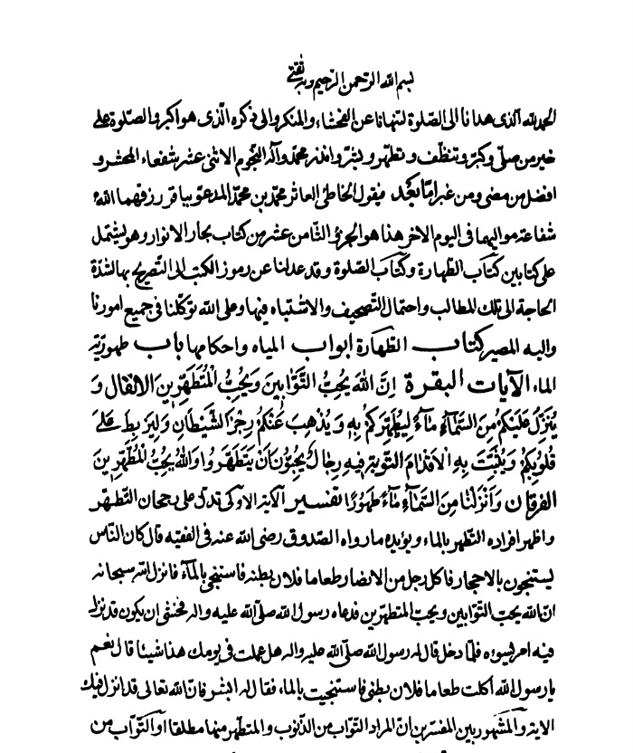
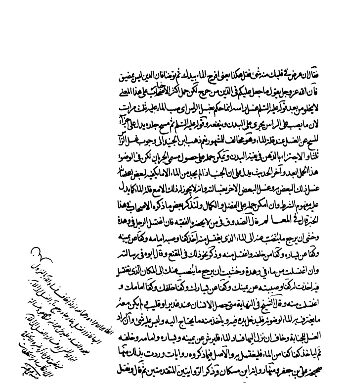
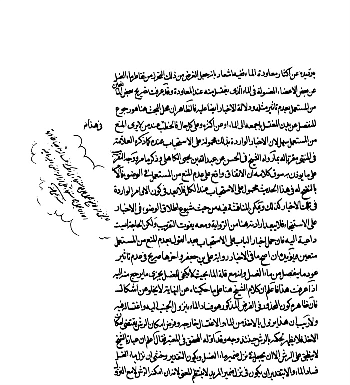

بحار الانوار الجامعة لدرر اخبار الائمة الاطهار المجلد 77

هوية الكتاب
بطاقة تعريف: مجلسي محمد باقربن محمدتقي 1037 - 1111ق.
عنوان واسم المؤلف: بحار الأنوار الجامعة لدرر أخبار الأئمة الأطهار المجلد 77: تأليف محمد باقربن محمدتقي المجلسي.
عنوان واسم المؤلف: بيروت داراحياء التراث العربي [ -13].
مظهر: ج - عينة.
ملاحظة: عربي.
ملاحظة: فهرس الكتابة على أساس المجلد الرابع والعشرين، 1403ق. [1360].
ملاحظة: المجلد108،103،94،91،92،87،67،66،65،52،24(الطبعة الثالثة: 1403ق.=1983م.=[1361]).
ملاحظة: فهرس.
محتويات: ج.24.كتاب الامامة. ج.52.تاريخ الحجة. ج67،66،65.الإيمان والكفر. ج.87.كتاب الصلاة. ج.92،91.الذكر و الدعا. ج.94.كتاب السوم. ج.103.فهرست المصادر. ج.108.الفهرست.-
عنوان: أحاديث الشيعة — قرن 11ق
ترتيب الكونجرس: BP135/م3ب31300 ي ح
تصنيف ديوي: 297/212
رقم الببليوغرافيا الوطنية: 1680946
ص: 1

اشارة
بسم اللّٰه الرحمن الرحیم الحمد لله الذی هدانا إلی الصلاة لتنهانا عن الفحشاء والمنكر، وإلی ذكره الذی هو أكبر، والصلاة علی خیر من صلی وكبر، وتنظف وتطهر، وبشر وأنذر، محمد وآله النجوم الاثنی عشر، شفعاء المحشر، وأفضل من مضی ومن غبر.
أما بعد، فیقول الخاطئ العاثر محمد بن محمد المدعو بباقر رزقهما اللّٰه شفاعة موالیهما فی الیوم الآخر، هذا هو الجزء الثامن عشر من كتاب بحار الأنوار، وهو یشتمل علی كتابین: كتاب الطهارة وكتاب الصلاة، وقد عدلنا عن رموز الكتب إلی التصریح بها لشدة الحاجة إلی تلك المطالب، واحتمال التصحیف والاشتباه فیها وعلی اللّٰه توكلنا فی جمیع أمورنا وإلیه المصیر.

كتاب الطهارة 

أبواب المیاه و أحكامها 

باب 1 طهوریة الماء 

الآیات:
البقرة: إِنَّ اللَّهَ یُحِبُّ التَّوَّابِینَ وَ یُحِبُّ الْمُتَطَهِّرِینَ (1) 
الأنفال: وَ یُنَزِّلُ عَلَیْكُمْ مِنَ السَّماءِ ماءً لِیُطَهِّرَكُمْ بِهِ وَ یُذْهِبَ عَنْكُمْ رِجْزَ الشَّیْطانِ وَ لِیَرْبِطَ عَلی قُلُوبِكُمْ وَ یُثَبِّتَ بِهِ الْأَقْدامَ (2) 
التوبة: فِیهِ رِجالٌ یُحِبُّونَ أَنْ یَتَطَهَّرُوا وَ اللَّهُ یُحِبُّ الْمُطَّهِّرِینَ (3) 
الفرقان: وَ أَنْزَلْنا مِنَ السَّماءِ ماءً طَهُوراً(4) 
تفسیر: 
الآیة الأولی تدل علی رجحان التطهر و أظهر أفراده التطهر بالماء و یؤیده ما رَوَاهُ الصَّدُوقُ رَضِیَ اللَّهُ عَنْهُ فِی الْفَقِیهِ (5) قَالَ: كَانَ النَّاسُ یَسْتَنْجُونَ بِالْأَحْجَارِ فَأَكَلَ رَجُلٌ مِنَ الْأَنْصَارِ طَعَاماً فَلَانَ بَطْنُهُ فَاسْتَنْجَی بِالْمَاءِ فَأَنْزَلَ 
ص: 2

> **پاورقی**: 1- 1. البقرة: 222.

> **پاورقی**: 2- 2. الأنفال: 11.

> **پاورقی**: 3- 3. براءة: 108 و الآیتان ساقطتان عن المطبوعة.

> **پاورقی**: 4- 4. الفرقان: 48.

> **پاورقی**: 5- 5. الفقیه ج 1 ص 20 طبعة النجف فی أربع مجلدات، و طبع ایران ج 1 ص 11.

اللَّهُ سُبْحَانَهُ إِنَّ اللَّهَ یُحِبُّ التَّوَّابِینَ وَ یُحِبُّ الْمُتَطَهِّرِینَ فَدَعَاهُ رَسُولُ اللَّهِ صلی اللّٰه علیه و آله فَخَشِیَ أَنْ یَكُونَ قَدْ نَزَلَ فِیهِ أَمْرٌ یَسُوؤُهُ فَلَمَّا دَخَلَ قَالَ لَهُ رَسُولُ اللَّهِ صلی اللّٰه علیه و آله هَلْ عَمِلْتَ فِی یَوْمِكَ هَذَا شَیْئاً قَالَ نَعَمْ یَا رَسُولَ اللَّهِ أَكَلْتُ طَعَاماً فَلَانَ بَطْنِی فَاسْتَنْجَیْتُ بِالْمَاءِ فَقَالَ لَهُ أَبْشِرْ فَإِنَّ اللَّهَ تَعَالَی قَدْ أَنْزَلَ فِیكَ الْآیَةَ. 
و المشهور بین المفسرین أن المراد التواب من الذنوب و المتطهر منها مطلقا أو التواب من الكبائر و المتطهر من الصغائر أو التواب من الذنوب و المتطهر من الأقذار(1) و سیأتی بعض القول فیها.
و أما الآیة الثانیة فالمراد من السماء إما السحاب فإن كل ما علا یطلق علیه السماء لغة و لذا یسمون سقف البیت سماء و إما الفلك بمعنی أن ابتداء نزول المطر منه إلی السحاب و من السحاب إلی الأرض و لا التفات إلی ما زعمه الطبیعیون فی سبب حدوث المطر فإنه مما لم یقم علیه دلیل قاطع و ربما یقال إن المراد بإنزاله من السماء أنه حصل من أسباب سماویة و تصعد أجزاء رطبة من أعماق الأرض إلی الجو فینعقد سحابا ماطرا و قد مر القول فیه فی كتاب السماء و العالم.
ثم المشهور فی سبب نزولها أنها نزلت فی بدر بسبب أن الكفار سبقوا المسلمین إلی الماء فاضطر المسلمون و نزلوا إلی تل من رمل سیال لا تثبت فیه أقدامهم و أكثرهم خائفون لقلتهم و كثرة الكفار فباتوا تلك اللیلة علی
ص: 3

> **پاورقی**: 1- 1. ظاهر التطهیر و التطهر هو إزالة القذارات عن النفس و البدن، و كل قذارة لها طهارة مزیلة و الطهارة من القذارات المعنویة بالتوبة و التخلق بضدها، و الطهارة من القذارات المادیة بازالتها بالتراب أو الماء، و السنة فی الاستنجاء هی الاحجار الثلاثة الترابیة، و الافضل التطهیر بالماء، لانه اطهر من التراب، و انما كان أفضل لان السنة انما اتخذت فی مكّة و المدینة، حیث لم یكن مصانع للماء و لا بیت الخلاء للبراز، و هذا كما قال الصادق علیه السلام أن نتف الابط و العانة سنة لرسول اللّٰه، و الافضل الطلی، حیث لم یكن فی زمن الرسول صلّی اللّٰه علیه و آله دواء یطلی به.

غیر ماء فاحتلم أكثرهم فتمثل لهم إبلیس و قال تزعمون أنكم علی الحق و أنتم تصلون بالجنابة و علی غیر وضوء و قد اشتد عطشكم و لو كنتم علی الحق ما سبقوكم إلی الماء و إذا أضعفكم العطش قتلوكم كیف شاءوا فأنزل اللّٰه علیهم المطر و زالت تلك العلل و قویت قلوبهم و نزلت الآیة.
فتدل ظاهرا علی تطهیر ماء المطر للحدث و الخبث (1)
و لعل المراد بتطهیر اللّٰه إیاهم توفیقهم للطهارة و قیل الحكم به بعد استعمال الماء علی الوجه المعتبر و المراد بقوله لِیُطَهِّرَكُمْ بِهِ الطهارة من النجاسة الحكمیة أعنی الجنابة و الحدث الأصغر أو منها و من العینیة أیضا كالمنی. 
و یراد برجز الشیطان (2)، إما الجنابة فإنها من فعله و أما وسوسته لهم و الربط علی القلوب یراد به تشجیعها و تقویتها و وثوقها بلطف اللّٰه بهم و قیل إن هذا المعنی هو المراد أیضا بتثبیت أقدامهم.
و بالجملة الآیة تدل علی تطهیر ماء المطر للحدث و الخبث فی الجملة و أما الاستدلال بها علی مطهریة الماء مطلقا فلا یخلو من إشكال (3).
و أما الآیة الثالثة فتدل فی الجملة علی مدح التطهر من الأقذار لا سیما بالماء و قَدْ رُوِیَ عَنِ الْبَاقِرِ وَ الصَّادِقِ علیهما السلام: أَنَّهَا نَزَلَتْ فِی أَهْلِ قُبَاءَ لِجَمْعِهِمْ فِی الِاسْتِنْجَاءِ عَنِ الْغَائِطِ بَیْنَ الْأَحْجَارِ وَ الْمَاءِ. و روی لاستنجائهم بالماء و قیل ربما 
ص: 4

> **پاورقی**: 1- 1. لیس یمن اللّٰه عزّ و جلّ بأنّه نزل المطر لیطهرهم بماء المطر لمزیته علی سائر المیاه، بل المنة لاجل أنهم جیئوا بالماء من فوق رأسهم من دون أن یشقوا أنفسهم بحفر القلیب و تهیئة الدلاء و الرشا و غیر ذلك، و المطر من منن اللّٰه العظام، فانه یرفع بقدرته و مشیئته المیاه من البحار و یركمها سحابا یسوقه الی حیث یشاء، فیعصره و ینزل بالمطر فیتلبد الأرض و ینبت العشب و الكلاء و الحبوب و الاثمار، ثمّ تسیل من الوادی الی القرار فیأخذه الناس لحاجاتهم.

> **پاورقی**: 2- 2. و لعلّ المراد برجز الشیطان هو الذی أمر بهجره فی قوله تعالی:« وَ الرُّجْزَ فَاهْجُرْ»، فیناسب كون المراد به المنی و آثار الجنابة.

> **پاورقی**: 3- 3. قد عرفت أنّه لا إشكال فی الاستدلال بها.

دلت علی استحباب المبالغة فی الاجتناب من النجاسات و لا یبعد فهم استحباب النورة و أمثالها بل استحباب الكون علی الطهارة و تأیید لدلائل الأغسال المستحبة و استحباب المبالغة فی الاجتناب عن المحرمات و المكروهات و الاجتناب عن محال الشبهات و كل ما فیه نوع خسة و دناءة و الحرص علی الطاعات و الحسنات فإنهن یذهبن السیئات فإن الطهارة إن كان لها شرعا حقیقة فهی رافع الحدث أو المبیح للصلاة و هنا لیست مستعملة فیه اتفاقا فلم یبق إلا معناها اللغوی العرفی أی النزاهة و النظافة و هی یعم الكل انتهی. 
و أكثر ما ذكر لا یخلو من مناقشة كما لا یخفی. 
و أما الآیة الرابعة فاستدل بها علی طهارة مطلق الماء و مطهریته و أورد علیه بأنه لیس فی الكلام ما یدل علی العموم و إنما یدل علی أن الماء من السماء مطهر و بأن الطهور مبالغة فی الطاهر و لا یدل علی كونه مطهرا بوجه.
و أجیب عن الأول بأن ذكره تعالی ماء مبهما غیر معین و وصفه بالطهوریة و الامتنان علی العباد به لا یناسب حكمته تعالی و لا فائدة فی هذا الإخبار و لا امتنان فیه فالمراد كل ماء یكون من السماء و قد دلت آیات أخر علی أن كل المیاه من السماء نحو قوله تعالی وَ أَنْزَلْنا مِنَ السَّماءِ ماءً بِقَدَرٍ فَأَسْكَنَّاهُ فِی الْأَرْضِ وَ إِنَّا عَلی ذَهابٍ بِهِ لَقادِرُونَ (1) و قوله سبحانه أَ لَمْ تَرَ أَنَّ اللَّهَ أَنْزَلَ مِنَ السَّماءِ ماءً فَسَلَكَهُ یَنابِیعَ فِی الْأَرْضِ (2)
ص: 5

> **پاورقی**: 1- 1. المؤمنون: 18.

> **پاورقی**: 2- 2. الزمر: 21. و لكن الآیتین و أمثالهما لم تتضمن أن كل ماء انزلناه من السماء بل نكر الماء فقال« مِنَ السَّماءِ ماءً» و المراد به أن میاه الأنهار و العیون لیس من نفس الأرض تجری و تنبع، و انما هی ماء المطر تنزل علی رءوس الوادی و الجبال فیسیل فی. الأنهار أو ینضب فی خلال الجبال و الرمال فیسلك الی ینابیع الأرض، و هذا من عظیم المنن حیث حمل المیاه من البحار الی السماء ثمّ أمطرها علی الأرض فسلكها فی الأنهار و العیون لینتفع به الناس، و لو لم یكن مطر لغار العیون و الآبار و خلت الأنهار« قُلْ ... إِنْ أَصْبَحَ ماؤُكُمْ غَوْراً فَمَنْ یَأْتِیكُمْ بِماءٍ مَعِینٍ»؟.

و عن الثانی بأن كثیرا من أهل اللغة فسر الطهور بالطاهر فی نفسه المطهر لغیره و الشیخ فی التهذیب أسنده إلی لغة العرب و یؤیده شیوع استعماله فی هذا المعنی فی كثیر من الأخبار الخاصیة و العامیة كقول 
النَّبِیِّ صلی اللّٰه علیه و آله: جُعِلَتْ لِیَ الْأَرْضُ مَسْجِداً وَ تُرَابُهَا طَهُوراً(1).
و لو أراد الطاهر لم یثبت المزیة و قَوْلِهِ صلی اللّٰه علیه و آله: وَ قَدْ سُئِلَ عَنِ الْوُضُوءِ بِمَاءِ الْبَحْرِ هُوَ الطَّهُورُ مَاؤُهُ الْحِلُّ مَیْتَتُهُ (2).
و لو لم یرد كونه مطهرا لم یستتم الجواب وَ قَوْلِهِ صلی اللّٰه علیه و آله: طَهُورُ إِنَاءِ أَحَدِكُمْ إِذَا وَلَغَ فِیهِ الْكَلْبُ أَنْ یَغْسِلَهُ سَبْعاً(3).
و قال بعضهم الطهور بالفتح من الأسماء المتعدیة و هو المطهر غیره و أیده بعضهم بأنه یقال ماء طهور و لا یقال ثوب طهور و یؤید كون الطهور فی الآیة بمعنی المطهر موافقتها للآیة الثانیة. 
و احتج علیه الشیخ بأنه لا خلاف بین أهل النحو فی أن اسم فعول موضوع للمبالغة و تكرر الصفة أ لا تری أنهم یقولون فلان ضارب ثم یقولون ضروب إذا تكرر ذلك منه و كثر قال و إذا كان كون الماء طاهرا لیس مما یتكرر و یتزاید فینبغی فی إطلاق الطهور علیه غیر ذلك و لیس بعد ذلك إلا أنه مطهر 
ص: 6

> **پاورقی**: 1- 1. تراه فی أمالی الصدوق ص 130 الخصال ج 1 ص 140 المحاسن ص 365، و رواه فی المعتبر ص 158 و تراه فی سنن أبی داود ج 1 ص 114.

> **پاورقی**: 2- 2. تراه فی المعتبر ص 7، و بمضمونه أحادیث أخر راجع الكافی ج 3 ص 1، قرب الإسناد ص 84 ط حجر و فی كتبهم سنن أبی داود ج 1 ص 19.

> **پاورقی**: 3- 3. الحدیث متفق علیه بمضمونه عندنا، و عندهم كما فی مشكاة المصابیح ص 52 و لفظ الحدیث رواه مسلم.

و فیه ما لا یخفی و قیل الطهور هنا اسم آلة بمعنی ما یتطهر به كالوضوء لما یتوضأ به و الوقود لما یتوقد به بقرینة أن الامتنان بها أتم حینئذ. 
قال فی الكشاف طهورا بلیغا فی طهارته و عن أحمد بن یحیی هو ما كان طاهرا فی نفسه مطهرا لغیره فإن كان ما قاله شرحا لبلاغته فی الطهارة كان سدیدا و یعضده قوله تعالی وَ یُنَزِّلُ عَلَیْكُمْ مِنَ السَّماءِ ماءً لِیُطَهِّرَكُمْ بِهِ (1) و إلا فلیس فعول من التفعیل فی شی ء و الطهور فی العربیة علی وجهین صفة و اسم غیر صفة فالصفة ماء طهور كقولك طاهر و الاسم كقولك لما یتطهر به طهور كالوضوء و الوقود لما یتوضأ به و یتوقد به النار و قولهم تطهرت طهورا حسنا كقولك وضوءا حسنا ذكره سیبویه 
و منه قوله صلی اللّٰه علیه و آله: لا صلاة إلا بطهور. أی بطهارة انتهی. 
و اعترضه النیشابوری بأنه حیث سلم أن الطهور فی العربیة علی وجهین اندفع النزاع لأن كون الماء مما یتطهر به هو كونه مطهرا لغیره فكأنه سبحانه قال و أنزلنا من السماء ماء هو آلة الطهارة و یلزمه أن یكون طاهرا فی نفسه قال و مما یؤكد هذا التفسیر أنه تعالی ذكره فی معرض الإنعام فوجب حمله علی الوصف الأكمل و ظاهر أن المطهر أكمل من الطهارة انتهی (2).
و الحق أن المناقشة فی كون الطهور بمعنی المطهر و إن صحت نظرا إلی قیاس اللغة لكن تتبع الروایات و استعمالات البلغاء یورث ظنا قویا بأن الطهور فی إطلاقاتهم المراد به المطهر إما لكونه صفة بهذا المعنی أو اسما لما یتطهر به و علی التقدیرین یثبت المرام و سیأتی من الأخبار فی هذا الكتاب ما ینبهك علیه. 
ص: 7

> **پاورقی**: 1- 1. الأنفال: 11.

> **پاورقی**: 2- 2. راجع مسالك الافهام للفاصل الجواد ج 1 ص 90.

الأخبار. 
«1»- قُرْبُ الْإِسْنَادِ، عَنْ عَبْدِ اللَّهِ بْنِ الْحَسَنِ الْعَلَوِیِّ عَنْ جَدِّهِ عَلِیِّ بْنِ جَعْفَرٍ عَنْ أَخِیهِ مُوسَی علیه السلام قَالَ: سَأَلْتُهُ عَنْ مَاءِ الْبَحْرِ أَ یُتَوَضَّأُ مِنْهُ قَالَ لَا بَأْسَ (1).
«2»- مَحَاسِنُ الْبَرْقِیِّ، عَنْ بَعْضِ أَصْحَابِهِ رَفَعَهُ عَنِ ابْنِ أُخْتِ الْأَوْزَاعِیِّ عَنْ مَسْعَدَةَ بْنِ الْیَسَعِ عَنْ أَبِی عَبْدِ اللَّهِ علیه السلام قَالَ قَالَ عَلِیٌّ علیه السلام: الْمَاءُ یُطَهِّرُ وَ لَا یُطَهَّرُ وَ رَوَاهُ عَنِ النَّوْفَلِیِّ عَنِ السَّكُونِیِّ عَنْ أَبِی عَبْدِ اللَّهِ علیه السلام عَنْ آبَائِهِ علیهم السلام عَنِ النَّبِیِّ صلی اللّٰه علیه و آله (2). 
«14»- 3- نَوَادِرُ الرَّاوَنْدِیِّ، بِإِسْنَادِهِ عَنْ مُوسَی بْنِ جَعْفَرٍ عَنْ آبَائِهِ علیهم السلام عَنِ النَّبِیِّ صلی اللّٰه علیه و آله: مِثْلَهُ (3)
بیان: الماء یطهر أی كل شی ء حتی نفسه إذ حذف المفعول یدل علی العموم و لا یطهر من شی ء إلا من نفسه لأن التعمیم بالأول أنسب. 
و من المعاصرین من ذهب إلی ظاهر العموم فی ظاهر الثانی و قال لا یطهر نفسه أیضا و قال إن الماء لا یتنجس من شی ء حتی یطهره الماء أو شی ء آخر بل عند التغییر النجس هو ذلك الجسم الذی ظهر فی الماء فإذا استهلك عاد الماء إلی طهارته و فی القول به إشكال و إن لم یبعد من ظواهر بعض الأخبار. 
و قال شیخنا البهائی قدس اللّٰه روحه ربما یشكل حكمه علیه السلام بأن الماء لا یطهر فإن القلیل یطهر(4)
بالجاری و بالكثیر من الراكد فلعله علیه السلام أراد أن الماء یطهر غیره و لا یطهره غیره. 
ص: 8

> **پاورقی**: 1- 1. قرب الإسناد ص 84 ط حجر.

> **پاورقی**: 2- 2. المحاسن ص 570.

> **پاورقی**: 3- 3. نوادر الراوندیّ ص 39.

> **پاورقی**: 4- 4. زیادة من الكمبانیّ.

فإن قلت هذا أیضا علی إطلاقه غیر مستقیم فإن البئر یطهر بالنزح و هو غیر الماء. 
قلت مطهر ماء البئر فی الحقیقة لیس هو النزح و إنما هو الماء النابع شیئا فشیئا وقت إخراج الماء المنزوح فالإطلاق مستقیم.
فإن قلت الماء النجس یطهر بالاستحالة ملحا إذ لیس أدون من الكلب إذا استحال ملحا فقد طهر الماء غیره. 
قلت فقد عدم فلم یبق هناك ماء مطهر بغیره. 
فإن قلت الماء النجس إذا شربه حیوان مأكول اللحم و صار بولا فقد طهر الماء غیره من الأجسام من دون انعدام. 
قلت كون المطهر له جوف الحیوان ممنوع و إنما مطهره استحالته بولا علی وتیرة ما تلوناه علیك فی استحالته ملحا. 
فإن قلت الماء القلیل النجس لو كمل كرا بمضاف لم یسلبه الإطلاق طهر عند جمع من الأصحاب فقد طهر الماء جسم مغایر له. 
قلت یمكن أن یقال بعد مماشاتهم فی طهارته بالإتمام إن المطهر هنا هو مجموع الماء لا المضاف. 
«4»- الْمُعْتَبَرُ، قَالَ قَالَ النَّبِیُّ صلی اللّٰه علیه و آله: خَلَقَ اللَّهُ الْمَاءَ طَهُوراً لَا یُنَجِّسُهُ شَیْ ءٌ مَا إِلَّا غَیَّرَ لَوْنَهُ أَوْ طَعْمَهُ أَوْ رِیحَهُ (1).
السرائر،: مثله و نقل أنه متفق علی روایته (2).
«5»- دَعَائِمُ الْإِسْلَامِ، عَنْ عَلِیٍّ علیه السلام قَالَ: مَنْ لَمْ یُطَهِّرْهُ الْبَحْرُ فَلَا طُهْرَ لَهُ (3).
«6»- الْهِدَایَةُ، لِلصَّدُوقِ: الْمَاءُ كُلُّهُ طَاهِرٌ حَتَّی یُعْلَمَ أَنَّهُ قَذِرٌ. 
ص: 9

> **پاورقی**: 1- 1. المعتبر: ص 9.

> **پاورقی**: 2- 2. السرائر ص 7 و 8.

> **پاورقی**: 3- 3. دعائم الإسلام ج 1 ص 111.

«7»- الْمُقْنِعَةُ، عَنِ الْبَاقِرِ علیه السلام قَالَ: أَفْطِرْ عَلَی الْحُلْوِ فَإِنْ لَمْ تَجِدْهُ فَأَفْطِرْ عَلَی الْمَاءِ فَإِنَّ الْمَاءَ طَهُورٌ. 
بیان: لعل المراد هنا الطهور من الذنوب كما سیأتی (1).
«8»- الْمُعْتَبَرُ، قَالَ: قَالَ النَّبِیُّ صلی اللّٰه علیه و آله وَ قَدْ سُئِلَ عَنْ مَاءِ الْبَحْرِ فَقَالَ هُوَ الطَّهُورُ مَاؤُهُ الْحِلُّ مَیْتَتُهُ (2).
بیان: لعل المراد بالمیتة ما لم ینحر و لم یذبح فإن السمك یحل بخروجه عن الماء من غیر ذبح و نحر.
«9»- إِرْشَادُ الْقُلُوبِ، لِلدَّیْلَمِیِّ عَنْ مُوسَی بْنِ جَعْفَرٍ عَنْ آبَائِهِ عَنْ عَلِیٍّ أَمِیرِ الْمُؤْمِنِینَ علیه السلام أَنَّهُ علیه السلام قَالَ: فِی ذِكْرِ فَضَائِلِ نَبِیِّنَا صلی اللّٰه علیه و آله وَ أُمَّتِهِ عَلَی الْأَنْبِیَاءِ وَ أُمَمِهِمْ إِنَّ اللَّهَ سُبْحَانَهُ رَفَعَ نَبِیَّنَا صلی اللّٰه علیه و آله إِلَی سَاقِ الْعَرْشِ فَأَوْحَی إِلَیْهِ فِیمَا أَوْحَی كَانَتِ الْأُمَمُ السَّالِفَةُ إِذَا أَصَابَهُمْ أَذًی نَجَسٌ قَرَضُوهُ مِنْ أَجْسَادِهِمْ وَ قَدْ جَعَلْتُ الْمَاءَ طَهُوراً لِأُمَّتِكَ مِنْ جَمِیعِ الْأَنْجَاسِ وَ الصَّعِیدَ فِی الْأَوْقَاتِ (3).
بیان: لعله لم یكن الدم نجسا فی شرعهم أو كان هذا معفوا(4).
ص: 10

> **پاورقی**: 1- 1. بل هو طهور للرجز- رجز الشیطان- من باطن الامعاء. فیزید فی صحة بدن.

> **پاورقی**: 2- 2. المعتبر: 7.

> **پاورقی**: 3- 3. إرشاد القلوب ج 2 ص 222.

> **پاورقی**: 4- 4. لا یستلزم ذلك طهارة الدم فی شرعهم أو كونه معفوا عنه، فان المراد بالقرض تمسح خزف أو حجر أو تراب علی الموضع النحس لتزول به النجاسة و یزول و ینقرض الجلد الذی نجس، و ما كان یكفی لهم الغسل بالماء، و أمّا قرض الموضع النجس من اللباس و غیر ذلك كما وقع فی سائر الاخبار، فهو خال عن الاشكال بالمرة.

باب 2 ماء المطر و طینه

«1»- قُرْبُ الْإِسْنَادِ، بِالْإِسْنَادِ الْمُتَقَدِّمِ عَنْ عَلِیِّ بْنِ جَعْفَرٍ عَنْ أَخِیهِ علیه السلام قَالَ: سَأَلْتُهُ عَنِ الْبَیْتِ یُبَالُ عَلَی ظَهْرِهِ وَ یُغْتَسَلُ مِنَ الْجَنَابَةِ ثُمَّ یُصِیبُهُ الْمَطَرُ أَ یُؤْخَذُ مِنْ مَائِهِ فَیُتَوَضَّأَ لِلصَّلَاةِ قَالَ إِذَا جَرَی فَلَا بَأْسَ (1).
وَ عَنْهُ عَنْ أَخِیهِ علیه السلام قَالَ: سَأَلْتُهُ عَنْ رَجُلٍ مَرَّ فِی مَاءِ مَطَرٍ قَدْ صُبَّتْ فِیهِ خَمْرٌ فَأَصَابَ ثَوْبَهُ هَلْ یُصَلِّی فِیهِ قَبْلَ أَنْ یَغْسِلَهُ قَالَ لَا یَغْسِلُ ثَوْبَهُ وَ لَا رِجْلَیْهِ وَ یُصَلِّی وَ لَا بَأْسَ (2).
وَ عَنْهُ عَنْ أَخِیهِ علیه السلام قَالَ: سَأَلْتُهُ عَنِ الْكَنِیفِ یَكُونُ فَوْقَ الْبَیْتِ فَیُصِیبُهُ الْمَطَرُ فَیَكِفُ فَیُصِیبُ الثِّیَابَ أَ یُصَلَّی فِیهَا قَبْلَ أَنْ تُغْسَلَ قَالَ إِذَا جَرَی مِنْ مَاءِ الْمَطَرِ فَلَا بَأْسَ [یُصَلَّی فِیهَا](3).
كتاب المسائل، عن أحمد بن موسی بن جعفر بن أبی العباس عن أبی جعفر بن یزید بن النضر الخراسانی عن علی بن الحسن العلوی عن علی بن جعفر عن أخیه موسی علیه السلام: مثله (4) 
بیان قوله علیه السلام إذا جری استدل به علی ما ذهب إلیه الشیخ من اشتراط الجریان (5) و لم یشترطه الأكثر و یمكن أن یكون الاشتراط هنا لنفوذ
ص: 11

> **پاورقی**: 1- 1. قرب الإسناد ص 83، ط حجر.

> **پاورقی**: 2- 2. قرب الإسناد ص 83 و ص 116 ط نجف.

> **پاورقی**: 3- 3. قرب الإسناد ص 116 ط نجف ص 89 ط حجر.

> **پاورقی**: 4- 4. راجع بحار الأنوار ج 4 ص 158 ط ك و ج 10 ص 288 طبعتنا هذه.

> **پاورقی**: 5- 5. و المراد بالجریان جری ماء المطر بحیث یذهب بعین النجاسة و أثرها الی المیزاب ثمّ الی صحن الدار، ان كان السطح متحجرا، و الی باطن السطح ان كان مطینا. فیطهر ظاهر السطح، فی أول الجریان كما هو قضیة الحدیث الأول، ثمّ بعد الجریان و ذهاب الماء بالنجاسة من المیزاب لا بأس بالماء المأخوذ من المیزاب فانه طاهر مطهر. و اما الحدیث الثالث فالمراد أن الوكوف إذا كان من ماء المطر فلا بأس، و أمّا إذا كان من محل الكنیف و مخلوطا بالنجاسة، فلا یكون طاهرا لنجاسة باطن السطح من دون أن یری المطر، نعم إذا جری ماء المطر من ظاهر السطح الی الباطن، ثمّ جری فی الباطن و وكف الی الأرض بحیث ذهب بجریانه و غوره بنجاسة باطن السطح طهر بعد ذلك كله كما هو ظاهر.

النجاسة فی السطح حتی یستولی علی النجاسة كما یدل علیه قوله یبال علی ظهره و الظاهر أن السؤال عن الاغتسال لنجاسة المنی. 
و الجواب عن السؤال الثانی إما مبنی علی عدم نجاسة الخمر كما نسب إلی الصدوق أو علی كون المرور حال نزول المطر مع عدم التغیر أو بعده مع الاستهلاك حالته أو مع كریة غیر المتغیر و بالجملة الاستدلال به علی كل من المطلبین مشكل. 
و الجواب عن الثالث یدل أن ماء المطر مع الجریان مطهر و فی اشتراط الجریان ما مر من الكلام إذ الكنیف بدون الجریان یتغیر منه ماء المطر و یقال وكف البیت بالفتح وكفا و وكیفا إذا تقاطر الماء من سقفه فیه. 
«2»- فِقْهُ الرِّضَا،: إِذَا بَقِیَ مَاءُ الْمَطَرِ فِی الطُّرُقَاتِ ثَلَاثَةَ أَیَّامٍ نَجِسَ وَ احْتِیجَ إِلَی غَسْلِ الثَّوْبِ مِنْهُ وَ مَاءُ الْمَطَرِ فِی الصَّحَارِی یَجُوزُ الصَّلَاةُ فِیهِ طُولَ الشَّتْوِ. 
«3»- السَّرَائِرُ، مِنْ كِتَابِ مُحَمَّدِ بْنِ عَلِیِّ بْنِ مَحْبُوبٍ عَنْ أَحْمَدَ بْنِ مُحَمَّدٍ عَنْ مُحَمَّدِ بْنِ إِسْمَاعِیلَ عَنْ بَعْضِ أَصْحَابِنَا عَنْ أَبِی الْحَسَنِ علیه السلام: فِی طِینِ الْمَطَرِ أَنَّهُ لَا بَأْسَ بِهِ أَنْ یُصِیبَ الثَّوْبَ ثَلَاثَةَ أَیَّامٍ إِلَّا أَنْ یُعْلَمَ أَنَّهُ قَدْ نَجَّسَهُ شَیْ ءٌ بَعْدَ الْمَطَرِ(1).
بیان: لهذه الروایة فی سائر الكتب تتمة فإن أصابه بعد ثلاثة أیام غسله و إن كان طریقا نظیفا لم یغسله (2)
و استدل به علی عدم انفعال ماء المطر حال 
ص: 12

> **پاورقی**: 1- 1. السرائر ص 478.

> **پاورقی**: 2- 2. راجع الكافی ج 3 ص 13.

التقاطر بالملاقاة لحصر البأس فی طین المطر فیما إذا نجسه شی ء بعد المطر ففیما عداه لا بأس و هو شامل لما إذا كانت الأرض نجسة قبل المطر فیستفاد منه تطهیر المطر الأرض و فیه كلام.
و قال فی المعالم اشتهر فی كلام الأصحاب الحكم باستحباب إزالة طین المطر بعد ثلاثة أیام من وقت انقطاعه و أنه لا بأس به فی الثلاثة ما لم یعلم فیه نجاسة و الأصل فیه روایة محمد بن إسماعیل انتهی و یظهر من الخبر أن مع علم عدم النجاسة بل مع ظنه لا یحسن الاجتناب قبل الثلاثة و بعدها.
و قال العلامة فی التحریر لو وقع علیه فی الطریق ماء و لا یعلم نجاسته لم یجب علیه السؤال إجماعا و بنی علی الطهارة. 
«4»- كِتَابُ الْمَسَائِلِ، بِالْإِسْنَادِ عَنْ عَلِیِّ بْنِ جَعْفَرٍ عَنْ أَخِیهِ مُوسَی علیه السلام قَالَ: سَأَلْتُهُ عَنِ الْمَطَرِ یَجْرِی فِی الْمَكَانِ فِیهِ الْعَذِرَةُ فَیُصِیبُ الثَّوْبَ أَ یُصَلَّی فِیهِ قَبْلَ أَنْ یُغْسَلَ قَالَ إِذَا جَرَی بِهِ الْمَطَرُ فَلَا بَأْسَ (1).
بیان: یشمل القلیل و الكثیر فیدل علی عدم انفعال القلیل فی حال نزول المطر و لا بد من حمله علیه و علی عدم التغیر. 
ثم اعلم أن ظاهر أكثر الأخبار عدم انفعال الماء المجتمع من المطر لا مطلق القلیل فتأمل. 
ص: 13

> **پاورقی**: 1- 1. قد طبع كتاب المسائل فی البحار ج 10 من هذه الطبعة تری نص الحدیث ص 260 و فی قوله« إذا جری به» تأیید لما قلناه ص 11 و 12.

باب 3 حكم الماء القلیل و حد الكثیر و أحكامه و حكم الجاری 

«1»- قُرْبُ الْإِسْنَادِ وَ كِتَابُ الْمَسَائِلِ، بِالْإِسْنَادَیْنِ الْمُتَقَدِّمَیْنِ عَنْ عَلِیِّ بْنِ جَعْفَرٍ عَنْ أَخِیهِ علیه السلام قَالَ: سَأَلْتُهُ عَنِ الدَّجَاجَةِ وَ الْحَمَامَةِ وَ أَشْبَاهِهِنَّ تَطَأُ الْعَذِرَةَ ثُمَّ تَدْخُلُ فِی الْمَاءِ أَ یُتَوَضَّأُ مِنْهُ قَالَ لَا إِلَّا أَنْ یَكُونَ الْمَاءُ كَثِیراً قَدْرَ كُرٍّ(1)
قَالَ وَ سَأَلْتُهُ عَنِ الرَّجُلِ یَتَوَضَّأُ فِی الْكَنِیفِ بِالْمَاءِ یُدْخِلُ یَدَهُ فِیهِ أَ یُتَوَضَّأُ مِنْ فَضْلِهِ لِلصَّلَاةِ قَالَ إِذَا أَدْخَلَ یَدَهُ وَ هِیَ نَظِیفَةٌ فَلَا بَأْسَ وَ لَسْتُ أُحِبُّ أَنْ یَتَعَوَّدَ ذَلِكَ إِلَّا أَنْ یَغْسِلَ یَدَهُ قَبْلَ ذَلِكَ (2)
وَ سَأَلْتُهُ عَنْ جُنُبٍ أَصَابَتْ یَدَهُ مِنْ جَنَابَتِهِ فَمَسَحَهُ بِخِرْقَةٍ ثُمَّ أَدْخَلَ یَدَهُ فِی غِسْلِهِ قَبْلَ أَنْ یَغْسِلَهَا هَلْ یُجْزِیهِ أَنْ یَغْتَسِلَ مِنْ ذَلِكَ الْمَاءِ قَالَ إِنْ وَجَدَ مَاءً غَیْرَهُ فَلَا یُجْزِیهِ أَنْ یَغْتَسِلَ بِهِ وَ إِنْ لَمْ یَجِدْ غَیْرَهُ أَجْزَأَهُ (3).
بیان: الجواب الأول یدل علی انفعال القلیل و اشتراط الكریة فی عدمه ردا علی ابن أبی عقیل و من تبعه قوله یتوضأ فی الكنیف أی یستنجی و یدل علی انفعال القلیل و إن كان البأس أعم من النجاسة و یدل علی استحباب غسل الید مع النظافة أیضا. 
ص: 14

> **پاورقی**: 1- 1. قرب الإسناد ص 84 ط حجر و ص 109 ط نجف و كتاب المسائل ج 10 ص 288 من بحار الأنوار.

> **پاورقی**: 2- 2. قرب الإسناد ص 109 ط نجف.

> **پاورقی**: 3- 3. قرب الإسناد ص 110 ط نجف كتاب المسائل ج 10 ص 287 من البحار بلفظ غیر هذا.

و الجواب الأخیر یدل علی عدم انفعال القلیل و أن رعایة الكریة للاستحباب و حمله علی الكر بعید جدا و یمكن حمله علی التقیة أو علی أن المراد بقوله من جنابته ما یتبع الجنابة من العرق و شبهه لا المنی. 
«2»- عِلَلُ الصَّدُوقِ، عَنْ أَبِیهِ عَنْ سَعْدٍ عَنْ مُحَمَّدِ بْنِ الْحُسَیْنِ عَنِ ابْنِ بَزِیعٍ عَنْ یُونُسَ عَنْ رَجُلٍ مِنْ أَهْلِ الْمَشْرِقِ عَنِ الْعَیْزَارِ عَنِ الْأَحْوَلِ قَالَ: دَخَلْتُ عَلَی أَبِی عَبْدِ اللَّهِ علیه السلام فَقَالَ سَلْ عَمَّا شِئْتَ فَأُرْتِجَتْ عَلَیَّ الْمَسَائِلُ فَقَالَ لِی سَلْ مَا بَدَا لَكَ فَقُلْتُ جُعِلْتُ فِدَاكَ الرَّجُلُ یَسْتَنْجِی فَیَقَعُ ثَوْبُهُ فِی الْمَاءِ الَّذِی اسْتَنْجَی بِهِ فَقَالَ لَا بَأْسَ بِهِ فَسَكَتَ فَقَالَ أَ وَ تَدْرِی لِمَ صَارَ لَا بَأْسَ بِهِ قُلْتُ لَا وَ اللَّهِ جُعِلْتُ فِدَاكَ فَقَالَ علیه السلام إِنَّ الْمَاءَ أَكْثَرُ مِنَ الْقَذَرِ(1).
توضیح قال الجوهری أرتج علی القارئ علی ما لم یسم فاعله إذا لم یقدر علی القراءة كأنه أطبق علیه كما یرتج الباب و لا تقل ارتج علیه بالتشدید انتهی و یدل علی طهارة غسالة الاستنجاء مع عدم التغییر بل یفهم من التعلیل عدم نجاسة غسالة الخبث مطلقا مع عدم التغییر و اختلف الأصحاب فی غسالة الخبث فذهب جماعة من القدماء إلی الطهارة و الأشهر النجاسة و استثنی منها غسالة استنجاء الحدثین فإن المشهور فیها الطهارة و قیل إنه نجس لكنه معفو و هو ضعیف و اشترط فیه عدم التغیر و عدم وقوعه علی نجاسة خارجة و بعض عدم تمیز أجزاء النجاسة فی الماء و بعض عدم تقدم الید علی الماء فی الورود علی النجاسة و بعض عدم زیادة الوزن و اشترط أیضا عدم كون الخارج غیر الحدثین و أن لا یخالط نجاسة الحدثین نجاسة أخری و أن لا تكون متعدیة و إطلاق النص بدفع الجمیع سوی الأولین و الأخیر مع التفاحش بحیث لا یعد استنجاء. 
«3»- الْبَصَائِرُ، لِلصَّفَّارِ عَنْ إِبْرَاهِیمَ بْنِ هَاشِمٍ عَنْ أَبِی عَبْدِ اللَّهِ الْبَرْقِیِّ عَنْ إِبْرَاهِیمَ بْنِ مُحَمَّدٍ عَنْ شِهَابِ بْنِ عَبْدِ رَبِّهِ قَالَ: دَخَلْتُ عَلَی أَبِی عَبْدِ اللَّهِ علیه السلام 
ص: 15

> **پاورقی**: 1- 1. علل الشرائع ج 1 ص 271.

وَ أَنَا أُرِیدُ أَنْ أَسْأَلَهُ مِنَ الْجُنُبِ یَغْرِفُ الْمَاءَ مِنَ الْحُبِّ فَلَمَّا صِرْتُ عِنْدَهُ أُنْسِیتُ الْمَسْأَلَةَ فَنَظَرَ إِلَیَّ أَبُو عَبْدِ اللَّهِ علیه السلام فَقَالَ یَا شِهَابُ لَا بَأْسَ أَنْ یَغْرِفَ الْجُنُبُ مِنَ الْحُبِ (1).
«4»- وَ مِنْهُ، عَنْ مُحَمَّدِ بْنِ إِسْمَاعِیلَ عَنْ عَلِیِّ بْنِ الْحَكَمِ عَنْ شِهَابِ بْنِ عَبْدِ رَبِّهِ قَالَ: أَتَیْتُ أَبَا عَبْدِ اللَّهِ علیه السلام أَسْأَلُهُ فَابْتَدَأَنِی فَقَالَ إِنْ شِئْتَ فَاسْأَلْ یَا شِهَابُ وَ إِنْ شِئْتَ أَخْبَرْنَاكَ بِمَا جِئْتَ لَهُ قُلْتُ أَخْبِرْنِی جُعِلْتُ فِدَاكَ قَالَ جِئْتَ لِتَسْأَلَ عَنِ الْجُنُبِ یَغْرِفُ الْمَاءَ مِنَ الْحُبِّ بِالْكُوزِ فَیُصِیبُ یَدَهُ الْمَاءُ قَالَ نَعَمْ قَالَ لَیْسَ بِهِ بَأْسٌ قَالَ وَ إِنْ شِئْتَ سَلْ وَ إِنْ شِئْتَ أَخْبَرْتُكَ قَالَ قُلْتُ لَهُ أَخْبِرْنِی جُعِلْتُ فِدَاكَ قَالَ جِئْتَ لِتَسْأَلَ عَنِ الْجُنُبِ یَسْهُو وَ یَغْمُرُ یَدَهُ فِی الْمَاءِ قَبْلَ أَنْ یَغْسِلَهَا قُلْتُ وَ ذَاكَ جُعِلْتُ فِدَاكَ قَالَ إِذَا لَمْ یَكُنْ أَصَابَ یَدَهُ شَیْ ءٌ فَلَا بَأْسَ بِذَاكَ فَسَلْ وَ إِنْ شِئْتَ أَخْبَرْتُكَ قُلْتُ أَخْبِرْنِی قَالَ جِئْتَ لِتَسْأَلَنِی عَنِ الْغَدِیرِ یَكُونُ فِی جَانِبِهِ الْجِیفَةُ أَتَوَضَّأُ أَوْ لَا قَالَ نَعَمْ فَتَوَضَّأْ مِنَ الْجَانِبِ الْآخَرِ إِلَّا أَنْ یَغْلِبَ عَلَی الْمَاءِ الرِّیحُ فَیُنْتِنَ وَ جِئْتَ لِتَسْأَلَ عَنِ الْمَاءِ الرَّاكِدِ مِنَ الْبِئْرِ(2) قَالَ فَمَا لَمْ یَكُنْ فِیهِ تَغْیِیرٌ أَوْ رِیحٌ غَالِبَةٌ قُلْتُ فَمَا التَّغْیِیرُ قَالَ الصُّفْرَةُ فَتَوَضَّأْ مِنْهُ وَ كُلَّمَا غَلَبَ عَلَیْهِ كَثْرَةُ الْمَاءِ فَهُوَ طَاهِرٌ(3).
بیان: قوله من البئر كذا فی أكثر النسخ فیدل علی عدم انفعال البئر بدون التغییر إلا أن یحمل علی غیر النابع مجازا و فی بعضها من الكر فیوافق المشهور و ذكر الصفرة علی المثال. 
«5»- فِقْهُ الرِّضَا،: إِنِ اغْتَسَلْتَ مِنْ مَاءِ الْحَمَّامِ وَ لَمْ یَكُنْ مَعَكَ مَا تَغْرِفُ بِهِ 
ص: 16

> **پاورقی**: 1- 1. بصائر الدرجات ص 236.

> **پاورقی**: 2- 2. من الكر خ ل.

> **پاورقی**: 3- 3. بصائر الدرجات ص 238.

وَ یَدَاكَ قَذِرَتَانِ فَاضْرِبْ یَدَكَ فِی الْمَاءِ وَ قُلْ بِسْمِ اللَّهِ هَذَا مِمَّا قَالَ اللَّهُ تَبَارَكَ وَ تَعَالَی ما جَعَلَ عَلَیْكُمْ فِی الدِّینِ مِنْ حَرَجٍ (1) 
وَ قَالَ علیه السلام كُلُّ غَدِیرٍ فِیهِ مِنَ الْمَاءِ أَكْثَرُ مِنْ كُرٍّ لَا یُنَجِّسُهُ مَا یَقَعُ فِیهِ مِنَ النَّجَاسَاتِ إِلَّا أَنْ یَكُونَ فِیهِ الْجِیَفُ فَتُغَیِّرَ لَوْنَهُ وَ طَعْمَهُ وَ رَائِحَتَهُ فَإِذَا غَیَّرَتْهُ لَمْ تُشْرَبْ مِنْهُ وَ لَمْ تُطَهَّرْ مِنْهُ وَ اعْلَمُوا رَحِمَكُمُ اللَّهُ أَنَّ كُلَّ مَاءٍ جَارٍ لَا یُنَجِّسُهُ شَیْ ءٌ. 
بیان: المراد بالقذر الدنس غیر النجس و التسمیة لجبر النجاسة الوهمیة و تدارك ترك المستحب من غسل الید قبل إدخال القلیل اضطرارا أو هی كنایة عن الشروع بلا توقف كما هو الشائع أو المراد الإتیان بالتسمیة التی هی أول الأفعال المستحبة فی الوضوء و الغسل أو المراد بالقذر النجس فیحمل الماء علی الكر. 
«6»- السَّرَائِرُ، مِنْ كِتَابِ الْبَزَنْطِیِّ عَنْ عَبْدِ الْكَرِیمِ عَنْ أَبِی بَصِیرٍ قَالَ: سَأَلْتُ أَبَا عَبْدِ اللَّهِ علیه السلام عَنِ الْجُنُبِ یَجْعَلُ الرَّكْوَةَ أَوِ التَّوْرَ فَیُدْخِلُ إِصْبَعَهُ فِیهَا فَقَالَ إِنْ كَانَتْ یَدُهُ قَذِرَةً فَلْیُهَرِقْهُ وَ إِنْ كَانَ لَمْ یُصِبْهَا قَذَرٌ فَلْیَغْتَسِلْ بِهِ هَذَا مِمَّا قَالَ اللَّهُ عَزَّ وَ جَلَ ما جَعَلَ عَلَیْكُمْ فِی الدِّینِ مِنْ حَرَجٍ (2). 
بیان: قال فی النهایة الركوة إناء صغیر من جلد یشرب فیه الماء و قال التور إناء من صفر أو حجارة كالإجانة و قد یتوضأ منه. 
«7»- كَشْفُ الْغُمَّةِ، مِنْ كِتَابِ الدَّلَائِلِ لِعَبْدِ اللَّهِ بْنِ جَعْفَرٍ الْحِمْیَرِیِّ عَنْ أَبِی عَبْدِ اللَّهِ علیه السلام أَنَّهُ قَالَ: لَمَّا كَانَ فِی اللَّیْلَةِ الَّتِی وُعِدَ فِیهَا عَلِیُّ بْنُ الْحُسَیْنِ علیه السلام قَالَ لِمُحَمَّدٍ یَا بُنَیَّ ابْغِنِی وَضُوءاً قَالَ فَقُمْتُ فَجِئْتُهُ بِمَاءٍ فَقَالَ لَا تَبْغِ هَذَا فَإِنَّ فِیهِ شَیْئاً مَیِّتاً قَالَ فَخَرَجْتُ فَجِئْتُ بِالْمِصْبَاحِ فَإِذَا فِیهِ فَأْرَةٌ مَیْتَةٌ فَجِئْتُهُ 
ص: 17

> **پاورقی**: 1- 1. الحجّ: 78.

> **پاورقی**: 2- 2. السرائر: 465.

بِوَضُوءٍ غَیْرِهِ (1).
البصائر، لسعد بن عبد اللّٰه عن محمد بن عبد اللّٰه عن محمد بن إسماعیل بن بزیع عن سعد بن مسلم عن أبی عمران عن أبی عبد اللّٰه علیه السلام. مثله (2)
بیان: قال فی النهایة یقال ابغنی كذا بهمزة الوصل أی اطلب لی و أبغنی بهمزة القطع أی أعنی علی الطلب و منه الحدیث ابغونی حدیدة أستطیب بها بهمزة الوصل و القطع. 
«8»- كِتَابُ الْمَسَائِلِ، بِالْإِسْنَادِ الْمُتَقَدِّمِ عَنْ عَلِیِّ بْنِ جَعْفَرٍ عَنْ أَخِیهِ مُوسَی علیه السلام قَالَ: سَأَلْتُهُ عَنْ جَرَّةِ مَاءٍ فِیهِ أَلْفُ رِطْلٍ وَقَعَ فِیهِ أُوقِیَّةُ بَوْلٍ هَلْ یَصْلُحُ شُرْبُهُ أَوِ الْوُضُوءُ مِنْهُ قَالَ لَا یَصْلُحُ (3).
«9»- مَجَالِسُ الصَّدُوقِ، قَالَ رُوِیَ: أَنَّ الْكُرَّ هُوَ مَا یَكُونُ ثَلَاثَةَ أَشْبَارٍ طُولًا فِی ثَلَاثَةِ أَشْبَارٍ عَرْضاً فِی ثَلَاثَةِ أَشْبَارٍ عُمْقاً(4).
«10»- الْمُقْنِعُ،: الْكُرُّ مَا یَكُونُ ثَلَاثَةَ أَشْبَارٍ طُولًا فِی عَرْضِ ثَلَاثَةِ أَشْبَارٍ فِی عُمْقِ ثَلَاثَةِ أَشْبَارٍ. 
وَ رُوِیَ: أَنَّ الْكُرَّ ذِرَاعَانِ وَ شِبْرٌ فِی ذِرَاعَیْنِ وَ شِبْرٌ وَ سُئِلَ أَبُو عَبْدِ اللَّهِ علیه السلام عَنِ الْمَاءِ الَّذِی لَا یُنَجِّسُهُ شَیْ ءٌ قَالَ ذِرَاعَانِ عُمْقُهُ فِی ذِرَاعٍ وَ شِبْرٍ سَعَتُهُ. 
وَ رُوِیَ: أَنَّ الْكُرَّ أَلْفٌ وَ مِائَتَا رِطْلٍ (5).
تحقیق و تفصیل اعلم أن للأصحاب فی معرفة الكر طریقین المقدار و الأشبار و الأول ألف 
ص: 18

> **پاورقی**: 1- 1. كشف الغمّة ج 2 ص 308 ط اسلامیة و ص 208 ط حجر.

> **پاورقی**: 2- 2. البصائر ص 483.

> **پاورقی**: 3- 3. كتاب المسائل ج 10 من البحار ص 290.

> **پاورقی**: 4- 4. أمالی الصدوق ص 383.

> **پاورقی**: 5- 5. المقنع ص 4.

و مائتا رطل و ظاهر المعتبر اتفاق الأصحاب علیه لكن اختلفوا فی تعیین الأرطال فذهب الأكثر إلی أنه العراقی و ذهب علم الهدی و الصدوق إلی أنه المدنی و هو رطل و نصف بالعراقی و الأول أظهر و أما الثانی فالمشهور أنه ثلاثة أشبار و نصف فی ثلاثة أشبار و نصف فی ثلاثة أشبار و نصف. 
و ذهب الصدوق و جماعة من القمیین إلی أنه ثلاثة فی ثلاثة یرتقی إلی سبعة و عشرین و هذا لا یخلو من قوة و حكی عن ابن الجنید تحدیده بما بلغ تكسیره نحوا من مائة شبر و عن القطب الراوندی بما بلغت أبعاده الثلاثة عشرة أشبار و نصفا و لم یعتبر التكسیر و قال المتأخرون من أصحابنا و لم نقف لهما علی دلیل.
و أما خبر الذراعین فی ذراع و شبر فهو أصح الأخبار الواردة فی هذا الباب رواه الشیخ بسند صحیح عن إسماعیل بن جابر(1)
فلو حملنا السعة علی الطول و العرض یصیر ستة و ثلاثین شبرا و هذا و إن لم یعمل به أحد من حیث الأشبار لكنه أقرب التحدیدات من التحدید بحسب المقدار كما حققته فی رسالة الأوزان و لم أر من تفطن به و ترك العمل به حینئذ أغرب و لو حملناه علی الحوض المدور یصیر مضروبه ثمانیة و عشرین شبرا و سبعی شبر فیقرب من مذهب القمیین و ربما كان الشبران زائدین علی الذراع بقلیل و یؤیده أن راوی الخبرین واحد و هو إسماعیل بن جابر و الحوض المدور فی المصانع و الغدران التی بین الحرمین شائع و لعل القطر بالسعة أقرب و أنسب. 
و أما ذراعان و شبر فی ذراعین و شبر فلم أره روایة و مذهبا إلا فی هذا الكتاب و هو أیضا إذا حملناه علی الطول و العرض بأن حملنا الثانی علی السعة التی تشمل الطول و العرض أو یقال اكتفی بذكر الجهتین عن الثالثة یصیر مائة و خمسة و عشرین و لم یقل به أحد و لو حملناه علی الحوض المدور یصیر مضروبه ثمانیة و تسعین و سبعا و نصف سبع و یقرب من مذهب ابن الجنید مع أنه بنی الكلام علی التقریب فهو یصلح أن یكون دلیلا علی ما اختاره و الأصوب حمله علی 
ص: 19

> **پاورقی**: 1- 1. راجع التهذیب ج 1 ص 12 ط حجر.

الاستحباب أو التقیة. 
«11»- كِتَابُ الْمَسَائِلِ، بِالْإِسْنَادِ الْمُتَقَدِّمِ عَنْ عَلِیِّ بْنِ جَعْفَرٍ عَنْ أَخِیهِ مُوسَی علیه السلام قَالَ: سَأَلْتُهُ عَنِ الرَّجُلِ وَ هُوَ یَتَوَضَّأُ فَیَقْطُرُ قَطْرَةٌ فِی إِنَائِهِ هَلْ یَصْلُحُ لَهُ الْوُضُوءُ مِنْهُ قَالَ لَا وَ سَأَلْتُهُ عَنْ رَجُلٍ رَعَفَ فَامْتَخَطَ فَطَارَ بَعْضُ ذَلِكَ الدَّمِ قَطْراً قَطْراً صِغَاراً فَأَصَابَ إِنَاءَهُ هَلْ یَصْلُحُ الْوُضُوءُ مِنْهُ قَالَ إِنْ لَمْ یَكُنْ شَیْ ءٌ یَسْتَبِینُ فِی الْمَاءِ فَلَا بَأْسَ وَ إِنْ كَانَ شَیْئاً بَیِّناً فَلَا یُتَوَضَّأُ مِنْهُ (1).
بیان: استدل به علی ما نسب إلی الشیخ من عدم انفعال القلیل بما لا یدركه الطرف من الدم و یمكن حمل السؤال علی أن مراده أن إصابة الدم الإناء معلوم و لكنه لا یری فی الماء شیئا و الظاهر وصوله إلی الماء أیضا و الأصل عدمه فهل یحكم هنا بالظاهر أو بالأصل و هو محمل قریب. 
«12»- نَوَادِرُ الرَّاوَنْدِیِّ، بِإِسْنَادِهِ إِلَی مُوسَی بْنِ جَعْفَرٍ عَنْ آبَائِهِ علیهم السلام قَالَ: قَالَ عَلِیٌّ علیه السلام الْمَاءُ الْجَارِی لَا یُنَجِّسُهُ شَیْ ءٌ. 
وَ بِهَذَا الْإِسْنَادِ قَالَ قَالَ عَلِیٌّ علیه السلام: الْمَاءُ یَمُرُّ بِالْجِیَفِ وَ الْعَذِرَةِ وَ الدَّمِ یُتَوَضَّأُ مِنْهُ وَ یُشْرَبُ لَیْسَ یُنَجِّسُهُ شَیْ ءٌ(2).
بیان: حمل علی الجاری أو الكثیر مع عدم التغییر و الأول أظهر.
«13»- دَعَائِمُ الْإِسْلَامِ، عَنْ أَمِیرِ الْمُؤْمِنِینَ علیه السلام قَالَ: فِی الْمَاءِ الْجَارِی یَمُرُّ بِالْجِیَفِ وَ الْعَذِرَةِ وَ الدَّمِ یُتَوَضَّأُ مِنْهُ وَ یُشْرَبُ وَ لَیْسَ یُنَجِّسُهُ شَیْ ءٌ مَا لَمْ یَتَغَیَّرْ أَوْصَافُهُ طَعْمُهُ وَ لَوْنُهُ وَ رِیحُهُ. 
وَ عَنْهُ صَلَوَاتُ اللَّهِ عَلَیْهِ أَنَّهُ قَالَ: لَیْسَ یُنَجِّسُ الْمَاءَ شَیْ ءٌ. 
وَ عَنْ أَبِی عَبْدِ اللَّهِ علیه السلام أَنَّهُ سُئِلَ عَنْ مِیضَاةٍ كَانَتْ بِقُرْبِ مَسْجِدٍ تُدْخِلُ الْحَائِضُ فِیهَا یَدَهَا أَوْ الْغُلَامُ فِیهَا یَدَهُ قَالَ تَوَضَّأْ مِنْهَا فَإِنَّ الْمَاءَ لَا یُنَجِّسُهُ شَیْ ءٌ. 
ص: 20

> **پاورقی**: 1- 1. كتاب المسائل ج 10 ص 256 من البحار.

> **پاورقی**: 2- 2. نوادر الراوندیّ ص 39.

وَ عَنْهُ علیه السلام: أَنَّهُ سُئِلَ عَنِ الْغَدِیرِ یَكُونُ بِجَانِبِ الْقَرْیَةِ یَكُونُ فِیهِ الْعَذِرَةُ وَ یَبُولُ فِیهِ الصَّبِیُّ وَ تَبُولُ فِیهِ الدَّابَّةُ وَ تَرُوثُ قَالَ إِنْ عَرَضَ بِقَلْبِكَ شَیْ ءٌ مِنْهُ فَقُلْ هَكَذَا(1) وَ تَوَضَّأْ وَ أَشَارَ بِیَدِهِ أَیْ حَرِّكْهُ وَ أَفْرِجْ عَنْهُ عَنْ بَعْضٍ وَ قَالَ إِنَّ الدِّینَ لَیْسَ بِضَیِّقٍ قَالَ اللَّهُ عَزَّ وَ جَلَ ما جَعَلَ عَلَیْكُمْ فِی الدِّینِ مِنْ حَرَجٍ. 
وَ سُئِلَ علیه السلام عَنْ غَدِیرٍ فِیهِ جِیفَةٌ فَقَالَ إِنْ كَانَ الْمَاءُ قَاهِراً لَا یُوجَدُ فِیهِ رِیحُهَا فَتَوَضَّأْ(2)
وَ سُئِلَ أَیْضاً عَنِ الْغَدِیرِ تَبُولُ فِیهِ الدَّوَابُّ وَ تَلَغُ مِنْهُ الْكِلَابُ وَ یَغْتَسِلُ مِنْهُ الْجُنُبُ وَ الْحَائِضُ فَقَالَ إِنْ كَانَ قَدْرَ كُرٍّ لَمْ یُنَجِّسْهُ شَیْ ءٌ وَ سُئِلَ عَنِ الْغَدِیرِ یَبُولُ فِیهِ الدَّوَابُّ وَ تَرُوثُ وَ یَغْتَسِلُ فِیهِ الْجُنُبُ فَقَالَ لَا بَأْسَ إِنَّ رَسُولَ اللَّهِ صلی اللّٰه علیه و آله نَزَلَ بِأَصْحَابِهِ فِی سَفَرٍ لَهُمْ عَلَی غَدِیرٍ وَ كَانَتْ دَوَابُّهُمْ تَبُولُ فِیهِ وَ تَرُوثُ فَیَغْتَسِلُونَ فِیهِ وَ یَتَوَضَّئُونَ مِنْهُ وَ یَشْرَبُونَ. 
وَ عَنْهُ علیه السلام أَنَّهُ قَالَ: إِذَا مَرَّ الْجُنُبُ بِالْمَاءِ وَ فِیهِ الْجِیفَةُ أَوِ الْمَیْتَةُ فَإِنْ كَانَ قَدْ تَغَیَّرَ لِذَلِكَ طَعْمُهُ أَوْ رِیحُهُ أَوْ لَوْنُهُ فَلَا یَشْرَبُ مِنْهُ وَ لَا یَتَوَضَّأُ 
ص: 21

> **پاورقی**: 1- 1. فی المصدر المطبوع فافعل هكذا، و هو تصحیف من المصحح، فان لفظ الحدیث فی سائر المجامیع أیضا كما نقله فی المتن( راجع التهذیب ج 1 ص 118 ط حجر، و ج 1 ص 417 ط نجف) و قوله« فقل هكذا»« قل» فعل أمر یعبر به عن التهیؤ للافعال و الاستعداد لها كما یقال:« قال فأكل» و« قال فضرب» و« قال فتكلم» و اما« هكذا» فقیل انه اسم سمی به الفعل، فقد وقع فی الحدیث( سیرة ابن هشام ج 2 ص 414):« اذ أقبل خراش بن امیة مشتملا علی السیف فقال هكذا عن الرجل، و و اللّٰه ما نظن الا أنّه یرید أن یفرج الناس عنه، فلما انفرجنا عنه حمل علیه فطعنه بالسیف فی بطنه» و حكی عن أبی ذر أن هكذا اسم سمی به الفعل و معناه تنحوا عن الرجل، و عن متعلقة بما فی هكذا من معنی الفعل، لكن الظاهر أن القائل« هكذا» یشیر بیدیه ما یؤدی معنی الانفراج كما فهمه الراوی.

> **پاورقی**: 2- 2. دعائم الإسلام ج 1 ص 111.

وَ لَا یَتَطَهَّرُ مِنْهُ.
وَ عَنْهُ عَنْ آبَائِهِ علیهم السلام قَالَ: سُئِلَ رَسُولُ اللَّهِ صلی اللّٰه علیه و آله عَنِ الْمَاءِ تَرِدُهُ السِّبَاعُ وَ الْكِلَابُ وَ الْبَهَائِمُ فَقَالَ لَهَا مَا أَخَذَتْ بِأَفْوَاهِهَا وَ لَكُمْ مَا بَقِیَ (1).
«14»- الْهِدَایَةُ،: لَا یُفْسِدُ الْمَاءَ إِلَّا مَا كَانَتْ لَهُ نَفْسٌ سَائِلَةٌ وَ إِذَا كَانَ الْمَاءُ كُرّاً لَمْ یُنَجِّسْهُ شَیْ ءٌ وَ الْكُرُّ ثَلَاثَةُ أَشْبَارِ طُولٍ فِی عَرْضِ ثَلَاثَةِ أَشْبَارٍ فِی عُمْقِ ثَلَاثَةِ أَشْبَارٍ وَ إِنَّ أَهْلَ الْبَادِیَةِ سَأَلُوا رَسُولَ اللَّهِ صلی اللّٰه علیه و آله فَقَالُوا یَا رَسُولَ اللَّهِ إِنَّ حِیَاضَنَا هَذِهِ تَرِدُهَا السِّبَاعُ وَ الْكِلَابُ وَ الْبَهَائِمُ فَقَالَ صلی اللّٰه علیه و آله لَهَا مَا أَخَذَتْ أَفْوَاهُهَا وَ لَكُمْ سَائِرُ ذَلِكَ. 
بیان: حمل علی الكثیر أو علی عدم ملاقاة الكلاب و أشباهها بل الظن الغالب و هو غیر معتبر فی هذا الباب و ظاهره عدم انفعال القلیل (2).
ص: 22

> **پاورقی**: 1- 1. المصدر ج 1 ص 112.

> **پاورقی**: 2- 2. عندی أن المراد بالورود: الشرب و الكروع، و السباع و الكلاب و سائر البهائم لیس یلغون فی الماء عند كروعها، و الملاقات المسریة انما تكون إذا سری من الكلب شی ء من أجزائه الی الماء كلعاب فمه و هو الولوغ، و لیس مفروضا فی الحدیث، فطهارة الماء و ان كان قلیلا( كما هو الظاهر من حیاضهم فانهم كانوا یبنون علی الآبار حیاضا ثمّ یستقون من البئر دلاء بقدر ما یحتاج دوابهم و یصبونها فیّ الحوض) مطابق للاصل.

باب 4 حكم البئر و ما یقع فیها 

«1»- قُرْبُ الْإِسْنَادِ، بِالْإِسْنَادِ الْمُتَقَدِّمِ عَنْ عَلِیِّ بْنِ جَعْفَرٍ عَنْ أَخِیهِ علیه السلام قَالَ: سَأَلْتُهُ عَنْ رَجُلٍ یَذْبَحُ شَاةً فَاضْطَرَبَتْ فَوَقَعَتْ فِی بِئْرِ مَاءٍ وَ أَوْدَاجُهَا تَشْخُبُ دَماً هَلْ یُتَوَضَّأُ مِنْ تِلْكَ الْبِئْرِ قَالَ یُنْزَحُ مِنْهَا مَا بَیْنَ الثَّلَاثِینَ إِلَی الْأَرْبَعِینَ دَلْواً ثُمَّ یُتَوَضَّأُ مِنْهَا وَ لَا بَأْسَ بِهِ (1) وَ سَأَلْتُهُ عَنْ رَجُلٍ ذَبَحَ دَجَاجَةً أَوْ حَمَامَةً فَوَقَعَتْ مِنْ یَدِهِ فِی بِئْرِ مَاءٍ وَ أَوْدَاجُهَا تَشْخُبُ دَماً هَلْ یُتَوَضَّأُ مِنْ تِلْكَ الْبِئْرِ قَالَ یُنْزَحُ مِنْهَا مَا بَیْنَ الثَّلَاثِینَ إِلَی الْأَرْبَعِینَ (2)
وَ سَأَلْتُهُ عَنْ رَجُلٍ یَسْتَقِی مِنْ بِئْرِ مَاءٍ فَرَعَفَ فِیهَا هَلْ یُتَوَضَّأُ مِنْهَا(3) قَالَ یُنْزَحُ مِنْهَا دِلَاءٌ یَسِیرَةٌ وَ یُتَوَضَّأُ مِنْهَا وَ سَأَلْتُهُ عَنْ بِئْرٍ وَقَعَ فِیهَا زِنْبِیلٌ مِنْ عَذِرَةٍ رَطْبَةٍ أَوْ یَابِسَةٍ أَوْ زِنْبِیلٌ مِنْ سِرْقِینٍ هَلْ یَصْلُحُ الْوُضُوءُ مِنْهَا قَالَ لَا بَأْسَ (4).
بیان: یدل ما سوی الجواب الأخیر علی وجوب النزح إن قلنا بكون الأمر و ما فی حكمه للوجوب و إلا فعلی الرجحان فی الجملة. 
و اعلم أنه لا خلاف فی نجاسته بالتغییر و اختلف فی حكمه مع مجرد الملاقاة و الأشهر أنه ینجس بالملاقاة مطلقا و ذهب جماعة من الأصحاب كالعلامة و ولده إلی عدم نجاسته مطلقا و ذهب محمد بن محمد البصروی من المتقدمین إلی التفصیل و القول بعدم النجاسة إن كان كرا و بها إن لم یكن كرا و ألزم علی العلامة القول به حیث اشترط فی الجاری الكریة و فیه نظر. 
ص: 23

> **پاورقی**: 1- 1. قرب الإسناد ص 84 ط حجر.

> **پاورقی**: 2- 2. قرب الإسناد ص 84 ط حجر.

> **پاورقی**: 3- 3. قرب الإسناد ص 84 ط حجر.

> **پاورقی**: 4- 4. قرب الإسناد ص 110 ط نجف.

ثم القائلون بالطهارة اختلفوا فی وجوب النزح بوقوع النجاسات المخصوصة و المشهور بینهم الاستحباب و ذهب العلامة فی المنتهی إلی الوجوب تعبدا لا للنجاسة و لم یصرح بأنه یحرم استعماله قبل النزح حتی یتفرع علیه بطلان الوضوء و الصلاة بناء علی أن النهی فی العبادة مستلزم للفساد أم لا. 
ثم إنهم اختلفوا فی حكم الدم فالمفید فی المقنعة حكم بوجوب خمسة دلاء للقلیل و عشرة للكثیر و قال الشیخ فی النهایة و المبسوط للقلیل عشرة و للكثیر خمسون و الصدوق قال بوجوب ثلاثین إلی أربعین فی الكثیر و دلاء یسیرة فی القلیل و إلیه میل المعتبر و الذكری و هو أقوی و قال المرتضی فی المصباح فی الدم ما بین الدلو الواحد إلی عشرین و فی سائر كتب الحدیث فی جواب السؤال عن الدجاجة و الحمامة ینزح منها دلاء یسیرة و هو أظهر. 
و فی المغرب أوداج الدابة هی عروق الحلق من المذبح الواحد ودج و فی الصحاح انشخب عروقه دما انفجر و قال الزبیل معروف فإذا كسرت شددت فقلت زبیل أو زنبیل لأنه لیس فی كلامهم فعلیل بالفتح انتهی و السرقین بكسر السین معرب سرگین بفتحها. 
قال الصدوق فی الفقیه بعد إیراد مضمون الروایة هذا إذا كانت فی زبیل و لم ینزل منه شی ء فی البئر و ربما تحمل العذرة و السرقین علی ما إذا كانا من مأكول اللحم أو غیر ذی النفس و لا یخفی بعد الوجهین و بعد مثل هذا السؤال عن مثل علی بن جعفر رضی اللّٰه عنه بل ظاهر الخبر عدم انفعال البئر بمجرد الملاقاة كما هو الظاهر من النصوص القویة و اللّٰه یعلم. 
«2»- بَصَائِرُ الصَّفَّارِ، عَنْ مُحَمَّدِ بْنِ إِسْمَاعِیلَ عَنْ عَلِیِّ بْنِ الْحَكَمِ عَنْ شِهَابِ بْنِ عَبْدِ رَبِّهِ قَالَ: أَتَیْتُ أَبَا عَبْدِ اللَّهِ علیه السلام فَقَالَ جِئْتَ لِتَسْأَلَ عَنِ الْمَاءِ الرَّاكِدِ مِنَ الْبِئْرِ قَالَ فَمَا لَمْ یَكُنْ فِیهِ تَغْیِیرٌ أَوْ رِیحٌ غَالِبَةٌ قُلْتُ فَمَا التَّغْیِیرُ قَالَ الصُّفْرَةُ فَتَوَضَّأْ مِنْهُ وَ كُلَّمَا غَلَبَ عَلَیْهِ كَثْرَةُ الْمَاءِ فَهُوَ طَاهِرٌ(1).
ص: 24

> **پاورقی**: 1- 1. بصائر الدرجات ص 238 ذیل حدیث، و قد مر تحت الرقم 3 فی الباب 3، و. عرفت هناك أن قوله« من الكر» خ ل.

«3»- فِقْهُ الرِّضَا،: مَاءُ الْبِئْرِ طَهُورٌ مَا لَمْ یُنَجِّسْهُ شَیْ ءٌ یَقَعُ فِیهِ وَ أَكْبَرُ مَا یَقَعُ فِیهِ إِنْسَانٌ فَیَمُوتُ فَانْزَحْ مِنْهَا سَبْعِینَ دَلْواً وَ أَصْغَرُ مَا یَقَعُ فِیهَا الصَّعْوَةُ فَانْزَحْ مِنْهَا دَلْواً وَاحِداً وَ فِیمَا بَیْنَ الصَّعْوَةِ وَ الْإِنْسَانِ عَلَی قَدْرِ مَا یَقَعُ فِیهَا فَإِنْ وَقَعَ فِیهَا حِمَارٌ فَانْزَحْ مِنْهَا كُرّاً مِنَ الْمَاءِ فَإِنْ وَقَعَ فِیهَا كَلْبٌ أَوْ سِنَّوْرٌ فَانْزَحْ مِنْهَا ثَلَاثِینَ دَلْواً إِلَی أَرْبَعِینَ وَ الْكُرُّ سِتُّونَ دَلْواً وَ قَدْ رُوِیَ سَبْعَةُ أَدْلٍ وَ هَذَا الَّذِی وَصَفْنَاهُ فِی مَاءِ الْبِئْرِ مَا لَمْ یَتَغَیَّرِ الْمَاءُ فَإِنْ تَغَیَّرَ الْمَاءُ وَجَبَ أَنْ یُنْزَحَ الْمَاءُ كُلُّهُ فَإِنْ كَانَ كَثِیراً وَ صَعُبَ نَزْحُهُ فَالْوَاجِبُ عَلَیْهِ أَنْ یَكْتَرِیَ عَلَیْهِ أَرْبَعَةَ رِجَالٍ یَسْتَقُونَ مِنْهَا عَلَی التَّرَاوُحِ مِنَ الْغُدْوَةِ إِلَی اللَّیْلِ فَإِنْ تَوَضَّأْتَ مِنْهُ أَوِ اغْتَسَلْتَ أَوْ غَسَلْتَ ثَوْباً بَعْدَ مَا تَبَیَّنَ وَ كُلُّ آنِیَةٍ صُبَّ فِیهِ ذَلِكَ الْمَاءَ غُسِلَ وَ إِنْ وَقَعَتْ فِیهَا حَیَّةٌ أَوْ عَقْرَبٌ أَوْ خَنَافِسُ أَوْ بَنَاتُ وَرْدَانَ فَاسْتَقِ لِلْحَیَّةِ أدل [أَدْلِیاً] وَ لَیْسَ لِسِوَاهَا شَیْ ءٌ وَ إِنْ مَاتَ فِیهَا بَعِیرٌ أَوْ صُبَّ فِیهَا خَمْرٌ فَانْزَحْ مِنْهَا الْمَاءَ كُلَّهُ وَ إِنْ قَطَرَ فِیهَا قَطَرَاتٌ مِنْ دَمٍ فَاسْتَقِ مِنْهَا دِلَاءً وَ إِنْ بَالَ فِیهَا رَجُلٌ فَاسْتَقِ مِنْهَا أَرْبَعِینَ دَلْواً وَ إِنْ بَالَ صَبِیٌّ وَ قَدْ أَكَلَ الطَّعَامَ اسْتَقِ مِنْهَا ثَلَاثَةَ أَدْلٍ وَ إِنْ كَانَ رَضِیعاً اسْتَقِ مِنْهَا دَلْواً وَاحِداً وَ كُلُّ بِئْرٍ عُمْقُ مَائِهَا ثَلَاثَةُ أَشْبَارٍ وَ نِصْفٌ فِی مِثْلِهَا فَسَبِیلُهَا سَبِیلُ الْمَاءِ الْجَارِی إِلَّا أَنْ یَتَغَیَّرَ لَوْنُهَا وَ طَعْمُهَا وَ رَائِحَتُهَا فَإِنْ تَغَیَّرَتْ نُزِحَتْ حَتَّی تَطَیَّبَ وَ
إِذَا سَقَطَ فِی الْبِئْرِ فَأْرَةٌ أَوْ طَائِرٌ أَوْ سِنَّوْرٌ وَ مَا أَشْبَهَ ذَلِكَ فَمَاتَ فِیهَا وَ لَمْ یَتَفَسَّخْ نُزِحَ مِنْهُ سَبْعَةُ أَدْلٍ مِنْ دِلَاءِ هَجَرَ وَ الدَّلْوُ أَرْبَعُونَ رِطْلًا وَ إِنْ تَفَسَّخَ نُزِحَ مِنْهَا عِشْرُونَ دَلْواً وَ رُوِیَ أَرْبَعُونَ دَلْواً اللَّهُمَّ إِلَّا أَنْ یَتَغَیَّرَ اللَّوْنُ وَ الطَّعْمُ وَ الرَّائِحَةُ فَیُنْزَحُ حَتَّی تَطَیَّبَ. 
بیان: لعل المراد بالأكبر الأكبر بحسب النزح بالنسبة إلی ما ینزح بالدلاء أو بالإضافة إلی ما یقع فیها غالبا و فی أكثر نسخ التهذیب بالثاء المثلثة(1) و لا خلاف بین القائلین بوجوب النزح أنه یجب نزح سبعین بموت الإنسان و المشهور بینهم 
ص: 25

> **پاورقی**: 1- 1. التهذیب ج 1 ص 235 ط نجف.

شموله للكافر أیضا و ذهب ابن إدریس إلی نزح الجمیع لموت الكافر. 
قوله علی قدر ما یقع فیها قال الوالد العلامة رحمه اللّٰه یمكن أن یكون بتخمین المكلف أو بنصهم علیهم السلام و الغرض من ذكره أنه لا ینقص من واحد و لا یزید علی السبعین فإن سئلوا علیهم السلام عنه بینوا و إلا احتاطوا بنزح السبعین و هو أحسن من نزح الكل و یمكن أن یكون المراد الأكبر باعتبار النزح لا الجثة و یكون عاما فی المیتة إلا ما أخرجه الدلیل من الكل و الكر و نحوهما انتهی كلامه رفع مقامه.
و الكر للحمار هو المشهور بل لم یظهر مخالف و أما تحدید الكر بما ذكر فغیر معروف و لم أر به قولا و لا روایة غیر هذا(1)
و ما ذكر فی الكلب و السنور اختاره الصدوق فی المقنع و قال بعد ذلك و روی سبعة دلاء و المشهور أربعون فیهما و فی ما أشبههما و أما حكم التغیر فعلی القول بعدم نجاسة البئر و عدم وجوب النزح فاكتفوا بالنزح حتی یزول التغیر كما یدل علیه الخبر مع كریة البئر. 
و علی القول بوجوب النزح و انفعال البئر ففیه أقوال الأول وجوب نزح الجمیع فإن تعذر فالتراوح كما دلت علیه هذه الروایة مع عدم الكریة الثانی نزح الجمیع فإن تعذر فإلی أن یزول التغیر الثالث النزح حتی یزول التغیر الرابع نزح أكثر الأمرین من استیفاء المقدر و زوال التغیر الخامس نزح أكثر 
ص: 26

> **پاورقی**: 1- 1. و بعد قوله« و الدلو أربعون رطلا» یصیر الكر ألفین و أربعمائة رطل و فی الكتاب أعنی المصدر المعروف بفقه الرضا- تحدید الكر هكذا: و العلامة فی ذلك أن تأخذ الحجر فترمی به فی وسطه، فان بلغت أمواجه من الحجر جنبی الغدیر فهو دون الكر، و ان لم یبلغ فهو كر لا ینجسه شی ء، و قد ذكرنا مرارا أن المصدر هو كتاب التكلیف لابن أبی العزاقر الشلمغانی، و لذا لم ینقل هذا النحو من التحدید- و ان كان فسره بذلك اللغوی الكبیر أبو منصور الثعالبی فی كتابه: فقه اللغة- الا من الشلمغانی، راجع فی ذلك البحار ج 51 ص 375 من طبعتنا هذه.

الأمرین إن كان للنجاسة مقدر و إلا فالجمیع فإن تعذر فالتراوح السادس نزح الجمیع فإن غلب الماء اعتبر أكثر الأمرین من زوال التغیر و المقدر السابع نزح ما یزیل التغیر أولا ثم استیفاء المقدر بعده إن كان لتلك النجاسة مقدر و إلا فالجمیع فإن تعذر فالتراوح الثامن أكثر الأمرین إن كان لها مقدر و إلا فزوال التغیر.
و أما الحیة فذهب كثیر من الأصحاب إلی أن فیها ثلاث دلاء و العلامة فی المختلف أسند إلی علی بن بابویه فی بحث الحیة القول بنزح سبع دلاء لها. 
و قال فی مسألة العقرب و قال علی بن بابویه فی رسالته إذا وقعت فیها حیة أو عقرب أو خنافس أو بنات وردان فاستق منها للحیة سبع دلاء و لیس علیك فیما سواها شی ء لكن نقل المحقق فی المعتبر عبارة الرسالة بنحو آخر و فیها موضع سبع دلاء دلوا واحدا و قال صاحب المعالم و فیما عندنا من نسخة الرسالة القدیمة التی علیها آثار الصحة دلاء بدون السبع. 
و أما البعیر فلا خلاف بین القائلین بوجوب النزح فی وجوب نزح الجمیع و كذا أكثر القائلین بنجاسة البئر بالملاقاة أوجبوا نزح الجمیع بوقوع الخمر مطلقا سواء كان قلیلا أم كثیرا و الصدوق فی المقنع فرق بین قلیله و كثیره فحكم بوجوب عشرین دلوا لوقوع قطرة منه و یفهم من ظاهر المعتبر المیل إلیه.
و أما الأربعون لبول الرجل فهو المشهور و أما الثلاثة للصبی فهو مختار الصدوق و المرتضی فی المصباح و ذهب الشیخان و أتباعهما إلی السبع و فی الرضیع المشهور الدلو الواحد و قال أبو الصلاح و ابن زهرة ینزح له ثلاث دلاء و یدل علی أن مع الكریة لا ینفعل ماء البئر بالنجاسة و علی أن الكر ثلاثة أشبار و نصف كما هو المشهور. 
و أما الفأرة فالمشهور أنه مع عدم التفسخ أو الانتفاخ ثلاث دلاء و مع 
ص: 27

أحدهما السبع و قال المرتضی فی المصباح فی الفأرة سبع و قد روی ثلاث و قال الصدوق فی الفقیه فإن وقع فیها فأرة و لم تتفسخ ینزح منها دلو واحد و إذا تفسخت فسبع دلاء و لعل روایة الأربعین إشارة إلی مَا رَوَاهُ الشَّیْخُ عَنْ أَبِی خَدِیجَةَ عَنْ أَبِی عَبْدِ اللَّهِ علیه السلام قَالَ: سُئِلَ عَنِ الْفَأْرَةِ تَقَعُ فِی الْبِئْرِ قَالَ إِذَا مَاتَتْ وَ لَمْ تُنْتِنْ فَأَرْبَعِینَ دَلْواً وَ إِذَا تَفَسَّخَتْ فِیهِ وَ نَتُنَتْ نُزِحَ الْمَاءُ كُلُّهُ. 
و المعروف بین الأصحاب فی الطیر السبع و یفهم من الإستبصار جواز الاكتفاء بالثلاث و أما السنور فلعله وقع فی أحد الموضعین اشتباه من النساخ أو السبع علی الوجوب و الزائد علی الاستحباب. 
و فی الفقیه قال فی الكلب ثلاثون إلی أربعین و فی السنور سبع دلاء و قال الشهید رحمه اللّٰه فی الذكری المراد بالدلو حیث تذكر ما كانت عادیة و قیل هجریة ثلاثون رطلا و قال الجعفی أربعون رطلا.
«4»- الْمُعْتَبَرُ، عَنْ عَلِیِّ بْنِ حَدِیدٍ عَنْ بَعْضِ أَصْحَابِنَا قَالَ: كُنْتُ مَعَ أَبِی عَبْدِ اللَّهِ علیه السلام فِی طَرِیقِ مَكَّةَ فَصِرْنَا إِلَی بِئْرٍ فَاسْتَقَی غُلَامُ أَبِی عَبْدِ اللَّهِ علیه السلام دَلْواً فَخَرَجَ فِیهِ فَأْرَتَانِ فَقَالَ أَبُو عَبْدِ اللَّهِ علیه السلام أَرِقْهُ قَالَ فَاسْتَقَی آخَرَ فَخَرَجَ فِیهِ فَأْرَةٌ فَقَالَ أَبُو عَبْدِ اللَّهِ علیه السلام أَرِقْهُ قَالَ فَاسْتَقَی الثَّالِثَ فَلَمْ یَخْرُجْ فِیهِ شَیْ ءٌ فَقَالَ صُبَّهُ فِی الْإِنَاءِ فَصَبَّهُ فَتَوَضَّأَ مِنْهُ وَ شَرِبَ (1).
بیان: هذا الخبر مما یدل علی عدم انفعال البئر بالملاقاة و الشیخ فی التهذیب (2) أورد هذا الخبر إلی قوله صبه فی الإناء و بعد الطعن فی السند قال یحتمل أن یكون أراد بالبئر المصنع الذی فیه الماء ما یزید مقداره علی الكر فلا یجب نزح شی ء منه ثم إنه لم یقل إنه توضأ منه بل قال صبه فی الإناء و لیس فی قوله صبه فی الإناء دلالة علی جواز استعماله فی الوضوء و یجوز أن یكون إنما أمره بالصب فی الإناء لاحتیاجهم إلیه فی الشرب و هذا یجوز عندنا عند
ص: 28

> **پاورقی**: 1- 1. المعتبر: 11.

> **پاورقی**: 2- 2. التهذیب ج 1 ص 240 و فی ط حجر ج 1 ص 68.

الضرورة انتهی. و لا یخفی أن هذا الوجه الأخیر لا یستقیم مع التتمة التی رواها فی المعتبر و ربما یحمل علی أنه كانت الفأرة حیة. 
«5»- السَّرَائِرُ، قَالَ: الْأَخْبَارُ مُتَوَاتِرَةٌ عَنِ الْأَئِمَّةِ الطَّاهِرِینَ سَلَامُ اللَّهِ عَلَیْهِمْ بِأَنْ یُنْزَحَ لِبَوْلِ الْإِنْسَانِ أَرْبَعُونَ دَلْواً(1).
بیان: إن كان النقل بتلك العبارة كما ادعاه رحمه اللّٰه فهو شامل لبول المرأة فیدل علی ما اختاره من مساواة بولها لبوله فی الحكم و ألحقه جماعة بما لا نص فیه و المحقق أوجب فی المعتبر فیه ثلاثین دلوا. 
«6»- الْمُعْتَبَرُ، رَوَی الْحُسَیْنُ بْنُ سَعِیدٍ فِی كِتَابِهِ عَنِ الْقَاسِمِ بْنِ مُحَمَّدٍ عَنْ عَلِیِّ بْنِ أَبِی حَمْزَةَ عَنْ أَبِی عَبْدِ اللَّهِ علیه السلام قَالَ: سَأَلْتُهُ عَنِ السِّنَّوْرِ فَقَالَ أَرْبَعُونَ دَلْواً وَ لِلْكَلْبِ وَ شِبْهِهِ (2).
بیان: أی شبهه فی الجثة أو فی الأوصاف أیضا كالخنزیر.
«7»- كِتَابُ الْمَسَائِلِ، بِالْإِسْنَادِ الْمُتَقَدِّمِ عَنْ عَلِیِّ بْنِ جَعْفَرٍ عَنْ أَخِیهِ مُوسَی علیه السلام قَالَ: سَأَلْتُهُ عَنْ فَأْرَةٍ وَقَعَتْ فِی بِئْرٍ فَأُخْرِجَتْ وَ قَدْ تَقَطَّعَتْ هَلْ یَصْلُحُ الْوُضُوءُ مِنْ مَائِهَا قَالَ یُنْزَحُ مِنْهَا عِشْرُونَ دَلْواً إِذَا تَقَطَّعَتْ ثُمَّ تُتَوَضَّأُ وَ لَا بَأْسَ وَ سَأَلْتُهُ عَنْ صَبِیٍّ بَالَ فِی بِئْرٍ هَلْ یَصْلُحُ الْوُضُوءُ مِنْهَا فَقَالَ یُنْزَحُ الْمَاءُ كُلُّهُ (3).
بیان: لعل نزح العشرین فی الفأرة موافقا لما مر فی الفقه الرضوی و نزح كل الماء لبول الصبی محمولان علی الاستحباب أو فی الأخیر علی التغیر و قال سید المحققین فی المدارك الأظهر نزح دلاء للقطرات من البول مطلقا 
ص: 29

> **پاورقی**: 1- 1. السرائر ص 13.

> **پاورقی**: 2- 2. المعتبر ص 16.

> **پاورقی**: 3- 3. كتاب المسائل المطبوع فی البحار ج 10 ص 290.

لصحیحة ابن بزیع (1)
و نزح الجمیع لانصبابه فیها كذلك لصحیحة(2)
مُعَاوِیَةَ بْنِ عَمَّارٍ عَنِ الصَّادِقِ علیه السلام: فِی الْبِئْرِ یَبُولُ فِیهَا الصَّبِیُّ أَوْ یُصَبُّ فِیهَا خَمْرٌ أَوْ بَوْلٌ فَقَالَ یُنْزَحُ الْمَاءُ كُلُّهُ. 
«8»- الْهِدَایَةُ،: مَاءُ الْبِئْرِ وَاسِعٌ لَا یُفْسِدُهُ شَیْ ءٌ وَ أَكْبَرُ مَا یَقَعُ فِی الْبِئْرِ الْإِنْسَانُ فَیَمُوتُ فِیهَا یُنْزَحُ مِنْهَا سَبْعُونَ دَلْواً وَ أَصْغَرُ مَا یَقَعُ فِیهَا الصَّعْوَةُ یُنْزَحُ مِنْهَا دَلْوٌ وَاحِدٌ وَ فِیمَا بَیْنَ الْإِنْسَانِ وَ الصَّعْوَةِ عَلَی قَدْرِ مَا یَقَعُ فِیهَا وَ إِنْ وَقَعَ فِیهَا ثَوْرٌ أَوْ بَعِیرٌ أَوْ صُبَّ فِیهَا خَمْرٌ نُزِحَ الْمَاءُ كُلُّهُ وَ إِنْ وَقَعَ فِیهَا حِمَارٌ نُزِحَ مِنْهَا كُرٌّ مِنْ مَاءٍ وَ إِنْ وَقَعَ فِیهَا كَلْبٌ أَوْ سِنَّوْرٌ نُزِحَ مِنْهَا ثَلَاثُونَ دَلْواً إِلَی أَرْبَعِینَ دَلْواً وَ إِنْ وَقَعَتْ فِیهَا دَجَاجَةٌ أَوْ طَیْرٌ نُزِحَ مِنْهَا سَبْعُ دِلَاءٍ وَ إِنْ وَقَعَتْ فِیهَا فَأْرَةٌ نُزِحَ مِنْهَا دَلْوٌ وَاحِدٌ وَ إِنْ تَفَسَّخَتْ فَسَبْعُ دِلَاءٍ وَ إِنْ بَالَ فِیهَا رَجُلٌ نُزِحَ مِنْهَا أَرْبَعُونَ دَلْواً وَ إِنْ بَالَ فِیهَا صَبِیٌّ قَدْ أَكَلَ الطَّعَامَ نُزِحَ مِنْهَا ثَلَاثُ دِلَاءٍ فَإِنْ كَانَ رَضِیعاً نُزِحَ مِنْهَا دَلْوٌ وَاحِدٌ وَ إِنْ وَقَعَتْ فِیهَا عَذِرَةٌ اسْتُقِیَ مِنْهَا عَشَرَةُ دِلَاءٍ فَإِنْ ذَابَتْ فِیهَا فَأَرْبَعُونَ دَلْواً إِلَی خَمْسِینَ دَلْواً. 
ص: 30

> **پاورقی**: 1- 1. التهذیب ج 1 ص 244 و ج 1 ص 69 ط حجر.

> **پاورقی**: 2- 2. التهذیب ج 1 ص 241 و ج 1 ص 68.

باب 5 البعد بین البئر و البالوعة 

«1»- قُرْبُ الْإِسْنَادِ، عَنْ مُحَمَّدِ بْنِ خَالِدٍ الطَّیَالِسِیِّ عَنِ الْعَلَاءِ عَنْ أَبِی عَبْدِ اللَّهِ علیه السلام قَالَ: سَأَلْتُهُ عَنِ الْبِئْرِ یَتَوَضَّأُ مِنْهَا الْقَوْمُ وَ إِلَی جَانِبِهَا بَالُوعَةٌ قَالَ إِنْ كَانَ بَیْنَهُمَا عَشَرَةُ أَذْرُعٍ وَ كَانَتِ الْبِئْرُ الَّتِی یَسْتَقُونَ مِنْهَا یَلِی الْوَادِیَ فَلَا بَأْسَ (1).
توضیح و تنقیح اعلم أن المشهور أن البئر لا تنجس بالبالوعة و إن تقاربتا إلا أن یعلم وصول نجاستها إلی الماء بناء علی القول بالانفعال أو بتغیره بناء علی عدمه ثم المشهور استحباب التباعد بینهما بمقدار خمس أذرع إن كانت البئر فوق البالوعة أو كانت الأرض صلبة و إلا فسبع و منهم من اعتبر الفوقیة بحسب الجهة علی أن جهة الشمال أعلی فحصلت الفوقیة و التحتیة و التساوی بحسب الجهة و منهم من قسم التساوی إلی الشرقیة و الغربیة فتصیر أقسام المسألة باعتبار صلابة الأرض و رخاوتها و كون البئر أعلی بسب القرار أو أسفل أو مساویا و كونها فی جهة المشرق أو المغرب أو الجنوب أو الشمال أربعا و عشرین.
فمنهم من قال إذا كانت البئر فوق البالوعة جهة أو قرارا أو كانت الأرض صلبة فخمس و إلا فسبع و منهم من عكس و قال إذا كانت البئر تحت البالوعة جهة أو قرارا أو كانت الأرض رخوة فسبع و إلا فخمس و الفرق بین التعبیرین ظاهر إذ التساوی فی أحدهما ملحق بالخمس و فی الآخر بالسبع. 
و خالف ابن الجنید المشهور و اختلف النقل عنه فالمشهور أنه یقول إن 
ص: 31

> **پاورقی**: 1- 1. قرب الإسناد ص 16 ط حجر و ص 24 ط نجف.

كانت الأرض رخوة و البئر تحت البالوعة فلیكن بینهما اثنتا عشرة ذراعا و إن كانت صلبة أو كانت البئر فوق البالوعة فلیكن بینهما سبع أذرع و حكی صاحب المعالم عنه أنه قال فی المختصر لا أستحب الطهارة من بئر تلی بئر النجاسة التی تستقر فیها من أعلاها فی مجری الوادی إلا إذا كان بینهما فی الأرض الرخوة اثنتا عشرة ذراعا و فی الأرض الصلبة سبعة أذرع فإن كانت تحتها و النظیفة أعلاها فلا بأس و إن كانت محاذیتها فی سمت القبلة فإذا كان بینهما سبعة أذرع فلا بأس. 
فإذا عرفت هذا فالخبر المتقدم لا یوافق شیئا من المذاهب و یمكن حمله علی المشهور علی مرتبة من مراتب الاستحباب و الفضل و لعل المراد بكون البئر یلی الوادی كونها فی جهة الشمال لأن مجری العیون منها فالمراد الوادی تحت الأرض و لا یبعد أن یكون فی الأصل أعلی الوادی وفقا لما رواه 
الْكُلَیْنِیُ (1)
عَنْ عَلِیِّ بْنِ إِبْرَاهِیمَ عَنْ أَبِیهِ عَنْ حَمَّادٍ عَنْ حَرِیزٍ عَنْ زُرَارَةَ وَ مُحَمَّدِ بْنِ مُسْلِمٍ وَ أَبِی بَصِیرٍ قَالُوا: قُلْنَا لَهُ علیه السلام بِئْرٌ یُتَوَضَّأُ مِنْهَا یَجْرِی الْبَوْلُ قَرِیباً مِنْهَا أَ یُنَجِّسُهَا قَالَ فَقَالَ إِنْ كَانَتِ الْبِئْرُ فِی أَعْلَی الْوَادِی یَجْرِی فِیهِ الْبَوْلُ مِنْ تَحْتِهَا وَ كَانَ بَیْنَهُمَا قَدْرُ ثَلَاثَةِ أَذْرُعٍ أَوْ أَرْبَعَةِ أَذْرُعٍ لَمْ یُنَجِّسْ ذَلِكَ شَیْ ءٌ وَ إِنْ كَانَ أَقَلَّ مِنْ ذَلِكَ نَجَّسَهَا وَ إِنْ كَانَتِ الْبِئْرُ فِی أَسْفَلِ الْوَادِی وَ یَمُرُّ الْمَاءُ عَلَیْهَا وَ كَانَ بَیْنَ الْبِئْرِ وَ بَیْنَهُ تِسْعَةُ أَذْرُعٍ لَمْ یُنَجِّسْهَا وَ مَا كَانَ أَقَلَّ مِنْ ذَلِكَ فَلَا یُتَوَضَّأُ مِنْهُ قَالَ زُرَارَةُ فَقُلْتُ لَهُ فَإِنْ كَانَ مَجْرَی الْبَوْلِ بِلِزْقِهَا وَ كَانَ لَا یَلْبَثُ عَلَی الْأَرْضِ فَقَالَ مَا لَمْ یَكُنْ لَهُ قَرَارٌ فَلَیْسَ بِهِ بَأْسٌ وَ إِنِ اسْتَقَرَّ مِنْهُ قَلِیلٌ فَإِنَّهُ لَا یَثْقُبُ الْأَرْضَ وَ لَا قَعْرَ لَهُ حَتَّی یَبْلُغَ الْبِئْرَ وَ لَیْسَ عَلَی الْبِئْرِ مِنْهُ بَأْسٌ فَیُتَوَضَّأُ مِنْهُ إِنَّمَا ذَلِكَ إِذَا اسْتَنْقَعَ كُلُّهُ. 
ص: 32

> **پاورقی**: 1- 1. الكافی ج 3 ص 7 و 8 و من ط حجر الفروع ج 1 ص 3، و رواه فی التهذیب ط حجر ج 1 ص 116.

قوله علیه السلام فی أعلی الوادی ظاهره الفوقیة بحسب القرار و یحتمل الجهة أیضا و المعنی أن البئر أعلی من الوادی الذی یجری فیه البول و كذا قوله فی أسفل الوادی أی أسفل من الوادی و یمر الماء أی البول علیها أی مشرفا علیها بعكس السابق و التعبیر عن وادی البول بالماء للإشعار بأن الوادی قد وصل إلی الماء. 
قوله فإن كان مجری البول بلزقها الظاهر أن السابق كان حكم ما إذا وصلت بالوعة البول الماء و هذا الذی سأله زرارة حكم ما إذا لم یصل إلی الماء ففصل علیه السلام فیه بأنه إذا كان كل البول أو أكثره یستقر فی مكان قریب من البئر یلزم التباعد بالقدرین المذكورین أیضا و إن كان لا یستقر منه شی ء أصلا أو یستقر منه شی ء قلیل فإنه لا یثقب الأرض بكثرة المكث و لا قعر له أی لم یصل إلی الماء حتی یتصل إلی الماء بمجاریه فلا یضر قربهما. 
و هذا التفصیل لم أر قائلا به و من استدل به من الأصحاب علی مقدار البعد لم یتفطن لذلك و لم یتعرض له و المشهور بینهم أن مع عدم بلوغ البالوعة الماء لا یستحب التباعد مطلقا و یمكن تأویله علی ما یوافق المشهور بأن یكون المراد بعدم القرار و عدم القعر عدم الوصول إلی الماء. 
و قوله علیه السلام إنما ذلك إذا استنقع كله أی إذا كان له منافذ و مجاری إلی البئر فإنه حینئذ یستنقع كله و لا یخفی بعده و التفصیل الذی یستفاد منه قریب من التجربة و الاعتبار فإن التجربة شاهدة بأنه إذا استقر بول كثیر فی مكان قریب من البئر زمانا طویلا فلا محالة یصل أثره إلی البئر و إن لم یصل إلی الماء و اللّٰه تعالی یعلم حقائق الأحكام و حججه الكرام علیهم السلام. 
ص: 33

باب 6 حكم ماء الحمام

«1»- قُرْبُ الْإِسْنَادِ، لِلْحِمْیَرِیِّ عَنْ مُحَمَّدِ بْنِ عَبْدِ الْحَمِیدِ وَ عَبْدِ الصَّمَدِ بْنِ مُحَمَّدٍ عَنْ حَنَانٍ قَالَ: سَمِعْتُ رَجُلًا یَقُولُ لِأَبِی عَبْدِ اللَّهِ علیه السلام إِنِّی أَدْخُلُ الْحَمَّامَ فِی السَّحَرِ وَ فِیهِ الْجُنُبُ وَ غَیْرُ ذَلِكَ فَأَقُومُ فَأَغْتَسِلُ فَیَنْتَضِحُ عَلَیَّ بَعْدَ مَا أَفْرُغُ مِنْ مَائِهِمْ قَالَ أَ لَیْسَ هُوَ جَارٍ قُلْتُ بَلَی قَالَ لَا بَأْسَ بِهِ (1).
بیان: قوله علیه السلام أ لیس هو جار أی أ لیس الماء جاریا من المادة إلی الحیاض الصغار التی یغتسلون منها إذ الماء یمكن أن یكون انتضح من أبدانهم إذا كانوا خارج الحوض أو من الماء المتصل بالمادة إذا كانوا داخل الحوض أو المعنی أ لیس الماء جاریا من أطراف الحوض إلی سطح الحمام فلا یضر وثوب الماء من سطح الحمام لاتصاله بالمادة. 
و قیل المعنی أ ما سمعت أن حكم ماء الحمام حكم الماء الجاری أو أ لیس یجری الماء الجاری فی سطح الحمام كما هو الشائع فی بعض البلاد و قیل یعنی أن ماءهم جار علی أبدانهم فلا بأس أن ینتضح منه علیك فلا یخفی بعد ما سوی الأولین. 
«2»- قُرْبُ الْإِسْنَادِ، عَنْ أَیُّوبَ بْنِ نُوحٍ عَنْ صَالِحِ بْنِ عَبْدِ اللَّهِ عَنْ إِسْمَاعِیلَ بْنِ جَابِرٍ عَنْ أَبِی الْحَسَنِ الْأَوَّلِ علیه السلام قَالَ: ابْتَدَأَنِی فَقَالَ مَاءُ الْحَمَّامِ لَا یُنَجِّسُهُ شَیْ ءٌ(2).
بیان: فسر الأصحاب ماء الحمام بالحیاض الصغار التی تكون فی 
ص: 34

> **پاورقی**: 1- 1. قرب الإسناد ص 78 ط نجف.

> **پاورقی**: 2- 2. قرب الإسناد ص 128 ط حجر و ص 173 ط نجف.

الحمامات و اختلف فی أنه هل یشترط كریة المادة أم لا فقیل لا تشترط الكریة أصلا و قیل تشترط كریة الأعلی و الأسفل معا و قیل تشترط كریة الأعلی فقط و قیل یشترط كونه أزید من الكر. 
و اختلف فی أنه لو تنجس الحیاض الصغار هل تطهر بمجرد الاتصال أم یعتبر فیه الامتزاج و لیس فی هذا الخبر ذكر المادة و حمل علیها جمعا(1).
ص: 35

> **پاورقی**: 1- 1. قد مر فی الحدیث السابق« فأقوم فأغتسل فینتضح علی بعد ما أفرغ من مائهم» و الحدیث رواه الكلینی أیضا فی الفروع ج 1 ص 5 ط حجر و ج 3 ص 14 ط الآخوندی و هكذا رواه الشیخ فی التهذیب ج 1 ص 107 ط حجر، فیظهر من لفظ الحدیث مضافا الی سائر ما ورد فی المقام أن الحمامات كانت وقتئذ ذات مخزن كبیر من الماء المستحم، ینشعب منه جداول صغار الی الحیاض التی بنیت كالاجانة یغترف الناس منها للاغتسال فكلما اغترف الناس من حوض من تلك الحیاض كاسا انجر الماء من المخزن إلیه حتّی یستوعبه فالمخزن هو المادة و هو ماء كثیر لا ینجسه شی ء. و أمّا الغسالة فما كانت تجری إلیها، بل تجری الی بئر معدة هناك كما تراها منصوصا علیها فی الروایات، فلیس لماء الحمام بنفسه حكم یختص به، بل ماء الحمام كماء الطشت و الاجانة إذا قطر من ماء الغسالة فی الطشت، اللّٰهمّ الا ما عند المتأخرین من الحكم بكریة الماء المتصل بالكر من دون امتزاج و وحدة، فتكون تلك الحیاض الصغار أیضا ماؤها محكوما بالطهارة و الكریة، و أنّها لا ینجسها شی ء. ففی التهذیب ج 1 ص 37 بإسناده عن سماعة عن أبی عبد اللّٰه علیه السلام قال: إذا أصاب الرجل جنابة فأراد الغسل فلیفرغ علی كفیه فلیغسلهما دون المرفق ثمّ یدخل یده فی انائه ثمّ یغسل فرجه ثمّ لیصب علی رأسه ثلاث مرّات مل ء كفیه ثمّ یضرب بكف من ماء علی صدره و كف بین كتفیه ثمّ یفیض الماء علی جسده كله، فما انتضح من مائه فی انائه بعد ما صنع ما وصفت لك فلا بأس. و بمعناه أحادیث أخر.

«3»- فِقْهُ الرِّضَا علیه السلام: إِنِ اغْتَسَلْتَ مِنْ مَاءِ الْحَمَّامِ وَ لَمْ یَكُنْ مَعَكَ مَا تَغْرِفُ بِهِ وَ یَدَاكَ قَذِرَتَانِ فَاضْرِبْ یَدَكَ فِی الْمَاءِ وَ قُلْ بِسْمِ اللَّهِ وَ هَذَا مِمَّا قَالَ اللَّهُ تَبَارَكَ وَ تَعَالَی وَ ما جَعَلَ عَلَیْكُمْ فِی الدِّینِ مِنْ حَرَجٍ وَ إِنِ اجْتَمَعَ مُسْلِمٌ مَعَ ذِمِّیٍّ فِی الْحَمَّامِ اغْتَسَلَ الْمُسْلِمُ مِنَ الْحَوْضِ قَبْلَ الذِّمِّیِّ وَ مَاءُ الْحَمَّامِ سَبِیلُهُ سَبِیلُ الْمَاءِ الْجَارِی إِذَا كَانَتْ لَهُ مَادَّةٌ. 
بیان: لعل تقدیم المسلم فی الغسل علی الاستحباب لشرف الإسلام إذا كان الماء كثیرا و إذا كان الماء قلیلا فعلی الوجوب بمعنی عدم الاكتفاء به فی رفع الحدث و الخبث. 
«4»- الْهِدَایَةُ،: وَ مَاءُ الْحَمَّامِ سَبِیلُهُ سَبِیلُ الْمَاءِ الْجَارِی إِذَا كَانَتْ لَهُ مَادَّةٌ(1).
«5»- الْمَكَارِمُ، عَنِ الْبَاقِرِ علیه السلام قَالَ: مَاءُ الْحَمَّامِ لَا بَأْسَ بِهِ إِذَا كَانَ لَهُ مَادَّةٌ. 
دَاوُدُ بْنُ سِرْحَانَ قَالَ: قُلْتُ لِأَبِی عَبْدِ اللَّهِ علیه السلام مَا تَقُولُ فِی مَاءِ الْحَمَّامِ قَالَ هُوَ بِمَنْزِلَةِ الْمَاءِ الْجَارِی. 
مُحَمَّدُ بْنُ مُسْلِمٍ قَالَ: قُلْتُ لِأَبِی عَبْدِ اللَّهِ علیه السلام الْحَمَّامُ یَغْتَسِلُ فِیهِ الْجُنُبُ وَ غَیْرُهُ أَغْتَسِلُ مِنْ مَائِهِ قَالَ نَعَمْ لَا بَأْسَ أَنْ یَغْتَسِلَ مِنْهُ الْجُنُبُ وَ لَقَدِ اغْتَسَلْتُ فِیهِ ثُمَّ جِئْتُ فَغَسَلْتُ رِجْلَیَّ وَ مَا غَسَلْتُهُمَا إِلَّا مِمَّا لَزِقَ بِهِمَا مِنَ التُّرَابِ.
وَ عَنْ زُرَارَةَ قَالَ: رَأَیْتُ الْبَاقِرَ علیه السلام یَخْرُجُ مِنَ الْحَمَّامِ فَیَمْضِی كَمَا هُوَ لَا یَغْسِلُ رِجْلَهُ حَتَّی یُصَلِّیَ (2).
«6»- الْعِلَلُ، عَنْ مُحَمَّدِ بْنِ الْحَسَنِ عَنْ سَعْدِ بْنِ عَبْدِ اللَّهِ عَنْ أَحْمَدَ بْنِ الْحَسَنِ بْنِ فَضَّالٍ عَنِ الْحَسَنِ بْنِ عَلِیٍّ عَنْ عَبْدِ اللَّهِ بْنِ بُكَیْرٍ عَنْ عَبْدِ اللَّهِ بْنِ أَبِی یَعْفُورٍ عَنْ أَبِی عَبْدِ اللَّهِ علیه السلام فِی حَدِیثٍ قَالَ: وَ إِیَّاكَ أَنْ تَغْتَسِلَ مِنْ غُسَالَةِ الْحَمَّامِ فَفِیهَا تَجْتَمِعُ غُسَالَةُ الْیَهُودِیِّ وَ النَّصْرَانِیِّ وَ الْمَجُوسِیِّ وَ النَّاصِبِ لَنَا أَهْلَ الْبَیْتِ وَ هُوَ 
ص: 36

> **پاورقی**: 1- 1. الهدایة ص 14.

> **پاورقی**: 2- 2. مكارم الأخلاق ص 59.

شَرُّهُمْ فَإِنَّ اللَّهَ تَبَارَكَ وَ تَعَالَی لَمْ یَخْلُقْ خَلْقاً أَنْجَسَ مِنَ الْكَلْبِ وَ إِنَّ النَّاصِبَ لَنَا أَهْلَ الْبَیْتِ لَأَنْجَسُ مِنْهُ (1).
تبیین: اعلم أن الأصحاب اختلفوا فی غسالة الحمام فقال الصدوق لا یجوز التطهر بغسالة الحمام لأنه تجتمع فیه غسالة الیهودی و المجوسی و المبغض لآل محمد صلی اللّٰه علیه و آله و هو شرهم و قریب منه كلام أبیه و قال الشیخ فی النهایة غسالة الحمام لا یجوز استعمالها علی حال و قال ابن إدریس غسالة الحمام لا یجوز استعمالها علی حال و هذا إجماع و قد وردت به عن الأئمة علیهم السلام آثار معتمدة قد أجمع الأصحاب علیها لا أحد خالف فیها. 
و قال المحقق لا یغتسل بغسالة الحمام إلا أن یعلم خلوها من النجاسة و نحوه قال العلامة فی بعض كتبه و الشهید فی البیان و لیس فی تلك العبارات تصریح بالنجاسة بل مقتضاها عدم جواز الاستعمال بل الظاهر أن الصدوق قائل بطهارتها لأنه نقل الروایة الدالة علی نفی البأس إذا أصابت الثوب (2)
و العلامة فی بعض كتبه صرح بالنجاسة و استقرب فی المنتهی الطهارة و تبعه فی ذلك بعض الأصحاب و الأخبار فی ذلك مختلفة و أخبار طهارة الماء حتی یعلم نجاسته مؤیدة للطهارة مع أصل البراءة. 
و یمكن حمل الخبر علی ما إذا علم دخول غسالة هؤلاء الأنجاس فیها. 
ثم إن أكثر الأخبار الواردة فی نجاستها مختصة بالبئر التی یجتمع فیها 
ص: 37

> **پاورقی**: 1- 1. علل الشرائع ج 1 ص 276 فی حدیث.

> **پاورقی**: 2- 2. ان كان المراد بالغسالة الغسالة من الغسلة المزیلة لعین النجاسة، فلا ریب فی نجاستها لأنّها ماء قلیل حامل للخبث، و ان لم تكن من الغسلة المزیلة فهی التی اختلفت فیه كلمات الاصحاب، و الظاهر نجاستها إذا كانت من الغسلات الواجبة، و طهارتها إذا كانت من الغسلات المستحبة، فانه لا معنی للحكم بنجاسة الموضع و طهارة غسالته، و لا للحكم بطهارة الموضع و نجاسة غسالته.

ماء الحمام كَقَوْلِ أَبِی عَبْدِ اللَّهِ علیه السلام فِی خَبَرِ ابْنِ أَبِی یَعْفُورٍ(1): لَا تَغْتَسِلْ فِی الْبِئْرِ الَّتِی تَجْتَمِعُ فِیهَا غُسَالَةُ الْحَمَّامِ فَإِنَّ فِیهَا غُسَالَةَ وَلَدِ الزِّنَا وَ هُوَ لَا یَطْهُرُ إِلَی سِتَّةِ آبَاءٍ وَ فِیهَا غُسَالَةُ النَّاصِبِ وَ هُوَ شَرُّهُمَا. 
وَ كَقَوْلِ أَبِی الْحَسَنِ علیه السلام (2): لَا تَغْتَسِلْ مِنَ الْبِئْرِ الَّتِی تَجْتَمِعُ فِیهَا مَاءُ الْحَمَّامِ فَإِنَّهُ یَسِیلُ فِیهَا مَا یَغْتَسِلُ بِهِ الْجُنُبُ وَ وَلَدُ الزِّنَا وَ النَّاصِبُ لَنَا أَهْلَ الْبَیْتِ وَ هُوَ شَرُّهُمْ. 
فإلحاق المیاه المنحدرة فی سطح الحمام بها مما لا دلیل علیه (3) و مع ورود روایات أخر دالة علی الطهارة كروایة محمد بن مسلم و زرارة(4).
ص: 38

> **پاورقی**: 1- 1. راجع فروع الكافی ج 1 ص 5 ط حجر و ج 3 ص 14 ط الآخوندی.

> **پاورقی**: 2- 2. التهذیب ج 1 ص 106 ط حجر.

> **پاورقی**: 3- 3. المیاه المنحدرة فی سطح الحمام انما انحدر لیجتمع فی البئر، فإذا كان بعد اجتماعها و كثرتها فی البئر نجسا، فكیف لا یحكم بنجاسة المیاه المنحدرة إلیه؟.

> **پاورقی**: 4- 4. الروایتان سبقتا نقلا من المكارم، و تراهما فی التهذیب ج 1 ص 107 ط حجر.

باب 7 المضاف و أحكامه

«1»- فِقْهُ الرِّضَا،: كُلُّ مَاءٍ مُضَافٍ أَوْ مُضَافٍ إِلَیْهِ فَلَا یَجُوزُ التَّطْهِیرُ بِهِ وَ یَجُوزُ شُرْبُهُ مِثْلُ مَاءِ الْوَرْدِ وَ مَاءِ الْقَرْعِ وَ مِیَاهِ الرَّیَاحِینِ وَ الْعَصِیرِ وَ الْخَلِّ وَ مِثْلُ مَاءِ الْبَاقِلَّی وَ مَاءِ الْخَلُوقِ وَ غَیْرِهِ مِمَّا یُشْبِهُهَا وَ كُلُّ ذَلِكَ لَا یَجُوزُ اسْتِعْمَالُهَا إِلَّا الْمَاءَ الْقَرَاحَ أَوِ التُّرَابَ (1).
بیان: جمهور الأصحاب علی أن الماء المضاف لا یرفع الحدث بل ادعی علیه الإجماع جماعة و خالف فی ذلك الصدوق رحمه اللّٰه فقال فی الفقیه (2) و لا بأس بالوضوء و الغسل من الجنابة و الاستیاك بماء الورد(3) و حكی الشیخ 
ص: 39

> **پاورقی**: 1- 1. فقه الرضا ص 5.

> **پاورقی**: 2- 2. الفقیه ج 1 ص 6 ط نجف.

> **پاورقی**: 3- 3. روی الكلینی فی الكافی ج 1 ص 73 و ج 1 ص 22 ط حجر عن علیّ بن محمّد عن سهل بن زیاد، عن محمّد بن عیسی، عن یونس، عن أبی الحسن علیه السلام قال: قلت له: الرجل یغتسل بماء الورد و یتوضأ به للصلاة؟ قال: لا بأس بذلك، و رواه الشیخ فی التهذیب ج 1 ص 62، ثمّ قال: و یحتمل أن یكون المراد بماء الورد الماء الذی وقع فیه الورد، فان ذلك یسمی ماء ورد، و ان لم یكن معتصرا منه. أقول: ماء الورد انما یعمل من ماء كثیر یلقی فیه ورق الاوراد ثمّ یغلی تحته فیعلو البخار و بعد ما یصیر ماء یجری من الانبیق الی الظروف، فان كان الاعتبار بحقیقة المائیة فلا بأس به فانه ماء حقیقة قد اختلط به عناصر الورد، فزاده بهاء، كما قد یختلط به عناصر الجیفة فینتن، و لا یخرجه عن كونه ماء، أو یختلط به غیر ذلك من العناصر و الاملاح كماء البحر الاجاج المنتن أو ماء الكبریت، و ان كان الاعتبار بعنوان اللفظ و اطلاق. العرف و اللغة فهو مشكل، الا أن یثبت صحة الخبر، فیكون واردا و سائر الأدلة مورودا.

فی الخلاف عن قوم من أصحاب الحدیث منا أنهم أجازوا الوضوء بماء الورد و ما علیه الأكثر أقوی. 
و للأصحاب فی إزالة النجاسة بالمضاف قولان أحدهما المنع و هو قول المعظم و الثانی الجواز و هو اختیار المفید و المرتضی و یحكی عن ابن أبی عقیل ما یشعر بالمصیر إلیه أیضا إلا أنه خص جواز الاستعمال بحال الضرورة و عدم وجدان غیره و ظاهر العبارة المحكیة عنه أنه یری جواز الاستعمال حینئذ فی رفع الحدث أیضا حیث أطلق تجویز الاستعمال مع الضرورة و المشهور أقوی و العمل به أولی. 
و قال ابن الجنید فی مختصره لا بأس بأن یزال بالبصاق عین الدم من الثوب (1) و ظاهر هذا الكلام كون ذلك علی جهة التطهیر له و جزم الشهید بنسبة القول بذلك إلیه و قد. 
رَوَی الشَّیْخُ فِی الْمُوَثَّقِ (2)
عَنْ غِیَاثِ بْنِ إِبْرَاهِیمَ عَنْ أَبِی عَبْدِ اللَّهِ عَنْ أَبِیهِ علیهما السلام قَالَ: لَا یُغْسَلُ بِالْبُزَاقِ شَیْ ءٌ غَیْرُ الدَّمِ. 
وَ بِسَنَدٍ آخَرَ عَنْ غِیَاثٍ أَیْضاً عَنْ أَبِی عَبْدِ اللَّهِ عَنْ أَبِیهِ علیهما السلام عَنْ عَلِیٍّ علیه السلام قَالَ: لَا بَأْسَ بِأَنْ یُغْسَلَ الدَّمُ بِالْبُصَاقِ. 
ص: 40

> **پاورقی**: 1- 1. الظاهر من أخبار الباب بقرینة الحكم و الموضوع مص الدم من الجرح القلیل بالغم و ما فیه من الماء ثمّ مجها خارجا، لاغسل الثوب أو البدن بالبصاق، فانه لا یسیل لعاب الفم بحیث یصب علی الثوب أو البدن الملطخ بالدم، مع أن البصاق لكونه لعابا لا یسیل لا ینفصل عن موضع النجس حتّی یتطهر و هو ظاهر؛ و انما جوز فعل ذلك- مع ما یجب بعد ذلك من التطهیر بالماء- لان الدم الخارج من البدن جزء من البدن لا یستقذر مصها و لو بقی من أجزائها الصغار غیر المرئیة شی ء فی الفم لا بأس بها، و أمّا البول و الغائط و المنی و سائر النجاسات فلیس بهذه المثابة.

> **پاورقی**: 2- 2. التهذیب ج 1 ص 120.

و قال فی المختلف بعد حكایة كلام ابن الجنید إن قصد بذلك الدم النجس و أن تلك الإزالة تطهره فهو ممنوع و إن قصد إزالة الدم الطاهر كدم السمك و شبهه أو إزالة النجس مع بقاء المحل علی نجاسته فهو صحیح انتهی. 
أقول: یحتمل أن یكون المراد زوال عین الدم عن باطن الفم فإنه لا یحتاج إلی الغسل علی المشهور كما سیأتی و نسب التطهیر إلی البصاق لأنه تصیر سببا لزوال العین أو إزالة عین الدم المعفو عن الثوب و البدن تقلیلا للنجاسة و هو قریب من الوجه الثانی من الوجهین المتقدمین لكن التعبیر بهذا الوجه أحسن كما لا یخفی. 
«2»- الْهِدَایَةُ(1)،: لَا بَأْسَ أَنْ یُتَوَضَّأَ بِمَاءِ الْوَرْدِ لِلصَّلَاةِ وَ یُغْتَسَلَ بِهِ مِنَ الْجَنَابَةِ(2).
ص: 41

> **پاورقی**: 1- 1. زیادة من النسخة المخطوطة.

> **پاورقی**: 2- 2. الهدایة ص 13.

أبواب الأسئار و بیان أقسام النجاسات و أحكامها 

باب 1 أسئار الكفار و بیان نجاستهم و حكم ما لاقوه

الآیات:
المائدة: وَ طَعامُ الَّذِینَ أُوتُوا الْكِتابَ حِلٌّ لَكُمْ (1) 
التوبة: إِنَّمَا الْمُشْرِكُونَ نَجَسٌ فَلا یَقْرَبُوا الْمَسْجِدَ الْحَرامَ بَعْدَ عامِهِمْ هذا(2) 
و قال تعالی: فَأَعْرِضُوا عَنْهُمْ إِنَّهُمْ رِجْسٌ (3) 
التفسیر: 
ربما یستدل بالآیة الأولی علی طهارة أهل الكتاب و حل ذبائحهم (4).
ص: 42

> **پاورقی**: 1- 1. المائدة: 5.

> **پاورقی**: 2- 2. براءة: 28.

> **پاورقی**: 3- 3. براءة: 95.

> **پاورقی**: 4- 4. الآیة هكذا:« الْیَوْمَ أُحِلَّ لَكُمُ الطَّیِّباتُ وَ طَعامُ الَّذِینَ أُوتُوا الْكِتابَ حِلٌّ لَكُمْ وَ طَعامُكُمْ حِلٌّ لَهُمْ وَ الْمُحْصَناتُ مِنَ الْمُؤْمِناتِ وَ الْمُحْصَناتُ مِنَ الَّذِینَ أُوتُوا الْكِتابَ» الخ فالظاهر من الحلیة جواز ابتغاء المذكورات بالبیع و الشری فی الطعام و بالخطبة ثمّ النكاح فی المؤمنات و المحصنات، و الدلیل علی ذلك أنّه قال:« وَ طَعامُكُمْ حِلٌّ لَهُمْ» و هذا الحكم لو كان متعلقا بالاكل و حلیة الذبائح لما كان لجعله معنی، فان أهل الكتاب. لم یؤمنوا بعد بهذا الدین و هذا القرآن لیتبعوا حكمه بحلیة طعامنا لهم، مع أن الیهود لا یأكلون إلا ذبیحة أنفسهم. فالمراد أن ما یشرونه أهل الكتاب من الطعام و یبیعونه فی الاسواق یحل لكم اشتراؤها و ابتیاعها كما أن ما تشرونه و تبیعونه فی الاسواق یحل لهم ابتیاعها و شراؤها، و المقصود حلیة التعامل بیننا و بینهم، و أمّا أن ما یبیعونه نجس أو مغصوب أو میتة أو لحم خنزیر فالآیة لیست بصدد بیانها، و انما بحثت عنها آیات أخر، مع أن المشهور عند اللغویین أن الطعام بمعنی البر خاصّة، راجع فی ذلك النهایة و المصباح و المقاییس و غیر ذلك.

وَ رُوِیَ عَنِ الصَّادِقِ علیه السلام: أَنَّهُ مَخْصُوصٌ بِالْحُبُوبِ وَ مَا لَا یَحْتَاجُ فِیهِ إِلَی التَّذْكِیَةِ.
و قیل المعنی أن طعامهم من حیث إنه طعامهم لیس حراما علیكم فلا ینافی تحریمه من جهة كونه مغصوبا أو نجسا أو غیر مذكی و سیأتی تمام القول فیه. 
و أما الآیة الثانیة فأكثر علمائنا علی أن المراد بالمشركین ما یعم عباد الأصنام و غیرهم من الیهود و النصاری فإنهم مشركون أیضا لقوله تعالی وَ قالَتِ الْیَهُودُ عُزَیْرٌ ابْنُ اللَّهِ وَ قالَتِ النَّصاری الْمَسِیحُ ابْنُ اللَّهِ إلی قوله سُبْحانَهُ عَمَّا یُشْرِكُونَ (1) و النجس بالتحریك مصدر و وقوع المصدر خبرا عن ذی 
ص: 43

> **پاورقی**: 1- 1. براءة: 30 و 31، و لا یخفی أن الاستشهاد بها علی غیر محله، فان قولهم فی أوصاف الباری و سائر صفاته من الابوة و بنوة المسیح و عزیر و شركهم فیها غیر كونهم مسمین بالمشركین مع أن القرآن یعدّ المشركین صنفا علی حدة قبال أهل الكتاب فی غیر آیة من الآیات كما فی البینة:« لَمْ یَكُنِ الَّذِینَ كَفَرُوا مِنْ أَهْلِ الْكِتابِ وَ الْمُشْرِكِینَ» الخ و كما فی سورة الحجّ:« إِنَّ الَّذِینَ آمَنُوا وَ الَّذِینَ هادُوا وَ الصَّابِئِینَ وَ النَّصاری وَ الْمَجُوسَ وَ الَّذِینَ أَشْرَكُوا» الخ. مع أن اللّٰه عزّ و جلّ یقول فی سورة ص: 159« سُبْحانَ اللَّهِ عَمَّا یَصِفُونَ * إِلَّا عِبادَ اللَّهِ. الْمُخْلَصِینَ» فقد نزه اللّٰه سبحانه عن وصف كل واصف مسلما كان أو كافرا الا أن یكون من عباد اللّٰه المخلصین.

جثة إما بتقدیر مضاف أو بتأویله بالمشتق أو هو باق علی المصدریة من غیر إضمار طلبا للمبالغة و الحصر للمبالغة و القصر إضافی من قصر الموصوف علی الصفة نحو إنما زید شاعر و هو قصر قلب أی لیس المشركون طاهرین كما یعتقدون بل هم نجس. 
و اختلف المفسرون فی المراد بالنجس هنا فالذی علیه علماؤنا هو أن المراد به النجاسة الشرعیة و أن أعیانهم نجسة كالكلاب و الخنازیر و هو المنقول عن ابن عباس و قیل المراد خبث باطنهم و سوء اعتقادهم و قیل نجاستهم لأنهم لا یتطهرون من الجنابة و لا یجتنبون النجاسات (1).
و قد أطبق علماؤنا علی نجاسة من عدا الیهود و النصاری من أصناف الكفار و قال أكثرهم بنجاسة هذین الصنفین أیضا و المخالف فی ذلك ابن الجنید و ابن أبی عقیل و المفید فی المسائل الغریة. 
و اختلف فی المراد بقوله تعالی فَلا یَقْرَبُوا الْمَسْجِدَ الْحَرامَ فقیل المراد منعهم من الحج و قیل منعهم من دخول الحرم و قیل من دخول المسجد الحرام خاصة و أصحابنا علی منعهم من دخوله و دخول كل مسجد و إن لم تتعد نجاستهم إلیه و المراد بعامهم سنة تسع من الهجرة و هی السنة التی بعث النبی صلی اللّٰه علیه و آله فیها أمیر المؤمنین علیه السلام لأخذ سورة براءة من أبی بكر و قراءتها علی أهل الموسم فقرأها علیهم. 
و فی الثالثة فسر الرجس أیضا بالنجس (2)
و لعل النجاسة المعنویة هنا أظهر. 
ص: 44

> **پاورقی**: 1- 1. بعد ما یقول اللّٰه عزّ و جلّ« انهم نَجَسٌ فَلا یَقْرَبُوا الْمَسْجِدَ» فیفرع علی كونهم نجسا أن لا یقربوا المسجد الحرام، لا ریب فی نجاستهم أعیانا، و الحكم بابعادهم من المسجد الحرام لما سبق من حكم اللّٰه عزّ و جلّ لإبراهیم علیه السلام « أن طَهِّرْ بَیْتِیَ لِلطَّائِفِینَ وَ الْقائِمِینَ وَ الرُّكَّعِ السُّجُودِ».

> **پاورقی**: 2- 2. قال اللّٰه عزّ و جلّ:« إِنَّمَا الْخَمْرُ وَ الْمَیْسِرُ وَ الْأَنْصابُ وَ الْأَزْلامُ رِجْسٌ مِنْ عَمَلِ. الشَّیْطانِ فَاجْتَنِبُوهُ» فبعد ما أثبت لها عنوان الرجس فرع علیه وجوب الاجتناب كما فرع طرد المشركین من المسجد الحرام بعد ما أثبت لهم عنوان النجس، فكل ما كان رجسا بتسمیة القرآن كان واجب الاجتناب، و هو عبارة اخری عن النجاسة، فیثبت نجاسة المنافقین إذا كانوا معلومین بالنفاق، و النفاق ابطان الكفر، فیكون الكافر نجسا، و هكذا یصح الاستدلال بقوله تعالی:« إِلَّا أَنْ یَكُونَ مَیْتَةً أَوْ دَماً مَسْفُوحاً أَوْ لَحْمَ خِنزِیرٍ فَإِنَّهُ رِجْسٌ» المائدة: 90، حیث علل الحرمة بكون المذكورات من المیتة و الدم المسفوح و لحم الخنزیر رجسا.

[الأخبار] 
«1»- الْمَحَاسِنُ، عَنِ الْوَشَّاءِ عَنْ عَبْدِ اللَّهِ بْنِ سِنَانٍ قَالَ سَمِعْتُ أَبَا عَبْدِ اللَّهِ علیه السلام یَقُولُ: لَا بَأْسَ بِكَوَامِیخِ الْمَجُوسِ وَ لَا بَأْسَ بِصَیْدِهِمْ لِلسَّمَكِ (1).
بیان: الظاهر أن المراد بالكوامیخ ما یعملونه من السمك و یمكن حمله علی ما إذا علم إخراجهم له من الماء و لم یعلم ملاقاتهم و إن بعد.
«2»- وَ مِنْهُ، عَنْ أَبِیهِ وَ غَیْرِهِ عَنْ مُحَمَّدِ بْنِ سِنَانٍ عَنْ أَبِی الْجَارُودِ قَالَ: سَأَلْتُ أَبَا جَعْفَرٍ علیه السلام عَنْ قَوْلِ اللَّهِ عَزَّ وَ جَلَ وَ طَعامُ الَّذِینَ أُوتُوا الْكِتابَ حِلٌّ لَكُمْ قَالَ الْحُبُوبُ وَ الْبُقُولُ (2).
«3»- وَ مِنْهُ، عَنْ أَبِیهِ عَنْ مُحَمَّدِ بْنِ سِنَانٍ عَنْ مَرْوَانَ عَنْ سَمَاعَةَ قَالَ: سَأَلْتُ أَبَا عَبْدِ اللَّهِ علیه السلام عَنْ طَعَامِ أَهْلِ الْكِتَابِ مَا یَحِلُّ مِنْهُ قَالَ الْحُبُوبُ (3).
و منه عن عثمان بن عیسی عن سماعة عن أبی عبد اللّٰه علیه السلام. مثله (4).
«4»- وَ مِنْهُ، عَنْ أَبِیهِ عَنْ مُحَمَّدِ بْنِ سِنَانٍ عَنْ إِسْمَاعِیلَ بْنِ جَابِرٍ وَ عَبْدِ اللَّهِ بْنِ 
ص: 45

> **پاورقی**: 1- 1. المحاسن ص 454.

> **پاورقی**: 2- 2. المصدر نفسه ص 454 و ص 584.

> **پاورقی**: 3- 3. المحاسن ص 455.

> **پاورقی**: 4- 4. المحاسن ص 455.

طَلْحَةَ قَالا قَالَ أَبُو عَبْدِ اللَّهِ علیه السلام: لَا تَأْكُلْ مِنْ ذَبِیحَةِ الْیَهُودِیِّ وَ لَا تَأْكُلْ فِی آنِیَتِهِمْ (1).
«5»- وَ مِنْهُ، عَنِ الْیَقْطِینِیِّ عَنْ صَفْوَانَ عَنْ مُوسَی بْنِ بَكْرٍ عَنْ زُرَارَةَ عَنْ أَبِی عَبْدِ اللَّهِ علیه السلام فِی آنِیَةِ الْمَجُوسِ قَالَ إِذَا اضْطُرِرْتُمْ إِلَیْهَا فَاغْسِلُوهَا بِالْمَاءِ(2).
«6»- قُرْبُ الْإِسْنَادِ، عَنِ ابْنِ طَرِیفٍ عَنِ ابْنِ عُلْوَانَ عَنِ الصَّادِقِ عَنْ أَبِیهِ علیهما السلام: أَنَّ عَلِیّاً علیه السلام كَانَ لَا یَرَی بِالصَّلَاةِ بَأْساً فِی الثَّوْبِ الَّذِی یُشْتَرَی مِنَ النَّصَارَی وَ الْمَجُوسِ وَ الْیَهُودِیِّ قَبْلَ أَنْ یُغْسَلَ یَعْنِی الثِّیَابَ الَّتِی تَكُونُ فِی أَیْدِیهِمْ فَیَجْتَنِبُونَهَا(3)
وَ لَیْسَتْ بِثِیَابِهِمُ الَّتِی یَلْبَسُونَهَا(4).
وَ مِنْهُ بِهَذَا الْإِسْنَادِ عَنْ عَلِیٍّ علیه السلام قَالَ: كُلُوا طَعَامَ الْمَجُوسِ كُلَّهُ مَا خَلَا ذَبَائِحَهُمْ فَإِنَّهَا لَا تَحِلُّ وَ إِنْ ذُكِرَ اسْمُ اللَّهِ تَعَالَی عَلَیْهَا(5).
وَ مِنْهُ عَنْ عَبْدِ اللَّهِ بْنِ الْحَسَنِ الْعَلَوِیِّ عَنْ جَدِّهِ عَلِیِّ بْنِ جَعْفَرٍ عَنْ أَخِیهِ علیه السلام قَالَ: سَأَلْتُهُ عَنِ الرَّجُلِ یَشْتَرِی ثَوْباً مِنَ السُّوقِ وَ لَبِیساً لَا یَدْرِی لِمَنْ كَانَ یَصْلُحُ لَهُ الصَّلَاةُ فِیهِ قَالَ إِنْ كَانَ اشْتَرَاهُ مِنْ مُسْلِمٍ فَلْیُصَلِّ فِیهِ وَ إِنْ كَانَ اشْتَرَاهُ مِنْ نَصْرَانِیٍّ فَلَا یُصَلِّی فِیهِ حَتَّی یَغْسِلَهُ (6).
ص: 46

> **پاورقی**: 1- 1. المحاسن ص 454.

> **پاورقی**: 2- 2. المصدر ص 584.

> **پاورقی**: 3- 3. فی النسخة المخطوطة« فیحبسونها» خ ل. و لعلّ المراد بالاجتناب أخذها بالجنب كما یقال اجتنب البعیر أی قادها بجنبه.

> **پاورقی**: 4- 4. قرب الإسناد ص 42 ط حجر و ص 57 ط نجف و فیه« یعنی الثیاب التی تكون فی أیدیهم و لیست ثیابهم التی یلبسونها فینجسونها» و فی نسخة الوسائل كالمتن الا أنه قرء« فیجتنبونها»« فینجسونها» و أوله بتأویل.

> **پاورقی**: 5- 5. قرب الإسناد ص 59 ط نجف.

> **پاورقی**: 6- 6. قرب الإسناد ص 126 ط نجف.

السرائر، من جامع البزنطی عن الرضا علیه السلام: مثله (1) بیان الظاهر أن یعنی من كلام الحمیری أول به الخبر و تجویز أكل طعام المجوس ظاهره یشتمل ما إذا علم ملاقاتهم له بالرطوبة [كالآیة و باب التأویل واسع و أما النهی عن لبس الثوب فمع علم ملاقاتهم بالرطوبة](2) فالنهی علی المشهور للحرمة و إلا فعلی الكراهة كما ذكره الشهید فی الذكری و غیره 
لِرِوَایةِ عَبْدِ اللَّهِ بْنِ سِنَانٍ (3)
عَنِ الصَّادِقِ علیه السلام: أَنَّ سِنَاناً أَتَاهُ سَأَلَهُ فِی الذِّمِّیِّ یُعِیرُهُ الثَّوْبَ وَ هُوَ یَعْلَمُ أَنَّهُ یَشْرَبُ الْخَمْرَ وَ یَأْكُلُ لَحْمَ الْخِنْزِیرِ وَ یَرُدُّهُ عَلَیْهِ أَ یَغْسِلُهُ قَالَ علیه السلام صَلِّ فِیهِ وَ لَا تَغْسِلْهُ فَإِنَّكَ أَعَرْتَهُ وَ هُوَ طَاهِرٌ وَ لَمْ تَسْتَیْقِنْ أَنَّهُ تنجسه [نَجَّسَهُ] فَلَا بَأْسَ أَنْ تُصَلِّیَ فِیهِ حَتَّی تَسْتَیْقِنَ أَنَّهُ نَجَّسَهُ. 
و غیره من الأخبار. 
«7»- قُرْبُ الْإِسْنَادِ بِالْإِسْنَادِ الْمُتَقَدِّمَةِ عَنْ عَلِیِّ بْنِ جَعْفَرٍ عَنْ أَخِیهِ علیه السلام قَالَ: سَأَلْتُهُ عَنِ الْمُسْلِمِ لَهُ أَنْ یَأْكُلَ مَعَ الْمَجُوسِ فِی قَصْعَةٍ وَاحِدَةٍ أَوْ یَقْعُدَ مَعَهُ عَلَی فِرَاشٍ أَوْ فِی الْمَسْجِدِ أَوْ یُصَاحِبَهُ قَالَ لَا(4)
قَالَ وَ سَأَلْتُهُ عَنْ ثِیَابِ الْیَهُودِ وَ النَّصَارَی یَنَامُ عَلَیْهَا الْمُسْلِمُ قَالَ لَا بَأْسَ (5).
بیان: المناهی الأولة أكثرها محمولة علی الكراهة و یشكل الاستدلال بها علی النجاسة كما أن عدم البأس فی الأخیر لا یدل علی الطهارة.
«8»- الْمَحَاسِنُ، عَنْ أَبِی الْقَاسِمِ عَبْدِ الرَّحْمَنِ بْنِ حَمَّادٍ عَنْ صَفْوَانَ عَنْ عَبْدِ اللَّهِ بْنِ یَحْیَی الْكَاهِلِیِّ قَالَ: سَأَلْتُ أَبَا عَبْدِ اللَّهِ علیه السلام عَنْ قَوْمٍ مُسْلِمِینَ حَضَرَهُمْ رَجُلٌ مَجُوسِیٌّ یَدْعُونَهُ إِلَی طَعَامِهِمْ قَالَ أَمَّا أَنَا فَلَا أُؤَاكِلُ الْمَجُوسِیَّ وَ أَكْرَهُ أَنْ أُحَرِّمَ عَلَیْكُمْ شَیْئاً تَصْنَعُونَهُ فِی بِلَادِكُمْ (6).
ص: 47

> **پاورقی**: 1- 1. السرائر ص 465.

> **پاورقی**: 2- 2. ما بین العلامتین ساقط من طبعة الكمبانیّ.

> **پاورقی**: 3- 3. التهذیب ج 1 ص 239 ط حجر.

> **پاورقی**: 4- 4. قرب الإسناد ص 156 ط نجف.

> **پاورقی**: 5- 5. قرب الإسناد ص 118 ط حجر و ص 159 ط نجف.

> **پاورقی**: 6- 6. المحاسن ص 452.

بیان: أی لا أجوز لكم ترك التقیة فی شی ء اتفق علیه أهل بلادكم من معاشرة أهل الكتاب و الحكم بطهارتهم و یظهر منه أن الأخبار الدالة علی الطهارة محمولة علی التقیة و یمكن أن یكون محمولا علی الكراهة بأن تكون المؤاكلة فی شی ء لا یتعدی نجاستهم إلیه. 
«9»- الْمَحَاسِنُ، عَنْ مُحَمَّدِ بْنِ عَلِیٍّ عَنِ ابْنِ أَسْبَاطٍ عَنْ عَلِیِّ بْنِ جَعْفَرٍ عَنْ أَبِی إِبْرَاهِیمَ علیه السلام قَالَ: سَأَلْتُهُ عَنْ مُؤَاكَلَةِ الْمَجُوسِیِّ فِی قَصْعَةٍ وَاحِدَةٍ أَوْ أَرْقُدَ مَعَهُ عَلَی فِرَاشٍ وَاحِدٍ أَوْ فِی مَجْلِسٍ وَاحِدٍ أَوْ أُصَافِحَهُ فَقَالَ لَا. 
و رواه أبو یوسف عن علی بن جعفر(1): بیان قال الشیخ البهائی قدس سره أرقد بالنصب بإضمار أن لعطفه علی المصدر أعنی المؤاكلة. 
«10»- الْمَحَاسِنُ، عَنْ إِسْمَاعِیلَ بْنِ مِهْرَانَ عَنْ مُحَمَّدِ بْنِ زِیَادٍ عَنِ ابْنِ خَارِجَةَ قَالَ: قُلْتُ لِأَبِی عَبْدِ اللَّهِ علیه السلام إِنِّی أُخَالِطُ الْمَجُوسَ فَآكُلُ مِنْ طَعَامِهِمْ قَالَ لَا(2).
«11»- وَ مِنْهُ، عَنْ أَبِیهِ عَنْ صَفْوَانَ عَنِ الْعِیصِ قَالَ: سَأَلْتُ أَبَا عَبْدِ اللَّهِ علیه السلام عَنْ مُؤَاكَلَةِ الْیَهُودِ وَ النَّصَارَی وَ الْمَجُوسِ فَقَالَ إِذَا أَكَلُوا مِنْ طَعَامِكَ وَ تَوَضَّئُوا فَلَا بَأْسَ (3).
بیان: المراد بالوضوء هنا غسل الید و ظاهره طهارة أهل الكتاب (4) و أن نجاستهم عارضیة و هذا أیضا وجه جمع بین الأخبار و یمكن حمله علی الأطعمة 
ص: 48

> **پاورقی**: 1- 1. المحاسن ص 453.

> **پاورقی**: 2- 2. المحاسن ص 453.

> **پاورقی**: 3- 3. المحاسن ص 453.

> **پاورقی**: 4- 4. قد عرفت أن الكفّار و أهل الكتاب كلهم نجس أعیانهم و انما تسری النجاسة إذا كانت الرطوبة مسریة بالإجماع یعنی تسری شیئا من أجزاء النجاسة الی الملاقی، و بعد ما توضأ الكافر لا تكون یده ذات عرق أو قراضة من جلده تسری الی الطعام حتّی ینجسه، و قد كان المسلمون یستخدمون سبی الكفّار و یأمرونهم بالتوضی و لا یجتنبون ممّا یلاقی أیدیهم فافهم ذلك.

الجامدة فیكون غسل الید علی الاستحباب. 
قال فی المختلف قال الشیخ فی النهایة یكره أن یدعو الإنسان أحدا من الكفار إلی طعامه فیأكل معه فإذا دعاه فلیأمره بغسل یدیه ثم یأكل معه إن شاء و قال المفید لا یجوز مؤاكلة المجوس و قال ابن البراج لا یجوز الأكل و الشرب مع الكفار و قال ابن إدریس
قول شیخنا فی النهایة روایة شاذة(1)
أوردها شیخنا إیرادا لا اعتقادا و هذه الروایة مخالفة لأصول المذهب ثم قال و المعتمد ما اختاره ابن إدریس ثم أجاب عن الروایة بالحمل علی ما إذا كان الطعام مما لا ینفعل بالملاقاة كالفواكه الیابسة و الثمار و الحبوب. 
«12»- الْمَحَاسِنُ، عَنْ عَلِیِّ بْنِ الْحَكَمِ وَ مُعَاوِیَةَ بْنِ وَهْبٍ جَمِیعاً عَنْ زَكَرِیَّا بْنِ إِبْرَاهِیمَ قَالَ: كُنْتُ نَصْرَانِیّاً فَأَسْلَمْتُ فَقُلْتُ لِأَبِی عَبْدِ اللَّهِ علیه السلام إِنَّ أَهْلَ بَیْتِی عَلَی النَّصْرَانِیَّةِ فَأَكُونُ مَعَهُمْ فِی بَیْتٍ وَاحِدٍ فَآكُلُ فِی آنِیَتِهِمْ فَقَالَ لِی یَأْكُلُونَ لَحْمَ الْخِنْزِیرِ قُلْتُ لَا قَالَ لَا بَأْسَ (2).
«13»- وَ مِنْهُ، عَنْ أَبِیهِ عَنْ صَفْوَانَ عَنِ الْعِیصِ قَالَ: سَأَلْتُ أَبَا عَبْدِ اللَّهِ علیه السلام عَنْ مُؤَاكَلَةِ الْیَهُودِیِّ وَ النَّصْرَانِیِّ وَ الْمَجُوسِیِّ فَآكُلُ مِنْ طَعَامِهِمْ قَالَ لَا(3).
«14»- وَ مِنْهُ، عَنْ عِدَّةٍ مِنْ أَصْحَابِهِ عَنِ الْعَلَاءِ عَنْ مُحَمَّدٍ قَالَ: سَأَلْتُ أَبَا جَعْفَرٍ علیه السلام عَنْ آنِیَةِ أَهْلِ الذِّمَّةِ فَقَالَ لَا تَأْكُلُوا فِیهَا إِذَا كَانُوا یَأْكُلُونَ فِیهَا الْمَیْتَةَ وَ الدَّمَ وَ لَحْمَ الْخِنْزِیرِ(4).
«15»- وَ مِنْهُ، عَنِ ابْنِ مَحْبُوبٍ عَنِ الْعَلَاءِ عَنْ مُحَمَّدٍ قَالَ: سَأَلْتُ أَبَا جَعْفَرٍ علیه السلام 
ص: 49

> **پاورقی**: 1- 1. كثیرا ما ینقد ابن إدریس فتاوی الشیخ- شیخ الطائفة- لما لا یعلم وجه الحق فی فتواه.

> **پاورقی**: 2- 2. المحاسن ص 453.

> **پاورقی**: 3- 3. المحاسن ص 453.

> **پاورقی**: 4- 4. المحاسن ص 454.

عَنْ آنِیَةِ أَهْلِ الذِّمَّةِ وَ الْمَجُوسِ فَقَالَ لَا تَأْكُلْ فِی آنِیَتِهِمْ وَ لَا مِنْ طَعَامِهِمُ الَّذِی یَطْبُخُونَ وَ لَا مِنْ آنِیَتِهِمُ الَّتِی یَشْرَبُونَ فِیهَا الْخَمْرَ(1).
«16»- وَ مِنْهُ (2)، عَنْ أَبِیهِ عَنْ صَفْوَانَ عَنْ إِسْمَاعِیلَ بْنِ جَابِرٍ قَالَ: قُلْتُ لِأَبِی عَبْدِ اللَّهِ علیه السلام فِی طَعَامِ أَهْلِ الْكِتَابِ فَقَالَ لَا تَأْكُلْهُ ثُمَّ سَكَتَ هُنَیَّةً ثُمَّ قَالَ لَا تَأْكُلْهُ ثُمَّ سَكَتَ هُنَیَّةً ثُمَّ قَالَ لَا تَأْكُلْهُ وَ لَا تَتْرُكْهُ تَقُولُ إِنَّهُ حَرَامٌ وَ لَكِنْ تَتْرُكُهُ تَنَزُّهاً عَنْهُ إِنَّ فِی آنِیَتِهِمُ الْخَمْرَ وَ لَحْمَ الْخِنْزِیرِ(3).
بیان: قال فی القاموس هنیة مصغر هنة أصلها هنوة أی شی ء یسیر و یروی هنیهة بإبدال الیاء هاء. 
و قال الشیخ البهائی قدس سره ما تضمنه هذا الحدیث من نهیه علیه السلام عن أكل طعامهم أولا ثم سكوته ثم نهیه ثم سكوته ثم أمره أخیرا بالتنزه عنه یوجب الطعن فی متنه لإشعاره بتردده علیه السلام فیه و حاشاهم عن ذلك ثم قال لعل نهیه علیه السلام عن أكل طعامهم محمول
علی الكراهة إن أرید به الحبوب و نحوها و یمكن جعل قوله علیه السلام لا تأكله مرتین للإشعار بالتحریم كما هو ظاهر التأكید و یكون قوله بعد ذلك لا تأكله و لا تتركه محمولا علی التقیة بعد حصول التنبیه و الإشعار بالتحریم هذا إن أرید بطعامهم اللحوم و الدسوم و ما مسوه برطوبة و یمكن تخصیص الطعام بما عدا اللحوم و نحوها یؤیده تعلیله علیه السلام باشتمال آنیتهم علی الخمر و لحم الخنزیر. 
و قال الشهید الثانی ره تعلیل النهی فیها بمباشرتهم للنجاسات یدل علی عدم نجاسة ذواتهم إذ لو كانت نجسة لم یحسن التعلیل بالنجاسة العرضیة التی قد تتفق و قد لا تتفق. 
ص: 50

> **پاورقی**: 1- 1. المحاسن ص 454.

> **پاورقی**: 2- 2. فی طبعة الكمبانیّ و هكذا النسخة المخطوطة: قرب الإسناد، و هو سهو.

> **پاورقی**: 3- 3. المحاسن ص 454.

«17»- كِتَابُ الْمَسَائِلِ، بِالْإِسْنَادِ الْمُتَقَدِّمِ عَنْ عَلِیِّ بْنِ جَعْفَرٍ عَنْ أَخِیهِ مُوسَی علیه السلام قَالَ: سَأَلْتُهُ عَنْ أَهْلِ الذِّمَّةِ أَ نَأْكُلُ فِی إِنَائِهِمْ إِذَا كَانُوا یَأْكُلُونَ الْمَیْتَةَ وَ الْخِنْزِیرَ قَالَ لَا وَ لَا فِی آنِیَةِ الذَّهَبِ وَ الْفِضَّةِ(1) قَالَ وَ سَأَلْتُهُ عَنِ الْیَهُودِیِّ وَ النَّصْرَانِیِّ یُدْخِلُ یَدَهُ فِی الْمَاءِ أَ یُتَوَضَّأُ مِنْهُ لِلصَّلَاةِ قَالَ لَا إِلَّا أَنْ یُضْطَرَّ إِلَیْهِ (2)
وَ سَأَلْتُهُ عَنِ النَّصْرَانِیِّ وَ الْیَهُودِیِّ یَغْتَسِلُ مَعَ الْمُسْلِمِینَ فِی الْحَمَّامِ قَالَ إِذَا عُلِمَ أَنَّهُ نَصْرَانِیٌّ اغْتَسَلَ بِغَیْرِ مَاءِ الْحَمَّامِ إِلَّا أَنْ یَغْتَسِلَ وَحْدَهُ عَلَی الْحَوْضِ فَیَغْسِلُهُ ثُمَّ یَغْتَسِلُ (3)
وَ سَأَلْتُهُ عَنِ الْیَهُودِیِّ وَ النَّصْرَانِیِّ یَشْرَبُ مَعَ الدَّوْرَقِ (4)
أَ یَشْرَبُ مِنْهُ الْمُسْلِمُ قَالَ لَا بَأْسَ (5)
وَ سَأَلْتُهُ عَنِ الصَّلَاةِ عَلَی بَوَارِیِّ النَّصَارَی وَ الْیَهُودِ الَّتِی یَقْعُدُونَ عَلَیْهَا فِی بُیُوتِهِمْ أَ یَصْلُحُ قَالَ لَا یُصَلَّی عَلَیْهَا(6).
توضیح الجواب الأول علی الطهارة أدل منه علی النجاسة و كذا الجواب الثانی إلا أن یحمل الاضطرار علی التقیة أو لغیر الطهارة كالشرب لكنه بعید و ربما یحمل الوضوء علی إزالة الوسخ و هو أبعد. 
و أما الثالث فقال الشیخ البهائی زاد اللّٰه فی بهائه كان الكلام إنما هو فی اغتسال النصرانی مع المسلم من حوض الحمام الناقص عن الكر المنسد المادة لتنجسه بمباشرة النصرانی له. 
و قوله علیه السلام اغتسل بغیر ماء الحمام یراد به غیر مائه الذی فی ذلك 
ص: 51

> **پاورقی**: 1- 1. البحار ج 10 ص 268.

> **پاورقی**: 2- 2. كتاب المسائل البحار ج 10 ص 278.

> **پاورقی**: 3- 3. كتاب المسائل البحار ج 10 ص 278.

> **پاورقی**: 4- 4. الدورق الابریق الكبیر له عروتان بلا بلبلة.

> **پاورقی**: 5- 5. المصدر ج 10 ص 278.

> **پاورقی**: 6- 6. المصدر ج 10 ص 288.

الحوض و الضمیر فی قوله علیه السلام إلا أن یغتسل وحده یجوز عوده إلی النصرانی أی أن یكون قد اغتسل من ذلك الحوض قبل المسلم فیغسله المسلم بإجراء المادة إلیه حتی یطهر ثم یغتسل منه و یمكن عوده إلی المسلم أی إلا أن یغتسل المسلم من ذلك الحوض بعد النصرانی. 
و بعض الأصحاب علل منعه علیه السلام من اغتسال المسلم مع النصرانی فی هذا الحدیث بأن الاغتسال معه یوجب وصول ما یتقاطر من بدنه إلی بدن المسلم و فیه أن هذا وحده لا یقتضی تعین الغسل بغیر ماء الحمام و إنما یوجب تباعد المسلم عنه حال غسله انتهی. 
و الرابع ظاهره طهارتهم إلا أن یحمل علی ما بعد الغسل و لا استبعاد كثیرا فی مثل هذا السؤال إذ لا یبعد مرجوحیة الشرب من إناء شربوا منه و إن كان بعد الغسل و الدورق الجرة ذات العروة ذكره الفیروزآبادی. 
و الخامس ظاهره نجاستهم مع ذلك إما محمول علی العلم بملاقاتهم بالرطوبة مع السجود علیها أو بناء علی تغلیب الظاهر علی الأصل و یمكن حمله علی الاستحباب فلا یدل علی نجاستهم. 
«18»- دَعَائِمُ الْإِسْلَامِ،: سُئِلَ جَعْفَرُ بْنُ مُحَمَّدٍ علیه السلام عَنْ ثِیَابِ الْمُشْرِكِینَ یُصَلَّی فِیهَا قَالَ لَا(1)
وَ رَخَّصُوا علیهم السلام فِی الصَّلَاةِ فِی الثِّیَابِ الَّتِی تَعْمَلُهَا الْمُشْرِكُونَ مَا لَمْ یَلْبَسُوهَا أَوْ تَظْهَرْ فِیهَا نَجَاسَةٌ(2).
«19»- الْهِدَایَةُ،: لَا یَجُوزُ الْوُضُوءُ بِسُؤْرِ الْیَهُودِیِّ وَ النَّصْرَانِیِّ وَ وَلَدِ الزِّنَا وَ الْمُشْرِكِ وَ كُلِّ مَنْ خَالَفَ الْإِسْلَامَ (3).
ص: 52

> **پاورقی**: 1- 1. دعائم الإسلام ج 1 ص 117.

> **پاورقی**: 2- 2. دعائم الإسلام ج 1 ص 118.

> **پاورقی**: 3- 3. الهدایة: 14.

«20»- الْخَرَائِجُ، رُوِیَ: أَنَّ یَهُودِیّاً قَالَ لِعَلِیٍّ علیه السلام إِنَّ مُحَمَّداً صلی اللّٰه علیه و آله قَالَ إِنَّ فِی كُلِّ رُمَّانَةٍ حَبَّةً مِنَ الْجَنَّةِ وَ أَنَا كَسَرْتُ وَاحِدَةً وَ أَكَلْتُهَا كُلَّهَا فَقَالَ علیه السلام صَدَقَ رَسُولُ اللَّهِ صلی اللّٰه علیه و آله وَ ضَرَبَ یَدَهُ عَلَی لِحْیَتِهِ فَوَقَعَتْ حَبَّةٌ فَتَنَاوَلَهَا علیه السلام وَ أَكَلَهَا وَ قَالَ لَمْ یَأْكُلْهَا الْكَافِرُ وَ الْحَمْدُ لِلَّهِ. 
بیان: یدل بظاهره علی طهارة أهل الكتاب أو طهارة ما لا تحله الحیاة من الكفار و یمكن حمله علی أنه علیه السلام أكلها بعد الغسل أو علی أنها لم تلاق لحیته بالإعجاز و الحمل علی عدم السرایة بعید. 
ص: 53

باب 2 سؤر الكلب و الخنزیر و السنور و الفأرة و أنواع السباع و حكم ما لاقته رطبا أو یابسا

«1»- قُرْبُ الْإِسْنَادِ، عَنْ عَبْدِ اللَّهِ بْنِ الْحَسَنِ عَنْ جَدِّهِ عَلِیِّ بْنِ جَعْفَرٍ عَنْ أَخِیهِ علیه السلام قَالَ: سَأَلْتُهُ عَنْ خِنْزِیرٍ أَصَابَ ثَوْباً وَ هُوَ جَافٌّ أَ تَصْلُحُ الصَّلَاةُ فِیهِ قَبْلَ أَنْ یُغْسَلَ قَالَ نَعَمْ یَنْضِحُهُ بِالْمَاءِ ثُمَّ یُصَلِّی فِیهِ (1).
بیان: المشهور بین الأصحاب استحباب النضح مع ملاقاة الكلب و الخنزیر یابسا و قال فی المعتبر إنه مذهب علمائنا أجمع و نقل عن ابن حمزة أنه أوجب الرش أخذا بظاهر الأمر و هو ظاهر اختیار المفید فی المقنعة و الصدوق فی كتابه و هو أحوط. 
«2»- الْخِصَالُ، عَنْ أَبِیهِ عَنْ سَعْدِ بْنِ عَبْدِ اللَّهِ عَنْ مُحَمَّدِ بْنِ عِیسَی الْیَقْطِینِیِّ عَنِ الْقَاسِمِ بْنِ یَحْیَی عَنْ جَدِّهِ عَنِ الْحَسَنِ بْنِ رَاشِدٍ عَنْ أَبِی بَصِیرٍ وَ مُحَمَّدِ بْنِ مُسْلِمٍ عَنْ أَبِی عَبْدِ اللَّهِ عَنْ آبَائِهِ علیهم السلام قَالَ قَالَ أَمِیرُ الْمُؤْمِنِینَ علیه السلام: تَنَزَّهُوا مِنْ قُرْبِ الْكِلَابِ فَمَنْ أَصَابَ الْكَلْبَ وَ هُوَ رَطْبٌ فَلْیَغْسِلْهُ وَ إِنْ كَانَ جَافّاً فَلْیَنْضِحْ ثَوْبَهُ بِالْمَاءِ(2).
«3»- فِقْهُ الرِّضَا،: إِنْ وَقَعَ كَلْبٌ فِی الْمَاءِ أَوْ شَرِبَ مِنْهُ أُهَرِیقَ الْمَاءُ وَ غُسِلَ الْإِنَاءُ ثَلَاثَ مَرَّاتٍ مَرَّةً بِالتُّرَابِ وَ مَرَّتَیْنِ بِالْمَاءِ ثُمَّ یُجَفَّفُ. 
بیان: اختلف الأصحاب فی كیفیة تطهیر الإناء من ولوغ الكلب فذهب 
ص: 54

> **پاورقی**: 1- 1. قرب الإسناد ص 117 ط نجف و ص 89 ط حجر.

> **پاورقی**: 2- 2. الخصال ج 2 ص 164.

الأكثر إلی غسله ثلاثا أولاهن بالتراب و قال فی المقنعة یغسل ثلاثا وسطاهن بالتراب ثم یجفف و قیل إحداهن بالتراب و قال فی الفقیه یغسل مرة بالتراب و مرتین بالماء كما فی الروایة و قال ابن الجنید یغسل سبعا إحداهن بالتراب. 
ثم المشهور أن هذا الحكم مخصوص بالولوغ و هو شربه مما فی الإناء بطرف لسانه قالوا و فی معناه لطعه الإناء بلسانه فلو أصاب الإناء بیده أو برجله كان كغیره من النجاسات و ألحق فی الفقیه بالولوغ الوقوع و ذكروا أن هذا و التجفیف لا یعلم مستندهما و هما مصرحان فی الفقه الرضوی إن أمكن الاستناد إلیه فی مثل هذا. 
«4»- قُرْبُ الْإِسْنَادِ، عَنْ عَبْدِ اللَّهِ بْنِ الْحَسَنِ عَنْ جَدِّهِ عَلِیِّ بْنِ جَعْفَرٍ عَنْ أَخِیهِ مُوسَی بْنِ جَعْفَرٍ علیهما السلام قَالَ: سَأَلْتُهُ عَنِ الرَّجُلِ وَقَعَ ثَوْبُهُ عَلَی كَلْبٍ مَیْتٍ قَالَ یَنْضِحُهُ بِالْمَاءِ وَ یُصَلِّی فِیهِ وَ لَا بَأْسَ (1).
«5»- كِتَابُ الْمَسَائِلِ، بِالْإِسْنَادِ الْمُتَقَدِّمِ عَنْ عَلِیِّ بْنِ جَعْفَرٍ عَنْ أَخِیهِ مُوسَی علیه السلام قَالَ: سَأَلْتُهُ عَنْ رَجُلٍ أَصَابَ ثَوْبَهُ خِنْزِیرٌ فَذَكَرَ وَ هُوَ فِی صَلَاتِهِ قَالَ فَلْیَمْضِ فَلَا بَأْسَ وَ إِنْ لَمْ یَكُنْ دَخَلَ فِی صَلَاتِهِ فَلْیَنْضِحْ مَا أَصَابَ مِنْ ثَوْبِهِ إِلَّا أَنْ یَكُونَ فِیهِ أَثَرٌ فَیَغْسِلُهُ (2) قَالَ وَ سَأَلْتُهُ عَنِ الْكَلْبِ وَ الْفَأْرَةِ إِذَا أَكَلَا مِنَ الْجُبُنِّ أَوِ السَّمْنِ أَ یُؤْكَلُ قَالَ یُطْرَحُ مَا شَمَّاهُ وَ یُؤْكَلُ مَا بَقِیَ (3).
بیان: قال فی المعالم بعد إیراد الجزء الأول من هذه الروایة الظاهر من الروایة عدم استناد الحكم إلی النجاسة فبتقدیر الوجوب یكون تعبدا و ذلك لأنه أمر فیها بالمضی فی الصلاة إذا كان قد دخل فیها و ظاهره نفی التنجیس.
ص: 55

> **پاورقی**: 1- 1. قرب الإسناد ص 94 ط حجر.

> **پاورقی**: 2- 2. البحار ج 10 ص 256.

> **پاورقی**: 3- 3. كتاب المسائل البحار ج 10 ص 261.

لا یقال إن الأمر بالغسل مع وجود الأثر لیس إلا للتنجیس و الحكم بالمضی فی الصلاة إذا كان قد دخل فیها شامل له كما یشعر به ذكر الحكمین علی تقدیر عدم الدخول فلا یصلح الاستناد فی نفی التنجیس حینئذ إلی الأمر بالمضی و إن لم یعهد فی غیر هذا الموضع تفاوت الحال فی وجوب إزالة النجاسة مع الإمكان بالدخول فی الصلاة و عدمه فلعل ذلك من خصوصیات هذا النوع منها. 
لأنا نقول لیس فی كلام السائل دلالة علی علمه بحصول الأثر من الملاقاة یعنی وجدان الرطوبة المؤثرة قبل دخوله فی الصلاة و مقتضی الأصل انتفاؤها فلذلك أمر بالمضی حینئذ و هو یدل علی عدم وجوب التفحص و أنه یكفی البناء علی أصالة طهارة الثوب عند الشك و هذا الحكم مستفاد من بعض الأخبار فی غیر هذه النجاسة أیضا. 
و أما مع عدم الدخول فحیث أنه مأمور بالنضح وجوبا أو استحبابا یحتاج إلی ملاحظة موضع الملاقاة فإذا تبین فیه الأثر وجب غسله و هذا التوجیه لو لم یكن ظاهرا لكفی احتماله فی المصیر إلیه لما فی إثبات الخصوصیة من التعسف انتهی. 
و ربما یقال الاستثناء قید لمجموع الشرطیتین فالحكم بالمضی بعد الدخول لیس شاملا لصورة وجود الأثر. 
«6»- قُرْبُ الْإِسْنَادِ، بِالسَّنَدِ الْمُتَقَدِّمِ عَنْ عَلِیِّ بْنِ جَعْفَرٍ عَنْ أَخِیهِ مُوسَی علیه السلام قَالَ: سَأَلْتُهُ عَنِ الْفَأْرَةِ وَ الْكَلْبِ إِذَا أَكَلَا مِنَ الْخُبْزِ وَ شِبْهِهِ أَ یَحِلُّ أَكْلُهُ قَالَ یُطْرَحُ مِنْهُ مَا أَكَلَ وَ یُؤْكَلُ الْبَاقِی (1).
بیان: هذا الخبر فی الكتب المشهورة(2)
هكذا سألته عن الفأرة و الكلب إذا أكلا من الخبز أو شماه أ یؤكل قال یطرح ما شماه و یؤكل 
ص: 56

> **پاورقی**: 1- 1. قرب الإسناد ص 156 ط نجف.

> **پاورقی**: 2- 2. راجع التهذیب ج 1 ص 65 و 81.

ما بقی و قیل لعله علیه السلام ذكر حكم الشم مقتصرا علیه لأنه یعلم منه حكم الأكل بالأولویة. 
ثم اعلم أن الأصحاب اختلفوا فی سؤر الفأرة و المشهور بین المتأخرین الكراهة و قال الشیخ فی النهایة إذا أصاب ثوب الإنسان كلب أو خنزیر أو ثعلب أو أرنب أو فأرة أو وزغة و كان رطبا وجب غسل الموضع الذی أصابته من الرطوبة و قال المفید رحمه اللّٰه فی المقنعة و كذلك الحكم فی الفأرة و الوزغة یرش الموضع الذی مساه إن لم یؤثرا فیه و إن رطباه و أثرا فیه غسل بالماء.
فإذا عرفت هذا فالأمر بالطرح علی المشهور أعم من الوجوب و الاستحباب إذ فی الفأرة الظاهر حمله علی الاستحباب إلا أن یقال فی الأكل تبقی فی المحل رطوبة و هی من فضلات ما لا یؤكل لحمه و فیه خباثة أیضا علی طریقة القوم و كذا فی الشم لا ینفك غالبا أنفه من رطوبة و الظاهر سرایتها إلی المحل و لا یخفی ما فیها من التكلفات و أما الكلب ففی الأكل الظاهر أن الأمر علی الوجوب لحصول العلم العادی بسرایة النجاسة إلی المحل و إن احتمل تغلیب الأصل فی مثله و فی الشم هذا الاحتمال أظهر و أقوی فیحمل علی الاستحباب إلا أن یحمل علی العلم بوصول الرطوبة إلی المحل. 
«7»- دَعَائِمُ الْإِسْلَامِ، عَنِ الصَّادِقِ علیه السلام: أَنَّهُ سُئِلَ عَنِ الْكَلْبِ وَ الْفَأْرَةِ یَأْكُلَانِ مِنَ الْخُبْزِ أَوْ یَشَمَّانِهِ قَالَ یُنْزَعُ ذَلِكَ الْمَوْضِعُ الَّذِی أَكَلَا مِنْهُ أَوْ شَمَّاهُ وَ یُؤْكَلُ سَائِرُهُ (1).
وَ عَنْ أَبِی جَعْفَرٍ عَلَیْهِ الصَّلَاةُ وَ السَّلَامُ: أَنَّهُ رَخَّصَ فِیمَا أَكَلَ أَوْ شَرِبَ مِنْهُ السِّنَّوْرُ(2).
ص: 57

> **پاورقی**: 1- 1. دعائم الإسلام ج 1 ص 122.

> **پاورقی**: 2- 2. دعائم الإسلام ج 1 ص 122.

«8»- الْهِدَایَةُ،: فَأَمَّا الْمَاءُ الْآجِنُ وَ الَّذِی قَدْ وَلَغَ فِیهِ الْكَلْبُ وَ السِّنَّوْرُ فَإِنَّهُ لَا بَأْسَ بِأَنْ یُتَوَضَّأَ مِنْهُ وَ یُغْتَسَلَ إِلَّا أَنْ یُوجَدَ غَیْرُهُ فَیُتَنَزَّهُ عَنْهُ (1).
بیان: لعل مراده من الذی ولغ فیه الكلب ما كان كرا. 
«9»- قُرْبُ الْإِسْنَادِ، عَنِ السِّنْدِیِّ بْنِ مُحَمَّدٍ عَنْ أَبِی الْبَخْتَرِیِّ عَنِ الصَّادِقِ عَنْ أَبِیهِ علیهما السلام عَنْ عَلِیٍّ علیه السلام قَالَ: لَا بَأْسَ بِسُؤْرِ الْفَأْرِ أَنْ یُشْرَبَ مِنْهُ وَ یُتَوَضَّأَ(2).
«10»- وَ مِنْهُ، بِالْإِسْنَادِ الْمُتَقَدِّمِ عَنْ عَلِیِّ بْنِ جَعْفَرٍ عَنْ أَخِیهِ علیه السلام قَالَ: سَأَلْتُهُ عَنِ الْفَأْرَةِ وَقَعَتْ فِی حُبِّ دُهْنٍ فَأُخْرِجَتْ قَبْلَ أَنْ تَمُوتَ أَ یَبِیعُهُ مِنْ مُسْلِمٍ قَالَ نَعَمْ وَ یَدَّهِنُ بِهِ (3).
«11»- وَ مِنْهُ، وَ مِنْ كِتَابِ الْمَسَائِلِ، بِإِسْنَادِهِمَا عَنْ عَلِیٍّ عَنْ أَخِیهِ علیه السلام قَالَ: سَأَلْتُهُ عَنْ فَأْرَةٍ أَوْ كَلْبٍ شَرِبَا مِنْ زَیْتٍ أَوْ سَمْنٍ أَوْ لَبَنٍ قَالَ إِنْ كَانَ جَرَّةً أَوْ نَحْوَهَا فَلَا یَأْكُلْهُ وَ لَكِنْ یَنْتَفِعُ بِهِ بِسِرَاجٍ أَوْ نَحْوِهِ وَ إِنْ كَانَ أَكْثَرَ مِنْ ذَلِكَ فَلَا بَأْسَ بِأَكْلِهِ إِلَّا أَنْ یَكُونَ صَاحِبُهُ
مُوسِراً یَحْتَمِلُ أَنْ یُهَرِیقَهُ فَلَا یَنْتَفِعُ بِهِ فِی شَیْ ءٍ(4) قَالَ وَ سَأَلْتُهُ عَنِ الْفَأْرَةِ تُصِیبُ الثَّوْبَ قَالَ إِذَا لَمْ یَكُنِ الْفَأْرَةُ رَطْبَةً فَلَا بَأْسَ وَ إِنْ كَانَ رَطْبَةً فَاغْسِلْ مَا أَصَابَ مِنْ ثَوْبِكَ وَ الْكَلْبُ بِمِثْلِ ذَلِكَ (5).
بیان: قوله علیه السلام و لكن ینتفع به یدل علی جواز الاستصباح بالدهن المتنجس من غیر تقیید بكونه تحت السماء و قد اعترف الأكثر بانتفاء المستند فیه و أما تجویز الأكل مع كثرة الدهن فلم أر قائلا به فی الكلب و حمله
ص: 58

> **پاورقی**: 1- 1. الهدایة: 13.

> **پاورقی**: 2- 2. قرب الإسناد ص 70 ط حجر و ص 92 ط نجف.

> **پاورقی**: 3- 3. قرب الإسناد ص 84 ط حجر و ص 150 ط نجف.

> **پاورقی**: 4- 4. قرب الإسناد ص 156 ط نجف، و البحار ج 10 ص 261.

> **پاورقی**: 5- 5. قرب الإسناد ص 117 ط نجف.

علی الجامد بعید جدا لا سیما فی الأخیر إلا أن یحمل اللبن علی الماست و یمكن تخصیصه بالفأرة. 
قوله علیه السلام فاغسل ما أصاب حمل علی الاستحباب علی المشهور و ظاهره النجاسة. 
«12»- مَجَالِسُ الصَّدُوقِ، فِی مَنَاهِی النَّبِیِّ صلی اللّٰه علیه و آله: أَنَّهُ نَهَی عَنْ أَكْلِ سُؤْرِ الْفَأْرِ(1).
«13»- قُرْبُ الْإِسْنَادِ، وَ كِتَابُ الْمَسَائِلِ، بِسَنَدَیْهِمَا عَنْ عَلِیِّ بْنِ جَعْفَرٍ عَنْ أَخِیهِ علیه السلام قَالَ: سَأَلْتُهُ عَنْ رَجُلٍ مَسَّ ظَهْرَ سِنَّوْرٍ هَلْ یَصْلُحُ لَهُ أَنْ یُصَلِّیَ قَبْلَ أَنْ یَغْسِلَ یَدَهُ قَالَ لَا بَأْسَ (2).
«14»- كِتَابُ الْمَسَائِلِ، بِسَنَدِهِ عَنْ عَلِیٍّ عَنْ أَخِیهِ مُوسَی علیه السلام قَالَ: سَأَلْتُهُ عَنِ الْفَأْرَةِ تَمُوتُ فِی السَّمْنِ وَ الْعَسَلِ الْجَامِدِ أَ یَصْلُحُ أَكْلُهُ قَالَ اطْرَحْ مَا حَوْلَ مَكَانِهَا الَّذِی مَاتَتْ فِیهِ وَ كُلْ مَا بَقِیَ وَ لَا بَأْسَ (3).
«15»- نَوَادِرُ الرَّاوَنْدِیِّ، بِإِسْنَادِهِ عَنْ مُوسَی بْنِ جَعْفَرٍ عَنْ آبَائِهِ علیهم السلام قَالَ قَالَ عَلِیٌّ علیه السلام: بَیْنَا رَسُولُ اللَّهِ صلی اللّٰه علیه و آله یَتَوَضَّأُ إِذْ لَاذَ بِهِ هِرُّ الْبَیْتِ وَ عَرَفَ رَسُولُ اللَّهِ صلی اللّٰه علیه و آله أَنَّهُ عَطْشَانُ فَأَصْغَی إِلَیْهِ الْإِنَاءَ حَتَّی شَرِبَ مِنْهُ الْهِرُّ وَ تَوَضَّأَ بِفَضْلِهِ (4).
إیضاح قال فی النهایة فی حدیث الهرة إنه كان یصغی لها الإناء أی یمیله لیسهل علیه الشرب منه. 
«16»- قُرْبُ الْإِسْنَادِ، بِالسَّنَدِ الْمُتَقَدِّمِ عَنْ عَلِیِّ بْنِ جَعْفَرٍ عَنْ أَخِیهِ مُوسَی علیه السلام قَالَ: سَأَلْتُهُ عَنِ الْفَأْرَةِ الرَّطْبَةِ قَدْ وَقَعَتْ فِی الْمَاءِ تَمْشِی عَلَی الثِّیَابِ
ص: 59

> **پاورقی**: 1- 1. أمالی الصدوق ص 253.

> **پاورقی**: 2- 2. قرب الإسناد ص 122 ط نجف و ص 93 ط حجر البحار ج 10 ص 285.

> **پاورقی**: 3- 3. كتاب المسائل ج 10 ص 264 من البحار.

> **پاورقی**: 4- 4. نوادر الراوندیّ ص 39.

أَ تَصْلُحُ لِلصَّلَاةِ قَبْلَ أَنْ تُغْسَلَ قَالَ اغْسِلْ مَا رَأَیْتَ مِنْ أَثَرِهَا وَ مَا لَمْ تَرَهُ فَتَنْضِحُهُ بِالْمَاءِ(1).
بیان: ظاهره نجاسة الفأرة و حمل الغسل و النضح فی المشهور علی الاستحباب فائدة اعلم أن الأصحاب ذكروا فی النضح مواضع الأول بول الرضیع و هو علی الوجوب الثانی ملاقاة الكلب بالیبوسة استحبابا علی المشهور و وجوبا علی بعض الأقوال كما عرفت الثالث ملاقاة الخنزیر جافا استحبابا أو وجوبا كما مر الرابع حكی العلامة فی المختلف عن ابن حمزة إیجاب رش الثوب من ملاقاة الكافر بالیبوسة ثم إنه استقرب الاستحباب. 
و قال الشیخ فی النهایة إذا أصاب ثوب الإنسان كلب أو خنزیر أو ثعلب أو أرنب أو فأرة أو وزغة و كان یابسا وجب أن یرش الموضع بعینه و إن لم یتعین رش الثوب كله و قال المفید فی المقنعة و إذا مس ثوب الإنسان كلب أو خنزیر و كانا یابسین فلیرش موضع مسهما منه بالماء و كذلك الحكم فی الفأرة و الوزغة و صرح سلار فی رسالته بوجوب الرش من مماسة الكلب و الخنزیر و الفأرة و الوزغة و جسد الكافر بالیبوسة و حكی المحقق فی المعتبر أن الشیخ قال فی المبسوط كل نجاسة أصابت الثوب و كانت یابسة لا یجب غسلها و إنما یستحب نضح الثوب. 
قال فی المعالم و لا نعلم لاعتبار شی ء من ذلك فی غیر الكلب و الخنزیر بالوجوب أو الاستحباب حجة سوی ما رواه الشیخ فی الصحیح عن علی بن جعفر و ذكر هذه الروایة(2) و 
مَا رَوَاهُ الشَّیْخُ أَیْضاً فِی الصَّحِیحِ (3) عَنِ الْحَلَبِیِّ قَالَ: سَأَلْتُ 
ص: 60

> **پاورقی**: 1- 1. قرب الإسناد ص 116 ط نجف.

> **پاورقی**: 2- 2. التهذیب ج 1 ص 74.

> **پاورقی**: 3- 3. التهذیب ج 1 ص 239.

أَبَا عَبْدِ اللَّهِ علیه السلام عَنِ الصَّلَاةِ فِی ثَوْبِ الْمَجُوسِیِّ فَقَالَ یُرَشُّ بِالْمَاءِ(1).
ثم قال و هذا الخبر إنما یصلح دلیلا علی بعض وجوه ملاقاة الكافر بالیبوسة لا مطلقا كما هو مدعاهم ثم إن الأمر بالرش فیه محمول علی الاستحباب قطعا لوجود المعارض الدال علی نفی الوجوب كصحیح معاویة بن عمار عنه علیه السلام فی الثیاب السابریة یعملها المجوس ألبسها و لا أغسلها و أصلی فیها قال نعم. 
الخامس ذكر الشیخان فی المقنعة و النهایة رش الثوب إذا حصل فی نجاسة شك و عبارة النهایة صریحة فی الاستحباب و أما عبارة المقنعة فمطلقة حیث قال فیها و إذا ظن الإنسان أنه قد أصاب ثوبه نجاسة و لم یتیقن ذلك رشه بالماء و نص العلامة فی المنتهی و النهایة علی الاستحباب لكنه عبر عن الحكم بالنضح. 
و أوجب سلار الرش إذا حصل الظن بنجاسة الثوب و لم یتیقن و الذی ورد فی الأخبار النضح عند الشك فی إصابة بعض أنواع النجاسة. 
فَرَوَی الشَّیْخُ فِی الصَّحِیحِ عَنْ عَبْدِ الرَّحْمَنِ بْنِ الْحَجَّاجِ (2) قَالَ: سَأَلْتُ أَبَا إِبْرَاهِیمَ علیه السلام عَنْ رَجُلٍ یَبُولُ بِاللَّیْلِ فَیَحْسَبُ أَنَّ الْبَوْلَ أَصَابَهُ فَلَا یَسْتَیْقِنُ فَهَلْ یُجْزِیهِ أَنْ یَصُبَّ عَلَی ذَكَرِهِ إِذَا بَالَ وَ لَا یَتَنَشَّفُ قَالَ یَغْسِلُ مَا اسْتَبَانَ أَنَّهُ أَصَابَهُ وَ یَنْضِحُ مَا یَشُكُّ فِیهِ مِنْ جَسَدِهِ أَوْ ثِیَابِهِ وَ یَتَنَشَّفُ قَبْلَ أَنْ یَتَوَضَّأَ. 
وَ فِی الْحَسَنِ عَنِ الْحَلَبِیِ (3)
عَنْ أَبِی عَبْدِ اللَّهِ علیه السلام قَالَ: إِذَا احْتَلَمَ الرَّجُلُ فَأَصَابَ ثَوْبَهُ مَنِیٌّ فَلْیَغْسِلِ الَّذِی أَصَابَهُ فَإِنْ ظَنَّ أَنَّهُ أَصَابَهُ مَنِیٌّ وَ لَمْ یَسْتَیْقِنْ وَ لَمْ یَرَ مَكَانَهُ فَلْیَنْضِحْهُ بِالْمَاءِ. 
ص: 61

> **پاورقی**: 1- 1. التهذیب ج 1 ص 239.

> **پاورقی**: 2- 2. التهذیب ج 1 ص 119 و المراد بالتنشف الاستبراء و بالوضوء الاستنجاء.

> **پاورقی**: 3- 3. التهذیب ج 1 ص 71 و 199.

وَ فِی الْحَسَنِ عَنْ عَبْدِ اللَّهِ بْنِ سِنَانٍ (1) قَالَ: سَأَلْتُ أَبَا عَبْدِ اللَّهِ علیه السلام عَنْ رَجُلٍ أَصَابَ ثَوْبَهُ جَنَابَةٌ أَوْ دَمٌ قَالَ إِنْ كَانَ عَلِمَ أَنَّهُ أَصَابَ ثَوْبَهُ جَنَابَةٌ قَبْلَ أَنْ یُصَلِّیَ ثُمَّ صَلَّی فِیهِ وَ لَمْ یَغْسِلْهُ فَعَلَیْهِ أَنْ یُعِیدَ مَا صَلَّی وَ إِنْ كَانَ یَرَی أَنَّهُ أَصَابَهُ شَیْ ءٌ فَنَظَرَ فَلَمْ یَرَ شَیْئاً أَجْزَأَهُ أَنْ یَنْضِحَهُ بِالْمَاءِ. 
السادس الفأرة الرطبة ذكرها العلامة فی المنتهی و النهایة و الشهید فی الذكری و استند إلی هذه الروایة. 
و قال صاحب المعالم مورد النضح فی هذا الخبر كما تری هو ما لا یری من أثر الفأرة الرطبة فی الثوب و أما ما یری منه فالحكم فیه الغسل وجوبا أو استحبابا علی الخلاف السابق و وقع فی كلام جماعة إطلاق القول بالنضح من الفأرة الرطبة تبعا لعبارة العلامة فی النهایة و لیس بجید و قد صرح فی المنتهی بما قلناه فقال و منها الفأرة إذا لاقت الثوب و هی رطبة و لم یر الموضع.
السابع وقوع الثوب علی الكلب المیت یابسا ذكره الشهید فی الذكری لما مر من روایة علی بن جعفر و هی فی الكتب المشهورة صحیحة(2).
الثامن المذی یصیب الثوب ذكره العلامة و الشهید قدس اللّٰه روحهما 
لِصَحِیحَةِ مُحَمَّدِ بْنِ مُسْلِمٍ عَنْ أَحَدِهِمَا علیهما السلام (3) قَالَ: سَأَلْتُهُ عَنِ الْمَذْیِ یُصِیبُ الثَّوْبَ فَقَالَ یَنْضِحُهُ بِالْمَاءِ إِنْ شَاءَ وَ هِیَ مُصَرِّحَةٌ بِالاسْتِحْبَابِ. 
التاسع بول الدواب و البغال و الحمیر ذكره العلامة و الشهید لِحَسَنَةِ مُحَمَّدِ بْنِ مُسْلِمٍ (4) قَالَ: سَأَلْتُ أَبَا عَبْدِ اللَّهِ علیه السلام عَنْ أَبْوَالِ الدَّوَابِّ وَ الْبِغَالِ وَ الْحَمِیرِ فَقَالَ اغْسِلْهُ فَإِنْ لَمْ تَعْلَمْ مَكَانَهُ فَاغْسِلِ الثَّوْبَ كُلَّهُ فَإِنْ شَكَكْتَ فَانْضِحْهُ. 
ص: 62

> **پاورقی**: 1- 1. التهذیب ج 1 ص 239.

> **پاورقی**: 2- 2. راجع التهذیب ج 1 ص 78.

> **پاورقی**: 3- 3. المصدر ج 1 ص 76 و ص 199.

> **پاورقی**: 4- 4. المصدر ج 1 ص 195.

أقول: الظاهر أنه مبنی علی نجاسة تلك الأبوال و النضح لمكان الشك كما مر فی الخامس. 
العاشر بول البعیر و الشاة ذكرا فی النهایة و الذكری
لِرِوَایَةِ عَبْدِ الرَّحْمَنِ بْنِ أَبِی عَبْدِ اللَّهِ (1) قَالَ: سَأَلْتُ أَبَا عَبْدِ اللَّهِ علیه السلام عَنِ الرَّجُلِ یُصِیبُهُ أَبْوَالُ الْبَهَائِمِ أَ یَغْسِلُهُ أَمْ لَا قَالَ یَغْسِلُ بَوْلَ الْفَرَسِ وَ الْبَغْلِ وَ الْحِمَارِ وَ یَنْضِحُ بَوْلَ الْبَعِیرِ وَ الشَّاةِ. 
الحادی عشر الثوب یصیبه عرق الجنب ذكره فی الكتابین و غیرهما 
لِرِوَایَةِ أَبِی بَصِیرٍ(2)
قَالَ: سَأَلْتُ أَبَا عَبْدِ اللَّهِ علیه السلام عَنِ الْقَمِیصِ یَعْرَقُ فِیهِ الرَّجُلُ وَ هُوَ جُنُبٌ حَتَّی یَبْتَلَّ الْقَمِیصُ فَقَالَ لَا بَأْسَ وَ إِنْ أَحَبَّ أَنْ یَرُشَّهُ بِالْمَاءِ فَلْیَفْعَلْ. 
و
لِرِوَایَةِ عَلِیِّ بْنِ أَبِی حَمْزَةَ(3)
قَالَ: سُئِلَ أَبُو عَبْدِ اللَّهِ علیه السلام وَ أَنَا حَاضِرٌ عَنْ رَجُلٍ أَجْنَبَ فِی ثَوْبِهِ فَیَعْرَقُ فِیهِ قَالَ لَا أَرَی بِهِ بَأْساً قَالَ إِنَّهُ یَعْرَقُ حَتَّی لَوْ شَاءَ أَنْ یَعْصِرَهُ عَصَرَهُ قَالَ فَقَطَّبَ أَبُو عَبْدِ اللَّهِ علیه السلام فِی وَجْهِ الرَّجُلِ فَقَالَ إِنْ أَبَیْتُمْ فَشَیْ ءٌ مِنْ مَاءٍ فَانْضِحْهُ بِهِ. 
و هما یدلان علی استحباب الرش و إن احتمل الأخیر الإباحة مماشاة للسائل حیث فهم علیه السلام عنه المیل إلی التنزه عن العرق و هذا الاحتمال فی الأول أبعد. 
الثانی عشر ذو الجرح فی المقعدة یجد الصفرة بعد الاستنجاء ذكره الشهید فی الذكری لما. 
رَوَاهُ الْكُلَیْنِیُّ فِی الصَّحِیحِ عَنِ الْبَزَنْطِیِ (4) قَالَ: سَأَلَ الرِّضَا علیه السلام 
ص: 63

> **پاورقی**: 1- 1. المصدر ج 1 ص 70.

> **پاورقی**: 2- 2. التهذیب ج 1 ص 76.

> **پاورقی**: 3- 3. الكافی ج 3 ص 52 التهذیب ج 1 ص 76.

> **پاورقی**: 4- 4. الكافی ج 3 ص 19 و 20.

رَجُلٌ وَ أَنَا حَاضِرٌ فَقَالَ إِنَّ لِی جُرْحاً فِی مَقْعَدَتِی فَأَتَوَضَّأُ وَ أَسْتَنْجِی ثُمَّ أَجِدُ بَعْدَ ذَلِكَ النَّدَی الصُّفْرَةَ مِنَ الْمَقْعَدَةِ أَ فَأُعِیدُ الْوُضُوءَ فَقَالَ وَ قَدْ أَنْقَیْتَ فَقَالَ نَعَمْ قَالَ لَا وَ لَكِنْ رُشَّهُ بِالْمَاءِ وَ لَا تُعِدِ الْوُضُوءَ وَ رَوَاهُ بِطَرِیقٍ آخَرَ عَنْ صَفْوَانَ عَنِ الرِّضَا علیه السلام.
أقول: سیأتی النضح و الرش فی كثیر من أمكنة الصلاة فی مواضعها لم نذكرها هاهنا حذرا من التكرار. 
تتمیم قال العلامة فی النهایة مراتب إیراد الماء ثلاثة النضح المجرد و مع الغلبة و مع الجریان قال و لا حاجة فی الرش إلی الدرجة الثالثة قطعا و هل یحتاج إلی الثانیة الأقرب ذلك ثم قال و یفترق الرش و الغسل بالسیلان و التقاطر قال فی المعالم فی جعله الرش مغایرا للنضح نظر إذ المستفاد من كلام أهل اللغة ترادفهما و العرف إن لم یوافقهم فلیس بمخالف لهم فلا نعلم الفرق الذی استقربه من أین أخذه مع أنه فی غیر النهایة كثیرا ما یستدل علی الرش بما ورد بلفظ النضح و بالعكس بل الظاهر من كلامهم و كلامه فی غیره ترادف الصب و الرش و النضح. 
تذنیب عزی العلامة فی المختلف إلی ابن حمزة إیجاب مسح البدن بالتراب إذا أصابه الكلب و الخنزیر أو الكافر بغیر رطوبة و قال الشیخ فی النهایة و إن مس الإنسان بیده كلبا أو خنزیرا أو ثعلبا أو أرنبا أو فأرة أو وزغة أو صافح ذمیا أو ناصبا معلنا بعداوة آل محمد صلی اللّٰه علیه و آله وجب غسل یده إن كان رطبا و إن كان یابسا مسحه بالتراب. 
و قال المفید و إن مس جسد الإنسان كلب أو خنزیر أو فأرة أو وزغة و كان یابسا مسحه بالتراب ثم قال و إذا صافح الكافر و لم یكن فی یده رطوبة
ص: 64

مسحها ببعض الحیطان أو التراب.
و قال الشیخ فی المبسوط كل نجاسة أصابت الثوب أو البدن و كانت یابسة لا یجب غسلها و إنما یستحب مسح الید بالتراب أو نضح الثوب (1)
و لا نعرف للمسح بالتراب وجوبا أو استحبابا وجها كما اعترف به كثیر من المحققین و قد ذكر العلامة فی المنتهی استحبابه من ملاقاة البدن للكلب أو الخنزیر بالیبوسة بعد حكمه بوجوب الغسل مع كون الملاقاة برطوبة ثم ذكر الحجة علی إیجاب الغسل و قال بعد ذلك أما مسح الجسد فشی ء ذكره بعض الأصحاب و لم یثبت. 
ص: 65

> **پاورقی**: 1- 1. المبسوط ج 1 ص 38 الطبعة الحدیثة.

باب 3 سؤر المسوخ و الجلال و آكل الجیف 

«1»- الْعِلَلُ، عَنْ عَلِیِّ بْنِ أَحْمَدَ بْنِ مُحَمَّدٍ عَنْ مُحَمَّدٍ الْأَسَدِیِّ عَنْ مُحَمَّدِ بْنِ أَحْمَدَ بْنِ إِسْمَاعِیلَ الْعَلَوِیِّ عَنْ عَلِیِّ بْنِ الْحُسَیْنِ الْعَلَوِیِّ عَنْ عَلِیِّ بْنِ جَعْفَرٍ عَنْ أَخِیهِ مُوسَی عَنْ أَبِیهِ جَعْفَرِ بْنِ مُحَمَّدٍ علیهم السلام قَالَ: الْمُسُوخُ ثَلَاثَةَ عَشَرَ الْفِیلُ وَ الدُّبُّ وَ الْأَرْنَبُ وَ الْعَقْرَبُ وَ الضَّبُّ وَ الْعَنْكَبُوتُ وَ الدُّعْمُوصُ وَ الْجِرِّیُّ وَ الْوَطْوَاطُ وَ الْقِرْدُ وَ الْخِنْزِیرُ وَ الزُّهَرَةُ وَ سُهَیْلٌ قِیلَ یَا ابْنَ رَسُولِ اللَّهِ صلی اللّٰه علیه و آله مَا كَانَ سَبَبُ مَسْخِ هَؤُلَاءِ قَالَ أَمَّا الْفِیلُ فَكَانَ رَجُلًا جَبَّاراً لُوطِیّاً لَا یَدَعُ رَطْباً وَ لَا یَابِساً وَ أَمَّا الدُّبُّ فَكَانَ رَجُلًا مُؤَنَّثاً یَدْعُو الرِّجَالَ إِلَی نَفْسِهِ وَ أَمَّا الْأَرْنَبُ فَكَانَتِ امْرَأَةً قَذِرَةً لَا تَغْتَسِلُ مِنْ حَیْضٍ وَ لَا غَیْرِ ذَلِكَ وَ أَمَّا الْعَقْرَبُ فَكَانَ رَجُلًا هَمَّازاً لَا یَسْلَمُ مِنْهُ أَحَدٌ وَ أَمَّا الضَّبُّ فَكَانَ رَجُلًا أَعْرَابِیّاً یَسْرِقُ الْحَاجَّ بِمِحْجَنِهِ (1)
وَ أَمَّا الْعَنْكَبُوتُ فَكَانَتِ امْرَأَةً سَحَرَتْ زَوْجَهَا وَ أَمَّا الدُّعْمُوصُ فَكَانَ رَجُلًا نَمَّاماً یَقْطَعُ بَیْنَ الْأَحِبَّةِ وَ أَمَّا الْجِرِّیُّ فَكَانَ رَجُلًا دَیُّوثاً یَجْلِبُ الرِّجَالَ عَلَی حَلَائِلِهِ وَ أَمَّا الْوَطْوَاطُ فَكَانَ رَجُلًا سَارِقاً یَسْرِقُ الرُّطَبَ مِنْ رُءُوسِ النَّخْلِ وَ أَمَّا الْقِرَدَةُ فَالْیَهُودُ اعْتَدَوْا فِی السَّبْتِ وَ أَمَّا الْخَنَازِیرُ فَالنَّصَارَی حِینَ سَأَلُوا الْمَائِدَةَ فَكَانُوا بَعْدَ نُزُولِهَا أَشَدَّ مَا كَانُوا تَكْذِیباً وَ أَمَّا سُهَیْلٌ فَكَانَ رَجُلًا عَشَّاراً بِالْیَمَنِ وَ أَمَّا الزُّهَرَةُ فَإِنَّهَا كَانَتِ امْرَأَةً تُسَمَّی نَاهِیدَ وَ هِیَ الَّتِی تَقُولُ النَّاسُ إِنَّهُ افْتَتَنَ بِهَا هَارُوتُ وَ مَارُوتُ (2).
«2»- وَ رُوِیَ أَیْضاً فِی الْعِلَلِ، عَنْ أَبِیهِ عَنْ عَلِیِّ بْنِ إِبْرَاهِیمَ عَنْ أَبِیهِ عَنْ 
ص: 66

> **پاورقی**: 1- 1. المحجن: العصا المنعطفة الرأس كالصولجان.

> **پاورقی**: 2- 2. علل الشرائع ج 2 ص 172 تحت الرقم 2.

إِسْمَاعِیلَ بْنِ مِهْرَانَ عَنْ مُحَمَّدِ بْنِ الْحَسَنِ زَعْلَانَ عَنْ أَبِی الْحَسَنِ علیه السلام قَالَ: الْمُسُوخُ اثْنَا عَشَرَ صِنْفاً وَ ذَكَرَ فِیهِ الزُّنْبُورَ وَ تَرَكَ الْعَنْكَبُوتَ وَ الدُّعْمُوصَ (1).
«3»- وَ رُوِیَ أَیْضاً فِیهِ، عَنْ عَلِیِّ بْنِ عَبْدِ اللَّهِ الْوَرَّاقِ عَنْ سَعْدِ بْنِ عَبْدِ اللَّهِ- عَنْ عَبَّادِ بْنِ سُلَیْمَانَ عَنْ مُحَمَّدِ بْنِ سُلَیْمَانَ الدَّیْلَمِیِّ عَنِ الرِّضَا علیه السلام: وَ ذَكَرَ فِیهِ الْخُفَّاشَ وَ الْفَأْرَةَ وَ الْبَعُوضَ وَ الْقَمْلَةَ وَ الْوَزَغَ وَ الْعَنْقَاءَ(2).
«4»- وَ رُوِیَ أَیْضاً فِیهِ، وَ فِی الْمَجَالِسِ (3)، عَنْ مَاجِیلَوَیْهِ عَنْ مُحَمَّدٍ الْعَطَّارِ عَنْ مُحَمَّدِ بْنِ أَحْمَدَ بْنِ یَحْیَی عَنْ مُحَمَّدِ بْنِ الْحُسَیْنِ بْنِ الْخَطَّابِ عَنْ عَلِیِّ بْنِ أَسْبَاطٍ عَنْ عَلِیِّ بْنِ جَعْفَرٍ عَنْ مُغِیرَةَ عَنِ الصَّادِقِ عَنْ آبَائِهِ علیهم السلام قَالَ: الْمُسُوخُ مِنْ بَنِی آدَمَ ثَلَاثَةَ عَشَرَ صِنْفاً مِنْهُمُ الْقِرَدَةُ وَ الْخَنَازِیرُ وَ الْخُفَّاشُ وَ الضَّبُّ وَ الدُّبُّ وَ الْفِیلُ وَ الدُّعْمُوصُ وَ الْجِرِّیثُ وَ الْعَقْرَبُ وَ سُهَیْلٌ وَ قُنْفُذٌ وَ الزُّهَرَةُ وَ الْعَنْكَبُوتُ (4).
«5»- وَ فِی الْبَصَائِرِ(5)، وَ الْإِخْتِصَاصِ، عَنْ أَحْمَدَ بْنِ مُحَمَّدٍ عَنِ الْحُسَیْنِ بْنِ سَعِیدٍ عَنِ الْحَسَنِ بْنِ عَلِیٍّ عَنْ كَرَّامٍ عَنْ عَبْدِ اللَّهِ بْنِ طَلْحَةَ قَالَ: سَأَلْتُ أَبَا عَبْدِ اللَّهِ علیه السلام عَنِ الْوَزَغِ فَقَالَ هُوَ رِجْسٌ وَ هُوَ مَسْخٌ فَإِذَا قَتَلْتَهُ فَاغْتَسِلْ (6).
أقول: قد مرت أخبار المسوخ مفصلا مع أحكامها و أحوالها فی كتاب السماء و العالم. 
و اعلم أن الأصحاب اختلفوا فی أسئار ما عدا الخنزیر من أنواع المسوخ 
ص: 67

> **پاورقی**: 1- 1. علل الشرائع ج 2 ص 171 تحت الرقم 1.

> **پاورقی**: 2- 2. المصدر ج 2 ص 172 تحت الرقم 3.

> **پاورقی**: 3- 3. لا یوجد فی أمالی الصدوق و هو فی الخصال ج 2 ص 88.

> **پاورقی**: 4- 4. علل الشرائع ج 2 ص 173 تحت الرقم 4.

> **پاورقی**: 5- 5. بصائر الدرجات ص 103 ط حجر و ص 353 ط تبریز، و تراه فی الكافی ج 8 ص 232.

> **پاورقی**: 6- 6. الاختصاص ص 301.

فذهب الشیخ إلی نجاستها و هو المحكی عن ابن الجنید و سلار و ابن حمزة و الأشهر و الأظهر الطهارة و استوجه المحقق فیها الكراهة خروجا من خلاف من قال بالنجاسة. 
و أما الجلال فهو المغتذی بعذرة الإنسان محضا إلی أن نبت علیه لحمه و اشتد عظمه بحیث یسمی فی العرف جلالا قبل أن یستبرأ بما یزیل الجلل و آكل الجیف من الطیور أی ما من شأنه ذلك فالمشهور كراهة سؤرهما مع خلو موضع الملاقاة من عین النجاسة و الشیخ فی المبسوط منع من سؤر آكل الجیف و فی النهایة من سؤر الجلال و ربما یناقش فی الكراهة أیضا و هو فی
محله و أطلق العلامة و غیره كراهة سؤر الدجاج و علل بعدم انفكاك منقارها غالبا من النجاسة و حكی فی المعتبر عن الشیخ فی المبسوط أنه قال یكره سؤر الدجاج علی كل حال. 
فائدة مهمة قال العلامة فی النهایة لو تنجس فم الهرة بسبب كأكل فأرة و شبهه ثم ولغت فی ماء قلیل و نحن نتیقن نجاسة فمها فالأقوی النجاسة لأنه ماء قلیل لاقی نجاسة و الاحتراز یعسر عن مطلق الولوغ لا عن الولوغ بعد تیقن نجاسة الفم و لو غابت عن العین و احتمل ولوغها فی ماء كثیر أو جار لم ینجس لأن الإناء معلوم الطهارة فلا حكم بنجاسته بالشك. 
قیل و هذا الكلام مشكل لأنا إما أن نكتفی فی طهر فمها بمجرد زوال عین النجاسة أو نعتبر فیه ما یعتبر فی تطهیر المتنجسات من الطرق المعهودة شرعا فعلی الأول لا حاجة إلی اشتراط غیبتها و علی الثانی و هو الذی یظهر من كلامه المیل إلیه ینبغی أن لا یكتفی بمجرد الاحتمال لا سیما مع بعده بل یتوقف الحكم بالطهارة علی العلم بوجود سببها كغیره. 
و الظاهر أن الضرورة قاضیة بعدم اعتبار ذلك شرعا و عموم الأخبار یدل 
ص: 68

علی خلافه فإن إطلاق الحكم بطهارة سؤر الهر فیها من دون الاشتراط بشی ء مع كون الغالب فیه عدم الانفكاك من أمثال هذه الملاقاة دلیل علی عدم اعتبار أمر آخر غیر ذهاب العین و لو فرضنا عدم دلالة الأخبار علی العموم فلا ریب أن الحكم بتوقف الطهارة فی مثلها علی التطهیر المعهود شرعا منفی قطعا و الواسطة بین ذلك و بین زوال العین یتوقف علی الدلیل و لا دلیل.
و قد اكتفی فی المنتهی بزوال العین عن فمها فقال بعد أن ذكر كراهة سؤر آكل الجیف و بین وجهه و هكذا سؤر الهرة و إن أكلت المیتة و شربت قل الماء أو كثر غابت عن العین أو لم تغب لعموم الأحادیث المبیحة و حكی ما ذكره فی النهایة عن بعض أهل الخلاف. 
و قال الشیخ فی الخلاف إذا أكلت الهرة فأرة ثم شربت من الإناء فلا بأس بالوضوء من سؤرها و حكی عن بعض العامة أنه قال إن شربت قبل أن تغیب عن العین لا یجوز الوضوء به ثم قال الشیخ و الذی یدل علی ما قلناه إجماع الفرقة علی أن سؤر الهرة طاهر و لم یفصلوا انتهی. 
و بالجملة مقتضی الأخبار المتضمنة لنفی البأس عن سؤر الهرة و غیرها من السباع طهارتها بمجرد زوال العین لأنها لا تكاد تنفك عن النجاسات خصوصا الهرة فإن العلم بمباشرتها للنجاسة متحقق فی أكثر الأوقات و لو لا ذلك للزم صرف اللفظ الظاهر إلی الفرد النادر بل تأخیر البیان عن وقت الحاجة كما ذكره بعض المحققین. 
و قد قطع جمع من المتأخرین بطهارة الحیوان غیر الآدمی بمجرد زوال العین و هو حسن للأصل و عدم ثبوت التعبد بغسل النجاسة عنه و لا یعتبر فیه الغیبة و أما الآدمی فقد قیل إنه یحكم بطهارته بغیبته زمانا یمكن فیه إزالة النجاسة و استشكله بعض المحققین و قال الأصح عدم الحكم بطهارته بذلك إلا مع تلبسه بما یشترط فیه الطهارة عنده علی تردد فی ذلك أیضا و اللّٰه یعلم.
ص: 69

باب 4 سؤر العظایة و الحیة و الوزغ و أشباهها مما لیست له نفس سائلة 

«1»- قُرْبُ الْإِسْنَادِ(1)، وَ كِتَابُ الْمَسَائِلِ، بِالْإِسْنَادَیْنِ الْمُتَقَدِّمَیْنِ عَنْ عَلِیِّ بْنِ جَعْفَرٍ عَنْ أَخِیهِ علیه السلام قَالَ: سَأَلْتُهُ عَنِ الْعَظَایَةِ وَ الْحَیَّةِ وَ الْوَزَغَةِ تَقَعُ فِی الْمَاءِ فَلَا تَمُوتُ أَ یُتَوَضَّأُ مِنْهُ لِلصَّلَاةِ قَالَ لَا بَأْسَ قَالَ وَ سَأَلْتُهُ عَنِ الْعَقْرَبِ وَ الْخُنْفَسَاءِ وَ أَشْبَاهِهِنَّ تَمُوتُ فِی الْجَرَّةِ أَوِ الدَّنِّ أَ یُتَوَضَّأُ مِنْهُ لِلصَّلَاةِ قَالَ لَا بَأْسَ (2).
بیان: قال فی القاموس العظایة دویبة كسام أبرص انتهی و لعله نوع من الوزغ و المشهور بین الأصحاب كراهة سؤر الوزغ و العقرب و ما ماتتا فیه و ربما قیل بالمنع أیضا و قال فی التذكرة إن الكراهة من حیث الطب لا لنجاسة الماء و فیه قوة و قال الشیخ فی النهایة لا یجوز استعمال ما وقع فیه الوزغ و إن خرج حیا و كذا قال الصدوق ره. 
و أما الحیة فقال الشیخ فی النهایة و أتباعه بكراهة سؤرها و قیل بعدم الكراهة لهذه الروایة. 
و أما عدم نجاسة الماء بموت الخنفساء و أشباهها مما لا نفس له أی الدم الذی یسیل من العرق فقال فی المعتبر إنه لا ینجس بالموت عند علمائنا أجمع و نحوه قال فی المنتهی. 
«2»- فِقْهُ الرِّضَا،: إِنْ وَقَعَ الْمَاءَ وَزَغٌ أُهَرِیقَ ذَلِكَ الْمَاءُ وَ إِنْ وَقَعَ فِیهِ فَأْرَةٌ أَوْ حَیَّةٌ أُهَرِیقَ الْمَاءُ وَ إِنْ دَخَلَ فِیهِ حَیَّةٌ وَ خَرَجَتْ مِنْهُ صُبَّتْ مِنْ ذَلِكَ الْمَاءِ ثَلَاثُ أَكُفٍ 
ص: 70

> **پاورقی**: 1- 1. قرب الإسناد ص 84 ط حجر و ص 109 ط نجف.

> **پاورقی**: 2- 2. كتاب المسائل ج 10 ص 288 من البحار.

وَ اسْتُعْمِلَ الْبَاقِی وَ قَلِیلُهُ وَ كَثِیرُهُ بِمَنْزِلَةٍ وَاحِدَةٍ وَ إِنْ وَقَعَتْ فِیهِ عَقْرَبٌ أَوْ شَیْ ءٌ مِنَ الْخَنَافِسِ وَ بَنَاتُ وَرْدَانَ وَ الْجَرَادُ كُلُّ مَا لَیْسَ لَهُ دَمٌ فَلَا بَأْسَ بِاسْتِعْمَالِهِ وَ الْوُضُوءِ مِنْهُ مَاتَ أَوْ لَمْ یَمُتْ (1).
بیان: لعل صب الأكف محمول علی الاستحباب لرفع استقذار النفس و أما تقلیل أثر السم فتأثیر مثل ذلك فیه محل تأمل و یحتمل أن یكون لمحض التعبد.
«3»- وَ رَوَی هَذَا الْمَضْمُونَ الشَّیْخُ فِی التَّهْذِیبِ (2)، عَنْ هَارُونَ بْنِ حَمْزَةَ الْغَنَوِیِّ عَنْ أَبِی عَبْدِ اللَّهِ علیه السلام قَالَ: سَأَلْتُهُ عَنِ الْفَأْرَةِ وَ الْعَقْرَبِ وَ أَشْبَاهِ ذَلِكَ یَقَعُ فِی الْمَاءِ فَیَخْرُجُ حَیّاً هَلْ یُشْرَبُ مِنْ ذَلِكَ الْمَاءِ وَ یُتَوَضَّأُ قَالَ یُسْكَبُ مِنْهُ ثَلَاثَ مَرَّاتٍ وَ قَلِیلُهُ وَ كَثِیرُهُ بِمَنْزِلَةٍ وَاحِدَةٍ ثُمَّ یُشْرَبُ مِنْهُ وَ یُتَوَضَّأُ مِنْهُ غَیْرَ الْوَزَغِ فَإِنَّهُ لَا یُنْتَفَعُ بِمَا یَقَعُ فِیهِ. 
و قال فی حیاة الحیوان بنات وردان هی دویبة تتولد من الأماكن الندیة و أكثر ما تكون فی الحمامات و السقایات و منها الأسود و الأحمر و الأبیض و الأصهب و إذا تكونت تسافدت و باضت بیضا مستطیلا. 
«4»- نَوَادِرُ الرَّاوَنْدِیِّ، عَنْ عَبْدِ الْوَاحِدِ بْنِ إِسْمَاعِیلَ الرُّویَانِیِّ عَنْ مُحَمَّدِ بْنِ الْحَسَنِ التَّیْمِیِّ عَنْ سَهْلِ بْنِ أَحْمَدَ الدِّیبَاجِیِّ عَنْ مُحَمَّدِ بْنِ مُحَمَّدِ بْنِ الْأَشْعَثِ عَنْ مُوسَی بْنِ إِسْمَاعِیلَ بْنِ مُوسَی عَنْ أَبِیهِ عَنْ جَدِّهِ عَنْ مُوسَی بْنِ جَعْفَرٍ عَنْ آبَائِهِ علیهم السلام قَالَ قَالَ عَلِیٌّ علیه السلام: مَا لَا نَفْسَ لَهُ سَائِلَةً إِذَا مَاتَ فِی الْإِدَامِ فَلَا بَأْسَ بِأَكْلِهِ (3).
ص: 71

> **پاورقی**: 1- 1. فقه الرضا: 5.

> **پاورقی**: 2- 2. التهذیب ج 1 ص 68، الاستبصار ج 1 ص 13.

> **پاورقی**: 3- 3. نوادر الراوندیّ ص 50.

باب 5 سؤر ما لا یؤكل لحمه من الدواب و فضلات الإنسان 

«1»- قُرْبُ الْإِسْنَادِ، بِالسَّنَدِ الْمُتَقَدِّمِ عَنْ عَلِیِّ بْنِ جَعْفَرٍ عَنْ أَخِیهِ علیه السلام قَالَ: سَأَلْتُهُ عَنْ فَضْلِ مَاءِ الْبَقَرَةِ وَ الشَّاةِ وَ الْبَعِیرِ أَ یُشْرَبُ مِنْهُ وَ یُتَوَضَّأُ قَالَ لَا بَأْسَ بِهِ (1).
«2»- فِقْهُ الرِّضَا، قَالَ: إِنْ شَرِبَ مِنَ الْمَاءِ دَابَّةٌ أَوْ حِمَارٌ أَوْ بَغْلٌ أَوْ شَاةٌ أَوْ بَقَرَةٌ فَلَا بَأْسَ بِاسْتِعْمَالِهِ وَ الْوُضُوءِ مِنْهُ مَا لَمْ یَقَعْ فِیهِ كَلْبٌ أَوْ وَزَغٌ أَوْ فَأْرَةٌ(2) وَ قَالَ سَأَلْتُ الْعَالِمَ علیه السلام عَمَّا یُخْرَجُ مِنْ مَنْخِرَیِ الدَّابَّةِ إِذَا نَخَرَتْ فَأَصَابَ ثَوْبَ الرَّجُلِ قَالَ لَا بَأْسَ لَیْسَ عَلَیْكَ أَنْ تَغْسِلَ (3).
بیان: فی القاموس نخر ینخر و ینخر نخیرا مد الصوت فی خیاشیمه و المنخر بفتح المیم و الخاء و بكسرهما و بضمهما و كمجلس و ملمول الأنف.
«3»- كِتَابُ الْمَسَائِلِ، بِالْإِسْنَادِ الْمُتَقَدِّمِ عَنْ عَلِیِّ بْنِ جَعْفَرٍ عَنْ أَخِیهِ مُوسَی علیه السلام قَالَ: سَأَلْتُهُ عَنْ فَضْلِ الْفَرَسِ وَ الْبَغْلِ وَ الْحِمَارِ أَ یُشْرَبُ مِنْهُ وَ یُتَوَضَّأُ لِلصَّلَاةِ قَالَ لَا بَأْسَ (4).
نقل مذاهب لتوضیح المطالب اعلم أن فی تبعیة السؤر للحیوان فی الطهارة خلافا فذهب أكثر الأصحاب كالفاضلین و الشهیدین و جمهور المتأخرین إلی طهارة سؤر كل حیوان طاهر و حكاه المحقق فی المعتبر عن المرتضی فی المصباح و هو اختیار الشیخ فی الخلاف و النهایة إلا أنه استثنی فی النهایة سؤر ما أكل الجیف من الطیر و ذكر المحقق أن 
ص: 72

> **پاورقی**: 1- 1. قرب الإسناد ص 84 ط حجر.

> **پاورقی**: 2- 2. فقه الرضا ص 5 ....

> **پاورقی**: 3- 3. فقه الرضا ص 288.

> **پاورقی**: 4- 4. كتاب المسائل المطبوع فی البحار ج 10 ص.

المرتضی استثنی الجلال فی المصباح. 
و قال ابن الجنید لا ینجس الماء بشرب ما أكل لحمه من الدواب و الطیور و كذلك السباع و إن ماسته بأبدانها ما لم یعلم بما ماسه نجاسة و لم یكن جلالا و هو الآكل للعذرة و لم یكن أیضا كلبا و لا خنزیرا و لا مسخا و ظاهر الشیخ فی التهذیب المنع من سؤر ما لا یؤكل لحمه و كذا فی الإستبصار إلا أنه استثنی منه الفأرة و نحو البازی و الصقر من الطیور و ذهب فی المبسوط إلی نجاسة سؤر ما لا یؤكل لحمه من الحیوان الإنسی عدا ما لا یمكن التحرز منه كالفأرة و الحیة و الهرة و طهارة سؤر الطاهر من الحیوان الوحشی طیرا كان أو غیره. 
و حكی العلامة عن ابن إدریس أنه حكم بنجاسة ما یمكن التحرز عنه مما لا یؤكل لحمه من حیوان الحضر غیر الطیر و الأشهر أظهر. 
«4»- قُرْبُ الْإِسْنَادِ، عَنِ الْحَسَنِ بْنِ ظَرِیفٍ عَنِ الْحُسَیْنِ بْنِ عُلْوَانَ عَنْ جَعْفَرٍ عَنْ أَبِیهِ علیهما السلام: أَنَّ عَلِیّاً علیه السلام سُئِلَ عَنِ الْبُزَاقِ یُصِیبُ الثَّوْبَ قَالَ لَا بَأْسَ بِهِ (1).
بیان: ظاهره جواز الصلاة فی الفضلات الطاهرة من الإنسان و إن كان من غیر المصلی و سیأتی تمام القول فیه فی كتاب الصلاة إن شاء اللّٰه.
«5»- الْهِدَایَةُ،: وَ كُلُّ مَا یُؤْكَلُ لَحْمُهُ فَلَا بَأْسَ بِالْوُضُوءِ مِمَّا شَرِبَ مِنْهُ. 
وَ قَالَ رَسُولُ اللَّهِ صلی اللّٰه علیه و آله: كُلُّ شَیْ ءٍ یَجْتَرُّ فَسُؤْرُهُ حَلَالٌ وَ لُعَابُهُ حَلَالٌ (2).
ص: 73

> **پاورقی**: 1- 1. قرب الإسناد ص 42 ط حجر.

> **پاورقی**: 2- 2. الهدایة ص 13 و 14، و الاجترار: إعادة المأكول من الجوف الی الفم لاعادة مضغه.

أبواب النجاسات و المطهرات و أحكامها

اشارة

أبواب النجاسات و المطهرات و أحكامها(1)

باب 1 نجاسة المیتة و أحكامها و حكم الجزء المبان من الحی و الأجزاء الصغار المنفصلة عن الإنسان و ما یجوز استعماله من الجلود

«1»- قُرْبُ الْإِسْنَادِ، عَنِ الطَّیَالِسِیِّ عَنْ إِسْمَاعِیلَ بْنِ عَبْدِ الْخَالِقِ قَالَ: سَأَلَهُ سَعِیدٌ الْأَعْرَجُ وَ أَنَا حَاضِرٌ عَنِ الزَّیْتِ وَ السَّمْنِ وَ الْعَسَلِ تَقَعُ فِیهِ الْفَأْرَةُ فَتَمُوتُ كَیْفَ یُصْنَعُ بِهِ قَالَ أَمَّا الزَّیْتُ فَلَا تَبِعْهُ إِلَّا لِمَنْ تُبَیِّنُ لَهُ فَیَبْتَاعُ لِلسِّرَاجِ فَأَمَّا لِلْأَكْلِ فَلَا وَ أَمَّا السَّمْنُ إِنْ كَانَ ذَائِباً فَهُوَ كَذَلِكَ وَ إِنْ كَانَ جَامِداً وَ الْفَأْرَةُ فِی أَعْلَاهُ فَیُؤْخَذُ مَا تَحْتَهَا وَ مَا حَوْلَهَا ثُمَّ لَا بَأْسَ بِهِ وَ الْعَسَلُ كَذَلِكَ إِنْ كَانَ جَامِداً(2).
«2»- وَ مِنْهُ، بِإِسْنَادِهِ عَنْ عَلِیِّ بْنِ جَعْفَرٍ عَنْ أَخِیهِ علیه السلام قَالَ: سَأَلْتُهُ عَنْ حُبِّ دُهْنٍ مَاتَتْ فِیهِ فَأْرَةٌ قَالَ لَا تَدَّهِنْ بِهِ وَ لَا تَبِعْهُ مِنْ مُسْلِمٍ (3) قَالَ وَ سَأَلْتُهُ عَنِ الرَّجُلِ یَتَحَرَّكُ بَعْضُ أَسْنَانِهِ وَ هُوَ فِی الصَّلَاةِ هَلْ یَصْلُحُ لَهُ أَنْ یَنْزِعَهَا وَ یَطْرَحَهَا قَالَ إِنْ كَانَ لَا یَجِدُ دَماً فَلْیَنْزِعْهُ وَ لِیَرْمِ بِهِ وَ إِنْ كَانَ دَمِیَ فَلْیَنْصَرِفْ (4)
قَالَ وَ سَأَلْتُهُ عَنِ الرَّجُلِ یَكُونُ بِهِ الثُّؤْلُولُ أَوِ الْجُرْحُ هَلْ یَصْلُحُ لَهُ وَ هُوَ فِی صَلَاتِهِ أَنْ یَقْطَعَ رَأْسَ الثُّؤْلُولِ أَوْ یَنْتِفَ بَعْضَ لَحْمِهِ مِنْ ذَلِكَ الْجُرْحِ وَ یَطْرَحَهُ قَالَ إِنْ لَمْ یَتَخَوَّفْ أَنْ یَسِیلَ الدَّمُ فَلَا بَأْسَ وَ إِنْ تَخَوَّفَ أَنْ یَسِیلَ الدَّمُ فَلَا یَفْعَلْ وَ إِنْ فَعَلَ فَقَدْ نَقَضَ مِنْ ذَلِكَ الصَّلَاةَ وَ لَا یَنْقُضُ الْوُضُوءَ(5).
ص: 74

> **پاورقی**: 1- 1. ما بین العلامتین زیادة من المخطوطة.

> **پاورقی**: 2- 2. قرب الإسناد ص 60.

> **پاورقی**: 3- 3. قرب الإسناد ص 112 ط حجر و ص 150 ط نجف.

> **پاورقی**: 4- 4. قرب الإسناد ص 114 ط نجف.

> **پاورقی**: 5- 5. المصدر ص 115 ط نجف.

توضیح الجواب الأول یدل علی نجاسة المیتة فی الجملة و علی عدم جواز بیع الدهن المتنجس إلا بعد البیان للاستصباح سواء كان تحت السماء أو تحت السقف (1)
كما هو الأظهر و ستأتی تلك الأحكام مفصلة. 
قوله كذلك إن كان جامدا یفهم منه عدم جواز بیع المائع و إن كان فیه فائدة محللة و هو الظاهر من كلام الأصحاب إذ لم یجوزوا بیع الدبس النجس للنحل و نحوه و فی دلیلهم نظر و التقیید فی الجواب الثانی حیث قال لا تبعه من مسلم یدل علی جواز البیع من غیر المسلم و قد دلت علیه أخبار تأتی فی كتاب البیع.
و الجواب الثالث یعطی بإطلاقه علی عدم نجاسة القطعة التی تنفصل غالبا مع السن و أنه لا یصدق علیهما القطعة ذات العظم إما لعدم صدق القطعة عرفا علیهما أو عدم كون السن عظما. 
و الجواب الرابع یدل علی عدم نجاسة الأجزاء الصغار المنفصلة من الإنسان. 
قال العلامة فی المنتهی الأقرب طهارة ما ینفصل من بدن الإنسان من الأجزاء الصغیرة من البثور و الثؤلول و غیرهما لعدم إمكان التحرز عنها فكان عفوا دفعا للمشقة و أكثر المحققین من المتأخرین لم یستجودوا هذا التعلیل و قال بعضهم و التحقیق أنه لیس لما یعتمد علیه من أدلة نجاسة المیتة و أبعاضها و ما فی معناها من الأجزاء المبانة من الحی دلالة علی نجاسة نحو هذه الأجزاء التی تزول عنها أثر الحیاة فی حال اتصالها بالبدن فهی علی أصل الطهارة و أومأ رحمه اللّٰه فی النهایة إلی هذه الروایة و استدل بها علی الطهارة أیضا من حیث إطلاق نفی البأس عن مس هذه الأجزاء فی حال الصلاة فإنه یدل علی عدم الفرق بین كون المس برطوبة و یبوسة إذ المقام مقام تفصیل كما یدل علیه اشتراط 
ص: 75

> **پاورقی**: 1- 1. انما نهی عن الاستصباح تحت السقف، لانه یوجب نجاسة السقف، فان دخان الدهن له دسومة؛ فاذا كان الدهن نجسا كان دخانه أیضا نجسا.

نفی البأس بانتفاء تخوف سیلان الدم فلو كان مس تلك الأجزاء مقتضیا للتنجیس و لو علی بعض الوجوه لم یحسن الإطلاق بل كان اللائق البیان كما وقع فی خوف السیلان. 
«3»- فِقْهُ الرِّضَا، رُوِیَ: لَا یُنَجِّسُ الْمَاءَ إِلَّا ذُو نَفْسٍ سَائِلَةٍ أَوْ حَیَوَانٌ لَهُ دَمٌ (1)
وَ قَالَ إِنْ مَسَّ ثَوْبُكَ مَیِّتاً فَاغْسِلْ مَا أَصَابَ وَ إِنْ مَسِسْتَ مَیْتَةً فَاغْسِلْ یَدَیْكَ وَ لَیْسَ عَلَیْكَ غُسْلٌ وَ إِنَّمَا یَجِبُ عَلَیْكَ ذَلِكَ فِی الْإِنْسَانِ وَحْدَهُ (2).
بیان: قوله أو حیوان التردید باعتبار اختلاف لفظ الروایة و قوله علیه السلام فاغسل ما أصاب یحتمل أن یكون المعنی فاغسل ما أصابه ثوبك من المیت من رطوبة أو نجاسة لكن قوله إن مسست میتة ظاهره وجوب غسل الید مع الیبوسة أیضا كما اختاره العلامة و یمكن حمله علی الرطوبة أو علی الاستحباب مع الیبوسة. 
«4»- الْمَحَاسِنُ، عَنِ ابْنِ أَسْبَاطٍ عَنْ عَلِیِّ بْنِ جَعْفَرٍ عَنْ أَخِیهِ قَالَ: سَأَلْتُهُ عَنْ رُكُوبِ جُلُودِ السِّبَاعِ قَالَ لَا بَأْسَ مَا لَمْ یُسْجَدْ عَلَیْهَا(3).
وَ مِنْهُ عَنْ عُثْمَانَ بْنِ عِیسَی عَنْ سَمَاعَةَ قَالَ: سُئِلَ أَبُو عَبْدِ اللَّهِ علیه السلام عَنْ جُلُودِ السِّبَاعِ فَقَالَ ارْكَبُوا وَ لَا تَلْبَسُوا شَیْئاً مِنْهَا تُصَلُّونَ فِیهِ (4).
بیان: الخبران یدلان علی كون السباع قابلة للتذكیة بمعنی إفادتها جواز الانتفاع بجلدها لطهارته كما هو المشهور بین الأصحاب بل قال الشهید ره أنه لا یعلم القائل بعدم وقوع الذكاة علیها سوی الكلب و الخنزیر و استشكال الشهید الثانی رحمه اللّٰه و بعض المتأخرین فی الحكم بعد ورود 
ص: 76

> **پاورقی**: 1- 1. فقه الرضا ص 5.

> **پاورقی**: 2- 2. فقه الرضا ص 18 س 3 و 36 متفرقا.

> **پاورقی**: 3- 3. المحاسن ص 629.

> **پاورقی**: 4- 4. المصدر نفسه ص 629.

النصوص المعتبرة و عمل القدماء و المتأخرین بها لا وجه له و أما عدم جواز السجود علیها و الصلاة فیها فسیأتی فی محله.
«5»- السَّرَائِرُ، عَنْ جَامِعِ الْبَزَنْطِیِّ عَنِ الرِّضَا علیه السلام قَالَ: سَأَلْتُهُ عَنْ رَجُلٍ یَكُونُ لَهُ الْغَنَمُ یَقْطَعُ مِنَ أَلَیَاتِهَا وَ هِیَ أَحْیَاءٌ أَ یَصْلُحُ لَهُ أَنْ یَنْتَفِعَ بِمَا قَطَعَ قَالَ نَعَمْ یُذِیبُهَا وَ یُسْرِجُ بِهَا وَ لَا یَأْكُلُهَا وَ لَا یَبِیعُهَا. 
قال محمد بن إدریس لا یلتفت إلی هذا الحدیث لأنه من نوادر الأخبار و الإجماع منعقد علی تحریم المیتة و التصرف فیها بكل حال إلا أكلها للمضطر غیر الباغی و العادی (1) قرب الإسناد، عن عبد اللّٰه بن الحسن عن جده علی بن جعفر عن أخیه موسی علیه السلام: مثله (2)
بیان: ما ذكره ابن إدریس هو المشهور بین الفقهاء و قال الشهید الثانی رحمه اللّٰه فی المسالك الذی جوزوه من الاستصباح بالدهن النجس مختص بما إذا كان الدهن متنجسا بالعرض فلو كان نفسه نجاسة كألیات المیتة و المبانة من الحی لم یصح الانتفاع به مطلقا لإطلاق النهی عن استعمال المیتة و نقل الشهید عن العلامة رحمه اللّٰه جواز الاستصباح به تحت السماء ثم قال و هو ضعیف. 
أقول: الجواز عندی أقوی لدلالة الخبر الصحیح المؤید بالأصل علی الجواز و ضعف حجة المنع إذ المتبادر من تحریم المیتة تحریم أكلها كما حقق فی موضعه و الإجماع ممنوع و اللّٰه یعلم. 
«6»- كِتَابُ الْمَسَائِلِ (3)، لِعَلِیِّ بْنِ جَعْفَرٍ عَنْ أَخِیهِ مُوسَی علیه السلام قَالَ: سَأَلْتُهُ عَنِ الرَّجُلِ یَقَعُ ثَوْبُهُ عَلَی حِمَارٍ مَیِّتٍ هَلْ یَصْلُحُ الصَّلَاةُ فِیهِ قَبْلَ أَنْ یَغْسِلَهُ قَالَ 
ص: 77

> **پاورقی**: 1- 1. السرائر: 469.

> **پاورقی**: 2- 2. قرب الإسناد ص 115 ط حجر.

> **پاورقی**: 3- 3. كتاب المسائل المطبوع فی البحار ج 10 ص 255.

لَیْسَ عَلَیْهِ غَسْلُهُ فَلْیُصَلِّ فِیهِ فَلَا بَأْسَ قَالَ وَ سَأَلْتُهُ عَنِ الْمَاشِیَةِ تَكُونُ لِرَجُلٍ فَیَمُوتُ بَعْضُهَا أَ یَصْلُحُ لَهُ بَیْعُ جُلُودِهَا وَ دِبَاغُهَا وَ یَلْبَسُهَا قَالَ لَا وَ إِنْ لَبِسَهَا فَلَا یُصَلِّی فِیهَا(1).
بیان: الجواب الأول محمول علی ما إذا كان الحمار و الثوب یابسین أو علی ما إذا وقع الثوب علی شعره و أما قوله و إن لبسها ففیه إیهام لجواز اللبس فی غیر الصلاة و یمكن أن یجعل مؤیدا لمذهب ابن الجنید حیث ذهب إلی أن الدباغ مطهر لجلد المیتة و
لكن لا یجوز الصلاة فیه و نسب إلی الشلمغانی أیضا(2)
بل ظاهر الصدوق فی الفقیه أیضا ذلك لكن لم یصرح بالدباغ و لا یبعد حمل كلامه علیه و المشهور عدم جواز الاستعمال مطلقا و هو أحوط. 
«7»- نَوَادِرُ الرَّاوَنْدِیِّ بِإِسْنَادِهِ الْمُتَقَدِّمِ عَنْ مُوسَی بْنِ جَعْفَرٍ عَنْ آبَائِهِ علیهم السلام قَالَ: سُئِلَ عَلِیٌّ علیه السلام عَنْ قِدْرٍ طُبِخَتْ فَإِذَا فِیهَا فَأْرَةٌ مَیْتَةٌ فَقَالَ یُهَرَاقُ الْمَرَقُ وَ یُغْسَلُ اللَّحْمُ وَ یُنَقَّی وَ یُؤْكَلُ (3)
وَ سُئِلَ علیه السلام عَنْ سُفْرَةٍ وُجِدَتْ فِی الطَّرِیقِ فِیهَا لَحْمٌ كَثِیرٌ وَ خُبْزٌ كَثِیرٌ وَ بِیضٌ وَ فِیهَا سِكِّینٌ فَقَالَ یُقَوَّمُ مَا فِیهَا ثُمَّ یُؤْكَلُ لِأَنَّهُ یَفْسُدُ فَإِذَا جَاءَ طَالِبُهَا غُرِمَ لَهُ فَقَالُوا لَهُ یَا أَمِیرَ الْمُؤْمِنِینَ لَا نَعْلَمُ أَ سُفْرَةُ ذِمِّیٍّ هِیَ أَمْ سُفْرَةُ مَجُوسِیٍّ فَقَالَ هُمْ فِی سَعَةٍ مِنْ أَكْلِهَا مَا لَمْ یَعْلَمُوا(4)
ص: 78

> **پاورقی**: 1- 1. المصدر نفسه ج 10 ص 264.

> **پاورقی**: 2- 2. قال فی كتاب التكلیف المشهور بفقه الرضا علیه السلام ( ص 41) كل شی ء حل أكل لحمه فلا بأس بلبس جده الذكی و صوفه و شعره و وبره و ریشه و عظامه، و ان كان الصوف و الوبر و الشعر و الریش من المیتة و غیر المیتة بعد ما یكون ممّا أحل اللّٰه أكله فلا بأس به، و كذلك الجلد فان دباغته طهارته، الی أن قال: و زكاة الحیوان ذبحه و زكاة الجلود المیتة دباغته.

> **پاورقی**: 3- 3. نوادر الراوندیّ ص 50.

> **پاورقی**: 4- 4. نوادر الراوندیّ ص 50.

وَ سُئِلَ عَنِ الزَّیْتِ یَقَعُ فِیهِ شَیْ ءٌ لَهُ دَمٌ فَیَمُوتُ فَقَالَ یَبِیعُهُ لِمَنْ یَعْمَلُهُ صَابُوناً(1).
بیان: السؤال الأول رواه. 
الشَّیْخُ عَنِ السَّكُونِیِ (2)
عَنْ أَبِی عَبْدِ اللَّهِ علیه السلام: أَنَّ أَمِیرَ الْمُؤْمِنِینَ علیه السلام سُئِلَ عَنْ قِدْرٍ طُبِخَتْ وَ إِذَا فِی الْقِدْرِ فَأْرَةٌ قَالَ یُهَرَاقُ مَرَقُهَا وَ یُغْسَلُ اللَّحْمُ وَ یُؤْكَلُ. 
و عمل به الأصحاب و السؤال الثانی أیضا رواه الشیخ عن السكونی (3) عنهما علیهما السلام و فیه إشكال إذ علی المشهور لا یجوز استعمال ما یشترط فیه الذبح إلا إذا أخذ من سوق المسلمین أو علم بالتذكیة و الأصل عندهم عدمها و ظاهر هذا الخبر و كثیر من الأخبار جواز أخذ اللحم المطروح و الجلد المطروح لا سیما إذا انضمت إلیه قرینة تورث الظن بالتذكیة و سیأتی تمام القول فیه. 
و أما السؤال الثالث فیدل علی جواز استعمال الدهن المتنجس لغیر الاستصباح من المنافع المعتبرة شرعا قال فی المسالك و قد ألحق بعض الأصحاب ببیعها للاستصباح بیعها لیعمل صابونا أو لیدهن بها الأجرب و نحو ذلك و یشكل بأنه خروج عن مورد النص المخالف للأصل فإن جاز لتحقق المنفعة فینبغی مثله فی المائعات النجسة التی ینتفع بها كالدبس للنحل و نحوه انتهی.
أقول: الجواز لا یخلو من قوة للأصل و عموم الأدلة و ذكر الإسراج و الاستصباح فی الروایات لا یدل علی الحصر بل یمكن أن یكون الغرض بیان الفائدة و الانتفاع بذكر أظهر فوائده و أشیعها كما أن تخصیص المنع بالأكل فیها لا یدل علی الحصر و ما ألزم علینا نلتزمه إذ لم یثبت الإجماع علی خلافه.
ص: 79

> **پاورقی**: 1- 1. نوادر الراوندیّ ص 51.

> **پاورقی**: 2- 2. التهذیب ج 9 ص 86 ط نجف، و هكذا فی الكافی ج 6 ص 261.

> **پاورقی**: 3- 3. التهذیب ج 2 ص 365 ط حجر، الكافی ج 6 ص 297 و ج 2 ص 164 ط حجر.

«8»- دَعَائِمُ الْإِسْلَامِ،: سُئِلَ الصَّادِقُ علیه السلام عَنْ فَأْرَةٍ وَقَعَتْ فِی سَمْنٍ قَالَ إِنْ كَانَتْ جَامِداً أُلْقِیَتْ وَ مَا حَوْلَهَا وَ أُكِلَ الْبَاقِی وَ إِنْ كَانَ مَائِعاً فَسَدَ كُلُّهُ وَ یُسْتَصْبَحُ بِهِ قَالَ وَ سُئِلَ أَمِیرُ الْمُؤْمِنِینَ علیه السلام عَنِ الدَّوَابِّ تَقَعُ فِی السَّمْنِ وَ الْعَسَلِ وَ اللَّبَنِ وَ الزَّیْتِ فَتَمُوتُ فِیهِ قَالَ إِنْ كَانَ ذَائِباً أُرِیقَ اللَّبَنُ وَ الْعَسَلُ وَ اسْتُسْرِجَ بِالزَّیْتِ وَ السَّمْنِ وَ قَالَ فِی الْخُنْفَسَاءِ وَ الْعَقْرَبِ وَ الصَّرَّارِ وَ كُلِّ شَیْ ءٍ لَا دَمَ لَهُ یَمُوتُ فِی طَعَامٍ لَا یُفْسِدُهُ وَ قَالَ فِی الزَّیْتِ یَعْمَلُهُ الصَّابُونَ إِنْ شَاءَ وَ قَالُوا علیهم السلام إِذَا خَرَجَتِ الدَّابَّةُ حَیَّةً وَ لَمْ تَمُتْ فِی الْإِدَامِ لَمْ یَنْجَسْ وَ یُؤْكَلُ وَ إِذَا وَقَعَتْ فِیهِ فَمَاتَتْ لَمْ یُؤْكَلْ وَ لَمْ یُبَعْ وَ لَمْ یُشْتَرَ(1).
وَ عَنْهُمْ علیهم السلام عَنْ رَسُولِ اللَّهِ صلی اللّٰه علیه و آله: أَنَّهُ أُتِیَ بِجَفْنَةٍ فِیهَا إِدَامٌ فَوَجَدُوا فِیهَا ذُبَاباً فَأَمَرَ بِهِ فَطُرِحَ وَ قَالَ سَمُّوا اللَّهَ وَ كُلُوا فَإِنَّ هَذَا لَا یُحَرِّمُ شَیْئاً(2).
وَ عَنْ عَلِیٍّ علیه السلام أَنَّهُ قَالَ سَمِعْتُ رَسُولَ اللَّهِ صلی اللّٰه علیه و آله یَقُولُ: لَا یُنْتَفَعُ مِنَ الْمَیْتَةِ بِإِهَابٍ وَ لَا عَظْمٍ وَ لَا عَصَبٍ (3).
وَ عَنِ الصَّادِقِ علیه السلام عَنْ آبَائِهِ علیهم السلام عَنِ النَّبِیِّ صلی اللّٰه علیه و آله قَالَ: الْمَیْتَةُ نَجِسٌ وَ إِنْ دُبِغَتْ (4).
وَ عَنْ جَعْفَرِ بْنِ مُحَمَّدٍ علیهما السلام: أَنَّهُ سُئِلَ عَنْ جُلُودِ الْغَنَمِ یَخْتَلِطُ الذَّكِیُّ مِنْهَا بِالْمَیْتَةِ وَ یُعْمَلُ مِنْهَا الْفِرَاءُ قَالَ إِنْ لَبِسْتَهَا فَلَا تُصَلِّ فِیهَا وَ إِنْ عَلِمْتَ أَنَّهَا مَیْتَةٌ فَلَا تَشْتَرِهَا وَ لَا تَبِعْهَا وَ إِنْ لَمْ تَعْلَمْ اشْتَرِ وَ بِعْ (5).
ص: 80

> **پاورقی**: 1- 1. دعائم الإسلام ج 1 ص 122.

> **پاورقی**: 2- 2. فی المصدر:« بجفنة قد أدمت» و فیه:« سموا علیه اللّٰه».

> **پاورقی**: 3- 3. المصدر ص 126.

> **پاورقی**: 4- 4. دعائم الإسلام ج 1 ص 126.

> **پاورقی**: 5- 5. دعائم الإسلام ج 1 ص 126.

بیان: صرار اللیل طویئرة صغیرة تصیح باللیل (1) و قد أجمع علماؤنا علی طهارة میتة غیر ذی النفس كما حكاه جماعة و دلت علیه أخبار و الإهاب الجلد ما لم یدبغ.
«9»- الْهِدَایَةُ،: لَا یُفْسِدُ الْمَاءَ إِلَّا مَا كَانَتْ لَهُ نَفْسٌ سَائِلَةٌ(2).
ص: 81

> **پاورقی**: 1- 1. هو الجدجد، و اسمه شبیه بصوته أكبر من الجندب، قیل و بعض العرب یسمیه الصدی.

> **پاورقی**: 2- 2. الهدایة ص 13.

باب 2 حكم ما یؤخذ من سوق المسلمین و یوجد فی أرضهم 

«1»- قُرْبُ الْإِسْنَادِ، عَنْ أَحْمَدَ بْنِ مُحَمَّدِ بْنِ عِیسَی عَنِ الْبَزَنْطِیِّ عَنِ الرِّضَا علیه السلام قَالَ: سَأَلْتُهُ عَنِ الْخِفَافِ یَأْتِی الرَّجُلُ السُّوقَ لِیَشْتَرِیَ الْخُفَّ لَا یَدْرِی ذَكِیٌّ هُوَ أَمْ لَا مَا تَقُولُ فِی الصَّلَاةِ فِیهِ وَ هُوَ لَا یَدْرِی قَالَ نَعَمْ أَنَا أَشْتَرِی الْخُفَّ مِنَ السُّوقِ وَ أُصَلِّی فِیهِ وَ لَیْسَ عَلَیْكُمُ الْمَسْأَلَةُ(1).
«2»- وَ مِنْهُ، بِهَذَا الْإِسْنَادِ قَالَ: سَأَلْتُهُ عَنِ الْجُبَّةِ الْفِرَاءِ یَأْتِی الرَّجُلُ السُّوقَ مِنْ أَسْوَاقِ الْمُسْلِمِینَ فَیَشْتَرِی الْجُبَّةَ لَا یَدْرِی أَ هِیَ ذَكِیَّةٌ أَمْ لَا یُصَلِّی فِیهَا قَالَ نَعَمْ إِنَّ أَبَا جَعْفَرٍ علیه السلام كَانَ یَقُولُ إِنَّ الْخَوَارِجَ ضَیَّقُوا عَلَی أَنْفُسِهِمْ بِجَهَالَتِهِمْ إِنَّ الدِّینَ أَوْسَعُ مِنْ ذَلِكَ إِنَّ عَلِیَّ بْنَ أَبِی طَالِبٍ علیه السلام كَانَ یَقُولُ إِنَّ شِیعَتَنَا فِی أَوْسَعَ مِمَّا بَیْنَ السَّمَاءِ إِلَی الْأَرْضِ أَنْتُمْ مَغْفُورٌ لَكُمْ (2).
«3»- السَّرَائِرُ، نَقْلًا مِنْ كِتَابِ الْبَزَنْطِیِّ قَالَ: سَأَلْتُهُ عَنْ رَجُلٍ یَشْتَرِی ثَوْباً مِنَ السُّوقِ لَبِیساً لَا یَدْرِی لِمَنْ كَانَ یَصْلُحُ لَهُ الصَّلَاةُ فِیهِ قَالَ إِنْ كَانَ اشْتَرَاهُ مِنْ مُسْلِمٍ فَلْیُصَلِّ فِیهِ وَ إِنْ كَانَ اشْتَرَاهُ مِنْ نَصْرَانِیٍّ فَلَا یَلْبَسُهُ وَ لَا یُصَلِّی فِیهِ حَتَّی یَغْسِلَهُ (3).
قُرْبُ الْإِسْنَادِ، عَنْ عَبْدِ اللَّهِ بْنِ الْحَسَنِ عَنْ جَدِّهِ عَلِیِّ بْنِ جَعْفَرٍ عَنْ أَخِیهِ مُوسَی علیه السلام: مِثْلَهُ (4).
«4»- وَ مِنْهُ، عَنْ مُحَمَّدِ بْنِ عِیسَی وَ الْحَسَنِ بْنِ ظَرِیفٍ وَ عَلِیِّ بْنِ إِسْمَاعِیلَ كُلِّهِمْ 
ص: 82

> **پاورقی**: 1- 1. قرب الإسناد ص 170 ط حجر و ص 227 ط نجف.

> **پاورقی**: 2- 2. قرب الإسناد ص 170 ط حجر و ص 227 ط نجف.

> **پاورقی**: 3- 3. السرائر ص 469.

> **پاورقی**: 4- 4. قرب الإسناد ص 96 ط حجر.

عَنْ حَمَّادِ بْنِ عِیسَی قَالَ سَمِعْتُ أَبَا عَبْدِ اللَّهِ علیه السلام یَقُولُ: كَانَ أَبِی یَبْعَثُ بِالدَّرَاهِمِ إِلَی السُّوقِ فَیَشْتَرِی بِهَا جُبُنّاً فَیُسَمِّی وَ یَأْكُلُ وَ لَا یَسْأَلُ عَنْهُ (1).
بیان: قد ظهر من تلك الأخبار و غیرها أن ما یباع فی أسواق المسلمین من الذبائح و اللحوم و الجلود و الأطعمة حلال طاهر لا یجب الفحص عن حاله و لا أعرف فیه خلافا بین الأصحاب و لا فرق فی ذلك عندهم بین ما یوجد بید معلوم الإسلام أو مجهوله و لا فی المسلم بین من یستحل ذبیحة الكتابی أم لا عملا بعموم الأدلة. 
و اعتبر العلامة فی التحریر كون المسلم ممن لا یستحل ذبائح أهل الكتاب و الأول أظهر و الظاهر أن المراد بسوق المسلمین ما كان المسلمون فیه أغلب و أكثر 
كما روی فی الموثق (2)
عن إسحاق بن عمار عن الكاظم علیه السلام أنه قال: إذا كان الغالب علیه المسلمین فلا بأس.
و ربما یفسر بما كان حاكمهم مسلما و قد یحال علی العرف و الظاهر أن العرف أیضا یشهد بما ذكرنا. 
ص: 83

> **پاورقی**: 1- 1. قرب الإسناد ص 11 ط حجر و ص 15 ط نجف.

> **پاورقی**: 2- 2. التهذیب ج 1 ص 241 ط حجر، و لفظه قال: لا بأس بالصلاة فی الفراء الیمانیّ و فیما صنع فی أرض الإسلام، قلت: فان كان فیها غیر أهل الإسلام؟ قال: إذا كان الغالب علیها المسلمین فلا بأس.

باب 3 نجاسة الدم و أقسامه و أحكامه

«1»- السَّرَائِرُ، نَقْلًا مِنْ كِتَابِ الْبَزَنْطِیِّ عَنْ عَبْدِ اللَّهِ بْنِ عَجْلَانَ عَنْ أَبِی جَعْفَرٍ علیه السلام قَالَ: سَأَلْتُهُ عَنِ الرَّجُلِ بِهِ الْقَرْحُ لَا یَزَالُ یَدْمَی كَیْفَ یَصْنَعُ قَالَ یُصَلِّی وَ إِنْ كَانَتِ الدِّمَاءُ تَسِیلُ (1).
وَ مِنْهُ عَنِ الْبَزَنْطِیِّ عَنِ الْعَلَاءِ عَنْ مُحَمَّدِ بْنِ مُسْلِمٍ قَالَ قَالَ: إِنَّ صَاحِبَ الْقَرْحَةِ الَّتِی لَا یَسْتَطِیعُ صَاحِبُهَا رَبْطَهَا وَ لَا حَبْسَ دَمِهَا یُصَلِّی وَ لَا یَغْسِلُ ثَوْبَهُ فِی الْیَوْمِ أَكْثَرَ مِنْ مَرَّةٍ(2).
بیان: لا خلاف فی العفو عن دم القروح و الجروح فی الجملة و اختلف فی تعیین الحد الموجب للترخص فقیل بالعفو عنه مطلقا إلی أن یبرأ سواء شقت إزالته أم لا و سواء كانت له فترة ینقطع فیها أم لا و اختاره أكثر المحققین من المتأخرین و اعتبر بعضهم سیلان الدم دائما و بعضهم السیلان فی جمیع الوقت (3) أو تعاقب الجریان علی وجه لا تتسع فتراتها لأداء الفریضة و منهم من ناط العفو بحصول المشقة و أوجب فی المنتهی إبدال الثوب مع الإمكان و الأول لا یخلو من قوة. 
و قوله علیه السلام و إن كانت الدماء تسیل ظاهر الدلالة علی أولویة الحكم فی صورة عدم السیلان و ربما یتوهم من قوله فلا یزال یدمی أن الحكم مفروض فیما هو دائم السیلان و رد بأنه لیس معنی لا یزال یدمی أن جریانها متصل دائما بل معناه أن الدم یتكرر خروجها منه و لو حینا بعد حین فإذا قیل فلان
ص: 84

> **پاورقی**: 1- 1. لم نجده فی المطبوع من السرائر.

> **پاورقی**: 2- 2. السرائر ص 469.

> **پاورقی**: 3- 3. أی وقت الصلاة.

لا یزال یتكلم بكذا فكان معناه عرفا أنه یصدر منه ذلك وقتا بعد وقت لا أنه دائمی. 
و یستفاد من بعض الروایات أنه لا یجب إبدال الثوب و لا تخفیف النجاسة و لا عصب موضع الدم بحیث یمنعه من الخروج و ظاهر الشیخ فی الخلاف أنه إجماعی بین الطائفة فما ورد فی الخبر الثانی یمكن حمله علی الاستحباب.
ثم إنه ذكر العلامة فی عدة من كتبه أنه یستحب لصاحب القروح و الجروح غسل ثوبه فی كل یوم مرة كما یدل علیه هذا الخبر و یدل علیه أیضا
رِوَایَةُ سَمَاعَةَ قَالَ: سَأَلْتُهُ عَنِ الرَّجُلِ بِهِ الْقُرُوحُ أَوِ الْجُرُوحُ فَلَا یَسْتَطِیعُ أَنْ یَرْبِطَهُ وَ لَا یَغْسِلَ دَمَهُ قَالَ یُصَلِّی وَ لَا یَغْسِلُ ثَوْبَهُ إِلَّا كُلَّ یَوْمٍ مَرَةً فَإِنَّهُ لَا یَسْتَطِیعُ أَنْ یَغْسِلَ ثَوْبَهُ كُلَّ سَاعَةٍ(1).
و علل الاستحباب بضعف السند و غفلوا عن هذا الخبر الصحیح الذی نقله ابن إدریس من كتاب البزنطی و الأحوط العمل به. 
«2»- السَّرَائِرُ، نَقْلًا مِنْ كِتَابِ مُحَمَّدِ بْنِ عَلِیِّ بْنِ مَحْبُوبٍ عَنْ إِبْرَاهِیمَ بْنِ هَاشِمٍ عَنِ النَّوْفَلِیِّ عَنِ السَّكُونِیِّ عَنْ أَبِی عَبْدِ اللَّهِ علیه السلام عَنْ أَبِیهِ عَنْ آبَائِهِ علیهم السلام: كَانَ لَا یَرَی بَأْساً بِدَمِ مَا لَمْ یُذَكَّ یَكُونُ فِی الثَّوْبِ فَیُصَلِّی فِیهِ الرَّجُلُ یَعْنِی دَمَ السَّمَكِ (2).
توضیح و تنقیح اعلم أن الدم لا یخلو إما أن یكون دم ذی النفس أم لا فإن كان دم ذی النفس فلا یخلو إما أن یكون دما مسفوحا أی خارجا من العرق بقوة أم لا و علی الثانی فلا یخلو إما أن یكون دما متخلفا فی الذبیحة أم لا و الأول ینقسم بحسب أحوال المذبوح إلی مأكول اللحم و غیره و إن لم یكن دم ذی النفس فلا یخلو من أن یكون دم سمك أو غیره فهاهنا أقسام ستة. 
ص: 85

> **پاورقی**: 1- 1. التهذیب ج 1 ص 73 ط حجر.

> **پاورقی**: 2- 2. السرائر ص 477.

الأول الدم المسفوح و لا ریب فی نجاسته. 
الثانی الدم المتخلف بعد الذبح فی حیوان مأكول اللحم و الظاهر أنه حلال طاهر بغیر خلاف یعرف. 
الثالث الدم المتخلف فی حیوان غیر مأكول اللحم و ظاهر الأصحاب الحكم بنجاسته لعدم استثنائهم له عن الدم المحكوم بالنجاسة قال صاحب المعالم و تردد فی حكمه بعض من عاصرناه من مشایخنا و ینشأ التردد من إطلاق الأصحاب الحكم بنجاسة الدم مما له نفس مدعین الاتفاق علیه و هذا بعض أفراده و من ظاهر قوله تعالی أو دَماً مَسْفُوحاً حیث دل علی حل غیر المسفوح و
هو یقتضی طهارته ثم ضعف الثانی بوجوه لا تخلو من قوة و قال عموم ما دل علی تحریم الحیوان الذی هو دمه یتناوله و حل الدم مع حرمة اللحم أمر مستبعد جدا لا سیما مع ظهور الاتفاق بینهم علی التحریم. 
الرابع ما عدا المذكورات من الدماء التی لا تخرج بقوة من عرق و لا لها كثرة و انصباب لكنه له نفس فظاهر الأصحاب الاتفاق علی نجاسته و یستفاد ذلك أیضا من بعض الأخبار و ظاهر المعتبر و التذكرة نقل الإجماع علیه و یتوهم من عبارة بعض الأصحاب طهارته و هو ضعیف و لعل كلامهم مؤول. 
الخامس دم السمك و الظاهر أن طهارته إجماعی بین الأصحاب كما نقله جماعة كثیرة منهم و ربما فهم من كلام الشیخ فی المبسوط نجاسته و عدم وجوب إزالته و لعل كلامه مؤول كما یفهم من سائر كتبه و هذا الخبر من جملة ما استدل به علی طهارته و أما حل دم السمك فالمشهور حله و یظهر من عبارة بعض الأصحاب التوقف فیه و الحل أقوی. 
السادس دم غیر السمك مما لا نفس له و قد نقل جماعة من الأصحاب الإجماع علی طهارة دم كل حیوان لا نفس له و ربما فهم من كلام الشیخ و بعض الأصحاب النجاسة مع العفو عن إزالته و هو ضعیف و كلامهم قابل للتأویل. 
ص: 86

«3»- الْهِدَایَةُ،: وَ أَمَّا الدَّمُ إِذَا أَصَابَ الثَّوْبَ فَلَا بَأْسَ بِالصَّلَاةِ فِیهِ مَا لَمْ یَكُنْ مِقْدَارُهُ مِقْدَارَ دِرْهَمٍ وَافٍ وَ هُوَ مَا یَكُونُ وَزْنُهُ دِرْهَماً وَ ثُلُثاً وَ مَا كَانَ دُونَ الدِّرْهَمِ الْوَافِی فَقَدْ یَجِبُ غَسْلُهُ وَ لَا بَأْسَ بِالصَّلَاةِ فِیهِ وَ دَمُ الْحَیْضِ إِذَا أَصَابَ الثَّوْبَ فَلَا تَجُوزُ الصَّلَاةُ فِیهِ قَلِیلًا كَانَ أَوْ كَثِیراً وَ لَا بَأْسَ بِدَمِ السَّمَكِ فِی الثَّوْبِ أَنْ یُصَلَّی فِیهِ قَلِیلًا كَانَ أَوْ كَثِیراً(1).
«4»- فِقْهُ الرِّضَا علیه السلام: إِنْ أَصَابَ ثَوْبَكَ دَمٌ فَلَا بَأْسَ بِالصَّلَاةِ فِیهِ مَا لَمْ یَكُنْ مِقْدَارَ دِرْهَمٍ وَافٍ وَ الْوَافِی مَا یَكُونُ وَزْنُهُ دِرْهَماً وَ ثُلُثاً وَ مَا كَانَ دُونَ الدِّرْهَمِ الْوَافِی فَلَا یَجِبُ عَلَیْكَ غَسْلُهُ وَ لَا بَأْسَ بِالصَّلَاةِ فِیهِ وَ إِنْ كَانَ الدَّمُ حِمَّصَةً فَلَا بَأْسَ بِأَنْ لَا تَغْسِلَهُ إِلَّا أَنْ یَكُونَ دَمَ الْحَیْضِ فَاغْسِلْ ثَوْبَكَ مِنْهُ وَ مِنَ الْبَوْلِ وَ الْمَنِیِّ قَلَّ أَمْ كَثُرَ وَ أَعِدْ مِنْهُ صَلَاتَكَ عَلِمْتَ بِهِ أَمْ لَمْ تَعْلَمْ وَ قَدْ رُوِیَ فِی الْمَنِیِّ إِذَا لَمْ تَعْلَمْ مِنْ قَبْلِ أَنْ تُصَلِّیَ فَلَا إِعَادَةَ عَلَیْكَ وَ لَا بَأْسَ بِدَمِ السَّمَكِ فِی الثَّوْبِ أَنْ تُصَلِّیَ فِیهِ قَلِیلًا كَانَ أَمْ كَثِیراً(2).
«5»- وَ أَرْوِی عَنِ الْعَالِمِ علیه السلام: أَنَّ قَلِیلَ الدَّمِ وَ كَثِیرَهُ إِذَا كَانَ مَسْفُوحاً سَوَاءٌ وَ مَا كَانَ رَشْحاً أَقَلَّ مِنْ مِقْدَارِ دِرْهَمٍ جَازَتِ الصَّلَاةُ فِیهِ وَ مَا كَانَ أَكْثَرَ مِنْ دِرْهَمٍ غُسِلَ. 
وَ رُوِیَ: فِی دَمِ الدَّمَامِیلِ یُصِیبُ الثَّوْبَ وَ الْبَدَنَ أَنَّهُ قَالَ یَجُوزُ فِیهِ الصَّلَاةُ وَ أَرْوِی أَنَّهُ لَا یَجُوزُ.
«6»- وَ أَرْوِی: أَنَّهُ لَا بَأْسَ بِدَمِ الْبَعُوضِ وَ الْبَرَاغِیثِ وَ أَرْوِی لَیْسَ دَمُكَ مِثْلَ دَمِ غَیْرِكَ وَ نَرْوِی قَلِیلُ الْبَوْلِ وَ الْغَائِطِ وَ الْجَنَابَةِ وَ كَثِیرُهَا سَوَاءٌ لَا بُدَّ مِنْ غَسْلِهِ إِذَا عَلِمَ بِهِ فَإِذَا لَمْ یَعْلَمْ بِهِ أَصَابَهُ أَمْ لَمْ یُصِبْهُ رَشَّ عَلَی مَوْضِعِ الشَّكِّ الْمَاءَ فَإِنْ تَیَقَّنَ أَنَّ فِی ثَوْبِهِ نَجَاسَةً وَ لَمْ یَعْلَمْ فِی أَیِّ مَوْضِعٍ مِنَ الثَّوْبِ غَسَلَهُ كُلَّهُ (3).
تحقیق و تفصیل اعلم أن العفو عما دون الدرهم نقل جماعة من 
ص: 87

> **پاورقی**: 1- 1. الهدایة ص 15 و ما بین العلامتین زیادة من المخطوطة.

> **پاورقی**: 2- 2. فقه الرضا ص 6.

> **پاورقی**: 3- 3. فقه الرضا ص 41.

الأصحاب علیه الإجماع إلا أنه یلوح من كلام ابن أبی عقیل نوع مخالفة فیه حیث حكی عنه فی المختلف أنه قال إذا أصاب ثوبه دم فلم یره حتی صلی فیه ثم رآه بعد الصلاة و كان الدم علی قدر الدینار غسل ثوبه و لم یعد الصلاة و إن كان أكثر من ذلك أعاد الصلاة و لو رآه قبل صلاته أو علم أن فی ثوبه دما و لم یغسله حتی صلی غسل ثوبه قلیلا كان الدم أو كثیرا و قد روی أنه لا إعادة علیه إلا أن یكون أكثر من مقدار الدینار. 
و كذا نقلوا الإجماع علی عدم العفو عما زاد علی الدرهم و اختلفوا فیما كان بقدر الدرهم فذهب الأكثر إلی وجوب إزالته و نقل عن المرتضی و سلار القول بالعفو عنه و الإزالة أحوط مع أن إجمال معنی الدرهم و عدم انضباطه مما ینفی فائدة هذا الخلاف إذ لم یثبت حقیقة شرعیة فیه و كلام الأصحاب مختلف فی تفسیره و تحدیده فالمشهور بینهم أن الدرهم الوافی المضروب من درهم و ثلث و بعضهم وصفه بالبغلی. 
و قال المحقق هو نسبة إلی قریة بالجامعین و ضبطه جماعة بفتح الغین و تشدید اللام و قال ابن إدریس شاهدت درهما من تلك الدراهم تقرب سعته من سعة أخمص الراحة و هو ما انخفض منها و قال فی الذكری هو بإسكان الغین منسوب إلی رأس البغل ضربه الثانی فی ولایته بسكة كسرویة وزنه ثمانیة دوانیق و عن ابن الجنید سعته كعقد الإبهام الأعلی. 
ثم إن المشهور بین الأصحاب عدم الفرق فی العفو بین الثوب و البدن و ربما یستشكل فی البدن لورود أكثر الروایات فی الثوب و قوله و الوافی إلی قوله علمت به أم لم تعلم ذكره الصدوق فی الفقیه و فیه و إن كان الدم دون حمصة و هو أظهر(1).
ص: 88

> **پاورقی**: 1- 1. أقول: الأصل فی ذلك قوله تعالی« قُلْ لا أَجِدُ فِی ما أُوحِیَ إِلَیَّ مُحَرَّماً عَلی طاعِمٍ یَطْعَمُهُ إِلَّا أَنْ یَكُونَ مَیْتَةً أَوْ دَماً مَسْفُوحاً أَوْ لَحْمَ خِنزِیرٍ» الانعام: 145 و قد نزل بمكّة المكرمة، و ما نزل بعدها فی المدینة من قوله تعالی« حُرِّمَتْ عَلَیْكُمُ الْمَیْتَةُ وَ الدَّمُ وَ لَحْمُ. الْخِنْزِیرِ» و نحوها یشیر بالالف و اللام الی ما ذكر قبلا فی سورة الأنعام، فالدم إذا كان مسفوحا كان محرما و إذا لم یكن مسفوحا لم یكن محرما. و التحریم فی اللغة هو المنع المطلق الشامل من جمیع الجهات حتّی مسه و اصابته كالحمی؛ فیستفاد من هذا العموم وجوب الاجتناب من الدم المسفوح إذا أصاب الثوب و الجسد؛ و عدم الاجتناب منه إذا لم یكن مسفوحا. و المسفوح هو المسفوك باندفاق؛ فدم الشاة عند ذبحها مسفوح باندفاق و هو نجس محرم غیر معفو و لو قدر إبرة و ما بقی فی جوفها حلال طاهر و لو كان أكثر من حمصة و دم الرعاف لا یكون إلا مندفقا؛ فانه بانفجار العرق بامتلائه من الدم؛ و أقله قطرة مسفوحة یتلطخ به باطن الانف و یخرج منه قدر الابر و نحوه؛ فهذا الدم قلیله و كثیره سواء كدم الحیض سواء، و أمّا إذا لم یكن من انفجار العرق، بل كان جرحا أو قرحا فی باطن الانف، فرش منه الدم فهو طاهر شرعا، و من تطهر منه تطهر لاجل استقذاره. و هكذا الدم المسفوح من سائر العروق إذا اندفق و أقله قطرة مسفوحة، ما دام رطبا تكون قدر حمصة، و ان وقعت علی ثوب أو غیره صارت كالدرهم سعة. فالاعتبار كما رواه الشلمغانی- و قد اجیز لنا العمل بما رواه- تحت الرقم 5 بالسفح و عدمه، فإذا كان الدم مسفوحا و أقله لا یكون الا قطرة فهو نجس سواء كان ما تلطخ به الجسد أو الثوب أقل من درهم أو أكثر، أصاب الرطب منه قدر حمصة أو أكثر، و ما لم یكن مسفوحا بل كان رشا كان طاهرا سواء تلطخ به الثوب و الجسد أقل من درهم أو أكثر أصاب الرطب منه دون الحمصة أو أكثر؛ فاعتبار الدرهم و الحمصة فی الروایات لاجل تشخیص الدم الطاهر من غیره و الفرق بین الرش و السفح فافهم ذلك.

و یحتمل أن یكون المراد فی الأول السعة و هنا الوزن أو المراد بالأول ما إذا لطخ به الثوب أو البدن و بالثانی ما إذا اجتمع و ارتفع و حصل له حجم أو یراد بالأول الثوب و بالثانی الدم الخارج من البدن. 
و یؤید الأخیر بل الثانی أیضا ما رواه 
الشَّیْخُ عَنْ مُثَنَّی بْنِ عَبْدِ السَّلَامِ (1) عَنْ 
ص: 89

> **پاورقی**: 1- 1. التهذیب ج 1 ص 72 ط حجر.

أَبِی عَبْدِ اللَّهِ علیه السلام قَالَ: قُلْتُ لَهُ إِنِّی حَكَكْتُ جِلْدِی فَخَرَجَ مِنْهُ دَمٌ فَقَالَ إِذَا اجْتَمَعَ مِنْهُ قَدْرُ حِمَّصَةٍ فَاغْسِلْهُ وَ إِلَّا فَلَا. 
و الوجه الأول ذكره السید فی المدارك و قال الظاهر أن المراد بقدر الحمصة قدرها وزنا لا سعة و هو یقرب من سعة الدرهم و لا یخفی ما فیه إذ یمكن أن یلطخ بقدر الحمصة من الدم تمام الثوب و لا ندری أی شی ء أراد بقربه من سعة الدرهم. 
و أما استثناء دم الحیض و أنه لا یعفی عن قلیله و كثیره فهو مقطوع به فی كلام الأصحاب و استندوا إلی 
رِوَایَةِ أَبِی سَعِیدٍ عَنْ أَبِی بَصِیرٍ(1): قَالَ لَا تُعَادُ الصَّلَاةُ مِنْ دَمٍ لَمْ تُبْصِرْهُ إِلَّا دَمَ الْحَیْضِ فَإِنَّ قَلِیلَهُ وَ كَثِیرَهُ إِنْ رَآهُ وَ إِنْ لَمْ یَرَهُ سَوَاءٌ. 
و قالوا ضعف سنده منجبر بعمل الأصحاب و ألحق الشیخ به دم الاستحاضة و النفاس و الراوندی دم نجس العین و فی الجمیع نظر.
و أما الإعادة مع العلم و عدمه فهو بإطلاقه مخالف للمشهور و لسائر الأخبار و ظاهر الخبر اختصاص الحكم بدم الحیض و لم أر ذلك فی كلامهم و سیأتی الكلام فیه و الفرق بین المسفوح و الرشح غیر معهود فی الروایات و لا یمكن إثباته بهذا الخبر. 
و قوله و أروی أنه لا یجوز لعله محمول علی ما إذا لم تعسر إزالته و الفرق بین دمه و دم غیره أیضا مخالف للمشهور و یمكن أن یكون مبنیا علی أنه جزء من حیوان لا یؤكل لحمه. 
«7»- كِتَابُ الْمَسَائِلِ، بِالْإِسْنَادِ الْمُتَقَدِّمِ عَنْ عَلِیِّ بْنِ جَعْفَرٍ عَنْ أَخِیهِ مُوسَی علیه السلام قَالَ: سَأَلْتُهُ عَنِ الدُّمَّلِ یَسِیلُ مِنْهُ الْقَیْحُ كَیْفَ یُصْنَعُ قَالَ إِنْ كَانَ غَلِیظاً أَوْ فِیهِ خَلْطٌ مِنْ دَمٍ فَاغْسِلْهُ كُلَّ یَوْمٍ مَرَّتَیْنِ غُدْوَةً وَ عَشِیَّةً وَ لَا یَنْقُضُ ذَلِكَ الْوُضُوءَ وَ إِنْ أَصَابَ ثَوْبَكَ قَدْرُ دِینَارٍ مِنَ الدَّمِ فَاغْسِلْهُ وَ لَا تُصَلِّ فِیهِ حَتَّی تَغْسِلَهُ (2).
ص: 90

> **پاورقی**: 1- 1. التهذیب ج 1 ص 73.

> **پاورقی**: 2- 2. راجع البحار ج 10 ص 279.

إیضاح ما ذكره من غسل القیح الغلیظ لعله محمول علی الاستحباب بل ما فیه خلط من الدم أیضا كما عرفت و حكی المحقق عن الشیخ أنه حكم بطهارة الصدید و القیح ثم قال و عندی فی الصدید تردد أشبهه النجاسة لأنه ماء الجرح یخالطه یسیر دم و لو خلا من ذلك لم یكن نجسا و خلافنا مع الشیخ یئول إلی العبارة لأنه یوافق علی هذا التفصیل. 
ثم قال أما القیح فإن مازجه دم نجس بالممازج و إن خلا من الدم كان طاهرا لا یقال هو مستحیل عن الدم لأنا نقول لا نسلم أن كل مستحیل عن الدم لا یكون طاهرا كاللحم و اللبن انتهی و أما تقدیر المعفو من الدم بالدینار فهو موافق لما حكیناه سابقا عن ابن أبی عقیل و الدرهم و الدینار متقاربان سعة.
«8»- كِتَابُ الْمَسَائِلِ، بِالْإِسْنَادِ عَنْ عَلِیِّ بْنِ جَعْفَرٍ عَنْ أَخِیهِ مُوسَی علیه السلام قَالَ: سَأَلْتُهُ عَنْ قِدْرٍ فِیهَا أَلْفُ رِطْلِ مَاءٍ فَطُبِخَ فِیهَا لَحْمٌ وَ وَقَعَ فِیهَا وُقِیَّةُ دَمٍ هَلْ یَصْلُحُ أَكْلُهُ قَالَ إِذَا طُبِخَ فَكُلْ فَلَا بَأْسَ (1).
بیان: ذهب الشیخ فی النهایة إلی أنه إذا وقع قلیل من دم كالأوقیة فما دون فی القدر و هی تغلی علی النار حل مرقها إذا ذهب الدم بالغلیان و نحوه قال المفید إلا أنه لم یقید الدم بالقلیل و 
اسْتَنَدَ إِلَی صَحِیحَةِ سَعِیدٍ الْأَعْرَجِ عَنِ الصَّادِقِ علیه السلام قَالَ: سَأَلْتُهُ عَنْ قِدْرٍ فِیهَا جَزُورٌ وَقَعَ فِیهَا قَدْرُ أُوقِیَّةٍ مِنْ دَمٍ أَ یُؤْكَلُ قَالَ نَعَمْ قَالَ النَّارُ تَأْكُلُ الدَّمَ (2).
و مثله روی زكریا بن آدم عن الرضا علیه السلام:(3).
و ذهب ابن إدریس و المتأخرون إلی بقاء المرق علی نجاسته و فی المختلف حمل الدم علی ما لیس بنجس كدم السمك و شبهه و أورد علیه أن التعلیل بأن 
ص: 91

> **پاورقی**: 1- 1. المصدر ج 10 ص 290.

> **پاورقی**: 2- 2. الكافی ج 6 ص 235 ط الآخوندی، الفقیه ج 3 ص 216 ط نجف.

> **پاورقی**: 3- 3. التهذیب ج 1 ص 79.

الدم تأكله النار یأبی عن ذلك إذ لو كان طاهرا لعل بطهارته و لو قیل بأن الدم الطاهر یحرم أكله فتعلیله بأكل النار لیذهب التحریم و إن لم یكن نجسا ففیه أن استهلاكه فی المرق إن كفی فی حله لم یتوقف علی النار و إلا لم تؤثر النار فی حله انتهی. 
أقول: یمكن أن یحمل التقیید بالغلیان علی الاستحباب لرفع استقذار النفس و إن كان القول بالحل مطلقا لا یخلو من قوة. 
«9»- دَعَائِمُ الْإِسْلَامِ، عَنِ الْبَاقِرِ علیه السلام وَ الصَّادِقِ علیه السلام أَنَّهُمَا قَالا: فِی الدَّمِ یُصِیبُ الثَّوْبَ یُغْسَلُ كَمَا تُغْسَلُ النَّجَاسَاتُ وَ رَخَّصَا فِی النَّضْحِ الْیَسِیرِ مِنْهُ وَ مِنْ سَائِرِ النَّجَاسَاتِ مِثْلِ دَمِ الْبَرَاغِیثِ وَ أَشْبَاهِهِ قَالا فَإِذَا تَفَاحَشَ غُسِلَ (1).
إیضاح اختلف الأصحاب فی وجوب إزالة الدم المتفرق علی الثوب أو البدن إذا كان بحیث لو جمع بلغ الدرهم فقال ابن إدریس الأحوط للعبادة وجوب إزالته و الأقوی و الأظهر فی المذهب عدم الوجوب و نحوه قال فی المبسوط و الشرائع و النافع و قال فی النهایة لا تجب إزالته ما لم یتفاحش و هو خیرة المعتبر و قال سلار و ابن حمزة تجب إزالته و اختاره العلامة فی جملة من كتبه و الأول أقوی. 
و قال فی المعتبر لیس للتفاحش تقدیر شرعی و قد اختلف أقوال الفقهاء فیه فبعض قدره بالشبر و بعض بما یفحش فی القلب و قدره أبو حنیفة بربع الثوب و الوجه أن المرجع فیه إلی العادة لأنها كالأمارة الدالة علی المراد باللفظ إذا لم یكن له تقدیر انتهی. 
ثم اعلم أن الروایة تدل علی أن الرشح من غیر الدم أیضا معفو كما قال به بعض الأصحاب و هو خلاف المشهور و الأحوط الإزالة قال فی المختلف قال ابن إدریس قال بعض أصحابنا إذا ترشش علی الثوب أو البدن مثل رءوس الإبر من النجاسات فلا بأس بذلك و الصحیح وجوب إزالتها قلیلة كانت أو كثیرة 
ص: 92

> **پاورقی**: 1- 1. دعائم الإسلام ج 1 ص 117.

و هو الأقوی عندی. 
ثم قال و قال السید المرتضی فی جواب المسائل الناصریة نجاسة الخمر أغلظ من سائر النجاسات لأن الدم و إن كان نجسا فقد أبیح لنا أن نصلی فی ثوب إذا كان فیه دون قدر الدرهم و البول قد عفی عنه فیما ترشش عند الاستنجاء كرءوس الإبر و الخمر لم یعف عنه فی موضع أصلا.

باب 4 نجاسة الخمر و سائر المسكرات و الصلاة فی ثوب أصابته 

الآیات:
المائدة: یا أَیُّهَا الَّذِینَ آمَنُوا إِنَّمَا الْخَمْرُ وَ الْمَیْسِرُ وَ الْأَنْصابُ وَ الْأَزْلامُ رِجْسٌ مِنْ عَمَلِ الشَّیْطانِ فَاجْتَنِبُوهُ لَعَلَّكُمْ تُفْلِحُونَ (1) 
تفسیر: 
المشهور أن الخمر موضوع للمسكر المأخوذ من عصیر العنب بحسب اللغة. 
و روی عن ابن عباس المراد به جمیع الأشربة المسكرة و یدل علیه كثیر من أخبار أهل البیت علیهم السلام. 
و المیسر القمار و الأنصاب أحجار أصنام كانوا ینصبونها للعبادة و یذبحون عندها و الأزلام هی القداح التی كانوا یستقسمون بها و سیأتی تفاصیل تلك الأمور فی محالها و قال فی القاموس الرجس بالكسر القذر و المأثم و كل ما استقذر من العمل و العمل المؤدی إلی العذاب مِنْ عَمَلِ الشَّیْطانِ لأنه نشأ من تسویله و تزیینه و هو صفة أو خبر آخر فَاجْتَنِبُوهُ أی ما ذكر أو تعاطیها أو الرجس 
ص: 93

> **پاورقی**: 1- 1. المائدة: 90.

أو عمل الشیطان، أو كل واحد منها لَعَلَّكُمْ تُفْلِحُونَ بسبب الاجتناب. 
ثم اعلم أن المشهور بین الأصحاب نجاسة الخمر و سائر المسكرات المائعة بل نسب إلی أكثر أهل العلم حتی حكی عن المرتضی رضی اللّٰه عنه أنه قال لا خلاف بین المسلمین فی نجاسة الخمر إلا ما یحكی عن شذاذ لا اعتبار بقولهم و عن الشیخ رحمه اللّٰه أنه قال الخمر نجسة بلا خلاف و قال فی المختلف الخمر و كل مسكر و الفقاع و العصیر إذا غلی قبل ذهاب ثلثیه بالنار أو من نفسه نجس ذهب إلیه أكثر علمائنا كالشیخ المفید و الشیخ أبی جعفر و السید المرتضی و سلار و ابن إدریس.
و قال ابن أبی عقیل من أصاب ثوبه أو جسده خمر أو مسكر لم یكن علیه غسلهما لأن اللّٰه تعالی إنما حرمهما تعبدا لا لأنهما نجسان و قال الصدوق فی المقنع و الفقیه لا بأس بالصلاة فی ثوب أصابه خمر لأن اللّٰه تعالی حرم شربها و لم یحرم الصلاة فی ثوب أصابته و عزی فی الذكری إلی الجعفی وفاق (1)
الصدوق و ابن أبی عقیل. 
و استدل القائلون بالنجاسة بعد الإجماع بالآیة بوجهین أحدهما أن الوصف بالرجاسة وصف بالنجاسة لترادفهما فی الدلالة و الثانی أنه أمر بالاجتناب (2) و هو موجب للتباعد المستلزم للمنع من الاقتراب بجمیع الأنواع
ص: 94

> **پاورقی**: 1- 1. فی طبعة الكمبانیّ( و قال) و هو تصحیف.

> **پاورقی**: 2- 2. أقول: الظاهر من قوله تعالی:« إِنَّمَا الْخَمْرُ وَ الْمَیْسِرُ وَ الْأَنْصابُ وَ الْأَزْلامُ رِجْسٌ» الخ أی كل واحد منها رجس من عمل الشیطان، ثمّ قوله تعالی: بعدها« فَاجْتَنِبُوهُ» یرجع ضمیر المفرد الی كل واحد ممّا ذكر فالمعنی أن الخمر رجس من عمل الشیطان فاجتنبوه، المیسر رجس من عمل الشیطان فاجتنبوه، و هكذا. و یظهر من ترتیب و تفریع قوله تعالی« فَاجْتَنِبُوهُ» أن الخمر و سائر ما ذكر یجب الاجتناب منه لانه رجس من عمل الشیطان فكون الخمر نجسا بالمعنی الاصطلاحی لیس یستدل بلفظ الرجس من الآیة حتّی یقال. انه مشترك لفظی، بل بما تفرع علیه من وجوب الاجتناب و قوله تعالی« فَاجْتَنِبُوهُ» بالنسبة الی الخمر، له اطلاق من حیث الشرب و غیره من أنواع الاقتراب كالبیع و الشراء و الاتخاذ و الإصابة فافهم ذلك.

لأن معنی اجتنابها كونه فی جانب غیر جانبها فیستلزم المنع من أكله و ملاقاته و تطهیر المحل بإزالته و لا معنی للنجس إلا ذلك ذكرهما المحقق و العلامة. 
و رد الأول بأن الرجس لا نسلم أنه مرادف للنجس و قول الشیخ فی التهذیب الرجس هو النجس بلا خلاف لا حجة فیه لأن أهل اللغة لم یذكروا النجس فی معناه بل ذكروا له معانی أخری لا تقرب منه أیضا سوی ما ذكروا من القذر و الظاهر أنه لیس النجس المصطلح بل هو ما یستقذره الطبع مع أن فی الآیة الكریمة وقع خبرا عن الخمر و المیسر و الأنصاب و الأزلام جمیعا فی الظاهر. 
فلا یخلو إما أن یقدر مضاف محذوف لیصح حمله علی الجمیع مثل التعاطی و نحوه و علی هذا ظاهر أنه لا یصح جعله بمعنی النجس بل لا بد من حمله علی معنی آخر مثل المأثم لأنه من بعض معانیه أو العمل المستقذر أو القذر الذی یعاف منه العقول كما یوجد فی كلام جماعة من المفسرین أو یقال إن المراد أن كل واحد رجس و حینئذ لا یصح الحمل علی النجس و إلا یلزم استعمال اللفظ فی معنییه الحقیقیین بل الحقیقی و المجازی أو یجعل الرجس المذكور خبرا عن الخمر فقط و یقدر لكل من الأمور الأخر خبر آخر و علی هذا أیضا لا یصح حمل الرجس علی النجس لأن القرینة علی التقدیر دلالة المذكور علیه و لو حمل الرجس علی النجس یلزم أن یكون المقدر كذلك و لو فرض جواز الاكتفاء فی الدلالة بمجرد الاشتراك فی اللفظ و إن لم یكن المعنی فی الجمیع واحدا فلا ریب أنه المرجوع بالنسبة إلی الاحتمالات السابقة و لا أقل من التساوی و علی هذا كیف یستقیم الاستدلال. 
ص: 95

و الثانی بأن المتبادر من الاجتناب من كل شی ء الاجتناب عما یتعارف فی الاقتراب منه مثلا المتعارف من اقتراب الخمر الشرب منه و فی اقتراب المیسر اللعب به و فی اقتراب الأنصاب عبادتها فعلی هذا یكون الأمر بالاجتناب عن الخمر المتبادر منه الاجتناب عن شربه لا الاجتناب من جمیع الوجوه كما یقولون إن حُرِّمَتْ عَلَیْكُمُ الْمَیْتَةُ لا إجمال فیه إذ المتبادر تحریم أكلها. 
«1»- قُرْبُ الْإِسْنَادِ، عَنْ أَحْمَدَ وَ عَبْدِ اللَّهِ ابْنَیْ مُحَمَّدِ بْنِ عِیسَی عَنِ ابْنِ مَحْبُوبٍ عَنِ ابْنِ رِئَابٍ قَالَ: سَأَلْتُ أَبَا عَبْدِ اللَّهِ علیه السلام عَنِ الْخَمْرِ وَ النَّبِیذِ وَ الْمُسْكِرِ یُصِیبُ ثَوْبِی أَغْسِلُهُ أَوْ أُصَلِّی فِیهِ قَالَ صَلِّ فِیهِ إِلَّا أَنْ تَقْذَرَهُ فَتَغْسِلُ مِنْهُ مَوْضِعَ الْأَثَرِ إِنَّ اللَّهَ تَبَارَكَ وَ تَعَالَی إِنَّمَا حَرَّمَ شُرْبَهَا(1).
«2»- عِلَلُ الصَّدُوقِ، عَنْ أَبِیهِ عَنْ سَعْدٍ عَنْ مُحَمَّدِ بْنِ الْحُسَیْنِ وَ عَلِیِّ بْنِ إِسْمَاعِیلَ وَ یَعْقُوبَ بْنِ یَزِیدَ عَنْ حَمَّادِ بْنِ عِیسَی عَنْ حَرِیزٍ قَالَ قَالَ بُكَیْرٌ عَنْ أَبِی جَعْفَرٍ علیه السلام وَ أَبُو الصَّبَّاحِ وَ أَبُو سَعِیدٍ وَ الْحَسَنُ النَّبَّالُ عَنْ أَبِی عَبْدِ اللَّهِ علیه السلام قَالُوا: قُلْنَا لَهُمَا إِنَّا نَشْتَرِی ثِیَاباً یُصِیبُهَا الْخَمْرُ وَ وَدَكُ الْخِنْزِیرِ عِنْدَ حَاكَتِهَا أَ نُصَلِّی فِیهَا قَبْلَ أَنْ نَغْسِلَهَا قَالَ نَعَمْ لَا بَأْسَ بِهَا إِنَّمَا حَرَّمَ اللَّهُ أَكْلَهُ وَ شُرْبَهُ وَ لَمْ یُحَرِّمْ لُبْسَهُ وَ مَسَّهُ وَ الصَّلَاةَ فِیهِ (2).
بیان: الودك بالتحریك دسم اللحم و دهنه الذی یستخرج منه. 
«3»- قُرْبُ الْإِسْنَادِ، عَنْ مُحَمَّدِ بْنِ الْوَلِیدِ عَنِ ابْنِ بُكَیْرٍ قَالَ: سَأَلَ رَجُلٌ أَبَا عَبْدِ اللَّهِ علیه السلام وَ أَنَا عِنْدَهُ عَنِ الْمُسْكِرِ وَ النَّبِیذِ یُصِیبَانِ الثَّوْبَ قَالَ لَا بَأْسَ بِهِ (3).
«4»- وَ مِنْهُ، بِإِسْنَادِهِ عَنْ عَلِیِّ بْنِ جَعْفَرٍ عَنْ أَخِیهِ علیه السلام قَالَ: سَأَلْتُهُ عَنْ رَجُلٍ مَرَّ فِی مَاءِ مَطَرٍ قَدْ صُبَّ فِیهِ خَمْرٌ فَأَصَابَ ثَوْبَهُ هَلْ یُصَلِّی فِیهِ قَبْلَ أَنْ یَغْسِلَهُ 
ص: 96

> **پاورقی**: 1- 1. قرب الإسناد ص 76 ط حجر ص 100 ط نجف.

> **پاورقی**: 2- 2. علل الشرائع ج 2 ص 46.

> **پاورقی**: 3- 3. قرب الإسناد ص 80 ط حجر ص 105 ط نجف.

قَالَ لَا یَغْسِلُ ثَوْبَهُ وَ لَا رِجْلَیْهِ وَ یُصَلِّی وَ لَا بَأْسَ (1)
قَالَ وَ سَأَلْتُهُ علیه السلام عَنْ رَجُلٍ مَرَّ بِمَكَانٍ قَدْ رُشَّ فِیهِ خَمْرٌ قَدْ شَرِبَتْهُ الْأَرْضُ وَ بَقِیَ نَدَاهُ أَ یُصَلِّی فِیهِ قَالَ إِنْ أَصَابَ مَكَاناً غَیْرَهُ فَلْیُصَلِّ فِیهِ وَ إِنْ لَمْ یُصِبْ فَلْیُصَلِّ وَ لَا بَأْسَ (2).
«5»- وَ مِنْهُ وَ مِنْ كِتَابِ الْمَسَائِلِ، قَالَ: سَأَلْتُهُ عَنِ النَّضُوحِ یُجْعَلُ فِیهِ النَّبِیذُ أَ یَصْلُحُ أَنْ تُصَلِّیَ الْمَرْأَةُ وَ هُوَ فِی رَأْسِهَا قَالَ لَا حَتَّی تَغْتَسِلَ مِنْهُ (3) قَالَ وَ سَأَلْتُهُ عَنِ الطَّعَامِ یُوضَعُ عَلَی سُفْرَةٍ أَوْ خِوَانٍ قَدْ أَصَابَهُ الْخَمْرُ أَ یُؤْكَلُ عَلَیْهِ قَالَ إِذَا كَانَ الْخِوَانُ یَابِساً فَلَا بَأْسَ (4).
«6»- فِقْهُ الرِّضَا،: لَا بَأْسَ أَنْ تُصَلِّیَ فِی ثَوْبٍ أَصَابَهُ خَمْرٌ لِأَنَّ اللَّهَ حَرَّمَ شُرْبَهَا وَ لَمْ یُحَرِّمِ الصَّلَاةَ فِی ثَوْبٍ أَصَابَهُ وَ إِنْ خَاطَ خَیَّاطٌ ثَوْبَكَ بِرِیقِهِ وَ هُوَ شَارِبُ الْخَمْرِ إِنْ كَانَ یَشْرَبُ غِبّاً فَلَا بَأْسَ وَ إِنْ كَانَ مُدْمِناً لِلشُّرْبِ كُلَّ یَوْمٍ فَلَا تُصَلِّ فِی ذَلِكَ الثَّوْبِ حَتَّی یُغْسَلَ وَ لَا تُصَلِّ فِی بَیْتٍ فِیهِ خَمْرٌ مَحْصُورٌ فِی آنِیَةٍ(5).
«7»- كِتَابُ الْمَسَائِلِ، بِالْإِسْنَادِ الْمُتَقَدِّمِ عَنْ عَلِیِّ بْنِ جَعْفَرٍ عَنْ أَخِیهِ مُوسَی علیه السلام قَالَ: سَأَلْتُهُ عَنِ الْكُحْلِ یَصْلُحُ أَنْ یُعْجَنَ بِالنَّبِیذِ قَالَ لَا(6).
أقول: سیأتی بعض الأخبار المناسبة لهذا الباب فی باب الأوانی. 
تبیین: اعلم أن الخبر الأول یدل علی جواز الصلاة فی ثوب أصابته الخمر و ظاهره الطهارة و إن أمكن أن تكون نجسة معفوا عنها و حمله القائلون بالنجاسة علی التقیة و أورد علیه أنه لا تقیة فیه إذ أكثر علماء العامة أیضا علی نجاسة الخمر و أجیب بأن التقیة لعلها من السلاطین إذ سلاطین ذلك الوقت 
ص: 97

> **پاورقی**: 1- 1. قرب الإسناد ص 83 ط حجر و 116 ط نجف.

> **پاورقی**: 2- 2. قرب الإسناد ص 119 ط نجف.

> **پاورقی**: 3- 3. قرب الإسناد ص 101 ط حجر، المسائل فی البحار ج 10 ص 269.

> **پاورقی**: 4- 4. قرب الإسناد ص 156 ط نجف.

> **پاورقی**: 5- 5. فقه الرضا ص 38.

> **پاورقی**: 6- 6. البحار ج 10 ص 269.

كانوا یزاولون الخمر و لا یجتنبون عنها فلعل الحكم بالنجاسة كان شاقا علیهم لتضمنه شناعة لهم و إزراء بهم و رد بأنهم علیهم السلام لو كانوا یتقون فی ذلك لكانت تقیتهم فی الحكم بالحرمة أوجب و أهم مع أنهم علیهم السلام كانوا یبالغون فی ذلك كل المبالغة حتی أنهم حكموا بأن مدمن الخمر كعابد وثن إلی غیر ذلك من التهدیدات و التشدیدات. 
فإن قلت الحرمة لما كانت صریحة فی القرآن المجید و كانت من ضروریات الدین فالحكم بها لا فساد فیه إذ لا لأحد أن ینكر علی من حكم بها قلت أصل حرمتها و إن كان كذلك لكن عظم حرمتها و كونها بالغة إلی ما بلغت من المراتب التی فی أحادیثنا لیس فی صریح القرآن و لا من ضروریات الدین فكان ینبغی أن یتقوا فیه فترك التقیة فی ذلك و التقیة فی الحكم بالنجاسة بعید جدا بل الأظهر حمل أخبار النجاسة علی التقیة أو علی الاستحباب. 
و بالجملة لو لا الشهرة العظیمة و الإجماع المنقول لكان القول بالجواز متجها و لا ریب أن الأحوط العمل بالمشهور. 
و الخبر الثانی أظهر فی الدلالة علی الطهارة لكنه یدل علی طهارة ودك الخنزیر أیضا و لم یقل به أحد و إن كان ظاهر الصدوق رحمه اللّٰه القول بجواز الصلاة فیه أیضا حیث قال فی كتاب علل الشرائع باب علة الرخصة فی الصلاة فی ثوب أصابه خمر و ودك الخنزیر فإنه و إن لم یكن صریحا فی الطهارة لكنه صریح فی جواز الصلاة فیه و یمكن حمل الخبر علی ما إذا ظن ملاقاة الحاكة لها بالخمر و ودك الخنزیر و إن لم یعلم ذلك فإن تلك الظنون غیر معتبرة فی النجاسة و إلا لزم الاجتناب من جمیع الأشیاء لا سیما ما یجلب من بلاد الكفر من الثیاب و الأدویة و الأطعمة كما 
رَوَی الشَّیْخُ فِی الصَّحِیحِ (1)
عَنْ مُعَاوِیَةَ بْنِ عَمَّارٍ قَالَ: سَأَلْتُ أَبَا عَبْدِ اللَّهِ علیه السلام عَنِ الثِّیَابِ السَّابِرِیَّةِ یَعْمَلُهَا الْمَجُوسُ
ص: 98

> **پاورقی**: 1- 1. التهذیب ج 1 ص 139 ط حجر.

وَ هُمْ أَخْبَاثٌ وَ هُمْ یَشْرَبُونَ الْخَمْرَ وَ نِسَاؤُهُمْ عَلَی تِلْكَ الْحَالِ أَلْبَسُهَا وَ لَا أَغْسِلُهَا وَ أُصَلِّی فِیهَا قَالَ نَعَمْ. 
فالمراد بقوله علیه السلام و لم یحرم لبسه و مسه و الصلاة فیه عدم التحریم إذا ظن ذلك و لم یعلم و لا یخفی بعده. 
و الخبر الثالث أیضا ظاهره الطهارة و یمكن حمله علی عدم البأس بلبس الثوب و التمتع به لا طهارته و جواز الصلاة فیه. 
و الخبر الرابع أیضا ظاهر الدلالة علی الطهارة و یمكن حمله علی أن صب الخمر كان قبل وقوع المطر و بعده قد طهر المكان فلا بأس بأن یصیب ماء المطر(1) حینئذ أو علی أن صب الخمر فی الماء كان فی أثناء التقاطر و كذا أصابه ماء المطر الثوب أیضا كان فی أثنائه أو علی أن ماء المطر لعله كان كرا أو علی أن القلیل لا ینجس بملاقاة النجاسة. 
و جواب السؤال الثانی من علی بن جعفر أظهر فی الطهارة و یدل علی استحباب التنزه عنها مع الإمكان و یمكن حمله علی نفی البأس فی الصلاة فی ذلك المكان مع عدم السجود علیها و عدم ملاقاته بالرطوبة بأن تكون النداوة نداوة لا تسری. 
لا یقال لا حاجة إلی السؤال حینئذ لأنه یجوز أن یتوهم أنه لا یصح الصلاة فی مكان أصابته الخمر و إن لم یلاق برطوبة كما ورد أنه لا یصلی فی بیت فیه خمر لكنه بعید و ترك الاستفصال مع قیام الاحتمال دلیل العموم. 
و جوابا السؤال الثالث و الرابع ظاهران فی النجاسة و إن أمكن حملهما علی الاستحباب أو التقیة كما عرفت. 
و أما ما فی الفقه فالنهی مع الإدمان ظاهره الكراهة بقرینة سابقة و النهی عن الصلاة فی بیت فیه خمر فالمشهور أنه علی الكراهة و ظاهر الصدوق الحرمة و خبر النبیذ ظاهره الكراهة مع أنه علی تقدیر الحرمة أیضا لا یدل علی النجاسة. 
ص: 99

> **پاورقی**: 1- 1. ما بین العلامتین ساقط من المطبوعة الأولی.

«8»- دَعَائِمُ الْإِسْلَامِ،: سُئِلَ الصَّادِقُ علیه السلام عَنِ الشَّرَابِ الْخَبِیثِ یُصِیبُ الثَّوْبَ قَالَ یُغْسَلُ (1) وَ سُئِلَ عَنِ السُّفْرَةِ وَ الْخِوَانِ یُصِیبُهُ الْخَمْرُ أَ یُؤْكَلُ عَلَیْهِ قَالَ إِنْ كَانَ یَابِساً قَدْ جَفَّ فَلَا بَأْسَ بِهِ (2).

باب 5 نجاسة البول و المنی و طریق تطهیرهما و طهارة الوذی و أخواتها 

«1»- قُرْبُ الْإِسْنَادِ، بِالْإِسْنَادِ الْمُتَقَدِّمِ عَنْ عَلِیِّ بْنِ جَعْفَرٍ عَنْ أَخِیهِ علیه السلام قَالَ: سَأَلْتُهُ عَنْ جُنُبٍ أَصَابَتْ یَدُهُ مِنْ جَنَابَتِهِ فَمَسَحَهُ بِخِرْقَةٍ ثُمَّ أَدْخَلَ یَدَهُ فِی غِسْلِهِ قَبْلَ أَنْ یَغْسِلَهَا هَلْ یُجْزِیهِ أَنْ یَغْتَسِلَ مِنْ ذَلِكَ الْمَاءِ قَالَ إِنْ وَجَدَ مَاءً غَیْرَهُ فَلَا یُجْزِیهِ أَنْ یَغْتَسِلَ بِهِ وَ إِنْ لَمْ
یَجِدْ غَیْرَهُ أَجْزَأَهُ (3)
قَالَ وَ سَأَلْتُهُ عَنِ الْفِرَاشِ یُصِیبُهُ الِاحْتِلَامُ كَیْفَ یُصْنَعُ بِهِ قَالَ اغْسِلْهُ فَإِنْ لَمْ تَفْعَلْ فَلَا تَنَامُ عَلَیْهِ حَتَّی یَیْبَسَ فَإِنْ نِمْتَ عَلَیْهِ وَ أَنْتَ رَطْبُ الْجَسَدِ فَاغْسِلْ مَا أَصَابَ مِنْ جَسَدِكَ فَإِنْ جَعَلْتَ بَیْنَكَ وَ بَیْنَهُ ثَوْباً فَلَا بَأْسَ (4) قَالَ وَ سَأَلْتُهُ عَنْ أَكْسِیَةِ الْمِرْعِزَّی وَ الْخِفَافِ یُنْقَعُ فِی الْبَوْلِ أَ یُصَلَّی فِیهَا قَالَ إِذَا غَسَلْتَ فِی الْمَاءِ فَلَا بَأْسَ (5).
ص: 100

> **پاورقی**: 1- 1. دعائم الإسلام ج 1 ص 117.

> **پاورقی**: 2- 2. دعائم الإسلام ج 1 ص 122.

> **پاورقی**: 3- 3. قرب الإسناد ص 110 ط حجر.

> **پاورقی**: 4- 4. قرب الإسناد ص 118 ط حجر و ص 158 ط نجف.

> **پاورقی**: 5- 5. قرب الإسناد ص 116 ط نجف.

بیان: قد مر الكلام فی السؤال الأول (1) و قال فی القاموس المرعزی و یمد إذا خفف و قد تفتح المیم فی الكل الزغب الذی تحت شعر العنز. 
«2»- عِلَلُ الصَّدُوقِ، عَنِ ابْنِ الْوَلِیدِ عَنِ الصَّفَّارِ عَنْ إِبْرَاهِیمَ بْنِ هَاشِمٍ عَنِ النَّوْفَلِیِّ عَنِ السَّكُونِیِّ عَنِ الصَّادِقِ عَنْ أَبِیهِ علیهما السلام أَنَّ عَلِیّاً علیه السلام قَالَ: لَبَنُ الْجَارِیَةِ وَ بَوْلُهَا یُغْسَلُ مِنْهُ الثَّوْبُ قَبْلَ أَنْ تَطْعَمَ لِأَنَّ لَبَنَهَا یَخْرُجُ مِنْ مَثَانَةِ أُمِّهَا وَ لَبَنُ الْغُلَامِ لَا یُغْسَلُ مِنْهُ الثَّوْبُ وَ لَا بَوْلُهُ قَبْلَ أَنْ یَطْعَمَ لِأَنَّ لَبَنَ الْغُلَامِ یَخْرُجُ مِنَ الْمَنْكِبَیْنِ وَ الْعَضُدَیْنِ (2).
المقنع، و الهدایة، مرسلا: مثله (3)
بیان: قال العلامة رحمه اللّٰه فی المختلف المشهور أن بول الرضیع قبل أن یأكل الطعام نجس لكن یكفی صب الماء علیه من غیر عصر حتی أن السید المرتضی رحمه اللّٰه ادعی الإجماع للعلماء علی نجاسته و قال ابن الجنید بول البالغ و غیر البالغ من الناس نجس إلا أن یكون غیر البالغ صبیا ذكرا فإن بوله و لبنه ما لم یأكل اللحم لیس بنجس و المعتمد الأول. 
لنا أنه بول آدمی فكان نجسا كالبالغ و ما 
رَوَاهُ الشَّیْخُ فِی الْحَسَنِ عَنِ الْحَلَبِیِ (4) قَالَ: سَأَلْتُ أَبَا عَبْدِ اللَّهِ علیه السلام عَنْ بَوْلِ الصَّبِیِّ قَالَ تُصَبُّ عَلَیْهِ الْمَاءُ فَإِنْ كَانَ قَدْ أَكَلَ فَاغْسِلْهُ غَسْلًا. 
احتج ابن الجنید بما رواه السكونی و أورد هذه الروایة ثم أجاب بأن انتفاء الغسل لا یستلزم انتفاء الصب ثم قال الظاهر من كلام ابن الجنید غسل الثوب من لبن الجاریة وجوبا للروایة السابقة و الحق عندی ما ذهب إلیه الأكثر من طهارته و حمل الروایة علی الاستحباب.
ص: 101

> **پاورقی**: 1- 1. راجع الباب 3 ص 14 فیما سبق.

> **پاورقی**: 2- 2. علل الشرائع ج 1 ص 278.

> **پاورقی**: 3- 3. المقنع ص 3، الهدایة: 15.

> **پاورقی**: 4- 4. التهذیب ج 1 ص 71.

«3»- عِلَلُ الصَّدُوقِ، عَنْ أَبِیهِ عَنْ مُحَمَّدِ بْنِ یَحْیَی عَنْ أَحْمَدَ بْنِ مُحَمَّدٍ عَنِ ابْنِ فَضَّالٍ عَنِ ابْنِ بُكَیْرٍ عَنْ عُمَرَ بْنِ حَنْظَلَةَ قَالَ: سَأَلْتُ أَبَا عَبْدِ اللَّهِ علیه السلام عَنِ الْمَذْیِ قَالَ مَا هُوَ وَ النُّخَامَةُ إِلَّا سَوَاءٌ(1).
«4»- وَ مِنْهُ، عَنْ مُحَمَّدِ بْنِ الْحَسَنِ بْنِ الْوَلِیدِ عَنْ مُحَمَّدِ بْنِ الْحَسَنِ الصَّفَّارِ عَنْ إِبْرَاهِیمَ بْنِ هَاشِمٍ عَنِ ابْنِ أَبِی عُمَیْرٍ عَنِ ابْنِ أُذَیْنَةَ عَنْ بُرَیْدٍ قَالَ: سَأَلْتُ أَحَدَهُمَا علیهما السلام عَنِ الْمَذْیِ فَقَالَ لَا یَنْقُضُ الْوُضُوءَ وَ لَا یُغْسَلُ مِنْهُ ثَوْبٌ وَ لَا جَسَدٌ إِنَّمَا هُوَ بِمَنْزِلَةِ الْبُصَاقِ وَ الْمُخَاطِ(2).
بیان: یدل الخبران علی طهارة المذی مطلقا و هو المشهور بین الأصحاب و خالف ابن الجنید فحكم بنجاسة ما خرج عقیب شهوة و قال و لو غسل من جمیعه كان أحوط و استدل بروایة حملت علی الاستحباب جمعا. 
«5»- الْعِلَلُ، عَنْ أَبِیهِ عَنْ عَلِیِّ بْنِ إِبْرَاهِیمَ عَنْ أَبِیهِ عَنْ حَمَّادٍ عَنْ حَرِیزٍ عَنْ زُرَارَةَ عَنْ أَبِی عَبْدِ اللَّهِ علیه السلام قَالَ: إِنْ سَالَ مِنْ ذَكَرِكَ شَیْ ءٌ مِنْ مَذْیٍ أَوْ وَذْیٍ وَ أَنْتَ فِی الصَّلَاةِ فَلَا تَقْطَعِ الصَّلَاةَ وَ لَا تَنْقُضْ لَهُ الْوُضُوءَ وَ إِنْ بَلَغَ عَقِبَكَ إِنَّمَا ذَلِكَ بِمَنْزِلَةِ النُّخَامَةِ وَ كُلُّ شَیْ ءٍ خَرَجَ مِنْكَ بَعْدَ الْوُضُوءِ فَإِنَّهُ مِنَ الْحَبَائِلِ أَوْ مِنَ الْبَوَاسِیرِ فَلَیْسَ بِشَیْ ءٍ فَلَا تَغْسِلْهُ مِنْ ثَوْبِكَ إِلَّا أَنْ تَقْذَرَهُ (3).
«6»- وَ مِنْهُ، بِهَذَا الْإِسْنَادِ عَنْ حَرِیزٍ قَالَ: سَأَلْتُ أَبَا جَعْفَرٍ علیه السلام عَنِ الْمَذْیِ یَسِیلُ حَتَّی یَبْلُغَ الْفَخِذَ قَالَ لَا یَقْطَعُ صَلَاتَهُ وَ لَا یَغْسِلُهُ مِنْ فَخِذِهِ لِأَنَّهُ لَمْ یَخْرُجْ مِنْ مَخْرَجِ الْمَنِیِّ إِنَّمَا هُوَ بِمَنْزِلَةِ النُّخَامَةِ(4).
«7»- فِقْهُ الرِّضَا علیه السلام: لَا تَغْسِلْ ثَوْبَكَ وَ لَا إِحْلِیلَكَ مِنْ مَذْیٍ وَ وَذْیٍ فَإِنَّهُمَا بِمَنْزِلَةِ الْبُصَاقِ وَ الْمُخَاطِ فَلَا تَغْسِلْ ثَوْبَكَ إِلَّا مِمَّا یَجِبُ عَلَیْكَ فِی خُرُوجِهِ إِعَادَةُ الْوُضُوءِ وَ إِنْ أَصَابَكَ بَوْلٌ فِی ثَوْبِكَ فَاغْسِلْهُ مِنْ مَاءٍ جَارٍ مَرَّةً وَ مِنْ مَاءٍ رَاكِدٍ 
ص: 102

> **پاورقی**: 1- 1. علل الشرائع ج 1 ص 280.

> **پاورقی**: 2- 2. علل الشرائع ج 1 ص 279.

> **پاورقی**: 3- 3. المصدر ج 1 ص 279.

> **پاورقی**: 4- 4. المصدر ج 1 ص 279.

مَرَّتَیْنِ ثُمَّ اعْصِرْهُ وَ إِنْ كَانَ بَوْلَ الْغُلَامِ الرَّضِیعِ فَتَصُبُّ عَلَیْهِ الْمَاءَ صَبّاً وَ إِنْ كَانَ قَدْ أَكَلَ الطَّعَامَ فَاغْسِلْهُ وَ الْغُلَامُ وَ الْجَارِیَةُ سَوَاءٌ وَ قَدْ رُوِیَ عَنْ أَمِیرِ الْمُؤْمِنِینَ علیه السلام أَنَّهُ قَالَ لَبَنُ الْجَارِیَةِ تَغْسِلُ مِنْهُ الثَّوْبَ قَبْلَ أَنْ تَطْعَمَ وَ بَوْلُهَا لِأَنَّ لَبَنَ الْجَارِیَةِ یَخْرُجُ مِنْ مَثَانَةِ أُمِّهَا وَ لَبَنُ الْغُلَامِ لَا یُغْسَلُ مِنْهُ الثَّوْبُ وَ لَا مِنْ بَوْلِهِ قَبْلَ أَنْ یَطْعَمَ لِأَنَّ لَبَنَ الْغُلَامِ یَخْرُجُ مِنَ الْمَنْكِبَیْنِ وَ الْعَضُدَیْنِ (1).
بیان: قوله علیه السلام من ماء جار لعل ذكر الجاری علی المثال و أرید به الأعم منه و من الكر و المراد بالراكد القلیل الراكد فیوافق المشهور من عدم وجوب العدد فی الكر و الجاری و یؤیده ما رَوَاهُ الشَّیْخُ فِی الصَّحِیحِ (2)
عَنْ مُحَمَّدِ بْنِ مُسْلِمٍ قَالَ: سَأَلْتُ أَبَا عَبْدِ اللَّهِ علیه السلام عَنِ الثَّوْبِ یُصِیبُهُ الْبَوْلُ قَالَ اغْسِلْهُ فِی الْمِرْكَنِ مَرَّتَیْنِ فَإِنْ غَسَلْتَهُ فِی مَاءٍ جَارٍ فَمَرَّةً وَاحِدَةً. 
و المركن بكسر المیم و إسكان الراء و فتح الكاف الإجانة التی یغسل فیها الثیاب و ذهب الشیخ نجیب الدین یحیی بن سعید إلی اعتبار التعدد فی الراكد دون الجاری و هو موافق لروایة الفقه قوله و بولها الظاهر تقدیم قوله و بولها علی قوله قبل أن تطعم لأن أكلها الطعام إنما یؤثر فی البول لا فی اللبن و هكذا روی فیما مر و ربما یقال باعتبار العطف قبل القید لیتعلق القید بهما. 
«8»- السَّرَائِرُ، مِنْ كِتَابِ الْبَزَنْطِیِّ قَالَ: سَأَلْتُهُ عَنِ الْبَوْلِ یُصِیبُ الْجَسَدَ قَالَ صُبَّ عَلَیْهِ الْمَاءَ مَرَّتَیْنِ فَإِنَّمَا هُوَ مَاءٌ وَ سَأَلْتُهُ عَنِ الثَّوْبِ یُصِیبُهُ الْبَوْلُ قَالَ اغْسِلْهُ مَرَّتَیْنِ (3).
بیان: الفرق بین الصب و الغسل فی البدن و الثوب إما باعتبار العصر فی الثانی و عدمه فی الأول كما فهمه الأكثر أو باعتبار إكثار الماء حتی ینفذ فی 
ص: 103

> **پاورقی**: 1- 1. فقه الرضا ص 6.

> **پاورقی**: 2- 2. التهذیب ج 1 ص 71.

> **پاورقی**: 3- 3. السرائر ص 465.

أعماق الثوب و عدم اعتبار ذلك فی البدن و علی الأول یدل علی تعدد العصر كما سیأتی قوله فإنما هو ماء أی لا یبقی له أثر فی البدن حتی یحتاج إلی ذلك لإزالته. 
«9»- كِتَابُ الْمَسَائِلِ، بِالسَّنَدِ الْمُتَقَدِّمِ عَنْ عَلِیِّ بْنِ جَعْفَرٍ عَنْ أَخِیهِ مُوسَی علیه السلام قَالَ: سَأَلْتُهُ عَنِ الرَّجُلِ یَكُونُ لَهُ الثَّوْبُ وَ قَدْ أَصَابَهُ الْجَنَابَةُ فَلَمْ یَغْسِلْهُ هَلْ یَصْلُحُ النَّوْمُ فِیهِ قَالَ یُكْرَهُ (1)
قَالَ وَ سَأَلْتُهُ عَنِ الرَّجُلِ یَعْرَقُ فِی الثَّوْبِ یَعْلَمُ أَنَّ فِیهِ جَنَابَةً كَیْفَ یَصْنَعُ هَلْ یَصْلُحُ لَهُ أَنْ یُصَلِّیَ قَبْلَ أَنْ یَغْسِلَهُ قَالَ إِذَا عَلِمَ أَنَّهُ إِذَا عَرِقَ أَصَابَ جَسَدَهُ مِنْ تِلْكَ الْجَنَابَةِ الَّتِی فِی الثَّوْبِ فَلْیَغْسِلْ مَا أَصَابَ مِنْ جَسَدِهِ مِنْ ذَلِكَ وَ إِنْ عَلِمَ أَنَّهُ قَدْ أَصَابَ جَسَدَهُ وَ لَمْ یَعْرِفْ مَكَانَهُ فَلْیَغْسِلْ جَسَدَهُ كُلَّهُ (2).
بیان: لعل كراهة النوم لاحتمال تلوث سائر الجسد.
«10»- الْمَلْهُوفُ، لِلسَّیِّدِ بْنِ طَاوُسٍ عَنْ أُمِّ الْفَضْلِ زَوْجَةِ الْعَبَّاسِ: أَنَّهَا جَاءَتْ بِالْحُسَیْنِ إِلَی رَسُولِ اللَّهِ صلی اللّٰه علیه و آله فَبَالَ عَلَی ثَوْبِهِ فَقَرَصَتْهُ فَبَكَی فَقَالَ مَهْلًا یَا أُمَّ الْفَضْلِ فَهَذَا ثَوْبِی یُغْسَلُ وَ قَدْ أَوْجَعْتِ ابْنِی (3).
بیان: فی القاموس القرص أخذك لحم إنسان بإصبعك حتی تؤلمه انتهی و المراد بالغسل هنا الصب مع أنه یحتمل أن یكون ذلك بعد أكل الطعام. 
«11»- نَوَادِرُ الرَّاوَنْدِیِّ، بِإِسْنَادِهِ عَنْ مُوسَی بْنِ جَعْفَرٍ عَنْ آبَائِهِ علیهم السلام قَالَ قَالَ عَلِیٌّ علیه السلام: بَالَ الْحَسَنُ وَ الْحُسَیْنُ علیهما السلام عَلَی ثَوْبِ رَسُولِ اللَّهِ صلی اللّٰه علیه و آله قَبْلَ أَنْ یَطْعَمَا فَلَمْ یَغْسِلْ بَوْلَهُمَا مِنْ ثَوْبِهِ (4).
بیان: عدم الغسل لا ینافی الصب و سیأتی تفصیل القول فی ذلك فی باب ما یلزم فی تطهیر البدن و غیره. 
ص: 104

> **پاورقی**: 1- 1. البحار ج 10 ص 272.

> **پاورقی**: 2- 2. البحار ج 10 ص 272.

> **پاورقی**: 3- 3. الملهوف علی قتلی الطفوف ص 12.

> **پاورقی**: 4- 4. نوادر الراوندیّ ص 39.

«12»- دَعَائِمُ الْإِسْلَامِ، عَنِ الصَّادِقِ عَنْ آبَائِهِ علیهم السلام قَالَ: قَالَ أَمِیرُ الْمُؤْمِنِینَ علیه السلام فِی الْبَوْلِ یُصِیبُ الثَّوْبَ قَالَ یُغْسَلُ مَرَّتَیْنِ. 
وَ قَالَ الصَّادِقُ علیه السلام: فِی بَوْلِ الصَّبِیِّ یُصَبُّ عَلَیْهِ الْمَاءُ حَتَّی یَخْرُجَ مِنَ الْجَانِبِ الْآخَرِ. 
وَ عَنْ عَلِیٍّ علیه السلام: قَالَ فِی الْمَنِیِّ یُصِیبُ الثَّوْبَ یَغْسِلُ مَكَانَهُ فَإِنْ لَمْ یَعْرِفْ مَكَانَهُ وَ عَلِمَ یَقِیناً أَنَّهُ أَصَابَ الثَّوْبَ غَسَلَهُ كُلَّهُ ثَلَاثَ مَرَّاتٍ یَفْرُكُ فِی كُلِّ مَرَّةٍ وَ یَغْسِلُ وَ یَعْصِرُ(1).
بیان: لعل الثلاث مع حقیة الروایة محمول علی ما إذا لم یذهب بدونه كما هو الغالب. 
تذییل 
قال الكراجكی فی كنز الفوائد إن قال قائل ما الدلیل علی نجاسة المنی قیل له نقل الشیعة له بأسرهم علی كثرتهم و استحالة التواطؤ منهم و الخبر یتواتر بنقل بعضهم و قد روی جمیعهم ما ذكرناه عن سلفهم عن أئمتهم صلوات اللّٰه علیهم عن رسول اللّٰه صلی اللّٰه علیه و آله جدهم و فی هذا الدلیل غنی عن غیره. 
و بعد ذلك فقد استدل بما رُوِیَ عَنْ عَمَّارِ بْنِ یَاسِرٍ ره أَنَّهُ قَالَ: رَآنِی رَسُولُ اللَّهِ صلی اللّٰه علیه و آله وَ أَنَا أَغْسِلُ مِنْ ثَوْبِی مَوْضِعاً فَقَالَ لِی مَا تَصْنَعُ یَا عَمَّارُ فَقُلْتُ یَا رَسُولَ اللَّهِ صلی اللّٰه علیه و آله تَنَخَّمْتُ نُخَامَةً فَكَرِهْتُ أَنْ تَكُونَ فِی ثَوْبِی فَغَسَلْتُهَا فَقَالَ لِی یَا عَمَّارُ هَلْ نُخَامَتُكَ وَ دُمُوعُ عَیْنَیْكَ وَ مَا فِی إِدَاوَتِكَ إِلَّا سَوَاءٌ إِنَّمَا یُغْسَلُ الثَّوْبُ مِنَ الْبَوْلِ أَوِ الْغَائِطِ أَوِ الْمَنِیِّ.
و وجوب غسل الثوب منه لأن رسول اللّٰه صلی اللّٰه علیه و آله أضاف الطاهر إلی الطاهر و النجس إلی النجس فلو كان المنی طاهرا لا یغسل الثوب منه لأضافه إلی ما میزه بالطهارة و لم یخلطه بما قد علم منه النجاسة التی أوجب غسل الثوب منها فی الشریعة. 
فإن قال السائل خبركم هذا الذی رویتموه عن عمار غیر سالم لأنه قد عارضه 
ص: 105

> **پاورقی**: 1- 1. دعائم الإسلام ج 1 ص 117.

خبر عائشة و قولها إن رسول اللّٰه صلی اللّٰه علیه و آله كان یصلی و أنا أفرك الجنابة من ثوبه و فی صلاة النبی صلی اللّٰه علیه و آله بها و هی فی ثوبه دلالة علی طهارتها. 
قیل له هذا خبر غیر صحیح 
لما روی: من أن رسول اللّٰه صلی اللّٰه علیه و آله كان له بردان معزولان للصلاة لا یلبسهما إلا فیها. 
و كان یحث أمته علی النظافة و یأمرهم بها و أن من المحفوظ عنه فی ذلك 
قَوْلُهُ: إِنَّ اللَّهَ یُبْغِضُ الرَّجُلَ الْقَاذُورَةَ فَقِیلَ لَهُ وَ مَا الْقَاذُورَةُ یَا رَسُولَ اللَّهِ قَالَ الَّذِی یَتَأَنَّفُ بِهِ جَلِیسُهُ. 
و من یكون هذا قوله و أمره لا یجلس و المنی فی ثوبه فضلا عن أن یصلی و هو فیه و لیس یشك العاقل فی أن المنی لو لم یكن من الأنجاس المفترض إماطتها لكان من الأوساخ التی یجب التنزه عنها و فیما صح عندنا من اجتهاد رسول اللّٰه صلی اللّٰه علیه و آله فی النظافة و كثرة استعماله للطیب علی ما أتت به الروایة دلالة علی بطلان خبر عائشة. 
و شی ء آخر و هو أن عمارا رحمة اللّٰه علیه قد أجمعت الأمة علی صحة إیمانه و اتفقت علی تزكیته و عائشة قد اختلف فیها و فی إیمانها و لم یحصل الاتفاق علی تزكیتها فالأخذ بما رواه عمار ره أولی. 
و شی ء آخر و هو أن خبر عمار یحظر الصلاة فی ثوب فیه منی أو یغسل و خبر عائشة یبیح ذلك و المصیر إلی الحاظر من الخبرین أولی و أحوط فی الدین. 
و شی ء آخر و هو أن عمارا حفظ قولا عن رسول اللّٰه صلی اللّٰه علیه و آله رواه و عائشة لم تحفظ فی هذا قولا و إنما أخبرت عن فعلها و قد یجوز أن تكون توهمت أن فی ثوبه جنابة أو رأت شیئا شبهته بها هذا مع تسلیمنا لخبرها فروت بحسب ظنها.
ثم یقال للخصم إذا كانت الجنابة عندك طاهرة تجوز الصلاة فیها فلم فركتها عائشة و اجتهدت فی قلعها و ألا تركتها كما تركها عندكم رسول اللّٰه صلی اللّٰه علیه و آله و صلی فیها. 
ص: 106

باب 6 أحكام سائر الأبوال و الأرواث و العذرات و رجیع الطیور 

«1»- قُرْبُ الْإِسْنَادِ، عَنْ سِنْدِیِّ بْنِ مُحَمَّدٍ عَنْ أَبِی الْبَخْتَرِیِّ عَنْ جَعْفَرٍ عَنْ أَبِیهِ علیهما السلام أَنَّ النَّبِیَّ صلی اللّٰه علیه و آله قَالَ: لَا بَأْسَ بِبَوْلِ مَا أُكِلَ لَحْمُهُ (1).
«2»- وَ مِنْهُ، عَنْ أَحْمَدَ وَ عَبْدِ اللَّهِ ابْنَیْ مُحَمَّدِ بْنِ عِیسَی عَنِ ابْنِ مَحْبُوبٍ عَنِ ابْنِ رِئَابٍ قَالَ: سَأَلْتُ أَبَا عَبْدِ اللَّهِ علیه السلام عَنِ الرَّوْثِ یُصِیبُ ثَوْبِی وَ هُوَ رَطْبٌ قَالَ إِنْ لَمْ تَقْذَرْهُ فَصَلِّ فِیهِ (2).
«3»- وَ مِنْهُ، وَ مِنْ كِتَابِ الْمَسَائِلِ، بِالسَّنَدَیْنِ الْمُتَقَدِّمَیْنِ عَنْ عَلِیِّ بْنِ جَعْفَرٍ عَنْ أَخِیهِ علیه السلام قَالَ: سَأَلْتُهُ عَنِ الدَّابَّةِ تَبُولُ فَیُصِیبُ بَوْلُهَا الْمَسْجِدَ أَوِ الْحَائِطَ أَ یُصَلَّی فِیهِ قَبْلَ أَنْ یُغْسَلَ قَالَ إِذَا جَفَّ فَلَا بَأْسَ (3).
«4»- قُرْبُ الْإِسْنَادِ، عَنْ عَلِیِّ بْنِ جَعْفَرٍ عَنْ أَخِیهِ علیه السلام قَالَ: سَأَلْتُهُ عَنِ الثَّوْبِ یُوضَعُ فِی مَرْبِطِ الدَّابَّةِ عَلَی بَوْلِهَا أَوْ رَوْثِهَا قَالَ إِنْ عَلِقَ بِهِ شَیْ ءٌ فَلْیَغْسِلْهُ وَ إِنْ أَصَابَهُ شَیْ ءٌ مِنَ الرَّوْثِ وَ الصُّفْرَةِ الَّتِی تَكُونُ مَعَهُ فَلَا تَغْسِلْهُ مِنْ صُفْرَةٍ(4)
قَالَ وَ سَأَلْتُهُ عَنِ الرَّجُلِ یَرَی فِی ثَوْبِهِ خُرْءَ الْحَمَامِ أَوْ غَیْرِهِ هَلْ یَصْلُحُ لَهُ 
ص: 107

> **پاورقی**: 1- 1. قرب الإسناد ص 72 ط حجر و ص 95 ط نجف.

> **پاورقی**: 2- 2. قرب الإسناد ص 100 ط نجف و ص 76 ط حجر.

> **پاورقی**: 3- 3. قرب الإسناد ص 94 ط حجر: بحار الأنوار ج 10 ص 286.

> **پاورقی**: 4- 4. قرب الإسناد ص 118 ط حجر، و ص 158 ط نجف.

أَنْ یَحُكَّهُ وَ هُوَ فِی صَلَاتِهِ قَالَ لَا بَأْسَ (1).
«5»- وَ مِنْهُ، وَ مِنْ كِتَابِ الْمَسَائِلِ، عَنْهُ عَنْ أَخِیهِ علیه السلام قَالَ: سَأَلْتُهُ عَنِ الدَّقِیقِ یَقَعُ فِیهِ خُرْءُ الْفَأْرِ هَلْ یَصْلُحُ أَكْلُهُ إِذَا عُجِنَ مَعَ الدَّقِیقِ قَالَ إِذَا لَمْ تَعْرِفْهُ فَلَا بَأْسَ وَ إِنْ عَرَفْتَهُ فَلْتَطْرَحْهُ مِنَ الدَّقِیقِ (2).
بیان: قوله إذا لم تعرفه أی لم تعلم دخوله فی الدقیق بل تظن ذلك و ظاهره الحل مع الاستهلاك و عدم تمییز العین و لم أر به قائلا. 
«6»- السَّرَائِرُ، نَقْلًا مِنْ كِتَابِ الْبَزَنْطِیِّ عَنِ الْمُفَضَّلِ عَنْ مُحَمَّدٍ الْحَلَبِیِّ قَالَ: قُلْتُ لِلصَّادِقِ علیه السلام أَطَأُ عَلَی الرَّوْثِ الرَّطْبِ قَالَ لَا بَأْسَ أَنَا وَ اللَّهِ رُبَّمَا وَطِئْتُ عَلَیْهِ ثُمَّ أُصَلِّی وَ لَا أَغْسِلُهُ (3).
«7»- الْعَیَّاشِیُّ، عَنْ زُرَارَةَ عَنْ أَحَدِهِمَا علیهما السلام قَالَ: سَأَلْتُهُ عَنْ أَبْوَالِ الْخَیْلِ وَ الْبِغَالِ وَ الْحَمِیرِ قَالَ فَكَرِهَهَا فَقُلْتُ أَ لَیْسَ لَحْمُهَا حَلَالًا قَالَ فَقَالَ أَ لَیْسَ قَدْ بَیَّنَ اللَّهُ لَكُمْ وَ الْأَنْعامَ خَلَقَها لَكُمْ فِیها دِفْ ءٌ وَ مَنافِعُ وَ مِنْها تَأْكُلُونَ (4) وَ قَالَ فِی الْخَیْلِ وَ الْخَیْلَ وَ الْبِغالَ وَ الْحَمِیرَ لِتَرْكَبُوها وَ زِینَةً(5) فَجَعَلَ لِلْأَكْلِ الْأَنْعَامَ الَّتِی قَصَّ اللَّهُ فِی الْكِتَابِ وَ جَعَلَ لِلرُّكُوبِ الْخَیْلَ وَ الْبِغَالَ وَ الْحَمِیرَ وَ لَیْسَ لُحُومُهَا بِحَرَامٍ وَ لَكِنَّ النَّاسَ عَافُوهَا(6).
بیان: فِیها دِفْ ءٌ أی ما یدفأ به فیقی البرد وَ مَنافِعُ أی نسلها و درها و ظهورها وَ مِنْها تَأْكُلُونَ أی تأكلون ما یؤكل منها كاللحوم و الشحوم و الألبان و عاف الطعام أو الشراب یعافه و یعیفه عیافة و عیافا بكسرهما كرهه فلم یشربه 
ص: 108

> **پاورقی**: 1- 1. قرب الإسناد ص 117 ط نجف و 89 ط حجر.

> **پاورقی**: 2- 2. قرب الإسناد ص 156 ط نجف، البحار ج 10 ص 276.

> **پاورقی**: 3- 3. السرائر ص 465 ذیل حدیث.

> **پاورقی**: 4- 4. النحل: 5.

> **پاورقی**: 5- 5. النحل: 7.

> **پاورقی**: 6- 6. تفسیر العیّاشیّ ج 2 ص 255.

و یظهر منه وجه جمع بین الأخبار بأن یكون المراد بالمأكول ما أعد للأكل و ما شاع أكله. 
«8»- الْمُخْتَلَفُ، نَقْلًا مِنْ كِتَابِ عَمَّارِ بْنِ مُوسَی عَنِ الصَّادِقِ علیه السلام قَالَ: خُرْءُ الْخُطَّافِ لَا بَأْسَ بِهِ هُوَ مِمَّا یُؤْكَلُ لَحْمُهُ وَ لَكِنْ كُرِهَ أَكْلُهُ لِأَنَّهُ اسْتَجَارَ بِكَ وَ أَوَی إِلَی مَنْزِلِكَ وَ كُلُّ طَیْرٍ یَسْتَجِیرُ بِكَ فَأَجِرْهُ (1).
بیان: اختلف الأصحاب فی حرمة الخطاف و كراهته و هذا الخبر مما استدل به علی عدم التحریم و فیه إشعار بنجاسة خرء ما لا یؤكل لحمه من الطیور. 
«9»- كِتَابُ الْمَسَائِلِ، عَنْ عَلِیِّ بْنِ جَعْفَرٍ قَالَ: سَأَلْتُهُ علیه السلام عَنِ الثَّوْبِ یَقَعُ فِی مَرْبِطِ الدَّابَّةِ عَلَی بَوْلِهَا وَ رَوْثِهَا كَیْفَ یَصْنَعُ قَالَ إِنْ عَلِقَ بِهِ شَیْ ءٌ فَلْیَغْسِلْهُ وَ إِنْ كَانَ جَافّاً فَلَا بَأْسَ (2).
«10»- السَّرَائِرُ، نَقْلًا مِنْ كِتَابِ مُحَمَّدِ بْنِ عَلِیِّ بْنِ مَحْبُوبٍ عَنْ مُوسَی بْنِ عُمَرَ عَنْ بَعْضِ أَصْحَابِهِ عَنْ دَاوُدَ الرَّقِّیِّ قَالَ: سَأَلْتُ أَبَا عَبْدِ اللَّهِ علیه السلام عَنْ بَوْلِ الْخَشَاشِیفِ یُصِیبُ ثَوْبِی فَأَطْلُبُهُ فَلَا أَجِدُهُ قَالَ اغْسِلْ ثَوْبَكَ (3).
«11»- الْعِلَلُ، عَنْ مُحَمَّدِ بْنِ عَلِیٍّ مَاجِیلَوَیْهِ عَنْ مُحَمَّدِ بْنِ یَحْیَی عَنْ مُحَمَّدِ بْنِ أَحْمَدَ عَنْ أَحْمَدَ بْنِ مُحَمَّدٍ السَّیَّارِیِّ عَنْ أَبِی یَزِیدَ الْقَسْمِیِّ وَ قَسْمٌ حَیٌّ مِنَ الْیَمَنِ بِالْبَصْرَةِ عَنْ أَبِی الْحَسَنِ الرِّضَا علیه السلام: أَنَّهُ سَأَلَهُ عَنْ جُلُودِ الدَّارِشِ الَّتِی یُتَّخَذُ مِنْهَا الْخِفَافُ فَقَالَ لَا تُصَلِّ فِیهَا فَإِنَّهَا تُدْبَغُ بِخُرْءِ الْكِلَابِ (4).
«12»- كِتَابُ الْمَسَائِلِ، لِعَلِیِّ بْنِ جَعْفَرٍ عَنْ أَخِیهِ مُوسَی علیه السلام قَالَ: سَأَلْتُهُ عَنِ الطِّینِ یُطْرَحُ فِیهِ السِّرْقِینُ یُطَیَّنُ بِهِ الْمَسْجِدُ وَ الْبَیْتُ أَ یُصَلَّی فِیهِ قَالَ 
ص: 109

> **پاورقی**: 1- 1. المختلف ص 172.

> **پاورقی**: 2- 2. البحار ج 10 ص 260.

> **پاورقی**: 3- 3. السرائر ص 478.

> **پاورقی**: 4- 4. علل الشرائع ج 2 ص 33.

لَا بَأْسَ (1).
«13»- نَوَادِرُ الرَّاوَنْدِیِّ، بِإِسْنَادِهِ عَنْ مُوسَی بْنِ جَعْفَرٍ عَنْ آبَائِهِ علیهم السلام قَالَ: سُئِلَ عَلِیُّ بْنُ أَبِی طَالِبٍ علیه السلام عَنِ الصَّلَاةِ فِی الثَّوْبِ الَّذِی فِیهِ أَبْوَالُ الْخَفَافِیشِ وَ دِمَاءُ الْبَرَاغِیثِ قَالَ لَا بَأْسَ (2).
«14»- كِتَابُ عَاصِمِ بْنِ حُمَیْدٍ، عَنْ مُحَمَّدِ بْنِ مُسْلِمٍ قَالَ: كُنْتُ جَالِساً مَعَ أَبِی جَعْفَرٍ علیه السلام وَ نَاضِحٌ لَهُمْ فِی جَانِبِ الدَّارِ قَدْ أُعْلِفَ الْخَبَطَ وَ هُوَ هَائِجٌ قَالَ وَ هُوَ یَبُولُ وَ یَضْرِبُ بِذَنَبِهِ إِذْ مَرَّ جَعْفَرٌ علیه السلام وَ عَلَیْهِ ثَوْبَانِ أَبْیَضَانِ قَالَ فَنَضَحَ عَلَیْهِ فَمَلَأَ ثِیَابَهُ وَ جَسَدَهُ فَاسْتَرْجَعَ فَضَحِكَ أَبُو جَعْفَرٍ علیه السلام وَ قَالَ یَا بُنَیَّ لَیْسَ بِهِ بَأْسٌ.
بیان: الخبط بالتحریك من علف الإبل و الهائج الفحل یشتهی الضراب (3).
وَجَدْتُ بِخَطِّ الشَّیْخِ مُحَمَّدِ بْنِ عَلِیٍّ الْجُبَعِیِّ نَقْلًا مِنْ جَامِعِ الْبَزَنْطِیِّ عَنْ أَبِی بَصِیرٍ عَنْ أَبِی عَبْدِ اللَّهِ علیه السلام قَالَ: خُرْءُ كُلِّ شَیْ ءٍ یَطِیرُ وَ بَوْلُهُ لَا بَأْسَ بِهِ.
«15»- دَعَائِمُ الْإِسْلَامِ،: سُئِلَ الصَّادِقُ علیه السلام عَنْ خُرْءِ الْفَأْرِ تَكُونُ فِی الدَّقِیقِ قَالَ إِنْ عُلِمَ بِهِ أُخْرِجَ مِنْهُ وَ إِنْ لَمْ یُعْلَمْ فَلَا بَأْسَ بِهِ (4).
ص: 110

> **پاورقی**: 1- 1. البحار ج 10 ص 261.

> **پاورقی**: 2- 2. لم نجده فی النوادر المطبوع، و قد أخرجه العلامة النوریّ فی المستدرك ج 1 ص 160، أیضا، فراجع.

> **پاورقی**: 3- 3. ما بین العلامتین أضفناه من النسخة المخطوطة، و مطبوعة الكمبانیّ خالیة عنه.

> **پاورقی**: 4- 4. دعائم الإسلام ج 1 ص 122.

تنقیح و توضیح أجمع علماء الإسلام علی نجاسة البول و الغائط مما لا یؤكل لحمه سواء كان من الإنسان أو غیره إذا كان ذا نفس سائلة قاله فی المعتبر. 
و قد وقع الخلاف فی موضعین أحدهما رجیع الطیر فذهب الصدوق و ابن أبی عقیل و الجعفی إلی طهارته مطلقا و قال الشیخ فی المبسوط بول الطیور و ذرقها كلها طاهر إلا الخشاف و قال فی الخلاف ما أكل فذرقه طاهر و ما لم یؤكل فذرقه نجس و به قال أكثر الأصحاب. 
و مما استدل به علی الطهارة ما مر من سؤال علی بن جعفر عن الرجل یری فی ثوبه خرء الحمام أو غیره و فی التهذیب خرء الطیر أو غیره هل یصلح له أن یحكه و هو فی صلاته (1) و قوله علیه السلام لا بأس به لأن ترك الاستفصال مع قیام الاحتمال یفید العموم و أورد علیه بأنه إنما تسلم دلالة ترك الاستفصال علی العموم فیما إذا كان الغرض متعلقا بهذا الحكم كما إذا قیل خرء الطیر لا بأس به من غیر تفصیل كان الظاهر العموم و أما إذا لم یكن الغرض متعلقا به كما فیما نحن فیه فلا إذ ظاهر أن الغرض من السؤال أن حك شی ء من الثوب ینافی الصلاة أم لا و ذكر خرء الطیر من باب المثال و فی مثل هذا المقام إذا أجیب بأنه لا بأس و لم یفصل الكلام فی الطیر بأنه مما یؤكل لحمه أو لا لا یدل علی أن خرء الطیر مطلقا طاهر و الأقوی عندی طهارة ذرق الطیر مطلقا و فی البول إشكال و الاحتیاط الاجتناب من الجمیع. 
و ثانیهما بول الرضیع قبل أن یأكل الطعام و المشهور أنه نجس و نقل فیه المرتضی الإجماع و قال ابن الجنید بول البالغ و غیر البالغ نجس إلا أن یكون غیر البالغ صبیا ذكرا فإن بوله و لبنه ما لم یأكل اللحم لیس بنجس و احتج بما مر من روایة السكونی و هی لا تقوم حجة له كما لا یخفی. 
ص: 111

> **پاورقی**: 1- 1. التهذیب ج 1 ص 244 ط حجر.

و أما البول و الروث من كل حیوان یؤكل لحمه فهما طاهران لا نعلم فیه خلافا إلا فی موضعین الأول فی أبوال الدواب الثلاث و أرواثها و المشهور طهارتها علی كراهة و عن ابن الجنید القول بالنجاسة و إلیه ذهب الشیخ فی النهایة و طهارة الأرواث ظاهرة بحسب الأخبار و تعارضها فی الأبوال یقتضی التحرز عنها رعایة للاحتیاط. 
و ثانیهما ذرق الدجاج و الأشهر الأقرب طهارته و أما الجلال من الحیوان و هو ما اغتذی بعذرة الإنسان محضا إلی أن یسمی فی العرف جلالا فذرقه نجس إجماعا قاله فی المختلف.
أقول: سیأتی بعض الأخبار فی باب حكم ما لاقی نجسا(1).
ص: 112

> **پاورقی**: 1- 1. سیأتی تحت الرقم 20 ص 127.

باب 7 ما اختلف الأخبار و الأقوال فی نجاسته 

الآیات:
الحدید: وَ أَنْزَلْنَا الْحَدِیدَ فِیهِ بَأْسٌ شَدِیدٌ وَ مَنافِعُ لِلنَّاسِ (1) 
تفسیر: 
وَ أَنْزَلْنَا الْحَدِیدَ قیل أی أنشأناه و أحدثناه و قیل أی هیأنا من النزل و هو ما یتهیأ للضیف و عن ابن عباس أنه أنزل مع آدم من الحدید 
ص: 113

> **پاورقی**: 1- 1. الحدید: 25، و تمام الآیة هكذا« لَقَدْ أَرْسَلْنا رُسُلَنا بِالْبَیِّناتِ وَ أَنْزَلْنا مَعَهُمُ الْكِتابَ وَ الْمِیزانَ لِیَقُومَ النَّاسُ بِالْقِسْطِ وَ أَنْزَلْنَا الْحَدِیدَ فِیهِ بَأْسٌ شَدِیدٌ وَ مَنافِعُ لِلنَّاسِ وَ لِیَعْلَمَ اللَّهُ مَنْ یَنْصُرُهُ وَ رُسُلَهُ بِالْغَیْبِ إِنَّ اللَّهَ قَوِیٌّ عَزِیزٌ» قال الطبرسیّ: قوله:« وَ لِیَعْلَمَ اللَّهُ مَنْ یَنْصُرُهُ وَ رُسُلَهُ بِالْغَیْبِ» معطوف علی قوله« لِیَقُومَ النَّاسُ بِالْقِسْطِ» أی لیعاملوا بالعدل و لیعلم اللّٰه نصرة من ینصره موجودا و جهاد من جاهد مع رسوله موجودا، و قوله:« بِالْغَیْبِ» أی بالعلم الواقع بالاستدلال و النظر من غیر مشاهدة بالبصر. أقول: لو كان قوله تعالی« وَ لِیَعْلَمَ اللَّهُ» معطوفا علی قوله« لِیَقُومَ النَّاسُ بِالْقِسْطِ» كان المعنی: و أنزلنا مع النبیین الكتاب و المیزان لیعلم اللّٰه من ینصره و رسله بالغیب، و ظاهر أن التعلیل غیر مناسب، بل هو معطوف علی مقدر كما فی غیر واحد من الآیات الكریمة منها قوله تعالی« وَ لِیَكُونَ مِنَ الْمُوقِنِینَ» الانعام: 75 فی قصة اراءة إبراهیم ملكوت السموات و الأرض. و المعنی أنا أنزلنا الحدید فیه بأس شدید أی صلابة تقاوم كل بأس فإذا اتخذ منه الجنن و الدروع دافع كل بأس فی غیره من الآلات الحجریة و الخشبیة، و إذا اتخذ منه السیف و العمود و القناة لم یقم فی مقابله غیره، و من ذلك یعرف أن اللّٰه عزّ و جلّ انما. ألهم البشر صنعة السلاح لیدفعوا بذلك عن مجتمعهم و حوزتهم و یذبوا عن أنفسهم شر كل ذی شر كما قال عزّ و جلّ فی داود النبیّ علیه السلام و قد كان ملكا نبیا:« وَ أَلَنَّا لَهُ الْحَدِیدَ أَنِ اعْمَلْ سابِغاتٍ وَ قَدِّرْ فِی السَّرْدِ»،« وَ عَلَّمْناهُ صَنْعَةَ لَبُوسٍ لَكُمْ لِتُحْصِنَكُمْ مِنْ بَأْسِكُمْ» و فیه أیضا منافع للناس فی صلاح معایشهم كلما رقی المجتمع استفاد منه أكثر و أكثر من السكین و الفاس- الی السكك الحدیدیة و غیر ذلك. فانما أنزلنا الحدید كذلك( ذا بأس شدید) لیتخذ الناس منه آلات الحرب و یدافعوا عن أنفسهم و یذبوا الاشرار و المفسدین عن حوزتهم« وَ لِیَعْلَمَ اللَّهُ مَنْ یَنْصُرُهُ وَ رُسُلَهُ بِالْغَیْبِ» بنصرة الدین و الذب عن حرمات اللّٰه و قتل من سبب اللّٰه و رسوله و أوصیاءه نصرة لهم بالغیب« إِنَّ اللَّهَ قَوِیٌّ عَزِیزٌ» ینصر من نصره و یعز من عزه. فهذا تجویز للحرب و قتل من عاند اللّٰه و رسوله، و النصرة بالغیب أوضح مصادیقه قتل من سب اللّٰه و رسوله و هجاه او أحدا من أوصیائه، و لیس فی قوله تعالی« فِیهِ بَأْسٌ شَدِیدٌ» معنی النجاسة و لا الكراهة، و لم یستند الأئمّة الاطهار فی الحكم بنجاسته الی تلك الآیة الشریفة بل الوجه فیه أن له خبثا یجب الاجتناب عنه كسائر الاخباث، و من اختتم بخاتم حدید یعرف وجه ذلك من سواد انملته و لذلك قال صلی اللّٰه علیه و آله « ما طهرت كف فیها خاتم حدید» و لذلك كان لا یری قطع البطیخ بالسكین بل كان یكسره و یأكله، لان السكین إذا لم یلبس علیه ما یمنع عن خباثته كما یعمل الیوم و یسمونه بالاستیل، یتحلل الحدید فی ماء البطیخ ثمّ یئول خبثا، فافهم ذلك.

العلاة و هی السندان و الكلبتان و المطرقة فِیهِ بَأْسٌ شَدِیدٌ أی یمتنع به و یحارب به وَ مَنافِعُ لِلنَّاسِ یعنی ما ینتفعون به فی معاشهم مثل السكین و الفأس و الإبرة و غیرها مما یتخذ من الحدید من الآلات و فیه دلالة علی طهارته إذ أكثر انتفاعاته موقوفة علیها.
«1»- قُرْبُ الْإِسْنَادِ، بِالْإِسْنَادِ الْمُتَقَدِّمِ عَنْ عَلِیِّ بْنِ جَعْفَرٍ عَنْ أَخِیهِ مُوسَی علیه السلام قَالَ: سَأَلْتُهُ عَنْ رَجُلٍ أَخَذَ مِنْ شَعْرِهِ وَ لَمْ یَمْسَحْهُ بِالْمَاءِ ثُمَّ یَقُومُ فَیُصَلِّی قَالَ یَنْصَرِفُ فَیَمْسَحُهُ بِالْمَاءِ وَ لَا یُعِیدُ صَلَاتَهُ تِلْكَ (1).
ص: 114

> **پاورقی**: 1- 1. قرب الإسناد ص 91 ط حجر.

توضیح ذكر جماعة من الأصحاب منهم الشیخ و العلامة أنه یستحب لمن قص أظفاره بالحدید أو أخذ من شعره أو حلق أن یمسح الموضع بالماء و أسندوا فی ذلك إلی 
رِوَایَةِ عَمَّارٍ(1)
عَنْ أَبِی عَبْدِ اللَّهِ علیه السلام: فِی الرَّجُلِ إِذَا قَصَّ أَظْفَارَهُ بِالْحَدِیدِ أَوْ جَزَّ مِنْ شَعْرِهِ أَوْ حَلَقَ قَفَاهُ فَإِنَّ عَلَیْهِ أَنْ یَمْسَحَهُ بِالْمَاءِ قَبْلَ أَنْ یُصَلِّیَ سُئِلَ فَإِنْ صَلَّی وَ لَمْ یَمْسَحْ مِنْ ذَلِكَ بِالْمَاءِ قَالَ یُعِیدُ الصَّلَاةَ لِأَنَّ الْحَدِیدَ نَجَسٌ.
و قال الشیخ فی الإستبصار(2)
بعد إیراد هذه الروایة إنه خبر شاذ مخالف للأخبار الكثیرة و ما یجری هذا المجری لا یعمل علیه و ذكر قبل ذلك أن الوجه حمله علی ضرب من الاستحباب و یؤید الاستحباب صحیحة(3) زرارة عن أبی جعفر علیه السلام و صحیحة(4)
سعید الأعرج عن أبی عبد اللّٰه علیه السلام الدالتان علی عدم لزوم المسح بالماء. 
«2»- كِتَابُ الْمَسَائِلِ، بِالْإِسْنَادِ عَنْ عَلِیِّ بْنِ جَعْفَرٍ عَنْ أَخِیهِ مُوسَی علیه السلام قَالَ: سَأَلْتُهُ عَنِ الْحَائِضِ قَالَ یُشْرَبُ مِنْ سُؤْرِهَا وَ لَا یُتَوَضَّأُ مِنْهَا(5).
«3»- السَّرَائِرُ، نَقْلًا مِنْ كِتَابِ مُحَمَّدِ بْنِ عَلِیِّ بْنِ مَحْبُوبٍ عَنِ الْعَبَّاسِ عَنْ عَبْدِ اللَّهِ بْنِ الْمُغِیرَةِ عَنْ رِفَاعَةَ عَنْ أَبِی عَبْدِ اللَّهِ علیه السلام قَالَ: إِنَّ سُؤْرَ الْحَائِضِ لَا بَأْسَ بِهِ أَنْ تَتَوَضَّأَ مِنْهُ إِذَا كَانَتْ تَغْسِلُ یَدَیْهَا(6).
بیان: اختلف الأصحاب فی سؤر الحائض فقال الشیخ فی النهایة یكره استعمال سؤر الحائض إذا كانت متهمة فإن كانت مأمونة فلا بأس و فی المبسوط أطلق كراهة سؤرها و كذا المرتضی فی المصباح و كذا ابن الجنید و اختار 
ص: 115

> **پاورقی**: 1- 1. التهذیب ج 1 ص 120 ط حجر.

> **پاورقی**: 2- 2. الاستبصار ج 1 ص 48.

> **پاورقی**: 3- 3. التهذیب ج 1 ص 99.

> **پاورقی**: 4- 4. التهذیب ج 1 ص 99.

> **پاورقی**: 5- 5. البحار ج 10 ص 265.

> **پاورقی**: 6- 6. السرائر ص 477.

الفاضلان و الشهیدان مختار النهایة و هو أظهر جمعا بین الأخبار.
ثم ما ذكر فی الروایة الأولی من الفرق بین الشرب و الوضوء ورد فی كثیر من الأخبار مثل ما رواه 
فِی التَّهْذِیبِ عَنِ الْحُسَیْنِ بْنِ أَبِی الْعَلَاءِ قَالَ: سَأَلْتُ أَبَا عَبْدِ اللَّهِ علیه السلام عَنِ الْحَائِضِ یُشْرَبُ مِنْ سُؤْرِهَا قَالَ نَعَمْ وَ لَا یُتَوَضَّأُ مِنْهُ (1).
وَ عَنْ أَبِی هِلَالٍ قَالَ قَالَ أَبُو عَبْدِ اللَّهِ علیه السلام: الْمَرْأَةُ الطَّامِثُ اشْرَبْ مِنْ فَضْلِ شَرَابِهَا وَ لَا أُحِبُّ أَنْ تَتَوَضَّأَ مِنْهُ (2).
وَ عَنْ عَنْبَسَةَ عَنْ أَبِی عَبْدِ اللَّهِ علیه السلام قَالَ: اشْرَبْ مِنْ سُؤْرِ الْحَائِضِ وَ لَا تَتَوَضَّأْ مِنْهُ (3).
و أكثر الأصحاب أطلقوا كراهة سؤر الحائض و قد عرفت مما أوردنا من الأخبار اختصاص الكراهة بالوضوء فالقول به لا یخلو من قوة كما اختاره بعض المحققین من المتأخرین و ألحق الشهید فی البیان بالحائض بناء علی ما اختاره من التقیید بالتهمة كل متهم و استحسنه بعض من تأخر عنه و فیه نظر. 
«4»- عِلَلُ الصَّدُوقِ، عَنِ ابْنِ الْوَلِیدِ عَنِ الصَّفَّارِ عَنْ إِبْرَاهِیمَ بْنِ هَاشِمٍ عَنِ النَّوْفَلِیِّ عَنِ السَّكُونِیِّ عَنِ الصَّادِقِ عَنْ أَبِیهِ علیهما السلام أَنَّ عَلِیّاً علیه السلام قَالَ: لَبَنُ الْجَارِیَةِ وَ بَوْلُهَا یُغْسَلُ مِنْهُ الثَّوْبُ قَبْلَ أَنْ تَطْعَمَ لِأَنَّ لَبَنَهَا یَخْرُجُ مِنْ مَثَانَةِ أُمِّهَا وَ لَبَنُ الْغُلَامِ لَا یُغْسَلُ مِنْهُ الثَّوْبُ وَ لَا بَوْلُهُ قَبْلَ أَنْ یَطْعَمَ لِأَنَّ لَبَنَ الْغُلَامِ یَخْرُجُ مِنَ الْمَنْكِبَیْنِ وَ الْعَضُدَیْنِ (4).
المقنع، و الهدایة، مرسلا: مثله (5)
الرَّاوَنْدِیُّ فِی نَوَادِرِهِ، بِإِسْنَادِهِ عَنْ مُوسَی بْنِ جَعْفَرٍ عَنْ آبَائِهِ عَنْ 
ص: 116

> **پاورقی**: 1- 1. التهذیب ج 1 ص 63.

> **پاورقی**: 2- 2. الاستبصار ج 1 ص 10.

> **پاورقی**: 3- 3. الكافی ج 3 ص 10.

> **پاورقی**: 4- 4. علل الشرائع ج 1 ص 278.

> **پاورقی**: 5- 5. المقنع ص 3، الهدایة ص 15.

عَلِیٍّ علیهم السلام: مِثْلَهُ وَ زَادَ فِی آخِرِهِ فَیَجُوزُ فِیهِ الرَّشُ (1).
فِقْهُ الرِّضَا، رُوِیَ عَنْ أَمِیرِ الْمُؤْمِنِینَ علیه السلام: وَ ذَكَرَ مِثْلَهُ (2) وَ قَالَ إِنْ عَرِقْتَ فِی ثَوْبِكَ وَ أَنْتَ جُنُبٌ وَ كَانَتِ الْجَنَابَةُ مِنَ الْحَلَالِ فَتَجُوزُ الصَّلَاةُ فِیهِ وَ إِنْ كَانَتْ حَرَاماً فَلَا تَجُوزُ الصَّلَاةُ فِیهِ حَتَّی تَغْسِلَ (3).
«5»- الْمَنَاقِبُ، لِابْنِ شَهْرَآشُوبَ مِنْ كِتَابِ الْمُعْتَمَدِ فِی الْأُصُولِ لِلشَّیْخِ الْمُفِیدِ ره قَالَ عَلِیُّ بْنُ مَهْزِیَارَ: وَرَدْتُ الْعَسْكَرَ وَ أَنَا شَاكٌّ فِی الْإِمَامَةِ فَرَأَیْتُ السُّلْطَانَ قَدْ خَرَجَ إِلَی الصَّیْدِ فِی یَوْمٍ مِنَ الرَّبِیعِ إِلَّا أَنَّهُ صَائِفٌ وَ النَّاسُ عَلَیْهِمْ ثِیَابُ الصَّیْفِ وَ عَلَی أَبِی الْحَسَنِ لُبَّادَةٌ وَ عَلَی فَرَسِهِ تِجْفَافُ لُبُودٍ(4)
وَ قَدْ عَقَدَ ذَنَبَ الْفَرَسَةِ وَ النَّاسُ یَتَعَجَّبُونَ مِنْهُ وَ یَقُولُونَ أَ لَا تَرَوْنَ إِلَی هذه [هَذَا] الْمَدَنِیِّ وَ مَا قَدْ فَعَلَ بِنَفْسِهِ فَقُلْتُ فِی نَفْسِی لَوْ كَانَ إِمَاماً مَا فَعَلَ هَذَا فَلَمَّا خَرَجَ النَّاسُ إِلَی الصَّحْرَاءِ لَمْ یَلْبَثُوا أَنِ ارْتَفَعَتْ سَحَابَةٌ عَظِیمَةٌ هَطَلَتْ فَلَمْ یَبْقَ أَحَدٌ إِلَّا ابْتَلَّ حَتَّی غَرِقَ بِالْمَطَرِ وَ عَادَ علیه السلام وَ هُوَ سَالِمٌ مِنْ جَمِیعِهِ فَقُلْتُ فِی نَفْسِی یُوشِكُ أَنْ یَكُونَ هُوَ الْإِمَامَ ثُمَّ قُلْتُ أُرِیدُ أَنْ أَسْأَلَهُ عَنِ الْجُنُبِ إِذَا عَرِقَ فِی الثَّوْبِ فَقُلْتُ فِی نَفْسِی إِنْ كَشَفَ وَجْهَهُ فَهُوَ الْإِمَامُ فَلَمَّا قَرُبَ مِنِّی كَشَفَ وَجْهَهُ ثُمَّ قَالَ إِنْ كَانَ عَرِقَ الْجُنُبُ فِی الثَّوْبِ وَ جَنَابَتُهُ مِنْ حَرَامٍ لَا تَجُوزُ الصَّلَاةُ فِیهِ وَ إِنْ كَانَ جَنَابَتُهُ مِنْ حَلَالٍ فَلَا بَأْسَ فَلَمْ یَبْقَ فِی نَفْسِی بَعْدَ ذَلِكَ شُبْهَةٌ(5).
ص: 117

> **پاورقی**: 1- 1. نوادر الراوندیّ ص 62.

> **پاورقی**: 2- 2. فقه الرضا ص 6.

> **پاورقی**: 3- 3. فقه الرضا ص 4.

> **پاورقی**: 4- 4. اللبادة بالضم- ما یلبس من اللبود وقایة من المطر و فی عبارة اخری قباء من لبود، و التجفاف من اللبود سترة تلبسه الفرس عند الحرب كأنّه درع، و مثله ما یلبسه الآدمی لذلك، و یقال له بالفارسیة« برگستوان».

> **پاورقی**: 5- 5. مناقب آل أبی طالب ج 4 ص 414.

«6»- وَ وَجَدْتُ فِی كِتَابٍ عَتِیقٍ مِنْ مُؤَلَّفَاتِ قُدَمَاءِ أَصْحَابِنَا أَظُنُّهُ مَجْمُوعَ الدَّعَوَاتِ لِمُحَمَّدِ بْنِ هَارُونَ بْنِ مُوسَی التَّلَّعُكْبَرِیِّ رَوَاهُ عَنْ أَبِی الْفَتْحِ غَازِی بْنِ مُحَمَّدٍ الطَّرَائِفِیِّ عَنْ عَلِیِّ بْنِ عَبْدِ اللَّهِ الْمَیْمُونِیِّ عَنْ مُحَمَّدِ بْنِ عَلِیِّ بْنِ مَعْمَرٍ عَنْ عَلِیِّ بْنِ یَقْطِینِ بْنِ مُوسَی الْأَهْوَازِیِّ عَنْهُ علیه السلام: مِثْلَهُ وَ قَالَ إِنْ كَانَ مِنْ حَلَالٍ فَالصَّلَاةُ فِی الثَّوْبِ حَلَالٌ وَ إِنْ كَانَ مِنْ حَرَامٍ فَالصَّلَاةُ فِی الثَّوْبِ حَرَامٌ. 
بیان: قال الفیروزآبادی كل شعر أو صوف متلبد لبد و لبدة و لبدة و الجمع ألباد و لبود و اللبادة كرمانة ما یلبس من اللبود للمطر و قال التجفاف بالكسر آلة للحرب یلبسه الفرس و الإنسان لیقیه فی الحرب و لعل المراد هنا ما یلقی علی السرج وقایة من المطر. 
«7»- الذِّكْرَی، رَوَی مُحَمَّدُ بْنُ هَمَّامٍ بِإِسْنَادِهِ إِلَی إِدْرِیسَ بْنِ یَزْدَانَ الْكَفْرَتُوثِیِّ أَنَّهُ كَانَ یَقُولُ بِالْوَقْفِ: فَدَخَلَ سُرَّمَنْ رَأَی فِی عَهْدِ أَبِی الْحَسَنِ علیه السلام فَأَرَادَ أَنْ یَسْأَلَهُ عَنِ الثَّوْبِ الَّذِی یَعْرَقُ فِیهِ الْجُنُبُ أَ یُصَلَّی فِیهِ فَبَیْنَمَا هُوَ قَائِمٌ فِی طَاقِ بَابٍ لِانْتِظَارِهِ إِذْ حَرَّكَهُ أَبُو الْحَسَنِ علیه السلام بِمِقْرَعَةٍ وَ قَالَ إِنْ كَانَ مِنْ حَلَالٍ فَصَلِّ فِیهِ وَ إِنْ كَانَ مِنْ حَرَامٍ فَلَا تُصَلِّ فِیهِ (1).
«8»- دَعَائِمُ الْإِسْلَامِ،: رَخَّصُوا علیهم السلام فِی عَرَقِ الْجُنُبِ وَ الْحَائِضِ یُصِیبُ الثَّوْبَ وَ كَذَلِكَ رَخَّصُوا فِی الثَّوْبِ الْمَبْلُولِ یَلْصَقُ بِجَسَدِ الْجُنُبِ وَ الْحَائِضِ (2).
«9»- الْهِدَایَةُ،: لَا بَأْسَ بِالْوُضُوءِ مِنْ فَضْلِ الْحَائِضِ وَ الْجُنُبِ (3).
«10»- قُرْبُ الْإِسْنَادِ، عَنِ السِّنْدِیِّ بْنِ مُحَمَّدٍ عَنْ أَبِی الْبَخْتَرِیِّ عَنْ جَعْفَرِ بْنِ مُحَمَّدٍ عَنْ أَبِیهِ عَنْ عَلِیٍّ علیهم السلام قَالَ: كَانَ یَغْتَسِلُ مِنَ الْجَنَابَةِ ثُمَّ یَسْتَدْفِئُ بِامْرَأَتِهِ 
ص: 118

> **پاورقی**: 1- 1. الذكری: 14.

> **پاورقی**: 2- 2. دعائم الإسلام ج 1 ص 117.

> **پاورقی**: 3- 3. الهدایة: 13 و قد كان ساقطا من طبعة الكمبانیّ.

وَ إِنَّهَا لَجُنُبٌ (1).
توضیح و تنقیح قال الفیروزآبادی الدف ء بالكسر و قد یحرك نقیض حدة البرد و ظاهره طهارة عرق الجنب و لا خلاف فی طهارة عرق الجنب من الحلال و إنما الخلاف فی الجنب من الحرام. 
قال علی بن بابویه فی رسالته إن عرقت فی ثوبك و أنت جنب و كانت الجنابة من حلال فحلال الصلاة فیه و إن كانت من حرام فحرام الصلاة فیه و نحوه ذكره ولده فی الفقیه و ابن الجنید فی المختصر علی ما نقل عنه و الشیخ فی الخلاف و قال فی النهایة لا بأس بعرق الحائض و الجنب فی الثوب و اجتنابه أفضل إلا أن تكون الجنابة من حرام فإنه یجب غسل الثوب إذا عرق فیه. 
و ذهب ابن إدریس و أكثر المتأخرین إلی الطهارة مطلقا و الشیخ فی التهذیب جمع بین الأخبار بحمل أخبار المنع علی ما إذا كان من حرام و لم یذكر له شاهدا فلذا بالغ فی الطعن علیه من تأخر عنه و قد ظهر مما أسلفنا من الأخبار عذر الشیخ فی ذلك و مع ذلك فالمسألة لا تخلو من إشكال و الاحتیاط فی مثله مما لا یترك. 
و قال فی المنتهی لا فرق یعنی فی الحكم بنجاسة العرق المذكور علی القول بها بین أن یكون الجنب رجلا أو امرأة و لا بین أن تكون الجنابة من زنا أو لواط أو وطی بهیمة أو وطی میتة و إن كانت زوجة و سواء كان مع الجماع إنزال أم لا و الاستمناء بالید كالزنا. 
أما لو وطئ فی الحیض أو الصوم فالأقرب طهارة العرق فیه و فی المظاهرة إشكال قال و لو وطئ الصغیر أجنبیة و ألحقنا به حكم الجنابة بالوطی ففی نجاسة عرقه إشكال ینشأ من عدم التحریم فی حقه. 
أقول: ما قربه فی الوطی فی الحیض و الصوم لا یخلو من نظر لشمول الأخبار لهما 
ص: 119

> **پاورقی**: 1- 1. قرب الإسناد ص 64 ط حجر و ص 85 ط نجف و فیه یستدنی بدل یستدفئ.

تذنیب نذكر فیه بعض ما اختلف الأصحاب فی نجاسته. 
الأول قال فی المعالم قال ابن الجنید فی المختصر بعد أن حكم بوجوب غسل الثوب من عرق الجنب من حرام و كذلك عندی الاحتیاط إن كان جنبا من حلم ثم عرق فی ثوبه قال و لا نعرف لهذا الكلام وجها و لا رأینا له فیه رفیقا.
الثانی عزی الشیخ فی المبسوط إلی بعض أصحابنا القول بنجاسة القی ء و المشهور بین علمائنا طهارته و ورد فی بعض الروایات الأمر بغسله و حمل علی الاستحباب لورود الروایة بعدم البأس. 
الثالث اختلف الأصحاب فی عرق الإبل الجلالة و المشهور الطهارة و ذهب المفید فی المقنعة و الشیخ فی النهایة و ابن البراج و جماعة إلی أنه تجب إزالته و قد ورد فی الصحیح (1) و الحسن (2)
الأمر بالغسل و الأحوط عدم الترك و حملهما أكثر الأصحاب علی الاستحباب من غیر معارض.
الرابع حكم السید و ابن إدریس بنجاسة ولد الزنا و سؤره و الأشهر الطهارة. 
الخامس لبن الصبیة و قد مر الكلام فیه. 
السادس ما یتولد فی النجاسات كدود الحش و صراصره و احتمل بعضهم نجاسته و المشهور الطهارة. 
السابع ما لا تحله الحیاة من نجس العین و المشهور النجاسة و یعزی إلی السید القول بالطهارة و الأشهر أقوی. 
ص: 120

> **پاورقی**: 1- 1. التهذیب ج 1 ص 75.

> **پاورقی**: 2- 2. الكافی ج 6 ص 250 و 251.

الثامن نجاسة من عدا الشیعة الإمامیة من فرق أهل الخلاف فالمشهور الطهارة و نسب إلی السید القول بنجاسة غیر المؤمن مطلقا و إلی ابن إدریس من لم یعتقد الحق عدا المستضعف. 
التاسع ذهب جماعة إلی نجاسة كلب الماء و ذهب الأكثر إلی الطهارة و لعله أقوی و یتفرع علیه طهارة الدواء المشهور بجندبیدستر(1)
و نجاسته إذ الظاهر أنه خصیة كلب الماء و الأقوی عندی حرمته و طهارته و الاجتناب منه أحوط. 
ص: 121

> **پاورقی**: 1- 1. جند معرب« گند» من الفارسیة و معناه الخصیة« و بیدستر» حیوان ذو حیاتین فی البحر و البر، یسمونه الكلب.

باب 8 حكم المشتبه بالنجس و بیان أن الأصل الطهارة و غلبته علی الظاهر

«1»- قُرْبُ الْإِسْنَادِ، بِالسَّنَدِ الْمُتَقَدِّمِ عَنْ عَلِیِّ بْنِ جَعْفَرٍ عَنْ أَخِیهِ علیه السلام قَالَ: سَأَلْتُهُ عَنِ الْفَأْرَةِ الرَّطْبَةِ وَ قَدْ وَقَعَتْ فِی الْمَاءِ تَمْشِی عَلَی الثِّیَابِ أَ یَصْلُحُ الصَّلَاةُ فِیهَا قَبْلَ أَنْ تُغْسَلَ قَالَ اغْسِلْ مَا رَأَیْتَ مِنْ أَثَرِهَا وَ مَا لَمْ تَرَهُ فَتَنْضِحُهُ بِالْمَاءِ(1)
وَ سَأَلْتُهُ علیه السلام عَنِ الْفَأْرَةِ وَ الدَّجَاجَةِ وَ الْحَمَامَةِ وَ أَشْبَاهِهِنَّ تَطَأُ الْعَذِرَةَ ثُمَّ تَطَأُ الثَّوْبَ أَ یُغْسَلُ قَالَ إِنْ كَانَ اسْتَبَانَ مِنْ أَثَرِهِنَّ شَیْ ءٌ فَاغْسِلْهُ وَ إِلَّا فَلَا بَأْسَ (2)
قَالَ وَ سَأَلْتُهُ عَنِ الْكَنِیفِ یُصَبُّ فِیهِ الْمَاءُ فَیُنْضَحُ عَلَی الثِّیَابِ مَا حَالُهُ قَالَ إِذَا كَانَ جَافّاً فَلَا بَأْسَ (3).
بیان: قوله فاغسله أی جمیع الثوب أو ما اشتبه فیه أو ما استبان من الأثر و الأخیر أظهر. 
فإن قیل علی الأخیر ینافی ما سیأتی من وجوب غسل ما اشتبه فیه النجاسة قلنا ظاهر الأخبار و أقوال الأصحاب أن غسل ما اشتبه فیه إنما یجب إذا علم وصول النجاسة إلی المحل و لم یعلم محلها أصلا لا فیما إذا علم بعضه و شك
ص: 122

> **پاورقی**: 1- 1. قرب الإسناد ص 116 ط نجف.

> **پاورقی**: 2- 2. قرب الإسناد ص 117.

> **پاورقی**: 3- 3. قرب الإسناد ص 158 ط نجف.

فی البقیة فإن ظاهر الأخبار الكثیرة و كلام الأصحاب الاكتفاء بغسل ما علم وصول النجاسة إلیه. 
قوله إذا كان جافا إنما قید به لأن مع الجفاف لا یعلم وصول النجاسة إلیه غالبا و إن حصل الظن القوی بالنجاسة و أما مع العلم بالنجاسة فلا فرق بین الجفاف و غیره و الظاهر أن هذا من المواضع التی غلب فیه الأصل علی الظاهر. 
«2»- فِقْهُ الرِّضَا،: وَ إِنْ كَانَ مَعَهُ إِنَاءَانِ وَقَعَ فِی أَحَدِهِمَا مَا یُنَجِّسُ الْمَاءَ وَ لَمْ یَعْلَمْ فِی أَیِّهِمَا یُهْرِقْهُمَا جَمِیعاً وَ لْیَتَیَمَّمْ (1)
وَ نَرْوِی أَنَّ قَلِیلَ الْبَوْلِ وَ الْغَائِطِ وَ الْجَنَابَةِ وَ كَثِیرَهَا سَوَاءٌ لَا بُدَّ مِنْ غَسْلِهِ إِذَا عَلِمَ بِهِ فَإِذَا لَمْ یَعْلَمْ بِهِ أَصَابَهُ أَمْ لَمْ یُصِبْهُ رَشَّ عَلَی مَوْضِعِ الشَّكِّ الْمَاءَ فَإِنْ تَیَقَّنَ أَنَّ فِی ثَوْبِهِ نَجَاسَةً وَ لَمْ یَعْلَمْ فِی أَیِّ مَوْضِعٍ عَلَی الثَّوْبِ غَسَلَ كُلَّهُ وَ نَرْوِی أَنَّ بَوْلَ مَا لَا یَجُوزُ أَكْلُهُ فِی النَّجَاسَةِ ذَلِكَ حُكْمُهُ وَ بَوْلُ مَا یُؤْكَلُ لَحْمُهُ فَلَا بَأْسَ بِهِ (2).
بیان: یدل علی وجوب الاجتناب من الإناءین المشتبه الطاهر منهما بالنجس كما ذهب إلیه الأصحاب و لا یعلم فیه خلاف و أوجب جماعة من الأصحاب منهم الصدوقان و الشیخان إهراقهما إلا أن كلام الصدوقین ربما أشعر باختصاص الحكم بحال إرادة التیمم و ظاهر النصوص الوجوب. 
و قال المحقق الأمر بالإراقة محتمل لأن یكون كنایة عن الحكم بالنجاسة و هو غیر بعید و لو أصاب أحد الإناءین جسم طاهر فهل یجب اجتنابه فیه أم لا فیه وجهان أظهرهما الثانی و مقتضی النص و كلام الأصحاب وجوب التیمم و الحال هذه إذا لم یكن
متمكنا من الماء الطاهر مطلقا و قد یخص ذلك بما إذا لم یمكن الصلاة بطهارة متیقنة بهما كما إذا أمكن الطهارة بأحدهما و الصلاة 
ص: 123

> **پاورقی**: 1- 1. فقه الرضا: 5.

> **پاورقی**: 2- 2. فقه الرضا ص 41.

ثم تطهیر الأعضاء مما لاقاه ماء الوضوء و الوضوء بالآخر و هو خروج عن مقتضی النصوص. 
«3»- عِلَلُ الصَّدُوقِ، عَنْ أَبِیهِ عَنْ عَلِیِّ بْنِ إِبْرَاهِیمَ عَنْ أَبِیهِ عَنْ حَمَّادٍ عَنْ حَرِیزٍ عَنْ زُرَارَةَ قَالَ: قُلْتُ لِأَبِی جَعْفَرٍ علیه السلام إِنَّهُ أَصَابَ ثَوْبِی دَمٌ مِنَ الرُّعَافِ أَوْ غَیْرِهِ أَوْ شَیْ ءٌ مِنْ مَنِیٍّ فَعَلَّمْتُ أَثَرَهُ إِلَی أَنْ أُصِیبَ مَاءً فَأَصَبْتُ الْمَاءَ وَ حَضَرَتِ الصَّلَاةُ وَ نَسِیتُ أَنَّ بِثَوْبِی شَیْئاً فَصَلَّیْتُ ثُمَّ إِنِّی ذَكَرْتُ بَعْدُ قَالَ تُعِیدُ الصَّلَاةَ وَ تَغْسِلُهُ قَالَ قُلْتُ فَإِنْ لَمْ أَكُنْ رَأَیْتُ مَوْضِعَهُ وَ قَدْ عَلِمْتُ أَنَّهُ قَدْ أَصَابَهُ فَطَلَبْتُهُ وَ لَمْ أَقْدِرْ عَلَیْهِ فَلَمَّا صَلَّیْتُ وَجَدْتُهُ قَالَ تَغْسِلُهُ وَ تُعِیدُ قُلْتُ فَإِنْ ظَنَنْتُ أَنَّهُ قَدْ أَصَابَهُ وَ لَمْ أَتَیَقَّنْ ذَلِكَ فَنَظَرْتُ فَلَمْ أَرَ شَیْئاً ثُمَّ طَلَبْتُ فَرَأَیْتُهُ فِیهِ بَعْدَ الصَّلَاةِ قَالَ تَغْسِلُهُ وَ لَا تُعِیدُ الصَّلَاةَ(1) قَالَ قُلْتُ وَ لِمَ ذَاكَ قَالَ لِأَنَّكَ كُنْتَ عَلَی یَقِینٍ مِنْ نَظَافَتِهِ ثُمَّ شَكَكْتَ فَلَیْسَ یَنْبَغِی لَكَ أَنْ تَنْقُضَ الْیَقِینَ بِالشَّكِّ أَبَداً قُلْتُ فَإِنِّی قَدْ عَلِمْتُ أَنَّهُ قَدْ أَصَابَهُ وَ لَمْ أَدْرِ أَیْنَ هُوَ فَأَغْسِلُهُ قَالَ تَغْسِلُ مِنْ ثَوْبِكَ النَّاحِیَةَ الَّتِی تَرَی أَنَّهُ أَصَابَهَا حَتَّی تَكُونَ عَلَی یَقِینٍ مِنْ طَهَارَتِهِ قَالَ قُلْتُ هَلْ عَلَیَّ إِنْ شَكَكْتُ فِی أَنَّهُ أَصَابَهُ شَیْ ءٌ أَنْ أَنْظُرَ فِیهِ فَأَقْلِبَهُ قَالَ لَا وَ لَكِنَّكَ إِنَّمَا تُرِیدُ بِذَلِكَ أَنْ تُذْهِبَ الشَّكَّ الَّذِی وَقَعَ فِی نَفْسِكَ قَالَ قُلْتُ فَإِنِّی رَأَیْتُهُ فِی ثَوْبِی وَ أَنَا فِی الصَّلَاةِ قَالَ تَنْقُضُ الصَّلَاةَ وَ تُعِیدُ إِذَا شَكَكْتَ فِی مَوْضِعٍ مِنْهُ ثُمَّ رَأَیْتَهُ فِیهِ وَ إِنْ لَمْ تَشُكَّ ثُمَّ رَأَیْتَهُ رَطْباً قَطَعْتَ وَ غَسَلْتَهُ ثُمَّ بَنَیْتَ عَلَی الصَّلَاةِ فَإِنَّكَ لَا تَدْرِی لَعَلَّهُ شَیْ ءٌ وَقَعَ عَلَیْكَ فَلَیْسَ لَكَ أَنْ تَنْقُضَ بِالشَّكِّ الْیَقِینَ (2).
بیان: قوله علیه السلام و لكنك أی لا یلزمك النظر و إن فعلت فإنما تفعل لتذهب الشك عن نفسك لا لكونه واجبا. 
قوله علیه السلام إذا شككت أی إنما تعید الصلاة إذا علمت قبل الصلاة أصابه النجس و شككت فی خصوص موضعه ثم رأیت فی أثناء الصلاة فهو عامد 
ص: 124

> **پاورقی**: 1- 1. ما بین العلامتین ساقط من الكمبانیّ.

> **پاورقی**: 2- 2. علل الشرائع ج 2 ص 49.

یلزمه استئناف الصلاة قطعا أو ناس یلزمه الاستئناف علی المشهور أو المعنی أنه شك قبل الصلاة فی أنه هل أصابته نجاسة أم لا ثم قصر فی الفحص و رآها فی أثناء الصلاة فتكون الإعادة للتقصیر أو سواء قصر أو لم یقصر و یكون ذكر الشك لحصول العلم بأن النجاسة كانت قبل الصلاة بقرینة قوله و إن لم تشك ثم رأیته رطبا فیدل علی أن الجاهل إذا رأی النجاسة فی أثناء الصلاة و علم بتقدمها یستأنف كما قیل و المشهور عدم الإعادة. 
قوله علیه السلام لعله شی ء أوقع علیك أی الآن و لم تتیقن سبقه حتی یلزمك الاستئناف.
«4»- السَّرَائِرُ، نَقْلًا مِنْ كِتَابِ مُحَمَّدِ بْنِ عَلِیِّ بْنِ مَحْبُوبٍ عَنْ أَحْمَدَ بْنِ مُحَمَّدٍ عَنْ مُحَمَّدِ بْنِ إِسْمَاعِیلَ عَنْ بَعْضِ أَصْحَابِهِ عَنْ أَبِی الْحَسَنِ علیه السلام: فِی طِینِ الْمَطَرِ أَنَّهُ لَا بَأْسَ بِهِ أَنْ یُصِیبَ الثَّوْبَ ثَلَاثَةَ أَیَّامٍ إِلَّا أَنْ یَعْلَمَ أَنَّهُ قَدْ نَجَّسَهُ شَیْ ءٌ بَعْدَ الْمَطَرِ وَ إِنْ أَصَابَهُ بَعْدَ ثَلَاثَةِ أَیَّامٍ غَسَلَهُ وَ إِنْ كَانَ الطَّرِیقُ نَظِیفاً لَمْ یَغْسِلْهُ (1).
«5»- كِتَابُ الْمَسَائِلِ، بِالْإِسْنَادِ الْمُتَقَدِّمِ عَنْ عَلِیِّ بْنِ جَعْفَرٍ عَنْ أَخِیهِ مُوسَی علیه السلام قَالَ: سَأَلْتُهُ عَنِ الدُّودِ یَقَعُ مِنَ الْكَنِیفِ عَلَی الثَّوْبِ أَ یُصَلَّی فِیهِ قَالَ لَا بَأْسَ إِلَّا أَنْ تَرَی أَثَراً فَتَغْسِلُهُ (2).
وَ مِنْهُ قَالَ: سَأَلْتُهُ علیه السلام عَنِ الرَّجُلِ یَمُرُّ بِالْمَكَانِ فِیهِ الْعَذِرَةُ فَتَهُبُّ الرِّیحُ فَتَسْفِی عَلَیْهِ مِنَ الْعَذِرَةِ فَیُصِیبُ ثَوْبَهُ وَ رَأْسَهُ أَ یُصَلِّی قَبْلَ أَنْ یَغْسِلَهُ قَالَ نَعَمْ یَنْفُضُهُ وَ یُصَلِّی فَلَا بَأْسَ (3).
بیان: عدم البأس فی الأول لغلبة الأصل علی الظاهر و فی الثانی لذلك أو لأن ما یبقی من ذلك فی الثوب فی حكم الأثر و لا تجب إزالته.
أقول: قد مر بعض الأخبار المناسبة فی بأس العذرات و غیره. 
ص: 125

> **پاورقی**: 1- 1. السرائر ص 478.

> **پاورقی**: 2- 2. البحار ج 10 ص 278.

> **پاورقی**: 3- 3. البحار ج 10 ص 270.

تتمیم نفعه عمیم اعلم أنه إذا اشتبه موضع النجاسة فلا یخلو إما أن یكون فی ثوب واحد أم لا فإن كان فی ثوب واحد یجب غسل كل موضع یحتمل كونها فیه و لو قام الاحتمال فی الثوب كله وجب غسله كله و لا خلاف فیه كما عرفت. 
و إن كان فی ثیاب متعددة أو غیرها فلا یخلو إما أن یكون محصورا أم لا و علی الثانی لا أثر للنجاسة و یبقی كل واحد من الأجزاء التی وقع الاشتباه فیها باقیا علی أصل الطهارة و علی الأول فالظاهر من كلام جماعة من الأصحاب أنه لا خلاف فی وجوب اجتناب ما حصل فیه الاشتباه و لم یذكروا علیه حجة و لعل حجتهم الإجماع إن ثبت. 
ثم علی تقدیر وجوب الاجتناب هل یكون بالنسبة إلی ما یشترط فیه الطهارة حتی إذا كان ماء أو ترابا لم تجز الطهارة به و لو كان ثوبا لم تجز الصلاة فیه أو یصیر بمنزلة النجس فی جمیع الأحكام حتی لو لاقاه جسم طاهر تعدی حكمه إلیه فیه قولان أولهما لا یخلو من قوة كما اختاره جماعة من المتأخرین.
و فی تحقیق معنی المحصور إشكال فجماعة منهم جعلوا المرجع فیه العرف و مثلوا له بالبیت و البیتین و لغیر المحصور بالصحراء و ذكر بعضهم أنه یمكن جعل المرجع فی صدق الحصر و عدمه إلی حصول الحرج و الضرر بالاجتناب عنه و عدمه. و ربما یفسر غیر المحصور بما یعسر حده و حصره و لا شاهد فی المقام من جهة النص و لا یظهر من اللغة و العرف ذلك و فی ألفاظ الفقهاء اختلاف فی التمثیل فبعضهم مثلوه بالبیت و البیتین و بعضهم بالبیتین و الثلاثة و تحقیق الحكم فیه لا یخلو من إشكال. 
ص: 126

باب 9 حكم ما لاقی نجسا رطبا أو یابسا 

«1»- الْمَحَاسِنُ، عَنْ أَبِیهِ عَنِ ابْنِ أَبِی نَجْرَانَ عَنْ حَمَّادٍ عَنْ حَرِیزٍ عَنْ زُرَارَةَ وَ مُحَمَّدِ بْنِ مُسْلِمٍ عَنْ أَبِی جَعْفَرٍ علیه السلام قَالَ: الْمُؤْمِنُ لَا یُنَجِّسُهُ شَیْ ءٌ(1).
بیان: لعل المعنی أنه لا ینجسه شی ء إذا كان یابسا أو نجاسة لا تزول بالماء كالكافر و هذا جزء خبر رواه 
فِی الْكَافِی عَنْ عَلِیِّ بْنِ إِسْمَاعِیلَ عَنِ الْفَضْلِ بْنِ شَاذَانَ عَنْ حَمَّادٍ عَنْ حَرِیزٍ عَنْ زُرَارَةَ وَ مُحَمَّدِ بْنِ مُسْلِمٍ عَنْ أَبِی جَعْفَرٍ علیه السلام قَالَ: إِنَّمَا الْوُضُوءُ حَدٌّ مِنْ حُدُودِ اللَّهِ لِیَعْلَمَ اللَّهُ مَنْ یُطِیعُهُ وَ مَنْ یَعْصِیهِ وَ إِنَّ الْمُؤْمِنَ لَا یُنَجِّسُهُ شَیْ ءٌ إِنَّمَا یَكْفِیهِ مِثْلُ الدُّهْنِ (2).
فالمعنی أنه لا ینجسه شی ء من الأحداث بحیث یحتاج فی إزالته إلی صب الماء الزائد علی الدهن كما فی النجاسات الخبثیة بل یكفی أدنی ما یحصل به الجریان و هذه إحدی مفاسد تبعیض الحدیث فإنه تفوت به القرائن و یصیر سببا لسوء الفهم فافهم. 
«2»- قُرْبُ الْإِسْنَادِ، بِإِسْنَادِهِ عَنْ عَلِیِّ بْنِ جَعْفَرٍ عَنْ أَخِیهِ مُوسَی علیه السلام قَالَ: سَأَلْتُهُ عَنِ الْفَأْرَةِ وَ الدَّجَاجَةِ وَ الْحَمَامَةِ وَ أَشْبَاهِهِنَّ تَطَأُ الْعَذِرَةَ ثُمَّ تَطَأُ الثَّوْبَ أَ یُغْسَلُ قَالَ إِنْ كَانَ اسْتَبَانَ مِنْ أَثَرِهِنَّ شَیْ ءٌ فَاغْسِلْهُ وَ إِلَّا فَلَا بَأْسَ (3)
ص: 127

> **پاورقی**: 1- 1. المحاسن ص 133.

> **پاورقی**: 2- 2. الكافی ج 3 ص 21، و رواه فی التهذیب ج 1 ص 38 ط حجر؛ و علل الشرائع ج 1 ص 264.

> **پاورقی**: 3- 3. قرب الإسناد ص 117 ط نجف.

قَالَ وَ سَأَلْتُهُ عَنِ الرَّجُلِ یَمْشِی فِی الْعَذِرَةِ وَ هِیَ یَابِسَةٌ فَتُصِیبُ ثَوْبَهُ وَ رِجْلَیْهِ هَلْ یَصْلُحُ لَهُ أَنْ یَدْخُلَ الْمَسْجِدَ فَیُصَلِّیَ وَ لَا یَغْسِلَ مَا أَصَابَهُ قَالَ إِذَا كَانَ یَابِساً فَلَا بَأْسَ (1).
«3»- وَ مِنْهُ، وَ مِنْ كِتَابِ الْمَسَائِلِ، بِسَنَدَیْهِمَا عَنْ عَلِیِّ بْنِ جَعْفَرٍ عَنْ أَخِیهِ مُوسَی علیه السلام قَالَ: سَأَلْتُهُ عَنِ الْمَكَانِ یُغْتَسَلُ فِیهِ مِنَ الْجَنَابَةِ أَوْ یُبَالُ فِیهِ أَ فَیَصْلُحُ أَنْ یُفْرَشَ فِیهِ قَالَ نَعَمْ یَصْلُحُ ذَلِكَ إِذَا كَانَ جَافّاً(2).
«4»- دَعَائِمُ الْإِسْلَامِ،: رَخَّصُوا صَلَوَاتُ اللَّهِ عَلَیْهِمْ فِی مَسِّ النَّجَاسَةِ الْیَابِسَةِ الثَّوْبَ وَ الْجَسَدَ إِذَا لَمْ یَعْلَقْ بِهِمَا شَیْ ءٌ مِنْهَا كَالْعَذِرَةِ الْیَابِسَةِ وَ الْكَلْبِ وَ الْخِنْزِیرِ وَ الْمَیْتَةِ(3).
«5»- كِتَابُ عَاصِمِ بْنِ حُمَیْدٍ، عَنْ أَبِی أُسَامَةَ عَنْ أَبِی عَبْدِ اللَّهِ علیه السلام قَالَ: قُلْتُ لَهُ الرَّجُلُ یُجْنِبُ وَ عَلَیْهِ قَمِیصُهُ تُصِیبُهُ السَّمَاءُ فَتَبُلُّ قَمِیصَهُ وَ هُوَ جُنُبٌ أَ یَغْسِلُ قَمِیصَهُ قَالَ لَا. 
بیان: محمول علی عدم إصابة المنی الثوب أو عدم نجاسة البدن. 
أقول: أوردنا بعض الأخبار فی باب المیتة و باب الكلب و الخنزیر و غیرهما. 
ص: 128

> **پاورقی**: 1- 1. قرب الإسناد ص 94 ط حجر.

> **پاورقی**: 2- 2. قرب الإسناد ص 121 ط حجر و البحار ج 10 ص 270.

> **پاورقی**: 3- 3. دعائم الإسلام ج 1 ص 117.

باب 10 ما یلزم فی تطهیر البدن و الثیاب و غیرها 

«1»- قُرْبُ الْإِسْنَادِ، وَ كِتَابُ الْمَسَائِلِ، بِسَنَدَیْهِمَا عَنْ عَلِیِّ بْنِ جَعْفَرٍ عَنْ أَخِیهِ علیه السلام قَالَ: سَأَلْتُهُ عَنِ الْفِرَاشِ یَكُونُ كَثِیرَ الصُّوفِ فَیُصِیبُهُ الْبَوْلُ كَیْفَ یُغْسَلُ قَالَ یُغْسَلُ الظَّاهِرُ ثُمَّ یُصَبُّ عَلَیْهِ الْمَاءُ فِی الْمَكَانِ الَّذِی أَصَابَهُ الْبَوْلُ حَتَّی یَخْرُجَ مِنْ جَانِبِ الْفِرَاشِ الْآخَرِ(1)
قَالَ وَ سَأَلْتُهُ عَنْ رَجُلٍ اسْتَاكَ أَوْ تَخَلَّلَ فَخَرَجَ مِنْ فَمِهِ الدَّمُ أَ یَنْقُضُ ذَلِكَ الْوُضُوءَ قَالَ لَا وَ لَكِنْ یَتَمَضْمَضُ (2)
قَالَ وَ سَأَلْتُهُ عَنِ الرَّجُلِ یَصُبُّ مِنْ فِیهِ الْمَاءَ یَغْسِلُ بِهِ الشَّیْ ءَ یَكُونُ فِی ثَوْبِهِ وَ هُوَ صَائِمٌ قَالَ لَا بَأْسَ (3).
بیان: تحقیق الكلام فی هذا الخبر یتوقف علی بیان أمور الأول ما یعتبر فی إزالة النجاسة عن الثوب و ظاهر البدن فالمشهور بین الأصحاب أنه یعتبر فی إزالة نجاسة البول عن الثوب بالماء القلیل غسله مرتین و اكتفی بعضهم بالمرة و الأول أقوی كما مر فی خبر البزنطی فی باب البول (4).
و الأكثر علی عدم الفرق بین الثوب و البدن فی الحكم المذكور و منهم
ص: 129

> **پاورقی**: 1- 1. قرب الإسناد ص 158 ط نجف و 118 ط حجر.

> **پاورقی**: 2- 2. قرب الإسناد ص 108 ط نجف و ص 83 ط حجر.

> **پاورقی**: 3- 3. قرب الإسناد ص 103 ط حجر.

> **پاورقی**: 4- 4. رواه من السرائر ص 465.

من فرق بینهما و اكتفی فی البدن بالمرة و الأول لا یخلو من رجحان و ظاهر جماعة من الأصحاب طرد التعدد المذكور فی غیر الثوب و البدن مما یشبههما فیعتبر الغسلتان فیما یمكن إخراج الغسالة منه بالعصر من الأجسام المشبهة بالثوب و الصب مرتین فیما لا مسام له بحیث ینفذ فیه الماء كالخشب و الحجر و استثنی البعض من ذلك الإناء كما سیأتی و الاقتصار فی التعدد علی مورد النص لعله أقوی كما هو مذهب بعض الأصحاب و منهم من اكتفی فی التعدد بالانفصال التقدیری و منهم من اعتبر الانفصال حقیقة و هو أحوط بل أقرب. 
و هل یعتبر التعدد إذا وقع المغسول فی الماء الجاری أو الراكد الكثیر فیه قولان و الأحوط اعتبار التعدد و إن كان ظاهر بعض الأخبار العدم و المشهور بین الأصحاب توقف طهارة الثیاب و غیرها مما یرسب فیه الماء علی العصر إذا غسل بالماء القلیل و هو أحوط و الظاهر من كلام بعضهم وجوب العصر مرتین فیما یجب غسله كذلك. 
و اكتفی بعضهم بعصر بین الغسلتین و بعضهم بعصر واحد بعد الغسلتین و الأول أحوط و أكثر المتأخرین علی اختصاص وجوب العصر بالقلیل و سقوطه فی الكثیر و ذهب بعضهم إلی عدم الفرق و الأقرب عدم اشتراط الدلك و شرطه بعضهم فی إزالة النجاسة عن البدن. 
و یكفی الصب فی بول الرضیع و لا تعتبر انفصال الماء عن ذلك المحل و الحكم معلق فی الروایة علی صبی لم یأكل و كذا فی كلام الشیخ و غیره و یحكی عن ابن إدریس تعلیق الحكم بالحولین و ذكر جماعة من المتأخرین أن المراد بالرضیع من لم یغتذ بغیر اللبن كثیرا بحیث یزید علی اللبن أو یساویه و لم یتجاوز الحولین و قال المحقق لا عبرة بما یلعق دواء أو فی الغذاء فی الندرة و الأشهر اختصاص الحكم المذكور بالصبی و أما نجاسة غیر البول إذا وصلت إلی غیر الأوانی ففی وجوب تعدد الغسل خلاف و الأحوط ذلك. 
ثم اعلم أن أكثر الأصحاب اعتبروا الدق و التغمیز فیما یعسر عصره قال 
ص: 130

فی المنتهی لو كان المنجس بساطا أو فراشا یعسر عصره غسل ما ظهر فی وجهه و لو سرت النجاسة فی أجزائه وجب غسل الجمیع و اكتفی بالتقلیب و الدق عن العصر. 
ثم أورد مَا رَوَاهُ إِبْرَاهِیمُ بْنُ أَبِی مَحْمُودٍ فِی الصَّحِیحِ قَالَ: قُلْتُ لِلرِّضَا علیه السلام الطِّنْفِسَةُ وَ الْفِرَاشُ یُصِیبُهُمَا الْبَوْلُ كَیْفَ یُصْنَعُ بِهِ وَ هُوَ ثَخِینٌ كَثِیرُ الْحَشْوِ قَالَ یُغْسَلُ مَا ظَهَرَ مِنْهُ فِی وَجْهِهِ (1)
وَ حَمَلَهُ عَلَی مَا إِذَا لَمْ تَسْرِ النَّجَاسَةُ فِی أَجْزَائِهِ. 
و استشهد بما رُوِیَ عَنْ إِبْرَاهِیمَ بْنِ عَبْدِ الْحَمِیدِ قَالَ: سَأَلْتُ أَبَا الْحَسَنِ علیه السلام عَنِ الثَّوْبِ یُصِیبُهُ الْبَوْلُ فَیَنْفُذُ مِنَ الْجَانِبِ الْآخَرِ وَ عَنِ الْفَرْوِ وَ مَا فِیهِ مِنَ الْحَشْوِ قَالَ اغْسِلْ مَا أَصَابَ مِنْهُ وَ مَسَّ الْجَانِبَ الْآخَرَ فَإِنْ أَصَبْتَ مَسَّ شَیْ ءٍ مِنْهُ فَاغْسِلْهُ وَ إِلَّا فَانْضَحْهُ بِالْمَاءِ(2).
و استدل بعض المتأخرین بالروایة الثانیة علی وجوب الدق و التغمیز و لیس من الدلالة فی شی ء بل یدل علی خلافه و خبر علی بن جعفر ظاهر الدلالة علی عدم اعتبارهما فالقول بعدم الوجوب قوی و إن كان الأحوط رعایته. 
ثم المشهور فی كلام المتأخرین أن ما لا یمكن إخراج الغسالة منه كالتراب لا سبیل إلی طهارته بالماء القلیل و قال الشیخ فی الخلاف إذا بال علی موضع من الأرض فتطهیرها أن یصب الماء علیه حتی یكاثره و یغمره و یقهره فیزیل لونه و طعمه و ریحه فإذا زال حكمنا بطهارة المحل و طهارة الماء الوارد علیه و لا یحتاج إلی نقل التراب و لا قطع المكان و استدل علیه بنفی الحرج و بروایة الذنوب و لا یخلو من قوة كما سنشیر إلیه فی شرح الأخبار الدالة علیه. 
الثانی المشهور بین الأصحاب أنه یكفی فی طهر البواطن كالفم و الأنف زوال عین النجاسة عنها بل لا یعلم فی ذلك خلاف و یدل علیه 
رِوَایَةُ عَمَّارٍ(3)
السَّابَاطِیِّ قَالَ: سُئِلَ أَبُو عَبْدِ اللَّهِ علیه السلام عَنْ رَجُلٍ یَسِیلُ مِنْ أَنْفِهِ الدَّمُ هَلْ عَلَیْهِ أَنْ یَغْسِلَ بَاطِنَهُ 
ص: 131

> **پاورقی**: 1- 1. التهذیب ج 1 ص 71 ط حجر.

> **پاورقی**: 2- 2. الكافی ج 3 ص 55.

> **پاورقی**: 3- 3. التهذیب ج 1 ص 119.

یَعْنِی جَوْفَ الْأَنْفِ فَقَالَ إِنَّمَا عَلَیْهِ أَنْ یَغْسِلَ مَا ظَهَرَ مِنْهُ. 
فالمضمضة فی هذه الروایة محمولة علی الاستحباب و الأحوط أن لا یتركها.
الثالث قوله یصب من فیه الماء ینبغی حمله علی ما إذا لم یصر مضافا كما هو الغالب و روی العلامة فی المنتهی هذه الروایة ثم قال إنها موافقة للمذهب لأن المطلوب للشارع هو الإزالة بالماء و ذلك حاصل فی الصورة المذكورة و خصوصیة الوعاء الذی یحوی الماء غیر منظور إلیها. 
«2»- دَعَائِمُ الْإِسْلَامِ، قَالُوا صَلَوَاتُ اللَّهِ عَلَیْهِمْ: كُلُّ مَا یُغْسَلُ مِنْهُ الثَّوْبُ یُغْسَلُ مِنْهُ الْجَسَدُ إِذَا أَصَابَهُ (1).
«3»- الْهِدَایَةُ،: الثَّوْبُ إِذَا أَصَابَهُ الْبَوْلُ غُسِلَ بما [بِمَاءٍ] جَارٍ مَرَّةً وَ إِنْ غُسِلَ بِمَاءٍ رَاكِدٍ فَمَرَّتَیْنِ ثُمَّ یُعْصَرُ وَ بَوْلُ الْغُلَامِ الرَّضِیعِ یُصَبُّ عَلَیْهِ الْمَاءُ صَبّاً وَ إِنْ كَانَ قَدْ أَكَلَ الطَّعَامَ غُسِلَ وَ الْغُلَامُ وَ الْجَارِیَةُ فِی هَذَا سَوَاءٌ(2).
«4»- مَعَانِی الْأَخْبَارِ، عَنْ مُحَمَّدِ بْنِ هَارُونَ الزَّنْجَانِیِّ عَنْ عَلِیِّ بْنِ عَبْدِ الْعَزِیزِ عَنْ أَبِی عُبَیْدٍ الْقَاسِمِ بْنِ سَلَّامٍ عَنْ هَیْثَمٍ عَنْ یُونُسَ عَنِ الْحَسَنِ: أَنَّ رَسُولَ اللَّهِ صلی اللّٰه علیه و آله أَتَی بِالْحَسَنِ بْنِ عَلِیٍّ علیهما السلام فَبَالَ فَأَخَذَ فَقَالَ لَا تُزْرِمُوا ابْنِی ثُمَّ دَعَا بِمَاءٍ فَصَبَّهُ عَلَیْهِ.
قال الصدوق رحمه اللّٰه قال الأصمعی الإزرام القطع یقال للرجل إذا قطع بوله قد أزرمت بولك و أزرمه غیره إذا قطعه و زرم البول نفسه إذا انقطع (3).
أقول: و یدل علی الاكتفاء بالصب فی بول الرضیع إذ ظاهر تلك الأحوال یدل علی كونه علیه السلام رضیعا. 
«5»- الْمُقْنِعُ، رُوِیَ: فِی امْرَأَةٍ لَیْسَ لَهَا إِلَّا قَمِیصٌ وَاحِدٌ وَ لَهَا مَوْلُودٌ یَبُولُ 
ص: 132

> **پاورقی**: 1- 1. دعائم الإسلام ج 1 ص 118.

> **پاورقی**: 2- 2. الهدایة: 14.

> **پاورقی**: 3- 3. معانی الأخبار: 211.

عَلَیْهَا أَنَّهَا تَغْسِلُ الْقَمِیصَ فِی الْیَوْمِ مَرَّةً(1).
بیان: ذكر الشیخ و المتأخرون عنه أن المرأة المربیة للصبی إذا كان لها ثوب واحد یكتفی بغسل ثوبها فی الیوم مرة واحدة و أكثرهم عمموا الحكم بالنسبة إلی الصبیة أیضا كما هو ظاهر الخبر و بعضهم خصوا بالصبی نظرا إلی أن المتبادر من المولود هو الصبی و ذهب جماعة من المتأخرین إلی أن نجاسة البدن غیر معفو عنها فی الصورة المذكورة و إن قلنا بالعفو عن نجاسة الثوب.
و ألحق العلامة بالمربیة المربی و فیه نظر و فی إلحاق الغائط بالبول أیضا إشكال و الظاهر من كلام الشهید عدم الفرق و وجه بأنه ربما كنی عن الغائط بالبول كما هو قاعدة لسان العرب فی ارتكاب الكنایة فیما یستهجن التصریح به و لیس بشی ء فإن التجربة شاهدة بعسر التحرز عن إصابة البول دون غیره فلا بعد فی كون الحكم مقصورا علیه و مجرد الاحتمال لا یكفی لإثبات التسویة. 
و قد ذكر الأصحاب أن المراد بالیوم هنا ما یشمل اللیلة و لیس ببعید لدلالة فحوی الكلام و إن كان لفظ الیوم لا یتناوله حقیقة و فی الثیاب المتعددة المحتاج إلیها لدفع البرد و نحوه إشكال و العلامة فی النهایة قرب وجوب الغسل هنا فلا یكف الصب مرة واحدة و إن كفی فی بوله قبل أن یطعم الطعام عند كل نجاسة و لا یخلو من قوة لظاهر النص و ذكر كثیر من الأصحاب استحباب جعل غسل الثوب آخر النهار لتوقع الصلوات الأربع فی حال الطهارة و احتمل بعضهم وجوبه. 
ص: 133

> **پاورقی**: 1- 1. المقنع ص 3.

باب 11 أحكام الغسالات

«1»- مَجَالِسُ ابْنِ الشَّیْخِ، عَنْ مُحَمَّدِ بْنِ مُحَمَّدِ بْنِ مَخْلَدٍ عَنْ مُحَمَّدِ بْنِ عَمْرٍو الرَّزَّازِ عَنْ حَامِدِ بْنِ سَهْلٍ عَنْ أَبِی غَسَّانَ عَنْ شَرِیكٍ عَنْ سِمَاكٍ عَنْ عِكْرِمَةَ عَنِ ابْنِ عَبَّاسٍ عَنْ مَیْمُونَةَ زَوْجَةِ رَسُولِ اللَّهِ صلی اللّٰه علیه و آله قَالَ: أَجْنَبْتُ أَنَا وَ رَسُولُ اللَّهِ صلی اللّٰه علیه و آله فَاغْتَسَلْتُ مِنْ جَفْنَةٍ وَ فَضَلَتْ فِیهَا فَضْلَةٌ فَجَاءَ رَسُولُ اللَّهِ صلی اللّٰه علیه و آله فَاغْتَسَلَ مِنْهَا فَقُلْتُ یَا رَسُولَ اللَّهِ صلی اللّٰه علیه و آله إِنَّمَا فَضْلَةٌ مِنِّی أَوْ قَالَتْ اغْتَسَلْتُ فَقَالَ لَیْسَ الْمَاءُ جَنَابَةً(1).
بیان: قد عرفت سابقا اختلاف الأصحاب فی غسالة الخبث و استثنائهم ماء الاستنجاء و أن المشهور فی غیره النجاسة و ادعی المحقق فی المعتبر و العلامة فی المنتهی الإجماع علی أن غسالة الخبث و إن قیل بطهارتها لا یرتفع بها الحدث و ظاهر كلام الشهید فی الدروس أن بجواز رفع الحدث به قائلا. 
و الماء القلیل المستعمل فی رفع الحدث الأصغر طاهر مطهر بلا خلاف و المستعمل فی رفع الحدث الأكبر طاهر إجماعا و فی جواز رفع الحدث به ثانیا خلاف فذهب الصدوقان و الشیخان و جماعة إلی العدم و أكثر المتأخرین علی الجواز و نقلوا الإجماع علی جواز إزالة الخبث به و ربما یوهم كلام بعضهم الخلاف فیه أیضا. 
و أما المستعمل فی الأغسال المندوبة فادعوا الإجماع علی أنه باق علی تطهیره و لو تقاطر الماء من رأسه أو جانبه الأیمن فأصاب المأخوذ منه قال 
ص: 134

> **پاورقی**: 1- 1. أمالی الطوسیّ ج 2 ص 6.

العلامة لم یجز استعماله فی الباقی عند المانعین من المستعمل لأنه یصیر بذلك مستعملا و قال فی المعالم و نعم ما قال فیه نظر فإن الصدوق رحمه اللّٰه من جملة المانعین و قد قال فی الفقیه و إن اغتسل الجنب فنزی الماء من الأرض فوقع فی الإناء أو سال
من بدنه فی الإناء فلا بأس به و ما ذكره منصوص فی عدة أخبار و قد ذكر الشیخ فی التهذیب جملة منها و لم یتعرض لها بتأویل أو رد أو بیان معارض مع تصریحه فیه بالمنع من المستعمل و فی ذلك إیذان بعدم صدق الاستعمال به عنده أیضا. 
ثم اعلم أن ما ذكر فی هذا الخبر لیس من الغسالة فی شی ء بل هو فضلة الغسل و قال المحقق فی المعتبر لا بأس أن یستعمل الرجل فضل وضوء المرأة إذا لم یلاق نجاسة عینیة و كذا الرجل لما ثبت من بقائه علی التطهیر انتهی و لیس یعرف فیه بین الأصحاب خلاف بل ادعی الشیخ فی الخلاف علیه إجماع الفرقة و إنما خالف فیه بعض العامة فقال بكراهة فضل المرأة إذا خلت به. 
ثم قال الشیخ فی الخلاف وَ رَوَی ابْنُ مُسْكَانَ (1) عَنْ رَجُلٍ عَنْ أَبِی عَبْدِ اللَّهِ علیه السلام قَالَ: قُلْتُ لَهُ أَ یَتَوَضَّأُ الرَّجُلُ بِفَضْلِ المَرْأَةِ قَالَ نَعَمْ إِذَا كَانَتْ تَعْرِفُ الْوُضُوءَ وَ تَغْسِلُ یَدَهَا قَبْلَ أَنْ تُدْخِلَهَا الْإِنَاءَ. 
و كأن الشیخ أخذها من كتاب ابن مسكان لأنها لیست فی كتب الحدیث المشهورة و العلامة سوی فی هذا الحكم بین فضل الوضوء و الغسل و لم یتعرض الشیخ و لا المحقق لفضل الغسل. 
و قال الصدوق فی المقنع و الفقیه و لا بأس أن تغتسل المرأة و زوجها من إناء واحد و لكن تغتسل بفضله و لا یغتسل بفضلها و قد وردت أخبار كثیرة فی اشتراك الرجل و المرأة فی الغسل و سیأتی بعضها و هذا الخبر یدل علی جواز اغتسال الرجل بفضل المرأة لكنه عامی. 
«2»- الْعِلَلُ، عَنْ أَبِیهِ عَنْ سَعْدٍ عَنْ مُحَمَّدِ بْنِ الْحُسَیْنِ عَنْ مُحَمَّدِ بْنِ إِسْمَاعِیلَ 
ص: 135

> **پاورقی**: 1- 1. الخلاف ج 1 ص.

عَنِ ابْنِ بَزِیعٍ عَنْ یُونُسَ عَنْ رَجُلٍ مِنْ أَهْلِ الْمَشْرِقِ عَنِ الْعِیزَارِ عَنِ الْأَحْوَلِ قَالَ: دَخَلْتُ عَلَی أَبِی عَبْدِ اللَّهِ علیه السلام فَقَالَ سَلْ عَمَّا شِئْتَ فَأُرْتِجَتْ عَلَیَّ الْمَسَائِلُ فَقَالَ لِی سَلْ عَمَّا بَدَا لَكَ فَقُلْتُ جُعِلْتُ فِدَاكَ الرَّجُلُ یَسْتَنْجِی فَیَقَعُ ثَوْبُهُ فِی الْمَاءِ الَّذِی اسْتَنْجَی بِهِ فَقَالَ لَا بَأْسَ بِهِ فَسَكَتُّ فَقَالَ أَ وَ تَدْرِی لِمَ صَارَ لَا بَأْسَ بِهِ قُلْتُ لَا وَ اللَّهِ جُعِلْتُ فِدَاكَ فَقَالَ علیه السلام إِنَّ الْمَاءَ أَكْثَرُ مِنَ الْقَذَرِ(1).
«3»- قُرْبُ الْإِسْنَادِ، عَنْ عَبْدِ اللَّهِ بْنِ الْحَسَنِ عَنْ جَدِّهِ عَلِیِّ بْنِ جَعْفَرٍ عَنْ أَخِیهِ علیه السلام قَالَ: سَأَلْتُهُ عَنِ الرَّجُلِ یَغْتَسِلُ فَوْقَ الْبَیْتِ فَیَكِفُ فَیُصِیبُ الثَّوْبَ مِمَّا یَقْطُرُ هَلْ تَصْلُحُ الصَّلَاةُ فِیهِ قَبْلَ أَنْ یُغْسَلَ قَالَ لَا یُصَلِّی فِیهِ حَتَّی یَغْسِلَهُ (2).
بیان: لعله محمول علی الاستحباب أو علی إزالة المنی مع الغسل. 
«4»- الْبَصَائِرُ، لِلصَّفَّارِ عَنْ مُحَمَّدِ بْنِ إِسْمَاعِیلَ عَنْ عَلِیِّ بْنِ الْحَكَمِ عَنْ شِهَابِ بْنِ عَبْدِ رَبِّهِ قَالَ: أَتَیْتُ أَبَا عَبْدِ اللَّهِ علیه السلام فَقَالَ سَلْ وَ إِنْ شِئْتَ أَخْبَرْتُكَ قُلْتُ أَخْبِرْنِی قَالَ جِئْتَ لِتَسْأَلَنِی عَنِ الْجُنُبِ یَغْتَسِلُ فَیَقْطُرُ الْمَاءُ مِنْ جِسْمِهِ فِی الْإِنَاءِ أَوْ یَنْضِحُ الْمَاءُ مِنَ الْأَرْضِ فَیَقَعُ فِی الْإِنَاءِ قُلْتُ نَعَمْ جُعِلْتُ فِدَاكَ قَالَ لَیْسَ بِهَذَا بَأْسٌ كُلِّهِ (3).
«5»- فِقْهُ الرِّضَا علیه السلام: إِنِ اغْتَسَلْتَ مِنْ مَاءٍ فِی وَحْدَةٍ وَ خَشِیتَ أَنْ یَرْجِعَ مَا تَصُبُّ عَلَیْكَ أَخَذْتَ كَفّاً فَصَبَبْتَ عَلَی رَأْسِكَ وَ عَلَی جَانِبَیْكَ كَفّاً كَفّاً ثُمَّ امْسَحْ بِیَدِكَ وَ تَدَلَّكْ بَدَنَكَ (4).
«6»- مَحَاسِنُ الْبَرْقِیِّ، عَنِ ابْنِ الْعَزْرَمِیِّ عَنْ حَاتِمِ بْنِ إِسْمَاعِیلَ عَنْ أَبِی عَبْدِ اللَّهِ علیه السلام عَنْ أَبِیهِ علیه السلام عَنْ عَلِیٍّ علیه السلام: أَنَّهُ كَانَ یَشْرَبُ وَ هُوَ قَائِمٌ ثُمَّ شَرِبَ 
ص: 136

> **پاورقی**: 1- 1. علل الشرائع ج 1 ص 271، و قد مر مع شرح ص 15.

> **پاورقی**: 2- 2. قرب الإسناد ص 116 ط نجف.

> **پاورقی**: 3- 3. بصائر الدرجات ص 238.

> **پاورقی**: 4- 4. فقه الرضا ص 4.

مِنْ فَضْلِ وَضُوئِهِ وَ هُوَ قَائِمٌ ثُمَّ قَالَ رَأَیْتُ رَسُولَ اللَّهِ صلی اللّٰه علیه و آله صَنَعَ هَكَذَا(1).
«7»- الذِّكْرَی، وَ الْمُعْتَبَرُ، عَنِ الْعِیصِ بْنِ الْقَاسِمِ قَالَ: سَأَلْتُهُ عَنْ رَجُلٍ أَصَابَتْهُ قَطْرَةٌ مِنْ طَشْتٍ فِیهِ وَضُوءٌ فَقَالَ إِنْ كَانَ مِنْ بَوْلٍ وَ قَذَرٍ فَلْیَغْسِلْ مَا أَصَابَهُ (2).
«8»- قُرْبُ الْإِسْنَادِ، عَنْ عَبْدِ اللَّهِ بْنِ الْحَسَنِ عَنْ جَدِّهِ عَلِیِّ بْنِ جَعْفَرٍ عَنْ أَخِیهِ مُوسَی علیه السلام قَالَ: سَأَلْتُهُ عَنِ الرَّجُلِ یُصِیبُ الْمَاءَ فِی السَّاقِیَةِ مُسْتَنْقِعاً فَیَتَخَوَّفُ أَنْ یَكُونَ السِّبَاعُ قَدْ شَرِبَتْ مِنْهُ یَغْتَسِلُ مِنْهُ لِلْجَنَابَةِ وَ یَتَوَضَّأُ مِنْهُ لِلصَّلَاةِ إِذَا كَانَ لَا یَجِدُ غَیْرَهُ وَ الْمَاءُ لَا یَبْلُغُ صَاعاً لِلْجَنَابَةِ وَ لَا مُدّاً لِلْوُضُوءِ وَ هُوَ مُتَفَرِّقٌ وَ كَیْفَ یَصْنَعُ قَالَ إِذَا كَانَتْ كَفُّهُ نَظِیفَةً فَلْیَأْخُذْ كَفّاً مِنَ الْمَاءِ بِیَدٍ وَاحِدَةٍ وَ لْیَنْضِحْهُ خَلْفَهُ وَ كَفّاً أَمَامَهُ وَ كَفّاً عَنْ یَمِینِهِ وَ كَفّاً عَنْ یَسَارِهِ فَإِنْ خَشِیَ أَنْ لَا یَكْفِیَهُ غَسَلَ رَأْسَهُ ثَلَاثَ مَرَّاتٍ ثُمَّ مَسَحَ جِلْدَهُ بِهِ فَإِنَّ ذَلِكَ یُجْزِیهِ إِنْ شَاءَ اللَّهُ وَ إِنْ كَانَ لِلْوُضُوءِ غَسَلَ وَجْهَهُ وَ مَسَحَ یَدَهُ عَلَی ذِرَاعَیْهِ وَ رَأْسِهِ وَ رِجْلَیْهِ وَ إِنْ كَانَ الْمَاءُ مُتَفَرِّقاً یَقْدِرُ عَلَی أَنْ یَجْمَعَهُ جَمَعَهُ وَ إِلَّا اغْتَسَلَ مِنْ هَذَا وَ هَذَا وَ إِنْ كَانَ فِی مَكَانٍ وَاحِدٍ وَ هُوَ قَلِیلٌ لَا یَكْفِیهِ لِغُسْلِهِ فَلَا عَلَیْهِ أَنْ یَغْتَسِلَ وَ یُرْجِعَ الْمَاءَ فِیهِ فَإِنَّ ذَلِكَ یُجْزِیهِ إِنْ شَاءَ اللَّهُ (3).
بیان: أقول روی الشیخ فی التهذیب و الإستبصار(4)
هذا الخبر عَنْ أَحْمَدَ بْنِ مُحَمَّدٍ عَنْ مُوسَی بْنِ الْقَاسِمِ الْبَجَلِیِّ وَ أَبِی قَتَادَةَ عَنْ عَلِیِّ بْنِ جَعْفَرٍ عَنْ أَبِی الْحَسَنِ الْأَوَّلِ علیه السلام قَالَ: سَأَلْتُهُ عَنِ الرَّجُلِ یُصِیبُ الْمَاءَ فِی سَاقِیَةٍ أَوْ مُسْتَنْقَعٍ أَ یَغْتَسِلُ مِنَ الْجَنَابَةِ أَوْ یَتَوَضَّأُ مِنْهُ لِلصَّلَاةِ إِذَا كَانَ لَا یَجِدُ غَیْرَهُ وَ الْمَاءُ لَا یَبْلُغُ
ص: 137

> **پاورقی**: 1- 1. المحاسن ص 580. و فیه: فالتفت الی الحسن علیه السلام و قال: بأبی أنت و امی یا بنی انی رأیت جدك رسول اللّٰه صلّی اللّٰه علیه و آله صنع هكذا.

> **پاورقی**: 2- 2. الذكری: 9، المعتبر: 22.

> **پاورقی**: 3- 3. قرب الإسناد ص 84 ط حجر، و 110 ط نجف.

> **پاورقی**: 4- 4. التهذیب ج 1 ص 104 الاستبصار ج 1 ص 15.

صَاعاً لِلْجَنَابَةِ وَ لَا مُدّاً لِلْوُضُوءِ وَ هُوَ مُتَفَرِّقٌ فَكَیْفَ یَصْنَعُ وَ هُوَ یَتَخَوَّفُ أَنْ تَكُونَ السِّبَاعُ قَدْ شَرِبَتْ مِنْهُ فَقَالَ إِذَا كَانَتْ یَدُهُ نَظِیفَةً إِلَی آخِرِ مَا مَرَّ. 
أقول: هذا الحدیث من متشابهات الأخبار و معضلات الآثار و هو یتضمن أسئلة أربعة الأول الخوف من أن تكون السباع شربت منه الثانی أنه لا یبلغ مدا للوضوء و صاعا للغسل و تفوت سنة الإسباغ الثالث أنه یخاف أن ترجع الغسالة إلی الماء فی أثناء الغسل فیفسد بقیة الغسل صحة أو كمالا الرابع أنه متفرق و لا یكفی كل واحد منها لغسله. 
فظهر الجواب عن الأول ضمنا بعدم البأس و عن الثانی أیضا بعدم البأس للضرورة و عن الرابع بأنه إن أمكن جمعها جمعها و إلا غسل رأسه مثلا من موضع و یمینه من موضع و یساره من موضع و لا بأس بهذه الفاصلة. 
و أما الجواب عن الثالث فیمكن أن یوجه بوجوه الأول أن یكون المراد رش الأرض التی یغتسل علیها لیكون تشربها للماء أسرع فینفذ الماء المنفصل عن أعضائه فی أعماقها قبل وصوله إلی الماء الذی یغترف منه: و أورد علیه بأن رش الأرض بالماء قبل الغسل یوجب سرعة جریان غسالته علیها لقلة تشربها حینئذ للغسالة فیحصل نقیض ما هو المطلوب. 
و أجیب بأن التجربة شاهدة بأنك إذا رششت أرضا منحدرة شدیدة الجفاف ذات غبار بقطرات من الماء فإنك تجد كل قطرة تلبس غلافا ترابیا و تتحرك علی سطح تلك الأرض علی جهة انحدارها حركة ممتدة امتدادا یسیرا قبل أن تنفذ فی أعماقها ثم تغوص فیها بخلاف ما إذا كان فی الأرض نداوة قلیلة فإن تلك القطرات تغوص فی أعماقها و لا تتحرك علی سطحها بقدر تحركها علی سطح الجافة فظهر أن الرش محصل للمطلوب لا مناقض له. 
الثانی أن المراد ترطیب الجسد و بل جوانبه بالأكف الأربع قبل الغسل لیجری ماء الغسل علیه بسرعة و یكمل الغسل قبل وصول الغسالة إلی ذلك الماء. 
و اعترض علیه بأن سرعة جریان ماء الغسل علی البدن مقتض لسرعة
ص: 138

تلاحق أجزاء الغسالة و تواصلها و هو یعین علی سرعة الوصول إلی الماء. 
و أجیب بأن انحدار الماء من أعالی البدن إلی أسافله أسرع من انحداره علی الأرض المائلة إلی الانخفاض لأنه طالب للمركز علی أقرب الطرق فیكون انفصاله عن البدن أسرع من اتصاله بالماء الذی یغترف منه هذا إذا لم تكن المسافة بین مكان الغسل و بین الماء الذی یغترف منه قلیلة جدا فلعله كان فی كلام السائل ما یدل علی ذلك كذا ذكره الشیخ البهائی قدس اللّٰه لطیفه. 
و الأظهر فی جواب السؤال الأخیر أن یقال مع یبوسة البدن تنفصل القطرات منه و تطفر و تصل إلی الماء بخط مستقیم یتخیل وتر الزاویة قائمة تحدث من قامت المغتسل و سطح الأرض إلی الماء و مع الرطوبة یمیل الماء إلی جنسه و یجری علی البدن حتی یصل إلی الأرض ثم یجری منه إلی أن یصل إلی الماء و ظاهر أن ضلعی المثلث أطول من ضلع واحد كما بین فی العشرین من المقالة الأولی من الأصول. 
و یؤید أحد هذین الوجهین ما رواه 
الشَّیْخُ فِی التَّهْذِیبِ (1)
عَنِ الْحُسَیْنِ بْنِ سَعِیدٍ عَنِ ابْنِ سِنَانٍ عَنِ ابْنِ مُسْكَانَ قَالَ حَدَّثَنِی صَاحِبٌ لِی ثِقَةٌ: أَنَّهُ سَأَلَ أَبَا عَبْدِ اللَّهِ علیه السلام عَنِ الرَّجُلِ یَنْتَهِی إِلَی الْمَاءِ الْقَلِیلِ فِی الطَّرِیقِ وَ یُرِیدُ أَنْ یَغْتَسِلَ وَ لَیْسَ مَعَهُ إِنَاءٌ وَ الْمَاءُ فِی وَهْدَةٍ فَإِنْ هُوَ اغْتَسَلَ رَجَعَ غِسْلُهُ فِی الْمَاءِ كَیْفَ یَصْنَعُ قَالَ یَنْضِحُ بِكَفٍّ بَیْنَ یَدَیْهِ وَ كَفّاً مِنْ خَلْفِهِ وَ كَفّاً عَنْ یَمِینِهِ وَ كَفّاً عَنْ شِمَالِهِ ثُمَّ یَغْتَسِلُ. 
و الغسل بكسر الغین و ضمها الماء الذی یغتسل به.
الثالث أن یكون المنضوح أیضا البدن لكن لا لعدم عود الغسالة إلی الماء بل لترطیب البدن قبل الغسل لئلا ینفصل عنه ماء الغسل كثیرا فلا یفی بغسله لقلة الماء و هذا مجرب. 
ص: 139

> **پاورقی**: 1- 1. التهذیب ج 1 ص 118، الاستبصار ج 1 ص 15، و رواه فی السرائر ص 465 عن نوادر البزنطی.

الرابع أن یكون المنضوح الأرض أیضا لعدم عود ماء الغسل لكن لا لعدم جواز استعمال الغسالة بل لتطهیر الأرض مما یتوهم فیه من النجاسة. 
الخامس أن یكون المنضوح البدن للغسل لا لتمهید الغسل فالمراد أنه إذا كان الماء قلیلا یجوز أن یكتفی بأقل من صاع و بأربع أكف فإذا نضح كل كف علی جانب من الجوانب الأربع یمكن أن یحصل أقل الجریان فیكون الأربع لغسل البدن فقط بدون الرأس و لا یخلو من بعد.
السادس أن یكون المنضوح الأرض لكن لا لما ذكر سابقا بل لرفع ما یستقذر منه الطبع من الكثافات المجتمعة علی وجه الماء بأن یأخذ من وجه الماء أربع أكف و ینضح علی الأرض أو یأخذ مما یلیه و ینضح علی الجانب الآخر من الماء فیكون المنضوح الماء و یمكن أن یعد هذا وجها سابعا. 
و یؤیده علی الوجهین ما 
رَوَاهُ الشَّیْخُ وَ الْكُلَیْنِیُّ فِی الْحَسَنِ (1) عَنِ الْكَاهِلِیِّ قَالَ سَمِعْتُ أَبَا عَبْدِ اللَّهِ علیه السلام یَقُولُ: إِذَا أَتَیْتَ مَاءً وَ فِیهِ قِلَّةٌ فَانْضِحْ عَنْ یَمِینِكَ وَ عَنْ یَسَارِكَ وَ بَیْنَ یَدَیْكَ وَ تَوَضَّأْ.
وَ الشَّیْخُ فِی الْمُوَثَّقِ عَنْ أَبِی بَصِیرٍ(2) قَالَ: قُلْتُ لِأَبِی عَبْدِ اللَّهِ علیه السلام إِنَّا نُسَافِرُ فَرُبَّمَا بُلِینَا بِالْغَدِیرِ مِنَ الْمَطَرِ یَكُونُ إِلَی جَانِبِ الْقَرْیَةِ فَیَكُونُ فِیهِ الْعَذِرَةُ وَ یَبُولُ فِیهِ الصَّبِیُّ وَ تَبُولُ فِیهِ الدَّابَّةُ وَ تَرُوثُ فَقَالَ إِنْ عَرَضَ فِی قَلْبِكَ مِنْهُ شَیْ ءٌ فَقُلْ هَكَذَا یَعْنِی أَفْرِجِ الْمَاءَ بِیَدِكَ ثُمَّ تَوَضَّأْ فَإِنَّ الدِّینَ لَیْسَ بِمُضَیَّقٍ فَإِنَّ اللَّهَ عَزَّ وَ جَلَّ یَقُولُ ما جَعَلَ عَلَیْكُمْ فِی الدِّینِ مِنْ حَرَجٍ. 
لكن حمل أكثر الأخبار علی هذا المعنی لا یخلو من بعد. 
قوله علیه السلام غسل رأسه إنما حكم بغسل الرأس أی صب الماء علیه ثلاث مرات لأن ما یصب علی الرأس یجری علی البدن و ینفعه و قوله علیه السلام ثم مسح جلده یدل علی إجزاء المسح من الغسل عند قلة الماء و هو مخالف 
ص: 140

> **پاورقی**: 1- 1. الكافی ج 3 ص 3، التهذیب ج 1 ص 116.

> **پاورقی**: 2- 2. راجع شرح الحدیث ص 21 فی الذیل.

للمشهور. 
نعم ذهب ابن الجنید إلی وجوب غسل الرأس ثلاثا و الاجتزاء بالدهن فی بقیة البدن و یمكن حمله علی حصول مسمی الجریان لكن فی الوضوء هذا الحمل أبعد و آخر الحدیث یدل علی أن الجنب إذا لم یجد من الماء إلا ما یكفیه لبعض أعضائه غسل ذلك البعض به و غسل البعض الآخر بغسالته و أنه لا یجوز له ذلك إلا مع قلة الماء كما یدل علیه مفهوم الشرط و إن أمكن حمله علی الفضل و الكمال و لنذكر بعض ما ذكره الأصحاب فی هذا الخبر. 
قال فی المعالم قال الصدوق فی من لا یحضره الفقیه فإن اغتسل الرجل فی وهدة و خشی أن یرجع ما ینصب عنه إلی الماء الذی یغتسل منه أخذ كفا و صبه أمامه و كفا عن یمینه و كفا عن یساره و كفا من خلفه و اغتسل منه و ذكر نحو ذلك فی المقنع و قال أبوه فی رسالته و إن اغتسلت من ماء فی وهدة و خشیت أن یرجع ما ینصب عنك إلی المكان الذی تغتسل فیه أخذت له كفا و صببته عن یمینك و كفا عن یسارك و كفا خلفك و كفا أمامك و اغتسلت منه.
و قال الشیخ فی النهایة متی حصل الإنسان عند غدیر أو قلیب و لم یكن معه ما یغترف به الماء لوضوئه فلیدخل یده فیه و یأخذ منه ما یحتاج إلیه و لیس علیه شی ء و إن أراد الغسل للجنابة و خاف إن نزل إلیها فساد الماء(1) فلیرش عن یمینه و یساره و أمامه و خلفه ثم لیأخذ كفا كفا من الماء فلیغتسل به. 
و الأصل فیما ذكروه روایات وردت بذلك منها صحیحة علی بن جعفر و منها روایة ابن مسكان و ذكر الروایتین المتقدمتین. 
ص: 141

> **پاورقی**: 1- 1. الظاهر أن مراده رحمه اللّٰه أنّه إذا خاف فساد الماء بالنزول إلیها فإذا اغتسل خارجا و رجع ماء الغسل الی الماء یعود الفساد فلیرش جوانبه لئلا یعود غسالة إزالة المنی أو غسالة الغسل الی الماء، فینطبق علی ما ذكره غیره، و لا یحتاج الی ارتكاب سائر التكلفات، منه عفی عنه. كذا وجدناه بخطه قدّس سرّه فی هامش المخطوطة.

ثم قال 
وَ نَقَلَ الْفَاضِلَانِ (1)
فِی الْمُعْتَبَرِ وَ الْمُنْتَهَی عَنْ أَحْمَدَ بْنِ مُحَمَّدِ بْنِ أَبِی نَصْرٍ الْبَزَنْطِیِّ أَنَّهُ رَوَی فِی جَامِعِهِ عَنْ عَبْدِ الْكَرِیمِ عَنْ مُحَمَّدِ بْنِ مُیَسِّرٍ(2) عَنْ أَبِی عَبْدِ اللَّهِ قَالَ: سُئِلَ عَنِ الْجُنُبِ یَنْتَهِی إِلَی الْمَاءِ الْقَلِیلِ وَ الْمَاءُ فِی وَهْدَةٍ فَإِنْ هُوَ اغْتَسَلَ رَجَعَ غِسْلُهُ فِی الْمَاءِ كَیْفَ یَصْنَعُ قَالَ یَنْضِحُ بِكَفٍّ بَیْنَ یَدَیْهِ وَ كَفٍّ خَلْفَهُ وَ كَفٍّ عَنْ یَمِینِهِ وَ كَفٍّ عَنْ شِمَالِهِ وَ یَغْتَسِلُ. 
و لا یخفی أن متعلق النضح المذكور فی الأخبار و كلام الأصحاب هنا لا یخلو عن خفاء و كذا الحكمة فیه و قد حكی المحقق رحمه اللّٰه فی ذلك قولین أحدهما أن المتعلق الأرض و الحكمة اجتماع أجزائها فتمنع سرعة انحدار ما ینفصل عن البدن إلی الماء و الثانی أن متعلقه بدن المغتسل و الغرض منه بله لیتعجل الاغتسال قبل انحدار المنفصل عنه و عوده إلی الماء و عزی هذا القول إلی الصهرشتی و اختاره الشهید فی الذكری إلا أنه جعل الحكمة فیه الاكتفاء بتردیده عن إكثار معاودة الماء و رجح فی البیان القول الأول. 
و العبارة المحكیة عن رسالة ابن بابویه ظاهرة فیه أیضا حیث قال فیها أخذت له كفا إلخ و الضمیر فی قوله له عائد إلی المكان الذی یغتسل فیه لأنه المذكور قبله فی العبارة و لیس المراد به محل الماء كما وقع فی عبارة ابنه حیث صرح بالعود إلی الماء الذی یغتسل منه و كان تركه للتصریح بذلك اتكال علی دلالة لفظ الرجوع إلیه فالجار فی قوله إلی المكان متعلق بینصب و صلة ترجع غیر مذكورة لدلالة المقام علیها. 
و یحكی عن ابن إدریس إنكار القول الأول مبالغا فیه و محتجا بأن اشتداد الأرض برش الجهات المذكورة موجب لسرعة نزول ماء الغسل و له وجه غیر أنه لیس یمتنع فی بعض الأرضین أن یكون قبولها لابتلاع الماء مع الابتلال
ص: 142

> **پاورقی**: 1- 1. هما العلّامة الحلّیّ و المحقق الحلّی.

> **پاورقی**: 2- 2. راجع المعتبر: 22، و مثله فی السرائر ص 465 كما مر.

أكثر ثم إنه یرد علی القول الثانی أن خشیة العود إلی الماء مع تعجل الاغتسال ربما كانت أكثر لأن الإعجال موجب لتلاحق الأجزاء المنفصلة عن البدن من الماء و ذلك أقرب إلی الجریان و العود و مع الإبطاء یكون تساقطها علی سبیل التدریج فربما بعدت بذلك من الجریان كما لا یخفی: و أما ما ذكره الشهید من أن الفائدة هی الاكتفاء بتردیده عن إكثار معاودة الماء ففیه إشعار بأنه جعل الغرض من ذلك التحرز من تقاطر ماء الغسل عن بعض الأعضاء المغسولة فی الماء الذی یغتسل منه عند المعاودة و قد عرفت تصریح بعض المانعین من المستعمل بعدم تأثیر مثله و دلالة الأخبار أیضا علیه فالظاهر أن محل البحث هنا هو رجوع المنفصل عن بدن المغتسل بأجمعه إلی الماء أو عن أكثره و علی كل حال فالخطب فی هذا عند من لا یری المنع من المستعمل سهل لأن الأخبار الواردة بذلك محمولة علی الاستحباب عنده كما ذكره العلامة فی المنتهی مقربا له بما رواه الشیخ فی الحسن عن عبد اللّٰه بن یحیی الكاهلی و ذكر ما مر. 
و وجه التقریب علی ما یؤذن به سوق كلامه أن الاتفاق واقع علی عدم المنع من المستعمل فی الوضوء فالأمر بالنضح له فی هذا الحدیث محمول علی الاستحباب عند الكل فلا بعد فی كون الأوامر الواردة فی تلك الأخبار كذلك و یمكن المناقشة فیه من حیث شیوع إطلاق الوضوء فی الأخبار علی الاستنجاء(1)
فلا یبعد إرادته هنا من الروایة و معه یفوت التقریب و لكن الحاجة لیست داعیة إلیه فإن حمل أخبار الباب علی الاستحباب بعد القول بعدم المنع من المستعمل متعین. 
و یؤیده أن أصح ما فی الأخبار روایة علی بن جعفر و آخرها صریح فی 
ص: 143

> **پاورقی**: 1- 1. لا یخفی أنّه لا ینفع الحمل علی الاستنجاء فی ذلك، اذ غسالته أیضا طاهرة. الا أن یحمل الاستنجاء علی إزالة المنی، و فیه ما فیه، منه عفی عنه، كذا وجدناه بخطه قدّس سرّه فی هامش المخطوطة.

عدم تأثیر عود ما ینفصل من ماء الغسل و أنه مع قلة الماء بحیث لا یكفی للغسل یجزی ما یرجع منه إلیه. 
إذا عرفت هذا فاعلم أن كلام الشیخ هنا علی ما حكیناه عن النهایة لا یخلو عن إشكال فإن ظاهره كون المحذور فی الفرض المذكور هو فساد الماء بنزول الجنب إلیه و اغتساله فیه و لا ریب أن هذا یزول بالأخذ من الماء و الاغتسال خارجه و فرض إمكان الرش یقتضی إمكان الأخذ فلا یظهر لحكمه بالرش حینئذ وجه.
و قد أوله المحقق فی المعتبر فقال اعلم أن عبارة الشیخ لا تنطبق علی الرش إلا أن یجعل فی نزل ضمیر ماء الغسل و یكون التقدیر و خشی إن نزل ماء الغسل فساد الماء و إلا بتقدیر أن یكون فی نزل ضمیر المرید لا ینتظم المعنی لأنه إن أمكنه الرش لا مع النزول أمكنه الاغتسال من غیر نزول و هذا الكلام حسن و إن اقتضی كون المرجع غیر مذكور صریحا فإن محذوره هین بالنظر إلی ما یلزم علی التقدیر الآخر خصوصا بعد ملاحظة كون الغرض بیان الحكم الذی وردت به النصوص فإنه لا ربط للعبارة به علی ذلك التقدیر.
هذا و فی بعض نسخ النهایة و خاف أن ینزل إلیها فساد الماء علی صیغة المضارع فالإشكال حینئذ مرتفع لأنه مبنی علی كون العبارة عن النزول بصیغة الماضی و جعل إن مكسورة الهمزة شرطیة و فساد الماء مفعول خشی و فاعل نزل الضمیر العائد إلی المرید و علی النسخة التی ذكرناه یجعل أن مفتوحة الهمزة مصدریة و فساد الماء فاعل ینزل و المصدر المؤول من أن ینزل مفعول خشی و فاعله ضمیر المرید.
و حاصل المعنی أنه مع خشیته نزول فساد الماء المنفصل عن بدن المغتسل إلی المیاه التی یرید الاغتسال منها و ذلك بعود الماء الذی اغتسل به إلیها فإن المنع المتعلق به یتعدی إلیها بعوده فیها و هو معنی نزول الفساد إلیها فیجب الرش حینئذ حذرا من ذلك الفساد و هذا عین كلام باقی الجماعة و مدلول
ص: 144

الأخبار فلعل الوهم فی النسخة التی وقع فیها لفظ الماضی فإن حصول الاشتباه فی مثله وقت الكتابة لیس بمستبعد(1).
ص: 145

> **پاورقی**: 1- 1. أقول: و لكن حقّ الكلام فی غسالة الوضوء و الغسل- بالضم- اعنی ما ینفصل عن الأعضاء حین غسلها- بالفتح- أنه لا یجوز استعمالها ثانیا، لا فی الوضوء و لا فی الغسل الا غسالة الوضوء فی رفع الحدث الأكبر عند الاضطرار، و الدلیل علی هذا حكم العقل المتفرع علی حكم الشرع جزما. توضیحه أن اللّٰه عزّ و جلّ قال فی الوضوء« إِذا قُمْتُمْ إِلَی الصَّلاةِ فَاغْسِلُوا وُجُوهَكُمْ وَ أَیْدِیَكُمْ إِلَی الْمَرافِقِ» الآیة، و لا یصدق الغسل لغة و عرفا- كما یؤیده الاخبار- الا بارسال الماء علی العضو المغسول و الدلك بالید لیزول ما علی العضو المغسول من القذر و الوسخ أو أی شی ء رأی الشارع وجوده مانعا فأوجب ازالته بالماء. فلاجل اعتبار الدلك عرفا و لغة لا یجوز الوضوء ارتماسا، و لاجل ایجاب الازالة بانفصال الغسالة لا یجوز استعمالها مرة ثانیة، فانه عبارة اخری عن التلطخ و تلوث الوجه و الیدین بما وجب ازالته قبلا، و إعادة اللوث القذر الذی كان مانعا من دخول الصلاة معه ثانیا، و هل هذا الانقض الوضوء؟. و هكذا الكلام فی غسالة الحدث الأكبر- الجنابة و الحیض- بل الخطب فیهما أكثر و أكثر حیث یقول اللّٰه عزّ و جلّ فی الجنابة:« وَ إِنْ كُنْتُمْ جُنُباً فَاطَّهَّرُوا» فعبر عن الغسل بالتطهیر المؤذن بنوع نجاسة فی بدن الجنب، و قال عزّ و جلّ فی الحائض« حَتَّی یَطْهُرْنَ فَإِذا تَطَهَّرْنَ فَأْتُوهُنَّ مِنْ حَیْثُ أَمَرَكُمُ اللَّهُ» فجعل الغسل بعد الطهارة عن الدم تطهیرا لبدن الحائض، و التطهیر انما یؤذن عن وجود قذارة و لو لم نشاهدها. فكیف یعقل و یتصوّر أن یكون العبد ممتثلا لقوله تعالی« فَاطَّهَّرُوا» و هو یعید القذارة التی كانت علی بدنه فی المرة الأولی أو بدن رجل آخر سابقا، بل هو لعب بكتاب اللّٰه و سنة نبیه صلّی اللّٰه علیه و آله، حیث زاد اللوث علی اللوث و جعل فعله ذلك دینا و امتثالا لامره تعالی بالتطهیر و التطهر. نعم- اذا لم یجد ماء غیر غسالة الوضوء، و كان جنبا أو حائضا جاز استعمالها. فی رفعهما؛ فانه رفع للقذارة فی الجملة بقدر الإمكان. و من ذلك- أعنی حكم الفطرة- ایجاب الأئمّة الاطهار فی فتاواهم القدسیة أن یغسل المتطهر یدیه قبل الوضوء و الغسل، فان الیدین محكومتان بوجوب الغسل- بالفتح فی ضمن الوضوء و الغسل، و الیدان وسیلتان لامتثال الامر، فان اغتراف الماء و ارساله الی العضو المغسول و دلكه حتّی یزیل القذر المانع و یحصل استباحة الدخول فی الصلاة لا یكون الا بالیدین- خصوصا فی الوضوء. فاذا لم یغسل المكلف یدیه قبلا كان غسل وجهه بالیدین أو بالید الیمنی مثلا لوثا للوجه بقذارة الیدین، و لوثا للید الیمنی بقذارة الیسری و بالعكس، و من اغترف لغسل الجنابة بالیدین و یداء غیر مغسولتان بعد، فقد صب علی رأسه و بدنه ماء قد تلوث بما أوجب الشارع ازالته بالماء، لكن إذا لم یقدر علی كأس یغترف به و یغسل یدیه أولا، فلا بأس، فان الدین لیس بمضیق كما هو مفاد الاخبار، فان غسله هذا و ان كان غیر كامل، لكنه رفع للقذارة فی الجملة. و لا یذهب علیك أن هذا فی الغسل و الوضوء بالماء القلیل، و أمّا إذا كان الماء كثیرا جاریا سائلا من فوق و أراد الوضوء و الغسل فله وجه آخر، سنتكلم علیه إنشاء اللّٰه تعالی فی موضعه.

أقول: إنما أطنبت الكلام فی شرح هذا الخبر لتكرره فی الأصول و دورانه علی الألسن و اشتباهه علی المتقدمین و المتأخرین و لا تكاد تجد فی كتاب أجمع مما أوردنا إلا من أخذ منا و اللّٰه الموفق. 
ص: 146

باب 12 تطهیر الأرض و الشمس و ما تطهرانه و الاستحالة و القدر المطهر منها 

«1»- مَجَالِسُ الصَّدُوقِ، عَنْ مُحَمَّدِ بْنِ الْحَسَنِ بْنِ الْوَلِیدِ عَنْ مُحَمَّدِ بْنِ الْحَسَنِ الصَّفَّارِ عَنِ الْحُسَیْنِ بْنِ الْحَسَنِ بْنِ أَبَانٍ عَنِ الْحُسَیْنِ بْنِ سَعِیدٍ عَنِ ابْنِ أَبِی عُمَیْرٍ عَنْ حَمَّادِ بْنِ عُثْمَانَ عَنْ إِسْمَاعِیلَ الْجُعْفِیِّ عَنْ أَبِی جَعْفَرٍ علیه السلام قَالَ قَالَ رَسُولُ اللَّهِ صلی اللّٰه علیه و آله: جُعِلَتْ لِیَ الْأَرْضُ مَسْجِداً وَ طَهُوراً الْخَبَرَ(1).
الخصال، عن ابن الولید عن الصفار و سعد بن عبد اللّٰه معا عن أحمد بن محمد بن عیسی و أحمد بن محمد بن خالد البرقی معا عن محمد البرقی عن محمد بن سنان عن أبی الجارود عن ابن جبیر عن ابن عباس عن النبی صلی اللّٰه علیه. مثله (2).
«2»- مَعَانِی (3)
الْأَخْبَارِ، وَ الْخِصَالُ، عَنْ مُحَمَّدِ بْنِ عَلِیِّ بْنِ الشَّاهِ عَنْ مُحَمَّدِ بْنِ جَعْفَرٍ الْبَغْدَادِیِّ عَنْ أَبِیهِ عَنْ أَحْمَدَ بْنِ السُّخْتِ عَنْ مُحَمَّدِ بْنِ الْأَسْوَدِ عَنْ أَیُّوبَ بْنِ سُلَیْمَانَ عَنْ أَبِی الْبَخْتَرِیِّ عَنْ مُحَمَّدِ بْنِ حُمَیْدٍ عَنْ مُحَمَّدِ بْنِ الْمُنْكَدِرِ عَنْ جَابِرِ 
ص: 147

> **پاورقی**: 1- 1. أمالی الصدوق ص 130.

> **پاورقی**: 2- 2. الخصال ج 1 ص 140 و المراد بالطهور: ما یتطهر به من الاحداث بالتیمم و من الاخباث لبعض الأشیاء كباطن القدم و الخف و مخرج النجو فی الاستنجاء بالاحجار و المدر- منه قدّس سرّه فی كتاب النبوّة الباب 11 باب فضائله و خصائصه و ما امتن اللّٰه به علی عباده-

> **پاورقی**: 3- 3. معانی الأخبار ص 51 فی حدیث.

بْنِ عَبْدِ اللَّهِ عَنِ النَّبِیِّ صلی اللّٰه علیه و آله قَالَ: قَالَ اللَّهُ تَعَالَی جَعَلْتُ لَكَ وَ لِأُمَّتِكَ الْأَرْضَ كُلَّهَا مَسْجِداً وَ تُرَابَهَا طَهُوراً الْخَبَرَ(1).
أقول: قد مضی هذا المضمون بأسانید أخری فی كتاب النبوة(2).
«3»- قُرْبُ الْإِسْنَادِ، عَنْ عَبْدِ اللَّهِ بْنِ الْحَسَنِ عَنْ جَدِّهِ عَلِیِّ بْنِ جَعْفَرٍ عَنْ أَخِیهِ علیه السلام قَالَ: سَأَلْتُهُ عَنِ الْبَوَارِیِّ یُبَلُّ قَصَبُهَا بِمَاءٍ قَذِرٍ أَ تَصْلُحُ الصَّلَاةُ عَلَیْهَا إِذَا یَبِسَتْ قَالَ لَا بَأْسَ (3).
«4»- وَ مِنْهُ عَنِ السِّنْدِیِّ بْنِ مُحَمَّدٍ عَنْ أَبِی الْبَخْتَرِیِّ عَنِ الصَّادِقِ عَنْ أَبِیهِ علیهما السلام عَنْ عَلِیٍّ علیه السلام: أَنَّهُ كَانَ لَا یَرَی بَأْساً أَنْ یُطْرَحَ فِی الْمَزَارِعِ الْعَذِرَةُ(4).
«5»- الْمَحَاسِنُ، عَنْ أَبِی سَعِیدٍ الْآدَمِیِّ قَالَ: حَدَّثَنِی مَنْ رَأَی أَبَا الْحَسَنِ علیه السلام یَأْكُلُ الْكُرَّاثَ مِنَ الْمَشَارَةِ یَعْنِی الدَّبْرَةَ یَغْسِلُهُ بِالْمَاءِ وَ یَأْكُلُهُ (5).
بیان: فی الصحاح المشارة الدبرة التی فی المزرعة و هی بالفارسیة كردو(6).
«6»- الْمَحَاسِنُ، عَنْ دَاوُدَ بْنِ أَبِی دَاوُدَ: عَنْ رَجُلٍ رَأَی أَبَا الْحَسَنِ علیه السلام بِخُرَاسَانَ یَأْكُلُ الْكُرَّاثَ فِی الْبُسْتَانِ كَمَا هُوَ فَقِیلَ إِنَّ فِیهِ السَّمَادَ فَقَالَ لَا یَعْلَقُ بِهِ مِنْهُ شَیْ ءٌ(7).
بیان: قال فی النهایة فی حدیث عمر إن رجلا كان یسمد أرضه بعذرة الناس فقال أ ما یرضی أحدكم حتی یطعم الناس ما یخرج منه السماد ما یطرح 
ص: 148

> **پاورقی**: 1- 1. الخصال ج 2 ص 48، و تراه فی العلل ج 1 ص 122.

> **پاورقی**: 2- 2. راجع كتاب النبوّة باب معانی أسماء النبیّ صلّی اللّٰه علیه و آله و باب اثبات المعراج و معناه و كیفیته و صفته و ما جری فیه ج 18 ص 282- 409 من طبعتنا هذه.

> **پاورقی**: 3- 3. قرب الإسناد ص 127 ط نجف.

> **پاورقی**: 4- 4. قرب الإسناد ص 90 ط نجف.

> **پاورقی**: 5- 5. المحاسن ص 511.

> **پاورقی**: 6- 6. كذا فی المخطوطة و فی برهان قاطع كردر كصرصر.

> **پاورقی**: 7- 7. المحاسن ص 512، و بعده: و هو جید للبواسیر.

فی أصول الزرع و الخضر من العذرة و الزبل لیجود نباته انتهی. 
قوله علیه السلام لا یعلق به منه شی ء إما مبنی علی الاستحالة أو علی أنه لا یعلم ملاقاة شی ء منه للنابت فالغسل فی الخبر السابق محمول علی النظافة و الاستحباب. 
«7»- الْمَحَاسِنُ، عَنْ إِبْرَاهِیمَ بْنِ عُقْبَةَ الْخُزَاعِیِّ عَنْ یَحْیَی بْنِ سُلَیْمَانَ قَالَ: رَأَیْتُ أَبَا الْحَسَنِ الرِّضَا علیه السلام بِخُرَاسَانَ فِی رَوْضَةٍ وَ هُوَ یَأْكُلُ الْكُرَّاثَ إِلَی قَوْلِهِ قُلْتُ فَإِنَّهُ یُسَمَّدُ فَقَالَ لَا یَعْلَقُ بِهِ شَیْ ءٌ(1).
«8»- وَ مِنْهُ، عَنْ أَیُّوبَ بْنِ نُوحٍ عَنْ أَحْمَدَ بْنِ الْفَضْلِ عَنْ وَضَّاحٍ التَّمَّارِ قَالَ سَمِعْتُ أَبَا عَبْدِ اللَّهِ علیه السلام یَقُولُ: مَنْ أَكْثَرَ أَكْلَ الْهِنْدَبَاءِ أَیْسَرَ قَالَ قُلْتُ لَهُ إِنَّهُ یُسَمَّدُ قَالَ لَا تَعْدِلْ بِهِ شَیْئاً(2).
«9»- مَجَالِسُ الشَّیْخِ، عَنْ هِلَالِ بْنِ مُحَمَّدٍ الْحَفَّارِ عَنْ إِسْمَاعِیلَ بْنِ عَلِیٍّ الدِّعْبِلِیِّ عَنْ أَبِیهِ عَنِ الرِّضَا علیه السلام عَنْ آبَائِهِ علیهم السلام أَنَّ رَسُولَ اللَّهِ صلی اللّٰه علیه و آله قَالَ: مَا مِنْ صَبَاحٍ إِلَّا وَ تَقْطُرُ عَلَی الْهِنْدَبَاءِ قَطْرَةٌ مِنَ الْجَنَّةِ فَكُلُوهُ وَ لَا تَنْفُضُوهُ (3).
أقول: سیأتی مثلها بأسانید فی أبوابها إن شاء اللّٰه (4).
«10»- فِقْهُ الرِّضَا،: مَا وَقَعَتِ الشَّمْسُ عَلَیْهِ مِنَ الْأَمَاكِنِ الَّتِی أَصَابَهَا شَیْ ءٌ مِنَ النَّجَاسَةِ مِنَ الْبَوْلِ وَ غَیْرِهَا طَهَّرَتْهَا وَ أَمَّا الثِّیَابُ فَلَا یَتَطَهَّرُ إِلَّا بِالْغَسْلِ (5).
«11»- السَّرَائِرُ، مِنْ كِتَابِ أَحْمَدَ بْنِ مُحَمَّدِ بْنِ أَبِی نَصْرٍ الْبَزَنْطِیِّ عَنِ 
ص: 149

> **پاورقی**: 1- 1. المحاسن ص 513.

> **پاورقی**: 2- 2. المحاسن ص 510.

> **پاورقی**: 3- 3. أمالی الطوسیّ ج 1 ص 373.

> **پاورقی**: 4- 4. سیأتی فی ج 64 و هو من أجزاء المجلد الرابع عشر.

> **پاورقی**: 5- 5. فقه الرضا: 41.

الْمُفَضَّلِ عَنْ مُحَمَّدٍ الْحَلَبِیِّ قَالَ: قُلْتُ لِأَبِی عَبْدِ اللَّهِ علیه السلام إِنَّ طَرِیقِی إِلَی الْمَسْجِدِ فِی زُقَاقٍ یُبَالُ فِیهِ فَرُبَّمَا مَرَرْتُ فِیهِ وَ لَیْسَ عَلَیَّ حِذَاءٌ فَیَلْصَقُ بِرِجْلِی مِنْ نَدَاوَتِهِ فَقَالَ أَ لَیْسَ تَمْشِی بَعْدَ ذَلِكَ فِی أَرْضٍ یَابِسَةٍ قُلْتُ بَلَی قَالَ فَلَا بَأْسَ إِنَّ الْأَرْضَ یُطَهِّرُ بَعْضُهَا بَعْضاً قُلْتُ فَأَطَأُ عَلَی الرَّوْثِ الرَّطْبِ قَالَ لَا بَأْسَ أَمَا وَ اللَّهِ رُبَّمَا وَطِئْتُ عَلَیْهِ ثُمَّ أُصَلِّی وَ لَا أَغْسِلُهُ (1).
«12»- إِرْشَادُ الْقُلُوبِ، عَنْ مُوسَی بْنِ جَعْفَرٍ عَنْ آبَائِهِ علیهم السلام عَنْ أَمِیرِ الْمُؤْمِنِینَ علیه السلام قَالَ: قَالَ اللَّهُ تَعَالَی لِنَبِیِّهِ لَیْلَةَ الْمِعْرَاجِ كَانَتِ الْأُمَمُ السَّالِفَةُ إِذَا أَصَابَهُمْ أَذًی نَجَسٌ قَرَضُوهُ مِنْ أَجْسَادِهِمْ وَ قَدْ جَعَلْتُ الْمَاءَ طَهُوراً لِأُمَّتِكَ مِنْ جَمِیعِ الْأَنْجَاسِ وَ الصَّعِیدَ فِی الْأَوْقَاتِ الْخَبَرَ(2).
«13»- كِتَابُ الْمَسَائِلِ، بِإِسْنَادِهِ عَنْ عَلِیِّ بْنِ جَعْفَرٍ عَنْ أَخِیهِ مُوسَی علیه السلام قَالَ: سَأَلْتُهُ عَنِ الْجِصِّ یُطْبَخُ بِالْعَذِرَةِ أَ یَصْلُحُ أَنْ یُجَصَّصَ بِهِ الْمَسْجِدُ قَالَ علیه السلام لَا بَأْسَ (3).
«14»- وَ مِنْهُ، وَ مِنْ قُرْبِ الْإِسْنَادِ، عَنْهُ عَنْ أَخِیهِ علیه السلام قَالَ: سَأَلْتُهُ عَنِ الْخَمْرِ یَكُونُ أَوَّلُهُ خَمْراً ثُمَّ یَصِیرُ خَلًّا أَ یُؤْكَلُ قَالَ نَعَمْ إِذَا ذَهَبَ سُكْرُهُ فَلَا بَأْسَ (4).
«15»- كِتَابُ عَاصِمِ بْنِ حُمَیْدٍ، عَنْ أَبِی عُبَیْدَةَ الْحَذَّاءِ قَالَ: دَخَلْتُ الْحَمَّامَ فَلَمَّا خَرَجْتُ دَعَوْتُ بِمَاءٍ وَ أَرَدْتُ أَنْ أَغْسِلَ قَدَمِی قَالَ فَزَبَرَنِی أَبُو جَعْفَرٍ علیه السلام وَ نَهَانِی عَنْ ذَلِكَ وَ قَالَ إِنَّ الْأَرْضَ لَیُطَهِّرُ بَعْضُهَا بَعْضاً. 
ص: 150

> **پاورقی**: 1- 1. السرائر ص 465.

> **پاورقی**: 2- 2. إرشاد القلوب ج 2 ص 222، و قد مر فی ص 10 ممّا تقدم.

> **پاورقی**: 3- 3. كتاب المسائل المطبوع فی البحار ج 10 ص 261.

> **پاورقی**: 4- 4. كتاب المسائل المطبوع فی البحار ج 10 ص 270، قرب الإسناد ص 155 ط نجف.

«16»- دَعَائِمُ الْإِسْلَامِ، قَالُوا علیهم السلام: فِی الْمُتَطَهِّرِ إِذَا مَشَی عَلَی أَرْضٍ نَجِسَةٍ ثُمَّ عَلَی طَاهِرَةٍ طَهَّرَتْ قَدَمَیْهِ. 
«17»- وَ قَالُوا علیهم السلام: فِی الْأَرْضِ تُصِیبُهَا النَّجَاسَةُ لَا یُصَلَّی عَلَیْهَا إِلَّا أَنْ تُجَفِّفَهَا الشَّمْسُ وَ تَذْهَبَ بِرِیحِهَا فَإِنَّهَا إِذَا صَارَتْ كَذَلِكَ وَ لَمْ یُوجَدْ فِیهَا عَیْنُ النَّجَاسَةِ وَ لَا رِیحُهَا طَهُرَتْ (1).
«18»- تَوْحِیدُ الْمُفَضَّلِ، بِرِوَایَةِ ابْنِ سِنَانٍ عَنْ أَبِی عَبْدِ اللَّهِ علیه السلام قَالَ: فَاعتَبِرْ بِمَا تَرَی مِنْ ضُرُوبِ الْمَآرِبِ فِی صَغِیرِ الْخَلْقِ وَ كَبِیرِهِ وَ بِمَا لَهُ قِیمَةٌ وَ بِمَا لَا قِیمَةَ لَهُ وَ أَخَسُّ مِنْ هَذَا وَ أَحْقَرُهُ الزِّبْلُ وَ الْعَذِرَةُ الَّتِی اجْتَمَعَتْ فِیهِ الْخَسَاسَةُ وَ النَّجَاسَةُ مَعاً وَ مَوْقِعُهَا مِنَ الزُّرُوعِ وَ الْبُقُولِ وَ الْخُضَرِ أَجْمَعُ الْمَوْقِعِ الَّذِی لَا یَعْدِلُهُ شَیْ ءٌ حَتَّی إِنَّ كُلَّ شَیْ ءٍ مِنَ الْخُضَرِ لَا یَصْلُحُ وَ لَا یَزْكُو إِلَّا بِالزِّبْلِ وَ السَّمَادِ الَّذِی یَسْتَقْذِرُهُ النَّاسُ وَ یَكْرَهُونَ الدُّنُوَّ مِنْهُ الْخَبَرَ(2).
بیان: الزبل بالكسر السرقین و فی القاموس السماد السرقین برماد و فی النهایة هو ما یطرح فی أصول الزرع و الخضر من العذرة و الزبل لیجود نباته. 
ثم اعلم أن تحقیق المطالب التی تضمنتها تلك الأخبار یتوقف علی بیان أمور. 
الأول أن القوم عدوا من المطهرات الشمس و المشهور بین المتأخرین أنها تطهر ما تجففه من البول و شبهه من النجاسات التی لا جرم لها بأن تكون مائعة أو كان لها جرم لكن أزیل بغیر المطهر و بقی لها رطوبة و إنما تطهره إذا كان فی الأرض أو البواری أو الحصر أو ما لا ینقل عادة كالأبنیة و النباتات.
و قیل باختصاص الحكم المذكور بالبول و قیل باختصاصه بالأرض و البواری و الحصر و منهم من اعتبر الخصوصیتین و منهم من قال لا یطهر المحل و لكن یجوز السجود علیه و المسألة قویة الإشكال و إن كان الأظهر 
ص: 151

> **پاورقی**: 1- 1. دعائم الإسلام ج 1 ص 118.

> **پاورقی**: 2- 2. توحید المفضل المطبوع فی البحار ج 3 ص 136.

مع اعتبار الخصوصیتین الطهارة و الأحوط صب الماء قبل التجفیف كما یدل علیه بعض الأخبار. 
و المشهور أن الجفاف الحاصل بغیر الشمس لا یوجب الطهارة خلافا للشیخ فی الخلاف حیث قال الأرض إذا أصابتها نجاسة مثل البول و ما أشبهه و طلعت علیها الشمس أو هبت علیها الریح حتی زالت عین النجاسة فإنها تطهر و یجوز السجود علیها و التیمم بترابها و إن لم یطرح علیها الماء انتهی و قالوا یطهر الباطن بتجفیف الشمس مع اتصاله بالظاهر أما مع الانفصال كوجهی الحائط إذا كانت النجاسة فیها غیر خارقة فتختص الطهارة بما صدق علیه الإشراق. 
إذا عرفت هذا فاعلم أن روایة علی بن جعفر ظاهرها أن جواز الصلاة لمحض الجفاف إما لأنه یطهر بالجفاف مطلقا أو لأنه لا یشترط الطهارة فی محل الصلاة مطلقا أو بالحمل علی ما عدا الجبهة إن ثبت الإجماع علی اشتراط طهارة موضع الجبهة أو دلیل آخر و حملها الأكثر علی الجفاف بالشمس. 
و أما روایة الفقه فتدل علی الطهارة بالشمس لكن فی خصوص الأماكن. 
الثانی أنهم عدوا من المطهرات الاستحالة و هی أنواع الأول ما أحالته النار و صیرته رمادا من الأعیان النجسة و المشهور فیه الطهارة و تردد فیه المحقق فی الشرائع و الطهارة أقوی و یدل علیه روایة الجص إذ المتبادر من العذرة عذرة الإنسان. 
وَ رَوَاهُ الشَّیْخُ قَالَ: سَأَلَ الْحَسَنُ بْنُ مَحْبُوبٍ (1) أَبَا الْحَسَنِ علیهما السلام عَنِ الْجِصِّ یُوقَدُ عَلَیْهِ بِالْعَذِرَةِ وَ عِظَامِ الْمَوْتَی ثُمَّ یُجَصَّصُ بِهِ الْمَسْجِدُ أَ یُسْجَدُ عَلَیْهِ فَكَتَبَ إِلَیْهِ بِخَطِّهِ إِنَّ الْمَاءَ وَ النَّارَ قَدْ طَهَّرَاهُ. 
و قال والدی العلامة قدس اللّٰه روحه الظاهر أن مراد السائل أن الجص ینجس بملاقاة النجاسة له غالبا أو أنه یبقی رماد النجس فیه و أنه ینجس المسجد بالتجصیص أو أنه یسجد علیه و لا یجوز السجود علی النجس. 
ص: 152

> **پاورقی**: 1- 1. التهذیب ج 1 ص 202.

و الجواب یمكن أن یكون باعتبار عدم النجاسة بالملاقاة و إن كان الظاهر ذلك تغلیبا للأصل و یكون المراد بالتطهیر التنظیف أو باعتبار تقدیر النجاسة فإن الماء و النار مطهران له إما باعتبار توهم السائل كون الرماد النجس معه فإنه صار بالاستحالة طاهرا و یكون الماء علاوة للتنظیف فإن مثل هذا الماء یطهر النجاسة الموهومة كما ورد عنهم علیهم السلام استحباب صب الماء علی الأرض التی یتوهم نجاستها أو باعتبار تقدیر نجاسة الجص بالملاقاة فإن النار مطهرة له بالاستحالة و یكون هذا القدر من الاستحالة كافیا و یكون تنظیف الماء علاوة أو یقال إن هذا المقدار من الماء كاف للتطهیر و تكون الغسالة طاهرة كما هو ظاهر الخبر أو إن الماء و النار هما معا مطهران لهذه النجاسة و لا استبعاد فیه و هذا المعنی أظهر و إن لم یقل به أحد فیما وصل إلینا انتهی. 
و الشیخ فی الخلاف استدل للطهارة بهذا الخبر و اعترض علیه المحقق بأن الماء الذی یمازج الجص هو ما یجبل به و ذاك لا یطهره بإجماعنا و النار لم تصیره رمادا و قد اشترط صیرورة النجاسة رمادا و صیرورة العظام و العذرة رمادا بعد الحكم بنجاسة
الجص غیر مؤثرة فی طهارته ثم قال و یمكن أن یستدل بإجماع الناس علی عدم التوقی من دواخن السراجین النجسة فلو لم یكن طاهرا بالاستحالة لتورعوا منه. 
و قد اقتفی العلامة أثره فی الكلام علی الخبر فقال إن فی الاستدلال به إشكالا من وجهین أحدهما أن الماء الممازج هو الذی یجبل به و ذاك غیر مطهر إجماعا و الثانی أنه حكم بنجاسة الجص ثم بتطهیره قال و فی نجاسته بدخان الأعیان النجسة إشكال انتهی. 
و قد عرفت مما نقلنا من الوالد قدس سره جواب الاعتراضات إذ یمكن أن یجاب بأن مراد السائل أن العذرة الموقدة علی الجص تختلط به و غرضه استعلام حالها بعد الإحراق فإنها لو كانت نجسة لزم نجاسة المختلط بها لملاقاتها له برطوبة الماء الممتزج فأجاب علیه السلام بأن الماء و النار قد طهراه بأن یكون 
ص: 153

المراد بالطهارة المسندة إلی الماء معناها اللغوی لأن الماء یفید الجص نوع نظافة توجب إزالة النفرة الحاصلة من اشتماله علی العذرة و العظام المحرقة و هذا غیر مناف لإرادة المعنی الشرعی فی تطهیر النار إذ لا مانع من الجمع بین المعنی الحقیقی و المجازی إذا دلت القرینة علیه و یحتمل أن یراد فیهما المعنی المجازی و تكون الطهارة الشرعیة مستفادة مما علم من الجواب ضمنا. 
و قال الشیخ البهائی رحمه اللّٰه یمكن أن یراد بالماء فی كلامه علیه السلام ماء المطر الذی یصیب أرض المسجد المجصصة بذلك الجص إذ لیس فی الحدیث أن ذلك المسجد كان مسقفا و أن المراد یوقد علیه بحیث تختلط به تلك الأعیان كان یوقد بها من فوقه مثلا لكن یبقی إشكال آخر و هو أن النار إذا طهرته أولا فكیف یحكم بتطهیر الماء له ثانیا. 
ثم أجاب بأن غرض الإمام علیه السلام أنه ورد علی ذلك الجص أمران مطهران هما الماء و النار فلم یبق ریب فی طهارته و لا یلزم من ورود المطهر الثانی التأثیر فی التطهیر انتهی: ثم اعلم أن مورد الحدیث و كلام كثیر من الأصحاب استحالة عین النجاسة و عمم بعضهم الحكم بحیث یتناول المتنجس أیضا تعویلا علی القیاس بالطریق الأولی و فیه نظر. 
الثانی الدخان المستحیل من الأعیان النجسة و المشهور الطهارة و یعزی إلی بعضهم نقل الإجماع علیه و تردد فی طهارته المحقق فی الشرائع و ینسب إلی الشیخ فی المبسوط القول بنجاسة دخان الدهن النجس معللا بأنه لا بد من تصاعد بعض أجزائه قبل إحالة النار لها بواسطة السخونة و فی التعلیل تأمل. 
و قال العلامة فی النهایة بعد الحكم بطهارة الدخان مطلقا للاستحالة كالرماد أنه لو استصحب شیئا من أجزاء النجاسة باعتبار الحرارة المقتضیة للصعود فهو نجس و لهذا نهی عن الاستصباح بالدهن النجس تحت الظلال و فیه أیضا نظر كما عرفت. 
ص: 154

الثالث ألحق بعضهم بالرماد الفحم محتجا بزوال الصورة و الاسم و توقف فیه بعضهم و هو فی محله. 
الرابع اختلف الأصحاب فی طهارة الطین النجس إذا أحالته النار خزفا أو آجرا فذهب الشیخ فی الخلاف و العلامة فی النهایة و موضع من المنتهی و الشهید فی البیان إلی طهارته و توقف المحقق فی المعتبر و العلامة فی موضع آخر من المنتهی و جزم جماعة من المتأخرین بعدم طهارته و ربما یستدل علی الطهارة بالروایة المتقدمة فإن التغییر الحاصل فی الجص لیس بأكثر منه فی الآجر و قد عرفت ما فیه و مع التسلیم ففیه ما فیه. 
الخامس إذا استحالت الأعیان النجسة ترابا أو دودا فالمشهور بین الأصحاب الطهارة و هو قول الشیخ فی موضع من المبسوط و یعزی إلیه فی المبسوط قول آخر بالنجاسة فی الاستحالة بالتراب و تردد المحقق فی ذلك و توقف العلامة فی التذكرة و التحریر و القواعد فی الاستحالة ترابا و جزم بالطهارة فی الاستحالة دودا و الأول أقرب للعمومات الدالة علی طهوریة التراب و غیرها. 
و قال فی المعتبر لو كانت النجاسة رطبة و مازجت التراب فقد نجس فلو استحالت النجاسة بعد ذلك و امتزجت بقیت الأجزاء الترابیة علی النجاسة و المستحیلة أیضا لاشتباهها بها و حسنه جماعة من المتأخرین و ربما كان فی قولهم علیهم السلام الأرض یطهر بعضها بعضا دلالة علی الطهارة. 
السادس إذا عجن العجین بالماء النجس ثم خبز لم یطهر علی الأشهر و قال الشیخ فی الإستبصار و فی موضع من النهایة بالطهارة و الروایات فی ذلك مختلفة 
فَفِی بَعْضِهَا: یُبَاعُ مِمَّنْ یَسْتَحِلُّ أَكْلَ الْمَیْتَةِ(1).
وَ فِی بَعْضِهَا: یُدْفَنُ وَ لَا یُبَاعُ (2).
ص: 155

> **پاورقی**: 1- 1. كما عن حفص بن البختری، عن أبی عبد اللّٰه علیه السلام راجع التهذیب ج 1 ص 117؛ الاستبصار ج 1 ص 16.

> **پاورقی**: 2- 2. و هو مرسلة ابن أبی عمیر، عن أبی عبد اللّٰه علیه السلام كما فی المصدرین المذكورین.

وَ فِی بَعْضِهَا: أَكَلَتِ النَّارُ مَا فِیهِ (1).
وَ فِی بَعْضِهَا: إِذَا أَصَابَتْهُ النَّارُ فَلَا بَأْسَ بِأَكْلِهِ (2).
و یمكن الجمع بحمل الأولین علی ما إذا علم قبل الطبخ و أولهما علی الجواز و ثانیهما علی الاستحباب و الأخیرین علی ما إذا علم بعد الخبز أو الأخیرین علی ما إذا لم یعلم النجاسة بل یظن أو علی ماء البئر بناء علی عدم انفعاله بالنجاسة كما یدل علیه
الأخیر منهما و الأحوط الاجتناب و الشبهة الواردة فی البیع ممن یستحل المیتة ببطلان بیع النجس أو المعاونة علی الإثم فلیس هنا مقام تحقیقها و حلها. 
السابع اختلف الأصحاب فی طهارة الخنزیر إذا وقع فی المملحة و استحال ملحا و العذرة إذا وقع فی البئر فصار حمأة و ذهب المحقق فی المعتبر و العلامة فی جملة من كتبه إلی عدم حصول الطهارة بذلك و توقف فی التذكرة و القواعد و الأكثر علی الطهارة كما هو الأقوی. 
الثامن من باب الاستحالة المطهرة استحالة النطفة حیوانا طاهرا و الماء النجس بولا لحیوان مأكول اللحم و الغذاء النجس روثا أو لبنا لمأكول اللحم و الدم النجس قیحا أو جزء من حیوان لا نفس له و العذرة نباتا أو فاكهة و الظاهر أنه لا خلاف فی شی ء من ذلك و یدل علیه خبر أبی البختری (3).
و منه استحالة الخمر خلا و لو بعلاج و قد نقل العلامة اتفاق علماء الإسلام علیه إذا كانت استحالته من قبل نفسه و الأخبار فی هذا الباب كثیرة و منها ما مر من روایة علی بن جعفر(4)
و فی بعض الأخبار المنع مما لم یكن من 
ص: 156

> **پاورقی**: 1- 1. أیضا مرسلة ابن أبی عمیر عن أبی عبد اللّٰه علیه السلام كما فی التهذیبین.

> **پاورقی**: 2- 2. التهذیب ج 1 ص 117، الاستبصار ج 1 ص 16 عن أحمد بن محمّد بن عبد اللّٰه بن زبیر عن جده.

> **پاورقی**: 3- 3. مر تحت الرقم 5 فی هذا الباب.

> **پاورقی**: 4- 4. مر تحت الرقم 13.

قبل نفسه و حملها(1)
الشیخ علی الاستحباب و یطهر العصیر علی تقدیر نجاسته باستحالته خلا عندهم كالخمر أو بذهاب ثلثیه و لم تثبت نجاسته و المعروف بینهم أنه یطهر بطهارة العصیر أیدی مزاولیه و ثیابهم و آلات الطبخ و الخطب عندنا فیه أیسر لقولنا بالطهارة. 
التاسع قال فی المنتهی البخار المتصاعد من الماء النجس إذا اجتمع منه نداوة علی جسم صیقل تقاطر فهو نجس إلا أن یعلم تكونه من الهواء كالقطرات الموجودة علی طرف إناء فی أسفله جمد نجس فإنها طاهرة انتهی و یمكن أن یقال الحكم بالطهارة غیر متوقف علی العلم بالتكون من الهواء بل یكفی فیه احتمال ذلك.
الثالث (2)
عد من المطهرات الأرض فإن المشهور أنها تطهر باطن النعل و القدم و الخف سواء كان إزالة النجاسة بالمشی أو بالدلك و سواء كان علی التراب أو الحجر أو الرمل و توقف بعض الأصحاب فی القدم و لا وجه له لاشتمال الأخبار علیه أیضا و لا یشترط جفاف النجاسة قبل الدلك و لا أن یكون لها جرم فلو كان أسفل القدم أو النعل متنجسا بنجاسة غیر مرئیة كالبول الیابس طهر بمجرد المشی علی الأرض خلافا لبعض العامة و اعتبار طهارة الأرض أحوط.
و ربما یستفاد من كلام ابن الجنید الاكتفاء بمسحها بكل طاهر و إن لم یكن أرضا و هو بعید و ظاهر كلامه اشتراط كون الأرض التی یمشی علیها خمس عشرة ذراعا لروایة حملت علی الغالب من زوال النجاسة بالمشی فی تلك المسافة و فی اشتراط جفافها قولان أحوطهما ذلك و فی روایة الحلبی (3)
دلالة
ص: 157

> **پاورقی**: 1- 1. راجع التهذیب ج 9 ص 118 ط نجف، و لفظه عن أبی بصیر عن أبی عبد اللّٰه علیه السلام قال: سئل عن الخمر یجعل فیها الخل، فقال: لا، الا ما جاء من قبل نفسه.

> **پاورقی**: 2- 2. فی مطبوعة الكمبانیّ: العاشر، و هو سهو.

> **پاورقی**: 3- 3. راجع الكافی ج 3 ص 38، و قد مر.

علیه و إن احتمل أن یكون المراد بالیبوسة عدم الرطوبة التی مر ذكرها أی رطوبة البول و استشكل تطهیر الوحل و القول بالتطهیر غیر بعید. 
و قوله علیه السلام فی هذا الخبر یطهر بعضها بعضا یمكن أن یكون معناه أن الأرض یطهر بعضها و هو المماس لأسفل النعل و القدم أو الطاهر منها بعض الأشیاء و هو النعل و القدم و یحتمل أن یكون المراد أن أسفل القدم و النعل إذا تنجس بملاقاة بعض الأرض النجسة یطهره البعض الآخر الطاهر إذا مشی علیه فالمطهر فی الحقیقة ما ینجس بالبعض الآخر و علقه بنفس البعض مجازا ذكرهما سید المحققین فی المدارك (1).
ص: 158

> **پاورقی**: 1- 1. أقول: روی ابن إدریس فی السرائر 465 من نوادر أحمد بن محمّد بن أبی نصر البزنطی عن المفضل بن عمر عن محمّد الحلبیّ عن أبی عبد اللّٰه علیه السلام قال: قلت له: ان طریقی الی المسجد فی زقاق یبال فیه، فربما مررت فیه و لیس علی حذاء فیلصق برجلی من نداوته فقال: أ لیس تمشی بعد ذلك فی أرض یابسة؟ قلت: بلی قال: فلا بأس ان الأرض یطهر بعضها بعضا الحدیث. و مثله أحادیث أخر رواها فی الكافی ج 3 ص 38 و 39، و ظاهر لفظ الحدیث« یطهر بعضها بعضا» أن الأرض یطهر بعضها بعضها الآخر إذا كان نجسا و لیس هذا ببدع بعد ما كانت الأرض- و هو ما نسمیه بالفارسیة خاك- طهورا للقذارات، كما فی اكتفاء الجنب بالتراب و مسحه بالوجه و الیدین عن الغسل. و لو لم یكن رافعا للقذارة مستبیحا للدخول فی الصلاة، لما حكم الشارع بكفایة التیمم، مع أنّه باشتراطه الطهارة حكم بأن فاقد الطهورین لا یصحّ دخوله فی الصلاة و لا یصلی. و معنی أن الأرض یطهر بعضها بعضا، أن الاجزاء الترابیة تجفف و تستهلك النجاسات فی نفسها لكونها طهورا، و إذا نجس بعضها ثمّ اختلط أو مسح ببعضها الطاهر، صارت كلها طاهرة كما أن الماء یطهر بعضها بعضا: فاذا استهلك عین النجس فی الأرض و لم یر لها أثر حكم بطهارة الكل، كالماء سواء، فإذا كانت الأرض طهورا لنفسها من القذارات المتلطخة بها كانت طهورا للقذارات المتلطخة بباطن القدم و الخف و العصا أیضا من دون فرق. لكنه یعتبر فیها ذهاب أثر العین و هو ظاهر. و أمّا أن الأرض یرادف معنی خاك بالفارسیة فسنتكلم علیه إنشاء اللّٰه فی أبحاث التیمم.

و قال فی المعالم نحوا من الوجه الأخیر حیث قال المراد أن النجاسة الحاصلة فی أسفل القدم و ما هو بمعناه بملاقاة الأرض المتنجسة علی الوجه المؤثر یطهر بالمسح فی محل آخر من الأرض فسمی زوال الأثر الحاصل من الأرض تطهیرا لها كما تقول الماء مطهر للبول بمعنی أنه مزیل للأثر الحاصل منه و علی هذا یكون الحكم المستفاد من الحدیث المذكور و ما فی معناه مختصا بالنجاسة المكتسبة من الأرض المتنجسة انتهی.
أقول: یمكن أن یكون هذا إشارة إلی أنه بمحض المسح علی الأرض لا یذهب الأثر الحاصل من الأرض السابقة مطلقا بل یبقی فیه بعض الأجزاء من الأرض المتنجسة فتلك الأجزاء تطهرها الأرض الطاهرة فلا ینافی عموم الحكم لورود تلك العبارة فی مقامات أخری. 
و قال فی الحبل المتین لعل المراد بالأرض ما یشمل نفس الأرض و ما علیها من القدم و النعل و الخف انتهی و قیل الوجه فی هذا التطهیر انتقال النجاسة بالوطی علیها من موضع إلی آخر مرة بعد أخری حتی یستحیل و لا یبقی منها شی ء. 
تذنیب 
ذكر الشیخ ره فی الخلاف أن فی أصحابنا من قال بأن الجسم الصیقل كالسیف و المرآة و القواریر إذا أصابته نجاسة كفی فی طهارته مسح النجاسة منه و عزی إلی المرتضی اختیاره ثم قال و لست أعرف به أثرا و ذكر أن عدم طهارته بدون غسله بالماء هو الظاهر و علیه الأكثر و هو أظهر. 
ص: 159

باب 13 أحكام الأوانی و تطهیرها 

«1»- قُرْبُ الْإِسْنَادِ، وَ كِتَابُ الْمَسَائِلِ، بِسَنَدَیْهِمَا عَنْ عَلِیِّ بْنِ جَعْفَرٍ عَنْ أَخِیهِ علیه السلام قَالَ: سَأَلْتُهُ عَنِ الشَّرَابِ فِی الْإِنَاءِ یُشْرَبُ فِیهِ الْخَمْرُ قَدَحِ عِیدَانٍ أَوْ بَاطِیَةٍ قَالَ إِذَا غَسَلَهُ فَلَا بَأْسَ (1).
«2»- قَالَ: وَ سَأَلْتُهُ عَنْ دَنِّ الْخَمْرِ یُجْعَلُ فِیهِ الْخَلُّ أَوِ الزَّیْتُونُ أَوْ شِبْهُهُ قَالَ إِذَا غُسِلَ فَلَا بَأْسَ (2).
بیان: قال الفیروزآبادی الباطیة(3)
الناجود و قال الناجود الخمر و إناؤها و یظهر من الخبر أنه نوع خاص من الإناء و قال أیضا الدن الراقود العظیم أو أطول من الحب أو أصغر منه له عسعس لا یقعد إلا أن یحفر له. 
«3»- الْخِصَالُ، عَنْ مُحَمَّدِ بْنِ مُوسَی بْنِ الْمُتَوَكِّلِ عَنْ عَبْدِ اللَّهِ بْنِ جَعْفَرٍ الْحِمْیَرِیِّ عَنْ أَحْمَدَ بْنِ مُحَمَّدِ بْنِ عِیسَی عَنِ ابْنِ مَحْبُوبٍ عَنْ خَالِدِ بْنِ جَرِیدٍ عَنْ أَبِی الرَّبِیعِ الشَّامِیِّ عَنْ أَبِی عَبْدِ اللَّهِ علیه السلام قَالَ: سَأَلْتُهُ عَنِ النَّبِیذِ قَالَ نَهَی رَسُولُ اللَّهِ صلی اللّٰه علیه و آله عَنْ كُلِّ مُسْكِرٍ وَ كُلُّ مُسْكِرٍ حَرَامٌ قُلْتُ فَالظُّرُوفُ الَّتِی تُصْنَعُ فِیهَا
ص: 160

> **پاورقی**: 1- 1. قرب الإسناد ص 116 ط حجر و ص 155 ط نجف، كتاب المسائل المطبوع فی البحار ج 10 ص 270.

> **پاورقی**: 2- 2. قرب الإسناد ص 155 ط نجف و ص 116 ط حجر.

> **پاورقی**: 3- 3. نقل عن أبی عمرو أنّها اناء من الزجاج یملا من الشراب یوضع بین الشرب یغترفون منه.

قَالَ نَهَی رَسُولُ اللَّهِ صلی اللّٰه علیه و آله عَنِ الدُّبَّاءِ وَ المُزَفَّتِ وَ الْحَنْتَمِ وَ النَّقِیرِ قُلْتُ وَ مَا ذَاكَ قَالَ الدُّبَّاءُ الْقَرْعُ وَ المُزَفَّتُ الدِّنَانُ وَ الْحَنْتَمُ جِرَارُ الْأُرْدُنِّ وَ النَّقِیرُ خَشَبَةٌ كَانَ أَهْلُ الْجَاهِلِیَّةِ یَنْقُرُونَهَا حَتَّی یَصِیرَ لَهَا أَجْوَافٌ یَنْبِذُونَ فِیهَا وَ قِیلَ إِنَّ الْحَنْتَمَ الْجِرَارُ الْخُضْرُ(1).
معانی الأخبار، عن أبیه عن سعد بن عبد اللّٰه عن یعقوب بن یزید عن ابن محبوب: مثله (2)
بیان: قال الجوهری الدباء بضم الدال المهملة ثم الباء المشددة الممدودة القرع و الواحد دباءة و فی النهایة أنه نهی عن المزفت من الأوعیة هو الإناء الذی یطلی بالزفت و هو نوع من القار ثم انتبذ فیه انتهی. 
و إنما فسر علیه السلام بالدنان لأن فی الدن مأخوذ كون داخله مطلیا بالقار لأنهم فسروا الدن بالراقود و الراقود بدن طویل الأسفل كهیئة الأردبة یسیع داخله بالقار و فی القاموس الحنتم الجرة الخضراء و الأردن بضمتین و شد الدال كورة بالشام و فی النهایة أنه نهی عن النقیر و المزفت النقیر أصل النخلة ینقر وسطه ثم ینبذ فیه التمر و یلقی علیه الماء لیصیر نبیذا مسكرا و النهی واقع علی ما یعمل فیه لا علی اتخاذ النقیر فیكون علی حذف المضاف تقدیره عن نبیذ النقیر و هو فعیل بمعنی مفعول انتهی. 
أقول: أخطأ فی التأویل بل الظاهر أنه نهی عن استعمال الظرف بعد ما عمل فیه النبیذ كما ستعرف. 
«4»- كِتَابُ الْمَسَائِلِ، لِعَلِیِّ بْنِ جَعْفَرٍ عَنْ أَخِیهِ مُوسَی علیه السلام قَالَ: سَأَلْتُهُ عَنْ حُبِّ الْخَمْرِ أَ یُجْعَلُ فِیهِ الْخَلُّ وَ الزَّیْتُونُ أَوْ شِبْهُهُ قَالَ إِذَا غُسِلَ فَلَا بَأْسَ (3).
ص: 161

> **پاورقی**: 1- 1. الخصال ج 1 ص 120.

> **پاورقی**: 2- 2. معانی الأخبار ص 224.

> **پاورقی**: 3- 3. البحار ج 10 ص 270.

تبیین: المشهور بین الأصحاب أن أوانی الخمر كلها قابلة للتطهیر من أثر النجاسة سواء فی ذلك الصلب الذی لا ینشف كالصفر و الرصاص و الحجر و المغضور(1)
و غیر الصلب كالقرع و الخشب و الخزف غیر المغضور إلا أنهم قالوا یكره استعمال غیر الصلب و نسب إلی ابن الجنید و ابن البراج القول بعدم جواز استعمال (2)
هذا النوع غسل أو لم یغسل و القول بالكراهة أقوی جمعا بین الأخبار. 
ص: 162

> **پاورقی**: 1- 1. هو الصحفة المتخذة من الغضار و هو الطین الحرّ الاخضر اللازب، أو هو المطلیة به، قال السمعانیّ فی الأنساب: الغضائری نسبة الی الغضار و هو الاناء الذی یؤكل فیه نسب جماعة الی عملها.

> **پاورقی**: 2- 2. ما بین العلامتین ساقط من الكمبانیّ زیادة من المخطوطة.

أبواب آداب الخلاء و الاستنجاء

باب 1 علة الغائط و نتنه و علة نظر الإنسان إلی سفله حین التغوط و علة الاستنجاء 

«1»- عِلَلُ الصَّدُوقِ، عَنْ أَبِیهِ عَنْ سَعْدِ بْنِ عَبْدِ اللَّهِ عَنْ إِبْرَاهِیمَ بْنِ هَاشِمٍ عَنِ النَّوْفَلِیِّ عَنِ السَّكُونِیِّ عَنْ جَعْفَرِ بْنِ مُحَمَّدٍ عَنْ أَبِیهِ علیهم السلام قَالَ: سَأَلْتُهُ عَنِ الْغَائِطِ فَقَالَ تَصْغِیرٌ لِابْنِ آدَمَ لِكَیْ لَا یَتَكَبَّرَ وَ هُوَ یَحْمِلُ غَائِطَهُ مَعَهُ (1).
«2»- وَ مِنْهُ، عَنْ عَلِیِّ بْنِ أَحْمَدَ بْنِ مُحَمَّدٍ عَنْ مُحَمَّدِ بْنِ أَبِی عَبْدِ اللَّهِ الْكُوفِیِّ عَنْ سَهْلِ بْنِ زِیَادٍ عَنْ عَبْدِ الْعَظِیمِ الْحَسَنِیِّ قَالَ: كَتَبْتُ إِلَی أَبِی جَعْفَرٍ الثَّانِی علیه السلام أَسْأَلُهُ عَنْ عِلَّةِ الْغَائِطِ وَ نَتْنِهِ قَالَ إِنَّ اللَّهَ عَزَّ وَ جَلَّ خَلَقَ آدَمَ علیه السلام وَ كَانَ جَسَدُهُ طَیِّباً وَ بَقِیَ أَرْبَعِینَ سَنَةً مُلْقًی تَمُرُّ بِهِ الْمَلَائِكَةُ فَتَقُولُ لِأَمْرٍ مَا خُلِقْتَ وَ كَانَ إِبْلِیسُ یَدْخُلُ [مِنْ] فِیهِ وَ یَخْرُجُ مِنْ دُبُرِهِ فَلِذَلِكَ صَارَ مَا فِی جَوْفِ آدَمَ مُنْتِناً خَبِیثاً 
ص: 163

> **پاورقی**: 1- 1. علل الشرائع ج 1 ص 261.

غَیْرَ طَیِّبٍ (1).
«3»- وَ مِنْهُ، عَنْ مُحَمَّدِ بْنِ الْحَسَنِ عَنْ أَحْمَدَ بْنِ إِدْرِیسَ عَنْ مُحَمَّدِ بْنِ أَحْمَدَ عَنْ إِبْرَاهِیمَ بْنِ هَاشِمٍ عَنْ أَبِی جَعْفَرٍ عَنْ دَاوُدَ الْحَمَّارِ عَنِ الْعِیصِ بْنِ أَبِی مُهَیْنَةَ قَالَ: شَهِدْتُ أَبَا عَبْدِ اللَّهِ علیه السلام وَ سَأَلَهُ عَمْرُو بْنُ عُبَیْدٍ فَقَالَ مَا بَالُ الرَّجُلِ إِذَا أَرَادَ أَنْ یَقْضِیَ حَاجَتَهُ إِنَّمَا یَنْظُرُ إِلَی سُفْلَیْهِ وَ مَا یَخْرُجُ مِنْ ثَمَّ فَقَالَ إِنَّهُ لَیْسَ أَحَدٌ یُرِیدُ ذَلِكَ إِلَّا وَكَّلَ اللَّهُ عَزَّ وَ جَلَّ بِهِ مَلَكاً یَأْخُذُ بِعُنُقِهِ لِیُرِیَهُ مَا یَخْرُجُ مِنْهُ أَ حَلَالٌ أَمْ حَرَامٌ (2).
بیان: قوله علیه السلام أ حلال أی لیتفكر أن ما أكله كان حراما فصار إلی ما رأی و بقی علیه وزره أم حلال فلم یبق وزر كما رَوَاهُ فِی الْفَقِیهِ قَالَ كَانَ عَلِیٌّ علیه السلام یَقُولُ: مَا مِنْ عَبْدٍ إِلَّا وَ بِهِ مَلَكٌ مُوَكَّلٌ یَلْوِی عُنُقَهُ حَتَّی یَنْظُرَ إِلَی حَدَثِهِ ثُمَّ یَقُولُ لَهُ الْمَلَكُ یَا ابْنَ آدَمَ هَذَا رِزْقُكَ فَانْظُرْ مِنْ أَیْنَ أَخَذْتَهُ وَ إِلَی مَا صَارَ فَعِنْدَ ذَلِكَ یَنْبَغِی لِلْعَبْدِ أَنْ یَقُولَ اللَّهُمَّ ارْزُقْنِی الْحَلَالَ وَ جَنِّبْنِی الْحَرَامَ (3).
«4»- الْعِلَلُ، عَنْ أَبِیهِ عَنْ سَعْدِ بْنِ عَبْدِ اللَّهِ عَنْ أَحْمَدَ بْنِ مُحَمَّدٍ عَنْ صَالِحِ بْنِ السِّنْدِیِّ عَنْ جَعْفَرِ بْنِ بَشِیرٍ عَنْ صَالِحٍ الْحَذَّاءِ عَنْ أَبِی أُسَامَةَ قَالَ: كُنْتُ عِنْدَ أَبِی عَبْدِ اللَّهِ علیه السلام فَسَأَلَهُ رَجُلٌ مِنَ الْمُغِیرِیَّةِ عَنْ شَیْ ءٍ مِنَ السُّنَنِ فَقَالَ مَا شَیْ ءٌ یَحْتَاجُ إِلَیْهِ أَحَدٌ مِنْ وُلْدِ آدَمَ إِلَّا وَ قَدْ جَرَتْ فِیهِ مِنَ اللَّهِ وَ مِنْ رَسُولِهِ سُنَّةٌ عَرَفَهَا مَنْ عَرَفَهَا وَ أَنْكَرَهَا مَنْ أَنْكَرَهَا فَقَالَ فَمَا السُّنَّةُ فِی دُخُولِ الْخَلَاءِ قَالَ تَذْكُرُ اللَّهَ وَ تَتَعَوَّذُ بِاللَّهِ مِنَ الشَّیْطَانِ وَ إِذَا فَرَغْتَ قُلْتَ الْحَمْدُ لِلَّهِ عَلَی مَا أَخْرَجَ مِنِّی مِنَ الْأَذَی فِی یُسْرٍ مِنْهُ وَ عَافِیَةٍ قَالَ الرَّجُلُ فَالْإِنْسَانُ یَكُونُ عَلَی تِلْكَ الْحَالِ وَ لَا یَصْبِرُ حَتَّی یَنْظُرَ إِلَی مَا یَخْرُجُ مِنْهُ فَقَالَ إِنَّهُ لَیْسَ فِی الْأَرْضِ آدَمِیٌّ إِلَّا وَ مَعَهُ مَلَكَانِ مُوَكَّلَانِ بِهِ فَإِذَا كَانَ عَلَی تِلْكَ الْحَالِ ثَنَیَا رَقَبَتَهُ ثُمَّ قَالا یَا ابْنَ آدَمَ انْظُرْ إِلَی مَا كُنْتَ تَكْدَحُ لَهُ فِی 
ص: 164

> **پاورقی**: 1- 1. علل الشرائع ج 1 ص 261.

> **پاورقی**: 2- 2. علل الشرائع ج 1 ص 261.

> **پاورقی**: 3- 3. الفقیه ج 1 ص 16 و 17.

الدُّنْیَا إِلَی مَا هُوَ صَائِرٌ(1).
بیان: الثنی العطف و الإمالة و الكدح العمل و السعی.
أقول: قد مضی بعض ما یناسب الباب فی باب الكبر(2).
«5»- مِصْبَاحُ الشَّرِیعَةِ، قَالَ الصَّادِقُ علیه السلام: سُمِّیَ الْمُسْتَرَاحُ مُسْتَرَاحاً لِاسْتِرَاحَةِ الْأَنْفُسِ مِنْ أَثْقَالِ النَّجَاسَاتِ وَ اسْتِفْرَاغِ الْكَثِیفَاتِ وَ الْقَذَرِ فِیهَا وَ الْمُؤْمِنُ یَعْتَبِرُ عِنْدَهَا أَنَّ الْخَالِصَ مِنْ طَعَامِ الدُّنْیَا كَذَلِكَ تَصِیرُ عَاقِبَتُهَا فَیَسْتَرِیحُ بِالْعُدُولِ عَنْهَا وَ تَرْكِهَا وَ یُفَرِّغُ نَفْسَهُ وَ قَلْبَهُ عَنْ شُغُلِهَا وَ یَسْتَنْكِفُ عَنْ جَمْعِهَا وَ أَخْذِهَا اسْتِنْكَافَهُ عَنِ النَّجَاسَةِ وَ الْغَائِطِ وَ الْقَذَرِ وَ یَتَفَكَّرُ فِی نَفْسِهِ الْمُكَرَّمَةِ فِی حَالٍ كَیْفَ تَصِیرُ ذَلِیلَةً فِی حَالٍ وَ یَعْلَمُ أَنَّ التَّمَسُّكَ بِالْقَنَاعَةِ وَ التَّقْوَی یُورِثُ لَهُ رَاحَةَ الدَّارَیْنِ وَ أَنَّ الرَّاحَةَ فِی هَوَانِ الدُّنْیَا وَ الْفَرَاغِ مِنَ التَّمَتُّعِ بِهَا وَ فِی إِزَالَةِ النَّجَاسَةِ مِنَ الْحَرَامِ وَ الشُّبْهَةِ فَیُغْلِقُ عَنْ نَفْسِهِ بَابَ الْكِبْرِ بَعْدَ مَعْرِفَتِهِ إِیَّاهَا وَ یَفِرُّ مِنَ الذُّنُوبِ وَ یَفْتَحُ بَابَ التَّوَاضُعِ وَ النَّدَمِ وَ الْحَیَاءِ وَ یَجْتَهِدُ فِی أَدَاءِ أَوَامِرِهِ وَ اجْتِنَابِ نَوَاهِیهِ طَلَباً لِحُسْنِ الْمَآبِ وَ طِیبِ الزَّلَفِ وَ یَسْجُنُ نَفْسَهُ فِی سِجْنِ الْخَوْفِ وَ الصَّبْرِ وَ الْكَفِّ عَنِ الشَّهَوَاتِ إِلَی أَنْ یَتَّصِلَ بِأَمَانِ اللَّهِ تَعَالَی فِی دَارِ الْقَرَارِ وَ یَذُوقَ طَعْمَ رِضَاهُ فَإِنَّ الْمُعَوَّلَ عَلَی ذَلِكَ وَ مَا عَدَاهُ لَا شَیْ ءَ(3).
«6»- الْعِلَلُ، عَنْ عَبْدِ الْوَاحِدِ بْنِ مُحَمَّدِ بْنِ عُبْدُوسٍ عَنْ عَلِیِّ بْنِ مُحَمَّدِ بْنِ قُتَیْبَةَ عَنِ الْفَضْلِ بْنِ شَاذَانَ فِیمَا رُوِیَ مِنَ الْعِلَلِ عَنِ الرِّضَا علیه السلام قَالَ: فَإِنْ قَالَ فَلِمَ صَارَ الِاسْتِنْجَاءُ فَرْضاً قِیلَ لِأَنَّهُ لَا یَجُوزُ لِلْعَبْدِ أَنْ یَقُومَ بَیْنَ یَدَیِ الْجَبَّارِ وَ شَیْ ءٌ مِنْ ثِیَابِهِ وَ جَسَدِهِ نَجِسٌ. 
قال الصدوق ره غلط الفضل و ذلك لأن الاستنجاء به لیس بفرض و إنما هو سنة(4).
ص: 165

> **پاورقی**: 1- 1. علل الشرائع ج 1 ص 262.

> **پاورقی**: 2- 2. راجع ج 73 ص 179- 237.

> **پاورقی**: 3- 3. مصباح الشریعة: 8.

> **پاورقی**: 4- 4. علل الشرائع ج 1 ص 245.

أقول: لم یقید الاستنجاء بالماء حتی یرد علیه ما أورده الصدوق ره مع أنه یمكن تخصیصه بالمتعدی أو یكون المراد فرد الواجب التخییری إلا أن یكون مراده أنه لم یثبت وجوبه بالقرآن حتی یكون فرضا بعرف الحدیث و هذا أیضا لا وجه له لاستعمال الفرض فی غیر ذلك كثیرا فی عرف الحدیث أیضا و لعل اعتراضه مبنی علی أن الفضل قد أدخل بین الخبر من كلامه أیضا.
فإن قیل اعتراضه علی السؤال قلت تقریره علیه السلام كاف لعدم الجرأة علی الاعتراض (1).
ص: 166

> **پاورقی**: 1- 1. أقول: رواه الصدوق فی عیون الأخبار ج 2 ص 99- 121، و موضع النصّ المذكور ص 105، لكنه أسقط هذا السؤال و جوابه.

باب 2 آداب الخلاء 

«1»- ثَوَابُ الْأَعْمَالِ، وَ الْخِصَالُ (1)، لِلصَّدُوقِ عَنْ عَلِیِّ بْنِ أَحْمَدَ بْنِ مُوسَی عَنْ مُحَمَّدِ بْنِ أَحْمَدَ بْنِ عَلِیٍّ الْأَسَدِیِّ عَنْ مُوسَی بْنِ عِمْرَانَ النَّخَعِیِّ عَنِ النَّوْفَلِیِّ عَنْ حَفْصِ بْنِ غِیَاثٍ عَنِ الصَّادِقِ عَنْ آبَائِهِ علیهم السلام قَالَ قَالَ رَسُولُ اللَّهِ صلی اللّٰه علیه و آله: أَرْبَعَةٌ یُؤْذُونَ أَهْلَ النَّارِ عَلَی مَا بِهِمْ مِنَ الْأَذَی أَحَدُهُمَا رَجُلٌ یَجُرُّ أَمْعَاءَهُ فَیَقُولُ أَهْلُ النَّارِ مَا بَالُ الْأَبْعَدِ قَدْ آذَانَا عَلَی مَا بِنَا مِنَ الْأَذَی فَیُقَالُ إِنَّ الْأَبْعَدَ كَانَ لَا یُبَالِی أَیْنَ أَصَابَ الْبَوْلُ مِنْ جَسَدِهِ الْخَبَرَ(2).
بیان: قال فی النهایة فیه إن رجلا جاء فقال إن الأبعد قد زنی معناه المتباعد من الخیر و العصمة یقال بعد بالكسر فهو باعد أی هلك و البعد الهلاك و الأبعد الخائن أیضا. 
«2»- عِلَلُ الصَّدُوقِ، عَنْ عَلِیِّ بْنِ حَاتِمٍ عَنْ أَحْمَدَ بْنِ زِیَادٍ الْهَمَذَانِیِّ عَنِ الْمُنْذِرِ بْنِ مُحَمَّدٍ عَنِ الْحُسَیْنِ بْنِ مُحَمَّدٍ عَنْ عَلِیِّ بْنِ الْقَاسِمِ عَنْ أَبِی خَالِدٍ عَنْ زَیْدِ بْنِ عَلِیٍّ عَنْ أَبِیهِ عَنْ جَدِّهِ عَنْ عَلِیٍّ علیهم السلام قَالَ: عَذَابُ الْقَبْرِ یَكُونُ فِی النَّمِیمَةِ وَ الْبَوْلِ وَ عَزَبِ الرَّجُلِ عَنْ أَهْلِهِ (3).
«3»- وَ مِنْهُ، عَنْ أَبِیهِ عَنْ سَعْدِ بْنِ عَبْدِ اللَّهِ عَنْ أَحْمَدَ بْنِ مُحَمَّدِ بْنِ عِیسَی 
ص: 167

> **پاورقی**: 1- 1. الحدیث لا یوجد فی الخصال، و انما یوجد فی الأمالی، و أخرجه عن« ثو»« ولی» فی ج 75 ص 249 تماما راجعه.

> **پاورقی**: 2- 2. ثواب الأعمال ص 221 أمالی الصدوق ص 346.

> **پاورقی**: 3- 3. علل الشرائع ج 1 ص 291.

عَنْ عَلِیِّ بْنِ حَدِیدٍ وَ ابْنِ أَبِی نَجْرَانَ مَعاً عَنْ حَمَّادٍ عَنْ حَرِیزٍ عَنْ زُرَارَةَ عَنْ أَبِی جَعْفَرٍ علیه السلام قَالَ: لَا تَحْتَقِرَنَّ بِالْبَوْلِ وَ لَا تَتَهَاوَنَنَّ بِهِ وَ لَا بِالصَّلَاةِ الْخَبَرَ(1).
«4»- وَ مِنْهُ، عَنْ مُحَمَّدِ بْنِ الْحَسَنِ بْنِ الْوَلِیدِ عَنْ مُحَمَّدِ بْنِ یَحْیَی الْعَطَّارِ عَنْ مُحَمَّدِ بْنِ أَحْمَدَ الْأَشْعَرِیِّ عَنْ عَلِیِّ بْنِ إِسْمَاعِیلَ عَنْ صَفْوَانَ عَنِ ابْنِ مُسْكَانَ عَنْ أَبِی عَبْدِ اللَّهِ علیه السلام قَالَ: كَانَ رَسُولُ اللَّهِ صلی اللّٰه علیه و آله أَشَدَّ النَّاسِ تَوَقِّیاً عَنِ الْبَوْلِ كَانَ إِذَا أَرَادَ الْبَوْلَ یَعْمِدُ إِلَی مَكَانٍ مُرْتَفِعٍ أَوْ مَكَانٍ مِنَ الْأَمْكِنَةِ یَكُونُ فِیهِ التُّرَابُ الْكَثِیرُ كَرَاهَةَ أَنْ یُنْضَحَ عَلَیْهِ الْبَوْلُ (2).
بیان: قوله یكون فیه التراب الكثیر استدل به علی كراهة البول فی الأرض الصلبة كما ذكره الأصحاب. 
«5»- الْخِصَالُ (3)، وَ الْمَجَالِسُ، لِلصَّدُوقِ رَحِمَهُ اللَّهُ عَنْ مُحَمَّدِ بْنِ مُوسَی بْنِ الْمُتَوَكِّلِ عَنْ سَعْدِ بْنِ عَبْدِ اللَّهِ عَنْ إِبْرَاهِیمَ بْنِ هَاشِمٍ عَنِ الْحُسَیْنِ بْنِ الْحَسَنِ الْقُرَشِیِّ عَنْ سُلَیْمَانَ بْنِ جَعْفَرٍ الْبَصْرِیِّ عَنْ عَبْدِ اللَّهِ بْنِ الْحُسَیْنِ بْنِ زَیْدٍ عَنْ أَبِیهِ عَنِ الصَّادِقِ عَنْ آبَائِهِ علیهم السلام قَالَ قَالَ رَسُولُ اللَّهِ صلی اللّٰه علیه و آله: إِنَّ اللَّهَ كَرِهَ لَكُمْ أَرْبَعاً وَ عِشْرِینَ خَصْلَةً وَ نَهَاكُمْ عَنْهَا كَرِهَ الْبَوْلَ عَلَی شَطِّ نَهَرٍ جَارٍ وَ كَرِهَ أَنْ یُحْدِثَ الرَّجُلُ تَحْتَ شَجَرَةٍ قَدْ أَیْنَعَتْ أَوْ نَخْلَةٍ قَدْ أَیْنَعَتْ یَعْنِی أَثْمَرَتْ الْخَبَرَ(4).
بیان: یدل علی كراهة البول فی شطوط الأنهار و المشهور كراهة البول و الغائط فی المشارع و شطوط الأنهار و یظهر من بعض الأخبار رءوس الآبار و كذا قالوا بكراهتهما تحت الأشجار المثمرة و اختلفوا فی أن المراد المثمرة بالفعل أو ما من شأنها ذلك بناء علی أنه لا یعتبر فی صدق المشتق بقاء مبدإ الاشتقاق و 
ص: 168

> **پاورقی**: 1- 1. علل الشرائع ج 2 ص 45.

> **پاورقی**: 2- 2. علل الشرائع ج 1 ص 264.

> **پاورقی**: 3- 3. الخصال ج 2 ص 102.

> **پاورقی**: 4- 4. أمالی الصدوق ص 181.

ظاهر هذا الخبر و غیره المثمرة بالفعل. 
و فی القاموس یَنَعَ الثمر كمنع و ضرب یَنْعاً و یُنْعاً و یُنُوعاً بضمهما حال قطافه كأَیْنَعَ و الْیَانِعُ الأحمر و الثمر الناضج كالیَنِیعِ انتهی و نسبة الإیناع إلی الشجرة علی المجاز أی أینعت ثمرتها أو شبه علیه السلام إثمار الشجرة بإیناع الثمرة و لعل التفسیر مبنی علی الثانی لكن لا یعلم كونه من المعصوم إذ یمكن أن یكون من الرواة.
«6»- مَجَالِسُ الصَّدُوقِ، فِی مَنَاهِی النَّبِیِّ صلی اللّٰه علیه و آله: أَنَّهُ نَهَی أَنْ یَبُولَ رَجُلٌ تَحْتَ شَجَرَةٍ مُثْمِرَةٍ أَوْ عَلَی قَارِعَةِ الطَّرِیقِ وَ نَهَی أَنْ یَبُولَ أَحَدٌ فِی الْمَاءِ الرَّاكِدِ فَإِنَّهُ مِنْهُ یَكُونُ ذَهَابُ الْعَقْلِ وَ نَهَی أَنْ یَبُولَ الرَّجُلُ وَ فَرْجُهُ بَادٍ لِلشَّمْسِ أَوْ لِلْقَمَرِ وَ قَالَ إِذَا دَخَلْتُمُ الْغَائِطَ فَتَجَنَّبُوا الْقِبْلَةَ(1).
بیان: قال فی النهایة فیه نهی عن الصلاة فی قارعة الطریق هی وسطه و قیل أعلاه و المراد به هاهنا نفس الطریق و وجهه انتهی و كراهة البول و الغائط فی الطرق النافذة مطلقا مقطوع به فی كلام الأصحاب و كذا البول فی الماء الراكد و أما الجاری فقیل بكراهته لكنه أخف كراهة و ظاهر كثیر من الأخبار عدم الكراهة و منهم من ألحق الغائط بالبول بالطریق الأولی و فیه نظر. 
و یدل علی المنع من استقبال قرصی الشمس و القمر فی وقت البول و ألحق به الغائط و استدبارهما أیضا كما یظهر من بعض الأخبار فی الهلال و المشهور بین الأصحاب تحریم استقبال القبلة و استدبارها حال التخلی مطلقا سواء كان فی الصحاری أو الأبنیة و قال ابن الجنید یستحب إذا أراد التغوط فی الصحراء أن یتجنب استقبال القبلة و لم یتعرض للاستدبار و نقل عن سلار الكراهة فی البنیان و یلزم منه الكراهة فی الصحاری أیضا أو التحریم. 
و قال فی المقنعة و لا تستقبل القبلة و لا تستدبرها ثم قال بعد ذلك فإن دخل دارا قد بنی فیها مقعد الغائط علی استقبال القبلة و استدبارها لم یكره 
ص: 169

> **پاورقی**: 1- 1. أمالی الصدوق: 253 و 254 فی حدیث طویل.

الجلوس علیه و إنما یكره ذلك فی الصحاری و المواضع الذی یتمكن فیها من الانحراف عن القبلة. 
أقول: و یظهر من أخبار العامة أن الأخبار الموهمة للجواز محمولة علی التقیة. 
«7»- الْخِصَالُ، عَنْ حَمْزَةَ بْنِ مُحَمَّدٍ الْعَلَوِیِّ عَنْ عَلِیِّ بْنِ إِبْرَاهِیمَ عَنْ أَبِیهِ عَنِ النَّوْفَلِیِّ عَنِ السَّكُونِیِّ عَنِ الصَّادِقِ علیه السلام عَنْ آبَائِهِ علیهم السلام قَالَ: نَهَی رَسُولُ اللَّهِ صلی اللّٰه علیه و آله أَنْ یُتَغَوَّطَ عَلَی شَفِیرِ بِئْرٍ یُسْتَعْذَبُ مِنْهُ أَوْ نَهَرٍ یُسْتَعْذَبُ مِنْهُ أَوْ تَحْتَ شَجَرَةٍ عَلَیْهَا ثَمَرُهَا(1).
مجالس الشیخ، عن الحسین بن عبید اللّٰه عن التلعكبری عن ابن عقدة عن یعقوب بن یوسف عن الحصین بن مخارق عن الصادق عن آبائه علیهم السلام: مثله (2)
بیان: قال فی النهایة فیه أنه خرج یستعذب الماء أی یطلب الماء العذب و یدل علی أن الكراهة مشروطة بكون الثمرة علی الشجرة و إن أمكن أن یكون حینئذ أشد كراهة.
«8»- الْخِصَالُ،: فِیمَا أَوْصَی بِهِ النَّبِیُّ صلی اللّٰه علیه و آله إِلَی عَلِیٍّ علیه السلام یَا عَلِیُّ ثَلَاثٌ یُتَخَوَّفُ مِنْهُنَّ الْجُنُونُ التَّغَوُّطُ بَیْنَ الْقُبُورِ وَ الْمَشْیُ فِی خُفٍّ وَاحِدٍ وَ الرَّجُلُ یَنَامُ وَحْدَهُ (3).
مشكاة الأنوار، نقلا من المحاسن عن الكاظم علیه السلام: مثله (4).
«9»- الْخِصَالُ، عَنْ مُحَمَّدِ بْنِ عَلِیٍّ مَاجِیلَوَیْهِ عَنْ عَمِّهِ مُحَمَّدِ بْنِ أَبِی الْقَاسِمِ عَنْ مُحَمَّدِ بْنِ عَلِیٍّ الْقُرَشِیِّ عَنْ مُحَمَّدِ بْنِ زِیَادٍ الْبَصْرِیِّ عَنْ عَبْدِ اللَّهِ بْنِ عَبْدِ الرَّحْمَنِ 
ص: 170

> **پاورقی**: 1- 1. الخصال ج 1 ص 48.

> **پاورقی**: 2- 2. أمالی الطوسیّ ج 2 ص 262.

> **پاورقی**: 3- 3. الخصال ج 1 ص 62.

> **پاورقی**: 4- 4. مشكاة الأنوار: 319.

الْمَدَائِنِیِّ عَنْ ثَابِتِ بْنِ أَبِی صَفِیَّةَ الثُّمَالِیِّ عَنْ ثَوْرِ بْنِ سَعِیدٍ عَنْ أَبِیهِ عَنْ سَعِیدِ بْنِ عِلَاقَةَ عَنْ أَمِیرِ الْمُؤْمِنِینَ علیه السلام قَالَ: الْبَوْلُ فِی الْحَمَّامِ یُورِثُ الْفَقْرَ(1).
«10»- الْعِلَلُ، عَنْ أَبِیهِ عَنْ سَعْدِ بْنِ عَبْدِ اللَّهِ عَنْ أَحْمَدَ بْنِ مُحَمَّدِ بْنِ عِیسَی عَنِ ابْنِ مَحْبُوبٍ عَنْ مَالِكِ بْنِ عُیَیْنَةَ عَنْ حَبِیبٍ السِّجِسْتَانِیِّ عَنِ الْبَاقِرِ علیه السلام قَالَ: إِنَّ لِلَّهِ عَزَّ وَ جَلَّ مَلَائِكَةً وَكَّلَهُمْ بِنَبَاتِ الْأَرْضِ مِنَ الشَّجَرِ وَ النَّخْلِ فَلَیْسَ مِنْ شَجَرَةٍ وَ لَا نَخْلَةٍ إِلَّا وَ مَعَهَا مِنَ اللَّهِ عَزَّ وَ جَلَّ مَلَكٌ یَحْفَظُهَا وَ مَا كَانَ فِیهَا وَ لَوْ لَا أَنَّ مَعَهَا مَنْ یَمْنَعُهَا لَأَكَلَهَا السِّبَاعُ وَ هَوَامُّ الْأَرْضِ إِذَا كَانَ فِیهَا ثَمَرُهَا قَالَ وَ إِنَّمَا نَهَی رَسُولُ اللَّهِ صلی اللّٰه علیه و آله أَنْ یَضْرِبَ أَحَدٌ مِنَ الْمُسْلِمِینَ خَلَاءَهُ تَحْتَ شَجَرَةٍ أَوْ نَخْلَةٍ قَدْ أَثْمَرَتْ لِمَكَانِ الْمَلَائِكَةِ الْمُوَكَّلِینَ بِهَا قَالَ وَ لِذَلِكَ یَكُونُ الشَّجَرُ وَ النَّخْلُ أُنْساً إِذَا كَانَ فِیهِ حَمْلُهُ لِأَنَّ الْمَلَائِكَةَ تَحْضُرُهُ (2).
بیان: أنسا بالضم مصدر بمعنی المفعول و ربما یقرأ بضمتین جمع الأنوس من الكلاب و هو ضد العقور و لا یخفی بعده و فی القاموس الحمل ثمر الشجر و یكسر أو الفتح لما بطن من ثمره و الكسر لما ظهر أو الفتح لما كان فی بطن أو علی رأس شجرة و الكسر لما علی ظهر أو رأس أو ثمر الشجر بالكسر ما لم یكسر و یعظم فإذا كثر فبالفتح. 
«11»- مَعَانِی الْأَخْبَارِ، عَنْ مُحَمَّدِ بْنِ أَحْمَدَ السِّنَانِیِّ عَنْ مُحَمَّدِ بْنِ جَعْفَرٍ الْأَسَدِیِّ عَنْ مُوسَی بْنِ عِمْرَانَ النَّخَعِیِّ عَنِ الْحُسَیْنِ بْنِ یَزِیدَ النَّوْفَلِیِّ عَنْ مُحَمَّدِ بْنِ حُمْرَانَ عَنْ أَبِیهِ عَنْ أَبِی خَالِدٍ الْكَابُلِیِّ قَالَ: قِیلَ لِعَلِیِّ بْنِ الْحُسَیْنِ علیه السلام أَیْنَ یَتَوَضَّأُ الْغُرَبَاءُ قَالَ یَتَّقُونَ شُطُوطَ الْأَنْهَارِ وَ الطُّرُقَ النَّافِذَةَ وَ تَحْتَ الْأَشْجَارِ الْمُثْمِرَةِ وَ مَوَاضِعَ اللَّعْنِ قِیلَ لَهُ وَ مَا مَوَاضِعُ اللَّعْنِ فَقَالَ أَبْوَابُ الدُّورِ(3).
ص: 171

> **پاورقی**: 1- 1. الخصال ج 2 ص 94 فی حدیث.

> **پاورقی**: 2- 2. علل الشرائع ج 1 ص 263 فی حدیث.

> **پاورقی**: 3- 3. معانی الأخبار ص 368.

بیان: قوله أین یتوضأ المراد به التغوط أو الأعم منه و من البول و التخصیص بالغریب لأن البلدی یكون له مكان معد لذلك غالبا قوله علیه السلام أبواب الدور یمكن أن یكون ذكر هذا علی المثال و یكون عاما فی كل ما یتأذی به الناس و یلعنون صاحبه كما هو ظاهر اللفظ. 
«12»- الْإِحْتِجَاجُ، رُوِیَ: أَنَّهُ دَخَلَ أَبُو حَنِیفَةَ الْمَدِینَةَ وَ مَعَهُ عَبْدُ اللَّهِ بْنُ مُسْلِمٍ فَقَالَ لَهُ یَا أَبَا حَنِیفَةَ إِنَّ هَاهُنَا جَعْفَرَ بْنَ مُحَمَّدٍ مِنْ عُلَمَاءِ آلِ مُحَمَّدٍ صلی اللّٰه علیه و آله فَاذْهَبْ بِنَا نَقْتَبِسْ مِنْهُ عِلْماً فَلَمَّا أَتَیَا إِذَا هُمَا بِجَمَاعَةٍ مِنْ شِیعَتِهِ یَنْتَظِرُونَ خُرُوجَهُ أَوْ دُخُولَهُمْ عَلَیْهِ فَبَیْنَمَا هُمْ كَذَلِكَ إِذْ خَرَجَ غُلَامٌ حَدَثٌ فَقَامَ النَّاسُ هَیْبَةً لَهُ فَالْتَفَتَ أَبُو حَنِیفَةَ فَقَالَ یَا ابْنَ مُسْلِمٍ مَنْ هَذَا قَالَ هَذَا مُوسَی ابْنُهُ قَالَ وَ اللَّهِ لَأَجْبَهَنَّهُ بَیْنَ یَدَیْ شِیعَتِهِ قَالَ مَهْ لَنْ تَقْدِرَ عَلَی ذَلِكَ قَالَ وَ اللَّهِ لَأَفْعَلَنَّهُ ثُمَّ الْتَفَتَ إِلَی مُوسَی علیه السلام فَقَالَ یَا غُلَامُ أَیْنَ یَضَعُ الْغَرِیبُ حَاجَتَهُ فِی بَلْدَتِكُمْ هَذِهِ قَالَ یَتَوَارَی خَلْفَ الْجِدَارِ وَ یَتَوَقَّی أَعْیُنَ الْجَارِ وَ شُطُوطَ الْأَنْهَارِ وَ مَسْقَطَ الثِّمَارِ وَ لَا یَسْتَقْبِلُ الْقِبْلَةَ وَ لَا یَسْتَدْبِرُهَا فَحِینَئِذٍ یَضَعُ حَیْثُ شَاءَ الْخَبَرَ(1).
بیان: قال الجواهری جبهته صككت جبهته و جبهته بالمكروه إذا استقبلته به. 
«13»- الْعِلَلُ، عَنْ أَبِیهِ عَنْ سَعْدِ بْنِ عَبْدِ اللَّهِ عَنْ أَحْمَدَ بْنِ مُحَمَّدِ بْنِ عِیسَی عَنِ ابْنِ أَبِی عُمَیْرٍ عَنْ حَمَّادٍ عَنِ الْحَلَبِیِّ عَنْ أَبِی عَبْدِ اللَّهِ علیه السلام قَالَ: لَا تَشْرَبْ وَ أَنْتَ قَائِمٌ وَ لَا تَطُفْ بِقَبْرٍ وَ لَا تَبُلْ فِی مَاءٍ نَقِیعٍ فَإِنَّهُ مَنْ فَعَلَ ذَلِكَ فَأَصَابَهُ شَیْ ءٌ فَلَا یَلُومَنَّ إِلَّا نَفْسَهُ وَ مَنْ فَعَلَ فَأَصَابَهُ شَیْ ءٌ مِنْ ذَلِكَ لَمْ یَكَدْ یُفَارِقُهُ إِلَّا أَنْ یَشَاءَ اللَّهُ (2).
بیان: قوله علیه السلام و لا تطف بقبر استدل به علی كراهة الدوران حول القبور و أظن أن المراد بالطواف هنا الحدث بقرینة المقام و شواهد أخری. 
ص: 172

> **پاورقی**: 1- 1. الاحتجاج: 211.

> **پاورقی**: 2- 2. علل الشرائع ج 1 ص 268.

منها أنه روی هذا الخبر عن محمد بن مسلم بسندین و فی أحدهما هذه العبارة و فی الآخر مكانه التخلی علی القبر فقد 
رَوَی الْكُلَیْنِیُّ عَنْ مُحَمَّدِ بْنِ یَحْیَی عَنْ أَحْمَدَ بْنِ مُحَمَّدٍ عَنِ ابْنِ مَحْبُوبٍ عَنِ الْعَلَاءِ عَنْ مُحَمَّدِ بْنِ مُسْلِمٍ عَنْ أَبِی جَعْفَرٍ علیه السلام قَالَ: مَنْ تَخَلَّی عَلَی قَبْرٍ أَوْ بَالَ قَائِماً أَوْ بَالَ فِی مَاءٍ قَائِمٍ أَوْ مَشَی فِی حِذَاءٍ وَاحِدٍ أَوْ شَرِبَ قَائِماً أَوْ خَلَا فِی بَیْتٍ وَحْدَهُ أَوْ بَاتَ عَلَی غَمَرٍ فَأَصَابَهُ شَیْ ءٌ مِنَ الشَّیْطَانِ لَمْ یَدَعْهُ إِلَّا أَنْ یَشَاءَ اللَّهُ وَ أَسْرَعُ مَا یَكُونُ الشَّیْطَانُ إِلَی الْإِنْسَانِ وَ هُوَ عَلَی بَعْضِ هَذِهِ الْحَالاتِ (1).
وَ عَنْ عِدَّةٍ مِنْ أَصْحَابِهِ عَنْ سَهْلٍ عَنْ أَحْمَدَ بْنِ مُحَمَّدِ بْنِ أَبِی نَصْرٍ عَنْ صَفْوَانَ عَنِ الْعَلَاءِ عَنْ مُحَمَّدِ بْنِ مُسْلِمٍ عَنْ أَحَدِهِمَا علیهما السلام أَنَّهُ قَالَ: لَا تَشْرَبْ وَ أَنْتَ قَائِمٌ وَ لَا تَبُلْ فِی مَاءٍ نَقِیعٍ وَ لَا تَطُفْ بِقَبْرٍ وَ لَا تَخْلُ فِی بَیْتٍ وَحْدَكَ وَ لَا تَمْشِ بِنَعْلٍ وَاحِدَةٍ فَإِنَّ الشَّیْطَانَ أَسْرَعُ مَا یَكُونُ إِلَی الْعَبْدِ إِذَا كَانَ عَلَی بَعْضِ هَذِهِ الْأَحْوَالِ وَ قَالَ إِنَّهُ مَا أَصَابَ أَحَداً شَیْ ءٌ عَلَی هَذِهِ الْحَالِ فَكَادَ أَنْ یُفَارِقَهُ إِلَّا أَنْ یَشَاءَ اللَّهُ (2).
و الطوف بهذا المعنی شائع و مذكور فی الحدیث و اللغة قال الفیروزآبادی طاف ذهب لیتغوط و قال الجزری الطوف الحدث من الطعام و منه الحدیث نهی عن متحدثین علی طوفهما أی عند الغائط و منه الحدیث لا یصلی أحدكما و هو یدافع الطوف و فی ناظر عین الغریبین اطَّافَ یَطَّافُ قضی حاجته (3).
«14»- الْعِلَلُ، عَنْ أَبِیهِ عَنْ سَعْدِ بْنِ عَبْدِ اللَّهِ عَنِ الْفَضْلِ بْنِ عَامِرٍ عَنِ الْبَجَلِیِّ عَمَّنْ ذَكَرَهُ عَنْ مُحَمَّدِ بْنِ مُسْلِمٍ قَالَ سَمِعْتُ أَبَا جَعْفَرٍ علیه السلام یَقُولُ: طُولُ 
ص: 173

> **پاورقی**: 1- 1. الكافی ج 6 ص 533.

> **پاورقی**: 2- 2. الكافی ج 6 ص 534.

> **پاورقی**: 3- 3. قد تعرض المؤلّف قدّس سرّه لذلك الحدیث فی كتاب المزار و شرحه شرحا مفیدا، راجع ج 100 ص 126- 128 من هذه الطبعة.

الْجُلُوسِ عَلَی الْخَلَاءِ یُورِثُ الْبَوَاسِیرَ(1).
«15»- الْخِصَالُ، عَنْ أَبِیهِ عَنْ عَلِیِّ بْنِ إِبْرَاهِیمَ عَنْ أَبِیهِ عَنِ النَّوْفَلِیِّ عَنِ السَّكُونِیِّ عَنِ الصَّادِقِ علیه السلام عَنْ آبَائِهِ علیهم السلام قَالَ قَالَ رَسُولُ اللَّهِ صلی اللّٰه علیه و آله: الْبَوْلُ قَائِماً مِنْ غَیْرِ عِلَّةٍ مِنَ الْجَفَاءِ وَ الِاسْتِنْجَاءُ بِالْیَمِینِ مِنَ الْجَفَاءِ(2).
بیان: الجفاء البعد عن الشی ء و ترك الصلة و البر و غلظ الطبع و لعل المراد هنا البعد عن الآداب و لا خلاف فی كراهة البول قائما و الاستنجاء بالیمین إلا إذا كانت الیسار معتلة. 
«16»- الْخِصَالُ، عَنْ حَمْزَةَ بْنِ مُحَمَّدٍ الْعَلَوِیِّ عَنْ عَلِیِّ بْنِ إِبْرَاهِیمَ عَنْ أَبِیهِ عَنْ عَبْدِ اللَّهِ بْنِ الْمُغِیرَةِ عَنِ السَّكُونِیِّ عَنِ الصَّادِقِ عَنْ آبَائِهِ علیهم السلام قَالَ قَالَ عَلِیٌّ علیه السلام: سَبْعَةٌ لَا یَقْرَءُونَ الْقُرْآنَ الرَّاكِعُ وَ السَّاجِدُ وَ فِی الْكَنِیفِ وَ فِی الْحَمَّامِ وَ الْجُنُبُ وَ النُّفَسَاءُ وَ الْحَائِضُ (3).
بیان: اعلم أن أكثر الأصحاب حكموا بكراهة الكلام بغیر ذكر اللّٰه و آیة الكرسی و حكایة الأذان و الأخبار فی قراءة القرآن مختلفة ففی بعضها التجویز مطلقا و فی بعضها المنع مطلقا كهذا الخبر و فی الصحیح: أنه سأل عمر بن یزید(4)
أبا عبد اللّٰه علیه السلام عن التسبیح فی المخرج و قراءة القرآن فقال لم یرخص فی الكنیف أكثر من آیة الكرسی و یحمد اللّٰه أو آیة الْحَمْدُ لِلَّهِ رَبِّ الْعالَمِینَ. 
و یمكن الجمع بالقول بالكراهة فیما سوی آیة الكرسی و الْحَمْدُ لِلَّهِ رَبِّ الْعالَمِینَ أو فیهما بخفة الكراهة و یمكن حمل أخبار المنع علی التقیة. 
ص: 174

> **پاورقی**: 1- 1. علل الشرائع ج 1 ص 264.

> **پاورقی**: 2- 2. الخصال ج 1 ص 28.

> **پاورقی**: 3- 3. الخصال ج 2 ص 10.

> **پاورقی**: 4- 4. التهذیب ج 1 ص 100 ط حجر الفقیه ج 1 ص 19 ط نجف.

«17»- الْعِلَلُ (1)، وَ الْعُیُونُ، عَنِ الْحُسَیْنِ بْنِ أَحْمَدَ بْنِ إِدْرِیسَ عَنْ أَبِیهِ عَنْ مُحَمَّدِ بْنِ أَحْمَدَ بْنِ یَحْیَی عَنْ إِبْرَاهِیمَ بْنِ هَاشِمٍ وَ غَیْرِهِ عَنْ صَفْوَانَ بْنِ یَحْیَی عَنِ الرِّضَا علیه السلام أَنَّهُ قَالَ: نَهَی رَسُولُ اللَّهِ صلی اللّٰه علیه و آله أَنْ یُجِیبَ الرَّجُلُ أَحَداً وَ هُوَ عَلَی الْغَائِطِ أَوْ یُكَلِّمَهُ حَتَّی یَفْرُغَ (2).
«18»- الْعِلَلُ، عَنْ مُحَمَّدِ بْنِ أَحْمَدَ السِّنَانِیِّ عَنْ حَمْزَةَ بْنِ الْقَاسِمِ الْعَلَوِیِّ عَنْ جَعْفَرِ بْنِ مُحَمَّدِ بْنِ مَالِكٍ عَنْ جَعْفَرِ بْنِ سُلَیْمَانَ عَنْ سُلَیْمَانَ بْنِ مُقْبِلٍ قَالَ: قُلْتُ لِأَبِی الْحَسَنِ مُوسَی علیه السلام لِأَیِّ عِلَّةٍ یُسْتَحَبُّ لِلْإِنْسَانِ إِذَا سَمِعَ الْأَذَانَ أَنْ یَقُولَ كَمَا یَقُولُ الْمُؤَذِّنُ وَ إِنْ كَانَ عَلَی الْبَوْلِ وَ الْغَائِطِ قَالَ إِنَّ ذَلِكَ یَزِیدُ فِی الرِّزْقِ (3).
«19»- وَ مِنْهُ، عَنْ مُحَمَّدِ بْنِ الْحَسَنِ بْنِ الْوَلِیدِ عَنْ مُحَمَّدِ بْنِ الْحَسَنِ الصَّفَّارِ عَنْ یَعْقُوبَ بْنِ یَزِیدَ عَنْ حَمَّادٍ عَنْ حَرِیزٍ عَنْ مُحَمَّدِ بْنِ مُسْلِمٍ قَالَ قَالَ علیه السلام: یَا ابْنَ مُسْلِمٍ لَا تَدَعَنَّ ذِكْرَ اللَّهِ عَزَّ وَ جَلَّ عَلَی كُلِّ حَالٍ فَلَوْ سَمِعْتَ الْمُنَادِیَ یُنَادِی بِالْأَذَانِ وَ أَنْتَ عَلَی الْخَلَاءِ فَاذْكُرِ اللَّهَ عَزَّ وَ جَلَّ وَ قُلْ كَمَا یَقُولُ (4).
«20»- وَ مِنْهُ، عَنْ عَلِیِّ بْنِ أَحْمَدَ بْنِ مُحَمَّدٍ عَنْ مُحَمَّدِ بْنِ أَبِی عَبْدِ اللَّهِ الْكُوفِیِّ عَنْ مُوسَی بْنِ عِمْرَانَ النَّخَعِیِّ عَنْ عَمِّهِ الْحُسَیْنِ بْنِ یَزِیدَ النَّوْفَلِیِّ عَنْ عَلِیِّ بْنِ سَالِمٍ عَنْ أَبِیهِ عَنْ أَبِی بَصِیرٍ قَالَ قَالَ أَبُو عَبْدِ اللَّهِ علیه السلام: لَا تَتَكَلَّمْ عَلَی الْخَلَاءِ فَإِنَّ مَنْ تَكَلَّمَ عَلَی الْخَلَاءِ لَمْ تُقْضَ لَهُ حَاجَةٌ(5).
«21»- وَ مِنْهُ، بِهَذَا الْإِسْنَادِ عَنْ أَبِی بَصِیرٍ قَالَ قَالَ أَبُو عَبْدِ اللَّهِ علیه السلام: إِنْ سَمِعْتَ الْأَذَانَ وَ أَنْتَ عَلَی الْخَلَاءِ فَقُلْ مِثْلَ مَا یَقُولُ الْمُؤَذِّنُ وَ لَا تَدَعْ ذِكْرَ اللَّهِ عَزَّ وَ جَلَّ فِی تِلْكَ الْحَالِ لِأَنَّ ذِكْرَ اللَّهِ حَسَنٌ عَلَی كُلِّ حَالٍ ثُمَّ قَالَ علیه السلام لَمَّا نَاجَی اللَّهُ عَزَّ وَ جَلَّ مُوسَی بْنَ عِمْرَانَ علیه السلام قَالَ مُوسَی
ص: 175

> **پاورقی**: 1- 1. علل الشرائع ج 1 ص 268.

> **پاورقی**: 2- 2. عیون الأخبار ج 1 ص 274.

> **پاورقی**: 3- 3. علل الشرائع ج 1 ص 269 و 270.

> **پاورقی**: 4- 4. علل الشرائع ج 1 ص 269.

> **پاورقی**: 5- 5. علل الشرائع ج 1 ص 269.

یَا رَبِّ أَ بَعِیدٌ أَنْتَ مِنِّی فَأُنَادِیَكَ أَمْ قَرِیبٌ فَأُنَاجِیَكَ فَأَوْحَی اللَّهُ عَزَّ وَ جَلَّ إِلَیْهِ یَا مُوسَی أَنَا جَلِیسُ مَنْ ذَكَرَنِی فَقَالَ مُوسَی علیه السلام یَا رَبِّ إِنِّی أَكُونُ فِی حَالٍ أُجِلُّكَ أَنْ أَذْكُرَكَ فِیهَا قَالَ یَا مُوسَی اذْكُرْنِی عَلَی كُلِّ حَالٍ (1).
بیان: لم تقض له حاجة أی الحاجة المخصوصة أو مطلقا و الثانی أظهر. 
التَّوْحِیدُ(2)، وَ الْعُیُونُ، عَنِ الْحُسَیْنِ بْنِ مُحَمَّدٍ الْأُشْنَانِیِّ عَنْ عَلِیِّ بْنِ مَهْرَوَیْهِ الْقَزْوِینِیِّ عَنْ دَاوُدَ بْنِ سُلَیْمَانَ الْفَرَّاءِ عَنِ الرِّضَا عَنْ آبَائِهِ علیهم السلام قَالَ قَالَ رَسُولُ اللَّهِ صلی اللّٰه علیه و آله: إِنَّ مُوسَی بْنَ عِمْرَانَ علیه السلام لَمَّا نَاجَی رَبَّهُ عَزَّ وَ جَلَّ قَالَ یَا رَبِّ أَ بَعِیدٌ إِلَی آخِرِ مَا مَرَّ(3).
«22»- ثَوَابُ الْأَعْمَالِ، عَنْ أَبِیهِ عَنْ عَلِیِّ بْنِ إِبْرَاهِیمَ عَنْ أَبِیهِ عَنِ النَّوْفَلِیِّ عَنِ السَّكُونِیِّ عَنْ جَعْفَرِ بْنِ مُحَمَّدٍ عَنْ آبَائِهِ علیهم السلام قَالَ قَالَ أَمِیرُ الْمُؤْمِنِینَ علیه السلام: إِذَا تَكْشِفُ أَحَدُكُمْ لِبَوْلٍ أَوْ غَیْرِ ذَلِكَ فَلْیَقُلْ بِسْمِ اللَّهِ فَإِنَّ الشَّیْطَانَ یَغُضُّ بَصَرَهُ عَنْهُ حَتَّی یَفْرُغَ (4).
بیان: یحتمل أن یكون غض البصر كنایة عن عدم التعرض لوسوسته. 
«23»- مَحَاسِنُ الْبَرْقِیِّ، عَنْ أَبِیهِ عَنِ الْحَارِثِ بْنِ مِهْرَانَ عَنْ عَمْرِو بْنِ جُمَیْعٍ قَالَ قَالَ رَسُولُ اللَّهِ صلی اللّٰه علیه و آله: مَنْ بَالَ حِذَاءَ الْقِبْلَةِ ثُمَّ ذَكَرَ فَانْحَرَفَ عَنْهَا إِجْلَالًا لِلْقِبْلَةِ وَ تَعْظِیماً لَهَا لَمْ یَقُمْ مِنْ مَقْعَدِهِ حَتَّی یُغْفَرَ لَهُ (5).
«24»- وَ مِنْهُ، عَنْ عُثْمَانَ بْنِ عِیسَی عَنْ أَبِی بَصِیرٍ عَنْ أَبِی عَبْدِ اللَّهِ علیه السلام قَالَ: إِنَّ جُلَّ عَذَابِ الْقَبْرِ فِی الْبَوْلِ (6).
ص: 176

> **پاورقی**: 1- 1. علل الشرائع ج 1 ص 269.

> **پاورقی**: 2- 2. التوحید ص 377 ط مكتبة الصدوق راجعه.

> **پاورقی**: 3- 3. عیون الأخبار ج 1 ص 127.

> **پاورقی**: 4- 4. ثواب الأعمال ص 15.

> **پاورقی**: 5- 5. المحاسن ص 54.

> **پاورقی**: 6- 6. المحاسن ص 78.

ثواب الأعمال، عن أبیه عن سعد بن عبد اللّٰه عن أحمد بن محمد عن عثمان بن عیسی: مثله (1).
«25»- فِقْهُ الرِّضَا علیه السلام: إِذَا دَخَلْتَ الْغَائِطَ فَقُلْ أَعُوذُ بِاللَّهِ مِنَ الرِّجْسِ النِّجْسِ الْخَبِیثِ الْمُخْبِثِ الشَّیْطَانِ الرَّجِیمِ فَإِذَا فَرَغْتَ فَقُلِ الْحَمْدُ لِلَّهِ الَّذِی أَمَاطَ عَنِّی الْأَذَی وَ هَنَّأَنِی طَعَامِی وَ عَافَانِی (2) الْحَمْدُ لِلَّهِ الَّذِی یَسَّرَ الْمَسَاغَ وَ سَهَّلَ الْمَخْرَجَ وَ أَمَاطَ الْأَذَی وَ اذْكُرِ اللَّهَ عِنْدَ وُضُوئِكَ وَ طُهْرِكَ فَإِنَّهُ یُرْوَی أَنَّ مَنْ ذَكَرَ اللَّهَ عِنْدَ وُضُوئِهِ طَهُرَ جَسَدُهُ كُلُّهُ وَ مَنْ لَمْ یَذْكُرِ اسْمَ اللَّهِ عَلَی وُضُوئِهِ طَهُرَ مِنْ جَسَدِهِ مَا أَصَابَهُ الْمَاءُ فَإِذَا فَرَغْتَ فَقُلِ اللَّهُمَّ اجْعَلْنِی مِنَ التَّوَّابِینَ وَ اجْعَلْنِی مِنَ الْمُتَطَهِّرِینَ وَ الْحَمْدُ لِلَّهِ رَبِّ الْعالَمِینَ (3). 
بیان: قال فی النهایة فیه أعوذ بك من الرجس النجس الرجس القذر و قد یعبر به عن الحرام و الفعل القبیح و العذاب و اللعنة و الكفر و المراد فی الحدیث الأول قال الفراء إذا بدءوا بالنجس و لم یذكروا معه الرجس فتحوا النون و الجیم و إذا بدءوا بالرجس ثم أتبعوه النجس كسروا النون و أسكنوا الجیم. 
و قال الخبیث ذو الخبث فی نفسه و المخبث الذی أعوانه خبثاء كما یقال للذی فرسه ضعیف مضعف و قیل هو الذی یعلمهم الخبث و یوقعهم فیه و إن جعلت نون الشیطان، أصلیة كان من الشطن بمعنی البعد أی بعد عن الخیر 
ص: 177

> **پاورقی**: 1- 1. ثواب الأعمال ص 205.

> **پاورقی**: 2- 2. زاد هناك فی الفقیه[ من البلوی] و هو الظاهر راجع ج 1 ص 20 و قد اختلط علی مطبوعة الكمبانیّ متن الكتاب بما ذكر فی هامش أصل المؤلّف قدّس سرّه تذكرة و حاشیة و لفظه هكذا« فقیه: من البلوی».

> **پاورقی**: 3- 3. كتاب التكلیف: 3.

أو الحبل الطویل كأنه طال فی الشر و إن جعلتها زائدة كانت من شاط یشیط إذا هلك أو من استشاط غضبا إذا احتد فی غضبه و التهب و الأول أصح. 
و الرجیم لأنه مرجوم بالكواكب لئلا یصعد إلی السماء أو رجیم یوم أنزل من السماء أو مرجوم بلعنة اللّٰه و الملائكة و المؤمنین و الإماطة الإبعاد و الأذی كل ما یؤذی و المراد هنا الفضلات المحتبسة فی البطن و الهنی ء ما أتاك من غیر مشقة. 
و فی الفقیه و عافانی من البلوی و المساغ مصدر میمی یقال ساغ الشراب سوغا و سواغا سهل مدخله و كان هذا للشراب كما أن الأول للطعام و المراد بالطهر الغسل أو الاستنجاء و كذا الفراغ یحتمل الفراغ من الاستنجاء بل هو الظاهر من سیاق الكتاب و لذا ذكرنا هاهنا. 
«26»- السَّرَائِرُ، مِنْ مَشِیخَةِ الْحَسَنِ بْنِ مَحْبُوبٍ عَنْ إِبْرَاهِیمَ الْكَرْخِیِّ عَنْ أَبِی عَبْدِ اللَّهِ علیه السلام قَالَ قَالَ رَسُولُ اللَّهِ صلی اللّٰه علیه و آله: ثَلَاثَةٌ مَلْعُونٌ مَلْعُونٌ مَنْ فَعَلَهُنَّ الْمُتَغَوِّطُ فِی ظِلِّ النُّزَّالِ وَ الْمَانِعُ الْمَاءَ الْمُنْتَابَ وَ السَّادُّ الطَّرِیقَ الْمَسْلُوكَ (1).
المقنع، مرسلا: مثله (2)
بیان: ظل النزال الظل المعد لنزول القوافل كموضع ظل شجرة أو جبل أو نحو ذلك و المنتاب إما اسم مفعول صفة للماء أی الماء الذی یردون علیه بالنوبة أو الماء الذی یأخذونه علی التناوب أو اسم فاعل فیكون مفعولا ثانیا لمانع قال الجوهری انتاب فلان القوم انتیابا أتاهم مرة بعد أخری. 
و سد الطریق إما بإدخاله فی ملكه أو بقطعه بالسرقة أو أخذ العشور أو غیره أو الظلم علیهم بأی وجه كان ثم المشهور فی الأول الكراهة و یمكن 
ص: 178

> **پاورقی**: 1- 1. السرائر: 473.

> **پاورقی**: 2- 2. المقنع: 3.

القول فی بعض أفراده بالحرمة كما إذا كان وقفا علیهم فإن التصرف فی الوقف علی غیر الجهة التی وقف علیها غیر جائز و فی غیر هذه الصورة و أمثالها أیضا لا یبعد القول بالحرمة لتضمنه لضرر عظیم علی المسلمین عند نزولهم فی اللیالی و غیرها و علی القول بالكراهة لا ینافیها لفظ اللعن فإنه البعد من رحمة اللّٰه و یحصل بفعل المكروه كما یحصل بالحرام. 
«27»- فَلَاحُ السَّائِلِ، بِإِسْنَادِهِ إِلَی أَحْمَدَ وَ مُحَمَّدٍ ابْنَیْ أَحْمَدَ بْنِ عَلِیِّ بْنِ سَعِیدٍ الْكُوفِیِّینَ عَنْ أَحْمَدَ بْنِ مُحَمَّدِ بْنِ سَعِیدٍ عَنْ یَحْیَی بْنِ زَكَرِیَّا عَنِ الْحَسَنِ بْنِ عَلِیِ (1) بْنِ أَبِی حَمْزَةَ الْبَطَائِنِیِّ عَنْ أَبِیهِ وَ الْحُسَیْنِ بْنِ أَبِی الْعَلَاءِ مَعاً عَنْ أَبِی بَصِیرٍ عَنْ أَبِی عَبْدِ اللَّهِ علیه السلام قَالَ: إِذَا دَخَلْتَ الْمَخْرَجَ وَ أَنْتَ تُرِیدُ الْغَائِطَ فَقُلْ بِسْمِ اللَّهِ وَ بِاللَّهِ أَعُوذُ بِاللَّهِ مِنَ الرِّجْسِ النِّجْسِ الشَّیْطَانِ الرَّجِیمِ إِنَّ اللَّهَ هُوَ السَّمِیعُ الْعَلِیمُ فَإِذَا فَرَغْتَ فَقُلِ الْحَمْدُ لِلَّهِ الَّذِی أَمَاطَ عَنِّی الْأَذَی وَ أَذْهَبَ عَنِّی الْغَائِطَ وَ هَنَّأَنِی وَ عَافَانِی وَ الْحَمْدُ لِلَّهِ الَّذِی یَسَّرَ الْمَسَاغَ وَ سَهَّلَ الْمَخْرَجَ وَ أَمْضَی (2) الْأَذَی (3).
«28»- وَ مِنْهُ، بِإِسْنَادِهِ عَنْ عَلِیِّ بْنِ مُحَمَّدِ بْنِ یُوسُفَ عَنْ جَعْفَرِ بْنِ مُحَمَّدِ بْنِ مَسْرُورٍ عَنْ أَبِیهِ عَنْ مُحَمَّدِ بْنِ أَبِی الْقَاسِمِ عَنْ مُحَمَّدِ بْنِ عَلِیٍّ عَنْ عَبْدِ الرَّحْمَنِ بْنِ أَبِی هَاشِمٍ عَنْ أَبِی خَدِیجَةَ عَنْ أَبِی عَبْدِ اللَّهِ علیه السلام قَالَ: إِنَّ عَمْرَو بْنَ عُبَیْدٍ وَ وَاصِلَ بْنَ عَطَاءٍ وَ بَشِیرَ الرَّحَّالِ سَأَلُوا أَبَا عَبْدِ اللَّهِ علیه السلام عَنْ حَدِّ الْخَلَاءِ إِذَا دَخَلَهُ الرَّجُلُ فَقَالَ إِذَا دَخَلَ الْخَلَاءَ قَالَ بِسْمِ اللَّهِ فَإِذَا جَلَسَ یَقْضِی حَاجَتَهُ قَالَ اللَّهُمَّ أَذْهِبْ عَنِّی الْأَذَی وَ هَنِّئْنِی طَعَامِی فَإِذَا قَضَی حَاجَتَهُ قَالَ الْحَمْدُ لِلَّهِ الَّذِی أَمَاطَ عَنِّی الْأَذَی وَ هَنَّأَنِی طَعَامِی ثُمَّ قَالَ إِنَّ مَلَكاً مُوَكَّلًا بِالْعِبَادِ إِذَا قَضَی أَحَدُهُمُ الْحَاجَةَ قَلَّبَ عُنُقَهُ 
ص: 179

> **پاورقی**: 1- 1. ما بین العلامتین سقط عن مطبوعة الكمبانیّ.

> **پاورقی**: 2- 2. أماط خ ل.

> **پاورقی**: 3- 3. فلاح السائل: 49.

فَیَقُولُ یَا ابْنَ آدَمَ أَ لَا تَنْظُرُ إِلَی مَا خَرَجَ مِنْ جَوْفِكَ فَلَا تُدْخِلْهُ إِلَّا طَیِّباً وَ فَرْجِكَ فَلَا تُدْخِلْهُ فِی الْحَرَامِ (1).
«29»- مِصْبَاحُ الشَّیْخِ،: إِذَا أَرَادَ أَنْ یَتَخَلَّی لِقَضَاءِ الْحَاجَةِ وَ الدُّخُولَ إِلَی الْخَلَاءِ فَلْیُغَطِّ رَأْسَهُ وَ یُدْخِلُ رِجْلَهُ الْیُسْرَی قَبْلَ الْیُمْنَی وَ لْیَقُلْ بِسْمِ اللَّهِ وَ بِاللَّهِ أَعُوذُ بِاللَّهِ مِنَ الرِّجْسِ النِّجْسِ الْخَبِیثِ الْمُخْبِثِ الشَّیْطَانِ الرَّجِیمِ وَ لْیَقُلْ إِذَا اسْتَنْجَی اللَّهُمَّ حَصِّنْ فَرْجِی وَ اسْتُرْ عَوْرَتِی وَ حَرِّمْهُمَا عَلَی النَّارِ وَ وَفِّقْنِی لِمَا یُقَرِّبُنِی (2) مِنْكَ یَا ذَا الْجَلَالِ وَ الْإِكْرَامِ ثُمَّ یَقُولُ مِنْ مَوْضِعِهِ وَ یُمِرُّ یَدَهُ عَلَی بَطْنِهِ وَ یَقُولُ الْحَمْدُ لِلَّهِ الَّذِی أَمَاطَ عَنِّی الْأَذَی وَ هَنَّأَنِی طَعَامِی وَ شَرَابِی وَ عَافَانِی مِنَ الْبَلْوَی فَإِذَا أَرَادَ الْخُرُوجَ مِنَ الْمَوْضِعِ الَّذِی تَخَلَّی فِیهِ أَخْرَجَ رِجْلَهُ الْیُمْنَی قَبْلَ الْیُسْرَی فَإِذَا خَرَجَ قَالَ الْحَمْدُ لِلَّهِ الَّذِی عَرَّفَنِی لَذَّتَهُ وَ أَبْقَی فِی جَسَدِی قُوَّتَهُ وَ أَخْرَجَ عَنِّی أَذَاهُ یَا لَهَا نِعْمَةً یَا لَهَا نِعْمَةً یَا لَهَا نِعْمَةً لَا یَقْدِرُ الْقَادِرُونَ قَدْرَهَا. 
توضیح قال الفراء أصل اللّٰهم یا اللّٰه أمنا بالخیر أی اقصدنا به فخفف لكثرة دورانه علی الألسن و الأكثر علی أن أصله یا اللّٰه فحذفت حرف النداء و عوض عنه المیم المشددة فی آخره و رد الشیخ الرضی كلام الفراء بأنه یقال اللّٰهم لا تؤمهم بالخیر و أورد علیه الشیخ البهائی و غیره بأنه لا منافاة بین أمنا بالخیر و لا تؤمهم بالخیر و أجیب بأنه یمكن أن یكون مراده أنا ما سمعنا هذا الكلام من العرب إلا خالیا عن العطف و لو كان الأصل یا اللّٰه أمنا بالخیر لكان الأفصح بعده و لا تؤمهم بالخیر بالعطف لعدم تحقق شی ء من أسباب الفصل و یمكن أن یجاب بأن وجوب عطف إحدی الجملتین المتناسبتین علی الأخری فیما إذا كانت الجملتان مذكورتین حقیقة و كون ما نحن فیه من هذا القبیل محل تأمل. 
و الأظهر أن یقال إن مراده أنه یقال اللّٰهم لا تؤمنا بالخیر و هو یدل 
ص: 180

> **پاورقی**: 1- 1. المصدر ص 49 و 50.

> **پاورقی**: 2- 2. لما یرضیك عنی خ ل.

علی ما ینافی ما ذهب إلیه الفراء للزوم رجوع الكلام حینئذ إلی طلب النقیضین و التعبیر عن أمثال هذه العبارات الدالة علی أمر غیر لائق بالمتكلم بعنوان الغیبة و إن كان فی الأصل موضوعا علی التكلم شائع مستعمل فی التنزیل و الأخبار و كلام الفصحاء كما قال تعالی أَنَّ لَعْنَتَ اللَّهِ عَلَیْهِ إِنْ كانَ مِنَ الْكاذِبِینَ (1) و قوله و أَنَّ غَضَبَ اللَّهِ عَلَیْها إِنْ كانَ مِنَ الصَّادِقِینَ (2) و أمثاله أكثر من أن تحصی. 
قوله حصن فرجی فی بعض النسخ بعده و أعفه كما فی سائر الروایات و تحصین الفرج و إعفافه هو صونه عن الحرام كما ذكره الجوهری فعطف الإعفاف علیه تفسیری و یمكن أن یكون التحصین من المحرمات و الإعفاف من المكروهات و الشبهات.
و العورة العیوب لأنها فی اللغة كل ما یستحیا منه و الضمیر فی حرمهما یحتمل عوده إلی الفرج و العورة نظرا إلی اختلاف اللفظین بناء علی أن المراد بالعورة أیضا الفرج و علی ما ذكرنا راجع إلی الفرجین بقرینة المقام أو یرتكب تجوز فی إسناد التحریم إلی العورة و ربما یقرأ عورتی بالیاء المشددة علی صیغة التثنیة فلا إشكال و فی أكثر نسخ الحدیث و حرمنی. 
و فسر الجلال بصفات القهر و الإكرام بصفات اللطف أو الجلال بالسلبیة و الإكرام بالثبوتیة أو الجلال الاستغناء المطلق و الإكرام الفضل العام. 
قوله علیه السلام لذته الضمائر الثلاثة راجعة إلی الطعام بقرینة المقام یا لها نعمة یا حرف تنبیه أو حرف نداء و اللام للتعجب نحو یا للماء و یا للدواهی و الضمیر فی لها مبهم یفسره قوله نعمة علی نحو ما قیل فی ربه رجلا أو راجع إلی النعم المذكورات أو إلی ما دل علیه المقام من النعم و نعمة منصوب علی التمییز و التنوین للتفخیم أی یا قوم تعجبوا أو تنبهوا لنعمة عظیمة 
ص: 181

> **پاورقی**: 1- 1. النور: 7.

> **پاورقی**: 2- 2. النور: 9.

لا یقدر القادرون قدرها أی لا یطیق المقدرون تقدیرها أو لا یعظمونها حق تعظیمها علی وزان قوله تعالی وَ ما قَدَرُوا اللَّهَ حَقَّ قَدْرِهِ (1) أی ما عظموا اللّٰه حق تعظیمه و یظهر من بعض الأخبار تكریر قوله لا یقدر القادرون قدرها أیضا ثلاثا.
«30»- مِشْكَاةُ الْأَنْوَارِ، نَقْلًا مِنَ الْمَحَاسِنِ عَنِ الْبَاقِرِ علیه السلام قَالَ: مَنْ تَخَلَّی عَلَی قَبْرٍ أَوْ بَالَ قَائِماً أَوْ بَالَ فِی مَاءٍ قَائِماً أَوْ مَشَی فِی حِذَاءٍ وَاحِدٍ أَوْ شَرِبَ قَائِماً أَوْ خَلَا فِی بَیْتٍ وَاحِداً أَوْ بَاتَ عَلَی غَمَرٍ فَأَصَابَهُ شَیْ ءٌ مِنَ الشَّیْطَانِ لَمْ یَدَعْهُ إِلَّا أَنْ یَشَاءَ اللَّهُ وَ أَسْرَعُ مَا یَكُونُ الشَّیْطَانُ إِلَی الْإِنْسَانِ وَ هُوَ عَلَی بَعْضِ هَذِهِ الْحَالاتِ (2).
وَ عَنْ أَمِیرِ الْمُؤْمِنِینَ علیه السلام قَالَ: تَرْكُ الْكَلَامِ فِی الْخَلَاءِ یَزِیدُ فِی الرِّزْقِ (3).
«31»- تَفْسِیرُ النُّعْمَانِیِّ، عَنْ عَلِیٍّ علیه السلام: فِی قَوْلِهِ عَزَّ وَ جَلَ قُلْ لِلْمُؤْمِنِینَ یَغُضُّوا مِنْ أَبْصارِهِمْ وَ یَحْفَظُوا فُرُوجَهُمْ ذلِكَ أَزْكی لَهُمْ (4) مَعْنَاهُ لَا یَنْظُرُ أَحَدُكُمْ إِلَی فَرْجِ أَخِیهِ الْمُؤْمِنِ أَوْ یُمَكِّنُهُ مِنَ النَّظَرِ إِلَی فَرْجِهِ ثُمَّ قَالَ قُلْ لِلْمُؤْمِناتِ یَغْضُضْنَ مِنْ أَبْصارِهِنَّ وَ یَحْفَظْنَ فُرُوجَهُنَ أَیْ مِمَّا یُلْحِقُهُنَّ مِنَ النَّظَرِ كَمَا جَاءَ فِی حِفْظِ الْفُرُوجِ فَالنَّظَرُ سَبَبُ إِیقَاعِ الْفِعْلِ مِنَ الزِّنَا وَ غَیْرِهِ (5).
«32»- الْمُقْنِعُ،: سُئِلَ أَبُو الْحَسَنِ الرِّضَا علیه السلام مَا حَدُّ الْغَائِطِ فَقَالَ لَا تَسْتَقْبِلِ الْقِبْلَةَ وَ لَا تَسْتَدْبِرْهَا وَ لَا تَسْتَقْبِلِ الرِّیحَ وَ لَا تَسْتَدْبِرْهَا(6).
«33»- مَجَالِسُ الشَّیْخِ (7)، وَ الْمَكَارِمُ، فِی وَصِیَّةِ النَّبِیِّ صلی اللّٰه علیه و آله لِأَبِی ذَرٍّ 
ص: 182

> **پاورقی**: 1- 1. الأنعام: 91.

> **پاورقی**: 2- 2. مشكاة الأنوار ص 318.

> **پاورقی**: 3- 3. مشكاة الأنوار ص 129 فی حدیث.

> **پاورقی**: 4- 4. النور 30 و 31.

> **پاورقی**: 5- 5. تفسیر النعمانیّ المطبوع فی البحار ج 93 ص 51، و تراه فی الكتاب المعروف بالمحكم و المتشابه ص 64.

> **پاورقی**: 6- 6. المقنع: 3.

> **پاورقی**: 7- 7. أمالی الطوسیّ ج 2 ص 147.

قَالَ: یَا أَبَا ذَرٍّ اسْتَحْیِ مِنَ اللَّهِ فَإِنِّی وَ الَّذِی نَفْسِی بِیَدِهِ لَأَظَلُّ حِینَ أَذْهَبُ إِلَی الْغَائِطِ مُتَقَنِّعاً بِثَوْبِی اسْتِحْیَاءً مِنَ الْمَلَكَیْنِ اللَّذَیْنِ مَعِی یَا أَبَا ذَرٍّ أَ تُحِبُّ أَنْ تَدْخُلَ الْجَنَّةَ قُلْتُ بَلَی یَا رَسُولَ اللَّهِ صلی اللّٰه علیه و آله قَالَ فَاقْصُرِ الْأَمَلَ وَ اجْعَلِ الْمَوْتَ نُصْبَ عَیْنِكَ وَ اسْتَحْیِ مِنَ اللَّهِ حَقَّ الْحَیَاءِ(1).
بیان: المشهور بین الأصحاب استحباب تغطیة الرأس فی الخلاء و الذی یظهر من الأخبار و التعلیلات الواردة فیها و فی كلام بعض الأصحاب أنه یستحب التقنیع بأن یسدل علی رأسه ثوبا یقع علی منافذ الرأس و یمنع وصول الرائحة الخبیثة إلی الدماغ و إن كان متعمما(2)
و هذا أظهر و أحوط. 
ص: 183

> **پاورقی**: 1- 1. مكارم الأخلاق ص 546.

> **پاورقی**: 2- 2. قال الشیخ المفید فی المقنعة ص 3، و تری نصه فی التهذیب ج 1 ص 24 ط نجف: و من أراد الغائط فلیرتد موضعا یستتر فیه عن الناس بالحاجة، و لیغط رأسه ان كان مكشوفا لیأمن بذلك من عبث الشیطان و من وصول الرائحة الخبیثة الی دماغه، و هو سنة من سنن النبیّ صلّی اللّٰه علیه و آله و فیه اظهار الحیاء من اللّٰه تعالی لكثرة نعمه علی العبد و قلة الشكر منه». أقول: لم یكن یعرف فی عهد النبیّ صلّی اللّٰه علیه و آله و بعده بقلیل فی جزیرة العرب لا فی مكّة و لا مدینة مصانع یختزن فیها الماء فی الدار، و لا بیت الخلاء للبراز، فكانوا عند الحاجة یبرزون من الدار و یطوفون هكذا و هكذا لیرتادوا خلوة من الناس و یتخلون، و ربما وجد الرجل خلوة و قعد للغائط؛ و إذا رجل أو امرأة طلع من جانب یمر علیه؛ فیراه و یعرفه فیخجل استحیاء منه. و لذلك كان صلوات اللّٰه و سلامه علیه یرتاد لغائطه، و إذا كان مع أصحابه ذهب فأبعد حتی لا یراه أحد و لا یجلس مع ذلك الا بعد أن یغطی رأسه بردائه أو غیر ذلك، و لذلك قالوا: انه صلی اللّٰه علیه و آله ما رئی علی غائط قط، و قصته مع غورث بن الحارث المحاربی فی غزوة ذات الرقاع معروفة حیث خرج رسول اللّٰه صلّی اللّٰه علیه و آله لیقضی حاجته فجعل بینه و بین أصحابه الوادی. فهذا سنة النبیّ صلّی اللّٰه علیه و آله فی ذاك العهد، و وجهه معلوم؛ فلیستن بسنته صلی اللّٰه علیه و آله من كان له حاجة فی الصحاری و البراری و الجبال و الآكام؛ و أمّا فی بیت الخلاء و هو مستور من الجوانب الست كما هو المعهود الآن فلا معنی لذلك، و لا خجل و لا استحیاء؛ الا إذا كان البیت منتابا عمومیا. و إذا خرج الرجل واجهه بعض معاریفه حین خروجه من بیت الخلاء فیخجل- ان كان هناك خجل- فلیستتر رأسه و وجهه بردائه لئلا یعرفه الناس. و أمّا ما رواه الشیخ دلیلا علی ما ذكره المفید ص 24 من التهذیب بإسناده عن علی ابن أسباط أو رجل عنه عمن رواه[ عن زرارة] خ ل. عن أبی عبد اللّٰه علیه السلام أنه كان یعمله اذا دخل الكنیف: یقنع رأسه و یقول سرا فی نفسه« بسم اللّٰه و باللّٰه» فلیس فیه دلالة، فان الكنیف لیس الا بمعنی الحظیرة؛ كما هو الیوم معمول فی بعض البلدان و القری؛ و هو عبارة عن حیطان قصیرة حول مبرز البئر بحیث إذا قعد المتخلی لا یراه أحد؛ أوقد یری رأسه أحیانا، فالتخلی فی هذه الكنف كالتخلی فی البراری و الجبال و الاودیة، یستحب الاخذ بسنة النبیّ صلّی اللّٰه علیه و آله لمن كان مستحیا، كما فعل الصادق علیه السلام .

«34»- مَحَاسِنُ الْبَرْقِیِّ، عَنِ الْقَاسِمِ بْنِ مُحَمَّدٍ عَنِ الْمِنْقَرِیِّ عَنْ حَمَّادِ بْنِ عُثْمَانَ أَوْ حَمَّادِ بْنِ عِیسَی عَنْ أَبِی عَبْدِ اللَّهِ علیه السلام قَالَ: قَالَ لُقْمَانُ لِابْنِهِ إِذَا سَافَرْتَ مَعَ قَوْمٍ فَأَكْثِرِ اسْتِشَارَتَهُمْ إِلَی أَنْ قَالَ وَ إِذَا أَرَدْتَ قَضَاءَ حَاجَتِكَ فَأَبْعِدِ الْمَذْهَبَ فِی الْأَرْضِ (1).
بیان: یدل علی استحباب الذهاب فی الأرض و لعله لیستر بدنه عن الناس كما ذكره الأصحاب و یدل علیه سائر الأخبار. 
«35»- مَجْمَعُ الْبَیَانِ، عَنْ أَبِی عَبْدِ اللَّهِ علیه السلام فِی وَصْفِ لُقْمَانَ علیه السلام قَالَ لَمْ یَرَهُ أَحَدٌ مِنَ النَّاسِ عَلَی بَوْلٍ وَ لَا غَائِطٍ وَ لَا اغْتِسَالٍ لِشِدَّةِ تَسَتُّرِهِ وَ تَحَفُّظِهِ فِی أَمْرِهِ. 
ثم قال ره و قیل إن مولاه دخل المخرج فأطال الجلوس فناداه لقمان إن طول الجلوس علی الحاجة یفجع الكبد و یورث منه الباسور و یصعد الحرارة 
ص: 184

> **پاورقی**: 1- 1. المحاسن ص 375.

إلی الرأس فاجلس هونا و قم هونا قال فكتب حكمته علی باب الحش (1).
بیان: فی النهایة الهون الرفق و اللین و التثبت 
و منه الحدیث: أحبب حبیبك هونا ما.
أی حبا مقتصدا لا إفراط فیه و فی القاموس هان هونا سهل و قال الحش مثلثة المخرج لأنهم كانوا یقضون حوائجهم فی البساتین. 
«36»- شَرْحُ النَّفْلِیَّةِ، لِلشَّهِیدِ الثَّانِی عَنِ النَّبِیِّ صلی اللّٰه علیه و آله: أَنَّهُ لَمْ یُرَ عَلَی بَوْلٍ وَ لَا غَائِطٍ.
قَالَ وَ قَالَ علیه السلام: مَنْ أَتَی الْغَائِطَ فَلْیَسْتَتِرْ(2).
«37»- كَشْفُ الْغُمَّةِ، عَنْ جُنَیْدِ بْنِ عَبْدِ اللَّهِ قَالَ: نَزَلْنَا النَّهْرَوَانَ فَبَرَزْتُ عَنِ الصُّفُوفِ وَ رَكَزْتُ رُمْحِی وَ وَضَعْتُ تُرْسِی وَ اسْتَتَرْتُ مِنَ الشَّمْسِ فَإِنِّی لَجَالِسٌ إِذْ وَرَدَ عَلَیَّ أَمِیرُ الْمُؤْمِنِینَ علیه السلام فَقَالَ یَا أَخَا الْأَزْدِ مَعَكَ طَهُورٌ قُلْتُ نَعَمْ فَنَاوَلْتُهُ الْإِدَاوَةَ فَمَضَی حَتَّی لَمْ أَرَهُ وَ أَقْبَلَ وَ قَدْ تَطَهَّرَ فَجَلَسَ فِی ظِلِّ التُّرْسِ الْحَدِیثَ (3).
«38»- الْعِلَلُ، عَنْ أَبِیهِ عَنْ مُحَمَّدِ بْنِ یَحْیَی عَنِ الْعَمْرَكِیِّ عَنْ عَلِیِّ بْنِ جَعْفَرٍ عَنْ أَخِیهِ مُوسَی بْنِ جَعْفَرٍ عَنْ أَبِیهِ علیهم السلام قَالَ: أَوْحَی اللَّهُ إِلَی مُوسَی علیه السلام یَا مُوسَی لَا تَفْرَحْ بِكَثْرَةِ الْمَالِ وَ لَا تَدَعْ ذِكْرِی عَلَی كُلِّ حَالٍ فَإِنَّ كَثْرَةَ الْمَالِ تُنْسِی الذُّنُوبَ وَ إِنَّ تَرْكَ ذِكْرِی یُقْسِی الْقُلُوبَ (4).
39 الْخِصَالُ، عَنْ أَحْمَدَ بْنِ مُحَمَّدِ بْنِ یَحْیَی عَنْ أَبِیهِ عَنِ الْحُسَیْنِ بْنِ إِسْحَاقَ عَنْ عَلِیِّ بْنِ مَهْزِیَارَ عَنْ فَضَالَةَ عَنْ إِسْمَاعِیلَ بْنِ أَبِی زِیَادٍ عَنْ أَبِی عَبْدِ اللَّهِ علیه السلام مِثْلَهُ (5).
ص: 185

> **پاورقی**: 1- 1. مجمع البیان ج 8 ص 317.

> **پاورقی**: 2- 2. شرح النفلیة ص 17.

> **پاورقی**: 3- 3. كشف الغمّة ج 1 ص 381 و ص 80 ط حجر.

> **پاورقی**: 4- 4. علل الشرائع ج 1 ص 77.

> **پاورقی**: 5- 5. الخصال ج 1 ص 20.

«40»- قُرْبُ الْإِسْنَادِ، عَنْ هَارُونَ بْنِ مُسْلِمٍ عَنْ مَسْعَدَةَ بْنِ صَدَقَةَ عَنْ جَعْفَرٍ عَنْ أَبِیهِ علیهم السلام قَالَ كَانَ أَبِی یَقُولُ: إِذَا عَطَسَ أَحَدُكُمْ وَ هُوَ عَلَی خَلَاءٍ فَلْیُحَمِّدِ اللَّهَ فِی نَفْسِهِ (1).
بیان: فی نفسه أی من غیر أن یتكلم به أو سرا جمعا بینه و بین ما دل علی استثناء التحمید بل مطلق الذكر. 
«41»- الْخِصَالُ، عَنْ مُحَمَّدِ بْنِ عَلِیٍّ مَاجِیلَوَیْهِ عَنْ مُحَمَّدِ بْنِ یَحْیَی عَنْ أَبِی سَعِیدٍ الْآدَمِیِّ عَنِ الْحَسَنِ بْنِ الْحُسَیْنِ اللُّؤْلُؤِیِّ عَنْ مُحَمَّدِ بْنِ سَعِیدِ بْنِ غَزْوَانَ عَنْ إِسْمَاعِیلَ بْنِ أَبِی زِیَادٍ عَنِ الصَّادِقِ عَنْ آبَائِهِ علیهم السلام عَنْ عَلِیٍّ علیه السلام قَالَ: طُولُ الْجُلُوسِ عَلَی الْخَلَاءِ یُورِثُ الْبَاسُورَ(2).
بیان: فی القاموس الباسور علة معروفة و الجمع البواسیر.
«42»- عُیُونُ الْأَخْبَارِ، عَنْ مُحَمَّدِ بْنِ عَلِیِّ بْنِ شَاهٍ عَنْ أَبِی بَكْرِ بْنِ عَبْدِ اللَّهِ النَّیْشَابُورِیِّ عَنْ عَبْدِ اللَّهِ بْنِ أَحْمَدَ الطَّائِیِّ عَنْ أَبِیهِ وَ عَنْ أَحْمَدَ بْنِ إِبْرَاهِیمَ الْخُوزِیِّ عَنْ إِبْرَاهِیمَ بْنِ مَرْوَانَ عَنْ جَعْفَرِ بْنِ مُحَمَّدِ بْنِ زِیَادٍ عَنْ أَحْمَدَ بْنِ عَبْدِ اللَّهِ الْهَرَوِیِّ وَ عَنِ الْحُسَیْنِ بْنِ مُحَمَّدٍ الْأُشْنَانِیِّ عَنْ عَلِیِّ بْنِ مُحَمَّدِ بْنِ مَهْرَوَیْهِ عَنْ دَاوُدَ بْنِ سُلَیْمَانَ كُلِّهِمْ عَنِ الرِّضَا عَنْ آبَائِهِ علیهم السلام عَنِ الْحُسَیْنِ بْنِ عَلِیٍّ علیه السلام: أَنَّهُ دَخَلَ الْمُسْتَرَاحَ فَوَجَدَ لُقْمَةً مُلْقَاةً فَدَفَعَهَا إِلَی غُلَامٍ لَهُ فَقَالَ یَا غُلَامُ اذْكُرْنِی بِهَذِهِ اللُّقْمَةِ إِذَا خَرَجْتُ فَأَكَلَهَا الْغُلَامُ فَلَمَّا خَرَجَ الْحُسَیْنُ علیه السلام قَالَ یَا غُلَامُ اللُّقْمَةُ قَالَ أَكَلْتُهَا یَا مَوْلَایَ قَالَ أَنْتَ حُرٌّ لِوَجْهِ اللَّهِ قَالَ لَهُ رَجُلٌ أَعْتَقْتَهُ یَا سَیِّدِی قَالَ نَعَمْ سَمِعْتُ جَدِّی رَسُولَ اللَّهِ صلی اللّٰه علیه و آله یَقُولُ مَنْ وَجَدَ لُقْمَةً فَمَسَحَ مِنْهَا أَوْ غَسَلَ مِنْهَا ثُمَّ أَكَلَهَا لَمْ تَسْتَقِرَّ فِی جَوْفِهِ إِلَّا أَعْتَقَهُ اللَّهُ مِنَ النَّارِ وَ لَمْ أَكُنْ أَسْتَعْبِدُ رَجُلًا أَعْتَقَهُ اللَّهُ مِنَ النَّارِ(3).
ص: 186

> **پاورقی**: 1- 1. قرب الإسناد ص 50 ط نجف.

> **پاورقی**: 2- 2. الخصال ج 1 ص 12.

> **پاورقی**: 3- 3. عیون الأخبار ج 2 ص 43.

و رواه فی صحیفة الرضا بإسناده: مثله (1) بیان رواه فی الفقیه (2)
مرسلا عن أبی جعفر الباقر علیه السلام: و لا تنافی بینهما لإمكان صدوره عنهما علیهما السلام وَ فِی الْفَقِیهِ: دَخَلَ أَبُو جَعْفَرٍ علیه السلام فَوَجَدَ لُقْمَةَ خُبْزٍ فِی الْقَذَرِ فَأَخَذَهَا وَ غَسَلَهَا وَ دَفَعَهَا إِلَی مَمْلُوكٍ كَانَ مَعَهُ إِلَی آخِرِ الْخَبَرِ. 
و استدل به علی كراهة الأكل فی الخلاء و إلا لما أخر علیه السلام الأكل مع شدة اهتمامه بذلك و القذر بمعنی الوسخ أو النجس فإن كانا یابسین فالغسل علی الاستحباب و علی الثانی لو كان رطبا فیمكن أن یكون الغسل فی الجاری و مثله علی المشهور و التردید فی هذا الخبر إما علی التخییر استحبابا بناء علی عدم النجاسة أو المسح علی عدم النجاسة و الغسل علی النجاسة فیدل إطلاقه علی جواز الغسل بالقلیل و لا ینافیه ما یدل علی عدم جواز تطهیر العجین و الأمر بدفنه أو طرحه أو بیعه ممن یستحل المیتة إذ الفرق بینهما بین إذ لا یصل الماء إلی أجزاء العجین و إن وصل یصیر مضافا بخلاف الخبز لا سیما یابسه فإنه یصل الماء إلی الأجزاء التی وصلت إلیها النجاسة. 
قال فی التذكرة العجین النجس إذا مزج بالماء الكثیر حتی صار رقیقا و تخلل الماء جمیع أجزائه طهر و ظاهره فی النهایة و المنتهی عدم قبوله للتطهیر بالماء و قال فی المنتهی الصابون إذا انتقع فی الماء النجس و السمسم و الحنطة إذا انتقعا كان حكمها حكم العجین یعنی فی عدم قبول التطهیر بالماء ثم قوی قبولها للطهارة إذا غسلت مرارا ثم تركت حتی تجف. 
و ذكر بعض المحققین فی توجیه الأخبار الموهمة لعدم تطهیر العجین السر فیه توقف تطهیره بالماء علی الممازجة و النفوذ فی أجزائه بحیث یستوعب كل ما أصابه الماء النجس إذ المفروض فی الأخبار عجنه بماء نجس و فی ذلك 
ص: 187

> **پاورقی**: 1- 1. صحیفة الرضا علیه السلام ص 31.

> **پاورقی**: 2- 2. فقیه من لا یحضره الفقیه ج 1 ص 18.

من المشقة و العسر ما لا یخفی فلذا وقع العدول عنه إلی الوجهین المذكورین انتهی. 
ثم إن الخبر یدل علی مرجوحیة استخدام أهل الفضل و الصلاح فی الجملة. 
أقول: و قد مر بعض الآداب فی الباب السابق. 
«43»- كِتَابُ الْمَسَائِلِ، بِالْإِسْنَادِ عَنْ عَلِیِّ بْنِ جَعْفَرٍ عَنْ أَخِیهِ مُوسَی قَالَ: سَأَلْتُهُ عَنِ الرَّجُلِ یُجَامِعُ وَ یَدْخُلُ الْكَنِیفَ وَ عَلَیْهِ خَاتَمٌ فِیهِ ذِكْرُ اللَّهِ أَوْ شَیْ ءٌ مِنَ الْقُرْآنِ أَ یَصْلُحُ ذَلِكَ قَالَ لَا(1).
«44»- نَوَادِرُ الرَّاوَنْدِیِّ، عَنْ عَبْدِ الْوَاحِدِ بْنِ إِسْمَاعِیلَ الرُّویَانِیِّ عَنْ مُحَمَّدِ بْنِ الْحَسَنِ التَّمِیمِیِّ عَنْ سَهْلِ بْنِ أَحْمَدَ الدِّیبَاجِیِّ عَنْ مُحَمَّدِ بْنِ مُحَمَّدِ بْنِ الْأَشْعَثِ عَنْ مُوسَی بْنِ إِسْمَاعِیلَ بْنِ مُوسَی عَنْ أَبِیهِ عَنْ جَدِّهِ مُوسَی بْنِ جَعْفَرٍ عَنْ آبَائِهِ علیهم السلام قَالَ قَالَ رَسُولُ اللَّهِ صلی اللّٰه علیه و آله: الْبَوْلُ فِی الْمَاءِ الْقَائِمِ مِنَ الْجَفَاءِ(2).
وَ بِهَذَا الْإِسْنَادِ قَالَ قَالَ عَلِیٌّ علیه السلام: عَلَّمَنِی رَسُولُ اللَّهِ صلی اللّٰه علیه و آله إِذَا دَخَلْتُ الْكَنِیفَ أَنْ أَقُولَ اللَّهُمَّ إِنِّی أَعُوذُ بِكَ مِنَ الْخَبِیثِ الْمُخْبِثِ النِّجْسِ الرِّجْسِ الشَّیْطَانِ الرَّجِیمِ (3).
وَ بِهَذَا الْإِسْنَادِ قَالَ قَالَ الْبَاقِرُ علیه السلام قَالَ أَبِی عَلِیُّ بْنُ الْحُسَیْنِ علیهما السلام: یَا بُنَیَّ اتَّخِذْ ثَوْباً لِلْغَائِطِ فَإِنِّی رَأَیْتُ الذُّبَابَ یَقَعْنَ عَلَی الشَّیْ ءِ الرَّقِیقِ ثُمَّ یَقَعْنَ عَلَیَّ قَالَ ثُمَّ أَتَیْتُهُ فَقَالَ مَا كَانَ لِلنَّبِیِّ وَ لَا لِأَصْحَابِهِ إِلَّا ثَوْبٌ وَاحِدٌ(4).
وَ بِهَذَا الْإِسْنَادِ قَالَ: نَهَی رَسُولُ اللَّهِ صلی اللّٰه علیه و آله أَنْ یُطَمِّحَ الرَّجُلُ بِبَوْلِهِ مِنَ السَّطْحِ 
ص: 188

> **پاورقی**: 1- 1. البحار ج 10 ص 286؛ و تراه فی قرب الإسناد ص 121 ط حجر.

> **پاورقی**: 2- 2. نوادر الراوندیّ ص 40.

> **پاورقی**: 3- 3. نوادر الراوندیّ ص 53.

> **پاورقی**: 4- 4. نوادر الراوندیّ ص 53، و زاد بعده: فرفضه.

فِی الْهَوَاءِ وَ نَهَی أَنْ یَبُولَ الرَّجُلُ وَ فَرْجُهُ بَادٍ لِلْقِبْلَةِ(1).
توضیح لعل قوله علیه السلام أخیرا ما كان للنبی صلی اللّٰه علیه و آله لبیان كون ما ذكره أولا علی الاستحباب و الفضل لا علی الوجوب أو علی الاختیار و السهولة لا العسر و الاضطرار و المراد بالرقیق المائع و الأظهر عدم الحكم بنجاسة الثوب بظهور بقاء النجاسة رطبة علی الذباب إذ الأصل عدم علوق شی ء من النجاسة فلا بد من العلم به و بقاء الرطوبة و إن كان موافقا للأصل لكنه معارض بأصالة طهارة الثوب و تبقی أصالة براءة الذمة من التكلیف بأحكام النجاسة حینئذ. 
قال الشهید قدس سره فی الذكری لو طارت الذبابة عن النجاسة إلی الثوب أو الماء فعند الشیخ عفو و اختاره المحقق فی الفتاوی لعسر الاحتراز و لعدم الجزم ببقائها لجفافها بالهواء قال و هو یتم فی الثوب دون الماء و نوقش فی ذلك بأن المقتضی لعدم تمام الحكم فی الماء موجود فی الثوب من رطوبته فلا یستقیم إطلاق القول فیه مع أنه علی ما هو المشهور من الاكتفاء بزوال العین فی الحیوان لا وجه للفرق أصلا. 
و التطمیح فی البول هو أن یرمی به فی الهواء من موضع مرتفع كما یدل علیه هذه الروایة و غیرها و أما ما یوهمه كلام بعض اللغویین من أن المراد به البول إلی جهة الفوق فهو غیر مراد و یرد علیه إشكال و هو أنه مناف لما مر و ذكره الأصحاب من
استحباب ارتیاد مكان مرتفع للبول و یمكن الجمع بینهما بأن یقال المستحب ارتفاع یسیر یؤمن معه من النضح و عود البول و المكروه ما یخرج عن هذا الحد و یكون ارتفاعا كثیرا ثم إنه علی هذا التقدیر هل البول فی البلالیع العمیقة هكذا حكمه أم لا محل إشكال و القول بعدم الكراهة لا یخلو من قوة. 
«45»- نُقِلَ مِنْ خَطِّ الشَّهِیدِ رَحِمَهُ اللَّهُ عَنِ النَّبِیِّ صلی اللّٰه علیه و آله قَالَ: كَانَ نُوحٌ 
ص: 189

> **پاورقی**: 1- 1. نوادر الراوندیّ ص 54 و فیه« یطیح» بدل« یطمح».

كَبِیرُ الْأَنْبِیَاءِ إِذَا قَامَ مِنَ الْحَاجَةِ قَالَ الْحَمْدُ لِلَّهِ الَّذِی أَذَاقَنِی طَعْمَهُ وَ أَبْقَی فِی جَسَدِی مَنْفَعَتَهُ وَ أَخْرَجَ عَنِّی أَذَاهُ وَ مَشَقَّتَهُ. 
«46»- الْخِصَالُ، عَنْ عَلِیِّ بْنِ أَحْمَدَ بْنِ مُوسَی عَنْ أَحْمَدَ بْنِ یَحْیَی بْنِ زَكَرِیَّا عَنْ بَكْرِ بْنِ عَبْدِ اللَّهِ بْنِ حَبِیبٍ عَنِ ابْنِ عُبَیْدٍ عَنْ هَدِیَّةَ بْنِ خَالِدٍ الْقَیْسِیِّ عَنْ مُبَارَكِ بْنِ فَضَالَةَ عَنِ الْأَصْبَغِ بْنِ نُبَاتَةَ قَالَ: قَالَ أَمِیرُ الْمُؤْمِنِینَ علیه السلام لِلْحَسَنِ ابْنِهِ یَا بُنَیَّ أَ لَا أُعَلِّمُكَ أَرْبَعَ خِصَالٍ تَسْتَغْنِی بِهَا عَنِ الطِّبِّ فَقَالَ بَلَی یَا أَمِیرَ الْمُؤْمِنِینَ قَالَ لَا تَجْلِسْ عَلَی الطَّعَامِ إِلَّا وَ أَنْتَ جَائِعٌ وَ لَا تَقُمْ علی [عَنِ] الطَّعَامِ إِلَّا وَ أَنْتَ تَشْتَهِیهِ وَ جَوِّدِ الْمَضْغَ وَ إِذَا نِمْتَ فَأَعْرِضْ نَفْسَكَ عَلَی الْخَلَاءِ فَإِذَا اسْتَعْمَلْتَ هَذَا اسْتَغْنَیْتَ عَنِ الطِّبِ (1).
دعوات الراوندی، عنه علیه السلام: مثله. 
«47»- عُدَّةُ الدَّاعِی، رَوَی الْحَلَبِیُّ عَنْ أَبِی عَبْدِ اللَّهِ علیه السلام قَالَ: لَا بَأْسَ بِذِكْرِ اللَّهِ وَ أَنْتَ تَبُولُ فَإِنَّ ذِكْرَ اللَّهِ حَسَنٌ عَلَی كُلِّ حَالٍ وَ لَا تَسْأَمْ مِنْ ذِكْرِ اللَّهِ. 
وَ عَنْهُ علیه السلام: فِیمَا أَوْحَی إِلَی مُوسَی علیه السلام یَا مُوسَی لَا تَفْرَحْ بِكَثْرَةِ الْمَالِ وَ لَا تَدَعْ ذِكْرِی عَلَی كُلِّ حَالٍ فَإِنَّ كَثْرَةَ الْمَالِ تُنْسِی الذُّنُوبَ وَ إِنَّ تَرْكَ ذِكْرِی یُقْسِی الْقُلُوبَ. 
وَ عَنْ أَبِی حَمْزَةَ عَنْ أَبِی جَعْفَرٍ علیه السلام قَالَ: مَكْتُوبٌ فِی التَّوْرَاةِ الَّتِی لَمْ تُغَیَّرْ أَنَّ مُوسَی سَأَلَ رَبَّهُ فَقَالَ إِلَهِی یَأْتِی عَلَیَّ مَجَالِسُ أُعِزُّكَ وَ أُجِلُّكَ أَنْ أَذْكُرَكَ فِیهَا فَقَالَ یَا مُوسَی إِنَّ ذِكْرِی عَلَی كُلِّ حَالٍ حَسَنٌ (2).
«48»- الْهِدَایَةُ،: السُّنَّةُ فِی دُخُولِ الْخَلَاءِ أَنْ یُدْخِلَ الرَّجُلُ رِجْلَهُ الْیُسْرَی قَبْلَ الْیُمْنَی وَ یُغَطِّیَ رَأْسَهُ وَ یَذْكُرَ اللَّهَ عَزَّ وَ جَلَّ وَ لَا یَجُوزُ التَّغَوُّطُ عَلَی شُطُوطِ الْأَنْهَارِ وَ الطُّرُقِ النَّافِذَةِ وَ أَبْوَابِ الدُّورِ وَ فَیْ ءِ النُّزَّالِ وَ تَحْتَ الْأَشْجَارِ
ص: 190

> **پاورقی**: 1- 1. الخصال ج 1 ص 109.

> **پاورقی**: 2- 2. عدّة الداعی ص 186.

الْمُثْمِرَةِ وَ لَا یَجُوزُ الْبَوْلُ فِی جُحْرٍ وَ لَا مَاءٍ رَاكِدٍ وَ لَا بَأْسَ بِالْبَوْلِ فِی مَاءٍ جَارٍ وَ لَا یَجُوزُ أَنْ یُطَمِّحَ الرَّجُلُ بِبَوْلِهِ فِی الْهَوَاءِ وَ لَا یَجُوزُ أَنْ یَجْلِسَ لِلْبَوْلِ وَ الْغَائِطِ مُسْتَقْبِلَ الْقِبْلَةِ وَ لَا مُسْتَدْبِرَهَا وَ لَا مُسْتَقْبِلَ الْهِلَالِ وَ لَا مُسْتَدْبِرَهُ (1) وَ یُكْرَهُ الْكَلَامُ وَ السِّوَاكُ لِلرَّجُلِ وَ هُوَ عَلَی الْخَلَاءِ وَ رُوِیَ أَنَّ مَنْ تَكَلَّمَ عَلَی الْخَلَاءِ لَمْ تُقْضَ حَاجَتُهُ وَ السِّوَاكُ عَلَی الْخَلَاءِ یُورِثُ الْبَخَرَ وَ طُولُ الْجُلُوسِ عَلَی الْخَلَاءِ یُورِثُ الْبَاسُورَ وَ عَلَی الرَّجُلِ إِذَا فَرَغَ مِنْ حَاجَتِهِ أَنْ یَقُولَ الْحَمْدُ لِلَّهِ الَّذِی أَمَاطَ عَنِّی الْأَذَی وَ هَنَّأَنِی الطَّعَامَ وَ عَافَانِی مِنَ الْبَلْوَی وَ لَا بَأْسَ بِذِكْرِ اللَّهِ عَلَی الْخَلَاءِ لِأَنَّ ذِكْرَ اللَّهِ حَسَنٌ عَلَی كُلِّ حَالٍ وَ مَنْ سَمِعَ الْأَذَانَ وَ هُوَ عَلَی الْخَلَاءِ فَلْیَقُلْ كَمَا یَقُولُ الْمُؤَذِّنُ وَ لَا یَجُوزُ أَنْ یَبُولَ الرَّجُلُ قَائِماً مِنْ غَیْرِ عِلَّةٍ لِأَنَّهُ مِنَ الْجَفَاءِ وَ یُكْرَهُ لِلرَّجُلِ أَنْ یَدْخُلَ الْخَلَاءَ وَ مَعَهُ مُصْحَفٌ فِیهِ الْقُرْآنُ أَوْ دِرْهَمٌ عَلَیْهِ اسْمُ اللَّهِ إِلَّا أَنْ یَكُونَ فِی صُرَّةٍ وَ لَا یَجُوزُ أَنْ یَدْخُلَ الْخَلَاءَ وَ مَعَهُ خَاتَمٌ عَلَیْهِ اسْمُ اللَّهِ فَإِذَا دَخَلَ وَ هُوَ عَلَیْهِ فَلْیُحَوِّلْهُ عَنْ یَدِهِ الْیُسْرَی إِذَا أَرَادَ الِاسْتِنْجَاءَ فَإِذَا أَرَادَ الْخُرُوجَ مِنَ الْخَلَاءِ فَلْیُخْرِجْ رِجْلَهُ الْیُمْنَی قَبْلَ الْیُسْرَی وَ یَمْسَحُ یَدَهُ عَلَی بَطْنِهِ وَ هُوَ یَقُولُ الْحَمْدُ لِلَّهِ الَّذِی عَرَّفَنِی لَذَّتَهُ وَ أَبْقَی قُوَّتَهُ فِی جَسَدِی وَ أَخْرَجَ عَنِّی أَذَاهُ یَا لَهَا نِعْمَةً ثَلَاثَ مَرَّاتٍ (2).
«49»- وَجَدْتُ بِخَطِّ الشَّیْخِ مُحَمَّدِ بْنِ عَلِیٍّ الْجُبَاعِیِّ نَقْلًا مِنْ جَامِعِ الْبَزَنْطِیِّ عَنْ أَبِی بَصِیرٍ عَنِ الْبَاقِرِ علیه السلام قَالَ: لَا تَشْرَبْ وَ أَنْتَ قَائِمٌ وَ لَا تَنَمْ وَ بِیَدِكَ رِیحُ الْغَمَرِ وَ لَا تَبُلْ فِی الْمَاءِ وَ لَا تَخَلَّ عَلَی قَبْرٍ وَ لَا تَمْشِ فِی نَعْلٍ وَاحِدَةٍ فَإِنَّ الشَّیْطَانَ أَسْرَعُ مَا یَكُونُ إِلَی الْإِنْسَانِ عَلَی بَعْضِ هَذِهِ الْأَحْوَالِ وَ قَالَ مَا أَصَابَ أَحَداً عَلَی هَذِهِ الْحَالِ فَكَادَ یُفَارِقُهُ إِلَّا أَنْ یَشَاءَ اللَّهُ. 
ص: 191

> **پاورقی**: 1- 1. الهدایة: 15.

> **پاورقی**: 2- 2. المصدر نفسه ص 16.

«50»- الْخِصَالُ، لِلصَّدُوقِ عَنْ أَبِیهِ عَنْ سَعْدِ بْنِ عَبْدِ اللَّهِ عَنْ مُحَمَّدِ بْنِ عِیسَی الْیَقْطِینِیِّ عَنِ الْقَاسِمِ بْنِ یَحْیَی عَنْ جَدِّهِ الْحَسَنِ بْنِ رَاشِدٍ عَنْ أَبِی بَصِیرٍ وَ مُحَمَّدِ بْنِ مُسْلِمٍ عَنِ الصَّادِقِ علیه السلام عَنْ آبَائِهِ علیهم السلام قَالَ قَالَ أَمِیرُ الْمُؤْمِنِینَ علیه السلام: لَا یَبُولَنَّ الرَّجُلُ مِنْ سَطْحٍ فِی الْهَوَاءِ وَ لَا یَبُولَنَّ فِی مَاءٍ جَارٍ فَإِنْ فَعَلَ ذَلِكَ فَأَصَابَهُ شَیْ ءٌ فَلَا یَلُومَنَّ إِلَّا نَفْسَهُ فَإِنَّ لِلْمَاءِ أَهْلًا وَ لِلْهَوَاءِ أَهْلًا(1):.
وَ قَالَ علیه السلام: إِذَا بَالَ أَحَدُكُمْ فَلَا یُطَمِّحَنَّ بِبَوْلِهِ وَ لَا یَسْتَقْبِلُ بِبَوْلِهِ الرِّیحَ (2):.
وَ قَالَ علیه السلام: لَا تَبُلْ عَلَی الْمَحَجَّةِ وَ لَا تَتَغَوَّطْ عَلَیْهَا(3):.
وَ قَالَ علیه السلام: لَا تُعَجِّلُوا الرَّجُلَ عِنْدَ طَعَامِهِ حَتَّی یَفْرُغَ وَ لَا عِنْدَ غَائِطِهِ حَتَّی یَأْتِیَ عَلَی حَاجَتِهِ (4).
«51»- دَعَائِمُ الْإِسْلَامِ، رُوِّینَا عَنْ أَهْلِ الْبَیْتِ علیهم السلام: أَنَّهُمْ أَمَرُوا بِسَتْرِ الْعَوْرَةِ وَ غَضِّ الْبَصَرِ عَنْ عَوْرَاتِ الْمُسْلِمِینَ وَ نَهَوُا الْمُؤْمِنَ أَنْ یَكْشِفَ عَوْرَتَهُ وَ إِنْ كَانَ بِحَیْثُ لَا یَرَاهُ أَحَدٌ وَ أَنَّ بَعْضَهُمْ صَلَوَاتُ اللَّهِ عَلَیْهِمْ نَزَلَ إِلَی الْمَاءِ وَ عَلَیْهِ إِزَارٌ وَ لَمْ یَنْزَعْهُ فَقِیلَ لَهُ قَدْ نَزَلْتَ فِی الْمَاءِ وَ اسْتَتَرْتَ بِهِ فَانْزَعْهُ قَالَ فَكَیْفَ بِسَاكِنِ الْمَاءِ وَ نَهَوْا عَنِ الْكَلَامِ فِی حَالِ الْحَدَثِ وَ الْبَوْلِ وَ أَنْ یَرُدَّ سَلَامَ مَنْ سَلَّمَ عَلَیْهِ وَ هُوَ فِی تِلْكَ الْحَالَةِ(5)
وَ رَوَوْا أَنَّ رَسُولَ اللَّهِ صلی اللّٰه علیه و آله كَانَ إِذَا دَخَلَ الْخَلَاءَ تَقَنَّعَ وَ غَطَّی رَأْسَهُ وَ لَمْ یَرَهُ أَحَدٌ وَ أَنَّهُ كَانَ إِذَا أَرَادَ قَضَاءَ حَاجَةٍ فِی السَّفَرِ أَبْعَدَ مَا شَاءَ وَ اسْتَتَرَ وَ قَالُوا مِنْ فِقْهِ الرَّجُلِ ارْتِیَادُ مَكَانِ الْغَائِطِ وَ الْبَوْلِ وَ النُّخَامَةِ یَعْنُونَ علیهم السلام
ص: 192

> **پاورقی**: 1- 1. الخصال ج 2 ص 156 فی حدیث الاربعمائة.

> **پاورقی**: 2- 2. الخصال ج 2 ص 157 فی حدیث الاربعمائة.

> **پاورقی**: 3- 3. المصدر ج 2 ص 169.

> **پاورقی**: 4- 4. المصدر ج 2 ص 163.

> **پاورقی**: 5- 5. دعائم الإسلام ج 1 ص 103.

أَنْ لَا یَكُونَ ذَلِكَ بِحَیْثُ یَرَاهُ النَّاسُ. 
وَ رُوِّینَا عَنْ بَعْضِهِمْ علیهم السلام: أَنَّهُ أَمَرَ بِابْتِنَاءِ مَخْرَجٍ فِی الدَّارِ فَأَشَارُوا إِلَی مَوْضِعٍ غَیْرِ مُسْتَتِرٍ مِنَ الدَّارِ فَقَالَ یَا هَؤُلَاءِ إِنَّ اللَّهَ عَزَّ وَ جَلَّ لَمَّا خَلَقَ الْإِنْسَانَ خَلَقَ مَخْرَجَهُ فِی أَسْتَرِ مَوْضِعٍ مِنْهُ وَ كَذَا یَنْبَغِی أَنْ یَكُونَ الْمَخْرَجُ فِی أَسْتَرِ مَوْضِعٍ فِی الدَّارِ. 
وَ عَنْهُمْ صَلَوَاتُ اللَّهِ عَلَیْهِمْ أَنَّ رَسُولَ اللَّهِ صلی اللّٰه علیه و آله قَالَ: الْبَوْلُ فِی الْمَاءِ الْقَائِمِ مِنَ الْجَفَاءِ وَ نَهَی عَنْهُ وَ عَنِ الْغَائِطِ فِیهِ وَ فِی النَّهَرِ وَ عَلَی شَفِیرِ الْبِئْرِ یُسْتَعْذَبُ مِنْ مَائِهَا وَ تَحْتَ الشَّجَرَةِ الْمُثْمِرَةِ وَ بَیْنَ الْقُبُورِ وَ عَلَی الطُّرُقِ وَ الْأَفْنِیَةِ وَ أَنْ یُطَمِّحَ الرَّجُلُ بِبَوْلِهِ مِنَ الْمَكَانِ الْعَالِی وَ مِنِ اسْتِقْبَالِ الْقِبْلَةِ وَ اسْتِدْبَارِهَا فِی حَالِ الْحَدَثِ وَ الْبَوْلِ وَ أَنْ یَبُولَ الرَّجُلُ قَائِماً وَ أَمَرَ بِالتَّوَقِّی مِنَ الْبَوْلِ وَ التَّحَفُّظِ مِنْهُ وَ مِنَ النَّجَاسَاتِ كُلِّهَا وَ رَخَّصُوا فِی الْبَوْلِ وَ الْغَائِطِ فِی الْآنِیَةِ. 
وَ رُوِّینَا عَنْ عَلِیٍّ علیه السلام: أَنَّهُ كَانَ إِذَا دَخَلَ الْمَخْرَجَ لِقَضَاءِ الْحَاجَةِ قَالَ بِسْمِ اللَّهِ اللَّهُمَّ إِنِّی أَعُوذُ بِكَ مِنَ الرِّجْسِ النِّجْسِ الْخَبِیثِ الشَّیْطَانِ الرَّجِیمِ فَإِذَا خَرَجَ قَالَ الْحَمْدُ لِلَّهِ الَّذِی عَافَانِی فِی جَسَدِی وَ الْحَمْدُ لِلَّهِ الَّذِی أَمَاطَ عَنِّی الْأَذَی. 
وَ عَنْ أَبِی عَبْدِ اللَّهِ جَعْفَرِ بْنِ مُحَمَّدٍ علیه السلام أَنَّهُ قَالَ: إِذَا دَخَلْتَ الْمَخْرَجَ فَقُلْ بِسْمِ اللَّهِ وَ بِاللَّهِ أَعُوذُ بِاللَّهِ مِنَ الرِّجْسِ النِّجْسِ الْخَبِیثِ الْمُخْبِثِ الشَّیْطَانِ الرَّجِیمِ اللَّهُمَّ كَمَا أَطْعَمْتَنِیهِ فِی عَافِیَةٍ فَأَخْرِجْهُ مِنِّی فِی عَافِیَةٍ فَإِذَا فَرَغْتَ فَقُلِ الْحَمْدُ لِلَّهِ الَّذِی أَمَاطَ عَنِّی الْأَذَی وَ هَنَّأَنِی طَعَامِی وَ شَرَابِی (1).
«52»- تَوْحِیدُ الْمُفَضَّلِ، بِرِوَایَةِ مُحَمَّدِ بْنِ سِنَانٍ عَنْهُ عَنْ أَبِی عَبْدِ اللَّهِ علیه السلام أَنَّهُ قَالَ: اعْتَبِرِ الْآنَ یَا مُفَضَّلُ بِعِظَمِ النِّعْمَةِ عَلَی الْإِنْسَانِ فِی مَطْعَمِهِ وَ مَشْرَبِهِ وَ تَسْهِیلِ خُرُوجِ الْأَذَی أَ لَیْسَ مِنْ خَلْقِ التَّقْدِیرِ فِی بِنَاءِ الدَّارِ أَنْ یَكُونَ الْخَلَاءُ فِی
ص: 193

> **پاورقی**: 1- 1. دعائم الإسلام ج 1 ص 104 و 105.

أَسْتَرِ مَوْضِعٍ مِنْهَا فَهَكَذَا جَعَلَ اللَّهُ سُبْحَانَهُ الْمَنْفَذَ الْمُهَیَّأَ لِلْخَلَاءِ مِنَ الْإِنْسَانِ فِی أَسْتَرِ مَوْضِعٍ مِنْهُ وَ لَمْ یَجْعَلْهُ بَارِزاً مِنْ خَلْفِهِ وَ لَا نَاشِراً مِنْ بَیْنِ یَدَیْهِ بَلْ هُوَ مُغَیَّبٌ فِی مَوْضِعٍ غَامِضٍ مِنَ الْبَدَنِ مَسْتُورٌ مَحْجُوبٌ یَلْتَقِی عَلَیْهِ الْفَخِذَانِ وَ تَحْجُبُهُ الْأَلْیَتَانِ بِمَا عَلَیْهِمَا مِنَ اللَّحْمِ فَیُوَارِیَانِهِ فَإِذَا احْتَاجَ الْإِنْسَانُ إِلَی الْخَلَاءِ جَلَسَ تِلْكَ الْجِلْسَةَ أَلْفَی ذَلِكَ الْمَنْفَذَ مِنْهُ مُنْصَبّاً مُهَیَّأً لِانْحِدَارِ السُّفْلِ فَتَبَارَكَ مَنْ تَظَاهَرَتْ آلَاؤُهُ وَ لَا تُحْصَی نَعْمَاؤُهُ (1).
«53»- الْعِلَلُ، لِمُحَمَّدِ بْنِ عَلِیِّ بْنِ إِبْرَاهِیمَ بْنِ هَاشِمٍ قَالَ: أَوَّلُ حَدٍّ مِنْ حُدُودِ الصَّلَاةِ هُوَ الِاسْتِنْجَاءُ وَ هُوَ أَحَدَ عَشَرَ لَا بُدَّ لِكُلِّ النَّاسِ مِنْ مَعْرِفَتِهَا وَ إِقَامَتِهَا وَ ذَلِكَ مِنْ آدَابِ رَسُولِ اللَّهِ صلی اللّٰه علیه و آله. 
فَإِذَا أَرَادَ الْبَوْلَ وَ الْغَائِطَ فَلَا یَجُوزُ لَهُ أَنْ یَسْتَقْبِلَ الْقِبْلَةَ بِقُبُلٍ وَ لَا دُبُرٍ وَ الْعِلَّةُ فِی ذَلِكَ أَنَّ الْكَعْبَةَ أَعْظَمُ آیَةٍ لِلَّهِ فِی أَرْضِهِ وَ أَجَلُّ حُرْمَةً فَلَا تَسْتَقْبِلْ بِالْعَوْرَتَیْنِ الْقُبُلِ وَ الدُّبُرِ لِتَعْظِیمِ آیَةِ اللَّهِ وَ حَرَمِ اللَّهِ وَ بَیْتِ اللَّهِ وَ لَا یَسْتَقْبِلُ الشَّمْسَ وَ الْقَمَرَ لِأَنَّهُمَا آیَتَانِ مِنْ آیَاتِ اللَّهِ لَیْسَ فِی السَّمَاءِ أَعْظَمُ مِنْهُمَا لِقَوْلِ اللَّهِ تَعَالَی وَ جَعَلْنَا اللَّیْلَ وَ النَّهارَ آیَتَیْنِ فَمَحَوْنا آیَةَ اللَّیْلِ (2) وَ هُوَ السَّوَادُ الَّذِی فِی الْقَمَرِ وَ جَعَلْنا آیَةَ النَّهارِ مُبْصِرَةً الْآیَةَ وَ عِلَّةٌ أُخْرَی أَنَّ فِیهَا نُوراً مُرَكَّباً فَلَا یَجُوزُ أَنْ یَسْتَقْبِلَ بِقُبُلٍ وَ لَا دُبُرٍ إِذْ كَانَتْ مِنْ آیَاتِ اللَّهِ وَ فِیهَا نُورٌ مِنْ نُورِ اللَّهِ وَ لَا یَسْتَقْبِلُ الرِّیحَ لِعِلَّتَیْنِ إِحْدَاهُمَا أَنَّ الرِّیحَ یَرُدُّ الْبَوْلَ فَیُصِیبُ الثَّوْبَ وَ رُبَّمَا لَمْ یَعْلَمِ الرَّجُلُ ذَلِكَ أَوْ لَمْ یَجِدْ مَا یَغْسِلُهُ وَ الْعِلَّةُ الثَّانِیَةُ أَنَّ مَعَ الرِّیحِ 
ص: 194

> **پاورقی**: 1- 1. توحید المفضل المطبوع فی البحار ج 3 ص 76 من طبعتنا هذه و قال المؤلّف فی بیانه: ألفی أی وجد؛ و قوله« منصبا» اما من الانصباب كنایة عن التدلی أو من باب التفعیل من النصب قال الفیروزآبادی: نصب الشی ء وضعه و رفعه ضد: كنصبه فانتصب و تنصب.

> **پاورقی**: 2- 2. أسری: 12.

مَلَكاً فَلَا یَسْتَقْبِلُ بِالْعَوْرَةِ وَ لَا یَتَوَضَّأُ عَلَی شَطِّ نَهَرٍ جَارٍ وَ الْعِلَّةُ فِی ذَلِكَ أَنَّ فِی الْأَنْهَارِ سُكَّاناً مِنَ الْمَلَائِكَةِ وَ لَا فِی مَاءٍ رَاكِدٍ وَ الْعِلَّةُ فِیهِ أَنَّهُ یُنَجِّسُهُ وَ یُقَذِّرُهُ فَیَأْخُذُ الْمُحْتَاجُ مِنْهُ فَیَتَوَضَّأُ مِنْهُ وَ یُصَلِّی بِهِ وَ لَا یَعْلَمُ أَوْ یَشْرَبُهُ أَوْ یَغْتَسِلُ بِهِ وَ لَا بَیْنَ الْقُبُورِ وَ الْعِلَّةُ فِیهِ أَنَّ الْمُؤْمِنِینَ یَزُورُونَ قُبُورَهُمْ فَیَتَأَذَّوْنَ بِهِ وَ لَا فِی فَیْ ءِ النُّزَّالِ لِأَنَّهُ رُبَّمَا نَزَلَهُ النَّاسُ فِی ظُلْمَةِ اللَّیْلِ فَیَظِلُّوا فِیهِ وَ یُصِیبَهُمْ وَ لَا یَعْلَمُوا وَ لَا فِی أَفْنِیَةِ الْمَسَاجِدِ أَرْبَعُونَ ذِرَاعاً فِی أَرْبَعِینَ ذِرَاعاً لِأَنَّهَا حَرَمٌ وَ لَهَا حَرِیمٌ لِقَوْلِ الصَّادِقِ علیه السلام حَرِیمُ الْمَسَاجِدِ أَرْبَعُونَ ذِرَاعاً فِی أَرْبَعِینَ ذِرَاعاً وَ لَا تَحْتَ شَجَرَةٍ مُثْمِرَةٍ لِقَوْلِ الصَّادِقِ علیه السلام مَا مِنْ ثَمَرَةٍ وَ لَا شَجَرَةٍ وَ لَا غَرْسَةٍ إِلَّا وَ مَعَهَا مَلَكٌ یُسَبِّحُ اللَّهَ وَ یُقَدِّسُهُ وَ یُهَلِّلُهُ فَلَا یَجُوزُ ذَلِكَ لِعِلَّةِ الْمَلَكِ الْمُوَكَّلِ بِهَا وَ لِئَلَّا یُسْتَخَفَّ بِمَا أَحَلَّ اللَّهُ وَ لَا عَلَی الثِّمَارِ لِهَذِهِ الْعِلَّةِ وَ لَا عَلَی جَوَادِّ الطَّرِیقِ وَ الْعِلَّةُ فِیهِ أَنَّهُ رُبَّمَا وَطِئَهُ النَّاسُ فِی ظُلْمَةِ اللَّیْلِ وَ لَا فِی بَیْتٍ یُصَلَّی فِیهِ وَ الْعِلَّةُ فِیهِ أَنَّ الْمَلَائِكَةَ لَا یَدْخُلُونَ ذَلِكَ الْبَیْتَ فَهَذِهِ حُدُودُ الِاسْتِنْجَاءِ وَ عِلَلُهَا.
«54»- فَلَاحُ السَّائِلِ، بِإِسْنَادِهِ عَنْ هَارُونَ بْنِ مُوسَی التَّلَّعُكْبَرِیِّ رِضْوَانُ اللَّهِ عَلَیْهِمْ عَنْ أَحْمَدَ بْنِ مُحَمَّدِ بْنِ سَعِیدٍ عَنْ یَحْیَی بْنِ زَكَرِیَّا بْنِ شَیْبَانَ عَنِ الْحَسَنِ بْنِ عَلِیِّ بْنِ أَبِی حَمْزَةَ الْبَطَائِنِیِّ عَنْ أَبِیهِ عَنْ أَبِی بَصِیرٍ عَنْ أَبِی عَبْدِ اللَّهِ علیه السلام قَالَ: إِذَا دَخَلْتَ إِلَی الْمَخْرَجِ وَ أَنْتَ تُرِیدُ الْغَائِطَ فَقُلْ بِسْمِ اللَّهِ وَ بِاللَّهِ أَعُوذُ بِاللَّهِ مِنَ الْخَبِیثِ الْمُخْبِثِ الرِّجْسِ النِّجْسِ الشَّیْطَانِ الرَّجِیمِ إِنَّ اللَّهَ هُوَ السَّمِیعُ الْعَلِیمُ (1). 
«55»- جُنَّةُ الْأَمَانِ، رَأَیْتُ فِی بَعْضِ كُتُبِ أَصْحَابِنَا: أَنَّ رَجُلًا جَاءَ إِلَی النَّبِیِّ 
ص: 195

> **پاورقی**: 1- 1. فلاح السائل ص 49.

صلی اللّٰه علیه و آله وَ شَكَا إِلَیْهِ الشِّدَّةَ وَ الْعُسْرَ وَ الْحُزْنَ فِی جَمِیعِ الْأَحْوَالِ وَ كَثْرَةَ الْهُمُومِ وَ تَعَسُّرَ الرِّزْقِ فَقَالَ صلی اللّٰه علیه و آله لَعَلَّكَ تَسْتَعْمِلُ مِیرَاثَ الْهُمُومِ فَقَالَ وَ مَا مِیرَاثُ الْهُمُومِ قَالَ لَعَلَّكَ تَتَعَمَّمُ مِنْ قُعُودٍ أَوْ تَتَسَرْوَلُ مِنْ قِیَامٍ أَوْ تَقْلِمُ أَظْفَارَكَ بِسِنِّكَ أَوْ تَمْسَحُ وَجْهَكَ بِذَیْلِكَ أَوْ تَبُولُ فِی مَاءٍ رَاكِدٍ أَوْ تَنَامُ مُنْبَطِحاً عَلَی وَجْهِكَ الْخَبَرَ(1).
«56»- مَجْمُوعُ الدَّعَوَاتِ، لِابْنِ التَّلَّعُكْبَرِیِّ فِی حَدِیثٍ عَنِ الصَّادِقِ علیه السلام: فِی نَقْشِ الْحَدِیدِ الصِّینِیِّ قَالَ وَ احْذَرْ عَلَیْهِ مِنَ النَّجَاسَةِ وَ الزُّهُومَةِ وَ دُخُولِ الْحَمَّامِ وَ الْخَلَاءِ الْخَبَرَ. 
ص: 196

> **پاورقی**: 1- 1. أخرجه المؤلّف العلامة فی ج 76 ص 323: راجعه.

باب 3 آداب الاستنجاء و الاستبراء 

«1»- الْخِصَالُ، عَنْ أَبِیهِ عَنْ سَعْدِ بْنِ عَبْدِ اللَّهِ عَنْ مُحَمَّدِ بْنِ عِیسَی الْیَقْطِینِیِّ عَنِ الْقَاسِمِ بْنِ یَحْیَی عَنْ جَدِّهِ الْحَسَنِ بْنِ رَاشِدٍ عَنْ أَبِی بَصِیرٍ وَ مُحَمَّدِ بْنِ مُسْلِمٍ عَنْ أَبِی عَبْدِ اللَّهِ عَنْ آبَائِهِ علیهم السلام قَالَ قَالَ أَمِیرُ الْمُؤْمِنِینَ علیه السلام: مَنْ نَقَشَ عَلَی خَاتَمِهِ اسْمَ اللَّهِ عَزَّ وَ جَلَّ فَلْیُحَوِّلْهُ عَنِ الْیَدِ الَّتِی یَسْتَنْجِی بِهَا فِی الْمُتَوَضَّإِ.
وَ قَالَ علیه السلام: الِاسْتِنْجَاءُ بِالْمَاءِ الْبَارِدِ یَقْطَعُ الْبَوَاسِیرَ(1).
بیان: یفهم منه جواز استصحاب الخاتم فی الخلاء و إنما یلزم تحویله عند الاستنجاء عن الید التی یستنجی بها و یدل بعض الأخبار علی المنع من الاستصحاب مطلقا و هو أحوط و التحویل مع عدم التلوث علی الاستحباب كما هو المشهور و معه علی الوجوب بل یكفر فاعله لو فعله بقصد الإهانة و ألحق باسم اللّٰه أسماء الأنبیاء و الأئمة إذا كتب بقصد اسمهم لعموم ما یدل علی لزوم تعظیمهم علیهم السلام.
«2»- الْخِصَالُ، عَنْ أَحْمَدَ بْنِ زِیَادِ بْنِ جَعْفَرٍ الْهَمَذَانِیِّ عَنْ عَلِیِّ بْنِ إِبْرَاهِیمَ عَنْ أَبِیهِ عَنْ عَمْرِو بْنِ عُثْمَانَ عَنِ الْحُسَیْنِ بْنِ مُصْعَبٍ عَنْ أَبِی عَبْدِ اللَّهِ علیه السلام قَالَ: جَرَتْ فِی الْبَرَاءِ بْنِ مَعْرُورٍ الْأَنْصَارِیِّ ثَلَاثٌ مِنَ السُّنَنِ أَمَّا أُولَاهُنَّ فَإِنَّ النَّاسَ كَانُوا یَسْتَنْجُونَ بِالْأَحْجَارِ فَأَكَلَ الْبَرَاءُ بْنُ مَعْرُورٍ الدُّبَّاءَ فَلَانَ طَبْعُهُ فَاسْتَنْجَی بِالْمَاءِ فَأَنْزَلَ اللَّهُ عَزَّ وَ جَلَّ فِیهِ إِنَّ اللَّهَ یُحِبُّ التَّوَّابِینَ وَ یُحِبُّ الْمُتَطَهِّرِینَ (2)
ص: 197

> **پاورقی**: 1- 1. الخصال ج 2 ص 156.

> **پاورقی**: 2- 2. البقرة: 222.

فَجَرَتِ السُّنَّةُ فِی الِاسْتِنْجَاءِ بِالْمَاءِ فَلَمَّا حَضَرَتْهُ الْوَفَاةُ كَانَ غَائِباً عَنِ الْمَدِینَةِ فَأَمَرَ أَنْ یُحَوَّلَ وَجْهُهُ إِلَی رَسُولِ اللَّهِ صلی اللّٰه علیه و آله وَ أَوْصَی بِالثُّلُثِ مِنْ مَالِهِ فَنَزَلَ الْكِتَابُ بِالْقِبْلَةِ وَ جَرَتِ السُّنَّةُ بِالثُّلُثِ (1).
«3»- الْعِلَلُ، عَنْ أَبِیهِ عَنْ سَعْدِ بْنِ عَبْدِ اللَّهِ عَنْ مُحَمَّدِ بْنِ الْحُسَیْنِ عَنْ عَبْدِ الرَّحْمَنِ بْنِ أَبِی هَاشِمٍ عَنْ أَبِی خَدِیجَةَ عَنْ أَبِی عَبْدِ اللَّهِ علیه السلام قَالَ: كَانَ النَّاسُ یَسْتَنْجُونَ بِثَلَاثَةِ أَحْجَارٍ لِأَنَّهُمْ كَانُوا یَأْكُلُونَ الْبُسْرَ فَكَانُوا یَبْعَرُونَ بَعَراً فَأَكَلَ رَجُلٌ مِنَ الْأَنْصَارِ الدُّبَّاءَ فَلَانَ بَطْنُهُ فَاسْتَنْجَی بِالْمَاءِ فَبَعَثَ إِلَیْهِ النَّبِیُّ صلی اللّٰه علیه و آله قَالَ فَجَاءَ الرَّجُلُ وَ هُوَ خَائِفٌ أَنْ یَكُونَ قَدْ نَزَلَ فِیهِ أَمْرٌ یَسُوؤُهُ فِی اسْتِنْجَائِهِ بِالْمَاءِ فَقَالَ لَهُ عَمِلْتَ فِی یَوْمِكَ هَذَا شَیْئاً فَقَالَ نَعَمْ یَا رَسُولَ اللَّهِ صلی اللّٰه علیه و آله إِنِّی وَ اللَّهِ مَا حَمَلَنِی عَلَی الِاسْتِنْجَاءِ بِالْمَاءِ إِلَّا أَنِّی أَكَلْتُ طَعَاماً فَلَانَ بَطْنِی فَلَمْ تُغْنِ عَنِّی الْحِجَارَةُ شَیْئاً فَاسْتَنْجَیْتُ بِالْمَاءِ فَقَالَ رَسُولُ اللَّهِ صلی اللّٰه علیه و آله هَنِیئاً لَكَ فَإِنَّ اللَّهَ عَزَّ وَ جَلَّ قَدْ أَنْزَلَ فِیكَ آیَةً فَأَبْشِرْ إِنَّ اللَّهَ یُحِبُّ التَّوَّابِینَ وَ یُحِبُّ الْمُتَطَهِّرِینَ فَكُنْتَ أَوَّلَ مَنْ صَنَعَ هَذَا أَوَّلَ التَّوَّابِینَ وَ أَوَّلَ الْمُتَطَهِّرِینَ (2).
تفسیر العیاشی، عن أبی خدیجة: مثله (3)
إیضاح قال والدی قدس اللّٰه روحه ذكر التوابین مع المتطهرین فی هذا المقام یمكن أن یكون لإظهار شرف التطهیر كأنه تعالی یقول إنی أحب المتطهرین كما أحب التوابین فإن محبة اللّٰه للتوابین بمنزلة لا یمكن وصفها و یمكن أن یكون حصلت له توبة أیضا فی ذلك الیوم مع التطهر و یمكن أن یكون بالمعنی اللغوی أی الرجوع فإنه لما رجع عن الاكتفاء بالأحجار إلی ضم الماء 
ص: 198

> **پاورقی**: 1- 1. الخصال ج 1 ص 90.

> **پاورقی**: 2- 2. علل الشرائع ج 1 ص 271.

> **پاورقی**: 3- 3. تفسیر العیّاشیّ ج 1 ص 109 و 110.

أو إلی التبدیل بالماء لله تعالی فكأنه رجع إلیه. 
قوله صلی اللّٰه علیه و آله أول التوابین أی فی هذا الفعل أو مطلقا و تكون الأولیة بحسب الكمال و الشرف أو بالنسبة إلی الأنصار أو فی ذلك الیوم و الأول أظهر.
«4»- الْعِلَلُ، عَنْ أَبِیهِ عَنْ عَبْدِ اللَّهِ بْنِ جَعْفَرٍ الْحِمْیَرِیِّ عَنْ هَارُونَ بْنِ مُسْلِمٍ عَنْ مَسْعَدَةَ بْنِ زِیَادٍ عَنْ أَبِی عَبْدِ اللَّهِ علیه السلام أَنَّ رَسُولَ اللَّهِ صلی اللّٰه علیه و آله قَالَ لِبَعْضِ نِسَائِهِ مُرِی نِسَاءَ الْمُؤْمِنِینَ أَنْ یَسْتَنْجِینَ بِالْمَاءِ وَ یُبَالِغْنَ فَإِنَّهُ مَطْهَرَةٌ لِلْحَوَاشِی وَ مَذْهَبَةٌ لِلْبَوَاسِیرِ(1).
بیان: قال الشهید رفع اللّٰه درجته فی الأربعین الحواشی جمع حاشیة و هی الجانب أی مطهرة لجوانب المخرج و المطهرة بفتح المیم و كسرها و الفتح أولی موضوعة فی الأصل للإداوة و جمعها مطاهر و یراد بها المطهرة أی المزیلة للنجاسة مثل السواك مطهرة للفم أی مزیلة لدنس الفم. 
و البواسیر جمع باسور و هی علة تحدث فی المقعدة و فی الأنف أیضا و المراد هاهنا هو الأول و المعنی أنه یذهب البواسیر. 
و استدل به الشیخ أبو جعفر علی وجوب الاستنجاء و یمكن تقریر الدلالة من وجهین الأول أن الأمر بالأمر أمر عند بعض الأصولیین و الأمر للوجوب و فیهما كلام فی الأصول الثانی من قوله مطهرة فقد قلنا إن المراد بها المزیلة للنجاسة و إزالة النجاسة واجبة فیكون الاستنجاء واجبا. 
ثم إذا وجب الاستنجاء علی النساء وجب علی الرجال لقوله صلی اللّٰه علیه و آله حكمی علی الواحد حكمی علی الجماعة(2)
و لعدم فصل السلف بین المسألتین انتهی. 
أقول: یرد علی الوجه الثانی أنه إذا ثبت وجوب الإزالة فلا حاجة إلی هذا الخبر و إلا فلا یتم إذ غایة ما یظهر منه أن الماء مطهر و أما أن التطهیر 
ص: 199

> **پاورقی**: 1- 1. علل الشرائع ج 1 ص 271.

> **پاورقی**: 2- 2. راجع ج 2 ص 272 من هذه الطبعة.

واجب فلا و علی تقدیر التسلیم إنما یتم إذا ثبت الانحصار و هو ممنوع فتأمل. 
«5»- تَفْسِیرُ عَلِیِّ بْنِ إِبْرَاهِیمَ،: قَوْلُهُ تَعَالَی وَ ضَرَبَ اللَّهُ مَثَلًا قَرْیَةً كانَتْ آمِنَةً مُطْمَئِنَّةً یَأْتِیها رِزْقُها رَغَداً مِنْ كُلِّ مَكانٍ فَكَفَرَتْ بِأَنْعُمِ اللَّهِ فَأَذاقَهَا اللَّهُ لِباسَ الْجُوعِ وَ الْخَوْفِ بِما كانُوا یَصْنَعُونَ (1) قَالَ نَزَلَتْ فِی قَوْمٍ كَانَ لَهُمْ نَهَرٌ یُقَالُ لَهُ الثَّرْثَارُ وَ كَانَتْ بِلَادُهُمْ خِصْبَةً كَثِیرَةَ الْخَیْرِ(2) وَ كَانُوا یَسْتَنْجُونَ بِالْعَجِینِ وَ یَقُولُونَ هُوَ أَلْیَنُ لَنَا فَكَفَرُوا بِأَنْعُمِ اللَّهِ وَ اسْتَخَفُّوا بِنِعْمَةِ اللَّهِ فَحَبَسَ اللَّهُ عَلَیْهِمُ الثَّرْثَارَ فَجَدُبُوا حَتَّی أَحْوَجَهُمُ اللَّهُ إِلَی مَا كَانُوا یَسْتَنْجُونَ بِهِ حَتَّی كَانُوا یَتَقَاسَمُونَ عَلَیْهِ (3).
بیان: یتقاسمون علیه أی یحلفون أو یقسمون أو یقرعون علیه فی القاموس تقاسما تحالفا و المال اقتسماه بینهم.
«6»- الْعُیُونُ (4)، وَ الْمَجَالِسُ، لِلصَّدُوقِ عَنْ أَبِیهِ عَنْ سَعْدِ بْنِ عَبْدِ اللَّهِ عَنِ الْبَرْقِیِّ عَنْ مُحَمَّدِ بْنِ عَلِیٍّ الْكُوفِیِّ عَنِ الْحَسَنِ بْنِ أَبِی الْعَقَبَةِ عَنِ الْحُسَیْنِ بْنِ خَالِدٍ قَالَ: قُلْتُ لِلرِّضَا علیه السلام الرَّجُلُ یَسْتَنْجِی وَ خَاتَمُهُ فِی إِصْبَعِهِ وَ نَقْشُهُ لَا إِلَهَ إِلَّا اللَّهُ فَقَالَ أَكْرَهُ ذَلِكَ لَهُ فَقُلْتُ جُعِلْتُ فِدَاكَ أَ وَ لَیْسَ كَانَ رَسُولُ اللَّهِ صلی اللّٰه علیه و آله وَ كُلُّ وَاحِدٍ مِنْ آبَائِكَ یَفْعَلُ ذَلِكَ وَ خَاتَمُهُ فِی إِصْبَعِهِ قَالَ بَلَی وَ لَكِنْ أُولَئِكَ یَتَخَتَّمُونَ فِی الْیَدِ الْیُمْنَی فَاتَّقُوا اللَّهَ وَ انْظُرُوا لِأَنْفُسِكُمْ (5).
مكارم الأخلاق، من كتاب اللباس للعیاشی عن الحسین بن خالد: مثله بتغییر قد أوردناه فی أبواب الخواتیم (6).
ص: 200

> **پاورقی**: 1- 1. النحل: 112.

> **پاورقی**: 2- 2. فبطروا حتّی كانوا خ ل.

> **پاورقی**: 3- 3. تفسیر القمّیّ ص 366.

> **پاورقی**: 4- 4. عیون الأخبار ج 2 ص 55.

> **پاورقی**: 5- 5. أمالی الصدوق ص 273.

> **پاورقی**: 6- 6. مكارم الأخلاق ص 103؛ و من راجع ج 79 كتاب الزی و التجمل عرف أن أبواب الخواتیم من البحار لم یصل الینا.

«7»- قُرْبُ الْإِسْنَادِ، عَنْ عَبْدِ اللَّهِ بْنِ الْحَسَنِ عَنْ جَدِّهِ عَلِیِّ بْنِ جَعْفَرٍ عَنْ أَخِیهِ علیه السلام قَالَ: سَأَلْتُهُ عَنِ الرَّجُلِ یُجَامِعُ وَ یَدْخُلُ الْكَنِیفَ وَ عَلَیْهِ الْخَاتَمُ فِیهِ ذِكْرُ اللَّهِ أَوِ الشَّیْ ءُ مِنَ الْقُرْآنِ أَ یَصْلُحُ ذَلِكَ قَالَ لَا(1).
وَ مِنْهُ عَنِ السِّنْدِیِّ بْنِ مُحَمَّدٍ عَنْ أَبِی الْبَخْتَرِیِّ عَنْ جَعْفَرٍ عَنْ أَبِیهِ علیهما السلام قَالَ: كَانَ نَقْشُ خَاتَمِ أَبِی مُحَمَّدِ بْنِ عَلِیٍّ علیه السلام الْعِزَّةُ لِلَّهِ جَمِیعاً كَانَ فِی یَسَارِهِ یَسْتَنْجِی بِهَا وَ كَانَ نَقْشُ خَاتَمِ عَلِیٍّ علیه السلام الْمُلْكُ لِلَّهِ وَ كَانَ فِی یَدِهِ الْیُسْرَی یَسْتَنْجِی بِهَا(2).
بیان: الظاهر أنه محمول علی التقیة كما حمله الشیخ فی التهذیب (3) و قال لأن راویه عامی متروك العمل بما یختص بروایته ثم قال علی أن ما قدمناه من آداب الطهارة و لیس من واجباتها.
أقول: و یؤید الحمل علی التقیة أنهم علیهم السلام كانوا لا یتختمون بغیر الیمین إلا فی التقیة و ذكروا أنه من علامات المؤمنین. 
«8»- الْخِصَالُ، عَنْ أَبِیهِ عَنْ عَلِیِّ بْنِ إِبْرَاهِیمَ عَنْ أَبِیهِ عَنِ النَّوْفَلِیِّ عَنِ السَّكُونِیِّ عَنِ الصَّادِقِ علیه السلام عَنْ آبَائِهِ علیهم السلام قَالَ قَالَ رَسُولُ اللَّهِ صلی اللّٰه علیه و آله: الْبَوْلُ قَائِماً مِنْ غَیْرِ عِلَّةٍ مِنَ الْجَفَاءِ وَ الِاسْتِنْجَاءُ بِالْیَمِینِ مِنَ الْجَفَاءِ(4).
«9»- ثَوَابُ الْأَعْمَالِ، لِلصَّدُوقِ عَنْ أَبِیهِ عَنْ سَعْدِ بْنِ عَبْدِ اللَّهِ عَنْ أَحْمَدَ بْنِ مُحَمَّدٍ عَنْ عُثْمَانَ بْنِ عِیسَی عَنْ أَبِی بَصِیرٍ عَنْ أَبِی عَبْدِ اللَّهِ علیه السلام قَالَ: إِنَّ عَذَابَ الْقَبْرِ مِنَ الْبَوْلِ (5).
ص: 201

> **پاورقی**: 1- 1. قرب الإسناد ص 121 ط حجر.

> **پاورقی**: 2- 2. قرب الإسناد ص 72 ط حجر.

> **پاورقی**: 3- 3. التهذیب ج 1 ص 10 ط حجر و ص 32 ط نجف.

> **پاورقی**: 4- 4. الخصال ج 1 ص 28؛ و قد مر فی الباب السابق.

> **پاورقی**: 5- 5. ثواب الأعمال ص 205، و فیه« ان جل عذاب القبر» كما مرّ فی الباب السابق تحت الرقم 24 منه و من المحاسن.

«10»- الْمَحَاسِنُ، عَنْ أَبِیهِ عَنْ عَبْدِ اللَّهِ بْنِ الْمُغِیرَةِ عَنْ عَمْرِو بْنِ شِمْرٍ قَالَ سَمِعْتُ أَبَا عَبْدِ اللَّهِ علیه السلام یَقُولُ: إِنِّی لَأَلْعَقُ أَصَابِعِی مِنَ المآدم [الْأُدْمِ] حَتَّی أَخَافَ أَنْ یَرَی خَادِمِی أَنَّ ذَلِكَ مِنْ جَشَعٍ وَ لَیْسَ ذَلِكَ كَذَلِكَ إِنَّ قَوْماً أُفْرِغَتْ عَلَیْهِمُ النِّعْمَةُ وَ هُمْ أَهْلُ الثَّرْثَارِ فَعَمَدُوا إِلَی مُخِّ الْحِنْطَةِ فَجَعَلُوهُ خُبْزاً هَجَاءً فَجَعَلُوا یُنَجُّونَ بِهِ صِبْیَانَهُمْ حَتَّی اجْتَمَعَ مِنْ ذَلِكَ جَبَلٌ قَالَ فَمَرَّ رَجُلٌ صَالِحٌ عَلَی امْرَأَةٍ وَ هِیَ تَفْعَلُ ذَلِكَ بِصَبِیٍّ لَهُ فَقَالَ وَیْحَكُمُ اتَّقُوا اللَّهَ لَا تُغَیِّرْ مَا بِكُمْ مِنْ نِعْمَةٍ فَقَالَتْ كَأَنَّكَ تُخَوِّفُنَا بِالْجُوعِ أَمَا مَا دَامَ ثَرْثَارُنَا یَجْرِی فَإِنَّا لَا نَخَافُ الْجُوعَ قَالَ فَأَسِفَ اللَّهُ عَزَّ وَ جَلَّ وَ ضَعَّفَ لَهُمُ الثَّرْثَارَ وَ حَبَسَ عَنْهُمْ قَطْرَ السَّمَاءِ وَ نَبْتَ الْأَرْضِ قَالَ فَاحْتَاجُوا إِلَی مَا فِی أَیْدِیهِمْ فَأَكَلُوا ثُمَّ احْتَاجُوا إِلَی ذَلِكَ الْجَبَلِ فَإِنْ كَانَ لَیُقَسَّمُ بَیْنَهُمْ بِالْمِیزَانِ (1).
إیضاح قال الجوهری الجشع محركة أشد الحرص و أسوؤه قوله هجاء كذا فیما رأینا من نسخ الكافی (2)
و المحاسن و فی القاموس هجأ جوعه كمنع هجئا و هجوءا سكن و ذهب و الطعام أكله و بطنه ملأه و هجی كفرح التهب جوعه و الهجأة كهمزة الأحمق انتهی فیحتمل أن یكون بالتشدید صفة للخبز أی صالحا لرفع الجوع أو أن یكون بالتخفیف مصدرا أی فعلوا ذلك حمقا و سفاهة و لا یبعد أن یكون تصحیف هجانا أی خیارا جیادا كما 
رُوِیَ عَنْ أَمِیرِ الْمُؤْمِنِینَ علیه السلام: هَذَا جَنَایَ وَ هَجَانُهُ فِیهِ (3).
ص: 202

> **پاورقی**: 1- 1. المحاسن ص 586.

> **پاورقی**: 2- 2. الكافی ج 6 ص 301؛ راجعه.

> **پاورقی**: 3- 3. و حكی عن الطریحی أنّه ضبط كلمة« هجاء» منجاء، و جعله اسم آلة من نجا ینجو، و جعل قوله« ینجون به صبیانهم» تفسیرا لذلك، و عندی أن كلها حسن و لیس به، و الصحیح أنّه مصحف« هجانا» و الهجان جمع الهجین: الذی لم یدرك و لم یبلغ بعد كالهاجنة للصبیة تزوج قبل بلوغها، و النخلة تحمل صفیرة، فوصف الخبز بالهجان یفید. أنها اخرجت من التنّور قبل أن تخبز كاملا بحیث تكون لینة؛ كما مرّ فی خبر علی بن إبراهیم تحت الرقم 5« أنهم كانوا یستنجون بالعجین و یقولون هو ألین لنا» و یحتمل ان یكون مصحفا عن العجان و عجان أیضا جمع عجین، كما وقع فی هذا التفسیر، لكن العجین الیابس غیر لین، الا إذا كان المراد ما اختبز لا باشتداد. و من المحقق أنهم كانوا یخبزون تلك العجان أو الهجان شبه الانملة الكبیرة رأسها، و لذلك وقع التعبیر عنها بالتماثیل كما سیجی ء عن العیّاشیّ تحت الرقم 16، أو بالسبائك جمع السبیكة كما یأتی بعد هذا الحدیث.

قوله ینجون لعله علی بناء التفعیل بمعنی السلب نحو قولهم قردت البعیر أی أزلت قراده و قال فی القاموس الثرثار نهر أو واد كبیر بین سنجار و تكریت و قال الأسف محركة شدة الحزن أسف كفرح و علیه غضب. 
قوله علیه السلام و ضعف لهم الثرثار أی جعله ضعیفا و المشهور فی هذا المعنی الإضعاف لا التضعیف و یمكن أن یقرأ علی بناء المجرد أو علی بناء التفعیل بمعنی التكثیر أی زاد فی الماء و ذهب ببركة السماء لیعلموا أن الرزق لیس بالماء بل بفضل رب السماء و لعله أظهر و یدل الخبر علی عدم جواز الاستنجاء بالخبز و ظاهر المنتهی الإجماع علی تحریم الاستنجاء بمطلق المطعوم لكنه فی التذكرة احتمل الكراهة و العجب أنهم استدلوا بوجوه ضعیفة و لم یستدلوا بهذه الأخبار و یمكن أن یستدل فی أكثرها بالإسراف أیضا. 
«11»- الْمَحَاسِنُ، عَنْ مُحَمَّدِ بْنِ عَلِیٍّ عَنِ الْحَكَمِ بْنِ مِسْكِینٍ عَنْ عَمْرِو بْنِ شِمْرٍ قَالَ قَالَ أَبُو عَبْدِ اللَّهِ علیه السلام: إِنِّی لَأَلْعَقُ أَصَابِعِی حَتَّی أَرَی أَنَّ خَادِمِی سَیَقُولُ مَا أَشْرَهَ مَوْلَایَ ثُمَّ قَالَ تَدْرِی لِمَ ذَاكَ فَقُلْتُ لَا فَقَالَ إِنَّ قَوْماً كَانُوا عَلَی نَهَرِ الثَّرْثَارِ فَكَانُوا قَدْ جَعَلُوا مِنْ طَعَامِهِمْ شِبْهَ السَّبَائِكِ یُنَجُّونَ بِهِ صِبْیَانَهُمْ فَمَرَّ رَجُلٌ مُتَوَكِّئٌ عَلَی عَصًا فَإِذَا امْرَأَةٌ أَخَذَتْ سَبِیكَةً مِنْ تِلْكَ السَّبَائِكِ تُنَجِّی بِهَا صَبِیَّهَا فَقَالَ لَهَا اتَّقِی اللَّهَ فَإِنَّ هَذَا لَا یَحِلُّ فَقَالَتْ كَأَنَّكَ تُهَدِّدُنِی بِالْفَقْرِ أَمَا مَا جَرَی الثَّرْثَارَ فَإِنِّی لَا أَخَافُ الْفَقْرَ. 
ص: 203

قَالَ فَأَجْرَی اللَّهُ الثَّرْثَارَ أَضْعَفَ مَا كَانَ عَلَیْهِ وَ حَبَسَ عَنْهُمْ بَرَكَةَ السَّمَاءِ فَاحْتَاجُوا إِلَی الَّذِی كَانُوا یُنَجُّونَ بِهِ صِبْیَانَهُمْ فَقَسَمُوهُ بَیْنَهُمْ بِالْوَزْنِ قَالَ ثُمَّ إِنَّ اللَّهَ عَزَّ وَ جَلَّ رَحِمَهُمْ فَرَدَّ عَلَیْهِمْ مَا كَانُوا عَلَیْهِ (1).
«12»- وَ مِنْهُ، عَنْ أَبِیهِ عَنْ مُحَمَّدِ بْنِ سِنَانٍ عَنْ أَبِی عُیَیْنَةَ عَنْ أَبِی عَبْدِ اللَّهِ علیه السلام قَالَ: إِنَّ قَوْماً وُسِّعَ عَلَیْهِمْ فِی أَرْزَاقِهِمْ حَتَّی طَغَوْا فَاسْتَخْشَنُوا الْحِجَارَةَ فَعَمَدُوا إِلَی النَّقِیِّ فَصَنَعُوا مِنْهُ كَهَیْئَةِ الْأَفْهَارِ فِی مَذَاهِبِهِمْ (2) فَأَخَذَهُمُ اللَّهُ بِالسِّنِینَ فَعَمَدُوا إِلَی أَطْعِمَتِهِمْ فَجَعَلُوهَا فِی الْخَزَائِنِ فَبَعَثَ اللَّهُ عَلَی مَا فِی خَزَائِنِهِمْ مَا أَفْسَدَ حَتَّی احْتَاجُوا إِلَی مَا كَانُوا یَسْتَنْظِفُونَ بِهِ فِی مَذَاهِبِهِمْ فَجَعَلُوا یَغْسِلُونَهُ وَ یَأْكُلُونَهُ (3).
بیان: النقی بفتح النون و كسر القاف و تشدید الیاء هو الخبز المعمول من لباب الدقیق قال فی النهایة فیه یحشر الناس یوم القیامة علی أرض بیضاء عفراء كقرصة النقی یعنی الخبز الحواری و هو الذی نخل مرة بعد مرة و قال الفهر الحجر مل ء الكف و قیل هو الحجر مطلقا و فی القاموس الفهر بالكسر الحجر قدر ما یدق به الجوز أو ما یملأ به الكف و الجمع أفهار و فهور و قال المذهب المتوضأ.
«13»- تَفْسِیرُ الْعَیَّاشِیِّ، عَنْ جَمِیلٍ قَالَ سَمِعْتُ أَبَا عَبْدِ اللَّهِ علیه السلام یَقُولُ: كَانَ النَّاسُ یَسْتَنْجُونَ بِالْحِجَارِ وَ الْكُرْسُفِ ثُمَّ أُحْدِثَ الْوُضُوءُ وَ هُوَ خُلُقٌ حَسَنٌ فَأَمَرَ بِهِ رَسُولُ اللَّهِ صلی اللّٰه علیه و آله وَ أَنْزَلَ اللَّهُ فِی كِتَابِهِ إِنَّ اللَّهَ یُحِبُّ التَّوَّابِینَ وَ یُحِبُّ الْمُتَطَهِّرِینَ (4). 
ص: 204

> **پاورقی**: 1- 1. المحاسن ص 587.

> **پاورقی**: 2- 2. المذاهب جمع مذهب بمعنی الكنیف و المتوضأ و منه قولهم« مثل مذهبكم و قذره مثل مذهبكم و قدره».

> **پاورقی**: 3- 3. المحاسن ص 588 فی حدیث.

> **پاورقی**: 4- 4. تفسیر العیّاشیّ ج 1 ص 109.

«14»- وَ مِنْهُ، عَنِ الْحَلَبِیِّ عَنْ أَبِی عَبْدِ اللَّهِ علیه السلام قَالَ: سَأَلْتُهُ عَنْ قَوْلِ اللَّهِ تَعَالَی فِیهِ رِجالٌ یُحِبُّونَ أَنْ یَتَطَهَّرُوا(1) قَالَ الَّذِینَ یُحِبُّونَ أَنْ یَتَطَهَّرُوا نُظْفَ الْوُضُوءِ وَ هُوَ الِاسْتِنْجَاءُ بِالْمَاءِ قَالَ قَالَ نَزَلَتْ هَذِهِ الْآیَةُ فِی أَهْلِ قُبَاءَ(2).
وَ فِی رِوَایَةِ ابْنِ سِنَانٍ عَنْهُ علیه السلام قَالَ: قُلْتُ لَهُ مَا ذَلِكَ الطُّهْرُ قَالَ نُظْفُ الْوُضُوءِ إِذَا خَرَجَ أَحَدُهُمْ مِنَ الْغَائِطِ فَمَدَحَهُمُ اللَّهُ بِتَطَهُّرِهِمْ (3).
بیان: الحجار بالكسر أحد جموع الحجر و المراد بالوضوء فی المواضع الاستنجاء. 
«15»- السَّرَائِرُ، نَقْلًا مِنْ كِتَابِ حَرِیزٍ قَالَ: قُلْتُ لِأَبِی عَبْدِ اللَّهِ علیه السلام رَجُلٌ بَالَ وَ لَمْ یَكُنْ مَعَهُ مَاءٌ فَقَالَ یَعْصِرُ أَصْلَ ذَكَرِهِ إِلَی طَرَفِهِ ثَلَاثَ عَصَرَاتٍ وَ یَنْتُرُ طَرَفَهُ فَإِنْ خَرَجَ بَعْدَ ذَلِكَ شَیْ ءٌ فَلَیْسَ عَلَیْهِ شَیْ ءٌ مِنَ الْبَوْلِ وَ لَكِنَّهُ مِنَ الْحَبَائِلِ (4).
تبیین: أقول روی فی الكافی هذا الحدیث عن علی بن إبراهیم عن أبیه عن حماد عن حریز عن محمد بن مسلم عنه علیه السلام و فیه فلیس من البول. 
و الخبر یحتمل وجوها الأول أن یكون المراد بالطرف فی الموضعین الذكر و فی الحدیث نقی الطرفین و فسر بالذكر و اللسان و قال الجوهری قال ابن الأعرابی قولهم لا یدری أی طرفیه أطول طرفاه لسانه و ذكره فیكون إشارة إلی عصرین العصر من المقعدة إلی الذكر و نتر أصل الذكر لكن لا یدل علی تثلیث الأخیر و لا یبعد أن یكون التثلیث علی الفضل و الاستحباب. 
الثانی أن یكون المراد بالطرف فی الموضعین الجانب و یكون الضمیران راجعین إلی الذكر أی یعصر من المقعدة إلی رأس الذكر فیكون العصران داخلین فیه و المراد بالأخیر عصر رأس الذكر فیدل علی العصرات الثلاث التی ذكرها الأصحاب. 
ص: 205

> **پاورقی**: 1- 1. براءة: 108.

> **پاورقی**: 2- 2. تفسیر العیّاشیّ ج 2 ص 112.

> **پاورقی**: 3- 3. تفسیر العیّاشیّ ج 2 ص 112.

> **پاورقی**: 4- 4. السرائر: 472، و المراد بالحبائل حبائل الشیطان لیؤذی و یوسوس.

الثالث أن یكون المراد بالأول عصر الذكر و بالثانی عصر رأس الذكر و یضعف الأخیرین أن النتر هو الجذب بقوة لا مطلق العصر و هو لا یناسب عصر رأس الذكر(1)
مع أنه لا یظهر من سائر الأخبار هذا العصر قال فی النهایة فیه إذا بال أحدكم فلینتر ذكره ثلاث نترات النتر جذب فیه جفوة و قوة انتهی.
ثم اعلم أن الشیخ روی هذا الخبر(2)
نقلا من الكافی (3) و فیه یعصر أصل ذكره إلی ذكره و یروی عن بعض مشایخنا رحمهم اللّٰه أنه قرأ ذكره بضم الذال و سكون الكاف و فسره بطرف الذكر لینطبق علی الوجه الثانی من الوجوه المذكورة و یخدشه أن اللغویین قالوا ذكرة السیف حدته و صرامته و الظاهر منه أن المراد به المعنی المصدری لا الناتی من طرفه. 
و بقی هاهنا إشكال آخر و هو أنه ما الفائدة فی التقیید بعدم وجدان الماء. 
و الجواب أنه مجرب بأنه مع عدم الاستنجاء بالماء یتوهم خروج البول ساعة بعد ساعة بل یكون خروجه دریرة البول أكثر كما ذكر العلامة فی المنتهی أن الاستنجاء بالماء یقطع دریرة البول. 
ففائدة الاستبراء هنا أنه إن خرج بعده شی ء أو توهم خروجه لا یضره ذلك أما من حیث النجاسة فلأنه غیر واجد للماء و أما من حیث الحدث فإنه لا یحتاج إلا تجدید التیمم و لا قطع الصلاة و قیل یحتمل أن یكون وجه التخصیص أن یكون الراوی عالما بأنه مع وجدان الماء إذ استبرأ و غسل المحل فلا بأس بما یخرج بعد ذلك و لكنه لم یعلم الحال فی حال العدم و لا یخفی ما فیه. 
و قال فی الحبل المتین الحبائل یراد بها عروق فی الظهر و لم نجده فی كتب اللغة نعم قال فی القاموس الحبل عرق فی الظهر و قال الحبال فی الذكر عروقه و كأنه جمع الحبل علی غیر القیاس. 
ص: 206

> **پاورقی**: 1- 1. ما بین العلامتین ساقط عن الكمبانیّ.

> **پاورقی**: 2- 2. الكافی ج 3 ص 19.

> **پاورقی**: 3- 3. التهذیب ج 1 ص 9 ط حجر و ص 28 ط نجف.

«16»- تَفْسِیرُ الْعَیَّاشِیِّ، عَنْ حَفْصِ بْنِ سَالِمٍ عَنْ أَبِی عَبْدِ اللَّهِ علیه السلام قَالَ: إِنَّ قَوْماً كَانُوا فِی بَنِی إِسْرَائِیلَ یُؤْتَی لَهُمْ مِنْ طَعَامِهِمْ حَتَّی جَعَلُوا مِنْهُ تَمَاثِیلَ مَدَرَةٍ كَانَتْ فِی بِلَادِهِمْ یَسْتَنْجُونَ بِهَا فَلَمْ یَزَلِ اللَّهُ بِهِمْ حَتَّی اضْطُرُّوا إِلَی التَّمَاثِیلِ یَتَّبِعُونَهَا وَ یَأْكُلُونَهَا وَ هُوَ قَوْلُ اللَّهِ (1) ضَرَبَ اللَّهُ مَثَلًا قَرْیَةً كانَتْ آمِنَةً مُطْمَئِنَّةً یَأْتِیها رِزْقُها رَغَداً مِنْ كُلِّ مَكانٍ فَكَفَرَتْ بِأَنْعُمِ اللَّهِ فَأَذاقَهَا اللَّهُ لِباسَ الْجُوعِ وَ الْخَوْفِ بِما كانُوا یَصْنَعُونَ (2). 
«17»- وَ مِنْهُ، عَنْ زَیْدٍ الشَّحَّامِ عَنْ أَبِی عَبْدِ اللَّهِ علیه السلام قَالَ: إِنَّ أَهْلَ قَرْیَةٍ مِمَّنْ كَانَ قَبْلَكُمْ كَانَ اللَّهُ قَدْ أَوْسَعَ عَلَیْهِمْ حَتَّی طَغَوْا فَقَالَ بَعْضُهُمْ لِبَعْضٍ لَوْ عَمَدْنَا إِلَی شَیْ ءٍ مِنْ هَذَا النَّقِیِّ فَجَعَلْنَاهُ نَسْتَنْجِی بِهِ كَانَ أَلْیَنَ عَلَیْنَا مِنَ الْحِجَارَةِ قَالَ فَلَمَّا فَعَلُوا ذَلِكَ بَعَثَ اللَّهُ عَلَی أَرْضِهِمْ دَوَابَّ أَصْغَرَ مِنَ الْجَرَادِ فَلَمْ یَدَعْ لَهُمْ شَیْئاً خَلَقَهُ اللَّهُ إِلَّا أَكَلَهُ مِنْ شَجَرٍ أَوْ غَیْرِهِ فَبَلَغَ بِهِمُ الْجُهْدُ إِلَی أَنْ أَقْبَلُوا إِلَی الَّذِی كَانُوا یَسْتَنْجُونَ بِهِ فَأَكَلُوهُ وَ هِیَ الْقَرْیَةُ الَّتِی قَالَ اللَّهُ ضَرَبَ اللَّهُ مَثَلًا قَرْیَةً كانَتْ آمِنَةً مُطْمَئِنَّةً إِلَی قَوْلِهِ بِما كانُوا یَصْنَعُونَ (3).
«18»- السَّرَائِرُ، مِنْ كِتَابِ الْمَشِیخَةِ لِمُحَمَّدِ بْنِ عَلِیِّ بْنِ مَحْبُوبٍ عَنْ أَحْمَدَ بْنِ مُحَمَّدٍ عَنْ مُوسَی بْنِ الْقَاسِمِ عَنْ عَلِیِّ بْنِ جَعْفَرٍ عَنْ أَخِیهِ مُوسَی علیه السلام قَالَ: سَأَلْتُهُ عَنْ رَجُلٍ ذَكَرَ وَ هُوَ فِی صَلَاتِهِ أَنَّهُ لَمْ یَسْتَنْجِ مِنَ الْخَلَاءِ قَالَ نَعَمْ یَنْصَرِفُ وَ یَسْتَنْجِی مِنَ الْخَلَاءِ وَ یُعِیدُ الصَّلَاةَ وَ إِنْ ذَكَرَهُ وَ قَدْ فَرَغَ مِنْ صَلَاتِهِ أَجْزَأَهُ ذَلِكَ وَ لَا إِعَادَةَ عَلَیْهِ. 
قال محمد بن إدریس الواجب علیه الإعادة علی كل حال لأنه عالم بالنجاسة و نسیها(4).
ص: 207

> **پاورقی**: 1- 1. النحل: 112.

> **پاورقی**: 2- 2. تفسیر العیّاشیّ ج 2 ص 273.

> **پاورقی**: 3- 3. تفسیر العیّاشیّ ج 2 ص 273.

> **پاورقی**: 4- 4. السرائر 477.

وَ مِنَ الْكِتَابِ الْمَذْكُورِ عَنِ الْهَیْثَمِ بْنِ أَبِی مَسْرُوقٍ عَنِ الْحَكَمِ بْنِ مِسْكِینٍ عَنْ سَمَاعَةَ قَالَ: قُلْتُ لِأَبِی الْحَسَنِ مُوسَی علیه السلام إِنِّی أَبُولُ ثُمَّ أَتَمَسَّحُ بِالْأَحْجَارِ فَیَجِی ءُ مِنِّی الْبَلَلُ مَا یُفْسِدُ سَرَاوِیلِی قَالَ لَیْسَ بِهِ بَأْسٌ (1).
«19»- الْهِدَایَةُ،: إِذَا أَرَادَ الِاسْتِنْجَاءَ مَسَحَ بِإِصْبَعِهِ مِنْ عِنْدِ الْمَقْعَدَةِ إِلَی الْأُنْثَیَیْنِ ثَلَاثَ مَرَّاتٍ فَإِذَا صَبَّ الْمَاءَ عَلَی یَدِهِ لِلِاسْتِنْجَاءِ فَلْیَقُلِ الْحَمْدُ لِلَّهِ الَّذِی جَعَلَ الْمَاءَ طَهُوراً وَ لَمْ یَجْعَلْهُ نَجِساً وَ یَبْدَأُ بِذَكَرِهِ وَ یَصُبُّ عَلَیْهِ مِنَ الْمَاءِ مِثْلَیْ مَا عَلَیْهِ مِنَ الْبَوْلِ یَصُبُّهُ مَرَّتَیْنِ هَذَا أَدْنَی مَا یُجْزِی ثُمَّ یَسْتَنْجِی مِنَ الْغَائِطِ وَ یَغْسِلُ حَتَّی یُنَقِّیَ مَا ثَمَّ وَ لَا یَجُوزُ لِلرَّجُلِ أَنْ یَسْتَنْجِیَ بِیَمِینِهِ إِلَّا إِذَا كَانَتْ بِیَسَارِهِ عِلَّةٌ وَ لَا یَجُوزُ لَهُ أَنْ یَدْخُلَ الْخَلَاءَ وَ مَعَهُ خَاتَمٌ عَلَیْهِ اسْمُ اللَّهِ فَإِنْ دَخَلَ وَ هُوَ عَلَیْهِ فَلْیُحَوِّلْهُ عَنْ یَدِهِ الْیُسْرَی إِذَا أَرَادَ الِاسْتِنْجَاءَ(2).
«20»- الْعِلَلُ، عَنْ مُحَمَّدِ بْنِ الْحَسَنِ الصَّفَّارِ عَنْ إِبْرَاهِیمَ بْنِ هَاشِمٍ عَنْ إِسْمَاعِیلَ بْنِ مَرَّارٍ عَنْ یُونُسَ بْنِ عَبْدِ الرَّحْمَنِ عَنْ زُرْعَةَ عَنْ سَمَاعَةَ قَالَ قَالَ أَبُو عَبْدِ اللَّهِ علیه السلام: إِذَا دَخَلْتَ الْغَائِطَ فَقَضَیْتَ الْحَاجَةَ فَلَمْ تُهَرِقِ الْمَاءَ ثُمَّ تَوَضَّأْتَ وَ نَسِیتَ أَنْ تَسْتَنْجِیَ وَ ذَكَرْتَ بَعْدَ مَا صَلَّیْتَ فَعَلَیْكَ الْإِعَادَةُ فَإِنْ كُنْتَ أَهْرَقْتَ الْمَاءَ فَنَسِیتَ أَنْ تَغْسِلَ ذَكَرَكَ حَتَّی صَلَّیْتَ فَعَلَیْكَ إِعَادَةُ الْوُضُوءِ وَ الصَّلَاةِ وَ غَسْلُ ذَكَرِكَ لِأَنَّ الْبَوْلَ مِثْلُ الْبِرَازِ(3).
إیضاح قوله علیه السلام مثل البراز أی فی إعادة الصلاة و إن اختلفا فی إعادة الوضوء و الأظهر أنه لیس مثل البراز كما فی أكثر نسخ التهذیب (4)
و الكافی (5)
ص: 208

> **پاورقی**: 1- 1. السرائر: 477.

> **پاورقی**: 2- 2. الهدایة: 16.

> **پاورقی**: 3- 3. علل الشرائع ج 2 ص 267.

> **پاورقی**: 4- 4. التهذیب ج 1 ص 14 ط حجر و ص 50 ط نجف.

> **پاورقی**: 5- 5. الكافی ج 3 ص 19.

و قرأ الشیخ حسین بن عبد الصمد مثل البران بالنون و قال إناء یوضع فیه الماء أی مثله فی أنه لا یطهر إلا بالماء و لا یخفی ما فیه.
و أما إعادة الوضوء مع ترك استنجاء البول ناسیا فقد حمله الشیخ علی الاستحباب و المشهور عدم وجوب الإعادة و یظهر من الصدوق الوجوب.
و أما إعادة الصلاة فالمشهور فی ناسی استنجاء البول و الغائط الإعادة فی الوقت و خارجه و الأخبار مختلفة فیهما و قال فی المختلف المشهور أن من ترك الاستنجاء ناسیا حتی صلی أعاد صلاته فی الوقت و خارجه و قال ابن الجنید إذا ترك غسل البول ناسیا تجب الإعادة فی الوقت و یستحب بعده و قال ابن بابویه من صلی و ذكر بعد ما صلی أنه لم یغسل ذكره فعلیه أن یغسل ذكره و یعید الوضوء و الصلاة و من نسی أن یستنجی من الغائط حتی صلی لم یعد الصلاة انتهی. 
و الذی یقوی عندی فی نسیان الاستنجاء من البول ما هو المشهور و من الغائط ما ذهب إلیه الصدوق رحمه اللّٰه و الاحتیاط ظاهر. 
«21»- السَّرَائِرُ، مِنْ جَامِعِ الْبَزَنْطِیِّ قَالَ: سَأَلْتُهُ عَنِ الْبَوْلِ یُصِیبُ الْجَسَدَ قَالَ صُبَّ عَلَیْهِ الْمَاءَ مَرَّتَیْنِ فَإِنَّمَا هُوَ مَاءٌ(1).
«22»- نَوَادِرُ الرَّاوَنْدِیِّ، عَنْ عَبْدِ الْوَاحِدِ بْنِ إِسْمَاعِیلَ الرُّویَانِیِّ عَنْ مُحَمَّدِ بْنِ الْحَسَنِ التَّمِیمِیِّ عَنْ سَهْلِ بْنِ أَحْمَدَ الدِّیبَاجِیِّ عَنْ مُحَمَّدِ بْنِ مُحَمَّدِ بْنِ الْأَشْعَثِ عَنْ مُوسَی بْنِ إِسْمَاعِیلَ بْنِ مُوسَی عَنْ أَبِیهِ عَنْ جَدِّهِ مُوسَی بْنِ جَعْفَرٍ عَنْ آبَائِهِ علیهم السلام قَالَ قَالَ رَسُولُ اللَّهِ صلی اللّٰه علیه و آله: مَنْ بَالَ فَلْیَضَعْ إِصْبَعَهُ الْوُسْطَی فِی أَصْلِ الْعِجَانِ ثُمَّ لْیَسُلَّهَا ثَلَاثاً(2).
وَ بِهَذَا الْإِسْنَادِ قَالَ قَالَ رَسُولُ اللَّهِ صلی اللّٰه علیه و آله: الِاسْتِنْجَاءُ بِالْیَمِینِ مِنَ 
ص: 209

> **پاورقی**: 1- 1. السرائر ص 465.

> **پاورقی**: 2- 2. نوادر الراوندیّ ص 39.

الْجَفَاءِ(1).
وَ بِهَذَا الْإِسْنَادِ قَالَ قَالَ رَسُولُ اللَّهِ صلی اللّٰه علیه و آله: أَتَانِی جَبْرَئِیلُ علیه السلام فَقَالَ یَا مُحَمَّدُ كَیْفَ نَنْزِلُ عَلَیْكُمْ وَ أَنْتُمْ لَا تَسْتَاكُونَ وَ لَا تَسْتَنْجُونَ بِالْمَاءِ وَ لَا تَغْسِلُونَ بَرَاجِمَكُمْ (2).
وَ بِهَذَا الْإِسْنَادِ قَالَ: كَانَ النَّبِیُّ صلی اللّٰه علیه و آله إِذَا بَالَ نَتَرَ ذَكَرَهُ ثَلَاثَ مَرَّاتٍ (3).
بیان: قال فی النهایة العجان الدبر و قیل ما بین القبل و الدبر و فی القاموس العجان ككتاب الاست و القضیب الممدود من الخصیة إلی الدبر و فی النهایة فیه من الفطرة غسل البراجم هی العقد التی فی ظهور الأصابع یجتمع فیه الوسخ الواحدة برجمة. 
«23»- دَعَوَاتُ الرَّاوَنْدِیِّ، رَوَی ابْنُ عَبَّاسٍ: أَنَّ عَذَابَ الْقَبْرِ ثَلَاثَةُ أَثْلَاثٍ ثُلُثٌ لِلْغِیبَةِ وَ ثُلُثٌ لِلنَّمِیمَةِ وَ ثُلُثٌ لِلْبَوْلِ. 
«24»- مَجَالِسُ الصَّدُوقِ، فِی خَبَرِ مَنَاهِی النَّبِیِّ صلی اللّٰه علیه و آله: أَنَّهُ نَهَی أَنْ یَسْتَنْجِیَ الرَّجُلُ بِالرَّوْثِ وَ الرِّمَّةِ(4).
بیان: قال فی النهایة فی 
حدیث الاستنجاء إنه نهی رسول اللّٰه صلی اللّٰه علیه و آله عن الاستنجاء بالروث و الرمة. 
و الرمیم العظم البالی و یجوز أن یكون الرمة جمع الرمیم و فی القاموس الرمة بالكسر العظام البالیة و المشهور عدم جواز الاستنجاء بالعظم و الروث فظاهر المنتهی أنه إجماعی لكنه فی التذكرة احتمل الكراهة و الأشهر أنه لو استنجی بهما یطهر المحل به و قیل بعدم الإجزاء و الأول أقوی. 
ص: 210

> **پاورقی**: 1- 1. نوادر الراوندیّ ص 40.

> **پاورقی**: 2- 2. المصدر نفسه ص 40.

> **پاورقی**: 3- 3. نوادر الراوندیّ ص 54.

> **پاورقی**: 4- 4. أمالی الصدوق ص 254، و رواه فی الفقیه ج 4 ص 3.

«25»- دَعَائِمُ الْإِسْلَامِ،: نَهَوْا عَنِ الِاسْتِنْجَاءِ بِالْعِظَامِ وَ الْبَعْرِ وَ كُلِّ طَعَامٍ وَ أَنَّهُ لَا بَأْسَ بِالاسْتِنْجَاءِ بِالْحِجَارَةِ وَ الْخِرَقِ وَ الْقُطْنِ وَ أَشْبَاهِ ذَلِكَ (1).
وَ عَنِ الصَّادِقِ علیه السلام قَالَ قَالَ عَلِیٌّ علیه السلام: لَا یَكُونُ الِاسْتِنْجَاءُ إِلَّا مِنْ غَائِطٍ أَوْ بَوْلٍ أَوْ جَنَابَةٍ وَ لَیْسَ مِنَ الرِّیحِ اسْتِنْجَاءٌ(2).
وَ عَنْ عَلِیٍّ علیه السلام قَالَ: الِاسْتِنْجَاءُ بِالْمَاءِ فِی كِتَابِ اللَّهِ وَ هُوَ قَوْلُهُ إِنَّ اللَّهَ یُحِبُّ التَّوَّابِینَ وَ یُحِبُّ الْمُتَطَهِّرِینَ (3) وَ هُوَ خُلُقٌ كَرِیمٌ (4).
ص: 211

> **پاورقی**: 1- 1. دعائم الإسلام ج 1 ص 105.

> **پاورقی**: 2- 2. دعائم الإسلام ج 1 ص 106، و فیه« أو جنابة أو ممّا یخرج غیر الریح فلیس من الریح استنجاء واجب».

> **پاورقی**: 3- 3. البقرة: 222.

> **پاورقی**: 4- 4. المصدر نفسه، و فیه: الاستنجاء بالماء بعد الحجارة فی كتاب اللّٰه».

أبواب الوضوء 

باب 1 ما ینقض الوضوء و ما لا ینقضه

«1»- قُرْبُ الْإِسْنَادِ، عَنْ عَبْدِ اللَّهِ بْنِ الْحَسَنِ عَنْ جَدِّهِ عَلِیِّ بْنِ جَعْفَرٍ عَنْ أَخِیهِ علیه السلام قَالَ: سَأَلْتُهُ عَنْ رَجُلٍ اسْتَاكَ أَوْ تَخَلَّلَ فَخَرَجَ مِنْ فَمِهِ الدَّمُ أَ یَنْقُضُ ذَلِكَ الْوُضُوءَ قَالَ لَا وَ لَكِنْ یَتَمَضْمَضُ (1)
قَالَ وَ سَأَلْتُهُ عَنِ الرَّجُلِ هَلْ یَصْلُحُ لَهُ أَنْ یَسْتَدْخِلَ الدَّوَاءَ وَ یُصَلِّیَ وَ هُوَ مَعَهُ وَ هَلْ یَنْقُضُ الْوُضُوءَ قَالَ لَا یَنْقُضُ الْوُضُوءَ وَ لَا یُصَلِّی حَتَّی یَطْرَحَهُ (2).
بیان: یدل علی عدم نقض خروج الدم للوضوء و لا خلاف فیه بیننا و علی عدم نقض الحقنة إدخالا و إخراجا إذ ظاهر الخبر عدم النقض بالأخیر أیضا كما لا یخفی علی المتأمل و لا خلاف فیه أیضا إلا من ابن الجنید فإنه ذهب إلی أن الحقنة من النواقض و الظاهر أن مراده خروجها. 
«2»- قُرْبُ الْإِسْنَادِ، بِالسَّنَدِ الْمُتَقَدِّمِ عَنْ عَلِیِّ بْنِ جَعْفَرٍ عَنْ أَخِیهِ علیه السلام قَالَ: سَأَلْتُهُ عَنِ الرَّجُلِ هَلْ یَقْطَعُ رَأْسَ الثُّؤْلُولِ أَوْ بَعْضَ جُرْحِهِ فِی الصَّلَاةِ؟
ص: 212

> **پاورقی**: 1- 1. قرب الإسناد ص 83 ط حجر، و ص 108 ط نجف.

> **پاورقی**: 2- 2. قرب الإسناد ص 88 ط حجر و ص 115 ط نجف.

قَالَ إِنْ تَخَوَّفَ أَنْ یَسِیلَ الدَّمُ فَلَا یَفْعَلْ وَ إِنْ فَعَلَ فَقَدْ نَقَضَ مِنْ ذَلِكَ الصَّلَاةَ وَ لَا یَنْقُضُ الْوُضُوءَ(1)
قَالَ وَ سَأَلْتُهُ عَنْ رَجُلٍ كَانَ فِی صَلَاتِهِ فَرَمَاهُ رَجُلٌ فَشَجَّهُ فَسَالَ الدَّمُ هَلْ یَنْقُضُ ذَلِكَ وُضُوءَهُ فَقَالَ لَا یَنْقُضُ الْوُضُوءَ وَ لَكِنَّهُ یَقْطَعُ الصَّلَاةَ(2).
«3»- وَ مِنْهُ، وَ مِنْ كِتَابِ الْمَسَائِلِ، بِإِسْنَادِهِمَا عَنْ عَلِیِّ بْنِ جَعْفَرٍ عَنْ أَخِیهِ علیه السلام قَالَ: سَأَلْتُهُ عَنْ رَجُلٍ یَكُونُ فِی صَلَاتِهِ فَیَعْلَمُ أَنَّ رِیحاً قَدْ خَرَجَتْ وَ لَا یَجِدُ رِیحَهَا وَ لَا یَسْمَعُ صَوْتَهَا قَالَ یُعِیدُ الْوُضُوءَ وَ الصَّلَاةَ وَ لَا یَعْتَدُّ بِشَیْ ءٍ مِمَّا صَلَّی إِذَا عَلِمَ ذَلِكَ یَقِیناً(3) قَالَ وَ سَأَلْتُهُ عَنْ رَجُلٍ وَجَدَ رِیحاً فِی بَطْنِهِ فَوَضَعَ یَدَهُ عَلَی أَنْفِهِ وَ خَرَجَ مِنَ الْمَسْجِدِ مُتَعَمِّداً حَتَّی أَخْرَجَ الرِّیحَ مِنْ بَطْنِهِ ثُمَّ عَادَ إِلَی الْمَسْجِدِ فَصَلَّی وَ لَمْ یَتَوَضَّأْ هَلْ یُجْزِیهِ ذَلِكَ قَالَ لَا یُجْزِیهِ حَتَّی یَتَوَضَّأَ وَ لَا یَعْتَدُّ بِشَیْ ءٍ مِمَّا صَلَّی (4).
بیان: یدل الجواب الأول علی أن الریح ناقضة و إن لم یجد ریحها و لم یسمع صوتها كما هو ظاهر الأصحاب و یعارضه بعض الروایات مثل ما رَوَاهُ الشَّیْخُ فِی الصَّحِیحِ (5)
عَنْ مُعَاوِیَةَ بْنِ عَمَّارٍ قَالَ قَالَ أَبُو عَبْدِ اللَّهِ علیه السلام: إِنَّ الشَّیْطَانِ یَنْفُخُ فِی دُبُرِ الْإِنْسَانِ حَتَّی یُخَیَّلَ إِلَیْهِ أَنَّهُ قَدْ خَرَجَ مِنْهُ رِیحٌ وَ لَا یَنْقُضُ وُضُوءَهُ إِلَّا رِیحٌ یَسْمَعُهَا أَوْ یَجِدُ رِیحَهَا. 
و روی مثله (6)
عن عبد الرحمن بن أبی عبد اللّٰه عنه علیه السلام و الأولی حملهما علی الشك كما سیأتی فی فقه الرضا علیه السلام. 
ص: 213

> **پاورقی**: 1- 1. قرب الإسناد ص 88 ط حجر ص 155 ط نجف و فیه؛ أو ینتف بعض لحمه من ذلك الجرح و یطرحه قال علیه السلام : ان لم یتخوف أن یسیل الدم فلا بأس و ان تخوف إلخ.

> **پاورقی**: 2- 2. قرب الإسناد ص 88 ط حجر ص 155 ط نجف و فیه؛ أو ینتف بعض لحمه من ذلك الجرح و یطرحه قال علیه السلام : ان لم یتخوف أن یسیل الدم فلا بأس و ان تخوف إلخ.

> **پاورقی**: 3- 3. قرب الإسناد ص 121 ط نجف و ص 92 ط حجر، المسائل ج 10 ص 284 من بحار الأنوار.

> **پاورقی**: 4- 4. قرب الإسناد ص 121 ط نجف و ص 92 ط حجر، المسائل ج 10 ص 284 من بحار الأنوار.

> **پاورقی**: 5- 5. التهذیب ج 1 ص 99 ط حجر، الكافی ج 3 ص 36.

> **پاورقی**: 6- 6. التهذیب ج 1 ص 99 ط حجر، الكافی ج 3 ص 36.

ثم الظاهر أن الریح محمولة علی ما إذا خرجت من الموضع المعتاد و أما الریح الخارج من الذكر فقد نسب إلی بعض الأصحاب القول بالنقض و هو ضعیف و ذهب المحقق و العلامة إلی نقض الریح الخارجة من قبل المرأة و عدم النقض أقوی لما عرفت. 
«4»- الْخِصَالُ، عَنْ أَبِیهِ عَنْ سَعْدِ بْنِ عَبْدِ اللَّهِ عَنْ أَحْمَدَ بْنِ مُحَمَّدٍ عَنْ أَحْمَدَ بْنِ مُحَمَّدِ بْنِ أَبِی نَصْرٍ عَنْ مُحَمَّدِ بْنِ سَمَاعَةَ عَنِ ابْنِ مُسْكَانَ عَنْ أَبِی بَصِیرٍ الْمُرَادِیِّ عَنْ أَبِی عَبْدِ اللَّهِ علیه السلام قَالَ: سَأَلْتُهُ عَنِ الْحِجَامَةِ وَ الْقَیْ ءِ وَ كُلِّ دَمٍ سَائِلٍ فَقَالَ لَیْسَ فِیهِ وُضُوءٌ إِنَّمَا الْوُضُوءُ مِمَّا خَرَجَ مِنْ طَرَفَیْكَ اللَّذَیْنِ أَنْعَمَ اللَّهُ بِهِمَا عَلَیْكَ. 
قال الصدوق ره یعنی من بول أو غائط أو ریح أو منی (1).
توضیح یحتمل أن یكون المراد صنف المخاطب من الذكور أو نوعه لیشتمل الإناث أیضا و علی التقدیرین الحصر إضافی بالنسبة إلی ما یخرج من الإنسان أو ما تعده العامة ناقضا و لیس بناقض بقرینة السؤال فلا یرد النقض بالنوم و أشباهه (2) و فی إلحاق الصدوق رحمه اللّٰه المنی نظر إذ لیس فیه الوضوء و لعله حمل إنما الوضوء علی أن المعنی إنما نقض الوضوء و لا یخفی ما فیه. 
«5»- الْخِصَالُ، عَنْ أَبِیهِ عَنْ سَعْدِ بْنِ عَبْدِ اللَّهِ عَنْ مُحَمَّدِ بْنِ عِیسَی الْیَقْطِینِیِّ عَنِ الْقَاسِمِ بْنِ یَحْیَی عَنْ جَدِّهِ الْحَسَنِ بْنِ رَاشِدٍ عَنْ أَبِی بَصِیرٍ وَ مُحَمَّدِ بْنِ مُسْلِمٍ عَنْ أَبِی عَبْدِ اللَّهِ علیه السلام قَالَ قَالَ أَمِیرُ الْمُؤْمِنِینَ علیه السلام: إِذَا خَالَطَ النَّوْمُ الْقَلْبَ وَجَبَ الْوُضُوءُ(3).
«6»- وَ مِنْهُ، عَنْ أَحْمَدَ بْنِ مُحَمَّدِ بْنِ الْهَیْثَمِ وَ أَحْمَدَ بْنِ الْحَسَنِ الْقَطَّانِ وَ مُحَمَّدِ بْنِ أَحْمَدَ السِّنَانِیِّ وَ الْحُسَیْنِ بْنِ إِبْرَاهِیمَ الْمُكَتِّبِ وَ عَبْدِ اللَّهِ بْنِ مُحَمَّدٍ الصَّائِغِ وَ عَلِیِّ بْنِ 
ص: 214

> **پاورقی**: 1- 1. الخصال ج 1 ص 19.

> **پاورقی**: 2- 2. بل النوم أمارة حصول الناقض و لیس هو بناقض.

> **پاورقی**: 3- 3. الخصال ج 2 ص 165.

عَبْدِ اللَّهِ الْوَرَّاقِ كُلِّهِمْ عَنْ أَحْمَدَ بْنِ یَحْیَی بْنِ زَكَرِیَّا الْقَطَّانِ عَنْ بَكْرِ بْنِ عَبْدِ اللَّهِ بْنِ حَبِیبٍ عَنْ تَمِیمِ بْنِ بُهْلُولٍ عَنْ أَبِی مُعَاوِیَةَ عَنِ الْأَعْمَشِ عَنِ الصَّادِقِ علیه السلام قَالَ: لَا یَنْقُضُ الْوُضُوءَ إِلَّا الْبَوْلُ وَ الرِّیحُ وَ النَّوْمُ وَ الْغَائِطُ وَ الْجَنَابَةُ(1).
«7»- الْعُیُونُ، عَنْ عَبْدِ الْوَاحِدِ بْنِ مُحَمَّدِ بْنِ عُبْدُوسٍ النَّیْسَابُورِیِّ عَنْ عَلِیِّ بْنِ مُحَمَّدِ بْنِ قُتَیْبَةَ عَنِ الْفَضْلِ بْنِ شَاذَانَ عَنِ الرِّضَا علیه السلام: فِیمَا كَتَبَ لِلْمَأْمُونِ مِنْ شَرَائِعِ الدِّینِ قَالَ لَا یَنْقُضُ الْوُضُوءَ إِلَّا غَائِطٌ أَوْ بَوْلٌ أَوْ رِیحٌ أَوْ نَوْمٌ أَوْ جَنَابَةٌ(2).
بیان: لعل المراد فی الخبرین حصر نواقض الذكر فیما ذكر و ظاهرهما عدم انتقاض الوضوء بالإغماء و نحوه مما یزیل العقل لكن أكثر الأصحاب نقلوا الإجماع علی كونها ناقضة(3) قال فی المنتهی كل ما غلب علی العقل من إغماء أو جنون أو سكر أو غیره ناقض لا نعرف فیه خلافا بین أهل العلم انتهی و ما استدلوا به من النصوص فهی غیر دالة علی مطلوبهم فالعمدة الإجماع إن ثبت و أما مس المیت فلم یثبت كونه ناقضا للوضوء و لا كون الغسل منه شرطا فی شی ء من العبادات فلا حاجة إلی جعل الحصر إضافیا. 
«8»- الْعُیُونُ، عَنْ جَعْفَرِ بْنِ نُعَیْمِ بْنِ شَاذَانَ عَنْ عَمِّهِ عَنْ مُحَمَّدِ بْنِ شَاذَانَ عَنِ الْفَضْلِ بْنِ شَاذَانَ عَنِ ابْنِ بَزِیعٍ عَنِ الرِّضَا علیه السلام قَالَ قَالَ أَبُو جَعْفَرٍ علیه السلام: لَا یَنْقُضُ الْوُضُوءَ إِلَّا مَا خَرَجَ مِنْ طَرَفَیْكَ اللَّذَیْنِ جَعَلَهُمَا اللَّهُ لَكَ أَوْ قَالَ اللَّذَیْنِ أَنْعَمَ اللَّهُ بِهِمَا عَلَیْكَ (4).
ص: 215

> **پاورقی**: 1- 1. الخصال ج 2 ص 151.

> **پاورقی**: 2- 2. عیون الأخبار ج 2 ص 123.

> **پاورقی**: 3- 3. أقول: الاغماء و الجنون و السكر كالنوم یوجب استرخاء وكاء السته، و كلها أمارة فطریة علی نقض الوضوء بالریح، لا أنّها نواقض فی عرض ما یخرج من الاسفلین و لذلك لم تذكر فی كتاب اللّٰه عزّ و جلّ فی عداد النواقض.

> **پاورقی**: 4- 4. عیون الأخبار ج 2 ص 18 فی حدیث.

وَ مِنْهُ عَنْ أَبِیهِ عَنْ سَعْدِ بْنِ عَبْدِ اللَّهِ عَنْ مُحَمَّدِ بْنِ الْحُسَیْنِ بْنِ أَبِی الْخَطَّابِ عَنْ إِبْرَاهِیمَ بْنِ أَبِی مَحْمُودٍ عَنِ الرِّضَا علیه السلام قَالَ: سَأَلْتُهُ عَنِ الْقَیْ ءِ وَ الرُّعَافِ وَ الْمِدَّةِ وَ الدَّمِ أَ یَنْقُضُ الْوُضُوءَ قَالَ لَا لَا یَنْقُضُ شَیْئاً(1).
«9»- وَ عَنْهُ عَنْ أَبِیهِ عَنْ سَعْدٍ عَنْ أَحْمَدَ بْنِ مُحَمَّدِ بْنِ عِیسَی عَنْ مُحَمَّدِ بْنِ سَهْلٍ عَنْ زَكَرِیَّا بْنِ آدَمَ قَالَ: سَأَلْتُ الرِّضَا علیه السلام عَنِ النَّاسُورِ فَقَالَ إِنَّمَا یَنْقُضُ الْوُضُوءَ ثَلَاثٌ الْبَوْلُ وَ الْغَائِطُ وَ الرِّیحُ (2).
بیان: الناسور علة فی المآقی و علة فی حوالی المقعدة و علة فی اللثة ذكرها الفیروزآبادی. 
«10»- الْعِلَلُ، لِلصَّدُوقِ عَنْ أَبِیهِ وَ مُحَمَّدِ بْنِ الْحَسَنِ بْنِ الْوَلِیدِ مَعاً عَنْ مُحَمَّدِ بْنِ یَحْیَی الْعَطَّارِ عَنِ الْحُسَیْنِ بْنِ الْحَسَنِ بْنِ أَبَانٍ عَنْ مُحَمَّدِ بْنِ أُورَمَةَ عَنْ أَحْمَدَ بْنِ مُحَمَّدِ بْنِ أَبِی نَصْرٍ وَ عَبْدِ الرَّحْمَنِ بْنِ أَبِی نَجْرَانَ مَعاً عَنْ مُثَنًّی الْحَنَّاطِ عَنْ مَنْصُورِ بْنِ حَازِمٍ عَنْ سَعِیدِ بْنِ أَحْمَدَ عَنِ ابْنِ عَبَّاسٍ قَالَ قَالَ رَسُولُ اللَّهِ صلی اللّٰه علیه و آله: تَوَضَّئُوا مِمَّا یَخْرُجُ مِنْكُمْ وَ لَا تَتَوَضَّئُوا مِمَّا یَدْخُلُ فَإِنَّهُ یَدْخُلُ طَیِّباً وَ یَخْرُجُ خَبِیثاً(3).
وَ مِنْهُ عَنْ أَبِیهِ عَنْ مُحَمَّدِ بْنِ یَحْیَی عَنْ أَحْمَدَ بْنِ مُحَمَّدٍ عَنِ الْحَسَنِ بْنِ عَلِیِّ بْنِ فَضَّالٍ عَنْ عَبْدِ اللَّهِ بْنِ بُكَیْرٍ عَنْ عُمَرَ بْنِ حَنْظَلَةَ قَالَ: سَأَلْتُ أَبَا عَبْدِ اللَّهِ علیه السلام عَنِ الْمَذْیِ قَالَ مَا هُوَ وَ النُّخَامَةُ إِلَّا سَوَاءٌ(4).
وَ مِنْهُ عَنْ مُحَمَّدِ بْنِ الْحَسَنِ بْنِ الْوَلِیدِ عَنْ مُحَمَّدِ بْنِ الْحَسَنِ الصَّفَّارِ عَنْ إِبْرَاهِیمَ بْنِ هَاشِمٍ عَنِ ابْنِ أَبِی عُمَیْرٍ عَنْ عُمَرَ بْنِ أُذَیْنَةَ عَنْ بُرَیْدٍ قَالَ: سَأَلْتُ أَحَدَهُمَا علیه السلام عَنِ الْمَذْیِ فَقَالَ لَا یَنْقُضُ الْوُضُوءَ وَ لَا یُغْسَلُ مِنْهُ ثَوْبٌ وَ لَا جَسَدٌ إِنَّمَا 
ص: 216

> **پاورقی**: 1- 1. عیون الأخبار ج 2 ص 22.

> **پاورقی**: 2- 2. عیون الأخبار ج 2 ص 22.

> **پاورقی**: 3- 3. علل الشرائع ج 1 ص 267 و 268.

> **پاورقی**: 4- 4. علل الشرائع ج 1 ص 280.

هُوَ بِمَنْزِلَةِ الْبُصَاقِ وَ الْمُخَاطِ(1).
وَ مِنْهُ عَنْ أَبِیهِ عَنْ عَلِیِّ بْنِ إِبْرَاهِیمَ عَنْ أَبِیهِ عَنْ حَمَّادٍ عَنْ حَرِیزٍ عَنْ زُرَارَةَ عَنْ أَبِی عَبْدِ اللَّهِ علیه السلام قَالَ: إِنْ سَالَ مِنْ ذَكَرِكَ شَیْ ءٌ مِنْ مَذْیٍ أَوْ وَذْیٍ وَ أَنْتَ فِی الصَّلَاةِ فَلَا تَقْطَعِ الصَّلَاةَ وَ لَا تَنْقُضْ لَهُ الْوُضُوءَ وَ إِنْ بَلَغَ عَقِبَكَ إِنَّمَا ذَلِكَ بِمَنْزِلَةِ النُّخَامَةِ وَ كُلُّ شَیْ ءٍ خَرَجَ مِنْكَ بَعْدَ الْوُضُوءِ فَإِنَّهُ مِنَ الْحَبَائِلِ أَوْ مِنَ الْبَوَاسِیرِ فَلَیْسَ بِشَیْ ءٍ فَلَا تَغْسِلْهُ مِنْ ثَوْبِكَ إِلَّا أَنْ تَقْذَرَهُ (2).
وَ مِنْهُ بِالْإِسْنَادِ الْمُتَقَدِّمِ عَنْ حَرِیزٍ قَالَ: سَأَلْتُ أَبَا جَعْفَرٍ علیه السلام عَنِ الْمَذْیِ یَسِیلُ حَتَّی یَبْلُغَ الْفَخِذَ قَالَ لَا یَقْطَعُ صَلَاتَهُ وَ لَا یَغْسِلُهُ مِنْ فَخِذِهِ لِأَنَّهُ لَمْ یَخْرُجْ مِنْ مَخْرَجِ الْمَنِیِّ إِنَّمَا هُوَ بِمَنْزِلَةِ النُّخَامَةِ(3).
بیان: ما دلت علیه الأخبار السالفة من عدم انتقاض الوضوء بالقی ء و الرعاف و المدة و الدم مما لا خلاف فیه ظاهرا بین الأصحاب و أما ما یخرج من الإحلیل غیر المنی و البول فهی ثلاثة المذی و الودی بالدال المهملة و الوذی بالذال المعجمة. 
فأما المذی فهو ما یخرج عقیب الملاعبة و التقبیل كما فی الصحاح و القاموس و المشهور عدم انتقاض الوضوء به مطلقا و ابن الجنید قال بنقضه إذا خرج عقیب شهوة و قد یشعر كلام الشیخ فی التهذیب بنقضه إذا كان كثیرا خارجا عن المعتاد قال علی سبیل الاحتمال للجمع بین الأخبار و الأظهر ما ذهب إلیه الأكثر و ما ذهب إلیه ابن الجنید فلا نعرف له معنی إذ الظاهر من كلام أهل اللغة و غیرهم لزوم كون المذی عقیب شهوة.
و یؤیده مَا رَوَاهُ الشَّیْخُ بِإِسْنَادِهِ عَنِ ابْنِ رِبَاطٍ عَنْ بَعْضِ أَصْحَابِنَا عَنْ أَبِی عَبْدِ اللَّهِ علیه السلام قَالَ: یَخْرُجُ مِنَ الْإِحْلِیلِ الْمَنِیُّ وَ الْمَذْیُ وَ الْوَدْیُ وَ الْوَذْیُ أَمَّا الْمَنِیُّ فَهُوَ الَّذِی تَسْتَرْخِی لَهُ الْعِظَامُ وَ یَفْتُرُ مِنْهُ الْجَسَدُ وَ فِیهِ الْغُسْلُ وَ أَمَّا الْمَذْیُ یَخْرُجُ مِنَ الشَّهْوَةِ وَ لَا شَیْ ءَ فِیهِ. 
ص: 217

> **پاورقی**: 1- 1. علل الشرائع ج 1 ص 279.

> **پاورقی**: 2- 2. علل الشرائع ج 1 ص 279.

> **پاورقی**: 3- 3. علل الشرائع ج 1 ص 279.

وَ أَمَّا الْوَدْیُ فَهُوَ الَّذِی یَخْرُجُ بَعْدَ الْبَوْلِ وَ أَمَّا الْوَذْیُ فَهُوَ الَّذِی یَخْرُجُ مِنَ الْأَدْوَاءِ وَ لَا شَیْ ءَ فِیهِ (1).
فالتفصیل الذی قال به لا یطابق كلام اللغویین و لا صریح الخبر. 
و أما الودی بالمهملة فهو ماء ثخین یخرج عقیب البول و اتفق أصحابنا علی عدم النقض به و أما الوذی بالمعجمة فلم یذكر فیما عندنا من كتب اللغة معنی مناسب له و قد مر تفسیره فی الخبر و الأدواء جمع الداء و لعل المعنی ما یخرج بسبب الأمراض و فی بعض نسخ الإستبصار(2)
الأوداج و لعل المراد به مطلق العروق و إن كان فی الأصل لعرق فی العنق و قال الصدوق فی الفقیه الوذی ما یخرج عقیب المنی و علی التقادیر عدم الانتقاض به معلوم للحصر المستفاد من الأخبار السالفة و غیرها و من كلام الأصحاب. 
«11»- فِقْهُ الرِّضَا علیه السلام: لَا تَغْسِلْ ثَوْبَكَ إِلَّا مِمَّا یَجِبُ عَلَیْكَ فِی خُرُوجِهِ إِعَادَةُ الْوُضُوءِ وَ لَا تَجِبُ عَلَیْكَ إِعَادَةٌ إِلَّا مِنْ بَوْلٍ أَوْ مَنِیٍّ أَوْ غَائِطٍ أَوْ رِیحٍ تَسْتَیْقِنُهَا فَإِنْ شَكَكْتَ فِی رِیحٍ أَنَّهَا خَرَجَتْ مِنْكَ أَمْ لَمْ تَخْرُجْ فَلَا تَنْقُضْ مِنْ أَجْلِهَا الْوُضُوءَ إِلَّا أَنْ تَسْمَعَ صَوْتَهَا أَوْ تَجِدَ رِیحَهَا وَ إِنِ اسْتَیْقَنْتَ أَنَّهَا خَرَجَتْ مِنْكَ فَأَعِدِ الْوُضُوءَ سَمِعْتَ وَقْعَهَا أَمْ لَمْ تَسْمَعْ شَمِمْتَ رِیحَهَا أَمْ لَمْ تَشَمَّ وَ لَا یَنْقُضُ الْوُضُوءَ إِلَّا مَا خَرَجَ مِنَ الطَّرَفَیْنِ وَ لَا یَنْقُضُ الْقَیْ ءُ وَ الْقَلْسُ وَ الرُّعَافُ وَ الْحِجَامَةُ وَ الدَّمَامِیلُ وَ الْقُرُوحُ وُضُوءاً وَ إِنِ احْتَقَنْتَ أَوْ حَمَلْتَ الشِّیَافَ فَلَیْسَ عَلَیْكَ إِعَادَةُ الْوُضُوءِ فَإِنْ خَرَجَ مِنْكَ مِمَّا احْتَقَنْتَ أَوِ احْتَمَلْتَ مِنَ الشِّیَافِ وَ كَانَتْ بِالثُّفْلِ فَعَلَیْكَ الِاسْتِنْجَاءُ وَ الْوُضُوءُ وَ إِنْ لَمْ یَكُنْ فِیهَا ثُفْلٌ فَلَا اسْتِنْجَاءَ عَلَیْكَ وَ لَا وُضُوءَ وَ إِنْ خَرَجَ مِنْكَ حَبُّ الْقَرْعِ وَ كَانَ فِیهِ ثُفْلٌ فَاسْتَنْجِ وَ تَوَضَّأْ وَ إِنْ لَمْ یَكُنْ فِیهِ ثُفْلٌ فَلَا وُضُوءَ عَلَیْكَ وَ لَا اسْتِنْجَاءَ وَ كُلُّ مَا خَرَجَ مِنْ قُبُلِكَ وَ دُبُرِكَ مِنْ دَمٍ أَوْ قَیْحٍ أَوْ صَدِیدٍ وَ غَیْرِ ذَلِكَ فَلَا
ص: 218

> **پاورقی**: 1- 1. التهذیب ج 1 ص 7 ط حجر ص 20 ط نجف.

> **پاورقی**: 2- 2. الاستبصار ج 1 ص 47.

وُضُوءَ عَلَیْكَ وَ لَا اسْتِنْجَاءَ إِلَّا أَنْ یَخْرُجَ مِنْكَ بَوْلٌ أَوْ غَائِطٌ أَوْ رِیحٌ أَوْ مَنِیٌّ وَ لَا بَأْسَ أَنْ تُصَلِّیَ بِوُضُوءٍ وَاحِدٍ صَلَوَاتِ اللَّیْلِ وَ النَّهَارِ مَا لَمْ تُحْدِثْ (1) وَ إِنْ كُنْتَ أَهْرَقْتَ الْمَاءَ فَتَوَضَّأْتَ وَ نَسِیتَ أَنْ تَسْتَنْجِیَ حَتَّی فَرَغْتَ مِنْ صَلَاتِكَ ثُمَّ ذَكَرْتَ فَعَلَیْكَ أَنْ تَسْتَنْجِیَ ثُمَّ تُعِیدَ الْوُضُوءَ وَ الصَّلَاةَ(2) وَ لَیْسَ عَلَیْكَ وُضُوءٌ مِنْ مَسِّ الْفَرْجِ وَ لَا مِنْ مَسِّ الْقِرْدِ وَ الْكَلْبِ وَ الْخِنْزِیرِ وَ لَا مِنْ مَسِّ الذَّكَرِ وَ لَا مِنْ مَسِّ مَا یُؤْكَلُ مِنَ الزُّهُومَاتِ وُضُوءٌ عَلَیْكَ (3).
توضیح قال الجوهری قال الخلیل القلس ما خرج من الحلق مل ء الفم أو دونه و لیس بقی ء فإن عاد فهو القی ء و المشهور بین الأصحاب عدم انتقاض الوضوء بمس الفرج ظاهره و باطنه و بالتقبیل مطلقا و قال ابن الجنید علی ما نقل عنه من قبل بشهوة للجماع و لذة فی المحرم نقض الطهارة و الاحتیاط إذا كانت فی محلل إعادة الوضوء و قال أیضا من مس ما انضم علیه الثقبتان نقض وضوءه و مس ظهر الفرج من الغیر إذا كان بشهوة فیه الطهارة واجبة فی المحلل و المحرم احتیاطا و مس باطن الفرجین من الغیر ناقض للطهارة من المحلل و المحرم. 
و قال الصدوق رحمه اللّٰه فی الفقیه إن مس الرجل باطن دبره أو باطن إحلیله فعلیه أن یعید الوضوء و إن كان فی الصلاة قطع الصلاة و توضأ و أعاد الصلاة و إن فتح إحلیله أعاد الوضوء و الصلاة(4)
و الأظهر عدم نقض شی ء من ذلك و الأخبار الدالة علی نقضها محمولة علی التقیة(5)
و بعضهم حملوها علی الاستحباب. 
ص: 219

> **پاورقی**: 1- 1. فقه الرضا ص 1.

> **پاورقی**: 2- 2. فقه الرضا ص 3.

> **پاورقی**: 3- 3. فقه الرضا ص 3.

> **پاورقی**: 4- 4. راجع الفقیه ج 1 ص 39.

> **پاورقی**: 5- 5. روی الشیخ فی التهذیب ج 1 ص 13 و 99 ط حجر و ص 45 و 348 ط نجف. بإسناده عن عمّار بن موسی عن أبی عبد اللّٰه علیه السلام قال: سئل عن الرجل یتوضأ ثمّ یمس باطن دبره قال: نقض وضوءه و ان مس باطن احلیله فعلیه أن یعید الوضوء، و ان كان فی الصلاة قطع الصلاة و یتوضأ و یعید الصلاة، و ان فتح احلیله أعاد الوضوء و أعاد الصلاة. أقول: لعل وجه النقض أن باطن الدبر و الاحلیل متلطخ بالخبث الناقض، و لا فرق بین خروجه الی البراز و بین ابرازه بالید، فمن فتح دبره أو احلیله بالید فقد أبرز الی الخارج ما هناك من الخبث الناقض فیجب علیه إعادة الوضوء.

و قال الجوهری الزهم بالضم الشحم و الزهمة الریح المنتنة و الزهم بالتحریك مصدر قولك زهمت یدی بالكسر من الزهومة فهی زهمة أی دسمة.
«12»- تَفْسِیرُ الْعَیَّاشِیِّ، عَنْ أَبِی مَرْیَمَ قَالَ: قُلْتُ لِأَبِی جَعْفَرٍ علیه السلام مَا تَقُولُ فِی الرَّجُلِ یَتَوَضَّأُ ثُمَّ یَدْعُو الْجَارِیَةَ فَتَأْخُذُ بِیَدِهِ حَتَّی یَنْتَهِیَ إِلَی الْمَسْجِدِ فَإِنَّ مَنْ عِنْدَنَا یَزْعُمُونَ أَنَّهَا الْمُلَامَسَةُ فَقَالَ لَا وَ اللَّهِ مَا بِذَاكَ بَأْسٌ وَ رُبَّمَا فَعَلْتُهُ وَ مَا یَعْنِی بِهَذَا أَیْ لامَسْتُمُ النِّساءَ(1) إِلَّا الْمُوَاقَعَةَ دُونَ الْفَرْجِ (2).
بیان: الضمیر فی قوله علیه السلام ربما فعلته عائد إلی اللمس المدلول علیه بالملامسة مع أن فی المصدر اتساعا فی ذلك قوله أی لامستم فی بعض النسخ أو لامستم كما فی التهذیب (3) فهو فی محل جر بالبدلیة من اسم الإشارة قوله علیه السلام دون الفرج أی عند الفرج بقرینة أن فی التهذیب فی الفرج. 
«13»- الْعَیَّاشِیُّ، عَنْ مَنْصُورِ بْنِ حَازِمٍ عَنْ أَبِی عَبْدِ اللَّهِ علیه السلام قَالَ: اللَّمْسُ الْجِمَاعُ (4).
وَ مِنْهُ عَنِ الْحَلَبِیِّ عَنْهُ علیه السلام قَالَ: هُوَ الْجِمَاعُ وَ لَكِنَّ اللَّهَ سَتِیرٌ یُحِبُّ السَّتْرَ فَلَمْ یُسَمِّ كَمَا تُسَمُّونَ (5).
ص: 220

> **پاورقی**: 1- 1. النساء: 43، المائدة: 6.

> **پاورقی**: 2- 2. تفسیر العیّاشیّ ج 1 ص 243.

> **پاورقی**: 3- 3. التهذیب ج 1 ص 7 ط حجر.

> **پاورقی**: 4- 4. تفسیر العیّاشیّ ج 1 ص 243 و ما بین العلامتین ساقط من الكمبانیّ.

> **پاورقی**: 5- 5. تفسیر العیّاشیّ ج 1 ص 243 و ما بین العلامتین ساقط من الكمبانیّ.

وَ مِنْهُ عَنِ الْحَلَبِیِّ عَنْ أَبِی عَبْدِ اللَّهِ علیه السلام قَالَ: سَأَلَهُ قَیْسُ بْنُ رُمَّانَةَ قَالَ أَتَوَضَّأُ ثُمَّ أَدْعُو الْجَارِیَةَ فَتُمْسِكُ بِیَدِی فَأَقُومُ فَأُصَلِّی أَ عَلَیَّ وُضُوءٌ فَقَالَ لَا قَالَ فَإِنَّهُمْ یَزْعُمُونَ أَنَّهُ اللَّمْسُ قَالَ لَا وَ اللَّهِ مَا اللَّمْسُ إِلَّا الْوِقَاعُ یَعْنِی الْجِمَاعَ ثُمَّ قَالَ قَدْ كَانَ أَبُو جَعْفَرٍ علیه السلام بَعْدَ مَا كَبِرَ یَتَوَضَّأُ ثُمَّ یَدْعُو الْجَارِیَةَ فَتَأْخُذُ بِیَدِهِ فَیَقُومُ فَیُصَلِّی (1).
توضیح قوله إنه اللمس أی اللمس الذی ذكره اللّٰه قوله أَوْ لامَسْتُمُ النِّساءَ و تفسیر الملامسة فی الآیة بالجماع منقول عن الأئمة الهدی بطرق متكثرة و قد نقل الخاص و العام عن ابن عباس أنه كان یقول إن اللّٰه حیی كریم یعبر عن مباشرة النساء بملامستهن و ذهب الشافعی إلی أن المراد مطلق اللمس لغیر محرم و خصه مالك بما كان عن شهوة و أما أبو حنیفة فقال المراد الوطی لا المس. 
«14»- الْعَیَّاشِیُّ، عَنْ بُكَیْرِ بْنِ أَعْیَنَ قَالَ: قُلْتُ لِأَبِی عَبْدِ اللَّهِ علیه السلام قَوْلُهُ یا أَیُّهَا الَّذِینَ آمَنُوا إِذا قُمْتُمْ إِلَی الصَّلاةِ(2) مَا مَعْنَی إِذَا قُمْتُمْ قَالَ إِذَا قُمْتُمْ مِنَ النَّوْمِ قُلْتُ یَنْقُضُ النَّوْمُ الْوُضُوءَ قَالَ نَعَمْ إِذَا كَانَ نَوْمٌ یَغْلِبُ عَلَی السَّمْعِ فَلَا یَسْمَعُ الصَّوْتَ (3).
«15»- وَ مِنْهُ، عَنْ بُكَیْرِ بْنِ أَعْیَنَ عَنْ أَبِی جَعْفَرٍ علیه السلام: فِی قَوْلِ اللَّهِ عَزَّ وَ جَلَ یا أَیُّهَا الَّذِینَ آمَنُوا إِذا قُمْتُمْ إِلَی الصَّلاةِ فَاغْسِلُوا وُجُوهَكُمْ وَ أَیْدِیَكُمْ إِلَی الْمَرافِقِ قُلْتُ مَا عَنَی بِهَا قَالَ مِنَ النَّوْمِ (4).
بیان: هذان الخبران یهدمان بنیان استدلال القوم بوجوب الوضوء لكل قائم إلی الصلاة إلا ما أخرجه الدلیل و سیأتی الكلام فیه. 
ص: 221

> **پاورقی**: 1- 1. تفسیر العیّاشیّ ج 1 ص 243.

> **پاورقی**: 2- 2. المائدة: 6.

> **پاورقی**: 3- 3. تفسیر العیّاشیّ ج 1 ص 297.

> **پاورقی**: 4- 4. تفسیر العیّاشیّ ج 1 ص 298.

«16»- السَّرَائِرُ، مِنْ كِتَابِ مُحَمَّدِ بْنِ عَلِیِّ بْنِ مَحْبُوبٍ عَنِ الْحُسَیْنِ بْنِ سَعِیدٍ عَنِ الْحَسَنِ عَنْ زُرْعَةَ عَنْ سَمَاعَةَ قَالَ: سَأَلْتُهُ عَنِ الْقَلْسِ وَ هِیَ الْجُشَاءَةُ یَرْتَفِعُ الطَّعَامَ مِنْ جَوْفِهِ وَ هُوَ صَائِمٌ مِنْ غَیْرِ أَنْ یَكُونَ تَقَیَّأَ وَ هُوَ قَائِمٌ فِی الصَّلَاةِ قَالَ لَا یَنْقُضُ ذَلِكَ وُضُوءَهُ الْحَدِیثَ (1).
أقول: ما مر من الأخبار الدالة علی أن أمیر المؤمنین علیه السلام أنشد الشعر فی الخطبة تدل علی عدم نقضه للوضوء. 
«17»- مَجْمَعُ الْبَیَانِ، عَنْ عَلِیٍّ علیه السلام: فِی قَوْلِهِ تَعَالَی أَوْ لامَسْتُمُ النِّساءَ أَنَّ الْمُرَادَ بِهِ الْجِمَاعُ خَاصَّةً(2).
«18»- كِتَابُ الْمَسَائِلِ، عَنْ أَخِیهِ مُوسَی علیه السلام قَالَ: سَأَلْتُهُ عَنِ الرَّجُلِ یُلَاعِبُ الْمَرْأَةَ أَوْ یُجَرِّدُهَا أَوْ یُقَبِّلُهَا فَیَخْرُجُ مِنْهُ الشَّیْ ءُ مَا عَلَیْهِ قَالَ إِنْ جَاءَتِ الشَّهْوَةُ وَ خَرَجَ بِدَفْقٍ وَ فَتَرَ لِخُرُوجِهِ فَعَلَیْهِ الْغُسْلُ وَ إِنْ كَانَ إِنَّمَا هُوَ شَیْ ءٌ لَا یَجِدُ لَهُ شَهْوَةً وَ لَا فَتْرَةً فَلَا غُسْلَ عَلَیْهِ وَ یَتَوَضَّأُ لِلصَّلَاةِ(3).
«19»- الْمَحَاسِنُ، عَنْ أَبِیهِ عَنِ الْقَاسِمِ بْنِ مُحَمَّدٍ عَنِ الْحُسَیْنِ بْنِ أَبِی الْعَلَاءِ قَالَ: سَأَلْتُ أَبَا عَبْدِ اللَّهِ علیه السلام عَنِ الْوُضُوءِ بَعْدَ الطَّعَامِ فَقَالَ إِنَّ رَسُولَ اللَّهِ صلی اللّٰه علیه و آله كَانَ یَأْكُلُ فَجَاءَ ابْنُ أُمِّ مَكْتُومٍ وَ فِی یَدِ رَسُولِ اللَّهِ صلی اللّٰه علیه و آله كَتِفٌ یَأْكُلُ مِنْهَا فَوَضَعَ مَا كَانَ فِی یَدِهِ مِنْهَا ثُمَّ قَامَ إِلَی الصَّلَاةِ وَ لَمْ یَتَوَضَّأْ فَلَیْسَ فِیهِ طَهُورٌ(4).
وَ مِنْهُ عَنْ عُثْمَانَ بْنِ عِیسَی عَنْ سَمَاعَةَ بْنِ مِهْرَانَ قَالَ: سَأَلْتُ أَبَا عَبْدِ اللَّهِ علیه السلام عَمَّنْ أَكَلَ لَحْماً أَوْ شَرِبَ لَبَناً هَلْ عَلَیْهِ وُضُوءٌ قَالَ لَا قَدْ أَكَلَ رَسُولُ اللَّهِ صلی اللّٰه علیه و آله كَتِفَ شَاةٍ ثُمَّ صَلَّی وَ لَمْ یَتَوَضَّأْ(5).
وَ مِنْهُ عَنْ أَبِیهِ عَنْ حَمَّادِ بْنِ عِیسَی عَنْ یَعْقُوبَ بْنِ شُعَیْبٍ عَنْ أَبِی بَصِیرٍ
ص: 222

> **پاورقی**: 1- 1. السرائر ص 477.

> **پاورقی**: 2- 2. مجمع البیان ج 3 ص 52.

> **پاورقی**: 3- 3. البحار ج 10 ص 272.

> **پاورقی**: 4- 4. المحاسن ص 427.

> **پاورقی**: 5- 5. المحاسن ص 427.

قَالَ: سَأَلْتُ أَبَا عَبْدِ اللَّهِ علیه السلام أَ یُتَوَضَّأُ مِنْ أَلْبَانِ الْإِبِلِ قَالَ لَا وَ لَا مِنَ الْخُبْزِ وَ اللَّحْمِ (1).
و منه عن أبیه عن صفوان بن یحیی و عبد اللّٰه بن المغیرة عن محمد بن سنان: مثله (2).
وَ مِنْهُ عَنِ ابْنِ الْعَزْرَمِیِّ عَنْ حَاتِمِ بْنِ إِسْمَاعِیلَ الْمَدِینِیِّ عَنْ جَعْفَرٍ عَنْ أَبِیهِ عَنِ الْحُسَیْنِ بْنِ عَلِیٍّ عَنْ زَیْنَبَ بِنْتِ أُمِّ سَلَمَةَ قَالَتْ: أُتِیَ رَسُولُ اللَّهِ صلی اللّٰه علیه و آله بِكَتِفِ شَاةٍ فَأَكَلَ مِنْهَا وَ صَلَّی وَ لَمْ یَمَسَّ مَاءً(3).
وَ مِنْهُ عَنْ جَعْفَرِ بْنِ مُحَمَّدٍ عَنِ ابْنِ الْقَدَّاحِ عَنْ أَبِی عَبْدِ اللَّهِ علیه السلام عَنْ أَبِیهِ عَنْ عَلِیِّ بْنِ الْحُسَیْنِ علیهم السلام عَنْ زَیْنَبَ بِنْتِ أُمِّ سَلَمَةَ عَنْ أُمِّ سَلَمَةَ: أَنَّ رَسُولَ اللَّهِ صلی اللّٰه علیه و آله أُتِیَ بِكَتِفِ شَاةٍ وَ أَكَلَ مِنْهَا ثُمَّ أَذَّنَ الْمُؤَذِّنُ بِالْعَصْرِ فَصَلَّی وَ لَمْ یَمَسَّ مَاءً(4).
وَ مِنْهُ عَنْ أَبِیهِ عَنِ النَّضْرِ بْنِ سُوَیْدٍ عَنْ هِشَامِ بْنِ سَالِمٍ عَنْ سُلَیْمَانَ بْنِ خَالِدٍ قَالَ: سَأَلْتُ أَبَا عَبْدِ اللَّهِ علیه السلام هَلْ یُتَوَضَّأُ مِنَ الطَّعَامِ أَوْ شُرْبِ اللَّبَنِ قَالَ لَا(5).
بیان: الظاهر أن المراد بالوضوء فی هذه الأخبار وضوء الصلاة لا غسل الید(6) و إن كان البرقی ره أوردها فی آداب الأكل و بالجملة تدل علی 
ص: 223

> **پاورقی**: 1- 1. المحاسن ص 427.

> **پاورقی**: 2- 2. المحاسن ص 427.

> **پاورقی**: 3- 3. المحاسن ص 427.

> **پاورقی**: 4- 4. المحاسن ص 427.

> **پاورقی**: 5- 5. المحاسن ص 427.

> **پاورقی**: 6- 6. بل الظاهر أن المراد بالوضوء: التوضی من الغمر، و انما كان یتوضأ صلّی اللّٰه علیه و آله أحیانا عن الغمر إذا قام للصلاة لاجل طول لبث الغمر علی یده، و الغمر إذا طال علی الید أو سائر البدن اجتمع علیه الشیاطین و قد قال تعالی عزّ و جلّ:« وَ الرُّجْزَ فَاهْجُرْ» یعنی رجز الشیطان و أمّا إذا لم یلبث الغمر فلا یجب ذلك كما وقع فی هذه الأحادیث أن رسول اللّٰه صلّی اللّٰه علیه و آله أكل كتف شاة ثمّ صلی و لم یتوضأ. و أمّا الجمهور فتوهموا أن المراد بالتوضی فی هذه الأحادیث الوضوء للصلاة فبعضهم أخذ بما رواه أبو هریرة عن النبیّ صلّی اللّٰه علیه و آله قال: سمعت رسول اللّٰه صلّی اللّٰه علیه و آله یقول: توضئوا مما مست النار، رواه مسلم كما فی مشكاة المصابیح ص 40، و بعضهم أخذ بما رواه ابن عبّاس قال: ان رسول اللّٰه أكل كتف شاة ثمّ صلی و لم یتوضأ، و هو عندهم حدیث متفق علیه.

عدم انتقاض الوضوء بأكل ما مسته النار ردا علی بعض المخالفین القائلین به و لا خلاف بیننا فی عدم الانتقاض.
و المشهور بین المخالفین أیضا ذلك قال فی شرح السنة بعد أن روی عن ابن عباس أن رسول اللّٰه صلی اللّٰه علیه و آله أكل كتف شاة ثم صلی و لم یتوضأ هذا متفق علی صحته و أكل ما مسته النار لا یوجب الوضوء و هو قول الخلفاء الراشدین و أكثر أهل العلم من الصحابة و التابعین و من بعدهم. 
و ذهب بعضهم إلی إیجاب الوضوء منه كان عمر بن عبد العزیز یتوضأ من السكر و احتجوا بما 
روی أبو هریرة عن رسول اللّٰه صلی اللّٰه علیه و آله أنه قال: توضئوا مما مسته النار و لو من ثور أقط. 
و الثور القطعة من الأقط و هذا منسوخ عند عامة أهل العلم و قال جابر كان آخر الأمرین من رسول اللّٰه صلی اللّٰه علیه و آله ترك الوضوء مما غیرت النار. 
و ذهب جماعة من أهل الحدیث إلی إیجاب الوضوء عن أكل لحم الإبل خاصة و هو قول أحمد و إسحاق لروایة حملت علی غسل الید و الفم للنظافة.
«20»- نَوَادِرُ الرَّاوَنْدِیِّ، بِإِسْنَادِهِ عَنْ مُوسَی بْنِ جَعْفَرٍ عَنْ آبَائِهِ علیهم السلام قَالَ قَالَ عَلِیٌّ علیه السلام: إِنَّ النَّبِیَّ صلی اللّٰه علیه و آله قَبَّلَ زُبَّ الْحُسَیْنِ بْنِ عَلِیٍّ علیهما السلام كَشَفَ عَنْ أُرْبِیَّتِهِ (1) وَ قَامَ فَصَلَّی مِنْ غَیْرِ أَنْ یَتَوَضَّأَ(2).
وَ بِهَذَا الْإِسْنَادِ قَالَ: سُئِلَ عَلِیٌّ علیه السلام أَنَّ رَجُلًا قَلَّمَ أَظَافِیرَهُ وَ أَخَذَ شَارِبَهُ أَوْ حَلَقَ رَأْسَهُ بَعْدَ الْوُضُوءِ قَالَ لَا بَأْسَ لَمْ یَزِدْهُ ذَلِكَ إِلَّا طَهَارَةً(3).
وَ بِهَذَا الْإِسْنَادِ قَالَ: إِنَّ عَلِیّاً علیه السلام رَعَفَ وَ هُوَ فِی الصَّلَاةِ بِالنَّاسِ فَأَخَذَ بِیَدِ رَجُلٍ فَقَدَّمَهُ ثُمَّ خَرَجَ فَتَوَضَّأَ فَلَمْ یَتَكَلَّمْ ثُمَّ جَاءَ فَبَنَی عَلَی صَلَاتِهِ وَ لَمْ یَزِدْ عَلَی ذَلِكَ (4).
ص: 224

> **پاورقی**: 1- 1. الاربیة: أصل الفخذ: و كان أربوة لكنهم استثقلوا التشدید علی الواو، و قالوا أربیة.

> **پاورقی**: 2- 2. نوادر الراوندیّ ص 40.

> **پاورقی**: 3- 3. نوادر الراوندیّ ص 45، و فیه« سئل عن رجل».

> **پاورقی**: 4- 4. المصدر نفسه.

وَ رُوِیَ أَیْضاً: أَنَّ عَلِیّاً علیه السلام قَالَ مَنْ رَعَفَ وَ هُوَ فِی الصَّلَاةِ فَلْیَنْصَرِفْ وَ لْیَتَوَضَّأْ وَ لْیَسْتَأْنِفِ الصَّلَاةَ(1).
وَ بِهَذَا الْإِسْنَادِ قَالَ قَالَ عَلِیٌّ علیه السلام: كُنْتُ رَجُلًا مَذَّاءً فَاسْتَحْیَیْتُ أَنْ أَسْأَلَ رَسُولَ اللَّهِ صلی اللّٰه علیه و آله لِمَكَانِ فَاطِمَةَ ابْنَتِهِ لِأَنَّهَا كَانَتْ عِنْدِی فَقُلْتُ لِأَبِی ذَرٍّ سَلْهُ فَسَأَلَهُ فَقَالَ النَّبِیُّ صلی اللّٰه علیه و آله یَغْسِلُ طَرَفَ ذَكَرِهِ وَ أُنْثَیَیْهِ وَ یَتَوَضَّأُ وُضُوءَ الصَّلَاةِ(2).
وَ بِهَذَا الْإِسْنَادِ عَنْ عَلِیٍّ علیه السلام قَالَ: سَمِعْتُ النَّبِیَّ صلی اللّٰه علیه و آله بَعْدَ أَنْ أَمَرْتُ الْمِقْدَادَ یَسْأَلُهُ یَقُولُ ثَلَاثَةُ أَشْیَاءَ مَنِیٌّ وَ وَذْیٌ وَ مَذْیٌ فَأَمَّا الْمَذْیُ فَالرَّجُلُ یُلَاعِبُ امْرَأَتَهُ فَمَذَی فَفِیهِ الْوُضُوءُ وَ أَمَّا الْوَذْیُ فَهُوَ الَّذِی یَتْبَعُ الْبَوْلَ الْمَاءُ الْغَلِیظُ شِبْهُ الْمَنِیِّ فَفِیهِ الْوُضُوءُ وَ أَمَّا الْمَنِیُّ فَهُوَ الْمَاءُ الدَّافِقُ الَّذِی یَكُونُ مِنْهُ الشَّهْوَةُ فَفِیهِ الْغُسْلُ (3).
بیان: الزب بالضم الذكر و الأربیة كأثفیة أصل الفخذ أو ما بین أعلاه و أسفل البطن و یدل الأول علی أن مس الذكر لا یبطل الوضوء و الوضوء فی الثالث و الرابع محمول علی إزالة النجاسة حملا علی المعنی اللغوی و البناء فی الثالث محمول علی عدم الاستدبار و الكلام (4)
و الاستئناف فی الرابع علی ما إذا صدر واحد منهما أو الفعل الكثیر علی المشهور و الوضوء فی المذی و الوذی إما محمول علی التقیة أو علی الاستحباب كما عرفت (5).
ص: 225

> **پاورقی**: 1- 1. نوادر الراوندیّ ص 45.

> **پاورقی**: 2- 2. نوادر الراوندیّ ص 45.

> **پاورقی**: 3- 3. نوادر الراوندیّ ص 45.

> **پاورقی**: 4- 4. بل الوجه فی ذلك أن كل ما غلب اللّٰه علی العبد فاللّٰه أولی له بالعذر، و الرجل اذا مضی فی صلاته مع شرائط الصحة، ثمّ فاجأه فی الاثناء الرعاف و هو مانع عن المضی فی الصلاة شرعا، كان علی اللّٰه أن یقبل ما مضی من صلاته، و كان علیه أن ینصرف الی تحصیل الطهارة المانعة عن الصلاة، و لیس معناه الا الابتناء، نعم إذا فعل من منافیات الصلاة ما لم یلزمه و لم یغلب علیه اللّٰه كان ذلك بمنزلة الانصراف عن الصلاة رأسا، فلا وجه للابتناء و هو ظاهر.

> **پاورقی**: 5- 5. بل یحمل علی التوضی من الخبث للعرف الشائع فی صدر الإسلام؛ فان وضوء الصلاة أیضا انما سمی وضوءا لمبالغتهم فی غسل الوجه و الیدین رغبة فی اطاعة أمر اللّٰه عزّ و جلّ بأحسن الوجوه.

«21»- نَهْجُ الْبَلَاغَةِ، قَالَ أَمِیرُ الْمُؤْمِنِینَ علیه السلام: الْعَیْنُ وِكَاءُ السَّهِ (1).
قال السید رضی اللّٰه عنه و هذه من الاستعارات العجیبة كأنه شبه السه بالوعاء و العین بالوكاء فإذا أطلق الوكاء لم ینضبط الوعاء و هذا القول فی الأظهر الأشهر من كلام النبی صلی اللّٰه علیه و آله (2)
و قد رواه قوم لأمیر المؤمنین علیه السلام و ذكر ذلك المبرد فی كتاب المقتضب فی باب اللفظ بالحروف و قد تكلمنا علی هذه الاستعارة فی كتابنا الموسوم بمجازات الآثار النبویة(3).
بیان: قال فی النهایة الوكاء الخیط الذی یشد به الصرة و الكیس و غیرهما و 
مِنْهُ الْحَدِیثُ: الْعَیْنُ وِكَاءُ السَّهِ.
جعل الیقظة للاست كالوكاء للقربة كما أن الوكاء یمنع ما فی القربة أن یخرج كذلك الیقظة تمنع الاست أن یحدث إلا باختیار و كنی بالعین عن الیقظة لأن النائم لا عین له یبصر به و السه حلقة الدبر و هو من الاست و أصلها سته بوزن فرس و جمعها أستاه كأفراس فحذف الهاء و عوض عنها الهمزة فقیل است فإذا رددت إلیها الهاء و هی لامها و حذفت العین التی هی التاء انحذفت الهمزة التی جی ء بها عوض الهاء فتقول سه بفتح السین و یروی فی الحدیث وكاء الست بحذف الهاء و إثبات العین و المشهور الأول انتهی. 
ص: 226

> **پاورقی**: 1- 1. نهج البلاغة تحت الرقم 466 من قسم الحكم.

> **پاورقی**: 2- 2. روی عن علیّ علیه السلام قال: قال رسول اللّٰه صلّی اللّٰه علیه و آله: وكاء وكاء السه العینان فمن نام فلیتوضأ رواه أبو داود، و روی أن النبیّ صلّی اللّٰه علیه و آله قال: انما العینان وكاء وكاء السه فإذا نامت العین استطلق الوكاء، رواه الدارمیّ. راجع فی ذلك مشكاة المصابیح ص 41.

> **پاورقی**: 3- 3. المجازات النبویّة ص 178، و لفظه و من ذلك قوله علیه السلام:« العین وكاء السه فإذا نامت العین استطلق الوكاء» و هذه من أحسن الاستعارات و السه اسم للسته قال الشاعر: شأتك قعین غثها و سمینها***و أنت السه السفلی إذا دعیت نصر فكانه علیه السلام شبه السه بالوعاء و شبه العین بالوكاء فإذا نامت العین انحل صرار السه كما أنّه إذا زال الوكاء وسع بما فیه الوعاء، الا أن حفظ العین للسته علی خلاف حفظ الوكاء للوعاء فان العین إذا أشرجت لم تحفظ ستهها و الاوكیة إذا حللت لم تضبط أوعیتها و من الناس من ینسب هذا الكلام الی أمیر المؤمنین علیّ علیه السلام و قد ذكر محمّد بن یزید المبرد فی الكتاب المقتضب فی باب اللفظ بالحروف، و فی الأظهر الأشهر أنّه للنبی صلی اللّٰه علیه و آله .

وَ قَالَ ابْنُ أَبِی الْحَدِیدِ: وَ یُرْوَی الْعَیْنَانِ وِكَاءُ السَّهِ وَ قَدْ جَاءَ فِی تَمَامِ الْخَبَرِ فِی بَعْضِ الرِّوَایَاتِ فَإِذَا نَامَتِ الْعَیْنَانِ اسْتَطْلَقَ الْوِكَاءُ(1).
«22»- دَعَائِمُ الْإِسْلَامِ، عَنْ جَعْفَرِ بْنِ مُحَمَّدٍ عَنْ آبَائِهِ علیهم السلام: أَنَّ الْوُضُوءَ لَا یَجِبُ إِلَّا مِنْ حَدَثٍ وَ أَنَّ الْمَرْءَ إِذَا تَوَضَّأَ صَلَّی بِوُضُوئِهِ ذَلِكَ مَا شَاءَ مِنَ الصَّلَوَاتِ مَا لَمْ یُحْدِثْ أَوْ یَنَمْ أَوْ یُجَامِعْ أَوْ یُغْمَ عَلَیْهِ أَوْ یَكُونُ مِنْهُ مَا یَجِبُ مِنْهُ إِعَادَةُ الْوُضُوءِ(2).
وَ مِنْهُ مُرْسَلًا عَنْ أَمِیرِ الْمُؤْمِنِینَ وَ الْبَاقِرِ وَ الصَّادِقِ صَلَوَاتُ اللَّهِ عَلَیْهِمْ قَالُوا: الَّذِی یَنْقُضُ الْوُضُوءَ الْغَائِطُ وَ الْبَوْلُ وَ الرِّیحُ وَ النَّوْمُ الْغَالِبُ إِذَا كَانَ لَا یَعْلَمُ مَا یَكُونُ مِنْهُ فَأَمَّا مَنْ خَفَقَ خَفْقَةً وَ هُوَ یَعْلَمُ مَا یَكُونُ مِنْهُ وَ یُحِسُّهُ وَ یَسْمَعُ فَذَاكَ لَا یَنْقُضُ وُضُوءَهُ (3).
و لم یروا من الحجامة و لا من الفصد و لا من القی ء و لا من الدم أو الصدید أو القیح و لا من القبلة و لا من المس و لا من مس الذكر و لا الفرج و لا الأنثیین و لا مس شی ء من الجسد و لا من أكل لحوم الإبل و لا من شرب اللبن و لا من أكل ما مسته النار و لا فی قص الأظفار و لا أخذ الشارب و لا حلق الرأس و إذا مس جلدك الماء فحسن (4).
و یتمضمض من تقیأ و یصلی إذا كان متوضئا قبل ذلك و من أكل اللحوم 
ص: 227

> **پاورقی**: 1- 1. شرح النهج ج 4 ص 507.

> **پاورقی**: 2- 2. دعائم الإسلام ج 1 ص 101.

> **پاورقی**: 3- 3. دعائم الإسلام ج 1 ص 102 باقتباس و اختلاط.

> **پاورقی**: 4- 4. دعائم الإسلام ج 1 ص 102 باقتباس و اختلاط.

أو الألبان أو ما مسته النار فإن غسل من مس ذلك یدیه فهو حسن مرغب فیه مندوب إلیه و إن صلی و لم یغسلهما لم تفسد صلاته (1).
وَ رُوِّینَا عَنْ رَسُولِ اللَّهِ صلی اللّٰه علیه و آله: أَنَّهُ أُتِیَ بِكَتِفِ جَزُورٍ مَشْوِیَّةٍ وَ قَدْ أَذَّنَ بِلَالٌ فَأَمَرَهُ فَأَمْسَكَ هُنَیْئَةً حَتَّی أَكَلَ مِنْهَا وَ أَكَلَ مَعَهُ أَصْحَابُهُ وَ دَعَا بِلَبَنِ إِبِلٍ مَمْذُوقٍ (2) لَهُ فَشَرِبَ مِنْهُ وَ شَرِبُوا ثُمَّ قَامَ فَصَلَّی وَ لَمْ یَمَسَّ مَاءً(3).
بیان: الممذوق اللبن الممزوج بالماء. 
«23»- الْهِدَایَةُ،: لَا یَنْتَقِضُ الْوُضُوءُ إِلَّا مِمَّا یَخْرُجُ مِنَ الطَّرَفَیْنِ مِنْ بَوْلٍ أَوْ غَائِطٍ أَوْ رِیحٍ أَوْ مَنِیٍّ وَ مَا سِوَی ذَلِكَ مِنْ مَذْیٍ وَ وَذْیٍ وَ قَیْ ءٍ وَ قَلْسٍ وَ رُعَافٍ وَ حِجَامَةٍ وَ دَمَامِیلَ وَ جُرُوحٍ وَ قُرُوحٍ وَ غَیْرِ ذَلِكَ فَإِنَّهُ لَا یَنْقُضُ الْوُضُوءَ(4).
«24»- كِتَابُ عَاصِمِ بْنِ حُمَیْدٍ، عَنْ سَالِمِ بْنِ أَبِی الْفَضْلِ قَالَ: سَأَلْتُ أَبَا عَبْدِ اللَّهِ علیه السلام عَمَّا یَنْقُضُ الْوُضُوءَ فَقَالَ لَیْسَ یَنْقُضُ الْوُضُوءَ إِلَّا مَا أَنْعَمَ اللَّهُ بِهِ عَلَیْكَ مِنْ طَرَفَیْكَ مِنَ الْغَائِطِ وَ الْبَوْلِ. 
«25»- كِتَابُ عَبْدِ اللَّهِ بْنِ یَحْیَی الْكَاهِلِیِّ، قَالَ: سَأَلْتُ الْعَبْدَ الصَّالِحَ علیه السلام عَنِ الرَّجُلِ یَخْفِقُ وَ هُوَ جَالِسٌ فِی الصَّلَاةِ قَالَ لَا بَأْسَ بِالْخَفْقَةِ مَا لَمْ یَضَعْ جَبْهَتَهُ عَلَی الْأَرْضِ أَوْ یَعْتَمِدْ عَلَی شَیْ ءٍ. 
بیان: لعله محمول علی التقیة أو علی عدم ذهاب حس السمع و البصر. 
ص: 228

> **پاورقی**: 1- 1. دعائم الإسلام ج 1 ص 102.

> **پاورقی**: 2- 2. فی المصدر؛ فمذق، و هو الأصحّ، و المراد باللبن الماست.

> **پاورقی**: 3- 3. دعائم الإسلام ص 102.

> **پاورقی**: 4- 4. الهدایة ص 18.

باب 2 علل الوضوء و ثوابه و عقاب تركه 

«1»- مَجَالِسُ الصَّدُوقِ، عَنْ مُحَمَّدِ بْنِ عَلِیٍّ مَاجِیلَوَیْهِ عَنْ عَمِّهِ مُحَمَّدِ بْنِ أَبِی الْقَاسِمِ عَنْ أَحْمَدَ بْنِ أَبِی عَبْدِ اللَّهِ الْبَرْقِیِّ عَنْ عَلِیِّ بْنِ الْحُسَیْنِ الْبَرْقِیِّ عَنِ ابْنِ جَبَلَةَ عَنْ مُعَاوِیَةَ بْنِ عَمَّارٍ عَنِ الْحَسَنِ بْنِ عَبْدِ اللَّهِ عَنْ أَبِیهِ عَنْ جَدِّهِ الْحَسَنِ بْنِ عَلِیٍّ علیه السلام قَالَ: جَاءَ نَفَرٌ مِنَ الْیَهُودِ إِلَی رَسُولِ اللَّهِ صلی اللّٰه علیه و آله فَسَأَلَهُ أَعْلَمُهُمْ عَنْ مَسَائِلَ فَكَانَ فِیمَا سَأَلَهُ أَخْبِرْنِی لِأَیِّ شَیْ ءٍ تُوَضَّأُ هَذِهِ الْجَوَارِحُ الْأَرْبَعُ وَ هِیَ أَنْظَفُ الْمَوَاضِعِ فِی الْجَسَدِ قَالَ النَّبِیُّ صلی اللّٰه علیه و آله لَمَّا أَنْ وَسْوَسَ الشَّیْطَانُ إِلَی آدَمَ وَ دَنَا آدَمُ مِنَ الشَّجَرَةِ وَ نَظَرَ إِلَیْهَا ذَهَبَ مَاءُ وَجْهِهِ ثُمَّ قَامَ وَ هُوَ أَوَّلُ قَدَمٍ مَشَتْ إِلَی خَطِیئَةٍ ثُمَّ تَنَاوَلَ بِیَدِهِ ثُمَّ مَسَّهَا فَأَكَلَ مِنْهَا فَطَارَ الْحُلِیُّ وَ الْحُلَلُ عَنْ جَسَدِهِ ثُمَّ وَضَعَ یَدَهُ عَلَی أُمِّ رَأْسِهِ وَ بَكَی فَلَمَّا تَابَ اللَّهُ عَزَّ وَ جَلَّ عَلَیْهِ فَرَضَ اللَّهُ عَزَّ وَ جَلَّ عَلَیْهِ وَ عَلَی ذُرِّیَّتِهِ الْوُضُوءَ عَلَی هَذِهِ الْجَوَارِحِ الْأَرْبَعِ وَ أَمَرَهُ أَنْ یَغْسِلَ الْوَجْهَ لَمَّا نَظَرَ إِلَی الشَّجَرَةِ وَ أَمَرَهُ بِغَسْلِ السَّاعِدَیْنِ إِلَی الْمِرْفَقَیْنِ لَمَّا تَنَاوَلَ مِنْهَا وَ أَمَرَهُ بِمَسْحِ الرَّأْسِ لَمَّا وَضَعَ یَدَهُ عَلَی رَأْسِهِ وَ أَمَرَهُ بِمَسْحِ الْقَدَمَیْنِ لَمَّا مَشَی إِلَی الْخَطِیئَةِ ثُمَّ سَنَّ عَلَی أُمَّتِیَ الْمَضْمَضَةَ لِتُنَقِّیَ الْقَلْبَ مِنَ الْحَرَامِ وَ الِاسْتِنْشَاقَ لِتَحْرُمَ عَلَیْهِمْ رَائِحَةُ النَّارِ وَ نَتْنُهَا قَالَ الْیَهُودِیُّ صَدَقْتَ یَا مُحَمَّدُ فَمَا جَزَاءُ عَامِلِهَا قَالَ النَّبِیُّ صلی اللّٰه علیه و آله أَوَّلُ مَا یَمَسُّ الْمَاءَ یَتَبَاعَدُ عَنْهُ الشَّیْطَانُ وَ إِذَا تَمَضْمَضَ نَوَّرَ اللَّهُ قَلْبَهُ وَ لِسَانَهُ بِالْحِكْمَةِ فَإِذَا اسْتَنْشَقَ آمَنَهُ اللَّهُ مِنَ النَّارِ وَ رَزَقَهُ رَائِحَةَ الْجَنَّةِ فَإِذَا غَسَلَ وَجْهَهُ بَیَّضَ اللَّهُ وَجْهَهُ یَوْمَ تَبْیَضُّ فِیهِ وُجُوهٌ وَ تَسْوَدُّ فِیهِ وُجُوهٌ وَ إِذَا غَسَلَ سَاعِدَیْهِ حَرَّمَ اللَّهُ عَلَیْهِ أَغْلَالَ النَّارِ 
ص: 229

وَ إِذَا مَسَحَ رَأْسَهُ مَسَحَ اللَّهُ عَنْهُ سَیِّئَاتِهِ وَ إِذَا مَسَحَ قَدَمَیْهِ أَجَازَهُ اللَّهُ عَلَی الصِّرَاطِ یَوْمَ تَزِلُّ فِیهِ الْأَقْدَامُ قَالَ صَدَقْتَ یَا مُحَمَّدُ(1).
بیان: قوله صلی اللّٰه علیه و آله لتنقی القلب أی یذهب أثر الحرام من القلب فینور اللّٰه قلبه و لسانه بالحكمة كما سیأتی الْعِلَلُ، عَنْ مُحَمَّدِ بْنِ مُوسَی بْنِ الْمُتَوَكِّلِ عَنْ عَلِیِّ بْنِ الْحُسَیْنِ السَّعْدَآبَادِیِّ عَنْ أَحْمَدَ بْنِ مُحَمَّدٍ الْبَرْقِیِّ عَنْ أَبِیهِ عَنْ فَضَالَةَ عَنِ الْحُسَیْنِ بْنِ أَبِی الْعَلَاءِ عَنْ أَبِی عَبْدِ اللَّهِ علیه السلام قَالَ: جَاءَ نَفَرٌ إِلَی قَوْلِهِ لِمَا مَشَی إِلَی الْخَطِیئَةِ(2) المحاسن، عن أبیه: مثله (3) العلل، لمحمد بن علی بن إبراهیم مرسلا: مثله. 
«2»- مَجَالِسُ الصَّدُوقِ، عَنِ الْحُسَیْنِ بْنِ عَلِیِّ بْنِ أَحْمَدَ الصَّائِغِ عَنْ أَحْمَدَ بْنِ مُحَمَّدٍ ابْنِ عُقْدَةَ الْهَمْدَانِیِّ عَنْ جَعْفَرِ بْنِ عُبَیْدِ اللَّهِ عَنِ الْحَسَنِ بْنِ مَحْبُوبٍ عَنْ عَلِیِّ بْنِ رِئَابٍ عَنْ مُحَمَّدِ بْنِ قَیْسٍ عَنْ أَبِی جَعْفَرٍ علیه السلام قَالَ: أَتَی رَجُلٌ النَّبِیَّ صلی اللّٰه علیه و آله فَسَأَلَهُ عَنْ ثَوَابِ الْوُضُوءِ وَ الصَّلَاةِ فَقَالَ صلی اللّٰه علیه و آله اعْلَمْ أَنَّكَ إِذَا ضَرَبْتَ یَدَكَ فِی الْمَاءِ وَ قُلْتَ بِسْمِ اللَّهِ تَنَاثَرَتِ الذُّنُوبُ الَّتِی اكْتَسَبَتْهَا یَدَاكَ فَإِذَا غَسَلْتَ وَجْهَكَ تَنَاثَرَتِ الذُّنُوبُ الَّتِی اكْتَسَبَتْهَا عَیْنَاكَ بِنَظَرِهِمَا وَ فُوكَ بِلَفْظِهِ فَإِذَا غَسَلْتَ ذِرَاعَیْكَ تَنَاثَرَتِ الذُّنُوبُ عَنْ یَمِینِكَ وَ شِمَالِكَ فَإِذَا مَسَحْتَ رَأْسَكَ وَ قَدَمَیْكَ تَنَاثَرَتِ الذُّنُوبُ الَّتِی مَشَیْتَ إِلَیْهَا عَلَی قَدَمَیْكَ فَهَذَا لَكَ فِی وُضُوئِكَ (4).
أقول: تمامه فی كتاب الحج (5).
ص: 230

> **پاورقی**: 1- 1. أمالی الصدوق ص 115.

> **پاورقی**: 2- 2. علل الشرائع ج 1 ص 265.

> **پاورقی**: 3- 3. المحاسن ص 323.

> **پاورقی**: 4- 4. أمالی الصدوق ص 328.

> **پاورقی**: 5- 5. راجع ج 99 ص 3- 5.

«3»- الْعُیُونُ (1)، وَ الْعِلَلُ، عَنْ مُحَمَّدِ بْنِ عَلِیٍّ مَاجِیلَوَیْهِ عَنْ عَمِّهِ عَنْ مُحَمَّدِ بْنِ عَلِیٍّ الْكُوفِیِّ عَنْ مُحَمَّدِ بْنِ سِنَانٍ عَنِ الرِّضَا علیه السلام: فِیمَا كَتَبَ إِلَیْهِ مِنَ الْعِلَلِ قَالَ عِلَّةُ الْوُضُوءِ الَّتِی صَارَ مِنْ أَجْلِهَا غَسْلُ الْوَجْهِ وَ الذِّرَاعَیْنِ وَ مَسْحُ الرَّأْسِ وَ الرِّجْلَیْنِ فَلِقِیَامِهِ بَیْنَ یَدَیِ اللَّهِ عَزَّ وَ جَلَّ وَ اسْتِقْبَالِهِ إِیَّاهُ بِجَوَارِحِهِ الظَّاهِرَةِ وَ مُلَاقَاتِهِ بِهَا الْكِرَامَ الْكَاتِبِینَ فَغَسْلُ الْوَجْهِ لِلسُّجُودِ وَ الْخُضُوعِ وَ غَسْلُ الْیَدَیْنِ لِیُقَلِّبَهُمَا وَ یَرْغَبَ بِهِمَا وَ یَرْهَبَ وَ یَتَبَتَّلَ وَ مَسْحُ الرَّأْسِ وَ الْقَدَمَیْنِ لِأَنَّهُمَا ظَاهِرَانِ مَكْشُوفَانِ یَسْتَقْبِلُ بِهِمَا فِی حَالاتِهِ وَ لَیْسَ فِیهِمَا مِنَ الْخُضُوعِ وَ التَّبَتُّلِ مَا فِی الْوَجْهِ وَ الذِّرَاعَیْنِ (2).
بیان: الرغبة أن تبسط یدیك و تظهر باطنهما و الرهبة أن تبسط یدیك و تظهر ظهرهما و التبتل تحریك السبابة الیسری ترفعها فی السماء و تضعها كما روی فی الصحیح (3) و التقلیب یشملها مع تحریك السبابة الیمنی یمینا و شمالا و یسمی بالتضرع و رفع الیدین للتكبیر و الوضع فی مواضعهما فی الركوع و السجود و سائر الأحوال. 
«4»- ثَوَابُ الْأَعْمَالِ، عَنْ مُحَمَّدِ بْنِ الْحَسَنِ بْنِ الْوَلِیدِ عَنْ مُحَمَّدِ بْنِ الْحَسَنِ الصَّفَّارِ عَنْ إِبْرَاهِیمَ بْنِ هَاشِمٍ عَنْ عَمْرِو بْنِ عُثْمَانَ عَنْ صَبَّاحٍ الْحَذَّاءِ عَنْ سَمَاعَةَ قَالَ قَالَ أَبُو الْحَسَنِ مُوسَی علیه السلام: مَنْ تَوَضَّأَ لِلْمَغْرِبِ كَانَ وُضُوؤُهُ ذَلِكَ كَفَّارَةً لِمَا مَضَی مِنْ ذُنُوبِهِ فِی نَهَارِهِ مَا خَلَا الْكَبَائِرَ وَ مَنْ تَوَضَّأَ لِصَلَاةِ الصُّبْحِ كَانَ وُضُوؤُهُ ذَلِكَ كَفَّارَةً لِمَا مَضَی مِنْ ذُنُوبِهِ فِی لَیْلَتِهِ مَا خَلَا الْكَبَائِرَ(4).
إیضاح لا یقال مع اجتناب الكبائر الصغائر مكفرة بالآیة الكریمة(5)
ص: 231

> **پاورقی**: 1- 1. عیون الأخبار ج 2 ص 89.

> **پاورقی**: 2- 2. علل الشرائع ج 1 ص 265.

> **پاورقی**: 3- 3. راجع ج 2 ص 479 من الكافی ص 369 معانی الأخبار.

> **پاورقی**: 4- 4. ثواب الأعمال ص 17.

> **پاورقی**: 5- 5. الآیة هی قوله تعالی:« إِنْ تَجْتَنِبُوا كَبائِرَ ما تُنْهَوْنَ عَنْهُ نُكَفِّرْ عَنْكُمْ سَیِّئاتِكُمْ. وَ نُدْخِلْكُمْ مُدْخَلًا كَرِیماً» و للمؤلّف العلامة فی ج 6 ص 42 من هذه الطبعة بیان، و هكذا فی ج 79 ص 3، و لنا فی الذیل ج 79 ص 10- 12 بحث فی ذلك من شاءه فلیراجع.

فأی فائدة للوضوء لأنا نقول یحتمل أن یكون تكفیر الصغائر بسبب الوضوء مختصا بمن لم یجتنب الكبائر(1)
و ربما یقال لعل لكل منهما مدخلا فی التكفیر و لا یخفی ما فیه. 
«5»- مَعَانِی الْأَخْبَارِ، عَنْ مُحَمَّدِ بْنِ مُوسَی بْنِ الْمُتَوَكِّلِ عَنْ مُحَمَّدِ بْنِ یَحْیَی الْعَطَّارِ وَ أَحْمَدَ بْنِ إِدْرِیسَ مَعاً عَنْ مُحَمَّدِ بْنِ أَحْمَدَ بْنِ یَحْیَی الْأَشْعَرِیِّ عَنْ أَحْمَدَ بْنِ مُحَمَّدٍ عَنْ بَعْضِ أَصْحَابِنَا رَفَعَهُ إِلَی أَبِی عَبْدِ اللَّهِ علیه السلام قَالَ قَالَ رَسُولُ اللَّهِ صلی اللّٰه علیه و آله: ثَمَانِیَةٌ لَا تُقْبَلُ لَهُمْ صَلَاةٌ الْعَبْدُ الْآبِقُ حَتَّی یَرْجِعَ إِلَی مَوْلَاهُ وَ النَّاشِزُ عَنْ زَوْجِهَا وَ هُوَ عَلَیْهَا سَاخِطٌ وَ مَانِعُ الزَّكَاةِ وَ تَارِكُ الْوُضُوءِ وَ الْجَارِیَةُ الْمُدْرِكَةُ تُصَلِّی بِغَیْرِ خِمَارٍ وَ إِمَامُ قَوْمٍ یُصَلِّی بِهِمْ وَ هُمْ لَهُ كَارِهُونَ وَ الزِّبِّینُ قَالُوا یَا رَسُولَ اللَّهِ وَ مَا الزِّبِّینُ قَالَ الرَّجُلُ یُدَافِعُ الْبَوْلَ وَ الْغَائِطَ وَ السَّكْرَانُ فَهَؤُلَاءِ ثَمَانِیَةٌ لَا تُقْبَلُ لَهُمْ صَلَاةٌ(2).
بیان: ظاهر الأخبار أن القبول غیر الإجزاء و اختلف فی معناهما فقیل القبول هو استحقاق الثواب و الإجزاء الخلاص من العقاب و قیل القبول كثرة الثواب و الإجزاء بدونه قلة و الظاهر أن المراد بعدم القبول (3) هنا
ص: 232

> **پاورقی**: 1- 1. بل الوجه فیه أن الْحَسَناتِ یُذْهِبْنَ السَّیِّئاتِ، و السیئات هی الصغائر، و الحسنات الصلوات الخمس كما یأتی فی محله؛ فالمعنی أن كل صلاة إذا صلیت فی وقته كانت مكفرة لما صدر من المصلی من صغائر الذنوب و السیئات قبل ذلك، الا أن ذلك التكفیر یعجل فی صلاة المغرب و الصبح فإذا توضأ لصلاتهما كفر ما بینهما، و أمّا من لا یصلی فلا یكفر ذنوبه أصلا لان ترك الصلاة كبیرة فی نفسها، بل هو بمنزلة الكفر.

> **پاورقی**: 2- 2. معانی الأخبار ص 404، و رواه فی الخصال ج 2 ص 38 المحاسن ص 12.

> **پاورقی**: 3- 3. ما بین العلامتین ساقط من الكمبانیّ.

أعم من عدم الصحة و عدم الكمال ففی تارك الوضوء و المصلیة بغیر خمار و السكران الأول و فی الباقی الثانی و قال فی النهایة الزبن الدفع و منه الحدیث لا یقبل اللّٰه صلاة الزبین و هو الذی یدافع الأخبثین و هو بوزن السجین هكذا رواه بعضهم و المشهور بالنون و قال فی الزاء و النون فیه لا یصلین أحدكم و هو زنین أی حاقن یقال زن یزن أی حقن فقطر و قیل هو الذی یدافع الأخبثین معا و منه الحدیث لا یقبل اللّٰه صلاة العبد الآبق و لا صلاة الزنین. 
«6»- عِقَابُ الْأَعْمَالِ (1)، وَ الْعِلَلُ، عَنْ مُحَمَّدِ بْنِ الْحَسَنِ بْنِ الْوَلِیدِ عَنْ مُحَمَّدِ بْنِ الْحَسَنِ الصَّفَّارِ عَنِ السِّنْدِیِّ بْنِ مُحَمَّدٍ عَنْ صَفْوَانَ بْنِ یَحْیَی عَنْ صَفْوَانَ بْنِ مِهْرَانَ عَنْ أَبِی عَبْدِ اللَّهِ عَلَیْهِ الصَّلَاةُ وَ السَّلَامُ قَالَ: أُقْعِدَ رَجُلٌ مِنَ الْأَخْیَارِ فِی قَبْرِهِ فَقِیلَ لَهُ إِنَّا جَالِدُوكَ مِائَةَ جَلْدَةٍ مِنْ عَذَابِ اللَّهِ فَقَالَ لَا أُطِیقُهَا فَلَمْ یَزَالُوا بِهِ حَتَّی انْتَهَوْا إِلَی جَلْدَةٍ وَاحِدَةٍ فَقَالُوا لَیْسَ مِنْهَا بُدٌّ فَقَالَ فَبِمَا تَجْلِدُونِیهَا قَالُوا نَجْلِدُكَ لِأَنَّكَ صَلَّیْتَ یَوْماً بِغَیْرِ وُضُوءٍ وَ مَرَرْتَ عَلَی ضَعِیفٍ فَلَمْ تَنْصُرْهُ قَالَ فَجَلَدُوهُ جَلْدَةً مِنْ عَذَابِ اللَّهِ عَزَّ وَ جَلَّ فَامْتَلَأَ قَبْرُهُ نَاراً(2).
المحاسن، عن محمد بن علی عن أبی نجران عن صفوان: مثله (3) بیان فی العلل و عقاب الأعمال رجل من الأخیار بالخاء المعجمة و الیاء المثناة التحتانیة و فی المحاسن و الفقیه (4)
الأحبار بالحاء المهملة و الباء الموحدة فعلی الأول المراد كونه خیرا عند الناس أو فی سائر أعماله و علی الثانی علماء الیهود. 
ص: 233

> **پاورقی**: 1- 1. راجع ص 202 من ثواب الأعمال.

> **پاورقی**: 2- 2. علل الشرائع ج 1 ص 291.

> **پاورقی**: 3- 3. المحاسن ص 78.

> **پاورقی**: 4- 4. رواه فی الفقیه مرسلا راجع ج 1 ص 35 ط نجف.

و یدل الخبر علی حرمة الصلاة بغیر وضوء و وجوب نصرة الضعفاء مع القدرة و علی سؤال القبر و عذابه و أنه یسأل فیه عن بعض الفروع أیضا كما دلت علیه أخبار أخر و قد مر الكلام فیه فی المجلد الثالث (1).
«7»- الْعُیُونُ (2)، وَ الْعِلَلُ، عَنْ عَبْدِ الْوَاحِدِ بْنِ مُحَمَّدِ بْنِ عُبْدُوسٍ عَنْ عَلِیِّ بْنِ مُحَمَّدِ بْنِ قُتَیْبَةَ عَنِ الْفَضْلِ بْنِ شَاذَانَ عَنِ الرِّضَا علیه السلام: فَإِنْ قَالَ لِمَ أُمِرَ بِالْوُضُوءِ وَ بُدِئَ بِهِ قِیلَ لِأَنْ یَكُونَ الْعَبْدُ طَاهِراً إِذَا قَامَ بَیْنَ یَدَیِ الْجَبَّارِ فِی مُنَاجَاتِهِ إِیَّاهُ مُطِیعاً لَهُ فِیمَا أَمَرَهُ نَقِیّاً مِنَ الْأَدْنَاسِ وَ النَّجَاسَةِ مَعَ مَا فِیهِ مِنْ ذَهَابِ الْكَسَلِ وَ طَرْدِ النُّعَاسِ وَ تَذْكِیَةِ الْفُؤَادِ لِلْقِیَامِ بَیْنَ یَدَیِ الْجَبَّارِ فَإِنْ قَالَ فَلِمَ وَجَبَ ذَلِكَ عَلَی الْوَجْهِ وَ الْیَدَیْنِ وَ الرَّأْسِ وَ الرِّجْلَیْنِ قِیلَ لِأَنَّ الْعَبْدَ إِذَا قَامَ بَیْنَ یَدَیِ الْجَبَّارِ فَإِنَّمَا یَنْكَشِفُ مِنْ جَوَارِحِهِ وَ یَظْهَرُ مَا وَجَبَ فِیهِ الْوُضُوءُ وَ ذَلِكَ أَنَّهُ بِوَجْهِهِ یَسْتَقْبِلُ وَ یَسْجُدُ وَ یَخْضَعُ وَ بِیَدِهِ یَسْأَلُ وَ یَرْغَبُ وَ یَرْهَبُ وَ یَتَبَتَّلُ وَ بِرَأْسِهِ یَسْتَقْبِلُ فِی رُكُوعِهِ وَ سُجُودِهِ وَ بِرِجْلَیْهِ یَقُومُ وَ یَقْعُدُ فَإِنْ قِیلَ فَلِمَ وَجَبَ الْغَسْلُ عَلَی الْوَجْهِ وَ الْیَدَیْنِ وَ الْمَسْحُ عَلَی الرَّأْسِ وَ الرِّجْلَیْنِ وَ لَمْ یُجْعَلْ غَسْلًا كُلُّهُ وَ لَا مَسْحاً كُلُّهُ قِیلَ لِعِلَلٍ شَتَّی مِنْهَا أَنَّ الْعِبَادَةَ الْعُظْمَی إِنَّمَا هِیَ الرُّكُوعُ وَ السُّجُودُ وَ إِنَّمَا یَكُونُ الرُّكُوعُ وَ السُّجُودُ بِالْوَجْهِ وَ الْیَدَیْنِ لَا بِالرَّأْسِ وَ الرِّجْلَیْنِ وَ مِنْهَا أَنَّ الْخَلْقَ لَا یُطِیقُونَ فِی كُلِّ وَقْتٍ غَسْلَ الرَّأْسِ وَ الرِّجْلَیْنِ یَشْتَدُّ ذَلِكَ عَلَیْهِمْ فِی الْبَرْدِ وَ السَّفَرِ وَ الْمَرَضِ وَ اللَّیْلِ وَ النَّهَارِ وَ غَسْلُ الْوَجْهِ
ص: 234

> **پاورقی**: 1- 1. راجع ج 6 ص 202- 208 باب أحوال البرزخ و القبر و عذابه و سؤاله.

> **پاورقی**: 2- 2. عیون الأخبار ج 2 ص 104.

وَ الْیَدَیْنِ أَخَفُّ مِنْ غَسْلِ الرَّأْسِ وَ الرِّجْلَیْنِ وَ إِنَّمَا وُضِعَتِ الْفَرَائِضُ عَلَی قَدْرِ أَقَلِّ النَّاسِ طَاقَةً مِنْ أَهْلِ الصِّحَّةِ ثُمَّ عُمَّ فِیهَا الْقَوِیُّ وَ الضَّعِیفُ وَ مِنْهَا أَنَّ الرَّأْسَ وَ الرِّجْلَیْنِ لَیْسَ هُمَا فِی كُلِّ وَقْتٍ بَادِیَانِ وَ ظَاهِرَانِ (1)
كَالْوَجْهِ وَ الْیَدَیْنِ لِمَوْضِعِ الْعِمَامَةِ وَ الْخُفَّیْنِ وَ غَیْرِ ذَلِكَ فَإِنْ قَالَ فَلِمَ وَجَبَ الْوُضُوءُ مِمَّا خَرَجَ مِنَ الطَّرَفَیْنِ خَاصَّةً وَ مِنَ النَّوْمِ دُونَ سَائِرِ الْأَشْیَاءِ فَقِیلَ لِأَنَّ الطَّرَفَیْنِ هُمَا طَرِیقُ النَّجَاسَةِ وَ لَیْسَ لِلْإِنْسَانِ طَرِیقٌ تُصِیبُهُ النَّجَاسَةُ مِنْ نَفْسِهِ إِلَّا مِنْهُمَا فَأُمِرُوا بِالطَّهَارَةِ عِنْدَ مَا تُصِیبُهُمْ تِلْكَ النَّجَاسَةُ مِنْ أَنْفُسِهِمْ وَ أَمَّا النَّوْمُ فَإِنَّ النَّائِمَ إِذَا غَلَبَ عَلَیْهِ النَّوْمُ یُفْتَحُ كُلُّ شَیْ ءٍ مِنْهُ وَ اسْتَرْخَی فَكَانَ أَغْلَبَ الْأَشْیَاءِ كُلِّهَا فِیمَا یَخْرُجُ مِنْهُ فَوَجَبَ عَلَیْهِ الْوُضُوءُ بِهَذِهِ الْعِلَّةُ فَإِنْ قَالُوا فَلِمَ لَمْ یُؤْمَرُوا بِالْغُسْلِ مِنْ هَذِهِ النَّجَاسَةِ كَمَا أُمِرُوا بِالْغُسْلِ مِنَ الْجَنَابَةِ قِیلَ لِأَنَّ هَذَا شَیْ ءٌ دَائِمٌ غَیْرُ مُمْكِنٍ لِلْخَلْقِ الِاغْتِسَالُ مِنْهُ كُلَّمَا یُصِیبُ ذَلِكَ وَ لَا یُكَلِّفُ اللَّهُ نَفْساً إِلَّا وُسْعَهَا وَ الْجَنَابَةُ لَیْسَ هِیَ أَمْراً دَائِماً إِنَّمَا هِیَ شَهْوَةٌ یُصِیبُهَا إِذَا أَرَادَ وَ یُمْكِنُهُ تَعْجِیلُهَا وَ تَأْخِیرُهَا لِلْأَیَّامِ الثَّلَاثَةِ وَ الْأَقَلِّ وَ الْأَكْثَرِ وَ لَیْسَ هَاتَیْكَ هَكَذَا(2).
توضیح قوله علیه السلام لیس هما فی كل وقت أی لا یحصل فیهما من الدنس و القذر ما یحصل فی الوجه و الیدین لكونهما غالبا بادیین قوله علیه السلام فكان أغلب 
ص: 235

> **پاورقی**: 1- 1. كذا فی النسخ: و الرفع فیهما علی الغاء لیس من العمل بمعنی فرض دخولها علی الجملة الاسمیة« هما بادیان» و یظهر من طبعة الكمپانی أنّه صحیح« بادیین و ظاهرین» و هو الاشبه بقواعد العلم، علی نحو قوله علیه السلام :« لیس هی أمرا دائما» فیما یأتی من لفظ الحدیث.

> **پاورقی**: 2- 2. علل الشرائع ج 1 ص 244 و 245 و فیه« و لیس ذانك» و فی العیون« و لیس ذلك».

الأشیاء أی فكان النوم أغلب الأشیاء فی احتمال خروج النجاسة أی أغلب أحوال الإنسان أو المراد بالأشیاء الأعضاء بقرینة قوله كل شی ء منه أی أغلب الأشیاء فی الاسترخاء الأعضاء التی تخرج منها النجاسة أو المراد بالأشیاء الاحتمالات أی أغلب الاحتمالات فی حال الخروج فتكون كلمة ما مصدریة و لعل الأول أظهر.
«8»- الْمَنَاقِبُ، لِابْنِ شَهْرَآشُوبَ رُوِیَ: أَنَّ شَامِیّاً سَأَلَ عَلِیَّ بْنَ الْحُسَیْنِ علیه السلام عَنْ بَدْوِ الْوُضُوءِ فَقَالَ قَالَ اللَّهُ تَعَالَی لِمَلَائِكَتِهِ إِنِّی جاعِلٌ فِی الْأَرْضِ خَلِیفَةً(1) الْآیَةَ فَخَافُوا غَضَبَ رَبِّهِمْ فَجَعَلُوا یَطُوفُونَ حَوْلَ الْعَرْشِ كُلَّ یَوْمٍ ثَلَاثَ سَاعَاتٍ مِنَ النَّهَارِ یَتَضَرَّعُونَ قَالَ فَأَمَرَهُمْ أَنْ یَأْتُوا نَهَراً جَارِیاً یُقَالُ لَهُ الْحَیَوَانُ تَحْتَ الْعَرْشِ فَیَتَوَضَّئُوا(2).
«9»- تَفْسِیرُ الْإِمَامِ علیه السلام، قَالَ قَالَ رَسُولُ اللَّهِ صلی اللّٰه علیه و آله: مِفْتَاحُ الصَّلَاةِ الطَّهُورُ وَ تَحْرِیمُهَا التَّكْبِیرُ وَ تَحْلِیلُهَا التَّسْلِیمُ وَ لَا یَقْبَلُ اللَّهُ صَلَاةً بِغَیْرِ طَهُورٍ(3).
بیان: رواه فی الكافی (4) عن أبی عبد اللّٰه علیه السلام عن النبی صلی اللّٰه علیه و آله و فیه افتتاح الصلاة أی أول شرائطه و مقدماته أو لأنه لاشتراطها به كالجزء منها أو عند الشروع فی الوضوء إلی إتمام الصلاة یكتب له ثوابها و كذا المفتاح أو هو كنایة عن الاشتراط أی لا یفتح الصلاة إلا به و تحریمها التكبیر أی لا یحرم محرمات الصلاة إلا به و لا یحل المحرمات إلا بالتسلیم و ظاهره الوجوب و سیأتی القول فیه. 
«10»- الْخِصَالُ، عَنْ أَبِیهِ عَنْ سَعْدِ بْنِ عَبْدِ اللَّهِ عَنْ أَحْمَدَ بْنِ مُحَمَّدٍ عَنِ الْحُسَیْنِ بْنِ سَعِیدٍ عَنْ حَمَّادٍ عَنْ حَرِیزٍ عَنْ زُرَارَةَ عَنْ أَبِی جَعْفَرٍ عَلَیْهِ الصَّلَاةُ وَ السَّلَامُ 
ص: 236

> **پاورقی**: 1- 1. البقرة: 30.

> **پاورقی**: 2- 2. المناقب ج 4 ص 160.

> **پاورقی**: 3- 3. تفسیر الإمام: 239.

> **پاورقی**: 4- 4. الكافی ج 3 ص 69.

قَالَ: لَا تُعَادُ الصَّلَاةُ إِلَّا مِنْ خَمْسَةٍ الطَّهُورِ وَ الْوَقْتِ وَ الْقِبْلَةِ وَ الرُّكُوعِ وَ السُّجُودِ(1).
بیان: الطهور الطهارة من الحدث أو الأعم منه و من الخبث و فی الإخلال بالأول یلزم الإعادة مطلقا و فی الثانی إذا كان عامدا مطلقا فی الوقت و خارجه سواء كان عالما بالحكم أو جاهلا و استشكل بعض المحققین قضاء الجاهل و إذا كان ناسیا الإعادة مطلقا أیضا علی قول جماعة أو فی الوقت خاصة علی الأشهر بین المتأخرین. 
و قیل بعدم الإعادة مطلقا و لا یخلو من قوة بحمل أخبار الإعادة علی الاستحباب و إذا كان جاهلا و لم یعلم إلا بعد الفراغ فالأشهر عدم الإعادة مطلقا و قیل یعید فی الوقت خاصة و فیه قول نادر بوجوب القضاء أیضا و الأول أقوی.
«11»- دَعَائِمُ الْإِسْلَامِ، رُوِّینَا عَنْ عَلِیٍّ علیه السلام عَنْ رَسُولِ اللَّهِ صلی اللّٰه علیه و آله أَنَّهُ قَالَ: یَحْشُرُ اللَّهُ عَزَّ وَ جَلَّ أُمَّتِی یَوْمَ الْقِیَامَةِ بَیْنَ الْأُمَمِ غُرّاً مُحَجَّلِینَ مِنْ آثَارِ الْوُضُوءِ(2).
وَ مِنْهُ عَنْ عَلِیٍّ علیه السلام أَنَّهُ قَالَ: الطُّهْرُ نِصْفُ الْإِیمَانِ (3).
وَ عَنْهُ علیه السلام أَنَّهُ قَالَ: مَنْ أَحْسَنَ الطَّهُورَ ثُمَّ مَشَی إِلَی الْمَسْجِدِ فَهُوَ فِی صَلَاةٍ مَا لَمْ یُحْدِثْ (4).
وَ مِنْهُ عَنْ رَسُولِ اللَّهِ صلی اللّٰه علیه و آله أَنَّهُ قَالَ: لَا صَلَاةَ إِلَّا بِطَهُورٍ(5).
وَ عَنْ أَبِی عَبْدِ اللَّهِ جَعْفَرِ بْنِ مُحَمَّدٍ صَلَوَاتُ اللَّهِ عَلَیْهِ أَنَّهُ قَالَ: لَا یَقْبَلُ اللَّهُ صَلَاةً إِلَّا بِطَهُورٍ(6).
ص: 237

> **پاورقی**: 1- 1. الخصال ج 1 ص 137.

> **پاورقی**: 2- 2. دعائم الإسلام ج 1 ص 100.

> **پاورقی**: 3- 3. دعائم الإسلام ج 1 ص 100.

> **پاورقی**: 4- 4. دعائم الإسلام ج 1 ص 100.

> **پاورقی**: 5- 5. دعائم الإسلام ج 1 ص 100.

> **پاورقی**: 6- 6. دعائم الإسلام ج 1 ص 100.

«12»- نَوَادِرُ الرَّاوَنْدِیِّ، بِإِسْنَادِهِ عَنْ مُوسَی بْنِ جَعْفَرٍ عَنْ آبَائِهِ علیهم السلام قَالَ قَالَ رَسُولُ اللَّهِ صلی اللّٰه علیه و آله: الْوُضُوءُ نِصْفُ الْإِیمَانِ (1).
بیان: لعل المعنی أنه نصف الصلاة لشدة مدخلیته فی صحتها و قد سمی اللّٰه الصلاة إیمانا(2)
فی قوله سبحانه وَ ما كانَ اللَّهُ لِیُضِیعَ إِیمانَكُمْ كما مر(3).
«13»- الْمَحَاسِنُ، عَنْ عَبْدِ الْعَظِیمِ الْحَسَنِیِّ قَالَ قَالَ أَبُو جَعْفَرٍ علیه السلام: لَا صَلَاةَ إِلَّا بِطَهُورٍ.
أقول: سیأتی بعض العلل فی باب علل الصلاة. 
ص: 238

> **پاورقی**: 1- 1. نوادر الراوندیّ: 40.

> **پاورقی**: 2- 2. أقول: بل الظاهر أن المراد بالایمان هو تصدیق النبیّ صلّی اللّٰه علیه و آله عند تحویل القبلة حیث كان صعبا علیهم لكونه متضمنا لتخطئة قبلتهم الأولی و لذلك ارتد بعض المسلمین حینذاك كما قال عزّ و جلّ فی صدر الآیة« سَیَقُولُ السُّفَهاءُ مِنَ النَّاسِ ما وَلَّاهُمْ عَنْ قِبْلَتِهِمُ الَّتِی كانُوا عَلَیْها» الی قوله« وَ ما جَعَلْنَا الْقِبْلَةَ الَّتِی كُنْتَ عَلَیْها إِلَّا لِنَعْلَمَ مَنْ یَتَّبِعُ الرَّسُولَ مِمَّنْ یَنْقَلِبُ عَلی عَقِبَیْهِ وَ إِنْ كانَتْ لَكَبِیرَةً إِلَّا عَلَی الَّذِینَ هَدَی اللَّهُ».

> **پاورقی**: 3- 3. راجع باب تحول القبلة ج 19 ص 195- 202 من هذه الطبعة الحدیثة، و الآیة فی سورة البقرة: 143.

باب 3 وجوب الوضوء و كیفیته و أحكامه

الآیات:
المائدة: یا أَیُّهَا الَّذِینَ آمَنُوا إِذا قُمْتُمْ إِلَی الصَّلاةِ فَاغْسِلُوا وُجُوهَكُمْ وَ أَیْدِیَكُمْ إِلَی الْمَرافِقِ وَ امْسَحُوا بِرُؤُسِكُمْ وَ أَرْجُلَكُمْ إِلَی الْكَعْبَیْنِ (1) 
الواقعة: إِنَّهُ لَقُرْآنٌ كَرِیمٌ فِی كِتابٍ مَكْنُونٍ لا یَمَسُّهُ إِلَّا الْمُطَهَّرُونَ (2) 
تفسیر: 
قیل إقباله جل شأنه بالخطاب بهذا الأمر یتضمن تنشیط المخاطبین و الاعتناء بشأن المأمور به و جبر كلفة التكلیف بلذة المخاطبة ثم إن قلنا باختصاص كلمة یا بنداء البعید كما هو الأشهر فالنداء بها للبعد البعید بین مقامی عز الربوبیة و ذل العبودیة أو لتنزیل المخاطبین و لو تغلیبا منزلة البعداء للانهماك فی لوازم البشریة و إن كان سبحانه أقرب إلینا من حبل الورید أو لما یتضمنه هذا النداء من تفخیم المخاطب به و الإشارة إلی رفعة شأنه بالإیماء إلی أننا بمراحل عن توفیة حقه و حق ما شرع لأجله. 
و لفظة أی لما كانت وصلة إلی نداء أمثال هذه المعارف أعطیت حكم المنادی و وصفت بالمقصود بالنداء و توسیط هاء التنبیه بینهما تعویض عما استحقه من المضاف إلیه و تأكید للخطاب و قد كثر النداء ب یا أَیُّهَا الَّذِینَ آمَنُوا فی القرآن المجید لما فیه من وجوه التأكید بالإیماء إلی التفخیم و تكرار الذكر و الإبهام أولا ثم الإیضاح ثانیا. 
ص: 239

> **پاورقی**: 1- 1. المائدة: 6.

> **پاورقی**: 2- 2. الواقعة: 77- 79.

و الإتیان بحرف التنبیه و تعلیق الحكم علی الوصف المشعر بالعلیة الباعث علی الترغیب فی الامتثال و تخصیص بالمؤمنین لأنهم هم المتهیئون للامتثال و إلا فالكفار عندنا مخاطبون بفروع العبادات علی أن المصر علی عدم الایتمار بالشی ء لا یحسن أمره بما هو من شروطه و مقدماته.
و القیام إلی الصلاة قیل أرید به إرادته و التوجه إلیه إطلاقا للملزوم علی لازمه أو المسبب علی سببه إذ فعل المختار تلزمه الإرادة و یتسبب عنها كقوله تعالی فَإِذا قَرَأْتَ الْقُرْآنَ (1) و قیل المراد بالقیام إلیها قصدها و العلاقة ما مر من اللزوم أو السببیة و قیل معنی القیام إلی الشی ء قصده و صرف الهمة إلی الإتیان به فلا تجوز و قیل المراد القیام المنتهی إلی الصلاة.
قال الشیخ البهائی قدس سره و القولان الأخیران و إن سلما عن التجوز لكن أولهما لم یثبت فی اللغة و ثانیهما لا یعم جمیع الحالات فالمعتمد الأول و كیف كان فالمعنی إذا قمتم محدثین و أما ما نقل من أن الوضوء كان فرضا علی كل قائم إلی الصلاة و إن كان علی وضوء(2)
ثم نسخ بالسنة فلم یثبت عندنا مع أنه خلاف ما هو المشهور من أنه لا منسوخ فی المائدة.
و قال جماعة من الأصحاب الوجه مأخوذ من المواجهة فالآیة إنما تدل علی وجوب غسل ما یواجه به منه و قال والدی قدس سره بل الأمر بالعكس فإن المواجهة مشتقة من الوجه. 
و لما كانت الید تطلق علی ما تحت الزند و علی ما تحت المرفق و ما تحت المنكب بین سبحانه غایة المغسول منها كما تقول لغلامك اخضب یدك إلی الزند 
ص: 240

> **پاورقی**: 1- 1. النحل: 98.

> **پاورقی**: 2- 2.- توهموا أن للآیة الشریفة اطلاقا بالنسبة الی من قام الی الصلاة، سواء كان متوضئا قبل ذلك لصلاة اخری ماضیة أو لم یكن متوضئا؛ و لیس بصحیح، و الا لوجب أن یكون الخروج من الصلاة- التی توضأ هذا الوضوء لها- ناقضا لذاك الوضوء كما أن الخروج من الغائط ناقض له؛ و هو كما تری. علی أن الآیة الشریفة هی التی تكفلت لبیان الوضوء و كیفیته، و معلوم أن الوضوء قبل نزولها لم یكن مفروضا، و ان كان مسنونا أسوة بالنبی صلی اللّٰه علیه و آله . فشأن الآیة أنّه یفرض المكلفین من دون وضوء ثمّ یأمرهم بالتوضی و یجعله شرطا للدخول فی الصلاة، فكل من أراد الدخول فی الصلاة بعد نزول الآیة كان شرطا علیه أن یتوضأ، و أمّا من توضأ بعد نزولها و لم یحدث بأحد النواقض، فهو واجد للوضوء، و التوضی بعده مجددا تحصیل للحاصل. نعم ظاهر قوله تعالی:« إِذا قُمْتُمْ إِلَی الصَّلاةِ فَاغْسِلُوا» الخ الإتیان بالوضوء لاجل الصلاة و القیام إلیها، كما یقال؛ اذا أردت أن تلقی الامیر فخذ أهبتك، و إذا أردت أن تلقی الأسد فخذ حذرك» فمن كان توضأ لمس كتابة القرآن أو الكون علی الطهارة أو للنوم أو للجماع مثلا لا یصحّ له الدخول فی الصلاة، لانه لم یمتثل فرض هذه الآیة و منه النیة أعنی إرادة الصلاة و التوجه لها، و سیأتی مزید الكلام فیه.

و للصیقل اصقل سیفی إلی القبضة و لیس فی الآیة الكریمة دلالة علی ابتداء الغسل بالأصابع و انتهائه بالمرفق كما أنه لیس فی هاتین العبارتین دلالة علی ابتداء الخاضب و الصیقل بأصابع الید و طرف السیف فهی مجملة(1).
و لا سیما إذا جعلت لفظة إلی فیها بمعنی مع كما فی بعض التفاسیر 
ص: 241

> **پاورقی**: 1- 1. أقول: بل هی مطلقة تشمل أنحاء الغسل: «1»- الابتداء بالمرفق ثمّ الأعلی فالاعلی بحیث ینفصل الغسالة من الأصابع. «2»- الابتداء برءوس الأصابع ثمّ الاسفل و الاسفل حتّی ینفصل الغسالة من المرفق، و الخطب فی تعسر الابتداء برءوس الأصابع ثمّ الاسفل فالأسفل. «3»- الغسل من دون رعایة الأعلی فالاعلی، و الاسفل فالأسفل، بأن یجمع بین النوعین المذكورین فتارة یدلك من المرفق الی الأصابع و تارة من الأصابع الی المرفق- و یعبر عنه برد الشعر-. 4 و 5- غسل الكفین من الأصابع الی الزند ثمّ غسل الساعد من المرفق الی الزند و عكسه. 6 و 7- غسل الساعد من المرفق الی الزند ثمّ غسل الكفین من الأصابع الی الزند و عكسه. «8»- رش الیدین الی المرفق ثمّ دلكه هكذا: ذاهبا و جائیا، ثمّ غمصه فی الماء لیتحقّق الغسل و یذهب بالدرن المانع. و من دقق النظر، یمكن له أن یتصور أنحاء أخری غیر ما ذكرناه، و هكذا فی غسل الوجه و هو ذات أبعاض، و مسح الرأس و القدمین كما سیأتی الكلام فیه. و لكن أحسن الوجوه اللائق بمقام الربوبیة و أسهلها من حیث الطبع و أكملها من حیث النظافة و الذهاب بالدرن الموافق لطبع الماء المطهر و جریانه، هو الوجه الأوّل و هو الغسل: الأعلی فالاعلی- سواء كان غسل الوجه أو الیدین أو تمام البدن فی الغسل، بأن یرسل الماء فی الوضوء الی أعلی الوجه و یمرّ یده ماسحا من الأعلی الی الاسفل حتّی یوافق غسله و مسحه طبع الماء من حیث نزوله و میله الی الأرض فیتوافقان معا، و ینفصل الغسالة من الذقن و ینزل الی الأرض، كما هو دأب جمیع البشر فی غسل الوجه، المسلم و غیره. ثمّ یرسل الماء الی أعلی المرفق و یمسح بیده من الأعلی الی الاسفل موافقا لجریان الماء و طبعه حتّی یذهب بالدرن المانع، و ینفصل الغسالة من الأصابع، و هذا هو النحو المتعارف المطبوع لكل أحد، سوی أهل السنة من المخالفین؛ خالفوا فطرتهم المجبولة قسرا لاجل فتوی فقهائهم الجهال حیث توهموا أن« الی» فی الآیة تفید وجوب الابتداء من الأصابع و الانتهاء الی المرافق و لیس كذلك، لا عرفا كما بینه المؤلّف العلامة قدّس سرّه و هو علی محله، و لا لغة كما ستعرفه من كلام ابن هشام.

فالاستدلال بها علی وجوب الابتداء بالأصابع استدلال واه لاحتمالها كلا الأمرین و نحن إنما عرفنا وجوب الابتداء بالمرفق من فعل أئمتنا علیهم السلام. 
علی أن ابن هشام ذكر فی طی ما ذكر من أغلاط المعربین الحادی عشر قوله تعالی فَاغْسِلُوا وُجُوهَكُمْ وَ أَیْدِیَكُمْ إِلَی الْمَرافِقِ فإن المتبادر تعلق إلی باغسلوا و قد رده بعضهم بأن ما قبل الغایة لا بد أن یتكرر قبل الوصول إلیها تقول ضربته 
ص: 242

إلی أن مات و یمتنع قتلته إلی أن مات و غسل الید لا یتكرر قبل الوصول إلی المرفق لأن الید شاملة لرءوس الأنامل و المناكب و ما بینهما. 
قال و الثواب تعلق إلی بأسقطوا محذوفا و یستفاد من ذلك دخول المرافق فی الغسل لأن الإسقاط قام الإجماع علی أنه لیس من الأنامل بل من المناكب و قد انتهی إلی المرفق و الغالب أن ما بعد إلی یكون غیر داخل بخلاف حتی و إذا لم یدخل فی الإسقاط بقی داخلا فی المأمور بغسله انتهی (1).
و الحمد لله الذی أظهر الحق علی لسان أعدائه أ لا تری كیف اعترف هذا الفاضل الذی هو من أفاخم علماء العربیة و أجلة أفاضل أهل الضلالة بما یستلزم الحق المبین و الحمد لله رب العالمین 
وَ قَدْ رُوِیَ عَنِ الصَّادِقِ علیه السلام: أَنَّ الْآیَةَ نَزَلَتْ هَكَذَا وَ أَیْدِیَكُمْ مِنَ الْمَرَافِقِ (2).
و المرافق جمع مرفق بكسر أوله و فتح ثالثه أو بالعكس و هو مجمع 
ص: 243

> **پاورقی**: 1- 1. راجع مغنی اللبیب الباب الخامس فی ذكر الجهات التی یدخل الاعتراض علی المعرب من جهتها ص 533 ط مصر و زاد بعده: و قال بعضهم: الأیدی فی عرف الشرع اسم للاكف فقط، بدلیل آیة السرقة، و قد صح الخبر باقتصاره صلی اللّٰه علیه و آله فی التیمم علی مسح الكفین، فكان ذلك تفسیرا للمراد بالایدی فی آیة التیمم، قال؛ و علی هذا فالی غایة للغسل، لا للاسقاط، قلت: و هذا ان سلم فلا بد من تقدیر محذوف أیضا أی: و مدوا الغسل الی المرافق، إذ لا یكون غسل ما وراء الكف غایة للكف. اقول: الاستدلال بآیة السرقة علی أن المراد بالكفین فی عرف الشرع هو الاكف لیس علی محله، فان آیة السرقة لم یبین حدّ القطع و انما بین فی السنة المختلف فیها بین أهل البیت و غیرهم من المخالفین، و قد قیل بالقطع من المرفق أیضا بدلیل آیة الوضوء و لعلّ ابن هشام لاجل مدخولیة قوله و استدلاله قال:« و هذا ان سلم».

> **پاورقی**: 2- 2. راجع الكافی ج 3 ص 28 حدیث الهیثم بن عروة التمیمی عن أبی عبد اللّٰه علیه السلام و سیجی ء فی طی أخبار الباب روایات أخر.

عظمی الذراع و العضد سمی بذلك لأنه یرتفق به فی الاتكاء و نحوه و لا دلالة فی الآیة علی إدخاله فی غسل الید و لا علی إدخال الكعب فی مسح الرجل لخروج الغایة تارة و دخولها أخری و مجی ء إلی بمعنی مع كما فی قوله تعالی وَ یَزِدْكُمْ قُوَّةً إِلی
قُوَّتِكُمْ (1) و قوله مَنْ أَنْصارِی إِلَی اللَّهِ (2) لا ینفع فنحن إنما استفدنا إدخال المرفق فی الغسل من فعل أئمتنا علیهم السلام (3)
و قد أطبق جماهیر الأمة أیضا علی دخوله و لا یخالف فیه إلا شرذمة شاذة من العامة لا یعتد بهم. 
و أما الكعبان فالمشهور بین علمائنا عدم دخولهما فی المسح و لیس فی روایاتنا تصریح بدخولهما فیه بل فی بعضها إشعار بعدمه و أما العامة فقد أدخلوهما فی الغسل و الباء فی قوله بِرُؤُسِكُمْ حملها العامة علی مطلق الإلصاق (4) و من ثم 
ص: 244

> **پاورقی**: 1- 1. هود: 52.

> **پاورقی**: 2- 2. آل عمران: 52، الصف: 14.

> **پاورقی**: 3- 3. لا یدلّ فعل أئمتنا علیهم الصلاة و السلام علی دخول المرفق فی المغسول فان اللازم ارسال الماء من أعلی المغسول؛ و لا یمكن ذلك، الا بارسال الماء من أعلی المرفق و مسحه بالید الی الاسفل، فغسل المرفق فی الوضوءات البیانیة من باب المقدمیة كغسل الیدین قبل الشروع فی الوضوء و الغسل، و قد سبق الكلام فیه فی ص 146.

> **پاورقی**: 4- 4. و عندی أن الباء للاستعلاء و هو المعنی العاشر ممّا ذكره ابن هشام فی المغنی و استشهد بقوله تعالی:« مَنْ إِنْ تَأْمَنْهُ بِقِنْطارٍ» بدلیل قوله تعالی:« هَلْ آمَنُكُمْ عَلَیْهِ إِلَّا كَما أَمِنْتُكُمْ عَلی أَخِیهِ» و بقوله« وَ إِذا مَرُّوا بِهِمْ یَتَغامَزُونَ» بدلیل قوله تعالی:« وَ إِنَّكُمْ لَتَمُرُّونَ عَلَیْهِمْ» و قول الشاعر:« أرب یبول الثعلبان برأسه» بدلیل تمامه« لقد هان من بالت علیه الثعالب». و انما قلت انها للاستعلاء، فان المسح یتعدی الی الممسوح بنفسه، و فیه معنی الالصاق الحقیقی، فلو جعلنا الباء للإلصاق أیضا لكان لغوا، كمالا یخفی. علی أن معنی الالصاق- و هو الذی اقتصر علیه سیبویه، معنی لا یفارق الباء فی كل. معانیه فلا وجه لذكره علی حدة لانه معنی ضمنی یستفاد من وصلة الفعل الی مفعوله بسبب الباء، أو بنفسه، لا أنّه معنی خاصّ بالباء، و قولهم فی الالصاق الحقیقی« أمسكت بزید» فقد ضمن أمسكت معنی تعلقت، و هو ظاهر لمن تأمل، و قولهم فی الالصاق المجازی« مررت بزید» فالباء للاستعلاء، كما فی قوله تعالی:« وَ إِذا مَرُّوا بِهِمْ یَتَغامَزُونَ» فانه ضمن معنی الاشراف و قوله: أرب یبول الثعلبان برأسه. فالمعنی امسحوا علی رءوسكم و علی أرجلكم الی الكعبین، و انما قید الارجل بقوله« إِلَی الْكَعْبَیْنِ» لان الرجل یشمل الساقین و الفخذین أیضا فقیده الی الكعبین لیعلم أن المسح الواجب یكون علی ظهر الرجل و لا یجاوز الكعبین الی الساقین، كما قید الیدین فی قوله:« فَاغْسِلُوا وُجُوهَكُمْ وَ أَیْدِیَكُمْ إِلَی الْمَرافِقِ» لیعلم أن الغسل لا یجاوز المرافق الی العضدین.

أوجب بعضهم مسح كل الرأس و اكتفی بعضهم ببعضه و أما عند الإمامیة فالباء عندهم للتبعیض (1)
كما تدل علیه أخبارهم (2) و لا یلتفت إلی إنكار بعض المخالفین مجی ء الباء للتبعیض لاعتراف فحول علمائهم بمجیئه كالفیروزآبادی و هو من أفاخم اللغویین الذین یعتمدون علیهم فی جل أحكامهم حیث قال فی 
ص: 245

> **پاورقی**: 1- 1. بل التبعیض انما یفهم بقرینة ذكر الباء، لا أن الباء نفسها للتبعیض، أما فی الآیة الكریمة« وَ امْسَحُوا بِرُؤُسِكُمْ وَ أَرْجُلَكُمْ» فلانها بعد ما كانت بمعنی الاستعلاء كان المعنی: امسحوا علی رءوسكم و أرجلكم، فیكفی فی مصداقه مسح ما من دون استیعاب الرأس و الرجلین، و الا لقال عزّ و جلّ« امسحوا رءوسكم و أرجلكم» لیشمل بظاهره تمام الرأس و الرجلین الی الكعبین، و أمّا فی قوله تعالی« عَیْناً یَشْرَبُ بِها عِبادُ اللَّهِ» و قد استشهدوا بها لمجی ء الباء للتبعیض، فالظاهر أنّها للسببیة، ضمن الشرب معنی الری، و المعنی: عینا یروی بها عباد اللّٰه إذا شربوا منها شربة، و هكذا الكلام فی البیتین اللتین استشهد بهما علی ما سیجی ء.

> **پاورقی**: 2- 2. سیأتی متن الأحادیث، و فیها« أن المسح ببعض الرأس لمكان الباء» و لیس ذلك بصریح فی أن الباء للتبعیض كما هو ظاهر.

سیاق معانی الباء و للتبعیض عَیْناً یَشْرَبُ بِها عِبادُ اللَّهِ (1) وَ امْسَحُوا بِرُؤُسِكُمْ انتهی (2).
و قال ابن هشام فی ترجمة الباء الحادیة عشر للتبعیض أثبت ذلك الأصمعی و الفارسی و القتیبی و ابن مالك قیل و الكوفیون و جعلوا منه عَیْناً یَشْرَبُ بِها عِبادُ اللَّهِ و قوله شربن بماء البحر ثم ترفعت (3) و قوله شرب النزیف ببرد ماء الحشرج (4).
قیل و منه وَ امْسَحُوا بِرُؤُسِكُمْ انتهی (5).
و یكفی لنا ما صدر عن أئمتنا علیهم السلام فی ذلك فإنهم أفصح العرب قد أقر به المخالف و المؤالف من أهل اللسان فلا یلتفت إلی إنكار سیبویه بعد ذلك مجی ء الباء فی كلام العرب للتبعیض فی سبعة عشر موضعا من كتابه مع أن شهادته فی ذلك شهادة نفی و هی غیر مقبولة بل شهادة المدعی و هی غیر مسموعة مع أنها معارضة بإصرار الأصمعی علی مجیئها له فی نظمهم و نثرهم و هو أشد أنسا بكلامهم و أعرف بمقاصدهم من سیبویه المعاند للحق و أهله. 
و وافق ابن جنی سیبویه فی ذلك و ما ذكر بعض مشایخنا من عد قول ابن جنی موافقا لمذهب ابن مالك فهو سهو لتصریح الرضی بما ذكرنا. 
و أما قوله سبحانه وَ أَرْجُلَكُمْ فالقراء السبعة قد اقتسموا قراءتی نصب الأرجل و جرها علی التناصف فقرأ الكسائی و نافع و ابن عامر و حفص عن عاصم بنصبها و حمزة و ابن كثیر و أبو عمرو و أبو بكر عن عاصم 
ص: 246

> **پاورقی**: 1- 1. الإنسان: 6.

> **پاورقی**: 2- 2. القاموس ج 4 ص 408، آخر الكتاب.

> **پاورقی**: 3- 3. صدر بیت و بعده كما فی المصدر: متی لجج خضر لهن نئیج.

> **پاورقی**: 4- 4. عجز بیت و صدره كما فی المصدر: فلثمت فاها آخذا بقرونها.

> **پاورقی**: 5- 5. راجع ص 105 من مغنی اللبیب، ط مصر: لكنه قال بعد ذلك، و الظاهر أن الباء فیها للإلصاق و قد مر الكلام فیه.

بجرها(1).
و اختلفت الأمة فی مسح الرجلین و غسلهما فی الوضوء فقال فرقة بالمسح و هم كافة أصحابنا الإمامیة و نقل الشیخ فی التهذیب أن جماعة من العامة یوافقوننا علی المسح أیضا إلا أنهم یقولون باستیعاب القدم ظهرا و بطنا و من القائلین بالمسح ابن عباس و كان یقول الوضوء غسلتان و مسحتان من باهلنی باهلته و وافقه أنس بن مالك و عكرمة و الشعبی و جماعة من التابعین و قد نقل علماء العامة من المفسرین و غیرهم أنه موافق لقول الإمام محمد بن علی الباقر علیه السلام و قول آبائه الطاهرین سلام اللّٰه علیهم أجمعین. 
و قال طائفة بالغسل و هو مذهب أصحاب المذاهب الأربعة و قال 
ص: 247

> **پاورقی**: 1- 1. أقول: الآیة الشریفة من المحكمات التی نزلت بلسان عربی مبین: تبین كیفیة الوضوء، و تجعله شرطا للدخول فی الصلاة بحیث إذا لم یكن متوضئا لم یجز له الدخول فی الصلاة؛ فمن البدیهی- و هو الواجب علی الحكیم تعالی عند إرادة البیان ألا تكون الآیة نازلة الا بقراءة واحدة تبین كیفیة الوضوء من دون اختلاف و تنازع، و لو كانت- علی ما زعموا- نازلة بقراءتین تختلفان معنا؛ للزم التعمیة عند البیان؛ و انقلب المحكم متشابها ذو وجوه و ألوان، و فیه اخلال بالغرض من فرض الوضوء و باختلاله یختل الصلاة حیث جعل الوضوء شرطا للدخول فیها و استباحتها، مع أن الصلاة عمود الدین. فاذا لا بد و أن تكون احدی القراءتین مدخولة مزعومة؛ و لا تكون إلا قراءة النصب فانها خارجة عن طبع الكلام؛ مخالفة لقواعد النظم شاذة عن الأسلوب الحكیم و هی مع ذلك موجب للتعمیة و الاضلال؛ حیث عمی علیهم أن« أَرْجُلَكُمْ» بالنصب هل هی معطوفة علی المغسول أو الممسوح؛ و لعمری انها قراءة تابعة لفتوی الجمهور، شائعة لامر امامهم عمر حیث أمر بغسل الرجلین، لا أنها قراءة متبعة. و أمّا قراءة الجر؛ فهی قراءة- لو لم تكن سنة متبعة- للزم القراءة بها اتباعا للاسلوب الحكیم؛ و قواعد النظم السلیم، كما ستعرف وجه ذلك بوضوح إنشاء اللّٰه تعالی.

داود و الناصر للحق و جم غفیر من الزیدیة بالجمع بین الغسل و المسح قالوا قد ورد الكتاب بالمسح و السنة بالغسل فوجب العمل بهما معا و ذهب الحسن البصری و أبو علی الجبائی و محمد بن جریر الطبری إلی التخییر بینهما. 
فإذا عرفت هذا فاعلم أن الماسحین حملوا قراءة النصب علی العطف علی محل الرءوس كما تقول مررت بزید و عمرا بالعطف علی محل زید لأنه مفعول به (1) و العطف علی المحل شائع فی كلام العرب مقبول عند النحاة و أما قراء الجر فلا حاجة لهم إلی توجیهها إذ ظهورها فی المسح غنی عن البیان. 
و الغاسلون حملوا قراءة النصب علی عطف الأرجل علی الوجوه أو علی إضمار عامل آخر تقدیره و اغسلوا أرجلكم كما أضمروا العامل فی قول الشاعر 
علفتها تبنا و ماء باردا***و قوله متقلدا سیفا و رمحا. 
و اضطربوا فی توجیه قراءة الجر فقال بعضهم إن الأرجل فیها معطوفة علی الأیدی و إنما جرت لمجاورة المجرور أعنی الرءوس نحو قولهم جحر ضب خرب.
ص: 248

> **پاورقی**: 1- 1. و لیس بصحیح، فان مررت لازم لا یتعدی الی زید و لا الی عمرو إلا بالباء الذی هو للتعدیة و الالصاق، و لا یصحّ نصب« عمرا» الا بالعطف علی المحل، و أمّا المسح فهو متعد بنفسه من دون آلة، و یصحّ أن یقال« امسحوا أرجلكم» فلو كان النصب صحیحا لزم اضمار عامل آخر، و الا للزم عطف المنصوب علی المجرور، و لو كان العامل مقدرا لم ینهض قرینة علی أنّه هو« اغسلوا» أو هو« امسحوا» فان اضمار العامل یستلزم كون الكلام مقطوعا عما قبله كما فی قراءة الرفع، فاحتمال الغسل و المسح یكون علی سواء و هو التعمیة عند البیان. و لو قیل بأن المقدر هو« امسحوا» للزم استیعاب الرجلین الی الكعبین بالمسح، و لا یقول به الشیعة، و لو قیل بأنّه هو« اغسلوا» للزم التناقض بین القراءتین و ورد علیهم ما أورده المؤلّف العلامة فی المتن فلا بد من الغاء قراءة النصب كما مر، لانها خارج عن الأسلوب الحكیم.

و قال آخرون هی معطوفة علی الرءوس و الآیة مقصورة علی الوضوء الذی یمسح فیه الخفان و لیس المراد بها بیان كیفیة مطلق الوضوء. 
و لم یرتض الزمخشری فی الكشاف شیئا من الوجهین و اخترع وجها آخر حیث قال فإن قلت فما تصنع بقراءة الجر و دخول الأرجل فی حكم المسح قلت الأرجل من بین الأعضاء الثلاثة المغسولة تغسل بصب الماء علیها فكانت مظنة للإسراف المذموم المنهی عنه فعطفت علی الرابع الممسوح لا لتمسح و لكن لینبه علی وجوب الاقتصاد فی صب الماء علیها و قیل إِلَی الْكَعْبَیْنِ فجی ء بالغایة إماطة لظن ظان یحسبها ممسوحة لأن المسح لم تضرب له غایة فی الشریعة انتهی. 
و أما الجامعون بین الغسل و المسح فهم یوافقون الإمامیة فی استفادة المسح من الآیة علی كل من القراءتین و أما المخیرون فرئیسهم أعنی الحسن لم یقرأ بنصب الأرجل و لا بجرها و إنما قرأها بالرفع علی تقدیر و أرجلكم مغسولة أو ممسوحة و باقیهم وافقوا الإمامیة علی ما استفادوه من الآیة. 
و من وفقه اللّٰه لسلوك جادة الإنصاف و مجانبة جانب الاعتساف لا یعتریه ریب فی أن الآیة الكریمة ظاهرة فی المسح شدیدة البعد عن إفادة الغسل و أن ما تمحله الغاسلون فی توجیه قراءة النصب من عطف الأرجل علی الوجوه یوجب خروج الكلام عن حلیة الانتظام لصیرورته بذلك من قبیل قول القائل ضربت زیدا و عمرا و أكرمت خالدا و بكرا بجعل بكرا معطوفا علی زید لقصد الإعلام بأنه مضروب لا مكرم و لا یخفی أن مثل هذا الكلام فی غایة الاستهجان عند أهل اللسان فكیف یجنح إلیه أو تحمل الآیة علیه. 
و أما ما تكلفوه من تقدیر و اغسلوا فلا یخفی ما فیه فإن التقدیر خلاف الأصل و إنما یحسن ارتكابه عند عدم المندوحة عنه و قد عرفت أن العطف علی المحل طریق واضح و مذهب راجح. 
و أما المحملان اللذان حملوا علیهما قراءة الجر فهما بمراحل عن جادة السداد أما الحمل علی أن المراد تعلیم مسح الخفین فلا یخفی ما فیه من 
ص: 249

البعد و لهذا أعرض عنه المحققون من المفسرین إذ لم یجر للخفین ذكر و لا دلت علیهما قرینة و لیس الغالب بین العرب لبسهما و سیما أهل مكة و المدینة زادهما اللّٰه شرفا فكیف یقتصر سبحانه فی ابتداء كیفیة الوضوء علی تعلیم كیفیة وضوء لابس الخفین فقط و یترك وضوء من سواه و هو الغالب الأهم. 
و أما الحمل علی جر الجوار فأول ما فیه أن جر الجوار ضعیف جدا حتی أن أكثر أهل العربیة أنكروه و لم یعولوا علیه و لهذا لم یذكره صاحب الكشاف فی توجیه قراءة الجر و تمحل لها وجها آخر.
و أیضا فإن المجوزین له إنما جوزوه بشرطین الأول عدم تأدیته إلی الالتباس علی السامع كما فی المثال المشهور إذ الخرب إنما یوصف به الجحر لا الضب و الثانی أن لا یكون معه حرف العطف و الشرطان مفقودان فی الآیة الكریمة أما الأول فلأن تجویز جر الجوار هنا یؤدی إلی التباس حكم الأرجل لتكافؤ احتمالی جرها بالجوار المقتضی لغسلها و بالعطف علی الأقرب المقتضی لمسحها. 
فإن قلت إنما یجی ء اللبس لو لم تكن فی الآیة قرینة علی أنها مغسولة لكن تحدیدها بالغایة قرینة علی غسلها إذ المناسب عطف ذی الغایة علی ذی الغایة لا علی عدیمها و تناسب المتعاطفین أمر مرغوب فیه فی فن البلاغة.
قلت هذه القرینة معارضة بقرینة أخری دالة علی كونها ممسوحة و هی المحافظة علی تناسب الجملتین المتعاطفتین فإنه سبحانه لما عطف فی الجملة الأولی ذا الغایة علی غیر ذی الغایة ناسب أن یكون العطف فی الجملة الثانیة أیضا علی هذه الوتیرة و عند تعارض القرینتین یبقی اللبس بحاله. 
و أما الشرط الثانی فأمره ظاهر. 
فإن قلت قد جاء الجر بالجوار فی قوله تعالی و حور عین (1) فی 
ص: 250

> **پاورقی**: 1- 1. سورة الواقعة: 23- 17 و الآیات هكذا: یَطُوفُ عَلَیْهِمْ وِلْدانٌ مُخَلَّدُونَ * بِأَكْوابٍ وَ أَبارِیقَ * وَ كَأْسٍ مِنْ مَعِینٍ * لا یُصَدَّعُونَ عَنْها وَ لا یُنْزِفُونَ * وَ فاكِهَةٍ مِمَّا یَتَخَیَّرُونَ وَ لَحْمِ طَیْرٍ مِمَّا یَشْتَهُونَ * وَ حُورٌ عِینٌ كَأَمْثالِ اللُّؤْلُؤِ الْمَكْنُونِ.

قراءة حمزة و الكسائی مع أن حرف العطف هناك موجود و لیست معطوفة علی أكواب بل علی ولدان لأنهن طائفات بأنفسهن و جاء أیضا فی قول الشاعر: 
فهل أنت إن ماتت أتانك راحل*** إلی آل بسطام بن قیس فخاطب. 
بعطف خاطب علی راحل و جره بجوار قیس. 
قلنا أما الآیة الكریمة فلیس جر حور عین فیها بالجوار كما ظننت بل إنما هو بالعطف علی جنات أی هم فی جنات و مصاحبة حور عین أو علی أكواب إما لأن معنی یَطُوفُ عَلَیْهِمْ وِلْدانٌ مُخَلَّدُونَ بِأَكْوابٍ ینعمون بأكواب كما فی الكشاف و غیره أو لأنه یطاف بالحور علیهم مثل ما یجاء بسراری الملوك إلیهم كما فی تفسیر الكواشی و غیره و دعوی كونهن طائفات بأنفسهن لا مطافا بهن لم یثبت بها روایة و لا یشهد بها درایة. 
و أما البیت فبعد تسلیم كونه من قصیدة مجرورة القوافی (1) فلا نسلم كون لفظة خاطب اسم الفاعل لجواز كونها فعل أمر أی فخاطبنی و أجبنی عن سؤالی و إن سلمنا ذلك فلا نسلم كونها مجرورة لكثرة الإقواء فی شعر العرب العرباء حتی قل أن یوجد
لهم قصیدة سالمة عنه كما نص علیه الأدباء فلعل هذا منه و إن سلمنا كونها مجرورة بالجوار فلا یلزم من وقوع جر الجوار مع العطف فی الشعر جوازه فی غیره إذ یجوز فی الشعر لضرورة لوزن أو القافیة ما لا یجوز فی غیره (2).
و أما المحمل الثالث الذی تمحله صاحب الكشاف فلا یخفی ما فیه من التعسف الشدید و التمحل البعید و من ذا الذی قال بوجوب الاقتصاد فی غسل الرجلین و أی إسراف یحصل بصب الماء علیها و متی ینتقل المخاطبون بعد عطفها علی الرءوس الممسوحة و جعلها معمولة لفعل المسح إلی أن المراد غسلها 
ص: 251

> **پاورقی**: 1- 1. حیث نسب الی جریر و لم یثبت؛ و نقل الجصاص فی أحكام القرآن ج 2 ص 422 أن بعده: فنل مثلها فی مثلهم أو فلمهم***علی دارمی بین لیلی و غالب

> **پاورقی**: 2- 2. زیادة من المخطوطة ساقطة من الكمبانیّ.

غسلا یسیرا مشابها للمسح و هل هذا إلا مثل أن یقول القائل أكرمت زیدا و عمرا و أهنت خالدا و بكرا فهل یفهم أهل اللسان من كلامه هذا إلا أنه أكرم الأولین و أهان الآخرین و لو قال لهم إنی لم أقصد من عطف بكر علی خالد أنی أهنته و إنما قصدت أنی أكرمته إكراما حقیرا قریبا من الإهانة لأكثروا ملامه و زیفوا كلامه و حكموا بأنه خارج عن أسلوب كلام الفصحاء و أما التأیید الذی ذكره فهو أعجب و أغرب لأنه إن أراد أن مطلق المسح لم تضرب له غایة فی الشریعة و لم ترد به الآیة الكریمة فهو عین المتنازع بین فرق الإسلام و إن أراد أن مسح الرأس لم تضرب له غایة فأین القرینة حینئذ علی أن الأرجل مغسولة. 
و أعجب من ذلك أنه لشدة اضطرابه قد ناقض نفسه فی كلامین لیس بینهما إلا أسطر قلائل حیث قال عند قوله تعالی فَاغْسِلُوا وُجُوهَكُمْ فإن قلت هل یجوز أن یكون الأمر شاملا للمحدثین و غیرهم لهؤلاء علی وجه الوجوب و لهؤلاء علی وجه الندب قلت لا لأن تناول الكلمة لمعنیین مختلفین من باب الإلغاز و التعمیة ثم إنه حمل قوله تعالی وَ امْسَحُوا بِرُؤُسِكُمْ علی ما هو أشد إلغازا و أكثر تعمیة من أكثر الألغاز و المعمیات و جوز تناول الكلمة لمعنیین مختلفین إذ المسح من حیث وروده علی الرءوس یراد به المسح الحقیقی و من حیث وروده (1) علی الأرجل یراد به الغسل القریب من المسح و ما حمله علی هذا التعسف مع غایة فضله إلا التعصب أعاذنا اللّٰه منه.
فائدة قیل إن الظاهر من الآیة الكریمة وجوب الوضوء علی كل من قام إلی الصلاة(2) حتی المتطهرین أیضا لدلالة كلمة إذا علی العموم عرفا مع أن حمله هاهنا علی الإهمال یجعل الكلام خالیا عن الفائدة المعتد بها و هو لا یناسب كلام 
ص: 252

> **پاورقی**: 1- 1. ما بین العلامتین ساقط عن الكمبانیّ.

> **پاورقی**: 2- 2. قد عرفت وجه الكلام فی ذلك فی ص 241.

الحكیم لكن الإجماع واقع علی وجوب الوضوء علی المحدثین فقط.
قال فی المنتهی إذا توضأ لنافلة جاز أن یصلی بها فریضة و كذا یصلی بوضوء واحد ما شاء من الصلوات و هو مذهب أهل العلم خلافا للظاهریة انتهی. 
فقال بعضهم إن الحكم كان فی الابتداء كذلك و كان الوضوء واجبا عند كل صلاة علی المتطهر و المحدث لكن قد نسخ و ضعف باتفاق الجمهور علی أن الآیة ثابتة لا نسخ فیها و ما روی عن النبی صلی اللّٰه علیه. أن المائدة من آخر القرآن نزولا فأحلوا حلالها و حرموا حرامها(1).
و عدم ظهور ناسخ و اعتبار الحدث فی التیمم الذی هو بدل منه فی الآیة. 
و قال بعضهم إن الأمر للندب لأن تجدید الوضوء عند كل صلاة مستحب كما یشهد به الأخبار و ضعف أیضا بأنه غیر موافق لقرینه الذی هو فَاطَّهَّرُوا لأنه للوجوب قطعا و بأن الندب بالنسبة إلی الجمیع غیر معقول لثبوت الوجوب علی بعض البتة إلا أن یقال الاستحباب ینسحب إلی العموم و الشمول و فیه بعد. 
و قیل بحمله علی الرجحان المطلق و یكون الندب بالنسبة إلی المتوضئین و الوجوب بالنسبة إلی المحدثین و فیه أیضا لزوم عدم الموافقة و لزوم عموم المجاز أو الاشتراك الذی هو إما غیر جائز أو بعید جدا فالأولی أن یقال إن الآیة مخصصة بالمحدثین لا بأن یكون المراد من الذین آمنوا المحدثین بل بإبقائه علی العموم و تقدیر إن كنتم محدثین فی نظم الكلام. 
فیصیر المعنی حینئذ یا أَیُّهَا الَّذِینَ آمَنُوا إِذا قُمْتُمْ إِلَی الصَّلاةِ فإن كنتم محدثین بالحدث الأصغر فتوضئوا و إن كنتم جنبا فاغتسلوا و إن لم تقدروا علی 
ص: 253

> **پاورقی**: 1- 1. راجع كتاب القرآن من البحار ج 92 ص 273- 274 من هذه الطبعة؛ و رواه فی الدّر المنثور ج 2 ص 252 و قال الرازیّ فی تفسیره: أجمع المفسرون علی أن هذه السورة لا منسوخ فیها؛ الا قوله تعالی:« لا تُحِلُّوا شَعائِرَ اللَّهِ».

الماء و كنتم محدثین بالحدث الأصغر أو الأكبر فتیمموا فیوافق القرائن و یطابق النظائر. 
هذا بالنظر إلی ظاهر الآیة مع قطع النظر عن الخبر و قد مر فی الخبر أن المراد بالقیام القیام من النوم فلا إشكال فیكون وجوب الوضوء بغیر حدث النوم مستفادا من الأخبار كما أن وجوب الغسل بغیر الجنابة مستفاد من محل آخر و أهل البیت أدری بما نزل علیهم من غیرهم. 
و أما الآیة الثانیة فقوله تعالی إِنَّهُ لَقُرْآنٌ (1) جواب للقسم فی قوله سبحانه فَلا أُقْسِمُ بِمَواقِعِ النُّجُومِ و معنی كونه كریما أنه كثیر النفع لتضمنه أصول العلوم المهمة من أحوال المبدإ و المعاد و اشتماله علی ما فیه صلاح معاش العباد أو لأنه یوجب عظیم الأجر
لتالیه و مستمعه و العامل بأحكامه أو أنه جلیل القدر بین الكتب السماویة لامتیازه عنها بأنه معجز باق علی ممر الدهور و الأعصار. 
و قوله فِی كِتابٍ مَكْنُونٍ أی مصون و هو اللوح المحفوظ و قیل هو المصحف الذی بأیدینا و الضمیر فی لا یَمَسُّهُ یمكن عوده إلی القرآن و إلی الكتاب المكنون علی كل من تفسیریه و استدل بالأول علی منع المحدث من مس خط المصحف و بثانی شقی الثانی علی المنع من مس ورقه بل لجلده أیضا فأما مس خط المصحف فقال الشیخ فی المبسوط بكراهته و نسب العلامة فی المختلف القول بالكراهة إلی ابن إدریس و ابن البراج أیضا و حرمه الشیخ فی التهذیب و الخلاف و به قال أبو الصلاح و المحقق و العلامة و هو الظاهر من كلام الصدوق فی الفقیه. 
و احتج القائلون بالتحریم بهذه الآیة و قالوا إن قوله تعالی لا یَمَسُّهُ لا یمكن أن یكون محمولا علی الخبریة و النفی و إلا یلزم الكذب فلا بد من حمله علی الإنشاء و النهی و ظاهر النهی التحریم و أورد علیه بأنه موقوف علی إرجاع 
ص: 254

> **پاورقی**: 1- 1. الواقعة: 76.

الضمیر إلی القرآن و هو ممنوع لجواز رجوعه إلی الكتاب كما جوزه بعض المفسرین بل هو أقرب لقربه و یكون المعنی أنه لا یطلع علی الكتاب المكنون أی المستور المصون إما عن الناس أو عن التغییر و التبدیل أو الغلط أو التضییع و المراد به اللوح المحفوظ كما قاله المفسرون إِلَّا الملائكة الْمُطَهَّرُونَ من الكدورات الجسمانیة و أدناس المعاصی. 
و قد یضعف هذا الاحتمال بوجوه أحدها أن قوله تعالی لا یَمَسُّهُ حینئذ یكون تأكید المكنون و التأسیس أولی و بما ذكر من الاحتمالات فی معنی المكنون یظهر الجواب عنه. 
و ثانیها أن سیاق الكلام لإظهار شرف القرآن و فضیلته لا اللوح و فیه أن ثبوته فی اللوح الذی لا یمسه إلا المطهرون شرف و فضیلة له أ لا تری إلی قوله عز و جل فِی كِتابٍ مَكْنُونٍ فإن كان كونه فی كتاب مكنون شرفا و فضیلة فهذا أیضا شرف و فضل بالطریق الأولی و إن لم یكن ذلك شرفا فقط بطل مبنی الاعتراض من أن سیاق الكلام لإظهار شرف القرآن و فضله كما لا یخفی. 
و ثالثها أن قوله تعالی بعد هذه الآیة متصلا بها تَنْزِیلٌ مِنْ رَبِّ الْعالَمِینَ صفة للقرآن لا الكتاب لأنه المنزل دونه و قوله سبحانه كَرِیمٌ و فِی كِتابٍ مَكْنُونٍ أیضا صفة له فینبغی أن یكون لا یَمَسُّهُ أیضا صفة له و إلا لم یحسن التوسیط و فیه أنه إذا كان لا یَمَسُّهُ صفة لمكنون یكون من جملة متعلقات الصفة الثانیة و متمماتها فكان مجموع هذا الكلام صفة واحدة فلا یكون توسیطا مخلا بحسن الكلام و بلاغته أ لا یری إلی توسیط مكنون مع أنه صفة للكتاب. 
و رابعها أنه یلزم حینئذ ارتكاب المجاز فی المس و هو ظاهر و كذا فی المطهر لأن الطهارة حقیقة شرعیة فی الوضوء و هو خلاف الأصل و فیه أنا لا نسلم أن الحمل علی الحقیقة مطلقا أولی من الحمل علی المجاز أ لا یری أن علماء البلاغة أطبقوا علی أن المجاز أبلغ من الحقیقة و أیضا ثبوت الحقائق الشرعیة ممنوع و مع تسلیمه لا نسلم أن حقیقة الطهارة الوضوء بل یجوز أن 
ص: 255

یكون انتفاء الحدث أو الخبث و لا شك فی تحقق هذا المعنی فی الملائكة و أیضا ارتكاب المجاز فی حمل الخبر علی الإنشاء كما ارتكبتم فی الاستدلال لیس بأولی من ارتكاب هذین المجازین إلا أن یقال إنه مجاز واحد و هذان مجازان. 
ثم علی تقدیر تسلیم رجوع الضمیر إلی القرآن نقول إن دلالتها علی المطلوب أیضا غیر تام إذ یجوز أن یكون اتصافه بأنه لا یَمَسُّهُ إِلَّا الْمُطَهَّرُونَ باعتبار أصله الذی فی اللوح كما أن اتصافه ب فِی كِتابٍ مَكْنُونٍ أیضا كذلك. 
و أیضا یجوز أن یكون المراد و اللّٰه أعلم أنه لا یعلم حقائقه و دقائقه و بطونه و أسراره إلا المطهرون من الذنوب و هم أصحاب العصمة الذین نزلت فیهم آیة التطهیر علیهم السلام و عن جنید المطهرون أسرارهم عما سوی اللّٰه. 
و فی بعض التفاسیر عن محمد بن الفضل المراد لا یقرأ القرآن إلا موحد و عن الحسین بن الفضل لا یعلم تفسیره و تأویله إلا المطهرون من الكفر و النفاق. 
و أما حدیث لزوم مجازیة المس و الطهارة حینئذ فقط عرفت جوابه علی أنه علی تقدیر حمل المس علی حقیقته و ثبوت الحقائق الشرعیة و حمل الطهارة علی حقیقتها لا نسلم أن الطهارة حقیقة شرعا فی رفع الحدث الأصغر أو جمیع الأحداث إذ یجوز أن یكون حقیقة فی رفع كل حدث و كذا فی رفع الخبث أیضا فحینئذ یجوز أن یكون المراد بالمطهرین المطهرین من الحدث الأكبر أو النجاسة. 
ثم لو سلم أن المراد الطهارة من الحدث الأصغر أو جمیع الأحداث فلا نسلم أن النهی هاهنا للتحریم و ما یقال إن ظاهر النهی التحریم فعلی تقدیر تسلیمه إنما یسلم فیما یكون بصریح صیغة النهی فقط لا فیما یكون نفیا مستعملا بمعنی النهی أیضا و القول بأن التحریم أقرب المجازات إلی النفی ممنوع. 
نعم رَوَی الشَّیْخُ فِی التَّهْذِیبِ (1) بِسَنَدٍ فِیهِ جَهَالَةٌ عَنْ إِبْرَاهِیمَ بْنِ عَبْدِ الْحَمِیدِ عَنْ أَبِی الْحَسَنِ علیه السلام قَالَ: الْمُصْحَفُ لَا تَمَسَّهُ عَلَی غَیْرِ طُهْرٍ وَ لَا جُنُباً وَ لَا تَمَسَّ خَیْطَهُ 
ص: 256

> **پاورقی**: 1- 1. التهذیب ج 1 ص 35 ط حجر.

وَ لَا تُعَلِّقْهُ إِنَّ اللَّهَ یَقُولُ لا یَمَسُّهُ إِلَّا الْمُطَهَّرُونَ.
لكن ظاهر الروایة الكراهة لاشتماله علی النهی عن التعلیق و قد نقل فی المنتهی الإجماع علی عدم حرمته و أما مس الجلد و الورق للمحدث فلم أر قائلا فیه بالحرمة نعم استحبوا الوضوء لحمل المصحف و سیأتی حكم الجنب فی بابه إن شاء اللّٰه تعالی. 
«1»- الْعِلَلُ، لِمُحَمَّدِ بْنِ عَلِیِّ بْنِ إِبْرَاهِیمَ: مَعْنَی إِلَی الْمَرافِقِ مِنَ الْمَرَافِقِ وَ الْفَرْضُ مِنَ الْوُضُوءِ مَرَّةٌ وَاحِدَةٌ وَ الْمَرَّتَانِ احْتِیَاطٌ. 
«2»- الْهِدَایَةُ،: الْوُضُوءُ مَرَّةٌ وَ هُوَ غَسْلُ الْوَجْهِ وَ الْیَدَیْنِ وَ مَسْحُ الرَّأْسِ وَ الْقَدَمَیْنِ وَ لَا یَجُوزُ أَنْ یُقَدِّمَ شَیْئاً عَلَی شَیْ ءٍ یَبْدَأُ بِالْأَوَّلِ فَالْأَوَّلِ كَمَا أَمَرَ اللَّهُ عَزَّ وَ جَلَّ وَ مَنْ تَوَضَّأَ مَرَّتَیْنِ لَمْ یُؤْجَرْ وَ مَنْ تَوَضَّأَ ثَلَاثاً فَقَدْ أَبْدَعَ وَ مَنْ غَسَلَ الرِّجْلَیْنِ فَقَدْ خَالَفَ الْكِتَابَ وَ السُّنَّةَ وَ لَا یَجُوزُ الْمَسْحُ عَلَی الْعِمَامَةِ وَ الْجَوْرَبِ وَ لَا تَقِیَّةَ فِی ثَلَاثَةِ أَشْیَاءَ فِی شُرْبِ الْمُسْكِرِ وَ الْمَسْحِ عَلَی الْخُفَّیْنِ وَ مُتْعَةِ الْحَجِّ وَ حَدُّ الْوَجْهِ الَّذِی یَجِبُ أَنْ یُوَضَّأَ مَا دَارَتْ عَلَیْهِ الْوُسْطَی وَ الْإِبْهَامُ وَ حَدُّ الْیَدَیْنِ إِلَی الْمِرْفَقَیْنِ وَ حَدُّ الرَّأْسِ مِقْدَارُ أَرْبَعِ أَصَابِعَ مِنْ مُقَدَّمِهِ وَ الْمَسْحِ عَلَی الرِّجْلَیْنِ إِلَی الْكَعْبَیْنِ فَإِذَا تَوَضَّأَتِ الْمَرْأَةُ أَلْقَتْ قِنَاعَهَا مِنْ مَوْضِعِ مَسْحِ رَأْسِهَا فِی صَلَاةِ الْغَدَاةِ وَ الْمَغْرِبِ وَ تَمْسَحُ عَلَیْهِ وَ یُجْزِیهَا فِی سَائِرِ الصَّلَوَاتِ أَنْ تُدْخِلَ إِصْبَعَهَا فَتَمْسَحَ عَلَی رَأْسِهَا مِنْ غَیْرِ أَنْ تُلْقِیَ قِنَاعَهَا وَ لَا بَأْسَ أَنْ یُصَلِّیَ الرَّجُلُ بِوُضُوءٍ وَاحِدٍ صَلَوَاتِ اللَّیْلِ وَ النَّهَارِ كُلَّهَا مَا لَمْ یُحْدِثْ (1).
«3»- كِتَابُ الْغَایَاتِ، لِجَعْفَرِ بْنِ أَحْمَدَ الْقُمِّیِّ بِإِسْنَادِهِ عَنْ جَعْفَرِ بْنِ مُحَمَّدٍ قَالَ: إِنَّ اللَّهَ تَعَالَی ضَمِنَ لِكُلِّ إِهَابٍ أَنْ یَرُدَّهُ إِلَی جِلْدِهِ یَوْمَ الْقِیَامَةِ وَ إِنَّ أَشَدَّ النَّاسِ حَسْرَةً یَوْمَ الْقِیَامَةِ مَنْ رَأَی وُضُوءَهُ عَلَی جِلْدِ غَیْرِهِ. 
«4»- قُرْبُ الْإِسْنَادِ، عَنْ أَحْمَدَ بْنِ مُحَمَّدٍ عَنِ ابْنِ مَحْبُوبٍ عَنْ أَبِی جَرِیرٍ الرَّقَاشِیِّ قَالَ: قُلْتُ لِأَبِی الْحَسَنِ مُوسَی علیه السلام كَیْفَ أَتَوَضَّأُ لِلصَّلَاةِ قَالَ فَقَالَ 
ص: 257

> **پاورقی**: 1- 1. الهدایة: 15 و 16.

لَا تَعَمَّقْ فِی الْوُضُوءِ وَ لَا تَلْطِمْ وَجْهَكَ بِالْمَاءِ لَطْماً وَ لَكِنِ اغْسِلْهُ مِنْ أَعْلَی وَجْهِكَ إِلَی أَسْفَلِهِ بِالْمَاءِ مَسْحاً(1)
وَ كَذَلِكَ فَامْسَحْ بِالْمَاءِ عَلَی ذِرَاعَیْكَ وَ رَأْسِكَ وَ قَدَمَیْكَ (2).
بیان: لا تعمق أی بإكثار الماء أو بالمبالغة كثیرا فی إیصال الماء زائدا عن الإسباغ المطلوب و فی بعض النسخ لا تغمس أی بأن تدخل وجهك و یدیك فی الماء فإنه خلاف المعهود من فعلهم علیهم السلام و المشهور أنه ترك للسنة و یصح الوضوء لتحقق الغسل و
النهی عن اللطم بالماء علی الكراهة و ما ورد من الأمر به یمكن حمله علی الجواز أو علی الناعس و البردان لإشعار الروایة به و عمل به والد الصدوق رحمه اللّٰه فقال باستحباب ضرب الوجه بالماء. 
قوله مسحا أی مع المسح بعد صب الماء لإیصاله إلی الأعضاء و كذا فی الیدین و أما الابتداء بالأعلی فی الوجه فالمشهور وجوبه و قال المرتضی و ابن إدریس باستحبابه و الأحوط العمل بالمشهور. 
«5»- قُرْبُ الْإِسْنَادِ، عَنْ مُحَمَّدِ بْنِ عِیسَی عَنْ یُونُسَ قَالَ: أَخْبَرَنِی مَنْ رَأَی أَبَا الْحَسَنِ الْأَوَّلَ علیه السلام بِمِنًی وَ هُوَ یَمْسَحُ ظَهْرَ قَدَمِهِ مِنْ أَعْلَی الْقَدَمِ إِلَی الْكَعْبِ وَ مِنَ الْكَعْبِ إِلَی أَعْلَی الْقَدَمِ (3).
ص: 258

> **پاورقی**: 1- 1. یدل علی عدم جواز الارتماس فی الوضوء خصوصا علی نسخة« لا تغمس» كما هو الظاهر، و قوله« مسحا» یرید به الدلك، فان المسح و الدلك هو الفرق بین الرش و الغسل.

> **پاورقی**: 2- 2. قرب الإسناد ص 129 ط حجر و ص 175 ط نجف.

> **پاورقی**: 3- 3. قرب الإسناد ص 126 ط حجر و ص 171 ط نجف، و رواه فی التهذیب ج 1 ص 16، الكافی ج 3 ص 31، و بعده: و یقول الامر فی مسح الرجل موسع، من شاء مسح مقبلا و من شاء مسح مدبرا، فانه من الامر الموسع إنشاء اللّٰه، أقول: وجه التخییر هو اطلاق الآیة حیث تبین حدّ الممسوح، و هو ظهر القدم الی الكعبین، و لم یبین كیفیة المسح و لكن الاوفق بالطبع المسح مقبلا- سواء كان فی الرأس أو القدمین و سیجی ء تعیینه فی الروایات.

بیان: المراد بأعلی القدم إما رءوس الأصابع لأنها أعلی بالنسبة إلی سائر أجزاء القدم عند وضعها علی الأرض للمسح أو المراد به الكعب بالمعنی المشهور و هو العظم الناتئ فی ظهر القدم و بالكعب المفصل و علو الكعب باعتبار ارتفاعه علی سائر أجزاء ظهر القدم فالمراد بالمسح من أعلی القدم المسح من رءوس الأصابع أیضا و یكون الابتداء إضافیا أو المراد من جهته و كذا فی الانتهاء و یحتمل العكس أیضا بأن یكون المراد بأعلی القدم المفصل و بالكعب الناتئ و توجیهه مما ذكرنا ظاهر. 
ثم إنه یمكن أن یكون المراد أنه علیه السلام كان یمسح تارة هكذا و تارة هكذا أو أنه علیه السلام كان یمسح ظهر القدم و بطنه تقیة و المشهور بین أصحابنا جواز مسح الرأس و الرجلین مقبلا و مدبرا و بعضهم أوجبوا الإقبال كالسید و الصدوق كما هو الظاهر من كلامهما و ابن إدریس أوجب فی الرجلین بخلاف الرأس و الشیخ جوز فی المبسوط فی الرأس و فی النهایة فی الرجلین مدبرا و الاحتیاط مسلك النجاة. 
«6»- قُرْبُ الْإِسْنَادِ، عَنْ أَحْمَدَ بْنِ مُحَمَّدِ بْنِ عِیسَی عَنْ أَحْمَدَ بْنِ مُحَمَّدٍ الْبَزَنْطِیِّ قَالَ: سَأَلْتُ الرِّضَا علیه السلام عَنِ الْمَسْحِ عَلَی الْقَدَمَیْنِ كَیْفَ هُوَ فَوَضَعَ كَفَّهُ عَلَی الْأَصَابِعِ فَمَسَحَهُمَا إِلَی الْكَعْبَیْنِ فَقُلْتُ جُعِلْتُ فِدَاكَ لَوْ أَنَّ رَجُلًا قَالَ بِإِصْبَعَیْنِ مِنْ أَصَابِعِهِ هَكَذَا قَالَ لَا إِلَّا بِكَفِّهِ (1).
بیان: القول هنا بمعنی الفعل قال فی النهایة العرب تجعل القول عبارة عن جمیع الأفعال و تطلقه علی غیر الكلام و اللسان فتقول قال بیده أی أخذه و قال برجله أی مشی و قال بثوبه أی رفعه و كل ذلك علی المجاز و الاتساع انتهی.
و ظاهر الخبر وجوب الاستیعاب طولا و عرضا و كونه بجمیع الكف و لم یقل به أحد من الأصحاب فیما رأینا إلا ما یظهر من الصدوق فی الفقیه بل 
ص: 259

> **پاورقی**: 1- 1. قرب الإسناد ص 162 ط حجر، 216 ط نجف.

نقلوا الإجماع علی عدم وجوب الاستیعاب العرضی و المشهور وجوب الاستیعاب الطولی و لو بخط غیر مستقیم بل یظهر من بعضهم الاتفاق علیه و ظاهر كثیر من الأخبار الاكتفاء بالمسمی. 
«7»- قُرْبُ الْإِسْنَادِ، وَ كِتَابُ الْمَسَائِلِ، بِإِسْنَادِهِمَا عَنْ عَلِیِّ بْنِ جَعْفَرٍ عَنْ أَخِیهِ علیه السلام قَالَ: سَأَلْتُهُ عَنْ رَجُلٍ یَكُونُ عَلَی غَیْرِ وُضُوءٍ فَیُصِیبُهُ الْمَطَرُ حَتَّی یَغْسِلَ رَأْسَهُ وَ لِحْیَتَهُ وَ یَدَیْهِ وَ رِجْلَیْهِ یُجْزِیهِ ذَلِكَ عَنِ الْوُضُوءِ قَالَ إِنْ غَسَلَهُ فَإِنَّ ذَلِكَ یُجْزِیهِ (1).
بیان: حمله الشیخ رحمه اللّٰه (2)
علی ما إذا غسل أعضاءه بالترتیب بأن ینوی فیغسل بما ینزل علیه من ماء المطر وجهه ثم ذراعه الأیمن ثم الأیسر ثم یمسح رأسه و رجلیه ببقیة النداوة و یخطر بالبال أنه یحتمل أن یكون المراد به إیقاع الغسل بدلا من الوضوء(3)
فیكون مؤیدا لاستحباب الغسل دائما و الاكتفاء 
ص: 260

> **پاورقی**: 1- 1. قرب الإسناد ص 84 ط حجر، ص 109 ط نجف، كتاب المسائل ج 10 ص 283 من البحار.

> **پاورقی**: 2- 2. رواه فی التهذیب ج 1 ص 102 ط حجر.

> **پاورقی**: 3- 3. لكن فی لفظ السؤال« یصیبه المطر حتّی یغسل رأسه و لحیته و یدیه و رجلیه» و هذا ظاهر فی أعضاء الوضوء علی أن لفظ الوضوء فی قوله« یجزیه ذلك عن الوضوء» بالفتح لا الضم بقرینة ذكر المطر، و المراد أنّه هل یجب علی المتوضئ صب الماء بیده غرفة أو یكفی انصباب الماء من السماء قطرات. فأجاب بأنّه ان أصابه المطر بحیث غسله، و هو الانصباب بشدة جاز الاكتفاء به، و ان لم یكن بهذه المثابة، بل كان كالبلل، لا یجزیه عن ماء الوضوء فانه لا یصدق علیه الغسل، لعدم انفصال الغسالة منه، بل هو أشبه بالتدهین و النضح. و لفظ الحدیث فی كتاب المسائل هكذا: سألته عن الرجل یكون علی غیر وضوء فیصیبه المطر حتّی یسیل من رأسه و جبهته و یدیه و رجلیه، هل یجزیه ذلك من الوضوء؟ قال: ان غسله فهو یجزیه: و یتمضمض و یستنشق.

بالأغسال المندوبة عن الوضوء كما قیل بهما و لعله أظهر مما حمله علیه الشیخ و اللّٰه یعلم. 
«8»- الْخِصَالُ، عَنْ أَحْمَدَ بْنِ الْحَسَنِ الْقَطَّانِ عَنِ الْحَسَنِ بْنِ عَلِیٍّ السُّكَّرِیِّ عَنْ مُحَمَّدِ بْنِ زَكَرِیَّا الْجَوْهَرِیِّ عَنْ جَعْفَرِ بْنِ مُحَمَّدِ بْنِ عُمَارَةَ عَنْ أَبِیهِ عَنْ جَابِرٍ الْجُعْفِیِّ عَنْ أَبِی جَعْفَرٍ علیه السلام قَالَ: الْمَرْأَةُ تَبْدَأُ بِالْوُضُوءِ بِبَاطِنِ الذِّرَاعِ وَ الرَّجُلُ بِظَاهِرِهِ وَ لَا تَمْسَحُ كَمَا یَمْسَحُ الرِّجَالُ بَلْ عَلَیْهَا أَنْ تُلْقِیَ الْخِمَارَ عَنْ مَوْضِعِ مَسْحِ رَأْسِهَا فِی صَلَاةِ الْغَدَاةِ وَ الْمَغْرِبِ وَ تَمْسَحُ عَلَیْهِ وَ فِی سَائِرِ الصَّلَوَاتِ تُدْخِلُ إِصْبَعَهَا فَتَمْسَحُ عَلَی رَأْسِهَا مِنْ غَیْرِ أَنْ تُلْقِیَ عَنْهَا خِمَارَهَا(1).
بیان: ما اشتمل علیه الخبر من بدأة الرجل بظاهر الذراعین و المرأة بباطنهما ورد فی عدة روایات و فی أكثرها بلفظ الفرض (2)
و المشهور الاستحباب و ربما یظهر من الصدوق (3)
و الكلینی (4) فی كتابیهما الوجوب و الأحوط عدم الترك. 
ثم اعلم أنه عبر جماعة من المتأخرین عن هذا الحكم هكذا یستحب بدأة الرجل بظاهر ذراعیه فی الغسلة الأولی و بباطنهما فی الثانیة عكس المرأة و لا دلالة فی الخبر علی هذا التفصیل بل الظاهر الإطلاق لهما فیهما كما عبر به عنه أكثر القدماء نعم لا یبعد أن یكون ما ذكروه داخلا فی إطلاق الخبر. 
ثم اعلم أن المشهور فی مسح الرأس إجزاء مسماه و حكموا باستحباب قدر 
ص: 261

> **پاورقی**: 1- 1. الخصال ج 2 ص 141.

> **پاورقی**: 2- 2. عن محمّد بن إسماعیل بن بزیع عن أبی الحسن الرضا علیه السلام قال: فرض اللّٰه علی النساء فی الوضوء للصلاة أن یبتدئن بباطن أذرعهن و فی الرجل بظاهر الذراع، رواه الشیخ فی التهذیب ج 1 ص 21 ط حجر.

> **پاورقی**: 3- 3. راجع الفقیه ج 1 ص 30 ط نجف.

> **پاورقی**: 4- 4. راجع الكافی ج 3 ص 29 حیث أخرجه فی باب حدّ الوجه الذی یغسل، و الذراعین و كیف یغسل.

ثلاث أصابع مضمومة و الظاهر من كلام الصدوق فی الفقیه و الشیخ فی النهایة الوجوب قال الصدوق و حد مسح الرأس أن تمسح بثلاث أصابع مضمومة من مقدم الرأس و حد مسح الرجلین أن تضع كفیك علی أطراف أصابع رجلیك و تمدهما إلی الكعبین و قال فی النهایة المسح بالرأس لا یجوز أقل من ثلاث أصابع مضمومة مع الاختیار فإن خاف البرد من كشف الرأس أجزأ مقدار إصبع واحدة و نسب إلی المرتضی أیضا القول بالوجوب. 
و أما الفرق المذكور بین الرجل و المرأة و تفصیل الصلوات فقد ذكرهما الصدوق فی الفقیه و ظاهره الوجوب و بعض الأصحاب حملوا كلامه علی الاستحباب قال فی الذكری یستحب للمرأة وضع القناع فی وضوء الغداة و المغرب لأنه مظنة التبذل و تمسح بثلاث أصابع و یجوز فی غیرهما إدخال الإصبع تحت القناع و تجزی الأنملة قاله الصدوق و المفید انتهی. 
و لعل السر فی ذلك سهولة إلقاء القناع علیها فی هذین الوقتین أو أنها تكشف فی المغرب للنوم و فی الغداة لم تلبسه بعد و غالبا لا تحتاج إلی الوضوء لصلاة العشاء أو لظلمة هذین الوقتین فلا ینافی سترها المطلوب. 
و علی كل حال الظاهر استحباب الحكم و قد روی فی الصحیح (1)
عن زرارة عن أبی جعفر علیه السلام أنه قال: المرأة یجزیها من مسح الرأس أن تمسح مقدمه قدر ثلاث أصابع و لا تلقی عنها خمارها. 
و لعل المراد ثلاث أصابع من طول الرأس فلا ینافی المسح بإصبع واحدة.
«9»- الْعُیُونُ،: فِیمَا كَتَبَ الرِّضَا علیه السلام لِلْمَأْمُونِ مِنْ شَرَائِعِ الدِّینِ ثُمَّ الْوُضُوءُ كَمَا أَمَرَ اللَّهُ عَزَّ وَ جَلَّ فِی كِتَابِهِ غَسْلُ الْوَجْهِ وَ الْیَدَیْنِ إِلَی الْمِرْفَقَیْنِ وَ مَسْحُ الرَّأْسِ وَ الرِّجْلَیْنِ مَرَّةً وَاحِدَةً وَ إِنْ مَسَحَ عَلَی الْخُفَّیْنِ فَقَدْ خَالَفَ اللَّهَ تَعَالَی وَ رَسُولَهُ وَ تَرَكَ فَرِیضَتَهُ وَ كِتَابَهُ (2).
ص: 262

> **پاورقی**: 1- 1. راجع التهذیب ج 1 ص 21، الكافی ج 3 ص 30.

> **پاورقی**: 2- 2. عیون الأخبار ج 2 ص 122.

بیان: قوله علیه السلام مرة واحدة لعله متعلق بالغسل و المسح معا و لا خلاف بیننا فی عدم جواز المسح علی الخفین إلا مع التقیة أو الضرورة. 
«10»- قُرْبُ الْإِسْنَادِ، بِالْإِسْنَادِ الْمُتَقَدِّمِ عَنْ عَلِیِّ بْنِ جَعْفَرٍ عَنْ أَخِیهِ علیه السلام قَالَ: سَأَلْتُهُ عَنْ رَجُلٍ تَوَضَّأَ فَغَسَلَ یَسَارَهُ قَبْلَ یَمِینِهِ كَیْفَ یَصْنَعُ قَالَ یُعِیدُ الْوُضُوءَ مِنْ حَیْثُ أَخْطَأَ یَغْسِلُ یَمِینَهُ ثُمَّ یَسَارَهُ ثُمَّ یَمْسَحُ رَأْسَهُ وَ رِجْلَیْهِ (1).
بیان: یغسل یمینه أی إذا لم یغسلها و ربما یقال یغسل یمینه مرة أخری لأن الیمین المغسولة بعد الیسار فی حكم العدم و لا یخفی وهنه و لا خلاف بین علمائنا فی اشتراط الترتیب بأن یغسل الوجه ثم الید الیمنی ثم الیسری ثم یمسح الرأس ثم الرجلین و إنما الخلاف فی الترتیب بین الرجلین. 
«11»- الْإِحْتِجَاجُ، فِی مُكَاتَبَةِ الْحِمْیَرِیِّ: أَنَّهُ كَتَبَ إِلَی النَّاحِیَةِ الْمُقَدَّسَةِ وَ سَأَلَ عَنِ الْمَسْحِ عَلَی الرِّجْلَیْنِ یَبْدَأُ بِالْیُمْنَی أَوْ یَمْسَحُ عَلَیْهِمَا جَمِیعاً فَخَرَجَ التَّوْقِیعُ یَمْسَحُ عَلَیْهِمَا جَمِیعاً مَعاً فَإِنْ بَدَأَ بِأَحَدِهِمَا قَبْلَ الْأُخْرَی فَلَا یَبْدَأُ إِلَّا بِالْیَمِینِ (2).
بیان: المشهور أنه لا ترتیب بین الرجلین حتی قال ابن إدریس لا أظن أحدا منا یخالفنا فی ذلك و یحكی عن ابن الجنید و ابن أبی عقیل و سلار و ابنی بابویه وجوب تقدیم الیمنی و عن بعض الأصحاب جواز المعیة خاصة(3)
كما هو مدلول هذا الخبر و الأحوط العمل بالترتیب و إن كان استحبابه أقوی. 
«12»- مَعَانِی الْأَخْبَارِ، عَنْ أَبِیهِ عَنْ عَبْدِ اللَّهِ بْنِ جَعْفَرٍ الْحِمْیَرِیِّ عَنْ أَحْمَدَ بْنِ مُحَمَّدِ بْنِ عِیسَی عَنِ الْحُسَیْنِ بْنِ سَعِیدٍ عَنْ عُثْمَانَ بْنِ عِیسَی عَنْ مَنْصُورِ بْنِ حَازِمٍ عَنْ إِبْرَاهِیمَ بْنِ مُعَرِّضٍ قَالَ: قُلْتُ لِأَبِی جَعْفَرٍ علیه السلام إِنَّ أَهْلَ الْكُوفَةِ یَرْوُونَ عَنْ عَلِیٍّ علیه السلام أَنَّهُ كَانَ بِالْكُوفَةِ فَبَالَ حَتَّی رَغَا ثُمَّ تَوَضَّأَ ثُمَّ مَسَحَ عَلَی نَعْلَیْهِ ثُمَّ قَالَ 
ص: 263

> **پاورقی**: 1- 1. قرب الإسناد ص 83 ط حجر.

> **پاورقی**: 2- 2. الاحتجاج ص 275.

> **پاورقی**: 3- 3. و وجهه ذكر الرجلین بصیغة التثنیة فی القرآن العزیز.

هَذَا وُضُوءُ مَنْ لَمْ یُحْدِثْ فَقَالَ نَعَمْ قَدْ فَعَلَ ذَلِكَ قَالَ قُلْتُ فَأَیُّ حَدَثٍ أَحْدَثُ مِنَ الْبَوْلِ فَقَالَ إِنَّمَا یَعْنِی بِذَلِكَ التَّعَدِّیَ فِی الْوُضُوءِ أَنْ یَزِیدَ عَلَی حَدِّ الْوُضُوءِ(1).
بیان: قال الفیروزآبادی رغوة اللبن مثلثة زبده و رغا اللبن و أرغی و رغی صارت له رغوة و أرغی البائل صارت لبوله رغوة. 
«13»- الْعِلَلُ، عَنْ أَبِیهِ عَنْ سَعْدِ بْنِ عَبْدِ اللَّهِ عَنِ الْحَسَنِ بْنِ عَلِیٍّ الْكُوفِیِّ عَنْ عَبْدِ اللَّهِ بْنِ جَبَلَةَ عَنْ رَجُلٍ عَنْ أَبِی عَبْدِ اللَّهِ علیه السلام قَالَ: إِنَّ الرَّجُلَ لَیَعْبُدُ اللَّهَ أَرْبَعِینَ سَنَةً وَ مَا یُطِیعُهُ فِی الْوُضُوءِ(2).
وَ مِنْهُ عَنْ مُحَمَّدِ بْنِ الْحَسَنِ بْنِ الْوَلِیدِ عَنْ مُحَمَّدِ بْنِ الْحَسَنِ الصَّفَّارِ عَنْ مُحَمَّدِ بْنِ الْحُسَیْنِ بْنِ أَبِی الْخَطَّابِ عَنِ الْحَكَمِ بْنِ مِسْكِینٍ عَنْ مُحَمَّدِ بْنِ مَرْوَانَ قَالَ قَالَ أَبُو عَبْدِ اللَّهِ علیه السلام: تَأْتِی عَلَی الرَّجُلِ سِتُّونَ أَوْ سَبْعُونَ سَنَةً مَا یَقْبَلُ اللَّهُ مِنْهُ صَلَاةً قَالَ قُلْتُ فَكَیْفَ ذَاكَ قَالَ لِأَنَّهُ یَغْسِلُ مَا أَمَرَ اللَّهُ بِمَسْحِهِ (3).
بیان: ربما یستدل بأمثاله علی كون أوامر القرآن للوجوب و قد یستدل به علی أنه إذا حصل الجریان فی المسح یبطل الوضوء و هو مبنی علی كون الغسل و المسح حقیقتین متباینتین و هو ممنوع بل الظاهر أن بینهما عموما و خصوصا من وجه و إن كان الأحوط رعایة عدم الجریان. 
«14»- الْعِلَلُ، عَنْ أَبِیهِ عَنِ الْحُسَیْنِ بْنِ مُحَمَّدِ بْنِ عَامِرٍ عَنِ الْمُعَلَّی بْنِ مُحَمَّدٍ عَنِ الْحَسَنِ بْنِ عَلِیٍّ الْوَشَّاءِ عَنْ حَمَّادِ بْنِ عُثْمَانَ عَنْ حَكَمِ بْنِ حُكَیْمٍ قَالَ: سَأَلْتُ 
ص: 264

> **پاورقی**: 1- 1. معانی الأخبار ص 248، و بعضهم حمل مسحه علیه السلام علی نعلیه، علی التقیة و لیس به، فان النعال كانت یومئذ قطعة جلد سعة القدم، تلوی جوانبه، و تغرز مغارز حولها و یجعل فیها الشراك، فإذا لبس جذب الشراك ثمّ عقدها بالساق، و یعرف عندنا الیوم به چارق، و قد كان یعرف بالتاسومة، و هو أیضا فارسی بمعنی ما جعل فیه تسمة و هو شراك النعل، فلم یكن لها ظهر كالخفاف حتّی یكون المسح علیه.

> **پاورقی**: 2- 2. علل الشرائع ج 1 ص 273.

> **پاورقی**: 3- 3. علل الشرائع ج 1 ص 273.

أَبَا عَبْدِ اللَّهِ علیه السلام عَنْ رَجُلٍ نَسِیَ مِنَ الْوُضُوءِ الذِّرَاعَ وَ الرَّأْسَ قَالَ یُعِیدُ الْوُضُوءَ إِنَّ الْوُضُوءَ یَتْبَعُ بَعْضُهُ بَعْضاً(1).
بیان: یعید الوضوء أی جمیعه مع جفاف الوجه أو من حیث یحصل الترتیب مع عدم الجفاف.
«15»- الْعِلَلُ، عَنْ أَبِیهِ عَنْ سَعْدِ بْنِ عَبْدِ اللَّهِ عَنْ أَحْمَدَ بْنِ مُحَمَّدٍ عَنِ الْحُسَیْنِ بْنِ سَعِیدٍ عَنْ فَضَالَةَ عَنْ سَمَاعَةَ عَنْ أَبِی بَصِیرٍ عَنْ أَبِی عَبْدِ اللَّهِ علیه السلام قَالَ: إِذَا تَوَضَّأْتَ بَعْضَ وُضُوئِكَ فَعَرَضَتْ لَكَ حَاجَةٌ حَتَّی یَبِسَ وَضُوؤُكَ فَأَعِدْ وُضُوءَكَ فَإِنَّ الْوُضُوءَ لَا یُبَعَّضُ (2).
بیان: قوله حتی یبس وضوؤك ظاهره جفاف الجمیع و اعلم أنه لا خلاف بین أصحابنا فی اشتراط الموالاة و إنما الخلاف فی معناها فقال بعضهم هی أن لا یؤخر بعض الأعضاء عن بعض بمقدار ما یجف ما تقدمه و هو خیرة الشیخ و المرتضی و جم غفیر و قال بعضهم هی أن یتابع بین غسل الأعضاء و لا یفرق إلا لعذر و هو أیضا قول الشیخ و المرتضی و العلامة فی بعض كتبه. 
ثم إن بعض القائلین بالقول الأخیر صرحوا بأن الإخلال بالموالاة بهذا المعنی لا یبطل الوضوء و إن كان حراما مع الاختیار ما لم یجف الأعضاء و یفهم ظاهرا من كلام الشیخ فی المبسوط أن مجرد الإخلال بهذا المعنی یبطل الوضوء و إن لم یجف حال الاختیار و أما حال الاضطرار فیراعی الجفاف. 
ثم إن الجفاف المراعی فی صحة الوضوء و عدمها هل هو جفاف جمیع الأعضاء المتقدمة علی العضو المفرق أو بعض ما تقدمه أو العضو السابق ظاهر الأكثر الأول و صرح ابن الجنید بالثانی و ظاهر المرتضی و ابن إدریس الثالث. 
«16»- قُرْبُ الْإِسْنَادِ، عَنْ مُحَمَّدِ بْنِ عَلِیِّ بْنِ خَلَفٍ الْعَطَّارِ عَنْ حَسَّانَ الْمَدَائِنِیِ 
ص: 265

> **پاورقی**: 1- 1. علل الشرائع ج 1 ص 274.

> **پاورقی**: 2- 2. علل الشرائع ج 1 ص 274.

قَالَ: سَأَلْتُ جَعْفَرَ بْنَ مُحَمَّدٍ علیه السلام عَنِ الْمَسْحِ عَلَی الْخُفَّیْنِ فَقَالَ لَا تَمْسَحُ وَ لَا تُصَلِّی خَلْفَ مَنْ یَمْسَحُ (1).
«17»- مَجَالِسُ، أَبِی عَلِیِّ بْنِ الشَّیْخِ عَنِ الشَّیْخِ عَنِ الْمُفِیدِ عَنْ عَلِیِّ بْنِ مُحَمَّدِ بْنِ حُبَیْشٍ عَنِ الْحَسَنِ بْنِ عَلِیٍّ الزَّعْفَرَانِیِّ عَنْ إِبْرَاهِیمَ بْنِ مُحَمَّدٍ الثَّقَفِیِّ عَنْ عَبْدِ اللَّهِ بْنِ مُحَمَّدِ بْنِ عُثْمَانَ عَنْ عَلِیِّ بْنِ مُحَمَّدِ بْنِ أَبِی سَعِیدٍ عَنْ فُضَیْلِ بْنِ الْجَعْدِ عَنْ أَبِی إِسْحَاقَ الْهَمْدَانِیِّ قَالَ: كَانَ فِیمَا كَتَبَ أَمِیرُ الْمُؤْمِنِینَ علیه السلام لِمُحَمَّدِ بْنِ أَبِی بَكْرٍ وَ انْظُرْ إِلَی الْوُضُوءِ فَإِنَّهُ مِنْ تَمَامِ الصَّلَاةِ تَمَضْمَضْ ثَلَاثَ مَرَّاتٍ وَ اسْتَنْشِقْ ثَلَاثاً وَ اغْسِلْ وَجْهَكَ ثُمَّ یَدَكَ الْیُمْنَی ثُمَّ الْیُسْرَی ثُمَّ امْسَحْ رَأْسَكَ وَ رِجْلَیْكَ فَإِنِّی رَأَیْتُ رَسُولَ اللَّهِ صلی اللّٰه علیه و آله یَصْنَعُ ذَلِكَ وَ اعْلَمْ أَنَّ الْوُضُوءَ نِصْفُ الْإِیمَانِ (2).
مجالس المفید، عن ابن حبیش: مثله (3)
بیان: استحباب تثلیث المضمضة و الاستنشاق مشهور بین المتأخرین و اعترف بعضهم بأنه لا شاهد له و هذا الخبر یدل علیه.
«18»- الْعِلَلُ، عَنْ مُحَمَّدِ بْنِ الْحَسَنِ بْنِ الْوَلِیدِ عَنْ مُحَمَّدِ بْنِ الْحَسَنِ الصَّفَّارِ عَنِ الْعَبَّاسِ بْنِ مَعْرُوفٍ عَنْ عَلِیِّ بْنِ مَهْزِیَارَ عَنِ الْحُسَیْنِ بْنِ سَعِیدٍ عَنِ الْقَاسِمِ بْنِ مُحَمَّدٍ عَنْ عَلِیٍّ قَالَ: سَأَلْتُ أَبَا عَبْدِ اللَّهِ علیه السلام عَنْ رَجُلٍ بَدَأَ بِالْمَرْوَةِ قَبْلَ الصَّفَا قَالَ یُعِیدُ أَ لَا تَرَی أَنَّهُ لَوْ بَدَأَ بِشِمَالِهِ قَبْلَ یَمِینِهِ فِی الْوُضُوءِ أَرَاهُ أَنْ یُعِیدَ الْوُضُوءَ(4).
بیان: ظاهره أن الترتیب الذكری یجب متابعته و إن احتمل أن یكون الغرض محض تشبیه الحكم بالحكم. 
«19»- الْخِصَالُ، عَنْ أَحْمَدَ بْنِ مُحَمَّدِ بْنِ الْهَیْثَمِ وَ أَحْمَدَ بْنِ الْحَسَنِ الْقَطَّانِ وَ مُحَمَّدِ بْنِ أَحْمَدَ السِّنَانِیِّ وَ حُسَیْنِ بْنِ إِبْرَاهِیمَ الْمُكَتِّبِ وَ عَبْدِ اللَّهِ بْنِ مُحَمَّدٍ الصَّائِغِ 
ص: 266

> **پاورقی**: 1- 1. قرب الإسناد ص 76 ط حجر، ص 99 ط نجف.

> **پاورقی**: 2- 2. أمالی الطوسیّ ج 1 ص 29.

> **پاورقی**: 3- 3. أمالی المفید ص 164.

> **پاورقی**: 4- 4. علل الشرائع ج 2 ص 269 باب النوادر خاتمة الكتاب تحت الرقم: 18.

وَ عَلِیِّ بْنِ عَبْدِ اللَّهِ الْوَرَّاقِ كُلِّهِمْ عَنْ أَحْمَدَ بْنِ یَحْیَی بْنِ زَكَرِیَّا الْقَطَّانِ عَنْ بَكْرِ بْنِ عَبْدِ اللَّهِ بْنِ حَبِیبٍ عَنْ تَمِیمِ بْنِ بُهْلُولٍ عَنْ أَبِی مُعَاوِیَةَ عَنِ الْأَعْمَشِ عَنِ الصَّادِقِ علیه السلام قَالَ: هَذِهِ شَرَائِعُ الدِّینِ لِمَنْ تَمَسَّكَ بِهَا وَ أَرَادَ اللَّهُ هُدَاهُ إِسْبَاغُ الْوُضُوءِ كَمَا أَمَرَ اللَّهُ عَزَّ وَ جَلَّ فِی كِتَابِهِ النَّاطِقِ غَسْلُ الْوَجْهِ وَ الْیَدَیْنِ إِلَی الْمِرْفَقَیْنِ وَ مَسْحُ الرَّأْسِ وَ الْقَدَمَیْنِ إِلَی الْكَعْبَیْنِ مَرَّةً مَرَّةً وَ مَرَّتَانِ جَائِزٌ وَ لَا یَنْقُضُ الْوُضُوءَ إِلَّا الْبَوْلُ وَ الرِّیحُ وَ النَّوْمُ وَ الْغَائِطُ وَ الْجَنَابَةُ وَ مَنْ مَسَحَ عَلَی الْخُفَّیْنِ فَقَدْ خَالَفَ اللَّهَ وَ رَسُولَهُ وَ كِتَابَهُ وَ وُضُوؤُهُ لَمْ تَتِمَّ وَ صَلَاتُهُ غَیْرُ مُجْزِیَةٍ(1).
«20»- الْخِصَالُ، عَنْ جَعْفَرِ بْنِ مُحَمَّدِ بْنِ بُنْدَارَ عَنْ أَبِی الْعَبَّاسِ الْحَمَّادِیِّ عَنْ أَبِی مُسْلِمٍ الْكَجِّیِّ عَنْ عَبْدِ اللَّهِ بْنِ عَبْدِ الْوَهَّابِ عَنْ عَبْدِ الرَّحِیمِ بْنِ زَیْدٍ الْعَمِّیِّ عَنْ أَبِیهِ عَنْ مُعَاوِیَةَ بْنِ قُرَّةَ عَنِ ابْنِ عُمَرَ: أَنَّ رَسُولَ اللَّهِ صلی اللّٰه علیه و آله تَوَضَّأَ مَرَّةً مَرَّةً(2).
«21»- مَجَالِسُ، ابْنِ الشَّیْخِ عَنْ أَبِیهِ عَنْ مُحَمَّدِ بْنِ مُحَمَّدِ بْنِ مَخْلَدٍ عَنْ عَبْدِ الْوَاحِدِ بْنِ مُحَمَّدِ بْنِ عَبْدِ اللَّهِ بْنِ مَهْدِیٍّ عَنْ یَحْیَی بْنِ أَبِی طَالِبٍ عَنْ عَبْدِ الرَّحْمَنِ بْنِ عَلْقَمَةَ عَنْ عَبْدِ اللَّهِ بْنِ الْمُبَارَكِ عَنْ سُفْیَانَ عَنْ إِسْمَاعِیلَ بْنِ أَبِی خَالِدٍ عَنْ زِیَادٍ عَنْ أَبِی هُرَیْرَةَ: أَنَّ النَّبِیَّ صلی اللّٰه علیه و آله كَانَ إِذَا تَوَضَّأَ بَدَأَ بِمَیَامِنِهِ (3).
بیان: استدل به علی وجوب الابتداء بالیمین فی الرجلین و یرد علیه أن الخبر ضعیف عامی و لا دلالة فیه علی الوجوب. 
«22»- الْمَحَاسِنُ، عَنْ أَبِیهِ عَنِ ابْنِ أَبِی عُمَیْرٍ عَنْ هِشَامٍ عَنْ أَبِی عُمَیْرٍ الْعَجَمِیِّ قَالَ قَالَ أَبُو عَبْدِ اللَّهِ علیه السلام: یَا أَبَا عُمَرَ تِسْعَةُ أَعْشَارِ الدِّینِ فِی التَّقِیَّةِ وَ لَا دِینَ لِمَنْ لَا تَقِیَّةَ لَهُ وَ التَّقِیَّةُ فِی كُلِّ شَیْ ءٍ إِلَّا فِی شُرْبِ النَّبِیذِ وَ الْمَسْحِ عَلَی
ص: 267

> **پاورقی**: 1- 1. الخصال ج 2 ص 151.

> **پاورقی**: 2- 2. الخصال ج 1 ص 16.

> **پاورقی**: 3- 3. أمالی الطوسیّ ج 1 ص 397.

الْخُفَّیْنِ (1).
وَ مِنْهُ عَنْ أَبِیهِ عَنْ خَلَفِ بْنِ حَمَّادٍ عَنْ عَمْرِو بْنِ شِمْرٍ عَنْ جَابِرٍ قَالَ: قُلْتُ لِأَبِی جَعْفَرٍ علیه السلام كَیْفَ اخْتَلَفَ أَصْحَابُ النَّبِیِّ صلی اللّٰه علیه و آله فِی الْمَسْحِ عَلَی الْخُفَّیْنِ فَقَالَ كَانَ الرَّجُلُ مِنْهُمْ یَسْمَعُ مِنَ النَّبِیِّ صلی اللّٰه علیه و آله الْحَدِیثَ فَیَغِیبُ عَنِ النَّاسِخِ وَ لَا یَعْرِفُهُ فَإِذَا أَنْكَرَ مَا خَالَفَ مَا فِی یَدَیْهِ كَبُرَ عَلَیْهِ تَرْكُهُ وَ قَدْ كَانَ الشَّیْ ءُ یُنْزَلُ عَلَی رَسُولِ اللَّهِ صلی اللّٰه علیه و آله یَعْمَلُ بِهِ زَمَاناً ثُمَّ یُؤْمَرُ بِغَیْرِهِ فَیَأْمُرُ بِهِ أَصْحَابَهُ وَ أُمَّتَهُ حَتَّی قَالَ النَّاسُ یَا رَسُولَ اللَّهِ صلی اللّٰه علیه و آله إِنَّكَ تَأْمُرُنَا بِالشَّیْ ءِ حَتَّی إِذَا اعْتَدْنَاهُ وَ جَرَیْنَا عَلَیْهِ أَمَرْتَنَا بِغَیْرِهِ فَسَكَتَ النَّبِیُّ صلی اللّٰه علیه و آله عَنْهُمْ فَأُنْزِلَ عَلَیْهِ قُلْ ما كُنْتُ بِدْعاً مِنَ الرُّسُلِ وَ ما أَدْرِی ما یُفْعَلُ بِی وَ لا بِكُمْ إِنْ أَتَّبِعُ إِلَّا ما یُوحی إِلَیَّ وَ ما أَنَا إِلَّا نَذِیرٌ مُبِینٌ (2). 
«23»- فِقْهُ الرِّضَا علیه السلام: إِیَّاكَ أَنْ تُبَعِّضَ الْوُضُوءَ وَ تَابِعْ بَیْنَهُ كَمَا قَالَ اللَّهُ تَبَارَكَ وَ تَعَالَی ابْدَأْ بِالْوَجْهِ ثُمَّ الْیَدَیْنِ ثُمَّ بِالْمَسْحِ عَلَی الرَّأْسِ وَ الْقَدَمَیْنِ فَإِنْ فَرَغْتَ مِنْ بَعْضِ وُضُوئِكَ وَ انْقَطَعَ بِكَ الْمَاءُ مِنْ قَبْلِ أَنْ تُتِمَّهُ ثُمَّ أُوتِیتَ بِالْمَاءِ فَأَتْمِمْ وُضُوءَكَ إِذَا كَانَ مَا غَسَلْتَهُ رَطْباً فَإِنْ كَانَ قَدْ جَفَّ فَأَعِدِ الْوُضُوءَ وَ إِنْ جَفَّ بَعْضُ وَضُوئِكَ قَبْلَ أَنْ تُتِمَّ الْوُضُوءَ مِنْ غَیْرِ أَنْ یَنْقَطِعَ عَنْكَ الْمَاءُ فَامْضِ عَلَی مَا بَقِیَ جَفَّ وَضُوؤُكَ أَوْ لَمْ یَجِفَّ وَضُوؤُكَ وَ إِنْ كَانَ عَلَیْكَ خَاتَمٌ فَدَوِّرْهُ عِنْدَ وُضُوئِكَ فَإِنْ عَلِمْتَ أَنَّ الْمَاءَ لَا یَدْخُلُ تَحْتَهُ فَانْزِعْ وَ لَا تَمْسَحْ عَلَی عِمَامَةٍ وَ لَا قَلَنْسُوَةٍ وَ لَا عَلَی خُفَّیْكَ فَإِنَّهُ أَرْوِی عَنِ الْعَالِمِ علیه السلام لَا تَقِیَّةَ فِی شُرْبِ الْخَمْرِ وَ لَا الْمَسْحِ عَلَی الْخُفَّیْنِ وَ لَا تَمْسَحْ عَلَی جَوْرَبِكَ إِلَّا مِنْ عُذْرٍ أَوْ ثَلْجٍ تَخَافُ عَلَی رِجْلَیْكَ (3) 
وَ قَالَ علیه السلام لَا تُقَدِّمِ الْمُؤَخَّرَ مِنَ الْوُضُوءِ وَ لَا تُؤَخِّرِ الْمُقَدَّمَ لَكِنْ تَضَعُ 
ص: 268

> **پاورقی**: 1- 1. المحاسن ص 259.

> **پاورقی**: 2- 2. المحاسن ص 299، و الآیة فی سورة الاحقاف: 19.

> **پاورقی**: 3- 3. فقه الرضا ص 1.

كُلَّ شَیْ ءٍ عَلَی مَا أُمِرْتَ أَوَّلًا فَأَوَّلًا(1) 
وَ نَرْوِی أَنَّ جَبْرَئِیلَ علیه السلام هَبَطَ عَلَی رَسُولِ اللَّهِ صلی اللّٰه علیه و آله بِغَسْلَیْنِ وَ مَسْحَیْنِ غَسْلِ الْوَجْهِ وَ الذِّرَاعَیْنِ بِكَفٍّ كَفٍّ وَ مَسْحِ الرَّأْسِ وَ الرِّجْلَیْنِ بِفَضْلِ النُّدُوَّةِ الَّتِی بَقِیَتْ فِی یَدَیْكَ مِنْ وَضُوئِكَ فَصَارَ الَّذِی كَانَ یَجِبُ عَلَی الْمُقِیمِ غَسْلُهُ فِی الْحَضَرِ وَاجِباً عَلَی الْمُسَافِرِ أَنْ یَتَیَمَّمَ لَا غَیْرُ صَارَتِ الْغَسْلَتَانِ مَسْحاً بِالتُّرَابِ وَ سَقَطَتِ الْمَسْحَتَانِ اللَّتَانِ كَانَتَا بِالْمَاءِ لِلْحَاضِرِ لَا غَیْرُهُ (2)
وَ یُجْزِیكَ مِنَ الْمَاءِ فِی الْوُضُوءِ مِثْلُ الدُّهْنِ تُمِرُّ بِهِ عَلَی وَجْهِكَ وَ ذِرَاعَیْكَ أَقَلَّ مِنْ رُبُعِ مُدٍّ وَ سُدُسِ مُدٍّ أَیْضاً وَ یَجُوزُ
بِأَكْثَرَ مِنْ مُدٍّ وَ كَذَلِكَ فِی غُسْلِ الْجَنَابَةِ مِثْلُ الْوُضُوءِ سَوَاءً وَ أَكْثَرُهَا فِی الْجَنَابَةِ صَاعٌ وَ یَجُوزُ غُسْلُ الْجَنَابَةِ بِمَا یَجُوزُ بِهِ الْوُضُوءُ إِنَّمَا هُوَ تَأْدِیبٌ وَ سَنَنٌ حَسَنَةٌ وَ طَاعَةُ آمِرٍ لِمَأْمُورٍ لِیُثِیبَهُ عَلَیْهِ فَمَنْ تَرَكَهُ فَقَدْ وَجَبَ لَهُ السَّخَطُ فَأَعُوذُ بِاللَّهِ مِنْهُ (3).
إیضاح قوله علیه السلام أن تبعض الوضوء أی تخل بالموالاة حتی تجف بعض الأجزاء ثم تغسل بقیتها فلا تجتمع الأعضاء علی الرطوبة و قد صرح بهذا المعنی فی كثیر من الأخبار و المراد بالمتابعة الترتیب لا الموالاة كما فهمه أكثر الأصحاب و یدل علیه أیضا كثیر من الأخبار و صرح الشهید بما ذكرنا. 
و قوله فإن فرغت إلی قوله جف وضوؤك أو لم یجف أورده الصدوق بعینه فی الفقیه نقلا عن والده فی رسالته إلیه و یدل علی أن مع عدم الفصل لا یضر الجفاف و هو غیر بعید و حمله بعض الأصحاب علی الضرورة و لا ضرورة فیه.
و قال الشهید رحمه اللّٰه فی الذكری بعد نقل تلك العبارة من كلام علی بن بابویه و لعله عول علی ما رواه حریز عن أبی عبد اللّٰه علیه السلام كما أسنده ولده فی كتاب مدینة العلم وَ فِی التَّهْذِیبِ وَقَفَهُ عَلَی حَرِیزٍ قَالَ: قُلْتُ إِنْ جَفَّ الْأَوَّلُ 
ص: 269

> **پاورقی**: 1- 1. فقه الرضا ص 3.

> **پاورقی**: 2- 2. فقه الرضا ص 3.

> **پاورقی**: 3- 3. فقه الرضا ص 3.

مِنَ الْوُضُوءِ قَبْلَ أَنْ أَغْسِلَ الَّذِی یَلِیهِ قَالَ إِذَا جَفَّ أَوْ لَمْ یَجِفَّ فَاغْسِلْ مَا بَقِیَ. 
و حمله فی التهذیب علی جفافه بالریح الشدیدة و الحر العظیم أو علی التقیة قلت التقیة هنا أنسب لأن فی تمام الحدیث قلت و كذلك غسل الجنابة قال هو بتلك المنزلة و ابدأ بالرأس ثم أفض علی سائر جسدك قلت فإن كان بعض یوم قال نعم و ظاهر هذه المساواة بین الوضوء و الغسل فكما أن الغسل لا یعتبر فیه الریح الشدیدة و الحر كذلك الوضوء ثم قال رحمه اللّٰه فروع الأول ظاهر ابن بابویه أن الجفاف لا یضر مع الولاء و الأخبار الكثیرة بخلافه مع إمكان حمله علی الضرورة انتهی.
أقول: لم نطلع علی ما یدل من الأخبار علی خلافه. 
«24»- صَحِیفَةُ الرِّضَا، بِإِسْنَادِ الطَّبْرِسِیِّ عَنْهُ عَنْ آبَائِهِ علیهم السلام قَالَ قَالَ رَسُولُ اللَّهِ صلی اللّٰه علیه و آله: إِنَّا أَهْلَ بَیْتٍ لَا تَحِلُّ لَنَا الصَّدَقَةُ وَ أُمِرْنَا بِإِسْبَاغِ الْوُضُوءِ وَ أَنْ لَا نُنْزِیَ حِمَاراً عَلَی عَتِیقَةٍ وَ لَا نَمْسَحَ عَلَی خُفٍ (1).
«25»- خَرَائِجُ الرَّاوَنْدِیِّ، رُوِیَ: أَنَّ عَلِیَّ بْنَ یَقْطِینٍ كَتَبَ إِلَی مُوسَی بْنِ جَعْفَرٍ علیه السلام اخْتُلِفَ فِی الْمَسْحِ عَلَی الرِّجْلَیْنِ فَإِنْ رَأَیْتَ أَنْ تَكْتُبَ مَا یَكُونُ عَمَلِی عَلَیْهِ فَعَلْتَ فَكَتَبَ أَبُو الْحَسَنِ علیه السلام الَّذِی آمُرُكَ بِهِ أَنْ تُمَضْمِضَ ثَلَاثاً وَ تَسْتَنْشِقَ ثَلَاثاً وَ تَغْسِلَ وَجْهَكَ ثَلَاثاً وَ تُخَلِّلَ شَعْرَ لِحْیَتِكَ ثَلَاثاً وَ تَغْسِلَ یَدَیْكَ ثَلَاثاً وَ تَمْسَحَ ظَاهِرَ أُذُنَیْكَ وَ بَاطِنَهُمَا وَ تَغْسِلَ رِجْلَیْكَ ثَلَاثاً وَ لَا تُخَالِفَ ذَلِكَ إِلَی غَیْرِهِ فَامْتَثَلَ أَمْرَهُ وَ عَمِلَ عَلَیْهِ فَقَالَ الرَّشِیدُ أُحِبُّ أَنْ أَسْتَبْرِئَ أَمْرَ عَلِیِّ بْنِ یَقْطِینٍ فَإِنَّهُمْ یَقُولُونَ إِنَّهُ رَافِضِیٌّ وَ الرَّافِضَةُ یُخَفِّفُونَ فِی الْوُضُوءِ فَبَاطَأَهُ (2) بِشَیْ ءٍ مِنَ الشُّغُلِ فِی الدَّارِ حَتَّی 
ص: 270

> **پاورقی**: 1- 1. صحیفة الرضا علیه السلام ص 5.

> **پاورقی**: 2- 2. فباطئه من البطء، أی أخره كما سیجی ء عن المؤلّف قدّس سرّه، و قد مر فی ج 48 ص 137 من تاریخ الإمام موسی بن جعفر علیه السلام فناطه بشی ء من الشغل؛ و هو الموافق لنسخة الإرشاد؛ و إعلام الوری: 293 و هكذا المصدر المطبوع و معنی ناطه: أی علقه؛ و فی مطبوعة الكمبانیّ فباطنه و المعنی: ساره و صافاه بذلك.

دَخَلَ وَقْتُ الصَّلَاةِ فَوَقَفَ الرَّشِیدُ وَرَاءَ حَائِطِ الْحُجْرَةِ بِحَیْثُ یَرَی عَلِیَّ بْنَ یَقْطِینٍ وَ لَا یَرَاهُ هُوَ وَ قَدْ بَعَثَ إِلَیْهِ بِالْمَاءِ لِلْوُضُوءِ فَتَوَضَّأَ كَمَا أَمَرَهُ مُوسَی علیه السلام فَقَامَ الرَّشِیدُ وَ قَالَ كَذَبَ مَنْ زَعَمَ أَنَّكَ رَافِضِیٌّ وَ وَرَدَ عَلَی عَلِیِّ بْنِ یَقْطِینٍ كِتَابُ مُوسَی بْنِ جَعْفَرٍ علیه السلام مِنَ الْآنَ تَوَضَّأْ كَمَا أَمَرَ اللَّهُ اغْسِلْ وَجْهَكَ مَرَّةً فَرِیضَةً وَ الْأُخْرَی إِسْبَاغاً وَ اغْسِلْ یَدَیْكَ مِنَ الْمِرْفَقَیْنِ كَذَلِكَ وَ امْسَحْ مُقَدَّمَ رَأْسِكَ وَ ظَاهِرَ قَدَمَیْكَ مِنْ فَضْلِ نَدَاوَةِ وَضُوئِكَ فَقَدْ زَالَ مَا یُخَافُ عَلَیْكَ (1).
إرشاد المفید، قال و روی محمد بن إسماعیل عن محمد بن الفضل: و ذكر مثله (2) مع زیادات أوردناها فی باب معجزاته علیه السلام (3) بیان فباطأه أی أخره. 
«26»- السَّرَائِرُ، مِمَّا أَخَذَهُ مِنْ كِتَابِ أَحْمَدَ بْنِ مُحَمَّدِ بْنِ أَبِی نَصْرٍ الْبَزَنْطِیِّ عَنْ عَبْدِ الْكَرِیمِ الْخَثْعَمِیِّ عَنْ أَبِی عَبْدِ اللَّهِ علیه السلام قَالَ: سَأَلْتُهُ عَنِ الْوُضُوءِ فَقَالَ مَا كَانَ وُضُوءُ عَلِیٍّ علیه السلام إِلَّا مَرَّةً مَرَّةً(4).
وَ مِنْهُ عَنِ الْبَزَنْطِیِّ عَنِ الْمُثَنَّی عَنْ زُرَارَةَ وَ أَبِی حَمْزَةَ عَنْ أَبِی جَعْفَرٍ علیه السلام: مِثْلَ حَدِیثِ جَمِیلٍ فِی الْوُضُوءِ(5) إِلَّا أَنَّهُ فِی حَدِیثِ الْمُثَنَّی وَضَعَ یَدَهُ
ص: 271

> **پاورقی**: 1- 1. الخرائج و الجرائح ص 203.

> **پاورقی**: 2- 2. إرشاد المفید ص 275.

> **پاورقی**: 3- 3. راجع ج 48 ص 38.

> **پاورقی**: 4- 4. السرائر: 465.

> **پاورقی**: 5- 5. روی الكلینی عن علیّ بن إبراهیم عن محمّد بن عیسی عن یونس بن عبد الرحمن عن أبان و جمیل عن زرارة قال: حكی لنا أبو جعفر علیه السلام وضوء رسول اللّٰه صلّی اللّٰه علیه و آله فدعا بقدح فأخذ كفا من ماء فأسدله علی وجهه ثمّ مسح وجهه من الجانبین جمیعا ثمّ أعاد یده الیسری فی الاناء فأسدلها علی یده الیمنی؛ ثم مسح جوانبها، ثمّ أعاد الیمنی فی الاناء فصبها علی الیسری؛ ثم صنع بها كما صنع بالیمنی؛ ثم مسح بما بقی فی یده رأسه و رجلیه و لم یعدهما فی الاناء.

فِی الْإِنَاءِ فَمَسَحَ رَأْسَهُ وَ رِجْلَیْهِ وَ اعْلَمْ أَنَّ الْفَضْلَ فِی وَاحِدَةٍ وَاحِدَةٍ وَ مَنْ زَادَ عَلَی الِاثْنَیْنِ لَمْ یُؤْجَرْ(1).
تبیین: اعلم أن المشهور بین الأصحاب استحباب تثنیة الغسلات و ادعی ابن إدریس الإجماع علیه و خالف فیه الصدوق رحمه اللّٰه و قال بعدم الاستحباب و هو الظاهر من كلام الكلینی و من كلام ابن أبی نصر(2)
و یظهر من بعضهم عدم الاستحباب فقط و من بعضهم التحریم و لا خلاف عندنا فی حرمة الثالثة.
ثم إن الأخبار مختلفة فی الثانیة فالأكثر جمعوا بینها بحمل ما دل علی التثنیة علی الاستحباب (3)
و الصدوق رحمه اللّٰه جمع بینها بحمل أخبار التثنیة علی التجدید(4)
و الكلینی حمل المرتین علی من لم تكفه الواحدة(5)
و بعض مشایخنا حمل المرتین علی الغرفتین (6) و المرة علی الغسلة الواحدة و ربما تحمل أخبار 
ص: 272

> **پاورقی**: 1- 1. السرائر: 465.

> **پاورقی**: 2- 2. قالا بعد ذكر الحدیث« ما كان وضوء علیّ علیه السلام الا مرة مرة»: هذا دلیل علی أن الوضوء انما هو مرة مرة لانه علیه السلام كان إذا ورد علیه أمران كلاهما للّٰه طاعة أخذ بأحوطهما و أشدهما علی بدنه؛ راجع الكافی ج 3 ص 27.

> **پاورقی**: 3- 3. و لنا كلام فی ذلك سیأتی تحت الرقم 51 إنشاء اللّٰه.

> **پاورقی**: 4- 4. و سیتعرض المؤلّف العلامة قدّس سرّه للبحث عن ذلك فی الباب الآتی باب ثواب اسباغ الوضوء تحت الرقم 14.

> **پاورقی**: 5- 5. زاد بعد كلامه السابق؛ و ان الذی جاء عنهم علیهم السلام أنّه قال: الوضوء مرتان؛ أنه هو لمن لم یقنعه مرة و استزاده؛ فقال: مرتان؛ ثم قال: و من زاد علی مرتین لم یؤجر، و هذا أقصی غایة الحدّ فی الوضوء الذی من تجاوزه أثم و لم یكن له وضوء، و كان كمن صلی الظهر خمس ركعات، و لو لم یطلق علیه السلام فی المرتین لكان سبیلهما سبیل الثلاث.

> **پاورقی**: 6- 6. یظهر ذلك من الشیخ الحرّ العاملیّ قدّس سرّه فی الوسائل، حیث عنون الباب هكذا« باب اجزاء الغرفة الواحدة فی الوضوء و حكم الثانیة و الثالثة».

الاثنتین اثنتین علی الغسلتین و المسحتین و لا یخفی أن الاكتفاء بالغرفة الواحدة و الغسلة الواحدة أقرب إلی الاحتیاط الذی هو سبیل المتقین و أبعد من عمل المخالفین و روایاتهم فإنهم 
رووا فی صحاحهم عن عبد اللّٰه بن زید: أن النبی صلی اللّٰه علیه و آله توضأ مرتین مرتین. 
و ما فی الخبر من وضع الید فی الإناء للمسح محمول علی التقیة فإن المشهور عدم جواز أخذ الماء الجدید للمسح إلا عند الضرورة الشدیدة و نصب إلی ابن الجنید تجویز أخذ الماء الجدید عند جفاف الید مطلقا. 
«27»- الْعَیَّاشِیُّ، قَالَ رَوَی زُرَارَةُ بْنُ أَعْیَنَ وَ أَبُو حَنِیفَةَ عَنْ أَبِی بَكْرِ بْنِ حَزْمٍ قَالَ: تَوَضَّأَ رَجُلٌ فَمَسَحَ عَلَی خُفَّیْهِ فَدَخَلَ الْمَسْجِدَ فَصَلَّی فَجَاءَ عَلِیٌّ علیه السلام فَوَطَأَ عَلَی رَقَبَتِهِ فَقَالَ وَیْلَكَ تُصَلِّی عَلَی غَیْرِ وُضُوءٍ فَقَالَ أَمَرَنِی عُمَرُ بْنُ الْخَطَّابِ قَالَ فَأَخَذَ بِیَدِهِ فَانْتَهَی بِهِ إِلَیْهِ فَقَالَ انْظُرْ مَا یَرْوِی هَذَا عَلَیْكَ وَ رَفَعَ صَوْتَهُ فَقَالَ نَعَمْ أَنَا أَمَرْتُهُ إِنَّ رَسُولَ اللَّهِ صلی اللّٰه علیه و آله مَسَحَ قَالَ قَبْلَ الْمَائِدَةِ أَوْ بَعْدَهَا قَالَ لَا أَدْرِی قَالَ فَلِمَ تُفْتِی وَ أَنْتَ لَا تَدْرِی سَبَقَ الْكِتَابُ الْخُفَّیْنِ (1).
«28»- وَ مِنْهُ، عَنِ الْمُیَسِّرِ بْنِ ثَوْبَانَ قَالَ سَمِعْتُ عَلِیّاً علیه السلام یَقُولُ: سَبَقَ الْكِتَابُ الْخُفَّیْنِ وَ الْخِمَارَ(2).
«29»- وَ مِنْهُ، عَنْ زُرَارَةَ وَ بُكَیْرٍ ابْنَیْ أَعْیَنَ قَالا: سَأَلْنَا أَبَا جَعْفَرٍ علیه السلام عَنْ وُضُوءِ رَسُولِ اللَّهِ صلی اللّٰه علیه و آله فَدَعَا بِطَسْتٍ أَوْ تَوْرٍ فِیهِ مَاءٌ فَغَمَسَ كَفَّهُ الْیُمْنَی فَغَرَفَ بِهَا 
ص: 273

> **پاورقی**: 1- 1. تفسیر العیّاشیّ ج 1 ص 297. أقول: و الظاهر من الاخبار- خصوصا بقرینة هذا و أمثاله، أن كیفیة الوضوء قبل نزول آیة المائدة؛؟ كانت علی غیر ما دلت هی علیه، فلعل النبیّ صلّی اللّٰه علیه و آله كان یتوضأ قبل ذلك ثلاثا ثلاثا و یمسح أذنیه و رأسه تماما مقبلا و مدبرا لیمسح عنه الغبار و یغسل الرجلین اذا كانتا مغبرتین و یمسحهما إذا كانتا نظیفتین من الغبار، و قد یمسح علی الخف فی الاسفار و ذلك بوحی و تعلیم من جبرئیل أو آیة نسخت تلاوتها بآیة المائدة و انسیت كما قال عزّ و جلّ« سَنُقْرِئُكَ فَلا تَنْسی إِلَّا ما شاءَ اللَّهُ».

> **پاورقی**: 2- 2. تفسیر العیّاشیّ ج 1 ص 297. أقول: و الظاهر من الاخبار- خصوصا بقرینة هذا و أمثاله، أن كیفیة الوضوء قبل نزول آیة المائدة؛؟ كانت علی غیر ما دلت هی علیه، فلعل النبیّ صلّی اللّٰه علیه و آله كان یتوضأ قبل ذلك ثلاثا ثلاثا و یمسح أذنیه و رأسه تماما مقبلا و مدبرا لیمسح عنه الغبار و یغسل الرجلین اذا كانتا مغبرتین و یمسحهما إذا كانتا نظیفتین من الغبار، و قد یمسح علی الخف فی الاسفار و ذلك بوحی و تعلیم من جبرئیل أو آیة نسخت تلاوتها بآیة المائدة و انسیت كما قال عزّ و جلّ« سَنُقْرِئُكَ فَلا تَنْسی إِلَّا ما شاءَ اللَّهُ».

غُرْفَةً فَصَبَّهَا عَلَی جَبْهَتِهِ فَغَسَلَ وَجْهَهُ بِهَا ثُمَّ غَمَسَ كَفَّهُ الْیُسْرَی فَأَفْرَغَ عَلَی یَدِهِ الْیُمْنَی فَغَسَلَ بِهَا ذِرَاعَهُ مِنَ الْمِرْفَقِ إِلَی الْكَفِّ لَا یَرُدُّهَا إِلَی الْمِرْفَقِ ثُمَّ غَمَسَ كَفَّهُ الْیُمْنَی فَأَفْرَغَ بِهَا عَلَی ذِرَاعِهِ الْأَیْسَرِ مِنَ الْمِرْفَقِ وَ صَنَعَ بِهَا كَمَا صَنَعَ بِالْیُمْنَی وَ مَسَحَ رَأْسَهُ بِفَضْلِ كَفَّیْهِ وَ قَدَمَیْهِ لَمْ یُحْدِثْ لَهَا مَاءً جَدِیداً ثُمَّ قَالَ وَ لَا یُدْخِلُ صلی اللّٰه علیه و آله أَصَابِعَهُ تَحْتَ الشِّرَاكِ قَالا ثُمَّ قَالَ إِنَّ اللَّهَ یَقُولُ یا أَیُّهَا الَّذِینَ آمَنُوا إِذا قُمْتُمْ إِلَی الصَّلاةِ فَاغْسِلُوا وُجُوهَكُمْ وَ أَیْدِیَكُمْ إِلَی الْمَرافِقِ (1) فَلَیْسَ لَهُ أَنْ یَدَعَ شَیْئاً مِنْ وَجْهِهِ إِلَّا غَسَلَهُ وَ أَمَرَ بِغَسْلِ الْیَدَیْنِ إِلَی الْمِرْفَقَیْنِ فَلَیْسَ یَنْبَغِی لَهُ أَنْ یَدَعَ مِنْ یَدَیْهِ إِلَی الْمِرْفَقَیْنِ شَیْئاً إِلَّا غَسَلَهُ لِأَنَّ اللَّهَ یَقُولُ فَاغْسِلُوا وُجُوهَكُمْ وَ أَیْدِیَكُمْ إِلَی الْمَرافِقِ ثُمَّ قَالَ وَ امْسَحُوا بِرُؤُسِكُمْ وَ أَرْجُلَكُمْ إِلَی الْكَعْبَیْنِ فَإِذَا مَسَحَ بِشَیْ ءٍ مِنْ رَأْسِهِ أَوْ بِشَیْ ءٍ مِنْ قَدَمَیْهِ مَا بَیْنَ أَطْرَافِ الْكَعْبَیْنِ إِلَی أَطْرَافِ الْأَصَابِعِ فَقَدْ أَجْزَأَهُ قَالا قُلْنَا أَصْلَحَكَ اللَّهُ أَیْنَ الْكَعْبَانِ قَالَ هَاهُنَا یَعْنِی الْمَفْصِلَ دُونَ عَظْمِ السَّاقِ فَقُلْنَا هَذَا مَا هُوَ قَالَ مِنْ عَظْمِ السَّاقِ وَ الْكَعْبُ أَسْفَلُ مِنْ ذَلِكَ فَقُلْنَا أَصْلَحَكَ اللَّهُ فَالْغُرْفَةُ الْوَاحِدَةُ تُجْزِی لِلْوَجْهِ وَ غُرْفَةٌ لِلذِّرَاعِ قَالَ نَعَمْ إِذَا بَالَغْتَ فِیهِمَا فَالثِّنْتَانِ تَأْتِیَانِ عَلَی ذَلِكَ كُلِّهِ (2).
وَ مِنْهُ عَنْ زُرَارَةَ عَنْهُ علیه السلام: فِی قَوْلِ اللَّهِ عَزَّ وَ جَلَ یا أَیُّهَا الَّذِینَ آمَنُوا الْآیَةَ قَالَ فَلَیْسَ لَهُ أَنْ یَدَعَ شَیْئاً مِنْ وَجْهِهِ إِلَّا غَسَلَهُ وَ سَاقَهُ نَحْوَ مَا مَرَّ إِلَی قَوْلِهِ دُونَ عَظْمِ السَّاقِ (3).
إیضاح الطست یروی بالمهملة و المعجمة و فی النهایة التور إناء من صفر أو حجارة كالإجانة قد یتوضأ منه انتهی و التردید إما من الراوی أو منه علیه السلام للتخییر بین الإتیان بأیهما تیسر و یدل علی عدم كراهیة تلك الاستعانة.
و ما قیل من أنه لبیان الجواز أو لأنه لم یكن وضوءا حقیقیا فلا یخفی 
ص: 274

> **پاورقی**: 1- 1. المائدة: 6.

> **پاورقی**: 2- 2. تفسیر العیّاشیّ ج 1 ص 298 و 299.

> **پاورقی**: 3- 3. تفسیر العیّاشیّ ج 1 ص 298 و 299.

بعدهما عن مقام البیان.
و ربما یفهم منه استحباب كون الإناء مكشوفة الرأس و یدل علی رجحان الاغتراف لغسل الأعضاء و بالیمین لغیر الیمین فأما غسل الیمین فذهب المفید و جماعة إلی استحباب الأخذ له بالیمین و إدارة الماء إلی الیسار و ظاهر هذه الروایة و غیرهما عدمه و حمل علی عدم الوجوب. 
و یمكن حمل أخبار الإدارة علی ما إذا لم یكن الإناء مكشوفة الرأس لكن عمدة ما استدل به علی الإدارة هذه الروایة علی ما رواها فی التهذیب (1) فإنها فیه هكذا ثم غمس كفه الیمنی فی الماء فاغترف بها من الماء فغسل یده الیمنی و الإناء فیها مكشوفة الرأس و فی الكافی كما هنا(2) و بالجملة إثبات استحباب الإدارة لا یخلو من إشكال. 
قوله لا یردها إلی المرفق یمكن أن یكون المراد نفی ابتداء الغسل من الأصابع كما تفعله المخالفون أو أنه فی أثناء الغسل لا یرد یده إلی المرفق بل كان یرفع یده ثم یضعها علی المرفق و ینزلها. 
ثم إن الخبر یدل علی ما هو المشهور من وجوب البدأة بالأعلی فی الوجه و الیدین و ذهب السید و ابن إدریس و جماعة إلی الاستحباب و الأحوط الابتداء بالأعلی فیهما و یدل علی أن المسح إنما یكون ببقیة البلل و لا خلاف بین علمائنا فی جوازه خلافا لأكثر العامة و كذا لا خلاف فی وجوب المسح بالبقیة و عدم جواز الاستئناف عند بقاء النداوة علی الید و أما عند جفاف الید فالمشهور عدم جواز الاستئناف أیضا بل تؤخذ من اللحیة و نحوها لو كانت بها بلة و یستأنف الوضوء لو جفت هذه المواضع أیضا نعم جوزوا فی حال الضرورة كإفراط الحر أو الریح الشدیدة مثلا بحیث لا یقدر علی المسح بالبقیة أن یستأنف ماء جدیدا. 
ص: 275

> **پاورقی**: 1- 1. التهذیب ج 1 ص 21 و 22 ط حجر، و ص 56 و 76 ط نجف.

> **پاورقی**: 2- 2. الكافی ج 3 ص 25 و 26.

و نقل عن ابن الجنید ما یدل بظاهره علی جواز الاستئناف عند جفاف الید مطلقا سواء وجد بللا علی اللحیة و نحوها أم لا و سواء كان فی حال الضرورة أو لا و ما نسب إلیه من جواز المسح بالماء الجدید مطلقا فلا یدل علیه كلامه. 
و قوله علیه السلام و لا یدخل أصابعه تحت الشراك یدل علی عدم وجوب الاستیعاب العرضی إن حملنا النعل علی العربی و الطولی أیضا إن حملناه علی البصری و أمثاله. 
قوله علیه السلام ما بین أطراف الكعبین فی التهذیب ما بین الكعبین قوله علیه السلام دون عظم الساق لفظة دون إما بمعنی تحت أو بمعنی عند أو بمعنی غیر. 
و اعلم أن الكعب یطلق علی معان أربعة الأول العظم المرتفع فی ظهر القدم الواقع فی ما بین المفصل و المشط. 
الثانی المفصل بین الساق و القدم. 
الثالث عظم مائل إلی الاستدارة واقع فی ملتقی الساق و القدم له زائدتان فی أعلاه تدخلان فی حفیرتی قصبة الساق و زائدتان فی أسفله تدخلان فی حفرتی العقب و هو ناتئ فی وسط ظهر القدم أعنی وسطه العرضی لكن نتوؤه غیر ظاهر لحس البصر لارتكاز أعلاه فی حفرتی الساق و قد یعبر عنه بالمفصل أیضا إما بالمجاورة أو من قبیل تسمیة الحال باسم المحل. 
و الرابع أحد الناتئین عن یمین القدم و شماله و هذا هو الذی حمل أكثر العامة الكعب فی الآیة علیه و أصحابنا مطبقون علی خلافه و أما الثلاثة الأول فكلامهم لا یخرج عنها فالأول ذكره عمید الرؤساء و به صرح المفید رحمه اللّٰه و الثانی ذكره جماعة من أهل اللغة و هذه الروایة ظاهرة فیه و هو ظاهر كلام ابن الجنید و الثالث هو الذی یكون فی رجل البقر و الغنم أیضا و ربما یلعب به 
ص: 276

الناس و هو الذی بحث عنه علماء التشریح. 
و قال الشیخ البهائی رحمه اللّٰه و هو الكعب علی التحقیق عند العلامة رحمه اللّٰه و عبر عنه فی بعض كتبه بحد المفصل و فی بعضها بمجمع الساق و القدم و فی بعضها بالناتئ وسط القدم و فی بعضها بالمفصل و صب عبارات الأصحاب علیه و شنع علیه من تأخر عنه و نسبوه إلی خرق الإجماع. 
و أجاب الشیخ المتقدم ذكره قدس اللّٰه روحه عن تشنیعاتهم فی كتبه و اختار مذهبه و ادعی أن ظاهر الأخبار و الأقوال معه و لكن الظاهر من الأكثر هو المعنی الأول و نسب العامة أیضا هذا القول إلی الشیعة و الأخبار مختلفة و علی القول بعدم وجوب الاستیعاب الطولی الأمر هین و الأحوط المسح إلی المفصل خروجا عن الخلاف.
قوله علیه السلام إذا بالغت فیهما و فی التهذیب فیها أی إذا بالغت فی أخذ الماء بها بأن ملأتها منه بحیث لا تسع معه شیئا أو إذا بالغت فی غسل العضو بها بإمرار الید لیصل ماؤها إلی كل جزء و قوله علیه السلام و الثنتان أی الغرفتان تكفیان فی استیعاب العضو بدون مبالغة ثم الظاهر أن غرفة للذراع المراد بها غرفة لكل ذراع و لا یبعد أن یكون المراد غرفة واحدة للذراعین معا و علی الأول یدل علی استحباب الغرفتین لا الغسلتین. 
«30»- الْعَیَّاشِیُّ، عَنْ زُرَارَةَ قَالَ: قُلْتُ لِأَبِی جَعْفَرٍ علیه السلام حَدُّ الْوَجْهِ الَّذِی یَنْبَغِی أَنْ یُوَضَّأَ الَّذِی قَالَ اللَّهُ عَزَّ وَ جَلَّ فَقَالَ الْوَجْهُ الَّذِی أَمَرَ اللَّهُ عَزَّ وَ جَلَّ بِغَسْلِهِ الَّذِی لَا یَنْبَغِی لِأَحَدٍ أَنْ یَزِیدَ عَلَیْهِ وَ لَا یَنْقُصَ مِنْهُ إِنْ زَادَ عَلَیْهِ لَمْ یُؤْجَرْ وَ إِنْ نَقَصَ مِنْهُ أَثِمَ مَا دَارَتْ عَلَیْهِ السَّبَّابَةُ الْوُسْطَی وَ الْإِبْهَامُ مِنْ قُصَاصِ الشَّعْرِ إِلَی الذَّقَنِ وَ مَا جَرَتْ عَلَیْهِ الْإِصْبَعَانِ مِنَ الْوَجْهِ مُسْتَدِیراً فَهُوَ مِنَ الْوَجْهِ وَ مَا سِوَی ذَلِكَ فَلَیْسَ مِنَ الْوَجْهِ قُلْتُ الصُّدْغُ لَیْسَ مِنَ الْوَجْهِ قَالَ لَا(1).
ص: 277

> **پاورقی**: 1- 1. تفسیر العیّاشیّ ج 1 ص 299، و للحدیث ذیل سیأتی الإشارة إلیه.

إیضاح هذا الخبر مروی فی الفقیه (1) بسند صحیح و فی التهذیب بحسن لا یقصر عن الصحیح (2) و قوله الذی قال اللّٰه نعت بعد نعت للوجه و قوله لا ینقص منه إما معطوف علی لا ینبغی أو علی یزید فعلی الأول لا نافیة و علی الثانی زائدة لتأكید النفی و احتمال كون لا ناهیة و یكون معطوفا علی الموصول و صفة للوجه بتأویل مقول فی حقه لا یخفی بعده و ركاكته. 
و جملة الشرط و الجزاء فی قوله إن زاد علیه لم یؤجر صلة بعد صلة للموصول كما جوز التفتازانی فی قوله سبحانه فَاتَّقُوا النَّارَ الَّتِی وَقُودُهَا النَّاسُ وَ الْحِجارَةُ أُعِدَّتْ لِلْكافِرِینَ (3) كون جملة أعدت صلة ثانیة للتی و یحتمل أن یكون هذه الشرطیة مع المعطوف علیها مفسرة لقوله لا ینبغی لأحد و أن تكون معترضة بین المبتدإ و الخبر و الجار و المجرور فی قوله علیه السلام من قصاص الشعر إما متعلق بقوله و دارت أو صفة مصدر محذوف أو حال عن الموصول الواقع خبرا عن الوجه و هو ما إن جوزنا الحال عن الخبر أو حال عن الضمیر المجرور العائد إلی الموصول علی تقدیر وجود علیه و لفظة من فیه ابتدائیة و إلی الذقن مثله علی التقادیر.
و لفظة من فی قوله من الوجه بیان كما قیل و الأظهر أن كلمة من تبعیضیة أی مما یحتمل كونه وجها و یتوهم كونه من الوجه و مستدیرا إما حال عن الوجه أو عن ضمیر علیه أو عن الموصول إن جوز و إما صفة مصدر محذوف و یحتمل أن یكون تمییزا عن نسبة جرت إلی فاعلها أی ما جرت الإصبعان علیه بالاستدارة مثله فی قولهم لله دره فارسا و جملة ما جرت وقعت 
ص: 278

> **پاورقی**: 1- 1. الفقیه ج 1 ص 28 ط نجف.

> **پاورقی**: 2- 2. التهذیب ج 1 ص 15 ط حجر ص 54 ط نجف الآخوندی، الكافی ج 3 ص 28 ط طهران الآخوندی.

> **پاورقی**: 3- 3. البقرة: 24.

مؤكدة لسابقها إن كانت لفظة من فی قوله من قصاص ابتدائیة لتحدید الوجه علی ما هو الظاهر أو مؤسسة و من ابتدائیة للغسل علی ما قیل و ضمائر منه و علیه كلها راجعة إلی الوجه. 
قوله ما دارت علیه السبابة الوسطی فی نسخ التهذیب و الوسطی و فی الفقیه علیه الوسطی بدون السبابة و لعله الصواب إذ زیادة السبابة لا فائدة لها ظاهرا و علی هذه النسخة أطلق السبابة علی الوسطی مجازا و ربما یتكلف علی نسخة التهذیب بأن المراد التخییر بین ما دارت علیه السبابة و الإبهام و الوسطی و الإبهام أو یكون أحدهما للحد الطولی و الآخر للحد العرضی فالطولی ما دارت علیه السبابة و الإبهام لأن ما بین القصاص إلی الذقن بقدره غالبا و العرضی ما دارت علیه الوسطی و الإبهام و حینئذ یكون قوله من قصاص شعر الرأس إلی الذقن تماما للحدین معا كما قیل و لعل الأظهر أن ذكر السبابة وقع استطرادا إذ قلما ینفك عن الوسطی فی الدوران (1).
ص: 279

> **پاورقی**: 1- 1. الوجه فی اللغة ما یبدو للناظر و یعتبر فیه الوجاهة و الملاحة، و یصدق به اسوداد الوجه و ابیضاضه كما قال تعالی« یَوْمَ تَبْیَضُّ وُجُوهٌ وَ تَسْوَدُّ وُجُوهٌ» و قال« وَ إِذا بُشِّرَ أَحَدُهُمْ بِالْأُنْثی ظَلَّ وَجْهُهُ مُسْوَدًّا»، فعلی هذا لا یصدق الوجه الا علی البشرة التی لا شعر علیها من الجبهة و الجبینین و ما تحتها من حرّ الوجه الی الذقن، و هو الذی یدور علیه الإبهام و الوسطی مستدیرا كما حده علیه الصلاة و السلام. و لهذا یخرج الصدغان من الوجه، فان الصدغ مستور بالشعر المتدلی علیه خلقه، و ما تحته من العذار أیضا مستور بالخط العارض، و هو الحدّ الذی ینتهی إلیه الوجه عرضا، و لذلك نفسه إذا نبتت اللحیة علی الفكین و كانت بحیث تستر وجه الخد، خرج الموضع عن كونه وجها، و لم یلزم غسله فی الوضوء كالحاجبین، الا أنّه یجب امرار الید علی ظاهر اللحیة لینفصل الغسالة عنها، و لو كانت طویلة جدا. روی الشیخ فی التهذیب ج 1 ص 104 فی الصحیح عن زرارة قال: قلت له: أ رأیت ما كان تحت الشعر، قال: كل ما أحاط به الشعر فلیس للعباد أن یغسلوه، و لا یبحثوا عنه. و لكن یجری علیه الماء، و رواه الصدوق فی الفقیه ج 1 ص 28، و لفظه« فلیس للعباد أن یطلبوه و لا یبحثوا عنه». و روی الكلینی فی الصحیح عن محمّد بن مسلم عن أحدهما علیه السلام قال: سألته عن الرجل یتوضأ، أ یبطن لحیته؟ قال: لا، و سیجی ء عن العیّاشیّ و غیره ما یدلّ علیه.

ثم اعلم أن قوله لا ینبغی لأحد أن یزید علیه مع قوله إن زاد علیه لم یؤجر یحتمل وجوها أحدها أن یكون لا ینبغی محمولا علی الكراهة كما هو الظاهر من إطلاقه فی الأخبار و كلام القوم لا سیما و اقترن به قوله إن زاد علیه لم یؤجر باعتبار أنه أتی بالمأمور به مع زیادة لغوا و یحمل علی أنه لم یفعل الزیادة بقصد كونه مأمورا به و إلا لكان تشریعا حراما إما الفعل أو القصد كما فصل فی كلام القوم الثانی أن یحمل علی الحرمة بأن فعله بقصد كونه مأمورا به فیكون تشریعا و الثالث أن یكون المراد أعم من الحرمة و الكراهة باعتبار الفردین المذكورین. 
و كذا قوله إن نقص أثم یحتمل وجوها الأول أن یكون الإثم و العقاب باعتبار الاكتفاء بذلك الوضوء الذی ترك فیه المأمور به لكون وضوئه و صلاته باطلین و اكتفی بهما فیأثم و یعاقب علی تركهما الثانی أن یكون باعتبار كون هذا الوضوء و هذه الصلاة تشریعا فیأثم علی فعلهما و إن لم یكتف بهما الثالث أن یحمل علی الأعم منهما. 
و القصاص مثلثة القاف منتهی شعر الرأس حیث یؤخذ بالمقص من مقدمه و مؤخره و قیل هو منتهی منبته من مقدمه و هو المراد هنا و لا خلاف بین علماء الإسلام فی أن ما یجب غسله فی الوضوء من الوجه لیس خارجا عن المسافة التی هی من قصاص شعر الرأس إلی طرف الذقن طولا و من وتد الأذن إلی الوتد عرضا إلا من الزهری حیث ذهب إلی أن الأذنین من الوجه یغسلان معه. 
لكنهم اختلفوا فی حده فمنهم من حده بأنه من القصاص إلی الذقن طولا و ما دارت علیه الإبهام و الوسطی عرضا و هو المشهور بین الأصحاب بل كاد أن 
ص: 280

یكون إجماعا و ادعی العلامة فی المنتهی و المحقق فی المعتبر أنه مذهب أهل البیت علیهم السلام. 
و من جملة ما استدلوا به علیه هذه الروایة لكنهم اختلفوا فی معناها فالأكثر ذهبوا إلی أن قوله علیه السلام ما دارت علیه الإبهام و الوسطی بیان لعرض الوجه و قوله علیه السلام من قصاص شعر الرأس إلی الذقن لطوله و قوله علیه السلام و ما جرت علیه الإصبعان إلخ تأكید لبیان العرض. 
و حملها الشیخ البهائی قدس اللّٰه روحه علی معنی آخر و ادعی فی بعض حواشیه أن هذا یستفاد من كلام بعض أصحابنا المتقدمین فإنهم حددوا الوجه بما حواه الإبهام و الوسطی و لم یخصوا ذلك بالعرض كما فعل المتأخرون و نقل فی المختلف مثله عن ابن الجنید و ما حمل الخبر علیه هو أن كلا من طول الوجه و عرضه ما اشتمل علیه الإبهام و الوسطی بمعنی أن الخط الواصل من القصاص إلی طرف الذقن و هو مقدار ما بین الإصبعین غالبا إذا فرض ثبات وسطه و أدیر علی نفسه فیحصل شبه دائرة فذلك المقدار هو الذی یجب غسله. 
قال فی الحبل المتین و ذلك لأن الجار و المجرور فی قوله من قصاص شعر الرأس إما متعلق بقوله دارت أو صفة مصدر محذوف و المعنی أن الدوران یبتدئ من القصاص منتهیا إلی الذقن و إما حال من الموصول الواقع خبرا عن الوجه إن جوزناه و المعنی أن الوجه هو القدر الذی دارت علیه الإصبعان حال كونه من القصاص إلی الذقن فإذا وقع طرف الوسطی مثلا علی قصاص الناصیة و طرف الإبهام علی آخر الذقن ثم أثبت وسط انفراجهما و دار طرف الوسطی مثلا علی الجانب الأیسر إلی أسفل و دار طرف الإبهام علی الجانب الأیمن إلی فوق تمت الدائرة المستفادة من قوله مستدیرا و تحقق ما نطق به قوله ما جرت علیه الإصبعان مستدیرا فهو من الوجه انتهی كلامه رفع اللّٰه مقامه. 
و أنت خبیر بأنه رحمه اللّٰه و إن دقق فی إبداء هذا الوجه لكن الظاهر 
ص: 281

أن حمل الروایة علیه بعید جدا و قد بسط رحمه اللّٰه القول فی ذلك فی كتبه بذكر مرجحات كثیرة لما اختاره و إیراد اعتراضات علی ما فهمه القوم لا یرد أكثرها تركناها حذرا من الإطالة من غیر طائل.
و أما ما دل علیه الخبر من عدم دخول الصدغ فی الوجه الذی یجب غسله فمما ذهب إلیه أصحابنا إلا الراوندی علی ما نقل عنه فی الذكری و لنحقق معنی الصدغ.
قال الفیروزآبادی الصدغ بالضم ما بین العین و الأذن و الشعر المتدلی علی هذا الموضع و نحوه قال الجوهری و قال بعض الفقهاء هو المنخفض الذی ما بین أعلی الأذن و طرف الحاجب و قال فی المنتهی هو الشعر الذی بعد انتهاء العذار المحاذی لرأس الأذن و ینزل عن رأسها قلیلا و قال فی الذكری هو ما حاذی العذار. 
فإذا عرفت هذا فاعلم أنه من فسر الصدغ بما بین العین و الأذن فلا ریب فی أنه یدخل بعض بین الإصبعین بالإدارة بكل من الوجهین و إن أرید به الموضع الذی علیه الشعر و هو ما فوق العذار فلا یدخل بینهما شی ء منه علی شی ء من الوجهین فما ذكره الشیخ البهائی قدس سره من أن هذا أحد الوجوه المرجحة لما حققه لا وجه له عند التحقیق فیمكن أن یحمل الصدغ الذی وقع فی كلام زرارة و كلامه علیه السلام علی المعنی الثانی الذی فسر به العلامة و الشهید نور اللّٰه ضریحهما و قد عرفت أنه لا یشتمل شیئا منه الإصبعان و یمكن حمل الصدغ الذی فی كلام الراوندی علی البعض الذی لا شعر علیه و یشمله الإصبعان لئلا یكون مخالفا للروایة و إجماع الأصحاب و یمكن أن یكون الصدغ الذی فی الروایة محمولا علی المعنی الأول و یكون نفیه علیه السلام رفعا للإیجاب الكلی أی لیس الصدغ من الوجه بل بعضه خارج و بعضه داخل و الأول أظهر. 
«31»- الْعَیَّاشِیُّ، عَنْ زُرَارَةَ عَنْ أَبِی جَعْفَرٍ علیه السلام قَالَ: قُلْتُ كَیْفَ یُمْسَحُ الرَّأْسُ قَالَ إِنَّ اللَّهَ یَقُولُ وَ امْسَحُوا بِرُؤُسِكُمْ فَمَا مَسَحْتَ مِنْ رَأْسِكَ فَهُوَ 
ص: 282

كَذَا وَ لَوْ قَالَ امْسَحُوا رُءُوسَكُمْ لَكَانَ عَلَیْكَ الْمَسْحُ بِكُلِّهِ (1).
بیان: فهو كذا أی داخل فی المأمور به. 
«32»- الْعَیَّاشِیُّ عَنْ صَفْوَانَ قَالَ: سَأَلْتُ أَبَا الْحَسَنِ الرِّضَا علیه السلام عَنْ قَوْلِ اللَّهِ فَاغْسِلُوا وُجُوهَكُمْ وَ أَیْدِیَكُمْ إِلَی الْمَرافِقِ وَ امْسَحُوا بِرُؤُسِكُمْ وَ أَرْجُلَكُمْ إِلَی الْكَعْبَیْنِ فَقَالَ قَدْ سَأَلَ رَجُلٌ أَبَا الْحَسَنِ علیه السلام عَنْ ذَلِكَ فَقَالَ سَیَكْفِیكَ أَوْ كَفَتْكَ سُورَةُ الْمَائِدَةِ یَعْنِی الْمَسْحَ عَلَی الرَّأْسِ وَ الرِّجْلَیْنِ قُلْتُ فَإِنَّهُ قَالَ فَاغْسِلُوا ... أَیْدِیَكُمْ إِلَی الْمَرافِقِ فَكَیْفَ الْغَسْلُ قَالَ هَكَذَا أَنْ یَأْخُذَ الْمَاءَ بِیَدِهِ الْیُمْنَی فَیَصُبَّهُ فِی الْیُسْرَی ثُمَّ یَفُضَّهُ عَلَی الْمِرْفَقِ ثُمَّ یَمْسَحَ إِلَی الْكَفِّ قُلْتُ لَهُ مَرَّةً وَاحِدَةً فَقَالَ كَانَ یَفْعَلُ ذَلِكَ مَرَّتَیْنِ قُلْتُ یَرُدُّ الشَّعْرَ قَالَ إِذَا كَانَ عِنْدَهُ آخَرُ فَعَلَ وَ إِلَّا فَلَا(2).
بیان: قوله علیه السلام فیصبه فی الیسری یدل علی رجحان الإدارة قوله علیه السلام إذا كان عنده آخر أی ممن یتقیه من المخالفین و رد الشعر الغسل منكوسا و الاحتمال الآخر هنا بعید إلا أن یتحقق التقیة به أیضا مع الابتداء بالأعلی فی بعض الأحیان.
«33»- الْعَیَّاشِیُّ، عَنْ مُیَسِّرٍ عَنْ أَبِی جَعْفَرٍ علیه السلام قَالَ: الْوُضُوءُ وَاحِدَةٌ قَالَ وَ وَصَفَ الْكَعْبَ فِی ظَهْرِ الْقَدَمِ (3).
بیان: هذا الحدیث كالصریح فی أن الكعب هو الناتئ فی ظهر القدم و قال الشیخ البهائی قدس سره الأخبار المتضمنة لكون الكعب فی ظهر القدم لا یخالف كونه العظم الواقع فی المفصل فإن الكعب بهذا المعنی واقع فی ظهر القدم خارج عنه علی أن قول میسر أنه علیه السلام وصف الكعب فی ظهر القدم یعطی أن الإمام ذكر للكعب أوصافا لیعرفه الراوی بها و لو كان الكعب بهذا الارتفاع المحسوس المشاهد لم یحتج إلی الوصف بل كان ینبغی أن یقول هو هذا. 
ص: 283

> **پاورقی**: 1- 1. تفسیر العیّاشیّ ج 1 ص 300.

> **پاورقی**: 2- 2. تفسیر العیّاشیّ ج 1 ص 300.

> **پاورقی**: 3- 3. تفسیر العیّاشیّ ج 1 ص 300.

و قال أیضا لیس المراد بظهر القدم خلاف باطنه بل ما ارتفع منه كما یقال لما ارتفع و غلظ من الأرض ظهر و لا یخفی ما فیهما من التكلف. 
«34»- الْعَیَّاشِیُّ، عَنْ عَبْدِ اللَّهِ بْنِ سُلَیْمَانَ عَنْ أَبِی جَعْفَرٍ علیه السلام قَالَ قَالَ: أَ لَا أَحْكِی لَكُمْ وُضُوءَ رَسُولِ اللَّهِ صلی اللّٰه علیه و آله قُلْنَا بَلَی فَأَخَذَ كَفّاً مِنْ مَاءٍ فَصَبَّهُ عَلَی وَجْهِهِ ثُمَّ أَخَذَ كَفّاً آخَرَ فَصَبَّهُ عَلَی ذِرَاعِهِ الْأَیْمَنِ ثُمَّ أَخَذَ كَفّاً آخَرَ فَصَبَّهُ عَلَی ذِرَاعِهِ الْأَیْسَرِ ثُمَّ مَسَحَ رَأْسَهُ وَ قَدَمَیْهِ ثُمَّ وَضَعَ یَدَهُ عَلَی ظَهْرِ الْقَدَمِ ثُمَّ قَالَ إِنَّ هَذَا هُوَ الْكَعْبُ وَ أَشَارَ بِیَدِهِ إِلَی الْعُرْقُوبِ وَ لَیْسَ بِالْكَعْبِ وَ فِی رِوَایَةٍ أُخْرَی عَنْهُ علیه السلام قَالَ إِلَی الْعُرْقُوبِ ثُمَّ قَالَ إِنَّ هَذَا هُوَ الظُّنْبُوبُ وَ لَیْسَ بِالْكَعْبِ (1).
بیان: رَوَاهُ فِی التَّهْذِیبِ (2)
عَنْ مُیَسِّرٍ عَنْ أَبِی جَعْفَرٍ علیه السلام: وَ فِیهِ ثُمَّ وَضَعَ یَدَهُ عَلَی ظَهْرِ الْقَدَمِ ثُمَّ قَالَ هَذَا هُوَ الْكَعْبُ قَالَ وَ أَوْمَأَ بِیَدِهِ إِلَی أَسْفَلِ الْعُرْقُوبِ ثُمَّ قَالَ إِنَّ هَذَا هُوَ الظُّنْبُوبُ. 
و قال فی القاموس العرقوب عصب غلیظ فوق عقب الإنسان و من الدابة فی رجلها بمنزلة الركبة فی یدها و قال الظنبوب حرف الساق من القدم أو عظمه أو حرف عظمه و هذا أیضا كالصریح فی الكعب بالمعنی المشهور و ما نفاه أخیرا هو الذی یقوله المخالفون. 
«35»- الْعَیَّاشِیُّ، عَنْ عَلِیِّ بْنِ أَبِی حَمْزَةَ قَالَ: سَأَلْتُ أَبَا إِبْرَاهِیمَ علیه السلام عَنْ قَوْلِ اللَّهِ یا أَیُّهَا الَّذِینَ آمَنُوا إِذا قُمْتُمْ إِلَی الصَّلاةِ إِلَی قَوْلِهِ إِلَی الْكَعْبَیْنِ فَقَالَ صَدَقَ اللَّهُ قُلْتُ جُعِلْتُ فِدَاكَ كَیْفَ یَتَوَضَّأُ قَالَ مَرَّتَیْنِ مَرَّتَیْنِ قُلْتُ یَمْسَحُ قَالَ مَرَّةً مَرَّةً قُلْتُ مِنَ الْمَاءِ مَرَّةً قَالَ نَعَمْ قُلْتُ جُعِلْتُ فِدَاكَ فَالْقَدَمَیْنِ قَالَ اغْسِلْهُمَا غَسْلًا(3).
بیان: الأمر بالغسل تقیة أو اتقاء و قوله من الماء أیضا الظاهر أنه 
ص: 284

> **پاورقی**: 1- 1. تفسیر العیّاشیّ ج 1 ص 300.

> **پاورقی**: 2- 2. التهذیب ج 1 ص 21 ط حجر.

> **پاورقی**: 3- 3. تفسیر العیّاشیّ ج 1 ص 301.

تقیة و إن أمكن حمله علی أن المراد ماء الوضوء الذی بقی فی الكف. 
«36»- الْعَیَّاشِیُّ، عَنْ مُحَمَّدِ بْنِ أَحْمَدَ الْخُرَاسَانِیِّ رَفَعَ الْحَدِیثَ قَالَ: أَتَی أَمِیرَ الْمُؤْمِنِینَ علیه السلام رَجُلٌ فَسَأَلَهُ عَنِ الْمَسْحِ عَلَی الْخُفَّیْنِ فَأَطْرَقَ فِی الْأَرْضِ مَلِیّاً ثُمَّ رَفَعَ رَأْسَهُ فَقَالَ یَا هَذَا إِنَّ اللَّهَ تَبَارَكَ وَ تَعَالَی أَمَرَ عِبَادَهُ بِالطَّهَارَةِ وَ قَسَمَهَا عَلَی الْجَوَارِحِ فَجَعَلَ لِلْوَجْهِ مِنْهُ نَصِیباً وَ جَعَلَ لِلْیَدَیْنِ مِنْهُ نَصِیباً وَ جَعَلَ لِلرَّأْسِ مِنْهُ نَصِیباً وَ جَعَلَ لِلرِّجْلَیْنِ مِنْهُ نَصِیباً فَإِنْ كَانَتَا خُفَّاكَ مِنْ هَذِهِ الْأَجْزَاءِ فَامْسَحْ عَلَیْهِمَا(1).
«37»- وَ مِنْهُ، عَنْ غَالِبِ بْنِ الْهُذَیْلِ قَالَ: سَأَلْتُ أَبَا جَعْفَرٍ علیه السلام عَنْ قَوْلِ اللَّهِ وَ امْسَحُوا بِرُؤُسِكُمْ وَ أَرْجُلَكُمْ عَلَی الْخَفْضِ هِیَ أَمْ عَلَی الرَّفْعِ (2) فَقَالَ هِیَ عَلَی الْخَفْضِ (3).
«38»- وَ مِنْهُ، عَنْ عَبْدِ اللَّهِ [بْنِ] خَلِیفَةَ أَبِی الْعَرِیفِ الْهَمْدَانِیِّ قَالَ: قَامَ ابْنُ الْكَوَّاءِ إِلَی عَلِیٍّ علیه السلام فَسَأَلَهُ عَنِ الْمَسْحِ عَلَی الْخُفَّیْنِ فَقَالَ بَعْدَ كِتَابِ اللَّهِ تَسْأَلُنِی قَالَ اللَّهُ تَعَالَی یا أَیُّهَا الَّذِینَ آمَنُوا إِذا قُمْتُمْ إِلَی الصَّلاةِ فَاغْسِلُوا وُجُوهَكُمْ إِلَی قَوْلِهِ تَعَالَی إِلَی الْكَعْبَیْنِ ثُمَّ قَامَ إِلَیْهِ ثَانِیَةً فَسَأَلَهُ قَالَ لَهُ مِثْلَ ذَلِكَ ثَلَاثَ مَرَّاتٍ كُلَّ ذَلِكَ یَتْلُو عَلَیْهِ هَذِهِ الْآیَةَ(4).
«39»- وَ مِنْهُ عَنِ الْحَسَنِ بْنِ زَیْدٍ عَنْ جَعْفَرِ بْنِ مُحَمَّدٍ علیه السلام: أَنَّ عَلِیّاً خَالَفَ الْقَوْمَ فِی الْمَسْحِ عَلَی الْخُفَّیْنِ عَلَی عَهْدِ عُمَرَ بْنِ الْخَطَّابِ قَالُوا رَأَیْنَا النَّبِیَّ صلی اللّٰه علیه و آله یَمْسَحُ عَلَی الْخُفَّیْنِ قَالَ فَقَالَ عَلِیٌّ علیه السلام قَبْلَ نُزُولِ الْمَائِدَةِ أَوْ بَعْدَهَا فَقَالُوا لَا نَدْرِی قَالَ وَ لَكِنِّی أَدْرِی أَنَّ النَّبِیَّ صلی اللّٰه علیه و آله تَرَكَ الْمَسْحَ عَلَی الْخُفَّیْنِ حِینَ نَزَلَتِ الْمَائِدَةُ وَ لَأَنْ أَمْسَحَ عَلَی ظَهْرِ حِمَارٍ أَحَبُّ إِلَیَّ مِنْ أَنْ أَمْسَحَ عَلَی الْخُفَّیْنِ 
ص: 285

> **پاورقی**: 1- 1. تفسیر العیّاشیّ ج 1 ص 301.

> **پاورقی**: 2- 2. رواه الشیخ فی التهذیب ج 1 ص 70 ط نجف و ص 20 ط حجر، و فیه النصب بدل الرفع و ممن قرء بالرفع الحسن البصری.

> **پاورقی**: 3- 3. تفسیر العیّاشیّ ج 1 ص 301.

> **پاورقی**: 4- 4. تفسیر العیّاشیّ ج 1 ص 301.

وَ تَلَا هَذِهِ الْآیَةَ یا أَیُّهَا الَّذِینَ آمَنُوا إِذا قُمْتُمْ إِلَی الصَّلاةِ فَاغْسِلُوا وُجُوهَكُمْ وَ أَیْدِیَكُمْ إِلَی الْمَرافِقِ وَ امْسَحُوا بِرُؤُسِكُمْ وَ أَرْجُلَكُمْ إِلَی الْكَعْبَیْنِ (1).
بیان: یدل علی أن المسح علی الخفین كان قبل نزول المائدة فنسخ بها. 
«40»- مَعْرِفَةُ الرِّجَالِ، لِلْكَشِّیِّ عَنْ حَمْدَوَیْهِ وَ إِبْرَاهِیمَ عَنْ مُحَمَّدِ بْنِ إِسْمَاعِیلَ الرَّازِیِّ عَنْ أَحْمَدَ بْنِ سُلَیْمَانَ عَنْ دَاوُدَ الرَّقِّیِّ قَالَ: دَخَلْتُ عَلَی أَبِی عَبْدِ اللَّهِ علیه السلام فَقُلْتُ لَهُ جُعِلْتُ فِدَاكَ كَمْ عِدَّةُ الطَّهَارَةِ فَقَالَ مَا أَوْجَبَهُ اللَّهُ فَوَاحِدَةٌ وَ أَضَافَ إِلَیْهَا رَسُولُ اللَّهِ صلی اللّٰه علیه و آله وَاحِدَةً لِضَعْفِ النَّاسِ وَ مَنْ تَوَضَّأَ ثَلَاثاً ثَلَاثاً فَلَا صَلَاةَ لَهُ أَنَا مَعَهُ فِی ذَا حَتَّی جَاءَ دَاوُدُ بْنُ زُرْبِیٍّ وَ أَخَذَ زَاوِیَةً مِنَ الْبَیْتِ فَسَأَلَهُ عَمَّا سَأَلْتُهُ فِی عِدَّةِ الطَّهَارَةِ فَقَالَ لَهُ ثَلَاثاً ثَلَاثاً مَنْ نَقَصَ عَنْهُ فَلَا صَلَاةَ لَهُ قَالَ فَارْتَعَدَتْ فَرَائِصِی وَ كَادَ أَنْ یَدْخُلَنِی الشَّیْطَانُ فَأَبْصَرَ أَبُو عَبْدِ اللَّهِ علیه السلام إِلَیَّ وَ قَدْ تَغَیَّرَ لَوْنِی فَقَالَ اسْكُنْ یَا دَاوُدُ هَذَا هُوَ الْكُفْرُ أَوْ ضَرْبُ الْأَعْنَاقِ قَالَ فَخَرَجْنَا مِنْ عِنْدِهِ وَ كَانَ ابْنُ زُرْبِیٍّ إِلَی جِوَارِ بُسْتَانِ أَبِی جَعْفَرٍ الْمَنْصُورِ وَ كَانَ قَدْ أُلْقِیَ إِلَی أَبِی جَعْفَرٍ أَمْرُ دَاوُدَ بْنِ زُرْبِیٍّ وَ أَنَّهُ رَافِضِیٌّ یَخْتَلِفُ إِلَی جَعْفَرِ بْنِ مُحَمَّدٍ علیه السلام فَقَالَ أَبُو جَعْفَرٍ إِنِّی مُطَّلِعٌ عَلَی طَهَارَتِهِ فَإِنْ هُوَ تَوَضَّأَ وُضُوءَ جَعْفَرِ بْنِ مُحَمَّدٍ فَإِنِّی لَأَعْرِفُ طَهَارَتَهُ حَقَّقْتُ عَلَیْهِ الْقَوْلَ وَ قَتَلْتُهُ فَاطَّلَعَ وَ دَاوُدُ یَتَهَیَّأُ لِلصَّلَاةِ مِنْ حَیْثُ لَا یَرَاهُ فَأَسْبَغَ دَاوُدُ بْنُ زُرْبِیٍّ الْوُضُوءَ ثَلَاثاً ثَلَاثاً كَمَا أَمَرَهُ أَبُو عَبْدِ اللَّهِ فَمَا تَمَّ وُضُوؤُهُ حَتَّی بَعَثَ إِلَیْهِ أَبُو جَعْفَرٍ الْمَنْصُورُ فَدَعَاهُ قَالَ فَقَالَ دَاوُدُ فَلَمَّا أَنْ دَخَلْتُ عَلَیْهِ رَحَّبَ بِی وَ قَالَ یَا دَاوُدُ قِیلَ فِیكَ شَیْ ءٌ بَاطِلٌ وَ مَا أَنْتَ كَذَلِكَ قَدِ اطَّلَعْتُ عَلَی طَهَارَتِكَ وَ لَیْسَ طَهَارَتُكَ طَهَارَةَ الرَّافِضَةِ فَاجْعَلْنِی فِی حِلٍّ وَ أَمَرَ لَهُ بِمِائَةِ أَلْفِ دِرْهَمٍ قَالَ فَقَالَ دَاوُدُ الرَّقِّیُّ لَقِیتُ أَنَا دَاوُدَ بْنَ زُرْبِیٍّ عِنْدَ أَبِی عَبْدِ اللَّهِ علیه السلام فَقَالَ 
ص: 286

> **پاورقی**: 1- 1. تفسیر العیّاشیّ ج 1 ص 302.

لَهُ دَاوُدُ بْنُ زُرْبِیٍّ جَعَلَنِیَ اللَّهُ فِدَاكَ حَقَنْتَ دِمَاءَنَا فِی دَارِ الدُّنْیَا وَ نَرْجُو أَنْ نَدْخُلَ بِیُمْنِكَ وَ بَرَكَتِكَ الْجَنَّةَ فَقَالَ أَبُو عَبْدِ اللَّهِ علیه السلام فَعَلَ اللَّهُ ذَلِكَ بِكَ وَ بِإِخْوَانِكَ مِنْ جَمِیعِ الْمُؤْمِنِینَ فَقَالَ أَبُو عَبْدِ اللَّهِ علیه السلام لِدَاوُدَ بْنِ زُرْبِیٍّ حَدِّثْ دَاوُدَ الرَّقِّیَّ بِمَا مَرَّ عَلَیْكُمْ حَتَّی تَسْكُنَ رَوْعَتُهُ فَقَالَ فَحَدَّثْتُهُ بِالْأَمْرِ كُلِّهِ فَقَالَ أَبُو عَبْدِ اللَّهِ علیه السلام لِهَذَا أَفْتَیْتُهُ لِأَنَّهُ كَانَ أُشْرِفَ عَلَی الْقَتْلِ مِنْ یَدِ هَذَا الْعَدُوِّ ثُمَّ قَالَ یَا دَاوُدَ بْنَ زُرْبِیٍّ تَوَضَّأْ مَثْنَی مَثْنَی وَ لَا تَزِدَنَّ عَلَیْهِ فَإِنَّكَ إِنْ زِدْتَ عَلَیْهِ فَلَا صَلَاةَ لَكَ (1).
بیان: قوله علیه السلام هذا هو الكفر أی إنكارك لهذا إن كان للتكذیب و عدم الاعتقاد بإمامتی فهو الكفر و إن كنت تترك التقیة و لا تعملها مع الاعتقاد بإمامتی فهو موجب لأن تقتل و تقتل جماعة بسببك. 
«41»- الْكَشِّیُّ، عَنْ مُحَمَّدِ بْنِ نُصَیْرٍ عَنْ مُحَمَّدِ بْنِ عِیسَی عَنْ یُونُسَ قَالَ: قُلْتُ لِحَرِیزٍ یَوْماً یَا أَبَا عَبْدِ اللَّهِ كَمْ یُجْزِیكَ أَنْ تَمْسَحَ مِنْ شَعْرِ رَأْسِكَ فِی وُضُوئِكَ لِلصَّلَاةِ قَالَ بِقَدْرِ ثَلَاثِ أَصَابِعَ وَ أَوْمَأَ بِالسَّبَّابَةِ وَ الْوُسْطَی وَ الثَّالِثِ وَ كَانَ یُونُسُ یَذْكُرُ عَنْهُ فِقْهاً كَثِیراً(2).
بیان: یدل علی أن حریزا كان یری المسح بمقدار ثلاث أصابع واجبا و یحتمل أن یكون مراده الإجزاء فی الفضل.
«42»- فِهْرِسْتُ النَّجَاشِیِّ، عَنْ أَبِی الْحُسَیْنِ التَّمِیمِیِّ عَنِ ابْنِ عُقْدَةَ عَنْ عَلِیِّ بْنِ قَاسِمٍ الْبَجَلِیِّ عَنْ عَلِیِّ بْنِ إِبْرَاهِیمَ الْمُعَلَّی عَنْ عُمَرَ بْنِ مُحَمَّدِ بْنِ عُمَرَ بْنِ عَلِیِّ بْنِ الْحُسَیْنِ عَنْ عَبْدِ الرَّحْمَنِ بْنِ مُحَمَّدِ بْنِ عُبَیْدِ اللَّهِ بْنِ عَلِیِّ بْنِ أَبِی رَافِعٍ عَنْ أَبِیهِ وَ كَانَ كَاتِبَ أَمِیرِ الْمُؤْمِنِینَ علیه السلام أَنَّهُ كَانَ یَقُولُ: إِذَا تَوَضَّأَ أَحَدُكُمْ 
ص: 287

> **پاورقی**: 1- 1. رجال الكشّیّ ص 263- 265.

> **پاورقی**: 2- 2. رجال الكشّیّ ص 285. و رواه فی ص 329 و زاد بعده: و یزعم حریز أن ذلك روایة، و كان یونس یذكر عنه فقها كثیرا.

لِلصَّلَاةِ فَلْیَبْدَأْ بِالْیَمِینِ قَبْلَ الشِّمَالِ مِنْ جَسَدِهِ (1).
«43»- الْعِلَلُ، عَنْ أَبِیهِ وَ مُحَمَّدِ بْنِ الْحَسَنِ بْنِ الْوَلِیدِ مَعاً عَنْ سَعْدِ بْنِ عَبْدِ اللَّهِ عَنْ مُحَمَّدِ بْنِ عِیسَی بْنِ عُبَیْدٍ عَنِ ابْنِ أَبِی عُمَیْرٍ وَ مُحَمَّدِ بْنِ سِنَانٍ مَعاً عَنِ الصَّبَّاحِ الْمُزَنِیِّ وَ سَدِیرٍ الصَّیْرَفِیِّ وَ مُحَمَّدِ بْنِ النُّعْمَانِ وَ عُمَرَ بْنِ أُذَیْنَةَ عَنْ أَبِی عَبْدِ اللَّهِ علیه السلام فِی حَدِیثٍ طَوِیلٍ فِی وَصْفِ الْمِعْرَاجِ عَنِ النَّبِیِّ صلی اللّٰه علیه و آله قَالَ قَالَ رَبِّی عَزَّ وَ جَلَّ یَا مُحَمَّدُ مُدَّ یَدَكَ فَیَتَلَقَّاكَ مَا یَسِیلُ مِنْ سَاقِ عَرْشِی الْأَیْمَنِ فَنَزَلَ الْمَاءُ فَتَلَقَّیْتُهُ بِالْیَمِینِ فَمِنْ أَجْلِ ذَلِكَ أَوَّلُ الْوُضُوءِ بِالْیُمْنَی ثُمَّ قَالَ یَا مُحَمَّدُ خُذْ ذَلِكَ الْمَاءَ فَاغْسِلْ بِهِ وَجْهَكَ وَ عَلَّمَهُ غَسْلَ الْوَجْهِ فَإِنَّكَ تُرِیدُ أَنْ تَنْظُرَ إِلَی عَظَمَتِی وَ أَنْتَ طَاهِرٌ ثُمَّ اغْسِلْ ذِرَاعَیْكَ الْیَمِینَ وَ الْیَسَارَ وَ عَلَّمَهُ ذَلِكَ فَإِنَّكَ تُرِیدُ أَنْ تَتَلَقَّی بِیَدَیْكَ كَلَامِی وَ امْسَحْ بِفَضْلِ مَا فِی یَدَیْكَ مِنَ الْمَاءِ رَأْسَكَ وَ رِجْلَیْكَ إِلَی كَعْبَیْكَ وَ عَلَّمَهُ الْمَسْحَ بِرَأْسِهِ وَ رِجْلَیْهِ وَ قَالَ إِنِّی أُرِیدُ أَنْ أَمْسَحَ رَأْسَكَ وَ أُبَارِكَ عَلَیْكَ فَأَمَّا الْمَسْحُ عَلَی رِجْلَیْكَ فَإِنِّی أُرِیدُ أَنْ أُوطِئَكَ مَوْطِئاً لَمْ یَطَأْهُ أَحَدٌ قَبْلَكَ وَ لَا یَطَؤُهُ أَحَدٌ غَیْرُكَ فَهَذَا عِلَّةُ الْوُضُوءِ(2).
أقول: سیأتی تمامه بأسانید فی كتاب الصلاة. 
«44»- الْعِلَلُ، عَنْ أَبِیهِ عَنْ سَعْدِ بْنِ عَبْدِ اللَّهِ عَنْ یَعْقُوبَ بْنِ یَزِیدَ عَنْ حَمَّادٍ عَنْ حَرِیزٍ عَنْ زُرَارَةَ وَ مُحَمَّدِ بْنِ مُسْلِمٍ عَنْ أَبِی جَعْفَرٍ علیه السلام قَالَ: إِنَّمَا الْوُضُوءُ حَدٌّ مِنْ حُدُودِ اللَّهِ لِیَعْلَمَ اللَّهُ مَنْ یُطِیعُهُ وَ مَنْ یَعْصِیهِ وَ إِنَّ الْمُؤْمِنَ لَا یُنَجِّسُهُ شَیْ ءٌ وَ إِنَّمَا یَكْفِیهِ مِثْلُ الدُّهْنِ (3).
بیان: أی أعضاؤه لا تنجس بشی ء من الأحداث نجاسة خبیثة حتی یحتاج فی إزالتها إلی صب ماء زائد علی ما یشبه الدهن كما هو الواقع فی أغلب النجاسات الخبیثة و حمل الدهن فی المشهور علی أقل مراتب الجریان. 
و قال الشهید فی الذكری و إنما حملنا الدهن علی الجریان توفیقا بینه 
ص: 288

> **پاورقی**: 1- 1. رجال النجاشیّ ص 5.

> **پاورقی**: 2- 2. علل الشرائع ج 2 ج ص 5.

> **پاورقی**: 3- 3. علل الشرائع ج 1 ص 264.

و بین مفهوم الغسل و لأن أهل اللغة قالوا دهن المطر الأرض إذا بلها بلا یسیرا و قید الشیخان رحمهما اللّٰه إجزاء الدهن بالضرورة من برد أو عوز الماء لروایة. 
مُحَمَّدٌ الْحَلَبِیُّ عَنِ الصَّادِقِ علیه السلام: أَسْبِغِ الْوُضُوءَ إِنْ وَجَدْتَ مَاءً وَ إِلَّا فَإِنَّهُ یَكْفِیكَ الْیَسِیرُ(1).
و لعلهما أرادا به ما لا جریان فیه أو الأفضلیة كمنطوق الروایة انتهی. 
«45»- الْعِلَلُ، بِالْإِسْنَادِ الْمُتَقَدِّمِ عَنْ زُرَارَةَ قَالَ: قُلْتُ لِأَبِی جَعْفَرٍ علیه السلام أَ لَا تُخْبِرُنِی مِنْ أَیْنَ عَلِمْتَ وَ قُلْتَ إِنَّ الْمَسْحَ بِبَعْضِ الرَّأْسِ وَ بَعْضِ الرِّجْلَیْنِ فَضَحِكَ ثُمَّ قَالَ یَا زُرَارَةُ قَالَهُ رَسُولُ اللَّهِ صلی اللّٰه علیه و آله وَ نَزَلَ بِهِ الْكِتَابُ مِنَ اللَّهِ لِأَنَّ اللَّهَ عَزَّ وَ جَلَّ یَقُولُ فَاغْسِلُوا وُجُوهَكُمْ فَعَرَفْنَا أَنَّ الْوَجْهَ كُلَّهُ یَنْبَغِی لَهُ أَنْ یُغْسَلَ ثُمَّ قَالَ وَ أَیْدِیَكُمْ إِلَی الْمَرافِقِ ثُمَّ فَصَّلَ بَیْنَ الْكَلَامَیْنِ فَقَالَ وَ امْسَحُوا بِرُؤُسِكُمْ فَعَرَفْنَا حِینَ قَالَ بِرُؤُسِكُمْ أَنَّ الْمَسْحَ بِبَعْضِ الرَّأْسِ لِمَكَانِ الْبَاءِ ثُمَّ وَصَلَ الرِّجْلَیْنِ بِالرَّأْسِ كَمَا وَصَلَ الْیَدَیْنِ بِالْوَجْهِ فَقَالَ وَ أَرْجُلَكُمْ إِلَی الْكَعْبَیْنِ فَعَرَفْنَا حِینَ وَصَلَهَا بِالرَّأْسِ أَنَّ الْمَسْحَ عَلَی بَعْضِهَا ثُمَّ فَسَّرَ ذَلِكَ رَسُولُ اللَّهِ لِلنَّاسِ فَضَیَّعُوهُ ثُمَّ قَالَ فَلَمْ تَجِدُوا ماءً فَتَیَمَّمُوا صَعِیداً طَیِّباً فَامْسَحُوا بِوُجُوهِكُمْ وَ أَیْدِیكُمْ فَلَمَّا وَضَعَ الْوُضُوءَ عَمَّنْ لَمْ یَجِدِ الْمَاءَ أَثْبَتَ مَكَانَ الْغُسْلِ مَسْحاً لِأَنَّهُ قَالَ بِوُجُوهِكُمْ ثُمَّ وَصَلَ بِهَا وَ أَیْدِیَكُمْ ثُمَّ قَالَ مِنْهُ أَیْ مِنْ ذَلِكَ التَّیَمُّمِ لِأَنَّهُ عَلِمَ أَنَّ ذَلِكَ أَجْمَعَ لَمْ یَجْرِ عَلَی الْوَجْهِ لِأَنَّهُ یَعْلَقُ مِنْ ذَلِكَ الصَّعِیدِ بِبَعْضِ الْكَفِّ وَ لَا یَعْلَقُ بِبَعْضِهَا ثُمَّ قَالَ ما یُرِیدُ اللَّهُ لِیَجْعَلَ عَلَیْكُمْ فِی الدِّینِ مِنْ حَرَجٍ وَ الْحَرَجُ الضِّیقُ (2).
العیاشی، عن زرارة: مثله (3)
تبیین: قوله من أین علمت و قلت الظاهر أنهما بصیغة الخطاب 
ص: 289

> **پاورقی**: 1- 1. التهذیب ج 1 ص 39 ط حجر.

> **پاورقی**: 2- 2. علل الشرائع ج 1 ص 264 و 265.

> **پاورقی**: 3- 3. تفسیر العیّاشیّ ج 1 ص 299، ذیل حدیث مر صدرها تحت الرقم 30.

فیظهر منه سوء أدب منه بالنسبة إلی الإمام علیه السلام و هو ینافی علو شأنه و لعله كان أمثال هذا فی بدو استبصاره لأنه كان أولا من فضلاء العامة و یمكن أن یقال المعنی أخبرنی عن مستند علمك و قولك من الكتاب و السنة الذی تستدل به علی المخالفین المنكرین لإمامتك حتی أحتج أنا أیضا علیهم به عند المناظرة(1).
و قرأ بعض مشایخنا قدس اللّٰه أرواحهم الفعلین بصیغة التكلم فمعناه أخبرنی بمستند علمی و دلیل قولی فإنی جازم بالمدعی غیر عالم بدلیله من غیر جهة قولك لأحتج به علی العامة. 
و ضحكه علیه السلام إما من تقریر زرارة المطلب الذی لا خدشة فیه بما یوهم سوء الأدب لقلة علمه بآداب الكلام أو للتعجب منه أو من المخالفین بأنهم إلی الآن لم یفهموا كلام اللّٰه مع ظهوره فی التبعیض أو من تعصبهم و إنكارهم عنادا مع علمهم بدلالة الآیة أو من تبهیمه فیما بعد بقوله یا زرارة إلخ. 
ص: 290

> **پاورقی**: 1- 1. لما كانت المسألة خلافیة فتوی و قراءة، و تشاجر فیها الفریقان- حتی الیوم لكونها مبتلی بها فی الیوم و اللیلة مرّات عدیدة، و رأی أن الإمام علیه السلام یحكم و یفتی بوجوب مسح الرأس و الرجلین، و یقول ببطلان الوضوء إذا غسل الرجلین. مع ما اشتهر عنهم علیهم السلام« أن كل شی ء نقوله فهو فی كتاب اللّٰه عزّ و جلّ»،« ما من أمر یختلف فیه اثنان الا و له أصل فی كتاب اللّٰه لكن لا تبلغه عقول الرجال»،« و اللّٰه ما نقول بأهوائنا و لا نقول برأینا و لا نقول الا ما قال ربّنا، اصول عندنا نكنزها كما یكنز هؤلاء ذهبهم و فضتهم» و غیر ذلك. استفهم متضرعا مستدعیا أن یعرف وجه هذا الفتوی من القرآن العزیز، و لم یتحتم علیه أن یجیبه، فقال:« ألا تخبرنی من أین علمت و قلت ان المسح ببعض الرأس و بعض الرجلین» فهذا سؤال علی محله و لذلك تبسم الامام علیه الصلاة و السلام، و لو لم یسأله هو- و هو فقیه الاصحاب- فمن الذی یسأله عن ذلك، كما لم یسأله أحد غیره، و لو لم یسأل عن ذلك، لما وصل الینا الوجه فی ذلك، و لما عرفنا أن الباء للاستعلاء، و المسح یكون علی مقدمه و علی ظهر الرجلین كما عرفت وجه البحث فی ذلك.

قوله علیه السلام فعرفنا أن الوجه لأن الوجه حقیقة فی الجمیع و الأصل فی الإطلاق الحقیقة و كذا القول فی الیدین مع أن التحدید بالغایة یؤید الاستیعاب. 
قوله علیه السلام ثم فصل بین الكلامین أی غایر بینهما بإدخال الباء فی الثانی دون الأول أو بتغییر الحكم لأن الحكم فی الأول الغسل و فی الثانی المسح و الأول أظهر و یدل علی أن الباء للتبعیض و ما قیل من أنه لعل منشأ الاستدلال محض تغییر الأسلوب لا كون الباء للتبعیض فلا یخفی بعده. 
قوله علیه السلام ثم وصل أی عطف الرجلین علی الرأس من غیر تغییر فی الأسلوب كما عطف الیدین علی الوجه فكما أن المعطوف فی الأول فی حكم المعطوف علیه فی الغسل و الاستیعاب فكذا المعطوف فی الثانیة فی حكم المعطوف علیه فی المسح و التبعیض. 
قوله فلما وضع أی حكم الوضوء و الغسل و فی بعض النسخ فلما وضع الوضوء كما فی سائر كتب الحدیث (1)
و فیها بعض الغسل موضع مكان الغسل فتخصیص الوضوء لأنه أهم و لأن المقصود بیان أنه جعل بعض الأعضاء المغسولة فی الوضوء ممسوحا و یحتمل أن یكون المراد بالوضوء المعنی اللغوی فیشمل الوضوء و الغسل الشرعیین. 
و حمل علیه السلام كلمة من أیضا فی الآیة علی التبعیض كما اختاره الزمخشری و أرجع الضمیر إلی التیمم بمعنی المتیمم به قوله لأنه علم تعلیل لقوله قال أی علم أن ذلك التراب الذی مسه الكفان حال الضرب علیه لا یلصق بأجمعه بالكفین فلا یجری جمیعه علی الوجه أی وجهه و منهم من جعله تعلیلا لقوله أثبت أی جعل بعض المغسول ممسوحا حیث قال بِوُجُوهِكُمْ بالباء التبعیضیة لأنه تعالی علم أن التراب الذی یعلق بالید لا یجری علی كل 
ص: 291

> **پاورقی**: 1- 1. راجع الفقیه ج 1 ص 57، الكافی ج 3 ص 30، التهذیب ج 1 ص 17 ط حجر ص 61 ط نجف.

الوجه و الیدین لأنه یعلق ببعض الید دون بعض و ربما یقال إنه تعلیل لقوله قال بِوُجُوهِكُمْ و هو قریب من الثانی.
و سیأتی تمام القول فی ذلك فی تفسیر آیة التیمم إن شاء اللّٰه.
«46»- الْعِلَلُ، عَنْ أَبِیهِ عَنْ عَلِیِّ بْنِ إِبْرَاهِیمَ عَنْ أَبِیهِ عَنِ النَّوْفَلِیِّ عَنِ السَّكُونِیِّ عَنْ أَبِی عَبْدِ اللَّهِ علیه السلام أَنَّهُ قَالَ: مَنْ تَعَدَّی فِی الْوُضُوءِ كَانَ كَنَاقِضِهِ (1).
بیان: كناقضه فی بعض النسخ بالضاد المعجمة و فی بعضها بالمهملة قال السید الداماد قدس سره الأصوب بإهمال الصاد من نقصه ینقصه نقصا فذلك منقوص و هو ناقص إیاه و منه فی التنزیل الكریم نصیب غیر منقوص (2)
لا من نقض ینقض نقضا فهو ناقض. 
«47»- الْخِصَالُ، عَنْ أَبِیهِ عَنْ سَعْدِ بْنِ عَبْدِ اللَّهِ عَنْ مُحَمَّدِ بْنِ عِیسَی الْیَقْطِینِیِّ عَنِ الْقَاسِمِ بْنِ یَحْیَی عَنْ جَدِّهِ الْحَسَنِ بْنِ رَاشِدٍ عَنْ أَبِی بَصِیرٍ وَ مُحَمَّدِ بْنِ مُسْلِمٍ عَنْ أَبِی عَبْدِ اللَّهِ علیه السلام قَالَ قَالَ أَمِیرُ الْمُؤْمِنِینَ علیه السلام: لَیْسَ فِی شُرْبِ الْمُسْكِرِ وَ الْمَسْحِ عَلَی الْخُفَّیْنِ تَقِیَّةٌ(3).
بیان: هذا مخالف لما هو المشهور من عموم التقیة و الآیات و الأخبار الدالة علیه 
وَ وَرَدَ فِی كَثِیرٍ مِنَ الْأَخْبَارِ هَكَذَا: ثَلَاثَةٌ لَا أَتَّقِی فِیهِنَّ أَحَداً شُرْبُ الْمُسْكِرِ وَ الْمَسْحُ عَلَی الْخُفَّیْنِ وَ مُتْعَةُ الْحَجِ (4).
و قال الشیخ رحمه اللّٰه فی الإستبصار(5)
بعد إیراده فلا ینافی الخبر 
ص: 292

> **پاورقی**: 1- 1. علل الشرائع ج 1 ص 264.

> **پاورقی**: 2- 2. هود: 109، و لفظه« وَ إِنَّا لَمُوَفُّوهُمْ نَصِیبَهُمْ غَیْرَ مَنْقُوصٍ».

> **پاورقی**: 3- 3. الخصال ج 2 ص 157.

> **پاورقی**: 4- 4. راجع الكافی ج 3 ص 32، التهذیب ج 1 ص 103 ط حجر ص 362 ط نجف فقیه من لا یحضره الفقیه ج 1 ص 30 ط نجف.

> **پاورقی**: 5- 5. الاستبصار ج 1 ص 39.

الأول لوجوه أحدها أنه أخبر عن نفسه أنه لا یتقی فیه أحدا و یجوز أن یكون إنما أخبر بذلك لعلمه بأنه لا یحتاج إلی ما یتقی فیه فی ذلك و لم یقل لا تتقوا أنتم فیه أحدا و هذا وجه ذكره زرارة بن أعین (1).
و الثانی أن یكون أراد لا أتقی فیه أحدا فی الدنیا بالمنع من جواز المسح علیهما دون الفعل لأن ذلك معلوم من مذهبه فلا وجه لاستعمال التقیة فیه. 
و الثالث أن یكون المراد لا أتقی فیه أحدا إذ لم یبلغ الخوف علی النفس و المال و إن لحقه أدنی مشقة احتمله و إنما تجوز التقیة فی ذلك عند الخوف الشدید علی النفس و المال انتهی.
و ربما یقال فی شرب المسكر لأنه لا یستلزم عدم الشرب القول بالحرمة فیمكن أن یسند الترك إلی عذر آخر و فی المسح لأن الغسل أولی منه و یتحقق التقیة به و فی الحج لأن العامة یستحبون الطواف و السعی للقدوم فلم یبق إلا التقصیر و نیة الإحرام بالحج و یمكن إخفاؤهما و یمكن أن یقال الوجه فی الجمیع وجود المشارك فی العامة. 
و قال فی الذكری یمكن أن یقال هذه الثلاث لا یحتاج فیها إلی التقیة غالبا لأنهم لا ینكرون متعة الحج و أكثرهم یحرم المسكر و من خلع خفیه و غسل رجلیه فلا إنكار علیه و الغسل أولی منه عند انحصار الحال فیهما انتهی.
و لا یخفی أن بعض الوجوه المتقدمة لا یجری فی هذا الخبر فتدبر(2).
«48»- كَشْفُ الْغُمَّةِ، قَالَ ذَكَرَ عَلِیُّ بْنُ إِبْرَاهِیمَ بْنِ هَاشِمٍ وَ هُوَ مِنْ أَجَلِ 
ص: 293

> **پاورقی**: 1- 1. نقله فی الكافی ذیل الخبر.

> **پاورقی**: 2- 2. راجع بیان الخبر و شرحه فی كتاب العشرة باب التقیة و المداراة ج 75 ص 423 و 424 من هذه الطبعة.

رُوَاةِ أَصْحَابِنَا فِی كِتَابِهِ عَنِ النَّبِیِّ: وَ ذَكَرَ حَدِیثاً فِی ابْتِدَاءِ النُّبُوَّةِ یَقُولُ فِیهِ فَنَزَلَ عَلَیْهِ جَبْرَئِیلُ وَ أَنْزَلَ عَلَیْهِ مَاءً مِنَ السَّمَاءِ فَقَالَ لَهُ یَا مُحَمَّدُ قُمْ تَوَضَّأْ لِلصَّلَاةِ فَعَلَّمَهُ جَبْرَئِیلُ الْوُضُوءَ عَلَی الْوَجْهِ وَ الْیَدَیْنِ مِنَ الْمِرْفَقِ وَ مَسْحِ الرَّأْسِ وَ الرِّجْلَیْنِ إِلَی الْكَعْبَیْنِ (1).
«49»- كِتَابُ الطُّرَفِ، لِلسَّیِّدِ بْنِ طَاوُسٍ بِإِسْنَادٍ عَنْ عِیسَی بْنِ الْمُسْتَفَادِ عَنْ أَبِی الْحَسَنِ مُوسَی بْنِ جَعْفَرٍ عَنْ أَبِیهِ: أَنَّ رَسُولَ اللَّهِ صلی اللّٰه علیه و آله قَالَ لِعَلِیٍّ وَ خَدِیجَةَ علیهما السلام لَمَّا أَسْلَمَا إِنَّ جَبْرَئِیلَ عِنْدِی یَدْعُوكُمَا إِلَی بَیْعَةِ الْإِسْلَامِ وَ یَقُولُ لَكُمَا إِنَّ لِلْإِسْلَامِ شُرُوطاً أَنْ تَقُولَا نَشْهَدُ أَنْ لَا إِلَهَ إِلَّا اللَّهُ إِلَی أَنْ قَالَ وَ إِسْبَاغُ الْوُضُوءِ عَلَی الْمَكَارِهِ الْوَجْهِ وَ الْیَدَیْنِ وَ الذِّرَاعَیْنِ وَ مَسْحِ الرَّأْسِ وَ الرِّجْلَیْنِ إِلَی الْكَعْبَیْنِ وَ غُسْلُ الْجَنَابَةِ فِی الْحَرِّ وَ الْبَرْدِ وَ إِقَامُ الصَّلَاةِ وَ أَخْذُ الزَّكَاةِ مِنْ حِلِّهَا وَ وَضْعُهَا فِی وَجْهِهَا وَ صَوْمُ شَهْرِ رَمَضَانَ وَ الْجِهَادُ فِی سَبِیلِ اللَّهِ وَ الْوُقُوفُ عِنْدَ الشُّبْهَةِ إِلَی الْإِمَامِ فَإِنَّهُ لَا شُبْهَةَ عِنْدَهُ الْحَدِیثَ (2).
«50»- وَ عَنْهُ عَنْ مُوسَی بْنِ جَعْفَرٍ عَنْ أَبِیهِ علیهم السلام: أَنَّ رَسُولَ اللَّهِ صلی اللّٰه علیه و آله قَالَ لِلْمِقْدَادِ وَ سَلْمَانَ وَ أَبِی ذَرٍّ أَ تَعْرِفُونَ شَرَائِعَ الْإِسْلَامِ قَالُوا نَعْرِفُ مَا عَرَّفَنَا اللَّهُ وَ رَسُولُهُ فَقَالَ هِیَ أَكْثَرُ مِنْ أَنْ تُحْصَی أَشْهِدُونِی عَلَی أَنْفُسِكُمْ بِشَهَادَةِ أَنْ لَا إِلَهَ إِلَّا اللَّهُ إِلَی أَنْ قَالَ وَ أَنَّ الْقِبْلَةَ قِبْلَتِی شَطْرَ الْمَسْجِدِ الْحَرَامِ لَكُمْ قِبْلَةٌ وَ أَنَّ عَلِیَّ بْنَ أَبِی طَالِبٍ علیه السلام وَصِیُّ مُحَمَّدٍ وَ أَمِیرُ الْمُؤْمِنِینَ وَ أَنَّ مَوَدَّةَ أَهْلِ بَیْتِهِ مَفْرُوضَةٌ وَاجِبَةٌ مَعَ إِقَامِ الصَّلَاةِ وَ إِیتَاءِ الزَّكَاةِ وَ الْخُمُسِ وَ حِجِّ الْبَیْتِ وَ الْجِهَادِ فِی سَبِیلِ اللَّهِ وَ صَوْمِ شَهْرِ رَمَضَانَ وَ غُسْلِ الْجَنَابَةِ وَ الْوُضُوءِ الْكَامِلِ عَلَی الْوَجْهِ وَ الْیَدَیْنِ وَ الذِّرَاعَیْنِ إِلَی الْمَرَافِقِ وَ الْمَسْحِ عَلَی الرَّأْسِ وَ الْقَدَمَیْنِ إِلَی الْكَعْبَیْنِ لَا عَلَی خُفٍّ وَ لَا عَلَی خِمَارٍ وَ لَا عَلَی عِمَامَةٍ إِلَی أَنْ قَالَ فَهَذِهِ شُرُوطُ الْإِسْلَامِ
ص: 294

> **پاورقی**: 1- 1. كشف الغمّة ج 1 ص 116 و 117.

> **پاورقی**: 2- 2. كتاب الطرف: 5.

وَ قَدْ بَقِیَ أَكْثَرُ(1).
«51»- الْبَصَائِرُ، لِسَعْدِ بْنِ عَبْدِ اللَّهِ عَنْ مُحَمَّدِ بْنِ الْحُسَیْنِ بْنِ أَبِی الْخَطَّابِ وَ الْحَسَنِ بْنِ مُوسَی الْخَشَّابِ وَ مُحَمَّدِ بْنِ عِیسَی عَنْ عَلِیِّ بْنِ أَسْبَاطٍ عَنْ یُونُسَ بْنِ عَبْدِ الرَّحْمَنِ عَنْ عَبْدِ الصَّمَدِ بْنِ بَشِیرٍ عَنْ عُثْمَانَ بْنِ زِیَادٍ: أَنَّهُ دَخَلَ عَلَی أَبِی عَبْدِ اللَّهِ علیه السلام فَقَالَ لَهُ رَجُلٌ إِنِّی سَأَلْتُ أَبَاكَ عَنِ الْوُضُوءِ فَقَالَ مَرَّةً مَرَّةً فَمَا تَقُولُ فَقَالَ إِنَّكَ لَنْ تَسْأَلَنِی عَنْ هَذِهِ الْمَسْأَلَةِ إِلَّا وَ أَنْتَ تَرَی أَنِّی أُخَالِفُ أَبِی تَوَضَّأْ ثَلَاثاً وَ خَلِّلْ أَصَابِعَكَ (2).
ص: 295

> **پاورقی**: 1- 1. كتاب الطرف: 13.

> **پاورقی**: 2- 2. بصائر الدرجات لسعد بن عبد اللّٰه الأشعریّ: 94. أقول: اختلف الأحادیث و هكذا كلمات الاصحاب فی أن الوضوء مرة مرة حدّ محدود لا یجوز التعدی عنه كما عرفت من الصدوق أو المرة فرض و الثانیة سنة، و الثالثة بدعة محرمة، كما هو المشهور بین الاصحاب، أو المرة فرض و الاثنتان بعدها سنة و من زاد علی ذلك فقد أساء و تعدی و ظلم كما رواه النسائی و ابن ماجة و ابن داود بمعناه؛ و علیه فتوی الجمهور؟. أما قول الجمهور، فلعلهم نظروا الی سیرة رسول اللّٰه صلّی اللّٰه علیه و آله حیث كان یبالغ فی الامتثال و یأخذ بالحائطة لدینه، و كلما فرض اللّٰه عزّ و جلّ شیئا و أطلقه، زاد رسول اللّٰه صلّی اللّٰه علیه و آله فیه مرتین، فرض اللّٰه عزّ و جلّ ركعات الفرض و سن رسول اللّٰه صلّی اللّٰه علیه و آله ضعفیه فرض اللّٰه عزّ و جلّ صیام شهر رمضان و سن رسول اللّٰه صلّی اللّٰه علیه و آله ضعفیه، فرض اللّٰه عزّ و جلّ صلاة الجمعة بكیفیة مخصوصة؛ و زاد رسول اللّٰه ضعفیه فی العیدین، أمر اللّٰه عزّ و جلّ بقوله« سَبِّحِ اسْمَ رَبِّكَ الْأَعْلَی» فجعله رسول اللّٰه فی السجدة و زاد علیه مرتین و هكذا فی ذكر الركوع و غیره الی ما شاء اللّٰه. فرض اللّٰه عزّ و جلّ علیه اجتناب الرجز- رجز الشیطان- فقال« وَ الرُّجْزَ فَاهْجُرْ» و بالغ رسول اللّٰه فی امتثاله فغسل یدیه ثلاثا و تمضمض ثلاثا و استنشق ثلاثا و قال فان الشیطان یبیت علی خیشوم النائم، و هكذا السنة فی الاستنجاء و الغسل من الخبث، و الغسل من الجنابة و الحیض و النفاس و الوضوء من الغمر و غیر ذلك. لكن الحق أن هذه السنة ما كانت لتجری فی الوضوء، لانها تجری فی الاوامر المطلقة التی لم تبین كیفیتها فی ضمن الأمر بها، كما فی قوله تعالی:« وَ الرُّجْزَ فَاهْجُرْ» و قوله عزّ و جلّ:« وَ إِنْ كُنْتُمْ جُنُباً فَاطَّهَّرُوا» و أمّا فی الوضوء و قد بین كیفیته بصریح القرآن العزیز غسل فغسل ثمّ مسح فمسح الظاهر بل المعلوم قطعا أن هذه الكیفیة بترتیبها و موالاتها غسل الوجه و بعده غسل الیدین ثمّ مسح الرأس و الرجلین معتبرة فی حدّ نفسها، و لذلك وجب الترتیب و الموالاة. و لو قلنا ان الآیة لیست بصدد بیان الكیفیة و أنّها أوامر أربعة غسل و غسل و مسح و مسح منفردا منعزلا بعضها عن بعض لما وجب الترتیب و لا الموالاة، و لما عرف صدر الإسلام و بعده الی الآن بعنوان الوضوء، أمرا واحدا ذا أجزاء. و هكذا الامر فی التیمم و هو أمر واحد ذو أجزاء من ضرب الیدین بالتراب و مسح الوجه و الیدین كما سیجی ء تفصیله فی محله، لكن مسئلة التیمم غیر خلافیة بحمد اللّٰه، و لم یقولوا فیه بالمسح ثلاث مرّات، كما لم یقولوا فی مسح الوضوء! فاذا ثبت أن الوضوء معلوم كیفیته بالقرآن العزیز كانت الكیفیة محدودة متبعة لا یجوز لاحد أن یتجاوزها« وَ مَنْ یَتَعَدَّ حُدُودَ اللَّهِ فَأُولئِكَ هُمُ الظَّالِمُونَ». و أمّا الأحادیث الواردة من طرق أهل السنة، فالذی رواه ابن عبّاس قال: توضأ رسول اللّٰه صلّی اللّٰه علیه و آله مرة مرة لم یزد علی هذا، رواه البخاری علی ما فی مشكاة المصابیح ص 46، فهو المتبع، لانه حبر الأمة یعرف من القرآن ما لا یعرفه الآخرون، و لا یحابی عن عثمان حیث كان یتوضأ ثلاثا ثلاثا و یقول: هذا وضوء رسول اللّٰه!. و أمّا الأحادیث الواردة من طرق أهل البیت فمن بین مصرح أن رسول اللّٰه صلّی اللّٰه علیه و آله و هكذا وصیه علی أمیر المؤمنین علیه السلام كان یتوضأ مرة مرة، و بین ظاهر هو كالصریح أن وضوء رسول اللّٰه صلّی اللّٰه علیه و آله كانت مرة مرة كما هو قضیة الوضوئات البیانیة. فلا مخالفة بین السنة المقطوعة من طرق الفریقین و بین مفاد القرآن العزیز، و هو أن الوضوء انما هو مرة مرة، و لكن لا یذهب علیك أن ذلك بعد غسل الیدین قبل الوضوء كما عرفت وجه ذلك فی ص 146. نعم فی بعض الروایات أن رسول اللّٰه صلّی اللّٰه علیه و آله كان یتوضأ مرتین مرتین و سیجی ء نقلها فی الذیل، لكنها محمولة علی التقیة أیضا لما روی عن عبد اللّٰه بن زید أن النبیّ صلّی اللّٰه علیه و آله توضأ مرتین مرتین رواه البخاری كما فی المشكاة ص 46. و قد كان عبد اللّٰه بن زید بن عاصم راویة لوضوء رسول اللّٰه صلّی اللّٰه علیه و آله حاكیة له، قیل له: كیف كان رسول اللّٰه یتوضأ؟ فدعا بوضوء فأفرغ علی یدیه، فغسل یدیه مرتین مرتین، ثم مضمض و استنثر ثلاثا ثلاثا ثمّ غسل وجهه ثلاثا ثمّ غسل یدیه مرتین مرتین الی المرفقین ثمّ مسح رأسه بیدیه فأقبل بهما و أدبر: بدأ بمقدم رأسه ثمّ ذهب بهما الی قفاه ثمّ ردهما حتّی رجع الی المكان الذی بدأ منه، ثمّ غسل رجلیه، رواه مالك و النسائی. و كیف كان، لو لم یثبت الا هذا الحدیث من البصائر و ما یشبهه من الأحادیث التی تدیر الامر بین الوضوء مرة مرة، أو التقیة و الوضوء ثلاثا ثلاثا لكفی من حیث الانتهاض لنفی الوضوء مرتین مرتین كما لا یخفی.

بیان: إنی أخالف أبی أی للتقیة. 
ص: 296

«52»- إِرْشَادُ الْمُفِیدِ، عَنْ مُخَوَّلِ بْنِ إِبْرَاهِیمَ عَنْ قَیْسِ بْنِ الرَّبِیعِ قَالَ: سَأَلْتُ أَبَا إِسْحَاقَ (1) عَنِ الْمَسْحِ عَلَی الْخُفَّیْنِ فَقَالَ أَدْرَكْتُ النَّاسَ یَمْسَحُونَ حَتَّی لَقِیتُ رَجُلًا مِنْ بَنِی هَاشِمٍ لَمْ أَرَ مِثْلَهُ قَطُّ مُحَمَّدَ بْنَ عَلِیِّ بْنِ الْحُسَیْنِ فَسَأَلْتُهُ عَنِ الْمَسْحِ فَنَهَانِی عَنْهُ وَ قَالَ لَمْ یَكُنْ عَلِیٌّ أَمِیرُ الْمُؤْمِنِینَ یَمْسَحُ وَ كَانَ یَقُولُ سَبَقَ الْكِتَابُ الْمَسْحَ عَلَی الْخُفَّیْنِ قَالَ فَمَا مَسَحْتُ مُنْذُ نَهَانِی عَنْهُ (2).
«53»- تَفْسِیرُ النُّعْمَانِیِّ، قَالَ قَالَ أَمِیرُ الْمُؤْمِنِینَ علیه السلام: إِنَّ اللَّهَ فَرَضَ الْوُضُوءَ عَلَی عِبَادِهِ بِالْمَاءِ الطَّاهِرِ وَ كَذَلِكَ الْغُسْلُ مِنَ الْجَنَابَةِ فَقَالَ تَعَالَی یا أَیُّهَا الَّذِینَ آمَنُوا إِذا قُمْتُمْ إِلَی الصَّلاةِ إِلَی قَوْلِهِ تَعَالَی فَتَیَمَّمُوا صَعِیداً طَیِّباً فَالْفَرِیضَةُ مِنَ اللَّهِ عَزَّ وَ جَلَّ الْغُسْلُ بِالْمَاءِ عِنْدَ وُجُودِهِ لَا یَجُوزُ غَیْرُهُ وَ الرُّخْصَةُ 
ص: 297

> **پاورقی**: 1- 1. یعنی أبا إسحاق السبیعی التابعی الثقة.

> **پاورقی**: 2- 2. إرشاد المفید: 247، و بعده: قال قیس بن الربیع: و ما مسحت أنا منذ سمعت أبا إسحاق.

فِیهِ إِذَا لَمْ یَجِدِ الْمَاءَ الطَّاهِرَ التَّیَمُّمُ بِالتُّرَابِ مِنَ الصَّعِیدِ الطَّیِّبِ (1).
«54»- دَعَائِمُ الْإِسْلَامِ، رُوِّینَا عَنْ جَعْفَرِ بْنِ مُحَمَّدٍ صَلَوَاتُ اللَّهِ عَلَیْهِ وَ عَلَی آبَائِهِ الطَّاهِرِینَ: أَنَّ الْوُضُوءَ لَا یَجِبُ إِلَّا مِنْ حَدَثٍ وَ أَنَّ الْمَرْءَ إِذَا تَوَضَّأَ صَلَّی بِوُضُوئِهِ ذَلِكَ مَا شَاءَ مِنَ الصَّلَوَاتِ مَا لَمْ یُحْدِثْ أَوْ یَنَمْ أَوْ یُجَامِعْ أَوْ یُغْمَ عَلَیْهِ أَوْ یَكُونَ مِنْهُ مَا یَجِبُ مِنْهُ إِعَادَةُ الْوُضُوءِ(2).
«55»- نَوَادِرُ الرَّاوَنْدِیِّ، عَنْ عَبْدِ الْوَاحِدِ بْنِ إِسْمَاعِیلَ عَنْ مُحَمَّدِ بْنِ الْحَسَنِ التَّمِیمِیِّ عَنْ سَهْلِ بْنِ أَحْمَدَ الدِّیبَاجِیِّ عَنْ مُحَمَّدِ بْنِ مُحَمَّدِ بْنِ الْأَشْعَثِ عَنْ مُوسَی بْنِ إِسْمَاعِیلَ بْنِ مُوسَی عَنْ أَبِیهِ عَنْ جَدِّهِ مُوسَی بْنِ جَعْفَرٍ عَنْ آبَائِهِ علیهم السلام قَالَ: قَالَتْ عَائِشَةُ لَأَنْ شَلَّتْ یَدِی أَحَبُّ إِلَیَّ مِنْ أَنْ أَمْسَحَ عَلَی الْخُفَّیْنِ (3).
وَ بِهَذَا الْإِسْنَادِ قَالَ: نَشَدَ عُمَرُ بْنُ الْخَطَّابِ مَنْ رَأَی رَسُولَ اللَّهِ صلی اللّٰه علیه و آله مَسَحَ عَلَی خُفَّیْهِ إِلَّا قَامَ فَقَامَ نَاسٌ مِنْ أَصْحَابِ رَسُولِ اللَّهِ صلی اللّٰه علیه و آله فَشَهِدُوا أَنَّهُمْ رَأَوْا رَسُولَ اللَّهِ صلی اللّٰه علیه و آله مَسَحَ عَلَی الْخُفَّیْنِ فَقَالَ عَلِیٌّ علیه السلام أَ قَبْلَ نُزُولِ الْمَائِدَةِ أَمْ بَعْدَهُ قَالُوا لَا نَدْرِی فَقَالَ عَلِیٌّ علیه السلام وَ لَكِنِّی أَدْرِی أَنَّهُ لَمَّا نَزَلَ سُورَةُ الْمَائِدَةِ رُفِعَ (4) الْمَسْحُ فَلَأَنْ أَمْسَحَ عَلَی ظَهْرِ حِمَارٍ أَحَبُّ إِلَیَّ مِنْ أَنْ أَمْسَحَ عَلَی خُفِّی (5).
«56»- مَجَالِسُ الشَّیْخِ، عَنِ الْحُسَیْنِ بْنِ عُبَیْدِ اللَّهِ عَنِ التَّلَّعُكْبَرِیِّ عَنْ مُحَمَّدِ بْنِ عَلِیِّ بْنِ مَعْمَرٍ عَنْ مُحَمَّدِ بْنِ صَدَقَةَ عَنِ الْكَاظِمِ علیه السلام َعنْ آبَائِهِ علیهم السلام قَالَ قَالَ رَسُولُ اللَّهِ صلی اللّٰه علیه و آله: إِنَّا أَهْلُ بَیْتٍ لَا نَمْسَحُ عَلَی خِفَافِنَا(6).
ص: 298

> **پاورقی**: 1- 1. تفسیر النعمانیّ المطبوع فی البحار ج 93 ص 28.

> **پاورقی**: 2- 2. دعائم الإسلام ج 1 ص 101.

> **پاورقی**: 3- 3. نوادر الراوندیّ ص 50، و فیه« لئن تبتر یدی».

> **پاورقی**: 4- 4. فی المصدر المطبوع: رفع المسح و وضع الغسل، و فی كتاب الجعفریات علی ما فی المستدرك ج 1 ص 49« رفع المسح و رفع الغسل» و المراد واضح.

> **پاورقی**: 5- 5. نوادر الراوندیّ ص 46.

> **پاورقی**: 6- 6. أمالی الطوسیّ ج 2 ص 260.

«57»- أَقُولُ وَجَدْتُ بِخَطِّ الشَّیْخِ مُحَمَّدِ بْنِ عَلِیٍّ الْجُبَعِیِّ نَقْلًا مِنْ خَطِّ الشَّهِیدِ قَدَّسَ اللَّهُ رُوحَهُمَا رَوَی أَبُو عُمَرَ الزَّاهِدُ فِی كِتَابِ فَائِتِ الْجَمْهَرَةِ قَالَ: وَ الْكَعْبُ اخْتَلَفَ النَّاسُ فِیهِ فَأَخْبَرَنِی أَبُو نَصْرٍ عَنِ الْأَصْمَعِیِّ قَالَ قَالَ هُوَ النَّاتِئُ فِی أَسْفَلِ السَّاقِ عَنْ یَمِینٍ وَ شِمَالٍ قَالَ وَ أَخْبَرَنِی سَلَمَةُ عَنِ الْفَرَّاءِ قَالَ هُوَ فِی مُشْطِ الرِّجْلِ قَالَ هَكَذَا بِرِجْلِهِ قَالَ أَبُو الْعَبَّاسِ فَهَذَا الَّذِی یُسَمِّیهِ الْأَصْمَعِیُّ الْكَعْبَ هُوَ عِنْدَ الْعَرَبِ النَّجْمُ قَالَ وَ أَخْبَرَنِی سَلَمَةُ عَنِ الْفَرَّاءِ عَنِ الْكِسَائِیِّ قَالَ قَعَدَ مُحَمَّدُ بْنُ عَلِیِّ بْنِ الْحُسَیْنِ علیهم السلام فِی مَجْلِسٍ كَبِیرٍ فَقَالَ لَهُمْ مَا الْكَعْبَانِ قَالَ فَقَالُوا هَكَذَا فَقَالَ علیه السلام لَیْسَ هُوَ هَكَذَا وَ لَكِنَّهُ هَكَذَا وَ أَشَارَ إِلَی مُشْطِ رِجْلِهِ فَقَالُوا لَهُ إِنَّ النَّاسَ یَقُولُونَ هَكَذَا فَقَالَ لَا هَذَا قَوْلُ الْخَاصَّةِ وَ ذَاكَ قَوْلُ الْعَامَّةِ(1).
«58»- كَنْزُ الْكَرَاجُكِیِّ، قَالَ رَوَی الْمُخَالِفُونَ: أَنَّهُ قَامَ النَّبِیُّ صلی اللّٰه علیه و آله بِحَیْثُ یَرَاهُ أَصْحَابُهُ ثُمَّ تَوَضَّأَ فَغَسَلَ وَجْهَهُ وَ ذِرَاعَیْهِ وَ مَسَحَ بِرَأْسِهِ وَ رِجْلَیْهِ.
«59»- وَ مِنْهُ، رَوَی الْمُخَالِفُونَ أَنَّ أَمِیرَ الْمُؤْمِنِینَ عَلِیَّ بْنَ أَبِی طَالِبٍ علیه السلام قَالَ لِلنَّاسِ فِی الرَّحْبَةِ: أَ لَا أَدُلُّكُمْ عَلَی وُضُوءِ رَسُولِ اللَّهِ صلی اللّٰه علیه و آله قَالُوا بَلَی فَدَعَا بِقَعْبٍ فِیهِ مَاءٌ فَغَسَلَ وَجْهَهُ وَ ذِرَاعَیْهِ وَ مَسَحَ عَلَی رَأْسِهِ وَ رِجْلَیْهِ وَ قَالَ هَذَا وُضُوءُ مَنْ لَمْ یُحْدِثْ حَدَثاً. 
ثم قال الكراجكی فإن قال الخصم ما مراده بقوله من لم یحدث حدثا و هل هذا إلا دلیل علی أنه كان علی وضوء قبله قیل له مراده بذلك أن هذا الوضوء الصحیح الذی كان یتوضأه رسول اللّٰه صلی اللّٰه علیه و آله و لیس هو وضوء من غیر و أحدث فی الشریعة ما لیس فیها و یدل علیه أنه قصد أن یریهم فرضا یعولون علیه و یقتدون به فیه و لو كان علی وضوء قبل ذلك لكان یعلمهم الفرض الذی هم أحوج إلیه. 
«60»- وَ مِنْهُ، قَالَ أَمِیرُ الْمُؤْمِنِینَ علیه السلام: مَا نَزَلَ الْقُرْآنُ إِلَّا بِالْمَسْحِ. 
ص: 299

> **پاورقی**: 1- 1. نقله العلامة النوریّ فی المستدرك ج 1 ص 45 عن الذكری.

و قال ابن عباس: نزل القرآن بغسلین و مسحین. 
«61»- وَ مِنْهُ، رَوَی أَبَانُ بْنُ عُثْمَانَ عَنْ مُیَسِّرٍ عَنْ أَبِی جَعْفَرٍ علیه السلام قَالَ: أَ لَا أَحْكِی لَكَ وُضُوءَ رَسُولِ اللَّهِ صلی اللّٰه علیه و آله ثُمَّ انْتَهَی إِلَی أَنْ قَالَ فَمَسَحَ رَأْسَهُ وَ قَدَمَیْهِ ثُمَّ وَضَعَ یَدَهُ عَلَی ظَهْرِ الْقَدَمِ ثُمَّ قَالَ هَذَا هُوَ الْكَعْبُ. 
«62»- دَعَائِمُ الْإِسْلَامِ،: قَوْلُهُ تَعَالَی وَ أَرْجُلِكُمْ إِلَی الْكَعْبَیْنِ بِالْكَسْرِ قِرَاءَةُ أَهْلِ الْبَیْتِ (1) وَ لِذَلِكَ قَالَ أَبُو جَعْفَرٍ علیه السلام وَ قَدْ سُئِلَ عَنِ الْمَسْحِ عَلَی الرِّجْلَیْنِ فَقَالَ بِهِ نَطَقَ الْكِتَابُ (2) وَ قَالَ لَمَّا أَوْجَبَ اللَّهُ عَزَّ وَ جَلَّ التَّیَمُّمَ عَلَی مَنْ لَمْ یَجِدِ الْمَاءَ جَعَلَ التَّیَمُّمَ مَسْحاً عَلَی عُضْوَیِ الْغَسْلِ وَ هُمَا الْوَجْهُ وَ الْیَدَانِ وَ أَسْقَطَ عُضْوَیِ الْمَسْحِ وَ هُمَا الرَّأْسُ وَ الرِّجْلَانِ (3).
وَ قَالَ جَعْفَرُ بْنُ مُحَمَّدٍ: التَّقِیَّةُ دِینِی وَ دِینُ آبَائِی إِلَّا فِی ثَلَاثٍ فِی شُرْبِ الْمُسْكِرِ وَ الْخَمْرِ وَ الْمَسْحِ عَلَی الْخُفَّیْنِ وَ تَرْكِ الْجَهْرِ بِ بِسْمِ اللَّهِ الرَّحْمنِ الرَّحِیمِ. 
وَ قَالَ علیه السلام: لَا تَجُوزُ الصَّلَاةُ خَلْفَ مَنْ یَرَی الْمَسْحَ عَلَی الْخُفَّیْنِ لِأَنَّهُ یُصَلِّی عَلَی غَیْرِ الطَّهَارَةِ(4).
ص: 300

> **پاورقی**: 1- 1. فی المصدر المطبوع: ثم أمروا بعد ذلك بالمسح علی الرجلین و هو قول اللّٰه عزّ و جلّ« فَاغْسِلُوا وُجُوهَكُمْ وَ أَیْدِیَكُمْ إِلَی الْمَرافِقِ وَ امْسَحُوا بِرُؤُسِكُمْ وَ أَرْجُلَكُمْ إِلَی الْكَعْبَیْنِ علی قراءة من قرأ« و أرجلِكم» خفضا، فجعل ذلك نسقا علی مسح الرأس، و هی قراءة أهل البیت صلوات اللّٰه علیهم و من وافقهم من قراء العامّة و لذلك إلخ.

> **پاورقی**: 2- 2. دعائم الإسلام ج 1 ص 108.

> **پاورقی**: 3- 3. دعائم الإسلام ج 1 ص 108.

> **پاورقی**: 4- 4. دعائم الإسلام ج 1 ص 110.

باب 4 ثواب إسباغ الوضوء و تجدیده و الكون علی طهارة و بیان أقسام الوضوء و أنواعه 

«1»- مَجَالِسُ الصَّدُوقِ، عَنْ عَلِیِّ بْنِ أَحْمَدَ بْنِ مُوسَی عَنْ مُحَمَّدِ بْنِ جَعْفَرٍ الْأَسَدِیِّ عَنْ سَهْلِ بْنِ زِیَادٍ عَنْ عَبْدِ الْعَظِیمِ الْحَسَنِیِّ عَنْ أَبِی الْحَسَنِ الْعَسْكَرِیِّ علیه السلام قَالَ: لَمَّا كَلَّمَ اللَّهُ عَزَّ وَ جَلَّ مُوسَی علیه السلام قَالَ إِلَهِی مَا جَزَاءُ مَنْ أَتَمَّ الْوُضُوءَ مِنْ خَشْیَتِكَ قَالَ أَبْعَثُهُ یَوْمَ الْقِیَامَةِ وَ لَهُ نُورٌ بَیْنَ عَیْنَیْهِ یَتَلَأْلَأُ(1).
«2»- وَ مِنْهُ، عَنْ مُحَمَّدِ بْنِ عَلِیٍّ مَاجِیلَوَیْهِ عَنْ عَمِّهِ مُحَمَّدِ بْنِ أَبِی الْقَاسِمِ عَنْ أَحْمَدَ بْنِ أَبِی عَبْدِ اللَّهِ الْبَرْقِیِّ عَنْ أَبِیهِ عَنْ بَكْرِ بْنِ صَالِحٍ عَنْ عَبْدِ اللَّهِ بْنِ إِبْرَاهِیمَ الْغِفَارِیِّ عَنْ عَبْدِ الرَّحْمَنِ عَنْ عَمِّهِ عَنْ عَبْدِ الْعَزِیزِ بْنِ عَلِیٍّ عَنْ سَعِیدِ بْنِ الْمُسَیَّبِ عَنْ أَبِی سَعِیدٍ الْخُدْرِیِّ قَالَ قَالَ رَسُولُ اللَّهِ صلی اللّٰه علیه و آله: أَ لَا أَدُلُّكُمْ عَلَی شَیْ ءٍ یُكَفِّرُ اللَّهُ بِهِ الْخَطَایَا وَ یَزِیدُ فِی الْحَسَنَاتِ قِیلَ بَلَی یَا رَسُولَ اللَّهِ صلی اللّٰه علیه و آله قَالَ إِسْبَاغُ الْوُضُوءِ عَلَی الْمَكَارِهِ وَ كَثْرَةُ الْخُطَی إِلَی هَذِهِ الْمَسَاجِدِ وَ انْتِظَارُ الصَّلَاةِ بَعْدَ الصَّلَاةِ وَ مَا مِنْكُمْ أَحَدٌ یَخْرُجُ مِنْ بَیْتِهِ مُتَطَهِّراً فَیُصَلِّی الصَّلَاةَ فِی الْجَمَاعَةِ مَعَ الْمُسْلِمِینَ ثُمَّ یَقْعُدُ یَنْتَظِرُ الصَّلَاةَ الْأُخْرَی إِلَّا وَ الْمَلَائِكَةُ تَقُولُ اللَّهُمَّ اغْفِرْ لَهُ اللَّهُمَّ ارْحَمْهُ فَإِذَا قُمْتُمْ إِلَی الصَّلَاةِ فَاعْدِلُوا صُفُوفَكُمْ وَ أَقِیمُوهَا وَ سُدُّوا الْفُرَجَ وَ إِذَا قَالَ إِمَامُكُمْ اللَّهُ أَكْبَرُ فَقُولُوا اللَّهُ أَكْبَرُ وَ إِذَا رَكَعَ فَارْكَعُوا وَ إِذَا قَالَ سَمِعَ اللَّهُ لِمَنْ حَمِدَهُ فَقُولُوا اللَّهُمَّ رَبَّنَا لَكَ الْحَمْدُ إِنَّ خَیْرَ الصُّفُوفِ صَفُ 
ص: 301

> **پاورقی**: 1- 1. أمالی الصدوق ص 126.

الرِّجَالِ الْمُقَدَّمُ وَ شَرَّهَا الْمُؤَخَّرُ(1).
بیان: إسباغ الوضوء كماله و السعی فی إیصال الماء إلی أجزاء الأعضاء و رعایة الآداب و المستحبات فیه من الأدعیة و غیرها و المكاره الشدائد كالبرد و أمثاله. 
«3»- مَعَانِی الْأَخْبَارِ(2)، وَ الْخِصَالُ، عَنْ مُحَمَّدِ بْنِ الْحَسَنِ بْنِ الْوَلِیدِ عَنْ مُحَمَّدِ بْنِ الْحَسَنِ الصَّفَّارِ عَنْ أَحْمَدَ بْنِ أَبِی عَبْدِ اللَّهِ الْبَرْقِیِّ عَنْ أَبِیهِ عَنْ هَارُونَ بْنِ الْجَهْمِ عَنْ ثُوَیْرِ بْنِ أَبِی فَاخِتَةَ عَنْ أَبِی جَمِیلَةَ عَنْ سَعْدِ بْنِ طَرِیفٍ عَنْ أَبِی جَعْفَرٍ علیه السلام قَالَ: ثَلَاثٌ كَفَّارَاتٌ إِسْبَاغُ الْوُضُوءِ فِی السَّبَرَاتِ وَ الْمَشْیُ بِاللَّیْلِ وَ النَّهَارِ إِلَی الصَّلَوَاتِ وَ الْمُحَافَظَةُ عَلَی الْجَمَاعَاتِ (3).
بیان: تمامه فی باب المنجیات (4)
و قال فی النهایة السبرات جمع سبرة بسكون الباء و هی شدة البرد.
«4»- الْخِصَالُ، عَنْ مُحَمَّدِ بْنِ عَلِیِّ بْنِ شَاهَ عَنْ أَحْمَدَ بْنِ مُحَمَّدِ بْنِ الْحُسَیْنِ عَنْ أَحْمَدَ بْنِ خَالِدٍ الْخَالِدِیِّ عَنْ مُحَمَّدِ بْنِ أَحْمَدَ التَّمِیمِیِّ عَنْ أَنَسِ بْنِ مُحَمَّدٍ أَبِی مَالِكٍ عَنْ أَبِیهِ عَنْ جَعْفَرِ بْنِ مُحَمَّدٍ عَنْ آبَائِهِ علیهم السلام قَالَ: فِیمَا أَوْصَی بِهِ النَّبِیُّ صلی اللّٰه علیه و آله إِلَی عَلِیٍّ علیه السلام ثَلَاثُ دَرَجَاتٍ إِسْبَاغُ الْوُضُوءِ فِی السَّبَرَاتِ وَ انْتِظَارُ الصَّلَاةِ بَعْدَ الصَّلَاةِ وَ الْمَشْیُ بِاللَّیْلِ وَ النَّهَارِ إِلَی الْجَمَاعَاتِ (5).
أقول: قد مر مثله أیضا مرسلا(6).
ص: 302

> **پاورقی**: 1- 1. أمالی الصدوق ص 194.

> **پاورقی**: 2- 2. معانی الأخبار ص 314 فی حدیث.

> **پاورقی**: 3- 3. الخصال ج 1 ص 42، و مثله فی المحاسن ص 4.

> **پاورقی**: 4- 4. راجع ج 70 ص 5- 7 من هذه الطبعة.

> **پاورقی**: 5- 5. الخصال ج 1 ص 42.

> **پاورقی**: 6- 6. مر فی ج 70 ص 6 و هو ذیل هذا الحدیث و لفظه: و فی حدیث آخر عن النبیّ صلّی اللّٰه علیه و آله أنّه لما سئل فی المعراج: فیما اختصم الملأ الأعلی؟ قال: فی الدرجات. و الكفّارات، قال: فنودیت: و ما الدرجات؟ فقلت: اسباغ الوضوء فی السبرات؛ و المشی الی الجماعات، و انتظار الصلاة بعد الصلاة؛ و ولایتی و ولایة أهل بیتی حتّی الممات، قال الصدوق: و الحدیث طویل قد أخرجته مسندا علی وجهه فی كتاب اثبات المعراج.

«5»- وَ مِنْهُ، عَنْ أَنَسٍ أَنَّهُ قَالَ قَالَ النَّبِیُّ صلی اللّٰه علیه و آله: یَا أَنَسُ أَسْبِغِ الْوُضُوءَ تَمُرُّ عَلَی الصِّرَاطِ مَرَّ السَّحَابِ (1).
«6»- الْعُیُونُ، عَنْ مُحَمَّدِ بْنِ عَلِیِّ بْنِ شَاهَ عَنْ أَبِی بَكْرِ بْنِ عَبْدِ اللَّهِ النَّیْسَابُورِیِّ عَنْ عَبْدِ اللَّهِ بْنِ أَحْمَدَ الطَّائِیِّ عَنْ أَبِیهِ وَ عَنْ أَحْمَدَ بْنِ إِبْرَاهِیمَ الْخُوزِیِّ عَنْ إِبْرَاهِیمَ بْنِ مَرْوَانَ عَنْ جَعْفَرِ بْنِ مُحَمَّدٍ الْفَقِیهِ عَنْ أَحْمَدَ بْنِ عَبْدِ اللَّهِ الشَّیْبَانِیِّ وَ عَنِ الْحُسَیْنِ بْنِ مُحَمَّدٍ الْأُشْنَانِیِّ عَنْ عَلِیِّ بْنِ مُحَمَّدِ بْنِ مَهْرَوَیْهِ الْقَزْوِینِیِّ عَنْ دَاوُدَ بْنِ سُلَیْمَانَ الْفَرَّاءِ كُلِّهِمْ عَنِ الرِّضَا عَنْ آبَائِهِ علیهم السلام قَالَ قَالَ رَسُولُ اللَّهِ صلی اللّٰه علیه و آله: إِنَّا أَهْلَ الْبَیْتِ لَا تَحِلُّ لَنَا الصَّدَقَةُ وَ أُمِرْنَا بِإِسْبَاغِ الْوُضُوءِ وَ أَنْ لَا نُنْزِیَ حِمَاراً عَلَی عَتِیقَةٍ(2).
«7»- الْخِصَالُ، عَنْ أَبِیهِ عَنْ سَعْدِ بْنِ عَبْدِ اللَّهِ عَنْ مُحَمَّدِ بْنِ عِیسَی الْیَقْطِینِیِّ عَنِ الْقَاسِمِ بْنِ یَحْیَی عَنِ الْحَسَنِ بْنِ رَاشِدٍ عَنْ أَبِی بَصِیرٍ وَ مُحَمَّدِ بْنِ مُسْلِمٍ عَنِ الصَّادِقِ عَنْ آبَائِهِ علیهم السلام قَالَ قَالَ أَمِیرُ الْمُؤْمِنِینَ علیه السلام: الْوُضُوءُ بَعْدَ الطَّهُورِ عَشْرُ حَسَنَاتٍ فَتَطَهَّرُوا(3).
المحاسن، فی روایة ابن مسلم: مثله (4).
«8»- ثَوَابُ الْأَعْمَالِ، عَنْ مُحَمَّدِ بْنِ عَلِیٍّ مَاجِیلَوَیْهِ عَنْ مُحَمَّدِ بْنِ یَحْیَی الْعَطَّارِ عَنْ مُحَمَّدِ بْنِ أَحْمَدَ بْنِ یَحْیَی الْأَشْعَرِیِّ عَنْ عَلِیِّ بْنِ أَبِی الصَّقْرِ عَنْ أَبِی قَتَادَةَ عَنِ الرِّضَا علیه السلام قَالَ: تَجْدِیدُ الْوُضُوءِ لِصَلَاةِ الْعِشَاءِ یَمْحُو لَا وَ اللَّهِ وَ بَلَی 
ص: 303

> **پاورقی**: 1- 1. الخصال ج 1 ص 85.

> **پاورقی**: 2- 2. عیون الأخبار ج 2 ص 29، و مثله فی صحیفة الرضا علیه السلام ص 25.

> **پاورقی**: 3- 3. الخصال ج 2 ص 160.

> **پاورقی**: 4- 4. المحاسن ص 47.

وَ اللَّهِ (1).
بیان: أی إثم الحلف بهما كاذبا أو منقصة الحلف صادقا أیضا. 
«9»- ثَوَابُ الْأَعْمَالِ، عَنْ مُحَمَّدِ بْنِ مُوسَی بْنِ الْمُتَوَكِّلِ عَنْ عَلِیِّ بْنِ الْحُسَیْنِ السَّعْدَآبَادِیِّ عَنْ أَحْمَدَ بْنِ أَبِی عَبْدِ اللَّهِ الْبَرْقِیِّ عَنْ أَبِیهِ عَنْ مُحَمَّدِ بْنِ سِنَانٍ عَنِ الْمُفَضَّلِ بْنِ عُمَرَ عَنْ أَبِی عَبْدِ اللَّهِ علیه السلام قَالَ: مَنْ جَدَّدَ وُضُوءَهُ لِغَیْرِ حَدَثٍ جَدَّدَ اللَّهُ تَوْبَتَهُ مِنْ غَیْرِ اسْتِغْفَارٍ(2).
«10»- الْمَحَاسِنُ، عَنْ أَبِیهِ عَنِ النَّوْفَلِیِّ عَنِ السَّكُونِیِّ عَنْ أَبِی عَبْدِ اللَّهِ علیه السلام قَالَ قَالَ رَسُولُ اللَّهِ صلی اللّٰه علیه و آله: مَنْ أَسْبَغَ وُضُوءَهُ وَ أَحْسَنَ صَلَاتَهُ وَ أَدَّی زَكَاتَهُ وَ كَفَّ غَضَبَهُ وَ سَجَنَ لِسَانَهُ وَ اسْتَغْفَرَ لِذَنْبِهِ وَ أَدَّی النَّصِیحَةَ لِأَهْلِ بَیْتِ نَبِیِّهِ فَقَدِ اسْتَكْمَلَ حَقَائِقَ الْإِیمَانِ وَ أَبْوَابُ الْجَنَّةِ مُفَتَّحَةٌ لَهُ (3).
و منه عن موسی بن القاسم عن علی بن جعفر عن أخیه موسی بن جعفر عن النبی صلی اللّٰه علیه. مثله (4) ثواب الأعمال، عن أبیه عن محمد بن یحیی عن العمركی عن علی بن جعفر: مثله (5) أمالی الصدوق، عن أحمد بن زیاد بن جعفر عن علی بن إبراهیم عن أبیه عن نصر بن علی الجهضمی عن علی بن جعفر: مثله (6).
«11»- فِقْهُ الرِّضَا علیه السلام: لَا صَلَاةَ إِلَّا بِإِسْبَاغِ الْوُضُوءِ(7).
«12»- مَجَالِسُ الشَّیْخِ الْمُفِیدِ، عَنْ أَحْمَدَ بْنِ مُحَمَّدِ بْنِ الْحَسَنِ بْنِ الْوَلِیدِ 
ص: 304

> **پاورقی**: 1- 1. ثواب الأعمال ص 17.

> **پاورقی**: 2- 2. ثواب الأعمال ص 17.

> **پاورقی**: 3- 3. المحاسن ص 11.

> **پاورقی**: 4- 4. المحاسن ص 290.

> **پاورقی**: 5- 5. ثواب الأعمال ص 25.

> **پاورقی**: 6- 6. أمالی الصدوق: 200.

> **پاورقی**: 7- 7. فقه الرضا ص 2.

عَنْ أَبِیهِ عَنِ الْحُسَیْنِ بْنِ الْحَسَنِ بْنِ أَبَانٍ عَنْ مُحَمَّدِ بْنِ أُورَمَةَ عَنْ إِسْمَاعِیلَ بْنِ أَبَانٍ عَنْ رَبِیعِ بْنِ بَدْرٍ عَنْ أَبِی حَاتِمٍ عَنْ أَنَسِ بْنِ مَالِكٍ قَالَ قَالَ رَسُولُ اللَّهِ صلی اللّٰه علیه و آله: یَا أَنَسُ أَكْثِرْ مِنَ الطَّهُورِ یَزِیدُ اللَّهُ فِی عُمُرِكَ وَ إِنِ اسْتَطَعْتَ أَنْ تَكُونَ بِاللَّیْلِ وَ النَّهَارِ عَلَی طَهَارَةٍ فَافْعَلْ فَإِنَّكَ تَكُونُ إِذَا مِتَّ عَلَی طَهَارَةٍ شَهِیداً(1).
بیان: یدل علی ما ذكره الأصحاب من استحباب الوضوء للكون علی طهارة لكن الخبر ضعیف عامی و سیأتی ما هو أقوی منه و لعلها مع انضمام الشهرة بین الأصحاب تصلح مستندا للاستحباب لكن الأحوط عدم الاكتفاء به فی الصلاة.
«13»- كَشْفُ الْغُمَّةِ، نَقْلًا مِنْ دَلَائِلِ الْحِمْیَرِیِّ عَنِ الْوَشَّاءِ قَالَ قَالَ فُلَانُ بْنُ مُحْرِزٍ: بَلَغَنَا أَنَّ أَبَا عَبْدِ اللَّهِ علیه السلام كَانَ إِذَا أَرَادَ أَنْ یُعَاوِدَ أَهْلَهُ لِلْجِمَاعِ تَوَضَّأَ وُضُوءَ الصَّلَاةِ فَأُحِبُّ أَنْ تَسْأَلَ أَبَا الْحَسَنِ الثَّانِیَ عَنْ ذَلِكَ قَالَ الْوَشَّاءُ فَدَخَلْتُ عَلَیْهِ فَابْتَدَأَنِی مِنْ غَیْرِ أَنْ أَسْأَلَهُ فَقَالَ كَانَ أَبُو عَبْدِ اللَّهِ علیه السلام إِذَا جَامَعَ وَ أَرَادَ أَنْ یُعَاوِدَ تَوَضَّأَ لِلصَّلَاةِ وَ إِذَا أَرَادَ أَیْضاً تَوَضَّأَ لِلصَّلَاةِ فَخَرَجْتُ إِلَی الرَّجُلِ فَقُلْتُ قَدْ أَجَابَنِی عَنْ مَسْأَلَتِكَ مِنْ غَیْرِ أَنْ أَسْأَلَهُ (2).
بیان: یدل علی استحباب الوضوء للجماع بعد الجماع و المشهور أنه إنما یستحب للمحتلم الذی أراد الجماع و الروایة صحیحة و لا بأس بالعمل بها و لم أر من تعرض له. 
«14»- الْمَحَاسِنُ، عَنْ أَبِیهِ عَنْ عُثْمَانَ بْنِ عِیسَی عَنْ سَمَاعَةَ بْنِ مِهْرَانَ قَالَ: كُنْتُ عِنْدَ أَبِی الْحَسَنِ علیه السلام وَ صَلَّی الظُّهْرَ وَ الْعَصْرَ بَیْنَ یَدَیَّ وَ جَلَسْتُ عِنْدَهُ
ص: 305

> **پاورقی**: 1- 1. فی مطبوعة الكمبانیّ« مجالس ابن الشیخ» و هو تصحیف، و قد أخرجه الحر العاملی عن أمالی المفید فقط، و أخرج المؤلّف العلامة فی ج 76 ص 3 شطرا منه عن أمالی المفید أیضا فقط، راجع ص 46 فی ط و ص 38 فی ط آخر.

> **پاورقی**: 2- 2. كشف الغمّة ج 3 ص 136.

حَتَّی حَضَرَتِ الْمَغْرِبُ فَدَعَا بِوَضُوءٍ فَتَوَضَّأَ لِلصَّلَاةِ ثُمَّ قَالَ لِی تَوَضَّأْ فَقُلْتُ جُعِلْتُ فِدَاكَ أَنَا عَلَی وُضُوءٍ فَقَالَ وَ إِنْ كُنْتَ عَلَی وُضُوءٍ إِنَّ مَنْ تَوَضَّأَ لِلْمَغْرِبِ كَانَ وُضُوؤُهُ ذَلِكَ كَفَّارَةً لِمَا مَضَی مِنْ ذُنُوبِهِ فِی یَوْمِهِ إِلَّا الْكَبَائِرَ وَ مَنْ تَوَضَّأَ لِلصُّبْحِ كَانَ وُضُوؤُهُ ذَلِكَ كَفَّارَةً لِمَا مَضَی مِنْ ذُنُوبِهِ فِی لَیْلَتِهِ إِلَّا الْكَبَائِرَ(1).
تحقیق لا شبهة فی استحباب التجدید بعد أن صلی بالأول و أما بدونه فقد قطع فی التذكرة بالاستحباب لإطلاق الأوامر من غیر تقیید و توقف الشهید فی الذكری و لعل الأحوط الترك و إن كان الجواز أقوی و یمكن أن یقال مع الفصل الكثیر الذی یحتمل طرو الحدث بعده و عدم تذكره یتحقق التجدید عرفا مع أن فیه نوعا من الاحتیاط و لم أر هذا التفصیل فی كلام القوم. 
ثم إنه هل یستحب التجدید لكل ثالثة و رابعة إلی غیر ذلك أم یختص بالثانیة المشهور الأول كما ذكره العلامة فی المختلف و الصدوق رحمه اللّٰه فی الفقیه (2) حمل الأخبار الواردة بتكرار الوضوء مرتین و أن من زاد لم 
ص: 306

> **پاورقی**: 1- 1. المحاسن ص 312، و قد ترك حكم الصبح كما فی المقنع ص 3، لكنه مذكور فی الكافی ج 3 ص 70 بهذا السند، و قد مر عن ثواب الأعمال ص 231 فیما سبق مع بیان.

> **پاورقی**: 2- 2. قال فی الفقیه ج 1 ص 25 بعد ما ذكر أن الوضوء مرة مرة و نقل الأحادیث فی ذلك: و أمّا الاخبار التی رویت فی أن الوضوء مرتین مرتین فأحدها باسناد منقطع یرویه أبو جعفر الاحول ذكره عمن رواه عن أبی عبد اللّٰه علیه السلام قال: فرض اللّٰه الوضوء واحدة واحدة، و وضع رسول اللّٰه صلّی اللّٰه علیه و آله للناس اثنتین اثنتین، و هذا علی جهة الإنكار، لا علی جهة الاخبار كانه یقول علیه السلام: حد اللّٰه حدا فتجاوزه رسول اللّٰه صلّی اللّٰه علیه و آله و تعداه؟ و قد قال اللّٰه« وَ مَنْ یَتَعَدَّ حُدُودَ اللَّهِ فَقَدْ ظَلَمَ نَفْسَهُ». و قد روی أن الوضوء حدّ من حدود اللّٰه لیعلم اللّٰه من یطیعه و من یعصیه، و أن المؤمن. لا ینجسه شی ء، و انما یكفیه مثل الدهن، و قال الصادق علیه السلام من تعدی فی وضوئه كان كناقضه. و فی ذلك حدیث آخر باسناد منقطع رواه عمرو بن أبی المقدام قال: حدّثنی من سمع أبا عبد اللّٰه علیه السلام یقول: انی لاعجب ممن یرغب أن یتوضأ اثنتین اثنتین، و قد توضأ رسول اللّٰه صلّی اللّٰه علیه و آله اثنتین اثنتین فان النبیّ صلّی اللّٰه علیه و آله كان یجدد الوضوء لكل فریضة، و لكل صلاة. أقول: و یظهر من قوله« فان النبیّ» أن ذلك من تتمة الخبر و علی ذلك ابتنی كلامه فیما یأتی« فمعنی هذا الحدیث» الخ كما سیأتی، و لكن الشیخ الحرّ العاملیّ جعله حدیثا مرسلا علی حدة! فتحرر. ثمّ قال الصدوق ره: فمعنی هذا الحدیث هو أنی لاعجب ممن یرغب عن تجدید الوضوء، و قد جدده النبیّ صلّی اللّٰه علیه و آله، و الخبر الذی روی أن« من زاد علی مرتین لم یؤجر» یؤكد ما ذكرته، و معناه أن تجدیده بعد التجدید لا أجر له كالاذان من صلی الظهر و العصر باذان و اقامتین أجزأه و من أذن للعصر كان أفضل، و الاذان الثالث بدعة لا أجر له، و كذلك ما روی أن مرتین أفضل معناه التجدید، و كذلك ما روی فی مرتین انه اسباغ.

یؤجر علی التجدید فیكون التجدید ثانیا عنده بدعة لكن لم یظهر أن المراد التجدید ثانیا و إن كان لصلاة ثالثة حتی یخالف المشهور أو التجدید ثانیا لصلاة واحدة و قال فی المختلف إن كان مراده الأول فقد خالف المشهور و إن كان الثانی لم أقف فیه علی نص انتهی. 
ثم اعلم أن الذی ذكره الأكثر استحباب الوضوء بعد الوضوء و لم یتعرضوا للوضوء بعد الغسل كغسل الجنابة مع ورود الأخبار بكون الوضوء بعده بدعة و الظاهر أنه إذا صلی بینهما یستحب التجدید لشمول بعض الأخبار له كروایة أمیر المؤمنین علیه السلام المتقدمة و غیرها و المتبادر من أخبار كونه بدعة أنه إنما یكون بدعة إذا وقع بلا فاصلة و لعل الاحتیاط فی الترك. 
«15»- ثَوَابُ الْأَعْمَالِ، عَنْ أَبِیهِ عَنْ مُحَمَّدِ بْنِ یَحْیَی عَنْ مُحَمَّدِ بْنِ أَحْمَدَ عَنِ السِّنْدِیِّ عَنْ مُحَمَّدِ بْنِ كُرْدُوسٍ عَنْ أَبِی عَبْدِ اللَّهِ علیه السلام قَالَ: مَنْ تَطَهَّرَ ثُمَّ أَوَی
ص: 307

إِلَی فِرَاشِهِ بَاتَ وَ فِرَاشُهُ كَمَسْجِدِهِ الْحَدِیثَ (1).
المحاسن، عن محمد بن علی عن علی بن الحكم بن مسكین عن محمد بن كردوس: مثله (2) بیان أی یكتب له ما دام نائما ثواب الكون فی المسجد أو ثواب الصلاة. 
«16»- وَ مِنْهُ، عَنْ حَفْصِ بْنِ غِیَاثٍ عَنِ الصَّادِقِ علیه السلام قَالَ: مَنْ تَطَهَّرَ ثُمَّ أَوَی إِلَی فِرَاشِهِ بَاتَ وَ فِرَاشُهُ كَمَسْجِدِهِ فَإِنْ ذَكَرَ أَنَّهُ لَیْسَ عَلَی وُضُوءٍ فَتَیَمَّمَ مِنْ دِثَارِهِ كَائِناً مَا كَانَ لَمْ یَزَلْ فِی صَلَاةٍ مَا ذَكَرَ اللَّهَ عَزَّ وَ جَلَ (3).
أقول: و قد مضت الأخبار فی ذلك فی آداب النوم (4) و سیأتی بعضها فی باب التیمم. 
«17»- مَجَالِسُ الصَّدُوقِ، عَنْ أَحْمَدَ بْنِ زِیَادِ بْنِ جَعْفَرٍ الْهَمَذَانِیِّ عَنْ عَلِیِّ بْنِ إِبْرَاهِیمَ عَنْ أَبِیهِ عَنِ ابْنِ أَبِی عُمَیْرٍ عَنْ مُرَازِمِ بْنِ حَكِیمٍ عَنِ الصَّادِقِ جَعْفَرِ بْنِ مُحَمَّدٍ علیهما السلام أَنَّهُ قَالَ: عَلَیْكُمْ بِإِتْیَانِ الْمَسَاجِدِ فَإِنَّهَا بُیُوتُ اللَّهِ فِی الْأَرْضِ وَ مَنْ أَتَاهَا مُتَطَهِّراً طَهَّرَهُ اللَّهُ مِنْ ذُنُوبِهِ وَ كُتِبَ مِنْ زُوَّارِهِ الْحَدِیثَ (5).
أقول: سیأتی فی باب المساجد 
عَنِ الصَّادِقِ علیه السلام أَنَّهُ قَالَ: مَكْتُوبٌ فِی التَّوْرَاةِ أَنَّ بُیُوتِی فِی الْأَرْضِ الْمَسَاجِدُ فَطُوبَی لِعَبْدٍ تَطَهَّرَ فِی بَیْتِهِ ثُمَّ زَارَنِی فِی بَیْتِی (6).
«18»- إِرْشَادُ الْقُلُوبِ، وَ أَعْلَامُ الدِّینِ لِلدَّیْلَمِیِّ قَالَ قَالَ النَّبِیُّ صلی اللّٰه علیه و آله: یَقُولُ اللَّهُ تَعَالَی مَنْ أَحْدَثَ وَ لَمْ یَتَوَضَّأْ فَقَدْ جَفَانِی وَ مَنْ أَحْدَثَ وَ تَوَضَّأَ وَ لَمْ یُصَلِّ رَكْعَتَیْنِ فَقَدْ جَفَانِی وَ مَنْ أَحْدَثَ وَ تَوَضَّأَ(7) وَ صَلَّی رَكْعَتَیْنِ وَ دَعَانِی
ص: 308

> **پاورقی**: 1- 1. ثواب الأعمال ص 18.

> **پاورقی**: 2- 2. المحاسن ص 47 فی حدیث.

> **پاورقی**: 3- 3. المحاسن ص 47 فی حدیث.

> **پاورقی**: 4- 4. راجع ج 76 ص 181- 183، من هذه الطبعة الحدیثة.

> **پاورقی**: 5- 5. أمالی الصدوق ص 216.

> **پاورقی**: 6- 6. راجع ثواب الأعمال ص 26.

> **پاورقی**: 7- 7. ما بین العلامتین ساقط عن الكمبانیّ.

وَ لَمْ أُجِبْهُ فِیمَا سَأَلَنِی مِنْ أُمُورِ دِینِهِ وَ دُنْیَاهُ فَقَدْ جَفَوْتُهُ وَ لَسْتُ بِرَبٍّ جَافٍ (1).
«19»- كِتَابُ الْمَسَائِلِ، لِعَلِیِّ بْنِ جَعْفَرٍ عَنْ أَخِیهِ: أَنَّهُ سَأَلَهُ عَنِ الرَّجُلِ یَحِلُّ لَهُ أَنْ یَكْتُبَ الْقُرْآنَ فِی الْأَلْوَاحِ وَ الصَّحِیفَةِ وَ هُوَ عَلَی غَیْرِ وُضُوءٍ قَالَ لَا(2).
بیان: ظاهره عدم جواز كتابة القرآن بغیر وضوء و لم یقل به أحد و إنما اختلفوا فی المس كما عرفت و ربما یستدل له بهذا الخبر بالطریق الأولی أو لأن العلة فیه استلزامه اللمس و كلاهما فی محل المنع و یمكن حمله علی الكراهة لورود روایة معتبرة بتجویز كتابة الحائض التعویذ الذی لا ینفك غالبا عن الآیات و إن كان الأحوط الترك لصحة الروایة فی سائر الكتب (3).
«20»- مَجْمَعُ الْبَیَانِ، عَنِ الْبَاقِرِ علیه السلام: فِی قَوْلِهِ تَعَالَی لا یَمَسُّهُ إِلَّا الْمُطَهَّرُونَ (4) قَالَ مِنَ الْأَحْدَاثِ وَ الْجَنَابَاتِ وَ قَالَ لَا یَجُوزُ لِلْجُنُبِ وَ الْحَائِضِ وَ الْمُحْدِثِ مَسُّ الْمُصْحَفِ (5).
«21»- مَجَالِسُ الصَّدُوقِ (6)، وَ الْعِلَلُ، عَنْ أَبِی سَعِیدٍ الْخُدْرِیِّ فِی وَصِیَّةِ النَّبِیِّ صلی اللّٰه علیه و آله لِعَلِیٍّ علیه السلام قَالَ: یَا عَلِیُّ إِذَا حَمَلَتِ امْرَأَتُكَ فَلَا تُجَامِعْهَا إِلَّا وَ أَنْتَ عَلَی وُضُوءٍ فَإِنَّهُ إِنْ قُضِیَ بَیْنَكُمَا وَلَدٌ یَكُونُ أَعْمَی الْقَلْبِ بَخِیلَ الْیَدِ(7).
«22»- الْمَحَاسِنُ، عَنْ أَبِیهِ عَنْ فَضَالَةَ عَنِ الْحُسَیْنِ بْنِ أَبِی الْعَلَاءِ عَنْ أَبِی عَبْدِ اللَّهِ علیه السلام قَالَ: أَوَّلُ صَلَاةٍ صَلَّاهَا رَسُولُ اللَّهِ صلی اللّٰه علیه و آله فِی السَّمَاءِ بَیْنَ یَدَیِ اللَّهِ تَبَارَكَ 
ص: 309

> **پاورقی**: 1- 1. إرشاد القلوب ص 73.

> **پاورقی**: 2- 2. راجع البحار ج 10 ص 277.

> **پاورقی**: 3- 3. رواه الشیخ فی التهذیب ج 1 ص 35 ط حجر.

> **پاورقی**: 4- 4. الواقعة: 79.

> **پاورقی**: 5- 5. مجمع البیان ج 9 ص 226.

> **پاورقی**: 6- 6. أمالی الصدوق ص 339 و تمام الحدیث فی ج 103 ص 280- 283 راجعه ان شئت.

> **پاورقی**: 7- 7. علل الشرائع ج 2 ص 203.

وَ تَعَالَی مُقَابِلَ عَرْشِهِ جَلَّ جَلَالُهُ أَوْحَی إِلَیْهِ وَ أَمَرَهُ أَنْ یَدْنُوَ مِنْ صَادٍ وَ یَتَوَضَّأَ وَ قَالَ أَسْبِغْ وُضُوءَكَ وَ طَهِّرْ مَسَاجِدَكَ وَ صَلِّ لِرَبِّكَ قُلْتُ لَهُ وَ مَا الصَّادُ قَالَ عَیْنٌ تَحْتَ رُكْنٍ مِنْ أَرْكَانِ الْعَرْشِ أُعِدَّتْ لِمُحَمَّدٍ صلی اللّٰه علیه و آله ثُمَّ قَرَأَ أَبُو عَبْدِ اللَّهِ علیه السلام «ص وَ الْقُرْآنِ ذِی الذِّكْرِ» فَتَوَضَّأَ مِنْهَا وَ أَسْبَغَ وُضُوءَهُ تَمَامَ الْخَبَرِ(1).
23 الْعِلَلُ، عَنْ مُحَمَّدِ بْنِ عَلِیٍّ مَاجِیلَوَیْهِ عَنْ عَمِّهِ مُحَمَّدِ بْنِ أَبِی الْقَاسِمِ عَنْ مُحَمَّدِ بْنِ عَلِیٍّ الْكُوفِیِّ عَنْ صَبَّاحٍ الْحَذَّاءِ عَنْ إِسْحَاقَ بْنِ عَمَّارٍ عَنْهُ علیه السلام: مِثْلَهُ (2) وَ سَیَأْتِی تَمَامُهَا فِی كِتَابِ الصَّلَاةِ. 
«24»- فَلَاحُ السَّائِلِ لِلسَّیِّدِ، وَ كَنْزُ الْفَوَائِدِ لِلْكَرَاجُكِیِّ، قَالا: سَأَلَ رَجُلٌ الصَّادِقَ علیه السلام فَقَالَ أَخْبِرْنِی بِمَا لَا یَحِلُّ تَرْكُهُ وَ لَا تَتِمُّ الصَّلَاةُ إِلَّا بِهِ فَقَالَ أَبُو عَبْدِ اللَّهِ علیه السلام لَا تَتِمُّ الصَّلَاةُ إِلَّا لِذِی طُهْرٍ سَابِغٍ. 
«25»- مَجَالِسُ الْمُفِیدِ، بِإِسْنَادِهِ عَنِ الْحَسَنِ الْبَصْرِیِّ قَالَ: لَمَّا قَدِمَ عَلَیْنَا أَمِیرُ الْمُؤْمِنِینَ عَلِیُّ بْنُ أَبِی طَالِبٍ علیه السلام الْبَصْرَةَ مَرَّ بِی وَ أَنَا أَتَوَضَّأُ فَقَالَ یَا غُلَامُ أَحْسِنْ وُضُوءَكَ یُحْسِنِ اللَّهُ إِلَیْكَ ثُمَّ جَازَنِی الْحَدِیثَ (3).
«26»- تُحَفُ الْعُقُولِ، عَنْ أَمِیرِ الْمُؤْمِنِینَ علیه السلام قَالَ: الْوُضُوءُ بَعْدَ الطُّهْرِ عَشْرُ حَسَنَاتٍ فَتَطَهَّرُوا(4).
«27»- دَعَائِمُ الْإِسْلَامِ، عَنِ النَّبِیِّ صلی اللّٰه علیه و آله قَالَ: بُنِیَتِ الصَّلَاةُ عَلَی أَرْبَعَةِ أَسْهُمٍ سَهْمٌ إِسْبَاغُ الْوُضُوءِ وَ سَهْمٌ لِلرُّكُوعِ وَ سَهْمٌ لِلسُّجُودِ وَ سَهْمٌ لِلْخُشُوعِ (5).
ص: 310

> **پاورقی**: 1- 1. المحاسن ص 323.

> **پاورقی**: 2- 2. علل الشرائع ج 2 ص 23.

> **پاورقی**: 3- 3. مجالس المفید ص 77.

> **پاورقی**: 4- 4. تحف العقول فی حدیث الاربعمائة ص 105 س 4 ط الإسلامیة.

> **پاورقی**: 5- 5. دعائم الإسلام ج 1 ص 100.

وَ مِنْهُ عَنْ نَوْفٍ الشَّامِیِّ قَالَ: رَأَیْتُ عَلِیّاً علیه السلام یَتَوَضَّأُ وَ كَأَنِّی أَنْظُرُ إِلَی بَصِیصِ الْمَاءِ عَلَی مَنْكِبَیْهِ یَعْنِی مِنْ إِسْبَاغِ الْوُضُوءِ(1).
وَ مِنْهُ عَنْ عَلِیٍّ علیه السلام أَنَّهُ قَالَ قَالَ رَسُولُ اللَّهِ صلی اللّٰه علیه و آله: مَنْ لَمْ یُتِمَّ وُضُوءَهُ وَ رُكُوعَهُ وَ سُجُودَهُ وَ خُشُوعَهُ فَصَلَاتُهُ خِدَاجٌ (2).
وَ عَنْهُ علیه السلام أَنَّهُ قَالَ سَمِعْتُ رَسُولَ اللَّهِ صلی اللّٰه علیه و آله یَقُولُ: أَ لَا أَدُلُّكُمْ عَلَی مَا یُكَفِّرُ الذُّنُوبَ وَ الْخَطَایَا إِسْبَاغُ الْوُضُوءِ عِنْدَ الْمَكَارِهِ وَ انْتِظَارُ الصَّلَاةِ بَعْدَ الصَّلَاةِ فَذَلِكَ الرِّبَاطُ(3).
وَ عَنْهُ علیه السلام: أَنَّهُ كَانَ یُجَدِّدُ الْوُضُوءَ لِكُلِّ صَلَاةٍ یَبْتَغِی بِذَلِكَ الْفَضْلَ وَ صَلَّی یَوْمَ فَتْحِ مَكَّةَ الصَّلَوَاتِ كُلَّهَا بِوُضُوءٍ وَاحِدٍ(4).
توضیح البصیص البریق و فی النهایة فیه كل صلاة لیست فیها قراءة فهی خداج الخداج النقصان و هو مصدر علی حذف المضاف أی ذات خداج و یكون قد وصفها بالمصدر نفسه مبالغة كقوله فإنما هی إقبال و إدبار(5).
و قال فیه إسباغ الوضوء علی المكاره و كثرة الخطی إلی المساجد و انتظار الصلاة بعد الصلاة فذلكم الرباط الرباط فی الأصل الإقامة علی جهاد العدو بالحرب و ارتباط الخیل و إعدادها فشبه به ما ذكر من الأفعال الصالحة و العبادة قال القتیبی أصل المرابطة أن یربط الفریقان خیولهم فی ثغر كل منهما معد لصاحبه فسمی المقام فی الثغور رباطا و منه قوله علیه السلام فذلكم الرباط أی إن المواظبة علی الطهارة و الصلاة و العبادة كالجهاد فی سبیل اللّٰه فیكون الرباط مصدر رابطت أی لازمت. 
و قیل الرباط هاهنا اسم لما یربط به الشی ء أی یشد یعنی أن هذه الخلال 
ص: 311

> **پاورقی**: 1- 1. دعائم الإسلام ج 1 ص 100.

> **پاورقی**: 2- 2. دعائم الإسلام ج 1 ص 100.

> **پاورقی**: 3- 3. دعائم الإسلام ج 1 ص 100.

> **پاورقی**: 4- 4. دعائم الإسلام ج 1 ص 100.

> **پاورقی**: 5- 5. البیت من قصیدة للخنساء ترثی بها أخاه صخرا منها: فما عجول علی بوٍّ تطیف به***قد ساعدتها علی التحنان أظآر ترتع ما رتعت حتّی إذا ادكرت***فانما هی اقبال و ادبار

تربط صاحبها عن المعاصی و تكفه عن المحارم انتهی. 
و لعل ما روینا من إرجاع اسم الإشارة إلی خصوص الانتظار أربط و أنسب فلا تغفل. 
«28»- نَوَادِرُ الرَّاوَنْدِیِّ، بِإِسْنَادِهِ الْمُتَقَدِّمِ عَنْ مُوسَی بْنِ جَعْفَرٍ عَنْ آبَائِهِ علیهم السلام قَالَ قَالَ عَلِیٌّ علیه السلام: كَانَ أَصْحَابُ رَسُولِ اللَّهِ صلی اللّٰه علیه و آله إِذَا بَالُوا تَوَضَّئُوا أَوْ تَیَمَّمُوا مَخَافَةَ أَنْ تُدْرِكَهُمُ السَّاعَةَ(1).
«29»- دَعَوَاتُ الرَّاوَنْدِیِّ، قَالَ رَسُولُ اللَّهِ صلی اللّٰه علیه و آله: إِذَا غَضِبَ أَحَدُكُمْ فَلْیَتَوَضَّأْ. 
بیان: لا یبعد أن یراد به غسل الید.
«30»- أَعْلَامُ الدِّینِ لِلدَّیْلَمِیِّ، عَنْ سَمُرَةَ بْنِ جُنْدَبٍ قَالَ قَالَ رَسُولُ اللَّهِ صلی اللّٰه علیه و آله: مَنْ تَوَضَّأَ ثُمَّ خَرَجَ إِلَی الْمَسْجِدِ فَقَالَ حِینَ یَخْرُجُ مِنْ بَیْتِهِ بِسْمِ اللَّهِ الَّذِی خَلَقَنِی فَهُوَ یَهْدِینِی هَدَاهُ اللَّهُ لِلْإِیمَانِ الْخَبَرَ.
«31»- عُدَّةُ الدَّاعِی لِابْنِ فَهْدٍ، قَالَ الصَّادِقُ علیه السلام: لِقَارِئِ الْقُرْآنِ بِكُلِّ حَرْفٍ یَقْرَؤُهُ فِی الصَّلَاةِ قَائِماً مِائَةُ حَسَنَةٍ وَ قَاعِداً خَمْسُونَ حَسَنَةً وَ مُتَطَهِّراً فِی غَیْرِ الصَّلَاةِ خَمْسٌ وَ عِشْرُونَ حَسَنَةً وَ غَیْرَ مُتَطَهِّرٍ عَشْرُ حَسَنَاتٍ (2).
«32»- مَجَالِسُ الشَّیْخِ (3)، وَ مَكَارِمُ الْأَخْلَاقِ،: فِیمَا أَوْصَی بِهِ النَّبِیُّ صلی اللّٰه علیه و آله أَبَا ذَرٍّ قَالَ یَا أَبَا ذَرٍّ إِسْبَاغُ الْوُضُوءِ عَلَی الْمَكَارِهِ مِنَ الْكَفَّارَاتِ (4).
فائدة ذكر الأصحاب استحباب الوضوء للصلاة و الطواف المندوبین و للتجدید و التأهب للصلاة الفریضة قبل دخول وقتها لیوقعها فی أول الوقت 
ص: 312

> **پاورقی**: 1- 1. نوادر الراوندیّ ص 39.

> **پاورقی**: 2- 2. عدّة الداعی ص 211، و تراه فی ثواب الأعمال ص 91.

> **پاورقی**: 3- 3. أمالی الطوسیّ ج 2 ص 138- 156، و لم نجد موضع النصّ فیه.

> **پاورقی**: 4- 4. مكارم الأخلاق ص 548.

و لما لا یشرط فیه الطهارة من مناسك الحج و صلاة الجنازة و لنوم الجنب و أكله و لذكر الحائض و تغسیل الجنب المیت و جماع الغاسل إذا كان جنبا و لمس كتابة القرآن إذا لم یكن واجبا و قراءته و حمله و دخول المساجد و زیارة قبور المؤمنین و الكون علی طهارة و لمن یدخل المیت قبره و لطلب الحوائج و للنوم و جماع المحتلم قبل الغسل و جماع المرأة الحامل و وطء جاریة بعد وطء أخری و وضوء المیت قبل غسله و لحصول المذی و الرعاف و القی ء و التخلیل المخرج للدم إذا كرههما الطبع و الخارج من الذكر بعد الاستبراء و الزیادة علی أربعة أبیات شعر باطل و القهقهة فی الصلاة عمدا و التقبیل بشهوة و مس الفرج و بعد الاستنجاء بالماء للمتوضئ قبله و لو كان قد استجمر. 
و قد ورد فی جمیعها روایات إلا ما شذ لكن بعضها ضعیفة و بعضها محمولة علی التقیة كالرعاف و القی ء و التخلیل و الشعر و القهقهة و التقبیل و مس الفرج و لتفصیل القول فیها محل آخر. 
ص: 313

باب 5 التسمیة و الأدعیة المستحبة عند الوضوء و قبله و بعده 

«1»- الْخِصَالُ، عَنْ أَبِیهِ عَنْ سَعْدِ بْنِ عَبْدِ اللَّهِ عَنْ مُحَمَّدِ بْنِ عِیسَی الْیَقْطِینِیِّ عَنِ الْقَاسِمِ بْنِ یَحْیَی عَنْ جَدِّهِ الْحَسَنِ بْنِ رَاشِدٍ عَنْ أَبِی بَصِیرٍ وَ مُحَمَّدِ بْنِ مُسْلِمٍ عَنِ الصَّادِقِ عَنْ آبَائِهِ علیهم السلام قَالَ قَالَ أَمِیرُ الْمُؤْمِنِینَ علیه السلام: لَا یَتَوَضَّأُ الرَّجُلُ حَتَّی یُسَمِّیَ یَقُولُ قَبْلَ أَنْ یَمَسَّ الْمَاءَ
بِسْمِ اللَّهِ اللَّهُمَّ اجْعَلْنِی مِنَ التَّوَّابِینَ وَ اجْعَلْنِی مِنَ الْمُتَطَهِّرِینَ فَإِذَا فَرَغَ مِنْ طَهُورِهِ قَالَ أَشْهَدُ أَنْ لَا إِلَهَ إِلَّا اللَّهُ وَحْدَهُ لَا شَرِیكَ لَهُ وَ أَشْهَدُ أَنَّ مُحَمَّداً عَبْدُهُ وَ رَسُولُهُ فَعِنْدَهُمَا یَسْتَحِقُّ الْمَغْفِرَةَ(1).
المحاسن، فی روایة ابن مسلم عن أبی عبد اللّٰه علیه السلام عن أمیر المؤمنین علیه السلام: مثله (2).
«2»- الْعِلَلُ، عَنْ أَبِیهِ عَنْ مُحَمَّدِ بْنِ یَحْیَی الْعَطَّارِ عَنْ مُحَمَّدِ بْنِ أَحْمَدَ بْنِ یَحْیَی الْأَشْعَرِیِّ عَنْ مُحَمَّدِ بْنِ إِسْمَاعِیلَ عَنْ عَلِیِّ بْنِ الْحَكَمِ عَنْ دَاوُدَ الْعِجْلِیِّ عَنْ أَبِی بَصِیرٍ عَنْ أَبِی عَبْدِ اللَّهِ علیه السلام قَالَ قَالَ: یَا أَبَا مُحَمَّدٍ مَنْ تَوَضَّأَ فَذَكَرَ اسْمَ اللَّهِ طَهُرَ جَمِیعُ جَسَدِهِ وَ كَانَ الْوُضُوءُ إِلَی الْوُضُوءِ كَفَّارَةً لِمَا بَیْنَهُمَا مِنَ الذُّنُوبِ وَ مَنْ لَمْ یُسَمِّ لَمْ یَطْهُرْ مِنْ جَسَدِهِ إِلَّا مَا أَصَابَهُ الْمَاءُ(3).
3 ثَوَابُ الْأَعْمَالِ، عَنْ جَعْفَرِ بْنِ مُحَمَّدِ بْنِ مَسْرُورٍ عَنِ الْحُسَیْنِ بْنِ مُحَمَّدِ 
ص: 314

> **پاورقی**: 1- 1. الخصال ج 2 ص 165.

> **پاورقی**: 2- 2. المحاسن ص 46.

> **پاورقی**: 3- 3. علل الشرائع ج 1 ص 273.

بْنِ عَامِرٍ عَنْ عَمِّهِ عَبْدِ اللَّهِ بْنِ عَامِرٍ عَنْ مُحَمَّدِ بْنِ إِسْمَاعِیلَ: مِثْلَهُ (1).
وَ مِنْهُ عَنْ مُحَمَّدِ بْنِ الْحَسَنِ بْنِ الْوَلِیدِ عَنْ مُحَمَّدِ بْنِ الْحَسَنِ الصَّفَّارِ عَنْ مُعَاوِیَةَ بْنِ حُكَیْمٍ عَنْ عَبْدِ اللَّهِ بْنِ الْمُغِیرَةِ عَنْ عَبْدِ اللَّهِ بْنِ مُسْكَانَ عَنْ أَبِی عَبْدِ اللَّهِ علیه السلام قَالَ: مَنْ ذَكَرَ اسْمَ اللَّهِ عَلَی وُضُوئِهِ فَكَأَنَّمَا اغْتَسَلَ (2).
المقنع، مرسلا: مثله (3).
«4»- الْمَحَاسِنُ، عَنْ مُحَمَّدِ بْنِ أَبِی الْمُثَنَّی عَنْ مُحَمَّدِ بْنِ حَسَّانَ عَنْ مُحَمَّدِ بْنِ جَعْفَرٍ عَنْ أَبِیهِ علیه السلام قَالَ: مَنْ ذَكَرَ اسْمَ اللَّهِ عَلَی وُضُوئِهِ طَهُرَ جَسَدُهُ كُلُّهُ وَ مَنْ لَمْ یُذْكَرِ اسْمَ اللَّهِ عَلَی وُضُوئِهِ طَهُرَ مِنْ جَسَدِهِ مَا أَصَابَهُ الْمَاءُ(4).
بیان: لعل المعنی أن مع التسمیة له ثواب الغسل أو أنه یغفر له ما عمل بجمیع الجوارح من السیئات و إلا یغفر له ما فعل بجوارح الوضوء فقط أو أن الطهارة المعنویة التی تحصل بسبب الطهارة و تصیر سببا لقبول العبادة و كمالها تحصل مع التسمیة للجمیع و مع عدمها لخصوص أعضاء الوضوء و هو قریب من الأول و یؤیدهما خبر ابن مسكان. 
«5»- فِقْهُ الرِّضَا، قَالَ علیه السلام: أَیُّمَا مُؤْمِنٍ قَرَأَ فِی وُضُوئِهِ إِنَّا أَنْزَلْنَاهُ فِی لَیْلَةِ الْقَدْرِ خَرَجَ مِنْ ذُنُوبِهِ كَیَوْمَ وَلَدَتْهُ أُمُّهُ (5).
«6»- الْعَیَّاشِیُّ، عَنْ أَبِی الْحَسَنِ عَلِیِّ بْنِ مُحَمَّدٍ علیه السلام: أَنَّ قَنْبَراً مَوْلَی أَمِیرِ الْمُؤْمِنِینَ أُدْخِلَ عَلَی الْحَجَّاجِ بْنِ یُوسُفَ فَقَالَ لَهُ مَا الَّذِی كُنْتَ تَلِی مِنْ أَمْرِ عَلِیِّ بْنِ أَبِی طَالِبٍ قَالَ كُنْتُ أُوَضِّیهِ فَقَالَ لَهُ مَا كَانَ یَقُولُ إِذَا فَرَغَ مِنْ وُضُوئِهِ قَالَ كَانَ یَتْلُو هَذِهِ الْآیَةَ فَلَمَّا نَسُوا ما ذُكِّرُوا بِهِ فَتَحْنا عَلَیْهِمْ أَبْوابَ 
ص: 315

> **پاورقی**: 1- 1. ثواب الأعمال ص 15.

> **پاورقی**: 2- 2. ثواب الأعمال ص 16.

> **پاورقی**: 3- 3. المقنع ص 3.

> **پاورقی**: 4- 4. المحاسن ص 46.

> **پاورقی**: 5- 5. فقه الرضا ص 2، س 6.

كُلِّ شَیْ ءٍ حَتَّی إِذا فَرِحُوا بِما أُوتُوا أَخَذْناهُمْ بَغْتَةً فَإِذا هُمْ مُبْلِسُونَ فَقُطِعَ دابِرُ الْقَوْمِ الَّذِینَ ظَلَمُوا وَ الْحَمْدُ لِلَّهِ رَبِّ الْعالَمِینَ (1) فَقَالَ الْحَجَّاجُ كَانَ یَتَأَوَّلُهَا عَلَیْنَا فَقَالَ نَعَمْ فَقَالَ مَا أَنْتَ صَانِعٌ إِذَا ضَرَبْتُ عِلَاوَتَكَ قَالَ إِذاً أَسْعَدَ وَ تَشْقَی فَأَمَرَ بِهِ (2).
بیان: العلاوة بالكسر أعلی الرأس و القدم و المراد هنا الأول. 
«7»- تَفْسِیرُ الْإِمَامِ، قَالَ قَالَ رَسُولُ اللَّهِ صلی اللّٰه علیه و آله: مِفْتَاحُ الصَّلَاةِ الطَّهُورُ وَ تَحْرِیمُهَا التَّكْبِیرُ وَ تَحْلِیلُهَا التَّسْلِیمُ لَا یَقْبَلُ اللَّهُ تَعَالَی صَلَاةً بِغَیْرِ طَهُورٍ وَ لَا صَدَقَةً مِنْ غُلُولٍ وَ إِنَّ أَعْظَمَ طَهُورِ الصَّلَاةِ الَّتِی لَا یَقْبَلُ الصَّلَاةَ إِلَّا بِهِ وَ لَا شَیْئاً مِنَ الطَّاعَاتِ مَعَ فَقْدِهِ مُوَالاةُ مُحَمَّدٍ وَ أَنَّهُ سَیِّدُ الْمُرْسَلِینَ وَ مُوَالاةُ عَلِیٍّ وَ أَنَّهُ سَیِّدُ الْوَصِیِّینَ وَ مُوَالاةُ أَوْلِیَائِهِمَا وَ مُعَادَاةُ أَعْدَائِهِمَا. 
وَ قَالَ رَسُولُ اللَّهِ صلی اللّٰه علیه و آله: إِنَّ الْعَبْدَ إِذَا تَوَضَّأَ فَغَسَلَ وَجْهَهُ تَنَاثَرَتْ عَنْهُ ذُنُوبُ وَجْهِهِ وَ إِذَا غَسَلَ یَدَیْهِ إِلَی الْمِرْفَقَیْنِ تَنَاثَرَتْ ذُنُوبُ یَدَیْهِ وَ إِذَا مَسَحَ رَأْسَهُ تَنَاثَرَتْ عَنْهُ ذُنُوبُ رَأْسِهِ وَ إِذَا مَسَحَ رِجْلَیْهِ أَوْ غَسَلَهُمَا لِلتَّقِیَّةِ تَنَاثَرَتْ عَنْهُ ذُنُوبُ رِجْلَیْهِ وَ إِذَا قَالَ فِی أَوَّلِ وُضُوئِهِ بِسْمِ اللَّهِ الرَّحْمنِ الرَّحِیمِ* طَهُرَتْ أَعْضَاؤُهُ كُلُّهَا مِنَ الذُّنُوبِ وَ إِنْ قَالَ فِی آخِرِ وُضُوئِهِ أَوْ غُسْلِهِ لِلْجَنَابَةِ سُبْحَانَكَ اللَّهُمَّ وَ بِحَمْدِكَ أَشْهَدُ أَنْ لَا إِلَهَ إِلَّا أَنْتَ أَسْتَغْفِرُكَ وَ أَتُوبُ إِلَیْكَ وَ أَشْهَدُ أَنَّ مُحَمَّداً عَبْدُكَ وَ رَسُولُكَ وَ أَشْهَدُ أَنَّ عَلِیّاً وَلِیُّكَ وَ خَلِیفَتُكَ بَعْدَ نَبِیِّكَ عَلَی خَلْقِكَ وَ أَنَّ أَوْلِیَاءَهُ خُلَفَاؤُكَ وَ أَوْصِیَاءَهُ أَوْصِیَاؤُكَ تَحَاتَّتْ عَنْهُ ذُنُوبُهُ كُلُّهَا كَمَا تَحَاتُّ وَرَقُ الشَّجَرِ وَ خَلَقَ اللَّهُ بِعَدَدِ كُلِّ قَطْرَةٍ مِنْ قَطَرَاتِ وَضُوئِهِ أَوْ غِسْلِهِ مَلَكاً یُسَبِّحُ اللَّهَ وَ یُقَدِّسُهُ وَ یُهَلِّلُهُ وَ یُكَبِّرُهُ وَ یُصَلِّی عَلَی مُحَمَّدٍ وَ آلِهِ الطَّیِّبِینَ وَ ثَوَابُ ذَلِكَ لِهَذَا
الْمُتَوَضِّئِ ثُمَّ یَأْمُرُ اللَّهُ بِوُضُوئِهِ وَ بِغُسْلِهِ فَیَخْتِمُ عَلَیْهِ بِخَوَاتِیمِ رَبِّ الْعِزَّةِ ثُمَّ یُرْفَعُ تَحْتَ الْعَرْشِ حَیْثُ لَا تَتَنَاوَلُهُ اللُّصُوصُ وَ لَا یَلْحَقُهُ السُّوسُ وَ لَا تُفْسِدُهُ الْأَعْدَاءُ حَتَّی یُرَدَّ عَلَیْهِ وَ یُسَلَّمَ إِلَیْهِ أَوْفَرَ مَا هُوَ أَحْوَجَ وَ أَفْقَرَ مَا یَكُونُ إِلَیْهِ فَیُعْطَی بِذَلِكَ فِی 
ص: 316

> **پاورقی**: 1- 1. الأنعام: 44.

> **پاورقی**: 2- 2. تفسیر العیّاشیّ ج 1 ص 359.

الْجَنَّةِ مَا لَا یُحْصِیهِ الْعَادُّونَ وَ لَا یَعِیهِ الْحَافِظُونَ وَ یَغْفِرُ اللَّهُ لَهُ جَمِیعَ ذُنُوبِهِ حَتَّی تَكُونَ صَلَاتُهُ نَافِلَةً فَإِذَا تَوَجَّهَ إِلَی مُصَلَّاهُ لِیُصَلِّیَ قَالَ اللَّهُ عَزَّ وَ جَلَّ لِمَلَائِكَتِهِ یَا مَلَائِكَتِی أَ لَا تَرَوْنَ إِلَی عَبْدِی هَذَا قَدِ انْقَطَعَ عَنْ جَمْعِ الْخَلَائِقِ إِلَیَّ وَ أَمَّلَ رَحْمَتِی وَ جُودِی وَ رَأْفَتِی أُشْهِدُكُمْ أَنِّی أَخُصُّهُ بِرَحْمَتِی وَ كَرَامَاتِی (1).
أقول: تمامه فی باب فضل الصلاة. 
بیان: فی النهایة تحاتت عنه الذنوب تساقطت و قوله علیه أوفر حال عن فاعلی یرد و یسلم و قوله أحوج و أفقر حالان عن الضمیرین فی علیه و إلیه أی یرد و یسلم إلیه الوضوء و الغسل أی ثوابهما فی نهایة الوفور و الكمال فی حال یكون هو فی غایة الاضطرار و الافتقار إلی الثواب. 
قوله نافلة أی زیادة لا یحتاج إلیه فی غفران الذنوب.
«8»- الْمَكَارِمُ، عَنْ أَبِی عَبْدِ اللَّهِ علیه السلام قَالَ: إِذَا تَوَضَّأَ أَحَدُكُمْ أَوْ شَرِبَ أَوْ أَكَلَ أَوْ لَبِسَ وَ كُلُّ شَیْ ءٍ یَصْنَعُهُ یَنْبَغِی لَهُ أَنْ یُسَمِّیَ فَإِنْ لَمْ یَفْعَلْ كَانَ لِلشَّیْطَانِ فِیهِ شِرْكٌ (2).
«9»- جَامِعُ الْأَخْبَارِ، قَالَ الْبَاقِرُ علیه السلام: مَنْ قَرَأَ عَلَی أَثَرِ وُضُوئِهِ آیَةَ الْكُرْسِیِّ مَرَّةً أَعْطَاهُ اللَّهُ ثَوَابَ أَرْبَعِینَ عَاماً وَ رَفَعَ لَهُ أَرْبَعِینَ دَرَجَةً وَ زَوَّجَهُ اللَّهُ أَرْبَعِینَ حَوْرَاءَ(3).
وَ قَالَ النَّبِیُّ صلی اللّٰه علیه و آله: یَا عَلِیُّ إِذَا تَوَضَّأْتَ فَقُلْ بِسْمِ اللَّهِ اللَّهُمَّ إِنِّی أَسْأَلُكَ تَمَامَ الْوُضُوءِ وَ تَمَامَ الصَّلَاةِ وَ تَمَامَ رِضْوَانِكَ وَ تَمَامَ مَغْفِرَتِكَ فَهَذَا زَكَاةُ الْوُضُوءِ(4).
بیان:
قال فی الفقیه (5): زكاة الوضوء أن یقول المتوضئ اللّٰهم إنی 
ص: 317

> **پاورقی**: 1- 1. تفسیر الإمام: 239.

> **پاورقی**: 2- 2. مكارم الأخلاق ص 117.

> **پاورقی**: 3- 3. جامع الأخبار ص 53.

> **پاورقی**: 4- 4. جامع الأخبار ص 76.

> **پاورقی**: 5- 5. فقیه من لا یحضره الفقیه ج 1 ص 32.

أسألك تمام الوضوء و تمام الصلاة و تمام رضوانك و الجنة. 
فهذا زكاة الوضوء. 
و ظاهر روایة المتن كون الدعاء بعد الوضوء و یحتمل قبله أیضا و إطلاق الزكاة علیه إما باعتبار نمو التطهیر أو زیادته و كماله بسببه أو باعتبار أنه سبب لقبول الوضوء و الصلاة كما أن الزكاة سبب لقبول الصلاة و الصوم.
«10»- الْمَحَاسِنُ، عَنْ أَبِیهِ عَنْ مُحَمَّدِ بْنِ سِنَانٍ عَنِ الْعَلَاءِ بْنِ الْفُضَیْلِ عَنْ أَبِی عَبْدِ اللَّهِ علیه السلام قَالَ: إِذَا تَوَضَّأَ أَحَدُكُمْ وَ لَمْ یُسَمِّ كَانَ لِلشَّیْطَانِ فِی وُضُوئِهِ شِرْكٌ فَإِنْ أَكَلَ أَوْ شَرِبَ أَوْ لَبِسَ وَ كُلُّ شَیْ ءٍ صَنَعَهُ یَنْبَغِی لَهُ أَنْ یُسَمِّیَ عَلَیْهِ وَ إِنْ لَمْ یَفْعَلْ كَانَ لِلشَّیْطَانِ فِیهِ شِرْكٌ (1).
و عن محمد بن سنان عن حماد عن ربعی عن الفضیل عن أبی عبد اللّٰه علیه السلام. مثله (2) و عن محمد بن عیسی عن العلاء عن الفضیل عن أبی عبد اللّٰه علیه السلام. مثله (3).
«11»- وَ مِنْهُ، عَنِ ابْنِ فَضَّالٍ عَنْ أَبِی جَمِیلَةَ عَنْ زَیْدٍ الشَّحَّامِ عَنْ أَبِی عَبْدِ اللَّهِ علیه السلام قَالَ: إِذَا تَوَضَّأَ أَحَدُكُمْ أَوْ أَكَلَ أَوْ شَرِبَ أَوْ لَبِسَ لِبَاساً یَنْبَغِی أَنْ یُسَمِّیَ عَلَیْهِ فَإِنْ لَمْ یَفْعَلْ كَانَ لِلشَّیْطَانِ فِیهِ شِرْكٌ (4).
«12»- ثَوَابُ الْأَعْمَالِ (5)، وَ مَجَالِسُ الصَّدُوقِ (6)، وَ فَلَاحُ السَّائِلِ، عَنْ مُحَمَّدِ بْنِ الْحَسَنِ بْنِ الْوَلِیدِ عَنْ مُحَمَّدِ بْنِ الْحَسَنِ الصَّفَّارِ عَنْ عَلِیِّ بْنِ حَسَّانَ عَنْ عَمِّهِ عَبْدِ الرَّحْمَنِ بْنِ كَثِیرٍ عَنْ أَبِی عَبْدِ اللَّهِ علیه السلام قَالَ: بَیْنَا أَمِیرُ الْمُؤْمِنِینَ ذَاتَ
ص: 318

> **پاورقی**: 1- 1. المحاسن ص 430.

> **پاورقی**: 2- 2. المحاسن ص 432.

> **پاورقی**: 3- 3. المحاسن ص 433.

> **پاورقی**: 4- 4. المحاسن ص 433.

> **پاورقی**: 5- 5. ثواب الأعمال ص 16.

> **پاورقی**: 6- 6. أمالی الصدوق ص 331.

یَوْمٍ جَالِسٌ مَعَ ابْنِ الْحَنَفِیَّةِ إِذْ قَالَ یَا مُحَمَّدُ ائْتِنِی بِإِنَاءِ مَاءٍ أَتَوَضَّأْ لِلصَّلَاةِ فَأَتَاهُ مُحَمَّدٌ بِإِنَاءٍ فأكفی [فَأَكْفَأَ] بِیَدِهِ الْیُمْنَی عَلَی یَدِهِ الْیُسْرَی ثُمَّ قَالَ بِسْمِ اللَّهِ وَ الْحَمْدُ لِلَّهِ الَّذِی جَعَلَ الْمَاءَ طَهُوراً وَ لَمْ یَجْعَلْهُ نَجِساً قَالَ ثُمَّ اسْتَنْجَی (1) فَقَالَ اللَّهُمَّ حَصِّنْ فَرْجِی وَ أَعِفَّهُ وَ اسْتُرْ عَوْرَتِی وَ حَرِّمْنِی عَلَی النَّارِ قَالَ ثُمَّ تَمَضْمَضَ فَقَالَ اللَّهُمَّ لَقِّنِّی حُجَّتِی یَوْمَ أَلْقَاكَ وَ أَطْلِقْ لِسَانِی بِذِكْرِكَ ثُمَّ اسْتَنْشَقَ فَقَالَ اللَّهُمَّ لَا تُحَرِّمْ عَلَیَّ رِیحَ الْجَنَّةِ وَ اجْعَلْنِی مِمَّنْ یَشَمُّ رِیحَهَا وَ رَوْحَهَا وَ طِیبَهَا قَالَ ثُمَّ غَسَلَ وَجْهَهُ فَقَالَ اللَّهُمَّ بَیِّضْ وَجْهِی یَوْمَ تَسْوَدُّ فِیهِ الْوُجُوهُ وَ لَا تُسَوِّدْ وَجْهِی یَوْمَ تَبْیَضُّ فِیهِ الْوُجُوهُ ثُمَّ غَسَلَ یَدَهُ الْیُمْنَی فَقَالَ اللَّهُمَّ أَعْطِنِی كِتَابِی بِیَمِینِی وَ الْخُلْدَ فِی الْجِنَانِ بِیَسَارِی وَ حَاسِبْنِی حِسَاباً یَسِیراً ثُمَّ غَسَلَ یَدَهُ الْیُسْرَی فَقَالَ اللَّهُمَّ لَا تُعْطِنِی كِتَابِی بِشِمَالِی وَ لَا مِنْ وَرَاءِ ظَهْرِی وَ لَا تَجْعَلْهَا مَغْلُولَةً إِلَی عُنُقِی وَ أَعُوذُ بِكَ مِنْ مُقَطَّعَاتِ النِّیرَانِ. 
ص: 319

> **پاورقی**: 1- 1. قد عرفت فیما سبق أن المصانع و المتوضئات لم یكن فی ذاك العهد، و كانوا عند الحاجة یذهبون و یطوفون لیرتادوا موضع خلوة، فان كانت معهم إداوة ماء و مطهرة تطهروا و استنجوا و الا تمسحوا بالتراب، فإذا وجدوا ماء استنجوا من البول وجوبا و من الغائط ندبا، و لذلك تراه علیه السلام بعد ما كان جالسا مع أصحابه دعا بماء و طهر یدیه ثمّ استنجی من البول؛ ثم تمضمض و استنشق و توضأ وضوء الصلاة. و انما یجب الاستنجاء من البول بالماء لان البول من جنس الماء الذی هو من ألطف العناصر، فلا یزول بالتراب الذی هو أكثف منه، بل یزول بالماء الذی هو أطهر منه مادة فقط. مع أن التراب كلما مسح بالبول الذی هو علی رأس الحشفة صار طینا نجسا و خرج عن كونه مطهرا، و إذا نشف البول بتمسح الاحجار، فلیس هناك بول حتّی یطهره التراب، بل یبقی رأس الحشفة متلطخا بالتراب النجس، و ییبس البول علی رأس الحشفة من دون إزالة كاملة، نعم: ینفع مسح التراب للتنشیف لئلا یتجاوز و ینجس الثیاب و سائر الأعضاء المجاورة.

ثُمَّ مَسَحَ رَأْسَهُ فَقَالَ اللَّهُمَّ غَشِّنِی بِرَحْمَتِكَ وَ بَرَكَاتِكَ وَ عَفْوِكَ ثُمَّ مَسَحَ رِجْلَیْهِ فَقَالَ اللَّهُمَّ ثَبِّتْ قَدَمَیَّ عَلَی الصِّرَاطِ یَوْمَ تَزِلُّ فِیهِ الْأَقْدَامُ وَ اجْعَلْ سَعْیِی فِیمَا یُرْضِیكَ عَنِّی یَا أَرْحَمَ الرَّاحِمِینَ ثُمَّ رَفَعَ رَأْسَهُ فَنَظَرَ إِلَی مُحَمَّدٍ فَقَالَ علیه السلام یَا مُحَمَّدُ مَنْ تَوَضَّأَ مِثْلَ وُضُوئِی وَ قَالَ مِثْلَ قَوْلِی خَلَقَ اللَّهُ عَزَّ وَ جَلَّ مِنْ كُلِّ قَطْرَةٍ مَلَكاً یُقَدِّسُهُ وَ یُسَبِّحُهُ وَ یُكَبِّرُهُ وَ یَكْتُبُ اللَّهُ عَزَّ وَ جَلَّ لَهُ ثَوَابَ ذَلِكَ إِلَی یَوْمِ الْقِیَامَةِ. 
المحاسن، عن محمد بن علی بن حسان: مثله (1) فِقْهُ الرِّضَا،: یُرْوَی أَنَّ أَمِیرَ الْمُؤْمِنِینَ علیه السلام ذَاتَ یَوْمٍ قَالَ لِابْنِهِ مُحَمَّدِ بْنِ الْحَنَفِیَّةِ وَ ذَكَرَ: مِثْلَهُ (2) الْمُقْنِعُ، مُرْسَلًا: مِثْلَهُ (3) الْعِلَلُ، لِمُحَمَّدِ بْنِ عَلِیِّ بْنِ إِبْرَاهِیمَ عَنْ أَبِیهِ عَنْ جَدِّهِ عَنْ عَبْدِ اللَّهِ بْنِ الْمُغِیرَةِ عَنْ عَبْدِ الرَّحْمَنِ بْنِ كَثِیرٍ: مِثْلَهُ وَ لْنُوضِحْ هَذَا الْخَبَرَ الْمُتَكَرِّرَ فِی أَكْثَرِ أُصُولِ الْأَصْحَابِ وَ هُوَ مَعَ كَوْنِهِ فِی أَكْثَرِهَا مُخْتَلِفٌ اخْتِلَافاً كَثِیراً
فَفِی الْمُقْنِعِ: اللَّهُمَّ غَشِّنِی بِرَحْمَتِكَ وَ أَظِلَّنِی تَحْتَ عَرْشِكَ یَوْمَ لَا ظِلَّ إِلَّا ظِلُّكَ.
وَ فِی الْمِصْبَاحِ لِلشَّیْخِ: وَ اسْتُرْ عَوْرَتِی وَ حَرِّمْهُمَا عَلَی النَّارِ وَ وَفِّقْنِی لِمَا یُقَرِّبُنِی مِنْكَ یَا ذَا الْجَلَالِ وَ الْإِكْرَامِ وَ فِیهِ وَ أَطْلِقْ لِسَانِی بِذِكْرِكَ وَ فِی بَعْضِ النُّسَخِ وَ شُكْرِكَ وَ فِیهِ اللَّهُمَّ لَا تَحْرِمْنِی طَیِّبَاتِ الْجِنَانِ وَ اجْعَلْنِی مِمَّنْ یَشَمُّ رِیحَهَا وَ رَوْحَهَا وَ رَیْحَانَهَا وَ طِیبَهَا وَ فِی بَعْضِ النُّسَخِ بَعْدَ قَوْلِهِ حِسَاباً یَسِیراً وَ اجْعَلْنِی مِمَّنْ یَنْقَلِبُ إِلَی أَهْلِهِ مَسْرُوراً وَ فِی بَعْضِهَا بَعْدَ قَوْلِهِ كِتَابِی بِشِمَالِی وَ لَا مِنْ وَرَاءِ ظَهْرِی وَ فِی بَعْضِهَا مِنْ مُقَطَّعَاتِ 
ص: 320

> **پاورقی**: 1- 1. المحاسن ص 45.

> **پاورقی**: 2- 2. فقه الرضا ص 1 و 2.

> **پاورقی**: 3- 3. المقنع ص 2.

مُفَظِّعَاتِ النِّیرَانِ وَ فِیهِ بَعْدَ قَوْلِهِ فِیمَا یُرْضِیكَ عَنِّی یَا ذَا الْجَلَالِ وَ الْإِكْرَامِ. 
وَ فِی التَّهْذِیبِ (1)
كَمَا فِی الْمَتْنِ إِلَّا أَنَّ فِیهِ بِذِكْرَاكَ 
وَ فِی الْفَقِیهِ (2): بِسْمِ اللَّهِ وَ بِاللَّهِ وَ الْحَمْدُ لِلَّهِ وَ فِیهِ بِذِكْرِكَ وَ شُكْرِكَ وَ فِیهِ لَا تُعْطِنِی كِتَابِی بِیَسَارِی وَ لَا تَجْعَلْهَا مَغْلُولَةً إِلَی عُنُقِی وَ أَعُوذُ بِكَ رَبِّی مِنْ مُقَطَّعَاتِ النِّیرَانِ وَ فِی بَعْضِ النُّسَخِ النَّارِ. وَ فِی التَّهْذِیبِ: اللَّهُمَّ ثَبِّتْنِی عَلَی الصِّرَاطِ. وَ فِی الْكَافِی (3): الْحَمْدُ لِلَّهِ الَّذِی بِدُونِ التَّسْمِیَةِ وَ فِیهِ وَ حَرَّمَهَا عَلَی النَّارِ وَ فِیهِ مِمَّنْ یَشَمُّ رِیحَهَا وَ طِیبَهَا وَ رَیْحَانَهَا وَ فِیهِ دُعَاءُ الْمَضْمَضَةِ هَكَذَا اللَّهُمَّ أَنْطِقْ لِسَانِی بِذِكْرِكَ وَ اجْعَلْنِی مِمَّنْ تَرْضَی عَنْهُ وَ فِی دُعَاءِ غَسْلِ الْیُمْنَی اللَّهُمَّ أَعْطِنِی كِتَابِی بِیَمِینِی وَ الْخُلْدَ بِیَسَارِی. بِدُونِ التَّتِمَّةِ وَ الْبَاقِی مُوَافِقٌ لِلْمَتْنِ.
قوله علیه السلام بینا أمیر المؤمنین علیه السلام أصل بینا بین فأشبعت الفتحة وقفا فصارت ألفا یقال بینا و بینما ثم أجری الوصل مجری الوقف و أبقیت الألف المشبعة وصلا مثلها وقفا و هما ظرفا زمان بمعنی المفاجاة و یضافان إلی جملة من فعل و فاعل و مبتدإ و خبر و یحتاجان إلی جواب یتم به المعنی و الأفصح فی جوابهما أن لا یكون فیه إذ و إذا و قد جاء فی الجواب كثیرا تقول بینا زید جالس دخل علیه عمرو و إذ دخل علیه و إذا دخل علیه علی ما ذكره الجوهری لكن دخول إذ فی كلامه علیه السلام علی تقدیر صحة الخبر و ضبطه یدل علی كونه أفصح.
و بینا هنا مضاف إلی جملة ما بعده و هی أمیر المؤمنین جالس و أقحم بین جزءی الجملة الظرف المتعلق بالخبر و قدم علیه توسعا. 
و أما كلمة ذات فقد قال الشیخ الرضی رضی اللّٰه عنه فی شرح الكافیة و أما ذا و ذات و ما تصرف منهما إذا أضیفت إلی المقصود بالنسبة فتأویلها قریب من التأویل المذكور إذ معنی جئت ذا صباح أی وقتا صاحب هذا الاسم فذا من
ص: 321

> **پاورقی**: 1- 1. التهذیب ج 1 ص 15 ط حجر ص 53 ط نجف.

> **پاورقی**: 2- 2. الفقیه ج 1 ص 26 و 27.

> **پاورقی**: 3- 3. الكافی ج 3 ص 70 و 71.

الأسماء الستة و هو صفة موصوف محذوف و كذا جئته ذات یوم أی مدة صاحبة هذا الاسم و اختصاص ذا بالبعض و ذات بالبعض الآخر یحتاج إلی سماع. 
و أما ذا صبوح و ذا غبوق فلیس من هذا الباب لأن الصبوح و الغبوق لیسا زمانین بل ما یشرب فیهما فالمعنی جئت زمانا صاحب هذا الشراب فلم یضف المسمی إلی اسمه انتهی. 
و قیل إن ذا و ذات فی أمثال هذه المقامات مقحمة بلا ضرورة داعیة إلیها بحیث یفیدان معنی غیر حاصل قبل زیادتهما مثل كاد فی قوله تعالی وَ ما كادُوا یَفْعَلُونَ (1) و الاسم فی بسم اللّٰه علی بعض الأقوال. 
و ظرف المكان المتأخر أعنی مع متعلق بجالس أیضا و اختلف فی إذا الفجائیة هذه هل هی ظرف مكان أو ظرف زمان أو غیرهما فذهب المبرد إلی الأول و الزجاج إلی الثانی و بعض إلی أنها حرف بمعنی المفاجاة أو حرف زائد و علی القول بأنها ظرف مكان قال ابن جنی عاملها الفعل الذی بعدها لأنها غیر مضافة إلیه و عامل بینا و بینما محذوف یفسره الفعل المذكور فمعنی الفقرة المذكورة فی الحدیث قال أمیر المؤمنین علیه السلام بین أوقات جلوسه یوما من الأیام مع محمد بن الحنفیة و كان ذلك القول فی مكان جلوسه و قال شلوبین إذ مضافة إلی الجملة فلا یعمل فیها الفعل و لا فی بینا و بیننا لأن المضاف إلیه لا یعمل فی مضاف و لا فی ما قبله و إنما عاملها محذوف یدل علیه الكلام و إذ بدل من كل منهما و یرجع الحاصل إلی ما ذكرنا علی قول ابن جنی و قیل العامل ما یلی بین بناء علی أنها مكفوفة عن الإضافة إلیه كما یعمل تالی اسم الشرط فیه و الحاصل حینئذ أمیر المؤمنین علیه السلام جالس مع محمد بین أوقات یوم من الأیام فی مكان قوله یا محمد إلخ و قیل بین خبر لمبتدإ محذوف و هو المصدر المسبوك من الجملة الواقعة بعد إذ و المال حینئذ أن بین أوقات جلوسه علیه السلام مع ابنه
ص: 322

> **پاورقی**: 1- 1. البقرة: 71.

قوله یا محمد إلی آخره ثم حذف المبتدإ مدلولا علیه بقوله قال یا محمد إلخ.
و علی قول الزجاج و هو كون إذا ظرف زمان یكون مبتدأ مخرجا عن الظرفیة خبره بینا و بینما فالمعنی حینئذ وقت قول أمیر المؤمنین علیه السلام حاصل بین أوقات جلوسه یوما من الأیام مع محمد بن الحنفیة. 
قوله ائتنی یدل علی أن طلب إحضار الماء لیس من الاستعانة المكروهة و قال الجوهری كفأت الإناء كببته و قلبته فهو مكفوء و زعم ابن الأعرابی إلی أن أكفأته لغة انتهی و یظهر من الخبر أن أكفأته لغة فصیحة إن صح الضبط و فی الكافی فصبه. 
قوله علیه السلام بیده الیمنی كذا فی نسخ الفقیه و الكافی و بعض نسخ التهذیب و فی أكثرها بیده الیسری علی یده الیمنی و علی كلتا النسختین الإكفاء إما للاستنجاء أو لغسل الید قبل إدخالها الإناء و الأول أظهر و یؤیده استحباب الاستنجاء بالیسری علی نسخة الأصل و علی الأخری یمكن أن یقال الظاهر أن الاستنجاء بالیسری إنما یتحقق بأن تباشر الیسری العورة و أما الصب فلا بد أن یكون بالیمنی فی استنجاء الغائط و أما فی استنجاء البول فإن لم تباشر الید العورة فلا یبعد كون الأفضل الصب بالیسار و إن باشرتها فالظاهر أن الصب بالیمین أولی. 
قوله علیه السلام بسم اللّٰه أی أستعین أو أتبرك باسمه تعالی طهورا أی مطهرا كما یناسب المقام و لأن التأسیس أولی من التأكید علی بعض الوجوه و لم یجعل نجسا أی متأثرا من النجاسة أو بمعناه فإنه لو كان نجسا لم یمكن استعماله فی إزالة النجاسة و لعل كلمة ثم فی المواضع منسلخة عن معنی التراخی كما قیل فی قوله تعالی ثُمَّ أَنْشَأْناهُ خَلْقاً آخَرَ(1). 
و المضمضة تحریك الماء فی الفم كما ذكره الجوهری و التلقین التفهیم و هو سؤال منه تعالی أن یلهمهم فی یوم لقائه ما یصیر سببا لفكاك رقابهم من النار 
ص: 323

> **پاورقی**: 1- 1. المؤمنون: 14.

كما قال سبحانه یَوْمَ تَأْتِی كُلُّ نَفْسٍ تُجادِلُ عَنْ نَفْسِها(1) و قرئ بتخفیف النون من التلقی كما قال تعالی وَ لَقَّاهُمْ نَضْرَةً وَ سُرُوراً(2) و الأول أظهر و إن كان فی الأخیر لطف و یوم اللقاء إما یوم القیامة و الحساب أو یوم الدفن و السؤال أو یوم الموت و فی الأخیر بعد و یحتمل الأعم و إطلاق اللسان إما عبارة عن التوفیق للذكر مطلقا أو عدم اعتقاله عند معاینة ملك الموت و أعوانه و الأول أعم و أظهر و یدل الخبر علی استحباب تقدیم المضمضة علی الاستنشاق و تأخیر دعاء كل منهما عنه كما هو المشهور فی الكل و ذهب الشیخ فی المبسوط إلی عدم جواز تأخیر المضمضة عن الاستنشاق و قال فی الذكری هذا مع قطع النظر عن اعتقاد شرعیة التأخیر أما معه فلا شك فی تحریم الاعتقاد لا عن شبهة و أما الفعل فالظاهر لا انتهی و الاستنشاق اجتذاب الماء بالأنف و أما الاستنثار فلعله مستحب آخر و لا یبعد كونه داخلا فی الاستنشاق عرفا.
و یشم بفتح الشین من باب علم و یظهر من الفیروزآبادی أنه یجوز الضم فیكون من باب نصر و الریح الرائحة و قال الجوهری الروح نسیم الریح و یقال أیضا یوم روح أی طیب و فَرَوْحٌ وَ رَیْحانٌ (3) أی رحمة و رزق و أول الدعاء استعاذة من أن یكون من أهل النار فإنهم لا یشمون ریح الجنة حقیقة و لا مجازا. 
و بیاض الوجه و سواده إما كنایتان عن بهجة السرور و الفرح و كآبة الخوف و الخجلة أو المراد بهما حقیقة السواد و البیاض و فسر بالوجهین قوله تعالی یَوْمَ تَبْیَضُّ وُجُوهٌ وَ تَسْوَدُّ وُجُوهٌ (4) و یمكن أن یقرأ قوله تبیض و تسود 
ص: 324

> **پاورقی**: 1- 1. النحل: 111.

> **پاورقی**: 2- 2. الإنسان: 11.

> **پاورقی**: 3- 3. الواقعة: 89.

> **پاورقی**: 4- 4. آل عمران: 106.

علی مضارع الغائب من باب الافعلال فالوجوه مرفوعة فیهما بالفاعلیة و أن یقرأ بصیغة المخاطب من باب التفعیل مخاطبا إلیه تعالی فالوجوه منصوبة فیهما علی المفعولیة كما ذكره الشهید الثانی رفع اللّٰه درجته و الأول هو المضبوط فی كتب الدعاء المسموع عن المشایخ الأجلاء.
ثم الظاهر أن التكریر للإلحاح فی الطلب و التأكید فیه و هو مطلوب فی الدعاء فإنه تعالی یحب الملحین فی الدعاء و یمكن أن یكون الثانیة تأسیسا علی التنزل فإن ابیضاض الوجوه تنور فیها زائدا علی الحالة الطبیعیة فكأنه یقول إن لم تنورها فأبقها علی الحالة الطبیعیة و لا تسودها. 
و الكتاب كتاب الحسنات و إعطاؤه بالیمین علامة الفلاح یوم القیامة كما قال تعالی فَأَمَّا مَنْ أُوتِیَ كِتابَهُ بِیَمِینِهِ فَسَوْفَ یُحاسَبُ حِساباً یَسِیراً وَ یَنْقَلِبُ إِلی أَهْلِهِ مَسْرُوراً(1) و قوله علیه السلام و الخلد فی الجنان بیساری یحتمل وجوها الأول أن المراد بالخلد الكتاب المشتمل علی توقیع كونه مخلدا فی الجنان علی حذف المضاف و بالیسار الید الیسری و الباء صلة لأعطنی كما روی عن أمیر المؤمنین علیه السلام أنه قال: یعطی كتاب أعمال العباد بأیمانهم و براءة الخلد فی الجنان بشمائلهم. 
و هو أظهر الوجوه. 
و الثانی أن المراد بالیسار الیسر خلاف العسر كما قال تعالی فَسَنُیَسِّرُهُ لِلْیُسْری (2) فالمراد هنا طلب الخلود فی الجنة من غیر أن یتقدمه عذاب النار و أهوال یوم القیامة أو سهولة الأعمال الموجبة له. 
الثالث أن یراد بالیسار مقابل الإعسار أی الیسار بالطاعات أی أعطنی الخلد فی الجنان بكثرة طاعاتی فالباء للسببیة فیكون فی الكلام إیهام التناسب و هو الجمع بین المعنیین المتباینین بلفظین لهما معنیان متناسبان كما قیل فی قوله تعالی:
ص: 325

> **پاورقی**: 1- 1. الانشقاق: 9.

> **پاورقی**: 2- 2. اللیل: 7.

الشَّمْسُ وَ الْقَمَرُ بِحُسْبانٍ وَ النَّجْمُ وَ الشَّجَرُ یَسْجُدانِ (1) فإن المراد بالنجم ما ینجم من الأرض أی یظهر و لا ساق له كالبقول و بالشجر ما له ساق فالنجم بهذا المعنی و إن لم یكن مناسبا للشمس و القمر لكنه بمعنی الكوكب یناسبهما و هذا الوجه مع لطفه لا یخلو من بعد. 
الرابع أن الباء للسببیة أی أعطنی الخلد بسبب غسل یساری و علی هذا فالباء فی قوله بیمینی أیضا للسببیة و لا یخفی بعده لا سیما فی الیمین لأن إعطاء الكتاب مطلقا ضروری و إنما المطلوب الإعطاء بالیمین الذی هو علامة الفائزین و قال الشهید الثانی قدس اللّٰه روحه فی قوله و حاسبنی حسابا یسیرا لم یطلب دخول الجنة بغیر حساب هضما لمقامه و اعترافا بتقصیره عن الوصول إلی هذا القدر من القرب لأنه مقام الأصفیاء بل طلب سهولة الحساب تفضلا من اللّٰه تعالی و عفوا عن المناقشة بما یستحقه و تحریر الحساب بما هو أهله و فیه مع ذلك اعتراف بحقیة الحساب مضافا إلی الاعتراف بأخذ الكتاب و ذلك بعض أحوال یوم الحساب. 
و قوله علیه السلام اللّٰهم لا تعطنی كتابی بشمالی إشارة إلی قوله سبحانه وَ أَمَّا مَنْ أُوتِیَ كِتابَهُ وَراءَ ظَهْرِهِ فَسَوْفَ یَدْعُوا ثُبُوراً وَ یَصْلی سَعِیراً(2) و قوله و لا من وراء ظهری و لا تجعلها مغلولة إلی عنقی إشارة إلی ما روی من أن المجرمین یعطی كتابهم من وراء ظهورهم بشمائلهم حال كونها مغلولة إلی أعناقهم. 
و قال الجزری المقطع من الثیاب كل ما یفصل و یخاط من قمیص و غیره و ما لا یقطع منه كالأزر و الأردیة و قیل المقطعات لا واحد لها فلا یقال للجبة القصیرة مقطعة و لا للقمیص مقطع و إنما یقال لجملة الثیاب القصار مقطعات و الواحد ثوب انتهی و هذه إشارة إلی قوله تعالی قُطِّعَتْ لَهُمْ ثِیابٌ مِنْ 
ص: 326

> **پاورقی**: 1- 1. الرحمن: 5.

> **پاورقی**: 2- 2. الانشقاق: 11.

نارٍ(1) فإما أن تكون جبة و قمیصا حقیقة من النار كالرصاص و الحدید أو تكون كنایة عن لصوق النار بهم كالجبة و القمیص و لعل السر فی كون ثیاب النار مقطعات أو التشبیه بها كونها أشد اشتمالا علی البدن من غیرها فالعذاب بها أشد. 
و فی بعض النسخ مفظعات بالفاء و الظاء المعجمة جمع المفظعة بكسر الظاء من فظع الأمر بالضم فظاعة فهو فظیع أی شدید شنیع و هو تصحیف و الأول موافق للآیة الكریمة حیث یقول فَالَّذِینَ كَفَرُوا قُطِّعَتْ لَهُمْ ثِیابٌ مِنْ نارٍ و التغشیة التغطیة و البركة النماء و الزیادة و قال فی النهایة فی قولهم و بارك علی محمد و آل محمد أی أثبت له و أدم ما أعطیته من التشریف و الكرامة و هو من
برك البعیر إذا ناخ فی موضع فلزمه و تطلق البركة أیضا علی الزیادة و الأصل الأول انتهی و لعل الرحمة بالنعم الأخرویة أخص كما أن البركة بالدنیویة أنسب كما یفهم من موارد استعمالهما و یحتمل التعمیم فیهما.
و قال الوالد قدس سره یمكن أن یكون الرحمة عبارة عن نعیم الجنة و ما یوصل إلیها و البركات عن نعم الدنیا الظاهرة و الباطنة من التوفیقات للأعمال الصالحة و العفو و الخلاص من غضب اللّٰه و ما یؤدی إلیه. 
قوله من كل قطرة أی بسببها أو من عملها بناء علی تجسم الأعمال و التسبیح و التقدیس مترادفان بمعنی التنزیه و یمكن تخصیص التقدیس بالذات و التسبیح بالصفات و التكبیر بالأفعال و قوله علیه السلام إلی یوم القیامة إما متعلق بیكتب أو یخلق أو بهما أو بالأفعال الثلاثة علی التنازع. 
و إنما أطنبنا الكلام فی تلك الروایة لكثرة رجوع الناس إلیها و كثرة جدواها و اشتهارها و تكررها فی الأصول. 
«13»- دَعَائِمُ الْإِسْلَامِ، عَنْ عَلِیٍّ علیه السلام أَنَّهُ قَالَ: مَا مِنْ مُسْلِمٍ یَتَوَضَّأُ فَیَقُولُ 
ص: 327

> **پاورقی**: 1- 1. الحجّ: 19.

عِنْدَ وُضُوئِهِ سُبْحَانَكَ اللَّهُمَّ وَ بِحَمْدِكَ أَشْهَدُ أَنْ لَا إِلَهَ إِلَّا أَنْتَ أَسْتَغْفِرُكَ وَ أَتُوبُ إِلَیْكَ اللَّهُمَّ اجْعَلْنِی مِنَ التَّوَّابِینَ وَ اجْعَلْنِی مِنَ الْمُتَطَهِّرِینَ إِلَّا كُتِبَ فِی رَقٍّ وَ خُتِمَ عَلَیْهَا ثُمَّ وُضِعَتْ تَحْتَ الْعَرْشِ حَتَّی تُدْفَعَ إِلَیْهِ بِخَاتَمِهَا یَوْمَ الْقِیَامَةِ(1).
وَ عَنْ جَعْفَرِ بْنِ مُحَمَّدٍ أَنَّهُ قَالَ: إِذَا أَرَدْتَ الْوُضُوءَ فَقُلْ بِسْمِ اللَّهِ عَلَی مِلَّةِ رَسُولِ اللَّهِ صلی اللّٰه علیه و آله أَشْهَدُ أَنْ لَا إِلَهَ إِلَّا اللَّهُ وَحْدَهُ لَا شَرِیكَ لَهُ وَ أَشْهَدُ أَنَّ مُحَمَّداً عَبْدُهُ وَ رَسُولُهُ صلی اللّٰه علیه و آله (2).
«14»- إِخْتِیَارُ السَّیِّدِ بْنِ الْبَاقِی، وَ الْبَلَدُ الْأَمِینُ، رُوِیَ: أَنَّ مَنْ قَرَأَ بَعْدَ إِسْبَاغِ الْوُضُوءِ إِنَّا أَنْزَلْنَاهُ فِی لَیْلَةِ الْقَدْرِ وَ قَالَ اللَّهُمَّ إِنِّی أَسْأَلُكَ تَمَامَ الْوُضُوءِ وَ تَمَامَ الصَّلَاةِ وَ تَمَامَ رِضْوَانِكَ وَ تَمَامَ مَغْفِرَتِكَ لَمْ تَمُرَّ بِذَنْبٍ قَدْ أَذْنَبَهُ إِلَّا مَحَتْهُ (3).
«15»- الْإِخْتِیَارُ، قَالَ أَمِیرُ الْمُؤْمِنِینَ علیه السلام لِأَبِی ذَرٍّ: إِذَا نَزَلَ بِكَ أَمْرٌ عَظِیمٌ فِی دِینٍ أَوْ دُنْیَا فَتَوَضَّأْ وَ ارْفَعْ یَدَیْكَ وَ قُلْ یَا اللَّهُ سَبْعَ مَرَّاتٍ فَإِنَّهُ یُسْتَجَابُ لَكَ.
«16»- كِتَابُ جَعْفَرِ بْنِ مُحَمَّدِ بْنِ شُرَیْحٍ، عَنْ حُمَیْدِ بْنِ شُعَیْبٍ عَنْ جَابِرٍ الْجُعْفِیِّ عَنْ أَبِی جَعْفَرٍ علیه السلام قَالَ: إِذَا تَوَضَّأَ أَحَدُكُمْ أَوْ أَكَلَ أَوْ شَرِبَ أَوْ لَبِسَ ثَوْباً وَ كُلَّ شَیْ ءٍ یَصْنَعُ یَنْبَغِی أَنْ یُسَمِّیَ عَلَیْهِ فَإِنْ هُوَ لَمْ یَفْعَلْ كَانَ الشَّیْطَانُ فِیهِ شَرِیكاً. 
ص: 328

> **پاورقی**: 1- 1. دعائم الإسلام ج 1 ص 105.

> **پاورقی**: 2- 2. دعائم الإسلام ج 1 ص 106.

> **پاورقی**: 3- 3. البلد الأمین ص 3.

باب 6 التولیة و الاستعانة و التمندل 

«1»- مَجَالِسُ الصَّدُوقِ، عَنِ الْحُسَیْنِ بْنِ مُحَمَّدِ بْنِ یَحْیَی الْعَلَوِیِّ عَنْ جَدِّهِ یَحْیَی بْنِ الْحَسَنِ بْنِ جَعْفَرٍ عَنْ عَبْدِ اللَّهِ بْنِ مُحَمَّدٍ عَنْ عَبْدِ الرَّزَّاقِ قَالَ: جَعَلَتْ جَارِیَةٌ لِعَلِیِّ بْنِ الْحُسَیْنِ علیهما السلام تَسْكُبُ الْمَاءَ عَلَیْهِ وَ هُوَ یَتَوَضَّأُ لِلصَّلَاةِ فَسَقَطَ الْإِبْرِیقُ مِنْ یَدِ الْجَارِیَةِ عَلَی وَجْهِهِ فَشَجَّهُ فَرَفَعَ عَلِیُّ بْنُ الْحُسَیْنِ علیهما السلام رَأْسَهُ إِلَیْهَا فَقَالَتِ الْجَارِیَةُ إِنَّ اللَّهَ عَزَّ وَ جَلَّ یَقُولُ وَ الْكاظِمِینَ الْغَیْظَ(1) فَقَالَ قَدْ كَظَمْتُ غَیْظِی قَالَتْ وَ الْعافِینَ عَنِ النَّاسِ قَالَ لَهَا قَدْ عَفَا اللَّهُ عَنْكِ قَالَتْ وَ اللَّهُ یُحِبُّ الْمُحْسِنِینَ قَالَ اذْهَبِی فَأَنْتِ حُرَّةٌ(2).
بیان: صب الماء علیه إما للضرورة أو لبیان الجواز.
«2»- الْخِصَالُ، عَنْ أَبِیهِ عَنْ عَلِیِّ بْنِ إِبْرَاهِیمَ عَنْ أَبِیهِ عَنِ النَّوْفَلِیِّ عَنِ السَّكُونِیِّ عَنْ أَبِی عَبْدِ اللَّهِ علیه السلام عَنْ آبَائِهِ علیهم السلام قَالَ قَالَ رَسُولُ اللَّهِ صلی اللّٰه علیه و آله: خَلَّتَانِ (3) لَا أُحِبُّ أَنْ یُشَارِكَنِی فِیهِمَا أَحَدٌ وُضُوئِی فَإِنَّهُ مِنْ صَلَاتِی وَ صَدَقَتِی فَإِنَّهَا مِنْ یَدِی إِلَی یَدِ السَّائِلِ فَإِنَّهَا تَقَعُ فِی یَدِ الرَّحْمَنِ (4).
العیاشی، عن السكونی: مثله (5).
ص: 329

> **پاورقی**: 1- 1. آل عمران: 134.

> **پاورقی**: 2- 2. أمالی الصدوق ص 121.

> **پاورقی**: 3- 3. خصلتان خ ل.

> **پاورقی**: 4- 4. الخصال ج 1 ص 18.

> **پاورقی**: 5- 5. تفسیر العیّاشیّ ج 2 ص 108.

«3»- الْعِلَلُ، عَنْ أَبِیهِ عَنْ مُحَمَّدِ بْنِ یَحْیَی عَنْ مُحَمَّدِ بْنِ أَحْمَدَ بْنِ یَحْیَی الْأَشْعَرِیِّ عَنْ إِبْرَاهِیمَ بْنِ إِسْحَاقَ عَنْ عَبْدِ اللَّهِ بْنِ حَمَّادٍ عَنْ إِبْرَاهِیمَ بْنِ عَبْدِ الْحَمِیدِ عَنْ شِهَابِ بْنِ عَبْدِ رَبِّهِ عَنْ أَبِی عَبْدِ اللَّهِ علیه السلام قَالَ: كَانَ أَمِیرُ الْمُؤْمِنِینَ علیه السلام إِذَا تَوَضَّأَ لَمْ یَدَعْ أَحَداً یَصُبُّ عَلَیْهِ الْمَاءَ قَالَ لَا أُحِبُّ أَنْ أُشْرِكَ فِی صَلَاتِی أَحَداً(1).
المقنع، مرسلا: مثله (2).
«4»- ثَوَابُ الْأَعْمَالِ، عَنْ أَبِیهِ عَنْ سَعْدِ بْنِ عَبْدِ اللَّهِ عَنْ سَلَمَةَ بْنِ الْخَطَّابِ عَنْ إِبْرَاهِیمَ بْنِ مُحَمَّدٍ الثَّقَفِیِّ عَنْ عَلِیِّ بْنِ مُعَلًّی عَنْ إِبْرَاهِیمَ بْنِ مُحَمَّدِ بْنِ حُمْرَانَ عَنْ أَبِیهِ عَنْ أَبِی عَبْدِ اللَّهِ علیه السلام قَالَ: مَنْ تَوَضَّأَ وَ تَمَنْدَلَ كُتِبَتْ لَهُ حَسَنَةٌ وَ مَنْ تَوَضَّأَ وَ لَمْ یَتَمَنْدَلْ حَتَّی یَجِفَّ وُضُوؤُهُ كُتِبَتْ لَهُ ثَلَاثُونَ حَسَنَةً(3).
5 الْمَحَاسِنُ، عَنْ إِبْرَاهِیمَ بْنِ مُحَمَّدٍ الثَّقَفِیِّ: مِثْلَهُ (4).
«6»- وَ مِنْهُ، عَنْ أَبِیهِ عَمَّنْ ذَكَرَهُ عَنْ عَبْدِ اللَّهِ بْنِ سِنَانٍ قَالَ: سَأَلْتُ أَبَا عَبْدِ اللَّهِ علیه السلام عَنِ التَّمَنْدُلِ بَعْدَ الْوُضُوءِ فَقَالَ كَانَ لِعَلِیٍّ علیه السلام خِرْقَةٌ فِی الْمَسْجِدِ لَیْسَتْ إِلَّا لِلْوَجْهِ یَتَمَنْدَلُ بِهَا(5).
و منه عن علی بن الحكم عن أبان بن عثمان عن عبد اللّٰه بن سنان عن أبی عبد اللّٰه علیه السلام. مثله (6).
«7»- وَ مِنْهُ، بِهَذَا الْإِسْنَادِ قَالَ: كَانَتْ لِعَلِیٍّ علیه السلام خِرْقَةٌ یُعَلِّقُهَا فِی مَسْجِدِ بَیْتِهِ لِوَجْهِهِ إِذَا تَوَضَّأَ یَتَمَنْدَلُ بِهَا(7).
«8»- وَ مِنْهُ، عَنِ الْحَسَنِ بْنِ عَلِیٍّ الْوَشَّاءِ عَنْ مُحَمَّدِ بْنِ سِنَانٍ عَنْ أَبِی عَبْدِ اللَّهِ علیه السلام قَالَ: كَانَ لِأَمِیرِ الْمُؤْمِنِینَ علیه السلام خِرْقَةٌ یَمْسَحُ بِهَا وَجْهَهُ إِذَا تَوَضَّأَ لِلصَّلَاةِ ثُمَّ یُعَلِّقُهَا عَلَی وَتِدٍ وَ لَا یَمَسُّهَا غَیْرُهُ (8).
ص: 330

> **پاورقی**: 1- 1. علل الشرائع ج 1 ص 264.

> **پاورقی**: 2- 2. المقنع ص 2 ط حجر.

> **پاورقی**: 3- 3. ثواب الأعمال ص 17.

> **پاورقی**: 4- 4. المحاسن ص 429.

> **پاورقی**: 5- 5. المحاسن ص 429.

> **پاورقی**: 6- 6. المحاسن ص 429.

> **پاورقی**: 7- 7. المحاسن ص 429.

> **پاورقی**: 8- 8. المحاسن ص 429.

«9»- وَ مِنْهُ، عَنْ أَبِیهِ عَنْ عَلِیِّ بْنِ النُّعْمَانِ عَنْ مَنْصُورِ بْنِ حَازِمٍ قَالَ: سَأَلْتُ أَبَا عَبْدِ اللَّهِ عَلَیْهِ الصَّلَاةُ وَ السَّلَامُ عَنِ الرَّجُلِ یَمْسَحُ وَجْهَهُ بِالْمِنْدِیلِ قَالَ لَا بَأْسَ بِهِ (1).
توضیح ذهب الشیخ و جماعة من الأصحاب إلی كراهیة التمندل بعد الوضوء و نقل عن ظاهر المرتضی عدم الكراهة و هو أحد قولی الشیخ ثم اختلفوا فقال بعضهم هو المسح بالمندیل فلا یلحق به غیره و بعضهم عبر عنه بمسح الأعضاء و جعله بعضهم شاملا للمسح بالمندیل و الذیل دون الكم و بعضهم ألحق به التجفیف بالشمس و النار و هو ضعیف. 
و الذی یظهر لی أنه لما اشتهر بین بعض العامة كأبی حنیفة و جماعة منهم نجاسة غسالة الوضوء و كانوا یعدون لذلك مندیلا یجففون به أعضاء الوضوء و یغسلون المندیل فلذا نهوا عن ذلك و كانوا یتمسحون بأثوابهم ردا علیهم كما
رُوِیَ عَنْ مَرْوَانَ بْنِ مُسْلِمٍ (2)
عَنْ أَبِی عَبْدِ اللَّهِ علیه السلام قَالَ: تَوَضَّأَ لِلصَّلَاةِ ثُمَّ مَسَحَ وَجْهَهُ بِأَسْفَلِ قَمِیصِهِ ثُمَّ قَالَ یَا إِسْمَاعِیلُ افْعَلْ هَكَذَا فَإِنِّی هَكَذَا أَفْعَلُ (3).
فیمكن حمل تلك الأخبار علی التقیة أو أنه لم یكن بقصد الاجتناب عن الغسالة أو أنه كان لبیان الجواز. 
«10»- الْخَرَائِجُ لِلرَّاوَنْدِیِّ، عَنِ الْحَسَنِ بْنِ سَعِیدٍ عَنْ عَبْدِ الْعَزِیزِ عَنْ أَبِی عَبْدِ اللَّهِ علیه السلام أَنَّهُ قَالَ لَهُ: ضَعْ لِی مَاءً أَتَوَضَّأْ بِهِ الْحَدِیثَ (4).
ص: 331

> **پاورقی**: 1- 1. المحاسن ص 429.

> **پاورقی**: 2- 2. التهذیب ج 1 ص 101 ط حجر.

> **پاورقی**: 3- 3. و الذی عندی أن الغسل فی الوضوء لطرد الشیاطین عن الوجه و الیدین و المبالغة فی طردهم بالتسمیة لقوله تعالی:« وَ إِذا ذَكَرْتَ رَبَّكَ فِی الْقُرْآنِ وَحْدَهُ وَلَّوْا عَلی أَدْبارِهِمْ نُفُوراً» فعلی هذا الأولی أن لا یتمندل حذرا من أن یعلق بیده الشیاطین التی توطن فی المندیل و ان كان مأمونا من ذلك فلا بأس به.

> **پاورقی**: 4- 4. الخرائج ص 234.

«11»- إِرْشَادُ الْمُفِیدِ، قَالَ: دَخَلَ الرِّضَا علیه السلام یَوْماً وَ الْمَأْمُونُ یَتَوَضَّأُ لِلصَّلَاةِ وَ الْغُلَامُ یَصُبُّ عَلَی یَدِهِ الْمَاءَ فَقَالَ لَا تُشْرِكْ یَا أَمِیرَ الْمُؤْمِنِینَ بِعِبَادَةِ رَبِّكَ أَحَداً فَصَرَفَ الْمَأْمُونُ الْغُلَامَ وَ تَوَلَّی تَمَامَ الْوُضُوءِ بِنَفْسِهِ (1).

باب 7 سنن الوضوء و آدابه من غسل الید و المضمضة و الاستنشاق و ما ینبغی من المیاه و غیرها 

«1»- قُرْبُ الْإِسْنَادِ، عَنْ عَبْدِ اللَّهِ بْنِ الْحَسَنِ عَنْ عَلِیِّ بْنِ جَعْفَرٍ عَنْ أَخِیهِ علیه السلام قَالَ: سَأَلْتُهُ عَنِ الْمَضْمَضَةِ وَ الِاسْتِنْشَاقِ قَالَ لَیْسَ بِوَاجِبٍ وَ إِنْ تَرَكَهُمَا لَمْ یُعِدْ لَهُمَا صَلَاةً(2) قَالَ وَ سَأَلْتُهُ عَنِ الرَّجُلِ یَتَوَضَّأُ فِی الْكَنِیفِ بِالْمَاءِ یُدْخِلُ یَدَهُ فِیهِ أَ یُتَوَضَّأُ مِنْ فَضْلِهِ لِلصَّلَاةِ قَالَ إِذَا أَدْخَلَ یَدَهُ وَ هِیَ نَظِیفَةٌ فَلَا بَأْسَ وَ لَسْتُ أُحِبُّ أَنْ یَتَعَوَّدَ ذَلِكَ إِلَّا أَنْ یَغْسِلَ یَدَهُ قَبْلَ ذَلِكَ (3).
أقول: قد مضی فی باب علل الوضوء عَنِ النَّبِیِّ صلی اللّٰه علیه و آله أَنَّهُ قَالَ: إِذَا تَمَضْمَضَ نَوَّرَ اللَّهُ قَلْبَهُ وَ لِسَانَهُ بِالْحِكْمَةِ فَإِذَا اسْتَنْشَقَ آمَنَهُ اللَّهُ مِنَ النَّارِ وَ رَزَقَهُ رَائِحَةَ الْجَنَّةِ(4).
«2»- الْعِلَلُ، عَنْ مُحَمَّدِ بْنِ الْحَسَنِ بْنِ الْوَلِیدِ عَنِ الْحُسَیْنِ بْنِ الْحَسَنِ بْنِ 
ص: 332

> **پاورقی**: 1- 1. إرشاد المفید ص 295.

> **پاورقی**: 2- 2. قرب الإسناد ص 83 ط حجر ص 109 ط نجف.

> **پاورقی**: 3- 3. قرب الإسناد ص 83 ط حجر ص 109 ط نجف.

> **پاورقی**: 4- 4. راجع ص 229 فیما سبق.

أَبَانٍ عَنِ الْحُسَیْنِ بْنِ سَعِیدٍ عَنْ مُحَمَّدِ بْنِ سِنَانٍ عَنِ ابْنِ مُسْكَانَ عَنْ أَبِی بَصِیرٍ عَنْ عَبْدِ الْكَرِیمِ بْنِ عُتْبَةَ قَالَ: سَأَلْتُهُ عَنِ الرَّجُلِ یَسْتَیْقِظُ مِنْ نَوْمِهِ وَ لَمْ یَبُلْ یُدْخِلُ یَدَهُ فِی الْإِنَاءِ قَبْلَ أَنْ یَغْسِلَهَا قَالَ لَا لِأَنَّهُ لَا یَدْرِی أَیْنَ بَاتَتْ یَدُهُ فَیَغْسِلُهَا(1).
بیان: هذا الخبر رواه المخالفون بأسانید عن أبی هریرة(2) عن النبی صلی اللّٰه علیه و آله و فی بعض روایاتهم حتی یغسلهما ثلاثا و قال فی شرح السنة بعد إیراد الخبر فلو غمس یده فی الإناء و لم یعلم بها نجاسة یكره و لا یفسد الماء عند أكثر أهل العلم. 
و قال أحمد إذا قام من نوم اللیل یجب غسل الیدین لأنه صلی اللّٰه علیه و آله قال لا یدری أین باتت و البیتوتة عمل اللیل و لأنه لا ینكشف بالنهار كتكشفه باللیل و لا یتوهم وقوع یده علی موضع النجاسة بالنهار ما یتوهم باللیل و قال إسحاق یجب غسل الیدین سواء قام من نوم اللیل أو من نوم النهار قال و فیه إشارة إلی أن الأخذ بالوثیقة و الاحتیاط فی العبادة أولی و فیه دلیل علی الفرق بین 
ص: 333

> **پاورقی**: 1- 1. علل الشرائع ج 1 ص 267.

> **پاورقی**: 2- 2. رواه فی مشكاة المصابیح ص 45، و قال متفق علیه، و فی بعض الحواشی علیه: روی النووی عن الشافعی و غیره: أن أهل الحجاز كانوا یستنجون بالحجارة، و بلادهم حارة، فإذا ناموا عرقوا، فلا یؤمن أن تطوف یده علی موضع النجاسة أو علی بثرة أو قملة و النهی عن الغمس قبل غسل الید مجمع علیه، لكن الجماهیر علی أنّه نهی تنزیه لا تحریم فلو غمس لم یفسد الماء و لم یأثم الغامس. و فی شرح السنة: علق النبیّ صلّی اللّٰه علیه و آله غسل الیدین بالامر الموهوم، و ما علق بالموهوم لا یكون واجبا، فأصل الماء و الیدین علی الطهارة؛ فحمل الاكثرون هذا الحدیث علی الاحتیاط، و ذهب الحسن البصری و الامام أحمد فی احدی الروایتین الی الظاهر، و أوجب الغسل و حكم بنجاسة الماء؛ كذا نقله الطیبی. و قال الشمنی عن عروة بن الزبیر و أحمد بن حنبل و داود أنّه یجب علی المستیقظ من نوم اللیل غسل الیدین لظاهر الحدیث، و لنا أن النوم ان كان حدثا فهو كالبول، و ان كان سببا للحدث فهو كالمباشرة و كل ذلك لا یوجب غسل الیدین قبل ادخالهما الاناء عندهم.

ورود النجاسة علی الماء القلیل و ورود الماء علی النجاسة. 
«3»- الْخِصَالُ، عَنْ أَبِیهِ عَنْ سَعْدِ بْنِ عَبْدِ اللَّهِ عَنْ مُحَمَّدِ بْنِ عِیسَی الْیَقْطِینِیِّ عَنِ الْقَاسِمِ بْنِ یَحْیَی عَنْ جَدِّهِ الْحَسَنِ بْنِ رَاشِدٍ عَنْ أَبِی بَصِیرٍ وَ مُحَمَّدِ بْنِ مُسْلِمٍ عَنْ أَبِی عَبْدِ اللَّهِ علیه السلام قَالَ قَالَ أَمِیرُ الْمُؤْمِنِینَ علیه السلام: الْمَضْمَضَةُ وَ الِاسْتِنْشَاقُ سُنَّةٌ وَ طَهُورٌ لِلْفَمِ وَ الْأَنْفِ (1).
«4»- مَجَالِسُ ابْنِ الشَّیْخِ، بِالسَّنَدِ الْمُتَقَدِّمِ: فِیمَا كَتَبَ أَمِیرُ الْمُؤْمِنِینَ علیه السلام إِلَی مُحَمَّدِ بْنِ أَبِی بَكْرٍ وَ انْظُرْ إِلَی الْوُضُوءِ فَإِنَّهُ مِنْ تَمَامِ الصَّلَاةِ تَمَضْمَضْ ثَلَاثَ مَرَّاتٍ وَ اسْتَنْشِقْ ثَلَاثاً وَ اغْسِلْ وَجْهَكَ ثُمَّ یَدَكَ الْیُمْنَی ثُمَّ الْیُسْرَی ثُمَّ امْسَحْ رَأْسَكَ وَ رِجْلَیْكَ فَإِنِّی رَأَیْتُ رَسُولَ اللَّهِ صلی اللّٰه علیه و آله یَصْنَعُ ذَلِكَ وَ اعْلَمْ أَنَّ الْوُضُوءَ نِصْفُ الْإِیمَانِ (2).
بیان: قد مر أن هذا سند تثلیث المضمضة و الاستنشاق لكن رأیت فی كتاب الغارات هذا الخبر و فیه تثلیث غسل سائر الأعضاء أیضا و هذا مما یضعف الاحتجاج.
«5»- الْعِلَلُ، عَنْ مُحَمَّدِ بْنِ الْحَسَنِ بْنِ الْوَلِیدِ عَنْ مُحَمَّدِ بْنِ الْحَسَنِ الصَّفَّارِ عَنْ إِبْرَاهِیمَ بْنِ هَاشِمٍ عَنْ إِسْمَاعِیلَ بْنِ مَرَّارٍ عَنْ یُونُسَ عَمَّنْ أَخْبَرَهُ عَنْ أَبِی بَصِیرٍ عَنْ أَبِی جَعْفَرٍ وَ أَبِی عَبْدِ اللَّهِ علیهما السلام أَنَّهُمَا قَالا: الْمَضْمَضَةُ وَ الِاسْتِنْشَاقُ لَیْسَا مِنَ الْوُضُوءِ لِأَنَّهُمَا مِنَ الْجَوْفِ (3).
بیان: یدل علی ما ذهب إلیه ابن أبی عقیل من أن المضمضة و الاستنشاق لیسا بفرض و لا سنة و المعروف بین الأصحاب استحبابهما و أول بأنهما لیسا من فرائض الوضوء و یمكن أن یكون المراد أنهما لیسا من الأجزاء المسنونة بل من السنن المتقدمة علی الوضوء كالسواك. 
ص: 334

> **پاورقی**: 1- 1. الخصال ج 2 ص 156.

> **پاورقی**: 2- 2. أمالی الطوسیّ ج 1 ص 29.

> **پاورقی**: 3- 3. علل الشرائع ج 1 ص 271.

«6»- مَجَالِسُ ابْنِ الشَّیْخِ، عَنْ أَبِیهِ عَنْ أَبِی مُحَمَّدٍ الْفَحَّامِ عَنْ عَمِّهِ عَمْرِو بْنِ یَحْیَی عَنْ كَافُورٍ الْخَادِمِ قَالَ: قَالَ لِیَ الْإِمَامُ عَلِیُّ بْنُ مُحَمَّدٍ اتْرُكْ لِیَ السَّطْلَ الْفُلَانِیَّ فِی الْمَوْضِعِ الْفُلَانِیِّ لِأَتَطَهَّرَ مِنْهُ لِلصَّلَاةِ وَ أَنْفَذَنِی فِی حَاجَةٍ وَ قَالَ إِذَا عُدْتَ فَافْعَلْ ذَلِكَ لِیَكُونَ مُعَدّاً إِذَا تَأَهَّبْتُ لِلصَّلَاةِ وَ اسْتَلْقَی علیه السلام لِیَنَامَ وَ أُنْسِیتُ مَا قَالَ لِی وَ كَانَتْ لَیْلَةً بَارِدَةً فَحَسِسْتُ بِهِ وَ قَدْ قَامَ إِلَی الصَّلَاةِ وَ ذَكَرْتُ أَنَّنِی لَمْ أَتْرُكِ السَّطْلَ فَبَعُدْتُ عَنِ الْمَوْضِعِ خَوْفاً مِنْ لَوْمِهِ وَ تَأَلَّمْتُ لَهُ حَیْثُ یَشْقَی بِطَلَبِ الْإِنَاءِ فَنَادَانِی نِدَاءَ مُغْضَبٍ فَقُلْتُ إِنَّا لِلَّهِ أَیْشٍ عُذْرِی أَنْ أَقُولَ نَسِیتُ مِثْلَ هَذَا وَ لَمْ أَجِدْ بُدّاً مِنْ إِجَابَتِهِ فَجِئْتُ مَرْعُوباً فَقَالَ یَا وَیْلَكَ أَ مَا عَرَفْتَ رَسْمِی أَنَّنِی لَا أَتَطَهَّرُ إِلَّا بِمَاءٍ بَارِدٍ فَسَخَّنْتَ لِی مَاءً وَ تَرَكْتَهُ فِی السَّطْلِ فَقُلْتُ وَ اللَّهِ یَا سَیِّدِی مَا تَرَكْتُ السَّطْلَ وَ لَا الْمَاءَ قَالَ الْحَمْدُ لِلَّهِ وَ اللَّهِ لَا تَرَكْنَا رُخْصَةً وَ لَا رَدَدْنَا مِنْحَةً الْحَمْدُ لِلَّهِ الَّذِی جَعَلَنَا مِنْ أَهْلِ طَاعَتِهِ وَ وَفَّقَنَا لِلْعَوْنِ عَلَی عِبَادَتِهِ إِنَّ النَّبِیَّ صلی اللّٰه علیه و آله كَانَ یَقُولُ إِنَّ اللَّهَ یَغْضَبُ عَلَی مَنْ لَا یَقْبَلُ رُخَصَهُ (1).
«7»- الْعِلَلُ، عَنْ مُحَمَّدِ بْنِ الْحَسَنِ بْنِ الْوَلِیدِ عَنْ مُحَمَّدِ بْنِ الْحَسَنِ الصَّفَّارِ عَنْ إِبْرَاهِیمَ بْنِ هَاشِمٍ عَنِ النَّوْفَلِیِّ عَنِ السَّكُونِیِّ عَنْ جَعْفَرِ بْنِ مُحَمَّدٍ عَنْ أَبِیهِ عَنْ آبَائِهِ علیهم السلام قَالَ قَالَ رَسُولُ اللَّهِ صلی اللّٰه علیه و آله: الْمَاءُ الَّذِی تُسَخِّنُهُ الشَّمْسُ لَا تَتَوَضَّئُوا بِهِ وَ لَا تَغْسِلُوا وَ لَا تَعْجِنُوا فَإِنَّهُ یُورِثُ الْبَرَصَ (2).
إیضاح یدل علی ما هو المشهور من كراهة استعمال الماء المسخن بالشمس فی الأمور المذكورة بل نقل الشیخ فی الخلاف الإجماع علیه فی الجملة لكن اشترط فی الحكم القصد إلی ذلك و صرح بالتعمیم فی المبسوط و أطلق فی النهایة كما هو ظاهر هذه الروایة و كذا أكثر الأصحاب و احتمل العلامة فی النهایة اشتراط
ص: 335

> **پاورقی**: 1- 1. أمالی الطوسیّ ج 1 ص 303 و 304.

> **پاورقی**: 2- 2. علل الشرائع ج 1 ص 266.

كونه فی الأوانی المنطبعة غیر الذهب و الفضة و اتفاقه فی البلاد المفرطة الحرارة ثم احتمل التعمیم و هو أظهر.
و ظاهر هذا الخبر عدم الفرق بین أن یكون فی الآنیة و غیرها فی حوض أو نهر أو ساقیة لكن العلامة فی النهایة و التذكرة حكی الإجماع علی نفی الكراهة فی غیر الآنیة و هل یشترط القلة فی الماء وجهان و اختلف الأصحاب فیه. 
و ألحق بعضهم بالطهارة سائر الاستعمالات و اقتصر فی الذكری علی استعماله فی الطهارة و العجین وفاقا للصدوق و هو حسن اقتصارا علی مورد النص و احتمل فی التذكرة بقاء الكراهة لو زال التشمیس و تبعه الشهید و جماعة و الظاهر اختصاص الكراهة بالاختیار و أما القول بالكراهة فلوجود المعارض. 
و لیس معنی كونه مورثا للبرص أنه یحصل بمجرد استعمال واحد و لا یتخلف حتی یستدل به علی التحریم بل الظاهر أن المراد به أن مداومته مظنة ذلك و اللّٰه یعلم. 
«8»- ثَوَابُ الْأَعْمَالِ (1)، وَ الْعِلَلُ، عَنْ مُحَمَّدِ بْنِ الْحَسَنِ بْنِ الْوَلِیدِ عَنْ مُحَمَّدِ بْنِ الْحَسَنِ الصَّفَّارِ عَنِ الْعَبَّاسِ بْنِ مَعْرُوفٍ عَنْ إِسْمَاعِیلَ بْنِ هَمَّامٍ عَنْ مُحَمَّدِ بْنِ سَعِیدِ بْنِ غَزْوَانَ عَنِ السَّكُونِیِّ عَنِ ابْنِ جَرِیحٍ عَنْ عَطَاءٍ عَنِ ابْنِ عَبَّاسٍ قَالَ قَالَ رَسُولُ اللَّهِ صلی اللّٰه علیه و آله: افْتَحُوا عُیُونَكُمْ عِنْدَ الْوُضُوءِ لَعَلَّهَا لَا تَرَی نَارَ جَهَنَّمَ (2).
المقنع، مرسلا: مثله (3).
«9»- نَوَادِرُ الرَّاوَنْدِیِّ، بِإِسْنَادِهِ عَنْ مُوسَی بْنِ جَعْفَرٍ عَنْ آبَائِهِ علیهم السلام قَالَ قَالَ رَسُولُ اللَّهِ صلی اللّٰه علیه و آله: أَشْرِبُوا أَعْیُنَكُمُ الْمَاءَ عِنْدَ الْوُضُوءِ لَعَلَّهَا لَا تَرَی نَاراً حَامِیَةً(4).
ص: 336

> **پاورقی**: 1- 1. ثواب الأعمال ص 17.

> **پاورقی**: 2- 2. علل الشرائع ج 1 ص 266.

> **پاورقی**: 3- 3. المقنع ص 3.

> **پاورقی**: 4- 4. نوادر الراوندیّ ص 39.

دعائم الإسلام، عن النبی صلی اللّٰه علیه. مثله (1) بیان قال فی الدروس یستحب فتح العین عند الوضوء و ذهب إلیه الصدوق و الشیخ فی الخلاف ادعی الإجماع منا علی عدم وجوبه و لا استحبابه و ظاهر الأصحاب أن مرادهم مجرد فتحها استظهارا لغسل نواحیه لا مع غسلها أیضا لأنه مضرة عظیمة كادت أن تكون حراما و روی أن ابن عمر كان یفعله فعمی لذلك (2) لكن ظاهر الخبر الثانی
استحباب إیصال الماء إلی داخل العین و یمكن حمله علی ما یصل أحیانا عند الفتح إلیه لا المبالغة فی ذلك أو المراد غسل الأشفار و لا یبعد حمل الخبرین علی التقیة لكون الأول عامیا و الثانی غیر صحیح السند و نسبة القول باستحبابه إلی الشافعی و یمكن حمل الخبر الأول علی المجاز أی بالغوا فی إیصال الماء إلی أجزاء الأعضاء. 
«10»- الْعِلَلُ، عَنْ أَبِیهِ عَنْ سَعْدِ بْنِ عَبْدِ اللَّهِ عَنْ مُعَاوِیَةَ بْنِ حُكَیْمٍ عَنْ 
ص: 337

> **پاورقی**: 1- 1. دعائم الإسلام ج 1 ص 100.

> **پاورقی**: 2- 2. روی أنّه صلّی اللّٰه علیه و آله كان قبل أن یتوضأ یستاك ثمّ یتمضمض ثمّ یستنشق و لیس فیها أنّه صلّی اللّٰه علیه و آله فتح أجفان عینه و أشرب داخل العین؛ و لعله صلی اللّٰه علیه و آله رأی بعض العامّة كما رأیت كثیرا من الناس یغمضون أجفانهم و یشدون علیها بحیث تغیب أشفارهم تحت أسرة الاجفان، فلا یجری الماء عند ارساله من أعلی الجبهة الی الاشفار و منبتها؛ و لا تصل إلیها الید عند مسحها عن الغسالة، فأمر بأن یفتحوا أسرة الاجفان و الا فداخل العین أنظف من أن یغسل بالماء: خلق اللّٰه فیها غددا تنفجر منها الطهور تغسل العین حینا فحینا عن الادناس و تذهب برجز الشیطان و تدفع غسالتها الی قناة معدة فی المآقی تجری الی الانف؛ و لو لا هذا الطهور و قناة الغسالة لاتی الشیطان علی العین و جلائها و صحتها. علی أن مقتضی الفطرة أن لا یصل الی داخل العین شی ء من المواد الخارجیة ماء كان أو غبارا، و لذلك ینطبق الاجفان بالطبع من دون إرادة عند هجوم شی ء علیها؛ و هذا دلیل علی ان رش باطنها و اشرابها فعل مرغوب عنه؛ و لذلك یوجب الفساد و خروج المدة و القیح عنها، كما ابتلیت به وقتا ما.

عَبْدِ اللَّهِ بْنِ الْمُغِیرَةِ عَنْ رَجُلٍ عَنْ أَبِی عَبْدِ اللَّهِ علیه السلام قَالَ: إِذَا تَوَضَّأَ الرَّجُلُ فَلْیَصْفِقْ وَجْهَهُ بِالْمَاءِ فَإِنَّهُ إِنْ كَانَ نَاعِساً فَزِعَ وَ اسْتَیْقَظَ وَ إِنْ كَانَ الْبَرْدُ فَزِعَ فَلَمْ یَجِدِ الْبَرْدَ(1).
أقول: قد مر فی باب صفة الوضوء 
عَنْ مُوسَی بْنِ جَعْفَرٍ علیه السلام أَنَّهُ قَالَ: لَا تَلْطِمْ وَجْهَكَ بِالْمَاءِ لَطْماً(2).
و مر وجه الجمع بینهما و أنه ذهب والد الصدوق رحمهما اللّٰه إلی استحباب التصفیق لهذا الخبر. 
«10»- ثَوَابُ الْأَعْمَالِ، عَنْ مُحَمَّدِ بْنِ عَلِیٍّ مَاجِیلَوَیْهِ عَنْ عَلِیِّ بْنِ إِبْرَاهِیمَ عَنْ أَبِیهِ عَنِ النَّوْفَلِیِّ عَنِ السَّكُونِیِّ عَنِ الصَّادِقِ عَنْ آبَائِهِ علیهم السلام قَالَ قَالَ رَسُولُ اللَّهِ صلی اللّٰه علیه و آله: لِیُبَالِغْ أَحَدُكُمْ فِی الْمَضْمَضَةِ وَ الِاسْتِنْشَاقِ فَإِنَّهُ غُفْرَانٌ لَكُمْ وَ مَنْفَرَةٌ لِلشَّیْطَانِ (3).
«11»- الْمَحَاسِنُ، عَنْ أَبِیهِ عَنْ مُحَمَّدِ بْنِ إِسْمَاعِیلَ رَفَعَهُ إِلَی أَبِی عَبْدِ اللَّهِ علیه السلام قَالَ: قَالَ النَّبِیُّ صلی اللّٰه علیه و آله لِعَلِیٍّ علیه السلام عَلَیْكَ بِالسِّوَاكِ لِكُلِّ وُضُوءٍ(4).
مكارم الأخلاق، مرسلا: مثله (5).
«12»- الْمَحَاسِنُ، عَنِ ابْنِ مَحْبُوبٍ عَنْ عَمْرِو بْنِ أَبِی الْمِقْدَامِ عَنْ مُحَمَّدِ بْنِ مَرْوَانَ عَنْ أَبِی جَعْفَرٍ علیه السلام: فِی وَصِیَّةِ النَّبِیِّ صلی اللّٰه علیه و آله لِعَلِیٍّ علیه السلام عَلَیْكَ بِالسِّوَاكِ لِكُلِّ صَلَاةٍ(6).
وَ مِنْهُ عَنْ أَبِیهِ عَنْ عَلِیِّ بْنِ النُّعْمَانِ عَنِ الصَّنْعَانِیِّ رَفَعَهُ قَالَ: قَالَ رَسُولُ اللَّهِ صلی اللّٰه علیه و آله لِعَلِیٍّ علیه السلام فِی وَصِیَّتِهِ عَلَیْكَ بِالسِّوَاكِ عِنْدَ كُلِّ وُضُوءٍ.
و قال بعضهم 
ص: 338

> **پاورقی**: 1- 1. علل الشرائع ج 1 ص 266.

> **پاورقی**: 2- 2. راجع ص 258 فیما سبق.

> **پاورقی**: 3- 3. ثواب الأعمال ص 18 و 19.

> **پاورقی**: 4- 4. المحاسن ص 17 فی حدیث.

> **پاورقی**: 5- 5. مكارم الأخلاق ص 53.

> **پاورقی**: 6- 6. المحاسن ص 561.

لكل صلاة(1).
وَ مِنْهُ عَنْ أَبِیهِ عَنْ صَفْوَانَ عَنْ مُعَلَّی بْنِ عُثْمَانَ عَنْ مُعَلَّی بْنِ خُنَیْسٍ قَالَ: سَأَلْتُ أَبَا عَبْدِ اللَّهِ علیه السلام عَنِ السِّوَاكِ بَعْدَ الْوُضُوءِ فَقَالَ الِاسْتِیَاكُ قَبْلَ أَنْ یَتَوَضَّأَ قُلْتُ أَ رَأَیْتَ إِنْ نَسِیَ حَتَّی یَتَوَضَّأَ قَالَ یَسْتَاكُ ثُمَّ یَتَمَضْمَضُ ثَلَاثَ مَرَّاتٍ (2).
بیان: یشكل الاستدلال به علی استحباب تثلیث المضمضة مطلقا. 
«14»- الْمَحَاسِنُ، عَنْ جَعْفَرِ بْنِ مُحَمَّدٍ عَنْ عَبْدِ اللَّهِ بْنِ مَیْمُونٍ الْقَدَّاحِ عَنْ أَبِی عَبْدِ اللَّهِ علیه السلام قَالَ قَالَ أَمِیرُ الْمُؤْمِنِینَ علیه السلام: إِذَا تَوَضَّأَ الرَّجُلُ وَ سَوَّكَ ثُمَّ قَامَ فَصَلَّی وَضَعَ الْمَلَكُ فَاهُ عَلَی فِیهِ فَلَمْ یَلْفِظْ شَیْئاً إِلَّا الْتَقَمَهُ وَ زَادَ بَعْضُهُمْ فَإِنْ لَمْ یَسْتَكْ قَامَ الْمَلَكُ جَانِباً یَسْتَمِعُ إِلَی قِرَاءَتِهِ (3).
بِهَذَا الْإِسْنَادِ عَنْ أَبِی عَبْدِ اللَّهِ عَنْ آبَائِهِ علیهم السلام قَالَ قَالَ رَسُولُ اللَّهِ صلی اللّٰه علیه و آله: رَكْعَتَانِ بِسِوَاكٍ أَفْضَلُ مِنْ سَبْعِینَ رَكْعَةً بِغَیْرِ سِوَاكٍ (4).
مكارم الأخلاق، عن الباقر و الصادق علیهما السلام: مثله (5).
«15»- الْمَحَاسِنُ، عَنِ الْحَسَنِ بْنِ عَلِیِّ بْنِ فَضَّالٍ عَنْ غَالِبٍ عَنْ رِفَاعَةَ عَنْ أَبِی عَبْدِ اللَّهِ علیه السلام قَالَ: صَلَاةُ رَكْعَتَیْنِ بِسِوَاكٍ أَفْضَلُ مِنْ أَرْبَعِ رَكَعَاتٍ بِغَیْرِ سِوَاكٍ (6).
«16»- الْمَكَارِمُ، عَنِ النَّبِیِّ صلی اللّٰه علیه و آله قَالَ: إِذَا لَبِسْتُمْ وَ تَوَضَّأْتُمْ فَابْدَءُوا بِمَیَامِنِكُمْ (7).
«17»- مِصْبَاحُ الشَّرِیعَةِ، قَالَ الصَّادِقُ علیه السلام: إِنْ أَرَدْتَ الطَّهَارَةَ وَ الْوُضُوءَ 
ص: 339

> **پاورقی**: 1- 1. المحاسن ص 561.

> **پاورقی**: 2- 2. المحاسن ص 561.

> **پاورقی**: 3- 3. المحاسن ص 561.

> **پاورقی**: 4- 4. المحاسن ص 561.

> **پاورقی**: 5- 5. مكارم الأخلاق ص 53.

> **پاورقی**: 6- 6. المحاسن ص 562.

> **پاورقی**: 7- 7. مكارم الأخلاق 117.

فَتَقَدَّمْ إِلَی الْمَاءِ تَقَدُّمَكَ إِلَی رَحْمَةِ اللَّهِ فَإِنَّ اللَّهَ قَدْ جَعَلَ الْمَاءَ مِفْتَاحَ قُرْبَتِهِ وَ مُنَاجَاتِهِ وَ دَلِیلًا إِلَی بِسَاطِ خِدْمَتِهِ فَكَمَا أَنَّ رَحْمَتَهُ تُطَهِّرُ ذُنُوبَ الْعِبَادِ كَذَلِكَ النَّجَاسَاتُ الظَّاهِرَةُ یُطَهِّرُهَا الْمَاءُ لَا غَیْرُ قَالَ اللَّهُ عَزَّ وَ جَلَ وَ هُوَ الَّذِی أَرْسَلَ الرِّیاحَ بُشْراً بَیْنَ یَدَیْ رَحْمَتِهِ وَ أَنْزَلْنا مِنَ السَّماءِ ماءً طَهُوراً(1) وَ قَالَ عَزَّ وَ جَلَ وَ جَعَلْنا مِنَ الْماءِ كُلَّ شَیْ ءٍ حَیٍ (2) وَ كَمَا أَحْیَا بِهِ كُلَّ شَیْ ءٍ مِنْ نَعِیمِ الدُّنْیَا كَذَلِكَ بِرَحْمَتِهِ وَ فَضْلِهِ جَعَلَهُ حَیَاةَ الْقُلُوبِ وَ الطَّاعَاتِ وَ تَفَكَّرْ فِی صَفَاءِ الْمَاءِ وَ رِقَّتِهِ وَ طَهُورِهِ وَ بَرَكَتِهِ وَ لَطِیفِ امْتِزَاجِهِ بِكُلِّ شَیْ ءٍ وَ اسْتَعْمِلْهُ فِی تَطْهِیرِ الْأَعْضَاءِ الَّتِی أَمَرَكَ اللَّهُ بِتَطْهِیرِهَا وَ أْتِ بِآدَابِهِ وَ فَرَائِضِهِ وَ سُنَنِهِ فَإِنَّ تَحْتَ كُلِّ وَاحِدَةٍ مِنْهَا فَوَائِدَ كَثِیرَةً وَ إِذَا اسْتَعْمَلْتَهَا بِالْحُرْمَةِ انْفَجَرَتْ لَكَ عُیُونُ فَوَائِدِهِ عَنْ قَرِیبٍ ثُمَّ عَاشِرْ خَلْقَ اللَّهِ كَامْتِزَاجِ الْمَاءِ بِالْأَشْیَاءِ یُؤَدِّی إِلَی كُلِّ شَیْ ءٍ حَقَّهُ وَ لَا یَتَغَیَّرُ عَنْ مَعْنَاهُ مُعْتَبِراً لِقَوْلِ رَسُولِ اللَّهِ صلی اللّٰه علیه و آله مَثَلُ الْمُؤْمِنِ الْخَالِصِ كَمَثَلِ الْمَاءِ وَ لْیَكُنْ صَفْوَتُكَ مَعَ اللَّهِ تَعَالَی فِی جَمِیعِ طَاعَاتِكَ كَصَفْوَةِ الْمَاءِ حِینَ أَنْزَلَهُ مِنَ السَّمَاءِ وَ سَمَّاهُ طَهُوراً وَ طَهِّرْ قَلْبَكَ لِلتَّقْوَی وَ الْیَقِینِ عِنْدَ طَهَارَةِ جَوَارِحِكَ بِالْمَاءِ(3).
«18»- الْعِلَلُ، عَنْ أَبِیهِ عَنْ عَلِیِّ بْنِ إِبْرَاهِیمَ عَنْ أَبِیهِ عَنْ عَبْدِ اللَّهِ بْنِ مَیْمُونٍ عَنْ أَبِی جَعْفَرٍ علیه السلام قَالَ قَالَ رَسُولُ اللَّهِ صلی اللّٰه علیه و آله: لَوْ لَا أَنْ أَشُقَّ عَلَی أُمَّتِی لَأَمَرْتُهُمْ بِالسِّوَاكِ مَعَ كُلِّ صَلَاةٍ(4).
المحاسن، عن جعفر بن محمد عن ابن القداح عن أبی عبد اللّٰه علیه السلام. 
ص: 340

> **پاورقی**: 1- 1. الفرقان: 48.

> **پاورقی**: 2- 2. الأنبیاء؛ 30.

> **پاورقی**: 3- 3. مصباح الشریعة ص 9.

> **پاورقی**: 4- 4. علل الشرائع ج 1 ص 277.

مثله (1)
بیان: أی لو لا أن أصیر شاقا علی أمتی أو أصیر سببا لأن یقعوا فی المشقة لأمرتهم بالأمر الوجوبی بالسواك مع كل صلاة قال فی القاموس شق علیه الأمر شقا و مشقة صعب و علیه أوقعه فی المشقة و فی النهایة فیه لو لا أن أشق علی أمتی لأمرتهم بالسواك عند كل صلاة أی لو لا أن أثقل علیهم من المشقة و هی الشدة انتهی.
و استدل به علی أن الأمر للوجوب و فیه أنظار مذكورة فی كتب الأصول. 
«19»- الْعِلَلُ، عَنْ أَبِیهِ عَنْ عَلِیِّ بْنِ إِبْرَاهِیمَ عَنْ أَبِیهِ عَمَّنْ ذَكَرَهُ عَنْ عَبْدِ اللَّهِ بْنِ حَمَّادٍ عَنْ أَبِی بَكْرِ بْنِ أَبِی سَمَّالٍ قَالَ قَالَ أَبُو عَبْدِ اللَّهِ علیه السلام: إِذَا قُمْتَ بِاللَّیْلِ فَاسْتَكْ فَإِنَّ الْمَلَكَ یَأْتِیكَ فَیَضَعُ فَاهُ فِی فِیكَ فَلَیْسَ مِنْ حَرْفٍ تَتْلُوهُ وَ تَنْطِقُ بِهِ إِلَّا صَعِدَ بِهِ إِلَی السَّمَاءِ فَلْیَكُنْ فُوكَ طَیِّبَ الرِّیحِ (2).
«20»- قُرْبُ الْإِسْنَادِ(3)، وَ مَكَارِمُ الْأَخْلَاقِ، عَنْ عَلِیِّ بْنِ جَعْفَرٍ عَنْ أَخِیهِ علیه السلام قَالَ: سَأَلْتُهُ عَنِ الرَّجُلِ یَسْتَاكُ بِیَدِهِ إِذَا قَامَ فِی الصَّلَاةِ صَلَاةِ اللَّیْلِ وَ هُوَ یَقْدِرُ عَلَی السِّوَاكِ قَالَ إِذَا خَافَ الصُّبْحَ فَلَا بَأْسَ (4).
«21»- الْخِصَالُ، عَنْ أَبِیهِ عَنْ أَحْمَدَ بْنِ إِدْرِیسَ عَنْ مُحَمَّدِ بْنِ أَحْمَدَ بْنِ یَحْیَی الْأَشْعَرِیِّ عَنِ الْحَسَنِ بْنِ الْحُسَیْنِ اللُّؤْلُؤِیِّ عَنِ الْحَسَنِ بْنِ عَلِیِّ بْنِ یُوسُفَ عَنْ مُعَاذٍ الْجَوْهَرِیِّ عَنْ عَمْرِو بْنِ جُمَیْعٍ بِإِسْنَادِهِ رَفَعَهُ إِلَی النَّبِیِّ صلی اللّٰه علیه و آله قَالَ: السِّوَاكُ فِیهِ عَشْرُ خِصَالٍ مَطْهَرَةٌ لِلْفَمِ مَرْضَاةٌ لِلرَّبِّ یُضَاعِفُ الْحَسَنَاتِ سَبْعِینَ
ص: 341

> **پاورقی**: 1- 1. المحاسن ص 561.

> **پاورقی**: 2- 2. علل الشرائع ج 1 ص 277.

> **پاورقی**: 3- 3. قرب الإسناد ص 125 ط نجف.

> **پاورقی**: 4- 4. مكارم الأخلاق ص 53.

ضِعْفاً وَ هُوَ مِنَ السُّنَّةِ وَ یَذْهَبُ بِالْحَفْرِ وَ یُبَیِّضُ الْأَسْنَانَ وَ یَشُدُّ اللِّثَةَ وَ یَقْطَعُ الْبَلْغَمَ وَ یَذْهَبُ بِغِشَاوَةِ الْبَصَرِ وَ یُشَهِّی الطَّعَامَ (1).
وَ مِنْهُ عَنْ أَبِیهِ عَنْ مُحَمَّدٍ الْعَطَّارِ عَنِ الْأَشْعَرِیِّ عَنِ اللُّؤْلُؤِیِّ عَنِ الْحَسَنِ بْنِ عَلِیِّ بْنِ یُوسُفَ عَنْ مُعَاذٍ الْجَوْهَرِیِّ عَنْ عَمْرِو بْنِ جُمَیْعٍ یَرْفَعُهُ إِلَی النَّبِیِّ صلی اللّٰه علیه و آله قَالَ: فِی السِّوَاكِ اثْنَتَا عَشْرَةَ خَصْلَةً مَطْهَرَةٌ لِلْفَمِ وَ مَرْضَاةٌ لِلرَّبِّ وَ یُبَیِّضُ الْأَسْنَانَ وَ یَذْهَبُ بِالْحَفْرِ(2) وَ یُقِلُّ الْبَلْغَمَ وَ یُشَهِّی الطَّعَامَ وَ یُضَاعِفُ الْحَسَنَاتِ وَ تُصَابُ بِهِ السُّنَّةُ وَ تَحْضُرُهُ الْمَلَائِكَةُ وَ یَشُدُّ اللِّثَةَ وَ هُوَ یَمُرُّ بِطَرِیقَةِ الْقُرْآنِ وَ رَكْعَتَیْنِ بِسِوَاكٍ أَحَبُّ إِلَی اللَّهِ عَزَّ وَ جَلَّ مِنْ سَبْعِینَ رَكْعَةً بِغَیْرِ سِوَاكٍ (3).
بیان: قد مر مثله بأسانید فی باب السواك (4)
و قال الجوهری تقول فی أسنانه حفر و قد حفرت تحفر حفرا مثال كسر یكسر كسرا إذا فسدت أصولها قال یعقوب هو سلاق فی أصول الأسنان قال و یقال أصبح فم فلان محفورا و بنو أسد تقول فی أسنانه حفر بالتحریك و قد حفرت مثال تعب تعبا و هی أردأ اللغتین.
و السلاق تقشر فی أصول الأسنان و اللثة بالتخفیف ما حول الأسنان و أصلها لثی و الهاء عوض عن الیاء و الجمع لثات و لثی. 
«22»- ثَوَابُ الْأَعْمَالِ، مُحَمَّدُ بْنُ الْحَسَنِ عَنْ مُحَمَّدِ بْنِ الْحَسَنِ الصَّفَّارِ عَنْ أَحْمَدَ بْنِ الْحَسَنِ عَنْ عَمْرِو بْنِ سَعِیدٍ عَنْ مُصَدِّقِ بْنِ صَدَقَةَ عَنْ عَمَّارٍ عَنْ أَبِی عَبْدِ اللَّهِ علیه السلام قَالَ قَالَ أَبُو جَعْفَرٍ علیه السلام: لَوْ یَعْلَمُ النَّاسُ مَا فِی السِّوَاكِ لَأَبَاتُوهُ 
ص: 342

> **پاورقی**: 1- 1. الخصال ج 2 ص 60.

> **پاورقی**: 2- 2. الحفر- محركة- سلاق فی أصول الأسنان، أو صفرة تعلوها؛ و لعله هی آكلة الأسنان من الشیاطین تحفر السن كالجحر.

> **پاورقی**: 3- 3. الخصال ج 2 ص 80.

> **پاورقی**: 4- 4. راجع ج 76 ص 129.

مَعَهُمْ فِی لِحَافِهِمْ (1).
بیان: قال الوالد قدس سره الظاهر منه تأكده لصلاة اللیل أو بعد النوم مطلقا أو المراد أنهم لو علموا فضله لاستاكوا فی اللحاف حتی یناموا أو كلما انتبهوا استاكوا و الأول أظهر. 
«23»- الْمَحَاسِنُ، عَنْ أَبِی سُمَیْنَةَ عَنْ إِسْمَاعِیلَ بْنِ أَبَانٍ الْحَنَّاطِ عَنْ أَبِی عَبْدِ اللَّهِ علیه السلام قَالَ قَالَ رَسُولُ اللَّهِ صلی اللّٰه علیه و آله: نَظِّفُوا طَرِیقَ الْقُرْآنِ قِیلَ یَا رَسُولَ اللَّهِ وَ مَا طَرِیقُ الْقُرْآنِ قَالَ أَفْوَاهُكُمْ قِیلَ بِمَا ذَا قَالَ بِالسِّوَاكِ (2).
وَ مِنْهُ عَنْ یَحْیَی بْنِ إِبْرَاهِیمَ بْنِ أَبِی الْبِلَادِ عَنْ أَبِیهِ عَنْ إِسْحَاقَ بْنِ عَمَّارٍ قَالَ قَالَ أَبُو عَبْدِ اللَّهِ: إِنِّی لَأُحِبُّ لِلرَّجُلِ إِذَا قَامَ بِاللَّیْلِ أَنْ یَسْتَاكَ وَ أَنْ یَشَمَّ الطِّیبَ فَإِنَّ الْمَلَكَ یَأْتِی الرَّجُلَ إِذَا قَامَ بِاللَّیْلِ حَتَّی یَضَعَ فَاهُ عَلَی فِیهِ فَمَا خَرَجَ مِنَ الْقُرْآنِ مِنْ شَیْ ءٍ دَخَلَ جَوْفَ ذَلِكَ الْمَلَكِ (3).
«24»- مَكَارِمُ الْأَخْلَاقِ،: كَانَ النَّبِیُّ صلی اللّٰه علیه و آله إِذَا اسْتَاكَ اسْتَاكَ عَرْضاً وَ كَانَ علیه السلام یَسْتَاكُ كُلَّ لَیْلَةٍ ثَلَاثَ مَرَّاتٍ مَرَّةً قَبْلَ نَوْمِهِ وَ مَرَّةً إِذَا قَامَ مِنْ نَوْمِهِ إِلَی وِرْدِهِ وَ مَرَّةً قَبْلَ خُرُوجِهِ إِلَی صَلَاةِ الصُّبْحِ وَ كَانَ یَسْتَاكُ بِالْأَرَاكِ (4) أَمَرَهُ بِذَلِكَ جَبْرَئِیلُ علیه السلام (5).
وَ قَالَ علیه السلام: السِّوَاكُ شَطْرُ الْوُضُوءِ(6).
وَ قَالَ النَّبِیُّ صلی اللّٰه علیه و آله: لَوْ لَا أَنْ أَشُقَّ عَلَی أُمَّتِی لَأَمَرْتُهُمْ بِالسِّوَاكِ عِنْدَ وُضُوءِ
ص: 343

> **پاورقی**: 1- 1. ثواب الأعمال ص 18.

> **پاورقی**: 2- 2. المحاسن ص 558.

> **پاورقی**: 3- 3. المحاسن ص 559.

> **پاورقی**: 4- 4. شجر ینبت فی بلاد العرب یستاك بقضبانه بعد ما یجعل رأسه كالفرشة و بما فیه من ملوحة و حموضة و مرارة یطیب النكهة.

> **پاورقی**: 5- 5. مكارم الأخلاق ص 41.

> **پاورقی**: 6- 6. المكارم ص 53 س 2.

كُلِّ صَلَاةٍ(1).
وَ فِی وَصِیَّةِ النَّبِیِّ صلی اللّٰه علیه و آله لِأَمِیرِ الْمُؤْمِنِینَ علیه السلام عَلَیْكَ بِالسِّوَاكِ وَ إِنِ اسْتَطَعْتَ أَنْ لَا تُقِلَّ مِنْهُ فَافْعَلْ فَإِنَّ كُلَّ صَلَاةٍ تُصَلِّیهَا بِالسِّوَاكِ تَفْضُلُ عَلَی الَّتِی تُصَلِّیهَا بِغَیْرِ سِوَاكٍ أَرْبَعِینَ یَوْماً(2).
«25»- الْمُقْنِعُ،: صَلَاةٌ تُصَلِّیهَا بِسِوَاكٍ أَفْضَلُ عِنْدَ اللَّهِ مِنْ سَبْعِینَ صَلَاةً تُصَلِّیهَا بِلَا سِوَاكٍ وَ كَانَ النَّبِیُّ صلی اللّٰه علیه و آله یَسْتَاكُ لِكُلِّ صَلَاةٍ وَ قَالَ فِی وَصِیَّتِهِ لِأَمِیرِ الْمُؤْمِنِینَ علیه السلام عَلَیْكَ بِالسِّوَاكِ عِنْدَ وُضُوءِ كُلِّ صَلَاةٍ وَ رُوِیَ أَنَّهُ قَالَ إِنَّ أَفْوَاهَكُمْ طُرُقُ الْقُرْآنِ فَطَهِّرُوهَا بِالسِّوَاكِ (3).
«26»- كِتَابُ الْمَسَائِلِ، لِعَلِیِّ بْنِ جَعْفَرٍ عَنْ أَخِیهِ مُوسَی علیه السلام قَالَ: سَأَلْتُهُ عَنِ الرَّجُلِ یَبُولُ فِی الطَّسْتِ یَصْلُحُ لَهُ الْوُضُوءُ فِیهَا قَالَ إِذَا غُسِلَتْ بَعْدَ بَوْلِهِ فَلَا بَأْسَ (4).
«27»- أَعْلَامُ الدِّینِ لِلدَّیْلَمِیِّ، قَالَ قَالَ رَسُولُ اللَّهِ صلی اللّٰه علیه و آله: إِنَّ أَفْوَاهَكُمْ طُرُقُ الْقُرْآنِ فَطَیِّبُوهَا بِالسِّوَاكِ فَإِنَّ صَلَاةً عَلَی أَثَرِ السِّوَاكِ خَیْرٌ مِنْ خَمْسٍ وَ سَبْعِینَ صَلَاةً بِغَیْرِ سِوَاكٍ. 
«28»- دَعَوَاتُ الرَّاوَنْدِیِّ، قَالَ النَّبِیُّ صلی اللّٰه علیه و آله: التَّشْوِیصُ بِالْإِبْهَامِ وَ الْمُسَبِّحَةِ عِنْدَ الْوُضُوءِ سِوَاكٌ وَ الدُّعَاءُ عِنْدَ السِّوَاكِ اللَّهُمَّ ارْزُقْنِی حَلَاوَةَ نِعْمَتِكَ وَ أَذِقْنِی بَرْدَ رَوْحِكَ وَ أَطْلِقْ لِسَانِی بِمُنَاجَاتِكَ وَ قَرِّبْنِی مِنْكَ مَجْلِساً وَ ارْفَعْ ذِكْرِی فِی الْأَوَّلِینَ اللَّهُمَّ یَا خَیْرَ مَنْ سُئِلَ وَ یَا أَجْوَدَ مَنْ أَعْطَی حَوِّلْنَا مِمَّا نَكْرَهُ إِلَی مَا تُحِبُّ وَ تَرْضَی وَ إِنْ كَانَتِ الْقُلُوبُ قَاسِیَةً وَ إِنْ كَانَتِ الْأَعْیُنُ جَامِدَةً وَ إِنْ كُنَّا أَوْلَی بِالْعَذَابِ فَأَنْتَ أَوْلَی بِالْمَغْفِرَةِ اللَّهُمَّ أَحْیِنِی فِی عَافِیَةٍ وَ أَمِتْنِی 
ص: 344

> **پاورقی**: 1- 1. المكارم ص 53 ص 18.

> **پاورقی**: 2- 2. المكارم ص 54.

> **پاورقی**: 3- 3. المقنع ص 3 ط حجر ص 8 ط قم.

> **پاورقی**: 4- 4. البحار ج 10 ص 280.

فِی عَافِیَةٍ.
بیان: قال فی النهایة فیه أنه كان یشوص فاه بالسواك أی یدلك أسنانه و ینقیها و قد قیل هو أن یستاك من سفل إلی علو و أصل الشوص الغسل و فی القاموس الشوص الدلك بالید و مضغ السواك و الاستنان به أو الاستیاك من أسفل إلی علو. 
قوله فی الأولین أی كما رفعت ذكر الصلحاء من الأولین فارفع ذكری معهم و إن فی قوله و إن كنا أولی یحتمل الوصلیة و عدمها. 
«29»- دَعَائِمُ الْإِسْلَامِ، عَنْ أَبِی جَعْفَرٍ علیه السلام قَالَ: خَرَجَ رَسُولُ اللَّهِ صلی اللّٰه علیه و آله یَوْماً عَلَی أَصْحَابِهِ فَقَالَ حَبَّذَا الْمُتَخَلِّلُونَ قِیلَ یَا رَسُولَ اللَّهِ وَ مَا هَذَا التَّخَلُّلُ قَالَ التَّخَلُّلُ فِی الْوُضُوءِ بَیْنَ الْأَصَابِعِ وَ الْأَظَافِیرِ وَ التَّخَلُّلُ مِنَ الطَّعَامِ فَلَیْسَ شَیْ ءٌ أَثْقَلَ عَلَی مَلَكَیِ الْمُؤْمِنِ أَنْ یَرَیَا شَیْئاً مِنَ الطَّعَامِ فِی فِیهِ وَ هُوَ قَائِمٌ یُصَلِّی (1).
«30»- الْهِدَایَةُ،: فَأَمَّا الْمَاءُ الَّذِی تُسَخِّنُهُ الشَّمْسُ فَإِنَّهُ لَا یُتَوَضَّأُ بِهِ وَ لَا یُغْتَسَلُ وَ لَا یُعْجَنُ بِهِ لِأَنَّهُ یُورِثُ الْبَرَصَ وَ أَمَّا الْمَاءُ الْآجِنُ (2)
فَإِنَّهُ لَا بَأْسَ بِأَنْ یُتَوَضَّأَ مِنْهُ وَ یُغْتَسَلَ إِلَّا أَنْ یُوجَدَ غَیْرُهُ فَیَتَنَزَّهُ عَنْهُ (3) وَ الْمَضْمَضَةُ وَ الِاسْتِنْشَاقُ لَیْسَا مِنَ الْوُضُوءِ وَ هُمَا سُنَّةٌ لَا سُنَّةُ الْوُضُوءِ لِأَنَّ الْوُضُوءَ فَرِیضَةٌ كُلُّهُ وَ لَكِنَّهُمَا مِنَ الْحَنِیفِیَّةِ الَّتِی قَالَ اللَّهُ عَزَّ وَ جَلَّ لِنَبِیِّهِ وَ اتَّبَعَ مِلَّةَ إِبْراهِیمَ حَنِیفاً(4) وَ هِیَ عَشْرُ سُنَنٍ خَمْسٌ فِی الرَّأْسِ وَ خَمْسٌ فِی الْجَسَدِ فَأَمَّا الَّتِی فِی الرَّأْسِ فَالْمَضْمَضَةُ وَ الِاسْتِنْشَاقُ وَ السِّوَاكُ وَ قَصُّ الشَّارِبِ وَ الْفَرْقُ لِمَنْ طَوَّلَ شَعْرَ رَأْسِهِ وَ رُوِیَ أَنَّ مَنْ لَمْ یَفْرُقْ شَعْرَهُ فَرَقَهُ اللَّهُ یَوْمَ الْقِیَامَةِ 
ص: 345

> **پاورقی**: 1- 1. دعائم الإسلام ج 1 ص 123.

> **پاورقی**: 2- 2. زاد بعده فی المصدر: و الذی قد وقع فیه الكلب و السنور.

> **پاورقی**: 3- 3. الهدایة: 13 ط قم.

> **پاورقی**: 4- 4. النساء: 125.

بِمِنْشَارٍ مِنْ نَارٍ وَ أَمَّا الَّتِی فِی الْجَسَدِ فَالاسْتِنْجَاءُ وَ الْخِتَانُ وَ حَلْقُ الْعَانَةِ وَ قَصُّ الْأَظَافِیرِ وَ نَتْفُ الْإِبْطَیْنِ (1).
وَ قَالَ النَّبِیُّ صلی اللّٰه علیه و آله: افْتَحُوا عُیُونَكُمْ عِنْدَ الْوُضُوءِ لَعَلَّهَا لَا تَرَی نَارَ جَهَنَّمَ (2).
وَ قَالَ النَّبِیُّ صلی اللّٰه علیه و آله: السِّوَاكُ شَطْرُ الْوُضُوءِ.
وَ كَانَ أَبُو الْحَسَنِ علیه السلام یَسْتَاكُ بِمَاءِ الْوَرْدِ وَ فِی السِّوَاكِ اثْنَتَا عَشْرَةَ خَصْلَةً هُوَ مِنَ السُّنَّةِ وَ مَطْهَرَةٌ لِلْفَمِ وَ مَجْلَاةٌ لِلْبَصَرِ وَ یُرْضِی الرَّحْمَنَ وَ یُبَیِّضُ الْأَسْنَانَ وَ یَذْهَبُ بِالْحَفْرِ وَ یَشُدُّ اللِّثَةَ وَ یُشَهِّی الطَّعَامَ وَ یَذْهَبُ بِالْبَلْغَمِ وَ یَزِیدُ فِی الْحِفْظِ وَ یُضَاعِفُ الْحَسَنَاتِ وَ تَفْرَحُ بِهِ الْمَلَائِكَةُ(3).
«31»- فَلَاحُ السَّائِلِ، مِنْ كِتَابِ اللُّؤْلُؤِیَّاتِ قَالَ: كَانَ الْحَسَنُ بْنُ عَلِیٍّ علیه السلام إِذَا تَوَضَّأَ تَغَیَّرَ لَوْنُهُ وَ ارْتَعَدَتْ مَفَاصِلُهُ فَقِیلَ لَهُ فِی ذَلِكَ فَقَالَ حَقٌّ لِمَنْ وَقَفَ بَیْنَ یَدَیْ ذِی الْعَرْشِ أَنْ یَصْفَرَّ لَوْنُهُ وَ تَرْتَعِدَ مَفَاصِلُهُ وَ رَوَی نَحْوَ هَذَا الْحَدِیثِ عَنْ مَوْلَانَا الْحَسَنِ علیه السلام یَعْقُوبُ بْنُ نُعَیْمِ بْنِ قَرْقَارَةَ مِنْ أَعْیَانِ أَصْحَابِ الرِّضَا علیه السلام فِی كِتَابِ الْإِمَامَةِ:. 
وَ رُوِیَ: أَنَّ مَوْلَانَا زَیْنَ الْعَابِدِینَ علیه السلام كَانَ إِذَا شَرَعَ فِی طَهَارَةِ الصَّلَاةِ اصْفَرَّ وَجْهُهُ وَ ظَهَرَ عَلَیْهِ الْخَوْفُ. 
«32»- جَامِعُ الْأَخْبَارِ، قَالَ أَمِیرُ الْمُؤْمِنِینَ علیه السلام: لَا یَجُوزُ صَلَاةُ امْرِئٍ حَتَّی یُطَهِّرَ خَمْسَ جَوَارِحَ الْوَجْهِ وَ الْیَدَیْنِ وَ الرَّأْسِ وَ الرِّجْلَیْنِ بِالْمَاءِ وَ الْقَلْبِ بِالتَّوْبَةِ(4).
ص: 346

> **پاورقی**: 1- 1. الهدایة: 17.

> **پاورقی**: 2- 2. الهدایة: 18.

> **پاورقی**: 3- 3. المصدر نفسه، و قد رواه مسندا فی الخصال ج 2 ص 80؛ ثواب الأعمال ص 18.

> **پاورقی**: 4- 4. جامع الأخبار ص 76.

«33»- عُدَّةُ الدَّاعِی،: كَانَ أَمِیرُ الْمُؤْمِنِینَ علیه السلام إِذَا أَخَذَ فِی الْوُضُوءِ تَغَیَّرَ وَجْهُهُ مِنْ خِیفَةِ اللَّهِ وَ كَانَ الْحَسَنُ إِذَا فَرَغَ مِنْ وُضُوئِهِ تَغَیَّرَ لَوْنُهُ فَقِیلَ لَهُ فِی ذَلِكَ فَقَالَ حَقٌّ عَلَی مَنْ أَرَادَ أَنْ یَدْخُلَ عَلَی ذِی الْعَرْشِ أَنْ یَتَغَیَّرَ لَوْنُهُ وَ یُرْوَی مِثْلُ هَذَا عَنْ زَیْنِ الْعَابِدِینَ علیه السلام. 
«34»- أَسْرَارُ الصَّلَاةِ، لِلشَّهِیدِ الثَّانِی، قُدِّسَ سِرُّهُ: كَانَ عَلِیُّ بْنُ الْحُسَیْنِ علیه السلام إِذَا حَضَرَ لِلْوُضُوءِ اصْفَرَّ لَوْنُهُ فَیُقَالُ لَهُ مَا هَذَا الَّذِی یَعْتَوِرُكَ عِنْدَ الْوُضُوءِ فَیَقُولُ مَا تَدْرُونَ بَیْنَ یَدَیْ مَنْ أَقُومُ.
ص: 347

باب 8 مقدار الماء للوضوء و الغسل و حد المد و الصاع 

«1»- قُرْبُ الْإِسْنَادِ، عَنْ عَبْدِ اللَّهِ بْنِ الْحَسَنِ الْعَلَوِیِّ عَنْ جَدِّهِ عَنْ عَلِیِّ بْنِ جَعْفَرٍ عَنْ أَخِیهِ قَالَ: سَأَلْتُهُ عَنِ الرَّجُلِ یُصِیبُ الْمَاءَ فِی السَّاقِیَةِ مُسْتَنْقِعاً فَیَتَخَوَّفُ أَنْ تَكُونَ السِّبَاعُ قَدْ شَرِبَتْ مِنْهُ یَغْتَسِلُ مِنْهُ لِلْجَنَابَةِ وَ یَتَوَضَّأُ مِنْهُ لِلصَّلَاةِ إِذَا كَانَ لَا یَجِدُ غَیْرَهُ وَ الْمَاءُ لَا یَبْلُغُ صَاعاً لِلْجَنَابَةِ وَ لَا مُدّاً لِلْوُضُوءِ وَ هُوَ مُتَفَرِّقٌ كَیْفَ یَصْنَعُ قَالَ إِذَا كَانَتْ كَفُّهُ نَظِیفَةً فَلْیَأْخُذْ كَفّاً مِنَ الْمَاءِ بِیَدٍ وَاحِدَةٍ وَ لْیَنْضِحْهُ خَلْفَهُ وَ كَفّاً أَمَامَهُ وَ كَفّاً عَنْ یَمِینِهِ وَ كَفّاً عَنْ یَسَارِهِ فَإِنْ خَشِیَ أَنْ لَا یَكْفِیَهُ غَسَلَ رَأْسَهُ ثَلَاثَ مَرَّاتٍ ثُمَّ مَسَحَ جِلْدَهُ بِهِ فَإِنَّ ذَلِكَ یُجْزِیهِ إِنْ شَاءَ اللَّهُ تَعَالَی وَ إِنْ كَانَ لِلْوُضُوءِ غَسَلَ وَجْهَهُ وَ مَسَحَ یَدَهُ عَلَی ذِرَاعَیْهِ وَ رَأْسِهِ وَ رِجْلَیْهِ وَ إِنْ كَانَ الْمَاءُ مُتَفَرِّقاً یَقْدِرُ
عَلَی أَنْ یَجْمَعَهُ جَمَعَهُ وَ إِلَّا اغْتَسَلَ مِنْ هَذَا وَ هَذَا وَ إِنْ كَانَ فِی مَكَانٍ وَاحِدٍ وَ هُوَ قَلِیلٌ لَا یَكْفِیهِ لِغُسْلِهِ فَلَا عَلَیْهِ أَنْ یَغْتَسِلَ وَ یُرْجِعَ الْمَاءَ فِیهِ فَإِنَّ ذَلِكَ یُجْزِیهِ إِنْ شَاءَ اللَّهُ تَعَالَی (1).
أقول: قد مر شرح الخبر بأجزائه فی الأبواب السابقة(2).
«2»- مَعَانِی الْأَخْبَارِ، عَنْ أَبِیهِ وَ مُحَمَّدِ بْنِ الْحَسَنِ بْنِ الْوَلِیدِ مَعاً عَنْ أَحْمَدَ بْنِ إِدْرِیسَ وَ مُحَمَّدِ بْنِ یَحْیَی الْعَطَّارِ مَعاً عَنْ أَحْمَدَ بْنِ یَحْیَی الْأَشْعَرِیِّ عَنْ جَعْفَرِ بْنِ إِبْرَاهِیمَ بْنِ مُحَمَّدٍ الْهَمَذَانِیِّ قَالَ وَ كَانَ مَعَنَا حَاجّاً قَالَ: كَتَبْتُ إِلَی أَبِی
ص: 348

> **پاورقی**: 1- 1. قرب الإسناد ص 110 ط نجف.

> **پاورقی**: 2- 2. راجع ص 137 فیما سبق.

الْحَسَنِ علیه السلام عَلَی یَدِ أَبِی جُعِلْتُ فِدَاكَ إِنَّ أَصْحَابَنَا اخْتَلَفُوا فِی الصَّاعِ بَعْضُهُمْ یَقُولُ الْفِطْرَةُ بِصَاعِ الْمَدِینَةِ وَ بَعْضُهُمْ یَقُولُ بِصَاعِ الْعِرَاقِ فَكَتَبَ إِلَیَّ الصَّاعُ سِتَّةُ أَرْطَالٍ بِالْمَدَنِیِّ وَ تِسْعَةُ أَرْطَالٍ بِالْعِرَاقِیِّ قَالَ وَ أَخْبَرَنِی فَقَالَ بِالْوَزْنِ یَكُونُ أَلْفاً وَ مِائَةً وَ سَبْعِینَ وَزْناً(1).
«3»- وَ مِنْهُ، بِهَذَا الْإِسْنَادِ عَنِ الْأَشْعَرِیِّ عَنْ مُحَمَّدِ بْنِ عَبْدِ الْجَبَّارِ عَنْ أَبِی الْقَاسِمِ الْكُوفِیِّ: أَنَّهُ جَاءَ بِمُدٍّ وَ ذَكَرَ أَنَّ ابْنَ أَبِی عُمَیْرٍ أَعْطَاهُ ذَلِكَ الْمُدَّ وَ قَالَ أَعْطَانِیهِ فُلَانٌ رَجُلٌ مِنْ أَصْحَابِ أَبِی عَبْدِ اللَّهِ وَ قَالَ أَعْطَانِیهِ أَبُو عَبْدِ اللَّهِ علیه السلام وَ قَالَ هَذَا مُدُّ النَّبِیِّ صلی اللّٰه علیه و آله فَعَیَّرْنَاهُ فَوَجَدْنَاهُ أَرْبَعَةَ أَمْدَادٍ وَ هُوَ قَفِیزٌ وَ رُبُعٌ بِقَفِیزِنَا هَذَا(2).
بیان: فی القاموس عیر الدنانیر وزنها واحدا بعد واحد. 
«4»- تُحَفُ الْعُقُولِ، عَنْ أَبِی مُحَمَّدٍ علیه السلام قَالَ: مَنْ تَعَدَّی فِی الْوُضُوءِ كَانَ كَنَاقِصِهِ (3).
«5»- فِقْهُ الرِّضَا، قَالَ: یُجْزِیكَ مِنَ الْمَاءِ فِی الْوُضُوءِ مِثْلُ الدُّهْنِ تَمُرُّ بِهِ عَلَی وَجْهِكَ وَ ذِرَاعَیْكَ أَقَلَّ مِنْ رُبُعِ مُدٍّ وَ سُدُسِ مُدٍّ أَیْضاً وَ یَجُوزُ أَكْثَرُ مِنْ مُدٍّ وَ كَذَلِكَ فِی غُسْلِ الْجَنَابَةِ مِثْلُ الْوُضُوءِ سَوَاءً وَ أَكْثَرُهَا فِی الْجَنَابَةِ صَاعٌ وَ یَجُوزُ غُسْلُ الْجَنَابَةِ بِمَا یَجُوزُ بِهِ الْوُضُوءُ إِنَّمَا هُوَ تَأْدِیبٌ وَ سَنَنٌ حَسَنَةٌ وَ طَاعَةُ آمِرٍ لِمَأْمُورٍ لِیُثِیبَهُ عَلَیْهِ فَمَنْ تَرَكَهُ فَقَدْ وَجَبَ لَهُ السَّخَطُ فَأَعُوذُ بِاللَّهِ مِنْهُ (4)
وَ قَالَ علیه السلام أَدْنَی مَا یُجْزِیكَ مِنَ الْمَاءِ مَا تَبُلُّ بِهِ جَسَدَكَ مِثْلُ الدَّهْنِ وَ قَدِ اغْتَسَلَ رَسُولُ اللَّهِ صلی اللّٰه علیه و آله وَ بَعْضُ نِسَائِهِ بِصَاعٍ مِنْ مَاءٍ(5).
ص: 349

> **پاورقی**: 1- 1. معانی الأخبار ص 249، و رواه فی العیون ج 1 ص 309 و 310.

> **پاورقی**: 2- 2. المصدر نفسه.

> **پاورقی**: 3- 3. تحف العقول ص 520 ط الإسلامیة.

> **پاورقی**: 4- 4. فقه الرضا ص 3.

> **پاورقی**: 5- 5. فقه الرضا ص 4.

بیان: قوله فمن تركه أی استخفافا أو ترك القول به و أنكره. 
«6»- كِتَابُ سُلَیْمِ بْنِ قَیْسٍ، عَنْ أَمِیرِ الْمُؤْمِنِینَ علیه السلام: فِیمَا عَدَّ مِنْ بِدَعِ عُمَرَ قَالَ وَ فِی تَغْیِیرِهِ صَاعَ رَسُولِ اللَّهِ صلی اللّٰه علیه و آله وَ مُدَّهُ وَ فِیهِمَا فَرِیضَةٌ وَ سُنَّةٌ فَمَا كَانَتْ زِیَادَتُهُ إِلَّا سُوءاً لِأَنَّ الْمَسَاكِینَ فِی كَفَّارَةِ الْیَمِینِ وَ الظِّهَارِ بِهِمَا یُعْطَوْنَ وَ مَا یَجِبُ فِی الزَّرْعِ وَ قَدْ قَالَ رَسُولُ اللَّهِ صلی اللّٰه علیه و آله اللَّهُمَّ بَارِكْ لَنَا فِی مُدِّنَا وَ صَاعِنَا لَا یَحُولُونَ بَیْنَهُ وَ بَیْنَ ذَلِكَ لَكِنَّهُمْ رَضُوا وَ قَبِلُوا مَا صَنَعَ الْحَدِیثَ (1).
«7»- مَعَانِی الْأَخْبَارِ لِلصَّدُوقِ، عَنْ أَبِیهِ وَ مُحَمَّدِ بْنِ الْحَسَنِ بْنِ الْوَلِیدِ مَعاً عَنْ أَحْمَدَ بْنِ إِدْرِیسَ وَ مُحَمَّدِ بْنِ یَحْیَی الْعَطَّارِ مَعاً عَنْ مُحَمَّدِ بْنِ أَحْمَدَ بْنِ یَحْیَی الْأَشْعَرِیِّ عَنْ عَلِیِّ بْنِ مُحَمَّدٍ عَنْ رَجُلٍ عَنْ سُلَیْمَانَ بْنِ حَفْصٍ الْمَرْوَزِیِّ قَالَ قَالَ أَبُو الْحَسَنِ علیه السلام: الْغُسْلُ صَاعٌ مِنْ مَاءٍ وَ الْوُضُوءُ مُدٌّ وَ صَاعُ النَّبِیِّ صلی اللّٰه علیه و آله خَمْسَةُ أَمْدَادٍ وَ الْمُدُّ وَزْنُ مِائَتَیْنِ وَ ثَمَانِینَ دِرْهَماً وَ الدِّرْهَمُ وَزْنُ سِتَّةِ دَوَانِیقَ وَ الدَّانِقُ سِتَّةُ حَبَّاتٍ وَ الْحَبَّةُ وَزْنُ حَبَّتَیْ شَعِیرٍ مِنْ أَوْسَاطِ الْحَبِّ لَا مِنْ صِغَارِهِ وَ لَا مِنْ كِبَارِهِ (2).
بسط كلام لا بد منه فی تحقیق المقام اعلم أن الأخبار اختلفت فی تحدید الصاع و المد و نقلوا الإجماع من الخاصة و العامة علی أن الصاع أربعة أمداد و المشهور أن المد رطلان و ربع بالعراقی فالصاع تسعة أرطال به و المد رطل و نصف بالمدنی فالصاع ستة أرطال به بل الشیخ ادعی علیه الإجماع و ذهب ابن أبی نصر من علمائنا إلی أن المد رطل و ربع و الرطل العراقی علی المشهور أحد و تسعون مثقالا و مائة و ثلاثون درهما لأنهم اتفقوا علی أن عشرة دراهم وزن سبعة مثاقیل و المثقال الشرعی هو الدینار الصیرفی المشهور و الدینار ثلاثة أرباع المثقال الصیرفی و الدرهم علی المشهور ستة دوانیق و الدانق وزن ثمان حبات من أوسط 
ص: 350

> **پاورقی**: 1- 1. كتاب سلیم ص 119 ط نجف.

> **پاورقی**: 2- 2. معانی الأخبار ص 249.

حب الشعیر. 
فظهر أن هذا الخبر یخالف المشهور بوجوه الأول فی عدد الأمداد و قد عرفت اتفاقهم علی الأربعة و یدل علیه أخبار صحاح كصحیحة الحلبی (1) و صحیحة عبد اللّٰه بن سنان (2)
و صحیحة زرارة(3).
و یؤید هذا الخبر فی عدد الأمداد ما رواه الشَّیْخُ فِی الْمُوَثَّقِ (4) بِإِسْنَادِهِ عَنْ سَمَاعَةَ قَالَ: سَأَلْتُهُ عَنِ الَّذِی یُجْزِی مِنَ الْمَاءِ لِلْغُسْلِ فَقَالَ اغْتَسَلَ رَسُولُ اللَّهِ صلی اللّٰه علیه و آله بِصَاعٍ وَ تَوَضَّأَ بِمُدٍّ وَ كَانَ الصَّاعُ عَلَی عَهْدِهِ خَمْسَةَ أَمْدَادٍ وَ كَانَ الْمُدُّ قَدْرَ رِطْلٍ وَ ثَلَاثِ أَوَاقٍ. 
لكن فیه إجمال من جهة الرطل لاشتراكه بین العراقی الذی عرفت وزنه و بین المدنی الذی هو رطل و نصف بالعراقی و بین المكی الذی هو رطلان بالعراقی و من جهة الأوقیة أیضا إذ تطلق علی أربعین درهما و علی سبعة مثاقیل لكن الأول أشهر فی عرف الحدیث و فی عرف الأطباء عشرة مثاقیل و خمسة أسباع درهم كما ذكره الجوهری و المطرزی و غیرهما و علی التقادیر لا ینطبق علی شی ء من التقدیرات نعم لو حمل الرطل علی المدنی و الأوقیة علی سبعة مثاقیل یقرب من الصاع المشهور.
الثانی فی تقدیر المد فإنه علی المشهور مائتا درهم و اثنان و تسعون درهما و نصف درهم و علی هذا الخبر مائتان و ثمانون درهما. 
الثالث فی عدد حبات الدانق فإنها علی المشهور ثمان حبات و علیه اثنتا عشرة حبة. 
الرابع فی مقدار الصاع إذ الصاع علی المشهور ألف و مائة و سبعون درهما 
ص: 351

> **پاورقی**: 1- 1. التهذیب ج 1 ص؟؟؟ ط حجر ج 4 ص 81 ط نجف.

> **پاورقی**: 2- 2. التهذیب ج 1 ص؟؟؟ ط حجر ج 4 ص 81 ط نجف.

> **پاورقی**: 3- 3. التهذیب ج 1 ص 38 ط حجر ج 1 ص 136 ط نجف.

> **پاورقی**: 4- 4. التهذیب ج 1 ص 136 ط نجف ص 38 ط حجر.

و ما فی هذا الخبر إذا حسب علی الدراهم المشهورة یصیر ألفین و مائة درهم. 
الخامس فی مقدار الدرهم فإنه علی المشهور ثمان و أربعون حبة من الشعیر و علی هذا الخبر اثنتان و سبعون حبة و المشهور أنسب بما عیرنا المثقال الصیرفی به لأنا عیرناه فكان ببعض الشعیرات اثنتین و ثمانین و ببعضها أربعا و ثمانین و ببعضها أكثر بقلیل و ببعضها أكثر بكثیر و الدرهم علی ما عرفت نصف المثقال الصیرفی و ربع عشره. 
و ما مر من خبر الهمذانی موافق للمشهور إذ المراد بالوزنة الدرهم و لما رواه الشَّیْخُ (1)
عَنْ عَلِیِّ بْنِ حَاتِمٍ عَنْ مُحَمَّدِ بْنِ عَمْرٍو عَنِ الْحُسَیْنِ بْنِ الْحَسَنِ الْحَسَنِیِّ عَنْ إِبْرَاهِیمَ بْنِ مُحَمَّدٍ الْهَمَذَانِیِّ قَالَ: اخْتَلَفَتِ الرِّوَایَاتُ فِی الْفِطْرَةِ فَكَتَبْتُ إِلَی أَبِی الْحَسَنِ صَاحِبِ الْعَسْكَرِ علیه السلام أَسْأَلُهُ عَنْ ذَلِكَ فَكَتَبَ أَنَّ الْفِطْرَةَ صَاعٌ مِنْ قُوتِ بَلَدِكَ وَ سَاقَ الْحَدِیثَ إِلَی أَنْ قَالَ علیه السلام تَدْفَعُهُ وَزْناً سِتَّةَ أَرْطَالٍ بِرِطْلِ الْمَدِینَةِ وَ الرِّطْلُ مِائَةٌ وَ خَمْسَةٌ وَ تِسْعُونَ دِرْهَماً تَكُونُ الْفِطْرَةُ أَلْفاً وَ مِائَةً وَ سَبْعِینَ دِرْهَماً.
و علی ما ذكره الفیروزآبادی من أن الوزنة المثقال فلا یناسب هذا الخبر.
و أما خبر ابن أبی عمیر فالقفیز مشتبه لتردید اللغویین فیه قال الفیروزآبادی القفیز مكیال ثمانیة مكاكیك و قال المكوك كتنور مكیال یسع صاعا و نصفا أو نصف رطل إلی ثمان أواقی أو نصف الویبة و الویبة اثنان و عشرون أو أربعة و عشرون مدا بمد النبی صلی اللّٰه علیه و آله انتهی فلا یمكن استنباط حكم منه علی التحقیق فبقی التعارض بین خبر المروزی و خبر الهمذانی و یمكن الجمع بینهما بوجوه. 
الأول ما اختاره الصدوق ره كما یظهر من الفقیه بحمل خبر المروزی علی صاع الغسل و خبر الهمذانی علی صاع الفطرة حیث ذكر الأول فی باب الغسل (2) و الثانی فی باب الفطرة(3)
و قد غفل الأصحاب عن هذا و لم 
ص: 352

> **پاورقی**: 1- 1. التهذیب ج 1 ص 371 ط حجر، ج 4 ص 79 ط نجف.

> **پاورقی**: 2- 2. فقیه من لا یحضره الفقیه ج 1 ص 23.

> **پاورقی**: 3- 3. الفقیه ج 2 ص 115.

ینسبوا هذا القول إلیه مع أنه قد صرح بذلك فی كتاب معانی الأخبار حیث قال باب فی معنی الصاع و المد و الفرق بین صاع الماء و مده و بین صاع الطعام و مده ثم ذكر الروایات الثلاث المتقدمة و القول باختلاف مقدار الصاع فی الموضعین و إن كان بعیدا لكن من مقام الجمع لیس ببعید. 
بل نقول الاعتبار و النظر یقتضی الاختلاف (1)
إذ معلوم أن الرطل
ص: 353

> **پاورقی**: 1- 1. أقول: قد كان مدار التعامل و التبادل- صدر الإسلام و بعده بكثیر- علی المكاییل و تعیین المقادیر بها، ففی المبادلات المتعارفة الیسیرة كانوا یكتالون بصغارها خصوصا فی الرساتیق و القری، لاعواز الموازین و الصنجات عندهم و سهولة الحساب علیهم بالمكاییل دون الموازین، و فی المبادلات الكثیرة یتعاطون بكبارها حتّی فی المدن و مراكز الصنعة لفقدان الموازین الكبیرة التی تقدر أن تنوء بحمل المآت و الالوف. و كان أصل المقیاس علی العدد المعروف 12؛ فاثنا عشر حبة درهم و اثنا عشر درهما أوقیة- و هذه أوزان متعارفة متداولة و اثنا عشر أقة جعلت بصورة كیل مصنوع من الفلزات كالكاس و الجام، و یعرف بالرطل، ثمّ اثنا عشر رطلا مكوك و اثنا عشر مكوكا اردبة و هی حجم ذراع مكعبا و الذراع قدمان و كل قدم اثنا عشر اینشا، و یكون أربعون إردبة كرا، و منه قولهم: البر الكر منه بستین درهما، و لكن لا یذهب علیك أن هذه السلسلة تبتنی علی الرطل العراقی فقط. و من الأصل 12* 12: جین اثنا عشر عددا و القراصة اثنا عشر جینا، و مثله القدم و الشبر اثنا عشر اینشا، و البرید اثنا عشر میلا و غیر ذلك ممّا لا یحضرنی الآن. و هناك مكاییل اخری من الفروع یتبنی علی غیر هذا الأصل و قد یتداخل: كالمدّ رطلان و الصاع ثمانیة أرطال و ستون صاعا وسق و یسمی حمل بعیر و وقر حمار؛ و ثمانیة مكوك قفیز و ستون قفیزا كرّ الی غیر ذلك. و المكیال الذی كان متداولا فی صدر الإسلام، و یبنون علیه فی تكثیر مكاییلهم و تكسیرها طل، و لم یكن لهم فی تقدیره و لا مقیاسه صنع، لكونهم أمیین لا یعرفون الحساب و لا المیزان؛ و لا صنعة لهم فی عمل الظروف و تقدیرها و لذلك اختلف معیار الرطل عندهم، و اشتبه علیهم معیار سائر المكاییل المبتنیة علیه: تداولت قریش فی مكّة رطلا بینهم، و لعلهم جاءوا بها من الشام؛ و تداولت أهل المدینة و هم من مهاجرة الیمن الأولی رطلا آخر بینهم و هو ثلاثة أرباع المكی و المكی رطل و ثلث بالمدنی، ثمّ عرفوا فی العراق بعد فتحه رطلا آخر و هو نصف الرطل المكی و ثلثا الرطل المدنیّ، فالمكی رطلان بالعراقی و المدنیّ رطل و نصف به. و أمّا رسول اللّٰه صلّی اللّٰه علیه و آله: اختار الرطل المكی حیث كان یطابق المكیال الطبیعی الفطری و هو مل ء الكفین حنطة و شعیرا، و سماء مدا بمناسبة أن الكائل یمدّ یده بهما الی المكتال، و هو الذی یشبع نفسا واحدة لیوم و لیلة، فقدر به بعض الكفّارات ككفارة الإطعام فی القسم. ثمّ جعل الصاع أربعة أمداد، و هو الذی یشبع عائلة بین العیلتین: من زوج و ثلاثة أولاد، فقدر به فطر الصائم، و لا نعلم أن صاعه هذا كان من المكاییل المقدرة قبلا، و هو الذی أشیر به فی قوله تعالی« نَفْقِدُ صُواعَ الْمَلِكِ» أو كان عنده صلی اللّٰه علیه و آله ظرفا یسع أربعة أمداد فقدره لذلك، و كیف كان، لا ریب أن مده و صاعه صلی اللّٰه علیه و آله كان لتقدیر الحبوبات، لا للماء كما هو ظاهر. فمعنی أنّه كان صلی اللّٰه علیه و آله یتوضأ بمد و یغتسل بصاع: أنه یملا المد ماء و یتوضأ به، و یملا الصاع ماء و یغتسل به، و معلوم أن الماء یزید وزنه علی الشعیر و الحنطة بثمن وزنه كما وزنته بل و أكثر، فالمد الشرعی إذا كان للوضوء یزن رطلا و ثمنا بالمكی و رطلین و ربعا بالعراقی كما علیه الإجماع و إذا كان لكفارة الإطعام یسقط عنه الكسور. و یدلّ علی ما ذكرناه موثقة سماعة أیضا و قد طرحوها حیث لم یتدبروا فیها فلم یعرفوا وجهها قال: سألته عن الذی یجزی من الماء للغسل فقال: اغتسل رسول اللّٰه صلّی اللّٰه علیه و آله بصاع و توضأ بمد، و كان الصاع علی عهده صلی اللّٰه علیه و آله خمسة أمداد، و كان المد قدر رطل و ثلاث أواق». فان المدار فی السؤال علی مد الوضوء و صاع الغسل؛ و الجواب علی طبقه، فان الرطل المذكور فیه هو الرطل المكی، و الثلاث أواق بالرطل العراقی لما عرفت أن سلسلة المكاییل 12* 12 اعتبرت بالعراقی، و هو الذی كان عیاره اثنی عشر أقة و أمّا المكی و المدنیّ فلا یعلم كونهما رطلا الا بالتسمیة، و لو كان لهما أصالة ابتنیت علیهما فروع لكان عند الروم و الیمان و لم یصل الینا سلسلة مكاییلهم، و هذه الثلاث أواق و ان كان ربع رطل بالعراقی لكنه ثمن رطل بالمدنی فیكون مد الوضوء رطل و ثمن رطل بالمكی. و لهذه الدقیقة قال علیه السلام« قدر رطل و ثلاث أواق» و لم یقل« قدر رطل و ربع»، و لغفلة البزنطی- رحمه اللّٰه- من هذه الدقیقة و تعویله علی حدیث سماعة قال: بأن المد رطل و ربع، فعد شاذا. و أمّا كون صاع النبیّ حین یغتسل خمسة أمداد كما فی الموثقة و ضعیفة المروزی، فعلی هذا الحساب ینقص بنصف رطل تقریبا، بمعنی أن صاع النبیّ كان یسع من الماء أربعة أمداد و نصفا لا خمسة أمداد؛ فان كان ورود ذلك علی التسامح، صح حمل كلام الصدوق رحمه اللّٰه علی ما حمله المؤلّف العلامة هاهنا، و ان كان علی التحقیق و التدقیق كان محمولا علی ما حمله والده رحمه اللّٰه من أن كان له صلی اللّٰه علیه و آله صاعا یسع خمسة أمداد یغتسل هو مع بعض نسائه. و أمّا الروایات الواردة فی تعبیر المد و الصاع بوزن الدرهم و المثقال، فبعضها واردة علی مد الوضوء و صاع الغسل، و بعضها علی مد الطعام و صاع الفطرة و لا بدّ أن یتحرر و لیس هنا موضعه، و الاحسن أن نعمد الی مل ء الكفین فنفرغه فی اناء و نحدده لیكون مدا للطعام ثمّ نملؤها الی هذا الحدّ ماء و نتوضأ به، و هكذا فی الصاع، و الامر فیه تابع للسنة و الفطرة معا كما عرفت.

و المد و الصاع كانت فی الأصل مكاییل معینة فقدرت بوزن الدراهم و شبهها صونا عن التغییر الذی كثیرا ما یتطرق إلی المكاییل و معلوم أن الأجسام المختلفة یختلف قدرها بالنسبة إلی كیل معین فلا یمكن أن یكون الصاع من 
ص: 354

الماء موافقا للصاع من الحنطة و الشعیر و شبههما فلذا كان الصاع و المد و الرطل المعتبر فی الوضوء و الغسل و أمثالهما أثقل مما ورد فی الفطرة و النصاب و أشباههما لكون الماء أثقل من تلك الحبوب مع تساوی الحجم كما هو المعلوم عند الاعتبار فظهر أن هذا أوجه الوجوه فی الجمع بین الأخبار. 
ص: 355

الثانی ما ذكره والدی العلامة رفع اللّٰه مقامه حیث حمل خبر المروزی علی الصاع الذی اغتسل به رسول اللّٰه صلی اللّٰه علیه و آله مع زوجته إذ هو قریب من صاعین بالتحدید المشهور و یكون النقص للاشتراك. 
و یؤیده ما رواه الصَّدُوقُ (1)
فِی الصَّحِیحِ عَنْ أَبِی جَعْفَرٍ علیه السلام أَنَّهُ قَالَ: اغْتَسَلَ رَسُولُ اللَّهِ صلی اللّٰه علیه و آله هُوَ وَ زَوْجَتُهُ مِنْ خَمْسَةِ أَمْدَادٍ مِنْ إِنَاءٍ وَاحِدٍ فَقَالَ زُرَارَةُ كَیْفَ صَنَعَ فَقَالَ بَدَأَ هُوَ وَ ضَرَبَ یَدَهُ فِی الْمَاءِ قَبْلَهَا فَأَنْقَی فَرْجَهُ ثُمَّ ضَرَبَتْ هِیَ فَأَنْقَتْ فَرْجَهَا ثُمَّ أَفَاضَ هُوَ وَ أَفَاضَتْ هِیَ عَلَی نَفْسِهَا حَتَّی فَرَغَا فَكَانَ الَّذِی اغْتَسَلَ بِهِ النَّبِیُّ صلی اللّٰه علیه و آله ثَلَاثَةَ أَمْدَادٍ وَ الَّذِی اغْتَسَلَتْ بِهِ مُدَّیْنِ وَ إِنَّمَا أَجْزَأَ عَنْهُمَا لِأَنَّهُمَا اشْتَرَكَا فِیهِ جَمِیعاً وَ مَنِ انْفَرَدَ بِالْغُسْلِ وَحْدَهُ فَلَا بُدَّ لَهُ مِنْ صَاعٍ. 
وَ رَوَی الْكُلَیْنِیُّ فِی الصَّحِیحِ (2)
عَنْ مُحَمَّدِ بْنِ مُسْلِمٍ عَنْ أَحَدِهِمَا علیهما السلام قَالَ: سَأَلْتُهُ عَنْ وَقْتِ غُسْلِ الْجَنَابَةِ كَمْ یُجْزِی مِنَ الْمَاءِ فَقَالَ كَانَ رَسُولُ اللَّهِ صلی اللّٰه علیه و آله یَغْتَسِلُ بِخَمْسَةِ أَمْدَادٍ بَیْنَهُ وَ بَیْنَ صَاحِبَتِهِ وَ یَغْتَسِلَانِ جَمِیعاً مِنْ إِنَاءٍ وَاحِدٍ. 
وَ رَوَی الشَّیْخُ فِی الصَّحِیحِ (3)
عَنْ مُعَاوِیَةَ بْنِ عَمَّارٍ قَالَ سَمِعْتُ أَبَا عَبْدِ اللَّهِ علیه السلام یَقُولُ: كَانَ رَسُولُ اللَّهِ صلی اللّٰه علیه و آله یَغْتَسِلُ بِصَاعٍ وَ إِذَا كَانَ مَعَهُ بَعْضُ نِسَائِهِ یَغْتَسِلُ بِصَاعٍ وَ مُدٍّ. 
فقد ظهر من الأول و الثالث أن النقصان من الصاعین لأجل الاشتراك بل نقول الثلاثة الأمداد التی اغتسل بها رسول اللّٰه لا تتفاوت مع الصاع المشهور بكثیر و یمكن الجمع بین خبر سماعة و سائر الأخبار أیضا بهذا الوجه إذ التفاوت بین الثلاثة الأمداد التی وقعت فی هذا الخبر و بین الصاع الذی یظهر من خبر سماعة لیس إلا بقدر سبعة مثاقیل شرعیة علی بعض الوجوه و مثل هذا التفاوت لا یعتد به فی أمثال تلك المقامات التی بنیت علی التخمین و التقریب بل قلما لا تتفاوت 
ص: 356

> **پاورقی**: 1- 1. الفقیه ج 1 ص 24.

> **پاورقی**: 2- 2. الكافی ج 3 ص 22، و رواه فی التهذیب ج 1 ص 137 ط نجف.

> **پاورقی**: 3- 3. التهذیب ج 1 ص 137 ط نجف.

المكاییل و الموازین و المیاه خفة و ثقلا بمثل هذه الأقدار و اللّٰه یعلم حقائق الأحكام و حججه الأخیار. 
الثالث حمل خبر المروزی علی الفضل و الاستحباب. 
ثم اعلم أن الصاع و الرطل و غیرهما بنی الأصحاب تحدیدها علی وزن الشعیر و هو یختلف كثیرا بحسب البلاد بل فی البلد الواحد و لذا بناه الوالد قدس اللّٰه لطیفه علی المتفق علیه من النسبة بین الدینار و الدرهم و عدم تغییر الدینار فی الجاهلیة و الإسلام علی ما ذكره المؤالف و المخالف فیكون الصاع ستمائة مثقال و أربعة عشر مثقالا و ربع مثقال بالمثقال الصیرفی فیزید
علی المن التبریزی أعنی نصف المن الشاهی بأربعة عشر مثقال و ربع و منه یظهر لك تقدیر الرطل و المد بمعانیهما بما عرفت من النسبة بینهما.
و قد بسطنا الكلام فی تلك الأوزان و تحقیقها علی كل قول و كل خبر فی رسالتنا المعمولة لذلك و لذا اختصرنا هاهنا فمن أراد غایة التحقیق فلیرجع إلیها فإنا قد تكلمنا فیه بما لا مزید علیه. 
ص: 357

باب 9 من نسی أو شك فی شی ء من أفعال الوضوء و من تیقن الحدث و شك فی الطهارة و العكس و من یری بللا بعد الوضوء و قد أوردنا بعض أحكام البلل فی باب الاستنجاء 

«1»- قُرْبُ الْإِسْنَادِ، عَنْ عَبْدِ اللَّهِ بْنِ الْحَسَنِ عَنْ جَدِّهِ عَلِیِّ بْنِ جَعْفَرٍ عَنْ أَخِیهِ علیه السلام قَالَ: سَأَلْتُهُ عَنْ رَجُلٍ تَوَضَّأَ وَ نَسِیَ غَسْلَ یَسَارِهِ قَالَ یَغْسِلُ یَسَارَهُ وَحْدَهَا وَ لَا یُعِیدُ وُضُوءَ شَیْ ءٍ غَیْرِهَا(1)
قَالَ وَ سَأَلْتُهُ عَنْ رَجُلٍ یَكُونُ عَلَی وُضُوءٍ وَ یَشُكُّ عَلَی وُضُوءٍ هُوَ أَمْ لَا قَالَ إِذْ ذَكَرَ وَ هُوَ فِی صَلَاتِهِ انْصَرَفَ وَ تَوَضَّأَ وَ أَعَادَهَا وَ إِنْ ذَكَرَ وَ قَدْ فَرَغَ مِنْ صَلَاتِهِ أَجْزَأَهُ ذَلِكَ (2)
قَالَ وَ سَأَلْتُهُ عَنْ رَجُلٍ یَتَّكِئُ فِی الْمَسْجِدِ فَلَا یَدْرِی نَامَ أَمْ لَا هَلْ عَلَیْهِ وُضُوءٌ قَالَ إِذَا شَكَّ فَلَیْسَ عَلَیْهِ وُضُوءٌ(3).
بیان: قوله و لا یعید وضوء شی ء غیرها أی مما تقدم مع الحمل علی عدم الجفاف و یمكن أن یقال المراد بالوضوء الغسل و هو أقرب إلی المعنی اللغوی فلا یحتاج إلی القید الأول و ربما یحمل علی التقیة لموافقته لمذاهبهم قوله علیه السلام انصرف و توضأ لعله محمول علی الاستحباب بقرینة 
ص: 358

> **پاورقی**: 1- 1. قرب الإسناد ص 108 ط نجف ص 83 ط حجر.

> **پاورقی**: 2- 2. قرب الإسناد ص 108 ط نجف ص 83 ط حجر.

> **پاورقی**: 3- 3. قرب الإسناد ص 109 ط نجف ص 83 ط حجر.

الحكم بالإجزاء بعد الصلاة(1) و أما الحكم الثالث فلا خلاف أن الشك فی الحدث بعد تیقن الطهارة غیر موجب للوضوء.
«2»- الْخِصَالُ، عَنْ أَبِیهِ عَنْ سَعْدِ بْنِ عَبْدِ اللَّهِ عَنْ مُحَمَّدِ بْنِ عِیسَی الْیَقْطِینِیِّ عَنِ الْقَاسِمِ بْنِ یَحْیَی عَنْ جَدِّهِ الْحَسَنِ بْنِ رَاشِدٍ عَنْ أَبِی بَصِیرٍ وَ مُحَمَّدِ بْنِ مُسْلِمٍ عَنْ أَبِی عَبْدِ اللَّهِ علیه السلام قَالَ قَالَ أَمِیرُ الْمُؤْمِنِینَ علیه السلام: مَنْ كَانَ عَلَی یَقِینٍ فَشَكَّ فَلْیَمْضِ عَلَی یَقِینِهِ فَإِنَّ الشَّكَّ لَا یَنْقُضُ الْیَقِینَ (2).
بیان: یدل علی وجوب الوضوء مع تیقن الحدث و الشك فی الطهارة و لا خلاف فیه أیضا. 
«3»- الْعُیُونُ، عَنْ أَبِیهِ عَنْ سَعْدِ بْنِ عَبْدِ اللَّهِ عَنْ أَحْمَدَ بْنِ مُحَمَّدِ بْنِ عِیسَی عَنْ مُحَمَّدِ بْنِ سَهْلٍ عَنْ أَبِیهِ قَالَ: سَأَلْتُ أَبَا الْحَسَنِ علیه السلام عَنِ الرَّجُلِ یَبْقَی مِنْ وَجْهِهِ 
ص: 359

> **پاورقی**: 1- 1. قیل:« و یمكن حمله علی أن المراد بالوضوء الاستنجاء فیكون تیقن حصول النجاسة و شك فی ازالتها فیجب علیه أن یزیلها و یعید الصلاة الا أن یخرج الوقت» و لكن ظاهر الحدیث لا ینطبق علیه، فان تیقن حصول النجاسة فی موضع الاستنجاء لا یكون الا بنقض الوضوء. و عندی أنّه یحمل علی ما إذا غفل الرجل عن نفسه و عن وكائه لشغل كان أهمه، فلا یحفظ أحواله كالمغمی علیه و السكران حیث یكون اطلاق وكاء وكاء السه أمارة علی خروج الریح و نقض الطهارة. فلا یبقی مجال لاستصحاب الطهارة. و قد یكون الرجل فساء عادة و طبعا، بحیث لا یحفظ وضوءه إلا لتمام الصلاة، فهو لا یشك فی نقض طهارته الا إذا غفل عن نفسه بشغل قد أهمه، فلا یدری أ كان علی طبعه أولا فالظاهر من حاله أنّه ناقض للطهارة و شكه فی بقائها موهوم یحتمل بالاحتمال البعید؛ فلا ریب حینذاك أنّه لا مجال لاستصحاب بقاء الطهارة إذا قلنا بحجیته من باب سیرة العقلاء؛ كما هو الحق.

> **پاورقی**: 2- 2. الخصال ج 2 ص 160، و هذا الحدیث و ما فی معناه ارشاد الی سیرة العقلاء و المراد بالشك الشك الموهوم بوسوسة الشیطان لا الاصطلاحی الذی یشمل الظاهر.

إِذَا تَوَضَّأَ مَوْضِعٌ لَمْ یُصِبْهُ الْمَاءُ فَقَالَ یُجْزِیهِ أَنْ یَبُلَّهُ مِنْ بَعْضِ جَسَدِهِ (1).
بیان: حمل علی تحقق الجریان بالمسح. 
«4»- قُرْبُ الْإِسْنَادِ، عَنْ مُحَمَّدِ بْنِ خَالِدٍ الطَّیَالِسِیِّ عَنْ إِسْمَاعِیلَ بْنِ عَبْدِ الْخَالِقِ قَالَ: سَأَلْتُ أَبَا عَبْدِ اللَّهِ علیه السلام عَنِ الرَّجُلِ یَبُولُ وَ یَنْتَفِضُ وَ یَتَوَضَّأُ ثُمَّ یَجِدُ الْبَلَلَ بَعْدَ ذَلِكَ قَالَ لَیْسَ ذَلِكَ شَیْئاً إِنَّمَا ذَلِكَ مِنَ الْحَبَائِلِ (2).
بیان: الظاهر أن الانتفاض كنایة عن الاستبراء و یحتمل الاستنجاء قال فی النهایة فیه أبغنی أحجارا أستنفض بها أی أستنجی بها و هو من نفض الثوب لأن المستنجی ینفض عن نفسه الأذی بالحجر أی یزیله و یدفعه و منه حدیث ابن عمر أنه كان یمر بالشعب من مزدلفة فینتفض و منه الحدیث أتی بمندیل فلم ینتفض به أی لم یتمسح به. 
«5»- كِتَابُ عَاصِمِ بْنِ حُمَیْدٍ، عَنْ أَبِی بَصِیرٍ قَالَ: سَأَلْتُ أَبَا عَبْدِ اللَّهِ علیه السلام عَنِ الرَّجُلِ یَتَوَضَّأُ ثُمَّ یَرَی الْبَلَلَ عَلَی طَرَفِ ذَكَرِهِ فَقَالَ یَغْسِلُهُ وَ لَا یَتَوَضَّأُ. 
بیان: لعل الغسل محمول علی الاستحباب. 
«6»- فِقْهُ الرِّضَا، قَالَ علیه السلام: إِنْ وَجَدْتَ بِلَّةً فِی أَطْرَافِ إِحْلِیلِكَ وَ فِی ثَوْبِكَ بَعْدَ نَتْرِ إِحْلِیلِكَ وَ بَعْدَ وُضُوئِكَ فَقَدْ عَلِمْتَ مَا وَصَفْتُهُ لَكَ مِنْ مَسْحِ أَسْفَلِ أُنْثَیَیْكَ وَ نَتْرِ إِحْلِیلِكَ ثَلَاثاً فَلَا تَلْتَفِتْ إِلَی شَیْ ءٍ مِنْهُ وَ لَا تَنْقُضْ وُضُوءَكَ لَهُ وَ لَا تَغْسِلْ عَنْهُ ثَوْبَكَ فَإِنَّ ذَلِكَ مِنَ الْحَبَائِلِ وَ الْبَوَاسِیرِ فَإِنْ شَكَكْتَ فِی الْوُضُوءِ وَ كُنْتَ عَلَی یَقِینٍ مِنَ الْحَدَثِ فَتَوَضَّأْ وَ إِنْ شَكَكْتَ فِی الْحَدَثِ وَ كُنْتَ عَلَی یَقِینٍ مِنَ الْوُضُوءِ فَلَا یَنْقُضُ الشَّكُّ الْیَقِینَ إِلَّا أَنْ تَسْتَیْقِنَ وَ إِنْ كُنْتَ عَلَی یَقِینٍ مِنَ الْوُضُوءِ وَ الْحَدَثِ وَ لَا تَدْرِی أَیُّهُمَا سَبَقَ فَتَوَضَّأْ وَ إِنْ تَوَضَّأْتَ وُضُوءاً تَامّاً وَ صَلَّیْتَ صَلَاتَكَ أَوْ لَمْ تُصَلِّ ثُمَّ شَكَكْتَ فَلَمْ تَدْرِ أَحْدَثْتَ أَمْ لَمْ تُحْدِثْ فَلَیْسَ عَلَیْكَ وُضُوءٌ لِأَنَّ الْیَقِینَ لَا یَنْقُضُهُ الشَّكُ (3).
ص: 360

> **پاورقی**: 1- 1. العیون ج 2 ص 22.

> **پاورقی**: 2- 2. قرب الإسناد ص 60 ط حجر.

> **پاورقی**: 3- 3. فقه الرضا ص 1.

توضیح و تنقیح اعلم أن الخبر یشتمل علی أحكام الأول أن الاستبراء مشتمل علی مسحتین لا ثلاث كما عرفت. 
الثانی عدم انتقاض الوضوء بما یراه من البلل بعد الاستبراء و لا خلاف فیه بین الأصحاب لكن حملوه علی المشتبه إذ مع العلم بكونه بولا ینقض و مع العلم بكونه ماء آخر یلزمه حكمه و لفظ البواسیر(1)
كأنه زید من النساخ أو المراد به البلل الذی یری من الدبر لكن لا دخل للاستبراء فیه إلا مع حمله علی بلل لا یعلم خروجه من القبل أو الدبر و فی حكمه إشكال. 
الثالث یدل بمفهومه علی الانتقاض بالبلل المشتبه مع عدم الاستبراء و لا خلاف فیه أیضا ظاهرا و نقل ابن إدریس علیه الإجماع. 
الرابع أنه إذا تیقن الحدث و شك فی الوضوء یجب علیه الوضوء و الظاهر أنه إجماعی لكن فی یقین الحدث و ظن الوضوء إشكال (2)
و الأحوط عدم اعتباره كما هو الأشهر. 
الخامس أنه إذا تیقن الوضوء و شك فی الحدث لا یلزمه الطهارة و ادعی علیه المحقق و جماعة الإجماع و لا فرق بین أن یكون الحدث مشكوكا أو مظنونا كما صرح به المحقق فی المعتبر و العلامة فی المنتهی و غیره و هو الظاهر من الأخبار و ربما یستشكل فیه. 
السادس أنه یجب علیه الوضوء مع تیقنهما و الشك فی المتأخر و قد اعترف المتأخرون بعدم النص فیه و إنما تمسكوا بالعمومات و الأدلة العقلیة فالأشهر بینهم وجوب الوضوء كما هو مدلول الخبر. 
و نقل العلامة فی التذكرة عن الأصحاب قولین آخرین أحدهما أنه إن 
ص: 361

> **پاورقی**: 1- 1. لكنه مذكور فی الهدایة كما سیجی ء تحت الرقم 8.

> **پاورقی**: 2- 2. و ذلك لجریان أصل الاشتغال و تقدمه علی الاستصحاب و الظاهر.

لم یسبق له وقت یعلم حاله فیه أعاد و إن سبق بنی علی ضد تلك الحالة و ثانیهما أنه یراعی فی الشی ء الأخیر الحالة السابقة إن محدثا فمحدث و إن متطهرا فمتطهر.
ثم قال و الأقرب أن نقول إن تیقن الطهارة و الحدث متحدین متعاقبین و لم تسبق حاله علم علی زمانهما تطهر و إن سبق استصحب و أدلة الأقوال و ما یرد علیها مذكورة فی مظانها. 
«7»- السَّرَائِرُ، مِمَّا أَخَذَ مِنْ كِتَابِ أَحْمَدَ بْنِ مُحَمَّدِ بْنِ أَبِی نَصْرٍ الْبَزَنْطِیِّ عَنْ عَبْدِ الْكَرِیمِ بْنِ عَمْرٍو عَنِ ابْنِ أَبِی یَعْفُورٍ عَنْ أَبِی عَبْدِ اللَّهِ علیه السلام قَالَ: إِذَا بَدَأْتَ بِیَسَارِكَ قَبْلَ یَمِینِكَ وَ مَسَحْتَ بِرَأْسِكَ وَ رِجْلَیْكَ ثُمَّ اسْتَیْقَنْتَ بَعْدُ أَنَّكَ بَدَأْتَ بِهَا غَسَلْتَ یَسَارَكَ ثُمَّ مَسَحْتَ رَأْسَكَ وَ رِجْلَیْكَ وَ إِذَا شَكَكْتَ فِی شَیْ ءٍ مِنَ الْوُضُوءِ وَ قَدْ دَخَلْتَ فِی غَیْرِهِ فَلَیْسَ شَكُّكَ بِشَیْ ءٍ إِنَّمَا الشَّكُّ إِذَا كُنْتَ فِی شَیْ ءٍ وَ لَمْ تَجُزْهُ (1).
بیان: ما تضمنه أول الخبر من الإعادة مع مخالفة الترتیب علی ما یحصل معه الترتیب فلا خلاف فیه بین الأصحاب سواء كان عمدا أو سهوا مع بقاء البلل فی الأعضاء السابقة و إلا فیستأنف الوضوء. 
ثم الظاهر من الخبر الاكتفاء بإعادة الیسار و أنه لا یلزم إعادة الیمین كما صرح به المحقق فی المعتبر و غیره و لكن یدل بعض الأخبار علی إعادة ما خولف فیه الترتیب كالیمین هنا و ربما یؤید ذلك بأن الیمین المغسولة بعد الیسار فی حكم العدم و لا یخفی ضعفه و الأخبار أكثرها قابلة للتأویل و یظهر من الصدوق فی الفقیه (2) التخییر حیث قال قَالَ أَبُو جَعْفَرٍ علیه السلام: تَابِعْ بَیْنَ الْوُضُوءِ كَمَا قَالَ اللَّهُ عَزَّ وَ جَلَّ ابْدَأْ بِالْوَجْهِ ثُمَّ بِالْیَدَیْنِ ثُمَّ امْسَحْ بِالرَّأْسِ وَ الرِّجْلَیْنِ وَ لَا تُقَدِّمَنَّ شَیْئاً بَیْنَ یَدَیْ شَیْ ءٍ تُخَالِفُ مَا أُمِرْتَ بِهِ فَإِنْ غَسَلْتَ الذِّرَاعَ قَبْلَ الْوَجْهِ 
ص: 362

> **پاورقی**: 1- 1. السرائر ص 475.

> **پاورقی**: 2- 2. الفقیه ج 1 ص 28 و 29.

فَابْدَأْ بِالْوَجْهِ وَ أَعِدْ عَلَی الذِّرَاعِ وَ إِنْ مَسَحْتَ الرِّجْلَ قَبْلَ الرَّأْسِ فَامْسَحْ عَلَی الرَّأْسِ ثُمَّ أَعِدْ عَلَی الرِّجْلِ ابْدَأْ بِمَا بَدَأَ اللَّهُ بِهِ. 
ثم قال و روی فی حدیث آخر فیمن یبدأ بغسل یساره قبل یمینه أنه یعیده علی یمینه ثم یعید علی یساره و قد روی أنه یعید علی یساره انتهی.
و إنما قلنا إن ظاهره التخییر لأن هذا دأبه فیما لا یجمع بینهما من الخبرین المتنافیین لكن یمكن حمل الخبر الأول علی ما إذا لم یغسل الوجه و لم یمسح علی الرأس بقرینة أن فی الثانی من كل منهما عبر بلفظ الإعادة دون الأول علی أنه یحتمل أن یكون المراد بقوله ابدأ بالوجه اجعله مبتدأ فعلك.
و یمكن حمل قوله یعید علی یمینه علی أن المراد بالإعادة أصل الفعل مجازا لمشاكلة قوله ثم یعید علی یساره و قد یقال فی إعادة غسل الوجه إن الوجه فیه عدم مقارنة النیة و فیه نظر. 
«8»- الْهِدَایَةُ،: كُلُّ مَنْ شَكَّ فِی الْوُضُوءِ وَ هُوَ قَاعِدٌ عَلَی حَالِ الْوُضُوءِ فَلْیُعِدْ وَ مَنْ شَكَّ فِی الْوُضُوءِ وَ قَدْ قَامَ عَنْ مَكَانِهِ فَلَا یَلْتَفِتُ إِلَی الشَّكِّ إِلَّا أَنْ یَسْتَیْقِنَ وَ مَنِ اسْتَنْجَی عَلَی مَا وَصَفْنَا ثُمَّ رَأَی بَعْدَ ذَلِكَ بَلَلًا فَلَا شَیْ ءَ عَلَیْهِ وَ إِنْ بَلَغَ السَّاقَ فَلَا یَنْقُضُ الْوُضُوءَ وَ لَا یَغْسِلُ مِنْهُ الثَّوْبَ لِأَنَّ ذَلِكَ مِنَ الْحَبَائِلِ وَ الْبَوَاسِیرِ وَ لَا بَأْسَ أَنْ یُصَلِّیَ الرَّجُلُ بِوُضُوءٍ وَاحِدٍ صَلَوَاتِ اللَّیْلِ وَ النَّهَارِ كُلَّهَا مَا لَمْ یُحْدِثْ (1).
ص: 363

> **پاورقی**: 1- 1. الهدایة ص 17 ط قم.

باب 10 حكم صاحب السلس و البطن و أصحاب الجبائر بوجوب إزالة الحائل عن الماء 

«1»- قُرْبُ الْإِسْنَادِ، عَنْ عَبْدِ اللَّهِ بْنِ الْحَسَنِ عَنْ جَدِّهِ عَلِیِّ بْنِ جَعْفَرٍ عَنْ أَخِیهِ علیه السلام قَالَ: سَأَلْتُهُ عَنِ الرَّجُلِ عَلَیْهِ الْخَاتَمُ الضَّیِّقُ لَا یَدْرِی یَجْرِی الْمَاءُ تَحْتَهُ إِذَا تَوَضَّأَ أَمْ لَا كَیْفَ یَصْنَعُ قَالَ إِذَا عَلِمَ أَنَّ الْمَاءَ لَا یَدْخُلُهُ فَلْیُخْرِجْهُ إِذَا تَوَضَّأَ(1)
قَالَ وَ سَأَلْتُهُ عَنِ الْمَرْأَةِ عَلَیْهَا السِّوَارُ وَ الدُّمْلُجُ بِعَضُدِهَا وَ فِی ذِرَاعِهَا لَا تَدْرِی یَجْرِی الْمَاءُ تَحْتَهُ أَمْ لَا كَیْفَ تَصْنَعُ إِذَا تَوَضَّأَتْ وَ اغْتَسَلَتْ قَالَ تُحَرِّكُهُ حَتَّی یَجْرِیَ الْمَاءُ تَحْتَهُ أَوْ تَنْزِعُهُ (2).
بیان: قوله علیه السلام إذا علم یدل علی أنه مع الشك بل مع ظن عدم وصول الماء لا یجب الإخراج و لم یقل به ظاهرا أحد إلا أن یحمل العلم علی الاحتمال بقرینة السؤال الثانی و السوار بالكسر من حلیة الید معروف و الدملج بالدال و اللام المضمومتین شبیه بالسوار تلبسه المرأة فی عضدها و یسمی المعضد. 
«2»- كِتَابُ عَاصِمِ بْنِ حُمَیْدٍ، عَنْ مُحَمَّدِ بْنِ مُسْلِمٍ قَالَ: سَأَلْتُ أَبَا عَبْدِ اللَّهِ علیه السلام عَنِ الْأَقْطَعِ الْیَدِ وَ الرِّجْلِ قَالَ یَغْسِلُهُمَا. 
بیان: اعلم أن قطع الید إما أن یكون من تحت المرفق فیجب غسل الباقی 
ص: 364

> **پاورقی**: 1- 1. قرب الإسناد ص 83 ط حجر و ص 108 ط نجف.

> **پاورقی**: 2- 2. قرب الإسناد ص 83 ط حجر و ص 108 ط نجف.

إجماعا أو من فوق فیسقط الغسل و نقل علیه فی المنتهی الإجماع لكن ظاهر ابن الجنید أنه یغسل ما بقی من عضد أو من نفس المفصل فمن قال بوجوب غسل المرفق أصالة قال بوجوب غسل رأس العضد و من قال بوجوب غسله من باب المقدمة قال بسقوط الغسل و ظاهر الخبر الأول و یحتمل الاجتزاء و الأعم احتمالا راجحا و شموله للوسط أیضا لیوافق رأی ابن الجنید بعید.
و احتمل الوالد قدس سره احتمالات أخر لا یخلو من لطف و هو أن یكون غرض السائل السؤال عن تغسیل العضوین المقطوعین فأمر علیه السلام بتغسیلهما لاشتمالهما علی العظم و إن أبینا من حی فإن الشهید و جماعة قالوا بوجوب غسل العضو ذی العظم و إن أبین من حی و یؤیده أن فی الحمل الأول لا بد من ارتكاب تكلف فی الغسل باعتبار تعلقه بالرجل إما بتقیة أو بتغلیب. 
و یؤید الأول ما رواه الشَّیْخُ رَحِمَهُ اللَّهُ فِی الصَّحِیحِ أَیْضاً عَنْ رِفَاعَةَ(1) عَنْ أَبِی عَبْدِ اللَّهِ علیه السلام قَالَ: سَأَلْتُهُ عَنِ الْأَقْطَعِ الْیَدِ وَ الرِّجْلِ كَیْفَ یَتَوَضَّأُ قَالَ یَغْسِلُ ذَلِكَ الْمَكَانَ الَّذِی قُطِعَ مِنْهُ. 
و فی هذا الخبر القطع من نفس المفصل أظهر. 
«3»- الْعُیُونُ، عَنْ أَبِیهِ عَنْ سَعْدِ بْنِ عَبْدِ اللَّهِ عَنْ أَحْمَدَ بْنِ مُحَمَّدِ بْنِ عِیسَی عَنِ الْحَسَنِ بْنِ عَلِیٍّ الْوَشَّاءِ قَالَ: سَأَلْتُ الرِّضَا علیه السلام مِنَ الدَّوَاءِ یَكُونُ عَلَی یَدَیِ الرَّجُلِ أَ یُجْزِیهِ أَنْ یَمْسَحَ فِی الْوُضُوءِ عَلَی الدَّوَاءِ الْمَطْلِیِّ عَلَیْهِ قَالَ نَعَمْ یَمْسَحُ عَلَیْهِ وَ یُجْزِیهِ (2).
بیان: هذا هو المشهور بین الأصحاب مع الحمل علی ما لم یمكن إزالته. 
«4»- قُرْبُ الْإِسْنَادِ، عَنْ مُحَمَّدِ بْنِ عِیسَی وَ أَحْمَدَ بْنِ إِسْحَاقَ مَعاً عَنْ سَعْدَانَ بْنِ مُسْلِمٍ قَالَ: كَتَبْتُ إِلَی أَبِی الْحَسَنِ مُوسَی علیه السلام فِی خَصِیٍّ یَبُولُ فَیَلْقَی مِنْ ذَلِكَ شِدَّةً وَ یَرَی الْبَلَلَ بَعْدَ الْبَلَلِ قَالَ یَتَوَضَّأُ ثُمَّ یَنْزَحُ فِی النَّهَارِ مَرَّةً 
ص: 365

> **پاورقی**: 1- 1. التهذیب ج 1 ص 102 ط حجر.

> **پاورقی**: 2- 2. عیون الأخبار ج 2 ص 22 و رواه فی التهذیب ج 1 ص 103 ط حجر.

وَاحِدَةً(1).
توضیح ذهب جماعة من الأصحاب منهم الشهید فی الذكری و الدروس إلی العفو عن نجاسة ثوب الخصی الذی یتواتر بوله إذا غسله فی النهار مرة واحدة و احتجوا بهذه الروایة و فی الفقیه (2)
ثم ینضح ثوبه و یمكن حمله علی ما إذا لم یعلم أنه بول كما هو الغالب فی أحوالهم فیحمل النضح علی الغسل. 
ثم اعلم أن التوضأ هنا یحتمل الوضوء المصطلح و الاستنجاء.
«5»- فِقْهُ الرِّضَا، قَالَ علیه السلام: إِنْ كَانَ بِكَ فِی الْمَوَاضِعِ الَّتِی یَجِبُ عَلَیْهَا الْوُضُوءُ قَرْحَةٌ أَوْ دَمَامِیلُ وَ لَمْ یُؤْذِكَ فَحُلَّهَا وَ اغْسِلْهَا وَ إِنْ أَضَرَّكَ حَلُّهَا فَامْسَحْ یَدَكَ عَلَی الْجَبَائِرِ وَ الْقُرُوحِ وَ لَا تَحُلَّهَا وَ لَا تَعْبَثْ بِجِرَاحَتِكَ. 
وَ قَدْ نَرْوِی فِی الْجَبَائِرِ عَنْ أَبِی عَبْدِ اللَّهِ علیه السلام قَالَ: یَغْسِلُ مَا حَوْلَهَا(3).
بیان: هذا الكلام كله مع الروایة بهذا الوجه مذكور فی الفقیه بتبدیل صیغ الخطاب بالغیبة(4)
و ظاهره القول بالتخییر. 
«6»- الْإِخْتِصَاصُ، عَنْ عَبْدِ اللَّهِ رَحِمَهُ اللَّهُ عَنْ أَحْمَدَ بْنِ عَلِیِّ بْنِ شَاذَانَ عَنْ مُحَمَّدِ بْنِ عَلِیِّ بْنِ الْفَضْلِ الْكُوفِیِّ عَنِ الْحُسَیْنِ بْنِ مُحَمَّدِ بْنِ الْفَرَزْدَقِ عَنْ مُحَمَّدِ بْنِ عَلِیِّ بْنِ عَمْرَوَیْهِ عَنِ الْحَسَنِ بْنِ مُوسَی عَنْ مُحَمَّدِ بْنِ عُمَرَ الْأَنْصَارِیِّ عَنْ مَعْمَرٍ عَنْ أَبِیهِ عَنْ عَبْدِ اللَّهِ بْنِ أَبِی رَافِعٍ عَنْ أَبِیهِ عَنْ جَدِّهِ قَالَ: كَانَ رَسُولُ اللَّهِ صلی اللّٰه علیه و آله إِذَا تَوَضَّأَ لِلصَّلَاةِ حَرَّكَ خَاتَمَهُ ثَلَاثاً(5).
«7»- الْعَیَّاشِیُّ، عَنْ إِسْحَاقَ بْنِ عَبْدِ اللَّهِ بْنِ مُحَمَّدِ بْنِ عَلِیِّ بْنِ الْحُسَیْنِ عَنِ الْحَسَنِ بْنِ زَیْدٍ عَنْ أَبِیهِ عَنْ عَلِیِّ بْنِ أَبِی طَالِبٍ علیه السلام قَالَ: سَأَلْتُ رَسُولَ اللَّهِ صلی اللّٰه علیه و آله عَنِ الْجَبَائِرِ 
ص: 366

> **پاورقی**: 1- 1. قرب الإسناد ص 178 ط نجف.

> **پاورقی**: 2- 2. الفقیه ج 1 ص 43.

> **پاورقی**: 3- 3. فقه الرضا ص 1.

> **پاورقی**: 4- 4. الفقیه ج 1 ص 28.

> **پاورقی**: 5- 5. الاختصاص: 160 ذیل حدیث ابن دأب.

تَكُونُ عَلَی الْكَسِیرِ كَیْفَ یَتَوَضَّأُ صَاحِبُهَا وَ كَیْفَ یَغْتَسِلُ إِذَا أَجْنَبَ قَالَ یُجْزِیهِ الْمَسْحُ بِالْمَاءِ عَلَیْهَا فِی الْجَنَابَةِ وَ الْوُضُوءِ(1).
«8»- وَ مِنْهُ، عَنْ عَبْدِ الْأَعْلَی مَوْلَی آلِ سَامٍ قَالَ: قُلْتُ لِأَبِی عَبْدِ اللَّهِ علیه السلام إِنَّهُ عَثَرَ بِی فَانْقَطَعَ ظُفُرِی فَجَعَلْتُ عَلَی إِصْبَعِی مِرَارَةً كَیْفَ أَصْنَعُ بِالْوُضُوءِ لِلصَّلَاةِ قَالَ فَقَالَ علیه السلام تَعْرِفُ هَذَا وَ أَشْبَاهَهُ فِی كِتَابِ اللَّهِ تَبَارَكَ وَ تَعَالَی ما جَعَلَ عَلَیْكُمْ فِی الدِّینِ مِنْ حَرَجٍ (2). 
بیان: رواه فی التهذیب (3)
بسند حسن و زاد فی آخره امسح علیه و یدل علی جواز الاستدلال بأمثال تلك العمومات و علی أنه یفهم بعض القرآن غیرهم ثم الظاهر أن المراد بالظفر ظفر الرجل لا الید بقرینة العثر فیدل علی وجوب استیعاب الرجل بالمسح طولا و عرضا و یمكن أن یقال لعله انقطع جمیع أظفاره أو المعنی أن استحباب الاستیعاب یحصل بالمسح علیه و حمل المسح علی المسح علی البقیة بعید.
و یمكن أن یكون المراد ظفر الید فإن العثر قد یصیر سببا لذلك إذا انجر إلی السقوط كما فهمه المحقق التستری ره حیث قال الظاهر علی القول بأنه لا یجب مسح جمیع ظهر الید فی التیمم أن الأحوط أن یجمع مع هذا الوضوء تیمما. 
«9»- كِتَابُ الْمَسَائِلِ، لِعَلِیِّ بْنِ جَعْفَرٍ عَنْ أَخِیهِ مُوسَی علیه السلام قَالَ: سَأَلْتُهُ عَنِ الْمَرْأَةِ هَلْ یَصْلُحُ لَهَا أَنْ تَمْسَحَ عَلَی الْخِمَارِ قَالَ لَا یَصْلُحُ حَتَّی تَمْسَحَ 
ص: 367

> **پاورقی**: 1- 1. تفسیر العیّاشیّ ج 1 ص 236 و بعده: قلت فان كان فی برد یخاف علی نفسه اذا أفرغ الماء علی جسده؟ فقرأ رسول اللّٰه صلّی اللّٰه علیه و آله« وَ لا تَقْتُلُوا أَنْفُسَكُمْ إِنَّ اللَّهَ كانَ بِكُمْ رَحِیماً».

> **پاورقی**: 2- 2. تفسیر العیّاشیّ ج 1 ص 302 و الآیة فی سورة الحجّ: 78.

> **پاورقی**: 3- 3. التهذیب ج 1 ص 103.

عَلَی رَأْسِهَا(1).
تبیین: و تفصیل اعلم أن تحقیق تلك الأخبار یتوقف علی بیان أمور الأول المشهور بین الأصحاب أن الجبیرة إما أن تكون علی أعضاء الغسل أو أعضاء المسح فإن كان الأول فإن أمكن نزعها و غسل العضو بدون ضرر و مشقة أو تكرار الماء علیها بحیث یصل إلی العضو و یجری علیه مع طهارته أو إمكان الإجراء علیه علی وجه التطهیر مع نجاسته وجب أحد الأمرین فإن أمكنا تخیر و إن أمكن أحدهما تعین و إن لم یمكن أحد الأمرین یجب غسل ما عدا موضع الجبیرة و المسح علیها. 
و ظاهر الأصحاب الاتفاق علی تلك الأحكام و الروایات تدل علیها و إن كان ظاهر الصدوق و الكلینی فی الفقیه (2)
و الكافی (3) تجویز الاكتفاء بغسل ما حول الجبیرة و قیل لو لا الإجماع المنقول لكان القول باستحباب المسح صحیحا متجها. 
و إن كانت الجبیرة علی أعضاء المسح فإن لم تستوعب محل المسح و بقی قدر ما هو المفروض فلا إشكال و إن استوعبت فإن أمكن نزعها و المسح علی البشرة مع طهارتها أو إمكان تطهیرها وجب و لا یكفی تكرار الماء علیها بحیث یصل إلی البشرة و إن لم یمكن مسح علی الجبیرة إجماعا. 
ثم الظاهر من الروایات وجوب استیعاب الجبیرة بالمسح كما هو المشهور و الشیخ فی المبسوط جعل الاستیعاب أحوط و حسنه الشهید رحمه اللّٰه فی الذكری. 
الثانی إذا أمكنه أن یضع موضع الجبیرة فی الماء حتی یصل الماء إلی جلده یجب علیه ذلك إذا لم یتضرر بذلك عند بعض الأصحاب لما رواه 
الشَّیْخُ فِی الْمُوَثَّقِ
ص: 368

> **پاورقی**: 1- 1. البحار ج 10 ص 252.

> **پاورقی**: 2- 2. الفقیه ج 1 ص 29.

> **پاورقی**: 3- 3. الكافی ج 3 ص 32.

عَنْ إِسْحَاقَ بْنِ عَمَّارٍ(1) عَنْ أَبِی عَبْدِ اللَّهِ علیه السلام فِی الرَّجُلِ یَنْكَسِرُ سَاعِدُهُ أَوْ مَوْضِعٌ مِنْ مَوَاضِعِ الْوُضُوءِ فَلَا یَقْدِرُ أَنْ یَحُلَّهُ لِحَالِ الْجَبْرِ إِذَا جَبَرَ كَیْفَ یَصْنَعُ قَالَ إِذَا أَرَادَ أَنْ یَتَوَضَّأَ فَلْیَضَعْ إِنَاءً فِیهِ مَاءٌ وَ یَضَعُ الْجَبِیرَةَ فِی الْمَاءِ حَتَّی یَصِلَ الْمَاءُ إِلَی جِلْدِهِ وَ قَدْ أَجْزَأَ ذَلِكَ مِنْ غَیْرِ أَنْ یَحُلَّهُ. 
و یظهر من الشیخ فی كتاب الحدیث (2)
أنه غیر قائل بوجوب ذلك حیث حمل هذه الروایة علی الاستحباب عند المكنة و عدم الضرورة و الوجوب أحوط و أظهر. 
الثالث اعلم أن القوم صرحوا بإلحاق الجروح و القروح بالجبیرة و بعضهم ادعی الإجماع علیه و نص جماعة منهم علی عدم الفرق بین أن تكون الجبیرة مختصة بعضو أو شاملة للجمیع و فی مبحث التیمم جعلوا من أسبابه الخوف من استعمال الماء بسبب القرح و الجرح من غیر تقیید بتعذر وضع شی ء علیهما و المسح علیه.
نعم صرح العلامة فی النهایة و المنتهی بهذا التقیید لكن فی كلامه فی الكتابین و سائر كتبه تشویش و یتلخص من الجمیع أنه إذا كان فی أعضاء الطهارة كسر أو جرح أو نحوه من القرح و كان علیه جبیرة أو خرقة یجب غسل الأعضاء الصحیحة أو مسحها و المسح إن تمكن علی الجبیرة و نحوها إن لم یتمكن من النزع و الإیصال بالتفصیل الذی علم سابقا و إن كان جرح مجرد أو كسر مجرد فی أعضاء الغسل و لم یتمكن من غسلهما و تمكن من مسحهما وجب و لو لم یتمكن من المسح أیضا فالأقرب عنده وضع خرقة أو نحوها علیهما و المسح علیها إن أمكن. 
و احتمل احتمالین آخرین أیضا أحدهما عدم وجوب مسح الخرقة و الاكتفاء 
ص: 369

> **پاورقی**: 1- 1. التهذیب ج 1 ص 120 ط حجر، و ص 426 ط نجف.

> **پاورقی**: 2- 2. قال فی التهذیب: هذا محمول علی ضرب من الاستحباب، لانا قد بینا أنّه یجزی من الجبائر أن یمسح علیها إذا لم یمكن حلها، و إذا أمكن حلها فلا بد من ذلك، و هذا محمول علی ما قلناه من الندب.

بغسل الصحیح و الآخر الانتقال إلی التیمم و إن لم یتمكن من وضع الخرقة و المسح علیها فالحكم الانتقال إلی التیمم و منه یعلم حال ما إذا كان فی موضع المسح و إن كانا فی غیر أعضاء الطهارة لكن لا یمكن وصول الماء بسببهما إلی أعضاء الطهارة فینتقل إلی التیمم و یفهم من بعض كلماته التخییر بین الوضوء و التیمم فی بعض الصور. 
و قال الشیخ ره فی المبسوط فی بحث الوضوء إن كان علی أعضاء الوضوء جبائر أو جرح أو ما أشبههما و كانت علیه خرقة مشدودة فإن أمكنه نزعها نزعها و إن لم یمكن مسح علی الجبائر سواء وضعت علی طهر أو غیر طهر و الأحوط أن یستغرق
جمیعه و قال أیضا و متی أمكنه غسل بعض الأعضاء و تعذر فی الباقی غسل ما یمكنه به غسله و مسح علی حائل ما لا یمكنه غسله و إن أمكنه وضع العضو الذی علیه الجبائر فی الماء وضعه فیه و لا یمسح علی الجبائر. 
ثم قال فی بحث التیمم و من كان فی بعض جسده أو بعض أعضاء طهارته ما لا ضرر علیه و الباقی علیه حراج أو علیه ضرر فی إیصال الماء إلیه جاز له التیمم و لا یجب علیه غسل الأعضاء الصحیحة و إن غسلها و تیمم كان أحوط سواء كان أكثرها صحیحا أو علیلا و إذا حصل علی بعض أعضاء طهارته نجاسة و لا یقدر علی غسلها لألم فیه أو قرح أو جراح تیمم و صلی و لا إعادة علیه انتهی. 
و كلامه یحتمل ضربین من التأویل أحدهما أن یخص الحكم الأول بما یكون علیه خرقة مشدودة و الثانی بما لا یكون علیه خرقة و ثانیهما بالتخییر بین الوضوء و التیمم كما یشعر به قوله جاز له التیمم. 
و قال فی النهایة فی بحث الوضوء فإن كان علی أعضاء طهارة إنسان جبائر أو جرح أو ما أشبههما و كان علیه خرق مشدودة فإن أمكنه نزعها وجب علیه أن ینزعها و إن لم یمكنه مسح علی الخرقة و إن كان جراحا غسل ما حولها و لیس علیه شی ء و قال فی التیمم المجروح و صاحب القروح و المكسور و 
ص: 370

المجدور إذا خافوا علی نفوسهم استعمال الماء وجب علیهم التیمم عند حضور الصلاة. 
و هذا الكلام یحتمل مع الوجهین السابقین وجها ثالثا و هو أن یكون كلامه فی التیمم مختصا بمن لا یتمكن من استعمال الماء أصلا. 
و قال المحقق فی المعتبر فی بحث الوضوء إذا كانت الجبائر علی بعض الأعضاء غسل ما یمكن غسله و یمسح ما لا یمكن و لو كان علی الجمیع جابر أو دواء یتضرر بإزالته جاز المسح علی الجمیع و لو استضر تیمم و قال فی التیمم لو كان به جرح أو جبیرة غسل جسده و ترك الجرح و لم یذكر التیمم للجرح. 
و المحقق الشیخ علی فی شرح القواعد جمع بین كلمات القوم بوجهین أحدهما الفرق بین ما إذا كان الجرح أو الكسر مستوعبا لتمام عضو من أعضاء الطهارة أو لبعضه بوجوب التیمم فی الأول و الجبیرة فی الثانی و ثانیهما كون الحكم بالوضوء مختصا بالجرح و القرح و الكسر و التیمم بما عداها من مرض و نحوه و هما لا یصلحان للتعویل و لا یرفعان التنافی و الإشكال كما لا یخفی علی من تتبع الأحكام و كلام الأصحاب. 
ثم إن أكثرهم أوردوا الأحكام السابقة فی الوضوء و لم ینصوا علی تعمیمه بالنسبة إلی الطهارتین.
و قال المحقق فی الشرائع من كان علی أعضاء طهارته جبائر و العلامة فی المنتهی صرح بعدم الفرق بین الطهارتین مدعیا أنه قول عامة العلماء و هذا التعمیم لا یخلو من إشكال فی القروح و الجروح لدلالة أخبار كثیرة معتبرة علی انتقال المجنب فیهما إلی التیمم من غیر تقیید. 
نعم ورد فِی صَحِیحَةِ(1)
عَبْدِ الرَّحْمَنِ بْنِ الْحَجَّاجِ عَنْ أَبِی الْحَسَنِ علیه السلام: أَنَّهُ قَالَ فِی الْكَسِیرِ تَكُونُ عَلَیْهِ الْجَبَائِرُ أَوْ تَكُونُ بِهِ الْجِرَاحَةُ كَیْفَ یَصْنَعُ بِالْوُضُوءِ 
ص: 371

> **پاورقی**: 1- 1. الكافی ج 3 ص 32، التهذیب ج 1 ص 103 ط حجر ص 363 ط نجف.

وَ غُسْلِ الْجَنَابَةِ وَ غُسْلِ الْجُمُعَةِ فَقَالَ یَغْسِلُ مَا وَصَلَ إِلَیْهِ الْغُسْلُ مِمَّا طهر [ظَهَرَ] مِمَّا لَیْسَ عَلَیْهِ الْجَبَائِرُ وَ یَدَعُ مَا سِوَی ذَلِكَ مِمَّا لَا یَسْتَطِیعُ غَسْلَهُ وَ لَا یَنْزِعُ الْجَبَائِرَ وَ یَعْبَثُ بِجِرَاحَتِهِ. 
و قد مر روایة إسحاق بن عبد اللّٰه أیضا و وردت روایة أخری (1) عن كلیب الأسدی أیضا موافقة لهما.
فیمكن القول بالتخییر بینه و بین التیمم أو حمل هذا علی ما إذا لم یتضرر باستعمال الماء و تلك الأخبار علی التضرر أو حمل أخبار المسح علی الجرح و القرح اللذین یمكن مسحهما أو شدهما و المسح علی الشد و أخبار التیمم علی ما عداهما أو حمل أخبار المسح علی الجبیرة و حمل أخبار التیمم علی القروح و الجروح و الكسر الغیر المنجبر لورود الأخبار الثلاثة فی الجبیرة و لعل هذا أظهر الوجوه. 
و أما الوضوء فظاهر أكثر الأخبار إما المسح أو غسل ما حول الجرح فقط فالقول بالتیمم فیه مشكل و یمكن الجمع بین الأخبار بوجوه الأول حمل المسح علی الاستحباب. 
و الثانی القول بأن غسل ما حول الجرح لا ینافی المسح و عدم الذكر لا یدل علی العدم و إن كان هذا التأویل فی بعضها بعیدا لضرورة الجمع كما قال فی الذكری فی قوله علیه السلام و یدع ما سوی ذلك أی یدع غسله و لا یلزم منه ترك مسحه فیحمل المطلق علی المقید. 
و الثالث حمل المسح علی ما إذا أمكن المسح علی الجرح أو علی شی ء یوضع فوقه أو یشد علیه و سائر الأخبار علی ما إذا لم یمكن شی ء منها و لعله أظهر الوجوه و الأحوط فی الغسل و الوضوء معا المسح علی نفس العضو إن أمكن و لو لم یمكن فالمسح
علی الخرقة الموضوعة و لو لم یمكنه فالاكتفاء بما عداه و ضم التیمم فی جمیع الصور للإجماع علی عدم خروج التكلیف منهما و عدم العلم بتعین أحدهما و إن كان كل منهما فی بعض الصور أظهر كما عرفت 
ص: 372

> **پاورقی**: 1- 1. التهذیب ج 1 ص 103 ط حجر ص 354 ط نجف.

و إذا لم یكن الكسر و ما فی حكمه فی موضع الطهارة لكن یتضرر بسببه أعضاء الطهارة من الغسل أو المسح فالظاهر حینئذ وجوب التیمم و الاحتیاط فی ضم الطهارة المائیة أیضا. 
الرابع المشهور بین الأصحاب أن حكم الإطلاء الحائلة حكم الجبیرة لما مر فی الصحیح عن الوشاء(1)
و قد رواه الشیخ أیضا بسند صحیح (2) و یؤیده روایة عبد الأعلی (3)
علی بعض الوجوه. 
الخامس یظهر من التذكرة وجوب مسح الجرح المجرد إن أمكن و قال فی الذكری لو أمكن المسح علی الجرح المجرد بغیر خوف تلف و لا زیادة فیه ففی وجوب المسح علیه احتمال مال إلیه فی المعتبر و تبعه فی التذكرة تحصیلا لشبه الغسل عند تعذر حقیقته و كأنه یحمل الروایة بغسل ما حوله علی ما إذا خاف ضررا بمسحه مع أنه لیس فیها نفی لمسحه فیجوز استفادته من دلیل آخر. 
فإن قلنا به و تعذر ففی وجوب وضع لصوق و المسح علیه احتمال أیضا لأن المسح بدل من الغسل فیتسبب إلیه بقدر الإمكان و إن قلنا بعدم المسح علی الجرح مع إمكانه أمكن وجوب هذا الوضع لیحاذی الجبیرة و ما علیه لصوق ابتداء و الروایة مسلطة علی فهم عدم الوجوب أما الجواز فإن لم یستلزم ستر شی ء من الصحیح فلا إشكال فیه و إن استلزم أمكن المنع لأنه ترك للغسل الواجب و الجواز عملا بتكمیل الطهارة بالمسح انتهی. 
و الاكتفاء بغسل ما حول الجرح فی الصورتین لا یخلو من قوة كما اختاره أیضا فیه و لا ریب أن الاحتیاط فی مسح الجرح و ما یوضع علیه إن لم یستلزم ترك غسل شی ء من الصحیح و معه القول بالجواز ضعیف لمخالفته للنص و فی 
ص: 373

> **پاورقی**: 1- 1. مر تحت الرقم 6.

> **پاورقی**: 2- 2. راجع التهذیب ج 1 ص 364 ط نجف.

> **پاورقی**: 3- 3. الكافی ج 3 ص 33، التهذیب ج 1 ص 103 ط حجر.

القروح المسح علی الخرقة آكد لورود حسنة الحلبی (1) فیه بالخصوص فعلی هذا لو أمكن المسح علی نفسها ففی تقدیمه علی المسح علی الخرقة إشكال و لو لم یمكن المسح علی الخرقة و أمكن المسح علی نفسها أو لم یمكن أیضا ففی الوضوء مع المسح فی الأول أو غسل ما حوله فقط فی الثانی و العدول إلی التیمم فیهما إشكال و الاحتیاط فی الجمع.
هذا فی الوضوء و الظاهر فی الغسل التیمم و الأحوط الجمع كما عرفت و الظاهر فی الكسیر غیر المجبور أیضا الاكتفاء بغسل ما حوله إذ النص إنما ورد فی المسح علی الجبیرة و لعل الأحوط المسح علی العضو أو علی شی ء موضوع علیه و التیمم و كذا یشكل الحكم لو لم یمكن المسح علی الكسیر و لا علی شی ء یوضع علیه كما فی القروح و الأحوط غسل ما یمكن غسله مع التیمم و ظاهر الأكثر التیمم.
السادس قال فی الذكری لو كانت الخرقة نجسة و لم یمكن تطهیرها فالأقرب وضع طاهر علیها تحصیلا للمسح و یمكن إجراؤها مجری الجرح فی غسل ما حولها و قطع الفاضل بالأول انتهی. 
و أقول الفرق بین الجرح و الكسر ظاهر لورود الروایة فی الأول بغسل ما حوله دون الثانی و الأحوط الجمع و قیل الاحتیاط التام أن یمسح علی الخرقة النجسة و الطاهرة معا و ضم التیمم غایة الاحتیاط. 
و لو لم یمكن المسح علی الجبیرة و لا الخرقة الموضوعة علی الجرح فمقتضی الأخبار فی الجرح غسل ما حوله و ظاهر أكثر الأصحاب التیمم و الأحوط الجمع السابع قال فی الذكری لو عمت الجبائر أو الدواء الأعضاء مسح علی الجمیع و لو تضرر بالمسح تیمم و لا ینسحب علی خائف البرد فیؤمر بوضع حائل بل یتیمم.
الثامن إذا كان العضو مریضا لا یجری فیه حكم الجبیرة بل لا بد من 
ص: 374

> **پاورقی**: 1- 1. التهذیب ج 1 ص 362 ط نجف ص 103 ط حجر؛ الكافی ج 3 ص 33.

التیمم لفقد النص و جعل الشیخ فی الخلاف و المبسوط الجمع بین التیمم و غسل الباقی أحوط. 
التاسع إذا زال العذر لم تجب إعادة الصلاة إجماعا و هل تجب إعادة الوضوء فیه خلاف و اختار العلامة و المحقق و الشیخ الإعادة و هو أحوط و إن كان العدم أقوی. 
و إنما أطنبنا الكلام فی هذه المسألة لكثرة احتیاج الناس إلیها و عدم اتساقها فی كلام القوم. 
«10»- كِتَابُ مُحَمَّدِ بْنِ الْمُثَنَّی الْحَضْرَمِیِّ، عَنْ جَعْفَرِ بْنِ مُحَمَّدِ بْنِ شُرَیْحٍ عَنْ ذَرِیحٍ الْمُحَارِبِیِّ قَالَ: سَأَلْتُ أَبَا عَبْدِ اللَّهِ علیه السلام عَنِ الْبَوْلِ وَ التَّقْطِیرِ فَقَالَ إِذَا نَزَلَ مِنَ الْحَبَائِلِ وَ نَشَّفَ الرَّجُلُ حَشَفَتَهُ وَ اجْتَهَدَ ثُمَّ إِنْ كَانَ بَعْدَ ذَلِكَ شَیْ ءٌ فَلَیْسَ بِشَیْ ءٍ.
بیان: ظاهره أنه لبیان حكم الاستبراء و یحتمل أن یكون حكم صاحب السلس فیدل علی عدم وجوب الوضوء لكل صلاة له كما ذهب إلیه الشیخ فی المبسوط و ذهب فی الخلاف إلی أنه یتوضأ لكل صلاة و تبعه أكثر المتأخرین و استقرب العلامة فی المنتهی أنه یجوز له أن یجمع بین الظهر و العصر بوضوء واحد و بین المغرب و العشاء بوضوء واحد و علیه تعدد الوضوء بتعدد الصلاة فی غیر ذلك و الأول لا یخلو من قوة و الثانی أحوط و علی أی حال لو كان له فترة یمكنه الصلاة فیها لا بد من إیقاعها فیها. 
ص: 375

كلمة المصحّح

بسم اللّٰه الرّحمن الرّحیم 
الحمد لله ربّ العالمین و الصلاة و السلام علی رسوله محمّد و آله الطاهرین. 
و بعد: فهذا الجزء الذی نخرجه إلی القرّاء الكرام هو أوّل أجزاء المجلّد الثامن عشر (كتاب الطهارة) و قد قابلناه علی نسخة الكمبانیّ ثمّ علی نسخة مخطوطة فیها أثر تصحیح المؤلّف العلّامة بخطّ یده مع بعض الحواشی منه رحمه اللّٰه لكنّها ناقصة تنتهی فی الباب 30 باب وجوب الوضوء الرقم 17 (ص 266 من ظبعتنا هذه) و قد كانت عونا لنا فی تصحیح الكتاب خصوصا بیانات المؤلّف قدّس سرّه كثیرا كما أشرنا فی بعض الموارد ذیل الصفحات. 
و هذه النسخة لخزانة كتب الفاضل البحّاث الوجیه الموفّق المرزا فخر الدین النصیری الأمینی زاده اللّٰه توفیقا لحفظ كتب سلفنا الصالحین أودعها سماحته عندنا منذ شهور للعرض و المقابلة خدمة للدین و أهله فجزاه اللّٰه عنّا خیر جزاء المحسنین و إلیكم فیما یلی ثلاث صور فتوغرافیّة منها و فی هامش بعضها خطّ ید المؤلّف رحمه اللّٰه. 
محمد الباقر البهبودی 
ص: 376

تصویر

صورة فتوغرافیة للنسخة المخطوطة من الصفحة الاُولی و هی لخزانة كتب الفاضل النحریر المیرزا فخرالدین النصیری الأمینی دام ظلّه
ص: 377

تصویر

صورة فتوغرافیة للنسخة المخطوطة و فی هامش الصفحة حاشیة للمؤلف بخطِّ یده قدّس سرّه
ص: 378

تصویر

صورة فتوغرافیة للنسخة المخطوطة و فی هامش الصفحة أیضاً حاشیة للمؤلف قدّس سرّه بخطِّ یده الشریف
ص: 379

استدراك 

قد تكرّر الترقیم بالرقم 18 لبابین «باب أحكام سائر الأبواب و الأوراث ....» و باب «ما اختلف الأخبار و الأقوال فی نجاسته» و الصحیح فی الباب الثانی منهما الرقم 19 للباب و هكذا فی الأبواب التی بعده 20 و 21 إلی أن ینتهی بالباب 38 نرجو إصلاحها فی أعلی الصفحات.
ص: 380

بسمه تعالی 
إلی هنا انتهی الجزء الأوّل من المجلّد الثامن عشر من كتاب بحار الأنوار الجامعة لدرر أخبار الأئمة الأطهار و هو أوّل أجزاء كتاب الطهارة و الجزء المتمّم للثمانین حسب تجزئتنا. 
و لقد بذلنا جهدنا فی تصحیحه و مقابلته فخرج بحمد اللّٰه و مشیّته نقیّا من الأغلاط إلّا نزراً زهیداً زاغ عنه البصر و كلّ عنه النظر لا یكاد یخفی علی القراء الكرام و من اللّٰه نسئل العصمة و به الإعتصام. 
السیّد إبراهیم المیانجی محمّد الباقر البهبودی 
ص: 381

فهرس ما فی هذا الجزء من الأبواب 

عناوین الأبواب/ رقم الصفحة 
كتاب الطهارة 
أبواب المیاه و أحكامها 
«1»- باب طهوریة الماء 10- 2 
«2»- باب ماء المطر و طینه 13- 11 
«3»- باب حكم الماء القلیل و حدّ الكثیر و أحكامه و حكم الجاری 22- 14 
«4»- باب حكم البئر و ما یقع فیها 30- 23 
«5»- باب البعد بین البئر و البالوعة 33- 31 
«6»- باب حكم ماء الحمام 38- 34 
«7»- باب المضاف و أحكامه 41- 39 
أبواب الأسئار و بیان أقسام النجاسات و أحكامها
«1»- باب أسئار الكفّار و بیان نجاستهم و حكم ما لاقوه 53- 42 
«2»- باب سؤر الكلب و الخنزیر و السنور و الفأرة و أنواع السباع و حكم ما لاقته رطبا أو یابسا 65- 54 
«3»- باب سؤر المسوخ و الجلال و آكل الجیف 69- 66 
«4»- باب سؤر العظایة و الحیّة و الوزغ و أشباهها ممّا لیست له نفس سائلة 71- 70 
«5»- باب سؤر ما لا یؤكل لحمه من الدواب و فضلات الإنسان 73- 72 
ص: 382

أبواب النجاسات و المطهّرات و أحكامها 
«1»- باب نجاسة المیتة و أحكامها و حكم الجزء المبان من الحیّ و الأجزاء الصغار المنفصلة عن الإنسان و ما یجوز استعماله من الجلود 81- 74 
«2»- باب حكم ما یؤخذ من سوق المسلمین و یوجد فی أرضهم 83- 82 
«3»- باب نجاسة الدّم و أقسامه و أحكامه 93- 84 
«4»- باب نجاسة الخمر و سائر المسكرات و الصلاة فی ثوب أصابته 100- 93 
«5»- باب نجاسة البول و المنی و طریق تطهیرهما و طهارة الوذی و أخواتها 106- 100 
«6»- باب أحكام سائر الأبوال و الأرواث و العذرات و رجیع الطیور 112- 107 
«7»- باب ما اختلف الأخبار و الأقوال فی نجاسته 121- 113 
«8»- باب حكم المشتبه بالنجس و بیان أن الأصل الطهارة و غلبته علی الظاهر 126- 122 
«9»- باب حكم ما لاقی نجسا رطبا أو یابسا 128- 127
«10»- باب ما یلزم فی تطهیر البدن و الثیاب و غیرها 133- 129 
«11»- باب أحكام الغسالات 146- 134
«12»- باب تطهیر الأرض و الشمس و ما تطهرانه و الاستحالة و القدر المطهّر منها 159- 147 
«13»- باب أحكام الأوانی و تطهیرها 162- 160 
ص: 383

أبواب آداب الخلاء و الاستنجاء
«1»- باب علّة الغائط و نتنه و علّة نظر الإنسان إلی سفله حین التغوّط و علّة الاستنجاء 166- 163 
«2»- باب آداب الخلاء 196- 167 
«3»- باب آداب الاستنجاء و الاستبراء 211- 197 
أبواب الوضوء 
«1»- باب ما ینقض الوضوء و ما لا ینقضه 228- 212 
«2»- باب علل الوضوء و ثوابه و عقاب تركه 238- 229
«3»- باب وجوب الوضوء و كیفیّته و أحكامه 300- 239
«4»- باب ثواب إسباغ الوضوء و تجدیده و الكون علی طهارة و بیان أقسام الوضوء و أنواعه 313- 301 
«5»- باب التسمیة و الأدعیة المستحبّة عند الوضوء و قبله و بعده 328- 314 
«6»- باب التولیة و الاستعانة و التمندل 332- 329 
«7»- باب سنن الوضوء و آدابه من غسل الید و المضمضة و الاستنشاق و ما ینبغی من المیاه و غیرها 347- 332 
«8»- باب مقدار الماء للوضوء و الغسل و حدّ المدّ و الصاع 357- 348 
«9»- باب من نسی أو شك فی شی ء من أفعال الوضوء و من تیقّن الحدث و شكّ فی الطهارة و العكس و من یری بللا بعد الوضوء و قد أوردنا بعض أحكام البلل فی باب الاستنجاء 363- 358 
«10»- باب حكم صاحب السلس و البطن و أصحاب الجبائر بوجوب إزالة الحائل عن الماء 375- 364
ص: 384

رموز الكتاب

ب: لقرب الإسناد. 
بشا: لبشارة المصطفی. 
تم: لفلاح السائل. 
ثو: لثواب الأعمال. 
ج: للإحتجاج. 
جا: لمجالس المفید. 
جش: لفهرست النجاشیّ. 
جع: لجامع الأخبار. 
جم: لجمال الأسبوع. 
جُنة: للجُنة. 
حة: لفرحة الغریّ. 
ختص: لكتاب الإختصاص. 
خص: لمنتخب البصائر. 
د: للعَدَد. 
سر: للسرائر. 
سن: للمحاسن. 
شا: للإرشاد.
شف: لكشف الیقین. 
شی: لتفسیر العیاشیّ 
ص: لقصص الأنبیاء. 
صا: للإستبصار. 
صبا: لمصباح الزائر. 
صح: لصحیفة الرضا علیه السلام
ضا: لفقه الرضا علیه السلام
ضوء: لضوء الشهاب. 
ضه: لروضة الواعظین. 
ط: للصراط المستقیم. 
طا: لأمان الأخطار. 
طب: لطبّ الأئمة. 
ع: لعلل الشرائع. 
عا: لدعائم الإسلام. 
عد: للعقائد. 
عدة: للعُدة. 
عم: لإعلام الوری. 
عین: للعیون و المحاسن. 
غر: للغرر و الدرر.
غط: لغیبة الشیخ. 
غو: لغوالی اللئالی. 
ف: لتحف العقول. 
فتح: لفتح الأبواب. 
فر: لتفسیر فرات بن إبراهیم. 
فس: لتفسیر علیّ بن إبراهیم. 
فض: لكتاب الروضة. 
ق: للكتاب العتیق الغرویّ 
قب: لمناقب ابن شهر آشوب. 
قبس: لقبس المصباح. 
قضا: لقضاء الحقوق. 
قل: لإقبال الأعمال. 
قیة: للدُروع. 
ك: لإكمال الدین. 
كا: للكافی. 
كش: لرجال الكشیّ. 
كشف: لكشف الغمّة. 
كف: لمصباح الكفعمیّ. 
كنز: لكنز جامع الفوائد و تأویل الآیات الظاهرة معا.
ل: للخصال. 
لد: للبلد الأمین. 
لی: لأمالی الصدوق. 
م: لتفسیر الإمام العسكریّ علیه السلام
ما: لأمالی الطوسیّ. 
محص: للتمحیص. 
مد: للعُمدة. 
مص: لمصباح الشریعة. 
مصبا: للمصباحین. 
مع: لمعانی الأخبار. 
مكا: لمكارم الأخلاق. 
مل: لكامل الزیارة. 
منها: للمنهاج. 
مهج: لمهج الدعوات. 
ن: لعیون أخبار الرضا علیه السلام
نبه: لتنبیه الخاطر. 
نجم: لكتاب النجوم. 
نص: للكفایة. 
نهج: لنهج البلاغة.
نی: لغیبة النعمانیّ. 
هد: للهدایة. 
یب: للتهذیب. 
یج: للخرائج. 
ید: للتوحید. 
یر: لبصائر الدرجات. 
یف: للطرائف. 
یل: للفضائل. 
ین: لكتابی الحسین بن سعید او لكتابه و النوادر.
یه: لمن لا یحضره الفقیه.
ص: 385