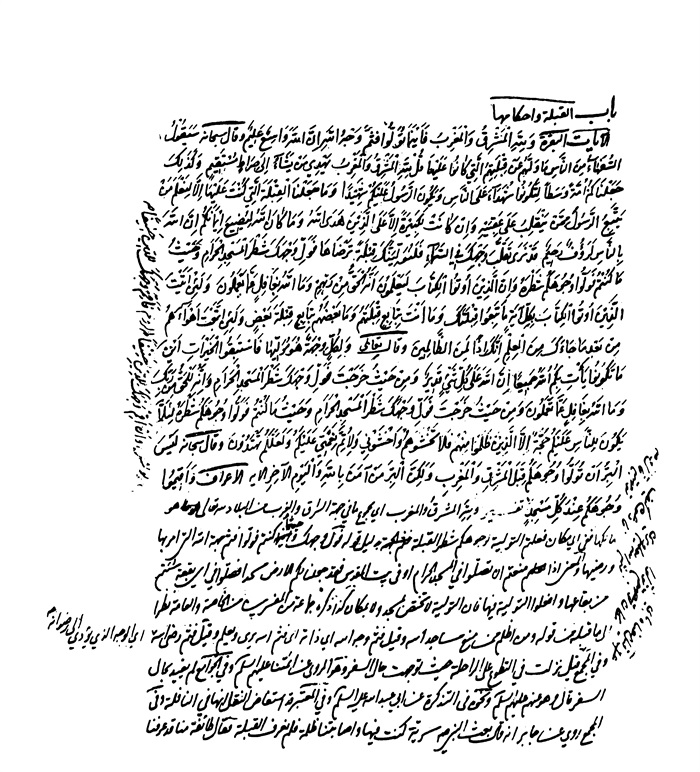
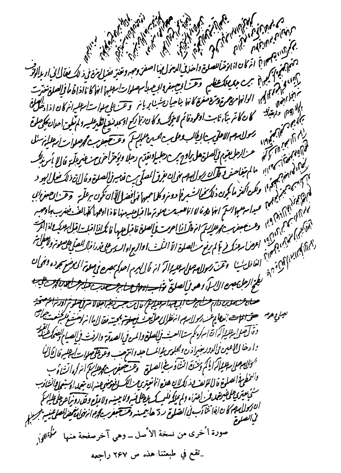

بحار الانوار الجامعة لدرر اخبار الائمة الاطهار المجلد 81

هوية الكتاب
بطاقة تعريف: مجلسي محمد باقربن محمدتقي 1037 - 1111ق.
عنوان واسم المؤلف: بحار الأنوار الجامعة لدرر أخبار الأئمة الأطهار المجلد 81: تأليف محمد باقربن محمدتقي المجلسي.
عنوان واسم المؤلف: بيروت داراحياء التراث العربي [ -13].
مظهر: ج - عينة.
ملاحظة: عربي.
ملاحظة: فهرس الكتابة على أساس المجلد الرابع والعشرين، 1403ق. [1360].
ملاحظة: المجلد108،103،94،91،92،87،67،66،65،52،24(الطبعة الثالثة: 1403ق.=1983م.=[1361]).
ملاحظة: فهرس.
محتويات: ج.24.كتاب الامامة. ج.52.تاريخ الحجة. ج67،66،65.الإيمان والكفر. ج.87.كتاب الصلاة. ج.92،91.الذكر و الدعا. ج.94.كتاب السوم. ج.103.فهرست المصادر. ج.108.الفهرست.-
عنوان: أحاديث الشيعة — قرن 11ق
ترتيب الكونجرس: BP135/م3ب31300 ي ح
تصنيف ديوي: 297/212
رقم الببليوغرافيا الوطنية: 1680946
ص: 1

تتمة كتاب الصلاة 

تتمة أبواب مكان المصلی و ما یتبعه

باب 8 تتمة فضل المساجد و أحكامها و آدابها 
«68»- الْخِصَالُ، وَ الْعُیُونُ، بِأَسَانِیدَ مَرَّتْ فِی كِتَابِ الْإِیمَانِ وَ الْكُفْرِ عَنِ الرِّضَا عَنْ آبَائِهِ علیهم السلام قَالَ قَالَ رَسُولُ اللَّهِ صلی اللّٰه علیه و آله: سِتَّةٌ مِنَ الْمُرُوَّةِ ثَلَاثَةٌ مِنْهَا فِی الْحَضَرِ وَ ثَلَاثَةٌ مِنْهَا فِی السَّفَرِ فَأَمَّا الَّتِی فِی الْحَضَرِ فَتِلَاوَةُ كِتَابِ اللَّهِ تَعَالَی وَ عِمَارَةُ مَسَاجِدِ اللَّهِ وَ اتِّخَاذُ الْإِخْوَانِ فِی اللَّهِ عَزَّ وَ جَلَّ وَ أَمَّا الَّتِی فِی السَّفَرِ فَبَذْلُ الزَّادِ وَ حُسْنُ الْخُلُقِ وَ الْمِزَاحُ فِی غَیْرِ الْمَعَاصِی (1).
«69»- الْخِصَالُ، عَنْ أَبِیهِ عَنْ سَعْدِ بْنِ عَبْدِ اللَّهِ عَنْ أَیُّوبَ بْنِ نُوحٍ عَنِ الرَّبِیعِ بْنِ مُحَمَّدٍ عَنْ عَبْدِ الْأَعْلَی عَنْ نَوْفٍ عَنْ أَمِیرِ الْمُؤْمِنِینَ علیه السلام قَالَ: إِنَّ اللَّهَ عَزَّ وَ جَلَّ أَوْحَی إِلَی عِیسَی ابْنِ مَرْیَمَ علیهما السلام قُلْ لِلْمَلَإِ مِنْ بَنِی إِسْرَائِیلَ لَا یَدْخُلُوا بَیْتاً مِنْ بُیُوتِی إِلَّا بِقُلُوبٍ طَاهِرَةٍ وَ أَبْصَارٍ خَاشِعَةٍ وَ أَكُفٍّ نَقِیَّةٍ الْخَبَرَ(2).
بیان: طاهرة أی من الاعتقادات الباطلة و الأخلاق الدنیة و أبصار خاشعة لا تنظر إلی ما حرم اللّٰه و تبكی علی المعاصی و لا تنظر فی الصلاة إلی ما یشغل صاحبه عن ذكر اللّٰه و أكف نقیة عن الحرام و الشبهة و إنما نسبت إلیها لأن التصرف فیها غالبا بها. 
«70»- الْمَحَاسِنُ، عَنْ مُحَمَّدِ بْنِ عَلِیٍّ عَنِ الْحَجَّالِ عَنْ حَنَانٍ عَنِ ابْنِ

> **پاورقی**: 1- 1. الخصال ج 1 ص 157، عیون الأخبار ج 2 ص 27، راجع البحار ج 76 ص 312 من هذه الطبعة الحدیثة.

> **پاورقی**: 2- 2. الخصال ج 1 ص 164.

الْعُلَی رَفَعَهُ قَالَ: إِنَّمَا جُعِلَ الْحَصَی فِی الْمَسْجِدِ لِلنُّخَامَةِ(1).
بیان: یدل علی أنه إذا تنخم فی المسجد ینبغی ستر النخامة بالحصی فتزول الكراهة أو تخف كما رَوَی الشَّیْخُ عَنْ غِیَاثِ بْنِ إِبْرَاهِیمَ عَنْ جَعْفَرٍ عَنْ أَبِیهِ علیه السلام قَالَ إِنَّ عَلِیّاً علیه السلام قَالَ: الْبُصَاقُ فِی الْمَسْجِدِ خَطِیئَةٌ وَ كَفَّارَتُهَا دَفْنُهُ (2).
و الخبر و إن كان فی البصاق لكن یؤید الحكم فی النخامة.
«71»- الْخِصَالُ، عَنِ الْمُظَفَّرِ بْنِ جَعْفَرٍ الْعَلَوِیِّ عَنْ جَعْفَرِ بْنِ مُحَمَّدِ بْنِ مَسْعُودٍ الْعَیَّاشِیِّ عَنْ أَبِیهِ عَنِ الْحُسَیْنِ بْنِ إِشْكِیبَ عَنْ مُحَمَّدِ بْنِ عَلِیٍّ الْكُوفِیِّ عَنْ أَبِی جَمِیلَةَ عَنِ الْحَضْرَمِیِّ عَنْ سَلَمَةَ بْنِ كُهَیْلٍ رَفَعَهُ عَنِ ابْنِ عَبَّاسٍ قَالَ قَالَ رَسُولُ اللَّهِ صلی اللّٰه علیه و آله: سَبْعَةٌ فِی ظِلِّ عَرْشِ اللَّهِ عَزَّ وَ جَلَّ یَوْمَ لَا ظِلَّ إِلَّا ظِلُّهُ إِمَامٌ عَادِلٌ وَ شَابٌّ نَشَأَ فِی عِبَادَةِ اللَّهِ عَزَّ وَ جَلَّ وَ رَجُلٌ تَصَدَّقَ بِیَمِینِهِ فَأَخْفَاهُ عَنْ شِمَالِهِ وَ رَجُلٌ ذَكَرَ اللَّهَ عَزَّ وَ جَلَّ خَالِیاً فَفَاضَتْ عَیْنَاهُ مِنْ خَشْیَةِ اللَّهِ وَ رَجُلٌ لَقِیَ أَخَاهُ الْمُؤْمِنَ فَقَالَ إِنِّی لَأُحِبُّكَ فِی اللَّهِ عَزَّ وَ جَلَّ وَ رَجُلٌ خَرَجَ مِنَ الْمَسْجِدِ وَ فِی نِیَّتِهِ أَنْ یَرْجِعَ إِلَیْهِ وَ رَجُلٌ دَعَتْهُ امْرَأَةٌ ذَاتُ جَمَالٍ إِلَی نَفْسِهَا فَقَالَ إِنِّی أَخافُ اللَّهَ رَبَّ الْعالَمِینَ (3). 
أَقُولُ قَدْ مَرَّ مِرَاراً عَنْ أَبِی هُرَیْرَةَ وَ أَبِی سَعِیدٍ الْخُدْرِیِّ: قَرِیبٌ مِنْهُ وَ فِیهِ وَ رَجُلٌ قَلْبُهُ مُتَعَلِّقٌ بِالْمَسْجِدِ إِذَا خَرَجَ مِنْهُ حَتَّی یَعُودَ إِلَیْهِ (4).
«72»- الْخِصَالُ، عَنْ إِبْرَاهِیمَ بْنِ مُحَمَّدِ بْنِ حَمْزَةَ عَنْ حُسَیْنِ بْنِ عَبْدِ اللَّهِ عَنْ مُوسَی بْنِ مَرْوَانَ عَنْ مَرْوَانَ بْنِ مُعَاوِیَةَ عَنْ سَعْدِ بْنِ طَرِیفٍ عَنْ عُمَیْرِ بْنِ مَأْمُونٍ قَالَ سَمِعْتُ الْحَسَنَ بْنَ عَلِیٍّ علیه السلام یَقُولُ سَمِعْتُ رَسُولَ اللَّهِ صلی اللّٰه علیه و آله یَقُولُ: مَنْ أَدْمَنَ الِاخْتِلَافَ إِلَی الْمَسَاجِدِ أَصَابَ أَخاً مُسْتَفَاداً فِی اللَّهِ عَزَّ وَ جَلَّ أَوْ عِلْماً مُسْتَطْرَفاً أَوْ كَلِمَةً تَدُلُّهُ عَلَی 
ص: 2

> **پاورقی**: 1- 1. المحاسن ص 320، و فیه عن حنان عن ابن العسل.

> **پاورقی**: 2- 2. التهذیب ج 1 ص 326.

> **پاورقی**: 3- 3. الخصال ج 2 ص 3.

> **پاورقی**: 4- 4. الخصال ج 2 ص 2، راجع ج 69 ص 377- 378 من هذه الطبعة باب جوامع المكارم و آفاتها.

هُدًی أَوْ أُخْرَی تَصْرِفُهُ عَنِ الرَّدَی أَوْ رَحْمَةً مُنْتَظَرَةً أَوْ تَرَكَ الذَّنْبَ حَیَاءً أَوْ خَشْیَةً(1).
«73»- الْمَحَاسِنُ، عَنِ الْحَسَنِ بْنِ الْحُسَیْنِ عَنْ یَزِیدَ بْنِ هَارُونَ عَنِ الْعَلَاءِ بْنِ رَاشِدٍ عَنْ سَعْدِ بْنِ طَرِیفٍ عَنْ عُمَیْرِ بْنِ الْمَأْمُونِ رَضِیعِ الْحَسَنِ بْنِ عَلِیٍّ قَالَ: أَتَیْتُ الْحُسَیْنَ بْنَ عَلِیٍّ علیه السلام فَقُلْتُ لَهُ حَدِّثْنِی عَنْ جَدِّكَ رَسُولِ اللَّهِ صلی اللّٰه علیه و آله قَالَ نَعَمْ قَالَ رَسُولُ اللَّهِ صلی اللّٰه علیه و آله مَنْ أَدْمَنَ إِلَی الْمَسْجِدِ أَصَابَ الْخِصَالَ الثَّمَانِیَةَ آیَةٌ مُحْكَمَةٌ أَوْ فَرِیضَةٌ مُسْتَعْمَلَةٌ أَوْ سُنَّةٌ قَائِمَةٌ أَوْ عِلْمٌ مُسْتَطْرَفٌ أَوْ أَخٌ مُسْتَفَادٌ أَوْ كَلِمَةٌ تَدُلُّهُ عَلَی هُدًی أَوْ تَرُدُّهُ عَنْ رَدًی وَ تَرْكُ الذَّنْبِ خَشْیَةً أَوْ حَیَاءً(2).
وَ مِنْهُ فِی رِوَایَةِ إِبْرَاهِیمَ بْنِ عَبْدِ الْحَمِیدِ عَنْ أَبِی عَبْدِ اللَّهِ علیه السلام قَالَ: مَنْ أَقَامَ فِی مَسْجِدٍ بَعْدَ صَلَاتِهِ انْتِظَاراً لِلصَّلَاةِ فَهُوَ ضَیْفُ اللَّهِ وَ حَقٌّ عَلَی اللَّهِ أَنْ یُكْرِمَ ضَیْفَهُ (3).
«74»- الْخِصَالُ، عَنِ الْحُسَیْنِ بْنِ أَحْمَدَ بْنِ إِدْرِیسَ عَنْ أَبِیهِ عَنْ مُحَمَّدِ بْنِ عَلِیِّ بْنِ مَحْبُوبٍ عَنْ مُحَمَّدِ بْنِ الْحُسَیْنِ عَنِ ابْنِ فَضَّالٍ عَنْ عَلِیِّ بْنِ عُقْبَةَ بْنِ خَالِدٍ عَنْ أَبِیهِ عَنِ الصَّادِقِ عَنْ آبَائِهِ علیهم السلام قَالَ قَالَ أَمِیرُ الْمُؤْمِنِینَ علیه السلام: حَرِیمُ الْمَسْجِدِ أَرْبَعُونَ ذِرَاعاً وَ الْجِوَارُ أَرْبَعُونَ دَاراً مِنْ أَرْبَعَةِ جَوَانِبِهَا(4).
بیان: حریم المسجد لم یذكره الأكثر و قال فی الدروس روی الصدوق أن حریم المسجد أربعون ذراعا من كل ناحیة و الأحوط رعایة ذلك فی الموات إذا سبق بناء المسجد و یدل علی أنه یتأكد استحباب حضور المسجد إلی أربعین دارا من جوانبه الأربعة إلا أن یكون مسجد أقرب إلیه منه. 
«75»- مَجَالِسُ ابْنِ الشَّیْخِ، عَنْ أَبِیهِ (5) عَنِ الْمُفِیدِ عَنْ جَعْفَرِ بْنِ مُحَمَّدِ بْنِ قُولَوَیْهِ عَنْ مُحَمَّدِ بْنِ عَبْدِ اللَّهِ بْنِ جَعْفَرٍ الْحِمْیَرِیِّ عَنْ أَبِیهِ عَنْ أَحْمَدَ بْنِ مُحَمَّدٍ الْبَرْقِیِّ عَنْ شَرِیفِ بْنِ سَابِقٍ التَّفْلِیسِیِّ عَنِ الْفَضْلِ الْبَقْبَاقِ عَنْ أَبِی عَبْدِ اللَّهِ علیه السلام قَالَ: یَا فَضْلُ لَا یَأْتِی الْمَسْجِدَ مِنْ كُلِّ قَبِیلَةٍ إِلَّا وَافِدُهَا وَ مِنْ كُلِّ أَهْلِ بَیْتٍ إِلَّا نَجِیبُهَا یَا فَضْلُ 
ص: 3

> **پاورقی**: 1- 1. الخصال ج 2 ص 40.

> **پاورقی**: 2- 2. المحاسن ص 48.

> **پاورقی**: 3- 3. المحاسن ص 48.

> **پاورقی**: 4- 4. الخصال ج 2 ص 114.

> **پاورقی**: 5- 5. فی المصدر: عن شیخه.

لَا یَرْجِعُ صَاحِبُ الْمَسْجِدِ بِأَقَلَّ مِنْ إِحْدَی ثَلَاثٍ إِمَّا دُعَاءٌ یَدْعُو بِهِ یُدْخِلُهُ اللَّهُ بِهِ الْجَنَّةَ وَ إِمَّا دُعَاءٌ یَدْعُو بِهِ فَیَصْرِفُ اللَّهُ عَنْهُ بَلَاءَ الدُّنْیَا وَ إِمَّا أَخٌ یَسْتَفِیدُهُ فِی اللَّهِ عَزَّ وَ جَلَّ ثُمَّ قَالَ قَالَ رَسُولُ اللَّهِ صلی اللّٰه علیه و آله مَا اسْتَفَادَ امْرُؤٌ مُسْلِمٌ فَائِدَةً بَعْدَ فَائِدَةِ الْإِسْلَامِ مِثْلَ أَخٍ یَسْتَفِیدُهُ فِی اللَّهِ (1).
توضیح: إلا وافدها أی سابقها و مقدّمها و رئیسها فی الآخرة أو من یستحقّ أن یكون رئیسهم فی الدنیا فی القاموس الوافد السابق من الإبل.
«76»- مَجَالِسُ ابْنِ الشَّیْخِ، عَنْ أَبِیهِ عَنِ الْمُفِیدِ عَنِ الْحُسَیْنِ بْنِ عَلِیٍّ التَّمَّارِ عَنْ أَحْمَدَ بْنِ مُحَمَّدٍ عَنِ الْعَنَزِیِّ عَنْ عَلِیِّ بْنِ الصَّبَّاحِ عَنْ أَبِی الْمُنْذِرِ عَنْ أَبِی صَالِحٍ عَنْ أَبِی هُرَیْرَةَ قَالَ قَالَ رَسُولُ اللَّهِ صلی اللّٰه علیه و آله: الْمَسَاجِدُ سُوقٌ مِنْ أَسْوَاقِ الْآخِرَةِ قِرَاهَا الْمَغْفِرَةُ وَ تُحْفَتُهَا الْجَنَّةُ(2).
وَ مِنْهُ عَنْ أَبِیهِ عَنِ الْمُفِیدِ عَنْ جَعْفَرِ بْنِ مُحَمَّدِ بْنِ قُولَوَیْهِ عَنْ أَبِیهِ عَنْ سَعْدِ بْنِ عَبْدِ اللَّهِ عَنْ أَحْمَدَ بْنِ مُحَمَّدِ بْنِ عِیسَی عَنِ ابْنِ مَحْبُوبٍ عَنِ ابْنِ عَمِیرَةَ عَنْ جَابِرٍ الْجُعْفِیِّ عَنْ أَبِی جَعْفَرٍ عَنْ آبَائِهِ علیهم السلام قَالَ: قَالَ رَسُولُ اللَّهِ صلی اللّٰه علیه و آله لِجَبْرَئِیلَ أَیُّ الْبِقَاعِ أَحَبُّ إِلَی اللَّهِ تَبَارَكَ وَ تَعَالَی قَالَ الْمَسَاجِدُ وَ أَحَبُّ أَهْلِهَا إِلَی اللَّهِ أَوَّلُهُمْ دُخُولًا إِلَیْهَا وَ آخِرُهُمْ خُرُوجاً مِنْهَا قَالَ فَأَیُّ الْبِقَاعِ أَبْغَضُ إِلَی اللَّهِ تَعَالَی قَالَ الْأَسْوَاقُ وَ أَبْغَضُ أَهْلِهَا إِلَیْهِ أَوَّلُهُ دُخُولًا إِلَیْهَا وَ آخِرُهُمْ خُرُوجاً مِنْهَا(3).
وَ مِنْهُ عَنْ أَبِیهِ عَنِ الْمُفِیدِ عَنْ مُحَمَّدِ بْنِ الْحُسَیْنِ الْحَلَّالِ عَنِ الْحَسَنِ بْنِ الْحُسَیْنِ الْأَنْصَارِیِّ عَنْ ظَفْرِ بْنِ سُلَیْمَانَ عَنْ أَشْرَسَ الْخُرَاسَانِیِّ عَنْ أَیُّوبَ السِّجِسْتَانِیِّ عَنْ أَبِی قِلَابَةَ قَالَ قَالَ رَسُولُ اللَّهِ صلی اللّٰه علیه و آله: مَنْ بَنَی مَسْجِداً وَ لَوْ مَفْحَصَ قَطَاةٍ بَنَی اللَّهُ لَهُ بَیْتاً فِی الْجَنَّةِ(4).
ص: 4

> **پاورقی**: 1- 1. أمالی الطوسیّ ج 1 ص 45.

> **پاورقی**: 2- 2. أمالی الطوسیّ ج 1 ص 139.

> **پاورقی**: 3- 3. أمالی الطوسیّ ج 1 ص 144.

> **پاورقی**: 4- 4. أمالی الطوسیّ ج 1 ص 186 فی حدیث.

بیان: قال فی النهایة أفحوص القطاة موضعها التی تجثم فیه و تبیض كأنها تفحص عنه التراب أی تكشفه و الفحص البحث و الكشف و 
منه الحدیث: من بنی لله مسجدا و لو كمفحص قطاة. 
المفحص مفعل من الفحص كالأفحوص انتهی و التشبیه إما فی الصغر أو فی عدم البناء و الجدران و علی الأول إما علی الحقیقة بأن یكون موضع السجود أو القدم مسجدا أو علی المبالغة أو المعنی أن یكون بالنسبة إلی المصلی كالمفحص بالنسبة إلیه بأن لا یزید علی موضع صلاته و قیل بأن یشترك جماعة فی بنائه أو یزید فیه قدرا محتاجا إلیه. 
و یؤید الثانی أَنَّ أَبَا عُبَیْدَةَ(1)
رَوَی: مِثْلَهُ عَنْ أَبِی جَعْفَرٍ علیه السلام ثُمَّ قَالَ أَبُو عُبَیْدَةَ مَرَّ بِی أَبُو جَعْفَرٍ علیه السلام وَ أَنَا بَیْنَ مَكَّةَ وَ الْمَدِینَةِ وَ أَنَا أَضَعُ الْأَحْجَارَ فَقُلْتُ هَذَا مِنْ ذَاكَ فَقَالَ نَعَمْ. 
«77»- الْعِلَلُ، عَنِ الْمُظَفَّرِ الْعَلَوِیِّ عَنْ جَعْفَرِ بْنِ مُحَمَّدِ بْنِ مَسْعُودٍ الْعَیَّاشِیِّ عَنْ أَبِیهِ عَنْ نَصْرِ بْنِ أَحْمَدَ الْبَغْدَادِیِّ عَنْ مُوسَی بْنِ مِهْرَانَ عَنْ مُخَوَّلٍ عَنْ عَبْدِ الرَّحْمَنِ بْنِ الْأَسْوَدِ عَنْ مُحَمَّدِ بْنِ عُبَیْدِ اللَّهِ بْنِ أَبِی رَافِعٍ عَنْ أَبِیهِ وَ عَمِّهِ عَنْ أَبِیهِمَا أَبِی رَافِعٍ قَالَ: إِنَّ رَسُولَ اللَّهِ صلی اللّٰه علیه و آله خَطَبَ النَّاسَ فَقَالَ أَیُّهَا النَّاسُ إِنَّ اللَّهَ عَزَّ وَ جَلَّ أَمَرَ مُوسَی وَ هَارُونَ أَنْ یَبْنِیَا لِقَوْمِهِمَا بِمِصْرَ بُیُوتاً وَ أَمَرَهُمَا أَنْ لَا یَبِیتَ فِی مَسْجِدِهِمَا جُنُبٌ وَ لَا یَقْرَبَ فِیهِ النِّسَاءَ إِلَّا هَارُونُ وَ ذُرِّیَّتُهُ وَ إِنَّ عَلِیّاً علیه السلام مِنِّی بِمَنْزِلَةِ هَارُونَ مِنْ مُوسَی فَلَا یَحِلُّ لِأَحَدٍ أَنْ یَقْرَبَ النِّسَاءَ فِی مَسْجِدِی وَ لَا یَبِیتَ فِیهِ جُنُبٌ إِلَّا عَلِیٌّ وَ ذُرِّیَّتُهُ فَمَنْ شَاءَ ذَلِكَ فَهَاهُنَا وَ ضَرَبَ بِیَدِهِ نَحْوَ الشَّامِ (2).
بیان: أقول قد مضی مثله بأسانید جمة(3) قوله صلی اللّٰه علیه و آله فمن شاء ذلك أی شاء أن یعلم حقیقة ذلك فلیذهب إلی الشام و لینظر إلی مواضع بیوتهم فیعلم أن بیت 
ص: 5

> **پاورقی**: 1- 1. تراه فی التهذیب ج 1 ص 328، الكافی ج 3 ص 368، المحاسن ص 55 و اللفظ للفقیه ج 1 ص 152 ط نجف.

> **پاورقی**: 2- 2. علل الشرائع ج 1 ص 192.

> **پاورقی**: 3- 3. راجع ج 81 ص 60 و 61.

هارون كان مفتوحا إلی المسجد.
«78»- الْعِلَلُ، عَنْ عَلِیِّ بْنِ أَحْمَدَ بْنِ مُحَمَّدٍ عَنْ مُحَمَّدِ بْنِ جَعْفَرٍ الْأَسَدِیِّ عَنْ مُوسَی بْنِ عِمْرَانَ النَّخَعِیِّ عَنِ الْحُسَیْنِ بْنِ یَزِیدَ النَّوْفَلِیِّ عَنْ عَلِیِّ بْنِ أَبِی حَمْزَةَ الْبَطَائِنِیِّ عَنْ أَبِی بَصِیرٍ قَالَ: سَأَلْتُ أَبَا عَبْدِ اللَّهِ علیه السلام عَنِ الْعِلَّةِ فِی تَعْظِیمِ الْمَسَاجِدِ فَقَالَ إِنَّمَا أُمِرَ بِتَعْظِیمِ الْمَسَاجِدِ لِأَنَّهَا بُیُوتُ اللَّهِ فِی الْأَرْضِ (1).
وَ مِنْهُ عَنْ أَبِیهِ عَنْ سَعْدِ بْنِ عَبْدِ اللَّهِ عَنْ مُحَمَّدِ بْنِ الْحُسَیْنِ عَنْ صَفْوَانَ بْنِ یَحْیَی عَنْ كُلَیْبٍ الصَّیْدَاوِیِّ عَنْ أَبِی عَبْدِ اللَّهِ علیه السلام قَالَ: مَكْتُوبٌ فِی التَّوْرَاةِ أَنَّ بُیُوتِی فِی الْأَرْضِ الْمَسَاجِدُ فَطُوبَی لِمَنْ تَطَهَّرَ فِی بَیْتِهِ ثُمَّ زَارَنِی فِی بَیْتِی وَ حَقٌّ عَلَی الْمَزُورِ أَنْ یُكْرِمَ الزَّائِرَ(2).
ثواب الأعمال، عن أبیه عن عبد اللّٰه بن جعفر الحمیری عن محمد بن الحسین: مثله (3) المقنع، مرسلا: مثله (4).
«79»- ثَوَابُ الْأَعْمَالِ، عَنْ مُحَمَّدِ بْنِ الْحَسَنِ بْنِ الْوَلِیدِ عَنْ مُحَمَّدِ بْنِ الْحَسَنِ الصَّفَّارِ عَنْ مُحَمَّدِ بْنِ الْحُسَیْنِ عَنْ صَفْوَانَ عَنْ كُلَیْبٍ عَنْ أَبِی عَبْدِ اللَّهِ علیه السلام قَالَ: مَكْتُوبٌ فِی التَّوْرَاةِ أَنَّ بُیُوتِی فِی الْأَرْضِ الْمَسَاجِدُ فَطُوبَی لِعَبْدٍ تَطَهَّرَ فِی بَیْتِهِ ثُمَّ زَارَنِی فِی بَیْتِی أَلَا إِنَّ عَلَی الْمَزُورِ كَرَامَةَ الزَّائِرِ(5).
بیان: یدل علی استحباب الطهارة لدخول المساجد.
«80»- الْعِلَلُ، عَنْ جَعْفَرِ بْنِ عَلِیٍّ عَنْ أَبِیهِ عَنْ جَدِّهِ الْحَسَنِ بْنِ عَلِیٍّ الْكُوفِیِّ عَنِ الْعَبَّاسِ بْنِ عَامِرٍ عَنْ أَبِی الضَّحَّاكِ عَنْ أَبِی عَبْدِ اللَّهِ علیه السلام قَالَ: قُلْتُ لَهُ رَجُلٌ اشْتَرَی دَاراً فَبَنَاهَا فَبَقِیَتْ عَرْصَةٌ فَبَنَاهَا بَیْتَ غَلَّةٍ أَ یُوقِفُهُ عَلَی الْمَسْجِدِ قَالَ إِنَّ الْمَجُوسَ
ص: 6

> **پاورقی**: 1- 1. علل الشرائع ج 2 ص 8.

> **پاورقی**: 2- 2. علل الشرائع ج 2 ص 8.

> **پاورقی**: 3- 3. ثواب الأعمال ص 26.

> **پاورقی**: 4- 4. المقنع ص 27 ط الإسلامیة.

> **پاورقی**: 5- 5. ثواب الأعمال ص 26.

وَقَفُوا عَلَی بَیْتِ النَّارِ(1).
بیان: ظاهره تجویز الوقف كما هو المشهور بین الأصحاب أی إذا وقف المجوس علی بیت النار فأنتم أولی بالوقف علی معابدكم و یحتمل أن یكون المراد المنع من ذلك لأنه من فعلهم و لعل الصدوق ره هكذا فهم فنقل فی الفقیه (2) فی كتاب الصلاة هكذا و سئل عن الوقوف علی المساجد فقال لا یجوز لأن المجوس وقفوا علی بیوت النار و هذا إحدی مفاسد النقل بالمعنی و القرینة علی ذلك أنه نقله فی كتاب الوقف من الفقیه (3)
أیضا مثل ما رواه فی العلل و غیره فی سائر الكتب (4)
و لیس فی شی ء منها لا یجوز. 
و ربما یحمل علی تقدیر صحته علی الوقف بقصد تملك المسجد و هو لا یملك بل لا بد من قصد مصالح المسلمین و لو أطلق ینصرف إلیها و قال فی الذكری و یستحبّ الوقف علی المساجد بل هو من أعظم المثوبات لتوقف بقاء عمارتها غالبا علیه التی هی من أعظم مراد الشارع ثم ذكر روایة الفقیه و قال و أجاب بعض الأصحاب بأن الروایة مرسلة و بإمكان الحمل علی ما هو محرّم منها كالزخرفة و التصویر انتهی و حمله بعضهم علی الوقف لتقریب القربان أو علی وقف الأولاد لخدمتها كما فی الشرع السابق. 
«81»- الْعِلَلُ، عَنْ مُحَمَّدِ بْنِ عَلِیٍّ مَاجِیلَوَیْهِ عَنْ عَمِّهِ مُحَمَّدِ بْنِ أَبِی الْقَاسِمِ عَنْ أَحْمَدَ بْنِ أَبِی عَبْدِ اللَّهِ الْبَرْقِیِّ عَنْ أَبِیهِ عَنْ وَهْبِ بْنِ وَهْبٍ عَنِ الصَّادِقِ عَنْ أَبِیهِ علیهما السلام قَالَ: إِذَا أَخْرَجَ أَحَدُكُمُ الْحَصَاةَ مِنَ الْمَسْجِدِ فَلْیَرُدَّهَا مَكَانَهَا أَوْ فِی مَسْجِدٍ آخَرَ فَإِنَّهَا تُسَبِّحُ (5).
ص: 7

> **پاورقی**: 1- 1. علل الشرائع ج 2 ص 9، باب العلة التی من أجلها لا یجوز الوقف علی المسجد.

> **پاورقی**: 2- 2. الفقیه ج 1 ص 154.

> **پاورقی**: 3- 3. لفقیه ج 4 ص 185، و فیه عن أبی الصحاری.

> **پاورقی**: 4- 4. التهذیب ج 2 ص 76 ط حجر ج 9 ص 150 ط نجف.

> **پاورقی**: 5- 5. علل الشرائع ج 2 ص 10.

توجیه یمكن أن یكون تسبیحها كنایة عن كونها من أجزاء المسجد فإن المسجد لكونه محلا لعبادة اللّٰه سبحانه یدل علی عظمته و جلاله فهو بجمیع أجزائه ینزّه اللّٰه تعالی عما لا یلیق به أو المعنی أنها تسبح أحیانا كما سبحت فی كفّ النبی صلی اللّٰه علیه و آله أو تسبّح مطلقا
بالمعنی الذی أرید فی قوله سبحانه وَ إِنْ مِنْ شَیْ ءٍ إِلَّا یُسَبِّحُ بِحَمْدِهِ (1) فوجه الاختصاص كونها سابقا فیها و الحاصل لا تقولوا إنها جماد و لا یضرّ إخراجها إذ لكل شی ء تسبیح فلا ینبغی إخراجها و إخلاء المسجد عن تسبیحها وَ مَنْ أَظْلَمُ مِمَّنْ مَنَعَ مَساجِدَ اللَّهِ أَنْ یُذْكَرَ فِیهَا اسْمُهُ و یمكن أن یقرأ یسبح بالفتح أی ینزه عن النجاسات و سائر ما لا یلیق بالمسجد فیكون كنایة أیضا عن الجزئیة و المشهور بین الأصحاب حرمة إخراج الحصی من المساجد و قیده جماعة بما إذا كان تعدّ من أجزاء المسجد أو من الأبنیة أما لو كانت قمامة كان إخراجها مستحبا و اختار المحقق فی المعتبر و جماعة كراهة إخراج الحصی و كذا حكم الأكثر بوجوب الإعادة إلی ذلك المسجد و قال الشیخ لو ردها إلی غیرها من المساجد أجزأ كما دل علیه الخبر. 
«82»- الْعِلَلُ، عَنْ أَبِیهِ عَنْ مُحَمَّدِ بْنِ یَحْیَی الْعَطَّارِ عَنِ الْأَشْعَرِیِّ رَفَعَهُ: أَنَّ رَجُلًا جَاءَ إِلَی الْمَسْجِدِ یُنْشِدُ ضَالَّةً لَهُ فَقَالَ رَسُولُ اللَّهِ صلی اللّٰه علیه و آله قُولُوا لَهُ لَا رَدَّ اللَّهُ عَلَیْكَ فَإِنَّهَا لِغَیْرِ هَذَا بُنِیَتْ (2).
قَالَ: وَ رَفْعُ الصَّوْتِ فِی الْمَسَاجِدِ یُكْرَهُ وَ إِنَّ رَسُولَ اللَّهِ صلی اللّٰه علیه و آله مَرَّ بِرَجُلٍ یَبْرِی مَشَاقِصَ لَهُ فِی الْمَسْجِدِ فَنَهَاهُ وَ قَالَ إِنَّهَا لِغَیْرِ هَذَا بُنِیَتْ (3).
بیان: التعلیل یدل علی كراهة عمل الصنائع فی المسجد مطلقا كما ذكره الأصحاب فلو تضمن تغییر هیئة المسجد أو منع المصلین من الصلاة و التضییق علیهم فالحرمة أظهر. 
«83»- الْعِلَلُ، عَنْ أَبِیهِ عَنْ سَعْدِ بْنِ عَبْدِ اللَّهِ عَنْ مُحَمَّدِ بْنِ الْحُسَیْنِ عَنِ ابْنِ أَبِی عُمَیْرٍ عَنِ ابْنِ أُذَیْنَةَ عَنْ مُحَمَّدِ بْنِ مُسْلِمٍ عَنْ أَبِی جَعْفَرٍ علیه السلام قَالَ: سَأَلْتُهُ عَنِ الثُّومِ 
ص: 8

> **پاورقی**: 1- 1. أسری: 44.

> **پاورقی**: 2- 2. علل الشرائع ج 2 ص 9.

> **پاورقی**: 3- 3. علل الشرائع ج 2 ص 9.

فَقَالَ إِنَّمَا نَهَی رَسُولُ اللَّهِ صلی اللّٰه علیه و آله عَنْهُ لِرِیحِهِ فَقَالَ مَنْ أَكَلَ هَذِهِ الْبَقْلَةَ الْمُنْتِنَةَ فَلَا یَقْرَبْ مَسْجِدَنَا فَأَمَّا مَنْ أَكَلَهُ وَ لَمْ یَأْتِ الْمَسْجِدَ فَلَا بَأْسَ (1).
وَ مِنْهُ عَنْ عَلِیِّ بْنِ حَاتِمٍ عَنْ مُحَمَّدِ بْنِ جَعْفَرٍ الرَّزَّازِ عَنْ عَبْدِ اللَّهِ بْنِ مُحَمَّدِ بْنِ خَلَفٍ عَنِ الْوَشَّاءِ عَنْ مُحَمَّدِ بْنِ سِنَانٍ قَالَ: سَأَلْتُ أَبَا عَبْدِ اللَّهِ علیه السلام عَنْ أَكْلِ الْبَصَلِ وَ الْكُرَّاثِ فَقَالَ لَا بَأْسَ بِأَكْلِهِ مَطْبُوخاً وَ غَیْرَ مَطْبُوخٍ وَ لَكِنْ إِنْ أَكَلَ مِنْهُ مَا لَهُ أَذًی فَلَا یَخْرُجْ إِلَی الْمَسْجِدِ كَرَاهِیَةَ أَذَاهُ عَلَی مَنْ یُجَالِسُ (2).
الْمَحَاسِنُ، عَنِ الْوَشَّاءِ عَنِ ابْنِ سِنَانٍ: مِثْلَهُ إِلَّا أَنَّ فِیهِ الْكُرَّاثَ فَقَطْ(3).
«84»- الْعِلَلُ، عَنْ مُحَمَّدِ بْنِ مُوسَی بْنِ الْمُتَوَكِّلِ عَنْ عَلِیِّ بْنِ الْحُسَیْنِ السَّعْدَآبَادِیِّ عَنْ أَحْمَدَ بْنِ أَبِی عَبْدِ اللَّهِ الْبَرْقِیِّ عَنْ أَبِیهِ عَنْ فَضَالَةَ عَنْ دَاوُدَ بْنِ فَرْقَدٍ عَنْ أَبِی عَبْدِ اللَّهِ علیه السلام قَالَ قَالَ رَسُولُ اللَّهِ صلی اللّٰه علیه و آله: مَنْ أَكَلَ هَذِهِ الْبَقْلَةَ فَلَا یَقْرَبْ مَسْجِدَنَا وَ لَمْ یَقُلْ إِنَّهُ حَرَامٌ (4).
بیان: المشهور بین الأصحاب كراهة دخول المسجد لمن أكمل شیئا من المؤذیات بریحها و یتأكد الكراهة فی الثوم بل یظهر من بعض الأخبار أنه لو تداوی به بغیر الأكل أیضا یكره له دخول المسجد. 
وَ نَقَلَ الشَّیْخُ فِی الْإِسْتِبْصَارِ بِسَنَدٍ صَحِیحٍ (5) عَنْ زُرَارَةَ قَالَ حَدَّثَنِی مَنْ أُصَدِّقُ مِنْ أَصْحَابِنَا قَالَ: سَأَلْتُ أَحَدَهُمَا عَنِ الثُّومِ فَقَالَ أَعِدْ كُلَّ صَلَاةٍ صَلَّیْتَهَا مَا دُمْتَ تَأْكُلُهُ.
ثم قال فالوجه فی هذا الخبر أن نحمله علی ضرب من التغلیظ فی كراهیته دون الحظر الذی یكون من أكل ذلك یقتضی استحقاقه الذم و العقاب بدلالة الأخبار الأول و الإجماع الواقع علی أن أكل هذه الأشیاء لا یوجب إعادة الصلاة. 
ص: 9

> **پاورقی**: 1- 1. علل الشرائع ج 2 ص 207.

> **پاورقی**: 2- 2. علل الشرائع ج 2 ص 207.

> **پاورقی**: 3- 3. المحاسن ص 512.

> **پاورقی**: 4- 4. علل الشرائع ج 2 ص 207.

> **پاورقی**: 5- 5. الاستبصار ج 4 ص 92، و رواه فی التهذیب ج 9 ص 96 ط نجف و رواه الصدوق فی الفقیه ج 3 ص 227.

«85»- مَعَانِی الْأَخْبَارِ، عَنْ أَبِیهِ عَنْ سَعْدِ بْنِ عَبْدِ اللَّهِ عَنْ إِبْرَاهِیمَ بْنِ هَاشِمٍ وَ أَیُّوبَ بْنِ نُوحٍ عَنْ عَبْدِ اللَّهِ بْنِ الْمُغِیرَةِ عَنْ عَبْدِ اللَّهِ بْنِ سِنَانٍ عَنْ أَبِی عَبْدِ اللَّهِ علیه السلام قَالَ سَمِعْتُهُ یَقُولُ: إِنَّ رَسُولَ اللَّهِ صلی اللّٰه علیه و آله كَانَ بَنَی مَسْجِدَهُ بِالسَّمِیطِ ثُمَّ إِنَّ الْمُسْلِمِینَ كَثُرُوا فَقَالُوا یَا رَسُولَ اللَّهِ لَوْ أَمَرْتَ بِالْمَسْجِدِ فَزِیدَ فِیهِ فَقَالَ نَعَمْ فَزَادَ فِیهِ وَ بَنَاهُ بِالسَّعِیدَةِ ثُمَّ إِنَّ الْمُسْلِمِینَ كَثُرُوا فَقَالُوا یَا رَسُولَ اللَّهِ لَوْ أَمَرْتَ بِالْمَسْجِدِ فَزِیدَ فِیهِ فَقَالَ صلی اللّٰه علیه و آله نَعَمْ فَأَمَرَ بِهِ فَزِیدَ فِیهِ وَ بَنَی جِدَارَهُ بِالْأُنْثَی وَ الذَّكَرِ ثُمَّ اشْتَدَّ عَلَیْهِمُ الْحَرُّ فَقَالُوا یَا رَسُولَ اللَّهِ لَوْ أَمَرْتَ بِالْمَسْجِدِ فَظُلِّلَ قَالَ فَأَمَرَ بِهِ فَأُقِیمَتْ فِیهِ سَوَارِی جُذُوعِ النَّخْلِ ثُمَّ طُرِحَتْ عَلَیْهِ الْعَوَارِضُ وَ الْخَصَفُ وَ الْإِذْخِرُ فَعَاشُوا فِیهِ حَتَّی أَصَابَتْهُمُ الْأَمْطَارُ فَجَعَلَ الْمَسْجِدُ یَكِفُ عَلَیْهِمْ فَقَالُوا یَا رَسُولَ اللَّهِ لَوْ أَمَرْتَ بِهِ فَطُیِّنَ فَقَالَ لَهُمْ رَسُولُ اللَّهِ صلی اللّٰه علیه و آله لَا عَرِیشٌ كَعَرِیشِ مُوسَی علیه السلام فَلَمْ یَزَلْ كَذَلِكَ حَتَّی قُبِضَ رَسُولُ اللَّهِ صلی اللّٰه علیه و آله وَ كَانَ جِدَارُهُ قَبْلَ أَنْ یُظَلَّلَ قَدْرَ قَامَةٍ فَكَانَ إِذَا كَانَ الْفَیْ ءُ ذِرَاعاً وَ هُوَ قَدْرُ مَرْبِضِ عَنْزٍ صَلَّی الظُّهْرَ فَإِذَا كَانَ الْفَیْ ءُ ذِرَاعَیْنِ وَ هُوَ ضِعْفُ ذَلِكَ صَلَّی الْعَصْرَ.
قال و قال السمیط لبنة لبنة و السعیدة لبنة و نصف و الأنثی و الذكر لبنتین مخالفتین (1) بیان قال الجوهری الساریة الأسطوانة و قال العارضة واحدة عوارض السقف و الخصف محركة جمع الخصفة و هی الجلة تعمل من خوص النخل أی ورقها للتمر و قال الجوهری السمیط الأجر القائم بعضه فوق بعض قال أبو عبید و هو الذی یسمی بالفارسیة البراستق و قال الفیروزآبادی السعد ثلث اللبنة و كزبیر ربعها انتهی و الأنثی و الذكر معروف بین البناءین قوله یكف أی یقطر.
و الاختلاف فی الأنواع لأن كلما كان المكان أوسع كان جداره أطول و كلما 
ص: 10

> **پاورقی**: 1- 1. معانی الأخبار ص 159- 160 و قد رواه الشیخ فی التهذیب ج 1 ص 327 ط حجر الكافی ج 3 ص 295.

كان الجدار أطول فالمناسب أن یكون عرضه أوسع و سمكه أرفع (1) و یدل علی جواز هدم المسجد و تغییره و توسیعه عند الضرورة و الحاجة و تردد فی الذكری فی ذلك ثم استدل علی الجواز بهذا الخبر ثم قال نعم الأقرب أن لا ینقض إلا بعد الظن الغالب بوجود العمارة و قرب جواز إحداث الباب و الروزنة للمصلحة العامة و احتمل جوازها للمصلحة الخاصة و ما قربه فی الكل قریب. 
«86»- الْمَحَاسِنُ، عَنْ أَبِیهِ عَنْ أَحْمَدَ بْنِ دَاوُدَ عَنْ هَاشِمٍ الْحَلَّالِ قَالَ: دَخَلْتُ أَنَا وَ أَبُو الصَّبَّاحِ الْكِنَانِیِّ عَلَی أَبِی عَبْدِ اللَّهِ علیه السلام فَقَالَ لَهُ یَا أَبَا الصَّبَّاحِ مَا تَقُولُ فِی هَذِهِ الْمَسَاجِدِ الَّتِی بَنَتْهَا الْحَاجُّ فِی طَرِیقِ مَكَّةَ فَقَالَ بَخْ بَخْ تِلْكَ أَفْضَلُ الْمَسَاجِدِ مَنْ بَنَی مَسْجِداً كَمَفْحَصِ قَطَاةٍ بَنَی اللَّهُ لَهُ بَیْتاً فِی الْجَنَّةِ(2).
وَ مِنْهُ فِی رِوَایَةِ أَبِی عُبَیْدَةَ الْحَذَّاءِ قَالَ: بَیْنَا أَنَا بَیْنَ مَكَّةَ وَ الْمَدِینَةِ أَضَعُ الْأَحْجَارَ كَمَا یَضَعُ النَّاسُ فَقُلْتُ لَهُ هَذَا مِنْ ذَلِكَ قَالَ نَعَمْ (3).
«87»- مَعَانِی الْأَخْبَارِ، عَنْ أَبِیهِ عَنْ سَعْدِ بْنِ عَبْدِ اللَّهِ عَنْ أَحْمَدَ بْنِ مُحَمَّدِ بْنِ عِیسَی عَنْ أَحْمَدَ بْنِ مُحَمَّدٍ الْبَزَنْطِیِّ عَنْ مُفَضَّلِ بْنِ سَعِیدٍ عَنْ أَبِی جَعْفَرٍ علیه السلام قَالَ: جَاءَ أَعْرَابِیٌّ أَحَدُ بَنِی عَامِرٍ إِلَی النَّبِیِّ صلی اللّٰه علیه و آله فَسَأَلَهُ وَ ذَكَرَ حَدِیثاً طَوِیلًا یَذْكُرُ فِی آخِرِهِ أَنَّهُ سَأَلَهُ الْأَعْرَابِیُّ عَنِ الصُّلَیْعَاءِ وَ الْقُرَیْعَاءِ وَ خَیْرِ بِقَاعِ الْأَرْضِ وَ شَرِّ بِقَاعِ الْأَرْضِ فَقَالَ بَعْدَ أَنْ أَتَاهُ جَبْرَئِیلُ علیه السلام فَأَخْبَرَهُ أَنَّ الصُّلَیْعَاءَ الْأَرْضُ السَّبِخَةُ الَّتِی لَا تُرْوَی وَ لَا تُشْبَعُ مَرْعَاهَا وَ الْقُرَیْعَاءَ الْأَرْضُ الَّتِی لَا تُعْطِی بَرَكَتَهَا وَ لَا یُخْرِجُ نَبْعَهَا وَ لَا یُدْرَكُ مَا أُنْفِقَ فِیهَا وَ شَرَّ بِقَاعِ الْأَرْضِ الْأَسْوَاقُ وَ هُوَ مَیْدَانُ إِبْلِیسَ یَغْدُو بِرَایَتِهِ وَ یَضَعُ كُرْسِیَّهُ وَ یَبُثُّ ذُرِّیَّتَهُ فَبَیْنَ مُطَفِّفٍ فِی قَفِیزٍ أَوْ طَائِشٍ فِی مِیزَانٍ أَوْ سَارِقٍ فِی ذِرَاعٍ أَوْ كَاذِبٍ فِی سِلْعَتِهِ فَیَقُولُ عَلَیْكُمْ بِرَجُلٍ مَاتَ أَبُوهُ وَ أَبُوكُمْ حَیٌّ فَلَا یَزَالُ مَعَ أَوَّلِ مَنْ یَدْخُلُ وَ آخِرِ مَنْ یَرْجِعُ. 
وَ خَیْرَ الْبِقَاعِ الْمَسَاجِدُ وَ أَحَبَّهُمْ إِلَیْهِ أَوَّلُهُمْ دُخُولًا وَ آخِرُهُمْ خُرُوجاً وَ كَانَ
ص: 11

> **پاورقی**: 1- 1. فی الثانی نظر واضح، و لذلك نهی عن الشرف.

> **پاورقی**: 2- 2. المحاسن ص 55.

> **پاورقی**: 3- 3. المحاسن ص 55.

الْحَدِیثُ طَوِیلًا اخْتَصَرْنَا مِنْهُ مَوْضِعَ الْحَاجَةِ(1).
توضیح: قال فی النهایة إن أعرابیا سأل النبی صلی اللّٰه علیه و آله عن الصلیعاء و القریعاء الصلیعاء تصغیر الصلعاء للأرض التی لا تنبت و الصلع من صلع الرأس و هو انحسار الشعر منه و القریعاء أرض لعنها اللّٰه إذا أنبتت أو زرع فیها نبت فی حافتیها و لم ینبت فی متنها شی ء و قال القرع بالتحریك هو أن یكون فی الأرض ذات الكلاء موضع لا نبات فیها كالقرع فی الرأس انتهی. 
قوله و لا یخرج نبعها النبع خروج الماء من الینبوع و فی بعض النسخ بالیاء ثم النون و ینع الثمرة نضجها و إدراكها و التطفیف نقص المكیال و الطیش الخفة و السلعة بالكسر المتاع مات أبوه أی آدم علیه السلام و أبوكم حی یعنی نفسه لعنه اللّٰه. 
«88»- مَعَانِی الْأَخْبَارِ، عَنْ أَبِیهِ عَنْ سَعْدِ بْنِ عَبْدِ اللَّهِ عَنْ أَحْمَدَ بْنِ أَبِی عَبْدِ اللَّهِ الْبَرْقِیِّ عَنِ الْهَیْثَمِ بْنِ عَبْدِ اللَّهِ النَّهْدِیِّ عَنْ أَبِیهِ عَنْ أَبِی عَبْدِ اللَّهِ علیه السلام قَالَ: الْمُرُوَّةُ مُرُوَّتَانِ مُرُوَّةُ الْحَضَرِ وَ مُرُوَّةُ السَّفَرِ فَأَمَّا مُرُوَّةُ الْحَضَرِ فَتِلَاوَةُ الْقُرْآنِ وَ حُضُورُ الْمَسَاجِدِ وَ صُحْبَةُ أَهْلِ الْخَیْرِ وَ النَّظَرُ فِی الْفِقْهِ وَ أَمَّا مُرُوَّةُ السَّفَرِ فَبَذْلُ الزَّادِ وَ الْمِزَاحُ فِی غَیْرِ مَا یُسْخِطُ اللَّهَ وَ قِلَّةُ الْخِلَافِ عَلَی مَنْ صَحِبَكَ وَ تَرْكُ الرِّوَایَةِ عَلَیْهِمْ إِذَا أَنْتَ فَارَقْتَهُمْ (2).
و منه عن أبیه عن علی بن إبراهیم عن أبیه عن محمد بن خالد البرقی عن أبی قتادة رفعه إلی الصادق علیه السلام: مثله (3).
«89»- مَجَالِسُ الصَّدُوقِ، فِی مَنَاهِی النَّبِیِّ صلی اللّٰه علیه و آله: أَنَّهُ نَهَی عَنِ التَّنَخُّعِ فِی الْمَسَاجِدِ وَ نَهَی أَنْ یُنْشَدَ الشِّعْرُ أَوْ تُنْشَدَ الضَّالَّةُ فِی الْمَسَاجِدِ وَ نَهَی أَنْ یُسَلَّ السَّیْفُ فِی الْمَسْجِدِ(4).
ص: 12

> **پاورقی**: 1- 1. معانی الأخبار ص 168.

> **پاورقی**: 2- 2. معانی الأخبار ص 258، راجع البحار ج 76 ص 311- 313 باب معنی الفتوة و المروة.

> **پاورقی**: 3- 3. معانی الأخبار ص 258، راجع البحار ج 76 ص 311- 313 باب معنی الفتوة و المروة.

> **پاورقی**: 4- 4. أمالی الصدوق ص 253 و 254.

«90»- ثَوَابُ الْأَعْمَالِ، عَنْ أَبِیهِ عَنْ عَبْدِ اللَّهِ بْنِ جَعْفَرٍ الْحِمْیَرِیِّ عَنِ السِّنْدِیِّ بْنِ مُحَمَّدٍ عَنْ مُحَمَّدِ بْنِ سِنَانٍ عَنْ طَلْحَةَ بْنِ زَیْدٍ عَنِ الصَّادِقِ عَنْ أَبِیهِ علیهما السلام قَالَ قَالَ رَسُولُ اللَّهِ صلی اللّٰه علیه و آله: مَنْ رَدَّ رِیقَهُ تَعْظِیماً لِحَقِّ الْمَسْجِدِ جَعَلَ اللَّهُ رِیقَهُ صِحَّةً فِی بَدَنِهِ وَ عُوفِیَ مِنْ بَلْوَی فِی جَسَدِهِ (1).
وَ مِنْهُ عَنْ أَبِیهِ عَنِ الْحِمْیَرِیِّ عَنْ أَحْمَدَ بْنِ مُحَمَّدٍ عَنْ مُحَمَّدِ بْنِ حَسَّانَ عَنْ أَبِیهِ عَنْ عَبْدِ اللَّهِ بْنِ سِنَانٍ عَنْ أَبِی عَبْدِ اللَّهِ علیه السلام قَالَ: مَنْ تَنَخَّعَ فِی مَسْجِدٍ ثُمَّ رَدَّهَا فِی جَوْفِهِ لَمْ تَمُرَّ بِدَاءٍ إِلَّا أَبْرَأَتْهُ (2).
بیان: قال فی القاموس النخاعة بالضم النخامة أو ما یخرج من الصدر أو ما یخرج من الخیشوم و تنخع رمی بنخامته و قال فی النهایة فیه النخامة فی المسجد خطیئة هی البزقة التی تخرج من أصل الفم مما یلی النخاع انتهی.
و یدل علی عدم حرمة نخامة الإنسان علی نفسه و قال جماعة بحرمتها للخباثة و حرمة كل خبیث بالمعنی الذی ذكره الأصحاب و هو ما یتنفر عنه الطبع غیر معلوم و كون نخامة نفسه أیضا قبل الخروج من الفم خبیثا ممنوع و ربما یحمل ما إذا لم یدخل فضاء الفم و لا ضرورة تدعو إلیه و سیأتی تمام القول فیه فی محله. 
«91»- ثَوَابُ الْأَعْمَالِ، عَنْ مُحَمَّدِ بْنِ عَلِیٍّ مَاجِیلَوَیْهِ عَنْ مُحَمَّدِ بْنِ یَحْیَی الْعَطَّارِ عَنْ مُحَمَّدِ بْنِ أَحْمَدَ الْأَشْعَرِیِّ عَنْ یَعْلَی بْنِ حَمْزَةَ عَنْ عَبْدِ اللَّهِ بْنِ مُحَمَّدٍ الْحَجَّالِ عَنْ عَلِیِّ بْنِ الْحَكَمِ عَنْ مُحَمَّدِ بْنِ مَرْوَانَ عَنْ أَبِی عَبْدِ اللَّهِ علیه السلام قَالَ: مَنْ مَشَی إِلَی الْمَسْجِدِ لَمْ یَضَعْ رِجْلَهُ عَلَی رَطْبٍ وَ لَا یَابِسٍ إِلَّا سَبَّحَتْ لَهُ الْأَرْضُ إِلَی الْأَرَضِینَ السَّابِعَةِ(3).
بیان: فی الفقیه إلا سبح له إلی الأرضین (4) و فی بعض نسخ الكتابین إلی الأرض السابعة و علی الأول جمعها باعتبار قطعات الأرض أو أطرافها و قیل المراد إلی الأرضین حتی السابعة و لا یخفی ما فیه و یمكن أن یكون المراد إعطاء الثواب 
ص: 13

> **پاورقی**: 1- 1. ثواب الأعمال ص 18.

> **پاورقی**: 2- 2. ثواب الأعمال ص 18.

> **پاورقی**: 3- 3. ثواب الأعمال ص 26.

> **پاورقی**: 4- 4. الفقیه ج 1 ص 152.

التقدیری أو تسبیح أهلها أو هو كنایة عن أنه یظهر أثر عبادته فی جمیع الأرضین لكون عمارة الأرض بالعبادة فكأنها تسبح له شكرا و علی النسختین یحتمل أن یكون المراد من تحت قدمیه فی عمق الأرض أو من الجوانب الأربعة فی سطح الأرض و الأول أظهر. 
«92»- ثَوَابُ الْأَعْمَالِ، عَنْ مُحَمَّدِ بْنِ الْحَسَنِ بْنِ الْوَلِیدِ عَنْ مُحَمَّدِ بْنِ الْحَسَنِ الصَّفَّارِ عَنْ مُحَمَّدِ بْنِ عِیسَی عَنِ الْحُسَیْنِ بْنِ خَالِدٍ عَنْ حَمَّادِ بْنِ سُلَیْمَانَ عَنْ عَبْدِ اللَّهِ بْنِ جَعْفَرٍ عَنْ أَبِیهِ قَالَ قَالَ رَسُولُ اللَّهِ صلی اللّٰه علیه و آله: قَالَ اللَّهُ تَبَارَكَ وَ تَعَالَی أَلَا إِنَّ بُیُوتِی فِی الْأَرْضِ الْمَسَاجِدُ تُضِی ءُ لِأَهْلِ السَّمَاءِ كَمَا تُضِی ءُ النُّجُومُ لِأَهْلِ الْأَرْضِ أَلَا طُوبَی لِمَنْ كَانَتِ الْمَسَاجِدُ بُیُوتَهُ أَلَا طُوبَی لِعَبْدٍ تَوَضَّأَ فِی بَیْتِهِ ثُمَّ زَارَنِی فِی بَیْتِی أَلَا إِنَّ عَلَی الْمَزُورِ كَرَامَةَ الزَّائِرِ أَلَا بَشِّرِ الْمَشَّاءِینَ فِی الظُّلُمَاتِ إِلَی الْمَسَاجِدِ بِالنُّورِ السَّاطِعِ یَوْمَ الْقِیَامَةِ(1).
المحاسن، عن محمد بن عیسی الأرمنی عن الحسین بن خالد: مثله (2).
«93»- ثَوَابُ الْأَعْمَالِ، عَنْ أَبِیهِ عَنْ مُحَمَّدِ بْنِ أَحْمَدَ بْنِ هِشَامٍ عَنْ مُحَمَّدِ بْنِ إِسْمَاعِیلَ عَنْ عَلِیِّ بْنِ الْحَكَمِ عَنْ سَیْفِ بْنِ عَمِیرَةَ عَنْ سَعْدِ بْنِ طَرِیفٍ عَنِ الْأَصْبَغِ بْنِ نُبَاتَةَ قَالَ قَالَ رَسُولُ اللَّهِ صلی اللّٰه علیه و آله لِأَمِیرِ الْمُؤْمِنِینَ علیه السلام: إِنَّ اللَّهَ عَزَّ وَ جَلَّ لَیَهُمُّ بِعَذَابِ أَهْلِ الْأَرْضِ جَمِیعاً لَا یُحَاشِی مِنْهُمْ أَحَداً إِذَا عَمِلُوا بِالْمَعَاصِی وَ اجْتَرَحُوا السَّیِّئَاتِ فَإِذَا نَظَرَ إِلَی الشِّیبِ نَاقِلِی أَقْدَامِهِمْ إِلَی الصَّلَاةِ وَ الْوِلْدَانِ یَتَعَلَّمُونَ الْقُرْآنَ رَحِمَهُمْ فَأَخَّرَ ذَلِكَ عَنْهُمْ (3).
و منه عن أبیه عن أحمد بن إدریس عن محمد بن أحمد الأشعری عن محمد بن السندی عن علی بن الحكم: مثله (4)
ص: 14

> **پاورقی**: 1- 1. ثواب الأعمال ص 26.

> **پاورقی**: 2- 2. المحاسن ص 47.

> **پاورقی**: 3- 3. ثواب الأعمال ص 26 و 27.

> **پاورقی**: 4- 4. ثواب الأعمال ص 36.

العلل، عن محمد بن موسی بن المتوكل عن علی بن الحسین السعدآبادی عن أحمد بن أبی عبد اللّٰه البرقی عن علی بن الحكم: مثله (1) بیان قال الفیروزآبادی حاشا منهم فلانا استثناه منهم انتهی و الشیب بالكسر جمع الأشیب و هو المبیض الرأس أو هو بضم الشین و تشدید الیاء المفتوحة جمع شائب كركع و سجد. 
«94»- ثَوَابُ الْأَعْمَالِ، عَنْ مُحَمَّدِ بْنِ عَلِیٍّ مَاجِیلَوَیْهِ عَنْ عَمِّهِ مُحَمَّدِ بْنِ أَبِی الْقَاسِمِ عَنْ مُحَمَّدِ بْنِ عَلِیٍّ الصَّیْرَفِیِّ عَنْ إِسْحَاقَ بْنِ یَشْكُرَ عَنِ الْكَاهِلِیِّ عَنِ الْحَكَمِ عَنْ أَنَسٍ قَالَ قَالَ رَسُولُ اللَّهِ صلی اللّٰه علیه و آله: مَنْ أَسْرَجَ فِی مَسْجِدٍ مِنْ مَسَاجِدِ اللَّهِ سِرَاجاً لَمْ تَزَلِ الْمَلَائِكَةُ وَ حَمَلَةُ الْعَرْشِ یَسْتَغْفِرُونَ لَهُ مَا دَامَ فِی ذَلِكَ الْمَسْجِدِ ضَوْءٌ مِنَ السِّرَاجِ (2).
الْمَحَاسِنُ، عَنْ مُحَمَّدِ بْنِ عَلِیٍّ: مِثْلَهُ وَ فِیهِ مَكَانٌ عَنْ أَنَسٍ عَنْ رَجُلٍ (3) الْمُقْنِعُ، مُرْسَلًا: مِثْلَهُ (4).
«95»- ثَوَابُ الْأَعْمَالِ، عَنْ أَبِیهِ عَنْ أَحْمَدَ بْنِ إِدْرِیسَ عَنْ مُحَمَّدِ بْنِ أَحْمَدَ الْأَشْعَرِیِّ عَنْ مُحَمَّدِ بْنِ حَسَّانَ عَنْ أَبِی مُحَمَّدٍ الرَّازِیِّ عَنِ النَّوْفَلِیِّ عَنِ السَّكُونِیِّ عَنْ جَعْفَرِ بْنِ مُحَمَّدٍ عَنْ آبَائِهِ عَنْ عَلِیٍّ علیه السلام قَالَ: صَلَاةٌ فِی بَیْتِ الْمَقْدِسِ أَلْفُ صَلَاةٍ وَ صَلَاةٌ فِی الْمَسْجِدِ الْأَعْظَمِ مِائَةُ أَلْفِ صَلَاةٍ وَ صَلَاةٌ فِی مَسْجِدِ الْقَبِیلَةِ خَمْسٌ وَ عِشْرُونَ صَلَاةً وَ صَلَاةٌ فِی مَسْجِدِ السُّوقِ اثْنَتَا عَشْرَةَ صَلَاةً وَ صَلَاةُ الرَّجُلِ فِی بَیْتِهِ وَحْدَهُ صَلَاةٌ وَاحِدَةٌ(5).
الْمَحَاسِنُ، عَنِ النَّوْفَلِیِّ: مِثْلَهُ وَ فِیهِ صَلَاةٌ فِی الْمَسْجِدِ الْأَعْظَمِ مِائَةُ صَلَاةٍ(6).
ص: 15

> **پاورقی**: 1- 1. علل الشرائع ج 2 ص 209.

> **پاورقی**: 2- 2. ثواب الأعمال ص 27.

> **پاورقی**: 3- 3. المحاسن ص 57.

> **پاورقی**: 4- 4. المقنع ص 27.

> **پاورقی**: 5- 5. ثواب الأعمال ص 29.

> **پاورقی**: 6- 6. المحاسن ص 55 و 57 متفرقا علی الأبواب.

بیان: الظاهر زیادة الألف من الرواة أو النساخ و إن كانت موجودة فی أكثر النسخ و رواه الشیخ فی النهایة(1) عن السكونی و فیه أیضا مائة صلاة و روی المفید فی المقنعة(2) أیضا كذلك و علی تقدیره المراد بالمسجد الأعظم المسجد الحرام و علی تقدیر عدمه المراد به جامع البلد و لعل مسجد المحلة فی زماننا بإزاء مسجد القبیلة و المراد بمسجد السوق ما كان مختصا بأهله لا كل مسجد متصل بالسوق و إن كان جامعا أو أحد المساجد الأربعة أو مسجد قبیلة. 
«96»- ثَوَابُ الْأَعْمَالِ، عَنْ أَبِیهِ عَنْ عَلِیِّ بْنِ الْحَسَنِ الْكُوفِیِّ عَنْ أَبِیهِ عَنْ عَبْدِ اللَّهِ بْنِ الْمُغِیرَةِ عَنِ السَّكُونِیِّ عَنْ جَعْفَرِ بْنِ مُحَمَّدٍ عَنْ آبَائِهِ علیهم السلام قَالَ: إِنَّ اللَّهَ عَزَّ وَ جَلَّ إِذَا أَرَادَ أَنْ یُصِیبَ أَهْلَ الْأَرْضِ بِعَذَابٍ یَقُولُ لَوْ لَا الَّذِینَ یَتَحَابُّونَ فِیَّ وَ یَعْمُرُونَ مَسَاجِدِی وَ یَسْتَغْفِرُونَ بِالْأَسْحَارِ لَوْلَاهُمْ لَأَنْزَلْتُ عَلَیْهِمْ عَذَابِی (3).
«97»- الْمَحَاسِنُ، عَنِ النَّوْفَلِیِّ عَنِ السَّكُونِیِّ عَنْ جَعْفَرٍ عَنْ أَبِیهِ عَنْ عَلِیٍّ علیه السلام قَالَ: مَنْ وَقَّرَ مَسْجِداً لَقِیَ اللَّهَ یَوْمَ یَلْقَاهُ ضَاحِكاً مُسْتَبْشِراً وَ أَعْطَاهُ كِتَابَهُ بِیَمِینِهِ (4).
وَ قَالَ علیه السلام: مَنْ رَدَّ رِیقَهُ تَعْظِیماً لِحَقِّ الْمَسْجِدِ جَعَلَ اللَّهُ ذَلِكَ قُوَّةً فِی بَدَنِهِ وَ كَتَبَ لَهُ بِهَا حَسَنَةً وَ قَالَ لَا تَمُرُّ بِدَاءٍ فِی جَوْفِهِ إِلَّا أَبْرَأَتْهُ (5).
بَیَانٌ فِی التَّهْذِیبِ (6)
وَ غَیْرِهِ بِهَذَا السَّنَدِ: مَنْ وَقَّرَ بِنُخَامَتِهِ الْمَسْجِدَ لَقِیَ اللَّهَ یَوْمَ الْقِیَامَةِ ضَاحِكاً قَدْ أُعْطِیَ كِتَابَهُ بِیَمِینِهِ.
«98»- الْمَحَاسِنُ، عَنْ أَبِیهِ عَنْ جَعْفَرِ بْنِ مُحَمَّدٍ عَنِ الْقَدَّاحِ عَنْ أَبِی عَبْدِ اللَّهِ عَنْ أَبِیهِ عَنْ جَدِّهِ عَلِیِّ بْنِ الْحُسَیْنِ علیهم السلام قَالَ: قَالَ مُوسَی بْنُ عِمْرَانَ علیه السلام یَا رَبِّ مَنْ 
ص: 16

> **پاورقی**: 1- 1. النهایة ص 23.

> **پاورقی**: 2- 2. المقنعة ص 26.

> **پاورقی**: 3- 3. ثواب الأعمال ص 161.

> **پاورقی**: 4- 4. المحاسن ص 54.

> **پاورقی**: 5- 5. المحاسن ص 54.

> **پاورقی**: 6- 6. التهذیب ج 1 ص 326.

أَهْلُكَ الَّذِینَ تُظِلُّهُمْ فِی ظِلِّ عَرْشِكَ یَوْمَ لَا ظِلَّ إِلَّا ظِلُّكَ قَالَ فَأَوْحَی اللَّهُ إِلَیْهِ الطَّاهِرَةُ قُلُوبُهُمْ وَ التَّرِبَةُ أَیْدِیهِمْ الَّذِینَ یَذْكُرُونَ جَلَالِی إِذَا ذَكَرُوا رَبَّهُمْ الَّذِینَ یَكْتَفُونَ بِطَاعَتِی كَمَا یَكْتَفِی الصَّبِیُّ الصَّغِیرُ بِاللَّبَنِ الَّذِینَ یَأْوُونَ إِلَی مَسَاجِدِی كَمَا تَأْوِی النُّسُورُ إِلَی أَوْكَارِهَا وَ الَّذِینَ یَغْضَبُونَ لِمَحَارِمِی إِذَا اسْتُحِلَّتْ مِثْلَ النَّمِرِ إِذَا حَرِدَ(1).
بیان: التربة أیدیهم كنایة عن الفقر قال الجوهری ترب الشی ء بالكسر أصابه التراب و منه ترب الرجل افتقر كأنه لصق بالتراب یقال تربت یداك و هو علی الدعاء أی لا أصبت خیرا و قال الحرد الغضب تقول منه حرد بالكسر فهو حارد و حردان و منه قیل أسد حارد. 
تتمیم 
ذكر الأصحاب كراهة الخذف بالحصی فی المسجد و حكم الشیخ رحمه اللّٰه فی النهایة بعدم الجواز و ورد فی الخبر(2)
ما زالت تلعن حتی وقعت و كذا كشف السرة و الفخذ و الركبة فی المسجد و ظاهر الشیخ فی النهایة عدم الجواز و فی خبر السكونی (3) أن كشفها فی المسجد من العورة. 
و ذكروا رحمهم اللّٰه استحباب تقدیم الیمنی دخولا و الیسری خروجا كما فی خبر یونس (4).
و ترك أحادیث الدنیا و القصص الباطلة فیه فَقَدْ رُوِیَ فِی الْحَسَنِ:(5) أَنَ 
ص: 17

> **پاورقی**: 1- 1. المحاسن ص 16.

> **پاورقی**: 2- 2. التهذیب ج 1 ص 242.

> **پاورقی**: 3- 3. التهذیب ج 1 ص 328.

> **پاورقی**: 4- 4. الكافی ج 3 ص 308.

> **پاورقی**: 5- 5. التهذیب ج 2 ص 486.

أَمِیرَ الْمُؤْمِنِینَ علیه السلام رَأَی قَاصّاً فِی الْمَسْجِدِ فَضَرَبَهُ بِالدِّرَّةِ وَ طَرَدَهُ.
و ترك التكلم فیه بالعجمیة لروایة السكونی (1)
و ترك تعلیته و تظلیله لما رواه الْحَلَبِیُ (2)
قَالَ: سَأَلْتُهُ عَنِ الْمَسَاجِدِ الْمُظَلَّلَةِ یُكْرَهُ الْقِیَامُ فِیهَا قَالَ نَعَمْ وَ لَكِنْ لَا یَضُرُّكُمُ الصَّلَاةُ فِیهَا الْیَوْمَ. 
و قال فی الذكری لعل المراد تظلیل جمیع المسجد أو تظلیل خاص أو فی بعض البلدان و إلا فالحاجة ماسة إلی التظلیل لدفع الحر و البرد(3).
ص: 18

> **پاورقی**: 1- 1. التهذیب ج 1 ص 328 و لروایة أبی سیار عن أبی عبد اللّٰه علیه السلام قال: نهی رسول اللّٰه صلّی اللّٰه علیه و آله عن رطانة الاعاجم فی المساجد، راجع الكافی ج 3 ص 369.

> **پاورقی**: 2- 2. التهذیب ج 1 ص 325، و قوله علیه السلام« لا تضركم الیوم» أی حال سلطة المخالفین حیث لا یمكنكم إماتة هذه البدعة، و روی فی الفقیه ج 1 ص 153 عن أبی جعفر علیه السلام أنّه قال: أول ما یبدأ به قائمنا سقوف المساجد فیكسرها، و یأمر بها فیجعل عریشا كعریش موسی علیه السلام.

> **پاورقی**: 3- 3. قال الصدوق فی الفقیه ج 1 ص 246: و إذا كان مطر و برد شدید فجائز للرجل أن یصلی فی رحله و لا یحضر المسجد یقول النبیّ صلّی اللّٰه علیه و آله:« إذا ابتلت النعال فالصلاة فی الرحال». و رواه الشیخ فی التهذیب مرسلا علی ما نقله الحرّ العاملیّ فی الوسائل تحت الرقم 6314.

باب 9 صلاة التحیة و الدعاء عند الخروج إلی الصلاة و عند دخول المسجد و عند الخروج منه 
«1»- مَجَالِسُ الصَّدُوقِ، فِی مَنَاهِی النَّبِیِّ صلی اللّٰه علیه و آله أَنَّهُ قَالَ: لَا تَجْعَلُوا الْمَسَاجِدَ طُرُقاً حَتَّی تُصَلُّوا فِیهَا رَكْعَتَیْنِ (1).
«2»- الْخِصَالُ، وَ مَعَانِی الْأَخْبَارِ، عَلِیُّ بْنُ عَبْدِ اللَّهِ الْأَسْوَارِیُّ عَنْ أَحْمَدَ بْنِ مُحَمَّدِ بْنِ قَیْسٍ عَنْ عَمْرِو بْنِ حَفْصٍ عَنْ عَبْدِ اللَّهِ بْنِ مُحَمَّدِ بْنِ أَسَدٍ عَنِ الْحُسَیْنِ بْنِ إِبْرَاهِیمَ عَنْ یَحْیَی بْنِ سَعِیدٍ عَنِ ابْنِ جَرِیرٍ عَنْ عَطَاءٍ عَنْ عُتْبَةَ بْنِ عُمَیْرٍ اللَّیْثِیِّ عَنْ أَبِی ذَرٍّ ره قَالَ: دَخَلْتُ عَلَی رَسُولِ اللَّهِ صلی اللّٰه علیه و آله وَ هُوَ فِی الْمَسْجِدِ جَالِسٌ وَحْدَهُ فَاغْتَنَمْتُ خَلْوَتَهُ فَقَالَ لِی یَا أَبَا ذَرٍّ لِلْمَسْجِدِ تَحِیَّةٌ قُلْتُ وَ مَا تَحِیَّتُهُ قَالَ رَكْعَتَانِ تَرْكَعُهُمَا الْخَبَرَ(2).
مجالس الشیخ، و أعلام الدین، عن أبی ذر: مثله (3).
«3»- مَجَالِسُ ابْنِ الشَّیْخِ، عَنْ أَبِیهِ عَنْ هِلَالِ بْنِ مُحَمَّدٍ الْحَفَّارِ عَنْ إِسْمَاعِیلَ بْنِ عَلِیٍّ الدِّعْبِلِیِّ عَنْ أَبِیهِ عَلِیِّ بْنِ دِعْبِلٍ عَنِ الرِّضَا عَنْ آبَائِهِ علیهم السلام قَالَ: كَانَ الصَّادِقُ علیه السلام یَقُولُ إِذَا خَرَجَ إِلَی الصَّلَاةِ اللَّهُمَّ إِنِّی أَسْأَلُكَ بِحَقِّ السَّائِلِینَ لَكَ وَ بِحَقِّ مَخْرَجِی هَذَا فَإِنِّی لَمْ أَخْرُجْ أَشَراً وَ لَا بَطَراً وَ لَا رِئَاءً وَ لَا سُمْعَةً وَ لَكِنْ خَرَجْتُ ابْتِغَاءَ رِضْوَانِكَ وَ اجْتِنَابَ سَخَطِكَ فَعَافِنِی بِعَافِیَتِكَ مِنَ النَّارِ(4).
«4»- الْمَحَاسِنُ، عَنْ عَلِیِّ بْنِ الْحَكَمِ عَنْ عَاصِمِ بْنِ حُمَیْدٍ عَنْ أَبِی بَصِیرٍ عَنْ أَبِی عَبْدِ اللَّهِ علیه السلام قَالَ: مَنْ دَخَلَ سُوقَ جَمَاعَةٍ وَ مَسْجِدَ أَهْلِ نَصْبٍ فَقَالَ مَرَّةً وَاحِدَةً أَشْهَدُ
ص: 19

> **پاورقی**: 1- 1. أمالی الصدوق ص 253.

> **پاورقی**: 2- 2. الخصال ج 2 ص 104، معانی الأخبار ص 333.

> **پاورقی**: 3- 3. أمالی الطوسیّ ج 2 ص 153، و أعلام الدین مخطوط.

> **پاورقی**: 4- 4. أمالی الطوسیّ ج 1 ص 381.

أَنْ لَا إِلَهَ إِلَّا اللَّهُ وَحْدَهُ لَا شَرِیكَ لَهُ وَ اللَّهُ أَكْبَرُ كَبِیراً وَ الْحَمْدُ لِلَّهِ كَثِیراً وَ سُبْحَانَ اللَّهِ بُكْرَةً وَ أَصِیلًا وَ لَا حَوْلَ وَ لَا قُوَّةَ إِلَّا بِاللَّهِ وَ صَلَّی اللَّهُ عَلَی مُحَمَّدٍ وَ آلِهِ وَ أَهْلِ بَیْتِهِ عَدَلَتْ حَجَّةً مَبْرُورَةً(1).
«5»- كِتَابُ صِفِّینَ، لِنَصْرِ بْنِ مُزَاحِمٍ عَنْ عُمَرَ بْنِ سَعْدٍ عَنِ الْحَارِثِ بْنِ حَصِیرَةَ عَنْ عَبْدِ الرَّحْمَنِ بْنِ عُبَیْدٍ وَ غَیْرِهِ قَالُوا: لَمَّا دَخَلَ أَمِیرُ الْمُؤْمِنِینَ علیه السلام الْكُوفَةَ أَقْبَلَ حَتَّی دَخَلَ الْمَسْجِدَ فَصَلَّی رَكْعَتَیْنِ ثُمَّ صَعِدَ الْمِنْبَرَ الْخَبَرَ. 
«6»- عُدَّةُ الدَّاعِی، وَ أَعْلَامُ الدِّینِ، عَنْ سَمُرَةَ بْنِ جُنْدَبٍ قَالَ قَالَ رَسُولُ اللَّهِ صلی اللّٰه علیه و آله: مَنْ تَوَضَّأَ ثُمَّ خَرَجَ إِلَی الْمَسْجِدِ فَقَالَ حِینَ یَخْرُجُ مِنْ بَیْتِهِ بِسْمِ اللَّهِ الَّذِی خَلَقَنِی فَهُوَ یَهْدِینِ هَدَاهُ اللَّهُ إِلَی الصَّوَابِ لِلْإِیمَانِ وَ إِذَا قَالَ وَ الَّذِی هُوَ یُطْعِمُنِی وَ یَسْقِینِ أَطْعَمَهُ اللَّهُ مِنْ طَعَامِ الْجَنَّةِ وَ سَقَاهُ مِنْ شَرَابِ الْجَنَّةِ وَ إِذَا قَالَ وَ إِذا مَرِضْتُ فَهُوَ یَشْفِینِ جَعَلَهُ اللَّهُ عَزَّ وَ جَلَّ كَفَّارَةً لِذُنُوبِهِ وَ إِذَا قَالَ وَ الَّذِی یُمِیتُنِی ثُمَّ یُحْیِینِ أَمَاتَهُ اللَّهُ عَزَّ وَ جَلَّ مَوْتَةَ الشُّهَدَاءِ وَ أَحْیَاهُ حَیَاةَ السُّعَدَاءِ وَ إِذَا قَالَ وَ الَّذِی أَطْمَعُ أَنْ یَغْفِرَ لِی خَطِیئَتِی یَوْمَ الدِّینِ غَفَرَ اللَّهُ عَزَّ وَ جَلَّ خَطَاءَهُ كُلَّهُ وَ إِنْ كَانَ أَكْبَرَ مِنْ زَبَدِ الْبَحْرِ وَ إِذَا قَالَ رَبِّ هَبْ لِی حُكْماً وَ أَلْحِقْنِی بِالصَّالِحِینَ وَهَبَ اللَّهُ لَهُ حُكْماً وَ عِلْماً وَ أَلْحَقَهُ بِصَالِحِ مَنْ مَضَی وَ صَالِحِ مَنْ بَقِیَ وَ إِذَا قَالَ وَ اجْعَلْ لِی لِسانَ صِدْقٍ فِی الْآخِرِینَ كَتَبَ اللَّهُ عَزَّ وَ جَلَّ لَهُ فِی وَرَقَةٍ بَیْضَاءَ أَنَّ فُلَانَ بْنَ فُلَانٍ مِنَ الصَّادِقِینَ وَ إِذَا قَالَ وَ اجْعَلْنِی مِنْ وَرَثَةِ جَنَّةِ النَّعِیمِ (2) أَعْطَاهُ اللَّهُ عَزَّ وَ جَلَّ مَنَازِلَ فِی الْجَنَّةِ وَ إِذَا قَالَ وَ اغْفِرْ لِأَبَوَیَّ غَفَرَ اللَّهُ لِأَبَوَیْهِ. 
بیان: رَبِّ هَبْ لِی حُكْماً فسر فی الآیة بالحكم بین الناس بالحق فإنه من أفضل الأعمال و فسر أیضا بالكمال فی العلم و العمل و علی هذا یكون عطف العلم فی الحدیث علی الحكم كما فی بعض النسخ من قبیل التجرید و إرادة العمل لا غیر أو علی التأكید لأحد جزئیه و قد یفسر لِسانَ صِدْقٍ بوجهین الأول الصیت الحسن و الذكر 
ص: 20

> **پاورقی**: 1- 1. المحاسن ص 40.

> **پاورقی**: 2- 2. راجع الشعراء: 78- 86.

الجمیل بین من تأخر عنه من الأمم و قد استجیب الثانی اجعل من ذریتی صادقا یجدد معالم دینی و یدعو الناس إلی ما كنت أدعوهم إلیه و هو نبینا أو أمیر المؤمنین علیه السلام كما ورد فی الأخبار و الداعی یقصد ذكره الجمیل بعد موته أو أن یرزقه اللّٰه ولدا صالحا یدعو الناس إلی الخیر.
«7»- كِتَابُ جَعْفَرِ بْنِ مُحَمَّدِ بْنِ شُرَیْحٍ، عَنْ عُبَیْدِ بْنِ شُعَیْبٍ عَنْ جَابِرٍ الْجُعْفِیِّ عَنْ أَبِی جَعْفَرٍ علیه السلام قَالَ: إِذَا دَخَلْتَ الْمَسْجِدَ وَ أَنْتَ تُرِیدُ أَنْ تَجْلِسَ فَلَا تَدْخُلْهُ إِلَّا طَاهِراً وَ إِذَا دَخَلْتَهُ فَاسْتَقْبِلِ الْقِبْلَةَ ثُمَّ ادْعُ اللَّهَ وَ سَلْهُ وَ سَمِّ حِینَ تَدْخُلُهُ وَ احْمَدِ اللَّهَ وَ صَلِّ عَلَی النَّبِیِّ صلی اللّٰه علیه و آله. 
«8»- التَّهْذِیبُ، مُرْسَلًا: مِثْلَهُ إِلَّا أَنَّ فِیهِ وَ سَمِّ حِینَ تَدْخُلُهُ (1).
وَ مِنْهُ فِی الْمُوَثَّقِ عَنْ سَمَاعَةَ قَالَ: إِذَا دَخَلْتَ الْمَسْجِدَ فَقُلْ بِسْمِ اللَّهِ وَ السَّلَامُ عَلَی رَسُولِ اللَّهِ سَلَامُ اللَّهِ وَ سَلَامُ (2)
مَلَائِكَتِهِ عَلَی مُحَمَّدٍ وَ آلِ مُحَمَّدٍ وَ السَّلَامُ عَلَیْهِمْ وَ رَحْمَةُ اللَّهِ وَ بَرَكَاتُهُ رَبِّ اغْفِرْ لِی ذُنُوبِی وَ افْتَحْ لِی أَبْوَابَ فَضْلِكَ- وَ إِذَا خَرَجْتَ فَقُلِ اللَّهُمَّ اغْفِرْ لِی وَ افْتَحْ لِی أَبْوَابَ فَضْلِكَ (3).
وَ مِنْهُ عَنْ عَبْدِ اللَّهِ بْنِ الْحَسَنِ قَالَ: إِذَا دَخَلْتَ الْمَسْجِدَ فَقُلِ اللَّهُمَّ اغْفِرْ لِی وَ افْتَحْ أَبْوَابَ رَحْمَتِكَ وَ إِذَا خَرَجْتَ فَقُلِ اللَّهُمَّ اغْفِرْ لِی وَ افْتَحْ أَبْوَابَ فَضْلِكَ (4).
وَ مِنْهُ فِی الْحَسَنِ عَنِ ابْنِ سِنَانٍ عَنْ أَبِی عَبْدِ اللَّهِ علیه السلام قَالَ: إِذَا دَخَلْتَ الْمَسْجِدَ فَصَلِّ عَلَی النَّبِیِّ صلی اللّٰه علیه و آله وَ إِذَا خَرَجْتَ فَافْعَلْ ذَلِكَ (5).
وَ مِنْهُ فِی الْمَجْهُولِ عَنْ یُونُسَ عَنْهُمْ علیهم السلام قَالَ: الْفَضْلُ فِی دُخُولِ الْمَسْجِدِ أَنْ 
ص: 21

> **پاورقی**: 1- 1. التهذیب ج 1 ص 328.

> **پاورقی**: 2- 2. ما بین العلامتین أضفناه بالقرینة، و قد أورده الحرّ العاملیّ فی الوسائل تحت الرقم 6456، مع السقط، و فی المصدر المطبوع علی الحجر و هكذا مطبوع النجف ج 3 ص 263:« ان اللّٰه و ملائكته یصلون علی محمّد و آل محمد» فتدبر.

> **پاورقی**: 3- 3. التهذیب ج 1 ص 328.

> **پاورقی**: 4- 4. التهذیب ج 1 ص 328.

> **پاورقی**: 5- 5. التهذیب ج 1 ص 328.

تَبْدَأَ بِرِجْلِكَ الْیُمْنَی إِذَا دَخَلْتَ وَ بِالْیُسْرَی إِذَا خَرَجْتَ (1).
«9»- فَلَاحُ السَّائِلِ، عَنْ مُحَمَّدِ بْنِ عَلِیِّ بْنِ سَعْدٍ الْكُوفِیِّ عَنْ مُحَمَّدِ بْنِ یَعْقُوبَ الْكُلَیْنِیِّ عَنِ الْحُسَیْنِ بْنِ مُحَمَّدٍ عَنْ عَمِّهِ عَبْدِ اللَّهِ بْنِ عَامِرٍ عَنْ عَلِیِّ بْنِ مَهْزِیَارَ عَنْ جَعْفَرِ بْنِ مُحَمَّدٍ الْهَاشِمِیِّ عَنْ أَبِی جَعْفَرٍ الْعَطَّارِ شَیْخٍ مِنْ أَهْلِ الْمَدِینَةِ عَنْ أَبِی عَبْدِ اللَّهِ علیه السلام قَالَ سَمِعْتُهُ یَقُولُ قَالَ رَسُولُ اللَّهِ صلی اللّٰه علیه و آله: إِذَا صَلَّی أَحَدُكُمُ الْمَكْتُوبَةَ وَ خَرَجَ مِنَ الْمَسْجِدِ فَلْیَقِفْ بِبَابِ الْمَسْجِدِ ثُمَّ لْیَقُلِ اللَّهُمَّ دَعَوْتَنِی فَأَجَبْتُ
دَعْوَتَكَ وَ صَلَّیْتُ مَكْتُوبَكَ وَ انْتَشَرْتُ فِی أَرْضِكَ كَمَا أَمَرْتَنِی فَأَسْأَلُكَ مِنْ فَضْلِكَ الْعَمَلَ بِطَاعَتِكَ وَ اجْتِنَابَ مَعْصِیَتِكَ وَ الْكَفَافَ مِنَ الرِّزْقِ بِرَحْمَتِكَ (2).
«10»- مِصْبَاحُ الشَّیْخِ،: إِذَا خَرَجَ مِنَ الْمَسْجِدِ فَلْیَقُلْ وَ ذَكَرَ الدُّعَاءَ ثُمَّ قَالَ دُعَاءً آخَرَ اللَّهُمَّ إِنِّی صَلَّیْتُ مَا افْتَرَضْتَ وَ فَعَلْتُ مَا إِلَیْهِ نَدَبْتَ وَ دَعَوْتُ كَمَا أَمَرْتَ فَصَلِّ عَلَی مُحَمَّدٍ وَ آلِ مُحَمَّدٍ وَ أَنْجِزْ لِی مَا ضَمِنْتَ وَ اسْتَجِبْ لِی كَمَا وَعَدْتَ سُبْحانَ رَبِّكَ رَبِّ الْعِزَّةِ عَمَّا یَصِفُونَ وَ سَلامٌ عَلَی الْمُرْسَلِینَ وَ الْحَمْدُ لِلَّهِ رَبِّ الْعالَمِینَ اللَّهُمَّ صَلِّ عَلَی مُحَمَّدٍ وَ آلِ مُحَمَّدٍ وَ افْتَحْ لِی أَبْوَابَ رَحْمَتِكَ وَ فَضْلِكَ وَ أَغْلِقْ عَنِّی أَبْوَابَ مَعْصِیَتِكَ وَ سَخَطِكَ (3).
«11»- مَجَالِسُ ابْنِ الشَّیْخِ، عَنْ أَبِیهِ عَنِ ابْنِ حَمَّوَیْهِ عَنْ مُحَمَّدِ بْنِ مُحَمَّدِ بْنِ بُكَیْرٍ عَنِ الْفَضْلِ بْنِ حُبَابٍ عَنْ مُسَدَّدٍ عَنْ عَبْدِ الْوَارِثِ عَنْ لَیْثِ بْنِ أَبِی سُلَیْمٍ عَنْ عَبْدِ اللَّهِ بْنِ الْحَسَنِ عَنْ أُمِّهِ فَاطِمَةَ عَنْ جَدَّتِهِ قَالَتْ: كَانَ رَسُولُ اللَّهِ صلی اللّٰه علیه و آله إِذَا دَخَلَ الْمَسْجِدَ صَلَّی عَلَی النَّبِیِّ صلی اللّٰه علیه و آله وَ قَالَ اللَّهُمَّ اغْفِرْ لِی ذُنُوبِی وَ افْتَحْ لِی أَبْوَابَ رَحْمَتِكَ- وَ إِذَا خَرَجَ صَلَّی عَلَی النَّبِیِّ صلی اللّٰه علیه و آله وَ قَالَ اللَّهُمَّ اغْفِرْ لِی ذُنُوبِی وَ افْتَحْ لِی أَبْوَابَ فَضْلِكَ. 
بیان: إنما ذكر عند الدخول الرحمة لأنها تتعلق غالبا بالأمور الأخرویة و عند الدخول طالب لها و عند الخروج الفضل لأنه یطلق فی البركات الدنیویة و عند الخروج طالب لها كما قال اللّٰه تعالی فَإِذا قُضِیَتِ الصَّلاةُ فَانْتَشِرُوا فِی الْأَرْضِ وَ ابْتَغُوا 
ص: 22

> **پاورقی**: 1- 1. لم نجده فی التهذیب و تراه فی الكافی ج 3 ص 308.

> **پاورقی**: 2- 2. فلاح السائل ص 209، و تراه فی الكافی ج 3 ص 309.

> **پاورقی**: 3- 3. أمالی الطوسیّ ج 2 ص 15 و سیأتی مثله تحت الرقم 14.

مِنْ فَضْلِ اللَّهِ (1). 
«12»- دَعَائِمُ الْإِسْلَامِ، عَنْ عَلِیٍّ علیه السلام: أَنَّهُ كَانَ إِذَا دَخَلَ الْمَسْجِدَ قَالَ بِسْمِ اللَّهِ وَ بِاللَّهِ السَّلَامُ عَلَیْكَ أَیُّهَا النَّبِیُّ وَ رَحْمَةُ اللَّهِ وَ بَرَكَاتُهُ السَّلَامُ عَلَیْنَا وَ عَلَی عِبَادِ اللَّهِ الصَّالِحِینَ-(2)
وَ كَانَ یَقُولُ مِنْ حَقِّ الْمَسْجِدِ إِذَا دَخَلْتَهُ أَنْ تُصَلِّیَ فِیهِ رَكْعَتَیْنِ وَ مِنْ حَقِّ الرَّكْعَتَیْنِ أَنْ تَقْرَأَ فِیهِمَا بِأُمِّ الْقُرْآنِ وَ مِنْ حَقِّ الْقُرْآنِ أَنْ تَعْمَلَ بِمَا فِیهِ (3).
«13»- الْهِدَایَةُ، قَالَ الصَّادِقُ علیه السلام: إِذَا دَخَلْتَ الْمَسْجِدَ فَأَدْخِلْ رِجْلَكَ الْیُمْنَی وَ صَلِّ عَلَی النَّبِیِّ وَ آلِهِ وَ إِذَا خَرَجْتَ فَأَخْرِجْ رِجْلَكَ الْیُسْرَی وَ صَلِّ عَلَی النَّبِیِّ وَ آلِهِ (4).
«14»- كِتَابُ الْإِمَامَةِ، لِمُحَمَّدِ بْنِ جَرِیرٍ الطَّبَرِیِّ عَنْ أَبِی الْمُفَضَّلِ مُحَمَّدِ بْنِ عَبْدِ اللَّهِ (5) عَنْ مُحَمَّدِ بْنِ هَارُونَ بْنِ حُمَیْدٍ عَنْ عَبْدِ اللَّهِ بْنِ عُمَرَ بْنِ أَبَانٍ عَنْ قُطْبِ بْنِ زِیَادٍ عَنْ لَیْثِ بْنِ سُلَیْمٍ عَنْ عَبْدِ اللَّهِ بْنِ الْحَسَنِ بْنِ الْحَسَنِ عَنْ فَاطِمَةَ الصُّغْرَی عَنْ أَبِیهَا عَنْ فَاطِمَةَ الْكُبْرَی ابْنَةِ رَسُولِ اللَّهِ صلی اللّٰه علیه و آله: أَنَّ النَّبِیَّ صلی اللّٰه علیه و آله كَانَ إِذَا دَخَلَ الْمَسْجِدَ یَقُولُ بِسْمِ اللَّهِ اللَّهُمَّ صَلِّ عَلَی مُحَمَّدٍ وَ آلِ مُحَمَّدٍ فَاغْفِرْ ذُنُوبِی وَ افْتَحْ أَبْوَابَ رَحْمَتِكَ- وَ إِذَا خَرَجَ یَقُولُ بِسْمِ اللَّهِ اللَّهُمَّ صَلِّ عَلَی مُحَمَّدٍ وَ آلِ مُحَمَّدٍ وَ اغْفِرْ ذُنُوبِی وَ افْتَحْ لِی أَبْوَابَ فَضْلِكَ (6).
«15»- الْمُقْنِعُ،: إِذَا أَتَیْتَ الْمَسْجِدَ فَأَدْخِلْ رِجْلَكَ الْیُمْنَی قَبْلَ الْیُسْرَی وَ قُلِ السَّلَامُ عَلَیْكَ أَیُّهَا النَّبِیُّ وَ رَحْمَةُ اللَّهِ وَ بَرَكَاتُهُ اللَّهُمَّ صَلِّ عَلَی مُحَمَّدٍ وَ آلِ مُحَمَّدٍ وَ افْتَحْ 
ص: 23

> **پاورقی**: 1- 1. الجمعة: 10.

> **پاورقی**: 2- 2. دعائم الإسلام ج 1 ص 150.

> **پاورقی**: 3- 3. دعائم الإسلام ج 1 ص 150.

> **پاورقی**: 4- 4. الهدایة: 31، و ما بین العلامتین ساقط من الكمبانیّ.

> **پاورقی**: 5- 5. كثیرا ما تری فی كتاب الدلائل هذا أنّه یروی عن أبی المفضل محمّد بن عبد اللّٰه ابن المطلب الشیبانی، مع أن أبا المفضل هو الذی یروی عن أبی جعفر محمّد بن جریر الطبریّ كما سیأتی تحت الرقم 20 عن أمالی الطوسیّ، و فی ذلك كلام لبعض المتتبعین تراه فی كتابه« الاخبار الدخیلة» ص 43- 48.

> **پاورقی**: 6- 6. كتاب دلائل الإمامة ص 7.

لَنَا بَابَ رَحْمَتِكَ وَ اجْعَلْنَا مِنْ عُمَّارِ مَسَاجِدِكَ جَلَّ ثَنَاءُ وَجْهِكَ- فَإِذَا أَرَدْتَ أَنْ تَخْرُجَ فَأَخْرِجْ رِجْلَكَ الْیُسْرَی قَبْلَ الْیُمْنَی وَ قُلِ اللَّهُمَّ صَلِّ عَلَی مُحَمَّدٍ وَ آلِ مُحَمَّدٍ وَ افْتَحْ لَنَا بَابَ فَضْلِكَ (1).
الْفَقِیهُ،: مِثْلَهُ إِلَّا أَنَّهُ قَالَ فِی دُعَاءِ الدُّخُولِ بِسْمِ اللَّهِ وَ بِاللَّهِ السَّلَامُ عَلَیْكَ- إِلَی آخِرِ الدُّعَاءِ(2).
«16»- مَكَارِمُ الْأَخْلَاقِ،: إِذَا دَخَلْتَ الْمَسْجِدَ فَقَدِّمْ رِجْلَكَ الْیُمْنَی وَ قُلْ بِسْمِ اللَّهِ وَ بِاللَّهِ وَ مِنَ اللَّهِ وَ إِلَی اللَّهِ وَ خَیْرُ الْأَسْمَاءِ كُلِّهَا لِلَّهِ تَوَكَّلْتُ عَلَی اللَّهِ لَا حَوْلَ وَ لَا قُوَّةَ إِلَّا بِاللَّهِ اللَّهُمَّ صَلِّ عَلَی مُحَمَّدٍ وَ آلِ مُحَمَّدٍ وَ افْتَحْ لِی بَابَ رَحْمَتِكَ وَ تَوْبَتِكَ وَ أَغْلِقْ عَنِّی أَبْوَابَ مَعْصِیَتِكَ وَ اجْعَلْنِی مِنْ زُوَّارِكَ وَ عُمَّارِ مَسَاجِدِكَ وَ مِمَّنْ یُنَاجِیكَ بِاللَّیْلِ وَ النَّهَارِ وَ مِنَ الَّذِینَ هُمْ فِی صَلاتِهِمْ خاشِعُونَ وَ ادْحَرْ عَنِّی الشَّیْطَانَ الرَّجِیمَ وَ جُنُودَ إِبْلِیسَ أَجْمَعِینَ- ثُمَّ اقْرَأْ آیَةَ الْكُرْسِیِّ وَ الْمُعَوِّذَتَیْنِ وَ سَبِّحِ اللَّهَ سَبْعاً وَ احْمَدِ اللَّهَ سَبْعاً وَ كَبِّرِ اللَّهَ سَبْعاً وَ هَلِّلِ اللَّهَ سَبْعاً ثُمَّ قُلِ اللَّهُمَّ لَكَ الْحَمْدُ عَلَی مَا هَدَیْتَنِی وَ لَكَ الْحَمْدُ عَلَی مَا فَضَّلْتَنِی وَ لَكَ الْحَمْدُ عَلَی مَا شَرَّفْتَنِی وَ لَكَ الْحَمْدُ عَلَی كُلِّ بَلَاءٍ حَسَنٍ أَبْلَیْتَنِی اللَّهُمَّ تَقَبَّلْ صَلَاتِی وَ دُعَائِی وَ طَهِّرْ قَلْبِی وَ اشْرَحْ صَدْرِی وَ تُبْ عَلَیَ إِنَّكَ أَنْتَ التَّوَّابُ الرَّحِیمُ (3). 
مِصْبَاحُ الشَّیْخِ،: فَإِذَا أَرَادَ دُخُولَ الْمَسْجِدِ قَدَّمَ رِجْلَهُ الْیُمْنَی قَبْلَ الْیُسْرَی وَ قَالَ بِسْمِ اللَّهِ وَ بِاللَّهِ إِلَی قَوْلِهِ وَ جُنُودَ إِبْلِیسَ أَجْمَعِینَ.
بیان: من زوارك أی من الذین یأتون المساجد كثیرا فإن المسجد بیت اللّٰه فمن أتاه فكأنه زار اللّٰه أو من الذین یقصدون وجهك الكریم فی إتیان المسجد لا لأمر آخر من الأغراض الدنیویة و عمار مساجدك أی الذین یعمرونها ببنائها و كنسها و فرشها و الإسراج فیها و أمثال ذلك و إكثار التردد إلیها و شغلها بالعبادة و إخلائها من الأعمال الدنیویة و الصنائع كما مر فی تفسیر الآیات و ادحر علی وزن اعلم أمر بمعنی أبعد و الرجیم 
ص: 24

> **پاورقی**: 1- 1. المقنع ص 26 ط الإسلامیة.

> **پاورقی**: 2- 2. الفقیه ج 1 ص 155.

> **پاورقی**: 3- 3. مكارم الأخلاق ص 344.

فعیل بمعنی مفعول أی المطرود الممنوع من رحمة اللّٰه أو المرجوم بأحجار الملائكة أو بلعن اللّٰه و الملائكة و الناس أجمعین علی كل بلاء حسن أبلیتنی أی كل نعمة حسنة أنعمت بها علی. 
«17»- الْمَكَارِمُ،: وَ لَا تَجْلِسْ فِی الْمَسْجِدِ حَتَّی تُصَلِّیَ رَكْعَتَیْنِ تَحِیَّةَ الْمَسْجِدِ وَ إِنْ لَمْ تَكُنْ صَلَّیْتَ رَكْعَتَیِ الْفَجْرِ أَجْزَأَكَ أَدَاؤُهُمَا عَنِ التَّحِیَّةِ-(1) فَإِذَا أَرَدْتَ الْخُرُوجَ مِنَ الْمَسْجِدِ فَقُلِ اللَّهُمَّ دَعَوْتَنِی فَأَجَبْتُ دَعْوَتَكَ- إِلَی آخِرِ مَا مَرَّ مِنْ فَلَاحِ السَّائِلِ-(2)
ثُمَّ قَالَ وَ قَدِّمْ رِجْلَكَ الْیُسْرَی فِی الْخُرُوجِ مِنَ الْمَسْجِدِ وَ قُلِ اللَّهُمَّ صَلِّ عَلَی مُحَمَّدٍ وَ آلِ مُحَمَّدٍ وَ افْتَحْ لَنَا بَابَ فَضْلِكَ وَ رَحْمَتِكَ یَا أَرْحَمَ الرَّاحِمِینَ (3).
«18»- فَلَاحُ السَّائِلِ،: إِذَا أَرَادَ دُخُولَ الْمَسْجِدِ اسْتَقْبَلَ الْقِبْلَةَ وَ قَالَ بِسْمِ اللَّهِ وَ بِاللَّهِ وَ مِنَ اللَّهِ ثُمَّ ذَكَرَ كَمَا فِی الْمَكَارِمِ إِلَی قَوْلِهِ وَ جُنُودَ إِبْلِیسَ أَجْمَعِینَ وَ قَدِّمْ رِجْلَكَ الْیُمْنَی قَبْلَ الْیُسْرَی وَ ادْخُلْ وَ قُلِ اللَّهُمَّ افْتَحْ لِی بَابَ رَحْمَتِكَ وَ تَوْبَتِكَ وَ أَغْلِقْ عَنِّی بَابَ سَخَطِكَ وَ بَابَ كُلِّ مَعْصِیَةٍ هِیَ لَكَ اللَّهُمَّ أَعْطِنِی فِی مَقَامِی هَذَا جَمِیعَ مَا أَعْطَیْتَ أَوْلِیَاءَكَ مِنَ الْخَیْرِ وَ اصْرِفْ عَنِّی جَمِیعَ مَا صَرَفْتَهُ عَنْهُمْ مِنَ الْأَسْوَاءِ وَ الْمَكَارِهِ رَبَّنا لا تُؤاخِذْنا إِنْ نَسِینا أَوْ أَخْطَأْنا رَبَّنا وَ لا تَحْمِلْ عَلَیْنا إِصْراً كَما حَمَلْتَهُ عَلَی الَّذِینَ مِنْ قَبْلِنا ... وَ لا تُحَمِّلْنا ما لا طاقَةَ لَنا بِهِ وَ اعْفُ عَنَّا وَ اغْفِرْ لَنا وَ ارْحَمْنا أَنْتَ مَوْلانا فَانْصُرْنا عَلَی الْقَوْمِ الْكافِرِینَ اللَّهُمَّ افْتَحْ مَسَامِعَ قَلْبِی لِذِكْرِكَ وَ ارْزُقْنِی نَصْرَ آلِ مُحَمَّدٍ وَ ثَبِّتْنِی عَلَی أَمْرِهِمْ وَ صَلِّ مَا بَیْنِی وَ بَیْنَهُمْ وَ احْفَظْهُمْ مِنْ بَیْنِ أَیْدِیهِمْ وَ مِنْ خَلْفِهِمْ وَ عَنْ أَیْمَانِهِمْ وَ عَنْ شَمَائِلِهِمْ وَ امْنَعْهُمْ أَنْ یُوصَلَ إِلَیْهِمْ بِسُوءٍ اللَّهُمَّ إِنِّی زَائِرُكَ فِی بَیْتِكَ وَ عَلَی كُلِّ مَأْتِیٍّ حَقٌّ لِمَنْ أَتَاهُ وَ زَارَهُ وَ أَنْتَ أَكْرَمُ مَأْتِیٍّ وَ خَیْرُ مَزُورٍ وَ خَیْرُ مَنْ طُلِبَتْ إِلَیْهِ الْحَاجَاتُ وَ أَسْأَلُكَ یَا اللَّهُ یَا رَحْمَانُ یَا رَحِیمُ بِرَحْمَتِكَ الَّتِی وَسِعَتْ كُلَّ شَیْ ءٍ وَ بِحَقِّ الْوَلَایَةِ أَنْ تُصَلِّیَ عَلَی مُحَمَّدٍ وَ آلِ مُحَمَّدٍ وَ أَنْ تُدْخِلَنِی الْجَنَّةَ وَ تَمُنَّ عَلَیَ 
ص: 25

> **پاورقی**: 1- 1. مكارم الأخلاق ص 344.

> **پاورقی**: 2- 2. مكارم الأخلاق ص 351.

> **پاورقی**: 3- 3. مكارم الأخلاق ص 351.

بِفَكَاكِ رَقَبَتِی مِنَ النَّارِ(1).
أقول: ذكر الشیخ فی المصباح هذا الدعاء مع الدعاء الذی قبله عند دخول المسجد یوم الجمعة و ذكر دعاء أطول من ذلك عند دخول المسجد لصلاة اللیل أوردناه هاهنا. 
«19»- جَامِعُ الْأَخْبَارِ، قَالَ رَسُولُ اللَّهِ صلی اللّٰه علیه و آله: إِذَا دَخَلَ الْمَسْجِدَ أَحَدُكُمْ یَضَعُ رِجْلَهُ الْیُمْنَی وَ یَقُولُ بِسْمِ اللَّهِ وَ عَلَی اللَّهِ تَوَكَّلْتُ لَا حَوْلَ وَ لَا قُوَّةَ إِلَّا بِاللَّهِ- وَ إِذَا خَرَجَ یَضَعُ رِجْلَهُ الْیُسْرَی وَ یَقُولُ بِسْمِ اللَّهِ وَ أَعُوذُ بِاللَّهِ مِنَ الشَّیْطَانِ الرَّجِیمِ ثُمَّ قَالَ یَا عَلِیُّ مَنْ دَخَلَ الْمَسْجِدَ وَ یَقُولُ كَمَا قُلْتُ تَقَبَّلَ اللَّهُ صَلَاتَهُ وَ كَتَبَ لَهُ بِكُلِّ رَكْعَةٍ صَلَّاهَا فَضْلَ مِائَةِ رَكْعَةٍ فَإِذَا خَرَجَ یَقُولُ مِثْلَ مَا قُلْتُ غَفَرَ اللَّهُ لَهُ الذُّنُوبَ وَ رَفَعَ لَهُ بِكُلِّ قَدَمٍ دَرَجَةً وَ كَتَبَ اللَّهُ لَهُ بِكُلِّ قَدَمٍ مِائَةَ حَسَنَةٍ(2) وَ قَالَ علیه السلام إِذَا دَخَلَ الْعَبْدُ الْمَسْجِدَ فَقَالَ أَعُوذُ بِاللَّهِ مِنَ الشَّیْطَانِ الرَّجِیمِ قَالَ الشَّیْطَانُ إِنَّهُ كَسَرَ ظَهْرِی وَ كَتَبَ اللَّهُ لَهُ بِهَا عِبَادَةَ سَنَةٍ وَ إِذَا خَرَجَ مِنَ الْمَسْجِدِ یَقُولُ مِثْلَ ذَلِكَ كَتَبَ اللَّهُ لَهُ بِكُلِّ شَعْرَةٍ عَلَی بَدَنِهِ مِائَةَ حَسَنَةٍ وَ رَفَعَ لَهُ مِائَةَ دَرَجَةٍ وَ قَالَ علیه السلام إِذَا دَخَلَ الْمُؤْمِنُ الْمَسْجِدَ فَیَضَعُ رِجْلَهُ الْیُمْنَی قَالَتِ الْمَلَائِكَةُ غَفَرَ اللَّهُ لَكَ وَ إِذَا خَرَجَ فَوَضَعَ رِجْلَهُ الْیُسْرَی قَالَتِ الْمَلَائِكَةُ حَفِظَكَ اللَّهُ وَ قَضَی لَكَ الْحَوَائِجَ وَ جَعَلَ مُكَافَاتَكَ الْجَنَّةَ(3).
«20»- مَجَالِسُ الشَّیْخِ، جَمَاعَةٌ عَنْ أَبِی الْمُفَضَّلِ عَنْ مُحَمَّدِ بْنِ جَرِیرٍ الطَّبَرِیِّ عَنْ مُحَمَّدِ بْنِ عُبَیْدٍ الْمُحَارِبِیِّ عَنْ صَالِحِ بْنِ مُوسَی الطَّلْحِیِّ عَنْ عَبْدِ اللَّهِ بْنِ الْحَسَنِ عَنْ أُمِّهِ فَاطِمَةَ بِنْتِ الْحُسَیْنِ عَنْ أَبِیهَا عَنْ عَلِیٍّ علیه السلام: أَنَّ رَسُولَ اللَّهِ صلی اللّٰه علیه و آله كَانَ إِذَا دَخَلَ الْمَسْجِدَ قَالَ اللَّهُمَّ افْتَحْ لِی أَبْوَابَ رَحْمَتِكَ- فَإِذَا خَرَجَ قَالَ اللَّهُمَّ افْتَحْ لِی أَبْوَابَ 
ص: 26

> **پاورقی**: 1- 1. فلاح السائل ص 91.

> **پاورقی**: 2- 2. جامع الأخبار ص 80.

> **پاورقی**: 3- 3. جامع الأخبار ص 81.

رِزْقِكَ (1).
«21»- جَمَالُ الْأُسْبُوعِ، حَدَّثَ أَبُو الْحُسَیْنِ مُحَمَّدُ بْنُ هَارُونَ التَّلَّعُكْبَرِیُّ عَنْ مُحَمَّدِ بْنِ عَبْدِ اللَّهِ عَنْ رَجَاءِ بْنِ یَحْیَی بْنِ سَامَانَ الْكَاتِبِ قَالَ هَذَا مِمَّا خَرَجَ مِنْ دَارِ صَاحِبِنَا وَ سَیِّدِنَا أَبِی مُحَمَّدٍ الْحَسَنِ بْنِ عَلِیٍّ صَاحِبِ الْعَسْكَرِ الْآخِرِ علیه السلام فِی سَنَةِ خَمْسٍ وَ خَمْسِینَ وَ مِائَتَیْنِ قَالَ: إِذَا أَرَدْتَ دُخُولَ الْمَسْجِدِ فَقَدِّمْ رِجْلَكَ الْیُسْرَی قَبْلَ الْیُمْنَی فِی دُخُولِكَ وَ قُلْ بِسْمِ اللَّهِ وَ بِاللَّهِ وَ مِنَ اللَّهِ إِلَی قَوْلِهِ وَ جُنُودَ إِبْلِیسَ أَجْمَعِینَ كَمَا مَرَّ(2)
إِلَّا أَنَّ فِیهِ أَبْوَابَ رَحْمَتِكَ وَ فِیهِ وَ مِنَ الَّذِینَ هُمْ عَلی صَلاتِهِمْ یُحافِظُونَ ثُمَّ قَالَ فِی تَتِمَّةِ الرِّوَایَةِ
فَإِذَا تَوَجَّهْتَ الْقِبْلَةَ فَقُلِ اللَّهُمَّ إِلَیْكَ تَوَجَّهْتُ وَ رِضَاكَ طَلَبْتُ وَ ثَوَابَكَ ابْتَغَیْتُ وَ لَكَ آمَنْتُ وَ عَلَیْكَ تَوَكَّلْتُ اللَّهُمَّ افْتَحْ مَسَامِعَ قَلْبِی لِذِكْرِكَ وَ ثَبِّتْ قَلْبِی عَلَی دِینِكَ وَ دِینِ نَبِیِّكَ وَ لَا تُزِغْ قَلْبِی بَعْدَ إِذْ هَدَیْتَنِی وَ هَبْ لِی مِنْ لَدُنْكَ رَحْمَةً إِنَّكَ أَنْتَ الْوَهَّابُ. 
بیان: تقدیم الرجل الیسری فی هذا الخبر مخالف لسائر الأخبار و أقوال الأصحاب و لعله من اشتباه النساخ أو الرواة. 
ص: 27

> **پاورقی**: 1- 1. أمالی الطوسیّ ج 2 ص- 209.

> **پاورقی**: 2- 2.- تحت الرقم 16.

باب 10 القبلة و أحكامها
الآیات:
البقرة: وَ لِلَّهِ الْمَشْرِقُ وَ الْمَغْرِبُ فَأَیْنَما تُوَلُّوا فَثَمَّ وَجْهُ اللَّهِ إِنَّ اللَّهَ واسِعٌ عَلِیمٌ (1)
ص: 28

> **پاورقی**: 1- 1. البقرة: 177. و للآیة تعلق بما قبلها و هی أربعة آیات ترد علی الیهود و النصاری فی مقالتهم- كما حكاه اللّٰه عزّ و جلّ بقوله:« وَ قالُوا لَنْ یَدْخُلَ الْجَنَّةَ إِلَّا مَنْ كانَ هُوداً أَوْ نَصاری تِلْكَ أَمانِیُّهُمْ قُلْ هاتُوا بُرْهانَكُمْ إِنْ كُنْتُمْ صادِقِینَ * بَلی مَنْ أَسْلَمَ وَجْهَهُ لِلَّهِ وَ هُوَ مُحْسِنٌ فَلَهُ أَجْرُهُ عِنْدَ رَبِّهِ وَ لا خَوْفٌ عَلَیْهِمْ وَ لا هُمْ یَحْزَنُونَ * وَ قالَتِ الْیَهُودُ لَیْسَتِ النَّصاری عَلی شَیْ ءٍ وَ قالَتِ النَّصاری لَیْسَتِ الْیَهُودُ عَلی شَیْ ءٍ وَ هُمْ یَتْلُونَ الْكِتابَ كَذلِكَ قالَ الَّذِینَ لا یَعْلَمُونَ مِثْلَ قَوْلِهِمْ فَاللَّهُ یَحْكُمُ بَیْنَهُمْ یَوْمَ الْقِیامَةِ فِیما كانُوا فِیهِ یَخْتَلِفُونَ * وَ مَنْ أَظْلَمُ مِمَّنْ مَنَعَ مَساجِدَ اللَّهِ أَنْ یُذْكَرَ فِیهَا اسْمُهُ وَ سَعی فِی خَرابِها أُولئِكَ ما كانَ لَهُمْ أَنْ یَدْخُلُوها إِلَّا خائِفِینَ لَهُمْ فِی الدُّنْیا خِزْیٌ وَ لَهُمْ فِی الْآخِرَةِ عَذابٌ عَظِیمٌ * وَ لِلَّهِ الْمَشْرِقُ وَ الْمَغْرِبُ الآیة. و أمّا هذه الخامسة: فانها ترد علیهم احتجاجهم فی أمر القبلة و هو أن قبلة كل ملة هی أخص الشعائر التی یمیز بها عن سائر الملل و قد كانت الملل من أهل الكتاب لكل واحد منهم قبلة علی حدة و وجهة هو مولیها یختص بهم فكیف یدعی المسلمون أنهم ملة مستقلة قد نسخ ملتهم سائر الملل و دینهم كل الأدیان و كتابهم سایر الكتب و هم مع ذلك یتبعون ملة الیهود فی اخص شعائرهم و هی القبلة؟ فرد اللّٰه علیهم تلك المزعمة بأن كل المعمورة من المشرق الی المغرب و ما بینهما من البلاد كلها ملك للّٰه علی السواء و كل جهة استقبل فی الصلاة فقد استقبل بها وجه اللّٰه عزّ و جلّ، سواء كان هی المشرق أو المغرب أو جهة اخری غیر ذلك. فالمسلمون حیثما توجهوا فی صلواتهم یستقبلون وجه اللّٰه عزّ و جلّ، و انما اتخذوا جهة بیت المقدس قبلة لامر أمرهم اللّٰه عزّ و جلّ علی لسان نبیه محمّد صلّی اللّٰه علیه و آله لا لأن بیت المقدس بیت اختصه اللّٰه لنفسه فیحق فی حدّ ذاته التشریف بكونه قبلة الأنام فلا قبلة سواها، و لا لانهم تابعون ملة الیهود و داخلون فی زمرتهم، و اللّٰه واسع لا یكلف المسلمین بما یحرج به انفسهم و یضیق به صدورهم علیم بابتلائهم و سینجیهم منه برحمته و فضله. ففی هذه الآیة تقدمة و توطئة بل موعدة من اللّٰه الواسع العلیم الی ما سیوسعه فی أمر المسلمین من تحویل قبلتهم هذه الی قبلة اخری غیر قبلتی الیهود و النصاری، لئلا یكون للناس علیهم حجة الا الذین ظلموا منهم و یومئذ یفرح المؤمنون بنصر اللّٰه ینصر من یشاء و هو العزیز الرحیم. فتلخص ممّا مر أن قوله تعالی« لِلَّهِ الْمَشْرِقُ وَ الْمَغْرِبُ» لا یفید أن ما بین المشرق و المغرب قبلة( كما لا اشارة فیها الی النوافل و لا الاسفار و لا حین التحیر) بل انما یرد علی السفهاء الذین كانوا یحاجون المسلمین و یعیرونهم باتباع قبلة الیهود، و لذلك قال« فَأَیْنَما تُوَلُّوا فَثَمَّ وَجْهُ اللَّهِ» عاما و لم یخصه بما بین المشرق و المغرب، و ینص علی ذلك تكرار هذه الجملة فی قوله تعالی بعد تحویل القبلة« سَیَقُولُ السُّفَهاءُ مِنَ النَّاسِ ما وَلَّاهُمْ عَنْ قِبْلَتِهِمُ الَّتِی كانُوا عَلَیْها قُلْ لِلَّهِ الْمَشْرِقُ وَ الْمَغْرِبُ یَهْدِی مَنْ یَشاءُ إِلی صِراطٍ مُسْتَقِیمٍ». نعم یدلّ قوله تعالی:« فَأَیْنَما تُوَلُّوا فَثَمَّ وَجْهُ اللَّهِ» علی أن الصلاة الی غیر القبلة المفروضة لا تذهب ضیاعا، اذا كان المصلی معذورا لتحیر أو سفر أو غیر ذلك كما سیجی ء شرحه فی روایات أهل البیت علیهم الصلاة و السلام.

و قال سبحانه: سَیَقُولُ السُّفَهاءُ مِنَ النَّاسِ ما وَلَّاهُمْ عَنْ قِبْلَتِهِمُ الَّتِی كانُوا عَلَیْها قُلْ لِلَّهِ الْمَشْرِقُ وَ الْمَغْرِبُ یَهْدِی مَنْ یَشاءُ إِلی صِراطٍ مُسْتَقِیمٍ وَ كَذلِكَ جَعَلْناكُمْ أُمَّةً وَسَطاً لِتَكُونُوا شُهَداءَ عَلَی النَّاسِ وَ یَكُونَ الرَّسُولُ عَلَیْكُمْ شَهِیداً وَ ما جَعَلْنَا الْقِبْلَةَ الَّتِی كُنْتَ عَلَیْها إِلَّا لِنَعْلَمَ مَنْ یَتَّبِعُ الرَّسُولَ مِمَّنْ یَنْقَلِبُ عَلی عَقِبَیْهِ وَ إِنْ كانَتْ لَكَبِیرَةً إِلَّا عَلَی الَّذِینَ هَدَی اللَّهُ وَ ما كانَ اللَّهُ لِیُضِیعَ إِیمانَكُمْ إِنَّ اللَّهَ بِالنَّاسِ لَرَؤُفٌ رَحِیمٌ قَدْ نَری تَقَلُّبَ وَجْهِكَ فِی السَّماءِ فَلَنُوَلِّیَنَّكَ قِبْلَةً تَرْضاها فَوَلِّ وَجْهَكَ شَطْرَ الْمَسْجِدِ الْحَرامِ وَ حَیْثُ ما كُنْتُمْ فَوَلُّوا وُجُوهَكُمْ شَطْرَهُ وَ إِنَّ الَّذِینَ أُوتُوا الْكِتابَ لَیَعْلَمُونَ أَنَّهُ الْحَقُّ مِنْ رَبِّهِمْ وَ مَا اللَّهُ بِغافِلٍ عَمَّا یَعْمَلُونَ وَ لَئِنْ أَتَیْتَ الَّذِینَ أُوتُوا الْكِتابَ بِكُلِّ آیَةٍ ما تَبِعُوا قِبْلَتَكَ وَ ما أَنْتَ بِتابِعٍ قِبْلَتَهُمْ وَ ما بَعْضُهُمْ بِتابِعٍ قِبْلَةَ بَعْضٍ وَ لَئِنِ اتَّبَعْتَ أَهْواءَهُمْ مِنْ بَعْدِ ما جاءَكَ مِنَ الْعِلْمِ إِنَّكَ 
ص: 29

إِذاً لَمِنَ الظَّالِمِینَ (1) 
و قال تعالی: وَ لِكُلٍّ وِجْهَةٌ هُوَ مُوَلِّیها فَاسْتَبِقُوا الْخَیْراتِ أَیْنَ ما تَكُونُوا یَأْتِ بِكُمُ اللَّهُ جَمِیعاً إِنَّ اللَّهَ عَلی كُلِّ شَیْ ءٍ قَدِیرٌ وَ مِنْ حَیْثُ خَرَجْتَ فَوَلِّ وَجْهَكَ شَطْرَ الْمَسْجِدِ الْحَرامِ وَ إِنَّهُ لَلْحَقُّ مِنْ رَبِّكَ وَ مَا اللَّهُ بِغافِلٍ عَمَّا تَعْمَلُونَ وَ مِنْ حَیْثُ خَرَجْتَ فَوَلِّ وَجْهَكَ شَطْرَ الْمَسْجِدِ الْحَرامِ وَ حَیْثُ ما كُنْتُمْ فَوَلُّوا وُجُوهَكُمْ شَطْرَهُ لِئَلَّا یَكُونَ لِلنَّاسِ عَلَیْكُمْ حُجَّةٌ إِلَّا الَّذِینَ ظَلَمُوا مِنْهُمْ فَلا تَخْشَوْهُمْ وَ اخْشَوْنِی وَ لِأُتِمَّ نِعْمَتِی عَلَیْكُمْ وَ لَعَلَّكُمْ تَهْتَدُونَ (2) 
و قال سبحانه: لَیْسَ الْبِرَّ أَنْ تُوَلُّوا وُجُوهَكُمْ قِبَلَ الْمَشْرِقِ وَ الْمَغْرِبِ وَ لكِنَّ الْبِرَّ مَنْ آمَنَ بِاللَّهِ وَ الْیَوْمِ الْآخِرِ الآیة(3)
الأعراف: وَ أَقِیمُوا وُجُوهَكُمْ عِنْدَ كُلِّ مَسْجِدٍ(4) 
یونس: وَ أَنْ أَقِمْ وَجْهَكَ لِلدِّینِ حَنِیفاً(5) 
الروم: فَأَقِمْ وَجْهَكَ لِلدِّینِ حَنِیفاً(6) 
تفسیر: 
وَ لِلَّهِ الْمَشْرِقُ وَ الْمَغْرِبُ أی مجموع ما فی جهة الشرق و الغرب من البلاد لله تعالی هو مالكها ففی أی مكان فعلتم التولیة لوجوهكم شطر القبلة بدلیل قوله فَوَلِّ وَجْهَكَ وَ حَیْثُ ما كُنْتُمْ فَوَلُّوا فثم جهة اللّٰه التی أمر بها و رضیها و المعنی إذا منعتم أن تصلوا فی المسجد الحرام أو فی بیت المقدس فقد جعلنا لكم الأرض مسجدا فصلوا فی أی بقعة شئتم من بقاعها و افعلوا التولیة فیها فإن التولیة لا تختص بمسجد و لا بمكان كذا ذكره جماعة من المفسرین من الخاصة و العامة نظرا إلی ما قبله من قوله وَ مَنْ أَظْلَمُ مِمَّنْ مَنَعَ مَساجِدَ اللَّهِ و قیل فَثَمَّ وَجْهُ اللَّهِ أی ذاته أی فثم اللّٰه یری و یعلم و قیل 
ص: 30

> **پاورقی**: 1- 1. البقرة: 143- 145.

> **پاورقی**: 2- 2. البقرة: 148- 149.

> **پاورقی**: 3- 3. البقرة: 177.

> **پاورقی**: 4- 4. الأعراف: 29.

> **پاورقی**: 5- 5. یونس: 105.

> **پاورقی**: 6- 6. الروم: 30 و الآیة ساقطة عن الكمبانیّ.

فثم رضا اللّٰه أی الوجه الذی یؤدی إلی رضوانه و فی المجمع قیل معناه بأی مكان تولوا فثم اللّٰه یعلم و یری فادعوه كیف توجهتم قال و قیل نزلت فی التطوع علی الراحلة حیث توجهت حال السفر و هو المروی عن أئمتنا علیهم السلام و فی الجوامع لم یقید بحال السفر قال و هو مروی عنهم علیهم السلام و نحوه فی التذكرة عن أبی عبد اللّٰه علیه السلام و فی المعتبر قد استفاض النقل أنها فی النافلة.
وَ فِی الْمَجْمَعِ (1)
رُوِیَ عَنْ جَابِرٍ: أَنَّهُ قَالَ بَعَثَ النَّبِیُّ سَرِیَّةً كُنْتُ فِیهَا وَ أَصَابَتْنَا ظُلْمَةٌ فَلَمْ نَعْرِفِ الْقِبْلَةَ فَقَالَ طَائِفَةٌ مِنَّا قَدْ عَرَفْنَا الْقِبْلَةَ هِیَ هَاهُنَا قِبَلَ الشِّمَالِ فَصَلُّوا وَ خَطُّوا خُطُوطاً وَ قَالَ بَعْضُنَا الْقِبْلَةُ هَاهُنَا قِبَلَ الْجَنُوبِ فَخَطُّوا خُطُوطاً فَلَمَّا أَصْبَحُوا وَ طَلَعَتِ الشَّمْسُ أَصْبَحَتْ تِلْكَ الْخُطُوطُ لِغَیْرِ الْقِبْلَةِ فَلَمَّا رَجَعْنَا مِنْ سَفَرِنَا سَأَلْنَا النَّبِیَّ صلی اللّٰه علیه و آله عَنْ ذَلِكَ فَسَكَتَ فَأَنْزَلَ اللَّهُ هَذِهِ الْآیَةَ. 
و ذكر فی الجوامع قریبا منه عن عامر بن ربیعة عن أبیه و سیأتی ما یدل علی أنها نزلت فی الخطإ فی القبلة و فی قبلة المتحیر و قال الصدوق فی الفقیه و نزلت هذه الآیة فی قبلة المتحیر ذكر ذلك بعد نقل صحیحة معاویة(2)
فیحتمل أن یكون من الخبر و من كلامه و لو كان من كلامه أیضا فالظاهر أنه لا یقول إلا عن روایة و روی الشیخ فی التهذیب (3)
عن محمد بن الحصین قال: كتبت إلی عبد صالح الرجل یصلی فی یوم غیم فی فلاة من الأرض و لا یعرف القبلة فیصلی حتی إذا فرغ من صلاته بدت له الشمس فإذا هو قد صلی لغیر القبلة أ یعتد بصلاته أم یعیدها فكتب یعیدها ما لم یفته الوقت أ و لم تعلم أن اللّٰه یقول و قوله الحق فَأَیْنَما تُوَلُّوا فَثَمَّ وَجْهُ اللَّهِ. 
و قال الشیخ فی النهایة بعد نقل الآیة 
وَ رُوِیَ عَنِ الصَّادِقِ علیه السلام أَنَّهُ قَالَ: هَذَا فِی النَّوَافِلِ خَاصَّةً فِی حَالِ السَّفَرِ. 
انتهی. 
و قد تحمل علی النافلة و الفریضة فی الجملة جمعا بین الروایات و مراعاة لعموم 
ص: 31

> **پاورقی**: 1- 1. مجمع البیان ج 1 ص 191.

> **پاورقی**: 2- 2. الفقیه ج 1 ص 179.

> **پاورقی**: 3- 3. التهذیب ج 1 ص 147.

اللفظ ما أمكن قال فی كنز العرفان اعلم أنه مهما أمكن تكثیر الفائدة مع بقاء اللفظ علی عمومه كان أولی فعلی هذا یمكن أن یحتج بالآیة علی أحكام الأول صحة صلاة الظان و الناسی فیتبین خطاؤه و هو فی الصلاة غیر مستدبر و لا مشرق و لا مغرب. 
الثانی صحة صلاة الظان و الناسی فیتبین خطاؤه بعد فراغه و كان التوجه بین المشرق و المغرب. 
الثالث الصورة بحالها و كان صلاته إلی المشرق و المغرب و تبین بعد خروج الوقت. 
الرابع المتحیر الفاقد للأمارات یصلی إلی أربع جهات تصح صلاته.
الخامس صحة صلاة شدة الخوف حیث توجه المصلی. 
السادس صحة صلاة الماشی ضرورة عند ضیق الوقت متوجها إلی غیر القبلة. 
السابع صحة صلاة مریض لا یمكنه التوجه بنفسه و لم یوجد غیره عنده یوجهه. 
و أما الاحتجاج بها علی صحة النافلة حضرا ففیه نظر لمخالفة فعل النبی صلی اللّٰه علیه و آله فإنه لم ینقل عنه فعل ذلك و لا أمره و لا تقریره فیكون إدخالا فی الشرع ما لیس فیه نعم یحتج بها علی موضع الإجماع و هو حال السفر و الحرب و یكون ذلك مخصصا لعموم حَیْثُ ما كُنْتُمْ بما عدا ذلك و هو المطلوب انتهی (1).
و أقول الآیة بعمومها و إطلاقها تدل علی جواز الصلاة علی غیر القبلة مطلقا و صحة ما وقع منها لغیرها مطلقا و نسخها غیر معلوم (2)
فما خرج منها بدلیل من إجماع 
ص: 32

> **پاورقی**: 1- 1. كنز العرفان: ج 1 ص 91 ط المكتبة المرتضویة بتحقیق منا.

> **پاورقی**: 2- 2. قد عرفت أنّه لا دلالة فیها حتّی یؤخذ بإطلاقها، أو یقال بعدم نسخها و یشهد علی ذلك نزول قوله تعالی« قُلْ لِلَّهِ الْمَشْرِقُ وَ الْمَغْرِبُ» بعد تحویل القبلة أیضا فی آیة أخری كما عرفت. علی ان قوله تعالی« لِلَّهِ الْمَشْرِقُ وَ الْمَغْرِبُ» معناه ما بین المشرق و المغرب من البلاد كلها و یتّحد معناه مع قوله« فَأَیْنَما تُوَلُّوا فَثَمَّ وَجْهُ اللَّهِ» و لو كان معناه ما بین المشرق و المغرب من من الجهات أیضا لدخل فی مفهومه جهة الجنوب و الشمال علی السواء و شمل كل الجهات و اما الحكم بأن صلاة المعذور إذا وقع ما بین المشرق و المغرب فهی ماضیة، فانما هو لاجل أن القبلة- بیت اللّٰه الحرام- بعد ما كانت مفروضة، تبطل الصلاة باستدبارها عمدا و سهوا و جهلا و نسیانا كسائر الاركان كما قال علیه السلام:« لا تعاد الصلاة الا من خمس: الوقت و الطهور و القبلة و الركوع و السجود» و أمّا إذا لم یستدبرها و لم ینحرف عنها عمدا و وقع الصلاة الی یمینها و شمالها صحت صلاته. و أمّا قوله علیه السلام بأن ما بین المشرق و المغرب قبلة المتحیر، فالمراد حكم المتحیر فی المدینة( لانها موضع نشر الحكم) حیث ان قبلة المدینة إلی جهة الشمال و یمین المصلی إلی جهة الشرق، و یساره إلی جهة الغرب. و أمّا فی الامكنة و البلاد التی تقع فی شرق مكّة أو غربها كبلاد مصر و باكستان مثلا یكون قبلة المتحیر ما بین الجنوب و الشمال بالمعنی الذی عرفت.

أو غیره فهو خارج به و غیر ذلك داخل فیها و أما آیة القبلة الآتیة فهی معارضة لهذه الآیة فی أكثر الأحكام و هذه مؤیدة بأصل البراءة فما لم ینضم إلیه شی ء آخر من إجماع أو نص فالعمل بهذه الآیة فیه أقوی. 
ففی المسائل الخلافیة التی لم یرد فیها نص أو ورد من الجانبین و لم یكن جانب البطان أقوی یمكن الاستدلال بتلك الآیة فیها ففی الرابع تدل علی جواز الصلاة إلی أی جهة شاء و لا یجب القضاء مع تبین الخطإ و إن كان مستدبرا و قید ضیق الوقت فی السادس غیر محتاج إلیه و أما صحة النافلة حضرا إذا كان ماشیا أو راكبا فهی داخلة فی الآیة و مؤیدة بالنصوص و التقیید بموضع الإجماع یقلل جدوی الآیة بل ینفیها مع أنه ره قد استدل بها علی موضع الخلاف أیضا هذا بالنظر إلی الآیة مع قطع النظر عن
الأخبار و ستطلع علی ما تدل علیه الأخبار من اختصاص هذه الآیة بالنافلة و آیات التولیة بالفریضة و نزول هذه الآیة فی قبلة المتحیر أو الخاطی فی الاجتهاد. 
و فی الكشاف و قیل معناه فأینما تولوا للدعاء و الذكر و لم یرد الصلاة و فی المعالم قال مجاهد و الحسن لما نزلت وَ قالَ رَبُّكُمُ ادْعُونِی أَسْتَجِبْ لَكُمْ قالوا 
ص: 33

أین ندعوه فأنزل اللّٰه الآیة و قال أبو العالیة لما صرفت القبلة قالت الیهود لیس لهم قبلة معلومة فتارة یصلون هكذا و تارة هكذا فنزلت. 
و قال البیضاوی و قیل هذه الآیة توطئة لنسخ القبلة و تنزیه للمعبود أن یكون فی حیز و جهة و علی هذه الأقوال لیست بمنسوخة و قیل كان للمسلمین التوجه فی صلاتهم حیث شاءوا ثم نسخت بقوله فَوَلِ و هذا غیر ثابت بل الأخبار تدل علی خلافه ثم إنها علی بعض التفاسیر تدل علی إباحة الصلاة فی أی مكان كان. 
إِنَّ اللَّهَ واسِعٌ علما و قدرة و رحمة و توسعة علی عباده عَلِیمٌ بمصالح الكل و ما یصدر عن الكل فی كل مكان و جهة.
سَیَقُولُ السُّفَهاءُ الخفاف الأحلام مِنَ النَّاسِ قیل هم الیهود لكراهتهم التوجه إلی الكعبة و أنهم لا یرون النسخ و قیل المنافقون لحرصهم علی الطعن و الاستهزاء و قیل المشركون قالوا رغب عن قبلة آبائه ثم رجع إلیها و لیرجعن إلی دینهم و قیل یرید المنكرین لتغییر القبلة من هؤلاء جمیعا ما وَلَّاهُمْ حرفهم عَنْ قِبْلَتِهِمُ الَّتِی كانُوا عَلَیْها یعنی بیت المقدس و القبلة كالجلسة فی الأصل الحال التی علیها الإنسان من الاستقبال ثم صارت لما یستقبله فی الصلاة و نحوها. 
و فائدة الإخبار به قبل وقوعه أن مفاجأة المكروه أشد و العلم به قبل وقوعه أبعد من الاضطراب إذا وقع لما یتقدمه من توطین النفس و أن یستعد للجواب فإن الجواب العتید قبل الحاجة إلیه أقطع للخصم بل ربما كان علم الخصم بمعرفة ذلك منهم و استعدادهم للجواب رافعا لاهتمامه علی أنه سبحانه ضمن هذا الإخبار من حقارة الخصوم و سخافة عقولهم و كلامهم ما فیه تسلیة عظیمة و علم الجواب المناسب و قارنه بألطاف عظیمة و فی كل ذلك تأیید و تعظیم له و للمسلمین و حفظ لهم عن الاضطراب و ملاقاة المكروه. 
قُلْ لِلَّهِ الْمَشْرِقُ وَ الْمَغْرِبُ له الأرض و البلاد و العباد فیفعل فیها ما یشاء و یَحْكُمُ ما یُرِیدُ علی مقتضی الحكم و وفق المصلحة و علی العباد الانقیاد و الاتباع فبعد أمر اللّٰه بذلك لا یتوجه الإنكار و طلب العلة و المصلحة فلا یبعد أن یكون المقول فی الجواب هذا المقدار لا غیر كما هو المناسب لترك تطویل الكلام مع السفهاء و 
ص: 34

عدم الاشتغال ببیان خصوص مصلحة فما بعد هذا الخطاب للنبی صلی اللّٰه علیه و آله تسلیة له عن عدم إیمانهم و امتنانا علیه و علی المؤمنین بهدایتهم لدین الإسلام أو لما هو مقتضی الحكمة و المصلحة و یجوز دخوله فی الجواب توبیخا لهم و تبكیتا علی عدم هدایتهم لذلك مع ما تقدم كذا قیل. 
و یحتمل أن یكون المراد أن المشرق و المغرب و ما فیهما مخلوقه تعالی و معلوله و لا اختصاص له بشی ء منها حتی یتعین التوجه إلیه فكلما علم المصلحة من التوجه إلی جهة لقوم یأمرهم بذلك یَهْدِی مَنْ یَشاءُ إِلی صِراطٍ مُسْتَقِیمٍ و هو ما تقتضیه الحكمة و المصلحة من توجیههم تارة إلی بیت المقدس و الأخری إلی الكعبة. 
وَ كَذلِكَ جَعَلْناكُمْ أُمَّةً وَسَطاً أی عدلا أو أشرف الأمم فلذا هدیناكم إلی أشرف قبلة و أفضلها لِتَكُونُوا شُهَداءَ عَلَی النَّاسِ یوم القیامة و قد مر تفسیر الآیة فی كتاب الإمامة(1) و أن الخطاب إلی الأئمة و أن فی قراءتهم علیهم السلام أئمة وسطا. 
وَ ما جَعَلْنَا الْقِبْلَةَ الَّتِی كُنْتَ عَلَیْها قیل الموصول لیس صفة للقبلة بل ثانی مفعولی جعل أی و ما جعلنا القبلة بیت المقدس إلا لامتحان الناس كأنه أراد أن أصل أمرك أن تستقبل الكعبة و استقبالك بیت المقدس كان عارضا لغرض. 
و قیل یرید و ما جعلنا القبلة الآن التی كنت علیها بمكة أی الكعبة و ما رددناك إلیها إلا امتحانا لأن رسول اللّٰه صلی اللّٰه علیه و آله كان یصلی بمكة إلی الكعبة(2)
ص: 35

> **پاورقی**: 1- 1.- راجع ج 23 ص 334 من هذه الطبعة الحدیثة.

> **پاورقی**: 2- 2. قال الشعرانی مد ظله فی بعض حواشیه علی الوافی: ان بیت المقدس فی جانب الشمال لمن هو بمكّة، و مستقبله مستقبل للشمال، فان كان المصلی فی الناحیة الجنوبیة من مكّة- شرفها اللّٰه- و استقبل الشمال أمكن أن تكون الكعبة و بیت المقدس كلاهما قبلة له، و یكون مستقبلا لهما معا، و أمّا ان كان المصلی فی النواحی الأخر من تلك البلدة الشریفة لم یمكن استقبالهما معا. قال فی الروض الانف: و فی الحدیث دلیل علی أن رسول اللّٰه صلّی اللّٰه علیه و آله كان یصلّی بمكّة الی بیت المقدس، و هو قول ابن عبّاس، و قالت طائفة: ما صلی الی بیت المقدس الا اذا قدم المدینة سبعة عشر شهرا أو ستة عشر شهرا فعلی هذا یكون فی القبلة نسخان: نسخ سنة بسنة و نسخ سنة بقرآن و قد بین حدیث ابن عبّاس منشأ الخلاف فی هذه المسألة، فروی عنه من طرق صحاح أن رسول اللّٰه صلّی اللّٰه علیه و آله كان إذا صلی بمكّة استقبل البیت المقدس فلما كان علیه السلام یتحری القبلتین جمیعا لم یبن توجهه الی بیت المقدس للناس حتّی خرج من مكّة، و اللّٰه اعلم انتهی. و هذا مستبعد جدا بل محال عادة لان المسلمین كانوا محصورین ثلاث سنین فی شعب أبی طالب و كانوا یصلون، و لیس هذا الشعب فی الناحیة الجنوبیة من مكّة، و كان صلی اللّٰه علیه و آله یصلی فی دار خدیجة علیها السلام شرقیّ مكّة و لا یمكن فیها استقبال الكعبة و بیت المقدس معا، الا أن یلتزم أحد بأن المسلمین لم یصلوا فی مكّة منذ ثلاث عشرة سنة الا فی الجانب الجنوبی من المسجد الحرام و أیضا فانه صلی اللّٰه علیه و آله سافر الی الطائف و صلی فی سفره قطعا، و الطائف شرقیّ مكّة و لا یمكن فیه استقبال مكّة و بیت المقدس جمیعا، و هاجر المسلمون الی حبشة و بقوا هناك سنین قبل الهجرة الی المدینة المنورة و لا یمكن من الحبشة استقبال القبلتین، الا أن یلتزم بأنهم لم یصلوا، أو كان تكلیفهم غیر تكلیف نبیهم صلی اللّٰه علیه و آله . و العجب من صاحب الروض الانف مع كمال دقته و تفطنه لجوانب الأمور و أطرافها كما یعلم من تتبع كتابه كیف اختار هذا القول، و بالجملة فالالتزام بوجود نسختین فی القبلة أهون. و ان لم یمكن أو استبعد ذلك، فینبغی أن یقال: ان الكعبة كانت بیت المقدس، الا أن النبیّ صلّی اللّٰه علیه و آله لم یجعل الكعبة خلف ظهره قط، بل كان یقف الی بیت المقدس اما بحذائه إذا امكنه، و الا فبحیث یكون الكعبة الی أحد جوانبه، و هذا تشریف منه للكعبة الشریفة و أدب لم یكن واجبا علی سائر المسلمین و اللّٰه العالم.

ثم أمر بالصلاة إلی صخرة بیت المقدس بعد الهجرة تألیفا للیهود ثم حول إلی الكعبة و قیل بل كانت قبلته بمكة بیت المقدس إلا أنه كان یجعل الكعبة بینه و بینه كما روی عن ابن عباس و سیأتی من تفسیر الإمام علیه السلام فیمكن أن یراد ذلك أیضا باعتبار جعله الكعبة بینه و بین بیت المقدس فكأنها كانت قبلة له فی الجملة. 
و قیل القبلة التی كنت مقبلا و حریصا علیها و مدیما علی حبها أن تجعل قبلة 
ص: 36

و ربما یضمن الجعل معنی التحویل أو یحذف المفعول الثانی أی منسوخة أو یحذف مضاف أی تحویل القبلة و لا یخفی ضعف الجمیع و یحتمل أن یكون المعنی و ما شرعنا و قررنا القبلة التی كنت علیها قبل ذلك أو یكون المفعول الثانی محذوفا أی مقررة أو مفروضة و الموصول علی الوجهین صفة للقبلة. 
إِلَّا لِنَعْلَمَ إلا امتحانا للناس لنعلم من یثبت علی الدین ممیزا ممن یرتد و ینكص علی عقبیه فعلی الوجه الأول و بعض الوجوه الأخیرة یمكن أن یراد لنعلم ذلك عند كونها قبلة أو الآن عند الصرف إلی الكعبة ذلك أو الأعم و لعله أولی. 
و قیل فی تأویل ما توهمه الآیة من توقف علمه سبحانه علی وجود المعلوم وجوه الأول أن المراد به و بأمثاله العلم الذی یتعلق به الجزاء أی العلم به موجودا حاصلا. 
و الثانی أن المراد به التمییز فوضع العلم موضع التمیز لأن العلم یقع به التمیز و هو الذی یقتضیه قوله مِمَّنْ یَنْقَلِبُ كما أومأنا إلیه كما قال تعالی لِیَمِیزَ اللَّهُ الْخَبِیثَ مِنَ الطَّیِّبِ و یشهد له قراءة لیعلم علی بناء المجهول. 
و الثالث أن المراد به علم الرسول و المؤمنین مع علمه فعلمه و إن كان أزلیا لكن لا ریب فی جواز عدم حصول علم الجمیع إلا بعد الجعل كما هو الواقع. 
الرابع أن المراد علم الرسول صلی اللّٰه علیه و آله و المؤمنین و إنما أسند علمهم إلی ذاته لأنهم خواصه و أهل الزلفی لدیه. 
و الخامس أن المقصود بالذات علم غیره من الرسول صلی اللّٰه علیه و آله و المؤمنین و الملائكة لكنه ضمهم إلی نفسه و علمهم إلی علمه إشارة إلی أنهم من خواصه و هذا قریب مما تقدمه. 
و السادس أنه علی التمثیل أی فعلنا ذلك فعل من یرید أن یعلم. 
وَ إِنْ كانَتْ إن هی المخففة التی یلزمها اللام الفارقة بینها و بین النافیة و الضمیر لما دل علیه قوله وَ ما جَعَلْنَا الْقِبْلَةَ من الردة و التحویلة و الجعلة
ص: 37

و قیل للكعبة لَكَبِیرَةً أی ثقیلة شاقة إِلَّا عَلَی الَّذِینَ هَدَی اللَّهُ أی هداهم اللّٰه للثبات و البقاء علی دینه و الصدق فی اتباع الرسول صلی اللّٰه علیه و آله. 
وَ ما كانَ اللَّهُ لِیُضِیعَ اللام لام الجحود لتأكید النفی ینتصب الفعل بعدها بتقدیر أن و الخطاب للمؤمنین تأییدا لهم و ترغیبا فی الثبات إِیمانَكُمْ قیل أی ثباتكم علی الإیمان و رسوخكم فیه و قیل إیمانكم بالقبلة المنسوخة أو صلاتكم إلیها كما سیأتی فی الروایة و عن ابن عباس لما حولت القبلة قال ناس كیف أعمالنا التی كنا نعمل فی قبلتنا الأولی و كیف بمن مات من إخواننا قبل ذلك فنزلت إِنَّ اللَّهَ بِالنَّاسِ لَرَؤُفٌ رَحِیمٌ فلا یضیع أجورهم (1).
ص: 38

> **پاورقی**: 1- 1. بل الآیة جواب عن مزعمة الیهود و احتجاجهم الذی سیوردونها علی المسلمین بعد الاعراض عن قبلتهم الی المسجد الحرام، و احتجاجهم هو أنّه لو كانت قبلتهم هذه التی استقبلوها فی صلواتهم حقا و هی التی ولاهم اللّٰه ایاها و جعلها وجهة خاصّة بهم یمتاز بها ملتهم عن سائر الملل، فصلواتهم التی صلوها طیلة عشر سنوات بل و أكثر الی قبلتنا باطلة، و ان كانت قبلتهم الأولی حقا و صلواتهم التی صلوا إلیها صحیحة فصلواتهم هذه التی یصلونها باطلة، و ان قال المسلمون ان صلواتنا كلها صحیحة و القبلتان كل واحدة منهما حقّ فی ظرفه و أوانه لزم هذا النسخ المستحیل علی اللّٰه لكونه بداء. فأشار اللّٰه عزّ و جلّ الی ردّ مزعمتهم من استحالة النسخ بقوله« وَ ما جَعَلْنَا الْقِبْلَةَ الَّتِی كُنْتَ عَلَیْها إِلَّا لِنَعْلَمَ مَنْ یَتَّبِعُ الرَّسُولَ مِمَّنْ یَنْقَلِبُ عَلی عَقِبَیْهِ وَ إِنْ كانَتْ لَكَبِیرَةً إِلَّا عَلَی الَّذِینَ هَدَی اللَّهُ» أی أنّها كبیرة یشق احتمالها و هضمها و التصدیق بأن كلتا القبلتین حكم مرضی للّٰه عزّ و جلّ بعد ما سول لهم الشیطان بأن ذلك من البداء المستحیل، الا علی الذین هداهم اللّٰه الی حقائق الایمان فاعترفوا بالنسخ و البداء تسلیما و اخلاصا للّٰه و حسن بلائه. ثمّ خاطب المؤمنین تسلیة لهم و قال:« وَ ما كانَ اللَّهُ لِیُضِیعَ إِیمانَكُمْ» فانكم آمنتم بالقبلة الأولی، ثمّ لما وجهتكم عنها الی غیرها قبلتم و آمنتم و صدقتم، فصلواتكم كلها الی القبلتین مقبولة غیر ضائعة عند ربكم لأنّها كانت عن ایمان. فالایمان فی الآیة بمعناه الاصلی، لكنها لما كان متعلقا بأمر القبلة فی صلواتهم تأوله المفسرون بالصلاة، فافهم ذلك.

قَدْ نَری تَقَلُّبَ وَجْهِكَ فِی السَّماءِ قیل أی تردد وجهك فی جهة السماء تطلعا للوحی، روی: أن رسول اللّٰه صلی اللّٰه علیه و آله صلی مدة مقامه بمكة إلی بیت المقدس ثلاث عشرة سنة و بعد مهاجرته إلی المدینة سبعة أشهر علی ما رواه علی بن إبراهیم (1) و ذكره جماعة. 
و قال الصدوق رحمه اللّٰه تسعة عشر شهرا كما سیأتی و المشهور بین العامة ستة عشر شهرا أو سبعة عشر شهرا فقالت الیهود تعییرا إن محمدا تابع لنا یصلی إلی قبلتنا فاغتم لذلك رسول اللّٰه و إنه كان قد استشعر أنه سیحول إلی الكعبة أو كان وعد ذلك كما قیل أو كان یحبه و یترقبه لأنها أقدم القبلتین و قبلة أبیه إبراهیم و أدعی للعرب إلی الإسلام لأنها مفخرهم و مزارهم و مطافهم فاشتد شوقه إلی ذلك مخالفة علی الیهود و تمییزا منهم و خرج فی جوف اللیل ینظر إلی آفاق السماء منتظرا فی ذلك من اللّٰه أمرا.
وَ رُوِیَ: أَنَّهُ صلی اللّٰه علیه و آله قَالَ لِجَبْرَئِیلَ علیه السلام وَدِدْتُ أَنْ یُحَوِّلَنِی اللَّهُ إِلَی الْكَعْبَةِ فَقَالَ جَبْرَئِیلُ علیه السلام إِنَّمَا أَنَا عَبْدٌ مِثْلُكَ وَ أَنْتَ كَرِیمٌ عَلَی رَبِّكَ فَاسْأَلْ فَإِنَّكَ عِنْدَ اللَّهِ بِمَكَانٍ فَعَرَجَ جَبْرَئِیلُ وَ جَعَلَ رَسُولُ اللَّهِ صلی اللّٰه علیه و آله یُدِیمُ النَّظَرَ إِلَی السَّمَاءِ رَجَاءَ أَنْ یَنْزِلَ جَبْرَئِیلُ بِمَا یُحِبُّ مِنْ أَمْرِ الْقِبْلَةِ فَلَمَّا أَصْبَحَ وَ حَضَرَ وَقْتُ صَلَاةِ الظُّهْرِ وَ قَدْ صَلَّی مِنْهَا رَكْعَتَیْنِ نَزَلَ جَبْرَئِیلُ فَأَخَذَ بِعَضُدَیْهِ وَ حَوَّلَهُ إِلَی الْكَعْبَةِ وَ أَنْزَلَ عَلَیْهِ قَدْ نَری الْآیَةَ فَصَلَّی الرَّكْعَتَیْنِ الْأَخِیرَتَیْنِ إِلَی الْكَعْبَةِ(2).
ص: 39

> **پاورقی**: 1- 1. تفسیر القمّیّ: 54.

> **پاورقی**: 2- 2. قال الشعرانی مد ظله ذیل كلامه السابق: اختلف فی من صلی صلاة واحدة الی القبلتین، ففی بعض الأخبار: كان هو النبیّ صلّی اللّٰه علیه و آله فی جماعة، و فی بعضها أنهم قوم آخرون بلغهم تغییر القبلة فانصرفوا فی صلاتهم، و كذلك هذا الاختلاف فی أحادیث أهل السنة أیضا و فیها أنهم حین تحولوا الی الكعبة قام الرجال مقام النساء و النساء مقام الرجال، و معنی هذا أن الرجال كانوا قبلة للنساء فصار بالعكس، لان بیت المقدس الی شمال المدینة و مكّة جهة الجنوب، و لا یدلّ علی أن الرجال مشوا فی صلاتهم. و قال بعضهم: دل الحدیث علی أن المشی الضروری لا یبطل الصلاة و فیه ایماء الی أن تقدم النساء علی الرجال و محاذاتهم لمن فی الصلاة مخل بالصلاة و علی ما ذكرنا، فلا یدل علی شی ء من ذلك، بل یدلّ علی رجحان تقدم الرجال علی النساء، فلما تحولوا بقی الرجال فی مكانهم و النساء فی مكانهن متقدمات علی الرجال بعد أن كن متأخرات و لم یبطل صلاتهم بذلك التقدّم الحادث أثناء الصلاة، ثمّ لا نعلم أن ذلك كان فی جماعة رسول اللّٰه صلّی اللّٰه علیه و آله لاختلاف الاخبار فی ذلك.

و قیل قد هنا علی أصله من التوقع و التحقیق من غیر اعتبار تقلیل و لا تكثیر و قیل هنا للتكثیر و قیل للتقلیل لقلة وقوع المرئی من تقلب وجهه علیه السلام و الرؤیة منه تعالی علمه سبحانه بالمرئی و لیس بآلة كما فی حقنا. 
فَلَنُوَلِّیَنَّكَ قِبْلَةً فلنعطینك و لنمكننك من استقبالها من قولك ولیته كذا إذا جعلته والیا له أو فلیجعلنك تلی سمتها تَرْضاها تحبها و تمیل إلیها لأغراضك الصحیحة فلا یستلزم ذلك سخط بیت المقدس و لا سخط التوجه إلیه. 
و الشطر النحو و الجهة و المراد بالمسجد الحرام (1) إما الكعبة كما هو المشهور 
ص: 40

> **پاورقی**: 1- 1. المراد بالمسجد الحرام كل الحرم، فان الأرض انما یكون مسجدا باتخاذه مسجدا و تأسیسه كذلك، كما قال عزّ و جلّ« لَنَتَّخِذَنَّ عَلَیْهِمْ مَسْجِداً» الكهف: 21، و قوله تعالی« وَ الَّذِینَ اتَّخَذُوا مَسْجِداً» براءة: 107، و قوله تعالی:« لَمَسْجِدٌ أُسِّسَ عَلَی التَّقْوی مِنْ أَوَّلِ یَوْمٍ» براءة: 108، و لما اتخذ إبراهیم خلیل اللّٰه تمام الحرم مسجدا، و لم یمكنه تأسیس المسجد و بناء الحیطان لها واسعا، أمره اللّٰه عزّ و جلّ أن یرفع قواعد البیت علامة فلمع من جوانبها الاربع شعاع نور أضاء به كل الحرم و لذلك جعل النبیّ صلّی اللّٰه علیه و آله للحرم أعلاما یعرف به جوانبها الاربع حذاء قواعد البیت، و لم یجعل لفضاء المسجد الذی كان یطوف الناس فیها و یصلون حصارا، لعدم حصر المسجد فی تلك الافناء. و أول من أحاط المسجد الحرام بالحائط و جعله محصورا عمر بن الخطّاب جهالة منه و من مشاوریه أن ساكنی الحرم ضیف للمسجد اعتكفوا فیه بمضاربهم أولا ثمّ بأبنیتهم ثانیا لیتولوا حجابة البیت و سقایته و رفادته تبعا لقصی بن كلاب و لذلك جوز الامام أبو جعفر الباقر علیه السلام تخریب بنیانهم حول الكعبة توسعة للمسجد، و لذلك لم یجز لاهل مكّة أن یجعلوا لابواب دورهم مصراعا یمنع الدخول الی فضاء بیتهم غیر المسقف، و أمر أمیر المؤمنین علیه السلام أن لا یأخذ أهل مكّة من ساكن أجرا لقوله تعالی« وَ الْمَسْجِدِ الْحَرامِ الَّذِی جَعَلْناهُ لِلنَّاسِ سَواءً الْعاكِفُ فِیهِ وَ الْبادِ» الحجّ: 25. كل ذلك منصوص فی الروایات عن أئمة أهل البیت علیهم السلام بمعاضدة من ظواهر الآیات الكریمة و نصوصها علی ما سیجی ء بیانها ذیل الروایات المستخرجة فی هذا الباب إنشاء اللّٰه تعالی.

تسمیة للجزء الأشرف باسم الكل أو لأن البیت بنفسه مسجد أیضا و محترم كما یقال البیت الحرام أو الحرم تسمیة للكل باسم أشرف الأجزاء إشعارا بالتعظیم أو لمشاركته مع المسجد فی وجوب الاحترام كما قیل فی قوله سبحانه سُبْحانَ الَّذِی أَسْری بِعَبْدِهِ لَیْلًا مِنَ الْمَسْجِدِ الْحَرامِ (1) و كما روی عن ابن عباس فی قوله تعالی فَلا یَقْرَبُوا الْمَسْجِدَ الْحَرامَ أن المراد به الحرم بحمل الآیة علی البعید الخارج عن الحرم بناء علی كون الحرم قبلة لهم كما سیأتی تحقیقه فی شرح الأخبار و أما جعله بمعناه الشرعی بتخصیص الآیة بأهل الحرم بناء علی كونه قبلة لهم فعلی تقدیر تسلیم مبناه تقلیل فائدة الآیة یضعفه بل ینفیه. 
وَ حَیْثُ ما كُنْتُمْ فَوَلُّوا وُجُوهَكُمْ شَطْرَهُ خص الرسول بالخطاب أولا تعظیما له و إیجابا لرغبته ثم عمم تصریحا بعموم الحكم جمیع الأمة و سائر الأمكنة و تأكیدا لأمر القبلة و تحضیضا للأمة علی المتابعة و قیل لا ریب فی اتحاد المراد بالشطر فی الخطابین و أن الظاهر العموم و شمول القریب و البعید و أنه یصدق علی المشاهد للعین المتوجه إلیها أنه مول وجهه شطرها فلا یكون معنی الشطر ما یخص البعید بل یشمل القریب أیضا و عن ابن عباس أنه أول نسخ وقع فی القرآن. 
وَ إِنَّ الَّذِینَ أُوتُوا الْكِتابَ قیل هم الیهود أو الأعم منهم و النصاری لَیَعْلَمُونَ أَنَّهُ تحویل القبلة الْحَقُّ مِنْ رَبِّهِمْ قیل لعلمهم جملة أن كل شریعة لا بد لها من قبلة و تفصیلا لتضمن كتبهم أنه یصلی إلی القبلتین لكنهم لا یعترفون لشدة عنادهم 
ص: 41

> **پاورقی**: 1- 1. براءة: 28.

وَ مَا اللَّهُ بِغافِلٍ عَمَّا یَعْمَلُونَ بالیاء وعید لأهل الكتاب و بالتاء وعد لهذه الأمة أو وعد و وعید مطلقا بِكُلِّ آیَةٍ أی بكل برهان و حجة ما تَبِعُوا قِبْلَتَكَ لأن المعاندین لا تنفعهم الدلالة وَ ما أَنْتَ بِتابِعٍ قِبْلَتَهُمْ قطع لأطماعهم وَ ما بَعْضُهُمْ بِتابِعٍ قِبْلَةَ بَعْضٍ لتصلب كل حزب فیما هو فیه وَ لَئِنِ اتَّبَعْتَ أَهْواءَهُمْ مِنْ بَعْدِ ما جاءَكَ مِنَ الْعِلْمِ علی الفرض المحال أو المراد به غیره من أمته من قبیل إیاك أعنی و اسمعی یا جارة. 
إِنَّكَ إِذاً لَمِنَ الظَّالِمِینَ أكد تهدیده (1)
و بالغ فیه تعظیما للحق و تحریصا علی اقتفائه و تحذیرا عن متابعة الهوی و استعظاما لصدور الذنب عن الأنبیاء. 
وَ لِكُلٍّ وِجْهَةٌ أی و لكل أمة قبلة و ملة و شرعة و منهاج أو لكل قوم من المسلمین جهة و جانب من الكعبة یتوجهون إلیها هُوَ مُوَلِّیها اللّٰه مولیها إیاهم أو هو مولیا وجهه فَاسْتَبِقُوا الْخَیْراتِ من أمر القبلة و غیره مما تنال به سعادة الدارین و فِی الْكَافِی عَنِ الْبَاقِرِ علیه السلام: الْخَیْرَاتُ الْوَلَایَةُ.
أَیْنَ ما تَكُونُوا یَأْتِ بِكُمُ اللَّهُ جَمِیعاً قیل أی فی أی موضع تكونوا من موافق و مخالف مجتمع الأجزاء أو مفترقها یحشركم اللّٰه إلی المحشر للجزاء أو أینما تكونوا من أعماق الأرض و قلل الجبال یقبض أرواحكم أو أینما تكونوا من الجهات المتقابلة یأت بكم اللّٰه جمیعا و یجعل صلواتكم كأنها إلی جهة واحدة و فی بعض أخبارنا 
ص: 42

> **پاورقی**: 1- 1. فی هامش نسخة الأصل ما هذا نصه:« التأكید من وجوه: تصدیر الكلام بالقسم المضمر أولا، و تصدیر الجملة بأن التی تفید التأكید و التحقیق، و التركیب من الجملة الاسمیة، و الادخال فی جملة الظالمین دون قوله: فانك ظالم، و اللام فی قوله:« لمن الظالمین» و اسناد اتباع الباطل بعد حصول العلم بعدم الجواز و نسبة الاتباع الی الاهواء و غیر ذلك منه، كذا بخطه رحمه اللّٰه و طیب مثواه، و لكن فی طبعة الكمبانیّ خلط الحاشیة مع المتن راجع كتاب الصلاة ص 146.

أن لو قام قائمنا لجمع اللّٰه جمیع شیعتنا من جمیع البلدان و فی بعضها لقد نزلت هذه الآیة فی أصحاب القائم و أنهم مفتقدون عن فرشهم لیلا فیصبحون بمكة و بعضهم یسیر فی السحاب نهارا نعرف اسمه و اسم أبیه و حلیته و نسبه. 
إِنَّ اللَّهَ عَلی كُلِّ شَیْ ءٍ قَدِیرٌ فیقدر علی الإماتة و الإحیاء و الجمع. 
وَ مِنْ حَیْثُ خَرَجْتَ للسفر فی البلاد(1) فَوَلِّ وَجْهَكَ شَطْرَ الْمَسْجِدِ الْحَرامِ إذ صلیت وَ إِنَّهُ لَلْحَقُّ مِنْ رَبِّكَ أی و إن التوجه إلی الكعبة للحق الثابت المأمور به من ربك. 
وَ مِنْ حَیْثُ خَرَجْتَ قیل كرر هذا الحكم لتكرر علله فإنه تعالی ذكر للتحویل ثلاث علل تعظیم الرسول بابتغاء مرضاته و جری العادة الإلهیة علی أن یولی كل أهل ملة و صاحب دعوة وجهة یستقبلها و یتمیز بها و دفع حجج المخالفین و قرن بكل علة معلولها كما یقرن المدلول بكل واحد من دلائله تقریبا و تقریرا مع أن القبلة لها شأن و النسخ من مظان الفتنة و الشبهة فبالحری أن یؤكد أمرها و یعاد ذكرها مرة بعد أخری. 
لِئَلَّا یَكُونَ لِلنَّاسِ عَلَیْكُمْ حُجَّةٌ علة لقوله فَوَلُّوا(2) و المعنی أن التولیة
ص: 43

> **پاورقی**: 1- 1. بل الظاهر من الخروج، الخروج من المسجد الحرام، و المعنی وَ مِنْ حَیْثُ خَرَجْتَ من المسجد الحرام فَوَلِّ وَجْهَكَ شَطْرَ الْمَسْجِدِ الْحَرامِ، و أمّا فی المسجد الحرام فالامر أوضح من أن نذكره، فانه أشرف موضع منه و هو قواعد البیت.

> **پاورقی**: 2- 2. قد عرفت ذیل قوله تعالی« لِلَّهِ الْمَشْرِقُ وَ الْمَغْرِبُ» أن الآیة كانت ردا علی السفهاء من الناس الذین كانوا یحتجون علی المسلمین بأنهم مستقبلون قبلة الیهود و تابعون لملتهم فی أخص شعائرهم، و لیس لهم ملة خاصّة، فان لكل ملة و جهة هو مولیها. فرد اللّٰه علیهم بما عرفت، ثمّ أراد حسم مادة الاحتجاج رأسا فغیر قبلة المسلمین حتّی یكون لهم وجهة اخری غیر وجهتهم و یثبت كونهم ملة مستقلة غیر تابع لملة الیهود، و رد علیهم أیضا احتجاجهم الذی لم یأتوا به بعد، بقوله:« لِئَلَّا یَكُونَ لِلنَّاسِ عَلَیْكُمْ حُجَّةٌ إِلَّا الَّذِینَ ظَلَمُوا مِنْهُمْ» أی ان هؤلاء السفهاء بصدد الظلم و كتمان الحق و الصد عن سبیل اللّٰه و لذلك لا تنقطع احتجاجاتهم بعد تحویل القبلة و سیقولون كیت و كیت« فَلا تَخْشَوْهُمْ» بعد ذلك فی أراجیفهم، فان حجتهم داحضة لا تقع موقع القبول، خصوصا و قد أخبرنا بذلك قبلا، و هذه آیة أخری لكم فی اثبات حقیتكم و أن تحویل القبلة كانت من عند اللّٰه العزیز الحكیم عالم الغیب و الشهادة. فقد لهجوا بذلك- طبقا لوعد القرآن الكریم- بعد تحویل قبلة المسلمین بأنّه« ان كانت قبلتهم الأولی حقا فصلواتهم هذه التی یصلونها الی المسجد الحرام باطلة، و ان كانت قبلتهم هذه حقا فصلواتهم الی القبلة الأولی طیلة عشر سنوات و أكثر باطلة. و لكن اللّٰه عزّ و جلّ قد كان أجاب عن شبهتهم ذلك بأن« قُلْ لِلَّهِ الْمَشْرِقُ وَ الْمَغْرِبُ» و سلی خاطر المسلمین بقوله:« وَ ما كانَ اللَّهُ لِیُضِیعَ إِیمانَكُمْ إِنَّ اللَّهَ بِالنَّاسِ لَرَؤُفٌ رَحِیمٌ» علی ما عرفت شرحه فی ص 38.

عن بیت المقدس إلی الكعبة تدفع احتجاج الیهود بأن المنعوت فی التوراة قبلة الكعبة و أن محمدا یجحد دیننا و یتبعنا فی قبلتنا و احتجاج المشركین بأنه یدعی ملة إبراهیم و یخالف قبلته. 
إِلَّا الَّذِینَ ظَلَمُوا مِنْهُمْ قیل أی إلا الحجة الداحضة من المعاندین بأن قالوا ما تحول إلی الكعبة إلا میلا إلی دین قومه و حبا لبلده فرجع إلی قبلة آبائه و یوشك أن یرجع إلی دینهم و قال علی بن إبراهیم إلا هاهنا بمعنی (1) لا و لیست استثناء یعنی و لا الذین ظلموا منهم و قیل الاستثناء للمبالغة فی نفی الحجة رأسا كقول الشاعر: 
و لا عیب فیهم غیر أن سیوفهم *** بهن فلول من قراع الكتاب
للعلم بأن الظالم لا حجة له فَلا تَخْشَوْهُمْ أی فلا تخافوهم فإن مطاعنهم لا تضركم وَ اخْشَوْنِی فلا تخالفونی ما أمرتكم به. 
وَ لِأُتِمَّ نِعْمَتِی عَلَیْكُمْ علة للمحذوف أی و أمرتكم لإتمامی النعمة علیكم و إرادتی اهتداءكم أو معطوف علی علة مقدرة مثل و اخشونی لأحفظكم عنهم و 
ص: 44

> **پاورقی**: 1- 1. تفسیر القمّیّ: 54.

لأتم نعمتی علیكم أو علی لِئَلَّا یَكُونَ لَیْسَ الْبِرَّ أَنْ تُوَلُّوا وُجُوهَكُمْ (1) البر كل فعل مرضی قیل الخطاب لأهل الكتاب فإنهم أكثروا الخوض فی أمر القبلة حین حولت و ادعی كل طائفة أن البر هو التوجه إلی قبلته فرد اللّٰه علیهم و قال لیس البر ما أنتم علیه فإنه منسوخ و لكن البر ما نبینه و اتبعه المؤمنون و قیل عام لهم و للمسلمین أی لیس البر مقصورا بأمر القبلة أو لیس البر العظیم الذی یحسن أن تذهلوا بشأنه عن غیره أمرها.
وَ فِی تَفْسِیرِ الْإِمَامِ علیه السلام (2) قَالَ عَلِیُّ بْنُ الْحُسَیْنِ علیه السلام: إِنَّ رَسُولَ اللَّهِ صلی اللّٰه علیه و آله لَمَّا فَضَّلَ عَلِیّاً علیه السلام وَ أَخْبَرَ عَنْ جَلَالَتِهِ عِنْدَ رَبِّهِ عَزَّ وَ جَلَّ وَ أَبَانَ عَنْ فَضِیلَةِ شِیعَتِهِ وَ أَنْصَارِ دَعْوَتِهِ وَ وَبَّخَ الْیَهُودَ وَ النَّصَارَی عَلَی كُفْرِهِمْ وَ كِتْمَانِهِمْ لِذِكْرِ مُحَمَّدٍ وَ عَلِیٍّ وَ آلِهِمَا فِی كُتُبِهِمْ بِفَضَائِلِهِمْ وَ مَحَاسِنِهِمْ فَخَرَتِ الْیَهُودُ وَ النَّصَارَی عَلَیْهِمْ فَقَالَتِ الْیَهُودُ قَدْ صَلَّیْنَا إِلَی قِبْلَتِنَا هَذِهِ الصَّلَاةَ الْكَثِیرَةَ وَ فِینَا مَنْ یُحْیِی اللَّیْلَ صَلَاةً إِلَیْهَا وَ هِیَ قِبْلَةُ مُوسَی الَّتِی أَمَرَنَا بِهَا وَ قَالَتِ النَّصَارَی قَدْ صَلَّیْنَا إِلَی قِبْلَتِنَا هَذِهِ الصَّلَاةَ الْكَثِیرَةَ وَ فِینَا مَنْ یُحْیِی اللَّیْلَ صَلَاةً إِلَیْهَا وَ هِیَ قِبْلَةُ عِیسَی الَّتِی أَمَرَنَا بِهَا وَ قَالَ كُلُّ وَاحِدٍ مِنَ الْفَرِیقَیْنِ أَ تَرَی رَبَّنَا یُبْطِلُ أَعْمَالَنَا هَذِهِ الْكَثِیرَةَ وَ صَلَوَاتِنَا إِلَی قِبْلَتِنَا لِئَلَّا نَتَّبِعَ مُحَمَّداً عَلَی هَوَاهُ فِی نَفْسِهِ وَ أَخِیهِ فَأَنْزَلَ اللَّهُ قُلْ یَا مُحَمَّدُ لَیْسَ الْبِرَّ الطَّاعَةَ الَّتِی تَنَالُونَ بِهَا الْجِنَانَ وَ تَسْتَحِقُّونَ بِهَا الْغُفْرَانَ وَ الرِّضْوَانَ أَنْ تُوَلُّوا وُجُوهَكُمْ بِصَلَاتِكُمْ قِبَلَ الْمَشْرِقِ أَیُّهَا النَّصَارَی وَ قِبَلَ الْمَغْرِبِ أَیُّهَا الْیَهُودُ(3) وَ أَنْتُمْ لِأَمْرِ اللَّهِ مُخَالِفُونَ وَ عَلَی وَلِیِّ اللَّهِ مُغْتَاظُونَ 
ص: 45

> **پاورقی**: 1- 1. البقرة: 177.

> **پاورقی**: 2- 2. تفسیر الإمام: 271.

> **پاورقی**: 3- 3. أما النصاری، فانما كانوا یصلون الی المشرق، لما كان صلیب عیسی علیه السلام الذی توهموه مصلوبا علیه قد نصب فی ناحیة المشرق من ذاك البلد، و كانوا رفعوه علی الاخشاب قبیل طلوع الشمس، فاتخذت النصاری جهة الصلیب و هی المشرق قبلة لهم، و ربما صوروا تمثال المسیح و جعلوه علی صلیب و علقوه فی الكنیسة و صلوا إلیه، من دون رعایة المشرق و المغرب. و أمّا الیهود فكانوا یستقبلون أرض القدس: البیت المقدس ففی المدینة كانوا یتجهون المغرب مائلا الی سمت الجنوب بدرجات، و أمّا فی البلدان المغربیّة كبلاد مصر و ما والاها یلزمهم أن یتجهوا الی المشرق كما هو ظاهر، فعلی هذا تعریض الآیة ان كان الی الیهود و النصاری و أن قبلتهم المشرق و المغرب لا ینفعهم، فانما هم یهود المدینة و نصاراها، لا كل البلاد.

وَ لكِنَّ الْبِرَّ مَنْ آمَنَ بِاللَّهِ بِأَنَّهُ الْوَاحِدُ الْأَحَدُ الْفَرْدُ الصَّمَدُ یُعَظِّمُ مَنْ یَشَاءُ وَ یُكْرِمُ مَنْ یَشَاءُ وَ یُهِینُ مَنْ یَشَاءُ وَ یُذِلُّهُ لَا رَادَّ لِأَمْرِهِ وَ لا مُعَقِّبَ لِحُكْمِهِ وَ آمَنَ بِالْیَوْمِ الْآخِرِ یَوْمِ الْقِیَامَةِ الَّتِی أَفْضَلُ مَنْ بُوِّئَ فِیهَا مُحَمَّدٌ سَیِّدُ الْمُرْسَلِینَ وَ بَعْدَهُ أَخُوهُ وَ وَصِیُّهُ سَیِّدُ الْوَصِیِّینَ وَ الَّتِی لَا یَحْضُرُهَا مِنْ شِیعَةِ مُحَمَّدٍ أَحَدٌ إِلَّا أَضَاءَتْ فِیهَا أَنْوَارُهُ فَسَارَ فِیهَا إِلَی جَنَّاتِ النَّعِیمِ هُوَ وَ إِخْوَانُهُ وَ أَزْوَاجُهُ وَ ذُرِّیَّاتُهُ وَ الْمُحْسِنُونَ إِلَیْهِ وَ الدَّافِعُونَ فِی الدُّنْیَا عَنْهُ إِلَی آخِرِ مَا مَرَّ بِطُولِهِ. 
وَ أَقِیمُوا وُجُوهَكُمْ (1) قال الطبرسی رحمه اللّٰه (2) قیل فیه وجوه أحدها أن معناه توجهوا إلی قبلة كل مسجد فی الصلاة علی استقامة و ثانیها أن معناه أقیموا وجوهكم إلی الجهة التی أمركم اللّٰه بالتوجه إلیها فی صلاتكم و هی الكعبة و المراد بالمسجد أوقات السجود و هی أوقات الصلاة و ثالثها أن المراد إذا أدركتم الصلاة فی مسجد فصلوا و لا تقولوا حتی أرجع إلی مسجدی و المراد بالمسجد موضع السجود و رابعها أن معناه اقصدوا المسجد فی وقت كل صلاة أمرا بالجماعة لها ندبا عند الأكثرین و حتما عند الأقلین و خامسها أن معناه أخلصوا وجوهكم لله فی الطاعات و لا تشركوا به وثنا و لا غیره. 
ص: 46

> **پاورقی**: 1- 1. الأعراف: 29.

> **پاورقی**: 2- 2. مجمع البیان ج 4 ص 411.

و فی التهذیب (1)
عن الصادق علیه السلام هذه فی القبلة و عنه علیه السلام مساجد محدثة فأمروا أن یقیموا وجوههم شطر المسجد الحرام كما سیأتی بروایة العیاشی (2).
وَ أَنْ أَقِمْ وَجْهَكَ لِلدِّینِ (3) قال الطبرسی (4)
أی استقم فی الدین بإقبالك علی ما أمرت به من القیام بأعباء الرسالة و تحمل أمر الشریعة بوجهك و قیل معناه أقم وجهك فی الصلاة بالتوجه نحو الكعبة حَنِیفاً أی مستقیما فی الدین. 
«1»- تَفْسِیرُ عَلِیِّ بْنِ إِبْرَاهِیمَ، وَ لِلَّهِ الْمَشْرِقُ وَ الْمَغْرِبُ فَأَیْنَما تُوَلُّوا فَثَمَّ وَجْهُ اللَّهِ قَالَ الْعَالِمُ علیه السلام: فَإِنَّهَا نَزَلَتْ فِی صَلَاةِ النَّافِلَةِ فَصَلِّهَا حَیْثُ تَوَجَّهْتَ إِذَا كُنْتَ فِی سَفَرٍ وَ أَمَّا الْفَرَائِضُ فَقَوْلُهُ وَ حَیْثُ ما كُنْتُمْ فَوَلُّوا وُجُوهَكُمْ شَطْرَهُ یَعْنِی الْفَرَائِضَ لَا یُصَلِّیهَا إِلَّا إِلَی الْقِبْلَةِ(5).
ص: 47

> **پاورقی**: 1- 1. التهذیب ج 1 ص 145.

> **پاورقی**: 2- 2. تفسیر العیّاشیّ ج 2 ص 12.

> **پاورقی**: 3- 3. یونس: 105.

> **پاورقی**: 4- 4. المجمع ج 5 ص 139.

> **پاورقی**: 5- 5. تفسیر القمّیّ: 50، و وجه الحدیث ما عرفت سابقا أن قوله تعالی« لِلَّهِ الْمَشْرِقُ وَ الْمَغْرِبُ» و قد نزل تارة قبل تحویل القبلة و تارة بعده، انما ینظر الی ادعاء الیهود فی كون قبلتهم قبلة فی حدّ ذاته لا یجوز التخلف عنها، و یرد علیهم بأن: لو لا أمر الشارع بتولیة الوجوه الی قبلة خاصّة، لم یكن اختصاص لبیت المقدس و لا لغیرها فی حدّ ذواتها أن تكون قبلة، بل كانت الصلاة الی كل جهة اتفق صلاة كاملة ماضیة، فان بلاد المشرق و المغرب كلها للّٰه و أینما توجه المصلی فثم وجه اللّٰه. فلما ارتفع الامر باستقبال بیت المقدس فی الصلوات، و صارت القبلة الأولی منسوخة و لم یتوجه آیة تحویل القبلة الی المسجد الحرام الا الی الصلوات المفروضة كما هو شأن سائر الفرائض، بقیت صلوات النافلة من دون قبلة مخصوصة( لا بیت المقدس لكونها منسوخة مطلقا لئلا یكون للناس علیهم حجة، و لا قبلة المسجد الحرام لكونها ناظرة الی الفرائض) علی الاقتضاء و الحكم الأولی من قوله تعالی« فَأَیْنَما تُوَلُّوا فَثَمَّ وَجْهُ اللَّهِ» الا أن النبیّ صلّی اللّٰه علیه و آله لم یعمل بهذا الاقتضاء مطلقا الا فی حال الاضطرار من حاجة الی مشی أو علی سفر، و أما فی حال الاختیار من دون عذر فلم یأخذ بهذا الاقتضاء لكونه مستلزما للرغبة عن القبلة المختارة فعلی المسلمین أن یتأدبوا بأدبه صلّی اللّٰه علیه و آله لقوله تعالی« لَقَدْ كانَ لَكُمْ فِی رَسُولِ اللَّهِ أُسْوَةٌ حَسَنَةٌ لِمَنْ كانَ یَرْجُوا اللَّهَ وَ الْیَوْمَ الْآخِرَ».

بیان: اعلم أن أكثر الأصحاب نقلوا الإجماع علی وجوب الاستقبال فی فرائض الصلوات یومیة كانت أو غیرها إلا صلاة الخوف و عند الضرورة و مع قطع النظر عن الإجماع إثبات ذلك فی غیر الیومیة بالآیات و الأخبار لا یخلو من عسر و الفرائض الواردة فی الخبر یحتمل التخصیص بالیومیة لكن المقابلة بالنافلة یؤید العموم. 
و أما النوافل فالمشهور بین الأصحاب اشتراط الاستقبال فیها إذا لم یكن راكبا و لا ماشیا و كان مستقرا علی الأرض و ظاهر المحقق و الشیخ فی الخلاف و بعض المتأخرین جواز فعل النافلة إلی غیر القبلة مطلقا و قالوا باستحباب الاستقبال فیها و استدلوا بالآیة الأولی كما عرفت و قد قال فی المعتبر قد استفاض النقل أنها فی النافلة و فی المنتهی و التذكرة و قد قال الصادق علیه السلام إنها فی النافلة و التقیید بالسفر فی هذا الخبر یعارضه و المسألة لا تخلو من إشكال و الاحتیاط فی العبادات أقرب إلی النجاة. 
و أما جواز النافلة فی السفر علی الراحلة فقال فی المعتبر إنه اتفاق علمائنا طویلا كان السفر أو قصیرا و أما الجواز فی الحضر فقد نص علیه الشیخ فی المبسوط و الخلاف و تبعه جماعة من المتأخرین و منعه ابن أبی عقیل و الأظهر جواز التنفل للماشی و الراكب سفرا و حضرا مع الضرورة و الاختیار للأخبار المستفیضة الدالة علیه لكن الأفضل الصلاة مع الاستقرار و لعل الأحوط أن یتنفل الماشی حضرا و إن كان الأظهر فیه أیضا الجواز لعلة ورود الأخبار فیه و یستحب الاستقبال بتكبیرة الإحرام و قطع ابن
إدریس بالوجوب و یدفعه إطلاق أكثر الأخبار و یكفی فی الركوع و السجود الإیماء و لیكن السجود أخفض و لا یجب فی الإیماء للسجود وضع الجبهة علی ما یصح السجود علیه و لو ركع الماشی و سجد مع الإمكان كان أولی. 
ص: 48

«2»- الْمُعْتَبَرُ، نَقْلًا مِنْ كِتَابِ أَحْمَدَ بْنِ مُحَمَّدِ بْنِ أَبِی نَصْرٍ عَنْ حَمَّادِ بْنِ عُثْمَانَ عَنِ الْحُسَیْنِ بْنِ الْمُخْتَارِ عَنْ أَبِی عَبْدِ اللَّهِ علیه السلام قَالَ: سَأَلْتُهُ عَنِ الرَّجُلِ یُصَلِّی وَ هُوَ یَمْشِی تَطَوُّعاً قَالَ نَعَمْ. 
قال ابن أبی نصر و سمعته أنا من الحسین بن المختار(1).
«3»- فِقْهُ الْقُرْآنِ لِلرَّاوَنْدِیِّ، رُوِیَ عَنْهُمَا علیهما السلام: أَنَّ قَوْلَهُ تَعَالَی وَ حَیْثُ ما كُنْتُمْ فَوَلُّوا وُجُوهَكُمْ شَطْرَهُ فِی الْفَرْضِ وَ قَوْلَهُ فَأَیْنَما تُوَلُّوا فَثَمَّ وَجْهُ اللَّهِ قَالا هُوَ فِی النَّافِلَةِ. 
«4»- الْعِلَلُ، عَنْ مُحَمَّدِ بْنِ الْحَسَنِ بْنِ الْوَلِیدِ عَنْ مُحَمَّدِ بْنِ الْحَسَنِ الصَّفَّارِ عَنِ الْعَبَّاسِ بْنِ مَعْرُوفٍ عَنْ عَلِیِّ بْنِ مَهْزِیَارَ عَنِ الْحَسَنِ بْنِ سَعِیدٍ عَنْ إِبْرَاهِیمَ بْنِ أَبِی الْبِلَادِ عَنْ أَبِی غُرَّةَ قَالَ قَالَ لِی أَبُو عَبْدِ اللَّهِ علیه السلام: الْبَیْتُ قِبْلَةُ الْمَسْجِدِ وَ الْمَسْجِدُ قِبْلَةُ مَكَّةَ وَ مَكَّةُ قِبْلَةُ الْحَرَمِ وَ الْحَرَمُ قِبْلَةُ الدُّنْیَا(2).
وَ مِنْهُ عَنِ الْحُسَیْنِ بْنِ أَحْمَدَ بْنِ إِدْرِیسَ عَنْ أَبِیهِ عَنْ مُحَمَّدِ بْنِ عَلِیٍّ الصَّیْرَفِیِّ عَنْ عَلِیِّ بْنِ حَسَّانَ عَنْ عَمِّهِ عَبْدِ الرَّحْمَنِ عَنِ الْمُفَضَّلِ بْنِ عُمَرَ قَالَ: سَأَلْتُ أَبَا عَبْدِ اللَّهِ علیه السلام عَنِ التَّحْرِیفِ لِأَصْحَابِنَا ذَاتَ الْیَسَارِ عَنِ الْقِبْلَةِ وَ عَنِ السَّبَبِ فِیهِ فَقَالَ إِنَّ الْحَجَرَ الْأَسْوَدَ لَمَّا أُنْزِلَ بِهِ مِنَ الْجَنَّةِ وَ وُضِعَ فِی مَوْضِعِهِ جُعِلَ أَنْصَابُ الْحَرَمِ فِی 
ص: 49

> **پاورقی**: 1- 1. المعتبر: 147.

> **پاورقی**: 2- 2. علل الشرائع ج 2 ص 8 و تراه فی التهذیب ج 1 ص 164 باب القبلة و وجه الحدیث: أما الحرم بالنسبة الی أهل الدنیا فلقوله تعالی« فَوَلِّ وَجْهَكَ شَطْرَ الْمَسْجِدِ الْحَرامِ» و قد عرفت أن الحرم كله مسجد. و أمّا الكعبة بالنسبة الی أهل المسجد فلانها قاعدة المسجد و مقیاسها من جوانبها الاربع، و أمّا قوله علیه السلام« و المسجد قبلة مكّة و مكّة قبلة الحرم» و فی بعض الأحادیث الأخر:« و البیت قبلة لاهل المسجد و المسجد قبلة لاهل الحرم، و الحرم قبلة للناس» كما فی التهذیب ج 1 ص 146، أیضا فهو محمول علی التقیة حیث ان المسجد لم یكن لیمتاز زمن نزول الحكم و مدی حیاة الرسول و بعده الی سنوات بالحصار حتّی یصحّ أن یقال: ان هذا مسجد و ما بعده لیس بمسجد، الا علی فقه العمریین باختصاص مسجد الحرام فی المحصور المحاط به بالحائط.

حَیْثُ لَحِقَهُ النُّورُ نُورُ الْحَجَرِ فَهُوَ عَنْ یَمِینِ الْكَعْبَةِ أَرْبَعَةُ أَمْیَالٍ وَ عَنْ یَسَارِهَا ثَمَانِیَةُ أَمْیَالٍ كُلُّهُ اثْنَا عَشَرَ مِیلًا فَإِذَا انْحَرَفَ الْإِنْسَانُ ذَاتَ الْیَمِینِ خَرَجَ عَنْ حَدِّ الْقِبْلَةِ لِعِلَّةِ [لِقِلَّةِ] أَنْصَابِ الْحَرَمِ وَ إِذَا انْحَرَفَ ذَاتَ الْیَسَارِ لَمْ یَكُنْ خَارِجاً عَنْ حَدِّ الْقِبْلَةِ(1).
وَ مِنْهُ عَنْ أَبِیهِ عَنْ مُحَمَّدِ بْنِ یَحْیَی الْعَطَّارِ عَنْ مُحَمَّدِ بْنِ أَحْمَدَ بْنِ یَحْیَی عَنِ الْحَسَنِ بْنِ الْحُسَیْنِ اللُّؤْلُؤِیِّ عَنْ عَبْدِ اللَّهِ بْنِ مُحَمَّدٍ الْحَجَّالِ عَنْ بَعْضِ رِجَالِهِ عَنْ أَبِی عَبْدِ اللَّهِ علیه السلام قَالَ: إِنَّ اللَّهَ تَبَارَكَ وَ تَعَالَی جَعَلَ الْكَعْبَةَ قِبْلَةً لِأَهْلِ الْمَسْجِدِ وَ جَعَلَ الْمَسْجِدَ قِبْلَةً لِأَهْلِ الْحَرَمِ وَ جَعَلَ الْحَرَمَ قِبْلَةً لِأَهْلِ الدُّنْیَا(2).
«5»- فِقْهُ الرِّضَا، قَالَ: إِذَا أَرَدْتَ تَوَجُّهَ الْقِبْلَةِ فَتَیَاسَرْ مِثْلَیْ مَا تَیَامَنُ فَإِنَّ الْحَرَمَ عَنْ یَمِینِ الْكَعْبَةِ أَرْبَعَةُ أَمْیَالٍ وَ عَنْ یَسَارِهِ ثَمَانِیَةُ أَمْیَالٍ (3).
ص: 50

> **پاورقی**: 1- 1. علل الشرائع ج 2 ص 7، و رواه الشیخ فی التهذیب ج 1 ص 146 و مبنی الحدیث علی أن الحرم قبلة من فی سائر البلاد، كما هو ظاهر، و أمّا التیاسر فهو حكم خاصّ بأهل المدینة- مدینة بیان الاحكام مدینة العترة الطاهرة- و ذلك لان قبلة المدینة الی جهة الجنوب، و یقع الركن الشرقی و فیه الحجر الأسود الی یسار المصلین، و الحرم من جهة هذا الركن أطول من الجهة التی تقابلها و هی الركن الشامیّ، فعلی هذا یكون حكم التیاسر خاصا بمن هو قاطن فی شمال مكّة كالمدینة و ما والاها و التیامن بمن كان فی جنوب مكّة كالیمن و مخالیفها، و أمّا من كان فی شرق الأرض و غربها، فلا تیاسر له و لا تیامن، فقول الشیخ بان ذلك یختص بأهل العراق و المشرق قاطبة، سهو ظاهر.

> **پاورقی**: 2- 2. علل الشرائع ج 2 ص 101.

> **پاورقی**: 3- 3. فقه الرضا: 6 س 24، و فی هامش نسخة الأصل هاهنا بخطه قدّس سرّه ما نصه: « لعل المعنی أن الجهة وسیعة لكن وسعة الجهة من جانب الیسار أكثر منها فی جانب الیمین. ثمّ اعلم أن الیمین الواقع فی أخبار الحجّ و غیرها مبنی علی جعل الكعبة بمنزلة الرجل المواجه لمن استقبل باب البیت، فان بابها بمنزلة وجهها، فیمینها من جانب الحجر و الركن الیمانیّ و یسارها من جانب الحجر و المیزاب و المراد بالیمین و الیسار فی هذا الخبر و خبر المفضل یمین المستقبل و یساره، فلا تغفل، منه عفی عنه.

«6»- النِّهَایَةُ لِلشَّیْخِ، قَالَ: مَنْ تَوَجَّهَ إِلَی الْقِبْلَةِ مِنْ أَهْلِ الْعِرَاقِ وَ الْمَشْرِقِ قَاطِبَةً فَعَلَیْهِ أَنْ یَتَیَاسَرَ قَلِیلًا لِیَكُونَ مُتَوَجِّهاً إِلَی الْحَرَمِ بِذَلِكَ جَاءَ الْأَثَرُ عَنْهُمْ علیهم السلام (1).
توفیق و تدقیق و تنقیح و توضیح 
اعلم أن القبلة فی اللغة الحالة التی علیها الإنسان حال استقبال الشی ء ثم نقلت فی العرف إلی ما یجب استقبال عینه أو جهته فی الصلاة و اختلف الأصحاب فیما یجب استقباله فذهب المرتضی و ابن الجنید و أبو الصلاح و ابن إدریس و المحقق فی المعتبر و النافع و العلامة و أكثر المتأخرین إلی أنه عین الكعبة لمن یتمكن من العلم بها من غیر مشقة كثیرة عادة كالمصلی فی بیوت مكة و جهتها لغیره.
و ذهب الشیخان و جماعة منهم سلار و ابن البراج و ابن حمزة و المحقق فی الشرائع إلی أن الكعبة قبلة لمن كان فی المسجد و المسجد قبلة لمن كان فی الحرم و الحرم قبلة لمن كان خارجا عنه و نسبه فی الذكری إلی أكثر الأصحاب و ادعی الشیخ الإجماع علیه. 
و الظاهر أنه لا خلاف بین الفریقین فی وجوب التوجه إلی الكعبة للمشاهد و من هو بحكمه و إن كان خارج المسجد فقد صرح به من أصحاب القول الثانی الشیخ فی المبسوط و ابن حمزة و ابن زهرة و نقل المحقق الإجماع علیه لكن ظاهر كلام الشیخ فی النهایة و الخلاف یخالف ذلك و أیضا الظاهر أن الفریق الثانی أیضا متفقون علی أن فرض النائی الجهة(2)
لا التوجه إلی عین الحرم و إن لم یصرحوا بذلك للاتفاق علی وجوب التعویل علی الأمارات عند تعذر المشاهدة و معلوم أنها لا تفید العلم بالمقابلة الحقیقیة لكن المتأخرین فهموا من كلام الفریق 
ص: 51

> **پاورقی**: 1- 1. النهایة: 14.

> **پاورقی**: 2- 2. و ذلك لقوله تعالی« فَوَلِّ وَجْهَكَ شَطْرَ الْمَسْجِدِ الْحَرامِ» و الشطر: الناحیة و الجهة.

الثانی عدم اعتبار الجهة فقالوا یلزم علیهم خروج بعض الصف المستطیل عن سمت القبلة. 
ثم الظاهر من أكثر الأخبار أن الكعبة هی القبلة عینا أو جهة و ظاهر تلك الأخبار التی نقلناها أخیرا التفصیل الذی اختاره الفریق الثانی فربما تحمل الأخبار الأولة علی المسامحة من حیث إن الكعبة أشرف أجزاء الحرم و المنظور إلیه فیها و یمكن أن تكون العلة فی تلك المسامحة التقیة أیضا لأن الكعبة قبلة عند جمهور العامة. 
و ربما تحمل الأخبار الأخیرة علی أن الغرض فیها بیان اتساع الجهة بحسب البعد فكلما كان البعد أكثر كانت الجهة أوسع و قد تحمل علی التقیة(1) أیضا لأن العامة رووا مثله عن مكحول بسنده عن النبی صلی اللّٰه علیه و آله و هو بعید لأنه خبر شاذ بینهم و المشهور عندهم هو الأول. 
و الحق أن المسألة لا تخلو من إشكال إذ الأخبار متعارضة و إن رجحت الأخبار الأولة بقوة أسانیدها و كثرتها فالأخبار الأخیرة معتضدة بالشهرة بین القدماء و مخالفة العامة و كون التأویل فیها أبعد و الآیة غیر دالة علی أحد المذهبین كما عرفت. 
فالاحتیاط یقتضی استقبال عین الكعبة إذا أمكن و كذا عین المسجد إذا تیسر و كذا عین الحرم إذا أمكن ذلك و أما النائی الذی لا یمكنه تحصیل عین الحرم فالظاهر عدم النزاع فی التوجه إلی الجهة و لا فرق بین جهة الكعبة و جهة الحرم فإن الأمارات مشتركة و أما القول بنفی اعتبار الجهة أصلا فلا یخفی بطلانه.
ثم اعلم أن التیاسر الذی دل علیه خبر المفضل المشهور بین الأصحاب استحبابه لأهل العراق قلیلا و ظاهر الشیخ فی النهایة و الخلاف و المبسوط الوجوب و استدل علیه فی
ص: 52

> **پاورقی**: 1- 1. و یؤید هذا الحمل خبر أبی غرة، اذ لم یقل بظاهره أحد، فلا بد من حمله علی ذلك. منه رحمه اللّٰه بخطه فی هامش الأصل.

الخلاف بإجماع الفرقة و بهذه الروایة و أیدت بروایة أخری مرفوعة(1)
و هو مبنی علی أن قبلة البعید هی الحرم كما صرح به المحقق. 
و احتمل العلامة اطراده علی القولین و الإجماع غیر ثابت و الخبران ضعیفان و التعلیل الوارد فی هذا الخبر مما یصعب فهمه جدا إذ لو فرض أن البعید حصل عین الكعبة و كان بالنسبة إلیه القبلة عین الحرم كان انحرافه إلی الیسار مما یجعله محاذیا لوسط الحرم و أنی للبعید تحصیل عین الكعبة و علی تقدیر تسلیمه فبأدنی انحراف یصیر خارجا عن الحرم بعیدا عنه بفراسخ كثیرة إلا أن یقال الجهة مما فیه اتساع كثیر و بالانحراف الیسیر لا یخرج عنها و كون الحرم من جهة الیسار أكثر صار سببا مناسبا لاستحباب الانحراف من تلك الجهة و فیه أیضا ما تری.
و قد جری فی ذلك مراسلات بین المحقق صاحب الشرائع و المحقق الطوسی قدس اللّٰه روحهما و كتب المحقق الأول رسالة فی ذلك و هی مذكورة فی المهذب لابن فهد ره و من أرادها فلیرجع إلیه و هو رحمه اللّٰه و إن بالغ فی المجادلة و إتمام ما حاوله لكن لم ینفع فی حل عمدة الإشكال. 
و الذی یخطر فی ذلك بالبال أنه یمكن أن یكون الأمر بالانحراف لأن محاریب الكوفة و سائر بلاد العراق أكثرها كانت منحرفة عن خط نصف النهار كثیرا مع أن الانحراف فی أكثرها یسیر بحسب القواعد الریاضیة كمسجد الكوفة فإن انحراف قبلته إلی الیمین أزید مما تقتضیه القواعد بعشرین درجة تقریبا و كذا مسجد السهلة و مسجد یونس و لما كان أكثر تلك المساجد مبنیة فی زمن عمر و سائر خلفاء الجور لم یمكنهم القدح فیها تقیة فأمروا بالتیاسر و عللوا بتلك الوجوه الخطابیة لإسكاتهم و عدم التصریح بخطإ خلفاء الجور و أمرائهم. 
و ما ذكره أصحابنا من أن محراب مسجد الكوفة محراب المعصوم لا یجوز الانحراف عنه إنما یثبت إذا علم أن الإمام علیه السلام بناه و معلوم أنه علیه السلام لم یبنه أو صلی فیه من غیر انحراف عنه و هو أیضا غیر ثابت بل ظهر من بعض ما سنح لنا 
ص: 53

> **پاورقی**: 1- 1. رواه الشیخ فی التهذیب ج 1 ص 146.

من الآثار القدیمة عند تعمیر المسجد فی زماننا ما یدل علی خلافه كما سیأتی ذكره (1) مع أن الظاهر من بعض الأخبار أن هذا البناء غیر البناء الذی كان فی زمان أمیر المؤمنین علیه السلام بل ظهر لی من بعض الأدلة و القرائن أن محراب مسجد النبی صلی اللّٰه علیه و آله بالمدینة أیضا قد غیر عما كان فی زمانه صلی اللّٰه علیه و آله لأنه علی ما شاهدنا فی هذا الزمان موافق لخط نصف النهار و هو مخالف للقواعد الریاضیة من انحراف قبلة المدینة إلی الیسار قریبا من ثلاثین درجة و مخالف لما رواه الخاصة و العامة من أنه صلی اللّٰه علیه و آله زویت له الأرض و رأی الكعبة فجعله بإزاء المیزاب فإن من وقف بحذاء المیزاب یصیر القطب الشمالی محاذیا لمنكبه الأیسر و مخالف لبناء بیت الرسول الذی دفن فیه مع أن الظاهر أن بناء البیت كان موافقا لبناء المسجد و بناء البیت أوفق للقواعد من المحراب و أیضا مخالف لمسجد قباء و مسجد الشجرة و غیرهما من المساجد التی بناها النبی صلی اللّٰه علیه و آله أو صلی فیها. 
و لذا خص بعض الأفاضل ممن كان فی عصرنا ره حدیث المفضل و أمثاله علی مسجد المدینة و قال لما كانت الجهة وسیعة و كان الأفضل بناء المحراب علی وسط الجهات إلا أن تعارضه مصلحة كمسجد المدینة حیث بنی محرابه علی خط نصف النهار لسهولة استعلام الأوقات مع أن وسط الجهات فیه منحرف نحو الیسار فلذا حكموا باستحباب التیاسر فیه لیحاذی المصلی وسط الجهة المتسعة(2)
و سیأتی مزید توضیح لتلك المقاصد مع الأخبار و القرائن الدالة علیها فی كتاب المزار و اللّٰه أعلم و حججه علیهم السلام بحقائق الأخبار و الآثار. 
و الذی یسهل العسر و یهین الأمر فی ذلك أنه یظهر من الآیة و الأخبار الواردة 
ص: 54

> **پاورقی**: 1- 1. راجع ج 100 ص 431- 434 من كتاب المزار طبعتنا هذه.

> **پاورقی**: 2- 2. كلام هذا الفاضل و هكذا ما قالوه فی سایر المشاهد و المساجد مبنی علی تعویلهم علی زیج الغ بیك، و أمّا الآن فقد ظهر أن قبلة المدینة- التی أسسها النبیّ صلّی اللّٰه علیه و آله- هو الحق الصحیح، و أن مكّة و المدینة وقعا علی خطّ واحد من خطوط نصف النهار.

فی القبلة أن فیها اتساعا كثیرا و أنه یكفی فیها التوجه إلی ما یصدق علیه عرفا أنه جهة الكعبة و ناحیتها لما عرفت من تفسیر الآیة و أنه لا یستفاد منها إلا الشطر و الجهة 
وَ لِقَوْلِهِمْ علیهم السلام: مَا بَیْنَ الْمَشْرِقِ وَ الْمَغْرِبِ قِبْلَةٌ. وَ قَوْلِهِمْ علیهم السلام: ضَعِ الْجَدْیَ عَلَی قَفَاكَ وَ صَلِّ. فإن بناء الأمر علی هذه العلامة التی تختلف بحسب البلاد اختلافا فاحشا یرشد إلی توسعة عظیمة و خلو الأخبار عما زاد علی ذلك و كذا كتب الأقدمین مع شدة الحاجة و توفر الدواعی علی النقل و المعرفة و عظم إشفاقهم علی الشیعة مما یؤید ذلك. 
و الظاهر أنه لا تجب الاستعانة بعلم الهیئة و تعلم مسائله لأنه علم دقیق و مسائلها مبنیة علی مقدمات كثیرة یحتاج تحصیلها إلی زمان طویل و همة عظیمة و فطرة سلیمة و التكلیف بذلك لجمهور الناس مباین للشریعة السمحة السهلة و إن أمكن أن یقال أكثر مسائل الفقه تحقیقها و ترجیحها موقوف علی مقدمات كثیرة لا یطلع علیها و لا یحققها إلا أوحدی الناس و سائر الناس یرجعون إلیه بالتقلید فیمكن أن یكون أمر القبلة أیضا كذلك لأن الظن الحاصل من ذلك أقوی من سائر الأمارات المفیدة له و لا ریب أنه أحوط و أولی. 
لكن الحكم بوجوبه و تعیینه مشكل إذ لو كان ذلك واجبا لكان له فی طرق الأصحاب أو سائر فرق المسلمین خبر أو یجی ء به أثر فلما لم یكن ذلك فی الأخبار و لا عمل المتقدمین الآنسین بسیر أهل البیت علیهم السلام علمنا انتفاءه مع أن غایة ما یحصل عنه بعد بذل غایة الجهد لیس إلا الظن و التخمین لا القطع و الیقین و كل ذلك لا ینافی كون الرجوع إلیه أولی لكونه أوفق من سائر الظنون و أقوی و اللّٰه الموفق للخیر و الهدی. 
«7»- الْعَیَّاشِیُّ، عَنْ حَرِیزٍ قَالَ أَبُو جَعْفَرٍ علیه السلام: اسْتَقْبِلِ الْقِبْلَةَ بِوَجْهِكَ وَ لَا تُقَلِّبْ وَجْهَكَ فَتَفْسُدَ صَلَاتُكَ فَإِنَّ اللَّهَ یَقُولُ لِنَبِیِّهِ صلی اللّٰه علیه و آله فِی الْفَرِیضَةِ فَوَلِّ وَجْهَكَ شَطْرَ الْمَسْجِدِ الْحَرامِ وَ حَیْثُ ما كُنْتُمْ فَوَلُّوا وُجُوهَكُمْ شَطْرَهُ (1). 
ص: 55

> **پاورقی**: 1- 1. تفسیر العیّاشیّ ج 1 ص 64.

بیان: ظاهر الخبر بطلان الصلاة بالالتفات سواء كان إلی الخلف أو الیمین و الیسار و سواء كان بالوجه فقط أو بكل البدن و المشهور أن الالتفات بالوجه إذا كان إلی الخلف و بكل البدن مطلقا مبطل إذا كان عمدا و یظهر من الشهید فی الذكری و البیان أن الإطلاق المأخوذ فی كل البدن أعم من أن یكون یسیرا لم یبلغ المشرق و المغرب أو بلغ أحدهما و أما بالوجه فقط إذا كان إلی أحد الجانبین فقط فلیس بمبطل و ظاهر المنتهی اتفاق الأصحاب علیه و فی المعتبر و التذكرة نسب مخالفته إلی بعض العامة و نقل عن الشیخ فخر الدین القول بالبطلان. 
و حكی الشهید فی الذكری عن بعض مشایخه المعاصرین أنه كان یری أن الالتفات بالوجه یقطع الصلاة مطلقا و الالتفات بالوجه فی كلامه أعم من أن یصل إلی محض الجانبین أم كان إلی ما بین القبلة و الجانبین و ربما كان مستنده أمثال تلك الروایات و حملها الشهید فی الذكری علی الالتفات بكل البدن لما رواه زُرَارَةُ(1) فِی الصَّحِیحِ عَنْ أَبِی جَعْفَرٍ علیه السلام قَالَ: الِالْتِفَاتُ یَقْطَعُ الصَّلَاةَ إِذَا كَانَ بِكُلِّهِ. و قد یقال إن هذا مقید بمنطوق قَوْلُهُ علیه السلام فِی رِوَایَةِ(2) الْحَلَبِیِّ: أَعِدِ الصَّلَاةَ إِذَا كَانَ فَاحِشاً. فإن الظاهر تحقق التفاحش بالالتفات بالوجه خاصة إلی أحد الجانبین. 
و جمیع ما ذكرنا فی صورة العمد و أما السهو ففی كلام الأصحاب فیه اختلاف و تدافع فیظهر من بعض كلماتهم أنه فی حكم العمد و من بعضها أنه لا یعید مطلقا و من بعضها أنه یعید فی الوقت دون خارجه و من بعضها التفصیل الآتی فی الصلاة إلی غیر القبلة بالظن فتبین خلافه كما أومأنا إلیه سابقا.
و قال السید فی المدارك إذا كان یسیرا لا یبلغ حد الیمین و الیسار لم یضره ذلك و إن بلغه و أتی بشی ء من الأفعال فی تلك الحال أعاد فی الوقت و إلا فلا إعادة و الأظهر أن العامد إن انحرف بكل البدن عن القبلة بحیث خرج عن الجهة و إن لم یصل إلی حد الیمین و الیسار تبطل صلاته و كذا إذا التفت بوجهه حتی وصل إلی 
ص: 56

> **پاورقی**: 1- 1. التهذیب ج 1 ص 192.

> **پاورقی**: 2- 2. التهذیب ج 1 ص 228.

الخلف أی رأی ما خلفه و أما الالتفات إلی الیمین و الیسار بالوجه فقط فعدم البطلان لا یخلو من قوة و الأحوط فیه الإعادة و عدم البطلان بالتوجه بالوجه إلی ما بین المشرق و المغرب أقوی و أظهر و إن كان الأحوط الترك و معه الإعادة لا سیما إذا فعل شیئا من أفعال الصلاة كذلك خصوصا إذا فعل ما لا یمكن تداركه. 
هذا كله مع العلم بالمسألة و مع الجهل یشكل الحكم بالبطلان فی الجمیع و الأحوط الإعادة فی جمیع ما اخترنا إعادته جزما أو احتیاطا لا سیما مع تقصیره فی الطلب. 
و أما الناسی فإذا كان الانحراف فیما بین المشرق و المغرب فالظاهر عدم الإعادة سواء بكل البدن أم لا لإطلاق صحیحة معاویة(1)
بن عمار و غیرها و ظاهر الآیة الأولی و إن كان نهایة الاحتیاط فیه الإعادة لا سیما إذا كان بكل البدن و فی المشرق و المغرب و المستدبر المسألة فی غایة الإشكال و الإعادة مهمة لا سیما فی الوقت إذا فعل معه شیئا من الأفعال. 
و لو ظن الخروج عن الصلاة فانحرف عامدا فالمشهور أنه فی حكم العامد و بعض الروایات تدل علی عدم البطلان و الأحوط العمل بالمشهور و فی المكره خلاف و الأشهر و الأحوط إلحاقه بالعامد. 
«8»- الْعِلَلُ، وَ التَّوْحِیدُ، وَ الْمَجَالِسُ، لِلصَّدُوقِ عَنْ أَحْمَدَ بْنِ زِیَادٍ وَ الْحُسَیْنِ بْنِ إِبْرَاهِیمَ وَ أَحْمَدَ بْنِ هِشَامٍ وَ عَلِیِّ بْنِ عَبْدِ اللَّهِ الْوَرَّاقِ عَنْ عَلِیِّ بْنِ إِبْرَاهِیمَ عَنْ أَبِیهِ عَنِ الْفَضْلِ بْنِ یُونُسَ عَنْ أَبِی عَبْدِ اللَّهِ علیه السلام: قَالَ فِی جَوَابِ ابْنِ أَبِی الْعَوْجَاءِ حَیْثُ أَنْكَرَ الْحَجَّ وَ الطَّوَافَ هَذَا بَیْتٌ اسْتَعْبَدَ اللَّهُ عَزَّ وَ جَلَّ بِهِ خَلْقَهُ لِیَخْتَبِرَ بِهِ طَاعَتَهُمْ فِی إِتْیَانِهِ فَحَثَّهُمْ عَلَی تَعْظِیمِهِ وَ زِیَارَتِهِ وَ جَعَلَهُ مَحَلَّ أَنْبِیَائِهِ وَ قِبْلَةً لِلْمُصَلِّینَ لَهُ الْخَبَرَ(2).
«9»- فَلَاحُ السَّائِلِ، قَالَ السَّیِّدُ ره: رَأَیْتُ فِی الْأَحَادِیثِ الْمَأْثُورَةِ أَنَّ اللَّهَ 
ص: 57

> **پاورقی**: 1- 1. التهذیب ج 1 ص 147.

> **پاورقی**: 2- 2. علل الشرائع ج 2 ص 89، التوحید: 253 ط مكتبة الصدوق، الأمالی: 367.

تَعَالَی أَمَرَ آدَمَ أَنْ یُصَلِّیَ إِلَی الْمَغْرِبِ وَ نُوحاً أَنْ یُصَلِّیَ إِلَی الْمَشْرِقِ وَ إِبْرَاهِیمَ علیه السلام [أَنْ] یَجْمَعَهُمَا وَ هِیَ الْكَعْبَةُ فَلَمَّا بَعَثَ مُوسَی علیه السلام أَمَرَهُ أَنْ یُحْیِیَ دِینَ آدَمَ وَ لَمَّا بَعَثَ عِیسَی علیه السلام أَمَرَهُ أَنْ یُحْیِیَ دِینَ نُوحٍ وَ لَمَّا بُعِثَ مُحَمَّدٌ صلی اللّٰه علیه و آله أَمَرَهُ أَنْ یُحْیِیَ دِینَ إِبْرَاهِیمَ (1).
بیان: قوله یجمعهما لأن استقبال الكعبة قد یوافق المشرق و قد یوافق المغرب أو أنه وسط بینهما غالبا فكأنه جمعهما. 
«10»- الْمَحَاسِنُ، عَنْ أَبِیهِ عَنِ النَّضْرِ عَنْ یَحْیَی الْحَلَبِیِّ عَنْ بَشِیرٍ فِی حَدِیثِ سُلَیْمَانَ مَوْلَی طِرْبَالٍ قَالَ: ذَكَرْتُ هَذِهِ الْأَهْوَاءَ عِنْدَ أَبِی عَبْدِ اللَّهِ علیه السلام قَالَ لَا وَ اللَّهِ مَا هُمْ عَلَی شَیْ ءٍ مِمَّا جَاءَ بِهِ رَسُولُ اللَّهِ إِلَّا اسْتِقْبَالَ الْكَعْبَةِ(2) فَقَطْ.
«11»- قُرْبُ الْإِسْنَادِ، وَ كِتَابُ الْمَسَائِلِ، عَنْ عَلِیِّ بْنِ جَعْفَرٍ عَنْ أَخِیهِ علیه السلام قَالَ: سَأَلْتُهُ عَنِ الرَّجُلِ یَكُونُ فِی صَلَاةٍ فَیَظُنُّ أَنَّ ثَوْبَهُ قَدِ انْخَرَقَ أَوْ أَصَابَهُ شَیْ ءٌ هَلْ یَصْلُحُ لَهُ أَنْ یَنْظُرَ فِیهِ أَوْ یُفَتِّشَهُ قَالَ إِنْ كَانَ فِی مُقَدَّمِ الثَّوْبِ أَوْ جَانِبَیْهِ فَلَا بَأْسَ وَ إِنْ كَانَ فِی مُؤَخَّرِهِ فَلَا یَلْتَفِتُ فَإِنَّهُ لَا یَصْلُحُ لَهُ (3)
قَالَ وَ سَأَلْتُهُ عَنِ الرَّجُلِ یَلْتَفِتُ فِی صَلَاتِهِ هَلْ یَقْطَعُ ذَلِكَ صَلَاتَهُ قَالَ إِذَا كَانَتِ الْفَرِیضَةُ فَالْتَفَتَ إِلَی خَلْفِهِ فَقَدْ قَطَعَ صَلَاتَهُ وَ إِنْ كَانَتْ نَافِلَةً لَمْ یَقْطَعْ ذَلِكَ صَلَاتَهُ وَ لَكِنْ لَا یَعُودُ(4).
توضیح:، الجواب الأول یؤید المشهور من كون الالتفات إلی أحد الجانبین غیر مبطل و أما الاستدلال به علی أن الالتفات إلی الخلف مبطل فهو مشكل إذ لا یصلح لا یصلح لذلك و الجواب الثانی یدل علی الحكمین جمیعا فی الفریضة و الفرق بینها 
ص: 58

> **پاورقی**: 1- 1. فلاح السائل ص 128 و 129.

> **پاورقی**: 2- 2. المحاسن ص 156.

> **پاورقی**: 3- 3. قرب الإسناد: 89 ط حجر ص 116 ط نجف، كتاب المسائل المطبوع فی البحار ج 10 ص 285.

> **پاورقی**: 4- 4. قرب الإسناد: 96 ط حجر ص 126 ط نجف.

و بین النافلة لم أره فی كلام الأصحاب و لعله یؤید القول بعدم وجوب الاستقبال فی النافلة مطلقا كما مر. 
«12»- الْإِحْتِجَاجُ، بِالْإِسْنَادِ إِلَی أَبِی مُحَمَّدٍ الْعَسْكَرِیِّ علیه السلام قَالَ: لَمَّا كَانَ رَسُولُ اللَّهِ صلی اللّٰه علیه و آله بِمَكَّةَ أَمَرَهُ اللَّهُ تَعَالَی أَنْ یَتَوَجَّهَ نَحْوَ الْبَیْتِ الْمُقَدَّسِ فِی صَلَاتِهِ وَ یَجْعَلَ الْكَعْبَةَ بَیْنَهُ وَ بَیْنَهَا إِذَا أَمْكَنَ وَ إِذَا لَمْ یَتَمَكَّنِ اسْتَقْبَلَ الْبَیْتَ الْمُقَدَّسَ كَیْفَ كَانَ وَ كَانَ رَسُولُ اللَّهِ صلی اللّٰه علیه و آله یَفْعَلُ ذَلِكَ طُولَ مُقَامِهِ بِهَا ثَلَاثَ عَشْرَةَ سَنَةً فَلَمَّا كَانَ بِالْمَدِینَةِ وَ كَانَ مُتَعَبِّداً بِاسْتِقْبَالِ بَیْتِ الْمَقْدِسِ اسْتَقْبَلَهُ وَ انْحَرَفَ عَنِ الْكَعْبَةِ سَبْعَةَ عَشَرَ شَهْراً أَوْ سِتَّةَ عَشَرَ شَهْراً وَ جَعَلَ قَوْمٌ مِنْ مَرَدَةِ الْیَهُودِ یَقُولُونَ وَ اللَّهِ مَا دَرَی مُحَمَّدٌ كَیْفَ صَلَّی حَتَّی صَارَ یَتَوَجَّهُ إِلَی قِبْلَتِنَا وَ یَأْخُذُ فِی صَلَاتِهِ بِهَدْیِنَا وَ نُسُكِنَا. 
فَاشْتَدَّ ذَلِكَ عَلَی رَسُولِ اللَّهِ صلی اللّٰه علیه و آله لَمَّا اتَّصَلَ بِهِ عَنْهُمْ وَ كَرِهَ قِبْلَتَهُمْ وَ أَحَبَّ الْكَعْبَةَ فَجَاءَ جَبْرَئِیلُ علیه السلام فَقَالَ لَهُ رَسُولُ اللَّهِ یَا جَبْرَئِیلُ لَوَدِدْتُ لَوْ صَرَفَنِی اللَّهُ عَنْ بَیْتِ الْمَقْدِسِ إِلَی الْكَعْبَةِ فَقَدْ تَأَذَّیْتُ بِمَا یَتَّصِلُ بِی مِنْ قِبَلِ الْیَهُودِ وَ مِنْ قِبْلَتِهِمْ فَقَالَ جَبْرَئِیلُ فَاسْأَلْ رَبَّكَ أَنْ یُحَوِّلَكَ إِلَیْهَا فَإِنَّهُ لَا یَرُدُّكَ عَنْ طَلِبَتِكَ وَ لَا یُخَیِّبُكَ مِنْ بُغْیَتِكَ. 
فَلَمَّا اسْتَتَمَّ دُعَاءَهُ صَعِدَ جَبْرَئِیلُ علیه السلام ثُمَّ عَادَ مِنْ سَاعَتِهِ فَقَالَ اقْرَأْ یَا مُحَمَّدُ قَدْ نَری تَقَلُّبَ وَجْهِكَ فِی السَّماءِ فَلَنُوَلِّیَنَّكَ قِبْلَةً تَرْضاها فَوَلِّ وَجْهَكَ شَطْرَ الْمَسْجِدِ الْحَرامِ وَ حَیْثُ ما كُنْتُمْ فَوَلُّوا وُجُوهَكُمْ شَطْرَهُ الْآیَاتِ فَقَالَتِ الْیَهُودُ عِنْدَ ذَلِكَ ما وَلَّاهُمْ عَنْ قِبْلَتِهِمُ الَّتِی كانُوا عَلَیْها فَأَجَابَهُمُ اللَّهُ بِأَحْسَنِ جَوَابٍ فَقَالَ قُلْ لِلَّهِ الْمَشْرِقُ وَ الْمَغْرِبُ وَ هُوَ یَمْلِكُهُمَا وَ تَكْلِیفُهُ التَّحَوُّلُ إِلَی جَانِبٍ كَتَحْوِیلِهِ إِلَی جَانِبٍ آخَرَ یَهْدِی مَنْ یَشاءُ إِلی صِراطٍ مُسْتَقِیمٍ وَ هُوَ مَصْلَحَتُهُمْ وَ تُؤَدِّیهِمْ طَاعَتُهُمْ إِلَی جَنَّاتِ النَّعِیمِ.
قَالَ أَبُو مُحَمَّدٍ علیه السلام وَ جَاءَ قَوْمٌ مِنَ الْیَهُودِ إِلَی رَسُولِ اللَّهِ صلی اللّٰه علیه و آله فَقَالُوا یَا مُحَمَّدُ هَذِهِ الْقِبْلَةُ بَیْتُ الْمَقْدِسِ قَدْ صَلَّیْتَ إِلَیْهَا أَرْبَعَ عَشْرَةَ سَنَةً ثُمَّ تَرَكْتَهَا الْآنَ أَ فَحَقّاً كَانَ مَا كُنْتَ عَلَیْهِ فَقَدْ تَرَكْتَهُ إِلَی بَاطِلٍ فَإِنَّمَا یُخَالِفُ الْحَقُّ الْبَاطِلَ أَوْ بَاطِلًا كَانَ ذَلِكَ فَقَدْ كُنْتَ عَلَیْهِ طُولَ هَذِهِ الْمُدَّةِ فَمَا یُؤْمِنُنَا أَنْ تَكُونَ الْآنَ عَلَی بَاطِلٍ؟ 
ص: 59

فَقَالَ رَسُولُ اللَّهِ صلی اللّٰه علیه و آله بَلْ كَانَ ذَلِكَ حَقّاً وَ هَذَا حَقٌّ یَقُولُ اللَّهُ قُلْ لِلَّهِ الْمَشْرِقُ وَ الْمَغْرِبُ یَهْدِی مَنْ یَشاءُ إِلی صِراطٍ مُسْتَقِیمٍ إِذَا عَرَفَ صَلَاحَكُمْ یَا أَیُّهَا الْعِبَادُ فِی اسْتِقْبَالِ الْمَشْرِقِ أَمَرَكُمْ بِهِ وَ إِذَا عَرَفَ صَلَاحَكُمْ فِی اسْتِقْبَالِ الْمَغْرِبِ أَمَرَكُمْ بِهِ وَ إِنْ عَرَفَ صَلَاحَكُمْ فِی غَیْرِهِمَا أَمَرَكُمْ بِهِ فَلَا تُنْكِرُوا تَدْبِیرَ اللَّهِ فِی عِبَادِهِ وَ قَصْدَهُ إِلَی مَصَالِحِكُمْ.
ثُمَّ قَالَ رَسُولُ اللَّهِ صلی اللّٰه علیه و آله قَدْ تَرَكْتُمُ الْعَمَلَ یَوْمَ السَّبْتِ ثُمَّ عَمِلْتُمْ بَعْدَهُ سَائِرَ الْأَیَّامِ ثُمَّ تَرَكْتُمُوهُ فِی السَّبْتِ ثُمَّ عَمِلْتُمْ بَعْدَهُ أَ فَتَرَكْتُمُ الْحَقَّ إِلَی بَاطِلٍ أَوِ الْبَاطِلَ إِلَی حَقٍّ أَوِ الْبَاطِلَ إِلَی بَاطِلٍ أَوِ الْحَقَّ إِلَی حَقٍّ قُولُوا كَیْفَ شِئْتُمْ فَهُوَ قَوْلُ مُحَمَّدٍ وَ جَوَابُهُ لَكُمْ قَالُوا بَلْ تَرْكُ الْعَمَلِ فِی السَّبْتِ حَقٌّ وَ الْعَمَلُ بَعْدَهُ حَقٌّ فَقَالَ رَسُولُ اللَّهِ صلی اللّٰه علیه و آله فَكَذَلِكَ قِبْلَةُ بَیْتِ الْمَقْدِسِ فِی وَقْتِهِ حَقٌّ ثُمَّ قِبْلَةُ الْكَعْبَةِ فِی وَقْتِهِ حَقٌّ فَقَالُوا یَا مُحَمَّدُ أَ فَبَدَا لِرَبِّكَ فِیمَا كَانَ أَمَرَكَ بِهِ بِزَعْمِكَ مِنَ الصَّلَاةِ إِلَی بَیْتِ الْمَقْدِسِ حِینَ نَقَلَكَ إِلَی الْكَعْبَةِ فَقَالَ رَسُولُ اللَّهِ صلی اللّٰه علیه و آله مَا بَدَا لَهُ عَنْ ذَلِكَ فَإِنَّهُ الْعَالِمُ بِالْعَوَاقِبِ وَ الْقَادِرُ عَلَی الْمَصَالِحِ لَا یَسْتَدْرِكُ عَلَی نَفْسِهِ غَلَطاً وَ لَا یَسْتَحْدِثُ رَأْیاً یُخَالِفُ الْمُتَقَدِّمَ جَلَّ عَنْ ذَلِكَ وَ لَا یَقَعُ أَیْضاً عَلَیْهِ مَانِعٌ یَمْنَعُ مِنْ مُرَادِهِ وَ لَیْسَ یَبْدُو إِلَّا لِمَنْ كَانَ هَذَا وَصْفَهُ وَ هُوَ عَزَّ وَ جَلَّ مُتَعَالٍ عَنْ هَذِهِ الصِّفَاتِ عُلُوّاً كَبِیراً ثُمَّ قَالَ لَهُمْ رَسُولُ اللّٰه أَیُّهَا الْیَهُودُ أَخْبِرُونِی عَنِ اللَّهِ أَ لَیْسَ یُمْرِضُ ثُمَّ یُصِحُّ وَ یُصِحُّ ثُمَّ یُمْرِضُ أَ بَدَا لَهُ فِی ذَلِكَ أَ لَیْسَ یُحْیِی وَ یُمِیتُ أَ لَیْسَ یَأْتِی بِاللَّیْلِ فِی أَثَرِ النَّهَارِ ثُمَّ بِالنَّهَارِ فِی أَثَرِ اللَّیْلِ أَ بَدَا لَهُ فِی كُلِّ وَاحِدَةٍ مِنْ ذَلِكَ قَالُوا لَا قَالَ فَكَذَلِكَ اللَّهُ تَعَبَّدَ نَبِیَّهُ مُحَمَّداً بِالصَّلَاةِ إِلَی الْكَعْبَةِ بَعْدَ أَنْ تَعَبَّدَهُ بِالصَّلَاةِ إِلَی بَیْتِ الْمَقْدِسِ وَ مَا بَدَا لَهُ فِی الْأَوَّلِ ثُمَّ قَالَ أَ لَیْسَ اللَّهُ یَأْتِی بِهِ بِالشِّتَاءِ فِی أَثَرِ الصَّیْفِ وَ الصَّیْفِ فِی أَثَرِ الشِّتَاءِ أَ بَدَا لَهُ فِی كُلِّ وَاحِدٍ مِنْ ذَلِكَ قَالُوا لَا قَالَ فَكَذَلِكَ لَمْ یَبْدُ لَهُ فِی الْقِبْلَةِ قَالَ ثُمَّ قَالَ أَ لَیْسَ قَدْ أَلْزَمَكُمْ فِی الشِّتَاءِ أَنْ تَحْتَرِزُوا مِنَ الْبَرْدِ بِالثِّیَابِ الْغَلِیظَةِ وَ أَلْزَمَكُمْ فِی الصَّیْفِ أَنْ تَحْتَرِزُوا مِنَ الْحَرِّ أَ فَبَدَا لَهُ فِی الصَّیْفِ حَتَّی أَمَرَكُمْ بِخِلَافِ مَا كَانَ أَمَرَكُمْ بِهِ فِی الشِّتَاءِ قَالُوا لَا قَالَ رَسُولُ اللَّهِ صلی اللّٰه علیه و آله فَكَذَلِكَ اللَّهُ تَعَبَّدَكُمْ فِی وَقْتٍ
ص: 60

لِصَلَاحٍ یَعْلَمُهُ بِشَیْ ءٍ ثُمَّ تَعَبَّدَكُمْ فِی وَقْتٍ آخَرَ لِصَلَاحٍ آخَرَ یَعْلَمُهُ بِشَیْ ءٍ آخَرَ فَإِذَا أَطَعْتُمُ اللَّهَ فِی الْحَالَیْنِ اسْتَحْقَقْتُمْ ثَوَابَهُ وَ أَنْزَلَ اللَّهُ وَ لِلَّهِ الْمَشْرِقُ وَ الْمَغْرِبُ فَأَیْنَما تُوَلُّوا فَثَمَّ وَجْهُ اللَّهِ أَیْ إِذَا تَوَجَّهْتُمْ بِأَمْرِهِ فَثَمَّ الْوَجْهُ الَّذِی تَقْصِدُونَ مِنْهُ اللَّهَ وَ تَأْمُلُونَ ثَوَابَهُ. 
ثُمَّ قَالَ رَسُولُ اللَّهِ صلی اللّٰه علیه و آله یَا عِبَادَ اللَّهِ أَنْتُمْ كَالْمَرْضَی وَ اللَّهُ رَبُّ الْعَالَمِینَ كَالطَّبِیبِ فَصَلَاحُ الْمَرْضَی فِیمَا یَعْلَمُهُ الطَّبِیبُ یُدَبِّرُهُ بِهِ لَا فِیمَا یَشْتَهِیهِ الْمَرِیضُ وَ یَقْتَرِحُهُ أَلَا فَسَلِّمُوا لَهُ أَمْرَهُ تَكُونُوا مِنَ الْفَائِزِینَ فَقِیلَ لَهُ یَا ابْنَ رَسُولِ اللَّهِ فَلِمَ أَمَرَ بِالْقِبْلَةِ الْأُولَی فَقَالَ لِمَا قَالَ اللَّهُ عَزَّ وَ جَلَ وَ ما جَعَلْنَا الْقِبْلَةَ الَّتِی كُنْتَ عَلَیْها وَ هِیَ بَیْتُ الْمَقْدِسِ إِلَّا لِنَعْلَمَ مَنْ یَتَّبِعُ الرَّسُولَ مِمَّنْ یَنْقَلِبُ عَلی عَقِبَیْهِ إِلَّا لِنَعْلَمَ ذَلِكَ مِنْهُ مَوْجُوداً بَعْدَ أَنْ عَلِمْنَاهُ سَیُوجَدُ وَ ذَلِكَ أَنَّ هَوَی أَهْلِ مَكَّةَ كَانَ فِی الْكَعْبَةِ فَأَرَادَ اللَّهُ أَنْ یُبَیِّنَ مُتَّبِعَ مُحَمَّدٍ مِنْ مُخَالِفِهِ بِاتِّبَاعِ الْقِبْلَةِ الَّتِی كَرِهَهَا وَ مُحَمَّدٌ صلی اللّٰه علیه و آله یَأْمُرُ بِهَا وَ لَمَّا كَانَ هَوَی أَهْلُ الْمَدِینَةِ فِی بَیْتِ الْمَقْدِسِ أَمَرَهُمْ بِمُخَالَفَتِهَا وَ التَّوَجُّهِ إِلَی الْكَعْبَةِ لِیُبَیِّنَ مَنْ
یُوَافِقُ مُحَمَّداً فِیمَا یَكْرَهُهُ فَهُوَ مُصَدِّقُهُ وَ مُوَافِقُهُ ثُمَّ قَالَ وَ إِنْ كانَتْ لَكَبِیرَةً إِلَّا عَلَی الَّذِینَ هَدَی اللَّهُ إِنَّمَا كَانَ التَّوَجُّهُ إِلَی بَیْتِ الْمَقْدِسِ فِی ذَلِكَ الْوَقْتِ كَبِیرَةً إِلَّا عَلَی مَنْ یَهْدِی اللَّهُ فَعَرَفَ أَنَّ اللَّهَ یَتَعَبَّدُ بِخِلَافِ مَا یُرِیدُهُ الْمَرْءُ لِیَبْتَلِیَ طَاعَتَهُ فِی مُخَالَفَةِ هَوَاهُ (1).
بیان: قوله علیه السلام أو ستة عشر شهرا لیس هذا فی بعض النسخ و علی تقدیره التردید إما من الراوی أو منه علیه السلام مشیرا إلی اختلاف العامة فیه. 
«13»- تَفْسِیرُ عَلِیِّ بْنِ إِبْرَاهِیمَ،: سَیَقُولُ السُّفَهاءُ مِنَ النَّاسِ ما وَلَّاهُمْ عَنْ قِبْلَتِهِمُ الَّتِی كانُوا عَلَیْها فَإِنَّ هَذِهِ الْآیَةَ مُتَقَدِّمَةٌ عَلَی قَوْلِهِ قَدْ نَری تَقَلُّبَ وَجْهِكَ فِی السَّماءِ فَلَنُوَلِّیَنَّكَ قِبْلَةً تَرْضاها وَ إِنَّهُ نَزَلَ أَوَّلًا قَدْ نَری تَقَلُّبَ وَجْهِكَ فِی السَّماءِ ثُمَّ نَزَلَ سَیَقُولُ السُّفَهاءُ الْآیَةَ وَ ذَلِكَ أَنَّ الْیَهُودَ كَانُوا یُعَیِّرُونَ رَسُولَ اللَّهِ صلی اللّٰه علیه و آله 
ص: 61

> **پاورقی**: 1- 1. الاحتجاج: 22 و 23، نقلا من تفسیر أبی الحسن محمّد بن القاسم المفسر الأسترآبادی الخطیب الذی وضعه و نسبه الی الامام العسكریّ علیه السلام راجعه ص 224- 225.

وَ یَقُولُونَ لَهُ أَنْتَ تَابِعٌ لَنَا تُصَلِّی إِلَی قِبْلَتِنَا فَاغْتَمَّ رَسُولُ اللَّهِ صلی اللّٰه علیه و آله مِنْ ذَلِكَ غَمّاً شَدِیداً وَ خَرَجَ فِی جَوْفِ اللَّیْلِ یَنْظُرُ فِی آفَاقِ السَّمَاءِ وَ یَنْتَظِرُ أَمْرَ اللَّهِ تَبَارَكَ وَ تَعَالَی فِی ذَلِكَ فَلَمَّا أَصْبَحَ وَ حَضَرَتْ صَلَاةُ الظُّهْرِ وَ كَانَ فِی مَسْجِدِ بَنِی سَالِمٍ قَدْ صَلَّی بِهِمُ الظُّهْرَ رَكْعَتَیْنِ فَنَزَلَ عَلَیْهِ جَبْرَئِیلُ علیه السلام فَأَخَذَ بِعَضُدَیْهِ فَحَوَّلَهُ إِلَی الْكَعْبَةِ فَأَنْزَلَ اللَّهُ عَلَیْهِ قَدْ نَری تَقَلُّبَ وَجْهِكَ فِی السَّماءِ فَلَنُوَلِّیَنَّكَ قِبْلَةً تَرْضاها فَوَلِّ وَجْهَكَ شَطْرَ الْمَسْجِدِ الْحَرامِ فَصَلَّی رَكْعَتَیْنِ إِلَی بَیْتِ الْمَقْدِسِ وَ رَكْعَتَیْنِ إِلَی الْكَعْبَةِ فَقَالَتِ الْیَهُودُ وَ السُّفَهَاءُ ما وَلَّاهُمْ عَنْ قِبْلَتِهِمُ الَّتِی كانُوا عَلَیْها وَ تَحَوَّلَتِ الْقِبْلَةُ إِلَی الْكَعْبَةِ بَعْدَ مَا صَلَّی النَّبِیُّ بِمَكَّةَ ثَلَاثَ عَشْرَةَ سَنَةً إِلَی بَیْتِ الْمَقْدِسِ وَ بَعْدَ مُهَاجَرَتِهِ إِلَی الْمَدِینَةِ صَلَّی إِلَی بَیْتِ الْمَقْدِسِ سَبْعَةَ أَشْهُرٍ ثُمَّ حَوَّلَ اللَّهُ عَزَّ وَ جَلَّ الْقِبْلَةَ إِلَی الْبَیْتِ الْحَرَامِ ثُمَّ قَالَ اللَّهُ عَزَّ وَ جَلَ وَ حَیْثُ ما كُنْتُمْ فَوَلُّوا وُجُوهَكُمْ شَطْرَهُ لِئَلَّا یَكُونَ لِلنَّاسِ عَلَیْكُمْ حُجَّةٌ إِلَّا الَّذِینَ ظَلَمُوا مِنْهُمْ یَعْنِی وَ لَا الَّذِینَ ظَلَمُوا مِنْهُمْ وَ إِلَّا فِی مَوْضِعِ وَ لَا وَ لَیْسَتْ هِیَ اسْتِثْنَاءً(1).
وَ مِنْهُ فِی رِوَایَةِ أَبِی الْجَارُودِ عَنْ أَبِی جَعْفَرٍ علیه السلام: فِی قَوْلِهِ تَعَالَی وَ قالَتْ طائِفَةٌ مِنْ أَهْلِ الْكِتابِ آمِنُوا بِالَّذِی أُنْزِلَ عَلَی الَّذِینَ آمَنُوا وَجْهَ النَّهارِ وَ اكْفُرُوا آخِرَهُ لَعَلَّهُمْ یَرْجِعُونَ (2) فَإِنَّ رَسُولَ اللَّهِ صلی اللّٰه علیه و آله لَمَّا قَدِمَ الْمَدِینَةَ وَ هُوَ یُصَلِّی نَحْوَ بَیْتِ الْمَقْدِسِ أَعْجَبَ ذَلِكَ الْیَهُودَ فَلَمَّا صَرَفَهُ اللَّهُ عَنْ بَیْتِ الْمَقْدِسِ إِلَی بَیْتِ اللَّهِ الْحَرَامِ وَجَدَتِ الْیَهُودُ مِنْ ذَلِكَ وَ كَانَ صَرْفُ الْقِبْلَةِ صَلَاةَ الظُّهْرِ فَقَالُوا صَلَّی مُحَمَّدٌ الْغَدَاةَ وَ اسْتَقْبَلَ قِبْلَتَنَا فَ آمِنُوا بِالَّذِی أُنْزِلَ عَلَی مُحَمَّدٍ وَجْهَ النَّهارِ وَ اكْفُرُوا آخِرَهُ یَعْنُونَ الْقِبْلَةَ حِینَ اسْتَقْبَلَ رَسُولُ اللَّهِ الْمَسْجِدَ الْحَرَامَ لَعَلَّهُمْ یَرْجِعُونَ إِلَی قِبْلَتِنَا(3).
«14»- مَجَالِسُ ابْنِ الشَّیْخِ، عَنْ أَبِیهِ عَنْ أَحْمَدَ بْنِ مُحَمَّدِ بْنِ الصَّلْتِ عَنْ أَحْمَدَ 
ص: 62

> **پاورقی**: 1- 1. تفسیر القمّیّ: 53- 54.

> **پاورقی**: 2- 2. آل عمران: 72.

> **پاورقی**: 3- 3. تفسیر القمّیّ: 95.

بْنِ مُحَمَّدِ بْنِ سَعِیدٍ ابْنِ عُقْدَةَ عَنْ أَبِی عَبْدِ اللَّهِ بْنِ عَلِیٍّ عَنْ جَدِّهِ عُبَیْدِ اللَّهِ عَنْ أَبِیهِ عَنِ الرِّضَا عَنْ آبَائِهِ عَنْ عَلِیٍّ علیهم السلام قَالَ: لَمَّا صُرِفَتِ الْقِبْلَةُ أَتَی رَجُلٌ قَوْماً فِی صَلَاتِهِمْ فَقَالَ إِنَّ الْقِبْلَةَ قَدْ تَحَوَّلَتْ فَتَحَوَّلُوا وَ هُمْ رُكُوعٌ (1).
بیان: فی أمثال هذا الخبر دلالة علی حجیة أخبار الآحاد لا سیما إذا كانت محفوفة بالقرائن لتقریر النبی صلی اللّٰه علیه و آله إذ لو صدر منه صلی اللّٰه علیه و آله زجر لنقل فی واحد منها. 
«15»- قُرْبُ الْإِسْنَادِ، عَنِ الْحَسَنِ بْنِ طَرِیفٍ عَنِ الْحُسَیْنِ بْنِ عُلْوَانَ عَنِ الصَّادِقِ عَنْ أَبِیهِ علیهما السلام أَنَّ عَلِیّاً علیه السلام كَانَ یَقُولُ: مَنْ صَلَّی عَلَی غَیْرِ الْقِبْلَةِ وَ هُوَ یَرَی أَنَّهُ عَلَی الْقِبْلَةِ ثُمَّ عَرَفَ بَعْدَ ذَلِكَ فَلَا إِعَادَةَ عَلَیْهِ إِذَا كَانَ فِیمَا بَیْنَ الْمَشْرِقِ وَ الْمَغْرِبِ (2).
بیان: یدل الخبر علی أنه إذا صلی ظانا أنه علی القبلة ثم تبین خطاؤه و كان فیما بین المشرق و المغرب لا إعادة علیه لا فی الوقت و لا فی خارجه و هذا هو المقطوع به فی كلام أكثر الأصحاب و ادعی علیه الفاضلان الإجماع لكن عبارات بعض القدماء كالمفید فی المقنعة و الشیخ فی المبسوط و النهایة و الخلاف و ابن زهرة و ابن إدریس مطلقة فی وجوب الإعادة فی الوقت إذا صلی لغیر القبلة و لعل مرادهم بالصلاة إلی غیر القبلة ما لم یكن فی ما بین المشرق و المغرب لما اشتهر من أن ما بین المشرق و المغرب قبلة و لا ریب فی الحكم لدلالة الأخبار المعتبرة من الصحیحة و غیرها علیه مع اعتضادها بظاهر الآیة و الشهرة العظیمة بین الأصحاب. 
و لو تبین أنه كان توجهه إلی نفس المشرق و المغرب فالمشهور الإعادة فی الوقت خاصة و نقل علیه الإجماع أیضا الفاضلان و جماعة و یدل علیه إطلاق الأخبار الصحیحة. 
و لو ظهر أنه كان مستدبرا فذهب الشیخان و سلار و أبو الصلاح و ابن البراج و ابن زهرة و جماعة إلی أنه یعید فی الوقت و خارجه و ذهب السید المرتضی و ابن إدریس و المحقق و العلامة فی المختلف و الشهید و جماعة من المتأخرین إلی أنه كالقسم السابق 
ص: 63

> **پاورقی**: 1- 1. أمالی الطوسیّ ج 1 ص 347.

> **پاورقی**: 2- 2. قرب الإسناد ص 54 ط حجر، 72 ط نجف.

یعید فی الوقت خاصة و هو ظاهر ابن الجنید و الصدوق و هو أقوی لشمول إطلاق الأخبار الصحیحة لهذا القسم أیضا و هو أوفق بالآیة كما عرفت و بأصل البراءة و الأخبار التی استدل بها الفریق الأولی إما غیر صحیحة أو غیر صریحة و لعل الأحوط القضاء أیضا. 
و هل الناسی كالظان فی الأحكام السابقة قیل نعم و قیل لا بل یعید مطلقا و كذا الجاهل و المسألة فیهما فی غایة الإشكال لتعارض إطلاق الروایات فیهما و الأحوط لهما الإعادة مطلقا سواء فعلا بعض الصلاة علی غیر القبلة أو كلها و فرق الشهید ره بین البعض و الكل لا نعلم له وجها. 
«16»- قُرْبُ الْإِسْنَادِ، عَنِ السِّنْدِیِّ بْنِ مُحَمَّدٍ عَنِ ابْنِ الْبَخْتَرِیِّ عَنْ جَعْفَرٍ عَنْ أَبِیهِ عَنْ عَلِیٍّ علیهم السلام قَالَ: الِالْتِفَاتُ فِی الصَّلَاةِ اخْتِلَاسٌ مِنَ الشَّیْطَانِ فَإِیَّاكُمْ وَ الِالْتِفَاتَ فِی الصَّلَاةِ فَإِنَّ اللَّهَ تَبَارَكَ وَ تَعَالَی یُقْبِلُ عَلَی الْعِبَادِ إِذَا قَامَ فِی الصَّلَاةِ فَإِذَا الْتَفَتَ قَالَ اللَّهُ تَبَارَكَ وَ تَعَالَی یَا ابْنَ آدَمَ عَمَّنْ تَلْتَفِتُ ثَلَاثَةً فَإِذَا الْتَفَتَ الرَّابِعَةَ أَعْرَضَ اللَّهُ عَنْهُ (1).
بیان: اختلاس من الشیطان أی یسلب الإنسان صلاته أو فضلها بغتة و الالتفات هنا یحتمل أن یكون بالوجه و بالعین أو الأعم منهما أو منهما و من القلب و الوسط أظهر و لا یمكن الاستدلال به علی البطلان بوجه. 
«17»- تَفْسِیرُ عَلِیِّ بْنِ إِبْرَاهِیمَ، عَنْ أَحْمَدَ بْنِ إِدْرِیسَ عَنْ أَحْمَدَ بْنِ مُحَمَّدٍ عَنْ مُحَمَّدِ بْنِ سِنَانٍ عَنْ حَمَّادِ بْنِ عُثْمَانَ وَ خَلَفِ بْنِ حَمَّادٍ عَنِ الْفُضَیْلِ وَ رِبْعِیٍّ عَنْ أَبِی عَبْدِ اللَّهِ علیه السلام: فِی قَوْلِ اللَّهِ عَزَّ وَ جَلَ فَأَقِمْ وَجْهَكَ لِلدِّینِ حَنِیفاً قَالَ تُقِیمُ لِلصَّلَاةِ لَا تَلْتَفِتُ یَمِیناً وَ شِمَالًا(2).
بیان: لعله علی هذا التفسیر عبر عن الصلاة بالدین لأنها من لوازمه كما عبر عنها بالإیمان فی الآیة الأخری (3) و یدل علی عدم جواز الالتفات بالوجه یمینا 
ص: 64

> **پاورقی**: 1- 1. قرب الإسناد ص 70 ط حجر، 92 ط نجف.

> **پاورقی**: 2- 2. تفسیر القمّیّ ص 500: و الآیة فی سورة الروم الآیة 31.

> **پاورقی**: 3- 3. یعنی قوله تعالی« وَ ما كانَ اللَّهُ لِیُضِیعَ إِیمانَكُمْ» و قد عرفت ما فیه.

و شمالا و لا یبعد شمولهما لما بین المشرق و المغرب أیضا عرفا. 
«18»- قُرْبُ الْإِسْنَادِ، عَنِ السِّنْدِیِّ بْنِ مُحَمَّدٍ عَنْ أَبِی الْبَخْتَرِیِّ عَنِ الصَّادِقِ علیه السلام عَنْ أَبِیهِ علیه السلام قَالَ: إِنَّ رَسُولَ اللَّهِ صلی اللّٰه علیه و آله اسْتَقْبَلَ بَیْتَ الْمَقْدِسِ سَبْعَةَ عَشَرَ شَهْراً ثُمَّ صُرِفَ إِلَی الْكَعْبَةِ وَ هُوَ فِی صَلَاةِ الْعَصْرِ(1).
«19»- تَفْسِیرُ عَلِیِّ بْنِ إِبْرَاهِیمَ،: صَلَاةُ الْحَیْرَةِ عَلَی ثَلَاثَةِ وُجُوهٍ فَوَجْهٌ مِنْهَا هُوَ الرَّجُلُ یَكُونُ فِی مَفَازَةٍ لَا یَعْرِفُ الْقِبْلَةَ یُصَلِّی إِلَی أَرْبَعَةِ جَوَانِبَ (2).
بیان: المشهور بین الأصحاب أن من فقد العلم بالقبلة یجتهد فی تحصیل الظن بالأمارات المفیدة له و ادعی علیه الفاضلان الإجماع و یلوح من بعض الأخبار بل من بعض الأصحاب أیضا أن مع فقد العلم یصلی إلی أربع جهات و هو متروك تدل الأخبار الصحیحة علی خلافه و مع فقد الظن أصلا فالأشهر أنه یصلی إلی أربع جهات أی علی أطراف خطین متقاطعین علی زوایا قوائم فإن واحدة منها تكون لا محالة بین المشرق و المغرب و إن أمكن ذلك بالثلاث أیضا تبعا للنص و مع عدم التمكن من ذلك لضیق الوقت أو الخوف أو غیره یصلی ما تیسر و إلا فواحدة یستقبل بها حیث شاء.
و قال ابن أبی عقیل لو خفیت علیه القبلة لغیم أو ریح أو ظلمة فلم یقدر علی القبلة صلی حیث شاء مستقبل القبلة و غیر مستقبلها و لا إعادة علیه إذا علم بعد ذهاب وقتها أنه صلی لغیر القبلة و ما اختاره من التخییر أقوی و اختاره جماعة من المتأخرین و هو الظاهر من اختیار ابن بابویه و نفی عنه البعد فی المختلف و مال إلیه فی الذكری و قد دلت الأخبار الصحیحة علی أن قوله تعالی فَأَیْنَما تُوَلُّوا فَثَمَّ وَجْهُ اللَّهِ نزل فی قبلة المتحیر كما عرفت و أما الإعادة و عدمها مع تبین الخطإ فقد مضی القول فیه و ذهب السید بن طاوس إلی استعمال القرعة فی الصلاة المذكورة و هو بعید و الأحوط متابعة المشهور.
ص: 65

> **پاورقی**: 1- 1. قرب الإسناد ص 69 ط حجر، ص 91 ط نجف.

> **پاورقی**: 2- 2. تفسیر القمّیّ ص 70.

«20»- الْعَیَّاشِیُّ، عَنْ أَبِی عَمْرٍو الزُّبَیْرِیِّ عَنْ أَبِی عَبْدِ اللَّهِ علیه السلام قَالَ: لَمَّا صَرَفَ اللَّهُ نَبِیَّهُ إِلَی الْكَعْبَةِ عَنْ بَیْتِ الْمَقْدِسِ قَالَ الْمُسْلِمُونَ لِلنَّبِیِّ صلی اللّٰه علیه و آله أَ رَأَیْتَ صَلَاتَنَا الَّتِی كُنَّا نُصَلِّی إِلَی بَیْتِ الْمَقْدِسِ مَا حَالُنَا فِیهَا وَ حَالُ مَنْ مَضَی مِنْ أَمْوَاتِنَا وَ هُمْ یُصَلُّونَ إِلَی بَیْتِ الْمَقْدِسِ فَأَنْزَلَ اللَّهُ وَ ما كانَ اللَّهُ لِیُضِیعَ إِیمانَكُمْ إِنَّ اللَّهَ بِالنَّاسِ لَرَؤُفٌ رَحِیمٌ فَسَمَّی الصَّلَاةَ إِیمَاناً(1).
وَ مِنْهُ عَنْ أَبِی بَصِیرٍ عَنْ أَحَدِهِمَا علیهما السلام: فِی قَوْلِ اللَّهِ وَ أَقِیمُوا وُجُوهَكُمْ عِنْدَ كُلِّ مَسْجِدٍ(2) قَالَ هُوَ إِلَی الْقِبْلَةِ(3).
وَ مِنْهُ عَنْ زُرَارَةَ وَ حُمْرَانَ وَ مُحَمَّدِ بْنِ مُسْلِمٍ عَنْ أَبِی جَعْفَرٍ وَ أَبِی عَبْدِ اللَّهِ علیهما السلام: عَنْ قَوْلِهِ وَ أَقِیمُوا وُجُوهَكُمْ عِنْدَ كُلِّ مَسْجِدٍ قَالَ مَسَاجِدُ مُحْدَثَةٌ فَأُمِرُوا أَنْ یُقِیمُوا وُجُوهَهُمْ شَطْرَ الْمَسْجِدِ الْحَرامِ (4). 
وَ أَبُو بَصِیرٍ عَنْ أَحَدِهِمَا علیه السلام قَالَ: هُوَ إِلَی الْقِبْلَةِ لَیْسَ فِیهَا عِبَادَةُ الْأَوْثَانِ خَالِصاً مُخْلِصاً(5).
وَ مِنْهُ عَنْ إِسْمَاعِیلَ بْنِ أَبِی زِیَادٍ عَنْ جَعْفَرِ بْنِ مُحَمَّدٍ عَنْ آبَائِهِ عَنْ عَلِیِّ بْنِ أَبِی طَالِبٍ علیهم السلام قَالَ قَالَ رَسُولُ اللَّهِ صلی اللّٰه علیه و آله: وَ بِالنَّجْمِ هُمْ یَهْتَدُونَ هُوَ الْجَدْیُ لِأَنَّهُ نَجْمٌ لَا یَزُولُ وَ عَلَیْهِ بِنَاءُ الْقِبْلَةِ وَ بِهِ یَهْتَدِی أَهْلُ الْبَرِّ وَ الْبَحْرِ(6).
«21»- فِی تَفْسِیرِ النُّعْمَانِیِّ، بِالْإِسْنَادِ الْمَذْكُورِ فِی كِتَابِ الْقُرْآنِ عَنْ أَمِیرِ الْمُؤْمِنِینَ علیه السلام قَالَ: إِنَّ رَسُولَ اللَّهِ صلی اللّٰه علیه و آله لَمَّا بُعِثَ كَانَتِ الصَّلَاةُ إِلَی قِبْلَةِ بَیْتِ الْمَقْدِسِ فَكَانَ فِی أَوَّلِ بِعْثَتِهِ یُصَلِّی إِلَی بَیْتِ الْمَقْدِسِ جَمِیعَ أَیَّامِ مُقَامِهِ بِمَكَّةَ وَ بَعْدَ هِجْرَتِهِ إِلَی الْمَدِینَةِ بِأَشْهُرٍ فَعَیَّرَتْهُ الْیَهُودُ فَقَالُوا أَنْتَ تَابِعٌ لِقِبْلَتِنَا فَأَنِفَ رَسُولُ اللَّهِ صلی اللّٰه علیه و آله ذَلِكَ مِنْهُمْ فَأَنْزَلَ اللَّهُ تَعَالَی عَلَیْهِ وَ هُوَ یُقَلِّبُ وَجْهَهُ إِلَی السَّمَاءِ وَ یَنْتَظِرُ الْأَمْرَ قَدْ نَری تَقَلُّبَ وَجْهِكَ 
ص: 66

> **پاورقی**: 1- 1. تفسیر العیّاشیّ ج 1 ص 63 و 64، و الآیة فی سورة البقرة: 144.

> **پاورقی**: 2- 2. الأعراف: 29.

> **پاورقی**: 3- 3.- تفسیر العیّاشیّ ج 2 ص 12.

> **پاورقی**: 4- 4.- تفسیر العیّاشیّ ج 2 ص 12.

> **پاورقی**: 5- 5.- تفسیر العیّاشیّ ج 2 ص 12.

> **پاورقی**: 6- 6. تفسیر العیّاشیّ ج 2 ص 256، و الآیة فی سورة النحل: 16.

فِی السَّماءِ إِلَی قَوْلِهِ لِئَلَّا یَكُونَ لِلنَّاسِ عَلَیْكُمْ حُجَّةٌ(1) یَعْنِی الْیَهُودَ فِی هَذَا الْمَوْضِعِ ثُمَّ أَخْبَرَنَا اللَّهُ عَزَّ وَ جَلَّ الْعِلَّةَ الَّتِی مِنْ أَجْلِهَا لَمْ یُحَوِّلْ قِبْلَتَهُ مِنْ أَوَّلِ الْبِعْثَةِ فَقَالَ تَبَارَكَ وَ تَعَالَی وَ ما جَعَلْنَا الْقِبْلَةَ الَّتِی كُنْتَ عَلَیْها إِلَی قَوْلِهِ لَرَؤُفٌ رَحِیمٌ-(2)
فَسَمَّی سُبْحَانَهُ الصَّلَاةَ هَاهُنَا إِیمَاناً(3)
وَ قَالَ علیه السلام فِی قَوْلِهِ تَعَالَی فَوَلِّ وَجْهَكَ شَطْرَ الْمَسْجِدِ الْحَرامِ (4) قَالَ مَعْنَی شَطْرِهِ نَحْوُهُ إِنْ كَانَ مَرْئِیّاً وَ بِالدَّلَائِلِ وَ الْأَعْلَامِ إِنْ كَانَ مَحْجُوباً فَلَوْ عُلِمَتِ الْقِبْلَةُ لَوَجَبَ اسْتِقْبَالُهَا وَ التَّوَلِّی وَ التَّوَجُّهُ إِلَیْهَا وَ لَوْ لَمْ یَكُنِ الدَّلِیلُ عَلَیْهَا مَوْجُوداً حَتَّی تَسْتَوِیَ الْجِهَاتُ كُلُّهَا فَلَهُ حِینَئِذٍ أَنْ یُصَلِّیَ بِاجْتِهَادِهِ حَیْثُ أَحَبَّ وَ اخْتَارَ حَتَّی یَكُونَ عَلَی یَقِینٍ مِنَ الدَّلَالاتِ الْمَنْصُوبَةِ وَ الْعَلَامَاتِ الْمَبْثُوثَةِ فَإِنْ مَالَ عَنْ هَذَا التَّوَجُّهِ مَعَ مَا ذَكَرْنَا حَتَّی یَجْعَلَ الشَّرْقَ غَرْباً وَ الْغَرْبَ شَرْقاً زَالَ مَعْنَی اجْتِهَادِهِ وَ فَسَدَ حَالُ اعْتِقَادِهِ-(5) 
قَالَ وَ قَدْ جَاءَ عَنِ النَّبِیِّ صلی اللّٰه علیه و آله خَبَرٌ مَنْصُوصٌ مُجْمَعٌ عَلَیْهِ أَنَّ الْأَدِلَّةَ الْمَنْصُوبَةَ عَلَی بَیْتِ اللَّهِ الْحَرَامِ لَا تَذْهَبُ بِكُلِّیَّتِهَا حَادِثَةٌ مِنَ الْحَوَادِثِ مَنّاً مِنَ اللَّهِ تَعَالَی عَلَی عِبَادِهِ فِی إِقَامَةِ مَا افْتَرَضَ عَلَیْهِمْ (6).
بیان: قوله علیه السلام فإن مال لعل المعنی أن بعد تبین خطائه لا یعتمد علی هذا الاجتهاد و الاعتقاد لأنه كان العمل به مختصا بحال الاضطرار فیكون ذكر الصورة المفروضة علی المثال و المراد ظهور كونه مستدبرا فالمراد بزوال معنی اجتهاده 
ص: 67

> **پاورقی**: 1- 1. البقرة: 144.

> **پاورقی**: 2- 2. البقرة: 143.

> **پاورقی**: 3- 3. راجع ج 93 ص 8 و 9 من البحار طبعتنا هذه.

> **پاورقی**: 4- 4. البقرة 144.

> **پاورقی**: 5- 5. البحار ج 93 ص 96 س 19.

> **پاورقی**: 6- 6. البحار ج 93 ص 97.

بطلان ثمرته لوجوب الإعادة علیه.
و معنی الروایة الأخیرة أن العلامات المنصوبة للقبلة من الكواكب و غیرها لا تذهب بالكلیة ما دام التكلیف باقیا و إنما تخفی أحیانا لبعض العوارض ثم تظهر و یحتمل أن یكون المراد أنه لا یمكن أن یخلو الإنسان من أمارة و قرینة تظهر علیه بعد الاجتهاد و الطلب و إن كانت ضعیفة لكنه بعید و مخالف للتجربة أیضا و حمله علی الغالب أبعد(1).
«22»- مَعَانِی الْأَخْبَارِ، وَ الْمَجَالِسُ لِلصَّدُوقِ، عَنْ أَبِیهِ عَنْ عَبْدِ اللَّهِ بْنِ جَعْفَرٍ الْحِمْیَرِیِّ عَنْ مُحَمَّدِ بْنِ عِیسَی بْنِ عُبَیْدٍ عَنْ یُونُسَ بْنِ عَبْدِ الرَّحْمَنِ عَنْ عَبْدِ اللَّهِ بْنِ سِنَانٍ عَنِ الصَّادِقِ علیه السلام قَالَ: إِنَّ لِلَّهِ عَزَّ وَ جَلَّ حُرُمَاتٍ ثَلَاثاً لَیْسَ مِثْلَهُنَّ شَیْ ءٌ كِتَابَهُ وَ هُوَ حِكْمَةٌ وَ نُورٌ وَ بَیْتَهُ الَّذِی جَعَلَهُ قِیَاماً لِلنَّاسِ لَا یَقْبَلُ مِنْ أَحَدٍ تَوَجُّهاً إِلَی غَیْرِهِ وَ عِتْرَةَ نَبِیِّكُمْ صلی اللّٰه علیه و آله (2).
قرب الإسناد، عن محمد بن عیسی بن عبید: مثله (3)
الْخِصَالُ، عَنْ أَبِیهِ عَنْ سَعْدِ بْنِ عَبْدِ اللَّهِ عَنْ مُحَمَّدِ بْنِ عَبْدِ الْحَمِیدِ عَنِ ابْنِ أَبِی نَجْرَانَ عَنْ عَاصِمِ بْنِ حُمَیْدٍ عَنْ أَبِی حَمْزَةَ عَنْ عِكْرِمَةَ عَنِ ابْنِ عَبَّاسٍ: مِثْلَهُ إِلَّا 
ص: 68

> **پاورقی**: 1- 1. فی طبعة الكمبانیّ هاهنا حدیثان من كتاب إزاحة العلة فی معرفة القبلة، و لما رأینا المؤلّف العلامة قدّس سرّه قد ضرب علیها فی نسخة الأصل لما سینقل آخر الباب تمام الرسالة، أسقطناه فی طبعتنا هذه، راجع طبعة الكمبانیّ ص 152 من كتاب الصلاة.

> **پاورقی**: 2- 2. معانی الأخبار ص 117، أمالی الصدوق ص 175.

> **پاورقی**: 3- 3. لا یوجد الحدیث فی المصدر، و المؤلّف قدّس سرّه حینما ذكر الحدیث فی كتاب القرآن ج 92 ص 13 كتاب الحجّ و العمرة ج 99 ص 60 كتاب الإمامة ج 24 ص 185، ذكر المصادر الثلاثة و لم یذكر قرب الإسناد، و الظاهر أن السهو وقع من كاتبه قدّس سرّه حیث توهم أن الحدیث إذا كان مسندا الی الحمیری، فهو موجود فی كتابه قرب الإسناد، و قد اعتمد علیه الحرّ العاملیّ فذكره فی الوسائل تحت الرقم 5206 فتحرر.

أَنَّهُ قَالَ قِبْلَةً لِلنَّاسِ (1).
«23»- مَسَارُّ الشِّیعَةِ، لِلْمُفِیدِ، قَالَ: فِی النِّصْفِ مِنْ رَجَبٍ سَنَةَ اثْنَتَیْنِ مِنَ الْهِجْرَةِ حُوِّلَتِ الْقِبْلَةُ مِنْ بَیْتِ الْمَقْدِسِ إِلَی الْكَعْبَةِ وَ كَانَ النَّاسُ فِی صَلَاةِ الْعَصْرِ فَتَحَوَّلُوا فِیهَا إِلَی الْبَیْتِ الْحَرَامِ (2).
«24»- النِّهَایَةُ، لِلشَّیْخِ قَالَ: قَدْ رُوِیَتْ رِوَایَةٌ أَنَّ مَنْ صَلَّی إِلَی اسْتِدْبَارِ الْقِبْلَةِ ثُمَّ عَلِمَ بَعْدَ خُرُوجِ الْوَقْتِ وَجَبَ عَلَیْهِ إِعَادَةُ الصَّلَاةِ وَ هَذَا هُوَ الْأَحْوَطُ وَ عَلَیْهِ الْعَمَلُ انْتَهَی (3).
وَ مِنْهُ، عَنِ الصَّادِقِ علیه السلام: فِی قَوْلِهِ تَعَالَی فَأَیْنَما تُوَلُّوا فَثَمَّ وَجْهُ اللَّهِ قَالَ هَذَا فِی النَّوَافِلِ خَاصَّةً فِی حَالِ السَّفَرِ فَأَمَّا الْفَرَائِضُ فَلَا بُدَّ فِیهَا مِنِ اسْتِقْبَالِ الْقِبْلَةِ(4).
«25»- مَجْمَعُ الْبَیَانِ، عَنْ أَبِی جَعْفَرٍ وَ أَبِی عَبْدِ اللَّهِ علیهما السلام: فِی قَوْلِهِ تَعَالَی فَأَیْنَما تُوَلُّوا فَثَمَّ وَجْهُ اللَّهِ أَنَّهَا لَیْسَتْ بِمَنْسُوخَةٍ وَ أَنَّهَا مَخْصُوصَةٌ بِالنَّوَافِلِ فِی حَالِ السَّفَرِ(5).
«26»- نَوَادِرُ الرَّاوَنْدِیِّ، عَنْ عَبْدِ الْوَاحِدِ بْنِ إِسْمَاعِیلَ عَنْ مُحَمَّدِ بْنِ الْحَسَنِ التَّمِیمِیِّ عَنْ سَهْلِ بْنِ أَحْمَدَ الدِّیبَاجِیِّ عَنْ مُحَمَّدِ بْنِ مُحَمَّدِ بْنِ الْأَشْعَثِ عَنْ مُوسَی بْنِ إِسْمَاعِیلَ بْنِ مُوسَی عَنْ أَبِیهِ عَنْ جَدِّهِ مُوسَی بْنِ جَعْفَرٍ عَنْ آبَائِهِ علیهم السلام قَالَ قَالَ عَلِیٌّ علیه السلام: مَنْ صَلَّی عَلَی غَیْرِ الْقِبْلَةِ فَكَانَ إِلَی الْمَشْرِقِ أَوِ الْمَغْرِبِ فَلَا یُعِیدُ الصَّلَاةَ(6).
بیان: یمكن حمله علی خارج الوقت أو علی ما إذا لم یصل إلی عین المشرق و المغرب بل كان مائلا إلیهما و لو كان مكافئا لأخبار الإعادة لأمكن حملها علی الاستحباب مع تأیده بإطلاق بعض الأخبار و ظاهر الآیة الأولی.
ص: 69

> **پاورقی**: 1- 1. الخصال ج 1 ص 17.

> **پاورقی**: 2- 2. مسار الشیعة: 28 و فی ط الكمبانیّ بعد ذلك أیضا حدیث من كتاب إزاحة العلة و قد أضرب علیها المؤلّف رضوان اللّٰه علیه.

> **پاورقی**: 3- 3. النهایة: 14.

> **پاورقی**: 4- 4. النهایة: 14.

> **پاورقی**: 5- 5. مجمع البیان ج 1 ص 228.

> **پاورقی**: 6- 6. نوادر الراوندیّ: لم نجده.

«27»- دَعَائِمُ الْإِسْلَامِ، عَنْ جَعْفَرِ بْنِ مُحَمَّدٍ علیهما السلام: فِی قَوْلِ اللَّهِ عَزَّ وَ جَلَ فَأَقِمْ وَجْهَكَ لِلدِّینِ حَنِیفاً(1) قَالَ أَمَرَهُ أَنْ یُقِیمَهُ لِلْقِبْلَةِ حَنِیفاً لَیْسَ فِیهِ شَیْ ءٌ مِنْ عِبَادَةِ الْأَوْثَانِ خَالِصاً مُخْلِصاً(2).
وَ عَنْ أَبِی جَعْفَرٍ علیه السلام قَالَ: لَا تَلْتَفِتْ عَنِ الْقِبْلَةِ فِی صَلَاتِكَ فَتَفْسُدَ عَلَیْكَ فَإِنَّ اللَّهَ قَالَ لِنَبِیِّهِ فَوَلِّ وَجْهَكَ شَطْرَ الْمَسْجِدِ الْحَرامِ وَ حَیْثُ ما كُنْتُمْ فَوَلُّوا وُجُوهَكُمْ شَطْرَهُ وَ اخْشَعْ بِبَصَرِكَ وَ لَا تَرْفَعْهُ إِلَی السَّمَاءِ وَ لْیَكُنْ نَظَرُكَ إِلَی مَوْضِعِ سُجُودِكَ (3).
«28»- الْعِلَلُ، عَنْ جَعْفَرِ بْنِ مُحَمَّدِ بْنِ مَسْرُورٍ عَنِ الْحُسَیْنِ بْنِ مُحَمَّدِ بْنِ عَامِرٍ عَنْ عَمِّهِ عَبْدِ اللَّهِ عَنِ ابْنِ أَبِی عُمَیْرٍ عَنْ حَمَّادٍ عَنِ الْحَلَبِیِّ عَنْ أَبِی عَبْدِ اللَّهِ علیه السلام قَالَ: سَأَلْتُهُ عَنِ الرَّجُلِ یَقْرَأُ السَّجْدَةَ وَ هُوَ عَلَی ظَهْرِ دَابَّتِهِ قَالَ یَسْجُدُ حَیْثُ تَوَجَّهَتْ بِهِ فَإِنَّ رَسُولَ اللَّهِ صلی اللّٰه علیه و آله كَانَ یُصَلِّی عَلَی نَاقَتِهِ وَ هُوَ مُسْتَقْبِلُ الْمَدِینَةِ یَقُولُ اللَّهُ عَزَّ وَ جَلَ فَأَیْنَما تُوَلُّوا فَثَمَّ وَجْهُ اللَّهِ (4). 
«29»- الْعَیَّاشِیُّ، عَنْ حَرِیزٍ قَالَ قَالَ أَبُو جَعْفَرٍ علیه السلام: أَنْزَلَ اللَّهُ هَذِهِ الْآیَةَ فِی التَّطَوُّعِ خَاصَّةً فَأَیْنَما تُوَلُّوا فَثَمَّ وَجْهُ اللَّهِ إِنَّ اللَّهَ واسِعٌ عَلِیمٌ وَ صَلَّی رَسُولُ اللَّهِ صلی اللّٰه علیه و آله إِیمَاءً عَلَی رَاحِلَتِهِ أَیْنَمَا تَوَجَّهَتْ بِهِ حَیْثُ خَرَجَ إِلَی خَیْبَرَ وَ حِینَ رَجَعَ مِنْ مَكَّةَ وَ جَعَلَ الْكَعْبَةَ خَلْفَ ظَهْرِهِ.
قَالَ قَالَ زُرَارَةُ: قُلْتُ لِأَبِی عَبْدِ اللَّهِ علیه السلام الصَّلَاةُ فِی السَّفَرِ [فِی] السَّفِینَةِ وَ الْمَحْمِلِ سَوَاءٌ قَالَ الناقة [النَّافِلَةُ] كُلُّهَا سَوَاءٌ تُومِئُ إِیمَاءً أَیْنَمَا تَوَجَّهَتْ دَابَّتُكَ وَ سَفِینَتُكَ وَ الْفَرِیضَةُ تَنْزِلُ لَهَا عَنِ الْمَحْمِلِ إِلَی الْأَرْضِ إِلَّا مِنْ خَوْفٍ فَإِنْ خِفْتَ أَوْمَأْتَ وَ أَمَّا السَّفِینَةُ فَصَلِّ بِهَا قَائِماً وَ تَوَخَّ الْقِبْلَةَ بِجُهْدِكَ إِنَّ نُوحاً علیه السلام قَدْ صَلَّی الْفَرِیضَةَ فِیهَا قَائِماً مُتَوَجِّهاً إِلَی الْقِبْلَةِ وَ هِیَ مُطْبِقَةٌ عَلَیْهِمْ 
ص: 70

> **پاورقی**: 1- 1. الروم: 30.

> **پاورقی**: 2- 2. دعائم الإسلام ج 1 ص 131.

> **پاورقی**: 3- 3. دعائم الإسلام ج 1 ص 157 و الآیة فی سورة البقرة: 144.

> **پاورقی**: 4- 4. علل الشرائع ج 2 ص 47 و 48.

قَالَ قُلْتُ وَ مَا كَانَ عِلْمُهُ بِالْقِبْلَةِ فَیَتَوَجَّهَهَا وَ هِیَ مُطْبِقَةٌ عَلَیْهِمْ قَالَ كَانَ جَبْرَئِیلُ علیه السلام یُقَوِّمُهُ نَحْوَهَا قَالَ قُلْتُ فَأَتَوَجَّهُ نَحْوَهَا فِی كُلِّ تَكْبِیرَةٍ قَالَ أَمَّا فِی النَّافِلَةِ فَلَا إِنَّ مَا یُكَبِّرُ فِی النَّافِلَةِ عَلَی غَیْرِ الْقِبْلَةِ أَكْثَرُ ثُمَّ قَالَ كُلُّ ذَلِكَ قِبْلَةٌ لِلْمُتَنَفِّلِ إِنَّهُ قَالَ فَأَیْنَما تُوَلُّوا فَثَمَّ وَجْهُ اللَّهِ إِنَّ اللَّهَ واسِعٌ عَلِیمٌ (1). 
«30»- الْإِحْتِجَاجُ، وَ تَفْسِیرُ الْعَسْكَرِیِّ علیه السلام: فِی احْتِجَاجِ النَّبِیِّ عَلَی الْمُشْرِكِینَ قَالَ إِنَّا عِبَادُ اللَّهِ مَخْلُوقُونَ مَرْبُوبُونَ نَأْتَمِرُ لَهُ فِیمَا أَمَرَنَا وَ نَنْزَجِرُ عَمَّا زَجَرَنَا إِلَی أَنْ قَالَ فَلَمَّا أَمَرَنَا أَنْ نَعْبُدَهُ بِالتَّوَجُّهِ إِلَی الْكَعْبَةِ أَطَعْنَا ثُمَّ أَمَرَنَا بِعِبَادَتِهِ بِالتَّوَجُّهِ نَحْوَهَا فِی سَائِرِ الْبُلْدَانِ الَّتِی نَكُونُ بِهَا فَأَطَعْنَا فَلَمْ نَخْرُجْ فِی شَیْ ءٍ مِنْ ذَلِكَ مِنِ اتِّبَاعِ أَمْرِهِ (2).
«31»- تَفْسِیرُ سَعْدِ بْنِ عَبْدِ اللَّهِ، بِرِوَایَةِ ابْنِ قُولَوَیْهِ (3) عَنْهُ بِإِسْنَادِهِ إِلَی الصَّادِقِ علیه السلام قَالَ قَالَ أَمِیرُ الْمُؤْمِنِینَ علیه السلام: إِنَّ رَسُولَ اللَّهِ لَمَّا بُعِثَ كَانَتِ الْقِبْلَةُ إِلَی بَیْتِ الْمَقْدِسِ عَلَی سُنَّةِ بَنِی إِسْرَائِیلَ وَ ذَلِكَ أَنَّ اللَّهَ تَبَارَكَ وَ تَعَالَی أَخْبَرَنَا فِی الْقُرْآنِ أَنَّهُ أَمَرَ مُوسَی بْنَ عِمْرَانَ علیه السلام أَنْ یَجْعَلَ بَیْتَهُ قِبْلَةً فِی قَوْلِهِ وَ أَوْحَیْنا إِلی مُوسی وَ أَخِیهِ أَنْ تَبَوَّءا لِقَوْمِكُما بِمِصْرَ بُیُوتاً وَ اجْعَلُوا بُیُوتَكُمْ قِبْلَةً(4) وَ كَانَ رَسُولُ اللَّهِ صلی اللّٰه علیه و آله عَلَی هَذَا یُصَلِّی إِلَی بَیْتِ الْمَقْدِسِ مُدَّةَ مُقَامِهِ بِمَكَّةَ وَ بَعْدَ الْهِجْرَةِ أَشْهُراً حَتَّی عَیَّرَتْهُ الْیَهُودُ وَ قَالُوا أَنْتَ تَابِعٌ لَنَا تُصَلِّی إِلَی قِبْلَتِنَا وَ بُیُوتِ نَبِیِّنَا فَاغْتَمَّ رَسُولُ اللَّهِ صلی اللّٰه علیه و آله لِذَلِكَ وَ أَحَبَّ أَنْ یُحَوِّلَ اللَّهُ قِبْلَتَهُ إِلَی الْكَعْبَةِ وَ كَانَ یَنْظُرُ فِی آفَاقِ السَّمَاءِ یَنْتَظِرُ أَمْرَ اللَّهِ فَأَنْزَلَ اللَّهُ عَلَیْهِ قَدْ نَری تَقَلُّبَ وَجْهِكَ فِی السَّماءِ إِلَی قَوْلِهِ لِئَلَّا یَكُونَ لِلنَّاسِ عَلَیْكُمْ حُجَّةٌ یَعْنِی الْیَهُودَ. 
ص: 71

> **پاورقی**: 1- 1.- تفسیر العیّاشیّ ج 1 ص 56 و 57.

> **پاورقی**: 2- 2. الاحتجاج ص 12، تفسیر الإمام ص 248 ذیل قوله تعالی« وَ قالُوا لَنْ یَدْخُلَ الْجَنَّةَ إِلَّا مَنْ كانَ هُوداً أَوْ نَصاری» البقرة: 111.

> **پاورقی**: 3- 3. راجع شرح ذلك فی ج 93 ص 97.

> **پاورقی**: 4- 4. یونس: 87.

ثُمَّ أَخْبَرَ لِأَیِّ عِلَّةٍ لَمْ یُحَوِّلْ قِبْلَتَهُ فِی أَوَّلِ النُّبُوَّةِ فَقَالَ وَ ما جَعَلْنَا الْقِبْلَةَ الَّتِی كُنْتَ عَلَیْها الْآیَةَ فَقَالُوا یَا رَسُولَ اللَّهِ فَصَلَاتُنَا الَّتِی صَلَّیْنَاهَا إِلَی بَیْتِ الْمَقْدِسِ مَا حَالُهَا فَأَنْزَلَ اللَّهُ وَ ما كانَ اللَّهُ لِیُضِیعَ إِیمانَكُمْ إِنَّ اللَّهَ بِالنَّاسِ لَرَؤُفٌ رَحِیمٌ وَ قَالَ فِی مَوْضِعٍ آخَرَ فِیمَا فَرَضَ اللَّهُ عَلَی الْجَوَارِحِ مِنَ الطَّهُورِ وَ الصَّلَاةِ وَ ذَلِكَ أَنَّ اللَّهَ تَبَارَكَ وَ تَعَالَی لَمَّا صَرَفَ نَبِیَّهُ إِلَی الْكَعْبَةِ عَنْ بَیْتِ الْمَقْدِسِ قَالَ
الْمُسْلِمُونَ لِلنَّبِیِّ یَا رَسُولَ اللَّهِ أَ رَأَیْتَ صَلَاتَنَا الَّتِی كُنَّا نُصَلِّی إِلَی بَیْتِ الْمَقْدِسِ مَا حَالُهَا وَ حَالُنَا فِیهَا وَ حَالُ مَنْ مَضَی مِنْ أَمْوَاتِنَا وَ هُمْ یُصَلُّونَ إِلَی بَیْتِ الْمَقْدِسِ فَأَنْزَلَ اللَّهُ عَزَّ وَ جَلَ وَ ما كانَ اللَّهُ لِیُضِیعَ إِیمانَكُمْ فَسَمَّی اللَّهُ الصَّلَاةَ إِیمَاناً. 
أقول: سیأتی كثیر من أخبار هذا الباب فی باب الاستقرار و باب صلاة الموتحل و الغریق و أبواب صلاة الخوف و المطاردة. 
و لنختم الباب بذكر رسالة كتبها الشیخ الجلیل أبو الفضل شاذان بن جبرئیل القمی قدس اللّٰه روحه فی القبلة فی سنة ثمان و خمسین و خمسمائة(1) و كثیرا ما یذكر الأصحاب عنه و یعولون علیه و هو داخل فی إجازات أكثر الأصحاب كما ستعرف فی آخر الكتاب قال الشهید نور اللّٰه ضریحه فی الذكری ذكر الشیخ أبو الفضل شاذان بن جبرئیل القمی و هو من أجلاء فقهائنا فی كتاب إزاحة العلة فی معرفة القبلة و ذكر فصلا منه و اشتبه علی بعض الأصحاب فتوهم أنه تألیف الفضل بن شاذان و لیس كذلك لما صرح به الشهید و غیره. 
ص: 72

> **پاورقی**: 1- 1.- زیادة من نسخة الأصل بخطه قدّس سرّه مستدركا بین السطور.

إزاحة العلة فی معرفة القبلة لمؤلفه أبی الفضل شاذان بن جبرئیل القمی 
ص: 73

بِسْمِ اللَّهِ الرَّحْمنِ الرَّحِیمِ قال قدس سره سألنی الأمیر فرامرز بن علی الجرجانی إملاء مختصر یشتمل علی ذكر معرفة القبلة من جمیع أقالیم الأرض مما ورد عن أئمة الهدی علیهم السلام فامتثلت مرسومه أدام اللّٰه نعمته فأول ما ابتدأت بذكره وجوب التوجه إلی القبلة ثم ذكرت بعد ذلك أقسام القبلة و أحكامها و ذكرت كیفیة ما یستدل به أهل كل إقلیم إلی منتهی حدوده علی معرفة قبلتهم إن شاء اللّٰه تعالی. 
فصل فی ذكر وجوب التوجه إلی القبلة 
قال اللّٰه تعالی لنبیه صلی اللّٰه علیه و آله قَدْ نَری تَقَلُّبَ وَجْهِكَ فِی السَّماءِ فَلَنُوَلِّیَنَّكَ قِبْلَةً تَرْضاها فَوَلِّ وَجْهَكَ شَطْرَ الْمَسْجِدِ الْحَرامِ وَ حَیْثُ ما كُنْتُمْ فَوَلُّوا وُجُوهَكُمْ شَطْرَهُ (1) أی نحوه و قال عز و جل وَ مِنْ حَیْثُ خَرَجْتَ فَوَلِّ وَجْهَكَ شَطْرَ الْمَسْجِدِ الْحَرامِ وَ إِنَّهُ لَلْحَقُّ مِنْ رَبِّكَ وَ مَا اللَّهُ بِغافِلٍ عَمَّا تَعْمَلُونَ (2) فأوجب اللّٰه تعالی بظاهر اللفظ التوجه نحو المسجد الحرام لمن نأی عنه (3)
ص: 74

> **پاورقی**: 1- 1. البقرة: 144.

> **پاورقی**: 2- 2. البقرة: 149.

> **پاورقی**: 3- 3. كذا ذكره الشیخ فی التهذیب ج 2 ص 42 باب القبلة ط نجف، و استدلّ بقول هذیل: أقول: لام زنباع أقری صدور العیس شطر بنی تمیم و قول لقیط الایادی: فقد أظلكم من شطر ثغركم هول له ظلم تغشاكم قطعا استدل بهما علی أن الشطر بمعنی النحو و الجهة و الناحیة.

وَ رَوَی أَبُو بَصِیرٍ عَنْ أَبِی عَبْدِ اللَّهِ علیه السلام قَالَ: سَأَلْتُهُ عَنْ قَوْلِ اللَّهِ فَأَقِمْ وَجْهَكَ لِلدِّینِ حَنِیفاً(1) قَالَ أَمَرَهُ أَنْ یُقِیمَ وَجْهَهُ لِلْقِبْلَةِ خَالِصاً مُخْلِصاً لَیْسَ فِیهِ شَیْ ءٌ مِنْ عِبَادَةِ الْأَوْثَانِ (2).
وَ عَنْ أَبِی بَصِیرٍ أَیْضاً قَالَ: سَأَلْتُهُ عَنْ قَوْلِ اللَّهِ عَزَّ وَ جَلَ وَ أَقِیمُوا وُجُوهَكُمْ عِنْدَ كُلِّ مَسْجِدٍ(3) قَالَ هَذِهِ الْقِبْلَةُ(4) أَیْضاً. 
فوجه وجوب معرفة القبلة التوجه إلیها فی الصلاة كلها فرائضها و سننها مع الإمكان و عند الذبح و النحر و عند إحضار الأموات و غسلهم و الصلاة علیهم و دفنهم و الوقوف بالموقفین و رمی الجمار و حلق الرأس لا وجه لوجوب معرفة القبلة سوی ذلك. 
فصل فی ذكر أقسام القبلة و أحكامها 
المكلفون فی باب التوجه إلی القبلة علی ثلاثة أقسام منهم من یلزمه التوجه إلی نفس الكعبة فلا یحتاج إلی طلب الأمارات و هو كل من كان مشاهدا بأن یكون فی المسجد الحرام أو یكون فی حكم المشاهد بأن یكون ضریرا أو یكون بینه و بین الكعبة حائل أو یكون خارج المسجد الحرام بحیث لا یخفی علیه جهة الكعبة.
و القسم الثانی ما یلزمه التوجه إلی نفس المسجد الحرام و هو كل من كان مشاهد المسجد الحرام أو فی حكم المشاهد أو غلب علی ظنه جهته ممن كان فی الحرم و هذا القسم أیضا لا یحتاج إلی تطلب تلك الأمارات التی یحتاج إلیها من كان خارج الحرم. 
و القسم الثالث من یلزمه التوجه إلی الحرم فهو كل من كان خارج الحرم و نائیا عنه و هو الذی یحتاج إلی تطلب تلك الأمارات من سائر أقالیم الأرض. 
ص: 75

> **پاورقی**: 1- 1. الروم: 30.

> **پاورقی**: 2- 2. التهذیب ج 2 ص 43 ط نجف ج 1 ص 145 ط حجر.

> **پاورقی**: 3- 3. الأعراف: 29.

> **پاورقی**: 4- 4. التهذیب ج 1 ص 145 ط حجر ج 2 ص 43 ط نجف.

فصل فی ذكر صرف رسول اللّٰه صلی اللّٰه علیه و آله إلی الكعبة من البیت المقدس 
قَالَ مُعَاوِیَةُ بْنُ عَمَّارٍ: قُلْتُ لِأَبِی عَبْدِ اللَّهِ علیه السلام مَتَی صُرِفَ رَسُولُ اللَّهِ صلی اللّٰه علیه و آله إِلَی الْكَعْبَةِ قَالَ بَعْدَ رُجُوعِهِ مِنْ بَدْرٍ وَ كَانَ یُصَلِّی بِالْمَدِینَةِ إِلَی بَیْتِ الْمَقْدِسِ سَبْعَةَ عَشَرَ شَهْراً ثُمَّ أُعِیدَ إِلَی الْكَعْبَةِ(1).
وَ عَنْ أَبِی بَصِیرٍ قَالَ: سَأَلْتُ أَبَا عَبْدِ اللَّهِ علیه السلام عَنْ قَوْلِ اللَّهِ عَزَّ وَ جَلَ وَ ما جَعَلْنَا الْقِبْلَةَ الَّتِی كُنْتَ عَلَیْها إِلَّا لِنَعْلَمَ مَنْ یَتَّبِعُ الرَّسُولَ مِمَّنْ یَنْقَلِبُ عَلی عَقِبَیْهِ وَ إِنْ كانَتْ لَكَبِیرَةً إِلَّا عَلَی الَّذِینَ هَدَی اللَّهُ وَ ما كانَ اللَّهُ لِیُضِیعَ إِیمانَكُمْ إِنَّ اللَّهَ بِالنَّاسِ لَرَؤُفٌ رَحِیمٌ-(2) فَقَالَ علیه السلام إِنَّ بَنِی عَبْدِ الْأَشْهَلِ أَتَوْهُمْ وَ هُمْ قَدْ صَلَّوْا رَكْعَتَیْنِ إِلَی بَیْتِ الْمَقْدِسِ فَقِیلَ لَهُمْ إِنَّ نَبِیَّكُمْ قَدْ صُرِفَ إِلَی الْكَعْبَةِ فَتَحَوَّلَ النِّسَاءُ مَكَانَ الرِّجَالِ وَ الرِّجَالُ مَكَانَ النِّسَاءِ وَ جَعَلُوا الرَّكْعَتَیْنِ الْبَاقِیَتَیْنِ إِلَی الْكَعْبَةِ وَ صَلَّوْا صَلَاةً وَاحِدَةً إِلَی قِبْلَتَیْنِ فَلِذَلِكَ سُمِّیَ مَسْجِدُهُمْ مَسْجِدَ الْقِبْلَتَیْنِ (3) وَ هُوَ بِالْمَدِینَةِ قَرِیباً مِنْ بِئْرِ رُومَةَ(4).
فصل فی ذكر من كان فی جوف الكعبة أو فوقها أو عرصتها مع عدم حیطانها 
إذا كان الإنسان فی جوف الكعبة صلی إلی أی جهة شاء إلا إلی الباب فإنه إذا كان مفتوحا لا یجوز التوجه إلی جهته و كذلك الحكم إذا كان فوقها سواء كان السطح له سترة من نفس البناء أو كان مغروزا فیه أو لم یكن له سترة ففی أی موضع وقف جاز اللّٰهم إلا أن یقف علی طرف الحائط بحیث لا یبقی بین یدیه جزء من بناء البیت فإنه لا یجوز حینئذ صلاته لأنه یكون قد استدبر القبلة. 
ص: 76

> **پاورقی**: 1- 1. التهذیب ج 1 ص 145 ج 2 ص 43 ط نجف.

> **پاورقی**: 2- 2. البقرة: 143.

> **پاورقی**: 3- 3. التهذیب ج 1 ص 146. ج 2 ص 44 ط نجف.

> **پاورقی**: 4- 4. من كلام شاذان نفسه، و بئر رومة فی عقیق المدینة.

و یجوز لمن كان فوق الكعبة أیضا أن یصلی مستلقیا متوجها إلی البیت المعمور الذی یسمی الضراح فی السماء الرابعة أو الثالثة علی خلاف فیه و تكون صلاته إیماء. 
و متی انهدم البیت و العیاذ باللّٰه جازت الصلاة إلی عرصته و إن وقف وسط عرصته و صلی كان أیضا جائزا ما لم یقف علی طرف قواعده بحیث لم یبق بین یدیه جزء من أساسه. 
فصل فی التوجه إلی القبلة من أربع جوانب البیت
اعلم أن الناس یتوجهون إلی القبلة من أربع جوانب الأرض فأهل العراق و خراسان إلی جیلان و جبال دیلم و ما كان فی حدوده مثل الكوفة و بغداد و حلوان إلی الری و طبرستان إلی جبل سابور و إلی ما وراء النهر إلی خوارزم إلی الشاش (1) و إلی منتهی حدوده و من یصلی إلی قبلتهم من أهل الشرق إلی حیث یقابل المقام و الباب.
و یستدل علی ذلك من النجوم بتصییر بنات نعش خلف الأذن الیمنی و الجدی إذا طلع خلف منكبه الأیمن و الفجر موازیا لمنكبه الأیسر و الشفق محاذیا لمنكبه الأیمن و الهنعة إذا طلعت بین الكتفین (2)
و الدبور مقابله و الصبا خلفه و الشمال علی یمینه و الجنوب علی یساره (3)
أو بجعل عین الشمس عند الزوال علی حاجبه الأیمن. 
و علی أهل العراق و من یصلی إلی قبلتهم من أهل الشرق التیاسر قلیلا. 
وَ سُئِلَ الصَّادِقُ علیه السلام: عَنِ التَّیَاسُرِ فَقَالَ إِنَّ الْحَجَرَ الْأَسْوَدَ لَمَّا أُنْزِلَ بِهِ مِنَ الْجَنَّةِ
ص: 77

> **پاورقی**: 1- 1. الشاش: بلد بما وراء النهر. منه رحمه اللّٰه.

> **پاورقی**: 2- 2. الهنعة- منكب الجوزاء الایسر، و هی خمسة أنجم مصطفة ینزلها القمر.

> **پاورقی**: 3- 3. قال الجوهریّ: الصبا- بالفتح- ربح و مهبها المستوی أن تهب من موضع مطلع الشمس إذا استوی اللیل و النهار، و نیحتها الدبور( یعنی مقابلتها) و الجنوب ریح تقابل الشمال، و قال الفیروزآبادی: الشمال بالفتح و یكسر: الریح التی تهب من قبل الحجر أو ما استقبلك عن یمینك و أنت مستقبل القبلة و الصحیح أنّه ما مهبه بین مطلع الشمس و بنات النعش أو من مطلع الشمس الی مسقط النسر الطائر، و یكون اسما و صفة، و لا تكاد تهب لیلا و قال: الجنوب ریح تخالف الشمال مهبها من مطلع سهیل الی مطلع الثریا و قال الصباریح مهبها من مطلع الثریا الی بنات نعش، و قال: الدبور ریح تقابل الصبا، و قیل: الدبور ریح مهبها من مغرب الشمس الی مطلع سهیل.

وَ وُضِعَ فِی مَوْضِعِهِ جُعِلَ أَنْصَابُ الْحَرَمِ مِنْ حَیْثُ یَلْحَقُهُ نُورُ الْحَجَرِ الْأَسْوَدِ فَهِیَ عَنْ یَمِینِ الْكَعْبَةِ أَرْبَعَةُ أَمْیَالٍ وَ عَنْ یَسَارِهَا ثَمَانِیَةُ أَمْیَالٍ كُلُّهَا اثْنَا عَشَرَ مِیلًا فَإِذَا انْحَرَفَ الْإِنْسَانُ ذَاتَ الْیَمِینِ خَرَجَ عَنْ جِهَةِ الْقِبْلَةِ لِقِلَّةِ أَنْصَابِ الْحَرَمِ وَ إِذَا انْحَرَفَ ذَاتَ الْیَسَارِ لَمْ یَكُنْ خَارِجاً عَنْ حَدِّ الْقِبْلَةِ(1).
و الأنصاب هی الأعلام المبنیة علی حدود الحرم و الفرق بین الحل و الحرم. 
فصل فی ذكر التوجه إلی القبلة من مالطة و شمشاط(2)
و الجزیرة إلی الموصل و ما وراء ذلك من بلاد آذربیجان و الأبواب إلی حیث یقابل ما بین الركن الشامی إلی نحو المقام و یستدل علی ذلك من النجوم بتصییر بنات نعش خلف الأذن الیمنی و العیوق (3) إذا طلع خلف الأذن الیسری و سهیل إذا تدلی للمغیب بین
ص: 78

> **پاورقی**: 1- 1. التهذیب ج 1 ص 146 ج 2 ص 44 و 45 ط نجف.

> **پاورقی**: 2- 2. مالطة بلدة بالاندلس، و شمشاط بالكسر ثمّ السكون و شین كالاولی و آخره طاء مهملة مدینة بالروم علی شاطئ الفرات، و هی من أعمال خرت برت. كذا فی المراصد، و فی بعض النسخ سمیساط، و هی بضم اوله و فتح ثانیه و یاء مثناة من تحت ساكنة و سین اخری ثمّ بعد الالف طاء مهملة: مدینة علی شاطئ الفرات فی طرف[ طریق] علی غربی الفرات، قال فی المراصد و هی غیر شمشاط.

> **پاورقی**: 3- 3. العیوق: نجم أحمر مضی ء فی طرف المجرة الایمن یتلو الثریا لا یتقدمه و أصله فیعول، فلما التقی الیاء و الواو، و الأولی ساكنة، صارتا یاء مشددة. قاله الجوهریّ.

العینین و الجدی إذا طلع بین الكتفین و الشرق علی یده الیسری و الشمال علی صفحة الخد الأیمن و الدبور علی العین الیمنی و الجنوب علی العین الیسری. 
فصل فی ذكر التوجه إلی القبلة من الشام و التوجه إلی القبلة من عسفان (1) و ینبع و المدینة و حر دمشق (2)
و حلب و حمص و حماة و آمد و میافارقین و أقلاد و إلی الروم و سماوة و الجوذا و إلی مدین شعیب و إلی الطور و تبوك و الدار و من بیت المقدس و بلاد الساحل كلها و دمشق إلی حیث یقابل المیزاب إلی الركن الشامی و یستدل علی ذلك من النجوم بتصییر بنات نعش إذا غابت خلف الأذن الیمنی و الجدی إذا طلع خلف الكتف الأیسر و موضع مغیب السهیل علی العین الیمنی و طلوعه بین العینین و المشرق علی عینه الیسری و الصبا علی خده الأیسر و الشمال علی الكتف الأیمن و الدبور علی صفحة الخد الأیمن و الجنوب مستقبل الوجه. 
فصل فی ذكر التوجه إلی القبلة من بلاد مصر و الإسكندریة و القیروان إلی تاهرت إلی البربر إلی السوس (3)
الأقصی من المغرب و إلی الروم و إلی البحر الأسود إلی حیث یقابل ما بین الركن الغربی إلی المیزاب و یستدل علی ذلك 
ص: 79

> **پاورقی**: 1- 1.- قیل: هو قریة جامعة علی ستة و ثلاثین میلا من مكّة و هی حدّ تهامة و بین عسفان الی ملل موضع یقال له الساحل، و قیل منهلة من مناهل الطریق بین الجحفة و مكّة و هی من مكّة علی مرحلتین.

> **پاورقی**: 2- 2. كانه اسم واد.

> **پاورقی**: 3- 3. السوس كورة بالاهواز و بلد بالمغرب و هو السوس الاقصی، و بلد آخر بالروم ذكره الفیروزآبادی منه رحمه اللّٰه. اقول و تاهرت مدینتان متقابلتان بأقصی المغرب أحدهما تاهرت القدیمة و الآخر تاهرت المحدثة، و فی الأصل و طبعة الكمبانیّ:« باهیوت». فتحرر.

بتصییر الصلیب (1)
إذا طلع بین العینین و بنات نعش إذا غابت بین الكتفین و الجدی إذا طلع علی الأذن الیسری و المشرق علی العین الیسری و الصبا علی المنكب الأیسر و الشمال بین العینین و الدبور علی الید الیمنی و الجنوب علی العین الیسری. 
فصل فی ذكر التوجه إلی القبلة من بلاد الحبشة و النوبة و التوجه إلی القبلة من الصعید الأعلی من بلاد مصر و بلاد الحبشة و النوبة و النحة و الزعاوة و الدمانس و التكرور و الزیلع (2)
و من وراء ذلك من بلاد السودان إلی حیث یقابل ما بین الركن الغربی و الركن الیمانی و یستدل علی ذلك بتصییر الثریا و العیوق إذا طلعا علی یمینه و شماله و الشولة(3)
إذا غابت بین الكتفین و الجدی علی صفحة الخد الأیسر و المشرق بین العینین و الصبا علی العین الیسری و الدبور علی المنكب الأیمن و الجنوب علی العین الیمنی.
فصل فی ذكر التوجه إلی القبلة من الصین و الیمن و التهایم (4) و صعدة إلی الصنعاء و عدن و حرمس (5) إلی حضرموت و كذلك إلی البحر الأسود إلی حیث یقابل المستجار و الركن الیمانی و یستدل علی ذلك من النجوم بتصییر الجدی إذا طلع بین العینین 
ص: 80

> **پاورقی**: 1- 1. نجوم أربعة تقع خلف النسر الواقع بهیئة الصلیب.

> **پاورقی**: 2- 2. الزیلع: بلد بساحل بحر الحبشة، منه رحمه اللّٰه بخطه، أقول و التكرور بفتح التاء و راءین مهملتین بلاد تنسب الی قبیل من السودان فی أقصی جنوب المغرب أهلها أشبه الناس بالزنوج، و الدمانس: مدینة من نواحی تفلیس بأرمنیة: علی ما فی المراصد و الزغاوة- بالفتح- بلد فی جنوبی افریقیه بالمغرب، و فی الأصل و هكذا ضبطه الكمبانیّ« الدعاوة» و هو تصحیف، و أمّا النحة، ففی الأصل جعله مصحف طنجة ظاهرا، و هی مدینة علی ساحل بحر المغرب. فتحرر.

> **پاورقی**: 3- 3. الشولة: كوكبان نیران متقاربان ینزلهما القمر. یقال لهما حمة العقرب.

> **پاورقی**: 4- 4. جمع تهامة: كل أرض تتصوب الی البحر.

> **پاورقی**: 5- 5. كانه اسم بلد و فی القاموس بلد حرماس أملس، و فی اللسان الحرمس الاملس، و لعله مصحف حرض: بلد فی أوائل الیمن من جهة مكّة، أو جرمی: دار ملك الحبشة علی ما سیجی ء ذیل الباب.

و سهیل إذا غاب بین الكتفین و المشرق علی الأذن الیمنی و الصبا علی صفحة الخد الأیمن و الشمال علی العین الیسری و الدبور علی المنكب الأیسر و الجنوب علی مرجع الكتف الیمنی. 
فصل 
فی ذكر التوجه إلی القبلة من السند و الهند و غیر ذلك و التوجه إلی القبلة من الهند و السند و ملتان و كابل و القندهار و جزیرة سیلان و ما وراء ذلك من بلاد الهند إلی حیث یقابل الركن الیمانی إلی الحجر الأسود و یستدل علی ذلك من النجوم بتصییر بنات نعش إذا طلعت علی الخد الأیمن و الجدی إذا طلع علی الخد الأیمن و الثریا إذا غابت علی العین الیسری و سهیل إذا طلع خلف الأذن الیسری و الشرق علی ید الیمین و الصبا علی صفحة الخد الأیمن و الشمال مستقبل الوجه و الدبور علی المنكب الأیسر و الجنوب بین الكتفین. 
فصل فی ذكر التوجه إلی القبلة من البصرة و غیرها و التوجه من البصرة و البحرین و الیمامة و الأهواز و خوزستان و فارس و أصفهان و سجستان إلی التبت إلی الصین إلی حیث یقابل ما بین الباب و الحجر الأسود و یستدل علی ذلك من النجوم بتصییر النسر الطائر إذا طلع بین الكتفین و الجدی إذا طلع علی الأذن الیمنی و الشولة إذا نزلت للمغیب بین عینیه و المشرق علی أصل المنكب الأیمن و الصبا علی الأذن الیمنی و الشمال علی العین الیمنی و الدبور علی الخد الأیسر و الجنوب بین الكتفین. 
فصل فی ذكر من فقد هذه الأمارات المذكورة فی معرفة القبلة 
من فقد هذه الأمارات و من اشتبه علیه ذلك أو كان محبوسا فی بیت بحیث لا یجد دلیلا علی القبلة صلی الصلاة الواحدة إلی أربع جهات إلی كل جهة مرة فی حال الاختیار و مع الضرورة إلی أی جهة شاء و لا یجوز استعمال الاجتهاد و التحری فی طلبها علی حال و كذلك الحكم إذا كان الإنسان فی بر أو بحر و أطبقت السماء بالغیم فإنه یصلی الصلاة الواحدة إلی أربع جهات أربع مرات. 
ص: 81

و قد تعلم القبلة بالمشاهدة أو بخبر عن مشاهدة یوجب العلم أو بأن نصبها النبی صلی اللّٰه علیه و آله بمسجده كقبلة المدینة و قباء و فی بعض أسفاره و غزواته بنی مساجد معروفة إلی الآن مثل مسجد الفضیخ و مسجد الأعمی و مسجد الإجابة و مسجد البغلة و مسجد الفتح و سلع و غیرها من المواضع التی صلی فیها النبی صلی اللّٰه علیه و آله و كالقبور المرفوعة بحضوره مثل قبر إبراهیم بن رسول اللّٰه صلی اللّٰه علیه و آله و فاطمة بنت أسد و قبر حمزة سید الشهداء بأحد و غیره أو بأن نصبها أحد الأئمة علیهم السلام مثل قبلة الكوفة و البصرة و غیرهما أو یحكم بأنهم صلوا إلیها علیهم السلام فإن بجمیع ذلك تعلم القبلة. 
فصل فی ذكر الغریب إذا دخل بلدة و هو لا یعلم القبلة كیف یصلی جاز له أن یصلی إلی قبلة تلك البلد و إذا غلب علی ظنه أنها غیر صحیحة وجب علیه أن یرجع إلی الأمارات الدالة علی القبلة عند صلاته مع التمكن و زوال العذر و أن یأخذ بقول عدل و یجب علی الإنسان تتبع الأمارات كلما أراد أن یصلی اللّٰهم إلا أن یكون قد علم أن القبلة فی جهة بعینها ثم علم أنها لم تتغیر جاز له أن یتوجه إلیها من غیر أن یجدد طلب الأمارات. 
فصل فی ذكر من كان بمكة خارج المسجد الحرام كیف یصلی 
من كان بمكة خارج المسجد الحرام أو فی بعض بیوتها وجب علیه التوجه إلی جهة الكعبة مع العلم سواء كان غریبا أو قطنا و لا یجوز له أن یجتهد فی بعض بیوتها لأنه لا یتعذر علیه طریق العلم. 
و من كان وراء جبل من جبال مكة و هو فی الحرم و أمكنه معرفة القبلة من جهة العلم لم یجز له أن یعمل علی الاجتهاد بل یجب علیه طلبها من جهة العلم و من نأی عن الحرم فقد قلنا له أن یطلب جهة الحرم مع الإمكان فإن كان له طریق یعلم من جهة الحرم وجب علیه ذلك و إن لم یكن له طریق یعلم منه رجع إلی الأمارات 
ص: 82

التی ذكرناها أو عمل علی غلبة الظن فإن فقد هذه الأمارات صلی إلی أربع جهات علی ما ذكرناه فإن لم یتسع الوقت أو لا یتمكن من ذلك یصلی إلی أی جهة شاء. 
فصل فی ذكر من فقد هذه الأمارات و أراد أن یصلی الجماعة 
متی لزم جماعة الصلاة إلی أربع جهات لفقد الأمارات جاز لهم أن یصلوا جماعة إلی الجهات الأربع. 
و البصیر إذا صلی إلی بعض الجهات ثم تبین له أنه صلی إلی غیر القبلة و الوقت باق أعاد الصلاة فإن كان صلی بصلاته بصیر آخر و هو ممن لا یحسن الاستدلالات أو صلی بقوله و لم یصل معه فإن تقضی الوقت فلا إعادة علی واحد منهما إلا أن یكون قد استدبر القبلة فإنه یعیدها هو و كل من صلی بقوله علی الصحیح من المذهب و قال قوم من أصحابنا إنه لا یعید و الأول أصح. 
فإن كان فی حال الصلاة ثم ظن بأن القبلة عن یمینه أو عن شماله بنی علیه و استقبل القبلة و تممها فإن كان مستدبر القبلة أعاد من أولها بلا خلاف فإن كان صلی بصلاته أعمی انحرف بانحرافه.
و إذا كانوا جماعة و قد فقدوا أمارات القبلة و أرادوا أن یصلوا جماعة جاز لهم أن یقتدوا بواحد منهم إذا تساوت ظنونهم فی قیاس القبلة فإن غلب فی ظن أحدهم جهة القبلة و تساوی ظن الباقین جاز أیضا أن یقتدوا به لأن فرضهم الصلاة إلی أربع جهات مع الإمكان و إلی جهة واحدة مع الضرورة. 
و هذه الجماعة متی اختلفت ظنونهم فیها و أدی اجتهاد كل واحد منهم إلی أن القبلة فی خلاف جهة الآخر لم یكن لواحد منهم الاقتداء بالآخر علی حال و تكون صلاتهم فرادی فإن صلوها جماعة ثم رأی الإمام فی صلاته أنه أخطأ القبلة رجع إلی القبلة علی ما فصلناه و المأمومون إن غلب ذلك علی ظنهم تبعوه فی ذلك و إن لم یغلب علی ظنهم بنوا علی ما هم علیه و تمموا صلاتهم منفردین و كذلك الحكم فی بعض المأمومین سواء. 
ص: 83

و من كان أعمی أو كان بصیرا إلا أنه لا یعرف استدلالات القبلة أو كان یحسن إلا أنه قد فقدها جاز أن یرجع فی معرفة القبلة إلی قول من یخبره بذلك إذا كان عدلا فإن لم یجد عدلا یخبره بذلك كان حكمه حكم من فقد الأمارات فی وجوب الصلاة علیه إلی أربع جهات مع الاختیار أو إلی جهة واحدة مع الاضطرار. 
و یجوز للأعمی أن یقبل من غیره و یرجع إلی قوله فی كون القبلة فی بعض الجهات سواء كان طفلا أو بالغا فإن لم یرجع إلی قوله و صلی برأی نفسه و أصاب القبلة كانت صلاته ماضیة و إن أخطأ القبلة أعاد الصلاة لأن فرضه أن یصلی إلی أربع جهات فإن كان فی حال الضرورة كانت صلاته ماضیة. 
و لا یجوز له أن یقبل من الكفار و لا ممن لیس علی ظاهر الإسلام و قول الفاسق لأنه غیر عدل و إذا دخل الأعمی فی صلاته بقول واحد ثم قال آخر القبلة فی جهة غیرها عمل علی قول أعدلهما عنده فإن تساویا فی العدالة مضی فی صلاته لأنه دخل فیها بیقین و لا یرجع عنها إلا بیقین مثله. 
و إذا دخل الأعمی فی الصلاة بقول بصیر ثم أبصر و شاهد أمارات القبلة و كانت صحیحة بنی علی صلاته و إن احتاج إلی تأمل كثیر و تطلب أمارات و مراعاتها استأنف الصلاة لأن ذلك عمل كثیر فی الصلاة و هو یبطل الصلاة و فی أصحابنا من قال إنه یمضی فی صلاته و الأول أحوط. 
فإن دخل بصیر فی الصلاة ثم عمی فعلیه أن یتمم صلاته لأنه توجه إلی القبلة بیقین ما لم ینحرف عن القبلة فإن التوی علیه التواء لا یمكنه الرجوع إلیها بیقین بطلت صلاته و یحتاج إلی استئنافها بقول من یسدده فإن كان له طریق رجع إلیها و تمم صلاته فإن وقف قلیلا ثم جاء من یسدده جازت صلاته و تممها و إن تساوت عنده الجهات فقد قلنا إنه یصلی إلی أربع جهات مع الإمكان و یكون مجزیا فی حال الضرورة. 
فإن دخل فیها ثم غلب علی ظنه أن جهة القبلة فی غیر تلك الجهة مال إلیها و بنی علی صلاته ما لم یستدبر القبلة فإن كان مستدبرها أعاد الصلاة.
ص: 84

فصل فی ذكر استقبال القبلة لمن یصلی علی الراحلة أو فی السفینة أو فی حال المسایفة و المطاردة 
اعلم أن المسافر لا یصلی الفریضة علی الراحلة مع الاختیار فإن لم یمكنه غیر ذلك جاز له أن یصلی علی الراحلة غیر أنه یستقبل القبلة علی كل حال و لا یجوز له غیر ذلك و أما النوافل فلا بأس أن یصلیها علی الراحلة و أما صلاة الجنازة و صلاة الفرض أو قضاء الفریضة أو صلاة الكسوف أو صلاة العیدین أو صلاة النذر فلا یصلی شیئا من ذلك علی الراحلة مع الاختیار و یجوز مع الاضطرار لعموم الأخبار و المنع من ذلك علی الراحلة فی الأمصار مع الضرورة و الاختیار و فعلها علی الأرض. 
و كذا فی السفینة إذا دارت یدور معها بالعكس حیث تدور فإن لم یمكنه صلی علی صدر السفینة بعد أن یستقبل القبلة بتكبیرة الإحرام. 
و أما حال شدة الخوف و حال المطاردة و الغرق و المسایفة فإنه یسقط فرض استقبال القبلة و یصلی كیف شاء و یمكن منه إیماء و یقتصر علی التكبیر علی ما ذكره أصحابنا فی كتبهم رضی اللّٰه عنهم. 
ص: 85

أقول: إنما أوردت الرسالة بتمامها لاشتهارها بین علمائنا المتأخرین و تعویلهم علیها فی أحكام القبلة لكن العلامات التی ذكرها ره كثیر منها مخالفة للتجربة و القواعد الهیئاویة بل لا یوافق بعضها بعضا و لم نتكلم فی ذلك لأن استیفاء القول فیها یوجب بسطا لا یناسب الكتاب و الرجوع إلی القواعد الریاضیة و الآلات المعدة لذلك من الأسطرلاب و الهندسة أضبط و أقوی و التعویل علیها أحوط و أولی إذ بعد استعلام خط نصف النهار ینحرف عنه إلی الیمین و إلی الشمال بقدر ما استخرجوه من انحراف كل بلد. 
و تفصیله أن یسوی الأرض غایة التسویة و قد ذكروا لها وجوها شهرتها عند البناءین تغنی عن ذكرها و یقام مقیاس فی وسط ذلك السطح و یرسم حول المقیاس دائرة نصف قطرها بقدر ضعف المقیاس علی ما ذكروه و إن لم یكن ذلك لازما بل اللازم أن یكون المقیاس بحیث یدخل ظله الدائرة قبل الزوال و یخرج بعده و یرصد دخول الظل الدائرة و خروجه عنها قبل نصف النهار و بعده و یعلم كلا من موضعی الدخول و الخروج بعلامة و ینصف القوس التی بینهما و یوصل بین المنتصف و المركز بخط مستقیم فهو خط نصف النهار و بخروج رأس ظل المقیاس عنه یعرف أول الزوال و بقدر الانحراف عنه یمینا و شمالا یعرف القبلة. 
و لنذكر مقدار انحراف البلاد المعروفة كما ذكره المحققون فی كتب الهیئة لئلا یحتاج الناظر فی هذا الكتاب إلی الرجوع إلی غیره فالبلاد التی تكون علی خط نصف النهار(1) سمت قبلتهم نقطة الجنوب أو الشمال و أما البلاد المنحرفة عن نقطة الجنوب إلی المغرب فبلدتنا أصبهان منحرفة عن نقطة الجنوب إلی الیمین بأربعین
ص: 86

> **پاورقی**: 1- 1. یعنی الخط الذی یمر علی مكّة زادها اللّٰه شرفا و یقع علیها المدینة و أمثالها.

درجة و تسع و عشرین دقیقة و كاشان بأربع و ثلاثین درجة و إحدی و ثلاثین دقیقة و قزوین بسبع و عشرین درجة و أربع و ثلاثین دقیقة و تبریز بخمس عشرة درجة و أربعین دقیقة و مراغة بست عشرة درجة و سبع عشرة دقیقة و یزد بثمان و أربعین درجة و تسع و عشرین دقیقة و قم بإحدی و ثلاثین درجة و أربع و خمسین دقیقة و أسترآباد بثمان و ثلاثین درجة و ثمان و أربعین دقیقة و طوس و مشهد الرضا صلوات اللّٰه علیه بخمس و أربعین درجة و ست دقائق و نیسابور بست و أربعین درجة و خمس و عشرین دقیقة و سبزوار بأربع و أربعین درجة و اثنتین و خمسین دقیقة و بغداد باثنتی عشرة درجة و خمس و أربعین دقیقة و كوفة باثنتی عشرة درجة و إحدی و ثلاثین دقیقة و سرمن رأی بسبع درجات و ست و خمسین دقیقة و المدائن بثمان درجات و ثلاثین دقیقة و الحلة باثنتی عشرة درجة و بحرین بسبع و خمسین درجة و ثلاث و عشرین دقیقة و لحسا بتسع و ستین درجة و ثلاثین دقیقة و شیراز بثلاث و خمسین درجة و ثمان عشرة دقیقة و همدان باثنتین و عشرین درجة و ست عشرة دقیقة و ساوة بتسع و عشرین درجة و ست عشرة دقیقة و تون بخمسین درجة و عشرین دقیقة و طبس باثنتین و خمسین درجة و خمس و خمسین دقیقة و تستر بخمس و ثلاثین درجة و أربع و عشرین دقیقة و أردبیل بسبع عشرة درجة و ثلاث عشرة دقیقة و هراة بأربع و خمسین درجة و ثمان دقائق و قاین بأربع و خمسین درجة و دقیقة و سمنان بست و ثلاثین درجة و سبع عشرة دقیقة و دامغان بثمان و ثلاثین درجة و بسطام بتسع و ثلاثین درجة و ثلاث عشرة دقیقة و لاهیجان بثلاث و عشرین درجة و ساری باثنتین و ثلاثین درجة و أربع و خمسین دقیقة و آمل بأربع و ثلاثین درجة و ست و ثلاثین دقیقة و قندهار بخمس و سبعین درجة و الری بسبع و ثلاثین درجة و ست و عشرین دقیقة و كرمان باثنتین و ستین درجة و إحدی و خمسین دقیقة و بصرة بثمان و ثلاثین درجة و واسط بعشرین درجة و أربع و خمسین دقیقة و الأهواز بأربعین درجة و ثلاثین دقیقة و گنجة بخمس عشرة درجة و تسع و أربعین دقیقة و بردع بست عشرة درجة و سبع و ثلاثین دقیقة و تفلیس بأربع عشرة درجة و
ص: 87

إحدی و أربعین دقیقة و شیروان بعشرین درجة و تسع دقائق و كذا الشماخی و سجستان بثلاث و ستین درجة و ثمان عشرة دقیقة و طالقان بتسع و عشرین درجة و ثلاث و ثلاثین دقیقة و سرخس بإحدی و خمسین درجة و أربع و خمسین دقیقة و المرو باثنتین و خمسین درجة و ثلاثین دقیقة و البلخ بستین درجة و ست و ثلاثین دقیقة و بخاری بتسع و أربعین درجة و ثمان و ثلاثین دقیقة و جنابد باثنتین و خمسین درجة و خمس و ثلاثین دقیقة و بدخشان بأربع و ستین درجة و تسع دقائق و سمرقند باثنتین و خمسین درجة و أربع و خمسین دقیقة و كاشغر بثمان و خمسین درجة و ست و ثلاثین دقیقة و خان بالغ بثلاث و سبعین درجة و ثلاثین دقیقة و غزنین بسبعین درجة و سبع و ثلاثین دقیقة و تبت بست و ستین درجة و ست و عشرین دقیقة و بست بثلاث و ستین درجة و ثلاثین دقیقة و هرموز بأربع و سبعین درجة و لهاور بثمان و سبعین درجة و ست و عشرین دقیقة و دهلی بسبع و ثمانین درجة و ست و عشرین دقیقة و ترشیز بثمان و أربعین درجة و إحدی عشرة دقیقة و خبیص بسبع و خمسین درجة و ثمان و أربعین دقیقة و أبهر بأربع و عشرین درجة و كازران بإحدی و خمسین درجة و ست و خمسین دقیقة و جرفادقان بثمان و ثلاثین درجة و خوارزم بأربعین درجة و خجند بخمسین درجة.
و أما الانحرافات من الجنوب إلی المشرق فالمدینة المشرفة منحرفة قبلتها من نقطة الجنوب إلی المشرق بسبع و ثلاثین درجة و عشر دقائق و مصر بثمان و خمسین درجة و ثمان و ثلاثین دقیقة و دمشق بثلاثین درجة و إحدی و ثلاثین دقیقة و حلب بثمان عشرة درجة و تسع و عشرین دقیقة و قسطنطینیة بثمان و ثلاثین درجة و سبع عشرة دقیقة و موصل بأربع درجات و اثنتین و خمسین دقیقة و بیت المقدس بخمس و أربعین درجة و ست و خمسین دقیقة. 
و أما ما كان من الشمال إلی المغرب فبنارس بخمس و سبعین درجة و أربع و ثلاثین دقیقة و أكرة بتسع و ثمانین درجة و دقیقة و سراندیب بسبعین درجة 
ص: 88

و اثنتی عشرة دقیقة و چین بخمس و سبعین درجة و سومنات بخمس و سبعین درجة و أربع و ثلاثین دقیقة. 
و أما ما كان من الشمال إلی المشرق فصنعاء بدرجة و خمس عشرة دقیقة و عدن بخمس درجات و خمس و خمسین دقیقة و جرمی دار ملك الحبشة بسبع و أربعین درجة و خمس و عشرین دقیقة و سائر البلاد القریبة من تلك البلاد و المتوسطة بینها یعرف انحرافها بالمقایسة و التخمین و اللّٰه الموفق و المعین
ص: 89

باب 11 وجوب الاستقرار فی الصلاة
باب 11 وجوب الاستقرار فی الصلاة(1) و الصلاة علی الراحلة و المحمل و السفینة و الرف المعلق و علی الحشیش و الطعام و أمثاله 
«1»- كَشْفُ الْغُمَّةِ، نَقْلًا مِنْ كِتَابِ الدَّلَائِلِ لِلْحِمْیَرِیِّ عَنْ فَیْضِ بْنِ مَطَرٍ قَالَ: دَخَلْتُ عَلَی أَبِی جَعْفَرٍ علیه السلام وَ أَنَا أُرِیدُ أَنْ أَسْأَلَهُ عَنْ صَلَاةِ اللَّیْلِ فِی الْمَحْمِلِ قَالَ:
ص: 90

> **پاورقی**: 1- 1. و لنا أن نستدل لوجوب الاستقرار و الطمأنینة بقوله تعالی عزّ و جلّ« حافِظُوا عَلَی الصَّلَواتِ وَ الصَّلاةِ الْوُسْطی وَ قُومُوا لِلَّهِ قانِتِینَ * فَإِنْ خِفْتُمْ فَرِجالًا أَوْ رُكْباناً فَإِذا أَمِنْتُمْ فَاذْكُرُوا اللَّهَ كَما عَلَّمَكُمْ ما لَمْ تَكُونُوا تَعْلَمُونَ» البقرة: 238- 239، حیث ان الآیة تفید أن الصلاة المفروضة یجب أن تكون عن قیام فی استقرار و أمنة و ثبات، الا إذا خاف المصلی علی نفسه بأی خوف كان: من لحوق العدو، أو الضلال فی الطریق إذا تخلف عن القافلة، أو ضیاع ماله و تلف عیاله و صبیانه إذا تخلف عن القطار و السكك الحدیدیة، أو غیر ذلك من أنواع الخوف حتّی فی الحضر و منها خوف السبع و الحیات أو الغرق و الحرق إذا نزل من الشجر الذی ركبه و أوی إلیه. فعلی أی حال من الخوف كان، یسقط عنه القیام فی استقرار و أمنة و علیه أن یصلی صلاته ماشیا أو راكبا و یأتی بالركوع و السجود ایماء كما ورد شرح ذلك فی روایات أهل البیت علیهم الصلاة و السلام. ثمّ یؤكد ذیل الآیة وجوب الاستقرار و الامنة بقوله تعالی:« فَإِذا أَمِنْتُمْ فَاذْكُرُوا اللَّهَ كَما عَلَّمَكُمْ ما لَمْ تَكُونُوا تَعْلَمُونَ» و ما لم نكن نعلمه لو لا تعلیمه عزّ و جلّ فی كتابه العزیز هو ذكر اللّٰه فی قیام و ركوع و سجود بالطمأنینة و الامنة، فیكون المراد به اقامة الصلاة علی الكیفیة المعهودة المجعولة عبادة. كما هو ظاهر.

فَابْتَدَأَنِی فَقَالَ كَانَ رَسُولُ اللَّهِ صلی اللّٰه علیه و آله یُصَلِّی عَلَی رَاحِلَتِهِ حَیْثُ تَوَجَّهَتْ بِهِ (1).
بیان: یدل علی جواز الإتیان بالنافلة فی المحمل و الراحلة فأما فی السفر كما هو ظاهر الخبر فقال فی المعتبر علیه اتفاق علمائنا سواء كان السفر طویلا أو قصیرا و أما الجواز فی الحضر فقد نص علیه الشیخ فی المبسوط و الخلاف و تبعه المتأخرون و منع منه ابن أبی عقیل و الأقرب جواز التنفل علی الراحلة للراكب سفرا و حضرا مع الضرورة و الاختیار و كذا الماشی كما عرفت.
«2»- الْمَحَاسِنُ، عَنْ عَلِیِّ بْنِ النُّعْمَانِ عَمَّنْ ذَكَرَهُ عَنْ أَبِی عَبْدِ اللَّهِ علیه السلام: فِی الرَّجُلِ یُصَلِّی وَ هُوَ عَلَی دَابَّةٍ مُتَلَثِّماً یُومِئُ قَالَ یَكْشِفُ مَوْضِعَ السُّجُودِ(2).
وَ مِنْهُ عَنْ عَلِیِّ بْنِ الْحَكَمِ عَمَّنْ ذَكَرَهُ قَالَ: رَأَیْتُ أَبَا عَبْدِ اللَّهِ علیه السلام فِی الْمَحْمِلِ یَسْجُدُ عَلَی الْقِرْطَاسِ وَ أَكْثَرُ ذَلِكَ یُومِی إِیمَاءً(3).
بیان: یدل الخبر الأول علی أن المصلی علی الراحلة یسجد علی شی ء مع الإمكان فإن الظاهر أن الكشف للسجود و لو لم یتمكن من ذلك و أمكنه رفع شی ء یسجد علیه فالأولی أن یأتی به كما ذهب إلیه بعض الأصحاب و كل ذلك فی الفریضة فإن الظاهر أنه یجوز أن یقتصر علی الإیماء فی النافلة و إن كان فی المحمل و أمكنه السجود كما یومی إلیه الخبر الثانی بحمله علی النافلة جمعا. 
و یؤیده مَا رَوَاهُ الشَّیْخُ عَنْ عَبْدِ الرَّحْمَنِ بْنِ أَبِی عَبْدِ اللَّهِ عَنْ أَبِی عَبْدِ اللَّهِ علیه السلام قَالَ: لَا یُصَلِّی عَلَی الدَّابَّةِ الْفَرِیضَةَ إِلَّا مَرِیضٌ یَسْتَقْبِلُ بِوَجْهِهِ الْقِبْلَةَ وَ یُجْزِیهِ فَاتِحَةُ الْكِتَابِ وَ یَضَعُ وَجْهَهُ فِی الْفَرِیضَةِ عَلَی مَا أَمْكَنَهُ مِنْ شَیْ ءٍ وَ یُومِی فِی النَّافِلَةِ(4)
وَ سَیَأْتِی بَعْضُ الْكَلَامِ فِیهِ فِی صَلَاةِ الْمَرِیضِ. 
«3»- مَجَالِسُ ابْنِ الشَّیْخِ، عَنْ أَبِیهِ عَنْ أَحْمَدَ بْنِ هَارُونَ بْنِ الصَّلْتِ عَنْ أَحْمَدَ بْنِ مُحَمَّدِ بْنِ سَعِیدٍ ابْنِ عُقْدَةَ عَنِ الْقَاسِمِ بْنِ جَعْفَرِ بْنِ أَحْمَدَ عَنْ عَبَّادِ بْنِ أَحْمَدَ الْقَزْوِینِیِ 
ص: 91

> **پاورقی**: 1- 1. كشف الغمّة ج 2 ص 347.

> **پاورقی**: 2- 2. المحاسن ص 373.

> **پاورقی**: 3- 3. المحاسن ص 373.

> **پاورقی**: 4- 4. التهذیب ج 1 ص 340.

عَنْ عَمِّهِ عَنْ أَبِیهِ عَنْ جَابِرٍ عَنْ إِبْرَاهِیمَ بْنِ عَبْدِ الْأَعْلَی عَنْ سُوَیْدِ بْنِ غَفَلَةَ عَنْ عَلِیٍّ علیه السلام وَ عُمَرَ وَ أَبِی بَكْرٍ وَ عَبْدِ اللَّهِ بْنِ الْعَبَّاسِ قَالُوا كُلُّهُمْ: إِذَا صَلَّیْتَ فِی السَّفِینَةِ فَأَوْجِبِ الصَّلَاةَ إِلَی قبلة [الْقِبْلَةِ] فَإِنِ اسْتَدَارَتْ فَأَثْبِتْ حَیْثُ أَوْجَبْتَ الْخَبَرَ(1).
تأیید قال فی الذكری إذا اضطر إلی الفریضة علی الراحلة أو ماشیا أو فی السفینة وجب مراعاة الشرائط و الأركان مهما أمكن امتثالا لأمر الشارع فإن تعذر أتی بما یمكن فلو أمكن الاستقبال فی حال دون حال وجب بحسب مكنته و لو لم یتمكن إلا بالتحریم وجب فإن تعذر سقط. 
«4»- الْإِحْتِجَاجُ، فِیمَا كَتَبَ الْحِمْیَرِیُّ إِلَی الْقَائِمِ علیه السلام: الرَّجُلُ یَكُونُ فِی مَحْمِلِهِ وَ الثَّلْجُ كَثِیرٌ بِقَامَةِ رَجُلٍ فَیَتَخَوَّفُ أَنْ یَنْزِلَ فَیَغُوصَ فِیهِ وَ رُبَّمَا یَسْقُطُ الثَّلْجُ وَ هُوَ عَلَی تِلْكَ الْحَالِ وَ لَا یَسْتَوِی لَهُ أَنْ یُلَبِّدَ شَیْئاً مِنْهُ لِكَثْرَتِهِ وَ تَهَافُتِهِ هَلْ یَجُوزُ أَنْ یُصَلِّیَ فِی الْمَحْمِلِ الْفَرِیضَةَ فَقَدْ فَعَلْنَا ذَلِكَ أَیَّاماً فَهَلْ عَلَیْنَا فِی ذَلِكَ إِعَادَةٌ أَمْ لَا فَأَجَابَ علیه السلام لَا بَأْسَ بِهِ عِنْدَ الضَّرُورَةِ وَ الشِّدَّةِ(2).
بیان: قال الجوهری التهافت التساقط قطعة قطعة أقول یدل علی عدم جواز الإتیان بالفریضة علی الراحلة اختیارا و جوازه عند الضرورة و الحكمان إجماعیان كما یظهر من المعتبر و غیره و مقتضی إطلاق الأصحاب عدم الفرق بین الیومیة و غیرها من الصلوات الواجبة فی عدم جوازها علی الراحلة اختیارا و إن كان فی إثبات غیر الیومیة إشكال إذ المتبادر من الروایات الصلوات الخمس و كذا مقتضی إطلاقهم عدم الفرق بین الواجب بالأصل و بالعارض به كالمنذور به صرح الشیخ فی المبسوط.
و قال الشهید فی الذكری لا فرق فی ذلك بین أن ینذرها راكبا أو مستقرا علی الأرض لأنها بالنذر أعطیت حكم الواجب و ینافیه مَا رَوَاهُ الشَّیْخُ (3) عَنْ عَلِیِ 
ص: 92

> **پاورقی**: 1- 1. أمالی الطوسیّ ج 1 ص 357.

> **پاورقی**: 2- 2. الاحتجاج: 273.

> **پاورقی**: 3- 3. التهذیب ج 1 ص 319.

بْنِ جَعْفَرٍ عَنْ أَخِیهِ مُوسَی علیه السلام قَالَ: سَأَلْتُهُ عَنْ رَجُلٍ جَعَلَ لِلَّهِ عَلَیْهِ أَنْ یُصَلِّیَ كَذَا وَ كَذَا صَلَاةً هَلْ یُجْزِیهِ أَنْ یُصَلِّیَ ذَلِكَ عَلَی دَابَّتِهِ وَ هُوَ مُسَافِرٌ قَالَ نَعَمْ. 
و یمكن حمله علی الضرورة و قال بعض المتأخرین یمكن القول بالفرق و اختصاص الحكم بما وجب بالأصل خصوصا مع وقوع النذر علی تلك الكیفیة عملا بمقتضی الأصل و عموم ما دل علی وجوب الوفاء بالنذر و أیده بالخبر المذكور و هو قریب.
«5»- قُرْبُ الْإِسْنَادِ، عَنْ عَبْدِ اللَّهِ بْنِ الْحَسَنِ عَنْ عَلِیِّ بْنِ جَعْفَرٍ عَنْ أَخِیهِ علیه السلام قَالَ: سَأَلْتُهُ عَنِ الرَّجُلِ هَلْ یَصْلُحُ لَهُ أَنْ یُصَلِّیَ عَلَی الرَّفِّ الْمُعَلَّقِ بَیْنَ نَخْلَتَیْنِ قَالَ إِنْ كَانَ مُسْتَوِیاً یَقْدِرُ عَلَی الصَّلَاةِ عَلَیْهِ فَلَا بَأْسَ (1) قَالَ وَ سَأَلْتُهُ عَنِ الرَّجُلِ هَلْ یَصْلُحُ لَهُ أَنْ یُصَلِّیَ عَلَی الْحَشِیشِ النَّابِتِ أَوِ الثَّیِّلِ وَ هُوَ یَجِدُ أَرْضاً جَدَداً قَالَ لَا بَأْسَ(2)
قَالَ وَ سَأَلْتُهُ عَنِ الرَّجُلِ هَلْ یَصْلُحُ لَهُ أَنْ یُصَلِّیَ عَلَی الْبَیْدَرِ مُطَیَّنٌ عَلَیْهِ قَالَ لَا یَصْلُحُ (3)
قَالَ وَ سَأَلْتُهُ عَنِ الرَّجُلِ یَكُونُ فِی السَّفِینَةِ هَلْ یَصْلُحُ لَهُ أَنْ یَضَعَ الْحَصِیرَ فَوْقَ الْمَتَاعِ أَوِ الْقَتِّ أَوِ التِّبْنِ أَوِ الْحِنْطَةِ أَوِ الشَّعِیرِ وَ أَشْبَاهِهِ ثُمَّ یُصَلِّی قَالَ لَا بَأْسَ-(4)
قَالَ وَ سَأَلْتُهُ عَنِ الرَّجُلِ یَصْلُحُ لَهُ أَنْ یُصَلِّیَ عَلَی السَّفِینَةِ الْفَرِیضَةَ وَ هُوَ یَقْدِرُ عَلَی الْجَدِّ قَالَ نَعَمْ لَا بَأْسَ-(5) قَالَ وَ سَأَلْتُهُ عَنْ قَوْمٍ صَلَّوْا جَمَاعَةً فِی سَفِینَةٍ أَیْنَ یَقُومُ الْإِمَامُ وَ إِنْ كَانَ مَعَهُمْ نِسَاءٌ كَیْفَ یَصْنَعُونَ أَ قِیَاماً یُصَلُّونَ أَمْ جُلُوساً قَالَ یُصَلُّونَ قِیَاماً وَ إِنْ لَمْ یَقْدِرُوا عَلَی الْقِیَامِ صَلَّوْا جُلُوساً وَ یَقُومُ الْإِمَامُ أَمَامَهُمْ وَ النِّسَاءُ خَلْفَهُمْ وَ إِنْ ضَاقَتِ السَّفِینَةُ قَعَدْنَ النِّسَاءُ 
ص: 93

> **پاورقی**: 1- 1. قرب الإسناد: 86 ط حجر 112 ط نجف.

> **پاورقی**: 2- 2. قرب الإسناد: 114 ط نجف.

> **پاورقی**: 3- 3. قرب الإسناد: 127 ط نجف.

> **پاورقی**: 4- 4. قرب الإسناد: 129 ط نجف ص 98 ط حجر.

> **پاورقی**: 5- 5. قرب الإسناد: 130 ط نجف.

وَ صَلَّی الرِّجَالُ وَ لَا بَأْسَ أَنْ تَكُونَ النِّسَاءُ بِحِیَالِهِمْ (1).
إیضاح:، یدل الجواب الأول علی جواز الصلاة علی الرف المعلق بین النخلتین و قد روی فی سائر الكتب بسند صحیح (2)
و هو یحتمل وجهین أحدهما أن یكون المراد شد الرف بالنخلتین فالسؤال باحتمال حركتهما و الجواب مبنی علی أنه یكفی الاستقرار فی الحال فلا یضر الاحتمال أو علی عدم ضرر مثل تلك الحركة و ثانیهما أن یكون المراد تعلیق الرف بحبلین مشدودین بنخلتین و فیه إشكال لعدم تحقق الاستقرار فی الحال و الحمل علی الأول أولی و أظهر و یؤیده ما ذكره الفیروزآبادی فی تفسیر الرف بالفتح أنه شبه الطاق (3).
ص: 94

> **پاورقی**: 1- 1. قرب الإسناد: 131 ط نجف ص 98 ط حجر.

> **پاورقی**: 2- 2. راجع التهذیب ج 1 ص 243.

> **پاورقی**: 3- 3. هذا الذی ذكره الفیروزآبادی و زاد علیه الأقرب بأنّه یجعل علیه طرائف البیت. هو الرف المعمول فی الابنیة فوق الطاق و الطاق ما عطف من الابنیة و جعل كالقوس و یقال له طاقچه یجعل علیه لوازم البیت من سراج و نحوه، و ما فی اعلاه هو الرف معدا لطرائف البیت. لكن المراد بالرف فی الحدیث هو الذی یعمل فی المزارع و البساتین كالسریر لكن لیس له قواعد من تحته یقع علی الأرض بل یعلق أخشاب السریر بالنخل مثلا أو غیره من الاشجار: فقد یرف بین نخلتین بما یمكن أن ینام علیه رجل واحد من الدهاقین أو بین نخلات أربعة فیسكن علیه مع عیاله، و انما یعملون ذلك حفظا من نداوة الأرض حین سقایتها، أو حذرا من هوامه الموذیة. و أمّا الارجوحة فهی حبل یعلق من نخل أو نحوه یركبه الصبیان و یمیلون به الی القدام و الخلف، و ربما جعلوا تحتهم ما یشبه كفة المیزان و علقوها بحبال أربعة، و المراد هنا كبیرها یعمل فی البساتین للنوم علیها لا للرجاحة و اللعب لكن یشكل الصلاة علیها فانه لا استقرار لها كالمراكب، بل یضطرب اضطرابا، و بالاخص حین القیام و القعود علیه.

و توقف العلامة فی القواعد فی جواز الصلاة علی الأرجوحة المعلقة بالحبال و استقرب جوازه فی التذكرة و منعه فی المنتهی و اختاره الشهید رحمه اللّٰه و كذا اختلفوا فی الصلاة علی الدابة معقولة بحیث یأمن عن الحركة و الاضطراب و الأشهر المنع لعموم المنع عن الصلاة علی الراحلة و لأن إطلاق الأمر بالصلاة ینصرف إلی القرار المعهود و هو ما كان علی الأرض و ما فی معناه و استقرب العلامة رحمه اللّٰه فی النهایة و التذكرة الجواز. 
و الجواب الثانی محمول علی ما إذا تحقق الاستقرار فی السجود و لو بعد زمان و فی القاموس الثیل ككیس ضرب من النبت انتهی و الظاهر أنه الذی یقال له بالفارسیة مرغ و الجدد بالتحریك الأرض الصلبة. 
و عدم صلاحیة الصلاة علی البیدر فی الجواب الثالث إما لعدم الاستقرار أو لمنافاته لإكرام الطعام أو لكراهة جعل المأكول مسجودا و إن كان بواسطة و الأوسط أظهر كما سیأتی فی الخبر و علی التقادیر الظاهر الكراهة و التجویز فی الرابع یؤیده و إن كان الظاهر أن التجویز للضرورة. 
و الجواب الخامس یدل علی جواز الصلاة فی السفینة مع القدرة علی الجد بالضم أی شاطئ النهر و هو المشهور بین الأصحاب حیث ذهبوا إلی جواز الصلاة فی السفینة اختیارا و إن كانت سائرة و ذهب أبو الصلاح و ابن إدریس و الشهید فی الذكری إلی المنع اختیارا و لا ریب فی الجواز مع الضرورة و الجواز مطلقا أقوی. 
و الجواب السادس یدل علی المنع من محاذاة النساء للرجال فی الصلاة و سیأتی القول فیه و قوله علیه السلام لا بأس أن یكون النساء بحیالهم أی فی حال عدم صلاة النساء. 
«6»- الْإِخْتِصَاصُ، عَنْ إِبْرَاهِیمَ بْنِ عُمَرَ الْیَمَانِیِّ عَنْ عَبْدِ الْمَلِكِ قَالَ: سُئِلَ أَبُو عَبْدِ اللَّهِ علیه السلام عَنْ رَجُلٍ یَتَخَوَّفُ اللُّصُوصَ وَ السَّبُعَ كَیْفَ یَصْنَعُ بِالصَّلَاةِ إِذَا خَشِیَ أَنْ یَفُوتَ الْوَقْتُ قَالَ فَلْیُومِ بِرَأْسِهِ فَلْیَتَوَجَّهْ إِلَی الْقِبْلَةِ وَ تَتَوَجَّهُ دَابَّتُهُ حَیْثُ مَا
ص: 95

تَوَجَّهَتْ بِهِ (1).
«7»- قُرْبُ الْإِسْنَادِ، عَنْ مُحَمَّدِ بْنِ عِیسَی وَ الْحَسَنِ بْنِ طَرِیفٍ وَ عَلِیِّ بْنِ إِسْمَاعِیلَ كُلِّهِمْ عَنْ حَمَّادِ بْنِ عِیسَی قَالَ سَمِعْتُ أَبَا عَبْدِ اللَّهِ علیه السلام یَقُولُ: كَانَ أَهْلُ الْعِرَاقِ یَسْأَلُونَ أَبِی علیه السلام عَنِ الصَّلَاةِ فِی السَّفِینَةِ فَیَقُولُ إِنِ اسْتَطَعْتُمْ أَنْ تَخْرُجُوا إِلَی الْجَدِّ فَافْعَلُوا فَإِنْ لَمْ تَقْدِرُوا فَصَلُّوا قِیَاماً وَ إِنْ لَمْ تَقْدِرُوا فَصَلُّوا قُعُوداً وَ تَحَرَّوُا الْقِبْلَةَ(2).
وَ مِنْهُ عَنْ مُحَمَّدِ بْنِ عَبْدِ الْحَمِیدِ عَنِ الْحَسَنِ بْنِ عَلِیِّ بْنِ فَضَّالٍ عَنِ الْفَضْلِ الْوَاسِطِیِّ قَالَ: كَتَبْتُ إِلَیْهِ كَسَفَتِ الشَّمْسُ وَ الْقَمَرُ وَ أَنَا رَاكِبٌ قَالَ فَكَتَبَ إِلَیَّ صَلِّ عَلَی مَرْكَبِكَ الَّذِی أَنْتَ عَلَیْهِ (3).
وَ مِنْهُ عَنْ مُحَمَّدِ بْنِ عِیسَی وَ الْحَسَنِ بْنِ طَرِیفٍ وَ عَلِیِّ بْنِ إِسْمَاعِیلَ كُلِّهِمْ عَنْ حَمَّادِ بْنِ عِیسَی قَالَ سَمِعْتُ أَبَا عَبْدِ اللَّهِ علیه السلام یَقُولُ: خَرَجَ رَسُولُ اللَّهِ صلی اللّٰه علیه و آله إِلَی تَبُوكَ فَكَانَ یُصَلِّی عَلَی رَاحِلَتِهِ حَیْثُ تَوَجَّهَتْ بِهِ وَ یَوْمِی إِیمَاءً(4).
«8»- أَرْبَعِینُ الشَّهِیدِ، بِإِسْنَادِهِ عَنِ الصَّدُوقِ ره عَنْ جَعْفَرِ بْنِ الْحُسَیْنِ عَنْ مُحَمَّدِ بْنِ عَبْدِ اللَّهِ بْنِ جَعْفَرٍ الْحِمْیَرِیِّ عَنْ وَالِدِهِ عَنْ مُحَمَّدِ بْنِ عِیسَی عَنْ حَمَّادٍ: مِثْلَهُ. 
«9»- قُرْبُ الْإِسْنَادِ، عَنِ الْحَسَنِ بْنِ طَرِیفٍ عَنِ الْحُسَیْنِ بْنِ عُلْوَانَ عَنْ جَعْفَرِ بْنِ مُحَمَّدٍ عَنْ أَبِیهِ عَنْ عَلِیٍّ علیهم السلام: أَنَّ رَسُولَ اللَّهِ صلی اللّٰه علیه و آله أَوْتَرَ عَلَی رَاحِلَتِهِ فِی غَزَاةِ تَبُوكَ قَالَ وَ كَانَ عَلِیٌّ علیه السلام یُوتِرُ عَلَی رَاحِلَتِهِ إِذَا جَدَّ بِهِ السَّیْرُ(5).
بیان: هذا الخبر یدل علی أن الخبر السابق أیضا محمول علی النافلة و التقیید بجد السیر فی هذا الخبر محمول علی الاستحباب. 
«10»- مِشْكَاةُ الْأَنْوَارِ، نَقْلًا مِنْ كِتَابِ الْمَحَاسِنِ عَنْ أَبِی عَبْدِ اللَّهِ علیه السلام قَالَ: 
ص: 96

> **پاورقی**: 1- 1. الاختصاص: 29.

> **پاورقی**: 2- 2. قرب الإسناد: 11 ط حجر 15 ط نجف.

> **پاورقی**: 3- 3. قرب الإسناد ص 174 ط حجر ص 232 ط نجف.

> **پاورقی**: 4- 4. قرب الإسناد ص 10 ط حجر ص 13 ط نجف.

> **پاورقی**: 5- 5. قرب الإسناد ص 54 ط حجر ص 73 ط نجف.

إِنَّ رَجُلًا أَتَی أَبَا جَعْفَرٍ علیه السلام فَقَالَ لَهُ أَصْلَحَكَ اللَّهُ أَتَّجِرُ إِلَی هَذِهِ الْجِبَالِ فَنَأْتِی أَمْكِنَةً لَا نَسْتَطِیعُ أَنْ نُصَلِّیَ إِلَّا عَلَی الثَّلْجِ قَالَ أَ لَا تَكُونُ مِثْلَ فُلَانٍ یَرْضَی بِالدُّونِ وَ لَا یَطْلُبُ التِّجَارَةَ فِی أَرْضٍ لَا یَسْتَطِیعُ أَنْ یُصَلِّیَ إِلَّا عَلَی الثَّلْجِ (1).
«11»- الْمَحَاسِنُ، عَنْ مُحَمَّدِ بْنِ عَلِیٍّ عَنِ ابْنِ أَبِی عُمَیْرٍ عَنْ هِشَامِ بْنِ سَالِمٍ قَالَ: سَأَلْتُ أَبَا عَبْدِ اللَّهِ علیه السلام عَنْ صَاحِبٍ لَنَا فَلَّاحاً یَكُونُ عَلَی سَطْحِهِ الْحِنْطَةُ وَ الشَّعِیرُ فَیَطَئُونَهُ وَ یُصَلُّونَ عَلَیْهِ قَالَ فَغَضِبَ وَ قَالَ لَوْ لَا أَنِّی أَرَی أَنَّهُ مِنْ أَصْحَابِنَا لَلَعَنْتُهُ (2).
قَالَ وَ رَوَاهُ أَبِی عَنْ مُحَمَّدِ بْنِ سِنَانٍ عَنْ أَبِی عُیَیْنَةَ عَنْ أَبِی عَبْدِ اللَّهِ علیه السلام: مِثْلَهُ وَ زَادَ فِیهِ أَ مَا یَسْتَطِیعُ أَنْ یَتَّخِذَ لِنَفْسِهِ مُصَلًّی یُصَلِّی فِیهِ ثُمَّ قَالَ إِنَّ قَوْماً وُسِّعَ عَلَیْهِمْ فِی أَرْزَاقِهِمْ حَتَّی طَغَوْا فَاسْتَخْشَنُوا الْحِجَارَةَ فَعَمَدُوا إِلَی النِّقْیِ فَصَنَعُوا مِنْهُ كَهَیْئَةِ الْأَفْهَارِ فِی مَذَاهِبِهِمْ فَأَخَذَهُمُ اللَّهُ بِالسِّنِینَ فَعَمَدُوا إِلَی أَطْعِمَتِهِمْ فَجَعَلُوهَا فِی الْخَزَائِنِ فَبَعَثَ اللَّهُ عَلَی مَا فِی خَزَائِنِهِمْ مَا أَفْسَدَ حَتَّی احْتَاجُوا إِلَی مَا كَانُوا یَسْتَنْظِفُونَ بِهِ فِی مَذَاهِبِهِمْ فَجَعَلُوا یَغْسِلُونَهُ وَ یَأْكُلُونَهُ (3).
«12»- الْمُقْنِعَةُ، قَالَ: سُئِلَ علیه السلام عَنِ الرَّجُلِ یَجِدُّ بِهِ السَّیْرُ أَ یُصَلِّی عَلَی رَاحِلَتِهِ قَالَ لَا بَأْسَ بِذَلِكَ یُومِی إِیمَاءً وَ كَذَلِكَ الْمَاشِی إِذَا اضْطُرَّ إِلَی الصَّلَاةِ(4).
بیان: تشبیه الماشی إما فی أصل الجواز أو فی الإیماء أیضا إذا لم یقدر علی السجود و الركوع إذ الراكب أیضا إذا قدر علی الركوع و السجود فوق الراحلة أو بالنزول و قدر علیه وجب كما ذكره الأصحاب. 
«13»- كِتَابُ الْمَسَائِلِ، لِعَلِیِّ بْنِ جَعْفَرٍ عَنْ أَخِیهِ مُوسَی علیه السلام قَالَ: سَأَلْتُهُ عَنْ قَوْمٍ فِی سَفِینَةٍ لَا یَقْدِرُونَ أَنْ یَخْرُجُوا إِلَّا إِلَی الطِّینِ وَ مَاءٍ هَلْ یَصْلُحُ لَهُمْ أَنْ یُصَلُّوا 
ص: 97

> **پاورقی**: 1- 1. مشكاة الأنوار: 131.

> **پاورقی**: 2- 2. المحاسن ص 588.

> **پاورقی**: 3- 3. المحاسن: 588، و قد شرح الخبر فی ج 80 ص 202- 204.

> **پاورقی**: 4- 4. فی الأصل المقنعة بخطه قدّس سرّه و لم نجده فی مظانه، و فی الكمبانیّ المقنع و لا یوجد فیه.

الْفَرِیضَةَ فِی السَّفِینَةِ قَالَ نَعَمْ (1).
بیان: ظاهره أن جواز الصلاة فی السفینة مقید بعدم إمكان الخروج لكن التقیید فی كلام السائل و یمكن الحمل علی الاستحباب أیضا. 
«14»- نَوَادِرُ الرَّاوَنْدِیِّ، بِإِسْنَادِهِ عَنْ مُوسَی بْنِ جَعْفَرٍ عَنْ آبَائِهِ علیهم السلام قَالَ: سُئِلَ عَلِیٌّ علیه السلام عَنِ الصَّلَاةِ فِی السَّفِینَةِ فَقَالَ أَ مَا یُجْزِیكَ أَنْ تُصَلِّیَ فِیهَا كَمَا صَلَّی نَبِیُّ اللَّهِ نُوحٌ علیه السلام فَقَدْ صَلَّی وَ مَنْ مَعَهُ سِتَّةَ أَشْهُرٍ قُعُوداً لِأَنَّ السَّفِینَةَ كَانَتْ تَنْكَفِئُ بِهِمْ فَإِنِ اسْتَطَعْتَ أَنْ تُصَلِّیَ قَائِماً فَصَلِّ قَائِماً(2).
«15»- الْهِدَایَةُ،: سُئِلَ الصَّادِقُ علیه السلام عَنِ الرَّجُلِ یَكُونُ فِی السَّفِینَةِ وَ تَحْضُرُ الصَّلَاةُ أَ یَخْرُجُ إِلَی الشَّطِّ فَقَالَ لَا أَ یَرْغَبُ عَنْ صَلَاةِ نُوحٍ علیه السلام فَقَالَ صَلِّ فِی السَّفِینَةِ قَائِماً فَإِنْ لَمْ یَتَهَیَّأْ لَكَ مِنْ قِیَامٍ فَصَلِّهَا قَاعِداً فَإِنْ دَارَتِ السَّفِینَةُ فَدُرْ مَعَهَا وَ تَحَرَّ الْقِبْلَةَ جُهْدَكَ فَإِنْ عَصَفَتِ الرِّیحُ وَ لَمْ یَتَهَیَّأْ لَكَ أَنْ تَدُورَ إِلَی الْقِبْلَةِ فَصَلِّ إِلَی صَدْرِ السَّفِینَةِ وَ لَا تُجَامِعْ مُسْتَقْبِلَ الْقِبْلَةِ وَ مُسْتَدْبِرَهَا(3).
«16»- دَعَائِمُ الْإِسْلَامِ، عَنْ جَعْفَرِ بْنِ مُحَمَّدٍ علیهما السلام: أَنَّهُ سُئِلَ عَنِ الصَّلَاةِ عَلَی كُدْسِ الْحِنْطَةِ فَنَهَی عَنْ ذَلِكَ فَقِیلَ لَهُ إِذَا افْتَرَشَ وَ كَانَ كَالسَّطْحِ فَقَالَ لَا یُصَلِّی عَلَی شَیْ ءٍ مِنَ الطَّعَامِ فَإِنَّمَا هُوَ رِزْقُ اللَّهِ لِخَلْقِهِ وَ نِعْمَتُهُ عَلَیْهِمْ فَعَظِّمُوهُ وَ لَا تَطَئُوهُ وَ لَا تَهَاوَنُوا بِهِ فَإِنَّ قَوْماً مِمَّنْ كَانَ قَبْلَكُمْ وَسَّعَ اللَّهُ عَلَیْهِمْ فِی أَرْزَاقِهِمْ فَاتَّخَذُوا مِنَ الْخُبْزِ النِّقْیَ مِثْلَ الْأَفْهَارِ فَجَعَلُوا یَسْتَنْجُونَ بِهِ فَابْتَلَاهُمُ اللَّهُ عَزَّ وَ جَلَّ بِالسِّنِینَ وَ الْجُوعِ فَجَعَلُوا یَتَتَبَّعُونَ مَا كَانُوا یَسْتَنْجُونَ بِهِ فَیَأْكُلُونَهُ وَ فِیهِمْ نَزَلَتْ هَذِهِ الْآیَةُ وَ ضَرَبَ اللَّهُ مَثَلًا قَرْیَةً كانَتْ آمِنَةً مُطْمَئِنَّةً یَأْتِیها رِزْقُها رَغَداً مِنْ كُلِّ مَكانٍ فَكَفَرَتْ بِأَنْعُمِ اللَّهِ فَأَذاقَهَا اللَّهُ لِباسَ الْجُوعِ وَ الْخَوْفِ بِما كانُوا یَصْنَعُونَ (4). 
ص: 98

> **پاورقی**: 1- 1. راجع البحار: ج 10 ص 274.

> **پاورقی**: 2- 2. نوادر الراوندیّ ص 51.

> **پاورقی**: 3- 3. الهدایة ص 35.

> **پاورقی**: 4- 4. دعائم الإسلام ج 1 ص 179، و الآیة فی سورة النحل: 112.

«17»- فِقْهُ الرِّضَا، قَالَ علیه السلام: إِذَا كُنْتَ فِی السَّفِینَةِ وَ حَضَرَتِ الصَّلَاةُ فَاسْتَقْبِلِ الْقِبْلَةَ وَ صَلِّ إِنْ أَمْكَنَكَ قَائِماً وَ إِلَّا فَاقْعُدْ إِذَا لَمْ یَتَهَیَّأْ لَكَ فَصَلِّ قَاعِداً وَ إِنْ دَارَتِ السَّفِینَةُ فَدُرْ مَعَهَا وَ تَحَرَّ إِلَی الْقِبْلَةِ وَ إِنْ عَصَفَتِ الرِّیحُ فَلَمْ یَتَهَیَّأْ لَكَ أَنْ تَدُورَ إِلَی الْقِبْلَةِ فَصَلِّ إِلَی صَدْرِ السَّفِینَةِ وَ لَا تُخْرُجْ مِنْهَا إِلَی الشَّطِّ مِنْ أَجْلِ الصَّلَاةِ وَ رُوِیَ أَنَّكَ تَخْرُجُ إِذَا أَمْكَنَكَ الْخُرُوجُ وَ لَسْتَ تَخَافُ عَلَیْهَا أَنَّهَا تَذْهَبُ إِنْ قَدَرْتَ أَنْ تَتَوَجَّهَ إِلَی الْقِبْلَةِ وَ إِنْ لَمْ تَقْدِرْ تَلْبَثْ مَكَانَكَ هَذَا فِی الْفَرْضِ وَ یُجْزِیكَ فِی النَّافِلَةِ أَنْ تَفْتَتِحَ الصَّلَاةَ تُجَاهَ الْقِبْلَةِ ثُمَّ لَا یَضُرُّكَ كَیْفَ دَارَتِ السَّفِینَةُ لِقَوْلِ اللَّهِ تَبَارَكَ وَ تَعَالَی فَأَیْنَما تُوَلُّوا فَثَمَّ وَجْهُ اللَّهِ (1) وَ الْعَمَلُ عَلَی أَنْ تَتَوَجَّهَ إِلَی الْقِبْلَةِ وَ تُصَلِّیَ عَلَی أَشَدِّ مَا یُمْكِنُكَ فِی الْقِیَامِ وَ الْقُعُودِ ثُمَّ أَنْ یَكُونَ الْإِنْسَانُ ثَابِتاً مَكَانَهُ أَشَدُّ لِتَمَكُّنِهِ فِی الصَّلَاةِ مِنْ أَنْ یَدُورَ لِطَلَبِ الْقِبْلَةِ. 
وَ قَالَ علیه السلام: إِذَا كُنْتَ رَاكِباً وَ حَضَرَتِ الصَّلَاةُ وَ تَخَافُ أَنْ تَنْزِلَ مِنْ سَبُعٍ أَوْ لِصٍّ أَوْ غَیْرِ ذَلِكَ فَلْتَكُنْ صَلَاتُكَ عَلَی ظَهْرِ دَابَّتِكَ وَ تَسْتَقْبِلُ الْقِبْلَةَ وَ تُومِی إِیمَاءً إِنْ أَمْكَنَكَ الْوُقُوفُ وَ إِلَّا اسْتَقْبِلِ الْقِبْلَةَ بِالافْتِتَاحِ ثُمَّ امْضِ فِی طَرِیقِكَ الَّتِی تُرِیدُ حَیْثُ تَوَجَّهَتْ بِهِ رَاحِلَتُكَ مَشْرِقاً وَ مَغْرِباً وَ تَنْحَنِی لِلرُّكُوعِ وَ السُّجُودِ وَ یَكُونُ السُّجُودُ أَخْفَضَ مِنَ الرُّكُوعِ وَ لَیْسَ لَكَ أَنْ تَفْعَلَ ذَلِكَ إِلَی آخِرِ الْوَقْتِ (2) 
وَ قَالَ علیه السلام إِنْ أَرَدْتَ أَنْ تُصَلِّیَ نَافِلَةً وَ أَنْتَ رَاكِبٌ فَاسْتَقْبِلْ رَأْسَ دَابَّتِكَ حَیْثُ تَوَجَّهَ بِكَ مُسْتَقْبِلَ الْقِبْلَةِ أَوْ مُسْتَدْبِرَهَا یَمِیناً وَ شِمَالًا وَ إِنْ صَلَّیْتَ فَرِیضَةً عَلَی ظَهْرِ دَابَّتِكَ اسْتَقْبِلِ الْقِبْلَةَ بِتَكْبِیرِ الِافْتِتَاحِ ثُمَّ امْضِ حَیْثُ تَوَجَّهَتْ بِكَ دَابَّتُكَ تَقْرَأُ فَإِذَا أَرَدْتَ الرُّكُوعَ وَ السُّجُودَ اسْتَقْبِلِ الْقِبْلَةَ وَ ارْكَعْ وَ اسْجُدْ عَلَی شَیْ ءٍ یَكُونُ مَعَكَ مِمَّا یَجُوزُ عَلَیْهِ السُّجُودُ وَ لَا تُصَلِّیهَا إِلَّا فِی حَالِ الِاضْطِرَارِ جِدّاً فَتَفْعَلُ فِیهَا مِثْلَهُ إِذَا صَلَّیْتَ مَاشِیاً إِلَّا أَنَّكَ إِذَا أَرَدْتَ السُّجُودَ سَجَدْتَ عَلَی الْأَرْضِ (3).
ص: 99

> **پاورقی**: 1- 1. البقرة: 115.

> **پاورقی**: 2- 2. فقه الرضا ص 14.

> **پاورقی**: 3- 3. فقه الرضا 16- 17.

«18»- الْعَیَّاشِیُّ، عَنْ حَمَّادِ بْنِ عُثْمَانَ عَنْ أَبِی عَبْدِ اللَّهِ علیه السلام قَالَ: سَأَلْتُهُ عَنْ رَجُلٍ یَقْرَأُ السَّجْدَةَ وَ هُوَ عَلَی ظَهْرِ دَابَّتِهِ قَالَ یَسْجُدُ حَیْثُ تَوَجَّهَتْ بِهِ فَإِنَّ رَسُولَ اللَّهِ صلی اللّٰه علیه و آله كَانَ یُصَلِّی عَلَی نَاقَتِهِ النَّافِلَةَ وَ هُوَ مُسْتَقْبِلُ الْمَدِینَةِ یَقُولُ اللَّهُ عَزَّ وَ جَلَ فَأَیْنَما تُوَلُّوا فَثَمَّ وَجْهُ اللَّهِ إِنَّ اللَّهَ واسِعٌ عَلِیمٌ (1). 
«19»- الْعِلَلُ، عَنْ جَعْفَرِ بْنِ مُحَمَّدِ بْنِ مَسْرُورٍ عَنِ الْحُسَیْنِ بْنِ مُحَمَّدٍ عَنْ عَمِّهِ عَبْدِ اللَّهِ بْنِ عَامِرٍ عَنِ ابْنِ أَبِی عُمَیْرٍ عَنْ حَمَّادٍ عَنِ الْحَلَبِیِّ عَنْهُ علیه السلام: مِثْلَهُ وَ لَیْسَ فِیهِ النَّافِلَةُ(2).
بیان: یدل علی رجحان الاستقبال للسجدة حال الاختیار لا وجوبه كما لا یخفی و سیأتی القول فیه. 
«20»- مِنْ جَامِعِ الْبَزَنْطِیِّ، نَقْلًا مِنْ خَطِّ بَعْضِ الْأَفَاضِلِ عَنْ مُحَمَّدِ بْنِ مُضَارِبٍ قَالَ: سَأَلْتُ أَبَا عَبْدِ اللَّهِ علیه السلام عَنْ كُدْسِ الْحِنْطَةِ مُطَیَّنٌ أُصَلِّی فَوْقَهُ قَالَ فَقَالَ لَا تُصَلِّ فَوْقَهُ فَقُلْتُ إِنَّهُ مِثْلُ السَّطْحِ مُسْتَوٍ قَالَ لَا تُصَلِّ عَلَیْهِ (3).
بیان: الاستواء لا ینافی عدم الاستقرار الذی حملنا مثله علیه علی بعض الوجوه. 
أقول: قد مرت الأخبار فی ذلك فی باب القبلة. 
ص: 100

> **پاورقی**: 1- 1. تفسیر العیّاشیّ ج 1 ص 57.

> **پاورقی**: 2- 2. علل الشرائع ج 2 ص 47 و 48.

> **پاورقی**: 3- 3. و تراه فی التهذیب ج 1 ص 224.

باب 12 آخر فی صلاة الموتحل و الغریق و من لا یجد الأرض للثلج 
«1»- السَّرَائِرُ، مِنْ كِتَابِ مُحَمَّدِ بْنِ عَلِیِّ بْنِ مَحْبُوبٍ عَنْ أَحْمَدَ بْنِ مُحَمَّدٍ عَنْ مُحَمَّدِ بْنِ أَبِی عُمَیْرٍ عَنْ هِشَامِ بْنِ الْحَكَمِ قَالَ: سَأَلْتُ أَبَا عَبْدِ اللَّهِ علیه السلام عَنِ الرَّجُلِ یُصَلِّی عَلَی الثَّلْجِ قَالَ لَا فَإِنْ لَمْ یَقْدِرْ عَلَی الْأَرْضِ بَسَطَ ثَوْبَهُ وَ صَلَّی عَلَیْهِ-(1)
وَ عَنِ الرَّجُلِ یُصِیبُهُ الْمَطَرُ وَ هُوَ فِی مَوْضِعٍ لَا یَقْدِرُ أَنْ یَسْجُدَ فِیهِ مِنَ الطِّینِ وَ لَا یَجِدُ مَوْضِعاً جَافّاً قَالَ یَفْتَتِحُ الصَّلَاةَ فَإِذَا رَكَعَ فَلْیَرْكَعْ كَمَا یَرْكَعُ إِذَا صَلَّی فَإِذَا رَفَعَ رَأْسَهُ عَنِ الرُّكُوعِ فَلْیُومِ بِالسُّجُودِ إِیمَاءً وَ هُوَ قَائِمٌ یَفْعَلُ ذَلِكَ حَتَّی یَفْرُغَ مِنَ الصَّلَاةِ وَ یَتَشَهَّدُ وَ هُوَ قَامَ وَ یُسَلِّمُ (2).
«2»- نَوَادِرُ الرَّاوَنْدِیِّ، عَنْ عَبْدِ الْوَاحِدِ بْنِ إِسْمَاعِیلَ الرُّویَانِیِّ عَنْ مُحَمَّدِ بْنِ الْحَسَنِ التَّمِیمِیِّ عَنْ سَهْلِ بْنِ أَحْمَدَ الدِّیبَاجِیِّ عَنْ مُحَمَّدِ بْنِ مُحَمَّدِ بْنِ الْأَشْعَثِ عَنْ مُوسَی بْنِ إِسْمَاعِیلَ بْنِ مُوسَی عَنْ أَبِیهِ عَنْ جَدِّهِ مُوسَی بْنِ جَعْفَرٍ عَنْ آبَائِهِ علیهم السلام قَالَ قَالَ عَلِیٌّ علیه السلام: إِذَا أَدْرَكَهُ الصَّلَاةُ وَ هُوَ فِی الْمَاءِ أَوْمَأَ بِرَأْسِهِ إِیمَاءً وَ لَا یَسْجُدُ عَلَی الْمَاءِ(3).
تحقیق، عدم السجود علی الوحل الذی لا یستقر علیه الجبهة و علی الماء مقطوع به فی كلام الأصحاب و مقتضی الخبر الأول صریحا و الثانی ظاهرا و إطلاق كلام جماعة من الأصحاب عدم وجوب الجلوس للسجود و أوجب الشهید الثانی رحمه اللّٰه الجلوس و تقریب الجبهة من الأرض بحسب الإمكان و جعل بعضهم كالسید فی المدارك وجوب الجلوس و الإتیان من السجود بالممكن أولی استنادا إلی أنه لا یسقط المیسور بالمعسور بعد استضعاف الروایة لأنهم ذكروا ما رواه الشیخ (4)
فی الموثق 
ص: 101

> **پاورقی**: 1- 1. السرائر: 475.

> **پاورقی**: 2- 2. السرائر: 475.

> **پاورقی**: 3- 3. نوادر الراوندیّ: 51.

> **پاورقی**: 4- 4. التهذیب ج 1 ص 304 و 224.

عن عمار أنه سأله عن الرجل یصیبه المطر و هو لا یقدر أن یسجد فیه إلی آخر ما مر فی روایة هشام. 
و أجیب بأن ضعفها منجبر بالشهرة و غفلوا عن روایة هشام فإنها صحیحة و مؤیدة بالموثقة المذكورة بل بخبر الراوندی أیضا لأن ترك البیان عند الحاجة دلیل العدم فترك العمل بها و التمسك بتلك الوجوه الضعیفة غیر جید و تسمیته مخالفة النص أولی و جعله احتیاطا غریب و لو جعل الاحتیاط فی تعدد الصلاة لكان وجها و كون الجلوس و الانحناء واجبین مستقلین ممنوع بل یحتمل كون وجوبهما من باب المقدمة و یسقط بوجوب ذی المقدمة. 
ص: 102

باب 13 الأذان و الإقامة و فضلهما و تفسیرهما و أحكامهما و شرائطهما 
الآیات:
المائدة: وَ إِذا نادَیْتُمْ إِلَی الصَّلاةِ اتَّخَذُوها هُزُواً وَ لَعِباً ذلِكَ بِأَنَّهُمْ قَوْمٌ لا یَعْقِلُونَ (1) 
الجمعة: إِذا نُودِیَ لِلصَّلاةِ مِنْ یَوْمِ الْجُمُعَةِ فَاسْعَوْا إِلی ذِكْرِ اللَّهِ (2) 
تفسیر: 
قال الطبرسی رحمه اللّٰه فی الآیة الأولی (3) قیل فی معناه قولان أحدهما أنه كان إذا أذن المؤذن للصلاة تضاحكوا فیما بینهم و تغامزوا علی طریق السخف و المجون تجهیلا لأهلها و تنفیرا للناس عنها و عن الداعی إلیها و الآخر أنهم كانوا یرون المنادی إلیها بمنزلة اللاعب الهاذی بفعلها جهلا منهم بمنزلتها ذلِكَ بِأَنَّهُمْ قَوْمٌ لا یَعْقِلُونَ ما لهم فی إجابتهم إلیها من الثواب و ما علیهم فی استهزائهم بها من العقاب و إنهم بمنزلة من لا عقل له یمنعه من القبائح.
قال السدی كان رجل من النصاری بالمدینة فسمع المؤذن ینادی بالشهادتین فقال حرق الكاذب فدخلت خادمة له لیلة بنار و هو نائم و أهله فسقطت شررة فاحترق هو و أهله و احترق البیت. 
و قال فی كنز العرفان اتفق المفسرون علی أن المراد بالنداء الأذان (4) ففیه دلیل علی أن الأذان و النداء إلی الصلاة مشروع بل مرغوب فیه من شعائر الإسلام 
ص: 103

> **پاورقی**: 1- 1. المائدة: 58.

> **پاورقی**: 2- 2. الجمعة: 9.

> **پاورقی**: 3- 3. مجمع البیان ج 3 ص 213.

> **پاورقی**: 4- 4. كنز العرفان ج 1 ص 112.

و یومئ إلی أن ما یشعر بالتهاون بشعار من شعائر الإسلام حرام. 
و قال المفسرون فی قوله تعالی إِذا نُودِیَ لِلصَّلاةِ إن المراد بالنداء الأذان لصلاة الجمعة و سیأتی تفسیرها. 
«1»- الْخِصَالُ، عَنْ أَبِیهِ عَنْ مُحَمَّدِ بْنِ یَحْیَی الْعَطَّارِ عَنْ مُحَمَّدِ بْنِ أَحْمَدَ بْنِ یَحْیَی عَنْ مُحَمَّدِ بْنِ عَلِیٍّ الْكُوفِیِّ عَنْ مُصْعَبِ بْنِ سَلَّامٍ عَنْ سَعْدِ بْنِ طَرِیفٍ عَنْ أَبِی جَعْفَرٍ علیه السلام قَالَ: مَنْ أَذَّنَ عَشْرَ سِنِینَ مُحْتَسِباً یَغْفِرُ اللَّهُ لَهُ مَدَّ بَصَرِهِ وَ مَدَّ صَوْتِهِ فِی السَّمَاءِ وَ یُصَدِّقُهُ كُلُّ رَطْبٍ وَ یَابِسٍ سَمِعَهُ وَ لَهُ مِنْ كُلِّ مَنْ یُصَلِّی مَعَهُ فِی مَسْجِدِهِ سَهْمٌ وَ لَهُ مِنْ كُلِّ مَنْ یُصَلِّی بِصَوْتِهِ حَسَنَةٌ(1).
«2»- ثَوَابُ الْأَعْمَالِ، عَنْ مُحَمَّدِ بْنِ مُوسَی بْنِ الْمُتَوَكِّلِ عَنْ مُحَمَّدِ بْنِ یَحْیَی عَنْ مُحَمَّدِ بْنِ أَحْمَدَ عَنْ مُحَمَّدِ بْنِ نَاجِیَةَ عَنْ مُحَمَّدِ بْنِ عَلِیٍّ: مِثْلَهُ (2).
الْمُقْنِعَةُ، رُوِیَ عَنِ الصَّادِقِینَ علیهم السلام أَنَّهُمْ قَالُوا قَالَ رَسُولُ اللَّهِ صلی اللّٰه علیه و آله: یُغْفَرُ لِلْمُؤَذِّنِ مَدَّ صَوْتِهِ وَ بَصَرِهِ وَ یُصَدِّقُهُ كُلُّ رَطْبٍ وَ یَابِسٍ وَ لَهُ مِنْ كُلِّ مَنْ یُصَلِّی بِأَذَانِهِ حَسَنَةٌ(3).
تبیین: قوله علیه السلام مد بصره و مد صوته كأنه من قبیل تشبیه المعقول بالمحسوس أی هذا المقدار من الذنب أو هذا المقدار من المغفرة أو یغفر لأجله المذنبین الكائنین فی تلك المسافة أو المراد أن المغفرة منه تعالی تزید بنسبة مد الصوت فكلما یكثر الثانی یزید الأول و هذا إنما یناسب روایة لیس فیها ذكر مد البصر و قیل یغفر ترجیعه و غناؤه و نظره إلی بیوت المسلمین و لا یخفی ما فیه. 
ثم إن قوله علیه السلام فی السماء یحتمل أن یكون قیدا للأخیر فقط فالمراد بقدر مد البصر قدر میل تقریبا و یحتمل أن یكون قیدا لهما و الصوت و إن لم یصل إلی السماء لكنه ورد فی بعض الأخبار أن اللّٰه تعالی وكل ریحا ترفعه إلی السماء
ص: 104

> **پاورقی**: 1- 1. الخصال ج 2 ص 60.

> **پاورقی**: 2- 2. ثواب الأعمال ص 30.

> **پاورقی**: 3- 3. المقنعة: 15.

و یحتمل أن یكون المراد بالسماء جهة العلو. 
و قال فی النهایة فیه أن المؤذن یغفر له مد صوته المد القدر یرید به قدر الذنوب أی یغفر له ذلك إلی منتهی مد صوته و هو تمثیل لسعة المغفرة كقوله الآخر لو لقیتنی بتراب الأرض خطایا لقیتك بها بمغفرة و یروی مدی صوته و المدی الغایة أی یستكمل مغفرة اللّٰه إذا استوفی وسعه فی رفع صوته فیبلغ الغایة فی الصوت و قیل هو تمثیل أی إن المكان الذی ینتهی إلیه الصوت لو قدر أن یكون ما بین أقصاه و بین مقام المؤذن ذنوب تملأ تلك المسافة لغفرها اللّٰه لها انتهی.
قوله علیه السلام و یصدقه الظاهر أن المراد أنه یصدقه فیما یذكره من المضامین الحقة التی تضمنها الأذان من الشهادتین و كون الصلاة خیر الأعمال و سببا للفلاح و أنه یلزم أداؤها فهو مختص بالملائكة و المؤمنین. 
و یمكن القول بالتعمیم بأن لا یكون المراد التصدیق باللسان و القلب فقط بل ما یشمل لسان الحال أیضا فإن جمیع الممكنات تنادی بلسان الإمكان بأن لها خالقا هو أكبر من كل شی ء و أعظم من أن یوصف و بما فیها من الأحكام و حسن النظام بأن إلهها و خالقها واحد و لا یستحق العبادة غیره و أنه حكیم علیم رءوف رحیم فلا یناسب حكمته أن لا یعرضهم للمثوبات الأخرویة و اللذات الباقیة و لا یتأتی ذلك إلا ببعثة الرسل و المناسب للخالق الرحمن الرحیم غایة التعظیم و التذلل عنده و لا یكون ذلك إلا بالصلاة المشتمل علی غایة ما یتصور من ذلك فتشهد جمیع البرایا بلسان حالها علی حقیة ما ینادی به فی الأذان و یسمع نداءها بالتصدیق جمیع المؤمنین بسمع الإیمان و الإیقان. 
و یحتمل أن یكون المراد تصدیقها إیاه یوم القیامة إما المؤمنون فقط أو جمیع المكلفین للإیمان الاضطراری الحاصل لهم أو الجمادات أیضا بإنطاق اللّٰه تعالی إیاها تكمیلا لسرور المؤذنین و تطییبا لقلوبهم. 
و یؤید الأخیر مَا رَوَاهُ الْبُخَارِیُّ عَنْ أَبِی سَعِیدٍ الْخُدْرِیِّ قَالَ قَالَ رَسُولُ اللَّهِ صلی اللّٰه علیه و آله: لَا یَسْمَعُ مَدَی صَوْتِ الْمُؤَذِّنِ جِنٌّ وَ لَا إِنْسٌ وَ لَا شَیْ ءٌ إِلَّا یَشْهَدُ 
ص: 105

لَهُ یَوْمَ الْقِیَامَةِ.
ثم اعلم أن فی قولهم علیهم السلام كل من یصلی بصوته أو بأذانه إشعارا بجواز الاعتماد علی المؤذنین فی دخول الوقت و فی الأخیر إشعارا بجواز الاكتفاء بسماع أذان الإعلام.
«3»- ثَوَابُ الْأَعْمَالِ، عَنْ مُحَمَّدِ بْنِ الْحَسَنِ بْنِ الْوَلِیدِ عَنْ مُحَمَّدِ بْنِ الْحَسَنِ الصَّفَّارِ عَنْ مُحَمَّدِ بْنِ الْحُسَیْنِ بْنِ أَبِی الْخَطَّابِ عَنْ جَعْفَرِ بْنِ بَشِیرٍ عَنِ الْعَزْرَمِیِّ عَنْ أَبِی عَبْدِ اللَّهِ علیه السلام قَالَ: أَطْوَلُ النَّاسِ أَعْنَاقاً یَوْمَ الْقِیَامَةِ الْمُؤَذِّنُونَ (1).
«4»- الْعُیُونُ، عَنْ مُحَمَّدِ بْنِ عُمَرَ الْجِعَابِیِّ عَنِ الْحَسَنِ بْنِ عَبْدِ اللَّهِ بْنِ مُحَمَّدِ بْنِ الْعَبَّاسِ التَّمِیمِیِّ عَنْ أَبِیهِ عَنِ الرِّضَا عَنْ آبَائِهِ علیهم السلام قَالَ قَالَ رَسُولُ اللَّهِ صلی اللّٰه علیه و آله: الْمُؤَذِّنُونَ أَطْوَلُ النَّاسِ أَعْنَاقاً یَوْمَ الْقِیَامَةِ(2).
توضیح: روی المخالفون أیضا هذه الروایة فی كتبهم قال الجزری فیه المؤذنون أطول أعناقا یوم القیامة أی أكثر أعمالا یقال لفلان عنق من الخیر أی قطعة و قیل أراد طول الأعناق أی الرقاب لأن الناس یومئذ فی الكرب و هم فی الروح متطلعون لأن یؤذن لهم فی دخول الجنة و قیل أراد أنهم یكونون یومئذ رؤساء سادة و العرب تصف السادة بطول الأعناق و روی أطول إعناقا بكسر الهمزة أی أكثر إسراعا و أعجل إلی الجنة یقال أعنق یعنق إعناقا فهو معنق و الاسم العنق بالتحریك انتهی.
و قیل أكثرهم رجاء لأن من یرجو شیئا طال إلیه عنقه و قیل أراد أنه لا یلجمهم العرق فإن الناس یوم القیامة یكونون فی العرق بقدر أعمالهم و قیل الأعناق الجماعة یقال جاء عنق من الناس أی جماعة فمعنی الحدیث أن جمع المؤذنین یكون أكثر فإن من أجاب دعوتهم یكون معهم فالطول مجاز عن الكثرة لأن للجماعة إذا توجهوا مقصدا لهم امتدادا فی الأرض و قیل طول العنق كنایة عن عدم التشویر
ص: 106

> **پاورقی**: 1- 1. ثواب الأعمال ص 29.

> **پاورقی**: 2- 2. عیون الأخبار ج 2 ص 61.

و الخجل فإن الخجل متنكس الرأس متقلص العنق كما قال تعالی وَ لَوْ تَری إِذِ الْمُجْرِمُونَ ناكِسُوا رُؤُسِهِمْ عِنْدَ رَبِّهِمْ (1) و قیل معناه الدنو من اللّٰه كنایة تلویحیة لأن طول العنق یدل علی طول القامة و لا ارتیاب فی أن طول القامة لیس مطلوبا بالذات بل لامتیازهم من سائر الناس و ارتفاع شأنهم كما وصفوا الغر المحجلین للامتیاز و الاشتهار. 
و قال بعضهم فی توجیه الوجه الأول الذی ذكره الجزری هذا مثل قوله صلی اللّٰه علیه و آله: أسرعكن لحوقا بی أطولكن یدا. 
أی أكثركن عطاء سمی العمل بالعنق باعتبار ثقله قال تعالی فَمَنْ ثَقُلَتْ مَوازِینُهُ فلما سمی العمل بالعنق جی ء بقوله أطول الناس كالترشیح لهذا المجاز و كذلك الید لما سمی بها العطاء أتبعها بالطول مراعاة للمناسبة. 
أقول: یمكن إبداء وجوه أخری للتشبیه أوفق مما ذكره و أظهر كما لا یخفی.
«5»- سَعْدُ السُّعُودِ، لِلسَّیِّدِ عَلِیِّ بْنِ طَاوُسٍ نَقْلًا مِنْ تَفْسِیرِ مُحَمَّدِ بْنِ الْعَبَّاسِ بْنِ مَرْوَانَ عَنِ الْحُسَیْنِ بْنِ مُحَمَّدِ بْنِ سَعِیدٍ عَنْ مُحَمَّدِ بْنِ الْبَیْضِ بْنِ الْفَیَّاضِ عَنْ إِبْرَاهِیمَ بْنِ عَبْدِ اللَّهِ عَنْ عَبْدِ الرَّزَّاقِ عَنْ مَعْمَرٍ عَنِ ابْنِ حَمَّادٍ عَنْ أَبِیهِ عَنْ جَدِّهِ عَنِ النَّبِیِّ صلی اللّٰه علیه و آله فِی حَدِیثِ الْمِعْرَاجِ قَالَ: ثُمَّ قَامَ جَبْرَئِیلُ فَوَضَعَ سَبَّابَتَهُ الْیُمْنَی فِی أُذُنِهِ الْیُمْنَی فَأَذَّنَ مَثْنَی مَثْنَی یَقُولُ فِی آخِرِهَا حَیَّ عَلَی خَیْرِ الْعَمَلِ مَثْنَی مَثْنَی حَتَّی إِذَا قَضَی أَذَانَهُ أَقَامَ لِلصَّلَاةِ مَثْنَی مَثْنَی الْخَبَرَ(2).
«6»- الْعُیُونُ، وَ الْعِلَلُ، عَنِ الْحَسَنِ بْنِ مُحَمَّدِ بْنِ سَعِیدٍ الْهَاشِمِیِّ عَنْ فُرَاتِ بْنِ إِبْرَاهِیمَ عَنْ مُحَمَّدِ بْنِ أَحْمَدَ بْنِ عَلِیٍّ الْهَمْدَانِیِّ عَنِ الْعَبَّاسِ بْنِ عَبْدِ اللَّهِ الْبُخَارِیِّ عَنْ مُحَمَّدِ بْنِ الْقَاسِمِ بْنِ إِبْرَاهِیمَ عَنْ أَبِی الصَّلْتِ الْهَرَوِیِّ عَنِ الرِّضَا علیه السلام عَنْ آبَائِهِ علیهم السلام قَالَ قَالَ رَسُولُ اللَّهِ صلی اللّٰه علیه و آله: لَمَّا عُرِجَ بِی إِلَی السَّمَاءِ أَذَّنَ جَبْرَئِیلُ مَثْنَی مَثْنَی وَ أَقَامَ مَثْنَی مَثْنَی 
ص: 107

> **پاورقی**: 1- 1. السجدة: 12.

> **پاورقی**: 2- 2. سعد السعود ص 100.

الْخَبَرَ بِطُولِهِ (1).
«7»- الْعِلَلُ، عَنْ مُحَمَّدِ بْنِ الْحَسَنِ بْنِ الْوَلِیدِ عَنْ مُحَمَّدِ بْنِ الْحَسَنِ الصَّفَّارِ عَنْ مُحَمَّدِ بْنِ عَبْدِ الْحَمِیدِ وَ أَحْمَدَ بْنِ مُحَمَّدِ بْنِ عِیسَی عَنْ أَحْمَدَ بْنِ مُحَمَّدِ بْنِ أَبِی نَصْرٍ عَنْ صَفْوَانَ بْنِ مِهْرَانَ عَنْ أَبِی عَبْدِ اللَّهِ علیه السلام قَالَ: الْأَذَانُ مَثْنَی مَثْنَی وَ الْإِقَامَةُ مَثْنَی مَثْنَی وَ لَا بُدَّ فِی الْفَجْرِ وَ الْمَغْرِبِ مِنْ أَذَانٍ وَ إِقَامَةٍ فِی الْحَضَرِ وَ السَّفَرِ لِأَنَّهُ لَا یُقَصَّرُ فِیهِمَا فِی حَضَرٍ وَ لَا سَفَرٍ وَ یُجْزِیكَ إِقَامَةٌ بِغَیْرِ أَذَانٍ فِی الظُّهْرِ وَ الْعَصْرِ وَ الْعِشَاءِ الْآخِرَةِ وَ الْأَذَانُ وَ الْإِقَامَةُ فِی جَمِیعِ الصَّلَوَاتِ أَفْضَلُ (2).
تنقیح و تفصیل 
اعلم أنه لا بد فی بیان ما اشتمل علیه هذه الروایة الصحیحة من إیراد فصلین الأول یدل الخبر علی لزوم الأذان و الإقامة لصلاتی الفجر و المغرب سفرا و حضرا و الإقامة فی سائرها و اختلف الأصحاب فی ذلك فذهب الشیخ و السید فی بعض كتبهما و ابن إدریس و سلار و جمهور المتأخرین إلی استحبابهما مطلقا فی الفرائض الیومیة و أوجبهما المفید فی الجماعة و ذهب إلیه الشیخ فی بعض كتبه و ابن البراج و ابن حمزة و عن أبی الصلاح أنهما شرط فی الجماعة و فی المبسوط من صلی جماعة بغیر أذان و إقامة لم یحصل فضیلة الجماعة و الصلاة ماضیة.
و أوجبهما المرتضی فی الجمل علی الرجال دون النساء فی كل صلاة جماعة فی سفر أو حضر و أوجبهما علیهم فی السفر و الحضر فی الفجر و المغرب و صلاة الجمعة و أوجب الإقامة خاصة علی الرجال فی كل فریضة.
و أوجبهما ابن الجنید علی الرجال للجمع و الانفراد و السفر و الحضر فی الفجر و المغرب و الجمعة یوم الجمعة و الإقامة فی باقی المكتوبات قال و علی النساء التكبیر و الشهادتان فقط. 
و عن ابن أبی عقیل من ترك الأذان و الإقامة متعمدا بطلت صلاته إلا الأذان 
ص: 108

> **پاورقی**: 1- 1. عیون الأخبار ج 1 ص 262، علل الشرائع ج 1 ص 7.

> **پاورقی**: 2- 2. علل الشرائع ج 2 ص 26.

فی الظهر و العصر و العشاء الآخرة فإن الإقامة مجزیة عنه و لا إعادة علیه فی تركه فأما الإقامة فإنه إن تركها متعمدا بطلت صلاته و علیه الإعادة و كذا فی المختلف و نقل المحقق عنه و عن المرتضی أن الإقامة واجبة علی الرجال دون الأذان إذا صلوا فرادی و یجبان علیهم فی المغرب و العشاء ثم قال بعد ذلك بأسطر و قال علم الهدی أیضا یجب الأذان و الإقامة سفرا و حضرا. 
إذا علمت هذا فاعلم أن الأخبار فی ذلك مختلفة جدا و مقتضی الجمع بینها استحباب الأذان مطلقا و أما الإقامة ففیه إشكال إذ الأخبار الدالة علی جواز الترك إنما هی فی الأذان و تمسكوا فی الإقامة بخرق الإجماع المركب و فیه ما فیه و الأحوط عدم ترك الإقامة مطلقا و الأذان فی الغداة و المغرب و الجمعة و الجماعة لا سیما فی الحضر. 
الثانی ظاهر الروایة الاكتفاء بتكبیرتین فی أول الأذان و تثنیة التهلیل فی آخر الإقامة و دلت علیهما أخبار كثیرة لكن المشهور بین الأصحاب تربیع التكبیر فی أول الأذان كما ورد فی صحیحة زرارة و بعض الروایات الأخر و هذه الروایة یمكن حملها علی غالب الفصول لكن وردت روایات مصرحة بالاكتفاء بالتكبیرتین فیمكن حمل الزائد علی الاستحباب أو علی أنهما من مقدمات الأذان لیستا داخلتین فیه كما یومئ إلیه بعض الأخبار و حكی الشیخ فی الخلاف عن بعض الأصحاب تربیع التكبیر فی آخر الأذان و هو ضعیف. 
و أما تثنیة التهلیل فی آخر الإقامة فهو الظاهر من أكثر الأخبار الواردة فیها و المشهور أن فصولها سبعة عشر و نسبه فی المعتبر إلی السبعة و أتباعهم و فی المنتهی قال ذهب إلیه علماؤنا و نقل ابن زهرة إجماع الفرقة علیه و حكی الشیخ فی الخلاف عن بعض الأصحاب أنه جعل فصول الإقامة مثل فصول الأذان و زاد فیها قد قامت الصلاة مرتین و قال ابن الجنید التهلیل فی آخر الإقامة مرة واحدة إذا كان المقیم قد أتی بها بعد الأذان فإن كان قد أتی بها بغیر أذان ثنی لا إله إلا اللّٰه فی آخرها. 
و قال الشیخ فی النهایة بعد ما ذكر الأذان و الإقامة علی المشهور هذا الذی 
ص: 109

ذكرناه هو المختار المعمول علیه و قد روی سبعة و ثلاثون فصلا فی بعض الروایات و فی بعضها ثمانیة و ثلاثون فصلا و فی بعضها اثنان و أربعون فصلا فأما من روی سبعة و ثلاثین فصلا فإنه یقول فی أول الإقامة أربع مرات اللّٰه أكبر و یقول فی الباقی كما قدمناه و من روی ثمانیة و ثلاثین فصلا یضیف إلی ما قدمناه قول لا إله إلا اللّٰه أخری فی آخر الإقامة و من روی اثنتین و أربعین فصلا فإنه یجعل فی آخر الأذان التكبیر أربع مرات و فی أول الإقامة أربع مرات و فی آخرها أیضا مثل ذلك أربع مرات و یقول لا إله إلا اللّٰه مرتین فی آخر الإقامة فإن عمل عامل علی إحدی هذه الروایات لم یكن مأثوما انتهی.
و العمدة فی مستند المشهور ما رواه الْكُلَیْنِیُّ وَ الشَّیْخُ (1) فِی الْمُوَثَّقِ عَنْ إِسْمَاعِیلَ الْجُعْفِیِّ قَالَ سَمِعْتُ أَبَا جَعْفَرٍ علیه السلام یَقُولُ: الْأَذَانُ وَ الْإِقَامَةُ خَمْسَةٌ وَ ثَلَاثُونَ حَرْفاً فَعَدَّدَ ذَلِكَ بِیَدِهِ وَاحِداً وَاحِداً الْأَذَانَ ثَمَانِیَةَ عَشَرَ حَرْفاً وَ الْإِقَامَةَ سَبْعَةَ عَشَرَ حَرْفاً. 
و هذا و إن كان منطبقا علی المشهور لكن لیس فیه تصریح بعدد الفصول و لا أن النقص فی أیها. 
لكن الشهرة بین الأصحاب و ما رواه الشَّیْخُ (2)
فِی الصَّحِیحِ عَنْ مُعَاذِ بْنِ كَثِیرٍ عَنْ أَبِی عَبْدِ اللَّهِ علیه السلام قَالَ: إِذَا دَخَلَ الرَّجُلُ الْمَسْجِدَ وَ هُوَ یَأْتَمُّ بِصَاحِبِهِ وَ قَدْ بَقِیَ عَلَی الْإِمَامِ آیَةٌ أَوْ آیَتَانِ فَخَشِیَ إِنْ هُوَ أَذَّنَ وَ أَقَامَ أَنْ یَرْكَعَ فَلْیَقُلْ قَدْ قَامَتِ الصَّلَاةُ قَدْ قَامَتِ الصَّلَاةُ اللَّهُ أَكْبَرُ اللَّهُ أَكْبَرُ لَا إِلَهَ إِلَّا اللَّهِ. یدلان علی تخصیص النقص بالأخیر و یؤیده ما سیأتی فی فقه الرضا و روایة دعائم الإسلام. 
و الأظهر عندی القول بالتخییر و استحباب التهلیل الأخیر أو القول بسقوطه عند الضرورة كما یدل علیه هذا الخبر و أما الإجماع المنقول فلا عبرة به بعد ما عرفت من اختلاف القدماء و دلالة الأخبار الصحیحة علی خلافه.
ص: 110

> **پاورقی**: 1- 1. التهذیب ج 1 ص 150، الكافی ج 3 ص 302 و 303.

> **پاورقی**: 2- 2. التهذیب ج 1 ص 216، و تراه فی الكافی ج 3 ص 306.

و صرح الصدوق ره فی الهدایة(1) بتثنیة التهلیل فی آخر الإقامة حیث قال 
قَالَ الصَّادِقُ علیه السلام: الْأَذَانُ وَ الْإِقَامَةُ مَثْنَی مَثْنَی وَ هُمَا اثْنَانِ وَ أَرْبَعُونَ حَرْفاً الْأَذَانُ عِشْرُونَ حَرْفاً وَ الْإِقَامَةُ اثْنَانِ وَ عِشْرُونَ حَرْفاً. 
و ظاهره فی الفقیه أیضا أنه اختار التثنیة لأنه روی فی الفقیه (2) عن أبی بكر الحضرمی و كلیب الأسدی عن أبی عبد اللّٰه علیه السلام الأذان موافقا للمشهور و قال فی آخره و الإقامة كذلك ثم قال هذا هو الأذان الصحیح لا یزاد فیه و لا ینقص عنه و المفوضة لعنهم اللّٰه قد وضعوا أخبارا و زادوا فی الأذان محمد و آل محمد خیر البریة مرتین و فی بعض روایاتهم بعد أشهد أن محمدا رسول اللّٰه أشهد أن علیا ولی اللّٰه مرتین و منهم من روی بدل ذلك أشهد أن علیا أمیر المؤمنین حقا مرتین و لا شك فی أن علیا ولی اللّٰه و أنه أمیر المؤمنین حقا و أن محمدا و آله صلوات اللّٰه علیهم خیر البریة و لكن ذلك لیس فی أصل الأذان و إنما ذكرت ذلك لیعرف بهذه الزیادة المتهمون بالتفویض المدلسون أنفسهم فی جملتنا انتهی و ظاهره العمل بهذا الخبر فی الإقامة أیضا.
و أقول لا یبعد كون الشهادة بالولایة من الأجزاء المستحبة للأذان لشهادة الشیخ و العلامة و الشهید و غیرهم بورود الأخبار بها(3)
قال الشیخ فی المبسوط فأما قول أشهد أن علیا أمیر المؤمنین و آل محمد خیر البریة علی ما ورد فی شواذ الأخبار فلیس بمعمول علیه فی الأذان و لو فعله الإنسان لم یأثم به غیر أنه لیس من فضیلة الأذان و لا كمال فصوله. 
و قال فی النهایة فأما ما روی فی شواذ الأخبار من قول أن علیا ولی اللّٰه و أن محمدا و آله خیر البشر فمما لا یعمل علیه فی الأذان و الإقامة فمن عمل به كان مخطئا 
ص: 111

> **پاورقی**: 1- 1. الهدایة ص 30.

> **پاورقی**: 2- 2. الفقیه ج 1 ص 188.

> **پاورقی**: 3- 3. قال الشعرانی مد ظله: لیس هذه الأخبار التی ذكرها الصدوق- ره- من طرقنا و الا لكانت مرویة معنی، منقولة فی كتب الحدیث، و انما كانت فی كتب المفوضة أو منقولة شفاها بینهم، فما یظهر من والد المجلسیّ- ره- من الاعتناء بها كمراسیله الأخر، لاوجه له.

و قال فی المنتهی و أما ما روی من الشاذ من قول أن علیا ولی اللّٰه و آل محمد خیر البریة فمما لا یعول علیه.
و یؤیده مَا رَوَاهُ الشَّیْخُ أَحْمَدُ بْنُ أَبِی طَالِبٍ الطَّبْرِسِیُّ ره فِی كِتَابِ الْإِحْتِجَاجِ (1)
عَنِ الْقَاسِمِ بْنِ مُعَاوِیَةَ قَالَ: قُلْتُ لِأَبِی عَبْدِ اللَّهِ علیه السلام هَؤُلَاءِ یَرْوُونَ حَدِیثاً فِی مِعْرَاجِهِمْ أَنَّهُ لَمَّا أُسْرِیَ بِرَسُولِ اللَّهِ صلی اللّٰه علیه و آله رَأَی عَلَی الْعَرْشِ لَا إِلَهَ إِلَّا اللَّهُ مُحَمَّدٌ رَسُولُ اللَّهِ أَبُو بَكْرٍ الصِّدِّیقُ فَقَالَ سُبْحَانَ اللَّهِ غَیَّرُوا كُلَّ شَیْ ءٍ حَتَّی هَذَا قُلْتُ نَعَمْ قَالَ إِنَّ اللَّهَ عَزَّ وَ جَلَّ لَمَّا خَلَقَ الْعَرْشَ كَتَبَ عَلَیْهِ لَا إِلَهَ إِلَّا اللَّهُ مُحَمَّدٌ رَسُولُ اللَّهِ عَلِیٌّ أَمِیرُ الْمُؤْمِنِینَ ثُمَّ ذَكَرَ علیه السلام كِتَابَةَ ذَلِكَ عَلَی الْمَاءِ وَ الْكُرْسِیِّ وَ اللَّوْحِ وَ جَبْهَةِ إِسْرَافِیلَ وَ جَنَاحَیْ جَبْرَئِیلَ وَ أَكْنَافِ السَّمَاوَاتِ وَ الْأَرَضِینَ وَ رُءُوسِ الْجِبَالِ وَ الشَّمْسِ وَ الْقَمَرِ ثُمَّ قَالَ علیه السلام فَإِذَا قَالَ أَحَدُكُمْ لَا إِلَهَ إِلَّا اللَّهُ مُحَمَّدٌ رَسُولُ اللَّهِ فَلْیَقُلْ عَلِیٌّ أَمِیرُ الْمُؤْمِنِینَ.
فیدل علی استحباب ذلك عموما و الأذان من تلك المواضع و قد مر أمثال ذلك فی أبواب مناقبه علیه السلام و لو قاله المؤذن أو المقیم لا بقصد الجزئیة بل بقصد البركة لم یكن آثما فإن القوم جوزوا الكلام فی أثنائهما مطلقا و هذا من أشرف الأدعیة و الأذكار. 
«8»- قُرْبُ الْإِسْنَادِ، عَنْ عَبْدِ اللَّهِ بْنِ الْحَسَنِ عَنْ جَدِّهِ عَلِیِّ بْنِ جَعْفَرٍ عَنْ أَخِیهِ مُوسَی علیه السلام قَالَ: سَأَلْتُهُ عَنِ الرَّجُلِ یُخْطِئُ فِی أَذَانِهِ وَ إِقَامَتِهِ فَذَكَرَ قَبْلَ أَنْ یَقُومَ فِی الصَّلَاةِ مَا حَالُهُ قَالَ إِنْ كَانَ أَخْطَأَ فِی أَذَانِهِ مَضَی عَلَی صَلَاتِهِ وَ إِنْ كَانَ فِی إِقَامَتِهِ انْصَرَفَ فَأَعَادَهَا وَحْدَهَا وَ إِنْ ذَكَرَ بَعْدَ الْفَرَاغِ مِنْ رَكْعَةٍ أَوْ رَكْعَتَیْنِ مَضَی عَلَی صَلَاتِهِ وَ أَجْزَأَهُ ذَلِكَ-(2)
قَالَ وَ سَأَلْتُهُ عَنْ رَجُلٍ یَفْتَتِحُ الْأَذَانَ وَ الْإِقَامَةَ وَ هُوَ عَلَی غَیْرِ الْقِبْلَةِ ثُمَّ یَسْتَقْبِلُ الْقِبْلَةَ قَالَ لَا بَأْسَ-(3)
قَالَ وَ سَأَلْتُهُ عَنِ الْمُسَافِرِ یُؤَذِّنُ عَلَی رَاحِلَتِهِ وَ إِذَا أَرَادَ أَنْ یُقِیمَ أَقَامَ عَلَی الْأَرْضِ؟
ص: 112

> **پاورقی**: 1- 1. الاحتجاج ص 83.

> **پاورقی**: 2- 2. قرب الإسناد ص 85 ط حجر ص 111 ط نجف.

> **پاورقی**: 3- 3. قرب الإسناد ص 112 ط نجف ص 86 ط حجر.

قَالَ نَعَمْ لَا بَأْسَ (1).
بیان: الخبر یشتمل علی أحكام الأول قوله یخطئ فی أذانه و إقامته یحتمل أن یكون المراد تركهما أو ترك بعض فصولهما و اختلف الأصحاب فی تارك الأذان و الإقامة حتی یدخل فی الصلاة فقال السید فی المصباح و الشیخ فی الخلاف و أكثر الأصحاب یمضی فی صلاته إن كان متعمدا و یستقبل صلاته ما لم یركع إن كان ناسیا و قال الشیخ فی النهایة بالعكس و اختاره ابن إدریس و أطلق فی المبسوط الاستئناف ما لم یركع و قد ورد بعض الأخبار بالرجوع قبل الركوع و بعضها بالرجوع قبل الشروع فی القراءة و بعضها بالرجوع قبل أن یفرغ من الصلاة فإن فرغ منها فلا یعید و حملها الشیخ فی التهذیب علی الاستحباب و قال فی المعتبر ما ذكره محتمل لكن فیه تهجم علی إبطال الفریضة بالخبر النادر. 
أقول: و حمل الشیخ متین لصحة الخبر لكن لما كان الظاهر فی الحكم الاستحباب لورود الروایة الصحیحة بعدم وجوب الرجوع و عدم القائل بالوجوب ظاهرا فالظاهر أن الاحتیاط فی عدم الرجوع بعد الركوع و أما الأخبار الواردة بالرجوع قبل القراءة فلعلها محمولة علی تأكد الاستحباب. 
ثم اعلم أن الروایات إنما تعطی استحباب الرجوع لاستدراك الأذان و الإقامة أو الإقامة وحدها و لیس فیها ما یدل علی جواز القطع لاستدراك الأذان مع الإتیان بالإقامة و الظاهر من كلام أكثر الأصحاب أیضا عدم جواز القطع لذلك و حكی فخر المحققین الإجماع علی عدم الرجوع مع الإتیان بالإقامة لكن المحقق فی الشرائع و ابن أبی عقیل ذهبا إلی الرجوع للأذان فقط أیضا و حكم الشهید الثانی ره بجواز الرجوع لاستدراك الأذان وحده دون الإقامة و هو غریب. 
ثم اعلم أنه إن حملنا الخبر علی ترك بعض فصول الأذان أو الإقامة كما هو الظاهر فلم أر مصرحا به و متعرضا له و إثباته بمحض هذا الخبر لا یخلو من إشكال ثم إن حملنا الركعة علی معناها المتبادر یدل علی تفصیل آخر سوی ما مر من 
ص: 113

> **پاورقی**: 1- 1. قرب الإسناد ص 112 ط نجف ص 86 ط حجر.

التفاصیل المشهورة و إن حملناها علی الركوع كما هو الشائع أیضا فی عرف الأخبار فإن حملنا كلام القوم علی إتمام الركوع فیوافق المشهور لكن الظاهر من كلامهم و الأخبار التی استدلوا بها أنه یكفی لعدم الرجوع الوصول إلی حد الركوع فهو أیضا تفصیل مخالف للمشهور و سائر الأخبار إذ حمل إتمام الركعة علی الوصول إلی حد الركوع فی غایة البعد و بالجملة التعویل علی مفاد هذا الخبر مشكل و اللّٰه یعلم.
الثانی أنه یدل علی عدم وجوب الاستقبال فی الأذان و الإقامة كما هو المشهور و الأقوی و یستحب الاستقبال فیهما و فی الإقامة و فی الشهادتین فی الأذان أیضا آكد و نقل عن المرتضی أنه أوجب الاستقبال فیهما و أوجبه المفید فی الإقامة و الأحوط عدم تركه فیها. 
الثالث یدل علی جواز الأذان علی الراحلة و لزوم كون الإقامة علی الأرض و یدل علیهما أخبار كثیرة حملت فی المشهور علی الاستحباب و المنع من الإقامة راكبا إما لعدم الاستقبال و قد عرفت حكمه أو لعدم القیام و المشهور استحبابه فیهما و ظاهر المفید وجوبه فی الإقامة أو لعدم الاستقرار أیضا لما ورد فی بعض الروایات أنه یشترط فیها شرائط الصلاة و الأحوط رعایة جمیعها فیها مع الاختیار. 
و قال فی الذكری یجوز الأذان راكبا و ماشیا و تركه أفضل و فی الإقامة آكد و لو أقام ماشیا إلی الصلاة فلا بأس للنص عن الصادق علیه السلام. 
و قال قال ابن الجنید لا یستحب الأذان جالسا فی حال یباح فیها الصلاة كذلك و كذلك الراكب إذا كان محاربا أو فی أرض ملصة و إذا أراد أن یؤذن أخرج رجلیه جمیعا من الركاب و كذا إذا أراد الصلاة راكبا و یجوزان للماشی و یستقبل القبلة فی التشهد مع الإمكان فأما الإقامة فلا تجوز إلا و هو قائم علی الأرض مع عدم المانع. 
قال و لا بأس أن یستدبر المؤذن فی أذانه إذا أتی بالتكبیر و التهلیل و الشهادة تجاه القبلة و لا یستدبر فی إقامته و لا بأس بأن یؤذن الرجل و یقیم غیره و لا بالأذان علی غیر طهارة و الإقامة لا تكون إلا علی طهارة و بما یجوز أن یكون داخلا به فی الصلاة فإن ذكر أن إقامته كانت علی غیر ذلك رجع فتطهر و ابتدأ بها من أولها و لا یجوز 
ص: 114

الكلام بعد قد قامت الصلاة للمؤذن و لا للتابعین إلا لواجب لا یجوز لهم الإمساك عنه انتهی. 
«9»- الْخِصَالُ،: فِیمَا أَوْصَی بِهِ النَّبِیُّ صلی اللّٰه علیه و آله عَلِیّاً علیه السلام یَا عَلِیُّ لَیْسَ عَلَی النِّسَاءِ جُمُعَةٌ وَ لَا جَمَاعَةٌ وَ لَا أَذَانٌ وَ لَا إِقَامَةٌ(1).
وَ مِنْهُ عَنْ أَحْمَدَ بْنِ الْحَسَنِ الْقَطَّانِ عَنِ الْحَسَنِ بْنِ عَلِیٍّ السُّكَّرِیِّ عَنْ مُحَمَّدِ بْنِ زَكَرِیَّا الْجَوْهَرِیِّ عَنِ الْحَسَنِ بْنِ مُحَمَّدِ بْنِ عُمَارَةَ عَنْ جَابِرٍ الْجُعْفِیِّ عَنْ أَبِی جَعْفَرٍ علیه السلام قَالَ: لَیْسَ عَلَی النِّسَاءِ أَذَانٌ وَ لَا إِقَامَةٌ الْخَبَرَ(2).
بیان: حمل فی المشهور علی عدم تأكد الاستحباب لهن و قال فی المنتهی لیس علی النساء أذان و لا إقامة و لا نعرف فیه خلافا لأنها عبادة شرعیة یتوقف توجه التكلیف بها علی الشرع و لم یرد و یجوز أن تؤذن المرأة للنساء و یتعددن به ذهب إلیه علماؤنا و قال علماؤنا إذا أذنت المرأة أسرت صوتها لئلا تسمعه الرجال و هو عورة. 
و قال الشیخ یعتد بأذانهن و هو ضعیف لأنها إن جهرت ارتكبت معصیة و النهی یدل علی الفساد و إلا فلا اجتزاء به لعدم السماع انتهی و الظاهر أن غرضه من أول الكلام نفی الوجوب لدلالة آخر الكلام علیه و لقوله فی التذكرة یستحب فی صلاة جماعة النساء أن تؤذن إحداهن و تقیم لكن لا تسمع الرجال عند علمائنا و الاستحباب فی حق الرجال آكد ثم قال و یجزیها التكبیر و الشهادتان لِقَوْلِ الصَّادِقِ علیه السلام:(3) وَ قَدْ سُئِلَ عَنِ الْمَرْأَةِ تُؤَذِّنُ لِلصَّلَاةِ حَسَنٌ إِنْ فَعَلَتْ وَ إِنْ لَمْ تَفْعَلْ أَجْزَأَهَا أَنْ تُكَبِّرَ وَ أَنْ تَشْهَدَ أَنْ لَا إِلَهَ إِلَّا اللَّهُ وَ أَنَّ مُحَمَّداً رَسُولُ اللَّهِ صلی اللّٰه علیه و آله انتهی. 
أقول: و فی صحیحة زرارة(4) إذا شهدت الشهادتین فحسبها. 
«10»- مَجَالِسُ الصَّدُوقِ، وَ الْخِصَالُ، بِإِسْنَادِهِ الْمُتَقَدِّمِ فِی بَابِ فَضْلِ الصَّلَاةِ 
ص: 115

> **پاورقی**: 1- 1. الخصال ج 2 ص 97.

> **پاورقی**: 2- 2. الخصال ج 2 ص 141.

> **پاورقی**: 3- 3. التهذیب ج 1 ص 150.

> **پاورقی**: 4- 4. التهذیب ج 1 ص 150.

قَالَ: جَاءَ نَفَرٌ مِنَ الْیَهُودِ إِلَی رَسُولِ اللَّهِ صلی اللّٰه علیه و آله فَسَأَلُوهُ عَنْ مَسَائِلَ إِلَی أَنْ قَالَ أَعْلَمُهُمْ أَخْبِرْنِی عَنْ سَبْعِ خِصَالٍ أَعْطَاكَ اللَّهُ مِنْ بَیْنِ النَّبِیِّینَ وَ أَعْطَی أُمَّتَكَ مِنْ بَیْنِ الْأُمَمِ قَالَ النَّبِیُّ صلی اللّٰه علیه و آله أَعْطَانِیَ اللَّهُ عَزَّ وَ جَلَّ فَاتِحَةَ الْكِتَابِ وَ الْأَذَانَ وَ الْجَمَاعَةَ فِی الْمَسْجِدِ وَ یَوْمَ الْجُمُعَةِ وَ الْإِجْهَارَ فِی ثَلَاثِ صَلَوَاتٍ وَ الرُّخْصَ لِأُمَّتِی عِنْدَ الْأَمْرَاضِ وَ السَّفَرِ وَ الصَّلَاةَ عَلَی الْجَنَائِزِ وَ الشَّفَاعَةَ لِأَهْلِ الْكَبَائِرِ مِنْ أُمَّتِی إِلَی أَنْ قَالَ وَ أَمَّا الْأَذَانُ فَإِنَّهُ یُحْشَرُ الْمُؤَذِّنُونَ مِنْ أُمَّتِی مَعَ النَّبِیِّینَ وَ الصِّدِّیقِینَ وَ الشُّهَدَاءِ وَ الصَّالِحِینَ علیهم السلام (1).
«11»- السَّرَائِرُ، نَقْلًا مِنْ كِتَابِ مُحَمَّدِ بْنِ عَلِیِّ بْنِ مَحْبُوبٍ عَنِ الْحَسَنِ بْنِ عَلِیٍّ عَنْ جَعْفَرِ بْنِ مُحَمَّدٍ عَنْ عَبْدِ اللَّهِ بْنِ مَیْمُونٍ عَنْ جَعْفَرٍ عَنْ أَبِیهِ علیهما السلام قَالَ قَالَ رَسُولُ اللَّهِ صلی اللّٰه علیه و آله: یُحْشَرُ بِلَالٌ عَلَی نَاقَةٍ مِنْ نُوقِ الْجَنَّةِ یُؤَذِّنُ أَشْهَدُ أَنْ لَا إِلَهَ إِلَّا اللَّهُ وَ أَنَّ مُحَمَّداً رَسُولُ اللَّهِ صلی اللّٰه علیه و آله فَإِذَا نَادَی كُسِیَ حُلَّةً مِنْ حُلَلِ الْجَنَّةِ(2).
«12»- الْمُقْنِعَةُ، رُوِیَ عَنِ الصَّادِقِینَ علیهم السلام أَنَّهُمْ قَالُوا: مَنْ أَذَّنَ وَ أَقَامَ صَلَّی خَلْفَهُ صَفَّانِ مِنَ الْمَلَائِكَةِ وَ مَنْ أَقَامَ بِغَیْرِ أَذَانٍ صَلَّی خَلْفَهُ صَفٌّ مِنَ الْمَلَائِكَةِ(3).
«13»- مَجَالِسُ الشَّیْخِ، بِالْإِسْنَادِ الْمُتَقَدِّمِ فِی بَابِ فَضْلِ الصَّلَاةِ عَنْ أَبِی ذَرٍّ رَضِیَ اللَّهُ عَنْهُ عَنِ النَّبِیِّ صلی اللّٰه علیه و آله فِی وَصِیَّتِهِ لَهُ قَالَ: یَا أَبَا ذَرٍّ إِنَّ رَبَّكَ لَیُبَاهِی مَلَائِكَتَهُ بِثَلَاثَةِ نَفَرٍ رَجُلٍ یُصْبِحُ فِی أَرْضٍ قَفْرَاءَ فَیُؤَذِّنُ ثُمَّ یُقِیمُ ثُمَّ یُصَلِّی فَیَقُولُ رَبُّكَ لِلْمَلَائِكَةِ انْظُرُوا إِلَی عَبْدِی یُصَلِّی وَ لَا یَرَاهُ أَحَدٌ غَیْرِی فَیَنْزِلُ سَبْعُونَ أَلْفَ مَلَكٍ یُصَلُّونَ وَرَاءَهُ وَ یَسْتَغْفِرُونَ لَهُ إِلَی الْغَدِ مِنْ ذَلِكَ الْیَوْمِ وَ سَاقَ الْحَدِیثَ إِلَی أَنْ قَالَ (4)
یَا أَبَا ذَرٍّ إِذَا كَانَ الْعَبْدُ فِی أَرْضٍ قِیٍّ یَعْنِی قَفْرَاءَ فَتَوَضَّأَ أَوْ تَیَمَّمَ ثُمَّ أَذَّنَ وَ أَقَامَ وَ صَلَّی أَمَرَ اللَّهُ الْمَلَائِكَةَ فَصَفُّوا خَلْفَهُ صَفّاً لَا یُرَی طَرَفَاهُ یَرْكَعُونَ لِرُكُوعِهِ وَ یَسْجُدُونَ 
ص: 116

> **پاورقی**: 1- 1. أمالی الصدوق ص 117، الخصال ج 2 ص 9.

> **پاورقی**: 2- 2. السرائر ص 475،.

> **پاورقی**: 3- 3. المقنعة ص 15.

> **پاورقی**: 4- 4. أمالی الطوسیّ ج 2 ص 147.

لِسُجُودِهِ وَ یُؤَمِّنُونَ عَلَی دُعَائِهِ یَا أَبَا ذَرٍّ مَنْ أَقَامَ وَ لَمْ یُؤَذِّنْ لَمْ یُصَلِّ مَعَهُ إِلَّا مَلَكَاهُ اللَّذَانِ مَعَهُ (1).
بیان: فی أمثال هذین الخبرین دلالة ما علی جواز ترك الأذان فی الصلوات مطلقا. 
«14»- السَّرَائِرُ، نَقْلًا مِنْ كِتَابِ مُحَمَّدِ بْنِ عَلِیِّ بْنِ مَحْبُوبٍ عَنْ أَحْمَدَ بْنِ مُحَمَّدِ بْنِ عِیسَی عَنِ الْحُسَیْنِ بْنِ سَعِیدٍ عَنِ النَّضْرِ بْنِ سُوَیْدٍ عَنْ یَحْیَی بْنِ عِمْرَانَ الْحَلَبِیِّ عَنْ عِمْرَانَ بْنِ عَلِیٍّ قَالَ: سَأَلْتُ أَبَا عَبْدِ اللَّهِ علیه السلام عَنِ الْأَذَانِ قَبْلَ الْفَجْرِ فَقَالَ إِذَا كَانَ فِی جَمَاعَةٍ فَلَا وَ إِذَا كَانَ وَحْدَهُ فَلَا بَأْسَ (2).
بیان: لا یجوز تقدیم الأذان علی دخول الوقت إلا فی الصبح (3)
فیجوز تقدیمه علیه مع استحباب إعادته بعده و علی الأول نقل جماعة من الأصحاب الإجماع بل اتفاق علماء الإسلام و الثانی هو المشهور بین الأصحاب قال ابن أبی عقیل الأذان عند آل الرسول صلی اللّٰه علیه و آله للصلوات الخمس بعد دخول وقتها إلا الصبح فإنه جائز أن یؤذن لها قبل دخول وقتها بذلك تواترت الأخبار عنهم و قال كان لرسول اللّٰه صلی اللّٰه علیه و آله مؤذنان أحدهما بلال و الآخر ابن أم مكتوم و كان أعمی و كان یؤذن قبل الفجر و یؤذن 
ص: 117

> **پاورقی**: 1- 1. أمالی الطوسیّ ج 2 ص 148.

> **پاورقی**: 2- 2. السرائر ص 475.

> **پاورقی**: 3- 3. قد عرفت فی ج 82 ص 321 و ج 83 ص 72 أن النبیّ صلّی اللّٰه علیه و آله كان یصلی بغلس قبل أن یستعرض الفجر و أن من عرف الحساب و علم قران الفجر جاز له أن یقتدی بالنبی صلی اللّٰه علیه و آله و یصلی مع طلوع الفجر، بأن یؤذن و یقیم ثمّ یصلی، فیكون أذانه هذا قبل طلوع الفجر أول الغلس، و أمّا الاذان قبل الفجر بمدة فلا یجوز أبدا، لعدم جواز الصلاة قبل قران الفجر. و أمّا من لا یعرف الحساب من عرض الناس فلا یجوز له أن یصلی قبل استعراض الفجر حتی یكون علی یقین من طلوعه فحینئذ یؤذن و یقیم و یصلی و هذا هو المراد بالاذان الثانی اذا كان فی جماعة.

بلال إذا طلع الفجر و كان علیه و آله السلام یقول: إذا سمعتم أذان بلال فكفوا عن الطعام و الشراب. 
و خالف فیه ابن إدریس فمنع من تقدیم الأذان فی الصبح أیضا و هو المنقول عن ظاهر المرتضی ره فی المسائل المصریة و ابن الجنید و أبی الصالح و الجعفی و لعل الأشهر أظهر و أما التفصیل الوارد فی هذا الخبر مع صحته لم ینسب القول به إلی أحد نعم قال العلامة فی المنتهی أما الفجر فلا بأس بالأذان قبله و علیه فتوی علمائنا ثم احتج بهذه الروایة ثم قال و الشرط فی الروایة حسن لأن القصد به الإعلام للاجتماع و مع الجماعة لا یحتاج إلی الإعلام للتأهب بخلاف المنفرد انتهی و لعله ره حمل الخبر علی أنه إذا كان الناس مجتمعین فلا یؤذن قبل الوقت لتأهبهم و حضورهم و إن كانوا متفرقین و كان الإمام أو غیره وحده فلیؤذن قبله لینتبهوا و یجتمعوا فالأذان فی الصورتین معا للجماعة و لو كان المراد بالثانی صلاة المنفرد و بالأول صلاة الجماعة كان العكس أقرب إلی اعتبار العقل و اللّٰه یعلم حقیقة الأمر.
«15»- السَّرَائِرُ، نَقْلًا مِنْ كِتَابِ مُحَمَّدِ بْنِ عَلِیِّ بْنِ مَحْبُوبٍ عَنْ جَعْفَرِ بْنِ بَشِیرٍ عَنِ الْحَسَنِ بْنِ شِهَابٍ قَالَ سَمِعْتُ أَبَا عَبْدِ اللَّهِ علیه السلام یَقُولُ: لَا بَأْسَ بِأَنْ یَتَكَلَّمَ الرَّجُلُ وَ هُوَ یُقِیمُ وَ بَعْدَ مَا یُقِیمُ إِنْ شَاءَ(1).
وَ مِنْهُ مِنَ الْكِتَابِ الْمَذْكُورِ عَنْ جَعْفَرِ بْنِ بَشِیرٍ عَنْ عُبَیْدِ بْنِ زُرَارَةَ قَالَ: سَأَلْتُ أَبَا عَبْدِ اللَّهِ علیه السلام قُلْتُ أَ یَتَكَلَّمُ الرَّجُلُ بَعْدَ مَا تُقَامُ الصَّلَاةُ قَالَ لَا بَأْسَ (2).
بیان: الخبران یدلان علی عدم حرمة الكلام بعد الإقامة كما هو المشهور و حمل الشیخ أمثالهما علی الضرورة أو علی كلام یتعلق بالصلاة.
«16»- الْمُعْتَبَرُ، قَالَ فِی كِتَابِ أَحْمَدَ بْنِ مُحَمَّدِ بْنِ أَبِی نَصْرٍ الْبَزَنْطِیِّ مِنْ أَصْحَابِنَا قَالَ حَدَّثَنِی عَبْدُ اللَّهِ بْنُ سِنَانٍ عَنْ أَبِی عَبْدِ اللَّهِ علیه السلام أَنَّهُ قَالَ: الْأَذَانُ اللَّهُ أَكْبَرُ اللَّهُ أَكْبَرُ أَشْهَدُ أَنْ لَا إِلَهَ إِلَّا اللَّهُ أَشْهَدُ أَنْ لَا إِلَهَ إِلَّا اللَّهُ- وَ قَالَ فِی آخِرِهِ لَا إِلَهَ إِلَّا اللَّهُ مَرَّةً ثُمَّ قَالَ إِذَا كُنْتَ فِی أَذَانِ الْفَجْرِ فَقُلِ الصَّلَاةُ خَیْرٌ مِنَ النَّوْمِ بَعْدَ حَیَّ عَلَی خَیْرِ الْعَمَلِ. وَ
ص: 118

> **پاورقی**: 1- 1. السرائر ص 475.

> **پاورقی**: 2- 2. السرائر ص 475.

قُلْ بَعْدَ اللَّهُ أَكْبَرُ اللَّهُ أَكْبَرُ لَا إِلَهَ إِلَّا اللَّهُ- وَ لَا تَقُلْ فِی الْإِقَامَةِ الصَّلَاةُ خَیْرٌ مِنَ النَّوْمِ إِنَّمَا هُوَ فِی الْأَذَانِ. 
قال المحقق ره قال الشیخ فی الإستبصار هو للتقیة و لست أری هذا التأویل شیئا فإن فی جملة الأذان حی علی خیر العمل و هو انفراد الأصحاب فلو كان للتقیة لما ذكره لكن الوجه أن یقال فیه روایتان عن أهل البیت أشهرهما تركه (1).
بیان: یمكن أن یكون الغرض المماشاة مع العامة بالجمع بین ما یتفرد الشیعة به و بین ما تفردوا به أو یكون الغرض قول حی علی خیر العمل سرا و یمكن حمل وحدة التهلیل فی الأذان أیضا علی التقیة لأن المخالفین أجمعوا علیها كما أن الشیعة أجمعوا علی المرتین و ربما یحمل علی الواحد فی آخر الإقامة و لا یخفی بعده. 
«17»- كِتَابُ زَیْدٍ الزَّرَّادِ، عَنْ أَبِی عَبْدِ اللَّهِ علیه السلام قَالَ: الْغُولُ نَوْعٌ مِنَ الْجِنِّ یَغْتَالُ الْإِنْسَانَ فَإِذَا رَأَیْتَ الشَّخْصَ الْوَحَدَ فَلَا تَسْتَرْشِدْهُ وَ إِنْ أَرْشَدَكُمْ فَخَالِفُوهُ وَ إِذَا رَأَیْتَهُ فِی خَرَابٍ وَ قَدْ خَرَجَ عَلَیْكَ أَوْ فِی فَلَاةٍ مِنَ الْأَرْضِ فَأَذِّنْ فِی وَجْهِهِ وَ ارْفَعْ صَوْتَكَ ثُمَّ ذَكَرَ دُعَاءً ثُمَّ قَالَ فَإِذَا ضَلَلْتَ الطَّرِیقَ فَأَذِّنْ بِأَعْلَی صَوْتِكَ ثُمَّ ذَكَرَ دُعَاءً وَ قَالَ وَ ارْفَعْ صَوْتَكَ بِالْأَذَانِ تُرْشَدْ وَ تُصِبِ الطَّرِیقَ إِنْ شَاءَ اللَّهُ. 
«18»- كِتَابُ عَاصِمِ بْنِ حُمَیْدٍ، عَنْ عَمْرِو بْنِ أَبِی نَصْرٍ قَالَ: قُلْتُ لِأَبِی عَبْدِ اللَّهِ علیه السلام الْمُؤَذِّنُ یُؤَذِّنُ وَ هُوَ عَلَی غَیْرِ وُضُوءٍ قَالَ نَعَمْ وَ لَا یُقِیمُ إِلَّا وَ هُوَ عَلَی وُضُوءٍ قَالَ فَقُلْتُ یُؤَذِّنُ وَ هُوَ جَالِسٌ قَالَ نَعَمْ وَ لَا یُقِیمُ إِلَّا وَ هُوَ قَائِمٌ. 
«19»- الْعَیَّاشِیُّ، عَنْ عَبْدِ الصَّمَدِ بْنِ بَشِیرٍ قَالَ: ذُكِرَ عِنْدَ أَبِی عَبْدِ اللَّهِ علیه السلام بُدُوِّ الْأَذَانِ فَقَالَ إِنَّ رَجُلًا مِنَ الْأَنْصَارِ رَأَی فِی مَنَامِهِ الْأَذَانَ فَقَصَّهُ عَلَی رَسُولِ اللَّهِ صلی اللّٰه علیه و آله وَ أَمَرَهُ رَسُولُ اللَّهِ صلی اللّٰه علیه و آله أَنْ یُعَلِّمَهُ بِلَالًا فَقَالَ أَبُو عَبْدِ اللَّهِ كَذَبُوا إِنَّ رَسُولَ اللَّهِ صلی اللّٰه علیه و آله كَانَ نَائِماً فِی ظِلِّ الْكَعْبَةِ فَأَتَاهُ جَبْرَئِیلُ علیه السلام وَ مَعَهُ طَاسٌ فِیهِ مَاءٌ مِنَ الْجَنَّةِ فَأَیْقَظَهُ وَ أَمَرَهُ أَنْ یَغْتَسِلَ ثُمَّ وَضَعَ فِی مَحْمِلٍ لَهُ أَلْفَ أَلْفِ لَوْنٍ مِنْ نُورٍ. 
ثُمَّ صَعِدَ بِهِ حَتَّی انْتَهَی إِلَی أَبْوَابِ السَّمَاءِ فَلَمَّا رَأَتْهُ الْمَلَائِكَةُ نَفَرَتْ عَنْ أَبْوَابِ 
ص: 119

> **پاورقی**: 1- 1. المعتبر ص 166.

السَّمَاءِ فَأَمَرَ اللَّهُ جَبْرَئِیلَ علیه السلام فَقَالَ اللَّهُ أَكْبَرُ اللَّهُ أَكْبَرُ فَتَرَاجَعَتِ الْمَلَائِكَةُ نَحْوَ أَبْوَابِ السَّمَاءِ فَفَتَحَتِ الْبَابَ فَدَخَلَ علیه السلام حَتَّی انْتَهَی إِلَی السَّمَاءِ الثَّانِیَةِ فَنَفَرَتِ الْمَلَائِكَةُ عَنْ أَبْوَابِ السَّمَاءِ فَقَالَ أَشْهَدُ أَنْ لَا إِلَهَ إِلَّا اللَّهُ أَشْهَدُ أَنْ لَا إِلَهَ إِلَّا اللَّهُ فَتَرَاجَعَتِ الْمَلَائِكَةُ ثُمَّ فُتِحَ الْبَابُ فَدَخَلَ علیه السلام وَ مَرَّ حَتَّی انْتَهَی إِلَی السَّمَاءِ الثَّالِثَةِ فَنَفَرَتِ الْمَلَائِكَةُ عَنْ أَبْوَابِ السَّمَاءِ فَقَالَ جَبْرَئِیلُ أَشْهَدُ أَنَّ مُحَمَّداً رَسُولُ اللَّهِ أَشْهَدُ أَنَّ مُحَمَّداً رَسُولُ اللَّهِ فَتَرَاجَعَتِ الْمَلَائِكَةُ وَ فُتِحَ الْبَابُ وَ مَرَّ النَّبِیُّ صلی اللّٰه علیه و آله حَتَّی انْتَهَی إِلَی السَّمَاءِ الرَّابِعَةِ فَإِذَا هُوَ بِمَلَكٍ مُتَّكٍ وَ هُوَ عَلَی سَرِیرٍ تَحْتَ یَدِهِ ثَلَاثُمِائَةِ أَلْفِ مَلَكٍ تَحْتَ كُلِّ مَلَكٍ ثَلَاثُمِائَةِ أَلْفِ مَلَكٍ فَنُودِیَ أَنْ قُمْ قَالَ فَقَامَ الْمَلَكُ عَلَی رِجْلَیْهِ فَلَا یَزَالُ قَائِماً إِلَی یَوْمِ الْقِیَامَةِ. 
قَالَ وَ فُتِحَ الْبَابُ وَ مَرَّ النَّبِیُّ صلی اللّٰه علیه و آله حَتَّی انْتَهَی إِلَی السَّمَاءِ السَّابِعَةِ قَالَ وَ انْتَهَی إِلَی سِدْرَةِ الْمُنْتَهَی قَالَ فَقَالَتِ السِّدْرَةُ مَا جَاوَزَنِی مَخْلُوقٌ قَبْلَكَ قَالَ ثُمَّ مَضَی فَتَدَانَی فَتَدَلَّی فَكانَ قابَ قَوْسَیْنِ أَوْ أَدْنی فَأَوْحی إِلی عَبْدِهِ ما أَوْحی قَالَ فَدَفَعَ إِلَیْهِ كِتَابَیْنِ كِتَابَ أَصْحَابِ الْیَمِینِ وَ كِتَابَ أَصْحَابِ الشِّمَالِ فَأَخَذَ كِتَابَ أَصْحَابِ الْیَمِینِ بِیَمِینِهِ وَ فَتَحَهُ فَنَظَرَ فِیهِ فَإِذَا فِیهِ أَسْمَاءُ أَهْلِ الْجَنَّةِ وَ أَسْمَاءُ آبَائِهِمْ وَ قَبَائِلِهِمْ قَالَ فَقَالَ اللَّهُ آمَنَ الرَّسُولُ بِما أُنْزِلَ إِلَیْهِ مِنْ رَبِّهِ فَقَالَ رَسُولُ اللَّهِ صلی اللّٰه علیه و آله وَ الْمُؤْمِنُونَ كُلٌّ آمَنَ بِاللَّهِ وَ مَلائِكَتِهِ وَ كُتُبِهِ وَ رُسُلِهِ لا نُفَرِّقُ بَیْنَ أَحَدٍ مِنْ رُسُلِهِ فَقَالَ اللَّهُ وَ قالُوا سَمِعْنا وَ أَطَعْنا فَقَالَ النَّبِیُ غُفْرانَكَ رَبَّنا وَ إِلَیْكَ الْمَصِیرُ قَالَ اللَّهُ لا یُكَلِّفُ اللَّهُ نَفْساً إِلَّا وُسْعَها لَها ما كَسَبَتْ وَ عَلَیْها مَا اكْتَسَبَتْ قَالَ النَّبِیُّ صلی اللّٰه علیه و آله لا تُؤاخِذْنا إِنْ نَسِینا أَوْ أَخْطَأْنا قَالَ فَقَالَ اللَّهُ قَدْ فَعَلْتُ فَقَالَ النَّبِیُّ صلی اللّٰه علیه و آله وَ لا تَحْمِلْ عَلَیْنا إِصْراً كَما حَمَلْتَهُ عَلَی الَّذِینَ مِنْ قَبْلِنا قَالَ قَدْ فَعَلْتُ فَقَالَ النَّبِیُّ صلی اللّٰه علیه و آله رَبَّنا وَ لا تُحَمِّلْنا ما لا طاقَةَ لَنا بِهِ وَ اعْفُ عَنَّا وَ اغْفِرْ لَنا وَ ارْحَمْنا أَنْتَ مَوْلانا فَانْصُرْنا عَلَی الْقَوْمِ الْكافِرِینَ كُلَّ ذَلِكَ یَقُولُ اللَّهُ قَدْ فَعَلْتُ ثُمَّ طَوَی الصَّحِیفَةَ فَأَمْسَكَهَا بِیَمِینِهِ وَ فَتَحَ الْأُخْرَی صَحِیفَةَ أَصْحَابِ الشِّمَالِ فَإِذَا فِیهَا أَسْمَاءُ أَهْلِ النَّارِ وَ أَسْمَاءُ آبَائِهِمْ وَ قَبَائِلِهِمْ قَالَ فَقَالَ رَسُولُ اللَّهِ صلی اللّٰه علیه و آله إِنَّ هؤُلاءِ قَوْمٌ لا یُؤْمِنُونَ فَقَالَ اللَّهُ یَا مُحَمَّدُ فَاصْفَحْ عَنْهُمْ وَ قُلْ سَلامٌ فَسَوْفَ یَعْلَمُونَ. 
قَالَ فَلَمَّا فَرَغَ مِنْ مناجات [مُنَاجَاةِ] رَبِّهِ رُدَّ إِلَی الْبَیْتِ الْمَعْمُورِ وَ هُوَ فِی السَّمَاءِ السَّابِعَةِ 
ص: 120

بِحِذَاءِ الْكَعْبَةِ قَالَ فَجَمَعَ لَهُ النَّبِیِّینَ وَ الْمُرْسَلِینَ وَ الْمَلَائِكَةَ ثُمَّ أَمَرَ جَبْرَئِیلَ فَأَتَمَّ الْأَذَانَ وَ أَقَامَ الصَّلَاةَ وَ تَقَدَّمَ رَسُولُ اللَّهِ صلی اللّٰه علیه و آله فَصَلَّی بِهِمْ فَلَمَّا فَرَغَ الْتَفَتَ إِلَیْهِمْ فَقَالَ اللَّهُ لَهُ سَلِ الَّذِینَ یَقْرَؤُنَ الْكِتابَ مِنْ قَبْلِكَ لَقَدْ جاءَكَ الْحَقُّ مِنْ رَبِّكَ فَلا تَكُونَنَّ مِنَ المُمْتَرِینَ فَسَأَلَهُمْ یَوْمَئِذٍ النَّبِیُّ صلی اللّٰه علیه و آله ثُمَّ نَزَلَ وَ مَعَهُ صَحِیفَتَانِ فَدَفَعَهُمَا إِلَی أَمِیرِ الْمُؤْمِنِینَ علیه السلام فَقَالَ أَبُو عَبْدِ اللَّهِ علیه السلام فَهَذَا كَانَ بَدْءَ الْأَذَانِ (1).
بیان: فقال إن رجلا القائل عبد الصمد أو رجل آخر حذف اسمه من الخبر اختصارا و نفور الملائكة لشدة سطوع الأنوار الصوریة و المعنویة و عجزهم عن إبصارها و إدراكها قوله صلی اللّٰه علیه و آله إن هؤلاء هذا إشارة إلی قوله تعالی وَ قِیلِهِ یا رَبِّ إِنَّ هؤُلاءِ قَوْمٌ لا یُؤْمِنُونَ فَاصْفَحْ (2) الآیة قال الطبرسی عطف علی قوله وَ عِنْدَهُ عِلْمُ السَّاعَةِ أی و عنده علم قیله و قال قتادة هذا نبیكم یشكو قومه إلی ربه و ینكر علیهم تخلفهم عن الإیمان و ذكر أن قراءة عبد اللّٰه و قال الرسول یا رب و علی هذا فالهاء فی وَ قِیلِهِ تعود إلی النبی صلی اللّٰه علیه و آله فَاصْفَحْ عَنْهُمْ أی فأعرض عنهم كما قال وَ أَعْرِضْ عَنِ الْجاهِلِینَ (3) وَ قُلْ سَلامٌ أی مداراة و متاركة و قیل هو سلام هجران و مجانبة كقوله سَلامٌ عَلَیْكُمْ لا نَبْتَغِی الْجاهِلِینَ و قیل معناه قل ما تسلم به من شرهم و أذاهم و هذا منسوخ بآیة السیف و قیل معناه فاصفح عن سفههم و لا تقابلهم بمثله فلا یكون منسوخا(4).
ثم اعلم أن الأصحاب اتفقوا علی أن الأذان و الإقامة إنما شرعا بوحی من اللّٰه و أجمعت العامة علی نسبة الأذان إلی رؤیا عبد اللّٰه بن زید فی منامه (5) و نقلوا 
ص: 121

> **پاورقی**: 1- 1. تفسیر العیّاشیّ ج 1 ص 157- 158.

> **پاورقی**: 2- 2. الزخرف: 89.

> **پاورقی**: 3- 3. القصص: 55.

> **پاورقی**: 4- 4. مجمع البیان ج 9 ص 59.

> **پاورقی**: 5- 5. قال الشعرانی مد ظله فی بعض حواشیه علی الوافی: روی أبو القاسم السهیلی المالقی فی كتاب الروض الانف عن الباقر علیه السلام حدیثا یتضمن وحی الاذان الی رسول اللّٰه صلی اللّٰه علیه و آله لیلة المعراج، ثمّ قال: و أخلق بهذا الحدیث أن یكون صحیحا، لما یعضده و یشاكله من أحادیث الاسراء، فبمجموعها یحصل أن معانی الصلاة كلها أو أكثرها قد جمعها حدیث الاسراء إلی آخره. و قال أیضا: فأما الحكمة فی تخصیص الاذان برؤیة رجل من المسلمین و لم یكن عن وحی، فلان رسول اللّٰه صلّی اللّٰه علیه و آله قد أریه لیلة الاسراء و سمعه مشاهدة فوق سبع سماوات، و هذا أقوی من الوحی، فلما تأخر فرض الاذان الی المدینة، و أرادوا اعلام الناس بوقت الصلاة تلبث الوحی حتّی رأی عبد اللّٰه الرؤیا، فوافقت ما رأی رسول اللّٰه صلّی اللّٰه علیه و آله فلذلك قال صلی اللّٰه علیه و آله « انها رؤیا حقّ إنشاء اللّٰه» و علم حینئذ أن مراد الحق بما رآه فی السماء أن یكون سنة فی الأرض الی أن قال: و اقتضت الحكمة الإلهیّة أن یكون الاذان علی لسان غیر النبیّ صلّی اللّٰه علیه و آله من المؤمنین لما فیه من التنویه من اللّٰه لعبده و الرفع لذكره، فلان یكون ذلك علی غیر لسانه، أنوه به و أفخم لشأنه، و هذا معنی بین، فان اللّٰه سبحانه یقول:« وَ رَفَعْنا لَكَ ذِكْرَكَ» فمن رفع ذكره أن أشاد به علی لسان غیره: انتهی كلام المالقی. قال الشعرانی: و هو وجه حسن، و تفطن عجیب و به یجمع بین الحدیثین، و الحكمة التی ذكرها فی رؤیا عبد اللّٰه بن زید، مما یؤیده العقل، و لا ینافی كون الاذان بالوحی من اللّٰه تعالی كما فی أحادیثنا، و الاعتراض منا انما هو علی من ینفی الوحی فی الاذان، لا علی رؤیا عبد اللّٰه بن زید، فان المنافقین و الملاحدة كانوا یتهمون النبیّ صلّی اللّٰه علیه و آله بأنّه أدخل اسمه فی الاذان من عند نفسه و أعلن به فی المنابر حبا للشهرة و طلبا للجاه، و أمّا إذا رآه عبد اللّٰه بن زید فی الرؤیا، و لم یكونوا یتهمونه لعدم كونه من أصحاب سر رسول اللّٰه و المتخلین معه دائما، ارتفعت التهمة و كانت آیة من آیات النبوّة.

موافقة عمر له فی المنام و فی روایة الكلینی (1) ما یدل علی أنهم كانوا یقولون إن أبی بن كعب رآه فی النوم و هو باطل عند الشیعة قال ابن أبی عقیل أجمعت الشیعة علی أن الصادق علیه السلام لعن قوما زعموا أن النبی صلی اللّٰه علیه و آله أخذ الأذان من عبد اللّٰه بن زید 
ص: 122

> **پاورقی**: 1- 1. راجع الكافی ج 3 ص 482- 486، و قد مر بتمامه نقلا من علل الشرائع ج 82 ص 237- 250 مشروحا.

فقال ینزل الوحی علی نبیكم فیزعمون أنه أخذ الأذان من عبد اللّٰه بن زید انتهی و الأخبار فی ذلك كثیرة فی كتبنا.
«20»- ثَوَابُ الْأَعْمَالِ، بِالْإِسْنَادِ الْمُتَقَدِّمِ فِی بَابِ الْمَسَاجِدِ عَنْ أَبِی هُرَیْرَةَ وَ ابْنِ عَبَّاسٍ قَالا قَالَ رَسُولُ اللَّهِ صلی اللّٰه علیه و آله فِی خُطْبَةٍ طَوِیلَةٍ: مَنْ تَوَلَّی أَذَانَ مَسْجِدٍ مِنْ مَسَاجِدِ اللَّهِ فَأَذَّنَ فِیهِ وَ هُوَ یُرِیدُ وَجْهَ اللَّهِ أَعْطَاهُ اللَّهُ عَزَّ وَ جَلَّ ثَوَابَ أَرْبَعِینَ أَلْفَ أَلْفِ نَبِیٍّ وَ أَرْبَعِینَ أَلْفَ أَلْفِ صِدِّیقٍ وَ أَرْبَعِینَ أَلْفَ أَلْفِ شَهِیدٍ وَ أَدْخَلَ فِی شَفَاعَتِهِ أَرْبَعِینَ أَلْفَ أَلْفِ أُمَّةٍ فِی كُلِّ أُمَّةٍ أَرْبَعُونَ أَلْفَ أَلْفِ رَجُلٍ وَ كَانَ لَهُ فِی كُلِّ جَنَّةٍ مِنَ الْجِنَانِ أَرْبَعُونَ أَلْفَ أَلْفِ مَدِینَةٍ فِی كُلِّ مَدِینَةٍ أَرْبَعُونَ أَلْفَ أَلْفِ قَصْرٍ فِی كُلِّ قَصْرٍ أَرْبَعُونَ أَلْفَ أَلْفِ دَارٍ فِی كُلِّ دَارٍ أَرْبَعُونَ أَلْفَ أَلْفِ بَیْتٍ فِی كُلِّ بَیْتٍ أَرْبَعُونَ أَلْفَ أَلْفِ سَرِیرٍ عَلَی كُلِّ سَرِیرٍ زَوْجَةٌ مِنَ الْحُورِ الْعِینِ سَعَةُ كُلِّ بَیْتٍ مِنْهَا مِثْلُ الدُّنْیَا أَرْبَعُونَ أَلْفَ أَلْفِ مَرَّةٍ بَیْنَ یَدَیْ كُلِّ زَوْجَةٍ أَرْبَعُونَ أَلْفَ أَلْفِ وَصِیفٍ وَ أَرْبَعُونَ أَلْفَ أَلْفِ وَصِیفَةٍ فِی كُلِّ بَیْتِ أَرْبَعُونَ أَلْفَ أَلْفِ مَائِدَةٍ عَلَی كُلِّ مَائِدَةٍ أَرْبَعُونَ أَلْفَ أَلْفِ قَصْعَةٍ فِی كُلِّ قَصْعَةٍ أَرْبَعُونَ أَلْفَ أَلْفِ لَوْنٍ مِنَ الطَّعَامِ لَوْ نَزَلَ بِهِ الثَّقَلَانِ لَأَدْخَلَهُمْ أَدْنَی بَیْتٍ مِنْ بُیُوتِهَا لَهُمْ فِیهَا مَا شَاءُوا مِنَ الطَّعَامِ وَ الشَّرَابِ وَ الطِّیبِ وَ اللِّبَاسِ وَ الثِّمَارِ وَ أَلْوَانِ التُّحَفِ وَ الطَّرَائِفِ مِنَ الْحُلِیِّ وَ الْحُلَلِ كُلُّ بَیْتٍ مِنْهَا یُكْتَفَی بِمَا فِیهِ مِنْ هَذِهِ الْأَشْیَاءِ عَمَّا فِی الْبَیْتِ الْآخَرِ فَإِذَا أَذَّنَ الْمُؤَذِّنُ فَقَالَ أَشْهَدُ أَنْ لَا إِلَهَ إِلَّا اللَّهُ اكْتَنَفَهُ أَرْبَعُونَ أَلْفَ أَلْفِ مَلَكٍ كُلُّهُمْ یُصَلُّونَ عَلَیْهِ وَ یَسْتَغْفِرُونَ لَهُ وَ كَانَ فِی ظِلِّ اللَّهِ عَزَّ وَ جَلَّ حَتَّی یَفْرُغَ وَ كَتَبَ لَهُ ثَوَابَهُ أَرْبَعُونَ أَلْفَ أَلْفِ مَلَكٍ ثُمَّ صَعِدُوا بِهِ إِلَی اللَّهِ عَزَّ وَ جَلَ (1).
«21»- مَجَالِسُ الصَّدُوقِ، عَنْ أَحْمَدَ بْنِ زِیَادِ بْنِ جَعْفَرٍ الْهَمَدَانِیِّ عَنْ عَلِیِّ بْنِ إِبْرَاهِیمَ عَنْ أَبِیهِ عَنْ أَحْمَدَ بْنِ الْعَبَّاسِ وَ الْعَبَّاسِ بْنِ عَمْرٍو مَعاً عَنْ هِشَامِ بْنِ الْحَكَمِ عَنْ ثَابِتِ بْنِ هُرْمُزَ عَنِ الْحَسَنِ بْنِ أَبِی الْحَسَنِ عَنْ أَحْمَدَ بْنِ عَبْدِ الْحَمِیدِ عَنْ عَبْدِ اللَّهِ بْنِ عَلِیٍّ قَالَ: حَمَلْتُ مَتَاعاً مِنَ الْبَصْرَةِ إِلَی مِصْرَ فَقَدِمْتُهَا فَبَیْنَمَا أَنَا فِی بَعْضِ الطَّرِیقِ إِذَا أَنَا بِشَیْخٍ طُوَالٍ شَدِیدِ الْأُدْمَةِ أَصْلَعَ أَبْیَضِ الرَّأْسِ وَ اللِّحْیَةِ عَلَیْهِ طِمْرَانِ أَحَدُهُمَا
ص: 123

> **پاورقی**: 1- 1. ثواب الأعمال ص 258- 259.

أَسْوَدُ وَ الْآخَرُ أَبْیَضُ فَقُلْتُ مَنْ هَذَا فَقَالُوا هَذَا بِلَالٌ مُؤَذِّنُ رَسُولِ اللَّهِ صلی اللّٰه علیه و آله فَأَخَذْتُ أَلْوَاحِی وَ أَتَیْتُهُ فَسَلَّمْتُ عَلَیْهِ ثُمَّ قُلْتُ لَهُ السَّلَامُ عَلَیْكَ أَیُّهَا الشَّیْخُ فَقَالَ وَ عَلَیْكَ السَّلَامُ وَ رَحْمَةُ اللَّهِ وَ بَرَكَاتُهُ قُلْتُ رَحِمَكَ اللَّهُ حَدِّثْنِی بِمَا سَمِعْتَ مِنْ رَسُولِ اللَّهِ صلی اللّٰه علیه و آله قَالَ وَ مَا یُدْرِیكَ مَنْ أَنَا فَقُلْتُ أَنْتَ بِلَالٌ مُؤَذِّنُ رَسُولِ اللَّهِ صلی اللّٰه علیه و آله قَالَ فَبَكَی وَ بَكَیْتُ حَتَّی اجْتَمَعَ النَّاسُ عَلَیْنَا وَ نَحْنُ نَبْكِی قَالَ ثُمَّ قَالَ لِی یَا غُلَامُ مِنْ أَیِّ الْبِلَادِ أَنْتَ قُلْتُ مِنْ أَهْلِ الْعِرَاقِ فَقَالَ لِی بَخْ بَخْ فَمَكَثَ سَاعَةً. 
ثُمَّ قَالَ اكْتُبْ یَا أَخَا أَهْلِ الْعِرَاقِ بِسْمِ اللَّهِ الرَّحْمَنِ الرَّحِیمِ سَمِعْتُ رَسُولَ اللَّهِ صلی اللّٰه علیه و آله یَقُولُ الْمُؤَذِّنُونَ أُمَنَاءُ الْمُؤْمِنِینَ عَلَی صَلَاتِهِمْ وَ صَوْمِهِمْ وَ لُحُومِهِمْ وَ دِمَائِهِمْ لَا یَسْأَلُونَ اللَّهَ عَزَّ وَ جَلَّ شَیْئاً إِلَّا أَعْطَاهُمْ وَ لَا یَشْفَعُونَ فِی شَیْ ءٍ إِلَّا شُفِّعُوا. 
قُلْتُ زِدْنِی رَحِمَكَ اللَّهُ! 
قَالَ اكْتُبْ بِسْمِ اللَّهِ الرَّحْمنِ الرَّحِیمِ سَمِعْتُ رَسُولَ اللَّهِ صلی اللّٰه علیه و آله یَقُولُ مَنْ أَذَّنَ أَرْبَعِینَ عَاماً مُحْتَسِباً بَعَثَهُ اللَّهُ یَوْمَ الْقِیَامَةِ وَ لَهُ عَمَلُ أَرْبَعِینَ صِدِّیقاً عَمَلًا مَبْرُوراً مُتَقَبَّلًا قُلْتُ زِدْنِی رَحِمَكَ اللَّهُ قَالَ اكْتُبْ بِسْمِ اللَّهِ الرَّحْمنِ الرَّحِیمِ سَمِعْتُ رَسُولَ اللَّهِ صلی اللّٰه علیه و آله یَقُولُ مَنْ أَذَّنَ عِشْرِینَ عَاماً بَعَثَهُ اللَّهُ عَزَّ وَ جَلَّ یَوْمَ الْقِیَامَةِ وَ لَهُ مِنَ النُّورِ مِثْلُ نُورِ السَّمَاءِ الدُّنْیَا قُلْتُ زِدْنِی رَحِمَكَ اللَّهُ قَالَ اكْتُبْ بِسْمِ اللَّهِ الرَّحْمنِ الرَّحِیمِ سَمِعْتُ رَسُولَ اللَّهِ صلی اللّٰه علیه و آله یَقُولُ مَنْ أَذَّنَ عَشْرَ سِنِینَ أَسْكَنَهُ اللَّهُ عَزَّ وَ جَلَّ مَعَ إِبْرَاهِیمَ فِی قُبَّتِهِ أَوْ فِی دَرَجَتِهِ قُلْتُ زِدْنِی رَحِمَكَ اللَّهُ قَالَ اكْتُبْ بِسْمِ اللَّهِ الرَّحْمنِ الرَّحِیمِ سَمِعْتُ رَسُولَ اللَّهِ صلی اللّٰه علیه و آله یَقُولُ مَنْ أَذَّنَ سَنَةً وَاحِدَةً بَعَثَهُ اللَّهُ عَزَّ وَ جَلَّ یَوْمَ الْقِیَامَةِ وَ قَدْ غُفِرَتْ ذُنُوبُهُ كُلُّهَا بَالِغَةً مَا بَلَغَتْ وَ لَوْ كَانَتْ مِثْلَ زِنَةِ جَبَلِ أُحُدٍ قُلْتُ زِدْنِی رَحِمَكَ اللَّهُ قَالَ نَعَمْ فَاحْفَظْ وَ اعْمَلْ وَ احْتَسِبْ سَمِعْتُ رَسُولَ اللَّهِ صلی اللّٰه علیه و آله یَقُولُ مَنْ أَذَّنَ فِی سَبِیلِ اللَّهِ صَلَاةً وَاحِدَةً إِیمَاناً وَ احْتِسَاباً وَ تَقَرُّباً إِلَی اللَّهِ عَزَّ وَ جَلَ 
ص: 124

غَفَرَ اللَّهُ لَهُ مَا سَلَفَ مِنْ ذُنُوبِهِ وَ مَنَّ عَلَیْهِ بِالْعِصْمَةِ فِیمَا بَقِیَ مِنْ عُمُرِهِ وَ جَمَعَ بَیْنَهُ وَ بَیْنَ الشُّهَدَاءِ فِی الْجَنَّةِ قُلْتُ رَحِمَكَ اللَّهُ حَدِّثْنِی بِأَحْسَنِ مَا سَمِعْتَ قَالَ وَیْحَكَ یَا غُلَامُ قَطَعْتَ أَنْیَاطَ قَلْبِی وَ بَكَی وَ بَكَیْتُ حَتَّی إِنِّی وَ اللَّهِ لَرَحِمْتُهُ ثُمَّ قَالَ اكْتُبْ بِسْمِ اللَّهِ الرَّحْمنِ الرَّحِیمِ سَمِعْتُ رَسُولَ اللَّهِ صلی اللّٰه علیه و آله یَقُولُ إِذَا كَانَ یَوْمُ الْقِیَامَةِ وَ جَمَعَ اللَّهُ النَّاسَ فِی صَعِیدٍ وَاحِدٍ بَعَثَ اللَّهُ عَزَّ وَ جَلَّ إِلَی الْمُؤَذِّنِینَ بِمَلَائِكَةٍ مِنْ نُورٍ مَعَهُمْ أَلْوِیَةٌ وَ أَعْلَامٌ مِنْ نُورٍ یَقُودُونَ جَنَائِبَ أَزِمَّتُهَا زَبَرْجَدٌ أَخْضَرُ وَ حَقَائِبُهَا الْمِسْكُ الْأَذْفَرُ وَ یَرْكَبُهَا الْمُؤَذِّنُونَ فَیَقُومُونَ عَلَیْهَا قِیَاماً تَقُودُهُمُ الْمَلَائِكَةُ یُنَادُونَ بِأَعْلَی أَصْوَاتِهِمْ بِالْأَذَانِ ثُمَّ بَكَی بُكَاءً شَدِیداً حَتَّی انْتَحَبْتُ وَ بَكَیْتُ فَلَمَّا سَكَتَ قُلْتُ مِمَّا بُكَاؤُكَ قَالَ وَیْحَكَ ذَكَرْتَنِی أَشْیَاءَ سَمِعْتُ حَبِیبِی وَ صَفِیِّی علیه السلام یَقُولُ وَ الَّذِی بَعَثَنِی بِالْحَقِّ نَبِیّاً إِنَّهُمْ لَیَمُرُّونَ عَلَی الْخَلْقِ قِیَاماً عَلَی النَّجَائِبِ فَیَقُولُونَ اللَّهُ أَكْبَرُ اللَّهُ أَكْبَرُ فَإِذَا قَالُوا ذَلِكَ سَمِعْتُ لِأُمَّتِی ضَجِیجاً فَسَأَلَهُ أُسَامَةُ بْنُ زَیْدٍ عَنْ ذَلِكَ الضَّجِیجِ مَا هُوَ قَالَ الضَّجِیجُ التَّسْبِیحُ وَ التَّحْمِیدُ وَ التَّهْلِیلُ فَإِذَا قَالُوا أَشْهَدُ أَنْ لَا إِلَهَ إِلَّا اللَّهُ قَالَتْ أُمَّتِی إِیَّاهُ كُنَّا نَعْبُدُ فِی الدُّنْیَا فَیُقَالُ صَدَقْتُمْ فَإِذَا قَالُوا أَشْهَدُ أَنَّ مُحَمَّداً رَسُولُ اللَّهِ قَالَتْ أُمَّتِی هَذَا الَّذِی أَتَانَا بِرِسَالَةِ رَبِّنَا جَلَّ جَلَالُهُ وَ آمَنَّا بِهِ وَ لَمْ نَرَهُ صلی اللّٰه علیه و آله فَیُقَالُ لَهُمْ صَدَقْتُمْ هُوَ الَّذِی أَدَّی إِلَیْكُمُ الرِّسَالَةَ مِنْ رَبِّكُمْ وَ كُنْتُمْ بِهِ مُؤْمِنِینَ فَحَقِیقٌ عَلَی اللَّهِ أَنْ یَجْمَعَ بَیْنَكُمْ وَ بَیْنَ نَبِیِّكُمْ فَیَنْتَهِیَ بِهِمْ إِلَی مَنَازِلِهِمْ وَ فِیهَا مَا لَا عَیْنٌ رَأَتْ وَ لَا أُذُنٌ سَمِعَتْ وَ لَا خَطَرَ عَلَی قَلْبِ بَشَرٍ ثُمَّ نَظَرَ إِلَیَّ فَقَالَ لِی إِنِ اسْتَطَعْتَ وَ لا قُوَّةَ إِلَّا بِاللَّهِ أَنْ لَا تَمُوتَ إِلَّا مُؤَذِّناً فَافْعَلْ. 
فَقُلْتُ رَحِمَكَ اللَّهُ تَفَضَّلْ عَلَیَّ وَ أَخْبِرْنِی فَإِنِّی فَقِیرٌ مُحْتَاجٌ وَ أَدِّ إِلَیَّ مَا سَمِعْتَ مِنْ رَسُولِ اللَّهِ صلی اللّٰه علیه و آله فَإِنَّكَ قَدْ رَأَیْتَهُ وَ لَمْ أَرَهُ وَ صِفْ لِی كَیْفَ وَصَفَ لَكَ رَسُولُ اللَّهِ صلی اللّٰه علیه و آله بِنَاءَ الْجَنَّةِ قَالَ اكْتُبْ بِسْمِ اللَّهِ الرَّحْمنِ الرَّحِیمِ سَمِعْتُ رَسُولَ اللَّهِ صلی اللّٰه علیه و آله یَقُولُ إِنَّ سُورَ الْجَنَّةِ لَبِنَةٌ مِنْ ذَهَبٍ وَ لَبِنَةٌ مِنْ فِضَّةٍ وَ لَبِنَةٌ مِنْ یَاقُوتٍ 
ص: 125

وَ مِلَاطُهَا الْمِسْكُ الْأَذْفَرُ وَ شُرَفُهَا الْیَاقُوتُ الْأَحْمَرُ وَ الْأَخْضَرُ وَ الْأَصْفَرُ قُلْتُ فَمَا أَبْوَابُهَا قَالَ أَبْوَابُهَا مُخْتَلِفَةٌ بَابُ الرَّحْمَةِ مِنْ یَاقُوتَةٍ حَمْرَاءَ قُلْتُ فَمَا حَلْقَتُهُ قَالَ وَیْحَكَ كُفَّ عَنِّی فَقَدْ كَلَّفْتَنِی شَطَطاً قُلْتُ مَا أَنَا بِكَافٍّ عَنْكَ حَتَّی تُؤَدِّیَ إِلَیَّ مَا سَمِعْتَ مِنْ رَسُولِ اللَّهِ فِی ذَلِكَ قَالَ اكْتُبْ بِسْمِ اللَّهِ الرَّحْمنِ الرَّحِیمِ أَمَّا بَابُ الصَّبْرِ فَبَابٌ صَغِیرٌ مِصْرَاعٌ وَاحِدٌ مِنْ یَاقُوتَةٍ حَمْرَاءَ لَا حَلَقَ لَهُ وَ أَمَّا بَابُ الشُّكْرِ فَإِنَّهُ مِنْ یَاقُوتَةٍ بَیْضَاءَ لَهَا مِصْرَاعَانِ مَسِیرَةُ مَا بَیْنَهُمَا خَمْسُمِائَةِ عَامٍ لَهُ ضَجِیجٌ وَ حَنِینٌ یَقُولُ اللَّهُمَّ جِئْنِی بِأَهْلِی- قُلْتُ هَلْ یَتَكَلَّمُ الْبَابُ قَالَ نَعَمْ یُنْطِقُهُ ذُو الْجَلَالِ وَ الْإِكْرَامِ وَ أَمَّا بَابُ الْبَلَاءِ قُلْتُ أَ لَیْسَ بَابُ الْبَلَاءِ هُوَ بَابَ الصَّبْرِ قَالَ لَا قُلْتُ فَمَا الْبَلَاءُ قَالَ الْمَصَائِبُ وَ الْأَسْقَامُ وَ الْأَمْرَاضُ وَ الْجُذَامُ وَ هُوَ بَابٌ مِنْ یَاقُوتَةٍ صَفْرَاءَ مِصْرَاعٌ وَاحِدٌ مَا أَقَلَّ مَنْ یَدْخُلُ مِنْهُ قُلْتُ رَحِمَكَ اللَّهُ زِدْنِی وَ تَفَضَّلْ عَلَیَّ فَإِنِّی فَقِیرٌ قَالَ یَا غُلَامُ لَقَدْ كَلَّفْتَنِی شَطَطاً أَمَّا الْبَابُ الْأَعْظَمُ فَیَدْخُلُ مِنْهُ الْعِبَادُ الصَّالِحُونَ وَ هُمْ أَهْلُ الزُّهْدِ وَ الْوَرَعِ وَ الرَّاغِبُونَ إِلَی اللَّهِ عَزَّ وَ جَلَّ الْمُسْتَأْنِسُونَ بِهِ قُلْتُ رَحِمَكَ اللَّهُ فَإِذَا دَخَلُوا الْجَنَّةَ مَا ذَا یَصْنَعُونَ قَالَ یَسِیرُونَ عَلَی نَهَرَیْنِ فِی مَصَافَّ فِی سُفُنِ الْیَاقُوتِ مَجَاذِیفُهَا اللُّؤْلُؤُ فِیهَا مَلَائِكَةٌ مِنْ نُورٍ عَلَیْهِمْ ثِیَابٌ خُضْرٌ شَدِیدٌ خُضْرَتُهَا قُلْتُ رَحِمَكَ اللَّهُ هَلْ یَكُونُ مِنَ النُّورِ أَخْضَرُ قَالَ إِنَّ الثِّیَابَ هِیَ خُضْرٌ وَ لَكِنْ فِیهَا نُورٌ مِنْ نُورِ رَبِّ الْعَالَمِینَ جَلَّ جَلَالُهُ یَسِیرُونَ عَلَی حَافَتَیْ ذَلِكَ النَّهَرِ قُلْتُ فَمَا اسْمُ ذَلِكَ النَّهَرِ قَالَ جَنَّةُ الْمَأْوی قُلْتُ هَلْ وَسَطُهَا غَیْرُ هَذَا قَالَ نَعَمْ جَنَّةُ عَدْنٍ وَ هِیَ فِی وَسَطِ الْجِنَانِ فَأَمَّا جَنَّةُ عَدْنٍ فَسُورُهَا یَاقُوتٌ أَحْمَرُ وَ حَصْبَاؤُهَا اللُّؤْلُؤُ قُلْتُ فَهَلْ فِیهَا غَیْرُهَا قَالَ نَعَمْ جَنَّةُ الْفِرْدَوْسِ قُلْتُ وَ كَیْفَ سُورُهَا قَالَ وَیْحَكَ كُفَّ عَنِّی حَیَّرْتَ عَلَیَّ قَلْبِی قُلْتُ بَلْ أَنْتَ الْفَاعِلُ بِی ذَلِكَ مَا أَنَا بِكَافٍّ عَنْكَ حَتَّی تُتِمَّ لِیَ الصِّفَةَ وَ تُخْبِرَنِی عَنْ سُورِهَا قَالَ سُورُهَا نُورٌ فَقُلْتُ وَ الْغُرَفُ الَّتِی هِیَ فِیهَا قَالَ هِیَ مِنْ نُورِ رَبِّ الْعَالَمِینَ قُلْتُ زِدْنِی رَحِمَكَ اللَّهُ قَالَ وَیْحَكَ إِلَی هَذَا انْتَهَی بِنَا رَسُولُ اللَّهِ صلی اللّٰه علیه و آله 
ص: 126

طُوبَی لَكَ إِنْ أَنْتَ وَصَلْتَ إِلَی بَعْضِ هَذِهِ الصِّفَةِ وَ طُوبَی لِمَنْ یُؤْمِنُ بِهَذَا قُلْتُ یَرْحَمُكَ اللَّهُ أَنَا وَ اللَّهِ مِنَ الْمُؤْمِنِینَ بِهَذَا قَالَ وَیْحَكَ إِنَّهُ مَنْ یُؤْمِنُ أَوْ یُصَدِّقُ بِهَذَا الْحَقِّ وَ الْمِنْهَاجِ لَمْ یَرْغَبْ فِی الدُّنْیَا وَ لَا فِی زَهْرَتِهَا وَ حَاسَبَ نَفْسَهُ قُلْتُ أَنَا مُؤْمِنٌ بِهَذَا قَالَ صَدَقْتَ وَ لَكِنْ قَارِبْ وَ سَدِّدْ وَ لَا تَیْأَسْ وَ اعْمَلْ وَ لَا تُفَرِّطْ وَ ارْجُ وَ خَفْ وَ احْذَرْ ثُمَّ بَكَی وَ شَهَقَ ثَلَاثَ شَهَقَاتٍ فَظَنَنَّا أَنَّهُ قَدْ مَاتَ ثُمَّ قَالَ فِدَاكُمْ أَبِی وَ أُمِّی لَوْ رَآكُمْ مُحَمَّدٌ صلی اللّٰه علیه و آله لَقَرَّتْ عَیْنُهُ حِینَ تَسْأَلُونَ عَنْ هَذِهِ الصِّفَةِ ثُمَّ قَالَ النَّجَا النَّجَا الْوَحَا الْوَحَا الرَّحِیلَ الرَّحِیلَ الْعَمَلَ الْعَمَلَ وَ إِیَّاكُمْ وَ التَّفْرِیطَ وَ إِیَّاكُمْ وَ التَّفْرِیطَ ثُمَّ قَالَ وَیْحَكُمْ اجْعَلُونِی فِی حِلٍّ مِمَّا فَرَّطْتُ فَقُلْتُ لَهُ أَنْتَ فِی حِلٍّ مِمَّا فَرَّطْتَ جَزَاكَ اللَّهُ الْجَنَّةَ كَمَا أَدَّیْتَ وَ فَعَلْتَ الَّذِی یَجِبُ عَلَیْكَ ثُمَّ وَدَّعَنِی وَ قَالَ لِیَ اتَّقِ اللَّهَ وَ أَدِّ إِلَی أُمَّةِ مُحَمَّدٍ صلی اللّٰه علیه و آله مَا أَدَّیْتُ إِلَیْكَ فَقُلْتُ أَفْعَلُ إِنْ شَاءَ اللَّهُ تَعَالَی قَالَ أَسْتَوْدِعُ اللَّهَ دِینَكَ وَ أَمَانَتَكَ وَ زَوَّدَكَ التَّقْوَی وَ أَعَانَكَ عَلَی طَاعَتِهِ بِمَشِیَّتِهِ (1).
بیان: قال الجوهری الطوال بالضم الطویل یقال طویل و طوال فإذا أفرط فی الطول قیل طوال بالتشدید و الطوال بالكسر جمع طویل و الأدمة بالضم السمرة و الطمر بالكسر الثوب الخلق البالی و بخ كلمة یقال عند المدح و الرضا بالشی ء و یكرر للمبالغة فیقال بخ بخ فإن وصلت خفضت و نونت و ربما شددت كالاسم ذكره الجوهری و یدل علی استحباب الافتتاح بالتسمیة عند كتابة الحدیث كما وردت به الأخبار. 
قوله علیه السلام علی صلاتهم ظاهره جواز الاعتماد علی المؤذن فی دخول الوقت و قد مر الكلام فیه و إن كان فی المعتبر مال إلی الاعتماد علی الثقة العارف بالأوقات و الأحوط عدمه إلا مع حصول العلم و إن كان ظاهر بعض الأخبار جواز الاعتماد علی أذان المخالفین أیضا و ربما یخص بذوی الأعذار. 
و أما كونهم أمناء علی لحوم الناس فلأنهم لو لم یؤذن أحد بینهم یغتابهم 
ص: 127

> **پاورقی**: 1- 1. أمالی الصدوق ص 127.

الناس و یأكلون لحومهم بالغیبة بأنهم لیسوا بمسلمین و لا یقیمون شعائر الإسلام و علی دمائهم لأن سرایا المسلمین كانوا إذا أشرفوا علی قریة أو بلدة فسمعوا أذانهم كفوا عن قتلهم أو لأنه یجوز قتالهم علی ترك الأذان كما قیل و قیل لأن لحومهم و دماءهم تصیر محفوظة من النار لأنهم یصلون بأذانهم و الصلاة سبب للعتق من النار و قیل المراد بلحومهم و دمائهم ذبائحهم فإن بأذان المؤذنین یعلم الإسلام أهل بلادهم فیعلم حل ذبائحهم و قیل المراد بلحوم الناس أعراضهم و الوجه فی أمانتهم علی الأعراض و الدماء أنهم الذین یدعون الناس إلی إقامة الحدود. 
قوله صلی اللّٰه علیه و آله و لا یشفعون فی شی ء أی فی الدنیا بالدعاء أو فی الآخرة بالشفاعة أو الأعم إلا شفعوا علی بناء المجهول من باب التفعیل أی قبلت شفاعتهم و الصدیق للمبالغة فی الصدق أو التصدیق أی الذی صدق النبی صلی اللّٰه علیه و آله أسبق و أكثر من غیره قولا و فعلا و قیل هو الذی یصدق قوله بالعمل و لعل المراد بعمل أربعین صدیقا ثوابه الاستحقاقی أو من سائر الأمم. 
قوله علیه السلام من أذن عشرین عاما أی أذان الإعلام لله أو الأعم منه و من الأذان لنفسه. 
قوله علیه السلام مثل نور السماء فی الفقیه (1)
مثل زنة السماء فهو من قبیل تشبیه المعقول بالمحسوس و قیل أی یضی ء مثل تلك المسافة و كونه فی قبة إبراهیم علیه السلام أو درجته لا یستلزم كون مثوباته و لذاته مثله بل هی شرافة و كرامة له أن یكون فی قبته و احتسب أی اعمل لوجه اللّٰه و من علیه بالعصمة أی من السیئات جمیعا و التخلف للقصور فی الإخلاص و سائر الشرائط أو من بعضها و النیاط ككتاب عرق غلیظ نیط به القلب إلی الوتین و المشهور فی جمعه أنوطة و نوط و الأنیاط إما هو جمعه علی غیر القیاس أو هو تصحیف النیاط و لعله أظهر. 
و بكاؤه إما لمفارقة الرسول صلی اللّٰه علیه و آله أو للشوق إلی الجنة أو لحبه تعالی أو لخشیته 
ص: 128

> **پاورقی**: 1- 1. الفقیه ج 1 ص 91.

و الألویة و الأعلام الرایات و الألویة تطلق علی الصغیر و الأعلام علی الكبیرة منها و الجنائب جمع الجنیبة و هی الدابة تقاد بجنب أخری لیركبها الإنسان عند الحاجة و قال فی القاموس الحقب محركة الحزام یلی حقو البعیر أو حبل یشد به الرحل فی بطنه و الحقیبة الرفادة فی مؤخر القتب و كل ما شد فی مؤخر رحل أو قتب و فی بعض نسخ الفقیه خفائفها و لعله تصحیف.
ذكرتنی أشیاء أی من أحوال الرسول صلی اللّٰه علیه و آله أو أحوال الآخرة أو قربه تعالی و عبادته أو الأعم و فی القاموس النجیب الكریم الحسیب و ناقة نجیب و نجیبة و الجمع نجائب و قال أضج القوم إضجاجا صاحوا و جلبوا فإذا جزعوا و غلبوا فضجوا یضجون ضجیجا و قال الملاط ككتاب الطین یجعل بین سافتی البناء و یملط به الحائط و قال شط فی سلعته شططا محركة جاوز القدر و الحد و تباعد عن الحق و الفرق بین البلاء و الصبر أنه إذا ابتلی أحد و لم یصبر یأجره اللّٰه علی البلاء ما لم یصدر منه من الجزع ما یبطل أجره و إذا صبر كان له أجر الصبر منضما إلی أجر البلاء.
قوله ما أقل من یدخل فیه لأن أكثرهم یبطلون أجرهم بالجزع و مجداف السفینة بالدال و الذال ما یجدف بها السفینة أی یحرك فی الماء لیسیر به السفینة قوله من نور رب العالمین أی من الأنوار التی خلقها اللّٰه تعالی و حافتا الوادی جانباه قوله أو یصدق لعل التردید من الراوی أو المراد بالإیمان كمال التصدیق و زهرة الدنیا بسكون الهاء غضارتها و حسنها. 
قوله قارب و سدد أی اقتصد فی الأمور كلها أو اجعل نیتك خالصة و أعمالك سدیدة صحیحة و فی النهایة فیه سددوا و قاربوا أی اقتصدوا فی الأمور كلها و اتركوا الغلو فیها و التقصیر یقال قارب فلان فی أموره إذا اقتصد و قال سددوا أی اطلبوا بأعمالكم السداد و الاستقامة و هو القصد فی الأمر و العدل فیه قوله و لا تأیس أی من رحمة اللّٰه و لا تفرط من الإفراط أو من التفریط و الشهقة الصیحة أو تردد البكاء فی الصدر. 
و قال الجزری فیه أنا النذیر العریان فالنجا فالنجا أی انجوا بأنفسكم و 
ص: 129

هو مصدر منصوب بفعل مضمر أی انجوا النجا و تكراره للتأكید و النجا السرعة یقال ینجو نجاء إذا أسرع و نجا من الأمر إذا خلص و قال الوحا الوحا أی السرعة السرعة و یمد و یقصر یقال توحیت توحیا إذا أسرعت و هو منصوب علی الإغراء بفعل مضمر.
و قال الجوهری الوحا السرعة یمد و یقصر و یقال الوحا الوحا یعنی البدار البدار و توح یا هذا أی أسرع و قال رحل و ارتحل و ترحل بمعنی و الاسم الرحیل انتهی و الرحیل أیضا منصوب علی الإغراء أی تهیئوا لسفر الآخرة أو ارتحلوا بقلوبكم من الدنیا و زخارفها قوله و أمانتك أی ما ائتمنك علیه من الأخبار أو أمانتك و كونك أمینا فی سائر الأمور. 
«22»- مَجَالِسُ الصَّدُوقِ، عَنْ حَمْزَةَ بْنِ مُحَمَّدٍ الْعَلَوِیِّ عَنْ عَبْدِ الْعَزِیزِ الْأَبْهَرِیِّ عَنْ مُحَمَّدِ بْنِ زَكَرِیَّا عَنْ شُعَیْبِ بْنِ وَاقِدٍ عَنِ الْحُسَیْنِ بْنِ زَیْدٍ عَنِ الصَّادِقِ علیه السلام عَنْ آبَائِهِ علیهم السلام قَالَ قَالَ النَّبِیُّ صلی اللّٰه علیه و آله: أَلَا وَ مَنْ أَذَّنَ مُحْتَسِباً یُرِیدُ بِذَلِكَ وَجْهَ اللَّهِ عَزَّ وَ جَلَّ أَعْطَاهُ اللَّهُ ثَوَابَ أَرْبَعِینَ أَلْفَ شَهِیدٍ وَ أَرْبَعِینَ أَلْفَ صِدِّیقٍ وَ یُدْخِلُ فِی شَفَاعَتِهِ أَرْبَعِینَ أَلْفَ مُسِی ءٍ مِنْ أُمَّتِی إِلَی الْجَنَّةِ أَلَا وَ إِنَّ الْمُؤَذِّنَ إِذَا قَالَ أَشْهَدُ أَنْ لَا إِلَهَ إِلَّا اللَّهُ- صَلَّی عَلَیْهِ تِسْعُونَ أَلْفَ مَلَكٍ وَ اسْتَغْفَرُوا لَهُ وَ كَانَ یَوْمَ الْقِیَامَةِ فِی ظِلِّ الْعَرْشِ حَتَّی یَفْرُغَ اللَّهُ مِنْ حِسَابِ الْخَلَائِقِ وَ یَكْتُبُ ثَوَابَ قَوْلِهِ أَشْهَدُ أَنَّ مُحَمَّداً رَسُولُ اللَّهِ- أَرْبَعُونَ أَلْفَ أَلْفِ مَلَكٍ وَ مَنْ حَافَظَ عَلَی الصَّفِّ الْأَوَّلِ وَ التَّكْبِیرَةِ الْأُولَی لَا یُؤْذِی مُسْلِماً أَعْطَاهُ اللَّهُ مِنَ الْأَجْرِ مَا یُعْطَی الْمُؤَذِّنُونَ فِی الدُّنْیَا وَ الْآخِرَةِ(1).
«23»- الْعِلَلُ، عَنْ أَبِیهِ عَنْ سَعْدِ بْنِ عَبْدِ اللَّهِ عَنْ أَحْمَدَ بْنِ الْحَسَنِ بْنِ فَضَّالٍ عَنْ عَمْرِو بْنِ سَعِیدٍ عَنْ مُصَدِّقِ بْنِ صَدَقَةَ عَنْ عَمَّارٍ السَّابَاطِیِّ عَنْ أَبِی عَبْدِ اللَّهِ علیه السلام قَالَ: لَا بُدَّ لِلْمَرِیضِ أَنْ یُؤَذِّنَ وَ یُقِیمَ إِذَا أَرَادَ الصَّلَاةَ وَ لَوْ فِی نَفْسِهِ إِنْ لَمْ یَقْدِرْ عَلَی أَنْ یَتَكَلَّمَ بِهِ بِسَبِیلٍ فَإِنْ كَانَ شَدِیدَ الْوَجَعِ فَلَا بُدَّ لَهُ مِنْ أَنْ یُؤَذِّنَ وَ یُقِیمَ لِأَنَّهُ لَا صَلَاةَ إِلَّا بِأَذَانٍ وَ إِقَامَةٍ. 
ص: 130

> **پاورقی**: 1- 1. أمالی الصدوق ص 259 فی خبر المناهی.

قال الصدوق رحمه اللّٰه یعنی صلاة الغداة و صلاة المغرب (1).
بیان: قوله علیه السلام بسبیل أی بوجه من الوجوه و فی التهذیب (2) سئل فإن كان شدید الوجع قال لا بد و لعله أظهر و ظاهره وجوب الأذان و الإقامة لجمیع الصلوات و حمل علی تأكد الاستحباب و یظهر من الصدوق أنه یقول بوجوبهما للغداة و المغرب. 
«24»- مَعَانِی الْأَخْبَارِ، وَ التَّوْحِیدُ، عَنْ أَحْمَدَ بْنِ مُحَمَّدِ بْنِ عَبْدِ الرَّحْمَنِ الْمَرْوَزِیِّ عَنْ مُحَمَّدِ بْنِ جَعْفَرٍ الْمُقْرِی عَنْ مُحَمَّدِ بْنِ الْحَسَنِ الْمَوْصِلِیِّ عَنْ مُحَمَّدِ بْنِ عَاصِمٍ الطَّرِیفِیِّ عَنْ عَیَّاشِ بْنِ یَزِیدَ بْنِ الْحَسَنِ عَنْ أَبِیهِ عَنْ مُوسَی بْنِ جَعْفَرٍ عَنْ آبَائِهِ عَنِ الْحُسَیْنِ بْنِ عَلِیٍّ علیهم السلام قَالَ: كُنَّا جُلُوساً فِی الْمَسْجِدِ إِذْ صَعِدَ الْمُؤَذِّنُ الْمَنَارَةَ فَقَالَ اللَّهُ أَكْبَرُ اللَّهُ أَكْبَرُ فَبَكَی أَمِیرُ الْمُؤْمِنِینَ عَلِیُّ بْنُ أَبِی طَالِبٍ علیه السلام وَ بَكَیْنَا بِبُكَائِهِ فَلَمَّا فَرَغَ الْمُؤَذِّنُ قَالَ أَ تَدْرُونَ مَا یَقُولُ الْمُؤَذِّنُ قُلْنَا اللَّهُ وَ رَسُولُهُ وَ وَصِیُّهُ أَعْلَمُ فَقَالَ لَوْ تَعْلَمُونَ مَا یَقُولُ لَضَحِكْتُمْ قَلِیلًا وَ لَبَكَیْتُمْ كَثِیراً فَلِقَوْلِهِ اللَّهُ أَكْبَرُ مَعَانٍ كَثِیرَةٌ مِنْهَا أَنَّ قَوْلَ الْمُؤَذِّنِ اللَّهُ أَكْبَرُ یَقَعُ عَلَی قِدَمِهِ وَ أَزَلِیَّتِهِ وَ أَبَدِیَّتِهِ وَ عِلْمِهِ وَ قُوَّتِهِ وَ قُدْرَتِهِ وَ حِلْمِهِ وَ كَرَمِهِ وَ جُودِهِ وَ عَطَائِهِ وَ كِبْرِیَائِهِ فَإِذَا قَالَ الْمُؤَذِّنُ اللَّهُ أَكْبَرُ فَإِنَّهُ یَقُولُ اللَّهُ الَّذِی لَهُ الْخَلْقُ وَ الْأَمْرُ وَ بِمَشِیَّتِهِ كَانَ الْخَلْقُ وَ مِنْهُ كَانَ كُلُّ شَیْ ءٍ لِلْخَلْقِ وَ إِلَیْهِ یَرْجِعُ الْخَلْقُ وَ هُوَ الْأَوَّلُ قَبْلَ كُلِّ شَیْ ءٍ لَمْ یَزَلْ وَ الْآخِرُ بَعْدَ كُلِّ شَیْ ءٍ لَا یَزَالُ وَ الظَّاهِرُ فَوْقَ كُلِّ شَیْ ءٍ لَا یُدْرَكُ وَ الْبَاطِنُ دُونَ كُلِّ شَیْ ءٍ لَا یُحَدُّ فَهُوَ الْبَاقِی وَ كُلُّ شَیْ ءٍ دُونَهُ فَانٍ وَ الْمَعْنَی الثَّانِی اللَّهُ أَكْبَرُ أَیِ الْعَلِیمُ الْخَبِیرُ
عَلِمَ مَا كَانَ وَ مَا یَكُونُ قَبْلَ أَنْ یَكُونَ وَ الثَّالِثُ اللَّهُ أَكْبَرُ أَیِ الْقَادِرُ عَلَی كُلِّ شَیْ ءٍ یَقْدِرُ عَلَی مَا یَشَاءُ الْقَوِیُّ لِقُدْرَتِهِ الْمُقْتَدِرُ عَلَی خَلْقِهِ الْقَوِیُّ لِذَاتِهِ وَ قُدْرَتُهُ قَائِمَةٌ عَلَی الْأَشْیَاءِ كُلِّهَا إِذا قَضی أَمْراً فَإِنَّما 
ص: 131

> **پاورقی**: 1- 1. علل الشرائع ج 2 ص 19.

> **پاورقی**: 2- 2. التهذیب ج 1 ص 1 ص 216.

یَقُولُ لَهُ كُنْ فَیَكُونُ. 
وَ الرَّابِعُ اللَّهُ أَكْبَرُ عَلَی مَعْنَی حِلْمِهِ وَ كَرَمِهِ یَحْلُمُ كَأَنَّهُ لَا یَعْلَمُ وَ یَصْفَحُ كَأَنَّهُ لَا یَرَی وَ یَسْتُرُ كَأَنَّهُ لَا یُعْصَی لَا یُعَجِّلُ بِالْعُقُوبَةِ كَرَماً وَ صَفْحاً وَ حِلْماً وَ الْوَجْهُ الْآخَرُ فِی مَعْنَی اللَّهُ أَكْبَرُ أَیِ الْجَوَادُ جَزِیلُ الْعَطَاءِ كَرِیمُ الْفَعَالِ وَ الْوَجْهُ الْآخَرُ اللَّهُ أَكْبَرُ فِیهِ نَفْیُ كَیْفِیَّتِهِ كَأَنَّهُ یَقُولُ اللَّهُ أَجَلُّ مِنْ أَنْ یُدْرِكَ الْوَاصِفُونَ قَدْرَ صِفَتِهِ الَّذِی هُوَ مَوْصُوفٌ بِهِ وَ إِنَّمَا یَصِفُهُ الْوَاصِفُونَ عَلَی قَدْرِهِمْ لَا عَلَی قَدْرِ عَظَمَتِهِ وَ جَلَالِهِ تَعَالَی اللَّهُ عَنْ أَنْ یُدْرِكَ الْوَاصِفُونَ صِفَتَهُ عُلُوّاً كَبِیراً وَ الْوَجْهُ الْآخَرُ اللَّهُ أَكْبَرُ كَأَنَّهُ یَقُولُ اللَّهُ أَعْلَی وَ أَجَلُّ وَ هُوَ الْغَنِیُّ عَنْ عِبَادِهِ لَا حَاجَةَ بِهِ إِلَی أَعْمَالِ خَلْقِهِ وَ أَمَّا قَوْلُهُ أَشْهَدُ أَنْ لَا إِلَهَ إِلَّا اللَّهُ فَإِعْلَامٌ بِأَنَّ الشَّهَادَةَ لَا تَجُوزُ إِلَّا بِمَعْرِفَةٍ مِنَ الْقَلْبِ كَأَنَّهُ یَقُولُ أَعْلَمُ أَنَّهُ لَا مَعْبُودَ إِلَّا اللَّهُ عَزَّ وَ جَلَّ وَ أَنَّ كُلَّ مَعْبُودٍ بَاطِلٌ سِوَی اللَّهِ عَزَّ وَ جَلَّ وَ أُقِرُّ بِلِسَانِی بِمَا فِی قَلْبِی مِنَ الْعِلْمِ بِأَنَّهُ لَا إِلَهَ إِلَّا اللَّهُ وَ أَشْهَدُ أَنَّهُ لَا مَلْجَأَ مِنَ اللَّهِ إِلَّا إِلَیْهِ وَ لَا مَنْجَی مِنْ شَرِّ كُلِّ ذِی شَرٍّ وَ فِتْنَةِ كُلِّ ذِی فِتْنَةٍ إِلَّا بِاللَّهِ وَ فِی الْمَرَّةِ الثَّانِیَةِ أَشْهَدُ أَنْ لَا إِلَهَ إِلَّا اللَّهُ مَعْنَاهُ أَشْهَدُ أَنْ لَا هَادِیَ إِلَّا اللَّهُ وَ لَا دَلِیلَ إِلَّا اللَّهُ وَ أُشْهِدُ اللَّهَ بِأَنِّی أَشْهَدُ أَنْ لَا إِلَهَ إِلَّا اللَّهُ وَ أُشْهِدُ سُكَّانَ السَّمَاوَاتِ وَ سُكَّانَ الْأَرْضِ وَ مَا فِیهِنَّ مِنَ الْمَلَائِكَةِ وَ النَّاسِ أَجْمَعِینَ وَ مَا فِیهِنَّ مِنَ الْجِبَالِ وَ الْأَشْجَارِ وَ الدَّوَابِّ وَ الْوُحُوشِ وَ كُلِّ رَطْبٍ وَ یَابِسٍ بِأَنِّی أَشْهَدُ أَنْ لَا خَالِقَ إِلَّا اللَّهُ وَ لَا رَزَّاقَ وَ لَا مَعْبُودَ وَ لَا ضَارَّ وَ لَا نَافِعَ وَ لَا قَابِضَ وَ لَا بَاسِطَ وَ لَا مُعْطِیَ وَ لَا مَانِعَ وَ لَا دَافِعَ وَ لَا نَاصِحَ وَ لَا كَافِیَ وَ لَا شَافِیَ وَ لَا مُقَدِّمَ وَ لَا مُؤَخِّرَ إِلَّا اللَّهُ لَهُ الْخَلْقُ وَ الْأَمْرُ وَ بِیَدِهِ الْخَیْرُ كُلُّهُ تَبارَكَ اللَّهُ رَبُّ الْعالَمِینَ وَ أَمَّا قَوْلُهُ أَشْهَدُ أَنَّ مُحَمَّداً رَسُولُ اللَّهِ یَقُولُ أُشْهِدُ اللَّهَ أَنِّی أَشْهَدُ أَنْ لَا إِلَهَ إِلَّا هُوَ وَ أَنَّ مُحَمَّداً عَبْدُهُ وَ رَسُولُهُ وَ نَبِیُّهُ وَ صَفِیُّهُ وَ نَجِیبُهُ أَرْسَلَهُ إِلَی كَافَّةِ النَّاسِ أَجْمَعِینَ بِالْهُدی وَ دِینِ الْحَقِّ لِیُظْهِرَهُ عَلَی الدِّینِ كُلِّهِ وَ لَوْ كَرِهَ الْمُشْرِكُونَ وَ أُشْهِدُ مَنْ فِی السَّمَاوَاتِ 
ص: 132

وَ الْأَرْضِ مِنَ النَّبِیِّینَ وَ الْمُرْسَلِینَ وَ الْمَلَائِكَةِ وَ النَّاسِ أَجْمَعِینَ أَنِّی أَشْهَدُ أَنَّ مُحَمَّداً رَسُولُ اللَّهِ صلی اللّٰه علیه و آله سَیِّدُ الْأَوَّلِینَ وَ الْآخِرِینَ. 
وَ فِی الْمَرَّةِ الثَّانِیَةِ أَشْهَدُ أَنَّ مُحَمَّداً رَسُولُ اللَّهِ یَقُولُ أَشْهَدُ أَنْ لَا حَاجَةَ لِأَحَدٍ إِلَی أَحَدٍ إِلَّا إِلَی اللَّهِ الْوَاحِدِ الْقَهَّارِ الْغَنِیِّ عَنْ عِبَادِهِ وَ الْخَلَائِقِ أَجْمَعِینَ وَ أَنَّهُ أَرْسَلَ مُحَمَّداً إِلَی النَّاسِ بَشِیراً وَ نَذِیراً وَ داعِیاً إِلَی اللَّهِ بِإِذْنِهِ وَ سِراجاً مُنِیراً فَمَنْ أَنْكَرَهُ وَ جَحَدَهُ وَ لَمْ یُؤْمِنْ بِهِ أَدْخَلَهُ اللَّهُ عَزَّ وَ جَلَّ نَارَ جَهَنَّمَ خَالِداً مُخَلَّداً لَا یَنْفَكُّ عَنْهَا أَبَداً وَ أَمَّا قَوْلُهُ حَیَّ عَلَی الصَّلَاةِ أَیْ هَلُمُّوا إِلَی خَیْرِ أَعْمَالِكُمْ وَ دَعْوَةِ رَبِّكُمْ وَ سارِعُوا إِلی مَغْفِرَةٍ مِنْ رَبِّكُمْ وَ إِطْفَاءِ نَارِكُمُ الَّتِی أَوْقَدْتُمُوهَا عَلَی ظُهُورِكُمْ وَ فَكَاكِ رِقَابِكُمُ الَّتِی رَهَنْتُمُوهَا بِذُنُوبِكُمْ لِیُكَفِّرَ اللَّهُ عَنْكُمْ سَیِّئَاتِكُمْ وَ یَغْفِرَ لَكُمْ ذُنُوبَكُمْ وَ یُبَدِّلَ سَیِّئَاتِكُمْ حَسَنَاتٍ فَإِنَّهُ مَلِكٌ كَرِیمٌ ذُو الْفَضْلِ الْعَظِیمِ وَ قَدْ أَذِنَ لَنَا مَعَاشِرَ الْمُسْلِمِینَ بِالدُّخُولِ فِی خِدْمَتِهِ وَ التَّقَدُّمِ إِلَی بَیْنِ یَدَیْهِ وَ فِی الْمَرَّةِ الثَّانِیَةِ حَیَّ عَلَی الصَّلَاةِ أَیْ قُومُوا إِلَی مُنَاجَاةِ رَبِّكُمْ وَ عَرْضِ حَاجَاتِكُمْ عَلَی رَبِّكُمْ وَ تَوَسَّلُوا إِلَیْهِ بِكَلَامِهِ وَ تَشَفَّعُوا بِهِ وَ أَكْثِرُوا الذِّكْرَ وَ الْقُنُوتَ وَ الرُّكُوعَ وَ السُّجُودَ وَ الْخُضُوعَ وَ الْخُشُوعَ وَ ارْفَعُوا إِلَیْهِ حَوَائِجَكُمْ فَقَدْ أَذِنَ لَنَا فِی ذَلِكَ وَ أَمَّا قَوْلُهُ حَیَّ عَلَی الْفَلَاحِ فَإِنَّهُ یَقُولُ أَقْبِلُوا إِلَی بَقَاءٍ لَا فَنَاءَ مَعَهُ وَ نَجَاةٍ لَا هَلَاكَ مَعَهَا وَ تَعَالَوْا إِلَی
حَیَاةٍ لَا مَمَاتَ مَعَهَا وَ إِلَی نَعِیمٍ لَا نَفَادَ لَهُ وَ إِلَی مُلْكٍ لَا زَوَالَ عَنْهُ وَ إِلَی سُرُورٍ لَا حُزْنَ مَعَهُ وَ إِلَی أُنْسٍ لَا وَحْشَةَ مَعَهُ وَ إِلَی نُورٍ لَا ظُلْمَةَ مَعَهُ وَ إِلَی سَعَةٍ لَا ضِیقَ مَعَهَا وَ إِلَی بَهْجَةٍ لَا انْقِطَاعَ لَهَا وَ إِلَی غِنًی لَا فَاقَةَ مَعَهُ وَ إِلَی صِحَّةٍ لَا سُقْمَ مَعَهَا وَ إِلَی عِزٍّ لَا ذُلَّ مَعَهُ وَ إِلَی قُوَّةٍ لَا ضَعْفَ مَعَهَا وَ إِلَی كَرَامَةٍ یَا لَهَا مِنْ كَرَامَةٍ وَ اعْجَلُوا إِلَی سُرُورِ الدُّنْیَا وَ الْعُقْبَی وَ نَجَاةِ الْآخِرَةِ وَ الْأُولَی وَ فِی الْمَرَّةِ الثَّانِیَةِ حَیَّ عَلَی الْفَلَاحِ فَإِنَّهُ یَقُولُ سَابِقُوا إِلَی مَا دَعَوْتُكُمْ إِلَیْهِ وَ إِلَی جَزِیلِ الْكَرَامَةِ وَ عَظِیمِ الْمِنَّةِ وَ سَنِیِّ النِّعْمَةِ وَ الْفَوْزِ الْعَظِیمِ وَ نَعِیمِ الْأَبَدِ 
ص: 133

فِی جِوَارِ مُحَمَّدٍ صلی اللّٰه علیه و آله فِی مَقْعَدِ صِدْقٍ عِنْدَ مَلِیكٍ مُقْتَدِرٍ. 
وَ أَمَّا قَوْلُهُ اللَّهُ أَكْبَرُ اللَّهُ أَكْبَرُ فَإِنَّهُ یَقُولُ اللَّهُ أَعْلَی وَ أَجَلُّ مِنْ أَنْ یَعْلَمَ أَحَدٌ مِنْ خَلْقِهِ مَا عِنْدَهُ مِنَ الْكَرَامَةِ لِعَبْدٍ أَجَابَهُ وَ أَطَاعَهُ وَ أَطَاعَ أَمْرَهُ وَ عَرَفَهُ وَ عَبَدَهُ وَ اشْتَغَلَ بِهِ وَ بِذِكْرِهِ وَ أَحَبَّهُ وَ أَنِسَ بِهِ وَ اطْمَأَنَّ إِلَیْهِ وَ وَثِقَ بِهِ وَ خَافَهُ وَ رَجَاهُ وَ اشْتَاقَ إِلَیْهِ وَ وَافَقَهُ فِی حُكْمِهِ وَ قَضَائِهِ وَ رَضِیَ بِهِ وَ فِی الْمَرَّةِ الثَّانِیَةِ اللَّهُ أَكْبَرُ اللَّهُ أَكْبَرُ فَإِنَّهُ یَقُولُ اللَّهُ أَكْبَرُ وَ أَعْلَی وَ أَجَلُّ مِنْ أَنْ یَعْلَمَ أَحَدٌ مَبْلَغَ كَرَامَاتِهِ لِأَوْلِیَائِهِ وَ عُقُوبَتِهِ لِأَعْدَائِهِ وَ مَبْلَغَ عَفْوِهِ وَ غُفْرَانِهِ وَ نِعْمَتِهِ لِمَنْ أَجَابَهُ وَ أَجَابَ رَسُولَهُ وَ مَبْلَغَ عَذَابِهِ وَ نَكَالِهِ وَ هَوَانِهِ لِمَنْ أَنْكَرَهُ وَ جَحَدَهُ وَ أَمَّا قَوْلُهُ لَا إِلَهَ إِلَّا اللَّهُ مَعْنَاهُ لِلَّهِ الْحُجَّةُ الْبَالِغَةُ عَلَیْهِمْ بِالرَّسُولِ وَ الرِّسَالَةِ وَ الْبَیَانِ وَ الدَّعْوَةِ وَ هُوَ أَجَلُّ مِنْ أَنْ یَكُونَ لِأَحَدٍ مِنْهُمْ عَلَیْهِ حُجَّةٌ فَمَنْ أَجَابَهُ فَلَهُ النُّورُ وَ الْكَرَامَةُ وَ مَنْ أَنْكَرَهُ فَإِنَّ اللَّهَ غَنِیٌّ عَنِ الْعَالَمِینَ وَ هُوَ أَسْرَعُ الْحاسِبِینَ وَ مَعْنَی قَدْ قَامَتِ الصَّلَاةُ فِی الْإِقَامَةِ أَیْ حَانَ وَقْتُ الزِّیَارَةِ وَ الْمُنَاجَاةِ وَ قَضَاءِ الْحَوَائِجِ وَ دَرْكِ الْمُنَی وَ الْوُصُولِ إِلَی اللَّهِ عَزَّ وَ جَلَّ وَ إِلَی كَرَامَتِهِ وَ غُفْرَانِهِ وَ عَفْوِهِ وَ رِضْوَانِهِ. 
قال الصدوق رحمه اللّٰه إنما ترك الراوی ذكر حی علی خیر العمل للتقیة. وَ قَدْ رُوِیَ فِی خَبَرٍ آخَرَ: أَنَّ الصَّادِقَ علیه السلام سُئِلَ عَنْ مَعْنَی حَیَّ عَلَی خَیْرِ الْعَمَلِ فَقَالَ خَیْرُ الْعَمَلِ الْوَلَایَةُ. 
وَ فِی خَبَرٍ آخَرَ: خَیْرُ الْعَمَلِ بِرُّ فَاطِمَةَ وَ وُلْدِهَا علیهم السلام (1).
بیان: قد سبق تفسیر التكبیر فی كتاب الدعاء و فی الخبر إشعار بتربیع التكبیر فی أول الأذان و إن لم یكن صریحا و ما ذكر من المعانی كلها داخلة فی معنی الكبریاء و الأكبریة و یرجع بعضها إلی كبریاء الذات و بعضها إلی الكبریاء من جهة الصفات و بعضها إلی الكبریاء من جهة الأعمال. 
قوله علیه السلام و أشهد سكان السماوات أی رفع الصوت بالأذان إشهاد للحیوانات و الجمادات و النباتات علی العقائد الحقة و لذا تشهد كلها له یوم القیامة 
ص: 134

> **پاورقی**: 1- 1. معانی الأخبار: 38- 41، التوحید: 238- 241.

قوله علیه السلام أن لا حاجة لعله إشارة إلی أن إرسال الرسول إنما هو لدفع حوائج الخلق و رفع أمور دنیاهم و آخرتهم إلیه فلا حاجة لأحد إلا إلیه و قضی حوائجهم بنصب الحجج الدالین علیه.
قوله علیه السلام و أما قوله اللّٰه أكبر فی بعض النسخ وقع التكبیر هنا و فیما سیأتی معا مكررا فیدل علی تربیع التكبیر فی آخر الأذان أیضا و فی بعضها فی كل موضع مرة فیدل علی المشهور و ذكر لا إله إلا اللّٰه فی آخر الأذان أیضا مرة لا یدل علی وحدتها و إن كان مشعرا بها و ترك تفسیر حی علی خیر العمل یمكن أن یكون لترك المؤذن هذا الفصل لأنه علیه السلام كان یفسر ما یقوله المؤذن و تأویل خیر العمل بالولایة لا ینافی كونه من فصول أذان الصلاة لأنها من أعظم شرائط صحتها و قبولها و یحتمل أن یكون المعنی أن الصلاة التی هی خیر العمل هی ما كانت مقرونة بالولایة و بر فاطمة و ولدها صلوات اللّٰه علیهم و قد مر منا تحقیق فی تأویل الصلاة و سائر العبادات بالأئمة علیهم السلام فی كتاب الإمامة و غیره فتذكر. 
«25»- مَجَالِسُ الصَّدُوقِ، عَنْ مُحَمَّدِ بْنِ مُوسَی بْنِ الْمُتَوَكِّلِ عَنْ سَعْدِ بْنِ عَبْدِ اللَّهِ عَنْ إِبْرَاهِیمَ بْنِ هَاشِمٍ عَنِ الْحُسَیْنِ بْنِ الْحَسَنِ عَنْ سُلَیْمَانَ بْنِ جَعْفَرٍ الْبَصْرِیِّ عَنْ عَبْدِ اللَّهِ بْنِ الْحُسَیْنِ بْنِ زَیْدٍ عَنْ أَبِیهِ عَنِ الصَّادِقِ عَنْ آبَائِهِ علیهم السلام قَالَ قَالَ رَسُولُ اللَّهِ صلی اللّٰه علیه و آله: إِنَّ اللَّهَ كَرِهَ الْكَلَامَ بَیْنَ الْأَذَانِ وَ الْإِقَامَةِ فِی صَلَاةِ الْغَدَاةِ حَتَّی تُقْضَی الصَّلَاةُ وَ نَهَی عَنْهُ (1).
الخصال، عن أبیه عن سعد: مثله (2)
بیان: ما تضمنه من كراهة الكلام بین الأذان و الإقامة فی صلاة الغداة لم یذكره الأكثر و إنما حكموا بكراهة الكلام فی خلالهما و بتأكدها بعد قد قامت الصلاة و قال الشیخان و المرتضی إذا قال الإمام قد قامت الصلاة حرم الكلام إلا ما یتعلق بالصلاة من تسویة صف أو تقدیم إمام و الكراهة الشدیدة أظهر لكن قال 
ص: 135

> **پاورقی**: 1- 1. أمالی الصدوق: 181.

> **پاورقی**: 2- 2. الخصال ج 2 ص 102.

یحیی بن سعید فی الجامع یكره الكلام بین الأذان و الإقامة فی صلاة الغداة و نحوه قال الشهید فی النفلیة و رواه الصدوق فی الفقیه (1) فی وصیة النبی صلی اللّٰه علیه و آله لعلی علیه السلام. 
«26»- الْإِحْتِجَاجُ، عَنْ أَبِی حَمْزَةَ الثُّمَالِیِّ عَنْ أَبِی الرَّبِیعِ قَالَ قَالَ الْبَاقِرُ علیه السلام فِیمَا أَجَابَ بِهِ عَنْ مَسَائِلَ نَافِعٍ: لَمَّا أُسْرِیَ بِالنَّبِیِّ صلی اللّٰه علیه و آله إِلَی بَیْتِ الْمَقْدِسِ حَشَرَ اللَّهُ الْأَوَّلِینَ وَ الْآخِرِینَ مِنَ النَّبِیِّینَ وَ الْمُرْسَلِینَ ثُمَّ أَمَرَ جَبْرَئِیلَ علیه السلام فَأَذَّنَ شَفْعاً وَ قَالَ فِی أَذَانِهِ حَیَّ عَلَی خَیْرِ الْعَمَلِ ثُمَّ تَقَدَّمَ مُحَمَّدٌ صلی اللّٰه علیه و آله وَ صَلَّی بِالْقَوْمِ (2).
«27»- تَفْسِیرُ عَلِیِّ بْنِ إِبْرَاهِیمَ، عَنْ أَبِیهِ عَنِ ابْنِ مَحْبُوبٍ عَنِ الثُّمَالِیِّ عَنْ أَبِی الرَّبِیعِ: مِثْلَهُ وَ فِیهِ فَأَذَّنَ شَفْعاً وَ أَقَامَ شَفْعاً(3) ثُمَّ قَالَ فِی إِقَامَتِهِ حَیَّ عَلَی خَیْرِ الْعَمَلِ (4).
«28»- قُرْبُ الْإِسْنَادِ، عَنْ أَحْمَدَ وَ عَبْدِ اللَّهِ ابْنَیْ مُحَمَّدِ بْنِ عِیسَی عَنِ الْحَسَنِ بْنِ مَحْبُوبٍ عَنْ عَلِیِّ بْنِ رِئَابٍ قَالَ: قُلْتُ لِأَبِی عَبْدِ اللَّهِ علیه السلام تَحْضُرُ الصَّلَاةُ وَ نَحْنُ مُجْتَمِعُونَ فِی مَكَانٍ وَاحِدٍ تُجْزِینَا إِقَامَةٌ بِغَیْرِ أَذَانٍ قَالَ نَعَمْ (5).
بیان: یدل علی جواز الاكتفاء فی الجماعة بالإقامة إذا كانوا مجتمعین غیر منتظرین لأحد لأن الأذان لإعلام الناس للاجتماع و أمثاله مما یؤید الاستحباب مطلقا و إن لم یمكن الاستدلال بها. 
«29»- قُرْبُ الْإِسْنَادِ، عَنْ عَبْدِ اللَّهِ بْنِ الْحَسَنِ عَنْ جَدِّهِ عَلِیِّ بْنِ جَعْفَرٍ عَنْ أَخِیهِ علیه السلام قَالَ: سَأَلْتُهُ عَنِ الْمُؤَذِّنِ یُحْدِثُ فِی أَذَانِهِ وَ فِی إِقَامَتِهِ قَالَ إِنْ كَانَ الْحَدَثُ
ص: 136

> **پاورقی**: 1- 1. الفقیه ج 4 ص 258.

> **پاورقی**: 2- 2. الاحتجاج:

> **پاورقی**: 3- 3. أقول: رواه فی الكافی أیضا عن عدة من أصحابه عن أحمد بن محمّد البرقی عن ابن محبوب إلی آخر الخبر و فیه« و أقام شفعا» منه عفی عنه. كذا بخطه قدّس سرّه فی هامش الأصل، و الحدیث فی الكافی ج 8 ص 120- 121.

> **پاورقی**: 4- 4. تفسیر القمّیّ: 610.

> **پاورقی**: 5- 5. قرب الإسناد: 76 ط حجر.

فِی الْأَذَانِ فَلَا بَأْسَ وَ إِنْ كَانَ فِی الْإِقَامَةِ فَلْیَتَوَضَّأْ وَ لْیُقِمْ إِقَامَتَهُ (1) قَالَ وَ سَأَلْتُهُ عَنْ رَجُلٍ سَهَا فَبَنَی عَلَی مَا صَلَّی كَیْفَ یَصْنَعُ أَ یَفْتَتِحُ صَلَاتَهُ أَمْ یَقُومُ وَ یُكَبِّرُ وَ یَقْرَأُ وَ هَلْ عَلَیْهِ أَذَانٌ وَ إِقَامَةٌ وَ إِنْ كَانَ قَدْ سَهَا فِی الرَّكْعَتَیْنِ الْأُخْرَاوَیْنِ وَ قَدْ فَرَغَ مِنَ الْقِرَاءَةِ هَلْ عَلَیْهِ قِرَاءَةٌ وَ تَسْبِیحٌ أَوْ تَكْبِیرٌ قَالَ یَبْنِی عَلَی مَا صَلَّی فَإِنْ كَانَ قَدْ فَرَغَ مِنَ الْقِرَاءَةِ فَلَیْسَ عَلَیْهِ قِرَاءَةٌ وَ لَا أَذَانٌ وَ لَا إِقَامَةٌ(2).
بیان: یدل علی أن الحدث فی الإقامة یوجب الإعادة و فی الأذان لا یوجبها و لا خلاف بین الأصحاب فی رجحان الطهارة فی الأذان و الإقامة و عدم اشتراط الأذان بها مقطوع به فی كلامهم و دلت علیه روایات كثیرة و أما الإقامة فالأشهر فیها أیضا عدم الاشتراط و یظهر من كثیر من الروایات المعتبرة الاشتراط و النهی عن الإقامة علی غیر طهر كما ذهب إلیه المرتضی و العلامة فی المنتهی و هذا الخبر مما یؤیده و إن حمل الأكثر الإعادة علی الاستحباب. 
قال فی الذكری یستحب الطهارة فیه إجماعا لما رُوِیَ أَنَّ النَّبِیَّ صلی اللّٰه علیه و آله قَالَ: حَقٌّ وَ سُنَّةٌ أَنْ لَا یُؤَذِّنَ أَحَدٌ إِلَّا وَ هُوَ طَاهِرٌ. 
و یجوز علی غیر طهر لِقَوْلِ عَلِیٍّ علیه السلام: لَا بَأْسَ أَنْ یُؤَذِّنَ وَ هُوَ جُنُبٌ وَ لَا یُقِیمُ حَتَّی یَغْتَسِلَ.
و هو یدل علی أن شرعیة الطهارة فی الإقامة آكد و من ثم جعل المرتضی الطهارة شرطا فی الإقامة و لو أحدث خلال الإقامة استحب الاستئناف بعد الطهارة و فی أثناء الأذان یتطهر و یبنی انتهی. 
و الخبر یدل علی استئناف الإقامة مع تخلل الحدث و عدم الاكتفاء بالبناء كما ذكره الشهید رحمه اللّٰه و یدل علی أنه إذا سها و سلم فی غیر محله فذكر و قام لیتم الصلاة لا یحتاج إلی الأذان و الإقامة و لا التكبیرات الافتتاحیة و لا تكبیرة الإحرام و لا القراءة فی الأخیرتین و سیأتی مزید شرح له فی محله الأنسب به. 
«30»- قُرْبُ الْإِسْنَادِ، عَنْ أَحْمَدَ بْنِ مُحَمَّدِ بْنِ عِیسَی عَنْ أَحْمَدَ بْنِ مُحَمَّدِ بْنِ 
ص: 137

> **پاورقی**: 1- 1. قرب الإسناد: 85 ط حجر.

> **پاورقی**: 2- 2. قرب الإسناد: 95 ط حجر 125 ط نجف.

أَبِی نَصْرٍ الْبَزَنْطِیِّ قَالَ: سَأَلْتُ الرِّضَا علیه السلام عَنِ الْقَعْدَةِ بَیْنَ الْأَذَانِ وَ الْإِقَامَةِ فَقَالَ الْقَعْدَةُ بَیْنَهُمَا إِذَا لَمْ تَكُنْ بَیْنَهُمَا نَافِلَةٌ وَ قَالَ تُؤَذِّنُ وَ أَنْتَ رَاكِبٌ وَ جَالِسٌ وَ لَا تُقِیمُ إِلَّا عَلَی الْأَرْضِ وَ أَنْتَ قَائِمٌ (1).
بیان: قال فی المنتهی و یستحب الفصل بین الأذان و الإقامة بركعتین أو سجدة أو جلسة أو خطوة إلا المغرب فإنه یفصل بینهما بخطوة أو سكتة أو تسبیحة ذهب إلیه علماؤنا و قال فی المعتبر و علیه علماؤنا و قال الشیخ فی النهایة و یستحب أن یفصل الإنسان بین الأذان و الإقامة بجلسة أو خطوة أو سجدة و أفضل ذلك السجدة إلا فی المغرب خاصة فإنه لا یسجد بینهما و یكفی الفصل بینهما بخطوة أو جلسة خفیفة. 
و قال ابن إدریس من صلی منفردا فالمستحب له أن یفصل بین الأذان و الإقامة بسجدة أو جلسة أو خطوة و السجدة أفضل إلا فی الأذان للمغرب خاصة فإن الجلسة و الخطوة السریعة فیها فضل و إذا صلی فی جماعة فمن السنة أن یفصل بینهما بشی ء من نوافله لیجتمع الناس فی زمان تشاغله بها إلا صلاة المغرب فإنه لا یجوز ذلك فیها انتهی. 
و اعترف أكثر المتأخرین بعدم النص فی الخطوة و سیأتی فی فقه الرضا علیه السلام للمنفرد و كذا ذكروا عدم النص فی السجدة و ستأتی الأخبار فی استحبابها مع الدعاء فیها. 
و قال الشهید فی الذكری فی مضمر الجعفری افرق بینهما بجلوس أو ركعتین و أما الفصل بالركعتین فینبغی تقییده بما إذا لم یدخل وقت فضیلة الفریضة لما مر و لذا خص الشهید فی الذكری تبعا لأكثر الروایات بالظهرین بأن یأتی بركعتین من نافلتهما بین الأذان و الإقامة.
و أما صلاة الغداة فالغالب إیقاع نافلتها قبل الفجر فلذا لم یذكر فی الأخبار و أما استثناء الجلسة فی المغرب فسیأتی الفضل الكثیر فیها فلا وجه لاستثنائها. 
«31»- تَفْسِیرُ عَلِیِّ بْنِ إِبْرَاهِیمَ، عَنْ أَبِیهِ عَنِ ابْنِ أَبِی عُمَیْرٍ عَنْ هِشَامِ بْنِ سَالِمٍ 
ص: 138

> **پاورقی**: 1- 1. قرب الإسناد: 159 ط حجر ص 211 ط نجف.

عَنِ الصَّادِقِ علیه السلام قَالَ قَالَ النَّبِیُّ صلی اللّٰه علیه و آله: لَمَّا أُسْرِیَ بِی وَ انْتَهَیْتُ إِلَی سِدْرَةِ الْمُنْتَهَی فَإِذَا مَلَكٌ یُؤَذِّنُ لَمْ یُرَ فِی السَّمَاءِ قَبْلَ تِلْكَ اللَّیْلَةِ فَقَالَ اللَّهُ أَكْبَرُ اللَّهُ أَكْبَرُ فَقَالَ اللَّهُ صَدَقَ عَبْدِی أَنَا أَكْبَرُ مِنْ كُلِّ شَیْ ءٍ فَقَالَ أَشْهَدُ أَنْ لَا إِلَهَ إِلَّا اللَّهُ أَشْهَدُ أَنْ لَا إِلَهَ إِلَّا اللَّهُ فَقَالَ اللَّهُ صَدَقَ عَبْدِی أَنَا اللَّهُ لَا إِلَهَ غَیْرِی فَقَالَ أَشْهَدُ أَنَّ مُحَمَّداً رَسُولُ اللَّهِ أَشْهَدُ أَنَّ مُحَمَّداً رَسُولُ اللَّهِ فَقَالَ اللَّهُ صَدَقَ عَبْدِی إِنَّ مُحَمَّداً عَبْدِی وَ رَسُولِی أَنَا بَعَثْتُهُ وَ انْتَجَبْتُهُ فَقَالَ حَیَّ عَلَی الصَّلَاةِ حَیَّ عَلَی الصَّلَاةِ فَقَالَ صَدَقَ عَبْدِی دَعَا إِلَی فَرِیضَتِی فَمَنْ مَشَی إِلَیْهَا رَاغِباً فِیهَا مُحْتَسِباً كَانَتْ كَفَّارَةً لِمَا مَضَی مِنْ ذُنُوبِهِ فَقَالَ حَیَّ عَلَی الْفَلَاحِ حَیَّ عَلَی الْفَلَاحِ- فَقَالَ اللَّهُ هِیَ الصَّلَاحُ وَ النَّجَاحُ وَ الْفَلَاحُ ثُمَّ أَمَمْتُ الْمَلَائِكَةَ فِی السَّمَاءِ كَمَا أَمَمْتُ الْأَنْبِیَاءَ فِی بَیْتِ الْمَقْدِسِ (1).
بیان: اللّٰه أكبر أی من كل شی ء أو من أن یوصف كما مر و حی اسم فعل بمعنی أقبل و الفلاح الفوز بالأمنیة و الظفر بالمطلوب أی أقبل علی ما یوجب الفوز و الظفر بالسعادة العظمی فی الآخرة. 
«32»- الْعِلَلُ، وَ الْعُیُونُ، عَنِ الْحَسَنِ بْنِ مُحَمَّدِ بْنِ سَعِیدٍ عَنْ فُرَاتِ بْنِ إِبْرَاهِیمَ عَنْ مُحَمَّدِ بْنِ أَحْمَدَ بْنِ عَلِیٍّ عَنِ الْعَبَّاسِ بْنِ عَبْدِ اللَّهِ الْبُخَارِیِّ عَنْ مُحَمَّدِ بْنِ الْقَاسِمِ بْنِ إِبْرَاهِیمَ عَنْ أَبِی الصَّلْتِ الْهَرَوِیِّ عَنِ الرِّضَا عَنْ آبَائِهِ علیهم السلام قَالَ قَالَ رَسُولُ اللَّهِ صلی اللّٰه علیه و آله: لَمَّا عُرِجَ بِی إِلَی السَّمَاءِ أَذَّنَ جَبْرَئِیلُ علیه السلام مَثْنَی مَثْنَی وَ أَقَامَ مَثْنَی مَثْنَی ثُمَّ قَالَ لِی تَقَدَّمْ یَا مُحَمَّدُ فَتَقَدَّمْتُ فَصَلَّیْتُ بِهِمْ وَ لَا فَخْرَ(2).
«33»- الْعِلَلُ، عَنْ أَبِیهِ عَنْ سَعْدِ بْنِ عَبْدِ اللَّهِ عَنْ مُحَمَّدِ بْنِ إِسْمَاعِیلَ عَنِ ابْنِ أَبِی عُمَیْرٍ عَنْ حَمَّادٍ عَنْ حَرِیزٍ عَنْ زُرَارَةَ عَنْ أَبِی جَعْفَرٍ علیه السلام قَالَ: قُلْتُ لَهُ الْمَرْأَةُ عَلَیْهَا أَذَانٌ وَ إِقَامَةٌ فَقَالَ إِنْ كَانَ تَسْمَعُ أَذَانَ الْقَبِیلَةِ فَلَیْسَ عَلَیْهَا شَیْ ءٌ وَ إِلَّا فَلَیْسَ عَلَیْهَا أَكْثَرُ مِنَ الشَّهَادَتَیْنِ وَ إِنَّ اللَّهَ تَبَارَكَ وَ تَعَالَی قَالَ لِلرِّجَالِ أَقِیمُوا الصَّلاةَ 
ص: 139

> **پاورقی**: 1- 1. تفسیر القمّیّ: 375 فی حدیث طویل.

> **پاورقی**: 2- 2. علل الشرائع ج 1 ص 6، عیون الأخبار ج 1 ص 263 فی حدیث.

وَ قَالَ لِلنِّسَاءِ وَ أَقِمْنَ الصَّلاةَ وَ آتِینَ الزَّكاةَ وَ أَطِعْنَ اللَّهَ وَ رَسُولَهُ الْخَبَرَ(1).
بیان: یدل علی جواز الاكتفاء بأذان القبیلة للنساء أو مطلقا و الاستشهاد بالآیتین لعله لبیان اشتراك حكم الأذان و الإقامة اللذین هما من لوازم الصلاة و للدعوة إلیها بین الرجال و النساء لأن اللّٰه تعالی أمر الفریقین بالصلاة علی نحو واحد. 
«34»- الْعِلَلُ، عَنْ عَبْدِ الْوَاحِدِ بْنِ مُحَمَّدِ بْنِ عُبْدُوسٍ عَنْ عَلِیِّ بْنِ مُحَمَّدِ بْنِ قُتَیْبَةَ عَنِ الْفَضْلِ بْنِ شَاذَانَ عَنِ ابْنِ أَبِی عُمَیْرٍ أَنَّهُ: سَأَلَ أَبَا الْحَسَنِ علیه السلام عَنْ حَیَّ عَلَی خَیْرِ الْعَمَلِ لِمَ تُرِكَتْ مِنَ الْأَذَانِ فَقَالَ تُرِیدُ الْعِلَّةَ الظَّاهِرَةَ أَوِ الْبَاطِنَةَ قُلْتُ أُرِیدُهُمَا جَمِیعاً فَقَالَ أَمَّا الْعِلَّةُ الظَّاهِرَةُ فَلِئَلَّا یَدَعَ النَّاسُ الْجِهَادَ اتِّكَالًا عَلَی الصَّلَاةِ وَ أَمَّا الْبَاطِنَةُ فَإِنَّ خَیْرَ الْعَمَلِ الْوَلَایَةُ فَأَرَادَ مَنْ أَمَرَ بِتَرْكِ حَیَّ عَلَی خَیْرِ الْعَمَلِ مِنَ الْأَذَانِ أَنْ لَا یَقَعَ حَثٌّ عَلَیْهَا وَ دُعَاءٌ إِلَیْهَا(2).
وَ مِنْهُ عَنْ عَلِیِّ بْنِ عَبْدِ اللَّهِ الْوَرَّاقِ وَ عَلِیِّ بْنِ مُحَمَّدِ بْنِ الْحَسَنِ عَنْ سَعْدِ بْنِ عَبْدِ اللَّهِ عَنِ الْعَبَّاسِ بْنِ سَعِیدٍ الْأَزْرَقِ عَنْ سُوَیْدِ بْنِ سَعِیدٍ الْأَنْبَارِیِّ عَنْ مُحَمَّدِ بْنِ عُثْمَانَ الْجُمَحِیِّ عَنِ الْحَكَمِ بْنِ أَبَانٍ عَنْ عِكْرِمَةَ قَالَ: قُلْتُ لِابْنِ عَبَّاسٍ أَخْبِرْنِی لِأَیِّ شَیْ ءٍ حُذِفَ مِنَ الْأَذَانِ حَیَّ عَلَی خَیْرِ الْعَمَلِ قَالَ أَرَادَ عُمَرُ بِذَلِكَ أَنْ لَا یَتَّكِلَ النَّاسُ عَلَی الصَّلَاةِ وَ یَدَعُوا الْجِهَادَ فَلِذَلِكَ حَذَفَهَا مِنَ الْأَذَانِ (3).
بیان: یدل هذا علی أن عمر و أتباعه یزعمون أنهم أعلم من اللّٰه و رسوله صلی اللّٰه علیه و آله و أنهما لم یتفطنا بهذه المفسدة و تفطن بها هذا الشقی الغبی و لم لم یمنع ذلك أصحاب الرسول صلی اللّٰه علیه و آله فی زمانه و أصحاب أمیر المؤمنین علیه السلام عن الجهاد بل كانوا مع مواظبتهم علی حی علی خیر العمل أشد اهتماما بالجهاد من سائر العباد و كون عمل أفضل من عمل آخر لا یصیر سببا لأن یترك المكلف المفضول كان الناس یعلمون أن الصلاة أفضل من الزكاة و الصوم و رد السلام و ستر العورة و أكثر العبادات و التكالیف الشرعیة و لم یصر علمهم بذلك سببا لتركها. 
ص: 140

> **پاورقی**: 1- 1. علل الشرائع ج 2 ص 44 فی حدیث، و الآیة الأخیرة فی سورة الأحزاب: 33.

> **پاورقی**: 2- 2. علل الشرائع ج 2 ص 56.

> **پاورقی**: 3- 3. علل الشرائع ج 2 ص 56.

«35»- مَعَانِی الْأَخْبَارِ، وَ الْعِلَلُ، بِالْإِسْنَادِ الْمُتَقَدِّمِ عَنِ الْعَبَّاسِ بْنِ سَعِیدٍ عَنْ أَبِی نَصْرٍ عَنْ عِیسَی بْنِ مِهْرَانَ عَنِ الْحَسَنِ بْنِ عَبْدِ الْوَهَّابِ عَنْ مُحَمَّدِ بْنِ مَرْوَانَ عَنْ أَبِی جَعْفَرٍ علیه السلام قَالَ: أَ تَدْرِی مَا تَفْسِیرُ حَیَّ عَلَی خَیْرِ الْعَمَلِ قَالَ قُلْتُ لَا قَالَ دَعَاكَ إِلَی الْبِرِّ أَ تَدْرِی بِرَّ مَنْ قُلْتُ لَا قَالَ دَعَاكَ إِلَی بِرِّ فَاطِمَةَ وَ وُلْدِهَا علیهم السلام (1).
«36»- مَعَانِی الْأَخْبَارِ، بِهَذَا الْإِسْنَادِ عَنْ عِیسَی بْنِ مِهْرَانَ عَنْ یَحْیَی بْنِ الْحَسَنِ بْنِ الْفُرَاتِ عَنْ حَمَّادِ بْنِ یَعْلَی عَنْ عَلِیِّ بْنِ الْحَزَوَّرِ عَنِ الْأَصْبَغِ بْنِ نُبَاتَةَ عَنْ مُحَمَّدِ بْنِ الْحَنَفِیَّةِ أَنَّهُ ذُكِرَ عِنْدَهُ الْأَذَانُ فَقَالَ: لَمَّا أُسْرِیَ بِالنَّبِیِّ صلی اللّٰه علیه و آله إِلَی السَّمَاءِ وَ تَنَاهَی إِلَی السَّمَاءِ السَّادِسَةِ نَزَلَ مَلَكٌ مِنَ السَّمَاءِ السَّابِعَةِ لَمْ یَنْزِلْ قَبْلَ ذَلِكَ الْیَوْمِ قَطُّ فَقَالَ اللَّهُ أَكْبَرُ اللَّهُ أَكْبَرُ فَقَالَ اللَّهُ جَلَّ جَلَالُهُ أَنَا كَذَلِكَ فَقَالَ أَشْهَدُ أَنْ لَا إِلَهَ إِلَّا اللَّهُ فَقَالَ اللَّهُ عَزَّ وَ جَلَّ أَنَا كَذَلِكَ لَا إِلَهَ إِلَّا أَنَا فَقَالَ أَشْهَدُ أَنَّ مُحَمَّداً رَسُولُ اللَّهِ- قَالَ اللَّهُ جَلَّ جَلَالُهُ عَبْدِی وَ أَمِینِی عَلَی خَلْقِی اصْطَفَیْتُهُ بِرِسَالاتِی ثُمَّ قَالَ حَیَّ عَلَی الصَّلَاةِ قَالَ اللَّهُ جَلَّ جَلَالُهُ فَرَضْتُهَا عَلَی عِبَادِی وَ جَعَلْتُهَا لِی دِیناً ثُمَّ قَالَ حَیَّ عَلَی الْفَلَاحِ قَالَ اللَّهُ عَزَّ وَ جَلَّ أَفْلَحَ مَنْ مَشَی إِلَیْهَا وَ وَاظَبَ عَلَیْهَا ابْتِغَاءَ وَجْهِی ثُمَّ قَالَ حَیَّ عَلَی خَیْرِ الْعَمَلِ قَالَ اللَّهُ جَلَّ جَلَالُهُ هِیَ أَفْضَلُ الْأَعْمَالِ وَ أَزْكَاهَا عِنْدِی ثُمَّ قَالَ قَدْ قَامَتِ الصَّلَاةُ فَتَقَدَّمَ النَّبِیُّ صلی اللّٰه علیه و آله فَأَمَّ أَهْلَ السَّمَاءِ فَمِنْ یَوْمَئِذٍ تَمَّ شَرَفُ النَّبِیِّ صلی اللّٰه علیه و آله (2).
بیان: ثم قال قد قامت الصلاة أی فی الإقامة بعد افتتاحها و یحتمل أن یكون من الأول بیانا للإقامة و ترك ذكر الأذان لتلازمهما. 
«37»- مَعَانِی الْأَخْبَارِ، عَنْ أَبِی الْحَسَنِ بْنِ عَمْرِو بْنِ عَلِیِّ بْنِ عَبْدِ اللَّهِ الْبَصْرِیِّ عَنْ خَلَفِ بْنِ مُحَمَّدٍ الْبَلْخِیِّ عَنْ أَبِیهِ مُحَمَّدِ بْنِ أَحْمَدَ عَنْ عَیَّاشِ بْنِ الضَّحَّاكِ عَنْ مَكِّیِّ بْنِ إِبْرَاهِیمَ عَنِ ابْنِ جَرِیحٍ عَنْ عَطَاءٍ قَالَ: كُنَّا عِنْدَ ابْنِ عَبَّاسٍ بِالطَّائِفِ أَنَا وَ أَبُو الْعَالِیَةِ 
ص: 141

> **پاورقی**: 1- 1. معانی الأخبار: 42، علل الشرائع ج 2 ص 56.

> **پاورقی**: 2- 2. معانی الأخبار: 42.

وَ سَعِیدُ بْنُ جُبَیْرٍ وَ عِكْرِمَةُ فَجَاءَ الْمُؤَذِّنُ فَقَالَ اللَّهُ أَكْبَرُ اللَّهُ أَكْبَرُ وَ اسْمُ الْمُؤَذِّنِ قُثَمُ بْنُ عَبْدِ الرَّحْمَنِ الثَّقَفِیُّ فَقَالَ ابْنُ عَبَّاسٍ أَ تَدْرُونَ مَا قَالَ الْمُؤَذِّنُ فَسَأَلَهُ أَبُو الْعَالِیَةِ فَقَالَ أَخْبِرْنَا بِتَفْسِیرِهِ قَالَ ابْنُ عَبَّاسٍ إِذَا قَالَ الْمُؤَذِّنُ اللَّهُ أَكْبَرُ اللَّهُ أَكْبَرُ یَقُولُ یَا مَشَاغِیلَ الْأَرْضِ قَدْ وَجَبَتِ الصَّلَاةُ فَتَفَرَّغُوا لَهَا وَ إِذَا قَالَ أَشْهَدُ أَنْ لَا إِلَهَ إِلَّا اللَّهُ یَقُولُ یَقُومُ یَوْمُ الْقِیَامَةِ وَ یَشْهَدُ لِی مَا فِی السَّمَاوَاتِ وَ مَا فِی الْأَرْضِ عَلَی أَنِّی أَخْبَرْتُكُمْ فِی الْیَوْمِ خَمْسَ مَرَّاتٍ وَ إِذَا قَالَ أَشْهَدُ أَنَّ مُحَمَّداً رَسُولُ اللَّهِ یَقُولُ تَقُومُ الْقِیَامَةُ وَ مُحَمَّدٌ یَشْهَدُ لِی عَلَیْكُمْ أَنِّی قَدْ أَخْبَرْتُكُمْ بِذَلِكَ فِی الْیَوْمِ خَمْسَ مَرَّاتٍ وَ حُجَّتِی عِنْدَ اللَّهِ قَائِمَةٌ فَإِذَا قَالَ حَیَّ عَلَی الصَّلَاةِ یَقُولُ دِیناً قَیِّماً فَأَقِیمُوهُ وَ إِذَا قَالَ حَیَّ عَلَی الْفَلَاحِ یَقُولُ هَلُمُّوا إِلَی طَاعَةِ اللَّهِ وَ خُذُوا سَهْمَكُمْ مِنْ رَحْمَةِ اللَّهِ یَعْنِی الْجَمَاعَةَ وَ إِذَا قَالَ الْعَبْدُ اللَّهُ أَكْبَرُ اللَّهُ أَكْبَرُ یَقُولُ حَرَّمْتُ الْأَعْمَالَ وَ إِذَا قَالَ لَا إِلَهَ إِلَّا اللَّهُ یَقُولُ أَمَانَةُ سَبْعِ سَمَاوَاتٍ وَ سَبْعِ أَرَضِینَ وَ الْجِبَالِ وَ الْبِحَارِ وُضِعَتْ عَلَی أَعْنَاقِكُمْ إِنْ شِئْتُمْ أَقْبِلُوا وَ إِنْ شِئْتُمْ فَأَدْبِرُوا(1).
بیان: یا مشاغیل الأرض أی یذكرهم عظمة اللّٰه و كبریاءه و قد نسوا ذلك بسبب أشغالهم التی لا بد لهم من ارتكابها لمعاشهم و بقاء نوعهم و قد أمرهم فی كل یوم خمس مرات بالصلاة لئلا ینسوا ربهم و خالقهم و لا ینهمكوا فی أشغال الدنیا و لذاتها و شهواتها فیبعدوا عن ربهم و بكلمة التوحید یذكرهم أن لیس لهم سواه معبود و خالق و رازق و مفزع فی أمورهم الدنیویة و الأخرویة فلا بد لهم من الرجوع إلیه و الطاعة له فیستشهد المؤذن برفع صوته بذلك كل شی ء أنی أتممت علیهم الحجة فلم یبق لهم عذر فی ذلك. 
ثم بشهادة الرسالة یذكرهم أنه الرسول إلیكم و یلزمكم إطاعته فیما أمر به و أفضل ما أمر به الصلاة و هو الشاهد علیكم فیما تأتون و ما تذرون و الخبر یدل علی أن الفلاح الكامل إنما یحصل بالجماعة ثم یذكرهم ثانیا عظمة اللّٰه لیعلموا أنه یجب
ص: 142

> **پاورقی**: 1- 1. معانی الأخبار: 41.

ترك كل شی ء یخالف أمره و حكمه. 
و فی تذكیر التوحید أخیرا تأكید للزوم الإطاعة لا سیما فی الأمر الذی هو الأمانة المعروضة علی السماوات و الأرض و الجبال و هن أبین عن حملها لشدة صعوبة الإتیان بها كما ینبغی و یدل علی أن الأمانة المعروضة هی التكالیف الشرعیة و أعظمها الصلاة. 
«38»- مَعَانِی الْأَخْبَارِ، عَنْ أَبِیهِ عَنْ عَلِیِّ بْنِ إِبْرَاهِیمَ عَنْ أَبِیهِ عَنِ ابْنِ أَبِی عُمَیْرٍ عَنْ حَفْصِ بْنِ الْبَخْتَرِیِّ عَنْ أَبِی عَبْدِ اللَّهِ علیه السلام قَالَ: لَمَّا أُسْرِیَ بِرَسُولِ اللَّهِ صلی اللّٰه علیه و آله وَ حَضَرَتِ الصَّلَاةُ فَأَذَّنَ جَبْرَئِیلُ علیه السلام فَلَمَّا قَالَ اللَّهُ أَكْبَرُ اللَّهُ أَكْبَرُ قَالَتِ الْمَلَائِكَةُ اللَّهُ أَكْبَرُ اللَّهُ أَكْبَرُ فَلَمَّا قَالَ أَشْهَدُ أَنْ لَا إِلَهَ إِلَّا اللَّهُ قَالَتِ الْمَلَائِكَةُ خَلَعَ الْأَنْدَادَ فَلَمَّا قَالَ أَشْهَدُ أَنَّ مُحَمَّداً رَسُولُ اللَّهِ قَالَتِ الْمَلَائِكَةُ نَبِیٌّ بُعِثَ فَلَمَّا قَالَ حَیَّ عَلَی الصَّلَاةِ قَالَتِ الْمَلَائِكَةُ حَثَّ عَلَی عِبَادَةِ رَبِّهِ فَلَمَّا قَالَ حَیَّ عَلَی الْفَلَاحِ قَالَتِ الْمَلَائِكَةُ أَفْلَحَ مَنِ اتَّبَعَهُ (1).
«39»- الْعِلَلُ، وَ الْعُیُونُ، عَنْ عَبْدِ الْوَاحِدِ بْنِ مُحَمَّدِ بْنِ عُبْدُوسٍ عَنْ عَلِیِّ بْنِ مُحَمَّدِ بْنِ قُتَیْبَةَ عَنِ الْفَضْلِ بْنِ شَاذَانَ فِیمَا رَوَاهُ مِنَ الْعِلَلِ عَنِ الرِّضَا علیه السلام: فَإِنْ قَالَ أَخْبِرْنِی عَنِ الْأَذَانِ لِمَ أُمِرُوا بِهِ قِیلَ لِعِلَلٍ كَثِیرَةٍ مِنْهَا أَنْ یَكُونَ تَذْكِیراً لِلسَّاهِی وَ تَنْبِیهاً لِلْغَافِلِ وَ تَعْرِیفاً لِمَنْ جَهِلَ الْوَقْتَ وَ اشْتَغَلَ عَنِ الصَّلَاةِ وَ لِیَكُونَ ذَلِكَ دَاعِیاً إِلَی عِبَادَةِ الْخَالِقِ مُرَغِّباً فِیهَا مُقِرّاً لَهُ بِالتَّوْحِیدِ مُجَاهِراً بِالْإِیمَانِ مُعْلِناً بِالْإِسْلَامِ مُؤَذِّناً لِمَنْ یَنْسَاهَا وَ إِنَّمَا یُقَالُ مُؤَذِّنٌ لِأَنَّهُ یُؤَذِّنُ بِالصَّلَاةِ فَإِنْ قَالَ فَلِمَ بَدَأَ فِیهِ بِالتَّكْبِیرِ قَبْلَ التَّهْلِیلِ قِیلَ لِأَنَّهُ أَرَادَ أَنْ یَبْدَأَ بِذِكْرِهِ وَ اسْمِهِ لِأَنَّ اسْمَ اللَّهِ تَعَالَی فِی التَّكْبِیرِ فِی أَوَّلِ الْحَرْفِ وَ فِی التَّهْلِیلِ اسْمُ اللَّهِ فِی آخِرِ الْحَرْفِ فَبَدَأَ بِالْحَرْفِ الَّذِی اسْمُ اللَّهِ فِی أَوَّلِهِ لَا فِی آخِرِهِ فَإِنْ قَالَ فَلِمَ جُعِلَ مَثْنَی مَثْنَی قِیلَ لِأَنْ یَكُونَ مُكَرَّراً فِی آذَانِ الْمُسْتَمِعِینَ
ص: 143

> **پاورقی**: 1- 1. معانی الأخبار ص 387.

مُؤَكَّداً عَلَیْهِمْ إِنْ سَهَا أَحَدٌ عَنِ الْأَوَّلِ لَمْ یَسْهُ عَنِ الثَّانِی وَ لِأَنَّ الصَّلَاةَ رَكْعَتَانِ رَكْعَتَانِ فَلِذَلِكَ جُعِلَ الْأَذَانُ مَثْنَی مَثْنَی فَإِنْ قَالَ فَلِمَ جُعِلَ التَّكْبِیرُ فِی أَوَّلِ الْأَذَانِ أَرْبَعاً قِیلَ لِأَنَّ أَوَّلَ الْأَذَانِ إِنَّمَا یَبْدُو غَفْلَةً وَ لَیْسَ قَبْلَهُ كَلَامٌ یَتَنَبَّهُ الْمُسْتَمِعُ لَهُ فَجُعِلَ ذَلِكَ تَنْبِیهاً لِلْمُسْتَمِعِینَ لِمَا بَعْدَهُ فِی الْأَذَانِ فَإِنْ قَالَ فَلِمَ جُعِلَ بَعْدَ التَّكْبِیرِ شَهَادَتَیْنِ قِیلَ لِأَنَّ أَوَّلَ الْإِیمَانِ إِنَّمَا هُوَ التَّوْحِیدُ وَ الْإِقْرَارُ لِلَّهِ عَزَّ وَ جَلَّ بِالْوَحْدَانِیَّةِ وَ الثَّانِیَ الْإِقْرَارُ لِلرَّسُولِ بِالرِّسَالَةِ وَ أَنَّ طَاعَتَهُمَا وَ مَعْرِفَتَهُمَا مَقْرُونَتَانِ وَ لِأَنَّ أَصْلَ الْإِیمَانِ إِنَّمَا هُوَ الشَّهَادَةُ فَجُعِلَ شَهَادَتَیْنِ شَهَادَتَیْنِ فِی الْأَذَانِ كَمَا جُعِلَ فِی سَائِرِ الْحُقُوقِ شَهَادَتَیْنِ فَإِذَا أَقَرَّ لِلَّهِ بِالْوَحْدَانِیَّةِ وَ أَقَرَّ لِلرَّسُولِ بِالرِّسَالَةِ فَقَدْ أَقَرَّ بِجُمْلَةِ الْإِیمَانِ لِأَنَّ أَصْلَ الْإِیمَانِ إِنَّمَا هُوَ الْإِقْرَارُ بِاللَّهِ وَ بِرَسُولِهِ فَإِنْ قَالَ فَلِمَ جُعِلَ بَعْدَ الشَّهَادَتَیْنِ الدُّعَاءُ إِلَی الصَّلَاةِ قِیلَ لِأَنَّ الْأَذَانَ إِنَّمَا وُضِعَ لِمَوْضِعِ الصَّلَاةِ وَ إِنَّمَا هُوَ نِدَاءٌ إِلَی الصَّلَاةِ فَجُعِلَ النِّدَاءُ إِلَی الصَّلَاةِ فِی وَسَطِ الْأَذَانِ فَقَدَّمَ الْمُؤَذِّنُ قَبْلَهَا أَرْبَعاً التَّكْبِیرَتَیْنِ وَ الشَّهَادَتَیْنِ وَ أَخَّرَ بَعْدَهَا أَرْبَعاً یَدْعُو إِلَی الْفَلَاحِ حَثّاً عَلَی الْبِرِّ وَ الصَّلَاةِ ثُمَّ دَعَا إِلَی خَیْرِ الْعَمَلِ مُرَغِّباً فِیهَا وَ فِی عَمَلِهَا وَ فِی أَدَائِهَا ثُمَّ نَادَی بِالتَّكْبِیرِ وَ التَّهْلِیلِ لِیُتِمَّ بَعْدَهَا أَرْبَعاً كَمَا أَتَمَّ قَبْلَهَا أَرْبَعاً وَ لِیَخْتِمَ كَلَامَهُ بِذِكْرِ اللَّهِ كَمَا فَتَحَهُ بِذِكْرِ اللَّهِ تَعَالَی فَإِنْ قَالَ فَلِمَ جُعِلَ آخِرُهَا التَّهْلِیلَ وَ لَمْ یُجْعَلْ
آخِرُهَا التَّكْبِیرَ كَمَا جُعِلَ فِی أَوَّلِهَا التَّكْبِیرُ قِیلَ لِأَنَّ التَّهْلِیلَ اسْمُ اللَّهِ فِی آخِرِهِ فَأَحَبَّ اللَّهُ تَعَالَی أَنْ یَخْتِمَ الْكَلَامَ بِاسْمِهِ كَمَا فَتَحَهُ بِاسْمِهِ فَإِنْ قَالَ فَلِمَ لَمْ یُجْعَلْ بَدَلَ التَّهْلِیلِ التَّسْبِیحُ أَوِ التَّحْمِیدُ وَ اسْمُ اللَّهِ فِی آخِرِهِمَا قِیلَ لِأَنَّ التَّهْلِیلَ هُوَ إِقْرَارٌ لِلَّهِ تَعَالَی بِالتَّوْحِیدِ وَ خَلْعُ الْأَنْدَادِ مِنْ دُونِ اللَّهِ وَ هُوَ أَوَّلُ الْإِیمَانِ وَ أَعْظَمُ مِنَ التَّسْبِیحِ وَ التَّحْمِیدِ(1).
ص: 144

> **پاورقی**: 1- 1. علل الشرائع ج 1 ص 245- 246، عیون أخبار الرضا ج 2 ص 105- 106.

توضیح: لم أمروا به الأمر یشمل الندب أیضا إما حقیقة أو مجازا شایعا و المراد بالأذان ما هو للإعلام أو الأعم و إن كان بعض التعلیلات بالأول أنسب و فی قوله و تعریفا إشعار بجواز الاعتماد فی دخول الوقت علی المؤذنین و إن أمكن حمله علی ذوی الأعذار أو أن المراد تعریفهم بأن ینتبهوا و یتفحصوا عن الوقت و لیكون داعیا و فی بعض النسخ و لیكون ذلك داعیا أی الأذان أو المؤذن و یؤید الأخیر أن فی الفقیه (1)
و یكون المؤذن بذلك داعیا فیكون هذا فائدة تعود إلی المؤذن كما أنها علی الأول كانت عائدة إلی الناس و فی العلل و داعیا فیرجع إلی الأذان و قوله مقرا و ما بعده یأبی عنه إلا بتكلف و ارتكابه فی داعیا أولی. 
و المراد بالإیمان الصلاة كما قال سبحانه وَ ما كانَ اللَّهُ لِیُضِیعَ إِیمانَكُمْ أو الشهادتان بالإخلاص فإنه یلزمهما سائر العقائد أو إشارة إلی ما مر من أن خیر العمل الولایة و علی الوسط الإسلام تأكید مؤذنا أی معلما لمن ینساها الضمیر راجع إلی المذكورات من التوحید و الإیمان و الإسلام و الصلاة و فی العلل یتساهی أی یظهر السهو و لیس بساه و فی الفقیه كالعیون ینساها و هو أظهر و فی الفقیه لأنه یؤذن بالأذان للصلاة. 
قوله قبل التهلیل فی العلل قبل التسبیح و التهلیل و التحمید و فی آخر الكلام أیضا هكذا و فی التسبیح و التحمید و التهلیل اسم اللّٰه فی آخر الحروف فالمراد القبلیة بحسب الرتبة أی اختاره علیها و فی الفقیه و إنما بدأ فیه بالتكبیر و ختم بالتهلیل لأن اللّٰه عز و جل أراد أن یكون الابتداء بذكره و اسمه و اسم اللّٰه فی التكبیر فی أول الحرف و فی التهلیل فی آخره. 
قوله علیه السلام ركعتان أی فی أول التكلیف كما مر قوله إنما یبدو غفلة أی یظهر و ربما یقرأ بالهمز قوله فجعل ذلك كذا فی العیون و فی العلل فجعل الأولین و فی الفقیه فجعل الأولیان فعلی النسختین ظاهره عدم دخول الأولیین فی الأذان 
ص: 145

> **پاورقی**: 1- 1. فقیه من لا یحضره الفقیه ج 1 ص 195- 196.

بل هما من مقدماته كما هو مصرح به فی آخر الكلام فیكون وجه جمع حسن بین الأخبار. 
قوله علیه السلام و لأن أصل الإیمان الظاهر أنه تعلیل لتكریر كل من الشهادتین و فی بعض نسخ العیون شهادتین بدون تكرار فیحتمل أن یكون تعلیلا آخر لأصل الشهادتین و تلك العلل مناسبات لا تعقل فیها المناقشات التی تكون فی المقامات البرهانیة.
و قوله علیه السلام فإذا أقر علة للاكتفاء بالشهادتین و حاصله أن الإقرار بهما یستلزم الإقرار بسائر العقائد الإیمانیة لأنهما مما أخبر به الرسول صلی اللّٰه علیه و آله عن اللّٰه تعالی ضرورة فالإقرار بهما یستلزم الإقرار بالجمیع. 
قوله علیه السلام و أخر بعدها أربعا لعل حاصله أنه جعل أربع كلمات من التكبیر و التهلیل قبل ذكر الصلاة توطئة و تمهیدا لها و بعدها أربعا تعلیلا و تأكیدا لها بأنها سبب للفلاح و خیر الأعمال و قوله علیه السلام حثا علی البر لعله إشارة إلی أن الفلاح یشمل غیر الصلاة من البر أیضا أو إشارة إلی ما فی بطن الفلاح و خیر العمل و سرهما من بر فاطمة و ولایة الأئمة من ذریتها و بعلها صلوات اللّٰه علیهم كما مر. 
قوله علیه السلام و لیختم كلامه فی العلل بذكر اللّٰه و تحمیده كما فتحه بذكره و تحمیده. 
أقول: ذكر التحمید لبیان أن فی ضمن التكبیر و التهلیل یتحقق الحمد و الثناء و الشكر علی النعماء ثم إنه یدل علی أن التهلیل أفضل من التسبیح و التحمید لاشتماله علیهما مع زیادة فتفطن. 
«40»- ثَوَابُ الْأَعْمَالِ، عَنْ أَبِیهِ عَنْ أَحْمَدَ بْنِ إِدْرِیسَ عَنْ مُحَمَّدِ بْنِ أَحْمَدَ الْأَشْعَرِیِّ عَنْ مُحَمَّدِ بْنِ عَلِیٍّ عَنْ مُصْعَبِ بْنِ سَلَّامٍ عَنْ سَعْدِ بْنِ طَرِیفٍ عَنْ أَبِی جَعْفَرٍ علیه السلام قَالَ: مَنْ أَذَّنَ سَبْعَ سِنِینَ مُحْتَسِباً جَاءَ یَوْمَ الْقِیَامَةِ وَ لَا ذَنْبَ لَهُ (1).
وَ مِنْهُ عَنْ أَبِیهِ عَنْ سَعْدِ بْنِ عَبْدِ اللَّهِ عَنْ یَعْقُوبَ بْنِ یَزِیدَ عَنِ ابْنِ أَبِی عُمَیْرٍ 
ص: 146

> **پاورقی**: 1- 1. ثواب الأعمال ص 29.

عَنْ مُعَاوِیَةَ بْنِ وَهْبٍ عَنْ أَبِی عَبْدِ اللَّهِ علیه السلام قَالَ قَالَ رَسُولُ اللَّهِ صلی اللّٰه علیه و آله: مَنْ أَذَّنَ فِی مِصْرٍ مِنْ أَمْصَارِ الْمُسْلِمِینَ سَنَةً وَجَبَتْ لَهُ الْجَنَّةُ(1).
وَ مِنْهُ عَنْ مُحَمَّدِ بْنِ عَلِیٍّ مَاجِیلَوَیْهِ عَنْ عَمِّهِ مُحَمَّدِ بْنِ أَبِی الْقَاسِمِ عَنْ مُحَمَّدِ بْنِ عَلِیٍّ عَنْ عِیسَی بْنِ عَبْدِ اللَّهِ عَنْ أَبِیهِ عَنْ جَدِّهِ عَنْ عَلِیٍّ علیه السلام قَالَ قَالَ رَسُولُ اللَّهِ صلی اللّٰه علیه و آله: لِلْمُؤَذِّنِ فِیمَا بَیْنَ الْأَذَانِ وَ الْإِقَامَةِ مِثْلُ أَجْرِ الشَّهِیدِ الْمُتَشَحِّطِ بِدَمِهِ فِی سَبِیلِ اللَّهِ تَعَالَی قَالَ قُلْتُ یَا رَسُولَ اللَّهِ إِنَّهُمْ یَخْتَارُونَ عَلَی الْأَذَانِ وَ الْإِقَامَةِ فَقَالَ كَلَّا إِنَّهُ یَأْتِی عَلَی النَّاسِ زَمَانٌ یَطْرَحُونَ الْأَذَانَ عَلَی ضُعَفَائِهِمْ فَتِلْكَ لُحُومٌ حَرَّمَهَا اللَّهُ عَلَی النَّارِ(2).
تبیان: قوله علیه السلام فیما بین الأذان و الإقامة یحتمل أن یكون الثواب للأذان أو للفعل الواقع فیما بینهما من الجلوس و السجدة و التسبیح كما سیأتی بعینه فی الجلسة بینهما فی المغرب و قیل المعنی أن هذا الثواب مردد بینهما و مقرر لكل منهما و یحتمل أن یكون
المراد أن له هذا الثواب من أول الأذان إلی آخر الإقامة أو إذا فرغ من الأذان إلی أن یأخذ فی الإقامة قوله یختارون أی أشرافهم و أكابرهم للأذان و یحرمون الضعفاء و فی بعض النسخ یجتلدون من الجلادة أی یقاتلون و فی بعضها یجتارون بالجیم من الجور و الظاهر من هذه الأخبار اختصاص الفضل فیها بأذان الإعلام. 
«41»- ثَوَابُ الْأَعْمَالِ، عَنْ أَبِیهِ عَنْ سَعْدِ بْنِ عَبْدِ اللَّهِ عَنْ سَلَمَةَ بْنِ الْخَطَّابِ عَنْ إِبْرَاهِیمَ بْنِ مُحَمَّدٍ الثَّقَفِیِّ عَنْ إِبْرَاهِیمَ بْنِ مَیْمُونٍ عَنْ عَبْدِ الْمُطَّلِبِ بْنِ زِیَادٍ عَنْ أَبَانِ بْنِ تَغْلِبَ عَنِ ابْنِ أَبِی لَیْلَی عَنْ عَبْدِ اللَّهِ بْنِ جَعْفَرٍ یَرْفَعُهُ قَالَ قَالَ عَلِیُّ بْنُ أَبِی طَالِبٍ علیه السلام: مَنْ صَلَّی بِأَذَانٍ وَ إِقَامَةٍ صَلَّی خَلْفَهُ صَفٌّ مِنَ الْمَلَائِكَةِ لَا یُرَی طَرَفَاهُ وَ مَنْ صَلَّی بِإِقَامَةٍ صَلَّی خَلْفَهُ مَلَكٌ (3).
وَ مِنْهُ عَنْ مُحَمَّدِ بْنِ عَلِیٍّ مَاجِیلَوَیْهِ عَنْ عَمِّهِ عَنْ أَحْمَدَ بْنِ أَبِی عَبْدِ اللَّهِ الْبَرْقِیِّ عَنْ أَبِیهِ عَنْ مُحَمَّدِ بْنِ سِنَانٍ عَنِ الْمُفَضَّلِ بْنِ عُمَرَ قَالَ قَالَ أَبُو عَبْدِ اللَّهِ علیه السلام: مَنْ صَلَّی 
ص: 147

> **پاورقی**: 1- 1. ثواب الأعمال ص 29.

> **پاورقی**: 2- 2. ثواب الأعمال ص 30.

> **پاورقی**: 3- 3. ثواب الأعمال ص 30.

بِأَذَانٍ وَ إِقَامَةٍ صَلَّی خَلْفَهُ صَفَّانِ مِنَ الْمَلَائِكَةِ وَ مَنْ صَلَّی بِإِقَامَةٍ بِغَیْرِ أَذَانٍ صَلَّی خَلْفَهُ صَفٌّ وَاحِدٌ قُلْتُ لَهُ وَ كَمْ مِقْدَارُ كُلِّ صَفٍّ قَالَ أَقَلُّهُ مَا بَیْنَ الْمَشْرِقِ وَ الْمَغْرِبِ وَ أَكْثَرُهُ مَا بَیْنَ السَّمَاءِ وَ الْأَرْضِ (1).
بیان: كان الاختلاف فی الفضل فی الخبرین باختلاف المصلین. 
«42»- الْمَحَاسِنُ، عَنِ ابْنِ مَحْبُوبٍ عَنْ عَبْدِ اللَّهِ بْنِ سِنَانٍ عَنْ أَبِی عَبْدِ اللَّهِ علیه السلام قَالَ: كَانَ طُولُ حَائِطِ مَسْجِدِ رَسُولِ اللَّهِ صلی اللّٰه علیه و آله قَامَةً فَكَانَ یَقُولُ لِبِلَالٍ إِذَا أَذَّنَ اعْلُ فَوْقَ الْجِدَارِ وَ ارْفَعْ صَوْتَكَ بِالْأَذَانِ فَإِنَّ اللَّهَ عَزَّ وَ جَلَّ قَدْ وَكَّلَ بِالْأَذَانِ رِیحاً تَرْفَعُهُ إِلَی السَّمَاءِ فَإِذَا سَمِعَتْهُ الْمَلَائِكَةُ قَالُوا هَذِهِ أَصْوَاتُ أُمَّةِ مُحَمَّدٍ بِتَوْحِیدِ اللَّهِ فَیَسْتَغْفِرُونَ اللَّهَ لِأُمَّةِ مُحَمَّدٍ حَتَّی یَفْرُغُوا مِنْ تِلْكَ الصَّلَاةِ(2).
توضیح: یدل علی استحباب كون الأذان علی مرتفع كما ذكره الأصحاب و أما استحباب كونه علی المنارة علی الخصوص فقد قیل بعدم الاستحباب و قال فی المختلف الوجه استحبابه فی المنارة للأمر بوضع المنارة مع حائط غیر مرتفعة و لو لا استحباب الأذان فیها لكان الأمر بوضعها عبثا انتهی. 
و لا ریب أن الصعود علی المنارات الطویلة مرجوح و أما إذا كانت مع جدار المسجد فلا یبعد استحبابها لكون القیام علیها أسهل لكن لا یتعین ذلك فلو صعد علی سطح أو جدار عریض عمل بالمستحب و قال الشیخ فی المبسوط لا فرق بین أن یكون الأذان
فی المنارة أو علی الأرض و المنارة لا تجوز أن تعلی علی حائط المسجد و یكره الأذان فی الصومعة و قال ابن حمزة یستحب فی المأذنة و یكره فی الصومعة. 
أقول: لعل مرادهما بالصومعة السطوح العالیة. 
قوله صلی اللّٰه علیه و آله فإن اللّٰه عز و جل قد وكل لعله مبنی علی اشتراط رفع الریح برفع الصوت أو علی أنه كلما كان الصوت أرفع كان رفع الریح إیاه أكثر أو علی أنه لما كان لهذا 
ص: 148

> **پاورقی**: 1- 1. ثواب الأعمال ص 30.

> **پاورقی**: 2- 2. المحاسن ص 48.

العمل هذا الفضل العظیم ینبغی أن یكون الاهتمام به أكثر و الإعلان به أشد. 
«43»- الْمَحَاسِنُ، عَنْ عُبَیْدِ بْنِ یَحْیَی بْنِ الْمُغِیرَةِ عَنْ سَهْلِ بْنِ سِنَانٍ عَنْ سَلَّامٍ الْمَدَائِنِیِّ عَنْ جَابِرٍ الْجُعْفِیِّ عَنْ مُحَمَّدِ بْنِ عَلِیٍّ علیه السلام قَالَ قَالَ رَسُولُ اللَّهِ صلی اللّٰه علیه و آله: الْمُؤَذِّنُ الْمُحْتَسِبُ كَالشَّاهِرِ بِسَیْفِهِ فِی سَبِیلِ اللَّهِ الْقَاتِلِ بَیْنَ الصَّفَّیْنِ. 
وَ قَالَ علیه السلام: مَنْ أَذَّنَ احْتِسَاباً سَبْعَ سِنِینَ جَاءَ یَوْمَ الْقِیَامَةِ وَ لَا ذَنْبَ لَهُ. 
وَ قَالَ رَسُولُ اللَّهِ صلی اللّٰه علیه و آله: إِذَا تَغَوَّلَتْ لَكُمُ الْغِیلَانُ فَأَذِّنُوا بِأَذَانِ الصَّلَاةِ. 
وَ قَالَ أَمِیرُ الْمُؤْمِنِینَ علیه السلام: یُحْشَرُ الْمُؤَذِّنُونَ یَوْمَ الْقِیَامَةِ طِوَالَ الْأَعْنَاقِ (1).
وَ مِنْهُ عَنْ أَبِیهِ عَنْ سَعْدَانَ بْنِ مُسْلِمٍ عَنْ إِسْحَاقَ بْنِ إِبْرَاهِیمَ عَنْ أَبِی عَبْدِ اللَّهِ علیه السلام قَالَ: مَنْ جَلَسَ بَیْنَ الْأَذَانِ وَ الْإِقَامَةِ فِی الْمَغْرِبِ كَانَ كَالْمُتَشَحِّطِ بِدَمِهِ فِی سَبِیلِ اللَّهِ (2).
بیان: قال فی النهایة فیه و هو یتشحط فی دمه أی یتخبط فیه و یضطرب انتهی و یدل علی استحباب الجلوس فی خصوص المغرب خلافا للمشهور كما عرفت. 
«44»- فِقْهُ الرِّضَا، قَالَ علیه السلام: اعْلَمْ رَحِمَكَ اللَّهُ أَنَّ الْأَذَانَ ثَمَانِیَ عَشْرَةَ كَلِمَةً وَ الْإِقَامَةَ تِسْعَ عَشْرَةَ كَلِمَةً وَ قَدْ رُوِیَ أَنَّ الْأَذَانَ وَ الْإِقَامَةَ فِی ثَلَاثِ صَلَوَاتٍ الْفَجْرِ وَ الظُّهْرِ وَ الْمَغْرِبِ وَ صَلَاتَیْنِ بِإِقَامَةٍ هُمَا الْعَصْرُ وَ الْعِشَاءُ الْآخِرَةُ لِأَنَّهُ رُوِیَ خَمْسُ صَلَوَاتٍ فِی ثَلَاثَةِ أَوْقَاتٍ وَ الْأَذَانُ أَنْ یَقُولَ اللَّهُ أَكْبَرُ اللَّهُ أَكْبَرُ اللَّهُ أَكْبَرُ اللَّهُ أَكْبَرُ أَشْهَدُ أَنْ لَا إِلَهَ إِلَّا اللَّهُ أَشْهَدُ أَنْ لَا إِلَهَ إِلَّا اللَّهُ أَشْهَدُ أَنَّ مُحَمَّداً رَسُولُ اللَّهِ أَشْهَدُ أَنَّ مُحَمَّداً رَسُولُ اللَّهِ حَیَّ عَلَی الصَّلَاةِ حَیَّ عَلَی الصَّلَاةِ حَیَّ عَلَی الْفَلَاحِ حَیَّ عَلَی الْفَلَاحِ حَیَّ عَلَی خَیْرِ الْعَمَلِ حَیَّ عَلَی
خَیْرِ الْعَمَلِ اللَّهُ أَكْبَرُ اللَّهُ أَكْبَرُ لَا إِلَهَ إِلَّا اللَّهُ لَا إِلَهَ إِلَّا اللَّهُ مَرَّتَیْنِ فِی آخِرِ الْأَذَانِ وَ فِی آخِرِ الْإِقَامَةِ وَاحِدَةً لَیْسَ فِیهَا تَرْجِیعٌ وَ لَا تَرَدُّدٌ وَ لَا الصَّلَاةُ خَیْرٌ مِنَ النَّوْمِ وَ الْإِقَامَةُ أَنْ تَقُولَ اللَّهُ أَكْبَرُ اللَّهُ أَكْبَرُ أَشْهَدُ أَنْ لَا إِلَهَ إِلَّا اللَّهُ أَشْهَدُ أَنْ لَا إِلَهَ إِلَّا اللَّهُ 
ص: 149

> **پاورقی**: 1- 1. المحاسن ص 48.

> **پاورقی**: 2- 2. المحاسن ص 49.

أَشْهَدُ أَنَّ مُحَمَّداً رَسُولُ اللَّهِ أَشْهَدُ أَنَّ مُحَمَّداً رَسُولُ اللَّهِ حَیَّ عَلَی الصَّلَاةِ حَیَّ عَلَی الصَّلَاةِ حَیَّ عَلَی الْفَلَاحِ حَیَّ عَلَی الْفَلَاحِ حَیَّ عَلَی خَیْرِ الْعَمَلِ حَیَّ عَلَی خَیْرِ الْعَمَلِ قَدْ قَامَتِ الصَّلَاةُ قَدْ قَامَتِ الصَّلَاةُ اللَّهُ أَكْبَرُ اللَّهُ أَكْبَرُ لَا إِلَهَ إِلَّا اللَّهُ مَرَّةً وَاحِدَةً الْأَذَانُ وَ الْإِقَامَةُ جَمِیعاً مَثْنَی مَثْنَی عَلَی مَا وَصَفْتُ لَكَ وَ الْأَذَانُ وَ الْإِقَامَةُ مِنَ السُّنَنِ اللَّازِمَةِ وَ لَیْسَتَا بِفَرِیضَةٍ وَ لَیْسَ عَلَی النِّسَاءِ أَذَانٌ وَ لَا إِقَامَةٌ وَ یَنْبَغِی لَهُنَّ إِذَا اسْتَقْبَلْنَ الْقِبْلَةَ أَنْ یَقُلْنَ أَشْهَدُ أَنْ لَا إِلَهَ إِلَّا اللَّهُ وَ أَنَّ مُحَمَّداً رَسُولُ اللَّهِ صلی اللّٰه علیه و آله (1).
بیان: قوله لأنه روی أی الاكتفاء للصلاتین إنما هو عند الجمع بینهما فی وقت واحد قوله علیه السلام من غیر ترجیع اختلف الأصحاب فی حقیقة الترجیع فقال الشیخ فی المبسوط إنه تكرار التكبیر و الشهادتین فی أول الأذان و فی الذكری أنه تكرار الفصل زیادة علی الموظف و ذكر جماعة من اللغویین أنه تكرار الشهادتین جهرا بعد إخفائهما و اختلف الأصحاب أیضا فی حكمه فقال الشیخ فی المبسوط و الخلاف إنه غیر مسنون و قال ابن إدریس و ابن حمزة إنه محرم و هو ظاهر الشیخ فی النهایة و ذهب آخرون إلی كراهته و لو دعت إلی الترجیع حاجة إشعار المصلین فالأشهر جوازه و قد ورد فی روایة أبی بصیر أیضا. 
أقول: و یحتمل أن یكون المراد بالترجیع و التردد أو التردید هنا تكریر الصوت و ترجیعه بالغناء و یحتمل أن یراد بالترجیع ما مر و بالتردید الغناء أو بالعكس و أما قول الصلاة خیر من النوم الذی عبر عنه الأكثر بالتثویب فلا خلاف فی إباحته عند التقیة و أما مع عدمها فقال ابن إدریس و ابن حمزة بالتحریم و هو ظاهر الشیخ فی النهایة سواء فی ذلك أذان الصبح و غیره و قال الشیخ فی المبسوط و المرتضی بالكراهة و قال ابن الجنید لا بأس به فی أذان الفجر خاصة و قال الجعفی تقول فی أذان صلاة الصبح بعد قولك حی علی خیر العمل حی علی خیر العمل الصلاة خیر من النوم مرتین و لیستا من أصل الأذان و الأظهر التحریم 
ص: 150

> **پاورقی**: 1- 1. فقه الرضا ص 6.

إن قاله بقصد الشرعیة لأنه بدعة فی الشریعة. 
قوله علیه السلام مثنی مثنی أی أغلب الفصول كذلك.
«45»- الْمَحَاسِنُ، عَنْ أَبِیهِ عَنِ ابْنِ أَبِی عُمَیْرٍ عَنْ هِشَامِ بْنِ سَالِمٍ قَالَ: اللَّحْمُ یُنْبِتُ اللَّحْمَ وَ مَنْ تَرَكَهُ أَرْبَعِینَ یَوْماً سَاءَ خُلُقُهُ وَ مَنْ سَاءَ خُلُقُهُ فَأَذِّنُوا فِی أُذُنِهِ (1).
وَ مِنْهُ عَنْ مُحَمَّدِ بْنِ عَلِیٍّ عَنْ أَحْمَدَ بْنِ مُحَمَّدٍ عَنْ أَبَانٍ الْوَاسِطِیِّ عَنْ أَبِی عَبْدِ اللَّهِ علیه السلام قَالَ: لِكُلِّ شَیْ ءٍ قَرَمٌ وَ إِنَّ قَرَمَ الرَّجُلِ اللَّحْمُ فَمَنْ تَرَكَهُ أَرْبَعِینَ یَوْماً سَاءَ خُلُقُهُ وَ مَنْ سَاءَ خُلُقُهُ فَأَذِّنُوا فِی أُذُنِهِ الْیُمْنَی وَ رَوَاهُ عَنِ الْمُحَسِّنِ عَنْ أَبَانٍ (2).
بیان: القرم شدة شهوة اللحم. 
«46»- الْمَحَاسِنُ، عَنْ أَبِیهِ عَمَّنْ ذَكَرَهُ عَنْ أَبِی جَعْفَرٍ الْأَبَّارِ عَنْ أَبِی عَبْدِ اللَّهِ علیه السلام عَنْ آبَائِهِ عَنْ عَلِیٍّ علیهم السلام قَالَ: كُلُوا اللَّحْمَ فَإِنَّ اللَّحْمَ مِنَ اللَّحْمِ وَ اللَّحْمُ یُنْبِتُ اللَّحْمَ وَ مَنْ لَمْ یَأْكُلِ اللَّحْمَ أَرْبَعِینَ یَوْماً سَاءَ خُلُقُهُ وَ إِذَا سَاءَ خُلُقُ أَحَدِكُمْ مِنْ إِنْسَانٍ أَوْ دَابَّةٍ فَأَذِّنُوا فِی أُذُنِهِ الْأَذَانَ كُلَّهُ (3).
«47»- صَحِیفَةُ الرِّضَا، عَنْهُ عَنْ آبَائِهِ قَالَ قَالَ عَلِیُّ بْنُ أَبِی طَالِبٍ علیه السلام: لَمَّا بُدِئَ رَسُولُ اللَّهِ صلی اللّٰه علیه و آله بِتَعْلِیمِ الْأَذَانِ أَتَی جَبْرَئِیلُ علیه السلام بِالْبُرَاقِ فاسْتَعْصَتْ عَلَیْهِ ثُمَّ أَتَی بِدَابَّةٍ یُقَالُ لَهَا بَرْقَةُ فاسْتَعْصَتْ فَقَالَ لَهُ جَبْرَئِیلُ اسْكُنِی بَرْقَةُ فَمَا رَكِبَكِ أَحَدٌ أَكْرَمُ عَلَی اللَّهِ مِنْهُ قَالَ فَرَكِبْتُهَا حَتَّی انْتَهَیْتُ إِلَی الْحِجَابِ الَّذِی یَلِی الرَّحْمَنَ عَزَّ وَ جَلَّ فَخَرَجَ مَلَكٌ مِنْ وَرَاءِ الْحِجَابِ فَقَالَ اللَّهُ أَكْبَرُ اللَّهُ أَكْبَرُ قَالَ صلی اللّٰه علیه و آله قُلْتُ یَا جَبْرَئِیلُ مَنْ هَذَا الْمَلَكُ قَالَ وَ الَّذِی أَكْرَمَكَ بِالنُّبُوَّةِ مَا رَأَیْتُ هَذَا الْمَلَكَ قَبْلَ سَاعَتِی هَذِهِ فَقَالَ الْمَلَكُ اللَّهُ أَكْبَرُ اللَّهُ أَكْبَرُ فَنُودِیَ مِنْ وَرَاءِ الْحِجَابِ صَدَقَ عَبْدِی أَنَا أَكْبَرُ أَنَا أَكْبَرُ قَالَ صلی اللّٰه علیه و آله فَقَالَ الْمَلَكُ أَشْهَدُ أَنْ لَا إِلَهَ إِلَّا اللَّهُ أَشْهَدُ أَنْ لَا إِلَهَ إِلَّا اللَّهُ فَنُودِیَ مِنْ وَرَاءِ الْحِجَابِ صَدَقَ عَبْدِی لَا إِلَهَ إِلَّا أَنَا فَقَالَ صلی اللّٰه علیه و آله فَقَالَ الْمَلَكُ أَشْهَدُ أَنَّ مُحَمَّداً رَسُولُ اللَّهِ أَشْهَدُ أَنَّ مُحَمَّداً رَسُولُ اللَّهِ فَنُودِیَ مِنْ وَرَاءِ الْحِجَابِ صَدَقَ عَبْدِی أَنَا أَرْسَلْتُ مُحَمَّداً رَسُولًا قَالَ صلی اللّٰه علیه و آله فَقَالَ الْمَلَكُ حَیَّ عَلَی الصَّلَاةِ حَیَّ عَلَی الصَّلَاةِ فَنُودِیَ مِنْ وَرَاءِ الْحِجَابِ صَدَقَ عَبْدِی 
ص: 151

> **پاورقی**: 1- 1. المحاسن ص 465.

> **پاورقی**: 2- 2. المحاسن ص 465.

> **پاورقی**: 3- 3. المحاسن ص 466.

وَ دَعَا إِلَی عِبَادَتِی قَالَ صلی اللّٰه علیه و آله فَقَالَ الْمَلَكُ حَیَّ عَلَی الْفَلَاحِ حَیَّ عَلَی الْفَلَاحِ فَنُودِیَ مِنْ وَرَاءِ الْحِجَابِ صَدَقَ عَبْدِی وَ دَعَا إِلَی عِبَادَتِی فَقَالَ الْمَلَكُ قَدْ أَفْلَحَ مَنْ وَاظَبَ عَلَیْهَا قَالَ صلی اللّٰه علیه و آله فَیَوْمَئِذٍ أَكْمَلَ اللَّهُ عَزَّ وَ جَلَّ لِیَ الشَّرَفَ عَلَی الْأَوَّلِینَ وَ الْآخِرِینَ (1).
بیان: قوله صلی اللّٰه علیه و آله فیومئذ أی حیث سمعت كلام اللّٰه بغیر توسط فی ذلك المحل الأعلی و أمر بالنداء برسالتی فی ذلك المحل و صدق جل و علا ذلك غوالی اللآلی، بالإسناد إلی أحمد بن فهد عن علی بن عبد الحمید النسابة عن محمد بن معیة عن علی بن
الحسین عن عبد الكریم بن طاوس عن شمس الدین محمد بن عبد الحمید بن محمد بن عبد الحمید عن أبیه عن جده عبد الحمید عن علی بن أحمد العلوی عن عبد اللّٰه بن محمد بن أحمد بن منصور عن المبارك بن عبد الجبار عن علی بن أحمد القزوینی عن أحمد بن إبراهیم بن الحسن بن شاذان عن عبد اللّٰه بن أحمد بن عامر بن سلیمان عن أبیه عن الرضا علیهم السلام: مثله. 
«48»- فَلَاحُ السَّائِلِ، قَالَ حَدَّثَ أَبُو الْمُفَضَّلِ الشَّیْبَانِیِّ عَنْ مُحَمَّدِ بْنِ جَعْفَرِ بْنِ بُطَّةَ عَنْ مُحَمَّدِ بْنِ أَحْمَدَ الْأَشْعَرِیِّ عَنْ یَعْقُوبَ بْنِ یَزِیدَ عَنِ ابْنِ أَبِی عُمَیْرٍ عَنْ أَبِی عَلِیٍّ الْأَنْمَاطِیِّ عَنْ أَبِی عَبْدِ اللَّهِ أَوْ أَبِی الْحَسَنِ علیه السلام قَالَ: یُؤَذَّنُ لِلظُّهْرِ عَلَی سِتِّ رَكَعَاتٍ وَ یُؤَذَّنُ لِلْعَصْرِ عَلَی سِتِّ رَكَعَاتٍ بَعْدَ الظُّهْرِ(2).
قَالَ رَضِیَ اللَّهُ عَنْهُ وَ رَوَیْتُ بِإِسْنَادِی إِلَی هَارُونَ بْنِ مُوسَی عَنِ الْحَسَنِ بْنِ حَمْزَةَ الْعَلَوِیِّ عَنْ أَحْمَدَ بْنِ مَابُنْدَادَ عَنْ أَحْمَدَ بْنِ هُلَیْلٍ الْكَرْخِیِّ عَنِ ابْنِ أَبِی عُمَیْرٍ عَنْ بَكْرِ بْنِ مُحَمَّدٍ عَنْ أَبِی عَبْدِ اللَّهِ علیه السلام قَالَ كَانَ أَمِیرُ الْمُؤْمِنِینَ عَلِیُّ بْنُ أَبِی طَالِبٍ علیه السلام یَقُولُ لِأَصْحَابِهِ: مَنْ سَجَدَ بَیْنَ الْأَذَانِ وَ الْإِقَامَةِ فَقَالَ فِی سُجُودِهِ رَبِّ لَكَ سَجَدْتُ خَاضِعاً خَاشِعاً ذَلِیلًا یَقُولُ اللَّهُ تَعَالَی مَلَائِكَتِی وَ عِزَّتِی وَ جَلَالِی لَأَجْعَلَنَّ مَحَبَّتَهُ فِی قُلُوبِ عِبَادِیَ الْمُؤْمِنِینَ وَ هَیْبَتَهُ فِی قُلُوبِ الْمُنَافِقِینَ (3).
ص: 152

> **پاورقی**: 1- 1. صحیفة الرضا علیه السلام 19 و 20.

> **پاورقی**: 2- 2. فلاح السائل ص 151.

> **پاورقی**: 3- 3. فلاح السائل ص 152.

وَ عَنْ عَبْدِ اللَّهِ بْنِ الْحُسَیْنِ بْنِ مُحَمَّدٍ عَنِ الْحَسَنِ بْنِ حَمْزَةَ الْعَلَوِیِّ عَنْ حَمْزَةَ بْنِ الْقَاسِمِ عَنْ عَلِیِّ بْنِ إِبْرَاهِیمَ عَنْ یَعْقُوبَ بْنِ یَزِیدَ عَنِ ابْنِ أَبِی عُمَیْرٍ عَنْ أَبِیهِ عَنْ أَبِی عَبْدِ اللَّهِ علیه السلام قَالَ: رَأَیْتُهُ أَذَّنَ ثُمَّ أَهْوَی لِلسُّجُودِ ثُمَّ سَجَدَ سَجْدَةً بَیْنَ الْأَذَانِ وَ الْإِقَامَةِ فَلَمَّا رَفَعَ رَأْسَهُ قَالَ یَا أَبَا عُمَیْرٍ مَنْ فَعَلَ مِثْلَ فِعْلِی غَفَرَ اللَّهُ تَعَالَی لَهُ ذُنُوبَهُ كُلَّهَا(1) وَ قَالَ مَنْ أَذَّنَ ثُمَّ سَجَدَ فَقَالَ لَا إِلَهَ إِلَّا أَنْتَ رَبِّی سَجَدْتُ لَكَ خَاضِعاً خَاشِعاً غَفَرَ اللَّهُ لَهُ ذُنُوبَهُ (2).
بیان: یدل الخبر الأول علی استحباب الفصل بین الأذان و الإقامة فی الظهر و العصر بركعتین من نافلتهما و خص الشیخ البهائی رحمه اللّٰه هذا الحكم بالظهر و لعله لأن الأذان لا یكون إلا بعد دخول وقت العصر و عند ذلك یخرج وقت النافلة و هذا مبنی علی ما هو المشهور عندهم من أن الأذان لصاحبة الوقت و لم یظهر لنا ذلك من الأخبار بل الظاهر منها أنه إذا فصل بین الصلاتین بالنافلة یؤذن للثانیة و إلا فلا فیحمل الخبر علی الإتیان بالأذان و النافلة قبل مضی أربعة أقدام فهذا أیضا مما یؤید أن مدار الأذان علی النافلة لا علی وقت الفضیلة و له شواهد كثیرة من الأخبار. 
و الخبران الأخیران یدلان علی استحباب الفصل فی الصلوات كلها بینهما بالسجود و الدعاء فما ذكره أكثر المتأخرین كالشهید فی الذكری و من تأخر عنه من عدم النص فی السجود لعدم التتبع الكامل.
«49»- جَامِعُ الْأَخْبَارِ، عَنْ أَمِیرِ الْمُؤْمِنِینَ علیه السلام: أَنَّهُ سُئِلَ عَنْ تَفْسِیرِ الْأَذَانِ فَقَالَ یَا عَلِیُّ الْأَذَانُ حُجَّةٌ عَلَی أُمَّتِی وَ تَفْسِیرُهُ إِذَا قَالَ الْمُؤَذِّنُ اللَّهُ أَكْبَرُ اللَّهُ أَكْبَرُ فَإِنَّهُ یَقُولُ اللَّهُمَّ أَنْتَ الشَّاهِدُ عَلَی مَا أَقُولُ یَا أُمَّةَ أَحْمَدَ قَدْ حَضَرَتِ الصَّلَاةُ فَتَهَیَّئُوا وَ دَعُوا عَنْكُمْ شُغُلَ الدُّنْیَا وَ إِذَا قَالَ أَشْهَدُ أَنْ لَا إِلَهَ إِلَّا اللَّهُ فَإِنَّهُ یَقُولُ یَا أُمَّةَ أَحْمَدَ أُشْهِدُ اللَّهَ وَ أُشْهِدُ مَلَائِكَتَهُ إِنْ أَخْبَرْتُكُمْ بِوَقْتِ الصَّلَاةِ فَتَفَرَّغُوا لَهَا وَ إِذَا قَالَ أَشْهَدُ أَنَّ مُحَمَّداً رَسُولُ اللَّهِ فَإِنَّهُ یَقُولُ یَعْلَمُ اللَّهُ وَ یَعْلَمُ مَلَائِكَتُهُ أَنِّی قَدْ أَخْبَرْتُكُمْ بِوَقْتِ الصَّلَاةِ 
ص: 153

> **پاورقی**: 1- 1. فلاح السائل ص 152.

> **پاورقی**: 2- 2. فلاح السائل ص 152.

فَتَفَرَّغُوا لَهَا فَإِنَّهُ خَیْرٌ لَكُمْ فَإِذَا قَالَ حَیَّ عَلَی الصَّلَاةِ فَإِنَّهُ یَقُولُ یَا أُمَّةَ أَحْمَدَ دِینٌ قَدْ أَظْهَرَ اللَّهُ لَكُمْ وَ رَسُولُهُ صلی اللّٰه علیه و آله فَلَا تُضَیِّعُوهُ وَ لَكِنْ تَعَاهَدُوا یَغْفِرِ اللَّهُ لَكُمْ تَفَرَّغُوا لِصَلَاتِكُمْ فَإِنَّهُ عِمَادُ دِینِكُمْ وَ إِذَا قَالَ حَیَّ عَلَی الْفَلَاحِ فَإِنَّهُ یَقُولُ یَا أُمَّةَ أَحْمَدَ قَدْ فَتَحَ اللَّهُ عَلَیْكُمْ أَبْوَابَ الرَّحْمَةِ فَقُومُوا وَ خُذُوا نَصِیبَكُمْ مِنَ الرَّحْمَةِ تَرْبَحُوا لِلدُّنْیَا وَ الْآخِرَةِ وَ إِذَا قَالَ حَیَّ عَلَی خَیْرِ الْعَمَلِ فَإِنَّهُ یَقُولُ تَرَحَّمُوا عَلَی أَنْفُسِكُمْ فَإِنَّهُ لَا أَعْلَمُ لَكُمْ عَمَلًا أَفْضَلَ مِنْ هَذِهِ فَتَفَرَّغُوا لِصَلَاتِكُمْ قَبْلَ النَّدَامَةِ وَ إِذَا قَالَ لَا إِلَهَ إِلَّا اللَّهُ فَإِنَّهُ یَقُولُ یَا أُمَّةَ مُحَمَّدٍ اعْلَمُوا أَنِّی جَعَلْتُ أَمَانَةَ سَبْعِ سَمَاوَاتٍ وَ سَبْعِ أَرَضِینَ فِی أَعْنَاقِكُمْ فَإِنْ شِئْتُمْ فَأَقْبِلُوا وَ إِنْ شِئْتُمْ فَأَدْبِرُوا فَمَنْ أَجَابَنِی فَقَدْ رَبِحَ وَ مَنْ لَمْ یُجِبْنِی فَلَا یَضُرُّنِی ثُمَّ قَالَ یَا عَلِیُّ الْأَذَانُ نُورٌ فَمَنْ أَجَابَ نَجَا وَ مَنْ عَجَزَ خَسَفَ وَ كُنْتُ لَهُ خَصْماً بَیْنَ یَدَیِ اللَّهِ وَ مَنْ كُنْتُ لَهُ خَصْماً فَمَا أَسْوَأَ حَالَهُ (1).
وَ قَالَ علیه السلام: الْمُؤَذِّنُونَ أَطْوَلُ أَعْنَاقاً یَوْمَ الْقِیَامَةِ(2).
وَ قَالَ علیه السلام: إِجَابَةُ الْمُؤَذِّنِ كَفَّارَةُ الذُّنُوبِ وَ الْمَشْیُ إِلَی الْمَسْجِدِ طَاعَةُ اللَّهِ وَ طَاعَةُ رَسُولِهِ وَ مَنْ أَطَاعَ اللَّهَ وَ رَسُولَهُ أَدْخَلَهُ الْجَنَّةَ مَعَ الصِّدِّیقِینَ وَ الشُّهَدَاءِ وَ كَانَ فِی الْجَنَّةِ رَفِیقَ دَاوُدَ وَ لَهُ مِثْلُ ثَوَابِ دَاوُدَ علیه السلام (3).
وَ قَالَ النَّبِیُّ صلی اللّٰه علیه و آله: إِجَابَةُ الْمُؤَذِّنِ رَحْمَةٌ وَ ثَوَابُهُ الْجَنَّةُ وَ مَنْ لَمْ یُجِبْ خَاصَمْتُهُ یَوْمَ الْقِیَامَةِ فَطُوبَی لِمَنْ أَجَابَ دَاعِیَ اللَّهِ وَ مَشَی إِلَی الْمَسْجِدِ وَ لَا یُجِیبُهُ وَ لَا یَمْشِی إِلَی الْمَسْجِدِ إِلَّا مُؤْمِنٌ مِنْ أَهْلِ الْجَنَّةِ(4).
وَ قَالَ علیه السلام: مَنْ أَجَابَ الْمُؤَذِّنَ وَ أَجَابَ الْعُلَمَاءَ كَانَ یَوْمَ الْقِیَامَةِ تَحْتَ لِوَائِی وَ یَكُونُ فِی الْجَنَّةِ فِی جِوَارِی وَ لَهُ عِنْدَ اللَّهِ ثَوَابُ سِتِّینَ شَهِیداً(5).
وَ قَالَ علیه السلام: مَنْ أَجَابَ الْمُؤَذِّنِینَ فَهُمْ وَ التَّائِبُونَ وَ الشُّهَدَاءُ فِی صَعِیدٍ وَاحِدٍ لَا یَخَافُونَ إِذَا خَافَ النَّاسُ (6).
وَ قَالَ علیه السلام: مَنْ أَجَابَ الْمُؤَذِّنَ كُنْتُ لَهُ شَفِیعاً بَیْنَ یَدَیِ اللَّهِ وَ غَفَرَ اللَّهُ لَهُ الذُّنُوبَ
ص: 154

> **پاورقی**: 1- 1. جامع الأخبار ص 79.

> **پاورقی**: 2- 2. جامع الأخبار ص 79.

> **پاورقی**: 3- 3. جامع الأخبار ص 79.

> **پاورقی**: 4- 4. جامع الأخبار ص 80.

> **پاورقی**: 5- 5. جامع الأخبار ص 80.

> **پاورقی**: 6- 6. جامع الأخبار ص 80.

سِرَّهَا وَ عَلَانِیَتَهَا وَ كَتَبَ لَهُ بِكُلِّ رَكْعَةٍ یُصَلِّی مَعَ الْإِمَامِ فَضْلَ سِتِّمِائَةِ رَكْعَةٍ وَ لَهُ بِكُلِّ رَكْعَةٍ مَدِینَةٌ(1).
وَ قَالَ علیه السلام: مَنْ سَمِعَ الْأَذَانَ فَأَجَابَ كَانَ عِنْدَ اللَّهِ مِنَ السُّعَدَاءِ(2).
وَ قَالَ علیه السلام: مَنْ لَمْ یُجِبْ دَاعِیَ اللَّهِ فَلَیْسَ لَهُ فِی الْإِسْلَامِ نَصِیبٌ وَ مَنْ أَجَابَ اشْتَاقَتْ إِلَیْهِ الْجَنَّةُ(3).
وَ قَالَ علیه السلام: مَنْ أَجَابَ دَاعِیَ اللَّهِ اسْتَغْفَرَتْ لَهُ الْمَلَائِكَةُ وَ یَدْخُلُ الْجَنَّةَ بِغَیْرِ حِسَابٍ (4).
«50»- كِتَابُ الْمَسَائِلِ لِعَلِیِّ بْنِ جَعْفَرٍ عَنْ أَخِیهِ مُوسَی علیه السلام قَالَ: سَأَلْتُهُ عَنِ الرَّجُلِ یُؤَذِّنُ وَ یُقِیمُ وَ هُوَ عَلَی غَیْرِ وُضُوءٍ أَ یُجْزِیهِ ذَلِكَ قَالَ أَمَّا الْأَذَانُ فَلَا بَأْسَ وَ أَمَّا الْإِقَامَةُ فَلَا یُقِیمُ إِلَّا عَلَی وُضُوءٍ قُلْتُ فَإِنْ أَقَامَ وَ هُوَ عَلَی غَیْرِ وُضُوءٍ أَ یُصَلِّی بِإِقَامَتِهِ قَالَ لَا-(5) قَالَ وَ سَأَلْتُهُ عَنِ الْأَذَانِ وَ الْإِقَامَةِ أَ یَصْلُحُ عَلَی الدَّابَّةِ قَالَ أَمَّا الْأَذَانُ فَلَا بَأْسَ وَ أَمَّا الْإِقَامَةُ فَلَا حَتَّی یَنْزِلَ عَلَی الْأَرْضِ (6).
«51»- نُقِلَ مِنْ خَطِّ الشَّهِیدِ رَحِمَهُ اللَّهُ عَنْ أَبِی الْوَلِیدِ عَنْ أَبِی عَبْدِ اللَّهِ علیه السلام: فِی قَوْلِهِ قَدْ قَامَتِ الصَّلَاةُ إِنَّمَا یَعْنِی بِهِ قِیَامَ الْقَائِمِ.
«52»- مَجَالِسُ الشَّیْخِ، عَنْ جَمَاعَةٍ عَنْ أَبِی الْمُفَضَّلِ عَنْ حُمَیْدٍ عَنِ الْقَاسِمِ بْنِ إِسْمَاعِیلَ عَنْ زُرَیْقٍ قَالَ سَمِعْتُ أَبَا عَبْدِ اللَّهِ علیه السلام یَقُولُ: مِنَ السُّنَّةِ الْجَلْسَةُ بَیْنَ الْأَذَانِ وَ الْإِقَامَةِ فِی صَلَاةِ الْغَدَاةِ وَ صَلَاةِ الْمَغْرِبِ وَ صَلَاةِ الْعِشَاءِ لَیْسَ بَیْنَ الْأَذَانِ وَ الْإِقَامَةِ سُبْحَةٌ وَ مِنَ السُّنَّةِ أَنْ یُتَنَفَّلَ بِرَكْعَتَیْنِ بَیْنَ الْأَذَانِ وَ الْإِقَامَةِ فِی صَلَاةِ الظُّهْرِ وَ الْعَصْرِ(7).
ص: 155

> **پاورقی**: 1- 1. جامع الأخبار ص 80.

> **پاورقی**: 2- 2. جامع الأخبار ص 80.

> **پاورقی**: 3- 3. جامع الأخبار ص 80.

> **پاورقی**: 4- 4. جامع الأخبار ص 80.

> **پاورقی**: 5- 5. المسائل المطبوع فی البحار ج 10 ص 268 و 269.

> **پاورقی**: 6- 6. المسائل المطبوع فی البحار ج 10 ص 280.

> **پاورقی**: 7- 7. أمالی الطوسیّ ج 2 ص 306، و الاسناد هكذا: عن الحسین بن إبراهیم القزوینی عن محمّد بن وهبان، عن ابن زكریا، عن ابن فضال، عن علیّ بن عقبة، عن أبی كهمش، عن زریق، عن أبی عبد اللّٰه علیه السلام و لعلّ الذی أخرجه المؤلّف العلامة من القسم الذی لم یطبع بعد و لم نظفر علیه، و كان عنده رحمه اللّٰه نسخة كاملة من مجالسه.

«53»- دَعَوَاتُ الرَّاوَنْدِیِّ،: شَكَا هِشَامُ بْنُ إِبْرَاهِیمَ إِلَی الرِّضَا علیه السلام سُقْمَهُ وَ أَنَّهُ لَا یُولَدُ لَهُ فَأَمَرَهُ أَنْ یَرْفَعَ صَوْتَهُ بِالْأَذَانِ فِی مَنْزِلِهِ قَالَ فَفَعَلْتُ ذَلِكَ فَأَذْهَبَ اللَّهُ عَنِّی سُقْمِی وَ كَثُرَ وُلْدِی.
«54»- دَعَائِمُ الْإِسْلَامِ، رُوِّینَا عَنْ جَعْفَرِ بْنِ مُحَمَّدٍ عَنْ أَبِیهِ عَنْ جَدِّهِ عَنِ الْحُسَیْنِ بْنِ عَلِیٍّ علیه السلام: أَنَّهُ سُئِلَ عَنْ قَوْلِ النَّاسِ فِی الْأَذَانِ أَنَّ السَّبَبَ كَانَ فِیهِ رُؤْیَا رَآهَا عَبْدُ اللَّهِ بْنُ زَیْدٍ فَأَخْبَرَ النَّبِیَّ صلی اللّٰه علیه و آله فَأَمَرَ بِالْأَذَانِ فَقَالَ الْوَحْیُ یَنْزِلُ عَلَی نَبِیِّكُمْ وَ تَزْعُمُونَ أَنَّهُ أَخَذَ الْأَذَانَ عَنْ عَبْدِ اللَّهِ بْنِ زَیْدٍ وَ الْأَذَانُ وَجْهُ دِینِكُمْ وَ غَضِبَ وَ قَالَ بَلْ سَمِعْتُ أَبِی عَلِیَّ بْنَ أَبِی طَالِبٍ علیه السلام یَقُولُ أَهْبَطَ اللَّهُ عَزَّ وَ جَلَّ مَلَكاً حَتَّی عَرَجَ بِرَسُولِ اللَّهِ صلی اللّٰه علیه و آله وَ سَاقَ حَدِیثَ الْمِعْرَاجِ بِطُولِهِ إِلَی أَنْ قَالَ فَبَعَثَ اللَّهُ مَلَكاً لَمْ یُرَ فِی السَّمَاءِ قَبْلَ ذَلِكَ الْوَقْتِ وَ لَا بَعْدَهُ فَأَذَّنَ مَثْنَی وَ أَقَامَ مَثْنَی وَ ذَكَرَ كَیْفِیَّةَ الْأَذَانِ ثُمَّ قَالَ جَبْرَئِیلُ علیه السلام لِلنَّبِیِّ صلی اللّٰه علیه و آله یَا مُحَمَّدُ هَكَذَا أَذِّنْ لِلصَّلَاةِ(1).
وَ عَنْ أَبِی جَعْفَرٍ علیه السلام قَالَ: كَانَ الْأَذَانُ بِحَیَّ عَلَی خَیْرِ الْعَمَلِ عَلَی عَهْدِ رَسُولِ اللَّهِ صلی اللّٰه علیه و آله وَ بِهِ أُمِرُوا أَیَّامَ أَبِی بَكْرٍ وَ صَدْراً مِنْ أَیَّامِ عُمَرَ ثُمَّ أَمَرَ عُمَرُ بِقَطْعِهِ وَ حَذْفِهِ مِنَ الْأَذَانِ وَ الْإِقَامَةِ فَقِیلَ لَهُ فِی ذَلِكَ فَقَالَ إِذَا سَمِعَ عَوَامُّ النَّاسِ أَنَّ الصَّلَاةَ خَیْرُ الْعَمَلِ تَهَاوَنُوا بِالْجِهَادِ وَ تَخَلَّفُوا عَنْهُ. وَ رُوِّینَا مِثْلَ هَذَا عَنْ جَعْفَرِ بْنِ مُحَمَّدٍ علیه السلام (2) 
وَ عَنْهُ عَنْ آبَائِهِ عَنْ عَلِیٍّ علیهم السلام قَالَ قَالَ رَسُولُ اللَّهِ صلی اللّٰه علیه و آله: ثَلَاثَةٌ لَوْ تَعْلَمُ أُمَّتِی مَا فِیهَا لَضَرَبَتْ عَلَیْهَا بِالسِّهَامِ الْأَذَانُ وَ الْغُدُوُّ إِلَی الْجُمُعَةِ وَ الصَّفُّ الْأَوَّلُ (3).
بیان: لعل المعنی أنهم كانوا ینازعون علیها حتی یحتاجوا إلی القرعة بالسهام لتعیین من یأتی بها و یحتمل أن یكون المراد المقاتلة بالسهام لكنه بعید و یؤید 
ص: 156

> **پاورقی**: 1- 1. دعائم الإسلام ج 1 ص 142.

> **پاورقی**: 2- 2. دعائم الإسلام ج 1 ص 142.

> **پاورقی**: 3- 3. دعائم الإسلام ج 1 ص 144.

الأول مَا رَوَاهُ الشَّیْخُ فِی الْمَبْسُوطِ(1) عَنِ النَّبِیِّ صلی اللّٰه علیه و آله أَنَّهُ قَالَ: لَوْ یَعْلَمُ النَّاسُ مَا فِی الْأَذَانِ وَ الصَّفِّ الْأَوَّلِ ثُمَّ لَمْ یَجِدُوا إِلَّا أَنْ یَسْتَهِمُوا عَلَیْهِ لَفَعَلُوا. و استدل به علی أنه إذا تشاح الناس فی الأذان أقرع بینهم. 
«55»- الدَّعَائِمُ، قَالَ رَسُولُ اللَّهِ صلی اللّٰه علیه و آله: یُحْشَرُ الْمُؤَذِّنُونَ یَوْمَ الْقِیَامَةِ أَطْوَلَ النَّاسِ أَعْنَاقاً یُنَادُونَ بِشَهَادَةِ أَنْ لَا إِلَهَ إِلَّا اللَّهُ (2).
و معنی قوله صلی اللّٰه علیه و آله أطول الناس أعناقا أی لاستشرافهم و تطاولهم إلی رحمة ربهم علی خلاف من وصف اللّٰه سوء حاله فقال وَ لَوْ تَری إِذِ الْمُجْرِمُونَ ناكِسُوا رُؤُسِهِمْ عِنْدَ رَبِّهِمْ (3). 
وَ عَنْهُ صلی اللّٰه علیه و آله: أَنَّهُ رَغَّبَ النَّاسَ وَ حَثَّهُمْ عَلَی الْأَذَانِ وَ ذَكَرَ لَهُمْ فَضَائِلَهُ فَقَالَ بَعْضُهُمْ یَا رَسُولَ اللَّهِ لَقَدْ رَغَّبْتَنَا فِی الْأَذَانِ حَتَّی إِنَّا لَنَخَافُ أَنْ یَتَضَارَبَ عَلَیْهِ أُمَّتُكَ بِالسَّیُوفِ فَقَالَ أَمَا إِنَّهُ لَنْ یَعْدُوَ ضُعَفَاءَكُمْ (4).
بیان: لن یعدو ضعفاءكم أی لا یتجاوز عنهم إلی غیرهم و لا یرتكبه الأغنیاء و الأشراف. 
«56»- الدَّعَائِمُ، عَنْ عَلِیٍّ علیه السلام أَنَّهُ قَالَ: مَا آسَی عَلَی شَیْ ءٍ غَیْرِ أَنِّی وَدِدْتُ أَنِّی سَأَلْتُ رَسُولَ اللَّهِ صلی اللّٰه علیه و آله الْأَذَانَ لِلْحَسَنِ وَ الْحُسَیْنِ علیهما السلام (5).
بیان: الأسی الحزن و فیه ترغیب عظیم فی الأذان حیث تمنی علیه السلام أن یسأل رسول اللّٰه صلی اللّٰه علیه و آله أن یعین شبلیه للأذان فی حیاته أو بعد وفاته أو الأعم. 
«57»- الدَّعَائِمُ، عَنْ أَبِی عَبْدِ اللَّهِ علیه السلام قَالَ: الْأَذَانُ وَ الْإِقَامَةُ مَثْنَی مَثْنَی وَ تُفْرِدُ الشَّهَادَةَ فِی آخِرِ الْإِقَامَةِ تَقُولُ لَا إِلَهَ إِلَّا اللَّهُ مَرَّةً وَاحِدَةً(6).
وَ عَنْ عَلِیٍّ علیه السلام قَالَ: یَسْتَقْبِلُ الْمُؤَذِّنُ الْقِبْلَةَ فِی الْأَذَانِ وَ الْإِقَامَةِ فَإِذَا قَالَ:
ص: 157

> **پاورقی**: 1- 1. المبسوط ج 1 ص 98 ط المكتبة المرتضویة.

> **پاورقی**: 2- 2. دعائم الإسلام ج 1 ص 144.

> **پاورقی**: 3- 3. الم السجدة: 12.

> **پاورقی**: 4- 4. دعائم الإسلام ج 1 ص 144.

> **پاورقی**: 5- 5. دعائم الإسلام ج 1 ص 144.

> **پاورقی**: 6- 6. دعائم الإسلام ج 1 ص 144.

حَیَّ عَلَی الصَّلَاةِ حَیَّ عَلَی الْفَلَاحِ حَوَّلَ وَجْهَهُ یَمِیناً وَ شِمَالًا(1).
بیان: لعل الالتفات محمول علی التقیة لمخالفته لسائر الأخبار التی ظواهرها الاستقبال فی جمیع الفصول قال فی المنتهی المستحب ثبات المؤذن علی الاستقبال فی أثناء الأذان و الإقامة و یكره له الالتفات یمینا و شمالا و قال أبو حنیفة یستحب له أن یدور بالأذان فی المئذنة و قال الشافعی یستحب له أن یلتفت عن یمینه عند قوله حی علی الصلاة و عن یساره عند قوله حی علی الفلاح.
«58»- الدَّعَائِمُ، عَنْ جَعْفَرِ بْنِ مُحَمَّدٍ علیه السلام أَنَّهُ قَالَ: یُرَتَّلُ الْأَذَانُ وَ یُحْدَرُ الْإِقَامَةُ وَ لَا بُدَّ مِنْ فَصْلٍ بَیْنَ الْأَذَانِ وَ الْإِقَامَةِ بِصَلَاةٍ أَوْ بِغَیْرِ ذَلِكَ وَ أَقَلُّ مَا یُجْزِی فِی ذَلِكَ فِی صَلَاةِ الْمَغْرِبِ الَّتِی لَا صَلَاةَ قَبْلَهَا أَنْ یَجْلِسَ بَعْدَ الْأَذَانِ جَلْسَةً یَمَسُّ فِیهَا الْأَرْضَ بِیَدِهِ (2).
بیان: المراد بالترتیل الترسل و التأنی قال فی النهایة ترتیل القراءة التأنی فیها و التمهل و تبیین الحروف و الحركات و قال فی حدیث الأذان إذا أذنت فترسل و إذا أقمت فاحدر أی أسرع حدر فی قراءته و أذانه یحدر حدرا انتهی و قد قطع الأصحاب باستحباب التأنی فی الأذان و الحدر فی الإقامة و قال أكثر المتأخرین المراد بالحدر فی الإقامة قصر الوقوف لا تركها أصلا فإنه یستحب الوقف علی فصولهما. 
«59»- الدَّعَائِمُ، عَنْ جَعْفَرِ بْنِ مُحَمَّدٍ علیه السلام قَالَ: لَا بَأْسَ بِالتَّطْرِیبِ فِی الْأَذَانِ إِذَا أَتَمَّ وَ بَیَّنَ وَ أَفْصَحَ بِالْأَلِفِ وَ الْهَاءِ(3).
بیان: ظاهر التطریب هنا التغنی (4)
كما فی القاموس و تجویزه فی الأذان 
ص: 158

> **پاورقی**: 1- 1. دعائم الإسلام ج 1 ص 144.

> **پاورقی**: 2- 2. دعائم الإسلام ج 1 ص 145.

> **پاورقی**: 3- 3. دعائم الإسلام ج 1 ص 145.

> **پاورقی**: 4- 4. و فی صحاح الجوهریّ: التطریب فی الصوت: مده و تحسینه، فلا بأس به، و الظاهر من التطریب ما یوجب الطرب و هو خفة فی سرور، و لا یستلزم ذلك الغناء و لا اختصاصه بالاصوات كما قال الكمیت: و لم تلهنی دار و لا رسم منزل*** و لم یتطربنی بنان مخضب.

مما لم یقل به أحد من أصحابنا و لعله محمول علی التقیة و أما الإفصاح بالألف و الهاء فقال فی المنتهی یكره أن یكون المؤذن لحانا و یستحب أن یظهر الهاء فی لفظتی اللّٰه و الصلاة و الحاء من الفلاح لما رُوِیَ عَنِ الرَّسُولِ صلی اللّٰه علیه و آله أَنَّهُ قَالَ: لَا یُؤَذِّنُ لَكُمْ مَنْ یُدْغِمُ الْهَاءَ قُلْتُ وَ كَیْفَ یَقُولُ قَالَ یَقُولُ أَشْهَدُ أَنْ لَا إِلَهَ إِلَّا اللَّا أَشْهَدُ أَنَّ مُحَمَّداً رَسُولُ اللَّا.
و قال ابن إدریس ینبغی أن یفصح فیهما بالحروف و بالهاء فی الشهادتین و المراد بالهاء هاء إله لا هاء أشهد و لا هاء اللّٰه لأن الهاء فی أشهد مبنیة مفصح بها لا لبس فیها و هاء اللّٰه موقوفة مبنیة لا لبس فیها و إنما المراد هاء إله فإن بعض الناس ربما أدغم الهاء فی لا إله إلا اللّٰه انتهی. 
و قال الشیخ البهائی رحمه اللّٰه كأنه فهم من الإفصاح بالهاء إظهار حركتها لا إظهارها نفسها. 
أقول: لا وجه لكلامه رحمه اللّٰه أصلا إذ كونها مبنیة لا یستلزم عدم اللحن فیها و كثیر من المؤذنین یقولون أشد و كثیر منهم لا یظهرون الهمزات فی أول الكلمات و لا الهاءات فی أواخرها فالأولی حمله علی تبیین كل ألف و همزة و هاء فیهما. 
و قال الشهید فی الذكری الظاهر أنه ألف اللّٰه الأخیرة غیر المكتوبة و هاؤه فی آخر الشهادتین و كذا الألف و الهاء فی الصلاة. 
«60»- الدَّعَائِمُ، عَنْ جَعْفَرِ بْنِ مُحَمَّدٍ علیه السلام أَنَّهُ قَالَ: مَنْ أَذَّنَ وَ أَقَامَ صَلَّی خَلْفَهُ صَفَّانِ مِنَ الْمَلَائِكَةِ وَ إِنْ أَقَامَ وَ لَمْ یُؤَذِّنْ صَلَّی خَلْفَهُ صَفٌّ مِنَ الْمَلَائِكَةِ وَ لَا بُدَّ فِی الْفَجْرِ وَ الْمَغْرِبِ مِنْ أَذَانٍ وَ إِقَامَةٍ فِی الْحَضَرِ وَ السَّفَرِ لِأَنَّهُ لَا تَقْصِیرَ فِیهِمَا(1).
وَ عَنْ عَلِیٍّ علیه السلام أَنَّهُ قَالَ: لَا بَأْسَ أَنْ یُصَلِّیَ الرَّجُلُ بِنَفْسِهِ بِلَا أَذَانٍ وَ لَا إِقَامَةٍ(2).
وَ عَنْهُ علیه السلام أَنَّهُ قَالَ: لَا بَأْسَ بِالْأَذَانِ قَبْلَ طُلُوعِ الْفَجْرِ وَ لَا یُؤَذَّنُ لِلصَّلَاةِ 
ص: 159

> **پاورقی**: 1- 1. دعائم الإسلام ج 1 ص 146.

> **پاورقی**: 2- 2. دعائم الإسلام ج 1 ص 146.

حَتَّی یَدْخُلَ وَقْتُهَا(1).
بیان: لا یؤذن للصلاة أی لسائرها أو المراد أنه لیس الأذان قبل الوقت أذانا للصلاة بل لا بد من أذان آخر بعد الوقت للصلاة. 
«61»- الدَّعَائِمُ، عَنْ عَلِیٍّ علیه السلام: أَنَّهُ لَمْ یَرَ بِالْكَلَامِ فِی الْأَذَانِ وَ الْإِقَامَةِ بَأْساً(2).
وَ عَنْ جَعْفَرِ بْنِ مُحَمَّدٍ علیهما السلام: مِثْلَ ذَلِكَ إِلَّا أَنَّهُ قَالَ إِذَا قَالَ الْمُؤَذِّنُ قَدْ قَامَتِ الصَّلَاةُ حَرُمَ عَلَیْهِ الْكَلَامُ وَ عَلَی سَائِرِ أَهْلِ الْمَسْجِدِ إِلَّا أَنْ یَكُونُوا اجْتَمَعُوا مِنْ شَتَّی وَ لَیْسَ لَهُمْ إِمَامٌ (3).
بیان: من شتی أی من مواضع مختلفة و فی بعض النسخ بدون من أی متفرقین و الاستثناء لأنه لیس لهم إمام معین فلا بد لهم من تعیین إمام فیتكلمون لذلك ضرورة كما 
رَوَی الشَّیْخُ فِی الصَّحِیحِ (4)
عَلَی الظَّاهِرِ قَالَ: سَأَلْتُ أَبَا عَبْدِ اللَّهِ علیه السلام عَنِ الرَّجُلِ یَتَكَلَّمُ فِی الْإِقَامَةِ قَالَ نَعَمْ فَإِذَا قَالَ الْمُؤَذِّنُ قَدْ قَامَتِ الصَّلَاةُ فَقَدْ حَرُمَ الْكَلَامُ عَلَی أَهْلِ الْمَسْجِدِ إِلَّا أَنْ یَكُونُوا اجْتَمَعُوا مِنْ شَتَّی وَ لَیْسَ لَهُمْ إِمَامٌ فَلَا بَأْسَ أَنْ یَقُولَ بَعْضُهُمْ لِبَعْضٍ تَقَدَّمْ یَا فُلَانُ. 
و ظاهره تحریم الكلام بعد الإقامة لغیر الضرورة كما ذهب إلیه الشیخان و المرتضی و المفید و المرتضی حرما الكلام فی الإقامة أیضا و حمل فی المشهور علی شدة الكراهة. 
«62»- الدَّعَائِمُ، عَنْ جَعْفَرِ بْنِ مُحَمَّدٍ علیهما السلام قَالَ: لَا بَأْسَ أَنْ یُؤَذِّنَ الرَّجُلُ عَلَی غَیْرِ طُهْرٍ وَ یَكُونُ عَلَی طُهْرٍ أَفْضَلُ وَ لَا یُقِیمُ إِلَّا عَلَی طُهْرٍ(5).
وَ عَنْهُ قَالَ: لَا یُؤَذِّنُ الرَّجُلُ وَ هُوَ جَالِسٌ إِلَّا مَرِیضٌ أَوْ رَاكِبٌ وَ لَا یُقِیمُ إِلَّا قَائِماً عَلَی الْأَرْضِ إِلَّا مِنْ عِلَّةٍ لَا یَسْتَطِیعُ مَعَهَا الْقِیَامَ (6).
وَ عَنْ عَلِیٍّ علیه السلام أَنَّهُ قَالَ: لَا بَأْسَ أَنْ یُؤَذِّنَ الْمُؤَذِّنُ وَ یُقِیمَ غَیْرُهُ (7).
بیان: قال فی المنتهی یجوز أن یتولی الأذان واحد و الإقامة آخر و قد روی: 
ص: 160

> **پاورقی**: 1- 1. دعائم الإسلام ج 1 ص 146.

> **پاورقی**: 2- 2. دعائم الإسلام ج 1 ص 146.

> **پاورقی**: 3- 3. دعائم الإسلام ج 1 ص 146.

> **پاورقی**: 4- 4. التهذیب ج 1 ص 149، بإسناده عن ابن أبی عمیر.

> **پاورقی**: 5- 5. دعائم الإسلام ج 1 ص 146.

> **پاورقی**: 6- 6. دعائم الإسلام ج 1 ص 146.

> **پاورقی**: 7- 7. دعائم الإسلام ج 1 ص 146.

أن أبا عبد اللّٰه علیه السلام كان یقیم بعد أذان غیره و یؤذن و یقیم غیره. 
«63»- الدَّعَائِمُ، عَنْ عَلِیٍّ علیه السلام أَنَّهُ قَالَ: لَیْسَ عَلَی النِّسَاءِ أَذَانٌ وَ لَا إِقَامَةٌ(1).
وَ عَنْ جَعْفَرِ بْنِ مُحَمَّدٍ علیهما السلام: أَنَّهُ سُئِلَ عَنِ الْمَرْأَةِ تُؤَذِّنُ وَ تُقِیمُ قَالَ نَعَمْ وَ یُجْزِیهَا أَذَانُ الْمِصْرِ إِذَا سَمِعَتْهُ وَ إِنْ لَمْ تَسْمَعْهُ اكْتَفَتْ بِأَنْ تَشْهَدَ الشَّهَادَتَیْنِ (2).
وَ عَنْ جَعْفَرِ بْنِ مُحَمَّدٍ علیه السلام أَنَّهُ قَالَ: لَا بَأْسَ بِأَنْ یُؤَذِّنَ الْعَبْدُ وَ الْغُلَامُ الَّذِی لَمْ یَحْتَلِمْ (3).
بیان: قال فی المنتهی لا یعتبر فی المؤذن البلوغ ذهب إلیه علماؤنا أجمع و یعتد بأذان العبد و هو قول كل من یحفظ عنه العلم. 
«64»- الدَّعَائِمُ، عَنْ عَلِیٍّ علیه السلام أَنَّهُ قَالَ: مِنَ السُّحْتِ أَجْرُ الْمُؤَذِّنِ یَعْنِی إِذَا اسْتَأْجَرَهُ الْقَوْمُ لَهُمْ وَ قَالَ لَا بَأْسَ أَنْ یَجْرِیَ عَلَیْهِ مِنْ بَیْتِ الْمَالِ (4).
بیان: قطع الأصحاب بجواز ارتزاق المؤذن من بیت المال إذا اقتضته المصلحة لأنه من مصالح المسلمین و اختلفوا فی أخذ الأجرة علیه فذهب الشیخ فی الخلاف و جماعة إلی عدم الجواز و ذهب المرتضی إلی الكراهة و هو ظاهر المعتبر و الذكری و لعله أقوی و هل الإقامة كالأذان فیه وجهان و حكم العلامة فی النهایة بعدم جواز الاستیجار علیها و إن قلنا بجواز الاستیجار علی الأذان فارقا بینهما بأن الإقامة لا كلفة فیها بخلاف الأذان فإن فیه كلفة بمراعاة الوقت و هو ضعیف.
«65»- الدَّعَائِمُ، عَنْ عَلِیٍّ علیه السلام أَنَّهُ قَالَ: مَنْ سَمِعَ النِّدَاءَ وَ هُوَ فِی الْمَسْجِدِ ثُمَّ خَرَجَ فَهُوَ مُنَافِقٌ إِلَّا رَجُلٌ یُرِیدُ الرُّجُوعَ إِلَیْهِ أَوْ یَكُونُ عَلَی غَیْرِ طَهَارَةٍ فَیَخْرُجُ لِیَتَطَهَّرَ(5).
وَ عَنْهُ علیه السلام أَنَّهُ قَالَ: لِیُؤَذِّنْ لَكُمْ أَفْصَحُكُمْ وَ لْیَؤُمَّكُمْ أَفْقَهُكُمْ (6).
ص: 161

> **پاورقی**: 1- 1. دعائم الإسلام ج 1 ص 146.

> **پاورقی**: 2- 2. دعائم الإسلام ج 1 ص 146.

> **پاورقی**: 3- 3. دعائم الإسلام ج 1 ص 147.

> **پاورقی**: 4- 4. دعائم الإسلام ج 1 ص 147.

> **پاورقی**: 5- 5. دعائم الإسلام ج 1 ص 147.

> **پاورقی**: 6- 6. دعائم الإسلام ج 1 ص 147.

بیان: المنع عن الخروج بعد سماع الأذان الظاهر أنه لإدراك الجماعة و ظاهر الوجوب و حمل علی تأكد الاستحباب و قد حكم الأصحاب باستحباب كون المؤذن فصیحا و قال الشهید الثانی رحمه اللّٰه الأولی أن یراد بالفصاحة هنا معناها اللغوی بمعنی خلوص كلماته و حروفه عن اللكنة و اللثغة و نحوهما بحیث تتبین حروفه بیانا كاملا لا المعنی الاصطلاحی لأن الملكة التی یقتدر بها علی التعبیر عن المقصود بلفظ فصیح لا دخل لها فی ألفاظ الأذان المتلقاة من غیره زیادة و لا نقصان.
«66»- الدَّعَائِمُ، عَنْ جَعْفَرِ بْنِ مُحَمَّدٍ علیهما السلام أَنَّهُ قَالَ: لَا أَذَانَ فِی نَافِلَةٍ وَ لَا بَأْسَ بِأَنْ یُؤَذِّنَ الْأَعْمَی إِذَا سُدِّدَ وَ قَدْ كَانَ ابْنُ أُمِّ مَكْتُومٍ یُؤَذِّنُ لِرَسُولِ اللَّهِ صلی اللّٰه علیه و آله وَ هُوَ أَعْمَی (1).
إیضاح: قال فی المنتهی لا یؤذن لغیر الصلاة الخمس و هو قول علماء الإسلام و قال و یجوز أن یكون المؤذن أعمی بلا خلاف و یستحب أن یكون مبصرا لیأمن الغلط فإذا أذن الأعمی استحب أن یكون معه من یسدده و یعرفه دخول الوقت. 
«67»- الدَّعَائِمُ، عَنْ عَلِیٍّ علیه السلام: أَنَّهُ رَأَی مِئْذَنَةً طَوِیلَةً فَأَمَرَ بِهَدْمِهَا وَ قَالَ لَا یُؤَذَّنُ عَلَی أَكْبَرَ مِنْ سَطْحِ الْمَسْجِدِ(2).
وَ عَنْ عَلِیٍّ علیه السلام أَنَّ رَسُولَ اللَّهِ صلی اللّٰه علیه و آله قَالَ: مَنْ وُلِدَ لَهُ مَوْلُودٌ فَلْیُؤَذِّنْ فِی أُذُنِهِ الْیُمْنَی وَ لْیُقِمْ فِی الْیُسْرَی فَإِنَّ ذَلِكَ عِصْمَةٌ مِنَ الشَّیْطَانِ (3).
وَ عَنْهُ علیه السلام قَالَ قَالَ رَسُولُ اللَّهِ صلی اللّٰه علیه و آله: إِذَا تَغَوَّلَتْ لَكُمُ الْغِیلَانُ فَأَذِّنُوا بِالصَّلَاةِ(4).
بیان: قال الشهید قدس سره فی الذكری یستحب الأذان و الإقامة فی غیر الصلاة فی مواضع: 
منها فی الفلوات الموحشة: فِی الْجَعْفَرِیَّاتِ عَنِ النَّبِیِّ صلی اللّٰه علیه و آله: إِذَا تَغَوَّلَتْ بِكُمُ 
ص: 162

> **پاورقی**: 1- 1. دعائم الإسلام ج 1 ص 147.

> **پاورقی**: 2- 2. دعائم الإسلام ج 1 ص 147.

> **پاورقی**: 3- 3. دعائم الإسلام ج 1 ص 147.

> **پاورقی**: 4- 4. دعائم الإسلام ج 1 ص 147.

الْغِیلَانُ فَأَذِّنُوا بِأَذَانِ الصَّلَاةِ. 
و رواه العامة و فسره الهروی بأن العرب تقول إن الغیلان فی الفلوات تراءی للناس تتغول تغولا أی تتلون تلونا فتضلهم عن الطریق و تهلكهم و روی فی الحدیث لا غول و فیه إبطال لكلام العرب فیمكن أن یكون الأذان لدفع الخیال الذی یحصل فی الفلوات و إن لم تكن له حقیقة. 
و منها الأذان فی أذن المولود الیمنی و الإقامة فی الیسری نص علیه الصادق علیه السلام. 
و منها من ساء خلقه یؤذن فی أذنه و فی مضمر سلیمان الجعفری سمعته یقول أذن فی بیتك فإنه یطرد الشیطان و یستحب من أجل الصبیان و هذا یمكن حمله علی أذان الصلاة انتهی.
و قال فی النهایة فیه لا غول و لا صفر الغول أحد الغیلان و هی جنس من الجن و الشیاطین كانت العرب تزعم أن الغول فی الفلاة تتراءی للناس فتتغول تغولا أی تتلون تلونا فی صور شتی و تغولهم أی تضلهم عن الطریق و تهلكهم فنفاه النبی صلی اللّٰه علیه و آله و أبطله و قیل قوله لا غول لیس نفیا لعین الغول و وجوده و إنما فیه إبطال زعم العرب فی تلونه بالصور المختلفة و اغتیاله فیكون المعنی بقوله لا غول أنها لا تستطیع أن تضل أحدا و یشهد له الحدیث الآخر لا غول و لكن السعالی سحرة الجن أی و لكن فی الجن سحرة لهم تلبیس و تخییل و 
منه الحدیث: إذا تغولت بكم الغیلان فبادروا بالأذان، أی ادفعوا شرها بذكر اللّٰه تعالی و هذا یدل علی أنه لم یرد بنفیها عدمها و قال السعالی و هی جمع سعلاء و هم سحرة الجن. 
«68»- فِقْهُ الرِّضَا، قَالَ علیه السلام: إِنْ شَكَكْتَ فِی أَذَانِكَ وَ قَدْ أَقَمْتَ الصَّلَاةَ فَامْضِ وَ إِنْ شَكَكْتَ فِی الْإِقَامَةِ بَعْدَ مَا كَبَّرْتَ فَامْضِ فَإِنِ اسْتَیْقَنْتَ أَنَّكَ تَرَكْتَ الْأَذَانَ وَ الْإِقَامَةَ ثُمَّ ذَكَرْتَ فَلَا بَأْسَ بِتَرْكِ الْأَذَانِ وَ تُصَلِّی عَلَی النَّبِیِّ وَ عَلَی آلِهِ ثُمَّ قُلْ قَدْ قَامَتِ الصَّلَاةُ قَدْ قَامَتِ الصَّلَاةُ(1) 
وَ قَالَ الْعَالِمُ مَنْ أَجْنَبَ ثُمَّ لَمْ یَغْتَسِلْ حَتَّی یُصَلِّیَ الصَّلَاةَ كُلَّهُنَّ فَذَكَرَ بَعْدَ مَا 
ص: 163

> **پاورقی**: 1- 1. فقه الرضا ص 9 س 34 و 33.

صَلَّی قَالَ فَعَلَیْهِ الْإِعَادَةُ یُؤَذِّنُ وَ یُقِیمُ ثُمَّ یَفْصِلُ بَیْنَ كُلِّ صَلَاتَیْنِ بِإِقَامَةٍ(1).
تبیین: هذا الفصل یشتمل علی أحكام الأول أنه لا عبرة بالشك فی أصل الأذان بعد إتمام الإقامة أو بعد قوله قد قامت الصلاة و لا خلاف فی منطوقه و كذا فیما یفهم منه من اعتبار الشك إذا كان قبل الشروع فی الإقامة فأما بعد الشروع فیها قبل الإتمام أو قبل قوله قد قامت الصلاة فیدل بمفهومه علی الإتیان بالأذان و فیه إشكال لأنه شك بعد التجاوز عن المحل و قد قطع الأصحاب بعدم اعتباره. 
وَ رُوِیَ فِی الصَّحِیحِ عَنْ زُرَارَةَ قَالَ: قُلْتُ لِأَبِی عَبْدِ اللَّهِ علیه السلام رَجُلٌ شَكَّ فِی الْأَذَانِ وَ قَدْ دَخَلَ فِی الْإِقَامَةِ قَالَ یَمْضِی قُلْتُ رَجُلٌ شَكَّ فِی الْأَذَانِ وَ الْإِقَامَةِ وَ قَدْ كَبَّرَ قَالَ یَمْضِی وَ سَاقَ الْحَدِیثَ إِلَی أَنْ قَالَ یَا زُرَارَةُ إِذَا خَرَجْتَ مِنْ شَیْ ءٍ ثُمَّ دَخَلْتَ فِی غَیْرِهِ فَشَكُّكَ لَیْسَ بِشَیْ ءٍ(2).
و یمكن حمل قوله أقمت الصلاة علی الشروع فی الإقامة و إن كان بعیدا للجمع و إن حملنا الشك فیهما علی ما یشمل الشك فی بعض فصولهما فظاهر بعض الأخبار أنه إن شك قبل الفراغ یعید علی ما شك فیه و ما بعده لأنهم عدوا الأذان فعلا واحدا و الإقامة فعلا واحدا كالقراءة و إن كانت ذات أجزاء. 
و یفهم من الخبر بعد التكلف المذكور أیضا العود مع الشك بعد الفراغ قبل الشروع فی الإقامة فی الأذان و فی الصلاة فی الإقامة فیكون مخالفته لبعض الأخبار بل لقول بعض الأصحاب أكثر لكن ما مر من خبر زرارة لا یأبی عنه و كلام بعض الأصحاب أیضا لا ینافیه إذ قبل الشروع فی الإقامة وقت الأذان باق كالقراءة قبل الركوع و لیس فعلا مستقلا كالوضوء حتی لا یعتبر بالشك بعد الفراغ منه بل بمنزلة أجزاء الصلاة كما یفهم من صحیحة زرارة و ظاهر الصدوق أیضا ذلك فالقول به قوی.
ص: 164

> **پاورقی**: 1- 1. فقه الرضا ص 11 س 21.

> **پاورقی**: 2- 2. التهذیب ج 1 ص 236.

الثانی أنه إذا سها عن الأذان و الإقامة و ذكر بعد الدخول فی الصلاة یصلی علی النبی صلی اللّٰه علیه و آله و یقول مرتین قد قامت الصلاة وَ قَالَ فِی الذِّكْرَی رَوَی زَكَرِیَّا بْنُ آدَمَ عَنِ الرِّضَا علیه السلام: إِنْ ذَكَرَ تَرْكَ الْإِقَامَةِ فِی الرَّكْعَةِ الثَّانِیَةِ وَ هُوَ فِی الْقِرَاءَةِ سَكَتَ. و قال قد قامت الصلاة مرتین ثم مضی فی قراءته (1)
و هو یشكل بأنه كلام لیس من الصلاة و لا من الأذكار. 
وَ رَوَی مُحَمَّدُ بْنُ مُسْلِمٍ عَنِ الصَّادِقِ علیه السلام: فِی نَاسِی الْأَذَانِ وَ الْإِقَامَةِ وَ ذَكَرَ قَبْلَ أَنْ یَقْرَأَ فَلْیُصَلِّ عَلَی النَّبِیِّ صلی اللّٰه علیه و آله وَ لْیُقِمْ وَ إِنْ كَانَ قَدْ قَرَأَ فَلْیُتِمَّ صَلَاتَهُ (2).
وَ رَوَی حُسَیْنُ بْنُ أَبِی الْعَلَاءِ عَنْهُ علیه السلام: فَإِنْ ذَكَرَ أَنَّهُ لَمْ یُقِمْ قَبْلَ أَنْ یَقْرَأَ فَلْیُسَلِّمْ عَلَی النَّبِیِّ صلی اللّٰه علیه و آله ثُمَّ یُقِیمُ وَ یُصَلِّی (3).
قلت أشار بالصلاة علی النبی أولا و بالسلام فی هذه الروایة إلی قطع الصلاة فیمكن أن تكون السلام علی النبی صلی اللّٰه علیه و آله قاطعا لها و یكون المراد بالصلاة هناك السلام و أن یراد الجمع بین الصلاة و السلام فیجعل القطع بهذا من خصوصیات هذا الموضع لأنه قد روی أن التسلیم علی النبی آخر الصلاة لیس بانصراف و یمكن أن یراد القطع بما ینافی الصلاة إما استدبار أو كلام و یكون التسلیم علی النبی مبیحا لذلك و علی القول بوجوب التسلیم یمكن أن یقال یفعل هنا لیقطع به الصلاة انتهی. 
و ظاهر روایة المتن عدم الاستئناف كروایة زكریا فالصلاة مستحب آخر لابتداء ما یأتی به من الإقامة أو لتدارك تلك الفاصلة كما أنه فی روایة ابن مسلم یحتمل كونه لتدارك القطع أو لابتداء الإقامة أو تكون الصلاة كنایة عن القطع أو قاطعة فی خصوص هذا الموضع.
و قال الشیخ البهائی ره مجیبا عن إشكال الشهید قدس سره علی خبر زكریا و أنت خبیر بأن الحمل علی أنه یقول ذلك مع نفسه من غیر أن یتلفظ به ممكن و قوله علیه السلام اسكت موضع قراءتك و قل ربما یؤذن بذلك إذ لو تلفظ بالإقامة لم یكن ساكتا فی موضع القراءة و حمل السكوت علی السكوت عن القراءة لا عن غیرها 
ص: 165

> **پاورقی**: 1- 1. التهذیب ج 1 ص 215.

> **پاورقی**: 2- 2. التهذیب ج 1 ص 215.

> **پاورقی**: 3- 3. التهذیب ج 1 ص 215.

خلاف الظاهر. 
الثالث یدل علی أن الجنب إذا صلی ناسیا یعید كل صلاة صلاها فی الوقت و خارجه و لا خلاف فیه. 
الرابع یدل علی أن قاضی الصلوات الیومیة یؤذن و یقیم فی أول ورده ثم یقیم لكل صلاة و لا ریب فی جواز الاكتفاء بذلك لورود الأخبار الصحیحة و المشهور بین الأصحاب أن الأفضل أن یؤذن لكل صلاة و حكی الشهید فی الذكری قولا بأن الأفضل ترك الأذان لغیر الأولی لما رُوِیَ: أَنَّ النَّبِیَّ صلی اللّٰه علیه و آله شُغِلَ یَوْمَ الْخَنْدَقِ عَنْ أَرْبَعِ صَلَوَاتٍ حَتَّی ذَهَبَ مِنَ اللَّیْلِ مَا شَاءَ اللَّهُ فَأَمَرَ بِلَالًا فَأَذَّنَ وَ أَقَامَ فَصَلَّی الظُّهْرَ ثُمَّ أَمَرَهُ فَأَقَامَ فَصَلَّی الْعَصْرَ ثُمَّ أَمَرَهُ فَأَقَامَ فَصَلَّی الْمَغْرِبَ ثُمَّ أَمَرَهُ فَأَقَامَ فَصَلَّی الْعِشَاءَ. 
ثم قال و لا ینافی العصمة لوجهین أحدهما ما روی من أن الصلاة كانت تسقط أداء مع الخوف ثم تقضی حتی نسخ ذلك بقوله تعالی وَ إِذا كُنْتَ فِیهِمْ فَأَقَمْتَ لَهُمُ الصَّلاةَ الآیة الثانی جاز أن یكون ذلك لعدم تمكنه من استیفاء أفعال الصلاة و لم یكن قصر الكیفیة مشروعا و هو عائد إلی الأول و علیه المعول انتهی. 
و هذا القول حسن لا لهذه الروایة إذ الظاهر أنها عامیة بل لسائر الروایات الواردة بالاكتفاء بالإقامة فی غیر الأولی من غیر معارض صریح بل لو وجد القائل بعدم مشروعیة الأذان لغیر الأولی من الفوائت عند الجمع بینها كان القول به متجها لعدم ثبوت التعبد به علی هذا الوجه مع اقتضاء الأخبار رجحان تركه. 
قال فی الدروس استحباب الأذان للقاضی لكل صلاة ینافی سقوطه عمن جمع فی الأداء ثم احتمل كون الساقط مع الجمع أذان الإعلام لا الأذان الذكری و لا یخفی ما فی الأول و الآخر. 
و اعلم أن الأصحاب جوزوا الاكتفاء بالإقامة لكل فائتة فی الصورة المذكورة لما رُوِیَ عَنْ مُوسَی بْنِ عِیسَی (1) قَالَ: كَتَبْتُ إِلَیْهِ رَجُلٌ تَجِبُ عَلَیْهِ إِعَادَةُ الصَّلَاةِ أَ یُعِیدُهَا
ص: 166

> **پاورقی**: 1- 1. التهذیب ج 1 ص 216.

بِأَذَانٍ وَ إِقَامَةٍ فَكَتَبَ یُعِیدُهَا بِإِقَامَةٍ. 
و لأن الأذان إعلام بدخول الوقت و فیه نظر لأن ظاهر الروایة أنه إذا أذن و أقام ثم فعل ما یبطل صلاته لا یعید الأذان و یعید الإقامة و كون أصله للإعلام مع تخلفه فی كثیر من الموارد لا ینافی لزومه فی أول القضاء مع أنه تابع للأداء و الأولی العمل بسائر الروایات كما عرفت. 
«69»- السَّرَائِرُ، نَقْلًا مِنْ كِتَابِ النَّوَادِرِ لِمُحَمَّدِ بْنِ عَلِیِّ بْنِ مَحْبُوبٍ عَنِ الْعَبَّاسِ بْنِ مَعْرُوفٍ عَنْ عَبْدِ اللَّهِ بْنِ الْمُغِیرَةِ عَنْ مُعَاوِیَةَ بْنِ وَهْبٍ قَالَ: سَأَلْتُ أَبَا عَبْدِ اللَّهِ علیه السلام عَنِ التَّثْوِیبِ الَّذِی یَكُونُ بَیْنَ الْأَذَانِ وَ الْإِقَامَةِ فَقَالَ مَا نَعْرِفُهُ (1).
بیان: الظاهر أن المراد بالتثویب قول الصلاة خیر من النوم كما هو المشهور بین الأصحاب منهم الشیخ فی المبسوط و ابن أبی عقیل و السید رضی اللّٰه عنهم و به صرح جماعة من أهل اللغة منهم الجوهری. 
و قال فی النهایة فیه إذا ثوب بالصلاة فأتوها و علیكم السكینة التثویب هاهنا إقامة الصلاة و الأصل فی التثویب أن یجی ء الرجل مستصرخا فیلوح بثوبه لیری و یشهر فسمی الدعاء تثویبا لذلك و كل داع مثوب و قیل إنما سمی تثویبا من ثاب یثوب إذا رجع فهو رجوع إلی الأمر بالمبادرة إلی الصلاة فإن المؤذن إذا قال حی علی الصلاة فقد دعاهم إلیها فإذا قال بعدها الصلاة خیر من النوم فقد رجع إلی كلام معناه المبادرة إلیها. 
و فسره القاموس بمعان منها الدعاء إلی الصلاة و تثنیة الدعاء و أن یقول فی أذان الفجر الصلاة خیر من النوم مرتین و قال فی المغرب التثویب القدیم هو قول المؤذن فی أذان الصبح الصلاة خیر من النوم و المحدث الصلاة الصلاة أو قامت قامت. 
و قال الشیخ فی النهایة التثویب تكریر الشهادتین و التكبیرات زائدا علی القدر الموظف شرعا و قال ابن إدریس هو تكریر الشهادتین دفعتین لأنه مأخوذ من ثاب إذا رجع و قال فی المنتهی التثویب فی أذان الغداة و غیرها غیر مشروع و هو قول: 
ص: 167

> **پاورقی**: 1- 1. السرائر ص 475.

الصلاة خیر من النوم ذهب إلیه أكثر علمائنا و هو قول الشافعی و أطبق أكثر الجمهور علی استحبابه فی الغداة لكن عن أبی حنیفة روایتان فی كیفیته فروایة كما قلناه و الأخری أن التثویب عبارة عن قول المؤذن بین أذان الفجر و إقامته حی علی الصلاة مرتین حی علی الفلاح مرتین.
ثم قال فی موضع آخر یكره أن یقول بین الأذان و الإقامة حی علی الصلاة حی علی الفلاح و به قال الشافعی و قال محمد بن الحسن كان التثویب الأول الصلاة خیر من النوم مرتین بین الأذان و الإقامة ثم أحدث الناس بالكوفة حی علی الصلاة حی علی
الفلاح مرتین بینهما و هو حسن و قال بعض أصحاب أبی حنیفة یقول بعد الأذان حی علی الصلاة حی علی الفلاح بقدر ما یقرأ عشر آیات انتهی.
أقول: و هذا الخبر یحتمل وجهین فعلی الأول المراد ببین الأذان و الإقامة بین فصولهما قوله ما نعرفه أی لیس له أصل إذ لو كان لكنا نعرفه. 
«70»- السَّرَائِرُ، نَقْلًا مِنْ كِتَابِ النَّوَادِرِ لِمُحَمَّدِ بْنِ عَلِیِّ بْنِ مَحْبُوبٍ عَنِ الْحُسَیْنِ بْنِ سَعِیدٍ عَنْ فَضَالَةَ عَنِ الْعَلَاءِ عَنْ مُحَمَّدٍ عَنْ أَبِی جَعْفَرٍ علیه السلام قَالَ: كَانَ أَبِی یُنَادِی فِی بَیْتِهِ الصَّلَاةُ خَیْرٌ مِنَ النَّوْمِ وَ لَوْ رَدَّدْتَ ذَلِكَ لَمْ یَكُنْ بِهِ بَأْسٌ (1).
بیان: حمله الأصحاب علی التقیة. 
«71»- الْعِلَلُ، عَنْ عَبْدِ الْوَاحِدِ بْنِ مُحَمَّدِ بْنِ عُبْدُوسٍ عَنْ عَلِیِّ بْنِ مُحَمَّدِ بْنِ قُتَیْبَةَ عَنِ الْفَضْلِ بْنِ شَاذَانَ عَنِ ابْنِ أَبِی عُمَیْرٍ عَنْ هِشَامِ بْنِ سَالِمٍ عَنْ أَبِی عَبْدِ اللَّهِ علیه السلام قَالَ: لَمَّا أُسْرِیَ بِرَسُولِ اللَّهِ صلی اللّٰه علیه و آله وَ حَضَرَتِ الصَّلَاةُ أَذَّنَ جَبْرَئِیلُ وَ أَقَامَ الصَّلَاةَ فَقَالَ یَا مُحَمَّدُ تَقَدَّمْ فَقَالَ لَهُ رَسُولُ اللَّهِ صلی اللّٰه علیه و آله تَقَدَّمْ یَا جَبْرَئِیلُ فَقَالَ لَهُ إِنَّا لَا نَتَقَدَّمُ عَلَی الْآدَمِیِّینَ مُنْذُ أُمِرْنَا بِالسُّجُودِ لآِدَمَ علیه السلام (2).
وَ مِنْهُ عَنْ أَحْمَدَ بْنِ الْحَسَنِ الْقَطَّانِ عَنِ الْحَسَنِ بْنِ عَلِیٍّ السُّكَّرِیِّ عَنْ مُحَمَّدِ بْنِ زَكَرِیَّا الْغَلَابِیِّ عَنْ عُمَرَ بْنِ عِمْرَانَ عَنْ عُبَیْدِ اللَّهِ بْنِ مُوسَی الْعَبْسِیِّ عَنْ جَبَلَةَ 
ص: 168

> **پاورقی**: 1- 1. السرائر ص 475.

> **پاورقی**: 2- 2. علل الشرائع ج 1 ص 8.

الْمَكِّیِّ عَنْ طَاوُسٍ الْیَمَانِیِّ عَنِ ابْنِ عَبَّاسٍ قَالَ قَالَ رَسُولُ اللَّهِ صلی اللّٰه علیه و آله: لَمَّا أُسْرِیَ بِی إِلَی السَّمَاءِ الرَّابِعَةِ أَذَّنَ جَبْرَئِیلُ وَ أَقَامَ مِیكَائِیلُ ثُمَّ قِیلَ لِی ادْنُ یَا مُحَمَّدُ فَتَقَدَّمْتُ فَصَلَّیْتُ بِأَهْلِ السَّمَاءِ الرَّابِعَةِ(1).
بیان: فی الخبر و أمثالهما دلالة علی جواز اتحاد المؤذن و المقیم و تعددهما و جواز كونهما غیر الإمام. 
«72»- قُرْبُ الْإِسْنَادِ، عَنْ مُحَمَّدِ بْنِ عِیسَی وَ الْحَسَنِ بْنِ طَرِیفٍ وَ عَلِیِّ بْنِ إِسْمَاعِیلَ كُلِّهِمْ عَنْ حَمَّادِ بْنِ عِیسَی قَالَ سَمِعْتُ أَبَا عَبْدِ اللَّهِ علیه السلام یَقُولُ قَالَ أَبِی: خَرَجَ رَسُولُ اللَّهِ صلی اللّٰه علیه و آله لِصَلَاةِ الصُّبْحِ وَ بِلَالٌ یُقِیمُ وَ إِذَا عَبْدُ اللَّهِ بْنُ القسب [الْقَشَبِ] یُصَلِّی رَكْعَتَیِ الْفَجْرِ فَقَالَ لَهُ النَّبِیُّ صلی اللّٰه علیه و آله یَا ابْنَ القسب [الْقَشَبِ] أَ تُصَلِّی الصُّبْحَ أَرْبَعاً قَالَ ذَلِكَ لَهُ مَرَّتَیْنِ أَوْ ثَلَاثَةً(2).
وَ مِنْهُ عَنْ عَبْدِ اللَّهِ بْنِ الْحَسَنِ عَنْ جَدِّهِ عَلِیِّ بْنِ جَعْفَرٍ عَنْ أَخِیهِ مُوسَی علیه السلام قَالَ: سَأَلْتُهُ عَنْ رَجُلٍ تَرَكَ رَكْعَتَیِ الْفَجْرِ حَتَّی دَخَلَ الْمَسْجِدَ وَ الْإِمَامُ قَدْ قَامَ فِی صَلَاتِهِ كَیْفَ یَصْنَعُ قَالَ یَدْخُلُ فِی صَلَاةِ الْقَوْمِ وَ یَدَعُ الرَّكْعَتَیْنِ فَإِذَا ارْتَفَعَ النَّهَارُ قَضَاهُمَا(3).
بیان: الخبران یدلان علی المنع من التنفل بعد الشروع فی الإقامة و بعد إتمامها و تقیید القضاء بارتفاع النهار إما للتقیة أو لئلا یظن الإمام أنه یعید ما صلی معه لعدم الاعتداد بصلاته أو بناء علی كراهة النافلة فی الأوقات المكروهة و الأول أظهر. 
«73»- كِتَابُ الْعِلَلِ، لِمُحَمَّدِ بْنِ عَلِیِّ بْنِ إِبْرَاهِیمَ بْنِ هَاشِمٍ قَالَ: عِلَّةُ الْأَذَانِ أَنْ تُكَبِّرَ اللَّهَ وَ تُعَظِّمَهُ وَ تُقِرَّ بِتَوْحِیدِ اللَّهِ وَ بِالنُّبُوَّةِ وَ الرِّسَالَةِ وَ تَدْعُوَ إِلَی الصَّلَاةِ وَ تَحُثَّ عَلَی الزَّكَاةِ وَ مَعْنَی الْأَذَانِ الْإِعْلَامُ لِقَوْلِ اللَّهِ تَعَالَی وَ أَذانٌ مِنَ اللَّهِ وَ رَسُولِهِ 
ص: 169

> **پاورقی**: 1- 1. علل الشرائع ج 1 ص 175.

> **پاورقی**: 2- 2. قرب الإسناد ص 14 ط نجف ص 10 ط حجر.

> **پاورقی**: 3- 3. قرب الإسناد ص 92 ط حجر ص 121 ط نجف.

إِلَی النَّاسِ (1) أَیْ إِعْلَامٌ وَ قَالَ أَمِیرُ الْمُؤْمِنِینَ علیه السلام كُنْتُ أَنَا الْأَذَانَ فِی النَّاسِ بِالْحَجِّ وَ قَوْلُهُ وَ أَذِّنْ فِی النَّاسِ بِالْحَجِ (2) أَیْ أَعْلِمْهُمْ وَ ادْعُهُمْ فَمَعْنَی اللَّهُ أَنَّهُ یُخْرِجُ الشَّیْ ءَ مِنْ حَدِّ الْعَدَمِ إِلَی حَدِّ الْوُجُودِ وَ یَخْتَرِعُ الْأَشْیَاءَ لَا مِنْ شَیْ ءٍ وَ كُلُّ مَخْلُوقٍ دُونَهُ یَخْتَرِعُ الْأَشْیَاءَ مِنْ شَیْ ءٍ إِلَّا اللَّهُ فَهَذَا مَعْنَی اللَّهُ وَ ذَلِكَ فَرْقٌ بَیْنَهُ وَ بَیْنَ الْمُحْدَثِ وَ مَعْنَی أَكْبَرُ أَیْ أَكْبَرُ مِنْ أَنْ یُوصَفَ فِی الْأَوَّلِ وَ أَكْبَرُ مِنْ كُلِّ شَیْ ءٍ لَمَّا خَلَقَ الشَّیْ ءَ وَ مَعْنَی قَوْلِهِ أَشْهَدُ أَنْ لَا إِلَهَ إِلَّا اللَّهُ إِقْرَارٌ بِالتَّوْحِیدِ وَ نَفْیُ الْأَنْدَادِ وَ خَلْعُهَا وَ كُلُّ مَا یُعْبَدُ مِنْ دُونِ اللَّهِ وَ مَعْنَی أَشْهَدُ أَنَّ مُحَمَّداً رَسُولُ اللَّهِ إِقْرَارٌ بِالرِّسَالَةِ وَ النُّبُوَّةِ وَ تَعْظِیمٌ لِرَسُولِ اللَّهِ صلی اللّٰه علیه و آله وَ ذَلِكَ قَوْلُ اللَّهِ عَزَّ وَ جَلَ وَ رَفَعْنا لَكَ ذِكْرَكَ (3) أَیْ تُذْكَرُ مَعِی إِذَا ذُكِرْتُ وَ مَعْنَی حَیَّ عَلَی الصَّلَاةِ أَیْ حَثٌّ عَلَی الصَّلَاةِ وَ مَعْنَی حَیَّ عَلَی الْفَلَاحِ أَیْ حَثٌّ عَلَی الزَّكَاةِ وَ قَوْلِهِ حَیَّ عَلَی خَیْرِ الْعَمَلِ أَیْ حَثٌّ عَلَی الْوَلَایَةِ وَ عِلَّةُ أَنَّهَا خَیْرُ الْعَمَلِ أَنَّ الْأَعْمَالَ كُلَّهَا بِهَا تُقْبَلُ اللَّهُ أَكْبَرُ اللَّهُ أَكْبَرُ لَا إِلَهَ إِلَّا اللَّهُ مُحَمَّدٌ رَسُولُ اللَّهِ فَأَلْقَی مُعَاوِیَةُ مِنْ آخِرِ الْأَذَانِ مُحَمَّدٌ رَسُولُ اللَّهِ فَقَالَ أَ مَا یَرْضَی مُحَمَّدٌ أَنْ یُذْكَرَ فِی أَوَّلِ الْأَذَانِ حَتَّی یُذْكَرَ فِی آخِرِهِ وَ مَعْنَی الْإِقَامَةِ هِیَ الْإِجَابَةُ وَ الْوُجُوبُ وَ مَعْنَی كَلِمَاتِهَا فَهِیَ الَّتِی ذَكَرْنَاهَا فِی الْأَذَانِ وَ مَعْنَی قَدْ قَامَتِ الصَّلَاةُ أَیْ قَدْ وَجَبَتِ الصَّلَاةُ وَ حَانَتْ وَ أُقِیمَتْ وَ أَمَّا الْعِلَّةُ فِیهَا فَقَالَ الصَّادِقُ علیه السلام إِذَا أَذَّنْتَ وَ صَلَّیْتَ صَلَّی خَلْفَكَ صَفٌّ مِنَ الْمَلَائِكَةِ وَ إِذَا أَذَّنْتَ وَ أَقَمْتَ صَلَّی خَلْفَكَ صَفَّانِ مِنَ الْمَلَائِكَةِ وَ لَا یَجُوزُ تَرْكُ الْأَذَانِ إِلَّا فِی صَلَاةِ الظُّهْرِ وَ الْعَصْرِ وَ الْعَتَمَةِ یَجُوزُ فِی هَذِهِ الثَّلَاثِ الصَّلَوَاتِ إِقَامَةٌ بِلَا أَذَانٍ وَ الْأَذَانُ أَفْضَلُ وَ لَا تَجْعَلْ ذَلِكَ عَادَةً وَ لَا یَجُوزُ تَرْكُ الْأَذَانِ وَ الْإِقَامَةِ فِی صَلَاةِ الْمَغْرِبِ وَ صَلَاةِ الْفَجْرِ 
ص: 170

> **پاورقی**: 1- 1. براءة: 2.

> **پاورقی**: 2- 2. الحجّ: 28.

> **پاورقی**: 3- 3. الانشراح: 4.

وَ الْعِلَّةُ فِی ذَلِكَ أَنَّ هَاتَیْنِ الصَّلَاتَیْنِ تَحْضُرُهُمَا مَلَائِكَةُ اللَّیْلِ وَ مَلَائِكَةُ النَّهَارِ. 
بیان: لعل الحث علی الزكاة فی الأذان لكون قبول الصلاة مشروطا بها و كون الشهادة بالرسالة فی آخر الأذان غریب لم أره فی غیر هذا الكتاب. 
«74»- جَامِعُ الشَّرَائِعِ، لِلشَّیْخِ یَحْیَی بْنِ سَعِیدٍ: قَدْ كَانَ أَبُو عَبْدِ اللَّهِ علیه السلام یُقِیمُ وَ یُؤَذِّنُ غَیْرُهُ. وَ رُوِیَ: أَنَّ الْإِنْسَانَ إِذَا دَخَلَ الْمَسْجِدَ وَ فِیهِ مَنْ لَا یَقْتَدِی بِهِ وَ خَافَ فَوْتَ الصَّلَاةِ بِالاشْتِغَالِ بِالْأَذَانِ وَ الْإِقَامَةِ یَقُولُ حَیَّ عَلَی خَیْرِ الْعَمَلِ دَفْعَتَیْنِ لِأَنَّهُ تَرَكَهُ. 
قَالَ وَ رُوِیَ: أَنَّ رَفْعَ الصَّوْتِ بِالْأَذَانِ فِی الْمَنْزِلِ یَنْفِی الْأَمْرَاضَ وَ یُنْمِی الْوَلَدَ. 
«75»- كِتَابُ زَیْدٍ النَّرْسِیِّ، عَنْ عُبَیْدِ بْنِ زُرَارَةَ عَنْ أَبِی عَبْدِ اللَّهِ علیه السلام قَالَ: إِذَا أَدْرَكْتَ الْجَمَاعَةَ وَ قَدِ انْصَرَفَ الْقَوْمُ وَ وَجَدْتَ الْإِمَامَ مَكَانَهُ وَ أَهْلَ الْمَسْجِدِ قَبْلَ أَنْ یَنْصَرِفُوا أَجْزَأَكَ أَذَانُهُمْ وَ إِقَامَتُهُمْ فَاسْتَفْتِحِ الصَّلَاةَ لِنَفْسِكَ وَ إِذَا وَافَیْتَهُمْ وَ قَدِ انْصَرَفُوا عَنْ صَلَاتِهِمْ وَ هُمْ جُلُوسٌ أَجْزَأَ إِقَامَةٌ بِغَیْرِ أَذَانٍ وَ إِنْ وَجَدْتَهُمْ وَ قَدْ تَفَرَّقُوا خَرَجَ بَعْضُهُمْ عَنِ الْمَسْجِدِ فَأَذِّنْ وَ أَقِمْ لِنَفْسِكَ. 
بیان: الانصراف الأول الفراغ من الصلاة و الثانی الخروج من المسجد و لعل المراد بالشق الثانی ما إذا خرج الإمام و القوم جلوس أو فرغوا من التعقیب و جلسوا لغیره و یمكن حمله علی الشق الأول و یكون الغرض بیان استحباب الإقامة حینئذ و لا ینافی الإجزاء و الظاهر أن فیه سقطا و علی التقادیر هو خلاف المشهور إذ المشهور بین الأصحاب سقوط الأذان و الإقامة عن الجماعة الثانیة إذا حضرت فی مكان لإقامة الصلاة فوجدت جماعة أخری قد أذنت و أقامت و صلت ما لم تتفرق الجماعة الأولی. 
و قال بعض الأصحاب یكفی فی عدم التفرق بقاء واحد للتعقیب و ظاهر الروایة المعتبرة تحققه بتفرق الأكثر و قال الشیخ فی المبسوط إذا أذن فی مسجد دفعة لصلاة بعینها كان ذلك كافیا لمن یصلی تلك الصلاة فی ذلك المسجد و یجوز له 
ص: 171

أن یؤذن فیما بینه و بین نفسه و إن لم یفعل فلا شی ء علیه و كلامه یؤذن باستحباب الأذان سرا و أن السقوط عام یشمل التفرق و غیره و المحقق فی المعتبر و النافع و الشهید الثانی ره قصرا الحكم علی المسجد و استقرب الشهید عدم الفرق و لعل الأول أقرب. 
و الظاهر عموم الحكم بالنسبة إلی المنفرد و الجامع خلافا لابن حمزة حیث خصه بالجماعة و یظهر من خبر عمار الساباطی (1)
جواز الأذان و الإقامة و إن لم تتفرق الصفوف فیمكن أن یكون الترك رخصة كما یشعر به الإجزاء فی هذا الخبر.
«76»- كِتَابُ النَّرْسِیِّ، قَالَ سَمِعْتُ أَبَا عَبْدِ اللَّهِ علیه السلام یَقُولُ: مِنَ السُّنَّةِ التَّرْجِیعُ فِی أَذَانِ الْفَجْرِ وَ أَذَانِ الْعِشَاءِ الْآخِرَةِ أَمَرَ رَسُولُ اللَّهِ صلی اللّٰه علیه و آله بِلَالًا أَنْ یُرَجِّعَ فِی أَذَانِ الْغَدَاةِ وَ أَذَانِ الْعِشَاءِ إِذَا فَرَغَ أَشْهَدُ أَنَّ مُحَمَّداً رَسُولُ اللَّهِ عَادَ فَقَالَ أَشْهَدُ أَنْ لَا إِلَهَ إِلَّا اللَّهُ حَتَّی یُعِیدَ الشَّهَادَتَیْنِ ثُمَّ یَمْضِی فِی أَذَانِهِ ثُمَّ لَا یَكُونُ بَیْنَ الْأَذَانِ وَ الْإِقَامَةِ إِلَّا جَلْسَةٌ. 
وَ مِنْهُ عَنْ أَبِی الْحَسَنِ مُوسَی علیه السلام: أَنَّهُ سَمِعَ الْأَذَانَ قَبْلَ طُلُوعِ الْفَجْرِ فَقَالَ شَیْطَانٌ ثُمَّ سَمِعَهُ عِنْدَ طُلُوعِ الْفَجْرِ فَقَالَ الْأَذَانُ حَقّاً. 
وَ مِنْهُ عَنْ أَبِی الْحَسَنِ علیه السلام قَالَ: سَأَلْتُهُ عَنِ الْأَذَانِ قَبْلَ طُلُوعِ الْفَجْرِ فَقَالَ لَا إِنَّمَا الْأَذَانُ عِنْدَ طُلُوعِ الْفَجْرِ أَوَّلَ مَا یَطْلُعُ قُلْتُ فَإِنْ كَانَ یُرِیدُ أَنْ یُؤَذِّنَ النَّاسَ بِالصَّلَاةِ وَ یُنَبِّهَهُمْ قَالَ فَلَا یُؤَذِّنْ وَ لَكِنْ لِیَقُلْ وَ یُنَادِی بِ الصَّلَاةُ خَیْرٌ مِنَ النَّوْمِ الصَّلَاةُ خَیْرٌ مِنَ النَّوْمِ یَقُولُهَا مِرَاراً وَ إِذَا طَلَعَ الْفَجْرُ أَذَّنَ فَلَمْ یَكُنْ بَیْنَهُ وَ بَیْنَ أَنْ یُقِیمَ إِلَّا جَلْسَةٌ خَفِیفَةٌ بِقَدْرِ الشَّهَادَتَیْنِ وَ أَخَفَّ مِنْ ذَلِكَ. 
وَ مِنْهُ عَنْ أَبِی الْحَسَنِ علیه السلام قَالَ: الصَّلَاةُ خَیْرٌ مِنَ النَّوْمِ بِدْعَةُ بَنِی أُمَیَّةَ وَ لَیْسَ ذَلِكَ مِنْ أَصْلِ الْأَذَانِ وَ لَا بَأْسَ إِذَا أَرَادَ الرَّجُلُ أَنْ یُنَبِّهَ النَّاسَ لِلصَّلَاةِ أَنْ یُنَادِیَ بِذَلِكَ وَ لَا یَجْعَلْهُ مِنْ أَصْلِ الْأَذَانِ فَإِنَّا لَا نَرَاهُ أَذَاناً. 
ص: 172

> **پاورقی**: 1- 1. التهذیب ج 1 ص 333.

باب 14 حكایة الأذان و الدعاء بعده 
«1»- ثَوَابُ الْأَعْمَالِ، وَ مَجَالِسُ الصَّدُوقِ، وَ الْعُیُونُ، عَنْ أَبِیهِ عَنْ سَعْدِ بْنِ عَبْدِ اللَّهِ عَنْ مُحَمَّدِ بْنِ عِیسَی عَنْ عَبَّاسٍ مَوْلَی الرِّضَا عَنِ الرِّضَا علیه السلام قَالَ سَمِعْتُهُ یَقُولُ: مَنْ قَالَ حِینَ یَسْمَعُ أَذَانَ الصُّبْحِ اللَّهُمَّ إِنِّی أَسْأَلُكَ بِإِقْبَالِ نَهَارِكَ وَ إِدْبَارِ لَیْلِكَ وَ حُضُورِ صَلَوَاتِكَ وَ أَصْوَاتِ دُعَائِكَ وَ تَسْبِیحِ مَلَائِكَتِكَ أَنْ تَتُوبَ عَلَیَ إِنَّكَ أَنْتَ التَّوَّابُ الرَّحِیمُ- وَ قَالَ مِثْلَ ذَلِكَ إِذَا سَمِعَ أَذَانَ الْمَغْرِبِ ثُمَّ مَاتَ مِنْ یَوْمِهِ أَوْ مِنْ لَیْلِهِ تِلْكَ كَانَ تَائِباً(1).
أقول: فی المجالس قال كان أبو عبد اللّٰه الصادق علیه السلام یقول. 
فَلَاحُ السَّائِلِ، بِإِسْنَادِهِ عَنْ هَارُونَ بْنِ مُوسَی عَنْ مُحَمَّدِ بْنِ هَمَّامٍ عَنِ الْحَسَنِ بْنِ أَحْمَدَ الْمَالِكِیِّ عَنْ أَحْمَدَ بْنِ هُلَیْلٍ الْكَرْخِیِّ عَنِ الْعَبَّاسِ الشَّامِیِّ عَنْ أَبِی الْحَسَنِ مُوسَی علیه السلام قَالَ كَانَ جَعْفَرُ بْنُ مُحَمَّدٍ علیهما السلام یَقُولُ: مَنْ قَالَ حِینَ یَسْمَعُ أَذَانَ الصُّبْحِ وَ أَذَانَ الْمَغْرِبِ هَذَا الدُّعَاءَ ثُمَّ مَاتَ مِنْ یَوْمِهِ أَوْ مِنْ لَیْلَتِهِ كَانَ تَائِباً وَ هُوَ اللَّهُمَّ إِنِّی أَسْأَلُكَ بِإِقْبَالِ لَیْلِكَ- إِلَی آخِرِ الدُّعَاءِ(2).
كشف الغمة، عن عباس مولی الرضا علیه السلام: مثله (3)
مِصْبَاحُ الشَّیْخِ،: أَذِّنْ لِلْمَغْرِبِ وَ قُلْ وَ ذَكَرَ الدُّعَاءَ.
بیان: بإقبال نهارك الباء إما سببیة أی كما أنعمت علی بتلك النعم فأنعم علی بتوفیق التوبة أو بقبولها أو قسمیه و تحتمل الظرفیة علی بعد قوله: 
ص: 173

> **پاورقی**: 1- 1. ثواب الأعمال ص 138، أمالی الصدوق ص 160، عیون أخبار الرضا علیه السلام ج 1 ص 253.

> **پاورقی**: 2- 2. فلاح السائل ص 227.

> **پاورقی**: 3- 3. كشف الغمّة ج 3 ص 122.

دعائك فی بعض النسخ بالهمزة و فی بعضها بالتاء جمع داع كقاض و قضاة و بعده و تسبیح ملائكتك فی أكثر الروایات و لیس فی بعضها. 
«2»- دَعَوَاتُ الرَّاوَنْدِیِّ،: شَكَا رَجُلٌ إِلَی أَبِی عَبْدِ اللَّهِ علیه السلام الْفَقْرَ فَقَالَ أَذِّنْ كُلَّمَا سَمِعْتَ الْأَذَانَ كَمَا یُؤَذِّنُ الْمُؤَذِّنُ. 
«3»- الْمَكَارِمُ: إِذَا قَالَ الْمُؤَذِّنُ اللَّهُ أَكْبَرُ فَقُلْ مِثْلَ ذَلِكَ وَ إِذَا قَالَ أَشْهَدُ أَنْ لَا إِلَهَ إِلَّا اللَّهُ وَ أَشْهَدُ أَنَّ مُحَمَّداً رَسُولُ اللَّهِ فَقُلْ وَ أَنَا أَشْهَدُ أَنْ لَا إِلَهَ إِلَّا اللَّهُ وَ أَشْهَدُ أَنَّ مُحَمَّداً رَسُولُ اللَّهِ صلی اللّٰه علیه و آله أَكْتَفِی بِهِمَا عَنْ كُلِّ مَنْ أَبَی وَ جَحَدَ وَ أُعِینُ بِهِمَا مَنْ أَقَرَّ وَ شَهِدَ-(1) وَ قَدْ رُوِیَ أَنَّ الْمُؤَذِّنَ إِذَا قَالَ أَشْهَدُ أَنَّ مُحَمَّداً رَسُولُ اللَّهِ فَقُلْ صَلَّی اللَّهُ عَلَیْهِ وَ آلِهِ الطَّیِّبِینَ الطَّاهِرِینَ اللَّهُمَّ اجْعَلْ عَمَلِی بِرّاً وَ مَوَدَّةَ آلِ مُحَمَّدٍ فِی قَلْبِی مُسْتَقِرّاً وَ أَدِرَّ عَلَیَّ الرِّزْقَ دَرّاً- وَ إِذَا قَالَ حَیَّ عَلَی الصَّلَاةِ حَیَّ عَلَی الْفَلَاحِ فَقُلْ لَا حَوْلَ وَ لَا قُوَّةَ إِلَّا بِاللَّهِ الْعَلِیِّ الْعَظِیمِ (2).
الْآدَابُ الدِّینِیَّةُ،: مِثْلَهُ وَ زَادَ فِیهِ وَ یَقُولُ عِنْدَ قَوْلِ حَیَّ عَلَی خَیْرِ الْعَمَلِ مَرْحَباً بِالْقَائِلِینَ عَدْلًا وَ بِالصَّلَاةِ مَرْحَباً وَ أَهْلًا. 
بیان: قَالَ فِی الْفَقِیهِ:(3) كَانَ ابْنُ النَّبَّاحِ یَقُولُ فِی أَذَانِهِ حَیَّ عَلَی خَیْرِ الْعَمَلِ حَیَّ عَلَی خَیْرِ الْعَمَلِ فَإِذَا رَآهُ عَلِیٌّ علیه السلام قَالَ مَرْحَباً بِالْقَائِلِینَ إِلَی آخِرِهِ. 
و قوله عدلا أی كلاما حقا و ثوابا و هو الفصل المتقدم الذی حذفه عمر و قال الجوهری الرحب بالضم السعة و قولهم مرحبا و أهلا أی أتیت سعة و أتیت أهلا فاستأنس و لا تستوحش انتهی و علی ما فی الفقیه لعله كان یقول ذلك إذا رآه فی وقت الصلاة عند مجیئه للأذان أو عند الفراغ منه و لعل الطبرسی رحمه اللّٰه أخذ من روایة أخری. 
«4»- مَجَالِسُ الصَّدُوقِ، وَ الْمَكَارِمُ، رُوِیَ: أَنَّ مَنْ سَمِعَ الْأَذَانَ فَقَالَ كَمَا یَقُولُ
ص: 174

> **پاورقی**: 1- 1. مكارم الأخلاق ص 344.

> **پاورقی**: 2- 2. مكارم الأخلاق ص 344.

> **پاورقی**: 3- 3. الفقیه ج 1 ص 187، و ابن النباح مؤذن علیّ بن أبی طالب، روی عنه جعفر بن أبی ثروان، و اسمه عامر علی ما ذكره الفیروزآبادی.

الْمُؤَذِّنُ زِیدَ فِی رِزْقِهِ (1).
«5»- ثَوَابُ الْأَعْمَالِ، وَ الْمَجَالِسُ، لِلصَّدُوقِ عَنْ أَبِیهِ عَنْ عَبْدِ اللَّهِ بْنِ جَعْفَرٍ الْحِمْیَرِیِّ عَنْ أَحْمَدَ بْنِ مُحَمَّدِ بْنِ عِیسَی عَنِ الْحَسَنِ بْنِ مَحْبُوبٍ عَنْ جَمِیلِ بْنِ صَالِحٍ عَنِ الْحَارِثِ بْنِ مُغِیرَةَ النَّضْرِیِّ عَنْ أَبِی عَبْدِ اللَّهِ الصَّادِقِ قَالَ: مَنْ سَمِعَ الْمُؤَذِّنَ یَقُولُ أَشْهَدُ أَنْ لَا إِلَهَ إِلَّا اللَّهُ وَ أَشْهَدُ أَنَّ مُحَمَّداً رَسُولُ اللَّهِ فَقَالَ مُصَدِّقاً مُحْتَسِباً وَ أَنَا أَشْهَدُ أَنْ لَا إِلَهَ إِلَّا اللَّهُ وَ أَنَّ مُحَمَّداً رَسُولُ اللَّهِ أَكْتَفِی بِهِمَا عَنْ كُلِّ مَنْ أَبَی وَ جَحَدَ وَ أُعِینُ بِهِمَا مَنْ أَقَرَّ وَ شَهِدَ كَانَ لَهُ مِنَ الْأَجْرِ عَدَدُ مَنْ أَنْكَرَ وَ جَحَدَ وَ عَدَدُ مَنْ أَقَرَّ وَ شَهِدَ(2).
المحاسن، عن ابن محبوب: مثله (3)
بیان: فی ثواب الأعمال (4) و أصدق بها من أقر و شهد إلا غفر اللّٰه له بعدد من أنكر. 
«6»- الْعِلَلُ، عَنْ عَلِیِّ بْنِ أَحْمَدَ بْنِ مُحَمَّدٍ عَنْ مُحَمَّدِ بْنِ جَعْفَرٍ الْأَسَدِیِّ عَنْ مُوسَی بْنِ عِمْرَانَ النَّخَعِیِّ عَنِ الْحُسَیْنِ بْنِ یَزِیدَ النَّوْفَلِیِّ عَنْ عَلِیِّ بْنِ سَالِمٍ عَنْ أَبِیهِ عَنْ أَبِی بَصِیرٍ قَالَ قَالَ أَبُو عَبْدِ اللَّهِ علیه السلام: إِنْ سَمِعْتَ الْأَذَانَ وَ أَنْتَ عَلَی الْخَلَاءِ فَقُلْ مِثْلَ مَا یَقُولُ الْمُؤَذِّنُ وَ لَا تَدَعْ ذِكْرَ اللَّهِ عَزَّ وَ جَلَّ فِی تِلْكَ الْحَالِ لِأَنَّ ذِكْرَ اللَّهِ حَسَنٌ عَلَی كُلِّ حَالٍ ثُمَّ قَالَ علیه السلام لَمَّا نَاجَی اللَّهَ عَزَّ وَ جَلَّ مُوسَی بْنُ عِمْرَانَ قَالَ مُوسَی یَا رَبِّ أَ بَعِیدٌ أَنْتَ مِنِّی فَأُنَادِیَكَ أَمْ قَرِیبٌ فَأُنَاجِیَكَ فَأَوْحَی اللَّهُ عَزَّ وَ جَلَّ إِلَیْهِ یَا مُوسَی أَنَا جَلِیسُ مَنْ ذَكَرَنِی فَقَالَ مُوسَی یَا رَبِّ إِنِّی أَكُونُ فِی حَالٍ أُجِلُّكَ أَنْ أَذْكُرَكَ فِیهَا قَالَ یَا مُوسَی اذْكُرْنِی عَلَی كُلِّ حَالٍ (5).
ص: 175

> **پاورقی**: 1- 1. مكارم الأخلاق ص 345.

> **پاورقی**: 2- 2. ثواب الأعمال ص 29 و 30، أمالی الصدوق ص 129.

> **پاورقی**: 3- 3. المحاسن ص 49.

> **پاورقی**: 4- 4. فی المصدر المطبوع لیس هكذا، بل هو مطابق لنسخة الأمالی.

> **پاورقی**: 5- 5. علل الشرائع ج 1 ص 269.

وَ مِنْهُ عَنْ مُحَمَّدِ بْنِ الْحَسَنِ بْنِ الْوَلِیدِ عَنْ مُحَمَّدِ بْنِ الْحَسَنِ الصَّفَّارِ عَنْ یَعْقُوبَ بْنِ یَزِیدَ عَنْ حَمَّادٍ عَنْ حَرِیزٍ عَنْ مُحَمَّدِ بْنِ مُسْلِمٍ قَالَ: قَالَ لِی یَا ابْنَ مُسْلِمٍ لَا تَدَعَنَّ ذِكْرَ اللَّهِ عَزَّ وَ جَلَّ عَلَی كُلِّ حَالٍ فَلَوْ سَمِعْتَ الْمُنَادِیَ یُنَادِی بِالْأَذَانِ وَ أَنْتَ عَلَی الْخَلَاءِ فَاذْكُرِ اللَّهَ عَزَّ وَ جَلَّ وَ قُلْ كَمَا یَقُولُ (1).
وَ مِنْهُ عَنِ ابْنِ الْوَلِیدِ عَنِ الصَّفَّارِ عَنْ أَحْمَدَ بْنِ مُحَمَّدِ بْنِ عِیسَی عَنِ الْحُسَیْنِ بْنِ سَعِیدٍ عَنِ ابْنِ أَبِی عُمَیْرٍ عَنِ ابْنِ أُذَیْنَةَ عَنْ زُرَارَةَ قَالَ: قُلْتُ لِأَبِی جَعْفَرٍ علیه السلام مَا أَقُولُ إِذَا سَمِعْتُ الْأَذَانَ قَالَ اذْكُرِ اللَّهَ مَعَ كُلِّ ذَاكِرٍ(2).
بیان: یحتمل الحكایة أو الأعم منه و من ذكر آخر و استحباب الحكایة موضع وفاق بین الأصحاب كما ذكر فی المنتهی و غیره و الظاهر أن الحكایة لجمیع ألفاظ الأذان 
وَ قَالَ الشَّیْخُ فِی الْمَبْسُوطِ(3)
رُوِیَ عَنِ النَّبِیِّ صلی اللّٰه علیه و آله: أَنَّهُ كَانَ یَقُولُ إِذَا قَالَ حَیَّ عَلَی الصَّلَاةِ لَا حَوْلَ وَ لَا قُوَّةَ إِلَّا بِاللَّهِ. 
و لعل الروایة عامیة لاشتهارها بینهم وَ قَدْ رَوَوْا بِأَسَانِیدَ عَنْ عُمَرَ وَ مُعَاوِیَةَ أَنَّ رَسُولَ اللَّهِ صلی اللّٰه علیه و آله قَالَ: إِذَا قَالَ الْمُؤَذِّنُ اللَّهُ أَكْبَرُ اللَّهُ أَكْبَرُ قَالَ أَحَدُكُمُ اللَّهُ أَكْبَرُ اللَّهُ أَكْبَرُ ثُمَّ قَالَ أَشْهَدُ أَنْ لَا إِلَهَ إِلَّا اللَّهُ- قَالَ أَشْهَدُ أَنْ لَا إِلَهَ إِلَّا اللَّهُ ثُمَّ قَالَ أَشْهَدُ أَنَّ مُحَمَّداً رَسُولُ اللَّهِ صلی اللّٰه علیه و آله قَالَ أَشْهَدُ أَنَّ مُحَمَّداً رَسُولُ اللَّهِ صلی اللّٰه علیه و آله ثُمَّ قَالَ حَیَّ عَلَی الصَّلَاةِ قَالَ لَا حَوْلَ وَ لَا قُوَّةَ إِلَّا بِاللَّهِ ثُمَّ قَالَ حَیَّ عَلَی الْفَلَاحِ قَالَ لَا حَوْلَ وَ لَا قُوَّةَ إِلَّا بِاللَّهِ ثُمَّ قَالَ اللَّهُ أَكْبَرُ اللَّهُ أَكْبَرُ قَالَ اللَّهُ أَكْبَرُ اللَّهُ أَكْبَرُ ثُمَّ قَالَ لَا إِلَهَ إِلَّا اللَّهُ قَالَ لَا إِلَهَ إِلَّا اللَّهُ مِنْ قَلْبِهِ دَخَلَ الْجَنَّةَ. 
رواه مسلم فی صحیحه (4) و غیره فی غیره و ما ورد فی كتبنا فالظاهر أنه مأخوذ منهم أو ورد تقیة و ظاهر الأخبار المعتبرة حكایة جمیع الفصول. 
و قال فی المبسوط من كان خارج الصلاة و سمع المؤذن یؤذن فینبغی أن یقطع 
ص: 176

> **پاورقی**: 1- 1. علل الشرائع ج 1 ص 269.

> **پاورقی**: 2- 2. علل الشرائع ج 1 ص 269.

> **پاورقی**: 3- 3. المبسوط ج 1 ص 97، الطبعة الحدیثة.

> **پاورقی**: 4- 4. و أخرجه فی مشكاة المصابیح ص 65.

كلامه إن كان متكلما و إن كان یقرأ القرآن فالأفضل له أن یقطع القرآن و یقول كما یقول المؤذن و صرح بأنه لا یستحب حكایته فی الصلاة و به قطع فی التذكرة و قال أیضا متی قاله فی الصلاة لم تبطل صلاته إلا فی قوله حی علی الصلاة فإنه متی قال ذلك مع العلم بأنه لا یجوز(1)
فإنه یفسد الصلاة لأنه لیس بتحمید و لا تكبیر بل هو من كلام الآدمیین المحض فإن قال بدلا من ذلك لا حول و لا قوة إلا باللّٰه لم تبطل صلاته و تبعه علی ذلك جماعة من الأصحاب.
و لو فرغ من الصلاة و لم یحكه فالظاهر سقوطها لفوات محلها و اختاره الشهید رحمه اللّٰه و قال الشیخ فی المبسوط إنه مخیر و اختاره فی التذكرة و قال فی الخلاف یؤتی به لا من حیث كونه أذانا بل من حیث كونه ذكرا و قال جماعة من الأصحاب إن المستحب حكایة الأذان المشروع فأذان العصر یوم الجمعة و عرفة و أمثالهما لا یحكی.
«7»- الْعِلَلُ، عَنْ مُحَمَّدِ بْنِ أَحْمَدَ السِّنَانِیِّ عَنْ حَمْزَةَ بْنِ الْقَاسِمِ الْعَلَوِیِّ عَنْ جَعْفَرِ بْنِ مُحَمَّدِ بْنِ مَالِكٍ عَنْ جَعْفَرِ بْنِ سُلَیْمَانَ عَنْ سُلَیْمَانَ بْنِ مُقْبِلٍ قَالَ: قُلْتُ لِمُوسَی بْنِ جَعْفَرٍ علیه السلام لِأَیِّ عِلَّةٍ یُسْتَحَبُّ لِلْإِنْسَانِ إِذَا سَمِعَ الْأَذَانَ أَنْ یَقُولَ كَمَا یَقُولُ الْمُؤَذِّنُ وَ إِنْ كَانَ عَلَی الْبَوْلِ وَ الْغَائِطِ قَالَ إِنَّ ذَلِكَ یَزِیدُ فِی الرِّزْقِ (2).
الْخِصَالُ، بِإِسْنَادِهِ عَنْ سَعِیدِ بْنِ عِلَاقَةَ عَنْ أَمِیرِ الْمُؤْمِنِینَ علیه السلام قَالَ: إِجَابَةُ الْمُؤَذِّنِ یَزِیدُ فِی الرِّزْقِ (3).
مشكاة الأنوار، عنه علیه السلام: مثله. 
«8»- فِقْهُ الرِّضَا، قَالَ علیه السلام: یَقُولُ بَیْنَ الْأَذَانِ وَ الْإِقَامَةِ فِی جَمِیعِ الصَّلَوَاتِ اللَّهُمَّ رَبَّ هَذِهِ الدَّعْوَةِ التَّامَّةِ وَ الصَّلَاةِ الْقَائِمَةِ صَلِّ عَلَی مُحَمَّدٍ وَ عَلَی آلِ مُحَمَّدٍ وَ أَعْطِ مُحَمَّداً یَوْمَ الْقِیَامَةِ سُؤْلَهُ آمِینَ رَبَّ الْعَالَمِینَ اللَّهُمَّ إِنِّی أَتَوَجَّهُ إِلَیْكَ بِنَبِیِّكَ نَبِیِّ الرَّحْمَةِ مُحَمَّدٍ صَلَّی 
ص: 177

> **پاورقی**: 1- 1. الظاهر من كلام الشیخ أنّه یری الجاهل فی أمثال ذلك معذورا، و هو خلاف المشهور، و لكنه لا یخلو من قوة. منه، كذا فی هامش الأصل بخطه قدّس سرّه.

> **پاورقی**: 2- 2. علل الشرائع ج 1 ص 269 و 270.

> **پاورقی**: 3- 3. الخصال ج 2 ص 93 فی حدیث.

اللَّهُ عَلَیْهِ وَ عَلَی آلِهِ وَ أُقَدِّمُهُمْ بَیْنَ یَدَیْ حَوَائِجِی كُلِّهَا فَصَلِّ عَلَیْهِمْ وَ اجْعَلْنِی بِهِمْ وَجِیهاً فِی الدُّنْیَا وَ الْآخِرَةِ وَ مِنَ الْمُقَرَّبِینَ وَ اجْعَلْ صَلَاتِی بِهِمْ مَقْبُولَةً وَ دُعَائِی بِهِمْ مُسْتَجَاباً وَ امْنُنْ عَلَیَّ بِطَاعَتِهِمْ یَا أَرْحَمَ الرَّاحِمِینَ- یَقُولُ هَذَا فِی جَمِیعِ الصَّلَوَاتِ وَ یَقُولُ بَعْدَ أَذَانِ الْفَجْرِ اللَّهُمَّ إِنِّی أَسْأَلُكَ بِإِقْبَالِ نَهَارِكَ- إِلَی آخِرِ مَا مَرَّ وَ إِنْ أَحْبَبْتَ أَنْ تَجْلِسَ بَیْنَ الْأَذَانِ وَ الْإِقَامَةِ فَافْعَلْ فَإِنَّ فِیهِ فَضْلًا كَثِیراً وَ إِنَّمَا ذَلِكَ عَلَی الْإِمَامِ وَ أَمَّا الْمُنْفَرِدُ فَیَخْطُو تُجَاهَ الْقِبْلَةِ خُطْوَةً بِرِجْلِهِ الْیُمْنَی ثُمَّ یَقُولُ بِاللَّهِ أَسْتَفْتِحُ وَ بِمُحَمَّدٍ صلی اللّٰه علیه و آله أَسْتَنْجِحُ وَ أَتَوَجَّهُ اللَّهُمَّ صَلِّ عَلَی مُحَمَّدٍ وَ عَلَی آلِ مُحَمَّدٍ وَ اجْعَلْنِی بِهِمْ وَجِیهاً فِی الدُّنْیا وَ الْآخِرَةِ وَ مِنَ الْمُقَرَّبِینَ وَ إِنْ لَمْ تَفْعَلْ أَیْضاً أَجْزَأَكَ (1).
«9»- فَلَاحُ السَّائِلِ، قَالَ وَ رَوَی مُحَمَّدُ بْنُ وَهْبَانَ عَنْ عَلِیِّ بْنِ حَبَشِیِّ بْنِ قُونِیٍّ عَنْ حُمَیْدِ بْنِ زِیَادٍ عَنِ الْحَسَنِ بْنِ مُحَمَّدِ بْنِ سَمَاعَةَ عَنِ الْحَسَنِ بْنِ مُعَاوِیَةَ بْنِ وَهْبٍ عَنْ أَبِیهِ قَالَ سَمِعْتُ أَبَا عَبْدِ اللَّهِ علیه السلام: یَقُولُ بَیْنَ الْأَذَانِ وَ الْإِقَامَةِ سُبْحَانَ مَنْ لَا تَبِیدُ مَعَالِمُهُ سُبْحَانَ مَنْ لَا یَنْسَی مَنْ ذَكَرَهُ سُبْحَانَ مَنْ لَا یَخِیبُ سَائِلُهُ سُبْحَانَ مَنْ لَیْسَ لَهُ حَاجِبٌ یُغْشَی وَ لَا بَوَّابٌ یُرْشَی وَ لَا تَرْجُمَانٌ یُنَاجَی سُبْحَانَ مَنِ اخْتَارَ لِنَفْسِهِ أَحْسَنَ الْأَسْمَاءِ سُبْحَانَ مَنْ فَلَقَ الْبَحْرَ لِمُوسَی سُبْحَانَ مَنْ لَا یَزْدَادُ عَلَی كَثْرَةِ الْعَطَاءِ إِلَّا كَرَماً وَ جُوداً سُبْحَانَ مَنْ هُوَ هَكَذَا وَ لَا هَكَذَا غَیْرُهُ (2).
«10»- مِصْبَاحُ الشَّیْخِ،: إِذَا سَجَدَ بَیْنَ الْأَذَانِ وَ الْإِقَامَةِ قَالَ فِیهَا لَا إِلَهَ إِلَّا أَنْتَ رَبِّی سَجَدْتُ لَكَ خَاضِعاً خَاشِعاً ذَلِیلًا وَ إِذَا رَفَعَ رَأْسَهُ قَالَ سُبْحَانَ مَنْ لَا تَبِیدُ مَعَالِمُهُ إِلَی آخِرِ الدُّعَاءِ.
بیان: لا تبید أی لا تهلك و لا تفنی معالمه أی ما یعلم به ذاته و صفاته و یستدل به علیها مما خلقها فی الآفاق و الأنفس و ما یعلم به شرعه و دینه و فرائضه و سننه و أحكامه من الحجج و الرسل و الأوصیاء و الكتاب و السنة من لا ینسی من ذكره أی لا یترك جزاء من ذكره أو استعار النسیان لترك الجزاء و الهدایة و التوفیق و فی النهایة غشیه یغشاه غشیانا 
ص: 178

> **پاورقی**: 1- 1. فقه الرضا ص 6.

> **پاورقی**: 2- 2. فلاح السائل ص 152.

إذا جاءه و قال الترجمان بالضم و الفتح هو الذی یترجم الكلام أی ینقله من لغة إلی لغة أخری و فی القاموس الترجمان كعنفوان و زعفران و ریهقان المفسر للسان. 
«11»- دَعَائِمُ الْإِسْلَامِ، رُوِّینَا عَنْ عَلِیِّ بْنِ الْحُسَیْنِ: أَنَّ رَسُولَ اللَّهِ صلی اللّٰه علیه و آله كَانَ إِذَا سَمِعَ الْمُؤَذِّنَ قَالَ كَمَا یَقُولُ فَإِذَا قَالَ حَیَّ عَلَی الصَّلَاةِ حَیَّ عَلَی الْفَلَاحِ حَیَّ عَلَی خَیْرِ الْعَمَلِ- قَالَ لَا حَوْلَ وَ لَا قُوَّةَ إِلَّا بِاللَّهِ فَإِذَا انْقَضَتِ الْإِقَامَةُ قَالَ اللَّهُمَّ رَبَّ هَذِهِ الدَّعْوَةِ التَّامَّةِ وَ الصَّلَاةِ الْقَائِمَةِ أَعْطِ مُحَمَّداً سُؤْلَهُ یَوْمَ الْقِیَامَةِ وَ بَلِّغْهُ الدَّرَجَةَ الْوَسِیلَةَ مِنَ الْجَنَّةِ وَ تَقَبَّلْ شَفَاعَتَهُ فِی أُمَّتِهِ (1).
وَ عَنْ عَلِیٍّ علیه السلام أَنَّهُ قَالَ: ثَلَاثٌ لَا یَدَعُهُنَّ إِلَّا عَاجِزٌ رَجُلٌ سَمِعَ مُؤَذِّناً لَا یَقُولُ كَمَا قَالَ وَ رَجُلٌ لَقِیَ جِنَازَةً لَا یُسَلَّمُ عَلَی أَهْلِهَا وَ یَأْخُذُ بِجَوَانِبِ السَّرِیرِ وَ رَجُلٌ أَدْرَكَ الْإِمَامَ سَاجِداً لَمْ یُكَبِّرْ وَ یَسْجُدْ وَ لَا یَعْتَدُّ بِهَا(2).
وَ عَنْ أَبِی عَبْدِ اللَّهِ علیه السلام قَالَ: إِذَا قَالَ الْمُؤَذِّنُ اللَّهُ أَكْبَرُ فَقُلِ اللَّهُ أَكْبَرُ فَإِذَا قَالَ أَشْهَدُ أَنْ لَا إِلَهَ إِلَّا اللَّهُ فَقُلْ أَشْهَدُ أَنْ لَا إِلَهَ إِلَّا اللَّهُ فَإِذَا قَالَ أَشْهَدُ أَنَّ مُحَمَّداً رَسُولُ اللَّهِ فَقُلْ أَشْهَدُ أَنَّ مُحَمَّداً رَسُولُ اللَّهِ- فَإِذَا قَالَ قَدْ قَامَتِ الصَّلَاةُ فَقُلِ اللَّهُمَ أَقِمْهَا وَ أَدِمْهَا وَ اجْعَلْنَا مِنْ خَیْرِ صَالِحِی أَهْلِهَا عَمَلًا- وَ إِذَا قَالَ الْمُؤَذِّنُ قَدْ قَامَتِ الصَّلَاةُ فَقَدْ وَجَبَ عَلَی النَّاسِ الصَّمْتُ وَ الْقِیَامُ إِلَّا أَنْ لَا یَكُونَ لَهُمْ إِمَامٌ فَیُقَدِّمُ بَعْضُهُمْ بَعْضاً(3).
بیان: فیه إشعار بحكایة الإقامة كما ذكره بعض الأصحاب و اعترف الشهید الثانی و غیره بعدم النص علیه و إثباته بهذا الخبر مع عدم صراحته مشكل و الأظهر تخصیصها بالأذان و المشهور بین العامة جریانها فی الإقامة. 
«12»- مَبْسُوطُ الشَّیْخِ، رُوِیَ: أَنَّهُ إِذَا سَمِعَ الْمُؤَذِّنَ یُؤَذِّنُ یَقُولُ أَشْهَدُ أَنْ لَا إِلَهَ إِلَّا اللَّهُ- یَقُولُ وَ أَنَا أَشْهَدُ أَنْ لَا إِلَهَ إِلَّا اللَّهُ وَحْدَهُ لَا شَرِیكَ لَهُ وَ أَنَّ مُحَمَّداً عَبْدُهُ وَ رَسُولُهُ رَضِیتُ بِاللَّهِ رَبّاً وَ بِالْإِسْلَامِ دِیناً وَ بِمُحَمَّدٍ رَسُولًا وَ بِالْأَئِمَّةِ الطَّاهِرِینَ أَئِمَّةً وَ یُصَلِّی عَلَی مُحَمَّدٍ وَ آلِهِ- ثُمَّ یَقُولُ اللَّهُمَّ رَبَّ هَذِهِ الدَّعْوَةِ التَّامَّةِ وَ الصَّلَاةِ الْقَائِمَةِ آتِ مُحَمَّداً
ص: 179

> **پاورقی**: 1- 1. دعائم الإسلام ج 1 ص 145.

> **پاورقی**: 2- 2. دعائم الإسلام ج 1 ص 145.

> **پاورقی**: 3- 3. دعائم الإسلام ج 1 ص 145.

الْوَسِیلَةَ وَ الْفَضِیلَةَ وَ ارْزُقْهُ الْمَقَامَ الْمَحْمُودَ الَّذِی وَعَدْتَهُ وَ ارْزُقْنِی شَفَاعَتَهُ یَوْمَ الْقِیَامَةِ وَ یَقُولُ عِنْدَ أَذَانِ الْمَغْرِبِ اللَّهُمَّ هَذَا إِقْبَالُ لَیْلِكَ وَ إِدْبَارُ نَهَارِكَ وَ أَصْوَاتُ دُعَاتِكَ فَاغْفِرْ لِی (1).
بیان: أقول روی البخاری مثل الدعاء الأول عن النبی صلی اللّٰه علیه و آله و أن من قاله حین یسمع النداء حلت له شفاعتی و روی أبو داود الدعاء الثانی عن أم سلمة عن النبی صلی اللّٰه علیه و آله و لعله رحمه اللّٰه أخذهما من كتبهم (2)
و قال النووی إنا وصف الدعوة بالتمام لأنها ذكر اللّٰه عز و جل یدعی بها إلی عبادته و هذه الأشیاء و ما والاها هی التی تستحق صفة الكمال و التمام و ما سوی ذلك من أمور الدنیا بعرض النقص و الفساد و یحتمل أنها وصفت بالتمام لكونها محمیة عن النسخ و الإبدال باقیة إلی یوم التناد. 
و معنی قوله علیه السلام و الصلاة القائمة أی الدائمة التی لا تغیرها ملة و لا تنسخها شریعة و المقام المحمود هو مقام الشفاعة الذی وعده اللّٰه تعالی فی قوله عَسی أَنْ یَبْعَثَكَ رَبُّكَ مَقاماً مَحْمُوداً(3) فقد 
روی عن ابن عباس أنه قال: فی هذه الآیة أی مقاما یحمدك فیه الأولون و الآخرون و تشرف علی جمیع الخلائق تسأل فتعطی و تشفع فتشفع لیس أحد إلا تحت لوائك. 
أقول: و لعل مفاد الدعاء الثانی أنی لما أكملت یومی بفرطات و تقصیرات و هذا ابتداء زمان آخر فاغفر لی ما سلف فی یومی لأكون مغفورا فی تلك اللیلة مع أن اللیلة محل الحوادث و الطوارق و قبض الأرواح إلی عوالمها.
«13»- فَلَاحُ السَّائِلِ، بِإِسْنَادِهِ عَنْ هَارُونَ بْنِ مُوسَی التَّلَّعُكْبَرِیِّ عَنْ مُحَمَّدِ بْنِ هَمَّامٍ عَنْ حُمَیْدِ بْنِ زِیَادٍ عَنِ الْحَسَنِ بْنِ مُحَمَّدِ بْنِ سَمَاعَةَ عَنِ الْحَسَنِ بْنِ مُعَاوِیَةَ بْنِ وَهْبٍ 
ص: 180

> **پاورقی**: 1- 1. المبسوط ج 1 ص 97.

> **پاورقی**: 2- 2. راجع مشكاة المصابیح ص 65.

> **پاورقی**: 3- 3. أسری: 79.

عَنْ أَبِیهِ قَالَ: دَخَلْتُ عَلَی أَبِی عَبْدِ اللَّهِ علیه السلام وَقْتَ الْمَغْرِبِ فَإِذَا هُوَ قَدْ أَذَّنَ وَ جَلَسَ فَسَمِعْتُهُ یَدْعُو بِدُعَاءٍ مَا سَمِعْتُ بِمِثْلِهِ فَسَكَتُّ حَتَّی فَرَغَ مِنْ صَلَاتِهِ ثُمَّ قُلْتُ یَا سَیِّدِی لَقَدْ سَمِعْتُ مِنْكَ دُعَاءً مَا سَمِعْتُ بِمِثْلِهِ قَطُّ قَالَ هَذَا دَعَاءُ أَمِیرِ الْمُؤْمِنِینَ لَیْلَةَ بَاتَ عَلَی فِرَاشِ رَسُولِ اللَّهِ صلی اللّٰه علیه و آله وَ هُوَ یَا مَنْ لَیْسَ مَعَهُ رَبٌّ یُدْعَی یَا مَنْ لَیْسَ فَوْقَهُ خَالِقٌ یُخْشَی یَا مَنْ لَیْسَ دُونَهُ إِلَهٌ یُتَّقَی یَا مَنْ لَیْسَ لَهُ وَزِیرٌ یُغْشَی یَا مَنْ لَیْسَ لَهُ بَوَّابٌ یُنَادَی یَا مَنْ لَا یَزْدَادُ عَلَی كَثْرَةِ السُّؤَالِ إِلَّا كَرَماً وَ جُوداً یَا مَنْ لَا یَزْدَادُ عَلَی عِظَمِ الْجُرْمِ إِلَّا رَحْمَةً وَ عَفْواً صَلِّ عَلَی مُحَمَّدٍ وَ آلِ مُحَمَّدٍ وَ افْعَلْ بِی مَا أَنْتَ أَهْلُهُ فَإِنَّكَ أَهْلُ التَّقْوی وَ أَهْلُ الْمَغْفِرَةِ وَ أَنْتَ أَهْلُ الْجُودِ وَ الْخَیْرِ وَ الْكَرَمِ (1).
بیان: یدل علی استحباب الجلوس بین أذان المغرب و إقامته و قد مر فی خبر آخر أیضا مشتمل علی فضل عظیم فی خصوص المغرب و قد روی فی الصحیح (2) عنهم علیهم السلام: القعود بین الأذان و الإقامة فی الصلاة كلها إذا لم یكن قبل الإقامة صلاة یصلیها. و فی صحیح آخر:(3) افرق بین الأذان و الإقامة بجلوس أو بركعتین. وَ عَنْ أَبِی عَبْدِ اللَّهِ علیه السلام: لَا بُدَّ مِنْ قُعُودٍ بَیْنَ الْأَذَانِ وَ الْإِقَامَةِ(4). و إنما یعارضها خَبَرٌ مُرْسَلٌ عَنْ أَبِی عَبْدِ اللَّهِ علیه السلام (5) قَالَ: بَیْنَ كُلِّ أَذَانَیْنِ قَعْدَةٌ إِلَّا الْمَغْرِبَ فَإِنَّ بَیْنَهُمَا نَفَساً. فرد تلك الأخبار الكثیرة أو تخصیصها بهذا الخبر مشكل مع أنه یحتمل أن یكون المراد عدم المبالغة الكثیرة فیها أو یحمل علی ضیق الوقت.
قوله علیه السلام أَهْلُ التَّقْوی أی أنت أهل لأن یتقی سطوتك و عذابك لعظمتك و للمغفرة بسعة رحمتك. 
«14»- مِصْبَاحُ الشَّیْخِ،: قَالَ بَعْدَ أَذَانِ الْمَغْرِبِ تَقُولُ یَا مَنْ لَیْسَ مَعَهُ رَبٌّ یُدْعَی یَا مَنْ لَیْسَ فَوْقَهُ إِلَهٌ یُخْشَی یَا مَنْ لَیْسَ دُونَهُ مَلِكٌ یُتَّقَی یَا مَنْ لَیْسَ لَهُ وَزِیرٌ یُؤْتَی یَا مَنْ لَیْسَ لَهُ حَاجِبٌ یُرْشَی یَا مَنْ لَیْسَ لَهُ بَوَّابٌ یُغْشَی یَا مَنْ لَا یَزْدَادُ عَلَی كَثْرَةِ 
ص: 181

> **پاورقی**: 1- 1. فلاح السائل ص 228.

> **پاورقی**: 2- 2. التهذیب ج 1 ص 151.

> **پاورقی**: 3- 3. التهذیب ج 1 ص 151.

> **پاورقی**: 4- 4. التهذیب ج 1 ص 151.

> **پاورقی**: 5- 5. التهذیب ج 1 ص 152.

السُّؤَالِ إِلَّا كَرَماً وَ جُوداً وَ عَلَی كَثْرَةِ الذُّنُوبِ إِلَّا عَفْواً وَ صَفْحاً صَلِّ عَلَی مُحَمَّدٍ وَ آلِهِ وَ اغْفِرْ لِی ذُنُوبِی كُلَّهَا وَ اقْضِ لِی حَوَائِجِی كُلَّهَا مِنْ حَوَائِجِ الدُّنْیَا وَ الْآخِرَةِ بِرَحْمَتِكَ یَا أَرْحَمَ الرَّاحِمِینَ. 
فائدة قال فی الذكری قال ابن البراج رحمه اللّٰه یستحب لمن أذن أو أقام أن یقول فی نفسه عند حی علی خیر العمل آل محمد خیر البریة مرتین و یقول أیضا إذا فرغ من قوله حی علی الصلاة لا حول و لا قوة إلا باللّٰه و كذلك یقول عند قوله حی علی الفلاح و إذا قال قد قامت الصلاة قال اللّٰهم أقمها و أدمها و اجعلنی من خیر صالحی أهلها عملا و إذا فرغ من قوله قد قامت الصلاة قال اللّٰهم رب الدعوة التامة و الصلاة القائمة أعط محمدا سؤله یوم القیامة و بلغه الدرجة و الوسیلة من الجنة و تقبل شفاعته فی أمته. 
«15»- مِصْبَاحُ الشَّیْخِ،: یُسْتَحَبُّ أَنْ یَقُولَ فِی السَّجْدَةِ بَیْنَ الْأَذَانِ وَ الْإِقَامَةِ اللَّهُمَّ اجْعَلْ قَلْبِی بَارّاً وَ رِزْقِی دَارّاً وَ اجْعَلْ لِی عِنْدَ قَبْرِ رَسُولِ اللَّهِ صلی اللّٰه علیه و آله مُسْتَقَرّاً وَ قَرَاراً. 
بیان: فی البلد الأمین (1)
و غیره و رزقی دارا و عیشی قارا و اجعل لی عند قبر نبیك محمد صلی اللّٰه علیه و آله و فی النفلیة و عیشی قارا و رزقی دارا و فی بعض الكتب بعد ذلك و عملی سارا و فی بعضها عند رسولك بغیر ذكر القبر و 
فی الكافی (2)
فی حدیث مرفوع: یقول الرجل إذا فرغ من الأذان و جلس اللّٰهم اجعل قلبی بارا و رزقی دارا و اجعل لی عند قبر نبیك قرارا و مستقرا. 
و قال الشهید الثانی رفع اللّٰه مقامه فی شرح النفلیة اللّٰهم اجعل قلبی بارا البار المطیع و المحسن و المعنی علیهما سؤال اللّٰه أن یجعل قلبه مطیعا لسیده و خالقه و محسنا فی تقلباته و حركاته و سكناته فإن الأعضاء تتبعه فی ذلك كله و عیشی قارا الأجود كون القار هنا متعدیا و المفعول محذوفا أی قارا لعینی یقال أقر اللّٰه عینك: 
ص: 182

> **پاورقی**: 1- 1. البلد الأمین ص 6.

> **پاورقی**: 2- 2. الكافی ج 3 ص 308.

أی صادف فؤادك ما یرضیك من العیش فتقر عینك من النظر إلی غیره قاله الهروی و یجوز كونه لازما أی مستقرا لا یحوج إلی الخروج إلیه فی سفر و نحوه. 
و قد روی (1)
أن من سعادة الرجل أن یكون معیشته فی بلده أو قارا فی الحالة المهناة لا یتكدر بشی ء من المنغصات فیضطرب و رزقی دارا أی یزید و یتجدد شیئا فشیئا كما یدر اللبن و اجعل لی عند قبر رسولك مستقرا و قرارا المستقر المكان و القرار المقام أی اجعل لی عنده مكانا أقر فیه و قیل هما مترادفان.
و نقل المصنف فی بعض تحقیقاته أن المستقر فی الدنیا و القرار فی الآخرة كأنه یسأل أن یكون المحیا و الممات عنده و اختص الدنیا بالمستقر لقوله تعالی وَ لَكُمْ فِی الْأَرْضِ مُسْتَقَرٌّ(2) و الآخرة بالقرار لقوله تعالی وَ إِنَّ الْآخِرَةَ هِیَ دارُ الْقَرارِ(3) و فیه أن القبر لا یكون فی الآخرة و إطلاق الآخرة علی الممات خاصة بعید نعم فی بعض روایات الحدیث و اجعل لی عند رسولك بغیر ذكر القبر و یمكن تنزیل التأویل حینئذ علیه بأن یكون السؤال بأن یكون مقامه فی الدنیا و الآخرة فی جواره صلی اللّٰه علیه و آله انتهی كلامه زید إكرامه.
و قیل المراد بالقار أن یكون مستقرا دائما غیر منقطع و العمل السار هو الذی یصیر سببا لسرور عامله و بهجته فی الدارین لكن تلك الفقرة غیر موجودة فی الأصول المعتبرة. 
«16»- الْبَلَدُ الْأَمِینُ، فِی أَدْعِیَةِ السِّرِّ: یَا مُحَمَّدُ مَنْ أَرَادَ مِنْ أُمَّتِكَ الْأَمَانَ مِنْ بَلِیَّتِی وَ الِاسْتِجَابَةَ لِدَعْوَتِهِ فَلْیَقُلْ حِینَ یَسْمَعُ تَأْذِینَ الْمَغْرِبِ یَا مُسَلِّطَ نِقَمِهِ عَلَی أَعْدَائِهِ بِالْخِذْلَانِ لَهُمْ فِی الدُّنْیَا وَ الْعَذَابِ لَهُمْ فِی الْآخِرَةِ وَ یَا مُوَسِّعاً عَلَی أَوْلِیَائِهِ بِعِصْمَتِهِ إِیَّاهُمْ فِی الدُّنْیَا وَ حُسْنِ عَائِدَتِهِ وَ یَا شَدِیدَ النَّكَالِ بِالانْتِقَامِ وَ یَا حَسَنَ الْمُجَازَاةِ بِالثَّوَابِ یَا بَارِئَ خَلْقِ الْجَنَّةِ وَ النَّارِ وَ مُلْزِمَ أَهْلِهِمَا عَمَلَهُمَا وَ الْعَالِمَ بِمَنْ یَصِیرُ 
ص: 183

> **پاورقی**: 1- 1. الخصال ج 1 ص 77.

> **پاورقی**: 2- 2. البقرة: 36 و الأعراف: 24.

> **پاورقی**: 3- 3. غافر: 39.

إِلَی جَنَّتِهِ وَ نَارِهِ یَا هَادِی یَا مُضِلُّ یَا كَافِی یَا مُعَافِی یَا مُعَاقِبُ اهْدِنِی بِهُدَاكَ وَ عَافِنِی بِمُعَافَاتِكَ مِنْ سُكْنَی جَهَنَّمَ مَعَ الشَّیَاطِینِ وَ ارْحَمْنِی فَإِنَّكَ إِنْ لَمْ تَرْحَمْنِی أَكُنْ مِنَ الْخاسِرِینَ أَعِذْنِی مِنَ الْخُسْرَانِ بِدُخُولِ النَّارِ وَ حِرْمَانِ الْجَنَّةِ بِحَقِّ لَا إِلَهَ إِلَّا أَنْتَ یَا ذَا الْفَضْلِ الْعَظِیمِ- فَإِنَّهُ إِذَا قَالَ ذَلِكَ تَغَمَّدْتُهُ فِی ذَلِكَ الْمَقَامِ الَّذِی یَقُولُ فِیهِ بِرَحْمَتِی (1).
«17»- الْمَجَازَاتُ النَّبَوِیَّةُ، قَالَ صلی اللّٰه علیه و آله: وَ قَدْ سَمِعَ مُؤَذِّناً یَقُولُ أَشْهَدُ أَنْ لَا إِلَهَ إِلَّا اللَّهُ صَدَّقَكَ كُلُّ رَطْبٍ وَ یَابِسٍ. 
قال السید و هذا الكلام مجاز لأن الرطب و الیابس من الشجر و الأعشاب و الماء و التراب لا كلام لهما و لا روح فیهما و إنما أراد علیه السلام أن تصدیقهما بلسان الخلق لا بلسان النطق فجمیع المخلوقات شاهدة بأن لا إله إلا اللّٰه سبحانه بما فیها من تأثیر القدرة و إتقان الصنعة فهی من هذه الوجوه متكلمة و إن كانت خرسا و مفصحة و إن كانت عجما كما قال الشاعر: 
و فی كل شی ء له آیة***تدل علی أنه واحد(2).
ص: 184

> **پاورقی**: 1- 1. البلد الأمین ص 514.

> **پاورقی**: 2- 2. المجازات النبویّة ص 140، و فیه« من تأثیر الصبغة و إتقان الصنعة».

باب 15 وصف الصلاة من فاتحتها إلی خاتمتها و جمل أحكامها و واجباتها و سننها 
«1»- مَجَالِسُ الصَّدُوقِ، عَنْ أَبِیهِ عَنْ عَلِیِّ بْنِ إِبْرَاهِیمَ عَنْ أَبِیهِ عَنْ حَمَّادِ بْنِ عِیسَی قَالَ: قَالَ لِی أَبُو عَبْدِ اللَّهِ علیه السلام یَوْماً تُحْسِنُ أَنْ تُصَلِّیَ یَا حَمَّادُ قَالَ فَقُلْتُ یَا سَیِّدِی أَنَا أَحْفَظُ كِتَابَ حَرِیزٍ فِی الصَّلَاةِ قَالَ فَقَالَ لَا عَلَیْكَ قُمْ صَلِّ قَالَ فَقُمْتُ بَیْنَ یَدَیْهِ مُتَوَجِّهاً إِلَی الْقِبْلَةِ فَاسْتَفْتَحْتُ الصَّلَاةَ وَ رَكَعْتُ وَ سَجَدْتُ فَقَالَ یَا حَمَّادُ لَا تُحْسِنُ أَنْ تُصَلِّیَ مَا أَقْبَحَ بِالرَّجُلِ أَنْ یَأْتِیَ عَلَیْهِ سِتُّونَ سَنَةً أَوْ سَبْعُونَ سَنَةً فَمَا یُقِیمُ صَلَاةً وَاحِدَةً بِحُدُودِهَا تَامَّةً قَالَ حَمَّادٌ فَأَصَابَنِی فِی نَفْسِیَ الذُّلُّ فَقُلْتُ جُعِلْتُ فِدَاكَ فَعَلِّمْنِی الصَّلَاةَ فَقَامَ أَبُو عَبْدِ اللَّهِ علیه السلام مُسْتَقْبِلَ الْقِبْلَةِ مُنْتَصِباً فَأَرْسَلَ یَدَیْهِ جَمِیعاً عَلَی فَخِذَیْهِ قَدْ ضَمَّ أَصَابِعَهُ وَ قَرَّبَ بَیْنَ قَدَمَیْهِ حَتَّی كَانَ بَیْنَهُمَا قَدْرُ ثَلَاثِ أَصَابِعَ مُفَرَّجَاتٍ وَ اسْتَقْبَلَ بِأَصَابِعِ رِجْلَیْهِ جَمِیعاً الْقِبْلَةَ لَمْ یُحَرِّفْهُمَا عَنِ الْقِبْلَةِ بِخُشُوعٍ وَ اسْتِكَانَةٍ وَ قَالَ اللَّهُ أَكْبَرُ ثُمَّ قَرَأَ الْحَمْدَ بِتَرْتِیلٍ وَ قُلْ هُوَ اللَّهُ أَحَدٌ ثُمَّ صَبَرَ هُنَیْئَةً بِقَدْرِ مَا تَنَفَّسَ وَ هُوَ قَائِمٌ ثُمَّ قَالَ اللَّهُ أَكْبَرُ وَ هُوَ قَائِمٌ ثُمَّ رَكَعَ وَ مَلَأَ كَفَّیْهِ مِنْ رُكْبَتَیْهِ مُتَفَرِّجَاتٍ وَ رَدَّ رُكْبَتَهُ إِلَی خَلْفٍ حَتَّی اسْتَوَی ظَهْرُهُ حَتَّی لَوْ صُبَّ عَلَیْهِ قَطْرَةٌ مِنْ مَاءٍ أَوْ دُهْنٍ لَمْ تَزُلْ لِاسْتِوَاءِ ظَهْرِهِ وَ مَدَّ عُنُقَهُ وَ غَمَّضَ عَیْنَیْهِ ثُمَّ سَبَّحَ ثَلَاثاً بِتَرْتِیلٍ فَقَالَ سُبْحَانَ رَبِّیَ الْعَظِیمِ وَ بِحَمْدِهِ ثُمَّ اسْتَوَی قَائِماً فَلَمَّا اسْتَمْكَنَ مِنَ الْقِیَامِ قَالَ سَمِعَ اللَّهُ لِمَنْ حَمِدَهُ ثُمَّ كَبَّرَ وَ هُوَ قَائِمٌ وَ رَفَعَ یَدَیْهِ حِیَالَ وَجْهِهِ ثُمَّ سَجَدَ وَ وَضَعَ كَفَّیْهِ مَضْمُومَتَیِ الْأَصَابِعِ بَیْنَ رُكْبَتَیْهِ حِیَالَ وَجْهِهِ فَقَالَ سُبْحَانَ رَبِّیَ الْأَعْلَی وَ بِحَمْدِهِ ثَلَاثَ مَرَّاتٍ وَ لَمْ یَضَعْ شَیْئاً مِنْ بَدَنِهِ عَلَی شَیْ ءٍ وَ سَجَدَ عَلَی ثَمَانِیَةِ أَعْظُمٍ الْجَبْهَةِ وَ الْكَفَّیْنِ 
ص: 185

وَ عَیْنَیِ الرُّكْبَتَیْنِ وَ أَنَامِلِ إِبْهَامَیِ الرِّجْلَیْنِ فَهَذِهِ السَّبْعَةُ فَرْضٌ وَ وَضْعُ الْأَنْفِ عَلَی الْأَرْضِ سُنَّةٌ وَ هُوَ الْإِرْغَامُ ثُمَّ رَفَعَ رَأْسَهُ مِنَ السُّجُودِ فَلَمَّا اسْتَوَی جَالِساً قَالَ اللَّهُ أَكْبَرُ ثُمَّ قَعَدَ عَلَی جَانِبِهِ الْأَیْسَرِ قَدْ وَضَعَ ظَاهِرَ قَدَمِهِ الْیُمْنَی عَلَی بَاطِنِ قَدَمِهِ الْأَیْسَرِ وَ قَالَ أَسْتَغْفِرُ اللَّهَ رَبِّی وَ أَتُوبُ إِلَیْهِ ثُمَّ كَبَّرَ وَ هُوَ جَالِسٌ وَ سَجَدَ السَّجْدَةَ الثَّانِیَةَ وَ قَالَ كَمَا قَالَ فِی الْأُولَی وَ لَمْ یَسْتَعِنْ بِشَیْ ءٍ مِنْ جَسَدِهِ عَلَی شَیْ ءٍ فِی رُكُوعٍ وَ لَا سُجُودٍ كَانَ مُجَّنِّحاً وَ لَمْ یَضَعْ ذِرَاعَیْهِ عَلَی الْأَرْضِ فَصَلَّی رَكْعَتَیْنِ عَلَی هَذَا ثُمَّ قَالَ یَا حَمَّادُ هَكَذَا صَلِّ وَ لَا تَلْتَفَّ وَ لَا تَعْبَثْ بِیَدَیْكَ وَ أَصَابِعِكَ وَ لَا تَبْزُقْ عَنْ یَمِینِكَ وَ لَا عَنْ یَسَارِكَ وَ لَا بَیْنَ یَدَیْكَ (1).
كِتَابُ الْعِلَلِ، لِمُحَمَّدِ بْنِ عَلِیِّ بْنِ إِبْرَاهِیمَ بْنِ هَاشِمٍ عَنْ أَبِیهِ عَنْ جَدِّهِ عَنْ حَمَّادٍ: مِثْلَهُ وَ زَادَ بَعْدَ قَوْلِهِ فَصَلَّی رَكْعَتَیْنِ عَلَی هَذَا وَ یَدَاهُ مَضْمُومَتَا الْأَصَابِعِ وَ هُوَ جَالِسٌ فِی التَّشَهُّدِ فَلَمَّا فَرَغَ مِنَ التَّشَهُّدِ سَلَّمَ فَقَالَ یَا حَمَّادُ إِلَی آخِرِ الْخَبَرِ.
تبیین: و توضیح الحدیث حسن (2)
و فی الفقیه صحیح (3) و علیه مدار عمل الأصحاب تحسن (4)
أی تعلم أنا أحفظ قال الوالد قدس سره یفهم من عدم منعه علیه السلام عن العمل به جواز العمل به بل حجیة خبر الواحد و إن أمكن أن یقال یفهم من تأدیبه علیه السلام منعه عن العمل سیما مع إمكان العلم لوجود المعصوم و إمكان الأخذ عنه لا علیك أی لا بأس علیك فی العمل به لكن صل لیحصل لك العلم أو لا بأس علیك فی الصلاة عندنا أو لیس علیك العمل بكتابه بل یجب علیك الاستعلام فاستفتحت الصلاة أی كبرت تكبیرة الإحرام و الظاهر أنه أتی بالواجبات و ترك المندوبات لعدم العلم أو 
ص: 186

> **پاورقی**: 1- 1. أمالی الصدوق ص 248.

> **پاورقی**: 2- 2. لمكان إبراهیم بن هاشم.

> **پاورقی**: 3- 3. الفقیه ج 1 ص 196، و طریقه« عن أبیه عن عبد اللّٰه بن جعفر الحمیری، عن محمّد ابن عیسی بن عبید و الحسن بن ظریف و علیّ بن إسماعیل كلهم عن حماد.

> **پاورقی**: 4- 4. فی بعض نسخ الحدیث:« أ تحسن» منه، كذا بخطه قدّس سرّه فی هامش الأصل.

لیعلم أقل الواجب بتقریره علیه السلام و ما یفهم منه ظاهرا من ترك القراءة و الأذكار الواجبة فبعید عن مثله ما أقبح بالرجل و فی التهذیب و الكافی (1) و بعض نسخ الفقیه منكم و قال الشیخ البهائی قدس سره فصل علیه السلام بین فعل التعجب و معموله و هو مختلف فیه بین النحاة فمنعه الأخفش و المبرد و جوزه المازنی و الفراء بالظرف ناقلا عن العرب أنهم یقولون ما أحسن بالرجل أن یصدق و صدوره عن الإمام علیه السلام من أقوی الحجج علی جوازه (2)
و منكم حال من الرجل أو وصف له فإن لامه جنسیة و المراد ما أقبح بالرجال من الشیعة أو من صلحائهم بحدودها متعلق بیقیم تامة حال من حدودها أو نعت ثان لصلاة و ظاهر أنه ترك المندوبات و یؤیده عدم الأمر بالقضاء قال فی الذكری الظاهر أن صلاة حماد كانت مسقطة للقضاء و إلا لأمره بقضائها و لكنه عدل به إلی الصلاة التامة. 
فقام أبو عبد اللّٰه علیه السلام الظاهر أنها لم تكن صلاة حقیقیة بل كانت للتعلیم للكلام فی أثنائها ظاهرا و یمكن أن تكون حقیقة و كان الكلام بعدها و إنما ذكر حماد فی أثنائها للبیان منتصبا أی بلا انحناء أو انخناس أو إطراق أو حركة و ما نسب إلی أبی الصلاح من استحباب إرسال الذقن إلی الصدر لا مستند له ظاهرا(3) و لعله فهمه من الخشوع علی فخذیه أی قبالة ركبتیه قد ضم أصابعه یشمل الإبهامین أیضا كما هو 
ص: 187

> **پاورقی**: 1- 1. التهذیب ج 1 ص 157 ط حجر، ج 2 ص 81 ط نجف، الكافی ج 3 ص 311 ط الآخوندی ج 1 ص 85 ط الحجر.

> **پاورقی**: 2- 2. ان لم یكن الحدیث منقولا بالمعنی.

> **پاورقی**: 3- 3. لعل مستنده ما سیأتی تحت الرقم 6 من جامع البزنطی، و لكن الظاهر من القرآن الكریم أن ذلك مرغوب عنه، حیث وصف به الكفّار و المجرمین كما فی قوله تعالی:« إِنْ نَشَأْ نُنَزِّلْ عَلَیْهِمْ مِنَ السَّماءِ آیَةً فَظَلَّتْ أَعْناقُهُمْ لَها خاضِعِینَ» و المراد بالخضوع هنا نكس الرءوس بارسال الذقن الی الصدر كما فی قوله تعالی:« وَ لَوْ تَری إِذِ الْمُجْرِمُونَ ناكِسُوا رُؤُسِهِمْ» السجدة: 12، مع أن الآیات الكریمة التی تمدح المؤمنین بصلواتهم لم یمدحهم بالخضوع بل و لم یذكرهم به فی غیرها، و لا بنكس الرءوس.

المشهور قدر ثلاثة أصابع المشهور بین الأصحاب أنه یستحب أن یكون بینهما ثلاثة أصابع مفرجات إلی شبر و فی صحیحة زرارة أقله إصبع و أوله بعضهم بطول الإصبع لیقرب من الثلاثة و یظهر منها أنه لا بد أن یكون فی الركوع بینهما قدر شبر بخشوع و استكانة متعلق بقام و قال الشهید الثانی ره الخشوع الخضوع و التطأمن و التواضع و یجوز أن یراد به الخوف من اللّٰه و التذلل إلیه كما فسر به قوله تعالی الَّذِینَ هُمْ فِی صَلاتِهِمْ خاشِعُونَ (1) بحیث لا یلتفت یمینا و لا شمالا بل یجعل نظره إلی موضع سجوده و الاستكانة استفعال من الكون أو افتعال من السكون و هی الذلة و المسكنة. 
و قال الوالد قدس سره فهم حماد الخشوع إما من النظر إلی موضع السجود و إما من الطمأنینة و تغیر اللون أو من بیانه علیه السلام و یمكن أن تفهم النیة من الخشوع لأنها إرادة الفعل لله و الخشوع دال علیها و لذا لم یذكرها مع ذكر أكثر المستحبات. 
ثم قرأ الحمد بترتیل قال الشیخ البهائی قدس سره الترتیل التأنی و تبیین الحروف بحیث یتمكن السامع من عدها مأخوذ من قولهم ثغر رتل و مرتل إذا كان مفلجا و به فسر فی قوله تعالی وَ رَتِّلِ الْقُرْآنَ تَرْتِیلًا(2)
وَ عَنْ أَمِیرِ الْمُؤْمِنِینَ علیه السلام: أَنَّهُ حِفْظُ الْوُقُوفِ وَ بَیَانُ الْحُرُوفِ. 
أی مراعاة الوقف التام و الحسن و الإتیان بالحروف علی الصفات المعتبرة من الهمس و الجهر و الاستعلاء و الإطباق و الغنة و أمثالها و الترتیل بكل من هذین التفسیرین مستحب و من حمل الأمر فی الآیة علی الوجوب فسر الترتیل بإخراج الحروف من مخارجها علی وجه یتمیز و لا یندمج بعضها فی بعض
ص: 188

> **پاورقی**: 1- 1. المؤمنون: 2، و الخشوع علی ما فی القرآن الكریم انما هو خشوع البصر كما فی قوله تعالی« خُشَّعاً أَبْصارُهُمْ» القمر: 7، و خشوع القلب كما فی قوله عزّ و جلّ:« أَ لَمْ یَأْنِ لِلَّذِینَ آمَنُوا أَنْ تَخْشَعَ قُلُوبُهُمْ لِذِكْرِ اللَّهِ» الحدید: 16، و خشوع الصوت كما فی قوله« وَ خَشَعَتِ الْأَصْواتُ لِلرَّحْمنِ فَلا تَسْمَعُ إِلَّا هَمْساً» طه: 108 و خشوع الصلاة محمولة علی المعانی الثلاث.

> **پاورقی**: 2- 2. المزّمّل: 4.

هنیهة فی بعض نسخ الحدیث هنیة بضم الهاء و تشدید الیاء بمعنی الوقت الیسیر تصغیر هنة بمعنی الوقت و ربما قیل هنیهة بإبدال الیاء هاء و أما هنیئة بالهمزة فغیر صواب نص علیه فی القاموس كذا ذكره الشیخ البهائی ره لكن أكثر النسخ هنا بالهمزة و فی المجالس و فی بعض نسخ التهذیب بالهاء. 
بقدر ما تنفس و فی سائر الكتب یتنفس علی البناء للمفعول و یدل علی استحباب السكتة بعد السورة و أن حدها قدر ما یتنفس قال فی الذكری من المستحبات السكوت إذا فرغ من الحمد أو السورة و هما سكتتان
لِرِوَایَةِ إِسْحَاقَ بْنِ عَمَّارٍ(1)
عَنِ الصَّادِقِ علیه السلام الْمُشْتَمِلَةِ عَلَی أَنَّ أُبَیَّ بْنَ كَعْبٍ قَالَ: كَانَتْ لِرَسُولِ اللَّهِ صلی اللّٰه علیه و آله سَكْتَتَانِ إِذَا فَرَغَ مِنْ أُمِّ الْقُرْآنِ وَ إِذَا فَرَغَ مِنَ السُّورَةِ. 
و فی روایة حماد تقدیر السكتة بعد السورة بنفس و
قال ابن الجنید روی سمرة و أبی بن كعب عن النبی صلی اللّٰه علیه و آله: أن السكتة الأولی بعد تكبیرة الافتتاح و الثانیة بعد الحمد(2).
ثم قال الظاهر استحباب السكوت عقیب الحمد فی الأخیرتین قبل الركوع و كذا عقیب التسبیح. 
ثم قال اللّٰه أكبر فی التهذیب ثم رفع یدیه حیال وجهه و قال اللّٰه أكبر أی بإزاء وجهه و لم یذكر ذلك فی تكبیرة الإحرام اكتفاء بذلك و بما یأتی بعده و ربما یستدل بهذا علی عدم وجوب الرفع لأن السید قال بوجوب الرفع فی جمیع التكبیرات و المشهور استحبابه فی الجمیع و لم یقل أحد بعدم الوجوب فی تكبیرة الإحرام و الوجوب فی سائرها بل یمكن القول بالعكس كما هو ظاهر 
ص: 189

> **پاورقی**: 1- 1. التهذیب ج 1 ص 221.

> **پاورقی**: 2- 2. و من المندوب بعد قراءة الحمد قول« الحمد للّٰه ربّ العالمین» حمدا و شكرا علی ما هداه اللّٰه الی صراطه المستقیم، كما ورد به روایات أهل البیت، لكنه لا یقول ذلك الا سرا بالاخفات التام كحدیث النفس، و هكذا بعد قراءة سورة التوحید یقول بالاخفات: « كذلك اللّٰه ربی كذلك اللّٰه ربی» و بعد قراءة الجحد« ربی اللّٰه و دینی الإسلام» و بعد قراءة النصر« سبحان اللّٰه و بحمده استغفر اللّٰه و أتوب إلیه» و لعلّ النبیّ صلّی اللّٰه علیه و آله كان یقول ذلك سرا، و تخیل المسلمون أنّه یتنفس هنیهة.

ابن الجنید لكن الظاهر أن عدم الذكر هنا لسهو الراوی أو الاكتفاء بما یذكر بعده و سیأتی القول فیه. 
و المشهور بین الأصحاب فیما سوی تكبیرة الإحرام الاستحباب و أوجب ابن أبی عقیل تكبیر الركوع و السجود و سلار تكبیر الركوع و السجود و القیام و القعود و الجلوس فی التشهدین أیضا و نقل الشیخ فی المبسوط عن بعض أصحابنا القول بوجوب تكبیرة الركوع متی تركها متعمدا بطلت صلاته و ألزم علی السید القول بوجوب جمیع التكبیرات للقول بوجوب رفع الیدین فی الجمیع و الأحوط عدم الترك لا سیما قبل الركوع و قبل كل سجدة ثم إنه یدل علی أنه یتم التكبیر قائما ثم یركع و هو المشهور بین الأصحاب و قال الشیخ فی الخلاف و یجوز أن یهوی بالتكبیر ثم الظاهر من كلام أكثر الأصحاب أنه یضع الیدین معا علی الركبتین كما یفهم من هذا الخبر و ذكر جماعة منهم الشهید رحمهم اللّٰه فی النفلیة استحباب البداءة بوضع الیمنی قبل الیسری لروایة زرارة(1) و لعل التخییر أوجه.
و ملأ كفیه من ركبتیه أی ماسهما بكل كفیه و لم یكتف بوضع أطرافهما و الظاهر أن المراد بالكف هنا ما یشمل الأصابع و المشهور أن الانحناء إلی أن یصل الأصابع إلی الركبتین هو الواجب و الزائد مستحب كما یدل علیه بعض الأخبار و قال الشهید فی البیان الأقرب وجوب انحناء یبلغ معه الكفان و لا یكفیه بلوغ أطراف الأصابع و فی روایة یكفی. 
و فی الفقیه لاستواء ظهره و رد ركبتیه علی المصدر علة أخری لعدم الزوال و لیست هذه الفقرة فی الكافی و التهذیب. 
و مد عنقه علی صیغة الفعل و المصدر هنا بعید و إن احتمله بعض و فی الفقیه و نصب عنقه و غمض عینیه هذا ینافی ما هو المشهور بین الأصحاب من نظر المصلی حال ركوعه إلی ما بین قدمیه كما یدل علیه خبر زرارة و الشیخ فی النهایة عمل بالخبرین 
ص: 190

> **پاورقی**: 1- 1. التهذیب ج 1 ص 157.

معا و جعل التغمیض أفضل و المحقق عمل بخبر حماد و الشهید فی الذكری جمع بین الخبرین بأن الناظر إلی ما بین قدمیه یقرب صورته من صورة المغمض و لیس ببعید إن قلنا إنه علیه السلام اكتفی بالفعل و لم یبین بالقول و القول بالتخییر أظهر. 
فقال سبحان ربی العظیم و بحمده أی أنزه ربی عما لا یلیق بعز جلاله تنزیها و أنا متلبس بحمده علی ما وفقنی له من تنزیهه و عبادته كأنه لما أسند التسبیح إلی نفسه خاف أن یكون فی هذا الإسناد نوع تبجح بأنه مصدر لهذا الفعل فتدارك ذلك بقوله و أنا متلبس بحمده علی أن صیرنی أهلا لتسبیحه و قابلا لعبادته.
فسبحان مصدر بمعنی التنزیه كغفران و لا یكاد یستعمل إلا مضافا منصوبا بفعل مضمر كمعاذ اللّٰه و هو هنا مضاف إلی المفعول و ربما جوز كونه مضافا إلی فاعل بمعنی التنزه و الواو فی و بحمده للحالیة و ربما جعلت عاطفة(1) و قیل زائدة و الباء للمصاحبة و الحمد مضاف إلی المفعول و متعلق الجار عامل المصدر أی سبحت اللّٰه حامدا و المعنی نزهته عما لا یلیق به و أثبت له ما یلیق به و یحتمل كونها للاستعانة و الحمد مضاف إلی الفاعل أی سبحته بما حمد به نفسه إذ لیس كل تنزیه محمودا و قیل الواو عاطفة و متعلق الجار محذوف أی و بحمده سبحته لا بحولی و قوتی فیكون مما أقیم فیه المسبب مقام السبب و یحتمل تعلق الجار بعامل المصدر علی هذا التقدیر أیضا و یكون المعطوف علیه محذوفا یشعر به العظیم و حاصله أنزه تنزیها ربی العظیم بصفات عظمته و بحمده و العظیم فی صفاته تعالی من یقصر عنه كل شی ء سواه أو من اجتمعت له صفات الكمال أو من انتفت عنه صفات النقص. 
قال سمع اللّٰه لمن حمده أی استجاب لكل من حمده و عدی باللام لتضمینه معنی الاستجابة كما عدی بإلی لتضمینه معنی الإصغاء فی قوله تعالی لا یَسَّمَّعُونَ إِلَی الْمَلَإِ الْأَعْلی (2) و فی النهایة أی أجاب حمده و تقبله یقال اسمع دعائی أی أجب لأن غرض السائل الإجابة و القبول انتهی.
ص: 191

> **پاورقی**: 1- 1. زاد فی ط الكمبانیّ« فیكون من قبیل عطف الجملة الاسمیة علی الفعلیة» لكن المؤلّف- ره- ضرب علیه فی الأصل، و لذلك أسقطناه.

> **پاورقی**: 2- 2. الصافّات: 8.

و هذه الكلمة محتملة بحسب اللفظ للدعاء و الثناء و فی روایة المفضل (1)
عن الصادق علیه السلام تصریح بكونها دعاء فإنه قال قلت له جعلت فداك علمنی دعاء جامعا فقال لی احمد اللّٰه فإنه لا یبقی أحد یصلی إلا دعا لك یقول سمع اللّٰه لمن حمده و یدل علی أن قول سمع اللّٰه لمن حمده بعد إتمام القیام و قال الشهید الثانی رحمه اللّٰه و ذكر بعض أصحابنا أنه یقول سمع اللّٰه لمن حمده فی حال ارتفاعه و باقی الأذكار بعده و الروایة تدفعه. 
ثم كبر و هو قائم یدل علی أنه یستحب أن یكون تمام هذا التكبیر فی حال القیام و قال فی الذكری و لو كبر فی هویه جاز و ترك الأفضل قیل و لا یستحب مده لیطابق الهوی لما ورد أن التكبیر جزم و قال ابن أبی عقیل یبدأ بالتكبیر قائما و یكون انقضاء التكبیر مع مستقره ساجدا و خیر الشیخ فی الخلاف بین هذا و بین التكبیر قائما 
وَ فِی الْكَافِی (2)
بِإِسْنَادِهِ إِلَی الْمُعَلَّی بْنِ خُنَیْسٍ عَنْ أَبِی عَبْدِ اللَّهِ علیه السلام قَالَ: كَانَ عَلِیُّ بْنُ الْحُسَیْنِ إِذَا أَهْوَی سَاجِداً انْكَبَّ وَ هُوَ یُكَبِّرُ. 
انتهی و الأول أفضل لكونه أكثر روایة و إن كان التخییر قویا و یمكن حمل خبر السجاد علیه السلام علی النافلة. 
بین ركبتیه فی الكافی بین یدی ركبتیه أی قدامهما و قریبا منهما و فی الفقیه و وضع یدیه علی الأرض قبل ركبتیه فقال و فیه و فی الكافی و أنامل إبهامی الرجلین و الأنف و فی التهذیب و الكافی بعد ذلك و قال سبعة منها فرض یسجد علیها و هی التی ذكرها اللّٰه فی كتابه فقال وَ أَنَّ الْمَساجِدَ لِلَّهِ فَلا تَدْعُوا مَعَ اللَّهِ أَحَداً(3) و هی الجبهة و الكفان و الركبتان و الإبهامان و وضع الأنف علی الأرض سنة ثم رفع رأسه إلی آخر الخبر.
ص: 192

> **پاورقی**: 1- 1. الكافی ج 2 ص 503.

> **پاورقی**: 2- 2. الكافی ج 3 ص 336.

> **پاورقی**: 3- 3. الجن: 18.

فأما استحباب وضع الیدین قبل الركبتین (1) فقال فی المنتهی علیه فتوی علمائنا أجمع و التجویز الوارد فی صحیحة عبد الرحمن بن أبی عبد اللّٰه (2)
و غیرها یدل علی عدم الوجوب و حملها الشیخ علی الضرورة و قال فی الذكری و یستحب أن یكونا معا و روی السبق بالیمنی. 
أقول: هی روایة عمار(3)
و اختاره الجعفی و العمل بالمشهور أولی لقول
الْبَاقِرُ علیه السلام فِی صَحِیحَةِ زُرَارَةَ:(4) وَ ابْدَأْ بِیَدَیْكَ تَضَعُهُمَا عَلَی الْأَرْضِ قَبْلَ رُكْبَتَیْكَ تَضَعُهُمَا مَعاً. 
و أما السجدة علی الأعضاء السبعة فقد نقل جماعة الإجماع علی وجوبها و ذكر السید و ابن إدریس عوض الكفین المفصل عند الزندین و هو ضعیف و المراد بالكفین ما یشمل الأصابع و صرح أكثر المتأخرین بأنه یكفی فی وضع الكفین و غیرهما المسمی و لا یجب الاستیعاب و لم نجد قائلا بخلاف ذلك إلا العلامة فی المنتهی حیث قال هل یجب استیعاب جمیع الكف بالسجود عندی فیه تردد ثم الأحوط اعتبار باطنهما لكون ذلك هو المعهود كما ظاهر الأكثر و صریح جماعة و جوز المرتضی و ابن الجنید و ابن إدریس إلقاء زندیه. 
و ظاهر أكثر الأخبار اعتبار الإبهامین (5)
و استقرب فی المنتهی جواز السجود 
ص: 193

> **پاورقی**: 1- 1. یرغب فی ذلك قوله تعالی فی مدح داود علیه السلام« وَ خَرَّ راكِعاً وَ أَنابَ» ص: 24. و المعنی أنّه خر الی الأرض ساجدا للّٰه لكنه بعد ما صار بهیئة الركوع، و لازم ذلك استقبال الأرض بباطن الكفین عامة و سیأتی توضیحه.

> **پاورقی**: 2- 2. التهذیب ج 1 ص 222.

> **پاورقی**: 3- 3. لم نجده.

> **پاورقی**: 4- 4. التهذیب ج 1 ص 157، الكافی ج 3 ص 335.

> **پاورقی**: 5- 5. بل الاعتبار بالاصبع الذی هو أطول من سائر الأصابع، فان كان هو الإبهام تعین و ان كان هو الذی یلی الإبهام مع استقامة تعین، و لو تساویا، اعتمد علیهما معا، هذا هو المعتبر من حیث طبیعة السجدة، كما هو ظاهر و سیأتی مزید توضیح له.

علی ظاهر إبهامی الرجلین و هو غیر بعید عملا بإطلاق الأخبار و ذكر ابن إدریس طرفی الإبهامین و فی المبسوط إن وضع بعض أصابع رجلیه أجزأ و ابن زهرة یسجد علی أطراف القدمین و أبو الصلاح أطراف أصابع الرجلین و استوجه الشهید تعین الإبهامین و هو ظاهر الأكثر قال نعم لو تعذر السجود علیهما لعدمهما أو قصرهما أجزأ علی بقیة الأصابع و هو قوی. 
و قالوا یجب الاعتماد علی مواضع الأعضاء بإلقاء ثقلها علیها فلو تحامل عنها لم یجز و لعل ذلك هو المتبادر من السجود علی الأعضاء و الجمع فی الأنامل (1) لعله علی التجوز أو أنه علیه السلام وضع الإبهامین علی الأرض و لكل منهما أنملتان فتصیر أربعا كذا ذكره الوالد قدس سره و الأول أظهر إذ فی الأخیر أیضا مع مخالفته للمشهور و سائر الأخبار لا بد من تجوز إذ إطلاق الأنملة علی العقد الأسفل مجاز قال الفیروزآبادی الأنملة بتثلیث المیم و الهمزة تسع لغات التی فیها الظفر انتهی. 
فهذه السبعة فرض أی واجب أو ثبت وجوبها من القرآن و وضع الأنف علی الأرض سنة أی مستحب كما هو المشهور أو ثبت وجوبه من السنة(2)
و الظاهر
ص: 194

> **پاورقی**: 1- 1. و الجمع فی الانامل لان الامام یكون خلقته علی أحسن خلقة، و الخلق الحسن فی أنامل الرجل هو تساوی الإبهام و الذی یلیه و من كان هذا خلقه، انما یعتمد فی سجدته علی أربع أنامل فی كل رجل أنملتان.

> **پاورقی**: 2- 2. قوله علیه السلام« فهذه السبعة فرض» معناه أن وقوعها علی الأرض ثابت بظاهر القرآن الكریم- كما هو شأن سائر الفرائض- و انما كان كذلك، فان السجدة هو الوقوع علی الأرض عبادة للخالق، و یسمی بالفارسیة( به خاك افتادن) لقوله تعالی:« أَ وَ لَمْ یَرَوْا إِلی ما خَلَقَ اللَّهُ مِنْ شَیْ ءٍ یَتَفَیَّؤُا ظِلالُهُ عَنِ الْیَمِینِ وَ الشَّمائِلِ سُجَّداً لِلَّهِ وَ هُمْ داخِرُونَ» النحل: 48، و قوله عزّ و جلّ،« وَ لِلَّهِ یَسْجُدُ مَنْ فِی السَّماواتِ وَ الْأَرْضِ طَوْعاً وَ كَرْهاً وَ ظِلالُهُمْ بِالْغُدُوِّ وَ الْآصالِ» الرعد: 15، و غیر ذلك. لكن ظل الشجر و الحجر و الجبال و غیر ذلك یقع علی الأرض دفعة واحدة كخرور السقف و العمود و امثال ذلك، و أمّا الإنسان و هو حی ذو مفاصل لا یمكنه أن یقع علی الأرض سالما الأعلی الهیئة المعتادة كما قال علیه السلام « ان ابن آدم یسجد علی سبعة أعظم» یعنی طبیعة السجدة بمراعاة خلقة الإنسان و فطرته، فإذا سجد الإنسان بمعنی أنّه وقع علی الأرض یكون جبهته و كفاه و ركبتاه و رءوس أصابع رجلیه واقعة علی الأرض. و اما وقوع الذقن بدل الجبهة كما فی قوله عزّ و جلّ:« إِنَّ الَّذِینَ أُوتُوا الْعِلْمَ مِنْ قَبْلِهِ إِذا یُتْلی عَلَیْهِمْ یَخِرُّونَ لِلْأَذْقانِ سُجَّداً» الی قوله عزّ و جلّ« وَ یَخِرُّونَ لِلْأَذْقانِ یَبْكُونَ وَ یَزِیدُهُمْ خُشُوعاً» أسری 107- 109، فهو وصف لسجدة النصاری فانهم لم یتنبهوا أن ابن آدم انما یسجد علی سبعة أعظم فطرة و طبعا، بل وقعوا علی الأرض منبطحین علی وجوههم كما یقع العمود و لما لم یمكنهم الذكر و التوجه الی قبلتهم بهذا الحال رفعوا رءوسهم و جعلوا أذقانهم علی الأرض، فلا تغفل. و یتفرع علی ذلك: أن الاحسن و الالیق بحال المتعبد الساجد أن یخر الی الأرض باستقبال الأرض بباطن كفیه ثمّ ایقاع ركبتیه علی الأرض من دون تمالك بحیث یسمع لوقع الأعضاء عند وقوعها علی الأرض صوت، كما یسمع عند خرور السقف و العمود و الحائط، ثم بعد تمالك البدن علی أربعة أعظم بل ستة، یضع جبهته علی الأرض و یسوی رءوس أصابع رجلیه سویا كما مر شرحه. و لذلك مدح اللّٰه عزّ و جلّ السجود كذلك و رغب المؤمنین إلیه بقوله عزّ من قائل« وَ رَفَعَ أَبَوَیْهِ عَلَی الْعَرْشِ وَ خَرُّوا لَهُ سُجَّداً»: یوسف: 100« إِنَّما یُؤْمِنُ بِآیاتِنَا الَّذِینَ إِذا ذُكِّرُوا بِها خَرُّوا سُجَّداً وَ سَبَّحُوا بِحَمْدِ رَبِّهِمْ وَ هُمْ لا یَسْتَكْبِرُونَ» السجدة: 15( و هی آیة السجدة). و الاحسن أن یكون ذاك الخرور بصورة الركوع كما قال عزّ و جلّ فی مدح داود: « وَ خَرَّ راكِعاً وَ أَنابَ» ص: 24 یعنی أنّه خر الی الأرض ساجدا بحالة الركوع لا بحالة القعود و وضع الركبتین قبل الیدین، علی ما هو دأب الاكثرین. و أمّا قوله علیه السلام« و وضع الانف علی الأرض سنة» أی سنة سنها رسول اللّٰه صلّی اللّٰه علیه و آله من دون أن یكون ذلك داخلا فی حقیقة السجدة، كما قال نفسه صلی اللّٰه علیه و آله :« أمرت أن أسجد علی سبعة أعظم» و انما فعله رسول اللّٰه صلّی اللّٰه علیه و آله لان بأنفه- روحنا و أرواح العالمین له الفداء كان قنی، و القنا: أن یكون فی عظم الانف احدیداب فی وسطه، و الانف إذا كان كذلك یقع علی الأرض حین السجود طبعا و قهرا، الا أن یسجد علی مرتفع كاللوح المعمول فی هذا العصر، لكنه صلی اللّٰه علیه و آله كان یسجد علی الأرض و الخمرة، فیقع عرنین انفه علی الأرض سنة دائمة. و لما كانت السنة هذه فی فریضة یجب الاخذ بها فی حال الاختیار و الإمكان، بحیث لو تركه المصلی كان راغبا عن سنته، و من رغب عن سنته فلیس منه فی شی ء، و أمّا إذا كان فی حال الاضطرار أو كان بأنفه خنسا فلا علیه.

أن هذا من كلامه علیه السلام فی هذا المقام إما فی أثناء الصلاة علی أن لا تكون صلاة 
ص: 195

حقیقة أو بعدها كما عرفت و یمكن أن یكون من كلام حماد سمعه منه علیه السلام فی غیر تلك الحال. 
و قال الشیخ البهائی طیب اللّٰه مضجعه تفسیره علیه السلام المساجد بالأعضاء السبعة التی یسجد علیها هو المشهور بین المفسرین (1)
و المروی عن أبی جعفر محمد بن
ص: 196

> **پاورقی**: 1- 1. رواه فی المجمع عن سعید بن جبیر و الزجاج و الفراء، و مبنی هذا التفسیر علی أن یكون المساجد جمع مسجد- بكسر المیم و فتح الجیم- اسم آلة فلا یصدق الأعلی الأعضاء السبعة التی لا یسجد إلا بها، و هذا أنسب من حیث السیاق و تفریع الفاء، حیث فرع عدم الشرك علی كون المساجد للّٰه مطلقا، و المعنی أن ما یتحقّق به السجدة ملك للّٰه عزّ و جلّ فلا تدعوا أی لا تسجدوا بها لاحد غیر اللّٰه عزّ و جلّ أبدا. و أمّا إذا جعلنا المساجد جمع مسجد- اسم مكان من السجدة- فلا یقع الفاء موقعها من التفریع الكامل، و یكون المعنی: ان المساجد متخذة لعبادة اللّٰه عزّ و جلّ و السجود له فلا تعبدوا فیها أحدا مع اللّٰه عزّ و جلّ و لا تسجدوا فیها لاحد غیره، فیكون النهی عن الشرك فی العبادة و السجدة لغیر اللّٰه عزّ و جلّ مخصوصا بالمساجد. و ان حملنا الآیة علی كلا المعنیین، علی ما أشرنا قبل ذلك( ج 81 ص 34 و ج 82 ص 316) فقد أخذنا بالحظ الاوفر من كتاب اللّٰه عزّ و جلّ و قوله صلی اللّٰه علیه و آله « نزل القرآن علی سبعة أحرف فاقرءوا ما تیسر منه».

علی بن موسی علیهم السلام أیضا حین سأله المعتصم عن هذه الآیة و معنی فَلا تَدْعُوا مَعَ اللَّهِ أَحَداً فلا تشركوا معه غیره فی سجودكم علیها و أما ما قاله بعض المفسرین من أن المراد بها المساجد المشهورة فلا تعویل علیه بعد التفسیر المروی عن الإمامین علیهما السلام. 
ثم قال رحمه اللّٰه ما تضمنه الحدیث من سجوده علیه السلام علی الأنف الظاهر أنه سنة مغایرة للإرغام المستحب فی السجود فإنه وضع الأنف علی الرغام بفتح الراء و هو التراب و السجود علی الأنف كما 
رُوِیَ عَنْ عَلِیٍّ علیه السلام: لَا یُجْزِی صَلَاةٌ لَا یُصِیبُ الْأَنْفُ مَا یُصِیبُ الْجَبِینُ. 
یتحقق بوضعه علی ما یصح السجود علیه و إن لم یكن ترابا و ربما قیل الإرغام یتحقق بملاصقة الأنف للأرض و إن لم یكن معه اعتماد و لهذا فسره بعض علمائنا بمماسة الأنف التراب و السجود یكون معه اعتماد فی الجملة فبینهما عموم من وجه و فی كلام شیخنا الشهید ما یعطی أن الإرغام و السجود علی الأنف أمر واحد مع أنه عد فی بعض مؤلفاته كلا منهما سنة علی حدة. 
ثم علی تفسیر الإرغام بوضع الأنف علی التراب هل تتأدی سنة الإرغام بوضعه علی مطلق ما یصح السجود علیه و إن لم یكن ترابا حكم بعض أصحابنا بذلك و جعل التراب أفضل و فیه ما فیه فلیتأمل انتهی أقول وجه التأمل أنه قیاس مع الفارق كما ذكره فی الحاشیة و تعبیره علیه السلام بوضع الأنف علی الأرض ثم تفسیره بالإرغام یشعر بكون الإرغام أعم من الوضع علی التراب و احتمل الوالد ره الاكتفاء بوضعه علی شی ء و إن لم یكن مما یصح السجود علیه كسائر المساجد سوی الجبهة و هو بعید.
ثم اعلم أن استحباب الإرغام مما أجمع علیه الأصحاب علی ما ذكره العلامة رحمه اللّٰه لكن قال الصدوق فی الفقیه و المقنع الإرغام سنة فی الصلاة فمن تركه 
ص: 197

متعمدا فلا صلاة له (1)
و الأشهر الأظهر أنه یكفی فیه إصابة جزء من الأنف الأرض أی جزء كان و اعتبر السید رضی اللّٰه عنه إصابة الطرف الذی یلی الحاجبین و قال ابن الجنید یماس الأرض بطرف الأنف و حدبته إذا أمكن ذلك للرجل و المرأة. 
فلما استوی جالسا یدل علی أنه یستحب أن یكون التكبیر بعد الاعتدال لا فی أثناء الرفع كما هو ظاهر الأكثر و قال فی الذكری قال ابن الجنید إذا أراد أن یدخل فی فعل من فرائض الصلاة ابتدأ بالتكبیر مع حال ابتدائه و هو منتصب القامة لافظ به رافع یدیه إلی نحو صدره و إذا أراد أن یخرج من ذلك الفعل كان تكبیره بعد الخروج منه و حصوله فیما یلیه من انتصاب ظهره فی القیام
و تمكنه من السجود و یقرب منه كلام المرتضی و لیس فی هذا مخالفة للتكبیر فی الاعتدال بل هو نص علیه و فی المعتبر أشار إلی مخالفة كلام المرتضی لأنه لم یذكر فی المصباح الاعتدال و ضعفه بروایة حماد انتهی. 
ثم قعد علی جانبه الأیسر هذا یوهم أن التورك بعد التكبیر و لم یقل به أحد و لیس فی روایة أخری مثله. 
وَ قَدْ رَوَی الشَّیْخُ فِی الْمُوَثَّقِ (2) عَنْ أَبِی بَصِیرٍ عَنْ أَبِی عَبْدِ اللَّهِ علیه السلام قَالَ: لَا تُقْعِ بَیْنَ السَّجْدَتَیْنِ إِقْعَاءً. و روی الصدوق فی معانی الأخبار(3) أنه قال الإقعاء أن یضع الرجل ألییه علی عقبیه و هذا یشمل ما ورد فی الخبر و قد نهی عنه مطلقا فی خبر أبی بصیر فلعل ثم هاهنا لیست للتراخی الزمانی بل للتراخی الرتبی و الترتیب المعنوی و هذا هو الذی قطع الأصحاب باستحبابه بین السجدتین و فی التشهد.
و قال الشیخ و أكثر المتأخرین هو أن یجلس علی وركه الأیسر و یخرج رجلیه جمیعا من تحته و یجعل رجله الیسری علی الأرض و ظاهر قدمه الیمنی علی باطن 
ص: 198

> **پاورقی**: 1- 1. قد عرفت وجه ذلك، و أن المراد بالسنة: هی سیرة رسول اللّٰه صلّی اللّٰه علیه و آله فی امتثال أوامر اللّٰه عزّ و جلّ، لا الاستحباب كما هو اصطلاح المتأخرین من الفقهاء.

> **پاورقی**: 2- 2. التهذیب ج 1 ص 222.

> **پاورقی**: 3- 3. معانی الأخبار: 300 فی حدیث.

قدمه الیسری و یفضی بمقعدته إلی الأرض كما هو مدلول هذا الخبر و نقل عن المرتضی فی المصباح أنه قال یجلس مماسا بوركه الأیسر مع ظاهر فخذه الیسری للأرض رافعا فخذه الیمنی علی عرقوبه الأیسر و ینصب طرف إبهام رجله الیمنی علی الأرض و یستقبل بركبتیه معا القبلة. 
و عن ابن الجنید أنه قال فی الجلوس بین السجدتین یضع ألیته علی بطن قدمیه و لا یقعد علی مقدم رجلیه و أصابعهما و لا یقعی إقعاء الكلب و قال فی تورك التشهد یلزق ألیتیه جمیعا و وركه الأیسر و ظاهر فخذه الأیسر بالأرض فلا یجزیه غیر ذلك (1) و لو كان فی طین و یجعل بطن ساقه الأیمن علی رجله الیسری و باطن فخذه الأیمن علی عرقوبه الأیسر و یلزق حرف إبهام رجله الیمنی مما یلی حرفها الأیسر بالأرض و باقی أصابعها عالیا علیها و لا یستقبل بركبتیه جمیعا القبلة و المعتمد الأول و ما ذكره السید و ابن الجنید فی التشهد أسهل غالبا. 
علی باطن قدمه الأیسر فی الفقیه الیسری و فی التهذیب فی الأول أیضا الأیمن أستغفر اللّٰه و استحباب هذا الاستغفار مقطوع به فی كلام الأصحاب و سیأتی غیره من الأدعیة و قال فی المنتهی إذا جلس عقیب السجدة الأولی دعا مستحبا ذهب إلیه علماؤنا ثم اعلم أنه لیس فی بعض نسخ الحدیث لفظ الجلالة و قال الشهید الثانی رحمه اللّٰه لیس فی التهذیب بخط الشیخ رحمه اللّٰه لفظ اللّٰه بعد أستغفر و تبعه الشهید فی الذكری و المحقق فی المعتبر.
ثم كبر و هو جالس یدل علی استحباب التكبیر للسجود الثانی و لا خلاف فیه و علی أنه یستحب إتمام التكبیر جالسا ثم الهوی إلی السجود لا فی أثنائه و هو المشهور و قد عرفت ما یفهم من كلام المرتضی و ابن الجنید و قال كما قال فی الأولی قال الشیخ البهائی قدس سره الظاهر أن مراده أنه علیه السلام قال فیها ما قاله فی السجدة الأولی من الذكر یعنی سبحان ربی الأعلی و بحمده ثلاث مرات فاستدلال
ص: 199

> **پاورقی**: 1- 1. و وجهه أن تلك الجلسة و هو التورك حین الجلوس سنة للنبی صلی اللّٰه علیه و آله اتخذها فی جلوس الصلاة فمن تركها عمدا فلا صلاة له.

شیخنا فی الذكری بهذه العبارة علی أنه علیه السلام كبر بعد رفعه من السجدة الثانیة فیه ما فیه انتهی و ذكر الأكثر استحباب هذا التكبیر. 
كان مجنحا بالجیم و النون المشددة و الحاء المهملة أی رافعا مرفقیه عن الأرض حال السجود جاعلا یدیه كالجناحین فقوله و لم یضع ذراعیه علی الأرض عطف تفسیری و نقل علی استحباب التجنیح الإجماع. 
فصلی الركعتین علی هذا قال الشیخ البهائی رحمه اللّٰه هذا یعطی أنه علیه السلام قرأ سورة التوحید فی الركعة الثانیة أیضا و هو ینافی ما هو المشهور بین أصحابنا من استحباب مغایرة السورة فی الركعتین و كراهة تكرار الواحدة فیهما إذا أحسن غیرها كما رواه علی بن جعفر عن أخیه علیه السلام (1)
و یؤید ما مال إلیه بعضهم من استثناء سورة الإخلاص من هذا الحكم و هو جید یعضده 
مَا رَوَاهُ زُرَارَةُ عَنْ أَبِی جَعْفَرٍ علیه السلام: مِنْ أَنَّ رَسُولَ اللَّهِ صلی اللّٰه علیه و آله صَلَّی رَكْعَتَیْنِ وَ قَرَأَ فِی كُلٍّ مِنْهُمَا قُلْ هُوَ اللَّهُ أَحَدٌ. 
و كون ذلك لبیان الجواز بعید. 
و فی التهذیب و الكافی بعد ذلك و یداه مضمومتا الأصابع و هو جالس فی التشهد فلما فرغ من التشهد سلم فقال یا حماد هكذا صل و لیس بعد ذلك فیهما شی ء و لذا احتمل الوالد ره كونه من كلام الصدوق و الظاهر أنه من تمام الخبر و قال فی المنتهی یستحب أن یضع یدیه علی فخذیه مبسوطة الأصابع مضمومة ذهب إلیه علماؤنا انتهی و یدل علی المنع من الالتفات كراهة أو تحریما كما مر تفصیله و كراهة العبث بالیدین أی أن یفعل بهما غیر ما هو المستحب من كونهما علیه فی أحوال الصلاة كما سیأتی و العبث بالأصابع الفرقعة أو الأعم منه و یدل علی كراهة البزاق إلی القبلة لشرفها و إلی الیمین لشرفها و تضمنه للالتفات غالبا و إلی الیسار للأخیر فقط 
وَ فِی رِوَایَةِ عَبْدِ اللَّهِ بْنِ سِنَانٍ (2) عَنْ أَبِی عَبْدِ اللَّهِ علیه السلام قَالَ: قُلْتُ لَهُ الرَّجُلُ یَكُونُ فِی الْمَسْجِدِ فِی صَلَاةٍ فَیُرِیدُ أَنْ یَبْزُقَ فَقَالَ عَنْ یَسَارِهِ وَ إِنْ كَانَ فِی
ص: 200

> **پاورقی**: 1- 1. التهذیب ج 1 ص 154، قرب الإسناد ص 95 ط حجر ص 124 ط نجف.

> **پاورقی**: 2- 2. التهذیب ج 1 ص 326، و قد مر فی باب أحكام المساجد.

غَیْرِ صَلَاةٍ فَلَا یَبْزُقُ حِذَاءَ الْقِبْلَةِ وَ یَبْزُقُ عَنْ یَمِینِهِ وَ یَسَارِهِ. 
وَ فِی خَبَرِ طَلْحَةَ بْنِ زَیْدٍ(1)
عَنْهُ علیه السلام: لَا یَبْزُقَنَّ أَحَدُكُمْ فِی الصَّلَاةِ قِبَلَ وَجْهِهِ وَ لَا عَنْ یَمِینِهِ وَ لْیَبْزُقْ عَنْ یَسَارِهِ وَ تَحْتَ قَدَمِهِ الْیُسْرَی. 
فالبزق إلی الیسار إما أخف كراهة أو خبر النهی محمول علی ما إذا تضمن التفاتا. 
ثم اعلم أن الآداب المذكورة فی هذا الخبر مشتركة بین الرجل و المرأة إلا إرسال الیدین حال القیام فإن المستحب لها وضع كل ید علی الثدی الذی بجنبها و التفریق بین القدمین فإن المستحب لها جمعهما و التجافی فی الركوع و السجود المفهوم من قوله و لم یضع شیئا من بدنه علی شی ء منه فإن المستحب لها تركه و التورك بین السجدتین فإنه یستحب لها ضم فخذیها و رفع ركبتیها و وضع الیدین علی الركبتین فإنها تضعهما فوق ركبتیها و سیأتی تفصیل تلك الأحكام إن شاء اللّٰه.
«2»- الْعِلَلُ، عَنْ مُحَمَّدِ بْنِ عَلِیٍّ مَاجِیلَوَیْهِ عَنْ عَلِیِّ بْنِ إِبْرَاهِیمَ عَنْ أَبِیهِ عَنْ حَمَّادٍ عَنْ حَرِیزٍ عَنْ زُرَارَةَ عَنْ أَبِی جَعْفَرٍ علیه السلام قَالَ: عَلَیْكَ بِالْإِقْبَالِ عَلَی صَلَاتِكَ فَإِنَّمَا یُحْسَبُ لَكَ مِنْهَا مَا أَقْبَلْتَ عَلَیْهِ مِنْهَا بِقَلْبِكَ وَ لَا تَعْبَثْ فِیهَا بِیَدَیْكَ وَ لَا بِرَأْسِكَ وَ لَا بِلِحْیَتِكَ وَ لَا تُحَدِّثْ نَفْسَكَ وَ لَا تَتَثَاءَبْ وَ لَا تَتَمَطَّ وَ لَا تُكَفِّرْ فَإِنَّمَا یَفْعَلُ ذَلِكَ الْمَجُوسُ وَ لَا تَقُولَنَّ إِذَا فَرَغْتَ مِنْ قِرَاءَتِكَ آمِینَ فَإِنْ شِئْتَ قُلْتَ الْحَمْدُ لِلَّهِ رَبِّ الْعالَمِینَ (2)
ص: 201

> **پاورقی**: 1- 1. التهذیب ج 1 ص 326 و قد مر فی باب أحكام المساجد.

> **پاورقی**: 2- 2. انما تبادر الشیعة عند الفراغ من قراءة الفاتحة بقولهم« الْحَمْدُ لِلَّهِ رَبِّ الْعالَمِینَ» لانهم- بحمد اللّٰه و حسن تأییده- یجدون أنفسهم متلبسین بنعمة الهدایة خارجین عن حدی الافراط و التفریط، سالكین صراط أهل البیت- علیهم صلوات اللّٰه الرحمن- الذین أنعم اللّٰه علیهم بحقائق دینه القیم، فیشكرون اللّٰه عزّ و جلّ علی تلك النعمة الفاخرة، و إذا قالوا: « اهْدِنَا الصِّراطَ الْمُسْتَقِیمَ» سألوا اللّٰه عزّ و جلّ أن یثبتهم علی دینه الحق و صراطه المستقیم لا یزیغون و لا یرتابون. و أمّا أهل الخلاف علینا، فهم لشكهم فی تحصیل الایمان و ارتیابهم فی أصل الهدایة اذا قالوا« اهْدِنَا الصِّراطَ الْمُسْتَقِیمَ» طلبوا من اللّٰه أن یهدیهم الی حقیقة الایمان و سلوك صراطه المستقیم. و إذا فرغوا من القراءة، بادروا الی تأیید المسألة و الطلب بقولهم آمین.

وَ قَالَ لَا تَلَثَّمْ وَ لَا تَحْتَفِزْ وَ لَا تُقْعِ عَلَی قَدَمَیْكَ وَ لَا تَفْتَرِشْ ذِرَاعَیْكَ وَ لَا تُفَرْقِعْ أَصَابِعَكَ فَإِنَّ ذَلِكَ كُلَّهُ نُقْصَانٌ فِی الصَّلَاةِ وَ قَالَ لَا تَقُمْ إِلَی الصَّلَاةِ مُتَكَاسِلًا وَ لَا مُتَنَاعِساً وَ لَا مُتَثَاقِلًا فَإِنَّهَا مِنْ خِلَالِ النِّفَاقِ وَ قَدْ نَهَی اللَّهُ عَزَّ وَ جَلَّ الْمُؤْمِنِینَ أَنْ یَقُومُوا إِلَی الصَّلَاةِ وَ هُمْ سُكَارَی یَعْنِی مِنَ النَّوْمِ وَ قَالَ لِلْمُنَافِقِینَ وَ إِذا قامُوا إِلَی الصَّلاةِ قامُوا كُسالی یُراؤُنَ النَّاسَ وَ لا یَذْكُرُونَ اللَّهَ إِلَّا قَلِیلًا(1).
توضیح: قال فی النهایة فیه التثاؤب من الشیطان التثاؤب معروف و هو مصدر تثاءبت و الاسم الثوباء و إنما جعله من الشیطان كراهیة له لأنه إنما یكون مع ثقل البدن و امتلائه و استرخائه و میله إلی الكسل و النوم و أضافه إلی الشیطان لأنه الذی یدعو إلی إعطاء النفس شهوتها و أراد به التحذیر من السبب الذی یتولد منه و هو التوسع فی المطعم و الشبع فیثقل عن الطاعات و یكسل عن الخیرات انتهی. 
و قال الكرمانی فی شرح البخاری فیما رواه 
عَنِ النَّبِیِّ صلی اللّٰه علیه و آله: إِذَا تَثَاءَبَ أَحَدُكُمْ فِی الصَّلَاةِ فَلْیَكْظِمْ مَا اسْتَطَاعَ وَ لَا یَقُلْ هَا فَإِنَّمَا ذَلِكُمْ مِنَ الشَّیْطَانِ یَضْحَكُ مِنْهُ. 
هو بالهمزة علی الأصح و قیل بالواو و هو تنفس ینفتح منه الفم من الامتلاء و كدورة الحواس و أمر برده بوضع الید علی الفم أو بتطبیق السن لئلا یبلغ الشیطان مراده من ضحكه و تشویه صورته و دخوله فی فمه و قال الطیبی هو فتح الحیوان فمه لما عراه من تمط و تمدد لكسل و امتلاء 
ص: 202

> **پاورقی**: 1- 1. علل الشرائع ج 2 ص 47، و الآیة فی سورة النساء: 142، و لعلّ الآیة تشمل القیام الی الركعة التالیة بعد الجلوس من الأولی، فلا یقوم متكاسلا، بل ناشطا للقیام بین یدی الرب الجلیل بأن یرفع عجزه أولا حتّی یحصل له هیئة الركوع ثمّ یقیم صلبه و یستوی قائما عكس ما فعل عند الهوی الی السجود.

و هی جالبة للنوم الذی هو من حبائل الشیطان فإنه یدخل علی المصلی و یخرجه عن صلاته و لذا جعله سببا لدخول الشیطان و الكظم المنع و الإمساك و لا یقل ها بل یدفعه بالید للأمر بالكظم و ضحك الشیطان عبارة عن رضاه بتلك الفعلة انتهی. 
و التمطی معروف و قیل أصله من التمطط و هو التمدد و هما نهیان بصیغة الخبر و فی بعض النسخ و لا تتمط فیكونان بصیغة النهی و المشهور بین الأصحاب كراهتهما هذا مع الإمكان أو المراد رفع ما یوجبهما قبل الصلاة قال فی المنتهی یكره التثاؤب فی الصلاة لأنه استراحة فی الصلاة و مغیر لهیئتها المشروعة و كذا یكره التمطی أیضا لهذه العلة و یؤید ذلك ما رواه 
الشَّیْخُ فِی الْحَسَنِ (1)
عَنِ الْحَلَبِیِّ عَنْ أَبِی عَبْدِ اللَّهِ علیه السلام قَالَ: سَأَلْتُهُ عَنِ الرَّجُلِ یَتَثَاءَبُ فِی الصَّلَاةِ وَ یَتَمَطَّی قَالَ هُوَ مِنَ الشَّیْطَانِ وَ لَنْ تَمْلِكَهُ. 
ثم قال و فی ذلك دلالة علی رجحان الترك مع الإمكان و قال یكره العبث فی الصلاة بالإجماع لأنه یذهب بخشوعها و یكره التنخم و البصاق و فرقعة الأصابع لما فیها من التشاغل عن الخضوع انتهی. 
و التكفیر وضع الیمین علی الشمال و سیأتی حكمه و حكم قول آمین و التحمید و اللثام. 
و لا تحتفز قال فی النهایة الحفز الحث و الإعجال و منه حدیث أبی بكر أنه دب إلی الصف راكعا و قد حفزه النفس و منه الحدیث أنه علیه و آله الصلاة أتی بتمر فجعل یقسمه و هو محتفز أی مستعجل مستوفز یرید القیام و منه حدیث ابن عباس أنه ذكر عنده القدر فاحتفز أی قلق و شخص به ضجرا و قیل استوی جالسا علی وركیه كأنه ینهض و منه
حَدِیثُ عَلِیٍّ علیه السلام: إِذَا صَلَّتِ الْمَرْأَةُ فَلْتَحْتَفِزْ إِذَا جَلَسَتْ وَ إِذَا سَجَدَتْ وَ لَا تُخَوِّی. 
أی تتضام و تجتمع انتهی. 
و فی بعض النسخ و لا تحتقن فالمراد به مدافعة الأخبثین و قال فی المنتهی یكره مدافعة الأخبثین و هو قول من یحفظ عنه العلم و قال و لو صلی كذلك صحت صلاته 
ص: 203

> **پاورقی**: 1- 1. التهذیب ج 1 ص 228.

ذهب إلیه علماؤنا و سیأتی بعض الكلام فیه مع تفسیر الإقعاء. 
و النهی عن افتراش الذراعین إنما هو فی السجود قال فی المنتهی الاعتدال فی السجود مستحب ذهب إلیه العلماء كافة 
رُوِیَ عَنِ النَّبِیِّ صلی اللّٰه علیه و آله قَالَ: اعْتَدِلُوا فِی السُّجُودِ وَ لَا یَسْجُدْ أَحَدُكُمْ وَ هُوَ بَاسِطٌ ذِرَاعَیْهِ عَلَی الْأَرْضِ. 
و عن جابر قال إذا سجد أحدكم فلیعتدل و لا یفترش ذراعیه افتراش الكلب ثم قال و الافتراش المنهی عنه فی هذه الأحادیث هو عبارة عن بسط الذراعین علی الأرض كما هو فی حدیث حماد. 
قال لا تقم فی الكافی و لا تقم بدون قال و التثاقل قریب من التكاسل و لذا لم یذكر فی الاستشهاد و كونها من خلال النفاق إما لأن المنافق یكثر أكله فیكثر نومه و الكسل و النعاس و الثقل تتولد منهما(1)
كما روی المؤمن یأكل فی معاء واحد و المنافق یأكل فی سبعة أمعاء أو لأنه مع الإیمان الكامل یستولی خوف اللّٰه علی القلب فیذهب بالكسل و النعاس و إن كان ضعیفا و بعید العهد من النوم بخلاف المنافق. 
«3»- فِقْهُ الرِّضَا، قَالَ صَلَوَاتُ اللَّهِ عَلَیْهِ: إِذَا أَرَدْتَ أَنْ تَقُومَ إِلَی الصَّلَاةِ فَلَا تَقُمْ إِلَیْهَا مُتَكَاسِلًا وَ لَا مُتَنَاعِساً وَ لَا مُسْتَعْجِلًا وَ لَا مُتَلَاهِیاً وَ لَكِنْ تَأْتِیهَا عَلَی السُّكُونِ وَ الْوَقَارِ وَ التُّؤَدَةِ وَ عَلَیْكَ الْخُشُوعُ وَ الْخُضُوعُ مُتَوَاضِعاً لِلَّهِ عَزَّ وَ جَلَّ مُتَخَاشِعاً عَلَیْكَ خشیة [الْخَشْیَةُ] وَ سِیمَاءُ الْخَوْفِ رَاجِیاً خَائِفاً بِالطُّمَأْنِینَةِ عَلَی الْوَجَلِ وَ الْحَذَرِ فَقِفْ بَیْنَ یَدَیْهِ كَالْعَبْدِ الْآبِقِ الْمُذْنِبِ بَیْنَ یَدَیْ مَوْلَاهُ فَصُفَّ قَدَمَیْكَ وَ انْصِبْ نَفْسَكَ وَ لَا تَلْتَفِتْ یَمِیناً وَ شِمَالًا وَ تَحْسَبُ كَأَنَّكَ تَرَاهُ فَإِنْ لَمْ تَكُنْ تَرَاهُ فَإِنَّهُ یَرَاكَ وَ لَا تَعْبَثْ بِلِحْیَتِكَ وَ لَا بِشَیْ ءٍ مِنْ جَوَارِحِكَ وَ لَا تُفَرْقِعْ أَصَابِعَكَ وَ لَا تَحُكَّ بَدَنَكَ وَ لَا تُولَعْ بِأَنْفِكَ وَ لَا بِثَوْبِكَ وَ لَا تُصَلِّی وَ أَنْتَ مُتَلَثِّمٌ وَ لَا یَجُوزُ لِلنِّسَاءِ الصَّلَاةُ وَ هُنَّ مُتَنَقِّبَاتٌ وَ یَكُونُ بَصَرُكَ فِی مَوْضِعِ سُجُودِكَ مَا دُمْتَ قَائِماً وَ أَظْهِرْ عَلَیْكَ الْجَزَعَ وَ الْهَلَعَ وَ الْخَوْفَ وَ ارْغَبْ مَعَ ذَلِكَ إِلَی اللَّهِ عَزَّ وَ جَلَّ وَ لَا تَتَّكِ مَرَّةً عَلَی 
ص: 204

> **پاورقی**: 1- 1. بل لانه غیر راغب فی العبادة، و المراد بالتكاسل لیس هو الكسل العارض علی الإنسان قهرا، بل هو اظهار الكسل حین القیام و القعود و ظهور الفتور فی أقواله و أفعاله فالفرق بین الكسل و التكاسل هو الفرق بین الجهل و التجاهل.

رِجْلِكَ وَ مَرَّةً عَلَی الْأُخْرَی وَ تُصَلِّی صَلَاةَ مُوَدِّعٍ تَرَی أَنَّكَ لَا تُصَلِّی أَبَداً وَ اعْلَمْ أَنَّكَ بَیْنَ یَدَیِ الْجَبَّارِ وَ لَا تَعْبَثْ بِشَیْ ءٍ مِنَ الْأَشْیَاءِ وَ لَا تُحَدِّثْ لِنَفْسِكَ وَ أَفْرِغْ قَلْبَكَ وَ لْیَكُنْ شُغُلُكَ فِی صَلَاتِكَ وَ أَرْسِلْ یَدَیْكَ أَلْصِقْهُمَا بِفَخِذَیْكَ فَإِذَا افْتَتَحْتَ الصَّلَاةَ فَكَبِّرْ وَ ارْفَعْ یَدَیْكَ بِحِذَاءِ أُذُنَیْكَ وَ لَا تُجَاوِزْ بِإِبْهَامَیْكَ حِذَاءَ أُذُنَیْكَ وَ لَا تَرْفَعْ یَدَیْكَ بِالدُّعَاءِ فِی الْمَكْتُوبَةِ حَتَّی تُجَاوِزَ بِهِمَا رَأْسَكَ وَ لَا بَأْسَ بِذَلِكَ فِی النَّافِلَةِ وَ الْوَتْرِ فَإِذَا رَكَعْتَ فَأَلْقِمْ رُكْبَتَیْكَ بِرَاحَتَیْكَ وَ تُفَرِّجُ بَیْنَ أَصَابِعِكَ وَ اقْبِضْ عَلَیْهِمَا وَ إِذَا رَفَعْتَ رَأْسَكَ مِنَ الرُّكُوعِ فَانْصِبْ قَائِماً حَتَّی تَرْجِعَ مَفَاصِلُكَ كُلُّهَا إِلَی الْمَكَانِ ثُمَّ اسْجُدْ وَ ضَعْ جَبِینَكَ عَلَی الْأَرْضِ وَ ارْغَمْ (1) عَلَی رَاحَتَیْكَ وَ اضْمُمْ أَصَابِعَكَ وَ ضَعْهُمَا مُسْتَقْبِلَ الْقِبْلَةِ وَ إِذَا جَلَسْتَ فَلَا تَجْلِسْ عَلَی یَمِینِكَ وَ لَكِنِ انْصِبْ یَمِینَكَ وَ اقْعُدْ عَلَی أَلْیَتَیْكَ وَ لَا تَضَعْ یَدَكَ بَعْضَهُ عَلَی بَعْضٍ لَكِنْ أَرْسِلْهُمَا إِرْسَالًا فَإِنَّ ذَلِكَ تَكْفِیرُ أَهْلِ الْكِتَابِ وَ لَا تَتَمَطَّ فِی صَلَاتِكَ وَ لَا تَتَجَشَّأْ وَ امْنَعْهُمَا بِجُهْدِكَ وَ طَاقَتِكَ فَإِذَا عَطَسْتَ فَقُلِ الْحَمْدُ لِلَّهِ وَ لَا تَطَأْ مَوْضِعَ سُجُودِكَ وَ لَا تَتَقَدَّمْ مَرَّةً وَ لَا تَتَأَخَّرْ أُخْرَی وَ لَا تُصَلِّ وَ بِكَ شَیْ ءٌ مِنَ الْأَخْبَثَیْنِ وَ إِنْ كُنْتَ فِی الصَّلَاةِ فَوَجَدْتَ غَمْزاً فَانْصَرِفْ إِلَّا أَنْ یَكُونَ شَیْئاً تَصْبِرُ عَلَیْهِ مِنْ غَیْرِ إِضْرَارٍ بِالصَّلَاةِ وَ أَقْبِلْ عَلَی اللَّهِ بِجَمِیعِ الْقَلْبِ وَ بِوَجْهِكَ حَتَّی یُقْبِلَ اللَّهُ عَلَیْكَ وَ أَسْبِغِ الْوُضُوءَ وَ عَفِّرْ جَبِینَكَ فِی التُّرَابِ وَ إِذَا أَقْبَلْتَ عَلَی صَلَاتِكَ أَقْبَلَ اللَّهُ عَلَیْكَ بِوَجْهِهِ وَ إِذَا أَعْرَضْتَ أَعْرَضَ اللَّهُ عَنْكَ وَ أَرْوِی عَنِ الْعَالِمِ علیه السلام أَنَّهُ قَالَ رُبَّمَا لَمْ یُرْفَعْ مِنَ الصَّلَاةِ إِلَّا النِّصْفُ أَوِ الثُّلُثُ وَ السُّدُسُ عَلَی قَدْرِ إِقْبَالِ الْعَبْدِ عَلَی صَلَاتِهِ وَ رُبَّمَا لَا یُرْفَعُ مِنْهَا شَیْ ءٌ یُرَدُّ فِی وَجْهِهِ كَمَا یُرَدُّ الثَّوْبُ الْخَلَقُ وَ تُنَادِی ضَیَّعْتَنِی ضَیَّعَكَ اللَّهُ كَمَا ضَیَّعْتَنِی وَ لَا یُعْطِی اللَّهُ الْقَلْبَ الْغَافِلَ شَیْئاً وَ رُوِیَ إِذَا دَخَلَ الْعَبْدُ فِی الصَّلَاةِ لَمْ یَزَلِ اللَّهُ یَنْظُرُ إِلَیْهِ حَتَّی یَفْرُغَ مِنْهَا 
ص: 205

> **پاورقی**: 1- 1. الظاهر تمام الكلام عند قوله ارغم، فیكون قد سقط بعده مثل قولنا« و انك».

وَ قَالَ أَبُو عَبْدِ اللَّهِ علیه السلام إِذَا أَحْرَمَ الْعَبْدُ فِی صَلَاتِهِ أَقْبَلَ اللَّهُ عَلَیْهِ بِوَجْهِهِ وَ یُوَكِّلُ بِهِ مَلَكاً یَلْتَقِطُ الْقُرْآنَ مِنْ فِیهِ الْتِقَاطاً فَإِنْ أَعْرَضَ أَعْرَضَ اللَّهُ عَنْهُ وَ وَكَلَهُ إِلَی الْمَلَكِ فَإِذَا زَالَتِ الشَّمْسُ فَصَلِّ ثَمَانَ رَكَعَاتٍ مِنْهَا رَكْعَتَانِ بِفَاتِحَةٍ وَ قُلْ هُوَ اللَّهُ أَحَدٌ وَ الثَّانِیَةُ بِفَاتِحَةٍ وَ قُلْ یَا أَیُّهَا الْكَافِرُونَ وَ سِتُّ رَكَعَاتٍ بِمَا أَحْبَبْتَ مِنَ الْقُرْآنِ ثُمَّ أَقِمْ إِنْ شِئْتَ جَمَعْتَ بَیْنَ الْأَذَانِ وَ الْإِقَامَةِ وَ إِنْ شِئْتَ فَرَّقْتَ بِرَكْعَتَیْنِ مِنْهَا ثُمَّ افْتَتِحِ الصَّلَاةَ وَ ارْفَعْ یَدَیْكَ وَ لَا تُجَاوِزْ بِهِمَا وَجْهَكَ وَ ابْسُطْهُمَا بَسْطاً ثُمَّ كَبِّرْ ثَلَاثَ تَكْبِیرَاتٍ ثُمَّ تَقُولُ اللَّهُمَّ أَنْتَ الْمَلِكُ الْحَقُّ الْمُبِینُ لَا إِلَهَ إِلَّا أَنْتَ سُبْحَانَكَ وَ بِحَمْدِكَ عَمِلْتُ سُوءاً وَ ظَلَمْتُ نَفْسِی فَاغْفِرْ لِی إِنَّهُ لَا یَغْفِرُ الذُّنُوبَ إِلَّا أَنْتَ ثُمَّ تُكَبِّرُ تَكْبِیرَتَیْنِ وَ تَقُولُ لَبَّیْكَ وَ سَعْدَیْكَ وَ الْخَیْرُ بَیْنَ یَدَیْكَ وَ الشَّرُّ لَیْسَ إِلَیْكَ وَ الْمَهْدِیُّ مَنْ هَدَیْتَ عَبْدُكَ وَ ابْنُ عَبْدَیْكَ بَیْنَ یَدَیْكَ مِنْكَ وَ بِكَ وَ لَكَ وَ إِلَیْكَ لَا مَلْجَأَ وَ لَا مَنْجَی وَ لَا مَفَرَّ إِلَّا إِلَیْكَ سُبْحَانَكَ وَ حَنَانَیْكَ تَبَارَكْتَ وَ تَعَالَیْتَ سُبْحَانَكَ رَبَّ الْبَیْتِ الْحَرَامِ وَ الرُّكْنِ وَ الْمَقَامِ وَ الْحِلِّ وَ الْحَرَامِ- ثُمَّ تُكَبِّرُ تَكْبِیرَتَیْنِ وَ تَقُولُ- وَجَّهْتُ وَجْهِیَ لِلَّذِی فَطَرَ السَّماواتِ وَ الْأَرْضَ حَنِیفاً عَلَی مِلَّةِ إِبْرَاهِیمَ وَ دِینِ مُحَمَّدٍ وَ وَلَایَةِ أَمِیرِ الْمُؤْمِنِینَ عَلِیِّ بْنِ أَبِی طَالِبٍ علیه السلام مُسْلِماً وَ ما أَنَا مِنَ الْمُشْرِكِینَ إِنَّ صَلاتِی وَ نُسُكِی وَ مَحْیایَ وَ مَماتِی لِلَّهِ رَبِّ الْعالَمِینَ لا شَرِیكَ لَهُ وَ بِذلِكَ أُمِرْتُ وَ أَنَا مِنَ الْمُسْلِمِینَ لَا إِلَهَ غَیْرُكَ وَ لَا مَعْبُودَ سِوَاكَ أَعُوذُ بِاللَّهِ السَّمِیعِ الْعَلِیمِ مِنَ الشَّیْطَانِ الرَّجِیمِ بِسْمِ اللَّهِ الرَّحْمنِ الرَّحِیمِ-- وَ تَجْهَرُ بِبِسْمِ اللَّهِ عَلَی مِقْدَارِ قِرَاءَتِكَ وَ اعْلَمْ أَنَّ السَّابِعَةَ هِیَ الْفَرِیضَةُ وَ هِیَ تَكْبِیرَةُ الِافْتِتَاحِ وَ بِهَا تَحْرِیمُ الصَّلَاةِ(1)
ص: 206

> **پاورقی**: 1- 1. نفس التكبیرة لا تحرم الصلاة، بل التحریم انما یتحقّق بالنیة لبا و التكبیر لفظا معا، فان نوی التحریم عند السابعة كانت هی تكبیرة الاحرام، و ان نواه عند الأولی كانت هی، و الظاهر أنّه یجب علیه النیة عند التكبیرة الأولی، فان النبیّ صلّی اللّٰه علیه و آله: كان یفتتح الصلاة بها.

وَ رُوِیَ أَنَّ تَحْرِیمَهَا التَّكْبِیرُ وَ تَحْلِیلَهَا التَّسْلِیمُ وَ انْوِ عِنْدَ افْتِتَاحِ الصَّلَاةِ ذِكْرَ اللَّهِ عَزَّ وَ جَلَّ وَ ذِكْرَ رَسُولِ اللَّهِ وَ اجْعَلْ وَاحِداً مِنَ الْأَئِمَّةِ نُصْبَ عَیْنَیْكَ (1)
وَ لَا تَجَاوَزْ بِأَطْرَافِ أَصَابِعِكَ شَحْمَةَ أُذُنَیْكَ ثُمَّ تَقْرَأُ فَاتِحَةَ الْكِتَابِ وَ سُورَةً فِی الرَّكْعَتَیْنِ الْأَوَّلَتَیْنِ وَ فِی الرَّكْعَتَیْنِ الْأُخْرَاوَیْنِ الْحَمْدَ وَحْدَهُ وَ إِلَّا فَسَبِّحْ فِیهِمَا ثَلَاثاً ثَلَاثاً تَقُولُ سُبْحَانَ اللَّهِ وَ الْحَمْدُ لِلَّهِ وَ لَا إِلَهَ إِلَّا اللَّهُ وَ اللَّهُ أَكْبَرُ تَقُولُهَا فِی كُلِّ رَكْعَةٍ مِنْهُمَا ثَلَاثَ مَرَّاتٍ وَ لَا تَقْرَأْ فِی الْمَكْتُوبَةِ سُورَةً نَاقِصَةً وَ لَا بَأْسَ فِی النَّوَافِلِ وَ أَسْمِعِ الْقِرَاءَةَ وَ التَّسْبِیحَ أُذُنَیْكَ فِیمَا لَا تَجْهَرُ فِیهِ مِنَ الصَّلَوَاتِ بِالْقِرَاءَةِ وَ هِیَ الظُّهْرُ وَ الْعَصْرُ وَ ارْفَعْ فَوْقَ ذَلِكَ فِیمَا تَجْهَرُ فِیهِ بِالْقِرَاءَةِ وَ أَقْبِلْ عَلَی صَلَاتِكَ بِجَمِیعِ الْجَوَارِحِ وَ الْقَلْبِ إِجْلَالًا لِلَّهِ تَبَارَكَ وَ تَعَالَی وَ لَا تَكُنْ مِنَ الْغَافِلِینَ فَإِنَّ اللَّهَ جَلَّ جَلَالُهُ یُقْبِلُ عَلَی الْمُصَلِّی بِقَدْرِ إِقْبَالِهِ عَلَی الصَّلَاةِ وَ إِنَّمَا یُحْسَبُ لَهُ مِنْهَا بِقَدْرِ مَا یُقْبِلُ عَلَیْهِ (2) فَإِذَا رَكَعْتَ فَمُدَّ ظَهْرَكَ وَ لَا تُنَكِّسْ رَأْسَكَ وَ قُلْ فِی رُكُوعِكَ بَعْدَ التَّكْبِیرِ اللَّهُمَّ لَكَ رَكَعْتُ وَ لَكَ خَشَعْتُ وَ بِكَ اعْتَصَمْتُ وَ لَكَ أَسْلَمْتُ وَ عَلَیْكَ تَوَكَّلْتُ أَنْتَ رَبِّی خَشَعَ لَكَ قَلْبِی وَ سَمْعِی وَ بَصَرِی وَ شَعْرِی وَ بَشَرِی وَ مُخِّی وَ لَحْمِی وَ دَمِی وَ عَصَبِی وَ عِظَامِی وَ جَمِیعُ جَوَارِحِی وَ مَا أَقَلَّتِ الْأَرْضُ مِنِّی غَیْرَ مُسْتَنْكِفٍ وَ لَا مُسْتَكْبِرٍ لِلَّهِ رَبِّ الْعَالَمِینَ لَا شَرِیكَ لَهُ وَ بِذَلِكَ أُمِرْتُ سُبْحَانَ رَبِّیَ الْعَظِیمِ وَ بِحَمْدِهِ ثَلَاثَ مَرَّاتٍ وَ إِنْ شِئْتَ خَمْسَ مَرَّاتٍ وَ إِنْ شِئْتَ سَبْعَ مَرَّاتٍ وَ إِنْ شِئْتَ التِّسْعَ فَهُوَ أَفْضَلُ وَ یَكُونُ نَظَرُكَ فِی وَقْتِ الْقِرَاءَةِ إِلَی مَوْضِعِ سُجُودِكَ وَ فِی وَقْتِ الرُّكُوعِ بَیْنَ رِجْلَیْكَ ثُمَّ اعْتَدِلْ حَتَّی یَرْجِعَ كُلُّ عُضْوٍ مِنْكَ إِلَی مَوْضِعِهِ وَ قُلْ سَمِعَ اللَّهُ لِمَنْ حَمِدَهُ بِاللَّهِ أَقُومُ وَ أَقْعُدُ أَهْلِ الْكِبْرِیَاءِ وَ الْعَظَمَةِ لِلَّهِ رَبِّ الْعَالَمِینَ لا شَرِیكَ لَهُ وَ بِذلِكَ أُمِرْتُ- ثُمَّ كَبِّرْ وَ اسْجُدْ وَ السُّجُودُ عَلَی سَبْعَةِ أَعْضَاءٍ عَلَی الْجَبْهَةِ وَ الْیَدَیْنِ وَ الرُّكْبَتَیْنِ وَ الْإِبْهَامَیْنِ مِنَ الْقَدَمَیْنِ وَ لَیْسَ عَلَی الْأَنْفِ سُجُودٌ وَ إِنَّمَا هُوَ الْإِرْغَامُ وَ یَكُونُ 
ص: 207

> **پاورقی**: 1- 1. سیأتی الكلام فیه.

> **پاورقی**: 2- 2. فقه الرضا: 7.

بَصَرُكَ فِی وَقْتِ السُّجُودِ إِلَی أَنْفِكَ وَ بَیْنَ السَّجْدَتَیْنِ فِی حَجْرِكَ وَ كَذَلِكَ فِی وَقْتِ التَّشَهُّدِ وَ قُلْ فِی سُجُودِكَ اللَّهُمَّ لَكَ سَجَدْتُ وَ بِكَ آمَنْتُ وَ لَكَ أَسْلَمْتُ وَ عَلَیْكَ تَوَكَّلْتُ أَنْتَ رَبِّی سَجَدَ لَكَ وَجْهِی وَ شَعْرِی وَ مُخِّی وَ لَحْمِی وَ دَمِی وَ عَصَبِی وَ عِظَامِی سَجَدَ وَجْهِیَ الْبَالِی الْفَانِی الذَّلِیلُ الْمَهِینُ لِلَّذِی خَلَقَهُ وَ صَوَّرَهُ وَ شَقَّ سَمْعَهُ وَ بَصَرَهُ تَبَارَكَ اللَّهُ أَحْسَنُ الْخالِقِینَ سُبْحَانَ رَبِّیَ الْأَعْلَی وَ بِحَمْدِهِ- مِثْلَ مَا قُلْتَ فِی الرُّكُوعِ ثُمَّ ارْفَعْ رَأْسَكَ مِنَ السُّجُودِ وَ اقْبِضْ إِلَیْكَ قَبْضاً وَ تَمَكَّنْ مِنَ الْجُلُوسِ وَ قُلْ بَیْنَ سَجْدَتَیْكَ اللَّهُمَّ اغْفِرْ لِی وَ ارْحَمْنِی وَ اهْدِنِی وَ عَافِنِی فَ إِنِّی لِما أَنْزَلْتَ إِلَیَّ مِنْ خَیْرٍ فَقِیرٌ- ثُمَّ اسْجُدِ الثَّانِیَةَ وَ قُلْ فِیهِ مَا قُلْتَ فِی الْأُولَی ثُمَّ ارْفَعْ رَأْسَكَ وَ تَمَكَّنْ مِنَ الْأَرْضِ ثُمَّ قُمْ إِلَی الثَّانِیَةِ فَإِذَا أَرَدْتَ أَنْ تَنْهَضَ إِلَی الْقِیَامِ فَاتَّكِ عَلَی یَدَیْكَ وَ تَمَكَّنْ مِنَ الْأَرْضِ ثُمَّ انْهَضْ قَائِماً وَ افْعَلْ مِثْلَ مَا فَعَلْتَ فِی الرَّكْعَةِ الْأُولَی فَإِنْ كُنْتَ فِی صَلَاةٍ فِیهَا قُنُوتٌ فَاقْنُتْ وَ قُلْ فِی قُنُوتِكَ بَعْدَ فَرَاغِكَ مِنَ الْقِرَاءَةِ قَبْلَ الرُّكُوعِ اللَّهُمَّ أَنْتَ اللَّهُ لَا إِلَهَ إِلَّا أَنْتَ الْحَلِیمُ الْكَرِیمُ لَا إِلَهَ إِلَّا أَنْتَ الْعَلِیُّ الْعَظِیمُ سُبْحَانَكَ رَبَّ السَّمَاوَاتِ السَّبْعِ وَ رَبَّ الْأَرَضِینَ السَّبْعِ وَ مَا فِیهِنَّ وَ مَا بَیْنَهُنَّ وَ رَبَّ الْعَرْشِ الْعَظِیمِ بِاللَّهِ لَیْسَ كَمِثْلِهِ شَیْ ءٌ صَلِّ عَلَی مُحَمَّدٍ وَ عَلَی آلِ مُحَمَّدٍ وَ اغْفِرْ لِی وَ لِوَالِدَیَّ وَ لِجَمِیعِ الْمُؤْمِنِینَ وَ الْمُؤْمِنَاتِ إِنَّكَ عَلَی ذَلِكَ قَادِرٌ- ثُمَّ ارْكَعْ وَ قُلْ فِی رُكُوعِكَ مِثْلَ مَا قُلْتَ فَإِذَا تَشَهَّدْتَ فِی الثَّانِیَةِ فَقُلْ بِسْمِ اللَّهِ وَ بِاللَّهِ وَ الْحَمْدُ لِلَّهِ وَ الْأَسْمَاءُ الْحُسْنَی كُلُّهَا لِلَّهِ أَشْهَدُ أَنْ لَا إِلَهَ إِلَّا اللَّهُ وَحْدَهُ لَا شَرِیكَ لَهُ وَ أَشْهَدُ أَنَّ مُحَمَّداً عَبْدُهُ وَ رَسُولُهُ أَرْسَلَهُ بِالْحَقِّ بَشِیراً وَ نَذِیراً بَیْنَ یَدَیِ السَّاعَةِ وَ لَا تَزِیدُ عَلَی ذَلِكَ- ثُمَّ انْهَضْ إِلَی الثَّالِثَةِ وَ قُلْ إِذَا نَهَضْتَ بِحَوْلِ اللَّهِ أَقُومُ وَ أَقْعُدُ وَ اقْرَأْ فِی الرَّكْعَتَیْنِ الْأُخْرَیَیْنِ إِنْ شِئْتَ الْحَمْدَ وَحْدَهُ وَ إِنْ شِئْتَ سَبَّحْتَ ثَلَاثَ مَرَّاتٍ فَإِذَا صَلَّیْتَ الرَّكْعَةَ الرَّابِعَةَ فَقُلْ فِی تَشَهُّدِهِ بِسْمِ اللَّهِ وَ بِاللَّهِ وَ الْحَمْدُ لِلَّهِ وَ الْأَسْمَاءُ الْحُسْنَی كُلُّهَا لِلَّهِ أَشْهَدُ أَنْ لَا إِلَهَ إِلَّا اللَّهُ وَحْدَهُ لَا شَرِیكَ لَهُ وَ أَشْهَدُ أَنَّ مُحَمَّداً عَبْدُهُ وَ رَسُولُهُ أَرْسَلَهُ بِالْحَقِّ بَشِیراً وَ نَذِیراً بَیْنَ یَدَیِ السَّاعَةِ التَّحِیَّاتُ لِلَّهِ وَ الصَّلَوَاتُ الطَّیِّبَاتُ 
ص: 208

الزَّاكِیَاتُ الْغَادِیَاتُ الرَّائِحَاتُ التَّامَّاتُ النَّاعِمَاتُ الْمُبَارَكَاتُ الصَّالِحَاتُ لِلَّهِ مَا طَابَ وَ زَكَی وَ طَهُرَ وَ نَمَی وَ خَلَصَ وَ مَا خَبُثَ فَلِغَیْرِ اللَّهِ أَشْهَدُ أَنَّكَ نِعْمَ الرَّبُّ وَ أَنَّ مُحَمَّداً نِعْمَ الرَّسُولُ وَ أَنَّ عَلِیَّ بْنَ أَبِی طَالِبٍ نِعْمَ الْوَلِیُّ وَ أَنَّ الْجَنَّةَ حَقٌّ وَ النَّارَ حَقٌّ وَ الْمَوْتَ حَقٌّ وَ الْبَعْثَ حَقٌ وَ أَنَّ السَّاعَةَ آتِیَةٌ لا رَیْبَ فِیها وَ أَنَّ اللَّهَ یَبْعَثُ مَنْ فِی الْقُبُورِ الْحَمْدُ لِلَّهِ الَّذِی هَدانا لِهذا وَ ما كُنَّا لِنَهْتَدِیَ لَوْ لا أَنْ هَدانَا اللَّهُ اللَّهُمَّ صَلِّ عَلَی مُحَمَّدٍ وَ عَلَی آلِ مُحَمَّدٍ وَ بَارِكْ عَلَی مُحَمَّدٍ وَ عَلَی آلِ مُحَمَّدٍ وَ ارْحَمْ مُحَمَّداً وَ آلِ مُحَمَّدٍ أَفْضَلَ مَا صَلَّیْتَ وَ بَارَكْتَ وَ رَحِمْتَ وَ تَرَحَّمْتَ وَ سَلَّمْتَ عَلَی إِبْرَاهِیمَ وَ آلِ إِبْرَاهِیمَ فِی الْعَالَمِینَ إِنَّكَ حَمِیدٌ مَجِیدٌ اللَّهُمَّ صَلِّ عَلَی مُحَمَّدٍ الْمُصْطَفَی وَ عَلِیٍّ الْمُرْتَضَی وَ فَاطِمَةَ الزَّهْرَاءِ وَ الْحَسَنِ وَ الْحُسَیْنِ وَ عَلَی الْأَئِمَّةِ الرَّاشِدِینَ مِنْ آلِ طه وَ یس اللَّهُمَّ صَلِّ عَلَی نُورِكَ الْأَنْوَرِ وَ عَلَی حَبْلِكَ الْأَطْوَلِ وَ عَلَی عُرْوَتِكَ الْأَوْثَقِ وَ عَلَی وَجْهِكَ الْأَكْرَمِ وَ عَلَی جَنْبِكَ الْأَوْجَبِ وَ عَلَی بَابِكَ الْأَدْنَی وَ عَلَی سَبِیلِكَ الصِّرَاطِ اللَّهُمَّ صَلِّ عَلَی الْهَادِینَ الْمَهْدِیِّینَ الرَّاشِدِینَ الْفَاضِلِینَ الطَّیِّبِینَ الطَّاهِرِینَ الْأَخْیَارِ الْأَبْرَارِ اللَّهُمَّ صَلِّ عَلَی جَبْرَئِیلَ وَ مِیكَائِیلَ وَ إِسْرَافِیلَ وَ عِزْرَائِیلَ وَ عَلَی مَلَائِكَتِكَ الْمُقَرَّبِینَ وَ أَنْبِیَائِكَ الْمُرْسَلِینَ وَ رُسُلِكَ أَجْمَعِینَ مِنْ أَهْلِ السَّمَاوَاتِ وَ الْأَرَضِینَ وَ أَهْلِ طَاعَتِكَ أَكْتَعِینَ وَ اخْصُصْ مُحَمَّداً بِأَفْضَلِ الصَّلَاةِ وَ التَّسْلِیمِ السَّلَامُ عَلَیْكَ أَیُّهَا النَّبِیُّ وَ رَحْمَةُ اللَّهِ وَ بَرَكَاتُهُ السَّلَامُ عَلَیْكَ وَ عَلَی أَهْلِ بَیْتِكَ الطَّیِّبِینَ السَّلَامُ عَلَیْنَا وَ عَلَی عِبَادِ اللَّهِ الصَّالِحِینَ- ثُمَّ سَلِّمْ عَنْ یَمِینِكَ وَ إِنْ شِئْتَ یَمِیناً وَ شِمَالًا وَ إِنْ شِئْتَ تُجَاهَ الْقِبْلَةِ وَ إِذَا فَرَغْتَ مِنْ صَلَاةِ الزَّوَالِ فَارْفَعْ یَدَیْكَ ثُمَّ قُلِ اللَّهُمَّ إِنِّی أَتَقَرَّبُ إِلَیْكَ بِجُودِكَ وَ كَرَمِكَ وَ أَتَقَرَّبُ إِلَیْكَ بِمُحَمَّدٍ عَبْدِكَ وَ رَسُولِكَ وَ أَتَقَرَّبُ إِلَیْكَ بِمَلَائِكَتِكَ وَ أَنْبِیَائِكَ وَ رُسُلِكَ وَ أَسْأَلُكَ أَنْ تُصَلِّیَ عَلَی مُحَمَّدٍ وَ عَلَی آلِ مُحَمَّدٍ وَ أَسْأَلُكَ أَنْ تُقِیلَ عَثْرَتِی وَ تَسْتُرَ عَوْرَتِی وَ تَغْفِرَ ذُنُوبِی وَ تَقْضِیَ حَوَائِجِی وَ لَا تُعَذِّبَنِی بِقَبِیحِ فِعَالِی
ص: 209

فَإِنَّ جُودَكَ وَ عَفْوَكَ یَسَعُنِی- ثُمَّ تَخِرُّ سَاجِداً وَ تَقُولُ فِی سُجُودِكَ یَا أَهْلَ التَّقْوَی وَ الْمَغْفِرَةِ یَا أَرْحَمَ الرَّاحِمِینَ أَنْتَ مَوْلَایَ وَ سَیِّدِی وَ مَالِكُ رِقِّی أَنْتَ خَیْرٌ لِی مِنْ أَبِی وَ أُمِّی وَ مِنَ النَّاسِ أَجْمَعِینَ بِی إِلَیْكَ فَقْرٌ وَ فَاقَةٌ وَ أَنْتَ غَنِیٌّ عَنِّی أَسْأَلُكَ بِوَجْهِكَ الْكَرِیمِ وَ أَسْأَلُكَ أَنْ تُصَلِّیَ عَلَی مُحَمَّدٍ وَ عَلَی إِخْوَتِهِ النَّبِیِّینَ وَ الْأَئِمَّةِ الطَّاهِرِینَ وَ تَسْتَجِیبَ دُعَائِی وَ تَرْحَمَ تَضَرُّعِی وَ تَصْرِفَ عَنِّی أَنْوَاعَ الْبَلَاءِ یَا رَحْمَانُ- وَ اعْلَمْ أَنَّ ثَلَاثَ صَلَوَاتٍ إِذَا حَلَّ وَقْتُهُنَّ یَنْبَغِی لَكَ أَنْ تَبْتَدِئَ بِهِنَّ وَ لَا تُصَلِّیَ بَیْنَ أَیْدِیهِنَّ نَافِلَةً صَلَاةُ اسْتِقْبَالِ النَّهَارِ وَ هِیَ الْفَجْرُ وَ صَلَاةُ اسْتِقْبَالِ اللَّیْلِ وَ هِیَ الْمَغْرِبُ وَ صَلَاةُ یَوْمِ الْجُمُعَةِ-(1)
وَ اقْنُتْ فِی أَرْبَعِ صَلَوَاتٍ الْفَجْرِ وَ الْمَغْرِبِ وَ الْعَتَمَةِ وَ صَلَاةِ الْجُمُعَةِ وَ الْقُنُوتُ كُلُّهَا قَبْلَ الرُّكُوعِ بَعْدَ الْفَرَاغِ مِنَ الْقِرَاءَةِ وَ أَدْنَی الْقُنُوتِ ثَلَاثُ تَسْبِیحَاتٍ وَ مَكِّنِ الْأَلْیَةَ الْیُسْرَی مِنَ الْأَرْضِ فَإِنَّهُ نُرَوَّی أَنَّ مَنْ لَمْ یُمَكِّنِ الْأَلْیَةَ الْیُسْرَی مِنَ الْأَرْضِ وَ لَوْ فِی الطِّینِ فَكَأَنَّهُ مَا صَلَّی وَ تَضُمَّ أَصَابِعَ یَدَیْكَ فِی جَمِیعِ الصَّلَوَاتِ تُجَاهَ الْقِبْلَةِ عِنْدَ السُّجُودِ وَ تُفَرِّقُهَا عِنْدَ الرُّكُوعِ وَ أَلْقِمْ رَاحَتَیْكَ بِرُكْبَتَیْكَ وَ لَا تُلْصِقْ إِحْدَی الْقَدَمَیْنِ بِالْأُخْرَی وَ أَنْتَ قَائِمٌ وَ لَا فِی وَقْتِ الرُّكُوعِ وَ لْیَكُنْ بَیْنَهُمَا أَرْبَعُ أَصَابِعَ أَوْ شِبْرٌ-(2)
وَ أَدْنَی مَا یُجْزِی فِی الصَّلَاةِ فِیمَا تَكْمُلُ بِهِ الْفَرَائِضُ تَكْبِیرُ الِافْتِتَاحِ وَ تَمَامُ الرُّكُوعِ وَ السُّجُودِ وَ أَدْنَی مَا یُجْزِی مِنَ التَّشَهُّدِ الشَّهَادَتَانِ فَإِذَا كَبَّرْتَ فَاشْخَصْ بِبَصَرِكَ نَحْوَ سُجُودِكَ وَ أَرْسِلْ مَنْكِبَیْكَ وَ ضَعْ یَدَیْكَ عَلَی فَخِذَیْكَ قُبَالَةَ رُكْبَتَیْكَ فَإِنَّهُ أَحْرَی أَنْ تُقِیمَ بِصَلَاتِكَ وَ لَا تُقَدِّمْ رِجْلًا عَلَی رِجْلٍ وَ لَا تَنْفُخْ فِی مَوْضِعِ سُجُودِكَ وَ لَا تَعْبَثْ بِالْحَصَی فَإِنْ أَرَدْتَ ذَلِكَ فَلْیَكُنْ ذَلِكَ قَبْلَ دُخُولِكَ فِی الصَّلَاةِ(3).
ص: 210

> **پاورقی**: 1- 1. و ذلك لان وقت هذه الصلوات الثلاث مفروض و أولها محدود فإذا دخل وقتهن و اشتغل المصلی بالنوافل فقد ضیع الفرض حال الاختیار و الإمكان.

> **پاورقی**: 2- 2. فقه الرضا: 8.

> **پاورقی**: 3- 3. فقه الرضا: 9 متفرقا علی السطور.

توضیح: و تنقیح 
ذكر الصدوق رحمه اللّٰه كثیرا من ذلك فی الفقیه بأدنی تغییر قوله متكاسلا أی متثاقلا و لا متناعسا أی بأن یكون النوم غالبا علیك و لا مستعجلا أی حال الصلاة أو قبلها أیضا و لا متلاهیا أی غافلا عما تأتی به بأن لا تكون مع حضور القلب قال فی النهایة یقال لهوت بالشی ء ألهو لهوا و تلهیت به إذا لعبت به و تشاغلت و غفلت به عن غیره و ألهاه عن كذا أی شغله و لهیت عن الشی ء بالكسر ألهی إذا سلوت عنه و تركت ذكره و إذا غفلت عنه و اشتغلت. 
علی السكون أی سكون الجوارح و الوقار أی حضور القلب و التؤدة التأنی فی الأفعال و الخشوع و الخضوع البكاء و التضرع أو حضور القلب و اطمئنان الجوارح و الفقرات بعضها مؤكدة لبعض. 
فصف بین قدمیك أی تكونان محاذیتین لا تكون إحداهما أقرب إلی القبلة من الأخری أو یكون الفصل بینهما مساویا و هذا لا یناسب كون أصابع رجلیه جمیعا إلی القبلة كما ورد فی صحیحة زرارة(1)
إلا بتوسع فی إحداهما و لعله لذلك قال فی النفلیة و أن یستقبل بالإبهامین القبلة و انصب نفسك بكسر الصاد علی المجرد أی أقمها مستویا بأن یقیم صلبه كما
رُوِیَ عَنِ الْبَاقِرِ علیه السلام (2): فِی قَوْلِهِ تَعَالَی فَصَلِّ لِرَبِّكَ وَ انْحَرْ قَالَ النَّحْرُ الِاعْتِدَالُ فِی الْقِیَامِ بِأَنْ یُقِیمَ صُلْبَهُ وَ نَحْرَهُ. 
أو علی بناء الإفعال أی أتعب نفسك فی العبادة كما قیل فی قوله تعالی فَإِذا فَرَغْتَ فَانْصَبْ و لا تلتفت أی لا بالعین و لا بالوجه 
فَقَدْ رُوِیَ عَنِ النَّبِیِّ صلی اللّٰه علیه و آله أَنَّهُ قَالَ: لَا تَلْتَفِتُوا فِی صَلَاتِكُمْ فَإِنَّهُ لَا صَلَاةَ لِمُلْتَفِتٍ وَ قَالَ صلی اللّٰه علیه و آله أَ مَا یَخَافُ الَّذِی یُحَوِّلُ وَجْهَهُ فِی الصَّلَاةِ أَنْ یُحَوِّلَ اللَّهُ وَجْهَهُ وَجْهَ حِمَارٍ. 
فإن لم تكن تراه أی إن لم تكن فی مراقبة اللّٰه سبحانه و عرفانه فی هذا المقام فكن فی مقام مراقبة أنه یراك و بین المقامین فرق ظاهر و المقام الأول مقام 
ص: 211

> **پاورقی**: 1- 1. التهذیب ج 1 ص 157.

> **پاورقی**: 2- 2. التهذیب ج 1 ص 158.

الصدیقین كما قَالَ أَمِیرُ الْمُؤْمِنِینَ علیه السلام: لَمْ أَكُنْ لِأَعْبُدَ رَبّاً لَمْ أَرَهُ. 
و یحتمل علی بعد أن تكون علة للفقرة الأولی أی إذا كان اللّٰه یراك و أنت تعلم ذلك فكأنك تراه فإذا تذكرت ذلك و عملت بمقتضاه فعبدته كأنك تراه. 
و الفرقعة تنقیض الأصابع بحیث یسمع لها صوت و لا تولع بأنفك و لا بثوبك بفتح اللام یقال فلان مولع به بالفتح أی مغری به أی لا تكن حریصا باللعب بأنفك و مسه و لا بالنظر إلی ثوبك و لمسه و لا تصلی و أنت متلثم المشهور كراهة اللثام للرجل من غیر ضرورة إن لم یمنع القراءة و سماعها و شیئا من الواجبات و إلا حرم و أطلق المفید المنع من اللثام للرجل و قال فی المعتبر الظاهر أنه یرید الكراهة و كذا المشهور كراهة النقاب للمرأة علی التفصیل المذكور و یكون بصرك فی موضع سجودك هذا هو المشهور بین الأصحاب و فسر الشیخ الطبرسی رحمه اللّٰه الخشوع بغمض البصر(1) و الأخبار الصحیحة تدل علی الأول و الهلع بالتحریك أفحش الجزع.
و لا تتك مرة قال الشهید فی النفلیة فی سیاق المستحبات و عدم التورك 
ص: 212

> **پاورقی**: 1- 1. بل بغض البصر قال فی قوله تعالی:« الَّذِینَ هُمْ فِی صَلاتِهِمْ خاشِعُونَ»( ج 7 ص 99) أی خاضعون متواضعون متذللون لا یرفعون أبصارهم عن مواضع سجودهم و لا یلتفتون یمینا و لا شمالا، و روی أن النبیّ صلّی اللّٰه علیه و آله رأی رجلا یعبث بلحیته فی صلاته، فقال: أما انه لو خشع قلبه لخشعت جوارحه، و فی هذا دلالة علی أن الخشوع فی الصلاة یكون بالقلب و بالجوارح فأما بالقلب فهو أن یفرغ قلبه بجمع الهمة لها و الاعراض عما سواها، فلا یكون فیه غیر العبادة و المعبود، و أمّا بالجوارح فهو غض البصر و الاقبال علیها و ترك الالتفات و العبث و روی أن رسول اللّٰه صلّی اللّٰه علیه و آله كان یرفع بصره الی السماء فی صلاته فلما نزلت الآیة طأطأ رأسه و رمی ببصره الی الأرض. أقول: غض البصر: هو خفضه و كفه و كسره، فینطبق علی كون البصر فی موضع السجود بحیث إذا رآه الرائی حسب أنّه غمض بصره و أطبق جفنیها، و قد عرفت فی ص 188 أن الخشوع یكون بالقلب و البصر و الصوت كلها.

و هو الاعتماد علی إحدی الرجلین تارة و علی الأخری أخری و عد فی الذكری من المستحبات أن یثبت علی قدمیه و لا یتكی مرة علی هذه و مرة علی هذه و لا یتقدم مرة و یتأخر أخری قال قالهما الجعفی. 
و ارفع یدیك بحذاء أذنیك اختلف الأصحاب فی حد الرفع فقال الشیخ یحاذی بیدیه شحمی أذنیه و عن ابن أبی عقیل یرفعهما حذو منكبیه أو حیال خدیه لا یجاوز بهما أذنیه و قال ابن بابویه یرفعهما إلی النحر و لا یجاوز بهما الأذنین حیال الخد و الكل متقارب و جعل الفاضلان مدلول قول الشیخ أولی و قالا فی بحث تكبیر الركوع یرفع یدیه حذاء وجهه و فی روایة إلی أذنیه و بها قال الشیخ و قال الشافعی إلی منكبیه و به روایة عن أهل البیت أیضا و الأخبار أیضا متقاربة. 
وَ فِی رِوَایَةِ صَفْوَانَ:(1) رَأَیْتُ أَبَا عَبْدِ اللَّهِ علیه السلام إِذَا كَبَّرَ فِی الصَّلَاةِ رَفَعَ یَدَیْهِ حَتَّی كَانَ یَبْلُغُ أُذُنَیْهِ. 
و یدل علی عدم بلوغ الأذنین و قال الشیخ البهائی رحمه اللّٰه المحاذاة لا یستلزم البلوغ و الظاهر من الأخبار و مقتضی الجمع بینها محاذاة أسفل الید النحر و أعلاه الأذن أو التخییر بین تلك المراتب بحیث لا یجاوز الوجه و أخبار العامة أیضا فی ذلك مختلفة ففی بعض أخبارهم كان رسول اللّٰه صلی اللّٰه علیه و آله إذا افتتح الصلاة رفع یدیه حذو منكبیه و فی بعضها رفع یدیه إلی قریب من أذنیه و فی بعضها حتی یحاذی أذنیه و فی بعضها رفع یدیه حتی كانت بحیال منكبیه و حاذی إبهامیه أذنیه ثم كبر و فی بعضها إلی شحمة أذنیه. 
و قال فی الذكری یكره أن یجاوز بهما رأسه أو أذنیه اختیارا لما رواه العامة من نهی النبی صلی اللّٰه علیه و آله وَ رَوَاهُ ابْنُ أَبِی عَقِیلٍ فَقَالَ قَدْ جَاءَ عَنْ أَمِیرِ الْمُؤْمِنِینَ علیه السلام: أَنَّ النَّبِیَّ صلی اللّٰه علیه و آله مَرَّ بِرَجُلٍ یُصَلِّی وَ قَدْ رَفَعَ یَدَیْهِ فَوْقَ رَأْسِهِ فَقَالَ مَا لِی أَرَی أَقْوَاماً یَرْفَعُونَ أَیْدِیَهُمْ فَوْقَ رُءُوسِهِمْ 
ص: 213

> **پاورقی**: 1- 1. التهذیب ج 1 ص 152.

كَأَنَّهَا آذَانُ خَیْلٍ شُمُسٍ (1).
و یستحب أن تكونا مبسوطتین و یستقبل بباطن كفیه القبلة و ذهب جماعة من الأصحاب إلی استحباب ضم الأصابع حین الرفع و نقل الفاضلان عن المرتضی و ابن الجنید تفریق الإبهام و ضم الباقی و نقله فی الذكری عن المفید و ابن البراج و ابن إدریس و جعله أولی. 
و الظاهر أن ضم الجمیع أولی لكونه أنسب بما استدلوا به فإن ضم الأصابع لیس فیما رأیناه من الأخبار و استدل بعضهم بخبر حماد و لیس فیه رفع الیدین فی تكبیرة الافتتاح و إنما ذكره فی التكبیر بعد الركوع و لیس فیه ضم الأصابع نعم ذكر ضم الأصابع فی أول الخبر و الظاهر استمراره و إلا لنقل الراوی و المشهور بینهم أنه یبتدئ برفع یدیه عند ابتدائه بالتكبیر و یكون انتهاء الرفع عند انتهاء التكبیر و یرسلهما بعد ذلك. 
و قال فی المعتبر و هو قول علمائنا و لم أعرف فیه خلافا و لأنه لا یتحقق رفعهما بالتكبیر إلا كذلك و قریب منه كلام العلامة فی المنتهی و 
قال فی التذكرة قال ابن سنان:(2) رأیت الصادق علیه السلام یرفع یدیه حیال وجهه حین استفتح. 
و ظاهره یقتضی ابتداء التكبیر مع ابتداء الرفع و انتهاءه مع انتهائه و هو أحد وجهی الشافعیة و الثانی یرفع ثم یكبر عند الإرسال و هو عبارة بعض علمائنا و ظاهر كلام الشافعی أنه یكبر بین الرفع و الإرسال انتهی. 
و أقول هذا القول الأخیر أیضا نسبه الشهید الثانی فی شرح الألفیة إلی بعض الأصحاب كما یظهر علی بعض الوجوه مما 
رَوَاهُ الْكُلَیْنِیُّ فِی الْحَسَنِ (3)
عَنْ أَبِی عَبْدِ اللَّهِ علیه السلام قَالَ: إِذَا افْتَتَحْتَ الصَّلَاةَ فَارْفَعْ كَفَّیْكَ ثُمَّ ابْسُطْهُمَا بَسْطاً ثُمَّ كَبِّرْ ثَلَاثَ تَكْبِیرَاتٍ إِلَی آخِرِ الْخَبَرِ. 
فالأقوال فیه عندنا ثلاثة و لعل الأول أظهر و أما هذا الخبر فالمراد بالبسط إما بسط الأصابع أی لا تكون الأصابع مضمومة أو بسط الیدین
ص: 214

> **پاورقی**: 1- 1. و رواه فی المعتبر: 169، و المنتهی ج 1 ص 296.

> **پاورقی**: 2- 2. التهذیب ج 1 ص 152.

> **پاورقی**: 3- 3. الكافی ج 3 ص 310.

أی إرسالهما بعد الرفع و علی الأول ینبغی أن تكون كلمة ثم منسلخة عن معنی التأخیر و التراخی معا و علی الثانی من التراخی فقط.
و قوله علیه السلام ثم كبر ثلاث تكبیرات إما المراد منه ثم تمم ثلاث تكبیرات أی كبر بعد ذلك تكبیرتین لیتم الثلاث أو الغرض بیان الجمیع فعلی الأول لا حاجة إلی انسلاخ ثم عن شی ء و علی الثانی ینبغی انسلاخها عنهما معا علی المشهور و بالجملة الاستدلال بمثل هذا الخبر علی ما یخالف ظواهر الروایات الأخر فی البسط بعد الرفع أو تأخیر التكبیرات عن الرفع مشكل. 
و لا ترفع یدیك بالدعاء تدل علیه مُوَثَّقَةُ سَمَاعَةَ(1) عَنْ أَبِی عَبْدِ اللَّهِ علیه السلام قَالَ: إِذَا افْتَتَحْتَ الصَّلَاةَ فَكَبَّرْتَ فَلَا تُجَاوِزْ أُذُنَیْكَ وَ لَا تَرْفَعْ یَدَیْكَ بِالدُّعَاءِ فِی الْمَكْتُوبَةِ تُجَاوِزُ بِهِمَا رَأْسَكَ. حیث تدل منطوقا علی المنع فی الفریضة و مفهوما علی الجواز فی النافلة و یؤیده ما مر من خبر علی علیه السلام و الظاهر أن المراد هنا الرفع فی القنوت و ذكر الوتر بعد النافلة تخصیص بعد التعمیم. 
و نقل فی المنتهی الإجماع علی أنه یستحب للمصلی وضع الكفین علی عینی الركبتین مفرجات الأصابع عند الركوع قال و هو مذهب العلماء كافة ثم قال و یستحب له أن یرد ركبتیه إلی خلفه و أن یسوی ظهره و یمد عنقه محاذیا لظهره و هو مذهب العلماء كافة. 
و ضع جبینك أی جبهتك مجازا للمجاورة و أرغم علی راحتیك كذا فی النسخة التی عندنا و لعل المعنی علی تقدیر صحته أوصلهما إلی الرغام متكئا علیهما فإنه یستحب إیصال الیدین و سائر المساجد سوی الجبهة إلی ما یصح السجود علیه و التراب أفضل و الظاهر أدعم بالدال و العین المهملتین من قولهم دعمه كمنعه إذا أقامه و التضمین مشترك إن لم تكن زیادة علی أیضا من النساخ. 
و قال فی المنتهی یستحب أن یضع راحتیه علی الأرض مبسوطتین مضمومتی الأصابع بین منكبیه موجهات إلی القبلة و هو قول أهل العلم ثم استشهد بما رواه 
الشَّیْخُ فِی 
ص: 215

> **پاورقی**: 1- 1. التهذیب ج ص 152.

الصَّحِیحِ (1)
عَنْ زُرَارَةَ عَنْ أَبِی جَعْفَرٍ علیه السلام: لَمَّا عَلَّمَهُ الصَّلَاةَ وَ لَا تُلْزِقْ كَفَّیْكَ بِرُكْبَتَیْكَ وَ لَا تُدْنِهِمَا مِنْ وَجْهِكَ بَیْنَ ذَلِكَ حِیَالَ مَنْكِبَیْكَ وَ لَا تَجْعَلْهُمَا بَیْنَ یَدَیْ رُكْبَتَیْكَ وَ لَكِنْ تُحَرِّفُهُمَا عَنْ ذَلِكَ شَیْئاً وَ ابْسُطْهُمَا عَلَی الْأَرْضِ بَسْطاً وَ اقْبِضْهُمَا إِلَیْكَ قَبْضاً وَ
إِنْ كَانَ تَحْتَهُمَا ثَوْبٌ فَلَا یَضُرُّكَ وَ إِنْ أَفْضَیْتَ بِهِمَا إِلَی الْأَرْضِ فَهُوَ أَفْضَلُ وَ لَا تُفَرِّجَنَّ بَیْنَ أَصَابِعِكَ فِی سُجُودِكَ وَ لَكِنِ اضْمُمْهُنَّ جَمِیعاً. 
قوله و لكن انصب یمینك نصب الیمین معناه جعله علی الیسار و بما ذكره السید و ابن الجنید أنسب و لا تضع یدك أی عند القیام و یحتمل الأعم و الأول أظهر و سیأتی حكمه و لا تطأ موضع سجودك أی فی حال الصلاة بأن تمشی إلیه أو مطلقا إكراما له إذا كان شیئا مخصوصا بالصلاة. 
و ذكر الأصحاب كراهة مدافعة الأخبثین و النوم أیضا إذا كانت قبل الصلاة و إذا عرضت فی الأثناء فالمشهور وجوب الإتمام مع إمكان الصبر علیها و إلا فیبطل الصلاة و یدفعها و یستأنف و ظاهر هذا الخبر و بعض الروایات الأخر جواز القطع مع منافاتها لحضور القلب و الإتیان بمستحبات الصلاة و لیس ببعید و العمل بالمشهور أحوط و قال فی الذكری إذا أراد القطع فالأحوط التحلل بالتسلیم لعموم و تحلیلها التسلیم و فیه نظر(2).
و عفر جبینك أی بعد الصلاة فی سجدة الشكر أو فیها بالسجود علی التراب فالمراد بالجبین الجبهة و یحتمل الأعم منهما و ابسطهما بسطا شبیه بما مر فی خبر الكافی و التأویل مشترك و إن كان فی هذا المكان أسهل. 
أعوذ باللّٰه السمیع العلیم هذا أحد أنواع الاستعاذة و سیأتی الكلام فیها علی مقدار قراءتك أی جهرها فی الجهریة و إن كانت فی الإخفاتیة و اجعل واحدا 
ص: 216

> **پاورقی**: 1- 1. التهذیب ج 1 ص 157.

> **پاورقی**: 2- 2. لاوجه لهذا النظر فانه إذا قطع صلاته من دون تسلیم فقد أبطله، و قد قال اللّٰه عزّ و جلّ:« أَطِیعُوا اللَّهَ وَ أَطِیعُوا الرَّسُولَ وَ لا تُبْطِلُوا أَعْمالَكُمْ» القتال: 33 و ان سلم یكون له ما بین التحریم و التسلیم یكتب له، و قد أرشد أهل البیت علیهم السلام الی ذلك فی غیر واحد من الموارد كما فی قطع الصلاة عند ما نسی المصلی و دخل فی الصلاة من دون اقامة كما مر باب الاذان ص 165.

لم یذكر ذلك فی خبر آخر(1)
و أسمع القراءة یدل علی ما هو المشهور من أن
ص: 217

> **پاورقی**: 1- 1. اعترف قدّس سرّه بأن قوله« و اجعل واحدا من الأئمّة نصب عینیك» لم یذكر فی خبر آخر، لكنه لم یتعرض لبیانه و لا لرده، لكنك بعد ما عرفت مرارا أن هذا الكتاب هو كتاب التكلیف لابن أبی العزاقر الشلمغانی، یهون علیك قوله ذلك، و قد تحول الرجل بعد ذلك حلولیا من أصحاب الحلول و الاتّحاد. و قد روی الشیخ فی الفقیه ص 267 عن روح ابن أبی القاسم بن روح أنّه قال: لما عمل محمّد بن علی الشلمغانی كتاب التكلیف قال الشیخ یعنی أبا القاسم: اطلبوه الی لانظره، فجاءوا به فقرأه من أوله إلی آخره فقال: ما فیه شی ء الا و قد روی عن الأئمّة فی موضعین أو ثلاثة فانه كذب علیهم فی روایتها لعنه اللّٰه. ثمّ روی الشیخ عن محمّد بن أحمد بن داود و الحسین بن علیّ بن الحسین بن موسی ابن بابویه قالا: مما أخطأ محمّد بن علی فی المذهب فی باب الشهادة أنّه روی عن العالم أنه قال: إذا كان لاخیك المؤمن علی رجل حقّ فدفعه عنه و لم یكن له من البینة علیه الا شاهد واحد و كان الشاهد ثقة رجعت الی الشاهد فسألته عن شهادته، فإذا أقامها عندك شهدت معه عند الحاكم علی مثل ما یشهد عنده، لئلا یتوی حقّ امرئ مسلم و اللفظ لابن بابویه قال: هذا كذب منه لسنا نعرف ذلك، فإذا رجعت الی هذا الكتاب المعروف عندنا بفقه الرضا تری نص الخبر بألفاظه ص 41 س 31. و قد كان الكتاب حتّی القرن التاسع معروفا عند العلماء بانه كتاب التكلیف لابن أبی العزاقر فهذا ابن أبی جمهور الاحسائی صاحب كتاب غوالی اللئالی قد أكثر النقل عنه فقد قال فی كتابه الغوالی المسلك الأول من الباب الأوّل: روی فی كتاب التكلیف لابن أبی العزاقر رواه عن العالم علیه السلام أنّه قال: من شهد علی مؤمن بما یثلمه أو یثلم ماله أو مروته سماه اللّٰه كذابا و ان كان صادقا، و من شهد لمؤمن ما یحیی به ماله أو یعینه علی عدوه او یحفظ دمه سماه اللّٰه صادقا و ان كان كاذبا. ثمّ قال: و روی أیضا صاحب هذا الكتاب عن العالم علیه السلام قال: إذا كان لاخیك المؤمن علی رجل .... الی آخر الحدیث. و هذان الحدیثان كما أشرنا قبل ذلك یوجد فی الفقه الرضوی بنص الفاظه ص 41 باب الشهادة و كلاهما مردودان. و روی الشیخ فی الغیبة عن محمّد بن أحمد بن داود القمّیّ قال: حدّثنی سلامة بن محمّد قال: أنفذ الشیخ الحسین بن روح كتاب التكلیف الی قم و كتب الی جماعة الفقهاء بها و قال لهم: انظروا فی هذا الكتاب و انظروا فیه شی ء یخالفكم؟ فكتبوا إلیه: انه كله صحیح و ما فیه شی ء یخالف الا قوله فی الصاع فی الفطرة: نصف صاع من طعام، و الطعام عندنا مثل الشعیر من كل واحد صاع. و هذا الخبر بنصه یوجد فی كتاب الفقه الرضوی ص 25 س 23 و لفظه:« و روی الفطرة نصف صاع من بر و سائره صاعا صاعا». فهذه ثلاث روایات توجد فی هذا الكتاب، قد أنكرها أصحابنا القدماء الناقدین لكتاب التكلیف الناظرین فیه، أضف الی ذلك ما أشرنا إلیه ج 80 ص 78 من أنه نص فی ص 41 من الكتاب أن زكاة الجلود المیتة دباغته، و قد نسب هذا القول الی الشلمغانی صاحب كتاب التكلیف أیضا، و هكذا عرفت فی ج 51 ص 375 من أنه حدد الكر قائلا فی ص 4 س 19: و العلامة فی ذلك أن تأخذ الحجر فترمی به فی وسطه فان بلغت أمواجه من الحجر جنبی الغدیر فهو دون الكر و ان لم یبلغ فهو كر و لا ینجسه شی ء» و هذا التحدید، لم ینقل الا من الشلمغانی كما فی المستدرك ج 1 ص 27، و قال شارح الدروس: و حدده الشلمغانی بما لا یتحرك جنباه عند طرح حجر فی وسطه الی أن قال: و أمّا ما ذهب إلیه الشلمغانی فلا مستند له، و قد رده المصنّف فی الذكری بأنّه خلاف الإجماع. فعلی هذا لا ریب فی أن الكتاب هو كتاب التكلیف، لابن أبی العزاقر الشلمغانی و قد كان یعرفه الاصحاب أمثال ابن أبی جمهور الاحسائی حتّی القرن التاسع، مع شواهد اخری فی سیاق ألفاظه تشهد أنّه كتاب معمول عمله فقیه متفقه و مفت متردد أحیانا فی فتواه حتی أنّه ینقل فی باب الدعاء ص 55 دعاء فیه:« اللّٰهمّ أظهر الحق و أهله و اجعلنی ممن أقول به و أنتظره، اللّٰهمّ قیم قائم آل محمّد و أظهر دعوته برضا من آل محمّد اللّٰهمّ أظهر رایته و قو عزمه و عجل خروجه و انصر جیوشه و اعضد انصاره و ابلغ طلبته و أنجح أمله و أصلح شأنه و قرب أوانه، اللّٰهمّ إملاء به الدنیا قسطا و عدلا كما ملئت جورا و ظلما» و هذا ینص علی أن الكتاب قد عمل رسالة عملیة فتوائیة بعد غیبة امامنا المنتظر لا أنه من إملاء الامام ابی الحسن الرضا علیه السلام. و اما كلامه هذا« و اجعل واحدا من الأئمّة نصب عینیك» فلم أر أحدا نقله عنه، و لا من ینكر علیه ذلك و ینقد علیه، و لعله ممّا زید علیه فی كتابه، أو زاده نفسه بعد اعتقاده بالحلول و الاتّحاد، و لم یكن فی النسخ التی نقدها الاصحاب فی الصدر الأول.

الحد الأدنی من القراءة مطلقا إسماع النفس و لا خلاف فیه ظاهرا بل نقل علیه 
ص: 218

الإجماع و سیأتی تمام أحكام القراءة و الجهر و الإخفات فی محالها. 
و یكون بصرك فی وقت السجود إلی أنفك هذا مشهور بین الأصحاب حیث قالوا یستحب أن یكون نظره ساجدا إلی طرف أنفه و اعترفوا بعدم النص علی الخصوص كالنظر جالسا أو متشهدا إلی حجره (1)
و استدلوا علیهما بأن فیهما الخشوع و الإقبال علی العبادة بمعونة ما دل علی كراهة التغمیض فی الصلاة و هذا الخبر یصلح للتأیید بل هو أقوی مما تمسكوا به و یمكن القول
باستحباب النظر فی الجلوس إلی موضع السجود لعموم الأخبار الدالة علی النظر فی الصلاة إلی موضع السجود فخرج ما خرج بالدلیل و بقی الباقی و اللّٰه یعلم و اقبض إلیك قبضا أی الیدین كما فی صحیحة زرارة و ابسطهما علی الأرض بسطا و اقبضهما إلیك قبضا أی إذا رفع رأسه من السجدة ضم كفیه إلیه ثم رفعهما بالتكبیر لا أنه یرفعهما بالتكبیر عن الأرض برفع واحد و فی كلام علی بن بابویه ما یفسر ذلك فإنه قال إذا رفع رأسه من السجدة الأولی قبض یدیه إلیه قبضا فإذا تمكن من الجلوس رفعهما بالتكبیر و لا تزید علی ذلك هذا موافق لما ذكره الصدوق فی الفقیه إلا أنه لم یقل و لا تزید علی ذلك و ظاهره أنه لا یجب عنده الصلاة علی محمد و آله فی التشهدین مع أن ظاهر كلامه وجوب الصلاة عند ذكره صلی اللّٰه علیه و آله مطلقا و یمكن أن یقال أنه یقول بوجوبها لذكره صلی اللّٰه علیه و آله لا لكونها جزءا من التشهد و قال الشهید فی الذكری و الصدوق فی المقنع اقتصر فی التشهدین علی الشهادتین و لم 
ص: 219

> **پاورقی**: 1- 1. اذا قلنا بحفظ خشوع البصر فی تمام الحالات، و كان خشوع البصر بغضه و اغضائه: وقع نظر المصلی حین القیام الی موضع سجوده، و حین الركوع بین قدمیه، و حین السجود الی أنفه و حین الجلوس الی حجره- كل ذلك قهرا و طبعا. و لا یحتاج مواردها الی نص خاصّ.

یذكر الصلاة علی النبی و آله ثم قال و أدنی ما یجزی فی التشهد أن یقول الشهادتین أو یقول بسم اللّٰه و باللّٰه ثم یسلم و والده فی الرسالة لم یذكر الصلاة علی النبی و آله فی التشهد الأول و القولان شاذان لا یعتدان و یعارضهما إجماع الإمامیة علی الوجوب انتهی. 
و هی الفجر یدل علی عدم جواز النافلة بعد طلوع الفجر كما یدل علیه بعض الروایات و المشهور امتداد وقتها إلی طلوع الحمرة كما هو مدلول روایات أخر. 
و اقنت فی أربع صلوات أی القنوت فیها آكد و ظاهره أن قنوت الجمعة أیضا مثل سائر الصلوات كما هو مذهب الصدوق. 
و مكن الألیة الیسری أی فی الجلوس مطلقا و لیكن بینهما أربع أصابع أی مضمومات و هی قریبة من ثلاث متفرجات و لذا فسر الفقهاء أدنی التفریج بهما معا و أرسل منكبیك أی لا ترفعهما و تدل علیه صحیحة زرارة و ذكره الأصحاب و قال فی المنتهی یكره أن ینفخ فی موضع سجوده ذهب إلیه علماؤنا لأنه فعل لیس من الصلاة فیكره ترك العبادة له و تؤیده صحیحة محمد بن مسلم (1)
انتهی و یظهر من بعض الروایات الجواز مطلقا و من بعضها الجواز إذا لم یؤذ أحدا فلذا حمل علی الكراهة و یمكن حمل أخبار النهی علی الإیذاء و التجویز علی عدمه. 
فإن أردت ذلك أی تسویة الحصی لموضع السجود أو غیره فافعل ذلك قبل دخولك فی الصلاة. 
«4»- أَرْبَعِینُ الشَّهِیدِ، بِإِسْنَادِهِ عَنِ الصَّدُوقِ عَنْ أَبِیهِ عَنْ سَعْدِ بْنِ عَبْدِ اللَّهِ عَنْ أَحْمَدَ بْنِ مُحَمَّدٍ عَنِ الْحُسَیْنِ بْنِ سَعِیدٍ عَنْ فَضَالَةَ عَنِ الْعَلَاءِ عَنْ مُحَمَّدِ بْنِ مُسْلِمٍ عَنْ أَبِی جَعْفَرٍ علیه السلام قَالَ: أَتَی النَّبِیَّ صلی اللّٰه علیه و آله رَجُلٌ مِنْ ثَقِیفٍ وَ رَجُلٌ مِنَ الْأَنْصَارِ فَقَالَ لَهُ الثَّقَفِیُّ حَاجَتِی یَا رَسُولَ اللَّهِ فَقَالَ لَهُ سَبَقَكَ أَخُوكَ الْأَنْصَارِیُّ فَقَالَ لَهُ یَا رَسُولَ اللَّهِ
ص: 220

> **پاورقی**: 1- 1. التهذیب ج 1 ص 222.

إِنِّی عَجْلَانُ عَلَی ظَهْرِ سَفَرٍ فَقَالَ لَهُ الْأَنْصَارِیُّ إِنِّی قَدْ أَذِنْتُ لَهُ یَا رَسُولَ اللَّهِ فَقَالَ لَهُ رَسُولُ اللَّهِ صلی اللّٰه علیه و آله إِنْ شِئْتَ سَأَلْتَنِی وَ إِنْ شِئْتَ أَنْبَأْتُكَ فَقَالَ نَبِّئْنِی یَا رَسُولَ اللَّهِ فَقَالَ جِئْتَ تَسْأَلُنِی عَنِ الصَّلَاةِ وَ عَنِ الْوُضُوءِ وَ عَنِ الرُّكُوعِ وَ عَنِ السُّجُودِ فَقَالَ أَجَلْ وَ الَّذِی بَعَثَكَ بِالْحَقِّ مَا جِئْتُ أَسْأَلُكَ إِلَّا عَنْهُ فَقَالَ لَهُ رَسُولُ اللَّهِ صلی اللّٰه علیه و آله أَسْبِغِ الْوُضُوءَ وَ امْلَأْ یَدَیْكَ مِنْ رُكْبَتَیْكَ وَ عَفِّرْ جَبِینَكَ فِی التُّرَابِ وَ صَلِّ صَلَاةَ مُوَدِّعٍ ثُمَّ قَالَ خَرَّجَهُ ابْنُ أَبِی عُمَیْرٍ عَنْ مُعَاوِیَةَ وَ رِفَاعَةَ وَ لَمْ یَذْكُرْ وُضُوءاً(1).
وَ مِنْهُ بِالْإِسْنَادِ الْمُتَقَدِّمِ عَنْ فَضَالَةَ عَنْ حَمَّادِ بْنِ عُثْمَانَ عَنْ مُحَمَّدِ بْنِ مُوسَی الْهُذَلِیِّ عَنْ عَلِیِّ بْنِ الْحُسَیْنِ علیه السلام قَالَ: أَتَی رَسُولَ اللَّهِ صلی اللّٰه علیه و آله الثَّقَفِیُّ یَسْأَلُ عَنِ الصَّلَاةِ فَقَالَ رَسُولُ اللَّهِ صلی اللّٰه علیه و آله إِذَا قُمْتَ فِی صَلَاتِكَ فَأَقْبِلْ عَلَی اللَّهِ بِوَجْهِكَ یُقْبِلْ عَلَیْكَ فَإِذَا رَكَعْتَ فَانْشُرْ أَصَابِعَكَ عَلَی رُكْبَتَیْكَ وَ ارْفَعْ صُلْبَكَ فَإِذَا سَجَدْتَ فَمَكِّنْ جَبْهَتَكَ مِنَ الْأَرْضِ وَ لَا تَنْقُرْ كَنَقْرِ الدِّیكِ (2).
بیان: و ارفع صلبك أی لا تخفضه كثیرا لیخرج عن التساوی. 
«5»- تَفْسِیرُ النُّعْمَانِیِّ، بِإِسْنَادِهِ الْمَذْكُورِ فِی كِتَابِ الْقُرْآنِ عَنْ أَمِیرِ الْمُؤْمِنِینَ علیه السلام قَالَ: حُدُودُ الصَّلَاةِ أَرْبَعَةٌ مَعْرِفَةُ الْوَقْتِ وَ التَّوَجُّهُ إِلَی الْقِبْلَةِ وَ الرُّكُوعُ وَ السُّجُودُ وَ هَذِهِ عَوَامُّ فِی جَمِیعِ الْعَالَمِ وَ مَا یَتَّصِلُ بِهَا مِنْ جَمِیعِ أَفْعَالِ الصَّلَاةِ وَ الْأَذَانِ وَ الْإِقَامَةِ وَ غَیْرِ ذَلِكَ وَ لَمَّا عَلِمَ اللَّهُ سُبْحَانَهُ أَنَّ الْعِبَادَ لَا یَسْتَطِیعُونَ أَنْ یُؤَدُّوا هَذِهِ الْحُدُودَ كُلَّهَا عَلَی حَقَائِقِهَا جَعَلَ فِیهَا فَرَائِضَ وَ هِیَ الْأَرْبَعَةُ الْمَذْكُورَةُ فَجَعَلَ فِیهَا مِنْ غَیْرِ هَذِهِ الْأَرْبَعَةِ الْمَذْكُورَةِ مِنَ الْقِرَاءَةِ وَ الدُّعَاءِ وَ التَّسْبِیحِ وَ التَّكْبِیرِ وَ الْأَذَانِ وَ الْإِقَامَةِ وَ مَا شَاكَلَ ذَلِكَ سُنَّةً وَاجِبَةً مَنْ أَحَبَّهَا یَعْمَلُ بِهَا فَهَذَا ذِكْرُ حُدُودِ الصَّلَاةِ(3).
بیان: لعل المراد بالفرائض الأركان و الشروط و ظاهره استحباب غیرها و ینبغی حملها علی أنه لا تبطل الصلاة بنسیانها أو أن من لا یعلمها تسقط عنه و یؤیده أن فی بعض النسخ من أحسنها یعمل بها أو المراد أنه لیس فیها من الاهتمام 
ص: 221

> **پاورقی**: 1- 1. أربعین الشهید: 192.

> **پاورقی**: 2- 2. أربعین الشهید: 192.

> **پاورقی**: 3- 3. تفسیر النعمانیّ المطبوع فی البحار ج 93 ص 63.

بأدائها و العمل بمستحباتها مثل ما فی الأربعة و بالجملة لا یعارض بمثله سائر الأخبار الصحیحة المشهورة فلا بد من تأویل فیه.
«6»- وَجَدْتُ بِخَطِّ الشَّیْخِ مُحَمَّدِ بْنِ عَلِیٍّ الْجُبَعِیِّ رَحِمَهُ اللَّهُ نَقْلًا مِنْ جَامِعِ الْبَزَنْطِیِّ بِإِسْنَادِهِ عَنْ أَبِی عَبْدِ اللَّهِ علیه السلام قَالَ: إِذَا قُمْتَ فِی صَلَاتِكَ فَاخْشَعْ فِیهَا وَ لَا تُحَدِّثْ نَفْسَكَ إِنْ قَدَرْتَ عَلَی ذَلِكَ وَ اخْضَعْ بِرَقَبَتِكَ وَ لَا تَلْتَفِتْ فِیهَا وَ لَا یَجُزْ طَرْفُكَ مَوْضِعَ سُجُودِكَ وَ صُفَّ قَدَمَیْكَ وَ أَثْبِتْهُمَا وَ أَرْخِ یَدَیْكَ وَ لَا تُكَفِّرْ وَ لَا تَوَرَّكْ. 
قَالَ الْبَزَنْطِیُّ رَحِمَهُ اللَّهُ فَإِنَّهُ بَلَغَنِی عَنْ أَبِی عَبْدِ اللَّهِ علیه السلام: أَنَّ قَوْماً عُذِّبُوا لِأَنَّهُمْ كَانُوا یَتَوَرَّكُونَ تَضَجُّراً بِالصَّلَاةِ. 
إیضاح: قال الصدوق رضی اللّٰه عنه فی الفقیه (1)
و لا تتورك فإن اللّٰه عز و جل قد عذب قوما علی التورك كان أحدهم یضع یدیه علی وركیه من ملالة الصلاة انتهی و قال الجزری فی النهایة فیه كره أن یسجد الرجل متوركا هو أن یرفع وركیه إذا سجد و حتی یفحش فی ذلك و قیل هو أن یلصق ألیتیه بعقبیه فی السجود و قال الأزهری التورك فی الصلاة ضربان سنة و مكروه أما السنة فأن ینحی رجلیه فی التشهد الأخیر و یلصق مقعدته بالأرض و هو من وضع الورك علیها و الورك ما فوق الفخذ و هی مؤنثة و أما المكروه فإن یضع یدیه علی وركیه فی الصلاة و هو قائم و قد نهی عنه انتهی. 
و قال العلامة فی المنتهی یكره التورك فی الصلاة و هو أن یعتمد بیدیه علی وركیه و هو التخصر رواه الْجُمْهُورُ عَنْ أَبِی هُرَیْرَةَ: أَنَّ النَّبِیَّ صلی اللّٰه علیه و آله نَهَی عَنِ التَّخَصُّرِ فِی الصَّلَاةِ. 
وَ مِنْ طَرِیقِ الْخَاصَّةِ رِوَایَةُ أَبِی بَصِیرٍ(2) عَنْ أَبِی عَبْدِ اللَّهِ علیه السلام: وَ لَا تَتَوَرَّكْ فَإِنَّ قَوْماً عُذِّبُوا بِنَقْضِ الْأَصَابِعِ وَ التَّوَرُّكِ فِی الصَّلَاةِ.
و الشهید رحمه اللّٰه فی النفلیة فسر التورك بالاعتماد علی إحدی الرجلین تارة و علی الأخری أخری و التخصر بقبض خصره بیده و حكم بكراهتهما معا. 
ص: 222

> **پاورقی**: 1- 1. الفقیه ج 1 ص 198.

> **پاورقی**: 2- 2. التهذیب ج 1 ص 228 فی حدیث.

«7»- وَ وَجَدْتُ بِخَطِّ بَعْضِ الْأَفَاضِلِ نَقْلًا مِنْ جَامِعِ الْبَزَنْطِیِّ عَنِ الْحَلَبِیِّ قَالَ قَالَ الصَّادِقُ علیه السلام: إِنَّ قَوْماً عُذِّبُوا بِأَنَّهُمْ كَانُوا یَتَوَرَّكُونَ فِی الصَّلَاةِ یَضَعُ أَحَدُهُمْ كَفَّیْهِ عَلَی وَرِكَیْهِ مِنْ مَلَالَةِ الصَّلَاةِ فَقُلْنَا الرَّجُلُ یُعْیِی فِی الْمَشْیِ فَیَضَعُ یَدَهُ عَلَی وَرِكَیْهِ قَالَ لَا بَأْسَ. 
«8»- تَفْسِیرُ الْإِمَامِ، قَالَ علیه السلام قَالَ رَسُولُ اللَّهِ صلی اللّٰه علیه و آله: افْتِتَاحُ الصَّلَاةِ الطَّهُورُ وَ تَحْرِیمُهَا التَّكْبِیرُ وَ تَحْلِیلُهَا التَّسْلِیمُ وَ لَا یَقْبَلُ اللَّهُ تَعَالَی صَلَاةً بِغَیْرِ طَهُورٍ(1).
«9»- فَلَاحُ السَّائِلِ، بِإِسْنَادِهِ عَنِ الْحُسَیْنِ بْنِ سَعِیدٍ عَنْ حَمَّادٍ وَ فَضَالَةَ عَنْ مُعَاوِیَةَ بْنِ عَمَّارٍ قَالَ: قُلْتُ لِأَبِی عَبْدِ اللَّهِ علیه السلام رَجُلَانِ افْتَتَحَا الصَّلَاةَ فِی سَاعَةٍ وَاحِدَةٍ فَتَلَا هَذَا مِنَ الْقُرْآنِ فَكَانَتْ تِلَاوَتُهُ أَكْثَرَ مِنْ دُعَائِهِ وَ دَعَا هَذَا فَكَانَ دُعَاؤُهُ أَكْثَرَ مِنْ تِلَاوَتِهِ ثُمَّ انْصَرَفَا فِی
سَاعَةٍ وَاحِدَةٍ أَیُّهُمَا أَفْضَلُ فَقَالَ كُلٌّ فِیهِ فَضْلٌ كُلٌّ حَسَنٌ قَالَ قُلْتُ قَدْ عَلِمْتُ أَنَّ كُلًّا حَسَنٌ وَ أَنَّ كُلًّا فِیهِ فَضْلٌ فَقَالَ الدُّعَاءُ أَفْضَلُ أَ مَا سَمِعْتَ قَوْلَ اللَّهِ تَبَارَكَ وَ تَعَالَی وَ قالَ رَبُّكُمُ ادْعُونِی أَسْتَجِبْ لَكُمْ إِنَّ الَّذِینَ یَسْتَكْبِرُونَ عَنْ عِبادَتِی سَیَدْخُلُونَ جَهَنَّمَ داخِرِینَ هِیَ وَ اللَّهِ الْعِبَادَةُ هِیَ وَ اللَّهِ الْعِبَادَةُ أَ لَیْسَتْ هِیَ الْعِبَادَةَ هِیَ وَ اللَّهِ الْعِبَادَةُ هِیَ وَ اللَّهِ الْعِبَادَةُ أَ لَیْسَتْ أَشَدَّهُنَّ هِیَ وَ اللَّهِ أَشَدُّهُنَّ هِیَ وَ اللَّهِ أَشَدُّهُنَّ هِیَ وَ اللَّهِ أَشَدُّهُنَ (2).
وَ مِنْهُ بِإِسْنَادِهِ عَنِ الْحَسَنِ بْنِ مَحْبُوبٍ یَرْفَعُهُ إِلَی أَبِی جَعْفَرٍ علیه السلام: أَنَّهُ سُئِلَ أَیُّهُمَا أَفْضَلُ فِی الصَّلَاةِ كَثْرَةُ الْقِرَاءَةِ أَوْ طُولُ اللَّبْثِ فِی الرُّكُوعِ وَ السُّجُودِ فَقَالَ كَثْرَةُ اللَّبْثِ فِی الرُّكُوعِ وَ السُّجُودِ أَ مَا تَسْمَعُ لِقَوْلِ اللَّهِ تَعَالَی فَاقْرَؤُا ما تَیَسَّرَ مِنْهُ وَ أَقِیمُوا الصَّلاةَ(3) إِنَّمَا عَنَی بِإِقَامَةِ الصَّلَاةِ طُولَ اللَّبْثِ فِی الرُّكُوعِ وَ السُّجُودِ قَالَ قُلْتُ فَأَیُّهُمَا أَفْضَلُ كَثْرَةُ الْقِرَاءَةِ أَوْ كَثْرَةُ الدُّعَاءِ قَالَ كَثْرَةُ الدُّعَاءِ أَ مَا تَسْمَعُ لِقَوْلِهِ تَعَالَی 
ص: 223

> **پاورقی**: 1- 1. تفسیر الإمام ص 239.

> **پاورقی**: 2- 2. فلاح السائل: 30.

> **پاورقی**: 3- 3. المزّمّل: 20.

قُلْ ما یَعْبَؤُا بِكُمْ رَبِّی لَوْ لا دُعاؤُكُمْ (1). 
بیان: الخبران یدلان علی أن كثرة الذكر و الدعاء فی الصلاة أفضل من تطویل القراءة. 
«10»- الْمُعْتَبَرُ، عَنْ زُرَارَةَ عَنْ أَبِی جَعْفَرٍ علیه السلام قَالَ: اجْمَعْ طَرْفَكَ وَ لَا تَرْفَعْهُ إِلَی السَّمَاءِ(2).
«11»- الْهِدَایَةُ،: إِذَا دَخَلْتَ فِی الصَّلَاةِ فَاعْلَمْ أَنَّكَ بَیْنَ یَدَیْ مَنْ یَرَاكَ وَ لَا تَرَاهُ فَإِذَا كَبَّرْتَ فَاشْخَصْ بِبَصَرِكَ إِلَی مَوْضِعِ سُجُودِكَ وَ أَرْسِلْ مَنْكِبَیْكَ وَ یَدَیْكَ عَلَی فَخِذَیْكَ قُبَالَةَ رُكْبَتَیْكَ فَإِنَّهُ أَحْرَی أَنْ تَهْتَمَّ بِصَلَاتِكَ وَ إِیَّاكَ أَنْ تَعْبَثَ بِلِحْیَتِكَ أَوْ بِرَأْسِكَ أَوْ بِیَدَیْكَ وَ لَا تُفَرْقِعْ أَصَابِعَكَ وَ لَا تُقَدِّمْ رِجْلًا عَلَی رَجُلٍ وَ اجْعَلْ بَیْنَ قَدَمَیْكَ قَدْرَ إِصْبَعٍ إِلَی شِبْرٍ لَا أَكْثَرَ مِنْ ذَلِكَ وَ لَا تَنْفُخْ فِی مَوْضِعِ سُجُودِكَ فَإِذَا أَرَدْتَ النَّفْخَ فَلْیَكُنْ قَبْلَ دُخُولِكَ فِی الصَّلَاةِ وَ لَا تَمَطَّ وَ لَا تثاوب [تَثَاءَبْ] فَإِنَّ ذَلِكَ كُلَّهُ نُقْصَانٌ فِی الصَّلَاةِ وَ لَا تَلْتَفِتْ عَنْ یَمِینِكَ وَ لَا عَنْ یَسَارِكَ فَإِنِ الْتَفَتَّ حَتَّی تَرَی مَنْ خَلْفَكَ فَقَدْ وَجَبَ عَلَیْكَ إِعَادَةُ الصَّلَاةِ. 
وَ اشْغَلْ قَلْبَكَ بِصَلَاتِكَ فَإِنَّهُ لَا تُقْبَلُ مِنْ صَلَاتِكَ إِلَّا مَا أَقْبَلْتَ عَلَیْهَا مِنْهَا بِقَلْبِكَ فَإِذَا فَرَغْتَ مِنَ الْقِرَاءَةِ فَارْفَعْ یَدَكَ وَ كَبِّرْ وَ ارْكَعْ وَ ضَعْ یَدَكَ الْیُمْنَی عَلَی رُكْبَتِكَ الْیُمْنَی قَبْلَ الْیُسْرَی وَ ضَعْ رَاحَتَیْكَ عَلَی رُكْبَتَیْكَ وَ لَقِّمْ أَصَابِعَكَ عَنِ الرُّكْبَةِ وَ فَرِّجْهَا وَ تَمُدُّ عُنُقَكَ وَ یَكُونُ نَظَرُكَ فِی الرُّكُوعِ مَا بَیْنَ قَدَمَیْكَ إِلَی مَوْضِعِ سُجُودِكَ وَ سَبِّحْ فِی الرُّكُوعِ ثَلَاثَ تَسْبِیحَاتٍ فَإِذَا رَفَعْتَ رَأْسَكَ مِنَ الرُّكُوعِ فَانْتَصِبْ قَائِماً وَ ارْفَعْ یَدَیْكَ وَ قُلْ سَمِعَ اللَّهُ لِمَنْ حَمِدَهُ ثُمَّ كَبِّرْ وَ اهْوِ إِلَی السُّجُودِ وَ ضَعْ یَدَیْكَ جَمِیعاً مَعاً وَ إِنْ كَانَ بَیْنَهُمَا وَ بَیْنَ الْأَرْضِ ثَوْبٌ فَلَا بَأْسَ وَ إِنْ أَفْضَیْتَ بِهِمَا إِلَی الْأَرْضِ فَهُوَ أَفْضَلُ وَ تَنْظُرُ فِی السُّجُودِ إِلَی طَرَفِ أَنْفِكَ وَ تُرْغِمُ بِأَنْفِكَ فَإِنَّ الْإِرْغَامَ سُنَّةٌ وَ مَنْ لَمْ یُرْغِمْ بِأَنْفِهِ فِی سُجُودِهِ فَلَا صَلَاةَ لَهُ وَ یُجْزِیكَ فِی وَضْعِ الْجَبْهَةِ مِنْ قُصَاصِ الشَّعْرِ إِلَی 
ص: 224

> **پاورقی**: 1- 1. فلاح السائل: 30، و الآیة فی سورة الفرقان: 77.

> **پاورقی**: 2- 2. المعتبر: 193.

الْحَاجِبَیْنِ مِقْدَارَ دِرْهَمٍ وَ یَكُونُ سُجُودُكَ كَمَا یَتَخَوَّی الْبَعِیرُ الضَّامِرُ عِنْدَ بُرُوكِهِ تَكُونُ شِبْهَ الْمُعَلَّقِ لَا یَكُونُ شَیْ ءٌ مِنْ جَسَدِكَ عَلَی شَیْ ءٍ مِنْهُ (1).
«12»- كِتَابُ زَیْدٍ النَّرْسِیِّ، عَنْ أَبِی الْحَسَنِ الْأَوَّلِ علیه السلام: أَنَّهُ رَآهُ یُصَلِّی فَكَانَ إِذَا كَبَّرَ فِی الصَّلَاةِ أَلْزَقَ أَصَابِعَ یَدَیْهِ الْإِبْهَامَ وَ السِّبَاحَةَ وَ الْوُسْطَی وَ الَّتِی تَلِیهَا وَ فَرَّجَ بَیْنَهُمَا وَ بَیْنَ الْخِنْصِرِ ثُمَّ رَفَعَ یَدَیْهِ بِالتَّكْبِیرِ قُبَالَةَ وَجْهِهِ ثُمَّ یُرْسِلُ یَدَیْهِ وَ یُلْزِقُ بِالْفَخِذَیْنِ وَ لَا یُفَرِّجُ بَیْنَ أَصَابِعِ یَدَیْهِ فَإِذَا رَكَعَ كَبَّرَ وَ رَفَعَ یَدَیْهِ بِالتَّكْبِیرِ قُبَالَةَ وَجْهِهِ ثُمَّ یُلَقِّمُ رُكْبَتَیْهِ كَفَّیْهِ وَ یُفَرِّجُ بَیْنَ الْأَصَابِعِ فَإِذَا اعْتَدَلَ لَمْ یَرْفَعْ یَدَیْهِ وَ ضَمَّ الْأَصَابِعَ بَعْضَهَا إِلَی بَعْضٍ كَمَا كَانَتْ وَ یُلْزِقُ یَدَیْهِ مَعَ الْفَخِذَیْنِ ثُمَّ یُكَبِّرُ وَ یَرْفَعُهُمَا قُبَالَةَ وَجْهِهِ كَمَا هِیَ مُلْتَزِقَ الْأَصَابِعِ فَیَسْجُدُ وَ یُبَادِرُ بِهِمَا إِلَی الْأَرْضِ مِنْ قَبْلِ رُكْبَتَیْهِ وَ یَضَعُهُمَا مَعَ الْوَجْهِ بِحِذَائِهِ فَیَبْسُطُهُمَا عَلَی الْأَرْضِ بَسْطاً وَ یُفَرِّجُ بَیْنَ الْأَصَابِعِ كُلِّهَا وَ یَجَّنَّحُ بِیَدَیْهِ وَ لَا یَجَّنَّحُ بِالرُّكُوعِ فَرَأَیْتُهُ كَذَلِكَ یَفْعَلُ وَ یَرْفَعُ یَدَیْهِ عِنْدَ كُلِّ تَكْبِیرَةٍ فَیُلْزِقُ الْأَصَابِعَ وَ لَا یُفَرِّجُ بَیْنَ الْأَصَابِعِ إِلَّا فِی الرُّكُوعِ وَ السُّجُودِ وَ إِذَا بَسَطَهُمَا عَلَی الْأَرْضِ. 
بیان: التفریج بین الخنصر و التی تلیها و عدم التجنیح فی الركوع و تفریج الأصابع فی السجود مخالف لسائر الأخبار و لعلها محمولة علی عذر أو اشتباه الراوی و یمكن حمل الوسط علی عدم التجنیح الكثیر كما فی السجود. 
ص: 225

> **پاورقی**: 1- 1. الهدایة: 38 و 39. ط الإسلامیة.

باب 16 آداب الصلاة 
الآیات:
النساء: إِنَّ الْمُنافِقِینَ یُخادِعُونَ اللَّهَ وَ هُوَ خادِعُهُمْ وَ إِذا قامُوا إِلَی الصَّلاةِ قامُوا كُسالی یُراؤُنَ النَّاسَ وَ لا یَذْكُرُونَ اللَّهَ إِلَّا قَلِیلًا(1) 
الأعراف: یا بَنِی آدَمَ خُذُوا زِینَتَكُمْ عِنْدَ كُلِّ مَسْجِدٍ(2) 
التوبة: وَ ما مَنَعَهُمْ أَنْ تُقْبَلَ مِنْهُمْ نَفَقاتُهُمْ إِلَّا أَنَّهُمْ كَفَرُوا بِاللَّهِ وَ بِرَسُولِهِ وَ لا یَأْتُونَ الصَّلاةَ إِلَّا وَ هُمْ كُسالی وَ لا یُنْفِقُونَ إِلَّا وَ هُمْ كارِهُونَ (3) 
المؤمنون: قَدْ أَفْلَحَ الْمُؤْمِنُونَ الَّذِینَ هُمْ فِی صَلاتِهِمْ خاشِعُونَ (4) 
تفسیر: 
یُخادِعُونَ اللَّهَ خداعهم إظهارهم الإیمان الذین حقنوا به دماءهم و أموالهم أو یخادعون نبی اللّٰه كما سمی مبایعة النبی مبایعته تعالی للاختصاص و لأن ذلك بأمره وَ هُوَ خادِعُهُمْ أی مجازیهم علی خداعهم أو حكمه بحقن دمائهم مع علمه بباطنهم و أخذهم بالعقوبات بغتة فی الدنیا و الآخرة شبیه بالخداع فاستعیر لهذا اسمه و قیل هو أن یعطیهم اللّٰه نورا یوم القیامة یمشون به مع المسلمین ثم یسلبهم ذلك النور و یضرب بینهم بسور قامُوا كُسالی أی متثاقلین كأنهم مجبورون یُراؤُنَ النَّاسَ یعنی أنهم لا یعملون شیئا من العبادات علی وجه القربة و إنما یفعلون ذلك إبقاء علی أنفسهم و حذرا من القتل و سلب الأموال إذا رآهم المسلمون صلوا لیروهم أنهم یدینون بدینهم و إن لم یرهم أحد لم یصلوا. 
ص: 226

> **پاورقی**: 1- 1. النساء: 142.

> **پاورقی**: 2- 2. الأعراف: 31.

> **پاورقی**: 3- 3. براءة: 54.

> **پاورقی**: 4- 4. المؤمنون: 2 و 3.

وَ رَوَی الْعَیَّاشِیُ (1) عَنْ مَسْعَدَةَ بْنِ زِیَادٍ عَنْ أَبِی عَبْدِ اللَّهِ عَنْ آبَائِهِ علیهم السلام: أَنَّ رَسُولَ اللَّهِ صلی اللّٰه علیه و آله سُئِلَ فِیمَا النَّجَاةُ غَداً قَالَ النَّجَاةُ أَلَّا تُخَادِعُوا اللَّهَ فَیَخْدَعَكُمْ فَإِنَّ مَنْ یُخَادِعُ اللَّهَ یَخْدَعُهُ وَ نَفْسَهُ یَخْدَعُ لَوْ شَعَرَ فَقِیلَ لَهُ وَ كَیْفَ یُخَادِعُ اللَّهَ قَالَ یَعْمَلُ بِمَا أَمَرَهُ اللَّهُ ثُمَّ یُرِیدُ بِهِ غَیْرَهُ فَاتَّقُوا الرِّیَاءَ فَإِنَّهُ شِرْكٌ بِاللَّهِ إِنَّ الْمُرَائِیَ یُدْعَی یَوْمَ الْقِیَامَةِ بِأَرْبَعَةِ أَسْمَاءٍ یَا كَافِرُ یَا فَاجِرُ یَا غَادِرُ یَا خَاسِرُ حَبَطَ عَمَلُكَ وَ بَطَلَ أَجْرُكَ وَ لَا خَلَاقَ لَكَ الْیَوْمَ فَالْتَمِسْ أَجْرَكَ مِمَّنْ كُنْتَ تَعْمَلُ لَهُ. 
وَ لا یَذْكُرُونَ اللَّهَ إِلَّا قَلِیلًا أی ذكرا قلیلا و قال الطبرسی رحمه اللّٰه (2) معناه لا یذكرون اللّٰه عن نیة خالصة و لو ذكروه مخلصین لكان كثیرا و إنما وصف بالقلة لأنه لغیر اللّٰه و قیل لا یذكرون اللّٰه إلا ذكرا یسیرا نحو التكبیر و الأذكار التی یجهر بها و یتركون التسبیح و ما یخافت به من القراءة و غیرها و قیل إنما وصف بالقلة لأنه سبحانه لم یقبله و ما رد اللّٰه فهو قلیل. 
خُذُوا زِینَتَكُمْ قد مر فی أبواب اللباس (3). وَ ما مَنَعَهُمْ أَنْ تُقْبَلَ مِنْهُمْ نَفَقاتُهُمْ أی و ما منعهم قبول نفقاتهم إلا كفرهم، وَ فِی الْكَافِی (4) عَنِ الصَّادِقِ علیه السلام: لَا یَضُرُّ مَعَ الْإِیمَانِ عَمَلٌ وَ لَا یَنْفَعُ مَعَ الْكُفْرِ عَمَلٌ أَ لَا تَرَی أَنَّهُ قَالَ وَ ما مَنَعَهُمْ أَنْ تُقْبَلَ مِنْهُمْ الْآیَةَ. 
إِلَّا وَ هُمْ كُسالی متثاقلین وَ لا یُنْفِقُونَ إِلَّا وَ هُمْ كارِهُونَ لأنهم لا یرجون بهما ثوابا و لا یخافون علی تركهما عقابا. 
قَدْ أَفْلَحَ الْمُؤْمِنُونَ قد حرف تأكید یثبت المتوقع و یفید الثبات فی الماضی و الفلاح الظفر بالمراد و قیل البقاء فی الخیر و أفلح دخل فی الفلاح الَّذِینَ هُمْ 
ص: 227

> **پاورقی**: 1- 1. تفسیر العیّاشیّ ج 1 ص 283.

> **پاورقی**: 2- 2. مجمع البیان ج 3 ص 129.

> **پاورقی**: 3- 3. راجع ج 83 ص 164.

> **پاورقی**: 4- 4. الكافی ج 2 ص 464.

فِی صَلاتِهِمْ خاشِعُونَ قال الطبرسی رحمه اللّٰه (1) أی خاضعون متواضعون متذللون لا یرفعون أبصارهم عن مواضع سجودهم و لا یلتفتون یمینا و لا شمالا وَ رُوِیَ: أَنَّ رَسُولَ اللَّهِ صلی اللّٰه علیه و آله رَأَی رَجُلًا یَعْبَثُ بِلِحْیَتِهِ فِی صَلَاتِهِ فَقَالَ أَمَا إِنَّهُ لَوْ خَشَعَ قَلْبُهُ لَخَشَعَتْ جَوَارِحُهُ. 
و فی هذا دلالة علی أن الخشوع فی الصلاة یكون بالقلب و بالجوارح فأما بالقلب فإنه یفرغ قلبه بجمع الهمة لها و الإعراض عما سواها فلا یكون فیه غیر العبادة و المعبود و أما بالجوارح فهو غض البصر و الإقبال علیها و ترك الالتفات و العبث قال ابن عباس خشع فلا یعرف من علی یمینه و لا من علی یساره و روی: أن رسول اللّٰه صلی اللّٰه علیه و آله كان یرفع بصره إلی السماء فی صلاته فلما نزلت هذه الآیة طأطأ رأسه و رمی ببصره إلی الأرض. انتهی. 
أقول: و قد عرفت أن غض البصر لیس من الخشوع المطلوب فی الصلاة إلا ما ورد فی روایة حماد فی الركوع (2)
و قد مر مع ما یعارضه خصوصا و سیأتی بعض الأخبار فیه مع معارضاتها. 
وَ قَدْ رُوِیَ عَنْ أَبِی عَبْدِ اللَّهِ علیه السلام: أَنَّ النَّبِیَّ صلی اللّٰه علیه و آله نَهَی أَنْ یُغَمِّضَ الرَّجُلُ عَیْنَیْهِ فِی الصَّلَاةِ. 
و فی روایة زرارة اخشع ببصرك و لا ترفعه إلی السماء.
و أما خشوع الجوارح فهو حفظها عما لا یناسب الصلاة أو ینافی التوجه إلیها بالقلب و قیل هو فعل جمیع المندوبات و ترك جمیع المكروهات المتعلقة بالجوارح المبینة فی الفروع و فسر بعض أهل اللغة و بعض المفسرین الخشوع فی الأعضاء بالسكون (3) و یؤیده 
مَا رُوِیَ فِی هَذَا الْبَابِ عَنْ سَیِّدِ الْعَابِدِینَ: أَنَّهُ علیه السلام إِذَا قَامَ فِی
ص: 228

> **پاورقی**: 1- 1. مجمع البیان ج 7 ص 99.

> **پاورقی**: 2- 2. ما ورد فی روایة حماد هو الغمض، و لا یكون الا باطباق الجفنین و اما الغض فهو الاغضاء و كف الطرف و كسره فهو دون ذلك شبه الغمض، و قد اشتبه علیه ذلك رضوان اللّٰه علیه، كما أشرنا إلیه قبل ذلك فی ص 212 و قد عرفت فی ص 188 أن الخشوع یتعلق بالقلب و الصوت و البصر بدلالة القرآن المجید و كلها مراد فی هذه الآیة لاطلاقها.

> **پاورقی**: 3- 3. و ذلك لان أصل الخشوع هو التخفض و التطامن، اذا كان عن ذل، فخشوع الصوت بأن لا یعتلی فلا یسمع الا همسا، و خشوع البصر بأن یتخفض و یكف فلا ینظر الا الی الأرض و خشوع الجوارح كالمنكبین و الیدین و الأصابع بأن یسترسل مادا الی الأرض و خشوع القلب بأن لا یطغی الی هاهنا و هاهنا من أمور المعاش و الحیاة، بل یكون ساكنا بذكر اللّٰه عزّ و جلّ و حمده و ثنائه و لا یكون ذلك الا بالتوجه الی قراءته و تسبیحه و تحمیده، لا یكون ذلك لقلقة لسان كالاوراد العرفانیة التی تلوكها الدراویش.

الصَّلَاةِ كَانَ كَأَنَّهُ سَاقُ شَجَرَةٍ لَا یَتَحَرَّكُ مِنْهُ إِلَّا مَا حَرَّكَتِ الرِّیحُ مِنْهُ (1).
و فی الروایة النبویة المتقدمة أیضا إیماء إلیه.
ثم الظاهر شمول الصلاة للفرائض و النوافل جمیعا و لذا قیل إنما أضیف إلیهم لأن المصلی هو المنتفع بها وحده و هی عدته و ذخیرته فهی صلاته و أما المصلی له فغنی متعال عن الحاجة إلیها و الانتفاع بها و إن خصت بالفرائض كما یشعر به بعض الروایات أمكن اعتبار مزید الاختصاص و زیادة الانتفاع و علی كل حال إنما لم یطلق و یهمل إیماء إلی ذلك للتحریص و الترغیب و فی ترتب الفلاح علی الخشوع فی الصلاة لا علی الصلاة وحدها و لا علیهما جمیعا من التنبیه علی فضل الخشوع ما لا یخفی. 
«1»- تَفْسِیرُ عَلِیِّ بْنِ إِبْرَاهِیمَ، عَنْ أَبِیهِ عَنِ ابْنِ أَبِی عُمَیْرٍ عَنْ جَمِیلٍ عَنْ زُرَارَةَ عَنْ أَبِی عَبْدِ اللَّهِ علیه السلام فِی حَدِیثٍ قَالَ: قُلْتُ لَهُ بِمَا اسْتَوْجَبَ إِبْلِیسُ مِنَ اللَّهِ أَنْ أَعْطَاهُ مَا أَعْطَاهُ فَقَالَ بِشَیْ ءٍ كَانَ مِنْهُ شَكَرَهُ اللَّهُ عَلَیْهِ قُلْتُ وَ مَا كَانَ مِنْهُ جُعِلْتُ فِدَاكَ قَالَ رَكْعَتَانِ رَكَعَهُمَا فِی السَّمَاءِ أَرْبَعَةَ آلَافِ سَنَةٍ(2).
«2»- بِشَارَةُ الْمُصْطَفَی، بِإِسْنَادِهِ عَنْ سَعِیدِ بْنِ زَیْدٍ عَنْ كُمَیْلِ بْنِ زِیَادٍ عَنْ أَمِیرِ الْمُؤْمِنِینَ علیه السلام فِیمَا أَوْصَاهُ بِهِ قَالَ: یَا كُمَیْلُ لَا تَغْتَرَّ بِأَقْوَامٍ یُصَلُّونَ فَیُطِیلُونَ وَ یَصُومُونَ فَیُدَاوِمُونَ وَ یَتَصَدَّقُونَ فَیُحْسِنُونَ فَإِنَّهُمْ مَوْقُوفُونَ (3)
ص: 229

> **پاورقی**: 1- 1. الكافی ج 3 ص 300.

> **پاورقی**: 2- 2. تفسیر القمّیّ ص 35.

> **پاورقی**: 3- 3. فی المصدر: فیحسبون أنهم موفقون، و الظاهر أنّه تصحیف.

یَا كُمَیْلُ أُقْسِمُ بِاللَّهِ لَسَمِعْتُ رَسُولَ اللَّهِ صلی اللّٰه علیه و آله یَقُولُ إِنَّ الشَّیْطَانَ إِذَا حَمَلَ قَوْماً عَلَی الْفَوَاحِشِ مِثْلِ الزِّنَا وَ شُرْبِ الْخَمْرِ وَ الرِّبَا وَ مَا أَشْبَهَ ذَلِكَ مِنَ الْخَنَا وَ الْمَآثِمِ حَبَّبَ إِلَیْهِمُ الْعِبَادَةَ الشَّدِیدَةَ وَ الْخُشُوعَ وَ الرُّكُوعَ وَ الْخُضُوعَ وَ السُّجُودَ ثُمَّ حَمَلَهُمْ عَلَی وَلَایَةِ الْأَئِمَّةِ الَّذِینَ یَدْعُونَ إِلَی النَّارِ وَ یَوْمَ الْقِیامَةِ لا یُنْصَرُونَ-(1)
یَا كُمَیْلُ لَیْسَ الشَّأْنَ أَنْ تُصَلِّیَ وَ تَصُومَ وَ تَتَصَدَّقَ الشَّأْنُ أَنْ تَكُونَ الصَّلَاةُ فُعِلَتْ بِقَلْبٍ تَقِیٍّ وَ عَمَلٍ عِنْدَ اللَّهِ مَرْضِیٍّ وَ خُشُوعٍ سَوِیٍّ یَا كُمَیْلُ انْظُرْ فِیمَ تُصَلِّی وَ عَلَی مَا تُصَلِّی إِنْ لَمْ تَكُنْ مِنْ وَجْهِهِ وَ حِلِّهِ فَلَا قَبُولَ (2).
«3»- مِصْبَاحُ الشَّرِیعَةِ، قَالَ الصَّادِقُ علیه السلام: إِذَا اسْتَقْبَلْتَ الْقِبْلَةَ فَانْسَ الدُّنْیَا وَ مَا فِیهَا وَ الْخَلْقَ وَ مَا هُمْ فِیهِ وَ اسْتَفْرِغْ قَلْبَكَ عَنْ كُلِّ شَاغِلٍ یَشْغَلُكَ عَنِ اللَّهِ وَ عَایِنْ بِسِرِّكَ عَظَمَةَ اللَّهِ وَ اذْكُرْ وُقُوفَكَ بَیْنَ یَدَیْهِ یَوْمَ تَبْلُوا كُلُّ نَفْسٍ ما أَسْلَفَتْ وَ رُدُّوا إِلَی اللَّهِ مَوْلاهُمُ الْحَقِ وَ قِفْ عَلَی قَدَمِ الْخَوْفِ وَ الرَّجَاءِ فَإِذَا كَبَّرْتَ فَاسْتَصْغِرْ مَا بَیْنَ السَّمَاوَاتِ الْعُلَی وَ الثَّرَی دُونَ كِبْرِیَائِهِ فَإِنَّ اللَّهَ تَعَالَی إِذَا اطَّلَعَ عَلَی قَلْبِ الْعَبْدِ وَ هُوَ یُكَبِّرُ وَ فِی قَلْبِهِ عَارِضٌ عَنْ حَقِیقَةِ تَكْبِیرِهِ قَالَ یَا كَاذِبُ أَ تَخْدَعُنِی وَ عِزَّتِی وَ جَلَالِی لَأَحْرِمَنَّكَ حَلَاوَةَ ذِكْرِی وَ لَأَحْجُبَنَّكَ عَنْ قُرْبِی وَ الْمُسَارَّةِ بِمُنَاجَاتِی وَ اعْلَمْ أَنَّهُ غَیْرُ مُحْتَاجٍ إِلَی خِدْمَتِكَ وَ هُوَ غَنِیٌّ عَنْ عِبَادَتِكَ وَ دُعَائِكَ وَ إِنَّمَا دَعَاكَ بِفَضْلِهِ لِیَرْحَمَكَ وَ یُبْعِدَكَ مِنْ عُقُوبَتِهِ وَ یَنْشُرَ عَلَیْكَ مِنْ بَرَكَاتِ حَنَانِیَّتِهِ وَ یَهْدِیَكَ إِلَی سَبِیلِ رِضَاهُ وَ یَفْتَحَ عَلَیْكَ بَابَ مَغْفِرَتِهِ فَلَوْ خَلَقَ اللَّهُ عَزَّ وَ جَلَّ عَلَی ضِعْفِ مَا خَلَقَ مِنَ الْعَوَالِمِ أَضْعَافاً مُضَاعَفَةً عَلَی سَرْمَدِ الْأَبَدِ لَكَانَ عِنْدَهُ سَوَاءً كَفَرُوا بِأَجْمَعِهِمْ بِهِ أَوْ وَحَّدُوهُ فَلَیْسَ لَهُ مِنْ عِبَادَةِ الْخَلْقِ إِلَّا إِظْهَارُ الْكَرَمِ وَ الْقُدْرَةِ فَاجْعَلِ الْحَیَاءَ رِدَاءً وَ الْعَجْزَ إِزَاراً وَ ادْخُلْ تَحْتَ سِرِّ سُلْطَانِ اللَّهِ تَغْنَمْ فَوَائِدَ رُبُوبِیَّتِهِ 
ص: 230

> **پاورقی**: 1- 1. بشارة المصطفی: 33.

> **پاورقی**: 2- 2. المصدر نفسه ص 34.

مُسْتَعِیناً بِهِ وَ مُسْتَغِیثاً إِلَیْهِ (1).
«4»- الْعَیَّاشِیُّ، عَنْ زُرَارَةَ عَنْ أَبِی جَعْفَرٍ علیه السلام قَالَ: لَا تَقُمْ إِلَی الصَّلَاةِ مُتَكَاسِلًا وَ لَا مُتَنَاعِساً وَ لَا مُتَثَاقِلًا فَإِنَّهَا مِنْ خَلَلِ النِّفَاقِ فَإِنَّ اللَّهَ نَهَی الْمُؤْمِنِینَ أَنْ یَقُومُوا إِلَی الصَّلَاةِ وَ هُمْ سُكَارَی یَعْنِی مِنَ النَّوْمِ (2).
وَ مِنْهُ عَنِ الْحَلَبِیِّ قَالَ: سَأَلْتُهُ عَنْ قَوْلِ اللَّهِ یا أَیُّهَا الَّذِینَ آمَنُوا لا تَقْرَبُوا الصَّلاةَ وَ أَنْتُمْ سُكاری حَتَّی تَعْلَمُوا ما تَقُولُونَ قَالَ لَا تَقْرَبُوا الصَّلَاةَ وَ أَنْتُمْ سُكَارَی یَعْنِی سُكْرَ النَّوْمِ یَقُولُ وَ بِكُمْ نُعَاسٌ یَمْنَعُكُمْ أَنْ تَعْلَمُوا مَا تَقُولُونَ فِی رُكُوعِكُمْ وَ سُجُودِكُمْ وَ تَكْبِیرِكُمْ وَ لَیْسَ كَمَا یَصِفُ كَثِیرٌ مِنَ النَّاسِ یَزْعُمُونَ أَنَّ الْمُؤْمِنِینَ یَسْكَرُونَ مِنَ الشَّرَابِ وَ الْمُؤْمِنُ لَا یَشْرَبُ مُسْكِراً وَ لَا یَسْكَرُ(3).
وَ مِنْهُ عَنْ زُرَارَةَ عَنْ أَبِی جَعْفَرٍ علیه السلام قَالَ: لَا تَقُمْ إِلَی الصَّلَاةِ مُتَكَاسِلًا وَ لَا مُتَنَاعِساً وَ لَا مُتَثَاقِلًا فَإِنَّهَا مِنْ خَلَلِ النِّفَاقِ قَالَ لِلْمُنَافِقِینَ وَ إِذا قامُوا إِلَی الصَّلاةِ قامُوا كُسالی یُراؤُنَ النَّاسَ وَ لا یَذْكُرُونَ اللَّهَ إِلَّا قَلِیلًا(4). 
وَ مِنْهُ عَنْ عَبْدِ اللَّهِ بْنِ سِنَانٍ عَنْ أَبِی عَبْدِ اللَّهِ علیه السلام قَالَ: الصَّلَاةُ الْوُسْطَی الظُّهْرُ وَ قُومُوا لِلَّهِ قانِتِینَ إِقْبَالُ الرَّجُلِ عَلَی صَلَاتِهِ وَ مُحَافَظَتُهُ عَلَی وَقْتِهَا حَتَّی لَا یُلْهِیَهُ عَنْهَا وَ لَا یَشْغَلَهُ شَیْ ءٌ(5).
«5»- تَفْسِیرُ الْإِمَامِ الْعَسْكَرِیِّ علیه السلام: قَوْلُهُ عَزَّ وَ جَلَ وَ یُقِیمُونَ الصَّلاةَ قَالَ الْإِمَامُ علیه السلام ثُمَّ وَصَفَهُمْ بَعْدُ فَقَالَ وَ یُقِیمُونَ الصَّلاةَ یَعْنِی بِإِتْمَامِ رُكُوعِهَا وَ سُجُودِهَا وَ حِفْظِ مَوَاقِیتِهَا وَ حُدُودِهَا وَ صِیَانَتِهَا عَمَّا یُفْسِدُهَا أَوْ یَنْقُصُهَا ثُمَّ قَالَ الْإِمَامُ علیه السلام حَدَّثَنِی أَبِی عَنْ أَبِیهِ علیه السلام أَنَّ رَسُولَ اللَّهِ صلی اللّٰه علیه و آله كَانَ مِنْ خِیَارِ أَصْحَابِهِ عِنْدَهُ أَبُو ذَرٍّ الْغِفَارِیُّ فَجَاءَهُ ذَاتَ یَوْمٍ فَقَالَ یَا رَسُولَ اللَّهِ إِنَّ لِی غُنَیْمَاتٍ 
ص: 231

> **پاورقی**: 1- 1. مصباح الشریعة الباب 13 ص 10 و 11.

> **پاورقی**: 2- 2. تفسیر العیّاشیّ ج 1 ص 242 فی سورة النساء الآیة 43.

> **پاورقی**: 3- 3. تفسیر العیّاشیّ ج 1 ص 242 فی سورة النساء الآیة 43.

> **پاورقی**: 4- 4. تفسیر العیّاشیّ ج 1 ص 282 فی سورة النساء الآیة 142.

> **پاورقی**: 5- 5. تفسیر العیّاشیّ ج 1 ص 125.

قَدْرَ سِتِّینَ شَاةً فَأَكْرَهُ أَنْ أَبْدُوَ فِیهَا وَ أُفَارِقَ حَضْرَتَكَ وَ خِدْمَتَكَ وَ أَكْرَهُ أَنْ أَكِلَهَا إِلَی رَاعٍ فَیَظْلِمَهَا وَ یُسِی ءَ رِعَایَتَهَا فَكَیْفَ أَصْنَعُ فَقَالَ رَسُولُ اللَّهِ صلی اللّٰه علیه و آله ابْدُ فِیهَا فَبَدَا فِیهَا فَلَمَّا كَانَ فِی الْیَوْمِ السَّابِعِ جَاءَ إِلَی رَسُولِ اللَّهِ صلی اللّٰه علیه و آله فَقَالَ رَسُولُ اللَّهِ صلی اللّٰه علیه و آله یَا أَبَا ذَرٍّ قَالَ لَبَّیْكَ یَا رَسُولَ اللَّهِ قَالَ صلی اللّٰه علیه و آله مَا فَعَلَتْ غُنَیْمَاتُكَ قَالَ یَا رَسُولَ اللَّهِ إِنَّ لَهَا قِصَّةً عَجِیبَةً قَالَ وَ مَا هِیَ قَالَ یَا رَسُولَ اللَّهِ بَیْنَا أَنَا فِی صَلَاتِی إِذْ عَدَا الذِّئْبُ عَلَی غَنَمِی فَقُلْتُ یَا رَبِّ صَلَاتِی وَ یَا رَبِّ غَنَمِی فَآثَرْتُ صَلَاتِی عَلَی غَنَمِی وَ أَحْضَرَ الشَّیْطَانُ بِبَالِی یَا أَبَا ذَرٍّ أَیْنَ أَنْتَ إِذْ عَدَتِ الذِّئَابُ عَلَی غَنَمِكَ وَ أَنْتَ تُصَلِّی فَأَهْلَكَتْهَا وَ مَا یَبْقَی لَكَ فِی الدُّنْیَا مَا تَعِیشُ بِهِ فَقُلْتُ لِلشَّیْطَانِ یَبْقَی لِی تَوْحِیدُ اللَّهِ تَعَالَی وَ الْإِیمَانُ بِرَسُولِ اللَّهِ وَ مُوَالاةُ أَخِیهِ سَیِّدِ الْخَلْقِ بَعْدَهُ عَلِیِّ بْنِ أَبِی طَالِبٍ وَ مُوَالاةُ الْأَئِمَّةِ الْهَادِینَ الطَّاهِرِینَ مِنْ وُلْدِهِ وَ مُعَادَاةُ أَعْدَائِهِمْ فَكُلُّ مَا فَاتَ مِنَ الدُّنْیَا بَعْدَ ذَلِكَ جَلَلٌ فَأَقْبَلْتُ عَلَی صَلَاتِی فَجَاءَ ذِئْبٌ فَأَخَذَ حَمَلًا فَذَهَبَ بِهِ وَ أَنَا أَحُسُّ بِهِ إِذْ أَقْبَلَ عَلَی الذِّئْبِ أَسَدٌ فَقَطَعَهُ نِصْفَیْنِ وَ اسْتَنْقَذَ الْحَمَلَ وَ رَدَّهُ إِلَی الْقَطِیعِ ثُمَّ نَادَانِی یَا أَبَا ذَرٍّ أَقْبِلْ عَلَی صَلَاتِكَ فَإِنَّ اللَّهَ قَدْ وَكَّلَنِی بِغَنَمِكَ إِلَی أَنْ تُصَلِّیَ فَأَقْبَلْتُ عَلَی صَلَاتِی وَ قَدْ غَشِیَنِی مِنَ التَّعَجُّبِ مَا لَا یَعْلَمُهُ إِلَّا اللَّهُ تَعَالَی حَتَّی فَرَغْتُ مِنْهَا فَجَاءَنِی الْأَسَدُ وَ قَالَ لِی امْضِ إِلَی مُحَمَّدٍ فَأَخْبِرْهُ أَنَّ اللَّهَ تَعَالَی قَدْ أَكْرَمَ صَاحِبَكَ الْحَافِظَ لِشَرِیعَتِكَ وَ وَكَّلَ أَسَداً بِغَنَمِهِ یَحْفَظُهَا فَعَجِبَ مَنْ حَوْلَ رَسُولِ اللَّهِ صلی اللّٰه علیه و آله فَقَالَ رَسُولُ اللَّهِ صَدَقْتَ یَا أَبَا ذَرٍّ وَ لَقَدْ آمَنْتُ بِهِ أَنَا وَ عَلِیٌّ وَ فَاطِمَةُ وَ الْحَسَنُ وَ الْحُسَیْنُ فَقَالَ بَعْضُ الْمُنَافِقِینَ هَذَا لَمُوَاطَاةٌ بَیْنَ مُحَمَّدٍ وَ أَبِی ذَرٍّ یُرِیدُ أَنْ یَخْدَعَنَا بِغُرُورِهِ وَ اتَّفَقَ مِنْهُمْ رِجَالٌ عِشْرُونَ رَجُلًا وَ قَالُوا نَذْهَبُ إِلَی غَنَمِهِ وَ نَنْظُرُ إِلَیْهَا إِذَا صَلَّی هَلْ یَأْتِی الْأَسَدُ فَیَحْفَظُ غَنَمَهُ فَیَتَبَیَّنُ بِذَلِكَ كَذِبُهُ فَذَهَبُوا وَ نَظَرُوا وَ أَبُو ذَرٍّ قَائِمٌ یُصَلِّی وَ الْأَسَدُ یَطُوفُ حَوْلَ غَنَمِهِ وَ یَرْعَاهَا وَ یَرُدُّ إِلَی الْقَطِیعِ مَا شَذَّ عَنْهُ مِنْهَا حَتَّی إِذَا فَرَغَ مِنْ صَلَاتِهِ نَادَاهُ الْأَسَدُ هَاكَ قَطِیعَكَ مُسَلَّماً وَافِرَ 
ص: 232

الْعَدَدِ سَالِماً. 
ثُمَّ نَادَاهُمُ الْأَسَدُ مَعَاشِرَ الْمُنَافِقِینَ أَنْكَرْتُمْ لِمَوْلَی مُحَمَّدٍ وَ عَلِیٍّ وَ آلِهِمَا الطَّیِّبِینَ وَ الْمُتَوَسِّلِ إِلَی اللَّهِ بِهِمْ أَنْ یُسَخِّرَنِیَ اللَّهُ رَبِّی لِحِفْظِ غَنَمِهِ وَ الَّذِی أَكْرَمَ مُحَمَّداً وَ آلَهُ الطَّیِّبِینَ الطَّاهِرِینَ لَقَدْ جَعَلَنِی اللَّهُ طَوْعَ یَدِ أَبِی ذَرٍّ حَتَّی لَوْ أَمَرَنِی بِافْتِرَاسِكُمْ وَ هَلَاكِكُمْ لَأَهْلَكْتُكُمْ وَ الَّذِی لَا یُحْلَفُ بِأَعْظَمَ مِنْهُ لَوْ سَأَلَ اللَّهَ بِمُحَمَّدٍ وَ آلِهِ الطَّیِّبِینَ أَنْ یُحَوِّلَ الْبِحَارَ دُهْنَ زَنْبَقٍ وَ لُبَانٍ وَ الْجِبَالَ مِسْكاً وَ عَنْبَراً وَ كَافُوراً وَ قُضْبَانَ الْأَشْجَارِ قَضِیبَ الزُّمُرُّدِ وَ الزَّبَرْجَدِ لَمَا مَنَعَهُ اللَّهُ ذَلِكَ فَلَمَّا جَاءَ أَبُو ذَرٍّ رَحِمَهُ اللَّهُ رَسُولَ اللَّهِ قَالَ لَهُ رَسُولُ اللَّهِ صلی اللّٰه علیه و آله یَا أَبَا ذَرٍّ إِنَّكَ أَحْسَنْتَ طَاعَةَ اللَّهِ فَسَخَّرَ لَكَ مَنْ یُطِیعُكَ فِی كَفِّ الْعَوَادِی عَنْكَ فَأَنْتَ مِنْ أَفَاضِلِ مَنْ مَدَحَهُ اللَّهُ عَزَّ وَ جَلَّ بِأَنَّهُ یُقِیمُ الصَّلَاةَ(1).
بیان: قال فی النهایة فیه كان إذا اهتم بشی ء بدا أی خرج إلی البدو و منه الحدیث: من بدا جفا. 
أی من نزل البادیة صار فیه جفاء الأعراب و قال جلل أی هین یسیر انتهی هاك أی خذ. 
«6»- مَجَالِسُ الصَّدُوقِ، عَنِ الْحُسَیْنِ بْنِ إِبْرَاهِیمَ بْنِ نَاتَانَةَ عَنْ عَلِیِّ بْنِ إِبْرَاهِیمَ عَنْ أَبِیهِ عَنِ ابْنِ مَحْبُوبٍ عَنْ عَبْدِ الْعَزِیزِ عَنِ ابْنِ أَبِی یَعْفُورٍ قَالَ قَالَ أَبُو عَبْدِ اللَّهِ الصَّادِقُ علیه السلام: إِذَا صَلَّیْتَ صَلَاةً فَرِیضَةً فَصَلِّهَا لِوَقْتِهَا صَلَاةَ مُوَدِّعٍ یَخَافُ أَنْ لَا یَعُودَ إِلَیْهَا أَبَداً ثُمَّ اصْرِفْ بِبَصَرِكَ إِلَی مَوْضِعِ سُجُودِكَ فَلَوْ تَعْلَمُ مَنْ عَنْ یَمِینِكَ وَ شِمَالِكَ لَأَحْسَنْتَ صَلَاتَكَ وَ اعْلَمْ أَنَّكَ بَیْنَ یَدَیْ مَنْ یَرَاكَ وَ لَا تَرَاهُ (2).
و منه عن الحسین بن أحمد بن إدریس عن أبیه عن إبراهیم بن هشام عن ابن محبوب: مثله (3)
ص: 233

> **پاورقی**: 1- 1. تفسیر الإمام ص 34 و 35.

> **پاورقی**: 2- 2. أمالی الصدوق: 299.

> **پاورقی**: 3- 3. أمالی الصدوق: 155، و مثله فی ثواب الأعمال: 33.

فلاح السائل، بإسناده إلی كتاب المشیخة لابن محبوب: مثله (1) مشكاة الأنوار، نقلا من المحاسن: مثله (2).
«7»- الْخِصَالُ، وَ مَجَالِسُ الصَّدُوقِ، بِأَسَانِیدَ جُمَّةٍ عَنِ النَّبِیِّ صلی اللّٰه علیه و آله قَالَ: إِنَّ اللَّهَ كَرِهَ لَكُمُ الْعَبَثَ فِی الصَّلَاةِ(3).
«8»- مَجَالِسُ الصَّدُوقِ، عَنْ عَلِیِّ بْنِ أَحْمَدَ بْنِ عَبْدِ اللَّهِ بْنِ أَحْمَدَ بْنِ أَبِی عَبْدِ اللَّهِ الْبَرْقِیِّ عَنْ أَبِیهِ عَنْ جَدِّهِ أَحْمَدَ عَنِ الْحَسَنِ بْنِ فَضَّالٍ عَنِ ابْنِ بُكَیْرٍ عَنْ زُرَارَةَ عَنْ أَبِی جَعْفَرٍ علیه السلام قَالَ: دَخَلَ رَجُلٌ مَسْجِداً فِیهِ رَسُولُ اللَّهِ صلی اللّٰه علیه و آله فَخَفَّفَ سُجُودَهُ دُونَ مَا یَنْبَغِی وَ دُونَ مَا یَكُونُ مِنَ السُّجُودِ فَقَالَ رَسُولُ اللَّهِ صلی اللّٰه علیه و آله نَقَرَ كَنَقْرِ الْغُرَابِ لَوْ مَاتَ عَلَی هَذَا مَاتَ عَلَی غَیْرِ دِینِ مُحَمَّدٍ(4).
«9»- ثَوَابُ الْأَعْمَالِ، عَنْ مُحَمَّدِ بْنِ الْحَسَنِ عَنْ مُحَمَّدِ بْنِ الْحَسَنِ الصَّفَّارِ عَنْ أَحْمَدَ بْنِ مُحَمَّدٍ عَنِ الْحَسَنِ بْنِ عَلِیِّ بْنِ فَضَّالٍ: مِثْلَهُ (5).
المحاسن، عن ابن فضال: مثله (6)
بیان: قال فی النهایة نقرة الغراب تخفیف السجود و أنه لا یمكث فیه إلا قدر وضع الغراب منقاره فیما یرید أكله.
«10»- ثَوَابُ الْأَعْمَالِ، وَ مَجَالِسُ الصَّدُوقِ، عَنْ مُحَمَّدِ بْنِ عَلِیٍّ مَاجِیلَوَیْهِ عَنْ عَمِّهِ مُحَمَّدِ بْنِ عَلِیٍّ الْكُوفِیِّ عَنِ الْحَسَنِ بْنِ عَلِیِّ بْنِ فَضَّالٍ عَنْ أَحْمَدَ بْنِ الْحَسَنِ الْمِیثَمِیِّ عَنْ أَبِی بَصِیرٍ قَالَ: دَخَلْتُ عَلَی أُمِّ حَمِیدَةَ أُعَزِّیهَا بِأَبِی عَبْدِ اللَّهِ الصَّادِقِ علیه السلام فَبَكَتْ وَ بَكَیْتُ لِبُكَائِهَا ثُمَّ قَالَتْ یَا أَبَا مُحَمَّدٍ لَوْ رَأَیْتَ أَبَا عَبْدِ اللَّهِ علیه السلام عِنْدَ الْمَوْتِ لَرَأَیْتَ عَجَباً فَتَحَ عَیْنَیْهِ ثُمَّ قَالَ اجْمَعُوا إِلَیَّ كُلَّ مَنْ بَیْنِی وَ بَیْنَهُ قَرَابَةٌ قَالَتْ فَلَمْ نَتْرُكْ أَحَداً 
ص: 234

> **پاورقی**: 1- 1. فلاح السائل: 157.

> **پاورقی**: 2- 2. مشكاة الأنوار: 73.

> **پاورقی**: 3- 3. الخصال ج 2 ص 102، أمالی الصدوق: 181.

> **پاورقی**: 4- 4. أمالی الصدوق: 290.

> **پاورقی**: 5- 5. ثواب الأعمال: 206.

> **پاورقی**: 6- 6. المحاسن ص 79.

إِلَّا جَمَعْنَاهُ قَالَتْ فَنَظَرَ إِلَیْهِمْ ثُمَّ قَالَ إِنَّ شَفَاعَتَنَا لَا تَنَالُ مُسْتَخِفّاً بِالصَّلَاةِ(1).
«11»- مَجَالِسُ الصَّدُوقِ، عَنْ جَعْفَرِ بْنِ مُحَمَّدِ بْنِ مَسْرُورٍ عَنِ الْحُسَیْنِ بْنِ مُحَمَّدِ بْنِ عَامِرٍ عَنْ عَمِّهِ عَبْدِ اللَّهِ عَنِ ابْنِ مَحْبُوبٍ عَنْ مَالِكِ بْنِ عَطِیَّةَ عَنِ الثُّمَالِیِّ عَنْ عَلِیِّ بْنِ الْحُسَیْنِ علیه السلام قَالَ: الْمُنَافِقُ یَنْهَی وَ لَا یَنْتَهِی وَ یَأْمُرُ بِمَا لَا یَأْتِی إِذَا قَامَ فِی الصَّلَاةِ اعْتَرَضَ وَ إِذَا رَكَعَ رَبَضَ وَ إِذَا سَجَدَ نَقَرَ وَ إِذَا جَلَسَ شَغَرَ الْخَبَرَ(2).
بیان: اعترض أقول 
رَوَاهُ الْكُلَیْنِیُّ بِسَنَدٍ آخَرَ:(3) وَ زَادَ فِیهِ قُلْتُ یَا ابْنَ رَسُولِ اللَّهِ وَ مَا الِاعْتِرَاضُ قَالَ الِالْتِفَاتُ.
و مع قطع النظر عن الروایة یحتمل أن یكون المراد أنه یعترض القرآن فیكتفی بشی ء منه من غیر أن یقرأ الفاتحة كما هو مذهب بعض العامة أو سورة كاملة معها كما هو مذهب بعضهم. 
و إذا ركع ربض قال فی الصحاح ربوض البقر و الغنم و الفرس و الكلب مثل بروك الإبل انتهی فیحتمل أن یكون المعنی أنه یدلی رأسه و ینحنی كثیرا كأنه رابض أو یسقط نفسه من الركوع إلی السجود من غیر مكث فیه أیضا و من غیر أن یستتم قائما كالغنم أو كنایة عن عدم الانفراج و التجافی بین الأعضاء و إذا جلس شغر فی القاموس شغر الكلب كمنع رفع إحدی رجلیه بال أو لم یبل انتهی و هو إشارة إلی بعض معانی الإقعاء كما سیأتی. 
«12»- تَفْسِیرُ عَلِیِّ بْنِ إِبْرَاهِیمَ،: قَدْ أَفْلَحَ الْمُؤْمِنُونَ الَّذِینَ هُمْ فِی صَلاتِهِمْ خاشِعُونَ قَالَ غَضُّكَ بَصَرَكَ فِی صَلَاتِكَ وَ إِقْبَالُكَ عَلَیْهَا(4).
بیان: لو كان من روایة كما هو الظاهر فیمكن القول بالتخییر بین النظر إلی موضع السجود و الغمض (5)
أو حمله علی من یتوقف حضور قلبه علیه كما قیل 
ص: 235

> **پاورقی**: 1- 1. ثواب الأعمال: 205، أمالی الصدوق: 290، و تراه فی المحاسن: 80.

> **پاورقی**: 2- 2. أمالی الصدوق: 295.

> **پاورقی**: 3- 3. الكافی ج 2 ص 396.

> **پاورقی**: 4- 4. تفسیر القمّیّ: 444 فی سورة المؤمنون.

> **پاورقی**: 5- 5. قد عرفت الفرق بین الغض و الغمض و أن الغض یستلزم النظر الی موضع السجود قهرا.

بهما أو یكون كنایة عن الإعراض عما سوی اللّٰه و لا یكون محمولا علی الحقیقة فتكون الفقرة الثانیة مفسرة للأولی و مؤكدة لها. 
«13»- قُرْبُ الْإِسْنَادِ، عَنْ مُحَمَّدِ بْنِ عِیسَی وَ الْحَسَنِ بْنِ ظَرِیفٍ وَ عَلِیِّ بْنِ إِسْمَاعِیلَ كُلِّهِمْ عَنْ حَمَّادِ بْنِ عِیسَی عَنِ الصَّادِقِ عَنْ أَبِیهِ عَنْ عَلِیٍّ علیهم السلام قَالَ: نَهَی رَسُولُ اللَّهِ صلی اللّٰه علیه و آله عَنْ نَقْرَةِ الْغُرَابِ وَ فَرْشَةِ الْأَسَدِ(1).
بیان: فرشة الأسد بالشین المعجمة قال فی النهایة فیه أنه نهی عن افتراش السبع فی الصلاة و هو أن یبسط ذراعیه فی السجود و لا یرفعهما عن الأرض كما یبسط الكلب و الذئب ذراعیهما و الافتراش افتعال من الفرش و الفراش انتهی و فی بعض النسخ فرسة بالمهملة و هو تصحیف و علی تقدیر صحته المعنی أن لا یتم أفعال الصلاة كالأسد یأكل بعض فریسته و یدع بعضها. 
«14»- الْعِلَلُ، عَنْ مُحَمَّدِ بْنِ الْحَسَنِ بْنِ الْوَلِیدِ عَنِ الصَّفَّارِ عَنْ عَلِیِّ بْنِ إِسْمَاعِیلَ عَنْ مُحَمَّدِ بْنِ عُمَرَ عَنْ أَبِیهِ عَنْ عَلِیِّ بْنِ الْمُغِیرَةِ عَنْ أَبَانِ بْنِ تَغْلِبَ قَالَ: قُلْتُ لِأَبِی عَبْدِ اللَّهِ علیه السلام إِنِّی رَأَیْتُ عَلِیَّ بْنَ الْحُسَیْنِ علیه السلام إِذَا قَامَ فِی الصَّلَاةِ غَشِیَ لَوْنَهُ لَوْنٌ آخَرُ فَقَالَ لِی وَ اللَّهِ إِنَّ عَلِیَّ بْنَ الْحُسَیْنِ كَانَ یَعْرِفُ الَّذِی یَقُومُ بَیْنَ یَدَیْهِ (2).
«15»- قُرْبُ الْإِسْنَادِ، عَنْ أَحْمَدَ بْنِ إِسْحَاقَ بْنِ سَعْدٍ عَنْ بَكْرِ بْنِ مُحَمَّدٍ الْأَزْدِیِّ قَالَ: سَأَلَ أَبُو بَصِیرٍ الصَّادِقَ علیه السلام وَ أَنَا جَالِسٌ عِنْدَهُ عَنِ الْحُورِ الْعِینِ فَقَالَ لَهُ جُعِلْتُ فِدَاكَ أَ خَلْقٌ مِنْ خَلْقِ الدُّنْیَا أَوْ خَلْقٌ مِنْ خَلْقِ الْجَنَّةِ فَقَالَ لَهُ مَا أَنْتَ وَ ذَاكَ عَلَیْكَ بِالصَّلَاةِ فَإِنَّ آخِرَ مَا أَوْصَی بِهِ رَسُولُ اللَّهِ صلی اللّٰه علیه و آله وَ حَثَّ عَلَیْهِ الصَّلَاةُ إِیَّاكُمْ أَنْ یَسْتَخِفَّ أَحَدُكُمْ بِصَلَاتِهِ فَلَا هُوَ إِذَا كَانَ شَابّاً أَتَمَّهَا وَ لَا هُوَ إِذَا كَانَ شَیْخاً قَوِیَ عَلَیْهَا وَ مَا أَشَدُّ مِنْ سَرِقَةِ الصَّلَاةِ فَإِذَا قَامَ أَحَدُكُمْ فَلْیَعْتَدِلْ وَ إِذَا رَكَعَ فَلْیَتَمَكَّنْ وَ إِذَا رَفَعَ رَأْسَهُ فَلْیَعْتَدِلْ وَ إِذَا سَجَدَ فَلْیَتَفَرَّجْ وَ لْیَتَمَكَّنْ فَإِذَا رَفَعَ رَأْسَهُ فَلْیَعْتَدِلْ وَ إِذَا سَجَدَ 
ص: 236

> **پاورقی**: 1- 1. قرب الإسناد ص 15 ط نجف.

> **پاورقی**: 2- 2. علل الشرائع ج 1 ص 220.

فَلْیَتَفَرَّجْ وَ إِذَا رَفَعَ رَأْسَهُ فَلْیَلْبَثْ حَتَّی یَسْكُنَ. 
ثُمَّ سَأَلْتُهُ عَنْ وَقْتِ صَلَاةِ الْمَغْرِبِ فَقَالَ إِذَا غَابَ الْقُرْصُ ثُمَّ سَأَلْتُهُ عَنْ وَقْتِ صَلَاةِ الْعِشَاءِ الْآخِرَةِ قَالَ إِذَا غَابَ الشَّفَقُ قَالَ وَ آیَةُ الشَّفَقِ الْحُمْرَةُ قَالَ وَ قَالَ بِیَدِهِ هَكَذَا(1).
بیان: ما أنت و ذاك أی سل عما یعنیك و ینفعك فلا هو إذا كان شابا أی لا ینبغی ترك الاهتمام بها لا عند الشباب و لا عند المشیب و الاعتدال إقامة الصلب و عدم المیل إلی أحد الجانبین أزید من الآخر و التمكن الاستقرار و عدم الحركة و الاطمئنان. 
«16»- مَجَالِسُ ابْنِ الشَّیْخِ، عَنْ جَمَاعَةٍ عَنْ أَبِی الْمُفَضَّلِ عَنِ الْحَسَنِ بْنِ عَلِیٍّ الْعَاقُولِیِّ عَنْ مُوسَی بْنِ عُمَرَ بْنِ یَزِیدَ عَنْ مُعَمَّرِ بْنِ خَلَّادٍ عَنِ الرِّضَا عَنْ آبَائِهِ علیهم السلام قَالَ: جَاءَ خَالِدُ بْنُ زَیْدٍ إِلَی رَسُولِ اللَّهِ صلی اللّٰه علیه و آله فَقَالَ یَا رَسُولَ اللَّهِ أَوْصِنِی وَ أَقْلِلْ لَعَلِّی أَنْ أَحْفَظَ قَالَ أُوصِیكَ بِخَمْسٍ بِالْیَأْسِ عَمَّا فِی أَیْدِی النَّاسِ فَإِنَّهُ الْغِنَی وَ إِیَّاكَ وَ الطَّمَعَ فَإِنَّهُ الْفَقْرُ الْحَاضِرُ وَ صَلِّ صَلَاةَ مُوَدِّعٍ وَ إِیَّاكَ وَ مَا تَعْتَذِرُ مِنْهُ وَ أَحِبَّ لِأَخِیكَ مَا تُحِبُّ لِنَفْسِكَ (2).
«17»- الْعِلَلُ، عَنْ مُحَمَّدِ بْنِ الْحَسَنِ بْنِ الْوَلِیدِ عَنِ الْحُسَیْنِ بْنِ الْحَسَنِ بْنِ أَبَانٍ عَنِ الْحُسَیْنِ بْنِ سَعِیدٍ عَنْ حَمَّادِ بْنِ عِیسَی عَنْ بَعْضِ أَصْحَابِنَا عَنِ الثُّمَالِیِّ قَالَ: رَأَیْتُ عَلِیَّ بْنَ الْحُسَیْنِ علیه السلام یُصَلِّی فَسَقَطَ رِدَاؤُهُ عَلَی أَحَدِ مَنْكِبَیْهِ فَلَمْ یُسَوِّهِ حَتَّی فَرَغَ مِنْ صَلَاتِهِ قَالَ فَسَأَلْتُهُ عَنْ ذَلِكَ فَقَالَ وَیْحَكَ بَیْنَ یَدَیْ مَنْ كُنْتُ إِنَّ الْعَبْدَ لَا یُقْبَلُ مِنْ صَلَاتِهِ إِلَّا مَا أَقْبَلَ عَلَیْهِ مِنْهَا بِقَلْبِهِ (3).
بیان: فی سائر الكتب (4)
بعد قوله بقلبه فقلت جعلت فداك هلكنا فقال 
ص: 237

> **پاورقی**: 1- 1. قرب الإسناد ص 18 ط حجر ص 27 ط نجف.

> **پاورقی**: 2- 2. أمالی الطوسیّ ج 2 ص 122.

> **پاورقی**: 3- 3. علل الشرائع ج 1 ص 221.

> **پاورقی**: 4- 4. كالتهذیب ج 1 ص 233.

كلا إن اللّٰه یتم ذلك بالنوافل.
أقول: هل یستحب للغیر التأسی به علیه السلام فی ذلك یحتمله لعموم التأسی و عدمه لعدم اشتراك العلة و معلومیة الاختصاص إلا لمن كان له فی الاستغراق فی العبادة حظ بالغ یناسب هذا الجناب و الأخیر عندی أظهر و إن كان ظاهر بعض الأصحاب الأول. 
«18»- الْعِلَلُ، عَنْ أَبِیهِ عَنْ سَعْدِ بْنِ عَبْدِ اللَّهِ عَنْ أَیُّوبَ بْنِ نُوحٍ عَنِ ابْنِ أَبِی عُمَیْرٍ عَنْ هِشَامِ بْنِ سَالِمٍ عَنْ مُحَمَّدِ بْنِ مُسْلِمٍ قَالَ قَالَ أَبُو عَبْدِ اللَّهِ علیه السلام: إِنَّ الْعَبْدَ لَتُرْفَعُ لَهُ مِنْ صَلَاتِهِ نِصْفُهَا أَوْ ثُلُثُهَا أَوْ رُبُعُهَا أَوْ خُمُسُهَا وَ مَا یُرْفَعُ لَهُ إِلَّا مَا أَقْبَلَ عَلَیْهِ مِنْهَا بِقَلْبِهِ وَ إِنَّمَا أُمِرْنَا بِالنَّوَافِلِ لِیُتِمَّ لَهُمْ بِهَا مَا نَقَصُوا مِنَ الْفَرِیضَةِ(1).
«19»- الْخِصَالُ، عَنْ أَحْمَدَ بْنِ مُحَمَّدٍ الْعَطَّارِ عَنْ سَعْدِ بْنِ عَبْدِ اللَّهِ عَنِ الْحَسَنِ بْنِ مُوسَی الْخَشَّابِ عَنْ غِیَاثِ بْنِ إِبْرَاهِیمَ عَنْ إِسْحَاقَ بْنِ عَمَّارٍ عَنْ أَبِی عَبْدِ اللَّهِ علیه السلام قَالَ قَالَ رَسُولُ اللَّهِ صلی اللّٰه علیه و آله: إِنَّ اللَّهَ عَزَّ وَ جَلَّ كَرِهَ لِی سِتَّ خِصَالٍ وَ كَرِهَهُنَّ لِلْأَوْصِیَاءِ مِنْ وُلْدِی وَ
أَتْبَاعِهِمْ مِنْ بَعْدِی الْعَبَثَ فِی الصَّلَاةِ وَ الرَّفَثَ فِی الصَّوْمِ وَ الْمَنَّ بَعْدَ الصَّدَقَةِ وَ إِتْیَانَ الْمَسَاجِدِ جُنُباً وَ التَّطَلُّعَ فِی الدُّورِ وَ الضَّحِكَ بَیْنَ الْقُبُورِ(2).
المحاسن، عن أبیه عن محمد بن سلیمان عن أبیه عن الصادق علیه السلام: مثله (3) مجالس الصدوق، عن محمد بن الحسن بن الولید عن محمد بن الحسن الصفار عن أحمد بن محمد عن الخشاب: مثله (4)
بیان: العبث ظاهره العبث بالید سواء كان باللحیة أو بالأنف أو بالأصابع أو غیر ذلك و یحتمل شموله لغیر الید أیضا كالرأس و الشفة و غیرهما. 
ص: 238

> **پاورقی**: 1- 1. علل الشرائع ج 2 ص 18.

> **پاورقی**: 2- 2. الخصال ج 1 ص 159، و فی المطبوعة ذكر العلل و هو سهو و ما فی الصلب هو الموافق لنسخة الأصل.

> **پاورقی**: 3- 3. المحاسن ص 10.

> **پاورقی**: 4- 4. أمالی الصدوق ص 38.

«20»- قُرْبُ الْإِسْنَادِ، عَنِ السِّنْدِیِّ بْنِ مُحَمَّدٍ عَنْ أَبِی الْبَخْتَرِیِّ عَنِ الصَّادِقِ عَنْ أَبِیهِ عَنْ عَلِیٍّ علیهم السلام قَالَ: الِالْتِفَاتُ فِی الصَّلَاةِ اخْتِلَاسٌ مِنَ الشَّیْطَانِ فَإِیَّاكُمْ وَ الِالْتِفَاتَ فِی الصَّلَاةِ فَإِنَّ اللَّهَ تَبَارَكَ وَ تَعَالَی یُقْبِلُ عَلَی الْعَبْدِ إِذَا قَامَ فِی الصَّلَاةِ فَإِذَا الْتَفَتَ قَالَ اللَّهُ تَبَارَكَ وَ تَعَالَی یَا ابْنَ آدَمَ عَمَّنْ تَلْتَفِتُ ثَلَاثَةً فَإِذَا الْتَفَتَ بِالرَّابِعَةِ أَعْرَضَ اللَّهُ عَنْهُ (1).
«21»- الْخِصَالُ، عَنْ أَبِیهِ عَنْ سَعْدِ بْنِ عَبْدِ اللَّهِ عَنْ مُحَمَّدِ بْنِ عِیسَی عَنِ الْقَاسِمِ بْنِ یَحْیَی عَنْ جَدِّهِ الْحَسَنِ عَنْ أَبِی بَصِیرٍ وَ مُحَمَّدِ بْنِ مُسْلِمٍ عَنِ الصَّادِقِ علیه السلام عَنْ آبَائِهِ علیهم السلام قَالَ قَالَ أَمِیرُ الْمُؤْمِنِینَ علیه السلام: لَا یَقُومَنَّ أَحَدُكُمْ فِی الصَّلَاةِ مُتَكَاسِلًا وَ لَا نَاعِساً وَ لَا یُفَكِّرَنَّ فِی نَفْسِهِ فَإِنَّهُ بَیْنَ یَدَیْ رَبِّهِ عَزَّ وَ جَلَّ وَ إِنَّمَا لِلْعَبْدِ مِنْ صَلَاتِهِ مَا أَقْبَلَ عَلَیْهِ مِنْهَا بِقَلْبِهِ (2).
وَ قَالَ علیه السلام: لَا یَعْبَثِ الرَّجُلُ فِی صَلَاتِهِ بِلِحْیَتِهِ وَ لَا بِمَا یَشْغَلُهُ عَنْ صَلَاتِهِ (3).
وَ قَالَ علیه السلام: لِیَخْشَعِ الرَّجُلُ فِی صَلَاتِهِ فَإِنَّهُ مَنْ خَشَعَ قَلْبُهُ لِلَّهِ عَزَّ وَ جَلَّ خَشَعَتْ جَوَارِحُهُ فَلَا یَعْبَثْ بِشَیْ ءٍ(4).
وَ قَالَ علیه السلام: إِذَا قَامَ أَحَدُكُمْ إِلَی الصَّلَاةِ فَلْیُصَلِّ صَلَاةَ مُوَدِّعٍ (5).
وَ قَالَ علیه السلام: إِذَا قَامَ أَحَدُكُمْ بَیْنَ یَدَیِ اللَّهِ جَلَّ جَلَالُهُ فَلْیَنْحَرْ بِصَدْرِهِ وَ لْیُقِمْ صُلْبَهُ وَ لَا یَنْحَنِی (6).
بیان: قوله فلینحر بالنون أی یجعله محاذیا لنحره أو محاذیا للقبلة قال الفیروزآبادی و الداران یتناحران یتقابلان و نحرت الدار الدار كمنع استقبلتها و الرجل فی الصلاة انتصب و نهد صدره أو وضع یمینه علی شماله أو انتصب بنحره إزاء القبلة انتهی و فی بعض النسخ بالتاء أی فلیقصد بصدره لیقیمه.
«22»- ثَوَابُ الْأَعْمَالِ، عَنْ أَبِیهِ عَنْ سَعْدِ بْنِ عَبْدِ اللَّهِ عَنْ أَحْمَدَ بْنِ مُحَمَّدٍ عَنْ 
ص: 239

> **پاورقی**: 1- 1. قرب الإسناد ص 70 ط حجر ص 92 ط نجف و له شرح فی ص 64 راجعه.

> **پاورقی**: 2- 2. الخصال ج 2 ص 156 و 157.

> **پاورقی**: 3- 3. الخصال ج 2 ص 160.

> **پاورقی**: 4- 4. الخصال ج 2 ص 165.

> **پاورقی**: 5- 5. الخصال ج 2 ص 165.

> **پاورقی**: 6- 6. الخصال ج 2 ص 165.

عَلِیِّ بْنِ حَسَّانَ عَنْ سَهْلِ بْنِ دَارِمٍ عَنْ أَبِیهِ عَنْ أَبِی عَبْدِ اللَّهِ علیه السلام قَالَ: مَنْ حَبَسَ رِیقَهُ إِجْلَالًا لِلَّهِ فِی صَلَاتِهِ أَوْرَثَهُ اللَّهُ صِحَّةً حَتَّی الْمَمَاتِ (1).
وَ مِنْهُ عَنْ أَبِیهِ عَنْ سَعْدِ بْنِ عَبْدِ اللَّهِ عَنْ سَلَمَةَ بْنِ الْخَطَّابِ عَنِ الْحُسَیْنِ بْنِ سَیْفٍ عَنْ أَبِیهِ عَمَّنْ سَمِعَ أَبَا عَبْدِ اللَّهِ علیه السلام یَقُولُ: مَنْ صَلَّی رَكْعَتَیْنِ یَعْلَمُ مَا یَقُولُ فِیهِمَا انْصَرَفَ وَ لَیْسَ بَیْنَهُ وَ بَیْنَ اللَّهِ عَزَّ وَ جَلَّ ذَنْبٌ إِلَّا غَفَرَهُ لَهُ (2).
دعوات الراوندی عنه علیه السلام: مثله. 
«23»- ثَوَابُ الْأَعْمَالِ، عَنْ أَبِیهِ عَنْ سَعْدِ بْنِ عَبْدِ اللَّهِ عَنْ أَحْمَدَ بْنِ أَبِی عَبْدِ اللَّهِ الْبَرْقِیِّ عَنْ أَبِیهِ عَنِ الْحُسَیْنِ بْنِ عُلْوَانَ عَنْ عَمْرِو بْنِ خَالِدٍ عَنْ زَیْدِ بْنِ عَلِیٍّ عَنْ آبَائِهِ علیهم السلام قَالَ قَالَ رَسُولُ اللَّهِ صلی اللّٰه علیه و آله: رَكْعَتَانِ خَفِیفَتَانِ فِی تَفَكُّرٍ خَیْرٌ مِنْ قِیَامِ لَیْلَةٍ(3).
مكارم الأخلاق عنه صلی اللّٰه علیه و آله: مثله (4).
«24»- ثَوَابُ الْأَعْمَالِ، عَنْ مُحَمَّدِ بْنِ الْحَسَنِ عَنْ مُحَمَّدِ بْنِ الْحَسَنِ الصَّفَّارِ عَنْ أَحْمَدَ بْنِ مُحَمَّدٍ عَنِ ابْنِ مَحْبُوبٍ عَنْ إِبْرَاهِیمَ الْكَرْخِیِّ عَنْ أَبِی عَبْدِ اللَّهِ علیه السلام قَالَ سَمِعْتُهُ یَقُولُ: لَا یَجْمَعُ اللَّهُ عَزَّ وَ جَلَّ لِمُؤْمِنٍ الْوَرَعَ وَ الزُّهْدَ فِی الدُّنْیَا إِلَّا رَجَوْتُ لَهُ الْجَنَّةَ قَالَ ثُمَّ قَالَ وَ إِنِّی لَأُحِبُّ لِلرَّجُلِ مِنْكُمُ الْمُؤْمِنِ إِذَا قَامَ فِی صَلَاةٍ فَرِیضَةٍ أَنْ یُقْبِلَ بِقَلْبِهِ إِلَی اللَّهِ وَ لَا یَشْغَلَ قَلْبَهُ بِأَمْرِ الدُّنْیَا فَلَیْسَ مِنْ مُؤْمِنٍ یُقْبِلُ بِقَلْبِهِ فِی صَلَاتِهِ إِلَی اللَّهِ إِلَّا أَقْبَلَ اللَّهُ إِلَیْهِ بِوَجْهِهِ وَ أَقْبَلَ بِقُلُوبِ الْمُؤْمِنِینَ إِلَیْهِ بِالْمَحَبَّةِ لَهُ بَعْدَ حُبِّ اللَّهِ عَزَّ وَ جَلَّ إِیَّاهُ (5).
مجالس المفید، عن أحمد بن محمد بن الحسن بن الولید عن أبیه: مثله (6).
«25»- ثَوَابُ الْأَعْمَالِ، عَنْ أَبِیهِ عَنْ سَعْدٍ عَنْ مُحَمَّدِ بْنِ الْحُسَیْنِ بْنِ أَبِی الْخَطَّابِ 
ص: 240

> **پاورقی**: 1- 1. ثواب الأعمال ص 28.

> **پاورقی**: 2- 2. ثواب الأعمال ص 40.

> **پاورقی**: 3- 3. ثواب الأعمال ص 40.

> **پاورقی**: 4- 4. مكارم الأخلاق ص 347.

> **پاورقی**: 5- 5. ثواب الأعمال ص 121.

> **پاورقی**: 6- 6. مجالس المفید ص 96 المجلس الثامن عشر تحت الرقم 6.

عَنِ الْحَكَمِ بْنِ مِسْكِینٍ عَنْ خَضِرِ بْنِ عَبْدِ اللَّهِ عَنْ أَبِی عَبْدِ اللَّهِ علیه السلام قَالَ سَمِعْتُهُ یَقُولُ: إِذَا قَامَ الْعَبْدُ إِلَی الصَّلَاةِ أَقْبَلَ اللَّهُ عَزَّ وَ جَلَّ عَلَیْهِ بِوَجْهِهِ فَلَا یَزَالُ مُقْبِلًا عَلَیْهِ حَتَّی یَلْتَفِتَ ثَلَاثَ مَرَّاتٍ فَإِذَا الْتَفَتَ ثَلَاثَ مَرَّاتٍ أَعْرَضَ عَنْهُ (1).
المحاسن، عن محمد بن علی عن الحكم بن مسكین: مثله (2).
«26»- وَ مِنْهُ عَنْ أَبِیهِ عَنِ النَّضْرِ عَنْ هِشَامِ بْنِ سَالِمٍ عَنْ أَبِی عَبْدِ اللَّهِ علیه السلام قَالَ: مَنْ صَلَّی وَ أَقْبَلَ عَلَی صَلَاتِهِ لَمْ یُحَدِّثْ نَفْسَهُ وَ لَمْ یَسْهُ فِیهَا أَقْبَلَ اللَّهُ عَلَیْهِ مَا أَقْبَلَ عَلَیْهَا فَرُبَّمَا رُفِعَ نِصْفُهَا وَ ثُلُثُهَا وَ رُبُعُهَا وَ خُمُسُهَا وَ إِنَّمَا أُمِرَ بِالسُّنَّةِ لِیَكْمُلَ مَا ذَهَبَ مِنَ الْمَكْتُوبَةِ(3).
وَ مِنْهُ فِی رِوَایَةِ الْقَدَّاحِ عَنْ جَعْفَرٍ عَنْ أَبِیهِ علیه السلام قَالَ قَالَ عَلِیٌّ علیه السلام: لِلْمُصَلِّی ثَلَاثُ خِصَالٍ مَلَائِكَةٌ حَافِّینَ بِهِ مِنْ قَدَمَیْهِ إِلَی أَعْنَانِ السَّمَاءِ وَ الْبِرُّ یَغْشَی عَلَیْهِ مِنْ رَأْسِهِ إِلَی قَدَمِهِ وَ مَلَكٌ عَنْ یَمِینِهِ وَ عَنْ یَسَارِهِ فَإِنِ الْتَفَتَ قَالَ الرَّبُّ تَبَارَكَ وَ تَعَالَی إِلَی خَیْرٍ مِنِّی تَلْتَفِتُ یَا ابْنَ آدَمَ لَوْ یَعْلَمُ الْمُصَلِّی مَنْ یُنَاجِی مَا انْفَتَلَ (4).
بیان: قال الفیروزآبادی حافین من حول العرش محدقین بأحفته أی جوانبه و قال أعنان السماء نواحیها و عنانها بالكسر ما بدا لك منها إذا نظرتها قوله علیه السلام یغشی علیه فی بعض النسخ بالغین أی یجعل مغشیا علیه محیطا به و فی بعضها بالفاء أی ینثر علیه و فی بعضها ینثر و هو أظهر و فی ثواب الأعمال یتناثر(5).
«27»- الْمَحَاسِنُ، فِی رِوَایَةِ أَبِی بَصِیرٍ عَنْ أَبِی جَعْفَرٍ علیه السلام قَالَ قَالَ رَسُولُ اللَّهِ صلی اللّٰه علیه و آله: لَا یَنَالُ شَفَاعَتِی مَنِ اسْتَخَفَّ بِصَلَاتِهِ وَ لَا یَرِدُ عَلَیَّ الْحَوْضَ لَا وَ اللَّهِ (6).
ص: 241

> **پاورقی**: 1- 1. ثواب الأعمال ص 206.

> **پاورقی**: 2- 2. المحاسن ص 80.

> **پاورقی**: 3- 3. المحاسن ص 29.

> **پاورقی**: 4- 4. المحاسن ص 50.

> **پاورقی**: 5- 5. ثواب الأعمال ص 33.

> **پاورقی**: 6- 6. المحاسن ص 79.

وَ مِنْهُ فِی رِوَایَةِ عَبْدِ اللَّهِ بْنِ مَیْمُونٍ الْقَدَّاحِ عَنْ أَبِی عَبْدِ اللَّهِ علیه السلام قَالَ: أَبْصَرَ عَلِیُّ بْنُ أَبِی طَالِبٍ علیه السلام رَجُلًا یَنْقُرُ بِصَلَاتِهِ فَقَالَ مُنْذُ كَمْ صَلَّیْتَ بِهَذِهِ الصَّلَاةِ فَقَالَ لَهُ الرَّجُلُ مُنْذُ كَذَا وَ كَذَا فَقَالَ مَثَلُكَ عِنْدَ اللَّهِ كَمَثَلِ الْغُرَابِ إِذَا مَا نَقَرَ لَوْ مِتَّ مِتَّ عَلَی غَیْرِ مِلَّةِ أَبِی الْقَاسِمِ صلی اللّٰه علیه و آله ثُمَّ قَالَ عَلِیٌّ علیه السلام إِنَّ أَسْرَقَ النَّاسِ مَنْ سَرَقَ صَلَاتَهُ (1).
وَ مِنْهُ عَنْ أَبِیهِ عَنِ ابْنِ أَبِی عُمَیْرٍ عَنِ ابْنِ أُذَیْنَةَ عَنْ إِسْمَاعِیلَ بْنِ یَسَارٍ قَالَ سَمِعْتُ أَبَا عَبْدِ اللَّهِ علیه السلام یَقُولُ: إِنَّ رَبَّكُمْ لَرَحِیمٌ یَشْكُرُ الْقَلِیلَ إِنَّ الْعَبْدَ لَیُصَلِّی الرَّكْعَتَیْنِ یُرِیدُ بِهَا وَجْهَ اللَّهِ فَیُدْخِلُهُ اللَّهُ بِهِ الْجَنَّةَ(2).
وَ مِنْهُ عَنْ جَعْفَرِ بْنِ مُحَمَّدِ بْنِ الْأَشْعَثِ عَنِ ابْنِ الْقَدَّاحِ عَنْ أَبِی عَبْدِ اللَّهِ عَنْ أَبِیهِ علیه السلام قَالَ: صَلَّی النَّبِیُّ صلی اللّٰه علیه و آله صَلَاةً وَ جَهَرَ فِیهَا بِالْقِرَاءَةِ فَلَمَّا انْصَرَفَ قَالَ لِأَصْحَابِهِ هَلْ أَسْقَطْتُ شَیْئاً فِی الْقُرْآنِ قَالَ فَسَكَتَ الْقَوْمُ فَقَالَ النَّبِیُّ صلی اللّٰه علیه و آله أَ فِیكُمْ أُبَیُّ بْنُ كَعْبٍ فَقَالُوا نَعَمْ فَقَالَ هَلْ أَسْقَطْتُ فِیهَا بِشَیْ ءٍ قَالَ نَعَمْ یَا رَسُولَ اللَّهِ إِنَّهُ كَانَ كَذَا وَ كَذَا فَغَضِبَ صلی اللّٰه علیه و آله ثُمَّ قَالَ مَا بَالُ أَقْوَامٍ یُتْلَی عَلَیْهِمْ كِتَابُ اللَّهِ فَلَا یَدْرُونَ مَا یُتْلَی عَلَیْهِمْ مِنْهُ وَ لَا مَا یُتْرَكُ هَكَذَا هَلَكَتْ بَنُو إِسْرَائِیلَ حَضَرَتْ أَبْدَانُهُمْ وَ غَابَتْ قُلُوبُهُمْ وَ لَا یَقْبَلُ اللَّهُ صَلَاةَ عَبْدٍ لَا یَحْضُرُ قَلْبُهُ مَعَ بَدَنِهِ (3).
بیان: هذه الروایة مخالفة للمشهور بین الإمامیة من عدم جواز السهو علی النبی و موافقة لمذهب الصدوق و شیخه و یمكن حملها علی التقیة بقرینة كون الراوی زیدیا و أكثر أخباره موافقة لروایة المخالفین كما لا یخفی علی المتتبع. 
«28»- الْمَحَاسِنُ، بِالْإِسْنَادِ الْمُتَقَدِّمِ عَنْ أَبِی عَبْدِ اللَّهِ علیه السلام قَالَ: قَالَ اللَّهُ تَبَارَكَ وَ تَعَالَی إِنَّمَا أَقْبَلُ الصَّلَاةَ لِمَنْ تَوَاضَعَ لِعَظَمَتِی وَ یَكُفُّ نَفْسَهُ عَنِ الشَّهَوَاتِ مِنْ أَجْلِی وَ یَقْطَعُ نَهَارَهُ بِذِكْرِی وَ لَا یَتَعَاظَمُ عَلَی خَلْقِی وَ یُطْعِمُ الْجَائِعَ وَ یَكْسُو الْعَارِیَ وَ یَرْحَمُ الْمُصَابَ وَ یُؤْوِی الْغَرِیبَ فَذَلِكَ یُشْرِقُ نُورُهُ مِثْلَ الشَّمْسِ أَجْعَلُ لَهُ فِی الظُّلُمَاتِ نُوراً وَ فِی الْجَهَالَةِ عِلْماً أَكْلَؤُهُ بِعِزَّتِی وَ أَسْتَحْفِظُهُ بِمَلَائِكَتِی یَدْعُونِی فَأُلَبِّیهِ 
ص: 242

> **پاورقی**: 1- 1. المحاسن ص 82.

> **پاورقی**: 2- 2. المحاسن ص 253 فی حدیث.

> **پاورقی**: 3- 3. المحاسن 260 و 261، لكنه مخالف لقوله تعالی:« سَنُقْرِئُكَ فَلا تَنْسی» الآیة.

وَ یَسْأَلُنِی فَأُعْطِیهِ فَمَثَلُ ذَلِكَ عِنْدِی كَمَثَلِ جَنَّاتِ الْفِرْدَوْسِ لَا تَیْبَسُ ثِمَارُهَا وَ لَا تَتَغَیَّرُ عَنْ حَالِهَا(1).
«29»- فِقْهُ الرِّضَا، علیه السلام قَالَ: لَا صَلَاةَ إِلَّا بِإِسْبَاغِ الْوُضُوءِ وَ إِحْضَارِ النِّیَّةِ وَ خُلُوصِ الْیَقِینِ وَ إِفْرَاغِ الْقَلْبِ وَ تَرْكِ الْأَشْغَالِ وَ هُوَ قَوْلُهُ فَإِذا فَرَغْتَ فَانْصَبْ وَ إِلی رَبِّكَ فَارْغَبْ (2). 
بیان: لعل الاستشهاد بالجزء الأخیر من الآیة و یحتمل أن یكون بالجزءین معا بناء علی أن معناه فإذا فرغت من دنیاك فانصب أی اتعب فی عبادة ربك أو إذا فرغت من جهاد أعدائك فانصب بالعبادة لله و سیأتی الكلام فیها. 
«30»- الْمَحَاسِنُ، عَنْ أَبِیهِ عَنْ خَلَفِ بْنِ حَمَّادٍ عَنِ ابْنِ مُسْكَانَ عَنِ الْحَلَبِیِّ وَ أَبِی بَصِیرٍ عَنْ أَبِی عَبْدِ اللَّهِ علیه السلام قَالَ: تَخْفِیفُ الْفَرِیضَةِ وَ تَطْوِیلُ النَّافِلَةِ مِنَ الْعِبَادَةِ(3).
بیان: لعله محمول علی الجماعة فإن التخفیف فیها مطلوب كما سیأتی أو التطویل الخارج عن العادة و الأول أظهر. 
«31»- فِقْهُ الرِّضَا، قَالَ علیه السلام: لِلْمُصَلِّی ثَلَاثُ خِصَالٍ یَتَنَاثَرُ عَلَیْهِ الْبِرُّ مِنْ أَعْنَانِ السَّمَاءِ إِلَی مَفْرَقِ رَأْسِهِ وَ تَحُفُّ بِهِ الْمَلَائِكَةُ مِنْ مَوْضِعِ قَدَمَیْهِ إِلَی عَنَانِ السَّمَاءِ وَ یُنَادِی مُنَادٍ لَوْ یَعْلَمُ الْمُصَلِّی مَا لَهُ فِی الصَّلَاةِ مِنَ الْفَضْلِ وَ الْكَرَامَةِ مَا انْفَتَلَ مِنْهَا وَ لَوْ یَعْلَمُ الْمُنَاجِی لِمَنْ یُنَاجِی مَا انْفَتَلَ وَ إِذَا أَحْرَمَ الْعَبْدُ فِی صَلَاتِهِ أَقْبَلَ اللَّهُ عَلَیْهِ بِوَجْهِهِ وَ وَكَّلَ بِهِ مَلَكاً یَلْتَقِطُ الْقُرْآنَ مِنْ فِیهِ الْتِقَاطاً فَإِنْ أَعْرَضَ أَعْرَضَ اللَّهُ عَنْهُ وَ وَكَلَهُ إِلَی الْمَلَكِ فَإِنْ هُوَ أَقْبَلَ عَلَی صَلَاتِهِ بِكُلِّیَّتِهِ رُفِعَتْ صَلَاتُهُ كَامِلَةً وَ إِنْ سَهَا فِیهَا بِحَدِیثِ النَّفْسِ نَقَصَ مِنْ صَلَاتِهِ بِقَدْرِ مَا سَهَا وَ غَفَلَ وَ رُفِعَ مِنْ صَلَاتِهِ مَا أَقْبَلَ عَلَیْهِ مِنْهَا وَ لَا یُعْطِی اللَّهُ الْقَلْبَ الْغَافِلَ شَیْئاً وَ إِنَّمَا جُعِلَتِ النَّافِلَةُ لِتَكْمُلَ بِهَا الْفَرِیضَةُ(4).
ص: 243

> **پاورقی**: 1- 1. المحاسن ص 15 و 294.

> **پاورقی**: 2- 2. فقه الرضا ص 2، س 7 و الآیتان فی سورة الانشراح.

> **پاورقی**: 3- 3. المحاسن ص 324.

> **پاورقی**: 4- 4. فقه الرضا ص 13 س 28.

«32»- الْمَحَاسِنُ، عَنْ عَلِیِّ بْنِ الْحَكَمِ عَنْ أَبَانٍ عَنْ مِسْمَعٍ قَالَ: كَتَبَ إِلَیَّ أَبُو عَبْدِ اللَّهِ علیه السلام أَنِّی أُحِبُّ لَكَ أَنْ تَتَّخِذَ فِی دَارِكَ مَسْجِداً فِی بَعْضِ بُیُوتِكَ ثُمَّ تَلْبَسَ ثَوْبَیْنِ طِمْرَیْنِ غَلِیظَیْنِ ثُمَّ تَسْأَلُ اللَّهَ أَنْ یُعْتِقَكَ مِنَ النَّارِ وَ أَنْ یُدْخِلَكَ الْجَنَّةَ وَ لَا تَتَكَلَّمَ بِكَلِمَةٍ بَاطِلَةٍ وَ لَا بِكَلِمَةِ بَغْیٍ (1).
«33»- الْعَیَّاشِیُّ، عَنْ مُحَمَّدِ بْنِ حَمْزَةَ عَمَّنْ أَخْبَرَهُ عَنْ أَبِی عَبْدِ اللَّهِ علیه السلام: فِی قَوْلِ اللَّهِ تَعَالَی خُذُوا ما آتَیْناكُمْ بِقُوَّةٍ(2) قَالَ السُّجُودُ وَ وَضْعُ الْیَدَیْنِ عَلَی الرُّكْبَتَیْنِ فِی السُّجُودِ.
بیان: كذا فی النسخ التی عندنا و الظاهر فی الركوع و علی تقدیره یحتمل أن یكون المراد وضع الیدین علی الركبتین عند القیام من السجود(3).
«34»- تَفْسِیرُ الْإِمَامِ، قَالَ علیه السلام: فِی قَوْلِهِ عَزَّ وَ جَلَ وَ أَقِیمُوا الصَّلاةَ أَیْ بِإِتْمَامِ وُضُوئِهَا وَ تَكْبِیرِهَا وَ قِیَامِهَا وَ قِرَاءَتِهَا وَ رُكُوعِهَا وَ سُجُودِهَا وَ حُدُودِهَا-(4) وَ قَالَ رَسُولُ اللَّهِ أَیُّمَا عَبْدٍ الْتَفَتَ فِی صَلَاتِهِ قَالَ اللَّهُ یَا عَبْدِی إِلَی مَنْ تَقْصِدُ وَ مَنْ تَطْلُبُ أَ رَبّاً غَیْرِی تُرِیدُ أَوْ رَقِیباً سِوَایَ تَطْلُبُ أَوْ جَوَاداً خَلَایَ تَبْغِی وَ أَنَا أَكْرَمُ الْأَكْرَمِینَ وَ أَجْوَدُ الْأَجْوَدَیْنِ وَ أَفْضَلُ الْمُعْطِینَ أُثِیبُكَ ثَوَاباً لَا یُحْصَی قَدْرُهُ أَقْبِلْ عَلَیَّ فَإِنِّی عَلَیْكَ مُقْبِلٌ وَ مَلَائِكَتِی عَلَیْكَ مُقْبِلُونَ فَإِنْ أَقْبَلَ زَالَ عَنْهُ إِثْمُ مَا كَانَ مِنْهُ فَإِنِ الْتَفَتَ ثَانِیَةً أَعَادَ اللَّهُ لَهُ مَقَالَتَهُ فَإِنْ أَقْبَلَ عَلَی صَلَاتِهِ غَفَرَ اللَّهُ لَهُ وَ تَجَاوَزَ عَنْهُ مَا كَانَ مِنْهُ فَإِنِ الْتَفَتَ ثَالِثَةً أَعَادَ اللَّهُ لَهُ مَقَالَتَهُ فَإِنْ أَقْبَلَ عَلَی صَلَاتِهِ غَفَرَ اللَّهُ لَهُ مَا تَقَدَّمَ مِنْ ذَنْبِهِ فَإِنِ الْتَفَتَ رَابِعَةً أَعْرَضَ اللَّهُ عَنْهُ وَ أَعْرَضَتِ الْمَلَائِكَةُ عَنْهُ وَ یَقُولُ وَلَّیْتُكَ یَا عَبْدِی إِلَی مَا تَوَلَّیْتَ (5).
«35»- الْمَنَاقِبُ، لِابْنِ شَهْرَآشُوبَ عَنْ أَبِی حَازِمٍ فِی خَبَرٍ: قَالَ رَجُلٌ لِزَیْنِ الْعَابِدِینَ علیه السلام تَعْرِفُ الصَّلَاةَ فَحَمَلْتُ عَلَیْهِ فَقَالَ علیه السلام مَهْلًا یَا أَبَا حَازِمٍ فَإِنَّ الْعُلَمَاءَ هُمُ الْحُلَمَاءُ الرُّحَمَاءُ ثُمَّ وَاجَهَ السَّائِلَ فَقَالَ نَعَمْ أَعْرِفُهَا فَسَأَلَهُ عَنْ أَفْعَالِهَا وَ تُرُوكِهَا وَ فَرَائِضِهَا
ص: 244

> **پاورقی**: 1- 1. المحاسن ص 612.

> **پاورقی**: 2- 2. الأعراف: 171.

> **پاورقی**: 3- 3. تفسیر العیّاشیّ ج 2 ص 37.

> **پاورقی**: 4- 4. تفسیر الإمام ص 166 و 238.

> **پاورقی**: 5- 5. تفسیر الإمام ص 240.

وَ نَوَافِلِهَا حَتَّی بَلَغَ قَوْلَهُ مَا افْتِتَاحُهَا قَالَ التَّكْبِیرُ قَالَ مَا بُرْهَانُهَا قَالَ الْقِرَاءَةُ قَالَ مَا خُشُوعُهَا قَالَ النَّظَرُ إِلَی مَوْضِعِ السُّجُودِ قَالَ مَا تَحْرِیمُهَا قَالَ التَّكْبِیرُ قَالَ مَا تَحْلِیلُهَا قَالَ التَّسْلِیمُ قَالَ مَا جَوْهَرُهَا قَالَ التَّسْبِیحُ قَالَ مَا شِعَارُهَا قَالَ التَّعْقِیبُ قَالَ مَا تَمَامُهَا قَالَ الصَّلَاةُ عَلَی مُحَمَّدٍ وَ آلِ مُحَمَّدٍ قَالَ مَا سَبَبُ قَبُولِهَا قَالَ وَلَایَتُنَا وَ الْبَرَاءَةُ مِنْ أَعْدَائِنَا فَقَالَ مَا تَرَكْتَ لِأَحَدٍ حُجَّةً ثُمَّ نَهَضَ یَقُولُ اللَّهُ أَعْلَمُ حَیْثُ یَجْعَلُ رِسالَتَهُ وَ تَوَارَی (1).
بیان: الظاهر أن السائل كان الخضر علیه السلام و البرهان الحجة و كون القراءة برهان الصلاة لكونها حجة لصحتها و قبولها أو بها نورها و ظهورها أو بها یتمیز المؤمن عن المخالف الذی لا یعتقد وجوبها قال فی النهایة فیه الصدقة برهان البرهان الحجة و الدلیل أی إنها حجة لطالب الأجر من أجل أنها فرض یجازی اللّٰه به و علیه و قیل هی دلیل علی صحة إیمان صاحبها لطیب نفسه بإخراجها انتهی و جوهر الشی ء حقیقته و الحمل للمبالغة أی التسبیح له مدخل عظیم فی تمامیة الصلاة كأنه جوهرها قال الفیروزآبادی الجوهر كل حجر یستخرج منه شی ء ینتفع به و من الشی ء ما وضعت علیه جبلته و الجری ء المقدم و إنما جعل التعقیب شعار الصلاة لشدة ملابسته لها و مدخلیته فی كمالها لحفظها من الضیاع.
«36»- الْمَنَاقِبُ، مِنْ كِتَابِ الْأَنْوَارِ: أَنَّهُ علیه السلام كَانَ قَائِماً یُصَلِّی حَتَّی وَقَفَ ابْنُهُ مُحَمَّدٌ علیه السلام وَ هُوَ طِفْلٌ إِلَی بِئْرٍ فِی دَارِهِ بِالْمَدِینَةِ بَعِیدَةِ الْقَعْرِ فَسَقَطَ فِیهَا فَنَظَرَتْ إِلَیْهِ أُمُّهُ فَصَرَخَتْ وَ أَقْبَلَتْ نَحْوَ الْبِئْرِ تَضْرِبُ بِنَفْسِهَا حِذَاءَ الْبِئْرِ وَ تَسْتَغِیثُ وَ تَقُولُ یَا ابْنَ رَسُولِ اللَّهِ غَرِقَ وَلَدُكَ مُحَمَّدٌ وَ هُوَ لَا یَنْثَنِی عَنْ صَلَاتِهِ وَ هُوَ یَسْمَعُ اضْطِرَابَ ابْنِهِ فِی قَعْرِ الْبِئْرِ فَلَمَّا طَالَ عَلَیْهَا ذَلِكَ قَالَتْ حُزْناً عَلَی وَلَدِهَا مَا أقصی [أَقْسَی] قُلُوبَكُمْ یَا أَهْلَ بَیْتِ رَسُولِ اللَّهِ فَأَقْبَلَ عَلَی صَلَاتِهِ وَ لَمْ یَخْرُجْ عَنْهَا إِلَّا عَنْ كَمَالِهَا وَ إِتْمَامِهَا ثُمَّ أَقْبَلَ عَلَیْهَا وَ جَلَسَ عَلَی أَرْجَاءِ الْبِئْرِ وَ مَدَّ یَدَهُ إِلَی قَعْرِهَا وَ كَانَتْ لَا تُنَالُ إِلَّا بِرِشَاءٍ طَوِیلٍ فَأَخْرَجَ ابْنَهُ مُحَمَّداً عَلَی یَدَیْهِ یُنَاغِی وَ یَضْحَكُ لَمْ یَبْتَلَّ بِهِ ثَوْبٌ وَ لَا جَسَدٌ بِالْمَاءِ فَقَالَ هَاكِ 
ص: 245

> **پاورقی**: 1- 1. مناقب آل أبی طالب ج 4 ص 130.

ضَعِیفَةَ الْیَقِینِ بِاللَّهِ فَضَحِكَتْ لِسَلَامَةِ وَلَدِهَا وَ بَكَتْ لِقَوْلِهِ یَا ضَعِیفَةَ الْیَقِینِ بِاللَّهِ فَقَالَ لَا تَثْرِیبَ عَلَیْكِ الْیَوْمَ لَوْ عَلِمْتِ أَنِّی كُنْتُ بَیْنَ یَدَیْ جَبَّارٍ لَوْ مِلْتُ بِوَجْهِی عَنْهُ لَمَالَ بِوَجْهِهِ عَنِّی أَ فَمَنْ یُرَی راحم [رَاحِماً] بَعْدَهُ (1).
بیان: قال فی النهایة ناغت الأم صبیها لاطفته و شاغلته بالمحادثة و الملاعبة و التثریب التوبیخ و جزاء لو مقدر أو هی للتمنی. 
«37»- فِقْهُ الرِّضَا، قَالَ علیه السلام: سُئِلَ بَعْضُ الْعُلَمَاءِ مِنْ آلِ مُحَمَّدٍ صلی اللّٰه علیه و آله فَقِیلَ لَهُ جُعِلْتُ فِدَاكَ مَا مَعْنَی الصَّلَاةِ فِی الْحَقِیقَةِ قَالَ صِلَةُ اللَّهِ لِلْعَبْدِ بِالرَّحْمَةِ وَ طَلَبُ الْوِصَالِ إِلَی اللَّهِ مِنَ الْعَبْدِ إِذَا كَانَ یَدْخُلُ بِالنِّیَّةِ وَ یُكَبِّرُ بِالتَّعْظِیمِ وَ الْإِجْلَالِ وَ یَقْرَأُ بِالتَّرْتِیلِ وَ یَرْكَعُ بِالْخُشُوعِ وَ یَرْفَعُ بِالتَّوَاضُعِ وَ یَسْجُدُ بِالذُّلِّ وَ الْخُضُوعِ وَ یَتَشَهَّدُ بِالْإِخْلَاصِ مَعَ الْأَمَلِ وَ یُسَلِّمُ بِالرَّحْمَةِ وَ الرَّغْبَةِ وَ یَنْصَرِفُ بِالْخَوْفِ وَ الرَّجَاءِ فَإِذَا فَعَلَ ذَلِكَ أَدَّاهَا بِالْحَقِیقَةِ ثُمَّ قِیلَ مَا أَدَبُ الصَّلَاةِ قَالَ حُضُورُ الْقَلْبِ وَ إِفْرَاغُ الْجَوَارِحِ وَ ذُلُّ الْمُقَامِ بَیْنَ یَدَیِ اللَّهِ تَبَارَكَ وَ تَعَالَی وَ یَجْعَلُ الْجَنَّةَ عَنْ یَمِینِهِ وَ النَّارَ یَرَاهَا عَنْ یَسَارِهِ وَ الصِّرَاطَ بَیْنَ یَدَیْهِ وَ اللَّهَ أَمَامَهُ وَ قِیلَ إِنَّ النَّاسَ مُتَفَاوِتُونَ فِی أَمْرِ الصَّلَاةِ فَعَبْدٌ یَرَی قُرْبَ اللَّهِ مِنْهُ فِی الصَّلَاةِ وَ عَبْدٌ یَرَی قِیَامَ اللَّهِ عَلَیْهِ فِی الصَّلَاةِ وَ عَبْدٌ یَرَی شَهَادَةَ اللَّهِ فِی الصَّلَاةِ وَ عَبْدٌ یَرَی قِیَامَ اللَّهِ لَهُ فِی الصَّلَاةِ وَ هَذَا كُلُّهُ عَلَی مِقْدَارِ مَرَاتِبِ إِیمَانِهِمْ وَ قِیلَ إِنَّ الصَّلَاةَ أَفْضَلُ الْعِبَادَةِ لِلَّهِ وَ هِیَ أَحْسَنُ صُورَةٍ خَلَقَهَا اللَّهُ فَمَنْ أَدَّاهَا بِكَمَالِهَا وَ تَمَامِهَا فَقَدْ أَدَّی وَاجِبَ حَقِّهَا وَ مَنْ تَهَاوَنَ فِیهَا ضُرِبَ بِهَا وَجْهُهُ (2).
«38»- رِجَالُ الْكَشِّیِّ، عَنْ مُحَمَّدِ بْنِ مَسْعُودٍ عَنْ عَلِیِّ بْنِ الْحَسَنِ عَنْ مُعَمَّرِ بْنِ خَلَّادٍ قَالَ قَالَ أَبُو الْحَسَنِ الرِّضَا علیه السلام: إِنَّ رَجُلًا مِنْ أَصْحَابِ عَلِیٍّ علیه السلام یُقَالُ لَهُ قَیْسٌ كَانَ یُصَلِّی فَلَمَّا صَلَّی رَكْعَةً أَقْبَلَ أَسْوَدُ فَصَارَ فِی مَوْضِعِ السُّجُودِ فَلَمَّا نَحَّی جَبِینَهُ عَنْ مَوْضِعِهِ تَطَوَّقَ الْأَسْوَدُ فِی عُنُقِهِ ثُمَّ انْسَابَ فِی قَمِیصِهِ وَ إِنِّی أَقْبَلْتُ یَوْماً مِنَ الْفُرْعِ
ص: 246

> **پاورقی**: 1- 1. مناقب آل أبی طالب ج 4 ص 135.

> **پاورقی**: 2- 2. فقه الرضا( القسم الثانی الذی ینسب الی أحمد بن محمّد بن عیسی) ص 63.

فَحَضَرَتِ الصَّلَاةُ فَنَزَلْتُ فَصِرْتُ إِلَی ثُمَامَةٍ فَلَمَّا صَلَّیْتُ رَكْعَةً أَقْبَلَ أَفْعًی نَحْوِی فَأَقْبَلْتُ عَلَی صَلَاتِی لَمْ أُخَفِّفْهَا وَ لَمْ یَنْتَقِصْ مِنْهَا شَیْ ءٌ فَدَنَا مِنِّی ثُمَّ رَجَعَ إِلَی ثُمَامَةٍ فَلَمَّا فَرَغْتُ مِنْ صَلَاتِی وَ لَمْ أُخَفِّفْ دُعَائِی دَعَوْتُ بَعْضَهُمْ مَعِی فَقُلْتُ دُونَكَ الْأَفْعَی تَحْتَ الثُّمَامَةِ فَقَتَلَهُ وَ مَنْ لَمْ یَخَفْ إِلَّا اللَّهَ كَفَاهُ (1).
مشكاة الأنوار، عن معمر: مثله (2)
توضیح: قال فی النهایة انسابت حیة أی دخلت و جرت و قال الفرع بضم الفاء و سكون الراء موضع معروف بین مكة و المدینة و قال الثمام نبت صغیر و قصیر لا یطول انتهی و الظاهر أن المصیر إلی الثمامة لكونها سترة. 
«39»- فَلَاحُ السَّائِلِ، رَوَی صَاحِبُ كِتَابِ زَهْرَةِ الْمُهَجِ وَ تَوَارِیخِ الْحُجَجِ بِإِسْنَادِهِ عَنِ الْحَسَنِ بْنِ مَحْبُوبٍ عَنْ عَبْدِ الْعَزِیزِ الْعَبْدِیِّ عَنِ ابْنِ أَبِی یَعْفُورٍ قَالَ قَالَ مَوْلَانَا الصَّادِقُ علیه السلام: كَانَ عَلِیُّ بْنُ الْحُسَیْنِ علیه السلام إِذَا حَضَرَتِ الصَّلَاةُ اقْشَعَرَّ جِلْدُهُ وَ اصْفَرَّ لَوْنُهُ وَ ارْتَعَدَ كَالسَّعَفَةِ(3).
وَ رَوَی الْكُلَیْنِیُّ مَا مَعْنَاهُ: أَنَّ مَوْلَانَا زَیْنَ الْعَابِدِینَ علیه السلام كَانَ إِذَا قَالَ مالِكِ یَوْمِ الدِّینِ یُكَرِّرُهَا فِی قِرَاءَتِهِ حَتَّی كَانَ یَظُنُّ مَنْ یَرَاهُ أَنَّهُ قَدْ أَشْرَفَ عَلَی مَمَاتِهِ (4).
وَ رُوِیَ: أَنَّ مَوْلَانَا جَعْفَرُ بْنُ مُحَمَّدٍ الصَّادِقُ علیه السلام كَانَ یَتْلُو الْقُرْآنَ فِی صَلَاتِهِ فَغُشِیَ عَلَیْهِ فَلَمَّا أَفَاقَ سُئِلَ مَا الَّذِی أَوْجَبَ مَا انْتَهَتْ حَالُهُ إِلَیْهِ فَقَالَ مَا مَعْنَاهُ مَا زِلْتُ أُكَرِّرُ آیَاتِ الْقُرْآنِ حَتَّی بَلَغْتُ إِلَی حَالٍ كَأَنَّنِی سَمِعْتُهَا مُشَافَهَةً مِمَّنْ أَنْزَلَهَا(5).
ص: 247

> **پاورقی**: 1- 1. رجال الكشّیّ ص 88، و فیه« أقبل أسود سالخ» و السالخ: صفة للاسود من الحیات یقال أسود سالخ غیر مضاف لانه ینسلخ جلده كل عام و الأنثی أسودة مأخوذة مأخذ الموصوفات الجامدة كأرنبة و لا توصف بسالخة.

> **پاورقی**: 2- 2. مشكاة الأنوار ص 14 و 15.

> **پاورقی**: 3- 3. فلاح السائل ص 101.

> **پاورقی**: 4- 4. فلاح السائل ص 104.

> **پاورقی**: 5- 5. فلاح السائل ص 107 و 108.

وَ رَوَیْنَا بِإِسْنَادِنَا فِی كِتَابِ الرَّسَائِلِ عَنْ مُحَمَّدِ بْنِ یَعْقُوبَ الْكُلَیْنِیِّ بِإِسْنَادِهِ إِلَی مَوْلَانَا زَیْنِ الْعَابِدِینَ علیه السلام أَنَّهُ قَالَ: فَأَمَّا حُقُوقُ الصَّلَاةِ فَأَنْ تَعْلَمَ أَنَّهَا وِفَادَةٌ إِلَی اللَّهِ وَ أَنَّكَ فِیهَا قَائِمٌ بَیْنَ یَدَیِ اللَّهِ فَإِذَا عَلِمْتَ ذَلِكَ كُنْتَ خَلِیقاً أَنْ تَقُومَ فِیهَا مَقَامَ الْعَبْدِ الذَّلِیلِ الرَّاغِبِ الرَّاهِبِ الْخَائِفِ الرَّاجِی الْمُسْتَكِینِ الْمُتَضَرِّعِ الْمُعَظِّمِ مَقَامَ مَنْ یَقُومُ بَیْنَ یَدَیْهِ بِالسُّكُونِ وَ الْوَقَارِ وَ خُشُوعِ الْأَطْرَافِ وَ لِینِ الْجَنَاحِ وَ حُسْنِ الْمُنَاجَاةِ لَهُ فِی نَفْسِهِ وَ الطَّلَبِ إِلَیْهِ فِی فَكَاكِ رَقَبَتِهِ الَّتِی أَحَاطَتْ بِهَا خَطِیئَتُهُ وَ اسْتَهْلَكَتْهَا ذُنُوبُهُ وَ لَا قُوَّةَ إِلَّا بِاللَّهِ (1).
وَ رَوَی جَعْفَرُ بْنُ أَحْمَدَ الْقُمِّیُّ فِی كِتَابِ زُهْدِ النَّبِیِّ قَالَ: كَانَ النَّبِیُّ صلی اللّٰه علیه و آله إِذَا قَامَ إِلَی الصَّلَاةِ یَرْبَدُّ وَجْهُهُ خَوْفاً مِنَ اللَّهِ تَعَالَی وَ كَانَ لِصَدْرِهِ أَوْ لِجَوْفِهِ أَزِیزٌ كَأَزِیزِ الْمِرْجَلِ (2).
وَ قَالَ فِی رِوَایَةٍ أُخْرَی: إِنَّ النَّبِیَّ صلی اللّٰه علیه و آله كَانَ إِذَا قَامَ إِلَی الصَّلَاةِ كَأَنَّهُ ثَوْبٌ مُلْقًی (3).
وَ ذَكَرَ مُصَنِّفُ كِتَابِ اللُّؤْلُؤِیَّاتِ فِی بَابِ الْخُشُوعِ قَالَ: كَانَ عَلِیُّ بْنُ أَبِی طَالِبٍ علیه السلام إِذَا حَضَرَ وَقْتُ الصَّلَاةِ یَتَزَلْزَلُ وَ یَتَلَوَّنُ فَیُقَالُ لَهُ مَا لَكَ یَا أَمِیرَ الْمُؤْمِنِینَ فَیَقُولُ جَاءَ وَقْتُ أَمَانَةِ اللَّهِ الَّتِی عَرَضَهَا عَلَی السَّمَاوَاتِ وَ الْأَرْضِ فَأَبَیْنَ أَنْ یَحْمِلْنَهَا وَ أَشْفَقْنَ مِنْهَا وَ حَمَلَهَا الْإِنْسَانُ فَلَا أَدْرِی أُحْسِنُ أَدَاءَ مَا حَمَلْتُ أَمْ لَا(4).
وَ رَوَی الْكُلَیْنِیُّ بِإِسْنَادِهِ عَنْ أَبِی عَبْدِ اللَّهِ علیه السلام قَالَ: كَانَ أَبِی یَقُولُ كَانَ عَلِیُّ بْنُ الْحُسَیْنِ علیهما السلام إِذَا قَامَ فِی الصَّلَاةِ كَأَنَّهُ سَاقُ شَجَرَةٍ لَا یَتَحَرَّكُ مِنْهُ شَیْ ءٌ إِلَّا مَا حَرَّكَتِ الرِّیحُ مِنْهُ (5).
وَ رَوَیْتُ بِإِسْنَادِی مِنْ كِتَابِ أَصْلِ جَامِعِ مَا یَحْتَاجُ إِلَیْهِ الْمُؤْمِنُ فِی دِینِهِ فِی الْیَوْمِ وَ اللَّیْلَةِ عَنْ أَبِی أَیُّوبَ قَالَ: كَانَ أَبُو جَعْفَرٍ وَ أَبُو عَبْدِ اللَّهِ علیه السلام إِذَا قَامَا إِلَی الصَّلَاةِ تَغَیَّرَتْ أَلْوَانُهُمَا حُمْرَةً وَ مَرَّةً صُفْرَةً كَأَنَّمَا یُنَاجِیَانِ شَیْئاً یَرَیَانِهِ (6).
ص: 248

> **پاورقی**: 1- 1. فلاح السائل لم نجده فی المطبوع.

> **پاورقی**: 2- 2. فلاح السائل ص 161.

> **پاورقی**: 3- 3. فلاح السائل ص 161.

> **پاورقی**: 4- 4. فلاح السائل لم نجده فی المطبوع.

> **پاورقی**: 5- 5. فلاح السائل ص 161.

> **پاورقی**: 6- 6. فلاح السائل ص 161.

بیان: قال الجوهری الربدة لون إلی الغبرة و قد اربد اربدادا و تربد وجه فلان أی تغیر من الغضب و قال فی النهایة فیه كان إذا نزل علیه الوحی اربد وجهه أی تغیر إلی الغبرة و قیل الربدة لون بین السواد و الغبرة و قال فیه أنه كان یصلی و لجوفه أزیز كأزیز المرجل من البكاء أی خنین من الجوف بالخاء المعجمة و هو صوت البكاء و قیل أن یجیش جوفه و یغلی بالبكاء. 
«40»- جَامِعُ الْأَخْبَارِ، قَالَ أَمِیرُ الْمُؤْمِنِینَ علیه السلام: لَا یَجُوزُ صَلَاةُ امْرِئٍ حَتَّی یُطَهِّرَ خَمْسَ جَوَارِحَ الْوَجْهَ وَ الْیَدَیْنِ وَ الرَّأْسَ وَ الرِّجْلَیْنِ بِالْمَاءِ وَ الْقَلْبَ بِالتَّوْبَةِ(1).
«41»- غَوَالِی اللَّآلِی قَالَ النَّبِیُّ صلی اللّٰه علیه و آله: إِنَّ الرَّجُلَیْنِ مِنْ أُمَّتِی یَقُومَانِ فِی الصَّلَاةِ وَ رُكُوعُهُمَا وَ سُجُودُهُمَا وَاحِدٌ وَ إِنَّ مَا بَیْنَ صَلَاتَیْهِمَا مِثْلُ مَا بَیْنَ السَّمَاءِ وَ الْأَرْضِ. 
وَ قَالَ صلی اللّٰه علیه و آله: مَنْ صَلَّی رَكْعَتَیْنِ وَ لَمْ یُحَدِّثْ فِیهِمَا نَفْسَهُ بِشَیْ ءٍ مِنْ أُمُورِ الدُّنْیَا غَفَرَ اللَّهُ لَهُ ذُنُوبَهُ.
وَ رَوَی مُعَاذُ بْنُ جَبَلٍ عَنْهُ علیه السلام أَنَّهُ قَالَ: مَنْ عَرَفَ مَنْ عَلَی یَمِینِهِ وَ شِمَالِهِ مُتَعَمِّداً فِی الصَّلَاةِ فَلَا صَلَاةَ لَهُ. 
وَ قَالَ صلی اللّٰه علیه و آله: إِنَّ الْعَبْدَ لَیُصَلِّی الصَّلَاةَ لَا یُكْتَبُ لَهُ سُدُسُهَا وَ لَا عُشْرُهَا وَ إِنَّمَا یُكْتَبُ لِلْعَبْدِ مِنْ صَلَاتِهِ مَا عَقَلَ مِنْهَا. 
«42»- مَجَالِسُ الشَّیْخِ، بِإِسْنَادِهِ عَنْ هِشَامِ بْنِ سَالِمٍ عَنْ أَبِی عَبْدِ اللَّهِ علیه السلام قَالَ: إِنَّ الْعَبْدَ إِذَا عَجِلَ فَقَامَ لِحَاجَتِهِ یَقُولُ اللَّهُ تَبَارَكَ وَ تَعَالَی أَ مَا یَعْلَمُ عَبْدِی أَنِّی أَنَا أَقْضِی الْحَوَائِجَ (2).
«43»- مَجَالِسُ الشَّیْخِ، وَ جَامِعُ الْوَرَّامِ، وَ مَكَارِمُ الْأَخْلَاقِ، فِی وَصِیَّةِ النَّبِیِّ صلی اللّٰه علیه و آله لِأَبِی ذَرٍّ قَالَ: یَا أَبَا ذَرٍّ رَكْعَتَانِ مُقْتَصَدَتَانِ فِی تَفَكُّرٍ خَیْرٌ مِنْ قِیَامِ لَیْلَةٍ وَ الْقَلْبُ لَاهٍ (3).
ص: 249

> **پاورقی**: 1- 1. جامع الأخبار ص 76.

> **پاورقی**: 2- 2. أمالی الطوسیّ ج 2 ص 278.

> **پاورقی**: 3- 3. أمالی الطوسیّ ج 2 ص 146 تنبیه الخواطر ج 2 ص 59، مكارم الأخلاق: 545 و فیها« و القلب ساه».

«44»- الْخِصَالُ، عَنِ الْمُظَفَّرِ بْنِ جَعْفَرٍ الْعَلَوِیِّ عَنْ جَعْفَرِ بْنِ مُحَمَّدِ بْنِ مَسْعُودٍ الْعَیَّاشِیِّ عَنْ أَبِیهِ عَنْ عَبْدِ اللَّهِ بْنِ مُحَمَّدِ بْنِ خَالِدٍ الطَّیَالِسِیِّ عَنْ أَبِیهِ عَنِ ابْنِ أَبِی عُمَیْرٍ عَنْ مُحَمَّدِ بْنِ حُمْرَانَ عَنْ أَبِیهِ عَنْ أَبِی جَعْفَرٍ علیه السلام قَالَ: كَانَ عَلِیُّ بْنُ الْحُسَیْنِ علیه السلام إِذَا قَامَ فِی صَلَاتِهِ غَشِیَ لَوْنَهُ لَوْنٌ آخَرُ وَ كَانَ قِیَامُهُ فِی صَلَاتِهِ قِیَامَ الْعَبْدِ الذَّلِیلِ بَیْنَ یَدَیِ الْمَلِكِ الْجَلِیلِ كَانَتْ أَعْضَاؤُهُ تَرْتَعِدُ مِنْ خَشْیَةِ اللَّهِ وَ كَانَ یُصَلِّی صَلَاةَ مُوَدِّعٍ یَرَی أَنْ لَا یُصَلِّیَ بَعْدَهَا أَبَداً وَ قَالَ إِنَّ الْعَبْدَ لَا یَقْبَلُ مِنْ صَلَاتِهِ إِلَّا مَا أَقْبَلَ عَلَیْهِ مِنْهَا بِقَلْبِهِ فَقَالَ رَجُلٌ هَلَكْنَا فَقَالَ كَلَّا إِنَّ اللَّهَ مُتِمُّ ذَلِكَ بِالنَّوَافِلِ الْحَدِیثَ (1).
«45»- فَلَاحُ السَّائِلِ، قَالَ رَحِمَهُ اللَّهُ ذَكَرَ الْكَرَاجُكِیُّ فِی كِتَابِ كَنْزِ الْفَوَائِدِ قَالَ جَاءَ فِی الْحَدِیثِ: أَنَّ أَبَا جَعْفَرٍ الْمَنْصُورَ خَرَجَ فِی یَوْمِ جُمُعَةٍ مُتَوَكِّئاً عَلَی یَدِ الصَّادِقِ جَعْفَرِ بْنِ مُحَمَّدٍ علیه السلام فَقَالَ رَجُلٌ یُقَالُ لَهُ رِزَامٌ مَوْلَی خَالِدِ بْنِ عَبْدِ اللَّهِ مَنْ هَذَا الَّذِی بَلَغَ مِنْ خَطْرِهِ مَا یَعْتَمِدُ أَمِیرُ الْمُؤْمِنِینَ عَلَی یَدِهِ فَقِیلَ لَهُ هَذَا أَبُو عَبْدِ اللَّهِ جَعْفَرُ بْنُ مُحَمَّدٍ الصَّادِقُ علیه السلام فَقَالَ إِنِّی وَ اللَّهِ مَا عَلِمْتُ لَوَدِدْتُ أَنَّ خَدَّ أَبِی جَعْفَرٍ نَعْلٌ لِجَعْفَرٍ ثُمَّ قَامَ فَوَقَفَ بَیْنَ یَدَیِ الْمَنْصُورِ فَقَالَ لَهُ أَسْأَلُ یَا أَمِیرَ الْمُؤْمِنِینَ فَقَالَ لَهُ الْمَنْصُورُ سَلْ هَذَا فَقَالَ إِنِّی أُرِیدُكَ بِالسُّؤَالِ فَقَالَ لَهُ الْمَنْصُورُ سَلْ هَذَا فَالْتَفَتَ رِزَامٌ إِلَی الْإِمَامِ جَعْفَرِ بْنِ مُحَمَّدٍ علیه السلام فَقَالَ لَهُ أَخْبِرْنِی عَنِ الصَّلَاةِ وَ حُدُودِهَا فَقَالَ لَهُ الصَّادِقُ علیه السلام لِلصَّلَاةِ أَرْبَعَةُ آلَافِ حَدٍّ لَسْتَ تُؤَاخَذُ بِهَا فَقَالَ أَخْبِرْنِی بِمَا لَا یَحِلُّ تَرْكُهُ وَ لَا تَتِمُّ الصَّلَاةُ إِلَّا بِهِ فَقَالَ أَبُو عَبْدِ اللَّهِ علیه السلام لَا یَتِمُّ الصَّلَاةُ إِلَّا لِذِی طُهْرٍ سَابِغٍ وَ تَمَامٍ بَالِغٍ غَیْرِ نَازِغٍ وَ لَا زَائِغٍ عَرَفَ فَوَقَفَ وَ أَخْبَتَ فَثَبَتَ فَهُوَ وَاقِفٌ بَیْنَ الْیَأْسِ وَ الطَّمَعِ وَ الصَّبْرِ وَ الْجَزَعِ كَأَنَّ الْوَعْدَ لَهُ صُنِعَ وَ الوَعِیدَ بِهِ وَقَعَ یُذِلُّ عِرْضَهُ وَ یُمَثِّلُ غَرَضَهُ وَ بَذَلَ فِی اللَّهِ الْمُهْجَةَ وَ تَنَكَّبَ إِلَیْهِ الْمَحَجَّةَ غَیْرَ مُرْتَغِمٍ بِارْتِغَامٍ یَقْطَعُ عَلَائِقَ الِاهْتِمَامِ بِعَیْنِ مَنْ لَهُ قَصَدَ وَ إِلَیْهِ وَفَدَ وَ مِنْهُ اسْتَرْفَدَ
ص: 250

> **پاورقی**: 1- 1. الخصال ج 2 ص 100 فی حدیث.

فَإِذَا أَتَی بِذَلِكَ كَانَتْ هِیَ الصَّلَاةُ الَّتِی بِهَا أُمِرَ وَ عَنْهَا أُخْبِرَ وَ إِنَّهَا هِیَ الصَّلَاةُ الَّتِی تَنْهَی عَنِ الْفَحْشَاءِ وَ الْمُنْكَرِ فَالْتَفَتَ الْمَنْصُورُ إِلَی أَبِی عَبْدِ اللَّهِ علیه السلام فَقَالَ یَا أَبَا عَبْدِ اللَّهِ لَا نَزَالُ مِنْ بَحْرِكَ نَغْتَرِفُ وَ إِلَیْكَ نَزْدَلِفُ تُبَصِّرُ مِنَ الْعَمَی وَ تَجْلُو بِنُورِكَ الطَّخْیَاءَ فَنَحْنُ نُعُومٌ فِی سُبُحَاتِ قُدْسِكَ وَ طَامِی بَحْرِكَ (1).
بیان: غیر نازغ قال الفیروزآبادی نزغه كمنعه طعن فیه و اغتابه و بینهم أفسد و أغری و وسوس و لا زائغ من قوله تعالی فَأَمَّا الَّذِینَ فِی قُلُوبِهِمْ زَیْغٌ أی میل عرف أی عرف اللّٰه فوقف بین یدیه أو علی المعرفة و أخبت أی خشع فثبت علیه یذل عرضه فی بعض النسخ بالباء بصیغة الماضی و فی بعضها بالیاء المثناة بصیغة المستقبل و فی القاموس العرض بالتحرك حطام الدنیا و ما كان من مال و الغنیمة و الطمع و اسم لما لا دوام له و یحتمل أكثر تلك الوجوه بأن یكون الغرض الإعراض عن تلك الأغراض الدنیویة و أن یكون بضم الأول و فتح الثانی جمع عرضة بمعنی المانع أی ما یمنعك من الحضور و الإخلاص و كونه جمع العارض بمعنی الخد بعید لفظا و أن یكون بكسر الأول و سكون الثانی بمعنی الجسد أو النفس أو بالمعنی المعروف و بالتحریك بأحد معانیه أنسب. 
و یمثل غرضه أی یجعل مقصوده من العبادة نصب عینه و فی بعض النسخ تمثل بصیغة الماضی و عرضه بالعین المهملة أی تمثل فی نظره معروضه و ما یرید أن یعرضه لدیه من المقاصد و الأول أظهر. 
و تنكب إلیه المحجة التنكب إذا عدی بعن فهو بمعنی التجنب و إذا عدی بإلی فهو بمعنی المیل فی النهایة فی حدیث حجة الوداع فقال بإصبعه السبابة یرفعها إلی السماء و ینكبها إلی الناس أی یمیلها إلیهم انتهی و یحتمل أن یكون إلیه متعلقا بالمحجة أی تنكب فی السبیل إلیه عمن سواه. 
غیر مرتغم بارتغام المراغمة الهجران و التباعد و المغاضبة أی لا یكون سجوده و إیصال أنفه إلی الرغام علی وجه یوجب بعده من الملك العلام أو علی وجه 
ص: 251

> **پاورقی**: 1- 1. فلاح السائل ص 23.

السخط و عدم الرضا فقوله علیه السلام یقطع علائق الاهتمام مستأنف أی الاهتمام بالدنیا و یحتمل أن یكون صفة لارتغام فالمراد الاهتمام بالعبادة بعین من له قصد أی یعلم أنه مطلع علیه و فی بعض النسخ بغیر من له قصد فهو متعلق بالاهتمام أی یقطع علائق الاهتمام بغیره تعالی و الاسترفاد طلب الرفد و العطاء و الازدلاف القرب و الطخیاء اللیلة المظلمة و من الكلام ما لا یفهم و العوم السباحة و سبحات قدسك أی أنواره أو محاسن قدسك لأنك إذا رأیت الشی ء الحسن قلت سبحان اللّٰه و طما الماء علا و البحر امتلأ.
«46»- مَجَالِسُ الصَّدُوقِ، بِإِسْنَادِهِ عَنِ الْحُسَیْنِ بْنِ زَیْدٍ عَنْ أَبِیهِ عَنِ الصَّادِقِ علیه السلام عَنْ آبَائِهِ قَالَ قَالَ رَسُولُ اللَّهِ صلی اللّٰه علیه و آله: إِنَّ اللَّهَ كَرِهَ لَكُمْ أَیَّتُهَا الْأُمَّةُ أَرْبَعاً وَ عِشْرِینَ خَصْلَةً وَ نَهَاكُمْ عَنْهُ كَرِهَ لَكُمُ الْعَبَثَ فِی الصَّلَاةِ الْخَبَرَ(1).
«47»- مِشْكَاةُ الْأَنْوَارِ نَقْلًا مِنَ الْمَحَاسِنِ عَنِ الْحَسَنِ بْنِ صَالِحٍ قَالَ سَمِعْتُ أَبَا عَبْدِ اللَّهِ علیه السلام یَقُولُ: مَنْ تَوَضَّأَ فَأَسْبَغَ الْوُضُوءَ ثُمَّ صَلَّی رَكْعَتَیْنِ فَأَتَمَّ رُكُوعَهَا وَ سُجُودَهَا ثُمَّ جَلَسَ فَأَثْنَی عَلَی اللَّهِ وَ صَلَّی عَلَی رَسُولِ اللَّهِ صلی اللّٰه علیه و آله ثُمَّ سَأَلَ اللَّهَ حَاجَتَهُ فَقَدْ طَلَبَ الْخَیْرَ فِی مَظَانِّهِ وَ مَنْ طَلَبَ الْخَیْرَ فِی مَظَانِّهِ لَمْ یَخِبْ (2).
وَ مِنْ كِتَابٍ آخَرَ عَنْ أَبِی عَبْدِ اللَّهِ علیه السلام قَالَ: اعْمَلْ عَمَلَ مَنْ قَدْ عَایَنَ (3).
وَ قَالَ علیه السلام: لَا دِینَ لِمَنْ لَا عَهْدَ لَهُ وَ لَا إِیمَانَ لِمَنْ لَا أَمَانَةَ لَهُ وَ لَا صَلَاةَ لِمَنْ لَا زَكَاةَ لَهُ وَ لَا زَكَاةَ لِمَنْ لَا وَرَعَ لَهُ (4).
«48»- كِتَابُ جَعْفَرِ بْنِ مُحَمَّدِ بْنِ شُرَیْحٍ عَنْ حُمَیْدِ بْنِ شُعَیْبٍ عَنْ جَابِرٍ الْجُعْفِیِّ قَالَ سَمِعْتُ أَبَا عَبْدِ اللَّهِ علیه السلام یَقُولُ: مَا مِنْ عَبْدٍ یَقُومُ إِلَی الصَّلَاةِ فَیُقْبِلُ بِوَجْهِهِ إِلَی اللَّهِ إِلَّا أَقْبَلَ اللَّهُ إِلَیْهِ بِوَجْهِهِ فَإِنِ الْتَفَتَ صَرَفَ اللَّهُ وَجْهَهُ عَنْهُ وَ لَا یُحْسَبُ مِنْ صَلَاتِهِ إِلَّا مَا أَقْبَلَ بِقَلْبِهِ إِلَی اللَّهِ وَ لَقَدْ صَلَّی أَبُو جَعْفَرٍ علیه السلام ذَاتَ یَوْمٍ فَوَقَعَ عَلَی رَأْسِهِ شَیْ ءٌ فَلَمْ 
ص: 252

> **پاورقی**: 1- 1. أمالی الصدوق: 181، و قد مر الإشارة إلیه تحت الرقم 7.

> **پاورقی**: 2- 2. مشكاة الأنوار: 75.

> **پاورقی**: 3- 3. مشكاة الأنوار: 46.

> **پاورقی**: 4- 4. مشكاة الأنوار: 46.

یَنْزِعْهُ مِنْ رَأْسِهِ حَتَّی قَامَ إِلَیْهِ جَعْفَرٌ فَنَزَعَهُ مِنْ رَأْسِهِ تَعْظِیماً لِلَّهِ وَ إِقْبَالًا عَلَی صَلَاتِهِ وَ هُوَ قَوْلُ اللَّهِ أَقِمْ وَجْهَكَ لِلدِّینِ حَنِیفاً(1) وَ هِیَ أَیْضاً فِی الْوَلَایَةِ. 
بیان: أی هذا ظاهر الآیة و فی باطن الآیة فسر الدین بالولایة أو المعنی أن الحنیف إشارة إلی الولایة. 
«49»- سَعْدُ السُّعُودِ، وَجَدْتُ فِی صُحُفِ إِدْرِیسَ علیه السلام: إِذَا دَخَلْتُمْ فِی الصَّلَاةِ فَاصْرِفُوا لَهَا خَوَاطِرَكُمْ وَ أَفْكَارَكُمْ وَ ادْعُوا اللَّهَ دُعَاءً طَاهِراً مُتَفَرِّغاً وَ سَلُوهُ مَصَالِحَكُمْ وَ مَنَافِعَكُمْ بِخُضُوعٍ وَ خُشُوعٍ وَ طَاعَةٍ وَ اسْتِكَانَةٍ وَ إِذَا رَكَعْتُمْ وَ سَجَدْتُمْ فَأَبْعِدُوا عَنْ نُفُوسِكُمْ أَفْكَارَ الدُّنْیَا وَ هَوَاجِسَ السُّوءِ وَ أَفْعَالَ الشَّرِّ وَ اعْتِقَادَ الْمَكْرِ وَ مَآكِلَ السُّحْتِ وَ الْعُدْوَانَ وَ الْأَحْقَادَ وَ اطْرَحُوا بَیْنَكُمْ ذَلِكَ كُلَّهُ (2).
«50»- كِتَابُ الْمَسَائِلِ، لِعَلِیِّ بْنِ جَعْفَرٍ عَنْ أَخِیهِ مُوسَی علیه السلام قَالَ: سَأَلْتُهُ عَنِ الرَّجُلِ أَ یَصْلُحُ لَهُ أَنْ یُغْمِضَ عَیْنَیْهِ مُتَعَمِّداً فِی صَلَاتِهِ قَالَ لَا بَأْسَ (3).
«51»- نَوَادِرُ الرَّاوَنْدِیِّ، بِإِسْنَادِهِ عَنْ مُوسَی بْنِ جَعْفَرٍ عَنْ آبَائِهِ علیهم السلام قَالَ قَالَ رَسُولُ اللَّهِ صلی اللّٰه علیه و آله: لَا صَلَاةَ لِمَنْ لَا یُتِمُّ رُكُوعَهَا وَ سُجُودَهَا(4).
وَ بِهَذَا الْإِسْنَادِ قَالَ قَالَ النَّبِیُّ صلی اللّٰه علیه و آله: مَنْ أَسْبَغَ وُضُوءَهُ وَ أَحْسَنَ صَلَاتَهُ وَ أَدَّی زَكَاةَ مَالِهِ وَ مَلَكَ غَضَبَهُ وَ سَجَنَ لِسَانَهُ وَ بَذَلَ مَعْرُوفَهُ وَ أَدَّی النَّصِیحَةَ لِأَهْلِ بَیْتِ نَبِیِّهِ فَقَدِ اسْتَكْمَلَ حَقَائِقَ الْإِیمَانِ وَ أَبْوَابُ الْجِنَانِ لَهُ مُفَتَّحَةٌ(5).
أقول: قد مر بأسانید جمة(6).
«52»- وَ وَجَدْتُ بِخَطِّ، الشَّیْخِ مُحَمَّدِ بْنِ عَلِیٍّ الْجُبَعِیِّ نَقْلًا مِنْ خَطِّ الشَّیْخِ الشَّهِیدِ قَدَّسَ اللَّهُ رُوحَهُمَا قَالَ رَوَی جَابِرُ بْنُ عَبْدِ اللَّهِ الْأَنْصَارِیُّ قَالَ: كُنْتُ مَعَ مَوْلَانَا 
ص: 253

> **پاورقی**: 1- 1. الروم: 30.

> **پاورقی**: 2- 2. سعد السعود: 40.

> **پاورقی**: 3- 3. المسائل المطبوع فی البحار ج 10 ص 284.

> **پاورقی**: 4- 4. نوادر الراوندیّ: 5.

> **پاورقی**: 5- 5. نوادر الراوندیّ: 5.

> **پاورقی**: 6- 6. راجع ج 69- ص 154- 175 باب درجات الإیمان و حقائقه.

أَمِیرِ الْمُؤْمِنِینَ علیه السلام فَرَأَی رَجُلًا قَائِماً یُصَلِّی فَقَالَ لَهُ یَا هَذَا أَ تَعْرِفُ تَأْوِیلَ الصَّلَاةِ فَقَالَ یَا مَوْلَایَ وَ هَلْ لِلصَّلَاةِ تَأْوِیلٌ غَیْرُ الْعِبَادَةِ فَقَالَ إِی وَ الَّذِی بَعَثَ مُحَمَّداً بِالنُّبُوَّةِ وَ مَا بَعَثَ اللَّهُ نَبِیَّهُ بِأَمْرٍ مِنَ الْأُمُورِ إِلَّا وَ لَهُ تَشَابُهٌ وَ تَأْوِیلٌ وَ تَنْزِیلٌ وَ كُلُّ ذَلِكَ یَدُلُّ عَلَی التَّعَبُّدِ فَقَالَ لَهُ عَلِّمْنِی مَا هُوَ یَا مَوْلَایَ؟
فَقَالَ علیه السلام تَأْوِیلُ تَكْبِیرَتِكَ الْأُولَی إِلَی إِحْرَامِكَ أَنْ تُخْطِرَ فِی نَفْسِكَ إِذَا قُلْتَ اللَّهُ أَكْبَرُ مِنْ أَنْ یُوصَفَ بِقِیَامٍ أَوْ قُعُودٍ وَ فِی الثَّانِیَةِ أَنْ یُوصَفَ بِحَرَكَةٍ أَوْ جُمُودٍ وَ فِی الثَّالِثَةِ أَنْ یُوصَفَ بِجِسْمٍ أَوْ یُشَبَّهَ بِشِبْهٍ أَوْ یُقَاسَ بِقِیَاسٍ وَ تُخْطِرَ فِی الرَّابِعَةِ أَنْ تَحُلَّهُ الْأَعْرَاضُ أَوْ تُولِمَهُ الْأَمْرَاضُ وَ تُخْطِرَ فِی الْخَامِسَةِ أَنْ یُوصَفَ بِجَوْهَرٍ أَوْ بِعَرَضٍ أَوْ یَحُلَّ شَیْئاً أَوْ یُحَلَّ فِیهِ شَیْ ءٌ وَ تُخْطِرَ فِی السَّادِسَةِ أَنْ یَجُوزَ عَلَیْهِ مَا یَجُوزُ عَلَی الْمُحْدَثِینَ مِنَ الزَّوَالِ وَ الِانْتِقَالِ وَ التَّغَیُّرِ مِنْ حَالٍ إِلَی حَالٍ وَ تُخْطِرَ فِی السَّابِعَةِ أَنْ تَحُلَّهُ الْحَوَاسُّ الْخَمْسُ ثُمَّ تَأْوِیلُ مَدِّ عُنُقِكَ فِی الرُّكُوعِ تُخْطِرُ فِی نَفْسِكَ آمَنْتُ بِكَ وَ لَوْ ضُرِبَتْ عُنُقِی ثُمَّ تَأْوِیلُ رَفْعِ رَأْسِكَ مِنَ الرُّكُوعِ إِذَا قُلْتَ سَمِعَ اللَّهُ لِمَنْ حَمِدَهُ الْحَمْدُ لِلَّهِ رَبِّ الْعالَمِینَ تَأْوِیلُهُ الَّذِی أَخْرَجَنِی مِنَ الْعَدَمِ إِلَی الْوُجُودِ وَ تَأْوِیلُ السَّجْدَةِ الْأُولَی أَنْ تُخْطِرَ فِی نَفْسِكَ وَ أَنْتَ سَاجِدٌ مِنْهَا خَلَقْتَنِی وَ رَفْعُ رَأْسِكَ تَأْوِیلُهُ وَ مِنْهَا أَخْرَجْتَنِی وَ السَّجْدَةُ الثَّانِیَةُ وَ فِیهَا تُعِیدُنِی وَ رَفْعُ رَأْسِكَ تُخْطِرُ بِقَلْبِكَ وَ مِنْهَا تُخْرِجُنِی تَارَةً أُخْرَی وَ تَأْوِیلُ قُعُودِكَ عَلَی جَانِبِكَ الْأَیْسَرِ وَ رَفْعُ رِجْلِكَ الْیُمْنَی وَ طَرْحُكَ عَلَی الْیُسْرَی تُخْطِرُ بِقَلْبِكَ اللَّهُمَّ إِنِّی أَقَمْتُ الْحَقَّ وَ أَمَتُّ الْبَاطِلَ وَ تَأْوِیلُ تَشَهُّدِكَ تَجْدِیدُ الْإِیمَانِ وَ مُعَاوَدَةُ الْإِسْلَامِ وَ الْإِقْرَارُ بِالْبَعْثِ بَعْدَ الْمَوْتِ وَ تَأْوِیلُ قِرَاءَةِ التَّحِیَّاتِ تَمْجِیدُ الرَّبِّ سُبْحَانَهُ وَ تَعْظِیمُهُ عَمَّا قَالَ الظَّالِمُونَ وَ نَعَتَهُ الْمُلْحِدُونَ وَ تَأْوِیلُ قَوْلِكَ السَّلَامُ عَلَیْكُمْ وَ رَحْمَةُ اللَّهِ وَ بَرَكَاتُهُ تَرَحُّمٌ عَنِ اللَّهِ سُبْحَانَهُ فَمَعْنَاهَا هَذِهِ أَمَانٌ لَكُمْ مِنْ عَذَابِ یَوْمِ الْقِیَامَةِ ثُمَّ قَالَ أَمِیرُ الْمُؤْمِنِینَ علیه السلام مَنْ لَمْ یَعْلَمْ تَأْوِیلَ صَلَاتِهِ هَكَذَا فَهِیَ خِدَاجٌ أَیْ نَاقِصَةٌ. 
ص: 254

بیان: الذی أخرجنی لعل المعنی أنه لما أمر اللّٰه تعالی بعد الركوع الذی هو تذلل العبد و استكانته عند ربه برفع الرأس فمعناه أنه رفعك اللّٰه عن المذلة فی الدارین و نجاك من الهلكة فیهما و لا یقدر علی ذلك إلا الذی خلقه و أخرجه من العدم إلی الوجود فهذا مستلزم للإقرار بالخلق.
و أما السجدة الأولی فإنما تدل علی الخلق لأن مثل هذا التذلل لا یلیق إلا بالخالق و إنما أمر بالسجدة بالتراب لأنه مبدأ خلقه و كذا الرفع یدل علی أن الذی خلقه من التراب قادر علی أن یخلصه من تعلقات هذه الدنیا الدنیة و یجعله جلیس رب الأرباب ثم یسجد للإقرار بأن له بعد هذه الرفعة مذلة تحت التراب ثم یرفعه عنها رفعة لا مذلة بعدها یوم الحساب. 
و أما التورك فلما كانت الیسری أضعف الجانبین و أخسهما فناسبت الباطل و الیمنی أقوی الجانبین و أشرفهما ناسبت الحق فلما رفع الیمنی علی الیسری أشعر بذلك بأنی أقمت الحق و أمت الباطل مع أن فیه مخالفة العامة أیضا فی الإقعاء فقد أقام هذا الحق و أمات هذا الباطل الذی ابتدعوه و لما كانت الصلاة معراج المؤمن فإذن السلام كنایة عن دخوله المجلس الخاص للمعبود و هو دار الأمن و الأمان فكأنه بشارة بالأمن من عذاب یوم القیامة أو أن الإمام إذا سلم علی المأمومین بأمره تعالی فكأنه بشرهم بالسلامة و الرحمة و البركات من مفیض الخیرات. 
و یؤید الأخیر أنه 
روی فی الفقیه:(1) قال رجل لأمیر المؤمنین علیه السلام یا ابن عم خیر خلق اللّٰه ما معنی رفع رجلك الیمنی و طرحك الیسری فی التشهد قال تأویله اللّٰهم أمت الباطل و أقم الحق قال فما معنی قول الإمام السلام علیكم فقال إن الإمام یترحم عن اللّٰه عز و جل و یقول فی ترجمته لأهل الجماعة أمان لكم من عذاب اللّٰه یوم القیامة. 
و تحت كل منها أسرار لا تخفی علی العارفین و ذكرها یوجب ملال الغافلین. 
و قال الشهیدان فی النفلیة و شرحها و أول فی الروایة التی رواها أحمد بن 
ص: 255

> **پاورقی**: 1- 1. فقیه من لا یحضره الفقیه ج 1 ص 210.

أبی عبد اللّٰه (1) عن علی علیه السلام التكبیر الأول من هذه التكبیرات السبع أن یلمس بالأخماس أی بالأصابع الخمس أو یدرك بالحواس أو أن یوصف بقیام أو قعود و الثانی أن یوصف بحركة أو جمود أی سكون مراعاة للمقابلة و إن كان الجمود أعم و الثالث أن یوصف بجسم أو یشبه بشبیه و الرابع أن تحله الأعراض و تؤلمه الأمراض أی لا تتعلق به الأمراض فتؤلمه لا أن یجوز تعلق الأمراض و لا تؤلمه كقوله تعالی الَّذِی رَفَعَ السَّماواتِ بِغَیْرِ عَمَدٍ تَرَوْنَها و الخامس أن یوصف بجوهر أو عرض أو یجعل فی شی ء و السادس أن یجوز علیه الزوال و هو العدم أو الانتقال من مكان إلی مكان أو التغیر من حال إلی حال و السابع أن تحله الحواس الخمس الظاهرة التی هی الباصرة و السامعة و الشامة و الذائقة و اللامسة و الخمس الباطنة التی هی الحس المشترك و الخیال و الوهم و الحافظة و المتخیلة و إن كانت منفیة عنه تعالی إلا أن الإطلاق لا ینصرف إلیها انتهی.
«53»- بَیَانُ التَّنْزِیلِ، لِابْنِ شَهْرَآشُوبَ قِیلَ: كَانَ النَّبِیُّ صلی اللّٰه علیه و آله إِذَا صَلَّی رَفَعَ بَصَرَهُ إِلَی السَّمَاءِ فَلَمَّا نَزَلَ الَّذِینَ هُمْ فِی صَلاتِهِمْ خاشِعُونَ طَأْطَأَ رَأْسَهُ وَ رَمَی بِبَصَرِهِ إِلَی الْأَرْضِ. 
وَ مِنْهُ نَقْلًا مِنْ تَفْسِیرِ الْقُشَیْرِیِّ: أَنَّ أَمِیرَ الْمُؤْمِنِینَ علیه السلام كَانَ إِذَا حَضَرَ وَقْتُ الصَّلَاةِ تَلَوَّنَ وَ تَزَلْزَلَ فَقِیلَ لَهُ مَا لَكَ فَقَالَ جَاءَ وَقْتُ أَمَانَةٍ عَرَضَهَا اللَّهُ عَلَی السَّماواتِ وَ الْأَرْضِ وَ الْجِبالِ فَأَبَیْنَ أَنْ یَحْمِلْنَها وَ أَشْفَقْنَ مِنْها وَ حَمَلَهَا الْإِنْسانُ وَ أَنَا فِی ضَعْفِی فَلَا أَدْرِی أُحْسِنُ أَدَاءَ مَا حَمَلْتُ أَوْ لَا. 
«54»- دَعَوَاتُ الرَّاوَنْدِیِّ، عَنْ مُحَمَّدِ بْنِ الْحَسَنِ بْنِ كَثِیرٍ الْخَزَّازِ عَنْ أَبِیهِ قَالَ: رَأَیْتُ أَبَا عَبْدِ اللَّهِ علیه السلام وَ عَلَیْهِ قَمِیصٌ غَلِیظٌ خَشِنٌ تَحْتَ ثِیَابِهِ وَ فَوْقَهُ جُبَّةُ صُوفٍ وَ فَوْقَهَا قَمِیصٌ غَلِیظٌ فَمَسِسْتُهُمَا فَقُلْتُ إِنَّ النَّاسَ یَكْرَهُونَ لِبَاسَ الصُّوفِ قَالَ كَلَّا كَانَ أَبِی مُحَمَّدُ بْنُ عَلِیٍّ علیه السلام یَلْبَسُهَا وَ كَانَ عَلِیُّ بْنُ الْحُسَیْنِ علیه السلام یَلْبَسُهَا وَ كَانُوا یَلْبَسُونَ أَغْلَظَ ثِیَابِهِمْ إِذَا قَامُوا إِلَی الصَّلَاةِ. 
ص: 256

> **پاورقی**: 1- 1. راجع علل الشرائع ج 2 ص 10.

وَ كَانَ علیه السلام إِذَا صَلَّی بَرَزَ إِلَی مَوْضِعٍ خَشِنٍ فَیُصَلِّی فِیهِ وَ یَسْجُدُ عَلَی الْأَرْضِ فَأَتَی الْجَبَّانَ وَ هُوَ جَبَلٌ بِالْمَدِینَةِ یَوْماً ثُمَّ قَامَ عَلَی حِجَارَةٍ خَشِنَةٍ مُحْرِقَةٍ فَأَقْبَلَ یُصَلِّی وَ كَانَ كَثِیرَ الْبُكَاءِ فَرَفَعَ رَأْسَهُ مِنَ السُّجُودِ وَ كَأَنَّمَا غُمِسَ فِی الْمَاءِ مِنْ كَثْرَةِ دُمُوعِهِ. 
وَ عَنْ رَبِیعَةَ بْنِ كَعْبٍ عَنِ النَّبِیِّ صلی اللّٰه علیه و آله قَالَ: إِذَا صَلَّیْتَ فَصَلِّ صَلَاةَ مُوَدِّعٍ. 
«55»- عِدَّةُ الدَّاعِی،: فِیمَا أَوْحَی اللَّهُ إِلَی دَاوُدَ علیه السلام لَرُبَّمَا صَلَّی الْعَبْدُ فَأَضْرِبُ بِهَا وَجْهَهُ وَ أَحْجُبُ عَنِّی صَوْتَهُ أَ تَدْرِی مَنْ ذَلِكَ یَا دَاوُدُ ذَلِكَ الَّذِی یُكْثِرُ الِالْتِفَاتَ إِلَی حُرَمِ الْمُؤْمِنِینَ بِعَیْنِ الْفِسْقِ وَ ذَلِكَ الَّذِی حَدَّثَتْهُ نَفْسُهُ لَوْ وَلِیَ أَمْراً لَضَرَبَ فِیهِ الْأَعْنَاقَ ظُلْماً یَا دَاوُدُ نُحْ عَلَی خَطِیئَتِكَ كَالْمَرْأَةِ الثَّكْلَی عَلَی وَلَدِهَا وَ كَمْ رَكْعَةٍ طَوِیلَةٍ فِیهَا بُكَاءٌ بِخَشْیَةٍ قَدْ صَلَّاهَا صَاحِبُهَا لَا تُسَاوِی عِنْدِی فَتِیلًا حِینَ نَظَرْتُ فِی قَلْبِهِ وَ وَجَدْتُهُ إِنْ سَلَّمَ مِنَ الصَّلَاةِ وَ بَرَزَتْ لَهُ امْرَأَةٌ وَ عَرَضَتْ عَلَیْهِ نَفْسَهَا أَجَابَهَا وَ إِنْ عَامَلَهُ مُؤْمِنٌ خَانَهُ (1).
وَ عَنِ النَّبِیِّ صلی اللّٰه علیه و آله قَالَ: أَ لَا أَدُلُّكُمْ عَلَی أَكْسَلِ النَّاسِ وَ أَسْرَقِ النَّاسِ وَ أَبْخَلِ النَّاسِ وَ أَجْفَی النَّاسِ وَ أَعْجَزِ النَّاسِ قَالُوا بَلَی یَا رَسُولَ اللَّهِ صلی اللّٰه علیه و آله قَالَ فَأَمَّا أَبْخَلُ النَّاسِ فَرَجُلٌ یَمُرُّ بِمُسْلِمٍ وَ لَا یُسَلِّمُ عَلَیْهِ وَ أَمَّا أَكْسَلُ النَّاسِ فَعَبْدٌ صَحِیحٌ فَارِغٌ لَا یَذْكُرُ اللَّهَ بِشَفَةٍ وَ لَا بِلِسَانٍ وَ أَمَّا أَسْرَقُ النَّاسِ فَالَّذِی یَسْرِقُ مِنْ صَلَاتِهِ فَصَلَاتُهُ تُلَفُّ كَمَا یُلَفُّ الثَّوْبُ الْخَلَقُ فَیُضْرَبُ بِهَا وَجْهُهُ وَ أَمَّا أَجْفَی النَّاسِ فَرَجُلٌ ذُكِرْتُ بَیْنَ یَدَیْهِ فَلَمْ یُصَلِّ عَلَیَّ وَ أَمَّا أَعْجَزُ النَّاسِ فَمَنْ عَجَزَ عَنِ الدُّعَاءِ.
وَ عَنْهُمْ علیهم السلام: صَلَاةُ رَكْعَتَیْنِ بِفَصِّ عَقِیقٍ تَعْدِلُ أَلْفَ رَكْعَةٍ بِغَیْرِهِ. 
وَ عَنِ النَّبِیِّ صلی اللّٰه علیه و آله قَالَ: أَوْحَی اللَّهُ إِلَیَّ أَنْ یَا أَخَا الْمُرْسَلِینَ یَا أَخَا الْمُنْذِرِینَ أَنْذِرْ قَوْمَكَ لَا یَدْخُلُوا بَیْتاً مِنْ بُیُوتِی وَ لِأَحَدٍ مِنْ عِبَادِی عِنْدَ أَحَدِهِمْ مَظْلِمَةٌ فَإِنِّی أَلْعَنُهُ مَا دَامَ قَائِماً یُصَلِّی بَیْنَ یَدَیَّ حَتَّی یَرُدَّ تِلْكَ الْمَظْلِمَةَ فَأَكُونُ سَمْعَهُ الَّذِی یَسْمَعُ بِهِ وَ أَكُونُ بَصَرَهُ الَّذِی یُبْصِرُ بِهِ وَ یَكُونُ مِنْ أَوْلِیَائِی وَ أَصْفِیَائِی وَ یَكُونُ جَارِی مَعَ النَّبِیِّینَ وَ الصِّدِّیقِینَ وَ الشُّهَداءِ فِی الْجَنَّةِ. 
ص: 257

> **پاورقی**: 1- 1. عدّة الداعی: 23.

وَ رُوِیَ: أَنَّ إِبْرَاهِیمَ علیه السلام كَانَ یُسْمَعُ تَأَوُّهُهُ عَلَی حَدِّ مِیلٍ حَتَّی مَدَحَهُ اللَّهُ تَعَالَی بِقَوْلِهِ إِنَّ إِبْراهِیمَ لَحَلِیمٌ أَوَّاهٌ مُنِیبٌ وَ كَانَ فِی صَلَاةٍ یُسْمَعُ لَهُ أَزِیزٌ كَأَزِیزِ الْمِرْجَلِ وَ كَذَلِكَ كَانَ یُسْمَعُ مِنْ صَدْرِ سَیِّدِنَا رَسُولِ اللَّهِ صلی اللّٰه علیه و آله مِثْلُ ذَلِكَ وَ كَانَتْ فَاطِمَةُ علیها السلام تَنْهَجُ فِی الصَّلَاةِ مِنْ خِیفَةِ اللَّهِ تَعَالَی. 
بیان: النهج بالتحریك البهر و تتابع النفس و قد نهج بالكسر ینهج ذكره الجوهری. 
«56»- العدة، [عدة الداعی] رَوَی الْمُفَضَّلُ بْنُ عُمَرَ عَنِ الصَّادِقِ عَنْ أَبِیهِ عَنْ جَدِّهِ علیهم السلام: أَنَّ الْحَسَنَ بْنَ عَلِیٍّ علیه السلام كَانَ إِذَا قَامَ فِی صَلَاتِهِ تَرْتَعِدُ فَرَائِصُهُ بَیْنَ یَدَیْ رَبِّهِ عَزَّ وَ جَلَّ وَ كَانَ إِذَا ذَكَرَ الْجَنَّةَ وَ النَّارَ اضْطَرَبَ اضْطِرَابَ السَّلِیمِ وَ سَأَلَ اللَّهَ الْجَنَّةَ وَ تَعَوَّذَ بِاللَّهِ مِنَ النَّارِ. 
وَ قَالَتْ عَائِشَةُ: كَانَ رَسُولُ اللَّهِ صلی اللّٰه علیه و آله یُحَدِّثُنَا وَ نُحَدِّثُهُ فَإِذَا حَضَرَتِ الصَّلَاةُ فَكَأَنَّهُ لَمْ یَعْرِفْنَا وَ لَمْ نَعْرِفْهُ. 
وَ عَنِ النَّبِیِّ صلی اللّٰه علیه و آله قَالَ: لَوْ صَلَّیْتُمْ حَتَّی تَكُونُوا كَالْأَوْتَارِ وَ صُمْتُمْ حَتَّی تَكُونُوا كَالْحَنَایَا(1) لَمْ یَقْبَلِ اللَّهُ مِنْكُمْ إِلَّا بِوَرَعٍ. 
وَ عَنْهُ صلی اللّٰه علیه و آله قَالَ: الْعِبَادَةُ مَعَ أَكْلِ الْحَرَامِ كَالْبِنَاءِ عَلَی الرَّمْلِ وَ قِیلَ عَلَی الْمَاءِ.
توضیح: أوتار القوس جمع الوتر بالتحریك معروف و فی النهایة حنیت الشی ء عطفته و منه الحدیث: لو صلیتم حتی تكونوا كالحنایا. 
هی جمع حنیة أو حنی و هما القوس فعیل بمعنی مفعول لأنها محنیة أی معطوفة. 
«57»- الْعُدَّةُ، [عُدَّةُ الدَّاعِی] قَالَ النَّبِیُّ صلی اللّٰه علیه و آله: یَا بَا ذَرٍّ مَا دُمْتَ فِی الصَّلَاةِ فَإِنَّكَ تَقْرَعُ بَابَ الْمَلِكِ وَ مَنْ یُكْثِرْ قَرْعَ بَابِ الْمَلِكِ یُفْتَحْ لَهُ یَا أَبَا ذَرٍّ مَا مِنْ مُؤْمِنٍ یَقُومُ إِلَی الصَّلَاةِ إِلَّا تَنَاثَرَ عَلَیْهِ الْبِرُّ مَا بَیْنَهُ وَ بَیْنَ الْعَرْشِ 
ص: 258

> **پاورقی**: 1- 1. فی روایات العامّة:« لو صمتم حتّی تكونوا كالاوتار، و صلیتم حتّی تكونوا كالحنایا» و هو أنسب، منه رحمه اللّٰه بخطه فی هامش الأصل.

وَ وَكَّلَ اللَّهُ بِهِ مَلَكاً یُنَادِی یَا ابْنَ آدَمَ لَوْ تَعْلَمُ مَا لَكَ فِی صَلَاتِكَ وَ لِمَنْ تُنَاجِی مَا سَئِمْتَ وَ لَا الْتَفَتَّ وَ فِیمَا أَوْحَی اللَّهُ إِلَی ابْنِ عِمْرَانَ یَا مُوسَی عَجِّلِ التَّوْبَةَ وَ أَخِّرِ الذَّنْبَ وَ تَأَنَّ فِی الْمَكْثِ بَیْنَ یَدَیَّ فِی الصَّلَاةِ وَ لَا تَرْجُ غَیْرِی اتَّخِذْنِی جُنَّةً لِلشَّدَائِدِ وَ حِصْناً لِمُلِمَّاتِ الْأُمُورِ. 
وَ عَنِ النَّبِیِّ صلی اللّٰه علیه و آله: أَنَّ رَبَّكَ یُبَاهِی الْمَلَائِكَةَ بِثَلَاثَةِ نَفَرٍ رَجُلٍ یُصْبِحُ فِی أَرْضٍ قَفْرٍ فَیُؤَذِّنُ وَ یُقِیمُ ثُمَّ یُصَلِّی فَیَقُولُ رَبُّكَ عَزَّ وَ جَلَّ لِلْمَلَائِكَةِ انْظُرُوا إِلَی عَبْدِی یُصَلِّی وَ لَا یَرَاهُ أَحَدٌ غَیْرِی فَیَنْزِلُ سَبْعُونَ أَلْفَ مَلَكٍ یُصَلُّونَ وَرَاءَهُ وَ یَسْتَغْفِرُونَ لَهُ إِلَی الْغَدِ مِنْ ذَلِكَ الْیَوْمِ وَ رَجُلٍ قَامَ مِنَ اللَّیْلِ یُصَلِّی وَحْدَهُ فَسَجَدَ وَ نَامَ وَ هُوَ سَاجِدٌ فَیَقُولُ انْظُرُوا إِلَی عَبْدِی رُوحُهُ عِنْدِی وَ جَسَدُهُ سَاجِدٌ لِی وَ رَجُلٍ فِی زَحْفٍ فَیَفِرُّ أَصْحَابُهُ وَ یَثْبُتُ هُوَ یُقَاتِلُ حَتَّی قُتِلَ. 
وَ عَنْهُمْ علیهم السلام: صَلَاةُ رَكْعَتَیْنِ بِتَدَبُّرٍ خَیْرٌ مِنْ قِیَامِ لَیْلَةٍ وَ الْقَلْبُ سَاهٍ. 
وَ عَنْهُمْ علیهم السلام: لَیْسَ لَكَ مِنْ صَلَاتِكَ إِلَّا مَا أَحْضَرْتَ فِیهِ قَلْبَكَ. 
وَ مِنْ سُنَنِ إِدْرِیسَ علیه السلام: إِذَا دَخَلْتُمْ فِی الصَّلَاةِ فَاصْرِفُوا إِلَیْهَا خَوَاطِرَكُمْ وَ أَفْكَارَكُمْ وَ ادْعُوا اللَّهَ دُعَاءً ظَاهِراً مُتَفَرِّغاً وَ اسْأَلُوهُ مَصَالِحَكُمْ وَ مَنَافِعَكُمْ بِخُضُوعٍ وَ خُشُوعٍ وَ طَاعَةٍ وَ اسْتِكَانَةٍ. 
وَ قَالَ رَسُولُ اللَّهِ صلی اللّٰه علیه و آله: مَنْ صَلَّی صَلَاةً یُرَائِی بِهَا فَقَدْ أَشْرَكَ ثُمَّ قَرَأَ هَذِهِ الْآیَةَ قُلْ إِنَّما أَنَا بَشَرٌ مِثْلُكُمْ یُوحی إِلَیَّ أَنَّما إِلهُكُمْ إِلهٌ واحِدٌ فَمَنْ كانَ یَرْجُوا لِقاءَ رَبِّهِ فَلْیَعْمَلْ عَمَلًا صالِحاً وَ لا یُشْرِكْ بِعِبادَةِ رَبِّهِ أَحَداً(1).
«58»- أَسْرَارُ الصَّلَاةِ، لِلشَّهِیدِ الثَّانِی رَحِمَهُ اللَّهُ رُوِیَ عَنِ النَّبِیِّ صلی اللّٰه علیه و آله: أَنَّ الْعَبْدَ إِذَا اشْتَغَلَ بِالصَّلَاةِ جَاءَهُ الشَّیْطَانُ وَ قَالَ لَهُ اذْكُرْ كَذَا اذْكُرْ كَذَا حَتَّی یُضِلَّ الرَّجُلَ أَنْ یَدْرِیَ كَمْ صَلَّی. 
وَ قَالَ صلی اللّٰه علیه و آله: أَ مَا یَخَافُ الَّذِی یُحَوِّلُ وَجْهَهُ فِی الصَّلَاةِ أَنْ یُحَوِّلَ اللَّهُ وَجْهَهُ 
ص: 259

> **پاورقی**: 1- 1. الكهف: 110.

وَجْهَ حِمَارٍ. 
وَ عَنْهُ صلی اللّٰه علیه و آله: مَنْ حَبَسَ نَفْسَهُ فِی صَلَاةِ الْفَرِیضَةِ فَأَتِمَّ رُكُوعَهَا وَ سُجُودَهَا وَ خُشُوعَهَا ثُمَّ مَجَّدَ اللَّهَ عَزَّ وَ جَلَّ وَ عَظَّمَهُ وَ حَمَّدَهُ حَتَّی یَدْخُلَ وَقْتُ صَلَاةٍ أُخْرَی لَمْ یَلْغُ بَیْنَهُمَا كَتَبَ اللَّهُ لَهُ كَأَجْرِ الْحَاجِّ الْمُعْتَمِرِ وَ كَانَ مِنْ أَهْلِ عِلِّیِّینَ. 
بیان: لم یلغ بینهما أی لم یأت بفعل أو قول یكون ملغی لا نفع یترتب علیه فی الآخرة. 
«59»- أَسْرَارُ الصَّلَاةِ، عَنِ النَّبِیِّ صلی اللّٰه علیه و آله: إِنَّ مِنَ الصَّلَاةِ لَمَا یُقْبَلُ نِصْفُهَا وَ ثُلُثُهَا وَ رُبُعُهَا وَ خُمُسُهَا إِلَی الْعُشْرِ وَ إِنَّ مِنْهَا لَمَا یُلَفُّ كَمَا یُلَفُّ الثَّوْبُ الْخَلَقُ فَیُضْرَبُ بِهَا وَجْهُ صَاحِبِهَا وَ إِنَّمَا لَكَ مِنْ صَلَاتِكَ مَا أَقْبَلْتَ عَلَیْهِ بِقَلْبِكَ. 
وَ عَنْ أَبِی جَعْفَرٍ علیه السلام قَالَ قَالَ رَسُولُ اللَّهِ صلی اللّٰه علیه و آله: إِذَا قَامَ الْعَبْدُ الْمُؤْمِنُ فِی صَلَاتِهِ نَظَرَ اللَّهُ إِلَیْهِ أَوْ قَالَ أَقْبَلَ اللَّهُ عَلَیْهِ حَتَّی یَنْصَرِفَ وَ أَظَلَّتْهُ الرَّحْمَةُ مِنْ فَوْقِ رَأْسِهِ إِلَی أُفُقِ السَّمَاءِ وَ الْمَلَائِكَةُ تَحُفُّهُ مِنْ حَوْلِهِ إِلَی أُفُقِ السَّمَاءِ وَ وَكَّلَ اللَّهُ بِهِ مَلَكاً قَائِماً عَلَی رَأْسِهِ یَقُولُ أَیُّهَا الْمُصَلِّی لَوْ تَعْلَمُ مَنْ یَنْظُرُ إِلَیْكَ وَ مَنْ تُنَاجِی مَا الْتَفَتَّ وَ لَا زِلْتَ مِنْ مَوْضِعِكَ أَبَداً. 
وَ قَالَ الصَّادِقُ علیه السلام: لَا تُجْمَعُ الرَّغْبَةُ وَ الرَّهْبَةُ فِی قَلْبٍ إِلَّا وَجَبَتْ لَهُ الْجَنَّةُ فَإِذَا صَلَّیْتَ فَأَقْبِلْ بِقَلْبِكَ عَلَی اللَّهِ عَزَّ وَ جَلَّ فَإِنَّهُ لَیْسَ مِنْ عَبْدٍ مُؤْمِنٍ یُقْبِلُ بِقَلْبِهِ عَلَی اللَّهِ عَزَّ وَ جَلَّ فِی صَلَاتِهِ وَ دُعَائِهِ إِلَّا أَقْبَلَ اللَّهُ عَلَیْهِ بِقُلُوبِ الْمُؤْمِنِینَ وَ أَیَّدَهُ مَعَ مَوَدَّتِهِمْ إِیَّاهُ بِالْجَنَّةِ. 
وَ عَنِ الْفُضَیْلِ بْنِ یَسَارٍ عَنْ أَبِی جَعْفَرٍ علیه السلام وَ أَبِی عَبْدِ اللَّهِ علیه السلام أَنَّهُمَا قَالا: مَا لَكَ مِنْ صَلَاتِكَ إِلَّا مَا أَقْبَلْتَ عَلَیْهِ فِیهَا فَإِنْ أَوْهَمَهَا كُلَّهَا أَوْ غَفَلَ عَنْ أَدَائِهَا لُفَّتْ فَضُرِبَ بِهَا وَجْهُ صَاحِبِهَا. 
وَ رُوِیَ عَنِ الْحَلَبِیِّ عَنْ أَبِی عَبْدِ اللَّهِ علیه السلام قَالَ: إِذَا كُنْتَ فِی صَلَاتِكَ فَعَلَیْكَ بِالْخُشُوعِ وَ الْإِقْبَالِ عَلَی صَلَاتِكَ فَإِنَّ اللَّهَ تَعَالَی یَقُولُ الَّذِینَ هُمْ فِی صَلاتِهِمْ خاشِعُونَ. 
ص: 260

وَ عَنْهُ علیه السلام قَالَ: كَانَ عَلِیُّ بْنُ الْحُسَیْنِ علیه السلام إِذَا قَامَ إِلَی الصَّلَاةِ تَغَیَّرَ لَوْنُهُ فَإِذَا سَجَدَ لَمْ یَرْفَعْ رَأْسَهُ حَتَّی یَرْفَضَّ عَرَقاً.
وَ رَوَی الْعِیصُ بْنُ الْقَاسِمِ عَنْ أَبِی عَبْدِ اللَّهِ علیه السلام أَنَّهُ قَالَ: وَ اللَّهِ إِنَّهُ لَیَأْتِی عَلَی الرَّجُلِ خَمْسُونَ سَنَةً وَ مَا قَبِلَ اللَّهُ مِنْهُ صَلَاةً وَاحِدَةً فَأَیُّ شَیْ ءٍ أَشَدُّ مِنْ هَذَا وَ اللَّهِ إِنَّكُمْ لَتَعْرِفُونَ مِنْ جِیرَانِكُمْ وَ أَصْحَابِكُمْ مَنْ لَوْ كَانَ یُصَلِّی لِبَعْضِكُمْ مَا قَبِلَهَا مِنْهُ لِاسْتِخْفَافِهِ بِهَا إِنَّ اللَّهَ عَزَّ وَ جَلَّ لَا یَقْبَلُ إِلَّا الْحَسَنَ فَكَیْفَ تقبل [یَقْبَلُ] مَا یُسْتَخَفُّ بِهِ. 
وَ عَنْ أَبِی الْحَسَنِ الرِّضَا علیه السلام أَنَّ أَمِیرَ الْمُؤْمِنِینَ علیه السلام كَانَ یَقُولُ: طُوبَی لِمَنْ أَخْلَصَ لِلَّهِ الْعِبَادَةَ وَ الدُّعَاءَ وَ لَمْ یَشْتَغِلْ قَلْبُهُ بِمَا تَرَاهُ عَیْنَاهُ وَ لَمْ یَنْسَ ذِكْرَ اللَّهِ بِمَا تَسْمَعُ أُذُنَاهُ وَ لَمْ یَحْزَنْ صَدْرُهُ بِمَا أُعْطِیَ غَیْرُهُ. 
وَ قَالَ النَّبِیُّ صلی اللّٰه علیه و آله: إِذَا قَامَ الْعَبْدُ إِلَی الصَّلَاةِ فَكَانَ هَوَاهُ وَ قَلْبُهُ إِلَی اللَّهِ تَعَالَی انْصَرَفَ كَیَوْمَ وَلَدَتْهُ أُمُّهُ. 
وَ قَالَ صلی اللّٰه علیه و آله: إِنَّ اللَّهَ مُقْبِلٌ عَلَی الْعَبْدِ مَا لَمْ یَلْتَفِتْ. 
وَ قَالَ صلی اللّٰه علیه و آله: وَ قَدْ رَأَی مُصَلِّیاً یَعْبَثُ بِلِحْیَتِهِ أَمَا هَذَا لَوْ خَشَعَ قَلْبُهُ لَخَشَعَتْ جَوَارِحُهُ.
وَ قَالَ صلی اللّٰه علیه و آله: یَمْضِی عَلَی الرَّجُلِ سِتُّونَ سَنَةً أَوْ سَبْعُونَ مَا قَبِلَ اللَّهُ مِنْهُ صَلَاةً وَاحِدَةً.
«60»- أَعْلَامُ الدِّینِ،: كَانَ عَلِیُّ بْنُ الْحُسَیْنِ علیه السلام إِذَا صَلَّی تَبَرَّزَ إِلَی مَكَانٍ خَشِنٍ یَتَخَفَّی وَ یُصَلِّی فِیهِ وَ كَانَ كَثِیرَ الْبُكَاءِ قَالَ فَخَرَجَ یَوْماً فِی حَرٍّ شَدِیدٍ إِلَی الْجَبَّانِ لِیُصَلِّیَ فِیهِ فَیَتَّبِعُهُ مَوْلًی لَهُ وَ هُوَ سَاجِدٌ عَلَی الْحِجَارَةِ وَ هِیَ خَشِنَةٌ حَارَّةٌ وَ هُوَ یَبْكِی فَجَلَسَ مَوْلَاهُ حَتَّی فَرَغَ فَرَفَعَ رَأْسَهُ وَ كَأَنَّهُ قَدْ غَمَسَ رَأْسَهُ وَ وَجْهَهُ فِی الْمَاءِ مِنْ كَثْرَةِ الدُّمُوعِ الْخَبَرَ. 
«61»- مِشْكَاةُ الْأَنْوَارِ، نَقْلًا مِنَ الْمَحَاسِنِ عَنْ أَبِی عَبْدِ اللَّهِ علیه السلام قَالَ: إِنَّ اللَّهَ یُبْغِضُ الشُّهْرَتَیْنِ شُهْرَةَ اللِّبَاسِ وَ شُهْرَةَ الصَّلَاةِ(1).
ص: 261

> **پاورقی**: 1- 1. مشكاة الأنوار: 320.

وَ عَنْ أَبِی جَعْفَرٍ علیه السلام قَالَ: كَانَ رَسُولُ اللَّهِ صلی اللّٰه علیه و آله عِنْدَ عَائِشَةَ لَیْلَتَهَا قَالَتْ یَا رَسُولَ اللَّهِ وَ لِمَ تُتْعِبُ نَفْسَكَ وَ قَدْ غُفِرَ لَكَ ما تَقَدَّمَ مِنْ ذَنْبِكَ وَ ما تَأَخَّرَ فَقَالَ یَا عَائِشَةُ أَ لَا أَكُونُ عَبْداً شَكُوراً-(1) قَالَ وَ كَانَ رَسُولُ اللَّهِ صلی اللّٰه علیه و آله یَقُومُ عَلَی أَصَابِعِ رِجْلَیْهِ فَأَنْزَلَ اللَّهُ طه ما أَنْزَلْنا عَلَیْكَ الْقُرْآنَ لِتَشْقی (2). 
وَ عَنْ عَلِیِّ بْنِ یَقْطِینٍ قَالَ قَالَ أَبُو الْحَسَنِ مُوسَی علیه السلام: مُرْ أَصْحَابَكَ أَنْ یَكُفُّوا أَلْسِنَتَهُمْ وَ یَدَعُوا الْخُصُومَةَ فِی الدِّینِ وَ یَجْتَهِدُوا فِی عِبَادَةِ اللَّهِ وَ إِذَا قَامَ أَحَدُهُمْ فِی صَلَاةٍ فَرِیضَةٍ فَلْیُحْسِنْ صَلَاتَهُ وَ لْیُتِمَّ رُكُوعَهُ وَ سُجُودَهُ وَ لَا یَشْغَلْ قَلْبَهُ بِشَیْ ءٍ مِنْ أُمُورِ الدُّنْیَا فَإِنِّی سَمِعْتُ أَبِی علیه السلام یَقُولُ إِنَّ مَلَكَ الْمَوْتِ یَتَصَفَّحُ وُجُوهَ الْمُؤْمِنِینَ عِنْدَ حُضُورِ الصَّلَوَاتِ الْمَفْرُوضَاتِ (3).
«62»- ثَوَابُ الْأَعْمَالِ، عَنْ مُحَمَّدِ بْنِ الْحَسَنِ بْنِ الْوَلِیدِ عَنْ مُحَمَّدِ بْنِ الْحَسَنِ الصَّفَّارِ عَنْ یَعْقُوبَ بْنِ یَزِیدَ عَنْ صَفْوَانَ عَنْ هَارُونَ بْنِ خَارِجَةَ عَنْ أَبِی بَصِیرٍ عَنْ أَبِی عَبْدِ اللَّهِ علیه السلام قَالَ: الصَّلَاةُ وُكِّلَ بِهَا مَلَكٌ لَیْسَ لَهُ عَمَلٌ غَیْرُهَا فَإِذَا فَرَغَ مِنْهَا قَبَضَهَا ثُمَّ صَعِدَ بِهَا فَإِنْ كَانَتْ مِمَّا تُقْبَلُ قُبِلَتْ وَ إِنْ كَانَتْ مِمَّا لَا تُقْبَلُ قِیلَ لَهُ رُدَّهَا عَلَی عَبْدِی فَیَنْزِلُ بِهَا حَتَّی یَضْرِبَ بِهَا وَجْهَهُ ثُمَّ یَقُولُ لَهُ أُفٍّ لَكَ لَا یَزَالُ لَكَ عَمَلٌ یُعْنِتُنِی (4).
المحاسن، عن أبیه عن صفوان عن ابن خارجة عنه علیه السلام: مثله (5).
«63»- كِتَابُ الْغَایَاتِ، لِلشَّیْخِ جَعْفَرِ بْنِ أَحْمَدَ الْقُمِّیِّ عَنِ النَّبِیِّ صلی اللّٰه علیه و آله قَالَ: خِیَارُكُمْ أَلْیَنُكُمْ مَنَاكِبَ فِی الصَّلَاةِ. 
ص: 262

> **پاورقی**: 1- 1. مشكاة الأنوار: 35.

> **پاورقی**: 2- 2. المصدر نفسه: 35.

> **پاورقی**: 3- 3. مشكاة الأنوار: 68.

> **پاورقی**: 4- 4. ثواب الأعمال: 206.

> **پاورقی**: 5- 5. المحاسن: 82.

بیان: قال فی النهایة فیه خیاركم ألاینكم مناكب فی الصلاة هی جمع ألین بمعنی السكون و الوقار و الخشوع انتهی و یحتمل أن یكون كنایة عن كثرة الصلاة أو التفسح للواردین فی الجماعة.
«64»- مَعَانِی الْأَخْبَارِ، عَنْ مُحَمَّدِ بْنِ عَلِیٍّ مَاجِیلَوَیْهِ عَنْ عَمِّهِ مُحَمَّدِ بْنِ أَبِی الْقَاسِمِ عَنْ أَحْمَدَ بْنِ مُحَمَّدِ بْنِ خَالِدٍ عَنْ مُحَمَّدِ بْنِ سِنَانٍ عَنِ الْمُفَضَّلِ بْنِ عُمَرَ عَنْ یُونُسَ بْنِ ظَبْیَانَ قَالَ قَالَ أَبُو عَبْدِ اللَّهِ علیه السلام: اعْلَمْ أَنَّ الصَّلَاةَ حُجْزَةُ اللَّهِ فِی الْأَرْضِ فَمَنْ أَحَبَّ أَنْ یَعْلَمَ مَا أَدْرَكَ مِنْ نَفْعِ صَلَاتِهِ فَلْیَنْظُرْ فَإِنْ كَانَتْ صَلَاتُهُ حَجَزَتْهُ عَنِ الْفَوَاحِشِ وَ الْمُنْكَرِ فَإِنَّمَا أَدْرَكَ مِنْ نَفْعِهَا بِقَدْرِ مَا احْتَجَزَ(1).
بیان: قال فی النهایة فیه إن الرحم أخذت بحجزة الرحمن أی اعتصمت به و التجأت إلیه مستجیرة و أصل الحجزة موضع شد الإزار ثم قیل للإزار حجزة للمجاورة و احتجز الرجل بالإزار إذا شده علی وسطه فاستعاره للاعتصام و الالتجاء و التمسك بالشی ء و التعلق به و منه الحدیث الآخر و النبی آخذ بحجزة اللّٰه أی بسبب منه و الانحجاز مطاوع حجزه إذا منعه. 
و قال فی القاموس حجزه یحجزه و یحجزه حجزا منعه و كفه فانحجز و بینهما فصل و الحجزة الذین یمنعون بعض الناس من بعض و یفصلون بینهم بالحق و تحاجزا تمانعا و شدة الحجزة كنایة عن الصبر انتهی و الظاهر أن المراد هنا ما یحجز الناس عن المعاصی و یحتمل السبب أیضا. 
«65»- تَفْسِیرُ عَلِیِّ بْنِ إِبْرَاهِیمَ،: اتْلُ ما أُوحِیَ إِلَیْكَ مِنَ الْكِتابِ وَ أَقِمِ الصَّلاةَ إِنَّ الصَّلاةَ تَنْهی عَنِ الْفَحْشاءِ وَ الْمُنْكَرِ قَالَ مَنْ لَمْ تَنْهَهُ الصَّلَاةُ عَنِ الْفَحْشَاءِ وَ الْمُنْكَرِ لَمْ یَزْدَدْ مِنَ اللَّهِ إِلَّا بُعْداً(2).
«66»- دَعَائِمُ الْإِسْلَامِ، عَنْ عَلِیٍّ علیه السلام قَالَ قَالَ رَسُولُ اللَّهِ صلی اللّٰه علیه و آله: أَسْرَقُ
ص: 263

> **پاورقی**: 1- 1. معانی الأخبار: 236 فی حدیث.

> **پاورقی**: 2- 2. تفسیر القمّیّ: 496، فی سورة العنكبوت الآیة 45.

السُّرَّاقِ مَنْ سَرَقَ مِنْ صَلَاتِهِ یَعْنِی لَا یُتِمُّهَا(1).
وَ عَنْهُ عَنْ رَسُولِ اللَّهِ صلی اللّٰه علیه و آله قَالَ: مَنْ لَمْ یُتِمَّ وُضُوءَهُ وَ رُكُوعَهُ وَ سُجُودَهُ وَ خُشُوعَهُ فَصَلَاتُهُ خِدَاجٌ یَعْنِی نَاقِصَةً غَیْرَ تَامَّةٍ(2).
وَ عَنْهُ علیه السلام قَالَ: الصَّلَاةُ مِیزَانٌ فَمَنْ وَفَّی اسْتَوْفَی (3).
وَ عَنْهُ عَنْ رَسُولِ اللَّهِ صلی اللّٰه علیه و آله أَنَّهُ قَالَ: صَلَاةُ رَكْعَتَیْنِ خَفِیفَتَیْنِ فِی تَمَكُّنٍ خَیْرٌ مِنْ قِیَامِ لَیْلَةٍ(4).
وَ عَنْهُ قَالَ: مَثَلُ الَّذِی لَا یُتِمُّ صَلَاتَهُ كَمَثَلِ حُبْلَی حَمَلَتْ إِذَا دَنَا نِفَاسُهَا أَسْقَطَتْ فَلَا هِیَ ذَاتُ حَمْلٍ وَ لَا ذَاتُ وَلَدٍ(5).
وَ عَنْهُ علیه السلام: أَنَّهُ دَخَلَ الْمَسْجِدَ فَنَظَرَ إِلَی أَنَسِ بْنِ مَالِكٍ یُصَلِّی وَ یَنْظُرُ حَوْلَهُ فَقَالَ لَهُ یَا أَنَسُ صَلِّ صَلَاةَ مُوَدِّعٍ تَرَی أَنَّكَ لَا تُصَلِّی بَعْدَهَا صَلَاةً أَبَداً اضْرِبْ بِبَصَرِكَ مَوْضِعَ سُجُودِكَ لَا تَعْرِفُ مَنْ عَنْ یَمِینِكَ وَ لَا عَنْ شِمَالِكَ وَ اعْلَمْ أَنَّكَ بَیْنَ یَدَیْ مَنْ یَرَاكَ وَ لَا تَرَاهُ (6).
وَ عَنْ جَعْفَرِ بْنِ مُحَمَّدٍ علیهما السلام: أَنَّهُ قَالَ فِی قَوْلِ اللَّهِ عَزَّ وَ جَلَ الَّذِینَ هُمْ فِی صَلاتِهِمْ خاشِعُونَ قَالَ الْخُشُوعُ غَضُّ الْبَصَرِ فِی الصَّلَاةِ وَ قَالَ مَنِ الْتَفَتَ بِالْكُلِّیَّةِ فِی صَلَاتِهِ قَطَعَهَا(7).
وَ عَنْ رَسُولِ اللَّهِ صلی اللّٰه علیه و آله قَالَ: بُنِیَتِ الصَّلَاةُ عَلَی أَرْبَعَةِ أَسْهُمٍ سَهْمٌ مِنْهَا إِسْبَاغُ الْوُضُوءِ وَ سَهْمٌ مِنْهَا الرُّكُوعُ وَ سَهْمٌ مِنْهَا السُّجُودُ وَ سَهْمٌ مِنْهَا الْخُشُوعُ فَقِیلَ یَا رَسُولَ اللَّهِ وَ مَا الْخُشُوعُ قَالَ صلی اللّٰه علیه و آله التَّوَاضُعُ فِی الصَّلَاةِ وَ أَنْ یُقْبِلَ الْعَبْدُ بِقَلْبِهِ كُلِّهِ عَلَی رَبِّهِ فَإِذَا هُوَ أَتَمَّ رُكُوعَهَا وَ سُجُودَهَا وَ أَتَمَّ سِهَامَهَا صَعِدَتْ إِلَی السَّمَاءِ لَهَا نُورٌ یَتَلَأْلَأُ وَ فُتِحَتْ أَبْوَابُ السَّمَاءِ لَهَا وَ تَقُولُ حَافَظْتَ عَلَیَّ حَفِظَكَ اللَّهُ فَتَقُولُ الْمَلَائِكَةُ
ص: 264

> **پاورقی**: 1- 1. دعائم الإسلام ج 1 ص 135 و فیه: لا یتم فرائضها.

> **پاورقی**: 2- 2. دعائم الإسلام ج 1 ص 136.

> **پاورقی**: 3- 3. دعائم الإسلام ج 1 ص 136.

> **پاورقی**: 4- 4. دعائم الإسلام ج 1 ص 136.

> **پاورقی**: 5- 5. دعائم الإسلام ج 1 ص 136.

> **پاورقی**: 6- 6. دعائم الإسلام ج 1 ص 157 و 158.

> **پاورقی**: 7- 7. دعائم الإسلام ج 1 ص 157 و 158.

صَلَّی اللَّهُ عَلَی صَاحِبِ هَذِهِ الصَّلَاةِ وَ إِذَا لَمْ یُتِمَّ سِهَامَهَا صَعِدَتْ وَ لَهَا ظُلْمَةٌ وَ غُلِّقَتْ أَبْوَابُ السَّمَاءِ دُونَهَا وَ تَقُولُ ضَیَّعْتَنِی ضَیَّعَكَ اللَّهُ وَ یَضْرِبُ اللَّهُ بِهَا وَجْهَهُ (1).
وَ رُوِّینَا عَنْ عَلِیِّ بْنِ الْحُسَیْنِ: أَنَّهُ صَلَّی فَسَقَطَ الرِّدَاءَ مِنْ مَنْكِبَیْهِ فَتَرَكَهُ حَتَّی فَرَغَ مِنْ صَلَاتِهِ فَقَالَ لَهُ بَعْضُ أَصْحَابِهِ یَا ابْنَ رَسُولِ اللَّهِ سَقَطَ رِدَاؤُكَ عَنْ مَنْكِبَیْكَ فَتَرَكْتَهُ وَ مَضَیْتَ فِی صَلَاتِكَ فَقَالَ وَیْحَكَ تَدْرِی بَیْنَ یَدَیْ مَنْ كُنْتُ شَغَلَنِی وَ اللَّهِ ذَلِكَ عَنْ هَذَا أَ تَعْلَمُ أَنَّهُ لَا یُقْبَلُ مِنْ صَلَاةِ الْعَبْدِ إِلَّا مَا أَقْبَلَ عَلَیْهِ فَقَالَ لَهُ یَا ابْنَ رَسُولِ اللَّهِ هَلَكْنَا إِذاً قَالَ كَلَّا إِنَّ اللَّهَ یُتِمُّ ذَلِكَ بِالنَّوَافِلِ (2).
وَ عَنْهُ علیه السلام: أَنَّهُ كَانَ إِذَا تَوَضَّأَ لِلصَّلَاةِ وَ أَخَذَ فِی الدُّخُولِ فِیهَا اصْفَرَّ وَجْهُهُ وَ تَغَیَّرَ فَقِیلَ لَهُ مَرَّةً فِی ذَلِكَ فَقَالَ إِنِّی أُرِیدُ الْوُقُوفَ بَیْنَ یَدَیْ مَلِكٍ عَظِیمٍ (3).
وَ عَنْ أَبِی جَعْفَرٍ وَ أَبِی عَبْدِ اللَّهِ علیهما السلام: أَنَّهُمَا كَانَا إِذَا قَامَا فِی الصَّلَاةِ تَغَیَّرَتْ أَلْوَانُهُمَا مَرَّةً حُمْرَةً وَ مَرَّةً صُفْرَةً كَأَنَّهُمَا یُنَاجِیَانِ شَیْئاً یَرَیَانِهِ (4).
وَ عَنْ عَلِیٍّ علیه السلام: أَنَّهُ كَانَ إِذَا دَخَلَ الصَّلَاةَ كَانَ كَأَنَّهُ بِنَاءٌ ثَابِتٌ أَوْ عَمُودٌ قَائِمٌ لَا یَتَحَرَّكُ وَ كَانَ رُبَّمَا رَكَعَ أَوْ سَجَدَ فَیَقَعُ الطَّیْرُ عَلَیْهِ وَ لَمْ یُطِقْ أَحَدٌ أَنْ یَحْكِیَ صَلَاةَ رَسُولِ اللَّهِ صلی اللّٰه علیه و آله إِلَّا عَلِیُّ بْنُ أَبِی طَالِبٍ وَ عَلِیُّ بْنُ الْحُسَیْنِ علیهما السلام (5).
وَ عَنْ جَعْفَرِ بْنِ مُحَمَّدٍ: أَنَّهُ سُئِلَ عَنِ الرَّجُلِ یَقُومُ فِی الصَّلَاةِ هَلْ یُرَاوِحُ بَیْنَ رِجْلَیْهِ أَوْ یُقَدِّمُ رِجْلًا وَ یُؤَخِّرُ أُخْرَی مِنْ غَیْرِ عِلَّةٍ قَالَ لَا بَأْسَ بِذَلِكَ مَا لَمْ یَتَفَاحَشْ (6).
وَ قَالَ إِنَّ رَسُولَ اللَّهِ صلی اللّٰه علیه و آله: نَهَی أَنْ یُفَرِّقَ الْمُصَلِّی بَیْنَ قَدَمَیْهِ فِی الصَّلَاةِ وَ قَالَ إِنَّ ذَلِكَ فِعْلُ الْیَهُودِ وَ لَكِنَّ أَكْثَرَ مَا یَكُونُ ذَلِكَ نَحْوُ الشِّبْرِ فَمَا دُونَهُ وَ كُلَّمَا جَمَعَهُمَا فَهُوَ أَفْضَلُ إِلَّا أَنْ تَكُونَ بِهِ عِلَّةٌ(7).
وَ عَنْ أَبِی جَعْفَرٍ وَ أَبِی عَبْدِ اللَّهِ علیهما السلام أَنَّهُمَا قَالا: إِنَّمَا لِلْعَبْدِ مِنْ صَلَاتِهِ مَا أَقْبَلَ عَلَیْهِ مِنْهَا فَإِذَا أَوْهَمَهَا كُلَّهَا لُفَّتْ فَضُرِبَ بِهَا وَجْهُهُ (8).
ص: 265

> **پاورقی**: 1- 1. دعائم الإسلام ج 1 ص 158.

> **پاورقی**: 2- 2. دعائم الإسلام ج 1 ص 158.

> **پاورقی**: 3- 3. دعائم الإسلام ج 1 ص 158.

> **پاورقی**: 4- 4. دعائم الإسلام ج 1 ص 159.

> **پاورقی**: 5- 5. دعائم الإسلام ج 1 ص 159.

> **پاورقی**: 6- 6. دعائم الإسلام ج 1 ص 159.

> **پاورقی**: 7- 7. دعائم الإسلام ج 1 ص 159.

> **پاورقی**: 8- 8. دعائم الإسلام ج 1 ص 158.

وَ عَنْ جَعْفَرِ بْنِ مُحَمَّدٍ أَنَّهُ قَالَ: إِذَا أَحْرَمْتَ فِی الصَّلَاةِ فَأَقْبِلْ عَلَیْهَا فَإِنَّكَ إِذَا أَقْبَلْتَ أَقْبَلَ اللَّهُ عَلَیْكَ وَ إِذَا أَعْرَضْتَ أَعْرَضَ اللَّهُ عَنْكَ فَرُبَّمَا لَمْ یُرْفَعْ مِنَ الصَّلَاةِ إِلَّا الثُّلُثُ أَوِ الرُّبُعُ أَوِ السُّدُسُ عَلَی قَدْرِ إِقْبَالِ الْمُصَلِّی عَلَی صَلَاتِهِ وَ لَا یُعْطِی اللَّهُ الْغَافِلَ شَیْئاً(1).
وَ عَنْ رَسُولِ اللَّهِ صلی اللّٰه علیه و آله أَنَّهُ قَالَ: لِیَرْمِ أَحَدُكُمْ بِبَصَرِهِ فِی صَلَاتِهِ إِلَی مَوْضِعِ سُجُودِهِ وَ نَهَی أَنْ یَطْمَحَ الرَّجُلُ بِبَصَرِهِ إِلَی السَّمَاءِ وَ هُوَ فِی الصَّلَاةِ(2).
بیان: یدل علی كراهة النظر إلی السماء فی الصلاة و نقل علیه فی المنتهی الإجماع و قال رَوَی أَنَسٌ عَنْ رَسُولِ اللَّهِ صلی اللّٰه علیه و آله أَنَّهُ قَالَ: مَا بَالُ أَقْوَامٍ یَرْفَعُونَ أَبْصَارَهُمْ فِی صَلَاتِهِمْ لَیَنْتَهُنَّ عَنْ ذَلِكَ أَوْ لَیَخْطَفُنَّ أَبْصَارَهُمْ. وَ فِی خَبَرِ زُرَارَةَ عَنْ أَبِی جَعْفَرٍ علیه السلام قَالَ: أَجْمِعْ بَصَرَكَ وَ لَا تَرْفَعْهُ إِلَی السَّمَاءِ. 
و أما تغمیض العین فقد عرفت أن ظاهر أكثر الأخبار استحباب النظر إلی موضع السجود و قال فی المنتهی یكره تغمیض العین فی الصلاة
وَ رُوِیَ النَّهْیُ عَنْهُ مِنْ طَرِیقِ الْعَامَّةِ عَنِ ابْنِ عَبَّاسٍ عَنِ النَّبِیِّ صلی اللّٰه علیه و آله وَ مِنْ طَرِیقِ الْخَاصَّةِ عَنْ مِسْمَعٍ عَنْ أَبِی عَبْدِ اللَّهِ علیه السلام: أَنَّ النَّبِیَّ صلی اللّٰه علیه و آله نَهَی أَنْ یُغَمِّضَ الرَّجُلُ عَیْنَهُ فِی الصَّلَاةِ(3).
و یحتمل التخییر كما مر و الأفضل النظر إلی موضع السجود فی القیام و عد الشهید ره فی النفلیة من المكروهات تحدید النظر إلی شی ء بعینه و إن كان بین یدیه بل ینظر نظر خاشع و التقدم و التأخر إلا لضرورة. 
«67»- الدَّعَائِمُ، عَنْ رَسُولِ اللَّهِ صلی اللّٰه علیه و آله: أَنَّهُ نَظَرَ إِلَی رَجُلٍ یُصَلِّی وَ هُوَ یَعْبَثُ بِلِحْیَتِهِ فَقَالَ أَمَا إِنَّهُ لَوْ خَشَعَ قَلْبُهُ لَخَشَعَتْ جَوَارِحُهُ (4).
ص: 266

> **پاورقی**: 1- 1. دعائم الإسلام ج 1 ص 158.

> **پاورقی**: 2- 2. دعائم الإسلام ج 1 ص 157.

> **پاورقی**: 3- 3. رواه فی التهذیب ج 1 ص 225، لكنك قد عرفت فیما سبق غیر مرة ان الغض غیر الغمض، و المسنون هو الغض الذی به یقع الطرف علی موضع السجود، و المكروه هو الغمض بتطبیق الاجفان.

> **پاورقی**: 4- 4. دعائم الإسلام ج 1 ص 174.

وَ قَالَ صلی اللّٰه علیه و آله: إِنَّ اللَّهَ كَرِهَ لَكُمْ سِتّاً الْعَبَثَ فِی الصَّلَاةِ وَ الْمَنَّ فِی الصَّدَقَةِ وَ الرَّفَثَ فِی الصِّیَامِ وَ الضَّحِكَ عِنْدَ الْقُبُورِ وَ إِدْخَالَ الْأَعْیُنِ فِی الدُّورِ بِغَیْرِ إِذْنٍ وَ الْجُلُوسَ فِی الْمَسَاجِدِ وَ أَنْتُمْ جُنُبٌ (1).
وَ عَنْ عَلِیٍّ علیه السلام قَالَ قَالَ لَنَا رَسُولُ اللَّهِ صلی اللّٰه علیه و آله: إِیَّاكُمْ وَ شِدَّةَ التَّثَاؤُبِ فِی الصَّلَاةِ(2)(3).
وَ عَنْ جَعْفَرِ بْنِ مُحَمَّدٍ علیهما السلام: أَنَّهُ كَرِهَ التَّثَاؤُبَ وَ التَّمَطِّیَ فِی الصَّلَاةِ(4).
قال المؤلف و ذلك لأن هذا إنما یعتری من الكسل فهو منهی عنه أن یتعمد أو یستعمل و التثاؤب شی ء یعتری علی غیر تعمد فمن اعتراه و لم یملكه فلیمسك یده علی فیه و لا یثنه و لا یمده (5).
وَ قَدْ رُوِّینَا عَنْ عَلِیٍّ علیه السلام: أَنَّ رَسُولَ اللَّهِ صلی اللّٰه علیه و آله كَانَ إِذَا تَثَاءَبَ فِی الصَّلَاةِ رَدَّهَا بِیَمِینِهِ (6).
وَ عَنْ جَعْفَرِ بْنِ مُحَمَّدٍ علیهما السلام: أَنَّهُ نَهَی أَنْ یُغَمِّضَ الْمُصَلِّی عَیْنَیْهِ فِی الصَّلَاةِ(7).
«68»- أَصْلٌ مِنْ أُصُولِ الْأَصْحَابِ عَنْ أَحْمَدَ بْنِ إِسْمَاعِیلَ عَنْ أَحْمَدَ بْنِ إِدْرِیسَ عَنِ الْحَسَنِ بْنِ عَلِیِّ بْنِ عَبْدِ اللَّهِ بْنِ الْمُغِیرَةِ عَنْ جَعْفَرِ بْنِ مُحَمَّدِ بْنِ عُبَیْدِ اللَّهِ بْنِ عَبْدِ اللَّهِ عَنْ عَبْدِ اللَّهِ بْنِ الْمُغِیرَةِ عَنْ طَلْحَةَ بْنِ زَیْدٍ عَنْ جَعْفَرِ بْنِ مُحَمَّدٍ عَنْ أَبِیهِ عَنْ آبَائِهِ علیهم السلام قَالَ قَالَ رَسُولُ اللَّهِ صلی اللّٰه علیه و آله: لَیْسَ السَّارِقُ مَنْ یَسْرِقُ النَّاسَ وَ لَكِنَّهُ الَّذِی یَسْرِقُ الصَّلَاةَ. 
«69»- كِتَابُ عَاصِمِ بْنِ حُمَیْدٍ، عَنْ أَبِی عُبَیْدَةَ الْحَذَّاءِ عَنْ أَبِی جَعْفَرٍ علیه السلام قَالَ قَالَ رَسُولُ اللَّهِ صلی اللّٰه علیه و آله: إِنَّ مِنْ أَغْبَطِ أَوْلِیَائِی عِنْدِی رَجُلٌ خَفِیفُ الْحَاذِ ذُو حَظٍّ 
ص: 267

> **پاورقی**: 1- 1. دعائم الإسلام ج 1 ص 174.

> **پاورقی**: 2- 2. دعائم الإسلام ج 1 ص 174.

> **پاورقی**: 3- 3. زاد فی المصدر: فانها عوة الشیطان.

> **پاورقی**: 4- 4. دعائم الإسلام ج 1 ص 174.

> **پاورقی**: 5- 5. دعائم الإسلام ج 1 ص 174.

> **پاورقی**: 6- 6. دعائم الإسلام ج 1 ص 175، و هاهنا ینتهی أصل المؤلّف الذی كان عندنا و بعده فی الجزوة الأخری، و لكن یظهر من ذیل الصفحة أن بعد ذلك ینقل الحدیث من مشكاة الانوار، لا أصل من أصول أصحابنا.

> **پاورقی**: 7- 7. دعائم الإسلام ج 1 ص 175، و هاهنا ینتهی أصل المؤلّف الذی كان عندنا و بعده فی الجزوة الأخری، و لكن یظهر من ذیل الصفحة أن بعد ذلك ینقل الحدیث من مشكاة الانوار، لا أصل من أصول أصحابنا.

مِنْ صَلَاةٍ أَحْسَنَ عِبَادَةَ رَبِّهِ فِی الْغَیْبِ وَ كَانَ غَامِضاً فِی النَّاسِ جُعِلَ رِزْقُهُ كَفَافاً فَصَبَرَ عُجِّلَتْ عَلَیْهِ مَنِیَّتُهُ مَاتَ فَقَلَّ تُرَاثُهُ وَ قَلَّتْ بَوَاكِیهِ. 

باب 17 ما یجوز فعله فی الصلاة و ما لا یجوز و ما یقطعها و ما لا یقطعها

اشارة
الآیات:
النساء: یا أَیُّهَا الَّذِینَ آمَنُوا لا تَقْرَبُوا الصَّلاةَ وَ أَنْتُمْ سُكاری حَتَّی تَعْلَمُوا ما تَقُولُونَ وَ لا جُنُباً إِلَّا عابِرِی سَبِیلٍ حَتَّی تَغْتَسِلُوا(1)
ص: 268

> **پاورقی**: 1- 1. النساء: 43، و قد مر فی ج 81 ص 33 و 133 شطر ممّا یتعلق بالآیة و أقول هنا: ان السكر خلاف الصحو، یقال له بالفارسیة« مستی» و هی حالة تعتری المشاعر حین یمتلئ الرأس- و فیها الدماغ- من الابخرة المتصاعدة إلیها كالغیم الذی یملا أرجاء السماء فاذا ذهبت و صحی الرجل عاد المشاعر بحالها من الإدراك و تمالك الأعضاء كالسماء الصاحیة اذا صحی من الغیم. و هذا الامتلاء قد یكون لغضب أو عشق أو هم أو یكون باقتحام نازلة كما قال عزّ و جلّ« وَ جاءَتْ سَكْرَةُ الْمَوْتِ» أو لغلبة النوم كما قال عزّ و جلّ:« لا تَقْرَبُوا الصَّلاةَ وَ أَنْتُمْ سُكاری حَتَّی تَعْلَمُوا ما تَقُولُونَ» و قد یكون بشرب المسكرات كالشراب و النبیذ أو شرب الحشیش و الافیون أو أكل بعض المخدرات كالشیلم و الافیون، الا أن الناس فی عرفهم تداولوا كلمة السكر بینهم عند حصول السكر من الشراب و لا موجب لحمل ألفاظ القرآن الحكیم علی عرف الناس الذی قد یتبدل الاعصار، بل انما یحمل علی أصل اللسان و أساس اللغة: « لسان عربی مبین». و من السكر سكر الابصار كما فی قوله تعالی:« لَقالُوا إِنَّما سُكِّرَتْ أَبْصارُنا» یعنون حارت أبصارنا كأنّها تبصر من وراء غیم و ضباب فلم نتحقّق العروج الی السماء، و هذا ممّا یسلم أن السكر لیس هو سكر الشراب فقط، حتی یعترض علی الآیة بانها كیف تجوز شرب المسكرات و تجعله اصلا ثمّ یتفرع علیه النهی عن الاقتراب الی الصلاة حال السكر. اذا عرفت ذلك فاعلم أن الذی سكر من النوم أو الافیون أو الخمر، اذا تحقّق سكره ذهب عنه التحفظ فی القول و العمل بذهاب المشاعر، فلا هو یدری ما یقول- اذا تكلم- و لعله یقول هجرا أو یقول كلمة الكفر، و لا هو یقدر علی حفظ عدد الركعات و هو واجب علیه خصوصا مع فرضه و كونه ركنا بالنسبة الی الركعتین الأولیین، فلا یدری بثنتین صلی الظهر أم بثمانیا. بل الذی سكر إذا تحقّق سكره أرخی وكاء السته منه فلا یعقل و لا یحس بما یخرج منه من الفسوة و الضرطة و غیرهما، و قد مر فی كتاب الطهارة ج 80 ص 215 أن السكر كالاغماء و الجنون و النوم أمارة عقلائیة فطریة لنقض الطهارة، فلا یجوز لهذا السكران أن یقرب من المسجد، و لا من عبادة الصلاة، حتی یصحو من سكره، و یكون صحوه بحیث یعلم ما یقول إذا تكلم. فقوله تعالی:« حَتَّی تَعْلَمُوا ما تَقُولُونَ» حد للصحو الذی یجوز معه الاقتراب من الصلوات بكلا معنییه، لا أنّه یجب أن یعلم و یفهم ما یقوله من القراءة و التسبیح و التهلیل بحیث إذا غفل عن ذكره و قراءته كانت صلاته باطلة، و الا لكانت صلاة الاكثرین و خصوصا الاعجمین الذین لم یتعلموا العربیة باطلة.

و قال تعالی: وَ إِذا حُیِّیتُمْ بِتَحِیَّةٍ فَحَیُّوا بِأَحْسَنَ مِنْها أَوْ رُدُّوها إِنَّ اللَّهَ كانَ عَلی كُلِّ شَیْ ءٍ حَسِیباً(1) 
المائدة: إِنَّما وَلِیُّكُمُ اللَّهُ وَ رَسُولُهُ وَ الَّذِینَ آمَنُوا الَّذِینَ یُقِیمُونَ الصَّلاةَ وَ 
ص: 269

> **پاورقی**: 1- 1. النساء: 86. و الآیة- كما أشرنا إلی ذلك قبلا من المتشابهات بأم الكتاب تشبه أنّها مستقلة برأسها و لیست كذلك، بل هی مؤولة أولها رسول اللّٰه صلّی اللّٰه علیه و آله الی الصلاة سنة فی فریضة، فلو ترك المصلی ردّ السلام متعمدا بطلت صلاته، و ان تركه جاهلا أو ساهیا أو لا یدری فلا شی ء علیه. و زعم جمهور المخالفین أن الآیة من المحكمات أم الكتاب مستقلة برأسها كسائر الفرائض فلیست داخلة فی الصلاة، و لما كان كلاما آدمیا یخاطب آدمیا من البشر لا یجوز فعله فی الصلاة لكونه نقضا لتحریم، الصلاة منافیا لها بالطبع. و لان تحلیل الصلاة هو التسلیم فإذا سلم و كان سلامه جائزا خرج من الصلاة وضعا.

یُؤْتُونَ الزَّكاةَ وَ هُمْ راكِعُونَ (1) 
تفسیر: 
قد مر فی كتاب الطهارة أن فی الآیة وجهین أحدهما المنع عن قرب الصلاة و الدخول فیها حال السكر من خمر و نحوها أو من النوم كما مر فی بعض الروایات و ذكره بعض المفسرین أو الأعم كما هو ظاهر القاضی و فی الكافی (2)
و منه سكر النوم و هو یفید التعمیم و فی مجمع البیان (3)
عن الكاظم علیه السلام أن المراد به سكر الشراب ثم نسختها آیة تحریم الخمر كما روت العامة أن عبد الرحمن بن عوف صنع طعاما و شرابا لجماعة من الصحابة قبل نزول تحریم الخمر فأكلوا و شربوا فلما ثملوا دخل وقت المغرب فقدموا أحدهم لیصلی بهم فقرأ أعبد ما تعبدون و أنتم عابدون ما أعبد فنزلت الآیة فكانوا لا یشربون الخمر فی أوقات الصلاة فإذا صلوا العشاء شربوا فلا یصبحون إلا و قد ذهب عنهم السكر و سیأتی عن العیاشی تفسیره بسكر الخمر و قد مر تأویله بسكر النوم و الجمع بالتعمیم أولی. 
و ربما یجمع بینهما بأنه لما كانت الحكمة یقتضی تحریم الخمر متدرجا و كان قوم من المسلمین یصلون سكاری منها قبل استقرار تحریمها نزلت هذه الآیة و خوطبوا بمثل هذا الخطاب ثم لما ثبت تحریمها و استقر و صاروا ممن لا ینبغی أن یخاطبوا بمثله لأن المؤمنین لا یسكرون من الشراب بعد أن حرم علیهم جاز أن یقال الآیة منسوخة بتحریم الخمر بمعنی عدم حسن خطابهم بمثله بعد ذلك لا بمعنی جواز الصلاة مع السكر ثم لما عم الحكم سائر ما یمنع من حضور القلب جاز أن یفسر بسكر النوم و نحوه تارة و أن یعمم الحكم أخری فلا تنافی بین الروایات. 
ص: 270

> **پاورقی**: 1- 1. المائدة: 55.

> **پاورقی**: 2- 2. الكافی ج 3 ص 371.

> **پاورقی**: 3- 3. مجمع البیان ج 3 ص 51.

ثم إن المخاطب بذلك المكلف به المؤمنون العاقلون إلی أن یذهب عقلهم فیجب علیهم ما یأمنون معه من فعل الصلاة حال السكر. 
و الحاصل أن المراد نهیهم عن أن یكونوا فی وقت الاشتغال بالصلاة سكاری بأن لا یشربوا فی وقت یؤدی إلی تلبسهم بالصلاة حال سكرهم و لیس الخطاب متوجها إلیهم حال سكرهم إذ السكران غیر متأهل لهذا الخطاب. 
أو یكون جنبا إلا أن یكونوا مسافرین غیر واجدین للماء فإنه یجوز لهم دخول الصلاة بالتیمم مع أنه لا یرفع به حدثهم فقد دخلوا فی الصلاة مع الجنابة. 
و ثانیهما أن المراد بالصلاة هنا مواضعها تسمیة للمحل باسم الحال أو علی حذف المضاف و المعنی لا تقربوا المساجد فی حالتین إحداهما حالة السكر فإن الأغلب أن الذی یأتی المسجد إنما یأتیه للصلاة و هی مشتملة علی أذكار و أقوال یمنع السكر من الإتیان بها علی وجهها و الحالة الثانیة حالة الجنابة إلا اجتیازا كما مر تفصیله. 
و قیل وجه ثالث و هو أن یكون الصلاة فی قوله سبحانه لا تَقْرَبُوا الصَّلاةَ علی معناها الحقیقی و یراد بها عند قوله تعالی وَ لا جُنُباً مواضعها علی طریقة الاستخدام و علی التقادیر یدل علی المنع من إیقاع ما یوجب كون الصلاة حالة السكر و إن كان فی الأول و الثالث أظهر فیشتمل من لم یشرب إذا علم أن بعد الشرب تقع صلاته مع السكر أو شرب و علم أنه إذا دخل فی الصلاة یقع بعضها علی السكر.
و أما سكر النوم فإن بلغ إلی حد لا یعقل شیئا أصلا و یبطل سمعه فدخوله فی الصلاة مع تلك الحالة یكون حراما و لو علم أنه لا یعقل عقلا كاملا و لا یكون قلبه حاضرا متنبها لما یقوله و یأتی به كما هو ظاهر الأخبار فالنهی علی التنزیه و لو قیل بالتعمیم كان محمولا علی المنع المطلق أعم من التحریم و التنزیه كما هو مقتضی الجمع بین الأخبار و لو كان فی أول الوقت نومان و إذا دخل فی الصلاة لا یكون له حضور القلب فیها و إذا نام لیذهب عنه تلك الحالة یخرج وقت الفضیلة فأیهما أفضل الترجیح بینهما لا یخلو من إشكال و اختار بعض المتأخرین ترجیح
ص: 271

حضور القلب فإنه روح العبادة و لا یخلو من قوة و حتی فی قوله سبحانه حَتَّی تَعْلَمُوا یحتمل أن یكون تعلیلیة كما فی أسلمت حتی أدخل الجنة و أن یكون بمعنی إلی أن كما فی أسیر حتی تغیب الشمس. 
و استدل به علی بطلان صلاة السكران لاقتضاء النهی فی العبادة الفساد علی بعض الوجوه و علی منع السكران من دخول المسجد و فی قوله جل شأنه حَتَّی تَعْلَمُوا ما تَقُولُونَ إشعار بأنه ینبغی للمصلی أن یعلم ما یقوله فی الصلاة و یلاحظ معانی ما یقرؤه و یأتی به من الأدعیة و الأذكار كما دل علیه ما مر من الأخبار(1).
قوله سبحانه وَ إِذا حُیِّیتُمْ بِتَحِیَّةٍ فَحَیُّوا(2) أی بنوع من أنواع التحایا و التحیة مشتقة من الحیاة لأن المسلم إذا قال سلام علیكم فقد دعا للمخاطب 
ص: 272

> **پاورقی**: 1- 1. قد وقع فی طبعة الكمبانیّ هاهنا ص 204 خمسة أسطر أسقطناها لما سیجی ء بعینها فی محلها قبیل ذكر الاخبار.

> **پاورقی**: 2- 2. النساء: 86، و أصل التحیة أن یقول الرجل حیاك اللّٰه، دعاء له بالحیاة و لكن هذا دعاء جاهلیة جهلا بأن الحیاة لا تدوم لاحد، و لو دامت لكانت سأما و برما، فهو دعاء لایجاب، و لا هو مرغوب فیه. نعم ما یرغب فیه من الحیاة أن تكون علی سلام دائم فی النفس و الاهل و المال و الولد، و لذلك عدل الإسلام عن تحیة الجاهلیة« حیاك اللّٰه» الی قول السلام و الدعاء به للمؤمنین حتّی لانفسهم قال اللّٰه عزّ و جلّ:« فَإِذا دَخَلْتُمْ بُیُوتاً فَسَلِّمُوا عَلی أَنْفُسِكُمْ تَحِیَّةً مِنْ عِنْدِ اللَّهِ مُبارَكَةً طَیِّبَةً» النور: 61. فالسلام هو التحیة التی جاءت من عند اللّٰه مباركة طیبة، و هو تحیة أهل الجنة قال اللّٰه عزّ و جلّ:« دَعْواهُمْ فِیها سُبْحانَكَ اللَّهُمَّ وَ تَحِیَّتُهُمْ فِیها سَلامٌ» یونس 10 و هو تحیة الملائكة المقربین و انبیاء اللّٰه المرسلین ابتداء وردا كما فیما حكاه اللّٰه عزّ و جلّ فی غیر واحد من آیاته البیات، و اولئك الذین هدی اللّٰه فبهداهم اقتده.

بالسلامة من كل مكروه و الموت من أشد المكاره علی أن كل مكروه منغص للحیاة مكدر لها. 
و لنقدم مباحث لیظهر ما هو المقصود من نقل الآیة الأول اختلف فی التحیة فقیل هی السلام لأنه تحیة الإسلام و هو الظاهر من كلام أكثر اللغویین و المفسرین قال فی القاموس التحیة السلام و قال البیضاوی الجمهور علی أنه السلام و قیل تشمل كل دعاء و تحیة من القول قال فی المغرب حیاه بمعنی أحیاه تحیة كبقاه بمعنی أبقاه تبقیة هذا أصلها ثم سمی ما یحیا به من سلام و نحوه تحیة و قیل یشمل كل بر من الفعل و القول كما یظهر من علی بن إبراهیم فی تفسیره (1) حیث قال السلام و غیره من البر و إن
احتمل أن یكون مراده البر من القول و قیل المراد بالتحیة العطیة و أوجب الثواب أو الرد علی المتهب ذكره فی الكشاف و هو ضعیف بل الظاهر أن المراد به السلام أو یشمله و غیره من التحیة و الإكرام كما تدل علیه الأخبار عن الأئمة الكرام علیهم السلام. 
فَقَدْ رُوِیَ (2)
فِی الْخِصَالِ عَنْ أَمِیرِ الْمُؤْمِنِینَ علیه السلام: إِذَا عَطَسَ أَحَدُكُمْ قُولُوا یَرْحَمُكُمُ اللَّهُ وَ یَقُولُ هُوَ یَغْفِرُ اللَّهُ لَكُمْ وَ یَرْحَمُكُمْ قَالَ اللَّهُ تَعَالَی وَ إِذا حُیِّیتُمْ الْآیَةَ. 
وَ فِی مَنَاقِبِ ابْنِ شَهْرَآشُوبَ:(3) جَاءَتْ جَارِیَةٌ لِلْحَسَنِ علیه السلام بِطَاقِ رَیْحَانٍ فَقَالَ لَهَا أَنْتَ حُرٌّ لِوَجْهِ اللَّهِ فَقِیلَ لَهُ فِی ذَلِكَ فَقَالَ أَدَّبَنَا اللَّهُ تَعَالَی فَقَالَ إِذا حُیِّیتُمْ الْآیَةَ وَ كَانَ أَحْسَنُ مِنْهَا إِعْتَاقَهَا. 
وَ فِی الْكَافِی (4)
فِی الصَّحِیحِ عَنِ الصَّادِقِ علیه السلام: رَدُّ جَوَابِ الْكِتَابِ وَاجِبٌ كَوُجُوبِ رَدِّ السَّلَامِ. و قد مرت الأخبار فی ذلك فی محله. 
ص: 273

> **پاورقی**: 1- 1. تفسیر القمّیّ: 133.

> **پاورقی**: 2- 2. الخصال ج 2 ص 168.

> **پاورقی**: 3- 3. مناقب آل أبی طالب ج 4 ص 18.

> **پاورقی**: 4- 4. الكافی ج 2 ص 670.

و قال فی مجمع البیان (1)
التحیة السلام یقال حیا تحیة إذا سلم و قال فی تفسیر الآیة أمر اللّٰه المسلمین برد السلام علی المسلم بأحسن مما سلم إن كان مؤمنا و إلا فلیقل و علیكم لا یزید علی ذلك فقوله بِأَحْسَنَ مِنْها للمسلمین خاصة و قوله أَوْ رُدُّوها لأهل الكتاب عن ابن عباس فإذا قال المسلم السلام علیكم فقلت و علیكم السلام و رحمة اللّٰه و بركاته فقد حییته بأحسن منها و هذا منتهی السلام و قیل قوله أَوْ رُدُّوها للمسلمین أیضا قالوا إذا سلم علیك رد علیه بأحسن مما سلم علیك أو بمثل ما قال. 
وَ هَذَا أَقْوَی لِمَا رُوِیَ عَنِ النَّبِیِّ علیه السلام قَالَ: إِذَا سَلَّمَ عَلَیْكُمْ أَهْلُ الْكِتَابِ فَقُولُوا وَ عَلَیْكُمْ. 
وَ ذَكَرَ الْحَسَنُ: أَنَّ رَجُلًا دَخَلَ عَلَی النَّبِیِّ صلی اللّٰه علیه و آله فَقَالَ السَّلَامُ عَلَیْكَ فَقَالَ النَّبِیُّ صلی اللّٰه علیه و آله وَ عَلَیْكَ السَّلَامُ وَ رَحْمَةُ اللَّهِ فَجَاءَهُ آخَرُ فَقَالَ السَّلَامُ عَلَیْكَ وَ رَحْمَةُ اللَّهِ فَقَالَ صلی اللّٰه علیه و آله وَ عَلَیْكَ السَّلَامُ وَ رَحْمَةُ اللَّهِ وَ بَرَكَاتُهُ فَجَاءَهُ آخَرُ فَقَالَ السَّلَامُ عَلَیْكَ وَ رَحْمَةُ اللَّهِ وَ بَرَكَاتُهُ فَقَالَ النَّبِیُّ صلی اللّٰه علیه و آله وَ عَلَیْكَ فَقِیلَ یَا رَسُولَ اللَّهِ زِدْتَ لِلْأَوَّلِ وَ الثَّانِی فِی التَّحِیَّةِ وَ لَمْ تَزِدْ لِلثَّالِثِ فَقَالَ إِنَّهُ لَمْ یَبْقَ لِی مِنَ التَّحِیَّةِ شَیْئاً فَرَدَدْتُ عَلَیْهِ مِثْلَهُ. 
انتهی و بالجملة لا إشكال فی شمول الآیة للسلام و وجوب رده و أما سائر التحیات من الأقوال و الأفعال فشمول الآیة لها مشكل و الأحوط ردها فی غیر الصلاة و أما فیها فسیأتی القول فیه.
الثانی قال بعض الأصحاب لو قال السلام علیك أو علیكم السلام بتقدیم الظرف فهو صحیح یوجب الرد و قال فی التذكرة لو قال علیكم السلام لم یكن مسلما إنما هی صیغة جواب. 
وَ یُنَاسِبُهُ مَا رَوَی الْعَامَّةُ عَنِ النَّبِیِّ صلی اللّٰه علیه و آله: أَنَّهُ قَالَ لِمَنْ قَالَ عَلَیْكَ السَّلَامُ یَا رَسُولَ اللَّهِ لَا تَقُلْ عَلَیْكَ السَّلَامُ فَإِنَّ عَلَیْكَ السَّلَامُ تَحِیَّةَ الْمَوْتَی (2) إِذَا سَلَّمْتَ فَقُلْ سَلَامٌ عَلَیْكَ فَیَقُولُ الرَّادُّ عَلَیْكَ السَّلَامُ. 
و كذا اختلفوا فی سلام و سلاما و السلام و سلامی علیك و سلام اللّٰه علیك 
ص: 274

> **پاورقی**: 1- 1. المجمع ج 3 ص 84 و 85.

> **پاورقی**: 2- 2. یعنی عند الوداع عن الاحبة.

و ظاهر ابن إدریس عدم وجوب الرد فی أمثالها و لا یبعد القول بالوجوب لعموم الآیة(1)
و الخبر المتقدم عامی مع أنها لیس بصریح فی عدم الرد بل قد روی أنه صلی اللّٰه علیه و آله رد علیه السلام بعد ذلك. 
الثالث هل یتعین فی غیر الصلاة رده بعلیكم السلام بتقدیم علیكم ظاهر التذكرة ذلك حیث قال و صیغة الجواب و علیكم السلام و لو قال و علیك السلام للواحد جاز و لو ترك العطف و قال علیكم السلام فهو جواب خلافا لبعض الشافعیة فلو تلاقی اثنان فسلم كل واحد منهما علی الآخر وجب علی كل واحد منهما جواب الآخر و لا یحصل الجواب بالسلام انتهی. 
و المستفاد من كلام ابن إدریس خلافه و لعله أقوی لما فی حسنة إبراهیم بن هاشم فإذا سلم علیكم مسلم فقولوا سلام علیكم فإذا سلم علیكم كافر فقولوا علیك (2).
الرابع ظاهر أكثر الأصحاب عدم وجوب الرد بالأحسن لظاهر الآیة و الأخبار المعتبرة و لا عبرة بما یوهمه بعض الأخبار العامیة من وجوب الرد بالأحسن إذا كان المسلم مؤمنا. 
الخامس الرد واجب كفایة لا عینا و حكی علیه فی التذكرة الإجماع و قد مرت الأخبار فی ذلك و عموم الآیة مخصص بالأخبار المؤیدة بالإجماع ثم الظاهر أنه إنما یسقط برد من كان داخلا فی السلام علیهم فلا یسقط برد من لم یكن داخلا فیهم و هل یسقط برد الصبی الممیز فیه إشكال و الأحوط بل الأقوی عدم الاكتفاء 
ص: 275

> **پاورقی**: 1- 1. حیث ان الآیة تشمل المخاطبة العرفیة بحذف الظرف و عدمه، علی أن اللّٰه العزیز قد حكا فی القرآن الكریم تسلیم الملائكة علی إبراهیم و جوابه علیه الصلاة و السلام كذلك: « وَ لَقَدْ جاءَتْ رُسُلُنا إِبْراهِیمَ بِالْبُشْری قالُوا سَلاماً قالَ سَلامٌ» هود: 69، إِذْ دَخَلُوا عَلَیْهِ فَقالُوا سَلاماً قالَ سَلامٌ قَوْمٌ مُنْكَرُونَ» الذاریات: 25، الی غیر ذلك من الآیات و قد مر أن تحیة أهل الجنة« سلام» بحذف الظرف، و هو أیضا فی غیر واحد من الآیات.

> **پاورقی**: 2- 2. الكافی ج 2 ص 648 فی حدیث.

و لو كان المسلم صبیا ممیزا ففی وجوب الرد علیه وجهان أظهرهما ذلك لعموم الآیة. 
السادس المشهور أن وجوب الرد فوری لأنه المتبادر من الرد فی مثل هذا المقام و للفاء الدالة علی التعقیب بلا مهلة و ربما یمنع ذلك فی الجزائیة و التارك له فورا یأثم و قیل یبقی فی ذمته مثل سائر الحقوق و فیه نظر. 
السابع صرح جماعة من الأصحاب بوجوب الإسماع تحقیقا أو تقدیرا و لم أجد أحدا صرح بخلافه فی غیر حال الصلاة و قال فی التذكرة و لو ناداه من وراء ستر أو حائط و قال السلام علیكم یا فلان أو كتب كتابا و سلم علیه فیه أو أرسل رسولا فقال سلم علی فلان فبلغه الكتاب و الرسالة قال بعض الشافعیة یجب علیه الجواب لأن تحیة الغائب إنما تكون بالمناداة أو الكتاب أو الرسالة و قد قال تعالی وَ إِذا حُیِّیتُمْ بِتَحِیَّةٍ الآیة و الوجه أنه إن سمع النداء وجب الجواب و إلا فلا و قال ره و ما یعتاده الناس من السلام عند القیام و مفارقة الجماعة دعاء لا تحیة یستحب الجواب عنه و لا یجب انتهی و ما ذكره فی المقام الأول موجه و فی الثانی الأحوط بل الأظهر وجوب الجواب لعموم الآیة. 
الثامن قیل یحرم سلام المرأة علی الأجنبی لأن إسماع صوتها حرام و إن صوتها عورة و توقف فیه بعض المتأخرین و هو فی محله إذ الظاهر من كثیر من الأخبار عدم كون صوتها عورة كما سیأتی فی محله نعم یفهم من بعض الأخبار كراهة السلام علی الشابة منهن حذرا من الریبة و الشهوة. 
و علی المشهور من التحریم هل یجب علی الأجنبی الرد علیها یحتمل ذلك لعموم الدلیل و العدم لكون المتبادر التحیة المشروعة و هو مختار التذكرة حیث قال لو سلم رجل علی امرأة أو بالعكس فإن كان بینهما زوجیة أو محرمیة أو كانت عجوزة خارجة عن مظنة الفتنة ثبت استحقاق الجواب و إلا فلا و فی وجوب الرد علیها لو سلم علیها أجنبی وجهان فیحتمل الوجوب نظرا إلی عموم الآیة فیجوز اختصاص تحریم الإسماع بغیره و یحتمل العدم كما اختاره العلامة و یحتمل وجوب الرد خفیا كما قیل. 
ص: 276

التاسع قال فی التذكرة و لا یسلم علی أهل الذمة ابتداء و لو سلم علیه ذمی أو من لم یعرفه فبان ذمیا رد بغیر السلام بأن یقول هداك اللّٰه أو أنعم اللّٰه صباحك أو أطال اللّٰه بقاءك و لو رد بالسلام لم یزد فی الجواب علی قوله و علیك انتهی. 
و قد مرت الأخبار الدالة علی المنع من ابتدائهم بالسلام و علی الرد علیهم بعلیك أو علیكم و هل الاقتصار علی ما ذكر علی الوجوب حتی لا یجوز المثل أو علی الاستحباب فیه تردد و أما ما ذكره رحمه اللّٰه من الرد بغیر السلام فلم أره فی الأخبار و هل یجب علیهم الرد فیه إشكال و لعل العدم أقوی و إن كان الرد أحوط.
العاشر قالوا یكره أن یخص طائفة من الجمع بالسلام و یستحب أن یسلم الراكب علی الماشی و القائم علی الجالس و الطائفة القلیلة علی الكثیرة و الصغیر علی الكبیر و أصحاب الخیل علی أصحاب البغال و هما علی أصحاب الحمیر و قد مر جمیع ذلك (1) و إنما ذكرناها هنا استطرادا. 
الحادی عشر إذا سلم علیه و هو فی الصلاة وجب علیه الرد لفظا و الظاهر أنه لا خلاف فیه بین الأصحاب و نسبه فی التذكرة إلی علمائنا و قال فی المنتهی و یجوز له أن یرد السلام إذا سلم علیه نطقا ذهب إلیه علماؤنا أجمع و لعله أراد بالجواز نفی التحریم ردا لقول بعض العامة قال فی الذكری و ظاهر الأصحاب مجرد الجواز للخبرین و الظاهر أنهم أرادوا به شرعیته و یبقی الوجوب معلوما من القواعد الشرعیة. 
قال و بالغ بعض الأصحاب فی ذلك فقال یبطل الصلاة إذا اشتغل بالأذكار و لما یرد السلام و هو من مشرب اجتماع الأمر و النهی فی الصلاة و الأصح عدم البطلان بترك رده انتهی و یدل علی وجوب رد السلام فی حال الصلاة الآیة لعمومها و یدل علی شرعیته فی الصلاة روایات كثیرة سیأتی بعضها و كثیر منها بلفظ الأمر الدال علی الوجوب علی المشهور. 
الثانی عشر المشهور بین الأصحاب أنه إذا سلم علیه فی الصلاة بقوله سلام علیكم یجب أن یكون الجواب مثله و لا یجوز الجواب بعلیكم السلام و نسبه 
ص: 277

> **پاورقی**: 1- 1. راجع ج 76 ص 1- 15.

المرتضی إلی الشیعة و قال المحقق هو مذهب الأصحاب قاله الشیخ و هو حسن و لم یخالف فی ذلك ظاهرا إلا ابن إدریس حیث قال فی السرائر إذا كان المسلم علیه قال له سلام علیكم أو السلام علیكم أو سلام علیك أو علیكم السلام فله أن یرد بأی هذه الألفاظ كان لأنه رد سلام مأمور به قال فإن سلم بغیر ما بیناه فلا یجوز للمصلی الرد علیه انتهی و اتباع المشهور أولی.
و لو غیر علیكم بعلیك ففی حصول الرد به تردد و لو أضاف فی الجواب إلی علیكم السلام ما یوجب كونه أحسن ففی حصول القربة به تردد و رجح بعض المحققین ذلك نظرا إلی الولایة. 
و لو قال المسلم علیكم السلام فظاهر المحقق عدم جواز إجابته إلا إذا قصد الدعاء و كان مستحقا له و تردد فیه العلامة فی المنتهی و علی تقدیر الجواز هل یجب فیه أیضا تردد للشك فی دخوله تحت المراد فی الآیة و لعل الوجوب أقوی و علی تقدیره هل یتعین سلام علیكم أو یجوز الجواب بالمثل نقل ابن إدریس الأول عن بعض الأصحاب و اختار الثانی و استشكله العلامة فی التذكرة و النهایة كما سیأتی و لا یبعد كون الجواب بالمثل أولی نظرا إلی الآیة و صحیحة محمد بن مسلم (1) الدالة علی الجواب بالمثل و كذا صحیحة(2) منصور بن حازم و إن عارضهما بعض الأخبار و لا یبعد القول بالتخییر أیضا.
الثالث عشر لو سلم علیه بغیر ما ذكر من الألفاظ فعند ابن إدریس و المحقق لا یجب إجابته و قال المحقق نعم لو دعا له و كان مستحقا و قصد الدعاء لا رد السلام لا أمنع منه و قال العلامة فی التذكرة لو سلم بقوله سلام علیكم رد مثله و لا یقول و علیك السلام لأنه عكس القرآن 
وَ لِقَوْلِ الصَّادِقِ علیه السلام: وَ قَدْ سَأَلَهُ عُثْمَانُ بْنُ عِیسَی (3) عَنِ 
ص: 278

> **پاورقی**: 1- 1. التهذیب ج 1 ص 229.

> **پاورقی**: 2- 2. التهذیب ج 1 ص 230.

> **پاورقی**: 3- 3. التهذیب ج 1 ص 229، الكافی ج 3 ص 366، عن عثمان بن عیسی، عن سماعة.

الرَّجُلِ یُسَلَّمُ عَلَیْهِ فِی الصَّلَاةِ یَقُولُ سَلَامٌ عَلَیْكُمْ وَ لَا یَقُولُ وَ عَلَیْكُمُ السَّلَامُ فَإِنَّ رَسُولَ اللَّهِ صلی اللّٰه علیه و آله كَانَ قَائِماً یُصَلِّی فَمَرَّ بِهِ عَمَّارُ بْنُ یَاسِرٍ فَسَلَّمَ عَلَیْهِ فَرَدَّ النَّبِیُّ صلی اللّٰه علیه و آله هَكَذَا. 
و لو سلم علیه بغیر اللفظ المذكور فإن سمی تحیة فالوجه جواز الرد به و بقوله سلام علیكم لعموم الآیة و لو لم یسم تحیة جاز إجابته بالدعاء له إذا كان مستحقا له و قصد الدعاء لا رد السلام. 
و لو سلم علیه بقوله علیك السلام ففی جواز إجابته بالصورة إشكال من النهی و من جواز رد مثل التحیة انتهی و نحوه قال فی النهایة و أوجب الرد فی المختلف و قال فی المنتهی لو حیاه بغیر السلام فعندی فیه تردد أقربه جواز رده لعموم الآیة انتهی و المسألة فی غایة الإشكال و إن كان جواز الرد بقصد الدعاء لا یخلو من قوة و فی التحیة بالألفاظ الفارسیة أشد إشكالا و كذا التحیات الملحونة كقولهم سام إلیك و أمثاله و لو أجاب فی الأول بالتحیة العربیة و فی الثانی بالسلام الصحیح بقصد الدعاء فیهما لم أبعد جوازه و إن كان الأحوط إعادة الصلاة لو وقع ذلك سواء أجاب أم لا. 
الرابع عشر یجب إسماعه تحقیقا أو تقدیرا علی المشهور بین الأصحاب و ظاهر اختیار المحقق فی المعتبر خلافه و الأول أقوی و الأخبار الدالة علی خلافه لعلها محمولة علی التقیة إذ المشهور بین العامة عدم وجوب الرد مطلقا و قال فی التذكرة لو اتقی رد فیما بینه و بین نفسه تحصیلا لثواب الرد و تخلیصا من الضرر. 
و قال فی الذكری یجب إسماعه تحقیقا أو تقدیرا كما فی سائر الموارد 
وَ قَدْ رَوَی مَنْصُورُ بْنُ حَازِمٍ (1)
عَنِ الصَّادِقِ علیه السلام: یَرُدُّ عَلَیْهِ رَدّاً خَفِیّاً. 
وَ رَوَی عَمَّارٌ(2)
عَنْهُ علیه السلام: رُدَّ عَلَیْهِ فِیمَا بَیْنَكَ وَ بَیْنَ نَفَسِكَ وَ لَا تَرْفَعْ صَوْتَكَ.
و هما مشعران بعدم اشتراط إسماع المسلم و الأقرب اشتراط إسماعه لتحصیل قضاء حقه من السلام و لا تكفی الإشارة بالرد عن السلام لفظا ردا علی الشافعی و لو كان فی موضع تقیة رد 
ص: 279

> **پاورقی**: 1- 1. التهذیب ج 1 ص 230.

> **پاورقی**: 2- 2. التهذیب ج 1 ص 230.

خفیا و أشار و علیه تحمل الروایتان السابقتان. 
الخامس عشر لو قام غیره بالواجب من الرد فهل یجوز للمصلی الرد أم لا قیل نعم لإطلاق الأمر و قیل لا لحصول الامتثال فیسقط الوجوب و لا دلیل علی الاستحباب و كذا الجواز إلا أن یقصد به الدعاء و كان مستحقا له فحینئذ لا یبعد الجواز كما اختاره بعض المتأخرین و یظهر من المحقق فیما اختاره فی المسألة المتقدمة. 
السادس عشر لو ترك المصلی الرد و اشتغل بإتمام الصلاة یأثم و هل تبطل الصلاة قیل نعم للنهی المقتضی للفساد و قیل إن أتی بشی ء من الأذكار فی زمان الرد بطلت و قیل إن أتی بشی ء من القراءة أو الأذكار فی زمان وجوب الرد فلا یعتد بها بناء علی أن الأمر بالشی ء یستلزم النهی عن ضده و النهی عن العبادة یستلزم الفساد لكن لا یستلزم بطلان الصلاة إذ لا دلیل علی أن الكلام الذی یكون من قبیل الذكر و الدعاء و القرآن یبطل الصلاة إن كان حراما. 
فإن استمر علی ترك الرد و قلنا ببقائه فی ذمته یلزم بطلان الصلاة لأنه لم یتدارك القراءة و الذكر علی وجه صحیح و الحق أن الحكم بالبطلان موقوف علی مقدمات أكثرها بل كلها فی محل المنع لكن الاحتیاط یقتضی إعادة مثل تلك الصلاة. 
ثم الظاهر أن الفوریة المعتبرة فی رد السلام إنما هو تعجیله بحیث لا یعد تاركا له عرفا و علی هذا لا یضر إتمام كلمة أو كلام لو وقع السلام فی أثنائهما. 
السابع عشر ذكر جماعة من الأصحاب منهم العلامة و الشهیدان أنه لا یكره التسلیم علی المصلی و الأخبار فی ذلك مختلفة كما سیأتی بعضها و لعل أخبار المنع محمولة علی التقیة و سیأتی تمام القول فیها و إنما أطنبنا الكلام فی هذه لكثرة الجدوی و عموم البلوی بها و اللّٰه یعلم حقائق الأحكام و حججه الكرام (1).
قوله تعالی الَّذِینَ یُقِیمُونَ الصَّلاةَ وَ یُؤْتُونَ الزَّكاةَ وَ هُمْ راكِعُونَ (2) قد مر تفسیر الآیة مفصلا فی أبواب النصوص علی أمیر المؤمنین علیه السلام و بیان أنها نزلت فیه علیه السلام عند التصدق بخاتمه فی الركوع بالأخبار المتواترة من طرق الخاصة و العامة فیدل علی 
ص: 280

> **پاورقی**: 1- 1. و سیجی ء تمام الكلام فی آخر الباب إنشاء اللّٰه.

> **پاورقی**: 2- 2. المائدة: 55.

أن الفعل القلیل لا یبطل الصلاة و أن نیة التصدق و الزكاة لا تحتاج إلی اللفظ و أنها فی الصلاة جائزة لا تنافی التوجه إلی الصلاة و استدامة نیتها و أنه تصح نیة الزكاة كذلك احتسابا علی الفقیر و صحة نیة الصوم فی الصلاة و كذا نیة الوقوف بالعرفة و بالمشعر فیها هذا ما ذكره الأصحاب و یناسب هذا المقام. 
و أقول تدل علی أن التوجه إلی قربة أخری غیر الصلاة لا ینافی كمال الصلاة و حضور القلب المطلوب فیها. 
«1»- كِتَابُ الْمَسَائِلِ، لِعَلِیِّ بْنِ جَعْفَرٍ عَنْ أَخِیهِ مُوسَی علیه السلام قَالَ: سَأَلْتُهُ عَنِ الرَّجُلِ یَكُونُ فِی صَلَاتِهِ فِی الصَّفِّ هَلْ یَصْلُحُ لَهُ أَنْ یَتَقَدَّمَ إِلَی الثَّانِی أَوِ الثَّالِثِ أَوْ یَتَأَخَّرَ وَرَاءَهُ فِی جَانِبِ الصَّفِّ الْآخَرِ قَالَ إِذَا رَأَی خَلَلًا فَلَا بَأْسَ (1).
بیان: حمل علی عدم الاستدبار و یدل علی أن المشی بأقدام كثیرة لیس من الفعل الكثیر المبطل للصلاة كما سیأتی تحقیقه. 
«2»- الْمَجَازَاتُ النَّبَوِیَّةُ، فِیمَا رَوَاهُ شَدَّادُ بْنُ الْهَادِ قَالَ: سَجَدَ رَسُولُ اللَّهِ صلی اللّٰه علیه و آله سَجْدَةً أَطَالَ فِیهَا فَقَالَ النَّاسُ عِنْدَ انْقِضَاءِ الصَّلَاةِ یَا رَسُولَ اللَّهِ إِنَّكَ سَجَدْتَ بَیْنَ ظَهْرَانَیْ صَلَاتِكَ أَطَلْتَهَا حَتَّی ظَنَنَّا أَنَّهُ قَدْ حَدَثَ أَمْرٌ أَوْ أَنَّهُ أَتَاكَ الْوَحْیُ فَقَالَ علیه السلام كُلُّ ذَلِكَ لَمْ یَكُنْ وَ لَكِنَّ ابْنِی هَذَا ارْتَحَلَنِی فَكَرِهْتُ أَنْ أُعَجِّلَهُ حَتَّی یَقْضِیَ حَاجَتَهُ فَكَانَ الْحَسَنُ أَوِ الْحُسَیْنُ علیه السلام قَدْ جَاءَ وَ النَّبِیُّ صلی اللّٰه علیه و آله فِی سَجْدَتِهِ فَامْتَطَی ظَهْرَهُ. 
قال السید هذا الحدیث مشهور و هو حجة لمن یجوز انتظار الإمام بركوعه إذا سمع خفق النعال حتی یدخل الواردون معه فی الصلاة و انتظاره صلی اللّٰه علیه و آله ابنه حتی یقضی منه حاجته یدل علی أن من فعل هذا الفعل و أشباهه لا یخرج به من الصلاة. 
و قوله علیه السلام ارتحلنی استعارة و المراد أنه جعل ظهره كالراحلة له و المطیة التی تحمله (2).
«3»- السَّرَائِرُ، نَقْلًا مِنْ جَامِعِ الْبَزَنْطِیِّ قَالَ: سَأَلْتُ الرِّضَا علیه السلام عَنِ الرَّجُلِ یَمْسَحُ 
ص: 281

> **پاورقی**: 1- 1. المسائل المطبوع فی البحار ج 10 ص 279 و 280.

> **پاورقی**: 2- 2. المجازات النبویّة ص 256 باختصار.

جَبْهَتَهُ مِنَ التُّرَابِ وَ هُوَ فِی صَلَاتِهِ قَبْلَ أَنْ یُسَلِّمَ قَالَ لَا بَأْسَ (1).
«4»- قُرْبُ الْإِسْنَادِ، وَ كِتَابُ الْمَسَائِلِ، بِإِسْنَادِهِمَا عَنْ عَلِیِّ بْنِ جَعْفَرٍ عَنْ أَخِیهِ علیه السلام قَالَ: سَأَلْتُهُ عَنْ رَجُلٍ یَكُونُ فِی صَلَاتِهِ فَیَعْلَمُ أَنَّ رِیحاً قَدْ خَرَجَتْ مِنْهُ وَ لَا یَجِدُ رِیحاً وَ لَا یَسْمَعُ صَوْتاً قَالَ یُعِیدُ الْوُضُوءَ وَ الصَّلَاةَ وَ لَا یَعْتَدُّ بِشَیْ ءٍ مِمَّا صَلَّی إِذَا عَلِمَ ذَلِكَ یَقِیناً(2).
بیان: اعلم أن الحدث الواقع فی أثناء الصلاة إما أن یكون عمدا أو سهوا أو سبقه الحدث من غیر اختیار ففی العمد نقل جماعة من الأصحاب الاتفاق علی كونه مبطلا للصلاة و إن أوهم كلام الصدوق و ابن أبی عقیل خلافه و فی السهو أیضا المشهور البطلان بل ادعی علیه فی التذكرة الإجماع (3)
لكن المحقق فی الشرائع و جماعة نقلوا الخلاف فی السهو بأنه یتطهر و یبنی و منهم من خص بالمتیمم المحدث ناسیا فی أثناء الصلاة و قد مضی الكلام فیه. 
و أما إذا سبقه الحدث بغیر اختیاره فالمشهور أیضا الإبطال و حكی عن المرتضی و الشیخ أنه یتطهر و یبنی علی صلاته و ذهب الصدوق إلی أنه إن أحدث بعد رفع الرأس من السجدة الأخیرة یبنی و یتم و یشمل ظاهر كلامه العمد أیضا و لا یخلو من قوة و هذا الخبر یدل علی المشهور فی الجمیع فی الجملة و الاحتیاط فی الجمیع ظاهر متبع. 
«5»- الْخِصَالُ، عَنْ أَبِیهِ عَنْ سَعْدِ بْنِ عَبْدِ اللَّهِ عَنْ مُحَمَّدِ بْنِ عِیسَی عَنِ الْقَاسِمِ بْنِ یَحْیَی عَنْ جَدِّهِ الْحَسَنِ عَنْ أَبِی بَصِیرٍ وَ مُحَمَّدِ بْنِ مُسْلِمٍ عَنِ الصَّادِقِ علیه السلام عَنْ آبَائِهِ علیهم السلام قَالَ قَالَ أَمِیرُ الْمُؤْمِنِینَ علیه السلام: لَا یَقْطَعُ الصَّلَاةَ التَّبَسُّمُ وَ یَقْطَعُهَا 
ص: 282

> **پاورقی**: 1- 1. السرائر: 469، و سیجی ء مكرّرا تحت الرقم 25.

> **پاورقی**: 2- 2. قرب الإسناد ص 29 ط حجر، المسائل فی البحار ج 10 ص 284.

> **پاورقی**: 3- 3. ان كان سها عن كونه فی الصلاة و أحدث عمدا و اختیارا فهو داخل فی القسم الأول، و ان سبقه الحدث بلا اختیار منه فهو داخل فی القسم الثالث و حكمه أن یتطهر و یبنی علی صلاته و الوجه فیه ما ذكرناه فی ج 80 ص 225 راجعه ان شئت.

الْقَهْقَهَةُ(1).
وَ قَالَ علیه السلام: إِذَا غَلَبَتْكَ عَیْنُكَ وَ أَنْتَ فِی الصَّلَاةِ فَاقْطَعِ الصَّلَاةَ وَ نَمْ فَإِنَّكَ لَا تَدْرِی تَدْعُو لَكَ أَوْ عَلَی نَفْسِكَ (2).
وَ قَالَ علیه السلام: الِالْتِفَاتُ الْفَاحِشُ یَقْطَعُ الصَّلَاةَ وَ یَنْبَغِی لِمَنْ یَفْعَلُ ذَلِكَ أَنْ یَبْدَأَ الصَّلَاةَ بِالْأَذَانِ وَ الْإِقَامَةِ وَ التَّكْبِیرِ(3).
وَ قَالَ علیه السلام: إِذَا أَصَابَ أَحَدُكُمْ دَابَّةً وَ هُوَ فِی صَلَاتِهِ فَلْیَدْفِنْهَا وَ یَتْفُلُ عَلَیْهَا أَوْ یُصَیِّرُهَا فِی ثَوْبِهِ حَتَّی یَنْصَرِفَ (4).
بیان: الخبر مشتمل علی أحكام الأول عدم قطع الصلاة بالتبسم و لا خلاف فیه بین الأصحاب و نقل الإجماع علیه جماعة من الأصحاب و یدل علیه أخبار كثیرة نعم عده بعضهم من مكروهات الصلاة. 
الثانی القطع بالقهقهة و هو أیضا إجماعی علی ما نقله الفاضلان و غیرهما و یدل علیه الأخبار المستفیضة و فسر الشهیدان و جماعة القهقهة بالضحك المشتمل علی الصوت لوقوعها فی الأخبار فی مقابل التبسم و منهم من فسرها بمطلق الضحك ظنا منهم أن التبسم لیس بداخل فیه و یظهر من بعض الأخبار و كلام بعض أهل اللغة كونه من أفراد الضحك و أما المفهوم من كلام أهل اللغة فی تفسیر القهقهة ففی القاموس هی الترجیع فی الضحك أو شدة الضحك و فی الصحاح القهقهة فی الضحك معروف و هو أن یقول قه قه انتهی. 
و قال الشهید الثانی ره فی الروضة هی الضحك المشتمل علی الصوت و إن لم یكن فیه ترجیع و لا شدة و هو مشكل لكونه مخالفا لكلام أهل اللغة و التعویل علی محض المقابلة الموهمة للحصر الواقعة فی الخبر فی إثبات ذلك غیر موجه و الأحوط 
ص: 283

> **پاورقی**: 1- 1. الخصال ج 2 ص 165.

> **پاورقی**: 2- 2. الخصال ج 2 ص 165.

> **پاورقی**: 3- 3. الخصال ج 2 ص 162.

> **پاورقی**: 4- 4. الخصال ج 2 ص 161.

فی عادمة الوضعین الترك و الإتمام و الإعادة مع الفعل ثم إن النصوص یشتمل السهو أیضا لكن نقل العلامة فی التذكرة و الشهید فی الذكری الإجماع علی عدم الإبطال به و لو وقعت علی وجه لا یمكن دفعه لمقابلة لاعب و نحوه فاستقرب الشهید فی الذكری البطلان و إن لم یأثم لعموم الخبر و هو متجه بل یظهر من التذكرة أنه متفق علیه بین الأصحاب. 
الثالث جواز قطع الصلاة لغلبة النوم فلو كانت الغلبة علی وجه لا یمكنه إتمام الصلاة و الإتیان بأفعالها أصلا فلا ریب فی جوازه و لو لم تبلغ هذا الحد لكن لا یمكنه حضور القلب فی الصلاة فقطع الصلاة به علی طریقة الأصحاب مشكل لحكمهم بحرمة قطع الصلاة اختیارا إلا ما ثبت بدلیل و لم یعد الأكثر هذه و نحوه منه لكن دلائلهم علی أصل الحكم مدخولة و علی تقدیر ثبوته أمثال تلك الأخبار لعلها كافیة فی التخصیص. 
و قسم الشهید فی الذكری قطع الصلاة إلی الأقسام الخمسة فقال قد یحرم و هو القطع بدون الضرورة و قد یجب كما فی حفظ الصبی و المال المحترم عن التلف و إنقاذ الغریق و المحترق حیث یتعین علیه بأن لم یكن من یحصل به الكفایة أو كان و علم أنه لا یفعل فإن استمر حینئذ بطلت صلاته بناء علی أن الأمر بالشی ء یستلزم النهی عن ضده و النهی فی العبادة یستلزم الفساد و قد یستحب كالقطع لاستدراك الأذان و الإقامة و قراءة الجمعة و المنافقین فی الظهر و الجمعة و الائتمام بإمام العصر و قد یباح كما فی قتل الحیة التی لا یغلب علی الظن أذاها و إحراز المال الذی لا یضر فوته و قد یكره كإحراز المال الیسیر الذی لا یبالی بفواته و احتمل التحریم حینئذ و تبعه الشهید الثانی قدس سره و قید المال الذی لا یضر فوته بالیسیر.
و بالجملة رد الأخبار الدالة علی قطع الصلاة لاستدراك بعض المندوبات و الفضائل لا یتجه طرحها لتلك القاعدة التی لم تثبت كلیتها و سینفعك ذلك فی كثیر من الأخبار الآتیة. 
الرابع أن الالتفات الفاحش یقطع الصلاة و قد مر تفسیر الفاحش و الاختلاف
ص: 284

فیه فی باب القبلة. 
الخامس أنه إذا بطلت الصلاة و وجبت إعادتها یستحب إعادة الأذان و الإقامة و التكبیرات الافتتاحیة و یدل علی ما سوی الأذان غیره و الأفضل إعادتها جمیعا. 
السادس تجویز دفن الدابة و التفل علیها أو شدها فی ثوبه و عدم تجویز قتلها و هو علی الكراهة لما سیأتی من تجویز القتل أیضا. 
«6»- الْمُعْتَبَرُ، وَ الْمُنْتَهَی، نَقْلًا مِنْ جَامِعِ الْبَزَنْطِیِّ عَنْ مُحَمَّدِ بْنِ مُسْلِمٍ عَنْ أَبِی جَعْفَرٍ علیه السلام قَالَ: إِنَّ عَمَّاراً سَلَّمَ عَلَی رَسُولِ اللَّهِ صلی اللّٰه علیه و آله فَرَدَّ عَلَیْهِ.
«7»- السَّرَائِرُ، نَقْلًا مِنْ كِتَابِ النَّوَادِرِ لِمُحَمَّدِ بْنِ عَلِیِّ بْنِ مَحْبُوبٍ عَنْ مُحَمَّدِ بْنِ الْحُسَیْنِ عَنْ مُحَمَّدِ بْنِ یَحْیَی عَنْ غِیَاثٍ عَنْ جَعْفَرٍ علیه السلام: فِی رَجُلٍ عَطَسَ فِی الصَّلَاةِ فَسَمَّتَهُ رَجُلٌ قَالَ فَسَدَتْ صَلَاةُ ذَلِكَ الرَّجُلِ (1).
بیان: قال ابن إدریس عند إیراد الخبر التسمیت الدعاء للعاطس بالسین و الشین معا و لیس علی فسادها دلیل لأن الدعاء لا یقطع الصلاة انتهی و قال الجوهری التسمیت ذكر اسم اللّٰه علی الشی ء و تسمیت العاطس أن یقول له یرحمك اللّٰه بالسین و الشین جمیعا قال ثعلب الاختیار بالسین لأنه مأخوذ من السمت و هو القصد و الحجة و قال أبو عبید الشین أعلی فی كلامهم و أكثر و قال أیضا تشمیت العاطس دعاء له و كل داع لأحد بخیر فهو مشمت و مسمت و فی النهایة التسمیت بالسین و الشین الدعاء بالخیر و البركة و المعجمة أعلاهما انتهی. 
أقول: فظهر أن المراد به مطلق الدعاء للعاطس بأن یقول یرحمك اللّٰه و یغفر اللّٰه لك (2) و ما أشبهه و جوازه بل استحبابه مشهور بین الأصحاب و تردد فیه 
ص: 285

> **پاورقی**: 1- 1. السرائر ص 476.

> **پاورقی**: 2- 2. أقول: ان كان سمته بعنوان التخاطب العرفی كما إذا قال« یرحمك اللّٰه» فصلاته فاسدة لانه كلام مع الآدمیین و ان كان دعا له فی نفسه من غیر أن یخاطبه خصوصا إذا لم یسمعه فصلاته صحیحة، و الذی ورد به عن أبی عبد اللّٰه علیه السلام أنّه إذا سمع العطسة فی الصلاة یحمد اللّٰه و یصلی علی النبیّ صلّی اللّٰه علیه و آله.

المحقق فی المعتبر ثم قال و الجواز أشبه بالمذهب و هو أظهر لعموم تجویز الدعاء و عموم استحباب الدعاء للمؤمنین و عموم الأخبار الدالة علی أن من حق المؤمن علی المؤمن التسمیت له إذا عطس و لعل هذا الخبر محمول علی التقیة لأنه نسب إلی
الشافعی و بعض العامة القول بالتحریم و یؤیده أن الراوی للخبر عامی و ظاهر المنتهی اشتراط كون العاطس مؤمنا و هو أحوط و إن ورد بعض الأخبار بلفظ المسلم الشامل للمخالفین أیضا 
وَ فِی بَعْضِ الْأَخْبَارِ: أَنَّ الصَّادِقَ علیه السلام شَمَّتَ رَجُلًا نَصْرَانِیّاً فَقَالَ لَهُ یَرْحَمُكَ اللَّهُ. 
و الأحوط ترك ذلك فی الصلاة و فی التذكرة أن استحباب التسمیت علی الكفایة و هو خلاف ظاهر الأخبار و ذكر فیه أیضا أنه إنما یستحب إذا قال العاطس الحمد لله و فی بعض الأخبار اشتراط أن یصلی العاطس علی النبی و آله و عمم الشهید الثانی الحكم و لم یشترط شیئا منهما و لعل الشرطین للاستحباب أو لتأكده و یستحب للعاطس أن یدعو له بعد التسمیت و یحتمل الوجوب لشمول التحیة له علی بعض الوجوه كما عرفت و الاحتیاط لا یترك و قال فی المنتهی بعد ذكره جواز التسمیت قال بعض الجمهور یستحب إخفاؤه و لم یثبت عندی. 
«8»- السَّرَائِرُ، نَقْلًا مِنْ كِتَابِ النَّوَادِرِ لِمُحَمَّدِ بْنِ عَلِیِّ بْنِ مَحْبُوبٍ عَنِ الْحُسَیْنِ عَنِ الْحَسَنِ عَنْ زُرْعَةَ عَنْ سَمَاعَةَ قَالَ: سَأَلْتُ عَنِ الْقَلْسِ وَ هِیَ الْجُشَاءُ فَیَرْتَفِعُ الطَّعَامُ مِنْ جَوْفِهِ وَ هُوَ صَائِمٌ مِنْ غَیْرِ أَنْ یَكُونَ فِیهِ قَیْ ءٌ أَوْ هُوَ قَائِمٌ فِی الصَّلَاةِ قَالَ لَا یَنْقُضُ وُضُوءَهُ وَ لَا یَقْطَعُ صَلَاتَهُ وَ لَا یُفَطِّرُ صِیَامَهُ (1).
بیان: قال فی النهایة القلس بالتحریك و قیل بالسكون ما خرج من الجوف مل ء الفم أو دونه و لیس بقی ء فإن قاء فهو القی ء و فی القاموس التجشؤ تنفس المعدة و الاسم كهمزة و ظاهر الأصحاب الاتفاق علی عدم بطلان الصلاة بالقی ء و القلس نعم لو كان القی ء عمدا و اشتمل علی فعل كثیر یوجب البطلان عندهم لذلك. 
«9»- السَّرَائِرُ، مِنْ كِتَابِ النَّوَادِرِ الْمَذْكُورِ عَنْ مُحَمَّدِ بْنِ الْحُسَیْنِ عَنِ الْحَسَنِ بْنِ عَلِیِ
ص: 286

> **پاورقی**: 1- 1. السرائر ص 477.

بْنِ فَضَّالٍ عَنْ أَبِی إِسْحَاقَ ثَعْلَبَةَ عَنْ عَبْدِ اللَّهِ بْنِ هِلَالٍ قَالَ: قُلْتُ لِأَبِی عَبْدِ اللَّهِ علیه السلام إِنَّ حَالَنَا قَدْ تَغَیَّرَتْ قَالَ فَادْعُ فِی صَلَاتِكَ الْفَرِیضَةِ قُلْتُ أَ یَجُوزُ فِی الْفَرِیضَةِ فَأُسَمِّی حَاجَتِی لِلدِّینِ وَ الدُّنْیَا قَالَ نَعَمْ فَإِنَّ رَسُولَ اللَّهِ صلی اللّٰه علیه و آله قَدْ قَنَتَ وَ دَعَا عَلَی قَوْمٍ بِأَسْمَائِهِمْ وَ أَسْمَاءِ آبَائِهِمْ وَ عَشَائِرِهِمْ وَ فَعَلَهُ عَلِیٌّ علیه السلام مِنْ بَعْدِهِ (1).
«10»- قُرْبُ الْإِسْنَادِ، عَنِ الْحَسَنِ بْنِ طَرِیفٍ عَنِ الْحُسَیْنِ بْنِ عُلْوَانَ عَنْ جَعْفَرِ بْنِ مُحَمَّدٍ علیهما السلام قَالَ: كُنْتُ أَسْمَعُ أَبِی یَقُولُ إِذَا دَخَلْتَ الْمَسْجِدَ الْحَرَامَ وَ الْقَوْمُ یُصَلُّونَ فَلَا تُسَلِّمُ عَلَیْهِمْ وَ سَلِّمْ عَلَی النَّبِیِّ صلی اللّٰه علیه و آله ثُمَّ أَقْبِلْ عَلَی صَلَاتِكَ وَ إِذَا دَخَلْتَ عَلَی قَوْمٍ جُلُوسٍ فَسَلِّمْ عَلَیْهِمْ (2).
وَ مِنْهُ عَنْ عَبْدِ اللَّهِ بْنِ الْحَسَنِ عَنْ جَدِّهِ عَلِیِّ بْنِ جَعْفَرٍ عَنْ أَخِیهِ مُوسَی علیه السلام قَالَ: سَأَلْتُهُ عَنِ الرَّجُلِ وَ هُوَ فِی وَقْتِ صَلَاةِ الزَّوَالِ أَ یَقْطَعُهُ بِكَلَامٍ قَالَ لَا بَأْسَ (3).
بیان: ظاهره جواز قطع النافلة بالكلام و یمكن حمله علی الضرورة أو علی الكلام بعد التسلیم من كل ركعتین و الأخیر أظهر. 
«11»- السَّرَائِرُ، نَقْلًا مِنْ نَوَادِرِ أَحْمَدَ بْنِ مُحَمَّدِ بْنِ أَبِی نَصْرٍ الْبَزَنْطِیِّ عَنْ عَلِیٍّ عَنِ الْحَلَبِیِّ قَالَ: سَأَلْتُ أَبَا عَبْدِ اللَّهِ علیه السلام عَنِ الرَّجُلِ یَخْطُو أَمَامَهُ فِی الصَّلَاةِ خُطْوَتَیْنِ أَوْ ثَلَاثَةً قَالَ نَعَمْ لَا بَأْسَ وَ عَنِ الرَّجُلِ یُقَرِّبُ نَعْلَهُ بِیَدِهِ أَوْ رِجْلِهِ فِی الصَّلَاةِ قَالَ نَعَمْ (4).
ص: 287

> **پاورقی**: 1- 1. السرائر ص 476.

> **پاورقی**: 2- 2. قرب الإسناد ص 45 ط حجر ص 61 ط نجف.

> **پاورقی**: 3- 3. قرب الإسناد ص 90 ط حجر ص 119 ط نجف.

> **پاورقی**: 4- 4. السرائر ص 465.

تحقیق أنیق
اعلم أنه حكی الفاضلان و غیرهما الإجماع علی أن الفعل الكثیر الخارج من الصلاة مما لم یكن من جنسها عامدا مبطل قال فی المنتهی و یجب علیه ترك الفعل الكثیر الخارج عن أفعال الصلاة فلو فعله عامدا بطلت صلاته و هو قول أهل العلم كافة لأنه یخرج به عن كونه مصلیا و القلیل لا یبطل الصلاة بالإجماع قال و لم یحد الشارع القلة و الكثرة فالمرجع فی ذلك إلی العادة و كل ما ثبت أن النبی و الأئمة علیهم السلام فعلوه فی الصلاة أو أمروا به فهو من القلیل كقتل البرغوث و الحیة و العقرب و كما 
روی الجمهور عن النبی صلی اللّٰه علیه و آله: أنه كان یحمل أمامة بنت أبی العاص فكان إذا سجد وضعها فإذا قام رفعها(1). انتهی. 
و للأصحاب فی تحدیده اختلاف شدید فمنهم من حدده بما سمی كثیرا عرفا و منهم من قال ما یخرج به فاعله عن كونه مصلیا عرفا و فی السرائر ما سمی فی العادة كثیرا مثل الأكل و الشرب و اللبس و غیر ذلك مما إذا فعله الإنسان لا یسمی مصلیا بل یسمی آكلا و شاربا و لا یسمی فاعله فی العادة مصلیا.
و قال العلامة فی التذكرة اختلف العلماء فی حد الكثرة و الذی عول علیه علماؤنا البناء علی العادة فما یسمی فی العادة كثیرا فهو كثیر و إلا فلا لأن عادة الشرع رد الناس فیما لم ینص علیه إلی عرفهم و به قال بعض الشافعیة.
و قال بعضهم القلیل ما لا یسع زمانه لفعل ركعة من الصلاة و الكثیر ما اتسع و قال بعضهم ما لا یحتاج إلی فعل الیدین معا كرفع العمامة و حل الأزرار فهو قلیل و ما یحتاج إلیهما معا كتكویر العمامة و عقد السراویل فهو كثیر و قال بعضهم القلیل ما لا یظن الناظر إلی فاعله أنه لیس فی الصلاة و الكثیر ما یظن به الناظر إلی فاعله الإعراض عن الصلاة انتهی. 
أقول: ما ذكره إنما یتجه إذا ورد هذا اللفظ فی نص و لم یعلم له حقیقة شرعیة 
ص: 288

> **پاورقی**: 1- 1. رواه أبو قتادة عنه صلّی اللّٰه علیه و آله و سلم، فی حدیث متفق علیه كما فی مشكاة المصابیح ص 90.

و الحقیقة اللغویة لم تكن معلومة أو كان معلوما أنه لیس بمراد فیرجع فیه إلی العرف و لم أر هذا اللفظ فی نص و إنما ذكره القوم و ادعوا علیه الإجماع فكل ما ثبت تحقق الإجماع فیه یكون مبطلا.
نعم ورد فی بعض الروایات منافاة بعض الأفعال للصلاة
كَمُوَثَّقَةِ سَمَاعَةَ(1)
قَالَ: سَأَلْتُهُ عَنِ الرَّجُلِ یَكُونُ قَائِماً فِی الصَّلَاةِ الْفَرِیضَةِ فَیَنْسَی كِیسَهُ أَوْ مَتَاعاً یَتَخَوَّفُ ضَیْعَتَهُ وَ هَلَاكَهُ قَالَ یَقْطَعُ صَلَاتَهُ وَ یُحْرِزُ مَتَاعَهُ ثُمَّ یَسْتَقْبِلُ الصَّلَاةَ قُلْتُ فَیَكُونُ فِی الْفَرِیضَةِ فَتَغْلِبُ عَلَیْهِ دَابَّةٌ أَوْ تَفَلَّتُ دَابَّتُهُ فَیَخَافُ أَنْ تَذْهَبَ أَوْ یُصِیبَ فِیهَا عَنَتٌ فَقَالَ لَا بَأْسَ بِأَنْ یَقْطَعَ صَلَاتَهُ وَ یَتَحَرَّزَ وَ یَعُودَ إِلَی صَلَاتِهِ. 
وَ مُوَثَّقَةُ عَمَّارٍ(2)
عَنْ أَبِی عَبْدِ اللَّهِ علیه السلام: أَنَّهُ سَأَلَهُ عَنِ الرَّجُلِ یَكُونُ فِی الصَّلَاةِ فَیَرَی حَیَّةً بِحِیَالِهِ هَلْ یَجُوزُ لَهُ أَنْ یَتَنَاوَلَهَا وَ یَقْتُلَهَا قَالَ إِنْ كَانَ بَیْنَهَا وَ بَیْنَهُ خُطْوَةٌ وَاحِدَةٌ فَلْیَخْطُ وَ لْیَقْتُلْهَا وَ إِلَّا فَلَا. 
وَ رِوَایَةُ حَرِیزٍ(3)
عَنْ أَبِی عَبْدِ اللَّهِ علیه السلام قَالَ: إِذَا كُنْتَ فِی صَلَاةِ الْفَرِیضَةِ فَرَأَیْتَ غُلَاماً لَكَ قَدْ أَبَقَ أَوْ غریم [غَرِیماً] لَكَ عَلَیْهِ مَالٌ أَوْ حَیَّةً تَتَخَوَّفُهَا عَلَی نَفْسِكَ فَاقْطَعِ الصَّلَاةَ وَ اتْبَعْ غُلَامَكَ أَوْ غَرِیمَكَ وَ اقْتُلِ الْحَیَّةَ. 
و بإزائهما روایات كثیرة دالة علی تجویز أفعال كثیرة فی الصلاة سیأتی بعضها فی هذا الباب كالخروج عن المسجد و إزالة النجاسة و العود إلیه و البناء و لا أری معنی للخروج عن كونه مصلیا عرفا فإن الصلاة إنما تعرف بالشرع لا بالعرف فكل ما حكم الشارع بأنه مخرج عن الصلاة فهو ینافیها و إلا فلا.
و أیضا المراد بالعرف إن كان عرف العوام فكثیر من الأفعال التی وردت الأخبار بجوازها فی الصلاة و قال بها أكثر الأصحاب یعدونها منافیة للصلاة و یحكمون بأن فاعلها غیر مصل و إن كان المراد عرف العلماء فحكمهم بذلك من دلیل فلیرجع إلی دلیلهم و لما كان العمدة فی هذا الحكم الإجماع فلنذكر ما جوزه بعض الأصحاب من 
ص: 289

> **پاورقی**: 1- 1. التهذیب ج 1 ص 230.

> **پاورقی**: 2- 2. التهذیب ج 1 ص 230.

> **پاورقی**: 3- 3. الكافی ج 3 ص 367.

الأعمال لیعلم عدم تحقق الإجماع فیها ثم لنورد الأخبار الواردة فی ذلك. 
فأما أقوال العلماء فقال العلامة الخطوة الواحدة و الضربة قلیل و الثلاث كثیرة و فی الفعلین للشافعی وجهان أحدهما أنه كثیر لتكرره و الأصح خلافه لأن النبی صلی اللّٰه علیه و آله خلع نعلیه فی الصلاة و هما فعلان و فی كون الثلاثة كثیرة مبطلة تأمل و ذكر أیضا أن الثلاثة المبطلة یراد بها الخطوات المتباعدة أما الحركات الخفیفة كتحریك الأصابع فی مسبحة أو حكة فالأقرب منع الإبطال بها فهی الكثرة بمثابة الفعل القلیل و یحتمل الإبطال للكثرة. 
و قال فی المنتهی لا بأس أن یعد الرجل عدد ركعاته بأصابعه أو بشی ء یكون معه من الحصی و شبهه و علیه علماؤنا أجمع بشرط أن لا یتلفظ بل یعقده فی ضمیره و لیس مكروها و به قال أهل العلم كافة إلا أبا حنیفة فإنه كرهه و كذلك الشافعی انتهی. 
و قال فی التذكرة الفعلة الواحدة لا تبطل فإن تفاحشت فإشكال كالوثبة الفاحشة فإنها لإفراطها و بعدها من حال المصلی یوجب البطلان و ذكر أیضا أن الكثرة إذا توالی أبطل أما مع التفرق ففیه إشكال ینشأ من صدق الكثرة علیه و عدمه للتفرق فإن النبی صلی اللّٰه علیه و آله كان یضع أمامة و یرفعها و لو خطا خطوة ثم بعد زمان خطوة أخری لم تبطل صلاته و قال بعض الشافعیة ینبغی أن یقع بین الأولی و الثانیة قدر ركعة. 
ثم إن جماعة من الأصحاب صرحوا بجواز أشیاء فی الصلاة لم یخالف فیه و حصر ابن حمزة العمل القلیل فی ثمانیة مثل الإیماء و قتل المؤذیات من الحیة و العقرب و التصفیق و ضرب الحائط تنبیها علی الحاجة و ما لا یمكن التحرز منه كازدراد ما یخرج من خلل الأسنان و قتل القمل و البرغوث و غسل ما أصاب الثوب من الرعاف ما لم ینحرف عن القبلة أو یتكلم و حمد اللّٰه تعالی علی العطاس و رد السلام بمثله. 
و زاد فی الذكری عد الركعات و التسبیح بالأصابع و الإشارة بالید و التنحنح و ضرب المرأة علی فخذها و رمی الغیر بحصاة طلبا لإقباله و ضم الجاریة إلیه و 
ص: 290

إرضاع الصبی حال التشهد و رفع القلنسوة من الأرض و وضعها علی الرأس و لبس العمامة و الرداء و مسح الجبهة و ستطلع فی الأخبار الآتیة علی ما یجوز فعله فی الصلاة من الأفعال الكثیرة و خبر سماعة و حریز یمكن حملهما علی ما إذا احتاج إلی الاستدبار أو الكلام و خبر عمار مع ضعفه یمكن حمله علی الكراهة و الاحتیاط ترك غیر ما ورد فی الأخبار بل ترك بعض ما ورد فیها مع عدم صحة أسانیدها أو معارضتها بأخبار أخری.
ثم المشهور أن إبطال الفعل الكثیر مخصوص بصورة العمد كما صرح به الأكثر و نسبه فی التذكرة إلی علمائنا مؤذنا بدعوی الإجماع و نسبه فی الذكری إلی الإجماع و قال الشهید الثانی رحمه اللّٰه لو استلزم الفعل الكثیر ناسیا انمحاء صورة الصلاة رأسا توجه البطلان أیضا لكن الأصحاب أطلقوا الحكم بعدم البطلان.
«12»- الْخِصَالُ، عَنْ أَحْمَدَ بْنِ الْحَسَنِ الْقَطَّانِ عَنِ الْحَسَنِ بْنِ عَلِیٍّ السُّكَّرِیِّ عَنْ مُحَمَّدِ بْنِ زَكَرِیَّا الْجَوْهَرِیِّ عَنْ جَعْفَرِ بْنِ مُحَمَّدِ بْنِ عُمَارَةَ عَنْ أَبِیهِ عَنْ جَابِرٍ الْجُعْفِیِّ عَنِ الْبَاقِرِ علیه السلام قَالَ: إِذَا أَرَادَتِ المَرْأَةُ الْحَاجَةَ وَ هِیَ فِی صَلَاتِهَا صَفَّقَتْ بِیَدَیْهَا وَ الرَّجُلُ یُومِئُ بِرَأْسِهِ وَ هُوَ فِی صَلَاتِهِ وَ یُشِیرُ بِیَدِهِ وَ یُسَبِّحُ (1).
إیضاح: قال فی الذكری یجوز الإیماء بالرأس و الإشارة بالید و التسبیح للرجل و التصفیق للمرأة عند إرادة الحاجة 
رَوَاهُ الْحَلَبِیُ (2)
عَنِ الصَّادِقِ علیه السلام وَ رَوَی عَنْهُ حَنَانُ بْنُ سَدِیرٍ:(3) أَنَّ النَّبِیَّ صلی اللّٰه علیه و آله أَوْمَأَ بِرَأْسِهِ فِی الصَّلَاةِ. 
و روی عنه (4)
عمار التنحنح لیسمع من عنده فیشیر إلیه و التسبیح للرجل و المرأة و ضرب المرأة علی فخذها.
و قال فی التذكرة یجوز التنبیه علی الحاجة إما بالتصفیق أو بتلاوة القرآن أو بتسبیح أو تهلیل ثم قال و لا فرق بین الرجل و المرأة فی ذلك و به قال مالك 
ص: 291

> **پاورقی**: 1- 1. الخصال ج 2 ص 141.

> **پاورقی**: 2- 2. الكافی ج 3 ص 365.

> **پاورقی**: 3- 3. الفقیه ج 1 ص 242.

> **پاورقی**: 4- 4. الفقیه ج 1 ص 242.

وَ قَالَ الشَّافِعِیُّ یُسَبِّحُ الرَّجُلُ وَ تُصَفِّقُ الْمَرْأَةُ لِقَوْلِهِ صلی اللّٰه علیه و آله: إِذَا نَابَكُمْ شَیْ ءٌ فِی الصَّلَاةِ فَالتَّسْبِیحُ لِلرِّجَالِ وَ التَّصْفِیقُ لِلنِّسَاءِ(1).
و لو خالفا فسبحت المرأة و صفق الرجل لم تبطل الصلاة عنده بل خالفا السنة. 
ثم قال لو صفقت المرأة أو الرجل علی وجه اللعب لا للإعلام بطلت صلاتهما لأن اللعب ینافی الصلاة و یحتمل ذلك مع الكثرة خاصة انتهی و اشتهار تخصیص التسبیح بالرجال و التصفیق بالنساء بین المخالفین مما یوهم التقیة فیه
وَ رَوَی مُسْلِمٌ فِی صَحِیحِهِ عَنِ النَّبِیِّ صلی اللّٰه علیه و آله: مَا لِی رَأَیْتُكُمْ أَكْثَرْتُمُ التَّصْفِیقَ مَنْ نَابَهُ شَیْ ءٌ فِی صَلَاتِهِ فَلْیُسَبِّحْ فَإِنَّهُ إِذَا سَبَّحَ الْتَفَتَ إِلَیْهِ وَ أَمَّا التَّصْفِیقُ لِلنِّسَاءِ.
و فسر بعض العامة التصفیق بأن یضرب بظهور أصابع الیمنی صفحة الكف الیسری أو بإصبعین من یمینها علی كفها الیسری لئلا یشبه اللّٰهو و لا وجه له لأن الضرب علی وجه اللّٰهو ممتاز عن الضرب لغیره فی الكیفیة و لا یجوز تخصیص النص من غیر مخصص مع أن منافاة مطلق اللعب للصلاة غیر ثابت و قد وردت أخبار فی حصر مبطلات الصلاة فی أشیاء لیس اللعب منها. 
و قال العلامة رحمه اللّٰه أیضا فی النهایة إذا صفقت ضربت بطن كفها الأیمن علی ظهر الكف الأیسر أو بطن الأصابع علی ظهر الأصابع الأخری و لا ینبغی أن یضرب البطن علی البطن لأنه لعب و لو فعلته علی وجه اللعب بطلت صلاتها مع الكثرة و فی القلة إشكال ینشأ من تسویغ القلیل و من منافاة اللعب الصلاة انتهی. 
«13»- الْإِحْتِجَاجُ،: كَتَبَ الْحِمْیَرِیُّ إِلَی الْقَائِمِ علیه السلام هَلْ یَجُوزُ لِلرَّجُلِ إِذَا صَلَّی الْفَرِیضَةَ أَوِ النَّافِلَةَ وَ بِیَدِهِ السُّبْحَةُ أَنْ یُدِیرَهَا وَ هُوَ فِی الصَّلَاةِ فَأَجَابَ علیه السلام یَجُوزُ ذَلِكَ إِذَا خَافَ السَّهْوَ وَ الْغَلَطَ(2).
«14»- قُرْبُ الْإِسْنَادِ، عَنِ الْحَسَنِ بْنِ طَرِیفٍ عَنِ الْحُسَیْنِ بْنِ عُلْوَانَ عَنِ الصَّادِقِ عَنْ أَبِیهِ علیه السلام: أَنَّ عَلِیّاً علیه السلام كَانَ فِی الصَّلَاةِ یَتَّقِی بِثَوْبِهِ حَرَّ الْأَرْضِ 
ص: 292

> **پاورقی**: 1- 1. رواه سهل بن سعد فی حدیث متفق علیه كما فی المشكاة ص 91.

> **پاورقی**: 2- 2. الاحتجاج: 274.

وَ بَرْدَهَا(1)
وَ قَالَ إِنَّ عَلِیّاً علیه السلام كَانَ یَقُولُ لَا یَقْطَعُ الصَّلَاةَ الرُّعَافُ وَ لَا الْقَیْ ءُ وَ لَا الْأَزُّ(2).
بیان: الرعاف محمول علی ما إذا لم یزد علی الدرهم أو یمكنه إزالته بدون الاستدبار و الكلام و الفعل الكثیر أیضا علی طریقة الأصحاب و فی القاموس الأز ضربان العرق و وجع فی خراج و نحوه و فی الصحاح الأزیز صوت الرعد و صوت غلیان القدر و قد أزت القدر تؤز أزیزا غلت و الأز التهییج و الإغراء انتهی و الظاهر أن المراد هنا قراقر البطن. 
«15»- قُرْبُ الْإِسْنَادِ، عَنْ مُحَمَّدِ بْنِ الْوَلِیدِ عَنِ ابْنِ بُكَیْرٍ قَالَ: سَأَلْتُ أَبَا عَبْدِ اللَّهِ علیه السلام عَنْ رَجُلٍ أَعَارَ رَجُلًا ثَوْباً فَصَلَّی فِیهِ وَ هُوَ لَا یُصَلِّی فِیهِ قَالَ فَلَا یُعْلِمُهُ قُلْتُ فَإِنْ أَعْلَمَهُ قَالَ یُعِیدُ(3).
بیان: الظاهر أن عدم الصلاة لأجل النجاسة لأنه مما یخفی غالبا و یحتمل الأعم و علی التقادیر الظاهر أن الإعادة محمول علی الاستحباب كما عرفت.
«16»- قُرْبُ الْإِسْنَادِ، عَنْ عَبْدِ اللَّهِ بْنِ الْحَسَنِ عَنْ جَدِّهِ عَلِیِّ بْنِ جَعْفَرٍ عَنْ أَخِیهِ علیه السلام قَالَ: سَأَلْتُهُ عَنِ الرَّجُلِ یَكُونُ رَاكِعاً أَوْ سَاجِداً فَیَحُكُّهُ بَعْضُ جَسَدِهِ هَلْ یَصْلُحُ لَهُ أَنْ یَرْفَعَ یَدَهُ مِنْ رُكُوعِهِ أَوْ سُجُودِهِ فَیَحُطَّهُ مِمَّا حَكَّهُ (4) قَالَ لَا بَأْسَ إِذَا شَقَّ عَلَیْهِ أَنْ یَحُكَّهُ وَ الصَّبْرُ إِلَی أَنْ یَفْرُغَ أَفْضَلُ-(5)
وَ سَأَلْتُهُ عَنِ الرَّجُلِ یُحَرِّكُ بَعْضَ أَسْنَانِهِ وَ هُوَ فِی الصَّلَاةِ هَلْ یَصْلُحُ لَهُ أَنْ یَنْزِعَهَا وَ یَطْرَحَهَا قَالَ إِنْ كَانَ لَا یَجِدُ دَماً فَلْیَنْزِعْهُ وَ لِیَرْمِ بِهِ وَ إِنْ كَانَ دَمِیَ 
ص: 293

> **پاورقی**: 1- 1. قرب الإسناد ص 72 ط نجف.

> **پاورقی**: 2- 2. قرب الإسناد ص 73 ط نجف ص 54 ط حجر.

> **پاورقی**: 3- 3. قرب الإسناد ص 79 ط حجر: 103 ط نجف.

> **پاورقی**: 4- 4. فیحك ما حكه خ ل، كما فی المصدر المطبوع.

> **پاورقی**: 5- 5. قرب الإسناد ص 114 ط نجف.

فَلْیَنْصَرِفْ (1)
وَ سَأَلْتُهُ عَنِ الرَّجُلِ یَكُونُ لَهُ الثُّؤْلُولُ أَوِ الْجُرْحُ هَلْ یَصْلُحُ لَهُ وَ هُوَ فِی صَلَاتِهِ أَنْ یَقْطَعَ رَأْسَ الثُّؤْلُولَ أَوْ یَنْتِفَ بَعْضَ لَحْمِهِ مِنْ ذَلِكَ الْجُرْحِ وَ یَطْرَحَهُ قَالَ إِنْ لَمْ یَتَخَوَّفْ أَنْ یَسِیلَ الدَّمُ فَلَا بَأْسَ وَ إِنْ تَخَوَّفَ أَنْ یَسِیلَ الدَّمُ فَلَا یَفْعَلْ وَ إِنْ فَعَلَ فَقَدْ نَقَضَ مِنْ ذَلِكَ الصَّلَاةَ وَ لَا یَنْقُضُ الْوُضُوءَ(2) وَ سَأَلْتُهُ عَنِ الرَّجُلِ یَكُونُ فِی الصَّلَاةِ فَرَمَاهُ رَجُلٌ فَشَجَّهُ فَسَالَ الدَّمُ فَانْصَرَفَ فَغَسَلَهُ وَ لَمْ یَتَكَلَّمْ حَتَّی رَجَعَ إِلَی الْمَسْجِدِ هَلْ یَعْتَدُّ بِمَا صَلَّی أَوْ یَسْتَقْبِلُ الصَّلَاةَ قَالَ یَسْتَقْبِلُ الصَّلَاةَ وَ لَا یَعْتَدُّ بِمَا صَلَّی-(3) وَ سَأَلْتُهُ عَنْ رَجُلٍ كَانَ فِی صَلَاتِهِ فَرَمَاهُ رَجُلٌ فَشَجَّهُ فَسَالَ الدَّمُ هَلْ یَنْقُضُ ذَلِكَ وُضُوءَهُ فَقَالَ لَا یَنْقُضُ الْوُضُوءَ وَ لَكِنَّهُ یَقْطَعُ الصَّلَاةَ-(4) وَ سَأَلْتُهُ عَنِ الرَّجُلِ هَلْ یَصْلُحُ لَهُ أَنْ یَمْسَحَ بَعْضَ أَسْنَانِهِ أَوْ دَاخِلَ فِیهِ بِثَوْبِهِ وَ هُوَ فِی الصَّلَاةِ قَالَ إِنْ كَانَ شَیْئاً یُؤْذِیهِ أَوْ یَجِدُ طَعْمَهُ فَلَا بَأْسَ-(5) وَ سَأَلْتُهُ عَنِ الرَّجُلِ یَشْتَكِی بَطْنَهُ أَوْ شَیْئاً مِنْ جَسَدِهِ هَلْ یَصْلُحُ لَهُ أَنْ یَضَعَ یَدَهُ عَلَیْهِ أَوْ یَغْمِزَهُ فِی الصَّلَاةِ قَالَ لَا بَأْسَ-(6)
وَ سَأَلْتُهُ عَنْ رَجُلٍ یَقْرِضُ أَظَافِیرَهُ أَوْ لِحْیَتَهُ بِأَسْنَانِهِ وَ هُوَ فِی صَلَاتِهِ وَ مَا عَلَیْهِ إِنْ فَعَلَ ذَلِكَ مُتَعَمِّداً قَالَ إِنْ كَانَ نَاسِیاً فَلَا بَأْسَ وَ إِنْ كَانَ مُتَعَمِّداً فَلَا یَصْلُحُ لَهُ (7) وَ سَأَلْتُهُ عَنِ الرَّجُلِ یَقْرِضُ لِحْیَتَهُ وَ یَعَضُّ عَلَیْهَا وَ هُوَ فِی الصَّلَاةِ مَا عَلَیْهِ قَالَ ذَلِكَ الْوَلَعُ فَلَا یَفْعَلْ وَ إِنْ فَعَلَ فَلَا شَیْ ءَ عَلَیْهِ وَ لَكِنْ لَا یَتَعَوَّدْهُ-(8) وَ سَأَلْتُهُ عَنِ الرَّجُلِ هَلْ یَصْلُحُ لَهُ أَنْ یَنْظُرَ فِی نَقْشِ خَاتَمِهِ وَ هُوَ فِی الصَّلَاةِ كَأَنَّهُ یُرِیدُ قِرَاءَتَهُ أَوْ فِی مُصْحَفٍ أَوْ فِی كِتَابٍ فِی الْقِبْلَةِ قَالَ ذَلِكَ نَقْصٌ فِی الصَّلَاةِ وَ لَیْسَ یَقْطَعُهَا-(9)
وَ سَأَلْتُهُ عَنِ الرَّجُلِ یَكُونُ فِی صَلَاتِهِ فَیَنْظُرُ إِلَی ثَوْبِهِ قَدِ انْخَرَقَ أَوْ أَصَابَهُ شَیْ ءٌ
ص: 294

> **پاورقی**: 1- 1. قرب الإسناد: 114 ط نجف.

> **پاورقی**: 2- 2. قرب الإسناد ص 115 ط نجف ص 88 ط حجر.

> **پاورقی**: 3- 3. قرب الإسناد ص 115 ط نجف ص 88 ط حجر.

> **پاورقی**: 4- 4. قرب الإسناد ص 115 ط نجف ص 88 ط حجر.

> **پاورقی**: 5- 5. قرب الإسناد ص 115 ط نجف ص 88 ط حجر.

> **پاورقی**: 6- 6. قرب الإسناد ص 115 ط نجف ص 88 ط حجر.

> **پاورقی**: 7- 7. قرب الإسناد ص 115 ط نجف ص 88 ط حجر.

> **پاورقی**: 8- 8. قرب الإسناد ص 115 ط نجف ص 88 ط حجر.

> **پاورقی**: 9- 9. قرب الإسناد ص 115 ط نجف ص 88 ط حجر.

هَلْ یَصْلُحُ لَهُ أَنْ یَنْظُرَ فِیهِ أَوْ یُفَتِّشَهُ قَالَ إِنْ كَانَ فِی مُقَدَّمِ ثَوْبِهِ أَوْ جَانِبِهِ فَلَا بَأْسَ وَ إِنْ كَانَ فِی مُؤَخَّرِهِ فَلَا یَلْتَفِتُ فَإِنَّهُ لَا یَصْلُحُ لَهُ-(1) وَ سَأَلْتُهُ عَنِ الرَّجُلِ یَرَی فِی ثَوْبِهِ خُرْءَ الْحَمَامِ أَوْ غَیْرِهِ هَلْ یَصْلُحُ لَهُ أَنْ یَحُكَّهُ وَ هُوَ فِی صَلَاتِهِ قَالَ لَا بَأْسَ (2)
وَ سَأَلْتُهُ عَنِ الرَّجُلِ یَكُونُ فِی صَلَاتِهِ فَیَسْتَفْتِحُ الرَّجُلَ الْآیَةَ هَلْ یَفْتَحُ عَلَیْهِ وَ هَلْ یَقْطَعُ ذَلِكَ الصَّلَاةَ قَالَ لَا یَصْلُحُ أَنْ یَفْتَحَ عَلَیْهِ-(3) وَ سَأَلْتُهُ عَنِ الرَّجُلِ یَقُولُ فِی صَلَاتِهِ اللَّهُمَّ رُدَّ إِلَیَّ مَالِی وَ وَلَدِی هَلْ یَقْطَعُ ذَلِكَ صَلَاتَهُ قَالَ لَا یَفْعَلُ ذَلِكَ أَحَبُّ إِلَیَّ-(4)
وَ سَأَلْتُهُ عَنِ الرَّجُلِ یَمْسَحُ جَبْهَتَهُ مِنَ التُّرَابِ وَ هُوَ فِی الصَّلَاةِ قَبْلَ أَنْ یُسَلِّمَ قَالَ لَا بَأْسَ-(5)
وَ سَأَلْتُهُ عَنِ الرَّجُلِ وَ الْمَرْأَةِ یَضَعُ الْمُصْحَفَ أَمَامَهُ یَنْظُرُ فِیهِ وَ یَقْرَأُ وَ یُصَلِّی قَالَ لَا یَعْتَدُّ بِتِلْكَ الصَّلَاةِ-(6)
وَ سَأَلْتُهُ عَنْ رَجُلٍ ذَكَرَ وَ هُوَ فِی صَلَاتِهِ أَنَّهُ لَمْ یَسْتَنْجِ مِنَ الْخَلَاءِ قَالَ یَنْصَرِفُ وَ یَسْتَنْجِی مِنَ الْخَلَاءِ وَ یُعِیدُ الصَّلَاةَ وَ إِنْ ذَكَرَ وَ قَدْ فَرَغَ أَجْزَأَهُ ذَلِكَ وَ لَا إِعَادَةَ عَلَیْهِ (7) وَ سَأَلْتُهُ عَنْ رَجُلٍ بَالَ ثُمَّ تَمَسَّحَ فَأَجَادَ التَّمَسُّحَ ثُمَّ تَوَضَّأَ وَ قَامَ فَصَلَّی قَالَ یُعِیدُ الْوُضُوءَ فَیُمْسِكُ ذَكَرَهُ وَ یَتَوَضَّأُ وَ یُعِیدُ صَلَاتَهُ وَ لَا یَعْتَدُّ بِشَیْ ءٍ مِمَّا صَلَّی (8)
وَ سَأَلْتُهُ عَنْ رَجُلٍ أَخَذَ مِنْ شَعْرِهِ وَ لَمْ یَمْسَحْهُ بِالْمَاءِ ثُمَّ یَقُومُ فَیُصَلِّی قَالَ یَنْصَرِفُ فَیَمْسَحُهُ بِالْمَاءِ وَ لَا یَعْتَدُّ بِصَلَاتِهِ تِلْكَ-(9) وَ سَأَلْتُهُ عَنْ رَجُلٍ یَكُونُ فِی صَلَاتِهِ وَ إِلَی جَانِبِهِ رَجُلٌ رَاقِدٌ فَیُرِیدُ أَنْ یُوقِظَهُ
ص: 295

> **پاورقی**: 1- 1. قرب الإسناد ص 116 ط نجف.

> **پاورقی**: 2- 2. قرب الإسناد ص 117 ط نجف.

> **پاورقی**: 3- 3. قرب الإسناد ص 117 ط نجف.

> **پاورقی**: 4- 4. قرب الإسناد ص 118 ط نجف.

> **پاورقی**: 5- 5. قرب الإسناد ص 118 ط نجف.

> **پاورقی**: 6- 6. قرب الإسناد ص 118 ط نجف.

> **پاورقی**: 7- 7. قرب الإسناد ص 118 ط نجف.

> **پاورقی**: 8- 8. قرب الإسناد ص 119 ط نجف.

> **پاورقی**: 9- 9. قرب الإسناد ص 119 ط نجف.

فَیُسَبِّحُ وَ یَرْفَعُ صَوْتَهُ لَا یُرِیدُ إِلَّا لِیَسْتَیْقِظَ الرَّجُلَ أَ یَقْطَعُ ذَلِكَ صَلَاتَهُ أَوْ مَا عَلَیْهِ قَالَ لَا یَقْطَعُ ذَلِكَ صَلَاتَهُ وَ لَا شَیْ ءَ عَلَیْهِ (1)
وَ سَأَلْتُهُ عَنِ الرَّجُلِ یَكُونُ فِی صَلَاتِهِ فَیَسْتَأْذِنُ إِنْسَانٌ عَلَی الْبَابِ فَیُسَبِّحُ وَ یَرْفَعُ صَوْتَهُ لِیُسْمِعَ خَادِمَهُ فَتَأْتِیَهُ فَیُرِیَهَا بِیَدِهِ أَنَّ عَلَی الْبَابِ إِنْسَاناً أَ یَقْطَعُ ذَلِكَ صَلَاتَهُ أَوْ مَا ذَا عَلَیْهِ قَالَ لَا بَأْسَ (2)
وَ سَأَلْتُهُ عَنِ الرَّجُلِ هَلْ یَصْلُحُ لَهُ أَنْ یُغَمِّضَ عَیْنَهُ فِی الصَّلَاةِ مُتَعَمِّداً قَالَ لَا
بَأْسَ (3)
وَ سَأَلْتُهُ عَنِ الرَّجُلِ هَلْ یَصْلُحُ أَنْ یَرْفَعَ طَرْفَهُ إِلَی السَّمَاءِ وَ هُوَ فِی صَلَاتِهِ قَالَ لَا بَأْسَ-(4)
وَ سَأَلْتُهُ عَنِ الرَّجُلِ یَكُونُ فِی الصَّلَاةِ فَیَسْتَمِعُ الْكَلَامَ أَوْ غَیْرَهُ فَیُنْصِتُ لِیَسْمَعَهُ مَا عَلَیْهِ إِنْ فَعَلَ ذَلِكَ قَالَ هُوَ نَقْصٌ وَ لَیْسَ عَلَیْهِ شَیْ ءٌ(5) وَ سَأَلْتُهُ عَنِ الرَّجُلِ یَكُونُ فِی صَلَاتِهِ فَیَرْمِی الْكَلْبَ وَ غَیْرَهُ بِالْحَجَرِ مَا عَلَیْهِ قَالَ لَیْسَ عَلَیْهِ شَیْ ءٌ وَ لَا یَقْطَعُ ذَلِكَ صَلَاتَهُ وَ سَأَلْتُهُ عَنِ الرَّجُلِ هَلْ یَصْلُحُ لَهُ وَ هُوَ فِی صَلَاتِهِ (6)
أَنْ یَقْتُلَ الْقَمْلَةَ أَوِ النَّمْلَةَ أَوِ الْفَأْرَةَ أَوِ الْحَلَمَةَ أَوْ شِبْهَ ذَلِكَ قَالَ أَمَّا الْقَمْلَةُ فَلَا یَصْلُحُ لَهُ وَ لَكِنْ یَرْمِی بِهَا خَارِجاً مِنَ الْمَسْجِدِ أَوْ یَدْفِنُهَا تَحْتَ رِجْلَیْهِ-(7)
وَ سَأَلْتُهُ عَنِ الرَّجُلِ یَكُونُ فِی الصَّلَاةِ فَیُسَلِّمُ عَلَیْهِ الرَّجُلُ هَلْ یَصْلُحُ لَهُ أَنْ یَرُدَّ قَالَ نَعَمْ یَقُولُ السَّلَامُ عَلَیْكَ فَیُشِیرُ عَلَیْهِ بِإِصْبَعِهِ (8)
ص: 296

> **پاورقی**: 1- 1. قرب الإسناد ص 120 ط نجف.

> **پاورقی**: 2- 2. قرب الإسناد ص 121 ط نجف.

> **پاورقی**: 3- 3. قرب الإسناد ص 121 ط نجف.

> **پاورقی**: 4- 4. قرب الإسناد ص 121 ط نجف.

> **پاورقی**: 5- 5. قرب الإسناد ص 122 ط نجف.

> **پاورقی**: 6- 6. قرب الإسناد ص 123.

> **پاورقی**: 7- 7. قرب الإسناد ص 125.

> **پاورقی**: 8- 8. قرب الإسناد ص 126.

وَ سَأَلْتُهُ عَنْ رَجُلٍ رَعَفَ وَ هُوَ فِی صَلَاتِهِ وَ خَلْفَهُ مَاءٌ هَلْ یَصْلُحُ أَنْ یَنْكُصَ عَلَی عَقِبَیْهِ حَتَّی یَتَنَاوَلَ الْمَاءَ فَیَغْسِلَ الدَّمَ قَالَ إِذَا لَمْ یَلْتَفِتْ فَلَا بَأْسَ (1) وَ سَأَلْتُهُ عَنِ الرَّجُلِ یَلْتَفِتُ فِی صَلَاتِهِ هَلْ یَقْطَعُ ذَلِكَ صَلَاتَهُ قَالَ إِذَا كَانَتِ الْفَرِیضَةَ وَ الْتَفَتَ إِلَی خَلْفِهِ فَقَدْ قَطَعَ صَلَاتَهُ فَیُعِیدُ مَا صَلَّی وَ لَا یَعْتَدُّ بِهِ وَ إِنْ كَانَتْ نَافِلَةً لَمْ یَقْطَعْ ذَلِكَ صَلَاتَهُ وَ لَكِنْ لَا یَعُودُ(2) وَ سَأَلْتُهُ عَنِ الْمَرْأَةِ تَكُونُ فِی صَلَاةِ الْفَرِیضَةِ وَ وَلَدُهَا إِلَی جَنْبِهَا فَیَبْكِی وَ هِیَ قَاعِدَةٌ هَلْ یَصْلُحُ لَهَا أَنْ تَتَنَاوَلَهُ فَتُقْعِدَهُ فِی حَجْرِهَا وَ تُسْكِتَهُ وَ تُرْضِعَهُ قَالَ علیه السلام لَا بَأْسَ (3).
كتاب المسائل، لعلی بن جعفر عنه علیه السلام: مثل الجمیع (4). بیان: قوله فیحطه أی الید بتأویل العضو و فی بعض النسخ فیحك ما حكه و هو أظهر و إن كان دمی فلینصرف أی یترك الصلاة و لا یدل علی الاستئناف لكنه أظهر و قد مر القول فیه یستقبل الصلاة یحتمل أن یكون للاستدبار لا للفعل الكثیر أو داخل فیه بثوبه أی یدخل طرف ثوبه لإخراجه أو یجد طعمه إما لتحقق الأكل حینئذ أو لشغل الخاطر به فیشكل الاستدلال به علی تحریم الأكل و إن كان متعمدا فلا یصلح له فیه إشعار بالفرق فی الفعل الكثیر بین الناسی و المتعمد لكن الظاهر أن لا یصلح له أرید به الكراهة و لیس الفعل بكثیر لما تقدم و لما سیأتی و الولع بالتحریك الحرص فی الشی ء و اعتیاده.
فیستفتح الرجل أی ینسی آیة فیسأله لیبینها له و لعل عدم الصلوح علی الكراهة لئلا تسقط أعماله و قراءته عن التوالی أو یوجب سهوه فیها أو یحمل علی ما إذا تكلم بجزء ناقص لا یطلق علیه القرآن أحب إلی یدل علی كراهة
ص: 297

> **پاورقی**: 1- 1. قرب الإسناد: 126.

> **پاورقی**: 2- 2. قرب الإسناد: 126.

> **پاورقی**: 3- 3. قرب الإسناد ص 133 ط نجف.

> **پاورقی**: 4- 4. راجع كتاب المسائل المطبوع فی البحار ج 10 ص 250- 291. متفرقا علی الصفحات.

الدعاء للأمور الدنیویة فی الصلاة و هو خلاف المشهور قال فی الذكری الدعاء كلام فمباحه مباح و حرامه حرام. 
و قال رحمه اللّٰه یجوز أن یمسح جبهته إذا لصق بها التراب لروایة الحلبی (1) و فی الفقیه یكره ذلك فی الصلاة و یكره أن یتركه بعد ما صلی انتهی و عد فی النفلیة من المكروهات مسح التراب عن الجبهة إلا بعد الصلاة. 
أقول: الكراهة غیر معلومة و قد دلت أخبار صحیحة علی الجواز و علی أنهم علیهم السلام كانوا یفعلون ذلك و سیأتی بعضها. 
قوله لا یعتد بتلك الصلاة عمل به جماعة من الأصحاب منهم الشیخ فی الخلاف و المبسوط حیث قالوا بعدم جواز القراءة من المصحف مع الإمكان.
و ذهب الفاضلان و جماعة إلی جواز القراءة من المصحف مطلقا 
لِمَا رَوَاهُ الشَّیْخُ عَنِ الْحَسَنِ الصَّیْقَلِ (2) قَالَ: قُلْتُ لِأَبِی عَبْدِ اللَّهِ علیه السلام مَا تَقُولُ فِی الرَّجُلِ یُصَلِّی وَ هُوَ یَنْظُرُ فِی الْمُصْحَفِ لِیَقْرَأَ فِیهِ یَضَعُ السِّرَاجَ قَرِیباً مِنْهُ فَقَالَ لَا بَأْسَ بِذَلِكَ. 
و فصل الشهید الثانی و جماعة فمنعوه فی الفریضة و جوزوه فی النافلة و هذا وجه جمع بین الخبرین و إن لم یذكر الأصحاب خبر علی بن جعفر و تمسكوا فی المنع بوجوه ضعیفة و یمكن جمع الخبرین بالضرورة و عدمها و الأحوط عدم القراءة فی المصحف فی الفریضة إلا عند الضرورة و إن كان الجواز مطلقا لا یخلو من قوة و قد مر الكلام فی ناسی الاستنجاء. 
فیمسك ذكره أی للاستنجاء و یتوضأ أی یستنجی و الوضوء الأول الظاهر أنه وضوء الصلاة و إعادته موافقة لمذهب الصدوق و حمل علی الاستحباب و إعادة الصلاة لعدم المسح بالماء للحدیث خلاف المشهور و الحمل علی الاستحباب أیضا مشكل و قد مر الكلام فیه و نفی البأس فی التغمیض و النظر إلی السماء لا ینافی الكراهة فیهما كما مر. 
ص: 298

> **پاورقی**: 1- 1. التهذیب ج 1 ص 222.

> **پاورقی**: 2- 2. التهذیب ج 1 ص 220.

قوله علیه السلام هو نقص یدل علی أن السكوت فی أثناء الصلاة غیر مبطل و حمل علی القلیل إذ المشهور أن الطویل الذی یخرج به عن كونه مصلیا مبطل للصلاة عمدا و احتمل بعضهم كالشهیدین بطلان الصلاة به سهوا أیضا إذا أدی إلی إمحاء صورة الصلاة مطلقا كمن سكت ساعة أو ساعتین أو معظم الیوم و الكلام فیه كالكلام فی الفعل الكثیر. 
قوله علیه السلام أما القملة التعرض لحكم القملة و السكوت عن سائرها لأنها التی تؤذی الإنسان فلا بد له من دفعها فأمره بالإلقاء و الدفن دون القتل فیدل علی كراهة قتلها كما ذكره الأصحاب و دلت علیه أخبار كثیرة. 
و أما سائرها فحكمها عدم التعرض لها أو جواز قتلها و یحتمل أن یكون المراد القملة و شبهها لیشمل الحلمة و النملة 
كَمَا رُوِیَ فِی الْفَقِیهِ (1)
بِإِسْنَادِهِ عَنْ مُحَمَّدِ بْنِ مُسْلِمٍ: أَنَّهُ سَأَلَ أَبَا جَعْفَرٍ علیه السلام عَنِ الرَّجُلِ تُؤْذِیهِ الدَّابَّةُ وَ هُوَ یُصَلِّی قَالَ یُلْقِیهَا عَنْهُ إِنْ شَاءَ أَوْ یَدْفِنُهَا فِی الْحَصَی. 
وَ قَدْ رُوِیَ تَجْوِیزُ قَتْلِهَا فِی الصَّحِیحِ عَنِ الْحَلَبِیِّ:(2) أَنَّهُ سَأَلَ أَبَا عَبْدِ اللَّهِ علیه السلام عَنِ الرَّجُلِ یَقْتُلُ الْبَقَّةَ وَ الْبُرْغُوثَ وَ الْقَمْلَةَ وَ الذُّبَابَ فِی الصَّلَاةِ أَ یَنْقُضُ ذَلِكَ صَلَاتَهُ وَ وُضُوءَهُ قَالَ لَا. 
قوله علیه السلام یقول السلام علیك أی إن قال السلام علیك كما هو الشائع أو مطلقا كما مر و أما الإشارة بالإصبع فإما لخفائه و عدم سماع المسلم فیكون محمولا علی التقیة أو مع السماع أیضا تعبدا علی سبیل الاستحباب و الأول أظهر 
فَقَدْ رَوَی شَارِحُ السُّنَّةِ مِنْ عُلَمَاءِ الْعَامَّةِ عَنْ عَبْدِ اللَّهِ قَالَ: كُنْتُ أُسَلِّمُ عَلَی رَسُولِ اللَّهِ صلی اللّٰه علیه و آله وَ هُوَ فِی الصَّلَاةِ فَیَرُدُّ عَلَیْنَا فَلَمَّا قَدِمْنَا مِنْ عِنْدِ النَّجَاشِیِّ سَلَّمْنَا فَلَمْ یَرُدَّ فَقِیلَ لَهُ فَقَالَ إِنَّ فِی الصَّلَاةِ لَشُغُلًا(3).
ثم قال اختلف أهل العلم فی رد السلام فی الصلاة روی عن أبی هریرة أنه 
ص: 299

> **پاورقی**: 1- 1. الفقیه ج 1 ص 241.

> **پاورقی**: 2- 2. التهذیب ج 1 ص 230.

> **پاورقی**: 3- 3. مشكاة المصابیح ص 91، رواه عن عبد اللّٰه بن مسعود فی حدیث متفق علیه.

كان إذا سلم علیه فی الصلاة رده حتی یسمع و عن جابر نحو ذلك و هو قول سعید بن المسیب و الحسن و قتادة كانوا لا یرون به بأسا و أكثر الفقهاء علی أنه لا یرد فلو رد بالسلام بطلت صلاته و یشیر بیده 
رُوِیَ عَنْ صُهَیْبٍ قَالَ: مَرَرْتُ بِرَسُولِ اللَّهِ صلی اللّٰه علیه و آله وَ هُوَ یُصَلِّی فَسَلَّمْتُ عَلَیْهِ فَرَدَّ عَلَیَّ إِشَارَةً بِإِصْبَعِهِ. 
و عن أبی عمر قال قلت لبلال كیف كان النبی صلی اللّٰه علیه و آله یرد علیهم حین كانوا یسلمون علیه و هو فی الصلاة قال كان یشیر بیده و قال ابن عمر إنه یرد إشارة و قال أبو حنیفة لا یرد السلام و لا یشیر و قال عطاء و النخعی و سفیان الثوری إذا انصرف من الصلاة رد
السلام قال الخطابی و رد السلام بعد الخروج سنة و قد رد النبی صلی اللّٰه علیه و آله علی ابن مسعود بعد الفراغ من صلاته السلام و الإشارة حسنة انتهی. 
و العجب أن الشهید قدس سره فی النفلیة عد الإشارة بإصبعه عند رد السلام من السنن و قال الشهید الثانی فی شرحه المستند ما روی أن النبی صلی اللّٰه علیه و آله كان إذا سلم علیه أشار بیده و حمل علی جواز الجمع بینهما مع إخفاء اللفظ لتكون الإشارة مؤذنة به انتهی و لا یخفی ما فیه بعد ما عرفت. 
قوله و تسكته أی بغیر الكلام إما بالإرضاع فقط أو بالتحریك و شبهه أیضا. 
«17»- الْخِصَالُ، عَنْ مُحَمَّدِ بْنِ عَلِیٍّ مَاجِیلَوَیْهِ عَنْ عَمِّهِ مُحَمَّدِ بْنِ أَبِی الْقَاسِمِ عَنْ هَارُونَ بْنِ مُسْلِمٍ عَنْ مَسْعَدَةَ بْنِ صَدَقَةَ عَنِ الصَّادِقِ عَنْ أَبِیهِ قَالَ: لَا تُسَلِّمُوا عَلَی الْمُصَلِّی لِأَنَّ الْمُصَلِّیَ لَا یَسْتَطِیعُ أَنْ یَرُدَّ السَّلَامَ لِأَنَّ التَّسْلِیمَ مِنَ الْمُسْلِمِ تَطَوُّعٌ وَ الرَّدُّ فَرِیضَةٌ(1).
بیان: الظاهر أن النهی عن التسلیم محمول علی التقیة بقرینة التعلیل فإنه أیضا محمول علیها كما عرفت و الحكمان مشهوران عندهم و یؤیده أیضا أن الراوی عامی. 
«18»- الْعُیُونُ، عَنْ مُحَمَّدِ بْنِ الْحَسَنِ عَنْ مُحَمَّدِ بْنِ الْحَسَنِ الصَّفَّارِ عَنْ أَحْمَدَ بْنِ 
ص: 300

> **پاورقی**: 1- 1. الخصال ج 2 ص 82.

مُحَمَّدِ بْنِ عِیسَی عَنْ مُحَمَّدِ بْنِ إِسْمَاعِیلَ بْنِ بَزِیعٍ قَالَ: رَأَیْتُ الرِّضَا علیه السلام إِذَا سَجَدَ یُحَرِّكُ ثَلَاثَ أَصَابِعَ مِنْ أَصَابِعِهِ وَاحِدَةً بَعْدَ وَاحِدَةٍ تَحْرِیكاً خَفِیفاً كَأَنَّهُ یَعُدُّ التَّسْبِیحَ ثُمَّ یَرْفَعُ رَأْسَهُ (1).
بیان: لعل العد للتعلیم لا لاحتیاجه علیه السلام إلی ذلك كما علمنا بذلك جوازه. 
«19»- مَعَانِی الْأَخْبَارِ، بِإِسْنَادِهِ عَنْ أَبِی هُرَیْرَةَ: أَنَّ النَّبِیَّ صلی اللّٰه علیه و آله أَمَرَ بِقَتْلِ الْأَسْوَدَیْنِ فِی الصَّلَاةِ قَالَ مَعْمَرٌ قُلْتُ لِیَحْیَی وَ مَا مَعْنَی الْأَسْوَدَیْنِ قَالَ الْحَیَّةُ وَ الْعَقْرَبُ (2).
بیان: الأسودان علی التغلیب كالعمرین قال فی النهایة الأسود أخبث الحیات و أعظمها و هی من الصفة الغالبة حتی استعمل استعمال الأسماء و جمع جمعها و منه
الحدیث: أمر بقتل الأسودین أی الحیة و العقرب. 
«20»- قُرْبُ الْإِسْنَادِ، عَنْ مُحَمَّدِ بْنِ خَالِدٍ الطَّیَالِسِیِّ عَنْ إِسْمَاعِیلَ بْنِ عَبْدِ الْخَالِقِ قَالَ: سَأَلْتُ أَبَا عَبْدِ اللَّهِ علیه السلام عَنِ الرَّجُلِ یَكُونُ فِی الْجَمَاعَةِ مَعَ الْقَوْمِ یُصَلِّی الْمَكْتُوبَةَ فَیَعْرِضُ لَهُ رُعَافٌ كَیْفَ یَصْنَعُ قَالَ یَخْرُجُ فَإِنْ وَجَدَ مَاءً قَبْلَ أَنْ یَتَكَلَّمَ فَلْیَغْسِلِ الرُّعَافَ ثُمَّ لْیَعُدْ فَلْیَبْنِ عَلَی صَلَاتِهِ (3).
إیضاح: قال فی المنتهی لا یقطع الصلاة رعاف و لا قی ء و لو جاءه الرعاف أزاله و أتم الصلاة ما لم یفعل ما ینافی الصلاة ذهب إلیه علماؤنا لأنه لیس بناقض للطهارة علی ما بیناه و الإزالة من مصلحة الصلاة فلا یبطلها لأن التقدیر عدم الفعل الكثیر(4) ثم ذكر أخبارا كثیرة دالة علیه و ذكر خبرین معارضین حملهما علی فعل المنافی أو الاحتیاج إلی فعل كثیر أو علی الاستحباب.
ص: 301

> **پاورقی**: 1- 1. عیون الأخبار ج 2 ص 8 فی حدیث.

> **پاورقی**: 2- 2. معانی الأخبار ص 229.

> **پاورقی**: 3- 3. قرب الإسناد ص 60 ط حجر: 79 ط نجف.

> **پاورقی**: 4- 4. راجع فی ذلك ج 80 ص 225.

«21»- الْمَحَاسِنُ، عَنْ إِدْرِیسَ بْنِ الْحَسَنِ عَنْ یُوسُفَ بْنِ عَبْدِ الرَّحْمَنِ قَالَ قَالَ أَبُو عَبْدِ اللَّهِ علیه السلام: مَنْ تَأَمَّلَ خَلْفَ امْرَأَةٍ فَلَا صَلَاةَ لَهُ قَالَ یُونُسُ إِذَا كَانَ فِی الصَّلَاةِ(1).
بیان: حمل علی نفی الكمال. 
«22»- الْمَحَاسِنُ، عَنْ أَبِیهِ عَنْ مُحَمَّدِ بْنِ سِنَانٍ عَنِ ابْنِ مُسْكَانَ عَنْ أَبِی عَبْدِ اللَّهِ علیه السلام قَالَ: سُئِلَ عَنْ رَجُلٍ صَلَّی الْفَرِیضَةَ فَلَمَّا رَفَعَ رَأْسَهُ مِنَ السَّجْدَةِ الثَّانِیَةِ مِنَ الرَّكْعَةِ الرَّابِعَةِ أَحْدَثَ فَقَالَ أَمَّا صَلَاتُهُ فَقَدْ مَضَتْ وَ أَمَّا التَّشَهُّدُ فَسُنَّةٌ فِی الصَّلَاةِ فَلْیَتَوَضَّأْ وَ لْیَعُدْ إِلَی مَجْلِسِهِ أَوْ مَكَانٍ نَظِیفٍ فَیَتَشَهَّدُ(2).
بیان: یدل علی مذهب الصدوق و مخالف للمشهور كما مر. 
«23»- الْمَحَاسِنُ، عَنْ مُحَمَّدِ بْنِ عِیسَی الْیَقْطِینِیِّ عَنْ عُبَیْدِ اللَّهِ الدِّهْقَانِ عَنْ دُرُسْتَ عَنِ ابْنِ أُذَیْنَةَ عَنْ أَبِی جَعْفَرٍ علیه السلام قَالَ: لَدَغَتْ رَسُولَ اللَّهِ صلی اللّٰه علیه و آله عَقْرَبٌ وَ هُوَ یُصَلِّی بِالنَّاسِ فَأَخَذَ النَّعْلَ فَضَرَبَهَا ثُمَّ قَالَ بَعْدَ مَا انْصَرَفَ لَعَنَكِ اللَّهُ فَمَا تَدَعِینَ بَرّاً وَ لَا فَاجِراً إِلَّا آذَیْتِیهِ قَالَ
ثُمَّ دَعَا بِمِلْحٍ جَرِیشٍ فَدَلَكَ بِهِ مَوْضِعَ اللَّدْغَةِ ثُمَّ قَالَ لَوْ عَلِمَ النَّاسُ مَا فِی الْمِلْحِ الْجَرِیشِ مَا احْتَاجُوا مَعَهُ إِلَی تِرْیَاقٍ وَ لَا إِلَی غَیْرِهِ (3).
«24»- فِقْهُ الرِّضَا، قَالَ علیه السلام: إِنْ عَطَسْتَ وَ أَنْتَ فِی الصَّلَاةِ أَوْ سَمِعْتَ عَطْسَةً 
ص: 302

> **پاورقی**: 1- 1. المحاسن ص 82.

> **پاورقی**: 2- 2. المحاسن: 325، و یحمل الحدیث علی ما إذا سبقه الحدث من دون اختیار، لما عرفت من أنّه كلما غلب اللّٰه علی العبد فاللّٰه أولی له بالعذر، فان كان الحدث فی الاثناء، انصرف و توضأ ثمّ بنی علی صلاته، و ان كان مضت صلاته و بقی التسلیم المحلل فلا شی ء علیه بعد التحلیل القهری الوارد علیه من دون اختیاره نعم إذا كان فی الاثناء یقتصر فی تحصیل طهارته علی أقل الافعال، فلو تكلم فی أثنائه أو استدبر- و كان الماء فی مقابله- أو أحدث حدثا آخر أو غیر ذلك فقد بطلت صلاته و علیه الإعادة.

> **پاورقی**: 3- 3. المحاسن: 590.

فَاحْمَدِ اللَّهَ عَلَی أَیِّ حَالَةٍ تَكُونُ وَ صَلِّ عَلَی النَّبِیِّ صلی اللّٰه علیه و آله (1).
تأیید قال فی المنتهی یجوز للمصلی أن یحمد اللّٰه إذا عطس و یصلی علی نبیه صلی اللّٰه علیه و آله و أن یفعل ذلك إذا عطس غیره و هو مذهب أهل البیت علیهم السلام و به قال الشافعی و أبو یوسف و أحمد و قال أبو حنیفة تبطل صلاته ثم قال و یجوز أن یحمد اللّٰه علی كل نعمة(2).
«25»- السَّرَائِرُ، نَقْلًا مِنْ جَامِعِ الْبَزَنْطِیِّ قَالَ: سَأَلْتُ الرِّضَا علیه السلام عَنِ الرَّجُلِ یَمْسَحُ جَبْهَتَهُ مِنَ التُّرَابِ وَ هُوَ فِی صَلَاتِهِ قَبْلَ أَنْ یُسَلِّمَ قَالَ لَا بَأْسَ قَالَ وَ سَأَلْتُهُ عَنْ رَجُلٍ یَلْتَفِتُ فِی صَلَاتِهِ هَلْ یَقْطَعُ ذَلِكَ صَلَاتَهُ قَالَ إِذَا كَانَتِ الْفَرِیضَةَ وَ الْتَفَتَ إِلَی خَلْفِهِ فَقَدْ قَطَعَ صَلَاتَهُ فَیُعِیدُ مَا صَلَّی وَ لَا یَعْتَدُّ بِهِ وَ إِنْ كَانَتْ نَافِلَةً فَلَا یَقْطَعُ ذَلِكَ صَلَاتَهُ وَ لَكِنْ لَا یَعُودُ(3).
«26»- السَّرَائِرُ، نَقْلًا مِنْ كِتَابِ مُحَمَّدِ بْنِ عَلِیِّ بْنِ مَحْبُوبٍ عَنْ أَحْمَدَ بْنِ مُحَمَّدٍ عَنِ الْحُسَیْنِ بْنِ سَعِیدٍ عَنْ فَضَالَةَ عَنْ حُسَیْنِ بْنِ عُثْمَانَ عَنِ ابْنِ مُسْكَانَ قَالَ مُحَمَّدُ بْنُ إِدْرِیسَ وَ اسْمُ ابْنِ مُسْكَانَ الْحُسَیْنُ وَ هُوَ ابْنُ أَخِی جَابِرٍ الْجُعْفِیِّ غَرِیقٌ فِی الْوَلَایَةِ لِأَهْلِ الْبَیْتِ علیهم السلام عَنْ مُحَمَّدِ بْنِ مُسْلِمٍ قَالَ: سَأَلْتُهُ عَنِ الرَّجُلِ یُسَلِّمُ عَلَی الْقَوْمِ فِی الصَّلَاةِ فَقَالَ إِذَا سَلَّمَ عَلَیْكَ مُسْلِمٌ وَ أَنْتَ فِی الصَّلَاةِ فَسَلِّمْ عَلَیْهِ تَقُولُ السَّلَامُ عَلَیْكَ وَ أَشِرْ إِلَیْهِ بِإِصْبَعِكَ (4).
«27»- كِتَابُ الْمَسَائِلِ، عَنْ أَخِیهِ مُوسَی علیه السلام قَالَ: سَأَلْتُهُ عَنِ الرَّجُلِ یَكُونُ فِی إِصْبَعِهِ أَوْ فِی شَیْ ءٍ مِنْ یَدِهِ الشَّیْ ءُ لِیُصْلِحَهُ لَهُ أَنْ یَبُلَّهُ بِبُصَاقِهِ وَ یَمْسَحَهُ فِی صَلَاتِهِ قَالَ لَا بَأْسَ-(5)
قَالَ فَسَأَلْتُهُ عَنِ الْمَرْأَةِ تَكُونُ فِی صَلَاتِهَا قَائِمَةً یَبْكِی ابْنُهَا إِلَی جَنْبِهَا هَلْ یَصْلُحُ
ص: 303

> **پاورقی**: 1- 1. فقه الرضا: 53 باب العطاس.

> **پاورقی**: 2- 2. السرائر: 469.

> **پاورقی**: 3- 3. السرائر: 469.

> **پاورقی**: 4- 4. السرائر: 476.

> **پاورقی**: 5- 5. المسائل- البحار ج 10 ص 280.

لَهَا أَنْ تَتَنَاوَلَهُ وَ تَحْمِلَهُ وَ هِیَ قَائِمَةٌ قَالَ لَا تَحْمِلُ وَ هِیَ قَائِمَةٌ-(1) قَالَ وَ سَأَلْتُهُ عَنْ رَجُلٍ وَجَدَ رِیحاً فِی بَطْنِهِ فَوَضَعَ یَدَهُ عَلَی أَنْفِهِ فَخَرَجَ مِنَ الْمَسْجِدِ مُتَعَمِّداً حَتَّی خَرَجَتِ الرِّیحُ مِنْ بَطْنِهِ ثُمَّ عَادَ إِلَی الْمَسْجِدِ فَصَلَّی وَ لَمْ یَتَوَضَّأْ أَ یُجْزِیهِ ذَلِكَ قَالَ لَا یُجْزِیهِ ذَلِكَ حَتَّی یَتَوَضَّأَ وَ لَا یَعْتَدُّ بِشَیْ ءٍ مِمَّا صَلَّی (2).
بیان: لا تحمل و هی قائمة یمكن أن یكون ذلك لاستلزام زیادة الركوع بناء علی عدم اشتراط النیة فی ذلك و ظاهر بعض الأصحاب اشتراطها قال فی الذكری یجب أن یقصد بهویه الركوع فلو هوی بسجدة العزیمة أو غیرها فی النافلة أو هوی لقتل حیة أو لقضاء حاجة فلما انتهی إلی حد الراكع أراد أن یجعله ركوعا لم یجزه فیجب علیه الانتصاب ثم الهوی للركوع و لا یكون ذلك زیادة ركوع انتهی.
وَ رَوَی الشَّیْخُ وَ الصَّدُوقُ عَنْ زَكَرِیَّا الْأَعْوَرِ(3) قَالَ: رَأَیْتُ أَبَا الْحَسَنِ علیه السلام یُصَلِّی قَائِماً وَ إِلَی جَانِبِهِ رَجُلٌ كَبِیرٌ یُرِیدُ أَنْ یَقُومَ وَ مَعَهُ عَصًا لَهُ فَأَرَادَ أَنْ یَتَنَاوَلَهَا فَانْحَطَّ أَبُو الْحَسَنِ علیه السلام وَ هُوَ قَائِمٌ فِی صَلَاتِهِ فَنَاوَلَ الرَّجُلَ الْعَصَا ثُمَّ عَادَ إِلَی صَلَاتِهِ. 
و هذا یدل علی الجواز و علی الاشتراط المذكور و ذكر العلامة و الشهید و غیرهما مضمون الروایة من غیر رد. 
و یمكن الجمع بینهما بحمل هذا الخبر علی الفریضة أو الكراهة و خبر الأعور علی النافلة أو علی الجواز و الأول أظهر و وضع الید علی الأنف لإیهام أنه خرج منه الدم لئلا یطلع الناس علی خروج الریح منه فیفتضح بذلك و یمكن أن یستدل به علی أنه لا یحسن إظهار المعایب و لیس إخفاؤها من الریاء المذموم و قد ورد هذا فی طرق المخالفین و قال بعضهم هو نوع من الأدب فی إخفاء القبیح و التوریة بالأحسن عن الأقبح لا من الكذب و الریاء بل من التجمل و الحیاء.
ص: 304

> **پاورقی**: 1- 1. المسائل- البحار ج 10 ص 264.

> **پاورقی**: 2- 2. المسائل- البحار ج 10 ص 284.

> **پاورقی**: 3- 3. التهذیب ج 1 ص 230، الفقیه ج 1 ص 243.

«28»- قُرْبُ الْإِسْنَادِ، عَنْ عَبْدِ اللَّهِ بْنِ الْحَسَنِ عَنْ جَدِّهِ عَلِیِّ بْنِ جَعْفَرٍ عَنْ أَخِیهِ مُوسَی علیه السلام قَالَ: سَأَلْتُهُ عَنِ الرَّجُلِ هَلْ یَصْلُحُ لَهُ أَنْ یُصَلِّیَ وَ فِی كُمِّهِ شَیْ ءٌ مِنَ الطَّیْرِ قَالَ إِنْ خَافَ عَلَیْهِ ذَهَاباً فَلَا بَأْسَ-(1)
وَ سَأَلْتُهُ عَنِ الرَّجُلِ هَلْ یَصْلُحُ لَهُ أَنْ یَسْتَدْخِلَ الدَّوَاءَ وَ یُصَلِّیَ وَ هُوَ مَعَهُ وَ هَلْ یَنْقُضُ الْوُضُوءَ قَالَ لَا تَنْقُضُ الْوُضُوءَ وَ لَا یُصَلِّی حَتَّی یَطْرَحَهُ (2)
وَ سَأَلْتُهُ عَنِ الرَّجُلِ هَلْ یَصْلُحُ لَهُ أَنْ یُصَلِّیَ وَ فِی فِیهِ الْخَرَزُ وَ اللُّؤْلُؤُ قَالَ إِنْ كَانَ یَمْنَعُهُ مِنْ قِرَاءَتِهِ فَلَا وَ إِنْ كَانَ لَا یَمْنَعُهُ فَلَا بَأْسَ-(3) قَالَ وَ سَأَلْتُهُ عَنِ الرَّجُلِ یُخْطِئُ فِی التَّشَهُّدِ وَ الْقُنُوتِ هَلْ یَصْلُحُ لَهُ أَنْ یُرَدِّدَهُ حَتَّی یَتَذَكَّرَ أَوْ یُنْصِتَ سَاعَةً وَ یَتَذَكَّرَ قَالَ لَا بَأْسَ أَنْ یُرَدِّدَ وَ یُنْصِتَ سَاعَةً حَتَّی یَتَذَكَّرَ وَ
لَیْسَ فِی الْقُنُوتِ سَهْوٌ وَ لَا التَّشَهُّدِ-(4) قَالَ وَ سَأَلْتُهُ عَنِ الرَّجُلِ یُخْطِئُ فِی قِرَاءَتِهِ هَلْ یَصْلُحُ لَهُ أَنْ یُنْصِتَ سَاعَةً وَ یَتَذَكَّرَ قَالَ لَا بَأْسَ (5).
بیان: الظاهر أن المنع عن الصلاة مع الدواء لاحتمال فجأة الحدث أو لمنعه حضور القلب لا لكونه حاملا للنجاسة كما توهم فإن النجاسة فی الباطن لا یخل بصحة الصلاة و أما الخرز فالظاهر أنه مع عدم منافاة القراءة لا خلاف فی جواز كونه فی الفم قال فی التذكرة لو كان فی فمه شی ء لا یذوب صحت صلاته إن لم یمنع القراءة و أما اللؤلؤ فیدل علی جواز الصلاة معه ردا لمن توهم كونه جزء من الحیوان الذی لا یؤكل لحمه و قد مر الكلام فیه (6)
و یدل علی جواز تكریر القراءة و الأذكار لتذكر ما بعده و استشكل فی القراءة لتوهم القرآن و سیأتی أن مثل 
ص: 305

> **پاورقی**: 1- 1. قرب الإسناد ص 113 ط نجف.

> **پاورقی**: 2- 2. قرب الإسناد ص 114 ط نجف 88 ط حجر.

> **پاورقی**: 3- 3. قرب الإسناد ص 88 ط حجر.

> **پاورقی**: 4- 4. قرب الإسناد ص 124 ط نجف.

> **پاورقی**: 5- 5. قرب الإسناد ص 124 ط نجف.

> **پاورقی**: 6- 6. راجع ج 83 ص 173.

ذلك لیس بداخل فی القرآن المنهی عنه و قد مر تكریر بعض الآیات من بعضهم علیهم السلام و كذا یدل تجویز الصمت فی أثناء القراءة و الذكر و حمل علی ما إذا لم یخرج من كونه قارئا أو مصلیا و قد تقدم القول فیه. 
«29»- الْعَیَّاشِیُّ، عَنْ مُحَمَّدِ بْنِ الْفُضَیْلِ عَنْ أَبِی الْحَسَنِ علیه السلام: فِی قَوْلِ اللَّهِ لا تَقْرَبُوا الصَّلاةَ وَ أَنْتُمْ سُكاری قَالَ هَذَا قَبْلَ أَنْ یُحَرَّمَ الْخَمْرُ(1).
«30»- أَرْبَعِینُ الشَّهِیدِ، بِإِسْنَادِهِ عَنِ الشَّیْخِ عَنِ ابْنِ أَبِی حُمَیْدٍ عَنْ مُحَمَّدِ بْنِ الْحَسَنِ بْنِ الْوَلِیدِ عَنِ الْحُسَیْنِ بْنِ سَعِیدٍ عَنِ ابْنِ أَبِی عُمَیْرٍ عَنِ ابْنِ أُذَیْنَةَ عَنْ زُرَارَةَ عَنْ أَبِی جَعْفَرٍ علیه السلام قَالَ: سَلَّمَ عَمَّارٌ عَلَی رَسُولِ اللَّهِ صلی اللّٰه علیه و آله فِی الصَّلَاةِ فَرَدَّ عَلَیْهِ ثُمَّ قَالَ أَبُو جَعْفَرٍ علیه السلام إِنَّ السَّلَامَ اسْمٌ مِنْ أَسْمَاءِ اللَّهِ عَزَّ وَ جَلَ (2).
بیان: ظاهره أن السلام الداخل فی التسلیم یراد به اسمه تعالی و قد دل علیه غیره من الأخبار أیضا قال فی النهایة التسلیم مشتق من السلام اسم اللّٰه تعالی لسلامته من العیب و النقص و قیل معناه أن اللّٰه مطلع علیكم فلا تغفلوا و قیل معناه اسم السلام علیكم أی اسم اللّٰه علیكم إذ كان اسم اللّٰه تعالی یذكر علی الأعمال توقعا لاجتماع معانی الخیرات فیه و انتفاء عوارض الفساد عنه و قیل معناه سلمت منی فاجعلنی أسلم منك من السلامة بمعنی السلام انتهی و الغرض من ذلك إما أنه ذكر اللّٰه تعالی لاشتماله علی الاسم أو أنه دعاء لذلك.
«31»- الذِّكْرَی، قَالَ رَوَی الْبَزَنْطِیُّ عَنِ الْبَاقِرِ علیه السلام قَالَ: إِذَا دَخَلْتَ الْمَسْجِدَ وَ النَّاسُ یُصَلُّونَ فَسَلِّمْ عَلَیْهِمْ وَ إِذَا سُلِّمَ عَلَیْكَ فَارْدُدْ فَإِنِّی أَفْعَلُهُ فَإِنَّ عَمَّارَ بْنَ یَاسِرٍ مَرَّ عَلَی رَسُولِ اللَّهِ صلی اللّٰه علیه و آله وَ هُوَ یُصَلِّی فَقَالَ السَّلَامُ عَلَیْكَ یَا رَسُولَ اللَّهِ وَ رَحْمَةُ اللَّهِ وَ بَرَكَاتُهُ فَرَدَّ عَلَیْهِ السَّلَامَ (3).
«32»- كِتَابُ مُثَنَّی بْنِ الْوَلِیدِ، قَالَ: كُنْتُ جَالِساً عِنْدَ أَبِی عَبْدِ اللَّهِ علیه السلام فَقَالَ لَهُ 
ص: 306

> **پاورقی**: 1- 1. تفسیر العیّاشیّ ج 1 ص 242.

> **پاورقی**: 2- 2. أربعین الشهید: 195.

> **پاورقی**: 3- 3. الذكری:

نَاجِیَةُ أَبُو حَبِیبٍ الطَّحَّانُ أَصْلَحَكَ اللَّهُ إِنِّی أَكُونُ أُصَلِّی بِاللَّیْلِ النَّافِلَةَ فَأَسْمَعُ مِنَ الرُّغَاءِ مَا أَعْلَمُ أَنَّ الْغُلَامَ قَدْ نَامَ عَنْهَا فَأَضْرِبُ الْحَائِطَ لِأُوقِظَهُ قَالَ نَعَمْ وَ مَا بَأْسٌ بِذَلِكَ أَنْتَ رَجُلٌ فِی طَاعَةِ رَبِّكَ تَطْلُبُ رِزْقَكَ إِنَّ الْفَضْلَ بْنَ عَبَّاسٍ صَلَّی بِقَوْمٍ وَ سَمِعَ رَجُلًا خَلْفَهُ یُفَرْقِعُ إِصْبَعَهُ فَلَمْ یَزَلْ یَغِیظُ حَتَّی انْفَتَلَ فَلَمَّا انْفَتَلَ قَالَ أَیُّكُمْ عَبِثَ بِإِصْبَعِهِ قَالَ صَاحِبُهَا أَنَا فَقَالَ قَالَ لَهُ سُبْحَانَ اللَّهِ أَلَّا كَفَفْتَ عَنْ إِصْبَعِكَ فَإِنَّ صَاحِبَ الصَّلَاةِ إِذَا كَانَ قَائِماً فِیهَا كَانَ كَمُوَدِّعٍ لَهَا لَا تَعُدْ إِلَی مِثْلِهَا أَبَداً صَلِّ صَلَاةَ مُوَدِّعٍ لَا تَرْجِعْ إِلَی مِثْلِهَا أَبَداً أَ تَدْرِی مَنْ تُنَاجِی لَا تَعُدْ إِلَی مِثْلِ ذَلِكَ (1).
«33»- دَعَائِمُ الْإِسْلَامِ، عَنْ عَلِیٍّ صَلَوَاتُ اللَّهِ عَلَیْهِ قَالَ: مَنْ تَكَلَّمَ فِی صَلَاتِهِ أَعَادَ(2).
وَ عَنْهُ علیه السلام قَالَ: كُنْتُ إِذَا جِئْتُ النَّبِیَّ صلی اللّٰه علیه و آله اسْتَأْذَنْتُ فَإِنْ كَانَ یُصَلِّی سَبَّحَ فَعَلِمْتُ فَدَخَلْتُ وَ إِنْ لَمْ یَكُنْ یُصَلِّی أَذِنَ لِی فَدَخَلْتُ (3).
وَ عَنْ جَعْفَرِ بْنِ مُحَمَّدٍ علیه السلام: أَنَّهُ سُئِلَ عَنِ الرَّجُلِ یُرِیدُ الْحَاجَةَ وَ هُوَ فِی الصَّلَاةِ قَالَ یُسَبِّحُ (4).
وَ عَنْهُ علیه السلام قَالَ: الضَّحِكُ فِی الصَّلَاةِ یَقْطَعُ الصَّلَاةَ فَأَمَّا التَّبَسُّمُ فَلَا یَقْطَعُهَا(5).
وَ عَنْهُ علیه السلام: قَالَ فِی الرَّجُلِ یُرِیدُ الْحَاجَةَ وَ هُوَ فِی الصَّلَاةِ یُسَبِّحُ أَوْ یُشِیرُ أَوْ یُومِئُ بِرَأْسِهِ وَ لَا یَلْتَفِتُ وَ إِذَا أَرَادَتِ المَرْأَةُ الْحَاجَةَ وَ هِیَ فِی الصَّلَاةِ صَفَّقَتْ بِیَدَیْهَا(6).
وَ عَنْ رَسُولِ اللَّهِ صلی اللّٰه علیه و آله: أَنَّهُ نَهَی عَنِ النَّفْخِ فِی الصَّلَاةِ(7).
وَ عَنْ جَعْفَرِ بْنِ مُحَمَّدٍ علیهما السلام: أَنَّهُ نَهَی أَنْ یَنْفُخَ الرَّجُلُ فِی مَوْضِعِ سُجُودِهِ فِی الصَّلَاةِ(8).
وَ عَنْ عَلِیٍّ علیه السلام قَالَ: إِذَا تَنَخَّمَ أَحَدُكُمْ فَلْیَحْفِرْ لَهَا وَ یَدْفِنُهَا تَحْتَ رِجْلَیْهِ یَعْنِی
ص: 307

> **پاورقی**: 1- 1. رواه الشیخ فی التهذیب ج 1 ص 228، و الكلینی فی الكافی ج 3 ص 301، الی قوله: تطلب رزقك.

> **پاورقی**: 2- 2. دعائم الإسلام ج 1 ص 172.

> **پاورقی**: 3- 3. دعائم الإسلام ج 1 ص 172.

> **پاورقی**: 4- 4. دعائم الإسلام ج 1 ص 172.

> **پاورقی**: 5- 5. دعائم الإسلام ج 1 ص 172.

> **پاورقی**: 6- 6. دعائم الإسلام ج 1 ص 173.

> **پاورقی**: 7- 7. دعائم الإسلام ج 1 ص 173.

> **پاورقی**: 8- 8. دعائم الإسلام ج 1 ص 173.

إِذَا وَقَفَ عَلَی الْحَصَی أَوْ عَلَی الرَّمْلِ أَوْ مَا أَشْبَهَ ذَلِكَ (1).
وَ عَنْ رَسُولِ اللَّهِ صلی اللّٰه علیه و آله: أَنَّهُ نَهَی عَنِ النُّخَامَةِ فِی الْقِبْلَةِ وَ أَنَّهُ صلی اللّٰه علیه و آله نَظَرَ إِلَی نُخَامَةٍ فِی قِبْلَةِ الْمَسْجِدِ فَلَعَنَ صَاحِبَهَا وَ كَانَ غَائِباً فَبَلَغَ ذَلِكَ امْرَأَتَهُ فَأَتَتْ فَحَكَّتِ النُّخَامَةَ وَ جَعَلَتْ مَكَانَهَا خَلُوقاً فَأَثْنَی رَسُولُ اللَّهِ صلی اللّٰه علیه و آله عَلَیْهَا خَیْراً لِمَا حَفِظَتْ مِنْ أَمْرِ زَوْجِهَا(2).
وَ عَنْ جَعْفَرِ بْنِ مُحَمَّدٍ علیهما السلام: فِی الرَّجُلِ تُؤْذِیهِ الدَّابَّةُ وَ هُوَ یُصَلِّی قَالَ یُلْقِیهَا عَنْهُ وَ یَدْفِنُهَا فِی الْحَصَی-(3) وَ سُئِلَ عَنِ الرَّجُلِ یَرَی الْعَقْرَبَ أَوِ الْحَیَّةَ وَ هُوَ فِی الصَّلَاةِ قَالَ یَقْتُلُهَا(4).
وَ عَنْ عَلِیٍّ علیه السلام أَنَّهُ قَالَ: نَهَانِی رَسُولُ اللَّهِ صلی اللّٰه علیه و آله عَنْ أَرْبَعٍ عَنْ تَقْلِیبِ الْحَصَی فِی الصَّلَاةِ وَ أَنْ أُصَلِّیَ وَ أَنَا عَاقِصٌ رَأْسِی مِنْ خَلْفِی وَ أَنْ أَحْتَجِمَ وَ أَنَا صَائِمٌ وَ أَنْ أَخُصَّ یَوْمَ الْجُمُعَةِ بِالصَّوْمِ (5).
بیان: عقص الشعر جمعه فی وسط الرأس و ظفره و لیه كما ذكره الأصحاب و فی النهایة أصل العقص اللی و إدخال أطراف الشعر فی أصوله و منه حدیث ابن عباس الذی یصلی و رأسه معقوص كالذی یصلی و هو مكتوف أراد أنه إذا كان شعره منثورا سقط علی الأرض عند السجود فیعطی صاحبه ثواب السجود به و إذا كان معقوصا صار فی معنی ما لم یسجد و شبهه بالمكتوف و هو المشدود الیدین لأنهما لا یقعان علی الأرض فی السجود انتهی. 
و اختلف الأصحاب فی حكمه فذهب الشیخ و جماعة من الأصحاب إلی التحریم و استدل علیه بإجماع الفرقة 
«6»- وَ بِرِوَایَةِ مُصَادِفٍ (6)
عَنْ أَبِی عَبْدِ اللَّهِ علیه السلام: فِی رَجُلٍ صَلَّی 
ص: 308

> **پاورقی**: 1- 1. دعائم الإسلام ج 1 ص 173 و لفظ الثانی هكذا« و جعلت مكانها خلوقا فرأی ذلك رسول اللّٰه صلّی اللّٰه علیه و آله فقال: ما هذا؟ فأخبر بما كان من المرأة، فأثنی علیها خیرا لما حفظت من أمر زوجها، فجعلت العامّة تخلق المساجد قیاسا علی هذا، و لم یفعله رسول اللّٰه صلّی اللّٰه علیه و آله، و كثیر من الناس ینهی عنه و یكرهه، و كثیر یراه و یستحسنه، علی الأصل الذی ذكرناه.

> **پاورقی**: 2- 2. دعائم الإسلام ج 1 ص 173 و لفظ الثانی هكذا« و جعلت مكانها خلوقا فرأی ذلك رسول اللّٰه صلّی اللّٰه علیه و آله فقال: ما هذا؟ فأخبر بما كان من المرأة، فأثنی علیها خیرا لما حفظت من أمر زوجها، فجعلت العامّة تخلق المساجد قیاسا علی هذا، و لم یفعله رسول اللّٰه صلّی اللّٰه علیه و آله، و كثیر من الناس ینهی عنه و یكرهه، و كثیر یراه و یستحسنه، علی الأصل الذی ذكرناه.

> **پاورقی**: 3- 3. دعائم الإسلام ج 1 ص 174.

> **پاورقی**: 4- 4. دعائم الإسلام ج 1 ص 174.

> **پاورقی**: 5- 5. دعائم الإسلام ج 1 ص 174.

> **پاورقی**: 6- 6. التهذیب ج 1 ص 202.

صَلَاةً فَرِیضَةً وَ هُوَ مَعْقُوصُ الشَّعْرِ قَالَ یُعِیدُ صَلَاتَهُ. 
و هو استدلال ضعیف لمنع الإجماع و ضعف الروایة و لا یبعد حملها علی التقیة و ذهب المحقق و أكثر الأصحاب إلی الكراهة و هو أقوی و علی التقدیرین الحكم مختص بالرجال و أما النساء فلا كراهة و لا تحریم فی حقهن إجماعا و أما صوم یوم الجمعة فسیأتی الكلام فیه. 
«34»- الدَّعَائِمُ، عَنْ جَعْفَرِ بْنِ مُحَمَّدٍ علیهما السلام: أَنَّهُ سُئِلَ عَنِ الرَّجُلِ یَعُدُّ الْآیَ فِی الصَّلَاةِ قَالَ ذَلِكَ أَحْصَی لِلْقُرْآنِ (1).
وَ عَنْ عَلِیٍّ علیه السلام قَالَ: إِذَا عَطَسَ أَحَدُكُمْ فِی الصَّلَاةِ فَلْیَعْطِسْ كَعُطَاسِ الْهِرِّ رُوَیْداً(2).
وَ عَنْ جَعْفَرِ بْنِ مُحَمَّدٍ علیه السلام أَنَّهُ قَالَ: مَنْ عَطَسَ فِی الصَّلَاةِ فَلْیَحْمَدِ اللَّهَ وَ لْیُصَلِّ عَلَی النَّبِیِّ سِرّاً فِی نَفْسِهِ (3).
وَ عَنْهُ علیه السلام: أَنَّهُ رَخَّصَ فِی مَسْحِ الْجَبْهَةِ مِنَ التُّرَابِ فِی الصَّلَاةِ وَ نَهَی أَنْ یُغَمِّضَ الْمُصَلِّی عَیْنَیْهِ وَ هُوَ فِی الصَّلَاةِ وَ أَنْ یَتَوَرَّكَ فِی الصَّلَاةِ وَ هُوَ أَنْ یَجْعَلَ الْمُصَلِّی یَدَیْهِ عَلَی وَرِكَیْهِ (4).
وَ عَنْهُ علیه السلام: أَنَّهُ سُئِلَ عَنْ سَكْرَانَ صَلَّی وَ هُوَ سَكْرَانُ قَالَ یُعِیدُ الصَّلَاةَ(5).
«35»- مِشْكَاةُ الْأَنْوَارِ، عَنِ الْبَاقِرِ علیه السلام قَالَ: لَا تُسَلِّمُوا عَلَی الْیَهُودِ وَ النَّصَارَی وَ لَا عَلَی الْمَجُوسِ وَ لَا عَلَی عَبَدَةِ الْأَوْثَانِ وَ لَا عَلَی مَوَائِدِ شَرَابِ الْخَمْرِ وَ لَا عَلَی صَاحِبِ الشِّطْرَنْجِ وَ النَّرْدِ وَ لَا عَلَی الْمُخَنَّثِ وَ لَا عَلَی الشَّاعِرِ الَّذِی یَقْذِفُ الْمُحْصَنَاتِ وَ لَا عَلَی الْمُصَلِّی وَ ذَلِكَ أَنَّ الْمُصَلِّیَ لَا یَسْتَطِیعُ أَنْ یَرُدَّ السَّلَامَ لِأَنَّ التَّسْلِیمَ مِنَ الْمُسْلِمِ تَطَوُّعٌ وَ الرَّدَّ عَلَیْهِ فَرِیضَةٌ وَ لَا عَلَی آكِلِ الرِّبَا وَ لَا عَلَی رَجُلٍ جَالِسٍ عَلَی غَائِطٍ وَ لَا عَلَی الَّذِی فِی الْحَمَّامِ وَ لَا عَلَی الْفَاسِقِ الْمُعْلِنِ بِفِسْقِهِ (6).
«36»- مَجْمَعُ الدَّعَوَاتِ، عَنْ إِسْحَاقَ بْنِ مُحَمَّدِ بْنِ مَرْوَانَ الْكُوفِیِّ عَنْ أَبِیهِ عَنِ 
ص: 309

> **پاورقی**: 1- 1. دعائم الإسلام ج 1 ص 174.

> **پاورقی**: 2- 2. دعائم الإسلام ج 1 ص 174.

> **پاورقی**: 3- 3. دعائم الإسلام ج 1 ص 175.

> **پاورقی**: 4- 4. دعائم الإسلام ج 1 ص 175.

> **پاورقی**: 5- 5. دعائم الإسلام ج 1 ص 198.

> **پاورقی**: 6- 6. مشكاة الأنوار: 198.

الْحَسَنِ بْنِ مَحْبُوبٍ عَنْ خَالِدِ بْنِ سَعِیدٍ عَنْ عَامِرٍ الشَّعْبِیِّ عَنْ عَدِیِّ بْنِ حَاتِمٍ قَالَ: دَخَلْتُ عَلَی أَمِیرِ الْمُؤْمِنِینَ علیه السلام فَوَجَدْتُهُ قَائِماً یُصَلِّی مُتَغَیِّراً لَوْنُهُ فَلَمْ أَرَ مُصَلِّیاً بَعْدَ رَسُولِ اللَّهِ صلی اللّٰه علیه و آله أَتَمَّ رُكُوعاً وَ لَا سُجُوداً مِنْهُ فَسَعَیْتُ نَحْوَهُ فَلَمَّا سَمِعَ بِحِسِّی أَشَارَ إِلَیَّ بِیَدِهِ فَوَقَفْتُ حَتَّی صَلَّی رَكْعَتَیْنِ أَوْجَزَهُمَا وَ أَكْمَلَهُمَا ثُمَّ سَلَّمَ ثُمَّ سَجَدَ سَجْدَةً أَطَالَهَا الْخَبَرَ.
«37»- كِتَابُ عَاصِمِ بْنِ حُمَیْدٍ، عَنْ أَبِی بَصِیرٍ وَ مُحَمَّدِ بْنِ مُسْلِمٍ قَالا: سَأَلْنَا أبی [أَبَا] جَعْفَرٍ علیه السلام عَنِ الرَّجُلِ یَدْخُلُ الْمَسْجِدَ فَیُسَلِّمُ وَ النَّاسُ فِی الصَّلَاةِ قَالَ یَرُدُّونَ السَّلَامَ عَلَیْهِ قَالَ ثُمَّ قَالَ إِنَّ عَمَّارَ بْنَ یَاسِرٍ دَخَلَ عَلَی رَسُولِ اللَّهِ صلی اللّٰه علیه و آله وَ هُوَ فِی الصَّلَاةِ فَسَلَّمَ فَرَدَّ رَسُولُ اللَّهِ صلی اللّٰه علیه و آله عَلَیْهِ. 

تكملة
ذكر الأصحاب بعض مبطلات الصلاة منها ما ذكر فی ضمن الأخبار و منها ما لم یذكر فمنها التكلم بحرفین فصاعدا و نقل الإجماع علیه (1)
و قد ظهر من كثیر من الأخبار السابقة بعضها صریحا و بعضها تلویحا حیث جوزوا الأفعال لإعلام الغیر و لو كان الكلام جائزا لم یحتج إلی ذلك و كان أولی. 
و أجمعوا ظاهرا علی عدم البطلان بالحرف الواحد غیر المفهم و إن شمله بعض الإطلاقات و الأحوط الترك و أما الواحد المفهم كع و ق فالأكثر علی إبطاله كما هو الأظهر و استشكل العلامة فی التذكرة فیه.
و أما التنحنح فالظاهر عدم كونه مبطلا كما صرح به جماعة لعدم صدق التكلم علیه لغة و عرفا و یدل علی جوازه موثقة عمار(2)
و قال فی المنتهی لو تنحنح 
ص: 310

> **پاورقی**: 1- 1. و یدلّ علیه قوله صلی اللّٰه علیه و آله « تحریمها التكبیر و تحلیلها التسلیم» حیث حرم الكلام بعد التحریم حتی یسلم فیحل له الكلام و یؤیده ما ورد فی علل جعل التسلیم تحلیلا للصلاة علی ما سیجی ء فی بابه. و لا یذهب علیك أن التكلم بحرف أو حرفین انما یبطل الصلاة إذا كان یرید الكلام كما إذا خاطب أحدا أو زجر دابة و لو بحرف غیر مفهم للمعنی، و أمّا إذا خرج من فیه حرف أو حرفان و كان لها معنی عند العرف لكنه لم یرد الكلام و التكلم، بل كان بعنوان التنحنح أو دفع الخلط و السعال، فلا بطلان، و سیجی ء مزید بیان لذلك.

> **پاورقی**: 2- 2. الفقیه ج 1 ص 242.

بحرفین و سمی كلاما بطل صلاته و هذا الفرض مستبعد بل یمكن ادعاء استحالته إلا أن ینضم إلیه كلام آخر. 
و كذا الكلام فی التأوه بحرفین و حكم الأكثر فیه بالإبطال و هو محل نظر إلا أن یصدق علیه الكلام عرفا و لو تأوه كذلك خوفا من النار ففی البطلان وجهان و اختار المحقق فی المعتبر عدمه استنادا إلی أن ذلك منقول عن كثیر من الصلحاء فی الصلاة قال و وصف إبراهیم بذلك یؤذن بجوازه و كذا الأنین بحرفین مبطل علی المشهور و یدل علیه روایة طلحة بن زید(1)
و لا فرق عند الأصحاب فی الإبطال بین كون الكلام لمصلحة الصلاة أو لمصلحة أخری و یفهم من المعتبر و المنتهی كونه إجماعیا و ذكر العلامة فی النهایة عدم الإبطال و هو نادر و إشارة الأخرس غیر مبطل لأنها لیست بكلام و فیه وجه ضعیف بالبطلان. 
ثم اعلم أنه لا خلاف بین الأصحاب فی أن الكلام إنما یبطل إذا كان عمدا فلو تكلم سهوا لم یبطل (2)
و یلزم سجدتا السهو كما سیأتی و لو ظن إتمام الصلاة 
ص: 311

> **پاورقی**: 1- 1. التهذیب ج 1 ص 230.

> **پاورقی**: 2- 2. اذا تكلم المصلی بكلام عمدا بمعنی أنّه مع التوجه الی كونه فی الصلاة عمد الی التكلم بالكلام، فقد أعرض بكلامه ذلك عن صلاته و أبطل تحریم صلاته و هو التكبیر المحرم، فیكون خارجا عن الصلاة وضعا، قاطعا لصلاته شرعا، مبطلا لعمله و قد حرم اللّٰه علیه ذلك بقوله عزّ و جلّ:« أَطِیعُوا اللَّهَ وَ أَطِیعُوا الرَّسُولَ وَ لا تُبْطِلُوا أَعْمالَكُمْ» و هكذا اذا تكلم بكلام متعمدا الی الكلام، الا أنّه سها عن صلاته و زعم أنّه خارج عن الصلاة كالذی ظن تمامها أو كان مكرها، بطلت صلاته أیضا لتعمد الكلام الذی ینافی تكبیرة الاحرام وضعا الا أنّه غیر آثم كالذی یفطر فی شهر رمضان كرها و اجبارا، یبطل صومه لتعمد الإفطار. و أمّا إذا تكلم بكلام سهوا، بمعنی أنّه لم یرد الكلام، بل أراد أن یتنفس أو یتنحنح أو یسعل فخنق و خرج من فیه كلام بحرف أو حرفین فلا بطلان حینئذ و لا اثم، لعدم منافاته تحریم الصلاة و مثله ما إذا أراد أن یسبح اللّٰه أو یحمده أو یقرأ قراءة فغلط فیها و خرج من فیه ما یشبه كلام الآدمی قهرا.

فتكلم لم تفسد صلاته علی المشهور بین الأصحاب و ذهب الشیخ فی النهایة إلی البطلان و الأول أقرب لدلالة الأخبار الكثیرة علیه (1) و لو تكلم مكرها فالظاهر البطلان و تردد فی المنتهی ثم اختار الإبطال. 
و منها الأكل و الشرب و ذهب جماعة منهم الشیخ فی الخلاف و المبسوط إلی الإبطال و منعه المحقق فی المعتبر و طالبه بالدلیل علی ذلك (2) و استقرب عدم البطلان إلا مع الكثرة و اختاره جماعة من المتأخرین و لا یخلو من قوة قال فی المنتهی و لو ترك
فی فیه شیئا یذوب كالسكر فذاب فابتلعه لم یفسد صلاته عندنا و عند الجمهور لأنه لیس أكلا أما لو بقی بین أسنانه شی ء من بقایا الغذاء فابتلعه فی الصلاة لم تفسد صلاته قولا واحدا لأنه لا یمكن التحرز عنه و كذا لو كان فی فیه لقمة و لم یبلعها إلا فی الصلاة لأنه فعل قلیل انتهی. 
و لو وضع فی فیه لقمة و مضغها و ابتلعها أو تناول قلة فشرب منها فقال العلامة فی التذكرة و النهایة إنه مبطل و نقل فی المنتهی إجماع الأصحاب علی عدم بطلان الصلاة بالأكل و الشرب ناسیا. 
و استثنی القائلون بالمنع الشرب فی صلاة الوتر لمرید الصوم و خائف العطش فیه. 
لِرِوَایَةِ سَعِیدٍ الْأَعْرَجِ (3)
قَالَ: قُلْتُ لِأَبِی عَبْدِ اللَّهِ علیه السلام إِنِّی أَبِیتُ وَ أُرِیدُ الصَّوْمَ فَأَكُونُ فِی الْوَتْرِ فَأَعْطَشُ فَأَكْرَهُ أَنْ أَقْطَعَ الدُّعَاءَ وَ أَشْرَبَ وَ أَكْرَهُ أَنْ أُصْبِحَ وَ أَنَا عَطْشَانُ وَ أَمَامِی قُلَّةٌ بَیْنِی وَ بَیْنَهَا خطوتین [خُطْوَتَانِ] أَوْ ثَلَاثَةٌ قَالَ علیه السلام تَسْعَی إِلَیْهَا وَ تَشْرَبُ مِنْهَا حَاجَتَكَ وَ تَعُودُ إِلَی الدُّعَاءِ. 
ص: 312

> **پاورقی**: 1- 1. سیأتی الكلام فیها مشروحا إنشاء اللّٰه تعالی.

> **پاورقی**: 2- 2. الأصل فی ذلك قوله صلی اللّٰه علیه و آله « تحریمها التكبیر و تحلیلها التسلیم» فیحرم علی المصلی بعد تكبیرة الاحرام تعمد كل فعل ینافی أفعال الصلاة و كل كلام ینافی ذكر اللّٰه عزّ و جلّ، نعم إذا دخل فی فیه شی ء أو ماء دافق و دخل جوفه من غیر تعمد منه للازدراد، كان مغلوبا علیه، و كل ما غلب اللّٰه علی العبد، فاللّٰه أولی له بالعذر.

> **پاورقی**: 3- 3. التهذیب ج 1 ص 230.

و استقرب فی المنتهی اعتبار القلة هاهنا و حمل الروایة علیها و یفهم منه أن الفعل الكثیر قادح فی النوافل أیضا و هو ظاهر إطلاقاتهم و قد تردد فیه بعض المتأخرین نظرا إلی ما دل علی اختلاف حكم الفریضة و النافلة و وقوع المساهلة التامة فیها مثل فعلها جالسا و راكبا و ماشیا إلی غیر القبلة و بدون السورة و الأحوط عدم إیقاع ما لم یرد فیه نص بالخصوص.
و منها البكاء للأمور الدنیویة كذهاب مال أو فوت محبوب ذهب الشیخان و جماعة إلی بطلان الصلاة به و لا یعلم فیه مخالف من القدماء و توقف فیه بعض المتأخرین لضعف مستنده و أجیب أن ضعفه منجبر بالشهرة و الأحوط الاجتناب و هذا إذا كان البكاء لأمور الدنیا و أما البكاء خشیة من اللّٰه تعالی أو حبا له أو ندامة علی ما صدر منه من الزلات فهو من أعظم القربات كما یدل علیه الروایات (1).
ثم اعلم أن الأصحاب أطلقوا البكاء للأمور الدنیویة و هو یشتمل ما إذا كان لطلبها أیضا و الظاهر أنه أیضا من الطاعات كما یظهر من الأخبار فالأصوب تخصیصه بالبكاء لفقدها 
كَمَا وَرَدَ فِی الْخَبَرِ(2)
حَیْثُ قَالَ: سَأَلْتُ أَبَا عَبْدِ اللَّهِ علیه السلام عَنِ الْبُكَاءِ فِی الصَّلَاةِ أَ یَقْطَعُ الصَّلَاةَ قَالَ إِنْ بَكَی لِذِكْرِ جَنَّةٍ أَوْ نَارٍ فَذَلِكَ هُوَ أَفْضَلُ الْأَعْمَالِ فِی الصَّلَاةِ وَ إِنْ كَانَ لِذِكْرِ مَیِّتٍ لَهُ فَصَلَاتُهُ فَاسِدَةٌ.
حیث خص البطلان بما هو من قبیل فقد شی ء. 
فإن قیل مفهوم الجزء الأول من الخبر یدل علی أن ما لم یكن من الأمور الأخرویة یكون مبطلا قلت مفهومه یدل علی أن ما لم یكن كذلك لیس أفضل الأعمال و عدم كونه كذلك لا یستلزم الإبطال. 
ص: 313

> **پاورقی**: 1- 1. هذا إذا كان البكاء من دون صوت، أعنی بخروج الدمع فقط و أمّا إذا كان مع الصوت فهو فعل مناف لافعال الصلاة، و تعمده مبطل لها، فالبكاء مع الصوت كالقهقهة و البكاء من دون صوت بسیلان الدمع كالتبسم.

> **پاورقی**: 2- 2. التهذیب ج 1 ص 218.

و قال الشهید الثانی ره اعلم أن البكاء المبطل للصلاة هو المشتمل علی الصوت لا مجرد خروج الدمع مع احتمال الاكتفاء به فی البطلان و وجه الاحتمالین اختلاف معنی البكاء مقصورا و ممدودا و الشك فی إرادة أیهما من الأخبار قال الجوهری البكاء یمد و یقصر فإذا مددت أردت الصوت الذی یكون مع البكاء و إذا قصرت أردت الدموع و خروجها انتهی. 
و هذا الفرق لا یظهر من كلام غیره من اللغویین و العرف لا یفرق بینهما و الظاهر من كلام الأصحاب الأعم فالأحوط تركهما و لو عرض بغیر اختیار فالأحوط الإتمام ثم الإعادة و اللّٰه تعالی یعلم و حججه حقائق الأحكام (1).
ص: 314

> **پاورقی**: 1- 1. و ممّا یتعلق بقوله تعالی:« وَ إِذا حُیِّیتُمْ بِتَحِیَّةٍ فَحَیُّوا بِأَحْسَنَ مِنْها أَوْ رُدُّوها إِنَّ اللَّهَ كانَ عَلی كُلِّ شَیْ ءٍ حَسِیباً» أن لفظ« تحیة» بتنكیرها تدلّ علی أن كل تحیة سواء كانت تحیة الجاهلیة أو تحیة الإسلام أو تحیة أهل الكتاب أو الصابئین مثلا یجب أن یزد جوابها، الا أن الجواب أبدا، لا یكون الا بما علمه اللّٰه عزّ و جلّ بقوله:« فَسَلِّمُوا عَلی أَنْفُسِكُمْ تَحِیَّةً مِنْ عِنْدِ اللَّهِ مُبارَكَةً طَیِّبَةً» علی ما عرفت سابقا، و هو تحیة أهل الجنة و تحیة الأنبیاء و المرسلین و الملائكة المقربین، و هو سلام علیكم، أو، السلام علیكم. فهذه التحیة- أعنی التسلیم- ان وقع فی جواب تحیة المسلمین بالسلام یكون ردا لها بمثلها، و ان وقع فی جواب تحیات غیرهم و بغیر السلام یكون ردا لها بأحسن منها، فان تحیة الإسلام أحسن التحیات كما عرفت وجهه ص 272. فالمراد بالاحسن لیس من حیث الصیغة حتّی یقال ان« السلام علیكم» أحسن من« سلام علیكم» و هكذا، بل من حیث أصل التحیة، فإذا ورد علی المصلی أحد و حیاه بتحیة- أی تحیة كانت و بأی صیغة كانت- یجب علیه ردّ تحیته بالسلام یقول:« سلام علیكم» أو بحذف الخبر، و لذلك ردّ النبیّ صلّی اللّٰه علیه و آله علی عمّار بقوله« سلام علیك»، و لو كان المراد هو الاحسن من حیث الصیغة، لاخذ به النبیّ صلّی اللّٰه علیه و آله فانه هو المبلغ عن اللّٰه عزّ و جلّ فهو أولی من كل أحد أن یأخذ بما جاء به من عند اللّٰه العزیز الحكیم، خصوصا و المسلم هو عمّار الذی ملئ ایمانا من قرنه الی قدمه یشتاق إلیه الجنة. و بهذا یظهر الجواب عما قد یورد علی سیاق الآیة الشریفة أنه: كیف خیر جواب التحیة بین الاحسن و غیر الاحسن و العكس أولی، بل كیف جعل غیر الاحسن كالاستدراك بقوله« أوردوها» كأنّه أضرب عن الاحسن و یأمرهم برد التحیة مثلها؟.

باب 18 من لا تقبل صلاته و بیان بعض ما نهی عنه فی الصلاة 
«1»- الْعِلَلُ، عَنِ الْحُسَیْنِ بْنِ أَحْمَدَ عَنْ أَبِیهِ عَنْ أَحْمَدَ بْنِ مُحَمَّدِ بْنِ عِیسَی عَنِ الْحُسَیْنِ بْنِ خَالِدٍ قَالَ: قُلْتُ لِلرِّضَا علیه السلام إِنَّا رُوِّینَا عَنِ النَّبِیِّ صلی اللّٰه علیه و آله أَنَّ مَنْ شَرِبَ الْخَمْرَ لَمْ یُحْتَسَبْ صَلَاتُهُ أَرْبَعِینَ صَبَاحاً فَقَالَ صَدَقُوا فَقُلْتُ وَ كَیْفَ لَا یُحْتَسَبُ صَلَاتُهُ أَرْبَعِینَ صَبَاحاً لَا أَقَلَّ مِنْ ذَلِكَ وَ لَا أَكْثَرَ قَالَ لِأَنَّ اللَّهَ تَبَارَكَ وَ تَعَالَی قَدَّرَ خَلْقَ الْإِنْسَانِ فَصَیَّرَ النُّطْفَةَ أَرْبَعِینَ یَوْماً ثُمَّ نَقَلَهَا فَصَیَّرَهَا عَلَقَةً أَرْبَعِینَ یَوْماً ثُمَّ
نَقَلَهَا فَصَیَّرَهَا مُضْغَةً أَرْبَعِینَ یَوْماً وَ هَذَا إِذَا شَرِبَ الْخَمْرَ بَقِیَتْ فِی مُشَاشِهِ عَلَی قَدْرِ مَا خُلِقَ مِنْهُ وَ كَذَلِكَ یَجْتَمِعُ غِذَاؤُهُ وَ أَكْلُهُ وَ شُرْبُهُ تَبْقَی فِی مُشَاشِهِ أَرْبَعِینَ یَوْماً(1).
بیان: لعل المراد أن بناء بدن الإنسان علی وجه یكون التغییر الكامل فیه بعد أربعین یوما كالتغییر من النطفة إلی العلقة إلی سائر المراتب فالتغییر عن الحالة التی حصلت فی البدن من شرب الخمر إلی حالة أخری بحیث لا یبقی فیه أثر منها لا یكون إلا بعد مضی تلك المدة. 
و قال شیخنا البهائی قدس اللّٰه روحه لعل المراد بعدم القبول هنا عدم ترتب الثواب علیها فی تلك المدة لا عدم إجزائها فإنها مجزیة اتفاقا و هو یؤید ما یستفاد من كلام السید المرتضی أنار اللّٰه برهانه من أن قبول العبادة أمر مغایر للإجزاء فالعبادة المجزیة هی المبرئة للذمة المخرجة عن عهدة التكلیف و المقبولة هی ما یترتب علیها الثواب و لا تلازم بینهما و لا اتحاد كما یظن. 
ص: 315

> **پاورقی**: 1- 1. علل الشرائع ج 2 ص 34 و فیه« فی مثانته».

و مما یدل علی ذلك قوله تعالی إنما یتقبل اللّٰه من المتقین (1) مع أن عبادة غیر المتقین مجزیة إجماعا و قوله تعالی حكایة عن إبراهیم و إسماعیل رَبَّنا تَقَبَّلْ مِنَّا(2) مع أنهما لا یفعلان غیر المجزی و قوله تعالی فَتُقُبِّلَ مِنْ أَحَدِهِما وَ لَمْ یُتَقَبَّلْ مِنَ الْآخَرِ(3) مع أن كلا منهما فعل ما أمر به من القربان 
وَ قَوْلُهُ صلی اللّٰه علیه و آله: إِنَّ مِنَ الصَّلَاةِ مَا یُقْبَلُ نِصْفُهَا وَ ثُلُثُهَا وَ رُبُعُهَا وَ إِنَّ مِنْهَا لَمَا تُلَفُّ كَمَا یُلَفُّ الثَّوْبُ الْخَلَقُ فَیُضْرَبُ بِهَا وَجْهُ صَاحِبِهَا.
و التقریب ظاهر و لأن الناس لم یزالوا فی سائر الأعصار و الأمصار یدعون اللّٰه تعالی بقبول أعمالهم بعد الفراغ منها و لو اتحد القبول و الإجزاء لم یحسن هذا الدعاء إلا قبل الفعل كما لا یخفی فهذه وجوه خمسة تدل علی انفكاك الإجزاء عن القبول. 
و قد یجاب عن الأول بأن التقوی علی مراتب ثلاث أولها التنزه عن الشرك و علیه قوله تعالی وَ أَلْزَمَهُمْ كَلِمَةَ التَّقْوی (4) قال المفسرون هی قول لا إله إلا اللّٰه و ثانیها التجنب عن المعاصی و ثالثها التنزه عما یشغل عن الحق جل و علا و لعل المراد بالمتقین أصحاب المرتبة الأولی و عبادة غیر المتقین بهذا المعنی غیر مجزیة و سقوط القضاء لأن الإسلام یجب ما قبله.
و عن الثانی بأن السؤال قد یكون للواقع و الغرض منه بسط الكلام مع المحبوب و عرض الافتقار لدیه كما قالوه فی قوله تعالی رَبَّنا لا تُؤاخِذْنا إِنْ نَسِینا أَوْ أَخْطَأْنا(5) علی بعض الوجوه.
و عن الثالث بأنه تعبیر بعدم القبول عن عدم الإجزاء و لعله لخلل فی الفعل. 
ص: 316

> **پاورقی**: 1- 1. المائدة: 27.

> **پاورقی**: 2- 2. البقرة: 127.

> **پاورقی**: 3- 3. المائدة: 27.

> **پاورقی**: 4- 4. الفتح: 26.

> **پاورقی**: 5- 5. البقرة: 286.

و عن الرابع أنه كنایة عن نقص الثواب و فوات معظمه. 
و عن الخامس أن الدعاء لعله لزیادة الثواب و تضعیفه و فی النفس من هذه الأجوبة شی ء و علی ما قیل فی الجواب عن الرابع ینزل عدم قبول صلاة شارب الخمر عند السید المرتضی رض انتهی كلامه رفع اللّٰه مقامه و الحق أنه یطلق القبول فی الأخبار علی الإجزاء تارة بمعنی كونه مسقطا للقضاء أو للعقاب أو موجبا للثواب فی الجملة أیضا و علی كمال العمل و ترتب الثواب الجزیل و الآثار الجلیلة علیه كما مر فی قوله تعالی إِنَّ الصَّلاةَ تَنْهی عَنِ الْفَحْشاءِ وَ الْمُنْكَرِ(1) و علی الأعم منهما كما سیأتی فی بعض الأخبار و فی هذا الخبر منزل علی المعنی الثانی عند الأصحاب. 
«2»- كِتَابُ زَیْدٍ النَّرْسِیِّ، عَنْ عَلِیِّ بْنِ زَیْدٍ قَالَ: حَضَرْتُ أَبَا عَبْدِ اللَّهِ علیه السلام وَ رَجُلٌ یَسْأَلُهُ عَنْ شَارِبِ الْخَمْرِ أَ تُقْبَلُ لَهُ صَلَاةٌ فَقَالَ أَبُو عَبْدِ اللَّهِ علیه السلام لَا تُقْبَلُ صَلَاةُ شَارِبِ الْمُسْكِرِ أَرْبَعِینَ یَوْماً إِلَّا أَنْ یَتُوبَ قَالَ لَهُ الرَّجُلُ فَإِنْ مَاتَ مِنْ یَوْمِهِ وَ سَاعَتِهِ قَالَ تُقْبَلُ تَوْبَتُهُ وَ صَلَاتُهُ إِذَا تَابَ وَ هُوَ یَعْقِلُهُ فَأَمَّا أَنْ یَكُونَ فِی سُكْرِهِ فَمَا یُعْبَأُ بِتَوْبَتِهِ. 
«3»- كِتَابُ جَعْفَرِ بْنِ مُحَمَّدِ بْنِ شُرَیْحٍ، عَنْ عَبْدِ اللَّهِ بْنِ طَلْحَةَ النَّهْدِیِّ قَالَ سَمِعْتُ أَبَا عَبْدِ اللَّهِ علیه السلام یَقُولُ: ثَلَاثَةٌ لَا یَقْبَلُ اللَّهُ لَهُمْ صَلَاةً جَبَّارٌ كَفَّارٌ وَ جُنُبٌ نَامَ عَلَی غَیْرِ طَهَارَةٍ وَ مُتَضَمِّخٌ بِخَلُوقٍ.
«4»- الْخِصَالُ، عَنْ مُحَمَّدِ بْنِ عَلِیٍّ مَاجِیلَوَیْهِ عَنْ عَمِّهِ مُحَمَّدِ بْنِ أَبِی الْقَاسِمِ عَنْ أَحْمَدَ بْنِ أَبِی عَبْدِ اللَّهِ الْبَرْقِیِّ عَنْ مُحَمَّدِ بْنِ عَلِیٍّ الْكُوفِیِّ عَنِ ابْنِ بَقَّاحٍ عَنْ زَكَرِیَّا بْنِ مُحَمَّدٍ عَنْ عَبْدِ الْمَلِكِ بْنِ عُمَیْرٍ عَنْ أَبِی عَبْدِ اللَّهِ علیه السلام قَالَ: أَرْبَعَةٌ لَا تُقْبَلُ لَهُمْ صَلَاةٌ الْإِمَامُ الْجَائِرُ وَ الرَّجُلُ یَؤُمُّ الْقَوْمَ وَ هُمْ لَهُ كَارِهُونَ وَ الْعَبْدُ الْآبِقُ مِنْ مَوْلَاهُ مِنْ غَیْرِ ضَرُورَةٍ وَ الْمَرْأَةُ تَخْرُجُ مِنْ بَیْتِ زَوْجِهَا بِغَیْرِ إِذْنِهِ (2).
وَ مِنْهُ عَنْ أَبِیهِ عَنْ أَحْمَدَ بْنِ إِدْرِیسَ وَ مُحَمَّدِ بْنِ یَحْیَی الْعَطَّارِ عَنْ مُحَمَّدِ بْنِ أَحْمَدَ الْأَشْعَرِیِّ عَنْ أَحْمَدَ بْنِ أَبِی عَبْدِ اللَّهِ الْبَرْقِیِّ رَفَعَهُ إِلَی أَبِی عَبْدِ اللَّهِ علیه السلام قَالَ
ص: 317

> **پاورقی**: 1- 1. العنكبوت: 45.

> **پاورقی**: 2- 2. الخصال ج 1 ص 115.

قَالَ رَسُولُ اللَّهِ صلی اللّٰه علیه و آله: ثَمَانِیَةٌ لَا یَقْبَلُ اللَّهُ لَهُمْ صَلَاةً الْعَبْدُ الْآبِقُ حَتَّی یَرْجِعَ إِلَی مَوْلَاهُ وَ النَّاشِزُ عَنْ زَوْجِهَا وَ هُوَ عَلَیْهَا سَاخِطٌ وَ مَانِعُ الزَّكَاةِ وَ تَارِكُ الْوُضُوءِ وَ الْجَارِیَةُ الْمُدْرِكَةُ تُصَلِّی بِغَیْرِ خِمَارٍ وَ إِمَامُ قَوْمٍ یُصَلِّی بِهِمْ وَ هُمْ لَهُ كَارِهُونَ وَ الزِّنِّینُ قَالَ یَا رَسُولَ اللَّهِ وَ مَا الزِّنِّینُ قَالَ الَّذِی یُدَافِعُ الْغَائِطَ وَ الْبَوْلَ وَ السَّكْرَانُ فَهَؤُلَاءِ الثَّمَانِیَةُ لَا تُقْبَلُ مِنْهُمْ صَلَاةٌ(1).
معانی الأخبار، عن محمد بن موسی بن المتوكل عن أحمد بن إدریس و محمد العطار: مثله (2) المحاسن، عن أبیه عن بعض أصحابنا رفعه إلی أبی عبد اللّٰه علیه السلام: مثله (3) الهدایة، مرسلا: مثله (4) بیان قد مر الخبر بشرحه فی كتاب الطهارة(5) و القبول فیه أعم من الإجزاء و الكمال و فی الثلاثة الأولة الظاهر عدم الكمال كما هو المشهور و إن ورد فی الآبق فی خبر الساباطی و غیره أنه بمنزلة المرتد و یظهر من الصدوق القول به فإن الظاهر أنه علی المبالغة و التشبیه فی المخالفة العظیمة و ربما یقال بعدم الصحة فیها بناء علی أن الأمر بالشی ء یستلزم النهی عن ضده و النهی فی العبادة مستلزم للفساد كما ذكره العلامة رحمه اللّٰه و غیره و فیهما أبحاث طویلة حققت فی الأصول. 
و فی الرابع لا خلاف فی كونه محمولا علی عدم الإجزاء و كذا الخامس و فی السادس و السابع علی نفی الكمال كما نقل علیهما الإجماع و أما الثامن فإن حمل علی السكران حقیقة فهو محمول علی عدم الصحة اتفاقا و یجب القضاء و إن حمل علی النشوان فالمشهور عدم الكمال و إن كان الأحوط القضاء أیضا. 
ص: 318

> **پاورقی**: 1- 1. الخصال ج 2 ص 38.

> **پاورقی**: 2- 2. معانی الأخبار ص 404.

> **پاورقی**: 3- 3. المحاسن ص 12.

> **پاورقی**: 4- 4. الهدایة ص 40 ط الإسلامیة.

> **پاورقی**: 5- 5. راجع ج 80 ص 232.

و الزنین فی بعض النسخ بالباء الموحدة و فی بعضها بالنون و كلاهما صحیحان قال فی النهایة فیه لا یقبل اللّٰه صلاة الزنین هو الذی یدافع الأخبثین و هو بوزن السجیل هكذا رواه بعضهم و المشهور بالنون كما روی: لا یصلین أحدكم و هو زنین. 
أی حاقن یقال زن فذن أی حقن فقطر و قیل هو الذی یدافع الأخبثین معا.
«5»- الْخِصَالُ، عَنْ مُحَمَّدِ بْنِ الْحَسَنِ بْنِ الْوَلِیدِ عَنْ مُحَمَّدِ بْنِ الْحَسَنِ الصَّفَّارِ عَنْ مُعَاوِیَةَ بْنِ حُكَیْمٍ عَنِ ابْنِ أَبِی عُمَیْرٍ عَنْ أَبَانِ بْنِ عُثْمَانَ عَنِ الْفُضَیْلِ بْنِ یَسَارٍ قَالَ سَمِعْتُ أَبَا جَعْفَرٍ علیه السلام یَقُولُ: مَنْ شَرِبَ الْخَمْرَ لَمْ یُقْبَلْ صَلَاتُهُ أَرْبَعِینَ یَوْماً فَإِنْ تَرَكَ الصَّلَاةَ(1) فِی هَذِهِ الْأَیَّامِ ضُوعِفَتْ عَلَیْهِ الْعَذَابُ لِتَرْكِ الصَّلَاةِ. 
وَ خَبَرٌ آخَرُ: أَنَّ شَارِبَ الْخَمْرِ تُوقَفُ صَلَاتُهُ بَیْنَ السَّمَاءِ وَ الْأَرْضِ فَإِذَا تَابَ رُدَّتْ عَلَیْهِ (2).
بیان: ردت علیه أی مقبولة أو ثوابها و كون المراد عدم القبول مع التوبة أیضا بعید. 
«6»- مَجَالِسُ ابْنِ الشَّیْخِ، عَنْ أَبِیهِ عَنِ الْمُفِیدِ عَنْ مُحَمَّدِ بْنِ عُمَرَ الْجِعَابِیِّ عَنِ ابْنِ عُقْدَةَ الْحَافِظِ عَنْ مُحَمَّدِ بْنِ عَبْدِ اللَّهِ بْنِ غَالِبٍ عَنِ الْحُسَیْنِ بْنِ رِیَاحٍ عَنِ ابْنِ عَمِیرَةَ عَنْ مُحَمَّدِ بْنِ مَرْوَانَ عَنِ ابْنِ أَبِی یَعْفُورٍ عَنْ أَبِی عَبْدِ اللَّهِ علیه السلام قَالَ: ثَلَاثَةٌ لَا یَقْبَلُ اللَّهُ لَهُمْ صَلَاةً عَبْدٌ آبِقٌ مِنْ مَوَالِیهِ حَتَّی یَرْجِعَ إِلَیْهِمْ فَیَضَعَ یَدَهُ فِی أَیْدِیهِمْ وَ رَجُلٌ أَمَّ قَوْماً وَ هُمْ لَهُ كَارِهُونَ وَ امْرَأَةٌ بَاتَتْ وَ زَوْجُهَا عَلَیْهَا سَاخِطٌ(3).
مجالس المفید، عن الجعابی: مثله (4) كتاب جعفر بن محمد بن شریح، عن عبد اللّٰه بن طلحة عن أبی عبد اللّٰه علیه السلام: مثله. 
«7»- مَعَانِی الْأَخْبَارِ، وَ مَجَالِسُ الصَّدُوقِ، عَنْ أَبِیهِ عَنْ سَعْدِ بْنِ عَبْدِ اللَّهِ عَنْ یَعْقُوبَ بْنِ یَزِیدَ عَنْ یَحْیَی بْنِ الْمُبَارَكِ عَنْ عَبْدِ اللَّهِ بْنِ جَبَلَةَ عَنْ إِسْحَاقَ بْنِ عَمَّارٍ قَالَ سَمِعْتُ 
ص: 319

> **پاورقی**: 1- 1. الخصال ج 2 ص 109، و رواه فی ثواب الأعمال ص 218.

> **پاورقی**: 2- 2. الخصال ج 2 ص 109، و رواه فی ثواب الأعمال ص 218.

> **پاورقی**: 3- 3. أمالی الطوسیّ ج 1 ص 196.

> **پاورقی**: 4- 4. أمالی المفید ص 110.

أَبَا عَبْدِ اللَّهِ علیه السلام یَقُولُ: لَا صَلَاةَ لِحَاقِنٍ وَ لَا لِحَاقِبٍ وَ لَا لِحَاذِقٍ فَالْحَاقِنُ الَّذِی بِهِ الْبَوْلُ وَ الْحَاقِبُ الَّذِی بِهِ الْغَائِطُ وَ الْحَاذِقُ الَّذِی بِهِ ضَغْطَةُ الْخُفِ (1).
بیان: قال فی النهایة فیه أنه نهی عن صلاة الحاقب و الحاقن الحاقب الذی احتاج إلی الغائط فلم یتبرز فانحصر غائطه و الحاقن هو الذی حبس بوله كالحاقب للغائط و قال الحاذق الذی ضاق علیه خفه فخرق رجله أی عصرها و ضغطها و هو فاعل بمعنی مفعول انتهی و عد الأصحاب هذه الثلاثة من مكروهات الصلاة.
«8»- الْعِلَلُ، وَ الْخِصَالُ، عَنْ أَبِیهِ عَنْ سَعْدِ بْنِ عَبْدِ اللَّهِ عَنْ مُحَمَّدِ بْنِ عِیسَی عَنِ الْقَاسِمِ بْنِ یَحْیَی عَنْ جَدِّهِ الْحَسَنِ عَنْ أَبِی بَصِیرٍ وَ مُحَمَّدِ بْنِ مُسْلِمٍ عَنِ الصَّادِقِ علیه السلام عَنْ آبَائِهِ قَالَ قَالَ أَمِیرُ الْمُؤْمِنِینَ علیه السلام: إِذَا غَلَبَتْكَ عَیْنُكَ وَ أَنْتَ فِی الصَّلَاةِ فَاقْطَعِ الصَّلَاةَ وَ نَمْ فَإِنَّكَ لَا تَدْرِی لَعَلَّكَ أَنْ تَدْعُوَ عَلَی نَفْسِكَ (2).
«9»- الْخِصَالُ، بِالْإِسْنَادِ الْمُتَقَدِّمِ قَالَ قَالَ أَمِیرُ الْمُؤْمِنِینَ علیه السلام: مَنْ شَرِبَ الْخَمْرَ لَمْ تُقْبَلْ صَلَاتُهُ أَرْبَعِینَ یَوْماً وَ لَیْلَةً(3).
وَ مِنْهُ عَنْ أَبِیهِ عَنْ سَعْدِ بْنِ عَبْدِ اللَّهِ عَنْ أَحْمَدَ بْنِ مُحَمَّدٍ عَنْ أَحْمَدَ بْنِ مُحَمَّدِ بْنِ أَبِی نَصْرٍ الْبَزَنْطِیِّ عَنْ ثَعْلَبَةَ عَنْ مُیَسِّرٍ عَنْ أَبِی جَعْفَرٍ علیه السلام قَالَ: شَیْئَانِ یُفْسِدُ النَّاسُ بِهِمَا صَلَاتَهُمْ قَوْلُ الرَّجُلِ تَبَارَكَ اسْمُكَ وَ تَعَالَی جَدُّكَ وَ إِنَّمَا هُوَ شَیْ ءٌ قَالَتْهُ الْجِنُّ بِجَهَالَةٍ فَحَكَی اللَّهُ عَنْهُمْ وَ قَوْلُ الرَّجُلِ السَّلَامُ عَلَیْنَا وَ عَلَی عِبَادِ اللَّهِ الصَّالِحِینَ (4).
ص: 320

> **پاورقی**: 1- 1. معانی الأخبار ص 237، أمالی الصدوق ص 248.

> **پاورقی**: 2- 2. علل الشرائع ج 2 ص 42، الخصال ج 2 ص 165.

> **پاورقی**: 3- 3. الخصال ج 2 ص 167.

> **پاورقی**: 4- 4. الخصال ج 1 ص 26، قال الطبرسیّ فی قوله تعالی:« وَ أَنَّهُ تَعالی جَدُّ رَبِّنا»: و المعنی تعالی جلال ربّنا و عظمته عن اتخاذ الصحابة و الولد، عن الحسن و مجاهد، و قیل: معناه تعالت صفات اللّٰه التی هی له خصوصا و هی الصفات العالیة لیست للمخلوقین عن أبی مسلم و قیل: تعالی قدرة ربّنا، عن ابن عبّاس، و قیل: تعالی ذكره عن مجاهد، و قیل فعله و أمره عن الضحّاك، و قیل علا ملك ربّنا عن الاخفش، و قیل تعالی آلاؤه و نعمه علی الخلق عن القرظی، و الجمیع یرجع الی معنی واحد و هو العظمة و الجلال و منه قول انس بن مالك: كان الرجل إذا قرء سورة البقرة جد فی أعیننا: أی عظم. و عن الربیع بن أنس أنّه قال: لیس للّٰه جد و انما قالته الجن بجهالة فحكاه سبحانه كما قالت، و روی ذلك عن أبی جعفر الباقر و أبی عبد اللّٰه الصادق علیهما السلام انتهی. و ممّا روی فی ذلك ما فی تفسیر القمّیّ ص 698 قال: انه شی ء قالته الجن بجهالة فلم یرضه اللّٰه تعالی منهم، و معنی« جَدُّ رَبِّنا» أی بخت ربّنا. أقول: اختلف المفسرون فی توجیه النصب فی قوله تعالی« و أنه»،« و أنهم»،« و أنا» الواقعة فی صدر آیات هذه السورة، و الذی ظهر لی بعد التدبر فی الآیات أن النصب هو الصحیح و أن ذلك كله عطف علی الرشد فی قوله« یَهْدِی إِلَی الرُّشْدِ» و المعنی أن الجن بعد ما سمعوا القرآن قالوا انا سمعنا قرآنا عجبا یهدی الی الرشد و هو توحید اللّٰه عزّ و جلّ فآمنا به و لن نشرك بعد ذلك بربنا أحدا، و یهدی الی أنه- تعالی جد ربّنا- ما اتخذ صاحبة و لا ولدا و أنّه كان یقول سفیهنا علی اللّٰه شططا حیث قال: ان اللّٰه اتخذ صاحبة و ولدا. و من عجیب ما فیه أنّه یحكی من أحوالنا ما هو غائب عن أبصار البشر و حواسهم یخبر بأنا ظننا أن لن تقول الجن و الانس علی اللّٰه كذبا، و أنا لمسنا السماء فوجدناها ملئت حرسا شدیدا و شهبا، و أنا كنا نقعد منها مقاعد للسمع و أنا .... و أنا .... و أنا ... فهذه الآیات تحكی أن الجن بعد ما سمعوا القرآن العزیز و عرفوا ما فیه من المعارف الحقة- أصولا و فروعا- آمنوا به ثمّ انصرفوا الی سائر اخوانهم فأنذروهم بالقرآن و بینوا لهم معارفه و حقائقه، الا انهم حینما شرعوا فی بیان تلك الحقائق و المعارف لاخوانهم، جذبتهم العظمة الإلهیّة فقالوا من عند أنفسهم تعظیما للّٰه عزّ و جلّ:« تَعالی جَدُّ رَبِّنا» و جعلوه جملة معترضة بین الكلامین و كان أصل الكلام« و أنّه ما اتخذ ربّنا صاحبة و لا ولدا». فكل ما بینوه من حقائق القرآن الكریم و أخباره الغیبیة فی كلماتهم هذه موجود فی القرآن العزیز، الا معنی هذه الجملة المعترضة« تَعالی جَدُّ رَبِّنا» فان الجد هو الحظ و البخت و النصیب و توجب هذه الجملة حطا من عظمة اللّٰه و قدرته، حیث یسند عظمة اللّٰه و قدرته و جلاله الی البخت و الاتفاق. فاذا قال المصلی علی ما كان یقوله ابن مسعود فی تشهده:« تبارك اسمك و تعالی جدك» فقد نقض مفهوم الصلاة و هو التوجه و الدعاء و تحمید اللّٰه عزّ و جلّ و تمجیده. و أمّا قول الرجل« السلام علینا و علی عباد اللّٰه الصالحین» فان كان یقوله فی التشهد الأول فقد أبطل تحریم صلاته و خرج عنها، و ان كان یقوله فی التشهد الأخیر، فان كان بعد التسلیم علی النبیّ صلّی اللّٰه علیه و آله فلا بأس به حیث أنّه قد خرج عن الصلاة بالتسلیم المبیح علی ما سیجی ء شرحه فی محله، و ان كان قبل ذلك أو بدونه بطلت صلاته كما فی التشهد الأول، نعم إذا قاله بعد:« السلام علیكم و رحمة اللّٰه و بركاته» خطابا للنبی و آله: فلا بأس به أیضا، فان هذا السلام أیضا مخرج عن الصلاة مبیح للتكلم بالكلام الآدمی. و أمّا سند الحدیث، فقد رواه فی الفقیه ج 1 ص 261 مرسلا و رواه الشیخ فی التهذیب بإسناده الی أحمد بن محمّد بن عیسی، و هو صحیح كسند الخصال المؤیدة بالفقیه.

بیان: قال الفیروزآبادی الجد البخت و الحظ و الحظوة و الرزق و العظمة 
ص: 321

و قال الجزری فی حدیث الدعاء تبارك اسمك و تعالی جدك أی علا جلالك و عظمتك و الجد الحظ و السعادة و الغناء انتهی و فی حدیث آخر أن ابن مسعود كان یقول ذلك و لعل ابن مسعود كان یقرأ هذا الذكر بعد الركوع أو عند افتتاح الصلاة كما سیأتی و المنع لأن الجن أرادوا بقولهم هذا البخت و لا یجوز إطلاق ذلك علیه تعالی و ابن مسعود لما أراد به ما هو المراد فی الآیة جهلا فكأنه أراد هذا المعنی أو یقال إنه و إن لم یقصد هذا المعنی و أراد به العظمة أو غیرها فلما كان موهما لهذا المعنی لا ینبغی إطلاقه علی اللّٰه لا سیما فی الصلاة و ما ورد فی بعض الأدعیة فلعله أیضا من طریق المخالفین أو أرید به معنی آخر أو یقال لا ینبغی ذكر مثل ذلك فی الصلاة و إن جاز فی غیرها و علی أی حال الظاهر أن المراد به إفساد الكمال إن لم یرد به معنی ینافی عظمة ذی الجلال. 
و أما التسلیم فالمراد به ذكره فی التشهد الأول كما هو دأبهم و استمر إلی الیوم و سیأتی التصریح به فی خبر الأعمش و قال الصدوق فی الفقیه بعد إیراد الروایة یعنی 
ص: 322

فی التشهد الأول و أما فی التشهد الثانی بعد الشهادتین فلا بأس به لأن المصلی إذا تشهد الشهادتین فی التشهد الأخیر فقد فرغ من الصلاة. 
«10»- الْمَحَاسِنُ، عَنْ مُحَمَّدِ بْنِ عَلِیٍّ عَنْ عِیسَی بْنِ عَبْدِ اللَّهِ الْعُمَرِیِّ عَنْ أَبِیهِ عَنْ جَدِّهِ عَنْ عَلِیِّ بْنِ أَبِی طَالِبٍ علیه السلام عَنِ النَّبِیِّ صلی اللّٰه علیه و آله قَالَ: لَا یُصَلِّی أَحَدُكُمْ وَ بِهِ أَحَدُ الْعَصْرَیْنِ یَعْنِی الْبَوْلَ وَ الْغَائِطَ(1).
معانی الأخبار، عن محمد بن علی ماجیلویه عن عمه عن محمد بن علی الكوفی: مثله (2)
بیان: فی المعانی العقدین بدل العصرین أی ما یعقده فی بطنه و یحبسه و ما فی المحاسن أظهر قال الفیروزآبادی العصر الحبس و 
فی الحدیث: أمر بلالا أن یؤذن قبل الفجر لیعتصر معتصرهم أراد قاضی الحاجة. 
«11»- الْمَحَاسِنُ، عَنْ أَبِیهِ عَنِ ابْنِ أَبِی عُمَیْرٍ عَنْ هِشَامِ بْنِ أَبِی الْحَكَمِ عَنْ أَبِی عَبْدِ اللَّهِ علیه السلام قَالَ: لَا صَلَاةَ لِحَاقِنٍ وَ حَاقِنَةٍ وَ هُوَ بِمَنْزِلَةِ مَنْ هُوَ فِی ثَوْبِهِ (3).
توضیح: الخبر محمول علی المبالغة فی نفی الفضل و الكمال قال فی المنتهی بعد إیراد هذه الصحیحة المراد بذلك نفی الكمال لا الصحة ثم نقل الإجماع علی أنه إن صلی كذلك صحت صلاته و نقل عن مالك و بعض العامة القول بالإعادة.
«12»- كِتَابُ الْمَسَائِلِ، لِعَلِیِّ بْنِ جَعْفَرٍ عَنْ أَخِیهِ مُوسَی علیه السلام قَالَ: سَأَلْتُهُ عَنِ الْمَرْأَةِ الْمُغَاضِبَةِ زَوْجَهَا هَلْ لَهَا صَلَاةٌ أَوْ مَا حَالُهَا قَالَ لَا تَزَالُ عَاصِیَةً حَتَّی یَرْضَی عَنْهَا(4).
بیان: فی الجواب إشعار بعدم البطلان كما لا یخفی.
«13»- الْمَجَازَاتُ النَّبَوِیَّةُ، عَنِ النَّبِیِّ صلی اللّٰه علیه و آله قَالَ: لَا یُصَلِّی الرَّجُلُ وَ هُوَ زَنَاءٌ. 
ص: 323

> **پاورقی**: 1- 1. المحاسن: 82.

> **پاورقی**: 2- 2. معانی الأخبار: 164.

> **پاورقی**: 3- 3. المحاسن: 83، و رواه فی التهذیب ج 1 ص 230.

> **پاورقی**: 4- 4. المسائل المطبوع فی البحار ج 10 ص 285.

قال السید أصل الزناء الضیق و الاجتماع و یقال قد زنأ بوله زنوءا إذا احتقن و أزنأ الرجل بوله إزناء إذا حقنه فسمی الحاقن زناء لاجتماع البول فیه و ضیق وعائه علیه و وصف الرجل بالضیق مجاز و إنما الضیق فی وعاء البول إلا أن ذلك الموضع لما كان شیئا من جملته و نوطا معلقا به جاز أن یجری اسمه علیه و الزناء أحسن من الحاقن لأن الحاقن قد یحقن القلیل كما یحقن الكثیر و الزناء هو الضیق و لا یكاد یضیق وعاء البول إلا من الكثیر دون القلیل (1).
«14»- الْخِصَالُ، عَنْ سِتَّةٍ مِنْ مَشَایِخِهِ رَضِیَ اللَّهُ عَنْهُمْ عَنْ أَحْمَدَ بْنِ یَحْیَی بْنِ زَكَرِیَّا عَنْ بَكْرِ بْنِ عَبْدِ اللَّهِ عَنْ تَمِیمِ بْنِ بُهْلُولٍ عَنْ أَبِی مُعَاوِیَةَ عَنِ الْأَعْمَشِ عَنْ جَعْفَرِ بْنِ مُحَمَّدٍ علیه السلام فِی حَدِیثٍ طَوِیلٍ فِی ذِكْرِ شَرَائِعِ الدِّینِ قَالَ: وَ یُقَالُ فِی افْتِتَاحِ الصَّلَاةِ تَعَالَی عَرْشُكَ وَ لَا یُقَالُ تَعَالَی جَدُّكَ وَ لَا یُقَالُ فِی التَّشَهُّدِ الْأَوَّلِ السَّلَامُ عَلَیْنَا وَ عَلَی عِبَادِ اللَّهِ الصَّالِحِینَ لِأَنَّ تَحْلِیلَ الصَّلَاةِ هُوَ التَّسْلِیمُ وَ إِذَا قُلْتَ هَذَا فَقَدْ سَلَّمْتَ (2).
ص: 324

> **پاورقی**: 1- 1. المجازات النبویّة: 77.

> **پاورقی**: 2- 2. الخصال ج 2 ص 151.

باب 19 النهی عن التكفیر
«1»- الْخِصَالُ، عَنْ أَبِیهِ عَنْ سَعْدِ بْنِ عَبْدِ اللَّهِ عَنْ مُحَمَّدِ بْنِ عِیسَی عَنِ الْقَاسِمِ بْنِ یَحْیَی عَنْ جَدِّهِ الْحَسَنِ عَنْ أَبِی بَصِیرٍ وَ مُحَمَّدِ بْنِ مُسْلِمٍ عَنِ الصَّادِقِ عَنْ آبَائِهِ علیهم السلام قَالَ قَالَ أَمِیرُ الْمُؤْمِنِینَ علیه السلام: لَا یَجْمَعُ الْمُسْلِمُ یَدَیْهِ فِی صَلَاتِهِ وَ هُوَ قَائِمٌ بَیْنَ یَدَیِ اللَّهِ عَزَّ وَ جَلَّ یَتَشَبَّهُ بِأَهْلِ الْكُفْرِ یَعْنِی الْمَجُوسَ (1).
«2»- دَعَائِمُ الْإِسْلَامِ، عَنْ جَعْفَرِ بْنِ مُحَمَّدٍ علیهما السلام أَنَّهُ قَالَ: إِذَا كُنْتَ قَائِماً فِی الصَّلَاةِ فَلَا تَضَعْ یَدَكَ الْیُمْنَی عَلَی الْیُسْرَی وَ لَا الْیُسْرَی عَلَی الْیُمْنَی فَإِنَّ ذَلِكَ تَكْفِیرُ أَهْلِ الْكِتَابِ وَ لَكِنْ أَرْسِلْهُمَا إِرْسَالًا فَإِنَّهُ أَحْرَی أَنْ لَا تَشْغَلَ نَفْسَكَ عَنِ الصَّلَاةِ(2).
«3»- قُرْبُ الْإِسْنَادِ، عَنْ عَبْدِ اللَّهِ بْنِ الْحَسَنِ عَنْ جَدِّهِ عَلِیِّ بْنِ جَعْفَرٍ عَنْ أَخِیهِ مُوسَی علیه السلام قَالَ قَالَ عَلِیُّ بْنُ الْحُسَیْنِ علیه السلام: وَضْعُ الرَّجُلِ إِحْدَی یَدَیْهِ عَلَی الْأُخْرَی فِی الصَّلَاةِ عَمَلٌ وَ لَیْسَ فِی الصَّلَاةِ عَمَلٌ (3).
«4»- كِتَابُ الْمَسَائِلِ، لِعَلِیِّ بْنِ جَعْفَرٍ قَالَ: سَأَلْتُهُ عَنِ الرَّجُلِ یَكُونُ فِی صَلَاتِهِ أَ یَضَعُ إِحْدَی یَدَیْهِ عَلَی الْأُخْرَی بِكَفِّهِ أَوْ ذِرَاعَیْهِ قَالَ لَا یَصْلُحُ ذَلِكَ فَإِنْ فَعَلَ فَلَا یَعُودُ لَهُ قَالَ عَلِیٌّ قَالَ مُوسَی سَأَلْتُ أَبِی جَعْفَراً عَنْ ذَلِكَ فَقَالَ أَخْبَرَنِی أَبِی مُحَمَّدُ بْنُ عَلِیٍّ عَنْ أَبِیهِ عَلِیِّ بْنِ الْحُسَیْنِ عَنْ أَبِیهِ الْحُسَیْنِ بْنِ عَلِیٍّ عَنْ أَبِیهِ عَلِیِّ بْنِ أَبِی طَالِبٍ علیهم السلام قَالَ ذَلِكَ عَمَلٌ وَ لَیْسَ فِی الصَّلَاةِ عَمَلٌ (4).
ص: 325

> **پاورقی**: 1- 1. الخصال ج 2 ص 161.

> **پاورقی**: 2- 2. دعائم الإسلام ج 1 ص 159.

> **پاورقی**: 3- 3. قرب الإسناد: 95 ط حجر، 125 ط نجف.

> **پاورقی**: 4- 4. المسائل المطبوع فی البحار ج 10 ص 277. و انما یكون التكفیر عملا لان أصل العمل ینسب الی الیدین كما فی قوله تعالی:« أَ وَ لَمْ یَرَوْا أَنَّا خَلَقْنا لَهُمْ مِمَّا عَمِلَتْ أَیْدِینا أَنْعاماً فَهُمْ لَها مالِكُونَ» یس: 71 و قال:« لِیَأْكُلُوا مِنْ ثَمَرِهِ وَ ما عَمِلَتْهُ أَیْدِیهِمْ أَ فَلا یَشْكُرُونَ» یس: 35 و أمّا الاعمال التی یصدر من سائر الجوارح فانما یطلق علیها العمل لانها مكتسبة بالایدی مجازا كما قال عزّ و جلّ« ظَهَرَ الْفَسادُ فِی الْبَرِّ وَ الْبَحْرِ بِما كَسَبَتْ أَیْدِی النَّاسِ» الروم: 41. فعلی هذا وضع الید علی الید تكفیرا و تعظیما للّٰه عزّ و جلّ عمل من أعمال الید، و لیس العمل من حقیقة الصلاة و مفهومها- و هو الدعاء و التوجه- فی شی ء حتّی یكون من أجزائها الواجبة أو المندوبة. و أمّا رفع الیدین بالتكبیرات و رفعها مقابل الوجه عند القنوت فهما أیضا عملان خارجان عن مفهوم الصلاة- كما هو ظاهر- الا أن النبیّ صلّی اللّٰه علیه و آله ادخلهما فی الصلاة سنة فی فریضة من تركهما عمدا بطلت صلاته، فالتكفیر علی ما هو سیرة المخالفین علینا تبعا للمجوس حیث یتكتفون عند أعاظمهم قیاما، بدعة أبدعوها فی الصلاة، و كل بدعة سبیلها الی النار.

بیان: و لیس فی الصلاة عمل أی لا ینبغی أن یعمل فی الصلاة عمل غیر أفعال الصلاة أو هو بدعة و لا یجوز الابتداع فیها أو فعل كثیر كما فهمه بعض الأصحاب.
ثم اعلم أن هذا هو الذی عبر عنه الأصحاب بالكتف و التكفیر و اختلف الأصحاب فی حكمه و معناه أما حكمه فالمشهور بین الأصحاب تحریمه و بطلان الصلاة بتعمده و نقل الشیخ و المرتضی علیه إجماع الفرقة و خالف فیه ابن الجنید فجعل تركه مستحبا و أبو الصلاح حیث جعل فعله مكروها و استوجهه المحقق فی المعتبر و اختار بعض المحققین من المتأخرین التحریم دون الإبطال و الأحوط الترك و الإعادة مع الإتیان به عمدا من غیر تقیة و إن كان ما استوجهه المحقق ره لا یخلو من وجه إلا إذا قصد به العبادة فیكون بدعة محرمة. 
و أما معناه فالتكفیر فی اللغة الخضوع و أن ینحنی الإنسان و یطأطئ رأسه قریبا من الركوع و اختلف الأصحاب فی تفسیره فالفاضلان فسراه بوضع الیمین علی 
ص: 326

الشمال و قیده العلامة فی المنتهی و التذكرة بحال القراءة و قال الشیخ لا فرق بین وضع الیمین علی الشمال و بالعكس و تبعه ابن إدریس و الشهیدان و قال فی المنتهی قال الشیخ فی الخلاف یحرم وضع الشمال علی الیمین و عندی فیه تردد انتهی. 
و الظاهر أنه لا فرق فی الكراهة أو التحریم بین أن یكون الوضع فوق السرة أو تحتها و بین أن یكون بینهما حائل أم لا و بین أن یكون الوضع علی الزند أو علی الساعد و قد صرح بالجمیع جماعة من الأصحاب و استشكل العلامة فی النهایة الأخیر و لا ریب فی جواز التكفیر حال التقیة بل قد یجب و لو تركه و الحال هذه فالظاهر عدم بطلان الصلاة لتوجه النهی إلی أمر خارج عن العبادة و إن كان الأحوط الإعادة و قد مضت أخبار فی ذلك فی باب آداب الصلاة. 
«5»- الْعَیَّاشِیُّ، عَنْ إِسْحَاقَ بْنِ عَمَّارٍ عَنْ أَبِی عَبْدِ اللَّهِ علیه السلام قَالَ: قُلْتُ أَ یَضَعُ الرَّجُلُ یَدَهُ عَلَی ذِرَاعِهِ فِی الصَّلَاةِ قَالَ لَا بَأْسَ إِنَّ بَنِی إِسْرَائِیلَ كَانُوا إِذَا دَخَلُوا فِی الصَّلَاةِ دَخَلُوا مُتَمَاوِتِینَ كَأَنَّهُمْ مَوْتَی فَأَنْزَلَ اللَّهُ عَلَی نَبِیِّهِ صلی اللّٰه علیه و آله خُذْ مَا آتَیْتُكَ بِقُوَّةٍ فَإِذَا دَخَلْتَ الصَّلَاةَ فَادْخُلْ فِیهَا بِجَلَدٍ وَ قُوَّةٍ ثُمَّ ذَكَرَهَا فِی طَلَبِ الرِّزْقِ فَإِذَا طَلَبْتَ الرِّزْقَ فَاطْلُبْهُ بِقُوَّةٍ(1).
بیان: علی نبیه أی علی موسی علیه السلام فیكون نقلا بالمعنی لبیان أن المخاطب بالذات هو موسی علیه السلام أو علی نبینا صلی اللّٰه علیه و آله أی الغرض من إیراد تلك القصة أن قوله تعالی لبنی إسرائیل خُذُوا ما آتَیْناكُمْ بِقُوَّةٍ(2) بیان أنه ینبغی لهذه الأمة أیضا أن یأتوا بمثله و ذكر ذلك بعد تجویز وضع الید علی الذراع أنه نوع من التماوت فلا ینبغی إشعارا بأن ما ذكرناه إنما كان تقیة و یحتمل أن یكون الخبر بتمامه محمولا علی التقیة و یكون المراد أن إرسال الید من التماوت. 
و یمكن أن لا یكون هذا الكلام متعلقا بالسابق بل ذكره للمناسبة فیكون مؤیدا لتوقف العلامة فی منع وضع الید علی الذراع و الساعد لكن بمثل هذا الخبر الذی
ص: 327

> **پاورقی**: 1- 1. الأعراف: 144.

> **پاورقی**: 2- 2. تفسیر العیّاشیّ ج 2 ص 36.

هو فی غایة الإجمال یشكل الاستدلال علی حكم. 
قوله ثم ذكرها یمكن أن یكون من كلام الراوی أی ثم ذكر علیه السلام القوة و حسنها فی طلب الرزق و قال فاطلبه بقوة و یحتمل أن یكون فی الأصل قال إذا طلبت و یحتمل أن یكون من كلامه علیه السلام أی الأخذ بالقوة فی الآیة لیس مقصورا علی العبادات بل یشمل طلب الرزق أیضا و اللّٰه تعالی یعلم. 
ص: 328

باب 20 ما یستحب قبل الصلاة من الآداب 
«1»- تَفْسِیرُ عَلِیِّ بْنِ إِبْرَاهِیمَ،: خُذُوا زِینَتَكُمْ عِنْدَ كُلِّ مَسْجِدٍ(1) رُوِیَ أَنَّهُ الْمَشْطُ عِنْدَ كُلِّ صَلَاةٍ(2).
«2»- الْعِلَلُ، عَنْ أَبِیهِ عَنْ عَلِیِّ بْنِ إِبْرَاهِیمَ عَنْ عَبْدِ اللَّهِ بْنِ مَیْمُونٍ الْقَدَّاحِ قَالَ قَالَ رَسُولُ اللَّهِ صلی اللّٰه علیه و آله: لَوْ لَا أَنْ أَشُقَّ عَلَی أُمَّتِی لَأَمَرْتُهُمْ بِالسِّوَاكِ مَعَ كُلِّ صَلَاةٍ(3).
«3»- الْآدَابُ الدِّینِیَّةُ لِلطَّبْرِسِیِّ،: یُسْتَحَبُّ السِّوَاكُ عِنْدَ كُلِّ صَلَاةٍ وَ رُوِیَ أَنَّ رَكْعَتَیْنِ بِسِوَاكٍ أَفْضَلُ مِنْ سَبْعِینَ رَكْعَةً بِغَیْرِ سِوَاكٍ. 
وَ رُوِیَ عَنِ الصَّادِقِ علیه السلام أَنَّهُ قَالَ: لَا یَخْلُو الْمُؤْمِنُ مِنْ خَمْسٍ مُشْطٍ وَ سِوَاكٍ وَ خَاتَمِ عَقِیقٍ وَ سَجَّادَةٍ وَ سُبْحَةٍ فِیهَا أَرْبَعٌ وَ ثَلَاثُونَ حَبَّةً. 
«4»- الْعَیَّاشِیُّ، عَنْ أَبِی بَصِیرٍ عَنْ أَبِی عَبْدِ اللَّهِ علیه السلام قَالَ: سَأَلْتُهُ عَنْ قَوْلِهِ تَعَالَی خُذُوا زِینَتَكُمْ عِنْدَ كُلِّ مَسْجِدٍ قَالَ هُوَ الْمَشْطُ عِنْدَ كُلِّ صَلَاةٍ فَرِیضَةٍ وَ نَافِلَةٍ(4).
وَ مِنْهُ عَنْ عَمَّارٍ النَّوْفَلِیِّ- عَنْ أَبِیهِ قَالَ سَمِعْتُ أَبَا الْحَسَنِ علیه السلام یَقُولُ: الْمَشْطُ یَذْهَبُ بِالْوَبَاءِ قَالَ وَ كَانَ لِأَبِی عَبْدِ اللَّهِ علیه السلام مُشْطٌ فِی الْمَسْجِدِ یَتَمَشَّطُ بِهِ إِذَا فَرَغَ مِنْ صَلَاتِهِ (5).
«5»- جَامِعُ الْأَخْبَارِ، قَالَ أَمِیرُ الْمُؤْمِنِینَ علیه السلام: رَكْعَتَانِ بِسِوَاكٍ أَحَبُّ إِلَی اللَّهِ مِنْ
ص: 329

> **پاورقی**: 1- 1. الأعراف: 31.

> **پاورقی**: 2- 2. تفسیر القمّیّ: 214.

> **پاورقی**: 3- 3. علل الشرائع ج 1 ص 277.

> **پاورقی**: 4- 4. تفسیر العیّاشیّ ج 2 ص 13.

> **پاورقی**: 5- 5. تفسیر العیّاشیّ ج 2 ص 13.

سَبْعِینَ رَكْعَةً بِغَیْرِ سِوَاكٍ (1).
«6»- أَعْلَامُ الدِّینِ لِلدَّیْلَمِیِّ، قَالَ قَالَ النَّبِیُّ صلی اللّٰه علیه و آله: إِنَّ أَفْوَاهَكُمْ طُرُقُ الْقُرْآنِ فَطَیِّبُوهَا بِالسِّوَاكِ فَإِنَّ صَلَاةً عَلَی أَثَرِ السِّوَاكِ خَیْرٌ مِنْ خَمْسٍ وَ سَبْعِینَ صَلَاةً بِغَیْرِ سِوَاكٍ. 
«7»- ثَوَابُ الْأَعْمَالِ، عَنْ عَلِیِّ بْنِ أَحْمَدَ بْنِ عَبْدِ اللَّهِ بْنِ أَحْمَدَ بْنِ أَبِی عَبْدِ اللَّهِ الْبَرْقِیِّ عَنْ أَبِیهِ عَنْ جَدِّهِ أَحْمَدَ عَنْ أَبِیهِ عَنِ الْمُفَضَّلِ عَنِ الصَّادِقِ علیه السلام قَالَ: رَكْعَتَانِ یُصَلِّیهِمَا مُتَعَطِّرٌ أَفْضَلُ مِنْ سَبْعِینَ رَكْعَةً یُصَلِّیهَا غَیْرُ مُتَعَطِّرٍ(2).
بیان: تدل هذه الأخبار علی استحباب السواك قبل الصلاة و هل یكتفی بما یقع قبل الوضوء الأظهر ذلك (3)
و إن كان الأفضل إعادته متصلا بالصلاة و التمشط قبل الصلاة و بعدها و القبل أفضل و الأحوط عدم الترك لتفسیر الأمر الوارد فی الآیة بالزینة به فی الأخبار الكثیرة و التعطر عندها و كل ذلك مذكور فی كلام الأكثر. 
ص: 330

> **پاورقی**: 1- 1. جامع الأخبار: 68.

> **پاورقی**: 2- 2. ثواب الأعمال: 37.

> **پاورقی**: 3- 3. الفطرة تقتضی السواك قبل مضمضة الوضوء، كما هو سنة رسول اللّٰه صلّی اللّٰه علیه و آله.

باب 21 القیام و الاستقلال فیه و غیره من أحكامه و آدابه و كیفیة صلاة المریض 
الآیات:
البقرة: وَ قُومُوا لِلَّهِ قانِتِینَ (1) 
آل عمران: الَّذِینَ یَذْكُرُونَ اللَّهَ قِیاماً وَ قُعُوداً وَ عَلی جُنُوبِهِمْ (2) 
تفسیر: 
وَ قُومُوا استدل به علی وجوب القیام فی الجملة إما فی الصلاة الوسطی
ص: 331

> **پاورقی**: 1- 1. البقرة: 238، و قد مر بعض القول فیها فی ج 82 ص 278 و الظاهر من الآیة عطف قوله تعالی:« وَ قُومُوا لِلَّهِ قانِتِینَ» علی« حافِظُوا» فیكون الامر بظاهره مستقلا كما فی:« حافِظُوا عَلَی الصَّلَواتِ» فیكون واجبا علی حدة فی عرض الصلاة الا أنّه لما كان متشابها أوله رسول اللّٰه صلّی اللّٰه علیه و آله و جعله داخل الصلاة فعلی هذا یكون القیام فی حال الصلاة واجبا بالسنة من تركه عمدا فلا صلاة له، و من تركه ناسیا أو ساهیا أو لا یدری فلا شی ء علیه، و قد عرفت فی هذا المجلد( ج 84) ص 90 أن هذا القیام یجب أن یكون عن استقرار و أمنة.

> **پاورقی**: 2- 2. آل عمران: 191، و فی ایراد الآیة الكریمة فی الباب تأمل حیث لا أمر فیه بل اللّٰه عزّ و جلّ یمدح أولی الالباب بأنهم یذكرون اللّٰه قیاما و قعودا و علی جنوبهم و یتفكرون فی خلق السماوات و الأرض( قائلین) ربنا ما خلقت هذا باطلا، سبحانك، فقنا عذاب النار، و إذا رجعنا الی سنة رسول اللّٰه صلّی اللّٰه علیه و آله وجدنا الآیة متعلقة بقیام اللیل تهجدا یتذكر المصلی هذه الآیات الخمس، و یذكر اللّٰه فی القیام و القعود و فی الضجعة بین ركعتی الفجر و ركعتی الغداة. و أمّا الآیة التی تتعلق بالبحث عن هذا الموضوع قوله تعالی:« فَإِذا قَضَیْتُمُ الصَّلاةَ فَاذْكُرُوا اللَّهَ قِیاماً وَ قُعُوداً وَ عَلی جُنُوبِكُمْ فَإِذَا اطْمَأْنَنْتُمْ فَأَقِیمُوا الصَّلاةَ» النساء: 103 علی ما عرفت فی ج 82 ص 314، فراجع.

أو مطلقا حال القنوت إن حمل علی القنوت المصطلح أو مطلقا و أورد علیه بأن الظاهر من قوله تعالی حافِظُوا عَلَی الصَّلَواتِ إرادة العموم بالنسبة إلی الواجب و المندوب فالأمر للاستحباب و حینئذ لا ترجیح و یحمل الأمر علی الوجوب علی تخصیص الصلوات بالفرائض و إن حملنا الأمر المذكور علی الاستحباب یمكن أن یجعل ذلك قرینة لإرادة القیام فی جمیع الصلوات من قوله قوموا و حمل الأمر به علی الاستحباب و انصراف القنوت إلی الأمر المعهود و تبادره إلی الذهن بعد ثبوت استحبابه یؤید هذا الحمل. 
و یمكن أن یجاب بأن حمل المعرف باللام علی المعهود المنساق إلی الذهن و هو مطلق الصلاة الیومیة أولی من حمل الأمر علی الاستحباب و القنوت تبادره فی المعنی المخصوص إنما هو فی عرف الفقهاء و علی تقدیر التسلیم یمكن أن یكون الأمر بالقیام للوجوب و القید للاستحباب و یكفی فی الحالیة المقارنة فی الجملة و لا یخفی ما فیه و الحق أن الاستدلال علی الوجوب بالآیة مشكل لكن الأخبار المستفیضة المؤیدة بالإجماع یكفینا لإثبات وجوب القیام و الآیة مؤیدة لها.
لِلَّهِ یدل علی وجوب النیة و الإخلاص فیها قانِتِینَ سیأتی تفسیره. 
الَّذِینَ یَذْكُرُونَ اللَّهَ قِیاماً قال الطبرسی رحمه اللّٰه (1)
وصفهم بذكر اللّٰه تعالی قائمین و قاعدین و مضطجعین أی فی سائر الأحوال لأن أحوال المكلفین لا یخلو من هذه الأحوال الثلاثة و قیل معناه یصلون لله علی قدر إمكانهم فی صحتهم و سقمهم فالصحیح یصلی قائما و السقیم یصلی جالسا و علی جنبه أی مضطجعا فسمی الصلاة ذكرا رواه علی بن إبراهیم فی تفسیره (2)
انتهی.
ص: 332

> **پاورقی**: 1- 1. مجمع البیان ج 2 ص 556.

> **پاورقی**: 2- 2. تفسیر القمّیّ ص 117.

وَ رَوَی الْكُلَیْنِیُ (1) فِی الْحَسَنِ عَنْ أَبِی جَعْفَرٍ علیه السلام: فِی هَذِهِ الْآیَةِ قَالَ الصَّحِیحُ یُصَلِّی قَائِماً وَ قُعُوداً الْمَرِیضُ یُصَلِّی جَالِساً وَ عَلی جُنُوبِهِمْ الَّذِی یَكُونُ أَضْعَفَ مِنَ الْمَرِیضِ الَّذِی یُصَلِّی جَالِساً.
و قد مر ما یؤید التفسیر الأول للطبرسی فی باب الذكر.
أقول: سیأتی سائر الآیات فی ذلك فی باب صلاة الخوف.
«1»- الْعَیَّاشِیُّ، عَنْ أَبِی حَمْزَةَ عَنْ أَبِی جَعْفَرٍ علیه السلام قَالَ سَمِعْتُهُ یَقُولُ: فِی قَوْلِ اللَّهِ الَّذِینَ یَذْكُرُونَ اللَّهَ قِیاماً الْأَصِحَّاءَ وَ قُعُوداً یَعْنِی الْمَرْضَی وَ عَلی جُنُوبِهِمْ قَالَ أَعَلُّ مِمَّنْ یُصَلِّی جَالِساً وَ أَوْجَعُ.
وَ فِی رِوَایَةٍ أُخْرَی عَنْ أَبِی حَمْزَةَ عَنْ أَبِی جَعْفَرٍ علیه السلام: وَ ذَكَرَ نَحْوَ مَا مَرَّ بِرِوَایَةِ الْكُلَیْنِیِ (2).
«2»- الْمَحَاسِنُ، فِی رِوَایَةِ أَبِی بَصِیرٍ عَنْ أَبِی عَبْدِ اللَّهِ علیه السلام قَالَ قَالَ عَلِیٌّ: مَنْ لَمْ یُقِمْ صُلْبَهُ فِی الصَّلَاةِ فَلَا صَلَاةَ لَهُ (3).
بیان: لا خلاف فی وجوب القیام فی الصلاة بین علماء الإسلام و نقل الإجماع علیه أكثرهم و نقل الفاضلان و غیرهما الإجماع علی ركنیته و یظهر من نهایة العلامة قول من ابن أبی عقیل بعدم ركنیته فإنه قسم أفعال الصلاة إلی فرض و هو ما إذا أخل به عمدا أو سهوا بطلت الصلاة و إلی سنة و هو ما إذا أخل به عمدا بطلت لا سهوا و إلی فضیلة و هو ما لا یبطل بتركه مطلقا و جعل الأول الصلاة بعد دخول الوقت و الاستقبال و التكبیر و الركوع و السجود و لم یتعرض للقیام.
و یمكن الاستدلال بهذا الخبر علی الوجوب و الركنیة معا و یدل علی وجوب الانتصاب فی القیام أیضا بدون انحناء و انخناس فإن الصلب عظم من الكاهل إلی 
ص: 333

> **پاورقی**: 1- 1. الكافی ج 3 ص 411.

> **پاورقی**: 2- 2. تفسیر العیّاشیّ ج 1 ص 211.

> **پاورقی**: 3- 3. المحاسن ص 80، و المراد بإقامة الصلب لیس فی حال القیام فقط، بل هو عام لجمیع حالات الصلاة من القیام و الركوع و السجود و الجلسة بین السجدتین و للتشهد، و ان شئت راجع فی ذلك ج 82 ص 316.

العجب و هو أصل الذنب و إقامته یستلزم الانتصاب و یمكن أن یقال استعمال لا صلاة و أشباهه فی نفی الكمال شاع بحیث یشكل الاستدلال به علی نفی الصحة و إن كان فی الأصل حقیقة فیه. 
ثم إنه معلوم أن القیام لیس بركن فی جمیع الحالات لأن من نسی القراءة أو أبعاضها أو جلس فی موضع القیام لا تجب علیه إعادة الصلاة فلذا ذهب بعضهم إلی أن الركن هو القیام المتصل بالركوع (1)
و قیل القیام فی حال كل فعل تابع له و تحقیق هذه الأمور لا یناسب هذا الكتاب بل لا ثمرة لها سوی الإطناب. 
«3»- الْعُیُونُ، عَنْ مُحَمَّدِ بْنِ عُمَرَ الْحَافِظِ عَنْ جَعْفَرِ بْنِ مُحَمَّدٍ الْحُسَیْنِیِّ عَنْ عِیسَی بْنِ مِهْرَانَ عَنْ عَبْدِ السَّلَامِ بْنِ صَالِحٍ الْهَرَوِیِّ وَ بِأَسَانِیدَ ثَلَاثَةٍ أُخْرَی عَنِ الرِّضَا آبَائِهِ علیهم السلام قَالَ قَالَ رَسُولُ اللَّهِ صلی اللّٰه علیه و آله: إِذَا لَمْ یَسْتَطِعِ الرَّجُلُ أَنْ یُصَلِّیَ قَائِماً فَلْیُصَلِّ جَالِساً فَإِنْ لَمْ یَسْتَطِعْ جَالِساً فَلْیُصَلِّ مُسْتَلْقِیاً نَاصِباً رِجْلَیْهِ حِیَالَ الْقِبْلَةِ یُومِئُ إِیمَاءً(2).
صحیفة الرضا، عنه علیه السلام: مثله (3).
«4»- تَفْسِیرُ النُّعْمَانِیِّ، بِالْإِسْنَادِ الْمَذْكُورِ فِی كِتَابِ الْقُرْآنِ عَنْ أَمِیرِ الْمُؤْمِنِینَ علیه السلام قَالَ: وَ أَمَّا الرُّخْصَةُ الَّتِی هِیَ الْإِطْلَاقُ بَعْدَ النَّهْیِ فَمِنْهُ حافِظُوا عَلَی الصَّلَواتِ وَ الصَّلاةِ الْوُسْطی وَ قُومُوا لِلَّهِ قانِتِینَ (4) فَالْفَرِیضَةُ مِنْهُ أَنْ یُصَلِّیَ الرَّجُلُ صَلَاةَ الْفَرِیضَةِ عَلَی الْأَرْضِ بِرُكُوعٍ وَ سُجُودٍ تَامٍّ ثُمَّ رَخَّصَ لِلْخَائِفِ فَقَالَ سُبْحَانَهُ فَإِنْ خِفْتُمْ فَرِجالًا أَوْ رُكْباناً(5) وَ مِثْلُهُ قَوْلُهُ عَزَّ وَ جَلَ فَإِذا قَضَیْتُمُ الصَّلاةَ فَاذْكُرُوا اللَّهَ قِیاماً وَ قُعُوداً وَ عَلی جُنُوبِكُمْ-(6)
ص: 334

> **پاورقی**: 1- 1. بمعنی أن الركوع الذی هو ركن بفرض القرآن الكریم، انما هو الركوع من قیام حال الاختیار.

> **پاورقی**: 2- 2. عیون الأخبار ج 2 ص 68 و 36، بالاسنادین.

> **پاورقی**: 3- 3. صحیفة الرضا ص 15.

> **پاورقی**: 4- 4. البقرة: 238.

> **پاورقی**: 5- 5. البقرة: 239.

> **پاورقی**: 6- 6. النساء: 103.

وَ مَعْنَی الْآیَةِ أَنَّ الصَّحِیحَ یُصَلِّی قَائِماً وَ الْمَرِیضَ یُصَلِّی قَاعِداً وَ مَنْ لَمْ یَقْدِرْ أَنْ یُصَلِّیَ قَاعِداً صَلَّی مُضْطَجِعاً وَ یُومِئُ إِیمَاءً فَهَذِهِ رُخْصَةٌ جَاءَتْ بَعْدَ الْعَزِیمَةِ(1).
بیان: المشهور بین الأصحاب أنه مع العجز عن الاستقلال فی القیام یعتمد علی شی ء فمع العجز عن القیام مطلقا حتی مع الانحناء و الاتكاء یصلی قاعدا و نقلوا علی تلك الأحكام الإجماع لكن اختلفوا فی حد العجز المسوغ للقعود فالمشهور أنه العجز عن القیام أصلا و هو مستند إلی علمه بنفسه و نقل عن المفید أن حده أن لا یتمكن من المشی بمقدار الصلاة لِمَا رَوَاهُ الشَّیْخُ عَنْ سُلَیْمَانَ بْنِ حَفْصٍ (2) الْمَرْوَزِیِّ قَالَ قَالَ الْفَقِیهُ علیه السلام: الْمَرِیضُ إِنَّمَا یُصَلِّی قَاعِداً إِذَا صَارَ بِالْحَالِ الَّتِی لَا یَقْدِرُ فِیهَا أَنْ یَمْشِیَ مِقْدَارَ صَلَاتِهِ إِلَی أَنْ یَفْرُغَ قَائِماً. 
و الخبر یحتمل وجهین أحدهما أن من یقدر علی المشی بقدر الصلاة یقدر علی الصلاة قائما و ثانیهما أن من قدر علی المشی مصلیا و لم یقدر علی القیام مستقرا فالصلاة ماشیا أفضل من الصلاة جالسا و لو حمل علی الأول بناء علی الغالب لا ینافی المشهور كثیرا. 
ثم إنهم اختلفوا فیما إذا قدر علی الصلاة مستقرا متكئا و علیها ماشیا فالأكثر رجحوا الاستقرار و نقل عن العلامة ترجیح المشی و كذا اختلفوا فیما إذا قدر علی المشی فقط هل هو مقدم علی الجلوس أم الجلوس مقدم علیه فذهب الشهید و جماعة إلی الثانی و الشهید الثانی إلی الأول بحمل الروایة علی المعنی الثانی مؤیدا له بأن مع المشی یفوت وصف القیام و مع الجلوس أصله و لا یخفی ما فیه إذ الاستقرار واجب برأسه یجتمع هو و ضده مع القیام و القعود معا.
و المسألة فی غایة الإشكال و لا یبعد أن یكون الصلاة جالسا أوفق لفحوی الأخبار كما لا یخفی علی المتأمل فیها و الخبر المتقدم له محملان متعادلان یشكل الاستدلال به علی أحدهما. 
ص: 335

> **پاورقی**: 1- 1. تفسیر النعمانیّ المطبوع فی البحار ج 93 ص 28.

> **پاورقی**: 2- 2. التهذیب ج 1 ص 305.

و اعلم أن العجز یتحقق بحصول الألم الشدید الذی لا یتحمل عادة و لا یعتبر العجز الكلی و لا یختص القعود بكیفیة وجوبا بل یجلس كیف شاء نعم المشهور أنه یستحب أن یتربع قارئا و یثنی رجلیه راكعا و یتورك متشهدا و فسر التربع هاهنا بأن ینصب فخذیه و ساقیه و تثنیة الرجلین بأن یفترشهما تحته و یجلس علی صدورهما بغیر إقعاء و قد مر معنی التورك. 
و ذكر جماعة من الأصحاب فی كیفیة ركوع القاعد وجهین أحدهما أن ینحنی بحیث یصیر بالنسبة إلی القاعد المنتصب كالراكع القائم بالنسبة إلی القائم المنتصب و ثانیهما أن ینحنی بحیث یحاذی جبهته موضع سجوده و أدناه أن یحاذی جبهته قدام ركبتیه و لا یبعد تحقق الركوع بكل منهما و الظاهر عدم وجوب رفع الفخذین عن الأرض و أوجبه الشهید فی بعض كتبه مستندا إلی وجه ضعیف. 
ثم إنه لا خلاف بین الأصحاب فی أنه مع العجز عن الجلوس أیضا یضطجع متوجها إلی القبلة و اختلفوا فی الترتیب حینئذ فالمشهور أنه یضطجع علی الأیمن فإن تعذر فعلی الأیسر فإن تعذر فیستلقی و یظهر من المعتبر و المنتهی الاتفاق علی تقدیم الأیمن و من المحقق فی الشرائع و العلامة فی بعض كتبه و الشیخ فی موضع من المبسوط التخییر بین الأیمن و الأیسر و جعل العلامة رحمه اللّٰه فی النهایة الأیمن أفضل. 
ثم علی القول بتقدیم الأیمن إن عجز عنه فظاهر بعضهم تقدیم الأیسر و بعضهم التخییر بینه و بین الاستلقاء و بعضهم الانتقال إلی الاستلقاء فقط و لعل تقدیم الأیسر أحوط بل أظهر لفحوی بعض الآیات و الأخبار. 
و تدل روایة العیون و روایة مرسلة(1)
رواها الشیخ عن الصادق علیه السلام علی أن بعد العجز عن القعود ینتقل إلی الاستلقاء و قال المحقق فی المعتبر بعد إیراد روایة التهذیب و إیراد روایة عمار(2)
قبلها دالة علی تقدم الاضطجاع الروایة الأولی 
ص: 336

> **پاورقی**: 1- 1. التهذیب ج 1 ص 183.

> **پاورقی**: 2- 2. سیجی ء بألفاظه تحت الرقم 5.

أشهر و أظهر بین الأصحاب.
أقول: یمكن حمل أخبار الانتقال أولا إلی الاستلقاء علی التقیة فإنه مذهب أبی حنیفة و بعض الشافعیة و راوی خبر العیون عامی و أخبار الرضا علیه السلام كثیرا ما ترد علی التقیة و مع قطع النظر عن ذلك و الإجماع المنقول یمكن القول بالتخییر و حمل تقدیم الاضطجاع علی الأفضلیة و العمل بالمشهور أحوط و أولی.
ثم المشهور أن الإیماء بالرأس مقدم علی الإیماء بالعین و الأخبار مختلفة و بعضها مجملة و العمل بالمشهور أحوط و مع الإیماء بالرأس فلیجعل السجود أخفض من الركوع كما ذكره الأصحاب و ورد فی بعض الروایات. 
«5»- الْمُعْتَبَرُ، رَوَی أَصْحَابُنَا عَنْ حَمَّادٍ عَنْ أَبِی عَبْدِ اللَّهِ علیه السلام قَالَ: الْمَرِیضُ إِذَا لَمْ یَقْدِرْ أَنْ یُصَلِّیَ قَاعِداً یُوَجَّهُ كَمَا یُوَجَّهُ الرَّجُلُ فِی لَحْدِهِ وَ یَنَامُ عَلَی جَانِبِهِ الْأَیْمَنِ ثُمَّ یُومِئُ بِالصَّلَاةِ فَإِنْ لَمْ یَقْدِرْ عَلَی جَانِبِهِ الْأَیْمَنِ فَكَیْفَ مَا قَدَرَ فَإِنَّهُ جَائِزٌ وَ یَسْتَقْبِلُ بِوَجْهِهِ الْقِبْلَةَ ثُمَّ یُومِئُ بِالصَّلَاةِ إِیمَاءً.
بیان: رَوَی الشَّیْخُ بِسَنَدٍ مُوَثَّقٍ عَنْ عَمَّارٍ(1) عَنْ أَبِی عَبْدِ اللَّهِ علیه السلام قَالَ: الْمَرِیضُ إِذَا لَمْ یَقْدِرْ أَنْ یُصَلِّیَ قَاعِداً كَیْفَ قَدَرَ صَلَّی إِمَّا أَنْ یُوَجَّهَ فَیُومِئُ إِیمَاءً وَ قَالَ یُوَجَّهُ كَمَا یُوَجَّهُ الرَّجُلُ فِی لَحْدِهِ وَ یَنَامُ عَلَی جَنْبِهِ الْأَیْمَنِ ثُمَّ یُومِئُ بِالصَّلَاةِ فَإِنْ لَمْ یَقْدِرْ أَنْ یَنَامَ عَلَی جَنْبِهِ الْأَیْمَنِ فَكَیْفَ مَا قَدَرَ فَإِنَّهُ لَهُ جَائِزٌ وَ یَسْتَقْبِلُ بِوَجْهِهِ الْقِبْلَةَ وَ یُومِئُ إِیمَاءً. 
و تشابه الخبرین فی أكثر الألفاظ یوهم اشتباه عمار بحماد منه رحمه اللّٰه أو من النساخ و تغییر عبارة الخبر لتصحیح مضمونه نقلا بالمعنی و جلالته تقتضی كونه خبرا آخر و اشتباه النساخ بعید لاتفاق ما رأینا من النسخ علی حماد و سائر أجزاء الخبر كما نقلنا إلا أن یكون من الناسخ الأول و اللّٰه أعلم.
«6»- قُرْبُ الْإِسْنَادِ، عَنْ عَبْدِ اللَّهِ بْنِ الْحَسَنِ عَنْ جَدِّهِ عَلِیِّ بْنِ جَعْفَرٍ عَنْ أَخِیهِ مُوسَی علیه السلام قَالَ: سَأَلْتُهُ عَنِ الْمَرِیضِ الَّذِی لَا یَسْتَطِیعُ الْقُعُودَ وَ لَا الْإِیمَاءَ 
ص: 337

> **پاورقی**: 1- 1. التهذیب ج 1 ص 305.

كَیْفَ یُصَلِّی وَ هُوَ مُضْطَجِعٌ قَالَ یَرْفَعُ مِرْوَحَةً إِلَی وَجْهِهِ وَ یَضَعُ عَلَی جَبِینِهِ وَ یُكَبِّرُ هُوَ(1) وَ سَأَلْتُهُ عَنْ رَجُلٍ نُزِعَ الْمَاءُ مِنْ عَیْنِهِ أَوْ یَشْتَكِی عَیْنَهُ وَ شَقَّ عَلَیْهِ السُّجُودُ هَلْ یُجْزِیهِ أَنْ یُومِئَ وَ هُوَ قَاعِدٌ أَوْ یُصَلِّیَ وَ هُوَ مُضْطَجِعٌ قَالَ یُومِئُ وَ هُوَ قَاعِدٌ(2).
بیان: المشهور بین الأصحاب أنه إن قدر المریض علی رفع موضع السجود و السجدة علیه وجب و یدل علیه أخبار و العمل به متعین و أما إذا صلی بالإیماء هل یجب علیه أن یضع علی جبهته شیئا حال الإیماء لم یتعرض له الأكثر و نقل عن بعضهم القول بالوجوب و یدل علیه هذا الخبر و موثقة سماعة(3)
و الأحوط العمل به و إن أمكن حملهما علی الاستحباب لخلو كثیر من الأخبار عنه. 
قوله علیه السلام یومئ و هو قاعد محمول علی القدرة علی القعود و لا ریب أن مع القدرة علیه لا یجوز الاضطجاع و الخبر بجزئیه یدل علی تقدم الاضطجاع علی الاستلقاء. 
«7»- مَجَالِسُ ابْنِ الشَّیْخِ، عَنْ أَبِیهِ عَنْ مُحَمَّدِ بْنِ مُحَمَّدِ بْنِ مَخْلَدٍ عَنْ عَبْدِ الْوَاحِدِ بْنِ مُحَمَّدٍ عَنْ یَحْیَی بْنِ أَبِی طَالِبٍ عَنْ أَبِی بَكْرٍ الْحَنَفِیِّ عَنْ سُفْیَانَ عَنِ ابْنِ الزُّبَیْرِ عَنْ جَابِرٍ: أَنَّ النَّبِیَّ صلی اللّٰه علیه و آله عَادَ مَرِیضاً فَرَآهُ یُصَلِّی عَلَی وِسَادَةٍ فَأَخَذَهَا فَرَمَی بِهَا فَأَخَذَ عُوداً لِیُصَلِّیَ عَلَیْهِ فَأَخَذَهُ فَرَمَی بِهِ وَ قَالَ عَلَی الْأَرْضِ إِنِ اسْتَطَعْتَ وَ إِلَّا فَأَوْمِ إِیمَاءً وَ اجْعَلْ سُجُودَكَ أَخْفَضَ مِنْ رُكُوعِكَ (4).
بیان: الخبر عامی و لا یعارض الأخبار المعتبرة.
«8»- طِبُّ الْأَئِمَّةِ، عَنِ الْحَسَنِ بْنِ أُورَمَةَ عَنْ عَبْدِ اللَّهِ بْنِ الْمُغِیرَةِ عَنْ بَزِیعٍ الْمُؤَذِّنِ قَالَ: قُلْتُ لِأَبِی عَبْدِ اللَّهِ علیه السلام إِنِّی أُرِیدُ أَنْ أَقْدَحَ عَیْنِی فَقَالَ لِی اسْتَخِرِ اللَّهَ وَ افْعَلْ قُلْتُ هُمْ یَزْعُمُونَ أَنَّهُ یَنْبَغِی لِلرَّجُلِ أَنْ یَنَامَ عَلَی ظَهْرِهِ كَذَا وَ كَذَا وَ لَا 
ص: 338

> **پاورقی**: 1- 1. قرب الإسناد ص 97 ط حجر ص 128 ط نجف.

> **پاورقی**: 2- 2. قرب الإسناد ص 97 ط حجر ص 128 ط نجف.

> **پاورقی**: 3- 3. التهذیب ج 1 ص 339.

> **پاورقی**: 4- 4. أمالی الطوسیّ ج 1 ص 396.

یُصَلِّی قَاعِداً فَقَالَ افْعَلْ (1).
توضیح: قال الجوهری قدحت العین إذا أخرجت منها الماء الفاسد قوله علیه السلام استخر اللّٰه أی اسأل اللّٰه أن یجعل خیرك فیه قال فی التذكرة لو كان به رمد و هو قادر علی القیام فقال العالم بالطب إذا صلی مستلقیا رجا له البرء جاز ذلك و به قال أبو حنیفة و الثوری و قال مالك و الأوزاعی لا یجوز لأن ابن عباس لم یرخص له الصحابة فی الصلاة مستلقیا. 
«9»- دَعَوَاتُ الرَّاوَنْدِیِّ، قَالَ النَّبِیُّ صلی اللّٰه علیه و آله: یُصَلِّی الْمَرِیضُ قَائِماً إِنِ اسْتَطَاعَ فَإِنْ لَمْ یَسْتَطِعْ صَلَّی قَاعِداً فَإِنْ لَمْ یَسْتَطِعْ أَنْ یَسْجُدَ أَوْمَأَ بِرَأْسِهِ وَ جَعَلَ مَقْصَدَهُ إِلَی الْقِبْلَةِ مُتَوَجِّهاً إِلَیْهَا فَإِنْ لَمْ یَسْتَطِعْ أَنْ یُصَلِّیَ قَاعِداً صَلَّی عَلَی جَنْبِهِ الْأَیْمَنِ مُسْتَقْبِلَ الْقِبْلَةِ فَإِنْ لَمْ یَسْتَطِعْ أَنْ یُصَلِّیَ عَلَی جَنْبِهِ الْأَیْمَنِ صَلَّی مُسْتَلْقِیاً وَ رِجْلَاهُ إِلَی الْقِبْلَةِ.
وَ رُوِیَ عَنْهُمْ علیهم السلام: أَنَّ الْمَرِیضَ تَلْزَمُهُ الصَّلَاةُ إِذَا كَانَ عَقْلُهُ ثَابِتاً فَإِنْ لَمْ یَتَمَكَّنْ مِنَ الْقِیَامِ بِنَفْسِهِ اعْتَمَدَ عَلَی حَائِطٍ أَوْ عُكَّازَةٍ وَ لْیُصَلِّ قَائِماً فَإِنْ لَمْ یَتَمَكَّنْ فَلْیُصَلِّ جَالِساً فَإِذَا أَرَادَ الرُّكُوعَ قَامَ فَرَكَعَ فَإِنْ لَمْ یَقْدِرْ فَلْیَرْكَعْ جَالِساً فَإِنْ لَمْ یَتَمَكَّنْ مِنَ السُّجُودِ إِذَا صَلَّی جَالِساً رَفَعَ خُمْرَةً وَ سَجَدَ عَلَیْهَا فَإِنْ لَمْ یَتَمَكَّنْ مِنَ الصَّلَاةِ جَالِساً فَلْیُصَلِّ مُضْطَجِعاً عَلَی جَانِبِهِ الْأَیْمَنِ وَ لْیَسْجُدْ فَإِنْ لَمْ یَتَمَكَّنْ مِنَ السُّجُودِ أَوْمَأَ إِیمَاءً وَ إِنْ لَمْ یَتَمَكَّنْ مِنَ الِاضْطِجَاعِ فَلْیَسْتَلْقِ عَلَی قَفَاهُ وَ لْیُصَلِّ مُومِیاً یَبْدَأُ الصَّلَاةَ بِالتَّكْبِیرِ یَقْرَأُ فَإِذَا أَرَادَ الرُّكُوعَ غَمَّضَ عَیْنَیْهِ فَإِذَا أَرَادَ الرَّفْعَ فَتَحَهُمَا وَ إِذَا أَرَادَ السُّجُودَ غَمَّضَهُمَا فَإِذَا أَرَادَ رَفْعَ رَأْسِهِ ثَانِیاً فَتَحَهُمَا وَ عَلَی هَذَا تَكُونُ صَلَاتُهُ. 
«10»- قُرْبُ الْإِسْنَادِ، عَنْ مُحَمَّدِ بْنِ الْوَلِیدِ عَنْ عَبْدِ اللَّهِ بْنِ بُكَیْرٍ قَالَ: سَأَلْتُ أَبَا عَبْدِ اللَّهِ علیه السلام عَنِ الصَّلَاةِ قَاعِداً وَ یَتَوَكَّأُ عَلَی عَصًا أَوْ عَلَی حَائِطٍ فَقَالَ لَا مَا شَأْنُ أَبِیكَ وَ شَأْنُ هَذَا مَا بَلَغَ أَبُوكَ هَذَا بَعْدُ إِنَّ رَسُولَ اللَّهِ صلی اللّٰه علیه و آله بَعْدَ مَا عَظُمَ وَ بَعْدَ مَا ثَقُلَ كَانَ یُصَلِّی وَ هُوَ قَائِمٌ وَ رَفَعَ إِحْدَی رِجْلَیْهِ حَتَّی أَنْزَلَ اللَّهُ تَبَارَكَ وَ تَعَالَی طه ما أَنْزَلْنا عَلَیْكَ الْقُرْآنَ لِتَشْقی فَوَضَعَهَا ثُمَّ قَالَ أَبُو عَبْدِ اللَّهِ علیه السلام لَا بَأْسَ بِالصَّلَاةِ وَ هُوَ قَاعِدٌ وَ هُوَ عَلَی نِصْفِ صَلَاةِ الْقَائِمِ 
ص: 339

> **پاورقی**: 1- 1. طبّ الأئمّة: 87.

وَ لَا بَأْسَ بِالتَّوَكِّی عَلَی عَصًا وَ الِاتِّكَاءِ عَلَی الْحَائِطِ قَالَ وَ لَكِنْ یَقْرَأُ وَ هُوَ قَاعِدٌ فَإِذَا بَقِیَتْ آیَاتٌ قَامَ فَقَرَأَهُنَّ ثُمَّ رَكَعَ (1).
بیان: لا بأس بالصلاة و هو قاعد أی النافلة و لا خلاف فی جواز الجلوس فیها مع الاختیار أیضا قال فی المعتبر و هو إطباق العلماء و فی المنتهی أنه لا یعرف فیه مخالف و كأنهما لم یعتبرا خلاف ابن إدریس حیث منع من الجلوس فی النافلة فی غیر الوتیرة اختیارا و الأشهر أظهر و ما ذكره علیه السلام فی أول الخبر للتأكید فی إدراك فضل القیام عند السهولة و عدم العسر و العذر و قد جوز بعض الأصحاب الاضطجاع و الاستلقاء مع القدرة علی القیام و هو بعید و الظاهر أن تجویز الاتكاء علی العصا و الحائط أیضا فی النافلة فأما القیام قبل الركوع فهو أیضا محمول علی الفضل للأخبار الدالة علی جواز الجلوس فی الجمیع و أوجبوا ذلك فی الفریضة مع القدرة علیه و العجز عن القیام فی الجمیع و هو حسن. 
«11»- قُرْبُ الْإِسْنَادِ، عَنْ عَبْدِ اللَّهِ بْنِ الْحَسَنِ عَنْ جَدِّهِ عَلِیِّ بْنِ جَعْفَرٍ عَنْ أَخِیهِ علیه السلام قَالَ: سَأَلْتُهُ عَنِ الرَّجُلِ هَلْ یَصْلُحُ لَهُ أَنْ یَسْتَنِدَ إِلَی حَائِطِ الْمَسْجِدِ وَ هُوَ یُصَلِّی یَضَعُ یَدَهُ عَلَی الْحَائِطِ وَ هُوَ قَائِمٌ مِنْ غَیْرِ مَرَضٍ وَ لَا عِلَّةٍ قَالَ لَا بَأْسَ (2) وَ سَأَلْتُهُ عَنْ رَجُلٍ یَكُونُ فِی الصَّلَاةِ هَلْ یَصْلُحُ لَهُ أَنْ یُقَدِّمَ رِجْلًا وَ یُؤَخِّرَ أُخْرَی مِنْ غَیْرِ مَرَضٍ وَ لَا عِلَّةٍ قَالَ لَا بَأْسَ-(3)
وَ سَأَلْتُهُ عَنْ رَجُلٍ یَكُونُ فِی صَلَاةٍ فَرِیضَةٍ فَیَقُومُ فِی الرَّكْعَتَیْنِ الْأُولَیَیْنِ هَلْ یَصْلُحُ لَهُ أَنْ یَتَنَاوَلَ حَائِطَ الْمَسْجِدِ فَیَنْهَضَ وَ یَسْتَعِینَ بِهِ عَلَی الْقِیَامِ مِنْ غَیْرِ ضَعْفٍ وَ لَا عِلَّةٍ قَالَ لَا بَأْسَ (4).
كتاب المسائل، لعلی بن جعفر عن أخیه علیه السلام: مثله (5)
ص: 340

> **پاورقی**: 1- 1. قرب الإسناد ص 79 ط حجر 104 ط نجف.

> **پاورقی**: 2- 2. قرب الإسناد ص 94 ط حجر: 123 ط نجف.

> **پاورقی**: 3- 3. قرب الإسناد ص 124 ط نجف.

> **پاورقی**: 4- 4. قرب الإسناد ص 124 ط نجف.

> **پاورقی**: 5- 5. المسائل المطبوع فی البحار ج 10 ص 275.

بیان: المشهور بین الأصحاب وجوب الاستقلال فی القیام و ذهب أبو الصلاح إلی جواز الاستناد علی كراهة و لا یخلو من قوة و علی المشهور حملوا هذه الروایة و أمثالها علی استناد قلیل لا یكون بحیث لو زال السناد لسقط فإن الواجب عندهم ترك هذا الاستناد لا مطلقا و یمكن حمل تلك الأخبار علی النافلة و أخبار المنع علی الفریضة ثم علی تقدیر الوجوب إذا أخل بالاستقلال عمدا بطلت صلاته و الظاهر عدم البطلان بالنسیان و أما الاستعانة بشی ء حال النهوض فقد صرح بعض المتأخرین بأن حكمه حكم الاستناد و هو ضعیف فقد دلت هذه الروایة علی الجواز من غیر معارض. 
«12»- كِتَابُ الْمَسَائِلِ، لِعَلِیِّ بْنِ جَعْفَرٍ عَنْ أَخِیهِ مُوسَی علیه السلام قَالَ: سَأَلْتُهُ عَنِ الْمَرِیضِ إِذَا كَانَ لَا یَسْتَطِیعُ الْقِیَامَ كَیْفَ یُصَلِّی قَالَ یُصَلِّی النَّافِلَةَ وَ هُوَ جَالِسٌ وَ یَحْسُبُ كُلَّ رَكْعَتَیْنِ بِرَكْعَةٍ وَ أَمَّا الْفَرِیضَةُ فَیَحْتَسِبُ كُلَّ رَكْعَةٍ بِرَكْعَةٍ وَ هُوَ جَالِسٌ إِذَا كَانَ لَا یَسْتَطِیعُ الْقِیَامَ (1).
بیان: الظاهر أن تضعیف النافلة إذا صلاها جالسا محمول علی الأفضلیة. 
لِمَا رَوَاهُ أَبُو بَصِیرٍ(2)
عَنْ أَبِی جَعْفَرٍ علیه السلام قَالَ: سَأَلْتُهُ عَمَّنْ صَلَّی جَالِساً مِنْ غَیْرِ عُذْرٍ أَ تَكُونُ صَلَاتُهُ رَكْعَتَیْنِ بِرَكْعَةٍ فَقَالَ هِیَ تَامَّةٌ لَكُمْ. 
فإن الظاهر أن الخطاب إلی الشیعة مطلقا و كون الخطاب إلی العمیان و المشایخ بعید من الخبر كما لا یخفی. 
و قال الشهید فی الذكری بعد إیراد هذه الروایة عقیب روایات التضعیف فتحمل الأخبار الأولة علی الاستحباب و هذا علی الجواز ثم قال و یستحب القیام بعد القراءة لیركع قائما و یحسب له بصلاة القائم و قال الشیخ فی المبسوط یجوز أن یصلی النوافل جالسا مع القدرة علی القیام و قد روی أنه یصلی بدل كل ركعة ركعتین و روی أنه ركعة بركعة و هما جمیعا جائزان. 
«13»- تَفْسِیرُ عَلِیِّ بْنِ إِبْرَاهِیمَ، عَنْ أَبِیهِ عَنِ الْقَاسِمِ بْنِ مُحَمَّدٍ عَنْ عَلِیِّ بْنِ أَبِی
ص: 341

> **پاورقی**: 1- 1. المسائل المطبوع فی البحار ج 10 ص 277.

> **پاورقی**: 2- 2. التهذیب ج 1 ص 184.

حَمْزَةَ عَنْ أَبِی بَصِیرٍ عَنْ أَبِی عَبْدِ اللَّهِ وَ أَبِی جَعْفَرٍ علیهما السلام قَالا: كَانَ رَسُولُ اللَّهِ صلی اللّٰه علیه و آله إِذَا صَلَّی قَامَ عَلَی أَصَابِعِ رِجْلَیْهِ حَتَّی تَوَرَّمَتْ فَأَنْزَلَ اللَّهُ طه بِلُغَةِ طَیِ ءٍ یَا مُحَمَّدُ ما أَنْزَلْنا عَلَیْكَ الْقُرْآنَ لِتَشْقی (1). 
إیضاح: رواه فی الكافی (2)
بسند موثق عن أبی بصیر عن أبی جعفر علیه السلام و فیه یقوم علی أطراف أصابع رجلیه 
وَ قَالَ الطَّبْرِسِیُّ ره (3)
رُوِیَ: أَنَّ النَّبِیَّ صلی اللّٰه علیه و آله كَانَ یَرْفَعُ إِحْدَی رِجْلَیْهِ فِی الصَّلَاةِ لِیَزِیدَ تَعَبُهُ فَأَنْزَلَ اللَّهُ الْآیَةَ فَوَضَعَهَا قَالَ رُوِیَ ذَلِكَ عَنْ أَبِی عَبْدِ اللَّهِ علیه السلام. 
أقول: لعله كان أولا الصلاة علی تلك الهیئات مشروعة فنسخت و لا یجوز الآن الصلاة مع رفع إحدی الرجلین و لا مع القیام علی الأصابع و المشهور وجوب الاعتماد علی الرجلین و عدم جواز تباعدهما بما یخرج عن حد القیام عرفا. 
«14»- الْعِلَلُ، وَ الْعُیُونُ، عَنِ ابْنِ عُبْدُوسٍ عَنِ ابْنِ قُتَیْبَةَ عَنِ الْفَضْلِ بْنِ شَاذَانَ فِیمَا رَوَاهُ مِنَ الْعِلَلِ عَنِ الرِّضَا علیه السلام قَالَ: صَلَاةُ الْقَاعِدِ عَلَی نِصْفِ صَلَاةِ الْقَائِمِ (4).
«15»- قُرْبُ الْإِسْنَادِ، عَنْ عَبْدِ اللَّهِ بْنِ الْحَسَنِ عَنْ جَدِّهِ عَلِیِّ بْنِ جَعْفَرٍ عَنْ أَخِیهِ مُوسَی علیه السلام قَالَ: سَأَلْتُهُ عَنْ رَجُلٍ صَلَّی نَافِلَةً وَ هُوَ جَالِسٌ مِنْ غَیْرِ عِلَّةٍ كَیْفَ یَحْسُبُ صَلَاتَهُ قَالَ رَكْعَتَیْنِ بِرَكْعَةٍ(5).
«16»- دَعَائِمُ الْإِسْلَامِ، رُوِّینَا عَنْ جَعْفَرِ بْنِ مُحَمَّدٍ عَنْ آبَائِهِ عَنْ عَلِیٍّ علیه السلام: أَنَّ رَسُولَ اللَّهِ صلی اللّٰه علیه و آله سُئِلَ عَنْ صَلَاةِ الْعَلِیلِ فَقَالَ یُصَلِّی قَائِماً فَإِنْ لَمْ یَسْتَطِعْ صَلَّی جَالِساً قِیلَ یَا رَسُولَ اللَّهِ وَ مَتَی یُصَلِّی جَالِساً قَالَ إِذَا لَمْ یَسْتَطِعْ أَنْ یَقْرَأَ فَاتِحَةَ الْكِتَابِ وَ 
ص: 342

> **پاورقی**: 1- 1. تفسیر القمّیّ: 417.

> **پاورقی**: 2- 2. الكافی ج 2 ص 95.

> **پاورقی**: 3- 3. مجمع البیان ج 7 ص 2.

> **پاورقی**: 4- 4. علل الشرائع ج 1 ص 249 عیون الأخبار ج 2 ص 108.

> **پاورقی**: 5- 5. قرب الإسناد ص 96 ط حجر: 126 ط نجف.

ثَلَاثَ آیَاتٍ قَائِماً وَ إِنْ لَمْ یَسْتَطِعْ أَنْ یَسْجُدَ أَوْمَأَ إِیمَاءً بِرَأْسِهِ وَ جَعَلَ سُجُودَهُ أَخْفَضَ مِنْ رُكُوعِهِ فَإِنْ لَمْ یَسْتَطِعْ أَنْ یُصَلِّیَ جَالِساً صَلَّی مُضْطَجِعاً لِجَنْبِهِ الْأَیْمَنِ وَ وَجْهُهُ إِلَی الْقِبْلَةِ فَإِنْ لَمْ یَسْتَطِعْ أَنْ یُصَلِّیَ عَلَی جَنْبِهِ الْأَیْمَنِ صَلَّی مُسْتَلْقِیاً وَ رِجْلَاهُ مِمَّا یَلِی الْقِبْلَةَ یُومِئُ إِیمَاءً(1).
وَ عَنْ أَبِی جَعْفَرٍ علیه السلام أَنَّهُ قَالَ: مَنْ أَصَابَهُ رُعَافٌ لَمْ یَرْقَأْ صَلَّی إِیمَاءً(2).
وَ عَنْ جَعْفَرِ بْنِ مُحَمَّدٍ علیه السلام أَنَّهُ قَالَ: الْمَرِیضُ إِذَا ثَقُلَ وَ تَرَكَ الصَّلَاةَ أَیَّاماً أَعَادَ مَا تَرَكَ إِذَا اسْتَطَاعَ الصَّلَاةَ(3).
وَ عَنْهُ علیه السلام أَنَّهُ قَالَ: مَنْ صَلَّی جَالِساً تَرَبَّعَ فِی حَالِ الْقِیَامِ وَ ثَنَی رِجْلَهُ فِی حَالِ الرُّكُوعِ وَ السُّجُودِ وَ الْجُلُوسِ إِنْ قَدَرَ عَلَی ذَلِكَ (4).
وَ عَنْهُ علیه السلام أَنَّهُ قَالَ: یُجْزِی الْمَرِیضَ أَنْ یَقْرَأَ فَاتِحَةَ الْكِتَابِ فِی الْفَرِیضَةِ وَ یُجْزِئُهُ أَنْ یُسَبِّحَ فِی الرُّكُوعِ وَ السُّجُودِ تَسْبِیحَةً وَاحِدَةً(5).
ص: 343

> **پاورقی**: 1- 1. دعائم الإسلام ج 1 ص 198.

> **پاورقی**: 2- 2. دعائم الإسلام ج 1 ص 198.

> **پاورقی**: 3- 3. دعائم الإسلام ج 1 ص 198.

> **پاورقی**: 4- 4. دعائم الإسلام ج 1 ص 198.

> **پاورقی**: 5- 5. دعائم الإسلام ج 1 ص 198.

باب 22 آداب القیام إلی الصلاة و الأدعیة عنده و النیة و التكبیرات الافتتاحیة و تكبیرة الإحرام 
الآیات:
البقرة: وَ قُومُوا لِلَّهِ قانِتِینَ (1) 
الأنعام: قُلْ إِنَّ صَلاتِی وَ نُسُكِی وَ مَحْیایَ وَ مَماتِی لِلَّهِ رَبِّ الْعالَمِینَ لا شَرِیكَ لَهُ وَ بِذلِكَ أُمِرْتُ وَ أَنَا أَوَّلُ الْمُسْلِمِینَ (2) 
أسری: وَ كَبِّرْهُ تَكْبِیراً(3) 
الكهف: وَ اصْبِرْ نَفْسَكَ مَعَ الَّذِینَ یَدْعُونَ رَبَّهُمْ بِالْغَداةِ وَ الْعَشِیِّ یُرِیدُونَ وَجْهَهُ (4) 
و قال سبحانه: فَمَنْ كانَ یَرْجُوا لِقاءَ رَبِّهِ فَلْیَعْمَلْ عَمَلًا صالِحاً وَ لا یُشْرِكْ بِعِبادَةِ رَبِّهِ أَحَداً(5) 
طه: إِنَّنِی أَنَا اللَّهُ لا إِلهَ إِلَّا أَنَا فَاعْبُدْنِی وَ أَقِمِ الصَّلاةَ لِذِكْرِی (6) 
المدثر: وَ رَبَّكَ فَكَبِّرْ(7) 
البینة: وَ ما أُمِرُوا إِلَّا لِیَعْبُدُوا اللَّهَ مُخْلِصِینَ لَهُ الدِّینَ (8)
ص: 344

> **پاورقی**: 1- 1. البقرة: 238.

> **پاورقی**: 2- 2. الأنعام: 162 أمره صلی اللّٰه علیه و آله أن یقول ذلك، لكن الآیة متشابهة أولها رسول اللّٰه صلّی اللّٰه علیه و آله الی التوجه فی الصلاة فتكون سنة.

> **پاورقی**: 3- 3. أسری: 111.

> **پاورقی**: 4- 4. الكهف: 28.

> **پاورقی**: 5- 5. الكهف: 110.

> **پاورقی**: 6- 6. طه: 14.

> **پاورقی**: 7- 7. المدّثّر: 4.

> **پاورقی**: 8- 8. البینة: 5.

الكوثر: فَصَلِّ لِرَبِّكَ وَ انْحَرْ 
تفسیر: 
وَ قُومُوا لِلَّهِ یدل علی وجوب النیة و الإخلاص فیها كما مر وَ نُسُكِی قیل عبادتی و تقربی كله فیكون تعمیما بعد تخصیص فیدل علی امتیاز الصلاة عن سائر العبادات و اختصاصها بمزید الفضل و قیل مناسك حجی و قیل ذبحی لأن المشركین كانوا یشركون فیهما الأصنام.
وَ مَحْیایَ وَ مَماتِی أی ما آتی به فی حیاتی و أموت علیه من الإیمان و الأعمال الصالحة و قیل العبادات و الخیرات الواقعة حال الحیاة التی تقع بعد الموت بالوصیة و نحوها كالتدبیر و قیل نفس الحیاة و الموت أی إنما أرید الحیاة إذا كان موافقا لرضاه و كذا الموت أو المعنی أنهما منه تعالی و قیل طاعتی فی حیاتی لله و جزائی بعد موتی من اللّٰه و قیل جمیع ما آتی علیه فی حیاتی حتی الحیاة و جمیع ما أموت علیه حتی الموت لِلَّهِ رَبِّ الْعالَمِینَ أی أجعلها لله لأنه رب العالمین و لا یستحق العبادة غیره أو شكر المنعم واجب أو كل ذلك منه إذ العبادات بتوفیقه و هدایته و المحیا و الممات بخلقه و تدبیره أو یقال كونه لله فی العبادات بمعنی أنه المستحق لأن یفعل له و فی غیرها بمعنی أنه بقدرته و خلقه و علی بعض الوجوه المتقدمة فی المحیا و الممات لا نحتاج إلی تلك التكلفات. 
لا شَرِیكَ لَهُ أی فی الإلهیة أو فی العبادة و الإحیاء و الإماتة أو لا أشرك معه فی تلك الأمور أحدا وَ بِذلِكَ أُمِرْتُ أی بالإخلاص المذكور أو بالقول المذكور و الاعتقاد به أمرنی ربی وَ أَنَا أَوَّلُ الْمُسْلِمِینَ فإن إسلام كل نبی مقدم علی إسلام أمته أو لأنه صلی اللّٰه علیه و آله أول من أقر فی عالم الذر كما یشهد به غیر واحد من الخبر و یحتمل أن یراد بالمسلمین المنقادون لجمیع الأوامر و النواهی. 
ثم الآیة تدل علی تحریم قسمی الشرك الظاهر كعبادة الأصنام و الكواكب و نحوها و الخفی كالریاء و السمعة و أنه لا یجوز إسناد شی ء من ذلك إلی غیره تعالی لا مستقلا و لا مشاركا كالكواكب و الأفلاك و العقول و غیرها و أما قصد حصول 
ص: 345

الثواب و الخلاص من العقاب فلا ینافی الإخلاص لأنهما بأمره تعالی و تكلیف أكثر الخلق بإخلاص النیة منهما قریب من التكلیف بالمحال بل هو عینه نعم ذلك درجة المقربین من الأنبیاء و الأوصیاء و الصدیقین صلوات اللّٰه علیهم أجمعین و من ادعی ذلك من غیرهم فلعله لم یفهم معنی النیة و جعلها محض حضور البال و هو لیس من النیة فی شی ء و النیة هو الغرض الواقعی الباعث علی الفعل. 
و هذا مثل أن یقال فی طریقك أسد و لا تخف منه و أعددنا لك مائة ألف تومان للعمل الفلانی و لا یكن باعثك علی العمل ذلك و هذا إنما یصدق فی دعواه إذا علم من نفسه أنه لو أیقن أن اللّٰه یدخله بطاعته النار و بمعصیته الجنة یختار الطاعة و یترك المعصیة تقربا إلی اللّٰه تعالی و أین عامة الخلق من هذه الدرجة القصوی و المنزلة العلیا و قد مر تحقیق ذلك و سائر ما یتعلق به فی باب الإخلاص (1) من هذا الكتاب و فی بعض مؤلفاتنا العربیة و الفارسیة نعم یمكن أن یراد فی هذه الآیة ذلك بناء علی أن من خوطب به صلی اللّٰه علیه و آله صاحب هذه الدرجة الجلیلة لكن الظاهر أن الخطاب لتعلیم الأمة. 
ثم اعلم أنه ربما یستدل بهذه الآیة علی كون الإخلاص المذكور من أحكام الإسلام و أن كل مسلم مأمور بذلك لقوله وَ أَنَا أَوَّلُ الْمُسْلِمِینَ فإنه یدل علی أن غیره أیضا مكلف مأمور بذلك و أنه أولهم مع ما ثبت من عموم التأسی و علی أن صحة الصلاة بل
سائر العبادات موقوفة علی الإخلاص المذكور و ما تضمنه من معرفة اللّٰه و وحدانیته و كونه ربا للعالمین أی منشئا و مربیا لهم فیستلزم ذلك وجوب العلم بكونه قادرا و عالما و حكیما إذ الإخلاص یستلزم ذلك. 
و قد یناقش فی استلزام وجوب الإخلاص المذكور توقف صحة العبادة علی الإخلاص نفسه و ما یستلزمه من المعرفة لأن كل ما كان واجبا لشی ء لا یجب أن یبطل ذلك عند عدمه بالكلیة و یجاب بأنه إذا ثبت كون العبادة مأمورا بها علی هذا الوجه فإذا لم یأت بها علی الوجه الخاص لم یأت بالمأمور به فتكون باطلة و 
ص: 346

> **پاورقی**: 1- 1. راجع ج 70 ص 213- 250.

یعترض علیه بأن ذلك إذا كان الأمر بالعبادة هو الذی تضمن هذا الوجه لا أن یكون بأمر علی حدة و هنا كذلك.
و قیل یمكن الاستدلال بها علی وجوب المعرفة و توقف الصحة علیها للأمر بذلك القول فإنه یفهم منه أنه یجب قول ذلك و معرفة القول و فهمه و صدقه مع المتعلقات متوقفة علیها و یمكن المناقشة فی أكثر تلك الوجوه. 
و أقول یمكن الاستدلال بالأمر بالقول علی رجحان قراءة تلك الآیة بل وجوبها علی طریقة الأصحاب فی مقدمة الصلاة كما ورد فی الأخبار فتكون مؤیدة لها و لو ثبت الإجماع علی عدم الوجوب لثبت تأكد الاستحباب. 
وَ كَبِّرْهُ تَكْبِیراً استدل به علی وجوب التكبیر فی الصلاة لعدم وجوبه فی غیرها اتفاقا و فیه ما فیه بِالْغَداةِ وَ الْعَشِیِ أی طرفی النهار فیستفتحون یومهم بالدعاء و یختمونه به أو فی مجامع أوقاتهم أی یدامون علی الصلاة و الدعاء كأنه لا شغل لهم غیره و قیل المراد صلاة الفجر و العصر یُرِیدُونَ وَجْهَهُ أی رضوانه و قیل تعظیمه و القربة إلیه دون الریاء و السمعة و یدل علی رفعة شأن الإخلاص و أن المخلصین هم المقربون و هم الذین یلزم مصاحبتهم و مودتهم و معاشرتهم فَمَنْ كانَ یَرْجُوا لِقاءَ رَبِّهِ أی یأمل حسن لقاء ربه و أن یلقاه لقاء رضا و قبول أو یخاف سوء لقاء ربه كذا فی الكشاف و قال فی مجمع البیان (1)
أی یطمع فی لقاء ثواب ربه و یأمله و یقر بالبعث إلیه و الوقوف بین یدیه و قیل معناه یخشی لقاء عقاب ربه و قیل إن الرجاء یستعمل فی كلا المعنیین الخوف و الأمل و فی التوحید(2) عن أمیر المؤمنین علیه السلام یؤمن بأنه مبعوث.
فَلْیَعْمَلْ عَمَلًا صالِحاً أی نافعا متضمنا للصلاح و الخیر و فی المجمع أی خالصا لله یتقرب به إلیه وَ لا یُشْرِكْ بِعِبادَةِ رَبِّهِ أَحَداً فی المجمع أی أحدا غیره من ملك أو بشر أو حجر أو شجر و قیل معناه لا یرائی فی عبادة ربه أحدا، وَ قَالَ مُجَاهِدٌ: جَاءَ
ص: 347

> **پاورقی**: 1- 1. مجمع البیان ج 6 ص 499.

> **پاورقی**: 2- 2. توحید الصدوق: 267 ط مكتبة الصدوق فی حدیث.

رَجُلٌ إِلَی النَّبِیِّ صلی اللّٰه علیه و آله فَقَالَ إِنِّی أَتَصَدَّقُ وَ أَصِلُ الرَّحِمَ وَ لَا أَصْنَعُ ذَلِكَ إِلَّا لِلَّهِ فَیُذْكَرُ ذَلِكَ مِنِّی وَ أُحْمَدُ عَلَیْهِ فَیَسُرُّنِی ذَلِكَ وَ أُعْجَبُ بِهِ فَسَكَتَ رَسُولُ اللَّهِ صلی اللّٰه علیه و آله وَ لَمْ یَقُلْ شَیْئاً فَنَزَلَتِ الْآیَةُ. 
قال عطاء عن ابن عباس أن اللّٰه تعالی قال وَ لا یُشْرِكْ بِعِبادَةِ رَبِّهِ أَحَداً و لم یقل و لا یشرك به فإنه أراد العمل الذی یعمل لله و یحب أن یحمد علیه قال و لذلك یستحب للرجل أن یدفع صدقته إلی غیره لیقسمها كیلا یعظمه من یصله بها. 
وَ رَوَی عُبَادَةُ بْنُ الصَّامِتِ وَ شَدَّادُ بْنُ أَوْسٍ قَالا سَمِعْنَا رَسُولَ اللَّهِ صلی اللّٰه علیه و آله یَقُولُ: مَنْ صَلَّی صَلَاةً یُرَائِی بِهَا فَقَدْ أَشْرَكَ وَ مَنْ صَامَ صَوْماً یُرَائِی بِهِ فَقَدْ أَشْرَكَ ثُمَّ قَرَأَ هَذِهِ الْآیَةَ. 
وَ فِی تَفْسِیرِ عَلِیِّ بْنِ إِبْرَاهِیمَ:(1) فَهَذَا الشِّرْكُ شِرْكُ رِیَاءٍ وَ عَنِ الْبَاقِرِ علیه السلام سُئِلَ رَسُولُ اللَّهِ صلی اللّٰه علیه و آله عَنْ تَفْسِیرِ هَذِهِ الْآیَةِ فَقَالَ مَنْ صَلَّی مُرَاءَاةَ النَّاسِ فَهُوَ مُشْرِكٌ وَ مَنْ زَكَّی مُرَاءَاةَ النَّاسِ فَهُوَ مُشْرِكٌ وَ مَنْ صَامَ مُرَاءَاةَ النَّاسِ فَهُوَ مُشْرِكٌ وَ مَنْ حَجَّ مُرَاءَاةَ النَّاسِ فَهُوَ مُشْرِكٌ وَ مَنْ عَمِلَ عَمَلًا مِمَّا أَمَرَهُ اللَّهُ عَزَّ وَ جَلَّ مُرَاءَاةَ النَّاسِ فَهُوَ مُشْرِكٌ وَ لَا یَقْبَلُ اللَّهُ عَمَلَ مُرَاءٍ. 
وَ فِی الْكَافِی (2)
عَنْهُ علیه السلام: فِی هَذِهِ الْآیَةِ الرَّجُلُ یَعْمَلُ شَیْئاً مِنَ الثَّوَابِ لَا یَطْلُبُ بِهِ وَجْهَ اللَّهِ إِنَّمَا یَطْلُبُ تَزْكِیَةَ النَّاسِ یَشْتَهِی أَنْ یُسْمِعَ بِهِ النَّاسَ فَهَذَا الَّذِی أَشْرَكَ بِعِبَادَةِ رَبِّهِ ثُمَّ قَالَ مَا مِنْ عَبْدٍ أَسَرَّ خَیْراً فَذَهَبَتِ الْأَیَّامُ أَبَداً حَتَّی یُظْهِرَ اللَّهُ لَهُ خَیْراً وَ مَا مِنْ عَبْدٍ یُسِرُّ شَرّاً فَذَهَبَتِ الْأَیَّامُ حَتَّی یُظْهِرَ اللَّهُ لَهُ شَرّاً. 
وَ رَوَی الْعَیَّاشِیُّ عَنِ الصَّادِقِ علیه السلام: أَنَّهُ سُئِلَ عَنْ تَفْسِیرِ هَذِهِ الْآیَةِ فَقَالَ مَنْ صَلَّی أَوْ صَامَ أَوْ أَعْتَقَ أَوْ حَجَّ یُرِیدُ مَحْمَدَةَ النَّاسِ فَقَدْ أَشْرَكَ فِی عَمَلِهِ وَ هُوَ شِرْكٌ مَغْفُورٌ(3).
یعنی أنه لیس من الشرك الذی قال اللّٰه إِنَّ اللَّهَ لا یَغْفِرُ أَنْ یُشْرَكَ بِهِ (4) و ذلك 
ص: 348

> **پاورقی**: 1- 1. تفسیر القمّیّ: 407.

> **پاورقی**: 2- 2. الكافی ج 2 ص 293.

> **پاورقی**: 3- 3. تفسیر العیّاشیّ ج 2 ص 352.

> **پاورقی**: 4- 4. النساء: 48.

لأن المراد بذلك الشرك الجلی و هذا هو الشرك الخفی. 
- وَ لِلْآیَةِ تَفَاسِیرُ أُخَرُ بِحَسَبِ بُطُونِهَا فَمِنْهَا مَا رَوَاهُ فِی الْكَافِی وَ التَّهْذِیبِ (1) بِإِسْنَادِهِمَا عَنِ الْوَشَّاءِ قَالَ: دَخَلْتُ عَلَی الرِّضَا علیه السلام وَ بَیْنَ یَدَیْهِ إِبْرِیقٌ یُرِیدُ أَنْ یَتَوَضَّأَ مِنْهُ لِلصَّلَاةِ فَدَنَوْتُ لِأَصُبَّ عَلَیْهِ فَأَبَی ذَلِكَ وَ قَالَ مَهْ یَا حَسَنُ فَقُلْتُ لِمَ تَنْهَانِی أَنْ أَصُبَّ عَلَیْكَ
تَكْرَهُ أَنْ أُوجَرَ فَقَالَ تُؤْجَرُ أَنْتَ وَ أُوزَرُ أَنَا فَقُلْتُ لَهُ وَ كَیْفَ ذَلِكَ فَقَالَ أَ مَا سَمِعْتَ اللَّهَ یَقُولُ فَمَنْ كانَ یَرْجُوا لِقاءَ رَبِّهِ فَلْیَعْمَلْ عَمَلًا صالِحاً وَ لا یُشْرِكْ بِعِبادَةِ رَبِّهِ أَحَداً هَا أَنَا ذَا أَتَوَضَّأُ لِلصَّلَاةِ وَ هِیَ الْعِبَادَةُ فَأَكْرَهُ أَنْ یَشْرَكَنِی فِیهَا أَحَدٌ.
و بمضمونه روایة أخری عن الرضا علیه السلام (2)
و روایة أخری (3) عن أمیر المؤمنین علیه السلام. 
فعلی هذا المعنی تدل علی عدم جواز تولیة الغیر شیئا من العبادة لا بعضا و لا كلا و لا استعانة إلا ما أخرجه الدلیل فلا تجوز التولیة فی الوضوء لا بعضا و لا كلا اختیارا كما مر و لا فی الغسل و التیمم و لا الاتكاء فی الصلاة بل یجب الاستقلال بالقیام و القعود و غیرهما اختیارا فلا یجوز أن یأخذ القرآن أو الكتاب غیر المصلی لیقرأه إن جوزناه لكن مع إجمال الآیة و تعارض التفاسیر الواردة فیها یشكل الحكم بالتحریم بمجردها إلا بمعاونة الأخبار فلینظر فیها و قد مر الكلام فیها. 
وَ مِنْهَا مَا رَوَاهُ الْعَیَّاشِیُ (4)
عَنِ الصَّادِقِ علیه السلام: أَنَّهُ سُئِلَ عَنْ هَذِهِ الْآیَةِ فَقَالَ الْعَمَلُ الصَّالِحُ الْمَعْرِفَةُ بِالْأَئِمَّةِ وَ لا یُشْرِكْ بِعِبادَةِ رَبِّهِ أَحَداً التَّسْلِیمُ لِعَلِیٍّ علیه السلام لَا یُشْرِكْ فِی الْخِلَافَةِ مَنْ لَیْسَ ذَلِكَ لَهُ وَ لَا هُوَ مِنْ أَهْلِهِ. 
وَ رَوَی عَلِیُّ بْنُ إِبْرَاهِیمَ (5)
عَنْهُ علیه السلام: وَ لا یُشْرِكْ بِعِبادَةِ رَبِّهِ أَحَداً قَالَ 
ص: 349

> **پاورقی**: 1- 1. الكافی ج 3 ص 69، التهذیب ج 1 ص 104.

> **پاورقی**: 2- 2. إرشاد المفید: 295.

> **پاورقی**: 3- 3. تراه فی علل الشرائع ج 1 ص 264، المقنع ص 2 ط حجر، الفقیه ج 1 ص 27.

> **پاورقی**: 4- 4. تفسیر العیّاشیّ ج 2 ص 353.

> **پاورقی**: 5- 5. تفسیر القمّیّ: 407.

لَا یَتَّخِذْ مَعَ وَلَایَةِ آلِ مُحَمَّدٍ علیهم السلام غَیْرَهُمْ وَ وَلَایَتُهُمُ الْعَمَلُ الصَّالِحُ مَنْ أَشْرَكَ بِعِبَادَةِ رَبِّهِ فَقَدْ أَشْرَكَ بِوَلَایَتِنَا وَ كَفَرَ بِهَا وَ جَحَدَ أَمِیرَ الْمُؤْمِنِینَ علیه السلام حَقَّهُ وَ وَلَایَتَهُ. 
فَاعْبُدْنِی (1) لعل تفریعه علی التوحید یشعر بالإخلاص وَ أَقِمِ الصَّلاةَ لِذِكْرِی فیه دلالة علی الإخلاص علی بعض الوجوه الآتیة. 
وَ رَبَّكَ فَكَبِّرْ أی خصص ربك بالتكبیر و هو وصفه بالكبریاء عقدا و قولا و قال الطبرسی رحمه اللّٰه أی عظمه و نزهه عما لا یلیق به و قیل كبر فی الصلاة فقل اللّٰه أكبر انتهی و استدل به الأصحاب علی وجوب تكبیرة الإحرام بأن ظاهره وجوب التكبیر و لیس فی غیر الصلاة فیجب أن یكون فیها(2)
و فیه من النظر ما لا یخفی.
وَ ما أُمِرُوا إِلَّا لِیَعْبُدُوا اللَّهَ مُخْلِصِینَ لَهُ الدِّینَ قال الطبرسی رحمه اللّٰه أی لم یأمرهم اللّٰه تعالی إلا لأن یعبدوا اللّٰه وحده لا یشركون بعبادته و لا یخلطون بعبادته عبادة من سواه.
أقول: دلالتها علی الإخلاص ظاهرة و بها استدل الأصحاب علی وجوب النیة و لعل فی ذكر إقامة الصلاة و إیتاء الزكاة بعد ذلك إشعارا بشدة اشتراط الإخلاص فیهما و مدخلیته فی صحتهما و كمالهما و تعقیبه بقوله وَ ذلِكَ دِینُ الْقَیِّمَةِ أی دین الملة القیامة یدل علی أن الإخلاص من عمدة أجزاء الدین و الملة و شرائطهما و لوازمهما. 
فَصَلِّ لِرَبِّكَ یدل علی وجوب النیة و إخلاصها فی خصوص الصلاة وَ انْحَرْ قیل المراد به نحر الإبل (3)
قالوا كان أناس یصلون و ینحرون لغیر اللّٰه فأمر اللّٰه نبیه أن یصلی و ینحر لله عز و جل أی فصل لوجه ربك إذا صلیت لا لغیره و انحر لوجهه و باسمه إذا نحرت مخالفا أعمالهم فی العبادة و النحر لغیره كالأوثان. 
ص: 350

> **پاورقی**: 1- 1. طه: 14.

> **پاورقی**: 2- 2. قد عرفت وجه الاستدلال بالآیة فی ج 83 ص 160 و 257.

> **پاورقی**: 3- 3. راجع ج 82 ص 284 و لنا فی تفسیر سورة الكوثر رسالة لا بأس بمراجعتها.

و قیل هی صلاة الفجر بجمع و النحر بمعنی و قیل صلاة العید فیكون دلیلا علی وجوبها و قیل صل صلاة الفرض لربك و استقبل القبلة بنحرك من قولهم منازلنا تتناحر أی تتقابل. 
وَ رَوَی الشَّیْخُ عَنْ حَرِیزٍ عَنْ رَجُلٍ عَنْ أَبِی جَعْفَرٍ علیه السلام قَالَ: قُلْتُ لَهُ فَصَلِّ لِرَبِّكَ وَ انْحَرْ قَالَ النَّحْرُ الِاعْتِدَالُ فِی الْقِیَامِ أَنْ یُقِیمَ صُلْبَهُ وَ نَحْرَهُ (1).
و هذا معنی آخر قال فی القاموس نحر الدار الدار كمنع استقبلتها و الرجل فی الصلاة انتصب و نهد صدره أو انتصب بنحره إزاء القبلة انتهی.
و قیل إن معناه ارفع یدیك فی الصلاة بالتكبیر إلی محاذاة النحر أی نحر الصدر و هو أعلاه و هو الذی یقتضیه روایات عن أهل البیت علیهم السلام كما سیأتی و هو أقوی الوجوه من حیث الأخبار. 
«1»- مَجْمَعُ الْبَیَانِ، عَنْ عُمَرَ بْنِ یَزِیدَ قَالَ سَمِعْتُ أَبَا عَبْدِ اللَّهِ علیه السلام یَقُولُ: فِی قَوْلِهِ فَصَلِّ لِرَبِّكَ وَ انْحَرْ هُوَ رَفْعُ یَدَیْكَ حِذَاءَ وَجْهِكَ (2).
قال و روی عبد اللّٰه بن سنان عنه علیه السلام: مثله (3).
وَ عَنْ جَمِیلٍ قَالَ: قُلْتُ لِأَبِی عَبْدِ اللَّهِ علیه السلام فَصَلِّ لِرَبِّكَ وَ انْحَرْ فَقَالَ بِیَدِهِ هَكَذَا یَعْنِی اسْتَقْبَلَ بِیَدَیْهِ حِذَاءَ وَجْهِهِ الْقِبْلَةَ فِی افْتِتَاحِ الصَّلَاةِ(4).
وَ عَنْ حَمَّادِ بْنِ عُثْمَانَ قَالَ: سَأَلْتُ الصَّادِقَ علیه السلام مَا النَّحْرُ فَرَفَعَ یَدَیْهِ إِلَی صَدْرِهِ فَقَالَ هَكَذَا ثُمَّ رَفَعَهُمَا فَوْقَ ذَلِكَ فَقَالَ هَكَذَا یَعْنِی اسْتَقْبَلَ بِیَدَیْهِ الْقِبْلَةَ فِی اسْتِفْتَاحِ الصَّلَاةِ(5).
وَ عَنْ مُقَاتِلِ بْنِ حَیَّانَ عَنِ الْأَصْبَغِ بْنِ نُبَاتَةَ عَنْ أَمِیرِ الْمُؤْمِنِینَ علیه السلام قَالَ: لَمَّا نَزَلَتْ هَذِهِ السُّورَةُ قَالَ النَّبِیُّ صلی اللّٰه علیه و آله لِجَبْرَئِیلَ مَا هَذِهِ النَّحِیرَةُ الَّتِی أَمَرَنِی بِهَا رَبِّی قَالَ لَیْسَتْ بِنَحِیرَةٍ وَ لَكِنَّهُ یَأْمُرُكَ إِذَا تَحَرَّمْتَ لِلصَّلَاةِ أَنْ تَرْفَعَ یَدَیْكَ إِذَا كَبَّرْتَ وَ إِذَا رَكَعْتَ وَ إِذَا رَفَعْتَ رَأْسَكَ مِنَ الرُّكُوعِ وَ إِذَا سَجَدْتَ فَإِنَّهُ صَلَاتُنَا وَ صَلَاةُ الْمَلَائِكَةِ فِی السَّمَاوَاتِ 
ص: 351

> **پاورقی**: 1- 1. التهذیب ج 1 ص 158.

> **پاورقی**: 2- 2. مجمع البیان ج 10 ص 550.

> **پاورقی**: 3- 3. مجمع البیان ج 10 ص 550.

> **پاورقی**: 4- 4. مجمع البیان ج 10 ص 550.

> **پاورقی**: 5- 5. مجمع البیان ج 10 ص 550.

السَّبْعِ فَإِنَّ لِكُلِّ شَیْ ءٍ زِینَةً وَ إِنَّ زِینَةَ الصَّلَاةِ رَفْعُ الْأَیْدِی عِنْدَ كُلِّ تَكْبِیرَةٍ(1).
وَ قَالَ النَّبِیُّ صلی اللّٰه علیه و آله: رَفْعُ الْیَدَیْنِ مِنَ الِاسْتِكَانَةِ قُلْتُ وَ مَا الِاسْتِكَانَةُ قَالَ أَ لَا تَقْرَأُ هَذِهِ الْآیَةَ فَمَا اسْتَكانُوا لِرَبِّهِمْ وَ ما یَتَضَرَّعُونَ أَوْرَدَهُ الْوَاحِدِیُّ وَ الثَّعْلَبِیُّ فِی تَفْسِیرَیْهِمَا(2).
هذا آخر ما نقلناه عن الطبرسی رحمه اللّٰه و هذه الأخبار تدل علی أن المراد بها رفع الیدین فی الصلاة حذاء النحر و هو یؤید ما نسب إلی السید من وجوب رفع الیدین فی جمیع التكبیرات بناء علی أن الأمر للوجوب لا سیما أوامر القرآن و لو قیل بأنه لا معنی لوجوب كیفیة المستحب فلا مانع من القول به فی تكبیرة الإحرام إن سلم استحباب سائر التكبیرات لكن فی كون الأمر للوجوب كلام و الاحتیاط ظاهر. 
و الآیة تؤید الأخبار الواردة بالرفع إلی النحر و قد مر القول فی الجمع بین الأخبار فی ذلك و فی روایة حماد إشعار بالتخییر بین الرفع إلی الصدر و إلی النحر بأن یكون المعنی أن كلیهما داخل فی النحر سواء كان انتهاء الكف محاذیا للنحر و سائرها للصدر أو ابتداؤها محاذیا للنحر و سائرها للوجه.
«2»- عُدَّةُ الدَّاعِی، رَوَی الشَّیْخُ أَبُو مُحَمَّدٍ جَعْفَرُ بْنُ أَحْمَدَ بْنِ عَلِیٍّ الْقُمِّیُّ نَزِیلُ الرَّیِّ فِی كِتَابِهِ الْمُنْبِئِ عَنْ زُهْدِ النَّبِیِّ صلی اللّٰه علیه و آله عَنْ عَبْدِ الْوَاحِدِ عَمَّنْ حَدَّثَهُ عَنْ مُعَاذِ بْنِ جَبَلٍ قَالَ: قُلْتُ حَدِّثْنِی بِحَدِیثٍ سَمِعْتَهُ مِنْ رَسُولِ اللَّهِ صلی اللّٰه علیه و آله وَ حَفِظْتَهُ مِنْ دِقَّةِ مَا حَدَّثَكَ بِهِ قَالَ نَعَمْ
وَ بَكَی مُعَاذٌ ثُمَّ قَالَ بِأَبِی وَ أُمِّی حَدَّثَنِی وَ أَنَا رَدِیفُهُ قَالَ بَیْنَا نَحْنُ نَسِیرُ إِذْ رَفَعَ بَصَرَهُ إِلَی السَّمَاءِ فَقَالَ الْحَمْدُ لِلَّهِ الَّذِی یَقْضِی فِی خَلْقِهِ مَا أَحَبَّ ثُمَّ قَالَ یَا مُعَاذُ قُلْتُ لَبَّیْكَ یَا رَسُولَ اللَّهِ إِمَامَ الْخَیْرِ وَ نَبِیَّ الرَّحْمَةِ قَالَ أُحَدِّثُكَ مَا حَدَّثَ نَبِیٌّ أُمَتَّهُ إِنْ حَفِظْتَهُ نَفَعَكَ عَیْشُكَ وَ إِنْ سَمِعْتَهُ وَ لَمْ تَحْفَظْهُ انْقَطَعَتْ حُجَّتُكَ عِنْدَ اللَّهِ ثُمَّ قَالَ إِنَّ اللَّهَ خَلَقَ سَبْعَةَ أَمْلَاكٍ قَبْلَ أَنْ یَخْلُقَ السَّمَاوَاتِ فَجَعَلَ فِی كُلِّ سَمَاءٍ
ص: 352

> **پاورقی**: 1- 1. مجمع البیان ج 10 ص 550 و الآیة الأخیرة فی المؤمنون 76.

> **پاورقی**: 2- 2. مجمع البیان ج 10 ص 550 و الآیة الأخیرة فی المؤمنون 76.

مَلَكاً قَدْ جَلَّلَهَا بِعَظَمَتِهِ وَ جَعَلَ عَلَی كُلِّ بَابٍ مِنْ أَبْوَابِ السَّمَاوَاتِ مَلَكاً بَوَّاباً فَتَكْتُبُ الْحَفَظَةُ عَمَلَ الْعَبْدِ مِنْ حِینِ یُصْبِحُ إِلَی حِینِ یُمْسِی ثُمَّ تَرْتَفِعُ الْحَفَظَةُ بِعَمَلِهِ وَ لَهُ نُورٌ كَنُورِ الشَّمْسِ حَتَّی إِذَا بَلَغَ سَمَاءَ الدُّنْیَا فَتُزَكِّیهِ وَ تُكَثِّرُهُ فَیَقُولُ الْمَلِكُ قِفُوا وَ اضْرِبُوا بِهَذَا الْعَمَلِ وَجْهَ صَاحِبِهِ أَنَا مَلَكُ الْغَیْبَةِ فَمَنِ اغْتَابَ لَا أَدَعُ عَمَلَهُ یُجَاوِزُنِی إِلَی غَیْرِی أَمَرَنِی بِذَلِكَ رَبِّی قَالَ ثُمَّ تَجِی ءُ الْحَفَظَةُ مِنَ الْغَدِ وَ مَعَهُمْ عَمَلٌ صَالِحٌ فَتَمُرُّ بِهِ وَ تُزَكِّیهِ وَ تُكَثِّرُهُ حَتَّی یَبْلُغَ السَّمَاءَ الثَّانِیَةَ فَیَقُولُ الْمَلَكُ الَّذِی فِی السَّمَاءِ الثَّانِیَةِ قِفُوا وَ اضْرِبُوا بِهَذَا الْعَمَلِ وَجْهَ صَاحِبِهِ إِنَّمَا أَرَادَ بِهَذَا عَرَضَ الدُّنْیَا أَنَا صَاحِبُ الدُّنْیَا لَا أَدَعُ عَمَلَهُ یُجَاوِزُنِی إِلَی غَیْرِی قَالَ ثُمَّ تَصْعَدُ الْحَفَظَةُ بِعَمَلِ الْعَبْدِ مُبْتَهِجاً بِصَدَقَةٍ وَ صَلَاةٍ فَتُعْجِبُ بِهِ الْحَفَظَةُ وَ تُجَاوِزُهُ إِلَی السَّمَاءِ الثَّالِثَةِ فَیَقُولُ الْمَلِكُ قِفُوا وَ اضْرِبُوا بِهَذَا الْعَمَلِ وَجْهَ صَاحِبِهِ وَ ظَهْرَهُ أَنَا مَلَكُ صَاحِبِ الْكِبْرِ فَیَقُولُ إِنَّهُ عَمِلَ وَ تَكَبَّرَ فِیهِ عَلَی النَّاسِ فِی مَجَالِسِهِمْ أَمَرَنِی رَبِّی أَنْ لَا أَدَعَ عَمَلَهُ یَتَجَاوَزُنِی إِلَی غَیْرِی قَالَ وَ تَصْعَدُ الْحَفَظَةُ بِعَمَلِ الْعَبْدِ یَزْهَرُ كَالْكَوْكَبِ الدُّرِّیِّ فِی السَّمَاءِ لَهُ دَوِیٌّ بِالتَّسْبِیحِ وَ الصَّوْمِ وَ الْحَجِّ فَتَمُرُّ بِهِ إِلَی مَلَكِ السَّمَاءِ الرَّابِعَةِ فَیَقُولُ لَهُمُ الْمَلِكُ قِفُوا وَ اضْرِبُوا بِهَذَا الْعَمَلِ وَجْهَ صَاحِبِهِ وَ بَطْنَهُ أَنَا مَلَكُ الْعُجْبِ إِنَّهُ كَانَ یُعْجَبُ بِنَفْسِهِ وَ إِنَّهُ عَمِلَ وَ أَدْخَلَ نَفْسَهُ الْعُجْبَ أَمَرَنِی رَبِّی لَا أَدَعُ عَمَلَهُ یَتَجَاوَزُنِی إِلَی غَیْرِی قَالَ وَ تَصْعَدُ الْحَفَظَةُ بِعَمَلِ الْعَبْدِ كَالْعَرُوسِ الْمَزْفُوفَةِ إِلَی أَهْلِهَا فَتَمُرُّ بِهِ إِلَی مَلَكِ السَّمَاءِ الْخَامِسَةِ بِالْجِهَادِ وَ الصَّلَاةِ مَا بَیْنَ الصَّلَاتَیْنِ وَ لِذَلِكَ الْعَمَلِ رَنِینٌ كَرَنِینِ الْإِبِلِ عَلَیْهِ ضَوْءٌ كَضَوْءِ الشَّمْسِ فَیَقُولُ الْمَلَكُ قِفُوا أَنَا مَلَكُ الْحَسَدِ وَ اضْرِبُوا بِهَذَا الْعَمَلِ وَجْهَ صَاحِبِهِ وَ احْمِلُوهُ عَلَی عَاتِقِهِ إِنَّهُ كَانَ یَحْسُدُ مَنْ یَتَعَلَّمُ أَوْ یَعْمَلُ لِلَّهِ بِطَاعَتِهِ وَ إِذَا رَأَی لِأَحَدٍ فَضْلًا فِی الْعَمَلِ وَ الْعِبَادَةِ حَسَدَهُ وَ وَقَعَ فِیهِ فَیَحْمِلُونَهُ عَلَی عَاتِقِهِ وَ یَلْعَنُهُ عَمَلُهُ قَالَ وَ تَصْعَدُ الْحَفَظَةُ بِعَمَلِ الْعَبْدِ مِنْ صَلَاةٍ وَ زَكَاةٍ وَ حَجٍّ وَ عُمْرَةٍ فَیَتَجَاوَزُ إِلَی 
ص: 353

السَّمَاءِ السَّادِسَةِ فَیَقُولُ الْمَلَكُ قِفُوا أَنَا صَاحِبُ الرَّحْمَةِ اضْرِبُوا بِهَذَا الْعَمَلِ وَجْهَ صَاحِبِهِ وَ اطْمِسُوا عَیْنَیْهِ لِأَنَّ صَاحِبَهُ لَمْ یَرْحَمْ شَیْئاً إِذَا أَصَابَ عَبْداً مِنْ عِبَادِ اللَّهِ ذنبا [ذَنْبٌ] لِلْآخِرَةِ أَوْ ضرا [ضَرٌّ] فِی الدُّنْیَا شَمِتَ بِهِ أَمَرَنِی رَبِّی أَنْ لَا أَدَعَ عَمَلَهُ یُجَاوِزُنِی قَالَ وَ تَصْعَدُ الْحَفَظَةُ بِعَمَلِ الْعَبْدِ بِفِقْهٍ وَ اجْتِهَادٍ وَ وَرَعٍ وَ لَهُ صَوْتٌ كَالرَّعْدِ وَ ضَوْءٌ كَضَوْءِ الْبَرْقِ وَ مَعَهُ ثَلَاثَةُ آلَافِ مَلَكٍ فَتَمُرُّ بِهِ إِلَی مَلَكِ السَّمَاءِ السَّابِعَةِ فَیَقُولُ الْمَلَكُ قِفُوا وَ اضْرِبُوا بِهَذَا الْعَمَلِ وَجْهَ صَاحِبِهِ أَنَا مَلَكُ الْحِجَابِ أَحْجُبُ كُلَّ عَمَلٍ لَیْسَ لِلَّهِ إِنَّهُ أَرَادَ رِفْعَةً عِنْدَ الْقُوَّادِ وَ ذِكْراً فِی الْمَجَالِسِ وَ صَیْتاً فِی الْمَدَائِنِ أَمَرَنِی رَبِّی أَنْ لَا أَدَعَ عَمَلَهُ یُجَاوِزُنِی إِلَی غَیْرِی مَا لَمْ یَكُنْ لِلَّهِ خَالِصاً قَالَ وَ تَصْعَدُ الْحَفَظَةُ بِعَمَلِ الْعَبْدِ مُبْتَهِجاً بِهِ مِنْ صَلَاةٍ وَ زَكَاةٍ وَ صِیَامٍ وَ حَجٍّ وَ عُمْرَةٍ وَ حُسْنِ خُلُقٍ وَ صَمْتٍ وَ ذِكْرٍ كَثِیرٍ تُشَیِّعُهُ مَلَائِكَةُ السَّمَاوَاتِ وَ الْمَلَائِكَةُ السَّبْعَةُ بِجَمَاعَتِهِمْ فَیَطُوفُ الْحُجُبُ كُلُّهَا حَتَّی یَقُومُوا بَیْنَ یَدَیْهِ سُبْحَانَهُ فَیَشْهَدُوا لَهُ بِعَمَلٍ وَ دُعَاءٍ یَقُولُ اللَّهُ أَنْتُمْ حَفَظَةُ عَمَلِ عَبْدِی وَ أَنَا رَقِیبٌ عَلَی مَا فِی نَفْسِهِ إِنَّهُ لَمْ یُرِدْنِی بِهَذَا الْعَمَلِ عَلَیْهِ لَعْنَتِی فَتَقُولُ الْمَلَائِكَةُ عَلَیْهِ لَعْنَتُكَ وَ لَعْنَتُنَا قَالَ ثُمَّ بَكَی مُعَاذٌ قَالَ قُلْتُ یَا رَسُولَ اللَّهِ صلی اللّٰه علیه و آله مَا أَعْمَلُ قَالَ اقْتَدِ بِنَبِیِّكَ یَا مُعَاذُ فِی الْیَقِینِ قَالَ قُلْتُ أَنْتَ رَسُولُ اللَّهِ وَ أَنَا مُعَاذٌ قَالَ صلی اللّٰه علیه و آله وَ إِنْ كَانَ فِی عَمَلِكَ تَقْصِیرٌ یَا مُعَاذُ فَاقْطَعْ لِسَانَكَ عَنْ إِخْوَانِكَ وَ عَنْ حَمَلَةِ الْقُرْآنِ وَ لْتَكُنْ ذُنُوبُكَ عَلَیْكَ لَا تُحَمِّلْهَا عَلَی إِخْوَانِكَ وَ لَا تُزَكِّ نَفْسَكَ بِتَذْمِیمِ إِخْوَانِكَ وَ لَا تَرْفَعْ نَفْسَكَ بِوَضْعِ إِخْوَانِكَ وَ لَا تُرَاءِ بِعَمَلِكَ وَ لَا تُدْخِلْ مِنَ الدُّنْیَا فِی الْآخِرَةِ وَ لَا تَفَحَّشْ فِی مَجْلِسِكَ لِكَیْ یَحْذَرُوكَ بِسُوءِ خُلُقِكَ وَ لَا تُنَاجِ مَعَ رَجُلٍ وَ أَنْتَ مَعَ آخَرَ وَ لَا تَتَعَظَّمْ عَلَی النَّاسِ فَیَنْقَطِعَ عَنْكَ خَیْرَاتُ الدُّنْیَا وَ لَا تُمَزِّقِ النَّاسَ فَتُمَزِّقَكَ كِلَابُ أَهْلِ النَّارِ قَالَ اللَّهُ تَعَالَی وَ النَّاشِطاتِ نَشْطاً(1) أَ فَتَدْرِی مَا النَّاشِطَاتُ كِلَابُ أَهْلِ النَّارِ تَنْشِطُ اللَّحْمَ وَ الْعَظْمَ قُلْتُ وَ مَنْ یُطِیقُ هَذِهِ الْخِصَالَ قَالَ یَا مُعَاذُ أَمَا إِنَّهُ یَسِیرٌ عَلَی مَنْ یَسَّرَهُ اللَّهُ عَلَیْهِ قَالَ وَ مَا رَأَیْتُ مُعَاذاً یُكْثِرُ تِلَاوَةَ الْقُرْآنِ كَمَا یُكْثِرُ تِلَاوَةَ هَذَا الْحَدِیثِ.
ص: 354

> **پاورقی**: 1- 1. النازعات: 2.

فلاح السائل، بإسناده عن هارون بن موسی التلعكبری عن أحمد بن محمد بن عقدة عن محمد بن سالم بن جبهان عن عبد العزیز عن الحسن بن علی عن سنان عن عبد الواحد عن رجل عن معاذ:(1) مثله. 
«3»- كِتَابُ جَعْفَرِ بْنِ مُحَمَّدِ بْنِ شُرَیْحٍ، عَنْ حُمَیْدِ بْنِ شُعَیْبٍ عَنْ جَابِرٍ الْجُعْفِیِّ قَالَ سَمِعْتُ أَبَا عَبْدِ اللَّهِ علیه السلام یَقُولُ: أَ رَأَیْتَ هَؤُلَاءِ الَّذِینَ یُرَخِّصُونَ فِی الصَّلَاةِ فَلِمَ جُعِلَ لِلْأَذَانِ وَقْتٌ وَ لِلصَّلَاةِ وَقْتٌ إِذَا تَوَجَّهُ إِلَی الصَّلَاةِ فَلْیُكَبِّرْ وَ لْیَقُلْ اللَّهُمَّ أَنْتَ الْمَلِكُ لَا إِلَهَ إِلَّا أَنْتَ- حَتَّی یَفْرُغَ مِنْ تَكْبِیرِهِ وَ الْكَاذِبُونَ یَقُولُونَ لَیْسَتْ صَلَاةً كَذَبُوا عَلَیْهِمْ لَعْنَةُ اللَّهِ وَ الْمَلائِكَةِ وَ النَّاسِ أَجْمَعِینَ. 
بیان: لیست صلاة لعل المعنی أنهم یقولون لیست التكبیرات داخلة فی الصلاة و لا استحباب فیها. 
وَ مِنَ الْكِتَابِ الْمَذْكُورِ عَنْ حُمَیْدٍ عَنْ جَابِرٍ عَنْ أَبِی عَبْدِ اللَّهِ علیه السلام قَالَ: إِنَّ رَجُلًا دَخَلَ مَسْجِدَ رَسُولِ اللَّهِ صلی اللّٰه علیه و آله وَ رَسُولُ اللَّهِ جَالِسٌ فَقَامَ الرَّجُلُ یُصَلِّی فَكَبَّرَ ثُمَّ قَرَأَ فَقَالَ رَسُولُ اللَّهِ صلی اللّٰه علیه و آله عَجَّلَ الْعَبْدُ عَلَی رَبِّهِ ثُمَّ دَخَلَ رَجُلٌ آخَرُ فَصَلَّی عَلَی مُحَمَّدٍ وَ آلِهِ وَ ذَكَرَ اللَّهَ وَ كَبَّرَ وَ قَرَأَ فَقَالَ رَسُولُ اللَّهِ صلی اللّٰه علیه و آله سَلْ تُعْطَ. 
«4»- الْعِلَلُ، عَنْ عَلِیِّ بْنِ حَاتِمٍ عَنِ الْقَاسِمِ بْنِ مُحَمَّدٍ عَنْ حَمْدَانَ بْنِ الْحُسَیْنِ عَنِ الْحُسَیْنِ بْنِ الْوَلِیدِ عَنِ الْحُسَیْنِ بْنِ إِبْرَاهِیمَ عَنْ مُحَمَّدِ بْنِ زِیَادٍ عَنْ هِشَامِ بْنِ الْحَكَمِ عَنْ أَبِی الْحَسَنِ مُوسَی علیه السلام قَالَ: قُلْتُ لَهُ لِأَیِّ عِلَّةٍ صَارَ التَّكْبِیرُ فِی الِافْتِتَاحِ سَبْعَ تَكْبِیرَاتٍ أَفْضَلُ وَ لِأَیِّ عِلَّةٍ یُقَالُ فِی الرُّكُوعِ سُبْحَانَ رَبِّیَ الْعَظِیمِ وَ بِحَمْدِهِ- وَ یُقَالُ فِی السُّجُودِ سُبْحَانَ رَبِّیَ الْأَعْلَی وَ بِحَمْدِهِ قَالَ یَا هِشَامُ إِنَّ اللَّهَ تَبَارَكَ وَ تَعَالَی خَلَقَ السَّمَاوَاتِ سَبْعاً وَ الْأَرَضِینَ سَبْعاً وَ الْحُجُبَ سَبْعاً فَلَمَّا أُسْرِیَ بِالنَّبِیِّ صلی اللّٰه علیه و آله وَ كَانَ مِنْ رَبِّهِ كَقَابِ قَوْسَیْنِ أَوْ أَدْنی رُفِعَ لَهُ حِجَابٌ مِنْ حُجُبِهِ فَكَبَّرَ رَسُولُ اللَّهِ صلی اللّٰه علیه و آله وَ جَعَلَ یَقُولُ الْكَلِمَاتِ الَّتِی یُقَالُ فِی الِافْتِتَاحِ فَلَمَّا رُفِعَ لَهُ الثَّانِی كَبَّرَ فَلَمْ یَزَلْ كَذَلِكَ حَتَّی بَلَغَ سَبْعَ حُجُبٍ وَ كَبَّرَ سَبْعَ تَكْبِیرَاتٍ فَلِذَلِكَ
ص: 355

> **پاورقی**: 1- 1. فلاح السائل ص 121- 124.

الْعِلَّةِ تُكَبَّرُ لِلِافْتِتَاحِ فِی الصَّلَاةِ سَبْعُ تَكْبِیرَاتٍ فَلَمَّا ذَكَرَ مَا رَأَی مِنْ عَظَمَةِ اللَّهِ ارْتَعَدَتْ فَرَائِصُهُ فَانْبَرَكَ عَلَی رُكْبَتَیْهِ وَ أَخَذَ یَقُولُ سُبْحَانَ رَبِّیَ الْعَظِیمِ وَ بِحَمْدِهِ فَلَمَّا اعْتَدَلَ مِنْ رُكُوعِهِ قَائِماً نَظَرَ إِلَیْهِ فِی مَوْضِعٍ أَعْلَی مِنْ ذَلِكَ الْمَوْضِعِ خَرَّ عَلَی وَجْهِهِ وَ جَعَلَ یَقُولُ سُبْحَانَ رَبِّیَ الْأَعْلَی وَ بِحَمْدِهِ فَلَمَّا قَالَ سَبْعَ مَرَّاتٍ سَكَنَ ذَلِكَ الرُّعْبُ فَلِذَلِكَ جَرَتْ بِهِ السُّنَّةُ(1).
بیان: و جعل یقول الكلمات لعلها كلمات أخر سوی ما نقل إلینا أو المراد هذه الأدعیة المنقولة و خفف علینا بأن نقرأها بعد الثلاث و الخمس و السبع و كان صلی اللّٰه علیه و آله یقرؤها بعد كل تكبیر و الانبراك هنا أطلق علی الركوع مجازا نظر إلیه الضمیر راجع إلی عظمة اللّٰه بتأویل أو إلیه تعالی علی حذف المضاف أو علی المجاز أو راجع إلی ما رأی و یدل علی استحباب تكرار ذكر السجود سبع مرات.
«5»- الْعِلَلُ، عَنْ أَبِیهِ عَنْ سَعْدِ بْنِ عَبْدِ اللَّهِ عَنْ أَحْمَدَ بْنِ مُحَمَّدِ بْنِ عِیسَی عَنِ الْحُسَیْنِ بْنِ سَعِیدٍ عَنِ النَّضْرِ وَ فَضَالَةَ مَعاً عَنْ عَبْدِ اللَّهِ بْنِ سِنَانٍ عَنْ أَبِی عَبْدِ اللَّهِ علیه السلام قَالَ: إِنَّ رَسُولَ اللَّهِ صلی اللّٰه علیه و آله كَانَ فِی الصَّلَاةِ وَ إِلَی جَانِبِهِ الْحُسَیْنُ بْنُ عَلِیٍّ علیه السلام فَكَبَّرَ رَسُولُ اللَّهِ صلی اللّٰه علیه و آله فَلَمْ یُجِدِ الْحُسَیْنُ التَّكْبِیرَ فَلَمْ یَزَلْ رَسُولُ اللَّهِ صلی اللّٰه علیه و آله یُكَبِّرُ وَ یُعَالِجُ الْحُسَیْنُ التَّكْبِیرَ فَلَمْ یُجِدْهُ حَتَّی أَكْمَلَ سَبْعَ تَكْبِیرَاتٍ فَأَجَادَ الْحُسَیْنُ علیه السلام التَّكْبِیرَ فِی السَّابِعَةِ فَقَالَ أَبُو عَبْدِ اللَّهِ علیه السلام وَ صَارَتْ سُنَّةً(2).
وَ مِنْهُ بِالْإِسْنَادِ الْمُتَقَدِّمِ عَنِ الْحُسَیْنِ بْنِ سَعِیدٍ عَنِ ابْنِ أَبِی عُمَیْرٍ عَنِ ابْنِ أُذَیْنَةَ عَنْ زُرَارَةَ عَنْ أَبِی جَعْفَرٍ علیه السلام قَالَ: خَرَجَ رَسُولُ اللَّهِ صلی اللّٰه علیه و آله إِلَی الصَّلَاةِ وَ قَدْ كَانَ الْحُسَیْنُ بْنُ عَلِیٍّ علیه السلام أَبْطَأَ عَنِ الْكَلَامِ حَتَّی تَخَوَّفُوا أَنْ لَا یَتَكَلَّمَ وَ أَنْ یَكُونَ بِهِ خَرَسٌ فَخَرَجَ بِهِ رَسُولُ اللَّهِ صلی اللّٰه علیه و آله حَامِلَهُ عَلَی عُنُقِهِ وَ صَفَّ النَّاسُ خَلْفَهُ فَأَقَامَهُ رَسُولُ اللَّهِ صلی اللّٰه علیه و آله عَلَی یَمِینِهِ فَافْتَتَحَ رَسُولُ اللَّهِ صلی اللّٰه علیه و آله الصَّلَاةَ فَكَبَّرَ الْحُسَیْنُ (3)
حَتَّی كَبَّرَ رَسُولُ اللَّهِ صلی اللّٰه علیه و آله سَبْعَ 
ص: 356

> **پاورقی**: 1- 1. علل الشرائع ج 2 ص 22.

> **پاورقی**: 2- 2. علل الشرائع ج 2 ص 21.

> **پاورقی**: 3- 3. و لم یكبر الحسین ظ، و لكن رواه فی الفقیه ج 1 ص 199، و فیه:« فلما سمع رسول اللّٰه صلّی اللّٰه علیه و آله تكبیره عاد فكبر و كبر الحسین علیه السلام» الخ.

تَكْبِیرَاتٍ وَ كَبَّرَ الْحُسَیْنُ علیه السلام فَجَرَتِ السُّنَّةُ بِذَلِكَ قَالَ زُرَارَةُ فَقُلْتُ لِأَبِی جَعْفَرٍ علیه السلام فَكَیْفَ نَصْنَعُ قَالَ تُكَبِّرُ سَبْعاً وَ تُسَبِّحُ سَبْعاً وَ تَحْمَدُ اللَّهَ وَ تُثْنِی عَلَیْهِ ثُمَّ تَقْرَأُ(1).
توضیح: اعلم أنه لا خلاف بین الأصحاب فی استحباب الافتتاح بسبع تكبیرات و اختلفوا فی عمومها فذهب المحقق و ابن إدریس و الشهید ره و جماعة إلی العموم و بعضهم نص علی شمول النوافل أیضا و قال المرتضی ره باختصاصها بالفرائض دون النوافل و ابن الجنید خصها بالمنفرد. 
و قال المفید فی المقنعة یستحب التوجه فی سبع صلوات و قال الشیخ فی التهذیب (2) ذكر ذلك علی بن الحسین بن بابویه فی رسالته و لم أجد بها خبرا مسندا و تفصیلها ما ذكره أول كل فریضة و أول ركعة من صلاة اللیل و فی المفردة من الوتر و فی أول كل ركعة من ركعتی الزوال و فی أول ركعة من نوافل المغرب و فی أول ركعة من ركعتی الإحرام فهذه الستة مواضع ذكرها علی بن الحسین و زاد الشیخ یعنی المفید الوتیرة(3)
و الأول أظهر لعموم الأخبار. 
ثم إنه لا خلاف بینهم فی أن المصلی مخیر فی جعل أی السبع شاء تكبیرة الافتتاح و ذكر الشیخ فی المصباح أن الأولی جعلها الأخیرة و تبعه فی ذلك جماعة و لم یظهر لهم مستند إلا كون دعاء التوجه بعدها و هو لا یصلح دلیلا و ظاهر خبر الحسین علیه السلام أن النبی صلی اللّٰه علیه و آله جعلها الأولی و لذا ذهب بعض المحدثین إلی أن تعیین الأولی متعین و یمكن المناقشة فیه بأن كون أول وضعها كذلك لا یستلزم استمرار هذا الحكم مع أن العلل الواردة فیها كثیرة و سائر العلل لا یدل علی شی ء. 
و كان الوالد قدس سره یمیل إلی أن یكون المصلی مخیرا بین الافتتاح بواحدة 
ص: 357

> **پاورقی**: 1- 1. علل الشرائع ج 2 ص 21.

> **پاورقی**: 2- 2. التهذیب ج 2 ص 94 ط نجف.

> **پاورقی**: 3- 3. المقنعة ص 17.

و ثلاث و خمس و سبع و مع اختیار كل منها یكون الجمیع فردا للواجب المخیر كما قیل فی تسبیحات الركوع و السجود و هذا أظهر من أكثر الأخبار كما لا یخفی علی المتأمل فیها بل بعضها كالصریح فی ذلك. 
فما ذكروه من أن كلا منها قارنتها النیة فهی تكبیرة الإحرام إن أرادوا نیة الصلاة فهی مستمرة من أول التكبیرات إلی آخرها مع أنهم جوزوا تقدیم النیة فی الوضوء عند غسل الیدین لكونه من مستحبات الوضوء فأی مانع من تقدیم نیة الصلاة عند أول التكبیرات المستحبة فیها و إن أرادوا نیة كونها تكبیرة الإحرام فلم یرد ذلك فی خبر. 
و عمدة الفائدة التی تتخیل فی ذلك جواز إیقاع منافیات الصلاة فی أثناء التكبیرات و هذه أیضا غیر معلومة إذ یمكن أن یقال بجواز إیقاع المنافیات قبل السابعة و إن قارنت نیة الصلاة الأولی لأن الست من الأجزاء المستحبة أو لأنه لم یتم الافتتاح بعد بناء علی ما اختاره الوالد رحمه اللّٰه لكنهم نقلوا الإجماع علی ذلك و تخییر الإمام فی تعیین الواحدة التی یجهر بها یومئ إلی ما ذكروه إذ الظاهر أن فائدة الجهر علم المأمومین بدخول الإمام فی الصلاة.
فالأولی و الأحوط رعایة الجهتین معا بأن یتذكر النیة عند واحدة منها و لا یوقع مبطلا بعد التكبیرة الأولی و لو لا ما قطع به الأصحاب من بطلان الصلاة إذا قارنت النیة تكبیرتین منها لكان الأحوط مقارنة النیة للأولی و الأخیرة معا. 
ثم ظاهر العلامة و جماعة أن موضع دعاء التوجه عقیب تكبیرة الافتتاح أیتها كانت و ظاهر الأخبار تعقیبه السابعة و إن نوی بالافتتاح غیرها و هو عندی أقوی. 
قوله علیه السلام فی الخبر الأول فلم یجد علی بناء الإفعال من الإجادة بمعنی إیقاعه جیدا و فی بعض النسخ فلم یحر بالحاء و الراء المهملتین من قولهم ما أحار جوابا أی ما رد و الإبطاء عن الكلام لعله كان عند الناس لورود الأخبار الكثیرة بتكلمهم علیهم السلام عند الولادة بل فی الرحم و كذا التخوف كان من الناس لا منه علیه السلام. 
ص: 358

«6»- الْعِلَلُ، بِالْإِسْنَادِ الْمُتَقَدِّمِ عَنِ الْحُسَیْنِ بْنِ سَعِیدٍ عَنْ فَضَالَةَ عَنْ جُبَیْرٍ عَنْ زَیْدٍ الشَّحَّامِ عَنْ أَبِی عَبْدِ اللَّهِ علیه السلام قَالَ: قُلْتُ لَهُ مَا الِافْتِتَاحُ فَقَالَ تَكْبِیرَةٌ تُجْزِیكَ قُلْتُ فَالسَّبْعُ قَالَ ذَاكَ الْفَضْلُ (1).
«7»- الْإِحْتِجَاجُ،: كَتَبَ الْحِمْیَرِیُّ إِلَی الْقَائِمِ علیه السلام یَسْأَلُ عَنِ التَّوَجُّهِ لِلصَّلَاةِ أَنْ یَقُولَ عَلَی مِلَّةِ إِبْرَاهِیمَ وَ دِینِ مُحَمَّدٍ صلی اللّٰه علیه و آله فَإِنَّ بَعْضَ أَصْحَابِنَا ذَكَرَ أَنَّهُ إِذَا قَالَ عَلَی دِینِ مُحَمَّدٍ فَقَدْ أَبْدَعَ لِأَنَّا لَمْ نَجِدْهُ فِی شَیْ ءٍ مِنْ كُتُبِ الصَّلَاةِ خَلَا حَدِیثاً وَاحِداً فِی كِتَابِ الْقَاسِمِ بْنِ مُحَمَّدٍ- عَنْ جَدِّهِ الْحَسَنِ بْنِ رَاشِدٍ أَنَّ الصَّادِقَ علیه السلام قَالَ لِلْحَسَنِ كَیْفَ تَتَوَجَّهُ قَالَ أَقُولُ لَبَّیْكَ وَ سَعْدَیْكَ فَقَالَ لَهُ الصَّادِقُ علیه السلام لَیْسَ عَنْ هَذَا أَسْأَلُكَ كَیْفَ تَقُولُ وَجَّهْتُ وَجْهِیَ لِلَّذِی فَطَرَ السَّماواتِ وَ الْأَرْضَ حَنِیفاً مُسْلِماً قَالَ الْحَسَنُ أَقُولُهُ فَقَالَ لَهُ الصَّادِقُ علیه السلام إِذَا قُلْتَ ذَلِكَ فَقُلْ عَلَی مِلَّةِ إِبْرَاهِیمَ وَ دِینِ مُحَمَّدٍ وَ مِنْهَاجِ عَلِیِّ بْنِ أَبِی طَالِبٍ وَ الِائْتِمَامِ بِآلِ مُحَمَّدٍ حَنِیفاً مُسْلِماً وَ مَا أَنَا مِنَ الْمُشْرِكِینَ فَأَجَابَ علیه السلام التَّوَجُّهُ كُلُّهُ لَیْسَ بِفَرِیضَةٍ وَ السُّنَّةُ الْمُؤَكَّدَةُ فِیهِ الَّتِی هِیَ كَالْإِجْمَاعِ الَّذِی لَا خِلَافَ فِیهِ وَجَّهْتُ وَجْهِیَ لِلَّذِی فَطَرَ السَّماواتِ وَ الْأَرْضَ حَنِیفاً مُسْلِماً عَلَی مِلَّةِ إِبْرَاهِیمَ وَ دِینِ مُحَمَّدٍ وَ هَدْیِ أَمِیرِ الْمُؤْمِنِینَ وَ ما أَنَا مِنَ الْمُشْرِكِینَ إِنَّ صَلاتِی وَ نُسُكِی وَ مَحْیایَ وَ مَماتِی لِلَّهِ رَبِّ الْعالَمِینَ لا شَرِیكَ لَهُ وَ بِذلِكَ أُمِرْتُ وَ أَنَا مِنَ الْمُسْلِمِینَ اللَّهُمَّ اجْعَلْنِی مِنَ الْمُسْلِمِینَ أَعُوذُ بِاللَّهِ السَّمِیعِ الْعَلِیمِ مِنَ الشَّیْطَانِ الرَّجِیمِ بِسْمِ اللَّهِ الرَّحْمنِ الرَّحِیمِ ثُمَّ یَقْرَأُ الْحَمْدَ قَالَ الْفَقِیهُ الَّذِی لَا یَشُكُّ فِی عِلْمِهِ الدِّینُ لِمُحَمَّدٍ وَ الْهِدَایَةُ لِعَلِیٍّ أَمِیرِ الْمُؤْمِنِینَ لِأَنَّهَا لَهُ علیه السلام وَ فِی عَقِبِهِ بَاقِیَةٌ إِلَی یَوْمِ الْقِیَامَةِ فَمَنْ كَانَ كَذَلِكَ فَهُوَ مِنَ الْمُهْتَدِینَ وَ مَنْ شَكَّ فَلَا دِینَ لَهُ وَ نَعُوذُ بِاللَّهِ مِنَ الضَّلَالَةِ بَعْدَ الْهُدَی (2).
«8»- الْعُیُونُ، وَ الْخِصَالُ، عَنْ أَبِیهِ عَنْ عَلِیِّ بْنِ إِبْرَاهِیمَ عَنْ أَبِیهِ عَنْ أَحْمَدَ بْنِ عَبْدِ اللَّهِ الْخَلَنْجِیِّ عَنِ الْحَسَنِ بْنِ رَاشِدٍ قَالَ: سَأَلْتُ الرِّضَا علیه السلام عَنْ تَكْبِیرَاتِ الِافْتِتَاحِ فَقَالَ
ص: 359

> **پاورقی**: 1- 1. علل الشرائع ج 2 ص 21.

> **پاورقی**: 2- 2. الاحتجاج ص 271.

سَبْعٌ قُلْتُ رُوِیَ عَنِ النَّبِیِّ صلی اللّٰه علیه و آله أَنَّهُ كَانَ یُكَبِّرُ وَاحِدَةً فَقَالَ إِنَّ النَّبِیَّ صلی اللّٰه علیه و آله كَانَ یُكَبِّرُ وَاحِدَةً یَجْهَرُ بِهَا وَ یُسِرُّ سِتّاً(1).
«9»- الْخِصَالُ، عَنْ أَبِیهِ عَنْ عَلِیِّ بْنِ إِبْرَاهِیمَ عَنْ أَبِیهِ عَنِ ابْنِ أَبِی عُمَیْرٍ عَنِ ابْنِ بُكَیْرٍ عَنْ زُرَارَةَ قَالَ: رَأَیْتُ أَبَا عَبْدِ اللَّهِ علیه السلام وَ سَمِعْتُهُ اسْتَفْتَحَ الصَّلَاةَ بِسَبْعِ تَكْبِیرَاتٍ وِلَاءً(2).
وَ مِنْهُ عَنْ أَبِیهِ عَنْ سَعْدِ بْنِ عَبْدِ اللَّهِ عَنْ أَحْمَدَ بْنِ مُحَمَّدِ بْنِ عِیسَی عَنِ ابْنِ أَبِی عُمَیْرٍ عَنْ حَمَّادٍ عَنِ الْحَلَبِیِّ عَنْ أَبِی عَبْدِ اللَّهِ علیه السلام قَالَ: إِذَا كُنْتَ إِمَاماً فَإِنَّهُ یُجْزِیكَ أَنْ تُكَبِّرَ وَاحِدَةً تَجْهَرُ بِهَا وَ تُسِرُّ سِتّاً(3).
وَ مِنْهُ عَنْ أَبِیهِ عَنْ سَعْدٍ عَنْ یَعْقُوبَ بْنِ یَزِیدَ عَنْ حَمَّادٍ عَنْ حَرِیزٍ عَنْ زُرَارَةَ عَنْ أَبِی جَعْفَرٍ علیه السلام قَالَ: أَدْنَی مَا یُجْزِی مِنَ التَّكْبِیرِ فِی التَّوَجُّهِ إِلَی الصَّلَاةِ تَكْبِیرَةٌ وَاحِدَةٌ وَ ثَلَاثُ تَكْبِیرَاتٍ وَ خَمْسٌ وَ سَبْعٌ أَفْضَلُ (4).
إیضاح: قال الشهید قدس سره فی الذكری و النفلیة و غیره یستحب للإمام الجهر بتكبیرة الافتتاح لیعلم من خلفه افتتاحه و الإسرار للمأموم أما المنفرد فله الخیرة فی ذلك و أطلق الجعفی رفع الصوت بها و التوجه بست غیرها أو أربع أو اثنتین و الدعاء بینها و یجوز الولاء بینها بغیر دعاء و ذكروا استحباب إسرار الإمام بغیر تكبیرة الإحرام. 
«10»- الْخِصَالُ، فِی خَبَرِ الْأَعْمَشِ عَنِ الصَّادِقِ علیه السلام قَالَ: یُقَالُ فِی افْتِتَاحِ الصَّلَاةِ تَعَالَی عَرْشُكَ وَ لَا یُقَالُ تَعَالَی جَدُّكَ (5).
وَ مِنْهُ قَالَ قَالَ أَبِی رِضْوَانُ اللَّهِ عَلَیْهِ فِی رِسَالَتِهِ إِلَیَّ: مِنَ السُّنَّةِ التَّوَجُّهُ فِی سِتِّ صَلَوَاتٍ وَ هِیَ أَوَّلُ رَكْعَةٍ مِنْ صَلَاةِ اللَّیْلِ وَ الْمُفْرَدَةُ مِنَ الْوَتْرِ وَ أَوَّلُ رَكْعَةٍ مِنْ رَكْعَتَیِ الزَّوَالِ وَ أَوَّلُ رَكْعَةٍ 
ص: 360

> **پاورقی**: 1- 1. عیون الأخبار ج 1 ص 278، الخصال ج 2 ص 4.

> **پاورقی**: 2- 2. الخصال ج 2 ص 5.

> **پاورقی**: 3- 3. الخصال ج 2 ص 5.

> **پاورقی**: 4- 4. الخصال ج 2 ص 5.

> **پاورقی**: 5- 5. الخصال ج 2 ص 151.

مِنْ رَكْعَتَیِ الْإِحْرَامِ وَ أَوَّلُ رَكْعَةٍ مِنْ نَوَافِلِ الْمَغْرِبِ وَ أَوَّلُ رَكْعَةٍ مِنَ الْفَرِیضَةِ(1).
بیان: اعترف الأصحاب بعدم النص فی ذلك لكنه موجود فی الفقه الرضوی كما سیأتی و یمكن حمله علی تأكد الاستحباب فی تلك المواضع لا نفیه فی غیرها. 
«11»- الْخِصَالُ، عَنْ مُحَمَّدِ بْنِ الْحَسَنِ بْنِ الْوَلِیدِ عَنْ مُحَمَّدِ بْنِ یَحْیَی الْعَطَّارِ عَنْ مُحَمَّدِ بْنِ أَحْمَدَ بْنِ یَحْیَی الْأَشْعَرِیِّ عَنْ مُوسَی بْنِ عُمَرَ عَنْ عَبْدِ اللَّهِ بْنِ الْمُغِیرَةِ عَنْ صَبَّاحٍ الْمُزَنِیِّ عَنْ أَبِی عَبْدِ اللَّهِ علیه السلام قَالَ قَالَ أَمِیرُ الْمُؤْمِنِینَ علیه السلام: تَكْبِیرَاتُ الصَّلَاةِ خَمْسٌ وَ تِسْعُونَ تَكْبِیرَةً فِی الْیَوْمِ وَ اللَّیْلَةِ مِنْهَا تَكْبِیرَةُ الْقُنُوتِ (2).
بیان: استدل به علی نفی ما ذهب إلیه المفید من استحباب التكبیر عند القیام من التشهد الأول بدلا من تكبیر القنوت فإنها تكون حینئذ أربعا و تسعین مع التصریح فیه بتكبیر القنوت و سیأتی القول فیه. 
«12»- الْعِلَلُ، عَنْ عَلِیِّ بْنِ حَاتِمٍ عَنْ إِبْرَاهِیمَ بْنِ عَلِیٍّ عَنْ أَحْمَدَ بْنِ مُحَمَّدٍ الْأَنْصَارِیِّ عَنِ الْحُسَیْنِ بْنِ عَلِیٍّ الْعَلَوِیِّ عَنْ أَبِی حَكِیمٍ الزَّاهِدِ عَنْ أَحْمَدَ بْنِ عَبْدِ اللَّهِ قَالَ: قَالَ رَجُلٌ لِأَمِیرِ الْمُؤْمِنِینَ علیه السلام یَا ابْنَ عَمِّ خَیْرِ خَلْقِ اللَّهِ مَا مَعْنَی رَفْعِ یَدَیْكَ فِی التَّكْبِیرَةِ الْأُولَی فَقَالَ علیه السلام قَوْلُهُ اللَّهُ أَكْبَرُ یَعْنِی الْوَاحِدَ الْأَحَدَ الَّذِی لَیْسَ كَمِثْلِهِ شَیْ ءٌ لَا یُقَاسُ بِشَیْ ءٍ وَ لَا یُلْبَسُ بِالْأَجْنَاسِ وَ لَا یُدْرَكُ بِالْحَوَاسِّ قَالَ الرَّجُلُ مَا مَعْنَی مَدِّ عُنُقِكَ فِی الرُّكُوعِ قَالَ تَأْوِیلُهُ آمَنْتُ بِوَحْدَانِیَّتِكَ وَ لَوْ ضُرِبَتْ عُنُقِی (3).
«13»- مَجَالِسُ ابْنِ الشَّیْخِ، عَنْ وَالِدِهِ السَّعِیدِ عَنْ مُحَمَّدِ بْنِ مُحَمَّدِ بْنِ مَخْلَدٍ عَنْ عَبْدِ الْوَاحِدِ بْنِ مُحَمَّدٍ عَنْ أَحْمَدَ بْنِ زِیَادٍ السِّمْسَارِ عَنْ أَبِی نُعَیْمٍ عَنْ قَیْسِ بْنِ سُلَیْمٍ عَنْ عَلْقَمَةَ بْنِ وَائِلٍ عَنْ أَبِیهِ قَالَ: صَلَّیْتُ خَلْفَ النَّبِیِّ صلی اللّٰه علیه و آله فَكَبَّرَ حِینَ افْتَتَحَ الصَّلَاةَ وَ رَفَعَ یَدَیْهِ حِینَ أَرَادَ الرُّكُوعَ وَ بَعْدَ الرُّكُوعِ (4).
ص: 361

> **پاورقی**: 1- 1. الخصال ج 1 ص 162.

> **پاورقی**: 2- 2. الخصال ج 2 ص 145.

> **پاورقی**: 3- 3. علل الشرائع ج 2 ص 10.

> **پاورقی**: 4- 4. أمالی الطوسیّ ج 1 ص 394.

وَ مِنْهُ عَنْ أَبِیهِ عَنْ هِلَالِ بْنِ مُحَمَّدٍ الْحَفَّارِ عَنْ إِسْمَاعِیلَ بْنِ عَلِیٍّ الدِّعْبِلِیِّ عَنْ أَبِیهِ عَنْ أَبِی مُقَاتِلٍ الْكَشِّیِّ عَنْ أَبِی مُقَاتِلٍ السَّمَرْقَنْدِیِّ عَنْ مُقَاتِلِ بْنِ حَیَّانَ عَنِ الْأَصْبَغِ بْنِ نُبَاتَةَ عَنْ عَلِیِّ بْنِ أَبِی طَالِبٍ علیه السلام قَالَ: لَمَّا نَزَلَتْ عَلَی النَّبِیِّ صلی اللّٰه علیه و آله فَصَلِّ لِرَبِّكَ وَ انْحَرْ قَالَ یَا جَبْرَئِیلُ مَا هَذِهِ النَّحِیرَةُ الَّتِی أَمَرَ بِهَا رَبِّی فَقَالَ یَا مُحَمَّدُ إِنَّهَا لَیْسَتْ نَحِیرَةً وَ لَكِنَّهَا رَفْعُ الْأَیْدِی فِی الصَّلَاةِ(1).
«14»- قُرْبُ الْإِسْنَادِ، عَنْ عَبْدِ اللَّهِ بْنِ الْحَسَنِ عَنْ جَدِّهِ عَلِیِّ بْنِ جَعْفَرٍ عَنْ أَخِیهِ قَالَ: عَلَی الْإِمَامِ أَنْ یَرْفَعَ یَدَیْهِ فِی الصَّلَاةِ وَ لَیْسَ عَلَی غَیْرِهِ أَنْ یَرْفَعَ یَدَیْهِ فِی التَّكْبِیرِ(2).
بیان: حمل الشیخ فی التهذیب (3)
هذا الخبر علی أن فعل الإمام أكبر فضلا و أشد تأكیدا و إن كان فعل المأموم أیضا فیه فضل و استدل به علی عدم وجوب الرفع مطلقا لعدم القائل بالفصل بین الإمام و غیره.
«15»- الْعِلَلُ، وَ الْعُیُونُ، عَنْ عَبْدِ الْوَاحِدِ بْنِ عُبْدُوسٍ عَنْ عَلِیِّ بْنِ مُحَمَّدِ بْنِ قُتَیْبَةَ عَنِ الْفَضْلِ بْنِ شَاذَانَ فِیمَا رُوِیَ مِنَ الْعِلَلِ عَنِ الرِّضَا علیه السلام: فَإِنْ قَالَ فَلِمَ بُدِئَ بِالاسْتِفْتَاحِ وَ الرُّكُوعِ وَ السُّجُودِ وَ الْقِیَامِ وَ الْقُعُودِ بِالتَّكْبِیرِ قِیلَ لِلْعِلَّةِ الَّتِی ذَكَرْنَاهَا فِی الْأَذَانِ فَإِنْ قَالَ فَلِمَ جُعِلَ الدُّعَاءُ فِی الرَّكْعَةِ الْأُولَی قَبْلَ الْقِرَاءَةِ وَ لِمَ جُعِلَ فِی الرَّكْعَةِ الثَّانِیَةِ الْقُنُوتُ بَعْدَ الْقِرَاءَةِ قِیلَ لِأَنَّهُ أَحَبَّ أَنْ یَفْتَحَ قِیَامَهُ لِرَبِّهِ وَ عِبَادَتَهُ بِالتَّحْمِیدِ وَ التَّقْدِیسِ وَ الرَّغْبَةِ وَ الرَّهْبَةِ وَ یَخْتِمَهُ بِمِثْلِ ذَلِكَ لِیَكُونَ فِی الْقِیَامِ عِنْدَ الْقُنُوتِ طُولٌ فَأَحْرَی أَنْ یُدْرِكَ الْمُدْرِكُ الرُّكُوعَ فَلَا تَفُوتَهُ الرَّكْعَةُ فِی الْجَمَاعَةِ فَإِنْ قَالَ فَلِمَ جُعِلَ التَّكْبِیرُ فِی الِاسْتِفْتَاحِ سَبْعَ مَرَّاتٍ قِیلَ إِنَّمَا جُعِلَ ذَلِكَ لِأَنَّ التَّكْبِیرَ فِی الرَّكْعَةِ الْأُولَی هِیَ الْأَصْلُ سَبْعُ تَكْبِیرَاتٍ تَكْبِیرَةِ الِاسْتِفْتَاحِ وَ تَكْبِیرَةِ الرُّكُوعِ وَ تَكْبِیرَتَیْنِ فِی السُّجُودِ وَ تَكْبِیرَةٍ أَیْضاً لِلرُّكُوعِ وَ تَكْبِیرَتَیْنِ لِلسُّجُودِ فَإِذَا كَبَّرَ الْإِنْسَانُ أَوَّلَ الصَّلَاةِ سَبْعَ تَكْبِیرَاتٍ فَقَدْ أَحْرَزَ التَّكْبِیرَ كُلَّهُ فَإِنْ سَهَا فِی شَیْ ءٍ مِنْهَا أَوْ 
ص: 362

> **پاورقی**: 1- 1. أمالی الطوسیّ ج 1 ص 386.

> **پاورقی**: 2- 2. قرب الإسناد ص 95 ط حجر 125 ط نجف.

> **پاورقی**: 3- 3. التهذیب ج 1 ص 218.

تَرَكَهَا لَمْ یَدْخُلْ عَلَیْهِ نَقْصٌ فِی صَلَاتِهِ فَإِنْ قَالَ فَلِمَ یُرْفَعُ الْیَدَانِ فِی التَّكْبِیرِ قِیلَ لِأَنَّ رَفْعَ الْیَدَیْنِ هُوَ ضَرْبٌ مِنَ الِابْتِهَالِ وَ التَّبَتُّلِ وَ التَّضَرُّعِ فَأَوْجَبَ اللَّهُ عَزَّ وَ جَلَّ أَنْ یَكُونَ الْعَبْدُ فِی وَقْتِ ذِكْرِهِ مُتَبَتِّلًا مُتَضَرِّعاً مُبْتَهِلًا وَ لِأَنَّ فِی رَفْعِ الْیَدَیْنِ إِحْضَارَ النِّیَّةِ وَ إِقْبَالَ الْقَلْبِ عَلَی مَا قَالَ وَ قَصَدَ(1).
بیان: قوله علیه السلام فأحری أی ألیق و أنسب و لعله علة أخری و یؤیده أن فی بعض النسخ و أخری قوله علیه السلام إنما جعل فی العلل قبل ذلك زیادة قیل لأن الفرض منها واحد و سائرها سنة و إنما جعل إلخ و الحاصل أن التكبیرات الافتتاحیة فی الصلاة التی فرضت أولا و هی ركعتان سبع أولها تكبیرة الافتتاح و هی افتتاح الصلاة و الثانیة افتتاح الركوع و الثالثة افتتاح السجدة الأولی و الرابعة افتتاح السجدة الثانیة و كذا فی الركعة الثانیة ثلاث تكبیرات لافتتاح الركوع و كل من السجدتین فجعلت الست لتدارك نسیان ما سیأتی من التكبیرات و أما تكبیرة الإحرام فهی أول الفعل لا تنسی و تكبیرات الرفع من السجدتین لما لم تكن للافتتاح لم یكن فیها من الفضل ما كان فی الافتتاحیة فلذا لم یقدم لها تكبیر. 
وَ فِی الْعِلَلِ بَعْدَ قَوْلِهِ نَقْصٌ فِی صَلَاتِهِ زِیَادَةٌ وَ هِیَ هَذِهِ كَمَا قَالَ أَبُو جَعْفَرٍ وَ أَبُو عَبْدِ اللَّهِ علیهما السلام: مَنْ كَبَّرَ أَوَّلَ صَلَاتِهِ سَبْعَ تَكْبِیرَاتٍ أَجْزَأَهُ ذَلِكَ وَ إِنَّمَا عَنَی بِذَلِكَ إِذَا تَرَكَهَا سَاهِیاً أَوْ نَاسِیاً. 
قال مصنف هذا الكتاب غلط الفضل أن تكبیرة الإحرام فریضة و إنما هی سنة واجبة انتهی.
و أقول لعل الفضل استدل بقوله تعالی وَ رَبَّكَ فَكَبِّرْ علی وجوبها فحكم بكونها فریضة و القرینة علیه بطلان الصلاة بتركها سهوا و هذا من خواص الفریضة و فی العلل بعد قوله و قصد لأن الغرض من الذكر إنما هو الاستفتاح و كل سنة فإنها تؤدی علی جهة الفرض فلما أن كان فی الاستفتاح الذی هو الفرض رفع الیدین 
ص: 363

> **پاورقی**: 1- 1. علل الشرائع ج 1 ص 247 و 251، عیون الأخبار ج 2 ص 108- 111 متفرقا.

أحب أن یؤدوا السنة علی جهة ما یؤدوا الفرض انتهی و التبتل الانقطاع عن الخلق و الاتصال بجنابه سبحانه و الإقبال علی عبادته و التضرع و الابتهال المسكنة و المبالغة فی الدعاء و تطلق علی معان أخری أوردناها فی كتاب الدعاء لا یناسب المقام. 
و حاصل الكلام أن فی وقت ذكره تعالی التضرع و الابتهال مناسب مطلوب لا سیما وقت هذا الذكر المخصوص أعنی تكبیرة الافتتاح لأنه وقت إحضار نیة الصلاة و الإخلاص القربة و قطع النظر عن جمیع الأغراض فناسب رفع الید إلی اللّٰه و نفض الید عما سواه و تنزیهه عن مشابهة من عداه. 
ثم لما كانت هذه الوجوه مخصوصة بتكبیرة الإحرام بین الوجه فی التكبیرات الأخر بأن السنة تابعة للفریضة فی الكیفیة فلذا ترفع الیدان فی سائر التكبیرات و إن لم یكن فیها كمال تلك الوجوه و إنما قلنا كمال تلك الوجوه إذ یمكن إجزاء شی ء منها فیها كما لا یخفی و فیه دلالة علی وجوب النیة و مقارنتها لتكبیرة الإحرام. 
«16»- الْمَحَاسِنُ، عَنْ أَبِیهِ عَنْ مُحَمَّدِ بْنِ إِسْمَاعِیلَ رَفَعَهُ إِلَی أَبِی عَبْدِ اللَّهِ علیه السلام قَالَ قَالَ النَّبِیُّ صلی اللّٰه علیه و آله لِعَلِیٍّ علیه السلام: عَلَیْكَ بِرَفْعِ یَدَیْكَ إِلَی رَبِّكَ وَ كَثْرَةِ تَقْلِیبِهِمَا(1).
«17»- فِقْهُ الرِّضَا، قَالَ الْعَالِمُ علیه السلام: إِنَّ رَجُلًا أَتَی الْمَسْجِدَ فَكَبَّرَ حِینَ دَخَلَ ثُمَّ قَرَأَ فَقَالَ رَسُولُ اللَّهِ صلی اللّٰه علیه و آله أَعْجَلَ الْعَبْدُ رَبَّهُ ثُمَّ أَتَی رَجُلٌ آخَرُ فَحَمِدَ اللَّهَ وَ أَثْنَی عَلَیْهِ ثُمَّ كَبَّرَ فَقَالَ صلی اللّٰه علیه و آله سَلْ تُعْطَ-(2)
وَ سَأَلْتُهُ عَنْ أَخَفِّ مَا یَكُونُ مِنَ التَّكْبِیرِ قَالَ ثَلَاثُ تَكْبِیرَاتٍ قَالَ وَ لَا بَأْسَ بِتَكْبِیرَةٍ وَاحِدَةٍ(3)
وَ ذَكَرَ علیه السلام فِی وَصْفِ صَلَاةِ اللَّیْلِ ثُمَّ افْتَتَحَ الصَّلَاةَ وَ تَوَجَّهَ بَعْدَ التَّكْبِیرِ فَإِنَّهُ مِنَ السُّنَّةِ التَّوَجُّهُ فِی سِتِّ صَلَوَاتٍ وَ هِیَ أَوَّلُ رَكْعَةٍ مِنْ صَلَاةِ اللَّیْلِ وَ الْمُفْرَدُ مِنَ الْوَتْرِ وَ 
ص: 364

> **پاورقی**: 1- 1. المحاسن ص 17.

> **پاورقی**: 2- 2. فقه الرضا ص 11 س 5.

> **پاورقی**: 3- 3. فقه الرضا ص.

أَوَّلُ رَكْعَةٍ مِنْ رَكْعَتَیِ الزَّوَالِ وَ أَوَّلُ رَكْعَةٍ مِنْ نَوَافِلِ الْمَغْرِبِ وَ أَوَّلُ رَكْعَةٍ مِنْ رَكْعَتَیِ الْإِحْرَامِ وَ أَوَّلُ رَكْعَةٍ مِنْ رَكَعَاتِ الْفَرَائِضِ (1).
الهدایة، مرسلا: مثله (2).
«18»- الْمَكَارِمُ، وَ مِصْبَاحُ الشَّیْخِ،: فِی الْقَوْلِ عِنْدَ التَّوَجُّهِ إِلَی الْقِبْلَةِ اللَّهُمَّ إِلَیْكَ تَوَجَّهْتُ وَ رِضَاكَ طَلَبْتُ وَ ثَوَابَكَ ابْتَغَیْتُ وَ بِكَ آمَنْتُ وَ عَلَیْكَ تَوَكَّلْتُ اللَّهُمَّ صَلِّ عَلَی مُحَمَّدٍ وَ آلِ مُحَمَّدٍ وَ افْتَحْ مَسَامِعَ قَلْبِی لِذِكْرِكَ وَ ثَبِّتْنِی عَلَی دِینِكَ وَ لَا تُزِغْ قَلْبِی بَعْدَ إِذْ هَدَیْتَنِی وَ هَبْ لِی مِنْ لَدُنْكَ رَحْمَةً إِنَّكَ أَنْتَ الْوَهَّابُ (3). 
أقول: قد مر الدعاء فی باب أدعیة دخول المسجد مسندا عن أبی محمد العسكری علیه السلام بأدنی تغییر(4).
«19»- فَلَاحُ السَّائِلِ،: إِذَا أَتَیْتَ مُصَلَّاكَ فَاسْتَقْبِلِ الْقِبْلَةَ وَ قُلِ اللَّهُمَّ إِنِّی أُقَدِّمُ إِلَیْكَ مُحَمَّداً نَبِیَّكَ نَبِیَّ الرَّحْمَةِ وَ أَهْلَ بَیْتِهِ الْأَوْصِیَاءَ بَیْنَ یَدَیْ حَوَائِجِی وَ أَتَوَجَّهُ بِهِمْ إِلَیْكَ فَاجْعَلْنِی بِهِمْ عِنْدَكَ وَجِیهاً فِی الدُّنْیا وَ الْآخِرَةِ وَ مِنَ الْمُقَرَّبِینَ اللَّهُمَّ اجْعَلْ صَلَاتِی بِهِمْ مَقْبُولَةً وَ دُعَائِی بِهِمْ مُسْتَجَاباً وَ ذَنْبِی بِهِمْ مَغْفُوراً وَ رِزْقِی بِهِمْ مَبْسُوطاً وَ انْظُرْ إِلَیَّ بِوَجْهِكَ الْكَرِیمِ نَظْرَةً أَسْتَكْمِلُ بِهَا الْكَرَامَةَ وَ الْإِیمَانَ ثُمَّ لَا تَصْرِفْهُ إِلَّا بِمَغْفِرَتِكَ وَ تَوْبَتِكَ رَبَّنا لا تُزِغْ قُلُوبَنا بَعْدَ إِذْ هَدَیْتَنا وَ هَبْ لَنا مِنْ لَدُنْكَ رَحْمَةً إِنَّكَ أَنْتَ الْوَهَّابُ اللَّهُمَّ إِلَیْكَ تَوَجَّهْتُ وَ رِضَاكَ طَلَبْتُ وَ ثَوَابَكَ ابْتَغَیْتُ وَ بِكَ آمَنْتُ وَ عَلَیْكَ تَوَكَّلْتُ اللَّهُمَّ أَقْبِلْ إِلَیَّ بِوَجْهِكَ وَ أُقْبِلُ إِلَیْكَ بِقَلْبِی اللَّهُمَّ أَعِنِّی عَلَی ذِكْرِكَ وَ شُكْرِكَ وَ حُسْنِ عِبَادَتِكَ الْحَمْدُ لِلَّهِ الَّذِی جَعَلَنِی مِمَّنْ یُنَاجِیهِ اللَّهُمَّ لَكَ الْحَمْدُ عَلَی مَا هَدَیْتَنِی وَ لَكَ الْحَمْدُ عَلَی مَا فَضَّلْتَنِی وَ لَكَ الْحَمْدُ عَلَی كُلِّ بَلَاءٍ حَسَنٍ أَبْلَیْتَنِی اللَّهُمَّ تَقَبَّلْ صَلَاتِی وَ تَقَبَّلْ دُعَائِی وَ اغْفِرْ لِی وَ ارْحَمْنِی
ص: 365

> **پاورقی**: 1- 1. فقه الرضا ص 13.

> **پاورقی**: 2- 2. الهدایة ص 38.

> **پاورقی**: 3- 3. مكارم الأخلاق ص 344.

> **پاورقی**: 4- 4. راجع ص 27 من هذا المجلد.

وَ تُبْ عَلَیَ إِنَّكَ أَنْتَ التَّوَّابُ الرَّحِیمُ (1). 
«20»- أَقُولُ قَدْ مَرَّ فِی كِتَابِ التَّوْحِیدِ: أَنَّ رَجُلًا قَالَ عِنْدَ الصَّادِقِ علیه السلام اللَّهُ أَكْبَرُ فَقَالَ اللَّهُ أَكْبَرُ مِنْ أَیِّ شَیْ ءٍ فَقَالَ مِنْ كُلِّ شَیْ ءٍ فَقَالَ أَبُو عَبْدِ اللَّهِ علیه السلام حَدَّدْتَهُ فَقَالَ الرَّجُلُ كَیْفَ أَقُولُ فَقَالَ قُلْ اللَّهُ أَكْبَرُ مِنْ أَنْ یُوصَفَ (2).
«21»- فَلَاحُ السَّائِلِ، رَوَی أَبُو جَعْفَرِ بْنُ بَابَوَیْهِ فِی كِتَابِ زُهْدِ أَمِیرِ الْمُؤْمِنِینَ علیه السلام بِإِسْنَادِهِ إِلَی أَبِی عَبْدِ اللَّهِ علیه السلام قَالَ: كَانَ عَلِیٌّ إِذَا قَامَ إِلَی الصَّلَاةِ فَقَالَ وَجَّهْتُ وَجْهِیَ لِلَّذِی فَطَرَ السَّماواتِ وَ الْأَرْضَ تَغَیَّرَ لَوْنُهُ حَتَّی یُعْرَفَ ذَلِكَ فِی وَجْهِهِ (3).
وَ بِإِسْنَادِهِ إِلَی التَّلَّعُكْبَرِیِّ عَنْ مُحَمَّدِ بْنِ هَمَّامٍ عَنْ عَبْدِ اللَّهِ بْنِ الْعَلَاءِ الْمَذَارِیِّ عَنْ مُحَمَّدِ بْنِ الْحَسَنِ بْنِ شَمُّونٍ عَنْ حَمَّادٍ عَنْ حَرِیزٍ عَنْ زُرَارَةَ قَالَ قَالَ أَبُو جَعْفَرٍ علیه السلام: افْتَتِحْ فِی ثَلَاثَةِ مَوَاطِنَ بِالتَّوَجُّهِ وَ التَّكْبِیرِ فِی أَوَّلِ الزَّوَالِ وَ صَلَاةِ اللَّیْلِ وَ الْمُفْرَدَةِ مِنَ الْوَتْرِ وَ قَدْ یُجْزِیكَ فِیمَا سِوَی ذَلِكَ مِنَ التَّطَوُّعِ أَنْ تُكَبِّرَ تَكْبِیرَةً وَاحِدَةً لِكُلِّ رَكْعَتَیْنِ (4).
وَ قَدْ رَوَیْنَا السَّبْعَ تَكْبِیرَاتٍ بِإِسْنَادِنَا إِلَی كِتَابِ ابْنِ خَانِبَةَ وَ مِنْهُ قَالَ: وَ یَقُولُ بَعْدَ ثَلَاثِ تَكْبِیرَاتٍ مِنْ تَكْبِیرَاتِ الِافْتِتَاحِ مَا رَوَاهُ الْحَلَبِیُّ وَ غَیْرُهُ عَنِ الصَّادِقِ علیه السلام اللَّهُمَّ أَنْتَ الْمَلِكُ الْحَقُّ لَا إِلَهَ إِلَّا أَنْتَ سُبْحَانَكَ وَ بِحَمْدِكَ عَمِلْتُ سُوءاً وَ ظَلَمْتُ نَفْسِی فَاغْفِرْ لِی ذَنْبِی إِنَّهُ لَا یَغْفِرُ الذُّنُوبَ إِلَّا أَنْتَ ثُمَّ یُكَبِّرُ تَكْبِیرَتَیْنِ وَ یَقُولُ لَبَّیْكَ وَ سَعْدَیْكَ وَ الْخَیْرُ فِی یَدَیْكَ وَ الشَّرُّ لَیْسَ إِلَیْكَ وَ الْمَهْدِیُّ مَنْ هَدَیْتَ عَبْدُكَ وَ ابْنُ عَبْدَیْكَ بَیْنَ یَدَیْكَ مِنْكَ وَ بِكَ وَ لَكَ وَ إِلَیْكَ لَا مَلْجَأَ وَ لَا مَنْجَی وَ لَا مَفَرَّ مِنْكَ إِلَّا إِلَیْكَ سُبْحَانَكَ وَ حَنَانَیْكَ تَبَارَكْتَ وَ تَعَالَیْتَ سُبْحَانَكَ رَبَّ الْبَیْتِ الْحَرَامِ ثُمَّ یُكَبِّرُ تَكْبِیرَتَیْنِ أُخْرَیَیْنِ كَمَا أَشَرْنَا إِلَیْهِ 
ص: 366

> **پاورقی**: 1- 1. فلاح السائل ص 92.

> **پاورقی**: 2- 2. الحدیث فی الكافی ج 1 ص 117.

> **پاورقی**: 3- 3. فلاح السائل ص 101.

> **پاورقی**: 4- 4. فلاح السائل ص 130.

ثُمَّ یَتَوَجَّهُ كَمَا كُنَّا نَبَّهْنَا عَلَیْهِ وَ یَقُولُ وَجَّهْتُ وَجْهِیَ لِلَّذِی فَطَرَ السَّماواتِ وَ الْأَرْضَ عَلَی مِلَّةِ إِبْرَاهِیمَ وَ دِینِ مُحَمَّدٍ وَ مِنْهَاجِ عَلِیٍ حَنِیفاً مُسْلِماً وَ ما أَنَا مِنَ الْمُشْرِكِینَ إِنَّ صَلاتِی وَ نُسُكِی وَ مَحْیایَ وَ مَماتِی لِلَّهِ رَبِّ الْعالَمِینَ لا شَرِیكَ لَهُ وَ بِذلِكَ أُمِرْتُ وَ أَنَا مِنَ الْمُسْلِمِینَ أَعُوذُ بِاللَّهِ مِنَ الشَّیْطَانِ الرَّجِیمِ (1).
توضیح: قال الكفعمی الملك هو التام الملك الجامع لأصناف المملوكات أو المتصرف بالأمر و النهی فی المأمورین أو الذی یستغنی فی ذاته عن كل موجود فی ذاته و صفاته انتهی و قیل هو القادر العظیم الشأن الذی له التسلط علی ما سواه بالإیجاد و الإفناء الحق الثابت الذی لا یعتریه الزوال و الانتقال و قال فی النهایة الحق هو الموجود حقیقة المتحقق وجوده و إلهیته و الحق ضد الباطل و فی روایة الكفعمی و غیره بعد ذلك المبین و هو المظهر حكمته بما أبان من تدبیره و أوضح من بنیانه أو الذی أظهر الأشیاء و أخرجها من العدم. 
لبیك و سعدیك أی إقامة علی طاعتك بعد إقامة و إسعادا لك بعد إسعاد یعنی مساعدة علی امتثال أمرك بعد المساعدة و فی النهایة لبیك أی إجابتی لك یا رب و هو مأخوذ من لب بالمكان و ألب إذا أقام به و ألب علی كذا إذا لم یفارقه و لم یستعمل إلا علی لفظ التثنیة فی معنی التكریر أی إجابة بعد إجابة و هو منصوب علی المصدر بعامل لا یظهر كأنك قلت ألب إلبابا بعد إلباب و قیل معناه اتجاهی و قصدی یا رب إلیك من قولهم داری تلب دارك أی تواجهها و قیل معناه إخلاصی لك من قولهم حسب لباب إذا كان خالصا محضا و منه لب الطعام و لبابه انتهی و زاد فی القاموس معنی آخر قال أو معناه محبتی لك من امرأة لبة محبة زوجها.
و فی النهایة سعدیك أی ساعدت طاعتك مساعدة بعد مساعدة و إسعاد بعد إسعاد و لهذا ثنی و هو من المصادر المنصوبة بفعل لا یظهر فی الاستعمال قال الجرمی لم یسمع سعدیك مفردا انتهی و الخیر فی یدیك أی بقدرتك أو بنعمتك و إحسانك أو بهما أو ببسطك و قبضك فإنهما محض الخیر إذا كانا منك أو النعماء الظاهرة و الباطنة كل ذلك 
ص: 367

> **پاورقی**: 1- 1. فلاح السائل 227.

ذكره الوالد قدس سره. 
و یحتمل أن یكون المراد القدرة علی الضر و النفع و البلیة و النعمة إذعانا بأن كل ما یصل من اللّٰه إلی العبد من الصحة و المرض و الغنی و الفقر و الحیاة و الموت و أشباهها فهو محض الخیر و المصلحة و أكده بقوله و الشر لیس إلیك أی لا ینسب إلیك بل هو منسوب إلینا لسوء أعمالنا و ضعف قابلیتنا و ما ینسب إلیك من ذلك فهو محض الخیر و النفع و الجود و المهدی بالهدایة الخاصة من هدیت كما قال تعالی كلكم ضال إلا من هدیت عبدك مبتدأ و الظرف خبره أو خبر مبتدإ محذوف أی أنا عبدك فالظرف خبر بعد خبر أو حال. 
و إنما قال و ابن عبدیك إظهارا لغایة الافتقار و الاضطرار إلیه سبحانه للاستعطاف و قیل إنما قال ذلك لأن فی الشاهد أولاد العبید أعز عندهم من العبد الجدید بین یدیك أی تحت قدرتك راض بكل ما تفعله به أو واقف بین یدیك متوجه إلیك للعبادة منك أی وجوده و حیاته منك و بك أی بقاؤه و جمیع أموره بفضلك و قدرتك و الخیرات الصادرة منه من الأفعال و التروك بحولك و قوتك و عونك و هدایتك و لك أی مملوك لك أو أعماله خالصة لك و إلیك أی مرجعه فی الدنیا و الآخرة إلیك لا ملجأ و لا منجی و لا مفر الثلاثة إما مصادر أی لیس التجاؤه و نجاته و فراره منك و من عقابك و عذابك إلا إلیك إذ لا یقدر أحد غیرك علی أن یخلصه مما تریده به أو أسماء مكان أی لیس محل الالتجاء و النجاة و الفرار منك إلا إلیك. 
سبحانك و حنانیك و الحنان بالتخفیف الرحمة أی أنزهك عما لا یلیق بك تنزیها و الحال أنی أسألك رحمة بعد رحمة أی أنا أبدا محتاج إلی رحمتك فإن الإمكان علة للاحتیاج و لا ینفك عنی أبدا تباركت أی كثر خیرك من البركة و هی كثرة الخیر أو تزایدت عن كل شی ء و تعالیت عنه فی صفاتك و أفعالك فإن البركة تتضمن معنی الزیادة أو دمت من بروك الطیر علی الماء. 
ص: 368

و قال الطبرسی رحمه اللّٰه فی قوله تعالی تَبارَكَ الَّذِی نَزَّلَ الْفُرْقانَ (1) تفاعل من البركة معناه عظمت بركاته و كثرت عن ابن عباس و البركة الكثرة فی الخیر.
و قیل معناه تقدس و جل بما لم یزل علیه من الصفات و لا یزال و قیل معناه قام بكل بركة و جاء بكل بركة سبحانك رب البیت أی أنزهك عن أن تكون فی جهة من الجهات و أن یكون البیت الذی توجهت إلیه مسكنك و تحتاج إلیه بل أنت ربه خلقته و كرمته و تعبدت الخلائق بالتوجه إلیه. 
وَجَّهْتُ وَجْهِیَ أی وجه قلبی لِلَّذِی فَطَرَ السَّماواتِ وَ الْأَرْضَ أو وجه جسدی إلی بیته و الجهة التی أمرنی بالتوجه إلیها و الفطر الابتداء و الاختراع و الإیجاد بعد العدم قال ابن عباس ما كنت أدری فاطر السماوات و الأرض حتی احتكم إلی أعرابیان فی بئر فقال أحدهما أنا فطرتها(2) أی ابتدأت حفرها و الصلاة إما لبیان أنه لا یستحق العبادة إلا من كان خالقا لجمیع الموجودات فكأنه قال إنما صرفت وجهی و توجهت بشراشری إلی اللّٰه و أخلصت العبادة له و أعرضت عما سواه لأنه خالق السماوات و الأرض و من كان خالقا لهما فهو خالق لما سواهما أو المراد بخالقهما خالقهما و خالق ما فیهما أو هی للإشعار بأن توجهی إلی تلك الجهة لیس لكونه تعالی فیها بل لأنه خالق الأرض و السماوات و جمیع الجهات و خالق المكان لا یجوز أن یكون فیه أو محتاجا إلیه. 
و فی بعض الروایات بعد ذلك عالم الغیب و الشهادة أی أخلص العبادة للذی لا یخفی علیه شی ء و یعلم ما ظهر للحواس و ما غاب عنها و من كان كذلك یستحق العبادة أو لا بد من الإخلاص فی عبادته لأنه عالم بالبواطن أو المعنی أنه لیس فی شی ء من الأماكن ذاتا حاضر فی جمیعها علما و تدبیرا و تأثیرا و قدرة فنسبته إلی الجمیع علی السواء لكونه خالقا للجمیع مربیا لها و عالما بها و لیس فی شی ء منها علی ملة إبراهیم أی التوحید التام الخالص فی الظاهر و الباطن و هو ملل 
ص: 369

> **پاورقی**: 1- 1. الفرقان: 1، راجع مجمع البیان ج 7 ص 160.

> **پاورقی**: 2- 2. أی شققتها.

جمیع الأنبیاء و إنما نسب إلیه صلی اللّٰه علیه و آله لتشریفه و لأن ذلك ظهر منه أكثر من غیره و هو حال من فاعل وجهت أی حال كونی علی ملة إبراهیم أو قائم مقام المصدر أی توجها كائنا علی ملة إبراهیم مطابقا لها و الأول أظهر. 
و دین محمد صلی اللّٰه علیه و آله و شریعته أصولا و فروعا و منهاج علی و طریقته المطابقة لمنهاج الرسول صلی اللّٰه علیه و آله و إنما نسب إلیه لظهوره منه بسببه و بسبب الأئمة من ذریته صلوات اللّٰه علیهم للخلق. 
حَنِیفاً مسلما هما حالان أیضا من الضمیر فی وجهت و الحنیف المائل عن الباطل إلی الحق أی مائلا عن الأدیان الباطلة و الطرائق المبتدعة و عن التوجه إلی غیر جناب قدسه تعالی و المسلم المنقاد لأوامره و نواهیه وَ ما أَنَا مِنَ الْمُشْرِكِینَ بالشرك الظاهر و الخفی و قد مر تفسیر البواقی و ما دل علیه هذا الدعاء هو الإخلاص المطلوب فی الصلاة و سائر العبادات فالقصد مقدم علی التكبیر لأنه الباعث علی الفعل و التلفظ بعده تأكیدا لما قصده. 
«22»- الْكَافِی، بِسَنَدِهِ عَنْ صَفْوَانَ الْجَمَّالِ قَالَ: شَهِدْتُ أَبَا عَبْدِ اللَّهِ علیه السلام وَ اسْتَقْبَلَ الْقِبْلَةَ قَبْلَ التَّكْبِیرِ وَ قَالَ اللَّهُمَّ لَا تُؤْیِسْنِی مِنْ رَوْحِكَ وَ لَا تُقَنِّطْنِی مِنْ رَحْمَتِكَ وَ لَا تُؤْمِنِّی مَكْرَكَ فَإِنَّهُ لَا یَأْمَنُ مَكْرَ اللَّهِ إِلَّا الْقَوْمُ الْخاسِرُونَ (1).
وَ بِسَنَدِهِ الصَّحِیحِ عَنْ عَلِیِّ بْنِ النُّعْمَانِ عَنْ بَعْضِ أَصْحَابِهِ عَنْ أَبِی عَبْدِ اللَّهِ علیه السلام قَالَ كَانَ أَمِیرُ الْمُؤْمِنِینَ علیه السلام یَقُولُ: مَنْ قَالَ هَذَا الْقَوْلَ كَانَ مَعَ مُحَمَّدٍ وَ آلِ مُحَمَّدٍ إِذَا قَامَ مِنْ قَبْلِ أَنْ یَسْتَفْتِحَ الصَّلَاةَ اللَّهُمَّ إِنِّی أَتَوَجَّهُ إِلَیْكَ بِمُحَمَّدٍ وَ آلِ مُحَمَّدٍ وَ أُقَدِّمُهُمْ بَیْنَ یَدَیْ صَلَاتِی وَ أَتَقَرَّبُ بِهِمْ إِلَیْكَ فَاجْعَلْنِی بِهِمْ وَجِیهاً فِی الدُّنْیا وَ الْآخِرَةِ وَ مِنَ الْمُقَرَّبِینَ أَنْتَ مَنَنْتَ عَلَیَّ بِمَعْرِفَتِهِمْ فَاخْتِمْ لِی بِطَاعَتِهِمْ وَ مَعْرِفَتِهِمْ وَ وَلَایَتِهِمْ فَإِنَّهَا السَّعَادَةُ فَاخْتِمْ لِی بِهَا فَ إِنَّكَ عَلی كُلِّ شَیْ ءٍ قَدِیرٌ(2). 
وَ بِسَنَدٍ صَحِیحٍ عَنْ أَبِی عَبْدِ اللَّهِ علیه السلام قَالَ: إِذَا قُمْتَ إِلَی الصَّلَاةِ فَقُلِ اللَّهُمَّ إِنِّی أُقَدِّمُ إِلَیْكَ مُحَمَّداً صلی اللّٰه علیه و آله بَیْنَ یَدَیْ حَاجَتِی وَ أَتَوَجَّهُ بِهِ إِلَیْكَ فَاجْعَلْنِی بِهِ وَجِیهاً عِنْدَكَ 
ص: 370

> **پاورقی**: 1- 1. الكافی ج 2 ص 544.

> **پاورقی**: 2- 2. الكافی ج 2 ص 544.

فِی الدُّنْیا وَ الْآخِرَةِ وَ مِنَ الْمُقَرَّبِینَ وَ اجْعَلْ صَلَاتِی بِهِ مَقْبُولَةً وَ ذَنْبِی بِهِ مَغْفُوراً وَ دُعَائِی بِهِ مُسْتَجَاباً إِنَّكَ أَنْتَ الْغَفُورُ الرَّحِیمُ (1).
بیان: اللّٰهم إنی أقدم إلیك محمدا أی أسألك بحقه أو أجعله شفیعی اجعل صلاتی به أی بشفاعته أو بسبب متابعته أو بتوسلی به إنك أنت الغفور الرحیم أی لا یقدر علی المغفرة و الرحمة غیرك. 
أقول: فی بعض الكتب إنی أقدم إلیك محمدا و آل محمد صلی اللّٰه علیه و آله بین حوائجی ثم سائر الضمائر بصیغة الجمع روی السید ابن الباقی فی اختیاره الدعاء الأول عن أمیر المؤمنین علیه السلام إلی قوله إِنَّكَ عَلی كُلِّ شَیْ ءٍ قَدِیرٌ و زاد بعده اللّٰهم اجعلنی مع محمد و آل محمد فی كل عافیة و بلاء و فی كل متوی و منقلب اللّٰهم اجعل محیای محیاهم و مماتی مماتهم و اجعلنی معهم فی مواطن كلها و لا تفرق بینی و بینهم إِنَّكَ عَلی كُلِّ شَیْ ءٍ قَدِیرٌ. 
«23»- الْمُنْتَهَی، قَالَ رَسُولُ اللَّهِ صلی اللّٰه علیه و آله: إِنَّمَا الْأَعْمَالُ بِالنِّیَّاتِ وَ إِنَّمَا لِكُلِّ امْرِئٍ مَا نَوَی. 
وَ مِنْهُ، وَ مِنَ الْمُعْتَبَرِ، قَالَ الرِّضَا علیه السلام: لَا عَمَلَ إِلَّا بِنِیَّةٍ(2).
«24»- السَّرَائِرُ، نَقْلًا مِنْ كِتَابِ حَرِیزٍ عَنْ زُرَارَةَ عَنْ أَبِی جَعْفَرٍ علیه السلام قَالَ: لَا قِرَانَ بَیْنَ صَلَاتَیْنِ وَ لَا قِرَانَ بَیْنَ فَرِیضَةٍ وَ نَافِلَةٍ(3).
بیان: یدل علی عدم جواز صلاتین بنیة واحدة سواء كانا فرضین أو نفلین أو مختلفین و لا خلاف فیه بین الأصحاب ثم إن هذه الأخبار مما استدل به علی وجوب النیة بعد الآیات السالفة و لا خلاف فی وجوبها فی الجملة بین المسلمین و إنما اختلف فی
أجزائها و لا خلاف فی وجوب نیة القربة بأحد معانیها بأن یكون غرضه الواقعی و غایة فعله إما طاعة الآمر أو شكر المنعم أو حبا له أو لكونه أهلا له أو 
ص: 371

> **پاورقی**: 1- 1. الكافی ج 2 ص 544.

> **پاورقی**: 2- 2. المعتبر ص 36.

> **پاورقی**: 3- 3. السرائر ص 472.

لتحصیل المثوبات الأخرویة علی الأظهر و الحاصل أن لا یكون باعثه علی الفعل رئاء الناس و التقرب إلی المخلوقین.
قال أبو الصلاح یستحب أن یرجو بفعلها مزید الثواب و النجاة من العقاب و لیقتدی به و یرغم الضالون انتهی و أما حصول المنافع الدنیویة من اللّٰه تعالی فلا یمكن الجزم ببطلان عمل قرن بهذه النیة فإن صلوات الحاجة من جملة العبادات مع أنه لا یمكن أن یتصور خلوص المصلی عن حصول هذا المطلب الذی یصلی له و ورد فی كثیر من الأخبار أن صلاة اللیل مثلا یزید فی الرزق و بعد سماع ذلك یشكل خلوص النیة عنه و قد مر تفصیل ذلك فی باب الإخلاص. 
و أما نیة الوجوب و الندب و الأداء و القضاء فقد ذكر الأكثر وجوبها بل ادعی بعضهم الإجماع علیها و عندی فی جمیع ذلك نظر لعدم دلیل من النصوص علیه نعم لا یبعد وجوب تعیین الفعل الذی یأتی به بحیث یتمیز عن غیره و هذا أمر قلما ینفك عنه المكلف فإن من یقوم إلی فریضة الظهر تتعین عنده نوعا من التعین ثم یقصده و قصد إیقاع الفعل أیضا شی ء لا ینفك عنه الفاعل بالإرادة و الاختیار.
و أما القربة فهی أصعب الأمور و لا یتیسر تصحیحها عند إرادة الصلاة بل یتوقف علی مجاهدات عظیمة و تفكرات صحیحة و إزالة حب الدنیا و الأموال و الاعتبارات الدنیویة عن النفس و التوسل فی جمیع ذلك بجناب الحق تعالی لیتیسر له إحدی المعانی السابقة بحسب استعداده و قابلیته و ما صادفه من توفیق اللّٰه و هدایته فإن كلا یعمل علی شاكلته و نیة كل امرئ تابع لما استقر فی قلبه من حب اللّٰه أو حب الدنیا أو حب الجاه أو المال أو غیر ذلك و قلع عروق هذه الأغراض عن النفس فی غایة العسر و الإشكال و معها تصحیح النیة من قبیل المحال 
وَ لِذَا وَرَدَ: نِیَّةُ الْمُؤْمِنِ خَیْرٌ مِنْ عَمَلِهِ. 
و المراد إخلاص القصد من أغراضه و علله و لما جعل أكثر الخلق خطور البال النیة صاروا من هذا الإشكال و الضیق فی غایة الفسحة فكم من عابد من أهل الدنیا یظن أن نیته خالصة لله و لا یعبد فی جمیع عمره إلا نفسه و هواه فیسعی غایة السعی فیما یحمده الناس من الطاعات و إذا عرضت له عبادة لا یرتضیها الناس و لا یحمدون علیها 
ص: 372

یصیر عندها كالأموات و من تتبع أغراض النفوس و داءها و دواءها یعرف ذلك بأدنی تأمل فی أحوال نفسه و إلا فلا یستیقظ من سنة هذه الغفلة إلا عند حلول رمسه وفقنا اللّٰه و جمیع المؤمنین لسلوك مسالك المتقین و تحصیل نیاتهم علی الیقین.
«25»- الْمَجَازَاتُ النَّبَوِیَّةُ، قَالَ رَسُولُ اللَّهِ صلی اللّٰه علیه و آله: لِكُلِّ شَیْ ءٍ وَجْهٌ وَ وَجْهُ دِینِكُمُ الصَّلَاةُ فَلَا یَشِینَنَّ أَحَدُكُمْ وَجْهَ دِینِهِ وَ لِكُلِّ شَیْ ءٍ أَنْفٌ وَ أَنْفُ الصَّلَاةِ التَّكْبِیرُ(1).
توضیح: أی كما أن الإنسان بلا أنف ناقص معیوب فكذا الصلاة بغیر تكبیر مشوه قبیح فلو حمل علی ما یشمل تكبیرة الإحرام كان كنایة عن البطلان و لو كان المراد غیرها كان المراد نقصان الكمال و فی أكثر روایات العامة أنفة قال فی النهایة فیه لكل شی ء أنفة و أنفة الصلاة التكبیرة الأولی أنفة الشی ء ابتداؤه هكذا روی بضم الهمزة قال الهروی و الفصیح بالفتح. 
و قال السید الرضی رض فی شرح الخبر و هذا القول مجاز و المراد أن الصلاة یعرف بها جملة الدین كما أن الوجه یعرف بها جملة الإنسان لأنها أظهر العبادات و أشهر المفروضات و جعل أنفها التكبیر لأنه أول ما یبدو من أشراطها و یسمع من أذكارها و أركانها. 
«26»- الذِّكْرَی، رَوَی ابْنُ أَبِی عَقِیلٍ قَالَ جَاءَ عَنْ أَمِیرِ الْمُؤْمِنِینَ علیه السلام: أَنَّ النَّبِیَّ صلی اللّٰه علیه و آله مَرَّ بِرَجُلٍ یُصَلِّی وَ قَدْ رَفَعَ یَدَیْهِ فَوْقَ رَأْسِهِ فَقَالَ مَا لِی أَرَی أَقْوَاماً یَرْفَعُونَ أَیْدِیَهُمْ فَوْقَ رُءُوسِهِمْ كَأَنَّهَا آذَانُ خَیْلٍ شُمُسٍ. 
المعتبر، و المنتهی، عن علی علیه السلام: مثله (2)
بیان: روی المخالفون هذه الروایة فی كتبهم فبعضهم روی آذان خیل و بعضهم أذناب خیل قال فی النهایة فیه ما لی أراكم رافعی أیدیكم فی الصلاة كأنها أذناب خیل شمس هی جمع شموس و هو النفور من الدواب الذی لا یستقر لشغبه و حدته انتهی و العامة حملوها علی رفع الأیدی فی التكبیر لعدم قولهم بشرعیة 
ص: 373

> **پاورقی**: 1- 1. المجازات النبویّة ص 132.

> **پاورقی**: 2- 2. المعتبر: 169، المنتهی ج 1 ص 296.

القنوت فی أكثر الصلوات و تبعهم الأصحاب فاستدلوا بها علی كراهة تجاوز الید عن الرأس فی التكبیر و لعل الرفع للقنوت فیها أظهر و یحتمل التعمیم أیضا و الأحوط الترك فیهما معا. 
«27»- الْعِلَلُ، عَنْ أَبِیهِ عَنْ سَعْدِ بْنِ عَبْدِ اللَّهِ عَنْ أَحْمَدَ بْنِ مُحَمَّدِ بْنِ عِیسَی عَنِ الْحُسَیْنِ بْنِ سَعِیدٍ عَنْ فَضَالَةَ عَنْ مُعَاوِیَةَ بْنِ عَمَّارٍ عَنْ أَبِی عَبْدِ اللَّهِ علیه السلام قَالَ: یُجْزِیكَ إِذَا كُنْتَ وَحْدَكَ ثَلَاثُ تَكْبِیرَاتٍ وَ إِذَا كُنْتَ إِمَاماً أَجْزَأَكَ تَكْبِیرَةٌ وَاحِدَةٌ لِأَنَّ مَعَكَ ذَا الْحَاجَةِ وَ الضَّعِیفَ وَ الْكَبِیرَ(1).
«28»- الْمَحَاسِنُ، عَنْ أَحْمَدَ بْنِ الْحَسَنِ عَنْ عَمْرِو بْنِ سَعِیدٍ عَنْ مُصَدِّقِ بْنِ صَدَقَةَ عَنْ عَمَّارِ بْنِ مُوسَی السَّابَاطِیِّ عَنْ أَبِی عَبْدِ اللَّهِ علیه السلام: عَنْ رَجُلٍ جَاءَ مُبَادِراً وَ الْإِمَامُ رَاكِعٌ فَرَكَعَ قَالَ أَجْزَأَتْهُ تَكْبِیرَةٌ وَاحِدَةٌ لِدُخُولِهِ فِی الصَّلَاةِ وَ لِلرُّكُوعِ (2).
بیان: اشتهر بین الأصحاب أنه یشترط القصد إلی الافتتاح فلو قصد به تكبیر الركوع لم ینعقد و هو كذلك لدلالة صحیحة ابن أبی یعفور(3)
و غیرها علیه و لو قصدهما معا كما فی المأموم فذهب ابن الجنید و الشیخ فی الخلاف محتجا بالإجماع إلی الإجزاء و یدل علیه روایة معاویة بن شریح (4)
عن الصادق علیه السلام و هذا الخبر و لم یذكره الأصحاب. 
و ذهب العلامة و جماعة إلی المنع استنادا إلی أن الفعل الواحد لا یتصف بالوجوب و الاستحباب و هو ممنوع إذ یجوز اجتماعهما من جهتین و أمثالها كثیرة و لو نذر تكبیرة الركوع لم یجز عنهما عند المانعین استنادا إلی أن تغایر الأسباب یوجب تغایر المسببات و هو أیضا ممنوع و الأظهر الإجزاء فی الجمیع و إن كان الأحوط عدم الاكتفاء مطلقا. 
ص: 374

> **پاورقی**: 1- 1. علل الشرائع ج 2 ص 23.

> **پاورقی**: 2- 2. المحاسن ص 326.

> **پاورقی**: 3- 3. التهذیب ج 1 ص 176.

> **پاورقی**: 4- 4. التهذیب ج 1 ص 258.

«29»- فَلَاحُ السَّائِلِ، رَوَیْتُ بِعِدَّةِ طُرُقٍ إِلَی هَارُونَ بْنِ مُوسَی عَنْ مُحَمَّدِ بْنِ عَلِیِّ بْنِ مَعْمَرٍ عَنْ مُحَمَّدِ بْنِ الْحُسَیْنِ بْنِ أَبِی الْخَطَّابِ عَنِ ابْنِ أَبِی نَجْرَانَ عَنِ الرِّضَا علیه السلام قَالَ: تَقُولُ بَعْدَ الْإِقَامَةِ قَبْلَ الِاسْتِفْتَاحِ فِی كُلِّ صَلَاةٍ اللَّهُمَّ رَبَّ هَذِهِ الدَّعْوَةِ التَّامَّةِ وَ الصَّلَاةِ الْقَائِمَةِ بَلِّغْ مُحَمَّداً صلی اللّٰه علیه و آله الدَّرَجَةَ وَ الْوَسِیلَةَ وَ الْفَضْلَ وَ الْفَضِیلَةَ وَ بِاللَّهِ أَسْتَفْتِحُ وَ بِاللَّهِ أَسْتَنْجِحُ وَ بِمُحَمَّدٍ رَسُولِ اللَّهِ وَ آلِ مُحَمَّدٍ صلی اللّٰه علیه و آله أَتَوَجَّهُ اللَّهُمَّ صَلِّ عَلَی مُحَمَّدٍ وَ آلِ مُحَمَّدٍ فَاجْعَلْنِی بِهِمْ عِنْدَكَ وَجِیهاً فِی الدُّنْیا وَ الْآخِرَةِ وَ مِنَ الْمُقَرَّبِینَ (1). 
وَ یَقُولُ أَیْضاً مَا رَوَاهُ ابْنُ أَبِی عُمَیْرٍ عَنْ بَكْرِ بْنِ مُحَمَّدٍ الْأَزْدِیِّ عَنْ أَبِی عَبْدِ اللَّهِ علیه السلام فِی حَدِیثٍ هَذَا الْمُرَادُ مِنْهُ قَالَ: كَانَ أَمِیرُ الْمُؤْمِنِینَ علیه السلام یَقُولُ لِأَصْحَابِهِ مَنْ أَقَامَ الصَّلَاةَ وَ قَالَ قَبْلَ أَنْ یُحْرِمَ وَ یُكَبِّرَ یَا مُحْسِنُ قَدْ أَتَاكَ الْمُسِی ءُ وَ قَدْ أَمَرْتَ الْمُحْسِنَ أَنْ یَتَجَاوَزَ عَنِ الْمُسِی ءِ وَ أَنْتَ الْمُحْسِنُ وَ أَنَا الْمُسِی ءُ فَبِحَقِّ مُحَمَّدٍ وَ آلِ مُحَمَّدٍ صَلِّ عَلَی مُحَمَّدٍ وَ آلِ مُحَمَّدٍ وَ تَجَاوَزْ عَنْ قَبِیحِ مَا تَعْلَمُ مِنِّی فَیَقُولُ اللَّهُ مَلَائِكَتِی اشْهَدُوا أَنِّی قَدْ عَفَوْتُ عَنْهُ وَ أَرْضَیْتُ عَنْهُ أَهْلَ تَبِعَاتِهِ (2).
إیضاح: ذكر الدعاءین فی المصباح متصلتین بهذا الترتیب قال ثم أقم و قل اللّٰهم رب هذه الدعوة التامة و زاد بعد قوله محمدا و آله و فیه باللّٰه أستفتح بدون الواو و اجعلنی بهم وجیها و أنا المسی ء فصل علی محمد و آل محمد و تجاوز عن قبیح ما عندی بحسن ما عندك یا أرحم الراحمین كذا ذكر فی صلاة العصر و فی صلاة الظهر ذكر مثل ما فی الأصل و فی روایة الكفعمی عن قبیح ما تعلم منی یا ذا الجلال و الإكرام قوله رب هذه الدعوة التامة أی الأذان و الإقامة فإنهما دعوة إلی الصلاة و تمامهما فی إفادة ما وضعا له ظاهرا و هی الصلاة فالمصدر بمعنی المفعول و الصلاة القائمة فی هذا الوقت إشارة إلی قوله قد قامت الصلاة أو القائمة إلی یوم القیامة كما مر و الدرجة أی المختصة به صلی اللّٰه علیه و آله فی القیامة و هی درجة الشفاعة الكبری و الوسیلة هی المنبر المعروف الذی یعطیه اللّٰه فی القیامة كما ورد فی الأخبار قال فی النهایة هی فی الأصل ما یتوصل به إلی الشی ء و یتقرب به و جمعها وسائل یقال وسل إلیه وسیلة و توسل و المراد به
ص: 375

> **پاورقی**: 1- 1. فلاح السائل ص 155.

> **پاورقی**: 2- 2. فلاح السائل ص 155.

فی الحدیث القرب من اللّٰه تعالی و قیل هی الشفاعة یوم القیامة و قیل هی منزل من منازل الجنة و الفضل الزیادة علی جمیع الخلق فی القرب و الكمال و الفضیلة الدرجة الرفیعة فی الفضل. 
باللّٰه أی بعونه و توفیقه أستفتح الصلاة و أدخل فیها أو أطلب فتح أبواب الفیض و الهدایة و التوفیق أو أطلب النصرة و الظفر علی الشیطان و فی القاموس الاستفتاح الاستنصار و الافتتاح و باللّٰه أستنجح أی بعونه و تأییده أطلب النجح و هو الظفر بالمطلوب أو منه سبحانه أطلب تنجز حاجتی قال فی القاموس النجاح بالفتح و النجح بالضم الظفر بالشی ء و تنجح الحاجة و استنجحها تنجزها و بمحمد أی بشفاعته و بالتوصل به أتوجه إلی اللّٰه و الوجیه ذو الجاه و المنزلة ثم الظاهر من الشیخ و غیره أنه یقرأ الدعاءین متصلین بعد الإقامة و یحتمل أن یكون الدعاء الثانی محله بین السادسة و السابعة أو قبل تكبیرة الإحرام سواء جعلها السابعة أو غیرها إن جعلنا قوله علیه السلام و یكبر تفسیرا لقوله و یحرم و تأكیدا له كما هو الظاهر و إن جعلنا التكبیر أعم منها فیدل علی ما فهمه القوم و كل منهما حسن و الشهید قدس سره فی الذكری فهمه كما فهمنا حیث قال و قد ورد الدعاء عقیب السادسة بقوله یا محسن الدعاء ثم قال و ورد أیضا أنه یقول رَبِّ اجْعَلْنِی مُقِیمَ الصَّلاةِ وَ مِنْ ذُرِّیَّتِی رَبَّنا وَ تَقَبَّلْ دُعاءِ رَبَّنَا اغْفِرْ لِی وَ لِوالِدَیَّ وَ لِلْمُؤْمِنِینَ یَوْمَ یَقُومُ الْحِسابُ. 
«30»- دَعَائِمُ الْإِسْلَامِ، عَنْ عَلِیٍّ علیه السلام: فِی قَوْلِ اللَّهِ عَزَّ وَ جَلَ فَصَلِّ لِرَبِّكَ وَ انْحَرْ قَالَ النَّحْرُ رَفْعُ الْیَدَیْنِ فِی الصَّلَاةِ نَحْوَ الْوَجْهِ (1).
وَ عَنْ أَبِی عَبْدِ اللَّهِ علیه السلام قَالَ: إِذَا افْتَتَحْتَ الصَّلَاةَ فَارْفَعْ كَفَّیْكَ وَ لَا تُجَاوِزْ بِهِمَا أُذُنَیْكَ وَ ابْسُطْهُمَا بَسْطاً ثُمَّ كَبِّرْ(2).
وَ عَنْهُ علیه السلام قَالَ: افْتِتَاحُ الصَّلَاةِ تَكْبِیرَةُ الْإِحْرَامِ فَمَنْ تَرَكَهَا أَعَادَ وَ تَحْرِیمُ 
ص: 376

> **پاورقی**: 1- 1. دعائم الإسلام ج 1 ص 156.

> **پاورقی**: 2- 2. دعائم الإسلام ج 1 ص 157.

الصَّلَاةِ التَّكْبِیرُ وَ تَحْلِیلُهَا التَّسْلِیمُ (1).
وَ عَنْ عَلِیٍّ علیه السلام قَالَ: إِذَا افْتَتَحْتَ الصَّلَاةَ فَقُلْ اللَّهُ أَكْبَرُ وَجَّهْتُ وَجْهِیَ لِلَّذِی فَطَرَ السَّماواتِ وَ الْأَرْضَ عَالِمِ الْغَیْبِ وَ الشَّهَادَةِ حَنِیفاً مُسْلِماً وَ ما أَنَا مِنَ الْمُشْرِكِینَ إِنَّ صَلاتِی وَ نُسُكِی وَ مَحْیایَ وَ مَماتِی لِلَّهِ رَبِّ الْعالَمِینَ لا شَرِیكَ لَهُ وَ بِذلِكَ أُمِرْتُ وَ أَنَا مِنَ الْمُسْلِمِینَ (2).
وَ عَنْ جَعْفَرِ بْنِ مُحَمَّدٍ عَنْ آبَائِهِ علیهم السلام: أَنَّ رَسُولَ اللَّهِ صلی اللّٰه علیه و آله كَانَ یَرْفَعُ یَدَیْهِ حِینَ یُكَبِّرُ تَكْبِیرَةَ الْإِحْرَامِ حِذَاءَ أُذُنَیْهِ وَ حِینَ یُكَبِّرُ لِلرُّكُوعِ وَ حِینَ یَرْفَعُ رَأْسَهُ مِنَ الرُّكُوعِ وَ رُوِّینَا ذَلِكَ (3) عَنْ أَبِی جَعْفَرٍ علیه السلام. 
وَ عَنْ جَعْفَرِ بْنِ مُحَمَّدٍ علیه السلام أَنَّهُ قَالَ: إِذَا قُمْتَ إِلَی الصَّلَاةِ فَقُلْ بِسْمِ اللَّهِ وَ بِاللَّهِ وَ مِنَ اللَّهِ وَ إِلَی اللَّهِ وَ كَمَا شَاءَ اللَّهُ وَ لا قُوَّةَ إِلَّا بِاللَّهِ اللَّهُمَّ اجْعَلْنِی مِنْ زُوَّارِكَ وَ عُمَّارِ مَسَاجِدِكَ وَ افْتَحْ لِی بَابَ رَحْمَتِكَ وَ أَغْلِقْ عَنِّی بَابَ مَعْصِیَتِكَ الْحَمْدُ لِلَّهِ الَّذِی جَعَلَنِی مِمَّنْ یُنَاجِیهِ اللَّهُمَّ أَقْبِلْ عَلَیَّ بِرَحْمَتِكَ جَلَّ ثَنَاؤُكَ- ثُمَّ افْتَتِحِ الصَّلَاةَ(4).
وَ عَنْهُ عَنْ آبَائِهِ علیهم السلام أَنَّ رَسُولَ اللَّهِ صلی اللّٰه علیه و آله قَالَ: إِنَّمَا الْأَعْمَالُ بِالنِّیَّةِ وَ إِنَّمَا لِامْرِئٍ مَا نَوَی (5).
وَ عَنْ أَبِی جَعْفَرٍ علیه السلام قَالَ: لَا یَنْبَغِی لِلرَّجُلِ أَنْ یَدْخُلَ فِی صَلَاةٍ حَتَّی یَنْوِیَهَا وَ مَنْ صَلَّی فَكَانَتْ نِیَّتُهُ الصَّلَاةَ لَمْ یُدْخِلْ فِیهَا غَیْرَهَا قُبِلَتْ مِنْهُ إِذَا كَانَتْ ظَاهِرَةً وَ بَاطِنَةً(6).
بیان: لم یدخل فیها غیرها أی لم یدخل مع نیة أفعال الصلاة بأن یكون قیامه لدفع وجع فی رجلیه مثلا و رفع یدیه لتطییر الذباب و انحناؤه فی الركوع لرفع 
ص: 377

> **پاورقی**: 1- 1. دعائم الإسلام ج 1 ص 157.

> **پاورقی**: 2- 2. دعائم الإسلام ج 1 ص 157.

> **پاورقی**: 3- 3. دعائم الإسلام ج 1 ص 162.

> **پاورقی**: 4- 4. دعائم الإسلام ج 1 ص 167.

> **پاورقی**: 5- 5. دعائم الإسلام ج 1 ص 156.

> **پاورقی**: 6- 6. دعائم الإسلام ج 1 ص 156.

شی ء من الأرض و الأظهر أن المعنی أن تكون نیة الصلاة لله و راعی فیها الإخلاص ظاهرا و باطنا. 
«31»- مَجْمَعُ الْبَیَانِ،: فِی قَوْلِهِ تَعَالَی وَ تَبَتَّلْ إِلَیْهِ تَبْتِیلًا(1) رَوَی مُحَمَّدُ بْنُ مُسْلِمٍ وَ زُرَارَةُ وَ حُمْرَانُ عَنْ أَبِی جَعْفَرٍ علیه السلام وَ أَبِی عَبْدِ اللَّهِ علیه السلام أَنَّ التَّبَتُّلَ هُنَا رَفْعُ الْیَدَیْنِ فِی الصَّلَاةِ(2).
بیان: الظاهر أن المراد به رفع الیدین فی التكبیرات و یحتمل القنوت و الأعم. 
«32»- الذِّكْرَی،: زَادَ ابْنُ الْجُنَیْدِ بَعْدَ التَّوَجُّهِ اسْتِحْبَابَ تَكْبِیرَاتٍ سَبْعٍ وَ سُبْحَانَ اللَّهِ سَبْعاً وَ الْحَمْدُ لِلَّهِ سَبْعاً وَ لَا إِلَهَ إِلَّا اللَّهُ سَبْعاً مِنْ غَیْرِ رَفْعِ یَدَیْهِ وَ نَسَبَهُ إِلَی الْأَئِمَّةِ(3).
وَ رَوَی زُرَارَةُ عَنِ الْبَاقِرِ علیه السلام: إِذَا كَبَّرْتَ فِی أَوَّلِ الصَّلَاةِ بَعْدَ الِاسْتِفْتَاحِ إِحْدَی وَ عِشْرِینَ تَكْبِیرَةً ثُمَّ نَسِیتَ التَّكْبِیرَةَ أَجْزَأَكَ (4).
بیان: ظاهر كلامه رحمه اللّٰه فی نقل مذهب ابن الجنید استحباب سبع تكبیرات سوی التكبیرات الافتتاحیة و استحباب التهلیل أیضا سبعا و قال فی النفلیة و روی التسبیح بعده سبعا و التحمید سبعا و قال الشهید الثانی رحمه اللّٰه فی شرحه ذكره ابن الجنید و نسبه إلی الأئمة و لم نقف علیه و كذا اعترف المصنف فی الذكری بذلك انتهی. 
و العجب أنهم لم یتعرضوا لصحیحة زرارة السابقة المشتملة علی التكبیر و التسبیح و التحمید سبعا و الظاهر فیها أن التكبیرات هی الافتتاحیات و لعل مراد ابن الجنید أیضا ذلك و أما التهلیل فلیس فی تلك الروایة و حمل الثناء علیه بعید 
ص: 378

> **پاورقی**: 1- 1. المزّمّل: 8.

> **پاورقی**: 2- 2. مجمع البیان ج 10 ص 379.

> **پاورقی**: 3- 3. الذكری ص 179.

> **پاورقی**: 4- 4. رواه فی الفقیه ج 1 ص 227.

مع أنه لیس فیه عدد و لعله كان فی تلك الروایة عنده أو أخذه من روایة أخری و روی بعض الثقات أنه رأی فی تلك الروایة فی بعض النسخ بعد قوله و تسبح سبعا و تهلل سبعا و علی التقادیر هذه الروایة مما یؤید كلام ابن الجنید و العمل بالموجود فی تلك الصحیحة عندنا حسن و أما روایة زرارة فهی صحیحة فی التهذیب (1) و فیه هكذا إذا أنت كبرت فی أول صلاتك بعد الاستفتاح بإحدی و عشرین تكبیرة ثم نسیت التكبیر كله و لم تكبر أجزأك التكبیر الأول عن تكبیر الصلاة كلها و لعله محمول علی الرباعیة. 
و المراد بالاستفتاح تكبیرة الإحرام أی إذا كبرت بعدها إحدی و عشرین تكبیرة و هی عدد التكبیرات المستحبة فی الرباعیة إذ فی كل ركعة خمس تكبیرات واحدة للركوع و لكل سجدة اثنتان و واحدة للقنوت فإذا نسیت جمیع التكبیرات المستحبة أجزأك التكبیر الأول أی التكبیرات الأول علی إرادة الجنس أی الإحدی و العشرین فعلی هذا تكون فی الثلاثیة ست عشرة و فی الثنائیة إحدی عشرة كل ذلك سوی تكبیرة الافتتاح. 
«33»- قُرْبُ الْإِسْنَادِ، عَنْ عَبْدِ اللَّهِ بْنِ الْحَسَنِ عَنْ جَدِّهِ عَلِیِّ بْنِ جَعْفَرٍ عَنْ أَخِیهِ مُوسَی علیه السلام قَالَ: سَأَلْتُهُ عَنْ رَجُلٍ دَخَلَ فِی صَلَاتِهِ فَنَسِیَ أَنْ یُكَبِّرَ وَ ذَكَرَ حِینَ رَكَعَ هَلْ یُجْزِیهِ ذَلِكَ وَ إِنْ كَانَ قَدْ صَلَّی رَكْعَةً أَوِ اثْنَتَیْنِ وَ هَلْ یَعْتَدُّ بِمَا صَلَّی قَالَ یَعْتَدُّ بِمَا یَفْتَتِحُ بِهِ مِنَ التَّكْبِیرِ(2).
توضیح: أن یكبر أی تكبیر الركوع فقوله یعتد بما یفتتح أی بالتكبیرات الافتتاحیة المستحبة لأنها لتدارك افتتاحات الصلاة كما مر أو المراد نسیان التكبیرات الافتتاحیة فالمراد بما یفتتح تكبیرة الإحرام و یحتمل أن یكون المراد نسیان تكبیرة الإحرام و یكون المراد بالجواب عدم الاعتداد بشی ء لم یفتتح فیه بالتكبیر و هو بعید و الأول أظهر الوجوه.
ص: 379

> **پاورقی**: 1- 1. التهذیب ج 1 ص 176.

> **پاورقی**: 2- 2. قرب الإسناد ص 90 ط حجر ص 117 ط نجف.

«34»- الْكَافِی، بِإِسْنَادِهِ عَنِ الصَّادِقِ علیه السلام فِی رِسَالَةٍ طَوِیلَةٍ كَتَبَهَا إِلَی أَصْحَابِهِ قَالَ: دَعُوا رَفْعَ أَیْدِیكُمْ فِی الصَّلَاةِ إِلَّا مَرَّةً وَاحِدَةً حِینَ یُفْتَتَحُ الصَّلَاةُ فَإِنَّ النَّاسَ قَدْ شَهَرُوكُمْ بِذَلِكَ وَ اللَّهُ الْمُسْتَعانُ وَ لا قُوَّةَ إِلَّا بِاللَّهِ (1). 
«35»- الْعِلَلُ، لِمُحَمَّدِ بْنِ عَلِیِّ بْنِ إِبْرَاهِیمَ قَالَ قَالَ أَمِیرُ الْمُؤْمِنِینَ علیه السلام: مَنْ لَمْ یَعْرِفْ تَأْوِیلَ الصَّلَاةِ فَصَلَاتُهُ خِدَاجٌ یَعْنِی نَاقِصَةً قِیلَ لَهُ مَا مَعْنَی تَكْبِیرَةِ الِافْتِتَاحِ اللَّهُ أَكْبَرُ فَقَالَ هُوَ أَكْبَرُ مِنْ أَنْ یُلْمَسَ بِالْأَخْمَاسِ وَ یُدْرَكَ بِالْحَوَاسِّ وَ مَعْنَی اللَّهُ هُوَ الَّذِی ذَكَرْنَاهُ أَنَّهُ یُخْرِجُ الشَّیْ ءَ مِنْ حَدِّ الْعَدَمِ إِلَی الْوُجُودِ وَ أَكْبَرُ أَكْبَرُ مِنْ أَنْ یُوصَفَ وَ مِنْهُ قَالَ تَفْسِیرُ التَّوَجُّهِ وَ الِاسْتِعَاذَةِ بِاللَّهِ عَزَّ وَ جَلَّ لَبَّیْكَ إِجَابَةٌ لَطِیفَةٌ وَ إِقْرَارٌ بِالْعُبُودِیَّةِ وَ سَعْدَیْكَ تُسْعِدُ مَنْ تَشَاءُ فِی الدُّنْیَا وَ الْآخِرَةِ وَ الْخَیْرُ فِی یَدَیْكَ یَعْنِی مِنْ عِنْدِكَ وَ الشَّرُّ لَیْسَ إِلَیْكَ سُبْحَانَكَ أَنَفَةٌ لِلَّهِ لِمَا قَالَتِ الْعَادِلُونَ فِی اللَّهِ وَ حَنَانَیْكَ أَیْ رَحْمَتَیْكَ رَحْمَةً فِی الدُّنْیَا وَ رَحْمَةً فِی الْآخِرَةِ تَبَارَكْتَ وَ تَعَالَیْتَ مِنَ الْعُلُوِّ سُبْحَانَكَ رَبَّ الْبَیْتِ یَعْنِی الْبَیْتَ الْمَعْمُورَ وَ بَیْتَ اللَّهِ بِمَكَّةَ وَجَّهْتُ وَجْهِی أَیْ أَقْبَلْتُ إِلَی رَبِّی وَ وَلَّیْتُ عَمَّا سِوَاهُ لِلَّذِی فَطَرَ السَّماواتِ وَ الْأَرْضَ یَعْنِی اخْتَرَعَ قَالَ كُنْ حَنِیفاً أَیْ ظَاهِراً عَلَی مِلَّةِ إِبْرَاهِیمَ وَ الْمِلَّةِ الْحَنِیفِیَّةِ الَّتِی جَاءَ بِهَا إِبْرَاهِیمُ الْعَشَرَةِ الَّتِی لَا تُنْسَخُ وَ لَمْ تُنْسَخْ إِلَی یَوْمِ الْقِیَامَةِ وَ هُوَ قَوْلُ اللَّهِ عَزَّ وَ جَلَّ لِنَبِیِّهِ ثُمَّ أَوْحَیْنا إِلَیْكَ أَنِ اتَّبِعْ مِلَّةَ إِبْراهِیمَ حَنِیفاً وَ هِیَ عَشْرٌ خَمْسٌ فِی الرَّأْسِ وَ خَمْسٌ فِی الْبَدَنِ فَأَمَّا الَّتِی فِی الرَّأْسِ فَطَمُّ الشَّعْرِ وَ أَخْذُ الشَّارِبِ وَ عفا [إِعْفَاءُ] اللِّحَی وَ السِّوَاكُ وَ الْخِلَالُ وَ قَدْ رُوِیَ الَّتِی فِی الرَّأْسِ الْمَضْمَضَةُ وَ الِاسْتِنْشَاقُ وَ السِّوَاكُ وَ قَصُّ الشَّارِبِ وَ أَمَّا الَّتِی فِی الْبَدَنِ فَحَلْقُ الشَّعْرِ مِنَ الْبَدَنِ وَ الْخِتَانُ وَ تَقْلِیمُ الْأَظَافِیرِ وَ الْغُسْلُ مِنَ الْجَنَابَةِ وَ الِاسْتِنْجَاءُ بِالْمَاءِ وَ قَدْ رُوِیَ غَیْرُ هَذَا الِاسْتِنْجَاءُ وَ الْخِتَانُ وَ حَلْقُ الْعَانَةِ وَ قَصُّ الْأَظَافِیرِ وَ نَتْفُ الْإِبْطَیْنِ فَهَذَا مَعْنَی قَوْلِهِ حَنِیفاً مُسْلِماً وَ قَوْلِهِ إِنَّ صَلاتِی وَ نُسُكِی فَالنُّسُكُ مَا ذُبِحَ لِلَّهِ وَ كُلُّ خَیْرٍ أُرِیدُ بِهِ وَجْهَ اللَّهِ فَهُوَ مِنَ النُّسُكِ وَ قَوْلِهِ مَحْیایَ وَ مَماتِی أَیْ مَا فَعَلْتُهُ فِی حَیَاتِی وَ أُمِرْتُ بِهِ بَعْدَ مَوْتِی
ص: 380

> **پاورقی**: 1- 1. الكافی ج 8 ص 7 فی حدیث طویل.

فَهُوَ لِلَّهِ رَبِّ الْعالَمِینَ لَا یُشَارِكُهُ فِیهِ أَحَدٌ. 
«36»- الْهِدَایَةُ، قَالَ رَسُولُ اللَّهِ صلی اللّٰه علیه و آله: إِنَّمَا الْأَعْمَالُ بِالنِّیَّاتِ. 
وَ رُوِیَ: أَنَّ نِیَّةَ الْمُؤْمِنِ خَیْرٌ مِنْ عَمَلِهِ وَ نِیَّةَ الْكَافِرِ شَرٌّ مِنْ عَمَلِهِ.
وَ رُوِیَ: أَنَّ بِالنِّیَّاتِ خُلِّدَ أَهْلُ الْجَنَّةِ فِی الْجَنَّةِ وَ أَهْلُ النَّارِ فِی النَّارِ وَ قَالَ عَزَّ وَ جَلَ قُلْ كُلٌّ یَعْمَلُ عَلی شاكِلَتِهِ (1) یَعْنِی عَلَی نِیَّتِهِ وَ لَا یَجِبُ عَلَی الْإِنْسَانِ أَنْ یُجَدِّدَ لِكُلِّ عَمَلٍ نِیَّةً وَ كُلُّ عَمَلٍ مِنَ الطَّاعَاتِ إِذَا عَمِلَهُ الْعَبْدُ لَمْ یُرِدْ بِهِ إِلَّا اللَّهَ عَزَّ وَ جَلَّ فَهُوَ عَمَلٌ بِنِیَّتِهِ وَ كُلُّ عَمَلٍ عَمِلَهُ الْعَبْدُ مِنَ الطَّاعَاتِ یُرِیدُ بِهِ غَیْرَ اللَّهِ فَهُوَ عَمَلٌ بِغَیْرِ نِیَّةٍ وَ هُوَ غَیْرُ مَقْبُولٍ (2).
بیان: قوله لا یجب یحتمل وجهین الأول أن النیة إنما تجب فی ابتداء الصلاة ثم لا تجب تجدیدها لكل فعل من أفعالها الثانی أن النیة تابعة لحالة الإنسان فإذا كانت حالته مقتضیة لإیقاع الفعل لوجه اللّٰه فهی مكنونة فی قلبه عند كل صلاة و عبادة فلا یلزم تذكرها و التفتیش عنها كما مر تحقیقه و فی بعض النسخ و یجب فالمعنی ظاهر. 
«37»- الْعِلَلُ، لِمُحَمَّدِ بْنِ عَلِیِّ بْنِ إِبْرَاهِیمَ: أَقَلُّ مَا یَجِبُ مِنَ التَّكْبِیرِ فِی كُلِّ صَلَاةٍ جُمْلَتِهَا مَا قَالَهُ الصَّادِقُ علیه السلام إِنَّ أَقَلَّ مَا یَجِبُ فِی الصَّلَوَاتِ الْخَمْسِ مِنَ التَّكْبِیرِ خَمْسٌ وَ تِسْعُونَ تَكْبِیرَةً مِنْهَا تَكْبِیرَاتُ الْقُنُوتِ وَ لَیْسَ فِی النُّهُوضِ مِنَ التَّشَهُّدِ تَكْبِیرَةٌ وَ إِنَّمَا كَانَ أَمِیرُ الْمُؤْمِنِینَ علیه السلام یَقُولُ إِذَا قَامَ مِنَ التَّشَهُّدِ بِاللَّهِ أَقُومُ وَ أَقْعُدُ أَهْلِ الْكِبْرِیَاءِ وَ الْجَبَرُوتِ وَ الْعَظَمَةِ وَ لَوْ كَانَ فِی النُّهُوضِ مِنَ التَّشَهُّدِ تَكْبِیرٌ لَكَانَ التَّكْبِیرُ فِی الصَّلَاةِ كُلِّهَا تِسْعاً وَ تِسْعِینَ تَكْبِیرَةً وَ فِی صَلَاةِ الْغَدَاةِ إِحْدَی عَشْرَةَ تَكْبِیرَةً وَ فِی صَلَاةِ الظُّهْرِ إِحْدَی وَ عِشْرُونَ تَكْبِیرَةً وَ فِی صَلَاةِ الْعَصْرِ إِحْدَی وَ عِشْرُونَ تَكْبِیرَةً وَ فِی صَلَاةِ الْمَغْرِبِ سِتَّ عَشْرَةَ تَكْبِیرَةً وَ فِی صَلَاةِ الْعِشَاءِ إِحْدَی وَ عِشْرُونَ تَكْبِیرَةً وَ خَمْسُ تَكْبِیرَاتِ الْقُنُوتِ هَكَذَا قَالَ 
ص: 381

> **پاورقی**: 1- 1. أسری: 84.

> **پاورقی**: 2- 2. الهدایة ص 12 و 13.

الصَّادِقُ علیه السلام. 
«38»- تَفْسِیرُ سَعْدِ بْنِ عَبْدِ اللَّهِ، بِرِوَایَةِ ابْنِ قُولَوَیْهِ عَنْهُ بِإِسْنَادِهِ عَنْهُمْ علیهم السلام قَالَ: الشِّرْكُ عَلَی ثَلَاثَةِ أَوْجُهٍ فَشِرْكٌ بِاللَّهِ وَ شِرْكٌ بِالْأَعْمَالِ وَ شِرْكٌ بِالرِّیَاءِ وَ سَاقَ الْحَدِیثَ إِلَی أَنْ قَالَ وَ أَمَّا شِرْكُ الرِّیَاءِ فَقَوْلُ اللَّهِ جَلَّ وَ عَزَّ فَمَنْ كانَ یَرْجُوا لِقاءَ رَبِّهِ فَلْیَعْمَلْ عَمَلًا صالِحاً وَ لا یُشْرِكْ بِعِبادَةِ رَبِّهِ أَحَداً(1) فَهُمْ قَوْمٌ یُحِبُّونَ أَنْ یُبَارُوا النَّاسَ فِی صَلَاتِهِمْ وَ صَوْمِهِمْ وَ عِبَادَتِهِمْ فَسَمَّاهُمُ اللَّهُ مُشْرِكِینَ. 
«39»- كِتَابُ زَیْدٍ النَّرْسِیِّ، عَنْ سَمَاعَةَ عَنْ أَبِی بَصِیرٍ قَالَ: رَأَیْتُ أَبَا عَبْدِ اللَّهِ علیه السلام یُصَلِّی فَإِذَا رَفَعَ یَدَیْهِ بِالتَّكْبِیرِ لِلِافْتِتَاحِ وَ الرُّكُوعِ وَ السُّجُودِ یَرْفَعُهُمَا قُبَالَةَ وَجْهِهِ أَوْ دُونَ ذَلِكَ بِقَلِیلٍ. 
ص: 382

> **پاورقی**: 1- 1. الكهف: 110.

تصویر

صورة فتوغرافیة من نسخة الأصل - و هی أوّل صفحة منها - لخزانة الوجیه الموفق المرزا فخرالدین النصیریّ الأمینی المحترم
ص: 383

تصویر

صورة اُخری من نسخة الأصل - و هی آخر صفحة منها- تقع فی طبعتنا هذه ص 267 راجعه
ص: 384

[كلمة المصحّح الأولی]
بسمه تعالی 
ههنا أنهینا الجزء الخامس من المجلّد الثامن عشر من كتاب بحار الأنوار الجامعة لدرر أخبار الأئمة الأطهار صلوات اللّٰه و سلامه علیهم ما دام اللیل و النهار و هو الجزء الرابع و الثمانون حسب تجزئتنا فی هذه الطبعة الرائقة و قد بذلنا جهدنا فی تصحیحه و مقابلته فخرج بحمد اللّٰه و مشیّته نقیّا من الأغلاط إلّا نزراً زهیداً زاغ عنه البصر و كلّ عنه النظر لا یكاد یخفی علی القاری ء الكریم و من اللّٰه نسأل العصمة و هو ولیّ التوفیق. 
السیّد إبراهیم المیانجی محمّد الباقر البهبودی
ص: 385

كلمة المصحّح [الثانیة]
بسم اللّٰه الرّحمن الرّحیم 
الحمد للّٰه ربّ العالمین و الصلاة و السلام علی رسوله محمّد و عترته الطاهرین. 
و بعد: فهذا هو الجزء الخامس من المجلّد الثامن عشر و قد انتهی رقمه حسب تجزئتنا إلی 84 حوی فی طیّه أربعة عشرین بابا من أبواب كتاب الصلاة. 
و قد قابلناه علی طبعة الكمبانیّ المشهورة بطبع أمین الضرب و هكذا علی نصّ المصادر التی استخرجت الأحادیث منها ثمّ علی نسخة الأصل التی كانت بخطّ یده رضوان اللّٰه علیه یبتدی ء من باب أحكام القبلة إلی أواخر باب آداب الصلاة (ص 28- 267) من هذه الطبعة تری صورتین منها فتوغرافیّتین فیما یلی و النسخة لخزانة كتب الفاضل البحّاث الوجیه الموفّق المرزا فخر الدین النصیری الأمینی زاده اللّٰه توفیقا لحفظ كتب السلف عن الضیاع و التلف فقد أودعها سماحته للعرض و المقابلة خدمة للدین و أهله فجزاه اللّٰه عنّا و عن المسلمین أهل العلم خیر جزاء المحسنین. 
محمد الباقر البهبودی المحتج بكتاب اللّٰه علی الناصب جمادی الأولی عام 1390 ه
ص: 386

فهرس ما فی هذا الجزء من الأبواب 
عناوین الأبواب/ رقم الصفحة 
تتمة باب فضل المساجد و أحكامها و آدابها 18- 1 
«31»- باب صلاة التحیة و الدعاء عند الخروج إلی الصلاة و عند دخول المسجد و عند الخروج منه 27- 19 
«32»- باب القبلة و أحكامها (و فیه كتاب إزاحة العلّة) 89- 28 
«33»- باب وجوب الاستقرار فی الصلاة و الصلاة علی الراحلة و المحمل و السفینة و الرفّ المعلّق و علی الحشیش و الطعام و أمثاله 100- 90
«34»- باب آخر فی صلاة الموتحل و الغریق و من لا یجد الأرض للثلج 102- 101 
«35»- باب الأذان و الإقامة و فضلهما و تفسیرهما و أحكامهما و شرائطهما 172- 103 
«36»- باب حكایة الأذان و الدعاء بعده 184- 173 
«37»- باب وصف الصلاة من فاتحتها إلی خاتمتها و جمل أحكامها و واجباتها و سننها 225- 185 
«38»- باب آداب الصلاة 267- 226 
«39»- باب ما یجوز فعله فی الصلاة و ما لا یجوز 314- 268 
«40»- باب من لا تقبل صلاته و بیان بعض ما نهی عنه فی الصلاة 324- 315 
«41»- باب النهی عن التكفیر 328- 325 
«42»- باب ما یستحبّ قبل الصلاة من الآداب 330- 329
«43»- باب القیام و الاستقلال فیه و غیره من أحكامه و آدابه و كیفیّة صلاة المریض 343- 331 
«44»- باب آداب القیام إلی الصلاة و الأدعیة عنده و النیة و التكبیرات الافتتاحیة و تكبیرة الإحرام 382- 344
ص: 387

رموز الكتاب
ب: لقرب الإسناد. 
بشا: لبشارة المصطفی. 
تم: لفلاح السائل. 
ثو: لثواب الأعمال. 
ج: للإحتجاج. 
جا: لمجالس المفید. 
جش: لفهرست النجاشیّ. 
جع: لجامع الأخبار. 
جم: لجمال الأسبوع. 
جُنة: للجُنة. 
حة: لفرحة الغریّ. 
ختص: لكتاب الإختصاص. 
خص: لمنتخب البصائر. 
د: للعَدَد. 
سر: للسرائر. 
سن: للمحاسن. 
شا: للإرشاد.
شف: لكشف الیقین. 
شی: لتفسیر العیاشیّ 
ص: لقصص الأنبیاء. 
صا: للإستبصار. 
صبا: لمصباح الزائر. 
صح: لصحیفة الرضا علیه السلام
ضا: لفقه الرضا علیه السلام
ضوء: لضوء الشهاب. 
ضه: لروضة الواعظین. 
ط: للصراط المستقیم. 
طا: لأمان الأخطار. 
طب: لطبّ الأئمة. 
ع: لعلل الشرائع. 
عا: لدعائم الإسلام. 
عد: للعقائد. 
عدة: للعُدة. 
عم: لإعلام الوری. 
عین: للعیون و المحاسن. 
غر: للغرر و الدرر.
غط: لغیبة الشیخ. 
غو: لغوالی اللئالی. 
ف: لتحف العقول. 
فتح: لفتح الأبواب. 
فر: لتفسیر فرات بن إبراهیم. 
فس: لتفسیر علیّ بن إبراهیم. 
فض: لكتاب الروضة. 
ق: للكتاب العتیق الغرویّ 
قب: لمناقب ابن شهر آشوب. 
قبس: لقبس المصباح. 
قضا: لقضاء الحقوق. 
قل: لإقبال الأعمال. 
قیة: للدُروع. 
ك: لإكمال الدین. 
كا: للكافی. 
كش: لرجال الكشیّ. 
كشف: لكشف الغمّة. 
كف: لمصباح الكفعمیّ. 
كنز: لكنز جامع الفوائد و تأویل الآیات الظاهرة معا.
ل: للخصال. 
لد: للبلد الأمین. 
لی: لأمالی الصدوق. 
م: لتفسیر الإمام العسكریّ علیه السلام
ما: لأمالی الطوسیّ. 
محص: للتمحیص. 
مد: للعُمدة. 
مص: لمصباح الشریعة. 
مصبا: للمصباحین. 
مع: لمعانی الأخبار. 
مكا: لمكارم الأخلاق. 
مل: لكامل الزیارة. 
منها: للمنهاج. 
مهج: لمهج الدعوات. 
ن: لعیون أخبار الرضا علیه السلام
نبه: لتنبیه الخاطر. 
نجم: لكتاب النجوم. 
نص: للكفایة. 
نهج: لنهج البلاغة.
نی: لغیبة النعمانیّ. 
هد: للهدایة. 
یب: للتهذیب. 
یج: للخرائج. 
ید: للتوحید. 
یر: لبصائر الدرجات. 
یف: للطرائف. 
یل: للفضائل. 
ین: لكتابی الحسین بن سعید او لكتابه و النوادر.
یه: لمن لا یحضره الفقیه.
ص: 388